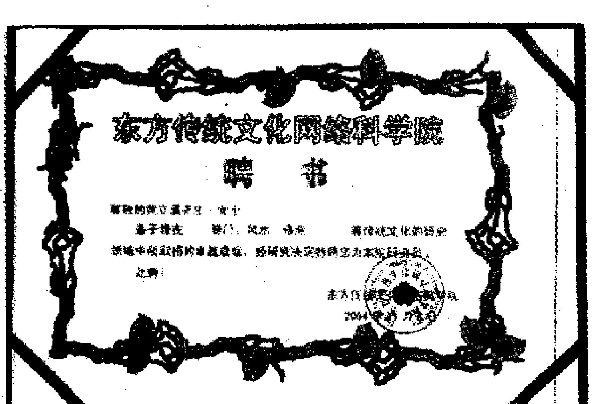
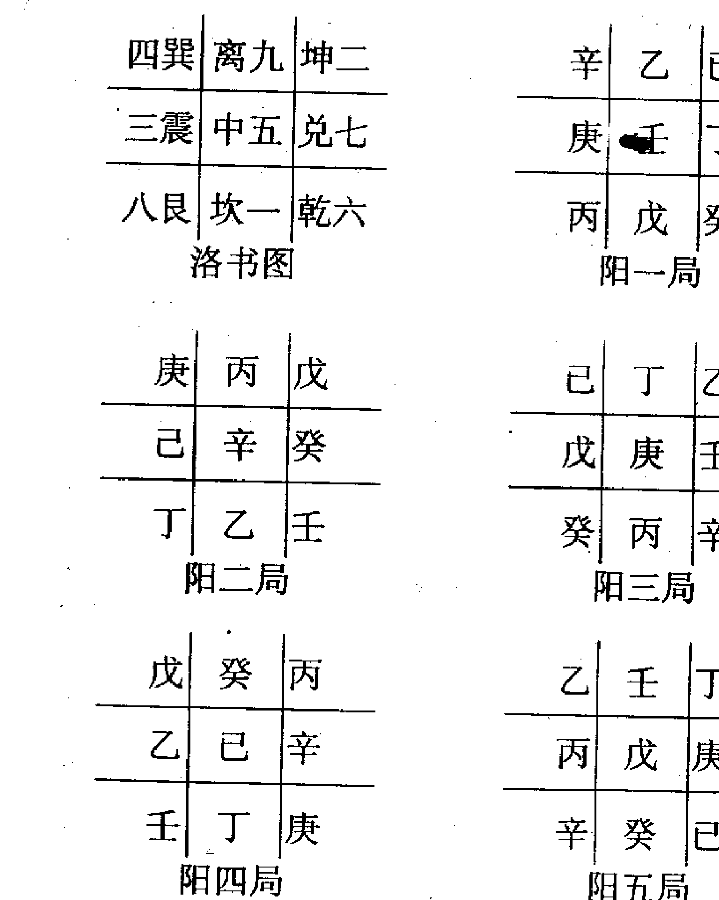
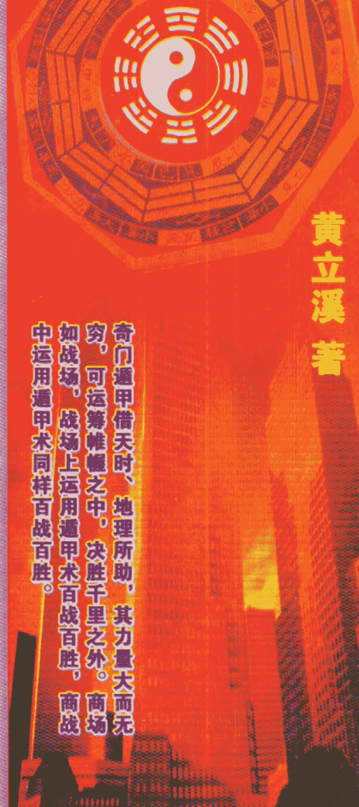

# 商战与奇门

黄立溪 著

国际互联网：WWW.EAST258.COM

荣誉出版



黄老师著有《奇门日课预测学》、《玄机风水密诀》、《商战与奇门》等系列专著，由于黄老师在奇门、风水、预测等传统文化研究领域取得卓越成就，2004 年 11 月东方传统文化网络科学院特聘黄老师为研究员


# 自序

在中国源远流长的传统术数文化中，奇门遁甲无疑是其中闪耀着灿烂光耀的奇葩之一，奇门遁甲素称“中国方术之王”，“帝王之学”，是中国传统预测学中的集大成者，奇门遁甲是五术中的顶尖学问，古人云：

“学会奇门遁，来人不用问”，“学成奇门遁，能把未来论”，由此可足见奇门遁甲之神奇功用，它不只是古代“行军布陈”的方术，也不是古时用以“印证时辰”的雕虫小技，而是富有“穷通造化”的一门学问，历朝历代的帝王将相、世外高人、仕官、文化名人、知识分子、术数爱好者等无数人士对奇门遁甲这一学术青睐有加，并倾注心力去研究。

太乙、奇门、六壬，合称三式，是我国传统预测学中最高层次的预测学，历史上都是由国家司天监、司天台、太史令等掌管天文，历法、军国大事的少数人所掌握。“三式”的构成，均离不开天干、地支、河图、洛书、八卦、象数，因而都源自易学，其创制大约都是春秋战国时代。

## “奇门”全称“奇门遁甲”，据有的学者考证，

奇门遁甲在周秦时期叫“阴符”，汉和魏时期名“六甲”，晋隋唐宋称“遁甲”，明清以来才叫奇门遁甲，奇门遁甲术是天文科学、自然科学、人文科学的总合，这门学问综合了阴阳、五行、八卦、九宫、天干地支、天文及历法等理论，再编制一种利用时间，环境方位的独特方法来定出奇门、仪、神等规格，分别运用在军事战争的布陈行军，治国安邦，占卜预测，风水布局和趋吉避凶，近年来日本更视奇门遁甲为至宝，无论建筑设计，或者金融股票投资，都用奇门之学。

奇门遁甲术的神奇预测功能，为人类提供了最好的时间及空间，使人能知命、造命、创造奇迹，超越自我，完成伟大的理想，奇门遁甲特重时间及方位的吉凶，此时间、方位的吉凶乃决定事业成败之关键，不可等闲视之。

商场如战场，战场上运用奇门遁甲百战百胜，商战中运用奇门遁甲术同样百战百胜，《商战与奇门》一书正是教我们在商战中如何运用奇门遁甲趋吉避凶，发挥优势扬长避短，扭转劣势，知己知彼，百战百胜。

早在十多年前，本人有缘接触奇门，并且得到多位民间隐师点化，成为学习奇门、研究奇门之迷。自那时至今进行了长达十余年的研究之路，研究了《奇门遁甲综宗大全》《奇门遁甲秘笈全书》《奇门透易》《诸葛武侯奇门丁甲大全》，《遁甲演义》及现代奇门专家刘广斌著的《奇门预测学》及河北省周易研究会会长张志春先生著的《神奇之门》，从中得到了不少启发，获益非浅，触发我走上了研究奇门与发展奇门新路子，把奇门应用于现代生活中，为现代人服务，也为将来人们研究奇门发展奇门提供方向，由远方出版社在2003年出版的《奇门日课预测学》是本人多年的研究成果，实践证明把奇门由古代行兵布陈到应用在日课吉凶预测，切实可行、而且准确率极高，分析范围广，它可以分析出日课应凶应吉在哪个方面。

## 第一章 奇门纵横  

## 一奇门诀  

奇门洛书示天命 天地阴阳生五行 乾坤交合父母道 天干地支与五行 离火主晴坎主雨 轩辕黄帝指南车 彩凤呈匣献黄帝 风后受命作兵法 阴阳变化妙无穷 冬至夏至坎离宫 乾父坤母乾坤定 风后奇门千八十 太公善布奇门局 汉初三杰有张良 生出八卦化九宫 八卦九宫为经纬 阴阳品配男女居 配合八卦法须知 善用八卦察天机 四极明判戳蚩尤 天书龙甲十八章 奇门遁甲从此生 尽在太极动静中 阴消阳长天理同 阴阳化生女和男 约繁归简出奇局 简化遁甲七十二 十八活局捷径方  

## 二 河图洛书示天命 生化八卦化九宫  

龙马负图，是谓伏羲时代，有龙马出自黄河，背负一图，是称河图，龙马、乃天地之精英，其形马首龙鳞，故曰龙马。

八卦，相传伏羲氏所作，其符号、卦名乃其代表之八种物质为：乾卦天、兑卦泽、离卦火、震卦雷、巽卦风、坎卦水、艮卦山、坤卦地，八卦符号是由代表阴爻（- -）和阳爻（—）组成，阴阳乃八卦之根本。朱熹《八卦取象歌》云：乾三连，坤六断；震仰盂，艮覆碗；离中虚，坎中满；兑上缺，巽下断。八卦又以两卦重叠而演化为六十四卦，以象征天道和地道（自然）以及人道（社会）之发展变化。

神龟负书，是言尧帝曾沉玺于洛水，至大禹治水时，有神龟出自洛水，背负一书，赤文朱字，是称洛书，神龟负文，乃呈祥献瑞；龟背纹理，现九宫之数。传说乃受神龟启示，龟寿千年，古称神灵，名曰玄武。其背甲有纹，由十三块似圆近方之图案组成，背脊居中串连五块，其余八块在四周，东汉前《易》纬家将乾坤八卦分置周围八块，是称八卦之宫，背脊五块组成中宫，其数为五，是为中五之宫，与八卦之宫合称九宫。

黄帝时，敬受河图所示这天命，命风后演算而创遁甲，遁甲造式三层，用以象天、地、人三才。上层象天而置九星，中层象人而开八门，下层象地而分八卦，以镇八方。又据夏至、冬至，立阴遁阳遁；一逆行、一顺行，以布三奇、六仪之局，是谓奇门。

奇门、三奇、六仪、遁甲、阳遁、阴遁、奇门之奇，则指十天干中称为三奇之乙、丙、丁，奇门之门，是指八卦的变相八门，即休、生、伤、杜、景、死、惊、开。三奇与八门中之吉门相合，是谓奇门。十天干中，三奇之后尚有六仪，即戊、己、庚、辛、壬、癸，三奇六仪相加为九，分布于九宫之中，甲为十天干之首，位最尊贵，但九宫却无甲之宫，故称遁甲。遁者，隐也，甲虽隐九宫之外，却统九宫中之六仪。受甲者为仪，不受甲者为奇，故九宫之布局行法，判断吉凶，甲必临之；趋吉避凶，逢凶化吉，无甲不行。故精究遁甲之数，始可行九宫之法。阳遁、阴遁，皆为九宫布局法之遁甲术，顺行者为阳局，逆行者为阴局。

## 三 风后受命作兵法，奇门遁甲从此生

黄帝得风后于海隅，任以为相，并命风后作兵法一十三篇，孤虚法二十卷，又立遁甲之法一千八百局。

遁者，隐也，甲者，仪也；即六甲同六仪也，六甲常隐于六仪之下，混为一体；甲子同六戊，甲寅同六癸，甲申同六庚、甲午同六辛、甲辰同六壬、甲寅同六癸。

天干中的乙、丙、丁三个，叫三奇。乙木为日奇，因为正月日出于乙；

丙火为月奇，因为月照交丙而明；丁火为星奇，因为在南方离火方向有明离之象的老人星属于丁位，于是六十甲子中的六乙属太阳（日）六丙属太阴（月），六丁属星曜，是为三奇，又号日月星，又叫三光。

另一个角度解释三奇是：东方甲乙木，西方庚辛金、甲所畏者，庚金也，庚金克甲木，故庚为七杀之神，乙乃甲之妹，甲以乙妹妻庚，乙庚相合而能救甲，故乙为一奇也，南方丙丁火，丙为甲之子，丙火克庚金而救甲，故丙为二奇也。丁为甲之女，丁火亦能克庚金，故丁为三奇也。

## 四 风后奇门千八十 约繁归简出奇局

远古时期的黄帝轩辕氏："始创奇门四千三百二十局法"，其据为将一年按八卦之数分八节，每节三气，每气三候，每候五天，每天十二时，因此每年有四千三百二十时，与每一时相对应有一种局势，因此奇门遁甲就有四千三百二十种局势。

后黄帝让风后正式制作奇门局法，风后将它简化为一千零八十局，其法是以“冬至”这天为“一阳即生”之时，起用了八卦中之坎、艮、震、巽、四卦，每卦统领三气，共统领十二气，每气三候，其配给五百四十局，并称之为“阳遁”，然后再以“夏至”这一天为“一阴始长”之时，起用八卦中之离、坤、兑、乾、四卦，每卦统领十二气，每气三候，合计三十六候，也配给五百四十局，并称之为“阴遁”，阴阳二遁相加，共一千零八十局。

## 五 太公善布奇门局 简化遁甲七十二

周文王时，有吕望者，东海上人，渔钓渡日。文王欲外出狩猎，卜之曰：所获非龙、非鹿、非熊、非虎、非貌，应得霸王之辅臣。后果遇吕望子渭水之南，敬以为师。

太公深悉兵法，善布奇门，他进一步简化了奇门遁的局法，每年仍按八卦分为八节，每节三气，每气三候，一年共七十二候，以此而建立了七十二个灵活的局势，称为“活局”。

由于每局有六十时，七十二局计算起来，仍然是四千三百二十时。

## 六 汉初三杰有张良 十八活局捷径方

张良字子房，汉初三杰之一，他对奇门一术的贡献很大，不仅增添了一些内容，而且把繁杂紊乱的奇门局势调整得更为简明与灵活了。

他把“冬至”后十二节气分为三十六候，，合四候为一局，形成“阳遁”九局；把“夏至”后的十二节气分为三十六候，合四候为一局，形成“阴遁九局”。

## 冬至（阳遁）

| 上元 | 上候 | （一）局 | （上元起一宫） |
|------|------|--------|----------------|
| 中元 | 中候 | （七）局 | （中元起七宫） |
| 下元 | 下候 | （四）局 | （下元起四宫） |
| 夏至 | 上候 | （九）局 | （上元起九宫） |
| 中元 | 中候 | （三）局 | （中元起三宫） |
| 下元 | 下候 | （六）局 | （下元起六宫） |

## 七 六甲常隐六仪下 三奇是为日月星

六十甲子的“旬首”甲子、甲戌、甲申、甲午、甲辰、甲寅称为六甲，古人又称为天乙贵人。天干中戊、己、庚、壬、癸称为六仪，六甲常隐六仪之下，混为一体；甲子同六戊，甲寅同六癸，甲申同六庚、甲午同六辛、甲辰同六壬、甲寅同六癸。

天干中的乙、丙、丁三个，叫三奇。乙木为日奇，因为正月日出于乙；

丙火为月奇，因为月照交丙而明；丁火为星奇，因为在南方离火方向有明离之象的老人星属于丁位，于是六十甲子中的六乙属太阳（日），六丙属太阴（月），六丁属星曜，是为三奇，又号日月星，又叫三光。

另一个角度解释三奇是：东方甲乙木，西方庚辛金、甲所畏者，庚金也，庚金克甲木，故庚为七杀之神，乙乃甲之妹，甲以乙妹妻庚，乙庚相合而能救甲，故乙为一奇也，南方丙丁火，丙为甲之子，丙火克庚金而救甲，故丙为二奇也。丁为甲之女，丁火亦能克庚金，故丁为三奇也。

## 八 天有九星镇九宫 地有九宫应九州

## 九星宫歌：

+   坎居一位是蓬休（天蓬、休门）  
丙死坤宫第二流（天芮、死门）  
更有冲伤并辅杜（天冲伤门、天辅杜门）  
震三巽四总为头  
禽星死五开心六（天禽死门、开门天心）  
惊柱常从七兑游（惊门天柱）  
更有生任居艮八（生门天任）  
九寻英景问离求（天英景门）

后天八卦九宫三序为：坎一、坤二、震三、巽四、乾六、兑七、艮八、离九、五为中宫，天有九星从镇九宫，地有九宫以应九州，其式是根据神龟洛书之数；戴九履一、左三右七、二四为肩、六八为足、五为中宫，相应八卦。中宫为中央戊己土，土生金，火生土，故中为火之子，金之母也，坎一为水，居正北，其色白；坤二为土，居西南，其色黑，震三为木，居正东，其色碧；巽四为木，居东南，其色绿；中五为土，居中宫，其色黄；故六为金、居西北，其色白；兑七为金，居正西，其色赤；艮八为土，居东北，其色白，离九为火，居正南，其色紫，九宫之色与五行之色有所不同。

## 九 天有八风配八卦 地有八卦应八方

天有八风，以应八卦。地有八方，以应八节。卦有八门，以应八方之八风。节有三元，气有三候。八节则有二十四气，有七十二候。

八节与八卦各宫相配为：冬至一宫坎卦，在休门；立春八宫艮卦，在生门；春分三宫震卦，在伤门；立夏四宫巽卦，在杜门；夏至九宫离卦，在景门；立秋二宫坤卦，在死门；秋分七宫兑卦，在惊门；立冬六宫乾卦，在开门。

十一月健子，为天正，周代以岁为首，配地雷复卦，阴极阳生也，十二月建丑，为地正，商代以为岁首，配地泽临卦，阳升阴和也，正月建寅，为人正，夏代以为岁首，配地天泰卦，三阳开泰也。

## 十 奇门遁甲用商战 百战百胜有秘笈

人类社会离不开经济活动，经济是国民生计的命脉，就连在过去的中国农业社会，民间贸易买卖的活动也特别繁荣，进入经济全球化的今天，经济活动日益成为人类活动中的主要内容，我国经过二十多年的改革开放，综合国力已跃升世界前列，国民生产总值也居世界前列，我国的国际地位大幅度提升，这一切都赖于国民经济蓬勃发展。

就我国而言，第一、二、三产业全面发展，巨大的物质流、资金流、信息流相互交织流通，焕发出勃勃生机，处身于这样的时代环境中，各种各样的经济行为层出不穷，都在为“钱”途打拼，这其中众生相真形如“万花筒”，有的日进千金，大发横财，有的小本经营有声有色，有的则苟延残喘举步维艰，有的则因经营不善而倾家荡产，有的步步为营苦去甘来，商海风云变幻莫测，商场如战场，如何在商战中立于不败之地，百战百胜？把素称中国方术之王、帝王之学的高层次预测学奇门遁甲运用到商战中是本人经过多年潜心研究总结的结果，是从无数经商老板实践

# 第二章 奇门遁甲基础知识

## 一、十天干与九宫八卦

奇门遁甲来源于军事上的排兵布阵，具体而言，就是九宫八卦阵。

甲乙丙丁戊己庚辛壬癸，这十天干符号，在奇门遁甲中，甲为元帅为主将，他经常隐蔽在阵中，所以叫遁甲。

乙丙丁为三奇，是元帅或主将身边最得力的辅佐官，乙为日奇，丙为月奇，丁为星奇。

戊己庚辛壬癸叫做六仪，也就是六支仪仗队，六面旗帜，所谓六甲，即甲子、甲戌、甲申、甲午、甲辰、甲寅，这六甲就是六位将帅，其中甲子为元帅，其它五甲为大将，他们在排兵布阵中都要隐遁在一定的旗帜之下，在奇门遁甲的九宫八卦中，他们仪仗旗帜是固定不变的，元帅甲子以戊为仪仗，因此叫甲子戊，二甲大将甲戌以己为仪仗，因此叫甲戌己，三甲大将甲申以庚为仪仗，因此叫甲申庚，四甲大将甲午以辛为仪仗，因此叫甲午辛，五甲大将甲辰以壬为仪仗，因此叫甲辰壬。

六甲大将甲寅以癸为仪仗，因此叫甲寅癸，这是永远不变的将帅仪仗配备准则。

十天干将甲隐遁起来，剩下九干，以配九宫八卦，六甲分别隐遁在六仪之下，与乙丙丁三奇分占九宫，他们有固定不变的顺序和队形，这个顺序和队形就是：

戊己庚辛壬癸丁丙乙，也就是说，戊永远挨着己，己永远挨着庚，庚永远挨着辛，辛永远挨着壬，壬永远挨着癸，癸永远挨着丁，丁永远挨着丙，丙永远挨着乙，乙永远挨着戊，无论谁在前谁在后，前后邻居是不变的。

冬至一夏至为阳遁，顺排六仪，逆布三奇，次序为：戊己庚辛壬癸丁丙乙；夏至一冬至为阴遁，逆排六仪，顺布三奇，次序为：戊己庚辛壬癸丁丙乙；夏至一冬至阴遁，逆排六仪，顺布三奇，次序为：戊乙丙丁癸壬辛庚己。

## 遁甲规律表

| 六甲 | 一甲 | 二甲 | 三甲 | 四甲 | 五甲 | 六甲 | 三奇 |
|------|------|------|------|------|------|------|------|
| 甲子 | 甲戌 | 甲申 | 甲午 | 甲辰 | 甲寅 | 星奇 | 月奇 | 日奇 |
| 六仪 | 戊   | 己   | 庚   | 辛   | 壬   | 癸   | 丁   | 丙   | 乙   |

甲子戊遁在几宫，就是奇门遁甲的几局，例如阳四局，就是甲子戊落四宫(巽宫)；阴二局，就是甲子戊落二宫(坤宫)。为了让大家更加明白地理解上述内容，现在把冬至一夏至阳九局，夏至一冬至阴九局布图如下：



## 夏至一冬至阴九局

| 丁 | 己 | 乙 |
| --- | --- | --- |
| 丙 | 癸 | 辛 |
| 庚 | 戊 | 壬 |

阴一局

| 丙 | 庚 | 戊 |
| --- | --- | --- |
| 乙 | 丁 | 壬 |
| 辛 | 己 | 癸 |

阴二局

| 乙 | 辛 | 己 |
| --- | --- | --- |
| 戊 | 丙 | 癸 |
| 壬 | 庚 | 丁 |

阴三局

| 戊 | 壬 | 庚 |
| --- | --- | --- |
| 己 | 乙 | 丁 |
| 癸 | 辛 | 丙 |

阴四局

| 丙 | 辛 | 癸 |
| --- | --- | --- |
| 丁 | 乙 | 己 |
| 庚 | 壬 | 戊 |

阳六局

| 丁 | 庚 | 壬 |
| --- | --- | --- |
| 癸 | 丙 | 戊 |
| 己 | 辛 | 乙 |

阳七局

| 癸 | 己 | 辛 |
| --- | --- | --- |
| 壬 | 丁 | 乙 |
| 戊 | 庚 | 丙 |

阳八局

| 壬 | 戊 | 庚 |
| --- | --- | --- |
| 辛 | 癸 | 丙 |
| 乙 | 己 | 丁 |

阳九局

| 己 | 癸 | 辛 |
| --- | --- | --- |
| 庚 | 戊 | 丙 |
| 丁 | 壬 | 乙 |

阴五局

| 庚 | 丁 | 壬 |
| --- | --- | --- |
| 辛 | 己 | 乙 |
| 丙 | 癸 | 戊 |

阴六局

| 辛 | 丙 | 癸 |
| --- | --- | --- |
| 壬 | 庚 | 戊 |
| 乙 | 丁 | 己 |

阴七局

| 壬 | 乙 | 丁 |
| --- | --- | --- |
| 癸 | 辛 | 己 |
| 戊 | 丙 | 庚 |

阴八局

| 癸 | 戊 | 丙 |
| --- | --- | --- |
| 丁 | 壬 | 庚 |
| 己 | 乙 | 辛 |

阴九局

## 二、一年二十四节气与阴阳二遁

从上一节我们知道，一年二十四节气每个节气所辖十五天中，上中下三元所用阳遁和阴遁的局数，但是具体到每一天应该用阳遁几局，还是阴遁几局，这是怎样确定呢？只要你读完本节就会一清二楚。

1、每一元第一天的天干，不是甲就是己，古人把这个元头称为符头，即符头只有二个，不是甲就是己。

2、凡上元的第一天的地支总是子午卯酉中的一个，与甲己符头组合为甲子、甲午，或己卯、己酉，即上元第一天必定是甲子、甲午、己卯、己酉四天中的某一天。中元第一天的地支为寅申巳亥中的一个，与甲己符头组合为甲寅、甲申或己巳、己亥，即中元第一天必定是甲寅、甲申、己巳、己亥四天中的某一天。下元第一天的地支是辰戌丑未中的一个，与甲己符头组合为甲辰、甲戌或己丑、己未，即下元第一天必定是甲辰、甲戌、己丑、己未四天中的某一天。每一元为五天，上中下三元为十五天，刚好是一个节气。例如 2003 年正月初六庚戌日，应该用奇门哪一局呢？先找符头，庚戌日属甲辰旬，符头为己酉，子午卯酉为上元，故知这一天该用上元，再根据这一天在立春后，雨水前，所以应该用立春后上元，立春节十五天上中下元为八五二，上元为阳八局，故知这一天应该用阳八局。

## 三、日干支与上中下三元的划分

从上一节我们知道，一年二十四节气每个节气所辖十五天中，上中下三元所用阳遁和阴遁的局数，但是具体到每一天应该用阳遁几局，还是阴遁几局，这是怎样确定呢？只要你读完本节就会一清二楚。

1、每一元第一天的天干，不是甲就是己，古人把这个元头称为符头，即符头只有二个，不是甲就是己。

2、凡上元的第一天的地支总是子午卯酉中的一个，与甲己符头组合为甲子、甲午，或己卯、己酉，即上元第一天必定是甲子、甲午、己卯、己酉四天中的某一天。中元第一天的地支为寅申巳亥中的一个，与甲己符头组合为甲寅、甲申或己巳、己亥，即中元第一天必定是甲寅、甲申、己巳、己亥四天中的某一天。下元第一天的地支是辰戌丑未中的一个，与甲己符头组合为甲辰、甲戌或己丑、己未，即下元第一天必定是甲辰、甲戌、己丑、己未四天中的某一天。每一元为五天，上中下三元为十五天，刚好是一个节气。例如 2003 年正月初六庚戌日，应该用奇门哪一局呢？先找符头，庚戌日属甲辰旬，符头为己酉，子午卯酉为上元，故知这一天该用上元，再根据这一天在立春后，雨水前，所以应该用立春后上元，立春节十五天上中下元为八五二，上元为阳八局，故知这一天应该用阳八局。

## 四、超神、接气、置闰与拆补法

从上两节我们知道，时家奇门每个节气所用的元既与节气相联系，又与日干支相联系，共有三种情况。

第一种情况，交节的这一天正好碰上上元符头，即日干支为甲子、甲午或己卯、己酉，古人称之为“正授”，但实际上这种情况现并不多见。

第二种情况，上元符头在节气的前边，这叫“超神”，超在节气前边，这种情况较多，例如2003年农历五月廿三丙寅日寅时交夏至，丙寅日符头为甲子，即夏至前五月廿一日为甲子，从廿一日这一天就是夏至上元，应用阴九局，这就叫“超神”。

第三种情况，节气在前即交节时间在前，上元符头在后，这叫“接气”，一般在置闰之后才出现这种情况。

置闰就是接着这个节气下元的最后一天开始，把这个节气上中下三元重复一遍，这样重复十五天，本来是“超神”，一下子变为“接气”，即上元符头跑到下一个节气的后边了。但是置闰有一个规定，就是在芒种和大雪这两个节气才能置闰。这是因为芒种在夏至前属于阳遁最后一个节气，大雪在冬至前，属于阴遁最后一个节气。

拆补法：不采用置闰法，直接把上中下三元放在每一个节气中，又遵循六十甲子循环中子午卯酉为上元，寅申巳亥为中元，辰戌丑未为下元的规律，只要一进入交节时辰就用这个节气规定的遁甲局。

## 五、九星 八门 八神的信息特征

### (一) 九星特点

1、天蓬星 原名贪狼星，与北方一宫坎卦相对应，阳星，五行属水，坎水正当隆冬季节，至冷至寒至暗，喜阴害阳，人们认为它与盗贼出没有关，所以把它称为凶星、盗星。

2、天芮星 原名巨门星，与西南方坤二宫相对应，阴星，五行属土，因与八门中死门相对应，认为它与疾病流行有关，所以把它称为病星、凶星，奇门预测一般以它为用神。天芮星临宫适宜受业师长，交纳朋友。

3、天冲星 原名禄存星，与东方三宫震卦相对应，阳星，五行属木，属一般性吉星。

4、天辅星 原名文曲星，与东南四宫巽卦相对应，阳星，五行属木，天辅星临宫，百事皆宜，属吉星。

5、天禽星 原名廉贞星，与中央五宫相对应，阳星，五行属土，土生万物，中宫是遁甲元帅值符所在之地，故为大吉之星。

6、天心星 原名武曲星，与西北方乾宫相对应，阴星，五行属金，与乾卦为天为父为首长相对应，属大吉之星。

7、天柱星 原名破军星，与西方兑七宫相对应，阴星，五行属金，喜杀好战，破坏性强，故名为凶星。

8、天任星 原名为左辅星，与东北方艮八宫相对应，阳星，五行属土，人们认为土能生万物，又正当春季万物萌生之时，故称之吉星。

9、天英星 原名右弼星，与南方九宫离卦相对应，阴星，五行属火，烈火炎炎，性燥易暴，虽然如日中天，大放光明，但又和血光之灾有关，属小凶星。

九星代表天时。布奇门盘时为天盘，本人经验除日课的用神尽量避开天蓬星外，其余不忌，算命、测事、测运时，吉星助吉神、吉门，凶星可助凶神凶门，其余作用不大。

### (二) 八门信息特征

八门，休生伤杜景死惊开，其中生休开为三吉门，伤惊死为三凶门，景门有吉有凶，杜门中平，有小凶，这是大致划分，但随着用于各类事不同，到落宫位不同而变化，所谓吉门也有所忌，凶门也有所宜。

在奇门术的运用中，无论是测运、测事、算命，日课八门的作用最明显，最重要。

1、休门 休门居北方坎宫，五行属水，属吉门，旺于冬季，特别是子月，相于秋，休于春，囚于夏，死于四季末月。日课用于见贵，上官赴任、嫁娶、经营建造、测运、测事见之可断进钱财，有贵人相助。

2、生门 生门居于东北艮宫，属吉门，旺于四季月，特别是丑寅之月，相于夏，休于秋，囚于冬，日课用于见官求官、嫁娶迁移、谋求百事皆吉，就是不能用于下葬、治丧，用于算命、测运、测事，可断事业旺盛，钱财易进。

3、伤门 伤门居东方震宫，五行属木，属凶门，旺于春，特别是卯月，相于冬，休于夏，囚于四季月，死于秋，日课用于索债、赌博、渔猎吉，其它方面属凶，主伤病，事业有损失之事。

4、杜门 杜门居东南巽宫，属木，属于小凶之门，旺于春季，特别是辰巳月，相于冬，休于夏，囚于四季月，死于秋。日课一般舍去不用，因为它主杜塞、阻碍、停滞，测运、算命遇上杜门，断其事业有阻，困难重重。

5、景门 景门属南方离宫，五行属火，属中吉之门，旺于夏，特别是午月，相于春，休于四季月，囚于秋，死于冬，日课用于考工、考学、上书吉。如断身体方面，测是患病，易是非、横祸、血光之灾。

6、死门 死门居西南坤宫，五行属土，属凶门，旺于秋季，特别是未申月，相于夏，囚于冬，死于春，日课最宜于葬祖、立庙、吊孝吉，其它方面凶论，主丧事孝服、重伤、身处绝境，测运、测事，如用神遇之，可断有伤害，丧事或处境不好。

7、惊门 惊门居西方兑宫，五行属金属凶门，旺于秋，特别是酉月，相于四季月，休于冬，囚于春，死于夏，日课用于赌博、官司、测事、测运遇之，可断有惊险、官司、口舌、打斗之事发生。

8、开门 开门居西北乾宫，五行属金，属吉门，旺于秋季，特别是戌亥月，相于四季末月，休于冬，死于夏，日课用于谋商大计，见贵考学，参军、嫁娶、建造等皆吉，测运、测事遇之，可断事业旺盛，权力有加，经济收益好。

### (三) 八神信息特征

八神是值符、腾蛇、太阴、六合、白虎、玄武、九地、九天的总称。八神中凶神在奇门日课中起到提纲性作用，用神遇上白虎、玄武，十有九凶，现逐个论述。

1、值符
属中央土，是八神之首，其性善良，对所到之宫的人和事起荫佑作用，遇吉添吉，见凶减凶，但若遇凶神，凶门过于集中，值符也难挡得住凶神凶门的凶性。

2、腾蛇
属阴土，其性虚诈，司惊恐怪异之事，得吉门则静，遇凶门易挑起官司、破财之事。

3、太阴
属阴金，其性阴匿暗味，为荫佑之神。

4、六合
属木，其性平和，喜作婚姻之媒约，交易说合。

5、白虎
属金，其性好杀好斗，凶狠无比，主凶险、牢狱、死亡、病伤，用神与白虎同宫或受白虎宫克制，可能发生三种灾害：一是伤病；二是官非牢狱；三是外力侵害或天灾人祸，三种中必有一种或两种，甚至三种，静则小伤小灾，动则大病甚至死亡。

6、玄武
属水，性喜偷盗，阴谋挑衅，所到之处，大则挑起官司，小则口角是非，否则就有失财失物。

7、九地
属土，性温良恭谦。

8、九天
属金，其性刚强好动，奋发向上，并能取得一定成功。

八神中，以值符为最吉之神，六合、太阴、九天、九地，次之，白虎、玄武为最凶之神，用于日课，白虎、玄武绝不能用，用之必有祸害。

## 六、八门克应

八门克应，即门加门、门加三奇六仪和门加宫所形成的格局及其吉凶。

### （一）开门

- 开加开：主贵人宝物财喜；
- 开加休：主见贵人财喜及开张铺店，贸易大利；
- 开加生：主见贵人，谋望所求遂意；
- 开加伤：主变动、更改、迁徙，事皆不吉；
- 开加杜：主失脱，刊印书契小凶；
- 开加景：主见贵人，因文书不利；
- 开加死：主官司惊忧，先忧后喜；
- 开加惊：主百事不利；
- 开加戊：财名俱得；
- 开加乙：小财可求；
- 开加丙：贵人印绶；
- 开加丁：远信必至；
- 开加己：事绪不定；
- 开加庚：道路词讼，谋为两歧；
- 开加壬：远行有失，注意破财；
- 开加癸：阴人失财小凶；

### （二）休门

- 休加休：求财、进人口、谒贵人、上任、修造亦大利；
- 休加生：主得阴人财物，谒贵谋望，虽迟也吉；
- 休加伤：上官喜庆，求财不得，有亲戚分产，变动不吉；
- 休加杜：主破财，失物难寻；
- 休加景：主求文书印信事不至，反招口舌小凶；
- 休加死：主文书官司事不吉，远行，僧道事不吉，占病凶；
- 休加惊：主损物，招是非并疾病、惊恐事；
- 休加开：主开张店铺及见贵，求财等喜事大吉；
- 休加戊：财物和合；
- 休加乙：求谋重，不得；求轻，可得；
- 休加丙：文书和合喜庆；
- 休加丁：百讼休歇；
- 休加己：暗昧不宁，后吉；
- 休加庚：文书词讼先结后解；
- 休加辛：主疾病迟愈，失物不得；
- 休加壬、癸：阴人词讼牵连；

### （三）生门

- 生加生：主远行，求财吉；
- 生加伤：主亲友变动，道路不吉；
- 生加杜：主阴谋，阴人破财、不利；
- 生加景：主阴人，小口不宁及文书事，后吉；
- 生加死：主田宅官司，病主难救；
- 生加惊：主尊长财产、词讼、病迟愈、合；
- 生加开：主见贵人，求财大发；
- 生加休：主阴人处求谋财利、吉；
- 生加戊：嫁娶、求财、谒贵皆吉；
- 生加乙：主阴人生产迟吉；
- 生加丙：主贵人印绶、婚姻、书信喜事；
- 生加丁：主词讼、婚姻、财利大吉；
- 生加己：主得贵人维持，吉；
- 生加庚：主财产争讼破产，不利；
- 生加辛：生产妇病症，后吉；
- 生加壬：主遗失后得，贼盗易获；
- 生加癸：主婚姻不成，余事皆吉；

### （四）伤门

- 伤加伤：主变动，远行折伤、凶；
- 伤加杜：主变动、失脱、官司、桎梏，百事凶；
- 伤加景：主文书印信、口舌，惹事生非；
- 伤加死：主官司印信凶，出行大忌，占病凶；
- 伤加惊：主亲人疾病忧惊，媒伐不利，凶；
- 伤加开：主见贵人，开张走失，变动之事，不利；
- 伤加休：主男人变动或托人办事，财名不利；
- 伤加生：主房产、种植事业，凶；
- 伤加戊：主失脱难获；
- 伤加乙：主求财不得，反防盗失财；
- 伤加丙：主道路损失；
- 伤加丁：主音信不至；
- 伤加己：主讼狱被刑杖，凶；
- 伤加辛：主夫妻怀私恣怨；
- 伤加壬：主因盗牵连；
- 伤加癸：主讼狱被冤，有理难伸；

### （五）杜门

- 杜加杜：主因父母疾病、田宅出脱事，凶；
- 杜加景：主文书即信阻隔，男人小口疾病，迟疑不利；
- 杜加死：主因宅文书失落，官司破财，小凶；
- 杜加惊：主门户内忧疑惊恐，并有词讼事；
- 杜加开：主见贵人官长，谋事主先破已财，后吉；
- 杜加休：主求财有益；
- 杜加生：主男人小口破财，因宅求财不利；
- 杜加伤：主兄弟相争，破财不利；
- 杜加戊：主谋事不成，秘处求财得；
- 杜加乙：宜暗求男人财物，后主不明致讼；
- 杜加丙：主文契遗失；
- 杜加丁：主男人讼狱；
- 杜加己：私谋害人招非；
- 杜加庚：主因女人讼狱被刑；
- 杜加辛：主打伤人，词讼，男人小口凶；
- 杜加壬：奸盗事，凶；
- 杜加癸：主百事皆阻，病者不食；

### （六）景门

- 景加景：主文状未动有预先见之意，内有男人小口忧患；
- 景加死：主官讼，因田宅事相争惹麻烦；
- 景加惊：主官讼，女人小口疾病，凶；
- 景加开：主官人升迁，吉；求文印更吉；
- 景加休：主文书遗失，争论不休；
- 景加生：主阴人生产大喜，更主求财旺利，行人皆吉；
- 景加伤：主姻系小口口舌；
- 景加杜：主失脱文书，败财后平；
- 景加戊：因财产词讼，远行吉；
- 景加乙：主讼事不成；
- 景加丙：主文书急迫，火速不利；
- 景加丁：主因文书印状招非；
- 景加己：主官司牵连；
- 景加庚：主讼人自讼；
- 景加辛：主阴人自讼；
- 景加壬：主因贼牵连；
- 景加癸：主因奴婢受刑；

## （七）死 门

死加死：主官事稽留，印信无气，凶；

死加惊：主因官司不结，忧疑患病，凶；

死加开：主见贵人，求印信文书事大利；

死加休：主求财物事不吉，若问僧道求方吉；

死加生：主丧事，求财得，占病死而复生；

死加伤：主因商议同谋害人，事泄惹讼，凶；

死加杜：主破财，妇人风疾、腹肿；

死加景：主因文契印信财产事见官，先怒后喜，不凶；

死加戊：主作伪财；

死加乙：主求事不成；

死加丙：主信息忧疑；

死加已：主病讼牵连不已，凶；

死加庚：主女人生产，母子俱凶；

死加辛：主盗贼失脱难获；

死加壬：主讼人自讼自招；

死加癸：主妇女嫁娶事凶；

## （八）惊 门

惊加惊：主疾病、忧虑、惊恐；

惊加开：主官司忧疑，能见贵人不凶；

惊加休：主求财事或口舌事，迟吉；

惊加生：主因妇人生产或求财事惊忧，皆吉；

惊加伤：主因商议同谋害人，事泄惹讼，凶；

惊加杜：主因失脱破财惊恐，凶；

惊加景：主词讼不息，小口疾病，凶；

惊加死：主因宅中怪异而生事非，凶；

惊加戊：主损财，信阻；

惊加乙：主谋财不得；

惊加丙：主文书印信惊恐；

惊加丁：主词讼牵连；

惊加已：主恶犬伤人成讼；

惊加庚：主道路损折，遇盗贼，凶；

惊加辛：主女人成讼，凶；

惊加壬：主官司囚禁，病者大凶；

惊加癸：主被盗，失物难获；

## 九 三奇六仪及其组合

三奇六仪共两套，分别排在天盘和地盘，经过演局后天地盘的奇仪，组成 81 个格局，现列如下：

| 天盘 | 地盘 | 主事 |
|---|---|---|
| 戊 | 戊 | 伏吟，凡事闭塞，静守为吉 |
|  | 乙 | 青龙合灵门，吉事更吉，凶事更凶 |
|  | 丙 | 青龙回首，动作大利，如逢墓迫击刑，吉事成凶 |
|  | 丁 | 青龙耀明，利渴责求名，值墓迫，招惹是非 |
|  | 己 | 贵人人狱，公私皆不利 |
|  | 庚 | 值符飞宫，吉事不吉，凶事更凶 |
|  | 辛 | 青龙折足，吉门生助尚可谋为，逢凶门招灾、破财、足疾 |
|  | 壬 | 青龙入天牢，凡阴阳皆不利 |
|  | 癸 | 青龙华盖，吉格吉门多招福，门凶多破财 |
| 乙 | 戊 | 利阴害阳，门逢凶迫，破财人伤 |
|  | 乙 | 伏吟，不宜渴贵求名，只可安分守己 |
|  | 丙 | 奇仪顺遂，吉星迁官进职，凶星；夫妻离别 |
|  | 丁 | 奇仪相佐，文书吉事，百事皆可为 |
|  | 己 | 日奇人墓，被土暗昧，门凶必凶 |
|  | 庚 | 日奇被刑，争讼财产，夫妻私怀 |

| 乙 | 辛 | 青龙逃走，奴仆拐带，六畜皆伤 |
| --- | --- | --- |
|  | 壬 | 日奇人地，尊卑悖格，官司是非 |
|  | 癸 | 华盖逢官星，遁迹修道，隐匿藏形，躲灾避难吉 |
|  |  |  |
| 乙 | 戊 | 飞鸟跌穴，谋为百事皆吉 |
|  | 乙 | 日月并行，公谋私为皆吉 |
|  | 丙 | 月奇朱雀，文书吉利逼迫，破耗损失 |
|  |  |  |
| 乙 | 丁 | 月奇朱雀，文书吉利，常人宜静，得三吉门为天遁 |
|  |  |  |
| 乙 | 己 | 入狱自刑，奴仆背主，狱讼难伸 |
|  | 庚 | 白虎出力，刀刃相接，主客相残，逊让尚可，强行血溅衣衫 |
|  | 辛 | 伏吟天庭，公废私就，讼狱自罗罪名 |

| 乙 | 壬 | 山蛇入狱，两男争女，讼狱不息，先动失理 |
| --- | --- | --- |
| 乙 | 癸 | 天牢华盖，日月失明，误人天网，动辄乘张 |
| 乙 | 戊 | 小蛇化龙，男人发达，女产婴童 |
|  | 乙 | 小蛇得势，女子温柔，男人通达，占孕生子，禄马光华 |
|  | 丙 | 水蛇入火，官灾刑禁，络绎不绝 |
|  | 丁 | 干合蛇刑，文书牵连，贵人匆匆，男吉妇凶 |
|  | 己 | 凶蛇入狱，大祸将至，顺守可吉，词讼理由 |
|  | 庚 | 太白擒蛇，刑狱公平，立剖邪正 |
|  | 辛 | 腾蛇相缠，得奇门也不能安，若有谋望，被人欺瞒 |
|  | 壬 | 蛇入地网，外人缠绕，内事索索，吉门吉星，庶免蹉跎 |
|  | 癸 | 幼女奸淫，家有丑声，门吉星凶，反祸福隆 |
|  | 戊 | 天乙会合，财喜婚姻，吉人赞助成合，若门凶或迫制，反祸官非 |
|  | 乙 | 华盖逢星，贵人禄位，常人平安 |

## 十 伏吟、反吟

伏吟即是星门伏在本宫，凡是六甲之时，星门、符皆为伏吟，如甲子时、甲戌时、甲申时、甲午时、甲辰时、甲寅时以及癸亥时，这七个时辰的奇门局星门俱伏，伏吟之时不宜用事。天蓬星 + 天蓬星和死门 + 死门、甲申庚 + 甲申庚最凶，一般多为阻滞、破财、孝服。

反吟，星门、值符落到对宫，反吟不吉，遇吉门无害，不遇吉门则事情危急，灾祸将至，反吟速度快，成败易分，出行可能半途而废，近病不药而愈，久病定死难愈，婚姻不成，求财无利反蚀本。

## 十一 五不遇时

时干克日干，阳时干克阳日干，阴时干克阴日干为五不遇时，甲日庚午时，乙日辛未时，丙日壬辰时，丁日癸卯时，戊日甲寅时，己日乙丑时，庚日丙子时，辛日丁酉时，壬日戊申时，癸日己未时，用于择吉，一般尽量避开为好。

| 乙 | 丙 | 华盖悖格，贵贱逢之皆不利，唯上人见喜 |
|---|---|---|
| 乙 | 丁 | 蛇夭矫，文书官司，火焚莫逃 |
| 乙 | 己 | 华盖地户，男女占之音信皆阻，躲灾避难为吉 |
| 乙 | 庚 | 太白入网，明暴争论力平辛网盖天 |
| 乙 | 辛 | 牢，占讼占病，死罪莫逃 |
| 乙 | 壬 | 复见腾蛇，嫁娶重婚，后嫁无子，不保年华 |
| 乙 | 癸 | 天网四张，行人失伴，病讼皆伤 |

## 十二 空 亡

我们使用的是时家奇门，所以，空亡指的是时辰空亡，不是日空亡，甲子旬戊亥空，即休宫落空；甲戌旬申酉空，即坤宫兑宫落空；甲辰旬寅卯空，即艮宫震宫落空；甲寅旬子丑空，即坎宫艮宫落空。甲午旬辰巳空，即巽宫落空，甲申旬午未空，即离宫、坤宫落空。

空者虚也，用神所在宫空亡，绝不能用，如葬课、死门空亡，家败人亡，不能用。

## 十三 奇仪组成吉格

古人经过实践，根据阴阳五行生克制化的原理和大量积累起来的吉凶应验经验，将近万种格局进行分类归纳筛选，总结出一些吉格、凶格，供后人在预测应用中参巧。

一般来说，吉门、吉星、吉神配三奇为吉格，凶门、凶星、凶神相遇为凶格；星、门、宫、三奇、六仪之间、五行属性相生或比和为吉；五行相刑，相冲、相克、相害和入墓为凶；甲乙丙丁戊五阳干组合多为吉；己庚辛壬癸五阴干组合多为凶，特别是遁甲中甲为主帅，最怕庚金克杀，所以遇庚多为凶格。

下面介绍在奇门预测中常用的吉格：

+ 1. 青龙反首 即戊加丙 谋事必成，动用大吉，宜就职、诉讼、迁移、求财、建造等，百事皆吉，但如果逢墓迫制击刑则转凶。

2. 飞鸟跌穴 即丙加戊 吉从天降，有意外收获，宜就职、求财、诉讼、建造、婚姻等百事吉。

3. 九遁

- 天遁：丙加丁落艮宫，三奇并生门，故为吉格，百事生旺，利行军，打仗、上书、求官、经商、婚姻等。

- 地遁：乙加己 门盘开门。己为地户，开门又得日精之蔽，故百事皆吉，宜安营扎寨，埋伏截击，建筑修造等。

- 人遁：天盘丁奇，门盘休门，神盘太阴。此遁得星精之蔽，其方可以探密、伏藏、和谈、求贤、结

婚、交易等，均为吉。

风遁：天盘乙奇，门盘中开休生之一，地盘为巽四宫。巽木主风，又得乙奇和吉门，故为风遁；如风从西北方来，宜顺风击敌。如风从东南方来，敌在东南方，不可交战。

云遁：乙加辛，门盘中开休生之一，此遁得云精之蔽，宜求雨立营寨，造军械。

龙遁：天盘乙奇，门盘开休生之一，地盘坎（水中有龙）一宫或六癸，宜掩捕敌人，水战、修桥、穿井等。

虎遁：乙加辛于艮宫合休门或生门，或天盘甲申庚合开门下临地盘兑宫（庚辛为金，均为白虎）都称为虎遁，宜安营扎寨、设隐埋伏，修筑建造等。

神遁：天盘丙奇，门盘生门，神盘九天，宜攻虚、开路、塞河、造像、教化兵卒等。

鬼遁：天盘丁奇，门盘杜门，神盘九地或丁奇、开门合九地。宜偷营劫寨，设伪伏虚。

## ④三奇得使

三奇得使就是天盘乙丙丁加临地盘值使门，具体而言就是天盘乙奇加临地盘甲戌己或甲午辛，天盘丙奇加临地盘甲子戊或甲申庚，天盘丁奇加临地盘甲辰壬或甲寅癸。

三奇得使即三奇得到值使门，所以虽然乙+己、乙+辛、丙+庚、丁+癸为凶格；但如果盘遇上值使门与这些格局在一个宫内，即三奇得到值使门，那么就可以使用，不以凶论。

## ⑤玉女守门

构成天盘或地盘临丁加八门值使。其方到宴会喜乐之事，婚姻之事。

## ⑥三奇贵人升殿

乙奇临震宫，为日出扶桑，有禄之乡，是贵人升于乙卯正殿。

丙奇到离宫，为月照端门，火旺之地，是贵人升于丙午正殿。

丁奇到兑宫，为呈见西方天之神位，是贵人升于丁酉正殿，三奇贵人升殿之时，百事可为。

## ⑦三诈五假

凡人做事出行宜用开、休、生三吉门所落之方位，若得乙、丙、丁三奇更好；若不得三奇，也可使用，如果开休生三吉门合乙丙丁三奇又上乘太阴；六合，九地三阴神相助者，则为三诈，经商、远行、婚娶、百事皆吉。

天假：景门合乙、丙、丁三奇，上乘九天叫天假，宜争战诉讼，见贵求官，上书献策，扬兵颂号，申明盟约。

地假：杜门合丁、乙、癸，上乘九地或太阴或六

合，均叫地假，宜潜藏埋伏、逃亡躲灾，谋探私事。

人假：惊门合六壬上乘九天，叫人假，宜捕捉逃亡，如果再遇上“太白入荧”的格局，一定能抓获逃亡者。

神假：伤门合丁、乙、癸，上乘九地叫神假，宜埋藏使人难知，宜索债、捕捉。

鬼假：死门合丁、乙、癸，上乘九地叫鬼假，宜超度亡灵，抚重安发，破土修墓、伐邪、狩猎。

⑧三奇之灵 三奇乙丙丁，四吉神太阴、六合、九地，三吉门开休生，各有共一，共临其方位，为吉道清灵，用事俱吉。

⑨奇游禄位 乙奇到震，丙奇到巽，丁奇到离为本禄之位，合三吉门宜上官赴任，求财祈福各种谋为都吉利。

⑩欢怡 三奇临六甲值符之宫为欢怡，凡事谋为都吉利，抚恤将士众情悦服。

⑪奇仪相合 乙庚、丙辛、丁壬为奇合，戊癸，甲己为仪合得吉门，凡事有和之象，主和解、了结、平局、平分。

⑫门宫和义，凡宫生门为“和”，遇吉门凡事都吉；门生宫为“义”，遇吉门凡事皆吉。

## 十四 奇仪组成凶格

①青龙逃走 乙+辛 阴克阴，主凶，此时举兵主客皆伤，经商破财，百事为凶，测婚一般主女方先提出离婚。

② 白虎獗狂 辛+乙 阴克阴，主凶，此时举事主客两伤，出入有惊恐，远行多灾，婚姻修造大凶。测婚一般甲方主动离婚。

③ 朱雀投江 丁+癸 阴水克阴火，主凶。故此时举事，主文书牵连，音信沉溺、官司口舌，或惊恐怪异，奸谋诡诈，百事凶。

④ 腾蛇夭矫 癸+丁 阴水克阴火，主凶。故百事不顺，虚惊不宁，文书官司。

⑤ 荧入太白 丙+庚 阳火克阳金，庚为贼人，故曰：“火入金乡贼即去”。

⑥ 太白入荧 庚+丙 比“荧入太白更凶”，此格占贼贼必来，须防贼来偷营，以固守为吉。

⑦ 大格 庚+癸 百事凶，求人不在，经商破财，出行车破马死。只宜捕捉罪犯。

⑧ 上格 庚+壬 远行失迷道路，求谋破财得病，庚加壬只名移荡格，测工作，多有变动。

## 十五 三奇入墓

按十天干十二长生诀推，阳顺阴逆，艮为丁墓，丙为丁墓，己为丙丁墓，坤为乙墓，如三奇入墓，有三奇等于无，应避免，墓的性质为凶，吉事不吉，凶事更凶。

## 十六 门和宫的迫制

门克宫叫迫，如伤门克艮宫，宫克门叫做制，如震宫克生门。迫和制，均主不利，但有区别，吉门迫宫，凶象。不吉或不凶，宫制吉门，“吉不就”小吉或不吉，凶门不管是迫宫或被宫制，均主更凶。

⑨ 刑格 庚+己 主官司受刑，经商破财，出门患病。

⑩ 奇格 庚+乙 庚+丙 庚+丁 三奇格出行用兵均大凶。

⑪ 伏宫格 庚+戊 此格大凶，主客皆不到，求人不在，等人不来，出行在路上遇盗贼，或车折马死，百事不顺。

⑬ 飞宫格 戊+寅 主凶，尤不利客，作战主败亡，大将遭擒，作生意破财，必须换地方。

⑭ 岁格 天盘六庚，加地盘年干，用事大凶。

⑮ 月格 天盘六庚 加地盘月干，用事大凶。

⑯ 日格 天盘六庚，加地盘日干，主客皆伤，尤不利主。

⑰ 飞干格 天盘日干加地盘六庚，主客两伤，皆不利。

⑱ 时格 天盘六庚加地盘时干也主凶。

总之年月日时的天干与庚金相遇均为凶格，这时行兵、远行，谋事不利，只宜捕捉盗贼或寻找走失之人。

⑲ 天网四张 癸+癸 不可举事，举事不成，反而有灾祸。

## 十七 值符、值使

根据预测时的干支，首先找出这一干支所在的旬，是甲子旬，还是甲戌旬、甲申旬、甲午旬、甲辰旬或甲寅旬，知道了哪一句，就知道了地盘上是六甲哪一大将在带班，他所在宫位对应的天上九星之一是值班的星座，奇门遁甲中叫值符。

值使的确定以值符为准，也就是说，天上值班的星座是谁，与它对应宫次的八门之一就是在人间值班的门吏，值班的门吏就是值使。

## 十八 八卦类象

《易·说卦传》解释八卦的基本特性，“乾，健也；坤，顺也；震，动也；巽，入也；坎，陷也；离，丽也；艮，止也；兑，说也；” 就是说乾卦的作用应该是主宰万物，其行动积极坚强、果断；坤卦的作用是收藏万物，平静而柔顺；震的作用是促使万物运动；巽的作用是使万物清散，其好动而慢，进退无常，遇难则不进；离的作用则是具有火的性质，向上，易激动，喜轰轰烈烈；坎的作用是险陷，润下，使万物湿润，处境艰难而不得外援；兑的作用是使万物喜悦，其性偏激；艮的作用是使事物保持固定状态、喜静。于是我们根据自然事物的这八种基本属性，即可把天地万物划分成以下八个大类。

### 乾卦类

乾卦特性：乾为天，具有天的功能和意识，刚健、充满、迅速，向上为其基本特性。

人物类象：测国事则象国君、主席、总统；测单位事，象总经理、厂长；测家庭事像父亲、长辈、丈夫；在社会人物测象社会名人、官贵、老者。

人事类象：果断、多动、少静、直爽痛快。

场所类象：大城市、首脑居所、名胜豪华之地、高之所。

人体类象：在外象头、左腿，男性生殖器，在内象肺、骨骼。

动物类象：龙、虎、狮、象、马、天鹅。

静物类象：金玉珠宝、圆物、坚物、植物果实、类、冠类。

天时类象：冰、雹、云、晴天。

方位：西北方

时间：秋季，农历九、十月，戊亥年、月、日、时，金旺之时。

数字：‘一’为先天八卦数，‘六’为九宫数，四、九为五行数。

颜色：大赤、玄色、白色

五味：辛辣

姓名：带金字旁者，商音。

### 坎卦类

坎卦特性：坎为水，具有水的功能和特点，常代表险阻、艰难、阴柔、波动、漂流特性；

人物类象：测国事常想主管思想和意识形态领域的部门或人员，如哲学家，思想宣传部门、学艺界、科研工作者或部门。测单位事常象会计，出纳及流动性较强的部门或人物；测家庭事为中男，在社会人物常为旅客、船工、江湖之人，盗贼、逃亡者、黑社会人员、酒鬼、娼妇、歌舞厅、餐饮业，自来水公司工作人员。

人事类象：险陷卑下，外柔内刚，漂泊不定，随波逐流。

场所类象：北方、江湖、溪涧、泉井、卑湿之地、下水道、酒店、浴室、水旅馆、妓院、色情场所、自来水公司。

人体类象：在外为耳，排泄系统，在内象肾水系统，血液系统。

动物类象：水族类动物，猪、鼠、狐。

静物类象：酒、油、液体食物、石油、药品、马

天时：雨、月、雪、霜、露

方位：北方

时间：农历十一月，壬子、癸亥年、月、日、时

数字：一、六

颜色：黑色

五味：咸

姓名：点水傍，羽音，排行一、六。

### 艮卦类

艮卦特性：艮为山，为止，具有山的性格特点，常表现为静止、诚实、安定，等待，浑厚等特性。

人物类象：少男，青少年，宗教徒、仆从，警卫员、门卫、继承者，石匠、储蓄所人员。

人体类象：在外类手指、骨、鼻、背，在内象脾、胃系统。

动物类象：狗、虎、豹尖嘴利齿动物，昆虫、爬虫类动物。

静物类象：桌子、床、柜台、山坡、土堆、门坎、坟墓、阶梯、名馨

天时：云、雾、山岗。

方位：东北方

时间：冬春之交，农历十二月、正月、丑寅年、月、日、时。

数字：五、七、八、十

颜色：黄色

五味：甘味

姓名：土字傍或部首姓氏，宫音，排行五、七、十。

### 震卦类

震卦特性：震为雷，为动，具有发大，变动奋起、高升等特性。

人物类象：国家或单位骨干力量，在家庭为长子，社会人物类社会活动家，军事指挥员，运动员、驾驶员，精力充沛者，脾气燥。

人事类象：虚惊震动、起动、动怒。

场所类象：游乐场、机场、车站、道路闹市、草木之所、窗户台阶。

人体类象：在外为手足、眼、发、声音，在内类肝胆系统。

动物类象：龙、蛇及善奔鸣之马、白虫、鲤鱼。

静物类象：枪、炮、鼓、钢琴、乐器、电话、机动车辆、树林、竹。

天时：雷

方位：东方

时间：卯年、月、日、时、春三月。

数字：四、八、三

颜色：青绿碧

五味：草木姓氏、角音、行位四、八、三。

### 巽卦类

巽卦特性：巽为风，具有深入、流动、谦逊自由运动，渗透性等特性。

人物类象：家庭类象长女、妻妾；社会人物类象商人，僧尼，特异功能者、旅行者、游泳艺人。

人事类象：柔和不定，进退不果，利市三倍。

场所类象：草木茂秀之地、花果菜园、交易场所、邮局、管道隘路、奇观台。

人体类象：在外类股肱左肩，内象胆系统、气、病患风痰。

动物类象：鸡、鹤、鱼、蛇、蚯蚓。

静物类象：木制品、纤维品、绳索、风扇、工艺之器、羽毛、邮票、香烟、信件。

天时：风

方位：东南方

时间：春夏之交，乙、丙、辰、乙年、月、日、时

数字：四、八、三

颜色：青绿

五味：酸

姓名：草木傍之姓氏，角音，行位四、三、八

### 离卦类

离卦特性：离为日、为火，代表光明、美丽、干燥、文明、附属等性质和状态。

人物类象：家庭人物类中女或中年妇女，社会人物象文人、艺术家、美貌者、演员、在单位为中层工作人员或文秘，票据类相关人员和部门。

人事类象：热烈、虚荣、计策、计划。

场所类象：风景区、光明之地、窑冶之处、华丽街道、学校、影剧院画院、图书院。

人体类象：在外象目、额面，在内应心血系统。

动物类象：有美丽花纹的动物，野鸡、雀、蚌、蟹、鳖、龟。

静物类象：字画、书籍、文化类用品，文书合同、票据、支票、电视机摄像机等影视用品，照明类灯具，广告、霓虹灯，与火有关的物品，火炉、打火机等。

天时：日、电、虹、霓、霞。

方位：南方

时间：夏月，丙午火年、月、日、时

数字：三、二、七

颜色：红色、赤色、紫色

五味：苦

姓名：带火或立人傍，微音，行位三、二、七。

### 坤卦类

坤卦特征：坤为地，为顺，具有堆积众多、柔顺、稳健，潜藏等性质和状态。

人物类象：国家类皇后、第一夫人，家庭类母亲、女主人、社会人物女老板、书记、胖女人、大腹者、乡人。

人事类象：柔顺、懦弱、吝啬、众多、迟缓、谦虚、顺从、消极。

场所类象：旷野、乡村、平地、仓库、人烟稠密之地、阴人阴气较旺之地。

人体类象：在外类腹、右肩、在内应脾胃系统、女性生死器。

动物类象：牛、鸟兽、牝马。

静物类象：方物、柔物、布帛、丝锦、五谷、土中之物、舆车、锅。

天时、西南方。

时间：辰戌丑未月，未申年、月、日、时。

数字：二、五、八、十

颜色：黄、黑

五味：甘

姓名：土字傍、宫音、行位八、五、十

### 兑卦类

兑卦特性：兑为泽、为悦，具有喜悦、和睦、言词诱惑等性质和特点。

人物类象：少女、妾、社会人物类象与嘴相关的的职业或人员，如评论家、论客、演说家、歌唱家、巫师、占卜者。

人事类像：喜悦、口舌、谗毁、饮食。

场所类象：沼泽、水池、湿地、娱乐场、音乐厅、咖啡馆、酒空、废墟、洞穴、山口、井。

人体类象：在外象口、舌、内应肺、喉、痰涎。

动物类象：羊、泽中之物。

静物类象：金刃、乐器、缺器、废物。

天时：雨泽、新月、星

方位：西方

时间：秋八月、辛酉年、月、日、时

数字：四、二、九

颜色：白色

五味：辛辣

姓名：带口带金字傍、商音，行位四、二、九

# 第三章 奇门遁甲应用概述

## 一、如何运用奇门遁甲趋吉避凶

趋吉避凶，大至一个国家，一个民族，中至一个团体，一个单位，一个企业，小至一个家庭，一个人，可以说每时每刻都面临这个问题，国与国之间战争与和平，民族与民族之间经济外交来往，单位、团体的兴旺衰败，企业经营得失，家庭的和睦与破裂，个人事业的成功与失败，都离不开趋吉避凶，趋吉避凶是人类生存和发展的需要，是每时每刻都在自觉或不自觉地进行着的决策行为。

奇门遁甲是一种时空载体，它把天、地、人、时间、空间，人类力量和自然界及其运行规律融为一体 的宇宙统一信息场，宇宙全息思维模型，所以它特别适宜人类趋吉避凶，择时，择方，即选择最佳时间，最佳方位去做有利于自己的事情，避开不利的时间，不利的方位，不利的人和事及自然现象。

奇门遁甲趋吉避凶的总原则，根据古人的经验，可以概括为两句话：急则从神，缓从门，动静先后分主客。

## （一） 急则从神

《烟波钓叟歌》中曰：“急则从神缓从门”，《奇门遁甲统宗》说：“如逢急难，应从值符方下而行”，这就是说，事情危难紧急，没有选择三奇的吉门的充裕时间，便可以天盘值符所在之宫或地盘值符所在之宫而去，就会比较吉利，没有大的危险，所谓“从神”就是指值符，值符称为天乙之神。

## （二） 缓从门

所谓“缓从门”就是说事情不太紧急，可以比较从容地选择吉利的时间和吉利的方位去办事。

① 首先从时间选择上，要尽量避开五不遇时和时干人墓的方位，五不遇时指时干克日干的时辰，而且是阳克阳，阴克阴，时干入墓方位，即用事时辰天干落入其墓所在之宫，比如丙申时，时干丙落入乾宫戌墓之方，癸卯时，时干癸落入坤宫未墓之方等。

② 在避开凶的时辰后，还要选择最佳方位选择吉方，应避开三奇入墓，六仪击刑，年、月、日、时格和大、小刑格及飞干格，伏宫格，飞宫格等凶格，选择乙丙丁三奇与开休生三奇门相会的方位，并且有直符或九天、九地、太阴、六合的方位，这是最佳的方位。如果只有奇而没有吉门，这叫得奇不得门，还不能算是吉利方位。

如果只有吉门而没有奇，叫作得门不得奇，也算吉利方位，可用，可见吉门比三奇还重要。

如果不得奇，又不得门，那就不是吉利方向，如逢吉格、吉神略可用；如遇凶格、凶神，绝不可用。

选择最佳方位，一般而言，要尽量选择三奇和三吉门所在方位，便要具体问题具体分析，看办什么事情，比如捕猎讨债，就可用伤门，吊送葬则可用死门。

在星、门、神三奇者中，吉门最重要，吉星、三奇次之，但吉神在择日课方向也很重要，用神所在之宫不能有白虎、玄武凶神。

③ 择时择方必须综合运用，门、奇、星仪是吉是凶，还必须结合节令和所临宫位看其旺相休囚。例如：生门、本属吉门，生门属土，如临艮宫，坤宫、和离宫，因艮、坤二宫属土，离宫属火，火能生土，所以叫得地，时令在立春至春分前45天（艮八宫对应的季节）或四季月，三月、六月、九月、十二月，即辰戌丑未土旺之月，则为得时，得时又得地为旺相，才是真正的吉。如果生门临震宫、巽宫，木来克土，生门受制或临冬十月、十一月、秋七月、八月，土逢休囚之时，则吉门减吉，如果吉门再逢凶格，空亡就不吉了。

相反，凶门如果得时得地则为真正的凶，如逢休因死衰亡时之地，则凶门减凶或不能逞凶了。

三奇六仪则主要看它们与门、宫、地盘奇仪之间的生克制化关系，如乙奇属木，宜遇休门及监坎、震、巽之宫，这样水能生木或同类比和，则自然吉利，乙奇能发挥它的作用；如果遇开门，则受金克，如果临乾宫，不仅受乾金之克，而且人戍墓，乙奇自然也就不奇了，不能发挥它的作用。

总之，必须结合时令季节和方位，运用阴阳五行克制化的原则，辨其旺相休囚，然后才能确定吉凶和吉凶程度。

知道了如何判断利主、利客，自然我们做事时就可以机动灵活，随时应变，此时利主，我就做主；此时利客，我就做客；总之择时、择方从而确定行动的动静，先后以提高做事的成功率。

### （三）动静先后分主客

在战场上是主动出击，还是以逸待劳，在商场上是先发制人还是后发制人，这是大的事情；小的事情，比如人与人之间的交往都有个是主动好，还是被动好，是先动好，还是后动好的问题，所谓时间，方位的吉凶，有的对主客双方皆不利，但多数情况下并非这样，有的利主，有的利客，此时利主，被时利客，此方利主，被方利客，所以，对来源于军事上排兵布阵的奇门遁甲来说，特别讲究主客关系，在商战中主客关系同样重要，随时随地都要面临着分清主客的问题，利主则做主，利客则做客。

什么是主客呢？大致有四条原则：

① 从动静来说，动者为客，静者为主。

② 从行动先后来说，先动者为客，后动者为主。

③ 从态度来分，积极主动为客，消极被动为主，主动出击为客，消极固守为主。

④ 从奇门活盘来分，天盘九星随时辰运转，所以天盘为客，地盘在某一局六十个时辰中不动，所以地盘为主。

### （四）如何判断利主利客

① 以时辰而论，五阳时利客，即时干为甲乙丙丁戊五个时辰，利于为客，打仗宜主动出击，日常生活适宜远行、求财、上任、嫁娶、起造等。时干为己、庚、辛、壬、癸五个时辰为五阴时。

利于为主，军事上宜按兵不动，后发制人，商战上宜采取守势，等待时机。

② 按奇门格局来决定利主利客，比如“白虎猖狂”（辛金克乙木），“腾蛇夭矫”（癸水克丁火）都不利主，而利于客（因客克主）；而“青龙逃走”（乙加辛），“朱雀投江”（丁加癸）虽为凶格，却是为主不害（因主克客），应该为主，不要为客，又如伏吟格，就应按兵不动，以逸待劳；反吟格，就应主动出击。

③ 以天盘、地盘生克关系来判断利主利客，若天盘九星五行生地盘宫五行，则利主，天盘九星五行克地盘宫五行，即星克宫，则利客；地盘宫五行克天盘九星五行，即宫克星，则利主。如果客生主做事称心如意，获益多；若主生客，做事多耗散，迟延，拖拉散财；若主客比和，做事双方都有利；若主克客，做事半实半虚，有始无终，难有成果；若客克主，做事很难成功，有时求吉反招凶，当然，这都是站在为主的立地场分析的。

这就是说，无论从奇门格局来看，还是从天盘、地盘星门宫的刑冲克害生合来看，都还必须同时看其时其方的旺相休囚，这样才能更准确判断是利主还是利客。

知道了如何判断利主、利客，自然我们做事时就可以机动灵活，随时应变，此时利主，我就做主；此时利客，我就做客；总之择时、择方从而确定行动的动静，先后以提高做事的成功率。

## （五） 大事看星

古人如何趋吉避凶方向还有一条经验，这就是“大事看星”，这即是指凡遇重大事情与行动，除选择吉利的时间和方位，分清是利主还是利客，还必须看九星的吉凶状态，也即是根据四时旺相休囚，分析星与宫之间生克关系。

## （六） 吉凶相对性

趋吉避凶是人们的普遍企求，吉与凶是相对的，并不是绝对的，在一定条件下还会相互转化；同时的中间状态，绝不是非吉则凶，或非凶则吉这样简单，许多事情是赤吉赤凶，凶有吉，吉有凶，中平状态居多。为此，我们学习奇门遁甲，包括预测学中其它门类，都应该既钻进去，又能跳出来，要站在马克思主义辩证唯物主义和历史唯物主义的高度，以辩证的观点来看待古人这样趋吉避凶的努力，既要看重古人的经验和智慧，又不能拘泥于古人设置的框框。

我们运用奇门遁甲择时择方，为主为客，也是相对而言，是尽量利用天时，地利而已，除了天时、地利、还有人和；人的主观努力占相当大的成份，所以还必须“尽人事”。以过人的努力，可能转凶为吉，逢凶化吉，如果坐待天时、地利，则可能趋吉反凶，被对方占了便宜。

## 奇门用神的纲领性

奇门用神再多再繁再复杂，它也有纲有领，所谓提纲挈领，纲举而目张，测天时，以九星为主；测人事，以八门为主；测地理，方位以九宫为主；测六亲以年、月、日、时为主。总之，无论预测什么事，日干和时干一般是其主要纲领，日干为求测之人，时干为所测之事，这一点类似于六爻预测中的世爻和应爻。

## 四 奇门判断的根本思路

奇门断卦的根本原理也是阴阳五行的生克制化，这一点同四柱、六爻完全相同。

奇门断卦的决窍，可以用宋代大文学家苏轼的一首诗概括，这就是：“横看成岭竖看成峰，远近高低皆不同；不识庐山真面目，只缘身在此山中”。

我们要看清庐山真面目，必须从山中跳出来，坐上直升飞机，从上到下，从前到后，从左到右，从远到近，绕着庐山多转几圈，从不同角度，多测面，多层次地全面观察分析，才能得出正确结论。

第一是横看，这是主要断卦原则，无论是十天干作为用神，还是九星、八门、八神用为用神，主要是以它们落宫的五行属性进行横向比较，看其生克关系。如日干克时干，指的是日干落宫克时干落宫；日干克病神，是指日干落宫克天芮星落宫；开门克日干，指的是开门落宫克日干落宫；白虎克天蓬，指的是白虎落宫天蓬落宫五行等等。

第二是竖看，这一般仅限于一个宫内的天、地、人、神四层之间。如天盘与地盘关系，主要看九得与地盘宫五行属性上的生克，如天心星属金，落震3宫，则为天盘克地盘。八门与地盘宫的关系，如开门属金，落震3宫，则为门克宫，古人叫门迫或门被迫；如开门落离9宫，火克金，宫克门，叫门受制；如开门落坎1宫，则金生水，门生宫；开门落坤2宫，则土生金，宫生门。还有十天干落宫，除主要看天、地盘形成的十干克应，看天盘天干或地盘干落宫所处的状态，即长生、帝旺、死、墓，绝等以外，有时还看天盘天干与地盘天干的生克关系，还有六甲中的地支（甲子、甲戌、甲申、甲午、甲辰、甲寅中的子、戌、申、午、辰、寅）与地盘宫暗含的地支（坎宫的子、艮宫丑、寅等）之间的刑冲克害等。九星与八门之间也可以比较其生克关系。其中八神，一般不以其五行属性与地盘宫比较其生克关系。

第三看远近、内外、快慢，阳遁以一、八、三、四宫为内、为近、为快，以九、二、七、六宫为外，为远、为慢；阴遁正好相反，即以九、二、七、六宫为内，为近为快，以一、八、三、四为外、为远、为慢。另外伏吟主迟，反吟主速。

第四是看高低旺度。所谓高低，可以理解为高潮低潮，即旺相或休囚死废。

十天干的旺衰主要按十天干生旺死绝表来断，兼看月令。八门、九星的旺衰则主要按月令，节气来断，同时考虑其落宫状态。其中九星的旺相休囚废与五行的旺相休囚死不同。

总之，必须横看、竖看、远看、近看、高看、低看，全盘看问题，才能提高准确率。实践证明，从不同角度，运用多重用神，多侧面多层次地看问题，其信息在多数情况下都是一致的，同步的。这种全面观察分析问题的方法，比起单独看星、单独看门或单独看日干、时干的方法，其准确率要高得多，提供的信息更加全面、丰富。

## 五 奇门定应期的主要方法

关于奇门预测如何判断应期，经前人不断总结得出断应期的主要原则和方法，归纳起来有下面几条：

①奇门断定应期的原则有三：一是根据用神的旺衰长生墓绝，所处宫位是内盘外盘，格局是伏吟是反吟来判断应期的远近、快慢，远慢断年月，近快断日时；二是先定地支，后配天干，以定应期的地支为主兼看天干定应期；三是先以值符定应期，后以值使定应期。

②断应期第一种方法是用六甲值符定应期，刑、冲者以合为应期，旬空者以填实为应期。

③断应期第二种方法是以天盘六仪所带地支看其冲合，逢合以冲定地支，逢冲以合定地支。

④断应期的第三种方法是天盘所带地支不冲又不合，则以是星门生克来确定，生逢生日，克逢克日。

除此之外，还有几种断应期的方法：

⑤用神长生，旺相应期

⑥用神死墓绝应期

⑦庚格应期（庚临年、月、日、时）；阴日看庚上之干，阳日看庚下之干为应期。庚格应期多用于破案和行人走失。

# 第四章 奇门快速起局法

我们论述了奇门的基础知识，在大家熟悉了基础知识后，就要进入下一步起奇门局象和断事了。就象大家初学四柱预测一样，了解了十天干、十二地支相生、相克、相冲、相刑、六合、三合等基础知识后就转入下步排四柱和分析命局了。现在我介绍一种最实用最先进的快速起局法，只要你认真领会以下内容，将会迅速学会起局，不象有的书写得那么繁琐，让你费了九牛二虎之力还不知道怎样起局，以至半途而废。

第一步 列出用事时间的年月日时干支，即排好日课四柱。

第二步 根据节气和上中下三元的规律，确定求测日所用遁甲局数，是阳遁几局，还是阴遁几局。

第三步 在纸上画一个井字形九宫格，然后按遁甲几局三奇六仪的排布规律，即阳局戊己庚辛壬癸丁丙乙；阴局戊乙丙丁癸壬辛庚己这个定例，永远不变的顺序，将六仪三奇布在一至九宫格内。

第四步 找出预测时辰的旬首，例如丙子时，甲成为旬首，丙寅时，甲子为旬首；即预测时辰是六甲中哪一大将在地盘值班，同时根据所遁的六仪，即知道地盘上该甲在几宫值班了。

第五步 根据时辰旬首，所遁六仪落在地盘何宫位，该宫位对应天盘值班九星之一，就是值符，预测日课使用的值符就是地盘值符，测事使用的值符为天盘值符人盘上值班的八门之一，就是值使。确定了值符星，将其余八星连同它们原来地盘内所有携带的六仪，三奇也一一写在运转到的宫内，这样用事时辰天盘运行格局就确定了。

第六步 根据“值使随时宫”的规律，将值使八门之一按时间和宫位运行顺序，确定他所在宫位，然后把它写在该宫格内，同时将其余七门按固定顺序一一写在其它宫内，这样八门运转到问事时辰的格局也就一目了然。

第七步 排八神，根据阳遁顺时针转，阴遁逆时针转，将神盘直符先写在旬首所隐六仪所落之宫内，然后将腾蛇、太阴、六合、白虎、玄武、九地、九天，按顺序一一写在其它宫内七个宫内，这样，八神盘在问事时辰运行的格局就确定了。

至此奇门遁甲起局过程就全部完成，每个宫内天地人神及三奇六仪所形成的格局一目了然，下面举例图文并茂说明问题，让大家更易理解和接受。

## 五 奇门定应期的主要方法

关于奇门预测如何判断应期，经前人不断总结得出断应期的主要原则和方法，归纳起来有下面几条：

①奇门断定应期的原则有三：一是根据用神的旺衰长生墓绝，所处宫位是内盘外盘，格局是伏吟是反吟来判断应期的远近、快慢，远慢断年月，近快断日时；二是先定地支，后配天干，以定应期的地支为主兼看天干定应期；三是先以值符定应期，后以值使定应期。

②断应期第一种方法是用六甲值符定应期，刑、冲者以合为应期，旬空者以填实为应期。

③断应期第二种方法是以天盘六仪所带地支看其冲合，逢合以冲定地支，逢冲以合定地支。

④断应期的第三种方法是天盘所带地支不冲又不合，则以是星门生克来确定，生逢生日，克逢克日。

除此之外，还有几种断应期的方法：

⑤用神长生，旺相应期

⑥用神死墓绝应期

⑦庚格应期（庚临年、月、日、时）；阴日看庚上之干，阳日看庚下之干为应期。庚格应期多用于破案和行人走失。

# 第四章 奇门快速起局法

我们论述了奇门的基础知识，在大家熟悉了基础知识后，就要进入下一步起奇门局象和断事了。就象大家初学四柱预测一样，了解了十天干、十二地支相生、相克、相冲、相刑、六合、三合等基础知识后就转入下步排四柱和分析命局了。现在我介绍一种最实用最先进的快速起局法，只要你认真领会以下内容，将会迅速学会起局，不象有的书写得那么繁琐，让你费了九牛二虎之力还不知道怎样起局，以至半途而废。

第一步 列出用事时间的年月日时干支，即排好日课四柱。

第二步 根据节气和上中下三元的规律，确定求测日所用遁甲局数，是阳遁几局，还是阴遁几局。

第三步 在纸上画一个井字形九宫格，然后按遁甲几局三奇六仪的排布规律，即阳局戊己庚辛壬癸丁丙乙；阴局戊乙丙丁癸壬辛庚己这个定例，永远不变的顺序，将六仪三奇布在一至九宫格内。

第四步 找出预测时辰的旬首，例如丙子时，甲成为旬首，丙寅时，甲子为旬首；即预测时辰是六甲中哪一大将在地盘值班，同时根据所遁的六仪，即知道地盘上该甲在几宫值班了。

第五步 根据时辰旬首，所遁六仪落在地盘何宫位，该宫位对应天盘值班九星之一，就是值符，预测日课使用的值符就是地盘值符，测事使用的值符为天盘值符人盘上值班的八门之一，就是值使。确定了值符星，将其余八星连同它们原来地盘内所有携带的六仪，三奇也一一写在运转到的宫内，这样用事时辰天盘运行格局就确定了。

第六步 根据“值使随时宫”的规律，将值使八门之一按时间和宫位运行顺序，确定他所在宫位，然后把它写在该宫格内，同时将其余七门按固定顺序一一写在其它宫内，这样八门运转到问事时辰的格局也就一目了然。

第七步 排八神，根据阳遁顺时针转，阴遁逆时针转，将神盘直符先写在旬首所隐六仪所落之宫内，然后将腾蛇、太阴、六合、白虎、玄武、九地、九天，按顺序一一写在其它宫内七个宫内，这样，八神盘在问事时辰运行的格局就确定了。

至此奇门遁甲起局过程就全部完成，每个宫内天地人神及三奇六仪所形成的格局一目了然，下面举例图文并茂说明问题，让大家更易理解和接受。

| 辛 | 乙 | 己 |
|---|---|---|
| 庚 | 壬 | 丁 |
| 丙 | 戊 | 癸 |

| 丁 | 癸 | 戊 |
|---|---|---|
| 辛 | 乙 | 己 |
| 己 | 庚 | 丙 |
| 乙 | 丁 | 庚 |
| 丙 | 辛 | 戊 |
| 丁 | 庚 | 癸 |

# 第五章 商战与奇门

人类社会离不开经济活动，经济历来是国民生计的命脉，就算在过去的中国农业社会，民间贸易买卖活动也特别繁荣，进入经济全球化的今天，经济活动日益成为人类社会中的主要内容。我国经过二十多年的改革开放，综合国力不断增强，国民生产总值不断提高，我国的地位大幅度提升，这一切都赖于国民经济蓬勃发展。

就我国而言，第一、二、三产业发展，巨大的物质流、资金流、信息流相互交织、流通，焕发出勃勃生机，处身于这样的时代环境中，各种各样的经济行为层出不穷，都在为“钱”途打拼，因为财为养命之源，钱虽非万能，但没有钱则万万不能，上至宰相官员，下至贩夫走卒，每天是为财而奔波，马路上人来人往，车水马龙，亦多以求财为要、则人不可无财，无财则寸步难行。这其中的众人相真形如“万花筒”，有的日进千金大发横财，有的经营有声有色，有的则苟延残喘举步维艰，有的则因经营不善血倾家荡产，有的步步为营苦去甘来……，商海风云变幻莫测，是非成败转头空，奇门遁甲作为中国传统经典术数之一，古代“三式”之一，素称“中国方术之王”，“帝王之学”，是中国传统预测学集体主义思想集大成者，奇门遁甲是五术中顶尖学问，它不只是古代“行兵布阵”的方术，对现代的经济活动占测也格外重要，商场如战场，在战场上使用遁甲术百战百胜，在瞬息万变的商战中使用遁甲术能让你如虎添翼，发挥优势，扬长避短，扭转劣势，知己知彼，百战百胜。

## 第一节 奇门遁甲新年开运及实例分析

每年的大年初一是新一年的开始，每一个人都希望在新的一年里行好运，在新的一年里行好运，这一天遇到亲戚、朋友、熟人第一句话就是恭喜发财。要想在新的一年里平安、顺利、发财、升官、那么新的开始第一次出门就显得非常重要，在大年初一这一天按奇门选择吉方出行，扶助新年运程亨通，其要点有：

一、出行方有吉门、吉神，有三奇，奇仪组成吉格更佳，出行方不落空亡。

二、出行方与年命落宫相生，比和更佳。

三、到达吉方（目的地）停留30分钟以上。

所用吉曜如下：

八门：开休生景  
天干：甲乙丙丁（甲为符首）  
九星：天辅、天心、天禽、天冲、天任  
八神：直符、九天、九地、太阴、六合  
奇门吉格：天遁、地遁、人遁等吉格  

实例一：2002年腊月廿九刚吃过年夜饭，电话就响了，拿起话筒一听，啊，原来是武汉市建筑公司何经理，“黄老师，先给你拜过早年，祝你新年桃李满天下，新年发大财，请帮我看看明天什么时候往哪个方向出行最有利”，我让何经理过10分钟再打电话来，何经理是六九年八月出生的，明天是2003年大年初一，他要出行，我运用奇门遁甲择吉方，让他往吉方出行开运，扶助新年财运亨通。我经过推算，叫他明天中午12:08分由家往北边出行，可到北边拜访朋友，购物等，但切记到北边至少停留30分钟以上再回家，这样才能充分吸纳北方旺气。下面让我们一起运用奇门来分析叫何经理中午12:08分往北方出行的奇门局象，出行开运四柱：壬午 癸丑 乙巳 壬午 大寒节下元阳六局 寅戌旬空申酉

| 武 | 地 | 天 |
|---|---|---|
| 伤庚 | 杜丁 | 景丙 |
| 任丙 | 冲辛 | 辅癸 |
| 虎生壬 | 乙 | 符死辛 |
| 蓬丁 |  | 英己 |
| 合休戊 | 阴开己 | 蛇惊癸 |
| 心庚 | 柱壬 | 芮戊 |

分析：1、何经理家的北方有开门吉门和太阴吉神，到北方开运，可使事业旺盛，权力有加，经济收益好。  
2、何经理年命落北方坎宫，得吉门吉神之助。  
3、吉方坎宫不旬空。  

何经理后来打电话告诉我：“按照你选的时间驱车往北边朋友家里，真是神奇，一见到朋友，他就说准备过几天找我，我的朋友是市里建设局领导），让我投标建设局一幢宿舍大楼 300 万工程，来得正好，你可以在近段时间准备一下正月廿十日上午 10 点钟公开投标。由于我提前准备以及疏通领导关系，那天顺利中标。后来也做了不少工程，相当顺利，赚了不少钱，非常感谢黄老师的帮助，以后每年大年初一你都要帮我选择时间，让我到吉方开运。”

实例二：2003 年农历十二月十五日广东顺德市李总打电话给我：“黄老师，你好！请提前帮我选一个 2004 年大年初一出行开运的好日子。”李总是 52 年十月初三日寅时出生的，结合李总的命，我叫李总在 2004 年正月初一日下午 2:08 分由家往西北方探访朋友，购物、旅游等都可以，并告诉他他在西北方至少停留 30 分钟以上，这样才能充分吸纳西北方的旺气。李总出行开运四柱为：甲申、丙寅、庚子、癸未，阳九局，甲戍旬申酉空。

| 合杜丙柱壬 | 虎景丁心戊 | 武死己蓬庚(癸) |
|---|---|---|
| 阴伤庚(癸)｜癸｜ 地惊乙任丙 |
| 芮辛蛇生戊英乙 | 符休壬辅己 | 天开辛冲丁 |

分析：1、西北方乾宫有开门吉门和九天吉神，主事业不断发展，利求财。  
2、李总年命落坎宫有休门吉门和直符大吉神，主得贵人相助，钱财易进。  
3、李总年命落宫，与出行方落宫相生，又不旬空吉。用此吉时出行开运，必定对新的一年事业发展相当有利。李总按比时间带老婆，小孩往家的西北方公园玩了 1 个小时才回家，那天李总一家老幼都玩得很开心。李总经过大年初一那天开运后，2004 年一年都非常顺利，办事有贵人相助，事业在原有的基础上有了很大发展，公司比 2003 年盈利多 200 多万元。

实例三：2001 年农历十二月廿九日晚上八点多广州市郑女士打电话来：“黄老师，我是经过朋友介绍认识你，他们说你对奇门很有研究，去年你帮他们选择在大年初一日吉时出行开运效果非常理想，做什么事情都很顺利，明天就是年三十了，后天就是 2002 年的大年初一了，请黄老师帮我选一个吉时出行开运，我是 62 年八月十六日辰时出生的，明晚我再打电话给你，现在请你把你的账号告诉我，明天我汇点利是给你”。

我根据郑女士的八字，经过严密推算，叫他在大年初一日卯时，即早上 6 点 30 分往家的西北方出行开运，在西北方的某一位置停留 30 分钟以上，充分吸纳西北方的旺气。郑女士出行开运四柱：壬午、壬寅、辛亥、辛卯，此日为阳九局，甲申旬午未空。

| 地景丙柱壬武杜庚 | 天死丁心戊 | 符惊己蓬庚蛇开乙任丙阴休辛冲丁 |
|---|---|---|
| 芮辛虎伤戊英乙 | 合生壬辅己 | |

分析：1、西北方乾宫有休门吉门太阴吉神，到此吉方开运主得贵人扶助，财源广进。  
2、郑女士年命落坎宫有天辅吉星和六合神又与太岁同宫，主得贵人提携。  
3、出行方乾宫与年命落坎宫相生，又不旬空吉。用此吉时出行开运，必定对新的一年事业发展相当有利。郑女士在 2002 八月份又打电话来，并且相当高兴地告诉我一个好消息：“黄老师，非常感谢你，我现在升职了，我原来在单位做了五年副科长，今年终于升上正科长了。大年初一那天早上我按照你讲的 6：30 分就起床往家的西北方跑步锻炼身体，不够七点钟我就跑到广场，由于很早，天气又冷，广场上没有太多人，刚好碰上我单位第一把手的太太也这么早来锻炼身体，平时我们见面只打招呼而已，但我们这一天早上一边锻炼身体，一边谈笑风生，谈得非常投机，后来为了我的升职，她给我帮忙不少，如果没有她的帮忙我绝对不可能那么容易当上正科长，让我再次感谢黄老师”。

## 第五节 用电话或传真与客户谈生意方法及实例分析

在现代的经济活动中，使用电话或以传真方式与客户交谈介绍生意是一种非常常用的方法，下面介绍使用此方法要点：

- 1、必须先准备一张公司或居家所在地的市区图或中国、世界地图，再以公司或居家为太极中心点，详细画分出八个方位，则所有客户皆能详知其方。
- 2、要求通电话或传真时客户方位落宫有吉门、吉神、如有三奇和奇仪组成吉格更佳。
- 3、如果年命落宫与客户方位落宫相生或比和效果更佳。

按上述方法去做可得遁甲扶助，产品容易推销出去，公司可不断持续发展。

实例一：江苏无锡市塑料印刷机械厂高厂长在二OO二年六月十三日打电话给我：‘黄老师，听朋友介绍你把奇门运用到商战中效果非常显著，这段时间我厂业务成绩呈下降趋势，很多业务原来以为很有希望，但一打电话给他们，他们总是说，现在暂时不需要，过段时间看看情况，如果需要的再同你们联系，请黄老师帮帮忙，报酬多少不用你讲，我绝对不会给少的。’我说：请把你所有客户位于你厂的具体位置按八个方位找出来，分好类并把你的出生时间也告诉我，我在这两天帮你先好十天时间，在这十天内请你按照我提供的电话或传真给对应的客户，相信一定会有效的。‘黄老师，我是五八年四月二十日寅时出生的，明天我就把客户分好类告诉你，我一定按照你的要求去做’。我从六月十六日选到六月三十日，其中有四天是星期六，星期天不选，正好是十天。十六日甲午申时下午3：30-4：30打电话或传真到东南方和南方的客户，十七乙未日未时，下午2-3点打电话或传真给西北方的客户，十八日辰时8-9点打电话或传真给东方客户……后面几天就不再一一列出了，请读者自己思考。高厂长按照我给的时间打电话或传真给对应的客户，经过十天的努力后，竟然不可思议谈成两单生意，原来有些客户说过不要了，在他们态度有所改变，说再考虑一下，如果真的需要机械，一定首先考虑到你厂生产的机械。在此就不一一列出分析，现仅举六月十六日申时来分析，四柱：壬午 丁未 甲午 壬申 阴七局，甲子旬空戌亥。

| 天休己心辛符开戊杜壬蛇惊癸芮乙 | 地生丁蓬丙庚 | 武伤乙任癸虎杜壬冲戊合景辛辅己 |
| --- | --- | --- |
|  |  |  |
|  |  |  |
|  |  |  |
|  |  |  |
|  |  |  |
|  |  |  |
|  |  |  |
|  |  |  |
|  |  |  |
|  |  |  |
|  |  |  |
|  |  |  |
|  |  |  |
|  |  |  |
|  |  |  |
|  |  |  |
|  |  |  |
|  |  |  |
|  |  |  |
|  |  |  |
|  |  |  |
|  |  |  |
|  |  |  |
|  |  |  |
|  |  |  |
|  |  |  |
|  |  |  |
|  |  |  |
|  |  |  |
|  |  |  |
|  |  |  |
|  |  |  |
|  |  |  |
|  |  |  |
|  |  |  |
|  |  |  |
|  |  |  |
|  |  |  |
|  |  |  |
|  |  |  |
|  |  |  |
|  |  |  |
|  |  |  |
|  |  |  |
|  |  |  |
|  |  |  |
|  |  |  |
|  |  |  |
|  |  |  |
|  |  |  |
|  |  |  |
|  |  |  |
|  |  |  |
|  |  |  |
|  |  |  |
|  |  |  |
|  |  |  |
|  |  |  |
|  |  |  |
|  |  |  |
|  |  |  |
|  |  |  |
|  |  |  |
|  |  |  |
|  |  |  |
|  |  |  |
|  |  |  |
|  |  |  |
|  |  |  |
|  |  |  |
|  |  |  |
|  |  |  |
|  |  |  |
|  |  |  |
|  |  |  |
|  |  |  |
|  |  |  |
|  |  |  |
|  |  |  |
|  |  |  |
|  |  |  |
|  |  |  |
|  |  |  |
|  |  |  |
|  |  |  |
|  |  |  |
|  |  |  |
|  |  |  |
|  |  |  |
|  |  |  |
|  |  |  |
|  |  |  |
|  |  |  |
|  |  |  |
|  |  |  |
|  |  |  |
|  |  |  |
|  |  |  |
|  |  |  |
|  |  |  |
|  |  |  |
|  |  |  |
|  |  |  |
|  |  |  |
|  |  |  |
|  |  |  |
|  |  |  |
|  |  |  |
|  |  |  |
|  |  |  |
|  |  |  |
|  |  |  |
|  |  |  |
|  |  |  |
|  |  |  |
|  |  |  |
|  |  |  |
|  |  |  |
|  |  |  |
|  |  |  |
|  |  |  |
|  |  |  |
|  |  |  |
|  |  |  |
|  |  |  |
|  |  |  |
|  |  |  |
|  |  |  |
|  |  |  |
|  |  |  |
|  |  |  |
|  |  |  |
|  |  |  |
|  |  |  |
|  |  |  |
|  |  |  |
|  |  |  |
|  |  |  |
|  |  |  |
|  |  |  |
|  |  |  |
|  |  |  |
|  |  |  |
|  |  |  |
|  |  |  |
|  |  |  |
|  |  |  |
|  |  |  |
|  |  |  |
|  |  |  |
|  |  |  |
|  |  |  |
|  |  |  |
|  |  |  |
|  |  |  |
|  |  |  |
|  |  |  |
|  |  |  |
|  |  |  |
|  |  |  |
|  |  |  |
|  |  |  |
|  |  |  |
|  |  |  |
|  |  |  |
|  |  |  |
|  |  |  |
|  |  |  |
|  |  |  |
|  |  |  |
|  |  |  |
|  |  |  |
|  |  |  |
|  |  |  |
|  |  |  |
|  |  |  |
|  |  |  |
|  |  |  |
|  |  |  |
|  |  |  |
|  |  |  |
|  |  |  |
|  |  |  |
|  |  |  |
|  |  |  |
|  |  |  |
|  |  |  |
|  |  |  |
|  |  |  |
|  |  |  |
|  |  |  |
|  |  |  |
|  |  |  |
|  |  |  |
|  |  |  |
|  |  |  |
|  |  |  |
|  |  |  |
|  |  |  |
|  |  |  |
|  |  |  |
|  |  |  |
|  |  |  |
|  |  |  |
|  |  |  |
|  |  |  |
|  |  |  |
|  |  |  |
|  |  |  |
|  |  |  |
|  |  |  |
|  |  |  |
|  |  |  |
|  |  |  |
|  |  |  |
|  |  |  |
|  |  |  |
|  |  |  |
|  |  |  |
|  |  |  |
|  |  |  |
|  |  |  |
|  |  |  |
|  |  |  |
|  |  |  |
|  |  |  |
|  |  |  |
|  |  |  |
|  |  |  |
|  |  |  |
|  |  |  |
|  |  |  |
|  |  |  |
|  |  |  |
|  |  |  |
|  |  |  |
|  |  |  |
|  |  |  |
|  |  |  |
|  |  |  |
|  |  |  |
|  |  |  |
|  |  |  |
|  |  |  |
|  |  |  |
|  |  |  |
|  |  |  |
|  |  |  |
|  |  |  |
|  |  |  |

## 第六节 谈生意所坐方位的选择及实例分析

经济高速发展进入全球化的今天，经济活动日益成为人类社会中的主要内容。在经济活动过程中，经常会出现大家在办公桌面对面谈生意或在宾馆、酒店一边吃饭一边谈生意。怎么样才能使自己在洽谈生意中占优势，让别人乐意接受自己的产品，提高生意的成功率，这是每一位公司老板和业务员最关心的问题。如果每次洽谈生意都能充分利用遁甲之扶助，事业成功率将会得到大大的提高。

- 一、如果在办公室洽谈生意，作为主的，在客到达之前，先背靠吉方，吸纳吉方旺气，洽谈生意对自己有利，对方有很多事情容易妥协，让步。
- 二、如果作为客的，到别人办公室，很难分辨出东西南北，并且坐的位置并不是由自己随意选择的，可以按第二节拜访客户的要领去做，并且记住进入办公室后，要背靠墙而坐，不要背靠门口而坐。
- 三、请客户吃饭，在宾馆、酒店，背靠吉方而坐。
- 四、吉方如果与自己年命落宫又相生，效果更佳。

分析：1、山西大同位于北京的西边兑宫，有开门吉门，直符大吉神，主得贵人扶助，利经商求财，发展事业。
2、刘科长年命也落兑宫，得吉门吉神之助，利洽谈生意。

由于刘科长善用遁甲之助，决了以前曾多次联系不成功，看来渺茫的生意。说明了我们祖先发明的奇门遁甲不仅用在行兵布陈上，而且用在商战中也屡创奇迹。

实例一：广西南宁汽车维修厂李老板在二 00 二年七月廿十日早上 10 点左右打电话给我：‘黄老师，下午 2 点左右，有一个汽车零件经销商来同我谈生意，他们经销的汽车零件比较好，我们想要，但又想压低点价钱，请黄老板用奇门来助一臂之力。’

李老板的维修厂我曾去帮他进行过风水布局，现在生意比以前好得多，办公室坐西向东，西山卯向，李老板是七二年九月十九日午时出生的，经销商下午 2 点左右来的四柱：壬午 戊申 戊辰 己未 阴一局，甲寅旬空子丑。我排出奇门局一看，真是天助李老板也。

| 蛇景己英丁阴杜丁辅丙合伤丙冲庚 | 符死乙(癸)芮己 | 天惊辛柱乙(癸)地开壬心辛武休戊蓬壬 |
|---|---|---|
| | 矣 | |
| 虎生庚任戊 | | |
| | | |
| | | |
| | | |
| | | |

按奇门局象我叫李老板到时背靠坐山方而坐，充分吸纳兑宫吉方旺气，尽量安排经销商背靠门口而坐，此时谈生意，对方肯定会在价格上作出让步，肯定会愿意适当降低价格。第二天李老板打电话告诉我，昨天谈得非常成功，所有零件对方愿意再降低 5% 成交。

实例二：浙江轻工设备厂经营科孙科长，二 00 四年六月廿四日上午 9 点多钟打电话给我：‘黄老师，我前段时间与客户谈一单业务还未定下来，刚才我同他通电话，约他 11 点后出来吃午饭，我想一边吃饭，一边落实这单生意，请你用奇门来助一臂之力吧。’好吧，过 15 分钟再打电话过来。

孙科长是七一年五月出生的，是一位年轻有为的科长，我按他吃饭时间排出奇门局，四柱：甲申 壬申 庚申 壬午 阴八局，甲戌旬空申酉。

| 符休己辅戊武 | 天生癸英癸 | 符伤己(壬)丙己(壬)蛇柱辛柱辛阴景癸心癸 |
| --- | --- | --- |
| 开乙冲乙虎惊壬任壬 | 合死戊蓬戊 | |
| | | |
| | | |
| | | |
| | | | 

按奇门局象我叫孙科长比客人先到饭店定好房，以饭桌为太极点分出东南西北，可随身带指南针，到时拿出来，一看就知道了各个方位，并且叫孙科长一定要坐南方，背靠南方而坐，吸纳南方旺气，因为此方有生门吉门，九天吉神，主利求财，得贵人相助。孙科长年命落震宫与离宫相生，必得遁甲之助，办事顺利如意。过后孙科长打电话来告诉我：‘黄老师，非常感谢你，按照你所讲的时间去做终于谈成了那一单生意’。

## 第七节 投资求财预测方法及实例分析

一般以日子为求测人，以时干为财或货物，甲子戊资本，以生门为利息，生门落宫得奇和吉格、吉星生甲子戊落宫吉，必获倍利；比和得中利，生门宫克甲子戊宫，又遇凶神凶格者，必赔本。甲子戊落宫生生门落宫，主添加资本仍可获利，生门落墓绝之地，（指月令与生门关系），再有凶神凶格必耗尽资本。

实例一：二 00 三年四月初六日早上 8 点多钟郑老板找我测一下他想投资办纸厂，看是否办得成功？办得成功，效益又如何？我即按问事时间起局：癸未丁巳已卯戊辰，阳四局，甲子旬空戌亥。

| 合死丁冲癸 | 虎惊庚辅乙 | 武开戊英丙|
| --- | --- | --- |
| 阴景己在丁 | 壬 | 生休丙芮庚|
| 蛇柱乙蓬己 | 符伤辛心乙 | 天生庚柱辛|


分析：1、以日干为买主，为女老板韦小姐今日干丙落兑宫，临休门吉门，上乘太阴吉神，吉。
2、以时干为卖主，为顾客今时干乙落艮宫。
3、时干落宫生日干落宫，利买主。
4、甲子戊落坤宫，生门落乾宫，资本与利润落宫相生。

综合分析，韦小姐这批货很容易买出去，并且会赚不少钱，后果然不错，九月十五日进货，十月廿十日就买完，后又去进货。韦小姐说，平时进一批货，一般要买 2–3 个月才买完，现在一个多月就买完，并且买得好价钱，黄老师你测得真准。

实例二：梁老板是一个专门做水果批发的老板，二 00 四年二月二十日早上 10 点多钟，梁老板到寒舍找我，叫我测一下他昨天拉回一车菠萝，测一下能否买得好价钱。我即按问事时间起局，甲申 丁卯 戊子 丁已 阳七局，甲寅旬空子丑，天冲星为值符落巽宫，伤门为值使落乾宫。

| 符惊癸冲丁 | 蛇开丁辅庚 | 阴休庚英壬|
| --- | --- | --- |
| 天死己任癸 |  | 合生壬芮戊|
| 地景辛蓬己 | 武杜乙心辛 | 虎伤戊柱乙|

实例一：二 00 二年十月二十八日 12 点多钟，一个朋友周生来找我，说他想买一套房，一厅三房，叫我帮测一下买后住进去是否平安顺利，求财如何？我即按周生进来的时间起局，四柱：壬午 辛亥 甲辰 庚午 阴二局，甲子旬空戍亥。

| 蛇柱庚英丙阴伤丙辅乙合生乙冲辛 | 符景戊芮庚 | 天死壬柱戊地惊癸心壬武开戊蓬乙 |
|---|---|---|
| | 丁 | |
| | 庚休辛任己 | |
| | | |
| | | |
| | | |

分析：1、以生门为房屋，现生门落艮宫伏吟，奇仪乙十辛青龙逃走，奴仆拐带六畜皆伤，主此宅质量差，不利住人。
2、值符落离宫代表周生，现值符落宫生生门落艮宫，主周生必因此宅而破败不利。
3、周生 71 年出生，辛亥命落坎宫，受艮宫之克，说明此宅不利周生。

综合上述，我对周生说，这套房最好不要，否则将来必然不顺利，一定会出现疾病，凶灾，破财之事，住的时间越长出现的问题越严重，（除非进行风水补救措施）。周生说，一共要交 11 万元，现已交了 2 万元押金，如果不要房，押金要不回，房是要定的，注意点应该没有问题吧。

后来周生还是要了那套房，住进去后不够半年就出事了，周生晚上开摩托车在公路上被人撞断右腿，货车司机不停车，开快车逃走，后来找不到司机，最后只好自己花钱住院，花了 1 万元多元钱，即伤灾又破财。如果周生听我的意见，先进行风水调整后，再搬进去，就会比较顺利，就不会出现伤灾，破财之事发生。

实例二：广东顺德市房地产公司杨总，在二 00 一年三月初四日下午 6 点多钟打电话给我：‘黄老师，你好，请测一下我准备买 2000 多平方米的地皮，看在今后二、三年内能否升值，大概能赚多少钱。’我让杨总过 15 分钟再打电话过来问结果，我即时按问时起局，四柱：辛已 辛卯 已丑 癸西 阳六局。甲子旬空戌亥，天心星为值符落坤宫，开门为值使落乾宫。

| 地杜癸 | 天景己 | 符死戊 |
|---|---|---|
| 杜辛 | 心癸 | 蛇· |
| 丙丙 | 景辛 | 惊壬 |
| 武 | 乙 | 蓬己 |
| 伤辛 | 合 | 阴 |
| 英丁 | 休丁 | 开庚 |
| 虎 | 冲壬 | 任戊 |
| 生丙 | 合 | 阴 |
| 辅庚 | 休丁 | 开庚 |
| 生丙 | 冲壬 | 任戊 |

分析：1、买地皮，以死门落宫为地皮，今死门落坤宫，上乘值符大吉神，说明地皮比较好，直符代表杨总也落坤宫与地皮同宫比和同旺。
2、日干己落离宫代表杨总，与坤宫死门地皮相生，说明杨总很想买这块地皮。
3、日干己落离宫代表杨总，时干癸落巽宫代表地皮，巽宫生离宫，说明买下地皮对杨总有利，能赚钱。
4、2002 年太岁午落离宫生地皮落宫，2003 年癸未、2004 年甲申地皮（死门）落宫与太岁同宫，地皮必定不断升值，并且升值相当快。

15 分钟后杨总打电话来，我告诉他要尽快买下地皮，在这二、三年内地皮升值相当快，肯定能赚大钱。后来杨总听从我的建议，四月份就买下地皮。买下时是 2000 多元每平方米，2003、2004 年升到 3000 多元每平方米，杨总就地皮这项净赚 200 多万元。

实例三：湛江市搞房地产开发的陈老板，在 2003 年三月初七日下午 4 点多钟打电话给我：“黄老师，请看一下我现在正在建两 H 商品房，看能否赚钱，什么时候才能全部卖出去。”

我即按问事时间起局，四柱：癸未 丙辰 辛亥 丙申阳四局，甲午旬空辰已，天柱星为值符落坤宫，惊门为值使落离宫。

| 地死癸英戊 | 天惊丙芮癸 | 符开辛柱丙 |
|---|---|---|
| 武景戊辅乙 | 己 | 蛇休庚心辛 |
| 虎柱乙冲壬 | 合伤壬任丁 | 阴生丁蓬庚 |

分析：1、值符为陈总落坤宫，得月生旺相，又临开门吉门，正应陈总搞开发房地产生意。
2、生门落乾宫，代表房屋，临太阴吉神，上临丁奇，表明房屋风水好的，质量好，临天蓬星表示陈总做房地产要大赚一笔钱。
3、值符落坤宫生生门落宫（乾宫），应陈总搞房地产要先投入一笔资金。
4、日干辛落坤宫也代表陈总，时干丙落离宫代表房屋，今时干落宫生日干落宫，表明房屋易卖产，能赚钱。
5、断房屋什么时候能全部卖出去，立秋后值符，日干、开门落宫旺相，十月生门落宫旺相，因此断七月至十一月一定能把房屋全部卖出去，后果应验。

## 第十节 合伙求财预测方法及实例分析

一般以日干为我方，时干为合伙之人，时干落宫乘奇门吉格来生日干落宫者，对我方有利；日干落宫生时干落宫者，对他方有利；日干与时干落宫比和者，公平；时干落宫克日干落宫者，对我不利；日干落宫克时干落宫者，对他不利。同时，生门落宫生我者吉，克我者则不吉。

也可以以地盘日干为我方，以上乘天盘之干为合伙人。天盘之干生地盘日干者，对我方有利；地盘日干生天盘之干者，对他方有利；比和者公平，二者相克则不成，成则不顺利。具体损益情况，则参以甲子戊和生门落宫及其日、时干落宫旺衰生克关系，并把握相生则益，相克则损的原则酌情推断。

实例一：一九九九年农历二月初一日中午 2 点 30 分，广西北流市李老板，叫我预测一下他与玉林卢老板合资办纸厂之事能否成功，成功对自己是否有利，我即按问事时间起局，四柱：已卯 丁卯 已巳 辛未。阳九局，甲子旬空戊亥，天英星为值符落震宫，景门为值使落兑宫。

| 蛇生庚 | 阴伤丙 | 合杜丁 |
| ---- | ---- | ---- |
| 芮壬符 | 柱戊 | 心庚 |
| 休戊 | 癸 | 虎景己 |
| 英辛 |  | 蓬丙 |
| 天 | -- | 武 |
| 开壬 | 地惊辛 | 死乙 |
| 辅乙 | 冲己 | 任丁 |

分析：1、日干己为求测者，为李老板落兑宫，乘景门，正应李老板筹谋办厂之事，上乘白虎凶神，临天蓬贼星，奇仪已十丙，火悖地户，阳人以冤相害，阴人必致淫污。主李老板办厂不顺利，必定破财。
2、开门落艮宫，壬十乙小蛇得势格，上乘九天吉神生日干己落宫，厂可办成。

实例二：二 00 二年四月初二日下午 4 点多钟，广西南宁市徐老板打电话给我，说准备与朋友合资搞一个药品超市，顾客可以自由选择自己需要的药品，看能否成功，我让徐老板过 15 分钟再打电话过来，我即按问事时间起局，四柱：壬午乙巳辛巳丙申阳四局，甲午旬空辰巳，天柱星为值符落坤宫，惊门为值使落离宫。

| 地死癸英戊 | 天惊丙芮癸 | 符开辛柱丙 |
|------|------|------|
| 武景戊辅乙 | 己 | 蛇休庚心辛 |
| 虎杜乙冲壬 | 合伤壬任丁 | 阴生丁蓬庚 |

分析：1、日干辛落坤宫，为徐老板，临开门吉门，正应徐老板准备与朋友合资办药品超市之事，上临值符吉神，主得贵人相助，办超市需要各种手续能很顺利为妥。
2、时干丙落离宫旺相，虽临惊门，但凶门受旺宫之制，凶性不起，上乘九天吉神，九天之上好杨兵，此宫为求测之事，又为合资落宫，生日干辛落宫（坤宫），表示办药品超市之事能成功，并且能赚钱。

15 分钟后，徐老板又打电话过来，我根据上述信息，对徐老板说，此事能成功，很顺利，开张后，生意兴隆，必能赚不少钱。果然不错，开张后生意一直比较旺相。

## 第十一节 开店求财预测方法及实例分析

商场、门市、酒店、旅馆、餐厅等，包括开办坐地经营预测，一般均以日干为求测人，开门为其商场、门市、工厂、酒店等代表符号。

开门乘旺相之气带三奇、吉星、吉格、吉神来生日干落宫者，为大吉大利；比和者次吉；如果开门入墓，空亡或反吟者，则来开者开不成，已开者可能停产或关门。开门落宫乘凶神凶格来冲克日干宫者，必破耗折本，因开店而破财。

也可以以日干为求测之人，时干为店铺，看其二者旺相休囚及其生克关系。

又以时干为顾客，乘吉门吉格吉神和旺相之气，又与开门相生，则顾客多；反之，则顾客少。

## 实例三：二 000 年五月初六日晚上 8 点多钟，上海市浦东区周老板打电话来，叫我测一下他已经开张的商场生意如何？我即按问事时间起局，四柱：庚辰 壬午 丙申 戊戌 阳六局，甲午旬，天辅星为值符落坤宫，杜门为值使落坎宫。

| 地惊戊任己 | 天生乙丙丁 | 符伤壬柱乙 |
| --- | --- | --- |
| 武开己辅戊 | 庚 | 蛇杜辛心壬 |
| 虎惊戊冲癸 | 合死癸任丙 | 阴景丙蓬辛 |

分析：1、天乙（值符下临地盘之星）为欠债人落离宫，临生门吉门，乙 + 丁奇仪吉格，上临九天吉神，此宫临月令旺相，说明欠债人现在有钱。

2、伤门为讨债人，为业务员何生落坤宫，值符为债主，为公司也落此宫。

3、天乙落宫生伤门与值符落宫，说明此次追债有利。

综合上述信息，我对何生说，此次出行追款，相当顺利，能如数追回，过了两天，何生打电话来告知，那天去追债确实如黄老师所说，相当顺利，货款已全部追回，多谢黄老师！

## 实例四：2001 年六月初七日早上 10：20 分，广东东莞市何先生打电话来叫测一下今晚半夜法甲波尔多主场对南特，看哪一队胜，我即按问事时间起局，辛巳 乙未 辛卯 癸巳 阴五局，甲申旬，天冲星为值符落离宫，伤门为值使落震宫。

| 蛇柱丁任己 | 符景庚冲癸 | 天死己辅辛 |
| --- | --- | --- |
| 阴伤壬蓬庚 | 戊 | 地惊癸英丙 |
| 合生乙心丁 | 虎休丙柱壬 | 武开辛芮乙 |

分析：1、波尔多主场为主队，南特为客队。

2、以地盘时干癸为主队，代表波尔多队落在离宫，上乘值符吉神，值符为裁判，主队与裁判用宫，说明裁判偏向主队，临景门，景门为技术指导，表示主队教练指导有方。

3、以天盘时干癸为客队，代表南特队落在兑宫，临惊门凶门，上乘九地吉神，适宜防守。

4、主队离宫克客队兑宫，未月虽土令，但火旺，日辛卯，卯木生离宫，离宫比兑宫旺，客队兑宫受主队旺宫离火之克，主队必胜。

后果然所测，波尔多主场 2：0 胜南特队。

## 第十五节 彩票特码预测方法和实例分析

现代社会，经济飞速发展，博彩业盛行，博彩业已成为一部人的职业，其中买彩票特码的人特别多，有人买彩票特码就必有人研究彩票特码，每期的特码资料都很多，令人眼花缭乱，但都有一个共同点，准确率不太高。本人经过多年研究，先是用四柱，六爻预测，最后用奇门遁甲来预测，经过比较，用奇门遁甲来预测特码比用其它方法预测准确率高得多，预测彩票特码着重掌握以下要点：

## 一、首先熟悉八卦各宫所对应的十二生肖

| 宫 | 坎 | 艮 | 震 | 巽 | 离 | 坤 | 兑 | 乾 |
| --- | --- | --- | --- | --- | --- | --- | --- | --- |
| 生肖 | 子 | 丑寅 | 卯 | 辰已 | 午 | 未申 | 酉 | 戌亥 |

| 巽 | 离 | 坤 |
| --- | --- | --- |
| 辰已 | 午 | 未申 |
| 震卯 |  | 兑酉 |
| 艮丑寅 | 坎子 | 乾戌亥 |

## 二、熟悉先后天八卦及对应的数字有（ ）的为先天八卦。

| 巽4 | 离9 | 坤2 |
| --- | --- | --- |
| (兑2) | (乾1) | (巽5) |
| 震3 |  | 兑7 |
| (离4) |  | (坎6) |
| 艮8 | 坎1 | 乾6 |
| (震4) | (坤8) | (艮7) |

先天八卦：乾1 兑2 离3 震4  
巽5 坎6 艮7 坤8

后天八卦：乾6 兑7 离9 震3  
巽4 坎1 艮8 坤2

## 三、八卦各宫对应的字尾数。

坎宫：1、6、8  
艮宫：4、5、0、7、8  
震宫：3、8、4  
巽宫：3、8、4、5、2  
离宫：2、7、9、3、1  
坤宫：5、0、2、8  
兑宫：4、9、2、7、6  
乾宫：4、9、6、7、1

例 1：广西风采 37 选 7，2002 年第 26 期 8 月 12 日星期一戊时开码，四柱：壬午 戊申 壬子 庚戌 阴三局，甲辰旬，天柱星为值符落离宫，惊门为值使落坎宫。

分析：看时干庚落震宫，震宫对应的字尾为 3、8、4，这天的特码为 34。

例 3：2004 年 3 月 2 日 星期二 香港某彩票 49 选 7 特码，开码为戌时，四柱：甲申 丙寅 庚辰 丙戌 阳一局甲申旬，天冲星为值符落艮宫，伤门为值使落坤宫。

分析：看时干丙落坎宫，坎宫对应的数尾 1、6、8 那晚开出的特码为 18，生肖为 卯。

|阴休乙英辛|合生己丙乙|虎伤丁柱己|
|---|---|---|
|蛇开辛辅庚|壬|武杜癸心丁|
|符惊庚冲丙|天死丙任戊|地景戊蓬癸|

例 4：2003 年 11 月 25 日 星期二 香港某彩票 49 选 7 特码，开码为戌时，四柱：癸未 癸亥 壬寅 庚戌，阴八局，甲辰旬，天辅星为值符落乾宫，杜门为值使落兑宫。

分析：时干庚落巽宫，巽宫对应的字尾数为 3、8、4、5、2。那天开出的特码为 45，生肖为亥。上面四个例子只是分析所出的字尾数，至于分析出什么生肖，生肖与字尾数结合起来，所送的数字为 5～10 个。具体内容在《彩票与奇门》彩票特码研究目的不是为了赌博，而是把我们祖先发明的术数应用到现代社会，让它发扬光大。

第六章 交友启示

为了更高层次研究学术，笔者愿和各届人士广交朋友，欢迎联系！

欢迎有经济能力的朋友，自愿向笔者事业做无条件的经济赞助，对一次性赞助 380 元以上的朋友，笔者将回赠三件纪念小礼品，可以从以下礼品单中任意选出三件自己喜欢的礼品，有经济能力的朋友也可多次向笔者事业做无条件经济赞助，每次赞助 380 元以上者，每次都可以选三件自己喜欢的礼品，笔者一定回赠。

小礼品单：礼 1《奇门日课预测学》，礼 2《奇门一千零八十局》，礼 3《玄机风水密诀》，礼 4《商战与奇门》，礼 5《河洛日课》，礼 6、《秘传地理望坟断》，礼 7《天心正运》，礼 8《玄空斗密法》，礼 9《杨公镇山诀诀》，礼 10《三阳水密诀》，礼 11《救贫水法》，礼 12《失物掌》，礼 13《日课掌》，礼 14《入门掌诀》，礼 15《八仙日课》，礼 16《财丁贵日课》，礼 17“个人流年解关陈”；礼 18“催吉助旺陈”，礼 19“财运陈”；礼 20“催官陈”；礼 21“文昌陈”；礼 22“催婚陈”；礼 23“合婚陈”；礼 24“催丁陈”；礼 25“延寿陈”；礼 26“化解大地官符陈”；礼 27“化解邪灵入侵陈”；礼 28“化解疾病陈”；礼 29 择阳宅日课；礼 30 择阴宅日课；礼 31 阳宅开门；礼 32 定灶位；礼 33 定床位；礼 34“评阳宅日课”；礼 35 评阴宅日课；礼 36 测姓名吉凶；礼 37 赐名；礼 38 推流年运气；礼 39 推长庚。以上纪念小礼品只向友人赠送，不对外出售。

有意赞助的朋友，请从农业银行汇款，汇入银行：中国农业银行容县支行，户名：黄立溪，账号：9559980849267160315

银行汇款后，请及时把《赞助声明》填好，（没有《赞助声明》之款将退回原处，本人不收来意不明之款）和汇款凭据复印件一起挂号寄来，同时写明你所喜欢的小礼品（如礼 1、6、8）以便回赠。信寄：广西玉林容县种子公司黄立溪先生收，邮编：537500，需礼 17-37 其中任意一种小礼品者请在寄《赞助声明》时并同时寄来本人的生辰八字和住宅平面图（注明坐山）；需礼 38 或礼 39 的必须寄来具体的生辰八字并注明是男命还是女命。请朋友记住，礼品寄出后，将不再退换，要什么礼品请您经过深思熟虑后再作决定，多谢合作！

注：不方便银行汇款的朋友，可以在当地邮局汇来，地址同上，如果有不明白之处请电话联系：0775-5337577，手机（0）13321650861。

赞助声明

为了促进学术交流发展，本人自愿无条件地向黄立溪朋友提供 380 元现金赞助。

赞助签名：

年　月　日

第七章 合作

一、服务类（一）

四柱班：函授班 1500 元；面授班 3800 元；弟子班 5800 元。

六爻班：函授班 1380 元；面授班 3580 元；弟子班 5500 元。

奇门日课班：函授班 1800 元；面授班 4800 元；弟子班 7800 元。

玄机风水班：函授班 2100 元；面授班 5800 元；弟子班 8800 元。

商战与奇门班：函授班 2200 元；面授班 4200 元；弟子班 6800 元。

注：以上费用包括资料费，函授时间为 1 年，面授时间为 15 天，学员在函授期间或面授后遇到学习问题，可直接来信来电由黄老师亲自解答疑难问题。

凡参加面授班的学员，必须提前将本人四柱报来（或奇来）经黄老师审批后再录取为正式学员。

二、服务类（二）

一、金刚风水布陈大法

把一枚直径约 2.5 厘米的金刚磁铁藏、埋、戴（或挂）于家宅地下或身上某个部位，使该家宅和个人气场跟着个人流年关煞不同而产生变化，这就是陈法。

世界优秀玄学家黄立溪老师集传统学术理论和现代科学理论，耗尽无数心血，独家研究实践而成的《金刚磁铁风水布陈大法》，由黄老师亲自特殊加持布陈，以金刚咒灌输强烈的吉祥信息，用磁吸力科学原理凝聚天地灵气，按阴阳、五行、八卦、天干、地支的盛衰和生克制化、刑冲克害等传统学术理论指导实践，使福主改变人体场能，生命磁率，进入天地人三才合一的完善境界。从而产生强劲的催吉助旺作用，令恶运转好运，好运更好运，使天灾人祸大化小，小化无，面世数年来，催吉助旺，屡创奇迹，造福大众，功德无量，应有缘者强烈要求，为民广积功德，黄老师决定长期为福主展开布陈服务。

二、催吉助旺陈：以福主年命择出天人相应的吉时，把金刚磁铁埋（或挂）于家宅，开、休、生等吉方，可使家宅长盛不衰，旺相兴隆，收费 780 元。

三、财运陈：于吉时把金刚磁铁埋（或挂）在卧室的天富、五富、生门、甲子戊等方位，可催本命正财、横财之运，收费 680 元。

四、催官陈：于吉时把金刚磁铁埋（或挂）在卧室的天贵、科甲、天福、开门等吉位，可催动本命官贵运，预防降职，促进升职，适用于一定官职或求官职者，收费 1680 元。

五、文昌陈：于吉时把金刚磁铁埋（或挂）在卧室的文昌或景门方位，可使人才智敏捷，提高学习成绩和工作效率，适用于学生和文职工作者，收费 388 元。

六、催婚陈：于吉时把金刚磁铁埋（或挂）在卧室的红鸾、天喜方，可催婚，使未婚的你尽快拥有如意姻缘，收费 580 元。

七、合婚陈：于吉时把金刚磁铁埋（或挂）在卧室红鸾、天喜方，预防和化解婚姻破裂，适用于每一对夫妇，收费 588 元。

八、催丁陈：于吉时把金刚磁铁埋（或挂）在卧室红鸾、天喜方，预防和化解婚姻破裂，适用于每一对夫妇，收费 588 元。

九、延寿陈：于吉时把金刚磁铁埋（或挂）在卧室的天寿、天德、月德、延年等吉方，可催动本命长寿之运，使人健康长寿享尽天年，适用老人，收费 288 元。

十、康复陈：于吉时把金刚磁铁埋（或挂）在卧室的天医、延年生气等吉方，可推动本命康复，使人健康长寿，适用于体弱多病者，收费 168 元。

十一、化解天地官符、是非口舌、邪灵入侵等陈，于吉时把金刚磁铁埋（或挂）在卧室的天解、地解、天德、月德、天乙等吉方，可预防化解天地官符、是非口舌、邪灵入侵等天灾人祸，使血光、疾病、官非大化小，小化无，有灾解灾，无灾催福，将人生风险降低至最小程度，从而达到如意吉祥（适用任何人）收费 2880 元。

需要布置以上各种陈法的福主，请在汇服务费同时寄来生辰八字和住宅平面图（注明坐山），以及联系电话、姓名、地址、邮编等，30 天内由黄老师为福主寄出具体做法的详细说明书，依说明操作即可（款到服务）。

三、服务类（三）

一、小儿定花根 收费 328 元。
二、推流年运程 收费 360 元。
三、推长庚（一生） 收费 2888 元。
四、公司、厂房、宾馆酒店开大门，提供坐向和老板八字，即可根据坐向和老板八字运用玄机风水和奇门遁甲找出旺财开门吉位，每宅收费 2380 元。
五、一般住宅开门，提供阳宅坐向和福主生辰八字，即可根据阳宅坐向和福主的八字运用玄机风水和奇门遁甲定出丁财两旺吉位，每宅收费 1360 元。
六、定灶位，提供阳宅坐向和男女福主生辰八字，即可为您定出大吉大利的灶位，每宅收费 1160 元。
七、测姓名凶吉，每名收费 238 元。
八、公司取名提供老板八字，收费 2380 元。
九、小儿赐名，提供小儿生辰八字，每名收费 380 元。
十、公司改名，提供老板八字，收费 2580 元。
十一、个人改名，提供福主生辰八字，收费 398 元。

十二、择日课、公司、厂房、商场、酒店等奠基日课、开张日课，每课收费 6880 元。

十三、一般建房落脚、进住日课，每课收费 2380 元。

十四、一般店铺开张日课，提供老板八字和店铺坐向，每课收费 2360 元。

十五、择出行、办事、洽谈业务、出国旅游吉课，每课收费 1880 元。

十六、作灶吉课，提供宅坐向和男女福主八字，每课收费 1366 元。

十七、评日课、公司、厂房、商场、酒店、奠基、开张日课，每课收费 3380 元。

十八、评一般住宅建房落脚、进住日课，每课收费 360 元。

十九、评店铺开张日课，每课收费 380 元。

二十、阳宅错误日课补救，化解错误日课所造成的祸害，收费 1280 元。

二十一、阴宅错误日课补救，化解错误的日课造成的祸害，收费 1380 元。

二十二、阳宅立向错误补救，收费 3980 元。

二十三、阴宅立向错误补救，收费 3990 元。

二十四、大凶阳宅、大凶阴宅化煞，收费另议。

二十五、公司、厂房选址，收费 2 万元以上。

二十六、公司、厂房布局设计，收费 2 万元以上。

二十七、新阳宅布局设计，每平方米收费 28 元。

二十八、新阴宅布局设计，每平方米收费 128 元。

二十九、旧阳宅布局设计催吉助旺，每平方米 28 元。

三十、旧阴宅布局设计催吉助旺，每平方米 128 元。

三十一、商店、商场、酒店等一切经营场所收银台吉位，提供经营场所坐向、老板生辰八字。按经营面积算，每平方米 18 元。

三十二、公司、厂房企业办公室布局设计，每平方米 160 元。

三十三、主人房旺财布局设计，每平方米收费 20 元。

三十四、主人房旺丁布局设计，每平方米收费 23 元。

三十五、主人房旺官运布局设计，每平方米 25 元。

三十六、主人房旺文昌布局设计，每平方米 18 元。

第八章 天地造化之功

黄老师在玄学的研究和应用所产生的社会价值是无价的，其功德无量，下面举几个黄老师为民造福的实例，让大家了解黄老师的风采。

妙手回春 扭转乾坤

例一：广西某摩托车行陈老板原来一点不相信命理、风水和日课，把命理、风水和日课视为迷信，办什么事情靠感觉去做，在 2001 年开了一间摩托车行，他在 2001 年 7 月 1 日早上八点钟开张，开张后生意一直较差，面临着关门大吉，陈老板由于生意差，心想事不成，在朋友多次“开导”之下，开始有点相信命运，相信风水，相信办什么大事需要有一个好日课。2003 年正月份陈老板终于找到了黄老师，请黄老师去看风水，经过勘测，车行的坐向为坐卯向酉，办公桌在办公室的丙午方，陈老板背靠南而坐，办公桌为红色，窗帘也为红色，沙发亦为红色，收银台在坤位，

然后又算了陈老板的八字，甲午、丙寅、庚辰、丙戌，阳一局甲申旬，天冲星为值符落艮宫，伤门为值使落坤宫。

分析：看时干丙落坎宫，坎宫对应的数尾 1、6、8 那晚开出的特码为 18，生肖为 卯。

黄老师根据术数阴阳五行之理，叫陈老板在 2003 年正月十六日辰时进行办公室内风水调整，办公桌由南方调到北方，背靠北而坐，办公桌和沙发换成黑色，并在北方挂一幅有瀑布的山水画；并在办公室的乾位巨门吉位放金鱼缸催财，收银台由车行的坤位调整到乾位巨门方，自从陈老板使用此课按黄老师要求布局后，生意马上好转，一天至少卖出一部车，比原来一个星期卖不出一部车不知要好多少倍。

陈老板经调整办公室风水后，就尝到了甜头，认为生意好坏与风水布局和日课分不开的，因此他迫切要求黄老师帮他选一个日课重新开张，使生意更加旺相，黄老师见陈老板为人诚恳、正直、又有事业心，决定再帮一把陈老板，黄老师经过严密推算，先选正月廿五日巳时叫陈老板重新开张，要求在开张前一天停业一天，搞卫生，开张时由老板亲自打开大门，接着由陈老板把事先准备好贴有开张大吉字样的牌子放到门口正前方显眼处，结果开张第一天就卖出五部车，相当于原来二、三个星期所卖出的车，自从重新开张到现在，生意一直比较好，因为黄老师选的开张日课是奇门吉课，休门吉门到向上，甲子戊为资本落兑宫，生门代表利润落乾宫，比和同旺，陈老板年命落兑宫，得奇门遁甲之助，生意兴隆，这是黄老师运用奇门日课和玄机风水布局挽救了一个面临倒闭的车行，为社会作了一件有益的事，功德无量。

例二：2002 七月份，广东罗定吴先生邀请黄老师帮他看 2002 年三月份所葬的山，开庚格定为庚山甲向兼酉卯，申龙来，丙水来，卯方有个山塘常年有水，壬水出，寅峰、丁峰、乙峰高，黄老师经过一番推算得出申龙 3 数，丙方来水 7 数，为破军凶水，决曰：破军水来是凶神，先杀长子后杀孙。卯方聚水是 3 数为禄存水，决曰：武曲水去，血光死，男女离乡走外帮，至于星峰，寅峰 3 数，丁峰 7 数，乙峰 3 数，都是凶数，龙其是长房最不利。因此黄老师对吴先生说，葬此地后，必破财，百事不顺，尤其是对长房最不利，影响最大，长房破财或有其它凶事发生，吴先生听后，马上接着说，难怪葬此山后，半年多我就退了 30 多万财，做什么事情都碰壁，我三兄弟，我是最大的，我是 56 年出生的，二个细佬分别是 60 年、63 年出生的，吴先生问：黄老师怎解三兄弟就是我退财，二个细佬到现在为止没有什么事发生。黄老师说，你所立的庚山甲向兼酉卯、来水、去水、星峰都对长房不利，因此，你二个细佬暂时没有什么事，但如果不采取补救措施，你二个细佬也一样会受影响，一样会破财，只不过是比你迟一些发生而已。吴先生有点着急地问，黄老师有什么补救的措施，请说出来，我信你，黄老师说：必须选吉课改向，使来水、去水、星峰合局，这样才会顺利，才会催发富贵。

后来吴先生三兄弟经过多次讨论，听从黄老师的建议，决定改向，黄老师根据峦头，理气和一番推算后决定把原来庚山甲向兼酉卯，改立为酉山卯向正针，这样申龙得 1 数，为贪狼吉龙，丙水来得 1 数为贪狼吉水，诀曰：贪狼水来照穴场，大旺丁财发众房，卯方聚水得 9 数，为辅星吉水，诀曰：辅星水来是高强，房房富贵福寿长，壬水去得 4 数，为文曲水去，诀曰：文曲水去生双子，田地家财次第荣，星峰寅峰是 1 数，为贪狼吉峰，丁峰得 9 数，为弼星吉峰，乙峰得 1 数，为贪狼吉峰，经改向后，来龙、来水、去水、星峰合局，在七运又为旺山旺向、零神水上堂，要不发都难。后来黄老师选二 00 二年八月初九日亥时改向。四柱：壬午、己酉、丙戌、己亥，阴三局，此为奇门吉课，开门吉门到坐山，九地吉神又到坐山，死门落离宫，离宫天辅星代表生人，离宫代表仙命，生人与仙命相生，坐山与死门落宫又不旬空，属奇门上吉之课，吴先生自从使用此课改向后，事业顺利，办事有贵人相助，做生意又开始发财，到年底仅几个月就发了 40 多万，二个细佬比原来更顺利，也发了不了财，大家都非常高兴，非常满意，后来吴先生专程登门拜访黄老师，并重金酬谢。

例三：广东东莞某公司由于亏损严重，面临倒闭，2003 年五月份公司何老董亲自来到广西容县邀请黄老师去看风水，黄老师看了办公楼风水并在公司内走一圈后，发现该公司内部环境阴阳气场不平衡，环境气场严重失调，后经黄老师调整风水后，公司即起死回生，一年后，公司由原来亏损变为盈利 100 多万，有很多公司，由于办公楼、厂房、大门、变压器、电杆、机房、水池等布局不合理，导致经济效益不好、产品销路不好、或产生事故频繁、损失严重，需要进行风水重新布局、调整和化解，调整时可根据具体情况灵活运用，有时可以在公司、厂内与园林景观一同设计，既能绿化美化环境，又能催动财气，收到一箭双雕的效果。

例四：2003 年底，梁生邀请黄老师到他家去勘测风水，梁生的房子坐壬向丙，大门开坤位为破军门，灶在乾位为文曲灶，大门和灶都为凶位，因此黄老师断必有破财、疾病、是非、官非或打斗之事发生，梁生听后，马上接着说黄老师你所讲的都有，有什么办法化解吗？黄老师说，能找出问题，肯定有解决问题的办法。后经黄老师选择吉课，叫梁生把大门由坤位改到巽位贪狼吉门，主出官贵，催丁、催财；火灶由乾位文曲灶改为艮位巨门灶，主近贵，生意兴隆，事业发达，梁生经过按黄老师的要求调整大门和火灶后，各种问题很快平静下来，越来越顺利，第二年五月份，梁生由原来单位副科长升到正科长之职，可以称得上万事顺利，吉祥如意。

例五、掌上明珠逃学，只因床临凶位

梁老师是一位中学老师，宝贝儿子是一九九二年五月廿一日丑时出生，四柱：壬申、丙午、戊辰、癸丑，五岁起运。梁老师在二 00 三年二月份，通过朋友介绍找到黄老师，一见到黄老师就诉说：“黄师傅，我教了十几年书，桃李遍天下，但竟然连自己的儿子教不听，现在读小学三年级，下学期就是四年级了，但这个月他竟然不愿上学，已经不愿上学一个星期了，怎么做思想工作都不行，又哄又吓也不灵，他就是不想上学，打也不是，骂也不行，听说黄师傅你很有办法，请帮帮忙吧”黄老师说：“明天到你家看看你宝贝儿子床位是否放错了，以及室内布局是否不合理而引起影响你儿子不想上学。”第二天，黄老师到梁老师家开罗庚格一下，宅坐子向午兼癸丁，他儿子的床铺在子位，一个一米多高衣柜摆在乾位，根据梁老师儿子的命局喜用神为金和奇门风水布局法，把床位和衣柜的位置对调，即衣柜摆在子位，床摆在乾位，经过床位调整后第三天奇迹就出现了，梁老师问儿子，你起床那么早干什么？爸，我要去学校读书，不想再去玩了。自从调整床位后，梁老师的儿子读书非常认真，学习进步非常快，成绩不断提高，期考成绩由原来班 56 名同学排第 50 名升到 25 名，梁老师后来经常拜访黄老师，与黄老师成为好朋友。

例六：风水布局催官

陈科长在县级事业单位上班，在 2003 年 4 月份通过朋友介绍找到黄老师，他说：现在组织正在考核他，拟提职为副局长之职，与他竞争副局长之职有一个强劲对手，听说这个对手有一个亲戚在市级政府部门任要职。陈科长问黄老师，有办法通过风水帮补，把竞争对手击败吗？黄老师说：可以试一试，应该有效果，但不敢说百分百成功。第二天陈科长邀请黄老师到他家看风水，宅坐壬向丙兼子午，陈科长年命：一九七三年四月廿五日未时，四柱为：癸丑、丁巳、癸亥、己未，七岁起运，命局七杀旺相，财又资七杀，癸水日主虽坐帝旺之地，有根有气，但日主偏弱，黄老师根据陈科长命局特点叫陈科长把床调到西北方，办公桌也尽量靠近西北方，办公桌左边放一条青龙化小人，桌面上摆一个铜制十二生肖猴和一个鸡；并在房间的西方挂上一幅有瀑布的山水画，陈科长一一按照黄老师的要求布局，七月份陈科长终于如愿以偿地登上副局长宝座。

例七：水布局催婚

二 00 四年四月份，广东罗定张生找到黄老师，他说：“黄老师，我 76 年出生，今年 29 岁了还未成家，我着急，父母也着急，请黄老师想办法帮助我完成终身大事，你的大恩大德我永远不会忘记的”。“请说出你具体出生时间”。“一九七六年十月初四日卯时”。黄老师帮张生在房间西位作了处理，在他床的正西位布置了相关的婚姻催动物，择吉日安放。五月十八日张生打电话来告诉黄老师，他已经谈了一个女朋友，已经领了结婚证，准备在五月廿四日举行婚礼，并叫黄老师到时一定要到他家喝喜酒。我们祝福他们家庭幸福美满、夫妻恩爱、白头偕老。

例八：风水布局祛病

2001 年 8 月一天下午，覃厂长找到黄老师，并邀黄老师到他家看风水，一进门就感觉到有一股强烈的阴气袭来，并且整间屋光线较差，这房子坐子向午，火灶在乾位，黄老师对覃厂长说：你近来身体不适，经常头痛，并且小人多，儿子身体也差。黄老师你讲得一点也不错，不知怎解，近段时间经常头痛，厂里有小人告我状，儿子近段时间身体较差，经常感冒发烧，经常要吃药，学习成绩下降，请黄老师想办法帮

# 第九章 学友心声

## 选摘学友杨旭来信

敬爱的黄老师：

您好！

今生有幸通过桐庐易友文化中心洪权教师《易医资讯》介绍买到您的著作《奇门日课预测学》，收到书后爱不释手，更有幸书中有您的联系电话和地址。见书如见人，通过读您的著作后，您那高尚的品德，崇高的人格魅力耀然纸上，自从与您电话联系上后，我兴奋不已，因前段时间爱人工作调动，顾不上及时汇款，还望您能原谅！今天已从邮局汇 800 元函授费，我自豪地感觉到，正式成为您的学生，还望您在往后的日子里多多指教！

黄老师，我是一个初学者，以前从未接触过易学，通过通读您的著作，极大地激发了我的兴趣和决心，使我成为易学行列中的一员新兵，我将秉以尊师的教诲，学好学通，造福社会，服务大众，往后还望尊师多多教诲，暂谈到此。

此致敬礼！

学生：杨旭

2005 年 3 月 4 日

帮忙，后来黄老师择吉课叫覃厂长把火灶由乾位调到子位，灶坐北向南，由文曲位调到辅星吉位，并在覃厂长和他儿子房间的坤位、巽位、子位进行调整。三天后，覃厂长打电话来告诉黄老师他的头已经不痛了，儿子也好了，非常感谢黄老师，晚上我们一起到外面吃饭吧。

## 选摘学友何荣来信

尊敬的黄老师：

您好! 我在您的精心培育之下，学会了奇门遁甲运用之术，自身感到非常骄傲和自豪，我为身边乡亲评了不少日课，他们都说非常准确，也帮不少人精选造葬吉课，他们按日课用事后，都非常顺利，因此获得了他们一致好评。

我市 21 个乡镇，我走访了四分之三的乡镇亲友，没有时师懂得奇门遁甲在日课中的运用，他们手中有的是《陈子性藏书全集》上中下三册，认为这是择吉的得力武器，这与他们掌握的知识局限性有关，至于协纪、象吉之书他们也不多看。

我认为奇门遁甲术在日课中运用，是一场新与旧的革命，我的看法经常与他们的看法发生冲突，他们认为奇门遁甲是在过去的战争中使用的，不是民间所用，他们不知道，奇门遁甲是我国传统预测学中最高层次的预测学，素称“中国方术之王”，“帝王之学”应用范围广阔，它不仅适用于军事上行兵布陈，而且同样适用于日课预测，日常生活百事预测，财运、官运、婚姻、疾病及体育比赛等方面预测，准确率都非常高。

我给您寄上两份我社区新近发生的事，一位老先生帮别人择吉安葬，由于日课凶，已害死了几个人，但人们还认为他良师，真是可悲。

别的不叙。

敬礼!

学生：何荣

2005 年 2 月 10 日

## 选摘学友秦铭来信

尊敬的黄老师：

您好！

我很高兴成为您的学生，同时也非常感谢您对我的关心，学生一定不负您的期望，一定认真学习好奇门日课，像您一样为民造福，在这几天中学生一直在练好基础知识，因为我知道不管学什么知识，首先要扎实的基础知识，这样才能深入研究，学精一门知识，以后在学习中遇到什么问题再向老师请教。

祝：

老师事业兴旺！

学生：秦铭

2004 年 12 月 22 日晚

## 选摘学友揭凯雄来信

黄老师您好！

我看了很多风水，日课书，发现只有您对读者负责。

我以前曾经看过不少预测方面的书籍，《二十四山择日》、《择日精粹》、《正体择日》等，对十天干、十二地支、六十甲子及其刑冲支害都有了一定了解，但讲到择日众说纷纭，很难学得进去。

前几天，我在街上，看到黄老师著的《奇门日课预测学》一书，我拿起一看就不想丢，便买回来，一口气从晚上看到天亮，第二天又仔细看了二遍，觉得写得头绪清楚，让读者一目了然，容易抓住主要内容。为了进一步把这门知识学深学透，为了别人服务，也可以为自己服务，现在寄给您 800 元钱作为我参加学习班的学费，我知道老师的 知识是无价的，金钱是有价的。这点钱是代表我对老师的一份心意。

祝：您万事胜意！

学生：揭凯雄

2004 年 5 月 12 日

## 选摘学友邱国忠来信

尊敬的黄老师您好！

您寄来的学习资料已收到，回信也收到了，首先感谢老师为我解决了疑难问题。

这一段时间我为安葬父亲的事忙着，按照老师您帮选的日课，我父亲已于 2005 年农历正月初八申时安葬，非常顺利，兄弟姐妹都很高兴，我也放心。因为兄弟姐妹多，包括侄男侄女一共有五十多人，万一有问题我可就不好受了。关于使用老师您选的正月初八申时还有许多过程呢，您把日课告诉我后，我就将该课告诉兄弟姐妹，我二嫂就拿去给一个老先生评，老先生说那天犯五黄煞，千万不能用，我五弟也去找先生看，也说初八日千万不能用，我多次向他们解释，并说这是我的教师帮选的日课，老师绝对不会开一个凶课给学生使用的。终于在正月初八日晚定下来使用此课，于是初八日按照黄老师给的时间，用下午 4：08 分安葬，圆满完成，过后大家都很高兴，我便知父亲也安灵，也就高兴和放心了，在此我代表兄弟姐妹衷心感谢黄老师，并祝您多出好书，为民造福！

学生：邱国忠

2005 年 2 月 18 日

# 第十章 黄老师传略

黄立溪，广西容县人，大学文化，工程师职称，是我国玄学界的著名学者，奇门专家，风水、命理、六爻、符咒应用专家。

黄老师自幼受祖辈影响，酷爱玄学，大学毕业后就从事四柱、六爻、风水、奇门、符咒的研究与应用工作。遍走大川，访隐士名师，深得术数之精髓，在玄学的道路上敢于大胆创新实践，对于命卜、奇门、风水、符咒有着独创的建树和很多成功实例。黄老师的代表著作《奇门日课预测学》，把奇门遁甲由古代行兵打仗应用到日课预测，对发展奇门提高日课预测的准确率作出了巨大贡献，奇门应用于日课预测具有三大优点：一、准确率高。二、分析范围广，它可分析出日课应凶应吉在那方面，应验在那个年命身上，所应年命是男是女，是老是幼。三、不讲神煞。界内朋友如得此书，犹如大漠中得绿洲，使思绪豁然开朗。

《商战与奇门》一书是黄老师研究奇门，发展奇门又一部力作，黄老师把古代运用于战场上百战百胜的奇门遁甲应用到商战中，运用奇门遁甲术能使人们在瞬息万变的商战中如虎添翼、发挥优势、扬长避短、扭转劣势、知己知彼，百战百胜。

《玄机风水密诀》一书首次公开黄老师的恩师心传，口授之秘及他多年替别人看风水的经验方法和多年研究心得，挨星秘诀、纳水秘诀、五鬼运财秘诀、真传零神水、破译真假八杀等市面上从未公开过的内容。黄老师一系列奇门、风水、日课书籍畅销海内外，深受读者喜爱，得到国际同仁一致好评。黄老师师承百家，融会贯通、心性禅悟、厚积博发，他司古而不拘古，独树一帜、自成一体。黄老师利用术数阴阳五行之理，通过风水布局调整使无数面临倒闭的公司、商场、工厂、酒店起死回生、扭亏为盈、不断壮大发展；黄老师利用术数阴阳五行之理，取准命主用神通过风水布局调整、催富贵、催财、催文昌、催婚、优化生育、延寿、祛病、化解流年关煞、化解官非口舌、化解血光之灾效果奇妙，堪称当今中国一绝，在国内外享有很高的声誉。由于黄老师声名远播，2004年11月东方传统网络科学院特聘黄老师为研究员，有不少海内外朋友来信、来电、来访络绎不绝，诚心诚意向黄老师请教学术。由于请黄老师帮助解决各种难题，在众多求助的朋友中，不论富贵贫贱，黄老师都以最大的热情、最高的技术、最大的功德为朋友解决各种难题，为民造福是黄老师研究玄学、应用玄学的最高宗旨。

## 奇门万年历使用说明

为适应奇门择吉的需要，特编写从 1921—2010 年简化奇门万年历。

本万年历设公元时间和奇门局数两项。

奇门局是以每 5 天为一局顺序排列的，所以万年历中把公元时间作了简化，如 4—8 日五天为一局，表中只列头一天的时间：4 月（2 局）。

使用时，第一步先在普通万年历找出农历后月日，对照出公元年月日。第二步按公元年月日在奇门万年历中找出奇门局数。

如农历 53 年 12 月 20 日，对照公元是 54 年 1 月 24 日。从公历 1 月 23 日—27 日，这五天使用阳三局。又如农历 99 年 7 月 1 日，对照公历 99 年 8 月 11 日，从公历 8 月 10 日—14 日五天，使用阴二局。

奇门每年有阴局阳局，其交替时间在年份旁边加注。如公元 60 年 6 月 20 日转用阴局，60 年 12 月 17 日转用阳局。

奇门每局的头一天，不是甲日便是已日，第二天是乙、庚日，第三天是丙、辛日，第四天是丁、壬日，第五天是戊、癸日。每局交替均从头一天的子时开始。

| 公元 | 局 | 公元 | 局 | 公元 | 局 | 公元 | 局 | 公元 | 局 |
|------|----|------|----|------|----|------|----|------|----|
| 1.1  | 二 | 6    | 一 | 8    | 六 | 1.1  | 七 | 6    | 八 |
| 6    | 八 | 11   | 七 | 13   | 七 | 6    | 四 | 11   | 四 |
| 11   | 五 | 16   | 五 | 18   | 一 | 11   | 二 | 16   | 一 |
| 16   | 三 | 21   | 二 | 23   | 四 | 16   | 八 | 21   | 七 |
| 21   | 九 | 26   | 八 | 26   | 三 | 21   | 五 | 26   | 三 |
| 26   | 六 | 31   | 六 | 31   | 九 | 26   | 三 | 31   | 二 |
| 31   | 九 | 6.5  | 三 | 7.5  | 八 | 31   | 九 | 6.5  | 八 |
| 2.5  | 五 | 10   | 九 | 10   | 二 | 2.5  | 七 | 10   | 七 |
| 10   | 二 | 15   | 八 | 15   | 一 | 10   | 八 | 15   | 一 |
| 15   | 九 | 20   | 三 | 20   | 四 | 15   | 五 | 20   | 二 |
| 20   | 六 | 25   | 六 | 25   | 九 | 20   | 七 | 25   | 三 |
| 25   | 三 | 30   | 八 | 30   | 四 | 25   | 二 | 30   | 九 |
| 30   | 六 | 12.2 | 七 | 12.2 | 二 | 30   | 一 | 12.2 | 四 |
| 3.1  | 六 | 7.5  | 五 | 7.5  | 一 | 3.1  | 一 | 7.5  | 四 |
| 7.5  | 四 | 9.3  | 一 | 10.2 | 一 | 7.5  | 六 | 9.3  | 一 |
| 8.4  | 六 | 4.5  | 五 | 10.3 | 三 | 8.4  | 五 | 10.3 | 二 |
| 9.3  | 七 | 5.5  | 一 | 5.5  | 五 | 9.3  | 二 | 5.5  | 四 |
| 12.2 | 八 | 7.4  | 八 | 7.4  | 三 | 12.2 | 一 | 7.4  | 五 |
| 12.2 | 七 | 2.4  | 三 | 8.4  | 一 | 12.2 | 六 | 2.4  | 一 |
| 6.5  | 五 | 3.1  | 一 | 12.2 | 二 | 6.5  | 一 | 3.1  | 二 |

## 公元与局的对应关系表格

| 12 | 九 | 16 | 三 | 19 | 三 | 11 | 五 | 16 | 九 |
| --- | --- | --- | --- | --- | --- | --- | --- | --- | --- |
| 17 | 六 | 21 | 九 | 24 | 五 | 16 | 二 | 21 | 九 |
| 22 | 三 | 26 | 九 | 29 | 八 | 21 | 九 | 26 | 三 |
| 27 | 一 | 7.1 | 三 | 11.3 | 二 | 26 | 三 | 6 | 八 |
| 3.3 | 七 | 6 | 六 | 8 | 六 | 3.3 | 三 | 6 | 二 |
| 8 | 四 | 11 | 八 | 13 | 九 | 8 | 一 | 11 | 二 |
| 13 | 三 | 16 | 二 | 18 | 三 | 13 | 七 | 16 | 五 |
| 18 | 九 | 21 | 五 | 23 | 五 | 18 | 四 | 21 | 七 |
| 23 | 六 | 26 | 七 | 28 | 八 | 23 | 三 | 26 | 一 |
| 28 | 四 | 31 | 一 | 12.3 | 二 | 28 | 九 | 31 | 四 |
| 4.2 | 一 | 8.5 | 四 | 8 | 四 | 4.2 | 六 | 8.5 | 二 |
| 7 | 七 | 10 | 二 | 13 | 七 | 7 | 四 | 10 | 五 |
| 12 | 五 | 15 | 五 | 18 | 一 | 12 | 一 | 15 | 八 |
| 17 | 二 | 20 | 八 | 23 | 一 | 17 | 七 | 20 | 一 |
| 22 | 八 | 25 | 一 | 28 | 七 | 22 | 五 | 25 | 四 |
| 27 | 四 | 30 | 四 |  | 七 | 27 | 二 | 30 | 七 |
| 5.2 | 一 | 9.4 | 七 |  |  | 5.2 | 八 | 9.4 | 九 |
| 12月18日 | 6月18日 | 12月13 | 6月26日 |
| 转阳 | 转阴 | 1938年 | 转阳 | 转阴 |
| 公元 | 局 | 公元 | 局 | 公元 | 局 | 公元 | 局 | 公元 | 局 |
| 9 | 三 | 1.2 | 二 | 27 | 八 | 30 | 九 | 1.2 | 八 |
| 14 | 六 | 7 | 八 | 5.2 | 四 | 9.4 | 三 | 7 | 五 |
| 19 | 七 | 12 | 五 | 7 | 一 | 9 | 六 | 12 | 三 |
| 24 | 一 | 17 | 三 | 12 | 七 | 14 | 七 | 17 | 九 |
| 29 | 四 | 22 | 九 | 17 | 五 | 19 | 一 | 22 | 六 |
| 10.4 | 六 | 27 | 六 | 22 | 二 | 24 | 四 | 27 | 八 |
| 9 | 九 | 2.1 | 八 | 27 | 八 | 29 | 六 | 2.1 | 五 |
| 14 | 三 | 6 | 五 | 6.1 | 六 | 10.4 | 九 | 6 | 二 |
| 19 | 五 | 11 | 二 | 6 | 三 | 9 | 三 | 11 | 九 |
| 24 | 八 | 16 | 九 | 11 | 九 | 14 | 五 | 16 | 六 |
| 29 | 二 | 21 | 六 | 21 | 三 | 24 | 二 | 26 | 一 |
| 8 | 九 | 3.3 | 一 | 26 | 八 | 29 | 六 | 3.3 | 七 |
| 13 | 三 | 8 | 七 | 7.1 | 二 | 8 | 三 | 13 | 三 |
| 18 | 五 | 13 | 四 | 6 | 五 | 13 | 五 | 18 | 九 |
| 23 | 八 | 18 | 三 | 11 | 七 | 18 | 八 | 23 | 六 |
| 28 | 二 | 23 | 九 | 16 | 一 | 23 | 二 | 28 | 四 |
| 12.3 | 四 | 28 | 六 | 21 | 一 | 23 | 四 | 4.2 | 一 |
| 8 | 七 | 4.2 | 四 | 26 | 四 | 28 | 七 | 7 | 七 |
| 13 | 一 | 7 | 一 | 31 | 二 | 12.3 | 四 | 7 | 五 |
| 18 | 一 | 12 | 七 | 8.5 | 五 | 8 | 一 | 12 | 二 |
| 23 | 七 | 17 | 五 | 10 | 八 | 13 | 一 | 17 | 八 |
| 28 | 四 | 22 | 二 | 15 | 四 | 18 | 七 | 22 | 四 |

## 公元与局的对应关系表格

| 12 | 九 | 16 | 三 | 19 | 三 | 11 | 五 | 16 | 九 |
| --- | --- | --- | --- | --- | --- | --- | --- | --- | --- |
| 17 | 六 | 21 | 九 | 24 | 五 | 16 | 二 | 21 | 九 |
| 22 | 三 | 26 | 九 | 29 | 八 | 21 | 九 | 26 | 三 |
| 27 | 一 | 7.1 | 三 | 11.3 | 二 | 26 | 三 | 6 | 八 |
| 3.3 | 七 | 6 | 六 | 8 | 六 | 3.3 | 三 | 6 | 二 |
| 8 | 四 | 11 | 八 | 13 | 九 | 8 | 一 | 11 | 二 |
| 13 | 三 | 16 | 二 | 18 | 三 | 13 | 七 | 16 | 五 |
| 18 | 九 | 21 | 五 | 23 | 五 | 18 | 四 | 21 | 七 |
| 23 | 六 | 26 | 七 | 28 | 八 | 23 | 三 | 26 | 一 |
| 28 | 四 | 31 | 一 | 12.3 | 二 | 28 | 九 | 31 | 四 |
| 4.2 | 一 | 8.5 | 四 | 8 | 四 | 4.2 | 六 | 8.5 | 二 |
| 7 | 七 | 10 | 二 | 13 | 七 | 7 | 四 | 10 | 五 |
| 12 | 五 | 15 | 五 | 18 | 一 | 12 | 一 | 15 | 八 |
| 17 | 二 | 20 | 八 | 23 | 一 | 17 | 七 | 20 | 一 |
| 22 | 八 | 25 | 一 | 28 | 七 | 22 | 五 | 25 | 四 |
| 27 | 四 | 30 | 四 |  | 七 | 27 | 二 | 30 | 七 |
| 5.2 | 一 | 9.4 | 七 |  |  | 5.2 | 八 | 9.4 | 九 |
| 12月18日 | 6月18日 | 12月13 | 6月26日 |
| 转阳 | 转阴 | 1938年 | 转阳 | 转阴 |
| 公元 | 局 | 公元 | 局 | 公元 | 局 | 公元 | 局 | 公元 | 局 |
| 9 | 三 | 1.2 | 二 | 27 | 八 | 30 | 九 | 1.2 | 八 |
| 14 | 六 | 7 | 八 | 5.2 | 四 | 9.4 | 三 | 7 | 五 |
| 19 | 七 | 12 | 五 | 7 | 一 | 9 | 六 | 12 | 三 |
| 24 | 一 | 17 | 三 | 12 | 七 | 14 | 七 | 17 | 九 |
| 29 | 四 | 22 | 九 | 17 | 五 | 19 | 一 | 22 | 六 |
| 10.4 | 六 | 27 | 六 | 22 | 二 | 24 | 四 | 27 | 八 |
| 9 | 九 | 2.1 | 八 | 27 | 八 | 29 | 六 | 2.1 | 五 |
| 14 | 三 | 6 | 五 | 6.1 | 六 | 10.4 | 九 | 6 | 二 |
| 19 | 五 | 11 | 二 | 6 | 三 | 9 | 三 | 11 | 九 |
| 24 | 八 | 16 | 九 | 11 | 九 | 14 | 五 | 16 | 六 |
| 29 | 二 | 21 | 六 | 21 | 三 | 24 | 二 | 26 | 一 |
| 8 | 九 | 3.3 | 一 | 26 | 八 | 29 | 六 | 3.3 | 七 |
| 13 | 三 | 8 | 七 | 7.1 | 二 | 8 | 三 | 13 | 三 |
| 18 | 五 | 13 | 四 | 6 | 五 | 13 | 五 | 18 | 九 |
| 23 | 八 | 18 | 三 | 11 | 七 | 18 | 八 | 23 | 六 |
| 28 | 二 | 23 | 九 | 16 | 一 | 23 | 四 | 28 | 四 |
| 12.3 | 四 | 28 | 六 | 21 | 一 | 23 | 四 | 4.2 | 一 |
| 8 | 七 | 4.2 | 四 | 26 | 四 | 28 | 七 | 7 | 七 |
| 13 | 一 | 7 | 一 | 31 | 二 | 12.3 | 四 | 7 | 五 |
| 18 | 一 | 12 | 七 | 8.5 | 五 | 8 | 一 | 12 | 二 |
| 23 | 七 | 17 | 五 | 10 | 八 | 13 | 一 | 17 | 八 |
| 28 | 四 | 22 | 二 | 15 | 四 | 18 | 七 | 22 | 四 |

## 6月15日 | 12月27 | 6月25日  
| --- | --- | --- |  
| 日 | 1941年 | 转阴  
| 转阴 |  | 1942年  
| 公元 | 局 | 公元 | 局 | 公元 | 局 | 公元 | 局  
| 1.1 | 二 | 6 | 一 | 8 | 六 | 1.1 | 七  
| 6 | 八 | 11 | 七 | 13 | 七 | 6 | 四  
| 11 | 五 | 16 | 五 | 18 | 一 | 11 | 二  
| 16 | 三 | 21 | 二 | 23 | 四 | 16 | 八  
| 21 | 九 | 26 | 八 | 31 | 六 | 21 | 五  
| 26 | 六 | 31 | 六 | 10.3 | 九 | 26 | 三  
| 31 | 八 | 6.5 | 三 | 8 | 三 | 31 | 九  
| 2.5 | 五 | 10 | 九 | 13 | 五 | 2.5 | 六  
| 10 | 二 | 15 | 三 | 18 | 八 | 10 | 八  
| 15 | 九 | 20 | 二 | 23 | 二 | 15 | 五  
| 20 | 六 | 25 | 六 | 28 | 六 | 20 | 九  
| 25 | 三 | 30 | 八 | 11.2 | 九 | 25 | 三  
| 3.2 | 一 | 7.5 | 二 | 7 | 三 | 3.2 | 六  
| 7 | 七 | 10 | 五 | 12 | 五 | 7 | 三  
| 12 | 四 | 15 | 七 | 17 | 八 | 12 | 一  
| 17 | 三 | 20 | 一 | 22 | 二 | 17 | 七  
| 22 | 六 | 25 | 四 | 27 | 一 | 22 | 三  
| 27 | 一 | 30 | 二 | 12.2 | 七 | 27 | 一  
| 4.1 | 四 | 8.4 | 五 | 7 | 一 | 4.1 | 九  
| 6 | 一 | 9 | 八 | 12 | 四 | 6 | 六  
| 11 | 七 | 14 | 一 | 17 | 七 | 11 | 四  
|  |  |  |  |  |  |  |  |  |  

## 12月22日 | 6月20日 | 12月17日  
| --- | --- | --- |  
| 转阳 | 转阴 | 1943年 | 转阳 | 转阴  
| 公元 | 局 | 公元 | 局 | 公元 | 局 | 公元 | 局 | 公元 | 局  
| 8 | 九 | 1.1 | 四 | 6 | 四 | 8 | 三 | 1.1 | 二  
| 13 | 三 | 6 | 二 | 11 | 一 | 13 | 六 | 6 | 八  
| 18 | 六 | 11 | 八 | 16 | 七 | 18 | 七 | 11 | 五  
| 23 | 七 | 16 | 五 | 21 | 五 | 23 | 一 | 16 | 三  
| 28 | 一 | 21 | 三 | 26 | 二 | 28 | 四 | 21 | 九  
| 10.3 | 四 | 26 | 九 | 31 | 八 | 10.3 | 六 | 26 | 六  
| 8 | 六 | 31 | 六 | 6.5 | 六 | 8 | 三 | 2.5 | 二  
| 13 | 九 | 2.5 | 八 | 10 | 三 | 13 | 三 | 10 | 二  
| 18 | 三 | 10 | 五 | 15 | 九 | 18 | 五 | 10 | 二  
| 23 | 五 | 15 | 二 | 20 | 九 | 23 | 八 | 15 | 二  
| 28 | 八 | 20 | 九 | 25 | 三 | 28 | 二 | 20 | 二  
| 11.2 | 六 | 25 | 六 | 30 | 六 | 11.2 | 三 | 25 | 八  
| 7 | 六 | 3.1 | 三 | 7.4 | 六 | 7 | 九 | 3.1 | 一  
| 12 | 九 | 7 | 一 | 10 | 二 | 12 | 三 | 6 | 七  
| 17 | 三 | 12 | 七 | 15 | 五 | 17 | 五 | 11 | 四  
| 22 | 五 | 17 | 四 | 20 | 七 | 22 | 八 | 16 | 三  
| 27 | 八 | 22 | 三 | 25 | 一 | 27 | 二 | 21 | 九  

## 12月26日 | 6月24日 | 12月21日  
| --- | --- | --- |  
| 转阳 | 转阴 | 1944年 | 转阳 | 转阴  
| 公元 | 局 | 公元 | 局 | 公元 | 局 | 公元 | 局 | 公元 | 局  
| 5.5 | 一 | 7 | 六 | 1.5 | 四 | 10 | 四 | 12 | 三  
| 10 | 七 | 12 | 七 | 10 | 二 | 15 | 一 | 17 | 六  
| 15 | 五 | 20 | 五 | 22 | 一 | 15 | 三 | 20 | 二  
| 20 | 三 | 25 | 二 | 27 | 四 | 20 | 九 | 25 | 八  
| 25 | 一 | 30 | 八 | 10.2 | 六 | 25 | 六 | 30 | 六  
| 30 | 六 | 6.4 | 六 | 7 | 三 | 30 | 八 | 6.4 | 三  
| 2.4 | 一 | 9 | 三 | 12 | 九 | 2.4 | 七 | 9 | 九  
| 9 | 三 | 14 | 九 | 17 | 五 | 9 | 二 | 14 | 九  
| 14 | 九 | 19 | 九 | 22 | 八 | 14 | 九 | 19 | 三

```
## 日期天气记录表

| 日期       | 天气   | 年份     |
|------------|--------|----------|
| 6月23日    | 转阴  | 1951年   |
| 6月17日    | 转阴  | 1952年   |
| 12月20日   | 转阳  | 1952年   |
| 6月23日    | 转阴  | 1953年   |
| 12月20日   | 转阳  | 1953年   |
| 6月17日    | 转阴  | 1954年   |
| 6月27日    | 转阳  | 1955年   |
| 6月22日    | 转阴  | 1957年   |
| 6月26日    | 转阴  | 1958年   |
| 6月20日    | 转阴  | 1960年   |
| 6月15日    | 转阴  | 1961年   |
| 6月25日    | 转阴  | 1962年   |

| 日期       | 天气   | 年份     |
|------------|--------|----------|
| 12月23日   | 转阴  | 1959年   |
| 12月17日   | 转阴  | 1961年   |
| 12月14日   | 转阳  | 1959年   |
| 12月18日   | 转阳  | 1959年   |
| 12月27日   | 转阴  | 1961年   |
| 12月23日   | 转阳  | 1962年   |
| 12月20日   | 转阳  | 1961年   |
| 12月29日   | 转阳  | 1959年   |

| 日期       | 天气   | 年份     |
|------------|--------|----------|
| 1954年     | 转阳  | 公元     |
| 1955年     | 转阳  | 公元     |
| 1956年     | 转阳  | 公元     |
| 1957年     | 转阳  | 公元     |
| 1958年     | 转阳  | 公元     |
| 1960年     | 转阳  | 公元     |

| 日期       | 天气   | 年份     |
|------------|--------|----------|
| 1.3        | 八    | 公元     |
| 7.1        | 三    | 1959年   |
| 1.2        | 二    | 公元     |
| 6.1        | 一    | 1960年   |
| 9.3        | 九    | 公元     |
| 3.3        | 五    | 1961年   |
| 7.1        | 五    | 公元     |
| 9.1        | 六    | 1959年   |
| 6.1        | 二    | 公元     |
| 9.5        | 七    | 1961年   |
| 1.2        | 四    | 公元     |
| 8.1        | 一    | 1962年   |
| 10.1       | 三    | 公元     |
| 6.4        | 五    | 气象局   |
| 12.2       | 一    | 公元     |
| 10.1       | 二    | 气象局   |
```

## 公元 局 公元 局 公元 局 公元 局
| 27 | 六 | 30 | 二 | 12.2 | 七 | 27 | 三 | 30 | 一 |
| 4.1 | 四 | 8.4 | 五 | 7 | 一 | 4.1 | 九 | 8.4 | 四 |
| 6 | 一 | 9 | 八 | 12 | 四 | 6 | 六 | 9 | 二 |
| 11 | 七 | 14 | 一 | 17 | 七 | 11 | 四 | 14 | 五 |
| 16 | 五 | 19 | 四 | 22 | 一 | 16 | 一 | 19 | 八 |
| 21 | 二 | 24 | 七 | 27 | 一 | 21 | 七 | 24 | 一 |
| 26 | 八 | 29 | 九 |  |  | 26 | 五 | 29 | 四 |
| 5.1 | 四 | 9.3 | 三 |  |  | 5.1 | 二 | 9.3 | 七 |
| 12月26日转阳 | 6月24日转阴 | 12月21日转阳 |
| 公元 | 局 | 公元 | 局 | 公元 | 局 | 公元 | 局 |
| 8 | 九 | 1.1 | 四 | 6 | 四 | 8 | 三 |
| 13 | 三 | 6 | 二 | 11 | 一 | 13 | 六 |
| 18 | 六 | 11 | 八 | 16 | 七 | 18 | 七 |
| 23 | 七 | 16 | 五 | 21 | 九 | 23 | 一 |
| 28 | 一 | 21 | 三 | 26 | 二 | 28 | 四 |
| 10.3 | 四 | 26 | 九 | 31 | 八 | 10.3 | 六 |
| 8 | 六 | 31 | 六 | 6.5 | 六 | 8 | 九 |
| 13 | 九 | 2.5 | 八 | 10 | 四 | 13 | 三 |
| 18 | 三 | 10 | 五 | 15 | 九 | 18 | 五 |
| 23 | 五 | 15 | 二 | 20 | 九 | 23 | 八 |
| 28 | 八 | 20 | 九 | 25 | 三 | 28 | 二 |
| 31 | 六 | 10.2 | 九 | 30 | 二 | 31 | 四 |
| 6月19日 | 12月16 | 6月14日 |  |  |  |  |  |  |  |
| 日 |  | 转阴 | 1967年 |  |  |  |  |  |  |
| 公元 | 局 | 公元 | 局 | 公元 | 局 | 公元 | 局 |
| 1.5 | 二 | 10 | 一 | 12 | 六 | 1.5 | 八 |
| 10 | 八 | 15 | 七 | 17 | 七 | 10 | 五 |
| 15 | 五 | 20 | 五 | 22 | 一 | 15 | 三 |
| 20 | 三 | 25 | 二 | 27 | 四 | 20 | 九 |
| 25 | 九 | 30 | 八 | 24 | 二 | 25 | 六 |
| 12月15日1969年转阳 | 6月13日转阴1970年转阳 | 12月25日 |
| 公元 | 局 | 公元 | 局 | 公元 | 局 | 公元 | 局 |
| 9 | 一 | 11 | 六 | 1.4 | 八 | 9 | 七 |
| 14 | 七 | 16 | 七 | 9 | 五 | 14 | 五 |
| 19 | 五 | 21 | 一 | 14 | 三 | 19 | 二 |
| 24 | 二 | 26 | 四 | 19 | 六 | 24 | 八 |
| 29 | 八 | 6.3 | 八 | 6 | 六 | 29 | 六 |
| 2.3 | 六 | 8 | 六 | 11 | 九 | 2.3 | 八 |
| 8 | 八 | 13 | 三 | 16 | 三 | 8 | 二 |
| 13 | 五 | 18 | 九 | 21 | 五 | 13 | 五 |
| 18 | 二 | 23 | 八 | 26 | 八 | 18 | 六 |
| 23 | 九 | 28 | 三 | 31 | 二 | 23 | 六 |
| 28 | 六 | 7.3 | 六 | 11.5 | 六 | 28 | 三 |
| 3.5 | 三 | 8 | 八 | 10 | 九 | 3.4 | 一 |
| 10 | 一 | 13 | 二 | 15 | 三 | 9 | 七 |
| 12月14日转阳 | 6月27日转阴 | 1973年 | 12月24日转阳 | 6月22日转阴 |

## 情况分析表格

| 日期       | 状态   | 日期       | 状态   | 日期       | 状态   | 日期       | 状态   | 日期       | 状态   |
|------------|--------|------------|--------|------------|--------|------------|--------|------------|--------|
| 20         | 八     | 12         | 九     | 17         | 三     | 20         | 三     | 12         | 五     |
| 25         | 二     | 17         | 六     | 22         | 九     | 25         | 五     | 17         | 二     |
| 30         | 六     | 22         | 三     | 27         | 九     | 30         | 八     | 22         | 九     |
| 11.4       | 九     | 27         | 一     | 7.2        | 三     | 11.4       | 二     | 27         | 六     |
| 9          | 三     | 3.4        | 七     | 7          | 六     | 9          | 3.4    | 三         | 一     |
| 14         | 五     | 9          | 四     | 12         | 八     | 14         | 9     | 一         | 七     |
| 19         | 八     | 14         | 三     | 17         | 二     | 19         | 14    | 七         | 四     |
| 24         | 二     | 19         | 九     | 22         | 五     | 24         | 19    | 四         | 三     |
| 29         | 四     | 24         | 六     | 27         | 三     | 29         | 24    | 三         | 九     |
| 12.4       | 七     | 29         | 四     | 8.1        | 一     | 12.4       | 二    | 29         | 三     |
| 9          | 一     | 4.3        | 一     | 6         | 四     | 9         | 4.3   | 六         | 四     |
| 14         | 一     | 8          | 七     | 11         | 二     | 14         | 五    | 14         | 五     |
| 17         | 五     | 16         | 一     | 14         | 六     | 17         | 七    | 19         | 八     |
| 22         | 七     | 24         | 八     | 19         | 三     | 22         | 一    | 24         | 二     |
| 27         | 一     | 29         | 二     | 24         | 九     | 27         | 四    | 29         | 四     |
| 8.1        | 四     | 12.4       | 四     | 29         | 六     | 8.1        | 二    | 12.4       | 七     |
| 6          | 二     | 9          | 七     | 4.3        | 一     | 6          | 五    | 9          | 一     |
| 11         | 五     | 14         | 一     | 8         | 一     | 11         | 八    | 14         | 四     |
| 16         | 八     | 19         | 一     | 13         | 七     | 16         | 一    | 19         | 七     |
| 21         | 一     | 24         | 七     | 18         | 五     | 21         | 四    | 24         | 一     |
| 26         | 四     | 29         | 四     | 23         | 二     | 26         | 七    | 29         | 一     |
| 31         | 七     | 28         | 八     | 31         | 九     | 28         | 四    | 31         | 八     |

| 日期       | 状态   | 日期       | 状态   | 日期       | 状态   | 日期       | 状态   |
|------------|--------|------------|--------|------------|--------|------------|--------|
| 12月18日转阳 | 6月16日转阴 | 12月28日转阳 | 6月26日转阴 | 12月23日转阳 | 6月20日转阴 | 12月17日转阳 | 1980年转阳 |
| 公元       | 局     | 公元       | 局     | 公元       | 局     | 公元       | 局     |
| 9          | 三六   | 1.2        | 二八   | 9          | 六七   | 1.2        | 七四   |
| 14         | 七一一 | 7          | 一     | 14         | 一七   | 7          | 六     |
| 19         | 四六   | 12         | 四     | 19         | 四六   | 12         | 二     |
| 24         | 四六   | 17         | 三九   | 24         | 四六   | 17         | 一     |
| 29         | 四六   | 22         | 三九   | 29         | 四六   | 22         | 七     |
| 10.4       | 七四   | 27         | 三九   | 10.4       | 四六   | 27         | 二八   |
| 9          | 九三   | 2.1        | 八五   | 9          | 三五   | 2.1        | 九六   |
| 14         | 一九   | 6          | 一     | 14         | 二九   | 6          | 一     |
| 19         | 九五   | 11         | 八     | 19         | 九八   | 11         | 一     |
| 24         | 二六   | 16         | 二九   | 24         | 二六   | 16         | 二     |
| 29         | 二六   | 21         | 三九   | 29         | 二六   | 21         | 二     |
| 11.3       | 二六   | 26         | 三九   | 11.3       | 二六   | 26         | 二     |
| 8          | 九三   | 3.3        | 一七   | 8          | 三五   | 3.3        | 一六   |
| 13         | 五二   | 8          | 二七   | 13         | 五二   | 8          | 二七   |
| 18         | 五二   | 13         | 三七   | 18         | 五二   | 13         | 三七   |
| 23         | 八二   | 18         | 一七   | 23         | 五二   | 18         | 二七   |
| 28         | 一四   | 23         | 四二   | 28         | 一四   | 23         | 四二   |
| 12         | 八     | 28         | 二八   | 12         | 二八   | 28         | 二八   |
| 17         | 一     | 27         | 八     | 17         | 二八   | 27         | 四二   | 12月23日转阳 | 1979年转阳 |
| 22         | 七     | 29         | 八     | 22         | 三     | 29         | 八     |
| 27         | 五     | 30         | 一     | 27         | 一     | 30         | 八     |
| 6.1        | 二     | 10.4       | 四     | 27        | 六     | 31         | 八     |
| 6          | 八     | 9          | 六     | 3.2       | 六     | 6.5        | 一     |
| 11         | 六     | 14         | 九     | 6         | 八     | 10         | 三     |
| 16         | 三     | 19         | 三     | 11         | 五     | 15         | 九     |
| 21         | 九     | 24         | 五     | 16         | 二     | 20         | 九     |
| 26         | 九     | 29         | 三     | 21         | 九     | 25         | 三     |
| 7.1        | 三     | 11.3       | 二     | 26        | 六     | 30         | 六     |
| 6          | 六     | 8          | 六     | 3.2       | 三     | 7.5        | 一     |
| 12         | 二八   | 15         | 二八   | 12         | 二八   | 15         | 二八   |
| 17         | 二八   | 20         | 二八   | 17         | 二八   | 20         | 二八   |
| 22         | 二八   | 25         | 二八   | 22         | 二八   | 25         | 二八   |
| 27         | 二八   | 30         | 二八   | 27         | 二八   | 30         | 二八   |
| 5.2        | 二     | 9.4        | 四     | 5.2       | 八     | 9.4        | 三     |
| 6          | 二     | 9          | 一     | 6         | 四     | 9          | 一     |
| 11         | 五     | 14         | 一     | 8         | 一     | 11         | 八     |
| 16         | 八     | 19         | 一     | 13        | 七     | 16         | 一     |
| 21         | 一     | 24         | 七     | 18        | 五     | 21         | 四     |
| 26         | 四     | 29         | 四     | 23        | 二     | 26         | 二     |
| 31         | 七     | 28         | 八     | 31        | 九     | 28         | 二     |
| 9.5        | 九     | 5.3        | 四     | 9.5       | 三     | 5.3        | 二     |
| 12月19日转阳 | 1974年转阳 | 12月29日转阳 | 1975年转阳 | 12月23日转阳 | 1976年转阴 | 6月26日转阴 | 1977年转阴 | 6月21日转阴 | 1978年转阳 |

## 表格 1
| 15 | 七 | 18 | 一 | 21 | 七 | 15 | 五 | 18 | 四 |
|---|---|---|---|---|---|---|---|---|---|
| 20 | 五 | 23 | 四 | 26 | 四 | 20 | 二 | 23 | 七 |
| 25 | 二 | 28 | 七 | 31 | 二 | 25 | 八 | 28 | 九 |
| 30 | 八 | 9.2 | 九 |  |  | 30 | 四 | 9.2 | 六 |
| 5.5 | 四 | 7 | 三 |  |  | 5.5 | 一 | 7 | 六 |
| 12 月 26 日 转阳 | 6 月 23 日 转阴 | 12 月 20 日 转阳 | 6 月 18 日 转阴 |
| 公元 | 局 | 公元 | 局 | 公元 | 局 | 公元 | 局 |
| 12 | 七 | 1.5 | 四 | 9 | 四 | 11 | 三 |
| 17 | 一 | 10 | 二 | 14 | 一 | 16 | 六 |
| 22 | 四 | 15 | 八 | 19 | 七 | 21 | 七 |
| 27 | 六 | 20 | 五 | 24 | 五 | 26 | 一 |
| 10.2 | 九 | 25 | 三 | 29 | 二 | 10.1 | 四 |
| 7 | 三 | 30 | 九 | 6.3 | 八 | 6 | 六 |
| 12 | 五 | 2.4 | 六 | 8 | 六 | 11 | 九 |
| 17 | 八 | 9 | 八 | 13 | 二 | 15 | 三 |

## 表格 2
| 21 | 二 | 15 | 七 | 18 | 五 | 20 | 五 | 15 | 四 |
|---|---|---|---|---|---|---|---|---|---|
| 26 | 四 | 20 | 四 | 23 | 七 | 25 | 八 | 20 | 三 |
| 12.1 | 七 | 25 | 三 | 28 | 一 | 30 | 二 | 25 | 九 |
| 6 | 一 | 30 | 九 | 8.2 | 四 | 12.5 | 四 | 30 | 六 |
| 11 | 四 | 4.4 | 六 | 7 | 二 | 10 | 七 | 4.4 | 四 |
| 16 | 七 | 9 | 四 | 12 | 五 | 15 | 一 | 9 | 一 |
| 21 | 一 | 14 | 一 | 17 | 八 | 20 | 一 | 14 | 七 |
| 26 | 一 | 19 | 七 | 22 | 一 | 25 | 七 | 19 | 五 |
| 31 | 七 | 24 | 五 | 27 | 四 | 30 | 四 | 24 | 二 |
|  |  | 5.4 | 八 | 6 | 九 |  |  | 5.4 | 四 |
| 12 月 15 日 1989 年 转阳 | 6 月 13 日 转阴 | 12 月 25 日 1990 年 转阳 |
| 公元 | 局 | 公元 | 局 | 公元 | 局 |
| 9 | 一 | 11 | 六 | 1.4 | 八 |
| 14 | 七 | 16 | 七 | 9 | 五 |
| 19 | 五 | 21 | 一 | 14 | 三 |
| 24 | 二 | 26 | 四 | 19 | 九 |
| 29 | 八 | 10.1 | 六 | 24 | 六 |
| 6.3 | 六 | 6 | 九 | 29 | 八 |
| 8 | 三 | 11 | 三 | 2.3 | 五 |
| 13 | 九 | 16 | 五 | 8 | 二 |
| 18 | 九 | 21 | 八 | 13 | 九 |

## 表格内容

| 15 | 七 | 8 | 五 | 13 | 五 | 15 | 三 | 8 | 二 |
| --- | --- | --- | --- | --- | --- | --- | --- | --- | --- |
| 20 | 一 | 13 | 三 | 18 | 二 | 20 | 六 | 13 | 八 |
| 25 | 四 | 18 | 九 | 23 | 八 | 25 | 七 | 18 | 五 |
| 30 | 六 | 23 | 六 | 28 | 六 | 30 | 一 | 23 | 三 |
| 10.5 | 九 | 28 | 八 | 6.2 | 三 | 10.5 | 四 | 28 | 九 |
| 10 | 三 | 2.2 | 五 | 7 | 九 | 10 | 六 | 2.2 | 六 |
| 15 | 五 | 7 | 二 | 12 | 六 | 15 | 九 | 7 | 八 |
| 20 | 八 | 12 | 九 | 17 | 三 | 20 | 三 | 12 | 五 |
| 25 | 二 | 17 | 六 | 22 | 九 | 25 | 五 | 17 | 二 |
| 30 | 六 | 22 | 三 | 27 | 九 | 30 | 八 | 22 | 九 |
| 11.4 | 九 | 27 | 一 | 7.2 | 三 | 11.4 | 二 | 27 | 六 |
| 9 | 三 | 3.4 | 七 | 7 | 六 | 9 | 六 | 3.4 | 三 |
| 14 | 五 | 9 | 四 | 12 | 八 | 14 | 九 | 9 | 一 |
| 19 | 八 | 14 | 三 | 17 | 二 | 19 | 三 | 14 | 七 |
| 24 | 二 | 19 | 九 | 22 | 五 | 24 | 五 | 19 | 四 |
| 29 | 四 | 24 | 六 | 27 | 七 | 29 | 八 | 24 | 三 |
| 12.4 | 七 | 29 | 四 | 8.1 | 一 | 12.4 | 二 | 29 | 九 |
| 9 | 一 | 4.3 | 一 | 6 | 四 | 9 | 四 | 4.3 | 六 |
| 14 | 一 | 8 | 七 | 11 | 二 | 14 | 七 | 8 | 四 |
| 19 | 七 | 13 | 一 | 16 | 五 | 19 | 一 | 13 | 一 |
| 24 | 四 | 18 | 二 | 21 | 八 | 24 | 一 | 18 | 七 |
| 29 | 二 | 23 | 八 | 26 | 一 | 29 | 七 | 23 | 五 |
|  |  | 28 | 四 | 31 | 四 |  |  | 28 | 二 |

|  |  | 5.3 | 一 | 9.5 | 七 |  | 5.3 | 八 |
| --- | --- | --- | --- | --- | --- | --- | --- | --- |
| 6月26日 | 1996年 转阴 |  | 12月23日 转阴 |  | 12月29日 | 1995年 转阳 |
| 日 | 1996年 |  | 日 |  | 日 | 1995年 |
| 转阴 |  |  | 转阳 |  | 转阳 | 1995年 |
| 1996年 |  |  | 1995年 |  | 1995年 | 1995年 |
| 公元 局 | 公元 局 | 公元 局 | 公元 局 | 公元 局 | 公元 局 | 公元 局 | 公元 局 | 公元 局 |
| 1.3 | 七 | 7 | 八 | 9 | 九 | 1.2 | 四 | 7 | 四 |
| 8 | 四 | 12 | 四 | 14 | 三 | 7 | 二 | 12 | 一 |
| 13 | 二 | 17 | 一 | 19 | 六 | 12 | 八 | 17 | 七 |
| 18 | 八 | 22 | 七 | 24 | 五 | 17 | 五 | 22 | 五 |
| 23 | 五 | 27 | 五 | 29 | 一 | 22 | 三 | 27 | 二 |
| 28 | 三 | 6.1 | 二 | 10.4 | 四 | 27 | 九 | 6.1 | 八 |
| 2.2 | 九 | 6 | 八 | 9 | 六 | 2.1 | 六 | 6 | 六 |
| 7 | 六 | 11 | 六 | 14 | 九 | 6 | 八 | 11 | 三 |
| 12 | 八 | 16 | 三 | 19 | 三 | 11 | 五 | 16 | 九 |
| 17 | 五 | 21 | 九 | 24 | 五 | 16 | 二 | 21 | 三 |
| 22 | 二 | 26 | 九 | 29 | 二 | 26 | 六 | 7.1 | 六 |
| 27 | 九 | 7.1 | 三 | 11.3 | 二 | 26 | 六 | 7.1 | 六 |
| 3.3 | 六 | 6 | 六 | 8 | 六 | 3.3 | 三 | 6 | 八 |
| 8 | 三 | 11 | 八 | 13 | 九 | 8 | 一 | 11 | 二 |
| 13 | 一 | 16 | 二 | 18 | 三 | 13 | 七 | 16 | 五 |
| 18 | 七 | 21 | 五 | 23 | 五 | 18 | 四 | 21 | 七 |

| 23 | 四 | 26 | 七 | 28 | 八 | 23 | 三 | 26 | 一 |
| --- | --- | --- | --- | --- | --- | --- | --- | --- | --- |
| 28 | 三 | 31 | 一 | 12.3 | 二 | 28 | 九 | 31 | 四 |
| 4.2 | 九 | 8.5 | 四 | 8 | 四 | 4.2 | 六 | 8.5 | 二 |
| 7 | 六 | 10 | 八 | 13 | 七 | 7 | 四 | 10 | 五 |
| 12 | 四 | 15 | 五 | 18 | 一 | 12 | 一 | 15 | 八 |
| 17 | 一 | 20 | 八 | 23 | 一 | 17 | 七 | 20 | 一 |
| 22 | 七 | 25 | 一 | 28 | 七 | 22 | 五 | 25 | 四 |
| 27 | 五 | 30 | 四 |  |  | 27 | 二 | 30 | 七 |
| 5.2 | 二 | 9.4 | 七 |  |  | 5.2 | 八 | 9.4 | 九 |
| 12月23日 1999年 转阳 | 6月20日 转阴 2000年 转阳 | 12月17日 2000年 转阳 |
| 公元 | 局 | 公元 | 局 | 公元 | 局 | 公元 | 局 | 公元 | 局 |
| 7 | 八 | 9 | 九 | 1.2 | 四 | 6 | 四 | 8 | 三 |
| 12 | 四 | 14 | 三 | 7 | 二 | 11 | 一 | 13 | 六 |
| 17 | 一 | 19 | 六 | 12 | 八 | 16 | 七 | 18 | 七 |
| 22 | 七 | 24 | 七 | 17 | 五 | 21 | 五 | 23 | 一 |
| 27 | 五 | 29 | 一 | 22 | 三 | 26 | 二 | 28 | 四 |


| 6.1 | 二 | 10.4 | 四 | 27 | 九 | 31 | 八 | 10.3 | 六 |
| --- | --- | --- | --- | --- | --- | --- | --- | --- | --- |
| 6 | 八 | 9 | 六 | 2.1 | 六 | 6.5 | 六 | 8 | 九 |
| 11 | 六 | 14 | 九 | 6 | 八 | 10 | 三 | 13 | 三 |
| 16 | 三 | 19 | 三 | 11 | 五 | 15 | 九 | 18 | 五 |
| 21 | 九 | 24 | 五 | 16 | 二 | 20 | 九 | 23 | 八 |
| 26 | 九 | 29 | 八 | 21 | 九 | 25 | 三 | 28 | 二 |
| 7.1 | 三 | 11.3 | 二 | 26 | 六 | 30 | 六 | 11.2 | 六 |
| 6 | 六 | 8 | 六 | 3.2 | 三 | 7.5 | 八 | 7 | 九 |
| 11 | 八 | 13 | 九 | 7 | 一 | 10 | 二 | 12 | 三 |
| 16 | 二 | 18 | 三 | 12 | 七 | 15 | 五 | 17 | 五 |
| 21 | 五 | 23 | 五 | 17 | 四 | 20 | 七 | 22 | 八 |
| 26 | 七 | 28 | 七 | 22 | 九 | 30 | 四 | 12.2 | 四 |
| 31 | 一 | 12.3 | 二 | 27 | 六 | 8.4 | 二 | 7 | 七 |
| 8.5 | 四 | 8 | 四 | 6 | 四 | 9 | 五 | 12 | 一 |
| 10 | 二 | 13 | 七 | 6 | 四 | 14 | 八 | 17 | 一 |
| 15 | 五 | 18 | 一 | 11 | 一 | 19 | 一 | 22 | 七 |
| 20 | 八 | 23 | 一 | 16 | 七 | 24 | 四 | 27 | 四 |
| 25 | 一 | 28 | 七 | 21 | 二 | 29 | 七 |  |  |
| 30 | 四 |  |  | 26 | 二 | 29 |  |  |  |
| 9.4 | 七 |  |  | 5.1 | 八 | 9.3 | 九 |  |  |
| 6月15日 转阴 2001年 转阳 | 12月27日 2001年 转阳 | 6月25日 转阴 2002年 |
| 公元 | 局 | 公元 | 局 | 公元 | 局 | 公元 | 局 | 公元 | 局 |
| 1.1 | 二 | 6 | 一 | 8 | 六 | 1.1 | 七 | 6 | 八 |

## 商战与奇门

## 黄立溪著

奇门遁甲借天时、地理所助，其力量大而无穷，可运筹帷幄之中，决胜千里之外。商场如战场，战场上运用遁甲术百战百胜，商战中运用遁甲术同样百战百胜。



责任编辑 江北辰  
封面设计 新SOHO设计工作室  

ISBN 7-80040-342-5  
I·272 定价：32.80元  

| 6 | 八 | 11 | 七 | 13 | 七 | 6 | 四 | 11 | 四 |
| --- | --- | --- | --- | --- | --- | --- | --- | --- | --- |
| 11 | 五 | 16 | 五 | 18 | 一 | 11 | 二 | 16 | 一 |
| 16 | 三 | 21 | 二 | 23 | 四 | 16 | 八 | 21 | 七 |
| 21 | 九 | 26 | 八 | 28 | 六 | 21 | 五 | 26 | 五 |
| 26 | 六 | 31 | 六 | 10.3 | 九 | 26 | 三 | 31 | 二 |
| 31 | 八 | 6.5 | 三 | 8 | 三 | 31 | 公元 | 6.5 | 八 |
| 2.5 | 五 | 10 | 九 | 13 | 五 | 2.5 | 六 | 10 | 六 |
| 10 | 二 | 15 | 九 | 18 | 八 | 10 | 八 | 15 | 三 |
| 15 | 九 | 20 | 三 | 23 | 二 | 15 | 五 | 20 | 九 |
| 20 | 六 | 25 | 六 | 28 | 六 | 20 | 二 | 25 | 三 |
| 25 | 三 | 30 | 八 | 11.2 | 九 | 25 | 六 | 30 | 六 |
| 3.2 | 一 | 7.5 | 二 | 7 | 三 | 3.2 | 六 | 7.5 | 六 |
| 7 | 七 | 10 | 五 | 12 | 五 | 7 | 三 | 10 | 八 |
| 12 | 四 | 15 | 七 | 17 | 八 | 12 | 一 | 15 | 二 |
| 17 | 三 | 20 | 一 | 22 | 二 | 17 | 七 | 20 | 五 |
| 22 | 九 | 25 | 四 | 27 | 四 | 22 | 四 | 25 | 七 |
| 27 | 六 | 30 | 二 | 12.2 | 七 | 27 | 三 | 30 | 一 |
| 4.1 | 四 | 8.4 | 五 | 7 | 一 | 4.1 | 九 | 8.4 | 四 |
| 6 | 一 | 9 | 八 | 12 | 四 | 6 | 六 | 9 | 二 |
| 11 | 七 | 14 | 一 | 17 | 七 | 11 | 四 | 14 | 五 |
| 16 | 五 | 19 | 四 | 22 | 一 | 16 | 一 | 19 | 八 |
| 21 | 七 | 24 | 一 | 25 | 六 | 21 | 七 | 24 | 一 |
| 26 | 八 | 29 | 四 | 9.3 | 三 | 26 | 五 | 29 | 六 |

| 12 月 22 日 转阳 | 6 月 20 日 转阴 | 2003 年 | 12 月 17 日 转阳 | 6 月 14 日 转阴 |
| --- | --- | --- | --- | --- |
| 公元 | 局 | 公元 | 局 | 公元 | 局 | 公元 | 局 | 公元 | 局 |
| 8 | 九 | 1.1 | 四 | 6 | 四 | 8 | 三 | 1.1 | 二 |
| 13 | 三 | 6 | 二 | 11 | 一 | 13 | 六 | 6 | 八 |
| 18 | 六 | 11 | 八 | 16 | 七 | 18 | 七 | 11 | 五 |
| 23 | 七 | 16 | 五 | 21 | 五 | 23 | 一 | 16 | 三 |
| 28 | 一 | 21 | 三 | 26 | 二 | 28 | 四 | 21 | 九 |
| 10.3 | 四 | 26 | 九 | 31 | 八 | 10.3 | 六 | 26 | 六 |
| 8 | 六 | 31 | 六 | 6.5 | 六 | 8 | 九 | 31 | 八 |
| 13 | 九 | 2.5 | 八 | 10 | 三 | 13 | 三 | 2.5 | 五 |
| 18 | 三 | 10 | 五 | 15 | 九 | 18 | 五 | 10 | 二 |
| 23 | 五 | 15 | 二 | 20 | 九 | 23 | 八 | 15 | 六 |
| 28 | 八 | 20 | 九 | 25 | 三 | 28 | 二 | 20 | 七 |
| 11.2 | 二 | 25 | 六 | 30 | 六 | 11.2 | 六 | 25 | 三 |
| 7 | 六 | 3.2 | 三 | 7.5 | 八 | 7 | 九 | 3.1 | 一 |
| 12 | 九 | 7 | 一 | 10 | 二 | 12 | 三 | 6 | 七 |
| 17 | 三 | 12 | 七 | 15 | 五 | 17 | 五 | 11 | 四 |
| 22 | 五 | 17 | 四 | 20 | 七 | 22 | 八 | 16 | 三 |
| 27 | 八 | 22 | 三 | 25 | 一 | 27 | 二 | 21 | 九 |
| 12.2 | 二 | 27 | 一 | 30 | 四 | 12.2 | 四 | 26 | 六 |

| 7 | 四 | 4.1 | 六 | 8.4 | 二 | 7 | 七 | 31 | 四 |
| --- | --- | --- | --- | --- | --- | --- | --- | --- | --- |
| 12 | 七 | 6 | 四 | 9 | 五 | 12 | 一 | 4.5 | 一 |
| 17 | 一 | 11 | 一 | 14 | 八 | 17 | 一 | 10 | 七五 |
| 22 | 一 | 16 | 七 | 19 | 一 | 22 | 七 | 15 | 二 |
| 27 | 七 | 21 | 五 | 24 | 四 | 27 | 一 | 20 | 八 |
| 24 | 六 | 26 | 二 | 29 | 七 | 24 | 三 | 25 | 六 |
| 29 | 八 | 31 | 七 | 10.1 | 二 | 29 | 九 | 25 | 七 |
| 11.1 | 六 | 6.4 | 六 | 8.3 | 三 | 11.1 | 四 | 25 | 八 |
| 11.1 | 三 | 3.1 | 三 | 8.3 | 四 | 11.1 | 二 | 25 | 九 |
| 24 | 六 | 6 | 三 | 8.3 | 六 | 24 | 三 | 25 | 九 |
| 29 | 九 | 9 | 二 | 8.3 | 三 | 29 | 一 | 25 | 六 |
| 12月26日 转阳 | 6月23日 转阴 | 2008年 | 12月20日 转阳 | 6月18日 转阴 |
| 公元 | 局 | 公元 | 局 | 公元 | 局 | 公元 | 局 | 公元 | 局 |
| 12 | 九 | 1.5 | 四 | 9 | 四 | 11 | 三 | 10 | 七五 |
| 17 | 三 | 10 | 二 | 14 | 一 | 16 | 六 | 15 | 八 |
| 22 | 六 | 15 | 八 | 19 | 七 | 21 | 七 | 20 | 四 |
| 27 | 七 | 20 | 五 | 24 | 五 | 26 | 一 | 25 | 三 |
| 11.1 | 八 | 25 | 三 | 29 | 二 | 30 | 二 | 28 | 一 |
| 6 | 二 | 30 | 九 | 7.3 | 六 | 12.5 | 四 | 30 | 一 |
| 11 | 六 | 4.4 | 六 | 8.2 | 四 | 11.5 | 六 | 29 | 四 |
| 16 | 九 | 9.3 | 三 | 7 | 二 | 16 | 五 | 29 | 二 |
| 21 | 一 | 14 | 六 | 10.1 | 三 | 21 | 四 | 30 | 七 |
| 26 | 一 | 19 | 六 | 15.1 | 六 | 26 | 四 | 30 | 三 |
| 31 | 六 | 24 | 五 | 12.5 | 六 | 31 | 三 | 30 | 四 |
| 8.2 | 四 | 29 | 四 | 8.4 | 七 | 10.1 | 三 | 30 | 九 |
| 7 | 四 | 5.4 | 六 | 13.3 | 六 | 7 | 四 | 29 | 四 |
| 10 | 八 | 6.3 | 六 | 15.3 | 六 | 10 | 六 | 5.4 | 四 |
| 12.5 | 三 | 7.3 | 六 | 18.2 | 三 | 12.5 | 四 | 12.4 | 三 |
| 17.4 | 四 | 8.2 | 九 | 18.2 | 六 | 17.3 | 五 | 12.4 | 四 |
| 22.5 | 六 | 9.3 | 六 | 20.5 | 四 | 22.3 | 四 | 12.4 | 六 |
| 27.5 | 六 | 14.3 | 九 | 21.4 | 二 | 27.2 | 三 | 12.5 | 五 |
| 6.3 | 三 | 17.2 | 七 | 14.4 | 三 | 6.4 | 六 | 17.2 | 一 |
| 8.3 | 七 | 22.1 | 四 | 14.4 | 九 | 8.4 | 六 | 22.0 | 八 |
| 13.4 | 六 | 23.5 | 三 | 19.5 | 三 | 13.5 | 一 | 23.4 | 四 |
| 18.4 | 五 | 28.4 | 六 | 24.5 | 九 | 18.5 | 四 | 28.3 | 四 |
| 23.4 | 四 | 2.4 | 九 | 29.5 | 三 | 23.5 | 四 | 28.0 | 二 |
| 28.4 | 五 | 6.4 | 六 | 31.4 | 三 | 28.5 | 七 | 28.3 | 八 |
| 6.3 | 一 | 6.5 | 一 | 31.5 | 三 | 6.4 | 六 | 31.4 | 九 |
| 7.2 | 九 | 9.1 | 三 | 10.1 | 九 | 7.3 | 六 | 30.5 | 六 |
| 12.2 | 七 | 12.3 | 六 | 10.3 | 七 | 10.4 | 四 | 30.4 | 五 |
| 17.2 | 三 | 14.3 | 二 | 15.3 | 七 | 15.4 | 六 | 30.5 | 六 |
| 22.2 | 三 | 18.3 | 七 | 18.4 | 一 | 18.5 | 四 | 31.4 | 九 |
| 27.2 | 九 | 21.3 | 三 | 22.4 | 三 | 22.5 | 六 | 31.4 | 六 |
| 8.4 | 一 | 26.3 | 六 | 23.4 | 三 | 26.5 | 六 | 6.3 | 一 |
| 11.2 | 二 | 29.4 | 七 | 28.5 | 七 | 11.5 | 三 | 6.4 | 三 |
| 14.3 | 四 | 2.4 | 一 | 8.2 | 七 | 14.4 | 四 | 6.4 | 六 |
| 16.2 | 四 | 2.3 | 二 | 9.1 | 六 | 16.3 | 二 | 6.4 | 九 |
| 19.2 | 二 | 2.3 | 七 | 9.4 | 一 | 19.3 | 六 | 13.3 | 四 |
| 22.2 | 六 | 7.4 | 二 | 14.3 | 七 | 22.3 | 三 | 13.4 | 五 |
| 25.2 | 七 | 8.4 | 七 | 16.4 | 一 | 25.3 | 六 | 13.5 | 四 |
| 28.2 | 三 | 13.5 | 四 | 19.4 | 六 | 28.3 | 七 | 13.4 | 三 |
| 5.4 | 四 | 16.4 | 七 | 9.2 | 一 | 5.5 | 七 | 16.4 | 一 |
| 15.4 | 六 | 22.3 | 四 | 9.2 | 三 | 15.5 | 三 | 16.4 | 三 |
| 20.4 | 七 | 25.2 | 一 | 12.3 | 一 | 20.5 | 四 | 16.4 | 九 |
| 25.4 | 四 | 30.2 | 二 | 12.3 | 三 | 25.5 | 六 | 16.4 | 四 |
| 2.4 | 六 | 1.1 | 八 | 2.3 | 九 | 2.5 | 六 | 1.1 | 十 |
| 13.4 | 四 | 1.1 | 四 | 13.5 | 三 | 2.4 | 七 | 1.1 | 六 |