# 四女神星

神话、心理与占星学的紧密结合
迎向水瓶世纪，
连接个人意识和宇宙频率的占星钜作！

小行星作为人类意识跃进的媒介，增添星盘解读的深度与广度，唤起人们内在阴性能量的觉察，走向合一。

玛蒂斯 美国NCGH占星研究协会台湾分会会长——衷心推荐！

# ASTEROID

# 四女神星

神話、心理與占星學中

陰性能量的重現

穀神星、灶神星、婚神星與智神星

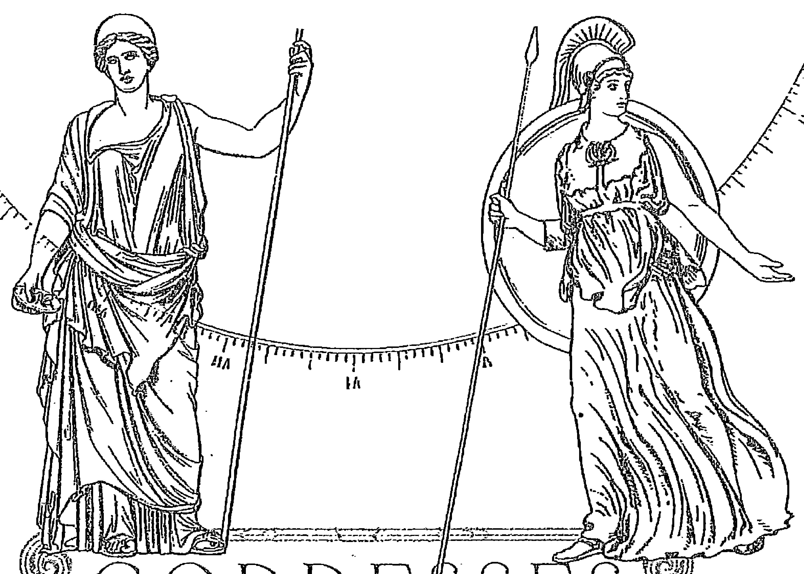

# GODDESSES

# THE MYTHOLOGY, PSYCHOLOGY AND ASTROLOGY OF THE RE-EMERGING FEMININE

## 致謝

在協助我出版《四女神星》的多位合作人員之中，我由衷地感謝我的編輯兼共著者道格拉斯·布洛赫（Douglas Bloch），有他們的投入和專業，才讓這本書得以問世。

其他編作者包括波莉·米契爾（Polly Mitchell）、貝絲·海娃（Beth-Hedva）、瑪麗莎·波滕吉（Maritha Pottenger），以及提供曼陀羅概念的湯姆·伯爾·古塔（Tom Bol Guta）。

謝謝卡洛琳·卡瓦里爾（Carolyn Cavalier）和山姆·米斯（Sam Mills）在財務上提供支援。

在構思與撰寫本書的過程中，俄勒岡州海岸的美麗海景予我源源不絕的靈感。

丹的佛法（Dharma Dan）普照著願景。

情感上的支持來自我的父母約翰（John）和珍·坎納（Jean Canner），而讓家族的火焰繼續燃燒的，是我的孩子丹尼爾（Daniel）、雷納·法蘭克福(Reina Frankfort)、吉姆·法蘭克福(Jim Frankfort)、米歇爾·法蘭克福(Michelle Frankfort)、查理·塔巴斯科(Charlie Tabasko)；還有蘇珊·絲薇芙特(Susan Swift)、羅伯特·魯賓(Robert Rubin)、瓊·賽普拉斯(Joan Cypress)、亞倫·格林伯格(Aaron Greenberg)、希格·海恩斯(Signe Haynes)、比爾·比西納諾(Bill Bisignano)、克里斯汀·卡魯斯(Christiane Carruth)、丹尼斯·康羅伊(Dennis Conroy)、益喜·仁波切(Yeshe Nyingpo)和the Newport Sangha、Papa John、和A.B.A.T.E。

感謝克莉絲塔·巴克斯(Christa Bax)和羅尼·德瑞克(Rodney Derrick)慷慨地讓我進出他們的家，並感謝丹尼斯·里奧頓(Dennis Riordin)讓我使用他的電腦。

同樣地，感謝占星界的友人，特別是埃莉諾·巴赫(Eleanor Bach)，為我開啟了這段旅程；也感謝我的占星同僚茱蒂·法蘭森(Judy Franzen)、茨仁·艾弗里斯特(Tsering Everest)、史塔緒(Stash)、戴安娜·史東(Diana Stone)、雅納·布雷茲(Yana Breeze)、瑪莉·沃克斯(Mary Works)，和巴貝特·卡布拉爾(Babette Cabral)給予我回饋與鼓勵；更感謝我的占星老師丹·魯迪海爾(Dane Rudhyar)、艾倫·歐肯(Alan Oken)、維吉尼亞·達洋(Virginia Dayan)、喬安娜·威肯珀格(Joanne Wickenburg)和吉波拉·都賓斯(Zipporah Dobyns)給予我啟發。

許多有效率的工作時光，是在榮格學會舊金山分會的原型象徵研究檔案室（the Archive for Research in Archetypal Symbolism）中度過的。

最後，還要特別感謝我的靈性導師喇嘛恰度祖古仁波切（Lama Chagdud Tulku Rinpoche）對於動機與憐憫心的教導。

迪米特拉·喬治
一九八四年十一月九日
於俄勒岡的沃爾德波特

## 朱鷺出版社（Ibis Press）版本序言

☆

自我於一九八一年第一次遇見道格拉斯·布洛赫（Douglas Bloch）並將小行星介紹給他，至今已過了二十二年，對於從自己星盤中四顆主要小行星所得到的深層解讀，他感到印象深刻，因此，他鼓勵我把這些教材匯集成冊，以便更廣泛地傳播。

道格拉斯提供了他身為編輯與顧問的精湛建議，我們在一九八四年完成了《四女神星》的初稿，但初次的提案，卻因為占星書籍類的出版社不知道該如何評價小行星而被拒絕——當時的占星界普遍認為小行星技法具爭議性而有所存疑。而後，星象計算服務出版社（Astro Computing Services）的主編瑪麗莎·波滕吉（Maritha Pottenger）慷慨地答應出版這本書，她自小便聽聞母親吉波拉·都賓斯（Zip Dobyns）講述這些奇幻的小行星故事，因而充分地理解這個主題的重要性，並相信這本書是重要的，她告訴我們，她不認為這本書的首刷會賣得好，但這是值得出版的題材。

《四女神星》自一九八六年首次出版以來已陸續賣了十五刷，這樣的銷售成績讓所有人為之驚嘆，其版權安穩地留在米切爾森／西姆斯（Michelsen/Simms）家族的星象計算服務出版社，直到這家公司易手。

《四女神星》曾經暫停再版多年，版權最後回到道格拉斯和我手中，並在仁慈的唐納·韋瑟（Donald Weiser）的幫助下，透過朱鷺出版社（Ibis Press）旗下的尼古拉斯-海斯出版社（Nicolas-Hays）重新印製出版。在這段時間裡，《四女神星》被翻譯成多種語言，環遊了世界，並為占星學對於原型神話之詮釋的發展做出了貢獻；古代女神的永恆故事持續留存在當代男女的心中，並形塑著他們的生活。在一九九〇年代後期，當《柯夢波丹》雜誌在〈年運預測〉的議題中，納入了婚神星及其他女神小行星預測年度運勢時，我便知道小行星終於成熟，並湧入了主流意識。

由於這本書已絕版，道格拉斯和我收到了多通來電及無數封信件，都是因為人們在二手書店中遍尋無獲，這也證明了占星家們都保存著這本書。

在此感謝唐納·韋瑟讓下一代的占星師們能夠繼續將陰性本質的象徵納入占星解讀之中，並感謝瓦萊麗·庫珀（Valerie Cooper）製作新的版本。

我還要感謝艾爾·莫里森（Al Morrison）和李·里曼（Lee Lehman）對於小行星研究領域的寶貴奉獻，他們在一九八〇年代早期製作了一份星曆表，並對其他小行星做了初步的解讀，我在本書中也有簡要提及。從那時候起，馬克·波騰吉 (Mark Pottenger) 著手開發軟體，可以查詢到超過一萬顆小行星在特定時間的黃道位置。這些小行星是以不同文化、地理位置、人名和概念的神話角色來命名的——而且是的，它們全都有其效應！它們所帶出的象徵意涵會令你眼花撩亂，例如：查爾斯王子的金星合相小行星卡米拉 (Camellia)、帕克斯 (Parks)；或者比爾·柯林頓 (Bill Clinton) 的月亮與小行星寶拉 (Paula)、莫妮卡 (Monica) 呈對分相；或者在賈桂琳·甘迺迪·歐納西斯 (Jacqueline Kennedy Onassis) 的星盤中，小行星約翰 (John) 與小行星亞里士多德 (Aristotle) 合相，並與象徵合法婚姻的占星因子呈對分相。

對於運用小行星有高度興趣的讀者，馬克·波騰吉的 CCRS 小行星程式是非常重要的，可以透過以下方式與他聯繫：Mark Pottenger, 3808 49th St., San Diego, CA 92105 或 markpott@pacbell.net。其他有助於小行星研究的資源，包括迪米特拉·喬治和道格拉斯·布洛赫 (Douglas Bloch) 於網站編寫的「四女神星個人報告」(Asteroid Goddess Report Writer)、NCGR 的小行星愛好者社群 (NCGR Asteroid SIG)、雅各布·施瓦茨 (Jacob Schwartz) 的網站 Jacob@asteroids.com、李·里曼的《終極小行星大全》(Ultimate Asteroid Book)、《小行星命名字典》(Dictionary of Minor Planet Names, orders@springer-ny.com)、吉波拉·都賓斯的《善變的兩難／小行星的世界》(Mutable Dilemna /Asteroid World，www.ccrsdodona.org)，以及羅克珊娜·繆斯 (Roxana Muise) 所提供的小行星星曆與個人小行星位置的計算服務（roxanamuise@comcast.net）。

在歷經超過二十年，對穀神星、智神星、婚神星、灶神星以及無數小行星緊密而切實的研究之後，一九九七年，我開始轉而追求其他的目標。我回到研究所，取得了古典文學的碩士學位，從而在開普勒占星學院（Kepler College）任教，教授古代和中世紀的占星學歷史，以及希臘占星學的技法。我目前也著手翻譯古希臘醫療占星的文本，然而，當我持續在工作中運用小行星時，它們始終在我心中佔據最神聖的地位。

我將小行星視為最豐盛、也最令人著迷的研究領域，並將它們獻給所有新一代的占星師，盼各位能從中建立自己的聲譽。

迪米特拉·喬治
Demetra George
二〇〇三年五月

## 第一版序言

迪米特拉（Demetra）是我的教母為我命名，也是我們家族世代相傳的名字，我的祖先來自希臘的阿卡狄亞（Arcadian）山脈，那裡也是狄米特（Demeter）古老祭儀的所在之地。

一九七三年的春天，我第一次參加占星研討會，在那裡遇見甫發表第一本小行星星曆的埃莉諾·巴赫（Eleanor Bach），當她知道我的名字叫迪米特拉（穀神星在希臘時期的名字），並得知我的穀神星與太陽有對分相位時，她給了我一份小行星位置表。回到俄勒岡的家後，我繼續研讀非主流占星學，從而深受啟發，將小行星——穀神星、智神星、灶神星和婚神星——加到我客戶的星盤上，並開始探究它們的意涵。歷經了十載的光陰，將數以千計的星盤加以彙整之後，我對這些神奇的訊息傳遞者有了更深層的認識，也希望把成果分享給占星學領域的朋友，期望能增進你們對於這門神聖科學的理解與珍視。

> > 為什麼要在星盤中加入小行星呢？只用我們熟悉的十顆行星不也挺好？作為占星師或占星學子，當你第一次聽聞要將小行星整合到本命星盤時，可能都有過這樣的疑問；然而，納入小行星可以為星盤的解讀增添其深度、豐富性和準確度，這些都是過去占星學所缺少的。

將小行星置入誕生星盤後，它們會發揮很大的作用。首先，它們提供占星師傳統行星所無法傳達的重要訊息，例如：穀神星象徵了家庭當中父母角色的羈絆，也是良性關係的基礎；灶神星點出了我們對個人承諾以及專注於工作或理想的需求；婚神星描述了我們對於親密關係的需要，以及將自己託付給他人的能力；智神星掌管了我們創造現實與立定目標的心智能力。

小行星除了提供占星學的新原型，也協助我們釐清並強化已存在於星盤中的主題，我們也經常見到小行星能集結星盤中的焦點，並完整主要的相位圖形；因此，透過使用小行星，占星諮詢師可以提供客戶更精細的占星解讀，以及更貼切的人生見解。

接下來的篇章將詳述女神小行星的教義，讓你順利地將所學運用於占星詮釋，藉由探索女神小行星的神話展開各別的研究。從神話中，我們將理解基本原型的本質在現代心理學的表現形式，最後，根據每顆小行星所在的星座、宮位以及與其他行星和小行星的相位，來勾勒其樣貌，並且，為了更深入地呈現這些神祇的相關特質，女神小行星將被置入男性和女性名人的星盤中，進而看見這些特質如何展露在現實生活中。

## 推薦序

關於四女神星，從我最初認識她們的原因，到今日推薦她們的理由，已截然不同；如同女孩、女人到老婦的每個人生階段，皆有著不同而珍貴的體悟。如今凱龍回首之年，我會說那彷彿是一段慢慢融化自己、看清自己、接納自己，並讓真實自我顯化，返璞歸真與合一的道路。

曾經，我也和大多數女孩一樣嚮往婚姻，但每每論及婚嫁，總會頭皮發麻、無端生氣，將彼此逼到決裂，反覆幾次之後，才逐漸意識到自己在親密關係裡那莫名的慣性反應；是害怕照顧的責任嗎？還是擔心無以回報？是早年父母離異之故？還是過往情傷所致？是「完美主義」作祟？又或者，我根本是同性戀？不斷自我懷疑，也始終不能明白真正的原因，只能無奈接受「恐婚」這張標籤。

二〇一二年，因進修而接觸了本書英文版，讀完當下還沒有特別的觸動，反而是兩三週之後的某一夜裡，正要入睡之際，心頭突然湧現出一種前所未有、再清晰不過的自己。

研習占星學最大的利己之處在於，我們透過無數的星盤看見每一個人都是宇宙獨一無二的存在，包括我們自己。倘若，靈魂各有其生命目的，那麼，對於一個本命月相殘月、婚神星位於天秤座十二宮，與座落命度的天王星呈六度內合相，並與位在九宮始點的月亮呈三分相位的女人而言，傳統婚姻的結合，本就不是此生追求；如同天后朱諾神話中的最後橋段，我於此生在婚姻關係中所需的，乃是定期地隱居獨處，回歸真我，不以個人的「婚姻關係」來界定自我的權能與角色。

而在我生命中更為顯著的是智神星主題，它座落於象限十宮末，與九宮主水星緊密合相。孩童時期，我是父親最疼愛的女兒，總喜歡依偎在他身旁，之後父母雖非情感問題而分離，卻將幼小的我心靈撕裂，丟入父系或母系認同的問題裡；少女時期曾試圖讓父母一家再次團聚，但卻徒勞無功；直到成年後，以父親的姓氏生活在母親的國度，並選擇新的名字，這才讓我從分裂中重新融合、誕生出新的自己；這是帕拉斯·雅典娜的權宜，一如祂頂著「帕拉斯·雅典娜」這個新名字，並將梅杜莎的頭像鑲在自己的胸甲上。

這些幡然領悟，我終於看見真正的自己，並且從社會普遍加諸在「女性」傳統角色的框架中解脫，這份理解平息了內心裡的風暴，為我帶來了全然的自信、自尊與寧靜，這是宇宙透過本書回應了我長久以來的提問，賦予了我對於自身生命意義與價值的深刻理解，是一份莫大的恩典。

作為占星研究，我時常提醒學員必須將自己抽離在星盤之外，采用一致并系统性的方法比对不同的案例星盘，避免对号入座以获得相对客观的解读与验证，然而，从我分享的故事，你可以见证到那所有相关的生命经验，全都发生在我踏入占星学领域之前，这般巧合，又教我如何否定小行星于星盘上的有效性呢？

神话，记述著潜藏于人类集体无意识底层的共通经验，神话中的角色则描绘了无论男性或女性，在不同心理面向与需求的原型，而婚神星（朱诺）、智神星（帕拉斯·雅典娜）、榖神星（希瑞斯）、灶神星（维斯塔），这四颗在十九世纪初于火星轨道与木星轨道之间被发现，并以希腊罗马神话中四位最高女神之名加以命名的小行星，随着「女性」作为传统社会男女有别的一端，其平权意识的抬头，宣告著阴性能量的觉醒，在星图中，各自以「母亲」、「妻子」、「女儿」、「姊妹」这四种显性可意识的角色或关系，补述了传统七颗行星所未能表达、众人皆有的阴性本质，揭露了普世之中不分性别、个人于内在心境与外在环境中，阴性能量的投射、冲突与交融，意味着个人在进入木星与土星所象征的社会关系之前，亟须有意识地提升阴性能量的觉察以达到内在平衡与关系的满足。

本书《四女神星》（Asteroids Goddesses）是由迪米特拉·乔治（Demetra George）与道格拉斯·布洛赫（Douglas Bloch）所共著。首次出版于一九八六年，乃现今东西方占星学界所有关于四女神星核心要义的重要源头，三十五年来启迪无数占星家与人们透过星盘去觉察内在阴性的能量，倾听内在被压抑的声音。他们与发布第一本小行星星厝的埃莉诺·巴赫（Eleanor Bach）同为具有跨时代意义的贡献者，我作为受惠者，怀抱深切感恩的心，诚挚地将本书推荐给你，希望你也能和我一样，从理解自身灵魂本质的过程中，寻回自身内在的肯定与宁静。

我的故事仅止于个人生命经验的分享，同样独一无二的你既有或即将面对的生命历程，建议用以下的要点渗透看看；假定你已具备占星解盘的基础能力：

- 1. 观察本命月相以及金星的状态与意义。关于这部分，推荐可以参考同为作者所著的《占星与真我》（*Astrology and the Authentic Self*），中文版已於二〇一九年出版。
- 2. 启用四女神小行星（暂不启用其他次要小行星），观察是否有任一女神小行星位于角宫，或与角宫主星、角宫内的内行星有紧密的托勒密相位；此步骤的用意在于从四颗女神小行星抽取对你的生命真正具有关键重要意义的小行星主题。
- 3. 先将手边所有其他书籍及说法放下，也先别急着去看本书的菜单解析，因为那些未必都与你有关；你所追寻的那个答案，就在——你、星盘和神话里。
- 4. 只单纯细细咀嚼本书中所描述的神话，别急着去界定世俗渴望中的是或不是、有或沒有的問題，更請別輕易將自己置入關係受害者的位置。

5. 你此生的性別未必等同主題神話中的角色性別，例如：你是一位女性，但是在婚神星朱諾的神話情節中，未必演出朱諾，也可能扮演的是朱庇特的角色、又或者是被收養的海克力斯。重點是，我們用陰性能量和陽性能量來區別，而非以生理性別來區分。
6. 神話很長，還有許多不同版本，而在你人生中不斷反覆經驗的，可能只是神話中的某個片段，這部分可以從步驟二去觀察。片段指出了你此生與主題相關的核心能力、需求與糾葛，而整部神話可以為你提供一種宏觀的視野，去重新看待靈魂深處與主題相關的本質。
7. 闔上書，容許自己一段反芻的時間，這段時間可能無感，也可能颳起情緒風暴，但不強求、不抵抗，只經驗它、接受它，待機緣成熟時，美妙的自己終將浮現。

由於本部占星經典成書於三十五年前，部分案例的生時資訊因來源與更正時序而出現偏差，也不免以菜單形式點出各女神小行星於不同星座宮位的特徵，但本書最為珍貴之處，乃是從神話與文化變遷的脈絡中，去解放我們原先對於陰性本質與角色的狹隘視野與束縛。

再次感谢本书作者——迪米特拉·乔治与道格拉斯·布洛赫，尤如占星界的大母神，以如此珍贵深刻的洞察滋养着我们，接引着每一个人的内在女神显化漫步于人间，当放眼三百年后的水瓶世纪，即可预见那阴性本质的温润、疗愈与创造力所注入给这世界的生生不息，以及整体人类内在品质达到自我完整「合一」的未来目的地，正在加速地向我们趋近，本书可称之重要的摇篮推手，我们编译团队有此机会将本书引荐至华文占星界，是莫大的荣幸。

玛基斯 (Maki S. Zhai)
C.A, NCGR-PAA
美国 NCGR 占星研究协会 台湾分会会长
智者星象学院 院长
二〇二〇年三月八日

# 目錄 | CONTENTS

致謝 006

朱鷺出版社（Ibis Press）版本序言 009

第一版序言 013

推薦序 015

## 第一章 ★ 小行星——意識躍進的媒介 033

小行星與文化的變遷 035

小行星與全球性的轉化 038

小行星作為個人轉化的媒介 041

- 個人轉化的三階段 046

## 第二章 ★ 小行星——新神話的先驅 051

神話的意涵 053

神話的扭曲 054

神話在療癒過程中的作用 056

## 第三章 ★ 曼羅陀之於四女神星 059

於燦爛陽光下 061

金星作為生育的表徵 070

金星與情愛課題 072

小行星——完整的曼陀羅 073

小行星中心 084

## 第四章 ★ 穀神星：大母神 091

### 希瑞斯的神話 093

### 希瑞斯與波賽鳳妮的故事 094

- 波賽鳳妮遇劫 095
- 希瑞斯在厄琉息斯 096
- 波賽鳳妮的歸來 096
- 希瑞斯神話於古希臘時期的起源 099

### 穀神星占星學 102

### 穀神星作為巨蟹座的主管行星 103

- 穀神星：宇宙之母 103
- 以穀神星之愛作為愛人的基礎 105
- 穀神星的心理情結 106
- 消極情結 106
- 飲食情結 107
- 關係情結 108
- 親子情結 110

### 穀神星作為金牛座—天蠍座對宮星座的主管行星 111

- 依戀與分離的課題 112
- 死亡與臨終 114
- 穀神星作為分享的準則 115

- 穀神星與重生 116

- 穀神星作為處女座的主管行星 116

- 生長與生產 116

- 穀神星與高效運作 117

- 穀神星與工作 118

- 穀神星的玄秘教義 119

- 死亡之途 119

- 血液奧秘 120

- 總結 121

- 穀神星的心理主題 121

## 第五章 ☆ 星盤中的穀神星 123

- 穀神星在占星學的主掌領域 126

- 穀神星在十二星座 128

- 穀神星在十二宮位 134

- 穀神星與其他行星的相位 139

- 穀神星與太陽的相位 139

- 穀神星與月亮的相位 140

- 穀神星與水星的相位 141

- 穀神星與金星的相位 142

- 穀神星與火星的相位 144
- 穀神星與婚神星的相位 145
- 穀神星與灶神星的相位 146
- 穀神星與智神星的相位 147
- 穀神星與木星的相位 148
- 穀神星與土星的相位 150
- 穀神星與天王星的相位 151
- 穀神星與海王星的相位 152
- 穀神星與冥王星的相位 153

## 第六章 ★ 智神星：戰神女王 157

- 帕拉斯・雅典娜的神話 159
- 雅典娜誕生的神話 160
- 帕拉斯・雅典娜的蛇之智慧 162
- 女戰神帕拉斯 164
- 帕拉斯・雅典娜自母系傳統脫離 165
- 梅杜莎的殺戮 165
- 雅典娜與波賽頓的競賽 167
- 阿瑞斯特斯的審判 168
- 智神星占星學 171

- 智神星的智慧面向 171

- 智神星作為創造性智慧的象徵星 172

- 智神星作為藝術的象徵星 173

- 智神星作為療癒技術的象徵星 174

- 智神星作為政治藝術的象徵星 175

- 智神星：處於男性世界中的女性 175

- 智神星與雌雄同體 177

- 智神星與性別認同的失衡 177

- 智神星與父親情結 179

- 智神星與對成功的恐懼 180

- 勝利與失敗 181

- 創造力與愛 182

- 靈魂功課 182

- 智神星的玄秘教義 183

- 智神星的心理主題 184

## 第七章 ☆ 星盤中的智神星 187

- 智神星在占星學的主掌領域 190

- 智神星在十二星座 191

- 智神星在十二宮位 199

### 智神星與其他行星的相位

- 智神星與太陽的相位
- 智神星與月亮的相位
- 智神星與水星的相位
- 智神星與金星的相位
- 智神星與火星的相位
- 智神星與灶神星的相位
- 智神星與婚神星的相位
- 智神星與木星的相位
- 智神星與土星的相位
- 智神星與天王星的相位
- 智神星與海王星的相位
- 智神星與冥王星的相位

## 第八章 ★ 灶神星：永恆聖火

### 維斯塔的神話

- 維斯塔的故事
- 維斯塔處女
- 維斯塔於古希臘時期的起源
- 維斯塔的真實意涵

### 灶神星占星學

### 灶神星作為天蠍座的主管行星 231

- 灶神星作為性的象徵 231
- 性作為原罪的象徵 232
- 性作為恐懼的象徵 233
- 性壓抑 234
- 灶神星與投射 235
- 灶神星與性歧視 235

### 灶神星作為處女座的主管行星 236

- 灶神星與童貞 237
- 灶神星與中心定位 238
- 灶神星與聚焦 238
- 灶神星與承諾 238
- 灶神星與工作 239
- 灶神星的疏離與犧牲 239

### 總結 239

### 灶神星的玄秘教義 240

### 灶神星的心理主題 241

## 第九章 ☆ 星盤中的灶神星 245

### 灶神星在占星學的主掌領域 248

- 灶神星在十二星座 249
- 灶神星在十二宮位 256

### 灶神星與其他行星的相位 260

- 灶神星與太陽的相位 260
- 灶神星與月亮的相位 262
- 灶神星與水星的相位 263
- 灶神星與金星的相位 264
- 灶神星與火星的相位 266
- 灶神星與婚神星的相位 267
- 灶神星與木星的相位 268
- 灶神星與土星的相位 269
- 灶神星與天王星的相位 270
- 灶神星與海王星的相位 271
- 灶神星與冥王星的相位 273

## 第十章 ★ 朱諾：神聖配偶 275

### 朱諾的神話 277

- 宙斯與赫拉的故事 279
- 赫拉與宙斯的審判 280
- 赫拉作為完美的妻子 281

### 赫拉與她的孩子們 282

### 赫拉的獨居 284

### 朱諾於古希臘時期的起源 285

### 婚神星占星學 288

- 婚神星作為關係的象徵星 289
- 關係中的各種心理病徵 290
- 不忠 291
- 關係中的犧牲 292
- 關係中的恐懼 292
- 關係中的權力 294

### 婚神星帶入承諾關係的助力 296

- 婚神星與承諾 297
- 婚神星與美化 298

### 婚神星作為女性的生命周期與各種角色的象徵 298

### 婚神星的玄秘教義 299

- 性作為神聖祝福 299
- 性作為魔法的體現 300
- 性作為回春的秘方 300
- 婚姻作為煉金術的奧義 300

### 婚神星的心理主題 301

## 第十一章 ★ 星盤中的婚神星

### 婚神星在占星學的主掌領域

### 婚神星在十二星座

### 婚神星在十二宮位

### 婚神星與其他行星的相位

- 婚神星與太陽的相位
- 婚神星與月亮的相位
- 婚神星與水星的相位
- 婚神星與金星的相位
- 婚神星與火星的相位
- 婚神星與木星的相位
- 婚神星與土星的相位
- 婚神星與天王星的相位
- 婚神星與海王星的相位
- 婚神星與冥王星的相位

## 第十二章 ★ 次小行星概述

### 小行星作為八度音程轉換的調頻者

### 戀人：賽姬與艾洛斯

### 戰士：莉莉絲與托羅

### 共感者：莎孚與愛墨兒 347

### 解放者：潘朵拉與伊卡洛斯 350

### 保護者：戴安娜與伊達爾戈 353

### 智者：烏拉尼亞與凱龍星 356

### 總結 359

## 第十三章 ★ 小行星的天文圖像 361

### 小行星的發現 363

### 小行星的物理性質 366

- 大小與形狀 366
- 成分與亮度 366
- 小行星群的軌道模式 367

### 小行星的起源 370

- 與地球的碰撞 371

## 第十四章 ★ 結語 373

---

## 第一章

## 小行星——意識躍進的媒介

### 小行星與文化的變遷

從歷史的觀點來看，外太空中天體的發現、命名和認定，與人類集體意識的演進以及文化的變遷有著相應的巧合。舉例來說：在一七八一年象徵平等與自由的天王星被發現的前後期間，人們見證了美國獨立戰爭與法國大革命；當象徵神秘主義與幻覺的海王星在一八四六年被觀測到時，正是超驗主義與靈性主義等興起的時代；一九三〇年，隨著象徵集體轉化力量的冥王星受到關注，反映了社會在集體福祉意識的覺醒以及核武時代的來臨，迫使人們必須面對生死的選擇。

每一顆外行星的發現，都意味著人類已做好準備，與該行星所象徵的神話原型相互激盪並融合，而同樣地，我們也在小行星被發掘的過程中，看見相同的歷程。

一八〇〇年代早期所發現的小行星，大多位於火星和木星軌道之間的主小行星帶，而最早被觀測到的四顆小行星——穀神星希瑞斯（Ceres）、智神星帕拉斯·雅典娜（Pallas Athene）、婚神星朱諾（Juno）和灶神星維斯塔（Vesta），是以古代四位偉大女神來命名。

從神話的角度來看，這四位女神與木星朱庇特（Jupiter）、海王星涅普頓（Neptune）和冥王星普魯托（Pluto）一樣位列奧林帕斯主神。維斯塔（Vesta）、希瑞斯（Ceres）和朱諾（Juno）是朱庇特、涅普頓和普魯托的三位姊妹，他們全是泰坦神土星克洛諾斯（Cronus）與妻子雷亞（Rhea）結合所誕下的孩子，而帕拉斯·雅典娜（Pallas Athene）則是新天神朱庇特最喜愛的女兒，由朱庇特獨自孕育並從他的頭頂誕生。從象徵意義來看，這四顆小行星各自代表的女性原型，正逐漸湧向大眾的意識。（註：原型是一種舉世通行的思維模式與意象框架，深植於集體人類的心靈之中。）

在尚未採用小行星以前，傳統的星盤解讀所使用的女性代表因子，僅有月亮和金星，女性在社會中被認可的角色，也僅限於月亮代表的母親和金星代表的伴侶。

轉變始於女神小行星相繼被觀測到的十九世紀，當時蘇珊（Susan B.）、安東尼（Anthony）和伊莉莎白（Elizabeth Cady Stanton）引領的女權運動，正致力於增進婦女在社會的參與，不過，這些思想種子仍未開花結果。

直到一九七〇年代初期，埃莉諾·巴赫發表了第一份小行星星曆表，此時，陰性表述的新概念才完全滲入人類的意識之中，女性得以發揮創造力與聰明才智，萌生出傳統母親與妻子角色以外的更多可能性。隨後，在社會上能看見女性廣泛地投身於政治、藝術、教育、體育以及其他專業領域，這也宣示著女性角色在歷史舞臺的重現，以及女神們在女性靈性層面的復甦。

> 發表小行星星曆的埃莉諾·巴赫（Eleanor Bach）曾說過這麼一段話：「對當今的女性而言，我們不是僅供欣賞的花瓶（金星），或是受月經周期影響而起伏不定的情緒鐘擺（月亮），何不談談我們的智慧機敏、我們的生產力、我們的創造力與效率、我們對於生命孕育的關注、我們對於奉獻的投入，以及我們的大愛呢？」①

穀神星希瑞斯、智神星帕拉斯·雅典娜、婚神星朱諾和灶神星維斯塔，這些代表女性的新聲音從沉眠中被喚醒，正向我們的社會要求權力、認可、正義與平等。

在此需要強調的是，這種現象並不僅限於女性，陰性表述被喚醒後的新觀點，也對男性產生同樣深遠的影響。隨著女性改變自身傳統角色的表現形式，男性也在發展與她們對應的新方式，固有的互動模式將不再適用，取而代之的是新的期望與新的角色。

在過去，男性多半將他們內在的情感、滋養與敏感等陰性特質，投射到女性身上，隨著近代由小行星代表的陰性中樞漸增活躍，男性承受壓力的同時，也被鼓勵著要去「擁有」並發展這些特質。因此，越來越多男性打破「大男人主義」的刻板印象，轉而正視並表達他們內在的直覺與感受，開始踏入過去專屬女性的工作領域，例如家庭主夫、護理人員、接線生和秘書；在養育子女上，男性也增加互動陪伴，像是參加產前分娩培訓並協助生產過程；隨著參與度的提升，促使男性進而爭取並要求對子女的監護權，甚至以單親父親的身分申請領養子女，這些在過去是不被社會所接受的。同性戀者的增加，也是男性解放的另一個前衛領域，彰顯男性對陰性面向的認可與表露。

跳脫性別層次，陰性面向在人類大腦內的活躍反映，已成為普遍意識擴張的基礎。心理學家認為，人類的心智可區分為左腦和右腦功能，左腦以線性概念作為參考框架，進一步組織並構建資訊，這種理性的邏輯運作是男性的或陽性的，在現代最常見於對分析及技術的追求；另一方面，右腦則取用並處理毫無因果關係的訊息，是大腦中屬於直覺、藝術和情感的面向，亦即女性的或者陰性的。在過去十年中，我們見證了右腦功能的快速發展，遍及整體醫學、復健、教育、治療以及心靈意識等領域。

### 小行星與全球性的轉化

小行星對應神話故事中的女性原型角色，其陰性能量的本質，以接納、孕育及創造生命的形式充盈於廣袤宇宙。從全球的觀點來看，小行星的發現也點出隨著水瓶世紀的趨近，人類此時正經歷著新時代誕生的陣痛。

水瓶座是象徵集體意識和全球覺知的星座，我們目前正處於占星家稱為星座世紀交界（the Cusp of the Ages）的時代。從雙魚世紀到水瓶世紀的過渡時期是一段劇烈的轉變，在這段時期，過去兩千兩百年周期的基礎能量即將轉換至下一個週期。為了更加理解這個轉換是如何進行的，請試著想像那構成我們歷史經驗的能量，正在我們稱之為時間的洪流中波動著，在前往分界線的期間，波的振幅和頻率發生推移（見圖 1-1），就像海洋的波浪呈現週期性節奏一樣，歷史同樣具有週期性。由於某些波浪會格外地強勁，因此，在歷史上的特定時期，我們會經歷「巨大」的變革浪潮，也被稱為大躍進；隨著社會所承載的壓力與緊張加劇，波浪的振幅會持續增強，直到人類累積足夠的能量激發意識的飛躍。

這種現象正在改變我們的社會秩序，並為新的文化體驗鋪路，不僅有占星學家，研究人類潛能的哲學家和理論家也都指出，現在人類正處於意識飛躍的邊際，例如電腦（由水瓶座掌管）預示著資訊爆炸，它實質影響了人腦處理訊息的能力。

直至現在，人類大腦細胞的使用率約 13%，隨著資訊的爆炸，一些人開始以遠遠超過大腦目前的使用率在處理訊息，他們正在「喚醒」新的大腦中樞，接著這些大腦中樞在電化學傳導層級（electrochemical level）建立神經元的思維模式，從而增強了大腦存放心靈意識的容量；這些大腦功能的變化與新生的中樞神經，呼應著人類意識中所出現的小行星們。

我們正處於歷史性的全球轉化階段，當我們越接近水瓶世紀，全人類越有機會經驗集體意識的重生與整合。於此期間，我們得以理解水瓶座對於兄弟情誼、姊妹情誼和天下一家的理想（或者是水瓶座式的失序狀態，無政府、混沌、急於創新改革而未能沿襲合宜的體制，以及過度強調個人而拒絕與他人連結）。

轉化所伴隨的情緒危機，正在改變我們靈性中樞（psychospiritual）的振動頻率，因此我們開始調合個人的頻率，與宇宙萬物的靈性核心（spiritual core）和諧共振，而穀神星、智神星、婚神星和灶神星在個人星盤中的位置，揭示了我們可以從哪些面向來對應這些改變。

當今之所以迫切需要好的治療師和諮詢師，是因為我們正處於歷史上的過渡期，同時，占星師需要小行星，是因為傳統行星無從對應，也無法解釋新興的議題——正因為它們是新出現的。（的確，過去有些人曾在有限範圍內經歷過這些議題，但不像現在如此大規模。）因此，對現代大多數人而言，如何平衡內在的陰性能量和陽性能量便極為重要，而這類轉化議題不僅攸關個人，也擴及整個社會。

### 小行星作為個人轉化的媒介

陰性本質是以月亮作為代表。由於月亮的物理運動在自然界中具有週期性，而月相的盈虧變化也影響著潮汐起落，所以四女神星的基本教導，也與月亮周而復始的運行週期有關，亦稱為轉化週期；小行星不僅與人類心智中，正被激發與融合的新原型相關，也在個人轉化過程中起了催化的作用。

小行星扮演著個人與集體意識的連結，它們之間的關聯性透過三個系統來表現：黃道星座的週期、太陽系行星的位置，以及恆星星座。

第一個方式是透過黃道十二星座的週期來展現。就奧秘的層面而言，星座週期描述了人類意識的進化和發展，這個變革的過程，始於白羊座所代表的個人意識覺醒——「我」是一個獨立、獨特而自由的個體——終於雙魚座所代表的直覺意識，即個人是構成群體的一個細胞單位；而介於兩者之間的星座，訴說著從白羊座到雙魚座的演化進程。

在前五個屬於個人領域的星座中，白羊座生命的火苗，透過金牛座的軀體、雙子座的心智和巨蟹座的情感來呈現，並借助獅子座的創造力和繁衍力實現自我；在後四個屬於集體範圍的星座中，射手座、摩羯座、水瓶座和雙魚座象徵著大型社會結構下的個人功能，射手座提供獲取集體知識的途徑、摩羯座提供參與集體結構的方式、水瓶座集結眾人的理想和願景，雙魚座回顧集體的經歷而展現同理心和同情心。

而位於中間的處女座、天秤座和天蠍座則是過渡星座，引領著個體從個人意識（白羊座到獅子座）至集體意識（射手座到雙魚座）的轉化過程。

在處女座，持續精進自我臻至完美，並整合內在成為完備的個體，方能進入象徵合夥關係的天秤座；在天秤座，個人第一次意識到他人存在，經由溝通讓雙方意識得以互通交流，此過程為邁向天蠍座的最終蛻變奠定基石；在天蠍座，「我」的個人意識會逐漸消亡，全然浸淫與滲透，直至與他人意識融合；從「我」走向「我們」，結合成為通往射手座集體意識的法門（見圖1-2）。

小行星穀神星、智神星、婚神星和灶神星，與過渡星座——處女座、天秤座和天蠍座有著星座主管權的強烈連結，因此，我們可以假設小行星在這些星座中擔任催化者的角色，以促進個人意識轉化為集體意識。

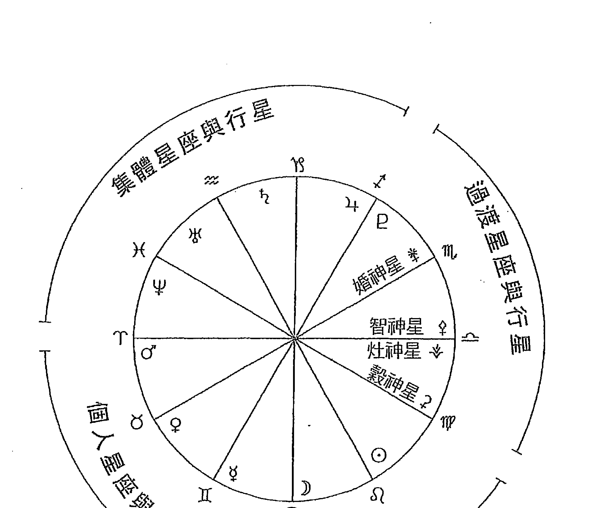

圖 1-2

太陽系的行星是呈現人類進化的第二個方式：太陽、水星、金星、月亮和火星被稱之為個人行星，因為它們主管著個人的自我認同、思想、價值觀、情感和驅動力；木星和土星為社會行星，象徵著社會運作的道德和法律規範；天王星、海王星和冥王星為世界行星（universal planets）（譯註：三王星主管超乎個人與社會外更為廣泛的世界，可代表世代、集體意識、全宇宙等範疇。），或稱作銀河系的使者，與更大的宇宙力量共振；小行星主要分佈於火星和木星間的主小行星帶，從而形成物質與精神交會的橋樑，使個人得以連結至社會及整體的宇宙。（見圖 1-3）

最後一個方式，是透過恆星星座來描繪變革的過程。恆星星座中兩個以蛇命名的巨蛇座（Serpens）和長蛇座（Hydra）與小行星尤為相關，其星群分佈於黃道星座——處女座、天秤座和天蠍座的兩側。蛇，自古便是女性轉化力量的主要象徵，經常與小行星穀神星、智神星、婚神星和灶神星所代表的意涵相連（見圖 1-4）。

因此，這三個系統——黃道十二星座周期、太陽系行星和恆星星座——與穀神星、智神星、婚神星和灶神星，以及與她們相應的處女座、天秤座和天蠍座，形塑了人們從個人走向集體的轉化過程。

如今，隨著陰性的靈性中樞被激發，使得蘊藏在男性與女性當中大量無意識的原型元素也隨之釋放，不幸的是，陰性本質在歷史的軌跡上是受到壓抑的，進而影響了這些元素被釋放的方式。想像一道光束從污漬斑斑的髒玻璃中透進來，當我們透過玻璃往外看，髒污阻擋了清晰的成像，我們對於女性的印象和想像亦是如此；壓抑導致了女性原始力量中的信念和態度被曲解，我們看著難以辨識而朦朧失真的影像，僅憑藉過往的經驗，加以揣測形塑了我們對女性的觀點。

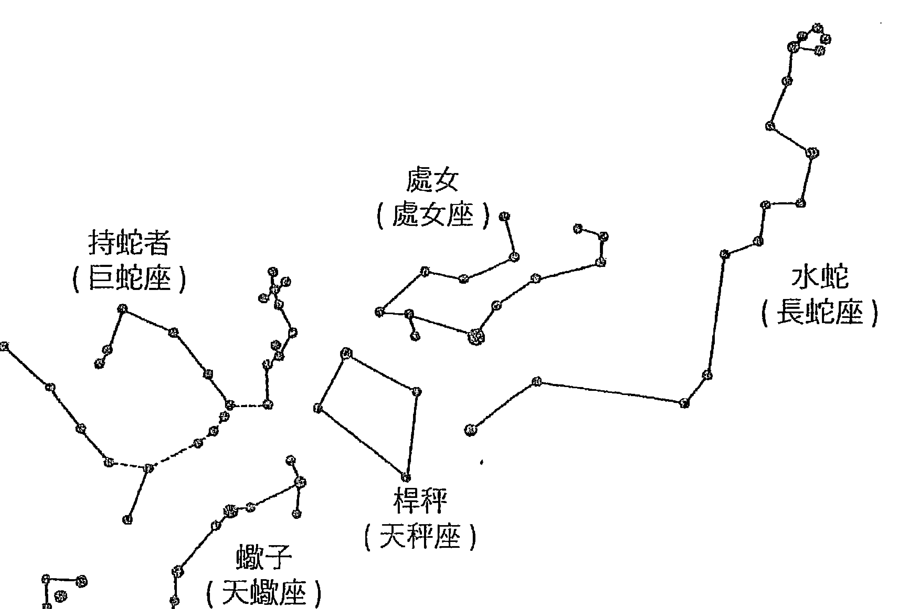

現代男女受到來自潛意識的制約，往往活成了扭曲的神話原型，婚神星就是個鮮明的例子。在這個故事裡，婚神星朱諾是一位充滿嫉妒心和復仇心的妻子，鼓勵女性將同性視為潛在威脅或對手，也促使男性對「他們的」女人抱持地盤性、主導權和佔有慾的信念，進而引起對其他男性的不信任。朱諾（或在更早時期被稱為赫拉）過去是位特別的女神，曾經促進女性間的親密連繫，然而諷刺的是，這份同性之間特殊的連結，被扭曲為嫉妒、競爭和懷疑的感受（將在朱諾的神話章節裡進行探討）。原型中的精神能量，如今受困於一個扭曲的意象（偽神），因此，偶像崇拜的破滅將有助於釋放原型真實的力量，其中一個方式，便是透過轉化的過程來實現；接下來我們將針對轉化的歷程作更深入的探究。

## 個人轉化的三階段

任何的轉化過程，都需要特定的力量或動力來克服既有習性，敦促我們邁向進化週期的下一個螺旋。如圖 1-1 所示，時代變遷中的星體進化乃透過精神能量的振波獲取動能，而同樣地，情緒能量的壓抑亦將積累成個人轉化的動力。

就像我們把一條橡皮圈用力下拉，當它獲得足夠的作用力之後便會往上彈，這種集約化或壓縮的行動是轉化過程的第一階段，由灶神星作為象徵，藉其自我約束的力量將我們向內拉。在心理層面上，我們透過情緒的壓抑來展現灶神星的能量，經由分離、失去、悲傷、痛苦、絕望、失敗、挫折和受拒，而產生「觸底」（hitting bottom）的經驗。

轉化過程的第二階段是解離，以掌管創造力的智神星作為象徵。在此階段，來自灶神星壓抑情緒所產生的能量得以突圍，並打破了結構上的限制。解離可以有多種形式的表現——關係、家人、工作、心態或某種生活方式的結束，此時，個人經歷了大量自由而浮動的能量，但各種能量皆尚未被整合，猶如置身於一片混沌之中，難免因此感到恐慌、莫名的焦慮或混亂；另一方面，當事人也可能勾勒出新的可能性、夢想和願景，因而感到解放並興奮不已。

轉化過程的第三階段是更新，以婚神星作為象徵，她對連結的渴望將我們從孤身帶入了參與。此刻，我們得以運用解放後的能量，加以重組並創造出新的形式，這將有助於擴大成長並持續發展。於此階段，我們人際生活的各個面向——我們的工作、人際關係、與我們往來的團體和我們就讀的學校，都得到了療癒和更新。

這些經歷將我們帶往穀神星，它是體積最大的小行星，也是第一顆被發現的小行星。有些天文學家推論，小行星群是由某顆行星爆炸後所形成的，而穀神星的前身可能是該行星的核心。希瑞斯身為大母神（the Great Mother），象徵運行於外圍小行星群的母體；而透過她的神話以及所參與的厄琉息斯秘儀（Eleusinian Mysteries），穀神星標示著小行星群誕生、死亡和重生的歷程，就此意義而言，穀神星為整個轉化過程奠定了基礎。

當小行星在個人星盤中格外突顯時，意味著他們具有善用轉化能量的人格特質，這一類人經常成為轉動社會的齒輪，透過他們的潛在能量，讓舊有固化的結構與態度以及崩壞的價值得以革新和再生，也因此，在對抗集體意識既存的道路上，他們的人生顯得危機重重。

小行星在個人生活中，象徵得以被覺察與感知的心理議題，預示了當事人將進入何等規模的轉化歷程；帶著覺知去經歷這些轉化極為重要，因為這個過程能使個人通過處女座—天秤座—天蠍座的過渡階段，並邁向最後四個星座的集體願景，它們讓個人拓展意識的疆界，從孤絕的幻境中抽離出來，從而感知真實，並找到真正的合一（oneness）；以此形式，個人和全體人類得以並肩發展。

因此，四女神星就像是運載生命能量的「載體」（vehicles），是一股快速振動的誕生力量，她們既是轉化的催化劑，也是我們轉化過程的關鍵象徵；她們代表著那些轉化的經歷或危機，促進大腦運作機制的轉變，最終讓個人意識與集體意識或宇宙頻率相接軌。

作為宇宙組成的一部份，小行星之間特定的振動與相位變化，也象徵陰性能量逐一自沉睡的心理原型中甦醒，以達成行星生態的平衡；穀神星、智神星、婚神星和灶神星，運用她們與生俱來的本質，化身為「意識交流的載體」，孕育出人人平等的水瓶座理想社會，她們提醒著我們必須坦誠面對該行星所象徵的原型樣貌，以完成從自我到集體理解之間的轉化；小行星更是促使我們每一個人蛻變的神奇媒介，她們是啟動儀式的密鑰，這些經驗將為我們開啟通往理解宇宙的大門。

> ① Eleanor Bach, “Preface,” in The Asteroid Ephemeris by Zipporah Dobyns with Rique Pottenger and Neil Michelsen providing calculations (Los Angeles: TIA Publications, 1977), 3.

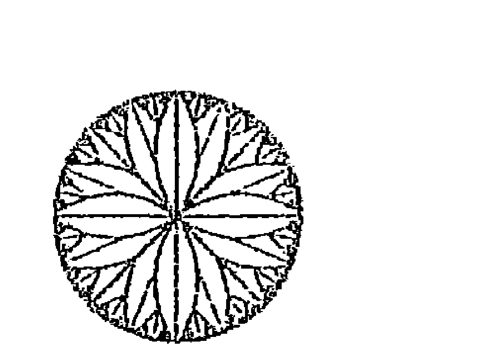

## 第二章
### 小行星——新神话的先驱

## 神话的意涵

卡尔·荣格 (Carl Jung) 将神话称之为「人类伟大的梦」和「集体无意识的原型」；原型是指横贯时间的各个时期，运作于人类意识之中最根本普遍的思想形式。行星和小行星的命名，对应着诸神所拥有的原始力量，为了了解小行星的原型是如何运作，我们必须探索与它们相关的神话。

神话的意涵可以有许多层次的诠释。从表层来看，神话是一种口语传播，代代相承，教导着我们的起源和历史；在人们使用文字书写以前，尤其在印刷术发明之前，累世知识是以神话和口耳相传作为主要的记录方法，因此，追溯神话的发展和变化得以揭示更多的古代历史。由于文化在各个时期的发展和转变，同一则神话会出现不同的版本，学者们对于哪个版本才是正确的，早已迷失在无休止境的争论之中，然而，事实却是——往往所有的叙述都是真实的，而且彼此关联。

从描写特定时代事件的神话沿革中，我们发现——神话重复讲述了人类意识在那些时间点的发展历程，而众神角色所显现的关键变化，亦指向人类潜能的表现方式有着重大进展。例如，一则故事描述了智慧女神帕拉斯·雅典娜從她父親朱庇特的頂輪誕生，這則神話向我們透露了當時陰性本質的表述方式，即繁衍女神的生殖功能，從原本僅通過生殖器官引導出創造性神聖能量，移轉到從頭部傾洩而出；此一改變，體現了女性在表達其創造性智慧和思想誕生的方式，出現了新的能力。

## 神話的扭曲

就歷史的觀點來看，神話中諸神的角色是依照歷代政治或宗教王朝的需求形塑而來，祂們予人的樣貌也相應地發生改變，祂們早期的屬性被遺忘，或被刻意地壓抑，特別是對當代體制的安全構成威脅的時候。

原型能量在一般的演化發展中經歷變化是一回事，但在權宜之下受到扭曲而改變，則又是另外一回事，從金牛世紀到白羊世紀的過渡時期就能看見扭曲的事例：在這段期間，以月亮為基礎（月亮入旺在金牛座）的母系農業社會，轉變為以太陽為基礎（太陽入旺在白羊座）的父系及游牧社會，大地女神的統治權被天空之神所取代，女神的作用與活動也隨著權力被削弱而式微；當奧林匹亞神話在西元前一一〇〇年出現時，朱庇特成為權力至高無上的天神，而女神們則成了昔日宏偉殿堂的闇影。在許多例子中，她們被賦予的新角色與她們的原始天性是相反的，例如：古代蘇美的未婚女祭司以性儀式作為宗教獻祭的方式，但在父權文化的變異下，羅馬的未婚女祭司轉變爲以宣誓獨身作爲宗教承諾。

不幸的是，女神們扭曲的形象已深植現代人的心理，原型最初傳達的意涵被壓抑或扭曲，這樣的病態，導致現代人心理的挫折、不快樂與疾病，特別是與陰性本質相關的部分，例如，小行星維斯塔可能會用性恐懼、退縮和疏離來表達自我，這份恐懼的緣由，在我們發現此段記述時獲得了解釋：在某一時期，神廟中的處女祭司被禁止性奉獻，若有違反則會遭到活埋。

儘管，早期神話版本中的女神原始天性已被深埋於層層的歷史遺址，而難以探究其意識心智，但是，她們仍然存在於集體無意識的心智當中。

> 「無意識，其實含括了兩個層次：個人和集體。個人層次終結於嬰兒期最早的記憶，集體層次則包括嬰兒期之前，即先人生活的餘跡。個人無意識的記憶圖像，是由個人親身經驗填具而成，而集體無意識的原型則沒有填具的過程，因爲那並非經由個人經驗所形成。從另一方面來看，當精神能量消退，甚至退回到嬰兒期之前的階段，潛入先人生活的餘跡時，神話的意象就會被喚醒：這些就是原型。」①

這並非建議我們應當回到過去，回到過去不僅不可能，也不令人嚮往，然而，在轉化階段的關口下，對於原型意象的純淨或原始本質的清晰洞見，可以重新喚醒靈魂的運作。

### 神話在療癒過程中的作用

探索神話中更深層或「隱含」的意義，能說明原型模式的建構歷程，因為原型模式無意識地導演了人們生活的戲碼。神話描繪了人們可以用來表達自我的基礎生活腳本，當人們活出了這些神話，即把這些無意識的原型能量，帶入了他們的意識之中，榮格稱這個過程為個體化，也是前人所稱的「啟蒙」（initiation）；因此，透過瞭解誕生星盤中的行星主題來洞悉個人的神話，可以使個人更有意識地活出自己的天命。

舉例來說，希瑞斯的神話描述了她失去女兒波賽鳳妮（Persephone），以及後續與普魯托分享波賽鳳妮的歷程，因此，穀神星與冥王星在星盤中的相位，通常意味著失去孩子或分享孩子的生命課題，這個主題在流運或推運被觸發時，可以指出子女監護權裁定的時間點；從這裡，我們看見神話中的關鍵點，對應著個人生命中需要做出決定或採取行動的關鍵時刻。

然而，經常發生的狀況卻是，一個人可能會因為重複著消極或徒勞無益的行為模式，而停滯於神話歷程的某個點，每當有意識地決定要放棄舊有習性時，本能的無意識模式又會被深化，如《個人發展的周期》（Cycles of Becoming）一書的作者亞歷山大·魯佩蒂（Alexander Ruperti）所言：「童年時期的一條溝痕，後來變成一道車轍，最後成了一座墳墓。」②

又比如，我們可以觀察女性在配偶或伴侶角色上的心理發展：在最初的階段，莉莉絲（Lilith，女性次小行星）進入了關係，但對這段關係不甚滿意而離去；來到中間的階段，朱諾進入了關係，也發現不盡理想，但仍繼續維持關係；到了最後的階段，賽姬（Psyche）進入了關係，並透過轉化的過程，讓靈魂伴侶的結合變得完美。關係進展的屏障，往往發生在莉莉絲的階段，在此階段，個人選擇逃離來迴避關係中的衝突，而這樣的逃避舉動阻礙了後續的關係發展，以及最終完成彼此共識的賽姬階段。

正因如此，透過對神話的認識，療癒師、占星師或者諮詢師可以辨識原型中固著的主題，並指出解放的方法；運用行星的神話作為指南，療癒師可以探究客戶被禁錮的本質，加速修復的過程，以符合自然且和諧的方式來達到療癒的成果；因此，誕生星盤提供了生命課題的判斷、與神話的關聯以及療癒的線索。

在過去四、五千年裡，女神的力量一直處於沉睡狀態，隨著小行星的發現，陰性力量終於被喚醒，並釋放到我們的意識覺察裡，而在人類持續發展歷程中，透過研究與運用小行星並修復原型中的真實形象，占星師可以協助兩性重新找回內在陽性與陰性本質的平衡。

+   ① Carl G. Jung, “On the Psychology of the Unconscious,” in Two Essays on Analytic Psychology (Cleveland: Meridian Books, 1965), 87.
+   ② Alexander Ruperti, Cycles of Becoming (Vancouver, Wash.: CRCS Publications, 1987), 8.

## 第三章
### 曼羅陀之於四女神星

获取更多好书，请加微信号：strcdts
官网：http://www.ac2011.cn

### 於燦爛陽光下

銀色月光輝映著月亮的基礎能量——是女性尚未展現孕育與轉化的力量之前，未經分化的陰性能量。

從月亮中心冉冉而升的是金星維娜斯·阿芙蘿黛蒂，表露了陰性本質的核心元素，她憑藉著神聖之美的力量與性愛的吸引力，喚起了人們對於生命的慾望。

她向北散發光亮，讓陰性能量化身為穀神星希瑞斯，以母親的角色展現其繁衍的面向，孕育並滋養萬物。

她向南散發光亮，讓陰性能量化身為智神星帕拉斯·雅典娜，以女兒的角色展現其創造的面向，催生出心智與藝術的產物。

她向東散發光亮，讓陰性能量化身為灶神星維斯塔，以處女與姊姊的角色展現出陰性本質的自給自足與自我完善，且不隸屬於任何男性。

她向西散發光亮，讓陰性能量化身為婚神星朱諾，以配偶與妻子的角色展現其陰性與陽性本質的結盟關係，藉由締結神聖婚姻的儀式結合為一。

在荣格对人类心理学的探索过程里，他认定世上存在着普遍共通的象征，可以用來描述原型能量中的本质与关系，其中一个象征是曼陀罗（mandala），即梵语中的「圆」。

圆的特质，在于它具有圆圈以及圆心，「圆心或者最中心点被周边所环绕，包含着一切自我的延伸——这些成对展开的对立面向，建构了完整的人格。」①小行星曼陀罗（见图 3-1）是一种视觉图像，整合了人类在表现阴性本质时主要的组成元素，这里所指的阴性本质，在男性与女性身上皆会展露，阴性本质并不等同于女性或女人，而是代表人类二元本质中的其中一半，阴或阳，均无法脱离另一半而单独存在，男性与女性身上皆共存着这两种极向的属性。在过去，阴性本质大多透过女性展现，如今，随着小行星能量的彰显，指出阳性能量与阴性能量的平衡重整，男性正在建立自我认同并展露他们的阴性本质。

阴性本质的根源或说根基，是由月亮的潜能作为代表。在圆的中心是维纳斯·阿芙罗黛蒂，象征了阴性本质中活跃欢愉的面向；在圆的外圈，谷神星与智神星，以及灶神星与婚神星，这两组成对相望的小行星，则描述着不同基础功能的阴性活动。小行星曼陀罗图像以此种方式描绘出「自我的完整」；每一颗天体，由中心的自我与外在形塑的自我，定义出各自的特质与对应关系，进而建构出阴性意识形态的一致性。

曼陀罗中，月亮所象征的阴性表述，以太阳所象征之阳性表述的存在为前提。阳性与阴性是同一股力量的极性呈现，当这股力量得以整合，即是神秘主义者所称的「合一」；阴性能量并非单独的存在，而是存续于两极中的阴极。

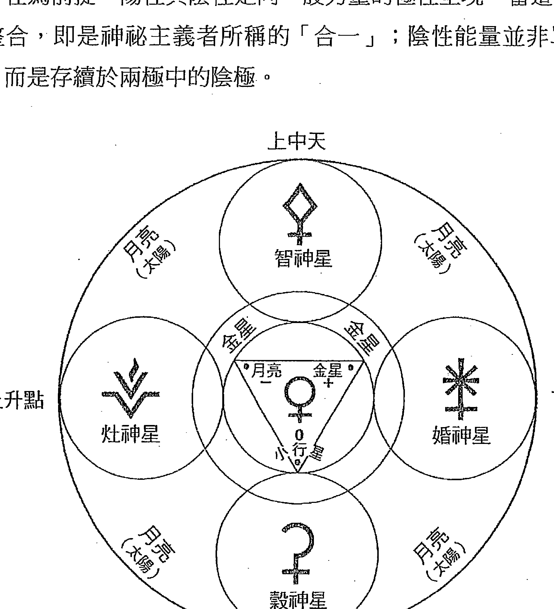

图3-1

在中国的传统哲学中，代表阴性的「阴」，相对于代表阳性的「阳」。阳是明亮、炙热和强大的创造力；阴是黑暗、潮湿、阴影与接纳的力量。阴也具备着创造力，它让阳的创造力得以诞生与展现，陰被描述成與陽擁有著相等的力量；在陰的映襯下，陽的萬丈光芒方得展露。②

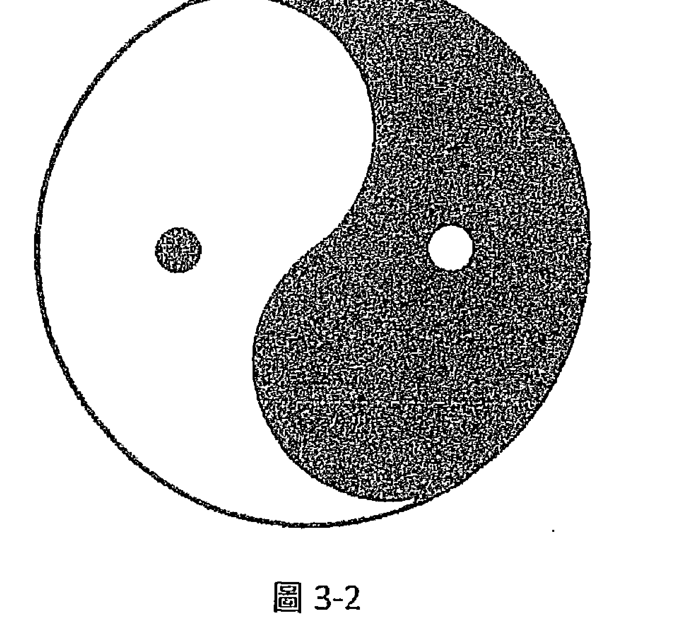

曼陀羅中的月亮和太陽，代表女神和男神未經分化的神聖意識，在象徵意義上，太陽散發光芒，將其創造力向外投射，月亮受映照而顯現月形，並將光反射回光源，從而完成了月相的軌跡（the soli-lunar circuit），這形成了一個持續性的循環，在該循環中，太陽和月亮連續不斷地相互作用並彼此滲透。

銀色月光輝映著月亮的基礎能量——是女性尚未展現孕育與轉化的力量之前，未經分化的陰性能量。

月亮是陰極能量的主要象徵，因而被古人擬人化為女神；月亮，在她漸盈漸虧的各個階段，那各個面向不斷變化的容顏，象徵著多位女神：月亮含括了所有可能的阴性表达，结合于她之中的，是女神们显化之前，以空灵形式存在的所有可能表达。

在人体生物学所展现的阴性本质，就如同月亮的盈缺，女性的身体因为怀孕变得饱满，当身体没有怀着隆起的新生命时，她会顺应月亮周期而排出月经。

月亮的循环周期透露了阴性力量的两种表现：阴极的第一种表现，是增长和孕育的力量——加速了重新创造与延续的生命欲望。依据古人的信仰，月亮是孕育一切生命的力量，在象征意义上，动物的交配周期、农作物的季节性收成，以及女性的月经周期与怀孕过程，都代表着月亮展现孕育能力的节奏起伏。

阴极的第二种表现，是转化的力量——阴性能量蕴含着转换的作用，它具备将一种事物变成另一种事物的能力。自古以来，女性就统领着食物的奥秘，透过烹煮谷类，将禾草变为面包；当她们将这股力量内化于自己体内，能使她们的血液转化成足以滋养和维持生命的乳汁；女性因这种强大的转化能力而备受崇敬。而蛇类脱落表皮并自我再生的过程，被认为具体展现了重生和更新的奥秘，因此，蛇便成为月亮的阴性能量显化于转化的象征。

在此之后，月亮女神升华并以三相月亮女神（the triple moon goddess）的形象获得尊敬。在月亮渐盈的新月阶段，她以阿提密斯（Artemis）的身姿现形，象征未婚少女初露稚嫩，执掌着春季以及天上之事；达至满月阶段，她化身为塞勒涅（Selene），描绘出女性生命的中期——作为母亲，象征生育力与生产力，执掌着夏季以及大地之事；在月亮渐亏的残月阶段，她成为黑卡蒂（Hecate），以苍老与睿智的老妇象征生命的最后阶段，将智慧的精粹提炼成种子，执掌着冬季以及地底之事，在经历母亲的角色之后，老妇透过月相循环，再度重生为少女。

### 塞勒涅 赤陶瓶画

希腊化时代：古典希腊时期早期，约西元前 500 至 475 年，塞勒涅戴着尖形帽，帽顶饰以圆环或流苏，手持纺纱杆，头上有月亮盘，乘坐着一辆由两匹长着翅膀的马所拉动的战车，沉入海底。

柏林国家博物馆

图片授权：哥伦比亚大学出版社

概而言之，受金色太阳光所容纳的月相散发着各式银色光环，代表着阴性能量的完整潜力，包括孕育与转化的力量；月相的变化象征着大母神（the Great Goddess）不断变化的容颜，交织出多位女神独有的风采，各个月亮女神于循环周期中回到灭光幽暗的阶段，讲述着从死亡至重生之间，路途中的奥秘与启蒙。

从月亮中心冉冉而升的是金星维纳斯·阿芙罗黛蒂，表露了阴性本质的核心元素，她凭借着神圣之美的力量以及性爱的吸引力，唤起了人们对生命的欲望。

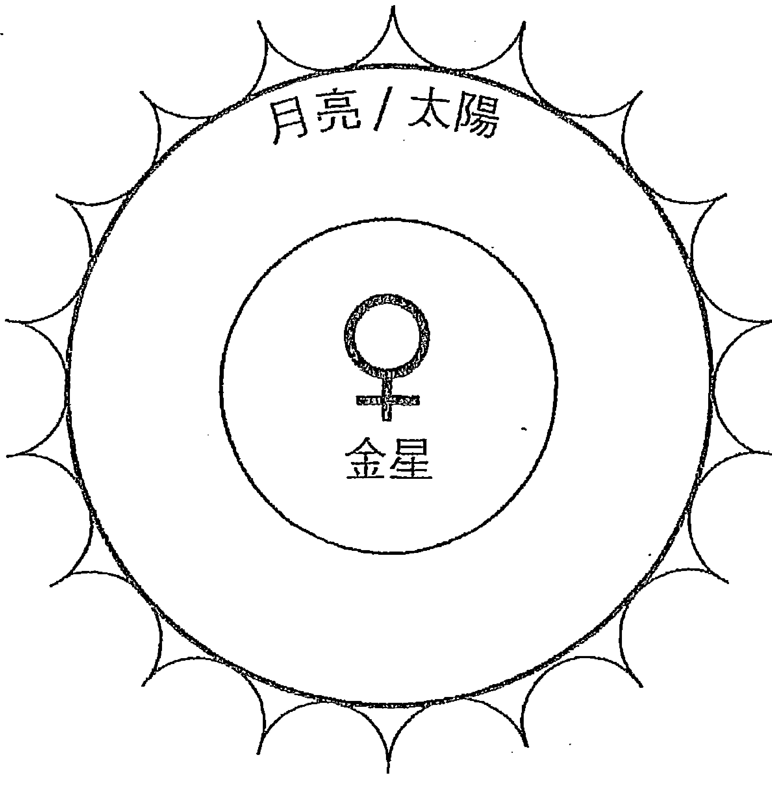

在月亮原始的、基础领域的能量中心，催生了金星阿芙罗黛蒂，她象征着女性天性中的活跃、吸引力和生育能力。

维纳斯·阿芙罗黛蒂的神话，象征着第一种阴性表述，与月亮本质上的所有可能性做出区别。依据阿芙罗黛蒂诞生的最早故事记载，海希奥德（Hesiod）描述，当叛乱的克洛诺斯（Cronus）把乌拉诺斯（Uranus）阉割，并将生殖器抛入海中时，海面激起一片浪花，她便出生于“海浪泡沫”（aphros，意指上升的泡沫）之中。

和煦的西风之神吹拂着贝壳上的窈窕身影飘越重洋，直到她登陆赛普勒斯的海岸，在那里，阿芙罗黛蒂受到荷赖（Horae）款待；荷赖是以周期循环且赋予生命的雨水划分季节时序的神圣自然守护者；阿芙罗黛蒂每踏出一步，脚下便长出鲜绿枝芽，她的其他同伴，诸如爱神艾洛斯（Eros/Love）、情欲之神希莫勒斯（Himeros/Tender Desire）也随荷赖陪伴这位貌美绝伦的新女神参与众神的聚会；根据荷马（Homer）的说法，每位男神见了阿芙罗黛蒂都为之倾倒，盼望娶她为妻，带领她回到自己的住所③；的确有许多人，无论是凡人还是神，都实现了与女神做爱的心愿，尽管后来她嫁给了赫菲斯托斯（Hephaestus），但她从未被赫菲斯托斯所占有。

故事还描述了美惠三女神（the Graces）为她沐浴并抹上永恒的油膏，此一象征仪式提醒我们——她恢复了童贞。④

阿芙罗黛蒂的阴性能量，其原型也细分为三位一体，分别名为阿芙罗黛蒂·潘德摩斯（Aphrodite Pandemos）、阿芙罗黛蒂·乌拉尼亚（Aphrodite Ourania）以及阿波斯托菲亚（Apostrophia）。柏拉图在著作《会饮篇》（Symposium）中，明确区分了阿芙罗黛蒂·潘德摩斯的“平凡之爱”，以及阿芙罗黛蒂·乌拉尼亚理想化的灵性之爱或柏拉图式爱情（字面意思为“天堂之爱”），阿波斯托菲亚则是第三种形式，被转译为“她转身离开”。

### 金星作为生育的表征

在金星的故事里，以月亮周期象征其孕育与转化的主要潜能，被激活为重要的生殖力。再次观照曼陀罗图像，从月亮的基础能量中心产生阴性表述的核心——维纳斯·阿芙罗黛蒂——透过阴极的神圣之美、性吸引力及爱，展现其重要的生育力。

维纳斯·阿芙罗黛蒂作为女性创造者，代表着容纳与释放生育力的能量，是阴性表述的泉源，这是一股驱使松弛的阴茎变成勃起状态的极性能量，故能透过性行为的结合促发繁衍的潜力。

作为爱神，她藉由唤起性欲来创造生命，对爱的冲动即是对于磁性的渴望，透过她的神圣之美产生无可抗拒的性吸引力，因为她是宇宙中繁衍力量的来源，所以恩培多克勒（Empedocles）称她为“生命的赐予者”。⑤

阿芙罗黛蒂最初来自亚洲，与伊什塔尔（Ishtar）、阿斯塔特（Astarte）息息相关，是掌管所有自然界与生物的生育女神。在后来的希腊时期，阿芙罗黛蒂的外在形象转而被视为爱与情欲的象征，生育女神作为“所有生命的原生之母”的功能被压抑与遗忘，因此，在父权体系下，她的原生本质被筛除和扭曲，简化为一位诱人而美丽的女性，否认了她与孕育周期及转化本质的链接。

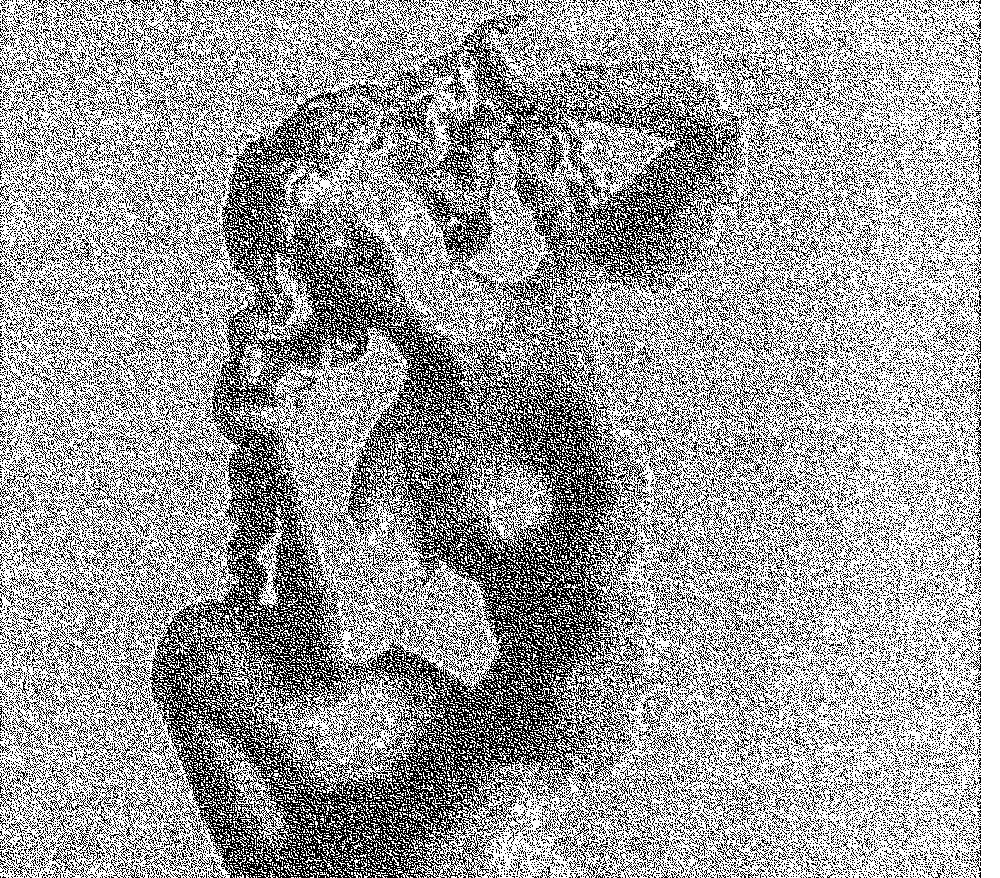

维纳斯·阿芙罗黛蒂 帕里安大理石雕像
希腊罗马时期：希腊化时期：约西元前 100 年罗德岛蹲着的阿芙罗黛蒂；阿芙罗黛蒂刚从浴泉中起身，呈蹲姿，正将头发绕束于头顶。
罗得考古博物馆
图片授权：慕尼黑的赫墨出版社（Hirmer Verlag）

### 金星与情爱课题

运用她磁性的能量，维纳斯·阿芙罗黛蒂可以缔造人与人之间的吸引力，或者创造“转身离开”的相斥力；她拥有促使他人燃起爱情并激起情欲冲动的能力，但她却无力承担，因而受业力牵连，招致未来经历了“被爱拒绝”的果报。如阿波斯托菲亚代表的“她转身离开”，呈现了阿芙罗黛蒂的黑暗面，启发了我们遭受拒绝与失去爱的痛苦经验，她教导我们责任的意义，对于可能引起他人情愫之事，学会保持敏感的觉察力。

透过经历被拒绝与失去的悲伤，我们学习到关于爱情转瞬即逝的心灵课题。作为哀恸女神，维纳斯·阿芙罗黛蒂每年都为她俊美而年轻的恋人阿多尼斯（Adonis）哭泣和哀伤，经由这份痛苦与折磨，维纳斯·阿芙罗黛蒂逐渐意识到，她不可能支配爱情，爱情与热情的本质并非恒久不渝，当体认到尘世间爱情的短暂，维纳斯只能用更强的力度，去表达对神圣之爱带来生命与重生的欣喜若狂。

总结来说，维纳斯·阿芙罗黛蒂的美丽与欲望象征着阴性本质的核心元素，她具有激发性欲及生育能量的吸引力。维纳斯·阿芙罗黛蒂位于各种阴性表述的曼陀罗中心，“整体自我的核心，亦为精神意识的中心，一切与自我相关，一切由意识主宰，而其本身即是能量的来源。”⑦

### 小行星——完整的曼陀罗

参照上述的曼陀罗图像，我们看到外圈的太阳／月亮代表阴性磁域的意识，较小的圆圈将金星视为阴性潜能的中心和活力来源，其中心存在着一个三角形，包含“+charge 正电荷”、“-charge 负电荷”以及“0 接地”，这区分了金星的积极动能（+）与月亮的消极潜能（-）。阴性意识的回路系统，以小行星作为接地（0），使阴性能量透过此接地图流动，从而分化成独一无二的活动类型；因而，小行星谷神星、智神星、灶神星和婚神星以各自的方式充分运用金星的性能量，她们代表阴性本质上多样化的功能和活动。

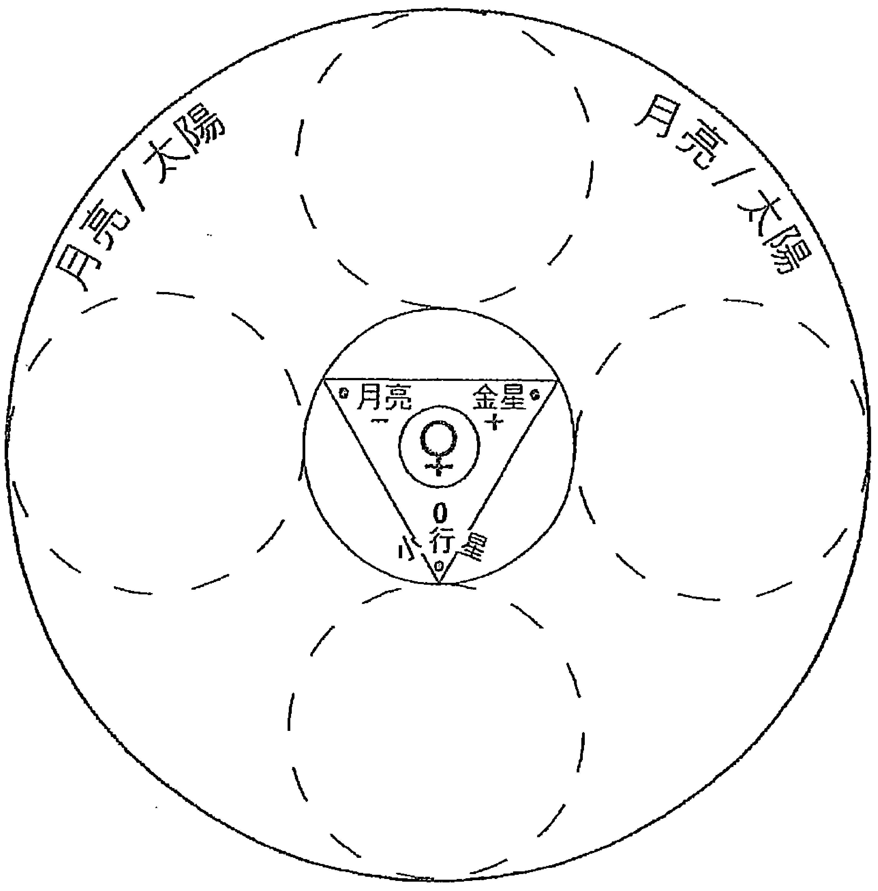

在过去，人们混淆了女性角色和阴性功能，也因此否定了男性身上所具备的阴性功能，甚至，某些对女性角色的刻板印象也局限了其阴性功能的表达方式，仅容许以社会认可的特定形式来表现。从生物学的角度来看，基于血缘的连系，母亲、女儿、姊妹和妻子是女性的主要角色；然而，阴性功能却比这些刻板印象更为多元，它包括各种受阴性能量驱动的活动和成就（在男性与女性身上皆会展露）。

曼陀罗图像的中心点与外圈圆圈的关系创造了两条特殊轴线。从占星学的角度来看，“y”轴是子午经线，连结上中天（Midheaven）与下中天（IC），描绘一个人展示于大众的外在角色（MC），以及对应于一个人私底下的本质和私领域（IC）；被称为“x”轴的水平线，连结上升点和下降点，描述一个人的自我认同（Ascendant）以及与“他人”（Descendant）的关系。

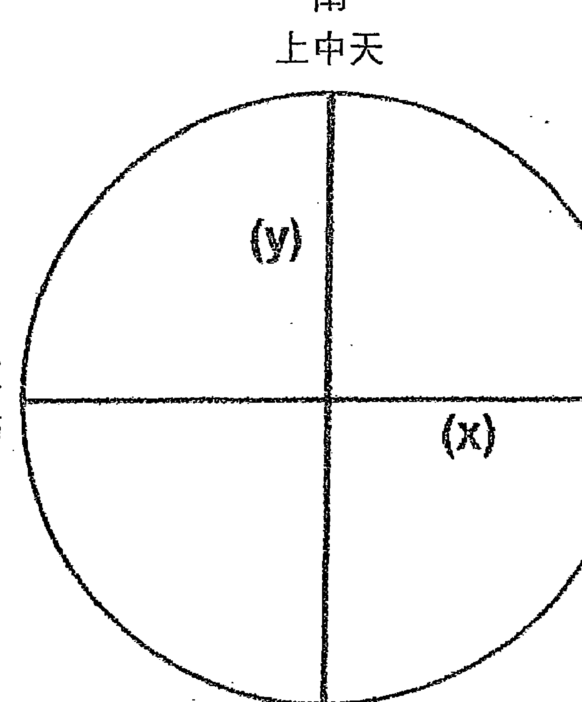

四女神星谷神星、智神星、灶神星和婚神星也位于这几个——南北和东西——四轴点的启动位置（如图3-6），由此创建了一个相互关联与统一的曼陀罗图像。因此，大母神（月亮）在生产力与转化能力的潜在本质，以活跃的生育能量（金星），区分出四种阴性活动的功能：位于下中天（IC）的谷神星，运用性创造的能量（sexual-creative energy）来生产生命与维生所需要的食物；位于上中天（MC）的智神星，运用性创造的能量来生产心灵与艺术的形式；位于上升点（Ascendant）的灶神星，运用性创造的能量来更新与再生自我；位于下降点（Descendant）的婚神星，运用性创造的能量来更新与再生他人。

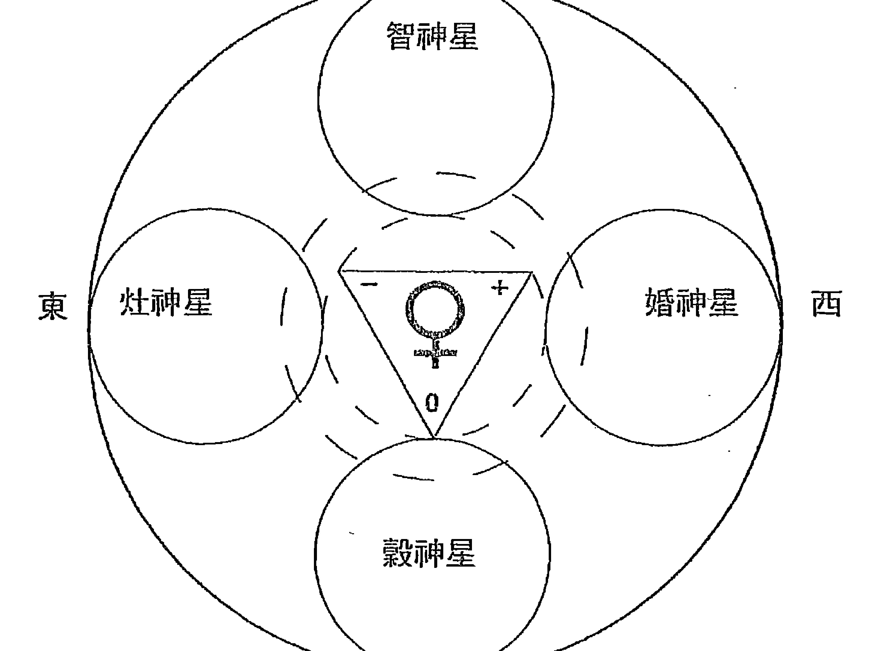

她向北散发光亮，让阴性能量化身谷神星希瑞斯，以母亲的角色展现其繁衍的面向，进而孕育与滋养万物。

阴性原型首先以位于下中天的母亲谷神星希瑞斯来表现，因此，她超越了金星的性吸引力，运用创造力来激发生命的潜能，以生理机能繁衍下一代。母亲在体内孕育着新生命，然后产下胎儿，这份滋养将持续到孩子能独立自主，自给自足为止，故而，母亲也负责生产粮食，为物种的繁衍提供哺育与滋养。

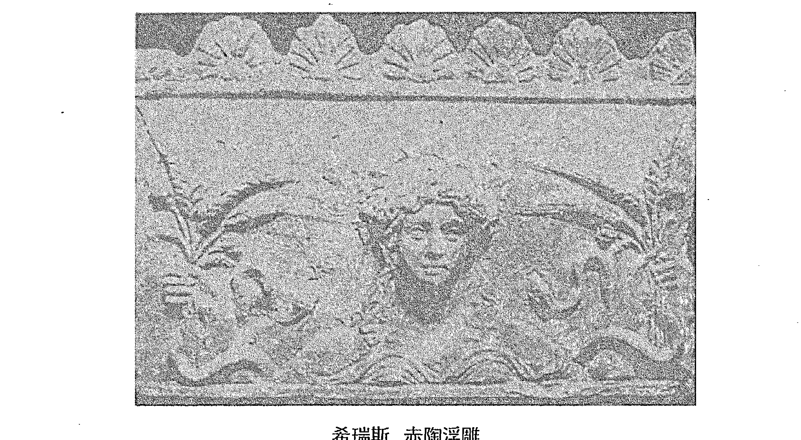

希瑞斯 赤陶浮雕
希腊罗马时期：希腊化时期，希瑞斯从大地现身，手里拿着罂粟荚果、百合花与麦穗，蛇只相左于两侧，盘绕前臂，蛇头抬起朝向着她。
罗马国家博物馆
图片授权：罗马国家博物馆

作为母亲，希瑞斯也象征着无条件之爱的原则，维持和滋养新创造的生命形式（值得注意的是，在神话中，希瑞斯既是怜悯与滋养大地的母亲，也是愤怒而荒废农作的母亲），透过与厄琉息斯秘仪的链接，谷神星也包含着诞生、死亡和重生的伟大奥秘，这其中蕴含了对灵魂和精神的喂养和滋养。

谷神星的外在颜色为绿色，象征着耕地植被的丰饶；她的内在颜色为蓝黑色，是冬季时分种子蛰伏于地底休眠的颜色。谷神星的务实特质也让她与大地元素链接。

在占星星盘的象征意义中，谷神星对应于北方位置的下中天，代表基础、根源与家人；在占星学，谷神星代表着给予无条件的爱，以及接纳自己与他人的能力。当一个人对自己的孩子、创造物或者财产变得过分依恋时，谷神星的周期将引领他们经历失去与复得的转化过程，她教予人们的智慧是：分享与放手才能够带来团聚。倘若一个人执着于谷神星的历程，他或她可能会在生活中经历被抛弃与拒绝——直到学会将占有转化为慷慨。

简而言之，谷神星是透过生理的生殖器官来落实月亮能量，以繁衍再生与供给食物满足人类的基本需求。

她向南散发光亮，让阴性能量化身智神星帕拉斯·雅典娜，以女儿的角色展现其创造的面向，催生出心智与艺术的产物。

与谷神星对望——位于曼陀罗图像南方位置的是女儿智神星帕拉斯·雅典娜，作为从父亲木星朱庇特头部诞生的智慧女神，她活跃且充满创造才智，能孕育出思想形式。在这里，金星的生育能量并非透过生殖器释放，而是像昆达里尼（kundalini）之蛇似的的爬升至头部，于此产生了创造性思维（心智产物），因此，智神星象征了创造性智慧的本质。

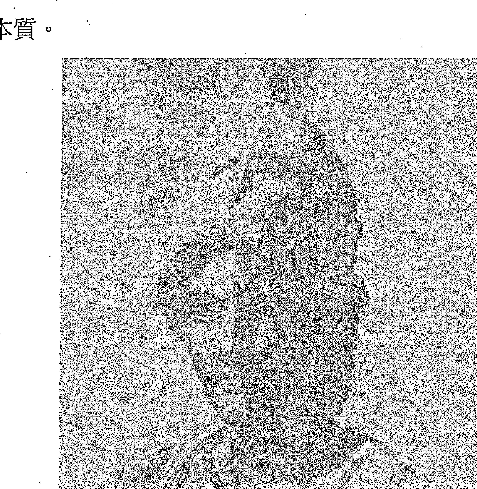

### 帕拉斯·雅典娜 青铜雕像

希腊罗马时期：希腊化时期：西元前二世纪，为西元前五世纪希腊时期原文物的罗马复制品。雅典娜戴着头盔，胸甲前覆着蛇皮埃癸斯，中央嵌着戈尔贡梅杜莎的头。佛罗伦斯国立考古博物馆 图片授权：慕尼黑的布鲁克曼出版社（Bruckmann）

在神话故事里，帕拉斯·雅典娜与戈尔贡·梅杜莎（Gorgon Medusa）的再生能力有关，而梅杜莎的头颅被帕拉斯佩戴于胸甲上；帕拉斯·雅典娜的外貌是自信与勇敢的，然而，她隐藏的另一面，却是对成功的恐惧，因而阻碍了创造力。她的代表色为黄色，象征在智能领域上的精通，而智神星的心智特质让她与风元素链接。

在占星星盘的象征意义中，智神星对应于上中天，有形的、世俗的成就于此实现；在占星学，智神星代表一个人的心智创造力，以及创造与控制现实的能力。当一个人被无知所蒙蔽，智神星的周期将指引他们经历生命结构的破坏与重建的转化过程，她教予人们的智慧是：心智的明眸蕴含着显现的种子，倘若一个人僵化于智神星的历程，他或她也许会经历信心不足或没有能力影响生命的状态——直到学会运用心智创造力将理想转化为现实。

概括而言，智神星描述了透过精神性的创造器官（大脑／心智）使月亮能量稳固落实，藉由行使智神星在显化法则的智慧，将想像化为实像。

谷神星与智神星之间的两极关系，以下中天和上中天（IC-MC）的两端作为象征，形成创造性能量与才智的轴线；金星的生殖创造力，透过谷神星表现在物质形式的繁衍后代，透过智神星表现在精神形式的创造产物。

她向东散发光亮，让阴性能量化身灶神星维斯塔，以处女与姊姊的角色展现出阴性本质的自给自足与自我完善，且不隶属于任何男性。

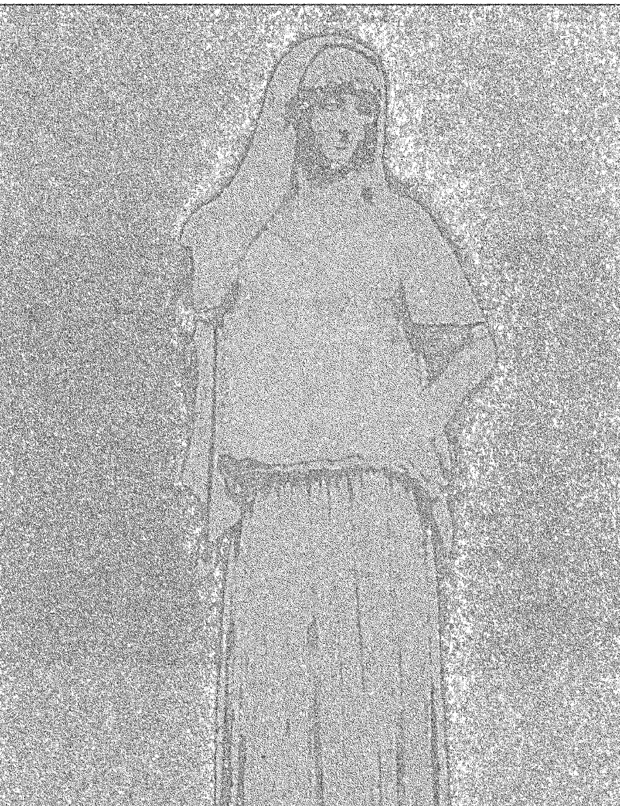

### 维斯塔 白特利大理石雕像

希腊化时代：希腊古典时期早期：根据约西元前 480 年至 460 年的青铜雕像所制成的复制品。
人称赫斯提亚·朱斯蒂尼亞尼（Hestia Guistiniani），站立着的女神，披挂着头纱，右手放在臀部，左臂失缺。
罗马的卡比托利欧博物馆
图片授权：伦敦的曼塞尔图片收藏（Mansell Collection）

位于曼陀罗图像东方位置的上升点，是姐姐灶神星维斯塔，她的处女本质，在古代被定义为自我的完成与完整，于此处，灶神星运用金星的生育能量再生自我。灶神星的本质是聚焦与承诺，她在单一领域里善用创造性能量，奉献并投身于特定的目标和抱负。

在原始功能与本质上，维斯塔统领着神庙中的处女祭司以及姐妹会中的秘仪指令，她们透过神圣的性爱仪式，将月亮的繁衍力经由身体的接触带入人类的生命。在后来的时期，当处女的概念转为贞洁的代表，维斯塔以性的拒绝、独身和禁欲来作为外在形象的呈现；在神秘的层面上，性能量被内化，以得到内在的灵性结合。灶神星的外在颜色是白色／透晶色，如她的标志所示，火炬燃起的光芒意味着纯洁，灶神星渴求的特质使她与火元素连结，她的符号本身即是火的象征——永恒的火焰，和秘密的性之火。

在占星星盘的象征意义里，灶神星对应于上升点，与个人的自我认同和独立自主有关；在占星学，灶神星代表专注力，以及经验自我完整的能力。当一个人的内在变得凌乱无章、过度依赖他人或迷失个人方向时，灶神星的周期将带领他们经历再生童贞（自我本质）的转化过程，她传授人们的智慧是：定期性地从他人的关系中回归，让自我得以净化与重生，进而让视野和目标变得明确。倘若一个人沉溺于灶神星的历程，他或她可能会经历漫无目标、疏离或者生命力枯竭——直至学会如何将迷惘转化为承诺。

概括而论，灶神星透过自我交流来落实月亮能量，以净化与整合个人意识的回路，并将自己献身于一项任务或理想之中。

她向西散发光亮，让阴性能量化身婚神星朱诺，以配偶与妻子的角色展现阴性与阳性本质的结盟关系，藉由缔结神圣婚姻的仪式，结合为一。

与灶神星对望——位于西方位置下降点的是妻子婚神星朱诺，作为婚姻女神，朱诺象征女性与男性透过承诺关系的形式结合，她运用金星的生育能量促进关系，并与另一个人圆满结合。在奥秘的层面，朱诺掌握着古印度谭崔（tantric）性爱的秘方，能让关系臻至完善，以作为通往灵性实践的途径。

婚神星的本质是链接和对他人承诺，渴望与人结合，她在关系中亲密与共享的天性，往往是透过嫉妒和操控来表现，当她感到无力，并试图在背地耍手段来挽回自己失去的影响力时，便会发生这种状况。婚神星的外在颜色为红色，代表她的激情与渴望占有；她的内在颜色为蓝紫色，象征深度链接的超然意涵。婚神星的情感特质，让她与水元素链接，而水是一种媒介，能够溶解不同的物质形式并将它们融合在一起。

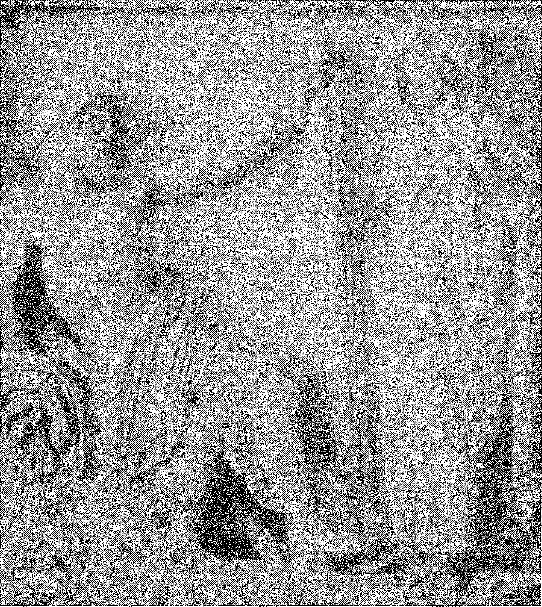

### 朱诺／赫拉与宙斯 浮雕雕塑

希腊化时代：古典希腊时期早期：约西元前450至425年，宙斯和赫拉的婚礼（来自塞利农特的赫拉神庙）；当赫拉将面纱举过头顶时，宙斯抓住了赫拉的手腕以示占有。
巴勒摩国家博物馆
图片授权：慕尼黑的赫墨出版社 (Hirmer Verlag)

在占星星盘的象征意义里，婚神星对应于下降点，即意识到另一个人以及与他人合作；在占星学，婚神星代表建立有意义的关系和对另一个人承诺的能力。当一个人开始变得嫉妒以及对另一个人不诚实，婚神星的周期将引导他们经历关系中结合与分离的转化过程，她教授人们的智慧是：宽恕与平等对待，才能与另一个人迈入更深一层和修复的关系。倘若一个人僵化于婚神星的历程，他或她可能会经历孤立、孤独和流于表象的交往——直到学会如何将自私的欲望转化为结盟合作关系。

总而言之，婚神星象征透过关系的交流来落实月亮能量，与男性透过合法程序结合，并从中再生自我；她作为链接「他人」的纽带，进而完成意识结合的回路。

灶神星和婚神星之间的两极关系，以上升点和下降点 (the Ascendant-Descendant) 的两端为象征，描绘了女性角色的能量轴线。虽然灶神星与阳性能量互动，但她仍然保持着自主性，并且将阴性能量重新融入到自己身上；另一方面，婚神星则与阳性能量结合，这样象征性的结合，完整了曼陀罗的阴性表述。

### 小行星中心

因此，这四颗小行星——母亲谷神星、女儿智神星、姊姊灶神## 小行星意识中心的觉醒

星與妻子婚神星——象徵從生育能量載體的金星（維娜斯·阿芙蘿黛蒂）所衍生出的四種主要活動與角色，而其生育能量又源於月亮，我們最初陰性能量的泉源。

小行星意識中心的覺醒，也影響了男性和女性的意識，過去，陰性能量一直被侷限於刻板印象中，這些由社會所決定的傳統角色，界定了男性與女性，也限制了他們能夠展現的範疇。舉例來說，穀神星代表的是人類心理上的母職，在男性和女性身上都能表露其功能（女性和男性也具有父職功能，由土星所象徵），而在一九六〇年代之前，女性唯一能被接受的母職形式，是作為全職母親和妻子，她待在家裡、照顧家庭，以及把家人的情感需求放在第一位；而對男性而言，唯一能被接受的父職形式，是出外闖蕩而且變得成功（例如賺錢），他帶回物質財富，並將榮耀歸給妻子和孩子。

這些人類（男性和女性）所具備的功能，已經在性別刻板印象下呈兩極分化的傾向；女性大多展現穀神星的面向（作為母親），而將土星的面向投射到男性身上，男性僅展現土星的面向（作為父親），而將穀神星的面向投射到女性身上；也同樣地，女性大多展現由婚神星所象徵的面向，即伴侶關係中的情感承諾與照料，而留予男性在太陽與木星所代表的外在世界裡，有更多的表達空間。

迄今，穀神星和婚神星主要關注於情感與關係，而灶神星和智神星則更關乎個人成就，其部分的原因，是因為穀神星和婚神星需要藉由另一個人（孩子或伴侶）來傳達自己的意義，而灶神星和智神星並不需要透過他人便能表達自我。由此看來，女性的成就感，除了母親和配偶之外，透過灶神星和智神星可以獲得更多的自我展現。

隨著現下小行星意識中心的覺醒，女性正逐漸突破刻板印象的限制，進而擴展陰性能量的表達範疇；於男性而言，這些意識中心的活躍，使他們越來越難以繼續壓抑或投射陰性面向。這股能量正訴求著從其封閉的內在結構中釋放出來，彰顯出對男性而言全新的個人課題。下述表格有助於區分：

|   | 穀神星 | 智神星 |
|---|---|---|
| 陰性功能 | 創造、支持、維持生命後代、身體的滋養——食物 | 創造心智產物、精神的滋養——願景 |
| 女性角色 | 母親 | 女兒 |
| 女性原型 | 待在家中廚房做飯的「母親」、打掃屋宅、照顧家庭、為小孩或透過小孩而活 | 無性戀的友伴／朋友、亞馬遜：「陽剛的」、男人婆、職業婦女 小女孩：支持丈夫成就的幕後功臣、「爸爸的小女孩」 |
| 男性與女性於表達陰性能量的替代方式 | 兒童教師與兒童教育工作者 兒童服務、捍衛選擇權（支持墮胎）與捍衛生命權（反對墮胎）的議題 助產與人道分娩 農業、園藝 | 才能、藝術創作、智力的發展 教育與職業的潛能 政治與社會意識、男性／女性角色類型的去極化 愛與創造力的整合 |
| 男性與女性於表達陰性能量的替代方式（續） | 與食物相關的服務、營養、健康意識 出於個人意識選擇成為單親家庭 世界飢餓與救濟組織 死亡、臨終、臨終關懷工作 |   |
| 生命的神奇實踐 | 轉化與死亡的儀式 女人的血液奧秘——月經、停經、初潮 | 創造性觀想、儀式與儀禮 心靈發展 |
| 如何活絡與運用個人的小行星中心與陰性力量（特別是男性） | 更多地參與生育過程／養育子女／分享子女的活動 積極地發揮養育者的角色（相對於被養育者而言） 培養同情／接納／同理的態度 單身父親的議題與責任 | 培養想像力／創造力 將情感關懷的價值觀與世俗成就整合起來 培養對教育、保健與所有領域的全面理解 |

|   | 灶神星 | 婚神星 |
|---|---|---|
| 陰性功能 | 自我更新與再生 與內在的自我結合 | 關係的更新與再生 在外部世界與他人結合 |
| 女性角色 | 姊姊 | 妻子 |
| 女性原型 | 老小姐／獨身／工作狂／狂熱的修女與祭司 | 妻子是將經濟責任與決策權交給丈夫的婦女 一對一的關係、一夫一妻制、異性關係 將丈夫視為其身分、成就的唯一／主要來源 |
| 男性與女性於表達陰性能量的替代方式 | 對事業、思想、信仰體系的承諾（對女性而言，除了作為妻子與母親的家庭責任之外） 靈性／奉獻之途 體認到須定期地從外部世界閉關的價值並積極實踐 從性禁忌與性情結中解放 致力於「自我」——健康與健身的整合 | 消除自我分離的幻覺，「我不需要別人」的態度 倡導女性在經濟／政治／教育／體育領域的權利 擴大親密關係的範圍，男／女同性戀 切斷關係中的嫉妒與依戀 創造新的關係形式 |
| 生命的神奇實踐 | 創造性觀想、儀式與儀禮 心靈發展 | 譚崔性愛的實踐 |
| 如何活絡與運用個人的小行星中心與陰性力量（特別是男性） | 學會認知到性只屬於自己，他人皆無權干預 體認「內在的生活」 培養對性方面的非批判態度與道德觀 培養對性的敏感度與取悅伴侶的技巧 | 家庭主夫 適應變化中的女性角色、關係規範的能力及意願 接受平等的觀念／工作／女性產出的價值（除了性／食物／生理舒適之外） 培養對性的敏感度與取悅伴侶的技巧 |

## 參考文獻

1.  Carl G. Jung, “Mandala Symbolism” (New Jersey: Princeton University Press, 1972), M.73.
2.  Esther Harding, “Woman's Mysteries: Ancient and Modern” (New York: Harper and Row, 1976), 105.
3.  New Larousse Encyclopedia of Mythology, trans. R. Aldington and D. Ames (New York and London: Hamlym Publishing Group, Ltd., 1983), 130.
4.  For more on this concept of virginity, see Esther Harding's Woman's Mysteries, “The Virgin Goddess” (New York: Harper and Row, 1971).
5.  Christine Downing, The Goddess: Mythological Images of the Feminine (New York: The Crossroad Publishing Co., 1981), 190.
6.  E. O. James, The Cult of the Mother Goddess: An Archeological and Documentary Study (New York: Frederick A. Praeger, Inc., 1959), 147.
7.  Jung, Mandala Symbolism, 72.

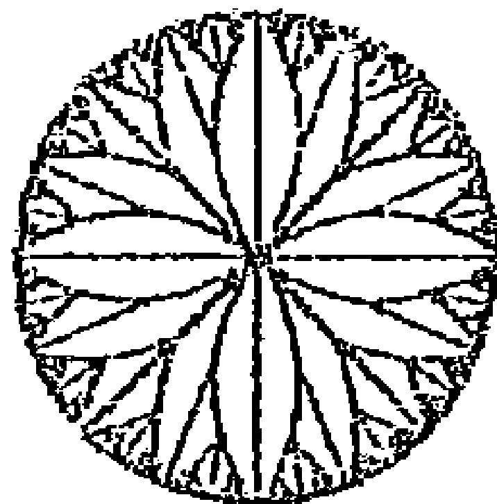

## 第四章

## 穀神星：大母神

> 此刻容我贊頌
> 迪米特，
> 敬慕的女神，
> 挽著絲絲秀髮，
> 伊人
> 她的愛女
> 赤著纖纖玉足，
> 讓艾多紐斯
> 劫去，
> 宙斯
> 深謀遠慮
> 用他低沉的雷鳴
> 默許。①
> ——荷馬

### 希瑞斯的神話

穀神星——羅馬女神希瑞斯（Ceres），最初被古希臘人稱作狄米特，她的名字源於古老的稱謂 da mater，意為大地之母。在奧林匹亞的萬神殿中，希瑞斯是薩圖恩努斯（Saturn）和雷亞的女兒，希瑞斯與她的姊妹維斯塔、朱諾，以及兄弟朱庇特、涅普頓和普魯托一起被父親吞下，在朱庇特戰勝薩圖恩努斯和泰坦眾神（Titans）後，這些神祇獲得釋放，並成為統治希臘的家族。

隨著時間的推移，希瑞斯不僅生活在天界，也與人們生活在土地上，她賜予人們兩樣禮物：穀物和厄琉息斯秘儀。②作為農業與收成女神，希瑞斯象徵餵養與供應人們耕作的肥沃土壤；因此，她被奉為滋養萬物的母親，頭戴由玉米穗和麥穗編織的花冠，一隻手握著穀穗或罌粟花，另一隻手握著點燃的火炬。

然而，作為對閨女柯瑞（Kore）／波賽鳳妮全心奉獻與慈愛的母親，希瑞斯在希臘人心中佔據了最重要的地位，她們的故事——波賽鳳妮被普魯托劫持到冥府、希瑞斯承受了悲痛和煎熬，以及她為了與女兒團聚而尋找的過程——成為古代世界重要的神話之一。這段失落與復得的劇情，在近兩千年裡（西元前一六〇〇年至西元四〇〇年），作為厄琉息斯秘儀的啟蒙儀式而被重演。

### 希瑞斯與波賽鳳妮的故事

很久以前，希瑞斯和她心愛的女兒波賽鳳妮一塊兒在大地上游蕩，她們彼此相伴過著幸福的日子，並賜予大地永久豐收的季節，在這個黃金世紀（Golden Age），世上無虞匱乏，亦無寒冬。

### 波賽鳳妮遇劫

波賽鳳妮長大後，出落得如母親一般秀麗，深受男性和眾神的渴望；然而，母女之間的愛是如此強烈，她們不願意與對方分開，因此所有追求者都遭到拒絕，並被打發離開。

有一天，波賽鳳妮離開了希瑞斯的視線，和她的同伴一起漫步到倪薩（Nysian）的田野間，在那裡，她無法自拔地被數百朵美麗芬芳、盛開的水仙花所吸引，當波賽鳳妮摘下水仙花，吸入醉人的花香時，地面突然裂開，迸出了一道深淵，冥界之神普魯托從中現身，他對波賽鳳妮的美貌覬覦已久；普魯托乘著他那由四匹呼嘯的黑馬拉動的金色耀眼戰車，抓住了尖叫的少女，將她擄回死亡國度，成為他的新娘和皇后；裂開的土地隨即癒合，沒有留下一絲證據。

當希瑞斯回到恢復平靜的草原，卻遍尋不著女兒的蹤影，她在田野和山林間奔馳，呼喚著波賽鳳妮的名字，當她意識到沒有人知曉女兒的下落，她的焦慮轉為絕望和恐慌。整整九天九夜，她悲痛欲絕，拒絕進食和沐浴，手持熊熊的火炬在大地上徘徊，四處找尋女兒；直到第十天，遇見閨月女神黑卡蒂（Hecate），建議她去向太陽神先知赫利俄斯（Helios）請益。

希瑞斯從赫利俄斯得知了普魯托的劫持，而他的兄弟宙斯（Zeus）竟默許了此次的行動，宙斯似乎認同普魯托是值得託付的丈

### 希瑞斯在厄琉息斯

經過好長一段時間，心力交瘁的希瑞斯來到一處名為厄琉息斯（Eleusis）的小鎮尋求庇護，在那裡的井邊，遇見國王刻勒俄斯（Celeus）的四個女兒，她們邀請她一起回到宮殿。在宮殿中她遇到皇后莫塔涅拉（Metaneira），莫塔涅拉歡迎她這位陌生人的來訪，並將小皇子德摩丰（Demophoon）交由她照顧。

### 波賽鳳妮的歸來

此刻，希瑞斯隱居於神廟中，在那裡繼續為她失去的愛女哀悼，在希瑞斯的悲憤中，她讓人們度過殘酷而可怕的一年：大地拒絕生長任何農作，地上的穀物萎敗，樹上的果實腐爛；如果這位生育女神必須在沒有孩子的情況下生活，那麼人類也將遭受飢荒和挨餓。

絕望之際，大地上的人們祈求宙斯居中調停，宙斯因此意識到，若人類滅絕，將不再有人敬拜神祇。於是派遣伊麗絲（Iris）將希瑞斯召回奧林帕斯山，希瑞斯拒絕前往；而後每位神祇都向希瑞斯獻上禮物，懇請她手下留情，但她一概回絕。唯有女兒被釋放，她才會罷休。

宙斯無計可施，只得指派荷米斯（Hermes）下到冥府，命令普魯托釋放波賽鳳妮。波賽鳳妮冷若冰霜的美貌下，也隨母親哀悼，拒絕任何飲食，普魯托出於狡詐的善意，同意釋放波賽鳳妮，但先誘騙她吃下幾顆石榴籽來緩解口渴；由於石榴是圓房的象徵，波賽鳳妮的允諾，使得她與他的婚姻關係牢不可破。

返回光明世界後，波賽鳳妮在厄琉息斯開心地與母親團聚，希瑞斯立刻詢問女兒，在冥府是否食用過任何死者的食物，當波賽鳳妮透露了事情的始末，希瑞斯這才明白自己被欺騙了，她的女兒仍然是普魯托的囚徒；她再一次拒絕解除對土地的詛咒。

為了阻止希瑞斯和普魯托毀掉他所創造的世界，宙斯在母親雷亞的幫助下，要求他們妥協讓步，他下令：波賽鳳妮每吃下一顆石榴種子，每年就需要花一部份時間作為普魯托在冥府的新娘；而剩下的幾個月，可以和母親一起在大地上度過。

於是，每年春天波賽鳳妮會出現在地面上，與希瑞斯相聚，讓大地變得豐饒，種子萌芽、百花綻放、植物茁壯，而庄稼佈滿田野；隨後邁向夏天，大地欣欣向榮；直到秋天來臨，波賽鳳妮必須回到普魯托的冥府。在女兒離開之後，希瑞斯將悲傷的手覆蓋於大地，使其變得貧脊，荒蕪將持續整個冬天，直至下個春天波賽鳳妮的歸來。

因此，大地每年循環著蓬勃和死寂，如希瑞斯為波賽鳳妮的歸來而歡喜，為波賽鳳妮的離去而悲泣。從外顯的意義來看，波賽鳳妮每年的消失與回歸，是一則種子於冬天休眠，直至春天萌芽的寓言，它向農民闡釋了季節的更迭；從內在的意義來看，這段劇情的重演，讓人們瞭解原型主題裡的失去與復得；而從厄琉息斯秘儀的啟蒙者所傳授的奧秘意義來看，這項儀式揭示了偉大的轉化奧秘——誕生、死亡和重生的周期。

在離開厄琉息斯之前，希瑞斯賜予國王和皇后的大兒子特里普托勒摩斯（Triptolemus）第一粒玉米種子，以表達她對這座城市的感謝；接著指示他將她神聖的農業技術傳給全人類；最後，她向厄琉息斯的人們傳授神聖的儀式，引領人們對她神聖的敬拜：

……因為對女神的敬畏而噤聲，秘儀既不可被透露，亦無法聽聞，甚至不能大聲說出來。有福的是見識過這些儀式的世間凡人，而未接受啟蒙以及無緣分享的人，將不能領受這樣的祝福，死後只能置身於陰鬱黑暗的地底。③

這些儀式構成了厄琉息斯秘儀的核心，並成為古代世界的主要啟蒙儀式：藉著讓信徒在塵世生活中穿越死亡和重生之間的通道，她們解決了人類對於死亡的恐懼和擔憂；藉由種子的秘密，象徵著生命以有形和無形的形式永恆存續。這樣的親身經歷，為參與者提供了「保障生命能不畏懼死亡，並有信心地面對。」④

### 希瑞斯神話於古希臘時期的起源

上述源自西元前七世紀由荷馬撰寫的《狄米特頌》（Hymn to Demeter），是希瑞斯神話最廣為流傳的版本；然而，也有其他的證據顯示：希瑞斯／狄米特是大母神的共同原型，出現於近東和埃及地區，而後遷徙至米諾斯（Minoan）的克里特島（Crete）和古希臘地區。⑤在與這些地域文化相關的神話中，我們發現了偉大的生育女神／母神這個一再出現的主題，例如蘇美的伊南娜（Inanna）、閃族的伊什塔爾和埃及的伊西斯（Isis），她們進入亡靈的疆界，再回到生者的土地，並且與象徵復甦的植物之神有關聯。

作為克里特島的大母神，希瑞斯參與了古老的生育儀式，這個儀式是為了確保豐收而創建的：在秋分時節，她，身為穀物女祭司，與她的情人雅西昂（Iasion）一同躺在已犁了三遍的耕地上，誕下了大地的財富之神普路托斯（Plutus）；當大地受神聖婚姻的崇敬而繁茂生長時，普路托斯便成了豐饒物產的象徵。

希瑞斯／狄米特的原型也透過埃及的伊西斯、海希奧德的蓋婭（Gaia，在許多新世紀的著作中，被用來稱呼我們的地球）、米諾斯的雷亞以及佛教中的度母（Tara）來呈現，她們在地球管理的領地也由凡間擴展至陰間（她們都經歷過死亡並滋養了生命）。

荷馬的《狄米特頌》最後是透過描繪波賽鳳妮的強暴而聲名大噪，這段後來補述的情節並未出現在較早流傳的版本中。從歷史的角度來看，波賽鳳妮的強暴，象徵著父系文化（普魯托）與原生的母系女神崇拜（由希瑞斯代表）之間的權力鬥爭，故事的最終結果指出：由北方宙斯的擁戴者贏得了顯著的勝利，大母神不僅得坐視女兒受人強暴和綁架，希瑞斯還被迫與敵人分享她心愛的波賽鳳妮；因此，她不得不放棄一部分對生死祭儀的權力，而此一統治權最終被完全奪去。

簡而言之，希瑞斯象徵滋養萬物的母親，我們的「穀物」（cereal）一詞便是從她的名字衍生得來的。作為母親之神，希瑞斯體現了神話中所象徵的生命延續；作為穀物女神，她賜予人類農業與種子的秘密作為贈禮，使萬物得以生養繁衍。並且，希瑞斯作為執掌奧祕的女神，在處理波賽鳳妮一事上，接受了死者的重生。

在原型劇情的框架下，厄琉息斯秘儀帶領她們的信徒經歷希瑞斯和波賽鳳妮的遭遇，從故事中經歷失去與復得：首先，故事被重述；接著，在小秘儀（the Lesser Mysteries）中，參與者體驗了故事情節的重現；最後，在大秘儀（the Greater Mysteries）中，他們得到一種視覺意象與啟發，即偉大的神話劇情在他們身上得到見證。這些儀式至今仍在進行，如心理治療師的報告所述：他們觀察到病患的夢境和幻想中，出現了古老啟蒙儀式的象徵。⑥由此可見，希瑞斯的通道儀禮（rites of passage）⑦，如今正作為心理轉化的階段，於內在層次中得到實踐。

### 穀神星——希瑞斯

### 希臘時期的狄米特

### 角色

### 無條件之愛的原則

### 占星符號：？

### 鎌刀——農業的贈禮

### 象徵物

- 鎌刀／犁
- 裝滿麥穗或稻穗的豐饒之角
- 罌粟花——人類悲痛的慰藉
- 母豬
- 火炬
- 鸛鳥

### 相關的主管星座

- 巨蟹座
- 對宮星座：金牛座—天蠍座
- 處女座

### 極性

- 同理／憤怒

### 穀神星占星學

> 「進入穀神星的角色意味著：被追求、被綁架、被強暴；無法理解、憤怒和悲痛；最後卻找回一切而重生。」⑧

心理學當中，穀神星所掌管的幾項母親功能，其心理特質並無法以單一黃道星座來表述。關於穀神星如何在星盤中發揮作用，筆者經過多年的觀察得出了結論：由巨蟹座、金牛座—天蠍座以及處女座來描述穀神星的屬性最為適切。作為巨蟹座的主管行星，穀神星陳述的議題是：我們如何給予與接受滋養、我們如何發展自我價值、我們如何供養與照顧他人，以及如果這些需求得不到滿足時，我們是如何神經質地做出回應；作為金牛座—天蠍座這組對宮星座的主管行星，穀神星掌管著依戀與嫌惡（aversion）的課題、失去與拒絕的病徵、悲痛與憂傷的承受力，以及分享的準則；作為處女座的主管行星，她談及生產力、成長、自給自足和工作的議題。接下來，我們會對這些歷程做更深入的探討。

### 穀神星作為巨蟹座的主管行星

### 穀神星：宇宙之母

穀神星作為巨蟹座的主管行星與母性本能，主要象徵著滋養和照顧他人的需求，這樣的渴望最經常透過成為母親或父親來實現。穀神星型的人會強烈感受到自己需要成為父母，去滋養、撫育和供養他們的孩子；穀神星的流運和推運就像是計時器，標示著懷孕和孩子誕生，受孕、分娩過程以及養育的困難時刻。作為供養者，穀神星在生理（她供應糧食和住所）、情感（她給予愛和支持）和精神（她提供指引和智慧）層面上滋養他人。

作為母性功能的象徵，星盤中的穀神星描述了我們小時候得到的母愛體驗，以及我們成為父母時會表露的母愛品質。雖然養育者通常為生母，但實際上可以是任何一位家庭成員——父親、祖父母、姑姑、叔伯和親近的家族友人，或是寄養父母／繼父母／領養父母；無論是誰，只要對孩子的養育與早期發展階段負起主要照顧的責任，他便會表現出谷神星的原型。

作為生育和農業女神，谷神星象徵著滋養萬物的大地之母。嬰兒對愛和安全感的第一次體驗，來自於母親的餵養，透過接受食物形式的愛，孩子培養出自己值得被滋養的感受，進而為個人的自我價值奠定了基礎；因為這些早期經驗，會成為成年後良好的自我接納和自尊的根基，而如果谷神星的母愛缺失或匱乏，在往後的歲月可能會發展為不良的自我形象和自卑。這裡需要留意的是：孩子對於自身的養育的經驗認知和解讀，和實際的養育情況一樣重要。

理想情況下，母親或養育者所傳達的愛，其類型是無條件的——即不期望回報；當情況並非如此，谷神星在星盤中的狀態會點出，孩子需要做些什麼才能得到父母的愛和認可。如果持續以某些條件作為基準來給予愛與認同，他們會感覺自己是不值得被愛的。舉例來說，一個谷神星在白羊座的孩子，經由被賦予獨立來獲得養育，這種需求的扭曲可能發生兩種情況：第一、過於強勢的父母可能會剝奪孩子的自主權，在這樣的例子裡，孩子會透過否定自己的果斷力來應對；第二、孩子可能在尚未準備好承擔責任之前，就被逼著要獨立自主，從而產生恐懼和自我懷疑。無論是何種狀況，孩子的獨立需求都沒有獲得充分的培養，因而阻礙了自我主張的能力發展。

## 以谷神星之愛作為愛人的基礎

愛自己的能力源於正向的谷神星母愛，而孩子對母愛的接受能力也會產生愛他人的能力，並為他人的成就感到喜悅；在谷神星能量被扭曲或者不足的情況下，孩子會變得自我否定而不是自我接納，因而以苛刻和批判的態度對待他人，以及對他們的成就感到憤恨。佛教哲學教導我們：要治癒這種態度，必須培養對人的慈悲心，而對他人的感同身受即源自母愛的經驗。如同這個信仰體系所教導的，經歷了無數次輪迴，那些此生與我們相遇的人，都是我們曾經養育過，或是養育過我們的人，因此，我們必須永遠銘記並榮耀我們的母親，她藉由愛他人與接納他人，展現她在包容、養育和支持上無以計量的付出。

從占星學的角度來看，這種從個人情愛走向宇宙大愛的演化，是由三個水象星座——巨蟹座、天蠍座和雙魚座所象徵：與巨蟹座相關的初始階段是無條件的母愛，它使人產生強烈的自我價值感；當這股自尊心運作時，個人便能成功進入第二個水象星座天蠍座，進行更複雜的性以及渴望有回報的互動；這種在一對一關係中與另一方結合的能力，為第三個星座雙魚座所發展的全人類之愛提供了基礎。

如果這個過程因故被中斷了，會出現什麼情況呢？這種情況發生於一九三〇年代，孩子們開始在醫院裡集體出生，於是，他們被拒絕了最初由母親抱在懷裡和照顧的谷神星印記：他們在強光的照射下被打屁股，被安置在無菌的嬰兒床上，並以裝於橡膠奶瓶的糖水作為食物；這種最初親密連結的拒絕經驗，是導致這一代的人對於人際關係感到困難和受挫的主要原因之一。

但是，谷神星基礎薄弱的人，並不代表註定會孤獨，或者陷入不如意的關係。為了療癒孤獨或抑鬱（兩種常見的谷神星病症），他或她應該尋求諮詢以建立自尊，從而為將來的良好互動立下基礎；然而，這些關係並不僅限於異性間的往來，事實上，谷神星的母愛可以透過各種形式給予和接受，像是同性戀者、男性與女性的支持團體，或者相互滋養的柏拉圖式情誼。

## 谷神星的心理情結

因為谷神星執掌著整體的為母經驗，也掌管許多由負面的、早期父母的狀況所導致的心理問題，在這裡我們摘要列舉這些最重要的情結，以提供讀者進一步探討與研究占星學的方向。

## 消極情結

當孩子經驗到的谷神星母愛，大多是有條件才能取得的話，他們會以達成父母的期望，或使父母失望作為回應。在後一種情況下，孩子屢屢受挫的經驗，經常會萌生出「何必呢？」的態度，因此，當面對一項困難的或具有挑戰性的任務，他們會自問：「我知道自己不可能成功，那何必去嘗試呢？」這種失敗主義的態度如果延續到成年後，可能會產生一些心理情結：害怕競爭、無力採取行動和長期的無力感與依賴感；過度補償的行為也可能表現為，僅僅為了自我滿足，而強迫自己必須優於他人。

## 飲食情結

由於谷神星執掌著人體機能的照護與餵養，也掌管所有類型的飲食情結和飲食障礙，因此，自谷神星星曆在一九七三年出版以來，人們對這些過去受到忽視的飲食失調投以極大的關注，這並非偶然。

希瑞斯對於女兒被綁架一事感到憤怒，她停止地球上所有的糧食生產，以此懲罰她的敵人，因此，谷神星的衝突相位經常指出，父母透過扣留食物來處罰孩子，例如讓孩子不吃晚餐就上床睡覺，這種社會公認的育兒方式，為許多與食物相關的疾病埋下了根源。厭食症（飢餓）和暴食症（過度進食）這兩項疾病，被醫師和治療師認為是當前流行的病症，這些疾病的心理根源顯然與谷神星有關——打心底認為自己不值得、卑微的自我形象，以及必須達成父母所設定的完美標準。

這些情結以一種不那麼危害的方式，影響著數百萬計的女性，對她們來說，強迫自己節食已經成為一種生活方式；幸運的是，這些失衡行為的補救辦法也可以在谷神星心理學中尋獲——培養對自己和對他人無條件的愛。

當食物被當作愛與認可的替代物時，其他的飲食情緒也會因而產生，下述兩項常見的指令便是食物策略的例證：「吃吧！這樣會讓我高興」、「如果你想吃甜點就把晚餐吃完」（鼓勵你的努力）。這類的制約條件，鼓勵孩子忽略自己身體的飢餓和食慾的本能，反倒以無視或違背身體的需求來回應外部的指示；這種無意識的制式化行為，是造成社會上許多人為過度飲食的強迫症所困的根源。

當一個人自我認同低落，必須用食物來隔絕他或她於外在世界的表現（性或其他外顯特質），最終，就會產生谷神星式的飲食障礙；故而，食物被用來保護一個人免於跟他人建立關係。谷神星顯然是所有跟體重和身形疾病相關的占星代表因子，谷神星與其他行星和小行星的相位揭露了更多的訊息，像是性格中的哪些面向容易感受壓力或陷入痛苦。

## 關係情結

谷神星的母親印記，在人類的心理留下如此深刻的印象，她的重要性也滲透到人際關係的領域。谷神星的衝突相位可以指出個人不願或無法提供滋養，或是不願在情感上支持他人；相對地，他們接受滋養的需求也經常遭到拒絕。

當谷神星位於星盤的第七宮，或者與金星、火星、婚神星形成相位，父母關係會成為未來成年後擇偶的榜樣。當孩子對愛的最初體驗是正面的，他們將能經驗相互扶持的愛情關係；然而，當孩子認為母親或「養育者」是霸道的、掌控的，或令人窒息的，孩子將設下防禦機制來阻擋父母的負面影響力，這種對於接受滋養的抗拒，將會投射到成年伴侶的身上。

舉例來說，星盤中有谷神星衝突相位的男性，往往一開始會被那些表現出滋養和撫慰特質的女性所吸引；然而，隨著關係的進展，早期制約下的潛意識開始浮上檯面，使男性不得不與隨之而生的依賴進行抗爭，而如母親般富有同理心的妻子，則以苛求和控制的行為來經歷自己的黑暗面，通常女性獲得影響力的方法來自食物，即「想抓住男人的心，先要抓住他的胃」。同樣地，星盤中有谷神星衝突相位的女性，通常會吸引有父愛特質的男性來支持與保護她們；但很快就會發現自己變成「爸爸的小女孩」，被囚禁於如波塞鳳妮般的孩子身分當中。

顯然地，要在我們的人際關係中展現心理健全的谷神星，關鍵在於對我們的伴侶存有母性的關懷，同時也支持對方的獨立與自足；反之，當我們展現滋養是為了滿足權力和控制的需求，或是達到某種目的時，谷神星的母愛會變得神經質且自我挫敗。

## 親子情結

> 「每個母親內心都蘊含著女兒，每個女兒內心也蘊含著母親；每個女人都是自己母親與女兒的延伸。」⑨ ——卡爾·榮格

谷神星是未竟的秘密心願、夢想、焦慮、恐懼和幻滅的代表因子，並曾經由母親移轉給孩子，這些訊息並非透過言語或行動來傳達，而是潛移默化地透過父母與後代之間無意識的情感紐帶來傳遞。⑩ 這種紐帶往往成為一種渠道，父母的願景和抱負（或者恐懼和不足）被投射到孩子身上，然後將孩子視為自己的延伸。因此，當占星師遇到懷有這類親子情結的谷神星型客戶時，應該建議他們做治療諮詢，以使客戶擺脫共生依賴關係。

在我們為谷神星作為巨蟹座主管行星的分析進行總結之前，需要強調一個重要的觀點，如果閱讀本書的你是一位占星師，你或許會自問：「谷神星的定義和月亮有什麼不同？」答案很簡單。就某方面來說，谷神星和月亮之間的確存在著對應關係，因為月亮代表了在谷神星和另外三顆小行星外圍形成的母體，但是，谷神星和月亮更具體的區別，是她作為母親的陰性角色；因此，星盤中的谷神星提供了關於母親功能的額外資訊，而這些資訊無法單從月亮星座的分析中獲得。

## 谷神星作為金牛座—天蝎座對宮星座的主管行星

谷神星與金牛座和天蝎座黃道對宮之間強大的對應關係，可以從四個不同面向來觀察：

- 月亮，作為谷神星之「母」，入旺於金牛座；谷神星是農業女神，她將月亮的能量落實於物質層面，創造了肥沃的土地（金牛座）。
- 谷神星的厄琉息斯秘儀由一位被稱為顯靈祭司（Hierophant）的神聖祭司所主持；Hierophant 也是塔羅牌中的教皇牌卡，對應於占星學的金牛座。
- 在她的神話中，谷神星的對手正是金牛座的對宮天蝎座的主管行星，冥王星。
- 佛陀在金牛座—天蝎座的滿月期間，誕生、頓悟成道與死亡，他的傳法著重於依戀（金牛座）、死亡和放手（天蝎座）的議題；在被迫要放下對女兒的依戀以及對死亡儀式的執掌權，谷神星的故事也同樣闡述了金牛座—天蝎座的主題。

綜合以上四點，作為金牛座—天蠍座對宮星座的主管行星，星盤中的谷神星描述了依戀、分離與失去的心理經歷、死亡與重生、悲痛與哀傷的承受力，以及必須學習如何分享。她的神話包含了穿越這些死亡與重生之路的指南。

## 依戀與分離的課題

對於星盤中谷神星顯著的人來說，如何轉化對親人的依戀，以及如何轉化對重視的物品或想法的執念，會成為他們生命中重要的一課。也許他們被父母所依賴，或是他們試圖佔有自己的孩子；然而，我們的宏觀宇宙始終致力於維持平衡，強烈的依戀會招致更激烈的事由和情境，使他們與渴望的對象分離，因此，執著於依戀，會產生無法依戀的課題，這也確實是希瑞斯與波塞鳳妮的經歷：希瑞斯不願給予波塞鳳妮自主決定的自由，而波塞鳳妮對母親有同樣強烈的依戀，她不自覺地引來了強暴與綁架。

在希瑞斯被迫與女兒分離後，她停止生產人類維生的糧食作為報復，因此，谷神星的陰暗面也象徵了被拒絕的經驗，以及中斷維生所需的養分；也因此，當谷神星在星盤中被突顯，或與冥王星有相位時，分離可能會成為此人生命中一再出現的主題。這類剝奪的例子包括：因為死亡、被拋棄、被遺棄或疾病而失去父母；因為死亡，監護權被判給另一方或者另一州，或因綁架而失去孩子；或失去寵物；以及從一段關係、工作或安全的環境中離開。

此外，人們對於虐待兒童、亂倫，以及兒童性騷擾相關行為的關注度也日益提高，這也和波塞鳳妮被普魯托綁架以及後續受其侵犯有關。

即便沒有發生實際的損失，谷神星—冥王星類型的人也可能在潛意識中害怕被所愛的人拒絕、截斷（cut off）或分離而為此所困。這種焦慮也會順理成章地引來加深負面發展的情境。因此，這類型的客戶應當進入更深層的療癒，以解決與平復他們根深蒂固的恐懼。

在失去孩子後，希瑞斯陷入了好長一段時間的悲痛與哀傷，因此，谷神星的流運往往描寫了我們哀悼失去的摯愛，或者任何與我們有情感連結的事物（一份工作、一段關係、家庭、雪茄或酒精）；在神話故事裡，希瑞斯經歷了悲痛過程的各個階段——震驚、沮喪、內疚、憤怒到最後的接納，故而，她為我們自身的失去與轉化提供了一個隱喻。

谷神星必須經歷也最為重要的階段是憤怒，憤怒提供人們力量，以掙脫停滯不前的哀傷困境，所以，在為深陷悲痛的谷神星客戶進行諮詢時，占星師必須提供他們一種健康的方式去表達憤怒：原始的尖叫療法、生物能量療法、冥想，甚至是高強度的身體鍛鍊，都可以打破禁錮的能量，讓人們繼續往前走，如此，他們就能恢復正常的生產活動。身處於這個當我們經歷失去時，還鼓勵我們要壓抑悲傷和憤怒的社會裡，此一過程尤為重要；不過，這些破壞能量，倘若沒有透過正常的管道抒發，最終可能會引發慢性憂鬱症（一種谷神星客戶常見的抱怨），或是透過心臟病和癌症等退化性疾病表現出來。

谷神星所經歷的苦難是神聖的，透過她的痛苦與哀傷使我們蛻變，那些通過谷神星啟蒙儀式的人，會變得更為平和、更堅強、更沉著，以及更有同理心。作為季節循環的掌管者，谷神星還教導人們：傷痛，猶如冬季，是變幻無常的，會隨著時間的推移而流逝；或者，就像上帝告訴約伯：「你必忘記你的苦楚，就是想起，也如流過去的水一樣。」⑪

## 死亡與臨終

波塞鳳妮被劫持到冥府，是一個「我們都會墮入絕境的隱喻——潛入無意識中的黑暗與驚駭，置身於被拋棄和死亡的恐懼。」⑫身為厄琉息斯死亡秘儀的導師，谷神星掌管我們對於充分理解死亡過程的需求，從而解決我們對於死亡的恐懼。從占星學進入人類心理，她重新喚起人們對死亡與臨終的關心，這一點從東方輪迴教義的重新探索、「死後的生命」這類書籍的大量出版，以及出現為末期病患設立的臨終關懷所，都能清楚地驗證。

在為死亡那一刻做準備時，人們必須藉由放手的過程，每天學著去體驗「輕微的死亡」，儘管放手一開始可能顯得十分嚇人，實際上卻是活著／死亡／重生循環的必要環節。在轉化的過程裡，沒有任何新的事物能夠重生——直到舊的事物率先死去，因此，每當我們對於已完成階段性任務的某個人、某項事物或某些情景緊抓不放，我們只是在阻礙自己去體驗新生的豐饒。從這點來說，谷神星的流運將無可避免地表示我們必須面對瀕死的恐懼，從而理解谷神星—天蠍座的死亡奧秘——放手是重生的前奏。在適當的準備下，這個配置也可能指出，進入引導臨終患者度過死亡的工作。

## 谷神星作為分享的準則

在古老的神話裡，希瑞斯被描述為大母神，她對於生育和養育有著得天獨厚的掌控權，男性則以強取的方式參與，造成了嚴重的失衡。從這個角度來看，普魯托強暴和綁架希瑞斯女兒的粗暴舉動，也許不會被視為惡行，而是打破希瑞斯獨占孩子所需的催化劑；因此，普魯托的訊息本質，是呼籲希瑞斯分享由陽性和陰性能量結合誕下的後代，當希瑞斯和普魯托同意分享他們的妻子和女兒波塞鳳妮時，這一點確實實現了。

從占星學來看，星盤中有強烈的谷神星—冥王星相位的人，一生中經常會碰到有關分享孩子的課題，為了保有對孩子的控制權，這些人往往會陷入難堪的監護權鬥爭之中，而谷神星的流運會標示此類事件的時間點；然而，無論其中一方的伴侶有多想要孩子，唯一明智的解決方式就是效法谷神星和冥王星：分享後代。否則，不願分享的伴侶，無疑會招致下述情況之一：由某一方獨自擔負孩子的責任，但缺乏必要的經濟和情感支持；抑或，某一方完全被剝奪與孩子的接觸（透過監護或綁架）。

谷神星以同樣的方式教導我們，分享我們的心智小孩——我們的創意、方案和創作——而不是嫉妒地看管他們，希望別人不會分走這份功勞；強烈的谷神星—冥王星連結也暗示著需要分享與授權。

以全人類的角度來看，谷神星使人們意識到——各國人民之間需要分享食物，因此，在過去十年裡，我們看見了飢餓計畫（Hunger Project）和各種糧食活動，嘗試將食物從較富裕的國家重新配送到較貧窮的國家。

## 谷神星與重生

谷神星所傳授的秘義：死亡是通往重生的大門；失去是種必然，以便迎來新的事物，谷神星路途的盡頭，存在著重生、再生的希望，以及永恆回歸的承諾。

## 谷神星作為處女座的主管行星

## 生長與生產

谷神星的象形符號——穀物女神手持一株稻穗，頭戴麥穗／稻穗的花冠。這個圖像的確與處女座的貞女形象完全相同，這種視覺上的對應，描述了這兩位大地女神之間強烈而密切的關係。

作為巨蟹座的主管行星，谷神星提供食物來傳達愛與接納。作為處女座的主管行星，生養萬物的母親給予的食物，變成實質上建立、維持和修復細胞結構的身體養分，而養分的滋潤促進了生長，使個人能夠發揮產能（處女座屬性）。穀物女神賦予人類農業的贈禮，在處女座的豐收時節，谷神星運用土象星座金牛座的資源，以生產和分配對人類重要的維生食物；故而，星盤中的谷神星是所有涉及食物的生長、分配、準備和服務職業的象徵星（因此，許多農夫、廚師和服務生的星盤中都強化了谷神星／處女座能量）。

谷神星的母性關懷，乃透過灌輸個人對身體健康和衛生保健的關注，來確保身體機能的正常運作；谷神星也點出了食物的療癒用途。因此，谷神星—處女座類型的人會受那些採用維他命、節食和草藥的治療技術所吸引。在醫療占星學中，由於巨蟹座掌管胃部，而處女座掌管腸道，因而谷神星相關的疾病包括：消化不良、腸胃道疾病和營養吸收困難。

## 谷神星與高效運作

谷神星透過供給身體養分和維持體格，賦予人們工作的能力，這種能力結合處女座的高效運作，產生一種以強烈的基礎能力和自立為特徵的人格類型，這些人經常會致力於某些卓越的標準，或是專精細節的職業。

當這樣性格的人成了父母，就會轉變為超人媽媽或超人爸爸——強大、全心全意、有能力可靠的父母，這樣的人認同父職與母職——供養者和哺育者——為確保後代的生存，會盡一切必要的努力。因此，谷神星進入占星學領域（一九七三年）以來所對應的是：出於個人意識而選擇成為單親家庭的人明顯地增加了。

例如，現在某些女性選擇以不進入親密關係或不婚來成為母親，她們決定在不通知生父的情況下懷孕，並獨自撫養孩子；基因工程和人工授精領域的蓬勃發展，進一步降低了女性為了生兒育女而進入關係的需要。另一方面，越來越多的男性覺得自己有能力獨自承擔養育後代的責任，這促使許多人在分居關係中申請對子女的單獨監護權、領養孩子，或在配偶工作時留在家中照顧孩子（例如：約翰·藍儂的谷神星和月亮呈四分相）。

因此，星盤中顯著的谷神星，代表一個人可能有意識地成為一位稱職的單親父母。

## 谷神星與工作

谷神星於處女座的表現，描述了工作的技能和才能（從社會學來看，處女座掌管勞動階級），谷神星象徵對勞動者、社會服務組織、勞工組織和勞工生產力的關注，這也反映在國民生產毛額（G.N.P.）。在谷神星極度憤怒的情況下，她停止了土地的所有生產，因此，她掌管罷工和其他「拒絕工作」的表現方式。

由此可見，無論是本命星盤，或近期流運谷神星的困難相位，都可能點出：沒有能力工作或保住飯碗、因殘疾而無法工作、長期失業，或成為職業災害補償的受益者。當這種情結走向極端，當然也會有完全沉迷於工作的狀態，因此，谷神星／處女座的原型，搭配星盤中其他的代表因子所給予的暗示，可以顯示此人是個工作狂，或是個專職遊民。

谷神星的周期本質指出：理解工作和休息的輪替——耕種有時，休耕有時，重新耕種亦有時；因此，具有谷神星健全表現的個體，能習得兩者兼顧的智慧，既有認真工作的時候，也有放鬆玩樂的時刻，如此一來，就能獲得工作和生活的平衡，避免掉入「燃燒殆盡」或者「半途而廢」的陷阱。

## 谷神星的玄秘教義

### 死亡之途

谷神星帶給了古希臘人厄琉息斯秘儀，指引了啟蒙者經驗死亡。

### 血液奧秘

谷神星作為死亡女神，扮演著接受死者重生的母體，重生的入口是透過子宮；因此，谷神星作為母親，她的血液為受精卵和胎兒提供營養，掌管著女性的「血液轉化奧秘」。

第一個奧秘是月經，代表著子宮的成熟，女孩開始具備成為母親的能力，在早期，女孩的初經是個值得歡慶的時刻；第二個奧秘是懷孕，從原始思維來看，懷孕意味著月經的停滯，轉而使胚胎成形並給予滋養；第三個、也是最後一個奧秘，母親的血液轉化為哺育孩子的乳汁，為食物轉化的原始奧秘奠定了基礎。⑬

在最早供奉給大母神的祭品中，所獻祭的是經血，而不是人血，當秘傳的教義受到貶低，獻祭的經血就被人類和動物的血所取代。時至今日，密教所秘傳的教義仍然相信，經血和精液是真正的靈丹妙藥，可以使人返老還童和獲得開悟，諷刺的是，地獄天使（Hell’s Angels motorcycle club）的入會儀式仍舊延續這樣的傳統：要成為會員，初入會的人必須「在女伴經期的時候吃掉她的經血」；他們卻幾乎沒有意識到——在古老的傳承中，這麼做是為了向大母神致敬。

## 總結

涵蓋以上的敘述，我們已經觀察到穀神星神話與心理學的深度和複雜性，穀神星的象徵意涵是如此豐富，以致於她對應著黃道中兩個土象和兩個水象星座。在星盤解析的篇章中，我們會更精確地探究大母神如何在星座、宮位以及與其他行星的相位中表現自己。

## 穀神星的心理主題

### 無條件的愛與接納的原則

- 養育與關懷
- 自我形象
- 自我價值
- 自尊
- 愛的母體

### 失去的病徵

- 拒絕
- 遺棄
- 悲傷
- 煎熬
- 憤怒

### 依戀與嫌惡

- 試圖維持對孩子、財產或創作物的單一控制

### 分享與放手的原則

### 轉化的主題

- 誕生
- 死亡
- 再生周期
- 死亡與臨終
- 臨終關懷工作

## 單親育兒與責任

與自然和地球能量的關係
生長、生產力、工作與高效運作

## 玄秘主題

死亡之途・血液奧秘

- ① Homer, “The Hymn to Demeter,” The Homeric Hymns, trans. Charles Boer (Irving Texas: Spring Publications, 1979), 89.
- ② Jane E. Harrison, The Religion of Ancient Greece (London: Archibald Constable and Co., 1905), 51.
- ③ Carl Kerenyi, The Gods of the Greeks, trans. Norman Cameron (London: G. B. Billings and Son, Ltd., 1982), 240.
- ④ Carl Kerenyi, Eleusis: Archetype Image of Mother and Daughter, trans. Ralph Manheim (New York: Schocken Books, 1967), 15.
- ⑤ Joseph Campbell, The Masks of the Gods: Occidental Mythology (New York: Penguin Books, 1981), 50.
- ⑥ Nor Hall, The Moon and the Virgin (New York: Harper and Row, 1980), 23.
- ⑦ 译者注：表示一个人从生命中的一个阶段进入另一个阶段的过程，包括了出生、成年、结婚和死亡的四个阶段。
- ⑧ Carl Kerenyi, and C. G. Jung, “Kore,” Essays on a Science of Mythology, trans. R. F. C. Hall (New Jersey: Princeton University Press, 1973), 123.
- ⑨ Carl G. Jung, "Psychological Aspects of Kore,” Essays on a Science of Mythology 162.
- ⑩ Nancy Friday, My Mother My Self (New York: Dell Publishing Co., 1977).
- ⑪ 译者注：出自《约伯记》第十一章第十六节。
- ⑫ Anthony M. Joseph, “Zodiacal Virgo and the Ceres Complex,” Geocosmic Research Monographs (No. 2, 1981), 17.
- ⑬ Erich Neumann, The Great Mother, trans. Ralph Manheim (Princeton, New Jersey: Princeton University Press, 1974), 31-32.

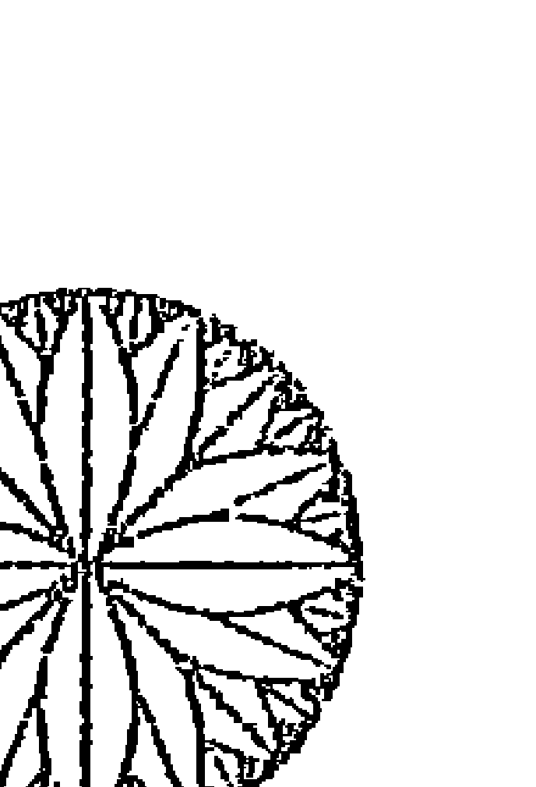

## 第五章

## 星盤中的谷神星

希腊人将希瑞斯（作为地球之母）奉为农业女神，她不停地给大地上的人们带来食物和营养。

希瑞斯和女儿波赛凤妮之间的强烈连结，形塑了她的主要关系。故事中波赛凤妮遭普鲁托绑架而成为冥府的皇后，希瑞斯因为失去女儿所饱受的悲伤和折磨，以及她为了与女儿团聚而寻找的过程，成了古代世界的重要神话；这段情节也被编作厄琉息斯秘仪的启蒙仪式，在几千年间定期上演，而希瑞斯年复一年失去女儿的病症，也源于她在关系里占有和过度依恋的状态。

希瑞斯在关系里的母亲角色，代表着无条件的爱——维持并滋养新生的生命。透过母体——子宫和脐带的功能，传递着维持生命的养分。

在占星学中，谷神星描述了我们如何面对自我价值和自尊、与父母和子女的关系、依恋、依赖、失去、分离、拒绝、悲伤、分享、工作和生产力等议题。

谷神星所在的星座，描述了十二种滋养方式，谷神星展现了我们如何从给予和接受滋养中满足自己的需求，以及我们需要从自己和他人身上获得哪种滋养，才会感受到无条件的爱与接纳。

穀神星所在的宮位，顯示出我們在哪些領域最容易經驗給予和接受滋養的需求，穀神星也指出哪種類型的養育經驗會培養出自愛和自我接納的感受，或自我否定和批判的態度。

穀神星與其他行星的相位，描繪了滋養／母性功能是如何與人格的其他面向做整合，和諧相位代表能與該行星所代表的事項順暢地融合，而緊張相位則表示個人的滋養需求和其他心理需求之間潛在衝突；當個人能將星盤中穀神星衝突相位的不同需求加以掌握與整合時，便不再需要透過壓力來學習平衡。

## 穀神星在占星學的主掌領域

穀神星作為母親，代表生育的性繁衍中各個階段的生理指標和時程

- 懷孕
- 生產
- 流產
- 隕胎
- 護理
- 排卵
- 月經來潮和停經
- 婦科保健
- 節育

## 穀神星是各種父母關係的象徵

- 父母／子女
- 子女／父母
- 單親父親或單親母親
- 祖父母
- 寄養父母／繼父母／領養父母
- 保姆／家庭教師

## 第五章 星盤中的穀神星

### 穀神星關注兒童照顧與兒童教育

- 產前護理
- 分娩培訓
- 兒童權利
- 母親權力
- 虐待兒童
- 學齡前教育
- 初等教育

### 穀神星重視家庭

- 深厚的家庭根基與羈絆
- 大家族體系
- 公社
- 氏族制度
- 部落

### 穀神星的職業圍繞著滋養與協助的相關專業

- 護理
- 社會服務
- 兒童照顧與教育
- 助產
- 臨終關懷

### 穀神星作為穀物女神，與農業和生長周期有關

- 土地耕作
- 務農
- 園藝
- 生態學
- 植物學
- 季節
- 與大自然的關係
- 「綠手指」植物 ①
- 苗圃
- 種子
- 收成

### 穀神星作為生養萬物的母親，是食物及相關服務的象徵因子

- 農民
- 有機園丁
- 廚師
- 烘焙師
- 服務生
- 餐廳
- 合作社
- 營養顧問
- 食療、節食、草藥療法
- 飲食相關疾病：超重、厭食症、暴食症
- 生理健康的飲食失調

### 穀神星對動物的滋養關懷與敏感度

- 動物照顧與馴化
- 獸醫
- 動物訓練師
- 動物飼養員

## 穀神星作為參與勞動和生產的勞動者

- 勞工
- 工會
- 生產者
- 消費者
- 商品
- 國民生產毛額
- 罷工
- 失業
- 殘疾
- 職業災害補償

## 穀神星象徵物種適應與生存的法則

## 穀神星在十二星座

以下各節所引用的星盤數據來源，以數字圓圈表示：

> ① Lois Rodden 著，The American Book of Charts
> 
> ② Lois Rodden 著，Profiles of Women
> 
> ③ Marc Penfield 著，An Astrological Who's Who

穀神星在白羊座的人，認為滋養是擁有自主權和被賦予獨立性；相對地，穀神星白羊座的人，透過敦促他人自主決定和自給自足來給予滋養。為了感受真正的愛，他們必須由自己所珍視的人那裡得到這些經驗；當孩子覺得自己受養育者控制，或在準備好承擔這些責任之前就被逼迫著獨立自主，都有可能讓孩子產生病態或失衡。

星盤案例：珍妮絲·賈普林（Janis Joplin）的穀神星位於白羊座第一宮，她透過自由奔放的形象，滋養了青少年文化。②

穀神星在金牛座的人，透過物質、穩定感、被觸摸和被擁抱來獲得滋養；相對地，他們透過培養他人對身體的安全感，以務實的方式來養育他人。對於自我價值與接納的感受，來自於學習如何為自己提供物質上的保障；倘若過度認同物質，感到物質匱乏而過度囤積所有物時，便會失衡。

星盤案例：賽珍珠（Pearl Buck）在她獲得普立茲獎的小說《大地》（The Good Earth）中，描繪了自身穀神星與灶神星合相於土象金牛座，故事講述了一位中國農民的生活，農民對土地的熱愛支撐他熬過了多年的艱困歲月。

穀神星在雙子座的人，透過受教育、與人交談和被傾聽來得到滋養；他們也透過與人進行知識交流而在精神層面滋養他人。藉由感覺自己很機敏或具備才幹，從而建立自我接納；當他們自覺心智發展不足而導致學習困難，或者試圖在智力上給他人留下深刻印象，或在言語上操弄他人時，就會失衡。

星盤案例：艾倫·里奧（Alan Leo），神智學協會（the Theosophical Lodge）的創辦人暨占星家與神秘學作家，他的穀神星與天王星就合相於雙子座第十宮。

穀神星在巨蟹座的人，透過與母親的連結，以感受到被愛和被哺育而得到滋養。如果這些需求在早期獲得滿足，他們會善於在生理與情感層面照顧他人，並藉由表達感受和掌控情緒的能力，建構出自我接納。然而，當孩子被剝奪了滋養，或在愛與情感裡感到窒息時，就會失衡，導致過度需索或情感依賴的心理折磨。

星盤案例：在阿爾伯特·史懷哲（Albert Schweitzer）身上，我們看到榖神星巨蟹座的正向展現，他的榖神星位於第九宮，身為一名神職人員和傳教士，以其尊重、珍視神聖生命的哲理來滋養他人。①②

榖神星在獅子座的人，認為滋養是一種自我表達，在理想的情況下，父母會培育孩子為自己感到驕傲，使他們對自己的能力有自信，欣賞他人為創作所付出的努力，亦透過協助他人展現其創造力來給予滋養，從而使外界留下獨特的印象。而自我接納的基礎，取決於個人是否有能力創造並分享自己引以為傲的事物，倘若無法做到這點，則可能帶來自我否定和缺乏自信。

星盤案例：莎士比亞戲劇的演員李察·波頓（Richard Burton），榖神星與海王星合相於獅子座，他透過創造性的表演來滋養世界。③

榖神星在處女座的人，認為滋養是表現得完美或為他人服務，在理想的情況下，被養育的經驗可以培養孩子的才能、辨別力和自律，使他們得以將技能延用至他人身上，亦透過教導他人正確運用技能和天賦並達到卓越，來展現其滋養。透過專精一項技能或技巧，並在工作領域展現這項技藝，或感覺自己能為他人帶來幫助，從中產生自我價值感；而無論孩子表現得多出色，當他們的努力一再受到批評時，就會失衡，這可能導致一種對完美的偏執，對他人的不完美進行批判。

星盤案例：在伊莉莎白・庫伯勒—羅絲（Elisabeth Kubler-Ross）的星盤中，可以看到穀神星處女座最極致的展現，穀神星位於處女座第七宮，使她一生致力於為身心需要療癒的人提供諮詢服務。②

穀神星在天秤座的人，認為滋養是一種合作關係，在理想的情況下，被養育的經驗會培養孩子對他人的敏感度，以及對關係的積極態度；他們透過教導他人如何在平等關係中與人互動、合作與表現適切的行為來展現滋養。自我接納則取決於個人在所屬關係和環境中，是否具備創造和諧的表現力；當過於他人導向，將被他人接納的需求置於自主的需求之上時，就會失衡。

星盤案例：保羅・塞尚（Paul Cezanne）的穀神星位於天秤座第十二宮，他一生孤絕，透過表達自己對美與和諧的理想，滋養了世界。

穀神星在天蠍座的人，認為滋養是強烈而深刻的情感連結，在理想的情況下，被養育的經驗是親密的，培養了孩子對於情感的自我掌控力；他們亦透過對他人的情感承諾，以及作為轉化和療癒他人的催化媒介來展現滋養。藉由將個人的內在消極和缺乏信任轉化為愛的療癒力，於此過程中達成自我接納；當內心感到孤獨卻表現出自私、嫉妒、羨慕、憤怒和報復時，便會失衡。

星盤案例：塞比爾·李克（Sybil Leek）的穀神星位於天蠍座第十二宮且與冥王星形成三分相，天生喜愛研究神秘學，是《女巫日記》（Diary of a Witch）的作者。②③

穀神星在射手座的人，認為滋養是對自由的探索，以及擴展個人的視野，在理想的情況下，母親的養育經驗鼓勵並培養了孩子的這些需求；他們亦透過教導他人如何拓展身心視野來展現其滋養（例如：宗師或是精神導師），此外，穀神星射手的人也可能幫助他人發展出一套哲學或信仰系統，賦予他們生活的意義。他們經由找到自己生活的目標，並帶著覺知持續前進，建構出自我接納；倘若無法達成，他們會轉而相信人生毫無意義並失去目標（「生命是傻瓜口中故事，找不到一點意義」——哈姆雷特），而漫無目的的感覺會使人原地徘徊。

星盤案例：偉大的人道主義者湯姆·杜利（Tom Dooley）的穀神星位於射手座第一宮，驅使他在遙遠的寮國建立醫院，透過滋養病患奉獻自己的一生。④

穀神星在摩羯座的人認為滋養是成就方面的表現，在理想的情況下，被養育的經驗，會教導孩子如何培養責任感、如何管理時間，以及如何制定計畫以實現特定目標；而他們透過教導他人對自己負責，並提供他們實用的工具在外界取得成功來展現其滋養。自我接納源於個人透過努力，獲得實質的成就，而當一個人把被愛等同於在外界表現得有多好時，就會失衡，這會導致一種徵狀：利用外在成就去贏得他人的關注和認可。

星盤案例：以色列的創建者和第一任總理大衛·班—古里昂（David Ben-Gurion），以穀神星摩羯座表達他為人民服務的責任。

穀神星在水瓶座的人認為滋養是一種個人特色，在理想的情況下，被養育的經驗會培養孩子自己做決定，以及認同他人的權利；而他們給予滋養的方式，是教導他人接受自己以及自己的古怪之處。即使他們「跟隨不同鼓手的節奏行進」，也能依循個人本質與獨特的行事軌跡獲得自我接納，但如果沒有給予孩子限制和準則，而使孩子享有的自由超過他們能應對的範疇時就會失衡，這可能演變成「養子不教誰之過」（rebel without a cause）④，個人須有內在自制與自律，才能承擔與自由相應的責任。

星盤案例：搖滾變色龍大衛·鮑伊（David Bowie）的穀神星位於水瓶座，他在藝術創作中取得成功，展現了自己的獨特性和原創性。⑤

穀神星在雙魚座的人認為滋養是同理心的展現，他們透過與自身之外的現實產生連結以及融合的感受來獲得滋養；亦透過緩解他人的痛苦展現其滋養，無論是同理他人，或啟發他人的信仰、大愛和對超自然的認同。他們以無私的服務他人而不求回報的能力，建構出自我接納；若他們在小時候沒有得到適當的安撫和情感支持，就會失衡，這通常會導致無助感與無力感，進而助長了受害者情結。

星盤案例：前聯合國秘書長道格·哈馬紹（Dag Hammarskjold），因在中東地區建立與維護一支和平部隊，獲得了諾貝爾和平獎，他的穀神星位於雙魚座且與火星天蠍座形成三分相。

## 穀神星在十二宮位

穀神星在第一宮，意味著一個人的性格投射，是滋養、憐憫與關懷他人，他們可能把自己的角色定位為父母或者供養者；對這類人來說，滋養自己也許是不可或缺的。

星盤案例：美國的「建國之父」喬治·華盛頓（George Washington），他的穀神星位於雙子座第一宮。

穀神星在第二宮，透過提供基本需求——為所愛之人提供住所、食物和金錢，展現滋養他人的渴望，但也可能表現為，對於鍾愛的人事物存有過度的依戀，而在另一端為爭取獨立而抗衡，他們也可能透過購物、放縱或寵愛自己的方式來滋養自己。

星盤案例：貝蒂·赫茲（Patty Hearst）的谷神星與月亮合相於天秤座第二宮，藉由被供給（二宮事項）來獲得滋養，她遭到共生解放軍綁架，並參與了一樁銀行搶劫案。㉕

穀神星在第三宮，意味著透過餵養思想、教導，及接觸各種想法和刺激以得到滋養；或藉由建立朋友和共事者之間的聯繫網絡來表達滋養。

星盤案例：人類學家瑪格麗特·米德（Margaret Mead）的穀神星落在第三宮，透過她筆下的女性角色、青少年和家庭結構，反映了她的個人認知。㉕

穀神星在第四宮，象徵其滋養意味著母親在家庭與家人心中的理想形象；作為父母的角色，則是個人星盤與生活的根基。穀神星若位於世界星座（universal sign）⑥，可能表現為世界之母，或任何與之共組家庭的成員；當穀神星貼近下中天，作為心理的基礎，穀神星的神話會特別地顯著——與親人分離與重逢，或在關係中被拒絕與接納等情感連結的議題。

星盤案例：資料來源已不可考，故刪除（其後若未提供案例，原因亦同）。

穀神星在第五宮，代表透過對孩子或藝術創作的深度參與而從中經驗滋養的議題；他們會透過玩樂或將自己置於險境來得到滋養。

星盤案例：英國詩人珀西·比希·雪萊（Percy Bysshe Shelley）的穀神星位於獅子座第五宮（加乘效果），他一生都在寫情詩，並因死別失去了子女監護權，被剝奪了孩子。

穀神星在第六宮，象徵著藉由參與家庭的日常事務，使之維持有效率的運作以滿足個人的需求。穀神星位於此宮具有強烈的服務特質，特別在營養學和保健領域；父母的工作，或者對工作倫理的價值觀，也是由這個配置象徵。

> 星盤案例：盧爾德的聖女伯爾納德（Saint Bernadette of Lourdes），其穀神星位於天蠍座第六宮，她受到聖母瑪利亞（穀神星）顯像的啟發，發現了療癒（處女座）的聖水（天蠍座）。

穀神星在第七宮，象徵對伴侶或被伴侶滋養與保護的需求，而父母通常是他們關係需求的榜樣；要擺脫與伴侶間的依存關係，有時是困難的，而無條件的愛，能為雙方的平等互動提供重要的基礎。

> 星盤案例：珍·芳達（Jane Fonda）的穀神星位於水瓶座第七宮，父親在她的成長過程中有著強大的影響力，她和丈夫湯姆·海登（Tom Hayden）就創造了這樣一種平等的關係；而她和父親在電影《金池塘》（On Golden Pond）中飾演的角色，也巧妙地呈現了父女和伴侶關係之間的關聯性。

穀神星在第八宮，暗示透過強烈而極端的經驗及深刻的情感投入來獲得滋養，性行為通常是給予和接受滋養的必要元素；協助安寧機構的臨終病患面對死亡，也是這個配置表現滋養的方式。

星盤案例：西格蒙德·佛洛伊德（Sigmund Freud）的穀神星與月亮合相於第八宮，他探索了性和母愛的議題，並將自身經驗投射到他的戀母情結（the Oedipal Complex）理論。

穀神星在第九宮，代表透過追求知識、自由、真理和旅行來滋養自己和他人，在提出人類基本需求的討論中，促進哲學的發展，如馬克思主義（Marxism）；這個配置也代表，基於對滋養萬物之母的崇拜而建構的哲理，例如對聖母瑪利亞或其他女神的崇敬。

星盤案例：林白夫人（Anne Morrow Lindberg）的穀神星位於金牛座第九宮，她是飛行員、描寫女性情感的作家及六個孩子的母親。

穀神星在第十宮，代表透過個人專業或社會形象來照護和供養他人，以此表達對滋養的渴望；從事兒童服務、健康照護，以及與食物相關的職業和公共事務，可以實踐個人對社會的責任感。穀神星在這個位置，可能指出父母給予的愛是有條件的，取決於孩子的表現或成就；然而，當孩子達不到父母或社會的期望，則可能產生被拒絕或被遺棄的感受，因此，許多穀神星第十宮的人必須學會愛自己，看重自己的本質，而非外在的表現。

The request was rejected because it was considered high risk# 第六章
# 智神星：戰神女王

> ————————————————☆
我以此颂歌始吟
圣洁的女神
帕拉斯雅典娜
清亮明眸
如斯聪慧
她心智坚不可摧
处女之身，肃然生畏
城邦的守护者
拥至高权能
源于特里顿湖
宙斯禀赋一己
自他神圣头颅
降生
以灿耀夺目的黄金战甲
作佩饰
她披挂一身 ①

# 帕拉斯·雅典娜的神话

智神星——帕拉斯·雅典娜（Pallas Athene）是智慧的处女神，在古希腊时期，她的重要性仅次于天神宙斯，她的名字被用于雅典城邦的命名，这座城邦是希腊文明的知识中心。帕拉斯作为战争与胜利的女神，是战术与策略的大师，在战役中百战百胜。作为雅典的守护者和监护人，帕拉斯用她的智慧教导人民如何以和睦的方式解决纷争，以和平的手段维护法律。她的才智向来怀有怜悯，是仁慈正义的坚实拥护者。

帕拉斯·雅典娜被描述为一位身穿紧身袍衣、披挂铠甲的威武女性，她手持长矛和神盾，头戴盔甲，胸前覆盖着由山羊皮制成、名为埃癸斯（Aegis）的胸甲；胸甲周边环绕着蛇，中央是戈尔贡·梅杜莎的头颅，她经常与象征智慧的猫头鹰和代表预言的蛇为伴。

帕拉斯·雅典娜多才多艺，发明了长笛、小号、陶轮、第一只陶器花瓶、犁、耙子和牛轭，她因促进文明，使人们受文化熏陶而备受赞誉。作为手工艺术之神，帕拉斯是艺术家、工匠、建筑师和雕塑家的守护女神，她指导人类铸造和开采金属的生意，以及烹饪、刺绣、羊毛加工和编织艺术；最后，作为健康与医治女神，帕拉斯·雅典娜传授了多种医疗的方法，包括使用梅杜莎的血液而重生的秘密。

# 雅典娜诞生的神话

荷马传说所描写的帕拉斯·雅典娜，是从父亲宙斯（朱庇特）的头部单性生殖而诞生。依据这位诗人暨历史学家的说法，帕拉斯从宙斯的额头分娩而生，出生时已是一名成年的女战士，身披铠甲，高喊着凯旋的胜利欢呼；这段记载其实是帕拉斯的母亲墨提斯（Metis）早期故事版本的缩影，记述着地中海文化已由母权制过渡到父权制的历史。

帕拉斯真正诞生于六千年前的利比亚，她出生在特里顿湖（Lake Triton）湖岸，那里是非洲亚马逊地区数个部落的家乡，她的古老称号是「特里顿湖所生」（Tritogenia），意指她源自水中。②在出生后，帕拉斯由三位身着山羊皮的利比亚女神发现并抚养，在这段时期，她被称为利比亚三女神涅伊特（the Libyan Triple Goddess Neith）。③

约末在西元前四千年，利比亚难民将他们的女神带到克里特岛，她在那里受到人们接纳与膜拜，并在米诺斯文明前期流传到色雷斯（Thrace）和希腊，从这个时代开始，出现了帕拉斯由其母泰坦海洋女神墨提斯（智谋）所生的传统版本。

墨提斯是欧开诺斯（Oceanus）之女。墨提斯协助宙斯朱庇特成功对抗他的父亲克洛诺斯，她给了克洛诺斯催吐剂，迫使他把吞下的孩子都咳吐出来。尽管，墨提斯不断变换身形来躲避宙斯的情欲追逐，最终她还是被强暴，并且怀了身孕。

盖娅和乌拉诺斯警告朱庇特，墨提斯会在帕拉斯·雅典娜之后诞下一个孩子，其子将成为天神与众人之王。为了维护主权，朱庇特将怀着雅典娜的墨提斯整个吞噬，但当他步行至特里顿湖岸时，头痛欲裂，只得用双面斧劈开自己的头部（母系象征）来缓解剧痛；在大地的隆隆声与海浪的波涛声中，身披闪亮金甲的帕拉斯·雅典娜横空出世，她随即成为父亲最爱的女儿。

从社会学的角度来看，帕拉斯·雅典娜自朱庇特头部诞生的神话，标记着阴性智慧的本质被汲取和接纳，以因应新的父权制度所需。

# 帕拉斯·雅典娜的蛇之智慧

在整個雅典娜的歷史發展過程中，她與蛇的象徵意義息息相關，她的預言天賦來自於她與蛇之間本質上的關係。有則神秘傳說言道：攝入微量特定種類的蛇毒，可以帶來預視的能力，因此，蛇被視為是智慧的象徵和預言的守護者。

帕拉斯·雅典娜與蛇之女神涅伊特（Neith）的關聯證實了她的淵源；她的胸甲中央嵌著蛇髮梅杜莎的頭，而梅杜莎是利比亞亞馬遜部落的女神，那裡是帕拉斯·雅典娜的出生之地。

在米諾斯克里特島，帕拉斯·雅典娜被尊稱為「阿薩娜夫人」（Lady of Athana），是宮殿和城市的保護者，她的標誌是看守家園的蛇。後來，在雅典衛城上佇立了一尊巨大的雅典娜雕像，雕像旁有條同樣大小的蛇，被認為是城市的命運或守護精靈；女神和聖蛇被視為一體。當雅典人被波斯人包圍時，因守護蛇拒絕食用祭祀的食物，使人們相信女神已經放棄了這座城市。

雅典娜也被称为蛇之子厄裏克托尼俄斯（Erichthonius）的母親，他成為雅典的國王，並為雅典娜設立了敬拜儀式。一則更古老的傳說將她稱為母親，保留了她為赫菲斯托斯生下兒子的記載。⑤雅典人為了捍衛他們女神的貞節——這座城市戰無不勝的象徵——講述了以下故事：面對工匠之神赫菲斯托斯的窮追猛攻，帕拉斯·雅典娜保護自己不受侵犯，掙扎地逃開了，她用一小撮羊毛抹去沾上大腿的精液，而這撮羊毛掉落在雅典附近，被大地所孕育。大地之母蓋婭隨後生下了孩子，雅典娜便在她厄瑞克忒翁神廟（Erechtheum）的聖殿裡偷偷養育著蛇兒子。聖殿裡的女祭司依照儀式，以蜂蜜蛋糕餵食智慧之蛇，厄裏克托尼俄斯則以人頭蛇身的形象出現，向人們宣布先知的預言。⑥

雅典娜之蛇的最後一例——這則神話描述了一位名為特伊西亞斯（Tiresias）的底比斯人，他的預言天賦與蛇有關。有一天，他無意間瞥見正在沐浴的雅典娜，於是被憤怒的女神弄瞎了雙眼；儘管他的母親苦苦哀求，雅典娜仍舊無法讓他恢復視力，為了補償，雅典娜從胸甲取下蛇隻厄裏克托尼俄斯，並下達命令：「用你的舌頭潔淨特伊西亞斯的耳朵，使他能聽懂先知鳥的語言。」因此，特伊西亞斯被賦予了預言和洞察的力量，他死後帶著這股力量進入了冥府。

# 女戰神帕拉斯

雅典娜在奧林帕斯山上受到極大的敬重，有部份原因來自於她的男子氣概。作為處女神，甚至不是女人所生，故有許多描述她的軍事稱號——「戰事的領袖」、「戰鬥的發動者」、「軍隊的司令者」和「擊退敵人的她」。她在戰場上無往不利，成為了戰事謀略與卓越策劃的象徵；作為英雄的守護者，她協助海克力斯（Hercules）完成任務，幫助奧德修斯（Odysseus）從特洛伊返航回鄉，使珀爾修斯（Perseus）得以砍殺梅杜莎，而蛇隻盤旋的梅杜莎頭顱還被雅典娜置入她的胸甲中央。

雅典娜的戰士本性可以從她的姓氏「帕拉斯」當中覓得線索。帕拉斯一詞可以透過重音或變音來表達陽性或陰性的意涵：在陽性意涵中，它指的是「一位強壯的年輕男子」；在陰性意涵中，它指的是「一位堅韌的未婚女子」。⑦ 在每年利比亞的慶典中，未婚少女以戰鬥儀式來敬拜雅典娜，讓人聯想起涅伊特的處女祭司爭奪主祭司一職的故事。而希臘人仿效了利比亞人所描繪的雅典娜形象——身著山羊皮的服飾且手持盾牌，⑧ 並以父權思維改成以下故事：某日，雅典娜與她被收養的姊妹帕拉斯，海神特里頓（Triton）的女兒，進行了一場友誼的戰鬥賽，突然間，朱庇特用他的埃癸斯神盾介入比賽，分散了雅典娜的注意力，使她失手殺死了姊妹，在悲傷和痛苦之下，雅典娜將帕拉斯的名字置於自己的名字之前，以逝去的姊妹作為形象，並賦予埃癸斯致命而強大的力量，這形象被稱為「帕拉狄恩」（Palladium），以意念鍛造，予人靡堅不摧的信心。

雅典娜的原始天性中，其戰士的特性體現在她的帕拉斯面向——利比亞的雅典娜祭典裡，來自亞馬遜母系部落強而有力的少女守護者，正是帕拉斯冠名的真正由來。在奧林匹亞版本中，雅典娜抹煞了自己先前的防禦天性，承接來自新父權秩序中的暴力、攻擊與好戰的特質；然而，她也在帕拉狄恩留下了遺澤，作為她存在與守護的見證：據說，羅馬的維斯塔神廟，是存放真正帕拉狄恩的秘密庫房。

# 帕拉斯·雅典娜自母系傳統脫離

帕拉斯、雅典娜和梅杜莎分別作為未婚少女、母親和老婦人，是利比亞蛇之女神涅伊特的月亮三相。最初，雅典娜與帕拉斯、梅杜莎合而為一，然而，進入希臘文化後，她已成為新父權秩序的象徵，因而被描繪成協助破壞母權的先例。

# 梅杜莎的殺戮

從歷史的觀點來看，珀爾修斯在雅典娜的幫助下戰勝梅杜莎的經典神話，對應了邁錫尼（Mycenae）新王朝的建立者珀爾修斯國王統治時期（約西元前一二九〇年）的史實。在這段期間，早期月亮女神的力量，被希臘大陸父權統治的侵略者所篡奪，⑨ 而這段歷史裂痕和社會的創傷，深植於後續的神話當中。⑩

梅杜莎，月亮女神的第三個面向，是亞馬遜戈爾貢（Gorgon）家族的女王，居住在特里頓湖附近，也就是雅典娜出生地。梅杜莎以迷人著稱，深受追求者的愛慕；海神波賽頓（Poseidon）的原型是馬神希波士（Hippios）；波賽頓在雅典娜的神殿中侵犯了梅杜莎，並讓她懷上了雙胞胎，雅典娜對此行為感到非常憤怒，但是，她沒有處罰波賽頓，反倒把梅杜莎最迷人的頭髮變成了吐信的蛇，凡是被梅杜莎所注視的男子，都會變成石頭。隨後，雅典娜協助珀爾修斯對付梅杜莎，借給他一只神盾作為鏡子來避免直視她可怕的面容。運用神盾和荷米斯的魔刃，珀爾修斯得以斬斷梅杜莎的頭顱，並獻給了雅典娜。

被斬下的梅杜莎頭顱蹦出了波賽頓的兩個孩子：手持黃金之劍的英雄克律薩俄耳（Chrysaor）以及象徵詩歌靈感的飛馬佩加索斯（Pegasus）。當珀爾修斯飛走時，梅杜莎頸部的血滴到了地上，讓沙漠長出了綠洲。雅典娜也取得了些許梅杜莎的血液，一部份分給她的兒子厄裏克托尼俄斯，剩下的分給了治癒之神阿斯克勒庇俄斯（Asclepius），他用這些血來治療活人，並讓死者復活。

雅典娜和梅杜莎，原為利比亞蛇之女神涅伊特的其中兩個面向，然而誠如所見，她在奧林匹亞時代被描述為協助摧毀自己的母系根源，但在世人眼中的雅典娜，依然炫耀著她的真實本質——她胸甲上梅杜莎的頭顱。

# 雅典娜與波賽頓的競賽

以下的競賽，是由跨海移居的希臘人（愛奧尼亞人 Ionion）與當地崇拜米諾斯女神的雅典人，因雙方之間的爭執所引起的。依照規定，誰能賜予雅典人民更好的禮物，誰就能統治這座城市，為了回應這項挑戰，波賽頓將他的三叉戟插入了雅典衛城的一塊岩石中，形成了一池鹽泉。

根據另一個說法，波賽頓創造了第一匹馬，而雅典娜提供了橄欖樹（培植的橄欖樹最初是從利比亞進口的，因此佐證了她的利比亞血統），無論經由法院判定或是所有兩性公民的投票，橄欖樹都被選為較實用的禮物，可作為食物、燃料、庇護和遮蔭，雅典娜因而宣告了她的勝利，而波賽頓一怒之下，便報復性地引水淹沒了特里亞西亞平原（Thriassian Plain），除非奧林匹亞眾神在雅典還予他榮耀，否則絕不罷手。眾神屈服了，剝奪雅典婦女的公民權、投票權以及賦予子女姓氏的權利，以平息波賽頓的怒氣。由於膽敢證明自己的優越，雅典娜贏了這場戰役，卻輸掉整場戰爭，從那時候起，女性的地位、權力和權益日漸弱化，終致被否定。

# 阿瑞斯特斯的审判

雅典娜最后一次宣称放弃母系根源，是发生于阿瑞斯特斯（Orestes）的审判中，她投下了支持他无罪的决定性一票。阿瑞斯特斯被指控弑母，他谋害了自己的母亲克吕泰涅斯特拉（Clytemnestra），而他的母亲杀了他的父亲阿伽门农（Agamemnon）。根据古代律法，杀死没有血缘关系的人不构成犯罪，因此，在阿伽门农牺牲无辜的女儿伊菲革涅亚（Iphigenia）作为献祭之后，克吕泰涅斯特拉因尽母职而将他杀害一事并不犯法，然而，谋杀血亲是禁忌，儿子杀害母亲是极大的罪行。

因此，阿瑞斯特斯被复仇者厄里倪厄斯（Errinyes，又称复仇三女神（the Furies））所追捕和赶杀，濒临疯狂之际，他到阿波罗（Apollo）的祭坛寻求庇护，而雅典娜即时现身，安排了仲裁团进行审判。阿波罗担任了被告的辩护人，在为阿瑞斯特斯辩护的著名演说中，他否定了母子血缘关系的神圣性。

> > 母亲并非孩子真正的血亲，
> 所谓的她，是看顾幼苗生长的照顾者，
> 种子是由男性、其真正的血亲所播下。
> 故，若命运赦免孩子，她会继续看顾，
> 有如为朋友照料一株成长中的植物。⑪

为了证明自己的主张，他指向主持审判的雅典娜说道：而此一事實，便是呈堂證據；那位父親不依靠母親而誕下後代，即奧林匹亞宙斯的女兒：她從未被孕育於黑暗的子宮搖籃中。⑫

當該案進入表決時，仲裁團的判決為平局，而後，雅典娜出乎意料地投下決定性的贊成票，支持阿瑞斯特斯無罪釋放。在證實男性的優越時，她表示：

> 我的職責是進行最後裁定，當你們的合計票數相等，我的一票是捍衛阿瑞斯特斯的懇求。沒有母親給我生命，因此，父親血緣的主張與男性至高無上的說法，使我免於獻身婚姻，贏得我內心的忠誠。⑬

生育女神厄里倪厄斯，對這種背叛母權律法的行徑感到憤怒，威脅要以疾病和飢荒詛咒希臘，然而，雅典娜說服她們接受新規範，改變了她們的行事作風，使其在雅典以尊稱歐墨尼得斯（Eumenides）受到崇拜——和平而溫順的守護者，為父權秩序的勝利帶來豐碩的祝福。

因此，帕拉斯·雅典娜藉由宣告父權的勝利，在母權文化過渡至父權文化中起了催化作用；她被迫否認她的陰性根源，並摧毀她早期陰性本質的面向——帕拉斯和梅杜莎成為新概念的處女——貞潔和孤立——她拒絕表現出女神的繁衍本質，因而使女性失去公民權和母親的權利，此都歸因於雅典娜；最後，她的智慧在當時代被用於向外征戰，為男性效力，這就是新的父權社會對雅典娜的改造。

# 智神星——帕拉斯·雅典娜

創造性智慧的本質

角色
智慧女神和國家司法的保護者

占星符號：♀

保護者之矛

象徵物
- 貓頭鷹
- 蛇
- 橄欖樹
- 盾與矛
- 紡紗桿
- 鑲著戈爾貢首級的埃癸斯

相關的主管星座
- 天秤座
- 獅子座
- 水瓶座

極性
勇氣／恐懼

# 智神星占星學

作為創造性智慧的本質，帕拉斯·雅典娜運用金星的性生殖能量來產生心智產物，她是思想形成的媒介，因而代表了啟發創造行為的智慧火花。在占星學中，她的本質融合了風元素的精神特質和火元素的創造特性，因此，智神星掌管風象星座的天秤座和水瓶座，以及火象星座的獅子座，它們共同構成一組結合對分相、三分相和六分相的相位結構；風箏家族的相位結構，穩固了天秤座和水瓶座三分相位與生俱來的力量，而獅子座和水瓶座的對分相位則為創造的張力提供了釋放的焦點（focal point）。因此，智神星的本質，在於獅子座的創作慾望、水瓶座跨個人的社會關懷，以及天秤座的平衡與凝聚力之間的交互作用。

# 智神星的智慧面向

從社會學的角度來看，帕拉斯從朱庇特頭部誕生的神話，象徵了父權體制的國家需要汲取並適應陰性智慧，然而，從意識演化的角度來看，這則神話也描述了從本能到意識的智慧成長（對於海洋女神墨提斯的根本性認識，乃是自朱庇特透過帕拉斯產出陰性智慧的活躍面向）；於是，藉由將繁衍力提升到創造性智慧，父權體制下誕生的帕拉斯·雅典娜，預示了人類心理發展中歷史性的轉折點。

作為編織者和工匠所敬拜的女神，帕拉斯·雅典娜賦予人們透過內在意象來感知全貌的智慧，這種心智意象是種子，創造性活動是其果實，因此，帕拉斯象徵了創造性觀想的過程，以及顯現法則的知識。

# 智神星作為創造性智慧的象徵星

在占星學，智神星代表一種智慧的層次，遠遠超越了雙子座與射手座對宮星座的心智總合，她象徵著創造性智慧——一種得以催生出超越已知的全新或原創（獅子座）的靈光乍現（水瓶座）。

智神星是我們智慧和感知形式的象徵，在星盤中，她描述了一個人的啟發性思維、直覺、好奇心、天賦和卓越的感知能力；當底比斯人特伊西亞斯因看見雅典娜裸浴而眼盲，女神也賦予了他絕佳的洞察力和預言的能力。

然而，智神星的緊張相位會指出視覺和聽覺感知等一系列潛在的問題——色盲、閱讀障礙、手眼不協調、視力和聽力不良、學習困難和智能不足等，就某程度而言，如果一個人的外在真實是由內在思想所形塑，那麼透過療法去修正這些錯覺（例如：幻想和觀想的指引），便能使他們在應對智神星所象徵的議題時，受益匪淺。

最後，由於具備感知全貌的能力，智神星類型的人能夠構思並協調系統模式，而智神星代表策略性的智慧、遠見，以及帶來具體成就和實質成果的計畫，因此，透過運用理性思維、才智和意志，這些人可以在商業、政治、學術或科學界獲得成功。

# 智神星作為藝術的象徵星

帕拉斯·雅典娜的創造性智慧之光，展現在人類活動的三項主要領域——藝術、療癒和政治活動。在古希臘時期，帕拉斯是工匠和手工藝家的守護者，她也傳授實用的手工藝術，讓人們可以發展出更加文明的文化；她的智慧激發了藝術視野，從而使藝術家能將想像具象化，並將靈魂注入藝術。

在占星學，智神星象徵了藝術能力，應用清晰的視角並感知全貌。星盤中有顯著智神星的人，可能從事視覺藝術領域，包括素描、繪畫、製圖、設計、攝影和電影；她也是所有手工藝的主管行星，包括陶藝、刺繡、羊毛加工和編織等。

# 智神星作為療癒技術的象徵星

帕拉斯·雅典娜諸多的面向之一，是神奇療法的女神海吉亞（Hygeia）。傳說中，她贈予阿斯克勒庇俄斯一小瓶從梅杜莎被割下來的頭部所取出的血液，並且指示他：用其血液使亡魂起死回生。

在占星學，智神星掌管著身心整合的療癒技術。自一九七三年小行星的作用被喚醒以來，這種「全人」的健康療法已經擄獲了大批追隨者；具體來說，智神星掌管著所有心理的自我療癒技術，包括觀想、肯定、冥想、心智控制、引導式心像法和催眠。

在心理學領域，智神星掌管著平衡與整合整體狀態的心理治療，這些療法包括格式塔療法（gestalt therapy）、溝通分析（transactional analysis）、生物能量論（bioenergetics）和演劇心理治療（psychodrama）。

在物理治療中，智神星能啟動、平衡並重新引導流動於人體的重要能量，因此，她透過極性療法、針灸、順勢療法、長壽飲食和細胞再生等科學來進行治療。

從占星學來看，顯著或相位良好的智神星，代表有機會成為治療者或成為使用這些療法的被治療者；緊張相位可能意味著存有根植於心理的疾病，或者身體機能存在重大的失衡——直到此人學會從全面的角度來看待事物。

# 智神星作為政治藝術的象徵星

作為戰士女王，帕拉斯・雅典娜在戰爭時期扮演著保衛人民與國家的守護者，儘管，她不喜歡暴力和流血衝突，但當她的家園遭到襲擊時，帕拉斯就成了一名驃悍、勇敢和好鬥的戰士；雅典娜以她逝去的姊妹作為形象，攝入神奇的特性，予人靡堅不摧的信心。

占星學中的智神星也象徵具備陰性特質的英雄，英勇、有膽識，明理而堅韌。在誕生星盤中，她描述了政治活動家、激進的女權主義者，或者捍衛受壓迫的少數群體；她還掌管武術，特別是講究以平衡和優雅來轉移攻擊的防禦技術，例如太極拳、合氣道和擊劍。

作為國家的守護者，帕拉斯將她的政治領域擴展到城邦的法律和政治之中。智神星的司法能力源於她和天秤座的連結——正義的桿秤，關於戰爭與和平、衝突與和諧的議題在此格外重要；如同天秤座一樣，智神星擔任公正的調解人，因為她能縱觀全貌，運用明智的建言和外交手段來做決定。在星盤中，智神星的緊張相位可能代表性格軟弱、缺乏機智和外交能力、殘酷的侵略，或者無力抵擋攻擊。

# 智神星：處於男性世界中的女性

帕拉斯・雅典娜是勇氣與智慧的女神，也是富有創造力和才智的女性原型，她和灶神星维斯塔一样都是处女神，在性方面保有贞洁，没有丈夫或恋人；然而，当维斯塔将她的性能量升华奉献以及个人的整合，帕拉斯·雅典娜则是将其形塑为心智和艺术的创作。

帕拉斯是地位最接近朱庇特／宙斯的神祇，在奥林匹斯拥有崇高的声望和地位，她以姊妹、同事的身份被接纳，在男性的世界里享有平权，并被允许在希腊城邦的治理上展现其智识才能；此外，帕拉斯的守贞让她能和男性培养友谊，而不会陷入复杂的情欲纠葛；然而，帕拉斯也因取得这样的特权地位付出了相当大的代价——她否认了她的阴性气质和阴性根源，她哀叹泣诉着：

> “没有母亲给我生命，因此，父亲血缘的主张与男性是至高无上的说法，使我免于献身于婚姻，获得我全然的忠诚。”

⑭

这种否认是她病征的根源，女性无意识的阳性面向占据了人格的主导地位，但也正是这种极大的牺牲，帕拉斯才得以进入父权的世界，为两性之间的和谐交流提供一个平台，因此，母亲社会的古老声音能够在时代转变中适应与成长，而不是消逝于过往、不复存在；但有些人则认为，帕拉斯·雅典娜是出卖自己给父权体制的女神象征。在占星学中，这种原型代表支持并捍卫男性主导世界的女性，或者让自己成为成功及握有男性之雄性的左右手。

此外，帕拉斯也代表有意识或无意识地摒除自己的性欲，惟此

## 智神星与雌雄同体

由于帕拉斯强而有力地展现了她雄性和雌性面向，她象征着灵魂发展迈向了雌雄同体的趋势；她与天秤座的连结，意指她平衡了内在雄性与雌性的两极。星盘中智神星显著的人，在异性关系中寻求的是陪伴而非激情，而在这样的道途上，常常是朋友众多，却少有恋人，在某些情况下，同一个对象既是朋友也可以是恋人。

雌雄同体的另一个结果，是性别角色的解构，如同帕拉斯致力追求平衡与完整，她允许我们在合一与完整的自我之中，表达并融合我们的男性面向与女性面向，经由她所传递的水瓶座影响力，帕拉斯可以帮助我们认识另一个人的内在，而不是依照性别的刻板印象来做评断。

## 智神星与性别认同的失衡

个人在迈向雌雄同体的改变中，有时会越过平衡点，走向性别光谱的某一个极端，有如佩戴朱庇特神盾的帕拉斯对于父亲的过度认同。

因此，父亲阳性的力量被女儿吸收了，并转变为一种阳刚的力量。为了保护自己不受父亲的伤害，她变得像父亲一样，如此一来，基于父亲的骄傲，他会保护她而非攻击她；也由于她采取侵略者的角色作为防御手段，使她无法充分展现她的女性魅力。⑮

从占星学的角度来说，智神星类型的女性倾向对男性过度认同，并发展出“阿尼姆斯”（animus）的性格，以纯粹的形式来看，这种原型可被显化为亚马逊女战士，是古希腊时期雅典娜的化身。在现代社会中，它可以形容一位充满竞争力、好战和攻击性的女性，她失去了与柔软和包容的联结，成就、刚强、权力和成功，成为了自我实现的目标，并阻碍了情感和感官层面的生活。

而在男性的星盘中，有力的智神星意味着相反情况——“阿尼玛”（anima）的性格；阿尼玛是男性无意识的女性面向，而当这个面向主导了性格走向极端，则可能表现为过度被动、依赖、喜怒无常和犹豫不决。在这两种状况下，帕拉斯的过度认同都可能导致个人与其内在本质渐行渐远，进而表现出一种疏远他人以及难与异性亲密的人格表现。

帕拉斯·雅典娜所穿的盔甲让她更容易进入男性的世界，却在尔后成为阻挡她进入情感世界的屏障，理智化和理智行动的防御系统，设下了自己与他人的距离，使个人回避感受，免于痛苦。

简而言之，帕拉斯·雅典娜代表着平衡内在雄性与雌性两极的需求，以及当无法达到这种和谐时所带来的困境。

## 智神星与父亲情结

在母权时代，女儿和父亲是不相干的，多数情况下，甚至不认识父亲；而帕拉斯·雅典娜由父亲朱庇特所生，象征女性需要在生活中与父权联结。谷神星代表着母亲的印记（下中天），而智神星代表父亲的印记，象征着我们如何在世界里表现自己（上中天）。正如谷神星类型的人会与母亲紧密联结，智神星类型的人，其自我认同来自父亲；而当智神星类型者与父亲的联结受到破坏，便会出现两种心理情结，其原型是小女孩和“武装的亚马逊女战士”。⑯

小女孩（puella，拉丁语，意指“女孩”），通常被称为“爸爸的小女孩”，消极地服从父亲的权威，寻求父亲的认同来证明自己，并与母亲争夺父亲的爱和关注；父女关系的紧密度，可能伴随着违反伦常的暗喻。在婚姻里，小女孩类型的女性，通常扮演着支持丈夫成就的幕后功臣，是不可或缺的副手，然而对小女孩而言，她外在的顺从，掩盖了她坚强的天性以及内在对反叛和战斗的需求。

在另一边极端的情况下，我们看到渴望吸收和模仿父亲阳性力量的亚马逊女战士；她年轻时可能表现出“男人婆”的原型，并对女性同伴的愚蠢消遣嗤之以鼻。她再次向父亲寻求认同，但这次是效仿他的成功、表现和成就的动力；外在的世界形同真实的父亲，可能视为威胁的力量，就如同小女孩一样，亚马逊女战士也有她压抑的一面——无助和依赖的女孩，为了保护自己脆弱的那一面，她索性否认了自己的感受和强烈的情感。

也因此，对男性或女性而言，占星学中的智神星都是父亲情结的代表因子，在某些例子中，若非母亲在孩子的成长过程中只发挥一小部份作用，就是孩子拒绝接受母亲的影响。

## 智神星与对成功的恐惧

尽管帕拉斯在男人的世界里受到尊重和欣赏，但她从未因身为女人而被认可；她的心智与创造力虽然受到赞扬，却不被看作是女性的特质，因此，她对爱、温柔和亲密感的女性需求被否定了。在我们的文化里也是一样，“聪慧”虽然能让她在辩论队获胜而赢得喝采，却不会让她被邀约参加舞会；女性被告诫，她们在世俗的成功会威胁到男性的自尊心并突显他们的失败。举例来说，大家普遍认为妻子唸了书会变得傲慢，女儿则被教导要以装傻作为手段来吸引男性；一九八四年一本著名的男性杂志写道：许多男人会被“她脑筋要够好，但不能表现得比我聪明”的女人所吸引，因此，对智神星类型的女性而言，最讽刺的是，她越是表现自己的创造力，就越是威胁到她与男性建立传统关系的机缘。

这种宣传的成效非常显著：为了避免被男性拒绝，女性已经惯于扼杀自己的心智和创造力，因而，“不用之，则失之。”这些女性很快地失去自己的聪明才智。

在男性的星盘也存在类似情况。智神星描绘一位在才智或艺术高度发展的男性，他担心自己会因为男子气概不足或不够阳刚而被拒绝，因此，这些男性为了符合女性的期待，往往会封闭自己的柔软和感性。

## 胜利与失败

当帕拉斯·雅典娜在与波赛顿的竞赛中赢得希腊的统治权时，她因胜利而受到惩罚，随后，雅典的妇女失去了投票权、不再保有公民权，且无法将姓氏传给孩子；因此，智神星主题可以代表“赢了战役，却输掉整场战争”。根据帕拉斯的经验，许多女性与男性较量时踌躇不决，倘若她们全力以赴并获胜，便担心会因此受到责罚或被抛弃；女性表示：她们对于竞争感到胆怯，宁可保持沉默也不愿战斗。

这种“竞争恐惧症”阻碍了个人将自身潜能发挥到极致，从社会层面来看，当有半数的人口没有贡献出自己的天赋与才华时，每个人都会受到波及。因此，具有强烈智神星主题的人（尤其是女性）需要鼓起勇气去捍卫自己的权利、展现自己的智慧，而无须担心潜在的后果；在另一种极端情况里，智神星的主题意味着为求胜利必须不计代价、陷入残酷的竞争，以及为了证明自己的论点而破坏关系。

## 创造力与爱

作为处女战神，帕拉斯·雅典娜经常劝谏他人：不要在战斗之前进行性行为，保留体能和活力；这道命令象征着智神星原型中，创造力与关系或头脑与心之间的根本区别。就占星学而论，个人星盘中有强烈智神星主题的人，会感受到亲密关系与工作志向之间的拉扯。通常，他们必须牺牲其中一方，才能推进另一方。

举例来说，智神星型的女性，可能会发觉她对于职涯的需求取代了对于家庭的承诺，她所孕育的不是她身体繁衍的后代，而是她的思想和成就。就此而论，智神星原型于现代社会的出现，解释了过去十年里“职业妇女”显著增长的现象，而智神星的主题象征了出外工作的女性，在平衡其他生活层面时所遭遇到的困难，以及她们在专业领域中所遭受的差别待遇和性别歧视。

## 灵魂功课

当今，智神星型的人所遭遇的折磨和疏离，源自于阴性气质和心智创造力互为相斥的假设。在一个认为能力、勇气和才智是属于阳性能量的世界里，当女性表现出这些特质时，会被预设地认为与她的阴性气质脱节，因此，智神星型的女性，其灵魂功课是重新找回失去的阴性本质

> > ——“不要将她看作摒弃阴性气质的女神，而是她教导了我们将勇气和脆弱、创造和接纳都同等视为是阴性本质。”⑰

帕拉斯在胸甲的中央，佩挂着传说中能把男人变成石头的蛇发女妖首级。弗洛伊德相信，这颗头颅象征着大母神可怕的生殖器，以及对女性性征的恐惧和畏怯。由于这样的连结，现代男女都惧怕黑暗的、原始的、本能的阴性本质，并认为这些本质与才智毫无关联；然而，梅杜莎的本能力量、墨提斯的直觉智慧，以及帕拉斯本人的英勇无惧，都是帕拉斯·雅典娜自母系社会所继承。认知阴性力量的来源，并将它与才智和心理功能相结合，是帕拉斯综合阴性与阳性本质的关键；而这种对女性的救赎，又反过来解决了女性爱的天性与心智创造力无法并存的状态。

## 智神星的玄秘教义

智神星的玄秘教义源自蛇发梅杜莎，她的脸被饰于雅典娜的胸甲上。梅杜莎的蛇发代表先知的智慧，并赋予聆听预言的能力；梅杜莎断裂的头部所流出的血液，变成了长生不老药，能让亡魂起死回生；智神星因而也掌管着启动昆达里尼的瑜伽技巧，这股力量能引导细胞重生，并透过开启顶轮来获得光明。

智神星也体现了神奇的意志，让我们无须仰赖祭典和仪式，便能创造和控制自己的现实；透过创造性观想，智神星能自然而然地显化一切所需，她是秘术家而非神秘家，更是反对通灵的科学家，她运用自然法则将想法表现在物理层面上。

## 智神星的心理主题

### 创造性智慧的本质

- 智慧・社会正义・艺术才能・治愈力・政治活动・信心・勇气・力量・英勇

### 雌雄同体

### 性别认同的失衡

- 否定阴性气质・过度认同男性・性疏离・父女情结・爱情与创造力之间的矛盾

### 玄秘主题

- 昆达里尼 (Kundalini)・预言和神谕・神奇的意志・创造性观想

> ① Homer, “The Hymn to Athena,” The Homeric Hymns, trans. Charles Boer (Texas: Spring Publications, Inc., 1979), 137.
② H. J. Rose, A Handbook of Greek Mythology (New York: E. P. Dutton and Co., 1959), 108.
③ Robert Graves, The White Goddess (New York: Farrar, Straus and Giroux, 1978), 231.
④ Joseph Campbell, The Masks of the Gods: Occidental Mythology (New York: Penguin Books, 1981), 149.
⑤ Carl Kerenyi, The Gods of the Greeks, trans. Norman Cameron (Great Britain: Billings and Sons, Ltd., 1982), 123.

> ⑥ Robert Graves, The Greek Myths, vol. I (Maryland: Penguin Books, 1964), 99.
⑦ Kerenyi, The Gods of the Greeks, 121.
⑧ Graves, The Greek Myths, 44.
⑨ Graves, The Greek Myths, 17.
⑩ Campbell, The Masks of the Gods, 152.
⑪ Aeschylus, The Orestian Trilogy, trans. Philip Vellacott (Maryland: Penguin Books, 1962), 169.
⑫ Aeschylus, The Orestian Trilogy. 170.
⑬ Aeschylus, The Orestian Trilogy. 172.
⑭ Aeschylus, The Orestian Trilogy, trans. Philip Vellacott (Maryland: Penguin Books, 1962), 169.
⑮ Murray Stein, “Translator's Afterthoughts,” in Athene, by Carl Kerenyi (Switzerland: Spring Publications, 1978), 77.
⑯ Linda S. Leonard, The Wounded Woman (Colorado: Shambala Press, 1982).
⑰ Christine Downing, The Goddess: Mythological Images of the Feminine (New York: The Crossroad Publishing Co., 1981), 103.

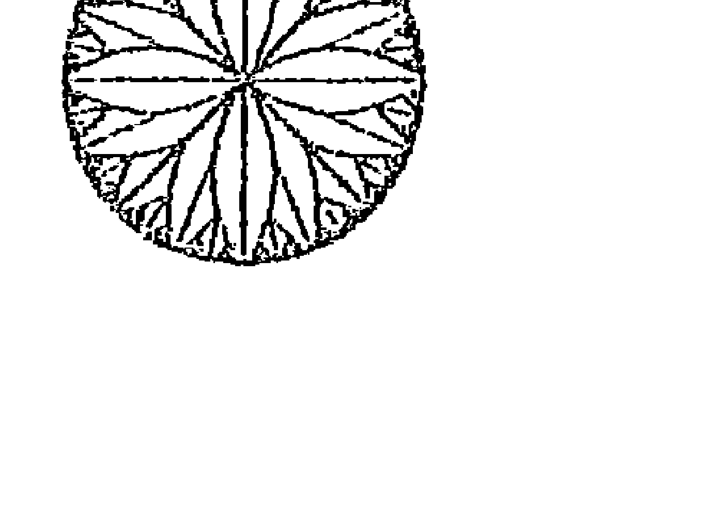

## 第七章

## 星盘中的智神星

希腊人崇敬智慧与正义女神——帕拉斯·雅典娜，是艺术的守护者与国家的守卫者，她无所不知，给予人们明智的建言。

原为古老利比亚之亚马逊女王的帕拉斯·雅典娜，因从天神朱庇特的头部冠脉单性生殖而来，而广为奥林匹亚的希腊人所知；此为简化后的版本。在早期的故事中，朱庇特吞下他的第一个妻子，身孕雅典娜的海洋女神墨提斯。从外在层面来看，这代表国家需要汲取并适应阴性智慧的本质；从内在层面来看，这则神话追溯了意识的变革——渴望繁衍的性能量被分化为两极，从而释放心智创造力的冲动，而帕拉斯·雅典娜恐惧成功的病态，源于女性在文化制约与心智创造之间的分歧。

作为女儿，帕拉斯·雅典娜象征将创造性智慧以思想形式呈现，藉由理解显化的自然规律，作用于个人实现与成就的能力。

在占星学中，智神星描述了我们如何面对学习、创造力、艺术、政治、治疗、关系疏离、竞争和恐惧成功等议题。

智神星所在的星座，描述了十二种透过心智创造力而运作的感知方式。

智神星所在的宫位，说明了我们在哪些领域展现对心智创造力的渴望，以及我们可能在该领域萌生对成功的恐惧而使心智创造力的展现受阻。

智神星与其他行星的相位，描绘了心智创造力如何与人格的其他面向做整合。和谐相位代表能与该行星所代表的事项顺畅地融合，而紧张相位意指个人对创造的需求与其它生活层面的需要之间存着潜在冲突；当个人能将星盘中智神星冲突相位的不同需求加以掌握与整合时，便不再需要透过压力来学习平衡。

## 智神星在占星学的主掌领域

智神星作为智慧女神，是聪明才智的象征

- 天才到唐氏症患者
- 学习问题
- 智力发展迟缓
- 感知困难
- 色盲
- 手眼协调
- 对于整体图像和系统的感知
- 解决问题
- 疑难排解
- 技能
- 精确
- 规划
- 前瞻
- 实用
- 科技
- 协调

智神星作为工匠的守护者，珍视艺术

- 艺术创作
- 视觉艺术
- 素描
- 绘画
- 图像
- 设计
- 摄影
- 家庭工艺品
- 纺纱
- 编织
- 针织
- 缝纫
- 陶艺
- 铸铁
- 冶金
- 乐器

智神星的海吉亚面向，代表着治愈能力

心理治疗。观想。催眠。肯定。透过平衡来进行物理治疗。极性疗法。长寿饮食。针灸。顺势疗法。细胞再生。透过引导、净化、极化电流达到能量治疗。透过平衡和整合进行心理治疗。格式塔学派。沟通分析。演剧心理治疗

智神星作为正义女神和国家的守卫者，掌管政治活动

捍卫正义。法律。法律事务。人民的前锋。少数族群的捍卫者。核子武器。喷雾剂。特别出众的人。年老者。年轻者。种族／民族。和平的艺术。调解员。外交。顾问。公正的证人。武术。功夫。太极拳。合气道。击剑。好战的女权主义

智神星支持专业领域的卓越成就

就业训练。职业指导。专业领域的歧视和性别歧视

## 智神星在十二星座

以下各节所引用的星盘数据来源，以数字圆圈表示：

> ① Lois Rodden 著，The American Book of Charts
② Lois Rodden 著，Profiles of Women
③ Marc Penfield 著，An Astrological Who's Who

智神星在白羊座，展现出一种寻求行动或启动的洞察，“看见”如何让事情有所进展。由于白羊座与生命能量有强烈的连结，智神星的疗愈即以启动生命力的视点，表现在例如顺势疗法或针灸等技术。智神星在白羊座的美学是藉由运动员的身体作为载体，来展现其创作的动力，或表现在动态艺术（kinetic art）等前卫领域。从政治的角度来看，智神星白羊座的人是一位骁勇好战的勇士，能激发人们为了信仰而战斗的能量。智神星在白羊座的智慧是灵光乍现——“脑力激荡”或者冲动式的创举。

星盘案例：魔术师哈里·霍迪尼（Harry Houdini）的智神星位于白羊座，他以逃生艺术家的危险壮举享誉全球。①

女枪手安妮·欧克利（Annie Oakley）是使用手枪、步枪和散弹猎枪的专家，她的智神星位于白羊座。①

智神星在金牛座，代表经由身体的感官来感知，持续地透过视觉、听觉和触觉来“看见”物质世界的自然之美。由于金牛座与大地和物质之间的强烈连结，智神星得以将自然的力量运用于工作上，或透过双手来进行疗愈。从美学的角度来看，智神星在金牛座是有力的位置——擅长运用颜色、图框和纹理，透过艺术、音乐和环境美化来呈现美感。从政治的角度来看，智神星在金牛座象征为土地而战——环境生态或土地改革。智神星在金牛座的智慧是“常识”——民俗疗法的实用建议或街头知识。

星盘案例：女演员凯瑟琳·赫本（Katharine Hepburn）的性感魅力，有一部份来自她的智神星与月亮合相于金牛座第七宫。

智神星在双子座，代表藉由书写和口语表达来感知，透过大量的文字及语言来“看见”世界。在疗愈方面，智神星双子座运用言语的力量，诸如肯定的话语、神经语言程式学和语言治疗等技能；作为一名分析师，智神星双子座运用文字引导出无意识。从美学的角度来看，智神星在双子座是作家和诗人的优势，以文字来创造意象，或如说故事的人，以传统口语的方式进行创作。从政治的角度来看，智神星双子座的人是善用文字的战士——演说家、辩论者、政治作家——将内在的真理转译成文字。智神星在双子座的智慧是知识——知晓，来自一个人的内在思想，而悖论也是理解的一环。

星盘案例：前瞻型占星家暨作家马克·埃德蒙·琼斯（Marc Edmund Jones）的智神星位于双子座第七宫。

喜剧演员兰尼·布鲁斯（Lenny Bruce）以具社会争议的讽刺作品而闻名，他的智神星位于双子座第七宫。

智神星在巨蟹座，代表透过情感来感知，即透过向外摸索的方式“看见”世界。智神星巨蟹座以营造出满足基本生理需求的环境——温暖、舒适、食物与安全——进行疗愈。从美学的角度来看，智神星巨蟹座可以轻易地透过居家艺术（例如美食主厨）来表现其创[content]

## 第七章 星盘中的智神星

才能，成为宴客的主人／女主人，或者创造出充满氛围的环境。从政治的角度来看，智神星巨蟹座的人是家园和家庭的守护者、国家的爱国者，以及儿童、长者、残疾者或需要帮助之人的发声者。智神星在巨蟹座的智慧是同理——透过极为敏感的情绪雷达来理解他人。

星盘案例：第一位登陆月球的太空人尼尔·阿姆斯壮（Neil Armstrong），他的智神星与木星合相于月亮所主管的巨蟹座。

爱国者内森·黑尔（Nathan Hale）曾道：“我唯一的遗憾，就是只有一条命可以献给我的国家”，他的智神星与谷神星合相于巨蟹座。

智神星在狮子座，代表一种格外强烈的创意，“看见”如何将个人独到观点印记于世界之中。作为疗愈者，智神星狮子座采用艺术治疗、演剧心理治疗、戏剧（沙盘）疗法、舞蹈疗法和愉悦减压等方式。智神星在狮子座，透过编剧、演戏、表演、求爱与浪漫作为艺术形式，并藉由太阳的能量来释放创造力；智神星狮子座的人具有特殊魅力，作为事业中的代表人物，他们是舞台前受注目的焦点，并透过政治喜剧和戏剧来吸引大众。智神星在狮子座的智慧是创作的冲劲——催生出新的表现形式。

星盘案例：具有超凡魅力和勇气的副总统候选人杰罗丁·费拉罗（Geraldine Ferraro），她的智神星位于狮子座与太阳处女座形成合相。

西蒙·玻利瓦（Simon Bolivar）是拉丁美洲的自由主义者，他的智神星与谷神星合相于狮子座。

智神星在处女座，显示出一种分析式的洞察力，能够断开周边多余的杂讯，“看见”事物以最简单的形式所呈现的本质。智神星处女座精通哈达瑜伽技巧，并透过食物（营养师和草药师）和运动来净化身体。从美学的角度来看，智神星处女座透过精细的工艺将意象实体化，使之实际运用于生活中，例如陶艺、木工、缝纫和电脑程式。从政治的角度来看，智神星处女座的人为任何领域的完美、高品质和高标准而奋斗。智神星在处女座的智慧是辨别——把小麦从秕糠中筛离出来。

星盘案例：疗愈师艾伦·约阿库姆（Ellen Yoakum）的智神星位于处女座第四宫，他只需看一眼就能诊断病情，然后把手放在病人身上完成疗愈。

智神星在天秤座，映照出一种寻求调和对立的感知，从空间关系的角度去“看见”世界，带来平衡、组合以及凝聚力。作为疗愈者，智神星天秤座运用能量平衡的技巧，例如极性疗法、长寿饮食（阴与阳）、太极、婚姻咨询、冲突管理以及格式塔疗法。从美学的角度来看，智神星在天秤座是有力位置，善于创作具备和谐感的设计，包括图像设计、室内设计和时装设计。从政治角度来看，智神星天秤座是正义的捍卫者，寻求执行和平的艺术——调解、外交和法律行动。智神星在天秤座的智慧是平衡——协调与整合极性的能力。

星盘案例：电视女主持人芭芭拉·沃尔特斯（Barbara Walters）的智神星位于天秤座，她一直是媒体业中的女性开创者。

智神星在天蝎座，具有穿透一切的洞察力，如同 X 光，能“看穿”表象下的事物。作为疗愈者，智神星在天蝎座是非常强大的位置——直捣困境的核心，并找出问题的根源；此外，她以深度心理学的技巧，将潜意识带出意识层面，例如原始的嘶吼、前世回溯和催眠；另外，性治疗和细胞修复，也是她疗愈方式的一部分。从美学的角度来看，智神星天蝎座代表象征式的艺术，例如曼陀罗，意义之中蕴含更深度的意涵，或者以性作为艺术的形式，例如谭崔性爱（Tantric Practices）或《爱经》（Kama Sutra）。从政治的角度来看，智神星天蝎座的人是一名无所畏惧、冷酷无情的战士，把控群众的力量，专精于策略和间谍活动。智神星在天蝎座的智慧是深度洞察——渗透到核心并掌握其本质。

星盘案例：外科医生克里斯蒂安·巴纳德（Christiaan Barnard）进行了历史上首次的人类心脏移植手术，他的智神星与太阳合相于天蝎座。

富有想象力的侦探小说作家阿嘉莎·克莉丝蒂（Agatha Christie），她的智神星位于天蝎座第二宫。

智神星在射手座，意味着概念上的感知，能以宽阔的视野“看见”大局。作为疗愈者，这表现为心智的疗愈——运用完美而清晰的意象作为力量，来达到整体共感与变化；射手座与宗教的连结代表灵性知识，诸如萨满或上师。在美学方面，智神星射手座渴望透过创造艺术来传达宇宙法则（塔罗牌），或强调民族特色及其文化特质的艺术。从政治的角度来看，智神星射手座是真理和正义的捍卫者，为意识形态而战，亦象征了统治者身旁的贤德之士或顾问（如同梅林之于亚瑟王），或宗教战士，例如十字军和圣战（在穆斯林的圣战中）。智神星在射手座的智慧是融合——敦促各方凝聚整合为一体。

星盘案例：作家暨人权与思想自由的捍卫者伯特兰·罗素（Bertrand Russell），他的智神星位于射手座。

牧师杰西·杰克逊（Jesse Jackson）的智神星位于射手座，他的政治竞选活动是以宗教意识形态为基础。

智神星在摩羯座，象征结构性的感知，透过理解支撑形式的基础结构去“看见”。作为疗愈者，这代表可以经由骨骼的愈合来治愈，例如整脊、姿势矫正、鲁尔夫治疗法（Rolfing）、深层组织按摩和齿科保健。从美学的角度来看，智神星在摩羯座是非常强大的位置，能将原始的创造力聚合，整并为精确的结构（模具）；此能力可以即时的显现，且通常被视为是一个神奇的过程；擅长建筑艺术、制图和雕塑。将摩羯座与时间的关系以及智神星掌握时机的能力加以链接——即把人事物在对的时间放在对的地方。从政治的角度来看，智神星摩羯座的人是法律与秩序的捍卫者，并十分渴望在政治和社会机构中成为掌权者。智神星在摩羯座的智慧是秩序——将事物依照适当的秩序加以安置。

星盘案例：著名雕塑家奥古斯特·罗丹（Auguste Rodin）以物理形式呈现出自己美丽的形象，他的智神星位于摩羯座第十二宫。

智神星在水瓶座，代表着对未来的感知，可以“看见”未来的各种可能性。作为疗愈者，透过振动的频率工作，诸如颜色、声音、晶体和白光（就像太阳的散射）。从美学的角度来看，智神星水瓶座透过创造新事物来展现——发明家或者天才，创作科幻艺术、电脑图像、新浪潮音乐、摇滚乐影片和激进艺术，这些艺术家走在未来的前缘，为大众诠释那即将迎来的调性。从政治的角度来看，智神星水瓶座的人是政治革命家，他们倡导与捍卫人权，并组织草根型的抗争活动。智神星在水瓶座代表未来的智慧——创造形式，造福后代。

星盘案例：特立独行的政治人物暨人道主义者亚伯拉罕·林肯（Abraham Lincoln）、厄尔·华伦（Earl Warren）和马丁·路德·金（Martin Luther King），他们的智神星都位于水瓶座。

占星家、飞行员暨门萨成员罗伊斯·罗登（Lois Rodden），她的智神星位于水瓶座上升点。

智神星在双鱼座，表现出渗透性的感知，通过将自己融入于稠密的真实空间，以体验直接连接主体的方式去“看见”。作为疗愈者，擅长心理疗愈和信念疗愈，采用引导式心像法、幻想和梦境解析等心理技术，以及冥想、奉献、指导灵、灵性实践等。从美学的角度来看，智神星双鱼座于艺术表达中展现其诗意、具启发性和奇幻的特质，于电影与摄影媒体中巧妙运用光、影和幻象的创作技巧，包括唤醒感觉的空灵音乐（合成音乐）。从政治的角度来看，智神星双鱼座的人是拒绝争端、非暴力抵制的拥护者：“当人打你的脸，另一边的脸也由他打”，也是具启迪性的战士、菩萨与殉道者。智神星在双鱼座的智慧是同理心——体悟尘世间的痛苦，以及人类对幸福的渴望。

星盘案例：华特·迪士尼（Walt Disney）是米老鼠和唐老鸭等著名卡通人物的创作者，他的智神星位于双鱼座。

## 智神星在十二宫位

智神星在第一宫，代表个人认同强烈仰赖智力、权力或创造力；智神星第一宫的人可能展现出雌雄同体的特质，或者违背男性与女性的刻板印象。

星盘案例：女性飞行员爱蜜莉亚·艾尔哈特（Amelia Earhart）的智神星位于金牛座且合相上升点，她说：“女人应当尝试跟男人做同样的事。即便我们失败了，我们的失败经验同样也是其他人挑战的标竿。”

智神星在第二宫，指出对于获取资源有强烈的实践意识，并富有创意的技巧；智神星第二宫的人可以透过创造性的观想过程中，于生活中显化丰盛的物质财富或价值。

星盘案例：诗人杰克·凯鲁亚克（Jack Kerouac）的智神星合相北交点第二宫，他抗议中产阶级价值观的唯物主义。

智神星在第三宫，象征强烈的直觉力，他们能以语言和沟通进行创作、革新教育技术，或成为环保主义者；智神星第三宫的人具有个人智慧，并对知识有强烈的渴望。

星盘案例：理查·阿尔珀特（Richard Alpert）的智神星与海王星合相于处女座第三宫，他自然而然地开始投入、并研究另类的心智诠释。

智神星在第四宫，象征此人可能具备高度灵感的能力或极富同情心，其潜意识为智慧的来源；智神星第四宫的人也拥有营造家庭与渡假氛围的出色才华。

星盘案例：作家兼厨师茱莉亚·柴尔德（Julia Child）的智神星与太阳合相于狮子座第四宫。

智神星在第五宫，展现个人孕育原创思想的过人天赋，他们能将生殖能量转移至创意工作，或者透过牺牲热情而得到友谊；当智神星第五宫的人处于这样的状态时，易出现性隔离（sexual isolation）。

星盘案例：海伦·佛兰肯瑟勒（Helen Frankenthaler）被认为是当代最重要的抽象画家之一，她的智神星位于水瓶座第五宫。

智神星在第六宫，能善用聪明才智来整合系统，使之更为完善，藉由个人的做事方法或工作来表现其创造力，或者透过有力的心智治疗来疗愈身体；智神星第六宫的人也可能是工作权利的倡导者。

星盘案例：爱德加·凯西（Edgar Cayce）以预言和疗愈能力为人们服务，他的智神星位于摩羯座第六宫。

智神星在第七宫，展现出强大的调解和咨询能力，其创造性的智慧与技能可以用来改善人际关系，也由于关系与创造力之间的冲突，个人在亲密关系与性爱领域可能遭遇困难；智神星第七宫的人，通常在非私人关系中的运作，会比在私人关系中表现得更好。

星盘案例：莎莉·麦克琳（Shirley MacLaine）直言不讳，是倡导妇女权利的先驱者，她的智神星与水星合相于白羊座第七宫。

智神星在第八宫，代表突出的通灵智慧或预言智慧，这些人在合伙与金钱事务有着出色的创造力，亦能运用性爱的神奇力量，以及透过昆达里尼瑜伽成为灵性转化者；智神星第八宫的人能在体验传统性表达的局限之后，将性升华到创造与转化的境界。

星盘案例：精神领袖帕拉宏撒·尤迦南达（Paramahansa Yogananda）为自我实现的运动（Self-Realization Movement）的创始人，其智神星位于双鱼座第八宫，他终生独身，是一名神秘主义者。

智神星在第九宫，代表个人的创造性思维会透过政治、哲学或社会意识形态来展现，而其思维能经由教育来革新；智神星第九宫也是参与法律和行动主义的象征。

星盘案例：杰佛逊·戴维斯（Jefferson Davis）是南北战争期间南方国家宪法权利的拥护者，他的智神星位于水瓶座第九宫。

麦达琳·默里·欧黑尔（Madalyn Murray O’Hair）的智神星位于水瓶座第九宫且与土星形成对分相，她反对宗教组织，在“公立学校强制进行祈祷等宗教活动”一案担任律师并赢得诉讼。

智神星在第十宫，展现专业领域并获得认可与成就的强烈使命感，他们可以运用自己与生俱来的智慧发展个人事业。对于女性而言，智神星第十宫强调职业上高度成功的原型，如果未能将其情感需求融入，则可能会以否定自己的阴性气质作为成功的代价。

星盘案例：鼓励女性解放的《柯梦波丹》杂志主编海伦·古利·布朗（Helen Gurley Brown），她的智神星与木星合相于天秤座第十宫。

智神星在第十一宫，象征构思与诞生新的社会愿景，以团体的形式，在社会组织中实施新的概念，并透过与兄弟会或姊妹会等组织的合作，进一步提升个人创造力；智神星第十一宫的人，天生带有强烈的政治特质，热衷于社会变革，透过成为倡导者或发言人展现个人创造性的智慧。

星盘案例：音乐家巴布·狄伦（Bob Dylan）创作了社会改革的抗议歌曲，他的智神星位于射手座第十一宫且与太阳形成对分相。

智神星在第十二宫，代表与集体无意识连结的智慧，精通于精神上的教导，智神星于此宫位，也代表个人在心理、智力和信仰系统的运用会与业力有关，他们可能会在心理或智力上受限（迟缓、精神崩溃）；智神星第十二宫的人，其积极的面向是能将心智运用于造福他人，或者提供他人灵性上的服务。

星盘案例：因各自的政治立场，安吉拉·戴维斯（Angela Davis）被监禁，而贝蒂·赫兹（Patty Hearst）被绑架，两人的智神星皆被禁锢于第十二宫。

### 智神星与其它行星的相位

#### 智神星与太阳的相位

智神星的心智创造与太阳的自我认同、生命目标结合，此组相位代表将性能量的创造力转化为艺术或心灵上的成就，是生命目标的核心。

和谐相位代表个性、才智和勇气的力量；这些人倾向透过艺术、政治或疗愈的形式来进行创作，由于去除了男女角色的极性，他们通常会在各种类型的性关系中感到自在。

紧张相位象征对于自我能力能否达到成就的恐惧，导致心理和创作过程的障碍，也可能与父亲相处得不愉快；这些人可能会觉得与自己的性别角色是疏离的，因此，他们在与他人互动时，可能会困惑不已——直到他们能厘清自己内心为止。

克服这些挑战的办法，是学会将自己创作的愿望，和谐地融入人生的基本目标当中。

星盘案例：约翰·蓝侬（John Lennon）的智神星与太阳合相于天秤座，透过他的歌曲《给和平一个机会》（Give Peace a Chance），为世界带来了团结与和平的愿景。

荷兰前女王碧翠丝（Beatrix）的智神星与太阳合相于水瓶座第十一宫，她是位具有法学学位、独立而聪明的女性，一生投入于训练自己以公民的立场担任荷兰女王。

博物学家查尔斯·达尔文（Charles Darwin）的智神星与太阳合相于水瓶座，他原创的天择演化理论，带来了生物科学领域的革命。

科学家兼作家瑞秋·卡森（Rachel Carson）的智神星与太阳合相于双子座，透过她的著作《寂静的春天》（Silent Spring）呼吁大众注意农药的浪费和破坏性的使用。

#### 智神星与月亮的相位

智神星的心智创造与月亮的情绪感觉结合，此组相位可以表现出智力和情感的融合，对于情感世界能有清晰的感知。

和谐相位代表高度的直觉力、丰富的心智以及整体的精神能力，他们强烈地感受到自身的阴性能量和能力，并能清楚地展现出来；这些人可能会参与保护和捍卫少数族群的活动。

紧张相位可能显现在感受与思想、个人的情感需求与成就需求之间的持续矛盾，这些人可能感觉与母亲疏离，从而与自己的女性身份疏离，其他的挑战可能还包括因缺乏教育和自信，使他们感到依赖与无助。

克服这些挑战的办法仰赖于对阴性智慧的认同，进而将思想与心灵、逻辑与直觉、温暖和感受融为一体。

星盘案例：西蒙·波娃（Simone Beauvoir）的智神星位于处女座第十宫，且与月亮双鱼座形成对分相，她是一位杰出的存在主义哲学家，与尚—保罗·沙特（Jean-Paul Sartre）一起引领着巴黎前卫知识分子。

弗雷德里克·萧邦（Frederic Chopin）是一位钢琴作曲家，以谱出浪漫动人的旋律而闻名，他的智神星位于白羊座且与月亮天秤座形成对分相。

俄罗斯的强势领导人凯萨琳大帝（Catherine the Great）的智神星位于射手座上中天附近，与月亮形成对分相，她鼓励了科学、文学、艺术和民族文化的发展。

科学家威利·莱（Willy Ley）的智神星与月亮合相于白羊座，他是一位在太空旅行与火箭的主题上多产的作家。

#### 智神星与水星的相位

智神星的心智创造法则与水星的才智结合，此组相位强化了智神星所象征的创造性智慧。

和谐相位描绘了强大的创造力和智力，这些人经常在文字运用与媒体沟通上展现出力量和技巧，他们也可能精通于调解、谈判、证言以及正向思考的艺术。

紧张相位代表个人在推理、创造和口头表达自己的想法上存有潜在的障碍，此相位可能指向学习障碍，或者是知觉、听觉及精神功能障碍。

克服这些挑战的办法，在于将个人的理性才能与创作的冲动调校，达成一致性，以成功地传达自己的原创想法。

星盘案例：居里夫人（Marie Curie）是唯一同时获得诺贝尔化学奖和物理奖的人，她的智神星与水星合相于射手座；然而，因为她是女性，所以她从未被科学院录用。

中国国民党的政治和军事领导人蒋介石，他的水星位于射手座，与智神星呈四分相。

#### 智神星与金星的相位

智神星的心智创造与金星的爱和性的阴性本质结合。由于金星维纳斯是美之女神，此组相位彰显了智神星的美学特质。

和谐相位代表能够将性能量引导至艺术表现中，对女性的性别认同也会与外在世界的成就融合；由于其内在的性能量处于平衡的状态，他们可能会是雌雄同体，且能轻易地经验多样化的性交流，也可能渴望成为妇女平权运动的倡导者。

紧张相位可能表示在性能量的创造性表达受阻，亲密关系与创作成就之间所面临的选择性冲突，可能导致为了其中一方的利益而牺牲另一方，也可能对女性性别的本质发生混淆。

克服这些挑战的办法，不仅要学会从外部世界积极创造，也要学会接纳与开放，才能从中汲取必要的灵感；一般而言，这代表着个人内在男性与内在女性能量的平衡。

星盘案例：歌手艾尔顿·强（Elton John）的智神星与金星形成合相，描绘出他雌雄同体的倾向与创造力。

小野洋子（Yoko Ono）的智神星与金星合相于水瓶座第五宫，描绘出她前卫的艺术创造力，以及她独立的感情生活态度。

#### 智神星与火星的相位

智神星的心智创造与火星行动和主张的阳性本质结合，此组相位强调了智神星的英勇和行动主义。

和谐相位代表能够以策略性技巧与自信来执行完善的计划，为其所珍视的理念而奋战，为取得胜利而拼搏，使阳性能量得以充分的发挥与展现。

紧张相位可能代表在性能量的创造性表达受阻，或者没有能力去实现创意，性事挫败也会导致个人感觉性能力不足，以及出现补偿式的好战行为；过度阳刚或者不够阳刚，都可能对男性带来性别认同的混淆。

克服这些挑战的办法，在于将个人创造与思考的过程，与意志和执行力保持一致，学习适当地运用自己内在的力量与勇气，将有助于这个过程。

星盘案例：消费者斗士兼保护者拉尔夫·纳德（Ralph Nader），展现出他智神星与火星合相于双鱼座的使命召唤。

具有超凡魅力和进取精神的传教士葛理翰（Billy Graham），他的智神星与火星合相于射手座。

#### 智神星与灶神星的相位

智神星的创造性表达与灶神星的聚焦结合，这是显化与聚焦个人愿景的强力组合。

和谐相位能描绘出被某个观点启发或投入某个目标的能力，这些人能将性能量升华为艺术、政治、智慧或精神上的追求，此组相位也可能代表疗愈技术的天赋。

紧张相位代表个人在智力或创意的展现受阻，此外，过度投入于自己的创作过程，可能导致在社交与性事方面与他人疏离，在某些情况下，也可能成为政治狂热者。

克服这些挑战的办法，是运用灶神星的自我整合与汇聚的能量来传递和实践创意。

星盘案例：嘉莉·纳蒂翁（Carrie Nation）的灶神星位于处女座且与智神星双鱼座形成对分相，她看见了幻象，而深感自己的使命是反对酗酒。

鲁道夫·纽瑞耶夫（Rudolf Nureyev）逃离俄罗斯以追求自己的舞蹈事业，展现了他灶神星位于射手座四分相智神星双鱼座所呈现的张力。

## 智神星與婚神星的相位

智神星的心智創造與婚神星的連結渴望結合，此組相位會透過伴侶關係來強化創造的過程。

和諧相位代表能經由與他人合作而達成創作成就；由於個人取得了內在男性與女性特質的平衡，因此也為外部關係帶來和諧與合作，這些人通常會鼓勵並支持另一半的創造性發展。

緊張相位代表創作與關係的需求之間潛在衝突，其伴侶可能讓自己的創造力和智力成就受限，另外，個人內在男性與女性特質的失衡，可能導致與他人互動的困難（例如，早期的父親情結可能會延續到成年後的關係中）。

克服這些挑戰的辦法是在個人的創作過程中承認他人的價值，並找到一種將他人的貢獻融入其中，同時仍忠於自己的方式。

星盤案例：英國小說家瑪麗·雪萊（Mary Shelley）與丈夫珀西（Percy）在創作上美好而融洽的關係，可以從她的智神星與婚神星合相於處女座第四宮來描繪。

神秘學家阿萊斯特·克勞利（Aleister Crowley）的智神星與婚神星合相於處女座，且與月亮雙魚座形成對分相，他寫下了伴侶在性儀式中讓創意視覺化的力量。

伊莉莎白·雅頓（Elizabeth Arden）的智神星與婚神星合相於雙魚座，她創建了一個成功的化妝品帝國。

## 智神星與木星的相位

智神星的心智創造與木星擴張拓展的渴望結合。木星也象徵對真理和意義的追求，因此，此組相位強調並強化了智神星的知識活動。

和諧相位代表可能具有非凡的智慧，這些人可能思想開明、帶有前瞻性的思維，能夠悟透人類所面臨的整體社會問題的意涵，他們可能因而從事哲學、司法或教育進修，或者參與爭取正義與捍衛真理的奮鬥。

緊張相位可能指出個人的野心和道德之間潛在衝突，特別是當個人擁有過高的成就需求時，而這可能由於父親表達出對孩子的高度期望所致；這組相位也可能意味著在理解或表達其概念與想法上的心智障礙。

克服這些挑戰的辦法，就是在社會表達的範疇中擴大個人的心智創造力，為社會帶來最高福祉。

星盤案例：形上學作家保羅·福斯特·凱斯（Paul Foster Case）是傳授塔羅牌與卡巴拉的 B.O.T.A. 奧術學校創始人，他的智神星與木星合相於獅子座。

溫斯頓·邱吉爾（Winston Churchill）爵士是第二次世界大戰期間的英國首相，也是歷史上最偉大的政治家之一，他的智神星位於白羊座且對分位於天秤座的木星，巧妙地描繪了這一點。①

女演員凡妮莎·蕾格烈芙（Vanessa Redgrave）說道：

> 「我一向慎選銀幕角色，如此一來，一旦我的演藝生涯走到了盡頭，我才可能充分表達出近代史上受迫害人們的故事。」

她的智神星與木星合相於摩羯座第五宮，描繪出這個特質。②

## 智神星與土星的相位

智神星的心智創造與土星鞏固的渴望結合，此組相位能引領個人將自我約束和結構納入創作的過程，讓個人的創造性思想得以具體實現。

和諧相位表示集中精神和聚焦的能力，這些人可能感覺自己有某些社會責任，並且反對不公正的法律；這組相位所具備的優勢與成功的特質，也可能對其女性的身分認同有很大貢獻。

緊張相位指出，在實用主義的需求與自由藝術的表達之間存有潛在衝突，可能阻礙他們的創作過程；而來自父母的壓力和對成功的高度期望，也可能導致這些人對自己的創作能力失去信心。

克服這些挑戰的辦法，是透過土星發展出強大的結構與穩定的基礎，這將帶來支持，有助於個人實現其心智與創作的過程。

星盤案例：革命思想家卡爾·馬克思（Karl Marx）提出了唯心主義政治觀點，他的智神星與土星合相於雙魚座第一宮。①

希特勒的情婦伊娃·布朗（Eva Braun）的智神星與土星合相於第七宮，描繪了兩人長久的情誼、她的忠誠與孤獨，以及她犧牲了自己的創造潛能。②

## 智神星與天王星的相位

智神星的心智創造與天王星的個體性和直覺結合。

具有此組相位的人可以把創作的動力普世化，進而發展出一種願景以及對人道主義的體悟。

和諧相位描述了一種原創而直觀的思想，在科學和科技領域特別具有創造力，此相位可能代表具備運用電場療癒的能力，這些人也可能參與社會改革、人權鬥爭和革命事業；這組相位還可能代表雙性戀的傾向，並能與任何類型的人結為朋友。

緊張相位代表思緒的不穩定與神經系統的過載，抑制了心智創造力的充分展現，也由於他們需要跳脫傳統，因而可能導致過度叛逆的思想和行為。

克服這些挑戰的辦法，在於將自己心智創作的動力，與更高層次的、超越個人的思想結合。

星盤案例：反對偶像崇拜的阿倫·沃茨（Alan Watts），展現出智神星與天王星合相於水瓶座第二宮所彰顯的非常規價值。

飛行員海倫·布徹（Helen Boucher）締造了七項世界速度紀錄，並專門從事特技飛行表演，呈現出智神星位於第一宮且與位於第五宮的天王星形成三分相的特質。

## 智神星與海王星的相位

智神星的心智創造與海王星超然的渴望結合。具有此組相位使他們的感知能力更為敏銳，並能進入更奧妙的領域和面向。

和諧相位描述了心電感應的能力，以及透過色彩和音樂進行心理治療的能力；在美術、電影和攝影方面可能展露特殊才華，這些人也可能具備崇高的信念和靈性。

緊張相位可能導致個人對現實的認知混淆，無法區分真實與虛幻，在某些情況下，可能會出現精神錯亂和幻覺；也由於海王星象徵感染力，這些人可能會吸引並受到負面能量的影響，也可能經歷自身信仰系統的瓦解，或者被灌輸盲目的信仰。

克服這些挑戰的辦法，是運用自己的心智創造力，在與現實世界的互動過程中，對於奧微的面向，發展出完整而務實的認知。

星盤案例：聖弗朗西斯卡·卡布里尼（Saint Francesca Cabrini）的智神星與海王星合相於雙魚座，她將自己對於性和關係的需求，昇華為事工服務。②

其他有智神星與海王星相位的形上學者，包括阿麗斯·貝里（Alice Bailey）②、海倫娜·布拉瓦茨基（Helena P.Blavatsky）②、理查·艾伯特（Richard Alpert）①、馬克·埃德蒙·瓊斯（Marc Edmund Jones）①和諾斯特拉達姆士（Nostradamus）③。

魔術師明內特·萊尼爾（Minette Lenier）為娛樂創造了幻象，她的智神星與海王星合相於第五宮。②

## 智神星与冥王星的相位

智神星的心智创造与冥王星转化的渴望结合，此组相位强调了足以改变现实的思想力量。

和谐相位代表能创造想法的心智力量，能以此影响和转化他人，此相位可能具备进行再生疗愈的技术，并能将之运用于发明和艺术创作的过程；此外，个人的内在与外在的男性/女性身份和角色，也可能有深远的变化。

紧张相位可能代表个人所呈现的性别认同和创作潜力，受到深潜意识的阻碍，其心智也可能存在着强烈的执念与固着，且主导着个人的思想。

克服这些挑战的办法，在于释放心智表达的消极面向，并以信念、希望和正向思考来替代，正如古老谚语所说的，「只要心意更新而变化」。⑪

星盘案例：亚历山大·格拉汉姆·贝尔（Alexander Graham Bell）的智神星与冥王星、天王星合相于白羊座，透过他的思想和发明转化了世界，他还教授聋哑儿童音乐和演说。⑫

无意识的研究者弗洛伊德（Sigmund Freud），他的智神星与灶神星、冥王星合相于金牛座第六宫。①

## 第八章

## 灶神星：永恒圣火

「……以及第三項阿芙蘿黛蒂不待見赫斯提亞之處。」

赫斯提亞是狡猾的克洛諾斯的第一個孩子（也是最後一個從他肚子出來，多虧手持埃癸斯的宙斯），她亦是波賽頓與阿波羅傾慕的對象，但他倆皆非她所願，故嚴詞拒絕二人。

她撫著手持埃癸斯的天父宙斯的頭，許下了重誓，這一次的宣誓果若成真，她每日都將維持處女之身，成為一位神聖的女神。

接著，天父宙斯賜給她一項結婚賀禮：他將為她在家宅的中央設置席位，領受最好的祭品，所有神祇的廟堂皆崇敬她，世間凡人的眼裡，她是崇高的女神。」①

## 維斯塔的神話

灶神星 —— 維斯塔 (Vesta)，古希臘人稱她為赫斯提亞 (Hestia)，由處女座象形符號中的處女形象所象徵。羅馬人將她奉為灶壇女神和神聖火焰的守護者 (她的名字源於梵文詞根 vas，意思是「閃亮的」)。雖然不是體積最大的小行星，但卻是最亮且唯一可以用肉眼觀測的小行星，原因是其表面乃由一種因內部高溫而形成特殊的火山岩面所構成，能夠反射出大量的太陽光；②所以灶神星與火元素的連結，恰好與其天體的發光特質相應。

作為守護聖火的女神，每戶家宅的中央以及每座城市的中心，都設有供奉維斯塔的祭壇，她已成為家庭和社區守護者的象徵，從而確保了家庭和國家的凝聚力。羅馬的維斯塔女祭司被稱為維斯塔處女（vestal virgins），她們宣誓獨身，並以守護聖火為職責。

維斯塔很少出現在藝術作品或傳說中，因此她是所有女神中最難被理解的，這也導致她被許多神話作家忽略，認為這位女神平淡乏味且不值得認真研究，但是，如果我們認真地看待維斯塔的神話，就能瞭解到她的意義與重要性；那是一段橫跨希臘、羅馬和古希臘文明的故事。

## 維斯塔的故事

在希臘神話中，維斯塔是克洛諾斯（薩圖恩努斯）和雷亞誕下的第一個孩子，也是最後一位宙斯（朱庇特）從薩圖恩努斯肚中救出且重生的奧林匹亞手足。隨後，維斯塔選擇保有她的處女之身，拒絕與阿波羅或波賽頓結婚。

赫斯提亞的崇拜很早就從邁錫尼文明的克里特島傳到希臘，雖然，目前沒有任何當時赫斯提亞的圖像流傳下來，但她在所有的希臘城邦都受到崇敬，各城邦的公共會堂都設有她的灶壇，並在灶壇上供奉聖火，象徵著家庭和城邦的團結與凝聚力。因此，每當希臘人攻克了新的土地時，都會從家鄉的聖火中分出火焰，使新社區與舊家園連結起來；同樣地，女人離家時也會從娘家的爐灶分出火苗，以便另起自己的聖火。

由於她是第一位出生的奧林匹亞神祇，希臘人依此發展出一項傳統，在開始任何儀式和新計畫前，都要先向赫斯提亞的祭壇獻供。此外，她也能得到其他神廟祭品最上等的部位。每一份送入爐灶的祭品，都見證了赫斯提亞是主掌神聖灶壇和祭壇火焰的女神。

赫斯提亞是誠實和童貞無欺的化身，因此她的名字會出現在誓言和社會契約的封印上；赫斯提亞也掌管神聖的待客法則，她為異鄉人提供溫暖的爐火、食物和住所，因而她的灶壇也被認為是神聖的庇護所。

## 維斯塔處女

羅馬人汲取希臘文明後，將赫斯提亞更名為維斯塔，為了向她致敬，羅馬第二任國王努瑪·蓬皮留斯（Numa Pompilius）為她興建一座神廟，並在神廟中心供奉維斯塔的永恆聖火，以確保羅馬王國的安全；而照料聖火的神聖職責，則交由維斯塔神廟的女祭司，即維斯塔處女。最先開始是兩位，接著是四位，再來是六位，這些肩負神聖任務的女祭司，是從最受喜愛、地位最崇高的羅馬少女中遴選出來，她們在六歲時被納入神廟，立下誓言，於三十年的侍奉期間要守住貞操並保持單身。除了照看聖火，她們的職責還包括每天早晨用聖水淨化神殿，進行日常的敬拜和供奉，以及守護聖物，服務期滿後，女祭司被授予離開神廟和結婚的自由；但顯而易見地，很少女祭司會這麼做。

女祭司由大祭司（Pontifex Maximus）負責挑選，他對女祭司的生活擁有絕對的權威，並對她們的任何犯行施以嚴厲的懲罰，由於聖火的熄滅會被認為是國家安全受到威脅，沒有看顧好火焰的女祭司會遭以嚴重鞭打。此外，打破守貞誓言者，更會被判處殘酷的死刑；在被當眾鞭打後，受刑的女祭司會被捆綁起來，一路抬送至地下墓穴關禁閉，只留一盞燈和少許糧食，讓她漫長而痛苦地死去。

也許是為了彌補她們過於嚴苛的生活方式，維斯塔處女有許多特權：她們不受父輩管束，被賦予擁有和處置自己財產的權力；劇院為她們保留最好的座位；遊行時，她們的隊伍前方有一名隨扈，象徵對其權力的敬意，執政官和行政官員需向她們鞠躬；如果女祭司在路上遇到正被押赴刑場的死刑犯，她有權赦免他；遺囑和最重要的契約會交由她們保管；最後，她們可以選擇死後葬於城市內，這通常是極少數人才享有的特權。

這段時期的維斯塔雕像，是一位身穿白色長袍，一隻手握著點燃的火炬或蠟燭，另一隻手捧著香爐，擁有無比美貌的女人；此雕像的姿態體現出她的純潔、安全和神聖的庇護。

每年三月一日的慶典，維斯塔處女會澆熄並再次點燃聖火，向維斯塔女神致敬。在六月九日的維斯塔節（the Vestalia），神廟向城市中的所有婦女開放，婦女們帶來了自家壁爐上烘烤的食物，經過一週的獻供之後，神廟會關閉，進行清洗和淨化。這些儀式一直延續到西元五世紀，直到信奉基督教的皇帝狄奧多西（Theodosius）廢止對維斯塔的膜拜、驅離維斯塔處女，並滅絕了聖火；這位統治者也終結了希瑞斯／狄米特的厄琉息斯秘儀。

## 維斯塔於古希臘時期的起源

維斯塔的故事到此告一段落。由於她的傳說記載付之闕如，我們很難找到比希臘時期更早的起源，然而，關於這位女神本質的線索卻指向了核心：照料和守護祭壇最初的形式——爐火，意即女性奧秘的中心，以維斯塔祭儀及其圓形神廟被清晰地保留在古羅馬文明之中。③在德爾菲（Delphi），人們膜拜炙熱的炭火堆，將其視為維斯塔的化身，而這些炭火堆後來被稱為翁法洛斯（omphalos，希臘語的肚臍）或希臘世界的中心。④由於女祭司以照看永恆聖火維繫著維斯塔的信仰，藉由追尋她們的過往遺跡，我們將能抵達女神寶座的所在地。

在古希腊时期，主要的神灵是大母神，她以月亮的形式受到崇拜，此时期的女祭司们透过守护水源和圣火的方式，增强月亮滋养的能量。⑤ 圣火除了代表月光之外，也象征着印度瑜伽修炼中的拙火——昆达里尼，以及性蜕变的神秘力量。守护永恒圣火的女性被称为处女，并非因为她们守贞，而是因为她们保持单身且不隶属任何男人，故而，处女是一个自我完整且完满的存在；她们不需要被男人定义或控制。

维斯塔处女也為來到神廟敬拜女神並參與神聖結合的陌生男子獻身，提供神聖的性服務。她們並非利用性來滿足私慾，亦不是為了尋覓丈夫或生育；「這些女性的本意是為了更崇高的目的，將女神孕育的力量顯化於人類的生命。」⑥ 此外，在此神聖結合中，女祭司所生的孩子也被認為是神聖的，在王位繼承中背負著特別的宿命。

由此看來，維斯塔處女以下列方式延續了王室血脈：每年仲夏的橡木皇后和橡木國王的婚宴。⑦

橡木國王十二位同伴中的六位，與六位維斯塔處女，他們被安排在一個神聖的黑暗洞穴中混雜地做愛，因此沒人知道誰與誰是一對的，也不會知道誰是孩子的父親。這個儀式會在仲冬的農神節（Saturnalia）時再進行一次；因此，如果橡木皇后未能生下兒子，便會從維斯塔處女的孩子中選出下一任國王，但僅有一年的任期。⑧

上述故事說明了，在傳說起源中，為何許多古羅馬國王的母親都是處女，且生父不詳，或者是神的兒子。⑨實際上，古羅馬早期許多國王都是維斯塔處女的兒子，其中最著名的是羅馬第一任國王羅穆盧斯（Romulus），他是由處女雷亞·西爾維亞（Rhea Silvia）所生；因此，全國的宗教和政治中心都集中在由王室公主們，亦即維斯塔處女所守護的王室聖火上。

然而，隨著時代演變，父權文化開始佔上風，原本由維斯塔處女傳承的王室血脈，轉移到國王的婚姻關係，並且想方設法保住自己的王權，他們逐漸地將王權由一年延長到四年、而後八年、再到十九年——直到最後成為終身制。為了進一步確保男性的血脈能夠留傳下去，國王在妻子去世後會娶公主或公主的後代，或安排王子與她們結婚，這種現象說明了當時的王室家庭普遍有近親通婚的習俗。

由於父權文化的興起，處女愛神維斯塔到了中世紀卻成為寡身且不生育的修女。這一切始於羅馬國王塔克文一世（Tarquin the Elder），他為了防止維斯塔處女生出王位繼承人，下令要她們守住貞操，否則將被處以死刑，接著他成立了最初的貞女學院，收容處女們的女兒，並滅除任何重建母系王位的可能。巴勒斯坦的大衛王（King David of Palestine）也出於同樣目的建立了王室修道院，用於隔離掃羅王朝的婦女（the women of the royal house of Saul），確保只有自己的血脈能繼承王位。⑩

維斯塔原始傳統的精髓，包含了以性儀式崇敬月亮女神的生育和繁衍能力，從而獲得月神賜予神聖而蒙福的統治權，正因如此，維斯塔也被尊為完美的母親；然而，父權的統治掩蓋了維斯塔的能力，並將其轉譯為純潔守貞的處女神。從這個角度來看，荷馬史詩中關於維斯塔童貞的詩頌，其隱藏的意涵就顯而易見了；憑藉著她的輩份，維斯塔被獲准保有處女身而不受侵犯，不會受困於與阿波羅或波賽頓的一夫一妻制婚姻當中，此一代價是：她許下重誓要為處女立下一個新的定義——推翻她神聖的性儀式，讓權力有效且順利地由母系繼嗣轉為父系繼嗣。

雖然古希臘時期的維斯塔處女性儀式，在羅馬帝制時代已蕩然無存，但仍顯現在神聖的象徵意義上。在維斯塔神廟的灶壇附近有一個櫃子，叫做佩納斯（Penus），其內部隱密的地方置放著一尊象徵陽具的雕像，它被稱為帕拉狄恩（Palladium），以帕爾斯（Pales）、帕拉斯（Pallas）和普里阿普斯（Priapus）三位神祇命名。這個陽具的符號後來與月神結合，由灶壇中燒紅的炭作為象徵物，而後從代表食物的 *pabulum* 這個詞，創造出食糧之神（the deity Pabulum）。①這種結合被認為是非常重要的；因為人們相信只要帕拉狄恩安然無損，就可以確保羅馬國家的永續和安全。

## 維斯塔的真實意涵

根據先前的神話得知，維斯塔更深層的意義是透過她的主要象徵來揭示的，灶壇——守護火焰的中心位置。火，是古代文化賴以生存的命脈，也是群體的聚集地（灶壇的拉丁語是 focus，意指聚焦）；由於火非常重要，但又難以取得和保存，因此火焰與其守護者同時受到尊敬。奧維德（Ovid）曾說：「除了正在燃燒的火焰外，想像其他任何維斯塔的樣貌，都是徒然」；「維斯塔與大地一樣……在祂們之下都有永恆的火焰。」⑫永恆的火焰也蘊含著生育的火花，因此，在守貞和不生育的面紗背後，維斯塔的內在本質是女神的性和繁衍能力，也因此，灶神星的兩個核心主題就是聖火和性象徵；透過瞭解灶神星在星象中的心理意涵，我們將發現她如何在這些主題中表達自己。

## 灶神星——維斯塔

## 希臘時期的赫斯提亞

## 聚焦與承諾的本質

## 角色

*   守護聖火的女神
*   女祭司

## 占星符號：

*   ♄ 聖火

## 象徵物

*   永恆聖火

---

**譯者註：**
1.  译者注：经查证星盘，作者以 April 06, 1874 起盘。
2.  译者注：经查证星盘，作者以 1931 年起盘。
3.  译者注：经查证星盘，作者以 07:00 起盘。
4.  译者注：经查证星盘，作者以 13:30 起盘。
5.  译者注：经查证星盘，作者以 20:26 起盘。
6.  译者注：经查证星盘，作者以 06:00 起盘。
7.  译者注：经查证星盘，作者以 February 22, 1810, 18:00 起盘。
8.  译者注：经查证星盘，作者以 14:00 起盘。
9.  译者注：经查证星盘，作者以 16:00 起盘。
10. 译者注：原文为 Pallas conjunct Juno in Capricorn，经查证星盘为作者笔误，故将「摩羯座」改为「双鱼座」。
11. 译者注：出自《罗马书》第十二节第二章。

+   - 火炬
- 祭坛之火
- 驴子

## 相关的主管星座

+   - 处女座
- 天蝎座

## 极性

奉献／狂热

## 灶神星占星学

灶神星——维斯塔处女的守护者——以处女座象形符号中的处女意象来描绘，因此大多数的占星家都赋予其处女座的主管权，然而，灶神星与天蝎座也有很强的连结，当我们探究这些星座于天文相关的起源时，灶神星对天蝎座和处女座的双主管权将变得更加清晰。

在最初由亚述和巴比伦文化所描绘的黄道星座中，天蝎座由蛇所象征，并紧跟着处女座，今日所谓的天秤座是被包含在天蝎座内，它被称为「切拉」（the Chelae），即蝎子的螯。处女座和天蝎座的星座符号在设计上是相似的，却有细微的差别：处女座符号中代表母亲（mater，意指母亲）的「M」是向内勾（♍）；而天蝎座的「M」则是向外勾（♏）。因此，在她至高无上的统治之下，古老的大母神同时展现为处女座的处女和天蝎座的性伴侣。不过，随着父权文化兴起，象征婚姻的星座——天秤座才被希腊天文学家置于处女座和天蝎座之间，并在女性的性认同中，创造出人为的双重性；从那时起，一位女性在结婚前是处女（处女座），结婚后是性伴侣（天蝎座）。灶神星的最新研究已提供我们许多方法，可以透过重新连结原型中的处女座—天蝎座主题，来弥合这种不健康的分裂。在接下来的页面中，我们将探究灶神星的基本意涵，使占星师对这姊妹星座的本质有更深入的了解。

## 灶神星作为天蝎座的主管行星

## 灶神星作为性的象征

正如前述有关灶神星的神话章节，罗马时期的维斯塔处女后来演变成修女的原型——唯一职责是奉献给宗教工作的女性，在私人生活中则完全与亲密的性关系和私人情感绝缘，这种形象就是我们常说的老处女或是老小姐。此说法唯一的问题是，它并不完全符合实际星盘中对灶神星的诠释，我们一再地在拥有活跃性生活的男性及女性星盘中观察到显著的灶神星；但是，他们发生性行为的对象并不拘泥于传统的一夫一妻制。

举例来说，不论已婚或单身女性，只要星盘中有强烈的灶神星，都可能与各种男性发生性行为；然而，这些性行为的本质并非是肉欲的，这类女性反而将此描述为升华的、灵性的和疗愈的，彷佛她们正在无意识地重现维斯塔处女最初的古老性仪式。在这些仪式中，维斯塔处女并非透过性来俘获丈夫——而是为了侍奉月亮女神，以及祝福她的信徒；然而，现代社会却无视这些纯粹的动机，并谴责这种开放的性表达是不道德和邪恶的，这种谴责大多是内在的罪恶感，让现下的灶神星型女性对自己的性反应感到内疚和羞愧。

灶神星型的男性也有类似的行为模式，他们对女性的性需求具有高度的敏感性，并且强烈地渴望与她们结合，同时，「处女」的本质导致他们要完整地保有自我并回避长期的承诺，这些人因而被认为是小白脸、花心萝卜、猎艳者或「只在乎那档事」。

因此，强烈的灶神星指向各种可能的性表达方式，包括性拒绝、婚后出轨的性行为，以及更极端的情况，滥交和卖淫。在后二种情况下，这些表面上叛逆或蔑视传统习俗的人，可能在潜意识中对自己的行为感到羞耻和罪恶。

## 性作为原罪的象征

从前面的段落中应该可以看出，星盘中的灶神星可以象征性自由或性压抑，在我们的文化中，后者的病症更为普遍，这是由于以下事实：女人的性欲早被扼杀，以便万无一失地确保父系血脉的土地继承制。正如透过维斯塔神话研究所得知，父系掌权后，对女性施行了许多禁令，包括婚前性行为、婚后不忠，私生子和堕胎；简而言之，没有婚姻（天秤座）的性爱成了不可饶恕的罪过，因而在灵性（处女座）和性（天蝎座）之间制造出一种人为的分隔，使人类的灵魂忍受了这种分隔达数千年之久；也因此，许多拥有显著灶神星的人都对自己的性欲感到羞耻、内疚和拒绝，也就不令人意外了。在应对这些客户时，让他们对这些性禁忌的根源有一些认识将能带来帮助，并向他们说明：根据维斯塔的古老仪式，他们的性欲并非是罪恶或邪恶的；性，反而是一种强大的力量，若未尽到相应的责任、运用不当时，就容易导致滥用。因此，灶神星型的人需要在性表达上找到平衡，避免落入完全的滥交和性压抑的这两种极端。

## 性作为恐惧的象征

将性与恐惧连结，是灶神星第二种主要的性之病徵，其根本肇因同样可追溯到母权文化和父权文化之间残酷的权力移转过程；女神神圣的性传统遭到诋毁和禁止，男性因而取得性满足的主导地位，不用考虑到女性是否享受其中，正如神话中细述的那样，凡是打破守贞誓言的维斯塔处女，都会在缓慢且折磨的过程中被活埋。直至今日，许多男女的心灵状态仍受这种民族印痕的影响，不少人即使进入婚姻后，也依然对性与亲密接触感到恐惧、自关系中疏离，以及不孕等，这些都是典型的灶神星课题，尽管佛洛伊德揭露了压抑性能量的负面结果，但其影响仍使许多人对性生活感到挫折和失望。

## 性压抑

在奥林匹亚神族中，维斯塔是萨图恩努斯最年长的孩子，因而，灶神星与土星的连结，还可以透过祂们分别掌管着土象星座中的处女座和摩羯座来证明，二者都有限制、界线、专注和承诺的基本意涵。因此，灶神星所描述的性限制，与土星和金、火这两颗性爱行星的冲突相位相似，这些相位结构可能指向性反应的障碍或限制，而这些通常与性相关的死亡、羞辱的痛苦记忆所引起的。

当灶神星与火星及其他阳性行星有刑克相位时，性障碍可能表现为生理或心理上的性无能，其进行性行为的能力可能受到损害，随之而来的挫折和无力感，也会导致无法从事其他「阳刚」的活动，可能透过吹嘘自我或挑衅的行为，来弥补内在经验的匮乏。

当灶神星与古典的女性行星或小行星（金星或婚神星）形成相位时，女性可能会感到无法去爱或难以进入一段有意义的关系，这反过来可能导致生理或心理上的冷感，为了弥补自己的不足，她可能会戴上独立女性的假面具，明明内在渴望一段关系，却声称自己不需要男人。

在个人生活中，上述的任一种性障碍，都会导致其亲密且圆满的关系受阻，这种无法与他人全然地分享自我，是灶神星受克的人最有可能出现的一种痛苦状态。

## 灶神星与投射

当灶神星的限制性原则与女性星盘中的男性本质（灶神星与太阳或火星有相位），或与男性星盘中的女性本质（灶神星与月亮或金星有相位）有互动时，个人内心的恐惧和缺乏信任通常会向外界投射出来，因此其伴侣可能被认为是残暴、专横、苛刻或工于心计的。讽刺的是，当个人吸引到的伴侣正是他／她最害怕的类型时，这种偏执的情节经常成为一种自我实现的预言，即「因我所恐惧的临到我身」。 自我保护的反应通常表现为抽离、冷静、退缩，以及灵肉分离、有性无爱的付出，这些态度成为对所恐惧的另一半保持距离、控制和展现权力的一种手段，这类型的人可能需要进行持续的治疗，以将他们的神经质恐惧模式转变为爱与信任。

## 灶神星与性歧视

由于灶神星型的人，潜意识中带有将性视为一种高度强烈灵性体验的记忆，因而对性抱有极高的标准；可惜的是，这种态度只会带来失望。他们认为大多数的性伴侣是平凡的、不够资格的，甚至是不入流的，这使得他们无法接受一般的性爱，只愿意体验无上狂喜的交欢，反而导致了贫瘠的性生活；很遗憾地，这种对于性的理想主义，常常使他们的伴侣感到挫败并误会他们，伴侣会指责灶神星型的人冷漠、冷感和缺乏性趣，而讽刺的是，他们并不了解自己性歧视的动机为何，而就接受了这些负面的评价，这对惯于疏离的灶神星型的人而言尤為心酸悲凉。

简而言之，在灶神星的本来面目和真实意涵中，性是一种灵性奉献的表达方式；然而，现代心灵的状态太常将其扭曲为性能力不足、拒绝、对亲密感和承诺的恐惧、独身、不孕、滥交，以及由于压抑自然本能而造成的各种性困难。

## 灶神星作为处女座的主管行星

性能量的发展依循着星座的循环，从狮子座到处女座有着关键性的转变过程：狮子座透过生理或心智上的童真作为创造性的基础，体现了性能量的本能展现，这是生命进程中，个体进行自我繁衍的冲动；而在处女座，金星的繁衍能量被用于精神上的自我转化和再生，从而有机会成为服务和疗愈的管道。

灶神星是狮子座过渡到处女座的途径，因此，星盘中具有显著灶神星特质的人，可以将其性能量升华并转化为对工作的全心专注、坚定承诺和奉献。在内在层面，这股蜕变的能量会带来个人的整合和整体性；显然，这些都是处女座众所周知的特色。

## 灶神星与童贞

从维斯塔的原始天性来看，她的处女本质并不意味着守贞；恰好相反，她自由地表达性的特质。身为处女，意味着她是全面而完整的自我独立，包含自主、自持和自我实现；因此，处女并非不生育，反而如同未遭破坏或尚未枯竭的原始森林一样，特别具有繁衍的能力。

为了再生她们的童贞，维斯塔处女会在一些神圣泉水中沐浴；在发生性关系后，她们会退回到自己的内心，以恢复内在的整体性。因此，灶神星的流运意味着我们需要从外部世界回归，以便净化、补充和重新整合自我，这种状况通常发生在我们为外界人事耗尽资源的时候，这或许解释了为何许多灶神星的流运都指向关系分离；在这些时期，我们必须寻求独处，再生自我的童贞，并为下一段关系的循环重建自我，故而，占星学中的灶神星代表了自我认同、完整性和繁衍的能力。

当本命星盘中的灶神星呈紧张相位时，其人格可能无法自我整合，并为此耗尽精力；此相位的其他徵象还有不孕症、怀胎困难或节育，个人也可能经常感到疏离——直到能够学会展现出正向的自我关注，并能在适当的时机点与内在力量的感知独处。

## 灶神星与中心定位

希腊人将维斯塔描绘成翁法洛斯、肚脐或世界中心，亦是设置于房屋中心的灶火，为家庭成员提供了聚会的场所；除此之外，维斯塔也作为灵性中心，协调人格的不同面向。在占星学，灶神星象征着个人自我认同的「中心」，并因此能自行决定所有的行为活动；若灶神星与星盘中其他行星呈紧张相位，则可能代表一个生活失焦、不知所措或还找不到自我定位的人。

## 灶神星与聚焦

如我们所见，灶神星的本质体现于灶坛之火中，灶坛的拉丁语是focus（聚焦），聚焦的法则是：灶神星汇聚能量并集中到一个点上，从而带来清晰和光明。星盘中拥有强大灶神星能量的人，无论做什么事都能够集中精力并全神贯注；而灶神星具有紧张相位的人，其专注度可能会失焦、模糊和恍神；另一个极端的状况是，过于注视力聚焦点而导致个人目光狭隘，如井底之蛙窥探外界。

## 灶神星与承诺

有建设性地运用灶神星的特质，个人便能自主、自我整合、保持完整、找到重心和专注，透过此一过程，人们得以获得投身并致力于某一目标或抱负的能力；相反地，状态不佳的灶神星可能代表害怕承诺或无法兑现承诺。

## 灶神星与工作

灶神星代表的工作，是一种个人必须实现的天命，这样的聚焦超越了个人层次，并向外延伸至社会和全世界；如果被剥夺了实现的机会，他们将感到沮丧和不满。因此，灶神星型的人必须真正「做自己想做的事」，但在我们的父权文化中，女性已经不得不将这种基本需求搁置一旁；幸运的是，这种不平等现象正在逐步得到修正。

## 灶神星的疏离与牺牲

专注于一件事情的行动，意味着需要将注意力从生活中的其他领域撤出，这反过来代表着与世界保持一定程度的疏远和疏离。在占星学，灶神星式的严重疏离，是指一个人变得太过沉浸于自我探寻；灶神星也代表一个人为了走上自我导向的道路必须做出的牺牲，这些牺牲可能包括放弃家人、孩子、关系、朋友和家庭，当走到极端时，这些行为会导致个人成为殉道者，完全舍弃所有一切，并试图使他人为自己所做的牺牲感到内疚。

## 总结

正是自立、中心、专注与沉浸于个人认同等等这些特质，描述了处女一词的真实与原始意涵。占星学子也意识到——处女座型的人同样具有这些特质，透过处女座和天蝎座二者的六分相位，水元素滋养了土元素并使之肥沃；正如在本节开始时所述，处女座和天蝎座是从相同的根源中派生而来的。因此，具有生殖力的处女，会周期性地从关系中退出，以便为虔诚的融合做准备，使创造过程变得神圣。

## 灶神星的玄秘教义

维斯塔，守护传统的元老女神，她保存且传承着古老的仪式和习俗，为降临世间的神圣能量提供了形式，她的性仪式并非是向外界的「他者」（$m_{\mu}$）奉献自己，而是将性能量转向内在（$m_{\eta}$），透过自我内在的结合来实现神圣。她最重要的秘传教义，描述了个人如何转化性能量而达到启蒙和解放的目的：维斯塔是拙火的主掌者，这股昆达里尼的能量位于脊柱底层的乙太体内，当这种力量被唤醒并有意识地被引导到更高层次的中心时，个人进入更为深度的灵性觉醒、从而获得极致的狂喜，并抵达最终的光明，即称为「开悟」。而在乙太体中，$psi$ 能量是沿着性能量流动的回路运行，因此，在修习此教法的期间，通常会禁止性交，以避免这些回路过载。

在塔罗牌中，灶神星对应同为处女座主管的隐士牌，象征着禁欲的退隐；隐士牌也对应于希伯来语字母表的母根 $yod$，传统意涵里，$yod$ 被描绘为光明的火焰，专指由维斯塔女祭司守护的圣火。

就占星分析而言，体验过节欲的人，可能会以此方式致力于灵性和精神性的发展，毕竟，如果所有的发泄管道都是开放的，就不会有动力去找出其他展现这种强大且强烈力量的方式；取而代之的是，现代维斯塔处女通常会牺牲个人的享乐，以便与自己的灵魂建立更深的关系。

## 灶神星的心理主题

灶神星代表聚焦和承诺的本质，她的职责是以自主的存在来转化性能量，并带来个人的融合。

### 聚焦与承诺的本质

对个人道路或目标的奉献与抱负，为实现目标所做出的牺牲

### 性主题

性解放、与承诺关系之外的对象发生的性行为，对性的恐惧、罪恶感和性能力不足，人际关系中的挫折、疏离、拒绝和分离，对亲密感和承诺的恐惧，逃避婚姻和孩子

### 性能量的升华

| 瑜伽类型 | 特性 |
| :--- | :--- |
| 奉爱瑜伽 (Bhakti Yoga) | 虔诚的 |
| 哈达瑜伽 (Hatha Yoga) | 体能的 |
| 吉纳尼瑜伽 (Gnani Yoga) | 智慧的 |
| 胜王瑜伽 (Raja Yoga) | 心灵的 |
| 实践瑜伽 (Karma Yoga) | 行动 |

### 童贞的本质

| 特质 | 特质 |
| :--- | :--- |
| 完整自我 | 未婚 |
| 自给自足 | 自力更生 |
| 个人整合 | 中心定位 |
| 专注 | 净化 |
| 内在力量 | 自律 |
| 禁欲主义 | 自愿简朴 |

### 玄秘主题

+   - 性能量的蜕变 · 与自我的结合或再生 · psi 能量的心灵发展

① Homer, “The Hymn to Aphrodite,” The Homeric Hymns, trans. Charles Boer (Texas: Spring Publications, Inc., 1979), 70.
② William K. Hartman, “Vesta, A World of Its Own,” Astronomy, vol. 77, no. 2 (February 1983).
③ Erich Neumann, The Great Mother, trans. Ralph Manheim (Princeton, New Jersey: Princeton University Press, 1974), 284.
④ Barbara Koltuv, “Hestia/Vesta,” Quadrant 10 (Winter 1977), 57.
⑤ M. Esther Harding, Woman's Mysteries: Ancient and Modern (New York: Harper and Row, 1976), 127.
⑥ Harding, Women's Mysteries. 132.
⑦ 译者注：橡树在神话中代表神圣的力量，后被拟人为橡木国王与冬青国王的战斗，反映了一年的季节循环，橡木国王在夏至时力量最为强盛。传说在每年夏至，由神的代表——罗马国王，与植物女神或泉水女神缔结婚姻，象征大地万物的富饶；此庆祝仪式中，由国王与皇后分别扮演神与女神。
⑧ Robert Graves, The White Goddess (New York: Farrar, Straus and Giroux, 1978), 357.
⑨ Graves, The White Goddess, 357.
⑩ Robert Graves, The Greek Myths Vol. I (Maryland: Penguin Books, 1955), 20.
⑪ Harding, Women's Mysteries, 33.
⑫ Ovid, Fasti, trans. Sir James Frazer (Cambridge: Harvard University Press), 341.
⑬ 译者注：出自《约伯记》第三章第二十五节。
⑭ Barbara Kirksey, “Hestia: A Background of Psychological Focusing,” in Facing the Gods, ed. James Hillman (Texas: Spring Publications, Inc., 1980), 105.

## 第九章

# 星盘中的灶神星

维斯塔身为守护圣火的女神，希腊人将她视为圣火和家庭炉火的守护者并膜拜她。她是庇护的象征，为大地上的人们确保了国家和家庭的凝聚力。

维斯塔与未婚的神庙女祭司有关，女祭司们透过神圣的性奉献仪式，将月亮的繁殖力经由身体的接触带入人们的生活之中。然而在罗马时代，维斯塔成为了维斯塔处女的贞洁女神，她们因其纯洁守贞而受到崇敬。维斯塔在亲密关系中疏离的病徵，是源于其自然本能的挫败。

维斯塔担任姊姊的职责，代表着聚焦和承诺的本质。她能够以自主的自我认同将创造的能量加以转化，用以净化 and 整合个人回路。

在占星学中，灶神星描述了我们面对个人融合、工作、奉献、承诺、牺牲、人际关系疏远的表现方式，以及基于对亲密关系的拒绝和恐惧所出现的各种性情结。

灶神星所在的星座，描述了十二种聚焦和承诺的方式，以及为了达成目标，我们必须从夏娃的原罪中排除的事物；灶神星还描述了我们对应个人性能量的方式，无论是自由的表达、升华或是压抑。

灶神星所在的宫位，显示出我们在哪些领域奉献心力和作出承诺，以及所受到的限制。

灶神星与其他行星的相位，描绘了聚焦与投入自我的本质如何与人格的其他面向做整合，和谐相位代表能与该行星所代表的事项顺畅地融合，而紧张相位则代表个人在自我约束与其他心理需求之间潜在冲突；当个人能将星盘中灶神星冲突相位的不同需求加以掌握与整合时，便不再需要透过压力来学习平衡。

# 灶神星在占星学的主宰领域

## 灶神星主宰个人整合

+   - 自律的作息
- 健康
- 营养
- 锻炼
- 冥想

## 灶神星所代表的各种性状况以及性相关的心理情结

+   - 性冷感
- 不孕
- 性无能
- 节育
- 童贞
- 贞操
- 纯洁
- 独身
- 生殖力
- 滥交
- 卖淫
- 色情
- 性歧视

## 灶神星象征带有奉献与宗教色彩的活动

+   - 祈祷
- 冥想
- 奉献
- 孤独的修行
- 回归
- 宗教规范
- 修女、祭司、女祭司、圣洁的男人和女人
- 秘仪指令
- 宗教和魔法的祭礼和仪式
- 入会宣誓
- 誓言
- 承诺
- 三昧耶 (samaya)
- 祭坛和仪式## 灶神星与学术研究相关

- 学者
- 抄写员
- 启蒙者
- 老师
- 教授
- 宗师
- 光之行者
- 秘教和宗教教义的守护者

## 灶神星代表个人工作或服务的道路

- 工作狂
- 为达成目标而做出的牺牲
- 个人对服务、事业或原则的贡献
- 透过佛法（dharma）转化业力
- 狂热者

## 灶神星将拥有相同信念的团体凝聚在一起

- 兄弟会和姊妹会的会规
- 社会或服务团体
- 神圣的待客之道
- 神秘组织及其规范

## 灶神星代表保守和安全的法则

- 辈份
- 遗产
- 传统
- 庇护所
- 安全
- 保护
- 合约
- 条约
- 信誉
- 锁
- 钥匙
- 保险箱
- 围栏

## 灶神星在十二星座

以下各节所引用的星盘数据来源，以数字圆圈表示：

1. Lois Rodden 著，The American Book of Charts
2. Lois Rodden 著，Profiles of Women
3. Marc Penfield 著，An Astrological Who's Who

灶神星在白羊座的人，高度地投入于工作中，当他们自动自发且独自作业，或依自己的想法行事时，表现最佳；他们也有着强烈的独立需求，不被他人掌控或支配，因此，若过分地以自我为中心，而没有留予他人参与自身事务的空间，就会与外界疏离。在他们的性需求中，保有自主性和个人认同是重要的；但是，这种个人主义可能不利于维持一段关系，而灶神星在白羊座的配置，也可能是取得个人成就的关键。

星盘案例：玛丽·韦尔斯·劳伦斯 (Mary Wells Lawrence) 的灶神星位于白羊座第八宫，且与火星和天王星形成合相，她将精力集中于创立自己的广告公司，经营得有声有色。

灶神星在金牛座的人，能够在一个稳定的空间中锚定心神及保持理智，最大程度地集中工作能量，他们持久且“稳若磐石”的工作表现，能够努力产出必要的具体成果；工作的过程中若过于死脑筋或缺乏弹性，则会显得疏离。他们的性欲是基于原始本能的自然释放，如果无法获得性满足，累积的紧张感可能会造成身体的压力，而难以感受到伴侣的欲望；因此，对灶神星金牛座的人而言，以实际且能接受的方式，去享受感官和抚慰，能带来更多的好处。

星盘案例：萨维拉·贺兰德（Xaviera Hollander）的灶神星位于金牛座第十一宫，且与月亮天蝎座形成对分相，她是《一个妓女的惊世自白》（The Happy Hooker）的作者，并在杂志专栏中为读者提供有关性事问题的咨询。

灶神星在双子座的人，他们的工作能力聚焦在文字和传达资讯，在人脉和多方协调上最能发挥本领，但其疏离的表现可能是言不及义或过度的唯智主义。因此，若要在关系中获得性满足，沟通和思想交流是重要元素；然而，他们却倾向使用言语和看似合理的藉口，与他人保持情感距离。对灶神星双子座的人来说，心智可以是一项专业资产，但绝不能让它主宰情感体验。

星盘案例：占星家伊凡洁琳·亚当斯（Evangeline Adams）的灶神星位于双子座且合相下中天，她一生以纯正的双子座风格解读近十万张星盘，只需三十分钟就能让客户体验到占星学的效用。

灶神星在巨蟹座的人，需要“被依靠的感觉”来许下承诺，当他们的同情心延伸至家人或受其扶养的对象时，能使其挖掘工作能量的宝库；也由于情绪非常敏感，以退缩展现出疏离，能够保护他们免于他人带来的痛苦——不论这种痛苦是真实或仅存于想象。性满足来自被爱和被珍惜的感觉，然而，过度的情感需索会引起不安全感和偏执，在关系中耗尽能量。对灶神星巨蟹座的人而言，务实而不泛滥的同情可使情绪稳定。

星盘案例：赛尔妲·费兹杰罗（Zelda Fitzgerald）的灶神星与月亮合相于巨蟹座，体现了她对家人强烈的感情用事与牵绊，这可能是造成她晚年状态越来越不稳定的主因。

灶神星在狮子座的人，允许他们自由发挥创造力时，工作的成效最好，他们着重以美学角度看待工作成果，并以此为荣。当他们身上散发耀眼的光芒，可能使身边的人有被“燃烧殆尽”之感而发生疏离；疏离也可能发生在表现得过度自豪傲慢的时候。浪漫主义和赞赏能引发灶神星狮子座的性反应；然而，如果生殖能量完全地被导向或升华至个人的创造力，其性欲也可能受到抑制。

星盘案例：玛丽·安东妮（Marie Antoinette）的灶神星位于狮子座，她是骄傲且傲慢的法国王后，完全地沉浸于奢华的宫廷娱乐活动。

灶神星在处女座的人，强调工作上的专注，追求完美的动力激发了全神贯注与表现的需求，其工作狂的倾向和吹毛求疵的态度，可能会导致与他人疏远。性，可能被他们视为安抚伴侣的服务或义务，由于强烈的性歧视，这些人会执着于他人的缺点来抑制自己的自然反应。灶神星处女座的人有机会达成颇具生产力的成果和效率。

星盘案例：牧师、宗教改革家、新教徒、新教伦理的创始人马丁·路德（Martin Luther），他的灶神星位于处女座第一宫。

灶神星在天秤座的人，比起一个人工作，更喜欢与他人合作，他们喜欢与人共事，并从他人的付出中获益，但由于天秤座的人需要与他人比较，在职场上会有强烈的竞争意识。引起他们性反应的重要因素，在于被平等地对待，且在给予和接受中彼此互惠；然而，由于他们需要被对方接纳和钦佩，所以倾向于放弃自己的需求和欲望。对灶神星天秤座的人来说，在个人和他人的喜好之间取得合理的平衡至关重要。

星盘案例：致力于建立全球时尚与风格指标的设计师可可·香奈儿（Coco Chanel），她的灶神星位于天秤座第九宫。

灶神星在天蝎座的人，以强烈且具有穿透力的方式表达自己，他们寻求深刻并全然贯彻于所有的承诺。无论现有的社会禁忌为何，性都被他们视为是必要拥有的高峰体验；另一方面，这些人在性事中可能会感到内疚、罪恶和羞耻，进而导致性抑制或性压抑。灶神星天蝎座的人亦有惊人的集中力和奉献精神。

星盘案例：神学家安妮·贝赞特（Annie Besant）的灶神星位于天蝎座且与火星形成对分相，她是节育的狂热拥护者，因传布相关信息受到道德指控，且被逮捕。

灶神星在射手座的人，在为自己相信的事效力时，注意力最集中，理想或事业亦能激发他们的工作能量，其疏离的表现是当毫不考虑他人信念的情况下，将全副心神消耗在传布或阐述自己的愿景。高度冒险和追求真理的感觉会激起他们对性的感受，而缺乏诚实和忠诚则会破坏关系的信任基础，这些人亦可将性欲升华到事业的表现上。灶神星射手座的人，集务实的理想主义和神秘主义于一身，能够影响物质世界。

星盘案例：阿丽斯·贝里（Alice Bailey），灵视作家暨通神会（Arcane Society）创办人，她的灶神星位于射手座第五宫。

印度政治和精神领袖圣雄甘地（Mohandas Gandhi）的灶神星位于射手座且与土星形成合相，尽管已婚，他仍保持独身生活多年，并试图要求他的儿子们也要保持独身。

灶神星在摩羯座的人，以有条理且自律的工作方式表现最佳，其努力工作的动力通常出于个人的野心和想要成功的驱力，也因为他们具有制定和执行计划的能力，在行政工作上能有出色的表现；然而，灶神星摩羯座的人若是严格地遵守规章制度，便会表现得过于僵化。当他们处于一段关系中时，承诺和荣誉通常是实现性满足不可或缺的要素，倘若他们将性与批评、批判、失去力量或失去控制连结在一起，便可能对亲密的性行为感到恐惧而害怕投入情感。对灶神星摩羯的人而言，坚守纪律能让他们取得极大的成就，期望透过“恪尽职守”（服从体制）来获得成功。

星盘案例：工作勤勉、孜孜不倦的华特·孟岱尔（Walter Mondale），他的灶神星位于摩羯座第十一宫。

灶神星在水瓶座的人，从事人道主义、社会或带有政治动机等相关工作时，能表现出色，因为自己与他人的自由理想对他们来说极为重要；也由于水瓶座自带强烈的分离感，当他们不够在乎挚爱的需求时，便容易显得疏离，他们也经常表现出对权威人物的反抗。不寻常的行为或人事物会激发他们的性反应，灶神星水瓶座的人也可以在无占有欲也无承诺的前提下，与朋友发生性行为。

星盘案例：吉曼·基尔（Germaine Greer）是《女太监》（The Female Eunuch）的作者，也是非传统性生活方式的倡导者，她的灶神星位于水瓶座合相上升点。

灶神星在双鱼座的人，在为他人服务时最能集中工作精力，而由于双鱼座具有发散、散漫的天性，灶神星位于此处可能会导致难以专注或守住承诺。他们扮演着殉道者的角色，试图让他人感到内疚来为自己的痛苦负责；他们也透过性关系的互动疗愈他人，或者将性升华为灵性意识，同时觉得自己的性属于任何有需要的人，而不专属于任何一个人。灶神星在双鱼座的整合，融合了梦想与现实、诗意与实践。

星盘案例：作家罗伯特·格雷夫斯（Robert Graves）的灵感来自他的灶神星在双鱼座对分月亮，他将愿景与理想投注在充满诗意的作品中，如《白衣女神》（*The White Goddess*）。

## 灶神星在十二宫位

灶神星在第一宫，致力于体验最重要的自我关系，由于强烈专注于寻找个人自我或完成个人目标，可能会将长期的亲密关系从生活中排除；对灶神星第一宫的人而言，专一和毅力可以带来伟大的成就。

星盘案例：圣女大德兰（Saint Teresa of Avila）向内探寻并在最终得到了与神圣狂喜的结合，她的灶神星位于白羊座第一宫。

灶神星在第二宫，致力于创造资源以供养或支持自己或所爱的人，他们可能会在金钱、舒适和感官方面感到限制，而这样的压力会敦促灶神星第二宫的人，学会如何实现一切。

星盘案例：凯萨琳大帝（Catherine the Great）的灶神星与火星合相于金牛座第二宫，她为俄罗斯取得新的领土，并充实了国家的经济。

灶神星在第三宫，致力于个人心智——更进一步地认识自我并向他人传播资讯，当他们迫于压力，需要专注于阐明自己的理念时，沟通上会受到阻碍，如果他们的才智与表达能力不同步的话，也会为此感到自卑；灶神星第三宫常见于使用脑力的工作。

星盘案例：灵性作家赫曼·赫塞（Hermann Hesse）的灶神星位于双鱼座第三宫且与月亮形成合相。

灶神星在第四宫，致力于对家人和家庭的付出，他们往往年少时就得负担家中额外的职务与工作，随着年纪渐长，这种模式会演变成对家庭的责任和义务，这些来自家庭的重担，会使他们感觉被剥夺或削弱了自由，建议灶神星第四宫的人，要以有效率的方式解决来自家庭的需求。

星盘案例：女演员埃莱奥诺拉·杜斯（Eleonora Duse）的灶神星位于射手座第四宫，她出生于戏剧世家，与家人一同巡回演出，并将生命奉献给舞台。

灶神星在第五宫，代表致力于个人的创造性表达，例如生育小孩或艺术创作，而他们也经常在与孩子、浪漫、享乐等相关事项，或处于灵感的撞墙期感到疏离。当他们的性能量过度地升华到五宫事务或费心地聚焦在某些瑕疵而影响性本能展现时，则可能导致性抑制。灶神星第五宫也意味着从事创造性的职业和（或）受人关注的幕前工作。

星盘案例：女网冠军比利·简·金（Billy Jean King）的灶神星位于双子座第五宫且与火星合相，使她得以专注并集中她的运动能力。

灶神星在第六宫，致力于工作表现和高效运作，由于灶神星与处女座的连结，在此宫位，她的象征意义更为显著，也因为健康方面的限制，他们通常会专注于自我的养护，透过营养摄取、锻炼和正向思考，适当地照料身体。灶神星第六宫的人追求完美，若不过当，可以把事情做得很好。

星盘案例：伊莉莎白·泰勒（Elizabeth Taylor）尽管结了六次婚，也有许多健康问题，但仍将主要精力放在电影工作上，她的灶神星位于双鱼座第六宫。

灶神星在第七宫，代表致力于经营人际关系，但由于灶神星力图自给自足和独立，当需要七宫事项的妥协和合作时，就可能发生摩擦；灶神星第七宫的人通常会过度聚焦或沉溺于对他而言最重要的关系里。

星盘案例：前第一夫人帕特·尼克森（Pat Nixon）的灶神星位于狮子座第七宫，面对丈夫的政治生涯动荡，她仍然扮演着奉献且忠诚的妻子角色。

灶神星在第八宫，致力于灵性／神秘领域或与他人的深度互动，他们或许不容易找到能满足其强烈性欲的对象，而因此感到限制；与他人共享资源（金钱和性）所引发的各种纠葛，会使灶神星第八宫的人在压力中学会看淡欲望，并学习如何与人分享他们的所有物。

灶神星在第九宫，致力于追寻真理和传达智慧，若过于极端地专注在自己的信仰体系，可能会导致政治或宗教狂热，也可能在挑战更远大的愿景时受到限制。灶神星第九宫能够在物质世界中找到理想的形像。

星盘案例：威廉·布莱克（William Blake）的作品带有宗教色彩的想象力，他的灶神星位于水瓶座第九宫。

灶神星在第十宫，致力于个人的职涯发展或社会地位，若灶神星贴近上中天，则暗示着一种灵性上的宿命，如果他们太过挑剔，则会发现难以找到令自己满意的职涯道路。灶神星第十宫的潜能是高度自律、贯彻始终，并且愿意努力工作。

星盘案例：教宗若望保禄一世（Pope John Paul I）的灶神星与水星合相于天蝎座第十宫。

灶神星在第十一宫，代表致力于群体互动，参与各种集体工作（土地、企业、政治生涯）得以满足他们加入更大团体的需求，但也可能从交友圈或团体经验到限制，进而明白他人在生活中的重要性。灶神星第十一宫的人需要先定义和聚焦自己的期望和抱负，才能为理想奉献自我。

星盘案例：社会工作者暨人道主义者珍·亚当斯 (Jane Adams) 的灶神星位于巨蟹座第十一宫，与火星形成对分相，她为移民建立“睦邻之家”(neighborhood houses)，也为改革童工、公共卫生和社会保险等议题做出了贡献。

灶神星在第十二宫，代表致力于无私奉献和追求灵性价值，在无意识中有着对隔离、静修，以及专注笃信的强烈需求。因前世受到宗教迫害，容易在面对公众时感到焦虑或担心犯错，这可能会使他们害怕探索自己的灵性本质，除此之外，也可能在深层无意识中存有对性的恐惧和抑制。灶神星第十二宫可以藉由平衡信念与恐惧来克服这项议题，并对物质世界及其界限进行务实的评估之后，展现其对无垠的向往。

星盘案例：著名的唯心论者海伦娜·布拉瓦茨基 (Helena Blavatsky) 的灶神星位于神秘的巨蟹座第十二宫。

### 灶神星与其他行星的相位

### 灶神星与太阳的相位

灶神星的聚焦本质与太阳的自我认同、生命目标结合，此组相位代表工作、自我投入和承诺是此人生命目标中很重要的一部分。

和谐相位描述了个人的自我认同展现出高度的融合，能够投身于理想且重视承诺，得以活出自己的性价值观，并避开具有占有欲的关系。

紧张相位指出个人的工作重心与生活目标之间潜在冲突，这可能导致无法找到满意的职涯，其他议题包括对性感到挫败和被拒绝，以及害怕亲密关系与承诺。当他们对自己的人生方向感到困惑、找不到目标时，也许会引起精神上的焦虑和压力，过度的自私可能导致与他人疏离。

克服这些挑战的办法，在于找出对他们而言有意义的人生目标，并将个人能量加以整合与校准，使之与此愿景同步。

星盘案例：伊莎多拉·邓肯（Isadora Duncan）是一位自我认同明确的女性，她热爱自己的职业生涯，无视任何性禁忌，她的灶神星与太阳合相于金牛座／双子座。

安妮·法兰克（Anne Frank）在德国躲藏于密室时写的日记鼓舞了数百万人，她的灶神星与太阳及水星合相于双子座。

卡尔·荣格（Carl G. Jung）的分析心理学强调人格的整合，他的灶神星与太阳合相于狮子座。

英国小说家查尔斯·狄更斯（Charles Dickens）将其超乎常人的心智能量投注于对人类的观察，是一位著作等身的作家，他的灶神星位于水瓶座，与接近下中天的太阳形成合相。

原子科学家恩里科·费米（Enrico Fermi）是铀分裂的发现者，亦发明了原子反应器，他的灶神星与太阳合相于天秤座第六宫。

## 灶神星与月亮的相位

灶神星的聚焦本质与月亮的情绪回应结合，此组相位代表个人的自我涉入和整合可能发生在其情绪领域。

和谐相位代表在身心方面滋养他人的天性，可能是对家庭的付出或非常渴望照顾他人，对各种性爱情境都能感同身受并投注情感，他们也可能对性抱持自由开放的态度。

紧张相位则意味着与自我情感需求的疏离，形成对亲密关系和家庭承诺的恐惧，而潜在性能力或不育的问题，也可能引起他们过于情绪化的自省。

克服这些挑战的办法，在于理解并解除社会对于性道德标准的制约，相关疗法可以帮助他们释放阻塞的性能量和情感能量，从而使自由且开放的自我表达得以实现，放下不必要的批判，有助于平衡个人对亲密情感的需求以及对缺点和短处的纠结。

- 星盘案例：夏尔·波特莱尔 (Charles Baudelaire) 的灶神星与月亮合相于巨蟹座，并与太阳白羊座形成四分相，他的诗作描写性折磨，而自己死于梅毒。

- 玛丽亚·蒙特梭利 (Maria Montessori) 的灶神星位于上中天，与位于天蝎座第四宫的月亮形成对分相，她致力于改善弱势孩童的生活。

- 护士佛罗伦斯·南丁格尔 (Florence Nightingale)，又称为“提着灯的女士”(the lady with the lamp)，她的灶神星与月亮及太阳合相于金牛座，且与婚神星天蝎座形成对分相，为了全心照顾克里米亚半岛的伤兵，她放弃结婚，并革新了全世界的医院和护理管理。

- 作家维吉尼亚·吴尔芙 (Virginia Woolf) 的灶神星与土星位于金牛座且与月亮白羊座形成合相，她将敏感的情绪投注于心理感知和细致的人物描写上，她亦受苦于反复发作的精神崩溃。

## 灶神星与水星的相位

灶神星的聚焦本质与水星的心智表达结合，此组相位强调需要集中思考，进行有重点的交流。

和谐相位代表高度发达的心智，能够有效地专注并集中思考，对于表达自己的看法或投身于教学传承有强大的动力，他们在研究领域或媒体业亦能有出色的表现。

紧张相位代表沟通上的困难：太过注重用字遣词，或言词含糊不清，也可能过度自我反省、心绪反复不定或在学习时专注力不足，某些人还可能由于缺乏与伴侣沟通，导致性方面的问题。

克服这些挑战的办法，是厘清个人的目标和思想，卸下不必要的心理包袱，一旦心智运作变得敏锐和专注，就能清楚地沟通。

星盘案例：以理论原子物理学研究而闻名的物理学家维尔纳·海森堡（Werner Heisenberg），他的灶神星与水星合相于天蝎座，有着高度集中的洞察力。

英国玛格丽特公主（Princess Margaret of England）的灶神星与水星合相于处女座第六宫。

## 灶神星与金星的相位

灶神星的聚焦与金星爱与性的阴性本质结合，此组相位代表对亲密关系采取自主和独立的态度。

和谐相位意味着能将阴性本质与自我认知相结合，致力于性表达，并能敏锐地觉察女性心理，也可能将性表达升华为艺术表现或一种灵性层次。

紧张相位则代表在独立／工作以及关系的需求之间存在冲突，常与人群疏远，这可能表现为心理或生理上的冷漠、对亲密关系的恐惧和退缩、清教徒式的性态度；或者完全相反的表现方式：滥交。

克服这些挑战的办法，是在亲密关系中整合个人的独立性和工作能量，制定一套个人专属的性守则，能促进此一过程。

星盘案例：阿内丝·尼恩（Anais Nin）的金星与灶神星合相于双鱼座，她能够将阴柔特质与自我的独立性融为一体，并在小说中书写了关于女性的内在私密与心理觉察。

英国画家暨诗人但丁·加百列·罗塞蒂（Dante Gabriel Rossetti）的灶神星与金星合相于巨蟹座，展现在他令人魂牵梦萦的女人肖像和诗歌创作。

## 灶神星與火星的相位

灶神星的聚焦與火星行動和主張的陽性本質結合，此組相位強調透過個人意志主導專注力和能量方向。

和諧相位代表在親密關係中整合自主和自立的能力，以及在性表達中的技巧和敏感度，他們有能力將性能量昇華到為某種抱負而奮鬥，如精神鬥士或是十字軍。

緊張相位代表陽性能量的表達限制，可能表現為生理或心理上的性無能，或是與親密關係的疏離，抑或是對付諸行動或履行承諾感到障礙，有些人會在性表達上變得過分激進，試圖填補內心覺得不夠陽剛的那一面。

克服這些挑戰的辦法，在於學習將個人的精力、動力和意志力，與明確的計畫或聚焦的目標方向保持一致。

星盤案例：方濟會的傳教士胡尼佩羅·塞拉（Junipero Serra）的灶神星與火星合相於摩羯座，他是知名的傳道者，為了傳教不顧跛腳，長途跋涉。③

海莉耶·碧綺兒·史托（Harriet Beecher Stowe）的灶神星與火星合相於天蠍座，她以反奴隸小說《湯姆叔叔的小屋》（Uncle Toni's Cabin）而聞名。

重量級拳擊手洛基·馬西安諾（Rocky Marciano）的灶神星與火星合相於水瓶座。

## 灶神星與婚神星的相位

灶神星的聚焦與婚神星連結的渴望結合，此組相位代表一種從自立到與他人結合的演化途徑。

和諧相位代表能慎重地向他人許諾，並透過性關係的滿足與精神性的連結，將伴侶關係提升到純淨與完善的狀態。

緊張相位象徵著個人與關係的需求之間潛在衝突，在人際關係中感到疏離或格格不入，在某些情況下，他們會為伴侶犧牲自己，或者對伴侶有過度的癡迷，以性來支配和操控對方也可能是互動關係中的一環。

要克服這些挑戰，取決於個人是否能在一段承諾的合作關係中自立自主。

星盤案例：喜劇演員露西兒·鮑爾（Lucille Ball）的灶神星位於巨蟹座，且與婚神星天秤座形成四分相，她一生中，絕大部分時間都與丈夫德西·阿內茲 (Desi Arnez) 共度表演生涯。

法國作家科萊特 (Colette) 的灶神星與婚神星合相於射手座第三宮，這組相位展現在她與三任丈夫合作了關於女性的愛情和嫉妒的作品。②

## 灶神星與木星的相位

灶神星的聚焦與木星擴張／拓展的渴望結合，此組相位代表個人所奉獻和承諾的領域，帶有擴張的性質及社會願景。

和諧相位代表投入於追求真理和知識，能專注而綜合地去評估大規模議題裡的局部細節；灶神星的性能能量會在政治、教學、政府部門或靈性奉獻等領域中獲得昇華。

緊張相位代表個人信念與群體利益之間潛在衝突，這些人可能認為自己的信念是唯一正確的真理，例如宗教裡的基本教義派。在某些情況下，也可能給出太多承諾，因而無法兌現，其他議題可能包括過度誇大的性恐懼或過度注重性能力。

克服這些挑戰的辦法，在於將個人專注力擴及到社會和文化形式，並在其願景中加入信念、希望和樂觀。

星盤案例：英國的伊莉莎白一世（Elizabeth I）被稱為永遠的「處女女王」（Virgin Queen），此稱號恰好為其灶神星位於雙子座且與木星射手座形成對分相，下了最好的註腳，她在位期間保持單身，有許多愛人，擴張了英國的殖民地，並試圖解決國內的宗教衝突。

李奧納德·伯恩斯坦（Leonard Bernstein）能創作和指揮動人的交響樂曲、音樂喜劇、電影配樂、室內樂和芭蕾舞劇，其才華呈現在星盤中灶神星與木星合相於巨蟹座的相位組合。

## 灶神星與土星的相位

灶神星的聚焦與土星創造形式和結構的渴望結合，此組相位代表強烈的專注力和堅定的能量。

和諧相位代表自律、堅定的決心，透過全心投入、努力工作以實現目標和志向，一旦達成這些目的，就能紮下堅實穩固的根基；此相位亦能代表對個人職責和義務的投入。

緊張相位代表在個人需求與對他人的責任之間存在衝突，可能表現為迴避承諾，或因承擔過多的責任而痛苦不堪，這些人會為自己和他人設下苛刻的完美標準，其他問題還包括工作狂、野心過大以及各種性恐懼和限制。

克服這些挑戰的辦法，在於發展出一套平衡的機制，在盡到世俗責任的同時，個人也能從中感到滿足及獲得成就感。

星盤案例：保羅·高更（Paul Gauguin）的灶神星與土星合相於雙魚座，並與位於處女座的穀神星形成對分相，他離開妻子和五個小孩，順應藝術天命的呼喚，前往玻里尼西亞。❶

哲學家弗德里希·尼采（Friedrich Nietzsche）的灶神星與土星合相於水瓶座第二宮，他堅信，人們以批判的眼光審視傳統價值觀及其根源的時代已然到來。❶

## 灶神星與天王星的相位

灶神星的聚焦與天王星的個體、直覺結合，擁有此組相位的人能將全人類的原始渴望注入於個人的奉獻精神中。

和諧相位代表心智集中，並專注於創新和直觀的想法，這些人可能會參與科學和神秘學研究，除此之外，也可能將人生投入於新型態的政治、靈性和革新願景。他們有時是性解放的倡議者，並在性關係中保持非占有的開放行為。

緊張相位可能指出，在重視自己的渴望與對創新變革的渴望之間潛在衝突，致使他們不願履行個人義務或表現得反覆無常，從而阻礙了長期承諾；更確切地說，此種相位會表現為「為叛逆而叛逆」。在某些情況下，會表現出偏離傳統的性觀念和道德規範，離經叛道的行為模式。

克服這些挑戰的辦法，在於承諾、並投入於能夠從舊秩序中帶來具建設性、修復性的創新與改革，或為新秩序建立起功能性的結構。

星盤案例：科學家喬治·華盛頓·卡佛（George Washington Carver）的灶神星與天王星合相於雙子座，他在農業化學方面的研究，改革了美國南方的農業。

李奧納多·達文西（Leonardo da Vinci）的灶神星與天王星形成對分相，是歷史上橫跨多種領域的天才之一。

政治家夏爾·戴高樂（Charles de Gaulle）位於天蠍座的灶神星與天王星天秤座形成合相，在第二次世界大戰中，他領導法國人抵抗德國，並在法國的海外殖民地獨立後，繼續帶領他的國家。

## 灶神星與海王星的相位

灶神星的聚焦與海王星超然的渴望結合，此組相位強調了對靈性或藝術理想的熱愛。

和諧相位代表深切的同情心，其參與的方式如同需回應全世界的伺服器一般，可能長期致力於靈性道路或為藝術奉獻，有些人也可能透過性結合來體驗海王星的神秘合一。

緊張相位代表分散的專注力和對承諾感到困惑，對現實的誤解可能導致不適當的自我否認和自我犧牲，其他問題可能包括對性或靈性的幻滅，或逃離工作。

克服這些挑戰的辦法，是運用灶神星專注和集中的能量，來面對物理現實和其他維度的世界。

星盤案例：西班牙畫家法蘭西斯克·哥雅 (Francisco Goya) 的灶神星與海王星形成對分相，這組相位帶給他靈感，在繪畫中描繪出他探索人類情感和潛意識中更深層次的現實。③

超現實主義畫家薩爾瓦多·達利 (Salvador Dali) 的灶神星與海王星形成合相，他也運用了其所賦予的才華，創作了“如照片般寫實的手繪夢境”，其中多幅畫作帶有強烈的性聯想。④

占星家桃樂絲·多恩 (Doris Chase Doane) 的灶神星位於摩羯座第一宮，且與位於巨蟹座第七宮的海王星形成對分相，她與丈夫一起工作，擔任受按牧師和教師。⑤

## 灶神星与冥王星的相位

灶神星的聚焦与冥王星转化的渴望结合，象征着命运以及推动社会转型的个人承诺。

和谐相位代表能够集中并引导大量精力来洞察隐而未知的领域，他们可能为了获得再生、疗愈和启蒙，而改变自我性向，此组相位也意味着将个人力量投注于灵性或为社会理想的服务。

紧张相位代表投入个人力量的时候，存在私利或公众利益之间的冲突，这可能导致个人的需求受到阻碍，或被大规模地释放而造成破坏，也可能有强迫的性冲动、对死亡的过度恐惧、偏执狂和过度自私自利，抑或在社会中感到过于孤立。

克服这些挑战的办法，在于将力量集中运用在具有建设性的社会变革和转型。

星盘案例：无政府主义者艾玛·高德曼 (Emma Goldman) 透过革命活动以及对自由爱情、节育和无神论的倡导，展现了灶神星天蝎座与冥王星金牛座的对分相。

- 譯者註：原文為 Vesta conjunct her Aries Ascendant，經查證星盤為作者筆誤，故將「上升點」改為「第一宮」。
- 譯者註：經查證星盤，作者以 19:56 起盤。
- 譯者註：經查證星盤，作者以 18:45 起盤。
- 譯者註：經查證星盤，作者以 May 27, 1878 14:20 起盤。
- 譯者註：經查證星盤，作者以 23:59 起盤。
- 譯者註：經查證星盤，作者以 1924 年起盤。

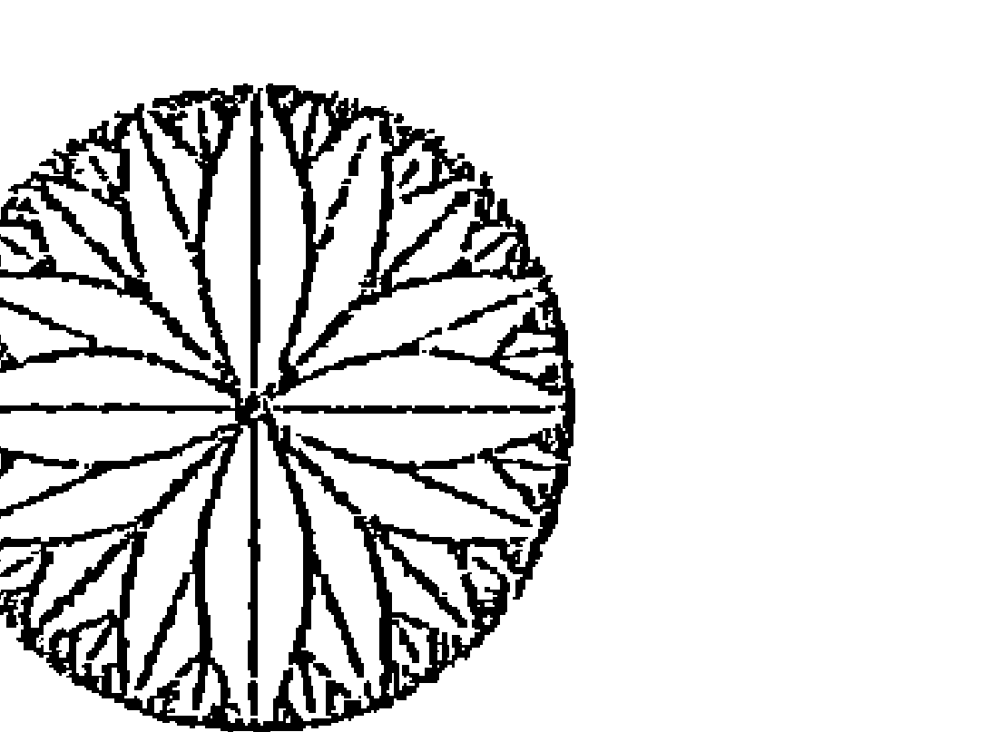

# 第十章

## 朱諾：神聖配偶

> > 我讚頌赫拉
> 她坐擁黃金實座
> 雷亞為她母親
> 她乃不朽女王
> 雍容華貴之尊
> 她是姊姊
> 她亦是妻子
> 之於雷電之神宙斯
> 她榮耀一身
> 廣袤奧林帕斯山上眾神
> 景仰她
> 祂們敬畏她
> 甚同於宙斯
> 司掌閃電之主的戀人 ①

# 朱諾的神話

婚神星 —— 婚姻女神朱諾（Juno），是奧林帕斯中兩位正式結婚的女神之一，另一位是維納斯·阿芙羅黛蒂。相較於維納斯完全無視於自己的婚姻誓言，宙斯（朱庇特）之妻朱諾，她因對婚姻的忠誠和忠貞而受到崇敬。朱諾被希臘人稱為赫拉（Hera），*hera* 源於字根 *he era*，意指「大地」（the earth），也被譯為「女士」（lady），即「英雄」（hero）的陰性名詞。她被描繪為一位美麗而端莊的女人，秀髮上戴著王冠頭飾（繪有荷賴和美惠三女神的后冠），發後披掛著頭紗，有孔雀隨同，彩虹常伴左右，左手握著一顆石榴（代表她曾是死亡女神的象徵），右手持著權杖，權杖上頭停了一隻杜鵑鳥。

根據羅馬人的說法，每個男人都擁有一個被稱作「精靈」（genius）的內在生殖力；同樣地，每個女人都有自己的「朱諾」（juno），代表受孕和孕育的能力。「朱諾」的美德後來發展為女神朱諾，即生產與母職的守護神：她化身為朱諾·盧克麗霞（Juno Lucretia），是神聖之光的陰性本質；她化身為朱諾·盧西娜（Juno Lucina），是引領孩子走進光明的生產女神。

然而，朱諾最重要的角色是作為已婚女子的守護神，她安排並主持了所有合法婚姻的儀式；六月是她神聖的月份，直至今日，仍然有許多女性認為在六月結婚能夠得到她的祝福，因而被稱為「六月／朱諾新娘」（June/Juno brides）。朱諾也掌管女性的生殖週期，作為曆法女神，她藉月經週期象徵著時間有序地流逝，因此，羅馬婦女會在每個陰曆月的第一天膜拜她。

# 宙斯與赫拉的故事

在奧林匹亞萬神殿中，宙斯的姊姊赫拉，與她的手足一起被父親克洛諾斯吞下，當她從克洛諾斯的肚子中被釋放出來時，諸神正與泰坦眾神搏鬥廝殺，她便由歐開諾斯（Oceanus）和特提斯（Tethys）撫養長大，與此期間，宙斯也對她萌生了愛意。有一天，宙斯發現赫拉獨自沿著阿爾戈斯（Argos）境內的索那克斯山（Mt. Thronax，現今的杜鵑山 Cuckoo Mountain）信步閒遊，他便偽裝成杜鵑鳥；杜鵑的啼聲預告著能夠帶來生產食物和水果所需的雨水，因而被先人視為是暴雨的預兆及繁衍的象徵；宙斯遂從天空倏地墜下，一路滑落到赫拉的膝上，在寒雨中瑟瑟發抖，赫拉憐憫這隻濕漉漉、受到驚嚇的小鳥，便將牠拎到胸前，用斗篷為牠保暖，此時，宙斯立刻恢復了真身並強暴了赫拉。受到侵犯的赫拉感到羞恥，心中湧現的罪疚讓她不得不與宙斯結婚。

另一則傳說中，這段神聖婚姻在薩摩斯島（Samos）秘密地舉行，並維持了三百年之久，而需要保密的原因，可能是宙斯的母親雷亞曾叮囑他不要結婚。這則傳說描述了一夫一妻制如何被強加於原始部落的信仰中，因此，也可能代表赫楞人（Hellenes）②，花了三百年才征服了赫拉的人民。③

宙斯與赫拉結婚後，偕她到奧林帕斯共享他擊潰泰坦神後所贏得的寶座。婚禮儀式上，諸神帶來了各種禮物予以祝福，如蓋婭（大地之母）送給赫拉的金蘋果樹；諸神還參加了新娘遊行，伴襯著由命運三女神（the Fates）吟唱的詩頌。至此，兩位主神在這段被強迫的婚姻中才開啟了各自文化的融合。

甫新婚的神聖新娘和新郎互訴衷情、柔情蜜意，在史詩《伊利亞德》中，荷馬講述了他們在艾達山（Mt. Ida）上的恩愛情事；宙斯拿赫拉同昔日的情人相比，對她讚譽有加：「從來沒有任何女神或女人，能激起我如此的愛慾，充盈並擄獲了我的心……我亦從未感受過這般的愛戀，這般因你漾起的甜蜜渴望，此刻滿溢了我。」 ④ 不幸的是，除卻片刻的性狂喜，這對夫妻的幸福婚姻很快地褪色了。

# 赫拉與宙斯的審判

往後的婚姻歲月裡，宙斯和赫拉一直處於劍拔弩張、永無止境的鬥爭狀態，儘管宙斯會徵詢赫拉的意見，但他從未完全信任她。在一些傳說中，宙斯會憤怒地向她投擲雷電以作懲罰，為了報復，赫拉則暗地裡謀策，欲擊敗且羞辱宙斯。當赫拉再也無法容忍宙斯的不忠和傲慢時，她在雅典娜和阿波羅的幫助下，用打了結的皮帶將宙斯捆綁在床上，任憑眾神嘲笑和侮辱他，替自己出了一口氣，直到百臂巨人布里亞若斯（Briareus）讓宙斯重獲自由；宙斯為了懲戒赫拉，用金手鍊纏緊她的手腕，並在她的腳踝繫上沉重的鐵砧，將她高掛在空中。

赫拉在一夫一妻制的婚姻下，崇敬她的神聖性儀式遭剝奪，被束縛在貞操帶中。她對丈夫的忠貞堪稱典範，但另一方面，宙斯卻不斷地周旋於女神和凡人之間，四處拈花惹草。最讓赫拉深切地痛苦和憤怒的，是眼睜睜卻束手無策地看著宙斯和他的信徒們摧毀對她的女神崇拜，她被迫順服和屈從，而她唯一反擊宙斯的方法，就是報復他的情人和他們的孩子；被赫拉視為背叛她而受到迫害的女性包括勒托（Leto）、伊俄（Io）、卡利斯托（Callisto）、拉米亞（Lamia）和阿爾克墨涅（Alcmene），每一次，若非赫拉為她們鋪好了死路，就是對她們降下可怕的詛咒。

# 赫拉作為完美的妻子

儘管赫拉的婚姻狀況波濤洶湧，但她依然待在這段關係，並從中找到成就感，因此被視作新娘和妻子的典範而受人崇敬。在古典神話中，赫拉最偉大的天性是：儘管宙斯不忠，但她仍能效忠於他；那些試圖勾引她的人，例如巨人波爾費里翁（Porphyrion）、厄菲阿爾特（Ephialtes）和伊克西翁（Ixion），除了被赫拉嚴正地拒絕，更受到宙斯的嚴厲懲罰；為了貞潔的名譽，赫拉一再拒絕以出軌的性行為羞辱丈夫；「作為婚姻女神，赫拉所保護的是一夫一妻制的婚姻形式，或者從女人的角度來看，她因只侍一夫而圓滿，她亦是丈夫唯一的妻子」。諷刺的是，這種合法的男女結合形式，對生育後代卻沒多大幫助，歸屬於這對神聖夫妻的子嗣不超過四個——戰神艾瑞斯（Ares）、工匠之神赫菲斯托斯（Hephaestus）、助產女神埃雷圖亞（Eileithyia）和青春女神赫柏 (Hebe) ——傳說中，這些孩子皆非因宙斯和赫拉的結合所生，反倒是受宙斯性侵的赫拉的女祭司和信徒們，卻生出了許多希臘英雄。

# 赫拉與她的孩子們

為了實現想要孩子的渴望，同時又能維持她的貞潔，赫拉獨自生下了幾個孩子。她懇求被監禁的泰坦神協助她生出與宙斯一樣強壯的兒子，來與宙斯創造帕拉斯·雅典娜的壯舉相稱。於是，在獨身閉關一年之後，赫拉產下「德爾菲的堤豐」（Typhaon of Delphi）——一隻有著一百顆燃燒的蛇頭生物，牠後來成為宙斯可怕的敵人；接著赫拉觸摸了花神芙蘿拉（Flora）獻供具催育之效的山楂花之後，就懷上戰鬥與紛爭之神艾瑞斯，宙斯因他像赫拉一樣熱衷於暴力和破壞而厭惡他；最後，赫拉誕下赫菲斯托斯——技藝高超的工藝與工匠之神，但由於赫拉是帶著憤怒懷上孩子，因此他生來就有跛腳的殘疾，而赫拉則因生出一個畸形兒感到羞愧，遂將他從奧林帕斯拋入海中，以掩飾她是孩子的生母。（在更古老的傳說中：赫菲斯托斯之所以畸形，源於他是在父母保密了三百年的婚姻中所出生的早產兒，⑥赫拉為了保護這位身體有缺陷的孩子，並掩飾自己的背叛而將他藏匿起來。）赫拉冷酷無情的舉動也讓她自食惡果，赫菲斯托斯為了報復，將她囚禁在自己親手打造的寶座中。

赫拉和宙斯之間緊張的性關係，不僅為這段不孕的婚姻帶來長期的煎熬，也象徵著母系血統與父系血統之間的鬥爭。宙斯透過對赫拉禁慾，剝奪了她在性慾與情感的滿足，以及生育神聖血統後代的體驗，因為若依循母系血統的習俗，最終將可能篡奪宙斯的統治地位；另一方面，赫拉也拒絕為宙斯生下能夠合法繼承他頭銜的男性繼承人——一夫一妻制婚姻的真實理由——以此抵制父系血統的傳承；然而，赫拉的教徒仍將二人的婚姻奉為信仰核心，直到赫拉最終接納並承認了赫拉克勒斯（Heracles）——也稱為海克力斯（Hercules），一切才圓滿落幕。

赫拉克勒斯，他的名字意為「赫拉的榮耀」，在赫拉的信仰與宙斯的信仰結合之前，赫拉克勒斯可能是赫拉最初的神聖配偶和保護者，以抵禦來自亞該亞（Achaean）的敵人珀爾修斯（Perseus）。後來，赫拉克勒斯以宙斯之子——海克力斯的身分出現，他力大無窮，是宙斯與美麗的凡人阿爾克墨涅（Alcmene）所生。有一則傳說如此描述，當赫拉意識到海克力斯帶有光榮的天命時，她企圖奪走他作為珀爾修斯貴族統治者的長子繼承權，這導致了兩人之間終身的激烈敵意；在另一則故事中，睡夢中的赫拉被拐騙餵奶給海克力斯，以使他長生不死，當赫拉突然驚醒時，她將胸前的海克力斯拽開，而自乳房中噴出的神聖乳汁則遍灑天堂，創造了銀河（Milky Way）。

然而，在其他傳說中，宙斯說服赫拉在重生儀式上領養海克力斯，這對赫拉來說有著更深層的轉化意義；在重生儀式上，赫拉回到床舖，將這位魁梧的英雄緊抱在胸前，並模仿生產的過程，將海克力斯從她的長袍下推（原始部落仍採用此種收養儀式）⑦，經此儀式，海克力斯即被赫拉所接納，且視若己出，對他疼愛有加。赫拉迎接海克力斯成為一位奧林匹亞神，並讓女兒赫柏（Hebe）與他結婚。赫柏是「青春之神」，如同赫拉少女時的自己；透過接納海克力斯一事，赫拉與宙斯和好了，西元前六世紀，他們開始共享同一座祭壇，而這是較古老時期的女神們未曾有過的待遇。

# 赫拉的獨居

宙斯和赫拉的神聖婚姻成為人類婚姻的原型，兩人分分合合的神話被視為是其關係中不可或缺的一部分；「有些特別的傳說提及了赫拉的獨居，她遠離眾神和她的丈夫……赫拉幾次置身於最深的黑暗中漫遊，但最後總毫無例外地回到丈夫身邊」⑧在一則傳說中，赫拉因宙斯的不忠行為備感羞辱，而自己惹人生厭的模樣更叫她無地自容，於是她離開了宙斯，退隱到少女時期居住的尤比亞島（Euboea），宙斯無法勸她回家，於是設了一個詭計，宣布將馬上與當地的公主結婚。婚禮當天，宙斯帶著一尊蒙上面紗的木頭新娘，隨新娘遊行的列隊前往喀泰戎山（Mt. Chitaeron），見到這一幕景象，赫拉及一群跟在她腳後的普拉塔亞（Plataiai）婦女衝了出來，將這木頭新娘一把搶下，扔到垃圾堆中。儘管她知道這是宙斯的詭計，但還是在笑聲中與丈夫和解了。

希臘神話反覆地強調赫拉需要定期的隱居獨處，她每年都會在阿戈斯的卡納索斯（Kanathos）溫泉中沐浴以恢復童貞，為與宙斯的團聚做準備。

至此，我們講述了偉大的古希臘女神赫拉的故事，新娘戴頭紗的習俗因她而起，她卻未曾從丈夫身上尋得一絲滿足。

## 朱諾於古希臘時期的起源

在古希臘時期之前，原始部落的女神信徒有著各種崇拜赫拉的形式。早期的赫拉雕像美麗優雅且充滿活力，奧菲斯（Orphic）在一首獻給赫拉的詩頌中吟唱著：「願您，神聖祝福的女神和統領一切的女王，願您的降臨帶著仁慈，歡欣常駐您可愛的臉龐。」⑨ 在金牛座世紀，赫拉被崇拜為牛眼的天空女王（cow-eyed sky queen），司掌女性從童年到老年的各個階段；作為三相月亮女神的化身，赫拉象徵著女性三階段的生命週期：

> > 「赫拉·帕爾特奈」，代表新月和萌芽之春，即童貞少女；
> 「赫拉·泰利亞」，代表滿月和繁茂之夏，即已圓房的新娘；
> 「赫拉·凱拉」，代表黯月與荒蕪之冬，即孤獨的寡婦。

赫拉一般被認為出生於薩摩斯島，由四季女神撫養長大，作為古希臘偉大的女神，許多宗教城市都奉她為主神，如阿爾戈斯、薩摩斯、尤比亞島，以及蒂林斯（Tiryns）和邁錫尼。赫拉的符號也被保留在克里特島和安納托利亞（Anatolia）的西海岸，她在奧林匹亞的神廟遠比宙斯的神廟更為古老。

赫拉的慶典被稱為赫瑞亞節（Heraea），這是一場在奧運會之前舉行的女子競走賽事，參賽者分為三個年齡級別，每一級別的優勝者會獲得象徵和平與生育力的橄欖桂冠，以及分得一部分獻給赫拉的母牛牲禮，她們藉由享用赫拉的神聖母牛與女神合而為一。在後來的時期，於赫瑞亞節被選中的處女，以及在僅限男性參加的奧林匹克戰車競賽中的勝利者，演變為古代仲夏時節舉行神聖婚姻的新娘和新郎。⑩

最初，赫拉是唯一的統治者，尚無配偶，但當亞該亞部落從北方入侵希臘時，赫拉的崇拜就成了必先除去的障礙，因此，亞該亞人使赫拉成為他們主神宙斯的神聖伴侶，赫拉被迫下嫁宙斯，象徵她在克里特島和希臘邁錫尼至高且唯一的統治地位被推翻。⑪在後續神話中，這對神聖夫妻間的爭端，實際上描述了宙斯的亞該亞人信徒，與赫拉的阿爾戈斯人信徒之間的種族衝突。雖然荷馬向來將赫拉描述成善妒及好辯的妻子，但她真正的形象是，在國家動亂中，受外來征服者脅迫、但卻從未真正屈服的落難公主。⑫

## 婚神星——朱諾

## 希臘時期的赫拉

## 連結的本質

## 角色

- 婚姻女神
- 天空之后
- 三相月亮女神

## 占星符號：*

## 象徵物

- 權冠（后冠）
- 頭紗
- 權杖
- 孔雀
- 杜鵑
- 石榴
- 母牛（神聖小母牛）
- 彩虹（風和氣體）

## 相關的主星座

- 天秤座
- 天蠍座

## 極性

親密／心機操縱

## 婚神星占星學

婚神星作為曼陀羅的圓心，是陰性本質與陽性本質的結合之所，也代表連結的本質，透過忠誠的合作關係，她努力實現與他人完美且平衡的結合。因此，婚神星與其主掌的天秤座和天蠍座之間有著很強烈的連結，因為這兩個星座分別代表了婚姻和圓房。

天秤座和天蝎座呈十二分相位，但此相位也暗示當試圖運用這兩種不同的資源時會出現的摩擦，同樣地，朱諾主要的挫敗感也來自於和朱庇特結婚後，她無法在這段婚姻中盡情地發揮她的內在潛力。

透過朱諾與其同伴維斯塔的對比，我們更能理解朱諾的心理機制，兩位女神同樣運用了金星的性能量，目的卻截然不同：維斯塔在發生性關係後重新汲取能量，以回歸個人，她是完全屬於自我的「處女」，但另一方的朱諾是將性能量投注於承諾的關係中，以達到自我的超越。因此，朱諾代表未婚的年輕女子成為成熟女性的完整核心要義，是從自我一體的處女過渡到「赫拉·泰利亞」，即新娘和配偶的完美狀態。

朱諾象徵對神聖結合的嚮往，藉此實現情感、性和心理上的圓滿。關於她的故事，有些版本暗示她被迫嫁給朱庇特，但有另一些則指出她自願放棄自己的力量，以體驗深切且全然圓滿的「加莫斯」（gamos, 希腊语的婚姻之意）；但是，朱庇特没有达到她的理想期望，反而接收了她的权力和主权，然后将她困在一夫一妻制的婚姻中：禁止膜拜她的宗教习俗、助长摧毁对她的崇拜、炫耀自己的不忠行为，且在没有朱诺的参与下创造自己的孩子。「对赫拉而言，宙斯已不再是 Teleius（希腊语的完美）——「带来完美的人」，而是 Ateleius（希腊语的不完美）——「阻挡梦想的人」。」朱诺的苦难来自于拒绝在婚姻中的深度结合，进而表现出病态的嫉妒，使原本健全的朱诺原型被曲解，并流传至现代。

因此，占星学中的婚神星代表了对于坚定的承诺和基于平等关系而结合的需求，以及当这种需求被拒绝或受阻时，所出现的各种痛苦和精神症状。

## 婚神星作为关系的象征星

在星盘中，婚神星代表激发我们寻求婚姻的情感和心理需求。对朱诺而言，诸如生育、性、怀胎和育儿等其他的阴性功能，都远不及她与另一半融合的需求来得重要。因此，在星盘中有强烈婚神星的人，无论男女都执着于走入承诺关系中，他们一生都经历着第七宫的课题，并学习如何发展与他人合作、妥协、理解以及和谐。

婚神星通常代表伴侣（或我们投射到伴侣身上的那些特质），但是根据不同的情况，这颗小行星可以描述任何亲密的一对一关系，例如導師—門徒、治療師—客戶、合夥人或密友；另外，當婚神星代表「重要的另一半」時，所謂的伴侶並不需要像神話那樣有正式的婚姻關係，在當今不斷變遷的社會風俗與觀念中，任何同居的伴侶關係，無論是異性戀或同性戀者，都可以視為是婚神星式的關係狀態。

婚神星的流運描述了關係開始的時間點，以及出現危機和分離的時期，她掌管了追求、訂婚、結婚、結婚周年和離婚等相關儀式。在比較盤中，婚神星主要代表兩人之間的契合度和業力的牽引，因此，以婚神星作為一段關係的主要象徵，可簡化比較盤的分析過程，且婚神星所提供的重要訊息，是無法從傳統中關係主題的主管者（金星、火星、太陽、月亮以及與第五、第七和第八宮的守護星座）來獲得。

占星家可能意識到——傳統的星盤詮釋中，在描繪婚神星與月亮、金星的意義上有許多相似之處，這種相似性之所以存在，乃因月亮是陰性能量的基礎，金星是月亮活躍的性表達，而婚神星作為妻子和伴侶的角色，明確地與月亮—金星的能量有所區別。

## 關係中的各種心理病徵

當婚神星對關係的需求無法得到滿足或被拒絕時，婚神星所在的星座即代表了由此而生的各種心理情結，且通常與天蠍座有關；其中包括嫉妒、佔有慾、不忠、征服、操縱、情感、性慾的權力遊戲、投射、背叛和遺棄。接下來，讓我們更詳細地檢視這些行為。

### 不忠

損害關係的嫉妒心，源於我們現代文化中一夫一妻制的性貞操議題，忠貞、忠誠與否，最終都取決於人們對性的界限；朱諾在與朱庇特的婚姻中立下了守貞誓言，也為人類建立了此種模式。

將性貞操用於維繫一段承諾的關係是非常有效的，但如果這種忠貞是透過強力壓迫來維持，或者有雙重標準，那麼隨之而來的不公平、欺騙和不信任感，就會開始侵蝕這段關係的基礎。

對於肉體出軌最常見的反應是憤怒，儘管這股怒氣理當針對不忠的伴侶，但更多時候是衝著伴侶偷情的對象，例如朱諾對朱庇特的情人和他們的孩子施以報復，這也讓朱諾成了多疑之妻的象徵，她與陰性根源的連結因而被切斷，開始與女性同胞對抗、競爭、中傷，並刻薄地對待其他女人。同樣地，朱庇特也代表一種特定的男人類型，他們將妻子視為個人財產，充滿嫉妒地防衛任何潛在男性競爭者。

因此，從占星學的角度來看，婚神星描述了性貞操的議題，以及為了維持性貞操所採取的壓迫和強迫的模式；婚神星也代表受盡另一半冷落輕視，而最終以暴力反擊時，一併爆發的屈辱、羞辱、憤怒和復仇心態。

### 關係中的犧牲

一夫一妻制暗示著一項重要的協議，即一個人因他／她為婚姻所做的犧牲而被愛，而由於這種認為愛意味著犧牲的假設，許多婦女被迫以放棄個人職涯、教育機會、育子渴望、與家人的親近、宗教信仰、政治信念或物質資產，來表明對伴侶的愛。

當一個人為伴侶放棄許多事物、做出各種妥協時，他們自然會希望得到某種形式的回報——通常是愛、感激或欣賞。如果沒有互惠的關係，那麼婚神星型的人會心存怨恨，為自己的付出感到懊悔、憤恨，還會對任何吸引伴侶注意力的事物——包含可能的情敵，抑或是伴侶的朋友、職涯、家庭和愛好等，有越來越強烈的嫉妒心。

因此，在占星學中，婚神星所象徵的嫉妒和怨恨，是當關係中的一方所做的犧牲，沒有得到應得的感謝時油然生起的情緒，他們會透過沉默來表達憤恨，或激烈地要求對方、採行一報還一報的互動方式。

### 關係中的恐懼

害怕被拋棄：這是婚神星型的人所要面臨的、最強烈的恐懼之一。正如朱諾的童年是在父親（克洛諾斯）的腹中度過那樣，父權文化中的女性已經慣於從男性身上尋求必要的支持和保護，因此，許多婦女認為：倘若遭丈夫拋棄，她們將不知該如何養活自己。在相似的模式下，男性也習慣接受母親或妻子的照顧，所以配偶的離去會令他們恐懼，並引起情感上的被剝奪感，而當他們處於這樣的不安當中，往往引發過度的佔有慾，藉此來保護自己免於失去生計。

因此，在男女雙方的星盤中，婚神星都象徵著害怕失去重要的另一半，以及因這種不安引起他們緊抓對方不放的佔有慾。

對背叛的恐懼：許多有強勢婚神星的人，藉由擔憂伴侶會如朱庇特般地不忠，來活出朱諾的神話情節，並讓這樣的恐懼吞噬他們。在某些情況下，他們的擔憂其來有自，但在其他情況下，他們會將自己被壓抑的性或精神自由的需求，投射到伴侶身上；這些人沉迷於幻想自己的伴侶與別人在一起，實際上是把自己的恐懼化作現實，而他們表現出多麼強烈、激昂的嫉妒心，會與他們壓抑自身對自由需求的程度有直接的關係。

因此，占星學中的婚神星代表對背叛的恐懼，尤其是源於伴侶不忠的事實或想像。

對性的恐懼：不同於帕拉斯·雅典娜隱藏自己的陰性氣質，從而在男性主宰的世界中獲得信任，朱諾保持並表現出她的陰性本質，這激起希臘人極大的恐慌，因為在大母神的傳統信仰中，每年被遴選為「年王」的男人，會被視為是獻祭給大母神的情人／祭品，因此，在男性的集體無意識中，依然有著深入性愛等同於失去生命的記憶連結，並在潛意識中將這些記憶表現為害怕被女性的性能力消耗和吞噬。為了捍衛自己免受這些恐懼的困擾，現代社會中的男性採取了一種「男子氣概」的態度——慾求各式各樣且大量的膚淺性愛，以避免深層的性結合可能產生的後果。

在占星學中，婚神星代表關係裡對性與情感的深度交流所引起的緊張和恐懼。

### 關係中的權力

當尋找理想天秤座式合作關係時，婚神星型的人會渴望建立一段平等、公平且互惠的關係，但他們往往得到的是失衡且不對等的關係，所以，婚神星的議題象徵了在試圖維持理想與現實的過程中，所導致的權力鬥爭、失望和衝突。

放棄權力：朱諾將她的權力移交給朱庇特後，每當朱庇特使用這些權力壓迫她時，朱諾便會憤怒地回擊，同樣地，許多屈服於丈夫的妻子，會努力地克服自己的無力感，抑或屈於這種形同俘虜的狀態。朱諾和朱庇特也相互施行各種虐待式的懲罰：朱諾用皮帶把朱庇特捆綁在床上，並嘲弄他，而朱庇特的報復是纏束朱諾的手腕，在她的脚踝系上沉重的铁砧，将她倒挂於天堂。这代表男人和女人同时採行身体和情感的手段来监禁和折磨彼此。在占星学中，婚神星代表的是个人失去权力后的征服和复仇，但此举反而会让人陷入自我挫败的权力斗争之中。

隐微的操纵：如果婚神星型的人明显地被剥夺了权力，那么他们或许都会试著耍点心机手段，进而取得对自己生活的控制，此类策略可能包括：控管饮食或性行为、操弄罪恶感、孩子、家人，或巧言令色或试图阻挠、愚弄、欺骗伴侣。长久以来，女性最经常、也不得不采取这些策略，因而在某种程度上，婚神星型的妻子会被贴上鬼鬼祟祟、工于心计、善于操纵和不诚实的标签；然而，一旦婚神星型的人能够解决自身关系中的权力失衡，这些策略就不再是获得主控权的唯一手段了。

孩子作为权力的象征：由于朱庇特背著朱诺创造了属於自己的孩子，于是，朱诺也透过独自生子，并迫害朱庇特的孩子作为报复。因此，在占星学中，婚神星型的人容易在权力斗争中把孩子当作筹码，而婚神星也象徵婚姻中施加于孩子身上的各种剥夺行为，例如利用孩子控制伴侣，或对伴侣在前一段婚姻的子女采取敌对态度。也如同朱诺的儿子艾瑞斯和赫菲斯托斯，象徵了她在个人主张与创造力的表达遭到挫败，婚神星型的人可能会透过子女来满足他们被压抑的认同需求。此外，作为合法婚姻的守护者，婚神星同时彰显了合法婚生子女的权利，以及社会对私生子的排斥。

投射和壓抑：當婚神星型的人將自己的力量投射到伴侶身上時，他們也一併接收了伴侶的身分認同，因此他們容易以結婚對象的條件來衡量自己的成功、肯定和地位，例如嫁給醫生或與老闆的女兒結婚。如果一個人在關係中僅是壓抑了對主控權和平等的需求，他／她若非變得麻木和冷漠——形槁心灰，便是因怨懟、憤恨而鬱鬱寡歡——導致身心失調而痛苦不堪。

婚神星和弱勢者：婚神星掌管關係中沒有權力的一方，也代表相對弱勢的社會階層——受虐婦女和兒童，誘騙、強姦及亂倫之下的受害者，少數民族和身心障礙者。也由於朱諾總是與不公不義的人事物對抗，因此婚神星也執掌那些在政治、經濟、教育和司法領域裡，為弱者（尤其是女性）爭取權利的人。

總而言之，婚神星既象徵對關係的需求，也代表拒絕接受關係之間因溝通不良而導致的不平等和不公正，同時，把憤怒、復仇、密謀和狡猾當作抗爭的武器。在本質上，

> > 赫拉真正的力量，是不會因略施小惠就被收買，也不掩飾對權力的渴望。

### 婚神星帶入承諾關係的助力

由上述可得知，即便在一段立意良好的關係中，受苦的婚神星仍會導致不滿和衝突；然而，她本質中的另一個面向是建立在同理心、相互信任、平等和權力平衡的基礎上，將臻至完美的圓滿和親密感帶入關係，而非朱諾與朱庇特在婚姻中神經質的表現；正是如此的願景，才可創造出和諧快樂的關係形式，並樹立新的典範。

## 婚神星與承諾

如同神話章節所提及的，朱諾描述了一種普遍且三重結構的循環，體現了與伴侶結合和分離的固有節奏。除了女性三個獨立的生命階段外，朱諾的三個面向：帕爾特奈（少女），特莉亞（新娘）和凱拉（寡婦），指的是她在婚姻狀態中自然的韻律交替；她透過新娘浴或在神聖溫泉中週期性地恢復童貞，以新娘的身分為圓房做準備，而此一循環的高潮是她與朱庇特發生的爭執和分離，而後朱諾閉關並躲藏起來。⑮ 但在朱諾的分離中所蘊含的，是復合與和解的承諾。

從女神莉莉絲（Lilith）、朱諾到賽姬（Psyche）的發展階段，可視為女性作為配偶和妻子的心理發展象徵：儘管莉莉絲進入與亞當的婚姻，但是當爭執不下時，她選擇離去，寧可孤獨、被孤立，也不願屈服；朱諾進入了一段關係，儘管她未曾從中獲得真正的幸福和滿足，但是為了解決衝突，她在分居後表現出復合的意願，這種奉獻的精神，為賽姬與她的愛人艾洛斯（Eros）實現靈魂伴侶的融合奠定了基礎。因此，婚神星在占星學象徵了承諾、堅定不移、忠誠、奉獻，以及在分離與回歸的脈絡中，仍願意堅守這段關係。

## 婚神星與美化

由於朱諾以其美貌和忠誠聞名於世，婚神星也象徵各種可用於提升關係品質的事物，她善用天秤座的方式呈现金星的美感，為了伴侶而打扮自己、裝點家宅，因此，婚神星也掌管女性（和男性）的美貌和裝扮，包含服飾、珠寶、香水、彩妝、調情等各種撩撥並取悅伴侶的手段；婚神星還將美化的才能延伸到住家，發揮她與生俱來的風格和裝飾品味，創造和諧且愉悅的居住環境；此外，婚神星還因熟稔待客的藝術，使她成為朋友和客人眼中迷人的女主人。

因此，星盤中有顯著婚神星的人，能透過將美麗、和諧和愉悅帶入彼此間的連結，從而改善並增進雙方的關係。

## 婚神星作為女性的生命周期與各種角色的象徵

一般而言，婚神星掌管了女性的生命進程，並代表以下三種婚姻狀態：準備結婚、已婚和離婚。

在第一個階段，女孩們學習如何吸引男人，並扮演一位好妻子而不是母親的角色，因此婚神星掌管月經，經期來潮代表女孩已經發育成熟，可以發生性行為，並準備要結婚。

在第二個階段，朱諾成為新娘、妻子、家中的女主人，以及為丈夫追求的各種抱負提供情感支持，（在理想情況下，丈夫也支持著她的目標。）在此階段，婚神星的角色是家庭的核心、住家和社區的保護者。

在第三個也是最後一個寡婦階段，婚神星意味著失去或分居，以及女性重新獲得自我的需求；如果一位女性過去主要依靠丈夫生活，那麼到此階段，她將面臨建立自我身分和內在目標的挑戰。

## 婚神星的玄秘教義

在玄秘的層次上，朱諾暗示了在婚姻承諾中將性能量用於靈性層面。朱諾神廟中央的床舖，象徵著在結婚誓言後的圓房儀式，因而，婚神星掌握著古印度譚崔性愛的秘方，遵循此法就能體會性愛的完美境界。

### 性是神聖祝福

當兩個人透過各自的性高潮連結彼此的振動頻率時，他們便與整個宇宙調頻，進入「一心」的狀態，雖然此狀態可能僅持續片刻，但卻為這對伴侶帶來了狂喜、宇宙合一以及超越個人意識的真實體驗。

### 性作為魔法的體現

性行為蘊含創造生命所必要的力量，在性結合的那一刻，人們可以使這種創造力化為視覺圖像，隨後這些圖像將在現實世界中具體成形，這就是魔法的真正意涵——將不可見的意念具象化。

### 性作為回春的秘方

透過性高潮釋放的能量也可用於療癒，包括使細胞再度極化以促發生命力、淨化身體系統並再生生命的能量；此循環很像是為電池充電的過程。

### 婚姻作為鍊金術的奧義

在原本的秘教詞彙中，婚姻意指一條超越自我的道路，它將自我的分離轉化為更大的整體，並透過神聖的結婚儀式，將兩個單獨的自我融合成新的存在本質；更甚之，就像許多化學反應一樣，這是一段不可逆的過程。朱諾的靈性天賦促使伴侶雙方都能將婚姻的結合作為一種載體，藉此與貫穿所有生命的神聖之愛合而為一。

## 婚神星的心理主題

### 連結的本質

- 將關係視為自我表達
- 自由和平等
- 親密和分享
- 相互信任和理解
- 建立新的關係形式

### 關係中的心理病徵

- 不忠
- 嫉妒
- 屈服
- 背叛
- 情感依戀和佔有慾
- 情感和性的權力遊戲
- 投射和反射
- 放棄權力
- 試圖重獲權力
- 透過伴侶或孩子取得自我認同
- 滿腹牢騷的女人
- 隱微的操縱
- 女人的花招詭計

### 玄秘主題

- 譚崔性愛
- 靈魂伴侶
- 婚姻作為鍊金術的奧義
- 靈性關係

### 轉化的主題

分離與回歸

> > ① Homer, “The Hymn to Hera,” The Homeric Hymns, trans. Charles Boer (Irving Texas: Spring Publications, Inc., 1979), 7.

> > ② 譯者註：赫楞人（Hellenes）是希臘人的祖先。

> > ③ Robert Graves, The Greek Myths Vol. 1 (Maryland: Penguin Books, 1964), 53.

> > ④ Homer, The Iliad, trans. E. V. Riev (Maryland: Penguin Books, 1961), 265.

> > ⑤ Carl Kerényi, The Gods of the Greeks, trans. Norman Cameron (Great Britain:+   Billings and Sons Limited, 1982), 158.
+   ⑥ Kerenyi, The Gods of the Greeks, 155.
+   ⑦ Sir James Frazer, The Golden Bough (New York: The Macmillan Company, 1960), 17.
+   ⑧ Kerenyi, The Gods of the Greeks, 98.
+   ⑨ The Orphic Hymns, trans. Apostolos N. Athanassakis (Montana: Scholars Press, 1977), 27.
+   ⑩ Jane E. Harrison, Epilegomena to the Study of Greek Religion and Themis (New York: University Books, 1966), 226.
+   ⑪ Graves, The Greek Myths Vol. 1, 53.
+   ⑫ Jane E. Harrison, Mythology (Massachusetts: Marshall Jones Company, 1924), 95.
+   ⑬ Murray Stein, “Hera, Bound and Unbound,” Spring (1977), 111.
+   ⑭ Christine Downing, The Goddess: Mythological Images of the Feminine (New York: The Crossroad Publishing Co., 1981), 95.
+   ⑮ Stein, Spring (1977), 108.

# 第十一章
# 星盘中的婚神星

婚姻女神朱诺因其美丽与忠贞而受到希腊人的敬重，她是理想妻子的典范，体现了婚姻制度中身为另一半应有的职责与态度。

她最初被称为赫拉、三相月亮女神和天空之后，掌管女性的性生活。赫拉经历了女性的三个生命阶段——处女、母亲和寡妇，分别对应于新月、满月和黯月。当她嫁给新的天神朱庇特之后，远古的赫拉成为奥林匹亚的朱诺，并开始将女性带入婚姻的仪式；然而，朱诺之所以对其配偶怀有病态的嫉妒和不满，源于她后来在婚姻中的不幸遭遇。

当朱诺扮演妻子的角色时，她象征亲密关系的原则，代表我们建立重要关系的能力，以及我们对关系中的另一个人所给予的关注度与敏感度。

在占星学中，婚神星描述了我们面对协调、接纳他人、相互分享、信任、嫉妒、占有欲和权力斗争等议题的方式。

婚神星所在的星座，描述了十二种连结以及满足亲密关系需求的方式；如果这些需求被拒绝，那么婚神星也代表我们可能表现出的神经质行为。

婚神星所在的宫位，显示出我们在哪些生活领域最有可能经验对连结的需求，以及在该领域遇见对我们而言最重要的关系议题。

婚神星与其他行星的相位，描绘了连结的过程如何与人格的其他面向做整合，和谐相位代表与该行星所代表的事项顺畅地融合，而紧张相位则代表对连结的强烈渴望与其他心理需求之间潜在冲突。

婚神星所座落的星座和宫位也描述了我们对理想伴侣的条件。当个人能将星盘中婚神星冲突相位的不同需求加以掌握与整合时，将不再需要透过压力来学习平衡。

## 婚神星在占星学的主掌领域

婚神星代表所有一对一的关系
-   婚姻、商业、友谊、合作伙伴、伴侣、平等与自由、权力平衡、协调性、婚姻与关系咨询

婚神星掌管婚姻仪式与制度
-   贞操与妇德、求爱、婚约、订婚、结婚、分居、离婚、合法婚姻、团体关系中的未婚伴侣、婚礼和周年纪念日、分娩、婚生子和私生子

## 婚神星是社交礼仪的象征
-   主人／女主人 · 好客 · 余兴节目 · 礼数 · 魅力

## 婚神星为女性的美丽增色
-   装饰 · 衣著风格 · 化妆 · 香气 · 魅惑 · 装潢

## 婚神星代表艺术上的创造才能
-   女性艺术 · 表演艺术 · 影像投影 · 面具表演 · 舞蹈 · 戏剧 · 声乐

## 婚神星为女权发声
-   平等权利修正案（E.R.A.）· 女性成为一家之主 · 妇女支持团体

## 婚神星是弱势族群的象征
-   妇女 · 受虐的妻子 · 受虐儿童 · 受害者 · 少数民族 · 身心障碍者 · 性暴力罪行、诱惑、强暴、乱伦的受害者

## 婚神星与大气相关。
-   天气 · 气候 · 气象 · 暴风雨 · 环境品质 · 乾净、纯净的空气

## 婚神星在十二星座

以下各节所引用的星盘数据来源，以数字圆圈表示：
1.  Lois Rodden 著，The American Book of Charts
2.  Lois Rodden 著，Profiles of Women
3.  Marc Penfield 著，An Astrological Who's Who

婚神星在白羊座的人，在关系中需要独立和自由，若自主的需求受阻，则会以暴怒和生气作为释放机制，当他们对自我身份的需求受到抑制时，便会引发如偏头痛（家庭主妇常见的毛病）等相关病症；婚神星白羊座的人若将自己对力量的认同投射到对方身上时，就可能吸引到跋扈又武断的伴侣。

星盘案例：因反对同性恋权利而引起争议的安妮塔·布莱恩特（Anita Bryant），她的婚神星与土星合相于白羊座／金牛座，她后来反悔，改口称一切全是她丈夫的主意。②①

婚神星在金牛座的人，他们的关系需要有稳定的基础，其伴侣也必须是可依靠且可信赖的人，以便让他们真切地感受到身边有个“靠山”，因此，对于被遗弃、财务陷入困境，以及人身安全的恐惧，可能会使他们叨絮不休、在金钱方面有所抱怨，以及过度渴望拥有有形资产。婚神星金牛座的人可能会亲身经历这些事件，抑或吸引到具有这些特质的伴侣。

星盘案例：温莎公爵夫人华里丝·辛普森（Wallis Simpson）的婚神星位于金牛座第二宫且与土星形成对分相，英国政府无法接受她担任皇后一职，因此她和丈夫过著上流社会的奢侈生活并四处漂泊。②

婚神星在双子座的人需要在关系中有言语的刺激和交流，与伴侣一起讨论日常计划，进行各式各样的活动亦是关系中不可或缺的要素；因此，缺乏日常交流会使他们神经紧张，因幻想与对方的对话而焦虑不安，甚至反复地自言自语；婚神星双子座的人亦可能渴望左拥右抱，并在脚踏多条船的关系中驾轻就熟。

星盘案例：尚-保罗·沙特（Jean-Paul Sartre）的婚神星位于双子座第八宫，他从伴侣西蒙·波娃（Simone de Beauvoir）身上寻求的是高度智识的情感交流。②

婚神星在巨蟹座的人渴望透过关系中的亲密情感滋养自己，常与对方分享食物且十分重视家庭生活；当这些情感需求无法获得满足时，婚神星巨蟹座的人会变得喜怒无常，表现出退缩、执着和依赖等行为。

星盘案例：拉奎尔·韦尔奇（Raquel Welch）的婚神星与金星和灶神星合相于巨蟹座/狮子座，在娱乐产业中，她极富性感的美貌被投射成一位温暖、会照顾人且迷人的女伴。② ③

婚神星在狮子座的人需要在关系中得到仰慕并感到兴奋，浪漫的求爱仪式需要被延续到婚姻中，且希望对方能以作为他们的伴侣为荣；倘若被伴侣视为理所当然、被拒绝或被忽略，婚神星狮子座的人会变得自我中心、做出自私的行为，并以不恰当的方式引起对方关注。

星盘案例：芭蕾女伶玛格·芳登（Margot Fonteyn）的婚神星与海王星合相于狮子座，她与鲁道夫·纽瑞耶夫（Rudolf Nureyev）建立了艺术上的合作关系。②

婚神星在处女座的人渴望在关系中达到完美的状态，假若他们的伴侣愿意参与关系运作中的例行性分析，并调整双方的日常作息，将有助于建立一种合作伙伴的感觉；当他们的伴侣不愿配合这些调整时，婚神星处女座的人可能会变得过于批判、吹毛求疵和强人所难。

星盘案例：迷人的女演员莎莎·嘉宝（Zsa Zsa Gabor）的婚神星位于处女座，她对自己的六次婚姻都不满意，并写作《如何抓住男人—留住男人—摆脱男人》（How to Catch a Man - Keep a Man - Get Rid of a Man）一书。④

婚神星在天秤座的人，需要在关系中与对方平起平坐，并要求公平而互惠的往来，当他们做决定时会征询伴侣的意见，并希望得到他们的尊重和认可；如果对平等的需求无法被满足，那么婚神星天秤座的人可能会变得不愿意合作、过度好胜，甚至直接与对方拼个你死我活。

星盘案例：雪儿（Cher）的婚神星与木星合相于天秤座第四宫，在演艺生涯中，她一直努力与多任丈夫建立平等与相互支持的关系，但仍以失败告终。

婚神星在天蝎座的人，渴望获得炽热、浓烈的情感与性爱，并与伴侣保有亲密的连结，倾向于控制伴侣，希望对方的关注放在自己身上；若这些需求被阻扰或拒绝，婚神星天蝎座的人会表现出嫉妒、心机操纵，以回避或拒绝性事来确保自己的地盘不受侵犯。

星盘案例：性治疗师西尔维亚·卡尔斯（Sylvia Kars）透过教学、讲授和示范新的性复健方法，表现其婚神星与金星合相于天蝎座第九宫的配置。

婚神星在射手座的人需要与伴侣进行智识上的交流与刺激，在信念体系上达成共识，抑或对未来有共同的愿景；倘若双方对未来的想望有出入时，婚神星射手座的人会不顾一切地坚持自己的信念、成了宗教狂热主义者，或对未来有不切实际的期待。

星盘案例：西丽玛沃·班达拉奈克（Sirimavo Bandaranaike）的婚神星位于射手座第三宫，她的丈夫被暗杀后，她继任了职位，成为斯里兰卡的首位女总理。

婚神星在摩羯座的人，在关系中寻求深切且有保障的长期承诺，因而需要传统形式和法律认证上的保障；如果对尊重和稳定的需求受到威胁，婚神星摩羯座的人可能会试图控制伴侣并要求对方服从，或将情感抽离。

星盘案例：诗人罗勃特·白朗宁（Robert Browning）与年长而重病的伊莉莎白·巴雷特·白朗宁（Elizabeth Barrett Browning）结婚，并为她付出了一切，此情为世界上最著名的浪漫故事之一，他的婚神星与土星合相于摩羯座。

婚神星在水瓶座的人要求个体的自由，并需要在关系之外仍保有自己的生活，他们需要有机会尝试新的关系形式，例如开放式婚姻或角色互换；当婚神星水瓶座的伴侣被剥夺自由时，他们可能会表现出模棱两可、不可靠或反覆无常的行为。

星盘案例：葛楚·史坦（Gertrude Stein）的婚神星与太阳合相于水瓶座，反映出她在智识与艺术的丰富性，以及另类的交友圈。

婚神星在双鱼座的人渴望透过关系实现自己的最高理想，他们认为双方需拥有全然的信心、承诺和崇敬，才得以赋予这段关系意义与价值；当这些理想主义的期得不到满足时，婚神星双鱼座的人会感觉幻灭、退缩、自我欺骗、逃避到幻想中、成为殉道者及产生受害者情结。

星盘案例：威廉·巴特勒·叶慈（William Butler Yeats）的婚神星位于双鱼座第一宫，他的许多诗作和剧本都源于对美丽的爱尔兰民族主义领袖昂德·冈昂（Maud Gonne）的迷恋。

## 婚神星在十二宫位

婚神星在第一宫，代表将自我与成为他人的伴侣画上等号，也认为关系是一种自我表达，在伴侣的支持下会使他们更有自信地做自己，因此，他们必须学习如何建立起一段关系，包含如何认识他人以及与他人相处；婚神星第一宫最重要的关系互动，便是如何向他人展露自己。

星盘案例：驻外大使及外交官克莱尔·布思·鲁斯（Clare Boothe Luce）的婚神星升起于射手座。

婚神星在第二宫，意味着重视从关系中获得财务和物质的保障，亦看重在相处的过程中能相互依存并满足双方的需求；婚神星第二宫最重要的关系互动发生在与依恋和所有权相关的领域。

星盘案例：猫王艾维斯·普里斯莱（Elvis Presley）慷慨地提供伴侣豪华的房产恩典之地（Graceland），可视为他的婚神星与北交点合相于水瓶座第二宫的表现。

婚神星在第三宫，代表需要透过智识和言语的交流来满足关系的需求，伴侣常是他们理解自我的催化剂；婚神星第三宫最重要的关系互动发生在日常沟通和人际网络领域。

星盘案例：莎莉·斯特拉瑟斯（Sally Struthers）的婚神星与月亮合相于射手座第三宫，她作为家扶国际联盟（Christian Children's Fund）的代表，在许多媒体上为其现身宣传。

婚神星在第四宫，代表需要以稳固的关系作为生命目标的基础，这可能是“将伴侣视为养育者”的完美版本——提供（或必须提供）住所、食物、舒适和支持的人；婚神星第四宫最重要的关系互动发生在个人的私领域或家庭中。

星盘案例：玛格丽特·特鲁多（Margaret Trudeau）的婚神星位于白羊座第四宫，她无法承受作为政客的妻子在公众举止和职责方面的压力。

婚神星在第五宫，代表关系可用于激发和支持属于个人的创造力，而小孩亦是一种创造力的实现，因此，育儿通常是伴侣关系的主要重心；婚神星第五宫最重要的关系互动是与自己的孩子或恋人相处，或进行创意活动时。

婚神星在第六宫的人，希望能与伴侣以高效且有建设性的方式建立关系，其关系的功能很大一部分是将日常生活的细节维持地井然有序；婚神星第六宫最重要的关系互动是与工作上的雇主和同事相处，或发生在与健康、服务相关的议题上。

星盘案例：英迪拉·甘地（Indira Gandhi）的婚神星位于水瓶座第六宫，且与位在第十二宫的土星及海王星形成对分相，她与丈夫一同投身政治，并因他们所从事的社会运动而被英国殖民政府监禁。

婚神星在第七宫的人，非常重视婚姻、商业或其他亲密合作关系的价值，因此，需要与他人合作并建立终身的关系，那是他们生命中很重要的一部分；婚神星第七宫最重要的关系互动发生在与他人一对一的相处中。

星盘案例：爱德华·甘迺迪（Edward Kennedy）的婚神星位于巨蟹座第七宫且与谷神星形成对分相，他对婚姻和家庭有强烈的责任感，这样的牵绊在一定程度上影响他一九八四年不参与总统竞选的决定。

婚神星在第八宫的人，透过关系中情感的高峰体验而成长，其伴侣经常会让彼此经历一连串改变与转化的煎熬；婚神星第八宫最重要的关系互动与财务和财产有关，同时亦有信任、权力和性的议题。

星盘案例：专栏作家赫达·霍珀（Hedda Hopper）的婚神星位于天秤座第八宫，她撰文揭露了好莱坞明星的私生活、爱情故事及收入。②

婚神星在第九宫的人，透过关系寻求意义和真理，关系中的双方都必须尊重对方的思想，也因此，他们通常会与自己的老师“结婚”，或一生致力于追求愿景；婚神星第九宫最重要的关系互动发生在思想、哲学理论或国际交流等领域。

星盘案例：女演员暨驻迦纳大使秀兰·邓波尔（Shirley Temple Black）的婚神星位于处女座第九宫，她辩才无碍，曾担任美国驻联合国代表团代表。②

婚神星在第十宫的人，意味着此人会与自己的事业“结婚”，他们的关系会受到大众的瞩日，或成为人们仿效的榜样（例如政治人物的妻子），甚或将其伴侣关系作为获得社会地位的手段；婚神星第十宫最重要的关系互动发生在工作或职场上。

星盘案例：女演员及歌手茱蒂·嘉兰（Judy Garland）的婚神星位于白羊座第十宫，她可说是真正地嫁给了事业，十三岁就成为大明星，在接下来的二十七年里拍摄了三十四部电影。②

婚神星在第十一宫的人，需要从伴侣身上感受到友谊和接纳，他们的“关系单位”必须能够扩展到朋友群和团体组织，可以是家庭形式、社会、政治活动以及群婚（group marriage）；婚神星第十一宫所具备的远见，其维度可以彻底改革旧有的关系形式，而最重要的关系互动发生在朋友群与社交圈。

星盘案例：安吉拉·戴维斯（Angela Davis）的婚神星位于水瓶座第十一宫，她因活跃于许多激进团体的行动而闻名。

婚神星在第十二宫的人，在关系上有重要的业力课题，他们经常深陷一段带有宿命感的伴侣关系中，表面上这段关系似乎让人摸不着头绪，但其实蕴藏着令他们难以抗拒的情感力量。显现于外的关系形式只是冰山一角，其潜藏的因果可追溯到前世，也正是这些无意识的面向浮上台面后，主导了这段关系的互动：有时，会以伴侣的残疾或疾病表现出来，因而需要他们无私地奉献作为补偿；在其他情况下，伴侣还可能会扮演受害者的角色，所以他们必须学会放手，才能让伴侣走自己的路；婚神星在第十二宫的人还可能会经历伴侣的离开、拒绝或死亡。在灵性层面上，伴侣关系与无垠融合的欲望有关，因此，这个配置也代表着狂喜的结合，是一处可以分享神秘主义、梦想、理想和嚮往的幽境。

星盘案例：法国卡巴莱表演（cabaret）歌手爱迪·琵雅芙（Edith Piaf）的婚神星位于天蝎座第十二宫，她出生于祖母经营的妓院中，在个人关系中经历了许多不幸，包含死亡和被遗弃。

## 婚神星与其他行星的相位

### 婚神星与太阳的相位

婚神星的连结与太阳的自我认同、生命目的结合，此组相位代表学习与他人和谐地互动会是重要的生命课题。

和谐相位代表能在关系中体察他人，且因这方面的天赋而发展出和谐与亲密的伴侣关系；也由于他们认为关系是圆满生活的基础，因而会致力于完善关系并支持伴侣的个体性。

紧张相位指出个人的自我认同以及与他人连结的需求之间潜在冲突，可能导致无法表达自我，也可能成为维持一段关系的阻碍；在后者的情况下，对有意义之关系的渴望，会是他们一生的课题。为了建立和谐的关系，他们必须化解关系中的障碍，这些障碍包含嫉妒心、不信任感，或与伴侣之间的权力斗争。

婚神星与太阳有相位的人，经常被风云人物的类型所吸引；如果过度投射个人喜好，则另一半可能会是自我中心、浮华不实，或是幼稚的。

克服这些挑战的办法，在于建立一种平等、诚实且相互支持的关系结构。

星盘案例：伊莉莎白·巴雷特·白朗宁（Elizabeth Barrett Browning）的婚神星位于处女座第十二宫，且与太阳双鱼座形成对分相，因身体孱弱，她一直保持单身，直到四十岁时才找到真爱，创作了“我是如何地爱你？且听我娓娓道来，”等诗句。

格洛丽亚·斯泰纳姆（Gloria Steinem）的婚神星位于摩羯座且与太阳白羊座形成紧张的四分相，当她被问及为何未婚时，她回答道：“我不在被俘虏的状态下和人交配。”

变性人克莉丝汀·约根森（Christine Jorgensen）的婚神星位于双鱼座，与太阳双子座形成四分相，这组配置可能是她渴望成为一名女性的部分原因。

保罗·赛门（Paul Simon）与亚特·葛芬柯（Art Garfunkle）在音乐上的合作关系，体现了他婚神星与太阳合相于天秤座。

### 婚神星与月亮的相位

婚神星的连结与月亮的情绪回应结合，此组相位代表个人情感需求的满足，有赖于一段有意义的关系。

和谐相位意味着能觉察他人的情绪与同理他人，这些人有能力滋养、支持和理解他们的伴侣，因而特别适合从事需要感受并回应他人人情緒的輔導員和表演藝術工作者。

緊張相位指出在滿足自我與伴侶的情感需求之間可能潛在衝突，他們傾向將無意識的需求投射到伴侶身上，或成為伴侶自我慾望的反射；關係中任何一方的不安全感都可能導致佔有慾、嫉妒心或依賴，也可能以情緒爆發的方式，例如哭泣或發脾氣來操縱和控制伴侶。

婚神星與月亮有相位的人，經常被富有同情心且順從感覺（月亮型的人）的類型所吸引；如果過度投射個人喜好，則伴侶可能會展現出悶悶不樂、依賴或令人窒息的一面。

克服這些挑戰的辦法，是學習同時從內在及關係中找到情緒上的安全感和滿足感。

星盤案例：伊朗的索拉雅（Soraya of Iran）的婚神星位於獅子座且與月亮水瓶座形成對分相，因無法履行作為王后的生子義務，被伊朗沙王（Shah）解除婚約。②⑤

漢斯·克里斯汀·安徒生（Hans Christian Andersen）的婚神星與月亮合相於金牛座，且與海王星天蠍座形成對分相，他的童話故事描寫了理想的愛情，但在現實中，他被愛所拒且孤獨終身。⑧

作家希薇亞·普拉斯（Sylvia Plath）的婚神星與月亮合相於天秤座第七宮，這組配置象徵了她對各種有意義的人際關係的渴望與疏離，且導致了她的精神崩潰和自殺。

## 婚神星與水星的相位

婚神星的連結與水星的心智表達結合，此組相位強調了關係裡心智和言語交流的重要性。

和諧相位代表能向伴侶清楚地表達各種重要的想法、顧慮和感受，在日常溝通中，清晰明確的表達有助於分享彼此和增益親密關係；對於需要溝通能力的行業，例如老師、顧問、銷售人員等，這是一組絕佳的相位配置。

緊張相位指出與伴侶間潛在的溝通困難，可能導致頻繁的爭論、爭執和心機競賽，在與他人的日常互動中也會遇到溝通問題，在某些情況下，他們可能會使用言語來操縱和詆毀他人。

婚神星與水星有相位的人經常被富有精神性或知識份子（意即水星型的人）的類型所吸引；如果過度投射個人喜好，則伴侶可能表現出辯解、抽離或冷淡等行為。

克服這些挑戰的辦法，在於學習不帶批判地聆聽他人的觀點，再以清晰且中立的方式表達自己的回應，從而進行有意義的交流。

星盤案例：維多利亞·伍德哈爾（Victoria Woodhull）的婚神星位於射手座且與水星處女座形成四分相，她代表平等權利黨（Equal Rights Party）成為第一位競選美國總統的女性，她還與妹妹共同創辦了一家經紀公司，並出版了女權主義期刊。

前第一夫人愛蓮娜·羅斯福（Eleanor Roosevelt）的婚神星與水星合相於天秤座，她透過外交手腕和溝通技巧，在世界各地推動民權和其他各種自由權利。

馬喬莉·維格博士（Dr. Marjorie Weinzweig）的婚神星與水星合相於水瓶座，她撰寫了一本名為《婦女解放的哲學方法》（A Philosophical Approach to Women's Liberation）的大學教科書。

## 婚神星與金星的相位

婚神星的連結與金星愛與性的陰性本質結合，此組相位強調關係中的浪漫和美學的層面。

和諧相位代表能在關係中注入愛與審美觀，作為創造圓滿關係的一部分，他們能使自己變美且讓伴侶性致勃勃，也可以與伴侶從事藝術方面的創作。

緊張相位代表愛情與關係之間潛在衝突，當他們與戀人一起生活時，可能會遇到一些困難，例如在性事和浪漫方面感到沮喪，或是試圖透過關係來證明自己的陰性氣質卻徒勞無益；其他問題還包括嫉妒、對性背叛的恐懼或關係間的競爭對抗。

婚神星與金星有相位的人，經常被具有藝術氣質和性感（金星型的人）的類型所吸引；如果過度投射個人喜好，則伴侶可能會表現過度遷就、自我放縱或膚淺（美色只是表相）等行為。

克服這些挑戰的辦法，是學會打從心底欣賞自己的美麗與自我價值，而不是依賴他人的評價。

星盤案例：林哥·史達（Ringo Starr）的婚神星與金星合相於下中天，描繪出他對婚姻的承諾。

克拉克·蓋博（Clark Gable）的婚神星位於白羊座且與金星摩羯座形成四分相，他的電影生涯將他塑造成浪漫偶像。❶

阿德里安娜·希特（Adrienne Hirt）的婚神星與金星合相於摩羯座第一宮，並與灶神星形成對分相，她是專業的性治療師和性代理人。❷

## 婚神星與火星的相位

婚神星的連結與火星行動和主張的陽性本質結合，此組相位強調關係中合作與競爭的挑戰。

和諧相位將能量、活力、生產力與關係連結起來，熱烈的激情和性技巧將有助於關係的圓滿，也可能因而湧起保護和捍衛自己親密伴侶的渴望。

緊張相位指出在自我主張以及與他人合作的渴望之間潛在衝突，從而導致伴侶關係中支配與征服的議題，並表現出憤怒、攻擊或事不關己的態度，在某些情況，他們會需要透過性行為的表現來證明自己的陽性氣質。

婚神星與火星有相位的人會吸引到任性、果斷和充滿活力（火星型的人）的類型；如果過度投射個人喜好，則伴侶可能表現出暴力、自我中心或虐待等行為。

克服這些挑戰的辦法，在於將火星的競爭性、自我中心導向的意志，與婚神星對合作與和諧的渴望結合。

星盤案例：健美運動員查爾斯·阿特拉斯（Charles Atlas）被譽為「全世界最健美的男人」，他的婚神星與火星合相於天秤座。

蘇格蘭女王瑪麗一世 ( Mary Stuart, Queen of Scots ) 的婚神星與火星合相於水瓶座，在她的親密關係中，充斥著陰謀、心計和破壞性的暴力，她一生都與表姑伊莉莎白一世競爭英國王位。

## 婚神星與木星的相位

婚神星的連結與木星擴張／拓展的渴望結合，此組相位強調了由朱諾和朱庇特在神話中所象徵的理想夫妻。

和諧相位代表在關係中尋求真理與意義，並能在精神、情感、性和靈性層次沉浸於「心心相印」的渴望，他們也可以選擇與伴侶合作，發展出共同的哲學、教育或宗教的信仰體系。

緊張相位指出關係中理想與現實潛在的衝突，就像朱諾一樣，在親密的伴侶關係中經歷到挫折、怨恨和絕望後，亟欲糾正關係中的不平等與不公正；此相位也代表個人太過強調關係的重要性。

婚神星與木星有相位的人，會被具有哲學和冒險精神的類型所吸引；如果過度投射個人喜好，則伴侶可能是傲慢的、自以為是的和奢侈的。

克服這些挑戰的辦法，在於制定一套彼此都認同的道德規範和哲理，以使這段關係保持平衡與平等；為了使整個世界維持良好的運作，這種平衡的狀態應擴展到全人類，意即男女之間的所有關係。

星盤案例：葛麗絲·凱莉（Grace Kelly）的婚神星位於射手座，且與木星雙子座形成對分相，顯然地，她因與外國王子結婚而擴展了自己的生活型態。

以下這些星盤案例都有著堪比朱諾和朱庇特的顯赫婚姻：

- 伊莉莎白女王二世（Queen Elizabeth II）的婚神星與木星合相於水瓶座第一宮。
- 凱薩琳大帝（Catherine the Great）的婚神星位於摩羯座且與木星巨蟹座形成對分相。
- 伊朗的索拉雅（Soraya of Iran）的婚神星與木星合相於獅子座。
- 希特勒的情婦伊娃·布朗（Eva Braun）的婚神星與木星合相於射手座。
- 前美國第一夫人帕特·尼克森（Pat Nixon）的婚神星與木星合相於射手座。
- 美國總統喬治·華盛頓（George Washington）的婚神星與木星合相於天秤座。⑧
- 美國總統湯瑪斯·傑佛遜（Thomas Jefferson）的婚神星位於雙魚座且與木星處女座形成對分相。⑧
- 美國總統亞伯拉罕·林肯（Abraham Lincoln）的婚神星與木星合相於雙魚座。⑧

## 婚神星與土星的相位

婚神星的連結與土星創造形式結構的渴望結合，此組相位代表以堅實、明確及務實的態度面對關係。

和諧相位代表能維持忠誠、長久的承諾關係，並致力於為自己和他人建立恆遠流長的價值結構；在商務合作關係、財務相關領域也具備與他人合作的能力。

緊張相位意味著受限的信念系統、不安全感或對承諾的恐懼，有礙於建立有意義的關係，也代表因社會壓力、責任感，或對物質安全的渴望而維繫著伴侶關係，因而導致了壓抑、沮喪和依賴；在某些情況下，對親暱感和親密關係的恐懼，可能會阻礙他們與伴侶建立長久的關係。

婚神星與土星有相位的人，期望對方能夠帶來安全感和保障，他們被認真、年長、負責任，以及能像父母般照顧自己的類型所吸引，或者，他們也可能吸引那些期望他們擔任此種角色的對象；如果過度投射個人喜好，伴侶可能表現得專制又冷漠，或者把他們當作父母或小孩看待。

克服這些挑戰的辦法，是一步一腳印地建立一段穩固、且能支持雙方發展的關係，他們可能需要轉化伴侶關係中自我設限的信念系統，以消除過去的恐懼和不安。

星盤案例：埃米莉·狄更生（Emily Dickenson）的婚神星位於雙魚座下中天，且與位於處女座上中天的土星形成對分相，此組配置不僅描述了她對已婚傳教士的單戀，也因此導致了她的後半生都與專制的父親一起生活，這是她的土星議題所帶來的不幸。②

喬治·桑（George Sand）的婚神星位於雙魚座第一宮，且與位於處女座第七宮的土星形成對分相，她拒絕忍受令人窒息的婚姻限制，因而離開了丈夫和兩個孩子，過著放蕩不羈的生活，並追求自己對寫作的熱情。② ⑨

## 婚神星與天王星的相位

婚神星的連結與天王星的個體性、直覺力結合，此組相位所展現的潛力是將連結的渴望擴展至各種型態的關係，藉以革新傳統關係中的角色類型。

和諧相位象徵將新的願景與形式帶入關係中的角色與功能，使其能在互動過程中創造變化、增添興奮並促進個人自由；這類型的關係可能被認為是新穎的、不尋常的或激進的。

緊張相位代表個人對自由的需求，與關係內應盡的義務之間潛在衝突，被關係捆綁或被限制的恐懼會使他們無法穩定且可靠地遵守諾言，進而導致頻繁的分離；他們也對於被期待扮演「傳統的」關係角色感到不安，因而難以適應符合社會期待的關係模式。

婚神星與天王星有相位的人，會受到不依循傳統、有自己想法或叛逆的類型所吸引；如果過度投射個人喜好，則伴侶可能是不穩定的、不負責任的，又或者單單只是喜歡標新立異。

克服這些挑戰的辦法，在於將個人的個體性和獨立性融入一段承諾關係，當雙方都能理解並支持另一半對自由的需求，同時又能維繫對彼此的愛時，就能跳脫此困境。

星盤案例：瑪麗安·亞力瑞沙（Marianne Alireza）是第一位嫁入阿拉伯後宮並撫養孩子的美國女性，她的丈夫無預警地與她離婚，但她後來取得了子女的監護權，這在穆斯林法律中是前所未聞的，她的婚神星與天王星合相於雙魚座，與位在天蠍座的穀神星形成三分相，此組相位描述了她不平凡的際遇。

溫莎公爵（The Duke of Windor）的婚神星與天王星合相於天蠍座，他放棄了英國王位以便與他愛的女人——曾離過婚的華里絲·辛普森（Wallis Simpson）結婚。

## 婚神星與海王星的相位

婚神星的連結與海王星超然的渴望結合，此組相位象徵在關係中對精神層次的敏銳度和理想主義。

和諧相位代表在關係中與對方心有靈犀，且能同理及憐憫他人，他們可能會將崇高的理想投射到關係裡，渴望建立一種神秘的、精神上的結合，或將這種關係致力於社會事業；他們也可能在藝術的追求中與他人和諧地合作，或在關係裡注入幻想和想像力。

緊張相位指出個人對關係抱有的理想，與關係的真實樣貌之間潛在差異，當他們抱持不切實際的看法和期望時，便會帶來幻滅和失望；其他問題可能包括欺騙、不適當的自我犧牲或被傷害。

婚神星與海王星有相位的人，可能會在關係中吸引到神秘的、富含詩意的或帶有藝術氣息的類型；如果過度投射個人喜好，則伴侶可能是容易受騙的、患慢性病的或愛說謊的。

克服這些挑戰的辦法，是學會從自己而非他人身上尋求精神層次的永恆。

星盤案例：史考特·費茲傑羅（F. Scott Fitzgerald）的伴侶賽爾妲（Zelda），無庸置疑是個海王星型的人，她的藝術想像力和不幸的精神分裂症讓她多次進出精神療養院。費茲傑羅的婚神星與海王星合相於風象的雙子座，並座落在代表浪漫和創造力的第五宮，描述了他如何深深地被妻子所吸引。[1]

瑪西婭·摩爾（Marcia Moore）的婚神星位於處女座與海王星獅子座形成合相，她與麻醉師丈夫透過藥物的引導，共同體驗了意識的超然狀態；據傳言，這與她不明的死因有關。[2]

## 婚神星與冥王星的相位

婚神星的連結與冥王星轉化的渴望結合，此組相位象徵個人與社會看待關係的心態以及角色的轉變。

和諧相位代表能夠透過關係體驗深層的個人轉化，關係中各種強烈的情感與性互動，在經過轉化後，可用於療癒、強化和恢復個人活力，也能對他人帶來強大的影響力，或利用關係的能量從事冥王星式的活動，例如高峰體驗、研究、療癒等。

緊張相位指出個人權力和關係需求之間潛在衝突，他們可能會與伴侶發生暴力或難以避免的權力鬥爭，從而使伴侶握有主控權或進行破壞；雙方長久結下的樑子，即便在關係結束後，仍可能持續很長一段時間；其他問題可能還包括性困難、強烈的嫉妒心或難以割捨的依戀。

婚神星與冥王星有相位的人會被熱切的、秘密的、強大的或帶有神秘特質的類型所吸引；如果過度投射個人喜好，則伴侶可能是獨裁的、暴力的或具有毀滅性的。

克服這些挑戰的辦法，在於將個人的權力轉化為對彼此的信任和融合，同時學習寬恕自己和伴侶，便能為當下帶來最為迫切需要的療癒。

星盤案例：黛比·雷諾（Debbie Reynolds）的婚神星與冥王星合相於巨蟹座第十宮，她在婚姻中經歷了許多痛苦的轉變，例如第一任丈夫艾迪·費雪（Eddie Fisher）公開地為了另一個女人離開她，以及從第二任丈夫那裡繼承的巨額債務。

> ① 譯者註：原文為 Juno in Aries conjunct Saturn，經查證星盤，該案例之婚神星白羊座 26 度，土星金牛座 0 度，故補述「金牛座」。
> ② 譯者註: 經查證星盤，作者以 15:15 起盤。
> ③ 譯者註: 原文為 Juno conjunct Venus and Vesta in Cancer in the fifth house, 經查證星盤，作者誤植「第五宮」, 且該案例之婚神星獅子座 0 度, 灶神星巨蟹座 29 度, 金星巨蟹座 27 度, 故補述「獅子座」。
> ④ 譯者註: 經查證星盤，作者採用 February 6, 1928 起盤。
> ⑤ 譯者註: 原文為 a tenth-house Juno in Leo opposing the Moon in Aquarius, 經查證星盤，作者誤植「第十宮」。
> ⑥ 譯者註: 原文為 Juno-Mercury conjunction in Libra in the tenth house, 經查證星盤，作者誤植「第十宮」。
> ⑦ 譯者註: 原文為 Juno conjunct Mercury in Aquarius in the twelfth house, 經查證星盤，作者誤植「第十二宮」。
> ⑧ 譯者註: 經查證星盤，作者以 1893 年起盤。
> ⑨ 譯者註: 經查證星盤，作者以 22:25 起盤。

## 第十二章 次小行星概述

### 小行星作為八度音程轉換的調頻者

根據音樂理論的定義，八度是由兩個音名相同但音高不同的音符所組成。如果一個特定的音符有其每秒的振動頻率，那麼它高八度（例如，「高音 C」（high C））的振動頻率恰好是其兩倍；低八度則是其二分之一。

占星學即是天體樂音的系統性研究，同樣自有一套八度音階的原理，相應成對的行星有水星—天王星、金星—海王星和火星—冥王星，同組行星的能量模式相似，但表達層次不同。低八度的行星（lower octave planets）——水星、金星和火星——主掌個人成長和自我意識的力量；高八度的行星（higher octave planets）——天王星、海王星和冥王星——代表更快速而精微的調頻振動，象徵影響全人類的宇宙能量，其意義在於加速太陽系的演化過程。

小行星主要分佈於火星和木星之間，為高八度和低八度的行星居中建立了連繫。

小行星象徵著這兩種能量系統之間的轉化，意指低八度行星的頻率如何提升至與它們相應的高八度行星頻率。

在此歷史的當口——占星學開始使用小行星的時刻，正清楚地描述了有越來越多人對於行星意識與一體性的相關主題做出了集體的回應。

在以下的頁面中，我們將「次小行星」（the minor asteroids）視為一系列的二極角色，藉此瞭解其各自功能。如下表所示，每組成對的小行星都包含一顆陽性天體和一顆陰性天體，分別代表了二極法則中一方的端點。

接下來讓我們更詳細地探討這些轉化的媒介。

表 12.1

| 低八度行星 | 扮演轉化媒介的小行星 | 高八度行星 | 法則 |
| :--- | :--- | :--- | :--- |
| 水星 | 伊卡洛斯、潘朵拉、烏拉尼亞 | 天王星 | 智慧 |
| 金星 | 賽姬、莎孚、愛墨兒 | 海王星 | 愛 |
| 火星 | 艾洛斯、莉莉絲、托羅 | 冥王星 | 力量 |
| 火星 | 戴安娜、伊達爾戈 | 木星 | 保護 |
| 土星 | 凱龍星 | 外行星 | 知識 |

表 12.2

| 成对的小行星 | 极性本质 |
| --- | --- |
| 赛姬—艾洛斯 ✧ ⚴ | 恋人 |
| 莉莉丝—托罗 ♇ ♃ | 战士 |
| 莎孚—爱墨儿 ♄ ♆ | 共感者 |
| 潘朵拉—伊卡洛斯 ♅ ♆ | 解放者 |
| 戴安娜—伊达尔戈 ♇ ⚳ | 保护者 |
| 乌拉尼亚—凯龙星 ⚴ ⚴ | 智者 |

表 12.3

| 占星符号 | 小行星 | 关键词语 |
| :--- | :--- | :--- |
| ✧ | 赛姬 | 感知他人心理的能力 |
| ⚴ | 艾洛斯 | 激起活力与热情的能力 |
| ♇ | 莉莉丝 | 建设性地释放被压抑的愤怒与解决冲突的能力 |
| ♃ | 托罗 | 运用及控制力量的能力 |
| ♄ | 莎孚 | 对于浪漫与艺术感性的能力 |
| ♆ | 爱墨儿 | 精神性或柏拉图式的爱与同情 |
| ♅ | 潘朵拉 | 能够带来改变的好奇能力 |
| ♆ | 伊卡洛斯 | 解放与冒险的能力 |
| ♇ | 戴安娜 | 生存与自我保护的能力 |
| ⚳ | 伊达尔戈 | 为了捍卫原则而坚定自我主张的能力 |
| ⚴ | 乌拉尼亚 | 获得启发性知识的能力 |
| ⚴ | 凯龙星 | 全面性理解的能力 |

## 恋人：赛姬与艾洛斯

### 赛姬

小行星赛姬（Psyche）代表为了与另一个人连结而调适心态的本质。赛姬通常被描绘为蜕变的蝴蝶少女，出生时是一个美丽的凡人，在寻求与情人艾洛斯（Eros）团圆的过程中，她如英雄般达成了愤怒的阿芙罗黛蒂为她设下的重重任务，并透过每一次任务的执行，活络了内在心灵感应的渠道。赛姬这一段从凡俗到神性的灵魂旅程，成功地将她的尘世本质转化为神格，以便成为性爱之神艾洛斯的神圣新娘。他们的结合诞下了名为幸福（Bliss）、愉悦（Pleasure）和狂喜（Ecstasy）的孩子们，两人的爱象征着灵魂伴侣的结合。

在完善莉莉丝和朱诺所代表的关系进程中，赛姬代表的是女性成为配偶的最终阶段。在占星学中，赛姬是金星的高八度，表达出完善个人的爱并与另一半同调；当遵循赛姬的道路，带着觉察进入一段关系时，便能迈向灵性的光明之途。

在星盘分析中，显著的赛姬代表能够敏感地体察他人的心境和感受（她的占星符号是希腊字母 psi），这种被强化的意识觉察会引起与神秘灵魂伴侣结合的渴望。

星盘中赛姬的紧张相位可能代表对他人完全缺乏敏感度、心灵的感知受阻，或无法进入个人关系。由于赛姬型的人需要的是直观且深入的沟通交流，因此可能经常拒绝进入肤浅或短期的关系，这导致他们可能有许多仰慕者，但实际上仍维持独身。

当根据四元素进行星盘分析时：赛姬位在风象星座代表心电感应；位在水象星座暗示着同理心；位在火象星座代表有能力控制和引导能量场；位在土象星座则指向具体的成就展现。

赛姬与其他行星的相位会为该行星的象征意义带来更高的意识连结，例如：赛姬与天王星的相位意味着预知；赛姬与凯龙星的相位暗示了心灵疗愈；赛姬与谷神星的相位反映出与儿童或植物的沟通技巧。

在比较盘中，赛姬的相位描述两人之间拥有（或完全缺乏）直觉性的理解和体谅；而赛姬与艾洛斯的相位代表了灵魂伴侣结合的可能性。

## 艾洛斯

性爱之神艾洛斯（Eros）代表热烈的情欲。在神话中，艾洛斯是原始的阳具之神，他从太初的混沌（虚空）中诞生，体现了生成及创造世界的阳性力量，在后来的奥林匹亚万神殿中成为火星马尔斯（Mars）和金星维纳斯之子。

在占星学中，艾洛斯是火星的高八度，他透过与赛姬的恋爱关系提炼出自己无意识及本能的性驱力，并转化为能够通往灵性光明之途的性爱。在古希腊时期，艾洛斯成为同性之爱的守护者，也代表一种性偏好的指标。除了性之外，艾洛斯的激情可以是任何能够令你“性奋”、带来刺激或欲火中烧的体验；艾洛斯也是能够激发人们追求欲望和愿景的强大情感力量。

在星盘分析中，艾洛斯是个人的激情、性吸引力、性偏好和活力的指标，而艾洛斯型的人，其特色是需要不断地重拾坠入情网、如沐爱河的兴奋感，因此流运艾洛斯也象征着发生性行为的契机。

星盘中艾洛斯的紧张相位，可能代表性能力或性行为潜在的困难、受挫的激情、枯竭的生命力，或对爱情的强迫症——除非这股激情能被正向地引导至他处。艾洛斯与其他行星的相位代表该行星所主掌的事项将引燃热情，例如艾洛斯与谷神星的相位代表对食物的热爱；艾洛斯与乌拉尼亚的相位是钟情于占星学和音乐；艾洛斯与土星的相位则是对工作感到兴奋等。

在比较盘中，艾洛斯的相位象征性事的契合度和彼此间的激情互动。

## 战士：莉莉丝与托罗

### 莉莉丝

莉莉丝（Lilith）被描绘为能够驯服野兽的黑夜女神，她代表着压抑的愤怒和解决冲突的方式。莉莉丝一开始是苏美的伟大女神伊南娜（Inanna）的侍女，负责将男人从田野间带往位于乌鲁克（Erech）的圣殿进行神圣的性仪式。在希伯来的传统中，莉莉丝作为亚当的第一任妻子，描述出女性作为配偶的第一个阶段，但在这次际遇中，莉莉丝与希望统治她的亚当起了冲突，尽管莉莉丝认为“我们是平等的，因为我们都来自同一片土地”，但最终她离开了亚当，与其委身于统治和屈服，她选择流放与孤独。作为拒绝丈夫的惩罚，莉莉丝被视为是女性邪恶的化身——会威胁孕妇、杀死孩子、引诱并摧毁男人的闇黑恶魔；她的形象体现了男人对自身性欲和性能力的最大恐惧。

在占星学中，莉莉丝与托罗的连结成为火星和冥王星之间八度音程的中介，并指出个人的性权力和抑制愤怒的议题。莉莉丝代表了许许多人际关系的互动方式，从完全退缩到争吵和性操纵，再到熟练的谈判与妥协的技巧。莉莉丝怨恨的缘由来自于被拒绝，她隐忍着极大的怒气，这些压抑的怒火一旦被点燃，就可能引出爆发性的性宰制和暴力；而莉莉丝的积极面是教导我们可以将这股火星—冥王星转化之力的精髓用于获得共识，而非破坏关系。

在星盘分析中，显著的莉莉丝展现出独立的特质，拒绝屈从他人和损害自我信念，以及潜在的解决办法，而莉莉丝的紧张相位代表对于女性被视为邪恶荡妇的感知、潜在的强暴和性虐待（尤其是与托罗或土星形成相位），或者在解决权力议题之前无法达成共识时的状态。

莉莉丝与其他行星的相位描述了该行星如何处理冲突的议题，例如：莉莉丝与谷神星的相位致力于解决家庭事务中的冲突；莉莉丝与木星的相位可能涉及宗教信仰；莉莉丝与金星的相位则着重爱情和性爱等。

在比较盘中，莉莉丝的相位代表个人学习谈判的需求，以及与性恐惧、排斥、愤怒和怀疑有关的潜在问题。

### 托罗

托罗（Toro）是西班牙语中的“公牛”之意，代表无穷的力气和力量。从石器时代到现代，公牛一直留给人们深刻的印象，是权力和生育力的最高体现。旧石器时代早期的洞窟壁画即描绘了人类对于源自公牛特殊魔法的信仰，从苏美人（Sumerians）、赫梯人（Hitties）、迦南人（Cannanites）、希伯来人（Hebrews）到今日的印度，都有着对公牛的崇拜信仰。克里特人（Creteans）盛大的“跳跃牛背体操运动”（the bull-leaping），酒神狄俄尼索斯（Dionysus）和密特拉教团（Mithras）的密教仪式，都是意在提取“吗哪”（manna），或公牛肥沃的生殖力精华，以造福人类。①

在占星学中，托罗象征火星和冥王星之间八度音程的中介，将火星原始本能的欲望转化为冥王星的专注、洞察力和控制力；托罗也描述出我们如何面对和处理来自外在或内在的暴力，或负面影响的冲击。

无意识地展现托罗的能量会带来蛮力或残酷的侵略，而当这股力量被压制或被投射时，个人则可能成为遭到外界攻击或袭击的无辜受害者。托罗更纯熟的技艺应用包含精通化解攻势、借劲使力而反制的武术，实行非暴力的抗争，以及将可能造成伤害的力量转化为保护的力量；知晓如何化敌为友，更是一种强大的力量！尤其是与“内在敌人”达成和解。因此，托罗秘藏的教导是驯服我们每个人内在的公牛之力，并将其引导至具有建设性的目标。

在星盘分析中，显著的托罗代表其一生的主题在于正确地引导自己的内在力量，若引导得当，托罗型的人便能展现出能力、力量和非凡的活力；托罗的紧张相位代表可能出现暴力或破坏性的爆发——直到能永久驾驭这股内在力量；如果向外投射这股力量，个人则可能经验恐惧、偏执和牺牲。

托罗与其他行星的相位会增强该行星主题的能力与能量，例如：托罗与水星的相位代表强而有力的沟通；托罗与月亮的相位代表情绪的力量；托罗与海王星的相位则代表精神性的力量等。

在比较盘中，托罗的相位描述了可能发生权力斗争和冲突的领域。

## 共感者：莎孚与爱墨儿

### 莎孚

希腊诗人莎孚（Sappho）代表了对浪漫和艺术具备敏锐的觉察。西元前六世纪，她居住于莱斯博斯岛（the island of Lesbos），她创作爱情诗和抒情诗，同时也主持了一所年轻女子的艺术学院。现今证据显示：莎孚的学校其实是一座供奉阿芙罗黛蒂的秘密神庙，被压抑一千五百年之久，其古代女神信仰的性教义曾在此获得短暂的复苏。

莎孚的爱情诗带有亲密感，唤起个人的渴望、孤寂、嫉妒和狂喜的感觉。她于诗中谈及了各式各样的爱：单身和多角恋之爱、夫妻和非配偶关系之爱、异性恋和女同性恋之爱，以及母性之爱，她所看见的是人与人之间的共感和吸引力，可以说是含括了人类所有的爱情形式。②莎孚也被称为第十位缪斯女神，她细腻而巧妙地探究了深陷爱情中的痛苦和狂喜，她写道：

> “又来了，使我四肢无力，又苦又甜，无法抗拒的——爱情，这阴险的东西如蛇般缠绕着我，我恍若风中之树。”③

在占星学中，莎孚作为金星和海王星之间八度音程的中介，她增进金星的振频，并提升个人对性相关之情緒的敏感度。莎孚体认到全人类都有“去爱”的需求，她教导人们同时去爱男人和女人的必要，且无论何种形式的爱都要崇敬它疗愈的力量（此种教导引发了她可能是女同性恋者的争议）。

在星盘分析中，莎孚是感官和性欲、恋爱中的极端情绪、写诗作赋的才能，以及女性之艺术教育的代表因子，因此，莎孚型的人具有高度的美学修养和对浪漫事物的敏感度。莎孚虽然可以作为性倾向的指标，但她更普遍地代表一种对于同性的敏感度和连结；可能带来性行为的发生，但也并非都是如此。

莎孚的紧张相位指出当个人在学习平衡天性与他人的亲密需求时，对于理解他人或表达爱与性有潜在的困难。

在比较盘中，莎孚的相位描述出对彼此性／感官的吸引力或不合之处。

### 爱墨儿

罗马爱神爱墨儿（Amor）代表同情和慈爱的本质，经常与调皮、爱恶作剧的丘比特（Cupid）和性爱激情之神艾洛斯（Eros）混淆；爱墨儿表达了爱的品质——一种爱的状态，这与“坠入情网”是截然不同的。

在占星学中，爱墨儿与莎孚一样，都是金星的小我之爱进展到海王星的大我之爱之间的中介。爱墨儿表现出一种不带批判也不求回报的慈爱，他教导我们发扬爱已与爱人，让负面与消极随风而逝，并为他人的好运欣喜。因而，爱墨儿入旺于双鱼座，他的爱、纯正的动机、同情心和无私的服务，在双鱼座得到了终极的实现与满足。

在星盘分析中，显著的爱墨儿代表善心善意且渴望无私奉献的人格特质；紧张相位则代表难以表达个人的同情心、同理心，或是难以将同情心与其他的心理需求整合起来。爱墨儿与其他行星的相位会在该行星主宰的领域展现出恒久的爱与关注，例如：爱墨儿与木星的相位代表着迷于学习；爱墨儿与金星的相位展现出对美的热爱；爱墨儿与托罗的相位可能是开明的战士等。

在比较盘中，爱墨儿的相位代表存在于彼此之间深厚的爱与关怀；而爱墨儿与艾洛斯的相位，通常象征对彼此肉体的渴望，蜕变成柏拉图式的爱情和友谊。

## 解放者：潘朵拉与伊卡洛斯

### 潘朵拉

潘朵拉（Pandora）是所有凡人女子的祖先，她打开了禁忌之盒，代表带来变化的好奇心。潘朵拉早期被称为给予者安妮朵拉（the all-giving Anesidora），她生于大地，为人类和动物带来食物的赠礼。在后来的奥林匹亚神话中，天神以泥土和着水捏塑出潘朵拉——第一个被创造出来的女人；根据海希奥德的诗作，宙斯不怀好意地将她赠予人类，以惩罚人类使用了普罗米修斯（Prometheus）的礼物——火种；潘朵拉打开被称为禁忌之盒的广口陶罐后，在世上放出了无数的悲伤、痛苦和瘟疫，但在希望（Hope）逃脱之前关上了罐盖，此举让潘朵拉像圣经里的夏娃一样，被视为是邪恶女性的化身。

在占星学中，潘朵拉是水星与天王星之间八度音程的中介，她的好奇心是带来改变的媒介，也带进意想不到的事物并开拓了新的可能性。由于潘朵拉是从大地而生，能让先前隐而未显的事物重见光明，因此可能象征了深层清洁、净化和疗愈的过程。潘多拉是双子座和天蝎座的综合体，她出乎意料的举止，将水星的理性和智识提升到天王星具有直觉性和革命性的振频。

在星盘分析中，显著的潘朵拉代表喜爱创新、意外的发现和争议，所以潘朵拉型的人带有好奇、躁动和叛逆的天性本质；潘朵拉的紧张相位描绘出一个好管闲事的捣乱者，或反而是抗拒改变的人（“不要没事惹麻烦”），又或是掩饰任何不快之事的人——但个人可以透过鼓励创新来整合星盘中潘朵拉的冲突相位。

潘朵拉与其他行星的相位会为该行星主掌的领域带来好奇心和改变，例如：笔者的潘朵拉与主掌占星学的乌拉尼亚合相，因此她对小行星的研究扰动了占星学中既有的思维模式，释出一系列需纳入考量的新原型。

在比较盘中，潘朵拉的相位象征着我们鼓舞他人尝试不同领域，并让他们从中经历各种的变化。

### 伊卡洛斯

> 我的伊卡洛斯！他说着，我为你的飞行带来忠告。
> 沿着轨道的中间飞，不高于也不低于它，
> 如果飞太低，你的羽毛可能会被海浪溅湿而沉重，
> 如果飞太高，太阳会射入他炎热的光芒。④
> 
> 奥维德（艾尔顿〔Elton〕译本）

伊卡洛斯（Icarus）——装上翅膀却飞得太靠近太阳的年轻人——代表着解放和冒险。他与父亲——发明家达达罗斯（Daedalus）一起被囚禁于克里特岛的牛头怪米诺陶洛斯迷宫中，但伊卡洛斯将各种鸟的羽毛制成翅膀飞离该岛；尽管一开始他害怕飞进未知的世界，但终于还是克服了恐惧，振翅高飞；翱翔于天际的伊卡洛斯转而对飞行所带来的自由感感到兴奋，于是忘了父亲的告诫：要沿着中间的航道飞行。当他飞近太阳时，黏合羽毛的蜡遇热融化了，伊卡洛斯便坠入了当今的伊卡利亚海（Icarian Sea）。

在占星学中，伊卡洛斯与潘朵拉同为水星和天王星之间八度音程的中介，由于伊卡洛斯比水星更临近太阳，因此他代表了最直接，但也最危险的解放之道。他的教导是航向自由时仍必须保持自律与专注，以免于过度偏离航道而坠毁。伊卡洛斯扬起双翼的象征符号，是许多重机爱好者（例如本田和哈雷·戴森）的徽章，代表着车手在高速行驶、感受自由快感的同时，也需要专注力和高超的驾驶技术才能避免灾祸。在冥想中，另有一种解放技巧也同样采行了心智自律的方法。

在现实层面，伊卡洛斯象征有机会摆脱僵局或限制，奔向自由；在心理层面，伊卡洛斯展示个人从社会条件与制约中获得自由；在精神层面，伊卡洛斯描绘了从轮回（亦即对现实世界的依恋）中解脱的心境。

在星盘分析中，伊卡洛斯代表热爱自由、冒险（尤其是从事飞行、重机、赛车和滑雪等相关运动）和冥想，因此，伊卡洛斯型的人反叛任何形式的监禁，不断尝试超越自己的极限，并利用程度不一的各类技能和大大小小的成功争取自由；而伊卡洛斯的紧张相位代表鲁莽、极端主义、好高骛远，以及对搭乘飞行工具或未知事物的恐惧——直到将内在对冒险的需求与其他的需求融合。

伊卡洛斯与其他行星的相位会为该行星主管的事项带入对自由的渴望，例如：伊卡洛斯与水星的相位渴望言论自由；伊卡洛斯与火星／金星的相位渴望性自由；伊卡洛斯与木星的相位渴望宗教自由等。

在比较盘中，伊卡洛斯的相位表现出我们倾向支持或压抑他人的个体性。

## 保护者：戴安娜与伊达尔戈

### 戴安娜

戴安娜（Diana）是主掌自然原野的女神，代表生存和自我保护。她被希腊人称为阿缇密斯（Artemis），有多重化身：作为新月的处女神，她领着一群敌视男人的贞洁仙女，漫游于杳无人烟的森林和山岭间；身为原野之女，她保护所有动物和人类的年轻生命；亚马逊女战士们崇拜她骁勇善战的天性；在以弗所（Ephesus）的阿缇密斯有许多乳房，成为生育和分娩的象征；而在后来的奥林匹亚神话中，阿缇密斯转变为狩猎女神，她背着弓和箭袋，是太阳神阿波罗的双胞胎姊姊。

在占星学中，戴安娜代表女性的第一阶段——处女，描述了尚未破处的少女时期，因而，她守护着年轻女子的贞操，并引导她们安全地进入青春期。戴安娜象征年轻女性的活力、力量和理想；增光的蛾眉月与此阶段的发展相对应。

戴安娜也意味着经由本能对大自然及其规律的理解而获得的智慧。她居于荒僻深远的郊野，大部分时间都在孤独中度过，而正是置身于幽隐之处，从睿智老妇——黯月黑卡蒂——的豆荚之中，降生了含苞待放的少女。

在星盘分析中，显著的戴安娜意味着顺应自然法则而非人为法律的调节，且出于本能地保护需要帮助的人，因此，戴安娜型的人带有注重隐私、认同自我、坚强独立以及重视个人生存的特质；戴安娜的紧张相位可能代表对永保青春的渴望或对亲密和被亲近的恐惧。

戴安娜与其他行星的相位会带入对该行星相关事项的关注与守护，例如：戴安娜与谷神星的相位是保护儿童；戴安娜与艾洛斯的相位是保护性交；戴安娜与海王星的相位则是守护信仰等。

在比较盘中，戴安娜的相位指向姊妹淘的情谊或手足关系。

## 伊达尔戈

伊达尔戈（Hidalgo）——一名墨西哥教士与革命家——代表了自我主张以及为自己的信仰而战。墨西哥独立之父米格尔·伊达尔戈·伊·科斯蒂利亚（Miguel Hidalgo y Costilla）于一七五三年出生在西班牙上流社会，作为一名天主教教士，他致力改善印地安（Indian）教区居民贫困的经济状况，并加入了一个地下革命团体，其目的是要解放被西班牙殖民政府压迫的印地安人。为了实现目标，他率领一支由数千名墨西哥原住民组成的军队，对西班牙发动起义。经过数场的英勇战役，伊达尔戈被俘虏、受审、开除教籍，并于一八一一年七月三十一日以叛徒身份遭到枪决。在此之后，他作为英雄、烈士和圣人的名声不胫而走，今日的墨西哥独立纪念日（九月十六日）即是为了庆祝伊达尔戈宣告他的国家将重获自由的那一天。

在占星学中，伊达尔戈与戴安娜同为火星和木星之间的中介，他象征勇气并按照自己的信念（木星）付诸行动（火星），以政治参与、抗议和激进的运动等形式挑战当前宗教及政府的权威。由于伊达尔戈致力于打击不公，因而被认为是弱者和被压迫者的“保护者”。拉丁美洲的解放神学政治即是表达伊达尔戈式议题的一种方式。

在星盘分析中，显著的伊达尔戈可能代表政治性的介入，锺情于西班牙语系国家（特别是拉丁美洲），或亟欲保护并为少数族群挺身而出，因此，伊达尔戈型的人带有自信、粗犷、固执或叛逆等特质；其紧张相位可能代表与当权者的冲突，鲁莽、狂热地坚持自己的愿景，对抗以及被监禁的可能。

伊达尔戈与其他行星的相位显示了该行星主掌的领域会是其亟欲保护的主题，例如：伊达尔戈与谷神星的相位可能致力于保护受虐儿童；伊达尔戈与金星的相位意味着守护所爱的人；伊达尔戈与水星的相位将捍卫自己的想法。

在比较盘中，伊达尔戈的相位描述了人与人之间可能产生保护欲或主控权的领域。

## 智者：乌拉尼亚与凯龙星

### 乌拉尼亚

乌拉尼亚（Urania）被称为“天空的圣者”（Heavenly One），代表启发性的知识。在神话中，乌拉尼亚是九位缪斯女神（muse）之一（我们从 muse 衍生出“博物馆 museum”一词），她们的任务是作为各自主掌之知识领域的神圣灵感来源。乌拉尼亚主掌的领域有占星学、天文学、音乐和数字，她也与天体乐音（the Harmony of the Spheres）有关，并生下伟大的音乐家莱纳斯（Linus）——旋律和节奏的发明者。乌拉尼亚的象征物是天球和指南针（A）——她用来测量天空的工具。

伊西斯——乌拉尼亚是塔罗的星星牌所描绘的女人，她象征透过冥想获得的真理，并将智慧和洞见带入自己的创作中。在占星学中，乌拉尼亚代表宇宙的知识，她是一位深入思索的思想家，从自己的灵感中发掘被埋没的精神宝藏。在寻找天体真理的过程中，乌拉尼亚运用她的机智同时探索着微观和宏观的世界。

在星盘分析中，显著的乌拉尼亚代表对以下领域的兴趣：占星学、天文学、音乐（偏向乐理和作曲方面多于表演）、纯粹科学（pure science）、数学、测量或命理；乌拉尼亚型的人亦带有内省、沉思和认真的特质；其紧张相位可能指向学习上的困难以及难以获得直觉和洞察力。

乌拉尼亚与其他行星的相位表示将启发性的理解融入该行星的主掌领域，例如：乌拉尼亚与金星的相位代表带来启发的爱；乌拉尼亚与海王星的相位暗示受到音乐、诗歌或奉献精神的启发；乌拉尼亚与天王星的相位代表被启发的天才和革命思想。

在比较盘中，乌拉尼亚的相位象征人与人之间能够分享共同的灵感来源，尤其是音乐、占星学或任何抽象的符号系统。

# 凱龍星

凱龍星（Chiron）是由天文學家查爾斯·科瓦爾（Charles Kowal）於1977年發現，它不是小行星，而是一顆運行於土星和天王星軌道之間的類行星（planetoid，類似於行星的天體），天文學家認為凱龍星生成於太陽系之外，並最終將離開太陽系。同樣地，神話中的凱龍也來自他方，並在講學完成後就離開了人類的國度；因此，凱龍星是我們的太陽系與星系之間的橋樑，它介於已知（土星）和未知（天王星）之間。

半人馬小行星（the Centaur）的凱龍星代表全面通透的理解，其四十九年的軌道周期象徵著更高智慧的數字（7×7），也是埃及和西藏的「亡靈書」（Books of the Dead）中記載逝者停留於中陰界（Bardo）的天數。半人半馬的凱龍從原初的自然界來到人類的領土後養育了許多希臘英雄，他的學生包括阿基里斯（Achilles）、傑森（Jason），以及向他習得藥草知識和外科手術的治療之神阿斯克勒庇俄斯（Asclepius）。

有一天，凱龍在一場戰鬥中被毒箭射入膝蓋，受了傷，然而，縱使他知曉所有的治療知識也無法治癒自己，因此，凱龍為了減輕痛苦而放棄不死之身，隨後，宙斯為了紀念他對人類國度的奉獻，將他化為射手座。

在占星學中，凱龍星是一位傳遞更高等知識的智者，他可以是關於外在世界知識的老師（土星）或內在精神的嚮導（天王星），「受傷的醫者」原型，體現出凱龍星，強調深入尋找治療方法或答案之後與他人分享的重要性；在他主要傳授的兩門學科——教育和醫學中，他將身體與心靈，本能和智識結合在一起，他的古老教義隨著整體健康和全人教育的到來而逐漸為世人所知。

在星盤分析中，顯著的凱龍星代表具備潛能成為挑戰既定狹隘觀點的教育家或療癒者；凱龍星型的人還帶有務實且明智的特質；其緊張相位可能指出有限的理解能力、依賴權威或教條、自我懷疑或心神不定。

凱龍星與其他行星的相位代表將直覺式的、更高等的知識帶入該行星主掌的領域，例如：凱龍星與木星的相位代表開明的精神導師或政治上的統治者；凱龍星與火星的相位代表內科醫生或外科醫生；凱龍星與婚神星的相位代表靈性導師或伴侶。

在比較盤中，凱龍星的相位暗示人與人之間具有療癒或教育性質的交流。

# 總結

截至目前為止，你已經知道「次小行星」絕非次要或微不足道，它們對占星學的象徵意義與價值等同谷神星、智神星、灶神星和婚神星，只有透過未來對次小行星的學習與研究，它們的原型才能在星盤詮釋中得到應有的位置。

+ ① 譯者註：「嗎哪」（manna）出自聖經《出埃及記》中，上帝賜給以色列人在曠野生活四十年的糧食。
+ ② Maurice Hill, *The Poems of Sappho* (New York: Philosophical Library, 1954), 37.
+ ③ Paul Frederick, *The Meaning of Aphrodite* (Chicago: University of Chicago Press, 1978), 128.
+ ④ H. A. Guerber, *Myths of Greece and Rome* (New York: American Book Company, 1893), 255.

# 第十三章

## 小行星的天文圖像

數以千計圍繞著太陽公轉的微型天體被稱為「小行星」（the asteroid），它們大部分位於火星和木星的軌道之間，其大小與形狀各異，成分及運行軌道也各不相同，據信它們蘊含著關於太陽系形成和演化的線索。小行星的數量高達十多萬顆，但其質量總和卻比我們的月球還小；正因它們非常的微小，即使用高解析度的望遠鏡也很難看見它們的行星盤，而在缺乏明顯可見的行星盤之下，便以「小行星」稱呼它們，其字義為「像星星一樣」。

在接下來的頁面，我們將概述自1801年發現這些神秘的流浪天體以來所累積的天文數據。

## 小行星的發現

早在1596年，天文學家約翰內斯·開普勒（Johannes Kepler）就寫道：「在火星和木星之間，我放置了一顆行星。」一個半世紀之後，威登堡的提丟斯（Titius of Wittenburg）發表了一個關於行星距離的經驗法則，並提出六顆已知行星與太陽的幾何間距，但此數列唯獨在火星和木星之間發生了一個空缺，其範圍之大足以存在一顆「失蹤的行星」。1772年，研究提丟斯數列的當代學者約翰·波德（Johann Bode）公佈了此一規律，因此它被稱為「波德定律」（Bode's Law）。①

大多數的天文學家都認為波德定律只是憑空臆測而不予理會，直到1781年威廉·赫雪爾（William Herschel）在土星軌道的外圍，即波德定律原先所預測的位置，發現一顆新的行星。受天王星被發現一事的啟發，天文學家巴倫·馮·扎克（Baron von Zach）和他創立的「天體警察」（celestial police）為了找到這顆位於火星和木星之間的「失蹤的行星」，組織了一場搜索行動，但遲遲未果，直到1801年的元旦，義大利神父暨天文學家朱塞普·皮亞齊（Giuseppe Piazzi）正試圖糾正星表（star catalog）中的一項錯誤時，在金牛座發現了一顆新的天體，不偏不倚地座落在火星和木星之間，那正是波德定律所推算的精準位置。皮亞齊將這顆發現的行星，以祖國西西里島守護神之名，命名為「希瑞斯」（Ceres／中譯：穀神星）。②

在對這顆行星進行六週的觀測後，皮亞齊病倒了，待他能夠回到望遠鏡前時，穀神星早已消失在璀璨的夜空中。此時，才華橫溢的數學天才卡爾·弗里德里希·高斯（Karl Friedrich Gauss）發明了一種經過簡化且只需少許觀測數據就能用於計算行星軌道的方程式③，到了1801年12月31日，他計算出一條能使天文學家永久定位穀神星的軌道。

與其他行星相比，穀神星的質量特別小且具有異常傾斜的橢圓軌道，因此，人們對於它是否為一顆真正的行星起了懷疑。幾個月後，德國天文學家威廉·歐伯斯（Wilhelm Olbers）在1802年3月28日發現了第二顆小行星，將它命名為「帕拉斯」（Pallas / 中譯：智神星），並推測智神星和谷神星都屬於同一顆已爆炸行星的殘骸，他甚至預測在這不規則的軌道上還會發現更多這顆行星的殘餘碎片。又經過了十八個月，即1804年9月1日，卡爾·哈丁（Karl Harding）在白羊座發現了「朱諾」（Juno / 中譯：婚神星），證實了歐伯斯的預言。最後在1807年3月29日，歐伯斯在處女座找到了第四顆小行星，並將其命名為「維斯塔」（Vesta / 中譯：灶神星）。

正如波德定律的推測，這些新「行星」的四條軌道都距離太陽約 2.8 AU（天文單位）。隨著十九世紀的開展，小行星的研究也越來越盛行，到1890年為止已經發現了三百多顆小行星 ③，而在引進天文攝影（astrophotography）搜索之後，更加速了小行星的發現。

當一顆小行星首次被觀測到時，會先用數字和字母標示發現的年份和月份，待其運行軌道經認定且證明為新發現的小行星之後，該天體即會正式列入小行星的星表中，並賦予發現者命名的權利。

通常呈規律運行軌道的小行星予以女性化的名字，而運行軌道異常或呈不規則的小行星則予以男性化的名字。直至今日已有超過兩千多顆小行星被命名、編號並記錄在冊。④

### 表 13.1 波德定律

| 天體 | 波德定律公式 | 行星與太陽的推定距離（天文單位） | 實際距離（天文單位） |
| :--- | :--- | :--- | :--- |
| 水星 | .4 + 0 | .4 | .39 |
| 金星 | .4 + .3 | .7 | .72 |
| 地球 | .4 + .6 | 1.0 | 1.0 |
| 火星 | .4 + 1.2 | 1.6 | 1.52 |
| 小行星帶 | .4 + 2.4 | 2.8 | 2.1-3.5 |
| 木星 | .4 + 4.8 | 5.2 | 5.2 |
| 土星 | .4 + 9.6 | 10.0 | 9.5 |
| 天王星 | .4 + 19.2 | 19.2 | 19.8 |
| 海王星 | .4 + 38.4 | 38.8 | 30.1 |
| 冥王星 | .4 + 76.8 | 77.2 | 39.5 |

## 小行星的物理性質

### 大小與形狀

大多數的小行星直徑只有幾英里，但最大的穀神星直徑達620英里，智神星的直徑有350英里，灶神星的直徑310英里，婚神星的直徑140英里。這些直徑超過100英里的大型小行星，它們自身的重力會使其天體呈平滑的球形，而較小的小行星則呈現不規則狀、鋸齒狀或塊狀，顯現了它們是劇烈碰撞後的碎屑。

### 成分與亮度

小行星與行星在大小和成分上迥然有別，即便同為小行星，其結構也不盡相同。透過光譜分析顯示：較大型的小行星是由黝黑的碳化合物組成，只能反射出極微量的光線；較小型的小行星存有鐵含量高的矽酸鹽成分，因此能反射較多的光線。但此通則也有例外：灶神星的表面由火山玄武岩組成，因此有最高的光線反射率（reflectivity）；小行星賽姬的表面則呈現鎳鐵的紅色調。反照率（albedo，反射率的測量單位）的差距則可以從極低的小行星赫克托（Hector）（2.8%）到極亮的灶神星（26.4%），但大部分小行星的反照率都落在7-18% 的區間內。

小行星的成分與距離太陽的遠近有關，而此種奇特的關聯性直到近代才逐漸為人所知。位於主小行星帶內側近火星軌道的小行星多由矽酸鹽組成，能夠反射較多光線；而分布在主小行星帶外緣，距離太陽超過3 天文單位的小行星，有八成的比例屬於碳質型。對於這種相關性，有一說是與太陽的距離不同，熔化溫度也會有差異，導致小行星的成分有顯著的層理。⑤

## 小行星群的軌道模式

依據小行星的運行軌道可將其分為三類：主小行星帶（the Main Belt），阿波羅群和愛墨兒群小行星（the Apollo and Amor group）以及特洛伊小行星群（the Trojans）。

- （1）主小行星帶包含95% 的已知小行星，它們的運行軌道略呈橢圓形，週期為二到六年；由於其分布範圍呈不規則狀，所以在某些區域明顯出現了空缺，即稱為「柯克伍德空隙」（the Kirkwood gaps），這些空隙是由於木星的引力導致定期攝動（perturbation）所形成。
- （2）阿波羅群和愛墨兒群小行星有著高度傾斜的大橢圓軌道；愛墨兒群的小行星逸出火星軌道，但尚未進入地球軌道，其中極小的小行星艾洛斯（Eros）（8×9×22 英里）每隔幾年就會趨近地球，成為夜空中最亮的小行星之一。
  另一方面，阿波羅群小行星則確實穿過了地球的軌道。1932年被發現的小行星阿波羅（Apollo）以太陽神的名字命名，正因為它比過往發現的任何小行星都更挨近太陽。然而在幾年後，直徑長達一英里的小行星伊卡洛斯（Icarus）被發現了，如同傳說中那位飛向太陽的英雄，這顆小行星的運行會深入水星軌道內的某個點。最後，同樣屬於阿波羅群的小行星托羅（Toro），則在金星和地球軌道之間像乒乓球一樣來回擺盪、交錯共振。
- （3）特洛伊群的小行星皆以荷馬史詩《伊利亞德》中的特洛伊英雄命名，其組成包含了分別位於木星軌道前方 60 度和後方 60 度之間的兩組小行星群，並協同木星和太陽形成一個等邊三角形，星群中每顆天體的週期和平均距離幾乎都與這顆巨型行星相當。

1920年，小行星伊達爾戈（Hidalgo）的發現打破了特洛伊小行星群分佈範圍的紀錄，其遠日點甚至向外退到了土星的軌道。伊達爾戈的十四年（2×7）週期，象徵性地與土星週期（4×7 年）、凱龍星週期（7×7年）和天王星週期（12×7 年）相連結。

1920年，日本天文學家平山清次（Hirayama Seiji）發現了最後一組運行軌道相近的小行星群，並確認其中 25% 的小行星可以分成十個所謂的「平山家族」，其來源可能是兩顆主要的小行星碰撞後形成的碎片，其中幾個家族分佈較為緊密，而另一些較為分散，代表這些碰撞發生在太陽系歷史上的不同時期。

### 表 13.2 小行星的天文數據

| 發現編號 | 名稱 | 軌道週期 (年) | 直徑 (公里) | 亮度 (反照率%) | 近日點 (天文單位) | 表面型態 | 所屬星群 |
| :--- | :--- | :--- | :--- | :--- | :--- | :--- | :--- |
| 1 | 穀神星 | 4.60 | 955 | 7.2 | 2.55 | 碳質 | 主小行星帶 |
| 2 | 智神星 | 4.61 | 538 | 10.3 | 2.11 | 碳質 | 主小行星帶 |
| 3 | 婚神星 | 4.36 | 226 | 19 | 1.99 | 矽質 | 主小行星帶 |
| 4 | 灶神星 | 3.63 | 503 | 26.4 | 2.55 | 玄武岩 | 主小行星帶 |
| 1566 | 伊卡洛斯 | 1.12 | 1.4 | 17.8 | 0.187 | 矽質 | 阿波羅群小行星 |
| 433 | 艾洛斯 | 1.76 | 7×16 ×35 km | 14.2 | 1.13 | 矽質 | 愛墨兒群小行星 |
| 944 | 伊達爾戈 | 13.7 | — | — | 1.98 (9.6 遠日點) | — | 單一天體 |
| 16 | 賽姬 | — | 249 | — | 2.9 | 鎳鐵質 | — |

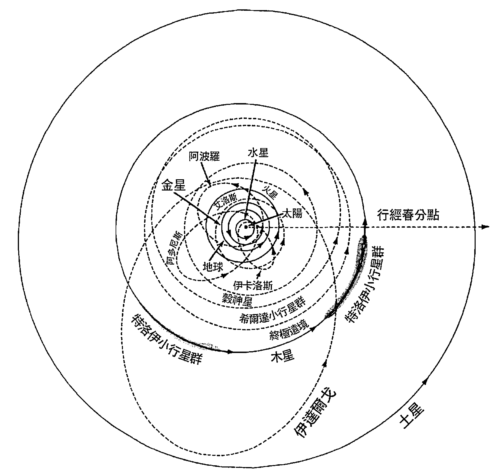

### 圖13.1

## 小行星的起源

這十萬顆小行星的起源催生了許多有趣的理論：智神星和灶神星的發現者先驅威廉·歐伯斯，率先提出小行星是古代行星爆炸後的殘餘物；另一派理論則認為小行星是一顆因木星和太陽之間相斥的引力而從未成形的行星的組成物質。後者理論的證據得見於小行星上不同成分的相異層理，並可再分為兩個有明顯差異的星帶，因為如果曾發生過一次巨大的爆炸，那麼這些碎片不會混合地如此均勻。

當前的主流理論是太陽系的形成過程中，有一星雲組成了最初的天體家族，約有十五到五十顆直徑從六十到一百英里的小行星；木星的引力使這些天體相互碰撞，它們的碎片即散佈在整個太陽系中，這些最初的天體核心據信後來形成了含有金屬成分的小行星，而灶神星是唯一保持完整的天體。

最近，「曾有一顆與土星同樣大小的巨型天體毀滅了」的「爆炸行星理論」（the exploding-planet theory）又盛行了起來；這個理論的說法是，大多數的天體碎片都會在撞上木星或其他行星時被摧毀，唯有位於火星和木星之間的碎片能夠保持完整，進而形成如今的小行星帶。

此一理論也試圖以爆炸能量可能將一些天體碎片擲向幾兆英里外太空的假設來解釋彗星的起源，且最終太陽的引力會再將它們拉回太陽系，從而形成了為這些神秘信使所開拓的廣闊運行軌道。透過運用萬有引力的定律，已發現所有的彗星似乎都起源於四百萬年前介於火星和木星之間的一個共同點。⑥

## 與地球的碰撞

每年約五百顆落入地球表面的隕石，其主要來源是小行星群，因與地球大氣層摩擦生熱而形成明亮的火球，其殘骸成了分析小行星的一種資訊來源。

一塊重達數千噸的巨型碎片會釋放出相當於大型氫彈的能量，目前，有一派理論主張一顆同等量級的小行星在恐龍時代末期曾與地球相撞，這種撞擊力道會把數千兆的碎石塵塊釋放到平流層中，形成一層阻擋太陽光達數年之久的面紗，進而導致災難性的後果，包括陸地和海洋植物的死亡、食物鏈的破碎以及隨後各種生命形式的滅絕。⑦

綜上所述，關於小行星的大哉問——「這些微小的天體是什麼？」、「它們從哪裡來？」仍然是一個重大的天文謎團，而揭開這些問題的答案，必能使我們更加深入瞭解太陽系的起源。

① 譯者註：「波德定律」也稱為「提丟斯—波德定律」（Titius-Bode law）。提丟斯研究太陽系各大行星與太陽的平均距離（以天文單位 AU 為單位）而得到一串數列，後來約翰·波德將此歸納為一個經驗公式並發現在數列 2.8 的位置有一個空缺，故而推論應該存在一顆尚未被發現的行星。
② 譯者註：高斯以最小二乘法為基礎所創立的測量平差理論。
③ 譯者註：參照美國國家航空暨太空總署 NASA 截至2020年10月的數據為 1,013,974 顆小行星。
④ 譯者註：參照小行星中心（MPC，Minor Planet Center）截至2020年6月14日之數據，共計 22,129 顆。
⑤ Dr. David Morrison, "Asteroids," *Astronomy*, vol. 4, no. 6 (June 1976), 15.
⑥ Thomas Van Flandern, "Exploding Planets," *Science Digest* (April 1982).
⑦ Richard A. Kerr, "Asteroid Theory of Extinctions Strengthened," *Science*, vol. 210, no. 4469 (October 31, 1980).

# 第十四章

## 結語

小行星，也稱為「微型行星」，但這並不代表它們表現的效應會略遜一籌。小行星主要分布於火星和木星的軌道之間，扮演了個人行星和集體行星之間八度音程轉化的媒介——一種從低八度行星的振幅（人格中某些自我的層次）提升到相對應高八度振幅的方法——使個人得以回應較高頻率的宇宙力量。

小行星的發現，與意識演進程中新意識中心的覺醒，幾乎是同時發生的。最早被觀測到，並以古代偉大女神命名的四顆小行星（♀♀♀*），代表著集體心靈中，陰性能量的復甦與強化，隨著在物理世界的能量場裡，其陰極振頻的增強，也代表了女性和男性的角色以及功能相關的新議題，正逐步影響著所有男女和整個社會。

以歷史的角度來看，陰性的潛意識形象，某程度受到文化制約的打壓和扭曲，使得這些被壓抑的能量，以扭曲的形式展現出破壞性與自我毀滅，也使得男性和女性在經驗自身的陰性本質，以及對他人展現其陰性本質時，引起許多的誤解而痛苦不已。隨著這些意識中心被啟動，它們有毒的物質也猛然進入了個人的心靈意識，造成了生活上的失序混亂。如今，轉化過程正加速淨化這些窒礙，從而讓再生與淨化後的內部形象，能以健全並和諧的方式表達出來。

傳統上，冥王星被視為是轉化歷程的指標，而在隱微的層次，月相的陰晴圓缺暗示此一轉化歷程中的陰性面向；此時，四女神星的加入——穀神星、智神星、婚神星、灶神星——已擴展了蛻變之中，陰性面向的視界和力量，而陽性和陰性小行星（包含較小的小行星）都代表著現在就能加以善用，為個人帶來轉變、再生和進化的契機與方法。

在人類意識的演變中，小行星的意涵有著各種層面的表達方式：在生理層面，小行星呼應了新的腦細胞和神經中樞的甦活，從而帶來生長過程中的大躍進；在心理層面，小行星體現了曾經潛伏或沉睡（對許多人而言是壓抑和扭曲的）人格面向，即神話中女神們各自的原型角色所象徵並主掌的心理功能；最後，在靈魂層面，小行星與轉化個人的催化力有關，促使人們感知到所有的生命形式，其本質上的相互依存與共為一體。

所有小行星象徵的議題，都為個人和整體意識提供了轉化的途徑。當男性和女性得以破除並淨化過去支配男女互動的舊有形象和態度時，他們便可以重新平衡、並整合相互矛盾的二元分化，此種二元性的錯覺在客體／主體、我／你、男性／女性、我們／他們之間，所產生的一種人為的隔閡，而回應小行星蘊含的各種可能象徵意義，可以使個人對一切有感知的生命體，獲得更全面及整體的認識。

採納這些新的想法，在你自己或客戶的星盤中置入這些小行星並加以應用，由此過程，你將意識到——小行星和所有占星原型一樣，有著不同層次的體現。因此，本書中的描述，僅是因應個人生活中會遇見的諸多狀況所給予的些許建議，即便如此，透過將小行星的關鍵字與星座、宮位和相位的基本觀念結合，你將能夠微調並加深自己對占星的理解與詮釋。

在你使用小行星的過程中，無疑會出現新的見解和疑問，如果你願意與我們分享，請將你的評論分享給我，希望藉由與你及全國各地對此主題有興趣的占星家們對話，讓我們得以適時地、更進一步地瞭解這些光明女神們所帶給我們的教導。

國家圖書館出版品預行編目資料
四女神星：神話、心理與占星學中陰性能量的重現——穀神星、灶神星、婚神星與智神星／迪米特拉·喬治（Demetra George），道格拉斯·布洛赫（Douglas Bloch）著；趙珮君，呂卿譯.-- 初版.-- 臺北市：商周出版：英屬蓋曼群島商家庭傳媒股份有限公司城邦分公司發行，民110.04
384面；14.8×21公分
譯自：Asteroid goddesses : the mythology, psychology and astrology of the re-emerging feminine.
ISBN 978-986-5482-73-2（平裝）
1.占星術 2.神話
292.22
110004397

BF6038

# 四女神星：神話、心理與占星學中陰性能量的重現
——穀神星、灶神星、婚神星與智神星

# Asteroid Goddesses : The Mythology, Psychology and Astrology of the Re-emerging Feminine

- 作 者／迪米特拉·喬治（Demetra George） & 道格拉斯·布洛赫（Douglas Bloch）
- 譯 者／趙珮君、呂卿
- 責任編輯／韋孟岑
- 協力編輯／賴淑菁
- 版 權／黃淑敏、吳亭儀、邱珮芸
- 行銷業務／黃崇華、張媄茜、賴旻汝
- 總 編 輯／何宜珍
- 總 經 理／彭之琬
- 事業群總經理／黃淑貞
- 發 行 人／何飛鵬
- 法律顧問／元禾法律事務所 王子文律師
- 出 版／商周出版
  臺北市中山區民生東路二段141號9樓
  電話：(02) 2500-7008 傳真：(02) 2500-7759
  E-mail：bwp.service@cite.com.tw
  Blog：http://bwp25007008.pixnet.net/blog
- 發 行／英屬蓋曼群島商家庭傳媒股份有限公司城邦分公司
  臺北市中山區民生東路二段141號2樓
  書虫客服服務專線：(02)2500-7718·(02)2500-7719
  24小時傳真服務：(02)2500-1990·(02)2500-1991
  服務時間：週一至週五09:30-12:00·13:30-17:00
  郵撥帳號：19863813 戶名：書虫股份有限公司
  讀者服務信箱E-mail：service@readingclub.com.tw
  歡迎光臨城邦讀書花園 網址：www.cite.com.tw

香港發行所／城邦（香港）出版集團有限公司
香港灣仔駱克道193號東超商業中心1樓
Email：hkcite@biznetvigator.com
電話：(852)2508-6231 傳真：(852)2578-9337

馬新發行所／城邦(馬新)出版集團【Cité (M) Sdn. Bhd】
41, Jalan Radin Anum, Bandar Baru Sri Petaling,
57000 Kuala Lumpur, Malaysia
電話：(603)90578822 傳真：(603)90576622
Email：cite@cite.com.my

- 封面設計／liaowei
- 內頁排版／唯翔工作室
- 印 刷／卡樂彩色製版有限公司
- 經 銷 商／聯合發行股份有限公司 客服專線：0800-055-365
  電話：(02)2917-8022 傳真：(02)2911-0053

2021年（民110）04月13日初版

Printed in Taiwan

定價／560元

版權所有·翻印必究

ISBN：978-986-5482-73-2（平裝）

Copyright 2008 Demetro George and Douglas Bloch
Asteroid Goddesses: The Mythology, Psychology, and Astrology of the Re-Emerging Feminine First Published
by Ibis Press an imprint of Nicolas-Hays, Inc. Lake Worth, Florida, USA in 2008

10480 台北市民生東路二段141號9樓
英屬蓋曼群島商家庭傳媒股份有限公司城邦分公司 收

請沿虛線對摺，謝謝！

書號：BF6038 書名：四女神星：神話、心理與占星學中陰性能量的重現一穀神星、灶神星、婚神星與智神星

# 讀者回函卡

感謝您購買我們出版的書籍！請費心填寫此回函卡，我們將不定期寄上城邦集團最新的出版訊息。

姓名：____________________ 性別：□男 □女

生日：西元________年____月____日

地址：________________________________________________________________________________

聯絡電話：________________________ 傳真：________________________

E-mail：________________________________________________________________________________

+   學歷：
□ 1. 小學
□ 2. 國中
□ 3. 高中
□ 4. 大學
□ 5. 研究所以上

+   職業：
□ 1. 學生
□ 2. 軍公教
□ 3. 服務
□ 4. 金融
□ 5. 製造
□ 6. 資訊
□ 7. 傳播
□ 8. 自由業
□ 9. 農漁牧
□ 10. 家管
□ 11. 退休
□ 12. 其他__________________

+   您從何種方式得知本書消息？
□ 1. 書店
□ 2. 網路
□ 3. 報紙
□ 4. 雜誌
□ 5. 廣播
□ 6. 電視
□ 7. 親友推薦
□ 8. 其他__________________

+   您通常以何種方式購書？
□ 1. 書店
□ 2. 網路
□ 3. 傳真訂購
□ 4. 郵局劃撥
□ 5. 其他________

+   您喜歡閱讀那些類別的書籍？
□ 1. 財經商業
□ 2. 自然科學
□ 3. 歷史
□ 4. 法律
□ 5. 文學
□ 6. 休閒旅遊
□ 7. 小說
□ 8. 人物傳記
□ 9. 生活、勵志
□ 10. 其他

對我們的建議：________________________________________________________________________________

# CERES

穀神星
CERES
希瑞斯，大地之母，
以母親的角色展現其繁衍的面向，
孕育並滋長萬物，
流露了我們親子關係的羈絆與無條件的愛。

# PALLAS ATHENE

智神星
PALLAS ATHENE
帕拉斯·雅典娜，奧林匹亞的女戰神，
以女兒的角色展現其創造性智慧，
體現了我們將繁衍能力擴展至感知全貌並創造成就的心智能力。

# VESTA

灶神星
VESTA
維斯塔，奧秘聖所的女祭司，
以處女與姊姊的角色展現其自立與自我的完整，
隱現了我們經由承諾、專注，
以及自我奉獻所昇華的性能量。

# JUNO

婚神星
JUNO
朱諾，天空之后，
以神聖配偶與妻子的角色展現其陰性與陽性本質的結合，
表達了我們在親密關係裡的需要，
以及將自己全然交付予他人的能力。

瞭解每位女神的原貌，將使我們對於人際關係與相關的生命經驗，自心靈深處有著更為清晰而透徹的洞察體會。

> 最初我是這樣想的：「喔不，不要在星盤中添入更多符碼了，已經夠困惑的了。」但經過許多年之後，我開始重視小行星，並將小行星視為星盤詮釋的重要元素。迪米特拉·喬治絕對是女神中的女神。
——邁克爾·魯汀（MICHAEL LUTIN）／雜誌《浮華世界》（VANITY FAIR）的占星師、作者與講師

> 如果你想深入研究小行星，這本經典之作《四女神星》就是最佳的起點，這是一本含括歷史、神話和深度解析的偉大鉅作，可以幫助你好好地了解自己與他人。換言之，除非你讀過這本書，否則你根本還不了解帕拉斯·雅典娜這個角色。
——喬治亞·斯塔西斯（GEORGIA STATHIS）／《商業占星學101》（BUSINESS ASTROLOGY 101）作者

神話，記述人類集體無意識底層的共通經驗，神話角色則描繪了無論男女，在不同心理面向與需求的原型。本書描述四女神小行星的發現，其神話對應於女性角色與權力在社會上的轉變，以及陰性力量的再次甦醒。