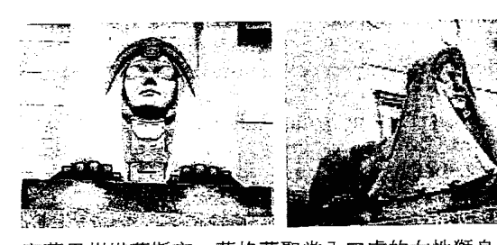
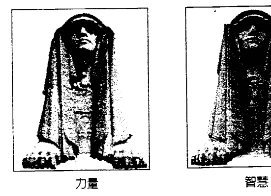

The request was rejected because it was considered high risk為什麼還要用手指頭這種方式呢？透過我的方法，你能夠與潛意識進行雙向對話，而且可以得到任何你想問的問題答案。

我對潛意識的定義是：照顧身體的那個心智部分。它管控身體的所有系統。你不必告訴你的心它需要跳動，也不用告訴自己需要呼吸。我認為這個工作是由潛意識掌控，因為潛意識時時刻刻都在監控，而且它知道個案身體裡正在進行的每一件事，因此我們能夠使用這個方式得到健康方面的答案。我發現各種身體上的症狀、疾病或不適，都是來自潛意識的訊息。潛意識急於想獲得我們的注意，它想告訴我們某些事，而且會持續直到我們終於瞭解為止。

如果我們沒有注意潛意識的訊息，疾病或問題便會繼續惡化，直到我們再也沒有別的選擇，或是情況已不能好轉。這是真的，因為很多不同個案的相同症狀，都是起於同樣的問題。我只希望潛意識能用較不會引起痛苦的方式來傳遞它的訊息。我常說，「遞個紙條給他們不是容易多了嗎？」潛意識認為它傳達訊息的方式很直截，甚至魯莽，人們應該瞭解才是，但往往不是這麼回事。我們太過專注在日常生活，以致不會去想為何總是背痛或頭痛等等原因。

當我們透過催眠療程找出身體不適的原因時（原因通常都很不尋常，因此我不認為有人可以在有意識下做出這樣的連結)，由於潛意識的訊息已被傳達，身體的不適就會停止。訊息已被傳遞和諒解，這些不適沒有理由再繼續。如果當事者在生活能夠做出必要的改變，他就能恢復健康。責任最後總是會回到當事者的身上。潛意識只能做這麼多，因為最終還是要尊重個案的自由意志。我瞭解這些說法聽起來極端且不符合傳統的治療方式，但我只能報告我從幫助過的數千人身上所觀察到的結果。我也相信潛意識是紀錄保存者，就如同一台巨大的電腦，它記錄了曾在這個人生命裡發生的每一件事。這就是為什麼我們可以透過催眠取得資料的原因。假如那個人被要求回到十二歲的生日派對，他會記起當天所有發生的事情，包括蛋糕、參加的人、禮物等等。潛意識記錄每一個微小細節。有許多我會認為是多餘的，我納悶潛意識要這些瑣碎細節做什麼。譬如說，我們每分每秒所接收到的成千上萬的訊息：看到的、聽到的、聞到的、感知到的，還有許許多多。如果我們是有意識地覺察到所有的資訊，我們會因負荷過量而無法運作。我們必須只聚焦在那些對生活來說必要的資訊上頭。然而，潛意識總是覺察並持續記錄和儲存這些資料。為什麼？我們會在書裡進一步探討。這可以解釋突如其來的心靈啟示和直覺的由來。那是我們在另一個層面（潛意識）所接收到的資料，雖然我們不一定需要，但由於資料就在那裡，偶爾會滲漏到我們的意識層面。當這個情形發生，它被視為奇蹟般的現象。其實這些儲存的龐大資料一直都在那兒，只要有適當的訓練，便能觸及這些資料。潛意識不但記錄這生所發生的一切大小事，它也記錄當事人所有的前世與在靈魂狀態／層面時的一切。這些資料有很多是現世生活用不到的，但這些資料可以因好奇而接通，而且對探究的人來說會是有趣的。只是，這些資料對於這一世的問題解答有什麼幫助？這就是許多催眠師會犯的錯誤之一。他們認為帶引當事人去看前世是沒有價值的，除非只是因為好奇、對前世有所幻想，或是好玩（雖然許多前世可是一點都不好玩。）這就是為什麼我會發展自己的技巧；我會帶當事人回到跟這生問題最有關聯的一世。我從不誘導。在催眠時，我是讓潛意識帶個案回到它認為最值得去看的那一世，不論那些世的生活是無趣還是平凡（百分之九十都是如此），是住在現代還是古代，或是與外星人有關，或是生活在另一個星球或次元，我總會感到詫異。潛意識會做出連結，而那個連結是我和當事人絕不可能想到的。但當我們從那個觀點回顧時，便會瞭解。

每當我接觸個案的潛意識，它總是令我驚嘆，因為很顯然的，我並不是在跟個案的人格，而是跟一個不同的存在體或個案的某部分說話。我也總是可以知道何時已經接觸到潛意識，以及是否是潛意識在回答問題。

潛意識總是會用第三人稱（他或她）來指稱個案。潛意識不帶感情，而且似乎是與問題抽離，就像是一個客觀的觀察者。它會因為個案一直沒有聆聽而責罵。有時潛意識的第一句話會是，「好，終於有我說話的機會了。」多年來我一直試著跟（珍或鮑伯）說話，但他們就是不聽。潛意識非常客觀，因此有時候聽起來顯得無情。它會毫不留情地把它所見的情形據實以告。在它為了清楚表達觀點而不留情面地對待個案之後，潛意識也總是會告訴個案，他們是被珍愛的，以及它對個案的進步感到多驕傲。潛意識也認得我，它常會感謝我讓個案進入出神狀態，使得這個過程發生。

潛意識經常用複數（我們），就好像它不是單一的存在體，而是好幾個。這點我們會在後面探討。如果這樣的接觸只是透過一個個案發生，懷疑論者是不會瞭解或相信的，而且他們也有很正當的理由不去相信。然而，如果這是發生在每個我催眠的個案身上，而且不論他們是來自世界的哪個角落，那麼人們又要如何爭辯這是幻想、欺騙、愚弄或刻意的操弄呢？我使用這個催眠技巧把個案帶入適當前世的成功率有將近九成，在這之中又有大約九成的人成功接觸到他們的潛意識。潛意識說話的方式都是相同的，而且以同樣方式回答問題。如果這只是隨機發生，那就不會都是這個情況了。我遇到最難催眠的個案通常是高階的商業人士，那些慣於評斷和分析的人。他們在催眠過程中想要掌控，而不是放鬆和跟隨我的指令。也有的人會說他們已經準備好要去找出答案了，然而私下卻害怕即將出現的事，因此他們的意識會破壞催眠。但就如我之前說的，這個情形在我的個案裡只占百分之十或更少。其餘的百分之九十總是可以看到前世。因此我相信這個結果很能夠支持輪迴的存在。我曾經納悶，如果個案心智或心靈的這個部分跟其他人是一樣的，那我所接觸到的究竟是什麼？如果它只是屬於我催眠的那個人，而且只能取得他的個人資料（這是合理的想法），那為什麼它可以接通那更大範疇的資訊呢？它又是怎麼接通的？潛意識本身在書裡提供了這個問題的答案，因為隨著我的工作的擴展，我覺察到更多事，而我也準備好（或者說我是這麼認為）接受更複雜的解釋了。

我現在瞭解自己一直在限定它，而且也簡化了它。事實上這就像是在跟一台連接上巨大資料庫的電腦溝通一樣。這個資料庫超越了時間、空間和個體意識的所有限制，這正是我的工作令人驚嘆的部分。我似乎總是在跟相同的部分（或存有，或不論什麼的）說話，而現在我發現「那個部分」是無所不知的。它不但有個案要尋找的答案，它也有我想要問的任何問題的解答。那是一個可以觸及所有資訊的全知部分。

有些人可能會選擇將這個部分稱為「全我」、「高我」、「超靈」、容格的「集體潛意識」，或是「上帝」。這些用語雖然不同，但可能都跟同樣的事物有關。而我只知道，在我的工作中，它對「潛意識」這個名稱有回應。因此我稱它「潛意識」。

科學界和宗教界也有許多其他名詞是用來解釋我所成功接通的部分。不論我接通的部分是什麼，和它工作是件愉快的事，主要是因為我對這些資料充滿了好奇與渴望。我非常喜歡在圖書館研究，而這個工作就像是到了史上最大的圖書館。在我探索更多繁複的形上學概念時，請跟我一起踏上這個旅程。我知道我沒有所有的答案，但我已成功地更深入表層。也許你的心智會因我的發現而受到激勵或啟發。繼續尋找和發問吧！唯有如此才能找到答案。

# 迴旋宇宙 2「上」

## 前世今生與志願者靈魂

> 記住這句諺語，「心智如同降落傘，打開才有作用。」

### 第二章 一般的前世療法

人們並沒有意識到他們的心智具有療癒的力量，而我的催眠法能夠接通他們心智的那個部份，找到問題的起因。潛意識在使用身體症狀傳遞訊息時，可說是非常直接了當。如果更多人知道這點，他們就會更仔細聆聽身體在試圖告訴他們的訊息。在我做過的數千次催眠當中，我通常能夠辨認出某個症狀所顯示的模式或結果是否源自這一世。譬如說，如果有人說他有長期性的背痛或肩膀痛，我會問他是不是在生活裡背負著重大責任，而當事人也總是會回答確實這麼覺得；他們由於家庭生活或工作環境等等，覺得自己承受了許多壓力。這類情況會以背部或肩膀部位的不適來表現。手腕和手部的疼痛顯示個案在生活中緊抓著該放手的事物不放。臀部大腿或腳部的疼痛表示他們正處於改變人生方向的階段。這通常涉及必須做出重要決定，而這些決定將會徹底改變他們的生活。顯化在身體這個部位的不適是因為潛意識在告訴當事人，他們害怕跨出去，害怕踏出下一步，因此身體的疼痛顯示的是他們的退縮。胃部問題有時是因為當事人無法「忍受」（stomach，胃部的同義字）生活中正發生的事。癌症，尤其是腸道部位，意味當事人非常壓抑，壓抑到壓力產生後無法釋放，因而開始侵蝕器官。癲癇則是當事人沒有能力去處理身體的高能量。我曾有過一些個案在吃特定食物或藥物時會噎到。潛意識說這是因為他們無須使用這些藥物，這些藥物會對他們的身體造成更多麻煩。身體的反射作用以噎住和不適作為拒絕的形式，為的是不讓當事人消化有害的食物或藥物。潛意識有時是很戲劇性和操控的。雖然有些問題的答案可以在這世的生活裡找到，我大多數催眠的重點都是在他世。我會在書裡舉一些「正常」的前世回溯案例，呈現催眠是如何解決個案所經驗到的現世問題。接著我會專注在不尋常或不同類型的回溯，以及這些個案如何透過探索前世得到協助。請記得，這些案例所提出的解釋並不能作為適用於所有個案的疾病或不適的唯一原因。沒有任何解釋是可以適用於所有的案例。譬如說，過重永遠是因這個理由導致，或偏頭痛一定是因為那樣所造成。解釋會因人而異，潛意識是非常機靈和巧妙的。催眠師必須要有彈性，並且運用直覺提出適當的問題。適用於某人的答案和解釋不一定可以套用在別人身上。

前世事件影響這世身體的一個例子：許多關節炎個案的原因源自中古世紀被架在拷問台折折磨，或是在牢獄中被類似的刑具拷打。人類向來就有殘暴對待彼此的歷史，而有時身體仍會帶著這些記憶。

有個關於子宮肌瘤的有趣解釋。這個個案曾經多次墮胎，她的理由是因為她已經有好幾個孩子，一邊工作一邊照顧他們對她來說非常辛苦。在這樣的情形下，她認為有更多孩子會加重負擔。她說墮胎並不會對她造成困擾，而且她也已經接受了，然而她的潛意識和身體卻不這麼認為。她開始有子宮肌瘤的問題。在催眠中，她的潛意識說她的罪惡感其實比她以為得嚴重，因為子宮肌瘤代表未出生的胎兒。當個案明瞭並接受了這個情況，她的肌瘤開始萎縮，而且不用開刀就消失了。疱疹、子宮切除、囊腫等等卵巢或攝護腺等等問題可被追溯至其他世在性方面的不當行為或虐待異性。這些問題也可以是不跟異性接觸的方法，或加諸於自我的懲罰。有位女士有子宮內膜異位，這個問題已經影響到她的背部。她結婚十九年，但一直沒有小孩。她的醫生想切除她的卵巢和輸卵管來解決問題。她的前世回溯揭露了女性器官方面的問題有時是來自好幾個前世都是必須獨身的神職人員（神父和修女／尼姑），這樣的生活模式抑制了她對性的感受與活動。在其他世所立的誓言具有相當大的力量，尤其是貧窮的誓言通常會被帶到這一世並造成金錢問題。這些在前世被認為是必要的誓言，現在可以因為不適合而宣布中止了。

有時候個案因為在許多世都是同樣性別，後來發現自己在另一個性別的身體裡，因此發展出疾病來排斥這個身體，尤其是跟賀爾蒙有關的身體部位。我發現這也是同性戀的原因之一；個案好幾世都是同樣的性別，因此身為另一個性別的時候，便會難以適應。

- 武器或動物攻擊頭部的記憶被帶到現世，這通常是為了提醒當事人不要重犯在另一世。
- 我有許多個案的偏頭痛原因往往被追溯到前世的頭部創傷。他們過去被人類、動物或武器攻擊。

過重有很多原因，有些很容易預料，例如前世死於飢餓或是造成別人挨餓。有時過重是一種保護；個案這世在自己身上加了「保護墊」來防禦某樣事物（不論是真實還是認知上的），也或者他們是為了避免被傷害，因此讓自己變得不吸引人。我的工作是找出他們所防衛的東西。個案通常並不知道起因，然而在催眠中得到的解釋卻都很有道理。找到原因後，個案就能解決過重的問題了。

我也遇過一些出乎預料的過重原因。有位女性個案回到前世，那一世她是蘇格蘭某家族的領導人。這個工作很辛苦，催眠狀態下的她感受到重大的責任。領導人去世後，靈魂依然如此感覺，於是在死後說了一句關鍵性的話：「我永遠都無法卸下這個重擔。」潛意識認真看待這句話並帶到了這一世。

有個不尋常的案例收錄在《星辰傳承》(Legacy From the Stars)。一位女子在催眠中看到自己是外星人，因為意外，飛行器墜毀在地球，他被當地的人發現並照顧。這個外星人有許多引人注意的特異能力，其中之一是因地球引力的不同，使得他會無預期飄浮，因此這世地下意識以過重來避免飄浮和引起過多的注意，雖然這個原因並不合常理。

另一個有關過重的不尋常解釋是來自家案瑞克。瑞克也是想解決過重的問題，許多方法對他都沒效果，尤其是那種只能吃某些東西的飲食法。催眠時，他立刻進入了某個古文明時代。他所形容的建築物和構造，聽起來都不像我曾接觸過的事物或讀過的歷史。有些描述讓我想起阿茲特克文化，尤其是已被考古學家發現的部分。

瑞克看到一個方形庭院，四周圍繞著類似露天看台的奇怪建築物。每個社區會各派一位運動員來這裡參加比賽。瑞克是被訓練來參加這個比賽的選手。比賽很重要，因為結果可以決定這個聯合社區下一期的統治者。統治者是每季更替，而且是以獲勝的那方來決定。

瑞克穿著奇怪的制服，臉上畫有條紋。這個比賽聽起來很像籃球。他們在庭院裡帶球奔跑，而且必須把這個球投進一個石環裡，這個石環是架在庭院邊。這是為什麼我會想到阿茲特克，因為考古學家曾說過他們在墨西哥發現了一個球場，阿茲特克人在這裡玩類似的遊戲，但是考古學家說阿茲特克人是把人頭，而不是球，投進石環裡。如果瑞克所說的地方和考古學家發現的是同一個地點，那麼，是這個比賽的球員真的用頭顱當球，還是瑞克的前世記憶與考古學家的發現有所出入？是這個比賽變質敗壞到使用人頭來代替球，還是考古學家說的不正確？

瑞克是很優秀的運動員，他連續贏了多次比賽。這表示好幾屆的領導者都是由他所屬的團體選出來的。他並不想那麼辛苦工作，他經常希望那些領導者可以自己來比賽。他不被允許結婚，也被嚴格限制只能吃某些食物，為的是保持精瘦和維持最佳體能。他經常羨慕其他人，因為他們可以有社交生活，而且可以吃任何他們想吃的食物。他被規定吃的東西包括龜肉、某種白色的根莖物、很多的水，還有從某些果肉榨取出來的苦味白色液體。他每天早晚都必須喝這種液體。這個東西常會讓他想睡覺，但因為可以維持強壯的體格，所以是必要的飲料。他討厭那個味道，而且從來沒能習慣。

他最後厭倦了比賽，想要找離開的辦法。大家雖然都很喜歡他，但一段時間過後，比賽總是贏也讓他們開始感到無趣。而其他社區的人並不喜歡他總是贏，因為這讓他們沒有管理的機會。瑞克決定要輸，但不能輸得太明顯。當他開始輸掉比賽，他那邊的社群決定換掉他，於是他們終於被允許過正常的生活，包括吃任何想吃的食物。他決定住到對手的社區，因為那邊的人很高興終於有機會管理了。他發現那邊的選手並沒有嚴格的飲食規定，而是吃一般的食物。他在那裡過得很快樂，但並沒有活很久。當他快死的時候，他感覺體內像是在燃燒，巫醫說是因為他長年被迫飲用的白色液體，那個東西損害了他的身體。

當我和潛意識對話時，他的體重問題顯然和那一世有關。潛意識說那個液體有麻醉作用，會使他心跳加快，身體的消化或新陳代謝也會加速，因而產生結實的肌肉與更快的活動速度。但這最終使他的腸道潰瘍，導致他的死亡。

當我向潛意識請求協助他的體重問題時，潛意識說沒有那麼簡單，因為牽涉到許多相互糾結的因素。由於當時的權威者強迫他做的事並沒有考量到他的利益，因此他學到去質疑而不是去信任權威（政府、教會、醫生等等）。而且進食也已跟樂趣及社交生活有所連結。要把這些因素分開並不容易，而且他其實是健康的，潛意識認為沒必要減重。這清楚說明了為何瑞克只靠吃某種食物的節食法對控制體重的效果並不好，因為這勾起他另一世的記憶。他現在很喜歡烹調並且吃各類食物。瑞克過重的原因很不尋常，因此要幫他減重並不容易。

當瑞克醒來時，他並不記得任何事，但他想喝水，因為嘴裡有種很不舒服的苦味。他說這讓我想起小時候有一次和朋友在森林裡探險，他們發現一種多汁植物並拿起來咀嚼（森林裡很多植物都是有毒的，奇怪的是他竟然沒事。）那味道是苦的。

我告訴他有關他在前世長期飲用白色液體的事。他把前世那個味道也帶回來了。在喝了一些瓶裝水之後，他覺得好多了。

我在許多氣喘案例中發現，個案在前世通常是死於窒息或是跟肺或呼吸有關的原因，譬如他們生活的環境（灰塵、沙子等等）。有個重要案例發生在催眠工作的早期。一位有多年氣喘病史的醫生來找我，他平常有使用吸入器，但他知道是習慣使然，希望能戒掉這個習慣。他對超自然和形上學（玄學）有足夠的瞭解，因此認為問題根源可能是在前世。

催眠時他回到住在非洲叢林的一世。那時法國在開採地下石棉，他們會捉當地的原住民，帶到礦坑當奴隸採礦。當時他也被抓去地底下的礦坑。長期暴露在石棉纖維造成這些人的身體出現呼吸問題，肺部的出血從嘴流出，最後導致死亡。法國採礦者就只是把屍體丟棄在叢林，再去捉別的當地住民替補。當這個個案開始出現相同症狀時，他知道他將會死於肺部的傷害。在他的文化裡，因為情勢難以忍受而自殺是被允許的，於是他把木樁刺入自己的右肩部位。

當我和潛意識溝通時，潛意識說那世的記憶被帶到今生，而每在有壓力的時候，呼吸的問題就會以氣喘形式呈現。而現在他瞭解了問題的根源，症狀就會停止了。當醫生從催眠狀態醒來，他說：「難怪我常納悶為什麼胸腔有時會覺得痛。」他指的部位正是他刺入木樁的地方。這位醫生後來成為我的好友，大約過了四、五年後，有一次我問到他的氣喘，他笑著說，「喔，對喔，我曾經有過氣喘。」

許多害怕和恐懼症可以追溯到前世死亡的方式。當我們從這個角度來看，懼高、怕黑、幽閉恐懼症、廣場恐懼症（agoraphobia）就變得容易理解了。

在數百位類似的催眠案例中，有個例子是一位有幽閉恐懼症的女性個案，她也很害怕手或腳被束縛，夜裡睡覺每隔一小時就會醒來。她在阿肯色州史密斯堡（Fort Smith）參觀歷史景點時（那裡有個歷史博物館和法庭），突然有種似曾相識的感覺。一八七五年至一八九七年間，以「絞刑法官」惡名昭彰的派克法官就是在這個法庭審判。個案直覺知道自己曾經在那裡，而且是非常恐怖的經歷。後人保留了監獄並重建絞刑台。個案直覺知道自己曾經在那裡，而且是非常恐怖的經歷。

## 迴旋宇宙2「上」

## 前世今生與志願者靈魂

### 042

催眠時她回到了前世，她是南軍的士兵，和其他幾位夥伴一起被捕。他們被送到一間很暗的房間，只有很小的窗戶，大家一起擠在狹小的空間裡。她害怕手腳被綁的恐懼是來自她當時被鍊條銬在牆上的經驗。夜裡難以成眠則是因為在那樣的情況下，當時的他根本無法好好睡，而且心裡也害怕接下來會發生的事。幾天之後，他們全都被吊死。這個案例顯示似曾相識的感覺可能是下意識憶起了前世經歷。同樣地，對某個年代、文化或國家的嚮往也是。這些吸引並非總是負面，而這些無法磨滅的強烈情緒也總是持續被帶入許多轉世。

另一位個案是擁有心理學碩士的專業護士。她去見治療師有好一段時間了。她想找出她的問題原因，但一直沒什麼結果。治療只得出一個結論：在她小時候發生了某件事，但她已不復記憶。這並沒有回答她的疑問。她跟她的大兒子之間有些問題，她懷他的時候尚未結婚，當時她很想墮胎，後來孩子的父親終於要娶她，並且說服她把孩子生下來。但自從生了這個小孩後，她總是有被他威脅的感覺。她原想可能是孩子意識到她曾經想拿掉他。如今孩子雖然長大了，但兩人之間仍然明顯有問題存在。

### 043 第二章 | 一般的前世療法

進入催眠狀態後，她立刻看到自己是個男人，而且極度憤怒。他正掐著某人的脖子，那個人已經快要窒息。當她看清楚對方時，她說那是她現在的兒子。前世的他發現這名男子跟他太太在一起，他想殺了他。個案突然知道，那個妻子就是她這一世的母親，而她和她母親一直處得不好。畫面裡，他殺了這世是她兒子的男子，他後來被關進牢裡，牢裡沒有窗，而且爬滿了老鼠和蟑螂，空間非常骯髒和陰暗。最後他死在牢裡。當時的那個男子在這世回來做她的兒子，這樣他們才能解決這個負面業力，然而他（兒子的靈魂）帶著很多的怨恨回來，難怪她總是感覺受到威脅。

個案也一直不明白為什麼她那麼討厭酗酒的人。酒精的味道、他們說話的樣子和行為在在都令她反感。當我問到這個問題，她立刻把酒精和掐住那人脖子的那幕連結在一起。也許當時他們倆都喝了酒，而酒精激化了憤怒。無論當時是什麼情形，都導致了可怕的結果，她因此必須在這世回來和當時的相關人解決這個負面業力。

當個案明白了問題的起因，也看到這是屬於前世的事，她原諒了自己和所有參與的人。我們也可以從別人的前世經驗，學習把過去的恩怨留在過去，一勞永逸地解決問題。

我從工作中發現，償還業力的方式不勝枚舉。但最不理想或最不值得的，就是這世回來被你前世的受害者殺害。這不但沒有解決任何事，只是讓業力之輪繼續運轉，而且還產生更多業力。我被告知殺人者償還罪行的最理想方法就是「軟性的方式」：透過愛。

舉例來說，曾經的殺人者這世以照顧被害者的方式來償還。他們可能需要奉獻一生來照顧他們的受害者：譬如一個需要被照顧的父親／母親，一個殘障的孩子等。他們會因此無法擁有自己的生活，但這要比「以牙還牙」的方式有智慧多了。

這位個案的心理醫師曾經告訴她，他不反對她做前世催眠，但他並不信這一套。然而，透過傳統的正統心理治療，她將永遠找不到問題的起因。我很想看看當她告訴他，她不再需要繼續治療，她已經從催眠療法找到了答案時，他是怎麼說的。

***

另一個案例是紐奧良一位過重的年輕女性，她很渴望有孩子，也一直在服用幫助受孕的藥物，卻沒有效果。她經期來時很辛苦，曾經一個月都在流血。唯一的解決辦法是服用避孕藥調節，但這樣卻會讓她無法受孕。她也在努力減重。

催眠時我問到為何她不能受孕，潛意識說她上一世是收養孤兒的家庭。她收養了十一個小孩。每當有小孩離開她的寄養家庭，馬上就會有另一個進來遞補。她把小孩照顧得很好，她也很喜歡照顧他們，但在現在這一世，潛意識希望她能夠休息。它們說不用擔心，她會有孩子的。她的身體正在調節，開始要回復正常。體重過重的問題則是她必須經歷的試煉，尤其是在她要進入成年期的這段時間，為的是看她能否承受得住甚至是成年人對她的嘲笑和惡毒評論。她現在已經通過這項考驗，所以體重可以減下來了。當她到了能夠有小孩的時候，她的身體也會是在健康的狀態，當然，小孩也將在適當的時機來到。

個案這一生也一直過於敏感，她會有週期性的沮喪，感到孤單和被遺棄。她後來終於崩潰，無法停止哭泣。她這麼敘述：

> 「我心裡感到非常空虛。我總覺得我的生活平淡乏味。有時候我覺得自己是在休息，有時候我又害怕好像有什麼災難要發生似的。悲傷一直都在。我到底怎麼了？我要怎麼去改變這個情況？從我小時候起，大概八或九歲左右吧，悲傷的感覺就已經是我的一部份了。」

潛意識對此做了一個很有意思的說明。它說她原本應該是雙胞胎，另一個靈魂跟她約好要一起投胎，但在最後一刻變卦，決定不在這時候來地球。因此另一個身體並沒有成形，她孤單地一個人投生人世。下意識裡，她一直都覺得那個沒有和她一起出生的存在體遺棄了她。那是一種少了什麼的悲傷感，並且伴隨著沮喪。這就是原因了：她想念那個原本該在此生陪伴她的靈魂。我從沒對她說，但我一直很好奇，未來她所懷的孩子是否有可能是那個終於決定要來人世的另一個靈魂。

當我們告訴她母親這件事的時候，她母親非常驚訝，因為從來沒有這方面的跡象。醫生從未告訴她有可能是雙胞胎。我的個案是在一九七二年出生。我不知道她們是否是所謂的「幻影雙胞胎」或稱「消失的雙胞胎」（disappearing twin），這在現在是大家都知道的現象。（譯注：是指受孕時有兩個胚胎，但經過一段時間，其中一個胚胎停止發展，因此超音波掃描時只看見一個胎兒。）催眠完後我們一起用餐，她母親說個案出生時是一位不熟的代理醫生在場。如果是她的主治醫生，或許就會跟她說是否有另一個胎兒的跡象。我想我們永遠也無法得知了。

我也發現有些不孕的案例是因為個案前世死於分娩，潛意識為了不讓這樣的事在今生再次發生，因此個案一直不孕。有時潛意識的邏輯真的很奇妙。

### 053 第二章 | 一般的前世療法

案是一位一直處於悲傷和沮喪情緒的女性。她這生一再重複被遺棄、被排斥的模式，也總是感覺自己沒價值，像個被拋棄的孩子，並且一直有莫名的恐懼。她從小就被遺棄，在孤兒院裡長大。她與男人相處上有問題，婚姻和工作也不順利，她總覺得自己不值得任何事，也無法完成任何事情。此外，她也有偏頭痛，我認為偏頭痛可能是她用來懲罰自己的方式。總之，她是個非常憂鬱又令人同情的人。我們重新經歷了與她的問題有關的重要前世。她看見自己抱著一個一歲大的嬰兒在街上奔跑。所有人都慌亂地逃竄、尖叫，因為有一群騎著馬的士兵在追逐他們。這裡顯然正被侵略。為了逃命，她努力尋找可以躲藏的地方。她的寶寶在哭，她擔心會因此引起注意而被發現，於是把寶寶放在牆邊，然後跑到一個建築物裡面躲起來。她認為絕不會有人會去傷害一個小嬰兒。但當她看到這些士兵橫掃整個街道並殺掉她的寶寶時，她被悲傷淹沒不能自己。當軍隊發現了她，強暴後再殺害時，她也不在乎了。她為寶寶的死責怪自己，她覺得應該把寶寶帶在身邊。雖然不論是怎樣，他們其實都難逃一死，但她不這麼想。她責怪自己不該遺棄寶寶。即使到了靈界她也同樣心痛。她把悲傷和痛苦帶到了這一世，並且重複自我懲罰的模式。我問她是否願意原諒這些殺了她寶寶的士兵？她說願意，她可以原諒他們，因為他們只是在做他們「男人」的事，但她絕對無法原諒自己遺棄了寶寶。在跟潛意識協商溝通許久之後，我終於讓她能夠原諒自己。這是很困難的過程，達成後我鬆了一口氣。她清醒後，我們討論這件事，我跟她說她已經懲罰自己太多世，是放手的時候了。此外，如果她曾回到更早的前世，我願意打賭我們會發現她是為了償還她某世身為士兵所做的同樣的事情。怎麼欠就怎麼還。經過這次催眠後，她的痛苦減輕了許多。她的無價值感消失了，取代的是希望與期待。我感覺她已在人生做出了轉折。確實是時候停止懲罰她自己並開始真正生活了。

★★★

下一個催眠個案是位美麗的年輕女子，來自捷克，目前住在倫敦。她在心靈研究學院學習形上學已經好幾年了，但她一直沒能完成學位。她學到也知道很多知識，卻總是在期末考前夕或要交期末報告時打住。她主要的問題是她全身的濕疹。她出生三個月就開始起濕疹。醫生開的藥方都沒有效。小時候她曾經住院好幾個月觀察，試著找出適合的藥物。她試過類固醇，但有副作用。她也試過中國草藥，雖然有點效果，但會造成胃部感染。她現在使用藥膏，這個藥膏可以讓她的臉看起來不那麼糟。在最糟糕的時候，她的全身會發癢，感覺像是在燃燒。雖然這個陳年舊疾已經是她生活的一部份，她仍希望能減輕這種痛苦。她也覺得如果將它移除，一部份的她也會跟著逝去，因此必須要用其它東西取代。當她進入深度的出神狀態後，她立刻看到很亮的光，她意識到自己正看著火燄。火燄在她的腳部，接著迅速竄升到她的身體。她變得很不安，於是我引導她到一個可以客觀看待整件事的位置。她看到在靠近樹林的某個空地上，她（是個男子）和其他人被綁在木樁，熊熊烈火正燒著他們。當她回溯到故事的開頭，她看到自己和其他人住在一個很大的莊園房子裡，他們是諾斯底教徒，他們自己過著安靜的生活，研讀並撰寫書籍，沒有打擾到任何人，但是地方官員卻認為他們是與魔鬼工作的危險人物。官員受到宗教團體的慫恿，因為宗教團體也把他們看作威脅。有天晚上，他們被狗吠聲和一群闖入房子的人吵醒。他和其他人逃進樹林，這些闖入者和狗群在後面追趕，最後他們仍被逮捕。他們被帶到城裡的某處，受到可怕的折磨，被逼著要供出藏書地點。他的臉在被拷問時受了很多傷，尤其是下顎和眼睛（個案這世的眼睛也因此有些問題）。當這些人無法從他們身上問出更多資料時，這些諾斯底教徒被帶到一個大房間進行審判。他那時已經非常痛苦而且失去知覺，因此無法受審或回應任何控訴。他只能恍惚地坐在那兒，聽著發生的一切，感覺像是作夢。但這些都已經不重要了，因為這整個審判是個騙局，只是個形式。他們接著被帶到樹林附近的空地，綁在木樁上活活燒死。他和其他人都沒有做錯任何事，他們只是擁有並企圖保存這些奧秘的知識。

她說這些書有的藏在當時人們絕對找不到的地方。

類似的事在歷史上發生過無數次了。總是有諾斯底教徒的團體試圖保存知識，而另一群人則想要得到這些知識作為己用。這就是在宗教法庭或裁判裡所謂「審判巫女」的真正原因。教會想要剷除那些擁有他們一直想獲得卻沒能得到的秘密知識的那群人。現在我們知道沒有任何知識是遺失的。這些知識一直都藏在最安全的地方：人類的潛意識裡。

潛意識認知到濕疹的起因來自目睹火焰竄升到身體。灼熱和刺癢象徵這次的死亡。她為什麼在這生無法完成形上學課程的原因已顯而易見。下意識裡，她害怕如果她獲得這些知識，同樣的事會再次發生，雖然她並沒有因此中斷追尋和研究這些知識。

### 051 第二章 | 一般的前世療法

我必須說服潛意識，不可能會再發生被燒死在木樁上的事了，因為她目前活在一個完全不同的時代。濕疹的根源既被指認出來，濕疹也已沒有存在的必要。我在催眠中曾看見在荷蘭的另一世，她看到那一世她有強壯和健康的身體。她很喜歡這個身體，因此潛意識說她可以用這個荷蘭女孩健康身體的觀點來取代濕疹。她對此非常開心並且同意這樣的作法。

有位女性個案因為椎間盤問題而下背部疼痛，醫生建議她動手術治療。她在催眠中看到自己是韓戰中的一名黑人士兵。許多炸彈在他身邊爆炸，他被擊中背部，而且被彈到淹滿了水的壕溝裡。他因為癱瘓動不了，無法逃離而淹死。她太快轉世，因此還帶著背部的記憶。這也說明了為何她害怕密閉空間和吸不到空氣（她偶爾也會支氣管炎發作）。

我在工作中發現，排隊等待殘障身體的靈魂多過等候健康身體的靈魂。從靈性的角度來看，這很容易理解。輪迴地球的計畫是要盡可能在一世裡償還最多的業，以免一次又一次地回來。透過殘障的身體可以償還較多業力，靈魂可以學到重要課題，照顧者也是（父母等等）。其實在進入這一世之前，所有相關者就已同意要照顧這個個體（指殘障者）並盡可能地協助。人生的一切都是課題，雖然有些課題比較困難。而每個看到殘障者的人又學到什麼呢？旁觀者又是如何反應？殘障者教導的是每一位他們接觸到的人。因此殘障者不是要被憐憫或迴避。他們是該被接納與欽佩，因為他們這一世選擇了一條困難的道路。

- ★
- ★
- ★

被收養的人在靈魂層面都知道他們將會被收養，這都是事先計畫好了的。在靈界的時候，生父母和養父母就已經做好了安排。生父母同意提供設計身體的基因，而他們透過給出小孩也會學到課題。養父母同意撫養小孩，他們提供的正是這個靈魂決定它要的生長環境，為的是學習這世想學的課題。然而計畫並不是設定後就不能更改。永遠都有自由意志，(不只是被收養的人，所有相關者的自由意志也會造成影響。）所有的相關人都能改變結果。

### 053 第二章 | 一般的前世療法

接下來的案例主題回到了我最初的愛好：發現失落或未知的知識。這是可能的歷史的有趣部分。

在英國的這名男性個案是一家印刷公司的主管，他善於交際和溝通談判。他覺得自己被工作和責任給絆住了，尤其是被他的婚姻。他有瞇眼和眨眼的習慣，這個習慣讓 him 很困擾，他覺得在工作上與人交談時，這會讓他顯得怪異。他試著假裝這隻是眼睛過敏的緣故。此外，他對光線也很敏感。

他來找我主要是想知道他是否應該轉換人生跑道，換個不同的工作，也或許離開妻子和四個孩子，去和他的女友共同生活。

他的某些情形可能是這個年紀（四十多歲）會有的問題。這時候有些人會開始質疑所選的道路，認為自己已錯過人生的機會。他有許多危險嗜好，像是滑翔翼、潛水、登山攀岩。他熱愛刺激和危險的休閒活動，這跟他的工作性質剛好相反（他現在覺得他的工作很無趣）。

他的回溯很奇特，因此我想我們可能觸及了第二次世界大戰期間一段未被發現的歷史。起初他進入一段很平常的生活，那是在美國西部的某個小城鎮，他是個鐵匠，和他的家人過著快樂的生活。這一世並沒有什麼不尋常，因此我要求他前往一個重要的日子。當他到了那一天，他突然變得驚恐，並且說他看見天空出現原子彈爆炸後的蕈狀雲。接著他被一道強光所震懾。我很自然地認為這一定是廣島或長崎的原子彈爆炸，因為這是我僅知的相關事件，然而這並不是他看到的場景。

「這個威力太大了！他們一定是哪裡出了錯！這個力道比他們原先所想的強大太多了！」他完全處在驚恐中，接著開始顫抖。因為他陷入身體的反應，以致於無法聽到我說話。我要他冷靜下來，讓自己離開這個場景，以客觀的立場來看這件事，這樣他才能解釋正在發生的情況。好幾分鐘過後，他才平靜了下來。他被爆炸引起的劇烈震動驚嚇不已，無法開口說話，像是陷入猛烈的震波。當他終於可以開口說話時，他說他當時是進行這項實驗的科學團隊成員。這是發生在德國，對此我感到非常訝異（譯註：個案顯然跳到了另一世）。他們在山區裡。兩山之間的峽谷有一間實驗室。他認為他是俄國人而非德國人。團隊中的每位科學家都擁有部分配方或方程式。他們必須將全部組合起來才能產生作用。沒有人可以獨力完成這個實驗，因為沒有其他人知道其他人的部分。他因為具有物理和數學的優異知識，因此被挑選進入這個科學團隊。這群科學家瞭解理論和大致的作用，但不曾真的試過。那時他們正在打仗，因此想研發新武器。他們不在乎新武器是否殺傷力強大，因為一心想救自己的人民。顯然地，他們在進行實驗時發生爆炸，不論這爆炸是有意還是因錯誤導致。他被這場爆炸的威力給震懾住了。他沒有想到會這麼強大。他想過他們在進行的事會毀滅一個大範圍的區域，但對它實際的威力足以摧毀整個或更多城市倒抽了一口氣。這個威力遠超過他和其他人（他這麼假設）原先的想像。當他從上面往下看時，沒有任何東西殘留。實驗室和所有的東西全毀了。在敘述過程中，只要他是從旁觀的角度來看，他就能有條理且客觀地敘述。如果他談論爆炸並飄回到那個場景，他又會開始全身顫抖和抽搐。因此我每次都要安撫他並引導他回到安全的位置。他的潛意識說他被允許重新經驗這一世，是想讓他知道，如果他在經過那麼大規模的爆炸後仍然活著，那就沒有什麼事可以困擾他。他在人生的任何情境下都能存活（雖然真實生活裡他沒有在那場爆炸中生還，但他的靈魂並沒有受傷）。那一世也解釋了這輩子當他在壓力下會睜眼、眨眼，以及畏懼強光的原因。潛意識是在提醒他，他有能力處理任何事。難道德國比美國早，或是同時在進行原子弹的實驗嗎？我聽說德國利用「重水」做實驗。也許這是他們沒有成功的緣故。也許他們這些頂尖的、各自擁有部分專精知識的科學家全都死於這場爆炸，因此德國沒能很快恢復到進行這類實驗的水準。也許沒有。我跟一些人提起這件事，他們認為會有人注意到爆炸後的雲團和影響。也許沒有。在原子弹投擲在日本之前，我們已經在新墨西哥州的白沙（White Sand）進行了多年的實驗。軍方在沙漠地區試爆，如果有從遠處看到，他們可能也不知道看到的是什麼。況且發展原子弹是戰爭時的最高機密，在原子弹投到日本之前，只有高階相關人士知道這件事。也許在德國也是如此，只有非常少的人知道研發原子弹的機密。

個案指出，這個實驗室位在一個偏僻山區。也許（就像白沙），實驗的地點離人們居住的地方很遠，所以誰會曉得爆炸這件事呢？假如真有人看見了這場爆炸，他們也不會知道這是什麼，因為在人類的經驗中從未有這種事發生，他們無從參考。就算是普通的轟炸也夠嚇人了。這可能也是德國保有的最大秘密吧。戰後，德國頂尖的科學家來到美國參與火箭的研究計畫。我們確實知道在第二次世界大戰期間，德國進行火箭導彈研究並且發射成功（V-2s）。我認為他們非常有可能也在實驗原子的力量，而我們只是比他們早一步完成。

我們的原子彈原先是計畫要投在德國，但是發展完成前戰爭就結束了，所以必須投在日本看看是否成功。這跟歷史是吻合的。我認為很有可能這兩個國家同時都在秘密進行原子彈的計畫，而且都知道對方的進展。

所有這些個案發現的答案可能永遠不會被重視邏輯思考的醫學界所接受，更遑論他們會想尋找這方面的資料。然而，透過潛意識的邏輯來看，這些答案都是相當合理的。這些案例也顯示治療師必須努力說服個案，問題已經沒有存在的必要，因為他們的問題是屬於多年前已經死亡的另一個身體。

市面上並沒有教科書教導催眠治療師要怎麼做或怎麼說。很多狀況都是當下突發，在試著處理無預期的情況時，一切都要回到「常識」。最重要的是永遠保護個案。

在進行催眠時，我們必須遵守與醫學專業領域同樣的誓約：「以不傷害為第一原則！」

# 迴旋宇宙 2「上」
前世今生與志願者靈魂

上述案例只是我進行催眠療癒的數千名個案中的極少數例子，我試著選出可以解釋個案身體疾病或其他困擾的案例，以及如何從前世去找到問題的根源。此外，這些案例也說明了透過個案潛意識所提供的珍貴協助，以及問題如何被處理和療癒。懷疑論者或許會說這些是個案自己幻想出來解釋身體問題的故事。但若是如此，為什麼他們要選擇這麼不尋常或怪異（而且經常是恐怖）的故事來解釋呢？如果他們想要編造奇幻的存在，有簡單得多的方法。如果客觀地觀察這些個案，他們都不具有好幻想的特質。就算這些是他們的想像，重要的是他們找到了問題的答案，而這些答案帶給他們解脫與自由。這也就是我多年來從事催眠的最大報酬：能夠幫上別人。當然，提問是整個催眠過程中最重要的部分。「它們」（潛意識）多次告訴我，提問的方式極為重要。提問已經成了一門藝術。如果問題問得不正確，我也只能得到部分資料或是完全無關緊要的資訊。提問必須措詞精確，這也是我在三十年來發展催眠技巧過程中所學到的事。對於任何治療技巧的進步來說，練習是非常重要的。一旦人們接受了輪迴的觀念，下一步便是要瞭解地球並非唯一可以選擇的學校。

## 第二篇 古代知识和失落的文明

### 第三章 貓人（不一樣的獅身人面像）

這個案例是二〇〇一年六月，我在密蘇里州堪薩斯市（Kansas City）的聯合教會中心進行的一場私人催眠。

我使用的回溯技巧是讓個案從白雲下降，個案會很順利地進入前世，但是會看到什麼則無法預料；任何事都可能發生。這是我工作中有趣的部分，因為我從來無法預知個案會去哪裡。

在這個案例裡，當珍走下白雲，她非常驚訝且困惑地發現自己是在埃及。她看得到金字塔，但附近高處有個美麗的神殿更吸引她的注意。

> 「這些金字塔現在已經是廢墟了。它們看起來比我在的時候更老舊。我看到的是它們現在在廢墟的樣子，但我在它們毀壞前就知道這些金字塔了。我記得它們還是嶄新、耀眼、美麗的時候。這裡面的繪畫好美，我可以看到這裡還沒被毀壞前的畫。

> 這裡就像家一樣，我知道這個地方。我在這裡感到很自在，這是為什麼我會來這裡。」

真有趣，不是嗎？我回到的是當時而非現在，我回到它們起初樣貌的時候，喔，真美。我看見神殿裡的黃金雕像，我把臉貼著一座雕像，黃金貓。有趣的是，黃金有種溫暖的感覺。這個黃金裡有能量。我和法老們一起工作，我是被允許進入這些神殿的少數人之一。我現在到了一間讓我感受到強烈的愛的神殿。我看到全部的事了。喔，天啊！這些人。

朵：那裡有人？

珍：不在神殿裡。他們不能進來。這裡是只有少數經過挑選的人才能來的地方。我在努力讓自己更自在些，因為我那認知的部分不斷跑出來說，「這太荒謬了！」

我跟它說，「閉嘴。」

這個情形通常發生在人們剛開始進入前世景象的時候；意識心試圖干擾和困惑個案。第一次嘗試靜心冥想的人都知道意識心會叨叨絮絮地想阻止靜心的過程。最好的方式就是忽略它。隨著個案進入得更深並描述看到的景象細節，意識心便會閉嘴，因為沒有人在注意它說的話了。

我發展出的催眠技巧就是設計來轉移意識心，使它不能干預。透過這個技巧，你隔離意識心，讓潛意識自由地提供資料。少了意識心的質疑和干擾，資料會更純粹和準確。

朵： 不用擔心這個部份，只要告訴我你看到什麼。

珍： 我感覺其他人不敢進來這裡，因為這裡有能量，對他們來說不安全。這裡是白光神殿，這是它存在於這個層面的地方。我需要走進光裡。（從她一進入這個場景，她的語氣便是難以置信且充滿敬畏。）光裡有神聖的存在。

她的語氣充滿敬畏和崇敬，我知道我必須把她的注意力拉回來，讓她繼續描述周遭的景象，這樣我們才能知道她在哪裡。

朵： 神殿和金字塔是在不同的地方嗎？

珍： 我從雲端飄下來就到了這個神殿。我不認為人們發現過這裡。他們是越來越接近了。你要先穿過死者的墓，但這裡是生者來的神殿，我就住在這裡。我在神殿工作，這是我出生的目的。

朵：你剛才說有別的人？

珍：幫忙的人，他們把人帶來，帶給在這裡工作的我們。我們在光裡工作。人們來找我們尋求建議。有趣的是，他們認為是我們知道，然而訊息是透過光而來。

人們不敢走進光裡。

朵：你說那裡有很多能量。一般人不能在那個能量裡？

珍：不能在那裡。不能在白光裡。

我請她描述自己的樣子，她感到困惑，因為她不確定自己是男性還是女性。

珍：（困惑）我的感覺反反覆覆。有一會兒我感覺自己是女性，但過一會兒我又覺得是男的。

她穿著飄逸的長白袍，但她沒有半點頭髮。她的頭是剃光的。

珍：我們不想被性別干擾。我幾乎覺得我是女的，但我不是，因為我們不把自己歸類為女或男。（咯咯笑）但是我想這個身體應該會被歸類為女性吧，因為我可以感覺到我的胸部。我非常瘦，身上沒什麼肉。

她身上穿戴著精緻的珠寶，她描述這些珠寶是由黃金和寶石做成，她的手肘以下，手腕到手指都纏繞著珠寶飾品。

珍：這些珠寶把我們裝飾得很高貴。（笑）但這比較是為他們裝飾，不是為我自己。來這裡尋求治癒的人喜歡看起來花俏別緻的東西，這讓他們感覺……嗯……怎麼說呢？「值回票價」（笑）。這是為什麼會有黃金貓雕像。他們也用黃金製作我們的首飾，因為製作首飾的人感覺黃金裡有什麼存在。像是愛在黃金裡，對，就是這樣！這就是神奇的力量。他們為我們做這些首飾。（驚訝）天啊，這黃金是有幫助的。對，沒錯，它發光的方式，因為是純粹的能量穿透。純粹的能量穿透黃金，這樣當我觸碰他們，療癒他們時，黃金可以保護他們免於受傷。

朵：如果你沒有黃金，他們會受傷嗎？

珍：對，黃金像是將以太轉為物質的合成器。當我進入光裡，我會脫掉我的珠寶。我想我有時候也會脫掉長袍，因為我不想在我跟那個神奇力量之間有任何屏障。之後我穿上長袍，這樣就可以隔離我身上的能量，不讓能量傷害到人。

朵：所以當你在那個能量場，你會產生更多的能量？

珍：喔，不是，我只是攜帶能量。這個感覺真棒。能量進入你的……原子，真的是太棒了。

朵：能量傷不到你，可是你必須遮蔽它？

珍：是為別人遮擋，因為能量對他們太強大了。就好像如果不小心碰到他們，他們會「噗」的不見了一樣。（笑）這沒有針對任何人。所以我必須小心，要保護他們。

朵：這個能量是在神殿的某一處嗎？

珍：是的。我們在那裡有自己的石頭。（譯註：《迴旋宇宙1》第一章曾提及有些看似普通的石頭，其實是一種特別的水晶。）我們帶有能量的人，當靠近石頭，石頭就會開始作用。

朵：這個石頭在哪裡？

珍：人們從前面進來，先是到大廳，這是一般人可以進入和聚集的地方。再過來的區域，那裡的能量就開始有些微改變。然後他們進入另一區，這裡是他們放置更多藝術品，掛珠寶在牆上的地方。再來就是我們存放石頭的地方，這裡離人們很遠，所以是安全的。而且這裡有簾子可以擋掉能量，保護他們。

當我研究這段資料時，我發現埃及古神殿的設計和她說的是一樣的。神殿被視為神的房子，而不是祭司的。最高階的祭司是法老，他任命大祭司和其他人來執行他對神祇的職責。典型的神殿有兩部分：外殿和內殿。新進人員只能進入外殿，被核可為有價值以及準備好要接受更高知識與洞見的人，才能進入內殿。崇拜者只能在神殿外的廣場，供奉品就是放在這裡。神祇的雕像是在內殿。這個催眠案例的內殿裡放了力量強大的東西。

> 在《耶穌和艾賽尼教派》(Jesus and the Essenes) 這本書裡也提到，昆蘭 (Qumran) 的圖書館有個巨大的水晶，艾賽尼教派的學生將他們的能量導入水晶，然後水晶能量是由神秘學的大師來導引。耶穌就是在那裡當學生的時候學會使用這個能量。

昆蘭的這個水晶也是放在一個受保護的區域，以防學生因靠近而受到傷害。這和「約櫃」(the Ark of the Covenant)的情形也很類似。「約櫃」是放置在耶路撒冷的至聖所內（Holy of Holies），外面還罩著一層帷幕。只有具資格的祭司才能進入並接觸它。在《地球守護者》裡，菲爾提到他在另一個星球的前世，他在那裡的工作是能量導引者，他把傳導到他身上的能量導引到想接收和使用能量的人。所以聽起來在古老的年代就有很多人接觸過具有類似能量的石頭，而且也知道如何使用和導引能量。這是我們遺失的古老知識的一部分，而現在似乎是帶回這部分知識並運用它的時候了。

珍：他們不經過那些地區。那樣不安全。

朵：他們沒有受過接收那個能量的訓練。

珍：其實就是放手讓能量自然流動，這也是我這生一直很努力在做的，放手。（突然明白）喔，這真奇妙，不是嗎？我們這些可以跟神聖石頭工作的人，會為法老們放一小塊石頭在金字塔裡，所以人們如果進入金字塔的那些區域，他們就會死亡。事實上因為石頭的力量太強大了，所以只能放置一小塊。現在那些盜墓者流傳著詛咒之說，其實不是詛咒。沒有詛咒，是石頭。

朵：就只是能量，而且這個能量可能不是跟所有人都相容。

珍：不相容！不相容！

朵：所以他們認為那是某種負面的東西。

珍：但是你知道，這個石頭可以顯化一切，這就是石頭的秘密。如果他們的心不純……

朵：他們顯化出自己所害怕的事，不論那是什麼事。（對。）這聽起來很合理，但是正……這是為什麼他們會死亡的原因，因為他們靠近了那個純粹的能量。

珍：你的問題很有趣，因為你認為那必須是特別的石頭，但這是雙重的，必須符合兩個要件。水晶有很好的效果，但很難找到一個很純的水晶。如果你有了很純的水晶，你把它帶進神聖的能量，這才讓那個水晶變得特別。並不是因為那個水晶本身特別。（咯咯笑）這不是很有趣嗎？現在人們購買各種水晶，他們認為是水晶在幫助他們。（咯咯笑）其實是能量，不是水晶本身。是那個神聖的能量。

朵：那個是透明的石頭嗎？

珍：喔，不是。在物質層面來說，除了那些同意接受能量的身體之外，只有它（指石頭）能承載那個能量。我們使用大顆的水晶，因為當我們進入能量區，我們對能量開放，那個純淨的水晶能夠替我們承載能量。它就像強效的電池，我們可以把能量儲存在裡面，然後我們出去治療人們。

朵：你們可以攜帶這個能量在身上並且使用它。

珍：對，而且也給出能量。然後試圖幫助他們了解。我們的能量對人的衝擊很大，但戴在我們身上的金手鐲可以保護他們不受到傷害。能量也因此可以在他們身上久一些。我只要輕輕碰觸他們，他們就能獲取足夠的能量，我身上的首飾會放大能量，也會保護他們，因為那個明亮而純粹的能量實在是太強烈了。

朵：這個能量是從哪裡來的？

珍：來自其他光源。來自最根源處。（輕柔地說）來自神。

朵：為什麼它可以被導入那一個房間？它應該是無所不在的，不是嗎？能量會四處流動。

珍：當我們轉世進入這個物質界域時，我們這些可以攜帶能量的人做了一個約定。

我們事實上身體裡就有這個能量。這是在身體裡的鍊金術，這使得我們化為人身時，身體會很辛苦。這也是為什麼這一世珍的腎臟老是停擺的原因，因為在過濾那個靈魂的業力。不論如何，我們就是必須經歷這些糟糕的經驗，因為我們想無所不知。那些能量存在著，因此當強烈的能量進入這個物質身體時，會有很多的清理。太多的清理要做，以致於腎臟無法負荷。

珍小時候生了好幾場病，差一點死去。她在醫院住了好幾個月，醫生努力治療那些不尋常和不熟悉的症狀。

珍：這是為什麼她會病那麼嚴重而且必須住院的原因。是因為她帶來的能量。

朵：可是那個能量不是應該就留在她及時的身體嗎？

珍：嗯，嚴格說來不是這樣的。在療癒殿堂的白色能量——那個神殿就是療癒殿堂——

朵：我們可以把那個能量放進水晶，這會幫助我們較快速的重新充滿能量。

朵：我會以為當靈魂離開身體時，能量會留在原先的那個身體而不會跟著轉世。因為是埃及的那個身體在導引和運作能量。

我最關心的是協助推癒現在的這個身體，因此我試著把兩個人格分開來，這樣由前世帶來的能量就不會再傷害珍的身體。

珍：對，但我們在這裡就是要帶入那個能量。事實上是靈魂帶有那個能量，而靈魂進入身體。所以是靈魂擁有能量。所以要看靈魂進入身體的程度深不深。

我不認為是那麼嚴格，但確實是如此。在埃及，在那個時候的那個身體和物質的變化作用跟現在並不同。現在的糖，或者說這個時代對身體的有害物質、環境、空氣，甚至陽光，都跟以前不同。在埃及那個時候，你走出去外面就能被陽光治癒。現在的生活，空氣裡有太多垃圾，所以當這個身體到外面試圖治療自己時，是沒辦法的。這個身體之前動手術時，那樣的疼痛很難承受。她大可以這麼說，『喔不，我要離開這個身體，我要離開這裡。』但這個身體真的很幸運，因為它的轉世團隊、父母，還有愛。愛，特別是母親對這個身體的愛。（咯咯笑）我可以看到她在呼喚我，要我投生地球。我等了一會兒，因為我知道這一世不是那麼好玩。

（我試圖把她拉回原來的故事）我覺得靈魂可以攜帶能量轉世很有趣。

珍：靈魂就是能量啊。我們都是神的火花。

朵：是的。但是埃及時候的那個身體暴露在那個能量，而且知道如何與能量合作。

珍：我很詫異，那個能量仍然與這個靈魂一起。

朵：它們並不是那麼分離或獨立存在的。在愛與慈悲的海洋，一切都是明亮的白光。然後我們以一個小火花的狀態脫離了光，接著我們進入肉身。在她進入埃及那一世的時候，很多的白光跟著她來。我們想把白光帶入現在。我們是這麼做了，可是環境……我的意思是，現在的環境……能量並不是「那時候的能量」和「這時候的能量」，因為一切（所有的時間）都是現在。只是一念而已，而念頭的這部份，由於環境，成了問題。

珍：你說那個能量是來自全能的源頭，能量進入並且引導這個水晶。你受過創造和引導能量的訓練嗎？

朵：不，是天生就有這個能力。這是學來的，是可以學習的，但在這個星球無法被教導。那是在別的層面的學校學的，然後就攜帶著這個能力。

珍：我在想，你和其他人是不是在神殿學到如何使用水晶來創造能量。

朵：不是，這對當時的父母來說很辛苦的，因為小孩天生就會這些事。怎麼說呢？

我們就是知道怎麼做。所以這個小孩必須離開父母，離開實體的東西，因為身體會自然而然就導引能量。如果父母看到了這種事，一定會被嚇到。他們會驚嚇過度。因為當你的靈魂進入了身體，你從小就很自然會這麼做。在金字塔時期出生的小孩，當還是嬰兒時就會有這些事發生。因此父母知道這個嬰兒勢必要被送去這間學校，送去神殿。在那裡有同樣具有這種能力的人可以撫養這個孩子，因為那些父母知道他們沒辦法養育這樣的小孩。

這個情況和本書另一章個案茉莉的情形很類似。茉莉在小時候就有令人驚訝的能力，她的父母因此感到害怕。

朵：這些孩子必須在不一樣的環境才行。（是的。）在那裡還有其他人跟你一起。

珍：而且他們也是一出生就是這樣。

珍：他們也被帶到那裡。你剛才說這個神殿靠近金字塔？所以你看得到金字塔。

珍：是的，金字塔在另一邊，比較遠。他們把神殿建在一處高地，比金字塔的位置還高，所以你向外看的時候可以看到金字塔。

朵：你認為神殿從來沒被發現過嗎？

珍：沒有，神殿已經灰飛煙滅了，因為時間到了。這是時機的問題。它不該被知道，不像金字塔。有件跟獅身人面像有關的事……貓的部分和人面部份。這很有趣，就好像有人知道一樣……我跟黃金貓雕像的關聯。這是為什麼他們建造獅身人面像。

朵：在建造獅身人面像之前，神殿就已經存在了？

珍：是的。而且獅身人面像是唯一被允許留下，作為提醒這裡曾經有神殿存在的象徵。獅身人面像象徵貓人。他們稱我們為貓人，因為我們有我們的黃金貓雕像和神殿的貓。這是為了那些需要我們幫助的人。他們不能進入神殿，因此我們就用貓去他們那裡幫助他們。

朵：你們怎麼做呢？

珍：你知道的，貓很特別，所以牠們有那樣的樣態。（咯咯笑）我們會把牠們抱起來，用心念和牠們溝通。假如你真的跟牠們說話，牠們會看著你就好像你瘋了似的。除非你跟我們一樣，那麼牠們就會瞭解。我們會抱起貓，和牠說話。然後我們會派牠去幫助某人。當牠們完成任務時，牠們會回來回報情形，所以人們才用貓身或者說獅身建造那座獅身人面像。當然，獅子是最巨大的貓了。我們的神殿裡也有獅子，牠們是我們最棒的貓。但是，你知道的，如果我們派獅子到人群裡，人們一定會……（大笑）。

朵：他們不會喜歡的。（她還在因這個畫面而大笑）所以貓回來之後，你就可以知道貓……

珍：人也許打開心歡迎貓咪，他們會抱抱貓咪，然後就會得到我們傳送給他們的能量。

珍：對，因為我們可以看到，貓咪會向我們顯示他們去了哪裡，磨蹭了誰。而那個

> 摘自百科全書：
> - 在埃及，貓被當寵物飼養不只是因為牠們是有用處的，也是因為牠們的美麗、聰明和優雅，而且牠們與神祇有關。在埃及，貓對主神Ra來說是神聖的，Ra有時會以貓的形式出現，而在描繪女神愛西斯（Isis）的畫像中，愛西斯有著一對貓耳朵。
> - 埃及人也崇敬貓頭女神Pasht，祂和愛西斯關係緊密，而且Pasht的名字被認為是小貓咪這個字（puss）的來源。
> - 埃及已有好幾處地方挖掘出貓神殿以及葬有許多貓咪木乃伊的墓地。對埃及人來說，許多動物都是神聖的，但是除了公牛之外，沒有別的動物和貓一樣在全埃及受到如此崇敬。貓透過埃及人的金字塔文、珠寶飾品、陶瓷和傢俱，已然成為不朽。
> - 也許考古學家並未完全了解貓在埃及文化上所扮演的角色。

朵：神殿消失的當時你在嗎？

珍：不在，我在的時候神殿還很新。它還運作著能量，我那時在幫助人。如果我現在回到那裡，我只會看到一堆塵土。

朵：神殿的毀滅是有目的的嗎？

珍：是的。人們需要進入那段黑暗期。

珍：不是。喔，我想他們以為自己必須為此負責。……是能量本身，神聖源頭生氣了。祂說：「好吧，如果你們不想要我的協助，那麼我就不再繼續為你們存在在那裡了。」然後牠就這樣……消失了。他已經沒有需要存在於地球層面，於是就「咻」地消失了。

朵：嗎？「如果你們不想要我的協助，是什麼意思？那個時候，發生了什麼變化嗎？

珍：「是的。人們信仰我們身上穿戴的黃金，多過相信我們放入黃金裡的能量。所以他們開始打造黃金雕像，那些該死的雕像。然後他們對著那些無用的雕像和黃金祈禱。他們說：「是黃金治癒了我。」我們試圖教導他們，不是黃金，而是能量治癒了他們，但他們無法瞭解。在那世我一度決定脫掉黃金去治療人，因為我可以預見他們這些行為的後果。我觸摸了他們，他們死了，因為能量太多了。他們當時甚至詛咒我，他們認為是我殺了他們。他們把我拖出去，用石頭把我打死。在我不再穿戴黃金後，那些瘋狂的傻子更認為是黃金有治癒的能力。當然他們並不知道，他們無法理解，除非他們的生命裡也有像我一樣的小孩。雖然孩子的父母曾經努力解釋，但一切都太晚了。

神殿消失的部分聽起來和《迴旋宇宙序曲》裡的巴多羅米說的太陽和月亮神殿的情形很類似。

朵：我會以為能量離開就可以了，建物會留下來。

珍：由於我們所做的事，在某種程度上就像是把神分子化，而神殿的每個小部分都有能量在裡面，尤其是內殿放置能量石的地區，這是為什麼神殿必須分解消失，因為如果人們以後走進神殿，他們就會死亡。也因此他們取走所有的黃金，因為黃金裡的能量。這些黃金還是能治癒人。

朵：所以黃金還是有用的。

珍：喔，沒錯。但是神殿本身，還有那個石英——神聖的石頭，隨著神殿的消失化為塵土。（突然了悟）喔！天啊！當你看著現在在那裡的沙粒時，你可以看到很小的水晶碎粒，這就是那個聖石的碎片。石頭必須裂解成那麼細小的碎片，才不會再造成任何人死亡。

朵：但是現在那裡仍然有很多能量，不是嗎？

珍：是的，沒錯。就像我們說的，玫瑰就是玫瑰，當神決定了某件事，祂是不會像……第三章 | 猫人（不一样的狮身人面像）

朵：所以神殿和金字塔是在同一个时期。
珍：对。金字塔是最早的。
朵：狮身人面像是后来才有？
珍：对，因为在神殿消失后，虽然人们不了解我们做的事，但是他们非常感激黄金，因此猫人的神秘就成了一个传奇。祭司无法继续我们所做的事，因为他们不知道我们的秘密。制造传奇就是他们所能做的了。
朵：他们那时候用金字塔做什么呢？
珍：那些金字塔就像是神殿的卫星。就如我之前说的，我们从神殿里拿了一小片圣石放在金字塔，对伟大的法老们表示敬意。他们的确是伟大的。他们被拣选出来与人们工作。法老带着他们自己的秘密出生，就像我们是带着疗愈和协助人们的秘密出生一样。我们这群神殿里的人是属于不同的能量，而金字塔的法老们属于另一种能量。金字塔的能量带有较多负面，这是为什么可以遗留下仍然存在的原因，因为它和这个环境同化要容易多了。金字塔也可以用来解释某些神殿。（停顿）我们这群是亚特兰提斯和它毁灭下的幸存者。亚特兰提斯是这个能量最初被带入的地方。我们也是在那时候了解到能量必须被遮蔽才行。能量必须被隔离在那个特别的神殿里，因为那是神性能量被使用的第一个地方。而一旦那些疯狂的人开始有疯狂的想法时……你不能在那神圣的能量周围有任何负面想法。并不是说神会指着说：『喔，那样不好！』不是这样。神不会这么做。神是超越好与坏的。事实是，如果你有任何负面并把它带入神性领域，这个负面就会成倍数发展。这就是令人诧异的部分。亚特兰提斯时期的人们并不比那些认为黄金有治愈能力的人更疯狂或更邪恶，但那是负面的开始。我猜想全能者（神）知道我们还学不会正向。灵魂知道要正向，它从不停止正向。

朵：于是妳带着资料一世又一世地转世。

珍：对。有讯息说亚特兰提斯将要灭亡。我们很难面对这件事，因为我们相信我们可以教导。但问题不在于我们不能教导，是身体的运作改变了。这也是导致亚特兰提斯灭亡的部份。这是为什么神殿在埃及必须完全摧毁，因为那个能量不能被释放。

朵：能量变得太强大了？

珍：是的。我已经离开神殿，现在回到旧亚特兰提斯了……如果我在亚特兰提斯，我会比较了解。因为，喔，那真是美。当他们说它必须结束时，我好难过。
珍：喔，是的。他们称作「下一步」，你能想象吗？他们居然说那像是「下一步」。我说那是「跳崖」。因为如果我从悬崖跳下然后「啪！」，跌得粉身碎骨，我学到了什么？我学到我「啪！」………你的意思是？………他们说那不是「啪！」，那是跌倒。从跌倒学习。我们在努力看到方向，我们谈的是进化。我们努力要进化。身体的炼金术开始有了变化。………喔，天啊，我们的身体原本能够做的事真多！这些身体仍然可以做到。但炼金术开始改变（指身体起了变化），能量也开始改变，然后我们就无法再靠近纯粹的能量。我们必须离它越来越远。这是为什么我们现在能回到那个身体。那个能力依然存在，藏在层之下。虽然在亚特兰提斯灭亡前我们的身体也还是可以做相同的事，但随着身体运作方式的改变，能量也开始在改变。然后我们就无法靠近纯洁能量的光源。

朵：身体仍然具有这些知识？

珍：是的。所以我们可以看着它并说：「好的，我将要治愈它」。（咯咯笑）这是为什么这一世这个身体很难用这个部分来进行治疗，（她指着她前额的中央）因为这个部分不能接收神的能量了。

朵：第三眼的地方吗？（是的。）

我想回到有关狮身人面像的资讯。

朵：你刚才提到狮身人面像，你说那是后来为了纪念猫人而建造的。它的脸就像我们现在看到的一样吗？

珍：不，它是比较女性的脸。他们后来重新改过。

朵：我也是这么听说。有人说原始的脸并不一样。

珍：原来的脸很美，是女人的脸。是个很美很美的女人。喔，我刚刚看到了！……被他们用石头砸的人？她的脸就是狮身人面的臉。

朵：就是那一世的你？

珍：对。我不知道原来他们认为我是美丽的。（咯咯笑）我其实不漂亮。是因为他们被他们用石头砸的人？她的脸就是狮身人面的臉。

们用石头丢我而感到愧疚。他们砸我是因为怕我，因为有人死了。之前我从未弄死过人。我当时完全是想向他们显示并不是他们的黄金可以治愈人……还有头饰。当我进行疗愈时，我也带着头饰。头饰垂到肩膀。喔！这就是我总感觉肩膀不舒服的原因。是因为那个头饰，它实在是太重了。喔！还有我的罪恶感。没错！肩膀不舒服的原因就是这样，因为我认为是我造成神殿的毁灭。

朵：事实上并不是因为你。

珍：喔，不是，我现在知道了。

朵：那个头饰看起来是什么样子？我在想那个原来的脸在狮身人面像看起来会是怎样。

珍：头饰有类似肩膀的拱起，围着整个头部，他们想把它做成像太阳环绕头部的样子，象征能量的光芒向四方散发。头饰从头部延伸到肩膀和爪子，他们把整个头饰的部分放在猫的身体上。原先这个部分是我们的披肩加上头饰，因为它看起来像个短斗篷。（显然她岔开了主题，开始描述她自己的头饰）。头饰的上方镶有珠宝，看起来像钻石，也像水晶，反正看起来很明亮，镶在黄金里。而且这头饰非常非常重。那世的记忆造成在这一世肩膀的疼痛。此外，我一直认为是我造成神殿毁灭的这个想法也导致疼痛发生。爪子是从头饰的肩膀部分伸出来。就像一只猫趴着，然后你为牠戴上头饰，猫的爪子从下方伸出，但短斗篷是属于头饰的一部份。她用手势让我知道肩膀的垂饰一直到她的手腕，只露出双手。

珍：所以狮身人面像的头才会那么大，是因为头饰的关系。也是因为这样，才会破裂，因为经不起气候的侵蚀。

朵：他们是刻意把头部改成这样子？还是它自己破裂后才改的？

珍：嗯……那原本是女性的头部，但在金字塔那边的法老是男性，他们不太想有那个巨大的女性东西摆在那里，（咯咯笑）所以他们把头做得比较一般。现在的

朵：没错。狮身人面像的头对身体来说太小了。法老们把它改成这么小的，因为他们想把我们如此定

珍：对，对身体来说太小了。

位。狮身人面的身体是猫的身体，所以比例上来说，他们是把人的头放在一只猫身上，他们有计算过那个比例。六十二倍？是猫身体大小的六十二倍，就是这个比例，六十二倍之类的。我想你看过法老头饰吧，他们是取自我们的短斗篷。

珍：传说狮身人面巨像的底下有东西。你知道吗？

朵：也许是我们古老神殿的某部份。也许他们把狮身人面像建在以前我们神殿的位置上面，是这样吗？秘密？

在整个催眠过程中，珍似乎对自己所收到的资料感到惊讶，这不是她理智上所预期的。此外，她的很多回答都非常小声，非常轻柔，但录音机还是可以录到她说的话。

朵：有人说狮身人面像的爪子底下可能有东西。
珍：是在身体底下。在神殿被毁灭之前，他们的确将我们的一些秘密藏在身体那个部位，因为我们确实记录了一些我们的知识，这些被保存了。
朵：你可以看到这些东西的位置吗？

朵：他们希望能够发现文字记载什么的。

珍：是的，猫咪就坐在那上面。（咯咯笑）你看过猫抓到老鼠，然后对自己感到骄傲的模样吗？牠会坐在捕捉到的老鼠上面。狮身人面巨像就是这样。（笑）牠坐在牠伟大的猎捕上头，牠伟大的战利品。……爪子可能是他们可以进入的通道。对，对，就是这样。从那里进去。我几乎看到了。在爪子底下有一个入口。他们是故意这样设计的，因为在我们原始的神殿里面……还记得我跟你说过我们把能量最强的部份放在神殿的最里面吗？我想他们可能把毁灭后的神殿所遗留下的部分沙子保存在这里。（笑）没有人……（她觉得很有趣）这真有趣。他们往爪子的下面走，他们会发现这个入口，他们会非常兴奋，走到最里面的时候他们会发现（笑）……尘土跟沙子。然后他们会说：『就为了这个？』（笑）他们会说：『喔，这里已经被盗掠过了。』（笑）

珍：是有记载，但他们会要花些时间才能破解，因为那是用我们的密语记录的。

朵：如果他们发现入口，他们有可能进到储藏能量的地方吗？

珍：迷宫？我想他们把它设计成迷宫的形式。（停顿）这不是我该说的。

朵：你不该说什么？

珍：嗯……神殿里没有被毁灭的人感到很生气。所以他们把这部分设计得很难被发现。他们也不会让任何人轻易找到。那些东西被埋藏起来了。当人们进到那里，他们会发现从未发现过的语言。跟他们一般的用法不同，因为我们有自己的方式。并不是我们真的有自己的方式，而是我们被告知要这么做……能在神殿里真好，和在神殿外面很不一样。我们有自己的语言，我们有自己的技术。我们有自己做事的方式。这些不同是必须的，因为我们的能量很不一样。在亚特兰提斯的时候也是，这样我们才能够学习更多。我们必须建造神殿，因为为我和神讨论，我们也想在这里（埃及）学习，我们祈求让我们在这里也能教导，但是神说：「他们学不会的。」我们说：「你必须给我们机会试试。」神说：「好吧。」于是就有了神殿里的能量。祂说：「但你们必须完全分开，完全不同，完全……」这样当他们进入时，他们不会了解所发现的东西。我甚至不认为象

朵：你是指雕刻的符号吗？

珍：对，没错。我甚至不知道他们会不会懂这些符号，他们一定会很惊讶。我在想他们最后是否会被允许进入，但我想，随着即将发生的事，即将发生的事……
（轻声）也许吧。他们一定会很困惑（笑）。

朵：你认为在爪子底下的入口很难被发现吗？

我会这么追根究底是因为一个星期前，我的朋友在催眠中也触及同样的事。她以通灵者的身份和调查者在埃及合作，他们想找隐藏的通道。她已经深入到爪子底下的部分，介于狮身人面和金字塔之间。她计划再回去进行更深入的调查。

珍：它藏在很明显的地方，会发出很特殊的能量，我想如果我到了那里一定会说：「嘿，就从这里开挖！」它在很深的底下。寻找的人偏离了方向，让事情变得复杂，但不是不可能找到。那些设计者了解现在的人的思考逻辑，他们用这点来防止这些人找到。（笑）所以如果他们想用逻辑思考，他们只会越离越远。（她

朵：觉得很有兴趣。可是当他们进到下面，他们就会发现进入了一个迷宫。
珍：那个迷宫会让他们的进度慢下来，因为有很多死路。而且在爪子和背部之间有很多区块。
朵：只有对的人才能发现对不对？
珍：嗯……是那些请求过的人，他们请求将这些东西带到现在，因为人们会需要很长的时间才会懂。发现的图片显示身体有自愈的能力，这对他们来说可能不会太过震惊，但是他们不会了解。
我接着询问珍想知道的问题，这是她催眠的主要目的。我只将跟本书主题有关的对话包括在书里。
我问潜意识，埃及的那世跟珍现在这一世的关联。
珍：最大的目的是让她了解她并没有毁了神殿，而肩膀的问题是因为她在这一世背负了许多源自那世的压力。

珍：我们现在知道了这个身体上的不适可以消除，因为我们已经找到问题的根源。

珍：她需要了解的是，没错，神可以控制一切。有时候当我们进入身体，我们以为我们只是在尝试些事情，但不是这样的。她以为是她引起神殿的毁灭。

朵：她和神殿的毁灭没有任何关系，但是她是被人们用石头砸死。

珍：那是因为是时候向人们展现不是黄金有治愈的力量。神知道这件事，神显示给她知道她会被石头打死，为什么她会忘了？喔！因为太可怕，所以她忘记了。这很合理。但人们的意识需要改变了，人们需要做出改变……只不过……是很大的退步。她被石头砸死的时候有很多人参与，这是很大的悲剧。

朵：是的，的确是。因为许多能力和使用能量的方法都在那时候失去了。

珍：所以她才被获准在这一世带回那些力量。

朵：这是为什么她这一世带有这么多能量，使得她还是婴儿时就必须在医院里。这是为了同化这些能量，好让身体能够处理吗？

珍还是婴儿的时候就因为不明的症状而住院好几个月。显然那段时间是身体在适应珍从埃及那世所带来的高能量。这也跟更早期在亚特兰提斯的那世有关，那时候使用这些能量是很普遍的事。
珍：神一直都和人们一起合作，因此他们有那些很不寻常的经验。但这是很自然的事。在亚特兰提斯时期，如果你没有不寻常的经验，那么你一定有些问题，因为这是比较负面的事情。但在亚特兰提斯的时候，我们把负面带入生活。经过年复一年越来越深陷负面，如今我们已经学到这个负面会带我们通往何处了。
珍被允许记得这些知识以便她今生可以运用在疗愈上。能量一直都在，从没有真的离开。它们一直都在休眠的状态，直到她转世到可以再次使用这些能量的一世。如何使用这些能量的知识会来到她的意识表层，当她进行疗愈工作时，她会非常容易且自然地使用这些能量。我发现现在有很多人都在接通这些能量，因为是到了重新启用并将它们运用在正面的时候了。
珍：他们为她建造狮身人面，因为他们喜欢她所做的事。但另一方面他们也很畏惧她做的事，他们把这个秘密深埋在地底下，因为他们觉得她是唯一知道的人。因此在她死后，神殿就被摧毁。由于有太多的恐惧，他们将这些秘密深埋。他们建造狮身人面巨像来荣耀并取悦她，希望她不再伤害人。

当神殿完全毁灭并化为一堆沙尘的时候，人们一定也很惊恐。我们很常见到不寻常的事件是如何成为传说、遗迹或偶像来象征发生的事。久而久之，人们就不会知道事件的完整故事了（因为事件中不寻常的部分），而握有权力的人可能会加入其他的解释，尤其是如果他们想破坏原事件的真实性。历史上有许多统治者和神职人员就是这样的角色，所以许多地球的历史（特别是古代）就是这样遗失的。我有部分工作就是将这些失落的历史带回我们的年代。

这次的催眠结束后，发生了奇怪且不寻常的事。我们当时在密苏里州堪萨斯市参加联合教会的会议。我的女儿南西和她的孩子在举行大会的饭店摊位贩售我的书。会议结束后，我们要朝亨茨维爾（Huntsville）的方向回家，途中想在我另一个女儿茱莉亚位于拉玛（Lamar）的家停留。当我们在寻找离开堪萨斯市的高速公路入口时，我们迷路了，开到了一条不熟悉的街道。我们经过一间很大的共济会圣堂。当我看到圣堂前两座非常巨大的雕像时，我整个楞住了。这是坐卧式的狮身人面巨像，有着一张女人的脸，而且有很不寻常的头饰，头饰长及半身，盖过肩膀，直到爪子的腕部。两座雕像看起来一模一样。我大吃一惊，开始告诉南西跟这个刚结束的催眠有关的巧合。当我要求南西开回那座雕像的时候，我们已经往前开了好几条街了。我想下车去近距离看看这些雕像，我也想拍些照。我们开回去并停好车。我下了车，在圣堂前四处走，从不同角度对着雕像拍照。我想要有图片的证明以及某种实质证据可以让我在书中引用，而且这对我的研究也有帮助。我一直在想为什么堪萨斯市会有这个狮身人面的象征，这绝对是背离了埃及的传统版本。我知道我必须研究这个象征的背景资料。此外，我现在也知道这次的回溯是有事实的基础，我应该把它写在书里。天晓得我可能会发现什么？我也知道了我们开「错」路并不是个错误。

自那次催眠过后，我就试图想要找到女性脸孔的狮身人面像曾经存在的证据，但都没有收获。我找到资料提及尼罗河对岸据说存在过第二个巨像，但除此之外没能再多发现什么。我听说埃及有许许多多的狮身人面像，有些是女性的脸孔，但通常都有翅膀。有个网站说：
> 「埃及的狮身人面很少是女性。如果是女性，那就是象征女神爱西斯和／或掌权的皇后。」
这个网站也提到在古代，太阳神殿曾一度簇立在狮身人面巨像的前面，接受人们对升起的太阳的供奉。（也再一次提到黄金象征太阳。）

在埃及也有许多各种大小的金字塔，在开罗附近的狮身人面巨像和金字塔则是我们最熟悉的。

如果我找不到任何有关古代狮身人面的资料，我也决定要找出为何堪萨斯的共济会要把有着女性人头的狮身人面像放在他们的圣堂入口处。结果令我惊讶。原来这个座落在密苏里州堪萨斯市林伍德大道一三三〇号的巨大建筑物是苏格兰圣堂 (Scottish Rite Temple)，它建于一九二八年，建筑师是乔更·惟尔 (Jorgen C. Dreyer)，他也是这座狮身人面雕像的雕刻者。我后来终于和圣堂的管理人接洽上，他对我的问题感到疑惑。我问他：「为什么入口处的狮身人面雕像是女性的脸孔？」

他回答没有人问过这个问题。他说大家每天都会经过雕像，却从未质疑为何是女性的脸，但也对，为什么一个以男性为主的共济会组织会有女人的雕像在他们的门口。他说这栋建筑物和雕像应该都是根据位在华盛顿特区的总部复制过来的。总部那栋是建于十九世纪晚期的拿破仑时代，那时美国的建筑受到埃及建筑风格的强烈影响。我转而到网路搜寻，想发现更多有关华盛顿那栋建筑物的资料，但我却更困惑了。建筑物和雕像应该都是从总部复制过来的才对，但却只有建筑物是一样的，雕像并不同。华盛顿特区总部的雕像是男性，而且两座雕像不一样，一座的眼睛是开的，另一座的眼睛是闭起来的。据说一个代表智慧，一个代表力量。我试着找出有关雕刻者乔更·椎尔的资料，想要了解为何他把雕像雕成女性。我搜寻到他和那栋建筑物的资料，但没有关于他雕刻的动机。堪萨斯市立图书馆网站的资料这么写：「苏格兰圣堂前的狮身人面像于一九二八年建造完成，每座雕像的重量是两万磅。在狮子身体上面的女性头部和狮鹫怪兽所戴的图形装饰则象征共济会的次序。」我试图搜寻一九二八年建筑物落成时的报纸档案，我想可能会提到为何把雕像设计成女性的报道，但也一样没有结果。堪萨斯市星报 (The Kansas City Star) 则已经不让任何人查询他们的报纸档案了。如果我们不能查阅旧报纸，他们又要如何期待人们做研究呢？

> > 「苏格兰圣堂前的狮身人面像于一九二八年建造完成，每座雕像的重量是两万磅。在狮子身体上面的女性头部和狮鹫怪兽所戴的图形装饰则象征共济会的次序。」

我在寻找任何有关「猫人」的资料上也没有收获，除了猫在埃及是被高度崇敬之外。

虽然我不喜欢留下悬而未解的部分，但我还是决定先出版这本书。也许会有人知道答案并与我分享。

第四章 女神爱西斯

这个催眠是在二〇〇二年四月，我去内华达州拉斯维加斯 (Las Vegas) 的会议演说期间进行。英格丽是位个子娇小的五十多岁女子，她在南非长大，讲英语有地方口音，但在催眠过程中我渐渐习惯了她的腔调。

我对于口音总会感觉有些吃力，因此必须很仔细地去听。如果英语不是个案的母语，有时他们会无法进入深度的催眠状态，但英格丽并没有这个情形。她很快就出神，当她从云端下来时，我甚至还来不及问她在哪里，她的情绪就开始激动起来。

> > 英：我是为和平而来！其他人不了解我们的方式。他们太常打仗了，他们摧毁破坏了太多东西。我们一直在努力平衡这个情况，但他们不了解。

她非常激动，几乎快要哭出来。我想知道是什么原因让她如此激动。跟前世有关吗？还是某个英格丽压抑在内心已久的东西？

英：我原本不想来这里，是我的长老要我来的，因为这个星球需要改变，所以我就来了。（哭泣）

朵：你在地球很长的时间了吗？

英：我在三万六千年前的孟菲斯（Memphis）时期来过这里。（她边哽咽边说，因此很难听懂她的话。）我那时是来自天狼星，我来修复这个被毁坏的星球。

我不能诱导，必须让个案说自己的故事。她指的是亚特兰提斯的毁灭吗？

朵：你是生活在毁灭的那个时期吗？

英：我是毁坏之后才来的。我来帮助人。帮助在地球上的种族。

她的情绪缓和下来了，说的话也比较容易听懂了。

## 第四章 | 女神爱西斯

英：帮助幸存者，教他们新的（生活）方式。教他们爱。教他们和谐。教他们合一。
朵：还有其他人跟你一起来吗？
英：我们几个人是搭太空船来到这里，我们降落在你们所知为埃及的地方。有些幸存者在那里，因为那是亚特兰提斯的一部份。大部份的亚特兰提斯现在在海底。海底也有许多地方浮出成为新的陆地。埃及那时是亚特兰提斯的一部份。
她的咬字非常慎重，好像这些地名对她来说陌生而且不容易发音。
英：有些幸存者在埃及。有的在一些小岛，他们之后移居到其他高地。
朵：你之前是一直住在你称的“天狼星”吗？
英：是的，我们是非常高度进化的种族，或者说是高频率或高能量层级。我们的食物是光，我们不像你们一样吃物质的东西。
朵：你说是有人要你到这里？
英：我们的星球有个长老议会监督宇宙的许多星系。他们负责生命和创造。他们创造了很多物种和星球。这是他们的工作。

这段关于物种创造的说法并没有让我讶异，因为我已经透过许多个案收到相同的内容。我把这些资料写成了《地球守护者》和《监护人》，书里对这些资料有详细的说明。

朵：他们必须亲自到那些星球去执行任务吗？

朵：他们不一定要亲自去，但有时会这么做。像是要重新设定的时候，当他们要重建事物的时候。或是当物种发展——怎么说呢？迷失或误入歧途，不是在正确道路上的时候。当频率和能量对和平及和谐没有帮助时，他们就会亲自去那个星球。

朵：你们是先创造出动物，然后把牠们带到要去的星球上吗？

英：这些动物并不是以实体形态被带去星球。我们在我们的地方设计了牠们，然后亲自来地球以这里的既有频率来活化／能量化我们所设计的物种。

朵：所以你们也去过很多星球？

英：（打断）喔，是的。我们不仅住过这个星球，也住过许许多多星球。因为我们是这个星球以及许多许多星球的守护者。我们很关心我们所守护的星球上发生

## 第四章 | 女神爱西斯

朵：你说你并不想来。为什么他们还是派你来？
英：（她冷静下来了）他们第一次派我来是亚特兰提斯陆沉之后，我来的目的是要帮助这里的物种。有其他人跟我一起来。我们有很多人。当地球的物种可以自给自足后，我们就离开了。
朵：你们那时候有物质的身体吗？
英：我们必须改变我们的结构以便跟较底层的地球物种一致。所以我们以物质的身体出现，这是为了……怎么说呢？是为了跟这个星球的结构和能量以及频率层次较为一致。这里的能量和频率是很低的，我们会说是非常底层／低阶。你们称为天狼星的星系，天空最明亮的那个恒星，那就是我们来自的地方。
朵：你们原本的形式看起来是什么样子？
英：我们是光体。就是能量频率。你们会看见我们是光，而不是物质的形体，是光的存在体。
朵：那么你们是住在环绕天狼星轨道运行的其中一个星体吗？你的意思是这样吗？

## 迴旋宇宙2「上」 前世今生与志愿者灵魂

朵：我们就住在天狼星上。
英：但是我想的恒星是跟我们的太阳一样，它非常热又非常亮。
朵：它不仅仅是亮而已，它是非比寻常的亮。然而我们的频率和能量与那个系统一致。就同你们的身体和地球系统是一致的一样，我们的也跟我们居住的系统是一致的。我们的频率和你们称为天狼星的恒星是共振的。
英：所以你是属于那个恒星的能量？（是的。）这正是我想厘清的。你说那里有个议会，他们也是在天狼星上吗？
英：他们在那里，也在你们所说的“中心太阳”（the central sun）。我们一直跟你们所称的“话语之神”（the Lords of the Word）有联系。（译注：这里的Word同圣经约翰福音第一章太初有道的“道”（Word）。）
我不明白她的意思，我原以为她是指法律（Laws），但她纠正我是“话语之神”。（Law和Lords发音相似）。
英：宇宙的话语之神，而我们称“宇宙”或“中心太阳之神”或较高阶的存在体，或是中心太阳的光体。那是你们所说的神或女神的部份，也是我们光的起源。

## 第四章 | 女神爱西斯

> 朵：我听说过议会，但是我从来没能确认他们在哪里。就是他们负责照顾所有的星球吗？

> 英：负责整个宇宙。

> 朵：他们制订所有规则和规章。

> 英：是的。有很多律法，但他们并不掌控（律法）。这些律法是因爱而制定，是与自由和爱共同运作的律法。

> 朵：你一直都是能量体吗？还是你有过其他的生命形式？

> 英：我能够形塑我的能量频率。有时候我必须以物质／肉体形式来提升能量的振动频率。不止在你们的星球，有时在其他星球也是一样。

> 朵：当你第一次被告知要来这里的时候，议会知道亚特兰提斯将会发生洪水。要解救亚特兰提斯已经太迟，但他们需要协助地球和生还者，还有生态系统及其他的生命形式。必须帮忙并协助他们生存下来。

> 英：喔，是的，非常多动乱，太多了。地轴也在变动，所以你可以想像这种全然不

> 朵：因为当时很混乱动荡。

平衡所带来的问题和毁坏有多严重。
朵：所以你的工作是来到埃及，帮助那里的生还者。
英：是的，而且我在那里住了好久好久。从抵达后，到采纳地球人的身体形式，成为一个频率的一部份。为了和这个频率共鸣，我必须采纳地球人的身体形式。而这个以物质为形式的身体我使用了至少六百年。我们都活到那个岁数，直到人们可以自给自足为止。然后我们就离开了。
朵：所以那段时间你们都以肉身的形式和那群人生活在一起。
英：对。我们之中有些人和地球的种族通婚，为的是提供较高的生命体。在我们离开地球后，这个较高的生命体可以继续协助当地人。
朵：那里的人知道你们并不一样吗？
英：喔，他们知道。他们称我们为“神祇”，因为他们认识我们，这是为何我被知晓为女神爱西斯。我就是那个女子，爱西斯，女神。我以女性的身体出现。当那时我的名字并不是你们现在所知的爱西斯，他们改过名字。我当时叫爱西（Ezi）（语音），这是最初的名字，现在你们称爱西斯（Isis）。我们帮助这里的人，我让人们了解生态系统，教导他们各种不同的药草和各种医疗方法。我们教导

他们如何提升频率，教导他们“一”的道理。我们教导你们你们称作的“上帝”是什么，我们所知道的仁慈创造者。我们教导人们认识他。我们教导人们爱彼此，尊重彼此，尊重彼此的空间，尊重所有的生命。教导万物都是“一”的一部份；没有任何事物是分离的。

朵：我想在经过这次剧变后，他们已准备好听进这些话了。

英：喔，他们是真的准备好了，准备好要改变了。

朵：你们也教他们怎么建筑吗？

英：喔，是的。亲爱的，金字塔是很古老的。超过一万两千年了，它们很古老、很古老，古老到超过你能想像。它是以一种光能的形式建造。你们所看到的巨石是透过光的能量摆置。

是你们来自天狼星的这群人建造的，还是你们教他们怎么做？

英：我们有参与部分。但是透过通婚产生的一些人种也可以跟我们的某些频率共鸣，他们也能运作光能，并用心灵力移动那些巨石和构造体。他们能按照我们事先的计划设计，所以金字塔和地球及天狼星是对应的。而且也和那些走进这些庞大神殿的人的频率和能量对应。它们是疗愈的神殿，并非如人们所想是埋

## 迴旋宇宙 2「上」 前世今生与志愿者灵魂

葬死者的神殿。它们不是。在第三章的“猫人”，珍也说同样的事。

英：我从来不认为那些神殿是坟墓。

朵：那不是死掉的人埋葬的地方。那些神殿是用来提升频率。提高能量。这才是它们的目的。现在存在于神殿的能量已经不像以前那么强大，但还是有些频率残留。这个变化是由于那些进入神殿的人所带进的能量和振动破坏了神殿最初的质，他们（的能量和振动）降低了神殿的能量和频率。

英：而且经过了那么久的时间，自然会有些变化，不是吗？

朵：是会有些变化，但如果人们是带着纯净的意图进入，那么他们的振动就会提升许多许多，而神殿也会保持在原先建造完成时的状态，也就能够协助更多更多的人了。

英：但并不是这样。

朵：对，不是这样，人们污染了所有生命形式的能量和振动。他们污染了海洋、陆

## 第四章 | 女神爱西斯

朵：你没办法避掉。

英：不能，每处都是被污染的能量和频率。

影响。我们也吸入这些能量。这些被污染的能量到处都是，在每一处。所有生物都被影响。地、河川……一切。一切。不论是海洋、森林、高山，到处是被污染的能量。

朵：这又令她难过起来。我必须转移话题。

朵：我听说在亚特兰提斯时代，人们能够运用心智作任何事。

英：他们误用了他们的心智。他们很常使用水晶，他们使用水晶能量的光做许多工作。他们对这些很能接受，但他们不像我们那么清楚了解这方面的知识。他们对光疗的了解不如他们经常使用的水晶能量。他们滥用了水晶的能量。在亚特兰提斯毁灭后，我们向他们示范正确的做法，并且净化他们的心智。

朵：那狮身人面像呢？它跟金字塔是同一个时期建造的吗？

英：是建在大约同一个时期，也许相距不到一千年。狮身人面像主要是亚特兰提斯

## 迥旋宇宙 2 [上] 前世今生与志愿者灵魂

英：他们已经发现一些藏在狮身人面像底下的房间。还有很多很多房间待他们发现。像纪录殿堂（the Hall of Records），它不是在狮身人面像底下，而是在主金字塔下面。在那底下还有通道。有很多很多通道通往地心的遥远地方，通往你们不知道的种族。你们透过这些通道可以到达居住在这个星球地表下的其他种族。下一章对地下城市会有更多的描述。

朵：现在管理金字塔的人并不知道这些事情的存在吗？

英：他们有察觉到某些事，但是因为他们的信仰体系和宗教教条，他们并不想让人知道。他们是保守的人，不想让人们知道这些。他们不想让任何人知道这里有这些通道。他们不想让任何人知道有这些通道存在，因为他们害怕人们会来盗墓，成为大胆的盗墓者。

人所建，因为他们使用狮身人面像作为埋葬的地方。你们会发现在狮身人面像底下有许多小房间被作为埋葬地，或你们所称的坟墓。这就是建造狮身人面像的目的，而狮子则是这些坟墓的保护者，这是亚特兰提斯人的信仰体系。狮身人面像表现的是狮子的能量。狮子是万兽之王，它被认为可以保护坟墓并吓走任何大胆的盗墓者。

## 第四章 | 女神爱西斯

朵：他们知道地表下的入口吗？
英：喔，他们知道。他们关闭了某些通道。有些是开启的，但他们害怕把这事公诸于世。他们自己也害怕未知。
朵：所以他们并没有让大家知道有这些通道的存在。（对。）但是这些通道可以从金字塔里面进去。
英：只能从大金字塔（指吉萨金字塔）进入。
朵：但是他们从来不曾亲自探索过，因为他们害怕？
英：他们非常非常害怕未知。如果把这些讯息带到西方世界，西方国家的人不会那么……像你们所说的“胆小”。西方人不会害怕去探索，他们也许会有方法通过通道而不窒息或闷死。他们可以成功穿过这些通道，但是不这么做会是比较明智的，因为这些通道非常、非常长，很长……很长。他们不想任何人知道有通道的存在。他们不想让人们知道有这些地方。他们不想让人知道有这些通道存在，因为他们害怕人们会知道他们的宗教不是唯一正确的。他们不想让人们知道他们知道前世是存在的，不想让人们知道他们曾经是其他的生命形式，不想让人们知道他们的宗教不是最高崇高的，而且除了他们自己的崇拜之外，还有其他形式的崇拜。他们也不想人们知道除了他们通往源头的方式之外，还有其他到达源头的途径。

朵：这通道，第一个原因是会有风险，第二是因为他们的信仰体系。

英：这些通道是你们的人建造的吗？

朵：是的，这对我们来说很简单。我们只是用光的能量。我们的输送形式也非常非常简单。我们透过光。

英：当你们建造通道时，有用到工具吗？

朵：我们并不一定要用到工具，我们可以只在心里想像想做的事，然后用我们的心智去创造它。

英：为什么你们要建造这些通往地底的通道？

朵：有个住在地表的种族想要体验，他们是非常高度进化的种族。他们想离开地表上的疯狂事。他们决心要帮助地球母亲，因此进入地心去协助。因为，你知道的，地球母亲是有生命的，她是活生生的存在体。所以他们是她的助手，也是她的助手。他们跟地球母亲密切合作。他们是非常非常进化的种族。

英：在此之前有任何住在地表吗？

朵：就我所知，没有。这是我们来了以后的事。

朵：通道建好之后，有些人就想住在地底下？

## 第四章 | 女神爱西斯

> 英：是的，他们的频率和振动让他们无须和你们一样需要实体的太阳。他们的身体感官有方法获得光。
> 这部分请见第五章“隐藏的城市”。《地球守护者》也有相关说法。
> 英：通道是在金字塔建好后才造的，因为这不是要让所有人都知道。只有少数被挑选的人知道。
> 朵：通道是在金字塔之前就建造的吗？
> 朵：这些住在地表下的种族现在还有人存在吗？
> 英：还有很 多都活着，就像你我一样好好的。
> 朵：他们曾经尝试从通道上来到地面吗？
> 英：喔，有过。他们是非常非常进化的。他们有上来和回去的方法和地方，这对他们太简单了。他们使用不同的频率和各种光疗来进行，因为他们知道如何运用。
> 朵：听起来这个地底下的种族接受你们教导的知识，并且保持它的纯粹，而住在地表上的人却污染了它。

英：是的，他们决定保持它的纯粹，并在地球母亲准备好要移动和转变到更高层次的振动与频率时，协助她的进化。她目前正在进行提升的过程中。

朵：这世界的其他地方有入口可以通往这些住在地底下的人吗？

朵：就我所知，在某些金字塔里有。我看到了犹加敦（Yucatan，译注：犹加敦半岛，在墨西哥东部），那里的金字塔里有入口。还有一个……我想是在玻利维亚。我们那时不称它为玻利维亚，我们叫它另外的名字。

英：其他人也造了这些入口，这样他们就可以通往相同的地方吗？

朵：去地底的都是我们创造的种族。旅行的方式非常简单，我们透过光的能量和光的频率来旅行。不论人们在哪里，只要需要我们的协助，我们就去那里。建造在那里的金字塔是要教导他们更高的层次，在此同时，我们也建造了这些通道，因为我们之中有些人需要跟他们一起和神圣母亲（指地球）密切合作，协助她的进化过程。

朵：你说你在埃及生活了六百年，这六百年来你一直是那位女祭司爱西斯吗？你说你们的发音不同。

英：是的，我一直都是，我是众所周知，全世界都知道的爱西斯。我在许多别的星

## 第四章 | 女神爱西斯

朵：球也被知晓为爱西斯。
英：但你并不想被崇拜，不是吗？
朵：因为我是爱西斯，因为我拥有的力量，以及我带有的频率和能量，就说他们信仰我，这是胡说。他们是尊敬我，把我看作是可以帮助和援助他们的人。这不是崇拜，比较像是尊敬。
朵：那么六百年之后，他们有进化到你认为你可以离开的程度了吗？
英：我们那时候已经透过通婚创造出够多的人种，他们的频率和能量的层次足以协助当时的种族，甚至当时的生态系统，为这个星球带来平衡。所以六百年之后，我们之中许多以原本形式来到地球的就离开了，我们留下了通婚后的混种，还有我们创造的种族，继续进行之后的工作。
朵：你们回去了天狼星？
英：是的，我们离开我们的物质身体，回到了天狼星。回到我们旧有的形式。
朵：如果你已经回家了，为什么你决定现在要回来地球？
英：这次我们决定应该要有很多人一起来到这里，我们要弥补之前在亚特兰提斯时代所做的事。这次我们要避免陆沉的发生。因为我们看到这一次有越来越多

人觉醒，也许有些事会发生，因为，就如你们说的，债务必须丢到垃圾筒里，
所以这正是我们在做的事，清偿债务。将负面搬上台面然后清除，这样事情就
会有更多的平衡，更多的和谐，以及更多的平静。虽然将会有些问题发生，在
地域上，人类会相互争战，但不要因此紧张不安或愤怒。保持在爱的状态，并
且相信所有的事都在神性的秩序中。也请相信，所有的事将会安好，也都会安
好。事情不会像亚特兰提斯时期那么糟。这是许多曾在亚特兰提斯的灵魂在这个时候回来的原因，他们要补偿他们那时犯下的错误。

朵：埃及之后，你回到天狼星就一直待在那里，直到现在这次转世吗？
英：是的，我一直在那里。这是继上次我来地球之后的第一次转世。

朵：但你这次是以肉体出生的方式回来，是这样吗？

英：没错。但对这个肉体的形式来说，频率和能量已经足够了。原先只有我非常小
的部分，一小片进入，在英格丽准备好要呈现我的本质后，越来越多的我便进
入这个身体，与这个身体整合。

朵：你为什么决定用投胎的方式来到这里，而不是再创造一个身体呢？
英：投胎是比较好的方法，因为你们星球的频率和振动层级跟我们不同。在大洪水

## 第四章 | 女神爱西斯

朵：之后以另一种方式简单很多，因为当时人们在寻找答案，他们寻求神，而我们就以神的身份前来。

英：所以现在进入一个婴儿身体的方式是比较简单的。

朵：我了解了。我是在想这对你来说会比较辛苦，因为这样的方式比较受限。

英：对现在这时候的频率来说，这样比较简单，因为大洪水还未发生。现在发生的是不同的形式和事件。这不是要在大洪水之后发生，而是试着要防止洪水的发生。

朵：这是为什么出生时只有一小部分的我进来（指进入身体）。我小时候经常望着天上的星星，要求他们带我回家。我不懂这些人，我不了解为何人类会受苦。

英：当我看到非洲的乞丐孩童时，我哭了。

朵：你用另一个方式会有大得多的力量和能力。你局限在这个身体里，一定觉得很受挫。

英：在很多方面都很受限。

朵：而你必须过着跟一般人类一样令人失望沮丧的生活。

英：是很沮丧没错，但我必须学习人类的方式。我必须学习悲伤。我必须学习不同

宗教的方式，必须学习人们管理自己的方式。我必须去真正了解人类所有的感受和情绪，体验他们所经历的事。因此这必须用一种不同的方法来完成，因为在亚特兰提斯大洪水之后，你们种族的人变得更多了。

朵：你说一部份的你，你的本质，进入小婴儿的身体。现在有更多部分也整合进来了？

英：没错，越多越多部份正整合到这个身体。这个身体的频率和振动也越来越提升了。她晚上一直在做很多事，我们在她的DNA，还有她身体的其它部分工作。她并不知道这件事，但我们在她睡眠状态时，带走她很多次，并且在她身上工作。稍早前，这个管道（指英格丽）跟你说她的脉轮一直在转动，的确是这样没错。当她躺下来或是处在一个安静的状态，或是与人交谈时，她的振动持续在转动并且一直在重新整合。现在她了解了发生在她身上的事……之前她并不了解。

朵：这也是她想问的问题之一：为什么她感觉到脑袋里的声响和振动？

英：她现在了解了，她不会再质疑了，反而更能接受发生的事。

朵：有越来越多的能量合并进来，并且带来改变吗？（是的，没错。）这是为什么当

## 第四章 | 女神爱西斯

几年前，英格丽和旅行团去埃及旅游，当她造访爱西斯神殿的遗迹时，她有非常强烈的反应，强烈到严重影响她的身体，使得她不得不提早结束行程，返回美国。过了好几个星期，她的身心才恢复到正常状态，但是她一直都无法了解为何她会有这么强烈的反应。这是她想知道的其中一个问题。

她第一次到埃及就有那些经验的原因之一吗？

英：她被告知要重回她的道路，但她一直没有这么做。正如你说的，（缓慢和强调的口吻）她一直在拖延……这个字对我有些难发音。她一定要知道她必须做什么，并且开始做她应该要做的事。

朵：但人就是会犹豫。犹豫是人性。

英：我知道。为了学习人类的经验，她具有人类所有该有的感觉和情绪。某程度上来说，这让她感到沉重，也已对她造成负担。我想现在是她前进的时候了。她必须往前走。为了她好，她要对跟爱西斯的链接保持沉默，因为人们不会了解。他们会误解。他们会陷入自我本位来看待这件事。所以她不应该向任何人提到這件事。
她只能跟認為能夠瞭解的人分享。（對。）所以這是為什麼她去了愛西斯神殿
會有這些反應。

對，當時她很多能量被啟動。她的許多部分也被啟動。因為她曾經以肉體形式
居住在那個地區，她曾有部分的自己在那裡。她在那裡生活了非常、非常久的
一段時間。所以當她到了那裡，她從那個頻率層次接收到她的能量，並且整合
到她現在的身體。那其實就是她到那裡的目的，因為那是整合的一部份。她跟
在那裡的所有能量整合。與地面、河流、樹木，她和當時的所有生命形式整合。

這多少都觸發和啟動了能量。

她不會再回到埃及了，因為沒有什麼必要回去。要看世界局勢而定。中東地區
有很多狀況，而且會有更多的事發生。

那時候他們很擔心她的狀況，所以送她去醫院。

那一次她差點死掉，是我們讓她活了下來。

因為她從那裡帶回太多能量了。（是的。）你能幫助她瞭解不會再發生這種事了
嗎？

## 121 第四章 | 女神愛西斯

我們會盡可能幫助她。我們保證不會再發生這種事了。

她在南非長大，為什麼她必須離開那裡？離開那裡是很痛苦和重大的決定。

這是神聖秩序的一部份。是靈魂的意願讓她來到中部。是議會要她來這裡，因為這個國家需要愛的振頻。這個國家需要瞭解合一。需要瞭解愛。需要懂得尊重所有的生命，因為這個國家是地球上最強大的國家。

所以她搬到這個國家，把她的能量帶到這裡是她命運的一部份。

這個世界真的很需要喚醒愛。很需要尊重其他人的處境，也的確需要製造和平。需要創造平衡。需要這些層次的頻率。你們不用因為需要石油而去殺害，不用因為權力和貪婪而去創造出某種情勢。你不能犧牲別人取得這些東西，只為了擁有更多金錢上的權勢、更多的貪婪和控制。現在是要去分享的時候，你們應該分享你們全球的資源。你們應該餵養飢餓的人。你們應該愛彼此。尊重和愛彼此。

這很困難，因為那些擁有權力的人控制了所有資源。

我們正來到一個階段，在這個階段有許多生命能量進入地球。許多更高的頻率被注入地球。人們除了改變之外，沒有其他選擇。時至今曰的所有僵化結構都被改變。

## 迴旋宇宙 2「上」 前世今生與志願者靈魂

將解體。這些結構將被打破和崩塌。它們將會因為光和愛的力量而崩解。愛的力量非常強大，沒有任何東西可以超越愛的力量。愛無所不在。你們所呼吸的就是愛，它彌漫在整個宇宙裡。愛是創造一切的源頭。

> > 朵：的確。能看到愛會如何擊敗權力結構會是很有意思的事，因為權力結構控制了一切。
> > 英：他們會自我毀滅。他們會創造自己的失敗。他們將要為發生在他們身上的一切負責。

我們被告知英格麗的健康問題是因為壓力導致，壓力來源是她專橫的先生和不愉快的婚姻。這並不是業力，因為自從埃及那一世之後，她就沒有投生在地球。除了解決來自前世的業力外，還有其他許多原因會使我們經驗與他人的負面人生。就這個案例而言，她是要學習處理人類能量。如我們所知的，有時這些會是負面經驗。當然，這對人們來說是困難的，因為在意識上他們並不記得或是沒有這方面的知識來幫助他們了解。

她必須了解人類的心靈、人類的行為模式、人類的謊言和欺騙，以及他們管理自我的方式。而她學習的方式只有一種，就是去經驗。

英格麗說話的模式變得片段和零碎。催眠剛開始時也是這樣，但之後就順暢了。聽起來她似乎是有用字的困難，好像這樣的溝通方式對她來說很奇怪。有時候她會把較長的字斷成好幾個音節來說，聽起來感覺笨拙也很不自然。催眠快結束時，她的聲音和說話方式才又恢復正常。

英格麗較常與整體的能量和頻率系統工作，她把神聖愛的能量振動帶進人類的頻率系統。只要把神聖的愛帶入，愛就會瀰漫並取代其它。愛轉化一切。愛是最強大的力量。如果有人跟你說愛的相反是恐懼，不是的。愛就是愛。愛沒有相對立之物。記得，愛沒有對立面。愛就是愛。它是一切的答案。一切。無論哪裡有不和諧、哪裡有痛苦、哪裡有飢餓、哪裡有憂傷，請送出愛。不僅送給人類，而是送給所有生命。送愛給河流、海洋和森林。送愛給動物、鳥兒、蜜蜂、你所呼吸的空氣。送愛給整個宇宙，因為你是「一」的一部份，我們都是「一」的部分。沒有任何事物是分離的。

★
★
★

當我在研究女神愛西斯時，我發現與她有關的資訊正如英格麗所說當初她來地球做的事一樣。她制定婚姻制度，教導婦女碾磨玉米、織麻和織布等家事技藝。她引進農業和醫術。英格麗所說的，與後人對愛西斯的記載非常吻合，因為她說她是在亞特蘭提斯毀滅之後來幫助人類重建地球。她被視為是主要的女性原型，或是自然的豐饒能量代表。她是神聖母性，以及一切事物重生之後。她與月亮週期和豐收季節有關。她希望人類學習如何照顧地球。愛西斯體現的是女性的力量、深刻感受關係的能力、創造的行動，以及生計和保護的源頭。我還發現與這次催眠吻合的另一件事，那就是愛西斯也被稱做 Esset，這個字的發音跟英格麗給的名字 Ezi 相似。如果把英格麗的腔調也考慮進去的話，這兩個字很可能是同樣的。

角色。她在希臘—羅馬時代廣泛被崇拜，她是女性特質的化身。隨著基督教的興起，

## 125 第四章 | 女神愛西斯

許多愛西斯的小敬拜堂被改成較大的教會。西元四世紀的時候，基督教在羅馬帝國建立了穩固的基礎，愛西斯的敬拜者創立了聖母教派（Madonna），以便讓愛西斯的影響力持續下去。有些早期的基督徒甚至稱他們自己為Pastophori，意即「愛西斯的牧羊人或僕役」，這可能是牧師（pastor）這個字的起源。愛西斯哺育兒子荷魯斯（Horus）的古老圖像，數世紀以來激發了許多聖母與聖嬰的畫像靈感，包括宗教藝術裡的「聖母與聖嬰」。也因此愛西斯與嬰孩荷魯斯的形象就產生了後來的聖母瑪麗亞懷抱著襁褓中的耶穌。

### 第五章 隱藏的城市

二〇〇一年的夏天，我到田納西州孟斐斯市（Memphis）的聯合教會演講，並在當地一間有廚房的汽車旅館停留一個星期為個案進行催眠。

做這類工作，你必須要有遇到意外狀況的心理準備。尤其現在當我進行催眠時，這樣的情況變得越來越常見。

個案在催眠時不會進入一般認為的「正常」前世，這就好像是在告訴我們，人們必須要覺察到他們比自己所能想像的要宏大許多。

他們多采多姿的靈魂生活遠超過自己可能意識到的。也許我們已經來到人類歷史上必須察覺到自己其他部分的時候了。

我的個案在催眠狀態下到了別的星球、其他次元，或是生活在失落已久的文明，都不再是不尋常的事。

不論他們去了哪裡，我問的問題都必須跟他們描述的內容有關，因為他們會在催眠時看見這些事，必定是因為這些對他們的現世生活和目前的成長與理解速度是相關且重要的。事物，我完全不必做更多的導引。瑪麗所描述的情景並不是我熟悉的歷史。她發現她身在一個難以置信的巨大建築物裡。建築物裡面是許多有著高聳天花板的大房間，她並不熟悉這種建築風格。建築非常特別，有許多巨大的木門，木門上面還有難以置信的美麗雕刻。當她從一扇大窗戶往外望向庭院時，她看見一個湖，湖上有著看起來像是東方風格的小橋。這棟建築的規模非常大，而且是無法形容的美。這裡的一切看起來都是經過精心設計，色彩莊嚴高貴並且豐富飽滿。我請她形容自己，她說她是男性，身上穿著一件製作精美的漂亮長袍，衣服的質料看起來像是絲絨材質，顏色有紅和黃。她說她頭上也戴著頭飾，但她自己看不到，她的鞋子是由某種木頭做成。當我請她看看自己是做什麼工作時，她發現自己在這個巨大建築物裡的其中一個房間。我相信我是個僧侶或屬於某種宗教。這裡還有其他人在，他們的衣著比我樸素

## 迴旋宇宙2「上」
## 前世今生與志願者靈魂

朵：是那種你可以翻開的書嗎？

很多。不完全一樣，簡單些。這個房間裡到處都是書，有各種大小和形狀的書，塞滿了整個房間，從地板到天花板都是。到處是書。書和檔案/紀錄。

是可以翻開的那種。我現在是在一個比較高的層面往下看這個房間。有人在較低的樓層忙來忙去的。

朵：這個房間聽起來像是某種圖書館，對嗎？

確實像是圖書館。我想這些人裡有些是管理書的。他們似乎是在做研究，或在記錄。這裡感覺像是保存知識的古代殿堂，有著數量龐大的收藏。非常龐大。

朵：如果他們在管理書，那你的職責是什麼呢？

我不太確定。我現在也看到一些石牆。（突然知道的口吻）我好像是在地面下，這裡是這個巨大建築物的另一個部分。這裡讓我懷疑這整個建築物是不是都在地底下。

## 129 第五章 | 隱藏的城市

朵：嗯，稍早前你說你看到一個湖和一座橋。

我在懷疑這裡可能是一個很大的地底城市。感覺很像。我的第一個印象是這裡是我們所想的香巴拉（Shambala）（她說這個字時有困難），或是香格里拉（Shangri‑La），或是跟這些差不多的地方。因為這裡非常大，可是石頭、隧道和階梯都讓我認為這裡是隱藏起來的。雖然這裡有光和水，但這整個地方很隱秘。而且我看見隧道。這個地方像是被隔離起來。很隱密。這是為了保護。保存這裡的紀錄。

過去這幾年我的回溯工作常出現的其中一個主題似乎是：我們是資訊和知識的累積或記錄者，而我們的主要工作就是以各種形式來保存這些資料和知識，甚至以密碼的形式儲存在我們的DNA或潛意識裡，如此一來這些資料和知識便不會被遺忘。在事物的設計中，知識似乎非常重要。也許是因為源頭或神需要我們盡可能地累積所有的知識。外星人也在累積知識與資料，這就是植入人物（尤其鼻腔裡的植入物）的主要目的之一，為的是傳送和記錄資料。而我探索得越多，就越發現所有的一切都被記錄。這點在其他章節會有更多的說明。

朵：你是說把紀錄放在地底下。這個地方安全嗎？

是的，這個地方很安全。地面上有金字塔，但這裡是在很深的地底下。我看到一座金字塔，我現在也看到一座很高的山脈，所以這不可能是我們熟悉的金字塔。這個地方是在山裡面，有階梯通到這裡。這裡有不為人知的事物……被藏在這座山裡。金字塔是在山裡（驚訝）。這是個太空站。太空站裡別有洞天。

朵：你說的階梯是在山裡面？它們通往哪裡？

它們通往這個隱藏城市的入口。

朵：所以金字塔是在外面，但入口是通往山裡。

對。重要的不是金字塔，雖然它被以為是重要的，但其實重要的不是它。重要的是金字塔附近、後面以及下面山脈的東西，那裡面所藏的東西。

朵：金字塔有任何功用嗎？

沒有。它只是個標記。

在愛西斯女神那章，她提到通往地底城市的隧道入口是在金字塔附近。

朵：你說它是一個太空站。
沒錯，在很久前，當它最初被建立的時候是個太空站。我看到一個很巨大、很深、很深、很深的入口進入地面下。這個地方是造出來的。(停頓很久)
朵：你看到什麼了？
我看到一個難以置信的巨大、非常深的裂隙通往地裡，我也知道有太空船會開進這個裂隙裡面，他們運送補給品。他們運載人和材料。他們在建造地下層。
這個裂隙看起來就像是火山口，只是我不知道有多大。這個入口一直往下，我開始看不到東西了，這裡好暗。這是他們進到入口的通道，他們運送建造地下層的補給物。當我近距離看這個巨大的裂口時，它像個火山，通往一個巨大的開口。
朵：對，這是很久以前的事了。那時原始人住在另一邊的山谷。他們住的地方像簡陋的小屋，他們是當地的住民。他們很害怕。天空會出現很多奇怪的東西。
對。他們必須進去裡面了。我剛才看到的洞穴，當你下去得越深，你可以看到
對。他們害怕的原因？(對。)你說他們載人和補給品過來。
對。我們必須進去裡面了。我剛才看到的洞穴，當你下去得越深，你可以看到

最下面的盡頭有光。

朵：他們找到了在地下照明的方式？

這是來自別的地方的科技。不是地球的科技。

朵：為什麼他們會選擇來這裡，然後在山裡面建造這個城市？

有戰爭正在摧毀這個星球。

朵：這個戰爭是發生在地球上嗎？

對，我相信是的。戰爭毀壞了地表上很多東西，是很嚴重且廣泛的破壞。

朵：這群人是跟當地居民打仗嗎？

不是，打仗的都是外來者，他們很邪惡……很壞……他們很卑鄙。他們來到這個星球。他們非常殘忍兇猛。力量強大。

朵：另外那群人一開始就在這裡了嗎？

不只一群，有很多很多團體。其中一群……（停頓很久）

朵：你看見什麼了？

我看到一個畫面，像是湖面上的冰河。還有……好像有艘太空船，很奇怪的形狀，跟我在「星際大戰」電影裡看到的都不一樣。長長的，很光滑。它的附屬

## 133 第五章 | 隱藏的城市

她觀察的時候，停頓了很久。我通常這時候就會覺得挫折，因為我看不到她看到的東西。她在試圖形容看到的影像。部分很不同。

他們在附近做事。好像有某種……我不知道我看見的是什麼。它像是間廠房，某種工廠。我感覺他們是在取走資源。他們在採礦，有一個好大好大的機器……我看到一些東西，可是我不知道那些是什麼。

朵：你說他們在冰河附近？

冰河在很高的地方，但是有一些開始流到地勢較低的山和山谷。

朵：那就是他們採礦的地方？（是的。）這跟你剛剛說到的戰爭有什麼關聯？（停頓，沒有說話）你說有好幾個團體。

我看到像是飛彈的東西發射了。我看見冰河產生是因為這些戰爭。我看見驚人的光。這個星球的表面大多被這個光摧毀了。驚人的爆炸。很多人搭太空船走了。有些還住在地底下。很多東西都被摧毀了。

朵：你說冰河產生是因為這個原因？

沒錯。他們做的事引發了陸沉和陸塊浮升。白天變成黑夜，氣溫變得寒冷。破壞……毀滅……大規模的破壞。我知道我是來這裡幫忙的。我來保護這些紀錄。

朵：這是為什麼他們要搬運這些紀錄。

對。為了保護這些知識。

朵：他們從哪裡拿到這麼多要存放在這個大圖書館的資料？

這些知識是我們甚至從來不知道有過的。地球曾經有過很興盛的文明。亞特蘭提斯。雷姆利亞。我們從別處得到的技術。還有DNA是如何與人類的DNA混合。

朵：這些都是紀錄的一部份？

對。都在這個不可思議，難以置信的地方。

朵：而你的工作就是保護並看守這些知識？

我不是很確定。我並沒有記錄知識。我不是在照顧。我想我是個顧問或……（停頓很久）我看到自己走在一個明亮的階梯，階梯不高，很窄，它通往某個空間。這裡光源充足。這個房間裡有水晶。（停頓）其他生命體跟我在這個房間見面，

## 135 第五章 | 隱藏的城市

他們從光裡出現。他們沒有身體，他們可以形成身體，他們非常非常美麗。（停頓許久）那裡有一個球……很漂亮的顏色，而且發出光芒。我覺得他們在和我溝通。（停頓很久）就好像我是他們溝通的管道，他們先跟我溝通，我再告訴其他人。

朵：可是你有身體，他們沒有。

我確實有身體，而且我住在地底下。

朵：你剛才說你看見他們建造地下室時搬運東西，現在顯然已經建造完了，你是這樣說的嗎？（沒錯。）你們可以再回到地表並在那裡生活嗎？還是你們必須一直住在地底下？

有些人會回到地面上。有些會選擇繼續住在地底下。地表不久後將會回復到適合居住的程度。

朵：這些是地球的紀錄嗎？還是來自別的地方？

都有，是所有的知識。

朵：這些生命體將知識帶到地底下，以免被摧毀，是嗎？

他們充滿了愛，他們是來幫助並教導我們。我想我是他們的代言人。

# 迴旋宇宙 2「上」
## 前世今生與志願者靈魂

> > 玛：他们害怕当地面发生战争时，这些都会被摧毁？
> 朵：对，这么做是为了保护我们。保存这些资料在日后对我们会有很大的帮助。
> 玛：他们也把人类带到地底下吗？
> 朵：是的。地底下有很多不同的生命体。
> 玛：他们是什么时候建造这座美丽的城市？是在亚特兰提斯毁灭之后吗？
> 朵：是在毁灭前开始建造的。当时大家都知道亚特兰提斯的毁灭不可避免，而且就要发生了。暴力和破坏已转移到其他地方。城市的建造和纪录的累积很早就已经开始了，甚至早于亚特兰提斯。早在亚特兰提斯之前很久。
> 玛：我听说在亚特兰提斯之前和之后都有许多的文明。
> 朵：在亚特兰提斯时期有非常高度进化的城市，也有很原始的地方。我现在看到外面的世界了。我看见有门通往一个城市，这个城市被群山环绕，但它是在水边，在地面上。另外一座已经在那里的城市是在地底下。
> 玛：那是在地面上的那个城市是人类建造的吗？
> 朵：那是比我们现在还要进化的人类所建造的。那座城市的人口较多。地底下那座城市则位在人口稀少的地区。人类和外星人确实在这里生活和共存。有些外星...

## 第五章 | 隱藏的城市

朵：如果從時序來看，這是在亞特蘭提斯的時期嗎？當然，我想到的是亞特蘭提斯時期半人半獸的變種人。我不知道這是否是她說的那個時期。

有一個比較早，但這兩個的時期很接近。（停頓很久）議會！有個議會在開會討論要阻止那些邪惡勢力。很大的會議。這是銀河會議。很多銀河，很多人參與其中。

朵：他們想要阻止製造變種人的那群嗎？

沒錯，他們造成很大的破壞，而且控制欲很強。他們的行為非常殘忍。這兩個時期非常接近，很難給出一個確切的時間……也許是差十年吧。這個世界的一區非常進化繁盛，另一區則非常原始，那是被掠奪和開採金礦的地區。這群人很好戰，他們想隱藏他們的行為。這兩個地方很近，但不是在同一區。他們被發現了。高層議會在討論這件事。他們不喜歡這群人的作為。我看到一個大桌子。很多的討論。
朵：他們有做出決議嗎？
有，他們決定必須保護這個地方，阻止這群人的行為。（停頓很久）他們要這群人停止並且離開。這群人的領導者，這個發言的人，身上穿戴很多金屬，頭飾看起來很像鳥。他們沒有把這個議會看在眼裡，他們說他們也擁有這個星球的權利，因此拒絕離開。他們帶了武器過來。我看到一個太空站。地面上有武器。他們要佔據這個地方。他們已經做好攻擊的準備，他們是好戰的，所以也做了許多防衛。
朵：他們不認為他們必須遵守議會的決議。（對。）（停頓）你可以縮短過程的時間，告訴我他們的行動結果。後來議會決定怎麼做？
他們決定把大家遷移到一個安全的地方。威脅已經很明顯，會造成很大的破壞。他們採取很多行動移民眾並重新安置，但是因為一切都發生得太快了。
朵：可是負面的那方難道不知道如果他們開戰，就會毀了這個地方？他們來這裡不...

他们真的，真的没有这么想。已经有大规模的破坏发生。很多星际间的战争。

朵：所以他们不认为这样会破坏了他们当初来这里的目的？

不。造物主给了生命自由意志，他们（指负面一方）允许黑暗面流动。这是被允许的（因为自由意志）。因此在光的那方决定采取坚定立场后，地球进入一段非常黑暗的时期。战争的结果是地表上很少人生还。非常少。有些地方被保护了，但大部分的地方被摧毁。邻近的其他星球也被波及，事实上是完全被毁灭。这不只是地球的战争，这是这个星系的战争。

朵：有哪些星球受到影响？

在这个银河，这个太阳系里，火星受到了严重影响。它原本不是像我们现在看到的那样荒芜。

朵：我们被告知火星会这样是因为火星上的战争。

这些战争是有关联的。有些破坏是因为星际战争的缘故。

朵：所以不是因为地球发生的事的影响。你的意思是战争是发生在同一个时期？

我的理解是这样。有很多群体涉入。我感觉我是十二人议会中的一员。我不知## 141 第五章 | 隐藏的城市

朵：你知道我为什么说是十二人议会，因为在这会议桌上不只十二位。

朵：也许这十二位是最重要的成员。

玛：请注意，在《地球守护者》一书，最初透过菲尔提供资料的团体说他们是十二人的议会。

玛：我是在这之间负责联系的。我被指派去看顾这座地下城市已经有很长很长的时间了。

朵：地面上的破坏并没有影响到这座地底下的城市？

玛：没有，这座地下城市很安全。它现在仍然存在。

朵：让我告诉你我从工作中得知的事；亚特兰提斯之所以会沉入海底是因为他们的科学家做了不该做的事。

玛：许多亚特兰提斯的人后来变得邪恶，转向了黑暗面。他们不是一直这样的。他们滥用能量引发了星际战争，这些全都有关联。

朵：所以那些负面的生命体跟亚特兰提斯的人结盟了？

朵：对，很多人陷入黑暗那一方。这都是发生在同一时期，或许早一些。在光里的许多人有先见之明，他们具有我们今天所不知道的伟大能力。（停顿很久）这一切原本是可以被阻止的，但这样就会违反了自由意志。允许自由意志发展，知识出现，会有许多许多的改变发生，会有许多事将被知道。 现在亿万年已经过去，将会有许多许多的改变发生，会有许多事将被知道。

玛：当时发生了很多事。他们受到那些负面、黑暗的影响才开始那些实验。就好像他们忘了自己是谁，忘记了他们的教化。他们变得沉陷于物质的世界，也因此开始失衡，导致所有的破坏发生。

朵：你的意思是他们和负面的一方合作？

玛：是的，他们受到黑暗界的诱惑。

朵：所以那些负面力量帮助他们，给他们知识？

玛：没错，他们受到诱惑。

朵：但议会虽然知道这个情形和后果，还是让这场战争发生。

玛：因为这跟他们的自由意志有关，也必须让他们去学习。意识深入到黑暗之境去学习，去探索。……我一直是看见一个很大的东西在转动，像是一个轮子，但不是轮子。像是看到一个太阳系转了一整圈。

朵：像是循环吗？

玛：是的。

朵：所以在这次的毁灭后，经过了很长的时间，地表才又出现生命和文明？

玛：是的。有些原属地球的生物被送回地球，然后他们开始了新的文明。就像是一切重新来过。

这部分会在本章后面提到。我曾有个个案在催眠时看到他的前世和许多人在一场大灾难发生前被带离地球，之后又回到地球重新开始他们的生活。

朵：你说这个灾难也造成一些冰河形成。

玛：是的，这个灾难改变了地球。

朵：不是也有一些带着这些知识的人生活在地球表面吗？

玛：是的，没错。但知识被隐密地传下来，因为害怕……那些想要权力和控制的人总是……黑暗势力回来了。在地球复原之后，小部分的黑暗势力也回来了。他们和政府们／政体合作。他们不一定是人类的样貌，有些是类人类的形态，有些看起来是爬虫类长相。有些是外星人和人类的混种。他们回来了。许多人以为黑暗界已转向光，然而他们仍有人企图去控制和争夺权力……有些事情我好像不被允许看到。我只能说到这里。我不了解为什么我不能知道确实的时间，

朵：没错，我也曾被告知我们还没有准备好知道某些事。我们不被允许知道。必须依时间顺序走。但是你觉得你现在看到这些是因为事情又要重来一次了吗？

玛：是的。会有许多美好事物到来。会有改变发生。黑暗的地方将会有光。像……矩阵……我们看不到眼前的东西……就像是透过一层面纱在看。眼前是扭曲的影像。被扭曲的资料。这会改变的。

朵：为什么玛丽会看到这些？我们在寻找跟玛丽的问题有关的重要事情，当然这些事情意义重大，可是潜意识为什么选择在这时候让玛丽看到这些？

玛：她向来觉得跟亚特兰提斯有链接。她曾经在那里。是真的。亚特兰提斯确实存在过。

朵：但她看到的是她跟地底下的城市比较有链接。

玛：只是一段时间。她是去那里监督管理。联系。她一直在那里（指亚特兰提斯），她是被挑选出来负责这个任务。

朵：她的工作是看管这些知识和隐藏的纪录。

玛：没错。

朵：但为什么她这次会看到这些画面？这跟她在这一世有什么关联？

玛：（大叹一口气）她感觉到很多事，但她也一直害怕知道某些事。一些她还没心理准备的事情，还有一些是时机未到而不能知道的。

朵：潜意识很有智慧，它知道什么时候该让什么事浮现。这是不是意味她在这一世会遇到跟这些有关的事情？

玛：有个沟通管道。有扇门，或者说是入口，一个开口，她的手有部份已经伸进去，但她还没跨入。她把手伸进去又伸出来。透过这个入口，她与她的指导灵、天使链接。链接并交流彼此意识，与彼此合一，彼此融合。这扇门、这个入口将会开启，她会看到她一直渴望看见的：她记忆中的灵魂世界，看见其他的次元。她在离开担任联系工作的那个地方之后，选择来经验地球人世。很多灵魂选择以肉体的方式来到地球。

朵：他们决定来这里帮忙？

玛：是的，他们有选择。他们可以不必这么做。

朵：但她仍然保有记忆，知道不只是这个物质世界，知道许多事是超越肉体／物质之外的。你的意思是这样吗？

玛：我们都是永恒的。还有其他人世／生命。其他的次元。其他的实相。

朵：玛丽刚才提供的战争和地下城市的资料，我可以用在我的工作上吗？

玛：是的，你可以。未来你会得到更多的知识，这会让资料更完整。有些缺少的资料现在无法给你，但以后会给。你将了解得更清楚。你现在已经写，也已经写了一些。这一切都在进行中。你将会获得更多资料和知识。虽然目前还不清楚这些资料会从哪里来，但有道门已经为你开启，它将带引你到知识的泉源。现在这个时候门是关的，这跟你将来会被允许进入并获取资料的门是同一个。你可能会透过别的存在体来到这里，也可能是你的指导灵带你的灵魂到此一游。这是一个真实且美妙的地方。门目前是关上的，但它会为你打开，欢迎你来访。

玛：在地底下的那座城市现在还在吗？

朵：是的，它还在那里。

玛：那些资料和图书馆都还在？

朵：是的，都还在。有很多、很多完整的地下城市都存在着。

朵：我很开心知道它们都还存在，对我来说，知识被摧毁是很糟的事。

玛：没错。

朵：我的工作就是要努力把这些失落的知识找回来。

玛：是的，是这样的。这是你的任务。你的任务也是要帮其他人忆起这些事（知识）。

朵：他们就是这么告诉我的。不是去找到更多，而是忆起更多。

★
★
★

三年过去了，他们是对的。我自二〇〇四年在阿肯色州的亨茨维尔市有了间办公室之后，固定有个案来催眠，更多资料开始透过个案传来。

包伯在妻子过世后，从北部搬来这里。他来的时候只带了书和狗。他在湖边买了房子，原先的屋主留下她所有的家具给他。包伯在这个新地方开始了他的新生活，虽然他在这里一个人都不认识。

包伯酷爱阅读，尤其是玄学方面的主题。他喜爱收藏一些很特别、独一无二的书籍。我相信通过他的催眠所得到的资料很难从其他地方获得，但我不认为这是因为他下意识受到所读的书的影响。

在催眠刚开始的时候，他有困难看到画面。虽然他感觉自己是站在一个像石头一样硬的东西上头，但他只看见周围一片灰暗，除此之外看不到任何东西。在试了几次启动他的观想力后，我请他想像他的指导灵或守护天使的样子。他看见一个金髮女子身上穿着一件飘逸、闪亮的蓝色袍子。他跟她在一起感觉很自在，他同意让她带他去某个适当的地方。他牵着她的手，她带领他往下穿过一个入口，进到了一个地底隧道。出了隧道后，出乎他的预期，他看到一个很不寻常的地方。

包：我们在一个很大的开放空间里，但是我可以感觉有个屋顶在我们的上头。距离很远。感觉像是在一个洞穴里。一个很大、很大的山洞。里面的光线很柔和。到处都有树。我感觉这个地方很和善。这里有许多非常美丽的建筑物，各种柔和的色彩。这里有树、草坪和花园，有漂亮的花，动物到处跑来跑去。

朵：这些都是在地底下吗？

包：（兴奋的语气）对！对！对！光线很亮，光像是一个中央太阳散发出来，不刺眼。它不像我们在地表看到的太阳那样明亮，它的光是比较灰色调，但是很美。这里的建筑物和景观就跟在我们的阳光下看到的是一样的。这里的气温维持在大约华氏72度到75度之间，永远不会热。这里会下雨，但当然是设计好的。

朵：嗯，地底下有这样的地方，听起来很不可思议，不是吗？

包：嗯，这里已经存在好几百万年了。他们现在的科技远超过我们，可以让我们某些人经常往返这个地方，但我们却从来不知道我们来过这里。我就是经常来这里其中一位。

朵：你刚才说地底下也有动物？

包：喔，是的，没错。这里有很多我们在地球上常看到的动物，但也有很多是让人们感到疑惑，一些很少见的，譬如像尼斯湖水怪这种人们惊鸿一瞥的动物。它们是从地下通道来到地面。它们偶尔会游进通道，来到地面上，因为它们是水陆双栖。

朵：所以地底下也是有水的。

包：喔，没错。事实上这个星球地底下的水和地表上的水几乎一样多。这些水是来自地壳多处的裂縫，而有些，当然了，是来自星球两端的开口。

朵：你之前说地底下有一些城市？

包：是的。任何你能想像的东西，包括全宇宙最厉害的电脑之一。这里的东西远远超过地表上的一切。

朵：那看起来是什么样子？

包：事实上它不是像我们在这里看到的那么小小一片东西，以字面来说，它有好多英亩、好几英里那么大，而且是独立运作。它储存宇宙所有重要的知识。你可以走在这些漂亮的花园小径上，你就像是走在二十英亩大的农田一样。这里有花床，一丛丛的玫瑰花和各种异国风味的植物。你可以沿着这些花园小径走到各种不同的园地或花圃。你会看到一个升高的椅子，或者应该说是躺椅。你爬上去躺椅就像是要爬上一个吊床。这个躺椅并不会摇动，它很平稳，但是当你坐上去并把脚放在上面，然后身体往后靠的时候，它会像香蕉皮一样把你包起来。这其实是台机器，你可以问它问题，然后你就自动到了宇宙里任何你想去的地方。它也是一台学习的机器。它会教导你任何你需要知道或想要知道的事。它也是一台虚拟实境的机器，可以让你旅行。你可以使用它作为运输的工具。如果你不想进行虚拟旅游的话，你可以爬上小阶梯，进到他们所说的“入口”，基本上地表上的人称为“星际之门”。进入之后，你就可以传输自己到任何你想去的地方。你带着你的身体一起去，然后回来。这里也有相互交错的高速隧道，就像蜘蛛网一样密集，在地球内部穿梭的列车时速超过三千英里。这个速度在这里非常普遍，只花个一个小时就可以到达目的地。这只是我们所知的宇宙里的一个星球而已，但这就是大致的情形，因为星球都是空心的，大多的星球里面都有文明存在。我们有大规模的星际舰队定期在各个世界来回。有时候你可以看到他们，但通常我们有所谓的掩蔽装置，这个装置就像你在电视上看到的科幻影片里的“克林贡隐形装置”（Klingon cloaking device）。所有的飞船都有这个装置。这是基本的程序（指隐形）。

朵：为什么会有人想要住在地底下而不是地面上？

包：这样比较安全。还有次要的原因。地球上有所谓的“频率”阻隔。这个频率阻隔现在正在变小，因为地球已经来到一个接近改变为新频率的时刻，基本上所有的人都在等待这个即将到来的改变。这也是其他星际族类对地球感兴趣的原因。我们可以来这里观看这件事的发生。你们不见得可以从地球的测量仪器测量出来，但我们觉察到了。我们可以用我们的仪器测量，我们的仪器比你们的精密许多。所以我们都在等待，因为很快就要来临了。

他说的是频率改变后随之而来的新地球的诞生。请参考第三十章（迴旋宇宙2（下）。

朵：但我们不认为地球是空心的，因为我们认为地心里有岩浆。

包：这只是为了让你们这样相信而编撰出来的小故事而已。他们告诉你各种不实的事。事实上你们行星的表面是八百英里的厚度，在这之下是完全空心。我们在地底下的太阳直径是六百英里，它是在好几百万年前被带到地底下并装置在那里。……在地底的人还是会在星球内部。这次频率改变事件不会影响到地心，只会影响地表的人类。地球的磁力是来自这八百英里厚的地壳，而非地心。地壳岩石的相互摩擦产生了你们的火山。地心是中空的，当然，这里也有我所说的太阳。其他行星的构造都是类似这样。地壳岩石的相互摩擦挤压形成了你们的太阳。

包：不，不是。你会有像磁性一样的吸力，会像磁铁一样把具有实心的炽热地核的行星吸过去，而且不会松开。当另一个星体掠过地球时，它会被地球其中一端的磁力吸引，不管是哪端都像是磁铁。就如北端会吸引南端。如果地球是实心的话，两端就会连在一起，松不开了。但事实上，引力不是那么强，但还是会使的星球翻转。不论哪方的拉力较强，都很可能会使星球往拉力强的那方倾覆。

朵：你在地底下有很多世吗？

包：我在这个星球的人生曾经有几次是在地底下。你知道，在地底的生命很不一样。在行星里面，如果你想的话，你可以活永远。事实上我大部分的转世是在其他地方。

朵：别的星球吗？

包：是的，你会一再转世，看你需要完成什么。这整个宇宙就像是一个超级大型的学校。你从一处到另一处学习，看你需要学习什么。

朵：你在每个地方都待很久吗？

包：看你要完成的课程或正在进行的事，也就是看你的计划需要多少时间。而且不要忘了，我们之中有一些已经好几百万岁了。严格说来，我们可以活永远。

朵：所以回到地球就像是回到幼儿园一样？

包：是啊，但有时候你这样做是在复习课程。（笑）这么做真是糟糕，因为在宇宙可是有无数件你可以做的事。你可以做的事是无限的。我作为包伯的这世非常低调，这一世给了我机会去放空，休息，让事情顺其自然。有点像是坐在一旁观察，看着人们。这是假期。我做的是其他人在假期会做的事。我是个观察者。

### 第六章 逃离亚特兰提斯

我发现好几个个案都提到逃离导致亚特兰提斯毁灭的大灾难。虽然这个剧变影响了整个世界，但不是所有人都因此死亡。许多人成功地横渡海洋，到了其他国家，并在完全不同的环境里尝试保留他们的生活方式。以下便是一个例子。

玛丽是一家医院产科的护士，二〇〇四年她来到我位于亨茨维尔的办公室。她和其他人来找我的目的一样，也是来寻求自己问题的答案。然而这次催眠经历的并不是一般的前世，而且一开始似乎跟她现在这一世没有任何关联。当她走下云端，她说她漂浮在大海的中央。

这种情形有几种可能：她可能是个海洋生物，也可能是正在游泳的人，或是正面临死亡的溺水者。然而，她的声音并没有显露出即将死亡的任何恐惧。

当她环顾四周，她看见自己在一艘小船上。“海洋现在是平静的，我感觉将会起变化，但之后会再恢复平静。我看到一望无际的海，除了水，没有其他东西。这太能控制要去哪里，我们只是在漂流。我想我们有桨，可是在这片大海，这么小的桨并没有多大用处。我们就这样随着洋流一直漂，看洋流带我们到哪里。

朵：所以你们并没有要去某个特定的地方？

玛：我觉得我们好像是要离开某处，试着找一个安全的地方。

朵：你知道你们要去哪里吗？

玛：不知道。就看船漂到哪里。我们没有选择。

船上有另一个人。她说：“我觉得是跟我很亲近的朋友，一个亲近的伙伴。我不太确定他是男性或女性，只知道是跟我关系很密切的人。”她看见自己是一个穿着粗衣袍子，系着绳索腰带的中年男子。

朵：你在船上做什么？

玛：我觉得我们不得不离开，而且……我感觉我是来自亚特兰提斯或雷姆利亚，我们的岛快要沉没，我们必须在还来得及之前离开那里。

朵：你认为一艘小船会安全吗？

玛：我们没有什么选择，许多人已经离开了。我们是志愿搭小船的，因为其他人搭了大船。大船绝对会比较安全。我们知道即将发生的事，所以必须离开。我们让其他的人先走。

朵：你们离开时有发生什么事吗？

玛：已经持续一段时间了，我们知道我们的世界将不再存在，因此做了一些准备，带着我们需要的东西离开。我们不希望整个文明就此终结，所以带走了对这里的记忆；一些资讯和水晶，这些东西在新世界可以帮助我们。

朵：这些是你们使用的东西？

玛：是的，这些是我们文明的一部份，如果我们要重建新的生活，我们带的这些东西对我们会有帮助。

朵：你的工作，你的职业是什么？

玛：我在神殿工作。（停顿很久）我的时间都用在学习使用能量，以及让我们的世界对不同的生命形式都变得更好。我疗愈和帮助别人。我地位并不高，我仍是学生，但我很有进展。我一边学习，同时也在教导。我可以帮助别人。

朵：和你一起在船上的人也是学生吗？

玛：他们也是在神殿里跟我一起工作。他们像是助手。

朵：你被教导如何使用能量，而且也在使用了？

玛：对。学习水晶和能量的使用，还有如何创造事物和改变情况。学习如何疗愈，如何帮助失去平衡的人。我有能力做到这些，但还不算专精。我当时仍然在学习心智与当下能量的组合，学习改变它，并协助使它成为物质形式，然后它就可以用在全体的利益，用来帮助整个社区或甚至个体，或是让后来的学习者使用。

朵：是的，我越来越熟练了。如果有需要，我能够影响天气的模式。但是，我之前说过，我的兴趣是在帮助人们，治疗他们的身体或心理上的病痛。

玛：你运用能量在正面的地方是很好的事。

朵：他们会来神殿找你？

玛：对。

朵：你如何治疗他们？

玛：有时候我们使用水晶，有时候我们只是透过触摸来操控能量。有时候我们甚至不必碰触他们，只是用双手就可以把能量带给他们。

朵：没错。这些水晶是非常有力量的。

玛：所以这些水晶可以放大你送出去的能量，强化这些能量。有时候水晶可以协助将能量转为正面。

朵：没错。你说你可以控制天气模式。你为什么会想这么做？

玛：如果有段时期因乾旱而缺水，或者遇到足以威胁我们居住地的暴风雨，我们就会尝试去改变能量，让它不那么具毁灭性。这个地区有许多不安，很多人都带有负面能量，所以我们会想去平衡这些能量。

朵：你是指在你居住的地方吗？

玛：是的。那里有人在使用黑暗界的能量和力量做实验，他们引发了混乱，干扰了许多住在那里的人。

朵：所以能量也是有可能被使用在负面的方式。

玛：是这样没错，但能量从来不是要用在这方面。但因为有太多负面的存在体或能量，这些负面存在体的思想模式改变了情况，人们学会了负面运用能量。负面力量制造出各种问题。

朵：你会认为人们知道能量不是要那样使用的。

玛：但很多人不是那么进化，他们不了解事情该是如何。

朵：因为你送出的一切终将回到你身上，不是吗？

玛：没有错。

朵：你们没有任何方法可以对付这个负面力量吗？

玛：我们做了很多事去阻止它，但后来它的力量变得实在是太强大了。更多的负面振动与能量被传送，更多人受到负面能量的吸引。我们变得害怕，最后，在那个时候和那个地方，我们已无法再多做什么来阻止了，因此我们必须去做我们认为是挽救和保存我们知识和生活方式的最好做法。这就是为什么很多人决定离开的原因，他们尽可能把可以带走的东西都带着，然后搭船离开。

朵：你们是不是看到了什么即将要发生的事，才选择这样离开？

玛：我们居住的土地将要四分五裂，那时已有很多地震，我们居住的土地即将沉入大海。我们知道我们无法阻止。

朵：所以已经发生过很多次地震了？

玛：是的，一直都有地震。我们知道我们会有一个全新的世界，只是时间早晚的问题。

我們也知道我們之中有些人將會離開他們的身體（指死亡），另一部份的人則會試圖保留舊世界的事物並帶到新世界。

朵：你們會以為使用負面力量的人看到發生的事就會停止了。

瑪：他們沈溺在使用力量改變事物的能力當中。他們根本不在乎。他們之中也有些

朵：你知道他們使用負面能量的目的嗎？他們把負面能量用在哪些地方？

瑪：他們想把人們帶離光，帶離正面。讓人們只知道害怕並看到負面事物。他們要人們在他們的掌控下，這樣他們就可以主導，讓人們懼怕他們，只聽他們的話。

朵：利用恐懼（沒錯。）但他們有些人看見發生的事也想離開。

瑪：對。事情已經太過頭了，我們居住的土地和地區無法承受更多的崩裂，無法再繼續存在了。我們的土地即將沉入水底。

朵：你提到大一點的船都被佔走了。（對。）所以有很多人知道將要發生的事。你和你的助手搭小船，你們帶了一些水晶在身上？

瑪：我們帶了水晶和一些卷軸；一些我們想要保存的教誨和資料。很多人都有這些東西的複本。很多人帶了更多東西，為的是希望我們之中有人能成功逃離。並

## 第六章 | 逃離亞特蘭提斯

朵： 不是大家都航向同一個方向，我們都試圖往不同的方向，這是希望我們所學、所教導和所擁有的資料能夠傳承下去。

瑪： 有些人旅行過，大部分是搭船，但他們也可以在睡夢中來到這些地方。他們能夠用「飄浮」的方式去那裡。（她是指靜坐冥想（Meditation）嗎？聽起來像是「飄浮」（levitation））他們能夠用這樣的方式移動，不一定真的需要搭船去。但在這個時候，有太多能量崩解還有自然的力量——就像可怕的暴風雨——因此我們無法用這種方式旅行，我們必須搭船。

朵： 而且你們如果以靈魂的形式離開就無法帶走水晶這些東西了。

瑪： 沒錯。

朵： 你們必須帶走實體的東西。

瑪： 資料會永遠保留在以太層和更高層的界域，但在身體的形式就很難觸及這些資料，因此我們必須帶走那些實體的東西。

他們沒有看到陸地後來發生的事，因為他們已經在海上了。他們只想趕快離開，隨著洋流到任何地方。

### 回旋宇宙 2「上」 前世今生與志願者靈魂

朵：你們有帶食物嗎？

瑪：有，我們有帶一些。我們用配給的方式分配食物，我們也學過如何用非常少量的食物來維持生命。我們希望盡可能維持得久，因為我們不曉得要多久才會到達陸地。

朵：你們有哪些食物？

瑪：是一種高濃縮形式的能量。某種穀粒。我們也吃一點點的蛋糕。水對我們來說非常珍貴，我們只能喝一點點。因為我們能帶走的不多，所以我們盡量不划槳，我們要保留我們的體力，也因此我們盡可能地睡覺，盡可能地少吃。

朵：聽起來很合理，因為當你們睡覺時，就不會使用太多的體力。

瑪：沒錯。

朵：聽起來這些食物不容易壞掉。

瑪：是的，這些食物可以保存很久。

朵：你們在海上已經有一段時間了嗎？

## 第六章 | 逃离亚特兰提斯

玛：（停顿）我不太确定是几天还是几个星期，但似乎是有一段时间了。我们会在船上做记号划天数。

朵：那就是日复一日。

我引导他往前去看看发生了什么事，因为他会在海上漂流好些日子。

朵：你们找到落脚的地方了吗？

玛：有，找到了。我们靠岸的时候，好多人站在那里看著我们，好奇我们是从哪里来的，而且搭这么小的船。我们认为这里是……我们靠岸的地方看起来像是埃及。站在那里观看的人肤色较深。

朵：你们可以互相沟通吗？

玛：我们可以用心灵感应的方式沟通，但语言就有障碍了。

朵：他们可以心灵感应你们吗？

玛：有的人可以，但比较起来，我们比较能懂他们。

朵：他們居住的土地有發生任何事嗎？

瑪：一直有很多暴風雨，還有季節的改變。他們知道有不尋常的事在發生，他們很害怕。對他們來說，海上一直都不平靜，氣候也變得很不一樣，然後又出現一群人搭著小船抵達，而且這些人看起來顯然跟他們不同，這讓他們覺得更可疑。

朵：你可以告訴他們發生了什麼事嗎？

瑪：我們並沒有告訴大家發生了什麼事，我們只說我們失去了家園，我們搭小船在海上航行了很久才來到這裡。那裡似乎有個人可以幫我們翻譯。但我們並沒有告訴每一個我們接觸到的人，我們是經歷了多少困難才來到這裡，而且他們也不會瞭解我們來自的文明。

朵：他們的文明沒有你們那麼先進？

瑪：沒有。他們的文化和我們不同。

朵：他們讓你們留下來嗎？

瑪：對。他們對我們奇怪的樣子感到好奇。他們讓我們留下來。

朵：你們現在有什麼計畫？

瑪：當下的計畫是先恢復體力，吃點食物、喝點水，找到可以休息的地方。有個男朵：你們帶在身上的水晶、卷軸和資料都還完整嗎？

瑪：是的，都很完整。我們用……像布一樣的東西把它們包起來，某種塑膠的東西。我們怕它們會被破壞，或是有人看到會偷走。

朵：如果他們知道是什麼東西的話，是嗎？

瑪：是的。我們把它們藏在洞穴裡了。

朵：你認為你們能夠教導任何人這些知識嗎？

瑪：我們相當確定我們會遇見可以傳授這些知識的人，我們可以把這些知識跟老師或Fauss？(類似的音)分享。當我們知道他們可以信賴的時候，我們就會慢慢和他們分享這些知識。

朵：這會需要時間。但你們有時間，不是嗎？

瑪：是的，我們有時間。

朵：至少你們已經找到可以停留的地方了。你們並不曉得其他人是否生還。

瑪：已經有回報說有些人在其他地方登陸了，所以我們知道有人成功到了不同的地區。有些人我們沒有消息，但我們知道有別的人生還。

朵：這表示知識不會消失了。

瑪：知道有其他人也成功生還很讓人開心，這表示我們不是唯一的倖存者。我們的責任就是繼續將這些知識和禮物傳遞下去。

為了讓故事有進展，我引導他去看這一生的一個重要日子。

瑪：我們找到了存放水晶和卷軸的地方。我們覺得現在可以休息了，可以不用一直擔心這些水晶和卷軸。我們和一些人分享了部分資料，但這些人尚未準備好要接受這些知識，所以我們必須先把這些東西藏起來。

當我問他們把東西藏在哪裡時，他開始變得不安。我必須讓他相信我並不是威脅，他可以放心告訴我。

瑪：我們把它們存放在……在一座金字塔裡面，那就跟內部次元空間的儲存區差不多。除非你知道怎麼進入，要不然不會發現。你們不容易看到或是知道有東西

## 第六章 | 逃离亚特兰提斯

朵：在那里。我们用了某种特定的能量锁住它，让它们无法显现。这些东西是实体的，但被保存在一个……就像它们在那里但你却看不到，它是一个内部次元的空间。我们把它们放进一个盒子里然后关上，只有特定能量才能开启，要开启后才会被看到。

玛：我有得到其他生还者的帮助，我们后来终于碰面了。透过合作，我们才能创造出这个空间。

朵：你知道要如何创造出这个内部次元空间？

玛：所以并不是在金字塔里面的一个实体空间里。

朵：是一个实体的地方，但它就像隐形的。东西是在那里没错，但只要它是被密封的，就算有人经过也看不到。必须要有某个特定的心智能量、知识，甚至某个符号，某个图案才能打开它。

玛：听起来像是放在一面墙里面。

朵：是的，很类似。就像放进其中一颗大石头里面。它就在那里，但你不到进入的地方。也没有任何迹象显示它在那里。

玛：没有办法可以实际打开。

瑪：沒錯。你無法以實體的方式打開它，必須透過能量才行。必須是某種思想模式，而且必須是帶有特定符號的人。他們的能量場必須帶有能夠打開這個石頭的符號。
朵：那不是他們知道的實體符號？
瑪：在進入肉體來到人世之前，他們就知道那個符號，而符號就在他們的能量場裡。
朵：所以在進入肉身之前，符號就被放在他們的能量場裡了？
瑪：是的。有時候他們必須要努力，他們必須學習特定事物或經歷某些考驗才能啟動這些符號，讓它們運作。所以如果這個人尚未啟動符號，而他在某個時刻在正確的位置上也是打不開的。他們需要學習。如果他們在這世已經達到某個程度，已經通過某些顯示他們真實意圖的考驗，證明了他們具有良善的意圖時，才能啟動在他們能量場裡的符號。那麼如果他們到了那個地方，他們就會被允許打開它。他們會知道要去哪裡，而他們的心智思想就像把鑰匙。而且不只一個人擁有鑰匙，必須很多人都有，以免萬一某人失敗了。
朵：有道理。當人們進入肉體轉世時，在他們的靈體、氣場或什麼的就有特定的符號嗎？

## 第六章 | 逃離亞特蘭提斯

瑪：是的。我們全都帶著符號，這是為什麼有時我們會互相讚美或是認出彼此。我們並不是以肉眼認出對方，我們的身體知道，或者說是我們的能量場感知的，因此我們可能會經驗到某種強烈的情感，不論是反感或吸引力，或美好的感受。

朵：所以這些符號是重要的。（沒錯。）這些符號是在靈界創造的嗎？（停頓）我很好奇它們從哪裡來的。由誰決定把它們放到……氣場……有更好的字嗎？

瑪：它們是宇宙心智的一部分。宇宙智能的一部分。在我們進入肉體投胎之前，它們就和我們的生命藍圖一致。它們就像我們生命歷程的鑰匙，如果我們到了某個特定地點或去了某個地方，或遇見某個人，而鑰匙對上了鎖，或是兩個符號融合，或是兩個符號相反，它們都會幫助我們知道我們該怎麼做。有時候它會開啓記憶，有時候會啓動我們的某種反應，幫助我們做出決定並因此改變我們的生命、我們的生活形態，以及人生的選擇。所以它們可以說就像是一個小型的引導系統，在某個時刻它可以被啓動，並且幫助我們知道該做什麼，還有在什麼時候。

朵：但是一般人並不知道這些事，我們也沒有覺察到。

瑪：是的，但是我們全都有這樣的系統存在。

朵：我們通常無法看見或知道它們的存在。

瑪：有些人可以，但大部分的人無法用眼睛看到。

朵：只是有感覺。直覺。

瑪：是的，沒錯，就是這樣。

朵：這很重要，這表示符號對宇宙心智來說很重要。

瑪：沒錯。那是宇宙的語言。

+   * ★
* ★
* ★

這個說法和我之前收到並寫在別本書裡的訊息是一致的。那就是外星人以符號溝通，而這些符號包含了許多組可以透過心智轉譯的訊息和概念。此外，很多人告訴我，他們收到大量符號進入腦袋，我想這也可以部分解釋這些人的經驗。有些人說他們躺在客廳的沙發上，然後看見一束光穿透窗戶，這道光束裡有許多幾何圖形和其他符號。光束聚焦在他們的前額部位。其他人則報告他們有畫上好幾個小時的符號或不尋常圖案的衝動。（許多人寄來他們圖畫的影本，讓我驚訝的是它們看起來很類似。）外星人曾告訴我麥田圈的圖案也包含許多組資料。觀察者並不一定要在麥田圈裡才能接收，只要在一本雜誌或報紙等等看到符號，就能下載這些資料。許多人也提到下載訊息時的不同情形。外星人說那是他們的語言。接收的人不一定人最終將會需要這些資料，他們會得到這些資料卻不明白是從何而來。這帶出了一個問題：如果我們在轉世前，符號的模式就已經銘印在我們的靈魂或氣場，不論這是怎麼做到的，那麼來自外星人的下載符號是加到這個模式裡，還是會啟動這個模式？個案確實提到這個符號的模式會隨著那個人的生活經歷而改變。

★★★

朵：我知道在埃及有許多金字塔，你們是把它們放在大金字塔裡嗎？

瑪：（停頓）我想是在獅身人面像的爪子那裡，不是金字塔本身。我相信是這樣。 那裡裡面有許多地下通道和房間，我想它是放在—— 如果我是正對獅身人面像的...話——它會是……我相信是在左邊的爪子。

朵：這些通道也可以通往金字塔下面嗎？

瑪：是的，在金字塔底下有好多通道。

### 回旋宇宙2「上」 前世今生與志願者靈魂

朵：但是大部分的人都不知道要怎麼進入，是吧？
玛：对，只有特定的祭司，特定贵族知道。一般民众并不知道。因为要建造通道，所以有传言流出……总是会有泄密的人。可是一般大众不知道细节，他们只是听过传言有这些通道存在。
朵：可是如果你们来到这里的时候，狮身人面像和金字塔就已经建好了，你听说过 是誰建造的嗎？
玛：（停顿）有。我相信这个文明——虽然不比我们先进——曾接受过外星人的帮助，因为那个社会的整体智慧水平并不是那么高度发展，外星人提供他们资料，但，再次地，只是给少部分的人，不是全部的人。他们很多人是跟随者， 不是独立思考的人。
朵：你有听说过他们是怎么用这么巨大的石头建造金字塔的吗？
玛：能量操作。透过一种重力的装置让石头飘浮起来。这不可能用人力就能建造的。
朵：你来自的地方也有能力做类似的事吗？
玛：可以。虽然我的专长不是建筑或建造东西，但是我知道能量操控的基本概念。还有飘浮。大部分的学生，那些在神庙工作的人，他们都知道这些事，飘浮和

朵：所以這是傳授給每一個人的知識？

瑪：是的。而且有些人在這方面很進化，在建築和創造物質方面很先進。不只是物質實體，也不只是三度空間，而是物質和更高振動的相互交錯，這比較接近精神一心靈的顯化。不是只是實體而已。

朵：但你說住在埃及的這些人不夠先進到可以自己造金字塔。

瑪：是的。但他們之中有些人比較進化，也比較願意傾聽，心態較開放……這通常是有那些比較有接受教育的人。資料給他們是希望他們能夠對這個文明的進步有幫助。所以那些看顧地球的外星人接觸他們。外星人也到這裡來幫助這些事的進行。而因為我們來自的地方和具有的知識，我們也能幫助他們學習和進步。

朵：為什麼要建金字塔？有什麼目的嗎？

瑪：（停頓很久）金字塔是非常密實的能量源，它們和水晶不同，在金字塔裡的能量和散發的振動，可以擴展並協助事物的創造。由於它們具有的能量，它們像是學習中心，也像是進入另一個次元。它們可以增強並且傳遞振動和能量到其他地方。它就像一個巨大的能量場或原力（force），或許不見得是原力。總之

瑪：所以外星人才想要建造金字塔？
朵：它是具有強大力量與能量的一個中心。

瑪：這是他們建造金字塔的部分原因，也就是金字塔的功能。外星人只是想要人類創造一個更和諧、更和平的世界。一個更快樂，而非貧窮、痛苦和絕望的居住地。他們希望我們可以運用這個資訊和這些禮物來擴展那個可能性。

朵：這必須要有知道如何使用的人才行。
瑪：沒錯。這就是為什麼只有特定的人才知道金字塔知識的力量，也只有他們才有可能幫助這個地區的發展。但同樣地，這個力量（指如何運用的知識）同時也伴隨著一個可能性——就和亞特蘭提斯一樣——它會變得負面。

朵：錯誤的使用能量。
瑪：沒錯。（大嘆一口氣）自由意志可以是兩面的。
朵：所以才會有正或負面。因此你沒有使用你的卷軸和水晶，反而決定把它們藏在安全的地方。

瑪：是的，人們還沒有準備好要接受這些資料，他們也沒有正確使用，沒有使用在該使用的方面。在某些地方已經有人濫用這個力量了，這很容易就讓那些地方

## 第六章 | 逃離亞特蘭提斯

變成另一個亞特蘭提斯。如果他們有了這些知識又有絕對權勢的話，很可能就會變成這樣。

密藏起來之後，我還可以獲得更多資料。接著我決定將瑪麗帶往這名男子生命的最後一天，因為我不認為在他把這些秘密

瑪：我現在很老了，我的身體還是維持很好的狀態，因為我知道如何療癒和使用能量，此外我們的老師告訴我們如何用思想形成物質，但是我的身體已經老化，也很疲倦了。我已經準備好要離開了。

朵：所以你的身體並沒有問題。

瑪：身體老了，也因為地球生活的影響而改變了，但並沒有什麼大問題。

朵：你在埃及住了很久嗎？

瑪：是的，我想可能有四十多年。

朵：所以你能傳遞一些你的知識了？

瑪：是的。我把一些我認為適合的東西跟博學的人分享。但再次強調，我沒有傳遞

### 回旋宇宙2「上」 前世今生與志願者靈魂 176

朵：全部的知識，因為那麼做在那個時候並不適合。
朵：對，但你在那一生也做了很多事。
瑪：我盡力，然而也總會有錯誤的決定。有時候你告訴人們一些事或教導他們，他們並不會……就像在任何時候一樣，人們接受後，有些人會使用，有些人不會，而有些人則是錯誤使用。

朵：這在任何地方都是一樣。（是的。）在你生命的最後一天有任何人在你身邊嗎？
瑪：沒有，我是獨自一個人。我並不害怕，我知道我準備好要走了。
在他離開身體進入靈界後，我請他回顧剛剛經歷的這一生，看看是否學到了什麼課題。

瑪：我想我需要學習耐心，因為我總是急於學習，想要學更多。我從不覺得自己達成了能力所及的目標，在到達一個里程碑後，我還是覺得不夠，我認為我應該知道更多，而且更快。這個功課很困難。

朵：你認為你學到了嗎？

## 第六章 | 逃離亞特蘭提斯

**瑪**：有任何人學到了嗎？這是個困難的課題……是的，我學到了要更有耐心。
**朵**：你也有許多知識。
**瑪**：沒錯，這是這個課題的另一部份。（深嘆一口氣）學習如何使用和給出／教導別人這個知識，還有隨之而來的責任。如果你是給予知識，你必須學習明智地使用。如果你是給出知識，有時對某些人來說這知識是有意義的，有時則不然。而且如果你在不對的時間給了不對的人，結果會是個災難。如果你在對的時間給了對的人，就會產生很棒、很美好的結果。

**朵**：所以你必須去區分去辨識。
**瑪**：沒錯。而且這是非常重大的責任。
接著我讓這個存在體退去，並整合瑪莉的人格回到她的身體裡，這樣我才能和她的潛意識說話。
**朵**：為什麼你今天選擇讓瑪莉看到這一世？

**瑪**：因為這和她目前經歷的事情方向是一樣的。她在學習的道路上。她很有機會去改變這個世界，協助把新世界帶進來。這是很重大的責任。

朵：可是表面上看不出來。

瑪：她能夠運用她的能量和她在所有前世具有的知識對這個世界做出很多貢獻。她能夠跟很多人溝通，或是當她有能力並準備好時，她將能和很多人溝通。如果她沒有在適當的時候以適當的順序做這件事的話，那麼許多寶貴東西將會遺失。有幾件事情是她必須要瞭解的：第一，耐心非常重要，所有的事都會在適當的時機到來。第二，當她獲得這些力量和能力的時候，她要非常謹慎且明辨地去使用。此外，雖然她想要幫助別人的渴望是正確的，但不要總是以最容易的方式去協助。而有時候人們必須自己去學習，所以，認為他們可能會用到或需要而提供他們所有的東西並不總是正確的決定。她必須在適當的時機才給，而且給的可能要比他們實際會用上的要少。

朵：這些知識會從哪裡來？

瑪：是她本身就擁有的，她從所有的前世學到的。當正確時機到了，她就會知道這些知識了。

朵：你的意思是，所有的知識都會回來？

## 第六章 | 逃離亞特蘭提斯

> 瑪：是的，而且已設定好她的某部份……或者說是我的某個部份，超靈的某個部份，在正確的時機會進入，帶來這些天賦，也就是她所需要的能量和知識，為的是讓她進入下一個階段，另一個層次。

> 朵：是的，會是這樣沒錯。

> 瑪：但她目前的人格還是會存在，是嗎？

> 朵：是的，會是這樣沒錯。

> 瑪：沒錯，這些資料會整合到她目前的存在裡。

> 朵：這是像重疊或合併，對吧？與擁有資訊的部分合併。

> 瑪：是的，她不需要去研究或上課嗎？

> 朵：所以她不需要去研究或上課嗎？

> 瑪：她還是需要去上課和研究，這會幫助觸發記憶，也有助於她重新學習的過程。

> 朵：她有其他的問題。為什麼她會暈船？她喜歡水和海豚，可是她很會暈船。

> 瑪：海洋的能量層次是很高的，它創造強大的能量。由於她的身體，她的本質是能量的轉化器，她只能吸收那麼多，因為她的身體會感受到強大的能量。這也跟她當時離開亞特蘭提斯之後，在海上度過一段長時間有關。在海上漂流的壓力## 迴旋宇宙 2「上」

## 前世今生與志願者靈魂

很大，而且海洋的能量真的很高。雖然她有力量與能力可以克服自然的力量，也有改變能量，讓海洋不那麼猛烈的能力，但她當時是處在一個缺乏食物和水的虛弱狀態。朵：所以那是情境的創傷。

### 第七章 古老的知識

這場催眠是在蒙大拿州波茲曼（Bozeman）城外的一個牧場進行，那時是二〇〇二年五月，我去波茲曼演講，期間住在一個旅社。但我去那裡的主要目的是去見萊拉·薛爾曼（Leila Sherman），她已高齡一百歲，我將她所翻拍的耶穌圖片用來作為《耶穌和艾賽尼教派》的封面。我想這次去可能是唯一可以見到她的機會了。

有一位女士和萊拉一起工作，製作和行銷照片。萊拉告訴我，原本她覺得可以離開人世了，但是他們架設了網站以及企劃了行銷計畫後，她覺得好有趣，所以想再多活個一百年。萊拉住在一間養老院，但她仍然非常活躍而且可以照顧自己。她說她是養老院裡面最年長的，而且也是唯一不需要協助的人。

同一時間裡，洛琳從別州飛來波茲曼。她從事療癒工作，她與醫生和醫院合作，介紹他們自然療法並與傳統療法結合。在她所居住的大城市裡，她和五家醫院合作，並且也開始教導醫院裡的護士。她非常聰明，而且她認為這樣做將帶來很重要的改變。

催眠時，當她走下雲端，她看見自己是一個十四或十五歲的女孩，有著一頭紅棕色的長髮。她在一個很安靜的環境，我想可能是在海邊的一個城市。起初聽起來像是這樣，但是隨著過程的進展，我發覺了一些不同。她描述她的房子是座落在一個海灣，有著很大的拱門，兩邊看出去都可以看到海。她想和她的父母及兄弟過平凡的生活，但是島上一個很有勢力的團體卻對她另有計畫。他們發現她和其他人不一樣，所以想利用她的特殊能力。城市上面的山丘有一間很大的神殿，她被安排進入了這間神殿並在這裡生活。

洛：我有特殊的天賦，我可以看見。
朵：你可以看見什麼？
洛：（很輕聲地說）未來。（停頓很久）我可以看見未來。他們想要教我如何引導未來。
朵：你雖然有這個天賦，可是你不知道如何控制。你是這個意思嗎？
洛：不是。他們想透過我控制未來。（輕聲）下命令。那些管理一切的人。海……

人：……我要去住在山丘上的大神殿，做他們要我做的事。
朵：住在神殿裡的人控制了一切？
洛：（好奇的口吻）是的。他們要控制我。我想跟我的家人在一起，我想要搭船離開。我的兄弟可以聽他們的話做事。我想唱歌，但我不被允許。當我發出聲音的時候，就會有事發生。
朵：我不覺得唱歌有什麼錯。當你發出聲音的時候會有什麼事發生呢？
洛：任何我想它發生的事！山丘上的人都很怕我。
我向她保證她可以放心地跟我說，因為我對她沒有威脅性。「你發出哪種聲音？」洛琳嘟起嘴，像是在發出嗡的聲音。「我看見你嘟起嘴，但是我沒有聽到任何聲音。」
洛：你沒聽見聲音嗎？它像是風，是風的聲音。
接著她開始發出一種令人毛骨悚然的刺耳音調。聲音持續而且逐漸升高，從中音調的「Oooooooooooooh」，漸漸變成高音調，高到無法聽到，然後再轉為中音調。後來洛琳聽了催眠錄音帶，她說她不可能發出這種音調，尤其是逐漸變高，然後高到無法聽到的聲音。她解釋這個聲音的作用是「開門」，我不懂她的意思。是真的門嗎？「我可以穿過這些門，但他們看不到門。」很顯然那不是真的門，她指的是我們看不見的世界裡的東西。

洛：那些是金色的門，門的邊緣鑲著珠寶，門中間發出白色和彩色的光。它們並不是真的、實體的門，它們是入口，是門戶。

朵：你在哪裡看到它們？
洛：就在我的面前，就在那裡。

朵：當你在外面的時候嗎？

洛：不，不管我在哪裡，它們都在我身邊，就在空間裡。我發出的聲音可以創造門並且打開它。當門打開時，我就可以走進去。

朵：但別人看不到這些門。你從什麼時候開始發現你可以這麼做？

洛：我五歲的時候。我告訴我的家人和叔叔說我可以看穿這些門。他們認為我在編故事，覺得我很好笑。

朵：你看到門後有什麼東西嗎？

洛：（輕聲）我看見未來。

朵：妳怎麼知道那是未來？

洛：因為我告訴他們這些故事之後，就真的發生了。我八歲的時候，他們開始相信我了。然後山丘上的那些人把我帶走，他們測驗我。他們把我放進一間房間，要我在那裡示範，他們把我告訴他們的話寫下來，然後開始訓練我去改變我看見的事。他們要我改變我看到的事情，目的是為了幫助他們自己。也就是重新引導，讓好事發生在他們身上，不好的事則到別人身上。

朵：所以你看見不好的事發生？

洛：我可以看到一切。我知道會發生什麼事。在門裡面有三個窗戶，我可以看見事情會怎麼發生。有三種不同的方式。

朵：所以未來並不是只有一種。

洛：（輕聲）不是。我可以改變它，把它送到別的地方。移動它。讓它不一樣。

朵：這樣做是被允許的嗎？
洛：它就像是運氣，好運來，壞運則必須到其它地方。但他們不知道是這樣，他們以為可以帶走所有的好運並且留下來。他們把好運帶走然後控制每一個人。我們住在一個很大的島上，有很多海灣。當我從雲端走下來的時候就看到了。很美。他們在山丘頂上有很高的建築，山丘上的人統治所有住在下面的人。

我認為這聽起來像是某種有組織的宗教。
洛：還沒有教會，還稱不上宗教。是權勢。是一個神殿，所有人去的地方。

朵：他們想要透過改變你看到的事來控制那些住在島上的人？
洛：是的，他們想這麼做。所有有野心的人都住在那個神殿裡，我被迫住進神殿裡，

朵：你的家人怎麼看待這件事？
洛：他們因為我做的事而變得非常富裕。我把好運給了他們。我只要這樣想就會發生，我把好運引導到想要的方向，將不好的結果送到別的地方。這只是方向而已。如果我住在山丘上的神殿，他們就會有完全控制的權力。我是去那裡展現給他們看，讓他們知道我是怎麼做的。

朵：你覺得你可以做給他們看嗎？
洛：不。（她又開始發出Oooooh的聲音）我所做的只是打開窗。聲音開啟門戶，然後如果我想看，我就能看到門後的事。這個聲音帶有音波，音波推開了窗，我就可以看見即將到來的事。

朵：但你剛剛說你是要去教他們怎麼做？
洛：對，他們以為他們學得來。（咯咯笑）我不知道他們怎麼會這麼想。
朵：如果你不確定你是怎麼做的，你又怎麼能教他們呢？
洛：我不知道要怎樣才能不提供他們資訊。他們強迫我提供，要不然就會對付我的家人。

朵：我瞭解了。他們是男人，可能發不出那樣的聲音。
洛：（輕聲）不可能的。他們不可能發出那樣的聲音。我今年學會了如何不告訴他們實話。我要讓他們以正當的方式做事。我從我叔叔那裡學習如何控制他們的力量，但是我必須要假裝我不想知道這些事，然後他們就會教我更多的東西。
我很快就會擁有他們所有的知識。在這裡的每個團體都有不一樣領域的特殊能力，他們有不同的方法可以控制人們的心智，而他們正在教導我每一種方法。
我必須要做點事阻止他們才行，他們以不正當的理由控制人心。他們這樣做會毀掉我們。他們拿走所有的正面能量，然後將全部的負面能量丟在一個洞裡。
負面能量很快就會越積越多……它會爆炸。

朵：負面能量必須要有地方去，你的意思是這樣嗎？

洛：是的，他們不知道這點！每個人都以為可以只擁有好事。我不知道我是否能來得及學會他們所有的知識。

朵：你看到即將要發生什麼事了嗎？

她猶豫了，然後開始哭泣。

洛：所有的東西都四分五裂並且落到海裡。
朵：你有試著告訴他們嗎？
洛：有，但他們說決定權在我，我可以把災難送走並且改變它。如果他們以正當的方式使用他們的力量，我可以這麼做，但他們並不是這樣，他們一直把更多的負面東西移到那個洞裡，越積越多，而且這些人變得越來越不為人著想，越來越不在乎。我恐怕必須要控制他們了。一旦我知道了他們所有的能力和天賦，我就可以從他們身上取走力量，然後將力量引導回人們的身上。
朵：這是你的計畫？（對。）你那時候和他們同住在那個大神殿嗎？
洛：是的。神殿很美，有很多階梯和柱子，還有許多拱門，從拱門往下望可以看到海。有彩色的大鳥，還有美妙的音樂。真是美。我有一隻黑豹。（我很驚訝）她的名字叫莎夏，是我的寵物。她可以聽見我的心思，她一直都跟在我身邊。
朵：我以為豹是很危險的動物。
洛：（咯咯笑）她是可以很危險，但她沒有那樣做。
朵：別的人也有養動物當寵物嗎？
洛：是的，很多人都有寵物。這裡到處都是動物，牠們在這裡與我們和平共處。這裡有很多迴廊和漂亮的房間。我每天都和人們說話。我對這些人說謊，我告訴他們那些人要我說的話。

朵：你說什麼謊？

洛：跟那麼多擁有特殊能力的人住在一起是很危險的。再也沒有人生病了。我們學會了療癒。我現在應該是二十五歲了。

朵：你如何療癒人？

洛：我們不再療癒了。

朵：以前你們療癒的時候，是怎麼做的？

她又開始發出尖銳刺耳的「Ooooh」聲。

朵：告訴我你在做什麼。

洛：我在轉動天花板，讓它和光成一直線。

朵：（我不明白）什麼光？

洛：我們的內在是光。因為光破裂了，所以必須重新調整才能讓它流動。每一個人都被教導用音調去調整他們自己的光。

朵：你說你在旋轉天花板，這是什麼意思？
洛：我用色彩和音調穿透光來調整。在天花板上有太陽系的模式／圖案，色彩和色調必須一致。色彩是在天花板上的光板裡，它們看起來像是短暫突發的各種顏色的光，像片玻璃。有某種管狀的東西連結著它們。這些是各個不同光板裡的小閃光。它們組合成光板。每個來到光下的人都會讓太陽系的模式改變。每個人的模式是從手腕上的光讀取，然後模式顯現在天花板上。接著光會與這個模式一致，然後光從你的頭顱往下穿透通過你的身體，並且與你的光重新校準。
朵：所以那是某種機器？（對。）所以太陽系黃道帶（zodiac）的模式會隨每一個人改變。
洛：那是他們的圖（譯注：指星象圖？）。我以前會親自幫每個人做，最後我教他們自己使用音調，我們就不再有疾病了。
朵：在天花板上還有其他東西嗎？還是只有這些模式、光板和光？
洛：在中間有個很大的物體引導這些光束，那個放在特定地方的物體是一串看起來像水晶的東西。光的小碎片通過這個轉動得非常快速的物體，它動得非常、非常快，你看不到它在轉動。你只要知道它在動就行了。它透過玻璃發射出光碎片，有數字在跑，它從有顏色的光板拉出各色的光（以發現什麼的語調敘述）。光在水晶的各個層面裡彈來彈去，直到到達構成個體的個人模式的數字才停止。然後光從個體的頭顱射入，通過身體的各個點，這些小點在身體的位置跟每個顏色的光是對應的，光到達底輪後，再往上通過頂輪出去。

朵：這樣可以療癒這個人？

洛：這樣可以校準他們個別的光。

朵：所以每一個人都有他們自己的模式？（是的！）所以這個機器找出個體的模式，然後光可以啟動模式，療癒那個人。

洛：對，我們知道如何校準光。當光破裂的時候，在身體裡的疾病訊息就會消失。

朵：必須要有特定音調才能啟動。（沒錯。）那些神殿的人知道要怎麼做嗎？

洛：不知道，只有我知道。我因為這麼做而惹上麻煩。人們因為要治療疾病而必須付很多錢，因此只有有錢人能被療癒。那些人因為我教導其他人如何自我療癒而對我生氣，但是沒有關係，我們的生活方式很快就要結束了。

**朵：** 那是你看到的未來畫面嗎？

**洛：** 是的。那些被丟在洞裡的壞運氣越來越多，數量多到就要爆炸了，然而他們不在乎，他們不相信我說的話。他們認為我可以改變情況，只要我將壞運送到別的地方就好了。他們選了一個地點讓我這些壞運轉移到那裡，那是一個有很多人居住的土地。住在那裡的人並不富有，但他們卻是支撐我們這個（社會）系統的人。這些人有的是漁夫，有的是農夫，可是那些人卻認為只要有我為他們引導運氣，他們就不需要這些人了。

**朵：** 沒有這些人，他們要怎麼有食物呢？

**洛：** 他們不再需要食物了。

**朵：** 他們不需要吃東西？

**洛：** 不像我們這樣需要。

**朵：** 所以那些人是可有可無的？

**洛：** 他們是這樣認為。但這是不對的，因為唯一重要的就是人。他們不知道爆炸的力量會帶走一切，不只是那些人，而是所有的人，包括我們全部都會被毀滅，因為那力量太強大了。

朵：你學到了他們所有的知識嗎？

洛：有，但是我覺得不夠，我覺得我沒有足夠的時間。我必須整合這些知識才能改變我們在做的事，我們要接受厄運，要讓它有時候發生，好緩解過多的壓力，這樣才不會爆炸。他們認為我可以讓爆炸發生在遙遠的地方，所以毀滅的會是住在遙遠地方的居民而不是他們，但他們沒有意識到這個威力非常強大，強大到我們全部都會被毀滅。

朵：後來怎麼樣了？

洛：（停頓很久）我讓爆炸毀滅了我們。

朵：你有一次引導一點厄運離開嗎？

洛：沒有。我原本是想那樣做，但他們不讓我。沒有人想要有厄運。如果一次只引導一些，那就表示人們會經歷失敗、飢荒、疾病與不和諧。我沒有告訴他們要爆炸了，我讓它爆炸。（悲傷的語氣）所有的東西都四分五裂，地表下發出很長且低沉的隆隆聲，所有的東西開始掉下來。我們落到了海裡。

朵：整個島都毀滅了嗎？

洛：（輕聲）所有的一切。

朵：當這個爆炸發生的時候你看到什麼？
洛：（微弱的低語）可怕……很可怕！所有的東西都被摧毀，沒有任何東西可以逃過，那就像是地震和原子彈爆炸同時發生所產生的巨大威力。地底下不斷冒出紅色、黑色和暗暗的東西。爆炸帶走了一切，一切都歸零了。
朵：一切又平衡了？（是的。）當你目睹這件事的時候，你人在哪裡？
洛：我當時站在一個拱門下的柱子，往外看著這一切。那個景象就像地球張開了大嘴，吞噬了所有的東西之後再吐出來。天空上黑雲密佈，到處都是火，所有美麗的事物和藝術都灰飛煙滅了。我也死了。
她開始發出喘息聲，我下指令，如果她想的話，她可以以觀察者的角度來觀看，這樣她就不用經驗身體上的感受。
洛：（輕聲）水，我被水淹死了。我們因為住在高處，所以最後才死。（低語）我們看著他們全部死去。
朵：所以你現在是已經離開身體，正在往下看著這些事情的發生，是嗎？

洛：（肯定而清楚）對！
朵：你從那個角度往下看，你看到什麼？
洛：東西都落到海裡。人和動物的屍體漂浮在海面上。我的家人跟我在一起。他們全都和我在一起。
朵：你從那一邊（指靈界）看這件事有什麼感受？
洛：讓貪婪控制權力是非常嚴重的錯誤。可怕的貪婪。事物有它的等級：動物、樹木、植物、人類。然而因某種原因，負面那方的力量支配／控制了正面的一方。
朵：可是那真的不是你的錯。你不必覺得應該要為發生的事負責。
洛：我為自己的失敗感到難過。
朵：你試著去做正確的事了。
洛：最後呢？
洛：是的。海面平靜下來了。現在一切都穩定了。天空又回復粉紅色了。沒有任何事物是永恆的，除了水。
朵：我們回到一片沙漠的土地。
洛：最後土地又重新出現了？

洛：（好奇的口吻）是的。水退了，這裡很美。

朵：為什麼你決定回到一片沙漠的荒涼之地？

洛：重新開始。我們（這次）必須要做對。

朵：你仍然有同樣的能力嗎？

洛：沒有！我們只是普通人，這樣比較安全。我們花了好久的時間，很多個世代。

朵：掌控！不再有貪婪。

洛：我們明白我們要重建一切，而且這次我們要以正確的方式去做，不再讓那些人掌控！不再有貪婪。

朵：可是人就是人，本性難移，你認為人們這次可以控制、能夠做對的事嗎？（是的。）因為你知道的，這世上總是有貪婪的人想掌控一切。

洛：那些知識要回來了，我們會再度擁有。

朵：你認為你們能夠找回那時候所擁有的知識和力量嗎？

洛：那些人已經曝光了，他們無法取得力量，他們出於習性會再度貪婪，力量的守護者不會再讓他們控制了。

朵：誰是力量的守護者？

洛：女人。她們會以愛來帶領世界。
朵：你的意思是這一次男人不會再涉入。
洛：不是這樣，他們還是會涉入，他們要很久的時間才會取得力量。
朵：這一次會是由女人來決定如何使用力量。你認為這一次能被正確使用嗎？
洛：會的，會持續許多年。好幾百年。
朵：這會是整個世界的現象，還是只在特定的地方？
洛：是整個世界。
朵：這會很快發生，還是需要時間改變這世界？
洛：需要時間。
朵：總是要從某處開始，不是嗎？
洛：是的。因為那些知識已經被誤用了。

世。

接著我要求和潛意識說話的許可，以便瞭解為何潛意識選擇讓洛琳看到這一世。

朵：你為何選擇讓她看到這一世？你想要告訴她什麼？
洛：我想讓她知道她的想法是好的，沒有關係的。舊方法／世界就要離開，新的就要來臨。一切不會再是一樣的。她必須有獨自一人的心理準備。
朵：你的意思是什麼？
洛：這存在於她所扮演的角色裡的女性能量。
朵：可是她已經結婚了。
洛：（停頓）生命為她安排了一條不同的道路。現在我們不能跟她說更多。
在我和潛意識溝通時，這是潛意識常會出現的溝通方式。它會是非常客觀不帶情感，而且非常坦率，有時候甚至殘酷。
許多次當洛琳在放鬆或靜坐的時候，她會看到她以前進行療癒的房間，房間的天花板上有水晶的黃道帶符號。潛意識同意這是相同的房間。
朵：她覺得自己有療癒的能力，但卻無法觸及。
洛：她在這世要把這個能力帶回來。一直都是一樣的，要完成未完成的事。

朵：她當時努力將這個能力使用在對的方面。發生那些事並不是她的錯，不是嗎？
洛：她沒有錯。不用後悔或遺憾。力量關閉了好一陣子，直到每個人瞭解平衡力量的重要。

朵：聽起來似乎她主要是教導女性，然而大部分的醫生都是男性。
洛：會有越來越多的女性成為醫生。在未來你會看到只有少部分醫生是男性。療癒會透過女性。正面的能量。女性是療癒的源頭，生命的起源。

朵：他們低估了女性能量的力量，是嗎？
洛：他們一直以來都控制了它。

朵：我想主要是因為他們害怕。
洛：嗯，他們是應該要害怕。我們把她帶來這裡，好讓她發現一些答案。我們希望她能好好利用今天所看到的一切。

這次的催眠提供了有關古早前地球毀滅事件的資料。我被告知地球的文明曾經有非常卓著的發展，但也經歷過好幾次的全面性毀壞。這些是發生在「現代」人出現之前的事。歷史有很大一部分是我們不知道的，而我的工作之一便是找回這失落

★★★

在另一次的催眠療程，個案描述生活在很久以前一個高度發展文明的類似團體。麗塔是一名電視製作人，她發現自己身在一個有許多柱子的巨大廳堂。天花板是六十呎高的圓頂，牆壁是由很漂亮的金色大理石和瑪瑙砌成，地板看起來也像是用大理石組合成的幾何圖案，圖案間並用薄薄的一層銀區隔開來。有個三或四層的大板子階梯通往中間圓頂下方的一處升高的中央區域。這個地方是她和另外十一名女性工作的地方。

> > 「這個圓形房間是很特別的地方，我們聚在這裡做某種工作。這個圓頂結構在這棟建築物的中央是有能量上的目的。我們在這裡懷著調整能量場的意圖來召喚能量。」

她們穿著寬鬆且質輕的衣服，腰間綁著一條很鬆的帶子。這讓她想到典型的女神類的畫像。衣服的色調很柔和。她大約三十出頭，有著暗紅色的頭髮和蒼白的膚色。

## 第七章 | 古老的知識

「這棟建築物禁止男性進入，只有女性做這個工作。我們並不是唯一一群做這個工作的女性，有個較年長的女性團體分別和不同的能量合作。就我所知，這工作要由年長的女性來做，而我們是較年輕的一群。我們的團體裡有一位比較年長，但我們必須要負起這個責任了，因為年紀較長的人不用再那麼辛勤工作。當不同的能量需要她們的知識時，她們就會加入團體提供她們的知識。我們是較年輕的一群或者說是下一個世代，她們訓練我們，而現在我們年紀都夠大，也有足夠經驗了，因此只留一位白髮的年長者在我們的團體和我們一起工作。我們也教導比我們年輕的人，因為知識必須傳承下去不能遺失。」

當她們全都聚集在一起時，她向我說明她們要開始進行能量工作時的儀式。那個時候非常安靜，長老設定音調（tone），我不知道這個音調的出處是哪裡，但她在這個房間召喚或是創造出一個音調。這個音調是以圓圈，順時針的方式運作。她召喚這個音調，而這個音調為我們要做的工作在房間裡設定振動頻率。然後我們必須準備好我們自己的氣場。我們每個人進入自己的氣場，創造一個藍色的蛋形光環包圍著自己作為保護之用，這除了有保護的作用，還有其它功能。這個藍色的蛋形可以讓我們聽得更清楚，並且看得更清晰。它就像一個傳送和接收的地方，我們在這個環繞著每一個人的特別能量場裡，進行傳送和接收。」

似乎是跟太陽有關。我收到的訊息是和太陽黑子，日暈這類性質的事有關。地球這時候面臨一些問題，太陽的輻射度對這裡的植被和生命造成影響，干擾了某些人和植物的能量場，使得他們適應不良。情況很嚴重。我們想修正輻射的輸出。我們可以從我們周遭的振動模式感覺到這個輻射。」

我認為要去改變太陽這麼巨大、有力量的東西會是個大工程。「對我們不是，我們不能改變太陽本身，但是我們可以改善太陽的異常對人的影響程度。它太熱了，對一些人的情緒場造成了傷害。大氣層好像越來越薄，因為每次太陽有不尋常的現象，我們就會受到影響。這個影響是很明顯的，這裡的生物都覺得不舒服。魚類也是，還有水。水的溫度很高。」

她繼續說明她們儀式的程序：「我們一起祈禱並和在我們與太陽之間進行協調工作的存在體說話，請求它們改善這個影響。我們祈求一個保護層，這個保護層基本上像是一個具有保護功能的泡泡，它可以提供我們防禦，讓我們不受到自己所造成的影響。」

我想知道更多有關她們所接觸的存在體。「它們是自然界的天神和太陽的心靈，還有所有在這之間運作的偉大生命。有一個天使界和神界存有的階層在共同合作，它們是我們和太陽之間的代表。它們讓太陽的能量能被使用、吸收並對這個星球來說是適當的。但事情有了變化，這是很重要的改變。我不知道我們是否能繼續有這些存在體的支持。我們正處在一個轉捩點。……我很悲傷，我整個身體在發抖。我向來都能召喚這些存在體來幫助我們，它們也都會盡力協助，可是現在不能了。這是非常緊張的時期。」

十二位女子站成一圈召喚保護。「我們進入藍色的蛋裡，不然我們無法運作。這是一個保護層，它隔阻了在振頻層面的元素，這樣我們十二個人才能進行儀式。儀式會持續一段很長的時間，我們已經多次運用這種方式來改變特定事件，黃道帶上的事件。蝕（eclipse）（指天體被遮蔽）這個字在這裡很重要，這次是一次日蝕事件：……我不懂這是什麼意思。這是日蝕，不管這是什麼意思。現在我們正對一個事件，而我們並不知道它們是否會允許我們繼續召喚保護。如今地球上的人類充滿恐懼，因為事情變化得太劇烈和快速，一切都被影響，我們知道我們所能做的就是站在這裡並且請求，然後接受接下來發生的不論什麼事，這是我們所能做的了。」

過去我們舉行這種儀式很有效。我們以前也曾和這些能量工作，這並不是第一次。它們和我們一起合作已經有很多世代了。這裡的生命長度不一樣，所以是非常久的一段時間。在最後的幾個世代，我們一直在召喚同樣的保護。過去這麼做有用，但我們現在知道這一切要劃上句點了。我們必須盡力而為。

雖然她們非常努力，仍舊失敗了。她說了句奇怪的話，我不明白她的意思。她說：「我們不能再用這種方式繼續下去了。」我們現在進入了睡眠狀態。在這之後就沒有別的程序。我們全都必須睡眠一段長時間。」我請她多做說明。她的意思是指她們死了因此必須離開身體嗎？

「有部分的意思是這樣沒錯，但不只如此。」意思是當我們的身體無法再承受太陽的放射時，我們的身體便會死去，所以我們會離開身體。我和其他人一樣都感到害怕，就我們所知，我們會被太陽的某部分能量消耗掉，我們因此而死亡，這是目前我們所知道的事。這宣告了一個時代的結束。將會需要經過很長的一段時間，我們才能再回來並重新運作。我們必須經歷睡眠的期間，這段期間讓其他事情發生，以便能夠回復到曾有的過去，並重建這個黃金時代。我們要睡上好一段時間。這表示我們的意識狀態不會是停留在現在這個時候，不是之前和前幾代的意識狀態。

我們經歷這個黑暗循環期時，我們會進入睡眠狀態。當時機到了，我們會再度甦醒，而世界將會以一種新的方式再度展現。女性會再度喚起所有的力量，太陽、大氣層、地球和宇宙中所有的神性存在體全都會再次一起合作。我們將會再次回到像現在一樣的黃金時期。我們將會以新的方式再次聚集一起，揭示再次甦醒的時刻來臨了。我們很難過，因為知識也會進入睡眠狀態直到……就好像它在我們的身體裡已事先被設定好，就像睡美人一樣，當時間到了，當我們要醒來時，知識會再度綻放光芒。」

她的意思顯然是這個知識和她們運用這個知識的能力會關閉很長一段時間，直到時機對了，這些能力和天賦才會再出現在地球。我被告知這是發生在亞特蘭提斯濫用他們的能力之後的事。這就像保險絲燒壞了，而人類的心智必須等到時機正確了，才能夠恢復這個能力。時候未到前，這個能力必須對人類關閉。我也被告知，他們認為我們現在已經到了醒來的時候，這些能力正開始在許多人身上重現。我由來找我催眠的人知道這種現象正在發生，因為療程的目的之一似乎是要讓他們知道他們有過這些能力，而且他們現在可以取回這些能力了。我知道她從脫離身體的觀點可以看見發生的一切，因此我請她告訴我她看到什麼。「到處都是火！所有的生命都無法在輻射下生還。由於輻射，我們都著火了，到處瀰漫這個金色的能量和光。我不懂。所有的東西都死了。」

我問她建築物的事。「我不覺得這有什麼重要了。所有那些必須在這個頻率和次元生存的事物，那些必須在適當的電磁波平衡下以及適當輻射、溫度和濕度的事物，包括植物和動物，全都不在了。一切都要結束了。」

接著她描述看起來是事情平靜後的情況。顯然這並非所有人類的末日，因為她確實看到一些人生還。「這裡很暗。人們回來了，只是這裡是不同的地方，不同的地理位置，這裡暗多了。這片陸地似乎被稱為中亞，也許是在非洲。看起來很像，除了在中亞和非洲之間有比較多的陸地。」

我希望多知道一些引起這場災難的相關原因。「他們當時在實驗和玩弄能量。他們在運用能量，因為那時我們對能量和光以及水晶／矽酮的力量有很深入的瞭解。我們經常使用它們，顯然我們把這些用到極限了。我並沒有在那個地區工作，那不是我的工作。我是在一個有圓頂的地方做事，因為我是女性，我在這裡工作。外面有其他人，男性，他們被允許做跟能量有關的工作，也有一些女性被允許，我看到他們一起使用這些發電器和水晶之類的東西。他們確實放大了能量，可是他們也製造了一些我們無法反轉的問題。而且這些能量跟太陽互動所產生的輻射影響並不妙。這造成了毀滅性的結果，沒有方法可以阻止這場災難。他們製造了這場災難。他們做得太過火了，因為他們嚴重干擾了這裡的輻射平衡，失衡的結果讓我們變得非常脆弱……我們完全沒有大氣層的隔離來保護我們免於太陽照射和它的輻射，而這多少跟他們的作為有關，因為他們摧毀了，或者說是蒸發了保護我們的屏障，我們本來就不該完全曝露在太陽的輻射下……我們離太陽太近，而那些原本保護我們的精細元素又都被摧毀了。他們玩弄能量的源頭。而現在我們回到了黑暗裡，我們必須重頭再開始。」

我問：「你們的地區是地球上唯一發生這種事的地方嗎？還是其他地方也有同樣情形？」「這個陸地板塊和區域炙熱不堪，然而其它地方也有很嚴重的問題。我甚至不知道是經過了多少時間才有生命再度出現。這裡很荒涼貧瘠，但我知道這裡是中亞地區，一直延伸到非洲。我看見了一些植物，但不多。沒有什麼複雜的生物，這裡曾經是翠綠一片，但已經不再。這個現象不是地區性的，生命花了很長很長的時間重新開始。其他地方也受到影響，留存下來的事物並不怎麼美麗和美好。這些地方不吸引人，但我們必須去。那裡也沒多少綠葉。非常乾燥。」

我懷疑這個事件是否就是造成沙漠的原因，那個地區有世上最大的沙漠。很有可能是這個原因，因為這裡沒有多少植物重生。當我看到未來時，我看到許多暗暗黑的能量。很多地方乾枯貧瘠，和我們知道的沙漠看起來一樣。一片黃土色，荒蕪又崎嶇。只有些許的綠色植物零星且散亂的分佈。跟我們之前所知的樣貌完全不同。我們之前有美麗的農作物和植物，有很棒的種植方式，我們以獨特且乾淨的方式種植，產量是現代種植方法的十倍，而且不像現代的農作物都有化學物質。因為我們知道如何使用能量讓作物豐收，並且不消耗或消弱其它事物。現在我根本不知道我們要在這塊糟糕的土地上生活。

> 「你剛說你們必須進入睡眠好一陣子才行。」

> 「是的，而且力量沒有甦醒，知識也還沒甦醒。醒來的是我們原始的心智和身體，是倖存者的心態。心靈和我們隔離了，我們甚至不知道靈魂是什麼了。」

> 「所以你們是以前較原始的人世重新開始嗎？」

> 「不是像洞穴人那麼原始。我們是人類，是目前知道的人類，但是生存是一種絕望和飢渴的狀態。生活不再豐饒。知識、食物和植物都不存在了。甚至看不到任何動物。只有一些在地上爬的小東西，只有那種生物可以在這種艱辛惡劣的環境下生存。就這樣。我們甚至吃這些在地上爬的東西。我有個體悟是，我們曾經擁有許多美好的事物，獲得許多幫助，這些都讓我們可以體驗豐饒的生活，但是我們沒有好好珍惜和尊重。宇宙複雜精細的智能使這個地方如完整實體般的運作，而我們並沒有尊重它。我們之中有很多人不尊重這個力量，因為他們沈迷於能量的增強。他們認為越多能量越好，他們取走水晶和矽酮和一切基本元素的根源，運用它們增強能量，他們認為能量越多越好。因為我沒有參與能量場和能量產物增強的事，所以我不清楚為什麼他們會這麼想。從我的角度來看，我也一直不知道他們是怎麼看待自己這樣的行為。我們已經擁有一切了，我們不需要再擁有更多。我甚至無法理解為什麼他們會覺得我們需要更多的力量。他們一定是想要達成或做到什麼，我不知道。」

「你認為這其中有什麼課題嗎？」

「更多並不代表更好。有些人濫用能量、濫用力量、試圖對抗那些把我們創造得如此美好的靈界、天使界和自然秩序，並認為它們不具任何意義。對一些人而言，原始的力量和他們的實驗似乎比去尊敬和感恩那些已存在並且一直保護著我們的東西更重要。因為他們不曉得有個比他們所想的還要偉大的力量會把我們都燒掉。在我們看起來也像在重蹈覆轍。歷史正在重演。……但是那對當時所有的人和生命來說是非常大的傷害和悲傷。極大的驚嚇、悲傷、黑暗和破壞降臨在這些人身上。當時我們都在場，而且是我們同意要經歷那個時期。有些是紀錄的守護者，有些則是單純保管這些紀錄等待我們甦醒過來。其他人是來加速以及讓這個事件發生，並不是聰明和有智慧的作法，但是就是這麼做了，每個人都扮演了他們同意來這裡扮演的角色。我不瞭解為什麼必須要用這樣的方式。我想可能是有些經驗我們必須去經歷。我也不瞭解為何事情會這樣發展，但就是這樣了，所以接下來該發生的事就都接著發生了。」

我召喚潛意識，問它為何選擇讓麗塔看到這一世，這和她在這世有何關聯？潛意識說：「這是她的心受傷的地方，也是整個靈魂受傷的地方。很多靈魂都受到傷害。我們就是在這裡跌倒，這對（靈魂的）所有層面來說都很震驚，每個層面。這就像是對靈魂的攻擊。在星光層，這個存在的每個層面都受到驚嚇，因此不讓她記得。如果讓她知道所發生的事，她一定會因為即將到來的日子（指回到地球）感到非常沮喪和痛苦，靈魂記起這些也沒有意義，因為離她要回來（地球）的時間還有很長。麗塔的心輪已經被保護得太久，如今這樣的保護已不再適合，她可以帶回這些記憶了。現在這個時期對我們所有人來說都是非常重要的。能夠看到我們再度學到如何種植以及豐富事物是件很有趣的事。然而，我們增殖了動物、植物及各種東西，現在卻又要再次摧毀它們。這真是無法容忍。」

在當時科學已經失控，科學家操弄氣候和大氣層。「很顯然他們做了一些事，使得我們在電磁層面變得很脆弱。我們變得太容易受太陽以及太陽異象的傷害。太陽其實有一層很薄的保護屏障，如果地球無法適當隔熱，太陽會做它能做的事。」她所屬的那個團體知道這樣負面使用自然力只會招致災難。他們試圖運用他們的正面能量去中和影響，但沒有成功。錯誤使用能量造成臭氧層破了一個大洞，導致太陽光直接射入並燒焦地球上的某些區域。數百萬人失去了他們的家，氣候也改變了。陽光直射的地方形成廣大的沙漠，從此那裡再也見不到生命和沃土。這個情況聽起來跟我們現在實在是可怕地熟悉。到底要重複多少遍歷史，人類才會記取教訓？地球是個有生命的有機體，如果造成太多傷害，她是會反抗的。如果人們認為他們有支配的力量而想為所欲為的話，地球絕對有能力抵抗。

## 第七章 | 古老的知識

以下是另一個古代文明被毀滅的案例。

卡洛是一位很有天賦的靈媒，她和警察合作，也幫助來自世界各地想從歷史遺址發現失落資料的人。我和卡洛是多年的朋友了，這場催眠是我去拜訪她時，在她位在阿肯色州小岩城（Little Rock）的家中進行。我們想要尋找對她在埃及的調查工作有幫助的資訊。像往常一樣，我一開始就讓個案的潛意識帶她回到跟今生所發生的事最有關聯的適當前世。身為靈媒的她很習慣這種出神狀態，加上她認識且信任我，因此卡洛很快就進入了催眠狀態。

她從雲端下來，發現自己在一個很陌生的環境裡，她有困難描述所見的景象。「有好多房子，是住家，但它们是一個一個地堆在彼此上面。」這些房子是用各種顏色的泥土建造而成。「我找不到可以比喻的東西。」這些房子相互交錯。這裡有很多獨立的住處，每個都有入口，一個交錯在另一個上方，很像是座由房子堆積而成的山或山丘。它們並不是堆成山，而是直立得看起來像是山或峭壁。「有些比較突出，有些比較內縮。有些內縮的是為了要讓出路來。它們看起來像是要讓出路來。」非常怪異。在我左手邊有些房子不是像山那一堆，但它們看起來也很奇怪。屋頂斜得很奇怪。平坦、而且角度怪異。這裡沒有什麼植物。這裡只有這座有著怪異房子的城市。」

我請她描述自己的樣子。她看到自己是個年輕女孩，大約十四歲左右，有著一頭紅髮和非常淺的膚色，身著一件寬鬆有層次感的束腰外衣。最明顯的是她的脖子上有條串著一個很大的紅色石頭的項鍊。當她越跟這個女孩的身份認同，她的聲音也越來越像小孩子。

卡：一條項鍊（她冒出這個字的感覺就像是她不會想到這個字），上面有紅色的石頭。
朵：聽起來很漂亮。
卡：漂亮？不。這是一個工具。是天然的。它很長，是用來……（她似乎對英語不熟悉，找不到適合說明的字。她用的大都是單字而非句子。）心。是要用在心的。
打開。心要敞開。
朵：你知道怎麼使用它嗎？
卡：我都知道怎麼使用，我們每一個人都知道我們該怎麼使用這些石頭。每個人都知道。
朵：不同的事用不同的石頭嗎？（對。）你們每個人的石頭都不一樣嗎？
卡：是的，每個人的石頭都不一樣。我的是紅色的，是要讓心保持敞開，在合一裡流動。
朵：你說還有其他人。你們是一個團體嗎？
卡：是的，一直都是。
朵：甚至是小孩的時候？
卡：是的，一直都是。
朵：有人教你怎麼使用嗎？
卡：（覺得疑惑）教？
朵：告訴你怎麼用？
卡：嗯，很多。
朵：很多人告訴你……
卡：（打斷）人……不，不是人。人們不知道。人們不瞭解。
朵：你的意思是一般人不知道怎麼使用？
卡：他們不會，我們幫他們。

她的團體裡共有十二個男孩和女孩，他們全都差多年紀。她回答的方式很簡單，很像小孩子。
朵：但是你剛才說你們一直都知道怎麼做，而且有人告訴你怎麼做。
卡：（困惑）嗯……我需要找個字來代表我的意思。我需要一個名字。
朵：也許不是一個名字，只是段描述。你剛才說他們不是一般人。
卡：他們不是人類。（她找不到字來形容）他們是美麗的一群。
朵：他們長什麼樣子？
卡：閃耀，漂亮。他們來自源頭。是「一」。他們讓我記得我是誰，可是我不是一。
朵：為什麼？
卡：不安全。
朵：為什麼不安全？
卡：審問。會有太多的注意。
朵：來自這個城市的人嗎？
卡：不是，是黑暗勢力。我們是安全的。我們是受到保護的（她說這個字時彷彿這是個奇怪的字）。但是如果我們受到太多的注意——因為我們還年輕——這對我們的物質身體可能會是危險的。
朵：所以你擔心的並不是這城市裡的人？
卡：嗯……不是。他們是在瞭解和開放的時期，不是全部，但是大部份是這樣。他們們的智慧還在萌芽的階段。
朵：你有家人在那裡嗎？
卡：家人？有。
朵：你的家人知道你學的東西嗎？
卡：他們沒有選擇，他們是我們的家人。他們有身體，我們很愛他們。但是他們並不是完全瞭解。
朵：你說他們沒有選擇。這是什麼意思？
卡：（她不知如何說明）被迫嗎？（困惑）我還不是完全瞭解。他們必須讓我們作我們該做的事，他們不能阻止我們，事實上他們也不想阻止我們。但是，他們瞭解我們是不同的。因為這樣，所以他們並沒有要干涉我們，但是他們不瞭解為何他們覺得自己是被迫要讓我們作我們必須做的事。他們不懂。他們是不得已的。

這跟前幾章提到的出生在普通家庭的孩子，他們的家人無法瞭解他們特殊能力的情形很類似。在那些案例，小孩被送到神殿撫養，因為他們的父母不瞭解他們。在這個案例裡，這些具有特殊能力的小孩在沒有父母的干涉下發展和練習他們的能力。

我想要知道更多有關她脖子上這顆特殊石頭的事。「你說團體裡其他人各自有不同的石頭。是針對不同身體部位的嗎？像你的就是針對心。」
卡：對，對。能量。各個能量中心。
朵：他們的石頭有哪些顏色？
卡：藍色。那是幫助溝通、說話、通靈和帶來訊息。（她說這些話時很吃力，好像對這些字句不熟悉而且有困難發音。）黃色：為了健康。神性的平衡。
朵：你是指平衡靈性和物質性嗎？（對。）還有其他的石頭嗎？
卡：其他石頭……有。綠色。綠色是療癒用。綠色也用來維持與地球能量間的平衡。還有植物，它可以幫助與植物溝通。
朵：喔，你能夠跟植物溝通？
卡：（強調的語氣）對，沒錯！植物會教導我們。
朵：教我們如何使用它們。
卡：喔？你們如何使用植物？
朵：我從來沒這麼想過。植物都教你什麼？
卡：以它們被創造出來的目的。（語氣好像每個人都應該知道似的）用來幫助人。幫助其他植物。幫助環境。幫助動物。幫助創造合一。它們可以做任何事。
朵：她的語氣像是無法相信我竟然不知道這些事情，這些對她來說顯而易見且基本的事，對我來說也應該如此才對。

卡：我想我從來沒想過可以這樣。你們用植物來幫助人嗎？

朵：是的，我們被告知要怎麼做。植物知道自己應該被如何使用。

卡：我們不用破壞植物就可以使用它。

朵：我是想到摘樹葉什麼的。

朵：我想到的是使用植物或葉子、莓果或花朵。你們不用這麼做嗎？

卡：可以這麼做。

朵：如果不使用破壞植物的話，你們是怎麼做的？

卡：（她講得很簡單，好像在對一個小孩說話。）你用它們的意識啊。用振動和本質。要求它們做它們能做的。

朵：喔，我從沒想過它們也有意識。

卡：所有的東西都有意識，但是我們必須要非常小心使用，因為會引來注意。

朵：沒關係，有些人懂。

卡：其他人就是不瞭解，是嗎？

朵：你居住的城市裡有運輸工具嗎？

卡：（困惑）運輸工具？

## 221 第七章 | 古老的知識

朵：你們是如何從一個地方到另一個地方？

卡：(停頓，仍然感到困惑) 是為了誰？

朵：嗯，如果你想從城市的某個地方到另一個地方，你們要怎麼做？或是想去城市外面？(仍然困惑)我想我只是對這個城市感到好奇罷了。

卡：城市？移動嗎？(對。)交通工具？(感覺像在說一個不认识的字)

朵：對。你知道那個字嗎？

卡：透過現在的心智，我知道。

朵：現在的心智。這是什麼意思？

卡：(因困惑和挫折而停頓)翻譯。透過現在的語言心智來翻譯。(慎重、強調的口吻)透過現在的心智翻譯。

朵：用現在的心智來翻譯。(我不懂，但是我繼續問這個用語)有交通工具嗎？你剛剛用那個字。

卡：交通工具，(不知如何解釋)單一交通工具，有些是靠雙重工具移動。一般的移動就像……磁性？

朵：你可以坐進這些交通工具然後去其它地方嗎？

## 迴旋宇宙 2「上」 前世今生與志願者靈魂

卡：坐進去？可以。

朵：牠們是在地上走的？在地面上嗎？

卡：類似，對。

她進入的出神狀態越深，溝通就變得更加困難。我知道她越來越認同那個人格，因此很難以我們可以瞭解的用語來形容她看到的景象。她完全脫離了卡洛的心智，卻試圖用卡洛的字彙。

卡：我沒辦法……我試著透過現在的心智解釋。電磁的。

朵：你坐進去之後，接下來呢？

卡：出發！

朵：這樣就好了？（嗯。）透過使用現在的心智。

我當時不瞭解她指的是卡洛的心智。她的意思是她透過卡洛的心智，使用卡洛的字彙來翻譯。

## 223 第七章 | 古老的知識

卡：不，不是這樣，是透過現在的心智。

朵：(我還是不瞭解) 透過現在的心智翻譯，交通工具就可以動了，是這樣嗎？(她很挫折：不是。) 很抱歉我不懂，我很想要瞭解。

卡：我現在是透過心智翻譯給你，這心智是……(困惑的)

朵：我想我現在了解你的意思了，你是在找適當的字，對吧？(是的。) 而另一個心智，你的心智，並沒有適當的字可以表達。

我終於懂了，這讓她鬆了一口氣，她終於讓我明白了。

朵：你盡力表達，我只希望你盡力就好。用你能找到的字彙就可以了。這些交通工具是用什麼發動的？

卡：(緩慢的)電磁：脈衝。

朵：你需要駕駛它嗎？還是要怎麼讓它走？

卡：思想。

朵：如果你能用思想就讓它動的話，你的思想一定很有力量。只要想著要去哪裡就

卡：交通工具會依照你的想法移動。

朵：它遵從你的想法。(是的。)城市裡的每個人都有這樣的能力嗎？

卡：(再度遲疑)有些人可以，有些人不行。不行的人可以被那些可以的人載。

朵：我知道了，那些不知道如何操作的人必須讓那些會操作的人載送。聽起來這是個不錯的城市。

卡：對，目前來說還不錯，但是黑暗時代就要來了。

朵：你怎麼知道黑暗時代要來臨了？

卡：(難過的語氣)我們知道，(幾乎快哭了)我們知道。

朵：妳看到什麼了？(她哭了)

卡：所有的東西都會不見。全部消失！

朵：你看到發生什麼事了？

她放聲大哭，很難繼續說話。

## 第七章 | 古老的知識

卡：(啜泣)將會有黑暗……和變動，而我們一點辦法也沒有。

朵：是誰會引起這個黑暗？你能夠看到嗎？

卡：(啜泣)我不完全明瞭。他們不醒來。他們不加入……加入覺醒的過程。成為一體的過程。

朵：你不曉得是什麼引起黑暗？

卡：它就要來臨了。(猶豫而且困惑)黑暗勢力？不是這裡的。

朵：它們是從其他地方來的？

卡：部分是。很可怕。我們不能老想著這件事。我們知道它會來臨，但是我們會在我們還能做些事的時候盡量去做。

朵：決定將她帶離這個場景去看看到底會發生什麼事。我指示她去一個重要的日子，並問她看見了什麼。她立刻就到了那個重要的日子，而且看起來很懊惱。她在呻吟。

朵：發生什麼事了？

## 迴旋宇宙 2「上」 前世今生與志願者靈魂

卡：（她停了几秒後才回答，但從她的臉部表情我知道有事發生。）我死了。而直接的口吻，不帶情緒。

我知道如果要找出發生了甚麼事，就必須把她帶回到事情發生之前。我告訴她如果她願意的話，可以讓自己以觀察者的角色來看這件事。這像是創傷性的事件，如果她從一個客觀的角度來看會比較容易。她的臉部表情顯露了情緒，接著她深吸一口氣，開始告訴我她看到了什麼。

卡：圓圈，我們圍成一個圓圈。我們在轉圈圈，有個東西在圓圈的中央。（當她試圖解釋時看起來是困惑的）那是個方尖塔，塔上有個石頭。我們圍著這個塔轉圈圈，逆……逆時針方向轉。

朵：你們為什麼要做這個儀式？

卡：把光帶進來。黑暗就要來臨。只要我們還撐得下去，就要一直這樣做。

朵：然後發生什麼事了？

卡：爆炸了。黑暗爆開了，轟隆隆作響。尖叫聲！我們必須繼續。

朵：是哪裡爆炸？

卡：西邊。

朵：你知道是什麼引起爆炸嗎？

卡：我不知道。有……（完全困惑，她無法形容所看見的事）地球……改變了。有東西爆炸，這個爆炸引起更多的爆炸。我不知道。黑暗……你可以看見黑暗正來臨。我們要保住光亮。為了連結和希望。

朵：接下來發生什麼事？

卡：（大嘆一口氣）結束了！

朵：是什麼引起的？

卡：所有的事。那就像……（困惑）爆炸？它像一個巨大的波浪。水波。（困惑）能量。水。爆炸。熱。所有的東西都……（沮喪）有個字，破瓦殘礫？堆積如山的破瓦殘礫。

朵：喔，是那種波浪，大量的殘礫。在那種情形下你們就無法逃離了。

卡：沒辦法逃離。我們必須繼續做我們在做的事。

朵：能做多久就多久？（對。）之後就是一片黑暗和爆炸。（是的。）你就是在那個時候離開了你的身體？ (是的。) 你們所有人都是在那個時候一起離開身體的嗎？
(是的。) 那很好，至少你不孤單，不是嗎？

卡：是的，我們不孤單。

朵：當你從那個觀點往下看的時候，你可以看到發生什麼事嗎？

卡：地球……變了。非常大的改變。大變動！

朵：到處都是這樣嗎？

卡：（先是困惑，接著說：）對，是大規模的。

朵：如果這同時發生在每個地方，那麼一定有許多人因此喪生。

卡：好幾百萬人。

朵：你現在從那個觀點可以看到更多事情，因為你已經離開了你的身體。你知道這是發生在什麼地方嗎？它有地名嗎？還是大家都怎麼叫這個地方？

卡：（大嘆一口氣）不是現在的你們會知道的。

朵：聽起來像是一個文明。

卡：是的，沒錯。

朵：非常進化的文明。但你的團體比其他團體更先進，對吧？

## 第七章 | 古老的知識

卡：一定是的。

許多專家和考古學家都否認這些古文明可能存在過。他們主張如果這些古文明曾經存在，他們應該會發現一些證據才是。這次的催眠說明了為何我們找不到這些古文明的遺跡。不只是因為有些已經被深埋在海底，也有些是被埋藏在泥土和瓦礫山之下，以及狂沙紛飛的沙漠裡。像這樣的情況，很難去發現可以證明這些文明的文物。要是我們的現代文明突然遭遇巨大災難而被掩埋，情況也會如此，所有我們偉大的建築和科技都會瞬間消失，未來的人類可能永遠也不會知道我們曾經到達如此先進的發展，除了從可能流傳下去的傳奇裡知道。因此我告訴懷疑論者，不要那麼肯定地說這些文明不曾存在，因為我們的未來也可能会是如此。

朵：你在那一世的時候，提到其他的生命體教導你們。（對。）當你現在從這一邊看，你知道他們是誰嗎？

卡：是我們的指導者。還有很多很多幫助和協助我們的生命體。他們是來自其他……空間？次元？……的靈性生命體。

# 迴旋宇宙 2「上」

## 前世今生與志願者靈魂

**朵：** 為什麼他們要幫助你們的團體？

**卡：** 我們並不是唯一的團體。他們也協助別的群體。

**朵：** 但是他們並不給一般人這些資料。

**卡：** 他們可以給，但一般人並不想想要。只有一些人想要。但那些想要的人的目的卻是為了自己，為了小我。這樣就錯了。

**朵：** 現在沒事了，因為你們還活著，不是嗎？

**卡：** 永遠都會活著，不可能不活著。

**朵：** 這倒是真的，因為沒有人可以真的殺掉你。你是永生的。

**卡：** 沒錯。但是當我們以肉體存在時，我們是有限的。而且時間永遠都不夠。

我接著引導她離開這個令人難過的場景，並且將卡洛的人格帶回身體，這樣我才可以問潛意識問題。

**卡：** 事情一直都是這樣，我們總是一起回來。我們總是選擇同個時期一起回來。

## 第七章 | 古老的知識

> **卡：** 你是說群體？
> **朵：** 是的，我們各自回來，不在同一時間架構中。
> **卡：** 你是指過去嗎？（是的。）但是現在你們又都一起回來了？
> **朵：** 很多靈魂迷失了。在那一世。在轉世間。還有在這一世。
> **卡：** 你是說他們沒有一起回來嗎？
> **朵：** 你是指他們沒有其他群體，這些群體也有做類似的事，為的是要平衡，好讓事情能順利進行。
> **卡：** 那一世和她現在這世有什麼關聯？
> **朵：** 知識。合一。意識的知識。一切都是相關的，所有的知識都可以被使用並帶來改變。
> **卡：** 你的意思是我們會再次經歷同樣的事情？（是的。）某方面來說這聽起來很像，不是嗎？她是要把這個知識帶來我們這一世嗎？（是的。）在那一世她知道許多有關石頭和植物的知識，對吧？
> **卡：** 不只。還有諧波（和聲）的知識。頻率的知識。透過任何人或任何事物的頻率獲得資料的知識。還有時光旅行的知識。

朵：這個團體透過和聲和頻率的知識就可以做到這些事？

卡：對。大腦是……(尋找適當的字)全像式的(Holographic)。

朵：全像式。他們是怎麼進行時光旅行？

卡：靠入口。

朵：她知道如何找到這些入口嗎？(是的。)所以她從那一世獲得了這些知識？

卡：是的。還有來自別世的知識輸入到這世。

我想知道卡洛是否被允許將這些知識帶回這一世，因為沒有東西會是失去的，它一直存在於潛意識裡，等著適當的時候再度使用。潛意識回答可能會有困難，她一直有深層的恐懼，因為她在許多世使用了這些知識，但她在某些世經歷過極度危險的情境。恐懼深植在她內心，為的是保護她，不讓她暴露在對她身體有危險的情況裡。潛意識同意釋放恐懼的時機已到，這樣她才能把知識帶回這一世。潛意識告訴我它有鑰匙，但我那個啟動程序去開啟的人。它說我必須喚起哨兵(sentinel)。

這對我來說是新的觀念，我問潛意識這是什麼意思。

卡：内在和外在知识的哨兵。

朵：哨兵可以以安全的方式慢慢释放恐惧？

卡：不用慢慢地。

朵：但是要安全。

卡：安全地释放。

朵：我们不想让她的心智承载过多，必须是要用她可以应付的方式来释放。

卡：没错，但是保护……恐惧……的植入必须被移除。

朵：哨兵听起来像是非常重要的人。他有能力去做这件事，并让适量资讯被释放出来吗？

卡：我给你许可去解除恐惧保护的植入，其馀的都会水到渠成。我现在解除恐惧保护的植入。永远解除。

朵：这些知识只能被用在有益的地方。为正面而使用。对吧？

卡：只能用在有益的地方。

朵：所以知识会开始回来了，那已经被隐藏了好久。(大叹一口气) 而她也可以再次使用这个知识了，真是太棒了！谢谢你让这事发生，没有你这不可能办得到。

卡：沒有你這也不可能會發生。

朵：我只是幫助卡洛取得她想要的資料的工具而已，我感謝你讓這件事發生。你要如何去釋放這些資料？會是用夢還是直覺嗎？

卡：知識。她會知道的，她會記起來的。

這些案例說明了在過去世裡，許多人都知道如何使用心智力量的偉大知識。雖然我們已經忘記了這些能力，這些知識仍舊等待著它們復興的日子。現今許多人都帶著如何使用心智的記憶回來，而現在正是重新啟動這些記憶，並好好利用這些知識來幫助我們星球的時候了。這些個案確實是很特別的一群。而我從工作中發現，他們的人數比任何人以為得還要多。再次覺醒的時候就是現在了！

### 第八章 被帶往安全之地

### 235 第八章 | 被帶往安全之地

透過我與外星人和催眠個案的合作，我被多次告知，如果地球面臨了毀滅的時刻，或是有另一個大災難來臨而且會危害到人類，外星人會將我們帶離地球。我在催眠時發現，這個情形有好幾個版本。其中之一提到他們正在準備另一個幾乎和地球一模一樣的星球。這個星球在地形構造上和地球並不相同，但人類在那裡能夠生存，它被稱為「新伊甸園」（New Eden），目前已經有動物和植物在那個星球，因此人類去了會感到自在。另一個版本則是人類會被帶上太空船，等待劇變後的地球穩定下來。

不論是哪種情況，我假設都要等上好幾千年，地球才會穩定並再次適合居住，因為一切必須重頭來過，要看災難的嚴重程度而定。如果倖存者被帶離地球並等待返回的時機，我認為也必然會是那群倖存者的後代回到地球重建文明（即使是從原始的階段開始）。我也被告知，這種文明被摧毀、生命必須重新來過的情形，在地球動盪的歷史裡，已經發生過很多次了。來自外星人的最重要訊息，就是人類這個種族不能消失！他們已經投注太多時間和心力在我們的發展上，因此不能讓我們因自己的愚昧而自我毀滅。

我以我們人類的思考邏輯認為，由於地球恢復所需的時間會是不可思議的久，所以必然是生還者的後代回到地球，重新在此居住。然而在接下來的催眠療程，我卻發現我的假設是錯誤的。

★ ★ ★

當瑪莉安離開雲端，她發現自己是個年約三十、有著一頭黑色長髮，身著短袍，袍間繫個腰帶的男子。他站在一座森林的邊緣，望向草原對面的一個小城鎮。這是他的目的地，他在兩、三天前就離開自己居住的村落前往這裡。進入這個城鎮後，他發現這裡的居民非常迷惘。「有事情發生，但這裡的人不清楚狀況。他們一片混亂，到處走來走去，想了解究竟是怎麼回事。」似乎沒有人知道究竟怎麼了，但是他們每個人的反應就跟動物感覺到危險的反應是一樣的。個案也感到憂慮和不安。

「我的任務是要讓這裡的人加入我的團體，也就是村落，我有點像是特使。但是，嗯……面對這混亂我要如何開始呢？會有位天生的領導者帶領大家協力合作，我必須找出這個人，幫助我完成我需要完成的事。這個人不一定是官方的管理者。現在有狀況發生，到處都很混亂，不光是這裡。這個情形影響了每個人，所以我們必須團結起來才行。」

他後來發現他要找的是位女性。「她看起來很理智，我們的思考很像。她知道必須控制情勢，需要把大家組織起來。她願意協助我，和我一起合作。她很冷靜而且受到敬重。」

他知道大家會聽她的話，因此當她對群眾講話時，他只是站在後面。

「我跟她確認她需要知道和該做的事，然後她走出去向群眾喊話，人們也開始聆聽，他們很需要，也很想要有人出來跟他們說話，因為他們感到害怕。他們需要某種指引，但顯然他們的領導者並沒有讓他們安心。」

是什麼。但我不能誘導我的個案，我只能用提問的方式讓故事展開。我問：「你現在決定怎麼做？

「在她提出聯盟的想法之前，先讓她和群眾合作一段時間。當村落間形成聯盟，我們就能一起討論策略。有些人去了其他村落，這就像是組成一個議會。我們有共同的威脅，而這個威脅並不是來自別的人。」

「我以為也許是敵人入侵，因為歷史上發生過無數次這類事件。很難界定，因為我也不了解。我不確定是不是地球的變動，還是來自外在的威脅。沒有人可以確定是什麼。但如果我們能夠組織起來團結一致，我們就能克服這個混亂。」

「我決定帶他往前去看看到底發生什麼事，希望能釐清狀況。他看到所有的人都聚集在一個很大的空地上，她大嘆一口氣，然後說：『太瘋狂了！』停頓一會兒後，她很不情願地告訴我她看到的事。『我看到太空船。外星人的太空船。他們的船降下來了，大家都很害怕，但是他們沒有敵意。」

「他描述太空船『有點圓，但不是球的形狀，是比較橢圓的。這些外星人也不是長得小小的，他們比人類高大，一抓就可以抓起很多人。」太空船並沒有降落，而是在地面上盤旋。」

### 239 第八章 | 被帶往安全之地

朵：那你怎麼反應？

瑪：（歇斯底里地笑）努力假裝我不害怕。

朵：大家知道會發生這樣的事嗎？

瑪：我們這輩子從來沒見過這樣的事。也許在心靈層面上我們是知道的。在動物直覺的層次上，我們知道有事要發生，但不知道是什麼。這是為什麼我們要組織起來，因為有威脅，但沒人了解這個威脅是什麼。

朵：所以這是你們無法事先作準備的事情。

瑪：沒有辦法，但是我們必須準備，如果不這樣，大家就更會驚惶失措。所以你必須要有條理。現在很多村落的人都來了。

朵：發生什麼事了？

瑪：我們必須離開。每個人都必須上太空船。

朵：是有人告訴你的嗎？

瑪：沒有。我知道。我就是知道。

朵：為什麼必須離開？這裡是你們的家啊！

瑪：因為這裡有事要發生了。如果我們不走，我們都會死。所以我和那個村落的女士...

朵：你知道是什麼會殺了你們嗎？如果你們不走，會發生什麼事？

瑪：地球上將會有事發生。

朵：大家願意離開嗎？

瑪：大家都嚇壞了。很難要他們離開。我不能讓他們知道我也害怕。我和這位女士，還有來自其他村落的人會在這些太空船上幫忙帶領大家。我們在試著集合他們。有些人自願跟我們走，他們願意跟隨。至於其他人，我們必須鼓勵他們；他們認為這太瘋狂了。

我要求他描述大家上了太空船後，船裡的情况。

瑪：船上有足夠的空間容納我們。不擠。

朵：你說有好幾艘太空船？

瑪：對，在不同的地方。遠遠看過去就可以看到。我們可以帶東西或動物，或任何想帶的東西上船。

朵：你可以問問太空船上的人發生了什麼事嗎？

朵：他們看起來像人類嗎？（是的。）那樣就不會嚇人了。大家上船之後呢？

瑪：（咯咯笑）他們在努力看起來不那麼有威脅性。他們微笑並伸出他們的手，努力表現友善。他們很小心地接近人。

朵：你可以看見跟太空船一起來的這些外星人嗎？他們長什麼樣子？

瑪：（停頓很久）太空船飛出天際，進入太空。

朵：你有什麼感覺？

瑪：有很多事要做。要對大家說話，告訴他們一切都會沒事的，這樣做是對的。不會有事了。我開始放鬆下來。我好忙。

朵：可以。他們都在忙，但我想我可以問問。

瑪：只是星球的變化，你不會瞭解的。（咯咯笑）可以試看看。（笑）

朵：是啊，請他說說看。

他能夠看見太空船外的景象和下方的地球。我想知道看起來是什麼樣子。在描述時，他深深嘆了口氣：『地球看起來像是我想象中的太陽烈焰。地球像是著火了，有東西在燃燒。我不知道是不是火山，我不知道那是什麼。

瑪：這相當於火山、彗星和原子彈爆發的合併，這是我能理解的最貼近的描述了。

朵：你們會馬上回去嗎？

瑪：他開始解釋我們會被安置一段時間，時間會過去，會流逝，但我們不會改變。

朵：這是個有趣的說法；時間會流逝，但你們不會改變。他可以再解釋清楚一點嗎？

瑪：這並不是生命停止的狀態，而是時間過去，但你不會……（輕聲地說）我要怎麼解釋呢？地球上的時間會繼續，但太空船裡的時間不會流逝。

朵：聽起來像是兩種不一樣的……我不認為「時間」是正確的用語。

## 243 第八章 | 被帶往安全之地

瑪：那裡有時間，但這裡沒有。

這跟外星人曾跟我說過的概念很類似：時間是幻相。從人類的角度來看，時間會流逝：小時、天、星期、月，因為我們被困在這樣的概念裡。他們沒有時間的概念，所以對他們來說時間是不存在的。這是為什麼他們可以不受限制地穿越時空。

他們說人類可能是宇宙中唯一找到方法來衡量不存在事物的物種了。

朵：他們要讓你們一直待在船上，直到可以回去為止嗎？

瑪：對。這不會太久。

朵：但在地球會是很長的一段時間。（是的。）所以你們不會去別的地方。你們會一直待在太空船上。

瑪：就這樣盤旋。

這回答了我之前的疑問。我原以為他們會被帶到其他地方等候災難過去，直到地球可以再度維持生命，而這可能會花上好幾千年。假使他們沒有被困在時間的概念裡，那麼在觀看這個過程的時候，就會像是在看快轉的錄影帶一樣。

瑪：還好這不會花很長的時間，這樣大家就不會太難過。這裡有足夠的空間，所以有些人帶他們的動物上船。（笑）這好像諾亞方舟喔。

朵：（笑）我也是這麼想。聽起來很像。

瑪：我們在船上並不覺得過了很久。

我下指令讓他去看太空船下方的地球所發生的事。

瑪：很像七月四日慶祝國慶一樣。你知道的，煙火。地球現在看起來就像各個地區都在放煙火。到處是火和塵埃雲團。你可以看見顏色在變化。

朵：你說顏色變化是什麼意思？

瑪：一開始是一些綠色、藍色，還有白色雲團的東西。接著這些雲團開始燃燒。有時候是灰灰的雲，之後轉成髒髒的褐色，然後又變成灰色、看起來骯髒的雲團，這些慢慢消失後，那些藍色、綠色和白色又再出現。

在短暫的時間裡，他看著一場可能是經過了好幾千年的事件過程。我後來帶他來到他們回到地球的時候。

朵：外星人有把你們帶回原來的地方嗎？

瑪：這很難說。這裡又有樹和其他東西了，它們長回來了，但是沒有村落，也沒有人造的東西存在。除了我們當初帶著的動物外，這裡也沒有別的動物。

朵：外星人帶你們回來後，他們有陪你們一起嗎？

瑪：他們告訴我們，我們必須重新開始。

朵：所以幫助你們重建不是他們的責任？

瑪：他們試著讓人們理解必須使用自己所知道的任何技能來重建。

朵：要重新開始很辛苦。（是的。）至少外星人救了大家。

瑪：沒錯。而且他們鼓舞大家的士氣，給我們信心。告訴我們為什麼能夠做到。

朵：地球的一切都被摧毀了嗎？（是的。）整個世界？（沒錯。）之後外星人有離開嗎？

瑪：是的。他們要離開繼續做他們該做的事了。

朵：而你們要重新建立家園了。這必須要很有毅力才行。

接下來我引導瑪莉安去看那一世的另一個重要日子，雖然我不認為還有比剛才所經歷的更重要的事了。他宣稱：「我活不久了，我發生意外。在重建過程中，有一棵樹倒下來壓到我。」於是我移動他來到靈界，從這個層面來檢視他這一世。我問他從這一生學到什麼。「有時你必須接受未知，順其自然過生活。」

接著我整合瑪麗安的人格回到身體，取代另一個存在體，並帶出潛意識。

朵：為什麼你選擇讓瑪莉安看到這奇怪的一世？

瑪：因為又要發生了。

朵：（我很驚訝）你這麼認為？

瑪：又要發生了。地球將會有變化，太空船又要來了。

朵：這和瑪莉安現在這一世有什麼關聯？

瑪：因為她知道又要發生了。她已經經歷過一次，而當地球要再次經歷時，她也會在這裡。

朵：那世的他從太空船上可以看見地球的狀況。地球發生什麼事了？

瑪：有很多變動。很多的破壞。這是一個循環。

朵：上一次是因為人類而引起的嗎？

瑪：不，這是循環。一個自然的循環。

朵：是地球要經歷的循環？（是的。）但這不表示所有的生命都要消失，對吧？

瑪：對，他們不想所有的東西都被摧毀。

朵：這很重要，因為重頭來過要花很多心血。他們說，「時間在地球上會流逝，但在太空船上不會。」這句話是什麼意思？

瑪：因為這就是時間運作的方式。

朵：地球回復到適合居住的狀態一定過了很長一段時間，然而太空船上的人並沒有變化。

瑪：時間是你們專注的焦點。在地球你們是一步一步接著一步，但不在地球就不須如此。你們只要專注，就會到達專注的地方。如果你聚焦在某處，你就會在那兒。並沒有時間的量尺。你是在量尺之外，因為並不需要量尺。

朵：這對我們人類的心智來說一直很難理解。

瑪：又要發生了。我不確定是否會在這一世發生，我是指瑪莉安這一世。但她的工作是要讓世人知道這件事。我們的計劃是讓她慢慢地發現資料，這樣她才不會難以負荷。但資料已經在那裡了，她必須要去發現。而這跟……地球計畫有關，她必須讓大家知道這些事，讓人們預作準備，讓更多的人覺察。人生不是只庸庸碌碌，不是只去買食物和生活用品，還有很多重要的事。瑪莉安需要打開人們的心。他們必須覺醒，他們並不笨。

朵：我被告知過很多次了，人類在傷害地球。你的意思是這樣嗎？

瑪：（大嘆一口氣）不僅如此。停止傷害地球會延緩事情的發生，但還是會發生。就這樣。

朵：我們現在沒有方法可以阻止事情的發生嗎？

瑪：沒有辦法。已經快發生了。

朵：那瑪莉安該做些什麼呢？

瑪：繼續喚醒人們。事情也許不會在這個世代發生，但是越多人知道地球即將發生這樣的事，到時候就會有越多人準備好並且願意上太空船。

朵：會是同樣的情形？（是的。）外星人會來帶走一些人？（對。）但還是會有一些人不想走？

瑪：那些懦弱的人會留下。

朵：我猜猜懦弱的人就是那些害怕離開的人。

瑪：瑪莉安必須告訴人們他們從沒想過，也沒看過的事。那些他們向來覺得怪異和可笑的事。

朵：你是指形上學的概念？

瑪：沒錯。不見得一定要是幽浮。

朵：這會是進化的方法嗎？（指瞭解形上學）

瑪：這會是救命的方法。

令人訝異的是，我持續從來自世界各地的許多個案身上，得到這些一小片一小片的拼圖。我的工作就是把這些拼圖拼湊起來。隨著這些資料的組合，這個拼圖開始有些雛型了，雖然我們的意識還是無法完全理解這龐大的謎團。看來，還有許多我們尚未取得的資料。

## 第三篇

## 進化的存在體和業力

## 第九章 | 孩子與業力

有些靈魂是第一次投生到地球，由於過去不曾在這裡生活，因此他們會有困難適應這個忙亂的星球。二〇〇一年我在加州催眠的一位個案就是例子。每當我去各地演講，我通常會試著就近安排等候名單上的個案做催眠療程。蘇珊就是當我去加州聖荷西市 (San Jose) 為艾德加·凱西基金會 (Edgar Cayce Foundation) 的探索與領悟協會進行演講時所排的個案。蘇珊是一位過胖的年輕女子，我立刻認為這是她想探究的問題之一，但她的主要議題是她和先生想要孩子，卻一直無法懷孕。進行催眠時，我總是要求個案的潛意識帶引個案進入最適合的前世，以便找出他們這一世的問題解答。催眠蘇珊也是同樣的程序。當蘇珊進入深度的催眠狀態後，她不是看到她的地球前世，反而是看到自己飄浮在太空，站在一個有很大的X記號的巨大金屬門外。這個X是由四個三角形構成，隨著我們的談話，這四個三角形向外打開，因此她可以進到門內。走進這道門，她更加確定她絕不是在地球上。她在懸崖邊遠眺山谷，而所有的東西，包括岩石、灰塵和天空都帶點紅色。她看到的山谷沒有樹木和植物，卻有一個很大的圓頂，她立刻知道那裡的空氣無法呼吸，人在外面是不安全的。她也知道地面下的避難所裡有人，那就是她必須去的地方。她找到在懸崖邊的入口，由此往下進到地表底下一处非常漆黑的空間，人們就躲在這裡。蘇珊這一世是個高瘦的金髮男子。「不胖！」她笑著說。她在的地方是有兩個太陽的星系，她的工作是運送補給品到各個星球上的居住基地。這裡就是她運送路線的其中一站，她來檢查這邊的人需要些什麼。這裡的人有食物，但水不夠了。他們不能到星球表面，必須住在擁擠的地底下。這些人看起來是人類，但衣衫襤褸。這個圓頂建築物裡面有引擎，也有發電的東西，顯然這個地底避難所的空氣有被過濾。蘇珊解釋，很久以前這裡有過戰爭，大氣層被破壞後，環境也對存活下來的人有害。大氣層是被類似核彈的東西所破壞，由於空氣受到污染，星球表面無法再有生命。這裡的人也已適應這樣的生活，並在地底下建了避難所，然而有個新危機隱約出現。有另一群體發現這裡蘊藏礦物，他們想要接管這個星球，因此發生戰爭，這使得待在星球表面更加危險。當戰爭漸漸緩和，她回到停在星球表面的小偵察艇，離開了這個星球。接著我請她到那一世的重要一天。我總是要個案回到重要的一天，因為大多數的人世（甚至目前這一世）的生活都很類似，可以說平凡無奇。每個人對於「重要的、一天」的認知都不同，對甲來說是重要的一天，對乙來說可能就不是那麼回事。大多數的重要一天都是很平凡的，這是因為生活本來就是如此。蘇珊也不例外，雖然催眠回到的這世是在別的星球，但看起來也是很一般，就是運送補給品到各個居住基地，甚至連補充貨品的地方（一個貧瘠荒蕪的星球）都很單調，沒什麼好說的。當我請她前往重要的一天時，她突然說，「我墜毀了！」她說的時候很平靜，而且完全不帶情緒地描述墜落時的感受。「我們撞到東西了，要不就是某個東西撞到我們。太空船的前半部不見了。我不知道發生了什麼事。」在飛船墜落到星球之前，她的靈魂已經脫離了身體。

我不瞭解這個奇怪的外星星球生活跟蘇珊無法懷孕有什麼關聯。然而潛意識的邏輯總是超越我的理解，而且它給的答案都不是我所預期的。原來潛意識讓她看見這一世是要她記得她是來自這個有兩個太陽的星球。蘇珊從小就夢到一個不是地球的地方，那裡的天空有兩個太陽，她甚至把這個奇怪的地方畫了下來，但她不明白她怎麼會有這個記憶。潛意識說她沒有小孩的原因是她仍然與那個墜機的人格認同。蘇珊的其他世大都是在別的星球，當她決定嘗試到地球生活，她遇到適應上的困難。她不喜歡這裡，她想要離開。想回家。她說：「太多責任。太多事情。太困難，也太挑戰了。」她的其他人格的經歷大都是在沒有性器官的身體裡，無法認定是男或女性的生命體。這樣的存在叫做「雌雄同體」；我調查的許多外星人都是以這樣的方式生活在他們的世界。蘇珊不喜歡當女人也不喜歡有性器官，她說：「沒有性別就沒有性。這一類的生命體並不繁殖，他們是被製造出來的。繁殖通常是透過複製的程序，因此也就不需要用性來繁殖。」我試著向蘇珊解釋我瞭解她對那一世人格的認同，但為了在這一世有孩子，性是人類所知唯一會有小孩的方式。她回答她不想當人類，她一點都不喜歡這個世界。她覺得她已經學夠了，她想要離開。這樣的反應通常是個警訊，我知道我必須小心處理。

雖然蘇珊的意識人格似乎適應良好而且想要有孩子，但她另一部分的人格卻完全相反，這部份的人格並不喜歡這裡，而且想要離開。我永遠是以保護個案為優先考量，不讓他們有任何危險，即使這危險是來自他們自己的其他人格或部份。蘇珊不斷堅持地說，「我受夠了。我受夠了。我受夠了。我要離開。」

她同時也堅持她並不需要有小孩，小孩會讓她跟地球有連結，她想切斷所有的關係，不想因小孩而有業，這會使她再度回到這裡。如果她跟地球沒有連結，就會比較容易回到家鄉星球。她來地球的實驗並不如她所想，而她過胖的原因是因為這樣可以保護她不要有性，她也就不會有小孩了。

我之前也聽過同樣的說法，人們下意識讓自己過胖是為了讓自己對異性沒有吸引力，多餘的體重有保護的功用並築起一道防線或障礙。因此即使蘇珊的意識心說她想要小孩，潛意識卻不是這麼認為。

我試圖說服她。她說她喜歡小孩而且喜歡跟他們相處，因此我提議，她這麼有愛心，一定會是個好母親，如果她有自己的孩子，她可以教導她的孩子各種美好的事物，而這會是個新的經驗。教導孩子如何在這個世界生存會是項挑戰，但這也會是她能帶給這個星球的禮物。她當時仍然害怕創造了這樣的連結會使自己因此被地球束縛，「這會讓我不再回到地球。我不喜歡這裡，我不要有任何關聯。」她很堅持她這生會很短暫。她說是該離開的時候了，因為她想要回家。我主張如果她縮短這一世，只會讓她必須回到這裡，重來一次，直到她完成她的責任。她那麼想離開地球，一定不希望發生這樣的事，因此我想我這樣的說服會是有用的。蘇珊這一世經常夢到她的家鄉星球，所以她不會忘記她來自的地方而陷在這裡。通常靈魂一旦進入身體，就很容易忘記來處，人們會被這個世界與它特有的問題給困住。當我談到減重，蘇珊說這個世界太沉重了，而有一個減輕體重的方法，那就是離開她的身體。她對此相當堅定，我只能期望我正面的談話能打破她的頑固。我一直堅持她在還沒完成責任前不可以離開，因為她沒有必要陷入重回地球的輪迴，那會是更難打破的循環。蘇珊是棘手的個案，因為我沒預期會遇到來自她潛意識的強大抗拒。後來我遇到其他志願在這時來幫助地球的靈魂，他們也是因為小孩可能會把他們束縛在地球（使他們與地球有連結）而不想有小孩。他們不要有業，這樣當他們完成了這生的目標，就能離開地球，不再回來。

有件有趣的事。在過去幾年的催眠工作中，我遇到許多人回溯到充滿喜樂狀態的光體。這些光體並沒有理由要進入沉重與負面的地球，他們都是志願在這時候來幫助地球，但他們並不知道一旦進入了身體，會是多艱難的事。

我接觸過我認為是在不同時期來到地球的幾波志願者靈魂。第一波的靈魂就像「地球守護者」的主角菲爾，這一波現在是四十多歲的年紀（譯注：中文版問世時，每波都要再加上十歲）。他們有適應困難的問題，很多人都想以自殺的方式「回家」。這些人通常擁有很好的家庭生活、理想的工作，以及所有我們一般人認為美好生活會有的事物，但他們卻若有所失，因為他們對這裡從來沒有歸屬感，從來不覺得自己屬於這裡。他們不喜歡地球上的暴力和醜陋。他們想回家，即使他們意識上並不知道家在哪裡。我聽過世界各地的許多人說他們覺得自己是屬於這一波。他們原先以為自己是世上唯一有這種感受的人，看了我的書後，因為知道自己並不孤單而感到安慰。

我發現第二波的志願者比第一波晚來大約十年或更久。這一波現在是二十多和三十多歲。第二波的人有些「適應得非常好」。在催眠狀態下，他們說來這裡就是作為導管或管道，把地球這時候需要的能量帶進來。他們過著很平凡的生活，通常未婚，沒有負擔（尤其是沒有小孩）。他們的工作允許他們有很多自由的時間去探索真正感興趣的事物，而這些興趣都與助人有關。他們似乎沒有什麼問題，適應這個世界要比第一波來得容易許多。

第三波毫無疑問就是那些特殊的孩子（所謂的靛藍小孩），他們已經在這裡，並且繼續來到地球。這群人中有些現在是青春期早期。他們是很特殊的一群，被稱為人類的希望。這些孩子需要被理解，因為他們跟其他同齡小孩是在不同層面和頻率上運作。有很多書在討論這些孩子，我也曾在研討會中談論這個主題。他們確實很特別，甚至連他們的DNA也被證實是不一樣的。我曾在工作中被告知要強調這群特殊兒童不能被用藥，特別是利他寧（Ritalin），因為這種藥物會改變心智狀態。

學校令他們感到無聊，有時候他們會顯得具破壞性或失控、分心，因為比起其他世代的兒童，他們學習和吸收資訊的速度快上許多。我聽說這樣的小孩需要挑戰性的事物，這會激發他們的好奇心，並使他們的能力更加敏銳。很多這個年紀的小孩由於卓越的天賦而引起媒體關注。一直以來總有關於具有超齡才華的天才兒童的故事。天才兒童非常少見，科學無法解釋他們為何有這樣的能力，我則認為他們的能力是來自前世的學習與熟練。然而，這群新世代的特殊兒童並不一樣。天才兒童在過去很罕見，但這波的新小孩有許多都展現出天才的能力。在電視上受訪的天才兒童已經在讀大學而且還展開了事業。他們每一個人都強調想組織機構來幫助世上較不幸的兒童。從我的工作經驗當中，我認為這些天賦異稟的能力並非來自他們的前世，而是來自不同的靈魂模式。我所觀察到的這三波是在地球需要幫助時來幫助地球的靈魂。他們都沒投生在地球的經驗，所以對生活在這裡感到困難。他們來此有特定的目標，他們想完成目標後回「家」。雖然在意識上他們並不知道，但他們下意識完全曉得他們的地球任務。這些人與其他人不同，他們在這裡不是因為前世和因果業力。最新的一波也不像其他波那麼隱密。那個派遣靈魂來地球的力量，正在讓這新的一波更容易受到注意，因為能夠促成改變的時間不多了，這個改變攸關著我們世界的生存或毀滅。

空間，他們來此是因為一般相信他們可以造成改變。在地球生活無數世的「本土」靈魂已深陷業力，受困於每天的生活壓力，他們已忘了自己在這裡的目的，這也導致他們不斷在地球輪迴並且重複同樣的錯誤。因此我們未來的希望是繫於這些不曾被地球污染的靈魂身上，希望他們能拯救我們這個世界。如果他們能夠不被地球困住，沒有忘記他們來此的任務的話。

我在催眠工作的早期並不認為會有靈魂把我們這個文明和忙亂的文化當作第一次肉體轉世的地方。我曾被告知第一次投生想當然爾會選擇生活較容易的原始社會，這樣可以先適應和學習如何在地球生活，以及與其他人類相處，然後再進入現代的生活方式。如今我發現事情並不總是如此。

我接觸到越來越多這些特別的人，他們有的是被派來，有的是志願在這個具有挑戰性的時刻來地球幫忙。他們說被派來這裡是作為能量的通道或天線等等。對於這些沒有地球人世經驗的溫和靈魂來說，在這裡生活當然會感到困難。

二〇〇四年十月，我遇到兩位志願者，更特別的是，他們倆是夫妻。我覺得他

東：我沒有看到牆壁，但可以感覺是在一個封閉的環境裡。他們像是議會，正在開會討論各類事情。宇宙的事。所有星球的事。他們在為其他類型的生命決定事情……我想可以說……是為較低振動的存在體，這些存在體尚未到達較高層面事。然而東尼並沒有進入前世，他反而看到一個房間，房間裡有許多穿著長袍的存在體。這些存在體毫不費力地飄浮著，東尼說不出他們的特徵。當這樣的情形出現，我知道他們若不是到了靈界，就是回到了源頭（上帝）。也有很多能量體看起來是在這樣的狀態。我要潛意識帶東尼去看對他來說重要的事。然而東尼並沒有進入前世，他反而看到一個房間，房間裡有許多穿著長袍的存在體。這些存在體毫不費力地飄浮著，東尼說不出他們的特徵。當分別在深度出神狀態時，他們兩人說的都是同樣的故事，雖然他們意識上並不知道這些事。當東尼從雲端下來時，他只看到一道非常明亮的光。「非常亮。它向四面八方散發光芒，非常美，但你無法直視它。它閃耀著各種顏色，讓你感覺很放鬆。有好多愛從那裡散發出來。它環繞著你，就像擁抱你一樣。」我也曾被告知，沒有什麼事是意外。在投生地球之前，他們在另一個世界顯然已達成共識並訂定了計畫。他們能在芸芸人海中找到彼此是很棒的事，這樣他們兩人相同的能量就能一起合作。

The request was rejected because it was considered high risk## 第十章 非人類形態的生命

接下來的催眠是在佛羅里達州的克里爾沃特市（Clearwater）進行。那是二〇〇二年的十月，當時我前往克里爾沃特市參加一個博覽會。身為人類，我們習慣認為我們的過去世（一旦我們接受了輪迴的概念）只有身為人類的經驗。我從研究中發現這個信念非常侷限。各種形式的生命都有可以教導我們的課題，而地球人生的目的就是來地球這個學校學習。除非你成功完成了現階段該完成的功課，你才能晉級。當然，當人類比當石頭或一根玉米可以學到更複雜的課題，但它們同樣都是活生生的生命，只是振動頻率不同。在我著的《星辰遺產》一書，我提到我為一名年輕男士進行回溯催眠，我引導他前往第一次的地球人生，我當時想可能會是洞穴人之類的一生，但他回到了地球還在冷卻，以便未來支持生命發展的階段。當時的地球仍有火山持續噴出岩漿和有毒氣體到大氣中，還不是一個適宜生命發展的健康環境。這個年輕人在回溯時發現他是大氣的一部份，他和許多靈魂的工作是協助清理空氣中的阿摩尼亞和其他有毒氣體，好讓地球冷卻後有個適合生命發展的初步階段。雖然他沒有我們所認為的身體，但他是「活」的，並且知道自己的任務。他確實有他的個體性，並且從他自身獨特的角度來看待一切。他甚至會在工作時小憩，偶爾為了好玩而進出流動的岩漿去體驗那是什麼感覺。

我發現，在我們終於進入人類階段之前，我們必須經歷所有的生命形式。這個發現我記錄在《生死之間》。我們的意識並不知道這個目的，這是為了要讓我們知道所有的生命都是一體的，在更深的靈魂層面，我們全都連結在一起。起初我們是靈魂，隨著我們在知識的階梯往上前行時，我們會經歷許多不同的冒險旅程，最後會回來並再次與創造者合而為一。因此，當有個案說他是非人類的存在體時，我不再感到詫異。個案透過催眠尋找答案，而潛意識則會挑選它認為在這個時候最適合他們看到的前世。

關於非人類形式的生命，我所蒐集到的部份資料如下：一株玉米經驗到的樂趣是沐浴在陽光下，以及在溫和的微風中搖擺。一顆石頭經驗到時間過得不可思議的緩慢。一隻長毛象感覺自己的身體巨大又笨重。一隻大鳥感受到牠對蛋的保護和責任，以及同族類其他鳥的友愛與忠誠。一隻大黑猩猩與團體的其他猩猩在一起時感受到平靜和滿足，牠只有簡單的情緒，牠們的領導者是一隻較年長的黑猩猩，牠們期待牠能照顧牠們。當這隻猩猩去世時，造成團體很大的困惑，牠們碰觸屍體試圖叫醒他。

雖然與人類相較起來，這些生命形式比較簡單，但是牠／牠們都有其獨特性，顯示牠／牠們是活生生、有感情、有感覺的存在。也許，如果我們能明瞭這點，並知道所有人都曾經經歷過這些階段，我們就會更加愛護我們的環境與地球，瞭解到在一個更深、更廣大的靈魂層面上，我們全都連結在一起。

瑞克是另一個進入不尋常和意料外的生命形態的個案。當瑞克離開白雲時，他感到困惑，因為他不知道自己是什麼，也不知道他在哪裡。通常個案走下雲端，他們會發現自己站在某個堅硬的東西上頭，接著會有影像陸續出現。懷疑論者說被催眠者會幻想出情景來討好催眠師，然而當瑞克到達地面時，他並沒有感覺腳底下有任何東西，這使得他更困惑。我告訴他信任出現的任何印象或想法。

瑞：嗯，我在往上看，一片紫色的天空。（困惑）我往上看，它就在我眼前。在我視覺邊緣是……很難形容。非常模糊。我沒有感覺腳底下有任何東西。

我告訴他感覺會越來越清楚。

朵：往你的右邊看，看看那邊有什麼。（停頓很久）它會開始變得清楚，而不是模糊。（停頓）信任出現的任何東西，出現的第一個印象。

瑞：好，現在有更多顏色出現。比較亮了，像日出。也許像水。

朵：像水面上的太陽？

瑞：對，或者是……你有從水底下看過太陽嗎？

朵：沒有，但我想那是可能的。

瑞：這很像……對，我覺得我像是在水裡。

這個說法讓我很意外，我不確定他是在游泳，還是因為溺水而到了生命的最後階段。這會有好幾個可能性，但我怎麼也沒料到這會是他經驗到的生命形態。這是我第一次遇到這個情形。

瑞：是帶紫色的藍。我是從水裡往上看到的。在我右手邊是水面上的落日，如果是從水裡看出去的話……嗯……就只有一些顏色移動和波浪起伏，很像是水波扭曲了光線。有金黃色，像是早晨……早晨的光線照射到水裡。這是為什麼我沒有形體，因為我在水裡。

朵：這是為什麼你沒有感覺到任何壓力。（是的。）你有看到在你另一邊是什麼嗎？

瑞：好像沒有。就是更暗而已。跟另一邊相反，因為太陽是從那邊升起的。

朵：陽光穿透水面聽起來很美。（是啊。）你身體接觸到水的感覺像什麼？

瑞：嗯，很自然。沒有恐懼，只覺得很舒服。

朵：感覺你的身體。你的身體感覺像什麼？

瑞：很平滑（他覺得很好笑）。我不知道，感覺像海豚。（語氣輕柔）這怎麼可能？但，沒錯，這就是我看到的，我看到一隻海豚。我從外面看到她……還是我是在看著另一個生物？但我是仰著肚子看，我像是在睡覺，徜徉在水裡，隨著水波上下起伏。我一隻眼睛可以看到太陽，另一隻眼睛看到黑暗，我也可以看到上面，不必翻過來或移動就可以看到。是從東往西的全景式影像。海豚和海洋生物是如何看東西，牠們的視覺範圍有多大，我們真的知道嗎？牠們的眼睛各在頭部的兩側，也許這樣可以看得更廣。聽起來似乎是如此。

朵：真有趣。你認為有別的海豚在那裡嗎？

瑞：我想有。也或者我看到了……我現在在移動，在四處看。因為我剛才在身體裡面，然後我離開身體想去看這個身體長什麼樣子，所以我想這是我的身體。很光滑、柔軟。（很確定的口吻）我是一隻海豚。感覺非常平靜。我覺得很意外。

朵：在水裡的感覺好嗎？

瑞：很好。感覺自由。無拘無束。感覺已經擁有所需要的一切。

朵：在水裡感覺到完全的自由。（對。）你怎麼打發時間的呢？喔，你剛剛說你在睡覺。

瑞：睡覺。我現在醒過來了，該做些事了。我們只是存在……我們只是活著。沒有工作，沒有必須要做的事。只是去感覺……感覺……我不知道……

朵：為什麼奇怪？

瑞：因為我無法形容，無法把這個感覺歸類。

朵：盡力就好了。你都吃些什麼？

瑞：喔，吃其他的魚。

朵：你可以水裡呼吸嗎？

瑞：可以。可是空氣……真不可思議！（停頓）我現在看到東西了，我看到建築物……在岸上。

朵：你現在在水面上嗎？

瑞：類似。我現在是側著身子。我的頭在水面上可以看到這些建築物。看起來像小屋子，叢林之類的東西……有草叢的屋頂。我在想他們是誰？那是什麼？

朵：你看過人類嗎？（沒有。）你之前有看過這樣的陸地嗎？（不，沒有。）你通常都在海裡？（是的。）

朵：嗯……很好，真的很好。但我現在感覺有點奇怪。

瑞：計畫，我們吃只是因為需要吃。但現在好像……我們就只是漂流著……很難形容。沒有工作，沒有必須要做的事。只是去感覺……感覺……我不知道……

他顯然越來越與海豚認同，他的回答既緩慢又簡單。

朵：你現在可以看到水和陸地的交界嗎？（可以。）

我調整我問話的結構，因為對話的是一個很簡單的存在體。我不認為這樣的存在會了解過於複雜的東西。這隻海豚已經顯示牠是一個有感知或感受的生命體。

朵：你現在是怎樣的感覺？

瑞：好奇。

朵：是因為知道了水有邊界，是嗎？

瑞：對。（他有困難描述）那是……為什麼……那是什麼？它不一樣。我感覺我好像必須去別的地方了。

他停頓了很久。顯然地，以海豚的腦袋來思考，他很難找到適當的用語。

瑞：(尋找用語時，停頓許久)那是……那是……我不知道。我不懂。我不知道那些……在這裡做什麼。為什麼我在這裡，為什麼我這麼做。我不瞭解。我不知道它。它是…………道。我知道以前是怎麼回事，但我不懂這個。我不知道它是什麼。它就是…………不一樣。

顯然身為一個海洋生物，他只知道水。現在他看到水有邊界，加上那群小屋是他從未見過的東西，所以他根本無從描述起。

朵：你剛才說你有種感覺，覺得應該去別的地方了？

瑞：是啊，有一會兒我覺得我好像應該要離開了。

朵：你說要去別的地方是什麼意思？

瑞：離開。就像是快速移動。

朵：離開這個有小屋的地方嗎？

瑞：不，是遠離……我現在的地方。我，我現在……(停頓)離開身體了嗎？

朵：告訴我發生了什麼事？是什麼樣的感覺？

瑞：我很疑惑。因為我可以看見身體，那隻……海豚。然後……我想離開那個身體，或是想去其他地方。我感覺我快速移動了一會兒，然後就停了下來，因為我嚇到了。我想回去那裡（指海豚身體）。我喜歡在海豚的身體裡，可是我不……它太……（有困難描述）太困惑了……太不一樣？我沒辦法描述。

朵：假如你想去別的地方，你可以的。你可以去任何你想要去的地方。我們在尋找適當而且有意義的事物，所以我們移動到那裡吧。告訴我當你移動時發生什麼事。你到了別的地方後，看見了什麼對你來說是適合且重要的？

瑞克發現自己身在古代領導一群人。他的責任重大，但他覺得自己背叛了他們，因為他把大家帶入一場不可能贏的戰爭，而那場戰爭是為了滿足他自己多過大眾的利益。他帶著這份罪惡感進入這一世，這解釋了為何他身上有那麼多的病痛，包括背部，因為他那世從懸崖墜落，折斷了背，痛了好幾天才死亡。這段記憶保留在他這世的身體裡，提醒他不可輕忽他的責任。

接著我連結上他的潛意識。我最關心的是為什麼潛意識要讓他看到身為海豚或海洋生物的那一世。

## 迴旋宇宙2「上」

## 前世今生與志願者靈魂

朵：為什麼你讓他看那一世？

瑞：因為那是外星人，那是他真正的根源。在他第一次轉世時，他在某方面已被調整，以便去體驗「人性」。

瑞：那是他第一次的地球轉世經驗嗎？

朵：不是。那是在一個沒有人類的地方。只有那種形態的存在體。

朵：生活在水裡的那種？

瑞：沒錯。這是為什麼他體驗到時間快速移動。因為他很好奇，好奇在陸地上會是如何。他看到樹木和小屋，那是他從未見過的景象，所以他無法理解。

朵：那是他的水世界裡，那不是一個實體的地方？他對離開水感到好奇。所以他渴望那個經驗。

瑞：因此他這世轉世為人類？

朵：是在水世界。

朵：最後是這樣沒錯。他看到的是他的根，是他踏上旅程的起點。

瑞：來自水世界。

朵：你剛才說他必須被調整過？

瑞：是的，這個調整經過了好幾個程序。頻率的轉變。是由目前仍然在協助這個星球的一群幫忙改變頻率。這個實驗已經持續了好幾千年。他們選擇對象然後提出請求。他們從核心和根源尋找可以使用及調整的對象，以便獲取人類的經驗。

朵：可是靈魂不能直接來到地球就進入人類身體嗎？

瑞：必須要調整。水生物的本質和靈魂、能量並不相容。在開始經驗地球生命之前，這些調整是必要的，這是為了讓這種生命體可以了解設定在人類身上的感覺或直覺。

朵：我明白了，所以從水裡的生物直接進入人類的身體對他來說會太困難，甚至是不可能的事。

瑞：沒錯。

這個案例和艾絲黛拉很像。艾絲黛拉來自爬蟲類，她也做了調整才進入人類的身體，為的是與人類的能量相符。

朵：然後他開始了一連串在地球的轉世。（是的。）這就是一開始你讓他看見海豚那一世的原因。（對。）他這輩子一直納悶為什麼對幽浮和外星人那麼有興趣。這就是原因？（沒錯。）我覺得他想的都比較像是外星電影那一種。（呵呵笑）這個很不一樣，不是嗎？

瑞：類似，可是不一樣。整個宇宙充滿了各種設定，所有物質的類型都有設定。這說好了，所有的根源都有設定。這個水底世界的生物剛好是他的主要根源。

朵：所以外星世界不必要像是他所想的那樣有太空船什麼的。它有許多不同的類別。

瑞：是的。但一定會牽涉到傳輸、調整和實驗。

朵：身體的調整。

瑞：這已經持續好幾千年了。

朵：所以外星人能夠幫助那些想要轉世成為人類的靈魂進行調整。

瑞：他們的幫助是必要的。最初的意圖是去體驗，然後這個意圖被允許了，並且因為他人的幫助使這個意圖得以實現。就某種程度來說，他是被放置在這裡的。

朵：原來如此。自從這個靈魂進入人類瑞克的身體，他曾經跟他們接觸過嗎？

瑞：不是身體上的。是在他的夢裡。在他不在身體的狀態下。當他在冥想，在睡覺的時候。

朵：那時候他的靈魂是出體的嗎？

瑞：是的。當他覺得非常冷或非常熱的時候，這就是轉移發生的時候。

朵：你的意思是他的靈魂離開身體的時候？

瑞：對。或當靈魂進入身體的時候。當他回到物質身體時，他會變熱。當靈魂離開，進入他的光體，他就會變冷。

朵：他都不記得這些了。

瑞：他現在開始較能覺察夢裡異常的部分。他現在在進行「遙視」的實驗。當他靜下來的時候，這個現象就會出現。不常發生，但他有察覺到。他應該要更常練習。他會更清楚地看到現在和過去，還有可能的未來事件。這種能力不僅對他來說是重要的，對那些渴望保護的人來說也很重要。

在催眠瑞克之前的幾個月，我也遇到一個類似的案例。當時我在曼菲斯，有位女士來找我催眠。她骨瘦如柴，像是個會走動的骨架。她說她有三次幾乎喪命的經驗。醫生說她身體裡的每個器官都有問題，他們很訝異她還能活到今天。想當然爾，她的身體有很多病痛，而且她對她的人生很不滿意。她急於想為病痛找到答案，但出現的答案卻是她永遠也料想不到的。她回溯到她是一隻無憂無慮，過著美好生活的海洋生物，類似於海豚。她快樂地享受著她的生活，在沒有病痛且自由的環境裡游來游去。接著就來到她要離開那一生的時候。不論個案在某世過得多開心，當最後該學的都學了，待在原處已經不會有什麼收穫，這時就是靈魂繼續前進，學習更深奧更複雜課程的時候了。靈魂必須前進、必須進步。因此她離開了，並開始她的人類輪迴。她討厭被困在人類受拘束的身體裡，她渴望在水裡的自由自在。因此在沮喪下，她試圖毀滅她現在的身體，以便離開這個世界。當然，在她的意識層面，她並不知道這些事，但這是她身體有那麼多病痛的原因。她並不會被允許以這樣的方式離開，如果她不調整自己去適應這個物質身體，她只是讓自己更痛苦。我花了很多功夫才讓她理解造成病痛的原因。雖然這個解釋很奇特，但這個例子顯示了一個人可以多執著於快樂而簡單的自由生活。一年後我再度看到她，她看起來胖了，而且身體也沒那麼多問題了。她終於做了調整，決定好好待在這個世界，直到課程結束。畢竟，如果你太快離世，為了某個原因，你都得再回來這裡完成課程。你不會那麼輕易就可以逃離的。

《迴旋宇宙1》也提到類似的案例。一位來自澳洲的年輕男子長久以來都是在一個美麗星球上自由流動的靈魂。他沒有什麼義務或責任，就是享受著純粹喜悅、無憂無慮的生活。他有許多機會可以離開那個星球，以另一種生命形式進化，但是他沉浸在喜悅裡不願離開。於是命運之神（或力量，或掌管這類事務的存在）最後介入為他做了決定。他被吸出那個星球，過程就像吸塵器吸走碎紙一樣，他是這麼描述的。

他被放到一個物質身體裡，他感到非常沮喪和厭惡。在催眠中，當他一看見他的美麗星球，他變得非常激動。他哭了起來並稱它為他的「家」，在那個星球的所有平靜與和諧感剎時全都湧上心頭，但他也很快就感受到被迫離開的強烈悲傷。
從這些案例來看，不論我們攜帶的記憶是一個自由自在、隨意流動的靈魂，還是無拘無束的海中生物，雖然這些是生活在全然喜悅的記憶，但這些記憶仍有可能讓我們內心深處感到一股悲傷。

### 第十一章 地球的陌生人

我持續以最奇怪的方式發現這些不是源自地球的特別靈魂。最初與他們會面時，完全看不出他們的不同，以及他們是為特別的任務來到地球。他們的外表看起來就跟一般人一樣。在大多時候，他們的意識也沒有察覺到自己的不同，雖然他們經常覺得在這裡格格不入。他們的獨特是被潛意識揭露，而且，只有在潛意識覺得當事人已準備好知道這些資料時才會揭示。潛意識跟我一樣，也很保護這些個案，也深知有些資訊會是弊多於利。然而，當他們準備好要知道這些事的時候，似乎他們就會找到我，然後秘密就被揭露。

亞倫在為太空總署的太空計劃擔任工程師。他開了好幾個小時的車來找我催眠。他帶著女友一同前來，她想在亞倫進行催眠時在旁觀看。我告訴她，進行催眠療程時，我不允許有任何人在旁邊，但她很堅持要這麼做，她說反正亞倫會把所有的事都告訴她。我也堅持我不會改變做法，因此她很不情願地回到汽車旅館等候。她離開後，亞倫說他很高興我沒有讓她留下。他並不想她在場，但他知道她會極力說服。她走了之後，亞倫才能放鬆下來，開始我們的面談。這次催眠的時間是二○○一年二月，地點是阿肯色州尤里卡溫泉市（Eureka Springs）的一間汽車旅館。那段時間我剛好有一整個禮拜可以和阿肯色州、密蘇里州、奧克拉荷馬州和堪薩斯等州的人進行催眠。亞倫在我的網站看到我的行程，特地開了很長的一段車程來找我，因為他急於想做回溯。催眠開始後，亞倫離開雲端，他第一眼見到的是一個有小屋群聚的小村落，小屋散落在翠綠的山丘上，屋頂是用稻草覆蓋。他看見他是一個二十來歲的年輕男子，深髮色，留著鬍子，身著寬鬆的衣服。這聽起來很像是正常的前世回溯一開始的畫面，個案重新經歷過著簡單生活的農夫一生涯之類的。然而，情節很快就有了轉折。他站在山丘，往下俯瞰村落，感覺很緊張，因為他在躲藏。「我感到焦慮。村子好像有什麼事要發生。我覺得有某個團體或是軍隊的人要來找我。」來找他的不是村裡的人，他們似乎是來自地方政府或軍隊。他很憂慮地說：「他們為了某個原因來找我，所以我才來這裡，我不想待在下面的村子裡，我怕他們會抓到我。」

他不是這個村子的人，他在這裡是跟一戶人家同住。

朵：你為什麼認為他們在找你？

亞：（緩緩地說）因為我不一樣。我從小就會心電感應和一些通靈的事。我可以用心智移動物體，讓物品穿過另一樣實心的東西。我可以這樣操控事物。只有幾個人知道。但問題就是因此而起。他們認為我是別種生命或某種惡魔。我盡量不要引起注意。

朵：我想是有人來到這個村子，有些村民告訴他們關於我的事，這些村民認為這樣的事不能隱瞞。我很怕他們會殺了我或對我做什麼。

亞：我能理解這樣的能力會讓某些人感到害怕。軍方是怎麼知道你的？

他覺得為了自身的安全，他應該要離開，雖然他不知道要去哪裡。「我已經離開好幾個地方了。」

朵：為什麼你要離開其他地方？

亞：同樣的原因。同樣的事發生了。我覺得我永遠也找不到可以落腳的地方……我感到孤單和害怕。(大嘆一口氣)

朵：你是怎麼學會這種能力的？

亞：我想我是來自另一個星系或別的地方。我就是知道怎麼做，我天生就擁有這些能力。從小就會了。

這絕對不是一般的前世回溯。我在納悶他是直接來自另一個星系的成年人，還是靈魂進入嬰兒身體，投生在地球。這很類似我遇到的一些外星靈魂轉世到地球的案例，他們被稱為「星星小孩」（star children）。

亞：我出生在這裡（指地球），可是我知道我不是來自這裡。

朵：你記得你從哪裡來的嗎？

亞：你是指我以前生活的地方？

朵：嗯……你剛剛說你來自別的星系。

The request was rejected because it was considered high risk