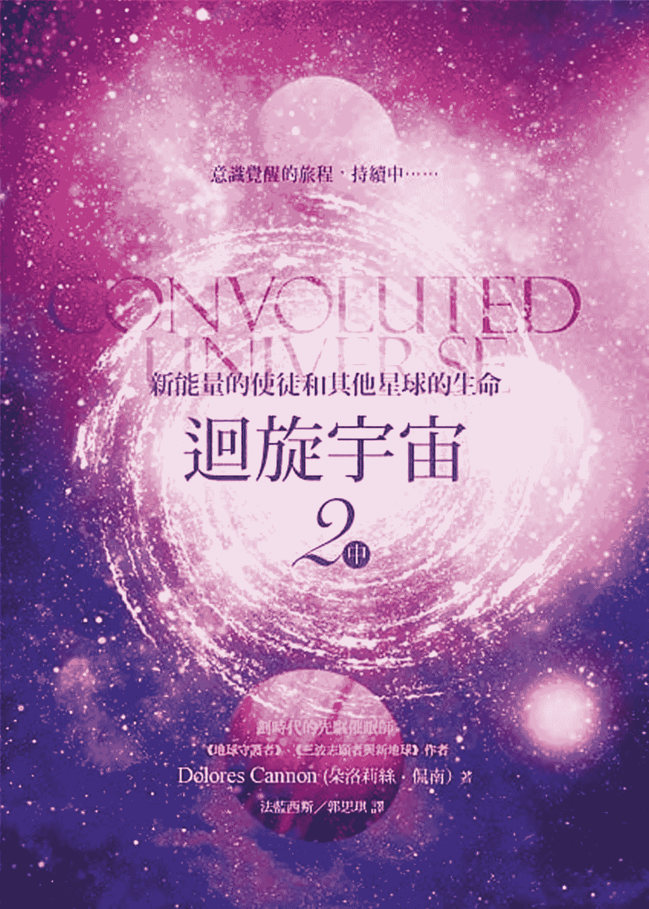
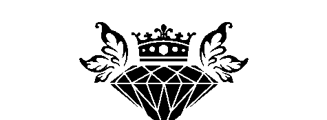
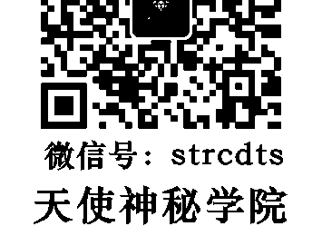
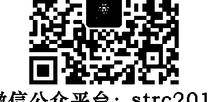

意識覺醒的旅程，持續中……

## CONVOLUTED UNIVERSE

新能量的使徒和其他星球的生命

# 迴旋宇宙 2中

劃時代的先驅催眠師

《地球守護者》、《三波志願者與新地球》作者

Dolores Cannon (朵洛莉絲·侃南) 著

法藍西斯／郭思琪 譯

## St. Royal College

## 天使神秘学院

- 专业占卜预测机构
- 神秘学培训机构
- 水晶能量研究中心
- 神秘学资料库
- 官方微信：strcdts
- 微信公众平台：strc2011
- 读书交流QQ群：
    - 占星塔罗占卜师交流群：814594478（加入密码：PDF）
    - 神秘学其他综合群：659338717（加入密码：PDF）

微信号：strcdts
天使神秘学院

天使神秘学院 院长QQ：715104687

微信公众平台：strc2011

## 制作说明：

本书由《天使神秘学院》出重金从台湾购入的原版书籍扫描制作完成。为达到最好阅读效果，特地把原版书全部切开后，再经由专业扫描设备高精度扫描完成，并经过一张张的PS后期处理最终成书，其间花费大量的人力、物力以及时间，只为能给大家提供经济并优质的神秘学学习资料而努力。

本学院强力谴责某些机构和个人，把本学院花心血制作完成的电子书籍，包装后直接放在自家淘宝网上低价倾销的行为，以谋取不劳而获的经济利益。如果长此以往最终将无人愿意再为大家花心思制作电子书，那以后可能大家再无新书可读。

为让大家以后能够读到更多的好书，也为了本学院的良性发展。本学院恳请大家尽量做到如下几点：

- 尽量在本学院的网站购买电子书籍。
- 请勿用技术手段把电子书内的水印及加密去掉。
- 在收到电子书后小范围传阅即可，千万不要公开传播，更别挂到淘宝网上低价销售。

同时为答谢广大支持者，学院电子书将做如下调整：

- 学院会把一些早已收回制作成本的电子书折价销售。
- 最新制作的电子书籍会开放打印功能，大家购买后有条件的可自行打印成书。

天使神秘学院
2019 年 1 月

### 園丁的話

藉由這本書的出版，我想先說幾件事。

- 對於大陸製作盜版和購買朵洛莉絲系列盜版書的人，我相信你們一定是對此類型的書有興趣，正在探索身心靈主題或是從事身心靈工作。也因此，我想提醒，在任何一個時空和宇宙，將心比心，不做傷害他人權益和違反靈性的事，都是不變的真理，而且惟有言行一致地落實所讀到的靈性法則和做人道理，才會有振頻的提升。
- 對於因此系列書（不論是正版或盜版）而認識並學習朵洛莉絲量子療癒催眠法的人（不論是學習正確的繁體中文版還是大陸的簡體版），只要是操作QHHT，以朵洛莉絲的名字為自己宣傳，就有義務遵從她的教導；請謹記，永遠以個案的福祉為先。切勿打著朵洛莉絲和QHHT的名義卻偏離她的教導，只圖自己的利益。你們都有責任維護朵老師和QHHT的聲譽。
- 網路上有不少所謂的外星文章和訊息缺乏可信度和正確性，有些說法甚至是刻意在混亂人類的正常心智。請留思想藉由製造恐懼，還有以外星名義斂財的療法和課程，那是居心不良者的旁門左道。為了你們的身心健康和荷包，請謹慎。不要把寶貴的力量給了他們。好好的踏實生活，誠實面對自己和他人，儘量讓自己活得開心，這就是你的靈魂和這個世界所需要的。

## 言歸迴旋宇宙。

如果，今天我們以一種跳脫文字表面定義的方式思考，不要認為地球進入下個次元是一個會在未來某個時候或瞬間發生的「集體」事件，（或者可以這麼說，「集體」不必表示全體一起，因為在同樣空間裡的許多次「個別」發生，必然會累積為「集體」或整體，而在人類的時間軸裡，一段長時間在其他次元也只是瞬間。）也就是說，新地球或地球進入另一個次元的發生或許不是在那麼一個集體的特定時刻，而是每一個人類各自的特定時刻。

那麼，不妨想像這麼一個可能。如果，這一世就是每個人在這個地球的最後一世，你這輩子的作為和頻率將決定你未來的去處，決定你是否會去（或者該說想不想去）那個較高頻率，沒有現今種種負面的新地球。

## 007 園丁的話

想想我們對所感受到的時間加速，還有顯化速度加快的可能意義。

想像一下，如果這一世是決定你能否進入新地球的關鍵一世，那麼，你會開始怎麼過你的人生？

讓我們好好活出那個最高善的自己吧。:)

## Contents 目次

圓丁的話    005

## 第三篇 進化的存在體和業力

第十二章 在睡眠狀態時工作    012
第十三章 遇見七位使徒中的第一位    053
第十四章 高度進化的存在體    095

## 第四篇 智者

第十五章 憶起智者
第十六章 尋找智者

## 第五篇 其他星球

第十七章 其他星球的生活
第十八章 紫色太陽的星球

## 第六篇 次元和時間門戶

第十九章 門戶的守護者

## 園丁後記

140 165

196 211

248

279

發覺很有必要聲明，對於體驗或學習朵洛莉絲的量子療癒催眠法有興趣者，請聯繫宇宙花園 service@cosmicgarden.com.tw ，以避免自行搜尋到違反朵洛莉絲教導，未以個案福祉為重或假冒 QHHT 之名者。

### 第三篇

### 進化的存在體和業力

## 第十二章 在睡眠状态时工作

这场催眠是二〇〇二年十月在佛罗里达州的克里尔沃特市（Clearwater）进行，我当时在那里为博览会演说。派翠夏是护士，也是协助临终病患和家属的安宁疗护工作者。开始催眠时，我并不知道她在睡觉的时候也继续她白天的工作——帮助灵魂过渡到死后的世界。不论是在清醒或睡眠状态，她都在帮助垂死的人，难怪她的职业带给她很大的满足。

当你做回溯催眠的时间跟我一样久的时候，你就会知道如何分辨个案的描述是否不同于一般的地球环境。个案下了云端所进入的前世场景可能会是一个城市、原野、沙漠、森林或花园等等，他们的叙述听起来正常，而且也经历跟疗愈这世有关的前世。

如果场景是在另一个星球、次元或者是灵界，线索将出现在他们的描述里，因此留心倾听非常重要。我向来是顺着个案所说，不会试图去更正他们的叙述或改变环境。他们的潜意识挑选了那个场景让他们去体验需要知道的事，因为会对他们这一世有所帮助，虽然我从不知道我们会被带往何处，但如果这有助于我的研究，我很乐意接受这样的安排。

派翠夏最初的描述听起来很正常，就像是在地球，但随着催眠的进行，显然并非如此。她下了云端，看见脚下有绿色山丘和蓝色的水，听起来再自然不过。当她的脚接触到地面，她说：『感觉非常舒服。这里很亮，非常、非常亮，但是是舒服的。这里看起来像花园。感觉像个花园，但不像必须有人照顾的花园。它就是自然天成。那边有条路可以通往不同方向。我在一个公园里，有绿色草坪，还有可以坐下来的地方。有美丽的树。水就在我前方。还有沙，是金色的。当我走动时，感觉就像我是这一切的一部分。我现在走在沙上面，但我跟沙不是分离的，我仍然是我。而且只要我想，我也可以走在水里而不被弄湿。』

喔，这听起来已经不像是普通的花园了。

派：这里到处开满了花。很美的地方。我在走路，可是感觉很不一样。就像是只要我想移动，我就可以移动。我只要用想的就能做到。毫不费力。

## 迴旋宇宙 2「中」

## 新能源的使徒和其他星球的生命

朵：那里有人吗？

她突然没来由地激动起来：“喔，我的家人就是在那里！”

朵：你说你的家人是什么意思？

派：这里感觉是我的家。（悲伤的口吻）我不想离开。

派：是的，很美。（她快要哭了，她开始安慰自己：）没关系，能在这里就好了。

这样的情形在我催眠时发生过许多，我在《地球守护者》和《迴旋宇宙序曲》里提过，个案来到一处不像地球的地方，虽然没有任何需要感伤的理由，然而一看到那里，情绪顿时涌现，他们感到极度忧伤和一股浓郁乡愁。即使他们对那个地方没有意识上的记忆，却有种回到家的强烈感觉；他们像是在漫长旅程后，来到了一个埋藏在心底的特别地方。再次看到那里，唤醒了他们所有失落与遗忘的感受。

朵：那个地方听起来很美。你刚才提到花园有很多路通往不同的方向？
派：是的，通往不同方向。我可以去任何地方，它们都不一样。（咯咯笑）很不一样。
朵：为什么不一样？
派：（大叹一口气，然后轻声说）为什么不一样？很难找到字表达。我们大家就一直都在那里。一切是它应该的样子。很难解释……我可以选条路或想个方向，也可以和这些人在一起，我们会一起做很多事。我们可以一起创造事物，或就只是纯粹地享受在一起的感觉，或是进行帮助别人的计划，因为这是个特别的地方。
我看到天空不一样，它有颜色，而且不同的地方有不同颜色。我来的地方的天空是金色的。我们可以选一条路到不同的……我们称为“邻近地区”，有点像那样。
我可以移动到不同颜色的特定邻区，而且会是自在的。其他地方我是因为要进行特别的计划才去。
朵：你不喜欢去其他地方？（我听出她语气的不同）
派：不喜欢，不喜欢。但我会去是因为我的颜色。
朵：什么意思？
派：因为我在金色里很自在。那是很愿意帮助、很有爱的颜色。我就是从那里来的。

朵：那里的天空是金色的？

派：我是从金色看出去，天空可以是我想要的任何颜色。

朵：你说你会被告知去其他地方进行特别的计划。

派：我是去执行计划的。我可以选择出任务。我不是被迫的。那是建议，我可以拒绝，但我没拒绝。

朵：那些地方的颜色不一样吗？

派：感觉不一样。不同地方，不同的能量，颜色也不同。我不喜欢较暗的地方。颜色较暗，能量较暗，也较沉重。我不太常去那些黑暗的地方。有些路只有某些人会去，因为他们的能量能够处理得比较好。但我如果选择去的话，我也是应付得来。

朵：所以也是有路通往那些比较黑暗的地方。

派：对。我们都会去适合我们的地方，去工作。这是我为什么来这里。我想跟较为轻盈的能量工作。（停顿）我找不到适当的字。那些能够处理较不谐和能量的会去别的路。较暗的路。我不喜欢去较暗的地方。我喜欢在家。

朵：你经常回去那里吗？

派：（叹气）是的，在我睡觉的时候。

朵：每当派翠夏的身体睡觉时，你能够回到那里？
派：是的。派翠夏，这个身体，我现在拥有的身体。我跟这个身体是连结的。

朵：怎么连结？
派：透过能量。能量进入身体，而这个身体可以容纳很多能量，因为我跟这个身体是连结的。

朵：你是说，晚上当这个身体睡着时，你喜欢回到那个地方？
派：我有时候会回去，有时候会到其他地方。我大多是在地球附近……工作。我做很多工作。

朵：当身体睡觉时，你做什么工作？
派：我帮助那些要回家的人（注：这里的家是指灵界）。帮助迷失的人回家。我在两个世界之间工作，帮助他们回家。那是我的工作。我能够支撑这两个地方的能量。金色光的能量对地球来说很强烈，因此我在这里协助人们承载金色能量，帮助他们通过这个能量回家。所以我一直都在工作。

朵：这些人不能自己找到家吗？
派：有些人不能。有的人害怕，有的人困惑，有些人甚至不知道有家。我指引人们家。

朵：你的意思是，当他们（指灵魂）离开了身体，他们会找回家的路？（是的。）不只是在晚上睡觉的时候，当他们要永远离开身体时也是。
派：没错。有些人很快就要离开了，他们在……我们可以说他们在“练习”，但更像是学习，因为（叹了口气）当很多人离开，那里会……嗯……不能说是“交通堵塞”，因为那里不像地球。但有很多人会离开（地球），所以如果他们知道道路的话就会容易些。
朵：否则那么多灵魂同时离开会很混乱？
派：没错。我们是在帮助人们学习怎么回家。
朵：我一直以为当他们离开了身体，回家是很自然的事。他们会知道要往哪个方向。
派：会有帮忙的灵魂。可是当人们是带着强烈的困惑或恐惧的能量离开人世，那个情绪体并不会马上消散。有些时候，他们就是没有看到回家的路。甚至在他们离开（人世）前就有协助的方法。我们可以称为演练，或是教导，也可以说是指引。
在哪里。有些人虽然知道有家，但他们害怕，他们胆小。他们不知道要往哪里找。但这对我很容易。即使我不进去，我也会带他们到入口，那里有别的人在等候他们。
这就是我做的事。

就是这么回事。

我在《生死之间》提到，当人们死后，灵魂会离开身体，开始它朝向光的旅程，这时会有“迎接者”迎接。我向来都假设这些“迎接者”是亡者已逝亲友的灵魂，或是那个人的守护天使，或指导灵。现在看来，这项工作也由仍在世的人（的灵魂）执行。这个工作是在我们晚上入睡后，灵魂出游时进行。至少派翠夏是如此。她说她的工作是引导亡者到达“另一边”的入口，在那里会有其他灵魂接手带引接下来的路程。这是因为只要派翠夏的银线仍与她的身体连结，她就无法执行全程。

朵：你知道他们是很快就要离世的人？（是的。）你怎么知道他们的大限已到？

派：因为那是他们的计划。他们不是都知道，但他们的高我是知道的。所以会有人跟他们工作，不是跟他们的物质体／肉体，而是跟他们身体连结的灵魂那部分，因为我们有许多层面的存在，有部分在灵魂层面，部分在物质世界和灵魂世界之间，也有部分在物质世界。有些人没有跟他们的灵魂部分连结，或者说他们并不知道有这个连结更为适切。因此我们帮这些人演练。那么当时到了，他们就知道有这个连结更为适切。因此我们帮这些人演练。那么当时到了，

派：道要如何移动。他们知道要如何感觉，也会知道要怎么感知灵魂部分。
朵：但他们不必走完全程，只是要让他们知道道路。
派：喔，没错。只是让他们知道道路，这样到时对他们会比较容易。他们有聚集的地方。
朵：你说聚集是什么意思？
派：这些人被带去地球附近属光的地方。有很多这样的地方。我们在做准备。
朵：可是你怎么知道他们的时间已到？你有被告知？
派：对，因为我和绝大多数人不同。我是志愿从来到这里，来做这件事。
朵：可是我们不都是从家过来的吗？
派：是的，我们都是，但是是来自不同的路。不是所有人都是从那条金色能量的路来的。
朵：这跟个人的发展有关吗？
派：跟你接受了了多少你的灵性有关，因为我们都有一样的灵性。没有哪个人比别人有更多灵性，是看你接受了多少。
朵：我以为回家是很自然的事。所以……当离开身体后，他们并不是都知道道路，知道要往哪里去。

派：没错。当发生时的情况混乱，或是那个人害怕死亡，或不想走，便会如此。因此我们会有“排练”。并不是跟到时情况一模一样的排练，而是让他们事先看到，这样到时就会比较容易。

朵：如果那个人的意识不想在那时候离开呢？可以改变心意吗？

派：不是都可以的，不是。有时可以延后，有时或许不行。要看是什么合约。有的合约涉及许多人参与的特定事件或情况，那么就不能改变那个合约。有些合约则可以有别的时间和情况的可能性。这要看合约。

朵：你也知道人们向来都不想死。（没错。）所以即使灵魂知道计划，但人类身体还是会想紧抓着生命。

派：是的。但有时候这没得选择。意外、灾难，或甚至像中风、心脏病发的个人事件，很多时候是不能改变的。那样的事件在他们的合约里。

合约就是当你还在灵界，还没再次进入身体前所立的协议。《生死之间》对此有更多说明。

派：你刚才提到有好多人会一起离开？

朵：感觉起来是这样。（叹气）我去年（西元二〇〇一年）在九一一事件发生前就有这个感觉。那时有很多存在体在这里，但我不明白是怎么回事。地球上的我感觉到了，我感觉有很多很多存在体来帮忙。不寻常的多。我那时感觉到这些灵魂帮手在这里。我感觉他们在帮助人们。我现在也有这样的感觉，我感觉会有更多灵魂帮手过来。

派：你是说由于死亡时的困惑，他们想指引这些罹难者往正确的方向？（是的。）要不然那么多人离开一定会很混乱？

朵：是的，有太多……惊恐的能量。当时有很多灵魂在这里帮忙。

派：你那时候也有帮忙吗？

朵：（轻声）是的，我有。

派：会不会有些人并没有事前排练？因为事情发生得那么突然。

朵：每个人都在另一个层面都知道自己的时间到了？

派：所有的人都排练了。

朵：是的，所有的人都排练过了。这是为什么那些必须在灾难现场的人会在那儿，不

朵：所以有奇迹式地逃过一劫的故事。
派：没错，那也预先排练了。有的排练是为了那些在当时不该离开的人。目前有很多可能性（指未来），我并不想看到这些可能性。

★ ★ ★

二〇〇四年我收到一封原出处不明的电子邮件，我认为很适合放在这里：

九一一之后，有家公司邀请在双子星大楼攻击事件中存活下来的其他公司的员工与他们一起共用办公空间。在一次早晨的聚会，安全室主任告诉大家幸存者的故事。

所有的生还者都是因为一些很小的事情而幸免于难：

- 公司主管那天迟到，因为他儿子的幼儿园那天开学。
- 另一个同事之所以能够生还，是因为那天正好轮到他去买甜甜圈。
- 有位女士那天上班迟到，因为她的闹钟没响。
- 有个人迟到是因为纽泽西收费公路有一起车祸事故，他就塞在那条路上。
- 有个人错过了他每天搭的那班公车。
- 有个人因为食物溅到了衣服，她必须花时间换衣服。
- 有个人的车子就是怎么也发动不了。
- 有个人折返回去接电话。
- 有个人的小孩出门前东摸西摸，拖延了原本该出门的时间。
- 有个人就是招不到计程车。

最不寻常的故事之一是某人那天早上穿了新鞋去上班，途中转了巴士又搭地铁，
但就在快到办公室时，他的脚起了水泡，于是他去药局买OK绷。这就是他今天还活着的原因。

现在每当我塞车在路上、错过了电梯、折返家去接电话……遇到所有那些令我心烦的小事时，我会在心里这么想：这就是老天要我在当下所在之处。

下次当你的早晨似乎不顺遂，你的小孩慢吞吞的，你找不到车钥匙，所有红灯都被你遇上时……不要抓狂或感到沮丧。
老天正在看顾着你。

愿老天继续以这些恼人的小事来庇佑你，也愿你记得这些小事背后的可能意义。

（对我来说，上述情形听起来像是生还者的排练。）

- ★
- ★
- ★

朵：你说明年会有很多人离开？（对。）这只是许多可能性之一，还是确定的事？

派：我说的那个发生的事件……去年（二〇〇一年）的事（指九一一），是先在我们所称的“乙太”层面发生，然后进入物质层面。现在在以太层面有很多事件，有些大，有些小。有很多不同的可能性，连我们这些目前跟可能性工作的人也不知道哪一个会显现在物质世界。因为现在的时间是……我现在看到一个圆圈，就好像所有一切都被含括在这个光的圆圈里。它代表整体，神性，灵魂。它代表万有一切。在那里有很多可能性，我们不必现在知道。我感觉我们正做出改变。不是所有可能性都会显化。我现在不去理会了。感觉舒服多了，因为之前想这个问题并不好过。

## 第十二章 | 在睡眠状态时工作

朵：如果你是在帮人们为明年的事预做准备，若情况改变了呢？因为有那么多可能性和机率。

派：这就是美妙之处。我们协助人们一点一点地看到更多的光，了解他们是谁，因此当时间到了，他们不会害怕。也因此不论发生什么都没关系，因为他们认识自己真实的光的时刻一定会到来。他们将进入更伟大的扩展。因此到时是怎么发生的并没有关系。协助人们的那部分的我知道这点。我们有很多不同的方式进入那个更伟大的光。我们会去那里。我们很快都会到那里。

朵：多快？是指最终吗？

派：很快……这一世肉身后。

朵：可是每个人这一世的生命长度都不同。（没错。）

听起来她有可能是指扬升到另一个次元，也就是当我们身体的频率和振动改变了，我们会变成纯粹的光。这件事在我的许多催眠疗程都提过。本章和后续章节会有更完整的讨论。

派：稍早前你说可能会有灾难发生，很多人会在灾难时离开。

朵：那是可能的。不同的门径会打开。虽然很难说是怎么开的，但会以不同方式开启，这要看我们需要它们怎么打开。会有很多选择要做。

派：可是灾难的发生会使更多人同时离开。

派：没错，但届时会有开口和路径，会有很多人能够通过光（到另一个世界）。就像走在我家的路上一样。

朵：那些困惑而不想离开的人呢？那些不了解发生了什么事的人会如何？

派：他们的身体已经死了，但有时候他们并不知道，因为他们的能量体依附着肉体，他们以为他们还在肉体里。他们感到困惑，不知所措。但会有很多灵魂帮助他们。

朵：我们帮助这些人的方法是送出能量拥抱他们。当我们的能量拥抱他们时，他们感受到平静自在。由于他们之前有过这样的感受，他们会注意到。虽然他们的能量很混乱，但他们开始感受到这个舒缓的抚慰，因为他们的灵魂感受过，因此会注意到这样的感受并了解是怎么回事。所以我们的工作是在帮助这些人。灾难时的能量很混乱，就好像所有的振动都开始不安起来，因此你必须带入安慰和舒缓的能量，让他们感受到抚慰并减轻能量的混乱。那些过程中没那么困难的人，他们的心是平静的，他们跟内在灵魂是连接的。会有更多的人前来（协助）。这就是我们在做的事。这是我们为什么跟你们工作，他们自己的灵魂就是途径，他们透过自己的灵魂到达更高的振动。这样他们就能平静地回到家。

朵：人们被他们的文化和教育影响。

派：这是我们 的部分课题。以不同 的方式学习。

朵：你刚刚也说到其他的路是别的计画。这是你的计画，那 广其他道路是什么计画？

派：他们是这 想没错。但我们全都是爱。只是我们人类这部分很具可塑性，很容易被操弄。就像黏土。有时人们会变成他们不是的样子，那 广他们就很难看到回家的路。

朵：他们认为那个光是不好的。

派：有时候会。这是为什么会有恐惧（注：指人们在世的信念和信仰的教条带来恐惧），那些有愧疚的，觉得自己有罪的，那些害怕他们所称的「上帝」的人，他们因为羞愧，在过程中感到害怕。他们被教导要害怕死亡、害怕地狱，这使得他们不敢拥抱光，而光就是爱。爱才是主宰，而爱就在家里。

朵：那 人们的信仰体系呢？而且信念不是在某些方面会妨碍这个过程吗？

派：呢？

派：(叹气)那些人……存在体……(不确定要怎么说)，如果你用石膏包住一个东西，然后等它乾硬……里面是美丽的宝石，但被灰暗、难看的石膏包覆住了。这就是那些人的写照。他们不知道自己内在的美丽，他们以为自己既黑暗又丑陋。我们有伟大和满怀爱心的存在体在帮他们。那个计划跟我我在这里进行的工作很不一样。

朵：那些能量是属于仍在肉体世界的人，还是他们死后的能量？

派：不，他们不在这个你所称的地球。

朵：他们在哪里？灵魂世界吗？

派：对，那里也是属于能量的地方。一切事物都是能量，但那里的振动跟你们的不一样。那里的能量很稠密，甚至比这个星球还稠密。

朵：那些灵魂做了被认为是负面的事吗？(是的。)所以他们才在石膏里。可以这么说吗？

派：没错，是这样的。因为他们很喜欢负面的事。伤害人，或是做会让别人感觉不好、让别人看不到光的事情。他们喜欢黑暗。所以那是他们的道路。他们会一直这样，直到他们改变。

朵：要帮助这类灵魂的存在体必须要有很有耐心才行。

派：要有大爱和光。

朵：还有奉献精神。（没错。）那些负面灵魂会被允许轮回吗？

派：不行，现在不行。不行。

朵：有人告诉我，这类灵魂如果轮回会把那样的负面带回来。

派：没错。他们现在并没有轮回转世。他们尤其不能来地球，但他们也不能去其他地方，因为这是项长期计画。转化必须要发自内在。那些伟大的光的存有和他们在一起，那些光体闪耀着光。他们（指负面灵魂）必须经历这样的黑暗，这需要时间……不是时间，是振动的改变。这是发生在别的地方。他们不能在这里（指地球）。有些现在还生活在这里的，可能之后会去那个地方。我们就要来到那个点，从那里我们会移到另一个地方。到了那个地方，大家又会依各自的振动，依各自的能量到不同的地方。有些人也许必须去那个黑暗的地方。

朵：因为他们在地球上所做的事？

派：对。要去的不是很多。

派：但这就跟业力有关了，不是吗？

派：是的，跟业力有关了。我们是可以这么说，但那其实是他们的能量。那不是惩罚，因为他们会想去那里。那是他们觉得自在的地方。

朵：他们不是被迫去的，并不是像教会教我们的那样？

派：不是，是他们想去。那不是惩罚。

朵：他们想要在黑暗的地方。

派：喔，是的。可是他们仍然有他们的光，因为我可以看到他们内在的光。光一直在，但被灰泥掩盖了，而他们以为他们是灰泥。

朵：但他们不会再回来地球了，因为地球在改变。

派：没错。这是为什么他们不能再来了。事情已经有太多变化。他们看不到光，他们看到的是黑暗。可是透过振动的改变，透过这些伟大灵魂愿意帮助他们，他们开始允许内在的光闪耀。而当内在的光与外在的光连接，黑暗就消失了。不过这需要时间，不论需要多久。当他们内在的光再次闪耀，他们就能去别的地方，而且可以一再的去，让他们的光派上用场。因为这一切都跟发挥光有关。我们除了来地球，也会去别的地方。我们在这些地方来来去去。现在地球已经快要到那个圆圈开口的点了。这都是能量（的关系）。那是一个不同的地方。不同的能量。那是……我们来看看（试着在寻找适当用语）。那不是家，可是它像家一样。家就是我们所来之处的能量。

朵：最初的能量。

派：是的。在地球这个星球有很多不同……层级（不确定是否是正确的用字）的能量。 人们的能量将被重新定向。重新定向。因此会有些人所选的路是去不同的地方，那是他们感到自在的地方。

朵：所以不一定是回家，而是去其他地方。

派：没错。而有一些会回家，像是那些来帮忙的，因为他们去别的地方并没有意义。 他们来此的唯一目的就是帮忙。这也是我的目的。

朵：这些灵魂会回家。（是的。）但其他的到了死后世界会有不同的目的？(沉默)你说地球快要到圆圈开启的那个点了。

派：那将会打开不同的通道，不同层级。人们将去他们觉得自在的地方。当他们的时刻到了，他们会在那里做出其他选择和决定。

朵：这都要看他们在世时的行为吗？（是的。）所以这也牵涉到业力。

派：对。业力表示平衡能量。没有人需要被惩罚。我们现在是在宇宙一处非常特别地方的一个非常特别的计画里……感觉这个计画会很有收获。

朵：我向来觉得每一个人在每一世死后就会回家。他们会去你描述的地方。

派：对，但家对每个人来说是不一样的。对某人来说的家跟其他人的家并不同。虽然都一样是（灵界的）家，但是在不一样的层级。这是我的意思。

朵：所以你之前说有些人会看到、被带到别的路。（对。）回家和回灵界并不一样。

派：他们先去灵界，然后他们会选择去别的地方。这个星球是去灵界（译注：指非实体的精神次元）。

朵：整个星球？

派：某方面来说是的，因为地球将觉察到本身的较高振动。

朵：对，我听说过。他们说地球本身的振动，地球的频率正在改变。

派：是这样没错，这是为什么我在这里。还有很多存在体也在这里，因为有很多不同振动频率的人在这个星球。很多灵魂来这里帮忙。

朵：我听过这整个星球将有灵魂大规模的迁移，是真的吗？

派：我看到的是这样。

朵：但有那么多不同振动频率的人，执行起来会很困难吧！

派：所以才有那么多条路。知道吗？那就是通道，看起来像是圆圈，而开口就是在那个圆圈。当到达开口时，他们会进入圆圈，但各自前往圆圈里不同的地方，进入不同的路径。每个人都会到他应该在的地方。在地球周围还有另一圈存在体，他们都是美丽的能量。他们是协助地球层面的美丽存在体。他们不是我们的天使，他们是我们所称的『已扬升的存在体』，他们已经历过这些，他们已经通过了这些能量，他们现在正在扩展他们的能量做为我们的通道。他们就是我稍早提到的存在体。

现在是我为派翠夏询问她的问题的好时机。我知道我不必请潜意识出来，因为从催眠一开始，我就一直在跟她那个知道所有事情，具有所有知识的部分在交谈了。

朵：派翠夏提到她在冥想时一直看到金色和白金色的存在体。他们就是你说的在帮助地球的存在体吗？

派：我看到很多不同的存在体环绕地球。许多不同颜色的振动。我看到蓝色、白色和紫罗兰色，还有金色、银色和白金色，这些全是充满爱的能量，他们都是来这里帮助我们的。不同的颜色协助那些跟他们振动相同的人。

朵：所以我们都有不同的颜色和振动？

派：颜色就是振动。

朵：这些存在体被不同的颜色吸引？(对。)所以这些灵魂帮手跟天使并不一样？

派：没错，不一样。天使也跟我们在一起，但这些灵魂不同，因为他们了解我们的经历。这些灵魂有很多都经历过这个过程，不论是在这个物质世界或其他类似的世界。他们了解要穿越／通过不同频率的层面是怎么回事，这就是他们在协助的事。

朵：如果像你这样的保护者或灵魂帮手是来帮助人们，那他们的目的又是什么？

派：他们来帮助我们，帮助灵魂帮手。他们就像是降低能量的能量变压器。地球上有很多人无法承受或感受到这些伟大存在体的能量，但有人可以做为中介，所以我们就是这中介者。

朵：当派翠夏进入这一世时，她知道她将要做这些事吗？

派: 不，派翠夏不知道。派翠夏的灵魂知道。

朵: 是的，肉体层面是最后才知道的。

派: 对。派翠夏把自己封闭起来，这样她就不会知道。她经历了许多事，终于必须站出来告诉自己：『好，我不再封闭自己了。』她也跟金光连结了。那是她的能量。

朵: 但身为人类，我们在意识上并不知道自己所订的协议，也不知道这些连结。

派: 是的。但她感受到灵魂家族。她也知道家，她非常清楚。有时候她想回去。她曾强烈渴望回去，想要离开这一世，但她怎么也无法自杀。

朵: 因为我没有合约，不是吗？

派: 是的，她也知道她必须在这里。有事要做。所以她留下了。而她终于对自己是谁有了真正的了解。她在关系上的许多问题都是因为合约的缘故。

朵: 是怎样的合约？

派: 如果她做那样的选择，会是很辛苦的路。那是个选择，她并不是非得那么做，但她选择了。

朵: 你的意思是有选择的，而她选了比较困难的那条路。那么另一条路是什么？你能看到吗？

派：可以。我想她年轻时就会死了。

朵：你为什么这么认为？

派：因为……这很复杂，但该是她知道的时候了。我必须找到适当的用语。如果她选择了容易的那条路，她的肉体生命就无法得到必要的知识去帮助这么多人。接受困难的道路使她学到很多经验和知识，许多人因此能够受益。她不是一定要这么做，她可以只从另一边的世界协助。从家里。某方面来说，这很好笑，因为她一直想要回家，而她就是在帮助灵魂回家。那是她的工作。

朵：而且她在晚上真的有回家，虽然她不知道。

派：对，她会回去。她的身体承载那么多能量，有时会很辛苦。虽然她很健康，她必须小心照顾自己，因为她的身体承载太多能量了。现在她更要小心，尤其能量的振动越来越高。我现在看见她的身体充满金色的光，正转成金色的能量。她可以做到的，她将会承载越来越多的能量，转成更多更多金光，她来自的地方就是金光。随着肉体承载越多金光，她能帮助更多人移向金光；帮助那些选择这条道路，也就是选择金光高速道路的人。现在已经接近尾声，快到最后时日了。

朵：你说「最后时日」是什么意思？

派：我们就快要到圈里的那个地方了，我们将从那里各自到不同的去处。

朵：你说当她的身体在睡觉时，她在灵魂层面协助那些将死之人，帮助他们过渡到死后世界。（是的。）她在实体世界也是安宁疗护工作者。

派：她做了很多事。她可以感觉到两边的世界。她向来都能感受到这两个世界。

朵：这为什么她对安宁疗护的工作感到自在？因为她睡着时和另一个世界的连结？

派：喔，是的。她很高兴能帮助人们回家，因为她知道回家有多美好。

朵：这是一一定的。在灵魂层面工作比较容易，是吗？

派：是的，对她来说比较容易。

派：因为当你在实体世界帮助即将临终的人，你会遇到肉体的干扰——我想说的是肉体上的设定。

朵：人们会感到恐惧，在实体／肉体层面有很多恐惧。她就是在帮人们克服恐惧，因为她自己并不恐惧死亡。当人们和她在一起，他们感受到她的真理，因为她很真实，那就是她。她连结爱的能量。

朵：这样她就能更有效率地帮助人。但她在地球曾有过其他转世，不是吗？（沉默）因为你说在她以派翠夏的身份在地球生活的同时，她也存在于灵界。

派：感觉是这样没错，但实际上不是。部分的她有过其他人世，但派翠夏没有，派翠夏是她灵魂的其他部分（译注：此为「超灵」的概念，可参考《超越线性时空的回溯疗法》一书）。

朵：可是我们认为这就是转世。

派：是的，某方面来说是这样没错，但是是不同的。（她努力在找适当的字）她的灵魂拥有许多许多具有重要灵性意义的转世生命。那些转世生命带给她灵魂那些世的能量、知识和收获。因此现在是派翠夏的这个部分，携带了自那些人世所获的各类经验。她必须记得她一直是和家人相连的，她一直与她的家人（指灵魂家族）连结，而且她是被珍爱的。

另一场二〇〇二年十月在明尼阿波里斯（Minneapolis）的催眠也有类似内容。我当时在明尼阿波里斯进行一系列讲座和工作坊，结束后就要立刻飞往澳洲和新西兰。

这次催眠的主角是一位退休老师，我称她为艾达。

如同我说过的，通常我的方法是请个案去一个自己选择的美丽地方，由此展开视觉画面，然后我会说完导引词，包括带引他们走下云端。在艾达的这个案例，她并没有让我完成导引。她当时形容她看到的美丽地方，但听起来不像是在地球。在我还没意识到她并不需要接下来的导引词之前，她便已进入很深的催眠状态，而且开始在叙述了。这种情形偶尔会发生，我也已经学会要如何分辨并继续进行。我打开麦克风的

艾：到处都有美丽的光体在走动。这里只有爱。好美、好平静、好和谐。我就是从这

朵：你说有个花园？

艾：喔，对。好美的花园，闪耀着上帝的金色光芒。它有明亮的光，还有全然的平静、爱与和谐的频率和能量。花园里有美丽的金色喷泉。看起来像水，但流动的是上帝的本质。纯然的美、爱和喜悦。

艾：我们都是光体。我们以本质和振动频率来辨认对方，这里不用语言沟通。我们不用说话。我们用振动来传达和接收想说的话。这里就是我来自的地方。这里是全然的喜悦、平静与和谐。我在睡眠状态时会回到这里。我和议会见面，讨论我必须在地球层面做的工作。

朵：这个议会在哪里？

艾：也在这个星球。我们在这个美丽的花园会面。

朵：这是发生在你睡觉的时候。

艾：是的。在我睡眠状态时的频率。虽然我的肉体和心智不记得，但这是一直发生的事。我在睡眠状态时也会去工作。我们检视我在地球层面跟各种生命体的互动。

每当哪里需要帮助，我会被引导并被指示去做我必须做的工作。

朵：你帮助和互动的人是你认识的，还是……？

艾：有些人我认识，有些不认识。

朵：你在晚上跟这些人见面都给他们什么指引？

艾：我在很多层面跟他们合作。我跟他们的心灵合作，灌注他们思想模式，好让他们在日常生活有所改变。我也疗愈他们，我运用疗愈的频率和能量帮助很多人。我也到战区协助伤患。我帮助痛苦中的人。我在阿富汗做了很多事。（二〇〇二年）那个国家有好多创伤。不只是在那里的美军和维安部队，当地人民也是。他们不曾有过那么多炸弹从空中落下，对土地造成那么大的伤害与破坏。那里彻底被蹂躏了。但大半情况都没被你们的新闻或媒体报道出来。

朵：我相信。我们并不是真的明了那里的状况。

接下来的催眠预测了隔年二〇〇三年在伊拉克爆发的战争，内容非常正确，但我还没决定是否要放在这本书里。这章探讨的是我们在睡眠状态时所做的工作，而我们的意识并不知道；我只想包括与此相关的内容。无论如何，我们被警告会有很多人在战争中死亡，像艾达这样的人在睡眠状态时会非常忙碌，因为他们要引导亡者前往正确的方向。

★
★
★
灵界有很多学校，这部分在《生死之间》讨论过。最高阶的学校位于智慧殿堂，那里可以学到所有已知和未知事物的学习大大会堂。亚伦·艾伯拉韩森 (Aron Abramsen)所著的《天堂假期》也提到这些地方。很多灵界的老师都是高阶的灵体，他们已经完成业力，不再需要回地球学习更多课题。他们可以教导并训练他人。通常成为灵界指导者的训练是开始于灵魂离开地球层面之后。指导者和长老看过那个人的生命回顾后，决定他是否已准备好升级。然而，地球上的事物正在快速改变，因此训练也必须随之调整。现阶段的地球有许多问题，因此有很多进化的灵魂投生于此。他们并不是来此处理自己的业，而是要帮助仍在物质界域的人。当然，他们在意识上并不知道自己是因某个特定目的而被派来地球的进化灵魂，但我在催眠时遇到越来越多这样的人，他们的潜意识也不再犹豫地告诉他们，他们有工作要做，他们最好开始进行，不要再浪费宝贵时间了。我早期的催眠个案在出神状态下并没有提及这样的事，但现在几乎每个个案都会提到。潜意识强调时间越来越不够了，个案必须着手进行他们志愿来此的工作。由于很多进化的灵魂已经回到地球层面，有些灵魂训练是在睡眠状态时进行。这些灵魂接收的某些训练是帮助即将经历死亡过程而离开地球的灵魂。这些在睡眠状态工作的灵魂会有更具经验的引导者从旁协助。直到他们有了足够的训练或经验，或自信能够处理了，他们才会被派独自工作。他们的主要工作是引导离世者往正确的方向前进，而且不再困惑，好让更有经验且适当的「迎接者」接手之后的事。此外，这些协助者不能超越某个点，除非他们离开人世身体的时间已到。

我在工作中发现我们真正的部分——我们的灵魂或精神体——从来不睡觉。身体是那个会累和必须睡觉的部分，灵魂则没有这个需要。我总是说：「灵魂对于要等待身体醒来继续生命感到无聊。」所以当身体睡着时，灵魂自己会进行许多不同的冒险。灵魂能旅行到世界的任何地方，或去灵界跟指导灵、大师和长老谈话以获得更多资讯，他们也会上课和受训。我有许多读者跟我说他们梦到自己去学校上课，我向他们解释这很可能是因为灵界是灵魂最喜欢一去再去的地方。灵魂也能到其他星球或别的次元。一般说来，意识对这些旅行并没有记忆，除非记得梦到飞行或是到了不熟悉的地方。这跟灵魂出体的体验是同样的，我们可以训练自己灵魂出体并记得出体的经历。当灵魂在肉体生命时，它跟身体以一条银线连接，这条银线在你活着的时候就像栓绳一样把你跟身体连接在一起，直到身体死亡后才会断开。这条银色脐带在肉体死亡时被切断，灵魂便自由了。魂便被釋放回「家」。當靈魂在晚上離開身體時，它一直都是跟這條臍帶連結的。當身體必須醒來繼續它的生命時，靈魂會感到銀線的拉力，於是被「捲進」身體，靈魂在那一刻回到身體，接著身體就會醒來。許多人跟我提過有時在將醒時經驗到的奇怪感覺，那個感覺也會發生在身體即將睡著的時候。他們說他們會暫時癱瘓，這讓他們很害怕。有位女士說她的醫生告訴她，這是一種稱為「睡眠窒息症」的嚴重情形，然後收取一千七百美元進行睡眠測試。事實上這一點也不複雜，它只是偶爾會發生的自然現象。當靈魂離開了身體，身體功能的運作便由大腦的另一部分接管，就跟自動駕駛一樣。靈魂回來後，大腦和身體的聯繫需要重新連結。假如身體醒得太早，在與大腦的連結尚未完成前醒來，身體會暫時感覺無法動彈。我曾調查過一些案例，睡著的人在靈魂還沒完全回到身體前，就被環境裡的突然噪音給吵醒，這時如果他們能夠放鬆幾分鐘，一切都會回復正常。這個現象也會發生在靈魂剛離開身體的時候。這顯示靈魂和身體雖然確實是分開的，但也是一體。身體如果沒有內在的生命火花就無法生存；然而靈魂或精神體沒有身體也能存在。死亡時，靈魂離開身體，而靈魂與身體的連結一被切斷，身體便開始毀壞。沒有了靈魂生命，所有的身體系統功能便被關閉。而當銀線在身體死亡時被切斷，靈魂也就無法再回到身體裡。這次的催眠療程一如其他的催眠，讓我們看到「真正」的自己，也就是靈魂在身體進入睡眠狀態時，不但會去旅行和探險，也會執行工作。顯然我們對於自己在星光體狀態下做的許多事都完全沒有意識。就如我在某次的催眠療程被告知的：「這些事無論如何都會發生，你控制不了。它們是你們沒有覺察到的那部分的存在，你無法對這部分做什麼，那是很自然的事，因此你也無須擔心。」輪迴和其他形上學的概念也跟這個道理一樣，不論你相信與否，它們都會繼續發生。我被告知我們永遠也不會完全了解這樣的複雜性。不可能。無法了解的問題是出在心智，不是大腦。是心智。人類的心智就是無法理解全部的概念。也因此，這些浩瀚知識向來是一點點碎片式地提供給我。隨著時間過去，我們似乎被允許知道更多，而且也努力去理解。然而，這就像是透過時空之牆的一個小裂縫去窺視一樣，我們被允許看到的，只是全貌裡一個非常微小的部分。

- ★
- ★
- ★

當靈魂選擇回到地球，開始另一次在肉體的人類生命循環時，它是帶著這次想要完成的計畫而來。靈魂已經和長老和大師見過面，仔細檢視過之前離開的那一世，並據此做了決定、計畫與目標。它和有業力償還關係的相關靈魂達成了協議，有了那些靈魂的同意，它就可以解決特定的事並學習特定課題。靈魂帶著包裝得像聖誕禮物的理想計畫回到地球。問題是，這是一個有自由意志的星球，這就是為什麼地球這麼具挑戰性。所有的人都帶著自己的小計畫來到地球，但也因為自由意志，這些計畫、希望和恐懼有時會產生衝突。此外，當靈魂進入肉體，這些最初計畫的記憶便被抹去，只有潛意識記得。有一次我問為什麼我們無法記得？如果記得的話，不是一切就容易些了嗎？我被告知：「如果你知道答案的話，那就不是測試了。」於是我們來到地球，認為自己已經準備好要面對橫互在朝向目標、夢想和抱負的挑戰，然而我們常常不像自己所想的那麼準備好了。從「另一邊」看來，總是比較容易。而當我們實際過著令人沮喪的肉體生活時，我們困陷在人類的各種日常事務。但願我們都能解決問題，通過地球考試而順利晉級。如果搞砸了，我們就必須重新來過。在還沒完成這次課程並通過考試前，我們無法升級或是到下個年級。你可以在这个地球學校留級，但你不能跳過學級。學校的規矩和規定雖然嚴格，學校教師也很嚴厲，然而這些教師也非常仁慈、公正，並且很能體諒。

正如我們帶了計畫來到人世，我們對於如何離開也有計畫。每個人在進入人世前，就已決定了要如何離開，而且決定時並不帶任何情緒。你們也必須如此理解。意識層面並不知道這些計畫；也許不記得是明智的。人們總說他們不想死、不想生病、不想離開所愛的人，他們會強烈否認是自己計畫了死亡。但這全都是計畫的一部分，而這個計畫遠超我們的知識與瞭解。因此，要以我們人類受限的心智來看這件事的唯一方法，就是要放下所有情緒。

靈魂決定離開身體的時間有著各種不同的原因。一個原因是它已完成它的目標和計畫，並處理了這生所需解決的業力，它因此沒有繼續人生的需要。在另一些案例，靈魂認為如果自己不是他人的負擔，他人就能進步得更快，在這樣的情形，靈魂會決定放棄自己更進一步的發展，好讓太過依賴他的那些人可以獨立，換句話說，可以「長大」。這些原因通常不是那麼顯而易見，但在深刻省思後可以得知。

另一個有趣的情況是有些人的生活被一連串事件給卡死了，要轉變現況以完成他們的目標已經不可能。也許他們未能達成人世目標是因為透過自由意志做了不適當的選擇，而他們決定以死亡來脫離這個情況，然後重新來過；希望下一回不再困陷於同樣情境。

對於上述情況，有個有趣且較適當的選擇是以另一種方式「死去」。假設某人因受困於一連串事件而無法完成此生的目標，但選擇死亡再轉世重新來過會太浪費時間，也或許所需要的實體條件在另一個時間線不會存在。與其死去，他們決定以另一種方式創造生活裡的死亡——透過失去他們所珍愛的一切，尤其是他們擁有的物質財產。這也可以讓他們因此專注在生命裡真正重要的事上，而真正重要的，並非擁有的財物，不論他們握得多緊。由於原本擁有的一切都被拿走，他們就能重新來過，開始朝生命中的真正目標努力，去做他們來此真正要做的事。他們因為變得太專注於物質世界，因此一切要被拿走才行。沒有了這些物質干擾，他們就能朝正確方向前進。這樣的事件曾發生在我的家庭成員身上。透過一連串超乎他們所能掌控的奇怪境遇，他們失去了跟物質有關的一切事物；房子、生意、工作和所有財物。當時看來就像是殘酷的命運或上帝的懲罰，實在難以理解。然而時間證明了那是催促他們前往另一個方向的方法。他們原本就該往那個方向，卻被困在另一種生活方式裡。

人們說，當一扇門關了，另一扇門就會開啟。在這個案例，門不僅關了，而且還是被狠狠關上。他們別無選擇，只能走向另一個方向。沒有回頭路了。許多時候，看似災難往往是偽裝的祝福。有位個案的例子也顯示了另一種極端的解決方法。在訪談時，他告訴我發生在他年輕時的可怕事件。他在一個大城市的小巷裡被歹徒猛刺多刀。他後來努力爬到街上，被人發現並送醫。他差點死掉，在醫院好一段時間才復原。他來找我催眠的原因之一，就是要知道這個可怕經驗的目的。為什麼會發生這種事？當我問潛意識這個問題，答案出人意料。它說：「喔，那是一群志願要幫他的朋友。」我納悶，有這樣的朋友，誰還需要敵人！這不像是朋友會做的事。潛意識解釋，這是從「另一邊」精心策劃的事件。這個人的生活已經走偏，如果不採取激烈的行動反轉人生，他便無法回到正軌。它們一直用許多微妙方式企圖引起他的注意，當這些都徒勞無用時，它們安排了這次的攻擊。是的，這樣的方式很激烈、戲劇化，並且難以解釋，但這顯示宇宙會盡一切方法來扭轉某人的人生，而不用他們離開肉體生命。如果連這個方法都無效，可能才會是死亡吧。一旦靈魂決定離開肉體的時候到了，它便會安排死亡事件。我的回溯資料裡有個有趣的論點：醫療體制是今天我們世界的問題之一。如果有人在醫院裡瀕臨死亡，醫生通常會用所有可用的儀器去維持他們的生存。而他們的家人也不願意他們死去，即使身體已經失去功能，無法支撐生命，而且再維繫下去也沒有意義。因此最快速、最簡單，又最不會被干預的死亡方式，就是死於意外或自然災難等事件。有些離世的方法被稱為「不尋常的意外」，因為非常離奇古怪。我向來相信，如果某人離開的時候到了，就算他是坐在家裡客廳，該發生的還是會發生。有些死亡事件就是飛機或汽車撞進民宅所造成。

二〇〇三年年底，在我撰寫這本書時，伊朗的巴姆城（Bam）發生大地震，死亡人數超過四萬一千人。在本書即將付印前的二〇〇四年聖誕節，印尼海岸發生可怕的九點三級大地震並引發海嘯。根據最新統計，有將近二十萬人因那次海嘯離世。大約在同樣時間，世界的另一端也有多人喪生於土石流和山崩。就如本章先前提到的，人們常常決定一起離開。這些都是在意識層面決定與安排好的（或就如派翠夏所說的，「排練」）。那些不該死亡的人也會有奇蹟式地逃離災難，或是不會出現在災難現場的安排。許多人就曾經剛好錯過班機，或是最後一刻因飛機客滿沒能搭上，或因一通電話而耽誤了出門，後來才發現他們因此逃過一劫。我也相信，我們的守護天使在這一切扮演著重要角色，他們忙著以暗示，或用出現在我們「腦袋裡的聲音」來向我們示警。

有時他們保護我們的方法也不是那麼隱約。我們必須學習多注意我們的直覺才是。

## 第十二章 | 在睡眠狀態時工作

### 第十三章 遇見七位使徒中的第一位

這個催眠是二〇〇二年七月，我出席英國格拉斯頓伯里（Glastonbury）麥田圈研討會的演說期間進行。格拉斯頓伯里是歷史久遠的古城，在那裡可以感受到極大的能量。催眠是在離廣場不遠處的下榻旅館進行。個案羅伯特從倫敦坐火車過來。他通靈好幾年了，也寫了一本有關通靈的書。但他覺得他無法透過通靈得到他私人的可靠訊息，尤其是人生方向的選擇，因此想透過催眠來釐清一些事。我向來都是與潛意識合作來協助個案為人生找到最佳選擇。由於羅伯特很習慣出神狀態，他很快就進入得非常深沉。當催眠對象是通靈者、靈媒、療癒者，或是有固定靜坐冥想習慣的人，通常會是如此。他們對改變的意識狀態很熟悉。當羅伯特被要求到一個美麗的地方，他很快便與某人接觸，因此我不需完成白雲法的正常引導程序。我通常能從個案的回答分辨出他們在哪裡，我也知道什麼聽起來不是一般的美麗地方。如果聽來不像是在地球，通常這時候就會有第一個線索。我開啟錄音機並試著扼要重述他剛才說的話。

他看見自己在一座瀑布邊，那個美麗地方有一位留著銀白色鬍子的老人。這是第一個他不是在一般地方的跡象。羅伯特繼續用非常輕柔，幾乎聽不到的聲音說：『他說，『你很痛苦。來這裡。』他想傳遞知識，他說我必須傳遞知識，這知識有部分是他創造的。『你是這個知識的傳遞者。你需要了解這個痛苦。』

朵：你說痛苦是什麼意思？

羅：它對人類身體所造成的影響。你背負的重擔。男孩。他是在對這個男孩說。這個男孩。

朵：你看見你是個男孩？（是的。）大概多大？

羅：三歲。

朵：他在這個有瀑布的美麗地方？

羅：他現在就在那裡。這地方不必一直都是美麗的。那是分子結構的多次元經驗，有正和負的經驗。這個孩子在這裡學習，教導。這地方不僅有花，有活生生的花和凋謝的花。這個演進循環是創造出來的。

羅：這個孩子的多次元頻率來這裡學習。他有好幾個跟過去、現在和未來有關的元體任何不適。

我知道如果我不把焦點放在抽搐，抽搐會自己停止，因為這似乎沒有造成羅伯特的身體。羅伯特的身體開始出現徵狀，偶爾會突然抽搐。我問：「怎麼了？」他沒有回答。他的聲音變得比較大聲了，我從經驗和他的聲調口氣與用字，知道這是某個存在體透過羅伯特說話。這個存在體跟我向來慣於交談的存在體有好些地方不一樣。這位的用詞和複雜術語經常很難瞭解，而且還會造新字。可能是因為不習慣人類的字彙，因此即興創造。這個存在體也顯得比較冷漠，似乎對羅伯特不怎麼感興趣。當潛意識談到個案時，會有一種抽離的觀察者觀點，但這個存在體的觀察語氣是幾近冷酷。隨著我們的進行，它描述的羅伯特有別於我曾經接觸的人類型態。我的首要目的是保護個案，但這個存在體讓我不自在，跟它對話辛苦而且沉悶。它的言語表達和術語太過複雜，以致不容易清楚理解，因此我濃縮了催眠內容並試著為大家釐清。

素，因此可以獲得很多資訊。這個資訊非常重要，放在這孩子身上的負擔有時會非常沉重。這個資訊的重要性轉變為一種振動的能量頻率，因此人類的再極化（repolarization）和他所工作的兩極性能夠產生重組的新過程。

朵：為什麼這個重擔必須放在一個小孩子身上？

羅：這個孩子不是個孩子，他是這個能量的組成部分。這個孩子是你們人類形式背後的實相。而這孩子背後的實相則是他是能量的合成物，這個能量跟你類、身體、精神體、心靈和肉體方面的改變都有關。三次元和物質世界之間的對抗（fight）是很艱難的，因為人類頻率裡就存在著對抗。除非這個對抗停止，不然這孩子會繼續痛苦下去。而（他的）非知識／沒有知識（non-knowledge）會是必要的。

朵：所以是這個「非知識」造成痛苦嗎？你是這個意思嗎？

羅：是不接受造成痛苦。

朵：但你知道的，人類生命就是這樣，我們生來就是沒有知識的。

羅：這孩子是帶了許多知識來的。

朵：我們很好奇他是否有其他地球人世？（沒有。）他前世是在哪裡？

羅伯特開始發出一連串聽來像馬蹄聲響的聲音。含糊難懂。這樣持續了大約一分鐘，速度很快，像是在努力要快速傳達什麼，但是是以一種無法瞭解的形式。聽起來不像語言，只是一串聲音。我想要這個聲音停止。

朵：你必須說英語我才能瞭解你要說什麼。

羅伯特發出好幾聲低沉像口哨的呼氣音，像是要止住這些快速迸發的聲音。

羅：我們必須接收能量格式並轉換為這個三次元能量的頻率，這樣他才能重新跟你說話。

朵：但你無論如何都不要傷害這個載具。

每當有奇怪的身體現象發生，我向來都很小心。我總是要確定這些存在體（或不論什麼）知道他們的能量有可能傷害到他們正企圖透過說話的這個人類載具，但我從來不必擔心，因為「他們」似乎跟我一樣（甚至更加）在保護這個載具。

羅：這個載具絕不會受到傷害。傷害是因為這個孩子在三次元的目的而產生，他無法接受他是誰而產生的。他造成自己的傷害。這個傷害來自於外，不是我們。這孩子創造出的物質屬性／身體造成了傷害。我們沒有在這孩子裡面製造傷害。

朵：這是我進行催眠會要求的事，絕不傷害被催眠者。

羅伯特仍然會不時地突然抽搐，就像被電到一樣。這個現象和他對奇怪聲音的身體反應令我擔心。

羅：你擔心的事從未發生。

朵：好吧，但我很好奇，如果他不曾地球有過有肉體的生命，那他之前主要的人生是在哪裡？

羅：沒有「人生」這種形式存在過。

朵：他在其他次元也從來沒有過實體的生命嗎？

羅：有，但不在你說的次元。

朵：不在這個次元。（沒錯。）但他來這裡之前是在哪個次元？

朵：一個星光體的次元。

羅：那是實體／物質的次元嗎？（不是。）因為我知道在其他次元裡有實體的城市，也有人居住。

羅：這孩子和現在在接受這個生命的載具（指羅伯特）之間有一批資料在傳送，這孩子攜帶這批資料。他是光體。他是以太體。他是物質身體，但不只如此，他同時也是帶著巨量知識的多次元頻率。這個多次元頻率經過各個層次逐漸轉換到較低的三次元頻率。這樣這個孩子才能用聲音形式說出這個知識，以螺旋模式接近並了解這時候和這些層次合作的那些人。

在催眠過程中，這個存在體好幾次都使用「換能器」（transducer）這個字，有時當名詞，有時動詞。我後來終於在同義詞辭典裡找到這個字。它的定義類似「變壓器」，也就是將某種事物改變為不同事物的東西。

朵：我接觸過的人當中有很多也在做同樣的事。（對。）這是發生在他三歲的時候，還是更早？

**羅：** 轉變點，改變，發生在現在。

**朵：** 可是他是生為人類。（對。）當他還是小嬰兒的時候就有這些知識了。（不是。）在那之前……他是什麼？（我試著瞭解）

**羅：** 這個孩子在這個存在和轉換（至三次元頻率）之前，是轉型中的思想格式（thought format），但不是實質的。

**朵：** 不是實體和物質的？

**羅：** 不是，是幻影。

**朵：** 但他是被父母養大的啊。

**羅：** 看起來是這樣，但事實上不是。因為透過使用人類形式／外形（form）並沒有違反人性或創造過程。你現在看到的（他的）人類形式是一個創造的過程，不是真實的。它是虛構／虛擬的事物。我們不會在現在這個時間點延長這個虛擬。它是幻影。

前可以釐清這段話。羅伯特的身體就躺在床上，真實且可觸摸，這不是幻覺。我希望在這場催眠結束。

羅伯特要求探索的事件之一是他記憶裡發生在三歲的事。他感覺有過「調換」（changeling），這是他唯一能找到的合理字眼。

羅：調換是透過他的眼睛看到的版本，實際上卻完全是另一回事。

朵：他覺得當時像是被喚醒，一種覺醒。

羅：在你們眼裡的喚醒。那代表接受一項任務。

朵：在三歲的時候？

羅：是你們的三歲，不是他的。我們必須調整自己去適應（你們的）思想和時、分、時間、次元這些面向。要跟你解釋，就要使用你們的度量標準。因此我們會接受你所說的，但那不是在真相背後的真實情況。

朵：是的，我聽過這種說法很多次了。所以我能以我有限的方式瞭解你說的。但那個孩子看到的瀑布和那個老人是在一個實質存在的地方嗎？

羅：那一個入口的連接點。這個連接點會帶他和它（指多次元存在）以及能量回到「非存在」（nonexistence）的一個點。到實相的一個點；這個點是這個存在體創造出這個能量和能量背後的負荷的地方。這個存在體來這裡幫忙創造新目標，一個能使人類延伸和擴展心智的新思想格式。這個過程不是強加於人類身上。是要人類能夠接受。而那些想接受的人就能接收到這個知識。這稱為「非知識」（non-knowledge）。它是一種新知識。它不是留在你們三次元資訊入口的知識。這是非知識，一個新的接受，一個新邊界，新的理解。它賦予人類一種新感覺和感官。他擁有這個知識，他與這個知識一起振動，同時也在這時候與這個知識合作。在現在這個時間點上，這個孩子對自己是什麼幾乎一無所知。他是什麼並不重要，重要的是瞭解他到底帶了什麼。這個星球像這樣的人不多。我們認為在時間的這個點上，有五到七個人對這種心智的延伸做了正確運用。

朵：我一直被告知還有其他人，他們就像能量的管道，在這時候來到地球幫助人類。

羅：他們都是來自同樣概念裡的不同面向，在這個時候來這裡幫助地球。

朵：所以這只是不同的面向？

羅：這是另一個面向，另一個虛構／虛擬物。以這樣的方式來說，這孩子是一種虛擬、一種能量、一個可能性，以及延伸。

朵：所以在這個身體裡的靈魂不曾在其他星球或次元有過任何實體的存在。

羅：這並不正確。這個心智的延伸無法帶他自己到這些點，因為會影響到在地球的三次元身體。他的來處不會接受。這會干擾目前的工作。他選擇來這裡進行的工作非常非常困難。

朵：但我說的是靈魂。我們知道身體裡有生命有靈魂，那是生命的火花。

羅：這孩子的生命火花是由人類背後的創造性目的所創造出來的，所以如果我們從這個角度來看，這個創造性的目的能為他重新創造，並給他一個邊界（perimeter）。他會自己的新靈魂和邊界／範圍工作。請記得，一個新靈魂並不會有先前存在的延伸，但可以植入程式。如果你要對他進行回溯，你回溯到的是已植入的記憶，但這些記憶跟這孩子並沒有關聯。

朵：這跟我發現的印記概念一樣嗎？

關於印記，《生死之間》（譯註：還有《地球守護者》）有較詳細的解說。印記是把他人的前世記憶銘印到靈魂，但這個人並未活過這些人生記憶，這是為了讓他能在這個世界運作而提供的必要資料。所有的記憶，包括情緒，都包含在這個程序，沒有人（包括被銘印的本人）能夠分辨這個記憶是真是假。對於本身從未有過任何地球人世經驗的靈魂，如果他們是第一次來到地球，印記特別有用。

## 第十三章 | 遇见七位使徒中的第一位

罗：你可以这么说。这是你慎重的说法，我们可以接受。

朵：跟我合作过的人称之为印记。这些印记其实是其他生命体的前世经历，他们并没有实际活过那些经历。

罗：正确。

朵：所以我们对它有相同的定义。

罗：没错。

朵：这对我们来说会很难理解，因为我发现灵魂可以分裂成许多碎片，许多不同的面向。这就是你刚刚所说的，是吗？

罗：一点也没错。

本书后面会对这个概念有更多阐述。

朵：我总是会引导人们回到相关且适合的前世，好让他们对这世所发生的事有更多理解。而你的意思是，在这个案例这是不可能的？

罗：会是不相关的。

朵：好吧。因为我们总是会想知道灵魂来自何处。有很多人志愿来这里做这个协助的工作。

罗：来显化、创造、平衡。

朵：你是谁？当你说“他们”的时候，你是谁呢？

罗：我们是属于人类模式/格式背后的创造过程。人类，这个创造性过程背后的部分。我们是这后面的能量。我们现在来这里是要再教导和启发那些想知道有其他存在／生命的人。（人类）要前往另一个能量格式。在地球很少人准备好要接受这个改变和关联。现在这个时刻，改变非常重要。人类心智的延伸已到一个点，这个点的能量频率已无法支持人类的存在。这不是干预。这是陈述事实。改变是必要的。了解是必要的。但是前进必须正确，必须带着了解、知识，带着做好准备的重新调整了频率的身体。这样他们就能与这个能量层次说话及合作。这些想法和格式并不是人类的过程，而是创造人类背后的那个创造性的努力的历程。

我被告知有数以万计的人达到了这个层次，他们将会是这场改变的一部分。

罗：有很多。但对地球的人口来说，数以万计是很少的。你说的没错，几万人。重点是，很少人是真的带有这个原因（reason）的能量（译注：指很少人带有跟个案同样的能量）。很多人正得知原因（译注：指地球的变动和人类能量必须有的相应提升），而在原因背后的真相，就是这个孩子来这里的原因。

朵：我知道有很多很多人跟这场转变有关，可是他们不懂。人们不瞭解正发生什么事。可是人们正在觉醒，越来越多人意识到地球有些事在发生。好，这些是他想知道的，他想知道他三岁时究竟发生了什么事。

罗：这个孩子知道究竟发生了什么事，所以我们不需要就这件事给进一步资料。

朵：嗯……可是他有疑问。

罗：这孩子所有的答案。他一直都有。

有一个奇怪的记忆自罗伯特三岁起就一直困扰他。他站在一个海滩，往上看著一个悬崖。他看到他认知的「真正」父母在悬崖上正离开他。他非常难过，他大哭并尖叫著要他们回来，不要把他一个人留在那儿。当他从成人的角度回想这个记忆，他觉得很不合理，因为他认为是他真正父母的并不是抚养他长大的亲生父母。这是为什么他想探索这个记忆。

罗：(叹气)我们准备接受这孩子不会被提供这方面的资料。你必须接受，我们也必须接受在这时候如果让这个孩子的心智延伸到他的来处，那么他将无法生存与忍受他所在的次元。在他现在所处的架构有完全无法传导的能量频率，他很少跟这些能量合作，但这些能量对他影响很大。这是他的选择的。当这个孩子来这里做这个工作，他就接受了。这个背后的边界会在他的物质结构里产生一些不平衡的缺陷。这必须被接受。非纠正性的目的会落实执行，但它们永远无法正确运作，或在身体层面运作。他的身体会因为他所携带的能量而感到非常痛苦。我们无法越过他来此的目的。原因很简单：他现在的能量并不是他来处的能量和背后的实相。这对那些要瞭解真相的人会非常困惑。

朵：我听说创造的全部能量不可能进入人类身体。那是不可能的。所以这只是能量的碎片吗？

罗：是碎片。这个孩子看到的是他的实相的碎片。

朵：你认为让他知道关于他三岁的某些事是危险的？

罗：知道关于他之前的存在以及来处能量的知识，对他的物质元素没有益处。当他离开这具物质身体之后，他可以有这个知识，但不是现在这个时候。他不被允许离开身体。这是他必须承受的痛苦，他在接受这个工作时就知道了。他现在的能量格式使他无法和他来自地方的生命能量融合。只有一个入口能让他这么做。我们看到了进入的点。唯一可以再进入那个点的时刻就是死亡的时候。当这个孩子离开这个星球时，他会被带走。他不必经过相同的管道，因此会让他回到原来接受的非频率（non-frequency）。就如我们在这个时间点都知道的，当地球灵魂要移动到第四维度，会有一个管道通道。在这个管道通道里有美丽的光，但在光的延伸里会有很多体验把你拉向对你无益的光谱的延伸，那些是低频星光体创造出来的。这孩子不会经历这些过程。这孩子已由光重生，他现在很清楚他必须做的工作。他一直被催促要做这个工作。

朵：所以你不建议因为他的好奇而询问他三岁时发生的事。

罗：不建议。真相就在那里。当他被允许记起时，他就会知道。在那之前不会提供资料，而且也永远不会。

我并不打算放弃，我再次试着要为罗伯特得到至少一些些资料。

罗：他只是好奇，因为他记忆里看他真正的父母离开他。

朵：在人类形式里，真正的（他的）能量离开了。在他进入人类形式的那刻，能量创造出人类形式让他看见、让他们看见、让你看见。在那个时候发生的是不知名的暂停。

罗：所以那是为了要让他记得。

朵：没错。

罗：那会是个安全的记忆。

朵：那是要让他知道自己是来自某个地方，不是地球。而且当他完成工作，他会被爱所充满。但他的任务离完成还很遥远。

罗：是的，我瞭解。但你知道的，当人们觉得他们是被遗弃在这里，这对他们来说很难受。他们觉得孤立，而且觉得跟其他人不同。

朵：请记得，你现在在说话的对象是非物质的，但你现在在这一刻看到的这具身体是物质的，而且他因这个工作以及他在这个物质思想形式（译注：指在人类身体）时所受到的别人对他的误解而感到痛苦。

罗伯特说他小时候曾有过医生无法解释的高烧和身体问题。他好几次都很接近死亡，医生们在他住院多日的期间，努力控制他的体温并想了解究竟是怎么回事。直到今天，他的父母从未给过他任何解释。

罗：这跟现在所专注的新能量转换有关。有很多人就像是能量的放大镜，这孩子就是。他是能量管理者，他可以传递能量。他是格式化者，规划能量的人。他瞭解能量。他是转换能量的人。他就像引信，把能量从一点传导到下一点。他不是一直都瞭解。这对他的人类身体有很大影响。他正在瞭解大部分的能量不是他的。那是共享的能量。那是能量从一个出入点转换到一个物质／实体的进入点，到一个人类身体。

朵：这是造成他小时候发烧和身体出问题的原因吗？

罗：那是在学习处理能量。那是他生命中必须对他是谁有所觉醒的时刻，否则他早已离开地球了。因为对他来说，他没有理由在这里。

朵：所以他当时必须去适应的……是什么？能量的增强？

罗：对，若不是适应就是离开！这是事实！适应或离开！只能其中一个。

朵：所以那时候频率加快了？

罗：对，要不就是离开，离开人类。回去（他来自的地方）。让别的能量来正确地做这个工作。

朵：他说那很痛苦。他们并不瞭解他是怎么回事。

罗：非常痛苦，对一个肉体／物质能量来说，太强了，太过于巨大，几乎无法承受。这孩子承受的已经超过范围。为了能在肉体层面上处理能量，必须达到忍受的极限。瞭解极限在哪里。这被认为是考验的时刻。是去学习瞭解这个星球的物质性。

这个孩子拥有的巨大力量远超过许多人，但他还要瞭解他将执行的工作背后的真正意义和目的。他有好多工作要做，很多要在实体层面完成，但也有很多是要在潜意识和超意识的层面完成。

他的声音影响了录音带，原本过程中一直有的嘶哑声，现在变得比较清晰，就像电子信号要结束了。他的有些话在过程中听来含糊不清而且不自然。在录音带上，我的声音在整个过程都很正常，只有他的声音是失真的。催眠时我并没有注意到这个现象，是在听录音带时才发现。这样的情形发生过许多次了，我的电子设备会被他们以某种不自然的方式影响。

朵：他现在已经适应了。他不再发烧，也没有过去的那种疼痛及痛苦。

罗：他现在有新的痛苦。这是由于对能量格式的错误解读。

朵：他说是在他的背和腿上。

罗：这些是新能源的能量点。

朵：所以是另一次的能量增加吗？

罗：没错。这孩子已经被告知原因，但他不接受。他会接受的，我们预期如此。

罗伯特突然发出很怪异的高音调，他的身体在抽搐颤动。让我吓了一跳。

罗：声音是（格式）设计和接受的唯一方式。

这显然是这个奇怪声音的原因。

罗：声音是新的创造性的程式。接受。接受。我们准备好要接受新声音的范畴，它在这个星球创造出一个疗愈的基础，它会成为人类可忍受的痛苦范围的准则。这个孩子在朝向与声音合作。声音会让他的身体重新极化 (re-polarize)。能量重新进入。重新学习如何建立它／他所携带的能量的边界。这个孩子现在的方向是正确的。

朵：你说的声音是指人类的声音还是音乐？

罗：音乐。这孩子在与音乐合作。运用音乐、唱歌和制作音乐。同时也涉及声音。他和调音的人一起合作。(这涉及)声音共振、频率、音调、颜色和其延伸。

朵：这些都很重要，因为音乐的频率确实会影响人体。如果他能调整这些能量并适应能量的增加，又不会让身体不舒服，那就更好了。

罗：是的，那样会很有帮助。但除非身体有过体验，不然不会知道它的极限在哪里。这就是重点，这是一个学习的过程。为了人类身体的改变，你们必须瞭解人类选择的元素并非透过爱，而是透过不安和能量来学习，而这会产生不想要的能量，最终产生痛苦。因此痛苦是学习的重点。痛苦的意义是要进步并扩展到理解，因此，痛苦的意义在于学习。

罗伯的聲音从这里开始改变，变得较情绪化，几乎是要哭泣。刚刚说的话一定影响了罗伯特，人类那部分压过了那个存在体。

罗：所以痛苦的意义是為了让那孩子体验忍受的极限，然后他才有能力去教导别人要怎么做。

罗伯特哭了。我试着不去在意他的哭泣，这样我才能让那个存在體回来说话，不被罗伯特的情绪影响。此外，我的工作一直都是移除痛苦，而不是合理化或是延长它。

朵：所以有比较容易的做法吗？

罗：是的，没错。（这个存在体又回到主导）

朵：可是我们真的不想痛苦，因为痛苦让身体不舒服。

罗：没有，在这个情况下没有。需要做的是管理痛苦。他已经选择这个（人类）元素，这个频率，以及这个两千年时间的周期，透过痛苦的能量来进行新身体的演进。这是人类选择了要这么学习的。我们现在正进入一个新历程，一个爱的环境的历程，在那个环境将没有痛苦。当新经验进入，爱将能够成为显现的频率。接下来需要的是加快这个历程，让人类得以移除所携带的一切痛苦。然后，以爱为基础的新情绪和感受就会被带入第四和第三次元。这是发生的方式。透过这个孩子所承受灾难的经验循环，就可以知道这个运作。

为了在新地球生存而必须进行的人类身体的改变，在后面章节会有更多说明。

朵：是身体的DNA被影响吗？

罗：绝对是的。

朵：我从别人那里听说过。他们说频率势必会提升。

罗：是的，一定的。

朵：但我希望是以他的身体比较好过的方式发生。

罗：首先要知道痛苦不是全部，当知道后，痛苦就会渐渐减轻。痛苦的功用不一定是痛苦。痛苦是学习的演进过程。痛苦会透过大脑的运作产生；因为必须辛苦工作，因爱得太多或活得太投入就会产生痛苦。人类选择透过这些来演进。

朵：是的，这都是我们要学习的课题。

罗：人类现在被提供一个离开的点，但人类必须知道自己的边界，必须了解这些离开点是领悟的机会点。你们必须移除旧的并带着新领会前进。这是清理的时候。我们必须跟这个能量工作。在这个清理的时刻需要有使徒，这个孩子就是在这个时间点的七位使徒之一，他来这里进行他选择要做的这项特别工作。他是你遇见的第一个，你将会遇见更多。你现在已经和这个能量工作了。你会再次吸引这个能量。他们可能不会像这个孩子一样是个困难的个案。他被设定使他不能去他来自的地方。他选择进入的是光体层面。你下一个接触的使徒，他的光体会让你回溯到背后的目的。以及他们来自的能量。你会再遇到其他人。你会吸引他们来找你，

朵：我知道有些目的是跟通过改变频率和振动，创造一个新世界，并且进入另一个次元有关。我一直收到这类资料。

罗：是的，你一直都收到这样的资料。你会对这个主题有更多更广的认识。记得，与这个资讯的共鸣会让你在许多方面都有共鸣。我亲爱的、非常认真工作也做得很好的女士，你的工作背后所携带的能量在非实体层面是非常巨大的。我的孩子，很谢谢你。虽然你的物质元素携带的能量如此少，但你所携带的能量并不等同于你。

罗：不只能量，还有附着在那能量上的能量。将那些类同的经验集合起来要花些时间。这就像是拖网船拖起网里的鱼一样，收网时，渐渐就看见收获，但要先有力能才能拉起/获得。你正在收集这些资料。我的孩子，你接受你是谁以及你是什么。你对超越这些范围之外的也能接受。你选择了来此并做你正在做的事，和你要合作的人／能量合作。在你们的物质元素之外，你会得到很多很多，但在你们的物质层面，你会得到支持。

朵：所以人们从这些书所获得的比他们阅读书中的内容还要多？

朵：所以他们除了与书里的内容共鸣，能量也在另一个层次与他们共鸣。

罗：是这样没错，我的孩子。你的书携带一种共振，书里的资料与能量……只要拥有这些书就会有这种共振。

朵：我的角色是试着帮助人们了解，并以他们可以理解和接受的方式呈现。

罗：你这时候说的很多话并没有太多意义，但这些话背后的共振才是真正的意义所在。在那个能量背后的延伸。在你说话时，我们有很多的画面是你无法描述的。你事实上在做的是透过文字，转换和传送能量给人们。因此，在细胞结构上，他们能保留和接收对他们有帮助的能量；让他们（往新能源）移动。有很多人做得非常少，也有很多人做得非常多。

罗：他们会受到启发。他们会有感觉而去碰触这些书，然后感觉到书里的东西，也许是一段句子，也许是个想法，也许是直觉。也许是延伸。也许只是知道某个内容就会使他们触及全新的思想模式频率，让他们能够转换（能量）、去接受一种全新的螺旋信息。这就是这些书的用意/作用。你、我们，是这股新力量的管理者。这个力量不是你们将要去的地方，而是你们来自的地方。对许多人来说他们已经要完成了，对很多人来说则是正要开始。改变和进化的时刻已经到来。一个循环已经开始。

朵：我听说不是每个人都可以通过这个改变。

罗：没错。那些准备好的，是那些至少在心灵上能瞭解百分之十他们要去哪里的人。他们需要获得进入的权利。

朵：其他人并不会瞭解发生了什么事，他们会非常困惑。

罗：他们在活着的最后五分钟可能会有信息转到他们的肉体层面，因此他们能够继续前行，他们在下意识层面努力过了。在他们生命的最后时刻，他们会在物质层面得到讯息，他们因此会有（往别处）移动的能量。他们会知道当进入管道，当他们从这个存在延伸到另一个存在，他们不会进入第四维度。他们将会退回到另一个层次。

朵：那么那些拒绝瞭解的人呢？

罗：再次强调，选择是人类的自由。

朵：是没错。我们确实有自由意志。

罗：是的。

朵：所以他们不会进入转变。

罗：不会在这次。时间是你们的频率的元素。

朵：是的，我知道时间是幻相，但我们被困在里面了。我们必须使用这个幻相。

罗：在他们的经验里，那会是他们的时间。在你的经验里，那是不存在的东西。你已经超脱而进入其他经验了。就像你是在等待聚集你的羊群，这样羊群才能前进到其他牧地。如果我们接受人类意识的神性火花已经从一个层次脱离……如果这个概念被接受，你们已经进入个体性的火光，你们现在正努力于意识的进化。随着你们在这个意识的进展，你们创造出这个星球的密度频率，在这个星球背后的能量知识频率。生命、死亡、生命、死亡。密度频率、业力，与业力相关的资料。你从这个点回到你的多次元频率，你在那里等待群体重聚。这可能要花上好几千年

朵：是的，我听过那会非常美好。一切将会完全不同。起初我认为其他人没能同时走挺残忍的。因为他们会被留下来。

罗：完全不是那样。并不是你们一定要离开……身体……就像这个孩子已经体验的，正在体验的……情感上离开实体家庭的延伸。他真正离开的是他来自的那个次元里的家人。他想念那个爱，他也意识到他不能回去那里。他已经来来回回好几千年了，为的是了解这个星球如何运作。他选择了，或者说，他被给予这个选择来协助这个星球。协助转换能量并把群众带回来。如果我们以思想的发展过程来看，这个孩子是新知识的使徒。这个孩子带着相关资料来到这里。这孩子不受业力影响，他已在业力频率的螺旋以及第三和第四维度的能量频率里。

朵：因为你需要拥有以便享受你的存在的需求都会被提供给你。

罗：时间，但重点是，当你在等待群体聚集时，你是处在一种完全的爱和接纳的状态。

罗：你现在是对不受业力影响的目的（的能量）说话。把你对业力的概念都移除，提高你的角度来看这件事。

朵：所以他来这里是为了这个目的，然后他会回到他来自的次元。

罗：没错。他会过正常的人类生活，在那个人类生命的期间，他将实现他的目的，但他确实会影响。他会被牵引到三次元的目的。

朵：是的，要在这个世界生活而不被牵引到三次元（译注：指卷入业力）的确很难。

罗：如果他被拉进一个三次元的目的，他会再被拉回来。

朵：业力就是这样产生的。我们在这里学习课题。

罗：(他打断我的话)我们不想再谈这个话题了，业力的作用在这时并没有反映。我们不想对你无礼。可以讨论其他话题吗？拜托！

朵：好吧，我只是想为他理清楚，因为这是他关心的主题。

罗：瞭解。这个孩子知道所有的答案。

朵：但他的意识并不知道。我们想让意识知道。

罗：谢谢你为他的显意识所做的事。你问你需要的资料会比较好。这孩子所有的答案，你不需要问这些问题。所有他想问的问题，他都有资料。你已被告知你会和这些人合作。这一定会发生。需要发生。你必须等待，它会在适当的时机发生。

朵：和我合作过的其他人，我们称之为「星辰之子」的，他们并没有像罗伯特经历的那么辛苦。

罗：我们在重复旧资料了，但我会再次解释。（他像是生气了）在现在这个时刻，爱的频率和人类思想模式的能量经验之间的转变期被痛苦给拉长了。有那么个转化点，人类可以在这个点转化，把从透过痛苦学习的进化经验，转化为透过爱学习的进化经验。这个经验需要有范本。从一点到另一点的重要性必须被呈现。唯一的方法就是要到达那一点，然后学习从螺旋状的最高点移到下一个（经验）表达的扩展。因此，要过来的追随者们需要瞭解这个点在哪里。这个离开的点；也就是你们在桥梁会合的点，你们瞭解是去爱的时候的那个点。（刻意地口吻）这样够清楚吗？

朵：是的，我相信跟我说过话的其他存在体，很可能不是同样的频率。但他们都志愿来这里帮助地球。

罗：他们在朝向移往那个点的频率层面工作。这不表示这个能量频率比较高或低。它们都是石阶的一部分，它们是登上金字塔顶端那个点的阶梯的一部分。金字塔顶端就是这孩子准备好要重新传送自己的点。现存心智的灵性扩展就会延伸到能够回到它们来自的地方的那个点，然后当群众重新聚集了，便会寻找另一个经验。

朵：你知道一般人要瞭解这些有多困难吧。

# 迴旋宇宙 2 「中」

## 新能量的使徒和其他星球的生命

罗：一般人类有时间，可是时间正在加速，因此这个延伸速度也在变快，期望也加速了。DAN的重组因此在加速，振动的频率也加速。一切都在加速。所以痛苦也会加速，并延续到一定的程度。再一次，痛苦不仅跟（人类）血统／基因有关，也跟每个计划的进化目的有关。人类对于演进和进展的耐受力。

朵：我一直被告知我们正在更快速地处理许多业力，因为我们在试图适应这些频率和离开（地球）。

罗：没错。我们现在所接收的资料、能量思想格式，已经存在好几千年了。现在的时间点允许人们接收这些资料，清理，并且离开业力的循环。当他们能走出业力循环影响的那刻，他们就能和这些允许他们走出、离开（业力循环），并且回到原先他们来自的频率的螺旋资料合作。这是很简化的解释。做起来不容易。还是要做。而且会有效。

他的语气听起来有些气恼，因为为了让我听懂，他必须用很简单的话来解释。但我终于有一些些听懂了。

朵：我一直被告知我们的心智，人类的脑袋真的很难理解这些事。这是为什么之前没有给我们这些资料。

罗：同意。

朵：人类心智就是没有这个能力。

罗：没错。

朵：对，而且你是这样做没错。

罗：没错。

朵：可是你给我的这些资料复杂多了。

罗：没错，因为是你要求这些答案。

朵：可是我认为对有些人来说，还是很难理解。这是个问题。

罗：在现在这个时间点上，人们会理解，因为他们进化的目的，他们身体的能量频率将会允许他们理解这些资料。这就是我们在说的。我们已经派出七位使徒到这个星球，执行能量的扩展和延伸。会有一个三人组和一个四人组。他们都将在某个时候会合。但这三人组不会知道四人组，四人组也不会知道这三人组。你已经见到第一组的一个。三人组也到了可能和你会面的时刻。

朵：但前三组永远也不会见到另外的四个。

罗：没错。

朵：他们会在不同的地区工作？

罗：没错。

朵：可是我会遇见他们其中一些人？

罗：你会的。当你遇见他们的时候，你绝不可以向他们提到另外的人。那样会干扰能量。因为他们虽带有相同能量，但他们是不同的方式运作。记住，种族血统不同，他们也带有不同的能量。在这个星球，东、西、南和北半球的能量并不完全对彼此有益，因此你不可以向他们提及。

朵：所以他们会是在不同种族和文化？

罗：不同的文化会比不同种族来得好。他们可能说相同语言，但有不同的文化背景。

朵：可是当我遇见他们时，我会知道吗？

罗：你会的。

朵：我会是用这样的方式知道的吗？在他们出神的状态下？

罗：你会立刻知道。

朵：我向来是在催眠时得到这些资料。

罗：绝对是的。因此当你遇见他们其中一位，你立刻就会知道。你甚至在遇见他们之前，下意识就知道将要与他们见面。

朵：而我不能让他们知道彼此。他们不可以互相接触。

罗：对。除非你被告知要这么做。

朵：对其他资料我也是被告知。我发现有些人在进行同样的发明，我被告知不要在这个时候让他们知道彼此。

罗：这是正确的。能量会相互干扰。你现在的连结是透过下意识思想形式的过程，是透过能量的一个螺旋。如果你把两个人连结一起，你会融合这两者而稀释了资源。你知道我在说什么。这样的「稀释」对这个能量背后的思想格式的集体目的是无益的。因此，介绍两位在进行同样工作的人认识会产生混乱。记住，当一个创造准备好要发生时，它需要在各个不同的途径发生。也因此，能量是在潜意识的层面就绪，当意识接受的时刻到来，潜意识早就已经准备好了。它整暇以待。

朵：我在加州遇到一位男子，然后在澳洲遇到另一个在进行同样发明的人。我被告知，这是海洋里两股各自移动的浪潮，但如果他们合并在一起，那就只会是一股。

罗：没错。对你们三次元的说法来说，那是很好的比喻。你也很快会……接触到全声音共振。

朵：我遇过在医界工作的人，他们想引进自然疗法。

罗：你的心智将会更延伸到这个思维。现在有部分能量传导到你身上，你将会写到这个主题。这个能量很快会跟你一起工作。

朵：我有其他个案告诉我他们想做的工作跟声音和颜色有关。这会是新的疗愈方式。

罗：颜色在声音之前。

朵：在声音之前。

罗：颜色在声音之前。颜色共振声音，然后与能量共振。然后与思想形式的频率共振。

朵：所以是一起运作。

罗：一起扩展和延伸。我们现在并不了解每个虚构物质身体的基本频率是在什么特定的声音层次共振。DNA，细胞结构，全都与声音共振，这就是为什么我们正被设定全新的DNA结构。这样一来，声音共振可以被保护并投射到人类思想格式，因此我们能够接受新的频率，而这些频率是透过声音来转换。透过麦田圈的声音、透过印记、透过语调、透过音频。这些都是声音和颜色的调性。在这个时候，这些声音和颜色更加丰富饱满，我们也被提供了有关三次元元素的基本知识，如何去了解和运作，这样人类的疾病就能以较正面的模式显现和创造，而不是只与生病和死亡有关，而且也能够了解这些疾病带有什幺能量。疾病是讯息。但如果身体没有从疾病得到讯息，身体就会创造死亡。疾病其实是一种重要的能量，而不是负面的能量，这是很有趣的思考方式。

朵：我也听说身体对各种疾病会变得越来越有抵抗力。

罗：只有在身体背后的思想模式的创造性目的准备好要抵抗疾病的时候，身体才会对各种疾病变得有抵抗力。如果身体内思想模式的创造性的目的仍然是三次元式，疾病就会启动它正常的路径。除非引入新的思维层次，不然还是会有疾病发生。

朵：我被告知他们在努力让身体变得更有抵抗力，而且增加寿命。

罗：完全正确。

朵：因为我们将进入一个完全不同，而且从未经验的次元和频率。

罗：没错。以人类的理解架构来说，我们从没来到现在的这个点，这是第一次。你不理解这个新层级的工作有多重要。这是地球第一次要进入这些层级。

罗：对。

朵：可是我们必须先度过现在这个时刻。

罗：没错。

朵：为什么它被称为“困难的时刻”（法国星象学家诺查丹玛斯在他预言里所用的词）。

罗：困难的时刻基本上是指这个世界的业力已经要到自我转变的时刻了。这个世界是活生生、在呼吸的生命体，所有在这个世界里自我创造的东西也是。人类不过是这个世界的一只跳蚤。我们全都是这个转变、这个目的的一部分。一个全新能量将会延伸到这个行星系统。许多星球都在这里协助。他们不是来强迫或管制我们，他们是来帮忙的。

朵：我相信这个说法，因为很多人都这么对我说过。我也知道地球是一个活生生的实体，因为这也是我一直被告知的观念。所以你是进一步证实了某些同样的讯息。

罗：完全正确。将会有更多人来找你。你值得这么多人来找你，因为你所完成的工作。

朵：那幺我可以使用我们今天得到的资料吗？

罗：绝对可以。这些资料就是要给大家的，这不是私人的讯息。罗伯特会明了他的痛苦是来自他选择要执行的工作所产生的。这些痛苦一旦被了解，就会被接受，变得可以忍受。他要做的工作一直是在痛苦的背后，而他也必须忍受这份工作背后的痛苦。这些都是承诺的一部分，是这个工作所衍生的部分，也是这个孩子选择要处理的能量。他已经被告知这不能被干涉（译注：指痛苦不能被免除）。这时候也……

朵：是什么？

罗：今晚你得到有关人类转化的全新模式的资料。有些人会与你们所熟悉的人类完全不同。现在有些人虽以肉体的方式存在，但他们的灵魂背景是无法被读取的。今天在这里的这个孩子不论是在心灵层面，占卜探测的层面，或任何层面，他都无法被读取。因为我们很清楚在这个星球，一旦被读取，频率就会被干扰。那个层级的频率已被移除，他无法被读取。所以如果用直觉来读取他，你们会获得一个层级的频率已被移除，他无法被读取。所以如果用直觉来读取他，你们会获得一个跟情况完全不一样的目的。但你个人不会，朵洛莉丝，因为你是在进化目的的层级。你的光体层级是在美与爱，那些不在这个层级的，无法承受爱与光的，无法接通他（的频率），以及许多和他一样与相同能量工作的人。你会开始了解有两种差异，一种是可以调谐频率接收，一种是无法调整至同频的。

朵：这是一种保护的形式。

罗：没错，是被规定的下意识层面的保护。因此这孩子事实上不会涉入业力演化的历程。

朵：他受到保护很重要。

罗：很重要。他一直都保护着。这个傍晚对你也是一个学习经验的历程，因为我相信你会开始有更多带有这个目的的（个案）经验。因为你邀请了这样的能量，而这个能量也配合。

朵：所以我会发现更多这类的人。

罗：对，你会的。不要觉得困惑。

在我们快结束疗程时，我感谢这个存在体提供的资料，然后要求他离去。他发出像是马蹄的喀喀声。我后来把罗伯特带回完全清醒的状态。

这是以制造橱柜维生的年轻英俊男子的有趣案例。罗伯特在意识清醒的状态下，对于这些隐藏在他人格下的事一无所知。

当然，他说的这些很多都令人困惑和迷惘，因为这些资料真的太难理解了，主要是因为这个存在体使用英语的方式。但他说的其中一件事的确发生了。他说有七个使徒分散在世界各地。他们是被送来这个世界的特别人士，他们有不同的振动频率，他们不被业力束缚，而且有个特定目的。他说我才刚遇见这七位中的一位，我还会再遇到其他人。他们分别生活在不同的国家，有着不同的文化背景。他警告我不要让他们相互接触。令人诧异且出乎预料的是，在几星期之后，我回到美国，而事情真的如他所说的发生。我在阿肯色州费耶特维尔市 (Fayetteville) 的催眠班上，接触到另一位使徒。

我不知道我是否会被允许遇见全部七位，还是只能知道他们的存在。也许知道这样就已足够。罗伯特说的没错，他们是分散在不同的国家，有着不同的文化背景。我遇过许多人在催眠状态下告知他们在这时候来到地球，是要帮助人类透过即将到来的变化而前进；他们的意识并不知道这些事。但很显然，这七个人的振动频率更为不同，并且任务也和其他人不一样。

## 第十四章 高度进化的存在体

“他们”持续透过许多个案出现，通常是在不寻常和出乎意料的情况下，这次的催眠疗程就是很贴切的例子。那时我刚从英国回来几个星期。我在英国的格拉斯顿伯里催眠罗伯特的时候，“他们”提到在地球正值改变的今天，有一群特别的人志愿或被派来协助地球的转变，而我已经遇到其中一位。他们说这些特殊人士（或使徒）共七位，罗伯特是其中之一，而且我很快会和另一位碰面，但我被警告不要让他们接触彼此。就算身在截然不同的地方，他们也要继续自己的道路。当时我完全不知道我会在短短几个星期之后，而且是在很不寻常的情况下发现第二位。二〇〇二年一整年，“他们”一直警告我，说我奔波各地演讲的次数太过频繁。一星期之内去两个到三个城市，回到家后很快再出发的行程，对我来说很平常。但我二〇〇一和二〇〇二年期间，工作最忙时，我每星期都飞来飞去，在世界各地演说。

开始感受到压力，因此我知道他们是对的。他们说我没有必要像之前那么频繁旅行，我的书并不会因此受影响，能量已经出去了，而且会逐步扩大。他们要我多写作，多教授我的催眠技巧。他们说这要成为未来的一种疗法。我说为了教学我还是必须旅行，但他说：“让他们来找你。”神奇的是，事情就真的如他们所说。我开始在邻近的阿肯色州费耶特维尔市开课，而且不断有来自世界各地的人们前来学习这个催眠技术。二〇〇二年的八月中旬，我开了另一梯次的催眠课。我一直维持小班制，这样课堂上就会有较多的互动和参与，学生更容易了解我的技术。我那时开的班次不多，仍在摸索课程进行的方式。在早期的班上，我会让学生们（现在已是合格的催眠师）在最后一天互相练习。在这一班，我决定尝试不同的做法，因为我虽然教了技术，但学生并没有足够时间研习。课程结束后，他们需要好好练习才行。在过去，他们因为不熟悉技术以致效果没能完全作用。因此这次在上完第二天的课后，我跟班上就这点讨论，他们一致决定，宁愿看我对他们其中一位示范，这样他们才能旁观过程。他们认为这么做会更有学习效果。当然，这通常会让老师为难。我的技术虽已有很多成功经验，但这是不同的情况，这会是在大家观看下进行，万一被催眠者因为处在众人观看的环境而感到紧张和不自在，因此抗拒进入出神状态呢？如果发生这样的情形，我势必得花更多心力，因此我担心这个方式是否可行。有好几位学生都想自愿当这只白老鼠。最后的解决方法是大家把自己的名字放进盒子，我从里面抽出隔天早上催眠示范的人名。我的手伸入盒子里翻搅，一张纸似乎飞过来黏住我的手。名字是艾丝黛拉。她是最后一刻才报名的学生。我不会透露她来自哪里，理由显而易见。我当时在一场研讨会演说，会中有两个人想参加下周的催眠课。由于这班已达到我设定的人数，我不知道是否还有空间。我打电话到办公室询问，发现有两个人在最后一刻取消，因此我告诉艾丝黛拉，如果她有兴趣参加，还是有名额。由于她是最后一刻决定上课，机票费也相对较高。最初她犹豫是否要来，但她认为这样的机会出现必然有原因，值得这些花费，而且她的老板同意她请假，这也令她讶异。她后来说她非常想被催眠，因此她一点也不意外她的名字会被选中。班上有个学生在饭店住的是套房式的房间，于是我们决定隔天早上先在教室会面，然后去那位学生的房间示范催眠。有些男学生带了椅子，空间很拥挤，在场有十位学生，加上助理跟我，共十二个人挤在小小的饭店房间里。催眠前一晚，我有些担忧，因为艾丝黛拉说话有口音，而当个案进入出神状态时，我有时会因他们的腔调而有困难理解。当他们在很深的催眠状态，声音会变得轻柔又含糊。我在香港和新加坡催眠就遇到这样的问题，不过我最后还是习惯了不同的英语腔调。那天当我们准备好要开始催眠时，这些事都在我脑中掠过。我其实不用担心的，因为“他们”早在我之前就已经想到了，而且处理好所有的事。

学生们分别坐在沙发、椅子和地上，房间看来相当拥挤。艾丝黛拉躺在床上，我要大家在我开始时尽可能保持安静。我直到催眠结束都没发觉奇怪的事已经发生，而“他们”早已接手整个过程。

由于我催眠时通常不录引导词，因此我把麦克风放在床边小桌的录音机旁边。我用的是手持式麦克风，因为要贴近个案的嘴边录音。当个案进入深层的出神状态，他们的声音会变得非常轻柔，麦克风放在个案嘴边才能确保录下他们所说的话。其他催眠师是把配戴式麦克风夹在个案的衣服上，但我催眠一直是用手持式麦克风。这种麦克风有控制的按钮，要在我拿起麦克风，开启按钮后，录音才会开始。

我开始引导，她立刻就进入出神状态，所以我起初的忧虑是多余的，艾丝黛拉并未在意房间里众多的人数。旁观者也没有造成任何干扰。我的催眠方式是让个案想像一个我称之为的“美丽的地方”，在那里没有任何忧虑和烦恼。我让他们自行选择他们认为最美丽、最平静的地方。接下来的技巧会带引个案进入一个前世，这是这次示范催眠的目的。然而艾丝黛拉并没等我完成整个导引程序。这样的情形有时会发生，我已经很习惯了，因此从个案对美丽地方的描述就知道是怎么回事。艾丝黛拉的美丽地方听起来不像是一般的美丽地方，事实上，它听起来甚至不像是在地球。

艾：这个地方有很多异国风情的花朵和不同的色彩。风在吹，我感觉到微风吹动。这里有很多水晶。很多产生器。鸟儿在飞，我可以看到它们有很多颜色。

我就是从这个时候知道她说的不是地球。她超前了我的指令，已经在某个地方经历某件事了。我快速拿起桌上的麦克风并启动录音机。这个拥挤房间里的气氛很紧绷。没有人发出声音，所有人都直觉地知道某件不寻常的事已经发生，尤其我没能讲完一直教他们的导引程序。这时已没有必要完成整个导引过程。

朵：你说水晶和产生器是什么意思？

艾：这些是帮助产生能量的东西。它们在那边是为了要维持那个领域的能量。

朵：它像度假的地方？去那里的目的是恢复活力和放松。

艾：没错。

朵：所以你的意思是那里并不是人们平常居住的地方？

艾：没有。这里像是特地设计来充电，同时也放松和感受平静的地方。

朵：那里有任何建筑物吗？

艾：一个很遥远的地方，我想说的是……另一个星系？

朵：那个地方是哪里？

艾：对，而且它们的摆放是有策略的，是要在那个地区产生能量。

朵：这些水晶是从地面冒出来的？

艾：地面有颜色。是绿的，但不是我们所说的草地。是类似草地的东西。一片绿色覆盖地面。

朵：四周有别的东西吗？

艾：它们产生能量。

朵：你为什么说它们是产生器？

艾：地上有很多大水晶。很高，有三、四呎高。水晶的最上面是尖的。

朵：没错。

艾：没错。

朵：会去那里充电的是那些人？

艾：所有的存在体都会去。

显然这是她下意识选择这个地点做为她的美丽地方的原因。有些人看到的是他们记得的度假地点，一个对他们来说很特别的地方。

艾：只要他们觉察到这个地方，就能把自己投射过去。

朵：喔，他们用投射的，不用搭太空船？

艾：没错。只要能连结或觉察到这个地方，任何人都能把自己投射到那里。你在那里停留一会，不用很久，只要感受到能量并且觉得平静和稳定，就可以回到原本的地方，继续做你原先在做的事。

朵：你是带着身体到那里的吗？

艾：可以以身体的方式，或是投射你的能量到那里。

朵：当你在那里的时候，你是以你的身体……以某种外形或形式出现吗？

艾：有些存在体是的。他们能够以他们的形式出现。那个地方欢迎所有人。

朵：你经常去那里吗？

艾：是的，我很喜欢那个地方。它让我感到平静和觉察。

朵：然后你就必须回到你工作的地方？

艾：没错。

朵：当你从这个美丽的地方回到了你工作的地方，那里是怎样的情形？

艾：在地球层面的工作同时完成了。在遥远的，你们会称为基地的地方，那里的工作也完成了。许多星系和次元的工作完成了。但是现在的基地是地球。

朵：所以你的意思是，你同时在做两边的工作？

艾：没错。

朵：当你在地球层面工作时，另一处是怎样的地方？

艾：你在那裡跟很多存在体互动，就像你在那个神圣空间裡一样。你看着他们的眼睛就能认出他们。你透过与他们的能量连结而认出他们。虽然他们戴着不同面具，你会知道他们是谁。你深深看进他们的内在，认出他们的能量。

朵：这样的事一般人会知道吗？

艾：许多人知道。很多人察觉到了，但不是在意识层面。

朵：当你在地球层面工作时，你的身体看起来是什么样子？

艾：当我在地球层面工作时，我的身体看起来就跟大多数人一样，呈现的是人类外貌。但那就像是我戴的面具。我把它投射出去，所以其他人会看到他们习惯看到的样子。

朵：也就是一般的肉体形式。

艾：没错。

朵：现在这个（肉体形式）是艾丝黛拉的面具吗？

艾：没错。

当我知道人／人格的定义是面具时，我觉得很有趣。它取自拉丁文的persona，字义为演员的面具，引申为人／角色。

朵：这是你现在在地球工作时所戴的面具。（是的。）这是个很好的面具，非常好。这就是别人看到的你。

## 迴旋宇宙 2「中」

### 新能源的使徒和其他星球的生命

艾：是的，這就是他們看到的我。

朵：如果沒有面具，你看起來是什麼樣子？

艾：沒有面具，我也有一個被光包圍的外形。那是一個實體形態，有形狀而且是實質的。但在這個實體形態裡，它的邊緣也是能量和光。

朵：有人告訴我每個人的基本形態都是光。

艾：沒錯。那是其他人會看到的形態。但如果他們看得更深一點，他們就會看到另一種實體形態，就如你們所稱的身體。因為他（指個案）帶有他來自的地方的外形。

朵：那種外形看起來是什麼樣子？

艾：地球上會稱為「爬蟲類」。我必須說有很多不同程度的爬蟲類。

朵：你的意思是，那是你同時存在於另一個地方的形體？

艾：沒錯。

朵：所以你在另一個地方有個爬蟲類的形體？在這裡則是地球人類的形體？我的理解正確嗎？

我在催眠時已聽過太多不尋常的事，所以聽到這些並沒有困擾我。我向來都是繼續提問，因為在這類催眠工作，任何事都有可能。但我看了看四周，想知道學生們聽到這些話的反應。他們非常安靜，大家都專注在這個躺在床上，一動也不動的女子身上。這位漂亮的中年婦女有一頭深色頭髮，她正說到她有一個同時存在的生命，是在另一個星球的爬蟲類，而這些話並沒有讓學生們感到困擾或詫異。也許他們讀了不少我的書，能夠理解任何事都有可能在這類催眠療程發生，然而對我來說，有人旁觀催眠的情形卻很罕見。催眠結束後，大家一起去吃午餐，一位男學生告訴我，這是他見過最不可思議的事。

坐而言不如起而行；透過這次示範，他們學到的比課堂上來得多。告訴他們怎麼做是一回事，示範給他們看又是另一回事。就如從書本學習和實際操作是兩回事一樣。

我接著問：「另一個地方是怎樣的呢？」

朵：在另一個地方，我們觀察其他星系，確定一切都在秩序中，確定沒有星系去傷害或是去做會造成其他星系傷害的事情。我們在那裡觀察和追蹤所有正在發生的事。

朵：聽起來是非常重要和龐大的工作。要去觀察所有的事。

艾：是很龐大，但我們受過訓練。只要訓練有素，那就會成為你的本能。不論你在哪裡都一樣，只要受過訓練，那件事就會變成本能。

朵：要觀察所有的事真的是大工程。你們有使用機器來做這個工作嗎？

艾：我們用心智來做。

朵：那就表示你們有很強大的心智能力，不是嗎？

艾：是的，我們有強大的心智能力。我們投射心智到各個地方。每個人都各自有他特定連結的地方，但他們隨時也能投射自己到別的地方。人類尚未發展出這樣的能力。

朵：你剛剛說這裡像基地？

艾：對，你們會稱它為基地。

朵：就像是一個總部？

艾：一個站。

朵：那是艘太空船？還是星球？

艾：不是太空船，也不是你們所認知的星球。它比較像是……一個地方，一個站。

朵：我想的是某種實體的地方。

艾：它就像是……一個圍起來的區域……在一個開放的……如果你可以想像……比如說，想像在天空有那麼一個圍起來的地方，從那裡監看它周圍各個地方。就像那樣。

朵：我現在想的是我們離開身體後會去的靈魂世界，你說的地方是像那樣嗎？還是不一樣？

艾：是不同的，因為這裡不是靈魂世界，這裡是一個實體的地方，這裡有你們會稱為實體形態的生命。不是人類採用的形態，而是來自其他地方的生命體會採用的實體形式，以便生存和居住。

朵：是像在別的次元嗎？

艾：比較像是在不同的銀河星系。

朵：所以你們在太空裡創造出這個地方，可以這麼說嗎？

艾：是的，它就像是為了某個目的而創造出的地方，我們就生活在那裡。

朵：所以那裡要集合所有人的心智力量才能繼續存在嗎？

艾：不用。那個地方一旦被創造出來，就會一直存在。因為它的存在有特定目的，而

朵：所以不論你們或別人有沒有在那裡，那個地方都會一直存在。

艾：沒錯。

這聽起來跟另一位個案的故事很像，那個故事有類似洞穴人的存在體生活在一個紫色太陽的世界。他的潛意識說那個地方並不是一個星球，而是在一套我們無法理解的不同規則下運作的一個星系。那些存在體同樣也用他們的心智創造他們需要的一切（請見第十八章）。

朵：所以它比較像是總部，一個主要的基地，從那裡可以監看所有的世界。

艾：這麼說沒有錯。

朵：那裡似乎是很厲害的地方。如果你們用心智蒐集到資訊，那些資訊又是如何儲存？

艾：跟你們會把資料存在電腦裡不一樣，因為那已經過時了。它儲存在你們認為是磁碟的東西裡。只是這個磁碟更迷你更微小，而且可以儲存數以百萬的訊息。

朵：嗯，那的確會讓我們的電腦顯得過時。但如果只是一個非常小的磁碟，資料是如何讀取呢？

艾：用心智讀取。當你把它拿在手上，你就接收到所有資料。

朵：接收到你要尋找的資料？

艾：對。

朵：要不然就會被資訊給轟炸爆了，是嗎？

艾：沒錯，你不會想保留過多的資訊在心裡，因為沒有必要。

這場催眠開始沒多久，又出現了另一個不尋常的現象，那就是當我們一進入另一個世界，艾絲黛拉說話就沒有口音了。透過她說話的這個存在體的用字與發音都非常精準和正確。當然，這樣對我來說比較輕鬆，我就不必那麼靠近個案去聽清楚她說什麼。房裡的每個人顯然都知道這不是艾絲黛拉本人在說話。

朵：我不是要侮辱或冒犯你，但在我們這個年代，有些人對爬蟲類的印象是負面的。

艾：那是因為有許多爬蟲類仍是負面的。你必須瞭解，所有一切都存在著平衡。平衡存在於這個地方，也存在於任何地方。尤其是在地球，當有某些東西出現，比起別處，你在地球上會發現更強的二元性。就爬蟲類來說，地球上有很多人都帶著那樣的能量。由於他們帶著負面能量，嗯……這麼說吧……它比較是真實自我被誤導和被遺忘的能量，所以他們會做出，對，被視為是負面的事。

朵：可是那不是你們的真實本質。

艾：在未來不會，在你們所稱的未來——我找不到適合的字——不會。

朵：你是從未來說話的嗎？

艾：沒錯。

朵：你知道你是透過一個載具說話，就是你說生活在地球的這個載具。這個載具想知道的其中一個問題是：她是否同時存在於未來？

艾：我是從未來說話。但我同樣也從你們所說的現在說話。我同時自兩地說話，因為我是一（I am one）。

朵：所以，在這個未來世，你在這個基地使用和匯集資料。你為什麼決定也要生活在我們二十一世紀的這個時候？

艾：因為曾發生在這裡，以及現在所發生的跟爬蟲類族有關的事。有很多有權力或是在重要位置的人濫用他們的權力去控制和操弄。我被要求來這裡協助，啟蒙大眾，讓他們瞭解發生了什麼事。因為少數人不能控制整體。由於大眾並沒有意識到，因此等於允許了少數人在控制和操弄。

朵：所以你雖然在那裡，但你選擇也同時回到這裡，讓自己的一部分能量或什麼的，進入一個身體？

艾：(嘆氣)我並沒有進入一個身體，而是變形為一個身體。但為了讓我的能量能跟這個稠密的地球能量共鳴，為了能在這個稠密能量生存，我需要透過一個物質存在體出生。而我所選擇的父親也是爬蟲類。他一直都是，在他所有的存在裡，除了爬蟲類以外，他沒有選擇過其他的存在形體。為了這次的地球經驗，他選擇成為讓我的能量通過的載具。我的母親懷胎九個月就生下我。她原本並無法負荷我的能量，她花了許多功夫和準備工作，好讓我能待在她的肚子裡，然後出生在地球。

朵：可是身體的基因是來自父母的DNA，不是嗎？

艾：(大嘆一口氣)這是不一樣的過程，人類無法完全瞭解。這是為什麼看起來會像人類（譯註：指透過前述方式）。但如果要找出真正的組成，基因上的組成，他們會發現不一樣的東西。

朵：如果有人要檢查艾絲黛拉的DNA或基因就會發現不一樣的東西？

艾：沒錯。這是為什麼你不要醫生檢查身體的原因？

朵：沒錯。因為他們會發現不一樣的地方，然後他們就會想研究，但這不會被允許。

艾：所以她不可以生病。我使用她和我來區分是誰在溝通，雖然我們是一樣的。她有時候不讓訊息進入。

朵：為什麼？

艾：她還沒能平和接受她在地球層面的整體經驗。

朵：可是你知道這對人類來說很難理解。

艾：看到自己在這個地球，對我來說也是很難接受的事。

朵：(笑)很不一樣，對不對？

艾：非常不一樣。

朵：因為你已進化到超越地球了。

艾：沒錯。我有過很多世，或者我應該說我的靈魂在地球層面已經有過很多世。當我被選上回來地球，再度經驗地球生活時，我很詫異。

朵：你以為你已經結束地球生活了，是嗎？

艾：沒錯。

朵：(笑) 你認為是時候到其他地方去了。

艾：沒錯。

朵：然後他們說你必須回來，這簡直就像重回幼稚園，不是嗎？

艾：是的，因為我必須回來，而且我知道會是什麼情況，我覺得身負重任。我覺得孤單。

朵：是因為這裡沒有很多你的同類嗎？

艾：對。而且我知道我將遇見很多運用能量去傷害和控制別人的人。這是為什麼我三歲會有那個經驗。那是為了要讓身體忘記它是誰，它來自哪裡以及它需要做的事。它如果在那麼小的時候就說出需要說的事，可能會被除掉。

這個陳述令我很意外。

朵：你這麼認為？還是說別人會認為她只是個奇怪的小孩？

艾：沒錯，我是這麼認為。有很多人想要找到這個能量，但能量被隱藏在一個小孩身上。

朵：所以他們不會只認為那是童言童語。他們可能會認出你？

艾：沒錯。因為我們談的不只是有身體的存在體，我們也跟不同的能量工作，不論這些能量是否被感知為實體。

朵：所以那那是個保護措施嗎？

艾：對。那是保護這個存在體不要說出來的防護機制。當時不是時候。

朵：她三歲時發生了什麼事？這是她想知道的其中一個問題。

艾：她三歲時被帶上一艘太空船。她的那個記憶是正確的。她看了所處的環境，瞭解自己是安全的。但對她的物質身體來說，發現身處在一個陌生地方，她感到驚訝。我們一直知道要在什麼時候溝通，以及用什麼方式溝通。她的記憶在當時被遮蔽了，因此她對發生的事不會記得。身為一個三歲小孩，她所記得的就是當時的反應。

朵：所以在她三歲之前，她對她以及她從哪裡來是有記憶的？

艾：沒錯。

朵：可是她還無法表達？

艾：沒有話能夠表達。

朵：她那時還沒有能夠表達的字彙。這樣說起來是有道理的。

艾：沒錯。也因此她覺得孤立。然而，她能跟我們，還有很多存在體溝通。她三歲的時候知道得更多一些了，但她那時不能表達，因此這些記憶必須被置於某處，直到時機適合。聯繫一直都在，但现在是透過精神層面多過身體層面。

朵：所以為了她的安全，當她在太空船時，你們在她周圍設了一層遮蔽，為的是……？讓那些記憶消失還是淡化？

艾：或多或少……讓記憶消失，這麼說是恰當的。

朵：這樣她才可以像個小孩，不引起過度注意。

艾：是的。但身為孩子的她感覺孤立，那是因為她無法理解發生在她周遭的事。

朵：我發現有很多人覺得他們是來自別的地方。他們在這裡感到很孤單。她在太空船的時候，記憶是怎麼被遮蔽的？當時是怎麼回事？

艾：她因為不知道情況而有被背叛的感覺，所以有段時間不想再溝通。

朵：可是太空船上的人有實際對她做什麼來遮蔽她的記憶嗎？

艾：能量上來說，我們在她裡面放了一個盒子，這個盒子讓我們可以和她持續溝通，可以進行資料的交換，但不是在意識層面。在那之前是在意識層面進行。

朵：你所謂的盒子是什麼意思？

艾：那更像是……我不想用「植入物」這個字，因為有負面意涵，但實際上那是像……你們會說的……（她有困難描述）

朵：對我來說植入物不是負面的，因為我了解他們為什麼這麼做。

艾：那比較像是一個面板。

關於植入物我已經聽過很多次，我了解他們的用意，這部分在《監護人》書中有說明。然而，我從沒聽過把一個面板放到任何人的身體裡。

艾：那是一個有厚度的板子，裡面是……所謂的盒子裡有小晶片。跟控制台的晶片是一樣的。

朵：喔，就是很小的電子組件。

艾：是的。順便說一下，那也是組成她身體的一部分。在她的身體組成有……我唯一能想到的字是電線（wires，電線／金屬絲）。

朵：這些電線在她的身體裡面。

艾：沒錯。

朵：為什麼在她身體裡？

艾：因為她一直都跟在那裡的一切有聯繫。那也是她身為爬蟲類的基因組成部分。因此在變形為看起來的人類時，她保留那部分在身體裡面。

朵：那麼如果有醫生要檢查她的身體，這些奇怪的東西會被發現嗎？

艾：醫生會發現身體裡有奇怪的狀況。他們會發現能量流動的方式和向來所知的不同，因此會想要更詳細探究。

朵：嗯，所以我們不能讓那樣的事發生，對吧！

艾：對，我們不能。

朵：因為他們不會瞭解。就像你認為如果他們知道是怎麼回事，她在三歲就會有危險一樣。

艾：對。

朵：可是，讓我們這些在場的人知道沒有關係嗎？

艾：你們知道沒有關係，因為你們集體上來說是一個團體。將來有很多事會需要你們一起協助。

朵：所以你知道我們對她不具危險性。

艾：沒錯，她信任在場的每一個人。或者應該說，我們相信這裡的每一個人。他們互相關聯。

朵：如果你不相信我們，也就不會傳遞這些資料了，對不對？

艾：是的。

朵：因為我絕不會讓我的個案處於任何危險的狀況。

朵：沒錯。

朵：那麼在場的這些人都是被選出來要知道這個資料的。

艾：這為什麼我們等到最後一刻才參加。你知道的，最初並沒有名額。

朵：那倒是真的，她是最後一個參加的。

朵：我們必須確定在現場的能量跟將揭露的事是相容的。

艾：所以，所以我抽到她的名字也不是意外。

艾：對，當她把名字放進盒子裡時，她就知道自己會被抽中，坐在她旁邊的朋友也知道。對她們兩人來說，這證實了她們的想法。

艾：所以，如果你不信任在場每個人的話，這些資料也就不會被允許傳遞。因為我們不想這件事被知道（譯注：指她的身分），這會傷害到她，不是嗎？

艾：沒錯。

朵：我認為在場的每一個人都會保密。

在我說這句話的同時，我看了看在場的學生，他們全都點頭表示同意。我知道他們了解保護她的身分，以及剛剛得知的奇怪訊息的重要性。我同時也感覺，如果學生們沒遵守這個保護艾絲黛拉和她隱私的承諾，「他們」會知道的。我不知道如果違反承諾會發生什麼事，但我和他們工作了那麼久，我知道我必須聽他們的話，照他們說的去做。如果我沒有依他們的指示，資訊交流就會停止。我不知道其他人會是什麼情形，但我想，他們了解這個嚴肅性。

他們後來可能會疑惑這天早上到底發生了什麼事，但它發生得如此真實。我多年來已經很習慣跟這類存在體溝通，我知道對他們來說，要允許這類資料在這麼多人面前公開是很不尋常的事。也許這場催眠也就是要以如此生動的方式讓學生們了解，運用我的催眠技巧可能遇到的情況，如果類似的事在他們催眠時發生，他們就不會被嚇到。一次示範可勝過千言萬語。

朵：是的。我催眠過很多這樣的人，我一直都被告知要保護他們。

艾：我們會注意監看。如果他們想分享部分經驗是可以的，但不要透露會讓她的資料曝光的名字和地方。

這就是為什麼她的真實姓名、地點和種族背景沒有在書裡揭露的原因。

我對於她說放置在她身體裡的面板很好奇，因為聽起來跟我非常熟悉的植入物不一樣。

「那個東西是放在她腦袋裡的什麼地方？」

艾：放在她的頭後面。

朵：就我所理解的，那是非常非常小的東西，對嗎？

艾：事實上，不是。這個特定的東西覆蓋她後腦勺的整個底部。因為有太多資料需要接收和傳遞，所以才會這樣設計。

朵：嗯，所以它比我所知道的都要大。它是實體的，還是以太形式的東西？

艾：兩者皆是。起初是以太體，然後變成實體，這樣其他人才能感覺到它並因此有所察覺。隨著漸漸察覺到那個東西，他們也越能覺察到她是誰，我們是誰，並且分

朵：假如有人想要檢查她，這個東西會被X光拍出來嗎？

艾：這個東西被一層能量罩保護，只有被允許的人才能知道。

朵：這是為什麼她不會生病的另一個原因。你們不想讓她被檢查。

艾：對。

朵：你們也保護她免於各種意外嗎？

艾：對。她唯一必須被檢查的時候——這樣的時候不多——就是她懷孕時。不幸的

朵：是，對身體來說，由於這樣的情況，她無法自然生產，所以是以剖腹的方式生下孩子。

朵：所以這個身體的設計並不適合自然生產。

艾：沒錯。她的身體從未經歷你們所謂的「分娩」。

朵：可是醫生沒有在她身上發現任何不尋常的事嗎？

艾：沒有，因為她進入手術室後就完成生產，而且沒理由做其他檢查。

朵：那在生小孩之前呢？他們通常會在懷孕時做很多檢查。

艾：沒有做檢查，因為她很健康。他們只有確認她是否有適當的飲食，就這樣。至於飲食，她通常不需要吃很多這個星球的食物。她的口味很簡單。她吃的不多，尤其是過度加工的食物。那些食物會讓身體更稠密，她和我們都不會覺得舒服。

朵：所以吃較稠密的食物會讓身體更沉重，這會使另一個部分較難進入身體並維持控制？

艾：沒錯。

朵：為什麼她現在被允許知道這些事？

艾：因為是覺醒和教育的時候了。因為你知道越多，你能與他人分享的就越多。我們現在在實體地球層面所面對的是一場戰爭，但不是別人認知的那種實體戰爭。戰爭已經開始，正在進行的是有關黑暗與光明的戰役。所有的光將需要團結一致，合力散佈光明，以便制止那些在掌控的人。

朵：這是她的工作的一部分？

艾：沒錯。

朵：有很多爬蟲類回到地球的人類身體嗎？

艾：我們這種很少，但有很多不同類的存在體也都來到這裡協助。

朵：我被告知有很多不同類的存在體來到這裡，而且有些是只在別的星球生活過的靈魂，他們志願在這個時候進入地球的物質身體來協助。

艾：沒錯。現在有很多是以物質身體的形式存在於地球，然而他們的靈魂，他們真正的身分跟許多其他事物都有聯繫。訊息已經給了他們，好讓他們能完全覺醒，知道自己的真正身分。是的，他們會知道來到地球是個體驗，沒錯，但他們有很多工作要做。

朵：在我的催眠個案當中，有些人有時候真的很難適應生活在這個地球。

艾：沒錯，因為你越是覺察到自己的來處，生活在一個這麼稠密沉重的星球就會越辛苦，這是因為地球的負面性。即使這些負面可以被用來協助其他人前進。

朵：他們就是這麼對我說的，他們說這個世界有太多暴力和負面的事，他們不想在這裡。因為這裡跟他們來的地方很不一樣。

艾：可是他們會待在這裡，因為這是他們做的選擇。

朵：但有些人因為太辛苦了，想用自殺的方式離開。

艾：就如我們知道的，這是個自由意志的星球。

朵：沒錯。而我接觸到的想自殺的個案，他們都奇蹟式地被阻止了。

艾：當有需要時，總是是可以獲得協助，只要要求。

朵：現在他們知道了在這裡的原因，他們都會說會留下來，即使不喜歡這個世界。

艾：沒錯。

朵：但我想問你，我注意到這些來地球的人有好幾波。和艾絲黛拉同世代的似乎比新一波的更難適應地球。

艾：這是因為現在來的這波對他們真正的身分有較多覺知。這些孩子需要被滋養，需要被理解 — 他們雖然在小小的身體裡，他們並不無知。他們比現在在這裡的大多數人類還要進化。

朵：這就是為什麼我要到很多團體演說，因為這些團體想教育那些教育者。教育者並不瞭解這些新小孩。

艾：沒錯。

朵：這些孩子似乎比較進化，但老師不知道要怎麼應付他們。

艾：這些小孩也需要被教導如何使用能量，因為他們將會協助這場轉化。越多人覺醒，這股能量就會越強大。

朵：所以如果這些新來者知道他們從哪裡來是可以的？

艾：他們選擇了出生在地球，因為小孩的心靈非常開放，他們有較多覺知。也因如此，醒，這股能量就會越強大。

他們能夠做得更多。在過去，當小孩覺察到什麼的時候，通常大多數大人會告訴他們，那是他們捏造的，而且不鼓勵他們有這樣的覺察。

朵：你認為現在的大人比較能瞭解了嗎？

艾：會有更多大人能夠瞭解，而且小孩也能教育大人覺察。

朵：現在的問題是有些老師和醫生會讓這些孩子服用藥物。

艾：這要取決於家長，他們要表達立場，要說不。這些孩子的意識就是他們來此要起的作用。有人在寫關於這些孩子的書。大家可以分享這些知識，讓那些父母知道他們的孩子是怎麼回事。

朵：我被告知這些孩子是這個世界的希望。

艾：沒錯。以靈體的形式可以做很多事，但許多靈魂選擇以實體/身體形式來進行。

朵：大人給他們的藥物太強了，這不是件好事。

艾：現在在使用的藥物都不是自然的方式，而且要注意，會有很多藥物是想麻痺心智，使身體生病。這是一種清除許多的方法。

朵：你的意思是有些藥物是刻意被用來清除這些孩子？

艾：不只是孩子，還有大人。這是有關那些試圖控制和操弄的人的實情。

朵：我曾想過這可能是清除的一種方式，因為他們談到要對所有人施打我們不需要的疫苗。
艾：正是如此。很多人對正發生的事一無所知，但這不是他們的錯，因為他們被那麼告知，也那麼相信了。這就是要意識到你是誰以及你在此要做的原因。因為你會開始覺察到事情並不像表面看起來的那樣。有許多事在悄悄進行。
朵：可是他們利用恐懼來使人們同意接受藥物和疫苗接種。
艾：沒錯。疫苗接種會被用來阻止許多人（的覺知力）。人們需要記得，只要有恐懼的地方，就有來自外在力量的控制。
朵：所以我們主要就是要維持健康，這樣就不需要藥物了？
艾：對。要覺察你在對自己做什麼。在尋求和使用藥物前，先找尋其他途徑。有時候是需要藥物來協助身體，不過，只要你做些研究，任何事都能解決，除非這是你選擇學習的課題。
朵：可以使用像是草藥和礦物質的天然物質嗎？
艾：可以，但真正需要的是允許身體療癒自己，因為身體有這樣的能力。
朵：但我們要如何阻止政府給我們不需要的疫苗接種和注射？

艾：這是表達立場的問題。如果沒有表達，那麼政府就會繼續做他們現在在做的事。終有必須做出選擇的時候。如果你們記得這是場靈性的戰爭，那麼有什麼好害怕的呢？

朵：所以有很多存在體已經來到我們的世界幫助我們。他們很多都是像這樣以身體形式生活在地球。

艾：沒錯。

朵：有些人在意識上並不知道他們其實是來自別的地方。

艾：沒錯。

朵：他們在更覺醒了。但是，沒錯，有很多人還是一點都沒有覺察。

艾：我所理解的是，爬蟲類是在另一個方向發展。所以你們看起來才會不一樣，是嗎？

朵：是的，這很合理。我聽說有的生命是向爬蟲類發展，有的在昆蟲類發展，我們則是在哺乳類。

艾：沒錯。部分原因就是星球的條件。

朵：對。星球的條件、環境和所謂的「原始湯」(primeval soup) 跟他們的發展方向有關。

艾：沒錯。

朵：但精神體、靈魂，能夠進入任何它想進入的身體形式。

艾：是的。這就是你們需要記得的，不論身體的外形是什麼，真正的你是靈魂/精神的形式，而那永遠都會是能量與光。

朵：我們只是進入不同的身體獲得不同的經驗和學習。

艾：沒錯。

朵：艾絲黛拉想知道她的人生目的。為什麼她在這裡，她應該要做什麼？她覺得她的人類生命道路有很多阻礙，而她想做她該做的工作。針對這些，你能告訴她什麼？

艾：她現在來催眠後，就會開始做更多她的工作了，因為她對我們是誰有更清楚的了解和覺察。雖然我說「我們」，但我們是一體的。現在她有了這樣的覺知，也能心平氣和的接受，她將會前進。因為她會指引進入並且遵循。

朵：她現在會更有信心了。

艾：沒錯。

朵：可是這會很辛苦，因為她不能對別人說這些事。她可以嗎？

艾：未來她會有機會說。她本來就是要教育人們和幫助他們憶起他們是誰，以及來自何處。

朵：你是指來自源頭？

艾：是的，來自源頭。但是是幫助他們憶起個人的靈魂經歷以及他們為什麼選擇現在在這裡。她也是來教導他們關於不同次元和星系的存有體、這些存有體為何在此，還有他們如何運作。人們對來自其他地方的生命有許多誤解和恐懼。對人類來說這一直都很困難，他們有時連自己的人類夥伴都不喜歡了，怎麼期望他們放開自己去接受來自其他地方的生命呢？但這很重要，因為事情正在加速進展。那些掌控的人覺察到覺醒正在發生，因此他們會試圖去阻止這個覺醒，或至少使它慢下來。

朵：可是事情在改變了。速度在加快了。如果讓艾絲黛拉記得今天的這些訊息會不會是明智的做法？因為通常被催眠的人並不記得催眠內容。

艾：這是好方法，因為會幫助她知道和連結，並且讓她獲得平靜。

朵：我可以使用這次資料的某些內容在我的工作嗎？

艾：這次的催眠不是巧合。她知道，你也知道。

朵：但我都會先要求許可。

艾：是的，你可以隨意使用所有的資料。

朵：因為我從許多不同來源獲得資料，並且把它們像拼圖一樣地拼湊起來。我不會洩露她的身分。在我書中的個案都是匿名的。

艾：她不擔心這個，因為你和她在很早前就有連結了。你們在亞特蘭提斯時期一起工作。（真令人驚訝）你們使用水晶。你們跟使用水晶能量很有關聯。

朵：是在實驗室嗎？

艾：不是在實驗室，是在開放的空間用水晶來療癒。比較像是廟宇而不是實驗室，這是以你們現在對廟宇的認知來說。你們兩個人用水晶做療癒工作。那些知道如何連結（水晶）能量的人可以用水晶完成奇蹟般的工作。在這個房間的許多人在亞特蘭提斯不同時期曾經使用水晶。療癒是水晶的禮物，水晶可用來收集訊息，並協助人們從事更深層的療癒工作。

朵：我一直都被告知亞特蘭提斯存在了幾千年。所以這房間裡有很多人都曾活在那個

### 第十四章 高度進化的存在體

艾：這當中的多數人在那個時期有過很多世生命。如果他們懷疑，他們可以用這個方式（譯註：指量子療癒催眠法）來回復知識。
朵：對，他們正在接受訓練，用這個方法重獲資訊。
艾：沒錯。這是我們共有的連結之一，我們都曾生活在亞特蘭提斯時期。他們可以用這些方法重獲資料，然後他們可以使用水晶，因為水晶儲存許多知識，而且水晶還有人們尚不知道的許多療癒用途。現在是重獲這些資料的時候了。對很多事來說，現在是很好的時機。是時候要變得更覺察，使自己更有力量。如果有任何對物質信念的障礙需要清理，清理是必要的，這樣你的靈魂就能跟你有更多的溝通，你也能執行你來此要做的事。這不是恐懼的時候。這是覺醒和歡欣的時候，也是發現你是靈性存有，你因為許多原因而來到這裡的時刻。
朵：這是這些學生都聚集在這裡的原因之一嗎？
艾：是的。他們都感覺到彼此能夠良好溝通並不是意外。而且他們在更深的層次溝通許多事，這些事將在近期發生。
朵：所以他們是要帶回和使用這些知識，並透過他們催眠不同的人重新找回更多知

艾：沒錯。
識。

催眠到了該結束的時候了，因此我問潛意識（就如我向來的做法）在我們離開前，
有沒有任何訊息或建議要給艾絲黛拉？

艾：她會發現，接下來許多事都會像幾個禮拜前那樣自然發生。她會發現，她只要心裡想某件事，她就會看到結果。這就是我們攜帶的部分能量。

朵：而且她一直是被保護和照顧的。

艾：她從不曾害怕或是質疑她不會被保護和照顧。

朵：她在意識上並不知道這些事，對吧？

艾：沒錯。她現在可以知道了，因為她要求知道好一陣子了。她瞭解她做了許多事，
也知道有很多事在發生，但她需要在意識層面上更確信。

朵：我們不想做任何會傷害她或造成她困擾的事。她只會知道她這時能夠處理的事。

艾：沒錯。

艾絲黛拉在最後一刻決定來上這堂課，而且很巧地剛好有人取消報名，因此空出

★
★
★

這個催眠療程在很多方面都令人詫異，學生們真的印象深刻，我相信這讓他們看到了用這個方式探索潛意識所能達到的效果。一開始我對結果如何有些保留，因為環境的關係，許多人擠在這個汽車旅館的小房間，而這個氣氛對艾絲黛拉進入出神狀態並沒有幫助。沒有人喜歡被人觀看。我心裡想的是有可能什麼事也不會發生。但「他們」早知道結果；他們從一開始就在精心安排了。

接著我請這個存在體離開，我下整合的指令並將艾絲黛拉帶回意識清醒的狀態。

艾：來到這裡和你們一起，我也感到榮幸和開心。記得，我們會看著你們每一個人，而你，朵洛莉絲，你將發現更多攜帶這個特殊能量的人，因此你會獲得更多資料。

朵：好。我要謝謝你來這裡並提供我們這些資料。你讓在場的每個人都能聽到這些真

# 迴旋宇宙2「中」
新能量的使徒和其他星球的生命

名額。也有幾個人在最後才取消報名，但「他們」說那不是意外。那次在現場的人，
本來就是要目睹這場驚人的催眠。而且我會抽到艾絲黛拉的名字顯然也不是意外。這
更加證明這一切都無法事先安排，因為沒有人知道哪個學員會被抽中。是的，這次的
催眠令我和學生非常驚訝，但我回到家後，又發現另一件令人吃驚的事。
催眠結束後，我告訴學生我會拷貝錄音帶，連同證書寄給他們。當晚在所有人離
開汽車旅館，踏上回家的旅程之後，我才想到我應該要做，卻在突發狀況下忘了做
的事。我後悔沒有從一開始就錄下整個導引過程，因為對學生們來說，這會很有幫助。
我在課堂上給了他們導引的示範錄音帶讓他們在課後練習，但我認為，如果他們聽到
整個過程會很重要。這個疏忽很自然，因為我每次催眠都不錄導引詞。我覺得浪費錄
音帶，而且我也不希望個案在事後重聽帶子時聽到導引程序；我的聲音很可能會讓他
們又進入催眠狀態，我不希望我不在他們身邊時發生這種事。因此我都是在個案走下
雲端並進入前世之後才開始錄音。
在艾絲黛拉的例子，她幾乎沒有讓我完成導引程序就已經身在一個適當的場景。
麥克風在床邊的小桌上，當我意識到她已經開始敘述，我趕緊抓起麥克風並打開開
關。之後我氣自己沒有在催眠一開始就錄音。直到隔天，我才知道「他們」也插手了

這件事。隔天我在辦公室要拷貝錄音帶，我決定先重頭播放這卷帶子，我想知道是從哪裡開始，以及我突然才按下錄音的舉動是否讓催眠的前段不夠完整。我女兒南西當時在電腦前讀她的會計。在我開始放帶子時，她聽到我倒抽了口氣，她問我怎麼回事。我說：

「你絕對不會相信！錄音帶上竟然有整個導引過程。催眠一開始就錄音了！可是這不可能呀！」

我立刻打電話給朋友葛拉蒂絲·麥考伊（Gladys McCoy）。她先生哈洛德（Harold）是費耶特維爾市歐札克研究協會（Ozark Research Institute）的會長。她是我認識很久的老朋友，也是這堂課的學生。她在催眠進行時正好坐在我對面，她可以很清楚看到所有發生的事。我告訴她導引詞出現在錄音帶裡。

「不可能啊！我很仔細在看你怎麼做導引。麥克風在桌子上，你沒拿起來也沒有打開，是直到她進入出神狀態你才拿起麥克風的。」

她也無法解釋這個謎，因為她知道她看到的是怎麼回事，我也知道我當時是怎麼做的。當我郵寄錄音帶和證書給學生時，我附上一封短信，告訴他們這件事。這樣他們就會知道他們見證了一個比他們所以為還要奇怪的事件。對這次的催眠，我仍然沒有合理的原因能夠解釋，尤其

是導引過程被錄下來。唯一的答案是「他們」在控制所有的事。他們想讓學生有完整導引和催眠經過的錄音。所有學生都同意保密這次的催眠，他們保證不會洩漏艾絲黛拉的身分或所在地。我相信他們能感覺到如果違反這個信任，可能會有什麼事發生。我們全都意識到我們面對的是比我們這群凡人高等許多，而且有更多知識和控制的存在體。我永遠不會忘記這次的經驗，我也確信所有在場的人都會記得。但我怎麼想也想不到同樣情形會下一班就再次出現。他們一定有在監看我的行動和課程。

+   - ★
- ★
- ★

我認為艾絲黛拉可能就是我在英國催眠羅伯特時，被告知會遇到的七位使徒或特別人士的第二位。我當時被告知會遇到其中一些，不是全部。而且我不可以介紹他們認識，因為他們的工作在這時候必須分開完成。如果艾絲黛拉就是來此協助地球通動盪期的特殊團體中的其中一位，那我們就曉得有一位是在英國，一位在美國。我被告知他們生活在不同的大陸，而且有不同的文化背景。要在 兩 個 星 期 內 在 距 離 半 個 地 球 遠 的 地 方 ， 從 全 世 界 數 十 億 人 口 當 中 ， 發現 這 特

殊團體中的兩位，這樣的機率會有多少？我想是微乎其微，但我毫不懷疑它確實發生了。我從來不知道他們下次會為我安排些什麼，我就是繼續進行我探究未知的工作。

## 第四篇 智者

### 第十五章 憶起智者

二〇〇一年九一一攻擊事件後的那一整個星期，我都在內華達州的勞夫林市（Laughlin）出席幽浮討論會。那是很特別的一週，這次催眠便是我在那週進行的十二場催眠的其中一場。十二場催眠裡，十場有我可以使用的資料，或是提供給我個人的訊息。
在討論會期間，我和芭芭拉·蘭姆（Barbara Lamb）共同主持每天早晨的幽浮經驗當事人聚會，維吉妮亞便是出現在早晨的聚會。這些聚會是為了那些認為自己曾有過幽浮經驗、被外星人綁架的人所舉辦，好讓他們能跟其他有相同經驗的人交流分享。維吉妮亞懷疑她有過幽浮事件，這原是她這次催眠要探討的重點，然而催眠卻是朝另一個方向發展。維吉妮亞長得很好看，而且完全看不出有五十多歲。她曾在一間大醫院擔任護士多年。

當維吉妮亞走下雲端，她發現自己在一個寸草不生的荒蕪環境裡。沒有植物草木，只有一片黃土延伸到幾里外的黃色山丘。這是個沒有人煙的地方。她不喜歡這裡，因為太荒涼了。「我喜歡綠色植物，喜歡棕櫚樹，但這裡什麼都沒有。」

維：這就是我能看到的。（沈默一會兒）我開始看到有人在遠方。一長列人。還有駱駝。

那些人都大都牽著身上背負許多東西的駱駝。偶爾有人坐在駱駝上面，但大多時候，人是用走的，駱駝背著他們的寶物、商品和貨物。他們要把這些東西帶到市場交易，去交換其他東西。我看到他們在遠處正經過我現在的地方。他們沿著這條路從我的右邊往左邊走去，但他們離我有點遠。除了他們之外，我沒有看到別人了。這裡很荒涼。那些人必須要裝備妥當，帶上一些食物，也要知道水源在哪裡。

我現在只看到有人走在這條既漫長又炎熱的路上。

我請她形容自己。她是皮膚黝黑，有著一頭黑色長髮的女性，和她現在的膚色和髮色完全不同。「我穿著很簡單的涼鞋，我想是我自己做的。是照我的腳型從獸皮裁剪下來的。我穿著一件寬鬆的袍子，白色的，但不是純白。袍子很寬鬆，因為天氣很

熱。衣服很通風，是我自己編的，很合用，透氣合身。我們都自己做衣服穿。」

我問她感覺自己是年輕還是老，她說：「在我的文化裡我快要算是老的了。我差不多三十五歲。身體感覺健康，可是疲憊。有很多需要勞動的工作，對身體很折磨。我累了，我太認真做事了，而且有太多的責任，但沒有足夠時間休息和玩樂。生活中有太多事要做，活得很辛苦。」

朵：你住在那裡嗎？

維：我們住的地方部分是洞穴，部分是沿洞穴入口周圍蓋的建物。在洞裡我們可以躲避炎熱。有時候晚上比較涼，我們就會走出洞穴。在洞穴外有比較涼快的建物，我們在那裡有一些器具和東西。

朵：你們有很多人住在那裡嗎？

維：不像以前那麼多了。……很多陶器碎片，沒有人家。我們一直很害怕。有好幾幫掠奪者經過。我們總是很怕會再被攻擊。已經有很多人被殺了，有些婦女被侵犯，（情緒激動）有時候連小孩子都被偷走。

朵：他們把小孩帶走？

維：
（哭泣）對，他們帶走小孩。用他們的方式養育。他們想增加他們的人，減少我們的。他們恨我們。（哭泣）我不知道為什麼！
為了緩和她的情緒，我必須轉移她的注意力，這樣她才會停止哭泣，繼續敘述。

朵：
你們的人住的洞穴前面都有建物嗎？
維：
（抽噎）我們只知道這個方式。我知道有別的人過不同的生活方式，但這些是我的同胞（啜泣）。

朵：
你家裡有多少人？

維：
我有丈夫和兩個小孩。我還有另一個小孩……（難過的口吻）他已經沒有跟我們在一起了。（啜泣）那些人來這裡挑了他，把他帶走了。

朵：
這是為什麼你會情緒激動，因為你失去了一個孩子。

維：
（哭泣）是的，我失去了一個孩子。我不知道他後來怎麼了，但我聽說他們把他當自己人撫養。（抽噎）他們想增加他們的……我想說的是「他們的人」。

朵：
如果是那樣的話，他們就不會傷害他了。

維：不會。（抽噎）我聽說是這樣，我希望是真的。（啜泣）可是我很想念他，我希望他一切都好，不要太害怕。

朵：你還有其他孩子。

維：我是還有其他孩子。我還有一個兒子和一個小女兒。（啜泣）但我總是很怕事情會再度發生。太辛苦了。生活很辛苦。有時候我會想為什麼生活這麼艱苦。（啜泣）我們為什麼不能就是開心自由。我記得自由的時候。我不知道我為什麼記得，但那比現在好多了。

朵：你們很難在外面找到食物嗎？

維：很難。有些地方有水，有無花果樹和棗子。我們可以外出搜集食物帶回來，但是出去實在是件可怕的事。我們會跟一些人交換東西，這樣我們就有做麵包的材料。（啜泣）可是在外面找食物不容易。我們必須小心。

朵：你們為什麼不住在鎮上或城裡？那樣不是會比較安全嗎？

維：我們不知道有那樣的生活。太遙遠了。我們不是城市人。這裡就是我們知道的地方。我們聽過有其他比較大的居住地，但也聽說那裡有不好的事發生。所以我們沒有想過要去。

朵: 如果你們去那樣的地方，也許會比較安全，因為那裡的人會比較多。
維: 也許吧。也許。但這裡就是我一直住的地方。
朵: 你們有動物嗎？
維: 我們有些人有驢子，有些人有駱駝，但不是很多人有。
朵: 我在想如果你們有這些動物，出去找食物就會比較方便。
維: 是的，我們會去某些地方交換東西。我會編織，我拿我編織的毯子和籃子交換吃的東西。我們會交易，那些經過我們這裡的人走的就是這條商隊的路線。這條路線離我們住的地方不會很遠。我們有時候可以從他們那裡取得一些東西。
朵: 這可能就是她在催眠一開始看到的長隊伍：走在這條路線的沙漠商隊。
維: 可以生存，但很辛苦。
朵: 所以你們可以生存。
朵: 你大部分的時間都在編織嗎？
維: 我編織，而且我試著用能找到的染料讓毯子更漂亮。我可以拿到羊毛。有的人有

朵：有很多工作要做。可是我就是知道生活並不只是努力生存和照顧家人。我愛我的
維：聽起來你在那裡不是真的很快樂。
朵：對，我要照顧小孩，我喜歡照顧他們。
維：而且你還有小孩要照顧。
朵：是的。這附近還有其他人，我不會覺得孤單。我先生常常不在，我就是做我的編織和思考。這樣很好。
維：這表示你多半是獨自一人，不是嗎？
朵：我們也吃羊肉。這讓我很不忍，吃自己的動物令我難過。我不喜歡吃牠們，可是我們必須生存。我們必須讓自己有營養。這些動物是我的朋友。
維：你先生在你們的小團體裡做什麼工作？
朵：他照顧羊群，他把羊帶去有水源的地方。有時候在某些水源區附近也會有草，羊可以吃。他帶羊群出去就是一整天，有時還會超過一天。我們從羊身上取羊奶。
維：美麗的事物。這很重要。
朵：有一些設計會讓我比較開心，希望這也會讓其他人開心一些。我覺得我需要創造山羊。我會編毯子。如果我能拿到合適的染料把織線染色，我就會試著編些花樣。

## 迴旋宇宙2「中」

## 新能源的使徒和其他星球的生命

家人，我想照顧他們，但某部分的我知道這並非全部。這不會是生活的全部。有時候我渴望去其他地方，渴望自由。一定還有別的東西。人生不只這樣。有時候我就是知道我記得——我不知道我是怎麼記得或記得什麼，但我就是記得生活並不是像現在這樣。（啜泣）這些揮之不去的記憶讓我想到這個人生是如何辛苦。但我知道人生不是都像這樣辛苦，這也幫忙提醒了我，未來將會有別的事情，生活會再次像我知道的那樣。

朵：知道卻又不能完全記得，這會很令人困惑。
維：是的，很困惑。我知道，但我卻不知道我為什麼知道。而且好像也沒別的人知道。
朵：他們沒有這些記憶？
維：看樣子是沒有。（她哭了起來）為什麼他們不也不知道呢？（她開始大哭）有時候他們覺得我瘋了，他們認為我腦子有問題。（抽噎）所有人想的都是做麵包或吃東西，我卻是想事情。我不知道為什麼我要想事情，但我會想別的事，我也不知道我為什麼會知道要去想。（吸了吸鼻子）事情跟以前不一樣。以前的日子是平靜的，我是快樂的。而且我不用那麼辛苦工作。（啜泣）

這聽來和某些現代人的經驗很像。他們有其他轉世和生命的記憶，但他們不知道這些記憶是從哪裡來的，因為這和他們目前的現實生活很不一樣，尤其是跟他們的教育所灌輸的想法很不同。這樣的情形對現代人來說都很困惑了，所以不難了解這對一個生活在不知名的地方，而且沒有受過多少教育，也沒有接觸過其他思想的女子來說，有這種感覺的的確很奇怪。她顯然有別世的模糊記憶，卻沒有合理解釋。這只讓她更不快樂，而且感覺跟她的團體有距離。這種試圖去適應以及被誤解的挫折感似乎互古不變，它彷彿不分國界，從這個地球開始有會思考的人類開始，這種感覺就一直存在。這個感覺也部分解釋了潛在的「回家」渴望。

朵：有那樣的記憶只會讓你更辛苦。
維：（吸鼻子）很難熬。跟那些認為我腦子有問題的人相處真的很難。
朵：可是你知道你並沒有問題。
維：（情緒激動）有時候我會懷疑我是不是有問題。
朵：你只是有些不一樣，就只是這樣。你記得他們不記得的事。不過沒關係，你可以告訴我。我能瞭解。

我引導她前往重要的一天。在一個每天都過著一成不變的日子的平淡一世，被催眠者通常很難找到重要的一天。而且由於他們的生活是如此平凡，通常他們認為重要的，對我們來說並不重要。

朵：這天是重要的一天，你在做什麼？你看見什麼？

剛才難過的情緒不見了，她的聲音恢復了正常，甚至顯得平淡。

維：喔，就像其他天一樣，我開始一天的生活。起床做準備，還有準備家人的食物。

然而，今天是值得記住的一天，我要跟某個人見面，這個人將改變我的人生。

朵：你怎麼知道？
維：喔，我還不知道，但就是今天了。從「這裡」的觀點來看，這就是我出去遇到貿易商隊裡一個很特別的人的日子。……我帶了一些毯子和籃子出去。商隊裡有個人。他跟著商隊才沒多久，可能他要去的地方剛好和商隊一樣吧，但他不是商人。

他的年紀比較老。（口氣嚴肅）他是知道有「其他事」的人。商隊停了下來，於是我帶著我做的東西過去。他們要在這裡過夜，這個人是跟著他們一起旅行。他很不一樣。他溫和有毅力又博學多聞，而且非常非常謙遜。不像這條路線的有些人，他們看不起你，他們認為自己很重要而且無所不知。這個人會對我說話，他跟我說話的態度就像我也很重要。他的眼睛看著我，而且這樣叫我：『我的孩子』。他告訴我別的事、其他地方的事，甚至其他時間的事。他可以看著我然後就知道所有關於我的事情，我甚至不用告訴他。他能感受到我的痛苦。他感受到我對生命的困惑。他知道我的生活是怎麼回事。我曾自問：『我們來這裡做什麼？』就只是這樣嗎？為什麼這裡的生活沒有我記得以前有的那些事呢？我盼望看到水。我曾經聽說在其他地方有很多很多的水，但我從來沒看過。我想要到有很多水的地方。這會讓我的生活容易許多。他談到水（她在哭泣）。他談到生命之水。他談水就好像他不是真的在談水一樣。（哽咽）他說的一些事都讓我有自由的感覺。那是關於我內在是誰。他告訴我：……如果我能努力回想……那麼……某部分的我可以去其他地方而不用擔心不夠有錢或是沒有沒有機會，我可以現在就在這裡做我自己。我也可以進入其他界域，甚至其他時間。我可以去拜訪我在別的時間和地方所認識的朋友。他也提到天使。（語氣輕柔）我一直會看到東西，但我沒有說出去，我連我先生也沒說。我看見有人來，他們是光做的。他們對我說話，但我懷疑自己是不是瘋了。他告訴我，這些是愛我的人，是偉大的存在體，而且他們也想念我。他們來看我，我可以跟他們走，無須任何交通工具，可是我以為我一定需要。我可以跟他們走，可以去探視別人。我甚至可以吃任何想吃的東西。我能感覺自己像是在吃所有想吃的東西。我想這並不是真的，但我能夠享受擁有想要的東西的那種感覺，包括許多學習。因為我很想知道更多事情。（她又激動起來）可是在這裡我沒辦法知道。沒有人可以教我。但他告訴我，我可以知道的（她在哭泣）。這讓我很難相信。我想相信。我想了解更多。我覺得我知道更多了，但又像沒有。這很難解釋。他告訴我，我可以去很多地方，只要我跟這些我看到的偉大存在體在一起，那些我沒跟別人說的人……他們是光。他們看起來就像是由蠟燭火焰或之類的東西構成。

朵：他們是在你一個人的時候來找你的嗎？
維：他們是在晚上大家都睡著時來的。有時候我看見他們，有時候他們會跟我說話。我從來沒回應他們，因為我不想吵醒任何人。但我會聽他們說話，然後我會想也許我精神錯亂了。我想聽他們說話，可是……有時候我真的很不想他們離開。

朵：這個人能夠瞭解這些事？
維：他瞭解這些事，他也瞭解我。他懂我的渴望，懂我的挫折沮喪。他知道我想知道。

朵：這些想法很奇特，不是嗎？
維：的確很奇特。從沒有人提過這些事。

朵：你知道這個人是誰嗎？
維：他跟我提到有個人跟他的關係很久了，他們倆人都越來越老。他說他們曾經必須逃離另一個國家。他們在我的國家已經很多、很多年了，他們這一世所剩的時日已經不多。他還告訴我其他人世的事，要我不要害怕。他說的那個人是一個充滿平靜和愛的偉人，他一直是他的朋友，而且保護他好多多年了。他們老了，越來越疲憊，渴望回到他們來自的地方。我一直知道我來自別的地方。他告訴我當我們結束這一生之後，我們就會回到那裡。那裡很棒、很美好，他很快就要回去了。他和他的大師——他這麼稱他——很快就要回到他們來自的地方，跟他們來到這世之前的其他地方的朋友在一起。他已經學到很多東西。他知道很多事，而且也跟這位他所稱的大師分享了很多經驗。

## 第十五章 | 憶起智者

這聽來不像是耶穌，因為這個人太老了。我好奇她是不是住在圣地（the Holy Land），如果是的話，那麼這個人可能是旅行各地並教導他人的耶穌的門徒之一。

朵：你居住的地方有名字嗎？
維：它的名字像是我知道的一條河。我聽到人們提到一條大河。印度河。我住的地方就在這條河附近。我們沒有給這個地方名字。

朵：這個人有說他是從哪裡來的嗎？
維：他曾去過很遠的西方，他現在要去拜訪他曾住過的地方。他要回去是因為有重要的人要見。他希望能跟他們保持聯繫。那個地方實在很遠，這些商隊路線通往那個方向，他跟這些人一起旅行是為了有保護。

朵：好。這是很重要的一天，你在這天遇見了這個瞭解你的人。
維：他繼續旅程，但他給了我一個誰也拿不走的禮物。（啜泣）他幫助我瞭解。他告訴我允許自己瞭解更多內心的感受，而不是抗拒。他告訴我學習以及去其他地方的方式。怎麼在這裡過我的生活，然後也能去其他地方。能夠照顧我的家庭。做個好妻子。好母親。我可以編織我的籃子和毯子，我也能自由去其他地方，認識和了解其他事。而且也能養活自己。

朵：這很重要。他給了你很棒的禮物。

接著我再度引導她去那一生的另一個重要日子。

維：我……（大嘆一口氣）準備要往生了。這個身體很虛弱，我很老了。我開始看到一些異象。自從我遇見這個人之後，我到過許多地方。他告訴我他是猶太人。

朵：他說他是從那裡來的嗎？
維：他來自猶太（Judea，譯註：羅馬帝國所統治的巴勒斯坦南部），我不知道這個地方。我在人生末期比起以前快樂多了，因為他教導我很多事。他教我如何在當下自由。他告訴我離開身體，也就是我們所說的「死亡」這件事，他要我不用怕。在他之後，我還接觸過其他人，也向他們學到了很多。偉大的生命永遠不死。我知道我只是短暫來此。我還有其他事要做，其他地方要去，並和其他人互動。我要離開這個身體了，我沒有恐懼。

朵：所以你的身體並沒有問題？只是筋疲力竭了。
維：是的，筋疲力竭了，而且我在這裡的時間也已經到了。我的家人很哀傷，我告訴他們不用難過，然而他們怎麼也不瞭解。他們從不瞭解我。他們很高興我在晚年的時候比較快樂了，但他們不曉得為什麼。我告訴他們不用為我的往生感到難過，他們也不懂為什麼。我試過教導別人，他們不是很能接受。

朵：但你一直都跟他們很不同啊！
維：我是啊！我的孩子因為愛我和尊敬我，所以認為我可能是對的，然而他們受到別人的影響還是比我影響他們的多，我很遺憾這麼說。但我要走了。對於要離開，我沒有不開心。我知道我可以看顧我的家人，我的孩子，而且他們有自己的生活要過，但我知道我可以像那些存在體看顧我一樣地看顧他們。

我引導她來到離開身體（死亡）的那個時刻，並請她告訴我是怎樣的情形。

維：非常、非常、非常平靜。我看到我的天使朋友們。他們向我伸出雙臂。我感到越來越輕，越來越輕，最後我飄向他們。我在一個充滿愛和平靜的美好地方。平靜、愛、光和自由。回到我屬於的地方，感覺真的很棒。我覺得我才剛離開，好像才離開一分鐘。我這生似乎很漫長很辛苦，但現在卻感覺像是一分鐘而已。

朵：你現在看著你剛離開的這一世，你可以從一個不同的觀點來看待這一切。你那一世的目的是什麼？
維：我是要學習整合這個靈魂領域和人世領域。人世的日常生活。我是要來學習如何把我所知道的較高領域的事物整合到我平日工作的世界。我還沒能掌握。但我在這一生學到很多。我所經歷的痛苦都是值得的，因為我學到整合是可行的，可以成功整合在一起。

朵：即使你被反對和嘲笑。
維：地球的生活總是會有對立。當你帶來有關天堂領域的記憶和知識，以及當你憶起前世和其他事時，就是會有反對的力量。總是會有人就是在那個層次，他們甚至會猛烈抨擊那些只是建議或提到有那些事存在的人。所以，這樣的經驗對我的來世是有幫助的。

朵：但是當你在物質世界的時候，有這些記憶不是會讓生活比較辛苦嗎？
維：我好像永遠都會有這些記憶。我被告知我不會完全忘記這些記憶。這是為了要幫我整合，因為我在較高的層次選擇了不完全遺忘，不全然被隔於記憶面紗之後。這是我做的選擇，因此我也必須學習如何整合。

朵：可是帶著這樣的記憶生活不是會比較辛苦嗎？
維：確實是辛苦的一世。但從我的較高視野來看，我選擇在物質／實體生命裡遇到困難，這將有助我的靈性成長。我的生活過得輕鬆與否不重要，唯一重要的是我成長多少，這是我選擇要走的道路，而不是進入一個對較大全局一無所知和麻木的一世，然後忘記自己來此的目的。辛苦對我來說不重要。我來到這世就已帶著我要來學習事情的記憶。有時候我需要一些時間振作起來，去想起那是什麼，要如何去去做。這是我跟長老們諮詢後所選的路。

朵：對，但這樣確實會比較辛苦。
維：是比較辛苦沒錯，但我選擇了靈魂將會經歷困難的這條路。

朵：所以你在所有的人世都會遺忘得較少。
維：是的。我會知道，也會記得一些事，這將有助提醒我是誰，以及我進入人世要做的事。我覺得如果我有這些困難的經歷，這會比不斷轉世，然後忘了來這裡要做的事以及怎麼做，可以完成得更多。所以我帶著部分記憶回來，這些記憶足以刺激和鞭策我，讓我知道我還有很多事要學習，有工作要完成。我一直都很害怕我帶著對事情的遠見來到人世，卻在這裡迷失並忘記要做的事，這就浪費了時間和機會，也許還會傷害到其他人並妨礙他們的道路。我選擇要有較多的啟示，即使整合對我來說常是困難的。我有朋友和我一起轉世，我們約定了要幫助彼此記得。我在路上遇見的這個很棒的人就是這樣的朋友。我們來到人世之前，他和我就都知道彼此的約定。這是業的承諾。我在其他轉世也和其他人有過這樣的約定。我會知道要問問題，而其他人會協助我找到答案。

朵：所以在你的每一次轉世裡都會有你知道的人。
維：是的，會有的。我從來不是獨自一人。我有很多、很多、很多過去認識和有關聯的朋友。我們都知道迷陷在可怕汙泥的危險，所以我們有安全機制。

朵：你說安全機制是指什麼？
維：也許我認為我來到人世就會忘記，因此我有跟我一起轉世的親愛友人，也或者我會在那一世的某個時候遇見某個人。我們已約好要相互提醒我們是誰。我們當然不會都忘了所有的事，所以如果一個人記得一件事，另一個人記得其他的，我們就能互相幫忙。我們甚至有我們所稱的「密碼」，如果某人憶起一個用語或句子，就會啟動另一個人的大量記憶與知識。

朵：所以你們會知道如何辨認彼此？
維：我們彼此都會認出對方。這不是意識層面上的密碼，你可以說是我們預先就設定好的事情。比如，當你說「這個」，那麼在我準備好的時候，我就會接收到一堆資料。而且當我或是你準備好時，我們就會見面。我們會互相「提醒」。這就像是安全防護網，當我們來到可怕的人世，害怕我們會忘記真正的自己的時候會用到的一個安全機制。

朵：所以你在不同的轉世會一直跟這些人在一起。是這樣沒錯吧？
維：沒錯。在結束一世之後，我會花些你們所說的「時間」來休息並思考我所學到的東西。還有我沒有學到的東西。

朵：沒錯，要消化和吸收。
維：這個用詞很好。我花些時間消化吸收，然後我就可以自由做我選擇的事。我有很多的選擇，其中之一是進入另一個轉世。我經常選擇回到人世，有時也會選擇在兩世之間繼續更高階的學習，並和其他人一起工作。有時候，我只是花些時間跟在地球的人工作，我會去探視和啟發他們。我還有我所稱的靈魂伴侶們在人世。我甚至會出現在他們的夢裡。我在他們耳邊輕語，我會影響他們，我也會看顧他們。有時候我會去其他學習的地區，有時候我只是放鬆休息，我也總是會跟我所稱的「長老們」諮詢。

我接著引導維吉妮亞回到現在，將這個存在體留在過去，這樣我才能詢問有關她現在這一世的事。潛意識解釋了那個人格和這世的關聯。

維：維吉妮亞現在就像是生活在那個不毛之地，也就是現在的印度的那位婦人。她現在就像是當時的那個人。這是我想要她了解的一個類比。某種程度上，她現在就和當時那個婦人一樣，而從外地經過她住的地區的那個人，不是來自她的地區，他只是經過並短暫停留。還有其他人以旅人身分經過並帶給她進一步的啟發，他也教導她往內在去尋找她的自由，以及憶起她是誰。

朵：這是為什麼潛意識選擇讓她今天看到那一世的原因嗎？
維：這是看到那一世的目的。那是個類比。她現在就像那個過著辛苦的勞力生活的婦人，她確實很努力工作，而且她在整合她的知識和日常工作的工作時也遇到困難。尤其是她工作的地方（維吉妮亞是一家大醫院的護士），沒有人知道她的那些神秘主義，這常令她感到沮喪。在夜裡會有人來教她別的事情，他們帶她到別的界域，給她看很多事，這是她這世成長的方式。她同意這樣，同意讓這些事發生。這是為了幫助她憶起生活中除了眼前所見和手邊的工作，還有別的事情。有很多事發生在許多層面，但她在來到這個地球層面之前，她就同意了在這一世要做很多事。有很多業要處理，這是她進入這世之前的協議。她的目標是協助人們憶起他們是誰。她害怕她會忘記自己是誰而無法幫助自己或別人。

維：維吉妮亞曾在靜坐冥想和夢中瞥見一個她稱為希伯倫（Heperon）的存在體。她想知道那個存有是真實的嗎？如果是的話，他是誰？

維：希伯倫是她存在裡非常重要的部分。這個她很親的人在另一個星球和她是同一個靈魂團體，我會說是她的靈魂伴侶，要是沒有這個靈魂伴侶的陪伴，她絕不會要志願來地球。他向她保證這是他們的約定，她來地球，而他會看顧她。他在某個層面會一直與她同在。他是……你們所說的多次元存在體。他可以在很多界域做很多事，同時也看顧著維吉妮亞。他是她生活中很重要的部分。她之所以在地球就是因為知道希伯倫會從……你可以說，從某個崇高的位置看顧她，他可以同時出現在很多時間和地方，他就是你們會稱之的天使。對她來說他就是天使。

朵：所以她在她的生命裡非常重要。
維：他們的連結極為重要。那是她之所以在地球的關鍵。

朵：很好。她還有幾個問題要問。她想知道她和耶穌有任何關聯嗎？
維：她在喀什米爾（Kashmir）的時候遇到一位年輕人，那個人就是耶穌。那時候她是個教士，耶穌和他叔叔（亞利馬太的）約瑟一起旅行並向智者學習。他們確實有見過面，那是非常真實的事件和記憶，而且非常深刻。記憶裡耶穌的平靜，對她這一世在許多方面都很有幫助。只要接觸靈魂記憶裡耶穌所散發的愛與和平，對她一直是股穩定的力量。知道他就在那裏令她穩定。他堅定如石，他是愛與和平，她內心一直都知道。他們在今天催眠出現的這一世也有關聯。今天看到的這一世是在喀什米爾那一世之後？

維：在那一世之後。那個人——這很棘手，因為這個說法通常不被接受——但那個教導她的人曾跟耶穌生活過很長一段時間。
朵：我之前想那不是耶穌，因為他比較老。
維：他是耶穌的同伴。他帶著耶穌的知識，因此耶穌觸動過她生命兩次。

我接著詢問維吉妮亞的身體問題，然後結束這次的催眠。這些身體問題是因為她持續在醫院的負面氛圍下工作所導致。她認為她是在幫助人，但那個環境的能量令她身心俱疲。是她離開醫院工作的時候了。她還是可以幫助人，透過照顧臨終者的工作，但她必須離開醫院。

1 編注：若干歷史學家相信，耶穌在東方國家，包括印度、尼泊爾和西藏，度過了他12歲到30歲那段行蹤成謎的歲月。

### 第十六章 尋找智者

這個催眠是二〇〇二年十月我在佛羅里達州克里爾瓦特市的博覽會演說期間進行的另一場。這次的催眠內容也跟智者有關，但是不同型態的智者。

當個案南西走下雲端，她發現自己赤腳站在尖銳的碎石子上。這讓她感到不舒服。當她看到自己是站在懸崖邊時，她更擔心了。她看見自己是個年輕男子，有著棕色短髮，穿著質料粗糙的厚背心和褲子。「我離懸崖很近，我感覺我想往後退離懸崖。有人叫我不能向後轉。有人在我背後。我想逃跑。」她嘆口氣說：「我想離開，他們為什麼要這麼做？」答案出乎意料，「他們想嚇我。」

我問她想不想轉身看看後面是誰。「不只一個人。我感覺如果我更靠近懸崖邊，我就會滑落下去。他們要我站在那裡是要給我個教訓，但我不知道是什麼教訓。他們是一群矮小的人，髮色很淺。幾乎是白色。我比他們高很多，至少高一呎或更多。我的膚色跟他們不同。我比較深，他們很淺。他們跟我一樣，我不屬於他們那群。我不是他們的一份子。我感覺是在旅途中經過他們的村子。他們怕我。我不知道我在哪裡，然後我發現了這個地方。起初我以為他們是小孩子。他們沒有任何武器，但不知怎地，他們把我逼到這裡來。」

朵：他們的村子是什麼樣子？
南：嗯……我看到他們能躲起來。我不知道要怎麼說……他們能消失不見。他們能夠把房子和建物藏在環境裡，在大自然裡隱藏起來。我最初看到的時候，那看起來就像是小孩子的村落。屋頂是用草蓋的，像茅屋，但那不是真的。那只是他們使用的偽裝。他們的房子不是真的長那個樣子；好像是為了捉弄我……這很讓我困惑。

朵：那就是你進到村子時所看到的？
南：對。我看到用草覆蓋著屋頂的小屋，看起來像是小孩子玩遊戲。事實上他們的房子是隱藏起來的。我知道他們把房子偽裝了。他們把房子藏在山坡。很好笑，我不知道房子真正的樣子，可是我知道它們被藏起來了。

## 第十六章 | 尋找智者

朵：你是从很远的地方到那里的吗？
南：从高山那边。
朵：你家在那边？
南：不是，我是越过那边过来的。非常非常高的地方。我在旅行。（大叹一口气）我想去那东方，那是我要去的地方。

朵：你家在那边？
南：不是，我是越过那边过来的。非常非常高的地方。我在旅行。（大叹一口气）我想去那东方，那是我要去的地方。我听到一个很神奇的人的故事，我想去看看。他在那很远很高的山上，非常高。他有魔法。那个圣人。有故事在说这个人。我想去找他。

朵：听起来路途会很遥远。
南：非常遥远。我想这趟旅程可能要花上一年或更久的时间。我准备了补给品，但这有些人拿走了。

朵：你离开的地方有家人吗？
南：我感觉我是自己一个人。
朵：所以如果你想的话，你可以自由旅行？（对。）

南：哦，是的，还有很远的路。我踏上旅程已经好长一段时间了。我来到一处弯路，段路要走吗？
朵：所以如果你想的话，你可以自由旅行？（对。）当你到这个村落时，你还有很长一段路要走吗？

但我沒注意到。風景好美。然後我就看到這些小屋，我聽到有人在裡面。我以為是小孩子在玩。但我嚇到他們了，我低頭往下看，嚇到他們了。這裡感覺像是沒有人會來的地方。這是個隱密的地方。他們的秘密地。

朵：我嚇到他們了，因為你不該出現在那裡。

南：對，而且我們語言不通，他們聽不懂我說的話，我試著要告訴他們我不會傷害他們，但他們聽不懂。

朵：你說他們拿走了你的東西？

南：對。我身上背著小袋子（用手勢表示有東西在他肩膀上）。還有水。還有一袋——我不知道該怎麼說——一些吃的……乾的東西在另一個袋子。我也時不時會在旅途中取得食物。如果有人肯分食物給我，我會在那裡停留，可是這裡不是這樣。這裡的人看起來不一樣。他們非常非常蒼白和矮小。膚色非常淡。毛髮幾乎是白色的。

朵：他們長得不一樣嗎？

南：對，跟我長得不一樣。但他們都長得一樣。他們眼睛的顏色不同。不是藍，也不是綠，而是既藍又綠。幾乎是藍綠色，帶藍的綠色。他們的五官很小。非常小的鼻子，

朵：他們看起來有男性和女性嗎？
南：我看到他們身邊有跟著年紀比較小的，那是他們的小孩。還有成年的伴侶。家庭！他們是一家人。可是父母看起來長得很像。
朵：所以很難分辨性別？(是的。)你有試著不讓他們拿走你的東西嗎？
南：沒有。我就只是站在那兒，動也不動的站著。我感覺很平靜。非常平靜。然後他們就走上前把東西拿走了。他們為什麼拿走我的鞋？(她對自己的反應感到疑惑)我就這樣讓他們拿走。我只是站在那裡。真是奇怪。我動都不動的站在那裡。然後他們帶我到這條石子路。我的腳好痛。(腳縮了一下)石頭讓我的腳好痛。(突然頓悟)喔！他們的地方是秘密。不能讓人發現他們在這裡。但我卻發現他們。他們沒有要傷害我，但他們不能讓我走。他們怕我會帶別人過來，或是和別人談論他們。我不會說出去的。我試著告訴他們我什麼都不會說。(大嘆口氣)我想離開那個懸崖。他們就站在我後面，但有段距離。他們沒有碰我，也沒有用武器，可是他們用意念把我逼住懸崖邊。(語氣堅決)我在抗拒他們。我不要走過去。我不讓他們得逞(堅定的語氣)我要轉身，我知道我可以。我要努力轉身。然後後我要告訴他們停止這麼做。停止！（她深吸口氣，然後舉起手，掌心向外，做出制止的動作）我告訴他們停止這麼做。（鬆了口氣）他們停止了！我對他們的態度很堅決。我不會讓他們這麼做！先前我以為如果我配合他們，他們就會明白我不會傷害他們。但現在我知道我必須告訴他們停止。他們不能要我走到懸崖邊。現在他們其中一個人把我的補給用品和鞋子拿來了。他們把東西交給我，這樣我才能離開，繼續上路。他們很抱歉，他們向我道歉，他們沒有對我說話，但我能感覺到他們的感受。我感覺他們很抱歉。

朵：你有跟他們溝通你不會洩露他們的行蹤嗎？

南：有。當我轉身要他們停止時，我很生氣。我感受到自己的力量。我告訴他們我不會傷害他們，我也不會告訴任何人，但他們沒有要我離開懸崖邊的意思。這是不對的。他們對此感到抱歉。

朵：也許這是他們唯一想到能保護自己的方式。

南：他們受到很大的驚嚇。我現在要離開了，我往山丘上走。（大嘆口氣）他們在看著我。他們開始離開了。我在山丘頂停了下來，他們往回走了。呼！我沒事了，我安全了。我繼續我的旅程。可是，這真的很怪，因為我知道他們不屬於這裡。

朵：他們很不一樣。我感覺他們並不屬於現在這個時間。
南：對。他們不屬於現在這個時間。（在努力想該如何解釋）我覺得他們是來自別的時間。來自未來！很遙遠的未來。他們只是出現在那裡，但我覺得他們在那裡已經有好長一段時間了。他們以為他們在這個地方是安全的。沒有人會發現他們在那裡。
朵：為什麼你會覺得他們是來自未來？
南：我不知道。我就是知道他們是來自遙遠的未來。他們不是來自我這個地方和時間的人。他們以為找到了一個安全的藏身之處。
朵：我好奇他們是在躲什麼？
南：我不知道。
朵：無論如何，你都勇敢面對了他們。
南：是的，我沒事了。（鬆了口氣的嘆息聲）我很高興能繼續我的旅程。我期待跟那個特別的人見面。我知道我會見到他。

接著，我引導南西前往重要的一天。

南：(微笑) 我在這裡了。我很興奮。我在旅程中遇到很多人，我一直聽到有關這個人的故事。我感覺我更老了。

朵：你沒有再遇到像那些小人一樣奇怪的人了。

南：沒有了。(笑) 只有那一次。

朵：這個人住在城市嗎？

南：他住在山頂，但這個城市的每個人都知道他。他是個聖人。我現在是在一個像市集的地方。

朵：你知道這個城市的名字嗎？你聽到任何人說到嗎？

南：感覺像是在喜馬拉雅山脈。他們提到一個名字，但這個城市是在海拔較低的方。(我看得出她努力想找出名字) 我不認為這是這個城市的名字，我想說的是加德滿都，但這應該是現代的名稱。我不認為在我現在的時間他們是這麼叫這個城市。這裡群山環繞，這個城市在高海拔，不過那個人住的地方更高。

當她提到喜馬拉雅山脈，我立刻想到西藏。我後來查閱百科全書，發現加德滿都是尼泊爾的城市時，我很詫異。加德滿都座落在海拔四千英尺的高原，被許多高山環繞。喜馬拉雅山脈有世界最高的山峰，而且位於尼泊爾北邊和中國的交界。我並不曉得喜馬拉雅山綿延得那麼遠。我也不認為南西知道這些資料。說是西藏會她認為是喜馬拉雅山自然得多。這個記憶顯然是真實的，因為它並不是跟我們意識心會幻想的一樣。那些奇怪的小人似乎不像是會出現在那裡的人，但這些疑問在催眠結束前都得到了解釋。

朵：那個人在更高的地方，而且每個人都知道他？
南：對。我覺得我可以向這個很特別的人學習。（沉默很久）我必須在這裡休息並打理自己。我必須洗澡。我已經走了好長一段時間了。我需要休息一會兒，並且適應這裡的高度。我也需要換衣服，我現在覺得不夠暖。我需要多穿些衣服，因為這裡很高而且很冷。

我決定移動她前往她到達山頂看到那個人的時候。

朵：他們有告訴你他在哪裡嗎？

南：我知道他在哪裡。我可以感覺他在牽引我……召喚我。他知道我要來，他在指引我。我能夠感覺他要我往更高處走。這裡很陡峭。非常冷。我好冷。她在發抖，聲音也在顫抖。我下指令，讓她不要有身體上的任何不適。

朵：那裡有下雪嗎？
南：沒有，只是很陡峭。現在不是冬天，但是風很大。我來到一處平地。有個洞穴，他就在裡面。裡面很暗、很安靜。有火燭。我停了下來，我的眼睛在適應這裡的光線。他在這裡面。

南：（深呼吸）他有人類的外形，但他是能量。他不是真正的實體。（突然笑了起來）他告訴我他是很多聖者的化身。他首先向我示現的是只穿著破爛衣服，像是件長袍，有一頭糾結的棕色長髮，還留著髒髒的深色長鬍鬚的聖者。接著他突然變得乾淨又聖潔。他是很多人。他不只是一個人。他是很多靈魂，他是個結合的……

朵：你看得見他嗎？（她點頭）他長什麼樣子？

（她找不到適當的字）
南：对！是他们全部的复合体。他非常亮。他看起来是明亮的光，但也有人类的外形。他两者皆是。他可以从一个男子转变成模糊的人形，然后突然就是这个明亮的光。几乎让人张不开眼睛的明亮。
朵：复合体？
南：是的。他可以随他所处的环境调整。外在环境影响不了他。
朵：因为他不是实体，这是为什么他可以生活在这样一个奇怪地方的原因吗？
朵：如果别的人来到这里，看到的他也是这个样子吗？
南：只有很少人来找他。人们知道他在那里，但只有很少人会长途跋涉来找他。（停顿）这是召唤。他召唤你来。
朵：我好奇如果村落的人来这里找他，他们看见的他就是个人类，还是像你看到的他？
南：他们知道他们不能去。你必须被召唤才可以。他们知道他在那里，但是他只召唤少数人。他可以同时存在于别的地方。
朵：但你却必须长途跋涉到那里。（对。）你不能在别的地方找到他吗？
南：不能。我必須去那裡。他想要我去那裡。這趟旅程非常重要。他要知道我相信。

朵：要不然，他大可以在任何地方向你顯現。（喔，沒錯。）但他必須知道你有長途跋涉去找他的決心。（是的。）為什麼你會感受到這個決心？

南：我就是感覺一定要去那裡。有股引力將我拉住他那裡。我感覺我必須向他學習某些事。我就是不能不去。我必須去，於是我就去了。不管路途有多遙遠，我就是要去找他。

朵：在你啟程去找他的時候，你是個有虔誠信仰的人還是個普通人？

南：那是很久以前了。我是某種學徒，但我不喜歡。我當學徒是因為……嗯，人就是要做事。我用雙手工作。我想，我是個石匠。我會建造東西，不過我才剛開始學習如何做各種不同的東西，我那時很年輕。

朵：然後你有強烈的渴望去找這個人，即使沒什麼道理？

南：沒錯，我就是知道我必須去找他。我跟其他人不一樣。我總覺得格格不入，我就友善，但我也覺得我屬於那裡。我想我只是在那裡短暫停留，因為我不知道要去哪裡。我知道我必須找到這個人。我知道往哪個方向，我也知道如果我就是要去找他，他會提供所有我需要的東西，他會讓我和食物和水，但我必須持續這條去找他的路。如果我想的話，我隨時可以停止，但我並不想停止。
南：你現在已經找到他了，接下來你要做什麼？
朵：你要留在他身邊嗎？
南：他有東西要教我。
朵：別人了。
南：是的。一小段時間。直到時機到了。我是唯一在那裡的人。只有我們兩個。沒有
朵：沒有其他學生？
南：沒有。只有我。他召喚我。從很遠很遠的地方召喚我。
朵：他到底要教你什麼？
南：（沈默了很久）我將成為他的弟子之一，這樣我就能跟別人分享他的教誨。許多的教誨都來自一（the One）。我漸漸懂了，但要理解的還有很多。我要花點時間跟他在一起才能完全明白。他有很多事要教我。

南：（大嘆口氣）冬天過了，現在是春天。我在那裡已經有一陣子了。（笑）我的臉上都長毛了（我也笑了）。我的頭髮更長了，我感覺更老了。雖然我仍然年輕，但我覺得老了。我離開的時間快到了。

朵：他教了你什麼？

南：（低聲地說）教了好多。他說，當我需要資訊時，資訊就會出現。他教我認識真理、單純、基督的教導和許多其他人的教誨，包括佛陀，這些人的教導都是一樣的。

朵：所有的智者？

南：是的，基督不是唯一的，耶穌不是唯一的智者，有很多位智者。也有帶著基督能力的女性。

朵：具有基督的能力和知識。

南：是的。我要離開並分享這些真理的時候差不多到了。

朵：你有問過他從哪裡來，他是誰嗎？你說過他不是人類。他不是實體的。

南：喔，我知道。不用問就知道。他是基督能量，他是在這個星球各地所顯現的上帝能量。

朵：他怎麼教導你？

南：我睡了很久。是在我睡覺時發生的。是這樣沒錯。

朵：你吸收了這些知識。這麼說對嗎？

南：對，是這樣的。吸收。我現在必須離開了。我很喜悅。我很開心。

朵：你不在意離開他嗎？

南：因為我知道他一直都跟我在一起。

朵：你永遠不會失去他。

南：（很帶感情的回應）不會！他是我的一部分。

朵：因為他已經把知識和資料放在你的心裡。

南：對。這是很大的喜悅。（她很激動，幾乎快哭了）我正小心翼翼地下山，專注在我的腳步，因為有很多石頭，而且很陡。當我來到村落，每個人都在歡迎我。有好多花、音樂和舞蹈，大家在慶祝。

朵：慶祝你回來？

南：是的，（微笑）非常歡樂。五顏六色，有音樂和盛宴。我停留了一會兒。他們給了我衣服和裝備用品，我覺得很榮幸。我現在必須離開了。我不知道該去哪裡。（喀喀地笑）我應該要流浪並且接觸人群，我覺得我好像是在往南走。
朵：離開這個山區嗎？
南：是的，更往南。我不知道我究竟要做什麼，但我知道我必須遵循他的教導。並且跟群眾說話。
朵：去分享他所教你的東西嗎？（是的。）你覺得你會平安順利嗎？
南：是的，我知道我會的。我並不害怕。我會被看顧得很好。我沒有恐懼。
我再度帶引她到另一個重要的一天，因為這個旅程可能會花很多時間。
南：這天是我臨終的日子。我已經很老了。我參加了很多婚禮。生命中有許多美好的事。有很多我愛的人和被我感動的人。我對自己的生命感到滿意。我有好多好多的孩子和孫子。許多我愛的人在我身邊，我準備好要走了。
朵：你有機會教導那些知識嗎？

南: 有。一切都很自然發生。在我說話、談論和分享故事的時候。

朵: 你從來沒有懷疑過，因為你知道知就在那裡。（沒錯。）在你臨終這天，是什麼讓你的身體停止運作？

南: 就是時間。我老了，而且累了。他在呼喚我。他又再召喚我了。我休息的時候到了。他說我做得很好，現在是接受獎賞的時候。我很開心，（滿足的嘆息）而且平靜。我知道我很快要離世了。

朵: 我們現在來到你要離世的時候。發生了什麼事？

南: （大嘆）我就只是：…我就離開了。（咯咯笑）我走了。我感覺我在移動，看到光。然後我就在那裡了，我死了。（笑）非常容易。

朵: 有任何人跟你在一起嗎？

南: 我感覺有好幾個人來。但我真的不需要他們的幫忙，因為我之前有被告知該怎麼做。他們在那裡是以防我需要他們，但我就只是像滑了出去。

朵: 你說他在召喚你去取獎賞。你的獎賞是什麼？

南: 我擺脫了那副老舊的身體，它疲憊了。我也很老了。我覺得我仍然是同一個人，但我現在沒有那個疲憊又沉重的身體了。

朵：你從現在所在的地方，可以回顧整個人生。聽起來那是很有收穫的一世。

南：是的，非常有收穫。

朵：你做了很多好事。當你回顧時，你在那一世要學的課題是什麼？

南：我在那一世有很多課題。我要學習信任、學習相信自己。還有對靈魂次元的信心。我必須知道我不是一直都能被他人輕易接受，而我必須學習溫和的使用我的毅力。不是非此即彼，而是結合毅力、力量、溫和與愛。

朵：這些都是很重要的事，不是嗎？

南：是的。我那一世感動了很多靈魂。

我接著請這個存在體停留在他原來的地方，並把南西的人格帶回到這個身體。然後我請求與潛意識說話，以便找出更多有關這次奇特催眠的資訊。

朵：（大嘆口氣）她需要憶起她和基督能量有很強的連結，她也需要帶回她擁有的力量，那個讓事情發生的毅力。但也去感受愛與真理。那是要提醒她，她在現在這世仍然要運用這些特質。她有時有這方面的問題。她在這世有很多挑戰。雖然處境不同、時間不同，但她現在仍然面對類似的挑戰。她要接觸人們並分享真理。她要結合那個毅力和智慧。

南：（大笑）那是在我的道路上放置的一個測驗，要看我如何處理許多事，如何跟和我不一樣的人相處。如何使用我的優點。那是考驗我的力量和信念的測試。測試我有多少愛的能量。我會如何使用我的力量。我是會傷害他們，還是和平處理？有很多測試。
朵：所以它像是所有知識的化身？（是的。）傳授到她在那世身為的那個人身上。（是的。）在一開始，她進到那個村落遇見的那些矮小奇怪的生物是什麼？
南：應該說是催化劑，是提醒她需要做什麼的催化劑。
朵：用字不對嗎？
南：那是宇宙智慧。宇宙的力量。那是宇宙知識。那是啟動我們每個人那部分的元素，提醒我們……（輕柔地，低語：）不對。
朵：那個在洞穴裡顯化為人，也就是她所說的基督能量的存在體是什麼？那不像是人類。
南：所以你會遇見許多和你不一樣的人。（是的。）他們是真的有肉體的存在體嗎？
南：對，但他們不是那個地方的存在體。他們來自別的地方。他們志願來這裡上演這一幕，但他們不是那個時間的人。

朵：他說那些小屋看起來像是幻相。

南：沒錯。他們不是那個時間的人。他們是來自其他次元。他們是志願的，因為他們知道我在這一路上需要幫助。沒錯，他們出現在那裡是來幫我的。

朵：南西要如何汲取這個知識並使用在她現在這一世？

南：是的。在那一世，這些事並未發生在他身上。他是被接受的。這是為什麼讓她看見那一世。這樣她就知道使用這些知識而不被拒絕或嘲笑是 possible。她將能使用這些被遺忘的能力。總是會有人無法理解，但也許她不必要跟那些人合作，她也不必跟他們分享那麼多她知道的知識。

失落，但我從經驗中知道，那不是事實。在前世學到的任何東西，任何才華等等，永遠不會失去。這些都儲存在潛意識心智，如果適當的話，這些能力會在現在這世憶起並使用。我在最近幾年發現了許多傑出的心靈能力和療癒知識被允許浮現到意識層面的案例；因為在我們將要前往的時代，我們需要這些知識。

> ★
★
★

我想這裡很適合提到另一個奇特的案例，這個案例也跟時間位移（time shift）有關。個案來到一個很大的現代城市，但所見之處毫無人跡，也沒有任何生命跡象。一切都是靜止的，而且很安靜，只有建築物和城市環境。我帶引他到城市裡的許多地方，但都空蕩蕩的。他說這裡不像他熟識的地方。他就像個困惑的觀察者。他似乎走出了時空，掉到一個不屬於他的陌生環境。他很困惑，我也是，因為不確定要如何進行。最後，我請他到一個他覺得自在的地方，於是他發現自己在一片林中，在一個洞穴裡過著非常原始和寂寞的生活。他感覺這裡是家，只有一隻狗陪伴。接下來的催眠內容是簡單的平凡生活，他的生活裡從沒有遇見別人，但他很滿足。在他死後，我跟他的潛意識說話。我想知道在催眠一開始的不尋常情況。為什麼有這麼奇怪的對比？潛意識說他進入的地點是正確的，但時間不對。他所生活的那個時間的森林，並沒有城市，但在未來的時間將有一座大城市建在同樣地點。由於在他時間的森林，這座城市並不存在，因此他看到的是座空城。難怪他會感到困惑，而且沒看到任何熟悉的事物。當我們找到了在城市出現前他所生活的森林，他感到很滿足。這兩個案例顯示，在同一個地點，過去和未來同時重疊，而次元間也只隱約相隔。

我原以為這本書已經完成，因此在做最後整理並準備交付印刷，然而資料持續透過催眠療程傳遞過來。家人一直告訴我把那些資料放到這個系列的第三冊。由於資料不斷地來，我想勢必會有第三冊。然而，這些持續傳來的資料似乎是想被放進這本書裡，我想這個情形將會持續到本書終於付印為止。二〇〇四年十一月，我在阿肯色州的辦公室進行了一場催眠，內容跟尋找智者有關。這次的催眠跟著名的「李伯大夢」(Rip Van Winkle)有異曲同工之妙。蓋兒進入了跟一群半原始人生活在高山地區的前世，她那時是個年輕男子。他們住在用樹枝和獸皮搭建的住處，或是洞穴裡。他和一位年長的女性親戚住在其中一個他的工作是去林子里和山丘采集浆果与坚果，分享给大家。有一次，他和族人在环绕着聚落的高山寻找浆果，他在一个突出的岩壁上发现一些奇怪的小石头。这些石头上面刻有动物和人的图案。他不知道这些石头从哪里来的。这样的东西对他的文化来说很陌生。他认为这些石头很漂亮，或许也代表幸运，因此把它们放进一个小袋子并随身携带。当他把石头拿给别人看时，他们却感到害怕和疑心，因为从没见过这样的东西。他的族人只会用木头刻制器皿，从没有雕刻在石头上。

他也想爬到那座山的山顶。这个村落从未有人到过山顶。我压缩了时间，直接引导他去看爬山的经过。他在路上发现了更多石头，但跟上面有雕刻的石头不同。这些石头是蓝色和白色，而且会发亮（很可能是某种水晶）。我再次压缩时间，看他是否到达了山顶。他说：「我快要到山顶了。爬得很辛苦。呼吸很困难。很辛苦。我看到一旁有个山洞。我好累……我的身体好累。太阳高挂，好热。这个洞穴看起来是个休息的好地方，而且很凉快。」

当他进入山洞，他很吃惊有个人在里面。这个人用石头在另一个更大的石头上雕刻，雕刻时石头还会冒出火花。我问他这个人的长相，他说：「跟我不一样。他的皮肤像在发光。他的眼睛很大，头有点尖。」那个人太亮了，他很难看得清楚长相。「他在发光，可能是他的衣服在发亮。可是他的衣服和身体好像不是分开的，所以我也不知道。」他不怕这个人，于是决定留下来观察，先不继续往上爬。他们之间有某种心灵沟通在进行，「他在摇头，好像我应该要了解才对。我不认为他住在那裡，他是在那裡停留。我相信他雕刻时产生的火花可以让他保暖，因为现在在這裡很温暖。」他觉得自己一定是睡着了，因为当他张开眼睛的时候，那个人已经不在了，而且洞穴是冷的。」我一定在这里待了很久，因为我看到更多的图画和雕刻的东西。看起来比较像是图案。」不是人和动物的雕刻，而是图案和符号。」那些图形有三个面，每面之间的角度都不同。有一些图案是套在其他图案上面，所以有更多面。这一定有某种讯息。」这些图案是刻在洞穴里的石头上，而石头是洞穴的一部分，因此无法搬动。「他不在了。这里好冷，我想走到外面继续往山顶上爬。」当他走出洞穴，他发现所有的东西都变了。山上现在结冰又下雪，他无法继续再往上爬了。他试着找下山的路，却看见令他惊讶万分的事。他看见某个红色东西从山边冒出来，「红色的，而且在动，里面还冒出蓝色烟雾。山边跑出很多石头和其他东西。」他从没看过这个情景。他没有顾虑自己的安全，他想靠近一点去看。「没关系，我想去看看。我现在正爬过冰雪和石头，到了一个我往下就能看到另一侧山的地方。声音好大……在摇动……黑色和红色的……好热。冰雪都被融化了，还冒出烟雾。很漂亮。地在摇晃。也许那个人就是从那里来的。也许他住在山的另一侧。」对我来说，听起来像是他近距离目睹了小型的火山爆发，但他从未见过这样的景象，所以只能用受限的字汇和体验来描述。
我后来不知道该怎么才能下山。「也许我爬太高了。我不知道要怎么下去。我找不到上山的那条路。山路很陡很滑。那条路不见了。在山侧这边没路了。我必须去走另一条路。」他很艰难地爬下山，途中因脚滑摔了好几次，头、背部和腿都受了伤。「我走了好久才看到一条没有结冰，而且不会摇晃的下山路。我上山的时候并没有冰啊。我终于回到有树的地方了。」
他找到一条溪流并喝了一点溪水，接着寻找四处是否有熟悉的景物，好找到回家的路，但一切看起来都很陌生。走了很久后，他看到了洞穴和一些人。「他们看起来不一样。都不是我认识的人。我们以前住的小屋在那里，但看起来老旧很多，像是需要整修似的。这些人不认识我，我现在努力在找那位跟我同住的老妇人。我问了人，他说她已经过世很久了。他们认不出我。我看起来不一样了，我……老了。头发灰白，而且很长。他们不记得我。我不知道发生了什么事，我一定离开这里很长一段时间了。我不觉得离开了很久，可是一切都不一样了。但这明明是同一个地方啊。虽然看到这个蓬头垢面的陌生人来到村落令他们很惊讶，但他们还是让他留下来。当我带引他前往重要的一天，他发现自己坐在一个洞穴里，人们围绕着他。他从他的小袋子里拿出石头给他们看，并告诉他们洞穴里那个人的故事和洞穴里的符号。『有些人很生气，他们认为那是假的。他们不知道这些东西有什么意义。他们觉得我是个疯老头；在山上太久，又撞到头。他们认为我在吓小孩子。……我开始了解是怎么回事了。那就像魔法，但他们觉得是可怕的东西。有些人还是想听我说。』有个年轻女子听了他说的，相信他的话。她不断地问，而且想去山上，但她太害怕了。她待在他身边直到他过世。他死在洞穴里，他的石头在他身旁。
在他死后，我请他从灵界说说他学到的功课。『我必须发现山的另一边是怎么回事。我在那里遇到一个有知识的人，我看重知识胜于一切。』即使没人相信他，他还是愿意走进未知去探究。当我召唤潜意识回答问题时，它做了详细的说明。『求知很重要，盖儿追寻的并不是答案，而是这趟旅程。是体验。她现在必须使用这些知识。知识不在别处。她已经拥有这些知识了。』

我想知道她要使用哪类知识，因为她的问题之一是她的人生目的。「我们看到这个人使用不同颜色的光、频率和振动来疗愈身体。光会从石头到她身上。蓝色的石头。她会用蓝色的石头说真话，然后许多光会进来。她将会知道她的道路，会有指引。光将带来资讯。我们看到这些资讯是来自另一个实相。她必须要走进内心，然后她会得到如何使用光和颜色的资讯。她会由另一个实相的人得到资料。」

当然了，我很想知道有关她在山顶的洞穴里看到的那个人是怎么回事。「他来自另一个——她会这么说——太阳系（有困难说出这个字）。但他们是用意识沟通，不是声音。新的讯息也会以同样的方式进来。」

我问：「如果他是来自别的地方，他在我们世界的洞穴里做什么呢？」

「这很难形容。有一层很薄的……像一面墙或是面纱，分隔着这两个人，虽然他们距离遥远。那个人在那里传递符号。时间是相同的，却也是不同的。这个载具在进入洞穴的当时，他的意识并无法了解。但知识已被传递，而她仍然保有这些知识。这个人需要变得有纪律。」

我问：「他说他觉得自己待在洞穴里有很长的一段时间。这是正确的吗？」

「以他的时间计算方式是很长的一段时间，没有错。另一个存在体已回到属于他这个适当的当空了。」

「他觉得当他回到山下时，他已经老了。」

「以他记录时间的方式，没错。」

「如果他没有吃任何东西，他是怎么还活着呢？」

「不需要进食。他的身体被能量照顾着。」

「那段时问发生了什么事？」

「可以这么说，他的心智打开了，这些符號能够置入。虽然他可能不是用肉眼看见，但知识就这么被灌注入他的意识里。他在那一世并不了解这些知识。因为他在心智上缺乏技巧。资讯已经存在许多年，但被这个载具抑制了。现在是让知识浮现的时候了。这是为什么让她看到那一世。」

「当时问流逝时，他一直处在一个『生命暂停』的状态，然而他的身体持续在老化。」

这个案例是从前世记忆唤醒疗愈的知识并带到这一世的另一个例子。在我调查的许多幽浮／外星人案例当中，象征符号／图案被放置在大脑的细胞层面。这些资讯将会在未米被启动的时候使用。这也是麦田圈的用意，为的是释放符号里的讯息并植入到每个看到麦田圈符号的心智里。那是潜意识完全可以理解的语言。

地球是活生生的能量。爆发的就是地球的能量。那是火山的力量，但他从未见过这种景象，他当时不懂是怎么回事。我也想知道当他走出洞穴时看到的事件。「那是来自地球的力量。可以在这一世使用的地球能量。」

---

## 第五篇——其他星球

### 第十七章 其他星球的生活

这是二〇〇三年催眠班上的另一次示范。和上次一样，我让学生将他们的名字投入盒子里，然后我抽出一个做为隔天示范催眠的对象。玛格丽特被我抽中了。我请她列一张当她进入出神状态时要我询问的清单。由于这是课程的最后一天，大多数住在旅馆的学生都准备退房，于是我们选在一位会留宿的学生房间里进行。我们总共十二个人，全挤在小小的旅馆房间里。床边有张小桌子，我就坐在靠小桌子的角落，空间很小，几乎无法转身。所有的学生挤在床旁边，有的坐在从教室带来的椅子，有的则坐在地板上。很多人都带本子写笔记。这个景象让玛格丽特在催眠结束后做了有趣的评论。她说她可以听到每个人都在写字，她说她从没听过这么多写字声，她原本担心这个杂音会干扰她被催眠，然而令她惊讶的是，她立刻就进入深度的出神状态，而且没再听见任何声音。当她从催眠中醒来，她什么都不记得，我们必须告诉她发生了什么事。这是又一次不寻常的催眠，但不像二〇〇一年艾丝黛拉在班上的那次奇怪。我向来会深入探讨这样的内容，但因为这次催眠的主要目的是技巧示范，我因此试着让过程简短些。

这次在催眠一开始，我记得要录下导引词，这样学生们就会知道导引词是如何进行的。玛格丽特从云端下到一片非常荒凉的土地。那里没有植物，只有沙尘和一些石头。那是一个很不适合居住的环境。她注意到附近站着几位身穿米色袍子和凉鞋的高大人士。她看见自己是个男性，穿着一样的服饰，袍子上系着一条腰带。当我问她是否住在附近，她说她没有看到任何建筑物，就只是一片荒芜。接着她很惊讶地看到这些人所站的地面附近有东西。「地上有一个洞，」她说：「通到地下。我们就是从这个洞到下面的。」她朝洞走去，看见洞里有个梯子，她知道如果她想的话，她可以走到下面。

当她走下梯子，看到地底下有许多人过着很简单的生活。有个女子在用火煮东西。
玛：这里空间很大。这是到各通道的入口。这是人们住的地方。
朵：你们为什么住在地下？
玛：因为上面没有任何东西。
朵：你们不能在上面盖房子吗？
玛：不需要在上面建造任何东西，因为我们所有需要的东西都在下面了。上面没有东西。

当问到食物和补给品从哪里来，他很困惑，无法回答。显然他不曾对此感到疑惑。他们一直都有补给品供他们生活。所有的人一起住在地底下，但是都有个别的空间。他和他太太共享空间。住的地方很简单。那里有很多人，也有小孩。

玛：这里有很多灰尘。有隧道。这里是圆形的。到处都有火。很亮。
朵：火是在地上吗？
玛：不是，是在边侧。在墙壁里面。他们凿了一个小……我想是装火的小洞。
朵：你们一直都是住在地底下吗？（对。）所以不曾有人住在地面上？
玛：（坚定的语气）不，不！我们不住在上面。不住，不住！

显然他们从未质疑过这个问题。对他们来说，住在地底下是很自然的事。他们拥有在地面下生存的所有必需品。我问他的职业。问他在这个社群里做什么事？

玛：我监看！我要到上面去监看。我保护和监看，我是个守卫。
朵：你要站在上面守卫吗？（强调的口吻：是的！）你在监看什么？
玛：机器。
朵：（这是个不寻常的答案）那里有危险吗？
玛：现在看起来没有危险。监看比较像是预防。
朵：是什么样的机器？（她不确定）它们看起来像什么？
玛：要看情况。有不同种。有些很小，而且飞在地表上。它们移动得很快。它们很小，是圆的。

这听起来不像是地球的环境，除非玛格丽特已经到了未来的世界。

朵：假如你们看到那些机器，你们会怎么做？
玛：我们会到地面下。遇到这种情况我们总是到地底下。
朵：可是它们不大啊。你说它们只是在地表上飞。
玛：那些小机器飞得很近地面。
朵：那其它机器呢？它们看起来是什么样子？
玛：有些很大，而且很……卑劣。我不知道它们为什么来，不过有时候它们就是会来。
朵：你可以形容它们的样子吗？
玛：可以。有两条腿，上面的部分可以看见东西。它们会来这里，而且它们看得到。
朵：它们看起来像你们吗？像人？
玛：（强调的语气）不，不！它的脚是金属的。它没有手臂。
朵：它会走吗？
玛：会。它很怪异。我们很怕它们。（停顿很久）它们会扫描地面找洞。它们来这里，然后扫视。
朵：如果它们发现了洞会怎样？
玛：它们会把人带走。别的机器不会带人走。

他的工作是注意这些奇怪的机器，当出现时警告人们。其他人也会轮流监看。他不知道被带走的人怎么了，他们就再也没见到那些人了。我决定移动玛格丽特前往重要的一天。当进入那天时，她的情绪激动了起来。

玛：我很害怕。（犹豫）它们……它们发现我们了。它们在带走……（激动）它们把人带走。我想保护我的家人。（激动，呼吸越来越快）大家都很惊慌失措。
朵：我以为你们在地底下是安全的。它们可以进到洞里？
玛：不，它们没有进到洞里，但它们把人带走。它们不用真的下来，它们把我们吸上去。透过这个洞。（她很沮丧）我们有通道可以让我们脱离危险。那个通道带我们更深的地方。我们带着家人往下走，深入到……星球里。进到土里。我们有通往地底更深的通道。
朵：你们有没有什么武器可以使用？
玛：没有。我们无法抵抗它们。
朵：所以你们只能逃。这是你们唯一可以脱离危险的方法吗？（是的）你刚才说像是被吸走。你有看到吗？（再次激动地说：有。）这是它们第一次这样吗？（对。）

我努力在想要问什么问题，因为玛格丽特并没有主动提供很多讯息。恐惧的情绪压过了她和我对话的渴望。就示范而言，这是个奇怪的回溯，学生们动也不动的坐着聆听每一个字。我已经很习惯这类怪异的催眠，但学生们在练习时从未经验过这样的事。这就是这堂课的动机，让他们知道运用我的技巧有可能得到这种奇怪和不寻常的案例。当他们日后遇到这类情形，就会知道他们能够控制这个场面，而且个案并没有危险。潜意识让玛格丽特看到这段故事是因为这可以帮肋她，我必须要找出这个原因。
大部分的人都成功逃离了这个奇怪的猎物机器。我接着再次引导玛格丽特前往另一个重要的一天。如果她想用怪异的故事让我们印象深刻的话，我相信她会继续这个令人害怕的机器的情节。然而，她并没有继续讲述这个机器，而是到了一个非常一般的场景。
玛：我儿子正准备离开。他要……永远离开这里了。
朵：我以为你们必须一直在那里。
玛：他不要留下来。他要去别的地方服务。他在打包行李。他很自豪。有时候男孩们会去其他地方。他们会被带到别的地方服务。以不同的方式服务。不是所有人都可以离开。强壮的人去。我儿子很强壮。他被挑选了。
朵：你曾经看过那些地方吗？（没有。）对于儿子离开你有什么感觉？
玛：没关系。他是个强壮的男孩。体格很结实，而且很高。他很强壮。强壮的人会去别的地方，这不是件难过的事。我很不舍得，但我以他为荣。
我引导他前往另一个重要的一天，这天他因忠诚服务多年而被褒扬。他现在比较老了，不必再工作了。他说是好好回顾和省思的时候了。
现在只剩下一个地方要带他去，那就是他的死亡。由于这个回溯的奇特性质，我不确定那会是什么情况。结果，他经历的死亡很一般，是在地底下他的床上过世的，不是那些奇怪机器所造成的暴力死亡。他说他更老了，心脏有些问题。玛格丽特出现身体上的感受，因此我下指令移除那些感受。
玛：我写了很多书，在角落那里。我觉得很骄傲。
朵：这些书是关于什么？
玛：哲学。灵性。很多人读我的书。角落那边有一堆都是我的书。
朵：很好。你喜欢思考。你把这些知识流传下去了。

接着我引导他进入死后的灵界。他从那里可以清楚看到完整的一生，而不只是我们刚发现的一小部分。他叙述火葬是他们的习俗。这也是在地底下进行，所以隧道里面一定有分很多区域。我问他从这奇怪的一世学到了什么。至少从我的观点来看是奇怪的。

玛：服务。以我的工作和服务。还有内省的重要。
朵：你的意思是思考？
玛：是的，我做很多思考。
朵：你为什么选择让玛格丽特看到这一世？

接着我引导个案离开那个场景，把她带回了现在。我下指令让玛格丽特的人格取代这个男性人格，这样我才能召唤潜意识，知道为什么让她看到这奇怪一世的原因。

玛：谦卑。她那一生从事守卫和服务的工作，但她不是很谦卑。她需要学习谦卑。
朵：她很骄傲？（对。）我们并不知道。你是说她工作很称职，但她不谦卑。（没错。）那是很奇怪的一世。是发生在地球上吗？（不是。）你能告诉我们那是在哪里吗？
玛：猎户座。
朵：为什么那里那么荒凉？
玛：那个星球的地表并没有生命。
朵：所以他们才生活在地下？（是的。）他们从哪里获取食物？
玛：有人带给他们，在附近的朋友会定期带食物给他们。这是为了交换星球上的物质。他们带食物来，也带走很多东西。
朵：难怪，她似乎不知道食物是从哪里来的。
玛：她不知道。是陆地上来的。大部分人在星球里面并不工作。有人供应他们食物。
朵：那些住在地下的人似乎不怎么世故。他们没有什么科技，是吗？
玛：没有。他们是一群友善、快活和仁慈的人。
朵：那些奇怪的机器是什么？
玛：它们来自中央基地。

显然这些人住的地方是前哨站，他们没必要也没有能力到较远的地方。

朵：她看到的那些小飞行机器是什么？
玛：侦察机。它们在到处巡逻。看看能发现什么。
朵：有金属脚的机器呢？
玛：清除器。它们会到处找洞，并取走能从……能量里找到的东西。
朵：它们找到人的时候会怎么做？
玛：使用他们。把他们当燃料。
朵：燃料？什么意思？
玛：烧了他们当做中央基地的燃料。
朵：这就是基地的动力来源吗？
玛：对。用人。它们在地底下找到的人。因为地表没有任何东西，它们必须要有东西当燃料。

这个画面想起来就很可怕。

朵：她说那就好像是把他们吸出去。
玛：没错。它们事实上是把他们拉出去，去补充它们的能量。那很像是被吸走的感觉。
朵：它们把他们带回基地，把他们当做城市动力的燃料？
玛：那里并没有你所想的城市，是很多机器，重要的机器。跟城市不一样，是机械化的。
朵：那跟玛格丽特现在这一世有什么关联？
玛：她需要学习谦卑的课题。她的大目标是服务他人。她很迫切地想要帮助别人。有时候就像是永远无法满足似的。
朵：但这是她这生的目的吗？这是她想询问的问题之一。
玛：是的，确实是。她现在的方向是对的。她有太多的恐惧和担忧，她没有把这些恐惧和担忧放下。

---

这是我大多数回溯催眠案例的共同点。潜意识常会斥责他们，因为他们来这里是有任务的，通常是用某种方式助人，但他们却被日常事务给绊住，使得他们忘了来这里要做的事。我从不曾遇过潜意识说个案来这里是要享乐，有个家庭，过着世俗生活。他们总是被告知来这里是有目的的，而这个目的是要影响其他人的生命并改变世界。令人讶异的是意识心却完全不知道。似乎个案一旦来到这里，长大成人后，便陷入日常无止尽和无意义的竞争。不实在的人生成了他们的真相，而且不论他们可能有多高尚，他们已经忘记投生于此的真正目的。希望他们在人生还来得及之前，发现他们来此的目的并努力执行。如果来不及完成，唯一的解决方法就是再回来地球，重头来过。

玛格丽特清醒后，我再次按下录音键，录下她对这次催眠的回忆。

我继续询问她的问题清单，大部分是跟她的个人生活有关：她的职业、应该居住的城市、她的感情和其他关心的事。

玛：当我们往下面的通道走的时候，我清楚地看到它的内部，它很像地底下的桥梁。很长，而且很多灰尘。它是中空的。我看到一长列人往下走。

學生們告訴她，她在催眠時說的事，特別是來自潛意識的話。因為大多數人記得的部分。所以她就不寫在書裡。她對那些都沒有記憶。她對催眠時所揭露的自己感到非常詫異。她記得的就這麼多，只有一開始的景象。這很典型，也是大多數人記得的部分。

★
★
★
二〇〇四年底，一位女性個案到了一個住有類人形體居民的星球，但他們絕不是人類。他們看起來都一樣，因為全身穿著緊身外套遮住了全身。唯一沒有被遮住的是他們的臉，但臉部罩著一個透明的面板，這個面板是呼吸裝置。在這個星球，他們不需要吃東西或睡覺。那個生命體搭乘一種小型的單人飛行器，旅行到其他星球和小行星，搜集土壤樣本，並把樣本帶回他的星球進行分析。他們的工作是瞭解所拜訪的星球能否支持生命。之後的程序則由其他人進行。他後來因為呼吸裝置故障而死亡。這一章的案例全都顯示其他星球有許多生命的場景和形態，可能性就如天上繁星之多。這些故事顯然挑戰了我們的想像力。

獲取更多好書，請加微信號：strcdts
店鋪：http://strc.cr.cx

### 第十八章 紫色太陽的星球

二〇〇三年耶誕節後不久，我在阿肯色州亨茨維爾市（Huntsville）有了催眠據點，這場催眠就是工作室成立之初進行的其中一場。工作室運作得非常好，而且能量似乎有股強大的催眠療程發生。每個到那裡的人都像帶了他們獨特的振動。個案說他們在那裡感受到一股非常正面的能量。

催眠時，莫莉可以說變成了另一個人格，而且這個人格非常活潑鮮明。

當莫莉走下雲端，她只看到紫色和綠色。這種情況有時候會發生，通常我會引導個案穿越所看到的顏色，以便走進某個場景。這一次，顏色的發展完全出乎我的預料。幾分鐘後，她終於發現她是在一個洞穴裡面，所以一切才看起來那麼暗，除了顏色，她看不到任何東西。

莫：沒錯，我在洞穴裡面。上面有光。我是在底下，洞穴上方有反射。反射的光。這裡沒有火。沒有燈光。只有上方閃耀的光亮。

朵：我很好奇那是什麼東西的反射。

莫：是水晶。紫水晶。很大，像是晶洞。我越往下走，顏色就越深。它們反射在洞穴上方。（她的聲音聽起來很稚氣）我躺著往上看，我沒有在走。我是躺在洞穴的地面往上。感覺沙沙的，我躺在某個很多沙的地方，往上看著洞頂。嗯……一定是哪裡的光反射到這裡。我喜歡這裡。這裡面的光就像是屬於我的極光。

朵：只有你一個人在那裡嗎？

莫：我想是的。感覺我是獨自一人。

朵：你穿什麼樣的衣服？感覺像什麼？

莫：（她放在胸前的手搓了搓，像是在感覺衣服的質感）毛毛的。（她笑了）毛毛的，對。

朵：衣服包住你全身嗎？

莫：看不到。很暗。衣服只蓋到這裡和下面這裡。（她把手放在胸前和大腿地帶）

朵：你的胸部和腰部？

- 莫：只蓋到身軀。手臂沒有。

朵：你是男性還是女性？

莫：男性。我感覺身體好像很大。（她移動身體，像是對身材感到驕傲。她很高興在這個身體裡。）

朵：你是年輕還是年老？（沒有回答）是怎樣的感覺？

莫：十五個夏天。

朵：喔，所以你還年輕。

莫：我有家人。我有責任。

她確定變成另一個人格了。她說話的聲音和方式變得很簡單，所以我猜她是某地的原住民或原始人。

- 朵：如果你是男性，你有鬍鬚嗎？（她摸了她的臉和下巴）你摸到什麼？

莫：毛毛的。這個（指臉上的毛）比這裡（指身上的毛料衣服）粗糙。

朵：你說你有責任。你已經有家庭。（是的。）你有小孩嗎？（有。）有太太？

莫：（她遲疑了，好像不熟悉這個字。）我有一個女人。

朵：你住在那個洞穴裡嗎？

他聽起來確實像是個穴居人，但答案出人意料。

莫：不是。是我發現了這個山洞。我跟著某個動物來到這裡，在這裡看到了這些顏色。

朵：你不要別人發現這裡。

莫：不要。如果一定要的話，我會分享，但我沒必要這麼做。我們有住的地方，我要把這裡據為己有一陣子。這裡很安靜。我工作做完就可以到這裡休息放鬆。

朵：你做什麼工作？

莫：嗯……（思考中）我種東西。我挖土，然後種東西。我種植，長成後拿去交換其他東西。我們有獵人和種植的人。我是種植的人，因為我不會打獵。

朵：每個人都有他們可以做的事。各有擅長的事。（對。）你們的團體有很多人嗎？（沈默）因為我認為那裡不只是你和你的女人和小孩而已。

莫：有……我正在數。十五個。這樣人數的團體剛好。

朵：是的。你們都是一家人嗎？都有親戚關係？

莫：（思考）不是，我們是一個團體。

朵：你住在這個山洞的附近嗎？

莫：這裡離我住的地方有半天的距離。

朵：如果你離開了那麼久，你的團體不會擔心你嗎？

莫：他們會以為我去出任務，去跟蹤搜尋了。

朵：你們的人會去出任務？

莫：有些男的會去。

朵：你出任務時是在找什麼？

莫：龍。我是為團體去找的。進行追蹤的男性是為了……打獵。當我出任務時，我是為團體去發現需要的東西。

這跟我《頑星傳奇》(Legend of Starcrash)提到的其他原始文化很相似，他們依賴直覺去找動物。

朵：你剛剛提到會跟其他人交易。

莫：主要是為了生存。我跟團體裡的成員交易。此外我們每年也會去一個集會交換東西。

朵：聽起來你在那裡很快樂，是嗎？（沒有回答）你知道這是什麼意思嗎？（不知道。）

莫：是的，我喜歡住在那裡。我們被照顧得很好。（似乎措詞有困難）我們有住的地方。我們有水，有食物。還有我們需要的東西。這樣就叫快樂嗎？

朵：是的，我想是的。你沒有想要改變什麼。如果你沒有想要別的東西的話，那你就是滿足的。你是快樂的。

莫：是的，快樂。我們去團體聚會時會交換東西。我們可以知道別的團體在做什麼。如果我們有喜歡的東西，我們會帶回來。我們交易和取得不同的工具，還有可以讓我們生活得更好的東西。

朵：你們分享知識和資訊，那樣很棒。你們住的地方是冷還是熱？

莫：是溫暖的。天氣很……（有困難找到適當的字）舒服和溫暖。這是什麼？（語氣遲疑）噢，有時候有點涼，我們會需要更多的獸皮或毯子，但不會用上很久。

朵：那麽那裡是適合居住的地方，而且你們有需要的一切東西。

莫：（驚訝）我們有一個紫色的太陽。什麽？（懷疑的語氣）

朵：一個紫色的太陽？

這是出乎意料的轉折。顯示這並非單純的（地球）原始生活的第一個指標。

莫：我們有一個紫色太陽。太陽，在天上的太陽是紫色的。

朵：紫色。我覺得那是很奇怪的顏色。

莫：我不知道，就是紫色的。（我笑了）

朵：嗯，我住的地方的太陽是黃色的，也可以說橘色。

莫：真奇怪。我的的是紫色的。

朵：嗯，天空是什麽顏色？

莫：有點……紫。（她像是在仔細研究）（笑）各種深淺的紫。

朵：所以天空也是紫色的？（是的。）不論白天還是晚上，太陽一直都是亮的嗎？

莫：（沈默一會兒）我不知道什麽白天還是晚上。

朵：外面有暗過嗎？

莫：外面沒有。這裡是暗的，但是外面不會。

朵：你知道的，如果暗的話就會看不清楚。（對。）但是你說在外面的時候，太陽一直都是亮著的？

莫：除非我閉上眼睛。但是，沒錯，它不像洞穴裡會變暗。它一直是一樣的。外面一

朵：喔。因為我住的地方天會變黑，當太陽下山的時候。

莫：外面嗎？你的太陽會不見？

她露出很詫異的神情。

朵：對。（喔！）可是會再出現。

莫：它去哪裡了？

朵：喔，它會消失一段時間去睡覺，之後會再回來。

## 第十八章 | 紫色太陽的星球

當明顯是跟某個較原始的人說話，我必須使用我覺得他們會懂的字，不能用太複雜的用語。

朵：所以我們不用擔心它不見了這件事。當它去睡覺的時候，整個世界就會變暗。你們那邊不是這樣嗎？

莫：不是。這裡是淡紫的……我們是混合各種淡紫，各種紫色。有時很亮，有時會暗一點，可是我還是能看得到我的手。看得見路。我不需要有任何手工或其他的光才看得見。

朵：不需要火或任何東西嗎？（不需要。）你知道『火』是什麼嗎？

莫：嗯……因為我不需要，所以我想我不知道那是什麼。

朵：你們會煮食物嗎？

莫：煮食物？不，我們用摘的，也用挖的。我們有處理食物的方法。我們有很熱很熱

朵：嗯，火是一种非常非常热，像热焰一样的东西，而且是看得见的。所以，你们没有火。

莫：没有，我们有热岩石。我们有热水和热蒸汽。

朵：是来自山上吗？

莫：是在地面。一直都是热的。

朵：那很棒。

莫：很棒吗？对，是很棒。

朵：你们会杀东西来吃吗？

莫：杀东西？像是打他们的头或是把他们放到热岩石上吗？

朵：嗯。是动物吗？

莫：对，因为这个毛皮就是这样来的。

朵：就是你身上穿的。（对。）所以你们有时候也是会杀动物？（是的。）那你们有吃肉吗？

莫：有，有。我们用动物身上的所有部分。用完后就没什么了。

莫：有。四隻腳的。

朵：你們有吃哪種特定的動物嗎？

莫：你們會用動物來做別的事嗎？

朵：（困惑）沒有。像是……沒有。

朵：噢，有些人會用動物來載東西或拖東西。

莫：沒有。如果我們有重東西要移到別的地方，我們只要看著那個東西，它就會移動了。

朵：（真令人驚訝）喔！聽起來很容易。

莫：是啊。當我說我們把動物放到熱石頭上，我們其實是……（在想怎麼解釋）要牠們走到熱石頭上，牠們就會照做。（大嘆一口氣）

朵：你們所有人都有這種能力嗎？只要看著東西就會讓事情發生？

莫：（困惑）我想是吧。我們都是這麼做的。對，一定是這樣的，因為如果是嬰兒或比較小的孩子想要什麼東西到他們身邊，那個東西就會自己過去。小的東西。

朵：所以說連小嬰兒都有這樣的能力。（是的。）

莫：他們有這些能力聽起來很怪，我好奇他是不是看起來跟人類不同。

朵：我很好奇你的身體。你也有……嗯……你不是四隻腳吧，是嗎？

莫：不是，我有兩隻腳。

朵：還有兩隻手臂？

莫：（她把雙手舉起來檢查）兩隻手臂。對，是兩隻手臂。

朵：我想有些字你可能不知道，不過沒有關係。我認為我們還是能溝通。你一隻手有幾根手指頭？

莫：（她舉起她的手檢查）三根。

朵：三根手指。哪幾根？可以給我看嗎？

莫：（她舉起手）這三根，像這樣。

沒有小指。這樣的情形有幾次是發生在個案回溯到自己是外星人或是看到外星人的時候。小指的部位如果不是沒有指頭，就是無用的殘指。

## 第十八章 | 紫色太阳的星球

莫：像這個？有。

朵：有功用嗎？

莫：（她笑了，可能對他來說這是個蠢問題）有。

朵：（笑）好吧。你的皮膚是什麼顏色？

莫：黑色。很暗。

朵：你說你有鬍鬚。你的頭髮和鬍子是什麼顏色？

莫：暗色。黑色。跟我皮膚的黑不一樣。

朵：你有眼睛嗎？有鼻子和嘴巴嗎？

莫：（很長的停頓）我看得見！我可以說話！可以吃！

朵：也有鼻子可以聞東西，是嗎？

莫：（肯定的語氣）我聞得到！

朵：所以這些你都可以。（對。）那裡有看起來不一樣或穿著不一樣的人嗎？

莫：我們自己選擇想怎麼穿，但我們的外表看起來都一樣。

朵：你有我們所說的拇指嗎？

## 迴旋宇宙 2「中」 新能源的使徒和其他星球的生命

我那時沒有多想他的回答，因為這樣的回溯不是那麼容易，而他可能想的是「和什麼不一樣？」因為在他的文化裡，他跟別人沒有什麼不同，我才是那個不一樣的人。

朵：你住在哪裡？

莫：我有一個建物。

當他描述這個「建物」時，更顯得這不是一個原始社會，雖然這個人似乎過著相當簡單的生活。

這個建築是圓頂形狀，在這個大結構裡，每個人都有自己的區域。「圓頂裡面還有很多圓頂。」裡邊有一個較大的中央結構體做為聚會、吃飯和訪視的用途。當我問這些建物是什麼材料，卻只是讓他更困惑。我問是不是用木頭，他聽不懂。我試著向他形容樹，但顯然他們沒有這樣的植物。或者就算有，也不是使用為建築材料。「我們的植物是拿來吃和裝飾。植物為我們和我們的動物提供食物。」

他說這個建物是聚合物（polymer）。現在輪到我困惑了；這個字對我很陌生。

字典上說：聚合物——任何兩個或更多聚合體的化合物。聚合物是由分子重量不同但同樣重量比的化學元素所組成。聚合（polymerization）——結合兩個或更多分子

而形成一個更複雜分子的過程，組合後的分子重量是原本的好幾倍，其物理性質也不同。

同。

而簡化了的說法。我問他這個建物是不是他們的人蓋的。

我在查字典之前對這些字沒什麼概念，查完後也沒有比較了解。說它們複雜，還

「喔，不是。你只要看著圖片，並看著你想要它擺放的地方，這樣就好了。」

真是令人驚訝。他說這些圖片就在他們的圖書館裡。「這棟建物有幾個小圖書館，在大集會區有一個主要的大圖書館。我看到了。它們是……投影（不確定用字）。你走進房間，想著你想看見的東西，然後就會出現投影，你挑選你想要的。然後你選擇你想要它在的地方，它就會在那裡了。」

朵：「這是個很特別且獨特的概念」所以圖片一直是投影在牆上。

莫：是在一個……框框裡。它們會……快速變換，或是你想它們變多快就會多快。

（笑）（手在比動作）當你看到你想看的地方，速度就會慢下來。接著你仔細看

每一個，直到找到最吸引你的。

朵：然後你就用想的把它創造出來。（是的。）太神奇了。

莫：接著你可以在裡面做任何你想要的安排。

朵：所以你們決定要這個建物是圓頂形狀。（對。）你們甚至也可以創造出建構它的材料。（對。）你們不必靠雙手去建造。

莫：不必。你只要……那樣做就對了。我們這麼做已經很久很久了。

朵：有人示範給你們看要怎麼做嗎？

莫：我不這麼認為。比較像是自己去練習。你從小就做，隨著成長，你開始做不一樣的東西。然後很快你就能自己思考。當你需要一個住所，你可以做一個自己的。

有些人會選擇在小團體裡，有些人選擇安置在較大的團體裡，有些人則離群索居。

朵：在你團體裡的每一個人都知道要怎麼做。

莫：對。當我的孩子比較大了，他們也會做同樣的事。

朵：你住的地方附近有任何城市嗎？

莫：我們會去主要的聚集區。那裡大很多，可能有好幾百個人在那裡。

朵：你知道城市是什麼嗎？（沉默了很久，然後說：不知道。）那是有很多建物集中的地方，而且有很多人住在那裡。

莫：那會很不舒服，所以我們住在較小的團體裡，這樣比較舒服，而且也不會帶給我地方，而且有很多人住在那裡。

朵：沒錯，很有道理。你們如何旅行到別的地方呢？

莫：當要去聚集地的時候，我們的團體會聚在一起，然後我們想著要去的地方，我們就會到那裡了。

朵：整個團體立刻就都過去了嗎？

莫：我們……所有人同時……對。

朵：我以為你們可能要用走的。

莫：當我去我的洞穴或是去探險時，我是用腳走去，但當我們要去聚集地時，我們是「咻」一下就過去了。（用手勢表示速度）

朵：非常快速。

莫：是啊。但我們錯過很多東西，我們只是「咻」一下就到了。（我笑了）所以當我在家裡，還有想找東西的時候，我會四處走走，看我能看到些什麼。

這場催眠的轉折令我驚訝。乍看像是原始穴居人的簡單生活，結果卻是一個遠為高度發展的社會。我決定引導他前往重要的一天。

朵：你在做什麼？你看到什麼？

莫：有好多噪音。很多雜聲。人們大聲說話，地在搖晃而且發出聲音。地在……

朵：喔……。

莫：你是說地在動？

朵：是的。

莫：在搖動。人們在尖叫，動物也在尖叫，非常吵。（她在發抖）很混亂，而且要呼吸很困難。

朵：是什麼引起的？

莫：山爆炸了，就是爆炸了。或許我們沒能安撫神。

朵：你們信神？

莫：我們有很多神。祭師和女祭師告訴我們有很多的神。我們有房子的神、管懷孕的神，負責保護的神，花園的神……我們有很多神。

她的身體跡象顯示她已被影響，她開始咳嗽。我下指令讓她平靜。她深呼吸了幾下，那些擾人的身體症狀也停止了。

## 第十八章 | 紫色太阳的星球

朵：你说你们要安抚祂们？

莫：是的，如果忽视祂们的话，祂们会生气。祂们有时候像個（她压低了音量轻声说，就像是在说一个秘密或是不想让神听到）嘘！祂们像是没顺著祂们意的小孩。

朵：我了解你的意思。你们做什么来安抚这些神呢？

莫：我们给祭司钱。也给蜂蜜。我们设了小祭坛。我们尊敬他们，让他们知道我们知道祂们在那裡。

朵：我不认为你们需要给钱。

莫：是一些银色的小东西。一些小钱可以让祂们开心，祂们喜欢闪亮的东西。

朵：但你认为你们可能哪里没做对？

莫：祭师这么说的。我们供奉的不够多，我们信得不够虔诚。所以山神在告诉我们，要我们相信和坚定。

朵：你认为山神生气了。

莫：我是这么听说的。

朵：所以山爆发，地也摇晃了。

莫：对。而且热……滚烫……滚烫的……滚烫的（有困难找到字来表达）熔岩冒出来

朵：所以呼吸很困難。

莫：是的，而且看不見東西。很難呼吸，很可怕。很慘，很多人死去。

朵：你們不能用你們的能力離開那裡嗎？

莫：可以跑，但要到哪裡去呢？（緊張地笑）

朵：我是指你們想要去哪裡就移動到哪裡的能力。你們不能用那種方式離開嗎？

莫：我沒辦法！

朵：必須要在團體裡才能做嗎？

莫：我沒辦法。我們都沒辦法。

朵：我以為那是你們去其他地方的方法。

莫：不是我！我必須走路或是用跑的，或是騎騾子。

朵：所以你們逃不了，大家都必須用跑的。

莫：對，而且當無法呼吸又害怕，很多人都倒下來了。我們的視線很快被灰遮住，越來越無法呼吸了。而且……而且……

朵：沒關係，你可以好好說。你完全不會被影響。我不希望你感到不舒服。你的家人

莫：不在。我父親和母親在比較高的地方，他們在山頂。他們住在靠山頂的地方，我住在山谷。住在山頂上的人最先死，現在輪到山谷的人了。滿天都是灰，熔岩不斷流出來，地不斷在搖，房子都塌了。

朵：你的女人和小孩都在那裡嗎？

莫：我沒有女人和小孩！這一次我沒有家庭。

朵：所以這是在不同的地方嗎？喔，抱歉，我有點困惑。

莫：我只住過這個地方。

朵：你只住過這個地方。好吧。聽起來這個地方很可怕。

我先前沒有注意到徵兆，事後謄寫時才發現。當我提到用能力去移動而她不知道我在說什麼的時候，我就應該要注意到了。我現在明白了，當我請她前往重要的一天時，她「蛙跳」到另一世，我還繼續把她當成是在有著紫色太陽星球的那個人說話。現在我瞭解她已跳進不同的一世。我當時就必須調整我的問話。

莫：天要塌下來了，地面在上升，快要跟天連在一起了。我們時間不多了。

莫：我做黃金珠寶，金葉子和……項鍊。頭飾和皇冠。還有手鐲。我做珠寶。

朵：你是做什麼工作？

我們已經進入她另一世死亡的那天，但我想繼續完成紫太陽行星上那個不尋常男子的一生，而不是探索不同的一世。此外，我知道我可以和潛意識對話，到時就可以完全釐清是怎麼回事。於是我引導她離開那個毀滅的場景，找到那個有著紫太陽的行星，住在圓頂建築裡的穿著毛皮的男子。她立刻回到那一世，我也得以引導她前往那一世的最後一天。

莫：發生了什麼事？你在最後這一天看到什麼？

朵：我的家人來向我告別。我死亡的時間到了。

莫：你的身體有任何問題嗎？

朵：就是筋疲力盡。該離開了。讓出空間給其他人來這兒住。

朵：有時候身體停止運作是因為有了問題。

## 第十八章 紫色太阳的星球

莫：不，身体就是不再运作了。我相信是离开的时候了。我觉得很自在。

朵：你可以决定死亡的时间？

莫：在我们的……社会里有选项。我们可以一直活着直到生病或意外而离开，我们也可以选择自己要走的时间。我刚刚决定我现在要走了。我已经完成我的目的了。

朵：所以你的家人在你身边。我想你的孩子都已经是大人了，是吗？

莫：我的太太已经走了。你们的用语是「太太」，对吧？她已经过世了。我的儿子和女儿在这里。他们的孙子也在这里。我们现在有曾孙了。

朵：所以他们全都在那里向你道别。

莫：对，向我告别。这不是什么大事（指死亡）。他们来是表示尊敬，来向我致意。

朵：你现在在你的圆顶建筑里面吗？

莫：我们之前那个地方。我们有另一个地方，我们选择住在外面的乡下。

朵：我以为你会在你很喜欢的洞穴里。

莫：没有，因为我还不想跟其他人分享这个洞穴。我从没有告诉任何人这个洞穴的事。没有必要。

朵：那是你自己的秘密。

莫：对，那是我找到的山洞。

朵：现在让我们移动到一切都已发生的时候，你已经在另一个世界了。你可以从那里来回顾这完整的一世。从另一个完全不同的观点来看。你离开身体后，他们怎么处理你的身体？那边处理的习俗是什么？

莫：身体……（笑）它分解了。对，分解了。但我们不是逐渐变成什么都不是，身体分解了，然后被我们的土地吸收。我们成为空气和土地的一部分。你知道吗？离开是很轻松且欢庆的事。当你准备好离开，而且知道自己已经完成来此的目的，离开就是很轻松且欢庆的事。有的人可能会觉得难过，但是，不，那只是短暂的。现在开始庆祝了。我脱离身体，自由了。

朵：是的，而且好欢乐喔。（笑）喔，他们在下面很开心，而且（声音变小）他们在说我的好。他们对我有很好的回忆。

朵：你认为你有从那一世学到什么吗？

莫：（缓慢地）我学到我能够影响别人。我需要非常留意，不要以一种自己的看法是唯一见解的方式表达给其他人、其他生命和家人。要允许每个人有他们自己去发……

那是非常好的一课，不是吗？

朵：是的。但有时候会很难受。（笑）

莫：那是不错的一世。

朵：喔，是啊，很美好的一世。我没有遗憾，没有后悔。

莫：而且你可以用心灵来做神奇的事。

朵：嗯……有些地方的人并没有使用他们的心智。

莫：原来如此！但我不懂……（笑）

朵：我的意思是不是有很多地方的人并不知道如何使用这些能力。

莫：我猜想或许我们的种族一直都有这些能力吧。回想我的人生，我们的确是如此。

朵：你们全部的人都有，所以这是天生的。（对。）所以我才这么惊讶，因为在我地方，那样的能力不是天生的。

莫：可是你们有一个黄色的太阳。

朵：（笑）没错，我们有个黄色的太阳。（笑）不同的地方，太阳也一定不一样。（她笑了）而且我们有你们没有的东西，我们有月亮。（哦？）月亮是白色的，天黑了就看到了。（哦？）就像我告诉你的，太阳离开去睡觉时，月亮就出来了。（哦？）所以我们有不一样的东西。

莫：你可以用你的心灵移动东西吗？

朵：不行，我们还没学到要怎么做。

莫：（大叹一口气）你知道，这让生活容易多了。

朵：的确。我很佩服你们知道怎么做，也许你可以教我们。我们会用到的。

莫：也许吧。但因为是天生的，我也不知道要怎么教。我甚至不知道要怎么形容。我们就是这样做啊。

接着我引导她回到我们现在的时间，将莫莉的人格整合回她的身体，这样我才能跟她的潜意识接触并找出答案。当转移发生时，她做了深呼吸。

朵：你为什么选择让她看到那不寻常的一世？我认为很不寻常。（笑）你为什么选择生活在有紫色太阳星球的那一世给她看？

莫：她想知道在其他星球的生活，而不是地球生命。

朵：那听起来像是在另一个星球。（对。）那里没有夜晚吗？

莫：没有。也许你在想有没有时间这件事？（对。）他们没有时间的概念。他们没有白天和黑夜之分。当他们累了，他们就休息。不累的时候，他们就不休息。是的，他们没有夜晚。一直都是这样。不需要有黑暗的夜晚。

朵：因为我想的世界是绕着太阳转的。

莫：他们的星系在很遥远的地方。不属于这个太阳系。我认为那里是……（在思考如何表达而停顿）超级太阳（super sun）的星系。不，这不是正确的字眼。

朵：它不属于我们这个太阳系就是了。

莫：没错。

朵：但它是银河系的一部分。

莫：正确。

朵：而且那里有一个不一样的太阳。

莫：那不是像人类所知道的太阳。它是属于一个超级……我猜超级太阳会是……那是莫莉的语言：超级太阳。超级太阳是所知的至高生命体。它提供光，照亮黑暗。而那个星球并没有黑暗。

朵：听起来像是我听过的「中央太阳」(central sun)。

莫：就是了。中央太阳。这就符合描述了，没错。

朵：可是他们有身体。（对。）而且他们使用心智到达一个不可思议的程度。

莫：是的，没错。他们可以显化事物。

朵：他们是实体的生命，因为他们吃东西、睡觉，也会死。

莫：对。他们的生命周期比较短。他们选择较短的生命周期，好让星球上的人口维持稀少。

朵：可是那个星球真的很不一样，因为太阳一直在天上，而且是紫色的。

莫：没错。

朵：你让莫莉看到那一世，是想让她知道她曾经生活在别的星球吗？

莫：对。

朵：这跟她现在这一世有什么关系？

莫：她仍然有能力把她需要的任何事物显化出来。她天生拥有许多能力，但她害怕承认，因为这会使得她跟别人不同。

## 第十八章 紫色太阳的星球

朵：所以你是想让她知道，她之前就使用过这样的能力，而她现在也可以？（是的。）但她要如何取得这种能力？她要如何显化或带出这种能力？

莫：选择忆起。

朵：我们知道我们一旦学会某样东西就永远不会忘记。学到的一直都在。如果时机适当的话，这个能力可以重现。她现在可以使用这种能力了，是吗？

莫：是的，如果她能克服所谓的人类的恐惧的话。

朵：你是知道人类的。

莫：是啊。（笑）喔，真是个挑战。（大笑）为什么人们会来到地球？（笑）他们有这样的挑战啊。真有趣！（她继续笑）

朵：为了学习课题。（没错。）他们忘了所有曾经知道的事。（对。）所以如果她选择忆起，那么她就能带回这个能力，去显化她想要的一切。

莫：没错。

朵：我想她会想取回这些能力。你可以多解释她可以怎么做吗？

莫：很多事情对她来说都来得很容易。在这一世，她认为她必须努力才能得到，（笑）其实她不用如此。如果她能多花点时间在静坐冥想，她的记忆就会大量且快速地回来。我告诉你，她以为她做不到的想法是她在这一世所接受的制约观念。

朵：催眠时，我引导她前往重要的一天，那时她显然跳到了另一世。那里正好有火山爆发，地在摇晃。为什么你让她跳进那一世？我们当时没有进一步探索，那是那一世的最后一天。为什么你要让她看到那一世呢？

莫：为的是提醒她，没有向内探寻并认识她内在的神，却把自己的力量交托给外在力量和影响是愚蠢的——我找不到别的字。

朵：这跟火山爆发和陆地变动有什么关联？

莫：因为他们相信是没有安抚神才造成的。

朵：喔，对，没错。他们没有安抚众神，所以导致剧变。

莫：对。他们是那么相信的，在她现在生活的地方还有一些这样的观念，而且很普遍。

朵：没错，那和她这世的宗教是一样的。

这样的信仰体系令她恐惧。她看到那一世的少许片段是要提醒她，不要被她生活里的传统宗教信仰的文化给限制住了，而是要思考并发现她内在的真神。

我跟莫莉谈话时，她说她有个奇怪的童年记忆。她记得自己被放到一个黑暗的地方，因为没有人想跟她有任何接触。她认为那可能是衣柜，而且有一次她像是在里面待了好几天。当然，那么多天她早就脏又臭了。她有种感觉，没人想跟她有任何关系。 当她问她母亲有关这些童年记忆时，她的母亲否认，并说八成是她虚构或幻想出来的。但她说，她为什么要幻想这么可怕的记忆？她在这次催眠想要探索的其中一件事，就是这到底是真实的记忆，还是疯狂的幻想。在我还未向潜意识提出这个问题之前，潜意识就回答了。答案非常奇怪，我们怎么想都不会想到。 莫莉未足月就出生了，那时她的家人住在很偏僻的乡下。她母亲做了当时唯一知道的事：把莫莉放进一个鞋盒，然后将鞋盒放在打开的烤箱门前，让早产的她取暖。

莫：嗯，你知道……不，你不会知道，让我告诉你。她带了很多对别人来说的天赋来到这一世。她进入这个小小的身体。她出生时只有大约四磅重。她会做那些事，这个在烤箱门的鞋盒里的小婴儿。（笑）她做了些事，但那些事会把人吓个半死。有一次她母亲还把她放进烤箱里，为的就是让她停止。因为她会玩厨房的东西。（笑）她母亲很怕她。

朵：她曾经移动过东西。

莫：对。她喜欢玩银制餐具，因为会发亮。那个很亮。（笑）而且有声音，可是就吓到她母亲了。所以她母亲才把她关起来。

朵：所以她母亲把她放进烤箱。

莫：有时候会把烤箱的门关起来。

朵：她有被关在衣柜的奇怪记忆，你可以针对这点告诉她什么吗？（沉默）你觉得呢？可以让她知道吗？

莫：（严肃的语气）让她知道这是事实而不是幻想会比较好。而且让她知道很重要。当她才几岁大时，他们把她关在衣柜里，想忘掉她的存在，因为她把他们吓坏了。可是她却责怪自己，因为他们总是跟她说，她会在那里是她的错；如果她乖一点的话，就不会被关在那儿了。

朵：她做了什么事？

莫：她喜欢把那些闪亮的银器飘浮起来。黑暗的时候，她喜欢让空间亮起来。在还不到该讲话的年纪，她就喜欢哼哼唱唱。她这样会吓到人。他们觉得她很怪，于是她责怪自己。但那不是她的错。她是在使用她所记得的，还有她知道如何使用的。对，她认为那很自然。

然后，随着年龄增长她也会做……不寻常的事。因此她又被排拒，或被惩罚，直到她停止做这些事为止。

朵：那是唯一生存下去的办法。

莫：没错。她形容那像是关上龙头。

朵：所以当她比较大了，塞不进烤箱，他们就把她关进衣柜里。是这样吗？（是的。）

莫：这很残忍，但我想他们真的很怕她。

朵：所以当她比较大了，塞不进烤箱，他们就把她关进衣柜里。是这样吗？（是的。）

莫：他们把她放到黑暗的地方，这样就不会看到她，比较容易忘记她的存在。他们也就不必面对那些飘浮在厨房或屋里空中的东西，或听到她的歌声了。

朵：所以最后为了生存，她关了这些能力的开关，不再做这样的事，他们才让她跟他们一起住在屋子里？

莫：是的。只要她没有不乖，她就可以成为这个家的一份子。

朵：嗯……如果那些能力曾被抑制，你觉得她现在会不会害怕取回这些能力？

莫：我觉得会，因为有人可能会把她押回衣柜，锁上门，不再让她出来。

朵：嗯……你知道的，她现在已经长大了，他们现在不会真的这样对她了。（是的。）但我能理解她为什么会害怕。

莫：我想她可以先做一些这个社会比较能接受的事，然后让能力一点点地回来。因为如果她到了外面，然后在一块空地中间创造出一栋房子，你知道的，政府可能会来找她（笑）。

朵：如果她让房间里的东西飘浮，我想她先生可能会很害怕吧。（笑）所以她不该做那些事。

莫：对。但也许她可以把水龙头打开，让水一滴一滴地流出来。她很有能力帮助别人。她能提升他们远离黑暗。但那么做会吓到人，因为不是所有的人都已经准备好要知道自己的真实身份。她害怕水龙头一旦打开，将一发不可收拾，把大家都吓跑。

朵：她很怕被排斥。她可以利用冥想的方式先带回少部分知识并缓和她的恐惧。有一个画面可以帮上她。厨房水槽下面不是有个弯管吗？像这样。（做动作表示）就在水槽底下排水管的地方。很多东西会塞在弯管里。她可以观想自己每次把弯管抬起来一些些，让东西一点点渗回来。

莫：回流到水槽。（是的。）这是她可以利用的心智画面。

## 第十八章 紫色太阳的星球

莫：没错。然后随着她每次打开弯管，或是每次一点点的清理弯管时，她就是在掷出空间，让那些她已经忘记或卡住的资讯回来。

朵：所以她不一定要取回全部的能力，那样做可能会让她无法负荷。

莫：也会让很多人无法应付。

这类能力正被允许重返我们现在这个时代，因为在不久的将来，这些能力会被视为正常。但这要温和地进行，才不会吓到她自己和她身边的人。最重要的是，现在莫莉已经知道这个奇怪的童年记忆并非她的想象，而是那些被她吓到和无法理解她的人所采取的行动。我很好奇，还有多少人也有过这样的经历，被逼得要关闭自己的能力与记忆。对人们来说，要能理解及接受小孩异乎寻常的行为是非常困难的事。

## 第六篇

### 次元和时间门户

## 第十九章 门户的守护者

在我做的催眠疗愈中，有百分之九十的个案，他们现今的问题都是从过去世找到答案。然而，个案发现自己在一个不像地球的陌生环境的情形已越来越频繁。他们也越来越常发现自己在一个平行世界；催眠时经历的生活与他们现在这一世都存在于同样的时间。许多怀疑论者会说这些只是幻想，但是这些幻想却跟我曾闻过的大不相同。大多时候，个案所回溯到的前世非常无聊和平凡；我称之为「挖马铃薯」的人生，因为他们通常是农夫或仆人……等等，生活里没有什么有趣或令人兴奋的事可说，就是做些简单、很一般的事，像是在田里工作。非常平淡无奇的人生。很多时候，个案在清醒后感到失望。有个男子在这类平凡的催眠情节结束后便说：「嗯……我当然不会是埃及的法老王啦。」如果他们的催眠是在幻想，我相信他们会虚构出一个令人向往的独特人生，像是自高塔解救了美丽少女，穿着闪亮盔甲的骑士或白马王子的一世，或是灰姑娘遇到迷人王子的精彩故事。但这个情形从未发生。从我的角度来看，个案经历的人生也许平凡，而我也常好奇潜意识为什么会选择那一世让个案体验。但在整个疗程结束前，我们就会恍然大悟，那正是个案需要看到的一世。因为总会有某件事跟个案经历的问题相关，不论其中的连接有多隐晦或难以理解。原因从来不是那么容易就能从表面看出，而潜意识总是会以它无尽的智慧选出最精确的一世。

偶尔，个案进入的场景非常奇怪和不对劲，他们甚至无法以言语形容。在这些案例，我很确定个案并不是在虚构或幻想情节，要不然他们不会如此困惑。接下来的催眠就是很典型的例子。这场催眠是二〇〇二年十月在佛罗里达州进行。贝蒂是任职于一家大医院的新生儿科护士。她在出神状态下的发现，绝对不是她所预期的情况。当她下了云端，她发现自己站在某个很不寻常的东西面前，她找不出字汇来形容。

贝：它看起来像……它看起来像水晶……水晶山的东西。（轻声笑了出来）我不知道还能怎么说。它看起来像水晶山。我看到一个像是美国原住民的黑发男孩站在这个水晶山前面。这个山看起来有点像冰，但它不冰冷。它是透明的，但又不是完全透明。它在阳光下闪耀。

这听起来绝不像是地球的东西，可是她又提到印地安小男孩。她人在哪里？

朵：这个男孩还在那里吗？（我当时想她也许就是那个男孩）（是的。）他的穿著如何？

贝：只有在腰下有鹿皮。他大概十岁。

朵：嗯……往下看看自己，你有穿任何东西吗？

这通常是我开始引导个案适应他们前世身体的方法。她的回答出乎意料。

贝：我……不行……我很大！……我很巨大！我不是一个身体。我是（不确定要如何措词）……我是能量形态。跟这个男孩比起来，我非常大。

朵：你觉得你有边缘，有范围吗？

贝：有，但不是固态的。它会变动，会改变，但都具有同样多的能量。周界会移动和变化，但范围很大。

朵：所以还是有范围的。（是啊，是啊！）好。你跟这个男孩是什么关系？

贝：我只是在观察他……我觉得我想进到这个山里面。那里有一个洞口。但我感觉是我可以变成这个山，就好像……透过进到洞里，我可以体验山的生命。我会变成它。虽然我还是可以再跟它分开。

任何想要的身体形态。但这一个听起来不一样。

我对能量体并不陌生，那是一种生命的形式。为了体验，它们可以形成或创造出。

朵：所以你能够体验许多不一样的东西？

贝：是的。我能够变成……我能跟其他能量成为一体，体验那是什么感觉。分开后，那个意识就会是我的部分。我即将要用那样的方式体验。

朵：你刚刚说那里有个洞口？

贝：对。是一个很大的洞隙，像是天然的开口。（突然间）你知道吗？这个水晶山根本不是真的山。它只是让自己看起来是山的样子。它像是太空船。它是交通工具。

真有趣！

朵：你怎样知道？

贝：（语气兴奋）因为当我看到这个洞……你知道的，这是从外面看到的样子。但当我进一步探索这个洞口，想试着解释时，我意识到它并不是它所显现的样子。

朵：你的意思是山是假象？

贝：没错，正是如此。所以看到它的人，看到的是山。可是当更近地检查，它就改变了。啊哈！

朵：如果它是在地球，它旁边还会有别的山。可能不同颜色，但不会是透明的。

贝：没错。在它周围有跟它不一样的山。它们是棕色，有树什么的。

朵：看到水晶山很不寻常。可能会引起更多注意。

贝：没错！嗯，这会令人困惑。可是……我后来怀疑别人看得见它吗？因为我看到那个男孩。他有看到吗？我不知道。我看不出来。那个洞口，它从看起来是天然的洞隙变成了一个入口。就在我看着它的时候，它变化成一个门，而且从地面到那个门之间还有阶梯。阶梯似乎不是那么固态。它看起来是结晶体和光，但我知道当踏在上面的时候，它会是坚固的。可是我也有个感觉，如果有人就这样走过去，他们也不会察觉到它。对我来说，唯一合理的解释就是，那是两个世界的融合。它像是一处介于两个世界的地方，兼具两个世界的片段。

朵：这是为什么有人看得到，有人看不到它的原因吗？

贝：是的。也因为我会觉得自己是属于……嗯……我想到什么就说什么……我有我是连接这两个不同世界的入口，或这个中间地的守护者的感觉。因此那些不该进入的人就看不到，而那些可以进来的就能看到。我对这样的觉察负有责任，因为我可以觉察到两个世界，没错，是这样的。

朵：你知道谁可以进来，谁不能进来。（对。）可是那些不该进来的不是也不会觉察到吗？

贝：通常是的。然而，有时特定的情况会使得一般看不到的人看到了。发生这样的事大都没什么益处。气层压力和能量……的特定改变……（说得很慢，像是不确定并在搜寻用字。）没错，特定的改变会让这个情形发生。

朵：会使一般来说不会看到的地方可能被看到。（没错。）在这样的情况下，就会有原本不该看到的人看到了。

贝：是的，这会令人很困惑。

朵：他们能够进去吗？

贝：因为能量的配置，他们的身体构造必须改变才行。因此可能……很可能身体会立刻被分解。

朵：哦？身体会被摧毁吗？

贝：灵魂不会。身体……细胞组织会被摧毁。

朵：所以一旦接触到那个能量就无法存活？

贝：没错，因为是不同的组成。频率也不同。没错。甚至灵魂能量／层面也会很困惑，不明白发生了什么事。事情并不是要那样发生的。

朵：所以，你的工作是要确定这样的事不会发生。

贝：对，我有监护之类的责任。

朵：你会称这个是门户（指次元出入口）吗？

贝：对，你可以这么称它。我相信这也是为什么我能够进入这个水晶体的东西，不论它是山或太空船或什么的，而且变成……具有它的意识，因为这个晶体会发挥，强化……分离不同存在的能量。

朵：如果有人来了呢？你会做什么去转移他们的注意或让他们离开？

贝：我把我的能量专注在那个地方的弯道。温和地把他们往反方向轻推。轻轻推一把，让他们感觉像是风把他们吹往另一个方向。

朵：只要能让他们离开那里，避免跟那个能量接触？因为你的工作是不让他们受到伤害？

贝：正是如此。保护，没错。

朵：那个门户一直都在那里吗？

贝：在某个特定时候开启的可能性较高，也有些时候是关闭的。关闭时就不会是问题。

朵：所以它不会像太空船一样移动？

贝：没错，它停留在同一个地方。但当我这么近看时，它比较像我们会说的星门（stargate），而不是会离开的太空船。它比较像是进入另一个次元的出入口。

朵：这是为什么它停留在同一个地方？

贝：没错。

朵：这个门户，这个星门的用途是什么？

贝：这我必须努力解释。我可以的。这个门户让能量就嗖地（发出一声长嗖还搭配手势）穿越时空到了另一个完全不同的——我要说的是——“星系”。

朵：从你的手势看来，它是狭长形的，像个管子？

贝：没错。请试着想象看到了恒星、宇宙和能量。但是非常快速……嗖的（同样的声音和手势）运送系统。从这个门户传送到另一个星系。

朵：如果你走进水晶山里面，这就是你会看到的？

贝：这是一部分，因为在里面还有多多鲜明、缤纷的色彩，以及结晶体的东西。那是要（有困难找到适当的字）……重新进入……不是减敏（desensitization），而是要让你再次感觉正常。（笑）因为当你过去……你必须重新……不是重新产生……是重新……

朵：重新调适吗？

贝：重新调适，谢谢。哇，好难！是适应。重新补充能量。（笑）

朵：有时候很难找到适当的字。

贝：是的，重新调适。所以这就像是一個重新调整的区域。你进入这个有着许多美丽颜色的结晶体空间。它们让你充满活力，恢复你的能量……重新……刚刚是怎么说的？

朵：调适？

贝：调适。

朵：如果它重新调整你，那是在穿越之前还是之后？

贝：之后。在另一端也有。我不确定在另一头的那个在这时候看起来是怎样。我必须过去。可是我必须把部分的自己留在这里，因为我必须尽我的责任。

朵：对，你要看守这个门户。

贝：这个门户是给来这里学习的存在体使用。他们来这里透过观察而有更多的觉知。我说“观察”，不只是观看而已。是用你的每个感官来观察，因此你会感觉，不，是体验到。可是你是在观察，因为你没有创造任何东西。你是个观察者，为了学习的目的，你被允许多多少少和那里的能量融合。

朵：那些是有身体的生命形态吗？

贝：不到人类的程度。他们有身体，可是不那么浓密。这是为什么他们能够在那个层面融合并且观察某个经验。

朵：他们从哪里来的？

贝：（沉默，然后在试着解释的时候，笑了出来）PIL，跟PIL有关。我不认为是冥王星。PIL。

朵：就把你想到的告诉我。他们不是来自地球？

贝：不是，不是。他们不一样。

朵：是来自我们的太阳系吗？

贝：嗯……更远一些。来自不同本质的行星。它不是一个完全实体的行星。

朵：所以也不是跟你们一样是能量形式？

贝：没错。他们跟我不一样。我看上去不像人类，不像肉体。我的能量在转变。那些透过这个传送的门户系统来到这里的生命体，有着跟人类类似的形体。跟身体很像。他们是高瘦的生物，看起来像粗厚的绳子，但就像我说的，他们不是实体。

朵：没有那么实体？(没有，没有。)所以，当他们透过这个通道，这个管子什么的，他们就会立刻进到这个空间？

贝：没错。它们就是从那里进来的。

朵：接着他们就能从那里出来。这个形容并不好，可是就像你透过玻璃能看到一样，但那里没有玻璃，没有像那样的阻隔。他们已经穿透门户，然后从光和色彩的水晶体结构出来，他们不在那个调整能量的结构里了。他们出来就是正对着——我想说的是“地球”。他们在这个星球，而且可以看到这里发生的事，因为他们能够观察和融入。

朵：他们被允许离开那个地方吗？

贝：看起来没有。

朵：所以他们只是站在那边观察，并没有实际进入这另一个次元。

贝：没错。但他们是在很有力的位置，他们从这个门户可以观察到选择观看的任何地方。在另一个催眠疗程，一位女性个案看到类似虫洞的东西，而且有生物从那里进进出出。她形容那是一个狭长的管子，看得到里面盘旋的结构。这会是对同类型装置的另一种描述吗？如果是的话，她看到生物进进出出，而这个个案回溯到的是只允许透过门户观看。

朵：所以他们不只是看到这个门户所在的地球地区。他们看得到想看的任何一个地方，而不用旅行到那里。

贝：没错，差不多是这样，但如何运作我就不是很清楚。（笑）

朵：看看你能不能发现。他们是如何从一个角度就能看到，而且不必实际进入这个次元便能到达地球各地？

贝：他们转换他们的视角。他们出来后，会看到一个特定的场景或地区。然后他们只要改变／转移视角，世界就好像也跟着移动了一样，于是他们就能看到。我知道听起来不合理，可是……我看到的是这个三管式的金色能量就变动了。（轻声笑）举例来说，地球会是这么大（一个小东西的手势）。他们在这个地方，而这个三管的金色能量在移动，每样东西都跟着动，他们在观察。这是我唯一知道的形容方式了。虽然地球显然不是这个大小（手势），可是在他们观察的时候，地球就像是那么小，所以很容易移动。

朵：透过这个方式，他们是观察者，没有人类交流互动。

贝：没错，没有交流。他们没有改变任何事。他们只是在观察和整合资讯。

朵：他们不被允许离开那里。我想是因为他们的能量矩阵的关系？

贝：完全没错。他们不行也不会这么做。他们了解那会影响他们的能量场。人类甚至还不知道有这个门户存在。

## 第十九章 | 門戶的守護者

朵：所以这些生物就只是观察和整合资料，或收集他们想收集的资讯。然后他们再透过这个管子回到他们的地方？

贝：没错。他们透过那个门户过来，但他们是從别的地方去到那个门户。他们来观察，然后回去。回去报告。

朵：我在想，另一端有那么一个便捷，像是在中心位置的地方。（对。）你知道他们如何处理那些透过观察得到的资料吗？

贝：有很多用途。（停下来思考）我现在看到我的能量在转变，从那个看守门户的生命体转变为他们其中一位。

朵：你是说过你可以这么做。只要你留下部分能量看守入口。

贝：没错。（大叹一口气）通过管子确实会使你的能量活跃起来。所以那个你进出的房间会……你刚刚用的是什么字？

朵：调适？

贝：调适，这非常、非常重要。

朵：他们回去的速度……很快吗？

贝：非常快。非常、非常快。然后从另一端出来，又是另一个颜色，另一个能量系统。

## 迴旋宇宙 2「中」新能源的使徒和其他星球的生命

朵：像是另一个房间。

贝：没错。颜色和能量的强度又把你带原本的你。然后回到另一个星球。接着回到总部。

朵：另一端的出口是什么样子？

贝：它也是水晶体的结构。

朵：但在另一端的人可以看到吗？

贝：它也有隐形功能。因为有些人跟能量工作，有些没有。

朵：所以跟在地球一样？不是每个人都看得到。

贝：没错。虽然那个星球的生物是在较高或不同的频率，仍然没必要每个人都知道。

朵：所以你跟着回去的那个生物，后来他去了哪里？

贝：我看到他了。他在写东西。可是很神奇，那不是具象的，虽然看起来类似（她的手在动）。他在用手写什么，可是当我看的时候，变成了光和颜色。光和颜色非常重要。观察也是，学习也是，获得的知识被整合到……（有困难描述）我看到像是挂毯的东西。这是怎么回事？

朵：也许你是在做个比方。

贝：也许。因为那个抄写的资料进入了挂毯，或是说纪录也可以。他是坐着的，写在看起来像是板子的上面。当我说板子，我的意思是它像是石板。不是纸。那里还有支我会说是“神奇的笔”。因为他看起来是在用神奇的方式书写，会有美丽的颜色和光照在上面，然后写的东西移动并流动进入到……我會说是种编织的东西。有彩色的光闪耀，而且在移动，所以跟我们想的挂毯不一样。（她有困难描述）那是某种纪录，而且是有生命的纪录。这听起来跟灵界的智慧殿堂里的生命挂毯很类似。《生死之间》有相关说明。生命挂毯被形容为不可思议的美，织入其间的美丽色彩让它看起来像是有生命，而且在呼吸。我不认为它们是同样的东西，因为灵界的挂毯记载的是每个灵魂和他们的人生纪录。每个人都以一条线代表。这里描述的挂毯也是一种纪录，但也许是不同类的纪录。

朵：这是他的工作吗？他一直在做这个？

贝：是的。他很喜欢。

朵：你说还有很多人知道这个门户？

贝：对。有来自其他星球的生物来到这个门户。是真的。有很多生物知道门户的存在。这是一个，还有很多别的门户。有些送回来的资料是用来帮助发展新的可能性。就像你在学校，他们教你其他人已经知道的事。而一旦你有了基础，你就可以发展自己的想法。（自己的）创意。

朵：就像科学家和研究者。他们用基础去发展自己的概念。你是这个意思吗？

贝：对，而且也为这个星球提供新的可能性。因为他们观察，理解，然后回去，并且讨论。他们说，“我们要怎么帮助这个星球的人？”然后他们会有些想法。然后回来。不，不可能……不是这样。嗯……是把它加入已经存在的知识体系里。有关地球……特别是在这个情况的地球。

朵：所以他们是在累积知识并试着发展新想法来帮助地球进步吗？

贝：那是我得到的印象。可是一定还有使用那些资料来帮助地球的其他方法。因为当他们透过管子过来，他们只是观察，他们无法实际帮助。他们观察，然后将资料带回他们的星球并做记录。所以一定有其他帮忙的方法。不是透过这个门户的方式。

朵：透过管子过来的其他生物也是为了同样原因吗？

贝：有些只是好奇。这是被允许的。他们出于好奇而观察，不做任何干预。就像允许我们观察而不干预一样。我跟着这个要把资料带回他的星球的生物回去，那里有某种（有困难描述）……我在努力看得更清楚（停顿）。这个比较难了解，所以……它看来是某种发送的过程。我觉得没道理。这是为什么我有点卡住了。

朵：就尽你所能形容就好。

贝：好的。他们收集资料。他跟长得跟他一样的生物分享。接着他们朝地球传送或发射特定的能量或资料。

朵：向取得资料的方向发送。

贝：对。就像是个引导系统。得自地球的资料、观察自地球的资料、跟着这些生物一起送回去。然后这些生物拿这些资料并且……传回地球人需要的一些协助或指引，或就是一点小调整，或灵感，帮助他们朝正确的方向前进。这不是以自己的主观想法或意见要去影响，这只是传送一些灵感，发送到地球能量的气层，然后地球上会有人接收到这些信号，也就是说，收到那些灵感，这样就可以帮助地球人前进到下个阶段。或是让原本需要更久时间才会发生的东西早些实现。

朵：这是透过个体完成还是……

贝：不是，是一个团体。是一个有能够发送思想形式或灵感回到地球的某种机器的团体。譬如说，地球现在正在战争与和平，光与黑暗间挣扎。地球正要脱离二元性。随着这个情形，二元性也会被强化，因此这些生物，他们在某个时间点观察，然后回去他们的星球，然后发送，譬如说，能够结合集体意识，能够创造你们想要的现实的想法，或类似灵感到的资料到地球。由于地球不同的地区在同样时期有很多人接收到这个灵感或启发，因此联合起来使它发生。这么说你明白吗？

朵：是的，我明白。但这些团体是被指示这么做的吗？他们不是要自己这么做的，对吧？（没有回答）有人告诉他们可以传送什么回来地球吗？

贝：我要把话说清楚。他们就像是帮助这个星球成长的较高阶议会，所以他们不是唯一这么做的团体，他们是其中之一，就如也有更高阶的生命体在帮助他们的进展一样。所以这样的协助是无限地阶层延伸下去。

朵：所以有很多不同的层次？（对。）地球人还没那么进步，我们是在这些层次的底部，我猜想。

贝：我不会说是底层，地球人在转变中。他们在移动了。在我持续累积的资料里，似乎有个共通的核心主题；这些资料都跟在许多层面的大量沟通有关。我们的身体一直在持续处理和传送到我们的大脑和中央神经系统。我们的DNA也在处理资讯。《生死之间》说得很清楚，我们必须在地球和其他星球经历无数次人生。我们在地球必须体验了生命的所有形式（石头、植物、动物），再进化到人类阶段。然后当我们到达人类阶段，在完成人类循环之前，我们必须体验人生中的一切（富／穷、女性／男性、生活在每个大陆、身为每个种族和宗教等等）。而在所有人世之间，我们往返灵界。我们的主要目标是尽量收集一切资料。我们源于上帝，我们的目标是回到上帝那里。《生死之间》的资料提到，上帝发展这个系统因为无法自己学习。我们——上帝的孩子——被期望带着透过所有经历所收集到的一切知识与资料回到上帝那儿。就此而言，我们就像上帝身体里的细胞。我从外星人和其他较进化或较觉知的生命体得知，他们在吸收资讯方面有积极得更多的角色（相较人类）。他们为了各种不同的目的也在记录和累积资讯。《监护人》书里就有外星人记录我们学到了什么的案例。这也是植入人物的目的之一。外星人透过植入人物记录那个人看到、听到和感受到的一切，然后传送到一个巨大的电脑库（没有更好的字可形容了）。这些电脑库直接连线地球文明的历史纪录，而这些资料都放在较高阶的议会。我们从《地球守护者》和《迴旋宇宙1》也发现，有时候整个星球就是记录装置。在这本书的后半部，我们会看到我们的太阳系也是如此，我们的太阳就是主要的记录装置。我们的星球现在正送出她对此刻所受伤害的反应和经验并非无法想像或不可思议的事。毕竟，地球是一个活生生的生命体。从我们身体最微小的细胞到整个宇宙，资讯的累积和传送似乎都是共同的主题或模式。不论是从微观还是巨观的角度，资讯都被传送和储存。唯一合理的解释是所有资讯的最终点就是上帝，也就是源头。跟巨型电脑类似，他也在累积资讯。目的为何，我们也只能猜测。然而，这是正进行中的事，已是越来越明显的事实。

朵：为什么这些生物都那么关心地球发生的事？

贝：地球是很特别的星球。她混合了许多许多来自不同地方的能量。因此她就像一个美丽的……我不想说是“实验”，可确实是一个美丽的实验，因为我没有更好的字可形容。

朵：是的，我以前就听过这样的说法。

贝：这是聚集这些能量，并允许自由意志和不同的体验发生的实验。这个伟大的实验，实际上是灵魂与生物学的融合。是灵魂与身体的融合。那些不考虑有物质身体的灵魂就错过了这样的体验。这是跟融合，灵魂与物质存在的整合有关。这是这个伟大实验的部分。那些不属于这个密度的，并没有这样的经验。他们的经验很不同，因此很好奇，也对这一切会怎么发展感到兴奋。而且很明显的，我们有光明和黑暗，有美丽和丑陋。这些我们都有，还有挑战。

朵：那些在观看的生命没有多样性？

贝：没有，不是这样。跟地球完全不同。这里就像伊甸园。身为人类，我们把它视为理所当然。我们已经完全把这个美丽的伊甸园视为理所当然。真令人难过。

朵：可是别的星球也有实体的，不是吗？

贝：是的，也有些是实体星球。但它们的多样性不像这里这么丰富。地球的多样性大得多。

朵：我正在想的是，如果是实体星球，他们也就也会有身体？

贝：没错，可是会有不同。会有不同的差异。

朵：我在试着了解为什么我们的星球那么不同。因为其他生命也有身体，而且也在他们的世界生活。

贝：我在此刻能看到或知道的唯一一件事，就是跟人类正在觉醒中的意识有关。人类似乎选择了要在地球体验很大的戏剧性。现在，透过戏剧化的事件所带来的觉醒正在发生。最好看的戏正在上演。（笑）

朵：这就是为什么大家都想要看。（没错。）这一点已经在我别本书里重复好几次了：许多来自宇宙各地的生命现在正注视着地球所发生的事。这是史上第一次有星球或文明经历我们现在的事件。他们很好奇事情的发展和结果。之前的讯息也说过，这是第一次有整个星球的频率和振动将提升到允许全体转移到另一个次元。许多生命体注意到现在这里正上演的戏码；就像看电影或电视节目一样，他们想看到结局。我们正下意识地为银河舞台的演员们提供对白、情境和脚本。就如个案所说：『最好看的戏正在上演。』接续前面的催眠：

朵：在地球，我们被困在业力。这点跟其他星球有不一样吗？

贝：在这方面确实不一样，没错。地球的气层有密度；这只是我形容的方式。这个密度会使得这里的能量要在这里解决，一旦解决了，他们就能离开这个密度。

朵：所以别的生命有不同的课题要学习。这只是不同形式的学习。

贝：正是如此，没错。

朵：我知道这些事很难理解，可是有没有一个像是议会的不同阶层或什么的来追踪这一切动态。

贝：有。这有点像是父母跟小孩。你虽然没有对所有事情的完整觉察，可是你尽力而为。你接收到相关资料，然后提供他们所需要的帮助和指引。

朵：可是我从我的工作发现，他们不只是通过门户观察，有一些事实上还以实体的太空船来到这里。

贝：没错。可是必须要有能量上的转变才能以实体来到这里。因为要进入这个气层，能量就必须降低振动。在地球周围有个保护层，为了能进入这个层面，要有某程度的频率转变才能显化在实体次元。才能在实体世界被看到。

朵：可是如果其他生物透过观察就知道所有资料，为什么有一些必须实际上来到地球？

贝：地球人开始了解，除了他们之外还有其他生命体存在；知道这点非常重要。而地球人需要扩展他们的觉知。他们在许多方面的思考都非常狭隘。为了他们的成长和发展，意识的扩展有必要发生。并不是所有的存在体都是好的、良善的和光明的，就像在地球上有黑暗，在其他地方同样有比较黑暗的能量。事情就是这样。

朵：可是他们也会来观察吗？

贝：没错。在某些情况，他们会想要控制。他们想要资源这类的东西。可是这不被允许。

朵：因为这个星球被非常小心地看顾着。

贝：没错，非常小心。

朵：这些是你观察到的现象。你说你留下部分的自己去守护这个门户，然后另一部分的你旅行到你可以观察和问问题的地方（是的。）现在回到那个你是在门户的那个完整能量。你在那里做这个工作很久了吗？时间对你有任何意义吗？

贝：没有意义，但对山是有意义的。山可以存在非常久的时间。它知道。它的能量速度放得非常非常缓慢，所以我身为这个地区守护者的能量也是同样缓慢。我在那里已经有你们说的非常非常长的时间了，然而我一点也不觉得久。感觉很美好（轻声笑），很愉快，身为一座山的感觉。

朵：门户是这个结晶状结构的唯一用途吗？还是它还有其他部分？

贝：它还有你们会说的其他“房间”，那是在里面的不同地方。它有个可以只传送资料朵：你说它主要是用来观察的窗口。（对。）曾经有生命体被允许从那个地方走出去吗？进到这个星球？（没有。）所以那里就像个独立完备的观察站。（是的。）那些生命体会在那些用来传送资讯的房间。（没错。）我只是想把这件事弄清楚。你现在是透过这个名为贝蒂的身体说话，而你身为的这个能量跟她是在不同的时间吗？

贝：不是，都是一体的。都是一体。

朵：你可以是能量体在守卫门户，但你同时也是现在这个贝蒂。（没错。）这是怎么做到的？你可以解释吗？

贝：（笑了出来）就是这样啊。还有意识焦点的关系。身为贝蒂，我把我的意识聚焦在这一世。无论如何，我的存在的另一部分也是这个门户的守卫能量。大多时候我们没有觉察到彼此。

朵：我就是这么想的。贝蒂不曾觉察到她的另一部分。

贝：没有。而且我们是在不同的振动层级上运作。所以我能够同时在许多地方做许多事。

朵：而且没有任何部分觉察到彼此。（没错。）这就是会令我困惑的事，因为人们会说...

贝：嗯，要以受限的认知和意识去了解会很困难。

朵：（笑）人类真的很难了解。

贝：没错，因为焦点不同。因此目前你们并没有这个能力去觉察到在同时间的你的多部分存在。

朵：觉察我们的许多不同面向。（对。）这就是我被告知的，人类的心智就是没有办法理解全部的事。

贝：没错。

朵：我认为这是非常重要的资料。我可以使用这个资料吗？（可以。）因为我在工作中是报告的人，累积……

贝：（开心打断我的话）没有错！这很有趣。因为你所做的正好就是那些存在体所做的。跟你分享是我的荣幸。

朵：我试着把很多不同的部分拼凑整理出来，我想，在这方面是一样的。

贝：没错。

朵：我是在有身体的时候做这件事。（对，对。）收集一个资料再另一个资料。这是为什么我有这么多的问题。

贝：这样很好，因为这会帮助扩展人类的认知。扩展可能性。将灵性的觉察带入物质身体，这就是这个时期的意义。

朵：问题是，人类在试着去了解这些复杂概念的时候有很大的困难。（没错。）我的工作是尝试简化这些概念，好让他们能够了解。这个工作不容易。你能告诉我为什么她今天探索的是这一世吗？

贝：啊，她是传讯者。她还没有完全觉察这一点。她会越来越对讯息开放，以便协助频率提升的过程。她已经要求能更完全开放地去接受来自灵魂领域的讯息，她也要求能更觉察到在地球之外的存在体，这会启动她接收讯息。

除了在一家大医院的新生儿科担任全职护士之外，贝蒂也开始为人做心灵解读。她没有受过任何训练，完全是自然发生。她发现她能接收到在场人的相关讯息。当然，有些人她无法判别所收到的讯息，尤其是在医院里遇到的人，因为那里有太多情绪干扰。

* * *

这是另一个显示我们在意识未觉察下，同时过着两个或更多人世的例子，而且每个相应人格并没有察觉到另一部分的存在。透过这个催眠法，他们才觉察到彼此并且互动。

我不太确定这个催眠疗程提到的通往其他次元的入口可被分类为门户，还是窗口。《迴旋宇宙 I》解释过这个概念：我们可以透过门户进入另一个次元，但透过窗口则只能观察。

在这一篇的其他催眠疗程，我们将探讨透过门户进出次元的案例。

（待续）

## 園丁後記

作者朵洛莉絲・侃南已於二〇一四年十月，完成她這次精彩的地球之旅，回到了光的世界。她以旺盛的好奇心、堅持不懈的探索精神、無私的動機、誠實、正直和愛，帶給大家她多本著作裡珍貴無比的訊息和教導。

希望喜愛她的讀者們，還有在華人世界操作她的催眠療法的人，不分地域，都能努力實踐她的書裡所傳遞的訊息；知道獲取物質名利並非來地球的目的，並在生活中有意識地做出良善利他的選擇。不要恐懼黑暗，勇敢為你相信的真理說話，讓這個世界多些愛，多些誠實，多些同理心，多些光。

讓你靈魂的光閃耀。這是這本書所被賦予的意念和祝福。

## 免責聲明

本書作者不提供醫療建議，也不指定使用任何技巧來醫治生理或心理問題。書內所有的醫療資訊，皆取材自朵洛莉絲・侃南對個案的個別諮商和催眠療程，非作為任何類型的醫療診斷之用，也無意取代醫師的醫療建議或治療。因此，作者和出版者對於個人如何詮釋這些資訊或對書內資訊的使用並不負責。

書中這些催眠個案的身分與隱私已受到最大的保護。催眠進行的地點與事實相符，但書裡僅提及個案的名字，不透露姓氏，而名字也已經過更改。

## 宇宙花園 先驅意識12

## 迴旋宇宙2(中)——新能量的使徒和其他星球的生命

## The Convoluted Universe-Book Two

| 项目 | 内容 |
| :--- | :--- |
| 作者 | Dolores Cannon |
| 译者 | 法藍西斯／郭思琪 |
| 出版 | 宇宙花園 |
| 通讯地址 | 北市安和路1段11號4樓 |
| 编辑 | 張志華 |
| 网址 | www.cosmicgarden.com.tw |
| e-mail | gardener@cosmicgarden.com.tw |
| 总经销 | 聯合發行股份有限公司 電話：(02)2917-8022 |
| 印刷 | 金東印刷事業有限公司 |
| 排版 | 黃雅藍 |
| 初版一刷 | 2019年5月 |
| 定價 | NT$ 390 元 |
| ISBN | 978-986-97340-1-1 |

The Convoluted Universe--Book Two
Copyright © 2005 by Dolores Cannon
Published by arrangement with Ozark Mountain Publishers
Chinese Edition Copyright © 2019 by Cosmic Garden Publishing Co., Ltd.
ALL RIGHTS RESERVED. 版權所有・盜版必究。Printed in Taiwan

## 國家圖書館出版品預行編目資料

迴旋宇宙2(中)- 新能量的使徒和其他星球的生命/朵莉莉絲・侃南 (Dolores Cannon)作；法藍西斯, 郭思琪譯 --初版.--臺北市: 宇宙花園, 2019.05 面； 公分.--(先驅意識; 12) 譯自：The Convoluted Universe—Book Two ISBN：978-986-97340-1-1 (平裝) 1. 輪迴 2. 催眠術 216.9 108007457

## 迴旋宇宙2中

> 「是覺醒和教育的時候了。因為你知道越多，你能與他人分享的就越多。我們現在在實體地球層面所面對的是一場戰爭，但不是別人所認知的那種實體戰爭。戰爭已經開始，正在進行的是有關黑暗與光明的戰役。所有的光將需要團結一致，合力散佈光明，以便制止那些在掌控的人。」

> 「我們現在正進入一個新歷程，一個愛的環境的歷程，在那個環境將沒有痛苦。而且當新經驗進入，愛將能夠成為顯現的頻率。」

請打開你的心，體驗這場沒有侷限的心智旅程。