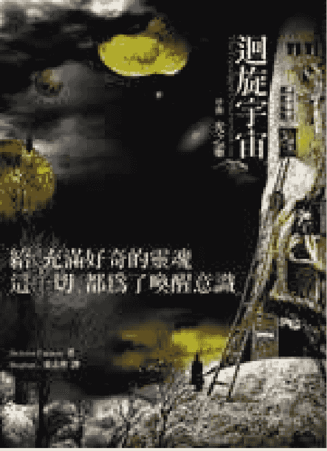

# 回旋宇宙
## ——序曲 光之灵

作者：朵洛莉丝•侃南
Dolores Cannon

译者：张志华

在线阅读：http://hi.baidu.com/onenesslove

更多书籍☆爱之书：http://hi.baidu.com/theartoflove

## # 关于宇宙花园

二〇〇四年底，宇宙花园开了第一朵花《走出哀伤》。至今，花园成长的速度虽然缓慢，但每一朵都是花园的骄傲。宇宙花园译介具先驱和启发性的深刻著作，服务你的心和灵魂，是宇宙花园存在的最重要目的。

园丁是这么想的：

我们都是永生不灭的灵魂，既然来到地球，就最好要了解，或者该说记得，这个三度空间的游戏规则。所以你会发现，书里传递的讯息大都与宇宙法则有关。

也因此，宇宙花园的每本书都怀着这么一个希望：

- 在你迷惘困惑时，带来启发；
- 在你受挫疼痛时，带来温暖；
- 在你需要指引时，帮助你听见内心的声音。

每个人只要向内寻找，都会找到答案。但人性是健忘的，所以我们经常需要些提醒；人性也是脆弱的，所以我们需要彼此挟持。然而，不论是抚慰受苦的心灵，挑战心智的思考，或扩展内在的意识，宇宙花园都只是接口，真正重要的人，是你。

to inform, empower and inspire readers, 启发读者思考、帮助读者发现他内在本有的神圣力量与光芒，这是宇宙花园的自我期许。

不论什么原因，你会看到这些文字都不是偶然。你的心里一定有一块非尘世的净土，有个种子正在萌芽，也许，它早已开出新叶，或正含苞待放。那么，你内心一定知道，我们都具有创造的力量。每个人每一刻的言行思想，不单影响自身的频率，也微妙地影响了集体意识。因此，透过多一点的善念，多一点的爱及和正面思考，我们可以帮助周遭的环境，帮助这个世界变得更好，进而提升人类意识和地球频率。

地球很小，但宇宙很大；躯体有限，但心灵无限。要记得，有那么一个地方，它超越了物质世界和时空的限制。在那里，我们都是开心和自由的。地球行的挑战之一，就是如何在沉重的氛围里，让我们的心依旧保持轻盈、喜悦和正面。

希望你在宇宙花园找到一处身心安适的角落，让你无限的心与灵魂，绽放灿烂的光芒。

## 园丁的话

这其实是本课本，以催眠对话形式呈现的宇宙学课本。书中的资料一如《地球守护者》，都是由较高次元的存有透过催眠个案传递。

对于习惯眼见为凭的人，建议不妨把这本书当成带有科幻色彩的催眠记录或小说，允许它挑战你固有的认知，扩展你的视野，开启你意识的力量和内在的心灵记忆。

宇宙奥秘就像个巨大的拼图，透过作者多年来的催眠记实，我们得以一小块一小块地拼凑起来，并对已经组合的区块有粗略概念。这幅巨大的拼图涵括了不同的次元和实相，这本书只是开端，接下来的二部曲还会探讨亚特兰提斯、金字塔、百慕达三角洲、复活岛等地球谜团，以及其它星球的生命、灵魂/能量、平行宇宙、量子力学和上帝等等更有趣的进阶题目。

书里提到的人类与外星人的渊源，有些人或许会觉得难以置信。

> > 已逝的英国科幻作家阿瑟•克拉克这么说过，「任何足够先进的科技，皆与魔法无异。」

以这个在我认为很符合逻辑的观点来看，书中所提早期人类将科技高度进化的外星人视为能行奇迹的神祗，也就一点也不奇怪了。更进一步的说，从外星人在地球历史上扮演的角色来看，许多希腊罗马神话里的神祗，都有外星人的嫌疑。或者，宙斯其实就是当时外星人的领袖......

言归正传，我相信不少人已注意到，许多来自外星的讯息，不论来源为何，他们都共同强调一点——人类正处于地球进化的关键时刻。

地球作为一个行星，如同人类，也有她进化的历程，为了迎接进入更高的次元，地球正改变她的频率。生活在这个星球的住民也无可避免地要面临提升振动频率的转折点。由于宇宙法则，外星人必须尊重自由意志，他们再如何想帮人类，也不能用干预的方式。在即将到来的地球计划和涉及的变动里，他们会以各种微妙的方法点醒和启发我们（譬如书中所提的光之灵会帮助有意愿的人类，转化思想，开启内在光体），然而选择权一直是在我们手上。

而我们也一直都有选择。我们可以选择与地球一起提升振频，以较平顺和谐的方式进入更高次元（当我们愿意学习开放心灵，放掉恐惧，不再自私自利时，我们就是在提升意识）；我们也可以选择漠视心灵的声音，继续虚假贪婪彼此伤害。我们可以选择超越自我的局限，想象一个更符合人道，也较接近我们原有神性的生活境界（一个以爱相待的无私世界）；我们也可以选择被恐惧的幻象禁锢，害怕与排斥所有未知的一切。

也犹如书中某些外星人遇到的课题，我们可以选择用权力和力量压制弱者；我们也可以选择用知识和权力来服务他人。选择是我们的。

生命是场奇幻之旅，我们在与神共创的宇宙里，体验各种不可思议的冒险。我所指的「生命」是灵魂的生命，不是「人生」的人类生命。人生只是灵魂无限生命里的一个切面，而这一生又是这个切面里小得不能再小的切片。

因此，想想看，这宇宙有那么多那么多不同的次元和星球（甚至其它的宇宙）可以玩耍和体验，何苦一直待在这个实相？一次次地困陷在三次元的物质性里？每个人都有他个别的人生目标，但作为人类，我们有一个共同的目标；人类的终极目标就是回到创造的源头，回到光。说穿了，就是不再作人。不再将灵魂寄居在厚重的肉体里，于是我们可以随心所欲地飞翔，跳脱时空的限制。如果我们能透过正面的思想与爱的行为，逐渐提升振频，我们就可以升级到较高的次元，体验更多的爱和喜悦。有天，我们也可以选择到别的银河星系体验等待着我们的各类有趣经历。选择是我们的。

而此刻，或在读完这本书后，你也可以选择邀请光进到心里，为自己也为这个地球的进化和变迁带进稳定与和谐的力量。

书里的个案在催眠状态下告诉作者，他是在为失落知识的传承寻找传人，而透过阅读，你，也是这些知识的地球传人。

## 目录

- 园丁的话
- 作者序
- 第一篇：寻找传人
- 第一章：琳达和巴多罗米
- 第二章：课程开始
- 第三章：能量装置
- 第二篇：《监护人》续篇
- 第四章：省略的珍妮丝催眠记录
- 第五章：储存知识的行星

> > 影响我们现实世界的现象，有百分之九十九点九九九九无法被我们的感官察觉人类必须学习独立思考，而不是盲目遵循所受的教导。
> ——巴克明斯特•富勒 (1895-1983，美国发明家、建筑师暨哲学家)

> > 只有超越极限，进入不可能的领域，才能定义「极限」。
> ——阿瑟•克拉克 (1917-2008，英国知名科幻作家，同步通讯卫星倡导人)

## 作者序 朵洛莉丝 侃南

在此要特别建议读者，阅读本书前最好能先读过《监护人》(The Custodians)。《监护人》记述了我从一九八六年起，针对幽浮和外星人绑架案例的研究，并涵盖了我这一路由简入繁的探索过程。我发现，所谓的被外星人绑架和目睹幽浮现象原都只是冰山一角。随着工作进展，我得到的数据愈趋复杂。当《监护人》编撰完成，我知道内容过于庞大，而且有些数据偏离幽浮主题，进入了非常错综复杂的「形上学」领域。我因此决定将部分内容拿掉，放在另一本讨论较为繁复理论的新书。这就是本书的源由。

我假定(或许并不正确)，读者阅读我的工作成果至此，对我透过催眠探究超自然现象的背景已有所熟悉。我的催眠根基可追溯到一九六〇年代，当时还是使用比较老式的技巧。在生儿育女告一阶段后，我于一九七九年重回催眠领域。我那时想专注在前世疗法和前世回溯，因此开始研究新式的催眠诱导法。这种方法使用到意象和观想，效果也较为快速。经过多年的催眠治疗和探究，我发展出自己一套专门运用类似梦游状态的催眠技巧。这个方法能使我和个案的潜意识直接沟通，因而接通浩瀚丰富的心灵数据库。

随着工作的进展，经常有其它存有利用这种深度出神的状态，透过个案沟通，传递资料。这个现象已经持续了二十年以上，至今仍不断有新数据涌入。这些讯息都会放在日后的新书。我被告知已经通过考验，我想提出的问题，都能得到答案；这是因为我一直忠于所得的数据，从不曾筛检或更改。我将自己视为记者、心灵研究者和「失落的」知识的调查者，因此这是场永无止境的搜寻。

从书中的催眠记录里，读者会注意到这些透过个案进行沟通的存有，使用的是个案心智里的字汇，他们用这些字汇提供模拟，尝试用人类能够理解的方式来解释无法说明的种种。因此，他们使用的常不是正规的英文语句。他们会从个案心里找到最接近的名词和动词来创出词汇。不论这是怎么做到的，这个方法确实有效，而我们也能了解他们试图传递的讯息。

## # 第一篇 寻找传人

### 第一章 琳达和巴多罗米

我最初想将琳达的故事放在《监护人》书里，但那本书的篇幅不断增加，到最后只好把这部分拿掉。我和琳达从初次见面到后来的合作，早有许多奇妙和不寻常的征兆。

我们最早的接触是在一九八九年的夏天，我在阿肯色州小岩城的第一次演说会上。那时《与诺斯特拉达穆斯对话，卷一》(Conversations With Nostradamus, volume I)已经出版(译注：诺斯特拉达穆斯是十六世纪的法国预言家和占星家)，我刚开始在居住的阿肯色州，所谓自己的地盘，进行演讲和签书会等促销活动。那天演讲完后，许多人买了书并排队等候签名，琳达也是其中之一。在我为她签书时，她把名片递给我并表示，如果我想找人合作，她很乐意配合。

她似乎有些害羞，没多说什么话。其它人也递给我名片或是在纸上写下姓名和联络方式。有些人的留言显示他们认为自己曾和幽浮有过接触。由于当时我正和幽浮组织的法里胥在阿肯色州进行幽浮的调查，于是我在这些名片上注记，提醒自己要优先与他们联络。但没多久我就知道，要和所有人都见上一面根本是不可能的事。

过去，只要有人想做前世回溯催眠，我总会设法和他们合作，因为我不敢轻忽这对他们的重要性。在我第一本书出版后，紧凑忙碌的生活开始了，我很快就意识到，许多事不再那么单纯；我的生活再也不会回到那个步调较为缓慢的正常型态。要和所有人见上面、谈上话都不可能，更何况是为他们进行回溯。我也假设大多数的人是受好奇心驱使，想对催眠有所体验，而不是寻求生命中问题的解答。

将名片和纸条放进皮包的当下，我心里是很认真想着，如果可能，要和他们一一联系。琳达的名片是其中之一。然而，我很快就被过多的活动缠身，因此没能和琳达及其它人联络。那时候的她，只是群众里一张模糊的脸孔。

几个月后，我回到小岩城演说并和《监护人》的主要个案珍妮丝，进行第一次催眠。我是特地抽空和她见面，因为她怀疑自己曾和幽浮有过接触。我很快就发现珍妮丝的案例值得深入探究。由于开车到小岩城需要四个小时，日后只要我有机会到小岩城，我都会安排时间和她会面。(我们挖掘出的惊人情节都在《监护人》和本书的第二篇里。)

很巧地，我发现琳达是珍妮丝的朋友。珍妮丝告诉我，琳达对于我一直没和她联络感到失望。我对珍妮丝解释，透过电话和信件要求催眠的人实在多不胜数，我必须要严加挑选那些我有时间进行回溯的对象。由于珍妮丝表示琳达非常渴望和我碰面，于是我不太情愿地排定了下次来小岩城和琳达会面的时间;那会是冬天了。我答应得有些勉强，因为我知道到时我的时间会非常紧凑。除了演说外，我也已经排定了几场催眠，而且我从过往经验知道，届时还会有人愿意耗上整夜等候。

尽管我担心和太多的好奇者见面只是让自己负荷过重，但为了顾及并尊重珍妮丝，我还是同意见见琳达。我对那次催眠没抱任何期望，当然更没料到会是一个持续的合作关系。

每次我去小岩城都住在朋友派西家，她让我在她的住处约见个案进行回溯催眠。派西因要外出上班，我和个案可以有完全的隐私。琳达抵达时，我们先在客厅交谈。琳达很迷人，大约四十多岁。她的衣着讲究，头发梳理得很漂亮，看起来并不像是那种会想探索前世的类型（倘若真有所谓的类型可言）。琳达是职业妇女，自营一家宠物店。她的孩子多已长大离家，追寻各自独立的人生。琳达很文静，说话轻柔，不是那种无所事事或幻想型的人，她有着忙碌充实的生活。

当她听说我第一次演讲的消息时，她就有股难以抑制的冲动想要参加 I 虽然她对诺斯特拉达穆斯并不是那么有兴趣。她说演讲当晚她非常兴奋，心里有很强烈的期盼，但她不明白为何如此。

当她坐在听众席听着演说时，她告诉她先生，她有一股无法克制的欲望想和我说话。即使那种冲动难以抑制，她还是很犹豫该不该这么做。演说过后，她排队等候签名，边考虑着是否该开口说些什么；她怕说出来的话显得可笑。她先生鼓励她，如果感受那么强烈，就该照着去做。然而，当轮到她时，她却只是把名片递给我并说想和我合作。当然，她并不知道当天我听这种要求不知听了多少次。我们的交谈非常简短，当她离开会场，我把她的名片放进皮包里，和其它人的混在一起。我完全忘了这回事，直到命运带引我们在派西家的客厅里重聚。

当我询问琳达为什么会想进行回溯催眠时，她说不出所以然。她并不是在寻找任何问题的解答，也不是对前世感到好奇。那是一种不肯放过她的强迫冲动，她就是觉得有事情必须告诉我，却完全不知道是些什么。

由于我当时的研究主题是诺斯特拉达穆斯，她隐约认为或许与他有关。那时候我已经和好几个人合作，而且工作也已进入尾声，那些成果又为《与诺斯特拉达穆斯对话》增加了约两本书的篇幅。我真的并不需要生力军，尤其是相距四小时车程的个案。琳达对我当时投入的其它计划一无所知，因此对于为什么会想见我毫无头绪。

我有些惋惜，心想这次回溯恐怕只是发现一段对她个人有重要性的平凡前世。我在过去几天已经进行过很多这类回溯，实在没什么心情再做了。我那时候喉咙仍有些发炎，而且在那整趟旅程，一直没什么精神。虽然疲累，但我知道我还是要为她进行催眠。

刚开始时，我心里完全没有任何期待，没多久，冷不防地出现令人惊喜的意外发展。这又是一个我不抱期待，却发现某个超乎我控制外的力量，已经作好安排的例子。我使用我标准的催眠诱导程序，引导琳达回到了前世。当她进入情境，声音变得非常放松和轻柔，很难听得清楚。根据以往的经验，我知道等我们开始交谈，她的声音就会提高。

她说看到地面的树叶，因此知道她是在森林里，但对于自己是男性感到讶异。她穿着高及膝盖的靴子和一件长袖衬衫。她对自己的描述是年约二十多岁的年轻男子，一头褐色的长头发，蓄着胡须和八字胡。他有双锐利的蓝眼睛，正在住家附近的森林忙着劈材。这一点似乎让琳达感到困惑。「我有个感觉，我并不需要做这些。有人会帮我劈。不过这是我喜欢做的，因为我现在是独自一人，而且我也喜欢劳动带给我的愉悦感。」

我建议她看看她的住处。

> 琳：「那是座城堡，有个吊桥，城墙上还有些旗帜飘扬。我父亲是国王。」

朵：那么你真的没必要劈材了，是吧？

琳：没错，不过劈材很好玩。它让我觉得愉快。(轻声地说)别人认为我疯了。

朵：他们为什么那么想？

琳：因为我喜欢工作。我不喜欢宫廷生活。那好肤浅。自己动手做事会带给你别的事不能给你的成就感。

他的名字是巴多罗米(译注：以下简称巴多)。他和家人，还有其它很多居民，包括仆役，都住在城堡里头。「那算是个颇大的社群。很多人都住在城墙里面。」

朵：至少你不会寂寞，是吧？

琳：喔，会寂寞啊！他们并不关心我。他们不知道我喜欢学习。他们对知识没与趣。但我很自得其乐。

他的国家处境并不平静。外面很危险，因此他们的活动范围必须邻近城堡。

琳：农民想暴动。他们没得到良好的对待。所以如果没有护卫随行，你就不能到城堡外头。

朵：你的父亲对民众的行为有什么看法？

琳：那是他的错。他不是很仁慈。他没有努力去帮助百姓。他只是为自己的利益利用他们。

朵：你说你喜欢学习，对知识有兴趣。有没有什么特定的知识是你想学的？

琳：有。我喜欢研究星星。研究宇宙。这是为什么人们认为我疯了的缘故。

当然，我当时以为他说的是天文学或占星学。

朵：在你那个时代，别人对星星有什么看法？

琳：就只是些闪烁的小月亮。

朵：难道在你那个时候，没有其它人也喜欢研究星星吗？

琳：只有一位。他是我的朋友。

朵：他是帮助你学习这些事的人吗？

琳：是的。他懂这方面的知识。他不是这里的人。但他非常老了，而且很快就会离开我。

朵：不过他或许可以传授他的知识。

琳：没错，这就是他现在正在做的事。当他离开以后，就是我要承担道个重责大任。到时就是我的事了。我必须学习这些知识并且传递下去，它们才不会遗没和失落。这些知识不能失去。

朵：是哪类的星辰知识？

琳：是宇宙的知识。是关于上帝所创的一切……并不只是这个地球。而是许多、许多、许多宇宙，以及距离十分遥远的星球，遥远到我们人类根本无法理解它们的位置。教导我的这个人曾经去过许多地方；他来到这里赠予我这些知识，他希望我将它们传递下去，好让未来的人们不致恐惧。

朵：你说那位老人家是从别的地方来的？

琳：是的，他来自昴宿星团(Pleiades)。

朵：是吗？这下引起我的兴趣了。这并不是寻常的回溯。

朵：那是哪里？我知道那是一个星团，但我想知道他会怎么说。

琳：那是在……在银河 (Milky Way 译注：就是地球所在的星系，至少有一二千亿颗恒星的银河系)，离这里非常遥远。

朵：这不是很不可能吗？

琳：不会。他是以光束来到这里的……（困惑）我很难理解。

朵：我想是很难理解。当你第一次见到这个人的时候，会不会很难相信这些说法？

琳：不会。我知道就是这样。有很多事情是我们人类无法了解的。我们只能在心里感受，知道事情就是如此。

朵：这个人看起来怎样？

琳：他非常老。驼着背，头发也白了，穿件长袍。很平常的老人家。

朵：他住在哪里？

琳：我不知道。他就是会来找我。不管我人在什么地方，他就会出现向我走来。

朵：他怎么有办法这样出现？

琳：我不知道。刚开始我以为他有魔法，不过我现在不这么想。我认为他拥有我目前无法理解的力量，因为我的智力还没进展到足以了解的程度。

朵： 在你那个时代，一般人怎么看待魔法？

琳： 它是生活的一部分。我们有巫师，不过是假的。我父亲身边有很多这种人。他们不像自己所说，所吹嘘的那样。

朵： 看来你父亲对你的朋友应该会有兴趣。

琳： 不，我不能跟他们提到这个人。他的生存会受到威胁。

朵： 你已经跟他学习很久了吗？

琳： 到现在已经跟他学了五年。我那时是……二十岁。

朵： 当他第一次来找你的时候，你心里是怎么想的？

琳： 啊！我心想，「为什么是我，我需要平静。我不需要这个。」（回想）我当时在森林里，坐在树下想着我的人生。当我一睁开眼睛，他就站在我正前方。我问他是谁。他对我说，「我来自非常遥远的地方，我来教导你无从想象的事。」我对他说，「你为什么会认为我想学这些东西？」他告诉我，「因为这是注定的。因此你一定会学。」

朵： 好像你没有选择似的。

琳： 我就是这样跟他说的。「我只做我想做的事。」而他对我说，「没错，所以你会很愿意学。」

朵： 听起来这个人还蛮有趣的。（琳达咯咯地笑）你很久后才相信吗？

琳： 不。我心里知道就是这么回事。

朵： 虽然很怪。……你说他已经来找你五年了，不论你人在哪里？

琳：是的。几乎每一天。他不常让我休息，因为我必须知道的东西太多了。他说在他离开我以后，我必须找到一位年纪比我年轻许多的传人。这样知识才能延续。……我不能将这些东西写下来。

朵：为什么不能？

琳：因为写下来会有被毁掉的危险。它必须是代代相传的活知识。而且只有被选中的人才能知道。……我很感激，也觉得自己很幸运能被选为我这个时代的传人。

朵：这是很重大的责任。

琳：这是很光荣的事，但我觉得这份荣耀也是我灵魂的重担。

朵：那么你就要记住他所说的，而不是写下来？

琳：没错，我不能写下来。它们会储存在我的智能里，等我找到传人，整套知识就会像魔法般地被忆起。这些知识会以适切的顺序浮现，因此那位传人完全可以理解他需要拥有的知识。然后，他也会像我一样，将知识储存在智能里。不准写下来。

朵：你不认为这样会有遗忘部份内容的危险吗？

琳：不会。智能是很庞大浩瀚的。人们并不了解。

朵：但是从一代传递到下一代的过程中，它难道不会有被扭曲的风险？

琳：不会，因为有某样东西将它完整地保存在智能里头。

朵：我是想到人的本性。经过一段长时间，他们会更改资料。

琳: 但这是储存在非常特别的地方，而且只能在正确的时机被取出。我并不能随意和别人谈论这件事。它只会在适当的时间被讨论，然后智能的那部分就会被接通以取得资料。

朵: 但你和我谈论这些事没有关系吗？

琳: 是的。

朵: 因为我对妳不造成威胁？

琳: 没错。

朵: 这位老人家是专程来找你，还是他已经在地球上住了一段时间？

琳: 他是专程来找我的。我不认为其他人可以看到他。他们听到我跟他说话，这是为什么他们认为我疯了的缘故。他们看不到他。

朵: 这会很让人困惑，不是吗？

琳: 没错，不过没关系。我知道自己没疯。我们住的地方很偏僻。这个地区的人不多。我们住的地方离大多数王国，离其它王国都很遥远。

朵: 你们被教导任何宗教信仰吗？

琳: 我们相信......只相信魔法。火。火神非常有力量。

朵: 这是巫师教导的部分吗？

琳: 是的。

朵: 这是为什么你父亲会相信这些事的原因？

琳：是的。他被严重误导。

朵：那么这些资料(指老人的教导)就不适合他了，是吗？

琳：是的，他无法想象这些事。他无法接受这些知识。我必须旅行到很遥远的地方。

朵：你被这么告知？

琳：是的。当我学成后，我必须旅行到非常、非常遥远的地方寻找传人，给他这些知识。我再也不会回到我的森林。因此我现在必须好好把握在这里的时光。

朵：难道你不能在你住的地方找到合适的人选？

琳：不能。

朵：你对离开有什么感觉？

琳：非常难过。

朵：你是王国的继承人吗？

琳：不是，我是老幺。如果我是继承人的话，就不会被选上做这个工作了。

朵：因为你会有其它的责任。

琳：是的。而既然没有，我就可以离开。

意料之外。

停顿很久后……

朵：怎么了？你看到了什么？

琳：(强调的口吻)我在宇宙里。我在旅行。我在执行出游的任务。

朵：这是怎么发生的？

琳：我被要求进行这项任务，这样我就可以提供我的见解给住在遥远他方的人。我行进得非常快速，虽然看起来并非如此。看来好似没有移动。

朵：你是怎么行进的？

琳：我是在一个……座舱里。

朵：那是什么？

琳：一个圆形的东西。

朵：很大吗？

琳：不大。它只是个非常小的椭圆形空间。不，是一小段椭圆形的光。这里除了我之外，没有别人。我没有……我没有在驾驶。它就是自己在行进。

朵：你是坐在里面吗？

琳：我是站着的，不过如果我想的话，我可以坐下。

朵：那么它是大到可以让你站在里面了？

琳：是的。它有一扇窗。有个洞，可是你没办法把手穿过去。

朵：为什么不能？

琳：因为有某个东西盖住了，你的手不能穿到外面。不过，它可以让你看到在你另一边的东西。

每当我回溯个案到中世纪，这类说词就会一再出现。他们并不知道玻璃这种东西。玻璃在当时一定很罕见，因为这是重复的模式。当某个说法一再出现，它就有一定的可信度，因为催眠对象并不知道其它人说过些什么。我从经验里学到要特别留意这类小事。

朵：你现在从洞里看到什么？

琳：我看到外面很暗。非常暗，非常黑……非常平静。偶尔我会看到东西在附近飘浮。这里没有什么颜色，跟地球一样。非常漆黑灰暗。完全没有颜色。

朵：你看到什么东西飘过去？

琳：喔，我有时看到……黑色的岩石。

朵：你是怎么来到这个小地方的（指太空舱）？

琳：我在睡觉时被叫醒，问我要不要来。「当然要。」我说，然后又睡着了。接着我就发现自己在这个小空间里。我不知道我是怎么来的。只知道我同意要来，然后人就在这里了。

朵：是你的朋友问你的吗？

琳：不是。那个人说他认识我的朋友，但他是来自宇宙的另一个地方。不是昴宿星团。是昴宿星团的另一边。他的行星叫做「麦康」(Micon)（读音为 My-con）。麦康？……

我从来没听过那个地方。

朵：那个人长什么样子？

琳：他很小，非常小。他没有头发。他有个很大很圆的头。

朵：你能不能看到他的脸是什么样子？

琳：我不记得他是不是有脸。我只记得他的头非常大和圆，但他的身体非常小。我那时还纳闷他要怎么保持平衡，因为他的头实在太大了。

朵：当然，那是在晚上，所以你很难看到他的面貌。是不是这样？

琳：不是。因为他是……银色的。发亮！……银色的，而且他很亮。

朵：（我很惊讶）你的意思是他在发光？

琳：是的，这是我为什么我看不到他的脸，因为太亮了。而且我那时很困，也看不清。（琳达低头看）我戴了一条大皮带。（手做了些动作）我腰上有条大皮带。皮带很厚，而且很暖，也是银色的。它前面有几个类似口袋的东西。我纳闷自己为什么戴着这条腰带，还有它的用途是什么。它不是皮革。它很软，不硬。感觉上不像我知道的任何东西。（做了些手势，似乎是在检查腰带。）这条腰带没有起头的地方，也没有扣子。我也不记得有戴上这条腰带。这让我有点苦恼。

朵：口袋里有东西吗？

琳：感觉上有东西，但因为没有开口，所以我看不到里面。（腰带似乎很困扰他）我猜很快就会有人告诉我，为什么我身上会有这个腰带。

这段催眠的声音听起来比较年老，而且发音明显地和琳达不同。

朵：它不会让你不舒服。那只是个奇特的东西。

琳：是的，没错。它给我的感觉很奇怪。我觉得我的肚子在腰带底下膨胀。

朵：但不是不舒服的感觉？

琳：不是。这感觉很轻微，很轻微。

朵：腰带下是你平常穿的衣服吗？

琳：不，不，不。他们要我把衣服留在我的房间。我穿的是……（似乎是在看身上的穿着）……也是会发光的。我不知道这是什么。这衣服很轻，而且把我全身包住。我穿了鞋。不是靴子，是鞋子。而且这都是一起的。是连身的。我被包在衣服里。但我没有戴帽子。

朵：这个空间的墙面上有任何东西吗？还是什么都没有？

琳：让我看看。（停顿了很久）有一扇大窗户。

朵：和刚刚那个小洞不一样？

琳：不，就是那个洞。它很长。（停顿）我很好奇门在哪里。我没有看到任何门。

朵：事情愈来愈奇怪了，是不是？

琳：是的，越来越奇怪。我好奇我是要去哪里？

正当他疑惑时，答案开始出现。这些答案似乎来自别的地方，因为他像是在重复他所听到的话。这些对他是新的讯息。

琳：他们告诉我，这趟旅行不会花很久的时间。我是要去拜访一个新地方，一个人们前往展开新生命的地方。而我要去那里的原因是……（惊讶）去找我的传人！（愉悦的口吻）我要去找我的传人。……我已经找好久了。

朵：你在地球并没有找到？

琳：没有！我到处找遍了，我现在很老了。我很担心无法及时找到他。（欣喜愉悦的语气）那就是我要去的地方。我要去这个新地方找我的传人。

我突然有个想法。这是个不容错过的好机会。

朵：你愿不愿意将你学到的知识和我分享，而不只是和你的传人？

琳：我必须先问过。我不能答应，除非我问过才行。

我检查录音机，发现我们的时间不多了。

朵：好的。如果我另外找时间再跟你谈，你可以先询问并征得他们的同意吗？

琳：好，我会问的。

朵：这样你说不定就可以和两位传人分享，因为我也很好奇。

琳：（愉快的口吻）啊，那真是太好了。（非常雀跃）那就是一举两得了。真是太棒了。

朵：那我就请你帮我征求同意，我可以再来找你讨论。

琳：这样很好。我很担心这门知识就要失传。我也觉得很开心，我就要找到我的传人了。不过地球失去这些知识还是让我很不安。这真的很可惜，因为即使这里的人非常原始，对这些事也不关心，这个知识还是应该保存下来。

朵：我同意。接下来我要请你继续旅程。

琳：好的。

朵：我不想干扰巴多的行程。不过我要另个部份的你，和我谈话的那个你(指琳达)，离开那个场景，往时间前移。

接着我说出关链字并引导琳达回到意识完全清醒的状态。此时的我很后悔在一开始时，只在录音机里放了六十分钟的带子。不过，我事前也不可能料到会出现这类数据。我预期的是沈闷寻常的前世，起初也正是如此。

我通常都能在六十分钟的催眠里，完整地走完一生，因为单纯的人世生活向来没有什么精彩或惊人的事件。但当巴多一提到那位奇怪的访客和他(指巴多)得到的数据，我就知道我无法在一次催眠疗程的时间里收集到完整的故事，因此我也没有尝试。我知道这会是一项要花上好几个礼拜才能完成的新计划——倘若我能被允许接触这些隐秘数据的话。虽然催眠前的谈话并没有任何迹象显示琳达的潜意识存有这些珍贵信息，显然地，我就要踏上另一个崭新的冒险旅程。

当琳达从催眠状态被唤醒时，她似乎感到困惑，身体也有些摇摇晃晃。她表示，「我有讯息要给你。我有这个印象。我感到责任重大。这真的很重要。我不知道是什么讯息，我只知道有很多知识我们并不晓得。由于我们原始的作风和恐惧的心态，这些知识被拿走，它们从地球上消失。而现在是知识回来的时候了。为了某个原因，你被选上，我也被选上，要把它们带回这个星球。

> > 这是非常重大的责任。我这么觉得……。这个责任让我的灵魂觉得非常沉重。………这是我对这次催眠所能记得的全部了。」

显然琳达在催眠时是处于类似梦游的状态，因为她进入了深度的出神级次，她不记得催眠时所说的事。

我现在对探究这个故事兴趣浓厚。对我来说，这就像是打开潘多拉的盒子。我热爱神秘事物，因此当有人说要告诉我某些已然失落，而我也有必要知道的事情时，这股诱人的力量实在令我无法漠视。

唯一的问题是距离。要跟她合作，我就必须开上四小时的车。我因此决定每个月至少来一趟小岩城，利用周末分别和琳达及珍妮丝两人工作。

现在，我手上有珍妮丝和琳达的两项计划。一九九〇年一月，我觉得有必要为她们专程去一趟小岩城。我打算将这次行程全部投入在取得这两位女士的资料上。这应该不难，因为我并没有安排任何演说。我的友人说他们不会将来访的事告诉别人，我也就不必接见访客。当然，事情并没有如计划发展。友人的一位旧识知道了我的行程，他希望能做一次回溯。我因此安排在抵达的周五当晚进行，虽然我在长程开车后已经很疲累了，但这样我才能把周末的时间全部留给珍妮丝和琳达。

我最初考虑要交替进行两人的催眠，但后来决定，如果一次专注在一个脉络，我会比较容易追踪个别故事的发展。而且，如果轮流的话，那就表示当我和其中一位进行的时候，另一位必须等候。我们因此决定一天只针对一个人。我打算周六和琳达进行三段催眠，周日则和珍妮丝。这是我第一次试图这么做，我并不知道对她们会有什么影响。我预期她们会觉得疲惫，不过应该不至于像我一样累，因为她们会感觉整天都像在打瞌睡。

这是一个实验，我们不知道结果会如何。如果办到了，那么我就可以在一天内完成相当于一个月的进度。

我和琳达的催眠从星期六上午开始。她一抵达，我就看到她的右前臂打了石膏。圣诞节前，她在冰上摔了一跤，把手跌断了。由于石膏笨重又不舒服，我有点担心在进行时会让她分心。我以为这会妨碍她进入深度的催眠状态。但琳达在肚子上摆了个枕头，将石膏手臂搁在上面。

在我进入琳达的潜意识搜寻巴多要传递给我的资料之前，我希望能先深入了解巴多的背景；如果将来要把这个故事写在书里，就有必要先把舞台布置好。我必须知道巴多的经历，了解在我们第一次见面之后，以及他搭乘宇宙飞船寻找传人之前所发生的事。这是这个工作的第一要务。

催眠开始，我说出琳达的关键字，立刻有了效果。她手臂上的石膏没有造成任何问题，她很快就进入深度的梦游催眠状态。接着我用数字引导她回到巴多的时代，询问她在做什么。

琳：(她的声音再次变得轻柔缓慢)我在一个广场。在城堡里面。像是个市场。很热闹。今天有很多活动。大家都带商品来贩卖。也有制造的人。还有铁匠。孩子们跑来跑去。有狗，有好多动物。今天非常热闹，大家在庆祝秋分的丰收，这是为什么有那么多活动，也是我在这里的原因。农作物在这个时节已经收成，大家都在欢庆丰收。感谢神祇在生长季节的庇荫。庆祝活动将持续三天三夜，在最后一个晚上会有最盛大的庆典。

朵：你们信奉哪一类神？

琳：很多。像是自然元素的神祇〔指风火地水〕。大地之神。太阳神和月神，还有风神和雨神。

朵：你们的国家有没有「教堂」这样的地方？（安静了一会儿，似乎没有听懂。）像是天主教教堂？

琳：他们来了很多次，希望乡下的民众改变信仰，不过没被接受。来的人被丢石头。他们现在不来烦我们了。

朵：民众不喜欢他们企图改变人们的信仰？

琳：不是，是因为他们称我们为异教徒，而且对我们很恶劣，好像我们不够好似的。

朵：所以你们的民众仍然信奉旧有的信仰，是吗？

琳：没错。

朵：你和你的老师接触了吗？（没有响应）你知道我的意思吗？

琳：我最近和某个人说过话，不过他并没有跟我说他是我的老师。

显然我们来到比第一次催眠进入的时空还要早的时期。

琳：他是位老先生。他不是这里的人。他是在好一阵子前到森林里找我的。当时我坐在树下沈思，他独自一个人走着，然后就向我走来。他背上有个背包，所以我猜想他是要去哪里旅行。我们聊了 一会儿，就这样。

朵：他说他是从哪儿来的？

琳：他没说。他只说他来自很遥远的地方。一个我不知道的地方。他问我那么认真在想些什么？我说我只是在想我的人生。我们天南地北什么都聊，还谈到人们就是不懂。

朵：这是你的感觉吗？人们不懂你？

琳：是的。就好像他们对生活里所发生的事情的看法和我完全不同。他们的生活方式和我想过的人生并不一样。

朵：这位老人家跟你有同样的感受吗？

琳：噢，是啊。他说是「时代」的关系。人们不了解。

朵：你找到一个谈得来的人，很好啊。

琳：是啊。后来他要走了，我还觉得很遗憾。不过他说，他可能很快会回来。也许我们可以再聊。

朵：那就太好了。他有没有提到他的名字？

琳：有。他的名字很奇怪。他叫做……「克里斯多佛」。我从没听过那个名字。我觉得有点奇特。

朵：你的意思是，在你的国家那是个怪名字？

琳：我从来没听过。他是个老人家，但感觉上那个名字应该是很年轻的人。当我说那个名字的时候，内心有很平静的感觉。

朵：好，让我们回到庆典……你在那里玩得很开心，不是吗？

琳：奥，是的。有许多新鲜食物，还有农民做的各种货物商品。大家又唱歌又跳舞的。

朵：真是个愉快的一天。让我们离开那个场景。我要你往时间前移，来到你那一世较年老的时候。……你现在在做什么？你看到什么？

琳：我在一个离家很远的城市。那里的街道是用石块砌成的。那里有非常肮脏的……有很多乞丐。很悲哀，令人沮丧。我不喜欢这里。

朵：这个城市有名字吗？

琳：我必须要搭船才能来到这个地方。这是在英格兰，这个城市的名字是利物浦。这里的情况非常糟糕。

朵：你在那里做什么？

琳：我旅行到遥远的地方了解这个星球的人如何生活。看看大家有什么不同。有时候我逗留很长的时间，有时候我很快就离开。我大概明天就会离开这里。这里让人难过。看到人们沦落到这种地步，我感到痛心。他们对待彼此非常恶劣。

朵：你说你也去过其它的城市和国家？

琳：啊，是的，很多。过去十年以来，我都在四处旅游。

朵：你去过哪些国家？

琳：我去过高卢 (gaul) (译注：古代西欧地名，即今法国、比利时、德国西部和意大利北部)，也去过罗马。我拜访过很多地方。我到过东方。大多数人不曾去过那里。

朵：东方有什么？

琳：奥，那是个非常大的国家。而且他们的生活哲学和我们非常不同。他们的肤色和我们不一样，他们还做一件事：『冥想』。冥想的时候他们接触到他们的（他有困难描述）……内在知识。他们很有智慧。

朵：你是怎么旅行到这些国家的？

琳：走路。

朵：那会是很遥远的路程，不是吗？

琳：噢，是的。有时候碰到水就必须搭船，不过通常我都走路。

朵：你怎么知道你要去哪里？

琳：我就是去我感觉该去的地方。感觉什么方向，就朝那个方向前进。

朵：你必须担心住宿或食物的问题吗？

琳：有时候。通常我沿途会遇到一些人，他们对我很好。他们会让我借宿，所以到目前为止，我还不必去担心这些。我一直被照顾得很好。

朵：你现在知道你的国家的名字吗？你年轻时候住的那个国家叫什么？

琳：有时候大家用不同的名字来称呼。有些人叫它……（有困难发音）……「希顿」(see-ton)（类似音），（停顿了很久）我不记得了。它没有什么名字，它是个自给自足的王国，而且那里也没有人外出旅行。

朵：所以你离开是相当不寻常的事？

琳：是的。不曾有人离开那里。

朵：你会想离开是一件很勇敢的事。

琳：我其实并不想离开，但我被告知必须这么做。我遵照指示前往许多地方，了解各地，人们的生活。不过他也说不必担心，这一路上会有人照料我。结果也确实如此。而且我并不孤单。

朵：要前往半个人都不认识的陌生他乡是会让人害怕的。

琳：最初是这样。我吓坏了。

朵：是谁要你这么做的？

琳：经常来找我的那个朋友。他说这件事很重要，我要去看看地球的人们是如何生活。他说我的王国实在是太偏僻了，如果我不自己去发现，就算我想了一百万年，也绝对想像不出其它人是什么样子。

朵：你学到了哪些关于人们的事？

琳：我学到许多不同的文化。由于居住地方和生活方式的不同所造成的差异。还有这种差异如何影响他们看待生命。我学到有的人很好，有些人很恶劣。有些人很无知，眼光短浅。

朵：他们说的语言都不同，不是吗？

琳：是的，他们使用不同的语言。

朵：你和他们的沟通有没有困难？

琳：没有。我的朋友教了我许多事。其中一件就是专注在别人的前额中央，这样一来，不说半句话也可以沟通。那是心智间的沟通。它不像交谈，而是数据的互换。

朵：那个人是不是要全神贯注才行？

琳：不必。最初他们感到讶异。他们接着会开始对我说话，当我凝视他们的时候，就好像有股力量让他们全身上下都平静了下来，然后我们「沟通」。当沟通结束，他们又会从我们刚见面的那一刻接续。这很奇怪。

朵：事后他们会记得吗？

琳：不会。就仿佛时间出现了一段缺口。他们甚至没有察觉到。

朵：这有任何缘故吗？

琳：有的。因为如果他们知道了，他们会非常害怕，因为害怕，还很可能把我处死。他们会认为我很邪恶。

朵：这样的沟通让你比较方便，是吗？

琳：噢，是的，方便许多。不然我就无法和他们谈话。能这样做很棒。我和低下阶层的人说话。我和贵族交谈。我和国王说话。我和农夫，还有商人对话。我学到了很多东西。

朵：你曾经遇过重要的人物，像国王？

琳：是的，有时候我在旅途上会遇见国王，有时候只是贵族。我遇过僧侣，大祭司。我向来觉得他们的哲理很有意思。他们也总是一副很正义很正当的样子。有时候我觉得好笑。但我不会跟他们说。

朵：他们认为自己的哲学或人生观才是唯一的？

琳：是的，是的，就是这个让我觉得有趣，觉得好笑。

朵：有一次我跟你谈话时，你说你正在找一个人。是真的吗？

琳：是的，我在寻找一位年轻人，我要在离开这个世界之前，把学到的东西教给他，这样他就能延续我的工作……至今我还没找到他。

朵：当你找到那个人时，你怎么知道就是他？

琳：我会立刻知道。会有征兆对我显示，我会知道。

朵：你知道那会是什么征兆吗？

琳：不知道，不过我被告知，一旦我和他开始交流，我就会知道。

朵：这是你旅行的原因吗？你不认为在你自己的王国可以找到那位年轻人？

琳：是的。不过我的旅行也让我学到许多事。我可以把我的见闻告诉他。

朵：我想你经历了许多奇妙的事。

琳：是的。但我也看到一些非常恶劣糟糕的事。不过，生命就是如此。好与坏你都必须接受。

朵：你不能做任何评断。

琳：不能。那样做毫无意义。我无法做任何事来改善现状。我是在收集资料，收集这个时代所发生的事。

朵：是的，就算你想试着帮助人们也是徒然。太多人需要帮助了。

琳：他们不愿意听。他们这时候还没有准备要改变他们的看法。

朵：我假设你就像一个观察者？

琳：是的。

朵：当你决定离开的时候，你的家人怎么想？

琳：他们很伤心。不过，他们总觉得我是个疯子。所以这只是另一桩傻事。

朵：你和他们向来都不同。

琳：没错。因此他们就顺着我。有时候我会想念他们。

朵：我想你有时候也会感到寂寞。

琳：是的。虽然他们不知道我所知道的事，但「家」仍是让人感到舒适自在的地方。

朵：是的，我可以了解……所以，你现在是在一个叫利物浦的城市？

琳：对，明天我就要离开了。我可能会去西班牙。

朵：那你就必须再搭船了？

琳：是的，是的。

朵：你曾经想过要往另一个方向吗？横跨海洋？

琳：关于这点曾经有人讨论过。不过，我不认为目前有那么一个航行的路线。海洋非常辽阔，而且我现在并没有准备好要进行那个计划。

朵：你的意思是，至今还没有人朝那个方向（指往西）航行？

琳：很多人在讨论。有位叫哥伦布的，他说地球是椭圆形。大家都嘲笑他。

朵：你见过那个叫哥伦布的人吗？

琳：没有，我没见过他。我只是听过城里的民众谈到他。他们说到他，然后嘲笑他。我心里觉得悲哀。所以我就只是站在那儿，听他们谈论了一会儿。有那么一刻我还在想，或许我可以帮他一点忙，但我被吩咐不要这么做。不过哥伦布是对的。他不知道自己有多正确。

朵：你怎么知道？

琳：我的朋友告诉我这些事的。……我可以帮助哥伦布，协助他的旅程。不过我奉命保持沉默。

朵：你的朋友跟你说外头有些什么？

琳：他给我看图片。不是图画。他称它们「照片」。我不懂那是什么。它是图片，不过跟我曾经看过的不一样。那不是用笔画的，也不是用颜料着色。它们非常漂亮。他还给我看跟地球有关的难以置信的东西，我永远也想象不到。

朵：可以跟我分享吗？

琳：那就像是我在非常遥远的夜空中往下俯瞰，看着底下深远，遥不可及的地方。真是太美了。你可以看到地球的形状和海洋上的陆地，那些我永远不可能知道的地区。你知道的，今天的人只想到他们生活的地带。他们根本不认为还有别处。有太多地方不为人知，或无从想象。……远比我们现在居住的地方还要大。远为辽阔的陆地……上面有森林、丘陵和山脉。难以置信……。有的地方有人居住，有的没有，就只是一片荒地。（这整段的语调带着惆怅。几乎是忧郁。）

朵：这些地方住的是什么样的人？

琳：我没到过所有的地方。我只去了小部分，都是在我这一带，因为要徒步走到那些地方是不可能的。不过，我朋友告诉我，或许有一天，我可以去拜访这些遥远他方。

朵：你说你看过照片。

琳：是的，但不是人的照片，而是从非常遥远距离外所看到的地球和陆地。不过，我倒是很想看看那些地方的人。我好奇他们是不是和我们一样。

朵：你认为这就是那位叫哥伦布的人要去的地方吗？

琳：他认为自己是去东方。我不认为他知道其它地区。他不知道那些地方的存在。

朵：而你的朋友并不想你告诉他？

琳：没错。他说那么做很糟。他说反正哥伦布也不会相信我。

朵：那是真的。他必须自己去发现，就像你一样。在你的时代，一般人认为外面的世界有些什么？

琳：他们相信如果你航行到远方，你会遇到许多邪恶的事，而且你会被那些东西掌控。你会永远迷失。

朵：在你这个时代的人相信别的地方还有其它人吗？

琳：不相信。他们不相信在肉眼所见的范围外，还有任何东西。

朵：当你的朋友给你看地球的照片时，地球看起来是什么形状？

琳：有点圆，还有很多水。（兴奋的语气）你知道吗？我认为地球是在转动的。

朵：看起来像在转动？

琳：是的，但转得非常慢。上面还有水和陆地，大片的陆地。到处都有水。

朵：你那个时代的人相不相信地球是那样？

琳：他们不知道我看过这些东西。他们认为地球就是他们生活的地方那么大。除此之外没有别的。大多数人都很恐惧，他们固守自己知道的事。他们只在住处附近活动，不会去远地冒险。

朵：所以你做这些事是非常勇敢的。

琳：我必须非常信任自己得到的指示。最初很辛苦，但几年后就容易了。

朵：你大概也很害怕。你并不知道外面的世界是什么样子。

琳：我是很怕。很恐惧。但当我了解到自己不会受到伤害，我会受到照顾后，就轻松容易得多了。

朵：你还跟你的朋友见面吗？

琳：是的，他偶尔会来跟我说话。他有时候会给我看很棒的东西。告诉我我需要知道的事。他给我看地球的图片，教导我地球的知识。他还告诉我多年后的情况会是如何。人们的思想模式和生活型态会有怎样的进展。还有文明会有多大的变化。非常有趣。有时候很难想象这些事真的会发生。

朵：他跟你提到会发生哪些难以置信的事？

琳：（兴奋的口吻）他曾经告诉我——我觉得这实在很难相信——将来会有在天上飞行的马车。是不是很滑稽？

朵：嗯，听起来的确很怪，不是吗？

琳：而且地球各地的人们会坐着它们旅行。他们会知道我们现在不知道的所有地方。

朵：想到有人能飞真是神奇。

琳：是很令人兴奋。我不能……（叹息）我的心智无法揣摩这样的事。我问他那么马是不是就会有翅膀？他说那时候不是马。你能想象吗？

朵：不能，我无法想象这要如何办到。

琳：我也不能。未来会有许多奇妙的事。他说将来会有能够做十人份工作的机器。到时人们只要按下按钮就可以把事情做好。

朵：那就可以省掉很多事，不是吗？

琳：是的，是这样的。他说人与人之间的沟通也会比现在好。将来大家可以在不同地方，透过东西交谈，你可以在好几哩外听到他们的声音。他说这会让整个世界开始沟通，我们因此能彼此交谈。不再无知。

朵：这些都是好事，不是吗？

琳：是的。如果能去除些恐惧就太好了。人们就会善待彼此。

朵：你认为人们如果有了可以交谈的工具，就会彼此友善吗？

琳：是的。他们就不会那么害怕。你瞧，人们现在很孤立。他们的生活范围就是家人和自己住的小城市。他们对这些范围以外的一切都很惧怕。由于内心的恐惧，他们无法好好沟通。只要人们愿意，他们可以相互学到许多事。透过这些方法便可铲除无知。

朵：所以你认为解决的办法是要去学习沟通？

琳：绝对的。欠缺沟通很糟糕，因为它让恐惧笼罩人心，看不清眼前的真相。恐惧将一切蒙蔽在黑暗里。

朵：那么你的朋友对你提到了未来的人用来说话的东西？

琳：是的。而且还能用来听。那些是很小的机器。我不知道它们长什么样子。他只告诉我，那些是很小的机器。

朵：这会是好的发展，因为这样人们就能相互沟通。

琳：是的。他们能够提出对事情的看法，其它人也可以说出想法。也许最好的意见就能被采用。

朵：我觉得听起来很棒。他还有告诉你其它难以置信的事吗？

琳：是的，非常多。他说这个宇宙里还有其它的世界。而且那些人的进展比我们快上许多。他们拥有的知识也比我们多。但是，随着我们的世界成长并有了这些机器帮助我们的知识更丰富之后，这些住在别的星球的人，或许就会来访，并和我们交换想法。

朵：这些听起来都很棒。

琳：我认为好极了。

朵：很难想象有人住在其它的世界，是不是？

琳：是的。真的很难想象，虽然我向来都知道。不知为何，这点我还比较容易理解，但对于地球上还有其它我不知道的地方，我反而难接受。

朵：有人住在地球以外的世界，这一点你还比较容易理解？

琳：是的，相对于地球上还有其它地方，而不只是我们住的这里，我很容易就了解有人居住在地球以外的世界。

朵：但是在你这个时代，其他人不是都很难想象有别的世界吗？

琳：噢，是的，他们认为那是邪恶的，他们很怕去想这种事。他们的恐惧让他们畏缩。对于不了解的事，他们就说是邪恶和不好的，并且试图把它们烧掉或毁掉。他们就是非常害怕。

朵：你先前说你去过罗马，那里不是天主教的本营吗？

琳：是的，那里有许多很美的地方。很多神父到乡间传教。他们内心也充满恐惧。

朵：你这么认为？

琳：是的。我是这么想的。他们企图用他们宗教的哲理来控制农民。不过那都是为了掩饰恐惧。

朵：为什么宗教会有恐惧？

琳：我不知道。他们的上帝一定不是很好，要不然他们为什么会有那种恐惧？

朵：你的意思是神父自己都害怕？

琳：是的，他们有这套体系。就像个王国。都是同样的东西，只是不同的名称，目的是要操控乡下农民，要他们顺从。那是一套在上位者用来对付小人物的制度。他们相信只有他们的上帝才是真的，其它都是邪恶的。只有一条正道，那就是他们所教导的。而你如果不遵循他们的指示，你就会永远被打入地狱。这是不正确的。有很多很多的途径。这是我学到的字，你知道吗？「途径」（avenue）这个字。是不是很奇特？

朵：那是个奇妙的字。你认为那是什么意思？

琳：途径表示路径或道路。我觉得这个字很有意思。途径。

朵：是的。可是你认为他们将自己的宗教视为唯一道路和方法的想法是不对的？

琳：绝对的。他们告诉农民，他们非常非常神圣或非常非常有智慧，而且就是如此。这个宗教不允许个人检视自己内在的真理。他们教育民众，他是非常渺小和受限的。民众必须确切地遵照指示，而且只能有一种作法。这很糟糕。不准人们独立思考。（叹气）但这个时代就是这样。你知道的，到处都是这样。不只是罗马，也不只是宗教。当时的政治也是如此。你不被允许有自己的想法。你被吩咐要想些什么和做些什么。我很讶异这个现象如此一致，全世界都是这样的模式。尽管有些地方的习俗不同，做事方式也有些小差异，但基本上都是一样的。恐惧都是一样的。惧怕的事可能不同，不过根本上，大家都被恐惧笼罩。而且他们允许恐惧扭曲他们对生命的诠释，他们让恐惧令自己退缩。他们害怕会受到惩罚。

朵：他们宁愿守着自己知道的东西。这样他们才觉得安全。

琳：正是如此。这样也就不会有被丢石头、吊死或被装进箱子里的危险。

朵：被装进箱子里是什么意思？

琳：他们有这种东西。非常可怕。那是木头箱子。他们把人装进去，关上好几天，不给食物，不给水喝。有些人就死在里面。很可怕。

朵：信仰不同的人就会受到这种处置？

琳：是的，或是他们质疑的话。有些坏人确实是应该被关进箱子里。他们偷窃、杀人或做那类坏事。但是，只因为相信的东西不同而被关进去，在我认为非常糟糕，没有正义。如果你在自己心里有不同的想法，这会伤害到谁？也许还更好呢！

朵：你在旅行中对人们的健康方面有什么发现吗？

琳：有些地方不错，人们很长寿，尤其是住在开阔的农场或田庄的人。如果住在城市就非常非常糟糕。如我说的，城市往往很肮脏，还有很多疾病。那里的人寿命不长。城市里有很多人死亡。

朵：有所谓的「医生」照顾这些人吗？

琳：有，不过没有用。这些人还是死了。我认为他们完全没有帮上忙。他们以为帮了忙，其实不然。

朵：嗯，你这路上一直都很幸运。你曾经生病吗？

琳：有几次。不是很严重。城市里的人多半在四十岁就死了。这个年龄在城市算老了。我现在五十，大家对我竟然还这么健康都感到讶异。我的头发已经开始泛白，不过我很健康。

朵：所以在那时候五十岁就算老了。

琳：很老，很老了。

朵：可是你还是能走路和旅行。

琳：是的，是的，我的身体状况很好。我没有马匹。除了照顾自己之外，我不想有任何责任或负担。甚至我都被照顾得很好。

朵：我在想，如果你有马的话，就可以行进得更快。

琳：没有马我就不必担心喂养牠或住宿的问题。我可以依自己的速度前进，路上想停留多久就多久。有时候我会搭便车，不过不常这么做。

朵：但你坐过船？

琳：这是必要的，因为我无法游那么远。为了能到别的地方，必须这么做。

朵：你乘的是大船吗？

琳：有时候。我搭过有很多帆的大船。其它时候就只是小船。这要看谁愿意顺道载我一程。

朵：这样你就不必担心钱的问题了，对吗？

琳：对，是不是很妙？以前我绝对想不到，没有钱竟然还能够旅行这么久。真妙。

朵：你有携带任何衣物或东西吗？

琳：没有。当我的衣服破旧了，总会有人给我新衣。也有人给我食物。我随身带一根大棍子。它就像拐杖，帮助我上下山坡。这根棍子成了我的老朋友。

朵：你认为你会找到那位你要传授知识给他的年轻人吗？

琳：我现在有点担心了，因为年纪的关系。以前我并不担忧。我只是觉得时候到了，他就会出现。但随着我的年岁越来越老，我开始忧心自己无法及时找到他。你知道的，我有好多东西要告诉他。而且这不是一天或一个礼拜就能说完的。我要告诉他的事情非常多，会需要一段时间。我必须和他待在一起。我必须在身体还健康的时候教导他。这是我现在很忧心的事。虽然我被告知不必担心，都已经安排好了。而至今我被告知已安排妥当的事，也确实都是如此。所以，我想我应该停止忧虑。我并不觉得自己老了，只有在别人提醒时。

朵：你并不感觉自己的身体老了。

琳：我内心不觉得老。但对别人来说，我的外貌是老了。

朵：可是你接下来还要去西班牙？

琳：是的，我从没去过西班牙。我知道那里非常漂亮。我想我可以亲自去看看。我曾到过东方、北方和西方。不过我还没去过南方。说不定这一次可以去。通常在我要动身离开的当天早上，醒来时，我都会收到往哪个方向前进的指示。我被告知要向东或东北，或是走哪条路。我现在被吩咐走这条，于是就这么做了。

朵：你不问任何问题。

琳：是的。

朵：好，让我们离开这个场景。我要你往时间前移，直到你已经抵达西班牙。告诉我，你对那里的看法。你有搭船吗？

琳：有，这次我搭乘一艘大船。我在小旅馆遇到船长，他和我很投缘，愿意载我一程。我住在他的舱房。很漂亮。那是艘有很多桅杆的大船。

朵：你觉得西班牙如何？

琳：目前为止这里的人还不是很多。气候很温暖。跟利物浦的差别好大。我的骨头都暖和了。利物浦很寒冷，非常潮湿。……阳光照在我身上，感觉真舒服。空气非常新鲜，还有恰到好处的微风吹来。所有我听到关于这里的事都是真的。

朵：你会在那里待上一阵子吗？

琳：我想很有可能。我想和这里的人聊聊，了解他们的生活哲学。他们看来很友善。他们似乎不是那么恐惧。这些人心胸开放。他们不是那么拘泥在传统里。而且他们似乎比我之前见过的人更能独立思考。

朵：也许你会在那里找到你的传人。

琳：我不这么认为。我认为我的传人离这里很遥远。我不知道为什么自己现在这么想。我不认为我会找到他。我认为他会找到我。我想我会在西班牙待上一阵子。也许他们会派他来找我。这里很不一样，让人耳目一新。我可以在这里待上一段时间。

朵：但你真的认为有一天你会找到他吗？

琳：我是被这么告知的，而我没有理由质疑或是有其它的想法。

朵：你已经为这件事投入你的一生。只要你相信这件事，这里面一定有些真理的。

琳：是的。这是很久前我就学到的很重要的一课。信心的功课。

朵：所以，如果这是注定要发生的，你就会找到他。

琳：是的。

朵：好，那就这样吧。西班牙听来是个非常美丽的地方，你可以在此停留一阵子。

接着我便引导琳达回到意识完全清醒的状态，将巴多留在他的世界。我知道，我们很快会再和他会合，继续我们的故事。

### 第二章 课程开始

第一段催眠结束后，我们暂停几个小时用午餐、休息、聊天，然后在下午两点左右继续工作。我再次使用琳达的关键词引导她回到那一世。我已经知道了巴多的背景，现在要做的是取得资料。我的好奇心已被挑起，我想挖掘巴多要传授给他传人的到底是哪些知识。我打算让他回到那艘宇宙飞船上，从那里开始衔接这个故事。

朵：我要你回到巴多在那个奇怪空间的时候，当时他正要去某个地方。我会数到三，然后我们就会在那里了。一……二……三……我们又来到那个场景。你才刚离开卧室，发现自己在这个奇怪的地方，外面还有东西飘过。你现在在做什么，你看到什么？告诉我。

琳：这里只有我一个人（几乎是敬畏的语气）。我坐在椅子上，望着外面的宇宙，看着恒星和行星经过。……我在睡梦中被叫醒，被询问是否要去旅行。我同意之后，就被吩咐要穿上这些衣服。接着我被一道光束包裹住，然后我就发现自己一个人坐在这张椅子上了。

朵：你之前说你现在年纪更老了？

琳：是的。我很老了。我现在快六十岁了。我很老很老了。

朵：你还在寻找你的传人吗？

琳：是的，还在找。我觉得我没有达成这生的使命。我试着去信任，相信在适当时机我就会得到需要的线索。不过，我已经这么老，我开始怀疑也害怕了起来。

朵：你在地球上旅行的期间，曾经遇到你认为可以托付这些数据的人吗？

琳：没有，没有半个。我原以为东方文化比较能理解、比较开明、接受度也较高。但是他们也被自身的传统和信仰体系遮蔽了。我非常失望，也开始丧失信心。直到今晚，我被告知这会是我最后的旅程。我会得到最后的答案——我寻觅的终点。

朵：最后的答案是什么？

琳：最后的答案就是和类似我的人分享这些知识，那些人愿意接受对他们来说无法揣摩和理解的观念。他们能够不怀恐惧，不带歧视和偏见的来检视这些事情。纯粹接受这些事实并小心地检视。纯粹分享所知道的，就是这样。

朵：他们要带你去见你的传人吗？

琳：他们要带我去一个新地方。他们称为「侨居地」。那是一个新的实验地，他们希望纯粹真理能在那里普及而不受到任何扭曲。这些人的心思纯正。我会是他们（指在侨居地的存有）的老师。我会把这么多年来累积的知识教给他们。他们将成为这门知识的守护者。因为他们的纯洁，他们不会以任何形态和方式误用、滥用、私藏或歪曲这些知识。他们将成为宇宙真理的知识守护者。

朵：这就是你的传人会在的地方？

琳：是的。然后在适当时机，他会被派去启蒙地球。在此之前，他会和其它存有一起在这里等候。其它生命体也会在适当时候将讯息带到别的地方。

朵：你为什么不能传递给地球上的某个人？你之前认为你是要这么做的。

琳：因为找不到用心纯正，不会扭曲或误用这些知识的人。以目前地球的进化阶段来说，人类还没有准备好。在人类能善用任何这些知识造福人群之前，他们还有许许多多的功课要学习。要不，知识会被扭曲、被误用，最后并摧毁整个地球。

琳：那么以这样的方式，这个知识最终还是会被带回地球。

朵：没错。这位传人会住在这个「侨居地」。这个地方没有时间和空间的概念。他们不会老化或有任何方面的改变。这里是个暂时停留的地方（中介区）。当我的工作完成，我也会离开，前往我的地方休息。我不会待在这里，在好一段时间里也不会回到地球。

琳：如果你认为自己老了，你去哪里会有影响吗？

朵：不会。但我不能留在这个侨居地。我的灵魂模式和这里的存在体不同，无法在此地无限期的停留。我在这里不会舒服的。我确实渴望完成工作后能够休息。我需要休息一段时间。我需要和「一切万有」同在。

琳：你是说当你把讯息和知识传授给这里的存在体之后，你将以这具身体回到地球？

朵：不是，我在很多很多世代里都不会再回到地球。我会到「一切万有」那里休息。我将在漫长时光后，以不同的身分返回地球。

听他的回答，他说的地方像是灵界。他在转世进入另一具肉身之前，会在那里休息。

体前，要先在灵界休息一阵子。我在《生死之间》(Between Death and Life)描述过这个地方。我唯一不解的是，他并没有提到死亡。他显然还是有身体。但每一个人都知道，死亡时，你不能带着身体同行。

朵：我正在试着了解。你现在还是有你的身体。它就在这个房间里，坐在椅子上。

琳：是的，那是我的身体。我从没问过身体会发生什么事。或许我应该问。但这似乎不重要。

朵：好吧。那就让我们继续前进，让这个交通工具或什么的……你现在搭乘的这个机器抵达目的地。你说你是前往侨居地。让我们继续前进，直到你抵达。到了之后，告诉我你看到什么。

琳：这里好亮……我现在还是坐在椅子上，盘旋在这个明亮地方的上头。突然间，我的身体被一道非常强烈的光环绕。这道光来自房间(指太空舱)顶部。是一道圆柱形的光，我就在光的正中央。然后就那么一瞬间，我人已经在这些灵体旁边了。我已经不在房间(太空舱)里。我就这样被这道光运送到这些存有旁边。他们都非常、非常高兴看到我。他们看起来像是光体。每一个都不一样，却又类似。他们是很亮很亮的存在体。

朵：他们没有身体特征吗？

琳：有，但他们太亮了。当我试着直视他们的脸时，亮到什么都看不到。就像直视太阳一样。我可以隐约看到他们在微笑。他们一定有嘴。我感觉他们在对我微笑。不过，他们被非常明亮的光芒笼罩，我无法辨别他们的身体形态。

朵：你还在你的身体里吗？（停顿。也许他不确定。）你感觉如何？

琳：非常轻，非常轻，好像在飘浮。像是没有重量，没有任何作用力。我自由了……。我不认为我有身体。我觉得我就只是「我」。

朵：你认为这些存在体是物质形态的吗？

琳：(停顿)或许吧。但我认为他们很可能是纯能量。我看得到他们，不过我不认为他们是人类的身体。

上面这句话带着好奇、纳闷的语调，仿佛是在试图了解某个奇怪和陌生的现象，而他对此毫无准备。

琳：我认为我来到了一个不同的存在层面。一开始我是带着身体旅行，但我想我已经穿越了物质/肉体层面并进入了一处我不知道的地方。然而，我觉得只要我想离开，不论什么时候，我都还是可以回到那个房间(指太空舱)。

朵：你认为你的身体还是在那里？

琳：是的。

朵：你说你要和他们分享你的知识。对吗？

琳：对。

朵：之前我问过你，是不是有可能也和我分享。你说你必须先征得同意。你认为可行吗？

我充满期盼，希望能被允许取得这些知识。我强烈的好奇心渴望如愿，但这完全要由外在的力量决定，而我对这些力量一无所知。

琳：我问过我的朋友，他说，或许你可以旁听我的教学课程。

我感到一阵兴奋。

朵：如果可以的话，真是太好了。

琳：他说会有你不能旁听一些特定内容的时候，不过，大多数的课程都可以让你参加。

朵：为什么有些特定内容我不能听？

琳：因为在一项计划能在地球执行前，还有少数几件事要先处理妥当。那几件事的内容要先保留，等到计划实行才能说。一旦实行了，这些保留的数据就会提供给你。

朵：那么如果我旁听这个教学任务，我就能分享这些知识了？

琳：没错。你被给予这个机会，因为你也是不会渲染或扭曲讯息的极少数人之一。你的心思纯正，不会为了自己的利益使用这些资料。

琳达的呼吸变得越来越快，显示她不太舒服。

朵：我知道这些条件很重要。

琳：是的。不是每个人都做得到。只有非常少，非常少的人。

在她说最后这几句话的时候，我注意到她的呼吸不规律，愈来愈急促，而且还有一些吃力。这让她很难把话说得清楚。

琳：这里的空气要做调整。我的胸腔很沉重。（她的呼吸依然吃力）我还要过几天才能适应。

我给了些指令，消除她身体不舒服的感受。个案的舒适安好向来是我的主要考虑。

朵：现在跟我说话的这个身体能够毫无困难的调适，即使和我沟通的这个存有面临些问题。你了解吗？

琳：(她的呼吸渐渐恢复正常)我了解。

朵：好。你要开始上课了吗？

琳：快了。现在是欢迎时间。欢庆的时刻。团聚的时刻。

朵：他们一直在期待你的来临吗？

琳：是的，他们一直在等我，而且他们非常非常开心。他们对我欢呼。他们拥抱我。他们为我感到开心。

朵：听起来是个好地方，很友好的环境。

琳：噢，这里非常好。非常温暖(指气氛)。

朵：我们可以前进到你开始上课的时候吗？这样我就可以听课了。你有没有任何讲课的计画或顺序？

琳：我还没有想。我有一次曾经拟过计划，不过隔得太久，已经忘了。我现在决定先让我的朋友们发问，然后从他们的问题开始讲起。我觉得这大概会是目前最好的作法。

朵：我同意。但因为我听不到他们的发问，可以请你重复吗？

琳：好的。

朵：你现在就要开始了吗？

琳：是的。

朵：好。那就依你的步调开始吧。

琳：我现在面朝向……阿特尼斯 (这是近似发音，有可能是阿德尼斯)，他问我 (说得很慢，像是在聆听然后重复。)「地球是出了什么问题，为什么地球人的信仰体系那么狭隘？」……在很久远很久远以前，人们带着宇宙的浩瀚知识来到地球。当时已经有其它人住在这里，他们不像这批新来的人那么有知识。新来的那群因此得以检视「权力/力量」(power)的议题。在此之前，他们不曾有过这种体验。结果，他们喜欢那种感觉。权力带给他们前所未有的快乐，他们因此决定私藏而不分享那些原该分享的知识。他们并且奴役那群知识不如他们的人类。他们对人类说一些不是事实的事情，威吓人类服侍他们。他们被视为神祇。他们变成了神祇。那些原本在地球的平凡人以为他们是神，因为他们能做不寻常的事。这个现象本不该发生。新来的那群沈溺在权势和贪婪里，他们不想离开了。他们想留下来。他们因此没有离开地球。当他们的生命结束，有关这些神祇和他们伟大力量的故事流传了下来，然后恐惧开始生根。人类惧怕如果不照「神祇」曾经说过的去做，就会遭到毁灭。那是地球非常黑暗的一段时期。

朵：他们跟地球人说了什么让人类感到害怕的事？是什么让地球人愿意被奴役？

琳：他们告诉地球人，他们可以支配风、光、太阳、月亮和雨水。他们控制了这些力量，如果人类不遵照他们的规定，这些东西就会被摧毁。人类会因此没有水、没有阳光。人类知道自己需要阳光、水、风和雨，必须有这些才能存活。而神祇掌控了这一切，因此人类必须服从，不然立刻会被毁灭。人类并不知道他们的存在，他们的灵魂是永恒不朽的。他们只看得到眼前。……这群光体来到地球的最初目的，是要分享灵魂不死的讯息，好移除恐惧，让人类了解真相。

朵：这些外星人有没有展现神奇事迹，让人类相信他们就是神？

琳：有，他们有。那都是戏法花招。他们使用光和魔法，但人们以为他们是神。我想说，这是显示人类的本性持续在内心对抗恐惧、对抗利己的最好例子。自私自利。权力。（译注：这句话间接显示这些外星生物也是人类形态，他们因为具有人类形体也通称人类。）

朵：但这个问题是来到这里的外星人造成的。

琳：是的。他们没有照吩咐做。他们因为只服务自己而堕落，为了他们自己而不是地球人类的利益。

朵：你说这是人类的例子，但这个问题不是人类引起的。

琳：他们被派到地球，是要将地球人提升到较高的存在层次。他们是被派来教导，而不是奴役这里的人。他们没有达成使命。他们原是要来启蒙人类了解真相，协助人类活在较高阶的存在层面。他们被困住了。

朵：你说他们被困住是什么意思？

琳：他们卷入「权力」，并且失去了原本要带给地球人类的光明。地球是体验新事物的地方。他们怀着提升地球上的原有住民到与自己相同层次的期望而来，却适得其反，他们反被困住而且降到较低的层次。

朵：换句话说，这个特性融入了人类物种里？(是的。)这就是你对这问题的回答了？(是的。)你要不要再回答别的问题？

琳：我们想先探讨历史背景，这样大家才能了解在过去这段漫长时光里的演变。我认为这大概是最好的说明方式——先让大家知道过去发生的事，再由此接续下去。现在的这个问题是，「为什么不派更多外星人去帮助被困住的那群？为什么不派一些人把辜负信任的那群带回来？」……原因是：当时我们担心派更多人，他们也会陷进同样的模式。因此决定等过了这个世代，再派遣一批新血去挽救计划(指协助地球人提升到较高的存在层次)。这就是当时的状况。第一批前往地球的外星人是来自提伦塔斯行星(音译：ty-ran-tus)。这个星球和地球磁场在某方面很类似，因此这些人不难融入地球生活。他们不会被看成怪人。他们看起来和地球人很像。但不幸地，他们失败了。

朵：他们就是想要权力的那群？

琳：是的。他们先来到地球。有一些和地球人生育繁衍。第二波派去的是来自(说得有些困难)……以朗依尔斯行星(Iran-i-us)。这些就不同了。他们长得不像人类，因此他们伪装前来。以动物的样貌。

朵：动物？

琳：是的。他们的任务是要悄悄地和一些选定的人合作，挽救这个计划。有些被选上的人从他们以为的这些动物收到指示。这是发生在另一个层面，来自以朗依尔斯星的存在体，透过人类的梦境传递讯息。他们教导关于爱、生命不朽，以及物种合作的概念。这些都是隐密且微妙地进行。不幸地，这个方案也失败了，因为只有少数人能接受这些新的思想。而且他们被民众嘲笑轻蔑。由于害怕一般民众的反应，他们不敢接受被教导的内容。当然，握有权力的人也不会接受，因为他们将会失去权势。于是在这段时期，人类沉沦到最低的层次。那是令人非常失望的局面。

> 朵：这些外星人以动物的样貌来到地球才不会引起人注意吗？

> 琳：是的，因为他们的模样不像人类。

> 朵：他们真实的样貌是怎样？

> 琳：他们非常小，有很大很圆的头和萎缩的细小身躯。他们也有手臂和腿，但是非常柔软，跟人类的四肢很不一样。他们认为自己太过显眼，地球人会因为害怕而杀害他们。

> 朵：这么说他们具有把自己变成动物模样的能力了？

> 琳：是的。他们能够呈现出动物的样貌。他们伪装自己。他们以动物样貌出现。他们进入那种生物里。

> 朵：这样他们就可以透过人类的梦境，像你说的，微妙地影响人们？

> 琳：对。透过人类的梦。当时是希望，如果能影响足够的人类，那么这个协助计划很快就能被扭转。但显然这方法太过细微、太过缓慢，因此也失败了。

当我在为《陨星传奇》（The Legend of Starcrash）研究印地安的传说时，我发现许多故事都提到，在最早期，动物会出现在人类面前传授知识。这在美洲印地安文化是很重要的一环。世上的其它文化也有类似的传说。有一点挺有趣：在现代的幽浮/外星人目击事件里，外星人常以动物样貌出现作为掩饰或用来遮蔽人类记忆，好使人类不致受到惊吓。

朵：还有跟这个主题相关的问题吗？

琳：问题是，「为什么没有多派一些以朗依尔斯星人去地球？既然他们是高智能的种族，他们可以战胜当时住在地球上的所有人。」……就这个问题，我的朋友，答案是：「武力永远不会有效。」武力不是可行的解决方法。地球人必须透过自己的选择学习和领悟。武力太常被用来当成问题的解决方法。这种作法从不会有用。

朵：这是个好答案。下一个问题是什么？

琳：「这个沉沦的过渡期持续了多久，才派更多人前往地球？」……持续了一万年。当时的决定是先让地球自己成长，或许可以学到些事。经过了很长的时间，情况并没有改变。人类在无知与黑暗中成长。他们的内心几乎没有光明。

朵：当时人们做了哪些黑暗的事？

琳：他们非常原始。没有什么爱。地球上有许多杀戮、仇恨、权力斗争，这样的情况延续了许多世纪，延续了非常非常漫长的时光。黑暗笼罩地球很长的时间。

朵：还有其它问题吗？

琳：是的。问题是，「地球在这段期间有什么变化吗？」……当时地表出现很多变化。许多人被带离地球(意指死亡)，希望能补充较为光明的能量。

朵：那段期间地球发生了什么变化？

琳：洪水。水，到处都是水。原本相连的陆块分裂了。有段时期极为炎热，热到许多人死亡。有些人因逃离而迁移到其它地区。生还者开始了新的殖民地，祈求指引和知识。

朵：陆块为什么会分裂？又为什么会有那么多的水？

琳：地表下有种叫「格网」(grids)的东西，它把陆地连接在一起。当这些现象发生时，(指人类的负面行径)地表内的格网移位，各陆块/大洲因此分离开来。洪水是因为高热融化了冰。当这些陆块分裂的时候，许多生命消失。人类、植物和动物无一幸免。在这个高热期过后，接着是冷却期。经过冷却，许多新生植物开始萌芽。新生命开始演进，大家都殷切期盼地球能进到光里。他们以为人类已经学到课题，爱和相互接纳从此会在地球茁壮。这样的情形确实持续了一阵子，但没有维持很久。人类对和平的生活感到厌倦，开始寻找刺激和变化。这就是后来发生的情况。

朵：你的意思是，当一切都很顺利时，人类的天性就是不会满足？

琳：是的。而这也是当时希望能改变的。但没有成功。

朵：人类为了追求刺激做了哪些事？

琳：他们一开始会玩游戏，接着游戏变成了力量和意志力的比试。就这样一件事接着一件事，他们又回到权力这回事。那种「我很重要、我比较强、我比较好」的心态。人们一直很难了解并学会这个课题。他们一再坠入为他们设下的陷阱。

朵：你认为这是因为来到这里的那群外星生物的血统和人类混合的缘故吗？这是源由，还是说它就是人类本性？

琳：这是人类本性，透过不同文化的混合在这个存在层面被扩大。那些来自其它世界，其他地方的外星人，来到这里原是想改善地球，却困陷于此。他们决心驱除并改善的现象，反而透过他们而扩大/深化到地球人世的存在里。(译注：「这是人类本性」乍看有些奇怪。但这句话意谓这些外星人也是被归类于「人类」，或许基于都是(类)人类的生命形态之故。)

朵：因此他们的基因助长了这个特性？可以这么说吗？

琳：是的。而他们原本被派来的目的并非如此。这就是为什么过了很久之后才派其它人来，因为害怕这个特性/情况再被扩大和恶化。

朵：好。我想目前我们就先回答到这里。不过稍后我还会回来并提出更多问题。

琳：没问题。我会在这里。

朵：到时我们可以从这里继续这个故事。

琳：我们才刚起头。

朵：总要有个开始。我有很多，很多的问题。

接着我引导琳达离开催眠状态，回到完全清醒的意识。琳达醒后想告诉我存留在她心里的影像。我再次启动录音机，录下她的叙述。

朵：你说你可以看到地球内部？

琳：它就像是中空的，有些东西把它支撑在一起。我不知道那些是什么。它们在里面移动。(地球)顶端好像有很多的活动。(她做了些手势)就像这样，往上跟往下的动。地球的中间看起来就像个中空的球。球壁上的这些东西都在上下移动。我不知道它们是什么。它们是把地球连接在一起的东西。——第二批来的人，头很大、很圆，他们是银色的。他们有身体，还有延伸物从他们的手臂、腰部和腿部长出来。

朵：延伸物？

琳：你看过东方文化里某些神祇的雕像和图画吗？祂们有人类的脸孔和身体，还有朝着不同方向的手臂？

朵：我看过一些是有很多手臂。

琳：是啊，没错。只不过这些人很小，而且头又大又圆。我不记得脸了。他们没有头发。他们身上有这些从不同部位长出来的手臂和腿。

朵：那么这些就是真的附肢了，真的手臂和腿。

琳：对。他们（体型）很小。全身发亮。我不知道是因为他们穿着的关系，还是他们原本就是那样。全身银，就一个颜色。

朵：而且他们知道自己的长相很不一样，不能就这样在人类面前出现。那会非常吓人。

琳：对！

朵：你之前的意思是，他们能进到动物里，或是让自己看起来就像个动物？

琳：就我了解，他们来到地球，不知怎地进到了动物里。是进入了她的智能或思维，或是怎么做到的，我并不知道。他们这么做是为了可以近距离接近人类。

朵：我之前在想，如果有个动物开始对人类说话，不论这是发生在多久之前，都会是非常吓人的事。可是不是这么回事？

琳：不是。那是透过心智，或是透过人类的梦来进行的。这些外星生命之所以进入动物里，是因为这样他们才能近距离接近人类。我猜这些人类一定都有养宠物，因为我看到这些人睡觉时，那些动物就躺在附近。

朵：你能不能看到最早的那些人的长相？被奴役的那群？

琳：我看到的他们是人类的形式。他们黑黑的。我不知道那是否象征他们的黑暗面，还是代表智力或成长的低落，或是有其它意义。不过，我看到他们是暗色的。而第一批来到地球的存在体，长得很像人类，但他们是浅肤色。你知道的，在我们的宗教背景，我们被教导亚当和夏娃来到这里繁衍出地球上所有的人。但我从这里所了解的并非如此。当时地球上有许多这样的人（指浅肤色）。然而，当我想象深肤色的那群，浮现的是他们在地面爬行的景象，很卑躬屈膝的感觉。再次地，我不知道这是不是黑暗和光体的同义象征什么的。但对我来说，很明显的，浅肤色的人挺直站立，而一大群深色的人匍匐在下。

朵：深肤色那群一定很敬畏或惧怕另外那些人。我怀疑他们是不是本来就很原始，才会那么容易被奴役。

琳：从刚刚所说的，我假设，他们没有什么知识。而另外那些存在体是来这里启蒙并带引他们到达较为高阶的生存层次。因此，我会认为他们非常原始。

朵：那就一定会有许多惧怕和敬畏，而新来的那群就利用这点。

不论那些存在体是人类、类人类或什么的，他们的演进还没高到能避免权力的诱惑——当地球人类对他们五体投地，他们就陷入了权力的课题。这也显示，即使那么先进或进化的一群也是会腐败的。

琳：他们并不完美，但他们很有知识，我猜这就是他们来的原因：带来他们的知识。他们看起来就是，人类的样子，而且很庄严尊贵。他们非常高大，也相当有自信。我记得我说过，他们假装是神。

朵：看得出他们为什么会这么做。

琳：而那个行星上的光体们，也就是听故事的那群，他们是非常亮的白光。就像个光点。一团光点。他们让我想到电影「鬼马小精灵」里的卡通鬼造型。只是他们是非常明亮的光芒，而且非常平和、非常快乐，充满了爱。他们只想分享爱。

琳达表达了她对我们取得数据速度不够快和不够多的焦急。她以为只需要几次催眠就可以了。我提醒她，这么多的数据无法在一个半小时内就都倾巢而出。由于她说话的速度较慢，时间也因此花得较久。我已习惯了长时间收集数据(有些个案要花上好几个月)，再进行有条理的编排。当然，琳达并没有这种经验。我在这些催眠计划里的角色就是要有耐心，并试着组织事件的顺序。

我们暂停工作，一起用晚餐、稍事休息，并和派西闲聊。天黑后才开始最后一段催眠。我们知道，工作完成势必很晚了。不过我并不在意，因为我不确定什么时候才会再来小岩城。我们想在一天之内尽可能完成最大的工作量。我想琳达隔天可以晚起，我也是。

关键词再次让琳达进入了深度的催眠状态，我们回到了几个小时前离开的那个场景。巴多继续说话，仿佛这中间没有任何间断。

琳：我站在讲台上，面对我的学生们。我正接受他们的提问。

朵：在我们开始答复问题前，我想先厘清你之前说的事。最早的那群人，也就是当其它人来到地球时，原本就住在这里的人，你知道他们是从哪里来的吗？

琳：他们就在这里。他们是地球人。

朵：你有被告知这群原有住民的长相吗？

琳：我想他们和我一样都是人类。我从没问过。

朵：好的。那么我们的故事已经进行到你说的那次地球陆块分裂的灾难，人们迁往安全地带的时候。上次进行到这里时，我改变了话题。你现在要不要再回答学生们的问题？

琳：好的。我的学生想知道，为什么这些人对他们的状况不满意？为什么在过了几年的平静日子后，他们要破坏这种安宁？……这个答案让我很困惑。我被告知他们想体验一种较高亢性质的情绪状态。他们厌倦了平静。他们想要生活里有刺激。而当游戏变成了战争，这就成了他们宣泄的出口。他们的心变得黑暗。地球上充满残杀和痛苦的事。那是他们渴望体验的情境。

朵：他们厌倦了和平。感到无聊，乏味了。可以这么说吗？

琳：与其说无聊，不如说他们的情绪没有太多宣泄的出口。他们觉得极端作为满足了他们的情绪需求，提供了他们想亲身探索的经验。他们并不了解当他们允许自己被这些情绪掌控，他们内在的光就在流失。光不会消失，但会变得非常非常黯淡。而这都是因为想要体验兴奋的情绪状态和伤痛感受的缘故。

朵：你不是说外星人决定不管人类，要让人类自己去解决问题吗？

琳：是的。当时的人数并不多，也不会危害到任何外星人。因此，那时候是决定让他们自己解决。他们若非从这个经验中成长，就是毁灭。然后这个星球就可以交给其它想过良善美好生活的人。

朵：这段期间外星人是不是一直在观看人类的历史？

琳：是的。他们看了也只能对地球上的黑暗行径诧异地摇头，感到不解。

朵：他们从哪里观看？这一切一定经过了非常漫长的时光。

琳：他们的时间和我们的时间概念非常不同。他们能藉由心智投射来调频接收地球的画面，有时候他们也会来到地球实际探访。不过他们不常这么做，因为不安全。当时这里的人很恶劣，动不动就杀人。许多生命被杀害。

朵：为什么这些外星人这么关心地球？他们就不能走开，不管地球吗？

琳：不能，因为宇宙对这个地球有个整体规划。地球是这个宇宙里最美的行星。她的美是一个实验。不幸的是，她不曾进化到当初设计的目的。她是作为情绪和物质/实体乐趣的实验。

她有许多事物是其它地方没有的。地球被设计为体验的星球，让那些来到这里的存在体体验后离开。人们（指其它星球的生命）可以来这里度假，体验地球提供的乐趣。体验这些存在体平常经验不到的物质层面的乐趣。

朵：你的意思是，在情况变糟前，他们来这里是为了度假这类的目的？

琳：那是有人居住在地球前的事。然后有些人因为太投入于物质世界的欢乐，他们陷得太深，没有离开。他们留下来更深入，更进一步地体验。他们待得愈久，就愈离不开。他们失去了离开的能力。因此当第一批外星人来到地球的时候，他们就已经在这里了。那批人原本是要来帮助这些困陷在地球实体/物质特性的生命体，协助他们重获光明的灵性。结果他们自己也受困于此。

朵：他们原本是要来帮助这些人恢复所遗忘的灵性记忆，但没有成功。

琳：没有，因为他们也沦陷了，也陷入了这样的困境。所以他们也留了下来，并和早先在这里的那些生命体纠缠在一起。

朵：你提到一开始时这是整体规划的一部分。你可以就这点说明吗？

琳：在一开始的时候，这个规划是个美好的设计与计划。它是让灵魂来到地球欣赏她的美丽，体验物质/地球事物的乐趣，这是为了奖励他们在其它世界/天体所作的贡献。原本的用意是一趟短暂的假期，一次愉快的经验，离开后继续他们原有的生活。

朵：这就是整体规划？

琳：是的。就像是表现杰出所获得的奖赏。

朵：看来这一切都搞砸了，不是吗？

琳：是的。真令人难过。

这不是我第一次听到这个说法。在其它个案的回溯催眠中，有人提到地球是个景点，一个度假胜地。在这个世界被人类污染前，早期有许多来自不同世界和次元的存在体来到这里度假。据说这是在灵魂被困在地球的物质性之前的事。

朵：还有人提出别的问题吗？

琳：当洪水泛滥时，陆块也分裂了。有人想知道这是突然的变化，还是逐渐发生的事。……有些情况发生得非常突然，不过地球的热化是渐进的。洪水一发生，一切就变得很突然。它造成大规模的破坏，而且来得非常快速。地球上几乎没有一处幸免。大多数住民都丧生了。只有非常少数存活了下来。当时期望人类可因此看清过去所犯的错，并珍惜现有的平静安宁。但他们很快就厌倦了。

我对这世上的每个文化都提到洪水传说的这一点感到好奇。但这次的洪水很可能是发生在非常远古的时期。地球显然经历了好几回变动，严重的洪水泛滥在我们的历史上并非不寻常的事。圣经和其它文献所提到的洪水，可能是发生在较晚近的时期。看来这个世界的历史，真的没有什么新鲜事，只是一连串事件的重演。其中有些事件被记载在古代文献里，有些可能在我们懂得保存记录之前就发生了。

朵：还有别的问题吗？我们这样探索历史，收获很丰富。

琳：「为什么这些存活的人不离开地球？如果他们已开化到能存活下来？」……答案是，他们并不是开悟的存在体。他们仍是地球人，而且他们并不想离开。除了自己的日常生活，他们对存在的层面一无所知，因此他们并没意识到自己有选择。他们不知道他们可以离开。也许他们没有离开是好的。……问题：「你认为如果他们离开，是不是会污染了他们去的那些地方？」……这是有可能的，因为他们的动机不如一些人纯净。如果他们前往的地方接受他们的思维模式，他们可能就会影响了那里的人。无论如何，由于他们的人数非常少，我怀疑真有这可能性。……问题：「什么时候才决定要派更多光体来地球？」……是到了很多年以后，地球才再次有宇宙飞船来访。这艘船上有很多人，他们并不是要留在地球，而是要指导这里的人。他们不被允许和地球人混居往来。他们只是要教导人类，刺激他们的思考，促使他们朝光演进。问题……

朵：但首先，这次来到地球的那些人长什么模样？你说来了很多。

琳：来了非常多的人。他们在某方面和人类很相像。像到可以被人类接受。他们非常非常高，有很奇特的脚。

朵：奇特的脚？这是什么意思？

琳：他们的手脚和我们的不同。他们把手脚遮盖起来，才不会引人注意。他们随时都穿着鞋戴着手套，以免惊吓到任何人。他们的眼睛很大，颜色很深。还有，他们脸上的鼻子只是两个洞。他们也有嘴，虽然和我们的用途不同。他们不说任何语言，不吃地球的食物，也不喝流质的东西。

朵：那他们以什么维生？

琳：他们的维生系统对人类的概念而言是完全陌生的。那是光的能量系统，透过连续的光照，促进生长、赋予生命活力并恢复生气。

朵：你是说，光维持了他们的生命？

琳：是的。没有光，他们就会死。他们将光带在宇宙飞船上，不时地要在舱房里休息以恢复活力。他们只需要短时间待在这些房间里，但时不时这么做对他们的健康非常重要。

> 《星辰遗产》(Legacy From the Stars)提过外星人躺在石棺里接受光浴的类似概念。那也是他们维持生命的唯一来源。他们说光来自源头(the Source)。

朵：这些外星人到了地球后，都是去同一个地方吗？

琳：不。他们有——卫星？（似乎对这个字不熟悉）——卫星船队离开母船，分头前往有人烟的不同地区。他们定期和母船联系，就进展交换意见。

这整段话说得像是在重复一段熟背好或是由别处听来的数据。好像她对这些内容觉得奇怪且陌生。她就只是在背诵些事实而已。

琳：有些地方的成果比别处理想。有的完全失败。然而大多数是成功的。他们教导地球人许多事。可以提升地球人物质生活的事情。提升地球人灵性和理性观点的思想……他们希望种下能够帮助人类成长的火苗。

朵：他们教导哪些事情帮助改善人类的物质生活？

琳：他们传授人类农耕知识：栽种的时间、收成的时间，如何种植等等这些人们原本不知道的事。在此之前，人类以狩猎为生，因此杀生是很平常的事。这次的任务是要将人类的注意力由杀生转移到较为正面的模式，比如栽种和收成——另一种食物和能量的来源。这也会使人们在一个地方定居下来，而不是过游牧生活。如果人类居有定所，就会有较多的时间思考并发展推理论证的理解能力。他们也教导人类如何使用而不是杀害动物。他们教导人们善待彼此，过着较为和谐的生活。不幸地，人类又把这些老师视为神祇。但这次老师们保持真实，忠于他们当初来到地球协助的目标；他们没有受困在地球的存在层面。他们来这里的目的是教导，而当使命完成，他们也一起离开。这个实验被认为非常成功。地球人获得了较理想的生活方式，也有了朝这个方向发展的理由。地球人接受教导，并且享有许久以来不曾有过的稳定生活，也因此有机会以人类从没想过的方法来运用心智。

朵：这些都是很好的事。

琳：是的。这是非常好的计划。完成后，许多外星人都开心喜悦了好一阵子。

朵：不过你提到有些老师去的地区却彻底失败了。

琳：是的，由于那里的人太耽溺于地球人世的欢乐，他们不能也不愿意接受任何帮助，因此就由他们去，随他们的意愿，或演进或死亡。许多人相继死去。他们由于不听教导而迷失。

朵：有任何特定的种族因此消失吗？不再存在于地球上的种族？

琳：这个时候的地球人都是一样的。要再经过一段时间才有肤色和外貌的差异。这时候他们都很类似，而且人数也不多。

朵：你想继续回答问题吗？

琳：问题：「到了什么时候，地球出现了不同的肤色和不同语言及方言？」……这是发生在地球演化较后期的时候。这和在不同地区的那些「播种」有关。来自宇宙各处的人来到地球。有些留了下来并和地球人通婚。这个过程持续了很久，发展成了我们今天看到的情形。在我（指巴多）这一生，我是到了很久以后才知道除了我所知的皮肤颜色外，还有别的肤色。我在旅行时只看到另外两种，但我被告知除了我看到的以外，还有更多的颜色。我见过东方人，黄皮肤的种族，我也看过褐色的人种。据说有红皮肤的种族，我想不出那会是什么样子。我听说有人是黑皮肤，这我倒可以想象。而且我也听说还有一种我不曾看过的肤色。和我的很像，但还是有差别。它比较白。这种我也没见过。

朵：你曾被告诉地球上曾经有过，但现在已不存在的肤色吗？

琳：没有。

朵：可是这些不同的肤色的产生和来自其它世界/星球的生物有关？

琳：是的。这是个缓慢的演化。

朵：我一直以为有些肤色的不同是气候的冷和热所造成。所以那不是唯一的因素？

琳：不是。那有可能是后来的因素，但在此之前是由于混种的缘故。我们一度是一样的。没有差别。然后我们开始和来自其他世界的人婚配，改变就是由此演化。

朵：当我们都一样的时候是什么样子？

琳：当我们都一样时，我们的皮肤是褐色的。就是那个颜色。那是非常暖的褐色。

朵：那时候我们有头发吗？

琳：没有。没有头发。

朵：毛发是因为混种的缘故？

琳：是的。我们和来自其它行星的人混种，也和某些动物。我们想拥有这些动物的力量，以为和它们混种就可以得到。这是很糟的想法，因为有许多长相奇怪的生物从这样的交配中演变出来。这也影响到我们说话和理性思考的能力。因此这样的行为被禁止，因为这么做非常非常糟糕。

朵：这么做并没有让人类进化，反而退化了。

琳：是的。他们变得反而比较像动物而不是人类。而我们已经退化得够多了，因此禁止再和动物有任何进一步的混种。

朵：那时候有没有哪类动物比较常被用来和人类育种？

琳：有。通常被选中的是非常强壮和高大的动物，因为它们巨大的身形和体能。

朵：但你说这也制造出一些长相非常怪异的生物。

琳：是的。是这样的。

朵：那些特性有传下来吗？它们并没有完全消失，是吗？

琳：没有。有些消失，但有些能力留下来了。

朵：可是不是正面的特质？

琳：不是。除了地球人确实比以前高大以外。从前他们的身材矮小，混种确实带来体型上的改变。也使他们的体能前所未有的增强。

朵：但是因为有太多负面的副作用，此后就被禁止这么做。

琳：是的，那样做并不好，因为第一批后代并不关心他们的家人或生活。他们追求离群索居和肉体的存活，他们只求生存。

朵：这并不是外星人希望的。

琳：不是。他们心里的目标是教导地球人在一个比较开明和充满爱的环境里彼此和睦相处。这些生物却很孤僻，除了维持生存的必要互动外，他们和其它人不相往来。这类生物生下的第二代稍微好一些。至少还参与社群。

朵：这些来自许多地方的外星人到了地球混种繁衍，最后产生了不同的种族。他们是抱着良善的动机来这里的吗？

琳：有的是。他们心存善意，带来技术和生命的观念。有些是来探索，只是探索而已。他们不是来教导或协助，只是来观看来了解。这一些，不幸地，可能不小心陷入地球的生活方式，他们会很不想离开。

朵：这么说来，外星人来到地球有不同的理由。他们大都在同一段时间来到这里是为了什么原因吗？

琳：由于第一次的农业实验很成功，那群外星人也全体一起离开，因此当时认为，如果地球能获得更多的经验，进步就会更快速。繁衍计划已被停止，那时候觉得是再来地球帮助人类达到较高生活形态的时机了。有一些是很真诚地前来执行这项工作。有些因好奇而来。有的则是出于自私的动机。他们前来征服。他们的本性就是战士。他们的星球非常小，大多数人并不和他们往来，因为他们太过自私。他们和其它人隔离，他们很孤立，而他们认为这是有助他们在宇宙发展的机会。你知道的，有好长一段时间没有人可以来地球。是到了这个时候，才又被许可。开放后的第一批来自塞拉斯（Syrus）行星。他们就是成功完成使命并且离开的那群。由于他们的成功，当时觉得其它人或许也能帮忙。但事实并非如此。有的帮上忙，有些没有。

朵：为什么没有禁止战士类型的那些人来地球？

琳：我想他们没有问过就来了。没有料到。

朵：我在想，或许有某个团体或某个人专门负责这件事（指管制来地球的事），并且禁止不受欢迎的人来这里。你知道类似这样的团体吗？

琳：是的。它已经存在很久了。不过，当时是觉得地球已经有这么多的问题，应该没什么关系了。他们没有征求许可就来了这里。他们就这么来了。当他们到了地球，看起来他们只是要加入，融入地球人。而这并不会比当时的情况更糟。

朵：原来如此。我以为也许会有人命令他们离开。

琳：他们除了负面特性外，也是有优点的。他们有高度的智力，但他们的智力被用在错误的方向。他们在发展技巧上是很有活力的领导者。

朵：还有人提出其它的问题吗？

琳：「我想知道，为什么地球人不能经由爱和提升灵性的教导，过着比较理想和谐的生活？」……答案是，如果他们想的话，他们可以获得这些教导。但在这个时候，他们只想维持现况。没有许可不得侵犯他人（的意愿）——这是宇宙法则。而这些人对现状感到满意，当时并不想有任何改变。……我很难理解如果可以过比较好的生活，为什么会有人不要？但事情就是这样。

朵：当外星人把农业和技术带给人类时，他们不认为那是一种侵犯或干预吗？

琳：人类把这些当成礼物接受。他们想要这些东西。他们不想要新的人生观。他们当时只对生活实际面的东西有兴趣。

朵：对他们生活有帮助的物质/有形事物？

琳：是的。他们对感觉不到和看不到的东西没有兴趣。因此当时只能期望种下的小火苗能够成长，即使缓慢，但至少是个开始。觉醒需要很漫长的时间。

我曾经从别的催眠个案得到同样的数据。这些资料大部份都写在《地球守护者》。在我刚开始研究时，我认为在地球「播种」的概念相当激进。然而，许多个案都提出了这种说法，而我也始终认为，反复出现的说法或证词增加了可信度，因为这些人无从得知我之前接收到哪些数据。

又到了要结束催眠的时候。「我可以再回来请教更多问题，还有旁听你的课吗？我和其它人一样，有太多东西要向你学习。」

琳：是的，你可以的。有时候我对自己知道的这些感到困惑。我只希望我能对你说明清楚，好让你了解真相。这些年来，已经有许多扭曲和失真，因此我们（指人类）对这些事有很多错误的认识。我很高兴能澄清，让你知道这个进展过程。我希望真相能够大白，所有的人也都能开启他们内在的光。如此，我们的星球才能演进，并按照最初的设计扮演她的角色。只要我们让自己拒绝那些不属光的一切，我们也将成为光体；有朝一日，那些不属于我们完美本质的一切都将被演进与提升。回归到灵魂命定的所在，会是最奇妙的盛事。

接着我引导琳达回到完全清醒的意识状态，巴多也再次退场。这段催眠结束时已经很晚，几乎快十点了，琳达显然很疲倦。在催眠接近尾声时，她说话的间隔比平常久，几乎像要睡着了一样。我有好几次都必须重复她说过的话来提示她继续。不过，当听稿打字完成，这些内容都很前后连贯，也很合理。虽然我们两人在催眠结束后都很疲累，还是和我的朋友们聊到十一点。我知道隔天和珍妮丝还有同样的工作，但至少我们在一天内有了许多进展。

我原本打算每个月至少来一次小岩城，继续挖掘这些故事。然而事情没能照设想的进行。接下来的几个月，我都忙于《诺斯特拉达穆斯续篇 II》最后阶段的编辑和校样工作。我还有几个广播节目，实在无暇做其它安排。等到我们下次见面，已经是好几个月之后的事了。

### 第三章 能量装置

我和琳达直到一九九○年四月，她和她先生来到我住的地区参加阿肯色州尤里卡泉的「欧札克幽浮研讨会」才又碰面。我们希望利用她在这里的机会，进行至少一次催眠。

当时我事务繁忙，唯一能利用的时间是在研讨会结束后和餐会开始前之间的空档。那次催眠在她住的汽车旅馆房间进行，我们知道时间并不够进行完整的疗程。我在录音机里装了一个小时的带子，心想要尽所能获得最多的资料。有总比没有好。进行的时候，我一直注意时间，我知道我们必须要及时结束，整装参加餐会。我事实上会很愿意继续挖掘这个故事，但我认为琳达已经把想说的都说了，而且并不觉得我在催促她。

她的丈夫约翰，这次催眠时也在场。他看来很支持她，对这件事也很有兴趣。约翰后来说，他知道这些数据并不是来自琳达，因为她并没有那么聪明。这是带着沙文主义的玩笑话，但它证明了一点：他很确定琳达不可能捏造出这些内容。在他认为，她没有这种想像力。

我使用琳达的关键词并用数字法引导她回到上次的场景，当时巴多正在对一群光体上课。

> 琳：我现在在台上对这些光体讲课，他们一直在等待我来这里传授知识给他们。

她延续上次的场景，好像这只是下一瞬间，而不是好几个月过后的事了。时间仿佛停止，等候着我们回去。

> 琳：我正在告诉他们地球的历史。地球在这段漫长时光中如何演进，还有来自许多不同行星和宇宙的人们是如何帮助地球人的进展。

朵：你是在讲述历史上的哪个特定时期吗？

琳：我才刚对这些光体说完许多老师来到地球，将他们的知识授予人类的那段时期。他们只短暂停留，教导人类农业和建筑的技术。

朵：他们主要教导的就是农业和建筑？

琳：是的。他们教导如何种植谷物、如何灌溉、收割，何时栽种、何时收成，如何贮藏食物供日后使用。他们教导地球人从不知道的建筑技术，这样地球人就能建造居住的地方和集会见面的场所。

朵：在此之前，人类有的是哪类的建筑？

琳：之前的建筑是以木头和动物皮革搭造。他们教导人类如何使用地球资源来造砖，并且使用石头搭建较为持久，不会被自然力量轻易摧毁的住处。

朵：他们还教导地球人其它的事吗？

琳：只有非常少数的人被教导如何将自然的力量运用在对人类有益的事上。如何使用太阳、月亮和恒星来利益这个星球的人。如何运用太阳的能量。

朵：他们怎么教导地球人使用太阳能量？

琳：他们用特定的装置来教导。教导如何在白天用这些装置收集能量，作为日后能量的来源。这个能量可以做许多事。它可以移动物体。可以照明。可以保存东西，比如食物。它有许许多多地球人不知道的用途，这是因为人类并没有适当的设备来收集并妥善运用。当时只有特定的人选才被允许拥有这些知识，而且他们也发誓保密。这些人被尊奉为祭司或被视为神祇，他们是唯一获准知道这些事的人。不过，他们可以挑选学生来延续他们的工作。

朵：你能不能描述这个具有这么多奇妙功能的装置？

琳：它是用别处的材料所制造，不是来自这个地球。它看起来像一块青铜，但并不是。它长长的，带有三角形状。这个装置放在地面上，必须在地球和太阳形成某个特定角度时才能操作……当太阳在特定位置的时候。必须是一天当中的特定时间，而且这个装置必须置放在太阳和地平线之间的一定半径和角度。

朵：它就只是一块金属吗？

琳：它看起来像是金属，而且是三角形。它大约五呎长，三呎高，中间是 V 字形。

朵：你说外星人还教导人类使用来自月球和恒星的力量。这怎么可能呢？

琳：月球也有很强的能量。人类从不了解这点。它是很被动的能量形态，它和太阳非常活跃和强大的能量截然不同。然而，月球的被动能和太阳的能量一样有力。

朵：我们认为它的属性是寒冷的。

琳：是的。那是种完全不同的能量。所以人类才会认为它是冷的，其实不然。

朵：他们用哪一类装置来收集月球的能量？

琳：那个装置会发光、很亮，就像块玻璃。

朵：你可以看透它吗？就像看透玻璃一样？

琳：不能。它是银色的，而且很亮，被安置在一个弧型的台座上。装置的中央是凹的，朝各个方向旋转。它比收集太阳能的装置大得多，这是因为能量性质的关系。它的直径有五十呎，高度二十呎。这个装置非常非常大。

朵：这大概就是为什么必须要有个台座去转动它的缘故。

琳：是的。也要许多人才能搬得动。

朵：月球的能量有什么用途？

琳：月球能量可以用来改变时间对人类形态的影响。它可以用来疗愈人体。可以用在许多方面。

朵：它如何改变时间对人体的影响？

琳：当一个人变老，身体系统内的细胞沟通就会故障或损坏。由于这个故障，引发了体内器官的老化，器官机能无法有效运作，也因此严重影响身体的重要功能。这项装置能够更新细胞结构，让细胞就像年轻时一样正常运作。只有那些被选上的人才能知道这门知识，他们被给予这项知识，也因此他们才能拥有比较长的寿命在地球上指导一般人。

朵：能量不只要被引导，也要储存起来，不是吗？

朵：那么太阳和月球的能量都是被贮放在这类场所？

琳：是的。放在不同的密室，因为太阳的能量会破坏月球的能量。

朵：你也提到他们使用来自恒星的能量。这是怎么办到的？

琳：他们捕捉来自特定星系的微光。

朵：恒星是那么遥远。他们怎么做到的？恒星不会有什么强大的能量啊！

琳：不，与其说能量，不如说是和天上星辰的位置有关。他们测绘星空并做记录，学习更多与预言有关的知识。这和事物的灵性面比较相关。

朵：那就不是和来自星辰的能量有关了，而是研究星辰？

琳：研究天上星辰做出预测（有困难找到合适的字汇）……对其他时期和……我不懂……。其它的……。预言的推测。预言。我很困惑。

朵：那是你熟悉的事？你是这个意思吗？你不懂？

琳：是的。……星星在天空的位置提供了他们关于预言的数据……将来会发生的事。

很明显地，她是想描述占星学，但显然这个存在体巴多并没有字汇可以表示，或是不懂这个概念。这又是个显示我们使用的是巴多，而非琳达心智的例子。

朵：如果人类被给予这么多奇妙的事物，帮助他们生活得更好，看来那是段非常美好的时期。后来呢？发生了什么事？

琳：有段时期是很棒。这些祭司明智地使用他们的知识。他们帮助同胞进步。他们很仁慈。他们疗愈人们受伤的身体。他们保护人们，教导民众很多事。然后，就像以前曾经发生过许多次一样，负面事物出现而且有如野草丛生，最后扼杀了「小麦」或谷物的生长（意指负面事物造成危害）。于是这些东西都遗失了。

朵：负面情况是逐渐，还是突然间发生的？

琳：是逐渐的恶化。

朵：因此导致这些知识的遗失？

琳：是的。这些给予地球人作为礼物的奇妙事物遭到破坏，因为一般民众为了想拥有太阳的能量而暴动。人们发现了能量就储存在他们以为的神祇圣殿里。他们想让大家都能拥有。他们以为有了这个能量就会有力量。因此他们召集了一大群人以武力突袭神殿并且屠杀祭司。群众进入神殿之后，因为没有这方面的知识，他们无法正确操作能量。能量因此被毁坏。神殿发生爆炸和火灾，加上民众大规模的破坏，这些都造成非常严重的损害。能量就这么失去了。

朵：这也毁掉了来自月球的能量，是吗？

琳：是的。月球的能量并不会爆炸。不过，它因为就存放在附近，也因此连带被破坏。

朵：原本的那些装置也被毁掉了吗？

琳：是的，因为装置就存放在这个地方。

朵：当初带来这些知识的外星人，难道不能回来地球再教导人类？

琳：不能，因为他们已经离开地球很久了，好几百年了。他们已经回到家。他们不知道发生的事。

朵：看来那群外星人是善意而且正面的一群。他们想带给人类可用的知识。

琳：是的。当他们发现后非常难过，不过那时已经离事发很久。当时的决定是不再提供新装置。

朵：但地球的那群人里一定有生还者。

琳：是的，他们住在偏远地区，并没有参与围攻神殿。他们离动乱中心很远。他们若不是很老，就是很小，而且他们以为是神殿里的神祇发怒才引起这场浩劫。因此他们并不知道事情的真相。

朵：我可以想象，从此他们的生活就不一样了。

琳：是的，的确如此，因为他们只能仰赖仅有的一点点知识。他们只能凭记忆来栽种。他们没有了祭司的指导。无论如何，他们熬过来了。他们运用所拥有的稀少资源，表现得非常好。

朵：他们大概再也无法回到那个拥有动力和能源来帮助他们的时候了。

琳：没错。那是非常严重，非常主要的倒退。人类失去了许多东西；许多技术和秘密。

朵：那些生还者回复到原始的生活方式吗？

琳：是的。不过他们还是继续盖房子、种植农作物，他们也继续和其它人交易，就像之前一样。

朵：那么他们还记得怎么用岩块和石头来建造房子。

琳：是的。不过，他们没有以前的装置来移动石头了。必须完全用人工。他们没有可以搬动石头的能量。

朵：太阳的能量是用来搬动石头就定位吗？

琳：是的。

朵：这一部分有使用到「飘浮术」吗（Levitation）你知道我的意思吗？

琳：是的，我想你可以这么说。这个能量进入石头或进入要搬动的不管什么东西里，然后能量就像磁铁一样，把那个物体牵引到计算好的位置。当它抵达定位后，能量被释放，它就被置放在那里了。

朵：所以在能量来源被摧毁后，这些工作都必须靠人力来完成。

琳：对。因为他们并不知道之前是怎么办到的。

朵：他们记得部分的知识，但是不够。……从这些事可以学到许多课题。

琳：是的，有许多事要知道。有些让人非常非常难过。

我引导琳达回到清醒状态。这段催眠无法像平常的疗程一样久，因为我们必须要准备参加餐会，而且时间紧迫。

当琳达醒来后，她把她认知里的装置画了下来。在接收太阳能的设备方面，她拿了一张纸对折来表示三角形的角度。

后来我忙于《诺斯特拉达穆斯续篇》的最后编辑和校对工作，直到一九九〇年六月，才有机会再和琳达合作。

一九九〇年六月，我开车前往小岩城参加作家大会，尽管当时我的行程都排满了，我还是打算和琳达及珍妮丝进行催眠。结果我只得空和琳达进行了一次。

我使用关键词，以数字法引导她回到巴多对光体讲课的时空。

琳：这些光体围在我身边。他们不断提出问题。……有好多事要知道，我们对于能够吸收、保护这些知识，并在适当时机提供给其它人感到非常兴奋。能够获选担任这项工作，我们觉得深受祝福。很多人不停地在说话，我必须让每个人都安静下来才能继续。（停顿）好，我让大家静下来了，我们准备好了，可以继续这个任务了。

朵：你可以为我重复他们的问题吗？

琳：有好多问题，而且大家都同时发言。我们要从引发这次骚动的话题继续。这和接收的太阳及月球能源有关。（这中间已经过了两个月，然而他们还是非常平顺地由上次的情况衔接下去。）就是这个引起骚动。因为在这个宇宙有许多的太阳和月球，它们都具有这种动力和能量。对很多行星的住民来说，他们可以利用这个能量；就像地球一样，将能量使用在对人类有益的地方，以及星际的航行。

朵：你的意思是它可以作为（飞行）动力的来源？

琳：是的。它有许多用途。不只是作为推动的燃料以及动力和能量的来源，它还有其它多种用途。居住在特定行星或地区的生命，也能因此获得灵性的成长。它具有疗愈的潜能，透过这种疗愈可以带来灵性成长和知识。由于这很令人振奋，才会引起这场骚动。

朵：他们从没听说过那种能量吗？

琳：有些有，但大多数不曾听过。他们想过（这种事的可能性），但并不确定。对某些人来说，这是个确认。

朵：当然了，问题是在于如何利用这个能量，使它发挥效能。

琳：没错，不过那不是很困难的程序。作法很简单，但不是很多人知道，因为太简单了。那是一个放大、吸收能量的过程，来自「源头」的能量被收集并且放大十倍，然后被吸收到一个聚集的装置里，在适当的时候加以分配。放大的步骤是这整个程序里最重要的部分。要能了解并且正确处理这个过程，程序才会有效。除非放大的作法执行正确，要不，收集和分送能量的作业就无法完成。许多人就是在这里失败。他们很努力地尝试，却在（这个程序）最简单的面向上出错。

朵：这个简单面向是什么？

琳：这个简单面向不是装置的大小，而是用来放大能量的材料质量。这个材料在宇宙并不普遍，只在某些星球上才有。地球就是拥有这种物质的星球之一。这是为什么虽然地球人很原始，但和地球人达成宇宙协议对于需要这种材料的外星人来说这么重要。外星人曾经多次试图帮助人类演进到具有较高的理解力，但也同样失败了很多次。

朵：他们达成哪类的协议？

琳：他们有好几次和地球人协议好，银河间的飞航可以来到地球进行原料交易。但由于地球人好斗的天性，交易时不时会受到干扰。东西被摧毁，大家只好离开，然后就必须再协商新的约定。大多时候，这些协商是和地球上特定区域的领导人议定。有时候也和掌控特定地区（指有矿藏之地）的平民。

朵：我想协议通常都会谈到交换的条件。

琳：是的。

朵：地球人得到什么回报？

琳：地球人得到了他们从不知道的技术，或是在还处于非常原始阶段的技术发展上获得协助。在这些协议里，外星人提供人类正在发展的事物的资料。这使得人类进展大幅加快，而且更多知识也能实际被运用。

朵：外星人这么迫切需要的原料是什么？

琳：那是在地表下发现的矿物。它是一种很细的粉状物质，采集后加压就会形成薄片。在放大过程中需要用到这种薄片，由于它们一被使用，很快就会滤出能量，因此必须持续更换。地球上很多地方都拥有丰富的藏量。使用正确工具很容易就能取得。

朵：这么说它非常普通。这种粉状物质是什么颜色？

琳：灰色的，不同深浅的灰。有时候会被误认为泥土，不过它非常细，几乎是粉末状。

朵：你说这种薄片是经过加压制成。粉状物转变成薄片的过程中需不需要加热，还是要配合其它的步骤？

琳：不用，只要巨大的压力就好。在压力舱下，由于压力的强度，温度变得非常高，不需要再加热。只要加压就能产生热。

朵：然后它就形成了薄片？

琳：是的，非常细，非常柔软的薄片。

朵：接着它被使用在放大能量的程序上。（是的。）然后你说能量被吸收到一间聚集室里？

琳：没错。

朵：你提到作为推进燃料是它的用途之一。如果它是被使用在飞行工具，是不是就必须放在宇宙飞船上？

琳：是的。在船舱里有个区域就是作为收集能量的地方。那里储存了大量能量供长途飞航。它所需的空间不大，因为这个能量非常强大，而且可以维持很长的时间。

朵：所以这些能量不必补充就能长时间的使用，并且进行远距航行？

琳：是的，可用上许许多多年。

朵：然后宇宙飞船最终还是要回到能量的来源地去补充（能量）？

琳：是的。不过他们现在正在研发携带式的装置，透过宇宙飞船上的这些薄片，从不同的太阳和月球收集能量。目前还不是很成功，因为薄片非常……（停顿很久）我想这个字是「易碎」。而且它们必须以特定方式保存，温度也要控制好。如果作法上有严重偏失，薄片就无法滤出能量，放大（能量）的功能也就被破坏。这些薄片不必太早制造，因为会丧失效能。用来制造薄片的粉状物质则可以长期储存而不影响其效用。但一旦被制成薄片，它就必须在短期内使用。

朵：这种薄片在天然的状况下，比如在地球上，会不会比较稳定？

琳：不会，问题还是一样。粉状物可以长时期储存。一旦加压形成了薄片，就必须尽快使用。

朵：人类或是任何外星生物处理这种物质的时候，会不会有危险？

琳：不会。

朵：所以这是十分安全的成分或元素了？

琳：是的。它会是你们所说的「惰性」（inert）。原先没什么特性，经过了加压程序才被启动/活化。

朵：所以当初那些外星人和地球人谈协议，为的就是这个。

琳：是的。要不就会随地球去了，因为地球人捉摸不定，难以预料，对许多来自其它星球后面的访客来说，他们的耐性受到很大的测试。

朵：只有一个外星族群知道怎么使用这个元素作为动力来源吗？

琳：不，很多外星人都知道，而且他们时不时会来访。然而，他们都受到「议会」的管辖。议会是由来自各个地方（指不同星球）的代表所组成。他们决议谁可以来地球，可以提供什么给地球，以及可以从地球取走的东西。这些都是在跟地球人展开接触前就决定好了的。没有议会的许可，谁都不能来。

朵：我以前也听过这个议会，我一直很好奇它是在哪里。你有这个资料吗？

琳：这个议会所在的位置，除了委员外，没有任何人可以进入。而且委员一定是受到同侪高度推崇的存有。没有人知道那里的精确位置。

朵：但那是个具象/物质性的地方吗？

琳：不是，那不是个具象的地方。它是在另一个层面，而且只有进化层次够高的存在体才能到那儿。

朵：所以他们（指议会）同意来地球取原料，并提供地球人知识作为交换。

琳：没错。

朵：我猜想，除了来这里取得这种原料外，也有一些是为了其它目的前来，这样的假设正确吗？

琳：是的。有些是来了解我们。他们前来观察我们的生活方式。有些是试图教导我们成为更和平的人。他们来这里的原因很多，不只是交易的目的。有的纯粹是因为好奇，不过这种例子并不常见，因为若单是好奇，是不会被允许进入地球大气层的。

朵：所以他们必须有个目标。

琳：没错。

朵：有任何一群是因为负面目的而来吗？

琳：这不常见，因为议会非常明智，他们不会允许。地球许多世代以来，已经有太多的负面事例。不过，有时候来到地球的访客会被这里的负面氛围影响，而以一种让他们看起来好像是负面的方式反应。当离开了地球的环境，他们不是这样的。

朵：所以这（指使用这种原料）是聚集能量，制造船艇推动力的一种方法。不是还有别的方式吗？

琳：有很多使用能量作为船艇推进力的方法，这只是其中一种。虽然这个方法使得原料采集变得更为重要，但它对大多数星球的环境比较无害。这个方法效益强大，而且能量便于储存在小空间里，因此很受欢迎。

朵：那么有其它作法是会对环境有害或造成危险的？

琳：没错，从你居住的地球现况就可以知道了。你现在这个时代的作法就是如此，而当人们对其他可行方法有了更多了解后，许多目前你们采用的能源方式就不会再在地球上使用。不过，这需要意识的觉醒。很多人并不想要这种改变。

朵：这些外星人曾经使用过这类比较危险的动力吗？

琳：没有，不是你说的那种动力。核能被研究过，但从没被使用。它因为会对银河星系造成严重污染而被摒除。它的挥发性高，不稳定，并不是好能源。

朵：所以他们发现了比较安全的方法……我在想，如果这个原料是那么罕见，在其它星球很难找到，说不定他们已经发展出对他们比较方便的其它作法。

琳：确实如此。他们已经发现其它可以取得这种原料的行星。不过，地球比别的产地都近，所以才会一直来这里。要不，也不会来了。来这里是因为比较方便。

朵：如果一般人懂得这个程序或方法，他们也能发展这种能源吗？

琳：是的。这个方法曾经给过一些人，但不是很能被接受，因为有许多人从别的作法获得经济上的利益。而那些别的作法，对地球人来说，似乎是比较理想的来源。他们认为那个方法在地球的时间更久。但事实并非如此。地球曾经多次使用其它的能量来源，但这些相关知识也失落了很多次。

朵：我以为也许是作法太过简单，他们不相信会有用。

琳：这只是部分原因，但真正的原因还要更深入。这和权力及贪婪有关。……我的学生提出了一个问题。他们想知道当初来地球的访客是怎么发现这个原料的。……我告诉他们，星舰船队再次来到地球，意外地发现了这种他们一直当作能源的矿藏。这个发现出乎他们意料，他们非常兴奋，因为一直以来他们远航到其它星系，为的就是采集这种矿物。他们这次出航地球的目的是要把医疗知识提供给这里的医生——他们使用的医疗方式非常古老，害死了许多人。这些外星人前来教导医生有关人类生理——生物学构造的基本知识。为了让这个星球的生命能够继续发展，这项行动非常必要。当时的地球出现严重瘟疫，每天都有许多人死亡。人类正在决定要如何处理这些尸体。就是在这段期间，他们挖掘大规模的墓穴，因而发现了这种矿物。

朵：是外星人还是地球人发现的？

琳：地球人。当时外星人是在观察情况的发展。他们从不介入人类的日常生活。他们只是观察，并且提供人类学习外星人技术的不同途径或管道。

朵：可是，如果他们不介入，他们如何将讯息提供给人类，给医生？

琳：透过心灵感应。医生们以为那是他们自己的发现。……他们有必要知道疾病是如何在人群间传染，以及病菌如何在血液里生存。血液对人体的生命力非常重要。

朵：那么当时的人类，这些医生，他们并不知道疾病是如何传染的？

琳：不知道，他们并不知道人体内血流的重要性和必要。人体内的血液是维持人类生命力的要素。而且他们的卫生措施也没做好。

朵：在那段时期他们也不知道细菌这回事，是吗？

琳：不知道。这就是当时外星人试着要传递给他们的知识——关于细菌和血液流出体外的事。

朵：流出体外？

琳：他们并不止血。他们不知道那是必要的。因此如果有人受伤而且大量失血，他们也不去止血。他们不知道身体内维持一定的血量是生存的必要条件。这是当时他们犯的错误之一。而且缺乏清洁造成了细菌感染，使得细菌侵入体内和血液里。那时候并没有消毒、清洗伤口和保持清洁的概念。他们对药品也一无所知。所以第一步就是要教导他们用水彻底清洁自己，做好清洁工作，并且保持环境的干净。

朵：外星人是将这个知识传递给一位医生还是……？

琳：传递给许多位。这个知识的种子是透过心智播洒，从一个心智散播到另一个心智。大多数医生以为那是他们自己的想法。透过这种方式，他们不会觉得这个知识是来自他人。他们认为是自己想到的。

朵：我在想，如果他们只给了一个人，那个人可能会害怕，或是被别人认为不太寻常。

琳：不是的。他们给了许多人。然后当医生们交换意见时，大家都同意这是个好主意。

朵：可是，那些外星人不认为这样是干预吗？

琳：不会。他们把它当作礼物来给予，而且这要看对方接不接受。这不被认为是干预或介入，因为人们可以拒绝。总要做些事。许多人都奄奄一息了。

朵：这场瘟疫是发生在外星人决定提供人类这个（医学）知识的同时吗？

琳：外星人来的时候，地球正发生瘟疫。这是为什么他们会来的原因。许多人性命垂危。当时担心地球生命的均势受到影响，到最后人类将会从这个星球绝迹。这样的状况并不希望发生。这群外星人是因此被派来进行这项任务。由于他们成功达成使命，这次能发现比以往所知更为理想的能源，就成了他们的礼物。

朵：那么当时他们并不是使用这种原料了？

琳：他们曾对这种物质做过实验。但在他们的区域并没有这种原料，他们必须远航才能取得。由于取得不易，这个想法就被放弃。

朵：他们当时是使用哪类型的能源？

琳：他们使用光。这是很好的能源。不过，也会有缺乏光源和耗尽的时候。

朵：光是从哪里来的？

琳：光被收集在薄片里。（说得很慢，好似有困难理解眼前看到的东西。）在控制板上。薄片上。不过，有时候他们航行的地方并没有光源可以更新控制板上的能量。因此动力耗尽后，就必须靠别的宇宙飞船救援。

朵：最初的光源是来自哪里？

琳：来自很多不同星系的太阳。

朵：但如果他们在太空中航行，离这些太阳就会非常遥远。

琳：是的。就是这个缺点。（说得很慢，似乎在研究某个东西。）有一些板子有放大镜片，可以接收来自非常远距外的太阳所发出的光芒。但这要非常大的机器才行，而在宇宙飞船上安装这种装置并不可行。因此他们就只有控制板能提供能量，他们无法航行到非常远距外的地方，免得燃料耗尽。

朵：水晶动能呢？他们试验过吗？

琳：没有。在这个时候他们还没想到要探索那个可能性。他们在寻找别的能源系统，因为当他们远航时，若是超出光源范围就不妙了。

朵：所以说这个新原料具有大幅放大的特性。这样说正确吗？

琳：不，原料本身不具有这些特性。不过，他们能够使用他们已经具有的放大技能来进行转化。透过他们的系统转化这些细小颗粒是很简单的步骤，然后再储存在小型容器里，因此，只需要最少量的「包装」，他们就能航行遥远的距离。

[content]

朵：这个动力来源还是光吗？

琳：是的。光是必要且被使用的元素。而这些小颗粒的用途是在于储存。这是他们整个能量系统所欠缺的特性。这些小颗粒让他们能够把能量存放在非常小的容器里。在此之前，为了驱动宇宙飞船，他们必须在船上放置非常大的控制板。这个原料革新了他们的整个能量系统，他们还发现了不同的用途。不单是使用在宇宙飞船上，还有很多不同的运用。最初，他们就是直接从地球取走原料，然而随着时间演变，他们必须透过协商取得。由于他们的采集行动被人类发现，因此必须用东西来交换。在此之前，有很长一段时间是不必以物易物的。起先被发现时，他们只是转移阵地，到当时还没有人烟的地区。但是随着地球人口的增加，能够取得这种矿物的地方，几乎都已有人类居住。他们因此和地球各处的几个政府协商，而不只是一个地方。他们害怕采集原料的行为被禁止，所以在不同的地区都订了协议。

朵：我们可以回到你刚才提到的那段历史吗？你说他们和人类协议以获得原料。他们会提供某些技术，一些对当时的人类很实用的生活知识作为回报。

琳：没错。

朵：那么是在什么情况下协议会被破坏？

琳：当人类粗暴的本性被权力和贪婪掌控的时候，有好几回协议就被破坏；当人类想将这个技术用在战争和破坏的用途，而不是帮助人类同胞时。每当这种情况发生，人类就会企图征服来到这里的外星人。而一旦出现这个情形，这些外星访客就会离开一段时间。他们会等到新一代的人类演进，再来建立新的协议。

朵: 所以地球人会把给予他们的技术——不论这技术的目的或它可带来的帮助是什么——用在争斗或战事上。你是这个意思吗？

琳: 是的。这个情形发生过许多次了。许多次了。

朵: 没想到他们会这样对待帮助他们的外星人。

琳: 他们以为拥有了这个动力来源就可以控制这些带给他们技术的恩人，并对其予取予求。他们觉得自己手上握有这些外星人唯一的能量来源。不过他们错了，因为地球上还有很多地方都有这种矿藏。

朵: 所以这些外星人就会撤离？

琳: 是的。他们会离开。而且有很多回，外星人会视错误的状况进行善后——移除或是摧毁他们带来的所有技术，以免被人类使用在负面的用途。地球人的生活因此倒退。在地球历史上，这样的事已经发生过许多次了。就好像人类一演进到一个较高的状态，就会被权力和贪婪蒙蔽；他们忘记了所学的课题。于是知识被摧毁，人类的生活又大幅度倒退。

当巴多来到这群发光的小光体的世界时，他显然已经超越了我们对时间的概念，或者该说，时间在那里并不存在。个案最初是由巴多的心智提供数据，也就是他那位奇怪的朋友传授给他的知识。随着叙述的进展，他开始获得有关未来的信息(对现代能源使用的了解)，而这些是巴多不曾接触到的。他事实上已经超越了时间，来到一个过去、现在和未来合而为一的地方。这是我唯一能解释他可以取得和我们目前这个时代相关信息的方法。

巴多的心智(连同琳达的心智)，已经扩展到可以取得并消化复杂观念及相关事实的能力。可是，教导这群小光体的目的何在？他们在这个时代会扮演什么角色？

琳: 人类一直无法由过去的错误行为里学到足够的教训，因此演进到一定的程度就无法突破。历经了许多世代，这一直是这个星球非常严重的问题。这些光体希望有天能帮助地球人的演进，帮助他们跨越这个间隙。一旦地球人的进展跃过了这个缺口 ，他们在演化的路上就会继续往前迈进。这个特定的障碍让人类一再重犯过去的错误，持续地造成严重的倒退。这是我们现在在此和光体见面的原因：找出方法关上这个缺口，人类才能在他们的演化里跃进。我们正在协助这件事。今天在这里的每一个存在体都想帮忙一举弥平这个断层，这样人类才会演进到一直等候着他们的计划。人类的无知使得他们无法凭借自己的力量终止这个情况。

朵: 他们要如何帮助我们？

琳: 许多许多的存有很快会被派到这里，从日常生活着手。他们会用微妙的方法来启发，他们会传递爱的讯息，让缺口从此弥合。许多存有不会选择待在地球。但是那些选择留下来的将会非常努力，也会获得许多美好的回报。

朵: 你的意思是这些小能量体会来到地球帮忙？

琳: 是的。

朵: 他们要怎么做？他们会维持光的能量形态吗？

琳: 有些会维持他们原有的形态。有些会进入许多地球人的身体。一个光体可以同时进入十个人类躯体。然后启发他们，协助意识的改变，使思想和灵性成长到目前无法企及的程度。

朵： 这些光体会进入已经有灵魂在里面的身体吗？

琳： 是的。但他们并不会违背任何自然律，也不会接管身体。他们只会是那个点亮的光，使人类能够成长的那一点光芒。

朵： 我以为你是说他们会以灵魂进入人体，从小婴儿开始他们在地球的一生。

琳： 不，不。这不可能。这些光体十分轻盈，而且非常进化，他们没有必要以肉体的形态存在。这不是他们存在/被设计出来的目的。他们超越了你们所知的概念。他们不是你们所认为的灵魂。他们是光体，演化自一位创造万物的神。「源头」。

朵： 但我们的灵魂也是来自那里啊。

琳：是的, 没错。无论如何, 有许许多多不同的源头都是来自「一」, 它们都是为了不同目的而各有不同的设计。然而它们都是同样的，都是系出同源的一部份，都是「一」的一部分。

朵： 不过，如果他们进入人类躯体一小段时间——你说光体不会占据或接管，而是要帮忙——宇宙法则容许这么做吗？我在想的是，灵魂是肉体的监护者。别的东西可以获准进入吗？

琳： 是的。只要事先获得同意就可以进入。这些光体非常纯洁，他们不会把自己的意志强加在他人身上。会有许多灵魂急切地等待他们的协助。

朵： 双方是在意识层面上同意的吗？

琳： 不是。是在另一个层面。

朵：所以这个个体在意识上并不会知道是怎么回事？

琳：没错。在意识层次上，他们知道有些东西在改变。然而，他们不知道到底是什么。当他们在意识状态下接受了改变，并允许演进发生，他们就会找到答案，也会了解我现在告诉你的事。他们最初只会觉得思考模式有了变化。他们会纳闷。不过他们会有强烈的感受，觉得必须改变，即使不了解原因或方法。

朵：但这样的情形并不会发生在每个人身上。

琳：不会。只会发生在某些人身上，而他们会影响和引导其它人采取他们的思考方式。有些人会选择不同的作法。有些人不愿意改变；他们会强烈反抗并引起许多痛苦和困扰。但这些持否定态度的人比起多数想转变的终究是少数。他们将不得不「离开」，因为他们在这个环境里会很不快乐。

朵：这些人也不会同意让光体进入。

琳：不会。我想澄清一点，这些光体绝不会干预人类身体或灵魂，或是个体这一生的目的。光体是为了引发特定的成长，他们不是来改变已被同意或已然确立的任何事。

朵：那么做就会是侵犯个体的自由意志。

琳：没错。他们只是火花，好让人类从此跨越演化的断层，让一再倒退回原始方式的情况能够停止。

朵：这就是他们以灵体形式前来的原因吗？因为物质形态的存在体没能达成目标？

琳：没错。

朵：其它的存在体试了许多不同的方法，而就如你说的，有时候他们陷入了地球的物质性里。他们在很多方面也失败了。

琳：是的，而这就是这些光体被创造的原因。

朵：用不同的方法来执行这项任务。

琳：是的。这就是这些存在体的目的。

朵：这是为什么巴多必须教导他们地球历史的原因吗？

琳：是的。他们必须知道这种事已经发生过许多次。他们必须彻底了解人性，才不会有任何侵犯或逾越之处。最终，人类必须为自己实现这项目标。

朵：当光体进入的时候，那个个体的心灵在当下是不是必须比较开放才行？

琳：是的。

朵：有什么特定方法可以做到这点吗？我是想到人类的潜意识天生就有防卫机制。

琳：有。这会是非常简单的转变或过渡的过程。只要有成长的渴望就可以了。这不是灵魂置换，不是接管，而是一种交融、融合，一种增益，一种联合。增加的是一种提升的元素，而不是削弱或缩减。

朵：如果其它方法都没用，那这么做是有道理。有没有其它的灵体或外星人现在正计划来地球协助这一切？

琳：目前是观望阶段。议会希望，一旦地球人演进后，或许可以和许多地方往来交流。而且交易网络会是公开而非隐秘的政策。地球可以成为一个较为公开探访的地方。

当我在研究初期收到这个资料时，我认为内容复杂而且难以理解。但经过这么些年我在世界各地进行的其它催眠疗程里，许多个案也证实了这个说法。

## 第二篇《监护人》续篇——外星情报员

### 第四章 省略的珍妮丝催眠记录

当我在撰写《监护人》时，我的重点放在我对幽浮和疑似被幽浮绑架案例的探讨。书里说明了我（一如大多数的调查者）是如何从单纯的目击幽浮、幽浮降落，以及被外星人绑架等事件开始研究，并记录了这些由简至繁的工作进展。《监护人》最后的部分是我从一九八〇年代后期到一九九〇年代初，与一位住在阿肯色州小岩城的年轻女士合作的成果。她提供了大量的珍贵数据，我因此发现，外星人不只来自其它行星和银河，也来自别的次元。这些透过外星人传递给我的观念很能挑战和启发心智，因为它们从不曾被他人报导或发表。

当我和珍妮丝合作时，出现了一个奇怪现象。在她进入了催眠最深度的出神状态（梦游层级）之后，她的人格会消失，别的存在体——通常是将她带到宇宙飞船上的外星人——会透过她发言。我和其它催眠对象合作时也发生过这种奇怪现象，仿佛我和这些外星生命已经建立了某种直接沟通的管道。来自珍妮丝的数据非常丰富，它占了《监护人》绝大部分的篇幅。这些外星人透过珍妮丝回答我的问题，并对各类主题提供数据。

我考虑到《监护人》的内容越来越庞大，我知道必须删减一些才行。我发现在部分的催眠里，珍妮丝已经偏离幽浮和宇宙飞船的主题，她涉入崭新的领域，探触到更为复杂的形上学概念。我们不再只是和操作宇宙飞船、执行多项地球实验计划的外星生物沟通。我们似乎和更先进的存有取得了接触；外星人熟悉他们，但我们对这些存有却很陌生。我后来决定将这部分从书中删除，这样就能忠于最初的构想，重点仍放在我对外星人的研究上。

这许多年来，我从平常的回溯催眠累积了许多数据，这些数据涉及了我不熟悉的超自然现象领域。为了忠于当时的写作主题，我并没有将这些观念放在书里。我也知道，不能只因为我不了解就把资料毁掉。我把它们放在一边，心里清楚在未来的某个时候，当我的理解力提升了，我就能明了它们的价值与意义。

我不知道一般大众是否会有了解部分讯息的一天，也不知道那会是什么时候。因此，我决定写另一本书，专门处理这些内容，并希望会有读者乐于扩展他们的心智。这些资料确实拓展了我的智识，并影响和重组了我的思考模式。然而，每当我沾沾自喜地以为拥有了全部资料，也发展出一套了解宇宙运作的想法时，「他们」就会狡黠地提供一些扩张原有概念的信息，促使我的心智朝另一个方向探索。「他们」总是小心翼翼地一次灌输一点，我才不致被「吓跑」，也才能消化下一口诱人的「佳肴」。我是可以拒绝，说我不想信念受到挑战；说我满意自己的理论，不想思考的轨迹被颠覆或打乱，但是我对那些数据实在是太好奇了。我想知道在这刺激有趣的旅程里，下一个转弯有些什么。就算我不能了解，或许有别人可以。因此，我的探索是为了那些喜欢挑战心智的人；我的书是为了让人们思考而写。

◇ ◇ ◇

我和珍妮丝的合作是在八〇年代后期到九〇年代初，那正是我投注大量时间撰写诺斯特拉达穆斯数据的时候。一九八六年，我获邀担任阿肯色州的幽浮调查员，初次接触这个迷人的主题。这些内容都写在《监护人》里。当时我从阿肯色州西北部的山区住家开车前往小岩城和两位女士合作，她们都是极佳的催眠对象，也提供了很棒的数据。由于开车要四小时，每回我去那里都尽可能多安排几次催眠疗程。

我住在朋友派西家，她让我使用楼上的卧室，不受干扰地工作。珍妮丝来此和我碰面时，我们都试着在一天里进行好几段催眠。其中一趟行程，我们进行了三段，直到很晚才结束。我们两人都觉得这样的安排不太能负荷。此后，我们尽量在不让任何一方过于疲累的状况下，顺其自然地进行。

一九九〇年的一次行程，我们想探索珍妮丝一个月前所经历的另一次时间消失事件。当时她和很多朋友受邀到小岩城外的友人家参加一场晚餐聚会。她出发前先打了电话给友人，确认不需顺道带任何东西后，便开车上高速公路。抵达时，她的朋友很火大；宴会已经结束，客人正纷纷离去。她的朋友说，「至少你可以打个电话告诉我，你会迟到啊！」珍妮丝完全不明白友人为何如此反应，直到她发现从她出发到抵达朋友家，这中间已经莫名过了四个小时。

这和《监护人》里提到的办公室午餐事件很类似，那次也有好几个小时在她「不知道」的状况下流逝。这个情形对珍妮丝的社交生活明显造成了困扰。到了最后，她只好避免社交聚会，免得陷入要向朋友们解释这类怪事的窘境。由于她自己完全无法解释，情况更是尴尬。直到我们在一九八九年合作，才发现她原来是在高速公路上连人带车被幽浮带走。事件之后，她会被放回公路，虽然感到困惑，但她并没意识到好一段时间已凭空消失。

我们从催眠中发现，珍妮丝这一生一直和外星人合作，但她的意识毫无所觉。她的经验从早期的生殖实验，进展到在神奇庞大的母船上参加艰深复杂的课程，学习宇宙的各项主题与知识。当然，这一切教导从不曾出现在她的意识层面。它们被隐藏在她的潜意识心灵，要等到适当时机才会释出。一部分的她虽然知道在另一个层面上有重要的事发生，但这无助于她正常的清醒生活免于混乱。

催眠一开始，我使用她的关键字，她立刻进入了深度的出神状态。接着我带引她回到时间消失事件发生的当天。

她重新经验准备出门的细节，但她有些忧心，因为她觉得有事要发生。「我可以感觉到我的朋友在身边。他们已经在这里好几天了。我有预感……我知道我要去做些工作，我并不想去参加晚餐，因为会有其它人在场。我不想事情曝光。这是私密和个人的事，不该被一群不了解的人张扬……所以我并不想去，因为我知道会有事发生。它就要发生，但我不知道会是什么时候。我认为我应该待在家里，让事情发生时只有我独自一人。」

这些感觉一定是在她的潜意识层面，因为意识上，珍妮丝在事件发生前通常只感到不安，她并不知道不安的感觉从何而来或意味着什么。这个关联总是含糊不明，主要是因为它发生在另一个层面，而这个层面是她清醒的意识心无法触及的。只有在事后，这种感觉才会跟时间消失的插曲联想在一起。

珍妮丝出了门，却依旧感到忧心。「我开始有那种怪异的感觉。不过我已经知道，就算发生时正在开车也没有关系。我不必担心出事或什么的。最初的时候，我有时还会害怕自己无法开车。……不知道要发生什么事让人提心吊胆。」她在高速公路上开了没多远就低声自语，「喔！他们来了！」她的脸部表情显示有事发生了。

> 珍：(敬畏的语气)好巨大！好大的宇宙飞船！就在我前面，在我的上方。我看着它，心想，「这是哪个出口？」我才刚上高速公路一分钟还是两分钟，他们就来了。

朵： 你看到四周有其它车子吗？

珍： 我知道还有其它的车，但感觉就像只有我一个。就好像是我在一条走廊或通道里……我找不到更好的说法。仿佛我是在自己的「空间」里，和其它车子的空间是区隔开的。

这种事件发生时和外界环境隔离的现象在《监护人》探讨过，在这个时候，似乎没有人会看到任何异状。我已经知道这是很个人与独特的经验，无关的人是完全看不到所发生的事。

珍： 我曾经看过很大的宇宙飞船，不过这艘真的太庞大了。哇！(她绝对是深感敬畏)它是灰色的，就像阴天的天色。它有好几组还是一排排的小窗户，因为它有好几层楼那么高。实在是太巨大了！

朵： 然后呢？发生了什么事？

珍： 我就这么咻！(我不懂她的意思)咻！啪一下不见了。就一眨眼的事。几乎就跟思想的速度一样快。前一秒我还在高速公路上，瞬间就不在了。我现在在上面（指太空船）。

朵： 你的车子也在上面吗？

珍： 喔，是的。

朵： 告诉我你看到什么。

珍： 这里就像个城市。……真是大啊！我们把车子留在那儿……我跟着他们走。你心里知道他们在等你，他们带你到你必须去的地方。这个地方很大，大到你会迷路。你根本就找不到路。这艘宇宙飞船真是大！

她的护送者指示她坐上一个奇怪的装置。「你整个人是倾斜的。这东西看来就像个座位。没有电线或电缆什么的。我到处在找线路。」

接着她猛然吸了一口气，好像不太舒服。我看得出她正经验某种陌生的身体感受，这似乎让她喘不过气来。「这个东西怎么会那样移动？移动得好快。」

她说她头晕，因此我提出催眠指令，缓和她身体任何不适的感觉。她花了几秒钟形容那种急速的移动，她事实上呼吸已经有些吃力，而且还发出惊叫。她描述不出飞驰而过的周边景象，因为尽是一片模糊，而且那种飞快的感觉将她整个人淹没。

珍： 噢，老天！喔！实在太快了。真的非常、非常、非常快。我的身体有好怪异的感觉。（发出几乎是歇斯底里的笑声）噢，全身刺刺的。

她深呼吸了好几次，同时我也继续提出令她舒适的催眠指令。我试着引导她往时间前移，来到她抵达某处的时候，好让她身体的感受消返。过了几秒钟，她的呼吸渐渐恢复正常。接下来说的话吓了我一跳。

珍： （低声说）你的声音好大。你的声音好大！

这令人不解。我并没有提高音量。我不会提高音量，因为改变音调会打断深度的催眠状态。

珍： 就像是扩音器。

她在叹气，显然还没从这趟狂暴的航行中回复正常。我下指令，她会以正常音量来听到我的声音。

珍： 谢谢你。刚才那一会儿，听起来就像是扩音器。

朵： 速度慢下来后你看到什么？

珍： 我心里并不觉得有慢下来。身体上是的，但速度还是很快。还是很快。

朵： 情况正在恢复正常，我们不想你有任何不舒服的感受。

珍： 那不是不舒服。不要误会。感受这种感觉或许是必要的。我会参与这个工作是因为我想。那不是不舒服。那是一个经验。在这里(指地球)是做不到的。噢，我的天。刚才好快！你知道的，你一定要快到超越光速。

朵： 但它不会让你的身体感觉不舒服吗？

珍： 呃......身体已经被调整过。它的耐受程度已经......除了调整外，还有别的字，不过我不知道是什么。

她的呼吸再次沉重。接着她开始热了起来，扭动身体要挣脱被子。我帮忙她。这个情形有时会在催眠中出现，它显示的是能量的波动。有时候个案会先感觉热，再觉得冷，然后又感到热的反复。珍妮丝经历了好几秒钟冷热交替的不适，仿佛她还是持续感受到那种加速度。我仍然试图让她抵达旅程的终点，这样我们才能继续这个故事。经过几秒的催眠指令，她做了个深呼吸，放松了下来，开始作出非常优雅的手势。

朵： 你为什么作那些动作？

珍： (轻声地)那是在打招呼。

朵： 你在跟谁打招呼？

珍： 一个存有。

她继续比手势，几乎是毕恭毕敬，也显示眼前那位存有作出同样的动作。她几乎把我给忘了，专心在作她的手势。我必须要让她再开口说话才行。我要求她描述那位存有。

珍： 这个存有是一团光，但它是个身体。就好像它还没有物质/肉体化。这个光非常明亮。它没有颜色。你会说，那是你见过的最亮的光。

朵： 他在和你交谈吗？

珍： 是的。像是某种指示。说明和指示。

朵： 你能重复他所说的话吗？

珍： 呃……我没有听到那些话。(挫折地叹气)那不是话，不是语言。那就像你看到尘埃飘来，或感觉它就这么进到了你里头。我的意思是，那涉及的不只是你的脑袋而已。不只如此，还要更多。

我曾收到许多读者的来信，他们都有透过符号接收数据的奇特经验，而且这些符号似乎是直接进入他们的脑里。这个现象有时发生在目睹幽浮的同时，或是之后。有些案例是躺在床上或沙发时发生——来自窗外的一道光束把几何符号注入他们的脑中。我收到太多这类说法，无法把它们只当作幻想而置之不理。这个现象在《监护人》书里也提到；外星人说过，数据在细胞层面上的传递/传授速度非常快。他们说，在未来必要的时候，这些数据会在意识层面浮现，而接收者根本不知道它们来自何处。

朵： 你知道这些指示和什么有关吗？

珍：（叹气）速度太快了，无法知道。

朵：或许要传送大量数据就只有用这个方法。直接灌注到你的身体和心智里。

珍：到处都是（指资料）。我觉得自己就像块海绵。

朵：在这个存有的旁边，你自在吗？

珍：我觉得很谦卑。我要求看到它，结果它变成了一个人。这个光可以变成人，如果它想的话。它可以是任何事物。哇！喔！……它现在以人的样子站在我面前（敬畏的口吻）。它看起来像人类，但是不一样。他可以像柔和的光。你感觉他的皮肤是柔软的。像个光体……像雾面的灯泡。

朵：你的意思是，他的脸和身体看起来像是由光组成的？

珍：对。

朵：从里面发光？

珍：是啊！我问，「你就只是光吗？这就是你吗？就只是光？」然后他就在我眼前成形（指变成人形）。我看着这个变化，感到非常震撼……知道了光可以变成一个人。

朵：你能不能问它是谁或是什么？

珍：我太敬畏它了，我不要问。这就好像你知道自己要保持安静。（她看来像在聆听什么）有事情发生。有状况在你（指珍自己）身上发生，如果你说任何话都是多余。你就是不要说话。你在说话，但不是以所知道的任何方式。……我就是让需要发生的发生的，因为这和其它的事有关。

朵：嗯，那就让我们继续前进。你可以加快进程。就是这些情况了吗？你只是停留在这个存有身边并吸收数据？

珍：不。我们到处走动，到了别的地方。

朵：你离开椅子了吗？

珍：我不在椅子上了。我不知道这是哪里。我们来到外面，在这个星球上或什么的。我们不在宇宙飞船上了。显然那张椅子将她由宇宙飞船带到了另一个地点。另一个次元？

珍：（大声叹气）到处都很亮。太亮了，亮到几乎会伤到你的眼睛。这里很安静。我们继续前进，就像在城市里观光那样。我们移动的方式很有趣，因为我们不是用走的。就是这样移动。没有线路或管线什么的。我在找线路。（轻声地笑）我们就是非常平顺地移动。没有凹凸不平。就这样在空中移动。

朵：告诉我，他带你参观的时候，你看到什么。

珍：我不知道。（在她试着解释所见情景时，偶尔会感到泄气。她对看到的东西毫无概念。）那是光。你在光里移动。然后它会改变，因为那是由光构成的区域。当你进到了里面，那里就变成——不是实体——但它从「一个区」变成了某个东西。然后你进到另一个光区，又是不一样的东西了。

朵：它变成什么东西？

珍：（她有困难描述）你知道，就像你在某一区开车，然后你转个方向就到了另一区，除了这里（的东西）不一样。

朵：你的意思是像建筑物或物体之类的东西吗？

玲：那些不是建筑物，不过他们住在里面。

朵：他在带你参观他们住的地方？就在这片光里？

珍：这光是……是……总和，是……老天！我无法解释。

朵：你可以描述其中一个光区吗？

珍：不可能，因为我不知道有任何东西是像那样的。我从没见过那样的东西。

朵：嗯……我想象中的房子或建筑物是有墙壁的空间或那类的。（她的表情显示她不同意）它不是那样？

珍：不是。你知道那个家就像是可以变成人的光一样。然后你知道这个光……我没办法描述。

朵：你能不能要求他帮忙，提供你答案？我确定他有答案，而且你也许有他可以帮忙解释的词汇。（停顿很久）

这是在所有案例中会出现的情况。当个案无法提供我需要的解释时，如果我请求协助，另一个存有就会出现。

珍：现在还不是了解的时候。

朵：他能不能告诉你，为什么他要让你看这些东西？

珍：这是第一步。

朵：什么的第一步？

珍：我不知道。

朵：他可以告诉你吗？

珍：还不到时候。

朵：这个地方不是地球？对吗？

珍：不是。

朵：另一个行星？

珍：他们不称这种地方为行星。

朵：他们怎么称？

珍：我现在不能说。

朵：它是具象，是物质化的吗？

珍：什么意思？

朵：我想的是，我们的地球是物质的、实体的。你能碰触得到。（大叹一声）还是它不一样？

声音改变了。变得比较自然，而珍妮丝说话时是带着困惑、迟疑，并有些结巴。这个声音听来很有权威。也许我现在可以得到答案了。这是以前曾提供答案的类型。是她的潜意识吗？还是另一个存在体的心智？

珍：它是不同的实相和不同的次元。而它也不被视为……（困惑）实体。

朵：所以它虽然不同，但仍然是真实的。

珍：是的。

朵：可是住在那里的生命，那里的存在体需要身体吗？

珍：不需要。

朵：珍妮丝看到的是身体吗？

珍：是的。她所看到的是身体，我们能够以身体显现。身体不是我们一直维持的形式。

朵：它和琳达的实体肉身，物质身体不一样？

珍：不一样。

朵：这是因为你们不需要身体吗？

珍：没错。

朵：我在试着了解。你现在所在的这个地方，是在演进的较高状态吗？

珍：是演进到很高的状态。

朵：我曾被告知这类次元。当人们离开了地球上的有形身体，就是来到这种灵体的状态。这里就像那样吗？还是不一样？

珍：就像那样。

朵：但演进程度远超过我曾被告知的？

珍：我不是很明白你的问题。

朵：在我进行催眠时，有人提到当离开了我们的物质次元，也就是说，当他们死亡后，他们的灵魂或本质来到了不同的层次。而有时候这些层次和地球很像，只是位于不同的频谱。然后随着他们提升到更高的层次，有时候这些物体……不论你要怎么称呼，这些东西会改变。（她在摇头）不是那样？

珍：有些作用，就它所牵涉的特性和你所知道的而言，可以说是相同的。然而，在存在的这个无限点，（个体）并不需要房子。不需要身体。因为这种存在是处于非常不同的……（轻声地）这个词汇实在是……

朵：我知道很难找到词汇。让我想想看。振动？频率？

珍：（肯定的语气）振动！……这并不正确，但它会是你可以联想的一个要素，我们就用振动。因为就你所了解的知识并无法理解我现在试图告诉你的事。而要能理解我说的，个体必须演进到一定的程度。而且我也必须能够使用你的语言来沟通。然而这些却不是透过文字或言语能做到的。

朵：语言不足以描述，之前我也被这么告知过。

珍：我可以用别的方式，但为了你，目前不会这么做。

他们曾经表示，他们可以直接透过我来沟通（我作为通灵管道），但是我比较喜欢现在这个方式，这样我才能保持客观的记录/报告者身份。也或许他指的是把符号直接输进我的心智。但在那个情况下，我提取符号并对别人传达其意义的能力将会受限。我或许可以了解，但却无法转换或转化这些知识。

珍：语言是很局限的东西。不过我们所使用的沟通形态和语言非常不同。

朵：她说她得到很多数据，数据直接流到她……她就像块海绵一样吸收。那是你们沟通的方式吗？

珍：那是一个方式。那是非常密集、非常彻底的吸收资料的方法。

朵：你们还使用哪些方法？

珍：我相信她曾对你提到……符号。不过这个字并不对，不贴切。

他指的是珍妮丝处于放松的冥想状态时，所接收到的符号。

朵：但在我们有限的方式里，那是我们可以了解的字。我们可以解释这些符号吗？

珍：这要由别人，而不是我来决定。

朵：你可以说明为什么你给她这些数据吗？

珍：目前还不能。我必须更了解你。

朵：这我完全可以接受。

珍：而且她也必须要准备好听到这些数据才行。

朵：是的，因为往往你听到一些还没准备好知道的事情时，会非常震惊。

珍：没错。

这个声音继续以一种比珍妮丝平常更为低沉和阳刚的语调说话。

朵：你给她的这些数据，或多或少是在潜意识层面？

珍：和潜意识无关，和潜意识又绝对有关。因为当我和你谈到自我时，我们指的是潜意识、意识、肉体、非肉体，是这个存在体的整个状态。

朵：所以这是远为复杂，远为巨大浩瀚，也远超过我们所能理解的。

珍：大概吧。

朵：那么，这个数据是她将来需要知道的吗？

珍：绝对是的。

朵：这会帮助她在地球上的生活吗？

珍：绝对是的。

朵：这会帮助其它人吗？

珍：绝对是的。

朵：我们以后会被允许分享这个数据吗？

珍：情势会发展，而且这些资料也将被公开。但它会是在恰当的时机发生。有些会自然出现。有一些是你们会被允许取得。因此，对于你这个问题的回答可能是「是的」，不过不是现在。

朵：好的，我是很有耐心的人。我打算把这些数据写出来，这样其它人就可以分享，并且从中获益。

珍：这将由许多其它因素来决定。你这个问题，我不能回答「好」，因为这要由多个行星和次元间的互动结果来决定。

朵：我想的是，如果它可以帮助地球上的人，或许我们就会被允许去探索。

这个声音不只阳刚，它现在听起来是上了年纪而且很有智慧。对字的发音非常审慎和精准。当寻找适当的字眼时，偶尔会停顿并喃喃自语。也只有在这个时候才会显得迟疑。我觉得自己面对的是一个很有智慧的存有。

珍：不论是现在或未来，地球上都会有些人不能从中受益。它会伤害一些人。所谓伤害，是因为他们永远不会准备好去知道，或吸收任何这类数据。这是为什么资料还不能公开，它只能提供给特定少数能吸收并将之整合到存在/生命里的人。而这些……我们发现在你的星球上这样的人并不多。因此，你一定要了解，如果你在未来来到这个无限点，你必须要保护你获得的任何数据。

朵：你认为我以后会到达那个无限点吗？

珍：这要视我们的进展而定。在我们这次的互动里，我还不能和你自由讨论许多事。然而，这是……我现在有沟通上的困难。这是我的问题。它（指沟通）可以用别的方式，可是你需要维持你现在的状态。因此，和你沟通，我……我希望你了解，要减慢到形成文字语言的振动层次是相当困难的，因此我会显得迟疑和结巴。也因此，和你互动对我是件困难的事。所以我们要发展出一个舒服自在的沟通方式，或许你和我应该再见面。

朵：那么你认为我透过另一个人和你沟通会是比较明智的作法。

珍：目前是。我现在也可以用不同的方式和你沟通。我可以这么做。但我不会这么做，因为如果你没有听到我说的话，那对你就没有意义。

朵：那么我就必须用这个方式沟通了？

珍：你不是非得要这样，不过这是符合你的目的和效益的唯一作法。

朵：我想是的。我进行的工作还是透过另一个人，另一个管道来接收讯息比较好。我对这种方式会觉得比较自在。我明了你说有些人永远无法了解这些数据，而且这会伤害到他们的意思。我在很多年前就被告知，有些资料像治病的药，有的则像毒药。资料可能被误解，并被用在错误的用途上。

珍：肯定是的。

朵：我被告知，这个世界还没有准备好接受其中的某些资料。他们也说，由于这个原因，我的问题并不会都得到答案。我想你明白我的确了解，而且我并不打算强求。

珍：是的。我很遗憾目前无法提供更多资料。

朵：重要的是，珍妮丝正在吸收她所需要知道的一切。将来她会用到这些知识和数据，而她并不需要有意识地知道这些东西。

珍：她知道的。在你的星球上，只有极少数够牢靠的人能够来到这个无限点。要非常牢靠的人才能来到这个点，再返回原处。……就是「牢靠」这个字。这一点很重要：我们要能了解那个存在体的智慧层级，因为这类个体能够在许多层次上进行沟通。这只是这个互动在此时发生的原因之一。此外，还有另一个牵涉的因素，就是她非常可靠地在小心保护这个工作。……对世人透露这个无限点，对他们并没有帮助，首先，他们就绝对不会相信。其次，他们也永远无法了解。第三，他们还会把珍妮丝关进疗养院。

朵：我绝对不希望这样。

珍：它也绝不会发生。

朵：不过，就我有限的了解，你是不是位于我们所认为的上帝层级？创世者的层级？

珍：是在无限点，是的。

朵：我曾经带引许多人到不同的层级，他们提到还有更高的层级。

珍：方向只是和那个生命的移动或走向有关。因为「更高」的说法只是一个参考点——用来显示他们来自的地方。

朵：是的，那是对我们的线性理解方式而言。

珍：没错。

朵：所以，这会是我们大家期望有一天能够到达的层级吗？

珍：还有超越这里的层级。

朵：还有？那么这就不是终极了。

珍：这个现在还不能讨论。我只能告诉你，来自这个层级的互动，必须有纯净的身体、心智和心灵。纯净。这样的互动在你的星球并不是那么普遍。虽然会发生，但并不为人所知。因为绝大多数的个体在意识层面上并不知道，他们无法有意识的记得。

朵：她说她并没有听我所录的催眠录音带。也许她不知道怎么回事会比较好？

珍：她知道是怎么回事。而那就是我刚刚对你说的：她能够「携带」并记得她所知道的知识到不同的存在层面。因为能够记得（知识）就是到达其它存在状态的关键。她被逐步引导并发展到不同阶段是非常重要的。......你必须了解一件事，这个个体一直非常非常努力地和许多存在体合作。她和幽浮的工作只是她所做的事情的众多面向之一。她不是你们一般世界的人，虽然她属于这个世界的一部分，也很融入你们拥挤的世界。就功能来说，她的属性/性质完全超出了科学所能理解的范畴。你必须了解的是，她在肉体/物质层次运作，而且是活生生的人类。但她同时也在许多相互依存的其它次元和层级间运作。

朵：你说在这之上还有其它层级，但你却称这里为无限层级。

珍：它确实是无限层级。

朵：对我而言，无限代表永恒，就像是没有任何东西可以超越它。

珍：有那么个无限点，然后还有超越无限点的。

朵：她必须经常来这个地方吗？

珍：这不是必须来的问题。这是一个必要的互动，为了……。（犹豫，在搜寻字眼。）

朵：她的工作还是什么？

珍：嗯。有许多原因。其中之一是对这个个体的慰藉。

朵：所以她来到这里的时候，她感受到慰藉？

珍：是的。

朵：尽管她受到信息轰击，还有那种速度感？

珍：是的。

朵：来到这里对她仍然是个安慰。

珍：你瞧，要到达无限点，你必须超越光速。超越光。超越光就是比光快。然后你就进入了存在的另一种形态。

朵：好，我想我们谈得够久了。我很关切我们进行的时间长度。我非常感谢你让我和你谈话。

珍：若不是事先有其它存在体同意，你现在也不能和我说话。谢谢你包容我沟通时的踌躇，因为这样的沟通是困难的。我要感谢你在我迟疑和结巴时的耐心。

朵：没问题。我感谢你能和我谈话。如果你愿意，或许日后我们还可以交谈。

珍：或许将来的情况会演变到我们可以做更深入的讨论。不过此时还不能保证。

朵：没关系。我有耐心。我会等待那一天的到来。同时，我也将全力探索我现在可以获得的资料。

我引导珍妮丝回到一般的意识状态。和往常一样，她过了许久才能坐起身。刚离开催眠状态的她总是能和我对话，但她似乎还很放松，会有好几分钟无法站起来走动。即使可以走动了，她还是摇摇晃晃的，要直到完全清醒才行。这好像是她的常态模式了，因此没什么需要担心的。我们讨论了部分的催眠内容。她向来都不记得催眠的经过。

和派西一起用餐、稍事休息后，我们回到卧室进行另一段催眠。我们都同意这回做两段就够了。过去我们曾经一天内做三次催眠，但结果常是沉闷且令人疲累，比起个案来，对我更是如此。

在这次催眠开始前，我们先讨论想挖掘的内容。珍妮丝对于一周前看到的那些涌进心里的符号仍然觉得好奇。我对她解释，那位存有说现在还不是她知道的时候，因此我们还不能获得资料。她虽然感到失望，但我从过去的经验得知，你不能强求。当时机对了，他们就会允许数据的传递。想要推翻或不顾他们的意见并没有好处。我也不能辜负他们的信赖，要不然我的研究会因为资料的封锁而终止。

我们最后决定探讨前一晚发生的奇怪事件。珍妮丝到一处漆黑的停车场取车，就在她启动引擎时，她突然看到汽车周围冒起了像是烟或雾的东西。她心想车子出了问题，于是下车查看，想知道烟是从哪儿来的。这团烟雾接着在汽车前方聚集。她看到烟雾中央有一只猫。她最后的记忆就是朝这只猫走去，进到了雾里。

当她意识到自己是在车子里面，正准备开车回家时，已经是好几个钟头过后的事了。因此我们决定针对这个事件一探究竟。

我使用她的关键词，她立刻进入了深度的催眠状态。我带引她回到前一晚，她离开聚会，朝向停放在停车场的车子走去的时候。她开始重新体验那段过程。

珍：我想看看烟是不是从引擎盖冒出来。那个烟不是一般烟雾的颜色，可是我看到它就直往上冒。挡风玻璃前、引擎盖上，还有车子前面到处都是。它不像烟那么浓，它是像蒸气一样。比较像薄雾。起先我以为是汽车过热，但我有个感觉不是这么回事。我站在那里等着。心想，好吧，就看看是怎么回事。接着我就看到烟雾中央有只猫。我对自己说，「我就知道。我就知道。我就知道。」我朝那只猫走去，但那只猫并不是猫。烟和猫都只是为了要引我下车。我朝着猫走去。我知道猫就要移动，然后当猫移动时，我就会离开（这里）了。就是这么回事。你有过这样的经验，你知道事情并不是像眼前所看到的那样。

朵：你朝那只猫走去，然后呢？

珍：我被锁住了。就好像被锁到一个频率里。你看着猫的眼睛，然后你被锁住了。好像你是从「现在」被移到了一种频率里。就像转换电视频道，只不过是用不同的方法。接着你就像是一道光束，或一个通道里。但你知道自己在移动。我不知道我是身体真的在移动，还是只是心里的感觉。

朵：当你被锁住时，除了猫，你还看到别的东西吗？

珍：有啊。它就在我眼前变成了一群存在体。我知道我是朝向它（指猫）移动，但有时候我朝它移动，却又发现自己是在宇宙飞船上……他们就站在那里，但他们不可能是站在那里啊！总之，我继续朝他们移动，就好像自己是被拉过去一样，就好像我是在一个自动装置上。接着我听到声音，我心里知道是怎么回事。我开始感觉自己以另一种方式移动。你感到非常顺畅，你就是那样顺畅地移动。……他们在等候我的到来。

朵：谁在等你？

珍：一群存在体在那里等我。我不确定我认识他们。但我倒是知道那个穿绿色长袍的男子。我试着去看每一个人，不过我移动得太快了，没办法看到全部。

朵：你说你认出某个人？

珍：我认得那件衣服，我曾经看过。那时候我在一场大型聚会，坐在观众席里。同一名男子就站在下面的讲台演讲。我坐在那儿，但我是气体的形态。……如果你仔细看着某样东西，你可以看到它的形体，但一下子它又会变成气体，像蒸汽一般。那种看东西的方法并不一样。我们都在这里，这个地方很大，他就在底下，在我们一大群人前面。他演讲完后就离开了，接着是其它人继续演说。

朵：因为你知道他，所以你认为跟着他们走是安全的？

珍：我因为看到他，所以我知道没有问题。

朵：你后来到了哪里？

珍：我不知道我到了哪里。我现在躺在空中。就只是躺着。不是在桌子上什么的……。我不明白这是怎么回事，但我知道我不是在地球上。

朵：你看得到你附近的东西吗？

珍：不能，我现在不能。你知道夜空的样子。你知道那是星空，它就在那儿。我看不到星星。我不认为昨晚有星星。

朵：如果你看不到的话，你可以感觉到周围有任何东西吗？

珍：我知道他们在那里。我知道我必须先经过他们，才能到达我要去的地方。因此我「穿过」他们，到我现在的这个地方。他们站在……他们介于我和我此刻所在的地方之间。我很平安，我很好。他们说我很安全，要我放心。我知道。我到了那里后，好像就必须躺下。

朵：有任何人和你一起吗？

珍：我感觉有，但我没看到他们。有一大片紫光在我面前。它在跳动……在移动。就跟心跳一样，只不过它不是心跳。它很大一片。有些时候它的外围都是绿色。它像个发光体，中间是靛蓝和彩虹色。我常看到这个光，但我不知道它是什么……从光里出现了不同的形状……我以前从没看过它们。从光里出现。我看过这个光无数次了，但不曾见过这个情形。从没发生过。形状。图案。形状。图案。（她重复说出这些字，速度愈来愈快，显示它们是非常快速地发生。）就好像我是在看着里面发生的......它在我里面整合。形状、图案、形状、图案。图案、形状。雪花图案形状、六边形图案形状。

朵：但那是种好的感觉吗？

珍：哦，那感觉像是你为了考试还是什么的，硬要记得很多东西，像在填鸭。你知道那种苦读的感觉，除了我不必真的去读之外。我只是在吸收。这就是我现在的情形。（敬畏的口吻）噢，我的天，你看那个！

朵：在你吸收这些形状和图案的同时，有人可以回答我们的问题吗？这样我们才能找出这么做的目的。

珍：那群存有好像就在我们附近。

朵：你要不要找个人问问，请他们现身来回答我们的问题？当你观看这些形状的时候，他们可以和我们说话。

珍：光消失了。形状也消失了。我听到说话声。不过，我不知道他们在说什么，因为我听不懂那种话。

朵：你能不能请人来协助说明？

珍：(停顿)他们没有在听。

朵：或许你可以在心里问。

珍：我正在试。（轻声地）我不知道现在是怎么回事。（她含糊低声地说话，似乎在默默和某人沟通。）他们听起来好像都很忙，而且都在说话。（停顿，又再喃喃自语。）现在他们就在我旁边。

朵：他们在做什么？

珍：交换数据。

朵：跟你？还是跟彼此？

珍：都有。

朵：好。你能不能在心里询问其中一位，请他来回答我们的问题，同时你也继续你的事？

珍：在这种情况下很难问。有好多事正同时进行。这主要是……好多的……（感到困惑，有些应付不来。）有太多东西在进行，我要开口问都很难。（她作手势，指向周围不同的人。）这名男子做了些交流，接着这位，然后这个人也交换数据，还有他也是。（一再重复）

朵：他们都是在心里这么做吗？

珍：我不这么认为。我不知道是怎么做到的，也不知道是什么。感觉上不是心里。

朵：嗯……我们能不能前进到这段结束的时候，你的心智就不会有那么多活动进行？让我们来到交流结束的时候。

珍：我的头好痛！我猜测她的不舒服很可能是因为太多信息输入她的脑中。我提出催眠指令：当我碰触到她的头，一切不舒服的感觉就会消失。（她发出放松和舒缓的声音。看得出她感觉好多了。）让我们前进到没有那么多讯息进行的时候，这样你就可以和我讨论事情。(叹了口舒缓的长气)现在，你能不能在心里请个人来回答问题？

珍：好的。他们正在讨论要由谁来和你说话。我试着去看，可是看不到。(突然倒抽一口气)噢，有个金字塔对着我降下来。它的尖端朝下。它有一条条的线。它就这样下降。

朵：那是什么，是光还是什么？

珍：我不知道那个金字塔是什么构成的。它在移动。看起来像是一种电动游戏。它到了我的头。我看到它要进到我的身体。它有不同的层次。被区分……分割，周围有一圈一圈的环，就像树木的年轮，只是它是金字塔。它的尖端朝下，到了一定的点后，停了下来。接着又开始移动，停止。移动，停止，移动，停止。我的整个身体好像都在金字塔里。它在我全身扩散。我的手臂觉得怪怪的。感觉我的身体在消散。(我开始担心她的状况)没关系。没问题。不痛。我的身体就这样消散了。就这样消失了。喔，身体就这样消失了。

朵：不论你在哪里，你都能听到我的声音。那群人里有人可以回答我们的问题，为你解释这个现象吗？

珍：拜托。(几次深呼吸)这个时候根本不可能回答你的问题。他们会回答你的问题的，但不是现在。现在不行。

朵：好。但你现在的感觉是正面的，是好的？

珍：是好的感觉，是的。只是我的身体消散了。完全地……他们要我等待，所以我就利用这段时间提出更多令她感觉良好的催眠指令。

珍：（停顿很久后）我们能够了解，你想透过沟通取得一些说明。无论如何，我们正在做某些工作，也因此借着你进行催眠的机会，冒昧地运用。昨晚工作的影响仍持续着。你希望获得前一晚的资料，而现在所发生的对她来说却是资料上的崭新发展——获知更多关于她被引导去做的事情的结果。这个声音绝对变了。每当换了不同的存有说话，总是很容易辨别，因为这种改变是立即性的。

珍：我现在就对你说明。你希望知道什么？

朵：她对她一直看到的形状和影像的目的很好奇。

珍：那整个语言是……我不能和你讨论它来自哪里。不过，我可以告诉你，人类要能掌握和运用一种沟通方式，这点非常重要。但目前这个时候，我们不可能用你能理解的语言来和你沟通或说明。当珍妮丝累积了更多这种运作的经验后，就会有办法进行。你可以说，目前她是在接受指导并学习其它的沟通方法，这是为了未来要做的某些工作。或许这么说会是对你解释的最好方法：你到学校学习法文，以便以后可以到法国并且使用法语。她所学习的东西是为了未来的发展，也是为了保护她自己。

朵：这些符号会是她保护自己的方式？

珍：这些符号使她无法和现阶段的人类层次沟通不该沟通的事，因此这是保护她的一种方法。然而，这些符号必须被铭刻在她心里，未来当这些符号被召唤到她的意识层面时，铭刻的印记就能被启动。那也就是她需要知道，需要说明并且去教导的时候了。

朵：以后她可以帮我画出这些符号，解释它们的意义吗？

珍：或许吧。那不是我有权同意的。必须由现在不在场的层级来决定。如果你在早先的催眠时询问，那你现在就已经有答案了。

朵：我问了，他们当时说我还不能知道。

珍：那么我的回答是一样的。

朵：她也想知道聚集在这里的那些存有的目的。声音再次改变。这一个听起来更有权威、更专业。

珍：我来回答你。这群存有聚在一起是因为团体里的每位成员都有一定的专业层级。因此，你有的是一群……或许你会把他们称为在不同面向发展的「菁英」。就如同你在念硕士学位的时候，你的老师是专门讲授硕士课程的教授；他们和教导大一课程的教授并不同。

朵：她说她没看到每一个人，但他们看起来确实是不一样。

珍：非常不一样。

朵：她认得其中一位。那么，你可以代这个团体回答一些问题吗？

珍：如果我不是回答问题的那个人，那位可以回答的人就会出面。因为这个团体同意和你互动。如果团体里有任何 人不觉得目前的时机适合，这事也就不会发生。假使出现了这个情况，我们要请你理解，即使团体里的任何一位都能答复，也不会有人开口。倘若那方面的权威觉得不该提供答案，没有人会替他回答。这个情况在我和菲尔合作《地球守护者》时也发生过。那时有一组共十二位存有的团体和我沟通，并提供我播种地球的故事。他们也说过，他们只能提供大家都同意给的资料。

朵：我向来都是知所进退。如果你不想回答，就让我知道。目前地球上有个神秘现象，很多人对此都有疑问。这是出现在英国农田的「麦田圈」。他们称为「玉米圈」(corn circles) 虽然事实上是小麦和其它壳类作物(译注：corn 在英国为小麦、一般壳类，在美国指玉米)。它们在过去几年不断出现。你能提供我任何数据吗？它们来自哪里？怎么来的？为什么？

珍：我可以告诉你麦田圈的出现有好几个原因。而且原因各不相同。不同时期有不同的原因。好，你知道螺旋吗？(知道。)你了解「窗口」吗？(了解。)在一个特定的时期，某些能量用它们和你们地球的气流，你们地球的振动来互动。我试着不用技术性的话来回答。我不能给你这方面的全部数据，但我可以告诉你，其中有一些是因为太空船的降落造成。那是由于飞行器的推进力方式或燃料的缘故。这和你们星球的重力也有关。除了反重力外，还有其它原因。

朵：但它们并不全是由宇宙飞船造成的，是吗？

珍：没错。

朵：有的麦田圈呈现一定的图象。有一圈一圈的，还有不同的图样。

珍：没错。你现在说的是它们彼此间的交互关系。(停顿很久后) 抱歉，我有你要的答案，但要在下一次再告诉你。现在我不能说，因为这是时机的问题。这表示目前还不是了解的时候，这很重要。我只能告诉你，有某些人正在进行一项计划，而麦田圈是属于那项计划的一部分。只要相信，这些麦田圈不会带来危害。它现在和能量流的其他面向是相合一致的。它们在那里出现有非常重要的作用。就像珍妮丝正在学习的语言符号一样，所有努力都和稳定脆弱的地球地幔有关。每当需要有一道反向圈圈的时候……你知道的，圆圈的力量非常强大。它们也被使用为传输的焦点。这就是我能告诉你的了。

朵：这些图象有意义吗？

珍：它们的确有意义。

朵：许多麦田圈都是在像巨石阵一类的古老遗迹附近被发现，这也有它的意义吗？

珍：当然。当你想到巨石阵，当你想到你们的古老遗迹，或你们星球上所谓的「圣地」时，你一定知道，神圣并非一蹴可几。时间会承载能量(译注：意即能量会随时间累积)。而我们在这些特定地区已经工作好些世纪了。

朵：但麦田圈似乎是一种新现象。

珍：那只是因为现在看得见。以前你们看不到，但它们一直在那里。现在你们能看见是因为已经发生的次元转移。

朵：它们之前就在地面？

珍：它们以前是在地面下。它们只是浮现地面。地球变化得太大……（大叹一声）地球的变动也导致这些麦田圈出现在地表。

朵：那么过去麦田圈所创造的能量或提供的功能是在地下完成的。

珍：是的。

朵：而现在是在地表上作用？

珍：是的，因为情况已经改变。

朵：许多人认为麦田圈可能是一种沟通的形式。

珍：它是的。我稍早对你解释过，它被使用为振动的焦点……或许我没有说。你瞧，当你用不同的方法沟通，就会有这种状况。你会认为每个人都知道你在想什么。我想告诉你的是，麦田圈是能量入口的焦点。好……能量的入口以图样，以螺旋状呈现，能量由此进入并由此往上抛掷……（对于该怎么说有些疑惑）

朵：从同样的地方？

珍：是的。

朵：就像弹跳效应或作用。

珍：是的。

朵：好。她曾被告知她和一项运用能量的计划有关。《监护人》书中说明珍妮丝属于某项计划里的一员，她的能量被用来帮助平衡地球能量。许多人都参与这个计划，虽然他们的意识对此毫无所知。我被告知也是其中之一；旅行将我带往这个世界的许多地区，因为那些地方需要我的能量。参与这个计划的人完全不会因此而耗损本身的能量。

珍： 那是同一个计划的不同阶段。

朵： 不过听来能量似乎是在弹跳或跳跃。这么说正确吗？

珍： 是不同的……我可以回答吗？（她轻声问，显然不是问我低柔，当时我并不知道她不是在对我说话。）好。我回答吗？（声音停顿了很久之后，出现了另一个比较轻柔，几乎可说是甜美的声音。显然是女性。

珍： 或许我能答复你。现在还不是你全盘了解这项计划的时候。但你知道某些细节会是重要的，这些细节将由这个团体的成员告诉你。你需要知道的事情之一，就是秘鲁也有麦田圈。你的星球上有其它地方也有这些圆圈，只是人们并没察觉。我们正在努力让人类开始知道其它的沟通方式。无论如何，有些人是可以透过这些麦田圈交流。这些圆圈的能量也穿过地球，因此它是同一个计划的一部分。只是不同的阶段。好，还有一件事要知道，你们的地球在太空中旋转，不是吗？

朵： 是的。

珍： 那么它是怎么转的？哪个方向？

朵：我要想想看。是不是逆时钟方向？（她比出手势）顺时钟方向，好。我不记得这部分。

珍： 呃，事实上，如果它是上下转也没关系。麦田圈的目的是为了创造一个相对的效应。这是属于平衡（能量）的一部分。这是它的目的，也是唯一的目的。能量透过它们运行。如果你能看到另一个次元，你就能看到螺旋状的东西。你会看到那种旋转的作用，因为它不断地动作和运行。你虽然看不到它，但它一直在动。不断地动。就像陀螺的运转。顺时针方向。麦田圈里的谷物是朝哪个方向？就我本身目睹也身历其中的麦田圈经验来说，两种方向都有。

朵：我想到陀螺。陀螺不断旋转和移动。那么这些地点（指麦田圈），就是能量在地球上触地的位置了？

珍：或许你可以想象一个旋涡。

朵：好的。我想象它在太空，朝着地球的方向，然后碰触到地面。

珍：没错。事实上，能量束是被传送到圆圈的中央并向外旋转出去。记得我对你说过的焦点/中心点吗？能量束被传送到麦田圈的中央，然后成涡旋状旋转。我有好几回在英国的麦田圈就注意到这一点。在我心里它像是一个中央焦点，然后圆圈从这个点向外旋转出去。就很像某个人调整高压水管的喷嘴，然后转开（龙头），水随即喷出并绕着中心点旋转。我知道麦田圈并非用喷管形成，它很可能是透过能量的聚焦，但这是我所能想出的比喻了。

朵：这是帮助稳定地球运动计划的一部分。稳定板块的运动？

珍：是的，是这样的。

朵：它似乎只出现在特定的地方，还是说麦田圈在那些地方比较引人注意？比较明显？

珍：它们在那里浮现。那是企图要引发人类询问。也是要让那些有能力理解的人，开始知道和了解麦田圈。

朵：在一些麦田圈的例子里，有一圈的壳物完全朝着同一个方向，外圈则是往反方向。

珍：这就是我的重点。

朵：为什么外圈谷物的方向要相反？

珍：因为有必要平衡内圈的强度。

朵：这一定发生得非常快。对吗？

珍：非常快。你看不到（过程）。

朵：据说是在一夜之间出现的。能量束是来自哪里？

珍：我不能……（呼吸急促，声音受到干扰和扭曲。录音带里的声音很奇怪，这时候几乎是一阵混乱。是能量流吗？）……告诉你。

朵：你不能告诉我？

珍：（这位存有似乎有些烦躁不安）不能。

朵：好吧。我是疑惑它来自太空，来自宇宙飞船，还是……？珍妮丝的反应像是不太舒服。我以为她或许又热了，就像早先的催眠。我于是调整被子并下指令让她觉得凉爽，设法使她舒服。但这时候有别的状况发生，她的呼吸变得非常急促，她看起来很不舒服。经过几秒钟的催眠指令，她的呼吸渐渐慢了下来。她又再度放松，因此我继续发问。那位存有打断我。

珍：（轻声地）请……

朵：什么事？

珍：给她一些时间适应。

朵：好的。因为刚才她觉得很热？

珍：是的。

朵：因为能量吗？

珍：是的，没错。她的身体接触到那个计划的最高动力阶段。你必须了解，当我们和你沟通时，这个身体就是载具。由于这个身体和这项计划有很密切的关系，有时会无可避免地体验到最高的能量。她在心理上会经验到工作完成的感受。在心理上。你大概可以了解「心理上」的意思，不过那不只是心理过程，因为生理也受到了影响。而且它发生得非常快。你使用的字引发了这个现象，你说「这一定发生得非常迅速」。「迅速」就是个触发器。沟通在这个层次变得非常微妙。事实上，在听了录音带之后，我发现自己说的是「非常快」，不是「非常迅速」，但透过他们对珍妮丝的语汇运用，显然对这两个词的解读是一样的。

朵：我很抱歉。我无从知道会有这种状况。

珍：你不可能知道的。我们希望和你有所互动。我们希望对你的工作提供指导。我们希望能有你继续和她合作。你要知道，为了她能继续参与你的催眠工作，有时候必须由我们和你来使她恢复平衡。你必须了解，这个层级的能量运作是非常......（困惑，在搜寻字眼）......微妙细致的。

朵：我知道她有反应。就像热在突然间爆发。

珍：那是因为当这个个体位于麦田圈的中央时，特定的旋转力量会在瞬间引发身体的大量热能。………我们正试着和你分享这些数据，我们来这里对你说话，因为这些事情有必要被讨论。无论如何，我们会需要教导你一些方法来帮助这位个体在某些情况下仍能继续。

朵：好的，因为我不可能知道我说的话会引发状况。我当然不希望发生这种事。

珍：这个个体的物质躯体并不会觉得难受。你大概以为她会，因为你的肉眼观察到她身体的不舒服。这个个体已经……（再次不太确定字眼）

朵：是什么字？被调整或训练吗？

珍：很接近。不过不只如此。（犹豫）……已经准备好。是的。可以对你这么解释。在她这一生，这项计划一直在此（指地球）进行，由于她长期参与这个计划，这些年来，她已经发展到能够承受普通人无法理解的身体能量的程度。而且普通人的身体也不可能在经历后丝毫没有解体的现象。

朵：只要她能承受就好，因为我绝不想做任何会伤害她的事。你认为我们停止讨论麦田圈会不会比较明智？

珍：不只是讨论麦田圈会有这种现象。麦田圈是主要的部分，但你还没经验到金字塔呢！你们在埃及有实体的金字塔，然而，有些金字塔就像麦田圈，你们尚未在地表看到，那些也都在运作中。这只是能量工作的另一种方法。能量工作对你们星球的维系非常重要。你也必须知道，有些宇宙飞船来到地球，当它们降落地面时会产生有形的痕迹，产生的方式大致和麦田圈相同。因此很多地方都出现圆圈。这里有圆圈，那里也有圆圈。

朵: 可是那些降落地点并没有和麦田圈同样的能量效应。降落痕迹只是因为宇宙飞船的推动力所造成。

珍: 不过一旦产生，它们就会被使用(意即可发挥效用)。

朵: 我之前的疑问是，能量束是来自太空或宇宙飞船？是从哪里发射的？

珍: 我不被允许告诉你。我们将在另一次会面时讨论这个问题。有些存有还没提供你知识，如果你想问问题，他们在这里。

朵: 好的。不过我绝不会知道我是不是触及了不该知道的主题。

珍: 你会的。我正要提出问题，突然被打断。有状况出现，这个团体认为非常紧急，必须优先处理。

珍: (严厉的声音)提出指令!

朵: 什么?

珍: (听来没什么耐性)提出指令!

朵: 什么意思?

珍: 她很难受。提出指令!珍妮丝抱着头，于是我伸手触碰她的前额中央并提出舒缓这类状况的催眠指令。不过那个存有打断我，并命令我用一个手指施压。我试着照他的建议去做，但又被打断。「你按错地方了!」

朵: 指给我看。

珍：(她指向位置)轻轻地！我会引导你。(她将我的手指移到她前额中间的正确部位)我会引导你。继续提出舒缓的指令。我继续说着催眠指令，那个存有还是不满意。

珍：把你的手给我！手不要动！这很重要！(严厉地)不要指挥你的手！让我来。这对她很重要。手放松！把手指给我。(轻声地)把你的手指给我。

朵：呐，给你。在引导我的手指移到前额的正确位置时，她没说半句话。她操控我的手的同时，我放松我的手，并提出催眠指令，好舒缓珍妮丝任何不舒服的感受。

珍：我做完后会让你知道。很抱歉对你这么强势，不过刚才有紧急情况。

朵：你能告诉我是什么原因吗？

珍：(停顿)不要说话！(停顿了很久)

朵：你是在用我身体的能量吗？

珍：不是。静默许久后，珍妮丝显得放松多了，而且呼吸也再次缓慢下来。

珍：(机械式的口吻)谢谢你。我很抱歉对你这么强势，但因为情势急迫，我们必须和她有身体实质上的接触。而从我们所在之处，这并不可能。

朵：我很高兴能帮上忙，因为我也很关心她的安好。你可以告诉为什么会有这个紧急状况吗？

珍：稍后。我们必须先稳定下来。

朵：那么使用的并不是我的能量了，只是身体上的接触。

珍：是的。那跟你或你的能量无关。而如果你有任何感觉，我们 会把它移除。

朵：没有，我没有。

珍：我想也是。

朵：我只是设法放松，好让你引导我的手。

珍：要那样做很难，我很谢谢你。那么做很重要。在她把我的手指挪到她头上的其它部位时，又是一阵沉默。 她接着叹了几声。

朵：你可以告诉我为什么要在这些不同地方施压吗？

珍：这些地方是经络的穴点。这和你们的指压很像。透过你的碰 触，这个个体能够和我连结，然而你的身体并没有涉入。

朵：我想把这些录下来。你刚刚碰触前额和几个地方：眼睛、耳朵前面 ......

珍：(打断我的话)把你的手给我！手臂不要动。

朵：是我坐姿的关系。好。……你按的是耳朵前面，下巴底下，还有头顶顶轮的位置。接着是前额中间的的鼻梁上方。这些动作一再反复。然后她放松了下来，也把我的手放下。 显然紧急状况解除了。

朵： 现在好些了吗？

珍： (她正常的声音)是啊，好多了。

朵： 我很高兴能帮上忙。我不知道刚刚自己是怎么回事。我的坐姿有些勉强，因此很难放松。

珍： (那个严厉声音又回来了)谢谢你让我用你的手。

朵： 是什么紧急状况？你能告诉我吗？

珍： 是麦田圈的残余效应。你必须了解，这时候，你是在不同次元之间。这个存在体在跨越次元。当你在次元间非常迅速地移动时，如果没有妥善地校准，也就是有一点(指时间点)没有在次元转移前先就定位的话，她的身体就会短路或感觉到痛。于是我们(有困难找到适合的字)……这么说吧，优先处理她的状况。

朵： 进行得有点太快？

珍： 这是时间的问题。宇宙时间、地球时间、生物时间。当你在这些时间里不一致，她的身体就有可能发生那些情况。你还必须了解的是，当你讨论麦田圈的时候，她就在体验那个当下。

朵： 我并不知道这点。

珍： 我们了解。我们原本认为你或许不需要知道。

朵： 不过，为了确保她的安全，不让她难受，我很愿意知道这些事。

珍： 原本的作法是以后再指示你。往后除非有必要，也不会预先告知。对这群存有来说，以这种特定方式将数据传递给你是很不寻常的。你必须知道………(深深地呼吸，她似乎又感到不舒服。)

朵：她是不是又觉得热了？

珍：我们想看看是否可能加快和你沟通的进程。我们现在发现必须要做些调整才行。

朵：好的。不过，如果这会造成她任何不适，我不觉得值得为我这么做。

珍：这不是你选择值不值得的问题。事实上，你选择要或是不要做这个工作。我无意强势。我只是想告诉你，这是非常重要的数据。而且这和找到适当的媒介来传递有关。随着我们这个团体和你合作，我们将建立一种目前尚未呈现和达到的平衡。因此，在她和团体、团体和你，还有你和她、她和团体之间，我们要就平衡来做些小调整。当我们很快地进入一个非常严肃的主题，好比麦田圈，状况就会很快地发生。然后是那个字(指迅速)。不过，我们已经和她处理好了。你瞧，我们并不知道「迅速」会引发和字义相同的反应。所以我们同时也在学习这位个体会如何反应。

朵：这就是我的意思。当我说话的时候，我完全不知道对她会有什么影响。

珍：我们完全了解你的处境，也很同情。我们也感谢你能够理解……如果我们表现强势，并不是对你生气。那是因为状况紧急。（停顿很久）

朵：你在听谁说话吗？

珍：(她的声音听来正常许多)是的。有人想跟你说话，不过他们不说英文，我也不会说他们的话。我们正在想该怎么做。

朵：他们能不能找别人来沟通？

珍：他们正在找。他们在交谈。他们在讨论。他们在角落。他们好像在试着做出决定。

朵：跟他们说我们的时间所剩不多了。我真的很想得到这个信息，因为他们刚才还在指导我。(困惑)或许他们可以转达给某个能够告诉我的人。

珍：他们正是要这么做。(轻声地，像在跟别人说话)好了。(叹气)

朵：他们准备好了吗？

珍：(另一个较大的声音)大概吧！

朵：因为如果他们不指示，我无从知道自己是否违反了任何规定。

珍：(她开始说话，清了清喉咙，似乎有调整声带的必要。接下来的声音绝对是女性，而且语调更轻柔。)并没有违反任何规定。但是我们要告诫你，在你平常讨论这些现象时要非常谨慎。你必须注意自己是和谁谈论及分享数据。有些领域很敏感。这很重要，我重复，闲聊和分享这些数据是不被允许的。你做得很好，我们很感谢。其中一个问题是资料的性质，还有时机。并不是每一个人都要知道全部的事。你对于谁应该知道哪些事的判断非常好。你的专业层级让我们和你合作愉快。这不是信不信任你的问题，而是时机。什么时候该知道，什么时候不该知道。因此，在未来当你得到资料时，有时候你会被吩咐不要泄露，直到你收到进一步指示。如果你觉得非常必要就他人正进行的工作提出建议的话，或许你能找到理想的方法。但是不要泄露你的来源。我们会做些协调和安排，因此你和旁人分享的任何东西，都会是事先被许可的。

朵：那么我会遵从你们的指示。

我从过去的经验学到，我必须听他们的话，要不然他们也会有不让资料出版或公开的方法。我在《监护人》里提到，有四卷录音带莫名消失了八年，因为那些内容在当时还不该被披露。此事距今已经十年以上，因此我相信现在是发表这些内容的时候了。他们提到的另一点也很正确。这些年来，我好几次得到敏感资料并被告知不要出版，原因若不是自我保护，就是时间还不对。因此，我已经学会要遵循他们的指示。

朵：我们的时间不多了。而且今天这位载具(指珍妮丝)也很辛苦。但我想谢谢今天和我说话的所有成员。

珍：下一次还会有其它人和你说话。

朵：我会很努力去做到你们的期望。如果我犯错，那是因为我并不了解。

珍：噢，我们很清楚你的能力，我们欣赏也谢谢你。只是有时难免出现紧急状况。而在那种情势下，我们会显得很严厉，那不是我们的本意。

朵：但请了解，我很努力地在试。而且我不会辜负你们的信任，因为我不想因为自己这方面的错误，导致这个连结终止。

我开始提出催眠暗示，引领珍妮丝回到这个现实世界，但她没有跟随我的指示，反倒比了几个手势。

朵：那是什么意思？

珍：（非常柔和的语气）我们在对你说「再见」。

朵：我不认为自己可以做出完全一样的手势，但我还是很谢谢你们。

接着我带引珍妮丝回到完全清醒的意识状态。她不记得发生的任何事。我们两人陷入的这场「煎熬」，似乎也没有让她的身体或心理有任何不适。我在这次催眠里，从那些存有身上学到了许多。每当探究这种不寻常的领域时，我总会担心催眠对象是否会有危险，主要是因为我们跨进的是崭新的界域，我不知道会出现什么状况。我也非常小心地监看个案的身体信息，以便能察觉任何没料想到的情况。那些存有早先就对我说，要我不必那么担心，假使有任何问题，他们一定会告诉我。这次催眠证明了他们忠于所说的话。他们警示我无从知晓的突发状况。我学到了宝贵的一课，也知道了我永远不必只仰赖自己的专业孤军奋斗。我的工作确实受到来自别处力量的指导——来自一个更高的次元。

◇ ◇ ◇

假使我认为前面的催眠内容令人困惑，那么我对接下来得到的数据更是毫无准备。我只希望读者们能够领会更为复杂的概念。

以下的催眠距上次已有一年之隔。有一回我人在小岩城，但珍妮丝没能配合。那次她知道自己前一晚到了某个地方，而且这事对她产生了相当的影响，她因此无法出门，更无法开车。她以前说过，有时她坐进车里，甚至会有不晓得该把钥匙插在哪里或不知如何发动引擎的情况。最简单的事在突然间变得非常复杂，就好像她的脑袋成了一片空白，茫然不知所措。

我在一九九一年的九月去了趟小岩城，为法里胥访问一些幽浮个案，我试着将珍妮丝的催眠也安排在那个周末进行。开始工作前，我和派西、珍妮丝及几位友人共进晚餐。用餐时，我们大多在谈私事，完全没有提到幽浮或我的工作进展。珍妮丝的话题集中在一位旧识的男性友人身上，最近他们重聚，而且两人开始认真交往。虽然持续的幽浮活动仍是她生活的一部分，珍妮丝看来非常开心。

晚餐后，我们到派西家进行催眠。从我们上次见面至今，她经验了许多次的超自然现象。不过，我们决定不针对任何特定的经历探讨。我们认为最好是顺其自然地进行。反正，我和珍妮丝的每一次催眠总是充满意想不到的惊奇和转折。

当她躺到床上后，我说出她的关键字并开始引导的程序，但珍妮丝打断我，她说我们必须等到特定时间才能开始。

珍：我们可以在十一点十六分继续。十一点十六分整。

朵：好的。我的手表再过约一分钟就到了。我只希望我的表是准的。

珍：请在十一点十六分开始。到时候我们就会知道(时间准不准确)。因为如果不是的话，数据就无法汇集至最高点。

这是第一次在催眠开始前就有不同次元的存有在场。通常我们必须刻意寻找或呼唤他们。我继续进行催眠引导，一边看着手表。

珍：你必须再对她说那个字。（指珍的关键字）
我将录音机关掉，说出关键词，这样关键词就不会被录下来。
在她看来已进入催眠状态之后，我才又启动机器。

朵：你知道你想去哪里吗？还是你希望我引导你？

珍：我们要去一处时间的交会点。时间有交会点，你知道的。

朵：是的，你告诉过我。为什么你想去时间的交会点？

珍：因为那会是一段经验的开始。它会和许多事情相关，因为它是一个多面向的交会处。

朵：好，你刚才提到的时间到了。十一点十六分。

珍：我在片刻里，你在分钟里。

朵：这是什么意思？

珍：我们说的是好几种不同时间的协调。你瞧，当你说到人类的时间，你是用「分钟」和「小时」。但当你谈到另一个界域的时间，那就不是用分钟和小时来测量了。然而为了要携带数据跨越次元时间，你就必须在人类时间的一个特定点上（指某个特定的时间）。否则呈现的数据就不会完整，而且在根本上也不会一致。

朵：不过，这通常很难知道。我们都是在有空挡时进行催眠。

珍：是的，但是如果你找到的个案是在不同次元的时间里运作，那么他们就会知道这很重要。一切都必须精准，不能有一分或一秒的偏差。因为会错过。

朵：就像个入口或通道吗？

珍：是的。

朵：你想引导要去的地方吗？

珍：我们在行进时就会找到。

朵：你是怎么行进的？

珍：我是以光束来行进。以粒子。我是个粒子。就是颗光粒子。
非常小，极小。

朵：你在哪里行进？

珍：(深呼吸)群星间。

朵：你看到什么？

珍：喔，太美妙了！那是完全的……全然地祥和……全然地寂静……。就像触摸丝绒般舒服。

朵：你看得到你要去的地方吗？

珍：不能，不过我知道我要去哪里。我不需要看到。我知道当我到了那里，我就会感觉到。

朵：我是好奇它看起来像什么。

珍：不会像什么，因为我不是在物质实相里「看」东西。我是在一个「身历其境」的场域里。当你看到了一个图案/模式(pattern)，你知道那是一个地方。如果你进到那个图案里，你就在那个地方了。然后那个地方变成了你，你变成了那个地方，以致于你不需要看到它，因为你身在其中。如果你希望看到具体的形态，只要要求，你就能看到形体。否则，你是以一种全然不同的方式来体验。……那里有一种颜色……

玫瑰石英色。所以你会知道自己愈来愈接近。愈接近……愈接近……愈接近。而且你移动得非常快速。你前进得非常、非常快。非常快。但是粒子行进的速度和你心里所感受到的速度还是不同的，因为粒子的移动速度快到你看不到。

朵：你的意思是它变成无形的？

珍：是啊。它就在那儿，就这样咻！(她似乎因为看到某个东西而分心)(轻声地说)好的。

朵：什么事？

珍：一个交叉点。(分心)那是个……好。一个会合处。

朵：就像十字路口？

珍：是的。当你到了那个点，就好像你在地图上看到的道路交叉口。

朵：当你到了那个点后会怎样？

珍，：你停下来。你停下来。

朵：为什么你要停下来？

珍：为了不同的原因。要看你想在哪里生活。

朵：什么意思？

珍：在那个点，你可以收集数据，或是进入一个不同的次元和一个完全不同的人生。

朵：你想收集资料吗？

珍：我们才刚开始，不过我想在这个点上收集资料，因为这是一处门户，它可以通往我们要去寻找数据的地方。你瞧，现在的情形是我们停下来了，因此人类的时间就可以和这个时间一致。我了解这恐怕不怎么合理，很难理解，不过没有别的方法可以办到了。你瞧，如果你的时间和这个时间不一致，就无法产生连结。因此你必须停下来，停下来，然后当时间一致，时间重迭的那瞬间，你就会往前方「投射」出去。……假设你将两个圆圈放在一起，当它们越靠越近，最后紧密衔合时，你就无法穿过它们。

朵：但你如果穿过了它们，你就可以到数据所在的地方吗？

珍：我可以到古代，很久远的时期。我可以到任何你想去的地方。或是去我们需要去的地方。我也可以去创世(Creation)那里，到上帝源头。

她深呼吸了几次，身体有些反应。有状况发生。

珍：这是资料注入的缘故。……还有一位老师想跟你和珍妮丝说话。我们也要告诉你，你已经穿越了时间与空间……。（声音改变了）首先，你必须了解和源头能量(source energy)相关的一些根本原理与基础。

朵：我向来都很愿意学习。

珍：你发现的那颗粒子，事实上是源头粒子(source particle)。万物起源于一个光粒子。一切万有都开始于像你皮肤上最纤小的毛孔般的微小颗粒。如果你能想象一个分子，你就能理解(或看到)极其微小的光。你会知道，在最极终的源头，你们就是如此。因此我是在告诉你，在「一切万有」的源头里，粒子间相互连接形成了一个源头能量。如果你在一个粒子里看到一类模式，而你把那个粒子摆在另一个粒子上，它们在每个最微小的细节上将会完全相符。好，当来自源头能量的能量变成物质，它沿着光束向下——或是离开光束——这要看你的观念或你希望怎么说而定。而当它向内，向外爆裂，它就像细胞分裂一样地分裂，并形成了不同的个体。它可以分裂许多次。它可以分裂一次。它可以分裂数百万次。当它分裂时，它可以变成男性、女性，或男—男、女—女、男—女。当它持续分裂出去并通过次元的转换，它在各个次元里也都会是它在源头的(终极)状态(译注：意谓它在每个次元都和源头是相同的)。然后它开始成长。而当它穿越各个宇宙和银河星系时，它所到的每一处，依然如是，依然与源头相同。当你把粒子带入现实实相，用地球的语汇表达，你就有所谓的成对的人。你有的人类是……就像是再分裂出来，再细分的粒子。譬如，类似的人。你会有陌生人立刻成为朋友的情形，因为他们是在源头层级「再分裂」出来的。……人们很少能彼此融合，只有在较高目标下才会有这样的和谐。由于人类有改变现实的能力，因此最高善、最终极的可能实相，在这个地球层次很难实现。(这样的终极实相)结果有赖于整个星球的目标。……人类最高利益的共同目标必须实现，而实现的基础就在于人们所做的选择。实现最高善的结果。……你们被锁在一种能量模式里，你们最终将回到源头，回到你们来自的那种能量模式。我现在所说超越了时间，超越了空间，也超越了创世。我是在告诉你，我从创世之外对你说话。创世就是我之前所说的圆圈，人类可以透过它来到这里。而知道了作法，人类就能回归到他们的源头。不过，在此发生之前，你在地球上有工作要做，因为是时候了。就在我对你说话的这个时间，就在我对你说话的这个人类时间，以及跨次元的时间。……我在试着对你解释「时间」。你必须要了解「时间」。那是你的「工作」。因为那就是你在你的书里所讨论的事。你处理的是跨次元，不同次元间的时间。

朵： 还有非常复杂的观念。

珍： 将复杂的观念简化，那就是你的工作，这样一般大众才能阅读并说，「哦，原来如此！」人们因此可以开始学习同时活在好几个不同的人生；了解到他们在这个物质星球所做的每一件事都会影响他们的每一个（其它）生命。他们的轨迹会这么一直影响下去。那个能量轨迹——从现在我们所在的地方、现在我们所谈的内容、你在那里对这里的我所说的话——都将永远留存。不同之处只在于你是在不同次元间转换。

朵： 我一直认为我是被引向失落的知识，失落的资料。

珍： 确实是失落的。

朵： 我觉得我必须把它找回来。

珍： 这就是我的意思。这正是我现在告诉你的。当你被引向诺斯特拉达穆斯的预言时，那只是个开始。只是冰山的一角。你只接触到表面。当你和他说话，对他来说，那就是实相，因为他的实相就是他所在之处。而他的实相存在着，一如你的实相存在。它永不会停止存在。它只是一种转移，变换。只是转移。——你记不记得，我们最初是在十一点十六分开始谈话。我们在十一点十六分谈话，因为十一点十六分连接到……（停顿）我想我大概要用张纸来说明。

这个情形以前在催眠时也发生过，但这次我并没料到。我一边和她说话，一边打开包包，翻找便条纸和签字笔。我从过去的经验学到要携带这些以备不时之需。我把纸笔带到床边。她坐起身，我把签字笔递给她，把纸放到她另一只手里。她费力地睁开双眼，盯着纸张。

我在催眠工作的早期就看过好几回这种情形。这个现象很有趣，因为个案的目光呆滞，看来就是一副没有清醒的样子，他们总是全神贯注在纸上，专注于他们所写或所画的内容，对周遭环境毫不在意。

珍：(她开始画东西)这是我们在的地方，你和我所在的地方。这是流动的。它一直在移动。它、水远不会停止。

朵：那是什么？

珍：层级。(画图的时候她暂停了说话)我接下来要解释次元时间。(停顿了很久，画了许多条线。)这里还有更多、更多。

朵：那些线代表什么？

珍：时期。

朵：时期？

珍：是的。

朵：你是指不同的年份？

珍：是的，只是它比「年」更为复杂，因为这里面可以有许多宇宙和银河。这要看你前进得多远而定。你可以从这里的一个时期来到一个无限点。(她边画边说)无限、无限、无限。你、我，每一位在这个实体星球的人......

朵：在那一点上。好的。

珍：然后……上帝源头。

朵：在那个流体里。好。

珍：这都是流体。（她写下日期）噢，嗯……不管我写哪一年真的都没关系。你开始移动。不论在哪个时候，能量都是朝这个方向移动。

朵：向前？

珍：还有这样。

朵：向前也向后。

珍：时间也是。时间也是。

朵：同时往前也往后？

珍：同时。一旦你掌握了去物质化的技巧，当你在身体里，在物质实相的时候，你也可以变成那个你一开始时的粒子。你可以来到这里，因为你以前就是在这里。当你从这里来到这里，你通过了所有存在的一切。而你一直是穿越存在的一切。这很复杂。无论如何，你需要知道的是，当你以粒子形式移动时，你来到这里……

朵：那一年或是时间框架里。

珍：而且你可以向外移到那个时期里的任何一生，因为每个时期都不只一个人生。……所以我的意思是，完全有可能以粒子的形式前往诺斯特拉达穆斯的所在处。因为他的存在超越了时间。因为在这里——这是创世——时间停止了！人为的时间/时代停止了。

朵：在创世？

珍：在创世。你们人类的历史说上帝创造天(堂)与地(球)。

朵：那似乎是时间的开始，而不是停止的地方。

珍：对人类来说是开始，不过对这里的这些次元却是停止。因为在这两个框架里，次元是均等的。你们有均等的次元。人类的时间从这里开始。所有的时间。所有的时间—时间。但我们的这种时间——灵魂的时间——完全不同，但却一致。这些机制完全不同。你说「一点钟」，而我们说，「什么也没有」! 因为我们不需要时间。因为我们就是一切。我们一直都是如此。诺斯特拉达穆斯在这里和他曾经所是的一切存在，并且继续他的无限。虽然死亡使他在这里停止，却绝不会使他在这里停止。因此，事实上，你实际上所做的，是来到他死亡的这个点。你超越了他的死亡。你是和活在无限里的他连结。而那就是你从他那里带回地球实相的资料和概念，穿越创世带回去，回到底下这里。

朵：当我引导人们回到前世的时候，是不是就是这个粒子前往那些人世并且重新经历？

珍：是的。

朵：因为其它人世里的人格似乎永远不会死亡。

珍：它永远不死。

朵：我随时都可以和那些其它人格接触。

珍：没错。你所做的是在振动上连结了存在于这里的这颗粒子和这里的这颗粒子。这就很像你说，「奥，我记得一九六四年的圣诞节所发生的事。我们围坐在圣诞树下。噢！我拿到一个洋娃娃。」这是在这辈子。但你说的是这个振动频率。在这里。……（画图）这个振动频率。你只不过是把频率调到地球一一九-四-五年这一世。这一世从一一九-四-五开始。这是在这个次元的一个时期。但死亡的时候，这颗粒子会一路行进到这里。

朵：回到源头，它开始的地方。

珍：可是，更复杂的是，要看这里发生了什么事，它有可能回到这里。（指向不同日期）

朵：如果它想跳回一八〇〇年代，它也可以这么做。

珍：然后从那里回来。所以我们现在进入了物理学的范围了。还有一些要说的。不过，你需要知道关于爱因斯坦和诺斯特拉达穆斯……那里有个区域。（她在画图）

朵：那是什么？

珍：它是一切知识。自古以来的，所有的知识。像诺斯特拉达穆斯和爱因斯坦这样的人就是从这里开始。

朵：从那个一切知识的区域？

珍：是的。而且他们带了一区专门的学问来到这个星球。他们现在不见得是回到了这里（指一切知识的区域），不过，一旦你通过了创世点，你在哪里都无关紧要了。

朵：他们的潜意识保有较多这类知识？这样说正确吗？

珍：正是如此。不过那就是他们来的目的，带来知识。带到我们的时代。好的。如果把那一点火花称为「你的灵魂」，这个说法正确吗？

你可以称之为灵魂，但事实上，在真正的实相里，你应该称它为你的「源头能量」。灵魂是人类对那个源头能量所称的名字，因为所有一切都是能量。所有、所有一切，每一样事物都是能量。现在，这个......（她又开始画图）

流体部分。

上帝源头或流体部分。火花也就是这个流体，它和流体无异。

它是不是就像我们所想的上帝？

可以是。是的，如果你希望的话，它可以是上帝。它可以是终极的。它可以被称为任何名字。但它其实并没有名字。我们不用名字。事实上，一旦你通过这个点，我们都是流体。你事实上是以那个方式（指流体）存在。而你也可以和这里、这里，还有这里融合。你也可以知道一切事物，然后出来。（画图）你瞧，我指的是这些重迭的（画图）

所有的这些小点点。它们都是重迭的。

然后当每个分子都重迭的时候，它们再次分裂，变成它们这三个。（画图）它们和另一个能量都是一样的。每个都一样。

但最重要的是，我们现在是专注在我们这一生的这一个部分。是这个概念吗？

当我们（在这里）进入彼此的人生，我们拿取他们（意指自己的前世）的部分过去，和他们的部分现在。我们在这个物质界跟我们在这里（指流体）做的都一样。

在灵魂里。

没有不同。

不过我们并不知道其它的人生，因为我们都专注在这一辈子和我们现在所做的事上。

由于我们的振动频率，所以我们在这里。当你移动的时候，能量会加速。朝这边移动时（指往前）就加速。朝这边移动时（指往后），就慢了下来。

她看来像是画完了，因此我扶她躺下，让她再闭上眼睛。在她调整姿势让自己比较舒适的同时，我端详她画的那张纸。我认为没有必要为了放在日后的书中而保留。在她画完后，整张纸都是杂乱的点和线，和小孩子涂鸦没什么两样。我知道录音机会录下重要的叙述。

我们已经让珍妮丝接触到一些不同的沟通模式。这是全然不同概念的沟通的开始，爱因斯坦对此（指这种沟通）有非常清楚的觉察。

她谈到有一次她躺在家里的沙发上，所有的数据好似透过一道穿透窗户的光束对她「轰击」。那些是影像吗？符号？那究竟是怎么回事？

能量模式。

目的是什么？

能量模式带有信息编码。每个模式含有一组不同的知识。不同的概念。它也可能是某个行星的全部历史。

就在这些图样和影像里？

是的。因为她的心智能力能够捎带且记得这些知识，它的作用就像是一种定时释出的维他命胶囊。每当人类时间和次元间的时间一致时，就会有个星际间的......(搜寻用字)......重选，如果你愿意的话，它将引发一组情况的演进。这都会被记录下来，也或许就是被你记录。你现在所创造出的连结是因为你被信任会正确适当地记录。而且你的意图纯正。

是的，我被告知不要做任何筛检。只要记录所接收到的数据。

而你也从来没有筛检。（轻声地）除了几次之外。

有时候在几个部分是必要的，但大多数都维持纯粹的原貌。
——所以，那就是信息轰击的目的。

不，那不是全部的目的。那是其中一项。还有其它目的。另一个目的是她因此带有一种特定的振动频率，这和我之前对你提到的计划有关。那也是为了启动她已经具有的其它数据。也是为了要整合她内在的不同时间，因为她确实了解交会点的重要。她要经过启动，来获得......(搜寻字汇)......启动已经存在于她心灵里的一些概念，因为——我们不用「植入」这个字，不过那些概念是已经放到了她的记忆库里。因此当它们在实体层面呈现在她眼前时，就会引发这些知识来到她的意识面，然后产生一个整合的时间框架。而在一个源头层级，在一个能量模式的层级上，这个星球的振动频率是和各个次元相互连结，并一直连结到源头。这是为什么人类不去摧毁他们的星球是如此地重要。因为这种效应会跨越次元，一路影响到源头。现在，我还没解释的是，当我说她有选择时，是指我们曾把数据放在她的道路。而她将它推开。那是她的选择。我们引导她去阅读那些可以启动特定记忆的书籍。因为她没去读，记忆因此没被启动。我们提供她可以触发存在于她记忆库里那些概念的具体刺激。但如果她决定或是选择忽略、不去理会她的机会，那么我们就必须等待另一次的时间交会，才能重建这一切条件。

所以你认为这是为什么她应该和我合作，好帮助她释放这些资料的原因吗？

是的。我想对你说明的是，珍妮丝是多重面向的个体，她能够调频到不同的次元。她确实对于时间和跨次元交会点之间的关系有完整的了解。甚至只要精细地调谐她这方面的知识来了解譬像日蚀这类现象，就能改变你们星球的历史。如果涉及「三角计画」(Triangle Project」的每一个人，在特定时间都能出现在这个星球上他们所须身处的特定位置，历史将会改变。如果有一个人没就定位，那么那一刻，那个交会点，那个人类的时-分和多次元时间的关系将再也不会出现。为了让改变有机会发生，就必须投射到未来的人类时间，跨次元的时间。要不，改变就不会发生。

但我们是普通人。我们并不真的知道自己应该要在某个特定的地方做某件事。

是的，你们知道。你们知道。你知道。她知道。你已经做好准备了。珍妮丝和你有关联，你对她也是。你跟那些与你合作的人也有关联。当时候到了，你就会知道的。你到时会这么想，「我需要做这个。我需要做那个。」而且你会努力去做。记得我对你解释的交会点吗？你无法设定它。你的催眠个案也无法设定。它是预先设定好了的。你所需要知道的是，它会发生，但不是和你的时间或催眠对象的时间有关。它会是跟全世界，这个星球的重要性相关，这牵涉到整个星球，就跟你收到诺斯特拉达穆斯资料的情况一样。

但它最初完全是个意外。

但那是预先设定好了的。你那时是从一个交会点开始。你不可能在其它的时刻做到。在其它时刻不可能发生。不过你必须了解的是，你现在的幽浮工作比你的诺斯特拉达穆斯研究更为重要。我之所以告诉你是希望你有所准备。而且我希望你能够有系统。你的幽浮工作还没完成。你和珍妮丝合作所获得的幽浮知识……有很多是为了你本身的了解。因为当你一一接触你的幽浮个案，在这一生的某个时候，你会领悟到你自己在这整体里所扮演的角色与关联。因此，有些数据并不是为了要公开或出版。你会被允许使用部分的资料。但大部份的资料在目前若被揭露并没有帮助，因为它将引发未来发展的改变。这是因为这些知识传播出去就会影响振动。你不了解的是，当你的资料散播出去，当你的书籍卖往这里、那里、这里、那里、这里、那里，会发生什么事？你有没有想过在能量层面的影响？

嗯，我知道我和很多人都有连结。

在能量层面会发生什么情况？我们在谈能量。会发生什么情况？诺斯特拉达穆斯的能量会穿透每个读那本书的人。

很多人写信告诉我，他们有些感应。

那是因为我对你说的就是他们提到的现象。他们跟你说的也就是我现在说明的。

又接近催眠的尾声了。我从不让个案进入催眠状态超过一个半小时。多过这个时间会产生一些不好的影响，包括瞌睡、没有生气和困惑感。

我想我们现在该结束这段催眠了。我会继续我的工作，当时到了，其它数据自然会出现。我想谢谢你，不论你是谁，谢谢你提供我这些数据。

我是从时间之外对你说话。从创世之外。

创世之外。超过了创世的起点？

是的。你是个美妙的存在体。我们多次在你身边。我们指导你收集资料的方向。因为你事实上是我们的翻译，就如同你是诺斯特拉达穆斯的翻译，因为他的知识来自这个层级(指一切知识区)。

我在尽我最大的努力整理这些资料。

你做得非常好。

接着我请那位存有离去，引导珍妮丝的意识和人格完全地整合并回到她的身体。那位存有离开时非常明显，因为珍妮丝开始咳嗽，而且动来动去。在此之前，她并没有这种症候。接着我引领她适应并恢复正常的意识状态。

◇ ◇ ◇

这是我对珍妮丝所做的最后一次催眠。此后，我们继续各自的人生道路。她主要的顾虑是真实身分能受到保护，因此她的姓名和职业在两本书里都做了更动。我会永远感谢她给予我这么奇妙的数据，而她对我揭示的概念也持续改变我的思维和我看待这个世界的方式，它们更影响我引导催眠和收集数据的方法。珍妮丝的信息提供了我一个不同的观点来看待我们生活的世界，这些信息也让我知道，我们的确是存在于一个回旋的宇宙，而在这里，任何事情都是可能的。

### 第五章 储存知识的行星

这段催眠有部分收录在《监护人》一书。在我研究幽浮绑架案例的初期，我接触到一些经历时间消失现象的个案。透过催眠，他们发现自己是在宇宙飞船上和外星人互动。随着我的工作进展，情况也开始改变。我发现有的个案并非搭上实体的宇宙飞船，他们反而是身处某个不属于物质世界的层面。本书的第四章就是这么一个案例。在探索的过程中，我已经得出结论：我们对这类工作不能抱有任何假设或预设的立场。因为每当我认为某种模式已然建立，我又会发现偏离那种模式并导往不同方向的案例。这样的经验持续扩展了我对向来探究的未知世界的认识。

我曾将以下案例的前部分放在《监护人》书中，藉以说明时间消失的戏剧性过程。不过，由于其它部分不符合那本书的主题，我决定保留在这本书里，完整地叙述整个故事。

一九九七年期间，克莱拉好几次来电和写信，要求进行催眠。这种事因为经常发生，我已无暇再与新个案合作，除非我要去他们居住的城市演说，而且要能抽得出空才行。我不可能跟每个人合作而不累垮自己。在我研究的初期，我经常长途开车到远地为个案催眠，我尽力帮助每位提出要求的人，但时势和状况都改变了。现在有太多人想做回溯催眠，我已经不再在自己家里进行，而且有演说的当天也不作此安排。我发现，如果外出演说时做太多不同的事，我的能量就会分散。我因此只在几乎没有安排其它事情的时候，才为个案进行催眠疗程。通常我告诉大家，我会把他们放进等候名单，当下一次前往他们居住的城市时，我们就能安排见面。

克莱拉得知我会在一九九七年的五月前往好莱坞参加一场研讨会，因此她来电要求约时间会面。她住在旧金山附近，不过她愿意开车南下好莱坞。在这种情况下，我觉得自己无法拒绝，尤其是她愿意不怕麻烦地前来。

那次的研讨会是个惨剧。缺乏宣传和规划是主要原因。演说者都到场了，却不见人参加。由于没有听众，好几场演讲被取消。那是我参加过最糟的一次研讨会，不过这样一来，我能够运用的时间就比原先预期的多了。当时菲尔(我的朋友，也是《地球守护者》里的催眠个案)就住在那儿。他带我逛好莱坞，将原本的研讨会变成了观光行程。好莱坞是我自青少年时期坐在幽暗戏院里看着大银幕作梦时，就想来看看的地方。即便我曾在此演说，我也从不曾有时间好好游览，因为我的活动范围总局限在旅馆或会议中心。研讨会后，我也总是必须直接赶赴机场。我们决定好好善用这次机会，我很开心终于能看到这城市光鲜魅力的一面。

因此，当克莱拉抵达时，我的心情很轻松，也有充份的时间与她相处。她直接来到旅馆房间。菲尔晚点儿会来跟我们会合，他会在大厅等候我们工作结束，大家再一起共进晚餐。

克莱拉是位迷人的金发女子，大约四十多岁，活泼、聪明、健康情况良好。我试图从催眠前的谈话找出进行回溯的原因或问题。她说主要困扰她的是几年前发生的时间消失事件。

克莱拉偶尔会因公前往夏威夷参加会议。那次事件发生时，她正在茂伊岛上开车。当时已近黄昏，不过天色仍微亮，她正在找一家以前去过的饭店。饭店座落在海滩，她想在那里边吃晚餐边欣赏海景。当她开着车寻找那家饭店时，她发现自己错过了入口，于是决定再多开一段，找个地方调头。

茂伊岛的这一区种了许多茂盛的热带植物，双线道两旁都是棕榈树。沿途房子不多，而且离马路有段距离，并不容易被看见。克莱拉终于看到了一条可以回转的车道，虽然她心里意识到，以前开在同样的路上不曾注意到这条车道。

她开了进去，发现那里是一处小住宅区，里面都是模块式房屋(译注：先在工厂生产制造后，再到工地组合固定的房子)。这些房子位于棕榈树群间，环境非常优美。奇怪的是，克莱拉不记得曾在这路上看过这个小区。她将车子开进了车道，正要回转——这就是她最后记得的事。下一刻，她发现自己在岛屿的另一端，行驶在一条繁忙的四线公路上。这时天色漆黑，而她完全不知道自己是怎么到那里的。

一年后，她又回到茂伊岛参加会议。出于好奇，她开上同一条路，想找到当时回转的车道。她始终记得那次奇怪的经历。她开车绕遍了该区，尽管她又找到那家饭店，却始终找不到那处由模块式房屋组成的住宅区。从此这件事就一直困扰她，也因此促使她进行这次催眠。她想查出当晚到底发生了什么事，还有她怎么会那么诡异地到了茂伊岛的另一端，却丝毫没有开车到那里的记忆。

克莱拉是很棒的催眠对象，我毫无困难地让她立刻进入了深度的催眠状态。她记得事件发生的日期，因此我引导她回到一九九四年三月，她来到夏威夷茂伊岛的当天。她叙述自己站在当时住的「茂伊太阳(The Maui Sun)」旅馆前，正要走进玻璃门。她才刚抵达，为的是参加年度的研习会。她喜欢来这里出差，因为工作之余也能好好放松休息。她很喜欢这家旅馆四周开满的缤纷花朵。办好住宿手续后，我引导她来到开车去另一家饭店的时候。克：我从没在那里用过餐。我只是曾经经过。它座落在海边，而我住的旅馆是在小山丘上。我很想体验坐在饭店里，享受窗户全部打开，聆听着浪涛冲刷海滩的那种感受。我想去那里想很久了，但就是从没去过。

那时是几点？

才刚黄昏。我不知道确实的时间，不过天色越来越暗。因为那里没有街灯，视线并不清楚。我正经过亚斯特兰 (Astland)。那个地方很大，我错过了那条车道。附近有很多树。车道看起来……嗯，不是很隐密，但我就是错过了。(懊恼)我就是没看到。于是我又往前开了一段，想找个地方调头回去，因为我真的很想在那家饭店用晚餐。

在这一段催眠里，她有时像是边开车边自言自语，但也会回答我的问题。

我在开车。然后看到这个地方……好。我看到了这个地方。这是一条死路。很好，看来是调头的好地方。嗯……我以前从没看过这里。(困惑)咦……这里有漂亮的棕榈树和花丛，还有一道篱笆，不过我可以看到篱笆的另一边。那里有各式各样的……(不知道该如何描述)像是模块式房屋，或是很时髦的移动式拖车屋。好，嗯，这个地方很漂亮。

你找到了调头的地方？

是的。是条死路，我现在正在回转。(轻声地)然后我看到这些亮光。(停顿，觉得困惑。)就像……让人眩目的强光。

光在哪里？

(她的呼吸变快)从天上来的。它就像是光的漏斗。一个漏斗，宽的那一端向下朝着我。几乎就像……来自太阳的光，就好像你透过树丛看着这个很明亮、很明亮的光芒。……我感觉这个光有非常强大的能量。（深呼吸好几次）

是很密实的光吗？

它是像放射状的光。好几道光线。

从她的声音和呼吸，可以明显看出她正经验到不寻常的事，而且有一些不安。

你还在开车吗？

没有！我就是存在。我存在。

什么意思？

（无法置信的语气）感觉上我就是这个光的一部分。

你还在你的车上吗？

没有。我感觉我正在飘浮。就好像我是光的一部分。（深呼吸几次）我就只是光。仿佛超脱了时间和光……。我像是在移动。我要去某个地方，但我不知道我要去哪里。不过没关系。（她绝对是沉浸在这个经验里了）飘浮的感觉……。移动的感觉……。穿过颜色，穿过时间，穿过空间，穿过……（深呼吸好几次）很愉快。

你能看到的就只有颜色吗？

（慵懒缓慢地回答）一些颜色，还有金色的光。非常平静。（她很放松地吐了一口气）这感觉就是我是一切，一切就是我。万有一切就在那里。万有一切就在这里。万有一切存在。

你有正在移动或是要去哪里的感觉吗？

是的。向上移动。上升。移动到另一个地方和另一个时间。

让我们看看你要去哪里。

(迟疑) 我觉得好像着陆了。这个地方看来就像…… (大叹一声) 很难描述。

她找不到字汇来描述她周围的环境，不过她似乎是降落在非常平坦，而且有着好几个尖塔的地带。「它们就像建筑物。花岗岩一样的灰色。闪烁着色彩，但灰色比较多。它们像花岗岩一样闪耀发光。」

你想去那里吗？

我想，但我觉得我有些抗拒。这真的太特殊，太令人敬畏了。(她的情绪变得激动，开始哭了起来。) 来到这里！就像是…… (她大哭了起来) 很难理解为什么看到这个景象会令她情绪激动。

我从来没想到我还能再看到这里。(她在哭泣)

请解释你的意思。

就好像我回到了家。(她放声大哭)

你认得这个地方？

(啜泣) 是的。我认得这里。不过是在很久以前。我并不确定自己还会回到这里。(啜泣) 这感觉真好……。

在试着安抚她的当下，我打了个寒颤。那是种似曾相识的感觉，因为听来就跟菲尔无预期地到了三尖塔星球看到的情景和体验到的情绪一模一样。这就是菲尔称为「家」的地方，而且他知道自己已经离开了很长一段时间，以为再也看不到那里了。这一段情节写在《地球守护者》。克莱拉有可能来到了同一个地方吗？

你有看到任何人吗？

(吸了吸鼻子)没有，我现在没看到任何人。我才刚到……(她努力恢复正常)

你的意思是，这是意外。没有料到。

我非常讶异。我……我没想到还会再来这里。而且来到这里好像是很突然的事。我像是已历经沧桑……。而且经过了很漫长的时光。（她仍然很激动）……才来到这个地方。（哭泣）

这里听来像是个特别的地方。（我知道我必须让她平复情绪，才能继续这个故事。）告诉我现在的情况。

我正在看……我好像是搭乘了这道光来到这儿。还有……（停顿）我看到人。

人在哪里？

(情绪渐渐平复)是一群人，他们从建筑物附近走来。

他们有没有看到你？

有。而且我对他们来说，长得很奇怪。（又开始啜泣）

为什么？

因为我不像他们是灰色的。我是光。我是光的存在体。他们很好奇。不过我也很好奇。想知道这是怎么回事。

他们看起来是什么样子？

他们的头是棕色的，而且……（手势）他们的头看起来像这样。

（我设法解读她的手势）你是说，有点长椭圆？

有点椭圆。他们的下巴几乎是尖的。而且几乎就都是头，没有什么身体。你就只看到头。

你能看到任何脸部特征吗？

我主要是看到「智力」。而且是非常……

她有困难说明，但至少她不再哽咽哭泣了。

他们有穿什么衣服吗？你看得到吗？

像是种紧身衣裤。都是一个颜色。灰色，发亮。

你刚刚说在这群人眼中你是发光的？

我就是光。而且他们似乎对我是光体感到好奇。他们离我很近。他们试着碰我。我有点担心。我不知道会发生什么事。他们想碰我。

你看得到他们的手吗？

可以。他们的手有些细长，只有……喔，他们的手指头……。我看到三根，然后是很细小的小指。几乎等于没有，就跟残肢一样。他们就是想碰我。

他们碰得到光吗？

是的。那会是爱的感觉。

你刚才很担心。

是啊。然后当他们越靠近就……（她的表情和声音显示这个愉快的感受，他们很好奇。

朵：但现在你并不觉得困扰了。

克：不会。没事了。

朵：他们知道你是什么吗？

克：他们似乎知道我是什么，还有我是谁。我们一起朝着建筑物走回去。他们告诉我，我是他们的一份子，但我离开这里去担任调查员收集资料。因此我必须以光体前往，好穿越时间。现在我已经收集到资料，并带着它们回到这块土地。

朵：你已经离开很久了吗？

克：非常久了。一段非常、非常、非常、非常……非常久的时间。

朵：可是他们还认得出你？

克：花了些时间。他们说他们很好奇。他们并不确定那是我，不确定我就是奉派去收集资料的那位。现在他们认出来了。他们知道我就是被派出去的那位。

朵：有很多人被派去做这类工作吗？

克：大概每一、两千年就有一位。

朵：为什么他们要你去收集信息？

克：去取回这里以外的知识，这样知识才能保存。才不会流失。

朵：你的意思是，那是和他们历史无关的知识？

克：是的。是另一个时间和空间的历史及知识。

朵：如果那不是他们的历史，他们为什么会有兴趣取得那些知识？

克：因为他们听说过其它的地方，而且他们可以从这些知识里学习。这些知识不该遗失。

朵：那么他们是希望你去发现他们所没有的新资料？

克：从别的地方取得他们不知道的新资料。这样他们就能收集起来。

朵：难道他们没有其它方法找到这些数据吗？

克：他们时不时会挑出人选。然后这些人会选择要去的其它星系、存在于别的空间的时代和地点，为的是收集和时间、空间、地方的相关数据。然后再把资料带回这个空间。这是为了学习。为了成长。为了扩展。因为随着这个时空学习成长和扩展，它就会分离。它会变成另一个时空。

朵：你的意思是它只能透过知识来扩展？

克：透过知识。

朵：他们有方法旅行到其它地方取得知识吗？

克：他们以光束前往。这些光束有时是椭圆，圆形球体。从某方向来看，像是银色，而且是长椭圆。而从另一个方向，看起来是圆形。就像个银色的盘子。……你就这么在空中遨翔。

朵：那是坚实，是实体的东西吗？

克：是的，是的。

朵：因为你刚刚也说他们就像光束。

克：他们是光束。他们可以是密实的实体，也可以是纯能量。只要是适合那个地方（的形态）。我们可以以纯能量或实体的圆盘，前往我们需要去的地方。

朵：他们难道不能用这种「设备」去收集知识吗？

克：他们可以。但是选择前往和被选上前往的生命体，都是为了体验而去。

朵：你的意思说，如果他们用他们的机器前往，他们就不能体验？

克：不能。他们本身可以以圆盘，或飞行工具，或就是这个存有本身前往。他可以是飞行载具，或者飞行载具也可以是他（指外星生命体）。

朵：那么就不必有肉体的形式了？

克：不必。

朵：可是，你看到的他们是肉体形式啊。

克：他们变成肉体形式是为了要让我认出他们。因为我离开的时候，他们就是那个样子。

朵：那么在你离开后，他们已经不再需要这个肉体形式了？这样说正确吗？

克：他们并不需要肉体形式，不过他们变成肉体形式是要让我能认出他们。在我离开后，他们已经逐步提升到可以是纯能量的层次。他们以物质形态出现，这样我才认得出他们，看出那就是他们在我离开时的模样。我以前就是像他们那样。

朵：自从你离开后，他们已经变化到再也不需要身体了。

克：如果他们这么选择的话。如果他们选择是纯能量，他们可以是纯能量。要不，他们也可以是身体，或圆盘，也就是飞行载具。（译注：这点很有趣，克里昂也说过：「人类所见的幽浮常常不是『幽浮』，而是一个实在的存在本体。」）

朵：但他们还是需要搭乘某个东西旅行。

克：不必然。我就是以纯能量的光从别的时空回到这里。他们给我看他们的形体，是要让我记起我回到这个同温层（stratosphere）（译注：同温层为大气层中的一层）这个……这里并没有大气层。它只是……

朵：他们居住的这个次元或世界？

克：是的。他们居住的这个世界，这样我就能认出我们曾经使用那种圆盘。如果我们需要到另一个世界，我们仍然可以使用圆盘。我们可以使用圆盘，或就是使用纯能量。那是为了让我记得我离开前的那段时期。

朵：不过，获得知识的最好方法，还是派一个像你一样的人前去「吸收」？这是个适合的字吗？

克：这么说是适合的。吸收知识，是的。

朵：而现在你回到了这里和他们分享知识。但你并不是要回来留在这里？

克：我要留下来或是要前往另一个世界取得更多的数据和知识，这会在以后决定。

朵：好。不过你刚刚说你们朝建筑物走去。

克：我们走进这个圆形的房间。我们围着圆桌坐下。这像是存在体的会议。我在那里分享我在其它世界所收集到的资料。

朵：你怎么跟他们分享这些资料？

克：我们坐下来……就像有身体一样。（她有困难说明，不过她在微笑）我们能够在精神感应的层次上分享这些数据，或是用口语交谈。思想模式……我们的思想交流有时候会因为团体里的某人所说的话，一些……（微笑）幽默好笑的话而被打断。带点跨行星的幽默话。

朵：是你说的某些事让他们觉得好笑？

克：是的。而且他们也说些我觉得幽默的话。所以这是以听觉的方式沟通。我也像是在把所有数据输到一个计算机数据库。以精神/心灵感应的方式把收集到和学到的数据，灌入他们的计算机数据库，输入他们的系统里。

这个情形也发生在另一个个案——邦妮——的身上。当时她在公路上开车，外星人将她连人带车带到一艘巨大的宇宙飞船里。他们把某个装置放在她的头上，将她的记忆复制并传送到某类计算机。这段情节写在《监护人》书中。

朵：你看得到这些系统吗？它们在这个房间里吗？

克：不是的。那是在他们的脑里，在他们的心里和存在里。

朵：所以资料是从你的心里传送到他们的心里。（是的。）那是你离开这里之后，去过的所有世界的资料。（是的。）是你活过的所有人世，还是只是你去过的不同世界？

克：只是从各个世界取得的资料。（译注：依后面的问答，克莱拉的回复显然是指向来的作法，不单指这一次。）

朵：那么你并没有真的在这些你跟他们讨论的世界里生活过了？

克：我曾经在别的时间去过其它的世界。不过，这次我只去了一个世界收集关于他们的文化、他们的世界和制度的数据与知识。然后带回来。……这个地方似乎是收集来自所有世界的资料；从其它世界取得知识，然后带回到这里。这里就像浩瀚知识的储存地，来自所有宇宙、所有星系和各个地方的一切知识都在这里。这里就像个聚集地。像是一个涵括了来自所有时空资料的超大型图书馆。

朵：如果数据是储放在那里，那么谁有管道取用呢？

克：每个人都可以。所有星系里的每一个人——如果他们知道如何接通的话。这是一个资源中心。每一个人都能接通。只要有「钥匙」就可以做到。

朵：你透过传送所发现的数据，你现在也是那个知识储存地的一部分。但你说，你去了一个世界收集资料，那是哪个世界？

克：那个世界是地球。

朵：你必须在地球生活，经历不同的人世，才能收集资料吗？（是的。）那么你已经离开非常久的时间了。（是的。）你一定有很多数据要分享。

克：（深叹口气）比我能想象得还要多。

朵：但听起来传送的速度非常快速。

克：是的。它比光速还快。尽管收集资料要花上很久、很久的时间，要历经许多人世，但在这个资源中心，也就是我目前所在的地方，数据可以非常快速地被散播。它可以被传送。它可以流经我的系统，在很快的时空里到达它需要去的地方。因为在这里，一切都是「现在」。这里的一切都在当下发生。

朵：而且这些数据在那里也很安全，因为是储存在这些存有那儿？

克：数据和那些存有一起，而且也存在于这里的一切事物里。在岩石里、建物里，这里的一切都吸收信息。就好像每个东西都是一个计算机数据库。所有的事物都吸取这些知识。这里的所有一切都变成了这个知识。所有一切都成了我现在带回来的一切。

当菲尔在三尖塔行星的时候，他也说一切知识都可以在那里取得，而且知识是储存在行星本身。这个资料在《地球守护者》书中。

朵：如果有像我一样的人想要找到这些数据，该如何取得？

克：那要靠一把特别的钥匙。那把钥匙就是进入你自己内心，因为进入自己的内心，就是取得知识的钥匙和关键，你的心就是一切知识的所在。而任何人，来自任何时间与地点的生命体，都能依其自身意愿和渴求而取得。

朵：你是说，他们必须先渴望知识？

克：是的，而且知识是透过爱而来。你不必来到我现在的这个地方，不必来到这些存在体的地方。只要要求（得到这些数据），就会得到。它们就会被给予。

朵：听起来你在执行的是非常重要的职务。

克：那就是我的目的。我就是为了这个目的存在，这就是我要做的。

朵：你要和这些能量体待上一段时间吗？

克：一直是待在一起的。

这让我很震惊。倘若她是留在那里，那么躺在好莱坞这张床上跟我说话的克莱拉，她这个身体又是怎么回事？难道有部分的她留在那儿，但同时也在这里？我总会担忧对催眠对象造成任何伤害，而这个回答又很奇怪。

朵：我的意思是，你是不是留在那儿，直到他们取得知识为止？

克：不是。我会一直留在这里，直到奉派到别的地方或别的时代进行另一项任务为止。那可能是前往类似地球的另一个世界，另一个地方收集资料。

朵：可是，我在想的是现在在地球和我说话的身体。克莱拉的身体。现在和我说话的这个能量会回到那具身体里吗？还是分开？我想了解这究竟是怎么回事。

克：它是一体，是相同的。

朵：但你说，这个能量会留在那里等候另一项任务？

克：没错。

朵：但它也是地球上这具身体的一部分？

克：没错。

朵：它怎么能够同时在两个地方？我可以知道吗？

克：（深深叹了一口气）她不懂。

朵：有任何方法你可以帮助我们了解吗？

克：（意味深长的口吻）这个存有被派到身体里并进行数据收集。我是她的一部分，我已经完成收集资料的工作，现在正把成果带回这个知识之地。这个资源中心。这个图书馆。她很难了解并领会她可以在那里收集数据，而我可以在这里传播数据，或是说，把资料带回来。于是会有那么段时间——对她而言——能量是分裂的。她不知道她究竟是在哪个地方。

朵：这也发生在其它人身上吗？

克：是的。还有其它人也有类似的人世经验。

朵：那种同时出现在两个地方的感觉。

克：是的，是的。因为有很多存有被派出去。如果让一个人去收集所有的资料，那责任就太重大了。

朵：我想那几乎是不可能的。

克：是的，是的。因此派了许多位出去。当我现在在这里，还有克莱拉以身体形式在那里（指地球）的时候，就有其它存有正要前往别的世界。我希望她（克莱拉）在那个肉体形式里能收集到更多数据，传送给她的「我」这个部分——那个把资料带来这里的「我」。

这超过了我能理解的范围，我需要更深入地研究。我认为我应该将主题拉回我们最初探讨的经历。

朵：你能不能解释当她开在夏威夷那条路上时，发生了什么事？为什么她会变换了地点？那时候她的身体还在那辆车上吗？（没有回答）我们正在回顾她开在路上，来到那处回转地点的时候。

克：她是在那个时间和地点被「送到」那儿。因为那个地方是为了她才显现（物质化），这样她才能进入那个空间，而这部分的我，也才能离开并把资料带回资源中心。当资料在这里传送的时候，并不适合让她回到那个特定地点。因此她被带到一个……她在那个身体里熟悉的地点，这条公路上的「佩拉诺尼」。那是她知道的地方，所以车子才会出现在那儿，这样她也才知道要怎么开到她当时想去的饭店——在「我」这个部分离开了她的身体之后。

朵：所以那次转移（指一部分的她到了储存知识的行星）必须是在夏威夷的某个特定地点和时间？

克：不见得。那只是一个她在身体里会觉得舒服的地方。为她创造出的那个空间有她喜欢的美丽景色。那是一个她可以彻底和全然放松的地方，因此她这一部分的我才能离开她的身体，来到这里传送资料。

朵：那么那辆车，连同她在车子的身体，实际上是被带到岛的另一边的另一条公路上？

克：没错。那只是去物质化，然后在另一个地方回复为物质形态。

朵：连人带车从一个地方移往另一个地方是常见的情形吗？

克：噢，是的。噢，是的。

朵：这种事经常发生？

克：经常发生，经常发生。

朵：当这种情况发生时，身体也是去物质化后再成形吗？

克：是的。

朵：这对身体没有伤害？

克：没有伤害。身体变成纯能量。

朵：那么她和车子只是从一处被移到另一处。

克：没错。

朵：所以当她恢复意识的时候，她已经在岛上的另一个地方。而且那时候也在开车。

克：是的。

朵：而直到这一刻，她对之前发生的事完全没有记忆。

克：是的。

朵：这个情形在她身为克莱拉的这生是唯一的一次吗？

克：发生过许多次了。不过这一次是发生在她愿意探讨，愿意知道发生了什么事，以及怎么发生的时候。其它几次的时机并不成熟，那时她还没准备好去了解，或者说，那时她在地球的物质生命还没有成长到可以理解这种事的时候。

朵：也或许那些事件并没有这么显著，因此她才不记得。

克：没错。

朵：所以这次是因为发生了不寻常的事，她才会记得。

克：没错。

朵：她现在可以知道这些数据了吗？

克：是的。她应该知道这些数据。她一直渴望知道。她现在也可以了解。这对她会是开心的收获和帮助。

朵：这很重要。那我可以再安排时间和她的这个部分（指目前对谈的能量体）沟通吗？

克：噢，可以。我们喜欢沟通。这就是我们的工作：沟通。

朵：因为我曾被告知，如果我想获得资料，我可以有管道取得我需要知道的任何事。

克：没错。你被赋予特殊才能和天赋，收集亘古以来沉寂、被封锁、被隐藏、被掩埋的资料。而现在是时候了，我们透过这个载具和你进行这次沟通，这样你就知道并且意识到你是在做一件伟大的工作。现在也是你以你被选定的方式，在地球传播这些数据的适当时机。这个时候知识也被允许透过这些来源（指个案）传递，其它人将会知道每个人都有能力更深入地探究自己的内心，也就是更加了解他们自己。他们因此能认识过去和未来，以及在所有宇宙里正在发生的一切事情。因此，是的，你可以取得资源中心里的所有数据。而且我们对你表示感谢。

接着我请那位存有，或那个部分，或不论什么的返场，然后让克莱拉的人格完全回到她的身体里。这种能量的释放或改变总是非常明显，因为催眠个案的呼吸在这时会变得沉重。我带引她回到「现在」，并回到意识完全清醒的状态。

等克莱拉完全醒来后，我打电话到旅馆柜台请菲尔上楼。我认为有必要让他们两人见面，因为他们的经验非常类似。当我向菲尔介绍克莱拉时，菲尔很困惑，因为他知道我为了保护他们的隐私，对于揭露催眠个案的身分向来非常谨慎。但在我解释了刚刚发生的情形后，他们两人都变得十分激动。就好像两个灵魂相遇，立刻认出了彼此的连结。他们交谈并描述对这个有着尖塔的奇异行星的相仿记忆。那是个很情绪化，在逻辑上来说也有些奇怪的场面，因为我们都知道他们只是短暂地回到了「家」，但心灵的感受却是无比震撼。

在二〇〇〇和二〇〇一年期间，我发现有别的个案也是同时出现在两个地方，或是由另一个观点提出说明。其中一位女士在催眠时没有进入前世，她反而是到了灵界参加一场老师、指导灵和大师们的聚会。她说她的这一个部分始终留在那里，而那个「她」，有一部分的工作是要监督她在地球上的进度，并试着在潜意识层面提供建议。

二〇〇一年，就在本书要付印的时候，我又发现了另一个类似案例。不论是谁在「另一边」主导这场戏，显然已经决定是释出这个数据的时候了。有位女士在回溯前世时，描述自己是一名住在希腊偏远地区的男子。他并不属于那里，他只是在观察、在听。我带引她往时间前移，想知道她来自何处，结果她发现自己在一个黑暗的行星上。那里一片灰，只有几栋建物，没有任何树木。绝大部分的东西似乎是在地表之下。她发现自己在一个奇怪的身体里。据她描述，那是鱼类的身体，但又比较像蜥蜴——有张大嘴，巨大的双眼，形状奇特的头，背部有块突起，还有条尾巴。她说她是个观察员，在历史上的不同时期被派到地球观察。在那些时期，她采用当时地球生物的外观：她是一个观察员和资料收集者。当我试图引导她前往生命的最后一天时，她说并没有最后一天。她目前的人格仍是那个观察员。那就是她的工作。

曾经有许多关于变形者的说法。如果真有此事，我认为他们是能够以好几种适当形态存在的生命体（能量存在体也能够创造出他们选择的任何外形/形式或是身体。）我的结论是，这些变形者并不拥有权力，也不能做决策，因为他们是观察者、资料收集者和报告者。这和巴多的情况相仿，由此看来，这样的角色从太初就已经存在。

因此，这个现在正在地球上生活的我们的这个部分，似乎只是一个更大的、远为恢宏的我们的一个细小片段，或是分裂出的小碎片。与其说只有一个，不如说有很多个我们，或者说，我们只是更为复杂整体的一个部分。我们只能聚焦在这个我们认知为整体的碎片上。但这是件好事，因为如果我们察觉到这么复杂的情况，我们将无法在这个世界或实相里运作。我们只被允许看到这个遮掩住远为巨大全貌的表象。也直到现在，我们才被准许一窥帷幕后的真相。

克莱拉听说我会再来加州，她希望能再有一次催眠。我下礼拜必须回来，在帕萨迪纳市举行的圆满人生博览会上演说。这一次克莱拉改搭飞机，我们的时间足以进行一次疗程。由于我们被告知可以获得想要的任何资料，因此我想特别专注在有关地球谜团的问题上。我并没有告诉克莱拉我有兴趣探讨的主题。当然，我从过去的经验已经知道，知识的监管者对所有的问题并非有问必答。我也已学会了不去强求，能得到什么就接受什么。我向来有很多问题，也随时可以进入另一个主题。

在这次的催眠中，我问了许多他们不曾解释的主题，这些答案将放在「地球谜团」（译注：回旋宇宙二部曲）。我没能得到关于金字塔的数据，因为时机未到，他们拒绝回答。不过我还是获得了和这个主题相关的其它信息。

朵：我之所以问到金字塔，是因为你说过三尖塔星球，那整个行星——所有的一切、岩石、行星的每一个部分——都已经变成知识的储藏所。（是的。）地球不是这样？

克：地球上的万物都有这些知识。它就在人类的心里，只要人类愿意敞开心灵，接受心灵的无限可能与广阔。以地球人类目前的心智发展来说，必须要有一个他们能够触碰和感觉的有形场所，譬如说，图书馆。那是知识的所在，知识被保存的地方。是一个你可以去的场所。因此在地球上有这么一个可以保存所有知识，保存关于人类和所有造物，以及地球和宇宙一切知识的地方是可能与合理的作法，而这些就是存放在金字塔里。人类若能将他的心灵开放到其原本完整的能力，那么他就会知道，所有知识都存在于他的内心。

朵：是的，的确如此。我从工作中发现，我们可以用这种方法接通知识。

克：是的。

朵：不过在意识上，人们始终不了解这点。只有在他们进入了出神状态，当潜意识运作时才能如此。

克：没错。而这就是为什么你被选来告诉人类，告诉地球上的人们，这是一个扩展心智的方法，让人们知道所有存在的知识都在内心。作法就在于找到接通那些知识的方式。而透过你的方式，你显示并证明这是可以办到的。……会有些人不相信，不过当你开始让数据透过你接收和传递，就如你向来的作法，那么接受度将越来越高。最后，会有越来越多的人接受这是取得存在于每个人内心知识的一个方法。而或许在未来的某一天——希望是不久的将来——我们可以在较为清醒的意识层面就接通这类知识。

朵：我一直都这么相信：知识并不会因为人死了好几世纪而被毁灭。它依然存在于潜意识心智。

克：它是存放在 DNA 的细胞层级。因此即使一个人可能由肉体转化为纯能量体——就像我现在一样——你还是永远不会忘记。

朵：所以只要你找到接触的方式，你永远可以取得知识。

克：是的。知识在每个人的内心。资料就在那里。

朵：我常常怀疑金字塔还有我不久前才去过的秘鲁古迹，比我们以为的还要古老。

克：马丘比丘？

朵：是的，我去过那儿。我看得出它有不同的建物结构，我认为是在不同时期建造的。

克：马丘比丘经历了不同的时期。有些比其它的要新近得多。就像有两种文明。事实上也是如此。

朵：萨满巫师也是这么告诉我们：印加人并没有用巨石建造那里的主要建物。

克：没错。印加人是在如今你所见的原始遗迹，原本的文明和城市建好之后的许多世代、许多、许多、许多年之后才出现的，它们建造的年代远比印加时期早得多。印加人是在另一个文明离开这个星球很久之后，才住在那里的。

朵：这就是我的想法。萨满巫师也这么相信。印加人到了那儿，只是利用他们所发现的遗迹。

克：是的。他们发现了一个非常理想的栖息之所。因此他们说，「我们干嘛动手建造，这都已经为我们造好了。」

朵：他们建造的部分建物，比原有的遗迹逊色许多。

克：没错。因为他们已经失落了早期文明所达到和拥有的知识与成就。

朵：原来的居民怎么了？他们仿佛就这么消失，离开了他们的城市。没有人知道他们到底怎么了。

克：他们已经演进到一种不再需要肉体形式的振动层级。他们到达的层次非常纯净，他们变成了纯能量。你可以说他们从人体的密度或质量，或是从你所知的肉身形态中「消失」了。他们不再是你所知的物质形态。由于这些城市是亚特兰提斯的生还者移居到秘鲁后所建，因此他们本来就已经是在一个比较高的演进层级。当他们来到这个星球时，他们便是在一个比较高的振动层次。而那些后来离开并建立其它社群和文明的人，由于他们将自己与整体分离，丧失了较高的振动频率。这个整体是指当时的那整个文明，当初他们从别的星球回来后所创的文明。当他们离开原本的文明并建立其它社群和你可能会称为的小型文明，他们开始失去他们较高的振动频率。他们的频率变低，因此变得浓密，而且愈来愈浓密。最后就成为你今天所知的稠密的物质/肉体形式。

朵：高度演进的那群提升了振动频率，达到一个改变的临界点？

克：他们完全改变了形态。不再有密度。他们变成了光。

朵：当他们变成了光，他们还存在于地球上吗？

克：他们今天仍然存在。

朵：为什么我们看不到他们？

克：因为他们在相当高频的能量上振动，他们不再需要如你所知的肉体形式。而那并非肉眼可见的形式。

朵：可是他们在做什么？他们还是在过他们的人生吗？

克：他们仍然有生命，有所谓的人生要过。他们常担任指导灵，你知道指导灵是什么。如果有个存在体或能量在你眼前出现，它非常可能就是已经达到了很高的振动层次，变成了你们所称的「升天上师」。这整个文明，作为一个群体，他们是一个「单位」。作为一个「单位」，他们整体一起演进到了一个不再需要肉体形式的境界。

朵：他们演进时，原来的身体怎么了？

克：身体消散了。

朵：他们去的那个地方像是片土地吗？一个城市？

克：是的。他们可以在任何城市。任何城市、任何地方都可以是他们的家。而且还有你们所称的「以太城市」。这些城市就像你们的城市，只是所在的振频比人类的高阶，你也知道的，人类的眼睛无法看到。但这些城市是存在的。

朵：他们以这种光的形式存在。

克：以光的形式，是的。假如你能提升你的意识，到达不再需要浓密肉体的层次，那么你就能看到这些城市。你能自由进出，做你的日常琐事，就跟你在浓密的躯体里没有两样。不过，让我这么说，(到时)你的振动层级是非常纯净的思想。你的思维如此纯净。你的生命如此纯净，所有的一切都是正面的。你到达了一个你的敏锐度、你的振动和你的能量层次都非常高阶的频率，你不再需要身体了。所以你到了那个依然存在的地方(只是肉眼看不见)。

朵：不过听起来，他们在那个地方并没有死亡这回事，如果他们都是纯粹的光。

克：不会，你不会死。你永远不会死。即使是在浓密的形式，你也不死。

朵：我知道，你只是改变形态。

克：是的。你只是改变到不同的振动。而或许在某个时候，你可以到达那种振动。你可能「超越」。因为就算你离开了你所知的浓密肉身形态，还是可以成长和继续发展到其他的振动层级。有许多不同层级的振动频率。

朵：如果他们「超越」并全体到了那里，在那个层级里，他们仍有业要偿还吗？

克：当你到达那种振动层级，如果你以次元来想的话，那就是远超过第五次元。那时你已经圆满了所有该平衡的业力。因此当你到达那个振动层级，那里并没有业(意即不受业力影响)。

朵：那么他们可以永远待在那里？

克：随他们想待多久。

朵：即使他们不会死，他们可以决定继续并做别的事吗？

克：他们可以选择回到肉身形式。他们可以决定，「噢，那真是太好玩了，我们为什么不再试一次。」

朵：不过他们有可能再困陷在业（因果）里。

克：那是有可能的，是的。

朵：我在试着把这些和其它我听过的事做个整合。这个情况和地球人死后，离开了身体所前往的灵界并不一样。这些存在体是在不同的地方吗？

克：可以是一样的。这要看那个灵体的成长而定。如果是刚转换/过渡到死后世界，他们身处的振动层级有可能跟这个社群（指亚特兰提斯后裔）相同。也或者是要进一步成长后，才能到达那个地方。这要看那个人在过渡时（意指死亡）的开悟状态而定。

朵：那么今天在地球上的大多数人，由于是在平衡因果，因此当他们死后离开身体，他们必须一再返回人世。那么显然秘鲁的这些人「离世」后是到了另一个地方。

克：是的。他们是以群体形式而不是以个体形式超脱的文明。

朵：所以，那大概就是我们试着要达到的：到达我们不必再回来（地球）的层次。

克：那就是终极目标。

朵：我听过终极目标是要回到创世者，回到上帝那里。

克：就是这么回事，进到光里，也就是源头，那是你会称之的上帝。

朵：是的，祂有许多不同的名字。

克：许多不同的名字。你选择要怎么称祂。

朵：那么这些人，我假设你会说，他们和创世者非常接近。

克：非常接近。非常接近。因为那是以团体形式前往的文明，而且他们是以一体前往，你可以这么说，和上帝的心并没有距离。那是和上帝成为一体，也就是和全体成为一体，和万有一切成为一体。成为万有一切。因为最终目标就是与上帝合一。而当你意识到你和上帝分离时，你和祂就不是一体的，因为人类一直以来都费劲地想脱离上帝。灵魂的终极目标就是回归上帝，回到我们最初来自的地方。

朵：是的，这对我来说很合理，我能了解。还有别的文明也完成了这种集体的转变吗？

克：许多文明做到了。

朵：有没有任何文明是历史上我们所熟悉的？

克：没有，不是在你们所知的历史里。

朵：那是在有历史之前？

克：在有历史之前，是的。

朵：亚特兰提斯人似乎死得很惨烈。当我们遇到大规模灾难的时候，会是不同的情况吗？

克：(打断我的话)针对大规模灾难，我要说一件事。不论是一个文明，或是一群人——那些灵魂，那些存在体选择了在那个时候，以那个方法前往另一个层级。或选择去另一个他们可以用不同方式成长的地方。那是个选择。

朵: 你一定看得出来，我有很多疑问。

克: 是的，你是的。你的问题很好。这是你被选上，也是我们希望和你分享这些知识的原因，这样今天的人类才能拥有这些我们都曾经不能接触的秘密和数据。我们希望和你多谈谈，多告诉你一些事。克莱拉的工作和你所做的大致相同，不过是在不同的方面，意义不同。……你是向人类报告/说明(知识)，而她则是和人类接触，收集资料并回报给我们。这是为什么会有许多各式各样的人士，被送到你这里，提供你资料。

朵: 但随着我的工作进展，数据变得愈来愈复杂了。

克: 那是因为你开启了更多的门户。而当你允许自己开启了更多的门，当你跨进那些门，其它的门/机会也跟着打开，于是其它实相和远为复杂的数据就会交付给你。能和你一起探索这些资料是荣幸的事。

朵: 我会努力，绝不辜负你们的信赖。

克: 我们知道，否则我们也不会来找你了。

我引导克莱拉回到现在，带引她恢复完全清醒的意识状态。醒来后，她描述她在催眠过程中说话的感受。

克：我觉得我是在「当下」。我感觉自己是在未来的时间、过去的时间和现在。就好像所有时间都在当下。

朵：时间全都结合了。……你会有分裂的感觉吗？

克：不，不觉得分裂。觉得非常一致、和谐。身处于未来的时间，却也同时在古代，在有时间之前。许多、许多文明存在以前。感觉上这个存有并不知道时间的界限。就好像所有时间就是「现在」。

朵：嗯，那你就知道我们是怎么得到数据的了，因为并没有任何界限。

这次催眠过后，发生了一件怪事。克莱拉回到她的旅馆房间，几分钟后，她打电话要我过去。当我到了她房间，她让我看她的颈背。她梳头的时候，看到脖子后面有一片红印子。（这家旅馆的浴室两边都是镜子。因此克莱拉把头发往上梳的时候，看得到后面的脖子。她将头发绑了个马尾。）红印子延伸到发线内侧至少两英吋（约5公分），发线下也有，大约半英吋（约2公分），她就是看到这里的印子。印子很红，长长一道的条纹。发线以下的印子大概是半英吋到四分之三英吋宽，往上逐渐变窄小，红印子在发线里的最宽范围约为一英吋半（约3.8公分）。我回去拿相机拍了几张照片。但印子在拍摄时已经开始消退。她身体的这个部位不可能受到任何东西的刺激，因为她一直好端端地躺在枕头上。

她说印子不痛也不痒，没有任何感觉，就只是泛红。她好奇是怎么回事。这个情形和我的其它个案相符，当他们和这类不属于地球的能量形态接触时，身体也曾出现印子和斑点。这些案例都写在《监护人》书中。

◇　◇　◇

这次催眠所接触到的那个保存着一切知识，并总是不断累积数据的行星，和我其它被告知为报告者的个案所叙述的内容非常类似。许多人类的身体里都有一种作为传输器的植入物，将他们所看到、听到和感受到的每一件事，传送到记录着我们地球历史的计算机数据库里。这是两个独立的计划（译注：指某些人类体内的植入物和外星人以人类身份收集资料）？还是这两者在某方面和整体（whole）有关？我发现，潜意识或我们灵魂/心灵的主要功能之一，就是从我们累世的生活收集和累积资料。我们的终极目标是要回归源头，回到我们概念里的上帝——造物者。当我们透过多种不同的人生，完成了一切旅程和探险，我们就可以带着累积的知识回到造物者那儿。然后所有的知识会被吸收。透过这个方式，我们被视为上帝体内的细胞。

知识和数据似乎是人类种族存在的主要目的，因此没有什么是所谓的对或错。只有正面与负面。我们从其中学习课题，并且平衡因果，于是我们得以完成使命，回到我们的源头，我们来自的地方。以这个观点来说，分析到最后，我们所有和所是的一切，就是我们经验与知识的总和。

◇　◇　◇

当我听到秘鲁的整个文明，集体超越达到了更高的振动，人类的肉眼因此看不见他们的存在时，我的心里有股不安。据说过去有几个文明也是如此。现在有许多讨论都提到我们的地球正在改变她的振动，朝向更高的频率和次元的转换。有些人会离开，有些会被留下来，而被留下来的那群，永远也不会知道发生了什么事。这就是过去那些文明的遭遇吗？那些文明，是不是也发生了同样的情况？