# 图解中国家居生活百科1001问
## 前言

早在上古时期，人们为了获得更好的生存环境，就开始了对生存环境的研究。从河图洛书的出现，到先天八卦后天八卦的推算，再到龙、穴、砂、水、向等地理五常，都是先人孜孜不倦探索的足迹。住宅文化在先人的探索过程中不断发展、完善。

现在，随着人们生活水平的日益提高，人们对居住、工作环境的要求也日益提高。天人合一的居住理念越来越受到人们的重视，人们希望自己生活在一个和谐的环境中。如何为自己招财、开运、旺宅，成为了越来越多的人关注的焦点。

所谓招财、开运、旺宅，即利用吉祥饰品及室内摆设为自己营造好的格局，改变不好的运气，提升财运，希望在生活中、职场上、经营中获得好的发展。中国住宅文化发展到今天，对居住环境的影响有几点是需要我们注意的：第一，对住宅、商铺位置的选择，要选择适宜的地理环境；第二，对住宅、商铺布置的要求，包括自然环境的利用和改造，是根据建筑的位置、周围环境及方向、气候，去构建一种有利于人们生活和生产互动的生态景观；第三，在上述基础上添加装饰元素，以满足人们追求美的心理需求，选择合适的布置、饰品的合理摆放可以给人一种美的享受。

传统的住宅文化内容纷繁复杂，如果想对其有一个全面的认知和了解，需要查阅大量的典籍。但是，古代住宅文化典籍大多用文言文写成，往往晦涩难懂。读者阅读需要掌握大量的堪舆知识和文言知识，了解、研究颇为不易。为了满足广大读者的阅读需求，我们编写了这本书。本书免去了读者阅读文言文的困苦，力求为读者选择和布置住宅、商铺提供参考。

本书重点介绍了中国传统文化知识在实际生活中的运用。究竟怎么样的布局才能招财、开运、旺宅？常用的招财物品有哪些？常用招财物品使用有什么注意事项？旺财商铺选址应注意什么？旺财商铺的内部布局是怎样的？这些问题在本书中都有详细的解读。鉴于中国古代典籍大多晦涩难懂，本书采用了一问一答的形式，全书共1001个问题，每个问题阐述一个知识点。我们力求用简洁的语言将问题阐述清楚，给读者的阅读提供方便。

由于中国古代住宅文化内容本身博大精深，加上编者自身水平的限制，本书难免存在这样那样的纰漏。在此，编者诚挚希望，广大读者在阅读过程中，发现谬误之处及时指正，以便我们在今后的工作中予以改正。

编者
2011年10月

## 理想的住宅格局

古人挑选住宅时，首先要看地理环境，有所谓“负阴抱阳，背山面水”之说，讲究龙、砂、穴、水、向五个方面的环境构成。

理想的住宅格局具体而言指：背后有群山，可以抵御冬天北来的寒风；前面有水，可以接纳夏天的凉风，生活用水也极为便利；左右有小山护卫，形成相对封闭的空间，可以形成良好的局部小气候。

> 砂 指住宅四周的群山。砂的内涵极为广泛，凡是朝迎护卫的山水，都属于砂。根据形态和位置，砂可分为侍砂、卫砂、护砂、朝砂、迎砂。

> 水 水为气之母，气脉靠水运送而行，依水的拦截而止。寻龙点穴时要根据水流的有无、大小、方向、形态等做出吉凶论断。水势以深、聚、缓、和为吉，以激、湍、冲、割为凶。

> “前朱雀，后玄武”指前边有水聚明堂，后边有山可依靠。

穴 指“龙”“砂”“水”的最佳集合点。堪舆师要寻找的吉地是一个区域，这个区域称之为穴场。穴场要山环水抱、藏风聚气，来龙要生动，龙气要充足。穴场中最吉祥的那个点就是“穴”。

龙 指山脉的起止形势。“龙脉”指像飞龙翔舞天际般飘忽隐现的地脉。地脉就是地表上绵延的山川走向。堪舆家所说的龙脉，主要指随山川而行的气脉。

明堂开阔，藏风聚气有利于财运。

向 指住宅的朝向。在我国，住宅以“坐北向南”为佳。这个朝向有着很好的阳光与空气。

“左青龙，右白虎”指左右有小山护卫。左边的山宜高于右边的山。

## 住宅环境

住宅环境主要由外部环境和内部环境构成。外部环境主要指住宅周围的事物、住宅的外部形态、住宅的宅基地等。内部环境主要指玄关、客厅、卧室、厕所、阳台、厨房等。这些因素对住宅的财运都有重要影响，在选址布局时要引起注意。

住宅周围的事物 住宅周围的事物指住宅外部的道路、树木、山水、桥梁和其他建筑等。不同形态的外部事物对住宅的旺衰有不同的影响。

住宅的外部形态 住宅的外部形态按五行分可以分为金行宅、木行宅、水行宅、火行宅和土行宅。图片上的住宅为水行宅，指外形为波浪形或几个圆形处于一处的住宅。

客厅 客厅在住宅中占有重要地位，布置客厅要注意沙发的摆放，地毯的选择，茶几的选择，灯饰的影响，窗户的吉凶等问题。

玄关 玄关是住宅的内明堂，住宅内外的气体在此交换。它让气流在屋内缓慢回流，达到藏风聚气的效果。

卧室 卧室是人休息的地方，布置卧室要注意卧室的形状，卧室的窗户，卧室的光线，床的摆放，卧室物品的摆放，儿童房的选择等问题。

厨房 厨房是住宅的粮库，关系着屋内人的财运。厨房不宜朝向阳台和厕所。厨房朝向阳台容易形成穿心煞，朝向厕所容易受厕所的污秽之气感染。

厕所 厕所是住宅必不可少的构成部分，要注意厕所所处的方位，保持厕所的干燥、清洁、整齐。

阳台 阳台是住宅内外气体交换的地方。要注意阳台的朝向，不宜在阳台堆放杂物，保持阳台的整洁。

## 客厅招财布局

住宅的布局不仅影响我们的生活，还对财运有很大的影响。好的布局可以给家庭成员招来财运。

财位布置 客厅的财位在进门的对角线方位。客厅财位背后最好是坚固的两面墙，象征有靠山可倚，保证无后顾之忧。

采光明亮 客厅应尽量采光明亮，若采光不良，可用壁灯等补足。

招财妙法 根据不同职业，可以在客厅的合适位置摆放莲花、桂花、开运竹、兰花植物帮助招财。

客厅招财布局 客厅是住宅布局的重要组成部分，客厅招财布局要注意财位、采光、天花板、地板、招财物摆放等因素。

天清地浊 客厅的天花板宜采用白色或浅蓝色，客厅的地板可以采用较深的颜色，我们称此为“天清地浊”。

## 卧室招财布局

卧室是住宅的重要组成部分，它的布局不仅影响家庭成员的关系，还对家庭成员的财运有很大的影响。卧室招财布局要注意床的摆放，光线的强弱，家具的颜色和招财物品的摆放等因素。

床的上方不可有横梁，床下最好保持干净，不要堆放杂物。

明厅暗房 客厅的光线宜明亮，而卧室的采光则不宜太强，应以柔和为主。

颜色淡雅 卧室家具的颜色应以淡雅、柔和为主，如浅黄色、象牙白、淡蓝等。

床的摆放 卧室的床不宜贴在地面，不宜直冲或横冲着门。

招财妙法 在卧室的角落摆放一盆圆形的鲜花，最好选用陶瓷的花瓶，可以让空气对流效果增加；可以在床头摆放有利于自己的开运宝石，如黄水晶等。

## 招财饰物

民间流传着许多招财的小窍门；多是利用一些饰物招来财运。常见的招财饰物有金蟾、五帝古钱、水晶、白玉、财神、聚宝盆、金元宝、金鱼、招财树、葫芦、大象等。

金蟾 金蟾是传说中的招财兽，天生喜欢金银财宝，对钱财具敏锐的洞悉力，很会挖掘财源。在它的尾部压上钱，代表可以让它双倍为你纳财。

水晶 不同的水晶有不同的招财、凝神功效。白水晶可以平衡个人身心及情绪，有助于集中精神。将白水晶放在财位方，有助于生财、发财。

招财树 招财树是有旺运作用的树。将招财树种植于住宅的财位，可以生旺财气。注意不要忘记在树上系红丝带或红绳。

大象 大象是一种神兽，以善吸水而闻名。水即是财富，因此大象饰物有“明堂聚水”的作用。家中摆放大象饰物可积聚财源，大象的材质可以为瓷象、玉象、铜象、石象等。

花瓶 花瓶通常用来催动桃花运和姻缘，但如果摆放合适，也可以为女孩子带来财运。花瓶内需要插上鲜花，里面注满清水，放于桃花位即可。

## 年画

年画是中国画的一种，始于古代的“门神画”。年画是中国老百姓喜闻乐见的艺术形式，大多含有祝福新年吉祥、喜庆之意。年画画面线条单纯、色彩鲜明、气氛热烈，如春牛图、岁朝图、嘉穗图、戏婴图、合家欢等，并有以神仙、历史故事、戏剧人物作题材的。年画的产地以北方天津的杨柳青、山东潍坊的寒亭和南方四川的绵竹、苏州的桃花坞、广东的佛山较为有名。

**聚宝盆** 聚宝盆是常用的招财吉祥物。将画有聚宝盆的年画挂在家中的明财位，可以为家人招来财运。

**雄鸡报晓** 雄鸡报晓的年画象征着新的一天的开始。此外，公鸡每日早起，有勤快、勤劳的意思。将雄鸡报晓的年画挂在家中的西北、正北、东北或正南方向，可以提升事业运。

**年年有余** 过年时，很多家庭都会挂一张儿童抱鲤鱼的年画。“鱼”与“余”同音，比喻生活富裕，年年有余。“年年有余”既表达了欢庆之情，又图来年吉利。

麒麟送子 麒麟送子是我国古代祈子法的一种。传说中，麒麟是仁兽，是吉祥的象征，能为人们带来子嗣。《麒麟送子》图除开在年画中常用外，还出现在刺绣、陶瓷器、漆器等民间艺术作品中。

南极仙翁 南极仙翁即寿星。古人认为南极星可以预兆国家寿命的长短，也可以给人增寿，因此南极仙翁就成了长寿的象征。在家中挂南极仙翁的年画寓意福星高照。

仙桃童子 在我国很多地方，当老人生日的时候，儿女都会送老人桃子，认为这样会为老人带来健康、长寿。所以桃子又被称为仙桃、寿桃。图上的年画以此为内容，绘画了一幅童子送仙桃的情景。

## 吉神供奉

在很多家庭中，人们喜欢摆放吉神以护佑家庭。常摆放的吉神有文财神、武财神、偏财五路神、邪财神四面佛、刘海蟾、文昌帝君、福禄寿三星、财帛星君、观世音、各路门神等。不同吉神摆放与供奉有不同的要点。如果摆放与供奉不当，不但得不到吉神的护佑，还可能引起相反的效果，这是需要我们引起注意的。

关公 即关羽，字云长，三国时期著名的大将，以忠义名扬千古。毛宗岗称其为《三国演义》“三绝”中的“义绝”。他流传至今的故事有“温酒斩华雄”“千里走单骑”“单刀赴宴”等。后人敬佩关公的忠义和守信，奉他为武财神。

宝冠 宝冠是菩萨头戴的饰物。它象征着观世音菩萨具足大圆镜智、平等性智、妙观察智，福德圆满。

头光 头光是佛、菩萨头周围发出的光芒，观世音菩萨的头光象征具足定力和智慧光明。

念珠 念珠是诵念佛、菩萨名号或持咒时用以计数的法具，是修行者的必备器物。念珠作为观世音的持物时，象征观世音的种种殊胜功德。

赤莲花瓣 又称“钵头摩”，在古印度被视为水生植物中最高贵的花，是佛教七宝之一。寻声救苦观世音菩萨脚踏赤莲花，涉水而过，象征观世音不被烦恼污染、清洁无垢的法性。

观世音菩萨 又称作观自在菩萨，是四大菩萨之一。她相貌端庄、慈祥，具有无量的智慧和神通，大慈大悲，普救人间疾苦。观音吃素守斋，只宜用鲜花及水果供奉，不宜将其对着厕所、房门或者餐桌。

## 办公室布局

办公室是人们办公的地方，其布局的优劣直接影响人工作的心情和效率，对人的事业运有极大的影响。办公室布局主要要注意办公桌的摆放、座椅的选用，电脑、台灯、沙发、窗户等的影响。

书架

窗户 窗户以朝向东方和南方为佳。

沙发 沙发最好购买一个套系的，可以呈“U”形摆放。

电脑 电脑五行属火，不利于财运。可以通过在电脑旁边放一杯水来化解。

办公桌 办公桌离窗户有一段距离，既可以获得好的光线，又不至于光线太强烈。办公桌上的物品应摆放整齐。

座椅 座椅应根据个人的身高来购买，背后最好有背靠，有靠才有财，没有靠给人不安全感。

台灯 台灯根据实际需要可以选用白色或黄色光源。

## 目录

- 前言 /3
- 理想的住宅格局 /4
- 住宅环境 /6
- 客厅招财布局 /8
- 卧室招财布局/9
- 招财饰物 /10
- 年画 /12
- 吉神供奉 /14
- 办公室布局 /16

## 第一章 旺宅招财 / 38

- 001.什么样的住宅格局有利于财运？ /38
- 002.什么是“城门水局”？ /39
- 003.如何改善家居的招财格局？ /39
- 004.如何利用明堂吸纳财气？ /40
- 005.哪种颜色的大门最旺财？ /40
- 006.窗户形状如何选用？ /41
- 007.开窗的方式与财运有关吗？ /41
- 008.怎样利用家居色调提升财运？ /42
- 009.玄关与鞋柜采用哪种颜色能招财？ /42
- 010.沙发与财运有何关系？ /43
- 011.如何布置玄关招财运？ /43
- 012.如何利用正面能量增强客厅财运？ /44
- 013.客厅的装饰画有何讲究？ /44
- 014.什么样的客厅地毯能招财？ /45
- 015.如何利用水晶珠帘改善阳台环境？ /45
- 016.如何布置卧室可以招来财运？ /46
- 017.为何床头靠墙有助于财运？ /46
- 018.如何布置浴室有利于财运？ /47
- 019.厨房布局与财运有何关系？ /47
- 020.如何利用餐厅的镜子增强财运？ / 48
- 021.如何利用色彩让餐厅守财？ / 48
- 022.如何利用灯光提升财运？ / 49
- 023.如何用华贵气息吸引财气？ / 49

## 第二章 财位开运 / 50

- 024.如何找出住宅的暗财位？ / 50
- 025.如何布置住宅的暗财位？ / 50
- 026.如何布置家中的明财位？ / 51
- 027.财位的布局摆设有何讲究？ / 51
- 028.家里明财位不理想怎么办？ / 52
- 029.如何找出住宅的财位？ / 52
- 030.如何布置住宅东南方的财位？ / 53
- 031.如何布置白虎方来提升偏财运？ / 53
- 032.如何根据客厅朝向确定旺财颜色？ / 54
- 033.家中的招财植物为何要系红丝带？ / 54
- 034.门旁摆放什么最能招财？ / 54
- 035.住宅正中心对财运有何影响？ / 55
- 036.怎样摆放饮水机可以招财？ / 55

## 第三章 商铺财源 / 56

- 037.什么地段的商铺最旺财？ / 56
- 038.如何利用人流方向提升店铺财运？ / 56
- 039.如何在商厦里找出旺铺位置？ / 57
- 040.如何布置收银机让生意兴隆？ / 57
- 041.办公室职员如何招财？ / 58
- 042.如何利用招牌生旺商铺财运？ / 58
- 043.如何让商场的内明堂旺财？ / 59
- 044.超市招财有哪些注意事项？ / 59
- 045.什么样的店铺才能旺财？ / 60
- 046.如何运用“五蝠临门”增强商铺财运？ / 60
- 047.招财商铺的门脸为什么不能有遮挡？ / 61
- 048.招财商铺在朝向上有何讲究？ / 61
- 049.选择旺铺的要诀有哪些？ / 62
- 050.如何给店铺取旺财的名字？ / 62
- 051.怎样选择旺铺开业的吉日吉时？ / 62

## 第四章 八运招财 / 63

- 052.何为“八运”财运？ / 63
- 053.八运期间为何属土的行业会兴旺？ / 63
- 054.哪些行业会在八运期间兴旺？ / 64
- 055.八运期间环保行业会兴盛吗？ / 64
- 056.八运期间选择住宅应该注意什么？ / 65
- 057.八运期间哪些行业发展受限？ / 65
- 058.八运期间，哪种住宅旺财不旺丁？ / 66
- 059.八运期间，哪种住宅丁财两旺？ / 66
- 060.八运期间，哪种住宅旺丁不旺财 / 66
- 061.八运期间，哪种住宅不利？ / 67
- 062.八运期间，如何调整住宅使财运变旺？ / 67

## 第五章 如何留住财运 / 68

- 063.住宅布局对财运有何影响？ / 68
- 064.哪些大门会让财运漏走？ / 68
- 065.什么样的住宅容易财气外泄？ / 69
- 066.哪些家居摆设会导致破财？ / 69
- 067.围墙过高会阻挡财运吗？ / 70

## 第六章 招财物品 / 75

- 068.大门突出墙面不利财运吗？ / 70
- 069.如何改善厕所的财运？ / 71
- 070.办公室大门不宜正对哪些事物？ / 71
- 071.哪些阳台格局会影响财运？ / 72
- 072.哪种窗户会对财运不利？ / 72
- 073.杂物乱放为何不利财运？ / 73
- 074.鱼缸放在哪些地方会影响财运？ / 73
- 075.怎样使用餐桌可以改善财运？ / 74
- 076.摆放屏风应注意什么？ / 74

- 077.什么是貔貅？ / 75
- 078.常见的招财物品有哪些？ / 75
- 079.怎样摆放貔貅？ / 76
- 080.怎样利用睚眦招财？ / 76
- 081.怎样利用锦鲤、金鱼招财？ / 77
- 082.如何利用吉祥画招财？ / 77
- 083.如何利用招财猪招财？ / 78
- 084.摆设猪饰品对儿童有什么影响？ / 78
- 085.如何利用葫芦招财？ / 79
- 086.如何利用花瓶招财？ / 79
- 087.如何利用三脚蟾蜍招财？ / 80
- 088.如何利用五帝古钱招财？ / 80
- 089.如何利用“玉带缠腰”法招财？ / 81
- 090.如何利用笛、箫招财？ / 81
- 091.如何利用龙龟招财？ / 82
- 092.如何利用铜铃招财？ / 82
- 093.招财麒麟该如何摆放？ / 83
- 094.如何利用印章开启财运？ / 83
- 095.如何让龙饰发挥招财功用？ / 84
- 096.如何根据五行选择龙饰？ / 84
- 097.古铜钱能招财吗？ / 85
- 098.如何用古铜钱旺财？ / 85
- 099.家中摆放花瓶有何讲究？ / 86
- 100.如何利用发财树招来财气？ / 86
- 101.办公室摆放植物有何讲究？ / 87
- 102.如何利用水晶石提升财运？ / 87
- 103.如何利用水晶帘激活财运？ / 88
- 104.水晶珠帘如何运用？ / 88
- 105.养鱼可以招财吗？ / 89
- 106.如何利用聚宝盆招财？ / 89
- 107.如何利用雾化盆景催财？ / 90
- 108.摆放老虎饰物可以招财开运吗？ / 90
- 109.大象饰物可以招财吗？ / 90
- 110.如何摆放羊饰品招财？ / 91
- 111.如何摆放狮子招财？ / 91
- 112.如何利用水晶招财？ / 92
- 113.如何摆放龙饰品招财？ / 92
- 114.怎样利用紫晶洞招财？ / 93
- 115.怎样让不同的水晶发挥招财作用？ / 93
- 116.如何利用石头、古董招财？ / 94
- 117.家中的招财饰物摆放越多越好吗？ / 94

## 第七章 个人财运 / 95

- 118.什么是正财和偏财？ / 95
- 119.命盘财运与住宅布局有什么关系？ / 95
- 120.梳妆台与个人私房钱有何关系？ / 96
- 121.植物对家居健康有何帮助？ / 96
- 122.佩戴黑色磁石饰品会招来财运吗？ / 97
- 123.如何看一个人命中是否有财？ / 97
- 124.怎样摆放办公桌才能旺财？ / 98
- 125.如何利用龙银招财？ / 98
- 126.如何利用五色豆招财？ / 99
- 127.如何用生肖饰品开启财运？ / 99
- 128.如何布置卧室让财库增容？ / 100
- 129.如何装扮自己可以招来财运？ / 100
- 130.哪些生活习惯让你远离财运？ / 101
- 131.哪些人会先苦后甜老来财？ / 101
- 132.大门的位置与财运有什么关系？ / 102
- 133.如何利用丝巾开启偏财运？ / 102
- 134.炉灶的位置与财运有什么关系？ / 103
- 135.如何用怀表开启正财运？ / 103
- 136.浴厕的位置与财运有什么关系？ / 104
- 137.怎样制作“运财盘”招财？ / 104

## 第八章 供奉财神 / 105

- 138.正财神赵公明有何传说？ / 105
- 139.文财神范蠡有何传说？ / 105
- 140.文、武财神摆放位置有何不同？ / 106
- 141.文、武财神分别适宜于哪些职业？ / 106
- 142.为什么尊关公为武财神？ / 107
- 143.偏财五路神的传说从何而来？ / 107
- 144.邪财神四面佛有何传说？ / 108
- 145.撒钱济贫的刘海蟾有何传说？ / 108
- 146.财神的摆放有何讲究？ / 109
- 147.为何称文昌帝君为文财神？ / 109
- 148.福禄寿三星是财神吗？ / 110
- 149.财帛星君有何传说？ / 110


## 第九章 职场顺心意 / 112

- 150.办公桌的物品摆放有哪些禁忌？ / 112
- 151.正北卧室与事业有什么关系？ / 112
- 152.西北卧室与事业有什么关系？ / 113
- 153.东北卧室与事业有什么关系？ / 113
- 154.养鱼有助于事业的发展吗？ / 114
- 155.办公桌上为何不能摆放石头？ / 114
- 156.办公桌物品摆放为何要左高右低？ / 115
- 157.办公室中如何化解小人困扰？ / 115
- 158.什么样的妆容能赢得上司的好评？ / 116
- 159.办公室墙上不适合挂什么图画？ / 116
- 160.在办公桌上摆放大鹏展翅的饰品有何作用？ / 117
- 161.在办公桌上摆放九龙笔筒有何作用？ / 117
- 162.在办公桌上摆放文昌塔饰品有何作用？ / 118
- 163.在办公室摆放貔貅有何作用？ / 118
- 164.在办公室摆放金蟾有何作用？ / 119
- 165.在办公桌上摆放龙头龟有助事业吗？ / 119
- 166.在办公室摆放葫芦有助事业发展吗？ / 120
- 167.办公室的植物如何摆放？ / 120
- 168.在办公桌上摆放马饰品有何作用？ / 121
- 169.在办公桌上放镜子好吗？ / 121
- 170.在办公室摆放仙人掌有何作用？ / 122
- 171.在办公桌上摆放风扇有何作用？ / 122
- 172.如何借石狮增强职场运？ / 123
- 173.面试时需要注意什么？ / 123
- 174.如何利用铜钱增运？ / 124
- 175.电话号码的尾数有何讲究？ / 124
- 176.上班族如何利用公鸡饰物得到重用？ / 125
- 177.如何利用额头增强运势？ / 125
- 178.如何利用宝石增强事业运？ / 126
- 179.如何利用水晶提升贵人运？ / 126
- 180.阴阳水能开运吗？ / 127
- 181.哪些食物可以助运？ / 127
- 182.出生日期与开运食物有关吗？ / 128
- 183.发达汤有什么功效？ / 128
- 184.多吃辣椒有什么好处？ / 129
- 185.如何利用印章来增强升迁运？ / 129
- 186.如何利用香水来助运？ / 130
- 187.犹太鼻有利于从商吗？ / 130
- 188.面相与职业有什么关系？ / 131
- 189.办公室的墙壁上适合挂哪些画？ / 131
- 190.办公楼门口摆放屏风好吗？ / 131
- 191.档案应该如何保管？ / 132
- 192.办公桌上的帆船该如何摆放？ / 132

## 第十章 桃花爱情运 / 133

- 193.如何利用花瓶招桃花？ / 133
- 194.如何利用玄关布置招来爱情运？ / 133
- 195.如何利用飞星催旺桃花运？ / 134
- 196.如何增强个人魅力？ / 134
- 197.如何避开三角恋情？ / 135
- 198.如何根据命卦选择男士香水？ / 135
- 199.如何利用香水发挥男性魅力？ / 136
- 200.女人如何改善在爱情中的弱势地位？ / 136
- 201.哪些卧室布局容易产生“剩女”？ / 137
- 202.如何利用水晶稳定感情？ / 137
- 203.招桃花时房间不宜有哪些物品？ / 138
- 204.哪些女生的八字犯桃花？ / 138
- 205.单身女性如何摆脱烂桃花？ / 139
- 206.如何利用水晶增强桃花运？ / 139
- 207.哪种布局让你缺少缘分？ / 140
- 208.如何运用“火”的能量捍卫爱情？ / 140
- 209.哪些房屋布局不利于男士的爱情？ / 141
- 210.如何增强自己的爱情磁场？ / 141
- 211.如何促进男友的结婚意愿？ / 142
- 212.如何平定“嫉妒”情绪？ / 142
- 213.如何摆脱令人生厌的纠缠追求者？ / 143
- 214.如何布置房间催旺桃花？ / 143
- 215.哪种布局会让你与桃花绝缘？ / 144
- 216.怎样整理房间能增强爱情能量？ / 144

## 图解中国家居生活百科1001问

- 217.哪些布局会让“金桃花”溜走？ / 145
- 218.客厅摆设不当会导致桃花纠纷吗？ / 145
- 219.如何利用家居摆设招来完美爱情？ / 145
- 220.属鼠的人在爱情方面应注意什么？ / 146
- 221.属牛的人在爱情方面应注意什么？ / 146
- 222.属虎的人在爱情方面应注意什么？ / 147
- 223.属兔的人在爱情方面应注意什么？ / 147
- 224.属龙的人在爱情方面应注意什么？ / 148
- 225.属蛇的人在爱情方面应注意什么？ / 148
- 226.属马的人在爱情方面要注意什么？ / 149
- 227.属羊的人在爱情方面应注意什么？ / 149
- 228.属猴的人在爱情方面应注意什么？ / 150
- 229.属鸡的人在爱情方面要注意什么？ / 150
- 230.属狗的人在爱情方面应注意什么？ / 151
- 231.属猪的人在爱情方面应注意什么？ / 151
- 232.如何利用鸳鸯促进感情？ / 152
- 233.“花好月圆”饰品有何作用？ / 152
- 234.桃木八卦龙凤镜有何作用？ / 153
- 235.砗磲龙凤配有何旺运作用？ / 153
- 236.桃花斩有何功用？ / 154
- 237.和合二仙有何作用？ / 154
- 238.紫黄晶首饰有何爱情作用？ / 155
- 239.如何利用盛水花瓶催旺桃花？ / 155
- 240.如何利用灯光激活红鸾星？ / 156
- 241.如何利用婚纱照促成女儿结婚？ / 156
- 242.如何根据八宅命卦找出桃花位？ / 157
- 243.如何根据生肖判断住宅桃花位？ / 157
- 244.怎样根据大门方位找出桃花位？ / 157
- 245.什么是青龙白虎方的桃花位？ / 158
- 246.如何选择旺桃花的饰物？ / 158

## 第十一章 夫妻相濡情 / 159

- 247.如何用百合增进夫妻感情？ / 159
- 248.如何利用照片增进夫妻感情？ / 159
- 249.如何装点浴室来增进夫妻感情？ / 160
- 250.如何用玄关的花卉增强夫妻感情？ / 160
- 251.哪种布局会对女主人不利？ / 161
- 252.哪些卧室布局会妨害夫妻关系？ / 161
- 253.睡床摆设会影响夫妻关系吗？ / 162
- 254.带形物品对婚姻有何不利？ / 162
- 255.桃花位的摆设对婚姻有何不利影响？ / 163
- 256.卧室中哪些摆设会影响夫妻感情？ / 163
- 257.如何利用仙人掌确保夫妻关系和谐？ / 164
- 258.如何运用乐器化解家庭纷争？ / 164
- 259.怎样的布局可以旺夫？ / 165
- 260.不同方位的卧室对丈夫有何助益？ / 165
- 261.哪种家居布局易导致妻子脾气暴躁？ / 166
- 262.哪些女人桃花过旺？ / 166
- 263.如何不让镜子影响夫妻感情？ / 167
- 264.什么样的家居摆设可以让夫妻感情甜如蜜？ / 167
- 265.如何布置床铺促进夫妻感情？ / 168
- 266.哪种住宅布局会让男人不恋家？ / 168
- 267.乳白色为何最利于夫妻居住？ / 169
- 268.深蓝色和紫色对婚姻有何影响？ / 169
- 269.客厅如何摆放婚纱照？ / 170
- 270.结婚典礼为何不宜在地下室？ / 170
- 271.婚宴设在地下室如何补救？ / 171
- 272.婚宴场所为何要灯光明亮？ / 171
- 273.红色和粉红色对婚姻有何影响？ / 172
- 274.黄色和橘色对婚姻有何影响？ / 172
- 275.天花板吊饰过多为何不利于感情？ / 173
- 276.形状方正的床会让感情更稳定吗？ / 173
- 277.过大的床为何不利于夫妻感情？ / 174
- 278.卧室过大对婚姻有何不利？ / 174
- 279.方正的卧房有利于夫妻感情吗？ / 175
- 280.如何利用额头挽回女友或妻子的心？ / 175
- 281.哪个时间段最适宜告白情感？ / 176
- 282.如何利用物品赶走情敌？ / 176
- 283.如何利用食物摆脱失恋阴影？ / 177
- 284.夫妻卧室的门帘有何作用？ / 177
- 285.孕妇要注意哪些家居布局？ / 178
- 286.孕妇该如何注意家居布局？ / 178
- 287.孕妇房间的摆设有何讲究？ / 179
- 288.哪些卧室布局不利于受孕？ / 179
- 289.厨房摆设如何影响夫妻关系？ / 180
- 290.婚纱照摆在客厅哪里最合适？ / 180
- 291.洞房床位摆设对新人有何影响？ / 181
- 292.夫妇卧室摆放有哪些讲究？ / 181
- 293.如何利用住宅布局防止男人花心？ / 182
- 294.哪些生活环境造就女子旺夫运？ / 182
- 295.新婚夫妇适合摆放哪些装饰画？ / 183
- 296.如何布置客厅可以让婚姻长久？ / 183
- 297.怎样布置卧室有利于保胎生子？ / 184
- 298.怎样利用居家摆设求得贵子？ / 184
- 299.哪些摆设容易让夫妻吵架？ / 185
- 300.如何让婚姻保持新鲜度？ / 185
- 301.住宅的桃花位有何功用？ / 186
- 302.如何通过家居布局守住丈夫的心？ / 186
- 303.卧室缺角会影响夫妻感情吗？ / 187
- 304.如何利用龙凤镜增强夫妻感情？ / 187
- 305.如何利用平安瓶保全家平安？ / 187
- 306.家中过道对夫妻感情有何影响？ / 188
- 307.如何让男人对你温柔有加？ / 188
- 308.哪些住宅对生孩子不利？ / 189
- 309.住宅的南北方位与孕妇有何关系？ / 189
- 310.哪些人不宜把卧室设在桃花位？ / 190
- 311.如何避免夫妻同床异梦？ / 190
- 312.床位是怎样影响夫妻关系的？ / 191
- 313.如何化解桃花劫？ / 191

## 第十二章 学业有大成 / 192

- 314.文昌位对孩子的学业有什么影响？ / 192
- 315.如何应用文昌位让孩子学有所成？ / 192
- 316.如何按照住宅的方位确定文昌位？ / 193
- 317.如何按照房间的入口处确定文昌位？ / 193
- 318.流年文昌位是如何确定的？ / 193
- 319.本命文昌如何确定？ / 194
- 320.如何催旺文昌位？ / 195
- 321.书房的宜忌有哪些？ / 195
- 322.书桌摆放有何讲究？ / 196
- 323.文昌位上能够放电脑吗？ / 196
- 324.如何选择文昌位的地毯颜色？ / 197

## 图解中国家居生活百科1001问

- 325.书桌为何不宜靠窗或靠空？ / 197
- 326.如何利用文昌塔饰品提升学业运？ / 198
- 327.悬挂毛笔能催旺文昌位吗？ / 198
- 328.如何摆放文竹来催旺学业运？ / 199
- 329.如何利用桂花叶催旺学业运？ / 199
- 330.如何增旺学习气场？ / 200
- 331.考试开运的方法有哪些？ / 200
- 332.孩子的卧室有什么讲究？ / 201
- 333.孩子的房间布置与学业有关系吗？ / 201
- 334.怎样安排房间有利于孩子学习？ / 202
- 335.孩子的卧室应该怎么布置？ / 202
- 336.孩子房间的色彩该如何调整？ / 203
- 337.孩子的枕头选用和摆放有什么讲究？ / 203
- 338.孩子的书柜选择有何讲究？ / 204
- 339.孩子的书柜越高越好吗？ / 204
- 340.孩子的书柜里应该摆放什么书？ / 205
- 341.孩子书房的墙壁在装饰上有什么讲究吗？ / 205
- 342.孩子书房的地面怎么装饰？ / 206
- 343.门的朝向对孩子的学习有影响吗？ / 206
- 344.窗户的大小对孩子的学习有影响吗？ / 207
- 345.窗户的朝向对孩子学习有影响吗？ / 207
- 346.光线的明暗对孩子学习有影响吗？ / 208
- 347.书桌摆放有何讲究？ / 208
- 348.书桌对着窗户会影响孩子学习吗？ / 209
- 349.孩子的座椅摆放有何讲究？ / 209
- 350.什么植物可以增强孩子的考试运？ / 210
- 351.空调可以增强学业运吗？ / 210
- 352.孩子房间的空调怎么摆放？ / 210
- 353.孩子的电脑摆放有何讲究？ / 211
- 354.小房间如何增强文昌运？ / 211
- 355.移动床位能提升记忆力吗？ / 212
- 356.孩子的床铺摆放有何讲究？ / 212
- 357.孩子的房间不宜摆放哪些饰物？ / 213
- 358.孩子的玩具有什么讲究？ / 213
- 359.孩子的房间不宜张贴哪些画报？ / 214
- 360.孩子的房间在晚上要注意什么？ / 214
- 361.用神喜水的孩子吃什么好？ / 215
- 362.用神喜火的孩子吃什么好？ / 215
- 363.木型人的孩子适合多吃哪些食物？ / 216
- 364.金型人的孩子适合多吃哪些食物？ / 216
- 365.水型人的孩子适合多吃哪些食物？ / 217
- 366.火型人的孩子适合多吃哪些食物？ / 217
- 367.土型人的孩子适合多吃哪些食物？ / 218
- 368.学生为什么要多吃芽菜？ / 218
- 369.学生为什么要适当多吃牛肉？ / 219
- 370.“及第粥”有什么作用？ / 219
- 371.学生为什么要多吃鲤鱼？ / 220
- 372.学生为什么要多吃青菜？ / 220
- 373.学生为什么要多吃海带？ / 221
- 374.学生为什么要多吃银耳？ / 221
- 375.学生为什么要多吃金针菇？ / 222
- 376.学生为什么要多吃香菇？ / 222
- 377.学生为什么要多吃黑木耳？ / 223
- 378.学生为什么要多吃鹌鹑肉和鹌鹑蛋？ / 223
- 379.学生为什么要多吃水果？ / 224
- 380.学生为什么要多吃核桃？ / 224

## 第十三章 妆容开运 / 230

- 381. 学生为什么可以经常吃瓜子？ / 225
- 382. 学生为什么要多吃猪脑？ / 225
- 383. 学生为什么要常吃松子？ / 226
- 384. 学生为什么要多吃胡萝卜？ / 226
- 385. 孩子为什么要早餐吃鸡蛋？ / 227
- 386. 学生起床后为何要先喝一杯凉开水？ / 227
- 387. 孩子吃蛋糕有何讲究？ / 228
- 388. 考前孩子吃些什么？ / 228
- 389. 孩子精力不足宜多吃什么食物？ / 228
- 390. 孩子记忆力差宜多吃什么食物？ / 229
- 391. 孩子睡眠不好宜多吃什么食物？ / 229
- 392. 合适的彩妆为何能够开运？ / 230
- 393. 如何为额头化开运妆？ / 230
- 394. 如何为眉毛化开运妆？ / 231
- 395. 如何为眼部化开运妆？ / 231
- 396. 眼影的颜色有何不同象征？ / 232
- 397. 如何为颧骨化开运妆？ / 232
- 398. 如何为鼻子化开运妆？ / 233
- 399. 如何为嘴唇化开运妆？ / 233
- 400. 怎样化妆能够得到上司的赏识？ / 233
- 401. 卧室里的梳妆镜应如何摆放？ / 234
- 402. 空调对皮肤有何不利影响？ / 234
- 403. 哪些人脸上容易长青春痘？ / 235
- 404. 如何利用五行生克来减轻痤疮的症状？ / 235
- 405. 哪种住宅会让女人气色暗淡？ / 236
- 406. 如何洗浴才有利于身心健康？ / 236
- 407. 怎样改善皮肤状况？ / 237
- 408. 自然环境为何可以改善皮肤状况？ / 237
- 409. 如何改善头发的状况？ / 238
- 410. 如何利用食物改善黑眼圈？ / 238
- 411. 如何巧妙控制体重？ / 239
- 412. 如何利用洗手间让自己变美？ / 239
- 413. 玄空九星与美容有何关系？ / 240
- 414. 五行与护肤、保健有何关系？ / 240
- 415. 五行属金的人如何护肤和保健？ / 241
- 416. 五行属木的人如何护肤和保健？ / 241
- 417. 五行属水的人如何护肤和保健？ / 242
- 418. 五行属土的人如何护肤和保健？ / 242
- 419. 五行属火的人如何护肤和保健？ / 243
- 420. 如何通过“画眉”开启旺运？ / 243
- 421. 如何利用眼影颜色来转运？ / 244
- 422. 怎样化妆能拴住丈夫的心？ / 244
- 423. 黄色彩妆有何象征意义和功效？ / 245
- 424. 红色彩妆有何象征意义和功效？ / 245
- 425. 白色彩妆有何象征意义和功效？ / 246
- 426. 方形脸的女生如何化妆？ / 246
- 427. 圆形脸的女生如何化妆？ / 247
- 428. 长形脸的女生如何化妆？ / 247
- 429. 倒三角脸的女生如何化妆？ / 248
- 430. 菱形脸的女生如何化妆？ / 248
- 431. 香水与运势有何关系？ / 249
- 432. 如何利用香水提升女性魅力？ / 249
- 433. 如何选择适合自己的香水？ / 250
- 434. 如何利用香水增强桃花运？ / 250

## 图解中国家居生活百科 1001问

- 435. 如何利用香水转变运势？ / 251
- 436. 什么时候使用香水效果最佳？ / 251
- 437. 如何正确喷洒香水？ / 252
- 438. 如何为别人选择香水礼物？ / 252
- 439. 哪些彩妆让你增加人气和桃花运？ / 253
- 440. 哪种彩妆有利于学业或事业？ / 253
- 441. 属鼠的人按摩哪个部位可以放松身心？ / 254
- 442. 属牛的人按摩哪个部位可以放松身心？ / 254
- 443. 属虎的人按摩哪个部位可以放松身心？ / 255
- 444. 属兔的人按摩哪个部位可以放松身心？ / 255
- 445. 属龙的人按摩哪个部位可以放松身心？ / 256
- 446. 属蛇的人按摩哪个部位可以放松身心？ / 256
- 447. 属马的人按摩哪个部位可以放松身心？ / 257
- 448. 属羊的人按摩哪个部位可以放松身心？ / 257
- 449. 属猴的人按摩哪个部位可以放松身心？ / 258
- 450. 属鸡的人按摩哪些部位可以美容？ / 258
- 451. 属狗的人按摩哪个部位可以放松身心？ / 259
- 452. 属猪的人按摩哪个部位可以放松身心？ / 259

## 第十四章 衣着与饰物 / 260

- 453. 如何利用衣服的颜色改运？ / 260
- 454. 购买衣服时要考虑哪些因素？ / 260
- 455. 服装的颜色越鲜艳越好吗？ / 261
- 456. 衣服颜色搭配有何讲究？ / 261
- 457. 如何协调衣服的颜色？ / 262
- 458. 如何搭配对比色衣物？ / 262
- 459. 如何搭配蓝色衣物？ / 263
- 460. 如何搭配褐色衣物？ / 263
- 461. 如何搭配黑色衣物？ / 264
- 462. 如何搭配米色衣物？ / 264
- 463. 如何搭配白色衣物？ / 265
- 464. 如何利用红色服饰吸引异性目光？ / 265
- 465. 如何利用青、绿色服饰吸引异性目光？ / 266
- 466. 如何利用金色服饰吸引异性目光？ / 266
- 467. 如何利用白色服饰吸引异性目光？ / 267
- 468. 如何利用黑色服饰吸引异性目光？ / 267
- 469. 属鼠的人如何穿衣才显得活泼、可爱？ / 268
- 470. 属牛的人如何穿衣才会拥有优雅的气质？ / 268
- 471. 属虎的人如何穿衣才有魅力？ / 269
- 472. 属兔的人如何穿衣才显得有格调？ / 269
- 473. 属龙的人如何穿衣才动人？ / 270
- 474. 属蛇的人怎样穿衣才能成为焦点？ / 270
- 475. 属马的人如何穿衣才显得个性十足？ / 271
- 476. 属羊的人怎样穿衣才能给人平易近人之感？ / 271
- 477. 属猴的人怎样穿衣易体现出自己的特色？ / 272
- 478. 属鸡的人怎样穿衣才显得高雅、大方？ / 272
- 479. 属狗的人怎样穿出华丽的感觉？ / 273
- 480. 属猪的人怎样穿出自己的风格？ / 273
- 481. 属猪、鼠、虎、兔、蛇、马的人如何挑选夏装？ / 274
- 482. 属猴、鸡、羊、狗、龙、牛的人如何挑选夏装？ / 274
- 483. 不同五行的人如何挑选衣服？ / 275
- 484. 人们如何根据九星选择衣物颜色？ / 275
- 485. 二黑星与八白星的人如何选择衣物颜色？ / 276
- 486. 三碧星和四绿星的人如何选择衣物颜色？ / 276
- 487. 六白星和七赤星的人如何选择衣物颜色？ / 277
- 488. 九紫星的人如何选择衣物颜色？ / 277
- 489. 鞋柜的摆放与运势有何关系？ / 278
- 490. 鞋子的摆放有何讲究？ / 278
- 491. 穿鞋子有何讲究？ / 278
- 492. 鞋子的颜色有何讲究？ / 279
- 493. 各个生肖的开运水晶与颜色分别是什么？ / 279

## 第十五章 商场行大运 / 280

- 494. 商铺能对着三岔路口吗？ / 280
- 495. 商铺位于十字路口好吗？ / 280
- 496. 商铺为何不能对着扶梯？ / 281
- 497. 商铺为何要选在繁华处？ / 281
- 498. 商铺的坐向有什么讲究？ / 282
- 499. 马路旁边开店为何不好？ / 282
- 500. 商业楼在天桥附近生意如何？ / 283
- 501. 餐饮商铺适合什么布局？ / 283
- 502. 食品店适合什么样的布局？ / 284
- 503. 水果店适合什么布局？ / 284
- 504. 面包店适合什么布局？ / 285
- 505. 家具店应该怎样布局？ / 285
- 506. 钟表店应该怎样布局？ / 286
- 507. 照相馆应该怎样选址？ / 286
- 508. 药店适合什么朝向？ / 287
- 509. 商铺大门为何不能对着烟囱？ / 287
- 510. 商铺附近为何不宜有医院？ / 288
- 511. 商铺位于丁字路口好吗？ / 288
- 512. 商铺处在天风煞不利于经营？ / 289
- 513. 商铺处在地势高处不利于经营吗？ / 289
- 514. 商铺大门前为何不能有路冲？ / 290
- 515. 商铺大门为何不宜正对路灯？ / 290
- 516. 商铺靠近隧道好吗？ / 291
- 517. 商铺大门为何不能对着死胡同？ / 291
- 518. 商铺接近商场大厅好吗？ / 292
- 519. 商铺的楼层高度为何不能太低？ / 292
- 520. 商铺大门对着天井好吗？ / 293
- 521. 商铺选址有哪些禁忌？ / 293
- 522. 店门朝东的商铺会令人烦躁吗？ / 294
- 523. 商铺大门朝北会影响经营吗？ / 294
- 524. 商铺为何要遵守适中原则？ / 295
- 525. 开店为何要遵守“乘风顺气”的原则？ / 295
- 526. 商铺处在反弓路和抱身路之间好吗？ / 296
- 527. 商铺周围的环境和商铺有什么关系？ / 296
- 528. 经营者的属相和商铺朝向有什么关系？ / 297
- 529. 如何应对商铺周围环境的变化？ / 297
- 530. 如何利用三流旺财？ / 298
- 531. 商铺为何要通风顺气？ / 298
- 532. 商铺为何不能和银行相对？ / 299
- 533. 商铺为何不宜开在加油站旁边？ / 299
- 534. 商铺为何不宜开在坟场附近？ / 300
- 535. 商铺的柜台摆放有什么讲究？ / 300
- 536. 商铺装修的主色调怎样选择？ / 301
- 537. 商铺中播放音乐有什么讲究？ / 301
- 538. 店门为何不能过窄？ / 302
- 539. 商铺前方狭窄如何改善？ / 302
- 540. 商铺造型为何要与区域景致协调？ / 303
- 541. 明堂开阔可以吸纳财气吗？ / 303
- 542. 商铺大门如何克服五行相冲？ / 304
- 543. 商铺内的桌椅陈旧会影响经营吗？ / 304
- 544. 财位旁边为何宜摆放植物？ / 305
- 545. 商铺大门上方的遮阳棚有何作用？ / 305
- 546. 商铺门口的地毯该如何选择？ / 306
- 547. 商铺门口灰尘太多如何缓解？ / 306
- 548. 商铺外部颜色如何搭配？ / 307
- 549. 商铺门前为何不能有臭水？ / 307
- 550. 商铺附近为何要避开不祥之物？ / 308
- 551. 天花板的高度要如何把握？ / 308
- 552. 收银台高度对商铺有何影响？ / 309
- 553. 商铺收银台应摆在何处？ / 309
- 554. 地板为何要保持光洁？ / 310
- 555. 如何选择地板的颜色？ / 310
- 556. 商铺中的电线为何不能杂乱？ / 311
- 557. 明亮的墙壁会给商铺带来生气吗？ / 311
- 558. 商铺为何不能阴暗、潮湿？ / 312
- 559. 商铺的光线要如何设计？ / 312
- 560. 商铺商品摆放要遵守什么原则？ / 313
- 561. 如何根据五行为商铺取名？ / 313
- 562. 开店日期如何选择？ / 314
- 563. 笔画阴阳和店名有何关联？ / 314
- 564. 商铺呈三角形该如何处理？ / 315
- 565. 装饰商铺用石材有哪些注意事项？ / 315
- 566. 砖用在商铺中有哪些注意事项？ / 316
- 567. 木头适宜用在商铺的装饰中吗？ / 316
- 568. 商铺装饰如何运用玻璃？ / 316
- 569. 坐东南向西北的商铺如何装饰？ / 317
- 570. 坐东北向西南的商铺如何装饰？ / 317
- 571. 坐北朝南的商铺如何装饰？ / 317
- 572. 坐西朝东的商铺如何装饰？ / 318
- 573. 坐东朝西的商铺如何装饰？ / 318
- 574. 坐西南朝东北的商铺如何装饰？ / 318
- 575. 坐西北朝东南的商铺如何装饰？ / 319
- 576. 坐南朝北的商铺如何装饰？ / 319
- 577. 商铺接待处要如何装饰？ / 319
- 578. 咖啡店应如何装饰？ / 320
- 579. 首饰店应如何装饰？ / 320
- 580. 鞋店应如何装饰？ / 321
- 581. 如何应用“五蝠临门”？ / 321
- 582. 商铺适合挂什么画？ / 322
- 583. 财位周围可以摆放其他吉祥物吗？ / 322
- 584. 开网店可以请在线财神吗？ / 323
- 585. 财神有何忌讳？ / 323
- 586. 神桌摆放应朝向哪里？ / 324
- 587. 观音应如何摆放？ / 324
- 588. 祖先能和天神一起供奉吗？ / 325
- 589. 商铺内摆放什么宝石有助经营？ / 325
- 590. 商铺摆放玉璧有何作用？ / 326
- 591. 商铺摆放金元宝有何作用？ / 326
- 592. 商铺摆放招财进宝树有何作用？ / 326
- 593. 商铺中摆放古钱有何作用？ / 327
- 594. 佩戴琥珀吊坠有何作用？ / 327
- 595. 商铺摆放山海镇平面镜有何作用？ / 328
- 596. 商铺摆放狮头吊坠有何作用？ / 328

## 居家风水篇

## 第十六章 住宅环境 / 332

- 601. 古代的理想住宅是什么样的？ / 332
- 602. 理想住宅模式有何地理优势？ / 332
- 603. 住宅选址要注意哪些因素？ / 333
- 604. 如何区分土质的类别和优劣？ / 333
- 605. 选择地基要注意哪几方面？ / 333
- 606. 住宅前的山脉有何五行属性？ / 334
- 607. 哪些地方不宜居住？ / 334
- 608. 哪些宅基地不适合居住？ / 335
- 609. 为何下面几种宅基地不宜修建住宅？ / 335
- 610. 地基不规则有何不利？ / 336
- 611. 别墅的地基有何讲究？ / 336
- 612. 为何四周空旷和四面临街的宅地不宜居住？ / 337
- 613. 如何在梯形宅地上盖房？ / 337
- 614. 三角形的宅基地不宜盖房吗？ / 338
- 615. 如何从宅地环境看富贵吉凶？ / 338
- 616. 中国古建筑为何以土木结构为主？ / 338
- 617. 中西建筑理念有何不同之处？ / 339
- 618. 中国的古建筑有何安全依据？ / 339
- 619. “背后有山”有何科学意义？ / 339
- 620. “前有曲水”有何科学意义？ / 340
- 621. “开门见山”与“开门见高楼”有何不利？ / 340
- 622. “水聚明堂为吉”是什么意思？ / 341
- 623. 住宅为何以坐北向南为最佳？ / 341
- 624. 怎样挑选旺宅？ / 342
- 625. 如何运用五行选择住宅？ / 342
- 626. 如何运行生肖方位躲开是非？ / 342
- 627. 为何门前河水以内曲为宜？ / 343
- 628. 宅前有大树利于家运吗？ / 343
- 629. 宅前有地下通道或停车场为何不利？ / 343
- 630. 住宅八大吉树有何增运作用？ / 344
- 631. 宅前有大河一定旺财吗？ / 344
- 632. 什么样的水流为吉？ / 345
- 633. 道路与住宅有何关联？ / 345
- 634. 屋后有断崖为何不利？ / 346
- 635. 住宅附近有哪些情况不宜居住？ / 346
- 636. 住宅四周有排水沟有何不利？ / 347
- 637. 城市楼房选址有什么重要性？ / 347
- 638. 如何简单判断一幢大厦位置的利弊？ / 348
- 639. 住在立交桥旁对运势有影响吗？ / 348
- 640. 住在医院旁对家运有影响吗？ / 348
- 641. 住在教堂或寺庙旁吉利吗？ / 349
- 642. 为什么住宅附近不宜有监狱、殡仪馆等建筑？ / 349
- 643. 住宅附近是建筑工地和屠宰场怎么办？ / 349
- 644. 住宅附近有烟囱、高压电塔有影响吗？ / 350
- 645. 住宅附近不宜有什么机构？ / 350
- 646. 住在变电站或高压电塔附近有何不利？ / 351
- 647. 为什么住宅附近不宜有以下场所？ / 351
- 648. 为什么住宅不宜靠近垃圾场？ / 352
- 649. 为什么住宅门前不宜有坟场、殡仪馆等建筑？ / 352
- 650. 为什么住宅周围不宜有玻璃幕墙？ / 353
- 651. 为什么住宅不宜正对两座大厦之间的狭窄空隙？ / 353

## 第十七章 庭院旺运 / 354

- 652. 金形宅有何五行属性？ / 354
- 653. 木形宅有何五行属性？ / 354
- 654. 水形宅有何五行属性？ / 355
- 655. 火形宅有何五行属性？ / 355
- 656. 土形宅有何五行属性？ / 355
- 657. 大门前面为何不宜有巨石？ / 356
- 658. 宅前有反弓路有何不利？ / 356
- 659. 宅前有反弓水为何不利？ / 357
- 660. 大门前为何不宜有藤缠树？ / 357
- 661. 大树对住宅有何影响？ / 358
- 662. 住宅的西北方有大树吉利吗？ / 358
- 663. 榆树有何旺运作用？ / 359
- 664. 秀水、恶水分别有哪些外在特征？ / 359
- 665. 如何从形状判断水的五行及利弊？ / 360
- 666. 山上住宅为何以前低后高为佳？ / 360
- 667. 住宅后面不宜有哪种山？ / 360
- 668. 门前左右的大树有何影响？ / 361
- 669. 大树距离住宅过近有何不利？ / 361
- 670. 庭院中有死水池非常不吉吗？ / 361
- 671. 如何布置游泳池的方位？ / 362
- 672. 怎样判断植物是否属于不利之物？ / 362
- 673. 竹子对住宅有何影响？ / 362
- 674. 庭院中适宜栽种哪些植物？ / 363
- 675. 以下八大植物有什么作用？ / 363
- 676. 在庭院中布置水局有何讲究？ / 363
- 677. 如何防止水池变成桃花水？ / 364
- 678. 围墙与篱笆有什么作用？ / 364
- 679. 围墙为何不宜过高？ / 365
- 680. 什么是招财树？ / 365
- 681. 住宅外的树木对住宅有什么影响？ / 366
- 682. 为什么住宅大门正对着大树不利？ / 366
- 683. 为什么住宅大门不宜正对着胡同？ / 367
- 684. 为什么住宅大门不宜正对着邻居家的大门？ / 367
- 685. 住宅大门的方向有什么讲究？ / 368
- 686. 为什么大门不宜正对着楼梯或电梯？ / 368
- 687. 为什么大门不宜对着烟囱？ / 369
- 688. 窗户有哪些注意事项？ / 369
- 689. 怎样布置窗户才合理？ / 370
- 690. 为什么窗户不宜正对着马路？ / 370
- 691. 窗户应该怎样美化？ / 371
- 692. 窗帘应怎样美化？ / 371
- 693. 为什么院子中央不宜有大树？ / 372
- 694. 为什么住宅附近的树木不宜太茂盛？ / 372
- 695. 哪些植物是富贵吉祥的象征？ / 373
- 696. 在院中栽桃树好吗？ / 373
- 697. 杏林有怎样的传说？ / 374
- 698. 槐树种在什么地方较好？ / 374
- 699. 哪些植物有旺丁之象？ / 375
- 700. 有利于招财的庭院吉祥树木有哪些？ / 375
- 701. 有利于长寿的庭院吉祥树木有哪些？ / 376
- 702. 哪些植物有利于夫妻恩爱、家庭和睦？ / 376
- 703. “花中四君子”有什么作用？ / 377
- 704. 住宅中常见的草木有哪些？ / 377
- 705. 如何选择假山的方位？ / 378
- 706. 庭院中不宜种植的植物有哪些？ / 378
- 707. 庭院中的池塘应注意什么？ / 379
- 708. 为什么庭院中要设置山水花木？ / 379
- 709. 庭院中的山水设计应注意些什么？ / 379

## 第十八章 楼盘楼层 / 380

- 710. 选择住宅要注意哪几点？ / 380
- 711. 孤立高耸的楼房有何讲究？ / 380
- 712. 住宅缺角有哪些影响？ / 381
- 713. 不同方位的缺角怎么处理？ / 381
- 714. 冷清衰败的小区能够居住吗？ / 381
- 715. 住宅与人的搭配？ / 382
- 716. 选择楼盘要注意哪些因素？ / 382
- 717. 大门的朝向如何才能当旺？ / 383
- 718. 什么叫“水火忌十字”？ / 383
- 719. 住宅的大小有何讲究？ / 384
- 720. 楼房的五行属性如何确定？ / 384
- 721. 如何选择“藏风聚气”的旺宅？ / 384
- 722. 住宅缺角有何不利？ / 385
- 723. 街口巷边的屋子有何不宜？ / 385
- 724. 大厦前的门灯有何讲究？ / 385
- 725. 搬新家为何要“暖房”？ / 386
- 726. 如何看楼房的青龙与白虎？ / 386
- 727. 如何看楼房的“靠山”是否强大？ / 386
- 728. 豪宅门前为何不宜有多条小路？ / 387
- 729. 朝西的房屋带了阳台为何有好运？ / 387
- 730. 朝北住宅带了阳台为何变吉利？ / 387
- 731. 住宅与不利事物距离多远合适？ / 388
- 732. 如何根据生肖选择楼层？ / 388
- 733. 如何依据生辰选择住宅位置和坐向？ / 388
- 734. 破旧的楼房为何不宜入住？ / 389
- 735. 选择楼层要注意哪些问题？ / 389
- 736. 大楼的每层多高才适合居住？ / 389
- 737. 住宅选址有哪些不宜？ / 390
- 738. 如何选择“门前有水”的格局？ / 390
- 739. 楼房大门如何才能纳入吉气？ / 390
- 740. 楼宇的坐向与人有何关系？ / 391
- 741. 八运期间，大楼的吉方在哪方？ / 391
- 742. 楼层数该如何计算？ / 391
- 743. 必须选择与人相匹配的楼层吗？ / 392
- 744. 如何根据人选择楼层？ / 392
- 745. 楼层五行克制，居住者如何化解？ / 392
- 746. 小户型住宅门对门有何不利？ / 393
- 747. 厕所在大门内侧的住宅为何不利？ / 393

# 图解中国家居生活百科1001问

- 748.如何根据五行生旺楼层？ / 393
- 749.小户型房屋应注意什么？ / 394
- 750.门前有垃圾堆会有霉运吗？ / 394

## 第十九章 旺宅物品 / 395

- 751.家里摆放纸扇饰物有什么讲究？ / 395
- 752.纸扇摆放在吉位有什么作用？ / 395
- 753.家中摆放刀具饰物有什么讲究？ / 396
- 754.中国结有什么增运作用？ / 396
- 755.常见的生旺家居画有哪几种？ / 397
- 756.画作应该如何悬挂？ / 397
- 757.如何确定悬挂画作的方位？ / 398
- 758.哪些画宜挂在家中？ / 398
- 759.家中不适宜挂什么图画？ / 399
- 760.挂画有什么生旺讲究？ / 399
- 761.九鱼图有什么旺运作用？ / 400
- 762.三羊图有何旺运作用？ / 400
- 763.骏马图有什么旺运作用？ / 401
- 764.凤凰图有什么旺运作用？ / 401
- 765.青龙腾飞图有什么旺运作用？ / 402
- 766.蝙蝠画有什么旺运作用？ / 402
- 767.雄鸡图有什么旺运作用？ / 403
- 768.山水风景画有什么旺运作用？ / 403
- 769.人物肖像画有什么旺运作用？ / 404
- 770.梅花图有什么增旺作用？ / 404
- 771.牡丹图有什么作用？ / 405
- 772.仙鹤图有什么作用？ / 405
- 773.喜鹊图有什么增旺作用？ / 406
- 774.悬挂老虎图有什么讲究？ / 406
- 775.狮子图有什么增旺作用？ / 407
- 776.悬挂老鹰图有什么讲究？ / 407
- 777.悬挂龙绘图有什么讲究？ / 408
- 778.孕妇家中适合摆放什么饰物？ / 408
- 779.悬挂宗教题材绘画要注意什么？ / 409
- 780.一般家庭供奉的神灵有哪些？ / 409
- 781.安放神位有什么讲究？ / 410
- 782.如何安放佛像保平安？ / 410
- 783.如何张贴招财神贴纸？ / 411
- 784.关羽神像有什么增旺作用？ / 411
- 785.家中摆放古董有何讲究？ / 412
- 786.祖宗照片应该如何摆放？ / 412
- 787.毛笔摆放在书房有什么作用？ / 413
- 788.坠子有什么增运作用？ / 413
- 789.竹笛有什么妙用？ / 414
- 790.铜鼎有什么作用？ / 414
- 791.家中摆放过多旺宅饰物有害吗？ / 415
- 792.玄关饰物怎么选择？ / 415
- 793.石敢当有什么作用？ / 416
- 794.什么地方适合摆放石敢当？ / 416
- 795.后人为什么尊秦叔宝和尉迟敬德为门神？ / 417
- 796.门神有什么作用？ / 417
- 797.狮子像有什么作用？ / 418
- 798.“四神兽”有什么作用？ / 418
- 799.钟馗像有什么作用？ / 419
- 800.屏风有什么作用？ / 419
- 801.八卦镜有什么作用？ / 420
- 802.葫芦有什么作用？ / 420
- 803.紫金葫芦有什么作用？ / 421
- 804.五帝古钱有什么作用？ / 421
- 805.桃符有什么作用？ / 422
- 806.公鸡饰物有什么作用？ / 422
- 807.麒麟有什么作用？ / 423
- 808.如意有什么作用？ / 423
- 809.花瓶有什么作用？ / 424
- 810.铜铃有什么作用？ / 424
- 811.牛有什么旺运作用？ / 425
- 812.玉兔有什么作用？ / 425
- 813.龙凤呈祥有什么作用？ / 426
- 814.八仙过海图有什么作用？ / 426
- 815.招财四宝有什么作用？ / 427
- 816.大肚弥勒佛有什么作用？ / 427
- 817.八白玉有什么作用？ / 428
- 818.空气净化器有什么作用？ / 428
- 819.存钱罐有什么作用？ / 429
- 820.牡丹饰物有什么作用？ / 429
- 821.白菜饰物有什么作用？ / 430
- 822.大象饰物有什么作用？ / 430
- 823.怎样运用大象饰物？ / 431
- 824.苍蝇饰品有什么作用？ / 431
- 825.寿星有什么作用？ / 432
- 826.龟形饰品有什么作用？ / 432
- 827.怎样运用龟形饰品？ / 433
- 828.寿山石有什么旺运作用？ / 433
- 829.寿桃有什么增寿作用？ / 434
- 830.鸳鸯饰物有什么增运作用？ / 434
- 831.和合二仙用在什么场合？ / 434
- 832.鲤鱼跃龙门有什么作用？ / 435
- 833.鹿形饰物有什么旺运作用？ / 435
- 834.同心结有什么作用？ / 435
- 835.马饰品有什么增旺作用？ / 436
- 836.怎样查询自己的驿马位？ / 436
- 837.竹形饰物有什么旺运作用？ / 436
- 838.蝉有什么增运作用？ / 437
- 839.葵花有什么增运作用？ / 437
- 840. “桂折一枝” 有什么增运作用？ / 437
- 841.升官印有什么增运作用？ / 438
- 842.文昌塔有什么增运作用？ / 438
- 843.笔筒有什么增运作用？ / 439
- 844.黑曜石狐狸有什么增运作用？ / 439
- 845.金翅鸟有什么增运作用？ / 439

## 第二十章 住宅变旺 / 440

- 846.什么是兴造动土的“择吉”？ / 440
- 847.入宅搬迁的吉日有哪些？ / 440
- 848.搬新家有哪些习俗？ / 441
- 849.搬迁要注意什么事项？ / 441
- 850.怀孕期间为什么不宜搬迁？ / 442
- 851.入住当天怎么给新居开运？ / 442
- 852.入住新居怎么驱邪？ / 443
- 853.迁入新居后要注意什么？ / 443
- 854.怎样调节室内环境？ / 444
- 855.新居环境要注意些什么？ / 444
- 856.搬迁后为什么要宴请朋友？ / 445
- 857.入住新居后怎样确保身体健康？ / 445
- 858.如何根据天罡选择搬迁时间？ / 446
- 859.住宅附近有反光或噪音有何影响？ / 446
- 860.居住在水边有何影响？ / 447
- 861.居住在独栋高楼或隧道上有何不利？ / 447
- 862.住宅内的屏风和珠帘有何影响？ / 448
- 863.住宅内摆放麒麟或马饰品有何影响？ / 448
- 864.靠山和天桥对住宅有何影响？ / 449
- 865.大门对着电梯和发射塔有何影响？ / 449
- 866.住在庙宇附近有什么不利影响？ / 450
- 867.烟囱对住宅有何不利影响？ / 450
- 868.住宅面对尖角有何不利？ / 451
- 869.住在阴气重的地方有何不利影响？ / 451
- 870.住宅前有道路相交有何不利？ / 452
- 871.气味对人有何影响？ / 452
- 872.住宅中摆放铜制大象或石狮子有何影响？ / 453
- 873.住宅中的铜鸡和山水画有何作用？ / 453
- 874.住宅遇到不利格局如何解决？ / 454
- 875.住宅中摆放仙人掌和玫瑰有何作用？ / 454
- 876.大门朝向房间怎么解决？ / 455
- 877.横梁压门代表什么？ / 455
- 878.大门朝向厕所怎么解决？ / 456
- 879.玄关处有横梁怎么解决？ / 456
- 880.大门朝向厨房代表什么？ / 457
- 881.窗户过多或太大怎么办？ / 457
- 882.如何化解阳台的不利格局？ / 458
- 883.阳台对着厨房如何处理？ / 458
- 884.阳台对着大门如何处理？ / 458
- 885.如何驱除阳台的阴气？ / 459
- 886.厕所在房子中间如何化解？ / 459
- 887.厕所在房子北方和东北方如何处理？ / 460
- 888.厕所在房子西南方如何化解？ / 460

## 第二十一章 室内环境 / 461

- 889.哪些物质会影响住宅的运势？ / 461
- 890.气候对住宅环境有什么影响？ / 461
- 891.室温对住宅有何影响？ / 462
- 892.湿度对住宅有何影响？ / 462
- 893.空气太潮对住宅有何不利影响？ / 462
- 894.阳光对住宅有什么影响？ / 463
- 895.风对住宅有什么影响？ / 463
- 896.微环境对住宅有什么影响？ / 463
- 897.水对住宅有什么影响？ / 464
- 898.房间大小会影响运气吗？ / 464
- 899.房间深浅会影响宅运吗？ / 465
- 900.卧室有哪些讲究？ / 465
- 901.何为“地有十不葬”？ / 466
- 902.室内装修的颜色有什么作用？ / 466
- 903.安装空调有哪些讲究？ / 467
- 904.空调会影响宅运吗？ / 467
- 905.空调有哪些作用？ / 468
- 906.什么是“阳宅六事”？ / 468
- 907.怎样选择好的住宅环境？ / 469
- 908.理想的楼盘是怎样的？ / 469
- 909.天桥会影响宅运吗？ / 470
- 910.怎样选择合适的楼层？ / 470
- 911.地势会影响宅运吗？ / 471
- 912.什么是孤峰独秀？ / 471
- 913.道路会影响宅运吗？ / 472
- 914.地下污染对住宅有何影响？ / 472
- 915. 室内化学污染对人体健康有何影响？ / 472
- 916.河流会影响住宅气场吗？ / 473
- 917.空气流通对住宅运势有何影响？ / 473
- 918.土壤会影响宅运吗？ / 473
- 919.哪些情况不利于空气流通？ / 474
- 920.孕妇需要什么样的居室环境？ / 474
- 921.如何利用自然通风改善住宅环境？ / 475
- 922.灯对住宅运势有何影响？ / 475
- 923.室内光线对家居环境有何影响？ / 476
- 924.怎样设计窗户可催旺宅运？ / 476
- 925.窗户的大小与宅运有什么关系？ / 477
- 926.窗户有什么旺运作用？ / 477
- 927.窗外的不利环境怎样化解？ / 478
- 928.窗户的形状应注意什么？ / 478
- 929.窗户的方位应注意什么？ / 478
- 930.窗帘有什么增旺作用？ / 479
- 931.窗户有哪些讲究？ / 479
- 932.落地窗对住宅运势有何影响？ / 480
- 933.强光对住宅运势有何影响？ / 480
- 934.书房的采光对住宅环境有何影响？ / 481
- 935.书房布局有什么具体要求？ / 481
- 936.穿堂风对住宅运势有何影响？ / 482
- 937.怎样改善处理穿堂风？ / 482
- 938.阳台对住宅运势有何影响？ / 483
- 939.哪些物品放在阳台上有益处？ / 483
- 940.阳台种植哪些植物可以旺财？ / 484
- 941.阳台适宜种植哪些植物？ / 484
- 942.怎样改建阳台才能旺运？ / 485
- 943.阳台朝向对家运有何影响？ / 485
- 944.封闭的阳台对家运有何影响？ / 486
- 945.阳台对面不宜有哪些事物？ / 486
- 946.怎样布置孩子的房间？ / 487
- 947.卫生间的通风对家运有何影响？ / 487
- 948.照明光对家运有何影响？ / 488
- 949.灯具对家运有何影响？ / 488
- 950.灯具的款式有什么作用？ / 489
- 951.家中必不可少哪三盏灯？ / 489
- 952.蜡烛对家运有何影响？ / 490
- 953.怎样设置走廊的灯来催旺宅运？ / 490
- 954.怎样设置卧室的灯来催旺宅运？ / 491
- 955.怎样设置阳台的灯来催旺宅运？ / 491
- 956.怎样设置卫生间的灯来催旺宅运？ / 492
- 957.怎样设置厨房的灯来催旺宅运？ / 492
- 958.天花板与宅运有何关联？ / 493
- 959.客厅布局有什么注意事项？ / 493
- 960.沙发上方安装灯具会影响家运吗？ / 494
- 961.室内植物对家运有何影响？ / 494
- 962.怎样选择植物来催旺宅运？ / 495
- 963.怎样摆放植物可以催旺宅运？ / 495
- 964.住宅内的旺位在哪里？ / 496
- 965.哪些植物不宜摆放在室内？ / 496
- 966.如何挑选生旺花卉？ / 497
- 967.厕所是住宅内不利的位置吗？ / 497
- 968.厨房是住宅内不利的位置吗？ / 497
- 969.花卉有什么增旺作用？ / 498
- 970. 房间内的植物是摆放越多越好吗？ / 498
- 971.庭院中适合种哪些植物？ / 498
- 972.坐向不同的房屋如何养花？ / 499
- 973.花卉对人体健康有何作用？ / 499
- 974.庭院中不宜种哪些植物？ / 500
- 975.客厅适合摆放哪些花卉？ / 500
- 976.如何利用花草装饰客厅？ / 501
- 977.如何根据主人性格选择客厅植物？ / 501
- 978.如何根据阳台方位摆放花卉？ / 502
- 979.如何根据大门方位选择盆栽？ / 502
- 980.玄关如何摆放花卉？ / 502
- 981.卧室不宜摆放什么花卉？ / 503
- 982.卧室适合摆放哪些花卉？ / 503
- 983.床位为什么会影响人的睡眠？ / 504
- 984.如何根据属相选择卧室植物？ / 504
- 985.书房适合摆放哪些花卉？ / 505
- 986.厨房适合摆放哪些植物？ / 505
- 987.如何根据厨房的方位确定植物的摆放？ / 506
- 988.厨房位于什么方位好？ / 506
- 989.餐厅适合摆放哪些花卉？ / 507
- 990.卫生间适合摆放哪些花草？ / 507
- 991.儿童房适合摆放花草吗？ / 508
- 992.室内摆放花草应注意些什么？ / 508
- 993.孕妇的家中适合摆放什么植物？ / 509
- 994.家中可以摆放假花吗？ / 509
- 995.家中不能摆放空花瓶吗？ / 510
- 996.电视机旁植物摆放有何讲究？ / 510
- 997.住宅内可否摆放富贵竹？ / 511
- 998.葫芦有什么旺运作用？ / 511
- 999. 新装修的房子摆放什么植物好？ / 512
- 1000.梅花等花卉有什么内涵？ / 512
- 1001. 办公室摆放植物有何讲究？ / 512

# 招财旺宅

无论是购买住宅还是租房开店，建筑的选址是最重要的一步。如何选择一处适宜的建筑并能招财旺运，这里边有很多讲究。什么样的住宅是旺宅？如果没有买到旺宅又该怎样补救？本篇从住宅财运入手，详细介绍了旺宅招财、财位开运、商铺财源、八运招财、如何留住宅财运、招财物品、个人财运、供奉财神等方面的知识。

# 第一章 旺宅招财

我们都希望自己的住宅属于旺宅，能够给自己招来财富。但到底怎么布局才可以招来财富呢？本章主要讲了如何利用住宅的大门、窗户、玄关、客厅、卧室、厨房等布局来招财的具体方法。

## 001 什么样的住宅格局有利于财运？

1. 堂前有水的住宅。中国古代住宅文化对住宅的明堂一向很重视。所谓明堂，指住宅前或者所居大厦的正前方。堂前有水，可以聚财。此水要曲折环抱，轻缓柔和，清澈干净，才能生旺财气。
2. 城门水局的住宅。城门水局者，能旺偏财，并且生效迅速。不过，当运过后则会衰败。
3. 有良好形格的住宅。良好形格指住宅外形方正，周边环境和屋内布局良好，阳光充足，气流通畅。

无论哪种旺财格局，都得结合屋主的命理与运势，天、地、人相结合，这样，才能形成真正的旺财格局。

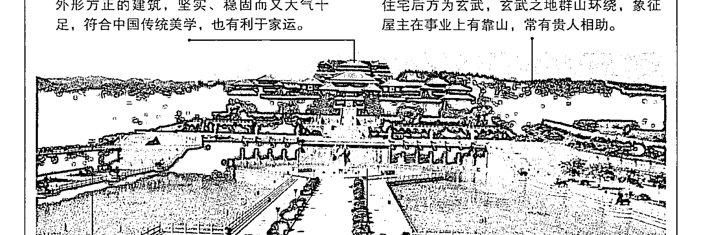

外形方正的建筑，坚实、稳固而又大气十足，符合中国传统美学，也有利于家运。

住宅后方为玄武，玄武之地群山环绕，象征屋主在事业上有靠山，常有贵人相助。

住宅左右两侧的山分别为青龙与白虎，青龙位高于白虎位为吉，反之为凶。

住宅前的明堂为朱雀，如果朱雀前方有水环抱，家中会财源不断。

> > 在传统住宅文化中，住宅的左、右、前、后分别用左青龙、右白虎、前朱雀、后玄武来表示。若住宅在朱雀之地出现湖泊、池塘、喷泉等，可以给屋主带来财运。

## 002 什么是“城门水局”？

如果住宅四面环山，有一缺口供外气进，供内水出，此口就称为城门或水口。这一称呼取自古义，古城门外有水池，水气从城门出入，因此就把城门称为水口。

现代住宅，如果周围被众多建筑物包围，只有一方有缺口，此缺口又见水放光，如：十字路口、三叉水口、巷道的入口、人们走动频繁的路口，这样的格局就称为“城门水局”。

城门水局必须结合三元九运之说。若住宅的坐向生旺，就会使家业昌盛。即使坐向不佳，若能得到向方旺气，也能兴旺发达。

一般来说，住宅若得城门水局，易得偏财。屋主如果去玩博彩，手气会很好，但是财物易得也易失，运气到头即会衰败到底。

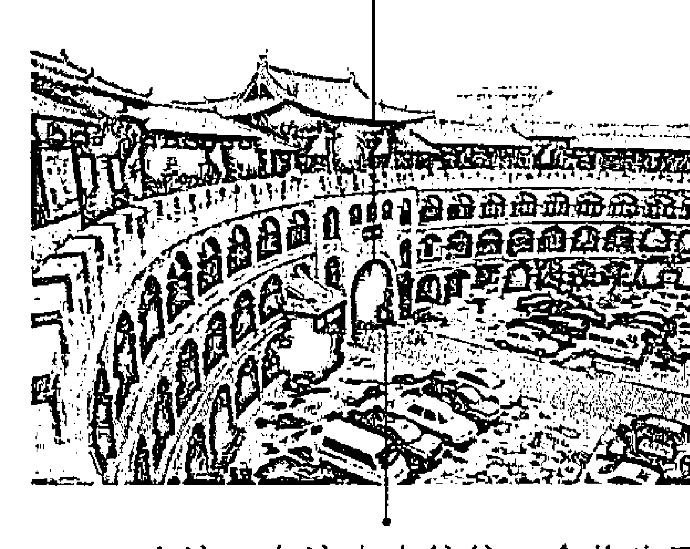

住宅得城门水局，偏财运强，但运气到头，财运就会一落千丈。

## 003 如何改善家居的招财格局？

第一，家中的明财位要干净、明亮。明财位在客厅大门对角的位置，这里要光线充足，不要堆放杂物，以免影响财运。如果觉得财运不佳，可以在明财位放置招财物品，如招财猫等。

第二，在家中玄关、客厅或六煞方悬挂吉祥画。常用的招财画内容多为牡丹和向日葵。吉祥画不但可以招来财运，还能驱赶煞气，是一个很不错的选择。

第三，在客厅的东南方摆放系有红绳的绿色植物。客厅的东南方是家中财气所在，在此放置绿色植物可以增加这个位置的生气，有了生气，才能生旺。也可以在天花板上挂一个葫芦来吸纳财气。

第四，可以通过佩戴玉石印章或者黑色磁石来改善财运。佩戴黑色磁石不但可以增加财运，还能吸引财气和财源。而玉石印章不但象征着权力，还象征着财富，可以让你步步高升、财源广进。

如果财运不佳，经常将招财猫饰品佩戴在身边有提升财运的作用。

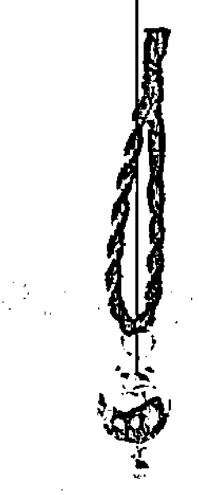

招财猫

## 004 如何利用明堂吸纳财气？

明堂宽敞，才能迎风纳气。古代建筑以庭院为主，把住宅前方的空地称为外明堂，把屋子前方的空地为中明堂，把屋内的玄关称为内明堂。而对于现代住宅来说，人们一般认为屋前的马路为外明堂，从马路到屋子的地方为中明堂，客厅为内明堂。

明堂之地，宜开阔无遮挡，不宜摆放杂物，这样才能接纳八方生气，生旺财运。如果明堂上杂物堆积，或者有遮挡，则财气难以进入，财运自然不佳。这一理论，不但适用于家居住宅，也适用于商铺、店面和写字楼。

所以，在必要的时候，要牺牲房屋面积来营造开阔的明堂，以达到吸引生气、招纳财气的效果。

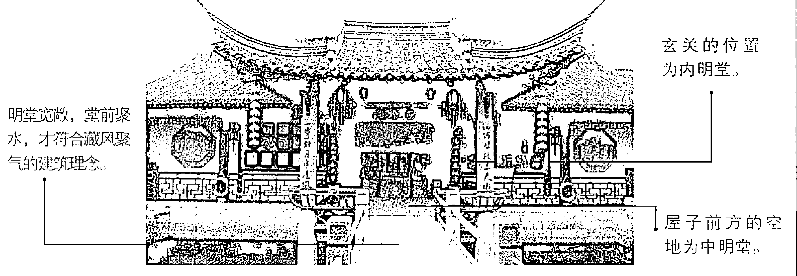

> 鱼乐国位于绍兴磐庐花园内，其建筑坐北朝南，为砖木结构，是我国古典建筑中的典范。

## 005 哪种颜色的大门最旺财？

古代住宅文化中有“一门二房三客厅”之说，可见大门对家运的重要作用。古时大户人家为了防盗，大门的颜色往往与环境色系相近，即所谓“韬光养晦”。

大门是住宅的重要组成部分，它就像人的口，主吸纳之气。如果大门开错了方向或者选错了颜色，财运就会大大下降。大门的朝向不同，所选择的颜色也有所不同。

### 旺财大门朝向-颜色对照表

| 大门朝向 | 五行属性 | 适宜颜色 | 禁忌颜色 |
| :--- | :--- | :--- | :--- |
| 正西、西北 | 金 | 白色、金色、咖啡色 | 黑色、蓝色 |
| 正东、东南 | 木 | 黑色、蓝色、绿色 | 红色、紫色、白色 |
| 正北 | 水 | 白色、金色、黑色 | 绿色、青色、土黄色 |
| 正南方 | 火 | 红色、绿色、紫色 | 黑色、蓝色、土黄色 |
| 西南、东北 | 土 | 红色、紫色、土黄色 | 绿色、青色、金色 |

## 006 窗户形状如何选用？

一般来说，方形的窗户，线条较为硬朗，能让人精神振奋，进而充分地肯定自我。这种形状的窗户适合用在餐厅或工作场所，可以增进人的食欲，工作上会精神倍增，财运也会接踵而至。圆形或拱形的窗户，线条较为柔和，常常可以让人感觉宁静与安祥，精神也会进一步放松，适合用于卧室、玄关或休闲类场所，这样可以更好地休息。

方形、拱形、圆形的窗户各有所长。在普通住宅里，可以根据它们的特性，在不同的位置混合使用，从而获得最佳的招财效果。

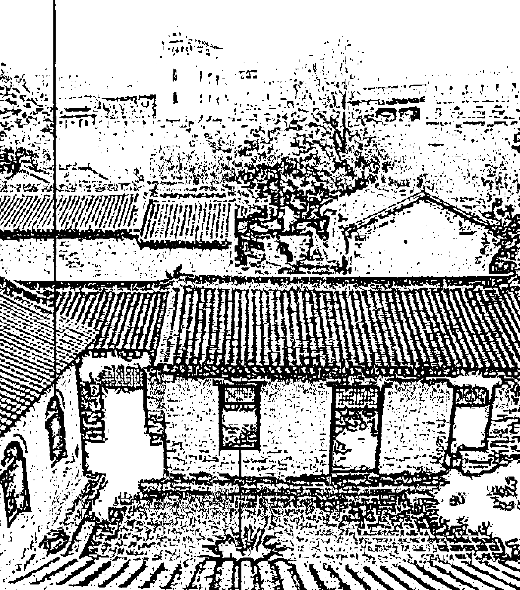

拱形窗户线条柔和，给人安详、宁静的感觉，可让人精神放松。

方形窗户线条硬朗，可以让人精神振奋。

> 根据房屋的不同用途，合理搭配方形窗与拱形窗，使人精神状态张弛有度。

## 007 开窗的方式与财运有关吗？

窗户是房间吐纳空气、与外界交流的主要通道，因此经常开窗换气是保持住宅财气流通的重要条件。开窗的方式很有讲究，通常以向外开启为佳。

一般来说，我们都会在窗户前面悬挂窗帘或者安置百叶窗。若窗户向内开启，常会被窗帘或百叶窗挡住，难以打开。古代人认为，窗户向内开启会让居住者的性格变得胆怯、退缩，财运很难进屋。若房间内的窗户为向内开启，可在窗下摆放植物或音响，激活窗口能量。这样既可以让居住者勇于进取，也能财源广进。

屋内窗户只能向上推开一半，居住者多有志难酬，工作不顺利，财运不佳。想改善这种情况，可以将窗台漆上明亮色的油漆，用百叶窗遮阳而不用窗帘，窗边摆放植物、水晶等活化气场。

屋内窗户只能向上推开一半，居住者多有志难酬，工作不顺利，财运不佳。

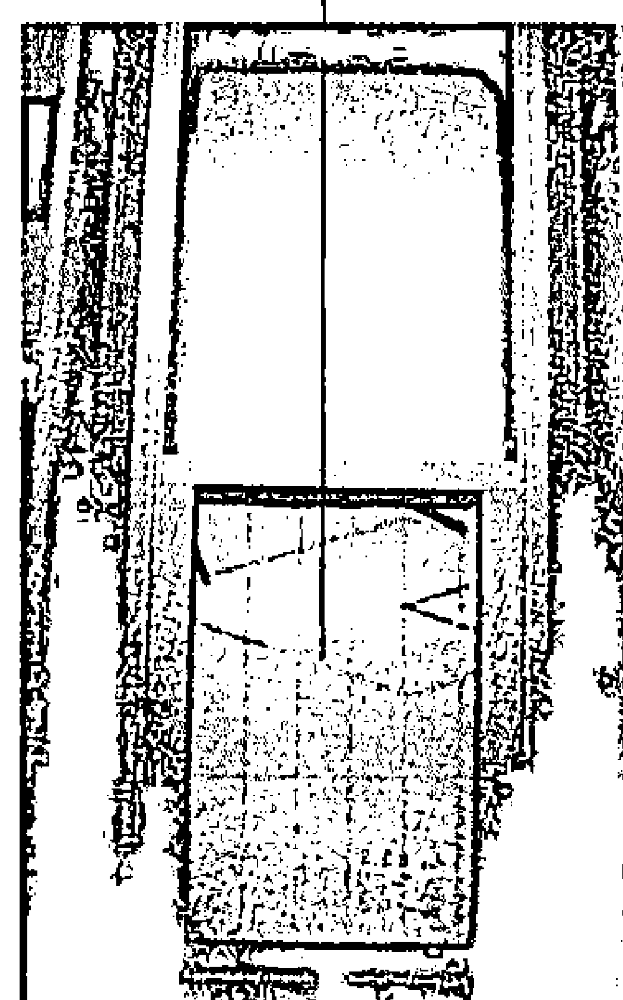

## 008 怎样利用家居色调提升财运?

一般来说，黄色是太阳的颜色，亮丽、吉祥，一般用来代表财富。古代人认为，西方主财，讲究虚其西方以纳财。因此，住宅西面的房间以黄色为基调，摆放一些催财饰物如黄水晶等，可以为家庭带来旺盛的财气。

东方象征年轻，有活力，配以代表热情进取的红色，可以让家人充满活力，财运也会接踵而至；南方主灵感和社交，配以富有生机的绿色，对人际关系有促进作用，人气旺盛，财运也会旺盛；北方主夫妻关系，配以温暖、欢乐的橙色，可以有效地促进夫妻感情，夫妻感情和睦，会促进事业的兴旺，财气自然源源不断。

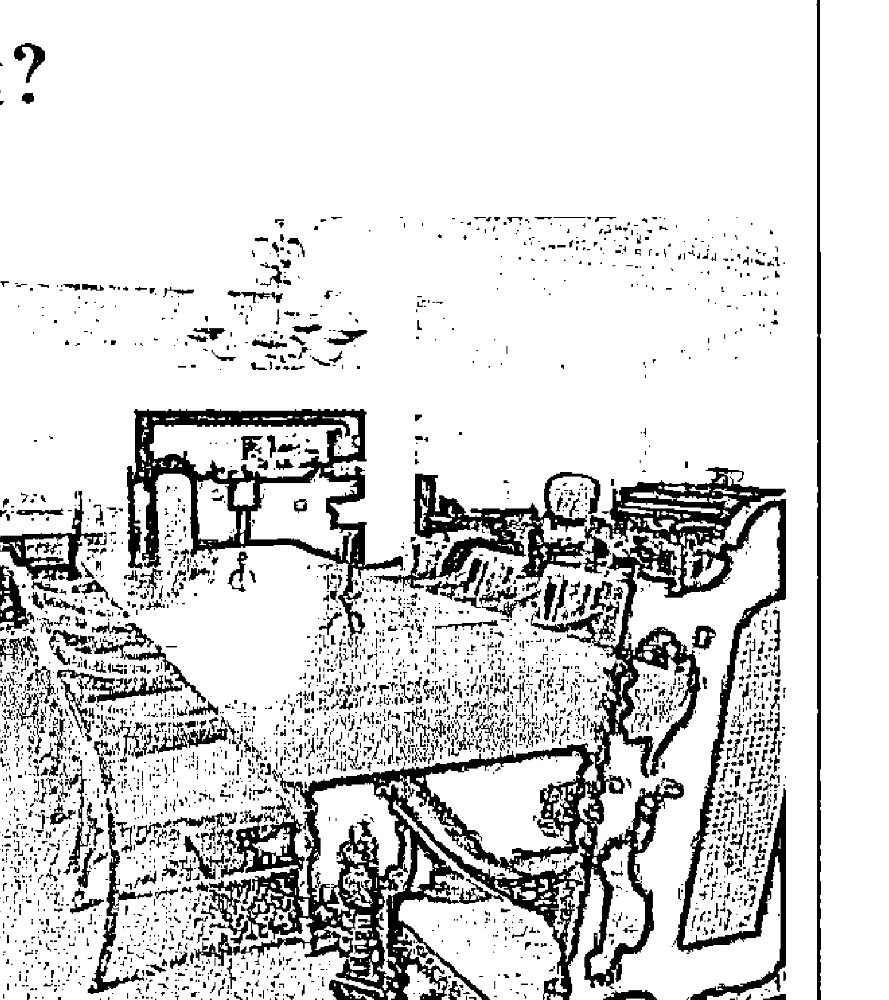

黄色木质餐桌 黄色代表财富，黄色的餐桌有利于增旺财运，特别是摆放在住宅的西方。

## 009 玄关与鞋柜采用哪种颜色能招财?

家居色调不单是视觉上的问题，它与运势有着密切关系。一个家庭选择什么样的色调，其运势也会受到一定影响。

玄关是入室的必经之路，也是引气入室的必经之路，更是财神入门的第一关，所以一定要注重玄关的设计。玄关的颜色应以清淡、明亮的颜色为吉，如白色、淡绿色、淡蓝色、粉红色等。这些颜色象征着希望和热情，可以增强阳气，避免玄关给人阴暗之感。

鞋柜一般摆放在门口，其色调应该与玄关保持一致，颜色以黄色、白色为宜，忌红色。红色有出入见红之意，容易让人心情浮躁，对财运不利。

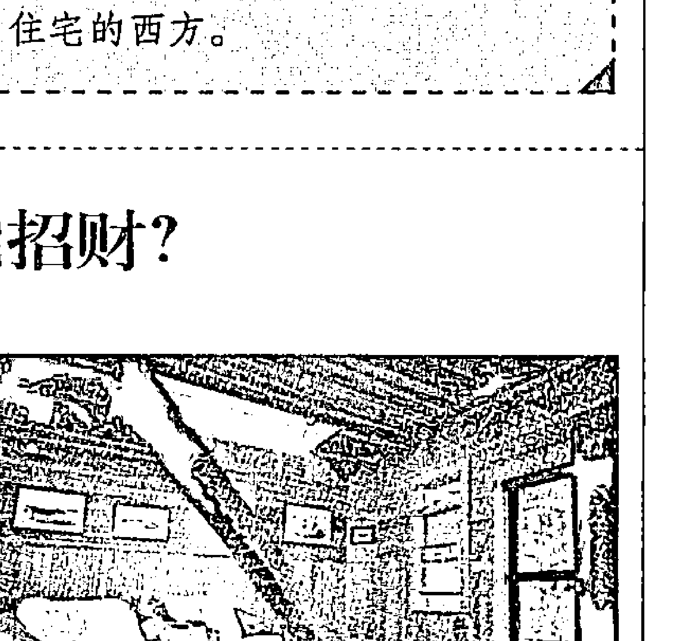

玄关 玄关是财气入门的必经之路，颜色以清淡、明亮为佳，如白色、浅绿色、粉红色等，可以增加阳气。

## 010 沙发与财运有何关系？

沙发要摆放在财位上。住宅的财位，在客厅大门对角的位置。如果客厅的沙发刚好放于此处，家人经常在此活动，可以沾染财气。

沙发的形状最好是方形或者圆形。一般来说，奇形怪状的沙发会产生不好的磁场，进而带来衰运。圆形和方形的沙发能很好地利用空间，增进家人的感情，还可以增加财运。

沙发的材质，以织物、纤维、棉麻为吉，因为这些材质有温暖的阳气，可以开运纳吉。现在许多家庭为了便于清洁，常用硬木红椅作为沙发，甚至以冷色调的大理石做茶几，这些坚硬、生冷之物，不利招纳财气。

主沙发宜靠墙，但所靠的墙不宜为外墙，背后也不宜有厕所、厨房。

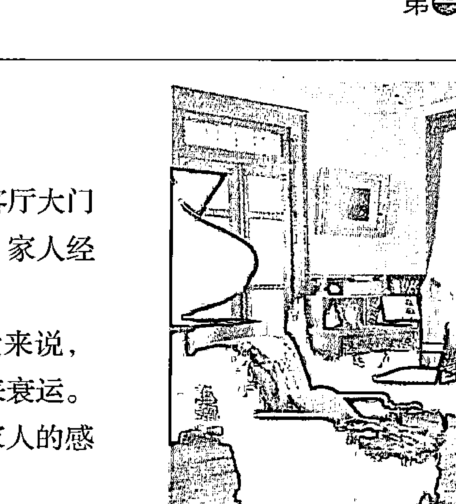

> **沙发**

沙发材质以织物、纤维、棉麻布料为吉。这类材质有温暖的阳气，能开运纳吉。

## 011 如何布置玄关招财运？

玄关是大门与客厅的缓冲地带，有防风作用。同时，玄关还代表着家中的财路，起到遮掩隐私的作用，因此，玄关的布置非常重要。

玄关宜宽敞，可以在玄关处装设一面镜子，在视觉上扩展玄关的空间面积，使其显得明净。需要注意的是，内明堂不能放置太多的物品，以免影响财运。

水是财气的象征，所以在玄关处摆设流动的水能增强气场，催财招运。在玄关的柜子上，可摆设黄水晶或是流动的水，如鱼缸、流水盆、手绘山水画，用来增强气场，催财招运。流水的方向最好指向住宅的财库——厨房。

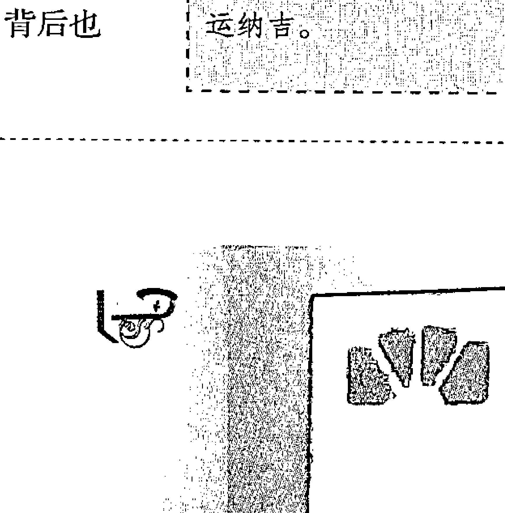

> **玄关布局**

玄关是大门与客厅气流进出的缓冲地带，宜宽敞明亮。可以在玄关处摆放黄水晶、鱼缸、流水盆、手绘山水画等来增强财运。

## 012 如何利用正面能量增强客厅财运？

大体而言，凡是事物都有能量，正面能量能给家人带来健康和好运，负面能量则会带来疾病和厄运。客厅的正面能量，来自于充足的阳光和新鲜流通的空气。

要保证充足的阳光，就要确保阳光能照入屋内。只有阳光入室，才能使住宅内充满吉祥瑞气，这对家人的身体健康和精神状态都是有积极作用的。当然，窗帘的厚度要适宜，太厚会阻挡阳光，太薄则会形成光煞。

古代人认为，财运是随气而来的，因此保持室内空气流通才能财运亨通。从窗户吹进来的自然风，以轻柔为佳。

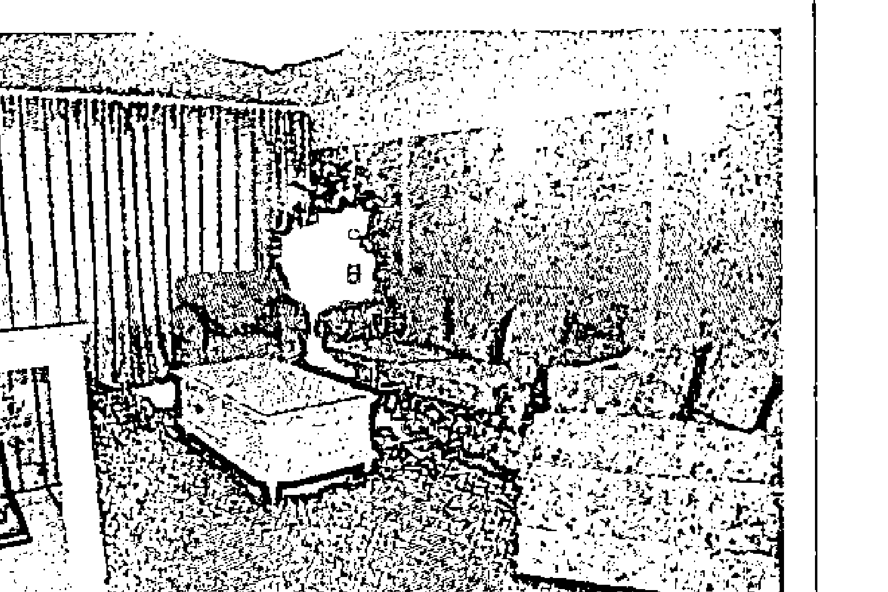

> 客厅
利用正面能量增强客厅财运，在客厅摆放净化空气的植物，能带来好运。客厅的窗帘不宜太厚，太厚会阻挡阳光，但太薄会形成光煞。

## 013 客厅的装饰画有何讲究？

许多家庭会把寓意吉祥的字画挂在象征财位的客厅。如象征富贵的牡丹、象征富裕的莲花锦鲤图、象征长寿的松鹤延寿图、象征福运长存的流云百蝠图。

客厅的挂画，应以正面能量的内容为主，避免突兀或意境凄凉的作品，如：抽象画、猛兽飞禽、落叶、沙漠、惊涛、暮色等。沙发背后的挂画，应该选择横幅而不应选择竖幅，这样可以与沙发形成平行线，有利于财运。

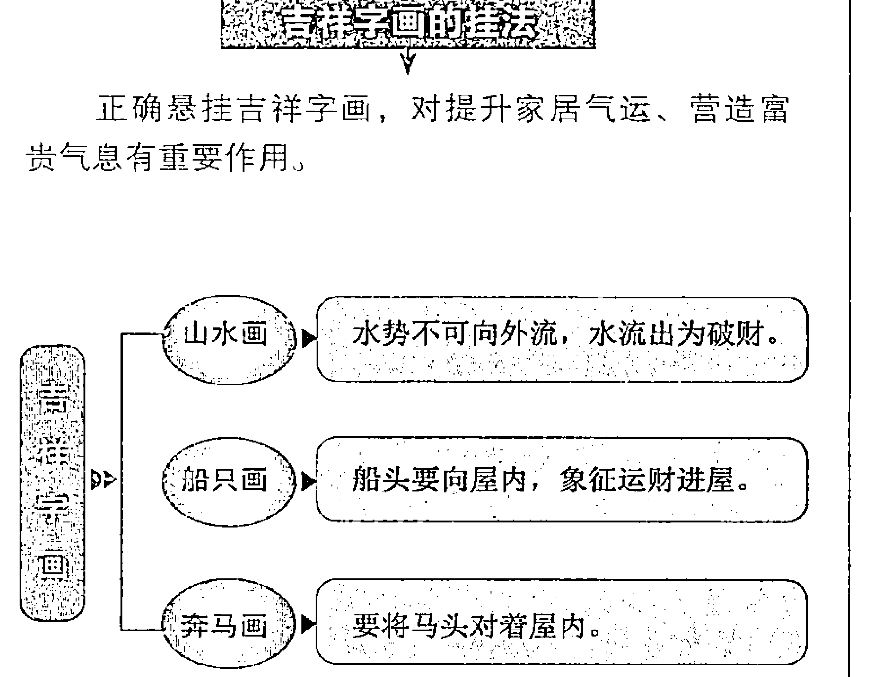

## 014 什么样的客厅地毯能招财？

客厅的沙发前，通常会放上一块华丽的地毯，这会让客厅显得华丽、温暖。沙发前的地毯相当于客厅的明堂，可以纳气旺财，是客厅不可或缺的物品之一。

鲜艳、亮丽的地毯能生旺气运，色彩单一的地毯不但会让客厅显得黯淡无光，也很难招来财气，所以在选择地毯的时候应该选择色彩鲜亮的。其中，以红色或金黄色为主色最佳。

我们在选择地毯时，不要选择图案古怪的地毯，要选择寓意吉祥的图案。地毯图案以人物、小动物、花卉、山水或者其他风景最为常见。

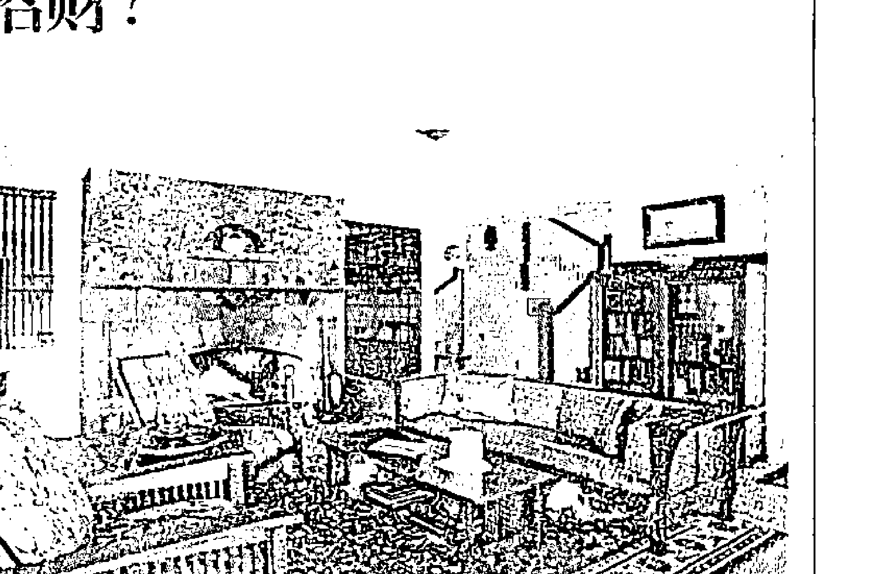

> 客厅地毯

客厅的地毯相当于明堂，其色彩以鲜艳、明亮为佳；要选择寓意吉祥的图案，简洁、大方的房间适合用绿色的地毯来装饰。

## 015 如何利用水晶珠帘改善阳台环境？

水晶珠帘不但是美化房间的装饰物品，同时可以用来化解不利格局带来的影响。若所居住的房屋有不利格局，可以使用水晶珠帘来化解。

如果阳台正对大楼、电线杆、高架桥、墙角等不利影响，为避免正面冲突，通常会悬挂一副珠帘来缓冲，让煞气不能直接穿堂入室。在洗手间或客厅里挂一副珠帘，也能起到净化能量，提升财运的功效。

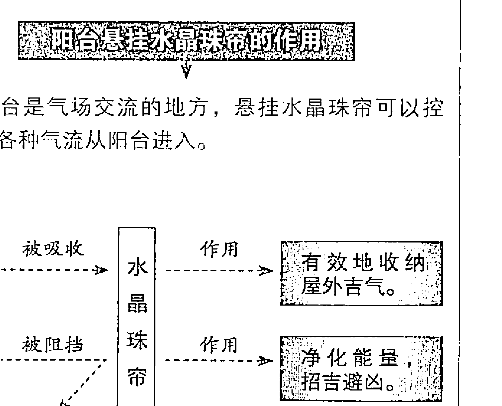

## 016 如何布置卧室可以招来财运？

古代人认为“明厅暗房”，这是说客厅要宽敞明亮，卧室则要光线柔和。卧室是休息的地方，柔和的光线有助于休息和恢复精力。所以要尽量选择柔和的颜色，尽量不要使用红色等鲜艳的颜色。

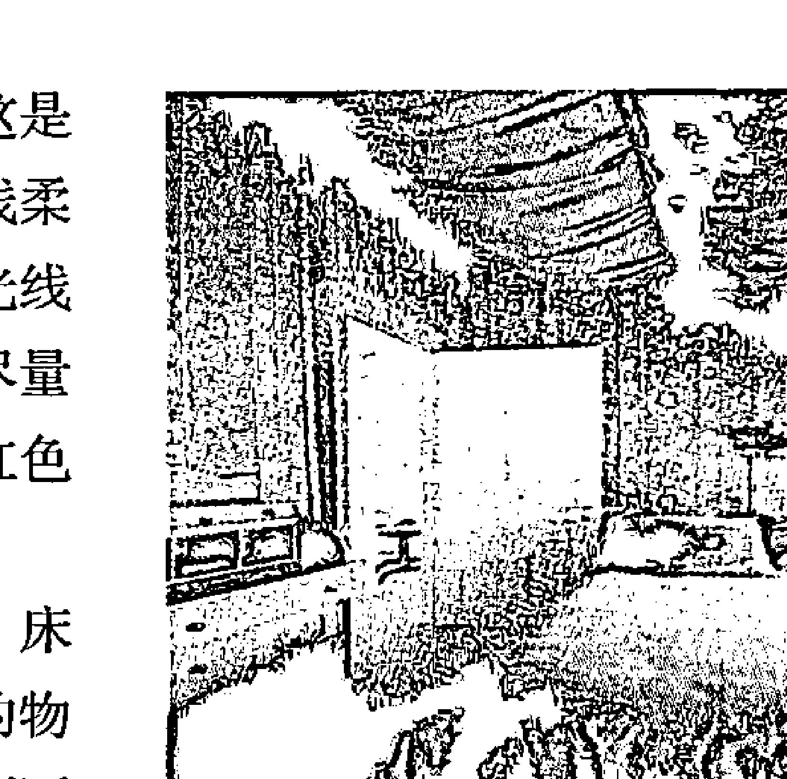

在卧室的上方不可以装吊灯；床不可正对着镜子；不能悬挂奇怪的物品或者刀、剑之类的利器；尽量不要摆放盆栽植物；床下面不可以堆放杂物；床头两侧摆放柜子的时候不要将桌角对着头部和颈部。

> 舒适的卧室
卧室是休息的地方，装修的时候要以舒适、健康为主，不要放置有辐射的电器和影响气流畅通的杂物。

如果床头柜上面有两盏小灯，更具有催财、聚财的功效。枕头的摆放应为男左女右，阴阳调和，夫妇和睦才能生旺财运。

## 017 为何床头靠墙有助于财运？

古代人认为床头靠墙为吉，即所谓“背后有靠”。从科学的角度讲，床头无靠，会让人在心理上没有安全感，同时也会影响睡眠质量，久而久之会对人的健康产生不好的影响。而健康是最大的财富，失去了健康，财气自然无从谈起。

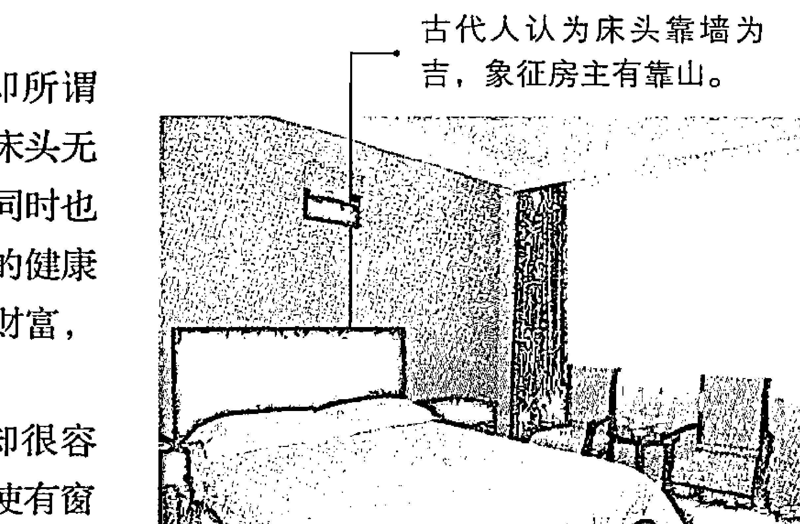

若床头靠窗，虽通风良好，却很容易引起伤风或患呼吸系统疾病。即使有窗帘阻隔，也属于漏财之局，不吉。

> 卧室床铺摆放
卧室的床背后有靠，床的两边设置两个小床头柜，可以增进夫妻的感情和增强事业运。

如果床头实在没有办法靠墙，那么在选择床的时候一定要选择有较大床头的床来改变衰势，这对财气的引入会有所助益。

## 018 如何布置浴室有利于财运？

浴室属水，水主财，因此浴室对家庭的财运有直接的影响。

浴室的外形宜方正，宜大不宜小。浴室的空间宽敞有利于通风、排湿。湿气过大，不利于健康和财运。若浴室位于卧室内部，则其地面不宜高于卧室，浴缸位置不宜高过床铺。否则浴室的潮湿之气很容易侵入卧室之中，引发健康问题。

浴室的位置最好是在住宅的东方或东南方，这两个方位属木，卫浴的水气能够生旺这两个方位的五行之木。另外，东方或东南方的浴室向阳，能够保持浴室干燥、通风，整个房间也不会有太重的湿气。

浴缸不能过高，否则不方便年长者使用。

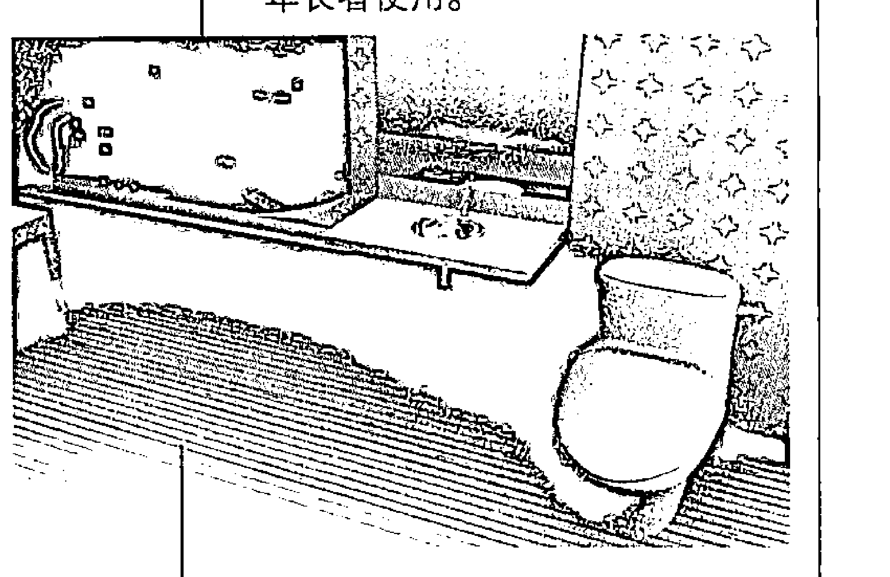

向阳的浴室有利于通风、除湿。

> 浴室设计
浴室布局是住宅布局中的关键环节。厕所内的浴室，要注意通风、顺气，屋内空气过于潮湿对家人健康不利。

## 019 厨房布局与财运有何关系？

厨房的炉灶代表住宅的财库，俗话说“财不露白”，因此，厨房的门不能正对着灶台，否则钱财容易流失。

厨房内不宜有太大的窗户，以免财气外流。厨房内不要悬挂刀具，尽量不要将大蒜、辣椒等容易吸收阴气的物品悬挂在厨房内。

厨房里面尽量不要放镜子，即使有镜子也要注意不要正对炉灶。镜子有反射作用，会把财运反射出去。

厨房不宜与浴室或厕所相连，以免污秽之气污染厨房，对财气和健康都不利。在装修厨房的时候还要注意选择颜色，一般以浅色为宜，白色和米黄色都是不错的选择。

炉灶不要对着水龙头，也不要靠近洗菜池，否则影响财运。

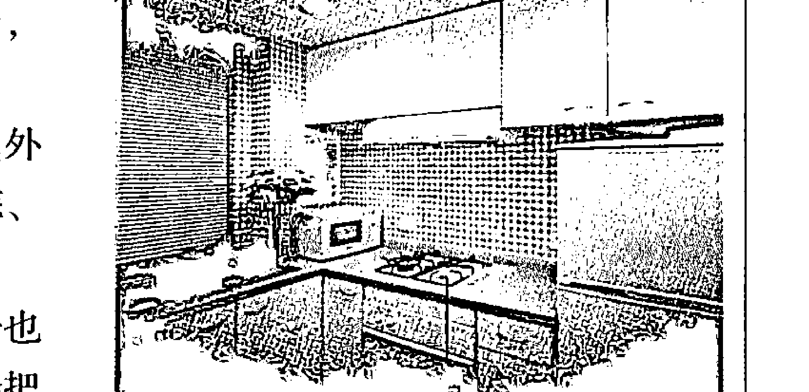

炉灶背后宜有实墙，即所谓的“财库有靠”。

> 厨房
在厨房中，炉灶的放置最重要，如果位置不合适，就会影响家人的财运和健康运。

## 020 如何利用餐厅的镜子增强财运？

在人们的日常生活中，饮食和穿着具有重要的位置。“锦衣玉食”是财运的一种象征。要想提升生活质量，就得注重餐厅的布局。

古代人认为，餐厅是家庭财库的象征之一。可以在餐桌的侧面安置一面镜子，由于镜子的反射作用，餐桌上的食物就会变成双份。“有形必有灵”，双倍的食物象征了双份的财运。

此外，为了增加财运，还可以在餐厅悬挂水果图画，若水果画有饱满的果实，喜庆又吉祥，则效果更佳。

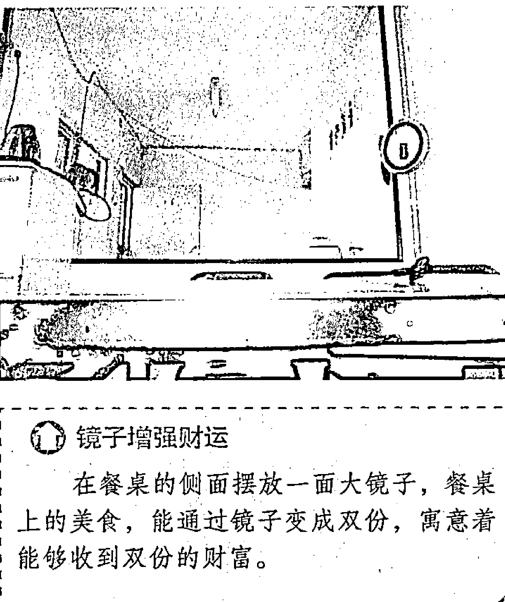

> 镜子增强财运
在餐桌的侧面摆放一面大镜子，餐桌上的美食，能通过镜子变成双份，寓意着能够收到双份的财富。

## 021 如何利用色彩让餐厅守财？

餐厅是吃饭的地方，是人们补充能量的重要场所，所以一定要注意餐厅色彩的选择和搭配。好的色彩搭配可以增进人的食欲，带来良好的心理暗示，进而起到招财、聚财的作用。

一般说来，沉静的餐厅可以让家庭的财运稳定。因此，餐厅要以沉稳的色调为主题，如灰色、黑白色、棕色等。如果想增加财运，可以在餐厅的西方增加黄色元素。黄色象征高贵，有聚气生财的作用，宅主还容易得到贵人的帮助。

餐厅的西方代表“食”和“禄”，可以在餐厅西方的窗户边放置黄色花朵，或者摆放黄色相框。相片的内容，如果是丰收的水果，还可以起到丰衣足食的效果。

黄色在餐厅中的运用
餐厅色彩中最招财的颜色是黄色，黄色不仅能增进食欲、聚气生财，还能驱邪避煞。

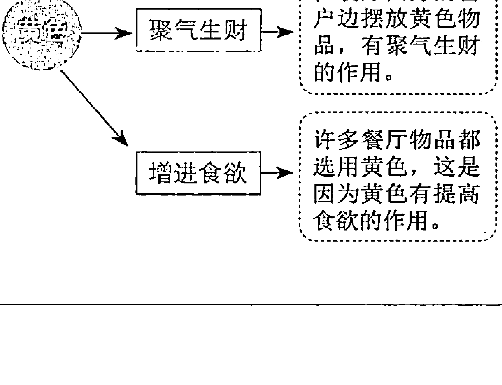

## 022 如何利用灯光提升财运？

灯是家居生活中不可缺少的物品，它不但可以起到照明和影响房间格调的作用，还可以起到提升财运的作用。

灯代表光明和温暖，能够驱散黑暗，属于正面能量，有生旺财运的功效。在门口的玄关处，装上三盏、四盏或九盏灯，可以起到生旺财运的效果。但是要注意避免三盏灯并排直射，形成三炷香的形状。

卧室中的灯，要避免直射，以免影响睡眠，可以让光源偏射向墙壁，以反射光照明。古代人认为，小灯可以聚财，卧室中可以多装几盏小灯以达到催财的效果。

餐厅里的灯应该选择造型独特且光线柔和者，可以增加食欲，有益身心健康。在居室的明财位上悬挂一盏灯可以让家中的财运更加旺盛。

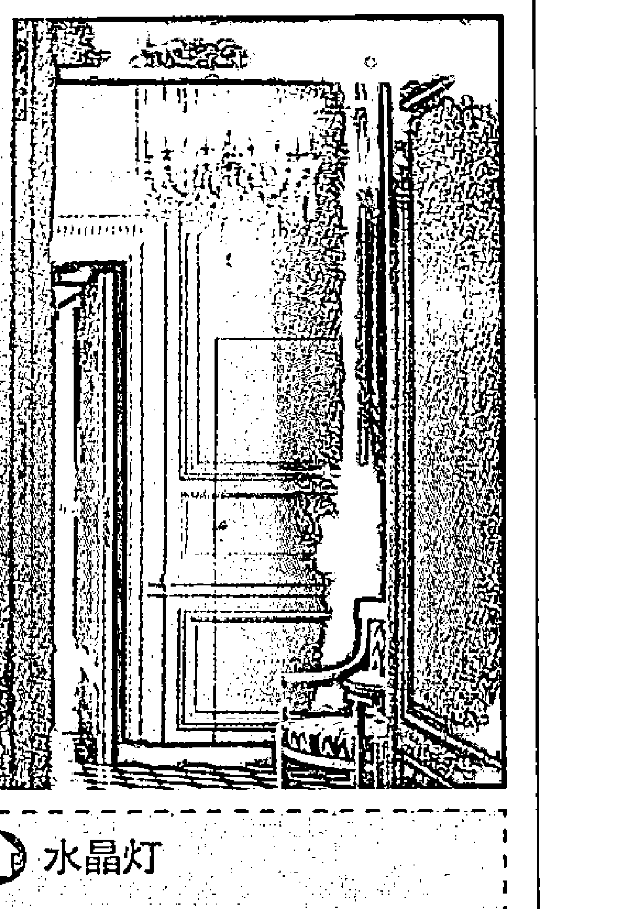

> **水晶灯**

在选择灯具的款式时，最好选用黄水晶或者白水晶做成的圆形吊灯，圆形水晶灯象征家运安稳。

## 023 如何用华贵气息吸引财气？

家居装饰，很多人喜欢淡雅，但若有一种雍容华贵的气息，更容易招来财气。因为淡雅的风格难以吸引财神的注意力，家中不易聚气生财。

家中摆放古典、雅致的沙发、椅子，色彩华丽的置物架等，不但可以增加房间的华贵气息，还能让财神更加乐意光临。此外，增加华贵气息还可以在厨房和卫生间贴彩绘瓷砖，这样容易形成华贵的气场，增添个人魅力，从而赢得贵人的青睐。

需要注意的是，家中不宜采用不锈钢材质的桌椅，这种家具给人冷硬的感觉，而且反射冷光，不利于财气的停留。

## 如何营造华贵气息

华贵气息不仅可以显示屋主的个人魅力和独特品位，还可以吸引财神的光临。我们可以通过古典、雅致的沙发，色彩华丽的置物架，彩绘瓷砖等来营造华贵气息。

华贵气息的装饰元素：
- 古典、雅致的沙发
- 色彩华丽的置物架
- 彩绘图案的瓷砖
- 古典木质的家具

## 第二章 财位开运

本章主要讲了财位开运的相关问题。内容涉及明财位、暗财位、东南财位的确定及布置，还阐述了补救不理想财位的方法。

## 024 如何找出住宅的暗财位？

暗财位是实质性的财位。依据八宅紫白飞星，取其生旺方位即可。一般来说，坐北向南的住宅为“离宅”，其财位在西南、正北；坐南向北的住宅为“震宅”，其财位在东北、正南；坐西向东的住宅为“巽宅”，其财位在正南、西北、东南；坐东向西的住宅为“兑宅”，其财位在正东、正北；坐西北朝东南的住宅为“坎宅”，其财位在正西、西北、正北；坐东南向西北的住宅为“乾宅”，其财位在西南、东南；坐西南朝东北的住宅为“坤宅”，其财位在正东、西南；坐东北朝西南的住宅为“艮宅”，其财位在西北、东北。

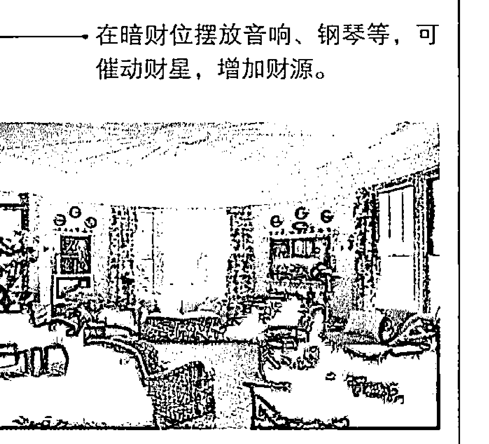

> **住宅的暗财位**
暗财位是与明财位相对的概念，明财位是家中象征性的财位，暗财位是家中的实质性财位。

## 025 如何布置住宅的暗财位？

布置暗财位和布置明财位一样，可以通过摆放吉祥物或者招财物品来提升财运。摆放财神、元宝、蟾蜍、聚宝盆等均可提升财运。
暗财位不宜摆放海浪或瀑布图，因其象征财运起伏不定，财来财去。若是摆放山水图，水流不能向外，向外象征家财外流。若是摆放弃马图，马头必须对准屋内，否则会造成财气外泄。若是摆放麒麟，应将麒麟头冲着屋内，否则不易聚财。暗财位不宜摆放尖叶植物或有刺的盆栽，也不要摆放水晶洞。

## 026 如何布置家中的明财位？

家中的明财位，在入门的45度角位置，即在左边或右边的对角线上。在明财位上摆放招财吉祥物，能增强客厅的气场，增加财源广进的机会。

明财位可摆放的吉祥物有：财神、元宝、宝瓶、蟾蜍、金钱豹、聚宝盆、五帝古钱、发财树、富贵竹等，也可以悬挂三羊开泰图、山水图、鹿群向内图等吉祥招财的图画。

布置家中的明财位要注意光照。一般来说，明财位若光照充足，财运会接踵而至，很多人都选择在家中的明财位点财神灯。

在明财位摆放沙发、座椅，并常同家人在此处休息，可以增加明财位的生气，财运自然旺盛。若明财位不适宜做休息场所，可以放盆栽植物来提升财气。

明财位的位置不宜为走道或通路，这样才能形成角落聚财之象；明财位也不宜堆放杂物，应保持干净，以免阻碍进财。

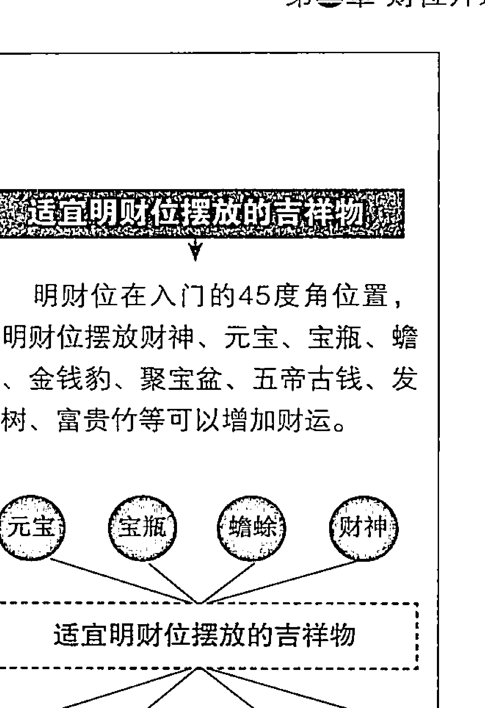

## 027 财位的布局摆设有何讲究？

财位忌无靠，背后最好是面墙，有靠可依，才可藏风聚气。因此，财位背后不宜为门、窗，易泄气破财。财位忌水，不宜摆放水种植物或者鱼缸，也不宜摆放有刺类植物或藤类植物，这类植物象征财路曲折、艰辛。

财位宜平整，不宜凹凸不平或有柱子；财位宜静不宜动，经常翻动的物品不宜放于此处；财位宜清洁，不要堆放杂乱之物；厕所或浴室在财位会让财气难以聚集，导致财运不佳；财位宜明亮，财位明亮则家运蓬勃，财位昏暗则财运停滞，需安装长明灯来化解。

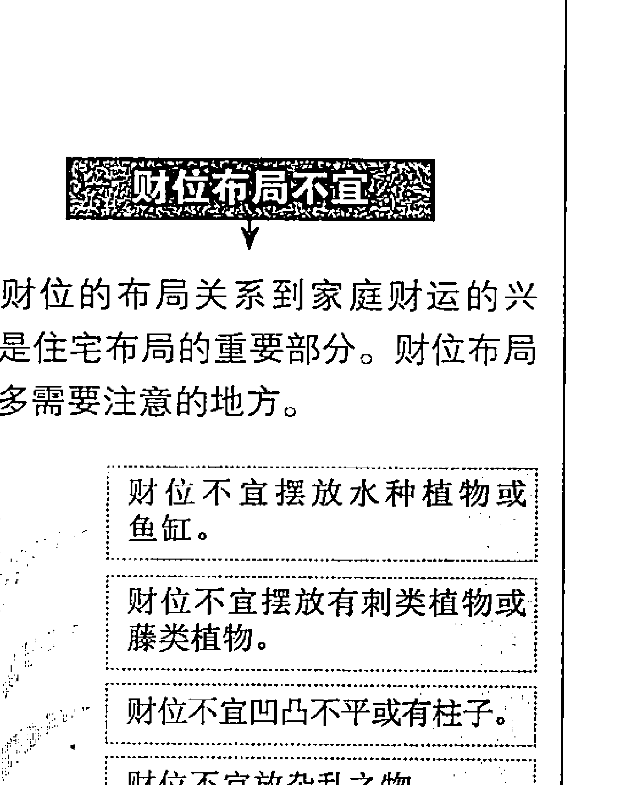

## 028 家里明财位不理想怎么办？

客厅的财位，通常在进门的对角线方位。财位最好布局方正，不宜有过道或门窗，也不宜正对厕所或者浴室的门。

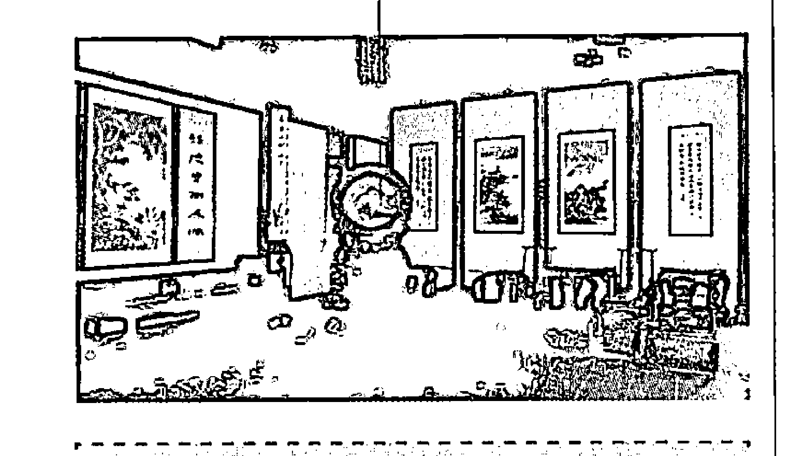

若财位处没有窗户，可在内部钉夹板墙，或者将窗户改在别处，以免财气外泄。若进门之后的对角线为走道，直冲财位，必须设置屏风，以形成财位聚水之象。

> 屏风
如果出现财位为走道的情况，应该在走道上安置屏风，形成财位聚水之象，防止财气外泄。

如果明财位正对着厕所或者浴室的大门，可以改变浴室门、厕所门的方向，或者放置屏风遮挡，以免沾染污秽之气，造成财气流失。

### 明财位招财小窍门

- 在明财位摆放吉祥物。
- 明财位宜明亮，可以在此点长明灯。

## 029 如何找出住宅的财位？

住宅的东南方属财位，五行属阴木，巽卦，代表成长、发展，代表万物葱茏的初夏。

| 住宅方位 | 财位 | 住宅方位 | 财位 |
| :--- | :--- | :--- | :--- |
| 坐西北向东南 | 西南 | 坐北向南 | 正南 |
| 坐东北向西南 | 正西 | 坐东向西 | 东南 |
| 坐东南向西北 | 正东 | 坐南向北 | 正北 |
| 坐西南向东北 | 西北 | 坐西向东 | 东北 |

要想找到财位，先在住宅平面图上用笔画线，把住宅平均分成九等份，与八卦九宫格对应。然后手持罗盘或指南针，面向外面站在大门处，让罗盘内圈的指针指向正北，确定出大门所向的方位。有了大门的方位，住宅的方位就确定了，东南方位就是住宅的财位。

## 030 如何布置住宅东南方的财位？

在布置财位之前，首先应把手中的欠账处理完，这样才能保证以后的财气只进不出，财运自然会有大的好转。

东南财位，五行属阴木，要有欣欣向荣的形态，光线明亮，空气清爽，不宜放置垃圾和杂物。另外，金克木，因此属金的物品如音响、电视及铁柜等均不宜放在这个方位。

由于水能生木，所以在东南方位放置水景、鱼缸和喷泉都是理想的选择。水质要干净，水要保持流动，静止的水无法聚气。墙壁的色调以属水的深蓝色和属木的绿色为宜。

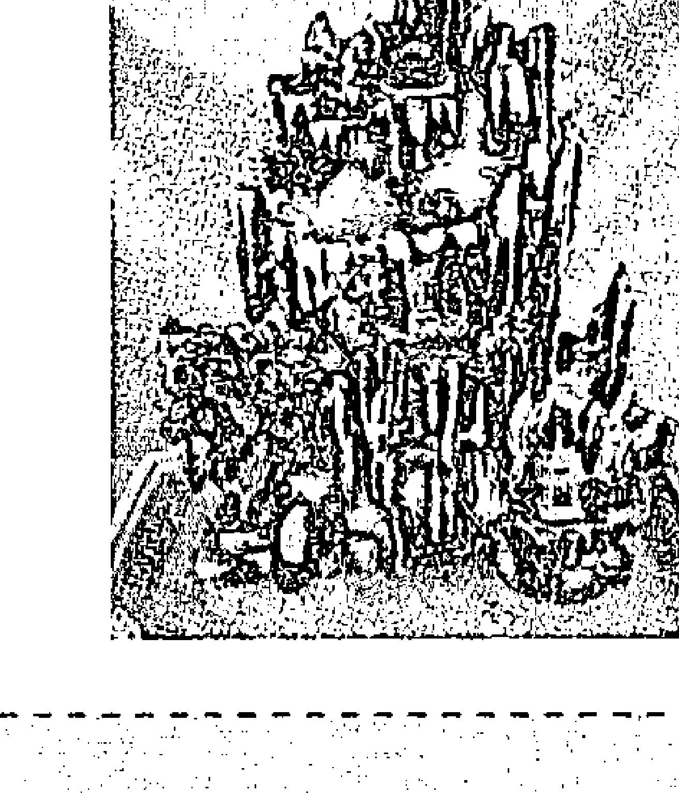

> 雾化盆景属水，水能生木，摆放在住宅的东南方财位有利于增强住宅的运势。

## 适宜东南方摆放的吉祥物

- 水景：东南方位阳光充足，适宜摆放水景，水生木，可以增强五行木的能量。
- 发财树：在发财树的下面压上一张钞票，会使财运大大增加。
- 招财猫：在东南财位摆放招财猫会增加财运。
- 蟾蜍：在古代，蟾蜍被认为是神物。将蟾蜍摆在东南财位有利于招财。

## 031 如何布置白虎方来提升偏财运？

很多人在谈到提升财运的时候，都会特别注重青龙方。但古代人认为，白虎方代表的是偏财运。因此，从事投资行业或者想增强赌运、手气等偏财运的人，可以通过布置白虎方来改善自己的偏财运。

白虎方属金，金克木，因此不宜在白虎方摆放招财的植物盆栽，否则金木相克，会让偏财运散失殆尽。可以在白虎方位摆放一些黄水晶饰物，黄水晶有增强财运的能量，可以提升偏财运。但是摆放黄水晶饰物要注意饰物必须清洁、干净，这样才能保证偏财运源源不断。

## 032 如何根据客厅朝向确定旺财颜色？

如果客厅的方向朝东，东方五行属木，木克土为财，土是木之财，因此宜选土的代表色——黄色，这样就会财运旺盛。客厅的油漆、墙纸、沙发等，都可采用黄色。

如果客厅的方向朝西，西方五行属金，金克木为财，木为金之财，宜选木的代表色——绿色，这样才能财运昌盛。

如果客厅的方向朝南，南方五行属火，火克金为财，金为火之财，宜选用白色，这样可以消去火气，财气也更为畅通。

如果客厅的方向朝北，北方五行属水，水克火为财，火为水之财，宜选用红色、紫色等色彩，这样财运会得到提升。

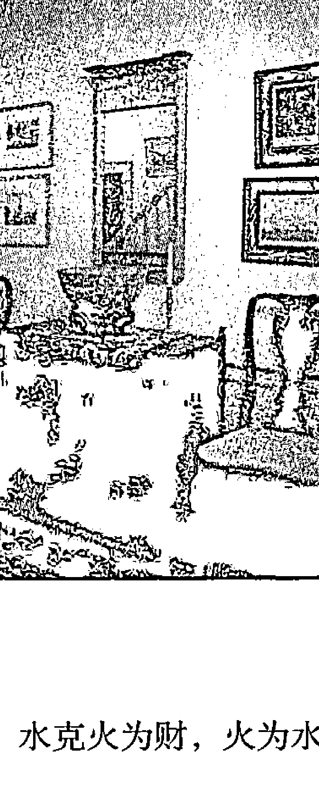

> 客厅颜色
> 客厅布局关系全家的运势兴衰，而客厅的家居颜色，依据客厅朝向的不同，也有不同的吉色。客厅方向朝东，以黄色为吉祥色，地板、椅子等采用黄色，可增强屋主的财运。

## 033 家中的招财植物为何要系红丝带？

住宅的招财植物，通常放在财位上才有明显的招财效果，如：明财位、暗财位、东南方财位等。招财的植物有万年青、龙骨、发财树、黄金葛等。细心的人会发现，讲究的家庭，在这些招财植物上面，都会系一根红丝带或红绳。

为什么要招财植物上面系红丝带或红绳呢？这是因为植物属阴，系上红绳或者红丝带，可以将植物转阴为阳。只有这样才能调节室内阴阳，起到生旺财气的作用。

## 034 门旁摆放什么最能招财？

掌握财运命脉的位置在大门的旁边。古代人认为“山主人丁，水主财”，有水的物品便能发挥财气的作用。所以，最简单的催财方法是在门边摆放水或与水有关的物品。其次，在大门开门可见的位置悬挂或者摆放红色的装饰物，财气也会带入室内。第三，在门左边摆放一盆招财的绿色植物或插花，不但可以起到催财的作用，还可以让屋内充满生机。第四，在屋子的内侧、门的下方悬挂一套五帝古钱也可招财。

## 035 住宅正中心对财运有何影响？

住宅的正中心为太极，是聚财之位。在这里不应该有天井，否则不但难以聚财，还会影响主人的权威，得不到外人的尊重。

住宅的中心不能是厨房。因为厨房内的水都是飞流直下的，这样不但会带走财气，还会影响家人的健康。此外，因为厨房有火，若将厨房建在住宅的中心位置，则有以火焚财的迹象。住宅的中心位置是聚财之处，不能摆放鱼缸或者饮水机，否则会“钱打水漂”，财富难以聚集。

在布置住宅的时候，要尽量保证住宅的中心位置不要有障碍物，保持房间空气的畅通，这样财运才会源源不断。

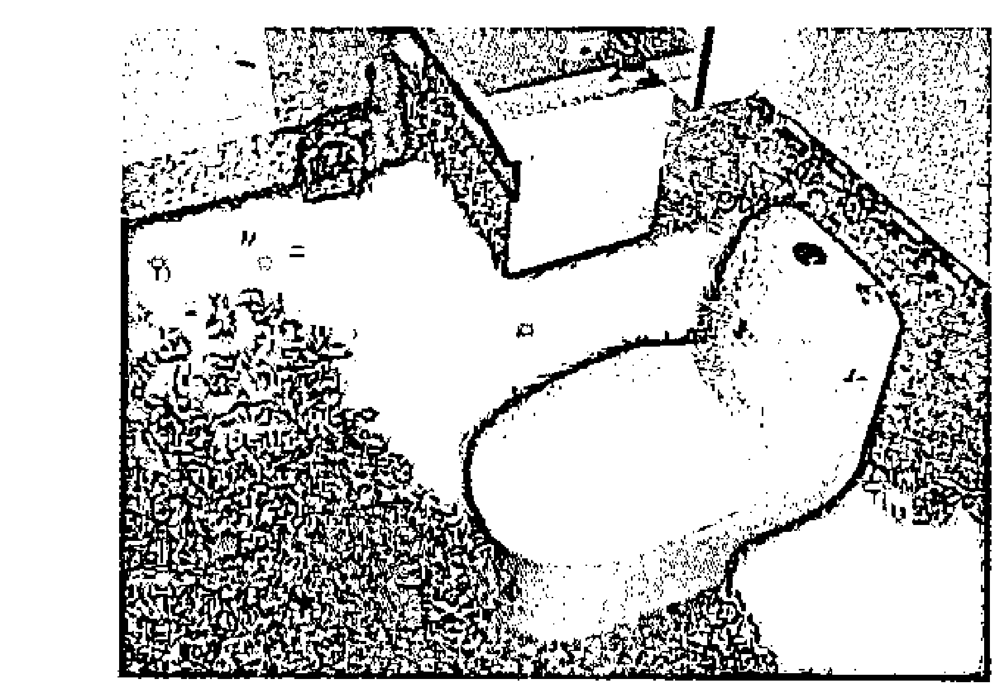

> 厕所位于住宅中央
> 不要把厕所建在屋子的正中心，否则住宅的中心充满污秽之气，财气难以接近。

## 036 怎样摆放饮水机可以招财？

饮水机是现代家居生活中的常用物品。水主财，因此饮水机的摆放也关系着财运。很多人喜欢把饮水机放在门口，这里灰尘、细菌较多，不利于健康；大门直对饮水机会造成冲煞，不利财运。因此，适宜放饮水机的地方主要有以下几个位置。

1. 放在大门入口的对角线处，这里是住宅的财位，以水聚财，非常合适。
2. 饮水机放于西南方，有助于女性财运；放于东方，对男性有帮助；放于东南方，有助于全家财运。
3. 放在大门旁边。放在这里不仅不会形成冲煞或破坏运势，接水还更加方便快捷。

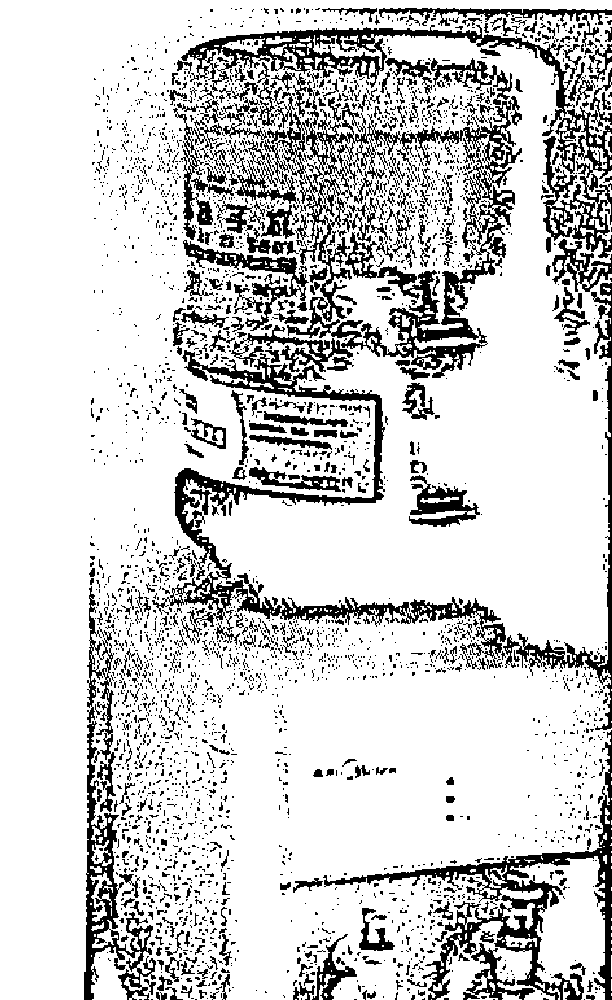

> 饮水机的摆放
> 饮水机属水，水主财。可以将饮水机摆放在大门入口的对角线处，大门旁边等位置。

## 第三章 商铺财源

本章主要讲述什么样的商铺才是旺铺？旺铺的决定因素是什么？如何生旺商铺？超市招财的忌讳？如何给商铺取名以及如何给旺铺选择开业吉日等方面的问题。

## 037 什么地段的商铺最旺财？

在现代城市中，车流、水流和人流就相当于“水”，水主财。而对城市而言，水流停聚之处就是人流与车流的停聚之处，如：停车场、火车站、地铁站、大商场等。
但是，繁华地段的租金一般相对较高，在这些地段开店必须量力而行。可选择一个闹中有静或者静中有闹的环境。若商品需要依赖巨大的人气，则应选择在繁华的地段开业。反之，像棺材铺、花圈店等，就可以选择在一个人流量不大的地方。

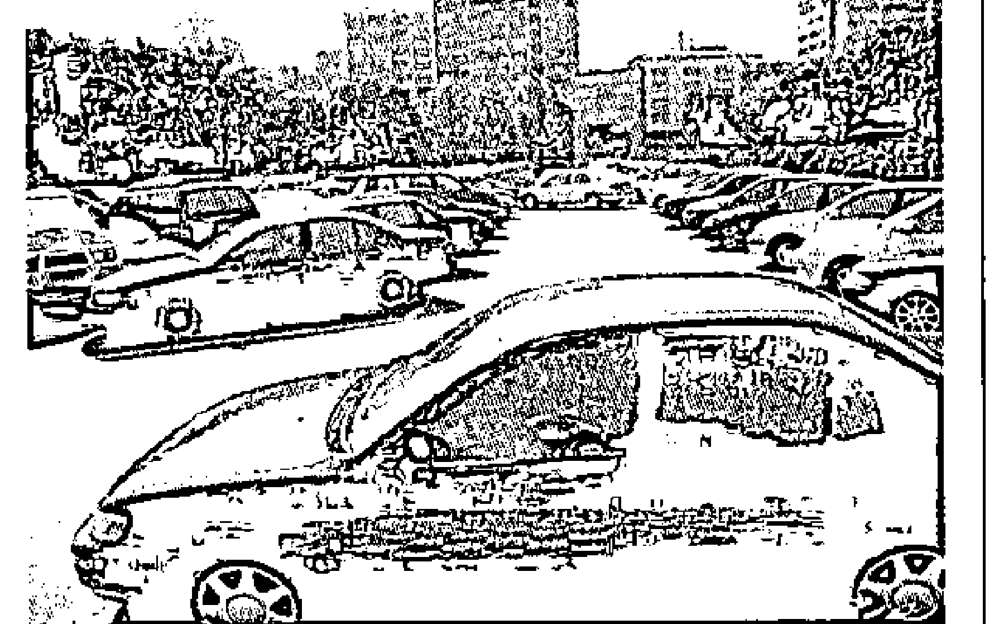

> > ① 商场最好选择在水流停聚的地方。车流属于意象之水，可以主财。因此，商铺可以考虑开在停车场附近。

## 038 如何利用人流方向提升店铺财运？

在城市的繁华地段，人流量大，最适合做生意。但是，若不注意人流方向，就会吃大亏。比如说火车站的出口处，旅客从站中涌出，人流就像潮水一样源源不绝。人流如河水，近水则生财，在这里开饭店或旅店，当然是最好的选择。但是，若把店开在车站的进口处，财运定然不济。这就是来水和去水的区别。来水宜宽阔，去水宜曲折，这样才能留住财气，聚气方能生财。

### 利用人流方向提升财运

来水宜宽阔，去水宜曲折，这样才能留住财气，聚气方能生财。

对于普通的临街店铺而言，来水即入口，去水即出口。

最适宜的水流方向是“龙方进，虎方出”，即左入右出，或者东进西出。

水流方向与宇宙天体相协调，必然可以增强店铺的财气。

## 039 如何在商厦里找出旺铺位置？

要想在商厦里找出旺铺，首先要认清“来水”。涌动的顾客即“水流”，他们会沿着扶梯或电梯这个通路而行。如果人流经过商铺时，是缓缓而行，是舒缓的“有情之水”，可以增强气场，生旺财运。如果人流经过商铺时，匆匆而行，是不吉的“无情之水”，无法聚气生财。
寻找商厦的旺铺还要看店铺之前的经营状况。若之前的生意兴旺，已经形成一定的人气，有人气方能有财气，这是衡量旺铺的重要标准。

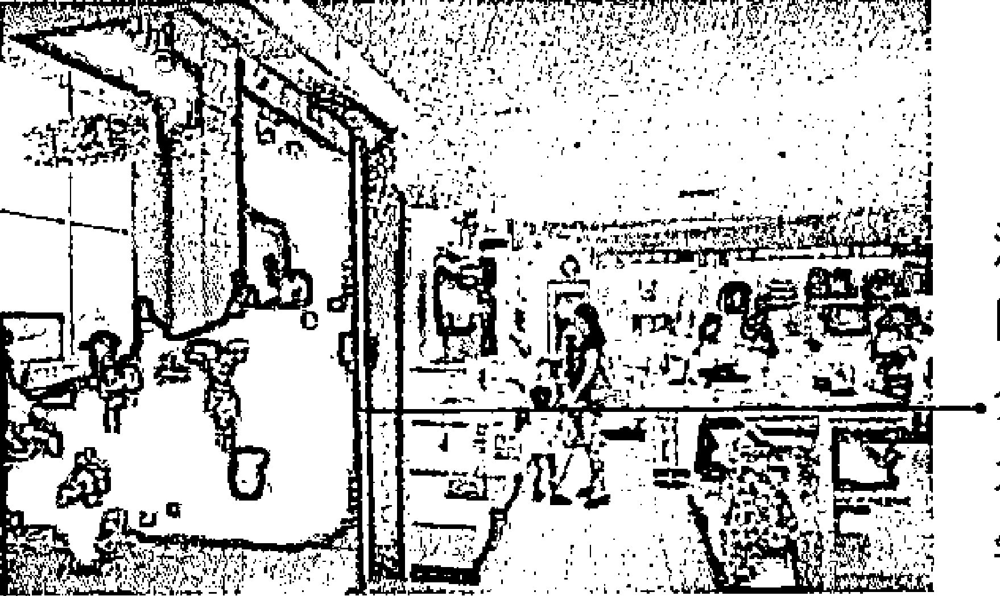

> ### 观察人流方向找旺铺
> 在商厦寻找旺铺，要仔细观察人们从电梯出来之后主要的流动方向、逗留地点以及行走速度。人流经过商铺行走缓慢，属有情之水，是大厦的旺铺所在。

## 040 如何布置收银机让生意兴隆？

收银机是商铺的进财之位，如果在这里精心布置一番，往往可以事半功倍。
店铺的方位可分成八个，其中生气、天医、延年、伏位是吉位，而五鬼、六煞、祸害、绝命是凶位，收银台的位置要避免在凶位上。
可以在收银台上放置貔貅、金蟾等招财物品，能起到招财的效果。也可以在收银机上方悬挂中空金属风铃，以纳气招财。

### 收银台方位吉凶查询表

| 方位 | 坐东向西 | 坐东南向西北 | 坐南向北 | 坐西南向东北 | 坐西向东 | 坐西北向东南 | 坐北向南 | 坐东北向西南 |
| :--- | :--- | :--- | :--- | :--- | :--- | :--- | :--- | :--- |
| 正东 | 伏位 | 延年 | 生气 | 祸害 | 绝命 | 五鬼 | 天医 | 六煞 |
| 东南 | 延年 | 伏位 | 天医 | 五鬼 | 六煞 | 祸害 | 生气 | 绝命 |
| 正南 | 生气 | 天医 | 伏位 | 六煞 | 五鬼 | 绝命 | 延年 | 祸害 |
| 西南 | 祸害 | 五鬼 | 六煞 | 伏位 | 天医 | 延年 | 绝命 | 生气 |
| 正西 | 绝命 | 六煞 | 五鬼 | 天医 | 伏位 | 生气 | 祸害 | 延年 |
| 西北 | 五鬼 | 祸害 | 绝命 | 延年 | 生气 | 伏位 | 六煞 | 天医 |
| 正北 | 天医 | 生气 | 延年 | 绝命 | 祸害 | 六煞 | 伏位 | 五鬼 |
| 东北 | 六煞 | 绝命 | 祸害 | 生气 | 延年 | 天医 | 五鬼 | 伏位 |

## 041 办公室职员如何招财？

办公室的职员，可以通过以下几个方面来加强财运。

1. 首先，可以将书籍、文件等杂物放在左手边，右手边放水杯。
2. 其次，在办公桌上放置一个小风扇，可以让身边的气场加速流动，聚集人气。
3. 第三，桌上放一盏迷你小灯，柔和的灯光照向座位上方，加速身边能量的流动，聚气生财。
4. 第四，在办公桌上摆放一小盆阔叶常绿植物，可以提升财运。
5. 第五，准备一张白纸，在纸的中间画一个太极符号，然后在其周围画上五个圈，然后将五枚古币粘在五个圈中，制成五路财神阵，将制作好的五路财神阵粘在桌子的下方，便可开启财运。

禁忌：办公桌上不宜放尖锐形状的物品，会形成煞气；眼睛不宜对着家具或者墙的锐角，以免形成冲煞；桌上不宜放石头，石头阴气重，不利生财。

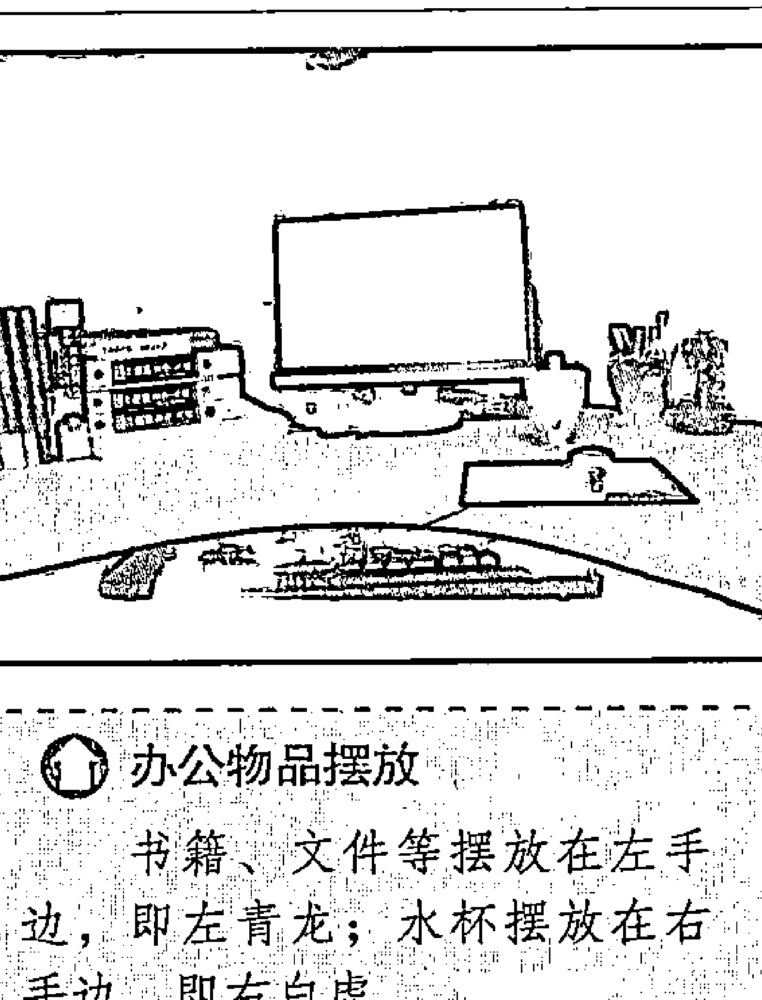

> 办公物品摆放
> 书籍、文件等摆放在左手边，即左青龙；水杯摆放在右手边，即右白虎。

## 042 如何利用招牌生旺商铺财运？

招牌是悬挂在商店前面作为商店标志的牌子。一个好招牌可以让店铺客似云来，生意兴隆、财源广进。招牌所用的材质与颜色，要依据五行之说来选择，以此生旺财运。比如行业属金，就要选择黄色，即土生金。招牌的尺寸大小要与店面相协调，最好能符合五行数理：1、6为水，3、8为木，2、7为火，4、9为金，5、0为土。要慎重选择悬挂招牌之日，要选取黄道吉日吉时，招牌应放在店铺的旺方。

招牌是悬挂在商店前面作为商店标志的牌子。一个旺财招牌除了名字重要之外，还要注意选择招牌的材质、颜色和尺寸。

### 旺财招牌的四要素

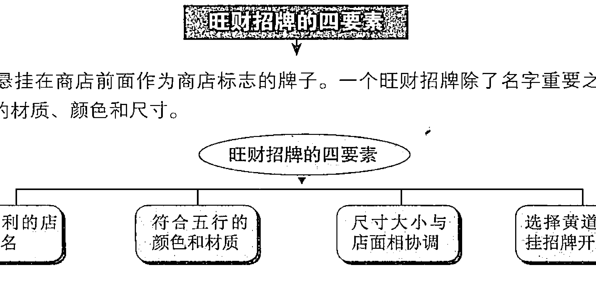

1. 吉利的店铺名
2. 符合五行的颜色和材质
3. 尺寸大小与店面相协调
4. 选择黄道吉日挂招牌开业

## 043 如何让商场的内明堂旺财？

现代城市中，马路即为水。因此，大门前若有环抱回环之路，即为吉。商场的大门可以设置为旋转门，这样可以让气回转缓慢进入大厅，避免气流直冲大厅，这样就可以聚水生财。另外，将大门设置成旋转门可以防止财气外泄。内明堂内不可以堆放太多的商品，以免遮挡财气。

大厅可以做挑高设计来增强内明堂的宽敞度，再以芳香灯、盆栽、鲜花和造景作为点缀，增强内明堂的阳气和活力，让气场活跃起来，从而生旺商场的财运。

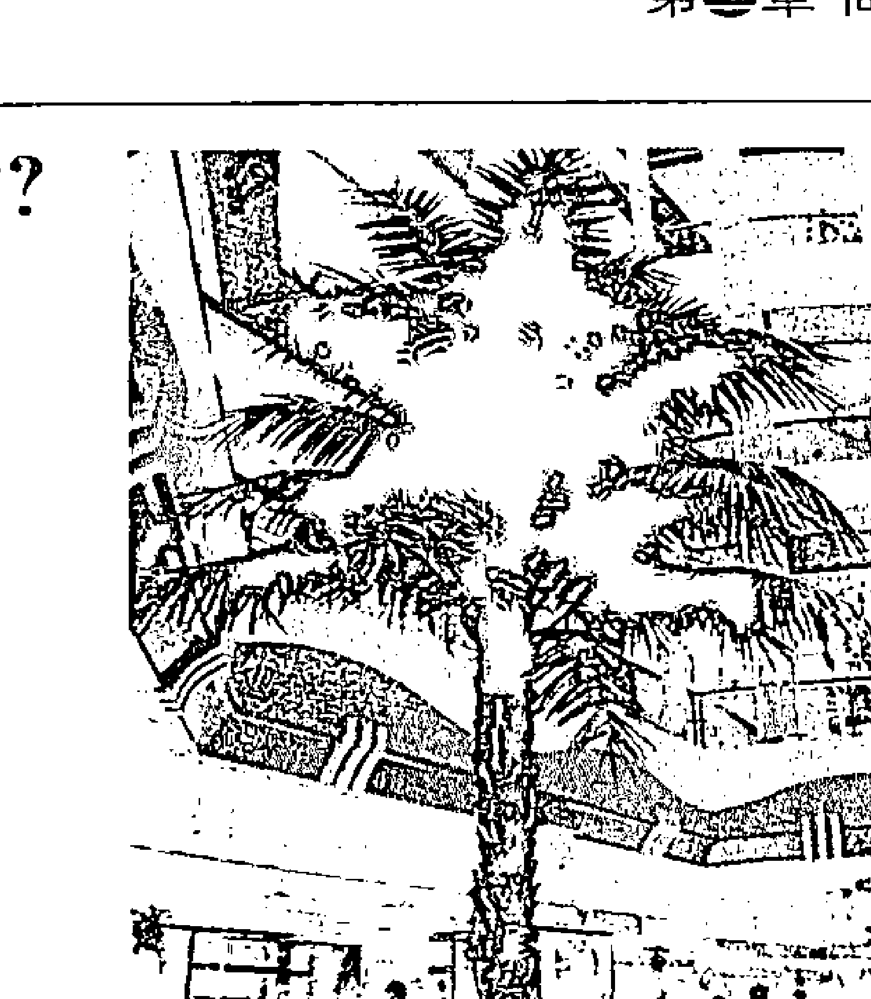

> **商场内的棕榈树**
> 商场内种植棕榈树可以增强内明堂的活力，可以给商场带来更好的财运。

## 044 超市招财有哪些注意事项？

超市除了需要选择在交通便利、繁华热闹的地段之外，还要注意超市内部的一些细节布置。从旺铺的角度说，做到以下几点可以让超市财源广进。

1. 不宜播放喧闹的音乐。有些超市为了营造热闹的气氛，往往播放喧闹的歌曲，把声音开得很大，这会让顾客产生烦躁心理。轻柔的轻音乐才能让人舒适。
2. 不宜把货架摆在扶梯出口处。许多超市或店铺把促销商品摆在正对入口处，在生活中，人们往往会绕开这些挡路的货架。因此，不妨把促销柜台向旁稍移。
3. 自动扶梯不宜正对超市大门。顾客人流即为水，水喜回环不喜直，因此要尽量形成一种回环而入的格局。如果格局已定，尽量用货架或其他物品遮挡，不宜让人进门就正对扶梯。

> **超市招财小窍门**
> 超市除了需要选择在交通便利、繁华热闹的地段之外，还要注意内部的一些细节布置。
> 1. 不宜播放喧闹的音乐。
> 2. 不宜把货架摆在扶梯出口处。
> 3. 自动扶梯不宜正对超市大门。

## 045 什么样的店铺才能旺财？

小型店铺的旺财布局和住宅一样，主要考虑如何聚水旺气。

1. 第一，要选择明堂开阔的店面，店门前宽敞无遮挡，才能聚水旺财。
2. 第二，选择门前马路环抱的店面，马路为水，环水有情，则财运多聚。
3. 第三，店门前的明堂不宜出租给小商贩，或者摆放其他东西。这样做虽然能增加人气，却会分散商铺的财气。
4. 第四，店铺内灯光要明亮，不要因节省电而让店铺显得阳气不足。

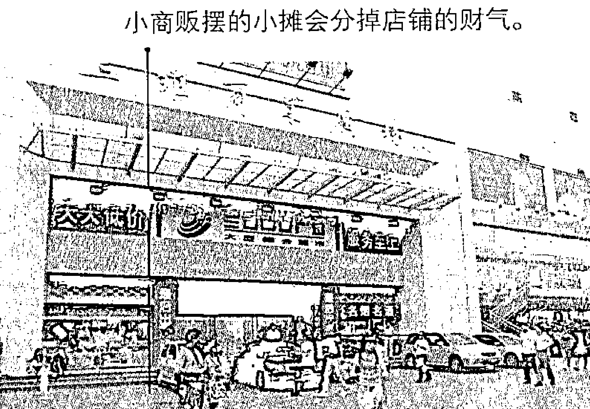

> **阳气充足的店铺**
> 阳气充足的店铺要满足两个条件：第一，店门前道路环抱，宽敞无遮挡；第二，店内灯光明亮，阳气足。

## 046 如何运用“五蝠临门”增强商铺财运？

商店的大门是财气的进出通道，也是顾客与商品的流通通道。顾客的人流如水流，水聚则财聚。因此，商店的大门不宜过小，门小则阻塞财气的流通。
五蝠临门，取“蝠”与“福”同音，吉祥有福，财气自然不请自来。关于“五蝠临门”的制作方法，古时的人大多是这样设置的，他们首先在大门的正前方刻一个圆形，里面刻五只蝙蝠环列，中间刻一个大大的“财”字，寓意着福气和财气充盈店铺。
如今的店铺多在马路边上，无法在大门外刻画。但可以在大门内的大厅四角刻上一只小蝙蝠，在大厅正中刻上一只大蝙蝠。在五只蝙蝠的笼罩下，财运也会很旺盛。当然，如果条件不允许，也可以张贴画有“五蝠临门”的吉祥画，同样可以达到增强商铺财运的效果。

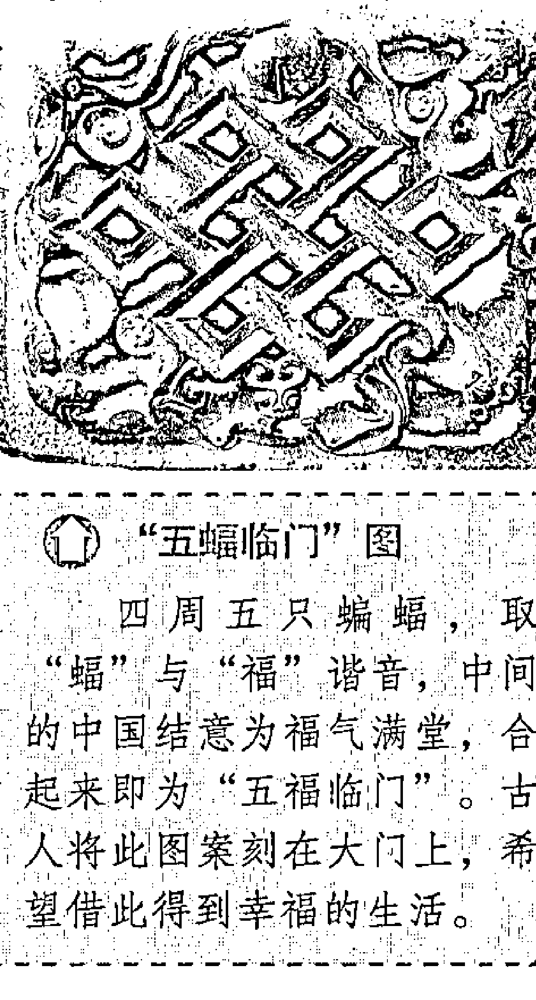

## 047 招财商铺的门脸为什么不能有遮挡？

现代商铺作为进行交易的固定场所，一定要确保能够吸引顾客。而吸引顾客首先要做到能够让顾客注意到自己的店面和经营的范围，门脸在这里起了一个介绍和吸引顾客的中介作用，所以门脸一定不能有遮挡。

现在很多旺铺门脸都很狭窄，有的时候还有各种各样的遮掩物挡住了商店的门脸，难以引起顾客注意，导致人气不足，财运也很难兴旺。这时，我们就要想办法让顾客注意到自己的门脸。

若有经济条件，可以通过媒体报道增加店铺的曝光率以取得更多顾客的光临。人气旺盛，财运自然会好起来。

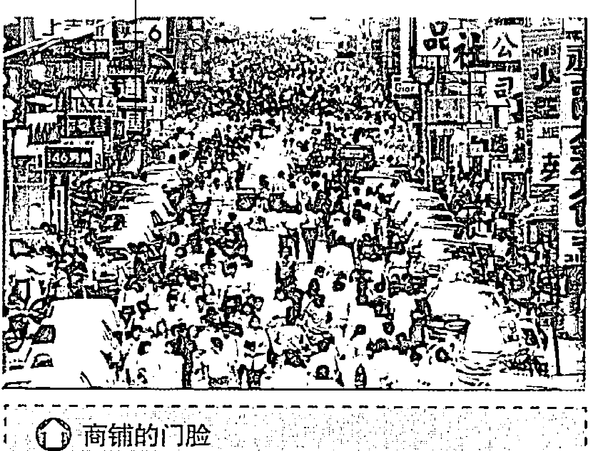

**商铺的门脸**

商铺的门脸是介绍和吸引顾客的中介。若商铺的前面有遮挡物，可以将遮挡物拆除。若难以拆除，可以将招牌做大、悬高或者以更新颖的方式摆放出来。

## 048 招财商铺在朝向上有何讲究？

商店的朝向最根本的决定因素是人流，有人流才有财源广进的机会，否则就算是注意再多其他细节也对生意兴隆帮助不大。所以确定商店朝向的首要因素是人流，人流如水，水能聚财，这是商铺旺财的基本条件。

商铺要尽量避免朝东或者朝北，这样可以避免夏季被暴晒，冬季被寒风袭击。若商铺朝东或者朝北，最好改变商铺大门的朝向。但是，现在的商铺都是临街一排，难以改变朝向。这就需要注意遮挡煞气。譬如在门前搭起遮阳棚，或摆置鱼缸、盆景等可以遮挡煞气的物品，以减少店铺不利朝向的危害。

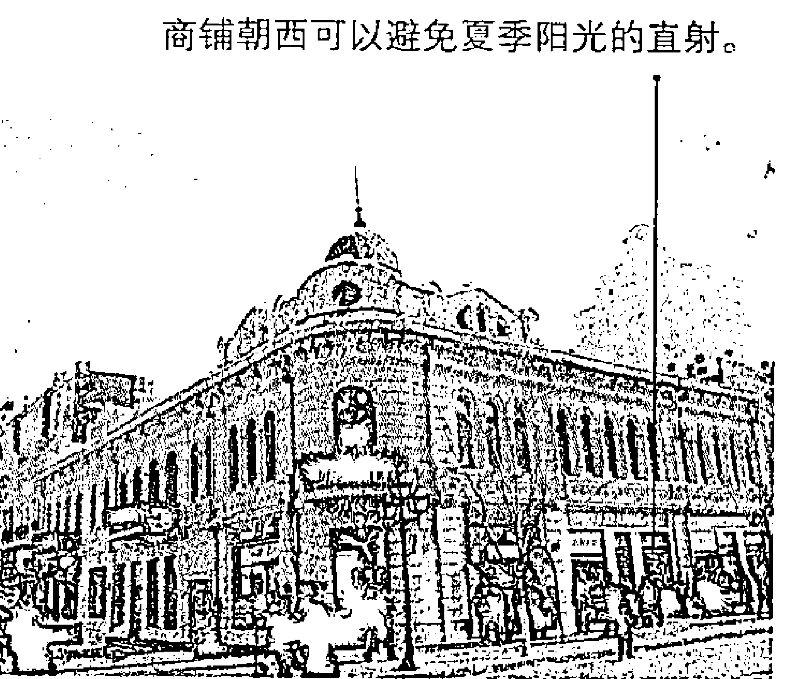

**商铺朝向**

商铺尽量不要朝东或者朝北，朝北的商铺冬季阴冷，朝东的商铺夏季饱受暴晒。

## 049 选择旺铺的要诀有哪些？

选择旺铺的要诀主要有下面几条。

1. 第一，要选择一个繁华的地段开店。一个好的店铺，首先要保证有一个良好的环境，周围人流量越大，店铺越有生气，进而就能带旺财运。
2. 第二，在店铺前面摆放盆栽以加强店铺的生气，有了生气，财神自然会乐意上门。
3. 第三，注意店铺内外的清洁。旺铺人流量较多，灰尘和污物也会随之增加，这时就要经常对店铺进行清扫。

## 050 如何给店铺取旺财的名字？

给店铺取名字，除了要讲究朗朗上口，容易吸引别人注意之外，还要注意从阴阳五行的角度来探讨店铺的名字是否可以让店铺旺起来。
首先，旺铺取名要根据五行相生相克原理来选用。尽量选相生组合，不要选用相克的组合，否则对店铺很不利。
其次，还要按照阴生阳的规律来确定店名。一般情况下，笔画为单数的字属阴，笔画为双数的字属阳，取店名时最好单、双数阴阳结合，才能生意兴隆。

| 相生组合 | 相克组合 |
| :--- | :--- |
| 水和木，因为水可以使木旺盛。 | 水和火，水火不容，水能灭火。 |
| 木和火，木头可以使火更旺。 | 火和金，火能使金熔化。 |
| 火和土，火可以使土纯净。 | 金和木，金能穿透木。 |
| 土和金，土能够保护金。 | 木和土，土能将木覆盖。 |
| 金和水，金能使水显富。 | 土和水，水能冲毁土。 |

## 051 怎样选择旺铺开业的吉日吉时？

古代人十分讲究数字的选择，开店选择一个吉利的日期，预示着店运的兴盛。
在十个数字中，一般认为2、5、6、8、9、10是比较吉利的数字。2代表容易，意味着生意一帆风顺；5代表五行和谐，表示平安无事；6代表财富，象征着财源滚滚；8寓意致富，且谐音“发”，有发财致富的意思；9代表长寿，代表着长盛不衰，生意永远兴隆；10代表十全十美，表示万事如意。

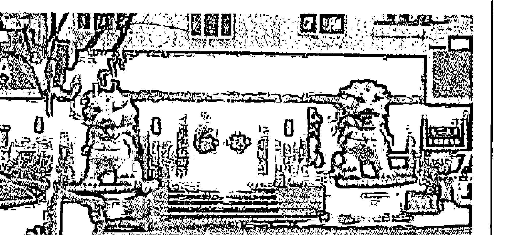

**商铺开业时间**
按照习惯，商铺开业时间多选2、6、8、10等偶数，有成双成对的含义，而单数就可能意味着形单影只。

## 第四章 八运招财

本章讲述了什么是八运，八运期间会兴旺的行业，会受限制的行业。另外还详细讲述了八运期间哪种住宅旺财旺丁，哪种住宅旺财不旺丁，哪种住宅旺丁不旺财，哪种住宅损财伤丁及其补救的办法。

## 052 何为“八运”财运？

“八运”是“三元九运”中“九运”的组成部分。古人把黄帝元年（公元前2697年）定为始元，此后，每60年为一元或一大运。每过三个甲子，即为三元，前后分为上元、中元、下元。每一大运60年分三个小运，每个小运20年。上元包括一运、二运、三运；中元包括四运、五运、六运；下元包括七运、八运、九运。
从黄帝元年到现在，已经经过了79个大运，而2004～2023年，是下元的第八运。每运期间，宇宙中星体的位置都不同，对地球的影响也有所不同。八运财运，指在八运期间财运的堪舆格局。

|  | 三元九运速查表 |
| :--- | :--- |
| 上元 | 一运1864年~1883年(甲子年至癸未年)；
二运1884年~1903年(甲申年至癸卯年)；
三运1904年~1923年(甲辰年至癸亥年) |
| 中元 | 四运1924年~1943年(甲子年至癸未年)；
五运1944年~1963年(甲申年至癸卯年)；
六运1964年~1983年(甲辰年至癸亥年) |
| 下元 | 七运1984年~2003年(甲子年至癸未年)；
八运2004年~2023年(甲申年至癸卯年)；
九运2024年~2043年(甲辰年至癸亥年) |

## 053 八运期间为何属土的行业会兴旺？

八运五行属土，因此下列与土相关的行业或职业将会在八运期间更加兴旺发达。

1. 土产或地产行业，如：畜牧业、矿产业、地产业、农业、丧葬业。
2. 中介性质的行业，如：典当、古玩、营销、代理。
3. 因土而生的职业，如：设计、顾问、秘书、记录员、会计师。

八运期间是八白星当道，穷者会越来越穷，富者会越来越富，所以，在八运期间，一定要努力赚钱，以财富来赢取更多的财富。只有这样，才能保证以后不会为生计苦苦挣扎。

## 054 哪些行业会在八运期间兴旺？

八运是艮卦，艮为足，为手，为指，为趾；艮为坐，为跪。因此与四肢相关的行业将会兴旺、发达。

- 与“手”相关的行业：录排、计算机、书画、雕刻、针灸、按摩、射击、乐器演奏、鞋业、箱包业、手工工艺等。
- 与“脚”相关的行业：足球、橄榄球、跆拳道、攀岩、登山、舞蹈、脚诊、足疗等。
- 与“跪”“坐”相关的行业：瑜珈、佛教、宗教、礼仪、茶道等。

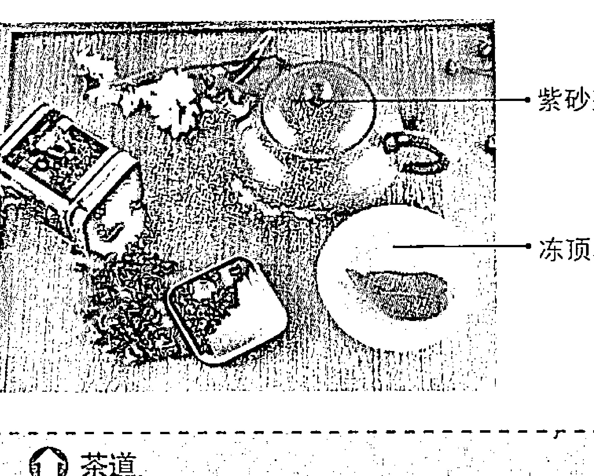

> 茶道
茶道是与“跪”“坐”相关的行业，这一行业在八运期间将会兴旺。在物质生活丰富的今天，人心变得浮躁。茶道能很好地将精神生活提升到更高的层次。

## 055 八运期间环保行业会兴盛吗？

八运在八卦中属艮卦，在五行中属土，土是中正之物，不比木火高，不与金水低，中正、和平。因此，这个“八运”是一个中正平衡的时代。在我国，由于工业发展，环境恶化，自然失衡，环保问题在八运期间将会受到前所未有的重视和发展。
人类的物质文明不断向前发展，精神文明却进展缓慢。在八运期间，道德修养和精神修养的重要性，将会被重新审视。

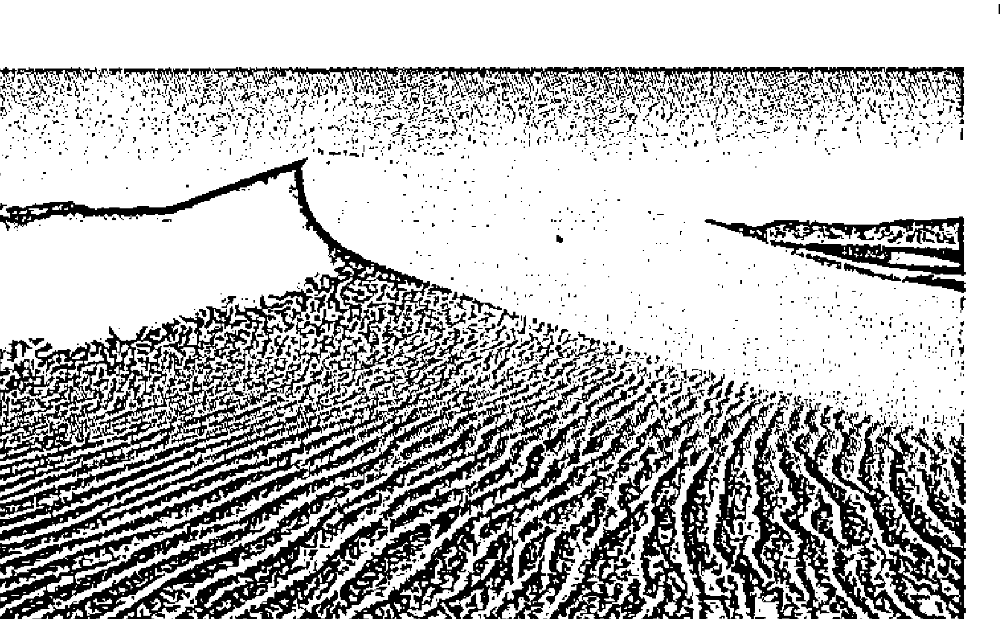

> 土地沙漠化
由于人们的过度开垦，土地沙漠化越来越严重。但在八运期间，这种破坏自然平衡发展的行为将会受到限制，各种环保问题将日益受到重视。

## 056 八运期间选择住宅应该注意什么？

八运期间，通过后天八卦五入中宫，八白飞入东北方，这在八卦中为艮卦。正神方八运在东北，灵神方在西南。所以坐东北向西南的房子在2004-2023年这20年中，是最兴旺发达的房子。如果一所房屋，不仅坐东北向西南，而且西南方有一个喷水池、游泳池或者池塘，这种兴旺的势头会更加强烈。因为坐山主健康而向水主财运。因此，正神见山旺人丁，灵神见水旺财运。八运在西南方见水，非常有利于事业及财运的发展壮大。相反，如果在住宅的东北方及坐山的方向见了水，不仅不会带来好的财运，如果命主五行忌水，还会影响宅主的身体健康。在八运中选择住宅一定要注意住宅的坐向。

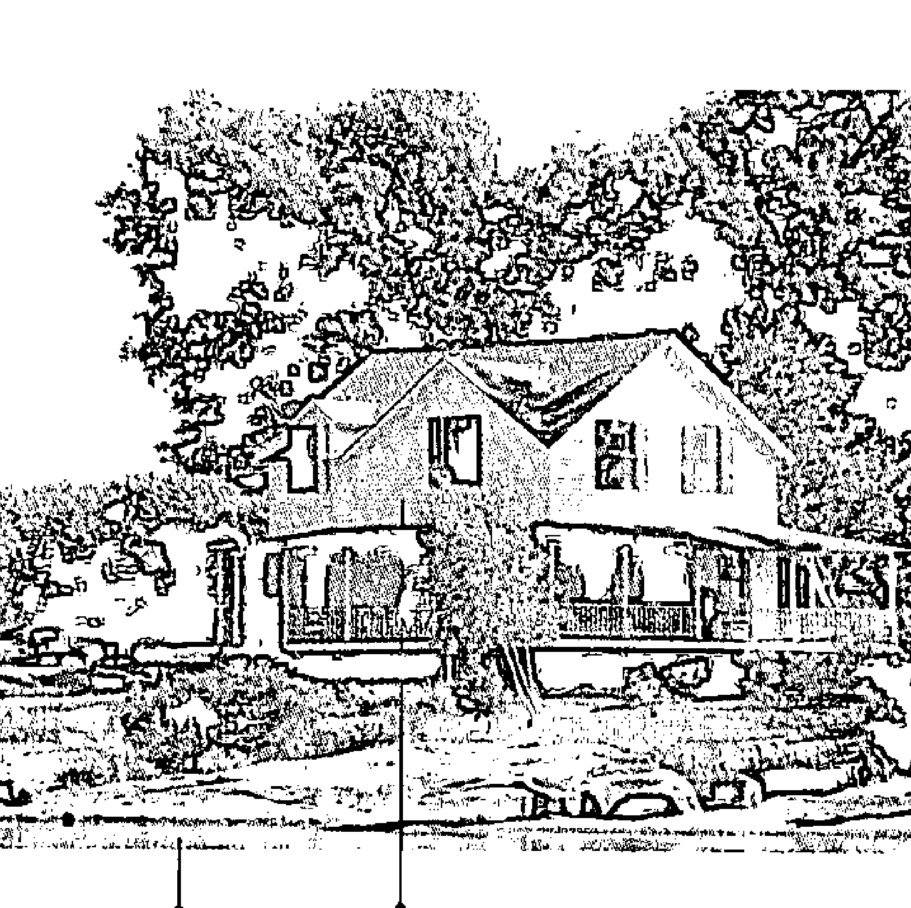

> 八运期间的旺宅
八运期间，坐东北向西南的房子会兴旺发达。如果在房子的西南方有池塘，屋主的事业运和财运更佳。

## 057 八运期间那些行业发展受限？

八运属艮土，军队、武器、网络、电信、电力、能源、热能、医疗等重要行业，发展的阻力与限制较大，与七运时期相比发展势头会减慢。八运时期，是限制和惩治的20年，非法行业将会得到进一步打击和整治。如：偷盗、色情、赌博、走私、毒品交易等，从而让社会局面得以稳定。土克水，在这20年间，水资源更加缺乏，水的价值将大大提高，依靠水资源的行业在发展上可能会受到抑制。

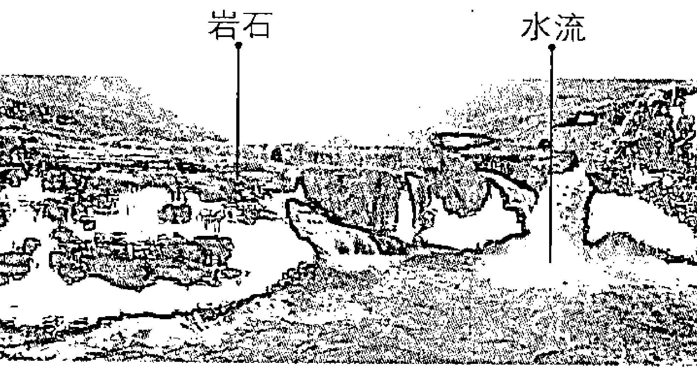

> 水资源
由于近年的过度开发，可利用的水资源越来越少。八运期间，水的价值将大大提高，与水有关的行业发展可能受到抑制。

## 058 八运期间，哪种住宅旺财不旺丁？

旺财不旺丁的住宅适合年轻力壮的夫妇居住。八运期间，以下坐向的住宅旺财不旺丁：

- 坐正西偏西南方，向正东偏东北方；
- 坐正东方，向正西方；
- 坐正东偏东南方，向正西偏西北方；
- 坐正南偏东南方，向正北偏西北方；
- 坐正北偏东北方，向正南偏西南方；
- 坐正北方，向正南方。

八运期间，选择房子要注意以上对应关系。

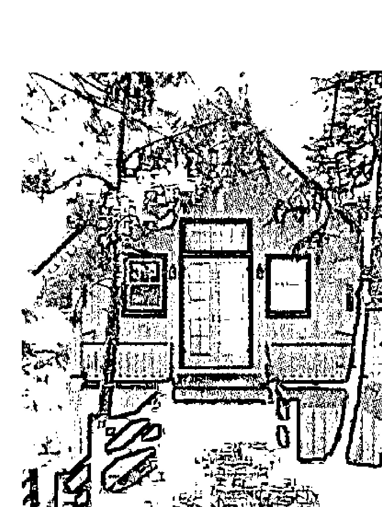

> 旺财不旺丁坐向
住宅坐正北，向正南方。在八运期间，这种坐向的住宅旺财不旺丁，适宜年轻夫妇居住。

## 059 八运期间，哪种住宅丁财两旺？

丁即人口，旺财又旺丁的住宅适合阖家居住。八运期间，以下坐向的住宅既旺财又旺丁：

- 坐东北偏北方，向西南偏南方；
- 坐西南偏南方，向东北偏北方；
- 坐正东偏南方，向正西偏北方；
- 坐正西偏北方，向正东偏南方；
- 坐东南偏南方，向西北偏北方；
- 坐西北偏北方，向东南偏南方。

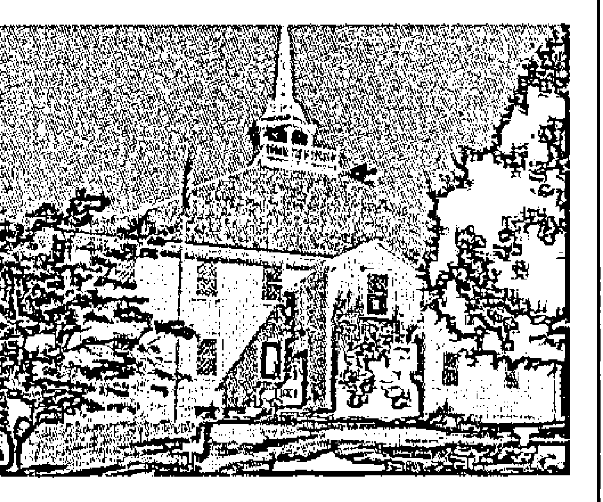

> 丁财两旺坐向
八运期间，坐正东偏南，向正西偏北的坐向属于丁财两旺型住宅。

## 060 八运期间，哪种住宅旺丁不旺财？

旺丁不旺财的住宅适合老年人居住。八运期间，以下坐向的住宅旺丁不旺财：

- 坐正东偏东北方，向正西偏西南方；
- 坐正西方，向正东方；
- 坐正西偏西北方，向正东偏东南方；
- 坐正北偏西北方，向正南偏东南方；
- 坐正南方，向正北方；
- 坐正南偏西南方，向正北偏东北方。

## 061 八运期间，哪种住宅不利？

损财伤丁的住宅，是最不利的住宅，如有选择，最好避开。八运期间，以下坐向的住宅既损财又伤丁：

- 坐正东北方，向正西南方；
- 坐正西南方，向正东北方；
- 坐正东北偏东方，向正西南偏西方；
- 坐正西南偏西方，向正东北偏东方；
- 坐正东南偏东方，向正西北偏西方；
- 坐正西北偏西方，向正东南偏东方。

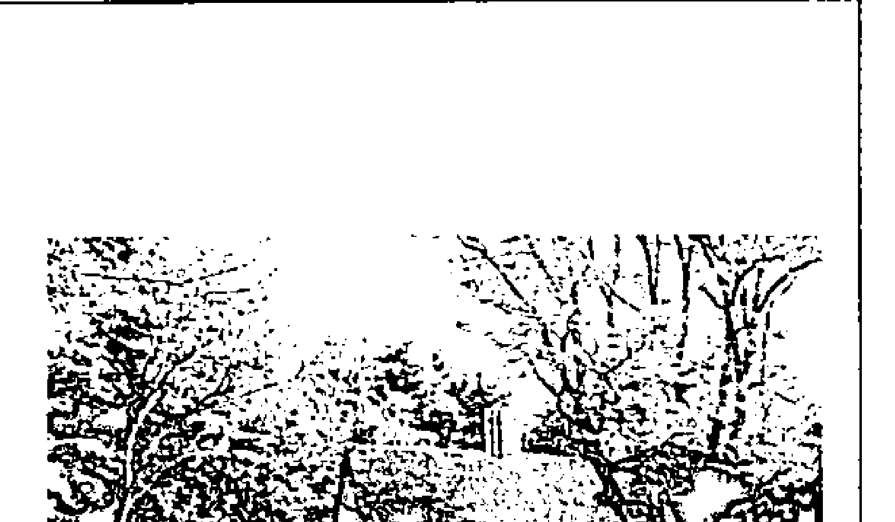

> **损财伤丁坐向**
房屋坐正西北偏西方，向正东南偏东方。八运期间，这种户型的住宅既损财又伤丁。

## 062 八运期间，如何调整住宅使财运变旺？

八运属艮卦，位在东北方，所以在这20年间，最有利的方位是东北方。东北为山，而西南为水，居住在东北为山，西南为水的住宅内屋主会丁财两旺。但是，若是居住在东北为水，西南为山的住宅则会造成丁财两损的局面。如果居住在东北为水，西南为山的住宅里边，要想办法改变这种局面，使丁财两旺。

在大城市中，若东北方有大楼可以依靠，西南方为道路，人流为水，为大吉。但是若东北方为平地，则会造成家中人丁不旺，家人健康也会有所损伤。遇到这种情况，可以在家中的东南方平衡摆放八块石头，这样可以改变人丁不旺，健康不佳的状况。

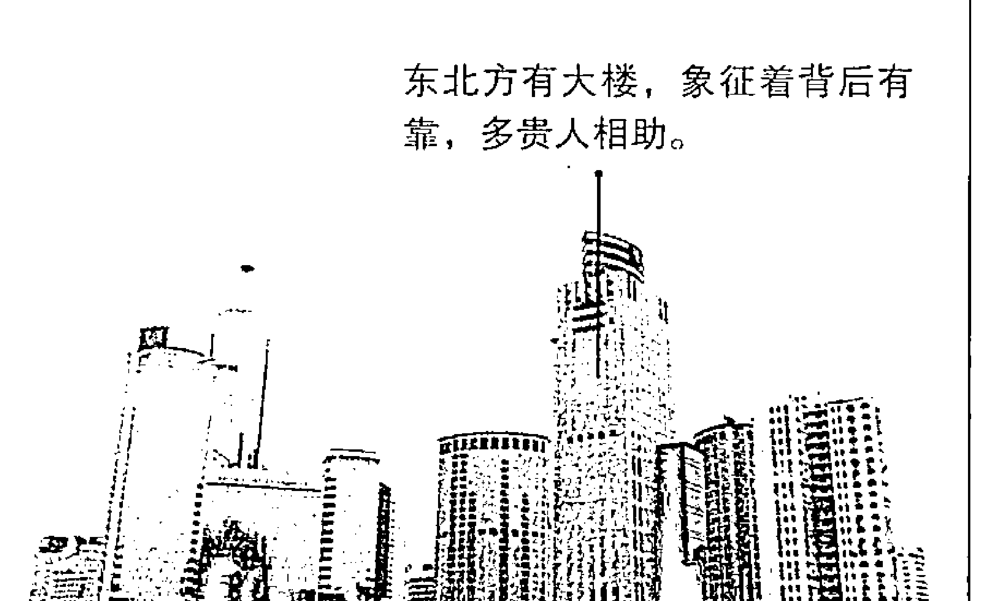

若居所的西南方有大楼遮挡，应该想办法以水补财。可以在家中的西南方位放置鱼缸、水缸或者饮水机等与水有关的物品，这样财运才会好转。

> **八运期间旺财楼**
在城市中，一栋住宅楼如果东北方有大楼，西南方为道路，是大吉相。西南方有道路，道路上人流、车流很多，象征着财气源源不断。

## 第五章 如何留住财运

本章主要讲述避免破财、漏财的相关问题。内容涉及什么是漏财宅，大门、围墙、厕所、阳台、窗户如何布局才能避免破财等问题。

## 063 住宅布局对财运有何影响？

在现代建筑中，由于建筑和设计的原因，经常会出现穿堂煞。这样的布局，风和气流进入屋内后，没有办法在屋里逗留，直接从阳台或窗户溜走，可谓穿堂而过，不留痕迹。财气难以留住，财运当然不济。“藏风聚气”的格局才能旺财。因此，要想改善这种不留财的情形，必须在大门与阳台或窗户间设置屏障。最好的办法就是将房间适当加以改造，将阳台、窗户挡住，以避免财气直接溜走。除了改变阳台或窗户的位置外，还可以设置如屏风、门帘、造景盆栽等遮挡物，这样才能让气流在屋内回环流动，财气才不会外泄。

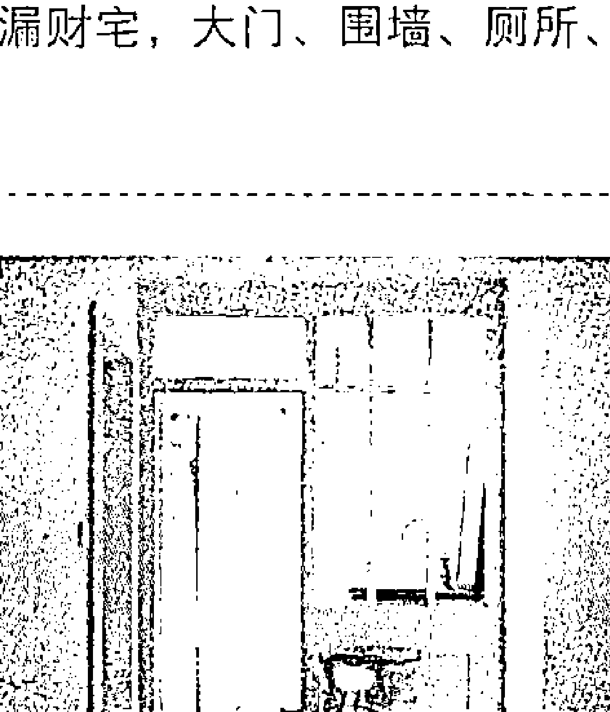

> 穿堂煞指家中的大门正对着窗户，气流从大门进，从窗户直接就出去了，没有回旋的余地。

## 064 哪些大门会让财运漏走？

大门是迎接财气的第一关，它的布置非常重要。当大门内的布局不合理时，就应该适当调整，以防财运漏走。下边介绍几种可以让财运漏走的大门布置情况以及破解方法。

- 开门看见厨房。厨房是住宅的财库，若开门就能看见厨房，就代表钱财外露，不利于财运。
- 如果一进门就对着一面镜子，非常不吉利，因为镜子会把宅内的财气反射出去。
- 开门见水龙头。象征着家里的财运会随流水而去，是破财之象。
- 大门对着向下的楼梯，水往低处流，家中财气不免外泄，也是漏财之局。

### 漏财大门破解方法
大门是迎吉纳福的第一道关隘，好的布局，会聚拢财气，不好的布局会导致财气外泄。

| 问题 | 破解方法 |
|------|----------|
| 开门见厨房 | 在门与厨房之间放置屏风遮挡。 |
| 进门见镜子 | 把镜子移向别处或放置红色脚踏垫。 |
| 开门见水龙头 | 将水龙头改在别处。 |
| 大门对着向下的楼梯 | 在门口放一面凹镜。 |

## 065 什么样的住宅容易财气外泄？

所谓漏财宅，指财气外泄的住宅。具体来说，就是家中的财运没有聚集生旺，而是从门窗泄出去了。居家当然要选择一个可以聚财的住宅，但是若不小心选择了一个漏财宅或者不小心把住宅布置成了漏财宅，就要想办法破解。

造成漏财宅的原因多种多样。如穿堂煞，需要设置屏风或者门帘来缓解，也可在窗户上加设厚重的窗帘或者百叶窗。

另外，将衣橱摆在靠窗的位置会造成财气外泄。因为衣橱是家庭财富的象征。如果衣橱靠窗摆放，有财气外泄之嫌。

住宅下面有河流经过，虽然诗情画意，但在堪舆上却是典型的泄财之局。家里的财气全都随流水流走了。

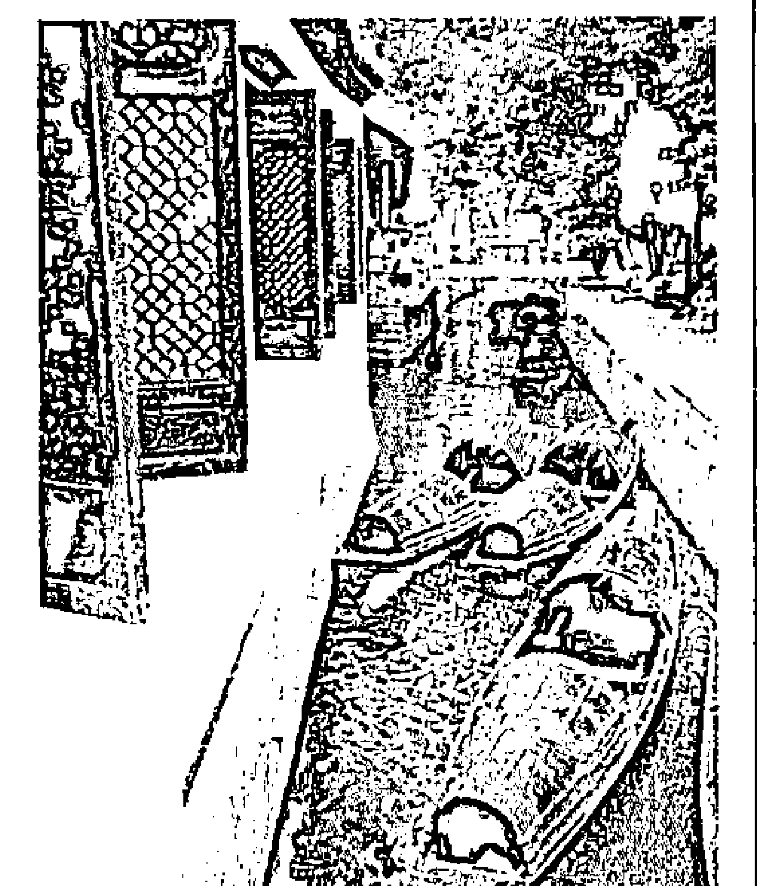

> **漏财宅**
漏财宅指财气外泄的住宅。住宅下面有河流经过的住宅，就是一种漏财宅。

## 066 哪些家居摆设会导致破财？

家具摆放不当，很可能造成财气外泄的局面。下面介绍一些会导致财气外泄的情况。

- 镜子太多。古代人认为，镜子是阴寒之物，能吸纳灵气，也能招邪，因此在摆放时有诸多的讲究。镜子过多，会导致家人奢华、浮躁，容易导致入不敷出的情况。
- 卧室狭小，睡床三面靠墙。这样的摆设，犹如囚笼，会让人产生压抑感；卧室中的暗财位，也会因此难以生旺财运。
- 卧室的墙壁贴瓷砖。卧室中有暗财位，瓷砖日久往往会脱落，从而影响家中的财运。

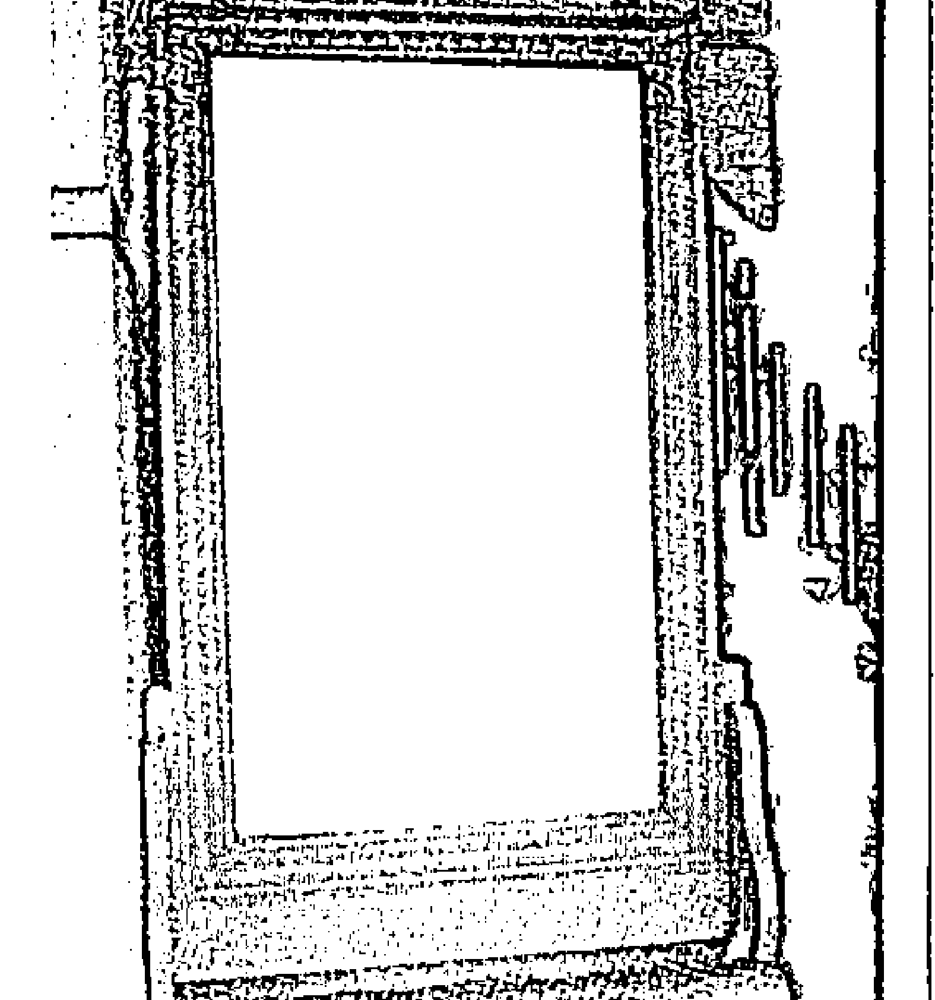

> **镜子**
镜子会反射光，反射光源过多会扰乱人的神经系统，吸收人体的能量。

## 067 围墙过高会阻挡财运吗?

现代的建筑，为了安全，往往把围墙修建得很高，这是一种被动防盗心理。但古代环境文化学认为这样的做法并不可取。

围墙过高，就会削弱住宅的格局，有一种不协调感，同时显得主人胸襟不够开阔，与社会相隔离。从开运的角度来讲，这是一种贫困之相。另一方面，过高的围墙对居室的采光、通风也相当不利。

通常来说，围墙以1.5米高为宜，这样才不会影响采光和通风。围墙不宜距住宅过近，以免形成压迫感。

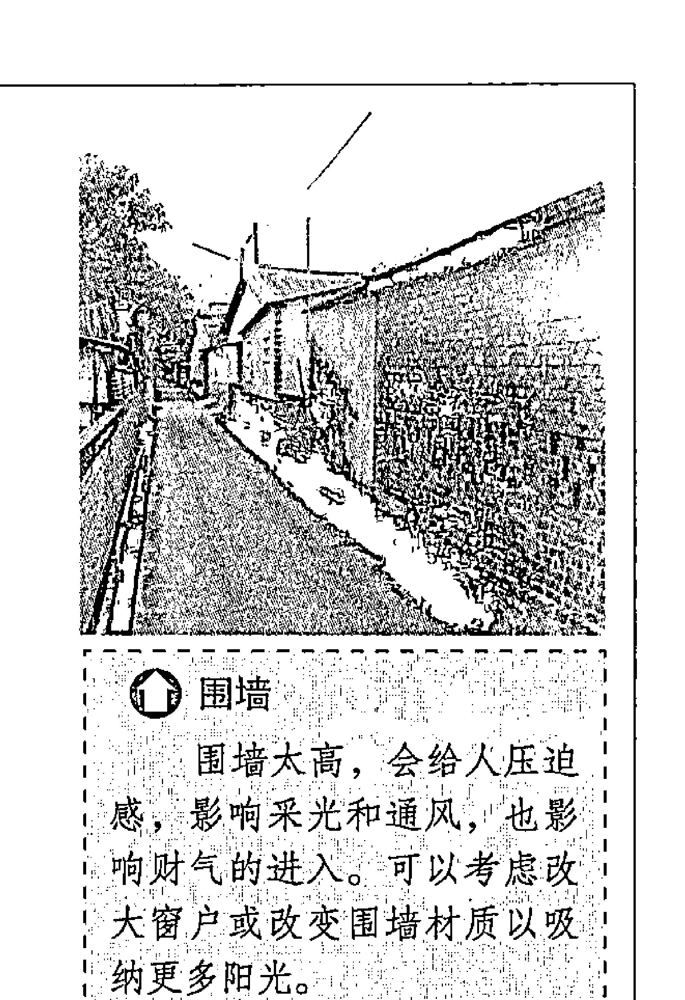

> 围墙太高等，会给人压迫感，影响采光和通风，也影响财气的进入。可以考虑改大窗户或改变围墙材质以吸纳更多阳光。

## 068 大门突出墙面不利财运吗?

现在的住宅通常都有两道大门，与墙平的是木门，而防盗门则突出墙面。这样的设计，不利于气与风的进入，有碍财运。特别是低层建筑，如平房、别墅等。若有突出的大门，最好想办法弥补。

改变大门突出墙面的办法有很多，我们可以在门的两边做一个围护，或者把大门凹进墙体。这样做的目的是让门前形成一个聚气场，从而增强住宅的财气。

如果大门距大路很近，气流很难停留或进入家中。遇到这种情况，需要在大门处做一个聚气场。具体做法和上面一样，可以通过在门的两边做一个围护使大门凹进墙体。

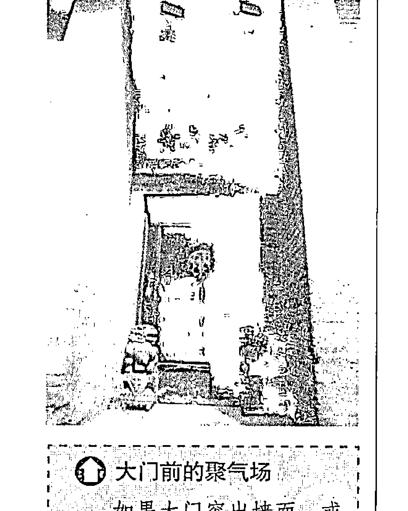

> 如果大门突出墙面，或者大门距离大路太近，就需要在大门两边做围护，让门前形成一个聚气场，从而增强住宅的财气。

## 069 如何改善厕所的财运？

现代住宅，为了卧室的采光，往往把卧室设置在四周。这样一来，厕所就在住宅的中间位置，缺乏通风和自然光。厕所的潮湿、污秽之气无法及时排出，会招来破财运。另外，需要注意厕所门的位置。厕所门不可与其他房门、床铺、走廊等直对相冲。

如何改善厕所的布局，以免破财运呢？首先，要选定厕所的位置，把它设置在住宅的凶位，以凶制凶；其次，阴暗的厕所要加装抽风机，保持厕所空气流通和环境干燥；最后，可在厕所摆室内植物，净化环境。

> 改善厕所财运的措施
厕所潮湿，每天都要产生大量污秽之气，容易给住宅招来破财运。以下措施可以改善厕所的破财运。

- 养成随手关马桶盖的习惯。
- 安装抽风机，保持厕所空气流通，环境干燥。
- 在厕所内摆放植物，净化空气。
- 将厕所设置在住宅的凶位。

## 070 办公室大门不宜正对哪些事物？

大门是通风换气的地方，对室内外气场的更新有重要作用。因此，一定要注意一些禁忌，尤其要注意以下几点禁忌。

- 办公室大门不宜正对着死胡同、防火巷或三角形的街道，这些地方都是秽气或废气积聚的地方。秽气或废气会逼走财气，对财运相当不利。
- 办公室大门不宜对着庙宇、寺观等有凝重阴气的地方。阴气过重则财气凝滞，财运自然不佳。
- 办公室的大门不宜正对一座大山或山的峡口。大山会阻碍视线，而峡口犹如陷阱。古代人认为长期面对大山或峡口，对公司发展不利。

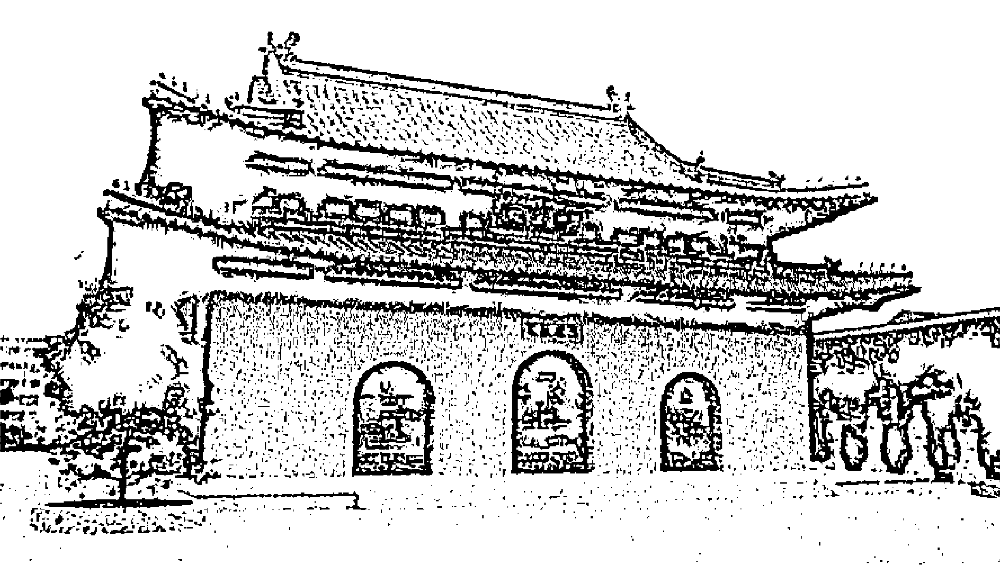

> 庙宇
庙宇四周有凝重的阴气，容易导致财气凝滞。不宜让办公室的大门正对庙宇，庙宇的阴气会对办公室内的人的财气产生不利影响。

## 071 哪些阳台格局会影响财运？

阳台是住宅与外界的主要通道之一。因此，外界环境会对住宅的财运起到影响。一般来说，阳台的问题主要是各种冲煞。

阳台面对一条街道直冲而来，这是破财凶局，路上车流越多越不利。可摆放凸镜进行缓冲。阳台正对两楼之间的狭小空隙，不但对财运不利，还可能有血光之灾。

阳台正对着尖角相当不利，对面的尖角就像是一排尖锐的利齿，不但会造成财气难以入内，还会为主人带来灾祸。

此外，阳台不宜面对锯齿形建筑，如欧美风格的尖形凸窗；不宜对着反弓路；不宜对着强势建筑，如高层银行大楼、办公大楼；不宜对着阴气地域，如庙宇、道观、医院、殡仪馆、坟场、荒山等。

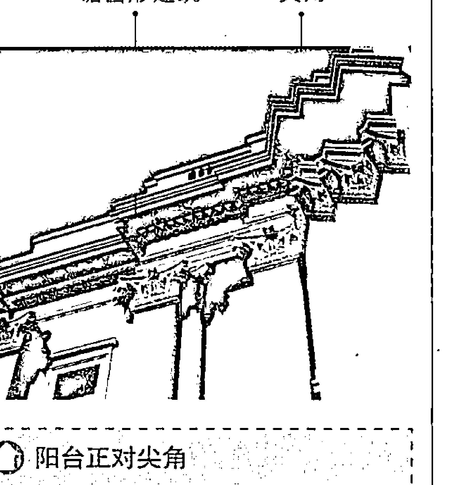

> 阳台正对尖角
尖角容易形成煞气，阳台正对尖角就像正对一排尖锐的利齿，不但财气难以入内，还会给屋主带来灾祸。

## 072 哪种窗户会对财运不利？

窗户在住宅中起着相当重要的作用，布局良好的窗户不但可以提升住宅的气场，还能让财气进入。所以一定要注意窗户的外形和窗外的情景，若发现有不利于财运者，应该立刻想办法解决。

首先，窗户不能对着阴煞之地，容易影响财运和身心健康；其次，窗户不能对着反弓路，会割断财运；第三，窗户周围不能有高塔等细长的物品，容易产生意外，亲人不亲；第四，窗户前不放办公桌，否则背后无靠；第五，窗户数量不要太多，太多损财伤丁。最后窗户的形状也很重要。窗户的形状最好选择方形或者圆弧形，不宜选择太过奇怪的形状。

> 窗户五种破财摆放
窗户在住宅中的作用相当重要，避免窗户的如下五种摆放，可以防止破财失运。

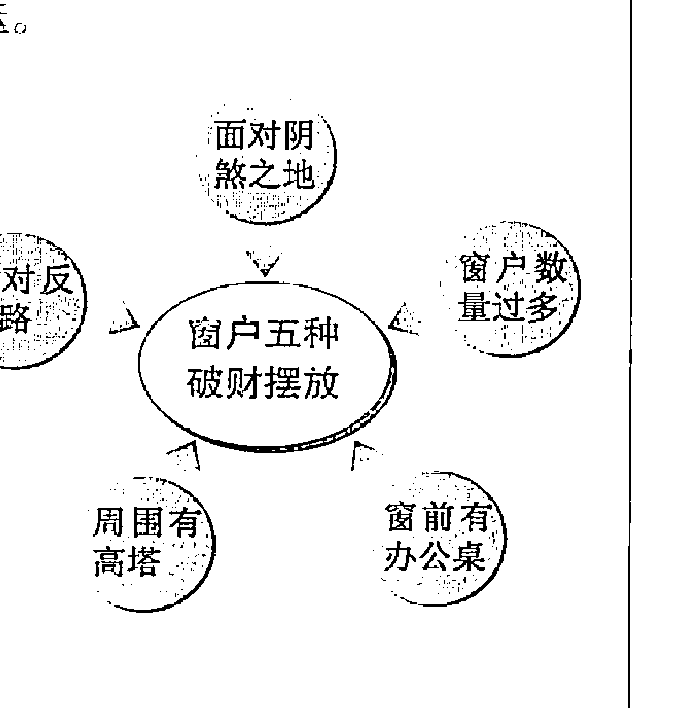

## 073 杂物乱放为何不利财运？

家中杂物到处乱放，会让整个屋子显得凌乱。人在这种环境中生活，不但会影响心情，还会造成财运不济。

生气是从门窗进入住宅的，而门外堆放很多杂物，犹如设置了许多障碍，从而导致生气无法通畅地进入，浊气也无法顺利排出，这样就会使住宅的气场不佳，财运不济。

阳台也是住宅的进气口，“气口宜畅不宜阻”，把一些不用的杂物摆放在阳台，必然对财运不利。况且，杂物容易产生灰尘，或者堆积晦气。解决办法是，把无法丢弃的杂物，整理入木箱或木柜中。俗话说，“眼不见不为煞”，而且在五行上，木能克土。

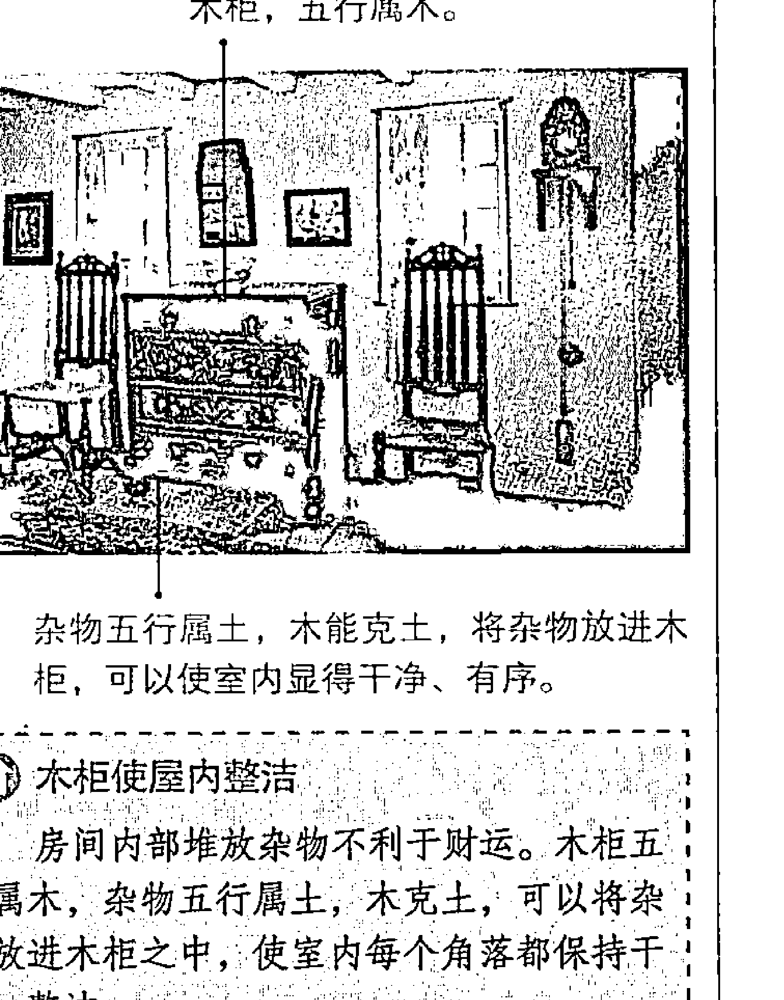

## 074 鱼缸放在哪些地方会影响财运？

在住宅中摆放鱼缸，有水聚财，是一个很好的选择。但是，若将鱼缸摆在不合适的位置，很可能会造成财运不济。

- 鱼缸不宜摆放在神像下。神像下摆放鱼缸，有“正神下水”之嫌，特别是财神、福禄寿三星的神案下，摆放水缸，意为“富贵打水漂”。
- 鱼缸不宜正对炉灶。鱼缸五行属水，炉灶属火，水火相冲。而厨房是家庭的财库，财库受损，自然破财。
- 鱼缸不宜摆放过高。鱼缸属水，离地不宜超过1.4米。不然，“水往低处流”，不吉。
- 鱼缸通常用来催旺财运，但水为流动之物，有化气、转气的功能，不宜摆在吉位，不宜冲着桃花位或床位，水的流向不宜向外。

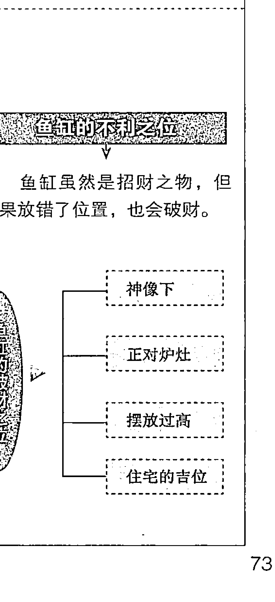

## 075 怎样使用餐桌可以改善财运?

餐桌是餐厅的中心，它不但会影响家庭的气氛和家人之间的感情，还对住宅主人的运势有着巨大影响。下面介绍一些餐桌使用的禁忌。

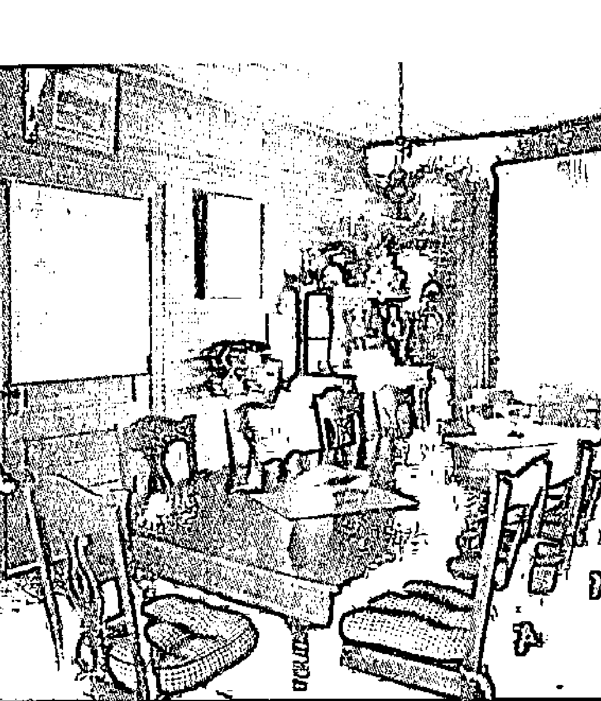

首先，餐桌上不能使用白蜡烛吊灯。白蜡烛是丧事的象征，使用白蜡烛吊灯固然美观，有情调，但是对财运和家庭成员的健康都会产生不利影响。

> 木质餐桌
餐厅是家人就餐的场所，木质长方形餐桌有利于营造温馨、和睦的气氛，而玻璃或大理石材质的餐桌可能影响家运。

其次，最好不要选择玻璃或者大理石材质的餐桌。玻璃或大理石材质的餐桌有很多优点，它们不但美观，而且易于打理。但是，用它们来做餐桌并无太大的好处。一方面玻璃或者大理石餐桌属于阴性，容易吸收用餐者的能量；另一方面，这两种餐桌冰冷、坚硬，在这样的环境里用餐，气氛不够温馨。

## 076 摆放屏风应注意什么?

屏风是用来挡风的家具，有“屏其风也”的意思，有分隔、美化、挡风、协调等作用，摆放屏风是否合理就成了招财、破财的标准。

| 地方 | 主要内容 |
| :--- | :--- |
| 与老板办公室之间 | 如果你的座位正面是老板的办公室，不要在中间使用屏风，可采用大型阔叶盆栽，否则会失去晋升或加薪的机会。 |
| 与厕所之间 | 如果你的正前方或附近刚好有厕所，不宜用屏风。屏风没有吸污作用，放置于此无用。可以在座位与厕所之间放一些阔叶类大型盆栽。 |

另外，还要注意屏风材质的选择。木质屏风较好，塑料和金属屏风不好，尤其是金属屏风，会干扰人体的磁场，影响人的财运。屏风不可过高，不宜超过身高，否则容易给人压迫感，影响财运。

## 第六章 招财物品

日常生活中，常见的招财物品有招财树、吉祥画、金鱼、招财猪、葫芦、蟾蜍、五帝古钱、麒麟、水晶石、聚宝盆等。本章主要讲述这些招财物品的招财效果及摆放时的注意事项。

## 077 什么是貔貅？

貔貅是一种凶猛的瑞兽，护主心强，因此有镇宅辟邪的作用。传说貔貅是龙王的九太子，它与一般龙子不同的地方在于，它的食物是金银财宝。因此终日珠光宝气，深受玉皇大帝和龙王喜爱。它经常吃金银财宝，有时不免拉肚子。一次，玉皇大帝生气了，一个巴掌打过去，刚好打到它的屁股，不小心将它的屁股给封住了。从此貔貅就只吃金银财宝，却不排出金银财宝，金银只进不出。渐渐地，貔貅就成了招财进宝的祥兽，民间还有“一摸貔貅运程旺盛，再摸貔貅财运滚滚，三摸貔貅平步青云”的说法。

貔貅是一种凶猛的瑞兽，护主心强，因此有镇宅辟邪的作用，也可以起到催财、旺财的效果。

## 078 常见的招财物品有哪些？

- 1. 传说中的招财兽，如：龙子睚眦，性烈嗜杀，利于偏财；三脚蟾蜍，口能吐钱，扶助穷人；独角貔貅，以钱为食，吸纳四方之财。
- 2. 能生旺财运的能量物品，如：五帝古钱，带有盛世旺气；水晶，能释放能量，激活磁场；白玉。
- 3. 与财有关的神像或物品，如：财神；刘海仙人、送财童子、金元宝、清末龙银、聚宝盆。
- 4. 取其形或取其音的事物，如：锦鲤、金鱼，“鲤”与“利”谐音，金代表财，鱼与“余”同音。

常见的招财物品，在家中或工作地点摆放金元宝，有利于家运和事业运。

## 079 怎样摆放貔貅？

貔貅以财为食，可以纳食四方之财，有催财、旺财的作用。摆放貔貅头要向外，但头不能朝镜子或床。

貔貅有公母之分，公貔貅象征着财运，母貔貅象征着财库。财必须要财库才能守得住，因此，家中放貔貅最好放一对，如此才能财源广进。若是戴在身上，只需戴一只就好，否则两只貔貅会打架，不利于招财。女人还可将貔貅饰物摆放在案头，这样可以帮你赶走心怀不轨的男人，避免骚扰。

最后，要根据貔貅的习性来合理运用貔貅。貔貅天生喜欢睡懒觉，因此需要每天把它拿起来摸一摸，鼓励它进食，财运才会滚滚而来。

| 种类 | 一角貔貅称为“天禄”，两角貔貅称为“辟邪”，现代多以一角为主。 |
| :--- | :--- |
| 功效 | 将貔貅置于吉位上，不仅能够吸财，还有驱邪、镇宅的作用。 |
| 挑选方法 | 挑选嘴大的貔貅，嘴大才能吃下更多的金银财宝。 |
| | 挑选屁股大的貔貅，屁股大说明能装下更多财物。 |
| | 开光后的貔貅，要戴在左手上才有灵性。 |
| 佩戴摆放 | 如果是貔貅项链，应该挂在脖子上，且不能让人看见。 |
| | 在家里摆放，貔貅嘴要冲着窗外或门口，才能吸收外财。 |

## 080 怎样利用睚眦招财？

在传说中，睚眦是龙王的九子之一，它的特性是“好杀”，喜欢赌博，喜欢财宝。所以好赌之人和希望求得财富之人可以供奉睚眦。投资股票、外币者还可通过佩戴睚眦饰物获得好运。在家和公司中摆放睚眦，可起到聚财的作用。

睚眦好杀，有“睚眦必报”的说法。因此刀上除了可以挂龙、凤饰物之外，还可以挂睚眦保平安。

不过鉴于睚眦好杀的特点，最好不要轻易使用睚眦招财，容易导致性情变得像睚眦一样坏，反而不利于个人运程。

| 注意事项 | 主要内容 |
| :--- | :--- |
| 睚眦的外貌 | 龙子睚眦，外貌似豺，好厮杀。 |
| 睚眦的作用 | 辟邪、镇宅、防小人。 |
| 摆放的位置 | 客厅对着大门的格局，不可放于卧室内。 |
| 使用的禁忌 | 一般人不要使用睚眦，它容易使人性情变坏。 |

## 081 怎样利用锦鲤、金鱼招财？

在堪舆中，水主财，鱼与“余”谐音，象征“富贵有余”。因此，家里养鱼可以增强人气与财运。常见的家养鱼有金鱼、锦鲤等。锦鲤自古就被视为珍贵的吉祥物，常被养于寺院、庙社的池塘中，寓意吉祥富泰。锦鲤被称为“招财旺福鱼”，是镇宅旺运之宝。

家中养鱼，数量极为关键。按我国传统，九为至尊至阳之数，六表示“鸿运连连”，五寓意“五福临门”，又有“三羊开泰”“双龙戏水”的说法。所以二、三、五、六、九都是吉数。需要注意的是鱼的数量只能增，不能减，增是增福，减则减寿。如果其中一条病故，要及时补充。

## 082 如何利用吉祥画招财？

吉祥画意蕴吉祥，常用来表示人们对幸福、健康、长寿、喜庆等美好生活的追求。吉祥画的主角通常是龙、凤、龟、麒麟、狮子、仙鹤等瑞禽仁兽。

吉祥画不但具有吉祥的意思，还有招财的效果。通常以牡丹画的招财效果为最佳。不过，向日葵花朵明艳，有太阳花之称，充满正面能量，如果悬挂在家中的玄关、客厅或六煞方，都可以起到提升家运，吸引财气的功效。六煞方是财位不佳、受人陷害而破财的方位，更需要有如太阳般的正面能量。

吉祥画若是挂在门上，可选择招财童子、千岁鹤、万年龟、龙凤呈祥、双龙戏珠、鸾凤和鸣、双狮戏球、岁寒三友等图案。既赏心悦目，又可以起到招财、聚财的作用。

- 家居吉祥画
吉祥画寓意吉祥，悬挂在家中，会给家人带来好运，同时象征着人们对美好生活的向往。
- **牡丹**：花中之王，多招财遇贵人。
- **向日葵**：又名太阳花，充满正面能量。
- **瑞禽仁兽**：龙、仙鹤等皆属此类，旺财功效好。
- **岁寒三友**：增强家居美感，招财、聚财。

## 083 如何利用招财猪招财？

在十二生肖中，由于猪的外形圆满，被古人当做财富和福气的象征。招财猪的材质，最好选择黄金，黄金的磁场较强，容易吸引财神的注意力，因此财运也会较强。若用小猪的模型作为存钱罐，天天投零钱入内，也能让猪的灵动力很好地发挥，还可起到积少成多、积累财运的作用。

招财猪最好摆在家中的财位上，这样才能财上加财。不可摆放在厕所和浴室，这里是藏污纳垢的场所，容易埋没财运。

但需要注意的是，招财猪不可经常移动位置；生肖是蛇的人不适宜在家中摆放招财猪，因蛇是巳，猪是亥，巳亥相冲，故属蛇的人摆放招财猪是不能带来财运的。

材质以黄金为最佳，陶瓷材质的同样具有招财效果。

外形圆满，象征财富和福气。

> **招财猪**
在古代祭祀仪式中，猪代表财源广进。“有形必有灵”，古人认为十二生肖中猪最具有招财的灵动力。可以将招财猪放在家中的财位上，但是不要经常移动，否则影响财运。

## 084 摆设猪饰品对儿童有什么影响？

猪象征着财富，将猪饰品摆在合适的地方能旺财，为家人带来财运。不仅如此，猪还有增进健康的功效。家中若有挑食或身材偏瘦的小孩，将猪饰品放在餐厅向着小孩座位的方向，可以帮助孩子增进食欲，提高机体免疫力，对因挑食、营养不良引起的体弱、消瘦的小孩有较好的效果。

但是，猪天生好吃懒做，常常吃饱了就睡，所以尽管它有招财的功效，却不能招来富贵。

> **猪饰品**
在家中合适的地方摆放猪饰品不仅可以旺财，还可以增进挑食、营养不良的小孩的食欲。但猪饰品可以招来财运却不一定能带来富贵。

## 085 如何利用葫芦招财？

葫芦自古以来就是招财、聚财的宝物。它既是神仙的法器，也有团圆美满、多子多福、健康长寿、镇宅避邪等象征意义。因此，家中悬挂葫芦可以改善运势。因为“葫芦”与“福禄”音相近，且外形圆滚似福，能够广吸金银珠宝，将它挂在财位上还可招财、聚财。

葫芦在古时常被用做器皿，用来盛水或酒。由于它嘴小肚大的外形，有吸纳气场的作用，因此成为常用的旺财道具。如果把葫芦悬挂在财位，就可以纳进财富，且不易外流，起到守财聚富的作用。

葫芦外形最好干净完整，以留有一段蒂头为佳。

> > **葫芦招财**
>
> 葫芦可以将好的气场收纳为己有，将坏的气场吸收殆尽。夫妻感情不好的家庭，悬挂一个铜制或木制的葫芦，可增进夫妻感情。可以挂在客厅东南方的天花板上，离地约有三分之二距离。

## 086 如何利用花瓶招财？

花瓶通常用来催动桃花运和姻缘，但如果摆放合适，也可以为女孩子带来财运。

用花瓶招财，要把花瓶放于桃花位。女孩子的桃花位在房间或客厅的白虎位上，面对房门，右手边即为白虎位。使用花瓶招财时，若能同时供奉观世音菩萨，效果会更好。

花瓶要外形美观，色泽光亮，里面注入清水，插上色彩鲜艳而无刺的鲜花。注意，花瓶里面一定要有鲜花，否则可能会招惹桃花劫。若插入塑料假花，则无任何作用。

> > **花瓶招财**
>
> 花瓶不仅是一个美丽的装饰物，还可以用来催动桃花运和姻缘。如果摆放合适，还可以给女孩子带来财运。

## 087 如何利用三脚蟾蜍招财？

一般的蟾蜍有四只脚，这只是普通的蟾蜍。

“三脚蟾蜍”是拥有招财、聚财能力的蟾蜍。

相传，三脚蟾蜍原是一只邪妖，喜爱金银财宝，专门危害人间。后来，一个法术高强的道士听说了这件事，他决心为民除害，就做法收服了三脚蟾蜍。从此，三脚蟾蜍就变成只能吐钱不能危害人类的吉祥物了。

三脚蟾蜍的摆放很有讲究。三脚蟾蜍口能吐钱，在请三脚蟾蜍为自己招财时，在摆放的时候，要把头部朝内，这表示蟾蜍将财吐到自己家中了。反之，若将三脚蟾蜍头部朝外，那么它就向外吐财，象征着漏财。

> 招财金蟾
金蟾天生喜欢金银财宝，对钱财具敏锐的洞察力，很会挖掘财源。在它的尾部压上钱，代表可以让它双倍为你纳财。

## 088 如何利用五帝古钱招财？

五帝古钱，指清朝顺治、康熙、雍正、乾隆、嘉庆年间的古钱。这五帝在位期间，国家繁荣、兴旺，古钱经历了当时的盛世，吸取有兴盛、旺财之气，因此，具有化煞旺财之效。不过，古钱要使用真币，不能使用仿制品。

真正的铜钱由于经过无数人之手，不免有污浊之气，因此不能随身携带。通常是镶于大门之上，或者镶嵌在台阶上、踏脚垫上，上面不可有物遮盖。

古钱以顺治、康熙、雍正、乾隆、嘉庆的次序，从右至左排列；铜钱有字的一端向外，底部向内，横向排成一行。这样，就可以起到招财化煞之效。

五帝古钱招财

五帝古钱，指清朝顺治、康熙、雍正、乾隆、嘉庆年间的古钱，流传到今天具有招财的功效。

按照次序，有字的一端向外，底部向内，横向排成一行。

可以起到招财化煞之效。

## 089 如何利用“玉带缠腰”法招财？

古代环境文化学上常说，“山管人丁水管财”。因此，最好的阳宅格局，就是有情之水相环绕。而我们所说的“玉带缠腰”，指有河流或者道路在住宅前曲折环绕。

当然，这里所说的曲折都是“顺弓”，住宅是在环曲之内。若是在环曲之外，那就形成了对住宅不利的格局。

“玉带缠腰”的格局，对任何人都吉利。无论是对工薪阶层，还是对管理阶层，都能起积聚财富之效。

## 090 如何利用笛、箫招财？

很多人只知道笛、箫是乐器，能奏出优美的音乐，却不知道笛、箫还是常用的招财道具，有生财、聚财之效。

笛由一根竹管做成，里面去节中空成内膛，外呈圆柱形。箫由一根竹管做成，上端留有竹节，下端和管内去节中空。二者的相似之处不仅仅在于可以通过气孔发声，还有竹子“节节高升”的内涵。

工薪阶层若想升职、加薪，可借助笛、箫，让自己不断晋升获得财富的增加。正确的招财方式是：找出家中的文昌位或文曲位，然后将笛子或箫悬挂在这个位置上，即可利用笛子或箫的招财之能，为自己招揽财富。

## 091 如何利用龙龟招财？

龙龟，瑞兽的一种，相传为古代神龙所生之子，曾背负洛书。龟背、龟尾有解厄之效，龙头有赐福之意。龙龟放在财位可催财，放在三煞位或水气较重之地最有效。有些龙龟背部可掀开，可在里面放入茶叶或米粒，能够增强吉祥效果。

摆放龙龟时，龙头朝向家内赐福，龟尾、龟背向外；若放在老人房内象征长寿，须让龙头对着窗户；龙龟招财，则须让龙龟对大门或窗户等气口。

龙龟
龙龟是一种瑞兽。其背有解厄之效，龙头有赐福之意。龙龟放在财位可以催财。摆放时，龙头朝向家内，龟尾、龟背向外。

## 092 如何利用铜铃招财？

铜铃如同铜钟，只是外形小一些。佛教和道教经常将经文、咒语等铸在铜钟上，铜铃跟铜钟一样，能聚财、赐福、避邪、保平安。民间常将铜铃挂在门口或各角落的屋檐下，如同寺庙、道观里的钟声在祈福、驱邪一样。

铜铃主要用来化解五黄之煞。如果在铜铃上加上水晶和两个小黄玉元宝，挂在门口，可以起到开门见财的效果。

安装铜铃的时辰有讲究，应避开主人的生肖冲克。比如，属鼠的人不能在午时安装，属兔的不能在酉时安装。

十二生肖相冲相合表
| 相冲 | 相合 |
| :--- | :--- |
| 子午相冲（鼠马相冲） | 子丑相和（鼠牛相和） |
| 卯酉相冲（兔鸡相冲） | 寅亥相和（虎猪相和） |
| 辰戌相冲（龙狗相冲） | 卯戌相和（兔狗相和） |
| 丑未相冲（牛羊相冲） | 辰酉相和（龙鸡相和） |
| 寅申相冲（虎猴相冲） | 申巳相和（猴蛇相和） |
| 巳亥相冲（蛇猪相冲） | 午未相和（马羊相和） |

## 093 招财麒麟该如何摆放？

麒麟是仅次于龙的瑞兽，是神的坐骑，与凤、龟、龙共称为“四灵”。它融合了牛、羊、马的特征，集中了许多动物的优点，是一种“集美”瑞兽，体现了人们对一切美好事物的向往和追求。

麒麟主正财，旺事业，催富贵，避邪。在室内摆放一对开过光的麒麟，会给你带来祥瑞。

麒麟用于招财时，通常放于财位上。比如，公司的财位、董事长的办公桌上、家里的客厅财位、店铺的财位等。卧室里不宜放置麒麟，否则会影响夫妻感情。麒麟以金质的力量最强，但价值昂贵，通常都用铜麒麟来代替，也可以化解五黄煞。

> 麒麟放置宜忌
麒麟最好挂在客厅对正门的一面墙上，不要放在有穿堂风的地方，避免破损和玷污。

## 094 如何利用印章开启财运？

印章象征着个人的权力，在工作上有权威，主旺事业与财运。因此，可以利用印章来开启个人的财运。经常使用印章，可以活络财源、广纳财气；把印章收藏于印章盒内，可以起到镇守财库之效。

印章的材质，以天然玉石为佳。因为玉石本身就是财富的象征，玉石制成的印章更加有利于开运招财。

印章代表本人的钱财，因此尽量不要破损和缺角，否则可能会有车祸等灾。印章字样须清晰，字迹模糊可能会引起头脑糊涂，判断不清，容易破财。

> 印章
印章代表本人和钱财，尽量不要破损和缺角，否则可能会有车祸等灾。印章的材质，以天然玉石为佳。

## 095 如何让龙饰发挥招财功用？

龙是至尊的吉祥物，代表富贵祥瑞，有生旺的功效。但是，招财龙放置的位置有讲究，随意乱放有可能引起反面效果。

俗话说，龙困浅水遭虾戏。因此，不宜把龙置于干燥的地方，鱼缸旁边是个不错的选择。龙头的方向要面向江河湖海的方向，若住宅离水太远，也难以吸取水中财气。如果屋前有污水、阴沟，则不宜摆放龙饰，这会让龙受辱。如果屋内及屋外均无水，可将龙饰放于住宅北方，北方水气当旺，适宜喜水的龙。

另外，龙饰物的摆放对数目有要求。可以摆放一条、两条或者九条，如果摆放九条龙的图案，其中必须要有一条主龙。

## 096 如何根据五行选择龙饰？

每个人都有属于自己的五行命格，五行命格不同，命运、财运也不相同。就通过龙饰获得财运这一方面来说，五行命格与龙饰的对应标准如下：

- 命格五行需要金的，可摆放金属质地的龙饰，如金质、铜质等；
- 命格五行需要木的，可摆放青色龙或碧玉龙；
- 命格五行需要水的，可摆放灰色或黑色石龙；
- 命格五行需要火的，可摆放红色龙或寿山石龙；
- 命格五行需要土的，则摆放黄色龙或石龙。

> 黄色龙
可以根据五行命格来选择龙饰。五行属土的人，可以选择黄色龙，如果摆放两条龙，以等大对称的龙为佳。

## 097 古铜钱能招财吗？

古代铜钱在招财开运上有特殊的作用。这是因为古铜钱吸收了国运强盛朝代的气场，是所谓的“天运”。古铜钱埋藏的地方多为宝地，吸收了良好的地气，可以加强自身的财运，这就是所谓的“地运”。

另外，古钱在流通的过程中经过很多人的使用，沾染上不同人的信息，这是所谓的“人运”。由此可见，古铜钱集合了天地人三气三运，聚财力量强大，是常用的招财、聚财品。

> ### 古铜钱
>
> 常用的古铜钱有五帝古钱和六帝古钱。五帝古钱指顺治、康熙、雍正、乾隆、嘉庆年间流通的古铜钱；六帝古钱另外加上道光年间的古铜钱。

## 098 如何用古铜钱旺财？

用古铜钱来旺财要注意以下几点。
1. 若使用五帝古钱，必须是真正的五帝古钱，不能是仿造的假钱。假钱没有天地人三气三运并存，因此没有聚财功效。
2. 所用的古铜钱必须经过专业人士开光，否则没唤醒，不能发挥聚财功效。
3. 所用的古铜钱必须是原汁原味的，不能清洗，否则会洗去上面的三气三运，失去了能量，古铜钱就不能聚财了。
4. 古铜钱可以与其他吉祥物品搭配使用。如放在貔貅上，可以加强貔貅的旺财效果。若将古铜钱与“五鬼运财”并用，可以大大加强古铜钱的聚财效果，旺财作用显著。

> ### 古铜钱
>
> 古铜钱流传很多年代，聚集了不少人气，其积累的巨大能量，可以帮助人们旺财。

## 099 家中摆放花瓶有何讲究？

家中摆放花瓶可以使家中环境更优美，需要注意的是摆放花瓶是有讲究的，不能随意摆放。

根据出生的时间不同，可以用不同的花瓶来催桃花运，摆放花瓶的位置也要根据房间的位置来确定。房间的门开向正北方的，花瓶放在房屋的正西面；房间的门开向正南的，花瓶要摆放在房屋的正东面；房间门开向正西的，花瓶要摆放在屋里正南的位置；房间门开向正东的，花瓶可摆放在房内的正北面。

另外，还要根据室内环境来搭配花瓶。比如，书房里适合摆放木质花瓶，典雅、清高，适合阅读。

> 花瓶摆放有讲究
摆放在室内的花瓶要放上清水，插入鲜花。

## 100 如何利用发财树招来财气？

通过植物及其摆放来改变周围环境，既可以起到趋吉避凶的作用，又可以美化环境，促进健康。植物有金、木、水、火、土五行之分，每个人可以根据自己的五行命格及植物的五行来判断用哪种植物为自己旺财。

发财树具有招财、聚财的作用，它又叫瓜栗、中美木棉，通常放置在客厅的财位方，即进入大门的对角线角落。发财树喜欢阳光，适宜放在有阳光的地方。它比较耐阴，也可以放在室内。它的摆放位置，以不影响人行走出入为宜。

### 发财树招财注意事项

发财树是常绿乔木，喜高温、高湿，是室内绿化的理想植物，它可以为屋主带来财运。

## 101 办公室摆放植物有何讲究？

办公室是大家共同工作的地方，一般有大量的现代化办公设备，会释放大量的有害气体。在办公室摆放合适的大型绿叶植物，植物通过光合作用，能吸收二氧化碳，放出氧气，使封闭的办公室环境清爽。长时间坐在电脑前工作的人，可以呼吸到植物释放出的清新气味，清醒头脑，工作起来会更有效率。

### 菊花

菊花是多年生菊科草本植物，是经过长期人工选择培育出的名贵观赏花卉。菊花有吸收氟化氢的能力，能减少办公室的有害气体。其他常见办公室种植植物有常春藤、吊兰、万年青、发财树、金钱榕等。

办公室栽种的绿色植物要具有抗辐射作用。办公室的办公设备释放的电磁辐射对人体有害，种植一些仙人掌、宝石花、景天等植物，可以有效减少各种电器、电子产品产生的电磁辐射污染。

## 102 如何利用水晶石提升财运？

水晶含有很大的能量，能与人体磁场相互影响，从而调整五行的平衡，改善健康、爱情、事业、财运等方面的运势。水晶石的摆放有几点要注意。

### 利用水晶提升财运

水晶是一种有灵性的石头，能让你旺气提神，增强本身的气场，进而提升财气。

- 可在家中的财位上放置五色（白、青、黑、赤、黄）水晶碎石，以增加财运和贵人运。
- 自制一个小荷包，在包里放置水晶碎石，随身携带。它能产生源源不断的能量磁场，提升财运及事业运。
- 将水晶石摆在八白吉星的位置，这里有助于加强八白吉星的气力，使水晶石的聚财作用更强。
- 每天对着水晶许一个心愿，水晶的催财能力无形之中就会被激发出来，增多你赚钱的机会。

## 103 如何利用水晶帘激活财运？

水晶具有聚财作用，家中恰当放置水晶制品可增加财运，如可用水晶帘来激活财运。

一进大门，就正对着窗户或阳台，这种格局对宅运不利。由于气流直来直去，无法停留在屋内，家财难以聚存，留不住。在这种情况下，通常需要在中间摆设屏风或植物来化解。但若悬挂水晶珠帘，不但能起到化解的效果，还可以借助水晶帘的摆动，活络气场，激活财运。

水晶帘本身能够散发能量，改善气场。因此，当两个房门对冲，厕所门对着房门或餐厅时，都可以悬挂水晶门帘来抵挡秽气。

> 紫水晶 天然水晶能量大，聚财作用强。紫色水晶不但可以聚财，还可以化煞，增添富贵。

## 104 水晶珠帘如何运用？

珠帘是一种十分古老的饰品，优雅、精致，用来装扮房间，可以使室内设计变得灵动，不死板，起到聚财、挡煞的作用。现代家庭的房门设置多样，有时不免对着不该对着的方位。如有的家庭房门正对着容易产生秽气和湿气的卫生间，不但不利于健康，还会影响聚财，可以运用珠帘招财、挡煞。

珠帘不会影响空气的流通，它的作用是用来挡煞和激活气场。水晶珠帘的密度要高，不宜太宽松，珠子间距以不超过一根手指为宜。在长度上，用来挡煞的珠帘通常要垂到膝盖，在视觉上要能够挡住所要挡的反射。

### 水晶珠帘的选择和保养

- 选择
  - 材质以天然水晶的能量最强。
  - 根据五行选择珠子的颜色，不宜为红色。
- 保养
  - 第一次使用要进行消磁处理。
  - 注意轻拿轻放，避免摔碎。

## 105 养鱼可以招财吗？

《易经》认为，润万物者莫乎水，水即财运。鱼缸离不开水，鱼缸是水和财的同义词，鱼就是催财、旺财的道具。鱼不但可以使室内更有生机，还可对家居产生积极的作用。家里摆放鱼缸可以增强人气与财运，尤其是五行缺水的人，更应饲养鱼。鱼缸的摆放很有讲究，如果摆放不当，可能适得其反。鱼缸要放置在吉利的方位上，才能把吉利方位的灵动力催动，再配合自己的命卦及房间的坐向来做设计装修。养什么鱼和选择哪种颜色的鱼、鱼的数目等，都有讲究，不能根据个人喜好，随意决定。

> **养鱼招财**

自古以来，鱼就是一种寓意吉祥、富裕的生物，把鱼放在家中吉利的位置，有催动财运的作用。

## 106 如何利用聚宝盆招财？

聚宝盆，顾名思义，可以聚宝聚财。它内含很大的能量，有极强的滋润、涵养、孕育、激荡、扩大能量等作用，可将财富以相乘加倍的速度聚集，催财作用极强。古代大户人家常用聚宝盆存放金银珠宝，以此来招财纳吉。西方人还将自己的愿望写在一张纸上，然后放在聚宝盆内一天一夜，让能量充分浸润自己的心念，然后再取出烧掉，就能心想事成。常见的聚宝盆，都是陶瓷制品。陶瓷五行属土，土可以生金，金者为财。价值昂贵的是水晶瑶聚宝盆，水晶可以聚集能量，有聚财的功效，特别是把黄水晶元宝放在盆内，效果更佳。

> **聚宝盆**

聚宝盆是常用的招财吉祥物，通常放于住宅的明财位上，用来招财纳富。聚宝盆的摆放并没有太多忌讳，客厅、卧室、书房都可以摆放。

## 107 如何利用雾化盆景催财？

雾化盆景是目前较为新潮的催财物品，中间有石山草树，四周有水环绕，其中有喷头喷射出极细的水线，形成雾气蒸腾的现象，极为美观。
中国古代人认为水主财。雾化盆景放在水位吉方，可以增强财运。忌水的地方则不可放置，比如财神的下方，否则会将财神吓跑，不利于催财旺财。

## 108 摆放老虎饰物可以招财开运吗？

老虎是兽中之王，威武、雄壮，具有强劲的戾气与爆发能力。老虎自古以来就被视为凶兽，普通人家不宜摆设。不过拥有特殊气势者或特殊职业者可以摆放，如军人、警察家庭。这些人霸气十足，呼应灵动力较强，可以驾驭老虎，令它发挥强有力的护卫作用。
如果家中想要摆放虎饰，注意不要摆放在卧室和对正门的大厅，否则容易引起家庭纷争与意外事故。商家最好也不要摆设老虎的绘像或饰物，否则容易引起顾客惊慌，不敢轻易入内，影响生意，有破财之嫌。

老虎饰品
普通人家不宜摆放老虎饰品，军人、警察等霸气较足的家庭可以摆放老虎饰品。

## 109 大象饰物可以招财吗？

大象形体庞大如山，给人敦厚、稳重之感，因此可以加强座方的力量，也可以化解背后无靠山之煞气。家中若摆放大象饰物，还能起到吸收旺气、聚财、生财的功效；办公室背后空荡无依靠物时，摆放大象饰物还可促进人际交往的和谐，赢得贵人缘。
大象饰物有吸财、聚财的功效。在家中的财位方向摆放大象，能使全家人都走好财运。大象禀性驯良，放在家中象征吉祥如意。另外，大象善水，水又为财，如果住宅处有水，摆放大象饰物可以带来好财运。

大象吸财
大象长长的鼻子能够吸水，水主财，放在家里能吸收更多的财气。大象还有靠山的作用，如果家中缺少靠山，可以将大象摆放在家中吉位，做靠山用。

## 110 如何摆放羊饰品招财？

羊，驯良、乖巧，执拗、刚毅。三阳开泰，就是说三只全羊可以带来财运。由于羊的本性刚毅、执拗，摆设羊饰品能使一个人拥有坚强的意志和忍耐性。铜制的羊能增加偏财，有利于赌运。家中常有病人卧床，可在床头摆设羊饰品，能起到祛病减灾的作用。另外，羊属于平和之物，在办公桌上摆放羊饰品能化解工作上的不如意，减少小人口舌。属牛的人不宜摆设羊饰品，因为牛是丑，羊是未，丑未相冲，属牛的人即使摆放了羊饰品也不能发挥羊的灵动作用。

羊饰品的摆放方位：最好摆在家中或办公场所的西南偏南方，不宜摆放在东北偏北的方向。

玉质羊饰品
羊饰品可以增加人的偏财运，其材质以金质、玉质为最佳，其次可以为陶瓷和铜质的。

## 111 如何摆放狮子招财？

狮子，自古就被认为是百兽之王，勇不可挡。狮子饰品可以用来避邪，能带来祥瑞之气，还能加强家人的官威，给屋主带来阳气。如果是从事律师、演艺等以口维生的行业，也可以在办公室内摆放一对狮子，有助于生财。

狮子的摆放很有讲究。狮子一定要成双摆放在大门口，且头要朝向屋外。一对狮子，要分清雌雄，左边是雄狮，右边是雌狮，左右不可倒置。若其中一只有损坏，应立刻更换一对新的，另一只没有损坏的不可留在原地。摆放时，狮子的头朝外，放在大门口。狮子可以阻止屋外的妖魔鬼怪进入室内，保护主人平安。

## 112 如何利用水晶招财？

水晶是一种有灵性的矿物（人造水晶除外），具有极高的纯粹能量，可以利用振荡原理改变身体的振动频率。人体健康出现不适时，佩戴水晶，利用水晶的磁场效应，可以消除不适，促使人体能量集中；可以减轻病人的痛苦和紧张，加快病人的康复。在家中摆放水晶，可以镇宅、避邪、聚财、祈福、增智慧、助人缘、避小人。与水晶结缘是报平安的法门。

> 招财提运的水晶
水晶经过千万年不断接受天地日月精华才形成，蕴藏着纯粹的能量，拥有超强的气场能量，对人体有益。

另外，水晶球是镇宅之宝，任何病气、脏气、邪气均可吸收殆尽。它强大的能量可以用来治疗疾病，调整身体。将水晶球置于室内，不仅能避邪，还能旺财，有助官运，同时可激发灵感。水晶球代表圆满，能帮人达成愿望，还具有有求必应的灵气。

## 113 如何摆放龙饰品招财？

龙是尊贵的象征，它的作用很多，如化煞、解运、旺财等。龙饰品的材质，以金质、玉质或陶瓷为主，以彰显其华贵特色。龙饰品的形态要有腾跃之感，以展现龙的气势，发挥其灵动的特色，但不可油滑如蛇。

龙饰品通常摆设在辰方，即东南靠东方。以青龙、白虎来论，必须摆放在左手边。

摆放龙饰品很有讲究。龙可旺人缘，增财运。若因人际关系差而诸事不顺，可以在家中左手的墙壁上或桌上摆放一对龙饰品，头朝向大门。若想增强店铺的财运，也可如此摆放。

## 114 怎样利用紫晶洞招财？

紫晶洞是最好的水晶石，能改善屋内的气场，摆放在家中的财位，不仅可以避邪，还能积聚福气、财气。摆放在学生的书桌或者床头，不仅可以开发智力，提高直觉力，还能改善因看书而造成的眼睛不良状况。摆放在办公的地方可以促进事业顺利发展。

### 紫晶洞的主要作用

紫晶洞一般呈现圆形或椭圆形，其内中空，布满了紫水晶，是佛教七宝之一。

紫晶洞的摆放很有讲究。紫晶洞有强大的调整力量，如果家中没有靠山，可以选择比较大的紫晶洞摆放在室内当做靠山。紫晶洞的形状、大小和重量均应根据住宅的面积来定。

另外，紫晶洞还可以依据个人的五行八字挑选。选择适合自己形状的紫晶洞能对个人的运途及事业起到改善的作用。

## 115 怎样让不同的水晶发挥招财作用？

黄水晶主财，被称为财富之石。在家中财位摆设黄水晶能创造意外之财，增加财运。黄水晶能给人的心灵注入活力，可以用来治疗气喘病、失眠、坏血病等。另外，黄水晶还能起到驱邪的作用。

### 白水晶

不同的水晶有不同的招财、凝神功效。白水晶可以平衡个人身心及情绪，有助于集中精神；放在书桌上有助于加强集中力和记忆力；将白水晶簇放在财位方，有助于生财、发财。

绿水晶带有木的成分，有一定的旺财功效。经常佩戴绿水晶能给人带来好运，有助于事业的发展。绿水晶给人清新、鲜活的感觉，能给人带来激情，可以提神、醒脑。

金字塔水晶是在水晶柱内铸有金字塔形状的水晶。这种造型的水晶有极强的凝聚力，能将财富、旺气从四面八方吸引过来。所以，金字塔水晶是旺财力量最强的水晶。在家中摆放金字塔水晶可以为家居带来财运，并使得财气、旺气不间断地围着家人，同时还能改善房子的气场。

## 116 如何利用石头、古董招财？

在家中摆放石头有讲究。若东北方为平地，可能被水冲，东北方的水能使家中损丁，对子孙不利，有损家人的健康还会漏财，这时可以在东北方摆放8粒石子，这样能帮助家中男性，还能挡住漏财。

家居装饰中古董的摆设非常重要。古董摆放好了可以给家人带来财运和福气，若摆设了有邪气的古董则会令主人人财两空。在把古董带回家之前，应先在太阳下晒三天，吸收大自然的甘露三夜才能带回家。然后用新毛笔把红朱砂点在不影响古董美观的地方，并且要用红色绒布或者红纸垫底，这样能保家人平安。

青釉提梁倒注壶 五代 陕西博物院藏
五代耀州窑的青釉提梁倒注壶，壶盖与器身连为一体，壶内有漏柱与水相隔。造型大气，设计独特，纹饰精美，属于国家一级文物。

## 117 家中的招财饰物摆放越多越好吗？

很多招财饰物都有驱邪、招财纳福的作用。因此，有的人就想当然地认为，家中放的招财饰物越多，越能招财，越能纳福，越能开运。这种想法是错误的。

家中摆设太多的装饰品，会阻止家中气场的流动，家中的财运和个人运气反而会受到影响。另外，家中摆设太多的装饰品对眼睛有害，对身体有影响，久而久之会导致身体抵抗力下降，容易引发感冒、气虚等。另外，家中饰物太多，会显得很乱，不利于家居环境的美化。

因此，每个人或每个家庭在选择招财饰物时，要根据自己的喜好或五行命格有针对性地挑选一两件就好，不宜将招财饰物大量请回家。

## # 第七章 个人财运

本章主要讲述了个人招财的方法，介绍了什么是正财与偏财以及命盘财运与住宅布局的关系，如何利用梳妆台、黑色磁石、龙银、五色豆、丝巾、怀表等为个人招财的方法。

## 118 什么是正财和偏财？

术数中的正财和偏财以八字的阴阳来区分：异性相克为正财，同性相克为偏财。如：戊土克子水，戊土与子水均为阳，阳克阳，故子水为偏财；戊土克癸水，癸水属阴，故癸水是正财。

生活中所说的“正财”，通常指工薪收入或者固定的经营性收入。这些收入一般是身体力行，辛苦劳动所得，如：工资、奖金、补贴、销售收入、利润等。而偏财通常指固定收入之外的投机所得，如：股票、证券、彩票、赌博、捡财等。

## 119 命盘财运与住宅布局有什么关系？

住宅或商业的招财布局，其效果好坏与业主的命理有很大的关系。命中有正财或偏财，相应的布局才能兴旺；若命中无财，则效果不大。

命中有正财的人，用旺正财局。此类人无论经商、从政，都诚信不欺，不喜钻营，做事有原则，但缺乏手腕与魄力，适宜安分守己。此类人不投机取巧，不走捷径，则能安稳走向成功。

命中有偏财的人，用旺偏财局。此类人轻财好义，善于抓住机会，人缘广泛，常有意外收获；擅长交际，处世圆滑，能够帮助别人，属于眼光锐利的实业家类型。

## 120 梳妆台与个人私房钱有何关系？

古代环境文化学认为，梳妆台主管私房钱。卧房内没有梳妆台，存不住私房钱；若是梳妆台设置在卧房之外，那就象征自己无法存放私房钱。如果你想有足够的私房钱，可以在卧室设置一个梳妆台，即使小一点也行。

梳妆台是私密空间，最好是单独成桌，有镜子和抽屉，不宜以其他桌子的一角作为梳妆台。梳妆台不宜放在厕所，镜子不宜朝向门口和睡床。

### 梳妆台摆放讲究

- 梳妆台镜子不宜对着房门，影响健康运和财运。
- 不在厕所安置梳妆台，污秽之气影响财神光临。
- 梳妆台不宜朝向睡床，影响屋主的睡眠质量。

梳妆台
梳妆台最好是单独成桌，有镜子和抽屉。不宜马马虎虎地以其他桌子的一角作为梳妆台，否则有秘密被泄的嫌疑。

## 121 植物对家居健康有何帮助？

家居的盆栽植物，除了美化环境、净化空气之外，还有旺财的作用。植物按其花色有五行之分：白色属金，绿色属木，蓝色属水，红色属火，黄色属土。

植物放在家里的不同位置，有着不同的作用。放在角落，可以激活、提升能量，避免能量停滞、沉降。放在洗手间，可以增添活力。放在长廊，可以减缓能量的流动速度，藏风聚气。放在尖角之处，可以缓和不好的能量。放在办公桌上，可以净化空气，吸收辐射。

植物五行对照表
| 花色 | 白色 | 绿色 | 蓝色 | 红色 | 黄色 |
|---|---|---|---|---|---|
| 五行 | 金 | 木 | 水 | 火 | 土 |
| 植物 | 百合 | 绣球 | 马兰 | 桃花 | 桂花 |

## 122 佩戴黑色磁石饰品会招来财运吗？

磁石是一种氧化物类矿物磁铁矿的矿石，佩戴黑色磁石饰品不但可以起到养生保健作用，还可帮你招揽财运。

天然磁石可以放射出磁场射线，这种磁场射线有助于改善人体的磁场，平衡体内电解质，促进血液循环，对人体的健康很有帮助。而“身体是革命的本钱”，所以一个人能否寻求财富，首先健康要得到保证，否则不但没有力量获取财富，即使得到了财富也无法驾驭，无法享用，财运就失去了意义。

**黑磁石饰品的功效及应用人群**

黑色属水，水为财，因此佩戴黑色磁石饰品不仅有益健康，更能起到招财纳福的作用。

**黑色磁石饰品的佩戴**
- **适宜人群**: 工作压力大或者有颈椎病、腰腿疼痛疾病的人，血液循环不良，睡眠质量不佳以及爱好健康生活的人士。
- **主要功效**: 释放负电离子，平衡人体正负电流，改善人体血液循环和失眠症状，消除疲劳等作用。
- **注意事项**: 身上有汗水的时候，不要长时间佩戴；不要接触电话卡、信用卡等磁性物体；装有心率调整器的人禁用。

## 123 如何看一个人命中是否有财？

命理学中，以我克者为财。
“我”是出生日的日干，所克者，是日干所克之物。财为“我”所支配、享用之物，为“我”所克之物。比如：出生日的天干为金，则以木为财。出生日的天干为火，则以金为财。

**判定命中财运的方法**

如果一个人八字的日干与财星强弱相当，又有好的运程，就是富贵之命，财运旺盛。

如果一个人八字的日干与财星强弱相当，又有好的运程，就是富贵之命。若是日干过弱，而财星过强，则为财多身弱，日干不能承受。若强行求财，可能会招来祸患。若日干很强，而财星很弱，则能力高强，财富难留。

**判定命中财运的逻辑**
- **所谓“我”**：即出生那天的日干。
- **所谓“克”**：即被该日干克的事物。
- **财为“我”**：所支配、享用之物，为“我”所克之物。

## 124 怎样摆放办公桌才能旺财？

增加财运，不一定全部靠吉祥物的帮助。在现实生活中，只要遵循气场的运行规律，合理摆放家具，也可起到聚财旺财的作用。如按以下方法摆放办公桌即可旺财。

1.  **方法一：背后有靠。** 即办公桌后面有可依靠、可支撑的东西。有依靠，表示稳定；反之，若背后空虚或为走廊，心情难免不稳定，无法聚财。如果实在无法调换位置，可选择一个高背靠椅，表示财运有依靠的地方。
2.  **方法二：注意桌上物品摆放左高右低。** 古代人讲求“左青龙，右白虎”，青龙位要高于白虎位。左边的物品都要高于右边的物品，可以把文件书籍竖放左边，右边放水杯。
3.  **方法三：可以在桌上放一个小风扇，** 这样有助于加强空气的流动，活跃你周围的气场和能量，如此也可以招揽财富、开运。

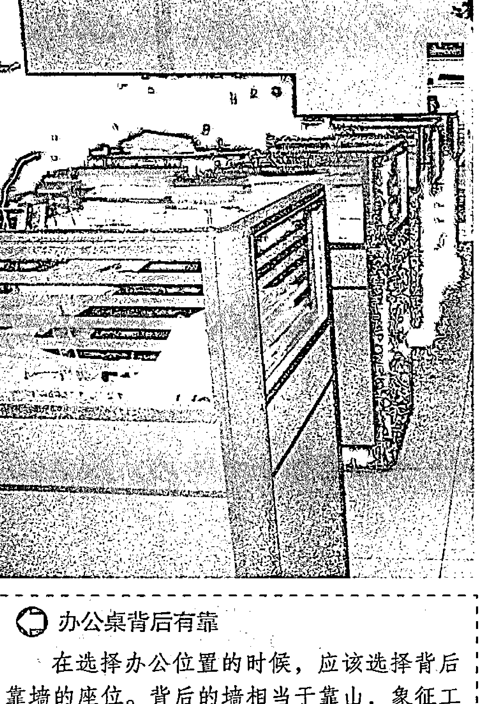

> 办公桌背后有靠
> 在选择办公位置的时候，应该选择背后靠墙的座位。背后的墙相当于靠山，象征工作有贵人相助。

## 125 如何利用龙银招财？

龙银指清朝时期所铸造的流通银币，上面刻有龙形图案，故称龙银。龙银的灵动力，一是来自于皇帝旨意及币上龙纹；二是因为龙银罕见，非达官贵人，难以拥有，因此它经富贵之手，广纳财气，成为了招财借运的最佳法器。

由于龙银广聚人气，故能化煞避邪，流通的次数越多、流通范围越广，力量越大，磁场越强。龙银招纳的财气以正财为主、偏财为副，因达官贵人多以做官或经商致富，仅少数以横财得势。另外需要注意，龙为成双成对的吉祥兽，所以在使用龙银招揽财富时最好佩戴双数。

## 126 如何利用五色豆招财？

五色豆，即绿豆、红豆、黄豆、花豆、黑豆五种豆子。它们不但有防治冠心病、高血压、糖尿病、动脉硬化等保健作用，还可以起到招财、聚财的作用。

五色豆招财法，使用起来简单易行，是易于施行的招财方法。具体方法：将五种豆子按照“绿、红、黄、花、黑”的顺序依次放入一个透明瓶子中，压紧，密封。然后，再把瓶子放在住宅的明财位处，如进门斜对角处。

需要注意的是，所选用的五色豆，一定要确保其干燥，不湿，否则豆子发霉后就难以起到招财的作用了。

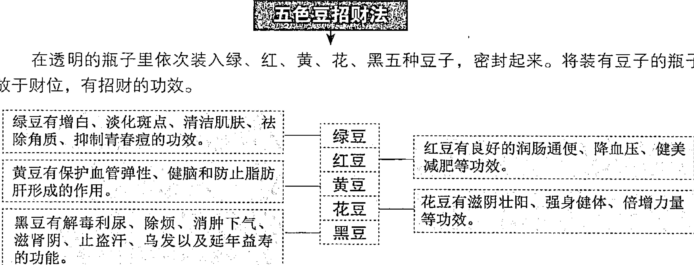

## 127 如何用生肖饰品开启财运？

每个生肖都有各自不同的属性和气场，如猴聪明、狡猾、好动，家中若有性格内向、害羞的小孩，放置猴饰品可使其活泼可爱；鸡担任报晓的责任，有提振士气、振作向上的灵动力，因此若想振奋团体精神，可在办公室西边摆放一只鸡饰品，就可起到鼓舞士气的作用。人们若想改变自己的财运，还可找出与自己生肖相合的生肖与方位，对催旺气运非常有帮助。

右边列表中列出了每个生肖的吉方和相合生肖，可以据此使用相应的生肖饰品来生旺财运。

生肖饰品生旺表
| 生肖 | 吉方 | 相合生肖 | 生肖 | 吉方 | 相合生肖 |
| :--- | :--- | :--- | :--- | :--- | :--- |
| 鼠 | 东北 | 牛 | 马 | 西南 | 羊 |
| 牛 | 东北 | 鼠 | 羊 | 南方 | 马 |
| 虎 | 西北 | 猪 | 猴 | 东南 | 蛇 |
| 兔 | 西北 | 狗 | 鸡 | 东南 | 龙 |
| 龙 | 西方 | 鸡 | 狗 | 东方 | 兔 |
| 蛇 | 西南 | 猴 | 猪 | 东北 | 虎 |

## 128 如何布置卧室让财库增容？

一般人若想提升自己的财运，手边若没有招财、聚财的法器，可以通过合理布置自己的卧室来招财运，聚集财富。

卧室的北侧为财库方位，可以在那里放置一个小柜子，把存折、银行卡或重要的印章存放在里面。这样可以增强存钱能量，增强旺财磁场。这里的小柜子，就相当于一个招财致富的法器，它的周围也有磁场，能散发能量，吸收财富。

若能在小柜子上摆放一部电话，招财效果会更好。因为这部电话象征着信息的流通，更容易让人得到发财致富的信息，捕捉致富的机会，把握财运。

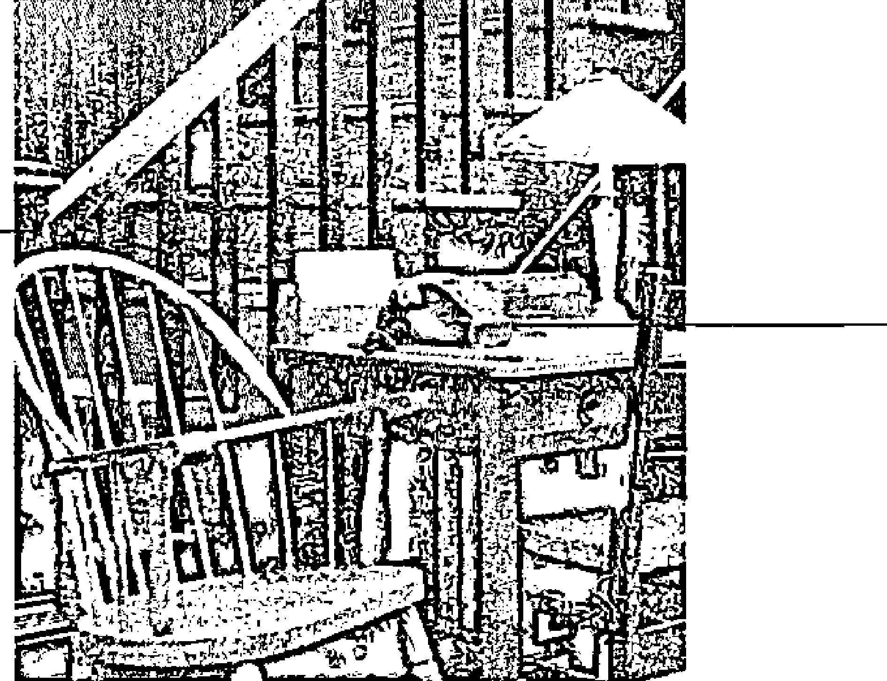

可以在卧室桌子的抽屉里放上存折、银行卡等与钱有关的东西。

> **卧室增财布局**
> 要想招财并不一定要用专门的招财物品。有些时候，合理摆放家具同样能起到招财的效果。

## 129 如何装扮自己可以招来财运？

改变财运的方法有很多，若不想佩戴法器来加强自身磁场，吸引财富，可以通过恰到好处的装扮来增强自身能量，起到招财致富的作用。

耳朵和额头是人体纳气的通道，有聚气生财的作用。因此，发型最好露出耳朵和额头，能招来好运和吉气。

手表周围的磁场，有聚气生财的作用。女人可以通过佩戴一个漂亮的手表来提升自己的能量。在选择手表时，表带颜色以明亮为吉，表罩面以圆形为吉。

女孩子可以通过选择合适的钱包来招财。一般认为，钱包在使用三年后，运气差不多就耗尽了，需要重新更换钱包，带来新的能量补充财运。

此外，还可佩戴水晶首饰改变财运。水晶首饰可以增强人体能量磁场，有助于改善人际关系。人脉即钱脉，因此也可以为自己带来好的事业运和财运。

## 130 哪些生活习惯让你远离财运？

有些人原本天生有财运，但因为不好的生活习惯，不但败光了自己的财富，还毁坏了自己的财运，人称“败家子”。所以聚揽财富，还应从改变不良习惯开始。

常见不利于招财的不良生活习惯有以下几种。

1.  对待分、角等零钱的态度差。如不要找回的零钱，也不捡路上的零钱。所谓“积少成多”，财富就这样一点点被流失了。
2.  把钱币随意乱放在家里。这是不尊重财富的表现，因此财运难以青睐你。
3.  经常忘记掏出换洗衣服里的钱。忽略小钱就是丢失大钱，难以积累财富，因此也无财运可谈。
4.  在纸币上乱涂乱画。这是不尊重财富的表现，财神不愿帮忙。
5.  把纸币折成其他形状，用纸币扎成工艺品，把外币当成装饰品贴在墙上。这些都是不尊重财富的表现。
6.  把破损的纸币扔在家中或者丢弃，或在街上当众撒纸币。这是不尊重财富的表现。
7.  没有钱包，纸币随意卷在口袋里，也表示不敬财神。

### 钱包颜色与财运

不要小看钱包的颜色，不同颜色的钱包有不同的意义，招财效果自然有所不同。

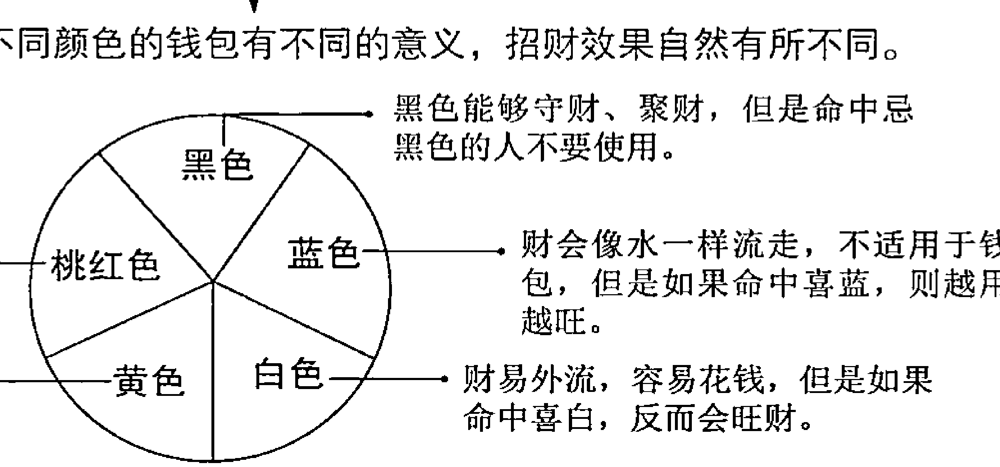

## 131 哪些人会先苦后甜老来财？

每个人都有属于自己的命格，都有自己与众不同的命运。有的人天生含着金钥匙出生，从小不缺财；有的人命运坎坷，先苦后甜，老来才挣得一笔财富。

根据命理上的生辰八字，年柱有劫财，时柱有正财的人，在年少之时，容易家运受劫而破落，但可凭个人努力在晚年赢得财富。若劫财在时柱，晚来财败，要注意守财。

年柱在比肩，时支在辰戌丑未的人，年少时生活较差，但在晚年可拥有房产等收入。若时柱在比肩，晚年会因投资失利而败财，要谨慎投资。

年柱在伤官，时柱在食神或正官的人，年少时生活艰难，年老时事业发达。若时柱在七杀，要谨防冲动投资，在事业上宜采取保守态度，以免有牢狱之灾。

## 132 大门的位置与财运有什么关系？

有的人尽管工作努力，做事踏实，但财运仍然不好。除了受个人命格影响外，家居布置也会影响财运。

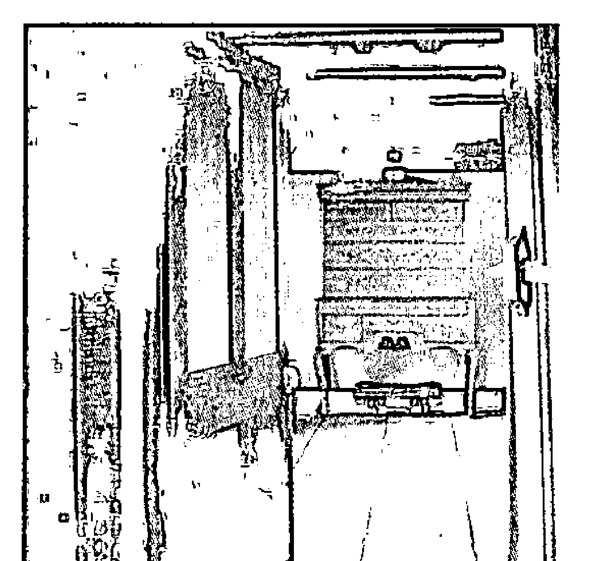

大门的位置会影响财运，因为大门处通常隐藏着财位，若财位缺失，就会使藏风聚气无处可依，难以聚敛财富，呈破财之相。若发现大门处财位缺失，可以通过装修来改善，如可放置一个聚宝盆来提升财运。大门不宜直对后门，否则形成“一箭穿心”之势，无法藏风聚气，难以聚财。补救方法很简单，可以在大门和后门之间竖立屏风或柜子，大门不能正对着厨房。

> **大门与财运**
> 大门应正对着家中的“青龙方”，这样才能聚气生财。注意大门旁边不宜为厕所，因为“青龙”怕臭，闻到厕所气味就不来了，难以吸引贵人，更容易破财。

## 133 如何利用丝巾开启偏财运？

丝巾具有开启偏财运的作用，不仅仅女孩子适于用开运丝巾来改变自己的财运，一般人也可以。方法如下：

1.  首先选择一条红色的丝巾，再准备四张小卡片；
2.  分别在小卡片上用钢笔清晰地写上自己出生的年、月、日、时，即生辰八字；
3.  然后，用绣花针穿上金色的线，用针线把四张小卡片分别固定在丝巾的四个角。至此，开运丝巾就制成了；
4.  最后，把开运丝巾挂在卧室窗户的右角上，就可以开启四面八方的财道了。

```
mermaid
graph TD
    A[步骤一：准备一条红色的丝巾。] --> B[步骤二：在四张小卡片上写自己的生辰八字。]
    B --> C[步骤三：用金色的线将小卡片固定在红色丝巾的四角。]
    C --> D[步骤四：将缝制好的丝巾挂在窗户的右角上。]
```

丝巾不仅有装饰作用，还可以挂在窗子上招徕偏财运。

## 134 炉灶的位置与财运有什么关系？

在炉灶位置的安排上，要注意以下几点。

1.  炉灶不能紧靠厕所，这样不但厕所的污秽之气会影响饭菜的香味，还会影响健康，财神可能会被熏得远远的，个人难以聚财。
    **化解方法：** 转移炉灶，若无法转移，则在炉灶依靠的墙上安装罗盘并敕咒，这样可化解来自厕所的秽气。
2.  炉灶的上方不宜有窗户。炉灶象征财运，窗户位于炉灶上方通气，容易使财运外泄，呈漏财、破财之相。
    **化解方法：** 转移炉灶，若无法转移，则以金属板阻隔，能避免炉灶见光或依靠不稳。

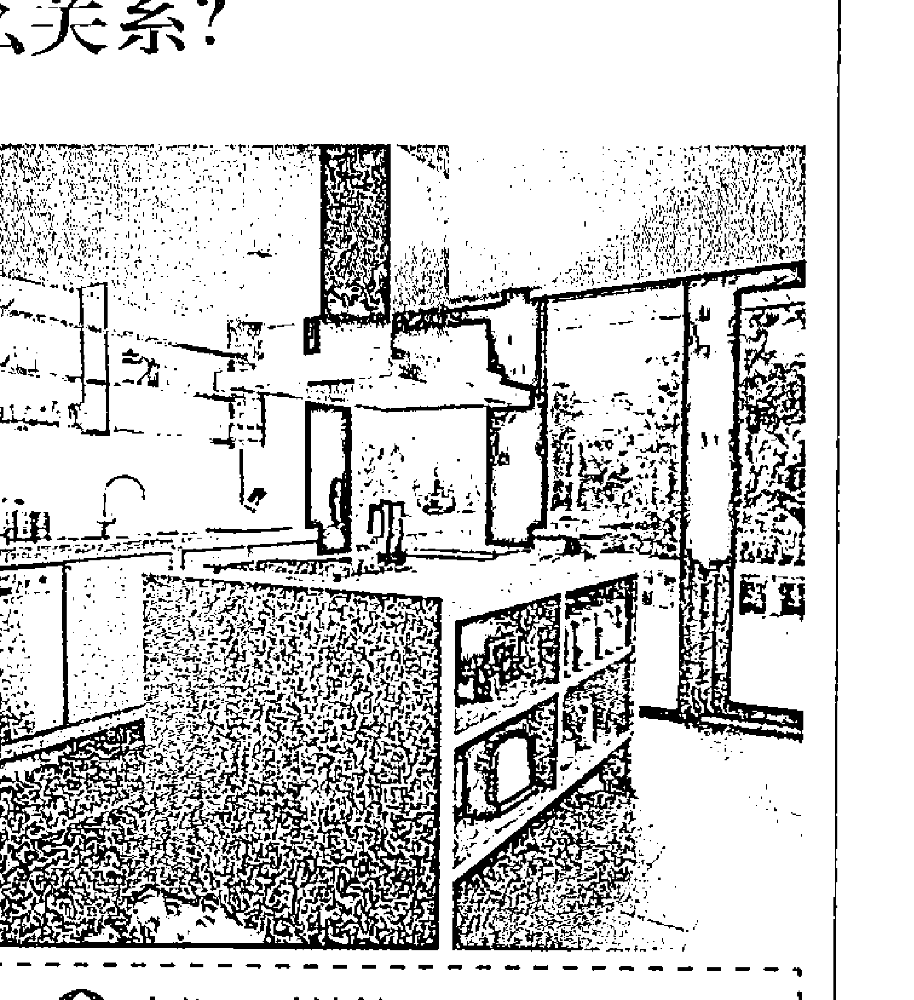

> **大门正对炉灶**
> 打开大门就看见炉灶，这样的布局不利于财气的积累。因为炉灶象征着财库。

## 135 如何用怀表开启正财运？

怀表虽不是常用的招财法器，但有一定的磁场，拥有吸收钱财的能量。恰当运用怀表可以为自己招来财富。

准备一块精致的怀表和一根红色的丝线。红丝线能把四方财气的波动、怀表指针的走动、心脏的跳动这三者连接在一起，彼此呼应，这样象征着财运从此聚集在你身边，为你所用。

然后把怀表正面朝上，用红丝线从链子的末端向表身以顺时针方向缠绕，缠到表链与表身相连的位置。然后把怀表贴胸携带，将表链系在你的腰际，让红色丝线露出一角就可以开启正财运了。

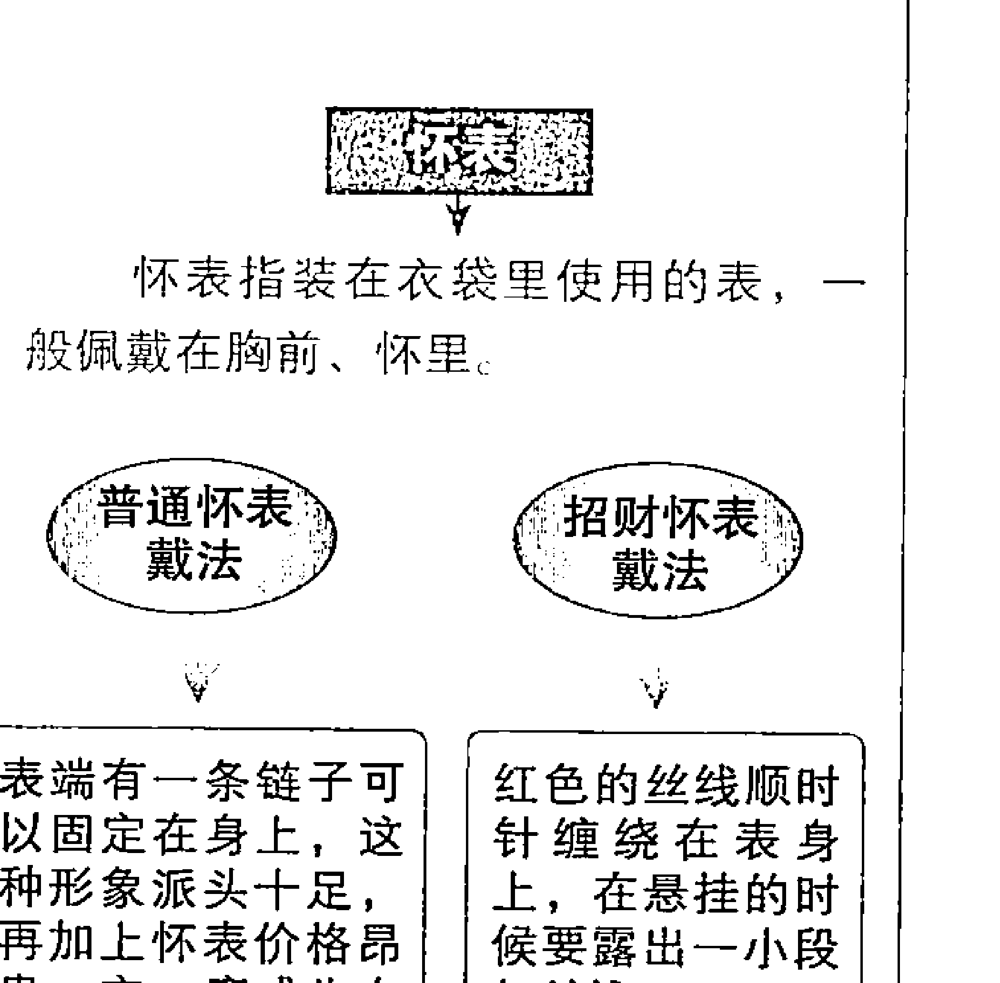

## 图解中国家居生活百科1001问

## 136 浴厕的位置与财运有什么关系？

浴厕是每个家庭必不可少的，但同时也是藏污纳垢的污秽之所，最容易影响个人的财运。因此在布局上，浴厕的位置对整个家庭影响很大。

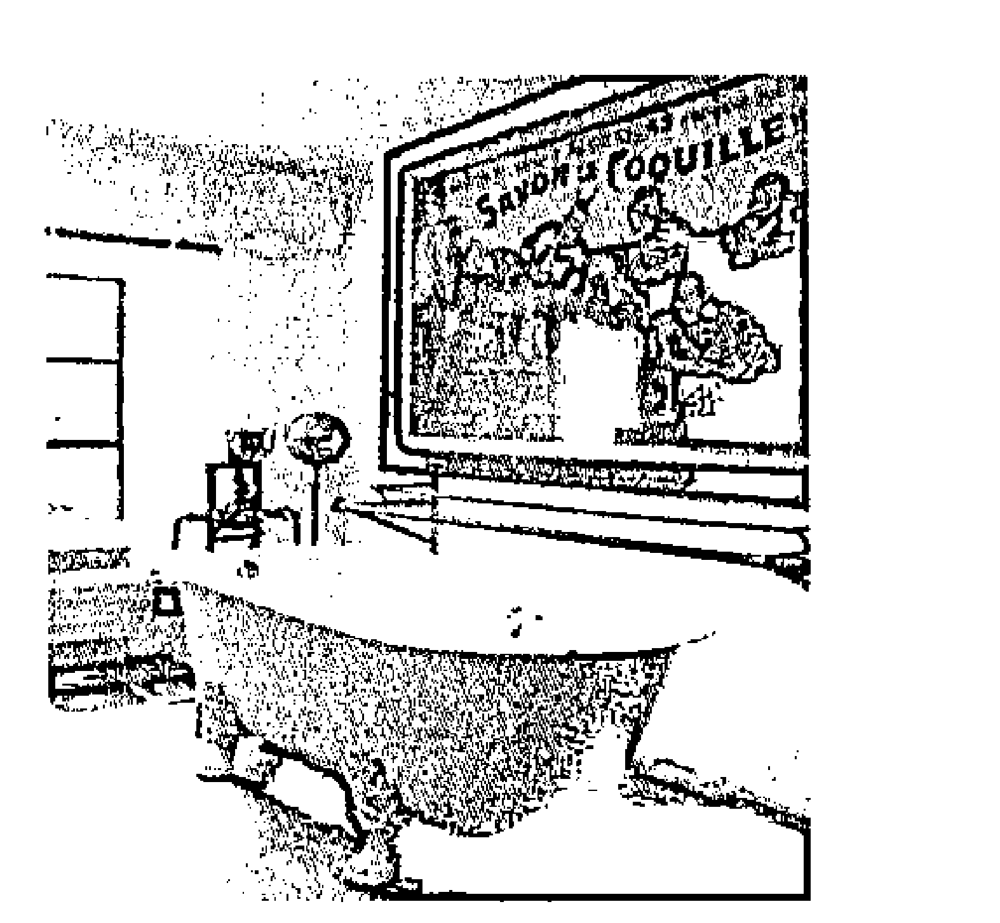

在设置浴厕时，要注意不宜将浴厕设置在房间中央。中央为九宫格之中宫，是最重要的太极中心，好运和厄运在这里都会放大。若将浴厕放在这里，厕所的臭味不但会污染好运，还会将全家的好运都随着马桶冲走，不但不利于聚财，反而会影响身体健康，尤其影响心脏血液循环系统和泌尿系统，容易生大病。若因为种种原因，不得不将厕所设置在房子中央或者大门左边的青龙方，一定要想办法化解。

> **浴室与财运**
> 浴室不宜设置在房子的中央或者大门的左边。浴室在房子的中央，室内的湿气会散布到各个房间，会对家人的健康产生不利影响，还会赶走财运。

## 137 怎样制作“运财盘”招财？

“运财盘”是个人制作的具有招财作用的法器，其做法如下。

1.  首先准备两个圆形瓷盘，一张黄色、粉红色或咖啡色的纸；一百八十四枚十元铜板；三十二枚五元铜板；十二颗五色豆。
2.  在纸上画个太极图。
3.  在两张红纸上写下“为我生财”四字，落款为自己的生辰八字。
4.  将垫纸放在盘底，中间放上写有“为我生财”的字，按正反相对方式放上十六对五元铜板，并使之分成八组，意为“八卦”。
5.  再将九十二对十元铜板按同样的方式放进盘中，遮盖住五元铜板。
6.  将五色豆平分到两个盘中，然后以罗盘为中心，量出房子的东北方和东南方，在其间做一个二尺九的木柜。
7.  最后将运财盘放到木柜中即可。

### 运财盘制作图解

运财盘具有招财的效果，其制作方法比较复杂，具体如下。

制作步骤流程图：
步骤1: 在红纸上写好“为我生财”及自己的生辰八字垫在盘底，并正反相对放上八组十六对五元铜板。
步骤2: 放入九十二对十元铜板。
步骤3: 将红、黄、绿、黑花五色豆放入盘中。
步骤4: 在屋子的东北方与东南方之间放置木柜，并将运财盘放进木柜内。

## 第八章 供奉财神

财神有文财神、武财神、正财神、偏财五路神等。本章主要介绍了各路财神的传说和供奉注意事项等内容。

## 138 正财神赵公明有何传说？

民间供奉最多的财神是正财神赵公明。在古代年画里面，赵公明头戴铁冠，手持宝鞭，黑面浓须，身跨黑虎，面目狰狞，人们又称他为武财神（另有一种说法，武财神指关羽）。

赵公明，本名朗，字公明，秦朝人。传说他为人诚实可信，很会做生意，大家非常信赖他，争着与他合作，因此他积累起巨额财富。同时赵公明扶贫助困、学道修行、和美处事、善于隐讳，身集诸多美德，受到时人赞扬，被后人尊为正财神。

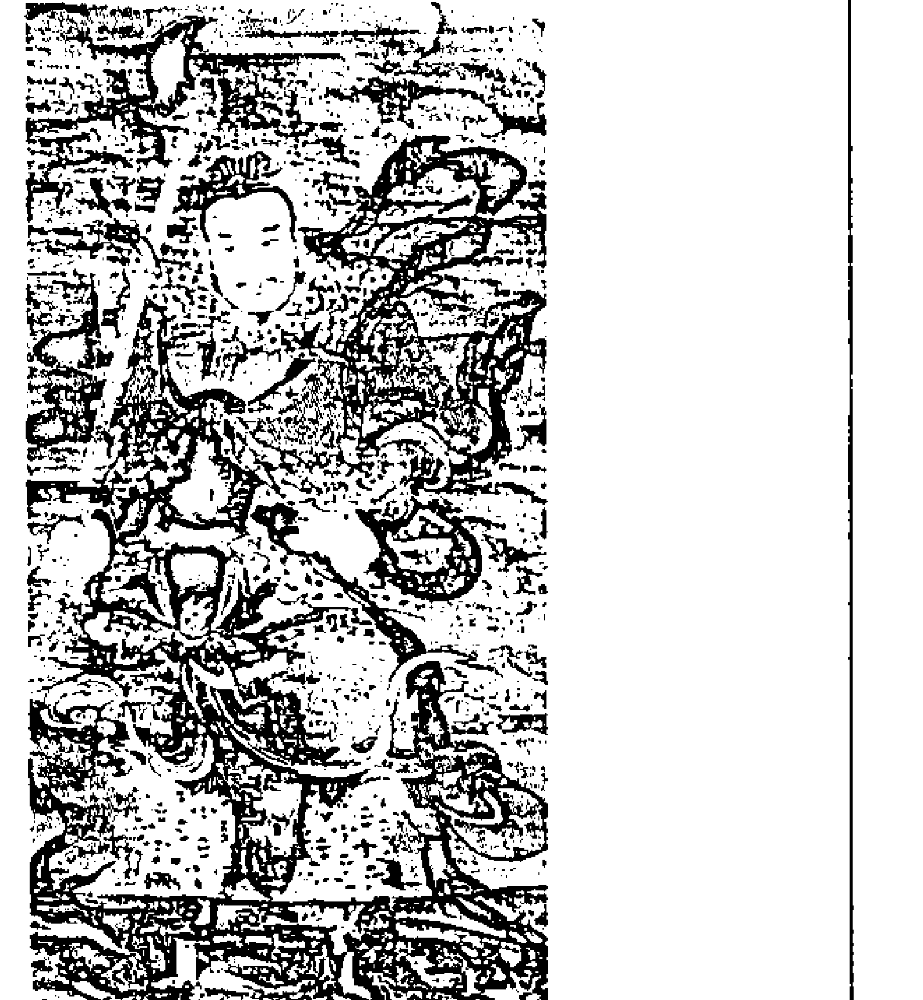

> **正财神：赵公明**
> 赵公明，本名朗，字公明，秦朝人。传说他扶贫助困、学道修行、善于隐讳，身集诸多美德，受到时人赞扬，被后人尊为正财神。

## 139 文财神范蠡有何传说？

范蠡（前517—前448年），字少伯，楚国宛（今河南南阳）人，春秋战国时期越国的政治家、军事家和经济学家。因善于做生意被尊称为“商祖”“商圣”，有“文财神”之称。

范蠡精通韬略，足智多谋。勾践三年（前494年），吴王夫差大破越军，勾践携妻等入吴称臣，范蠡作为吴国人质2年。范蠡归国后，辅佐勾践卧薪尝胆，图强雪耻。经过10余年的努力，越国终于转弱为强，最终吞并吴国。范蠡在灭吴后，为防止兔死狗烹，他主动辞官隐退，乘舟浮海到达齐国，定居于陶（今山东定陶县），更名陶朱公，以经商致富，积累家产数万。

范蠡虽然发了大财，但把金钱看得很淡，他把钱财都分散给穷朋友和贫困的亲戚。范蠡能聚财，又能散财，是人们心目中难得的活财神。

## 140 文、武财神摆放位置有何不同？

文、武财神的位置摆放很有讲究，摆放不当不但起不到聚财作用，反而会疏财、破财。
文财神范蠡很会赚钱，但他喜欢将钱分散给别人，因此若想利用文财神聚财，就要将他放在进门后的左右两边，并面向屋内，这样他就会将赚来的钱分发给你。反之，若面向外，他会将从你这里赚来的钱分给别人，你就会破财。
武财神与文财神的招财方式刚好相反。武财神在年画中属于武将，起着护卫庭院的作用，可保护你的家产，防止小人对你的财产图谋不轨。所以在放置武财神的时候，应使他面向外面，一方面可以镇守门户，防止外邪入侵，另一方面还可以帮你招财纳福。

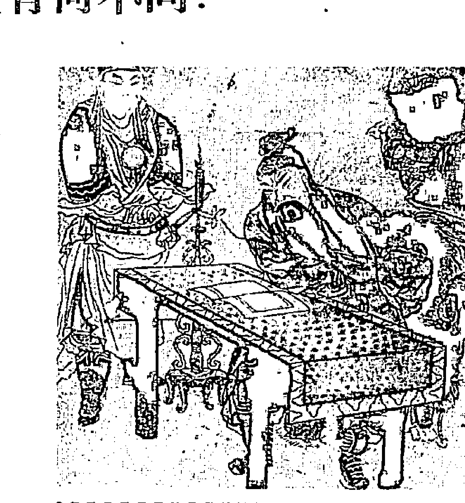

> **武财神**
> 武财神指关羽，武财神在年画中属于武将，起着护卫庭院的作用，可保护你的家产，防止小人对你的财产图谋不轨。

## 141 文、武财神分别适宜于哪些职业？

文财神和武财神都有各自擅长的领域，在某一方面赚钱能力比较强。若想利用文、武财神为自己招揽财富，还要考虑自己的身份和职业，尽量让二位财神在各自擅长的领域大展拳脚，帮你赚取钱财。
通常来说，文财神适宜于文职，较为静态的工作性质，如公司或办公室，上班族适合摆放文财神。店铺若摆放或供奉文财神，可以增加客户群，让财运滚滚而来。
商场竞争，以武财神作靠山。因此，一些经商的老板、军人、从事武职或偏门生意的人、有投机性质（股票、期货）的人，适合摆放或供奉武财神。

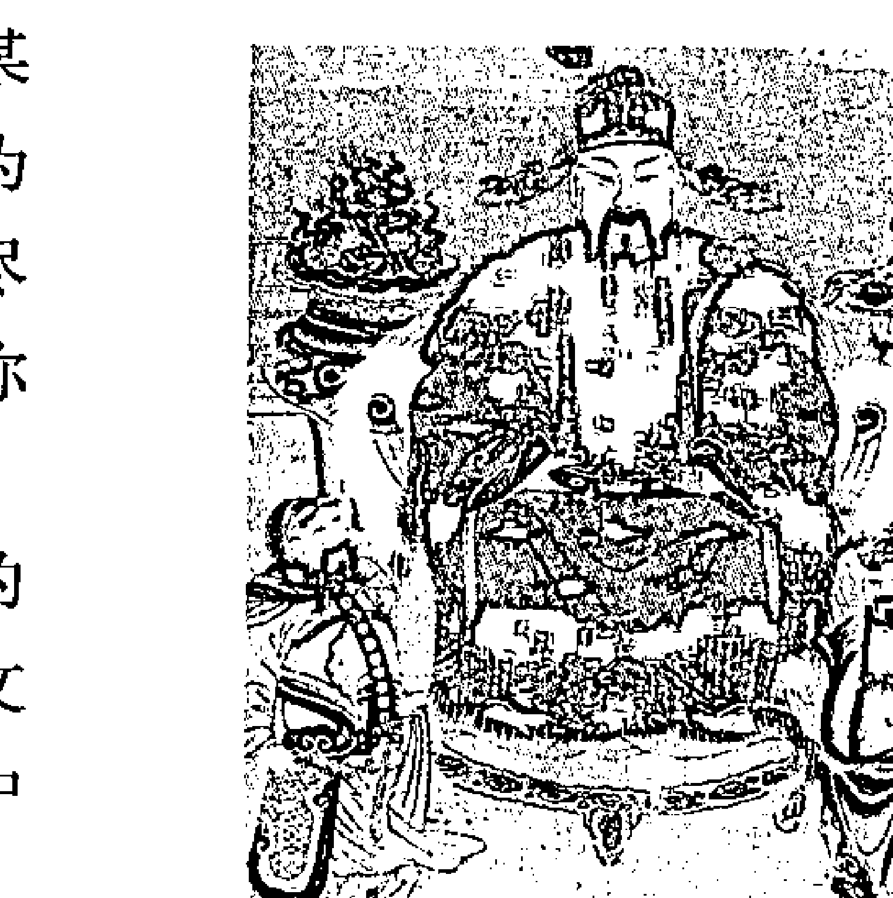

> **武财神**
> 武财神适合竞争激烈的行业。军人、经商的老板或从事投机行业的人可以供奉武财神。

## 142 为什么尊关公为武财神？

关公即关羽，是众所周知的三国豪杰。关羽最大的特征是忠义，不从二主，跟了刘备就万死不辞，“千里走单骑”就是一个很好的证明。在实践上，关羽言行为义而动，他可以快马飞刀，令敌闻风丧胆，也可以勒转马头，让曹操逃跑；可以不睬军师，自行其事，也可以俯首听命，忠心效力。

关羽的这种性格特征受到人们世世代代的敬仰和历代帝王的推崇，逐渐被百姓尊为神。民间百姓认为他是全能之神，能治病除灾，驱邪避恶。商人们敬佩关公的忠义和守信，民间各行各业都供奉关公，关公因此成为发财致富的武财神。关公像分为两种：红衣关公放在家中保平安；彩衣关公放在店铺可招财。

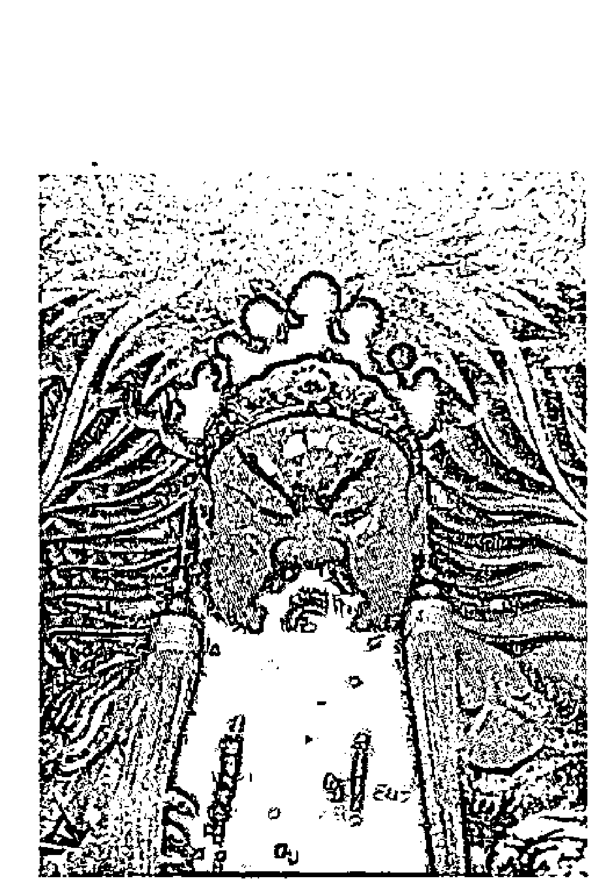

> **武财神关公**
> 关公在中国是一个家喻户晓、妇孺皆知的人物。他一生忠义勇武，为佛、道、儒三家所崇信。商人们敬佩关公的忠义和守信，奉他为武财神。

## 143 偏财五路神的传说从何而来？

民间的偏财神指《封神演义》中的五路神。每年正月初五是五路财神的生日。古时百姓在初四晚举行迎神仪式，初五早上燃放鞭炮，欢迎财神。

五路财神指赵公明及其四位义兄弟（一说为部将）。除了中路为武财神赵公明外，其余四路为东路财神招宝天尊萧升，西路财神纳珍天尊曹宝，南路财神招财使者陈九公，北路财神利市仙官姚少司。这可能是受五行观念的影响，认为天地广阔，财宝也要分区处理。拜五路财神，就是收尽东南西北中五方之财的意思。

> **五路财神**
> 路神，指路头、行神。五路，即东、西、南、北、中五方。五路财神指赵公明及其四位义兄弟五位神明。

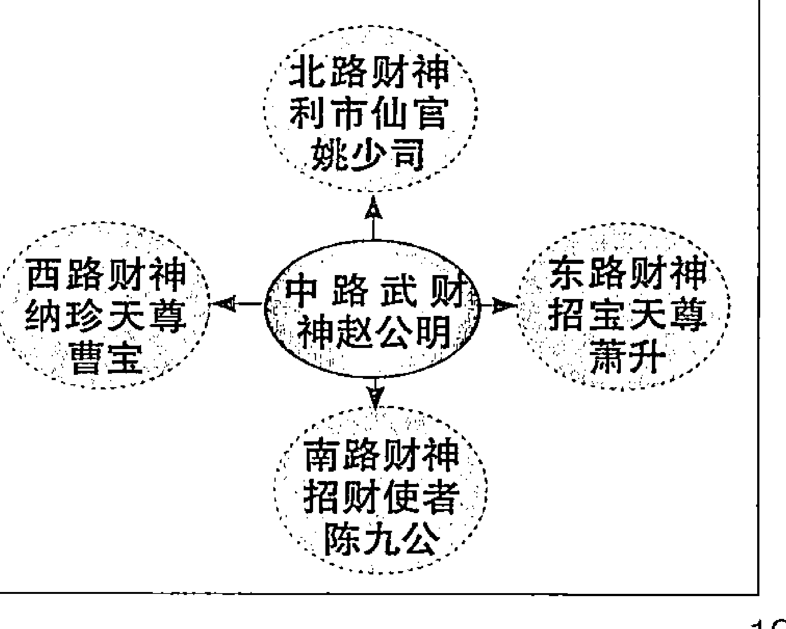

## 图解中国家居生活百科1001问

## 144 邪财神四面佛有何传说？

四面佛是印度婆罗门教的一位神，又称四面神。东南亚一带的人认为他法力无边，掌握着人间的荣华富贵。所谓四面，即东、南、西、北四个方向，分别代表事业、爱情、健康和财运。因此不宜将四面佛放到神龛内，要令其环视四方，如此方可让他帮助人们达成生意兴隆、姻缘美满、平安健康、招财进宝等美好愿望。不可将他与其他神像并列放置，而要放在花园中、院子里或天台上，露天供奉亦可。


四面佛有四尊佛面，分别代表爱情、事业、健康与财运，他掌管人间的一切事务，香火很旺。

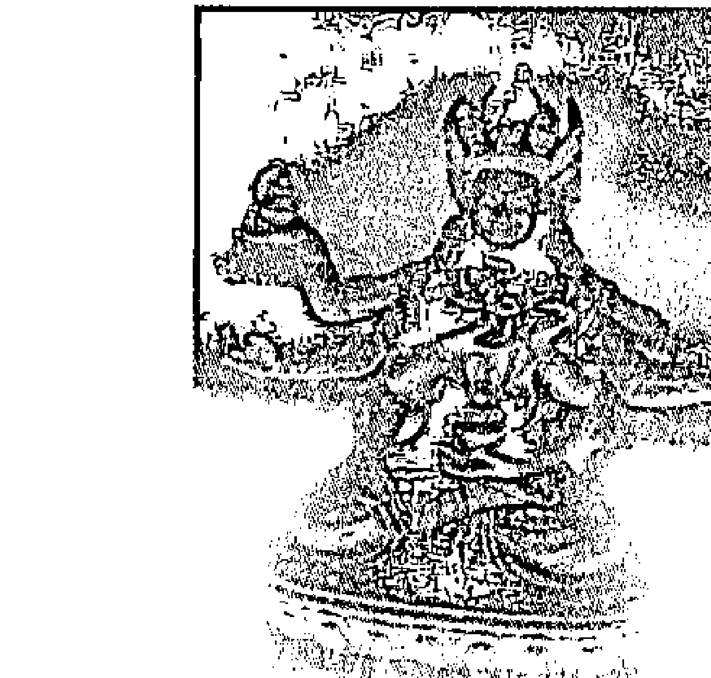

**出现：** 四面佛原名“大梵天王”，为印度婆罗门教三大神之一，是创造天地之神、众神之父。
**拜祭：** 拜四面佛的时候，会用到鲜花、香烛和木像。
**护佑：** 在印度神话中，四面佛有求必应，只要人们向他许愿，他就会应允，帮助人们实现。

## 145 撒钱济贫的刘海蟾有何传说？

刘海蟾，原名刘海，字宗成，又字昭元，号海蟾子，五代十国时人，曾为辽朝进士，后作为丞相辅佐燕主刘宗光。

据说，刘海蟾曾说服了三脚蟾蜍。三脚蟾蜍与其他蟾蜍不同，它专门以金银财宝为食，祸害人间。刘海蟾就以一串金钱为诱饵，将这只三脚蟾蜍钓了出来，收服了它。因此民间有“刘海戏金蟾，步步钓金钱”的说法。三脚蟾蜍被收服之后，就随着刘海蟾沿路为贫穷百姓吐撒金钱。人们感激刘海蟾，就称他为“活财神”。

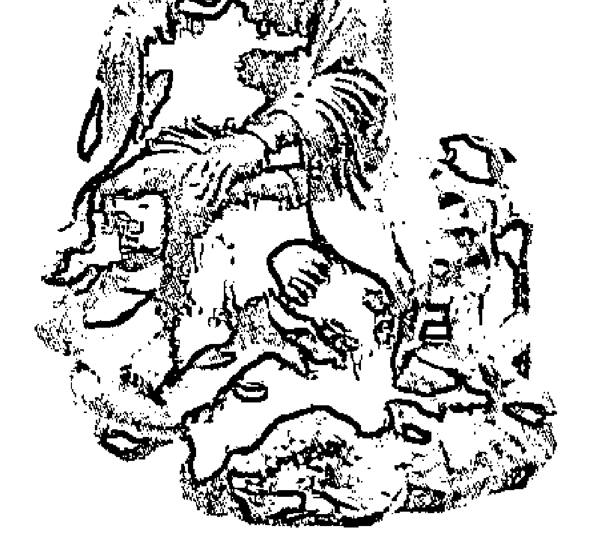

**刘海蟾：** 刘海蟾，原名刘海。相传，他收服了专食金银财宝的三脚蟾蜍，让三脚蟾蜍吐钱救济贫穷百姓，刘海蟾因此被人称为“活财神”。

## 146 财神的摆放有何讲究？

财神虽然有招财、聚财的作用，但不可乱放，否则难以发挥其作用。在摆放财神的时候要注意讲究。

关公不与观音一起供奉

- 1. 摆放财神的桌子，应当正对着大门，尤其是“关公”与“土地财神”，更应该正对着大门。这样他们一方面可以起到招财的作用，另一方面还可以阻止妖邪入屋肆虐。
- 2. 不可将武财神关公和观音一起供奉。
- 3. 神像不宜朝向厕所、卧室门或餐桌，也不宜与屋主祖宗一起供奉，祖宗为家神，与天神不宜同列并处。

| 人物 | 性格 | 贡品 |
| :--- | :--- | :--- |
| 关公 | 嫉恶如仇，对敌不手软。 | 不忌酒肉 |
| 观音 | 慈悲为怀，戒杀生。 | 吃素守斋 |

## 147 为何称文昌帝君为文财神？

文昌名称来自文昌宫。文昌原是天上六星的总称，即文昌宫，主管功名利禄。据《明史》记载，东晋时期，蜀人张亚子自称蜀王，为报母仇，率领义军抗击前秦苻坚，后战死沙场。后人为了纪念张亚子，在梓潼郡七曲山建祠，并尊奉他为雷泽龙王。安史之乱时，唐玄宗逃亡四川听说了张亚子的英烈事迹，追封他为左丞相，并加重了对他的祭祀。后来唐僖宗避乱入蜀，又封张亚子为济顺王，并亲解佩剑献神。经过五代十国、宋朝，张亚子不断被加封。到了元仁宗延祐三年，元仁宗封他为辅元开化文昌司禄宏仁帝君。至此，张亚子成为文昌帝君、文财神。

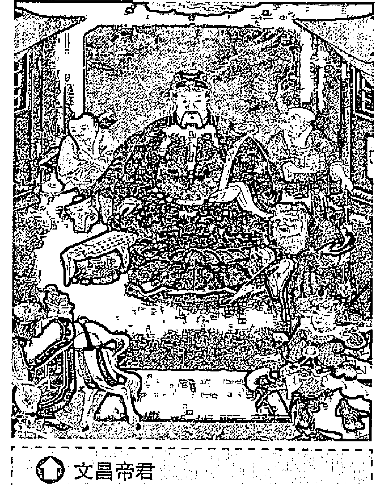

### 文昌帝君

文昌帝君又称梓潼帝君，是古代文人科举考试的保护神。由于古时学而优则仕，读书人要改变自身命运，只能通过科举考试，因此文昌帝君又被奉为文财神。

## 148 福禄寿三星是财神吗？

古时候，大多数人家都喜欢在墙上张贴福禄寿三星的图画。如果把他们的神像放在财位上，也能增强财运。福星的形像是手抱小孩，象征福气临门。禄星身穿华丽官服，手抱玉如意，象征加官晋爵，增禄添财。寿星手抱寿桃，象征长寿安康。

在福禄寿三星中，原本只有禄星才是财神，但三星通常三位一体，因而福星和寿星也连带着被人们当做财神供奉。三星同照，有满堂吉庆之意，磁场更强，能量更大，更能为人招财纳福。

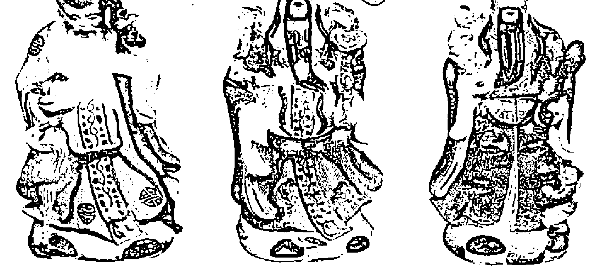

福禄寿三吉星
从左至右依次为寿星、禄星、福星。福寓意五福临门，禄寓意高官厚禄，寿寓意长命百岁。中国民间喜欢将福禄寿三星作为礼仪交往和日常生活中幸福、吉利、长寿的象征。

## 149 财帛星君有何传说？

在民间，财帛星君是一位广受喜爱的财神，很多求财的人都尊敬他、供奉他。他在形象上是一个白面长髭的富态老者。他头戴宰相帽，身穿锦衣，腰系玉带，左手捧着一只金元宝，右手拿着“招财入宝”的卷轴（也有说他左手持玉如意，右手捧聚宝盆，上面写着“招财进宝”的字样）。

相传财帛星君原是天上的太白金星，属于金神。他在天上的职衔是“都天致富财帛星君”，专管天下的金银财宝，因此被民间百姓奉为财神。

**财帛星君供奉注意事项**
- 供奉的东西，最好是糕点和甜点，传说财帛星君喜欢吃甜食。
- 香炉和长明灯一定要是铜制的，因为财帛星君是传说中天上的神仙。
- 将财帛星君放在屋内对着主卧室门，不要对着大门。
- 多放小饰品。

## # 开运篇

本篇主要讲述了开运的相关问题。开运指运用一定的方法技巧和吉祥物开启好的运势的行为。内容涉及职场开运、桃花爱情运、学业开运、化妆开运、衣着与饰物开运、商业开运等方面的问题。

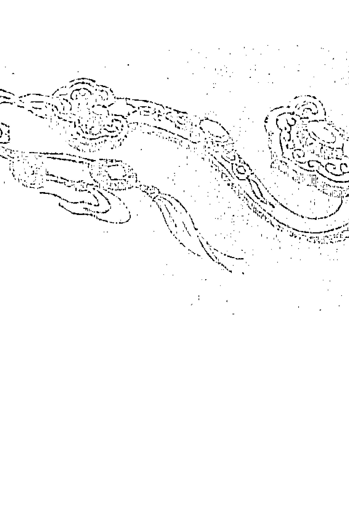

## 第九章 职场顺心意

本章主要讲述了职场开运的相关问题，内容涉及办公桌该如何摆放，卧室布置与事业的关系，办公室内如何摆放开运物品，常见的开运物品有哪些及其运用方法等。

## 150 办公桌的物品摆放有哪些禁忌？

办公桌物品的摆放不但代表着一个人的形象，也影响着个人在职场的运程。因此，在摆放办公桌物品时，要注意以下忌讳。

- 1. 首先，物品摆放不能凌乱，凌乱的环境多会带来糟乱的心情，同样也会扰乱自己的思绪，做事情的耐力会逐渐减低，事业很不容易成功。
- 2. 许多人喜欢在办公桌上摆放植物，但注意不要摆放带刺的植物。
- 3. 尖锐的物品不宜摆在办公桌上，它们容易影响人际关系和事业发展。

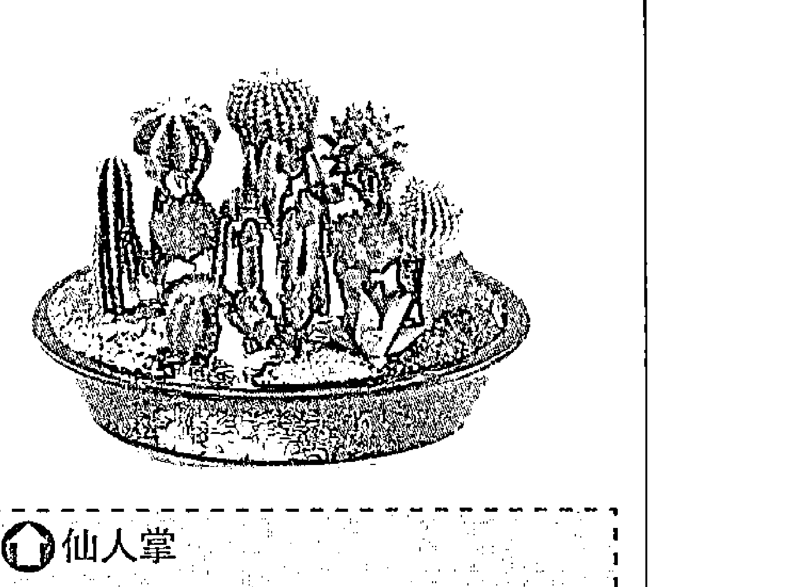

> ①仙人掌
仙人掌是墨西哥的国花，它身上带刺。在办公桌上摆放仙人掌，容易引起与他人的冲突，对事业发展不利。

## 151 正北卧室与事业有什么关系？

住宅布局不合适，会影响事业的发展，如卧室在正北方就会对事业产生不利影响。

一般来说，在正北卧室居住的男性，不擅长表达，尤其不擅长向他人传达自己的意见，容易被人际关系困扰。人脉不通，钱脉就不通，运程也难以展开。居住在这个方位的男性，平日不必为此苦恼，多多自我审视，学会寻找自身的缺点，并及时改正即可。

### 居正北卧室男人事业发展方法

| 属性分析 | 主要内容 |
|----------|----------|
| 性格特征 | 一般都有一种学者气质。但不擅长表达，容易被人际关系困扰。 |
| 适合行业 | 适合从事研究工作，有单独作业的能力，如学者、作家、技术员等。 |
| 解决方法 | 居住在此方位的男性，多是大器晚成型。不要太在乎别人的看法，只要现在多努力，日后就会有很大的成就。 |

## 152 西北卧室与事业有什么关系？

与正北方向相比，将卧室安排在西北方向，事业发展要相对顺利一些。

西北是个强化力量的方位，尤其适合男性居住。男性若居住在这个方位的卧室，性格会略带霸气，有些顽固，比较自我，看似不拘小节，漫不经心，其实却心思缜密。这些性格特征有助于发展事业。年轻男性长时间居住在西北方位的卧室中，无异于长时间待在西北的热量中，对事业的发展起到如虎添翼的作用，用不了多久就会有显著的成效，并且有可能升职，加上本身散发出来的男子气概，很容易就能得到下属的信赖，威信也会越来越高。

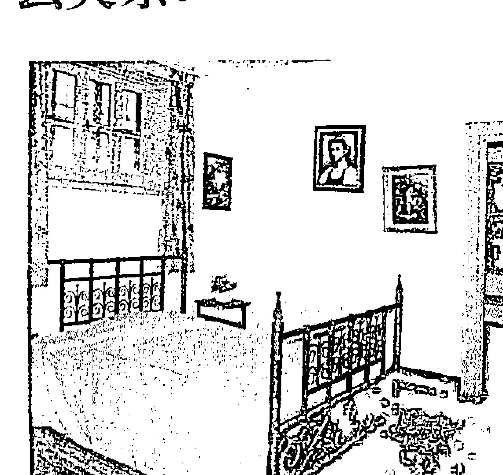

> 居西北的卧室
居西北的卧室，如果男性常年居住其中，晚年多不爱听取别人的意见，会给人留下“老顽固”的印象。因此要注意完善自己的性格。

## 153 东北卧室与事业有什么关系？

卧室若在东北方向，有好的一面，也有不好的一面。

好的一面在于：在这个方位居住的男性，一般侠义心很重，喜欢帮助朋友，在大家眼里是一个很有血性的人，是别人眼中的“大好人”，是个热心肠的人，因此人缘很好，适合从事土木建筑行业。

但是，在这个卧室居住的男性，人生的落差比较大，总是会有很多大起大落。如果是上班族，会经常面临调职的情况。如果自己创业，则会有几次失败的经历。但由于本人很乐观，一般没有大的影响。

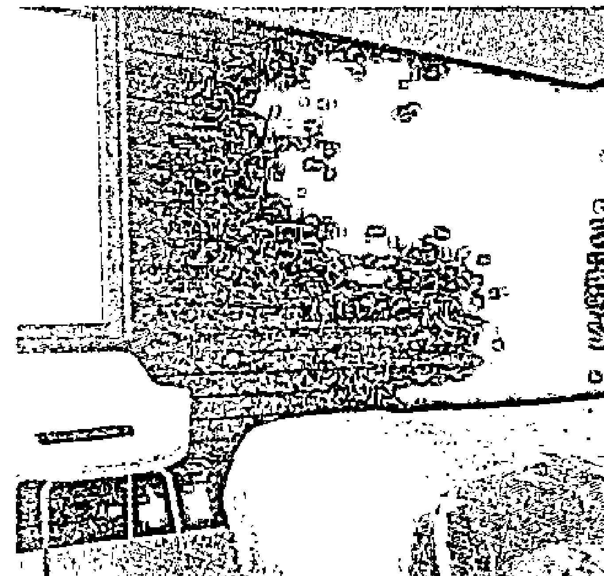

> 居东北的卧室
居东北的卧室，如果男性常年居住其中，有乱发脾气的毛病，这是运程的大忌。平常要注意修身养性，努力完善自己的性格。

## 154 养鱼有助于事业的发展吗？

古代环境文化学认为，鱼不仅可以美化环境，还有增添财禄，驱邪的作用。鱼缸的方位一定要摆对，才有助于事业的发展。

鱼缸要摆在家中的明财位，这样才能转运添财助事业。家中的明财位一般都在大门对角线的位置。在这里放一个鱼缸，只要打开门就能看见鱼，不仅在视觉上抢眼，对财运以及事业运的提升有很大的帮助。

至于鱼的数量，要根据鱼缸的大小来确定。空间小会给鱼的生存造成困难，暗示事业发展道路上充满荆棘，养鱼的条数，以2、6、7的倍数为最佳。

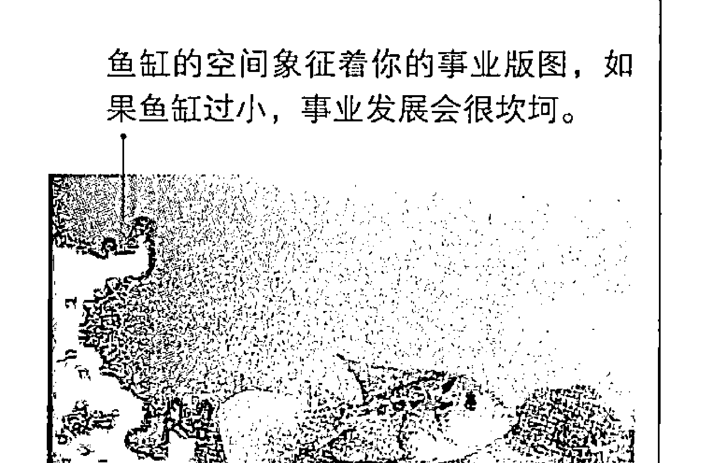

> > **养鱼助运**
> 在家中的明财位摆放鱼缸，有利财运，但是注意不要摆在神像下方。

## 155 办公桌上为何不能摆放石头？

有的人认为，石头与玉一样，都是矿物质，富含多种有益于人体及运程的金属元素，磁场作用较强，能量也较大，就想当然地认为，在办公桌上摆放一块石头既可以养颜、镇邪、安神，又可招财纳福开运，甚至拿石头来做装饰。可是，这个做法是很不妥当的。

石头是阴气很重的东西，摆在身边不但难以释放能量，还会吸收人自身的能量，渐渐影响到人身体的健康，招致外邪入侵，不利于趋吉避祸。

另外，石头属于静物，而静止不动的东西摆放在办公桌上，预示着自己的薪水也会静止不动，不会有大的涨幅，同时自己也难以升迁，不利于事业的发展。

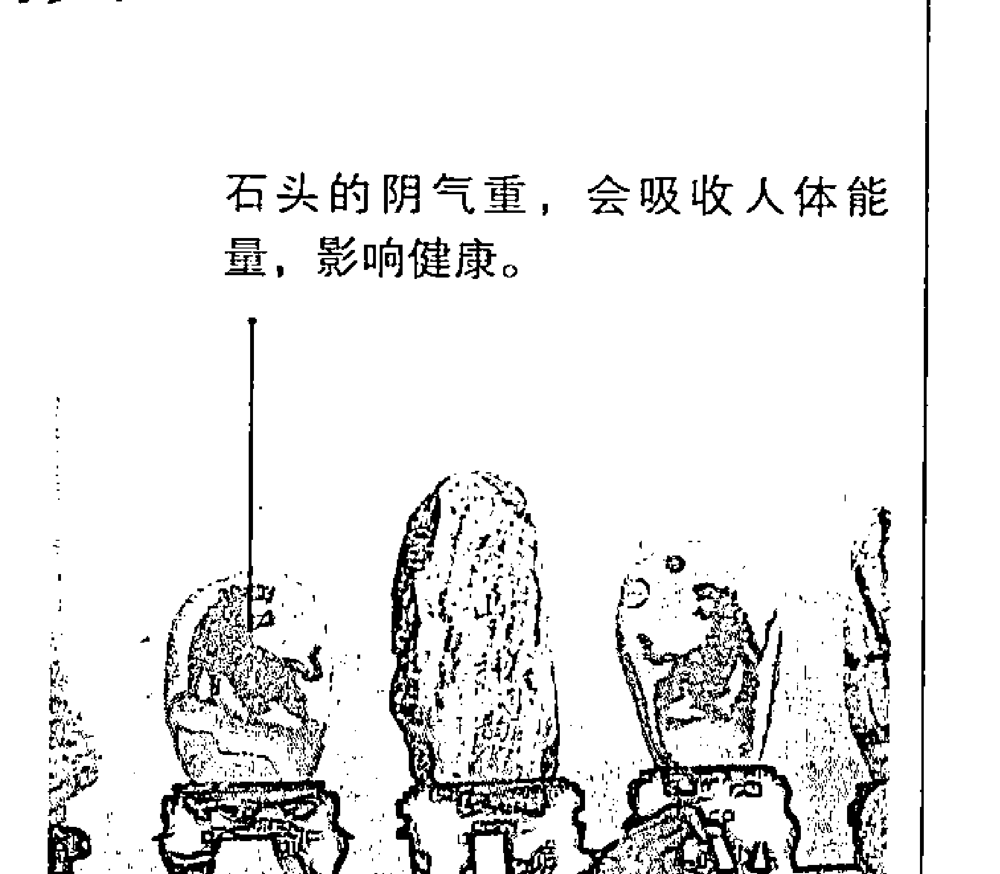

> > **石头影响升迁运**
> 石头的摆放一定要慎重，如果办公楼、办公桌或者家中不缺靠山，摆放石头，就等于阻碍了自己的升职运。

## 156 办公桌物品摆放为何要左高右低？

办公桌上的物品摆放一定要遵守“左高右低”的原则，意思就是左边的物品要高于右边的物品。
俗话说：左青龙，右白虎。即左边是青龙的方位，右边是白虎的方位，相对来说，青龙更容易为人带来好运气，比白虎的位置尊贵。因此在办公桌上摆放物品时，最好遵守“左青龙右白虎”的原则。
相反，如果左右边摆放错误，左边位置的物品低，右边物品位置高，青龙就难以发挥招财纳福的作用。这时，个人事业容易遇到挫折，做事不但难以得到别人的认同，而且执行计划时总是阻碍重重，难以顺利进行。

> 办公桌物品的摆放
办公桌物品的摆放讲求“左青龙右白虎”。左边的物品摆放比右边的高才会得到同事的认同，上司的赏识，工作才能进展顺利，不会让你的计划被轻易打乱。

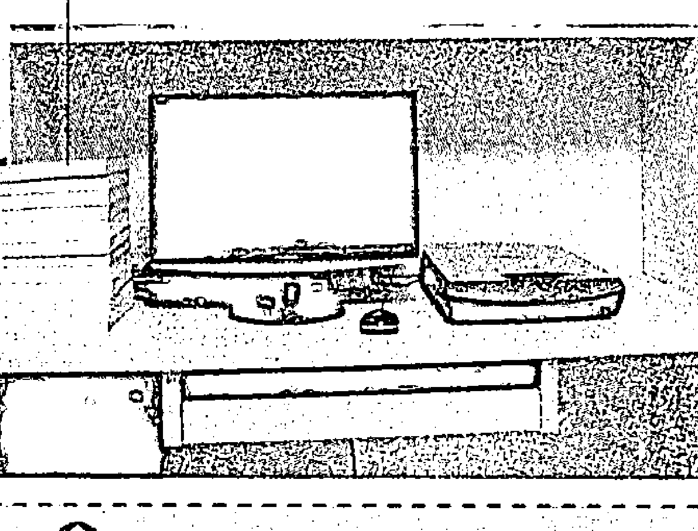

## 157 办公室中如何化解小人困扰？

职场中形形色色的人都有，加之事情繁杂，一不小心，就可能遭遇小人算计。古代人认为，最容易招惹是非的生肖年份有乙亥年、丁亥年、乙巳年、丙寅年、丙申年、丁酉年、乙酉年，而在农历四、五、六月出生的人更加容易招惹到小人是非。
根据推算，是非位最容易处于正南方，办公桌在这个方位，不但很容易招惹到小人和是非，同时自己也可能会是制造是非的人。在这个位置上，忌讳有水流动，同时忌讳动土、震荡，摆放空凋，不宜用黑色与蓝色装饰等。

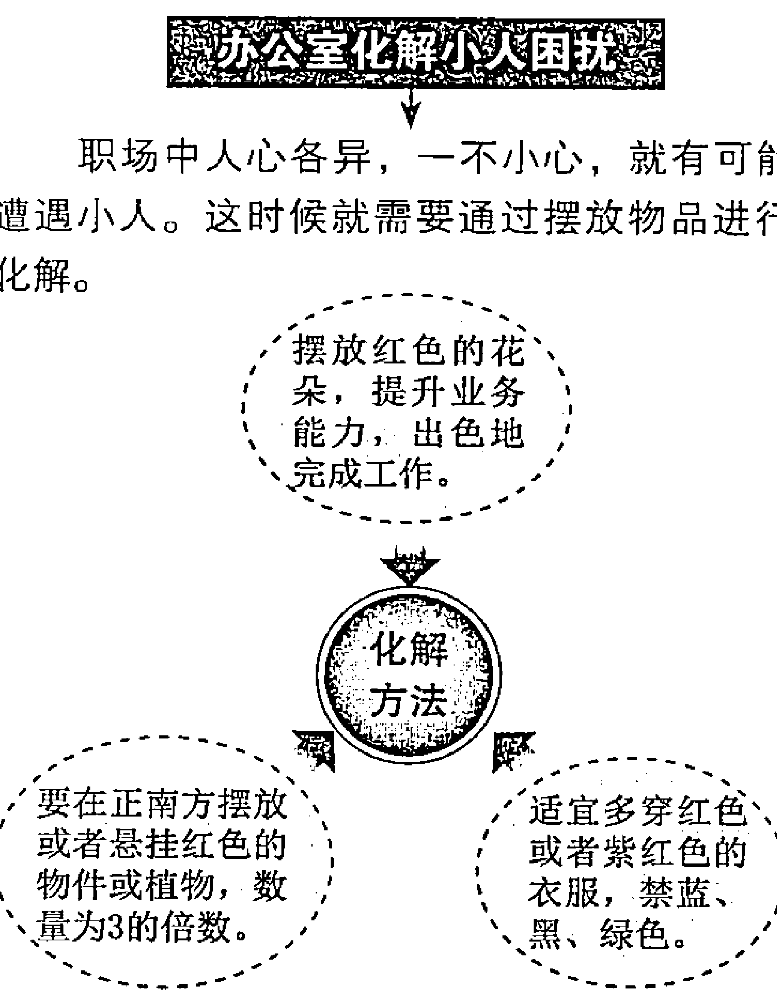

## 158 什么样的妆容能赢得上司的好评？

恰到好处的装扮，不但可以美化自己的外表，还可改善自己的运程，赢得上司的青睐。

化妆时，眼睛是重点，要把眼睛画得稍微下垂一点，将上眼线的线条向下延伸一毫米，这样就可以成为很自然的下垂眼了。这就是所谓的“低眉顺眼”，很多上司喜欢这样的员工。

眉毛也是化妆重要的部分，眉毛能反映一个人的性格、行事方式。一般将眉毛修成拱形的长眉，这样会给人亲切和善的感觉，不仅能得到同事的认同，也会得到上司的重用。

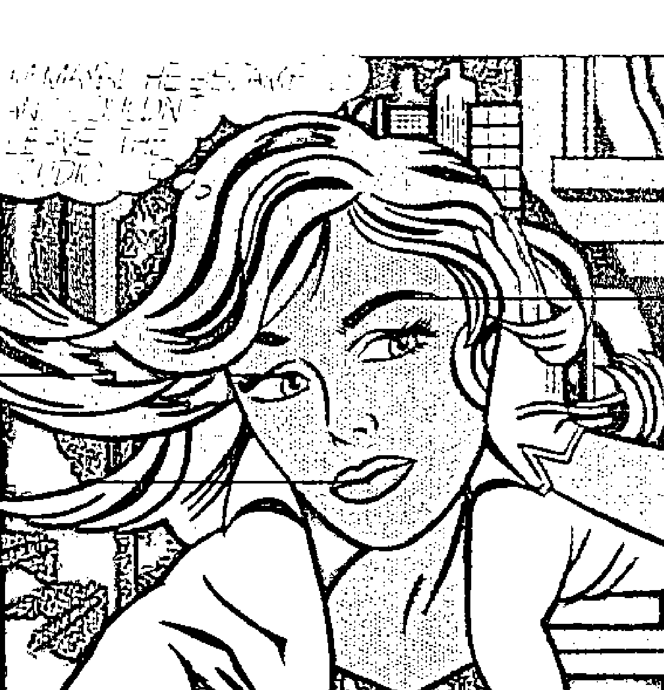

眼睛不宜化得太过张扬，否则会给人难以接近的感觉。

弯弯的柳叶眉，瞬间拉近了人与人之间的距离感。

在化嘴唇时，将嘴角收紧，给人利落的感觉，这样易获得上司的青睐。

> 赏心悦目的妆容
办公一族化一个美观、整洁、干净的妆容，不仅看着赏心悦目，也是对别人的一种尊重。

## 159 办公室墙上不适合挂什么图画？

许多公司都会在墙上挂很多图画，但不是任何图画都适合装饰用，如果挂的图画不当，不但会影响员工工作，其工作效率会大大降低，还会影响整个公司的业绩。

办公室最好挂一些线条柔和，图案简单的图画，这样既有助于帮助员工放松心情，又可养眼，有助于提高大家工作的积极性，当然也有助于提高工作效率。不要悬挂凶猛、阴森、恐怖或者有猛兽图案的图画，否则会给员工不良的暗示。时间久了，影响员工的情绪，员工身心压力过大，会影响工作效率。

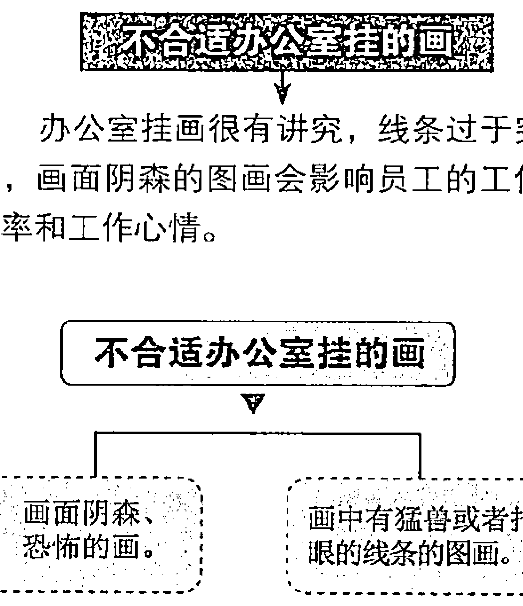

办公室挂画很有讲究，线条过于突出，画面阴森的图画会影响员工的工作效率和工作心情。

画面阴森、恐怖的画。

画中有猛兽或者抢眼的线条的图画。

## 160 在办公桌上摆放大鹏展翅的饰品有何作用？

鹰的眼神凌厉，疾飞如风，一如军队中的统帅，勇猛、睿智。

很多人的办公室里都放着大鹏展翅的饰品，尤其是老板和销售经理的房间。这样做有助于树立信心，开拓视野。

在中国传统文化中，大鹏展翅象征鹏程万里、名利双收，也有一飞冲天、一鸣惊人的含义。在办公桌上摆放大鹏展翅饰品，可以帮助高升，增加财运，对事业发展有很大作用。

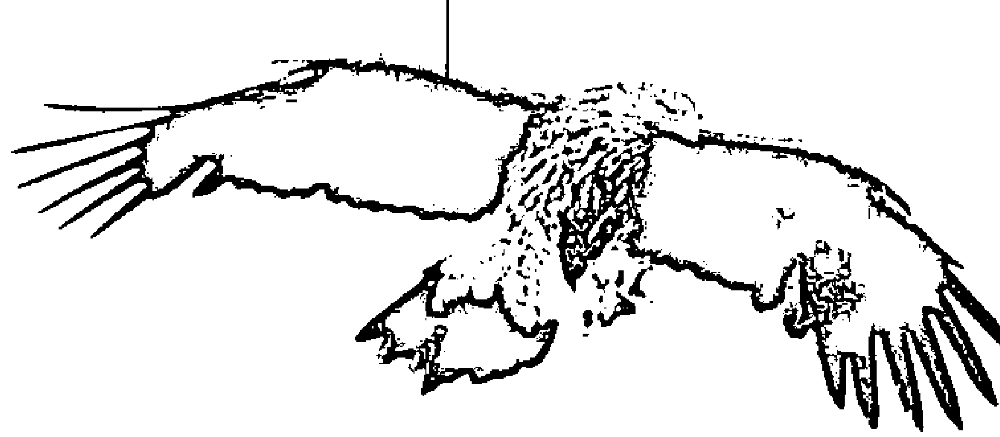

在摆放大鹏展翅饰品时，一定要摆放在左边，切忌不要放在右边。古代人认为，左边是喜庆、吉祥的位置，右边则比较凶险。如果将饰品放置在右边，很容易带来不好的影响。而且根据“左青龙右白虎”的理论，左边属于财位，有助于招财、聚财。

> 大鹏展翅的饰品
在办公桌上摆放大鹏展翅的饰品，寓意着志向高远、前程远大，不畏艰难、勇往直前，奋武扬威、官运亨通。有助于开拓人的视野，树立奋进的信心。

## 161 在办公桌上摆放九龙笔筒有何作用？

九龙笔筒是效果极佳的助运物品，最高的有16厘米，一般为玉石底座。经过开光的九龙笔筒，有转运、助升职的作用。

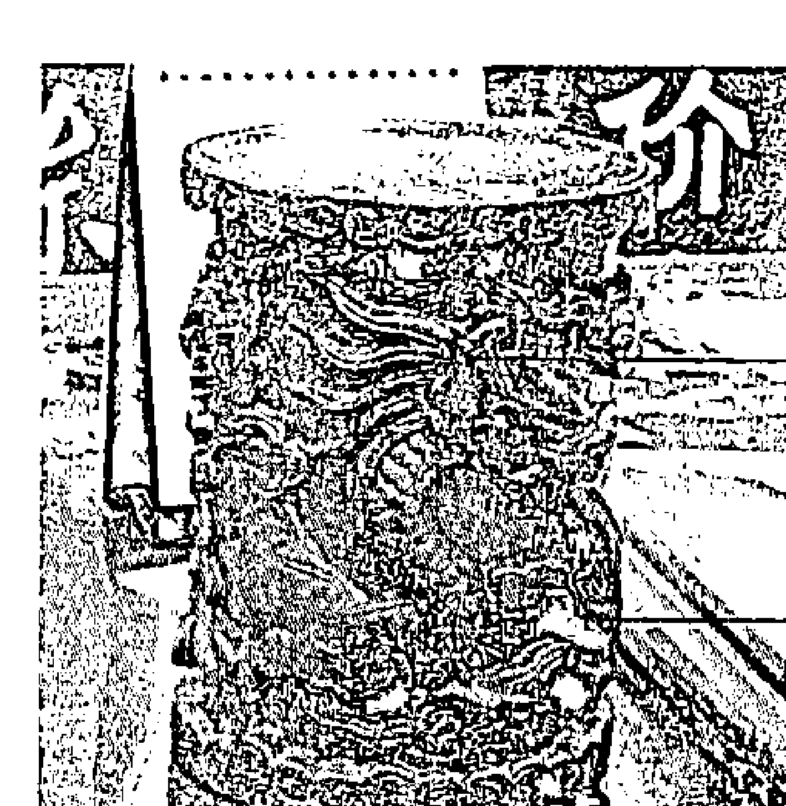

笔筒上绘制的九龙，应当形态各异，充满灵动之气。

龙自古以来就是富贵与权力的象征。

在办公桌上摆放九龙笔筒，对升职很有帮助。想要升职的人，不妨摆放一个，既美观又实用。一般情况下，文化、法律等行政部门、机关摆放效果最佳。

需要注意的是，生肖为狗、兔的人不适合摆放有龙的吉祥物，否则会适得其反。邮局、银行、收银台这些开放的地方也不适合摆放九龙笔筒。

> 九龙笔筒
九龙笔筒是非常好的助运物品，摆放的时候要注意自己的属相和行业，否则可能适得其反。

## 162 在办公桌上摆放文昌塔饰品有何作用？

文昌塔又称文笔塔、文峰塔，它的作用几乎等同于文昌帝君。文昌帝君是上界掌管文章之神，同时也是文财神。古人兴建文昌塔就是为了平衡当地气运，相当于请文昌帝君为当地招财纳福。

一般的上班族，可在办公桌上放置文昌帝君饰物来提升自己的运气，既可以提高学习和工作效率，又有步步高升的意思。文昌塔暗含文昌帝君的智慧，利于读书、功名及事业，上班族在办公桌上摆放文昌塔饰品有助于提高思维的灵敏度，提高工作效率，提升业绩，文职人员和做研究者摆放文昌塔饰品更容易出成绩。

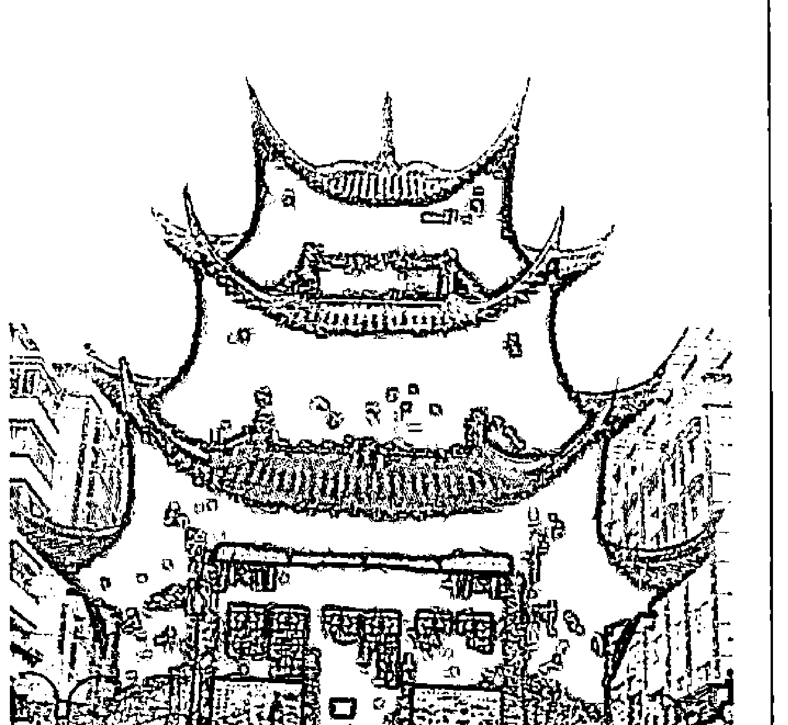

> 重庆江津魁星阁
古人常常建造文昌阁或魁星阁等高大建筑，以代替文昌塔。他们认为这样可以弥补当地文峰的不足，从而可以多出文人才子。在家中或者办公室摆放文昌塔饰品，有与真塔相同的力量。

## 163 在办公室摆放貔貅有何作用？

貔貅是上古瑞兽，是龙的第九个儿子，善于腾云驾雾，掌管雷霆，控制降雨，有避邪、镇宅的作用。民间有舞“貔貅”的习俗，逢年过节，人们像舞龙狮一样舞貔貅，他们认为这样可以赶走当地的邪气，带来欢乐和吉祥。

据说，貔貅以财为食，专吃四方的金银财宝。多数堪舆大师都认为貔貅有催财、聚财的作用。可以将貔貅摆放在吉位上招财，一般用玉质貔貅，玉质貔貅的催财力量会更强些，对事业有很大的帮助。

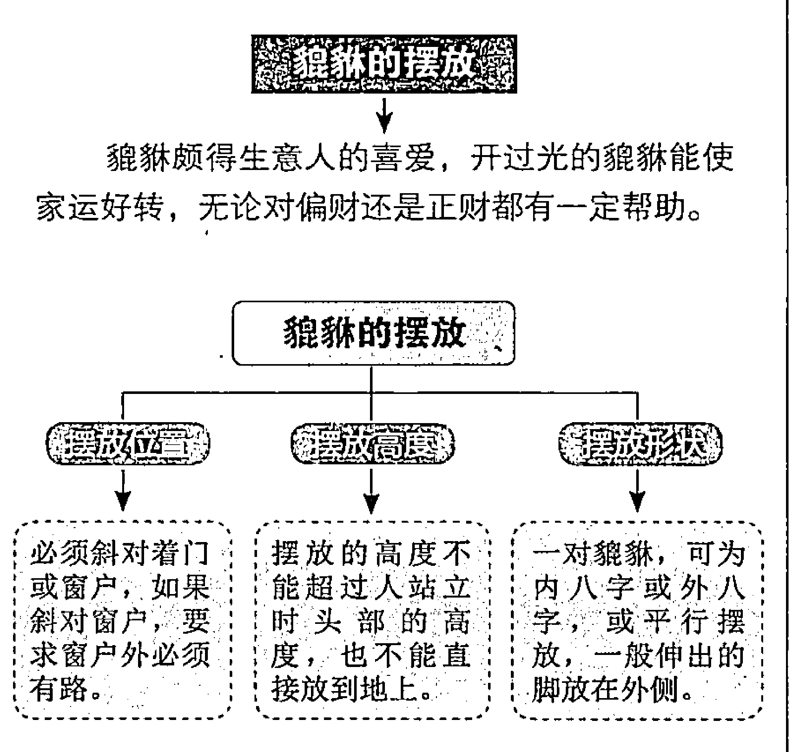

## 164 在办公室摆放金蟾有何作用？

金蟾有招财的作用。金蟾又称三脚蟾蜍。上班族也可通过摆放金蟾来提高自己的财运和事业运，日常将它摆放在办公桌上可以催财、提升事业运。不过由于金蟾是向外吐钱的，所以在摆放金蟾时注意不要将头朝外对着门口，这样，金蟾会把钱向外吐，反而成了破财。应该把金蟾头对着屋内，在办公桌上对着自己，这样钱自然会向你所在的方向吐，财源就会滚滚而来。

金蟾有含钱和空口之分。含钱的金蟾会吐钱，空口的金蟾会吸收外财。上班族可以根据自己的需要选择含钱或空口的金蟾。

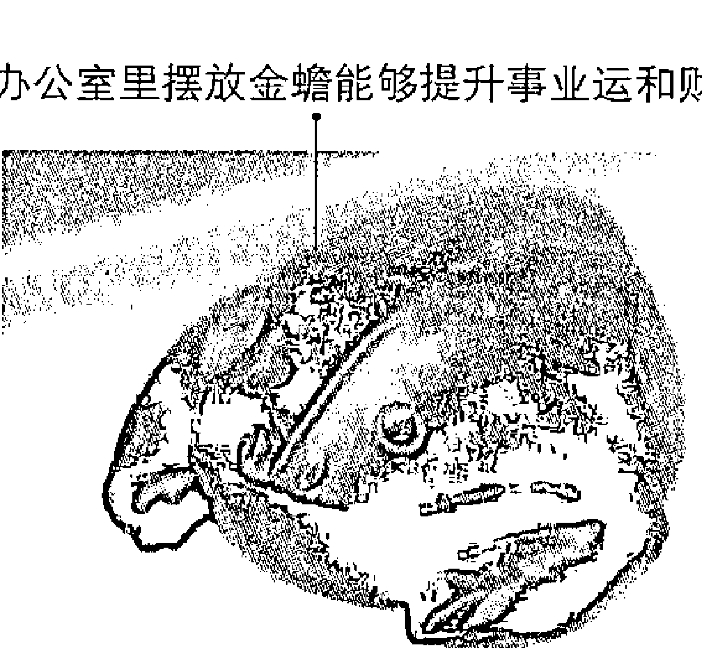

> 三脚蟾蜍 清代
三脚蟾蜍即金蟾，传说它原为三只脚的妖怪，后来被神仙刘海蟾制服，从此，三脚蟾蜍迷途知返，以救济穷人为己任，终日吐钱给人们，被人们当做旺财瑞兽加以供奉。

## 165 在办公桌上摆放龙头龟有助事业吗？

龙头龟是一种瑞兽，又叫“鼍”。相传它是龙的九子之一，为龙和龟的结合体，兼具龙和龟的作用，因此更具有灵瑞之气，是最为祥瑞的吉祥物。

古代人认为，龙头龟象征着地位、权威、富贵和长寿等一切美好的字眼，同时具有升官、发财、加爵、避邪、祈福等多重作用。适合公务员、公司职员、企事业行政人员等人贴身佩戴或放在办公桌上。

龙头龟的作用
上班族将龙头龟放置在办公桌上，桌子主人在工作中能得到贵人的帮助，事业上也会节节高升。

龙头龟的作用

| 健康长寿 | 镇宅化煞 | 催财升职 |
| --- | --- | --- |
| 如果想要得到更好的效果，可以在家里客厅摆放一只，在双重保障下，会有更好的效果。 | 如果家中有官司是非、小人当道、金钱问题时，可以把龙头龟摆放在客厅中，能化解凶气，镇宅兴家。 | 家中若有老人，摆放龙头龟可以保健康、长寿。注意若是摆放在卧室内，龙头必须对着窗外。 |

## 166 在办公室摆放葫芦有助事业发展吗？

古代人认为，葫芦有转财运的作用。办公室里挂一个葫芦不仅可以转财运，还可以助事业发展。

办公室大门对角线的位置，就是“明财位”。这里的摆设和照明要特别注意，否则就会影响财源和事业发展。在此摆放一个黄金葫芦，可以增强财运；挂一个木葫芦，也能大大提高财运。悬挂的时候，要挑选一个干净完整的葫芦，最好能带有一段蒂头，然后用红绳把葫芦绑住，离地大约有2/3屋高的距离，预示着积少成多，年年有余，事业有成。

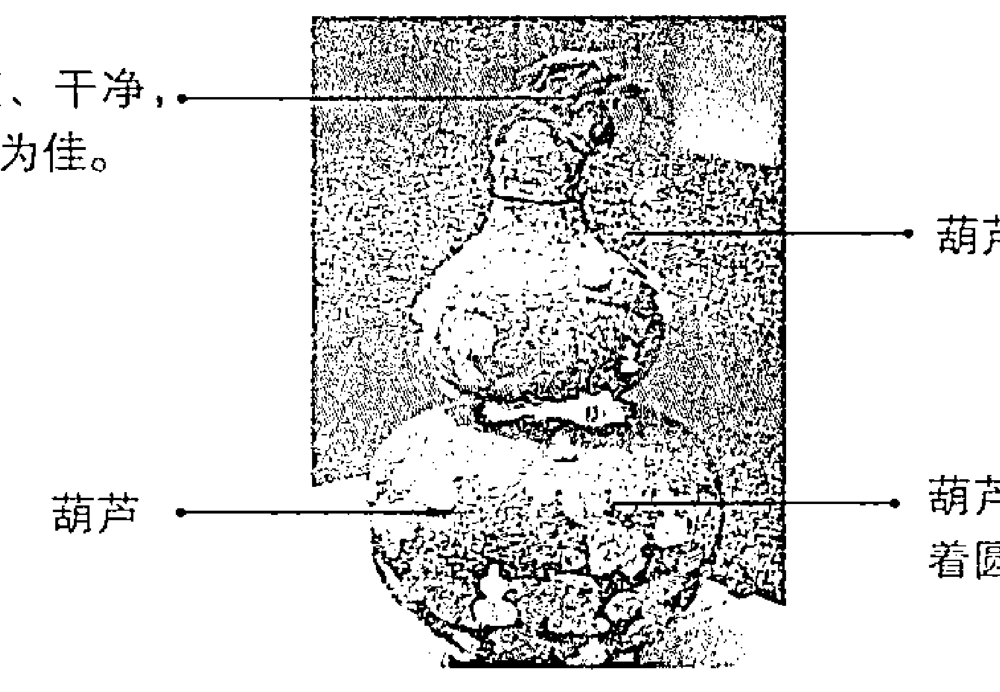

## 167 办公室的植物如何摆放？

大叶植物有旺财旺运的功效，办公室摆放植物应尽量选择大叶植物。

很多人喜欢在办公室摆放植物，这里要指出的是，植物的摆放是有讲究的。

办公室是一个人为事业奋斗的地方，植物摆放直接影响到事业的发展。一般情况下，如果把植物摆放在东南方，表示想要拥有财产、成功；把植物摆放在北方，表示想要事业顺利；把植物摆放在东方，表示想要拥有健康。而其他方位，西南、东北、西方、西北以及中间方位都不适宜摆放植物。

植物摆放的比例很重要，哪里的植物长得旺，就说明哪里的人气比较旺盛。在办公室中摆放植物不宜过多，否则不但会令人眼花缭乱，还会影响工作气氛和工作效率。植物的颜色，一般以绿色为主，其他色系为辅。

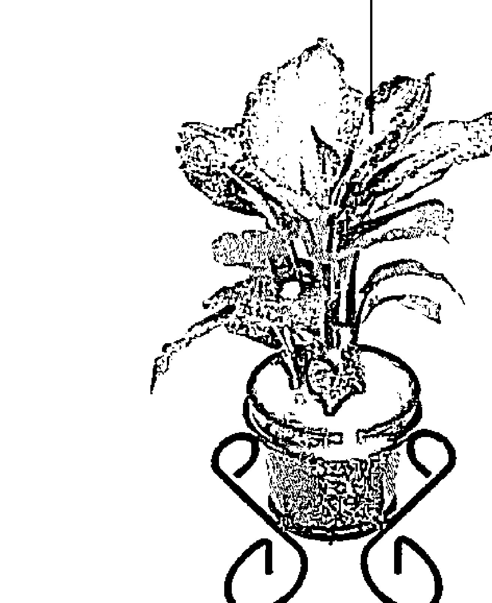

> 🏠 办公室植物生旺
植物摆放在人气旺的地方，也会生旺植物。生机勃勃的植物能净化空气，还能增旺事业。

## 168 在办公桌上摆放马饰品有何作用？

马有“马到成功、奋发向上”的意思。上班族如果想在工作中有出色的表现，不妨在办公桌上摆放一匹正在奔跑的骏马饰品。这样，马奋发向上的精神会影响到你，让你做什么工作均能马到成功，有不错的业绩。经常出差的人尤其适合摆放马饰品，这样马的奔腾精神可以减缓你的奔波之苦，同样也能带来好运。

需要注意的是，生肖属虎、马、狗的人，适合在西南方向摆放木制的马；生肖属猴、鼠、龙的人，适合在东北方向摆放金属制的马；生肖属蛇、鸡、牛的人，适合在西北方向摆放玉石制的马；生肖属猪、兔、羊的人，适合在东南方向摆放水晶制的马。

在办公室里摆放马饰品，能够感受到马不断奔腾，勇敢前进的力量。

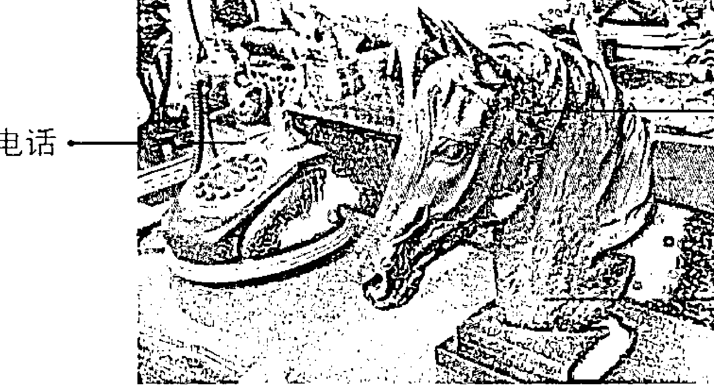

## 169 在办公桌上放镜子好吗？

很多人都喜欢在办公桌上摆放一面镜子，方便整理仪容，其实这种做法很不利于工作。

镜子是一种带来凶气的工具。镜子的世界被称为“幻影”，能使人头脑混乱。办公桌上摆放的镜子，每天照射着你，就如同终日生活在幻影中，时间久了，人就会头晕眼花、失眠、精力不集中。《红楼梦》里的贾瑞，就是因为照了一面特殊的镜子，终日处于幻想中，最后头晕眼花，身体虚弱而死。上班族若常在办公室里照镜子，后果虽无这么夸张，但身体上的虚弱会直接影响到工作，进而影响个人事业的发展。

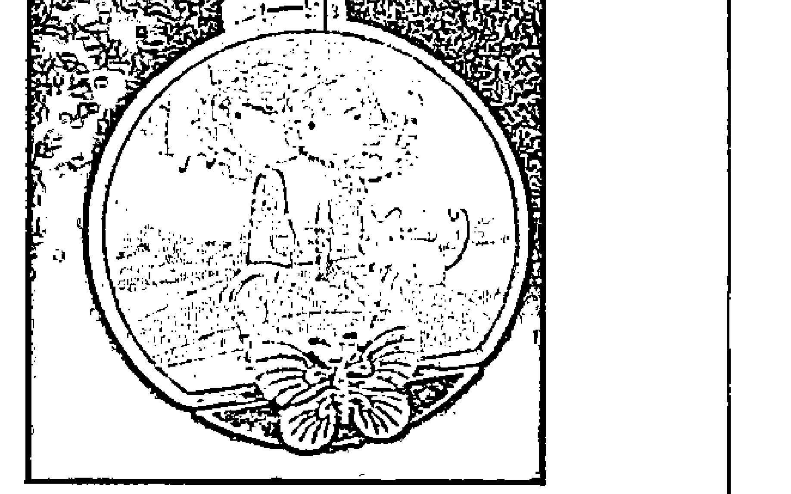

> 镜子
> 办公桌上尽量不要摆放镜子，它会招惹是非，破财运，还易有血光之灾。

## 170 在办公室摆放仙人掌有何作用？

很多人都有在办公室摆放仙人掌的习惯，主要是为了吸收电脑的辐射，他们却不知道仙人掌还能提升运气。上班族在办公室中摆放一盆仙人掌，可以早日实现升迁的愿望。

具体的做法是：将仙人掌栽在色彩缤纷的陶瓷花盆中，摆放在办公室的窗台上，然后把自己的心愿写在一张红色的小纸片上，贴在花盆靠东的一侧。可以把玻璃饰品放在盆中，对运势提升也有很大帮助。

若想强化好运，要记得空闲时多看看办公室中的仙人掌，不要冷落它，这样它就会将好运时刻带到你身边。

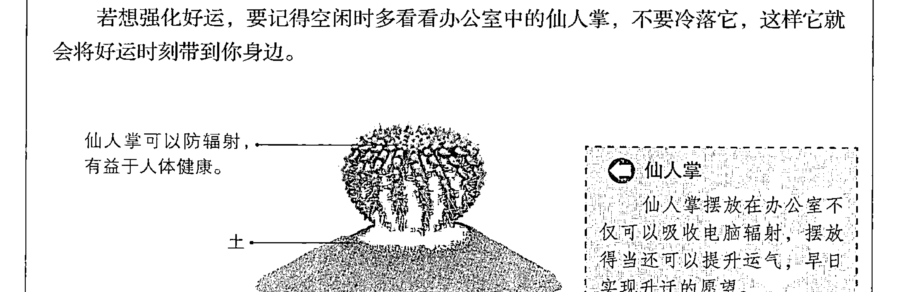

## 171 在办公桌上摆放风扇有何作用？

在办公室久坐的人常会感到心浮气躁、烦闷，觉得空气流动不够。实际上并非空气不流通，而是气场不流通。气场不流通不但会影响人的身体健康，还会影响个人的运气。

遇到这种情况，可以在办公桌上摆放一个风扇。风扇可以加速空气流通速度，让自己周围的气场更加顺畅。人坐在这样的环境里，自然感到神清气爽，时间久了，人气会越来越旺，薪水也会逐渐丰厚起来，更能赢得上司的赏识。

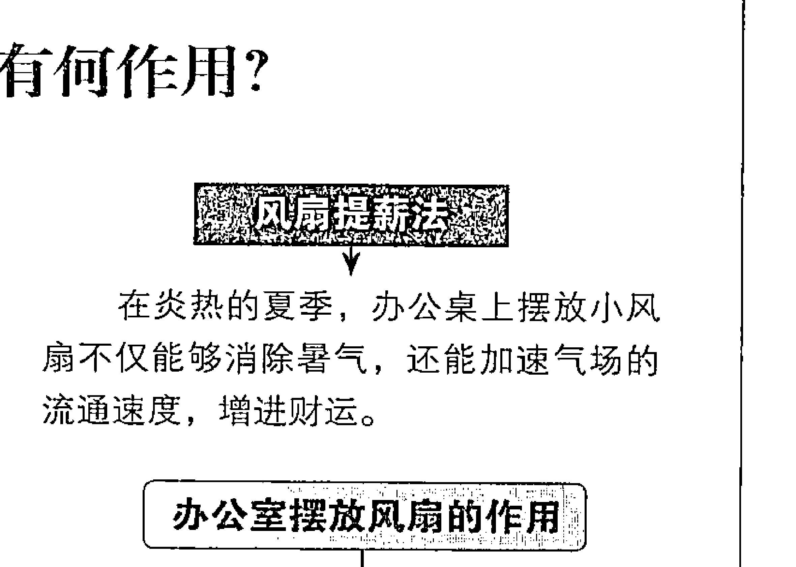

## 172 如何借石狮增强职场运？

石狮是中国传统文化中的重要吉祥物之一，我们常常看见许多大楼或者住宅前都会摆放一对石狮来助运。

石狮虽然庞大，无法佩戴或摆放在办公桌上，但上班族仍然有办法借助石狮来增强自己的职场运势。

庙门口的石狮每天吸收日月精华，积聚了强大的磁场和能量，能给人们带来好运。在职场上不得志、运气不佳的人，不妨经常去摸一摸庙门口的石狮额头，然后再摸摸自己的额头，这样就可以将好运传到自己身上，将职场的坏运赶走。

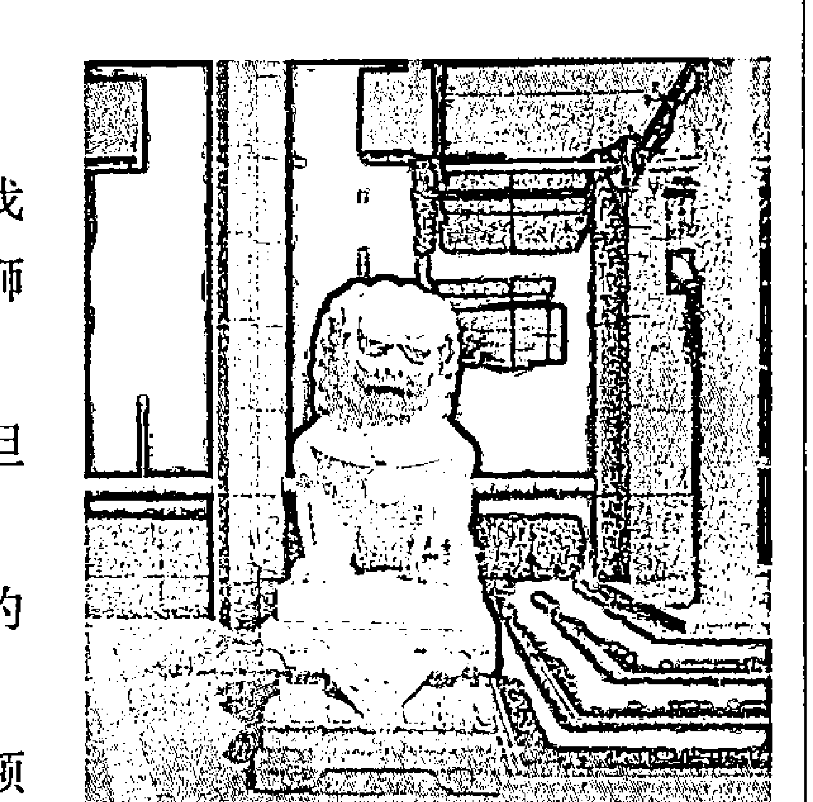

### 石狮

狮子是古代的瑞兽，能挡煞增福，多摆放在大楼或者住宅前。去庙里的时候，摸一摸庙门口狮子的额头，然后再摸摸自己的额头，就可以将狮子的好运传到自己身上，将职场的坏运赶走。

## 173 面试时需要注意什么？

面试是大多毕业生要面临的问题，如何面试才能获得面试官的赏识呢？

在面试的时候，无论是坐着还是站着，最好不要背光，尽量让光线照射到自己身上。如果实在没有光，有侧光也可以。因为光线中蕴含着能量，面试者让光线照到自己可以增加个人魅力，增加面试成功的几率。

当然，更重要的是要提前做好准备，了解面试公司的详情及自己面试岗位的职责，能力仍然是最重要的。

### 面试开运法

临近毕业的学生，大多会频频参加各种面试。面试时第一印象非常重要，好的开运面试妆和开运饰物有助于你的成功。

### 额头开运

在命理学上，额头是一个人的印堂，要将额头整理干净，使它外露出来。

### 开运方法

面试时佩戴一些吉祥开运的物品。

### 开运物品

水晶、玉、龙饰品等都是在面试时适宜佩戴的开运物品。

## 174 如何利用铜钱增运？

古代人认为，铜钱有助运、助顺、招财的作用。利用铜钱招财开运既简单又实用，上班族不妨借助铜钱实现自己的职业理想。

若是想要获得更多的财运，想在事业上更上一层楼，不妨在办公桌左手边或者最大、最上面的抽屉中放置几枚铜钱，会得到很不错的效果。

注意铜钱要放在财位和吉位上，如可放在左边青龙的位置，千万不要放在凶位，否则会适得其反。

> **铜钱增运**
> 铜钱流传到现代，沾染了不同人的气息，有招财旺运的功效。

- 66枚铜钱：表示“顺顺”的意思。
- 88枚铜钱：表示“发发”的意思。
- 168枚铜钱：表示“一路发”的意思。

## 175 电话号码的尾数有何讲究？

电话号码的好坏会影响到事业的发展，号码尾数尤其能体现一个人的运气。

比较吉利的号码尾数有1、4、6、8、9，因为1和4代表文昌，6有助于升职加薪，8代表财星，9能带来喜讯。

尾数为2、3、5的电话号码都是不吉利的。2容易引起慢性事故，还会影响身体健康；3容易招惹小人是非，还容易被公司解雇；5容易发生突发事故，原本好好的事情，会突然出现莫名其妙的情况。

要想化解不吉利的电话号码，可以把一张卡纸贴在电话下面，有3的号码，用红色的卡纸，九天更换一次；有2、5的号码，用白色卡纸，一周更换一次。

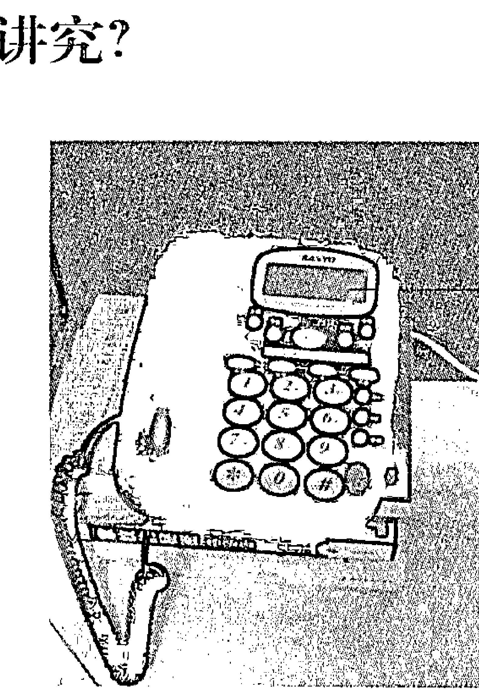

> **电话**
> 现在，电话已经成为每个人必备的通信工具了，选择一个好的电话号码，能增财旺运。不利的电话号码，要想办法化解。

## 176 上班族如何利用公鸡饰物得到重用？

公鸡是一个很重要的吉祥物。公鸡象征着雄鸡报晓，新的一天开始。此外公鸡每日早起，还有勤快、勤劳的意思。

上班族如果想在事业上有所作为，得到上司的重用，不妨在家中摆放一个公鸡饰物。这样就可以感受公鸡勤快、勤劳的品性，带动职场好运。事业暂时受挫者，还会有一个新的开始。经常坐冷板凳的人，也会被上司发现，被重用起来。

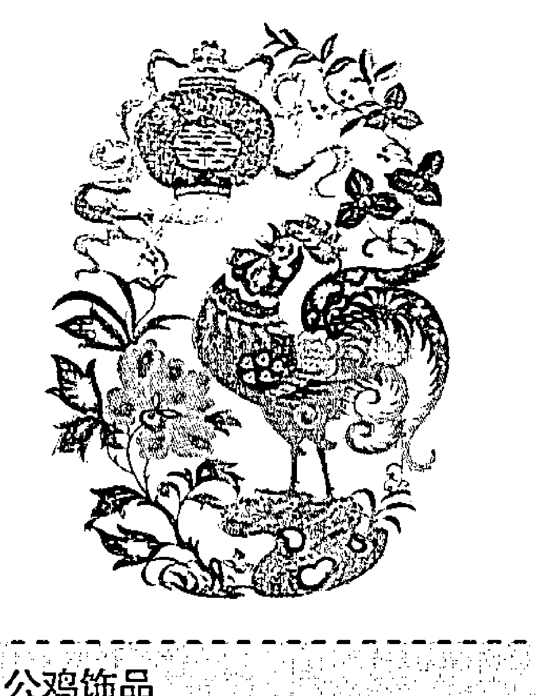

在用公鸡饰物时，最好用带冠的饰物，什么材质都可以，在家中的西北、正北、东北、正南方向，任意选取一方摆放即可。

> **公鸡饰品**
> 公鸡象征着勤劳。在家中的西北、正北、东北、正南方向，任意选取一方悬挂公鸡饰品，可以使你的精力充沛。让你在遇到困难时，依然像雄鸡一样，雄赳赳、气昂昂地向前挺进。

## 177 如何利用额头增强运势？

从面相上看，额头是一个人面相中很重要的部位。一个人的额头如果暗沉无光，就是古人所说的“印堂发暗”，运气肯定不好，事业也会受到牵连，诸事不顺。

古人认为，额头附近是官禄宫，代表着事业发展以及职场运势。要让这里时时刻刻保持光亮，可以擦保养品。保持额头有光采，才能引起上司的注意，进而受到上司的重视，得到重用。

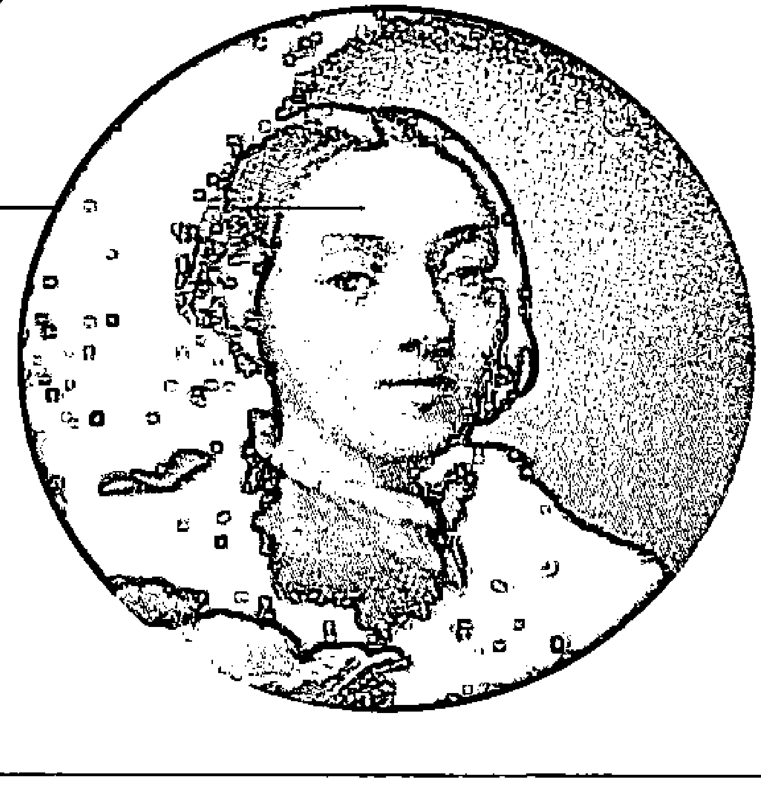

> **额头增运**
> 额头就是古时候所说的印堂，额头附近是官禄宫，这里长相的好坏往往影响一个人的运势。

## 178 如何利用宝石增强事业运？

宝石可以增运，助事业。不同材料的宝石有具体的作用。白水晶可以镇宅、避邪、驱除病气。白水晶不但可以开运，还可以使自己精神轻松愉快，减少浮躁心理，确保身体健康。黄水晶可以招财进宝，创造意外财富，强化肠胃功能，还可以用它开运，保健脾胃。此外，常见宝石还有玛瑙、翡翠等，不同材质的宝石具有不同的功能。

上班族准备7种不同材质，不同颜色的宝石，比如水晶、玛瑙、玉石、翡翠、橄榄石等，把它们放在一个容器中，然后摆放在办公桌的左边，工作就会顺顺利利，步步高升。这样做同时兼具了7种宝石的能量和磁场，开运助运作用很强。

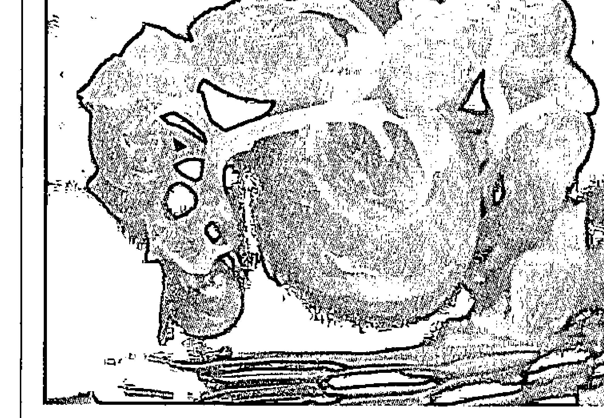

> 天然绿玛瑙
> 由于玛瑙的原石外形和马脑相似，因此称它为“玛瑙”。玛瑙以其色彩丰富、美丽多姿而被当做宝石或用来制作工艺品。

## 179 如何利用水晶提升贵人运？

职场人士，要想在事业上有贵人相助，迅速高升，不妨在办公桌上摆放一个水晶。紫水晶洞是经常用到的道具，它能将其存储的好运传到人的身上。除了摆放紫水晶洞，还可摆放白水晶，因为白水晶具有避邪挡煞的作用，可以使心怀不轨的小人远离自己，贵人亲近自己。也可以摆放绿幽灵，它能使人吸引在事业上有相同性质的伙伴，容易为自己的事业发展创造机会，赢得贵人。

### 紫水晶洞的开运作用

| 项目 | 内容 |
|------|------|
| 特征 | 紫水晶洞具有气场共振及凝聚能量的特性，可以提升贵人运，它凹下去的洞穴可以贮存好运，并将好运传到人的身上。 |
| 注意事项 | 1. 紫水晶洞要摆放在左边，不要让它碰到水。<br>2. 可以摆放在室内的回风处，即进门的斜对角位置，这里就是所谓的“明财位”，可以改善室内空间的气场环境。 |

## 180 阴阳水能开运吗？

阴阳水是指一半热开水加上一半冷开水混合，再加入少许盐。
连续一周早起空腹喝一杯这样的阴阳水，可以帮助身体排毒。将身体内的毒素排出去，脸色变得红润起来，体力也会有所增强，整个人看起来会神采奕奕，即使有再多的工作也不会被压垮。如果你感到自己最近精神不好，可以试试这个方法，会得到不错的效果。

> 阴阳水开运说明
> 命理研究者认为，以1：1的冷开水加热开水做成的阴阳水，转运效果很好。

- **功效一**
水是招财旺运中的重要元素，有化煞、化邪的作用。
- **功效二**
人要常接触水，喝阴阳水可以增加磁场力量，改变家里的气场和晕车症状。
- **功效三**
最近正在走背运的人，多喝阴阳水，能够为自己带来好运，还可促进转运。

## 181 哪些食物可以助运？

食物可以助运，开发潜能，可以补先天不足的运势，但是吃什么食物也是有讲究的。
若你从事的工作需要相当的耐性与韧性，或者你最近工作状态不佳，失去了继续坚持的勇气，这时候可以多吃些羊肉重新鼓舞士气。少数民族中蒙古族和满族比较剽悍，富有进取心和竞争意识，就与其长期进食羊肉的民族习惯有关。
若你是一位领导，需要下属对你绝对服从，平常就要多吃鸡肉。因为鸡肉在人体内消化之后，会产生“肉缩聚集”的磁性，既能补充营养，又可以使体内气场能量集中。
如想长期保持旺盛的斗志，就要多吃牛肉。若长期混于官场，则要多吃猪肉，因为它能让人的耐性增强，有利于官运。

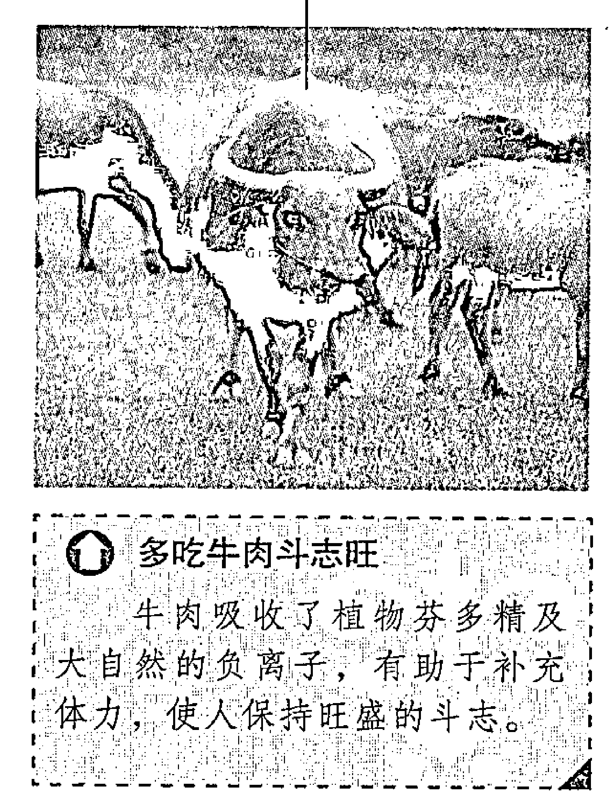

## 182 出生日期与开运食物有关吗？

不同出生年月，不同五行的人需要吃的开运食物不相同。比如说5月22日～6月21日出生的人，要多吃土豆来强化肠胃，消炎解毒。

### 出生日期与开运食物表

| 出生日期 | 开运食物 |
|----------|----------|
| 1月21日～2月20日出生的人 | 要多吃冬瓜排骨汤来确保夏季运气好。 |
| 2月21日～3月20日出生的人 | 要多吃西红柿炒鸡蛋，容易赢得好心情。 |
| 3月21日～4月20日出生的人 | 要多吃莴苣及香菇，清除肠毒。 |
| 4月21日～5月21日出生的人 | 要多吃牛肉增强体力，补充能量。 |
| 5月22日～6月21日出生的人 | 要多吃土豆来强化肠胃，消炎解毒。 |
| 6月22日～7月22日出生的人 | 要多喝牛奶加强磁场的作用，帮助你获得力量。 |
| 7月23日～8月22日出生的人 | 可适当吃些鲈鱼健脑开胃，确保大脑时刻清醒。 |
| 8月23日～9月23日出生的人 | 要多吃红烧肉，可以增强耐力，保持对工作的热情。 |
| 9月24日～10月23日出生的人 | 多吃冬瓜保持身体的水分。 |
| 10月24日～11月22日出生的人 | 要多吃茄子增强免疫力，让人客观地看待事情。 |
| 11月23日～12月21日出生的人 | 要多吃奶酪增强自己的福报。 |
| 12月22日～1月20日出生的人 | 要多吃花椰菜来增加自己的力量。 |

## 183 发达汤有什么功效？

有的人在工作中意志消沉，工作效率低下，若想化解这种情况，通过日常合理的进食即可得到改善。如可以多喝“发达汤”。

“发达汤”就是南瓜汤，南瓜有尊贵、招财、勤劳的意思，在五行中，南瓜属于戊土，出生在“卯月”（阳历3月6日至4月4日）的人吃南瓜，可以兴旺财运。生于亥月（阳历11月8日至12月5日）的人吃南瓜，男性可以增强官运，女性可以旺夫。生于子月（阳历12月5日至次年1月5日）的人吃南瓜，可以提高自信心及安全感，安定心神。

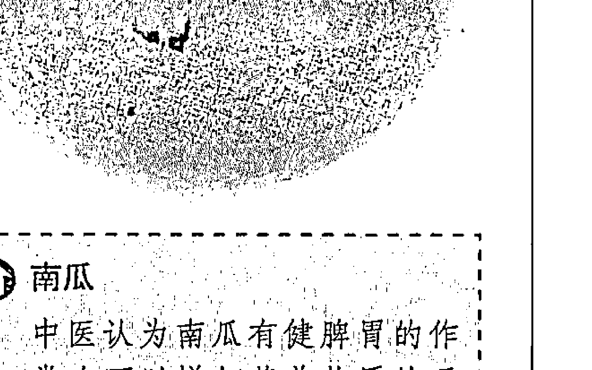

> 中医认为南瓜有健脾胃的作用，常吃可以增加营养物质的吸收，促进新陈代谢。

## 184 多吃辣椒有什么好处？

辣椒可以增强食欲，增加人的活力，多吃辣椒不仅可以预防感冒，还能交好运。

辣椒属“午火”，如果生辰八字用神为火的人，多吃辣椒会走好运。生于阳历11月8日至2月19日的人，多吃辣椒，会鸿运高照。

如果你是以下四种属相中的一个，也可以多吃辣椒。这四种属相分别是：猴、虎、羊、鸡。这四种属相的人多吃辣椒不仅可以补充体力，还会走好运。但要注意辣椒不宜一次食用过量，否则容易上火。

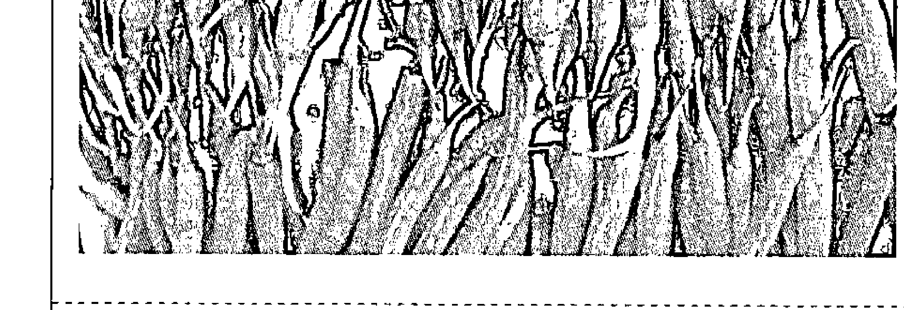

> 食欲不振的时候，在饭菜里拌上辣椒，有助于改善消化不良的症状。

> 辣椒中维生素C的含量非常高，100克辣椒含有维生素C105毫克，在蔬菜中位列第一。

## 185 如何利用印章来增强升迁运？

> 印章的印记清晰明了，才会为你带来好运。

拿破仑说过：“不想当将军的士兵不是好士兵。”同理，不想升职的员工不是好员工。无论是谁，都渴望在事业上更上一层楼，这时候就可以通过刻印章来改变运程。因为人一旦有了掌印的欲望，事业心就会增强，在工作和为人处世方面会不断提高，从而为升职加薪提供坚实基础。

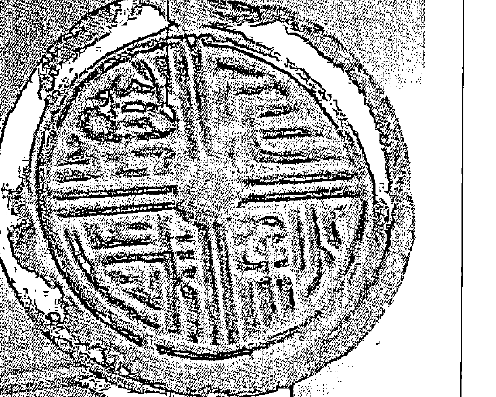

需要注意的是，用来刻印章的玉石是有讲究的，一般要选用颜色纯美的天然玉石，其中以黄玉石、牛油玉、黑龙江玉等为佳。此外，天然玉石的印章象征了事业上的正印权力，随身携带可以帮助自己拓业、聚财。

> 印章有开运的作用，也能助升迁。印章最好是玉制的，如果选用石头的，最好是寿山石。

## 186 如何利用香水来助运？

香水可以增加个人魅力，如果想要在事业上更上一层楼，不妨利用香水来为自己加分。

对女白领来说，香水的作用更加突出。一股清香的气味，既有助于提升自己的形象，也很容易吸引上司的眼球，赢得机会的几率更大一些。上班族在工作遇到阻力时，更应该选用清香型的香水，这样能为事业带来新的转机。

此外，女性经常用香水还会提升个人魅力，在工作时更自信，游刃有余，工作上的成绩也会越来越好，人际关系也会变得更好。

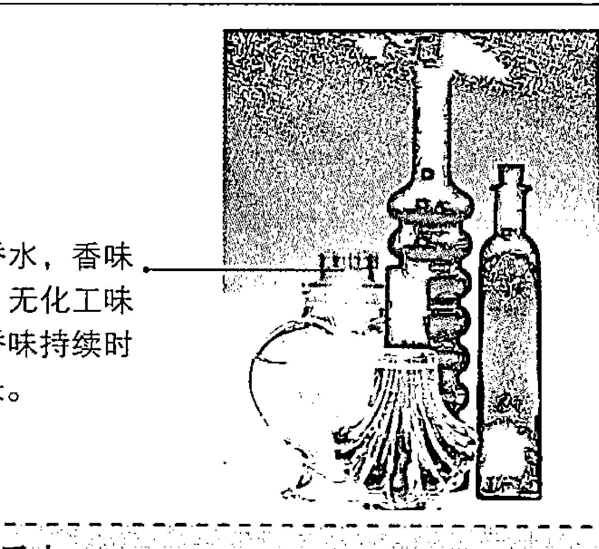

优质香水，香味纯正，无化工味道，香味持续时间较长。

### 香水

好的香水清新怡人，不仅可以增加个人的魅力，还可以给自己带来好的运势。选择香水是一门学问，选对了是一种享受，你会感受到由内而外的放松和自信。选错了，自己心烦不说，还会影响个人运势。

## 187 犹太鼻有利于从商吗？

犹太鼻又称为商人鼻、理财鼻，指高鼻梁略带弧形，鼻头下垂成勾状，两边鼻翼厚而不露孔。

众所周知，犹太人擅长经商，具有很精明的经商头脑，对于钱财有着独特的见解，很容易发家致富。一个人若拥有犹太鼻，不妨从事和钱财、商业有关的工作，例如：银行、会计、出纳等，财运会比较旺盛，而且会有不错的成绩。另外，长有犹太鼻者，如果自己创业，也会有相当不错的成就，相对来说不易遇到挫折，很容易财源滚滚而来。

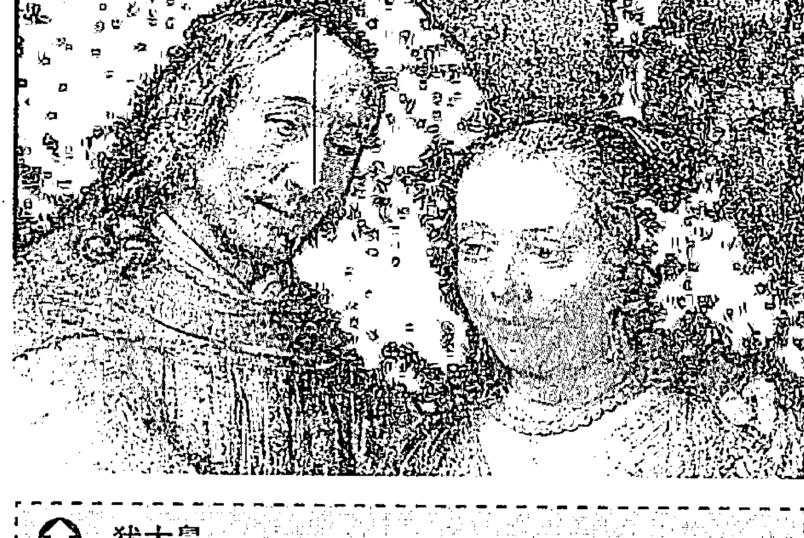

鼻梁略带弧形，鼻头下垂的鼻子就是犹太鼻。

### 犹太鼻

犹太人是世界上最会经商的民族，他们颠沛流离，饱受迫害，却一次又一次以富商的形象出现。如果一个人长有犹太鼻，多会财源不断。

## 188 面相与职业有什么关系？

面相与职业关系密切，如果面相喜气的人从事服务业会取得不错的成就，面相凶的人适合当老板。

在选择职业的时候，要注意根据自己的嘴唇和额头形状来选择。面相学上认为，薄唇的人头脑灵活，唇舌旁的肌肉轻巧而敏捷，因此口齿灵活，语言驾驭能力强，适合从事和口才有关的行业。

M形额头的特征是两边额角高广，形成英文字母M字形，这种额头有些类似美人额，但是美人额的两边额角没有M形额头高，只是中间部分发尖突起而已。M形额头主驿马命，主动不主静，因而适合流动性大的工作，不适合整日坐在办公室，最好从事经常往返出差的工作。适合的工作有运输、旅游、贸易、航空、记者、运动员等。

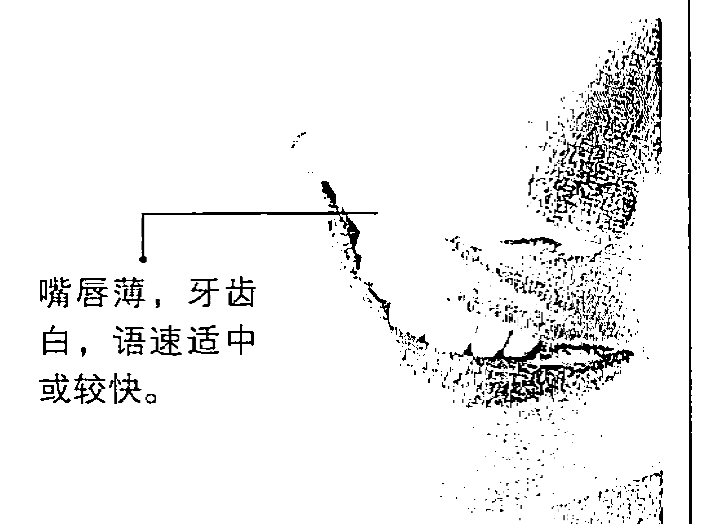

- 薄嘴唇的人适宜的工作
    - 嘴唇薄的人适合当演说家、教师、播音员、律师、政客、推销员、客户服务员、公关、地产代理、保险从业员等。

## 189 办公室的墙壁上适合挂哪些画？

在公司办公室墙壁上挂图画，既可以增强员工工作活力，又可以增强运势。在座位的后方挂上一幅自然风景图画，图画里要有山、有树、有草，看上去生机盎然，等于是自己有了靠山，会得到贵人相助。但挂在背后的图画中不能有水，否则会不吉利。“九如图”也是不错的选择，九条红色的鲤鱼会给你带来好运。

需要注意的是，虽然领导的办公室中适合挂一些象征着权力、威严的图画，比如凤凰、孔雀、仙鹤、牡丹等，但尽量不要挂猛兽的图画，否则会给员工形成压力，不利于工作的展开。

## 190 办公楼门口摆放屏风好吗？

最好不要在办公楼前摆放屏风，这样不仅会阻碍旺气的进入，也会阻挡财运。要是想在进门处有一个缓冲区，可以在进门处设置一个迂回式的门厅，但若不是必须的，最好不设置。

若是为了装饰，可以在办公楼门口摆放低矮的花架屏风，然后再在上面摆放一些植物，这样既美观，又能带来好运气。但切忌不要摆放枯萎的植物，否则影响形象，难以吸引客户。

## 191 档案应该如何保管？

档案是一个公司的重要资料，因而不能随意摆放，否则不但影响档案的安全，还会影响自己在上司心中的形象。
许多人可能因为工作忙，档案又过多，一时没有时间，就把档案随意摆放，甚至堆放在地上，这样做非常不好。这样摆放用时不便寻找，若是老板和客户急需，手忙脚乱地找半天也没找到，直接影响工作的开展。领导看到这种情况，不但会批评你工作没做好，还会怀疑你的工作能力，进而怀疑你的工作态度，这些都是不利于个人事业发展的。

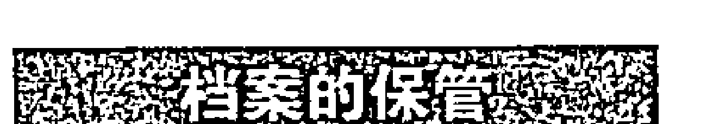

档案柜是公司保存资料的重要地方，要放置在专门的地方，防止重要资料丢失，给公司造成巨大损失。

### 保管方式正误对比

| 错误方式 | 正确方式 |
| :--- | :--- |
| 放在地上、桌子下面、楼梯下面、卫生间旁等。 | 放在一个专门的柜子或者桌子上，重要的档案要放在高处。 |

## 192 办公桌上的帆船该如何摆放？

帆船有“一帆风顺、乘风破浪”的象征意义。在办公室或办公桌上摆放帆船，一方面给人积极向上、努力进取的印象，有助于提升个人形象，另一方面还隐喻着对平安、顺利的向往，容易取得上司的赏识。在领导办公室摆放帆船，还可起到鼓舞士气的作用，容易赢得下属的信赖。
另外，可以在船上放一些镀金饰品或者金元宝，表示帆船乘风破浪将财运引起来，招财纳福的作用更强。

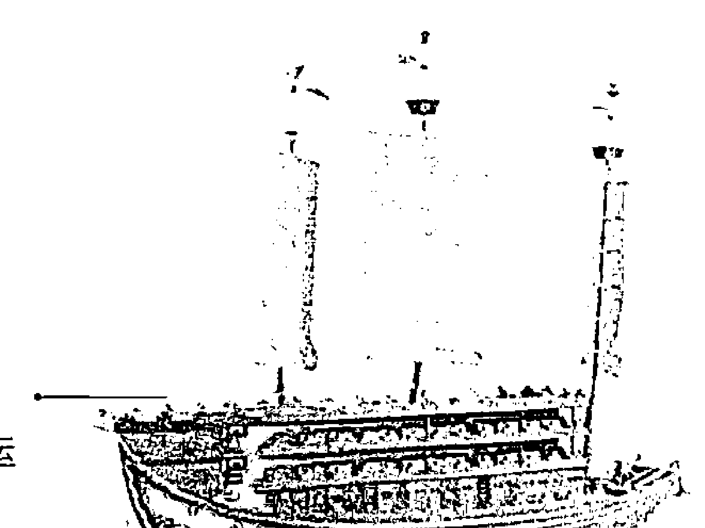

> 帆船的摆放
在摆放帆船时要注意船头的朝向和摆放位置。一定要将帆船摆在明亮的位置，意味着前途一片光明。

## 第十章 桃花爱情运

本章主要讲了爱情的开运法则。内容涉及如何利用花瓶、玄关、香水、水晶等物品招徕桃花运；如何避免烂桃花；如何催旺桃花；十二生肖的人在爱情方面的注意事项等。

## 193 如何利用花瓶招桃花？

花瓶具有增强桃花运的力量，花瓶瓶口为空凹，表示兑卦，此卦主色情，暗指桃花运。要想招桃花，先要找出你的桃花位，然后准备不同颜色的花瓶和不同数目的花。然后选择吉日，在花瓶中加水至八分满，插入相应朵数的桃花或其他鲜花，放于桃花位的房间。在花瓶后面摆放小圆镜，可以让桃花之气更快地散发。花朵枯萎或水量减少应及时更新。

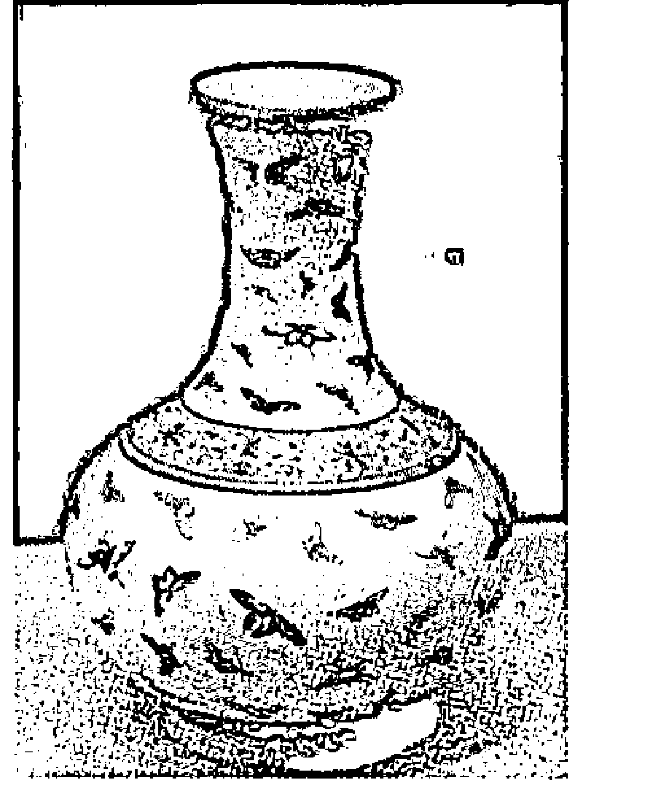

### 不同桃花位的花瓶颜色及花的朵数

| 桃花位 | 花瓶颜色 | 花朵数目 |
| :---: | :---: | :---: |
| 东 | 绿色、褐色 | 3朵或8朵 |
| 西 | 金色、白色 | 4朵或9朵 |
| 南 | 粉红色 | 2朵或7朵 |
| 北 | 蓝色、黑色 | 1朵或6朵 |

> > **花瓶招桃花**
>
> 用花瓶招桃花必须将花瓶水装至八分满，将花瓶摆放在桃花位上。要注意花瓶颜色的选择，合适的颜色可以加强桃花运的力量。已婚人士不宜在桃花位上摆放花瓶，否则容易招致婚外情。

## 194 如何利用玄关布置招来爱情运？

家里有宽敞的玄关，可以聚集更多的客人，从而提升家庭的社交运和人气。人缘足了，爱情运自然也得以提升。

玄关内外的格调要一致，如果在玄关附近摆放绿色植物，或者放置绿色的拖鞋架，可以让家人更具人气和魅力。

水晶有招贵人的作用，若在进门的玄关处放一颗天然水晶球，有催发爱情的作用，可以催旺单身人士的桃花运。此外，若在玄关处摆放一只插满鲜花的花瓶，花瓶里常换清水，可以确保花朵常鲜，爱情运常旺。若花瓶上有龙凤呈祥或象征爱情的图案，则爱情运更旺。

由此可见，催发爱情运，不一定需要多么厉害的法器，只要合理调整自己的住宅，就可以达到预期目的。

## 195 如何利用飞星催旺桃花运？

向往爱情的年轻人，可以利用开运物进行布局，比如桃花阵。桃花阵力量强大，要小心摆放，不要惹来烂桃花。

古代人认为，九紫星被认为是最具有桃花效应的飞星。九紫星飞临的方位，就是桃花位。每年的流年星入九宫中宫，经过飞伏后，九紫星所在的方位就是当年的桃花位。

2011年的流年星为七赤破军星，九紫星所在方位是西方。2012的流年星为六白武曲星，九紫星所在的方位是东北方。

### 2011年流年飞星图

| 东南巽宫 | 正南离宫 | 西南坤宫 |
| :---: | :---: | :---: |
| 六白武曲金星 | 二黑巨门土星 | 四绿文昌木星 |
| **正东震宫** | **中宫** | **正西兑宫** |
| 五黄廉贞土星 | 七赤破军金星 | 九紫右弼火星 |
| **东北艮宫** | **正北坎宫** | **西北乾宫** |
| 一白贪狼水星 | 三碧禄存木星 | 八白左辅土星 |

## 196 如何增强个人魅力？

若掌握一些开运知识，可以通过开运方式来提升自己的魅力，赢得异性的青睐。通常可以采用下面几种方法。

- 方法一：利用暖色系增强人气。红、橙、黄等暖色，能够刺激和催化人的情感。可在家中多布置暖色系的摆设，出门多穿暖色系的衣服，自然可以聚集人气。
- 方法二：上火有口臭的人，在床头放上一杯水。上火往往是失眠等原因造成，火气大时，口中容易产生异味。有口臭的人，魅力当然大打折扣。床头放一杯水，有助于清心和睡眠。
- 方法三：心情烦闷时，静心赏花。在花瓶的上方装一盏聚光灯，集中精神去感受灯光下花朵的美丽，让这种强烈的美感来安抚你躁乱的情绪，恢复好心情，才会有好面貌。

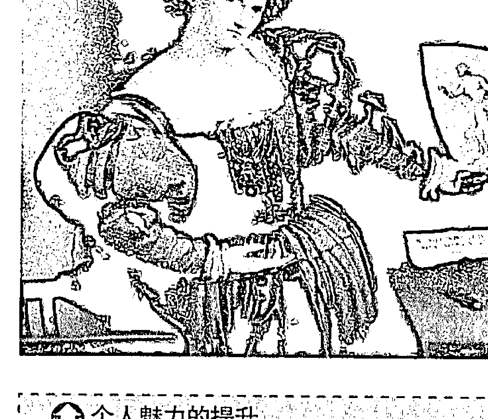

> > **个人魅力的提升**
> 提升个人魅力，可以靠能力，靠气质，靠学识，这些都是赢得爱情的重要因素。经常穿暖色系的衣服，有利于增旺人缘，提升个人魅力。

## 197 如何避开三角恋情？

没有爱情的时候，需要增强爱情运，招来桃花。而如果你已经有恋人或已经结婚，要想避免出现三角恋情等节外生枝的现象，就要防止烂桃花。

避开烂桃花，要注意下面几点。

1. 不宜过多使用粉色或红色的家具，即使梳妆台也不宜使用红色系颜色。因为红色系属于九紫火星，象征着张扬，容易吸引桃花，多余的桃花就是“烂桃花”。
2. 已婚人士最好避免穿红色系衣服，男性要避免系红色领带，原因也是防止太过张扬吸引多余的桃花。如果不小心出现烂桃花，最好一连七天穿黑色衣服化解。
3. 注意不要让家里的化妆台对着床，尽量放到斜角靠墙壁的地方，并且与床保持平行。尤其记得要靠墙壁，否则不但容易发生三角恋，还容易破财。

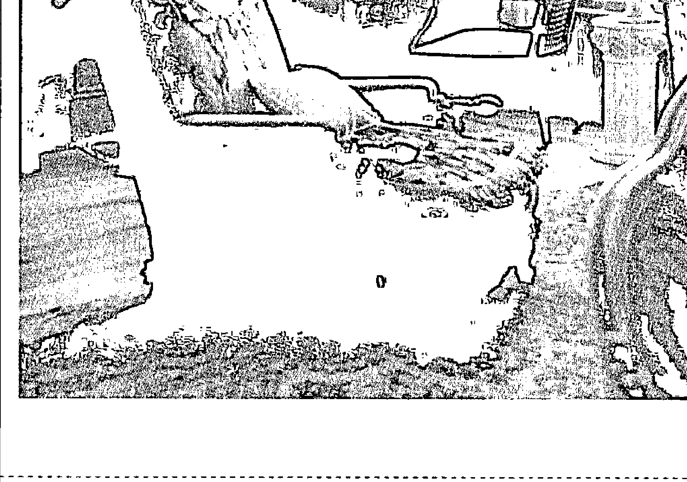

> **红色沙发**
如果已有恋人或已经结婚的人，要防止烂桃花引发三角恋。红色或粉红色的家具容易吸引桃花，应不用。

---

## 198 如何根据命卦选择男士香水？

香水对人的嗅觉有很强的刺激作用，可以长期保存在女性的心间，唤起对往昔的回忆。因此，对男士来说，选择一款合适的香水，是提升个人魅力必不可少的。

男士选择香水，以“性感、优雅、阳刚”为原则，不可选择有脂粉味的香水。命中土旺的人，性格比较沉稳，适宜选择较为时尚的香水类型。命中金、水旺的人，充满生活激情，宜选择深沉的传统风味的香水类型。命中木、火旺的人，个性热情、大方，可选择优雅的香水类型。

## 199 如何利用香水发挥男性魅力？

香水品牌众多，但大致可分成几种香型。

1. 木香型，有浓郁的木质香味，能突出男性的阳刚之气。
2. 果香型，给人热情、高雅之感。
3. 花香型，神秘而浪漫。
4. 中性型，通常是青苹果、仙人掌等清香，清新有活力。

男士适宜选用味道清纯的香水。用少量香水抹在动脉处及体温较高处，不宜四处喷洒或擦拭过多。香水味过重会招来女性的反感。

### 男性不宜使用女性香水

女人用男人的香水叫有个性，但男人若用了女人的香水则多会招来别人的反感。尤其是甜甜的香型，最不适合用于男人。

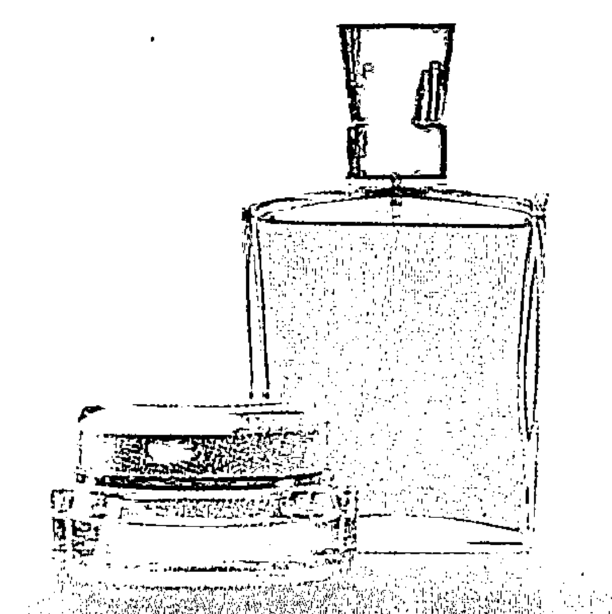

## 200 女人如何改善在爱情中的弱势地位？

女人若在爱情或婚姻生活中处于弱势地位，爱情就会很难经营下去，婚姻变得很艰涩。女人在生活中会经常感到委屈，又无力改善，很难有幸福感。女人可以通过恰当的方法来改变自己在爱情中的地位。

屋子的西北方代表男主人，西南方代表女主人。把高大的家具摆放在西南方，若西南方缺角可摆放紫砂茶壶或陶瓷，可以增强女主人的气势。屋子的正西方代表少女，此方位若摆放了空花瓶，则象征男主人受到不正桃花的纠缠。

灶台代表女主人，若灶台不靠墙，则代表女主人没有权威，难以让老公和小孩服从。家居装饰不宜过于花哨，五颜六色如酒家或旅店，会让人心情浮躁，难以安稳呆在家里。

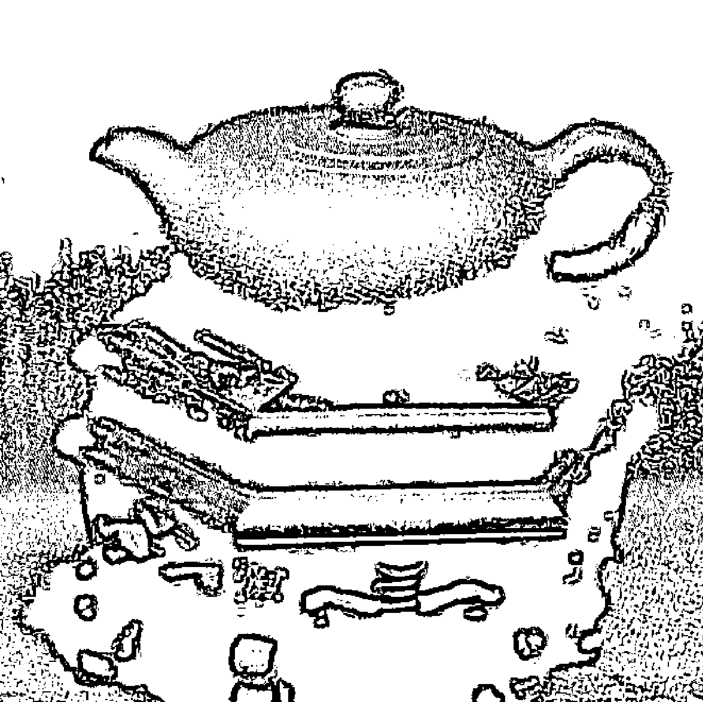

### 紫砂茶壶

住宅的西南方代表女主人，在此方位摆放紫砂茶壶或陶瓷，可以增强女主人的气势。

## 201 哪些卧室布局容易产生“剩女”？

“剩女”现在是一个很热门的话题，导致大女难嫁的因素有很多，卧室布置不当也容易产生“剩女”。下面几种情况容易产生“剩女”。

1. 床头无靠。床头如果没有靠墙壁，不但睡觉时心里不安稳，也象征难以找到依靠。
2. 卧室镜子斜置。卧室的镜子倾斜，会导致思绪偏颇、奇怪，容易产生独身的思想。
3. 卧室阴暗潮湿。如果卧室光照不足又通风不畅，不但有损健康，也会让人变得内向甚至孤僻，人缘差。因此，想招桃花的女生，不宜在房间内摆绿色植物和鱼缸。它们会造成室内潮湿，阴气过重。

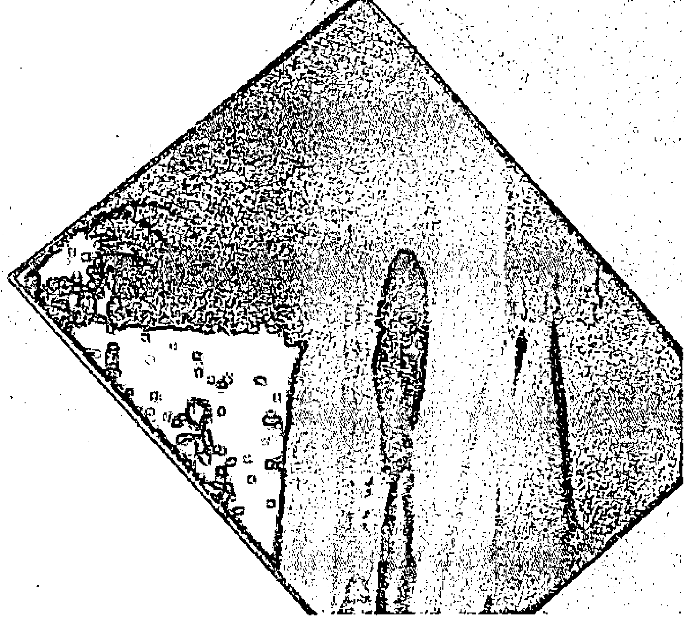

> 斜置的镜子
卧室的布局对单身女性影响很大，卧室床头无靠，卧室镜子斜置等容易导致单身女性婚嫁困难。

## 202 如何利用水晶稳定感情？

一段感情，若时间过长，或发生挫折，很容易产生变故，导致爱情失败。有一些方法可以稳定感情，其中最好的道具就是水晶。

白水晶和紫水晶通常用于稳定爱情和婚姻。白水晶能够提供精神力量，增强人的灵性，有助于思维的集中，不被外在物象蒙蔽。紫水晶代表灵性和爱意，能够促进智能，平稳情绪。

把白水晶和紫水晶放在枕头下，让水晶石释放的能量抚平你的情绪，负面情绪会减少，更能体谅对方。若感情出现问题，可以在住宅的四个角落摆放较大块或能量较高的水晶，形成一个气场，从而稳定双方的感情。

## 203 招桃花时房间不宜有哪些物品？

招桃花代表要开始一段感情，是对二人世界的向往。因此，有碍新感情和二人世界的物品，均不宜摆放在房间中，否则会影响感情的稳定。如之前情人的东西，会让你睹物思人，情丝难断，直接影响新的恋情。

单身生活自由散漫，人们往往能从一些生活用品中看出单身之相。因此，若想增强桃花运，就要把那些象征单身的物品和摆设拿出房间，如单身自画像等，堆满女性用品的床头柜也要清理。内衣、香水等私人物品不宜摆在外面。

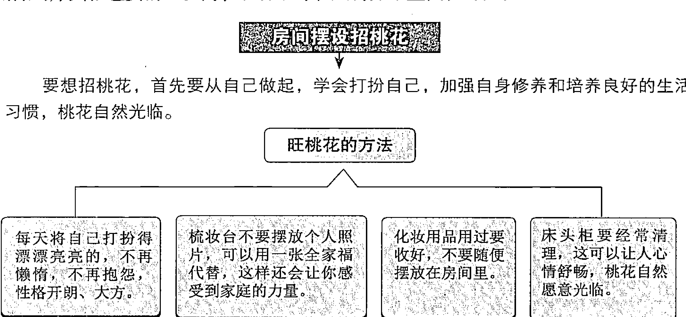

## 204 哪些女生的八字犯桃花？

有的女生天生桃花运不旺。从生辰八字来看，“正印旺”“伤官多”“桃花多”，这三种女性命犯桃花，在感情路上波折较多，平时需要多加小心，以免上当受骗，贻误终生。

正印旺的女生，天性善良，极能宽容，即使被人欺骗，也会依然天真地相信别人的谎话。正印查询以日干为主，八字中出现甲见癸、乙见壬、丙见乙、丁见甲、戊见丁、己见丙、庚见己、辛见戊、壬见辛、癸见庚等情况者为正印旺。

伤官旺的女生，会轻易相信别人，但又非常容易怀疑，而且她比较任性，感情冲突难免较多。伤官查询以日干为主，八字中出现甲见丁、乙见丙、丙见己、丁见戊、戊见辛、己见庚、庚见癸、辛见壬、壬见乙、癸见甲等情况者伤官旺。

而桃花多的女生，天生多情，思绪绵绵，容易沉迷在甜言蜜语之中，相信童话般的爱情故事，难以寻得真爱。

## 205 单身女性如何摆脱烂桃花?

单身女性若经常被已婚男士追求，或出现的人不喜欢等不如意恋情时，要及时清理身边的这些烂桃花，为即将到来的白马王子扫清道路。

摆脱烂桃花，可以从以下几方面入手。

1. 检查自己的卧室布置。室内不宜有玫瑰、仙人掌等有刺类植物。
2. 在不正的桃花位悬挂一把桃木剑。
3. 努力消除不纯洁的爱情。有的女性为了金钱将自己绑在一个不喜欢或无法给自己名分的男人身边，这也是烂桃花。
4. 寻找红鸾星的位置，催旺桃花运。

### 摆脱烂桃花

烂桃花不是真正的桃花，多半不能给人带来幸福，需要我们进行清除。如果烂桃花过旺，就要从自身和家庭装饰找原因。

### 摆脱烂桃花的方法

- 如果室外有冲煞植物无法移走，可挂上窗帘以阻挡视线。
- 可以在房间内布置一些招桃花的摆设，以克制烂桃花。
- 在家中放一些阔叶植物、貔貅等具有招财作用的法器，为迈向纯洁爱情打基础。
- 根据自己的生辰八字找到红鸾星的位置，然后催旺这里的桃花运，提早进入甜蜜的爱情。

## 206 如何利用水晶增强桃花运?

水晶不仅有招财和稳定感情的作用，还可增强桃花运，因为不同的水晶能释放出不同的能量，对人体的精神也有各自不同的影响。
紫水晶可以让人头脑冷静，患单相思的人佩戴紫水晶饰品，可以避免沉迷，为新的桃花运打开契机。
虎晶石可以激发勇气，增强信心，优柔寡断的人遇到心仪的异性时，常佩戴虎晶石可以激发爱的勇气，离成功的爱情更近。
芙蓉晶温和平静，有助于沟通和交流，单身一族遇到喜欢的人时，佩戴芙蓉晶有助于加强双方的交流，利于感情的稳定。
因失恋爱伤而对爱情失望的人，可以佩带玫瑰水晶，它可以增强爱情运。
再次遇见心爱的人，如果你对自己缺乏信心，可以佩带绿玛瑙，它能增强人的自信心，让人容光焕发，增强个人魅力。

## 207 哪种布局让你缺少缘分？

有缘千里一线牵，无缘对面不相逢。人人都希望能有好缘分，虽然缘分可遇不可求，但可以通过改变气场，人为培养缘分。有的人不注意家居摆设，造成气场流通不畅，人脉不足，精神状态差，自然难有缘分。

### 使人缺少缘分的家庭布局

| 情况 | 具体内容 | 解决方法 |
| :--- | :--- | :--- |
| 家中有黑色家居 | 黑色象征浊水，会导致室内气场不清新，自然难以结交朋友，难以获得缘分。 | 将黑色家具换成温馨的颜色。 |
| 衣橱不整洁 | 布料有招缘功能，衣橱不整洁会影响布料发挥作用，缘分难以如约而至。 | 整理衣橱。 |
| 卫生间脏乱、潮湿 | 卫生间易产生污秽，若再脏乱、潮湿，更容易滋生秽气和阴气，影响爱情运。 | 保持干燥、通风、无异味。 |
| 房间内有已干的花 | 干花不但有碍观瞻，还会产生“死气”，不利于激活爱情气场。 | 多养大叶植物。 |

## 208 如何运用“火”的能量捍卫爱情？

火的能量很强大、积极，有正面意义，可以增强你的气势和个人魅力，从而捍卫爱情。
运用“火”的能量捍卫爱情，可以试试下面几种方法。

1. 把窗户玻璃擦干净，拉开窗帘，让房间得到充足的照射，这样有助于自己吸收太阳的热能，增强“火”的能量。
2. 在窗台上摆个水晶玻璃瓶，它可以吸收光能，并把能量折射到房间中，有助于增强个人气场。瓶中插两枝橙色、红色或粉红色的玫瑰花，效果会更好。
3. 可以用有翅膀造型的玻璃饰品增强火的能量。翅膀代表天使，天使属火。
4. 房间的灯具最好为直接照明，以便热能被直接吸收，进而返回到人身上，增加自身气场。

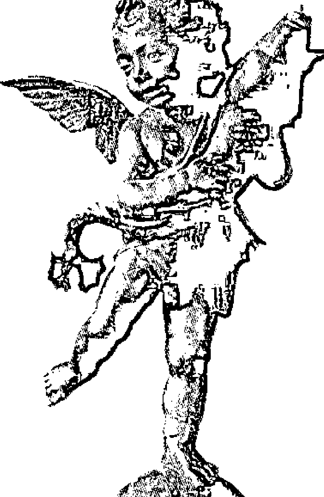

> ### 天使
爱情是甜蜜的，每对热恋中的情侣都渴望爱情能够长久，这需要借助火的力量。天使属火，在屋内摆放天使饰品可以捍卫爱情。

## 209 哪些房屋布局不利于男士的爱情？

影响男士爱情成功与否的因素有很多，其中房屋布局不当就会影响桃花运。单身男人在准备开展一段感情时，在房屋布局方面，要注意以下几点。

1. 卧室不宜在走廊底部。这里阴暗如洞穴，积聚了大量污浊之气，加之阴气过重，人长期生活在这样的环境中，不但健康会受到影响，而且会影响精神状态，不利于感情的开展。
2. 卧室不宜细长，细长的卧室容易造成气场空虚、孤冷。人长期生活在这样的气场中，性格会变得孤僻冷淡，不爱与人说话，更不容易把握桃花。所以，若无法改变卧室的这种局面，可在卧室中竖一个隔板，人为地缩短卧室的长度。
3. 住宅外面若有圆形花圃，注意中间不能被小路或其他事物划成两个半圆形，不利于感情发展。

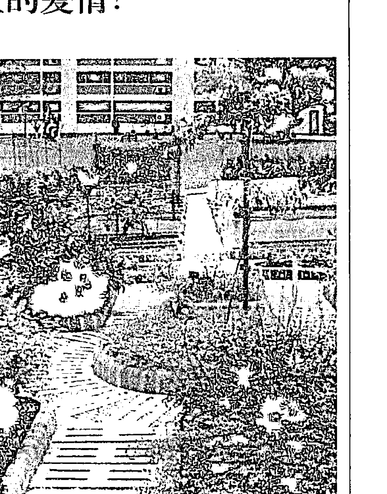

> 花圃
住宅外的圆形花圃，中间不能被小路或其他东西划分成两个半圆。如划为两个半圆即为“破镜煞”，不利于感情。

## 210 如何增强自己的爱情磁场？

爱情磁场强，就容易将异性吸引过来，增加桃花运的几率；反之，爱情磁场弱，则难以有异性缘，难以收获爱情。所以无论男女，都要学会增强自己的爱情磁场。
简单易行的增强爱情磁场的方法有下面几种。

在房间布置上：首先要在客厅摆放鲜花，其位置就沙发的方向来说，是男右女左，即男士在客厅右边摆放鲜花；其次，经常改变室内环境，如桌布、窗帘等，让室内保有新鲜和活力；最后，在卧室内增加侧光点缀，增强空间立体感，在花影摇曳中创造出浪漫气氛。

自身方面：经常观看爱情电影或阅读书籍，通过环境感受来唤起自身的爱情磁场；每晚听听轻音乐，可以增强情感能量；在房间内喷洒香油，用嗅觉来激起浪漫情绪。

## 211 如何促进男友的结婚意愿？

有的女生，与男友交往很久了，但始终不见对方求婚，心中着急却又不好意思开口，这时就可以借助“桃花瓶”来促进男友的结婚意愿。

桃花瓶，即插有桃花的花瓶。由于它放在东南方位可以招桃花运，故称桃花瓶。若无桃花，用其他鲜花也可以。若要催结婚运，可以在桃花瓶中放一颗玫瑰水晶，在瓶子旁边摆放与男友的合照，并经常想象婚后的幸福生活，则会加强男友对其求婚的能量。

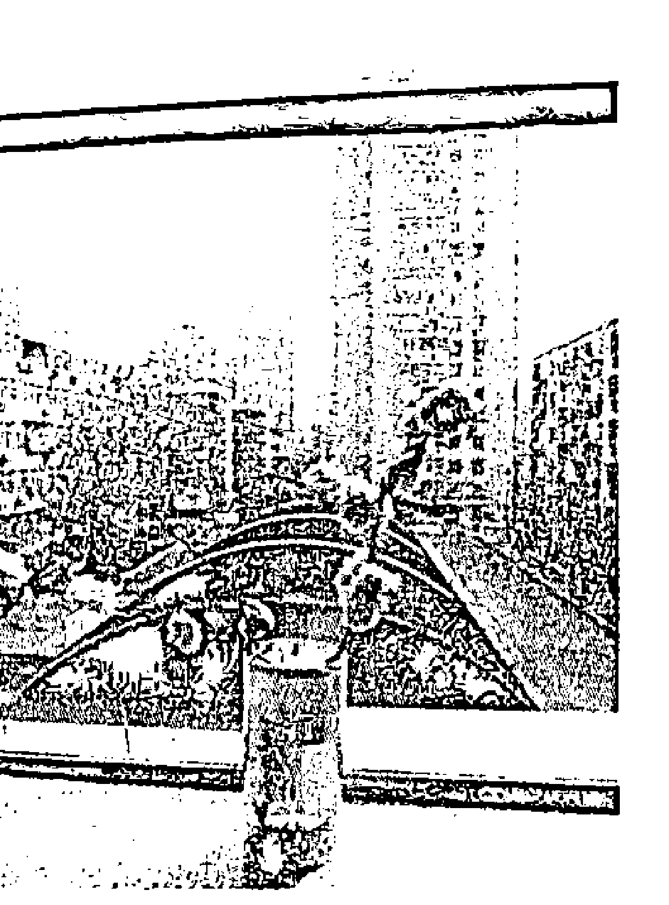

> 桃花瓶
桃花瓶，即插有桃花的花瓶。将桃花瓶放在东南方位可以招桃花运，使用正确还可以加强男友对女性的求婚能量。

## 212 如何平息“嫉妒”情绪？

沉迷于爱河中的人很容易产生嫉妒情绪。因为自己太过在乎对方，总担心所有人都在乎她（他），进而对自身不自信，对他人产生怀疑。久而久之，不但不利于感情的稳定，还会影响自身性格，变得小心眼。因此，初涉爱河的男女，一定学会平息自己的嫉妒情绪。

太极、阴阳二气，最具安定人心的作用。拿一幅太极图，或者用白纸黑笔制作一幅，把它贴在房间的“生气”方位，可以帮助你镇定情绪，平定心情。

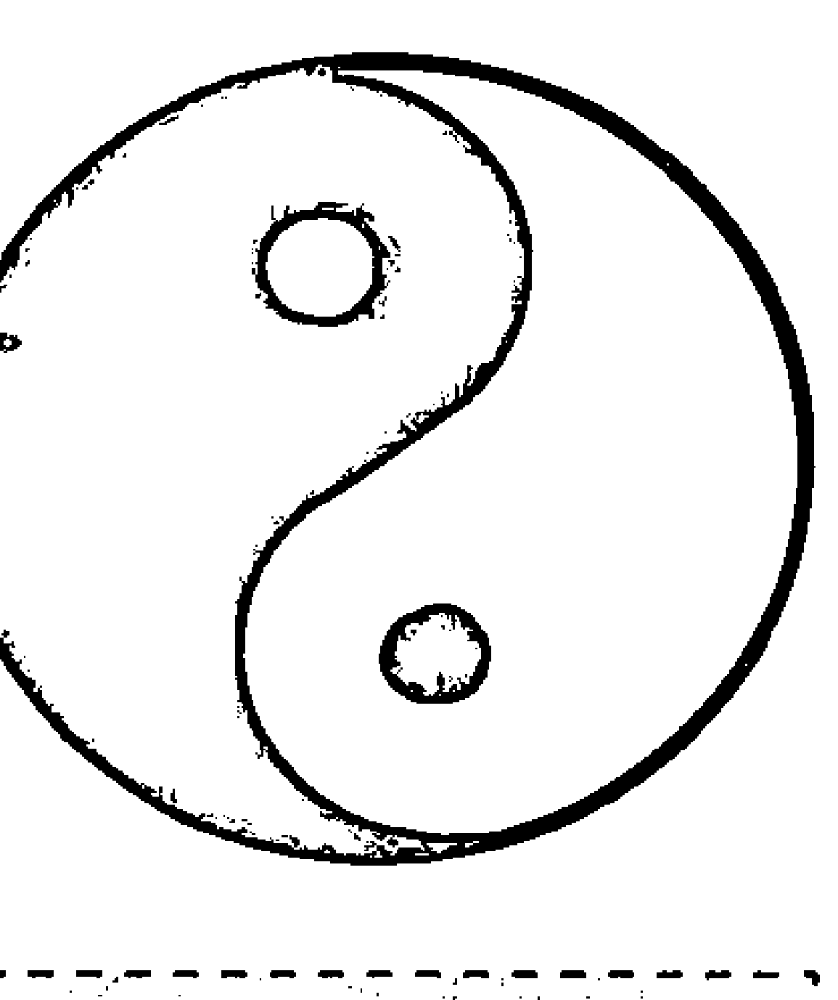

此外，引起嫉妒情绪的还有其他原因。比如，有人相信一见钟情，很容易对某一位异性产生好感。但世间一见钟情的毕竟是少数，你喜欢的人大多数时候并不喜欢你。当你单相思的对象投入他人怀抱时，你心中难免会产生伤心甚至嫉妒的情绪。这时，一定要对自己的情绪加以控制和平息，不要表现出来，否则心仪对象对你存有的好感也会消失。

> 太极图
人的嫉妒情绪多是心理不平衡造成的。自己绘制太极图，会在绘制的过程中感受平衡的力量，有利于平息嫉妒的情绪。

## 213 如何摆脱令人生厌的纠缠追求者？

人多有爱慕虚荣之心，尤其是女性。哪怕不喜欢对方，被人喜欢着、追求着也是沾沾自喜的，这说明自身有魅力。但有些人“爱”的手段让人有些不舒服，常死缠烂打地追求，比如跟踪、尾随，就很令人讨厌。严重的时候还会让女人产生一种恐惧感，担心遇到麻烦，自己受到伤害。所以女士对这种追求者要及时做好预防。

想摆脱此类纠缠，可以在家门口或者阳台上，摆放一只守护犬，头朝外放置，可以防止外邪入侵。若在旁边摆放仙人掌等有刺植物，可以加强这种力量。当然，若还是没有摆脱跟踪，要及时报警。

守护犬
狗是人类最忠诚的朋友，单身女性可以养一只守护犬。这可以防止不怀好意之人的纠缠。

## 214 如何布置房间催旺桃花？

桃花运不旺盛者容易被剩下，单身男女不宜蹉跎岁月，让青春白白流失，要努力催旺自己的桃花运，让青春没有遗憾。

这里介绍两种催旺桃花的方法。

1.  在卧室的西南方位，摆放几支蜡烛，并使用红色的灯罩盖住，这将催旺你的爱情运。如果你已经有了男友，想催旺双方的感情热度，也可以利用卧室西南方来实现。
2.  可通过增强土行能量催旺桃花。天然水晶有增强土行之气的作用，能够提升爱情热度；装饰花瓶或陶罐也能增强土行能量，能起到相同的效果。因此，把花瓶或陶罐放在卧室的西南方，可以让感情更浓。瓶中放水晶，效果会更加强烈。

花瓶催旺桃花
女性在卧室或者客厅摆放具有土能量的花瓶，有利于催旺恋爱运。在瓶中放置具有灵性的水晶，爱情的甜蜜度会更高。

## 215 哪种布局会让你与桃花绝缘？

很多人总认为自己难以交到桃花运，是因为自己性格不好，自己条件不好等原因。其实有时候即使性格好，条件好，也难以交到桃花运。也许你的房间布局就是威胁你桃花运的最大杀手。

### 居住环境对桃花运的影响

如果是独身女性，居住在四周没有人家的地方，性格会变得孤僻。房子过于狭小，或过于阴暗会影响桃花运。

### 三种无缘桃花运的布局

-   **独自居住在狭小的住宅内**
    -   人若长期生活在狭小的环境中，会变得排斥他人甚至逃离人群，桃花自然不敢前来。
-   **居住在黑暗的地下室**
    -   地下室阴暗、寒冷，会让人的性格变得孤僻、冷漠，令大家敬而远之，桃花自然难以近身。
-   **床上堆满书本或杂物**
    -   床是蕴藏能量的地方，如果杂物很多，就没有多余的空间来容纳桃花之气，这样会让人与桃花绝缘。

## 216 怎样整理房间能增强爱情能量？

房间要迎入爱情能量，就需要腾出一定的空间。能够放东西的地方，不要放得满满当当的，如化妆箱、衣物柜、床头柜、抽屉等地方，都要留出一半空间。

房间里放置的物品，要尽量配成对，而不要孤零零的一个，这样可以培育爱情能量；多利用粉红色装点房间，粉红色是爱情的颜色，能帮你留住爱情的能量。

尖刺的东西不招人缘，刀、剪刀、仙人掌等要收起来；圆形的东西，可以活跃人际关系，为你带来好缘分，要多加利用。

### 房间物品成对
在房间里放置的物品，要尽量配成对，不要孤零零的一个，这样可以培育爱情能量。多利用粉红色装点房间，它是爱情的颜色，能帮你留住爱情能量。

## 217 哪些布局会让“金桃花”溜走？

金桃花是利贵之花，主嫁入豪门或者娶富贵之妻。金桃花与普通桃花不同，它与命和运有关，并非人人都有此命。即使有此命的人，若不留意，也可能会让金桃花溜走。

卧室下面不能有水沟经过，有水沟，好运会随着水沟全部流走。床头宜靠墙，不宜靠窗。女有靠，意能找到可靠的男人，无靠或靠窗则意思相反。睡床上方若有灯，宜圆宜方不宜长，更不宜竖在床中上方，把床分为两边，女主人与桃花无缘。

金桃花溜走的布局
睡床上方的灯如果为长条形，容易让女主人与桃花无缘。如果灯竖在床中上方，把床分为两边，破坏力更甚。

## 218 客厅摆设不当会导致桃花纠纷吗？

家居物品摆放不当，不但起不到招财纳福的作用，反而会招致外邪，引起桃色纠纷。如客厅物品摆设不当，就容易引起情感纠葛，尤其要注意避免下面两点。

一是不要在客厅的吉位放置鱼缸，一是不宜在客厅左右两侧摆放异性肖像。面向大门，客厅左方的墙壁为青龙位，主男主人的桃花位；右方的墙壁为白虎位，主女主人的桃花位。若在白虎位悬挂一位其他男性画像，或在青龙位摆放其他女性画像，有可能导致此方主人“红杏出墙”。

## 219 如何利用家居摆设招来完美爱情？

常见的通过家居摆设招来完美爱情的方法有以下几种。

1.  确保玄关处灯光明亮，干净、整洁。若在此放置宽叶植物，效果更好。
2.  在客厅的东南方摆上百合花，东方摆上火鹤，西南方养双数金鱼，茶几上铺花布桌巾。卧房北方摆心上人的照片，有新鲜的花香或芳香精油。
3.  洗手间若无窗，须摆紫色花朵，盥洗用品要摆放整齐。
4.  厨房保持干燥，东南方摆上红、橘或白色的花，消除厨房油烟，增强桃花运。
5.  床罩、床单及被子，以粉红色系为主，粉色主情感，有助于招来完美情感。

## 220 属鼠的人在爱情方面应注意什么？

属鼠的人，生于子年，五行属水。水性温和、柔软、大方，拥有桃花和互动性的能量。因此，生肖属鼠的人大多人际关系活跃，与人接触的机会较多，容易吸引桃花或与异性交往。

但是，由于属鼠的人感情不坚定，容易四处留情，常在多个对象之间摇摆不定，难于专注于感情。因此，对方容易产生不安感。

化解方法：

1.  在卧室的窗户边摆放风信子，风信子象征承诺、守信；
2.  摆放香水百合，香水百合的白色属金，金代表坚定；
3.  摆放去叶见梗的开运竹，开运竹的枝节有节节高升之意，象征着顶天立地的魄力与骨气；
4.  摆放白水晶圆球，白水晶圆球五行属金，有坚定的能量。

这些植物或饰品，可以增强鼠年生人对爱情的坚定态度，从而赢得对方的信赖。

香水百合
属鼠的人，可在卧室的窗户边摆放香水百合。香水百合的白色属金，金代表坚定。

## 221 属牛的人在爱情方面应注意什么？

属牛的人，生于丑年，五行属土带金。土代表领导能量，金则代表坚定和规则。所以，牛年生人大多对爱情坚定有情义，但是他们的表达能力却较为刚硬和死板，同时，有一定的领导欲和主宰性。在爱情生活中，他们比较缺乏温柔的态度，情感表达较为生硬和刻板，会让对方觉得缺乏浪漫情趣。

化解方法：

1.  在自己卧室的窗台上，摆放四季春、丰州凤凰等草本植物，这类植物具有感性的柔软能量；
2.  在窗户旁摆放粉红水晶圆球，它具有温柔、浪漫的能量；
3.  在窗边摆放爱神之箭造型的流水盆，以视觉效果来带动浪漫的力量。

丁丑神将
属牛的人，生于丑年，五行属土带金。他们大多对爱情坚定，但比较死板。

## 222 属虎的人在爱情方面应注意什么？

属虎的人，生于寅年，五行属木带火。木代表思考和判断力，火象征冲动和活力，因此，虎年生人大多对爱情很理智，以智慧的手段去计划和安排，并且积极展开行动。虎年生人追求对方很少失败，但若遇挫败又会产生盲目的好胜心，从而强求爱情，这样就会因一时冲动而失爱情的原义。

化解方法：

1.  在自己卧室的窗边，摆放紫色花朵的植物，如兰花等；
2.  摆放紫色水晶圆球，因为紫色能释放出让人理智、冷静、稳定的能量，从而改善虎年生人在面对爱情失利时产生冲动的倾向。

紫色海棠
紫色海棠能释放出让人理智、冷静、稳定的能量，摆放在卧室的窗边可以改善虎年生人在面对爱情失利时产生冲动的倾向。

## 223 属兔的人在爱情方面应注意什么？

属兔的人，生于卯年，五行属木。木代表思考、分析和判断力的能量，因此兔年生人在面临爱情之时大多进行大量的分析、判断和筹划。但是，兔年生人有时会由于思虑过多，反而缺乏积极行动的勇气，从而错失爱情的良机。

化解方法：

1.  在自己卧室的窗户边摆放红色的玫瑰或太阳花等植物，玫瑰要去刺，室内也不宜摆放尖锐之物，它们的攻击性会影响桃花运；
2.  在窗边摆放红色发晶圆球。红色发晶，具有积极行动、执行力量，可以增强兔年生人对爱情的行动力。

红色玫瑰
兔年生人，在爱情上要增强行动力。可以在自己卧室的窗户边摆放红色的玫瑰等植物。玫瑰要去刺，室内不宜摆放尖锐之物，它们的攻击性会影响桃花运。

## 224 属龙的人在爱情方面应注意什么？

属龙的人，生于辰年，五行属土带水。土象征主导与承载，水代表温和、柔软和互动性。因此，龙年生的人在爱情上虽有些主导性的霸气，但不缺乏柔情的一面。总体而言，他们能刚柔并济，在爱情中处于主导地位。

但是，属龙的人若用情过深，或过于喜爱对方，往往会不顾一切地付出自己的柔情，不去考虑未来的结局，这会让自己陷入不理性之中。

化解方法：
1.  在自己卧室的窗台上，摆放绿柑橘等小型绿色植物；
2.  摆放蓝色、紫蓝色花卉；
3.  摆放绿色水晶圆球。

绿色植物
绿色的植物属木，木象征理智与分析、思考与判断，借助于这一特性，可以增强生肖属龙的人所缺乏的理性能量，从而在爱情中保持理智。

## 225 属蛇的人在爱情方面应注意什么？

属蛇的人，生于巳年，五行属火带金。火象征活力与冲动，金代表刚强与规则。因此，蛇年生人在爱情的态度上，大多会积极地争取，勇于付出。

不过，有时候蛇年生人也会有冲动，由于本身强硬和死板的个性，不容易表达出温柔和浪漫的一面，从而造成沟通上的误解。

化解方法：
1.  可以在自己卧室的窗台上，摆放粉红色花卉植物，若是玫瑰须去掉刺；
2.  摆放粉红色水晶圆球，粉红色具有强烈的爱意和浪漫能量，能激发出人性格中温柔的一面；
3.  在窗边挂一幅表达浪漫爱情的图画，再用一盏小灯照在上面，用这种形象来催发自己的浪漫情调。

粉红色牡丹
在窗边摆放粉红色花卉，可以化解属蛇的人强硬和死板的个性，可以在窗边摆放粉红色牡丹。

## 226 属马的人在爱情方面要注意什么？

属马的人，生于午年，五行属火。火代表冲动与活力，象征一路狂奔与勇往直前。因此，马年生人在面对爱情时，大多表现得风风火火，无所畏惧。这种勇敢精神虽然可取，但是经常会陷入盲目和冲动之中，缺少考虑和计划，欲速则不达，很可能会在感情路上遭到挫败。

**化解方法：**

1.  在自己卧室的窗台上，摆放紫粉色的花卉植物，粉色代表浪漫的爱意；
2.  摆放紫水晶或绿水晶圆球。紫色拥有开启智慧的能量，绿色具有木的理性与思考。利用这些物品的属性，可以减轻马年生人对爱情的盲目与冲动，增强其思考和计划性。

甲午神将
属马的人，生于午年，五行属火。火代表冲动与活力，象征一路狂奔与勇往直前。想要改善马年生人的爱情命运，可在自己卧室的窗台上，摆放紫粉色的花卉植物，或者是摆放紫水晶、绿水晶圆球。

## 227 属羊的人在爱情方面应注意什么？

属羊的人，生于未年，五行属土带木。土代表主导和承载，木代表思考与气质，因此，羊年生人，大多有着优雅的气质和君子的风度，是略带傲气的绅士或淑女。因此在爱情生活中，他们有时候会因为过于注重自己的外在形象，而缺乏自然的表现，让人觉得无法亲近。

**化解方法：**

1.  在卧室的窗台上，摆放一盆康乃馨，康乃馨象征着温和、亲切，让人容易接近，消除羊年生人与人的距离感；
2.  在窗外种植一片草地，让爱意在草原上无限延伸，同时可以加强羊年生人的自然表现能力。

草地
羊年生人可以在窗外种植一片草地，让爱意在草原上无限延伸，同时可以加强羊年生人的自然表现能力。

## 228 属猴的人在爱情方面应注意什么？

属猴的人，生于申年，五行属金带水。金象征刚强、规则、坚毅、死板，水代表温柔、和善、情感。因此，猴年生人大多属于外冷内热之人，刚见面时可能有些冷淡，甚至有距离感。若长时间相处，便会发觉他们内心的热情。因此，属猴的人在爱情上的问题在于外表过于刚硬和冷淡，会让别人产生避而远之的念头。

化解方法：

可以在卧室的窗台上摆放向日葵等热情型植物来化解。这些植物有着太阳的能量，代表热烈的情感和直接的表达。这些让人坦露内心的能量可以对属猴的人的刚硬态度有所改善，以免给别人冷漠的假象。

向日葵
猴年生人，可在卧室的窗台上摆放向日葵等热情型植物。这些植物有着太阳的能量，代表热烈的情感和直接的表达。

## 229 属鸡的人在爱情方面要注意什么？

属鸡的人，生于酉年，五行属金。金代表刚强、规则、坚毅、死板、规矩，因此，在面临爱情时，鸡年生人大多会坚守自己的爱情，不会轻易改变。但是，这种过于认真的态度有时候会变成一种死板，比如在刚开始交往的时候，很可能会让人觉得顽固和不开窍。在失恋之时，也容易钻入死胡同，想不开。

鸡年生人，要明白爱情不是一成不变的，能享受爱情的美好，也要勇于承受爱情的痛苦。若爱情已经离去，就要早日放开怀抱，不要让思想停留在往昔之中。

化解方法：

在卧室的窗台上，摆放不同的花朵或是盆栽。利用不同种类、颜色的花朵，来增加生活的多变性和丰富性，并借此活跃自己的爱情能量。

各种鲜花
属鸡的人在卧室的窗台上，摆放各种鲜花或是盆栽，利用不同种类、颜色的花朵，来增加生活的多变性和丰富性，并借此活跃自己的爱情能量。

## 230 属狗的人在爱情方面应注意什么？

属狗的人，生于戌年，五行属土带火。土象征主导和承载，火代表热烈、冲动和力量。因此，狗年生人在爱情上大多处于主导的地位，他们有较强的领导欲和占有欲，希望能主宰爱情。

但是，由于他们过强的好胜心和勇于竞争、挑战的态度，有时候会把对方吓得逃走，或者想尽量躲避他。

化解方法：
1.  在卧室的窗台上，摆放一些紫百合或其他紫色花卉；
2.  摆放紫水晶球。紫色有思考和智慧的能量，能让狗年生人多一些理解和宽容之心，学会温和与内敛，避免好胜和强势的态度。

甲戌神将
属狗的人，生于戌年，五行属土带火。属狗的人在爱情中，多处于主导地位。在卧室的窗台上摆放一些紫百合或其他紫色花卉，或者摆放紫水晶球可以让属狗的人多一些理解和宽容之心，学会温和与内敛，避免过于好胜和强势。

## 231 属猪的人在爱情方面应注意什么？

属猪的人，生于亥年，五行属水带木。水代表温和、柔软、灵动，木代表思考、冷静、筹划。因此，猪年生人在感情上温情脉脉，容易让人心动。但是，猪年生人有思考和筹划的特质，他们的情感表现方式过于完美，让人感觉似乎是在演戏，给人一种不真实感。

化解方法：
1.  在卧室的窗台上，摆放一些黄色花卉，若是黄玫瑰要注意去刺；
2.  摆放黄色水晶球。这些黄色植物或水晶，有稳定精神的作用，并且可以舒缓人的情绪，从而让猪年生人在情感上更加稳定，让人信任。

丁亥神将
属猪的人，生于亥年，五行属水带木。属猪的人在感情上属于温情型。在卧室的窗台上摆放黄色植物或水晶，有稳定精神的作用，可以舒缓人的情绪，从而让猪年生人在情感上更加稳定。

## 232 如何利用鸳鸯促进感情？

鸳鸯常成双成对地出现，它们是夫妻恩爱和爱情永恒的象征，同时也是一夫一妻、相亲相爱、白头偕老的表率。新婚夫妻若想拥有鸳鸯那样的感情，可在选择床具和桌椅时多用木制品或木制基架，少用金属制品。床套和椅套最好能铺上带有五种色彩的鸳鸯图案，床头和双人枕头上，最好有鸳鸯戏水图。

如果由于工作繁忙，夫妻双方聚少离多，担心感情变淡，可以在客厅的西南方摆放一对鸳鸯或交颈天鹅的饰品，这样有助于维持夫妻双方的关系。

此外，还可利用鸳鸯图来确保婚姻和谐幸福，将它放在主卧室或新婚洞房内。不过最好将鸳鸯图悬挂在左边，左边属于喜庆吉位。

鸳鸯芙蓉图 元 张中
此图描绘了鸳鸯在溪水中嬉戏的景象。鸳鸯是水鸟的一种，因为此鸟雌雄偶居，相伴终老，所以常被用来比喻夫妻恩爱。使用鸳鸯制品可促进夫妻感情。

## 233 “花好月圆”饰品有何作用？

“花好月圆”一词，出自宋词《行香子·别恨》“愿花长好，人长健，月长圆。”它代表人们对美好生活的一种祝愿，后来多用于祝贺新婚夫妻生活甜美、幸福。后来人们就用“花好月圆”饰品来表示对新婚夫妇和美好爱情的祝福。

一轮圆月象征着团圆与美满，是对新婚夫妻的美好祝福。花开富贵，代表希望新人以后的日子幸福和美。

在使用“花好月圆”饰品时，最好将饰品摆放在婚房的书桌、客桌、梳妆台等处。若想增进夫妻感情，最好将“花好月圆”饰品放在左边，左边属于比较吉祥的位置，摆放在左边可增加招财纳福的几率。

花好月圆：有利于增进夫妻感情。

## 234 桃木八卦龙凤镜有何作用？

桃木八卦龙凤镜，是用纯桃木制成的，直径通常为30厘米。桃木八卦龙凤镜是专为调节夫妻感情而设计的法器，它有助于增进夫妻感情，预防感情危机、婚外情、第三者插足等。新婚夫妻在搬进新居时，最好在新居的吉祥位置摆放一个桃木八卦龙凤镜。

在摆放桃木八卦龙凤镜时，应注意做到以下两点。

1.  根据八卦九宫，若主卧室处于孤寡位，则须悬挂龙凤镜在床头或者卧室东面墙上。因孤寡位，即孤阳寡阴，是阴阳失调之象，居于此处必会有感情困扰，须用象征阴阳的龙凤镜补缺化解。
2.  桃木八卦龙凤镜有招财、助运、促姻缘和谐的三重作用，因此，可以将它摆放到财位，有助于趋吉避祸。

桃木八卦龙凤镜
桃木八卦龙凤镜有招财、助运、促姻缘和谐的三重作用。

-   在新居的吉祥位置摆放桃木八卦龙凤镜。
-   将它摆放在财位，有助于趋吉避祸。
-   可以在床头或者卧室东面墙上悬挂龙凤镜。

## 235 砗磲龙凤配有何旺运作用？

砗磲是一种深海贝类，是双壳类中最大的种类。最大的壳长可达1.8米，重量可达500千克。它的壳很厚，内壳为光润的白色，外壳呈黄褐色。砗磲贝是所有贝类制品中最漂亮的，可制成佛珠和装饰宝石。

佛教中人认为，砗磲是世界上最洁白和最坚硬的贝壳，戴在身上可以避邪保平安。因此人们认为砗磲饰品象征着爱情的纯洁无瑕和坚贞永固。砗磲龙凤配为一对，男戴龙，女戴凤，象征情意永久，可随身佩戴。

砗磲龙凤配
佛教中人认为砗磲是世界上最洁白和最坚硬的贝壳，经常佩戴有避邪保平安的作用。

-   医学研究发现，砗磲中的微量元素、壳角蛋白及氨基酸等物质有养生、保健作用。
-   男戴龙，女戴凤，象征情意永久。
-   戴在身上可以消除烦恼，调养身心平衡，避免夫妻吵架。

## 236 桃花斩有何功用？
桃花斩又称桃木剑，是用来斩断外遇情丝的工具，专斩第三者。桃花斩是纯桃木手工制成，长度约为50厘米，经过开光之后方可使用。若与桃木八卦龙凤镜配合，效果更佳。
把桃花斩悬挂于有外遇者床头的墙上，正对头部位置，于人无害。也可以悬挂在客厅之中，男子挂白虎方，女子挂青龙方。高度为通常悬挂钟表的高度即可。最好在早晨九点之前挂好。
夫妻双方中，若一方有外遇，将桃花斩和桃木八卦龙凤镜配合使用，可以有效地消除烂桃花。
另外，桃木容易自然开裂或褪色，但这并不影响桃花斩发挥作用。
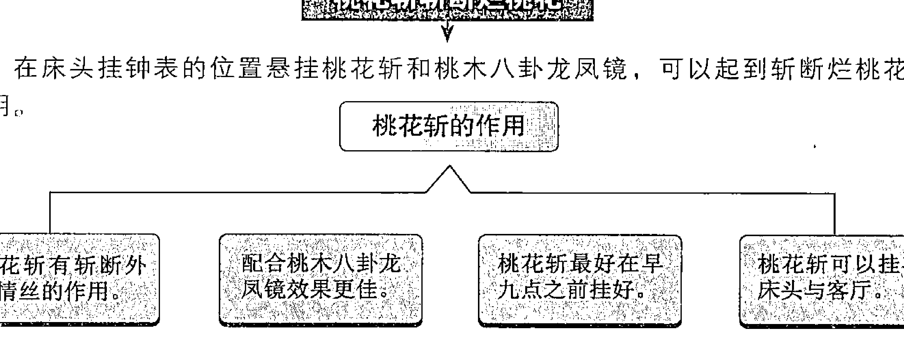

## 237 和合二仙有何作用？
和合二仙是民间传说之中主婚姻和合的神，也叫“和合二圣”。通常为二个童子，一个手持荷花，一个手捧圆盒，从盒中飞出五只蝙蝠。荷花，即并蒂莲；荷与盒，同音“和、合”，象征百年好合。五只蝙蝠，则象征五福临门。
和合二仙的形象，常出现在木雕、漆画、刺绣、剪纸和木版年画上。在婚礼时悬挂在洞房或厅堂之中，象征新婚夫妇白头偕老、永结同心。单身男女不宜悬挂。
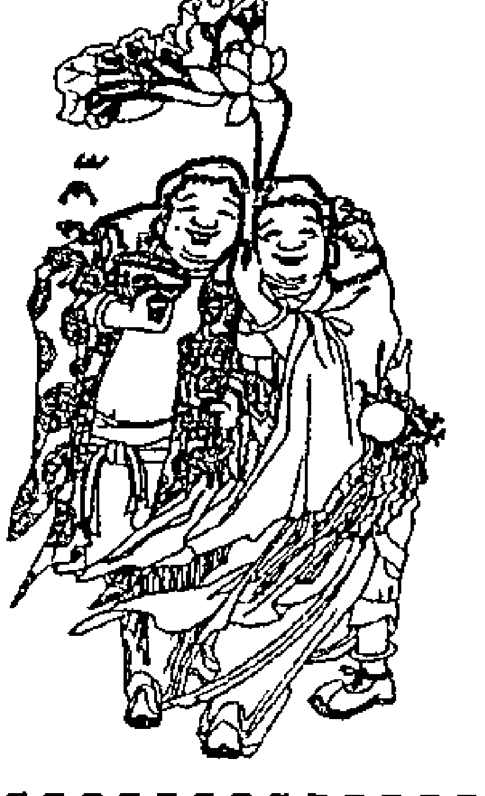
> 知识窗：和合二仙
据传，和合二仙是唐代的高僧寒山和拾得。他们的形象常见于木雕、漆画、刺绣、剪纸和木版年画上。挂于婚礼上表示夫妻和睦，幸福美满。

## 238 紫黄晶首饰有何爱情作用？
紫黄晶是紫水晶经过天然地热等高温的作用，慢慢褪色而成。它同时具备紫水晶与黄水晶的作用，据说目前只有玻利维亚产这种紫黄晶。
在西方国家，紫水晶是诚挚、正直、善良的象征；黄水晶则代表着诚挚的爱。因此，紫黄晶集智慧与忠诚于一身，可强化人的第六感，避开小人，招来贵人。
由于两种颜色同时出现在一颗水晶上，有极大的包容性和可调和性，能够在复杂的人际关系中从容应对，有助于调和婆媳关系、夫妻关系。
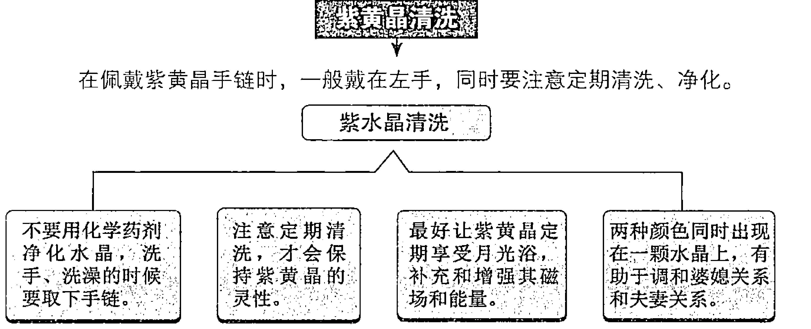

## 239 如何利用盛水花瓶催旺桃花？
花瓶象征情感、情色，具有催旺桃花的作用。清水属阴，有滋润作用，在催旺桃花的同时可以滋润爱情。单身男女可以在房内摆放带清水的花瓶来催旺桃花。
由于桃花方位与生肖有关，所以在放置花瓶时，要根据自己的生肖选择合适的方位。
- 生肖属猴、鼠、龙的人，在其房间的西方，放置白色的花瓶，里面盛水八分满。
- 生肖属猪、兔、羊的人，在其房间的北方，放置水蓝色的花瓶，里面盛水八分满。
- 生肖属蛇、鸡、牛的人，在其房间的南方，放置红色的花瓶，里面盛水八分满。
- 生肖属虎、马、狗的人，在其房间的东方，放置绿色的花瓶，里面盛水八分满。
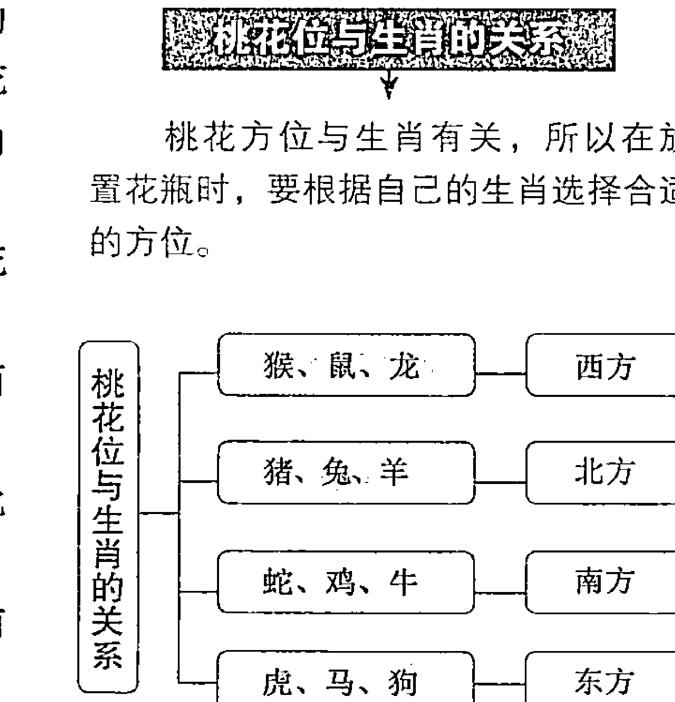

## 240 如何利用灯光激活红鸾星？
红鸾，即红鸾吉星，主人间婚姻喜事。古人常说的“红鸾星动”，意思是婚期已近，是星象学上的一种卦象，可根据天象和命理来推算。
当九紫星飞临到中宫，可于子时（23点~1点）在房内中央，点上一盏黄色的灯，光源朝上方照射至天亮。同时，在红鸾方向摆放一盆香水百合，可以起到催旺作用。
不同生辰的人，红鸾方位不同，每人可以根据自己的生辰八字查询自己红鸾所在的方位，然后参照上边的方法催动红鸾星。
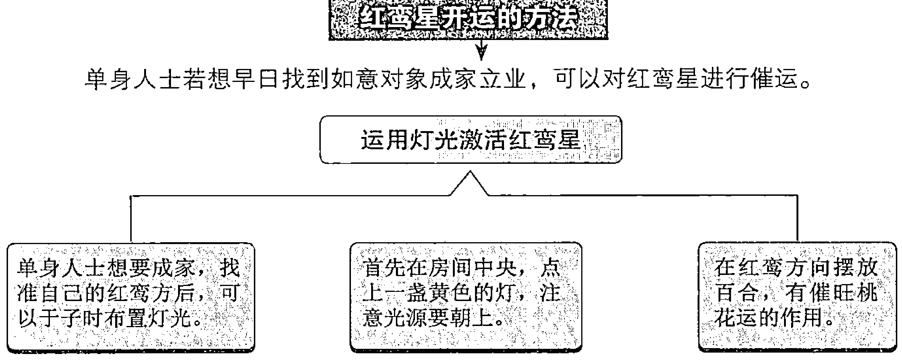

## 241 如何利用婚纱照促成女儿结婚？
婚纱照有催旺桃花运，促进感情的作用，单身人士还可以借助婚纱照促进自己的婚姻。
父母若希望女儿能够早日走入幸福家庭，可在女儿房间的东南方，摆放一张她所喜欢的婚纱照片，人物不限。若在女方上面写上女儿的名字，男方上面写上她男友的名字，更见效果。
若为长女，婚纱照放在东南方；若为次女，放在南方；再小的女儿，放在西方。如果女儿独自居住在外，要放在西南方的主妇位。
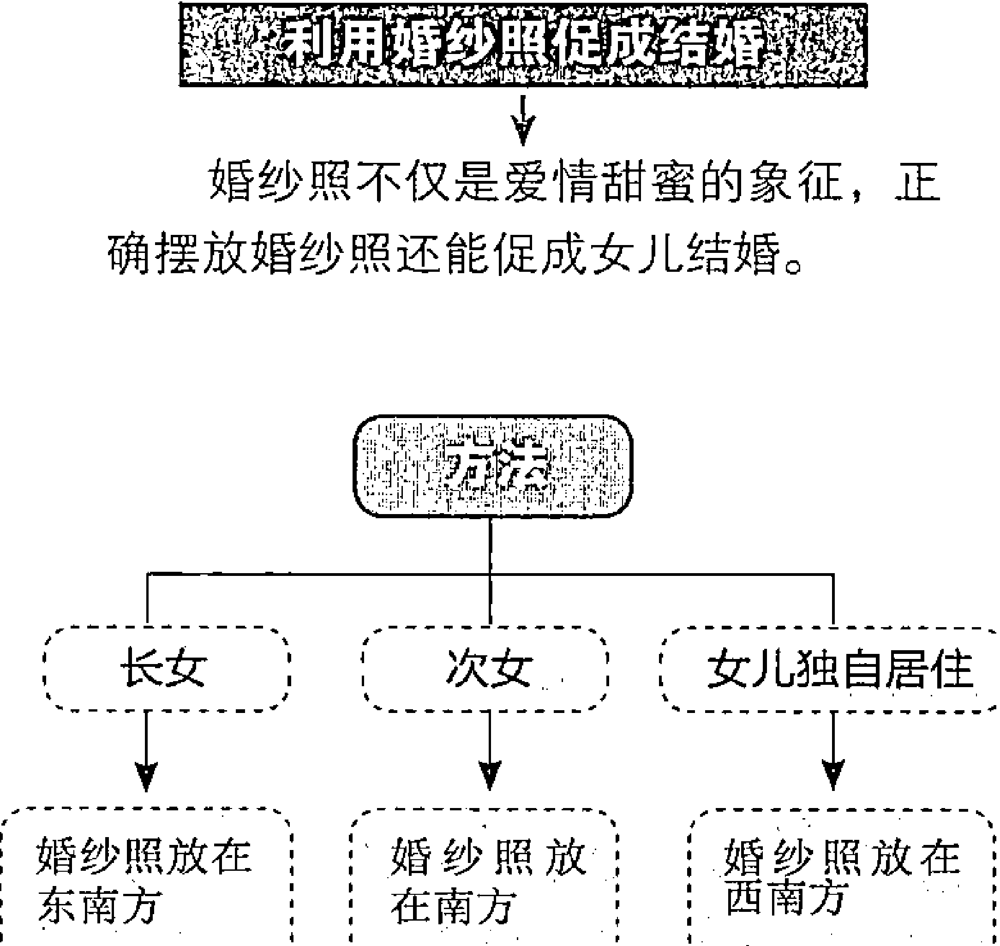

## 242 如何根据八宅命卦找出桃花位？
不同命卦的人有不同的桃花位。因为不同命卦的人，飞星位置有所不同，而命卦四吉星的延年位置，则为个人的桃花位。命卦与桃花位的对应关系如右表。

| 命卦 | 桃花位 | 命卦 | 桃花位 |
|------|--------|------|--------|
| 震命 | 东南方 | 乾命 | 西南方 |
| 巽命 | 东方   | 坤命 | 西北方 |
| 坎命 | 南方   | 兑命 | 东北方 |
| 离命 | 北方   | 艮命 | 西方   |

## 243 如何根据生肖判断住宅桃花位？
堪舆大师认为，出发点不同，桃花位的方向也不同。我们可以根据命卦四吉星的延年位置来判断桃花方位，也可根据一个人所属的生肖找出其独有的桃花位。如属鼠的单身人士，可以在自己卧室内西方的位置，悬挂水晶饰品或摆放清水花瓶，因为西方为他/她的桃花方位；而属兔的单身人士，则应该在北方摆放的水晶饰品或摆放清水花瓶，因为他/她的桃花位在北方。生肖与桃花位的对应关系如右表。

| 生肖     | 桃花位 |
|----------|--------|
| 鼠、龙、猴 | 西方   |
| 马、狗、虎 | 东方   |
| 鸡、牛、蛇 | 南方   |
| 兔、羊、猪 | 北方   |

## 244 怎样根据大门方位找出桃花位？
大门的作用类似于玄关，既有招财纳福，趋吉避祸的作用，也有催旺桃花的作用。单身人士还可通过大门处的气场来催旺自己的桃花运。
根据十二地支，大门可以分为十二个方位，其中子为北方，丑为东北偏北，寅为东北偏东，卯为东方，辰为东南偏东，巳为东南偏南，午为南方，未为西南偏南，申为西南偏西，酉为西方，戌为西北偏西，亥为西北偏北。

| 大门方位 | 桃花位 |
|----------|--------|
| 寅、午、戌 | 东方   |
| 申、子、辰 | 南方   |
| 亥、卯、未 | 北方   |
| 丑、巳、酉 | 西方   |

## 245 什么是青龙白虎方的桃花位？
桃花位的确定，可以根据空间位置来判断。
一般的住宅在空间上可分为五个方位，即前、后、左、右、中。一个人若想确定自己的桃花方位，就站在大厅内，面朝大门，则左方为青龙位，右方是白虎位。这两个位置都是桃花位，所不同的是，右方为男士所用，左方为女士所用。男士可在右方白虎方位催动桃花，吸引女性，获女人缘；女士则在左青龙方向催动桃花，吸引男性，获男人缘。
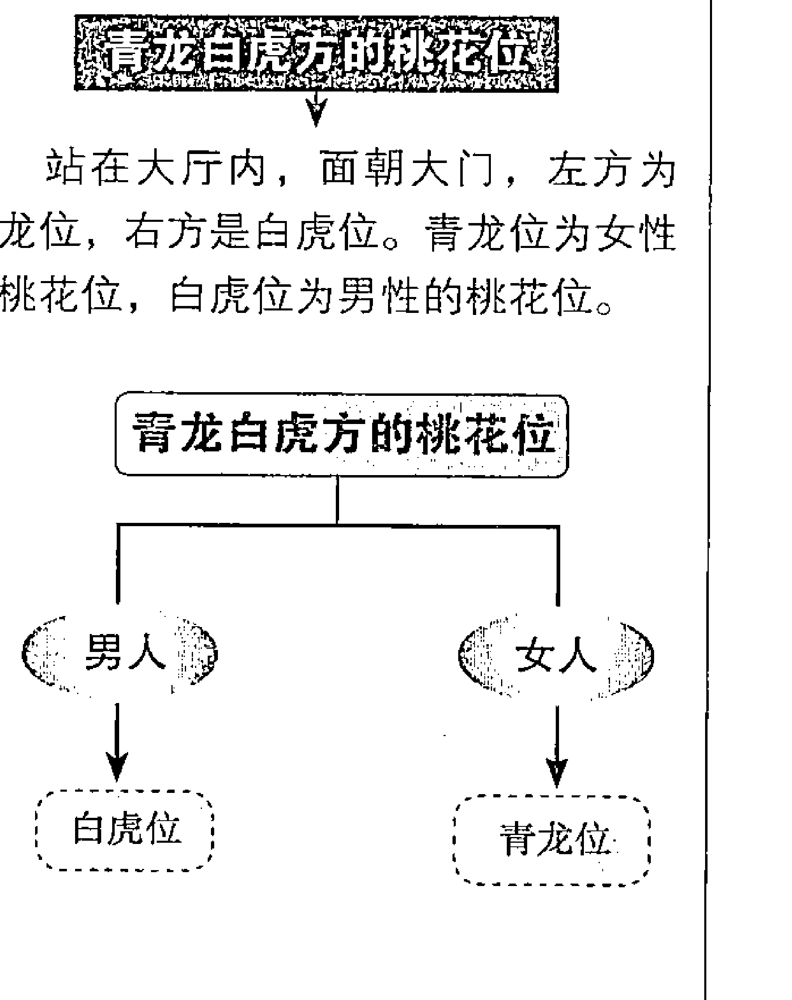
在具体操作的时候，男人可在右方放一对盛满清水的花瓶，里面加入一些新鲜的花朵，效果更好。需要注意的是，清水要常常换，否则就成了死水，阴气很盛，容易导致阴阳失调，难以招到桃花运。
女人招桃花的方法与此类似，只是在左方放一对盛满清水的花瓶，或者经常在左手上带水晶首饰，以紫黄晶效果最佳。总之，单身人士一旦找到了自己的桃花方位，离结束单身的日子就不远了。

## 246 如何选择旺桃花的饰物？
催旺桃花运的方法，一般具有共性。如注意玄关处的气场，在吉位上摆放花瓶，佩戴水晶饰品等。但要注意具体问题具体分析，这些方法并非人人皆可。一味追求桃花旺盛，并不理智。对开运饰物的选择，也要有所讲究，不能只贪图饰品的美观就随意购买、摆放。
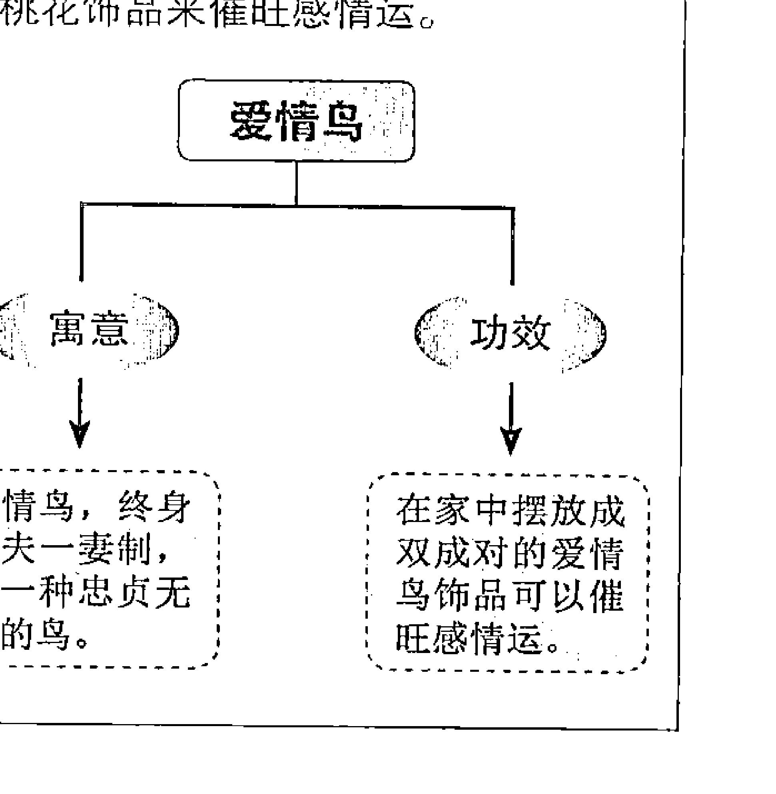
一般来说，命中桃花不旺的人，可选择旺桃花饰品来催旺感情运，如可常用鸳鸯、爱情鸟等成双成对饰品，也可以摆放花瓶，佩戴水晶饰品催旺。但是，若本身桃花已经很旺了，再使用上述典型旺桃花的饰品，则容易出现第三者，或导致喜欢的人不出现，出现的人不喜欢等烂桃花。

## 第十一章 夫妻相濡情
本章主要讲述了夫妻感情开运的相关问题。内容涉及如何利用百合、照片、浴室、玄关、卧室摆设来增进夫妻感情；哪些布局会影响夫妻感情；哪些物品会影响夫妻感情；孕妇的房间该如何布局等一系列具体而实用的问题。

## 247 如何用百合增进夫妻感情？
百合花外表高雅、纯洁，素有“云裳仙子”之誉。由于其鳞茎由鳞片抱合而成，有“百年好合”“百事合意”的意思。所以，自古以来民间就将百合花视为婚礼必不可少的吉祥花卉。
新婚夫妇在房间入门斜对角处摆上花瓶，加水八分满，插上两朵百合花，花朵保持新鲜不枯萎，水量不可少于六分满，这会让夫妻感情和睦。
还可摆放久久百合笔筒来促进夫妻感情和谐，笔筒内若放置两人的合影照片，效果更好。最好将笔筒放在左边的吉祥位置，不要放在右边。上班族还可将百合笔筒放到办公桌、书桌、床柜上，一般是妻子送给丈夫，放到丈夫的办公桌上效果更好。
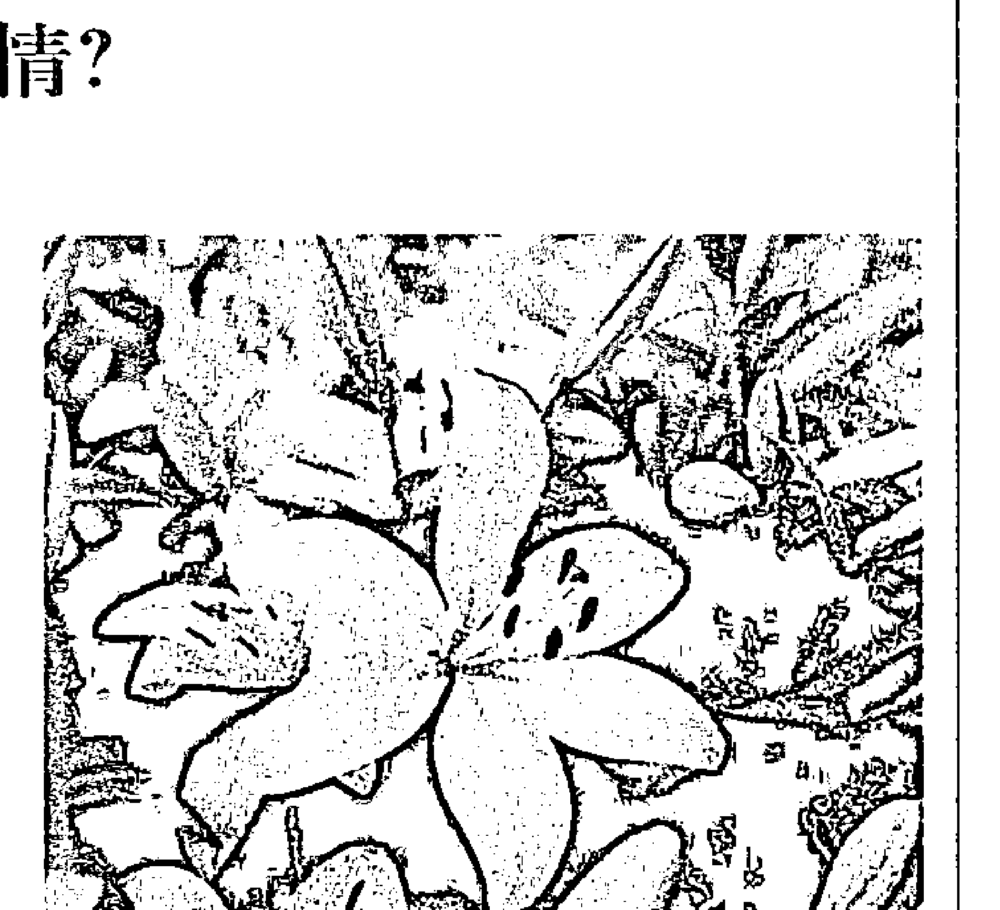
> > **黄色百合**
> 由于不同颜色的百合代表了不同的含义，新婚夫妇可根据自己的喜好选择合适的百合饰品。黄色百合象征高贵的爱情。

## 248 如何利用照片增进夫妻感情？
现代人工作繁忙，如果是夫妻双方都有工作，往往会因工作劳累而没有机会沟通交流。久而久之，夫妻关系容易变得无聊，感情容易变质，导致离婚率升高。
卧室对夫妻的感情影响很大，可以在东南面的墙上，挂上两人年轻时的照片。这些饱含回忆的照片，将会唤起双方对往昔甜蜜生活的回忆。
夫妻双方经常翻看老照片，有助于促进双方一起回忆初恋时光，时刻提醒伴侣爱的初衷。这样会给夫妻关系注入新的活力，确保夫妻感情常在。

## 249 如何装点浴室来增进夫妻感情？
有人认为，让夫妻感情持久不变，就是需要时刻铭记调和阴阳，这样有助于让夫妻情感升温。浴室长期与水打交道，阴气较重，因此可以调节这里的阴阳关系来促进夫妻感情。
住宅中有水的地方，湿气和阴气比较浓重，尤其是浴室这种隐私地方，一般难以引起注意，但却长期阴阳不平衡。因此要注意加入“阳”的因素，如可备齐各色的浴巾，每天换用。浴室中的其他用具，也以红色、橙色、粉红色为宜。这样一来，就可以补充“阳”的能量，达到阴阳协调、和谐圆满的效果。
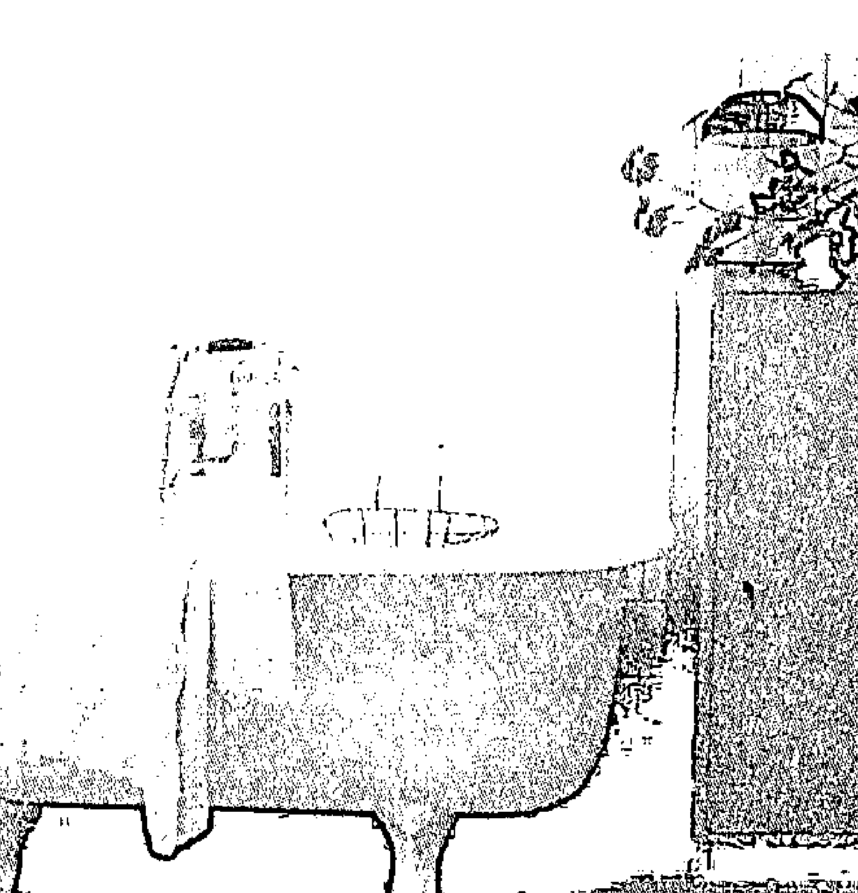
> **装点浴室**
> 浴室是潮气很重的地方，应经常通风，接纳更多的阳气。多准备几块暖色浴巾，方便洗浴。橙色的瓷砖，既能防水，又有格调。

## 250 如何用玄关的花卉增强夫妻感情？
玄关是一个比较特殊的位置，并非“居室入口的一个区域”这样一个简单的地理方位，而具有一定的作用。它可以促进夫妻关系和谐，家庭幸福。因此，合理布置玄关可以增强趋吉纳福的作用。
在玄关布置花卉，可以有效地增进夫妻感情。花卉最好由黄色、粉红色及其他颜色组成，黄色花朵可以让女主人得到丈夫的爱护，粉红色花朵主感情，既有助于增进夫妻感情，还可让你与邻居和睦相处。其他颜色的花朵则可增强气势。
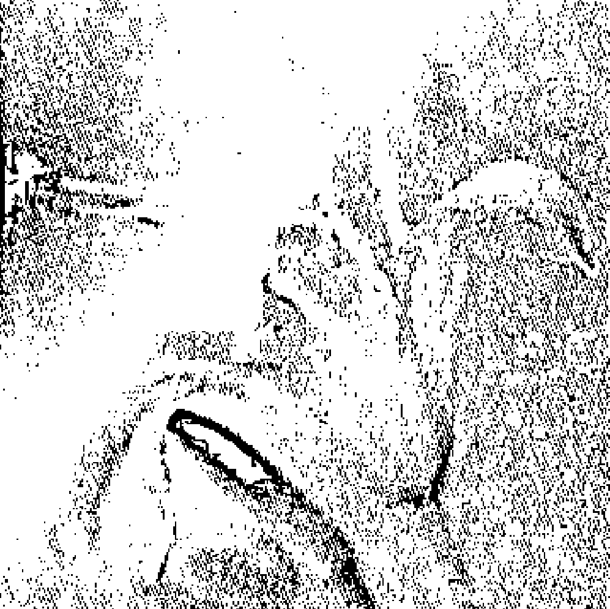
> **玄关花卉的摆放**
> 在玄关摆放花卉可以有效地增进夫妻感情。花朵要保持新鲜，需要及时更换清水。若没有清水，则阴气不足，阴阳失调。

## 251 哪种布局会对女主人不利？
家居布局有时候虽然不会影响夫妻关系，但会对其中一方造成坏的影响。下面两种情况就不利于女主人，容易使她失去丈夫、失去家庭。
- 1. 如果厨房有横梁在炉灶上方，女主人很可能会破财。若家门口正对着厕所，对家中女性的健康极为不利，容易患消化系统疾病。古代人认为，主卧室代表男主人，厨房代表女主人，厨房布局不好会影响女主人。
- 2. 若卧室的天花板格局繁复，象征家中女性在感情方面非常不顺利，丈夫容易在外面拈花惹草。这是因为，感情生活与卧室布局息息相关，卧室布局不好，就容易影响气场，有时候气场会对“阴方”，即女方造成坏的影响。若女主人出现这种感情危机又没有其他原因，就要找堪舆大师帮忙了。
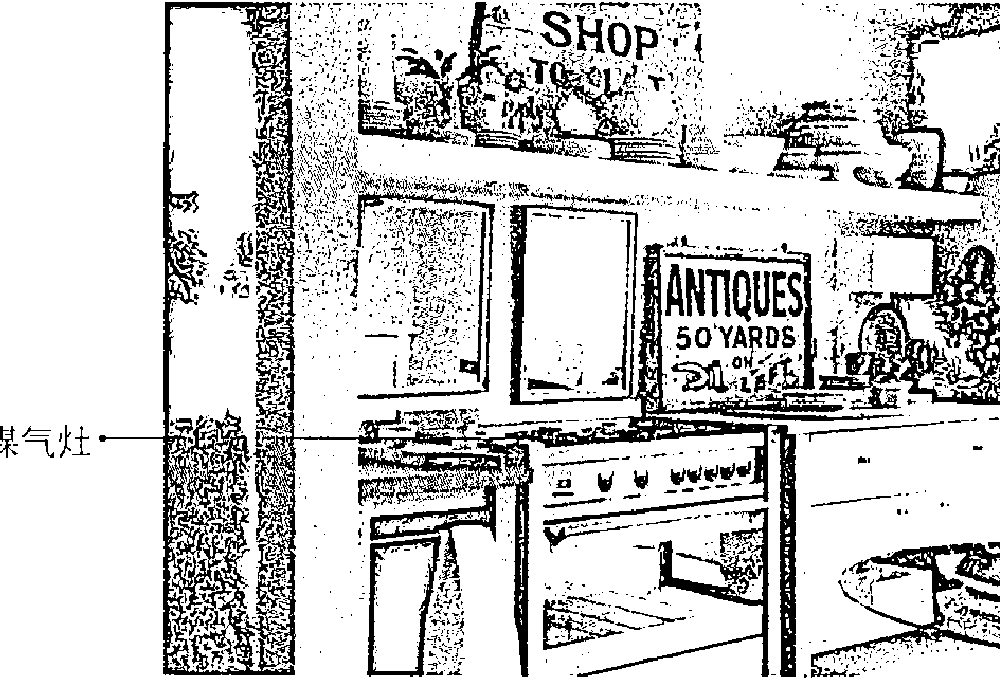
**厨房布局影响女主人**
在家居布局中，厨房布局影响着女主人。厨房布局不好，直接影响女主人的财运、家庭运和健康运。

## 252 哪些卧室布局会妨害夫妻关系？
妨害夫妻关系的因素有很多，如性格不合，诸事不顺，婆媳关系等。但若这些外因统统没有，夫妻关系仍然不和谐，这就要考虑家居布局了。例如，卧室布局不合理就会影响夫妻关系。
卧室的床头不宜摆放鲜花，这会招来烂桃花，夫妻一方可能会出现外遇。如摆放碎叶植物，夫妻会因琐碎之事不和；床头不宜摆放大镜子，这对身体健康无益。
床不能临窗户过近，否则容易导致“红杏出墙”，或因多梦而影响睡眠，这些都不利于促进夫妻关系。
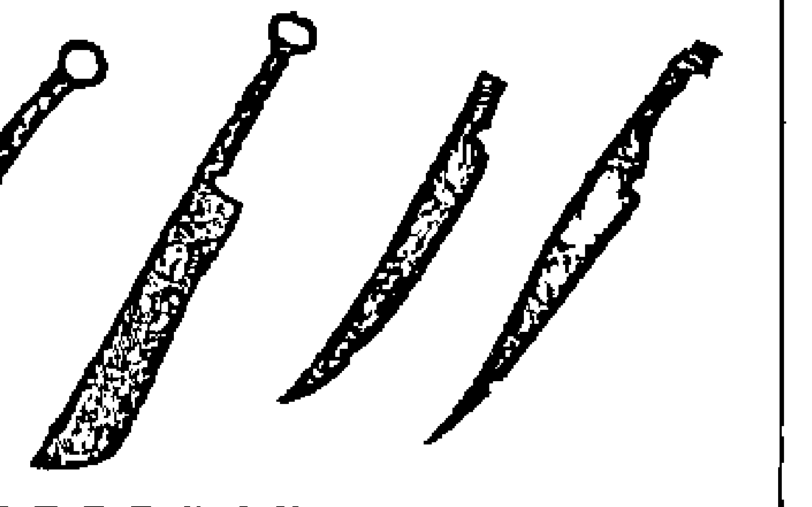
**刀**
刀或剪刀等尖刺尖角物品摆放在卧室会造成煞气，让人焦躁，夫妻容易因小事争吵。因此，不要在卧室摆放尖锐物品。

## 253 睡床摆设会影响夫妻关系吗？
新婚夫妇在摆设床的位置时，一定要格外重视床的位置，避免出现不好的格局。
- 1. 通常来说，床的方向顺着南北方，特别是床头朝西更加不利。
- 2. 对床头而言，左为青龙，为吉位；右为白虎，为煞位。因此右边的物品不能高过左边，否则容易阴盛阳衰，不利于夫妻关系和谐。
- 3. 卧室或床上，不能摆放与主人属相一致的布艺宠物，否则会对另一方造成威慑。
- 4. 卧室里不能有镜子对着床，因为镜子象征着“幻象”，容易导致夫妻一方出轨。
**睡床摆放不当影响夫妻关系**
睡床对夫妻来说是一个非常重要的场所，既是维系夫妻气场的法器，也象征着夫妻关系的融洽。
- 卧室里不要摆放与自己属相相同的玩偶，否则对你的爱人不利。
- 睡床上方若有横梁在中间，会把气分成两股，两气从横梁直下，从而让夫妇在运势和感情上都受到不利影响。
- 卧房内若摆设太多有尖角的东西，或有任何尖角物件对着床，会导致夫妻遇事钻牛角尖，常出现口角争执。
- 睡床若正对着厕所，受其秽气的影响，夫妻双方情绪不稳定，感情容易变质。

## 254 带形物品对婚姻有何不利？
有时候，一对夫妻没遇到任何磨难，但就是无缘无故地夫妻关系不好，这时就要考虑是不是家中的某些物品在作祟。如果家中有过多的带形物品会影响夫妻的感情，不利于婚姻的维护。
裤带、领带、腰带、鞋带等私人物品，在命理学上被称为“婚恋桎”，属于阳性饰物。若使用不当，如男女混用“婚恋桎”等带形物品，会对夫妻关系产生坏的影响。因此，这些物品应妥当使用，妥当保存。这些物品如果暂时不用，最好不要随手乱扔。
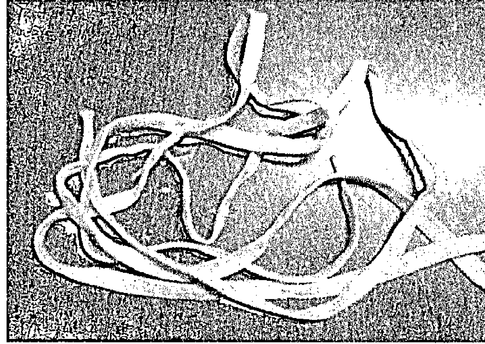
**鞋带**
鞋带等带形物品会影响夫妻感情。鞋带不要随手乱扔，扔掉了鞋带，就象征着扔掉了感情，容易导致夫妻或恋人陷入“桃花劫”。

## 255 桃花位的摆设对婚姻有何不利影响？
已婚人士要根据自己的属性，注意家中桃花位的物品摆设，同时还要注意妥善处理自己的感情。
桃花位主感情，有助于促进单身男女的爱情运程。但结婚之后，便不宜再催旺桃花，否则容易惹出婚外情，导致夫妻感情破裂。
水晶、花瓶等物品都有催旺爱情运的作用，单身的时候可常使用，结婚后就不宜再用。若想用来装饰，或取其催福作用，切记不要放在桃花位上，否则更容易催旺桃花，成为婚姻的不利因素。

**容易招桃花的年份**

| 生肖 | 易招桃花年份 |
|------|---------------|
| 猪、兔、羊 | 鼠年 |
| 蛇、鸡、牛 | 马年 |
| 虎、马、狗 | 兔年 |
| 猴、鼠、龙 | 鸡年 |

## 256 卧室中哪些摆设会影响夫妻感情？
卧室布局对夫妻感情至关重要，起着增进夫妻感情的作用。因此，要特别注意避免不好的布局，避免影响夫妻感情的物品摆放。
通常而言，在床头摆放鲜花，容易招惹桃花。夫妻间容易出现第三者，导致家庭破裂。睡床属隐私地带，不宜临窗，否则有“红杏出墙”之嫌，且受窗外噪音和寒风的影响，对人体的健康和情绪均不利。床头不宜嵌镜，镜多招鬼魅。
卧室的家具忌不平整，不平整代表不和谐，易生口角事端。床上和地下不宜凌乱，否则会影响主人的情绪，情绪不好，自然容易导致夫妻关系不合。
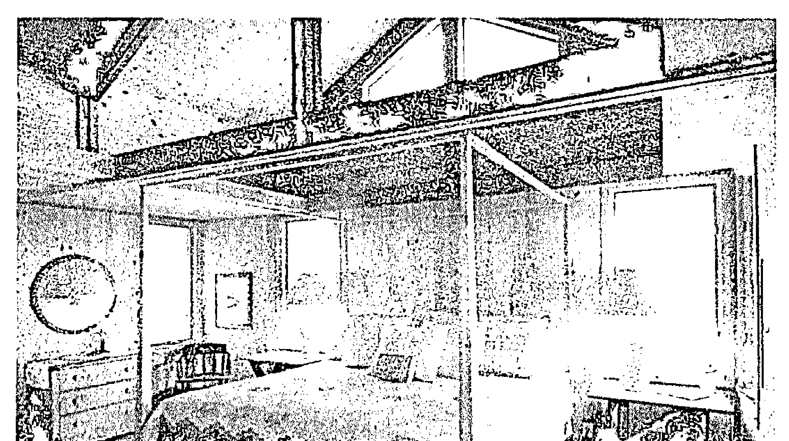
> **卧室布局**
> 卧室中的睡床不宜临窗，否则有“红杏出墙”之嫌，且受窗外噪音和寒风的影响，对人的健康和情绪均不利。

## 257 如何利用仙人掌确保夫妻关系和谐？
仙人掌为尖利物品，有避邪挡煞的作用，因此可以防止婚外情，确保夫妻关系和谐。
但另一方面，仙人掌的尖利容易使人钻牛角尖，夫妻之间容易出现口角争执。因此要选择合适的摆放位置，用其趋吉纳福的作用，避其弊端。如果不喜欢仙人掌，可以选择铁树代替。它既可以摆放在卧室，也可以种植在窗前屋后的小庭院里。
生肖属猴、鼠、龙的人，在其卧室的西方放置仙人掌或铁树。生肖属猪、兔、羊的人，把仙人掌或铁树，放在其卧室的北方。生肖属蛇、鸡、牛的人，把仙人掌或铁树放在其卧室的南方。生肖属虎、马、狗的人，把仙人掌或铁树放在其卧室的东方。
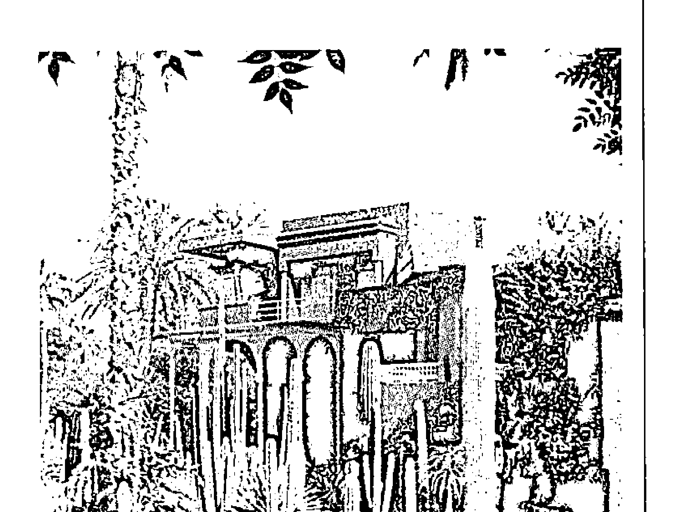
> > **种植仙人掌的户外小庭院**
> 户外种植仙人掌，可以抵御外界的冲煞，也可以降低婚外情的发生几率。长满尖刺的仙人掌，放在室外或窗台，避邪作用更强。

## 258 如何运用乐器化解家庭纷争？
婆媳纷争从古至今难以解决，其原因无法得知，可能是由于婆媳之间缺少沟通和理解造成的。由于婆媳均属阴，因此往往由阳性——男主人来做和事老，从中调解。
乐器是调解婆媳关系最有效的物品。在客厅的显眼位置摆放一些乐器，一方面，可以作为装饰美化家居；另一方面，可以有效地化解婆媳争端。
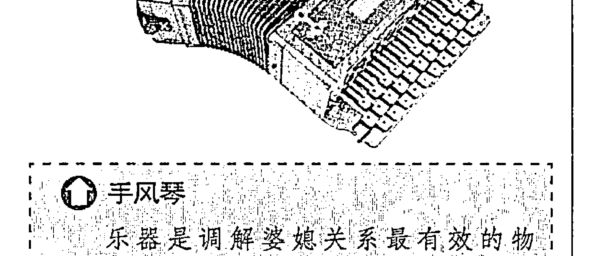
> > **手风琴**
> 乐器是调解婆媳关系最有效的物品。在客厅摆放乐器，可以有效地化解婆媳间的争端。

## 259 怎样的布局可以旺夫？
旺夫运是很多人梦寐以求的，但旺夫女人的生辰八字比较好，一般人无法效仿。常人若想旺夫也不是没有办法，我们可以改变家居布局，人为地做出一个具有旺夫作用的布局。具体做法有以下三种。
- 1. 在家中的东方摆放一些红色的家具和装饰品，可使家人充满活力和干劲，有利于丈夫的事业与孩子的学业。
- 2. 在家中的西方摆放一些黄色的家具和装饰品，可给家里带来旺盛的财运。
- 3. 现代人工作忙，压力大，不孕或晚孕的人相对较多。在家里摆放一对麒麟，不仅可以旺财也可以送子。
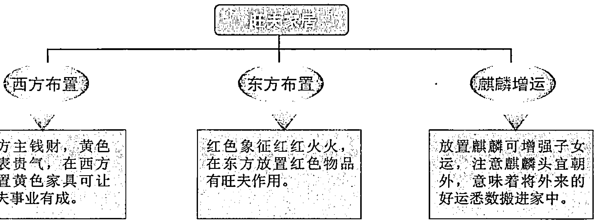
女人有旺夫运固然好，如果没有也可以通过调整家居布局来增强旺夫运。

## 260 不同方位的卧室对丈夫有何助益？
卧室的方位不同，对丈夫有着不同的助益。因此，可以根据丈夫的职业来选择合适的房间作为主卧室。
北方的卧室利于自由职业者；西北方的卧室利于管理者；东北方的卧室利于服务业；东方的卧室利于年轻的积极进取者；东南方的卧室易得贵人助；南方的卧室容易获得灵感；西南方的卧室可以加强耐心；西方的卧室能缓解压力，有利于睡眠。
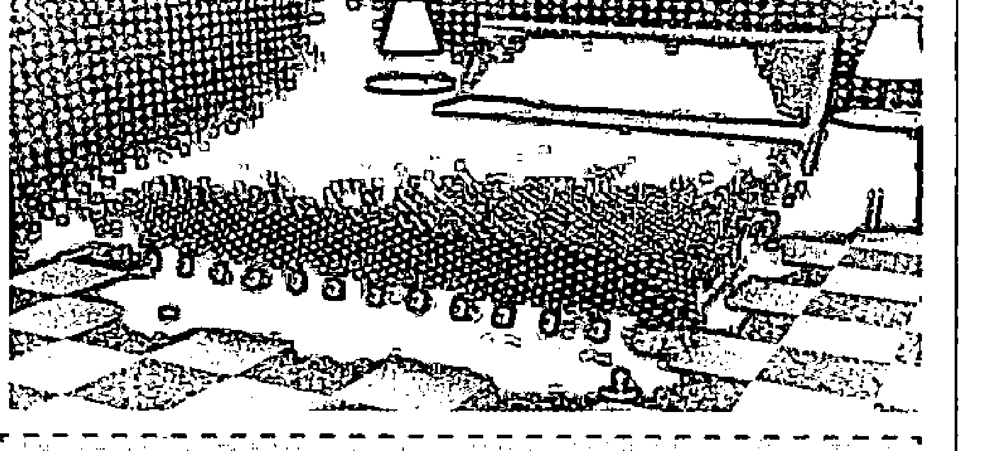
> **卧室**
> 绿色的床有利于放松身心，能让忙碌了一天的人得到休息。简洁、大方，没有大型电器的卧室，辐射低，有利于健康。

## 261 哪种家居布局易导致妻子脾气暴躁？

古代环境文化学认为，家中常有口舌之争是因为家人的命局有不合之处。若有不利的布局助旺这种气场，就会加剧这种争吵。

可以先查看住宅的坤位，即西南方，看是否有破局或缺角。破局通常是煞气相冲，如被笨重的电器压制，厨房、厕所临妻宫位，太岁冲妻宫位，白虎位太盛等。

其次，查看房间的离位，即南方位。南方在堪舆上属火，主口舌。这个方位若有破局或煞气相冲，必然引起口舌是非。

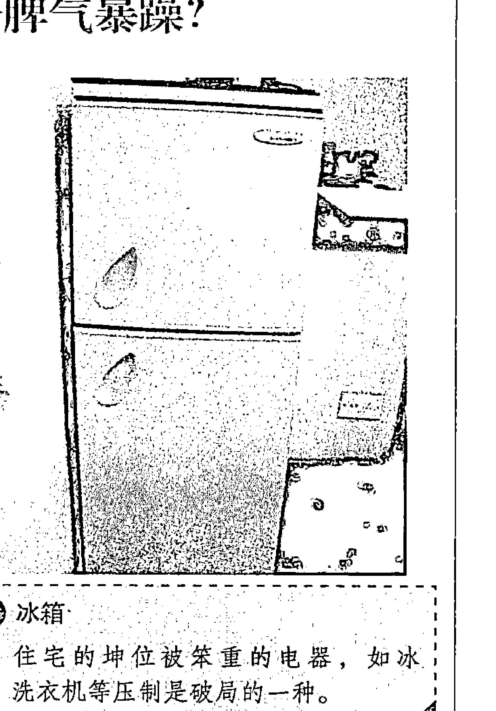

## 262 哪些女人桃花过旺？

发生一夜情属于桃花过旺，通常发生在命理八字带桃花的人身上，或者八字中“合”多。女性的生辰八字中若命中桃花多，则感情丰富，容易发生一夜情，因此要提前避免。

所谓“合”，是指八字中天干与地支相合。天干五合：甲己合、乙庚合、丙辛合、丁壬合、戊癸合。地支六合：子丑合、寅亥合、卯戌合、辰酉合、巳申合、午未合。女性可查看自己的生辰八字，若出现这些命相，除了加强自身约束外，更不可轻易催旺桃花，如在家中或者是办公室中养花，放置花瓶，戴水晶饰品等。

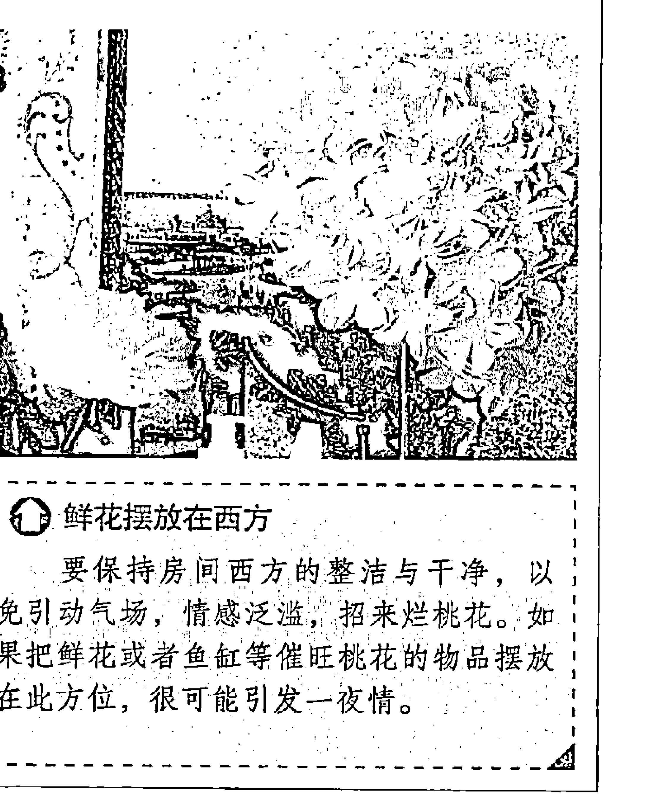

## 263 如何不让镜子影响夫妻感情？

镜子有映射功能，象征着“幻象”，代表夫妻世界之外又多出了一个世界，极易影响夫妻感情。镜子若放在卧室中对着睡床，等于多出夫星或妻星，容易导致夫妻关系破裂。

然而，家中又不可缺少镜子，因此只有注意避免镜子发挥不好的作用。穿衣镜最适合安装在衣柜门的内侧，当需要照镜时，打开衣柜门，照完后关上。梳妆台的镜子，最好选择可合起来的，不用的时候随时合上，或者在镜子前面加装布帘，不用时拉上。尽量避免镜子的映射作用。电视的显示屏能映射人影，与镜子有同样的作用，最好不要对着床。

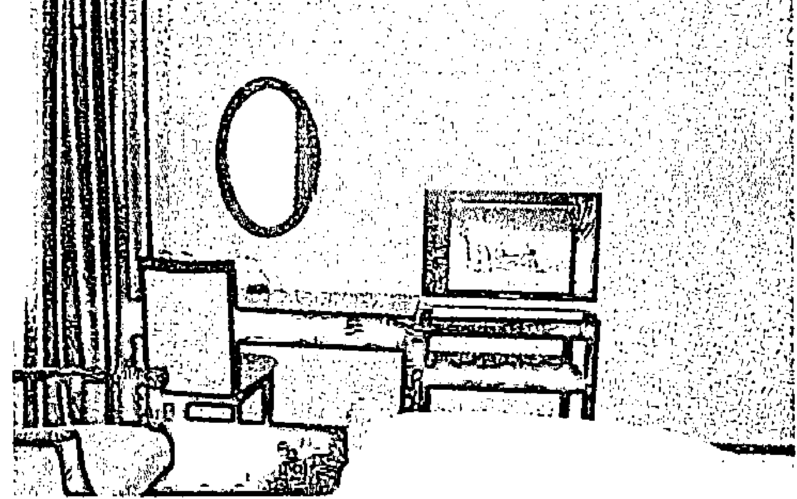

> 卧室内内的电视机
电视机关闭的时候，会反射床的影子，成为一种变相的镜子。因此不宜将电视机正对着床。

## 264 什么样的家居摆设可以让夫妻感情甜如蜜？

有的人感情浓烈，希望夫妻关系永远像初恋时那样甜蜜。但时间是最厉害的杀手，它最容易抹去人的感情，甜蜜的感情很难持久。若人们想努力营造这样的感情，可以通过合理的家具摆放来形成有“促进夫妻感情甜如蜜”的气场。

可以在家中客厅养鱼，选择温馨浪漫的灯光，在床上挂布幔，这些方法都能够使夫妻的感情升温。

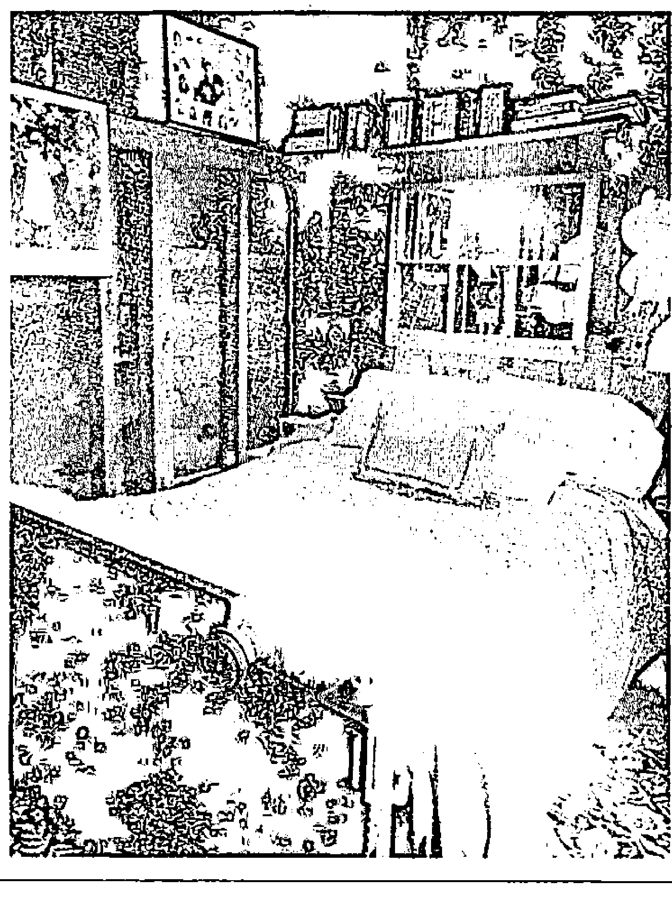

> 卧室温馨的灯光
卧室里温馨的灯光，有利于制造浪漫气氛，让人身心放松地享受两人世界，可以帮助夫妻保持感情的甜蜜。

## 265 如何布置床铺促进夫妻感情？

促进夫妻感情的方法有很多，床是维系夫妻感情的重要法器，因此可以通过布置床铺的方法来促进夫妻感情。

在床头枕边，放一个与你生肖相合的布偶娃娃，如：属马的放羊布偶，属虎的放猪布偶。生肖相配为：鼠配牛、虎配猪、兔配狗、龙配鸡、蛇配猴、马配羊。男的放左边，女的放右边。

床单和枕头套上的图案，避免使用三角形或箭头等尖形图案。尖形图案五行属火，会让卧室阳气过盛，不利于夫妻的恩爱。

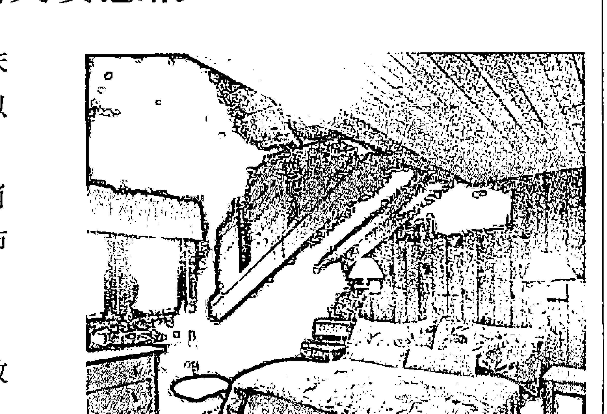

> 睡床
睡床上的床单和被罩要尽量避免使用三角形或箭头等尖形图案，因为尖形图案五行属火，会让卧室阳气过盛，不利于夫妻恩爱。

## 266 哪种住宅布局会让男人不恋家？

有时候虽然夫妻感情还算好，但一旦出现男人不恋家的情况，久而久之，就会渐渐影响夫妻感情，影响家庭和谐，严重时甚至会导致家庭破裂。所以在家居布局时，要注意避免下面的情况。

-   1. 客厅装潢得太过华丽，犹如酒店一般。这会造成男主人心情浮动，容易滋生出外享乐的思想。
-   2. 厨房长久不动火。厨房象征着女主人，厨房若长期不动火，容易造成一种冷清之感，表示女主人感情冷漠，家中会缺少温馨的氛围。
-   3. 卧室对着外面的车道，车来车往。这会让男主人心随车动，总想往外跑。

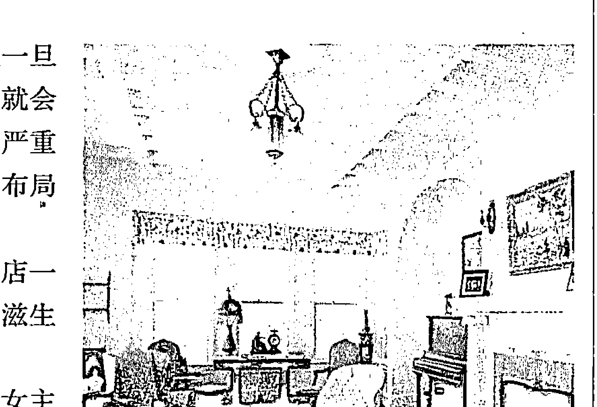

> 客厅布局
客厅装潢得太过华丽，如酒店一般，会造成男主人心情浮动，容易滋生出外享乐的思想。

## 267 乳白色为何最利于夫妻居住？

无论是新婚夫妇，还是结婚若干年的夫妻，最好居住在乳白色的房间里，这样有助于促进夫妻关系的和谐。

颜色中蕴含着能量，可以影响气场。白色光，既不属于冷色调，也不属于暖色调，属于中性，它包含的能量有调节阴阳的作用。白色基调的墙壁，与所有颜色的家具都能协调融合，象征着夫妻关系其乐融融。

从现代科学的角度考虑，家居色调以乳白色、象牙白、白色为主有助于健康，因为它们对人的视觉神经没有太大的刺激作用，让人心神安宁。

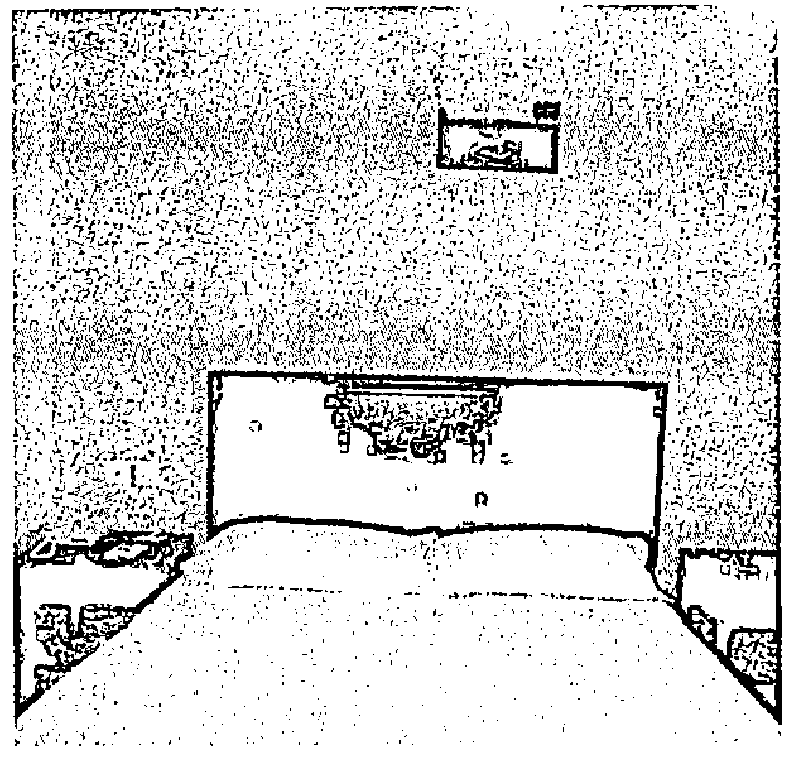

**乳白色房间**
乳白色比较柔和，有镇经安神的作用。夫妻居住在乳白色的房间里，会减少因心理因素引起的摩擦和争执。

## 268 深蓝色和紫色对婚姻有何影响？

颜色蕴含着能量，它散发的能量会影响家居气场，进而影响夫妻关系。因此，家居环境最好不要以深蓝色和紫色为主，这样做容易招引煞气。

深蓝色是冷色调，代表冷静、理智，缺乏情趣。家中装潢若大多为深蓝色的基调，居住在这里的夫妻虽然比较理智，但却没有夫妻间其乐融融的情趣，无形中会产生阴气沉沉的感觉，使夫妻双方产生消极思想，情感自然得不到保障。

**紫色卧室**
紫色给人神秘的感觉。家居布局中不宜以紫色为主色调，人若长期身处其中，会感觉到色彩过于鲜艳、浓烈，心情难以平静，无法给人平和、喜乐之感。

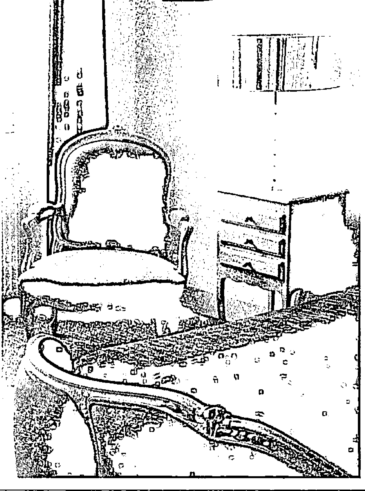

## 269 客厅如何摆放婚纱照？

婚纱照属于夫妻共同拥有的东西，会影响气场。如果婚纱照摆放不当，会影响夫妻关系的和谐。

古代人认为，客厅的西北方代表着丈夫，西南方代表着妻子。因此，在客厅的西北方挂一幅婚纱照，象征丈夫对妻子的浓浓爱意；同理，也可以把婚纱照摆放在西南方，代表妻子对丈夫温柔的爱意。

注意，镜子属于“幻象”，婚纱照应避免被镜子照到。根据镜子的反射原理，婚纱照被镜子照到会多出妻星或夫星，夫妻间容易出现第三者，会给婚姻造成不利影响。

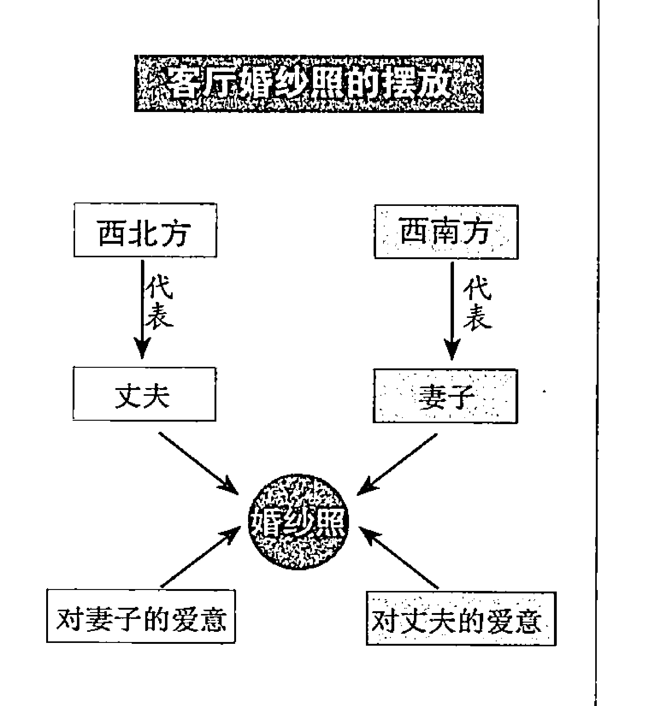

## 270 结婚典礼为何不宜在地下室？

通常，没有人会在地下室举办婚礼。但是，到了结婚旺季，饭店爆满，新人难以订到理想的位置，有些人就迁就在地下餐厅宴请宾客。这不利于促进新婚夫妇的和谐。

古人把地面以上为活人居住的地方称为阳宅，把地下为死者居住的地方称为阴宅。地下室虽不是阴宅，却因深入地下，潮湿不通风，故而阴气重。阴气重的地方，不宜居住，更不宜举行各种喜庆之事，以免冲煞。因此，结婚典礼不宜在地下室举办。

新人若是在订不到理想的饭店，可以租一个稍大的房子，也可在自己的家中举办婚礼。实在想在饭店里热闹一番，最好重新寻找黄道吉日结婚。

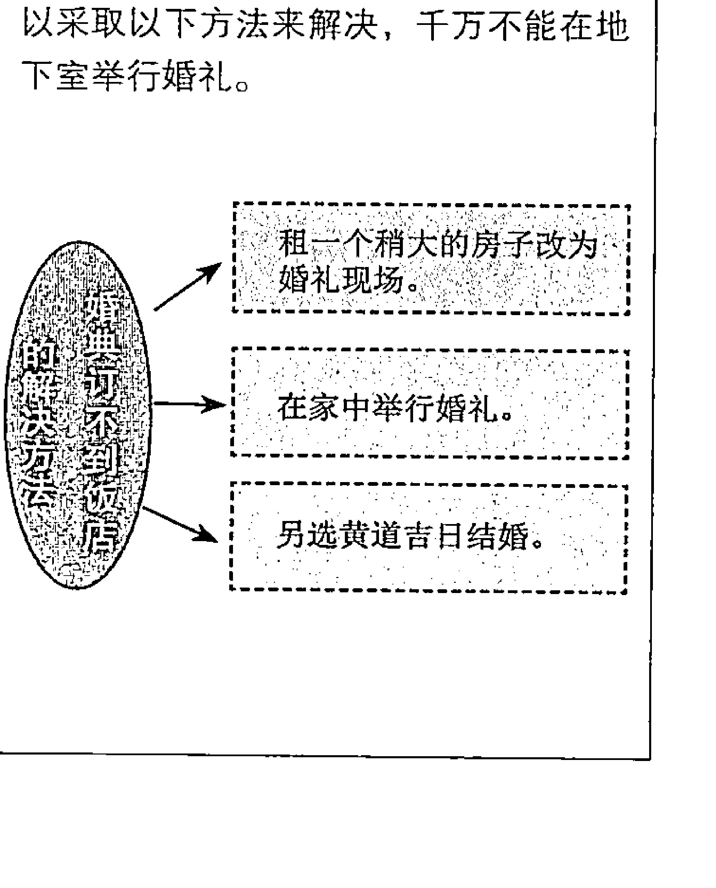

## 271 婚宴设在地下室如何补救？

婚宴设在地下室对新人是非常不利的，补救方式除了重新寻找黄道吉日举办婚礼外，还可采取下面的方式补救。

-   1.如果很快就要结婚，婚宴已经预订在地下室无法改变，那么，可在举办婚礼那天之前，先到法院公证结婚，并在宴席之时，把新娘的休息室设在楼上，这样可减轻阴气对新人的影响。
-   2.如果刚刚在地下餐厅办过婚宴，可以采取再到法院公证结婚的办法化解煞气。若已经结婚几年，后来才意识到地下室结婚的危害，无法及时化解，可在庆祝结婚周年纪念日的那天，重新宴请亲朋好友在阳气充足的餐厅聚餐，表示新人重新采摘阳气，这样也可化解，促进夫妻关系和谐。

| 具体情况 | 补救方法 |
| --- | --- |
| 已经预定地下餐厅 | 在婚姻之前到法院公证结婚。 |
| 刚在地下餐厅举办婚宴 | 到法院公证结婚，化解不利影响。 |
| 在地下餐厅办婚宴，多年以后才意识到这对婚姻不利。 | 在结婚纪念日重新在阳光充足的餐厅宴请亲朋。 |

## 272 婚宴场所为何要灯光明亮？

结婚是大喜之事，一定要阳气充足，尽量避免阴气。灯光中含有能量，有趋吉避凶的作用。在婚礼举行当天，一定要灯光明亮。这样一方面可以烘托出热闹喜庆的气氛，另一方面象征着新人有着光明的前程，还可以化解煞气，为新人带来吉祥。西方婚礼流行在仪式上熄灭灯光，播放成长、恋爱的录影，或者举行烛光婚礼。这种做法不值得效仿。这种做法象征着新婚夫妇的生活中突然引入了阴气，将来新人的婚姻会受到突如其来的打击，不利于婚姻幸福。同理，如果婚宴上忽然断电，也会给人不祥之感。

## 273 红色和粉红色对婚姻有何影响？

有的人想当然地认为，红色、粉红色主情感，有促进夫妻感情和谐的作用，因此，在家居装修中以红色或粉红色为主色调。其实这样做不利于夫妻感情的融洽。

红色属于吉祥色，常用于喜庆场合，但如果大量用于家居之中不妥。红色的强烈刺激作用会让人心情暴躁，人长期居住在这样的环境中，性格会变得暴躁、易怒，夫妻间容易发生争吵，不利于感情和谐。

粉红色象征着天真、浪漫，似乎非常适合夫妻，其实不然。粉红色属于红色系，有着红色系的刺激作用，居室若大面积使用粉红色，人长期居住在这种环境中，必然会产生烦躁感，夫妻双方容易出现争吵。长此以往若得不到改善，还会对家人和他人的精神造成伤害，不利于人际关系的和谐。

红色调卧室
红色是喜庆的颜色，夫妻可以在房间中适当加入这种色调，但不宜以红色为主色调。因为红色具有很强的刺激作用，人长期处于其中会感到烦躁。

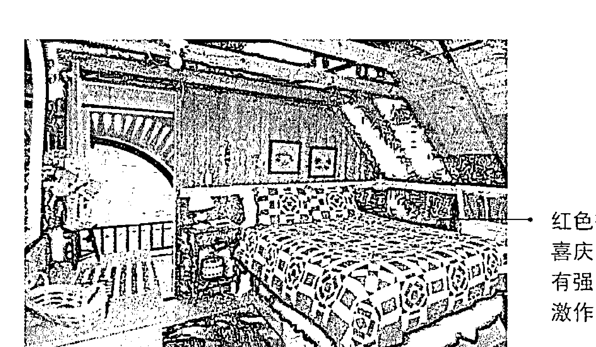

红色被罩呈喜庆，但具有强烈的刺激作用。

## 274 黄色和橘色对婚姻有何影响？

有的人喜欢黄色、橘色，在布置新房的时候，家具或饰品大多使用这种颜色。这样做不利于家居气场。

从色彩的运用原理看，家中若大量使用黄色，会让人的心情变得闷忧、燥热不安。黄色还容易引发人的幻想，会对人的精神产生影响，久而久之会影响人的性格。精神病人若居住在这样的空间里，病情会加重。新婚夫妇若居住在这样的环境中，容易产生猜忌，久而久之会影响夫妻感情，进而影响家庭和谐。

有的人喜欢橘色，认为橘色会使人产生温馨之感。但过多地使用橘色，会使人心生厌烦。尤其是在夏季天气闷热的时候，居住在橘色环境中，人会感觉特别烦躁，容易导致心情“中暑”。

## 275 天花板吊饰过多为何不利于感情？

有的家庭喜欢在天花板悬挂吊饰，这样做可以起到装饰环境的作用。但凡事有利也有弊，在天花板悬挂吊饰会影响家居气场，影响夫妻感情。尤其是卧室上方，最好不要悬挂吊饰。

卧室上方的天花板上，如果悬挂着花俏的吊灯或吊扇，会让睡床上的人产生压迫感和忧虑感，长期下去会造成精神衰弱。同时，吊灯或吊扇含有能量，若正对床铺，会破坏夫妻的和气，可能导致另一半貌合神离，甚至移情别恋。

> > **天花板灯饰**
> 天花板上面最好不要随便悬挂吊饰，尤其是床上方的天花板不宜有悬挂物。若想利用灯饰增添浪漫色彩，灯饰最好简单、大方，减少其磁场的影响。

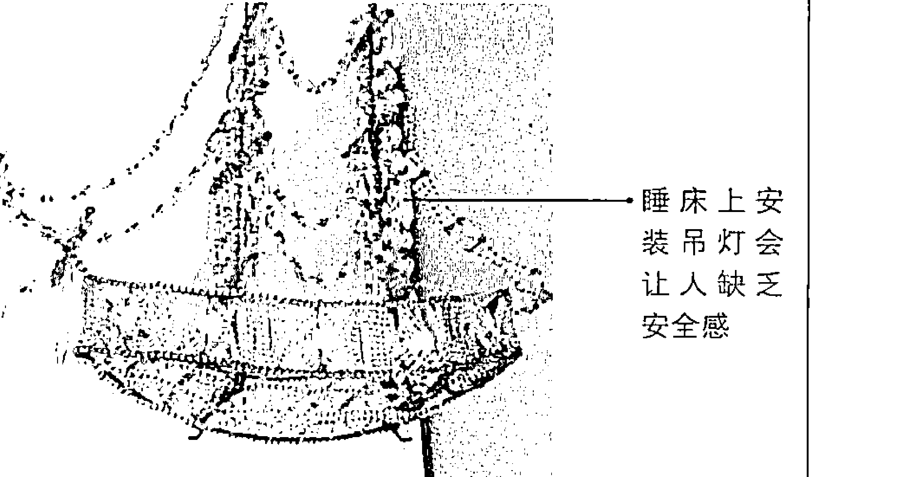

## 276 形状方正的床会让感情更稳定吗？

床对于一对夫妻来说至关重要，它既是维系婚姻的实体，也是调和阴阳的重要法器，对维护夫妻感情至关重要。因此，一对夫妻若想确保感情稳定，婚姻和谐，一定要选择合适的床。

床以方正者为佳。圆形或是多角形的床，会让人心中藏有隐忧或莫名的担心，容易造成不安和猜疑心理，同时也容易招来烂桃花，不利于夫妻关系和谐。

所以，夫妻双人床最好用正方形或长方形的床。这样既可以避免夫妇双方的猜疑心理，又可以防止出现婚外情，有利于增进夫妻感情。双人床若由夫妻两人同时挑选购买，效果会更好，有助于确保夫妻感情始终甜如蜜。

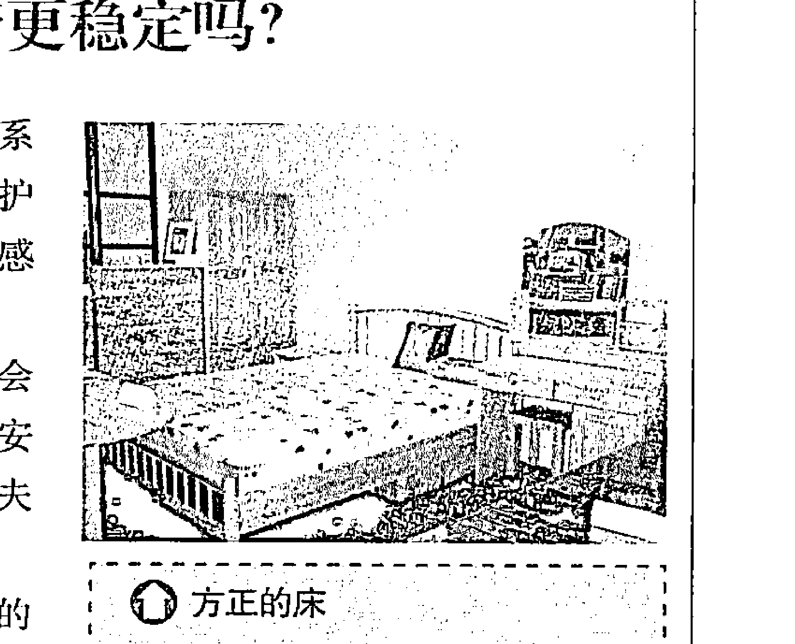

> > **方正的床**
> 圆形的床会给人不安全感，夫妻的睡床以方形为佳。如果床由夫妻两人一起购买更有利于夫妻感情。

## 277 过大的床为何不利于夫妻感情？

通常，大家会认为床是休息、放松的地方，自然越大越舒服。但对于夫妻来说，一张大床并不利于促进感情。

普通的睡床，夫妻之间不免会有肌肤上的触碰，这种接触会让人产生温暖和安全感，甚至引发双方的激情。而一张过大的床，双方似乎遥不可及，渐渐会有一种生疏和隔阂感，久而久之会疏远夫妻感情，严重时甚至会出现烂桃花。

因此，新婚夫妇在挑选家具的时候，一定要选择一个合适的床，以躺下两人稍微有宽裕为准，不宜过大，也不宜过小。

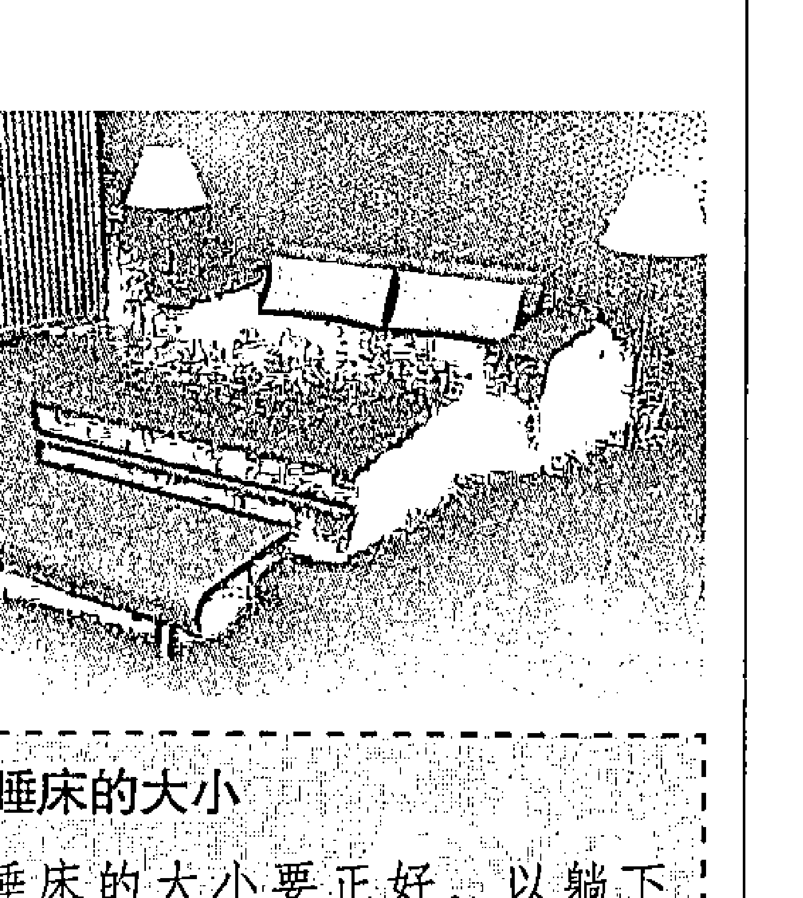

> **睡床的大小**
睡床的大小要正好，以躺下两个人后稍有宽裕为准。图上的睡床左右两边有沙发似的扶手护栏，很有创意。

## 278 卧室过大对婚姻有何不利？

在购买房子的时候，有的人经济条件宽裕，选择购买大一点的房子，卧室相对较大。有的喜欢大一点的空间，因此选择最大的房子做主卧室。这些做法均不利于家居气场。

卧室的大小，以个人感觉良好为宜。卧室过大，不但会使人产生冷清、空荡之感，还难以聚气生财，成为坏的气场。而且，大房子若放置小家具，不仅不美观，还容易招致煞气。因此。一般人都会选择使用高大的家具，但高大的家具又会使人产生压迫感和紧张感。所以，为了摆放家具的方便，不宜选择过大的卧室。

另外还要注意，卧室的陈设不要太过繁杂，门窗不宜太多。床单、窗帘、墙面、灯光的色彩要协调统一，如此才能创造出好的家居气场，创造出温馨的气氛。

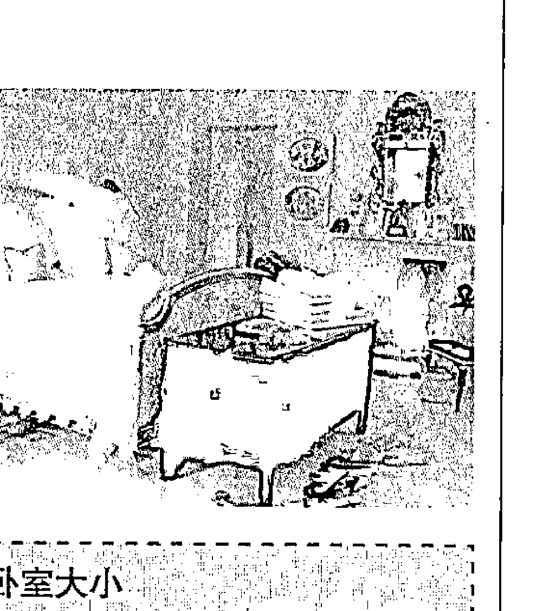

> **卧室大小**
卧室和睡床一样，以大小适中为宜，太大的卧室不聚气，容易使夫妻双方产生疏离感。而太小的卧室，又过于拥挤，人容易烦躁，自然不利于夫妻间的交流与沟通。

## 279 方正的卧房有利于夫妻感情吗？

有人认为方正的空间有助于促进夫妻感情。

方正的卧室，有利于夫妻双方保持平和的心态，对感情有一种理性的态度，从而可以让夫妻的感情在发展中更加平稳和坚固。如果卧室呈现狭长形或者不规则的形态，容易造成双方脾气暴躁，缺乏耐性，以致夫妻之间争吵不断，影响感情。

若无法将房间更换为方正状态，则只能人为地改造房间形状，补上缺角，最终使房间呈现一种方正的格局。

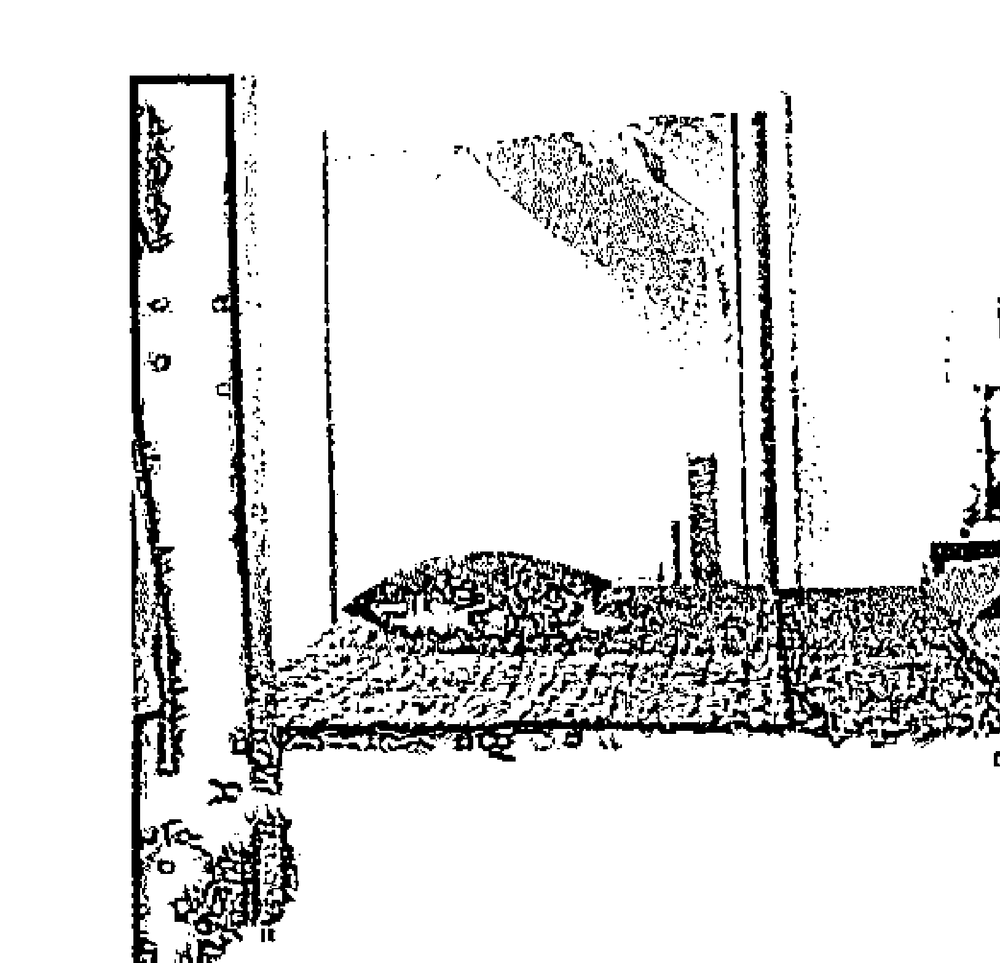

> 方正的卧室
方正的卧室，有利于夫妻双方保持心态的平和，在这种卧室里居住的夫妻感情相对较好。如果卧房有缺角，要想办法把缺角补上。

## 280 如何利用额头挽回女友或妻子的心？

随着时间的推移，恋爱双方的感情渐渐平淡，夫妻关系很容易出问题。如果是妻子不再拥有婚姻的激情，对丈夫变得冷漠，丈夫该如何挽回妻子的心呢？丈夫可以通过额头维护夫妻感情。

恋爱或婚姻就是异性之间“气的沟通”，而额头是人体“气的入口”，是夫妻了解对方心意的窗口。如果丈夫的额头被头发盖住了，妻子就很难了解他的心意，夫妻双方的心灵容易出现隔阂。所以，丈夫应该及时发出爱的信息，剪掉遮盖额头的头发，或剪成寸头，及早挽回妻子的心，避免家庭或恋情破裂。

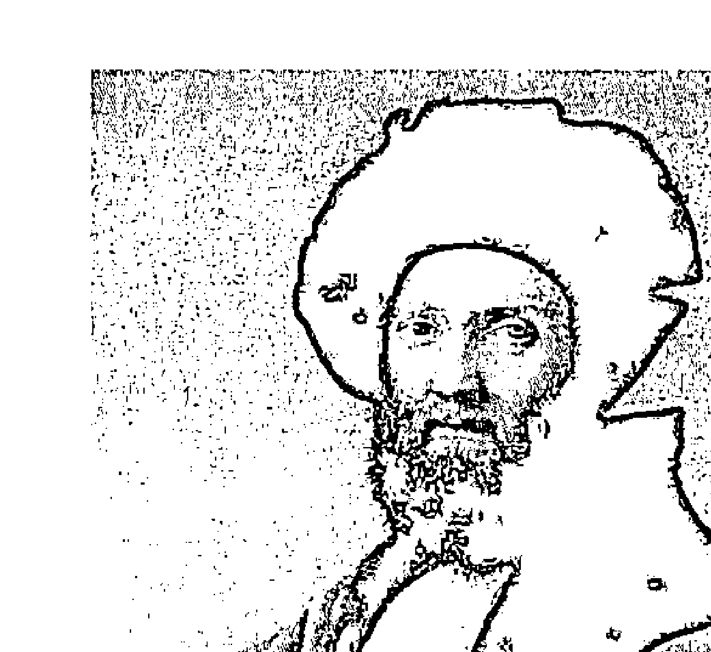

> 额头的作用
额头是人体气的入口，这里的装饰正确与否不仅影响着事业运，还影响感情运。丈夫的额头被头发盖住了，妻子就难以理解丈夫的心理，夫妻之间容易产生矛盾。

## 281 哪个时间段最适宜告白情感？

无论是恋人之间，还是夫妻之间，适时告白，让对方明晓自己的感情，有助于稳固恋情。告白情感要注意时间的选择，好的时间点可以起到事半功倍的效果，坏的时间点则会招致煞气。

下午5点到7点之间，是最佳的告白示爱时间。这个时辰，在堪舆上属于“兑”，象征爱情。从心理学的角度考虑，这个时段人的情绪最放松，最容易被情话打动。

晚上11点到凌晨1点，最不利于告白感情。这个时间段在堪舆上属于“坎”，是人体性机能最旺盛之时。若在此时进行告白，很可能发展成以性为主的交往，感情相对减少，对之后感情生活不利。

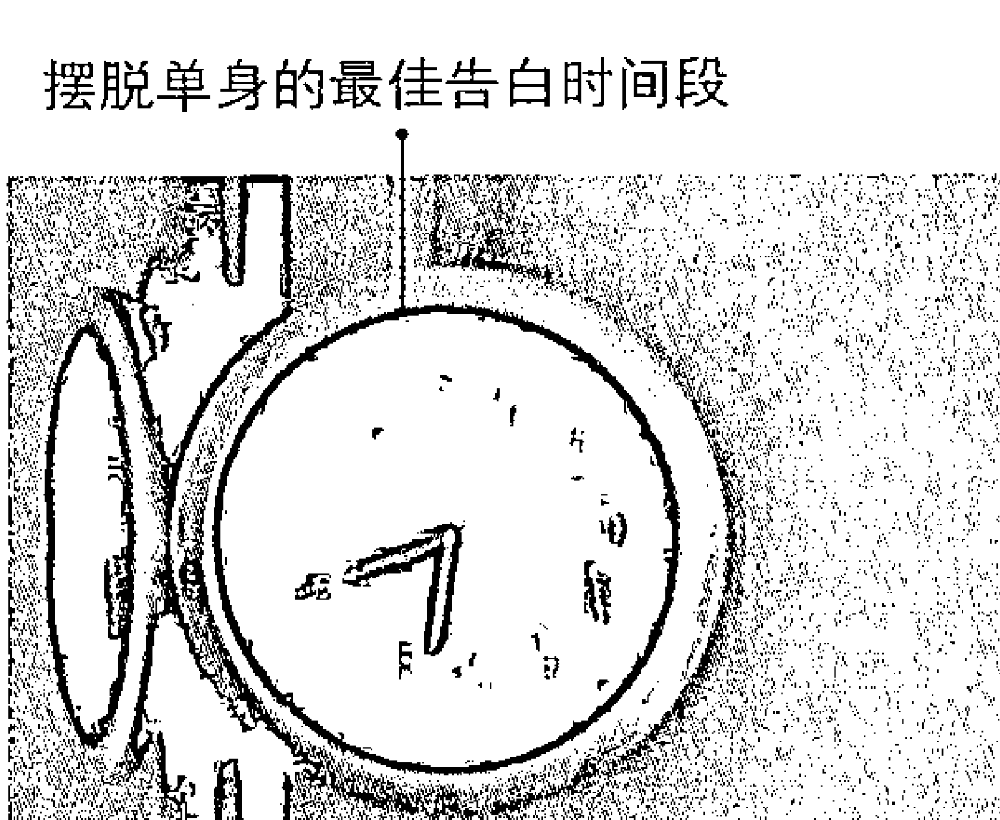

> **最佳告白时间**
下午5点到7点之间，属于“兑”，象征着爱情。这个时间段的人最感性，情绪也最放松，选择在这个时间段告白，最容易成功。

## 282 如何利用物品赶走情敌？

婚姻中若出现第三者，除了努力用情感唤回对方外，也可用物品来挽回配偶的心。这里介绍三种方法。

-   1. 妻子可以用桃红色饰品装扮自己，从而挽回丈夫的心。桃红色最能提升女性的魅力，穿上桃红色的衣服，擦桃红色的口红，使用桃红色饰品，会让丈夫眼前顿时一亮，及时回想起两人热恋时的情景，从而促使双方重归于好。
-   2. 妻子或丈夫都可以利用水晶的能量来维系家庭。在卧室，把一些水晶放在床头枕边和床尾，能够加强周边气场的流动，驱除不正之气，破解烂桃花，从而使夫妻重新和好。
-   3. 可以使用成双成对的情侣专用吉祥物来赶走情敌，如可以佩戴砗磲龙凤配等。妻子和丈夫分别佩戴一只，可以让感情更加牢固。

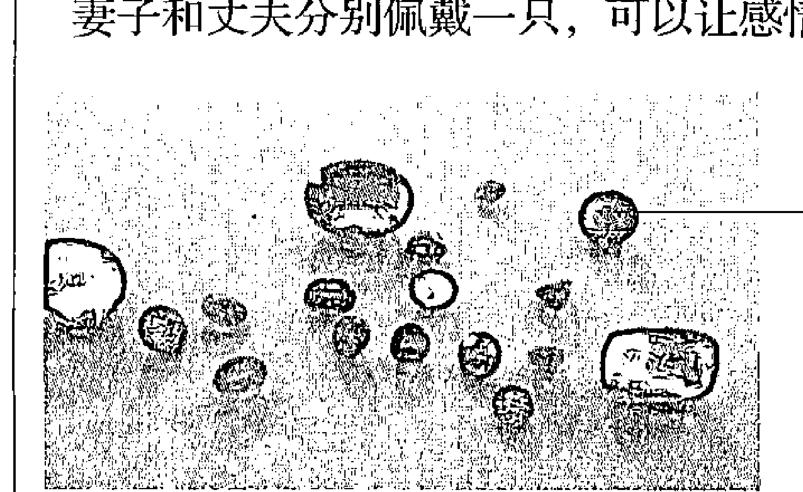

> **利用水晶赶走情敌**
妻子或丈夫都可利用水晶的能量来维系家庭。把一些水晶放在卧室床头枕边和床尾。水晶能够加强周边的气场流动，驱除不正之气。

## 283 如何利用食物摆脱失恋阴影？

人在失恋的时候，可以找朋友倾诉，可以观看喜剧影视，可以旅游，这些方法都可以缓解失恋带来的悲伤心情。当然，我们也可以通过食物来摆脱失恋的阴影。

粉红色有着巨大的爱情能量，能带来非常旺的运势，帮助你改善人际关系，大大增强异性缘。因此，在食物方面要多吃粉红色的食物，如：玫瑰茶、红豆刨冰、西红柿、石榴、火龙果、红苹果。

不过，失恋之后身心痛苦，单纯依靠食物是难以走出失恋阴影的。时间是疗伤的最佳法宝，最好过一段时间便寻找一段新的感情来冲淡感伤的情绪。

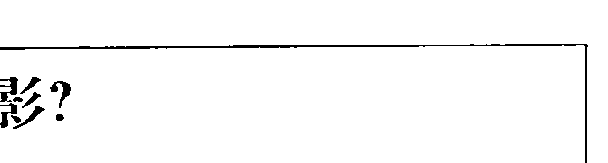

> ### 🍅 西红柿
西红柿营养丰富，有健胃消食的功效，富含胡萝卜素和维生素C。经常吃西红柿会皮肤红润、净白。另外，堪舆上认为吃西红柿可以帮助失恋之人走出阴影。

## 284 夫妻卧室的门帘有何作用？

夫妻卧室是维系夫妻感情的重要场所，这里所蕴藏的能量会对夫妻关系产生重要影响。如果在卧房的门口悬挂一个门帘，可以起到促进夫妻感情的作用。

门帘有遮挡外邪的作用。在新房主卧室的房门口悬挂用圆珠串起来的门帘，一方面可以遮挡桃花劫，另一方面可以激活卧室的气场能量，促使夫妻双方更加融洽和美，避免感情出轨。

在悬挂门帘的卧室里，如果能在双人床的上方加装一盏小巧的暖色灯，可以增强温馨的气氛，让双方沉浸在爱意之中。

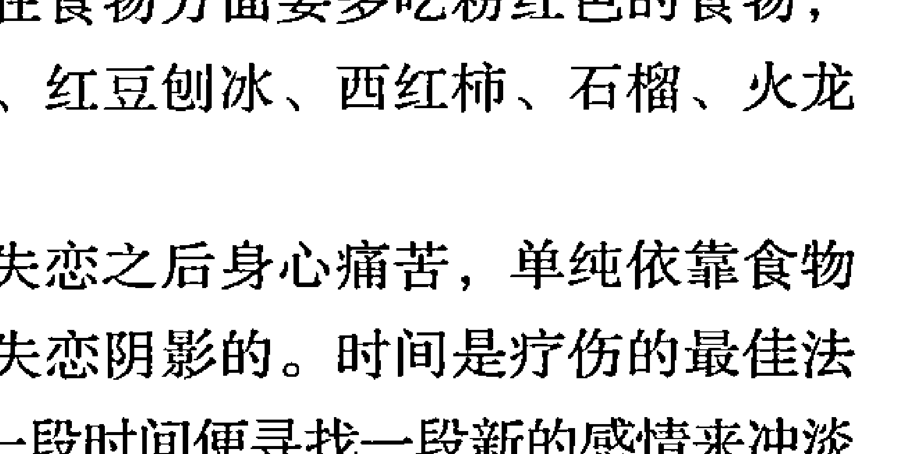

> ### 🚪 卧室的门帘
卧室门口的门帘可以遮挡桃花劫，还可以促进夫妻关系。白色的门帘要经常清洗，否则会影响美观。

## 285 孕妇要注意哪些家居布局？

无可置疑，居住环境对孕妇和胎儿有很大的影响。气场稳定的居住环境，一方面可以确保孕妇和胎儿的健康，另一方面还可以促进胎儿吸取能量。以下两点是需要注意的。

- 1. 孕妇居住的房间要保证空气流通。尤其是在炎炎夏日，孕妇不要长期待在封闭的空调房间中。房间要经常开窗换气，这样可以促进气场流通，有助于母子平安。
- 2. 孕妇的房间还要保证有足够的阳光或适度的光线，不宜过于阴暗，这样才有助于母子积聚阳气和正面能量，驱除阴气和负面能量。

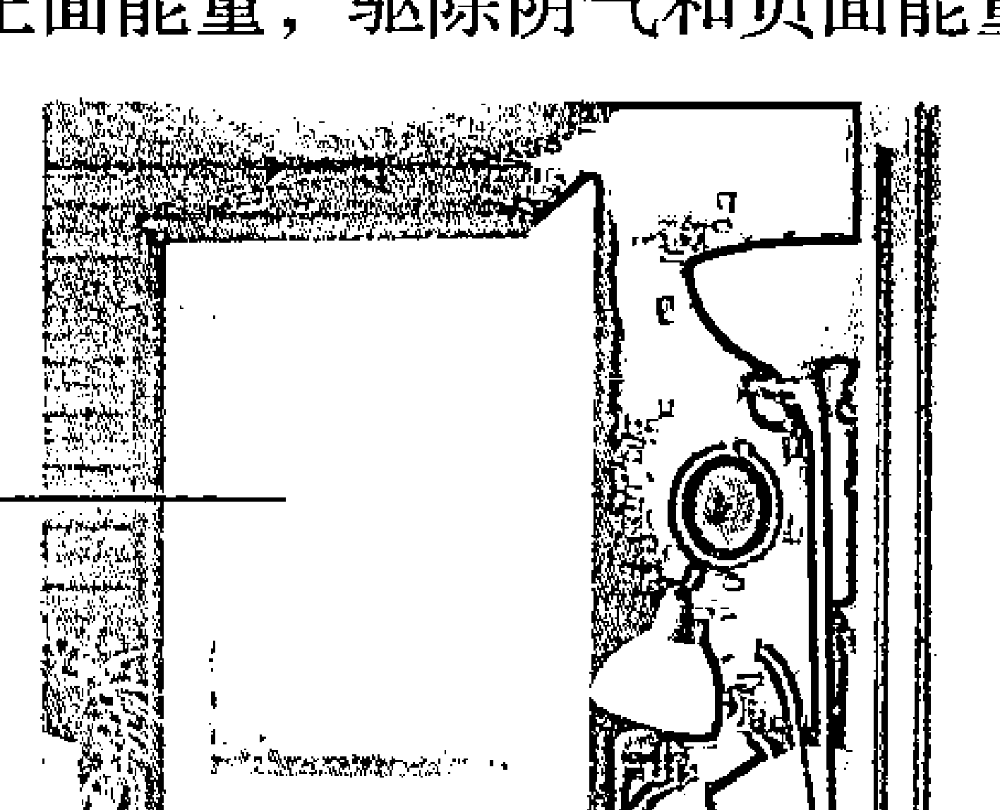

阳光有消除病菌的作用，所以孕妇要选择明亮通透的房间。

> > **孕妇家居**
>
> 孕妇的房间要经常通风换气，保持空气流通。但是也要注意适度，防止感冒。孕妇房间的地面需干净，无障碍物，这样才有利于母子平安。

## 286 孕妇该如何注意家居布局？

孕妇与一般人不同，一方面她的体质已经发生改变，容易生病；另一方面，孕妇的健康不仅仅是一个人的事，还涉及到下一代。因此孕妇更要注意家居布局，避免影响胎儿健康。在布置家居的时候，可以从以下两方面考虑。

生机勃勃的绿色植物可以改善局部环境。

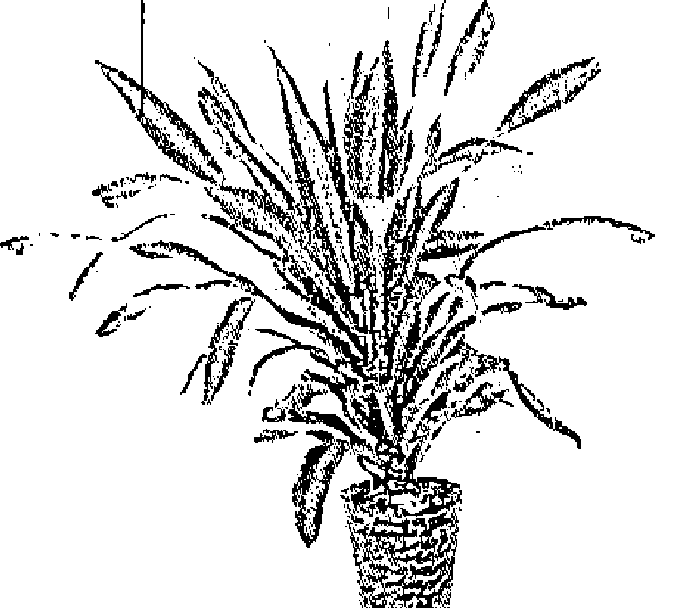

- 1. 可以在客厅的西南方放置一些水生植物，或者摆放流动的水盆，从而激活气场能量；在客厅的东方，适宜摆放绿色植物或者绿色摆设，催旺生机，增强孕妇和胎儿的健康。
- 2. 对于孕妇来说，气场的稳定是最重要的。因此，在怀孕期间，尽量不要对家居布局进行大规模改造，也不要轻易移动家具，更不要轻易搬家。因为新的环境磁场和能量与原先不同，胎儿可能一下子难以适应，会对胎儿的成长造成影响。

> > **孕妇家居植物**
>
> 在家中客厅的东方摆放绿色植物有利于孕妇和胎儿的健康。

## 287 孕妇房间的摆设有何讲究？

在家居布局中，孕妇的房间摆设要注意以下事项。

- 1. 孕妇的床底不可放置杂乱物品，尤其是金属利器或工具箱等物品。这些物品会干扰人体磁场，对人的身体健康不利。平常应及时清理孕妇的床底，确保床底干净、整洁。
- 2. 孕妇居住的室内，不宜有凶恶的形象出现，如老虎、狮子等图案，或古剑、古怪头像等饰品。室内最好配备简单、明快的图画，图画内容以美丽的山水或可爱的人物为主，能让人精神愉悦为宜。
- 3. 住宅中的花草或鱼缸不宜过多。花草和鱼缸长期与水打交道，湿气和阴气过重，一方面会影响孕妇身体健康，另一方面还容易产生坏的气场，影响胎儿发育。

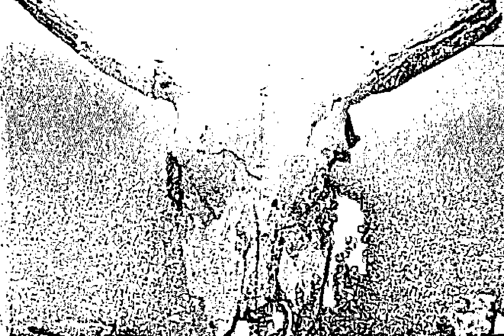

> 恐怖饰物
孕妇的房间不宜摆放恐怖的饰物，孕妇长期看着恐怖饰品，会精神紧张，不利于胎儿成长。

## 288 哪些卧室布局不利于受孕？

卧室的环境对怀孕有影响的情况有以下几种。

- 1. 卧室的楼下有神位或车库；卧室的楼上有厕所；卧室有两扇对外的门。这三种布局均会对人产生较坏的磁场，不利于受孕。
- 2. 卧室里不宜摆放鱼缸等水器，以免湿气和阴气过多，造成室内阴阳不调，难以受孕。另外，卧室不宜摆放过多的镜子，镜子会赶走受孕之气，导致男方精气受损。
- 3. 床头或床底不宜摆放金属器具或者是电器用品，如工具、电话、电视、电脑。这些物品的电磁场会严重干扰人体气场，进而影响受孕。

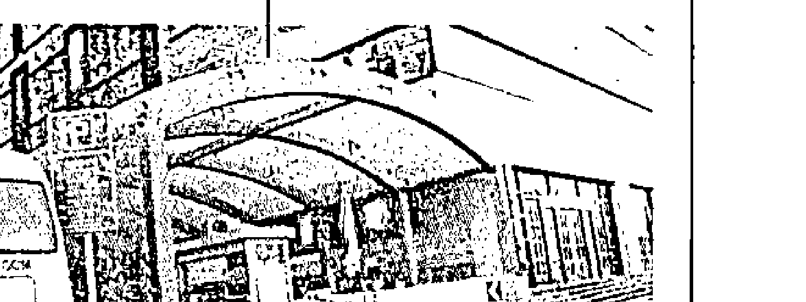

> 卧室下有车库不易受孕
不孕是一种非常复杂的疾病。如果看过很多医生都没法受孕，这就要考虑是不是夫妻卧室的布局影响了受孕。如果卧室楼下有车库会影响受孕。

## 289 厨房摆设如何影响夫妻关系？

大家都知道，卧室的物品摆放会影响夫妻感情。其实，厨房里的物品摆放也会影响夫妻关系。厨房除了要保持整洁以外，有些细节也必须注意。

- 第一，菜刀和菜板应分开放。切完菜洗刷干净后，应将菜刀和菜板分开放置。
- 第二，炒锅和锅铲应分开放。炒菜时，炒锅和锅铲已经够吵闹了，用完清洁后应分开放。如果用过之后还放在一起，不吉利。
- 第三，臼和棒应分开放。用臼和棒捣蒜或辣椒时有不小的声响，用完清洗干净后应分开放。

总之，配套使用的器皿最好都分开放。不然容易引起夫妻吵架，影响家运。

另外，厨房属阴，代表女方，一切不利于阴阳调和的事都不宜做。在布置新房的时候，最好看看厨房的位置，避免女主人受到伤害。

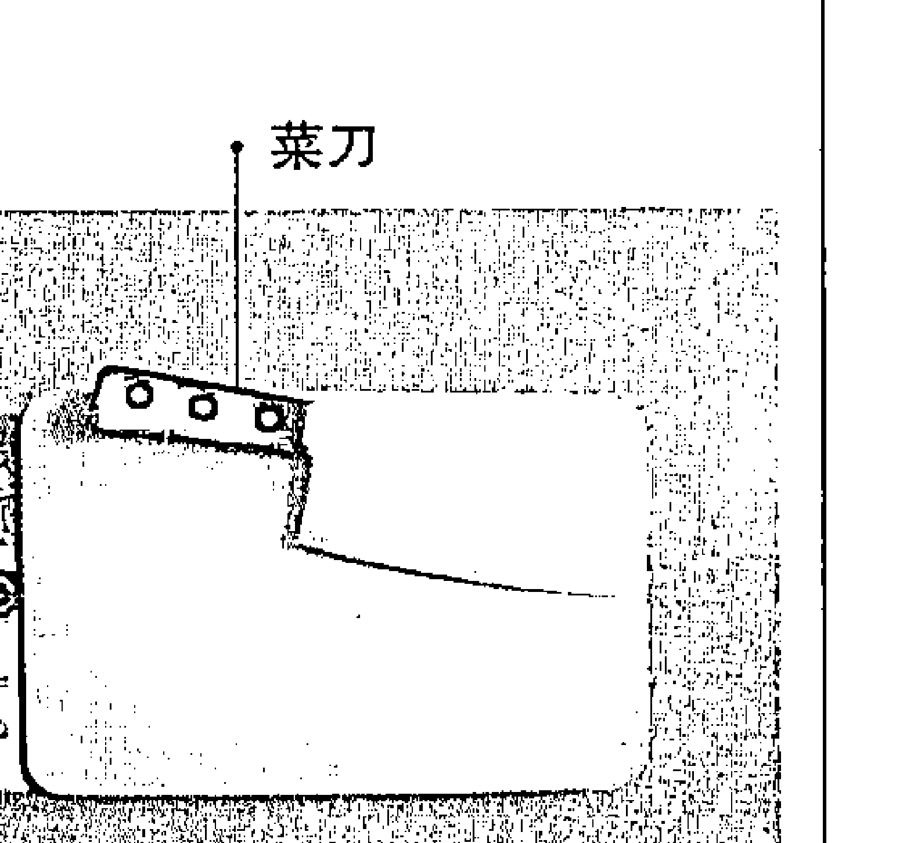

> 厨房里像菜刀和菜板之类配套使用的器皿，用完后最好分开放置，以免影响夫妻感情的和谐。

## 290 婚纱照摆在客厅哪里最合适？

婚纱照是甜美爱情的象征，美满的家庭不能缺少它们的位置。通常，新婚家庭会把婚纱照摆放在客厅，希望大家能感受到他们的甜蜜生活。

客厅的西北方代表男方，西南方代表女方，因此，把婚纱照摆放在这两个方位均可。也可在这两个方位摆放夫妻两人的甜蜜生活照，或者其他吉祥饰品，这样都有助于夫妻关系的和谐。但是，不宜在这两个方位摆放其他人的照片或图画，否则容易出现男星或女星，影响家庭和谐。

此外，还可以将婚纱照摆放在卧室内，这样可以增添夫妻卧室的气场和能量，增进夫妻感情，促进家庭和谐。

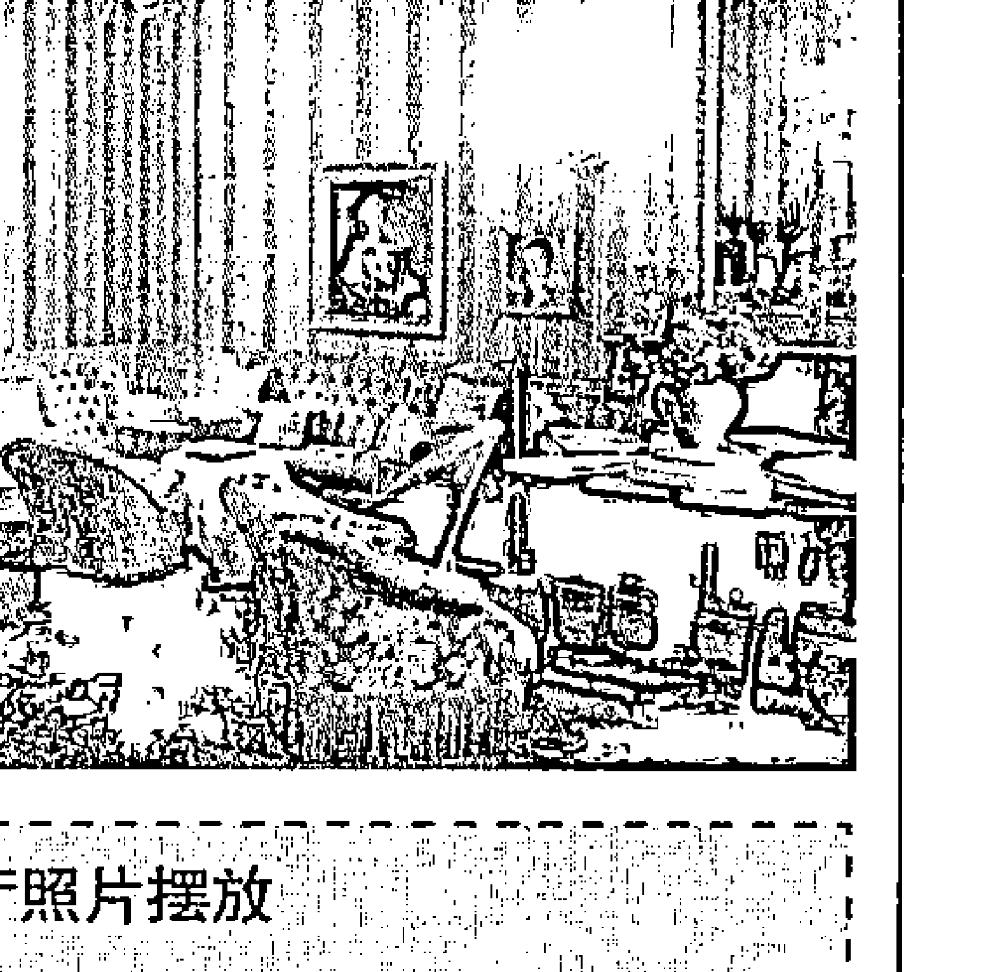

> 在客厅的西南方不要摆放妻子以外的其他女性的照片，否则容易导致第三者插足。

## 291 洞房床位摆设对新人有何影响？

床是维系夫妻关系的重要法器，其中蕴含的能量会对夫妻关系产生非同小可的影响。因此，新婚夫妇在布置洞房的时候，一定要注意床位的摆放。

- 1. 洞房的床位，不可紧靠或逼迫白虎方，即房间的右手边。白虎方属凶位，会对女主人不利，使得丈夫桃花增多，进而引起夫妻失和。
- 2. 床位不宜靠近落地窗，阳光或寒气太强，阴阳失调，容易招致外邪入侵。
- 3. 床头上方，不宜悬挂大幅新婚照片，它会使人产生压迫感，夫妻易发生争执。
- 4. 新婚房间光线要明亮、柔和。空气要流通，以免新家具的油漆味影响健康。

床位以紧靠青龙方墙壁或近墙为最佳。

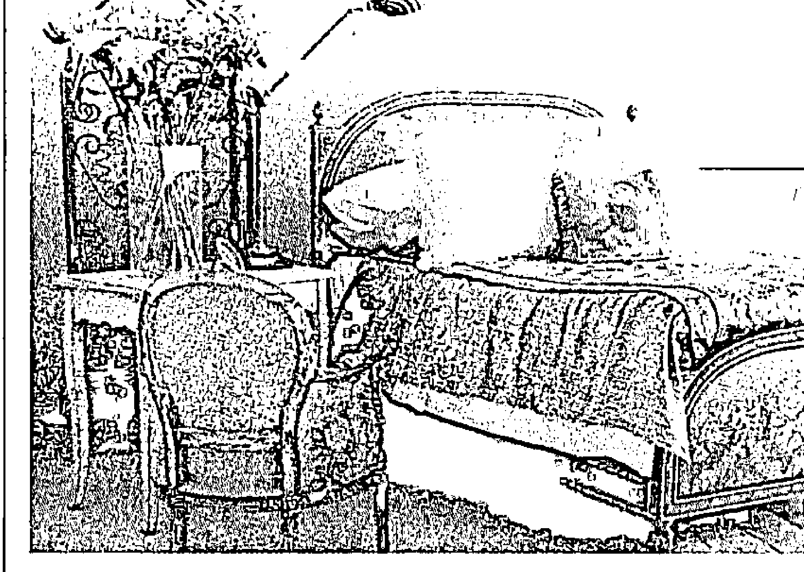

> 新婚房间
新婚房间的床头上方，不宜悬挂大幅新婚照片。新婚房间光线要明亮、柔和。这样不易让人产生烦闷之心。

## 292 夫妇卧室摆放有哪些讲究？

卧室摆放的好坏直接关系着夫妻感情的好坏，因此要注意以下禁忌。

- 1. 卧室内若有镜子，注意镜子不能正对着床或门。因为镜子象征着幻象，对夫妻的健康和精神都不利，有时候甚至会出现烂桃花，影响家庭和谐。镜子对着房门，会让男主人不安分，总想往外跑。若无法移动镜子，可用布帘遮盖。
- 2. 不能摆放干燥的花。干花由枯死的鲜花制成，其中的死气渐渐沉淀，会影响室内气场的活跃，给夫妻的感情带来不利影响。
- 3. 卧室里最好不要另设更衣间。更衣间如同室中之室，有第三者介入之嫌。
- 4. 切忌同床异被。一些夫妻为了不影响对方睡眠，各自盖一个被子，夫妻难以享受肌肤之亲带来的气场互换，容易产生隔阂。
- 5. 不宜有生人进入卧室。夫妻卧室是隐私之所，外人进入，可能改变室内和谐之气。

## 293 如何利用住宅布局防止男人花心？

花心是大多数男人的天性，避免男主人花心，需要女主人努力营造一个温馨、舒适的环境。另外，还要有好的住宅布局。若想用住宅布局防止男人花心，妻子要注意做到以下几点。

- 1. 房间要通风向阳，不宜阴暗或有过多黑色家具，否则它们释放出的阴暗能量，会挤走正面能量，削弱爱情运势。
- 2. 厕所要打扫干净，不宜有潮气和秽气。厕所的潮气和秽气不利于家庭和谐。妻子可通过摆放鲜花加以改善。
- 3. 多让丈夫吃炖煮食物，增强土气，获取安定的能量，有助于防止他的心往外跑。

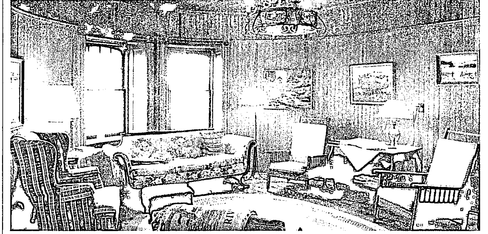

> ### 客厅布局加强夫妻情分
客厅的坐椅不宜冷硬，若无舒适沙发，可加软坐垫，这样才能给丈夫以温暖舒适之感，使他不再想往外跑。

## 294 哪些生活环境造就女子旺夫运？

有旺夫运的女子，通常是从相对落后的地方来到城市长期居住。她们往往具有如下特征：工作环境和性质往往比较稳定，如公务员等；住宅的交通便利，环境优美；母亲精明能干，有领导力；有良好的心态和自身素质，不爱慕虚荣，有良好的生活习惯和耐心。

总之，一个女人能嫁贵夫或者能够旺夫，这里面有先天八字的因素，也有后天的因素，而后天的因素与生活环境息息相关。

## 295 新婚夫妇适合摆放哪些装饰画？

新婚的夫妇，由于刚进入二人世界，需要更多的磨合和包容。因此，家居饰品的摆放要以和谐两人关系为着重点，可以从以下几方面考虑。

- 1. 装饰画在颜色上以和谐、温润为主色调，但注意不要选择单色调，如纯红色、黄色、橘色，最好几种色调混合搭配。同时注意笔触饱满，主题简明。
- 2. 在风格上，以自然风格为主，有寓意的铅笔素描也可以。这种淡雅的风格有助于舒缓人的情绪，有镇静安神之效，避免夫妻发生争执。
- 3. 若主人不喜欢淡雅之风，可选择花朵图案的挂画，这样可为家里增添活力，象征着夫妻关系如鲜花般新鲜、浪漫。

注意：无论哪种画作，都要避免尖角过多，线条强硬，否则夫妻一方容易钻牛角尖，夫妻双方容易发生争执。

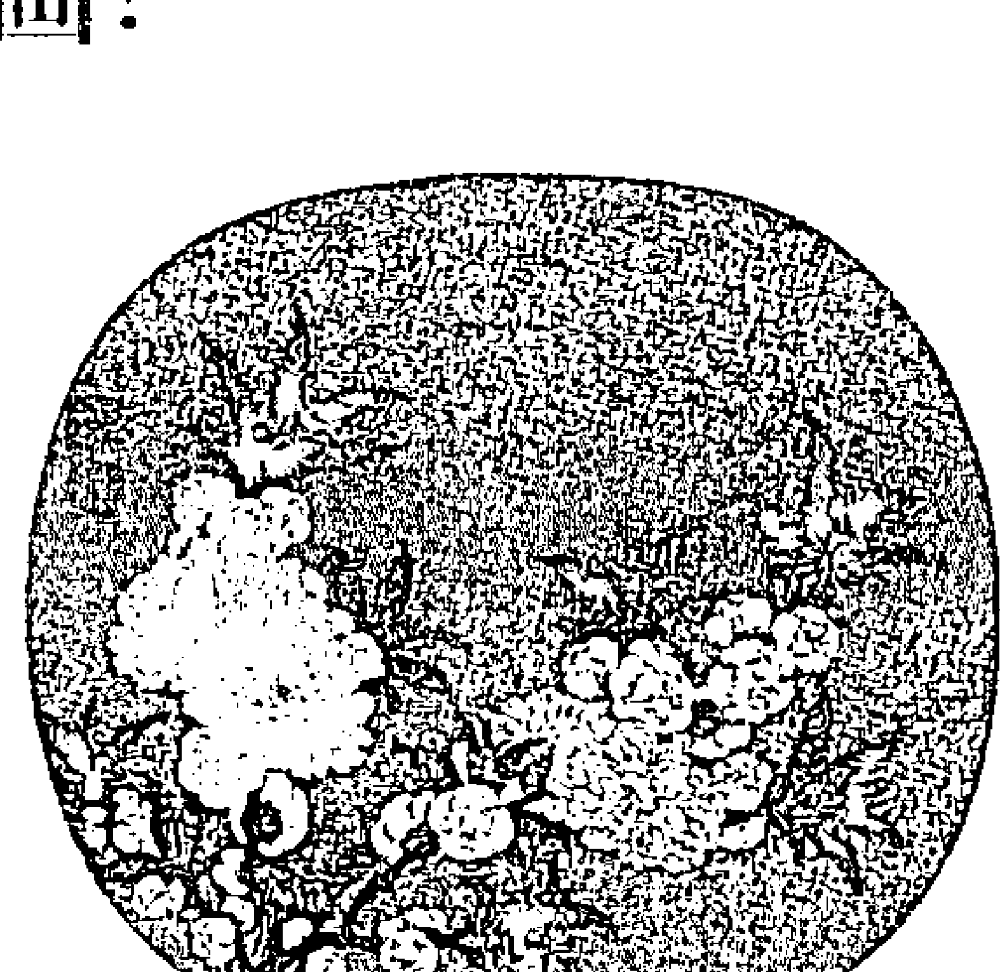

> > 牡丹
> 如果主人不喜欢淡雅的风格，可以选择花朵图案的挂画，比如牡丹。鲜花挂画可以为家里增添活力，象征着夫妻关系如鲜花般新鲜、浪漫。

## 296 如何布置客厅可以让婚姻长久？

天长地久的爱情是每对步入婚姻殿堂的夫妻所渴望的。但俗话说：夫妻难经平淡。时间久了，柴米油盐的平淡生活会让一对夫妻渐生倦怠，影响家庭和谐。怎样才能培养长长久久的婚姻生活呢？这里有两种方法可以借鉴。

- 1. 由于家里的北方管夫妻的婚姻和情感，因此人们可以用热情洋溢的色彩来布置北方，在此方多摆放暖色调的家具和物品。
- 2. 客厅的西南方也属于吉位，可以增进夫妻的关系。西南方属土，性质稳定，可在此处置吊灯式的台灯，或者摆放天然水晶和全家福照片。

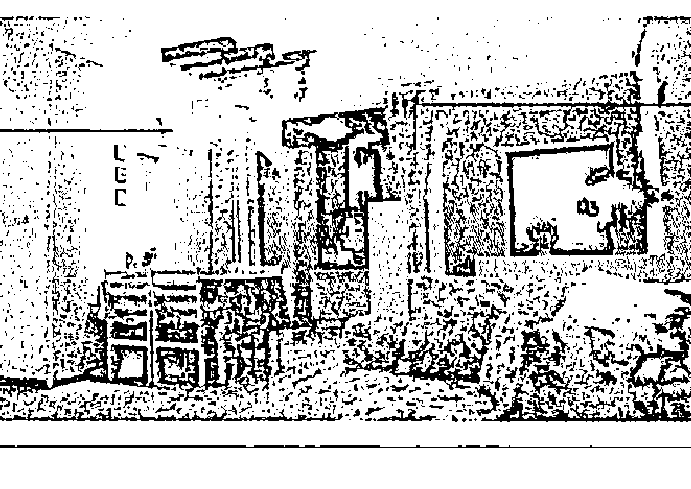

## 297 怎样布置卧室有利于保胎生子？

家里有孕妇，要时刻注意她的健康和安全。为了确保胎儿的稳定，可以参考以下的摆设方式。

首先，卧室要有门槛。门槛有阻拦的作用，意味着将胎儿拦阻在内，在母体里平安，可以起到留住胎气的作用。

其次，牢固的床铺有利于稳定胎气，因此夫妻卧室中尽量使用传统木床。人们要在床上待三分之一以上的时间，床铺的气场和能量会对人体产生巨大影响。孕妇若想保胎，首先要选择一个牢固的床位。

第三，卧室的阳光要充足，卧室有充足的阳光才能保证阴阳调和，母子平安。

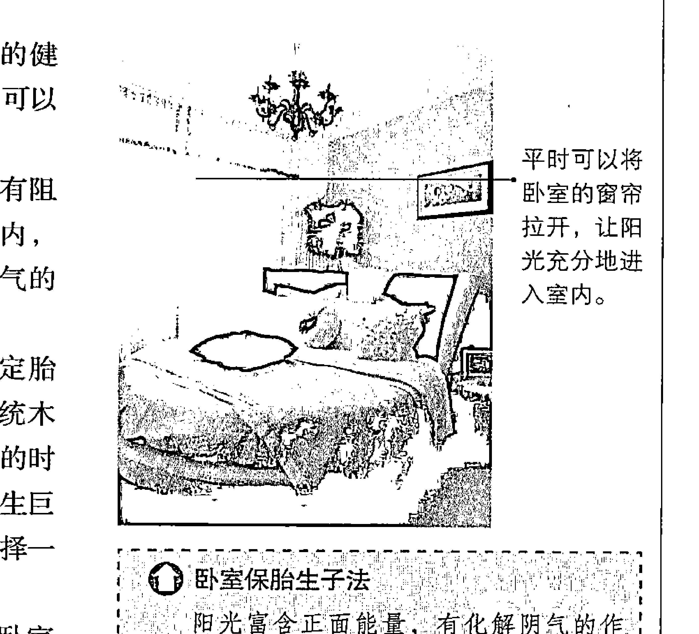

> 卧室保胎生子法
阳光富含正面能量，有化解阴气的作用。因此，孕妇除了适当晒太阳之外，她所在的卧室最好向阳。确保即使阴气很盛的晚上也有阳气的能量在起作用。

## 298 怎样利用居家摆设求得贵子？

有的人有“重男轻女”的思想，或已经有了女儿，想再添一位男丁。但现今科学还无法掌握人生男还是生女，这里有些参考方法可以试一试。

石榴多“子”，桂树有“贵”，连蕉象征多子多孙。可以在院子中或阳台上种植象征多子多孙的石榴、桂树、连蕉等树木，以祈祷获得贵子。

此外，可以在客厅或卧室中悬挂“得子图”来求得贵子。比如，可以在客厅里悬挂百子图、麒麟送子图，或者悬挂可爱孩童的图画。

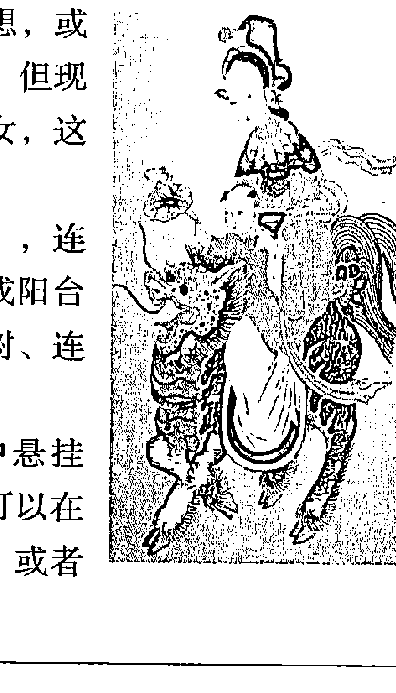

> 麒麟送子
麒麟送子是我国古代祈子法的一种。在传说中，麒麟是仁兽，象征吉祥，能为人们带来子嗣。《麒麟送子》图多出现在民间艺术作品之中，如刺绣、陶瓷器、年画、漆器等。

## 299 哪些摆设容易让夫妻吵架？

夫妻之间难免会发生争吵，但一对夫妻若常常争吵，除了性格方面的原因，还有可能是家中摆设不当导致了犯小人。

夫妻之间若想避免摆设不当引起的争吵，最好避免下面的摆放方式。

- 1. 狮子、老虎饰品摆放错误。家中若有狮子饰品，应注意使狮头向外，切记不要向内，向内则主争吵，有“河东狮吼”之意。
- 2. 家中不宜有面具或露牙的玩具饰品。家中若有玩具饰品，不要让它露出牙齿，否则表示口舌是非不断，夫妻会经常因为小事而争吵不断。

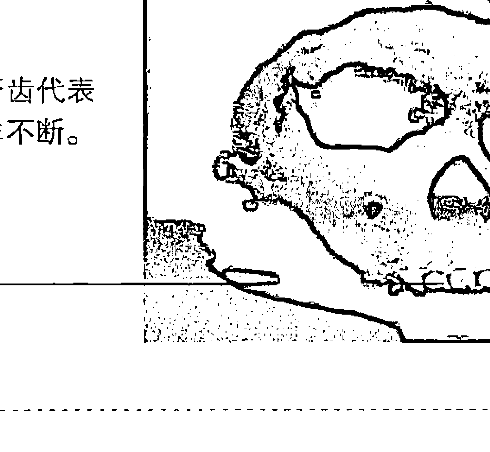

> 古怪面具
面具是虚假和伪装的象征，家中不宜摆放面具饰品。面具饰品若摆放在显眼的位置，夫妻难以坦诚相对，自然关系不和。

## 300 如何让婚姻保持新鲜度？

随着时间的推移，当初的激情不再，爱情的新鲜感不断减弱，如何保持婚姻的新鲜度呢？

- 1. 经常清除住宅中的尖角带来的不利影响。屋内的尖角和锐利之物，如刀具、尖形饰品和尖叶植物等，易引发夫妻间的争吵。夫妻争吵会导致感情变淡。

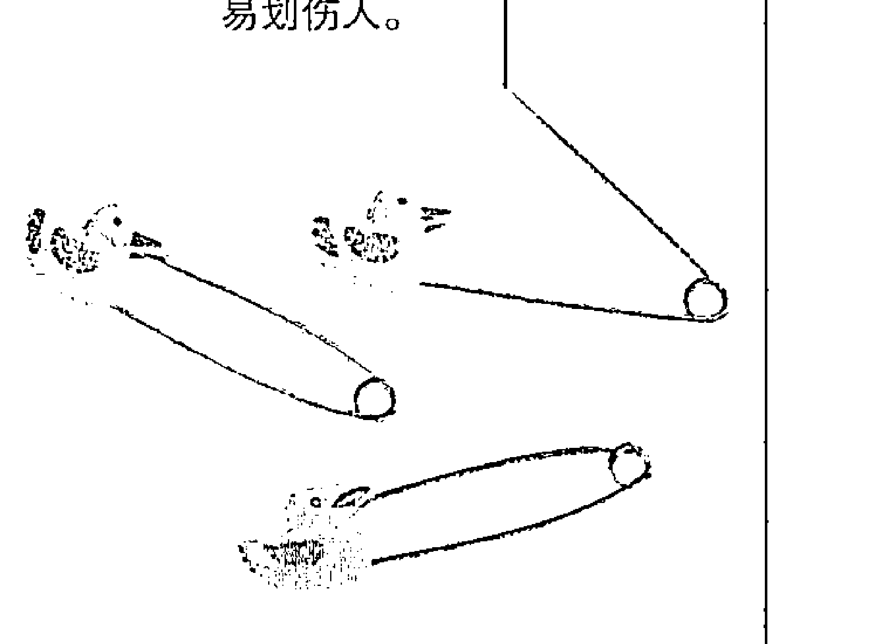

- 2. 常吃红色食物，唤起双方的热情。红色代表激情和活力，红色的食物如番茄、辣椒、樱桃、杨梅、红酒等，可以营造浪漫气氛。
- 3. 佩戴能量水晶，增强爱情能量。玫瑰水晶是爱情的象征；绿玛瑙可以增添个人魅力和光彩；虎晶石可激发勇气，带来信心；芙蓉晶有助于夫妻双方的沟通。

> 尖锐物品常收纳
小小别针的尖角，同样会影响夫妻感情。不用的时候，不要让尖角外露。

## 301 住宅的桃花位有何功用？

桃花位，顾名思义为招桃花的方位。根据不同的理论，确定桃花位的方法各有不同。但无论哪一种，只要布置正确，都能够发挥人催旺桃花的力量。

一个单身人士，如果他（她）家中的玄关处就是桃花位，在此处摆放水晶饰品、盛满清水的花瓶，就可起到催旺桃花的作用，及早结束单身生活。当一个人年纪已大，桃花不至时，可利用相应方法催动爱情运势。一对结婚多年的夫妻，针对自己的配偶，适当地催旺他（她）的桃花，可以促使双方找到热恋时的感觉，确保爱情新鲜。不过一般夫妻不要轻易催旺自己的桃花运，否则只会催生烂桃花，导致第三者插足，婚姻破裂。


总体来说，桃花位有利也有弊，对单身人士发挥着积极作用。

在玄关处放置一对水晶交颈天鹅，有利于催旺单身人士的桃花运。

在桃花位放置桃花，可以带来桃花运，不要用浊水，浊水会带来烂桃花。

已婚人士不要轻易在卧室摆放桃花，否则容易引来第三者。

## 302 如何通过家居布局守住丈夫的心？

有的男人，婚后容易被外面的花花世界吸引，不再关注妻子，进而生外心，可能引起女星出现，第三者插足，这对女主人不利。妻子需要掌握一些获取丈夫的爱的方法。

- 1. 分别在双方的枕头下放置对方穿过的衣物，这样可以让双方的气场渐渐同步，时刻让对方明白自己的心意，避免长久的平淡生活疏离了夫妻感情，从而加强夫妻的恩爱程度。
- 2. 夫妻休息时，男主人通常会睡在靠窗或靠外的一侧；但靠窗容易招来烂桃花，引“小三”入室，应尽量避免。
- 3. 可以在客厅摆放一对石狮子，狮子之威可以用来镇守家庭气场，从而安定夫妻感情。

### 越轨丈夫性急的居家布局
| 道具 | 具体方法 |
| :--- | :--- |
| 旧衣物 | 在双方的枕头下放置对方的旧衣物，使双方气场同步。 |
| 丈夫的睡向 | 避免让丈夫睡在窗边的一侧，睡在这个方位容易惹到烂桃花。 |
| 石狮子 | 在客厅摆放石狮子可镇守家庭气场。 |

## 303 卧室缺角会影响夫妻感情吗？

影响夫妻感情的因素有很多，卧室缺角就是其中一个。卧室是一对夫妻实体的见证，是维系夫妻关系的重要场所。卧室缺角差不多相当于夫妻之间原本融洽的感情，现在多了一个漏洞，使双方产生隔阂，容易引起夫妻感情变化。因此不可忽视卧室中缺角的遗憾。

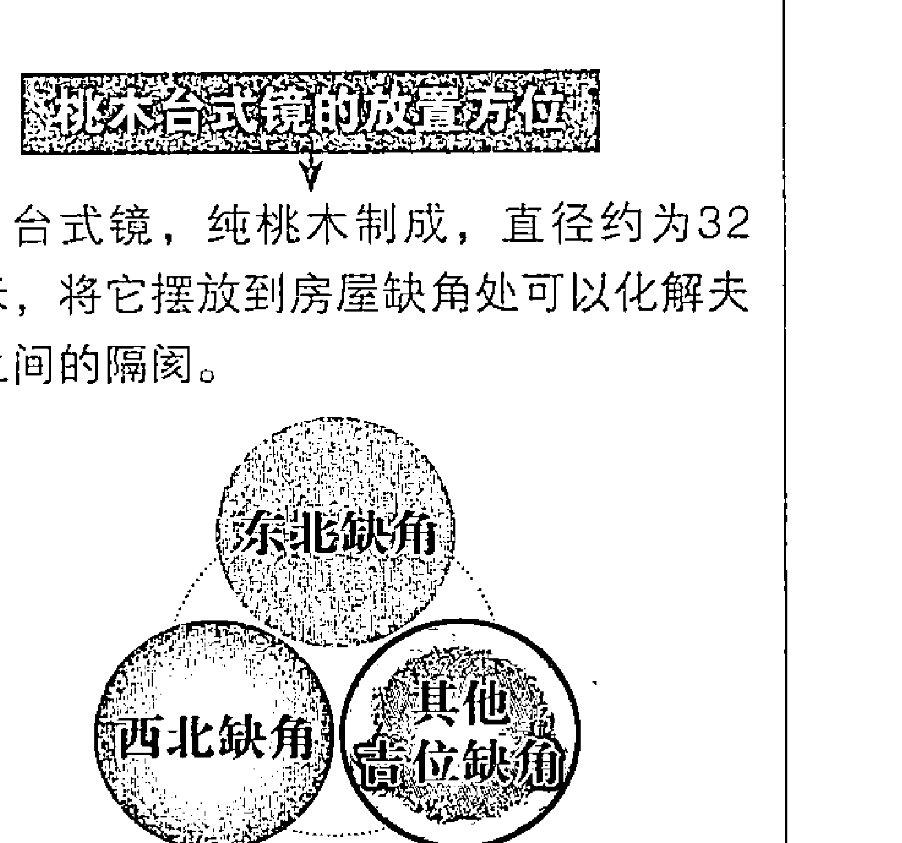

卧室缺角可以用台式镜来化解。这种台式镜是专门用来化解缺角的器物，用纯桃木制成，直径约为32厘米。直接将它摆放到缺角的位置即可。

## 304 如何利用龙凤镜增强夫妻感情？

龙凤镜是一种吉祥器物，主要用来增强夫妻之间的感情，防止情感危机和婚外情的出现。龙凤镜直径约为30厘米，边框用纯桃木制成。

在使用龙凤镜的时候，要将它放在房间的吉位。可以将龙凤镜放于夫妻卧室的床头。卧室和床都是维系夫妻感情的重要实体，将龙凤镜放在这里，可以催化维系夫妻关系的实体，加强这里的磁场，增强这里的能量，可以防止小人介入，最大可能地避免烂桃花。

## 305 如何利用平安瓶保全家平安？

平安瓶直径约为28厘米，由纯桃木制成。它是一种吉祥器物，有保全家平安的作用。在使用时应注意以下两点。

- 1. 可以将平安瓶摆放在厨房中。因为女人常跟厨房打交道，因此厨房属阴，属女方。而保佑全家平安的，通常就是一个家庭的女主人。此外，古代人认为，将平安瓶摆放在厨房，可以化解大门正对厨房、厕所正对厨房等，以保证家人身体健康。
- 2. 可以将平安瓶放于次卧室，如家中老人或孩子的卧室。这样可以化解次卧室位于凶位的阴气，改善卧室气场，这样也可以保护全家老小健康、平安。

## 306 家中过道对夫妻感情有何影响？

家居气场非常玄妙，一不小心就会出现不利气场，影响夫妻感情。如果家中过道设置不当，会产生不利气场，疏离夫妻感情。

通常情况下，客厅通向其他房间的过道宽度不宜小于1米。过道过窄，一方面搬运大型家具不方便，另一方面走道过窄，代表主妇气量狭小，夫妻容易产生争执。另外，过道宽敞明亮，有利于气流的畅通，对财运和感情运均有利。

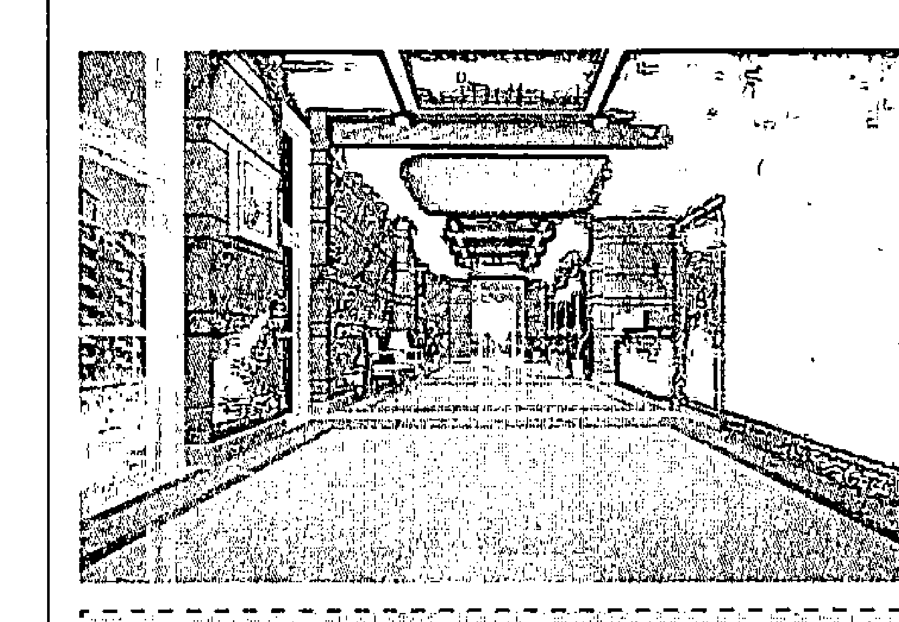

> **家中过道**
住宅内的走廊装修得不合理，过宽或过于狭窄都容易产生不利气场。尤其是大面积的居室，更要注意客厅走廊不要过窄。

### 住宅内的走廊

住宅内的走廊将住宅气场一分为二。

面积大的住宅，有时候客厅走道会将房子一分为二。一个家庭形成两个不同的气场，这种布局是非常不吉利的，有分家、分手的嫌疑。

### 过道多长才不影响家运？

过道长度不宜超过房子的三分之二，使得三分之一的小气场仍然附属于大气场，仍是完整一体的。

### 如何改善过道太长引起的问题？

若客厅过道已经将住宅气场一分为二了，可以通过在过道中间悬挂珠帘来化解煞气。因为珠帘具有遮挡邪气的作用。珠帘若是亲手穿的水晶帘子，效果更佳。

## 307 如何让男人对你温柔有加？

影响家庭和谐的因素，有时候在于一方太过强势，另一方势必就处于弱势。如果家中阳气过剩，就会引起阴阳失调，丈夫对妻子的态度就容易粗暴。妻子若想让丈夫对自己温柔有加，可以参考下边的方法。

- 1. 注意卧室床位的选择。卧室的床位朝向很有讲究，当你躺在床上时，房门若在你的左前角，则代表男人主权，男人在家中就处于主导地位；房门若在右前方，则代表女人主权。
- 2. 注意卧室西北角位置的气场。这个地方在堪舆上叫“老父”，象征着男主人。若此方位有尖角物品，男主人会变得暴躁、凶恶，女主人容易受委屈。

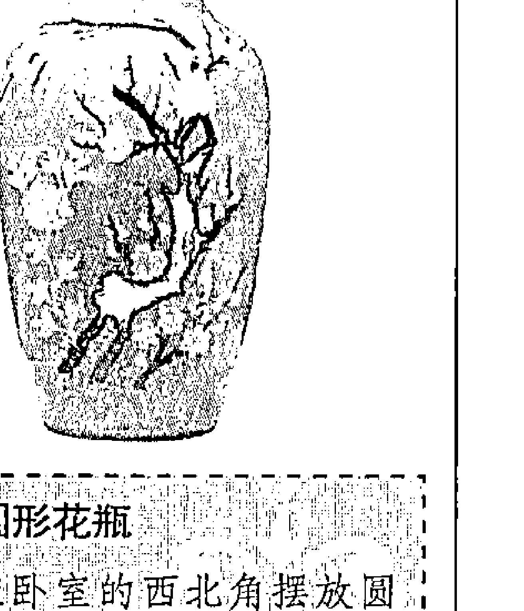

> **圆形花瓶**
在卧室的西北角摆放圆形花瓶，可以让男主人的性格变得温柔、平和。

哪些住宅对生孩子不利？

好住宅会时时散发出对孩子有利的气场。相反，坏的住宅气场对生孩子不利。下面三种住宅就不利于生孩子，准备要孩子的夫妻要注意避免。

- 不可居住在“损丁屋”。所谓“损丁屋”，即坐西向东的住宅。这种住宅，“丁”和“财”都比较弱，不利于受孕。对想要孩子的夫妇来说，这种住宅非常不宜居住。
- 房间窗户不可面对漏胎石。如果家中有孕妇，孕妇的房间窗户外不宜有假山或乱石堆。这种假山或乱石称为“漏胎石”，不利于安胎，对孕妇和孩子均会产生不好的影响。
- 不可居住在潮湿的环境中，如地下室。如果已经住在地下室，就要经常出来晒太阳。

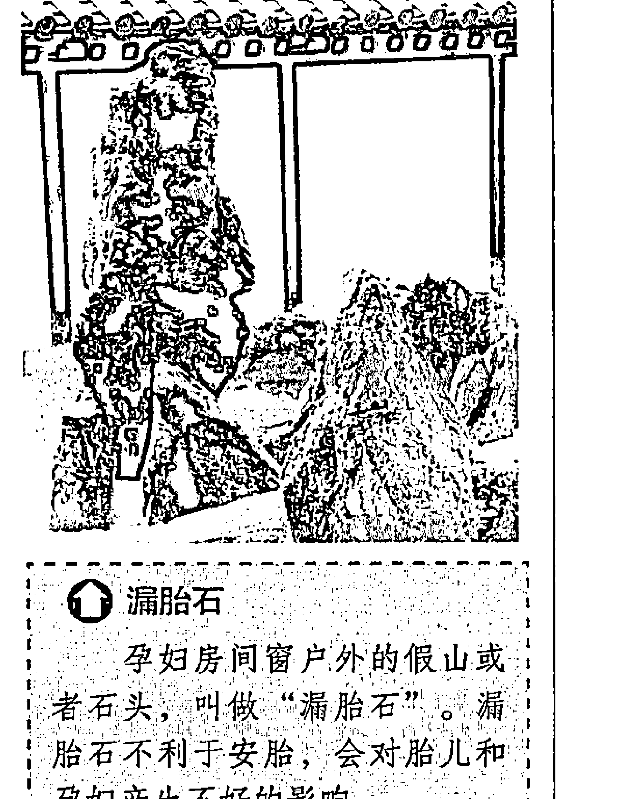

住宅的南北方位与孕妇有何关系？

家有孕妇就要考虑方方面面的影响，住宅位置不当，可能会影响孕妇的身心健康，进而影响胎儿的成长和发育。

孕妇房间的南面，要保持光线充足，这样可使光线的能量输送给胎儿，确保胎儿健康发育。若孕妇房间的光线不足，则可加装米黄色灯具，或悬挂红色的画报或铺设红色地毯。这样能起到催旺喜事的作用，保护胎儿平安生产。需要注意的是，南面忌木，因此不宜摆放盆栽，也不宜种植其他花草树木。

孕妇房间的北面，可以布置绿色物品。可以悬挂绿色窗帘，或使用绿色被罩，也可以摆放绿色盆栽植物。若有冷气或风扇，可以经常开动。这样就能激活磁场能量，起到生旺的纳福作用。

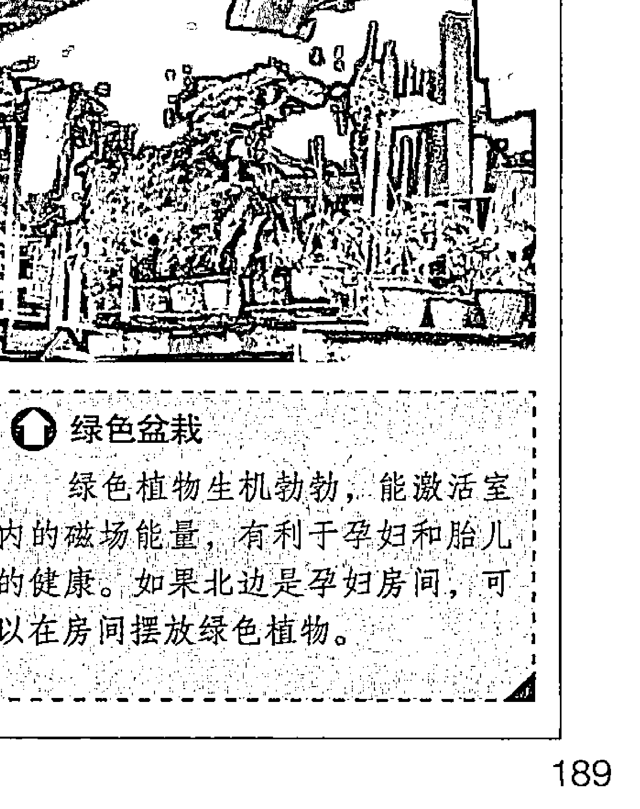

哪些人不宜把卧室设在桃花位？

桃花位一方面起着催化单身人士桃花运的作用，另一方面，若使用得当，桃花位可以促使夫妻感情永保新鲜。因此，有的夫妻根据九星学说查询自己的主星，将住宅的桃花位当做主卧房。但这种方法并不适用于所有人。

对于贪狼、廉贞、太阳、天同这几颗主星的人，不宜把卧室设在桃花位。因为他们本身的桃花运已经很旺盛了，若再催旺桃花，很可能招致男星或女星，引起第三者插足，反而影响夫妻感情。

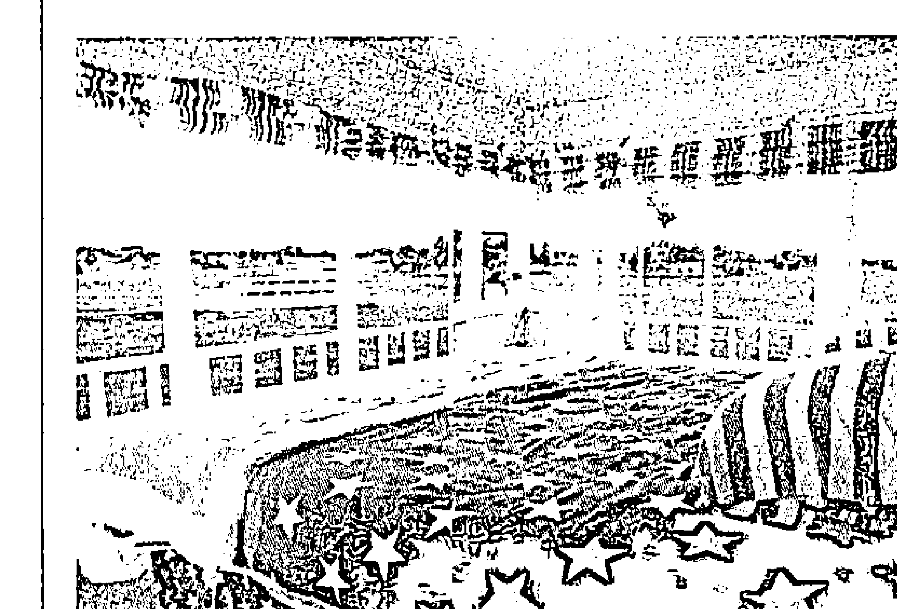

卧室设在桃花位，有利于催旺单身人士的爱情运，也有利于已婚夫妻的爱情保鲜。

> 卧室不宜设在桃花位的人
以贪狼、廉贞、太阳、天同为主星的人，天生桃花运旺盛，如果把卧室设在桃花位，就会过犹不及。

如何避免夫妻同床异梦？

俗话说，夫妻难经平淡。意思是说，一对夫妻结婚多年之后，日常的柴米油盐酱醋茶等琐事会将夫妻之间的激情磨去，夫妻之情会随着时间的流逝而遭到无情的淡化。久而久之，难免出现同床异梦的情况，进而影响家庭的和谐。这里介绍两种化解这种现象的方法。

- 如果夫妻感情淡薄，貌合神离，可以在卧室中种植圆叶盆栽，可以让夫妻双方的性格变得温和；但需避免藤蔓植物，过于鲜艳，过于芬芳的花卉植物。
- 夫妻的床位不可逼“虎”，即不可接近白虎位。“左青龙，右白虎”，所谓的白虎位，即房门的右手边，因此床位要紧靠着左边摆放，不要摆放在右手边。同时注意床的右手边不宜紧靠着墙壁或家具，否则就等于为白虎放了一个可依靠之物。

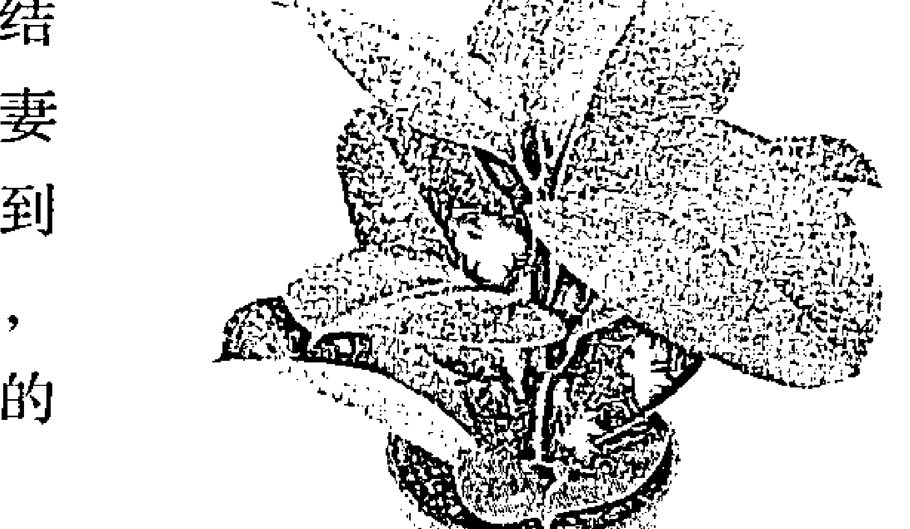

> 圆叶植物促进家庭和谐
圆圆的叶子，没有任何尖角，会使夫妻的性格变得温和。如果夫妻一方脾气不好，可以种植适量的圆叶植物，改善脾气。

床位是怎样影响夫妻关系的？

床是一个私密的场所，夫妻同睡一张床上，个中滋味，只有夫妻双方才能体会，这也是夫妻关系是否和谐的根本。而床所产生的“个中滋味”，则需要靠床的磁场来催化。床的磁场的好坏与床的方位有关系。

确定合适的床位，要查看自己的命盘八字，找出命中“喜神”“用神”以及相应的五行方位，同时查看自己房间的方位。若床位与命中五行的“喜用神”的方位相生相旺，则为吉；若床位所在方位，不是喜用神之位而是忌神之位，则要早日调整。否则不但会出现睡眠不好、神经衰弱等健康问题，还会影响人的精神和性格，进而影响夫妻关系的和谐。

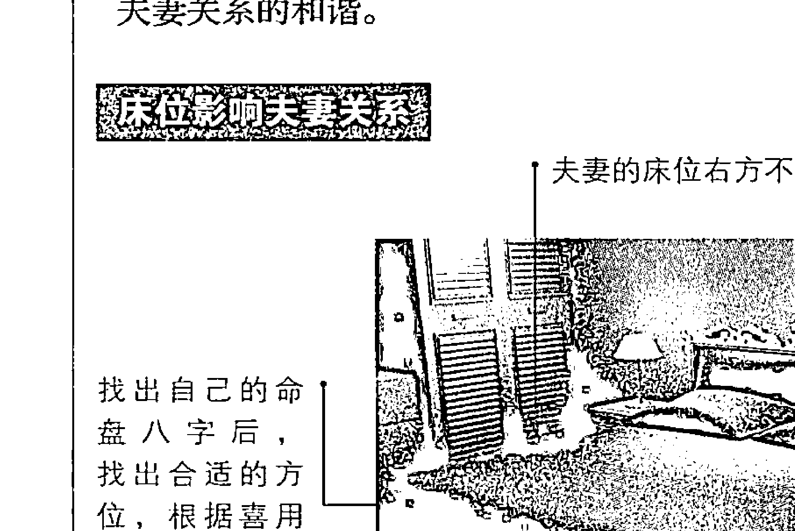

如何化解桃花劫？

桃花劫即烂桃花，不喜欢的人对自己纠缠不休，喜欢的人不喜欢自己，一夜情等。之所以称为“桃花劫”，是因为这些感情均不为人们喜欢，容易对自己或他人造成伤害。所以人们在渴望桃花运的同时，都要注意避免桃花劫。

若桃花位有破局或凶桃花位当旺，已婚之人的婚姻容易遭到破坏，未婚之人则难以找到如意伴侣。只有查明命局的桃花位，调整家居布局，才能化解桃花带来的不利影响。

打开自己的命盘八字，找出“喜神”“用神”及相应的五行方位，看你的桃花位是否成破局或是凶桃花当旺，若桃花位为生旺你命中喜用神之位，则会有好的恋爱、感情；若不是生旺之所而是忌神之位，则须积极调整。

## 第十二章 学业有大成

本章主要讲了学业开运的相关问题。内容涉及如何利用文昌位开运，书房及书桌的摆放宜忌，孩子的房间如何布局有利于文昌运，不同五行的人适合吃什么食物，常见的补脑食物有哪些，哪些食物有助于提高孩子记忆力等。

文昌位对孩子的学业有什么影响？

“文昌”是二十八星宿之一，又称文曲星。文昌星位是指文昌星飞临的那个方位，文昌星掌管天下读书人的功名利禄。若是把书桌放在文昌星的位置能帮助孩子读书学习，在考试时也会有一定的帮助。

一般来说，文昌位有两个方向，一个是本命的文昌位，另一个是住宅内的文昌位。本命的文昌位是因人而异的，住宅内的文昌位，也是随着流年而改变的。

文昌星是主管文的，可以将书屋设置在这个位置。在这个位置上读书、学习能够思想集中，思维顺畅，学习能取得很好的效果，考试的运气也会变好。

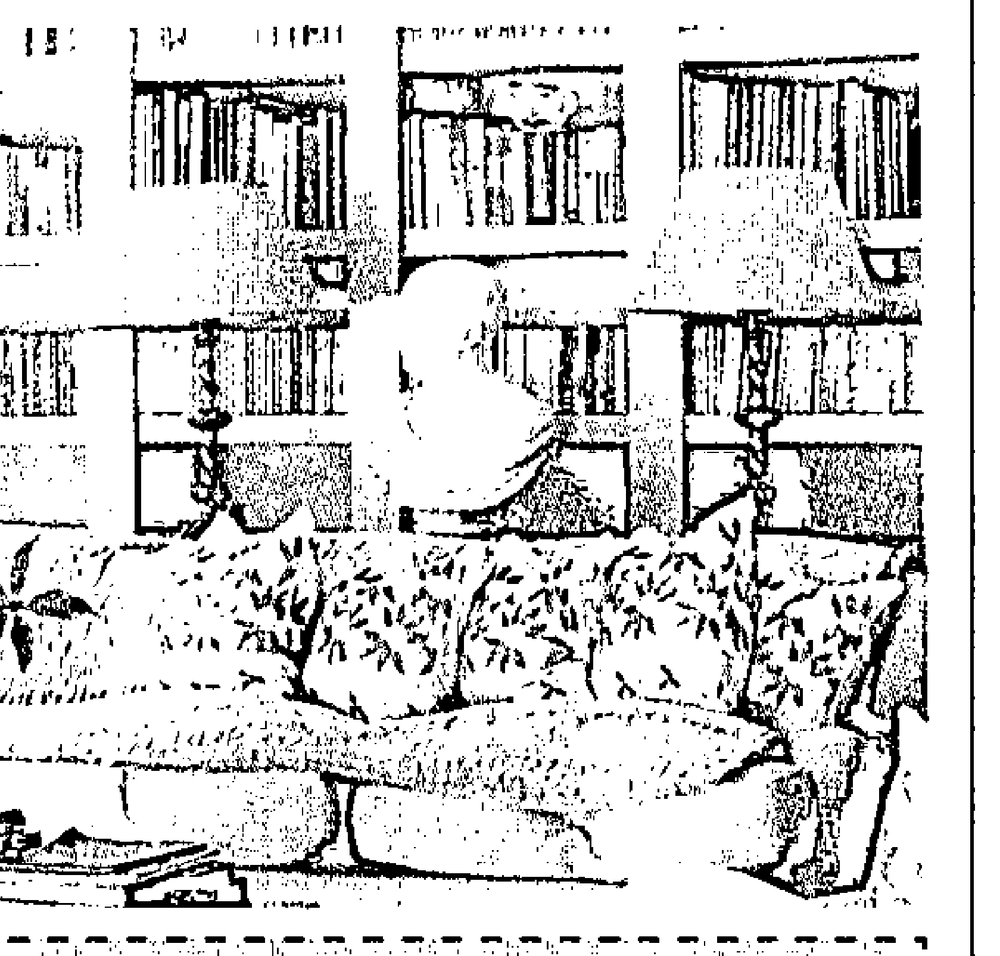

> 书房
书房是学习和阅读的地方。将书房设置在文昌方位，阅读可以集中精力，学习能取得很好的效果。

如何应用文昌位让孩子学有所成？

正确应用文昌位能使孩子学业进步，在考试中取得好成绩。若家里有人做文职，也可以利用文昌位使工作顺利，受到上司赏识。

可利用文昌位来布置书房，在文昌位上放上灰色或者蓝色的地毯，在书桌上放一枝或者四枝富贵竹，用水浸泡，放在瓶子里。若想在短期内见效，可以将书桌放在流年文昌位上。若受空间限制，书桌不能摆放到文昌位上，可以在文昌位上挂置四支毛笔。栽种富贵竹，摆放文昌塔也能起到同样的作用。

需要明确的是，本命文昌对个人的帮助较大。如果是住宅文昌，会对全家人起作用，但是作用力不集中。

如何按照住宅的方位确定文昌位？

房间的文昌位要根据住宅的坐向来确定。如果住宅方位是坐东朝西，则应该将孩子的房间安排在西北方向，如此可以使文昌星保佑孩子学业有成。住宅若是坐西朝东，则不宜将孩子的房间安排在西北方向，而应设在西南方。总之，不同的住宅朝向，文昌位所在的位置也不相同。住宅方位和文昌星位的对照关系如下表。

| 住宅坐向 | 坐北朝南 | 坐东北朝西南 | 坐东朝西 | 坐东南朝西北 |
| :--- | :--- | :--- | :--- | :--- |
| 宅内文昌位 | 东北方 | 北方 | 西北方 | 中央方 |
| 住宅坐向 | 坐南朝北 | 坐西南朝东北 | 坐西朝东 | 坐西北朝东南 |
| 宅内文昌位 | 南方 | 西方 | 西南方 | 东方 |

如何按照房间的入口处确定文昌位？

可以根据房间的入口处来确定文昌位。若房间的入口方向在西南，文昌位在北方，可将孩子的书桌放在房间的正北方向；若房间的入口在东北方向，则文昌位移到了西边，孩子的书桌、书柜最好挪到西边方位。房间的入口处与文昌位的对应关系如右表。

| 入口方位 | 文昌方位 | 入口方位 | 文昌方位 |
| :--- | :--- | :--- | :--- |
| 东 | 西南 | 西南 | 北 |
| 南 | 东北 | 东北 | 西 |
| 西 | 西北 | 东南 | 东 |
| 北 | 南 | 西北 | 东南 |

流年文昌位如何确定？

文昌位有几种推算方法，如宅位文昌、本命文昌、流年文昌等。“流年”即“年运”，每年都有一个四绿文昌星飞临，每年它飞到什么地方，那个地方就是文昌位。流年文昌位年年都不相同。由于流年文昌是根据九宫飞星的原理来确定的，每年的四绿文昌星飞临的宫位就是文昌星位了。流年文昌位的方位与年份之间的对应关系如下表。

| 出生年份 | 甲 | 乙 | 丙 | 丁 | 戊 | 己 | 庚 | 辛 | 壬 | 癸 |
| :--- | :--- | :--- | :--- | :--- | :--- | :--- | :--- | :--- | :--- | :--- |
| 文昌位 | 东南 | 正南 | 西南 | 正西 | 西南 | 正西 | 西北 | 正北 | 东北 | 正东 |

本命文昌如何确定？

本命文昌位是根据个人的出生年份来确定的。按照出生年的天干起，禄的前四位就是文昌位。按照此法推断出来的文昌位是不发生变化的，知道自己出生年份的天干，就可以确定自己的文昌位了。下面是部分出生年份与文昌位的对照表。

| 出生年份 | 文昌位 | 出生年份 | 文昌位 | 出生年份 | 文昌位 | 出生年份 | 文昌位 |
| :--- | :--- | :--- | :--- | :--- | :--- | :--- | :--- |
| 1950 庚寅 | 西北 | 1968 戊申 | 西南 | 1986 丙寅 | 西南 | 2004 甲申 | 东南 |
| 1951 辛卯 | 正北 | 1969 己酉 | 正西 | 1987 丁卯 | 正西 | 2005 乙酉 | 正南 |
| 1952 壬辰 | 东北 | 1970 庚戌 | 西北 | 1988 戊辰 | 西南 | 2006 丙戌 | 西南 |
| 1953 癸巳 | 正东 | 1971 辛亥 | 正北 | 1989 己巳 | 正西 | 2007 丁亥 | 正西 |
| 1954 甲午 | 东南 | 1972 壬子 | 东北 | 1990 庚午 | 西北 | 2008 戊子 | 西南 |
| 1955 乙未 | 正南 | 1973 癸丑 | 正东 | 1991 辛未 | 正北 | 2009 己丑 | 正西 |
| 1956 丙申 | 西南 | 1974 甲寅 | 东南 | 1992 壬申 | 东北 | 2010 庚寅 | 西北 |
| 1957 丁酉 | 正西 | 1975 乙卯 | 正南 | 1993 癸酉 | 正东 | 2011 辛卯 | 正北 |
| 1958 戊戌 | 西南 | 1976 丙辰 | 西南 | 1994 甲戌 | 东南 | 2012 壬辰 | 东北 |
| 1959 己亥 | 正西 | 1977 丁巳 | 正西 | 1995 乙亥 | 正南 | 2013 癸巳 | 正东 |
| 1960 庚子 | 西北 | 1978 戊午 | 西南 | 1996 丙子 | 西南 | 2014 甲午 | 东南 |
| 1961 辛丑 | 正北 | 1979 己未 | 正西 | 1997 丁丑 | 正西 | 2015 乙未 | 正南 |
| 1962 壬寅 | 东北 | 1980 庚申 | 西北 | 1998 戊寅 | 西南 | 2016 丙申 | 西南 |
| 1963 癸卯 | 正东 | 1981 辛酉 | 正北 | 1999 己卯 | 正西 | 2017 丁酉 | 正西 |
| 1964 甲辰 | 东南 | 1982 壬戌 | 东北 | 2000 庚辰 | 西北 | 2018 戊戌 | 西南 |
| 1965 乙巳 | 正南 | 1983 癸亥 | 正东 | 2001 辛巳 | 正北 | 2019 己亥 | 正西 |
| 1966 丙午 | 西南 | 1984 甲子 | 东南 | 2002 壬午 | 东北 | 2020 庚子 | 西北 |
| 1967 丁未 | 正西 | 1985 乙丑 | 正南 | 2003 癸未 | 正东 | 2021 辛丑 | 正北 |

如何催旺文昌位？

催旺文昌位的方法有很多，具体方法如下。
催旺文昌位要以催旺本命文昌位为主。本命文昌位是依据个人出生的年份来决定的，方位不会发生改变，在此位置放置具有纳福作用的法器即可刺激文昌位。要催旺文昌位，还可在文昌位放置书桌。文昌星是掌管天下读书人功名利禄的星神，读书人必不可少的工具就是书桌，将书桌放在文昌位就表示请文昌星帮助读书，有助于提升学业。
另外，在书桌上的笔筒内放四支毛笔，能帮助考试运。植物富贵竹也是很好的催旺文昌星位的道具，需要注意的是一定要摆放四枝富贵竹。

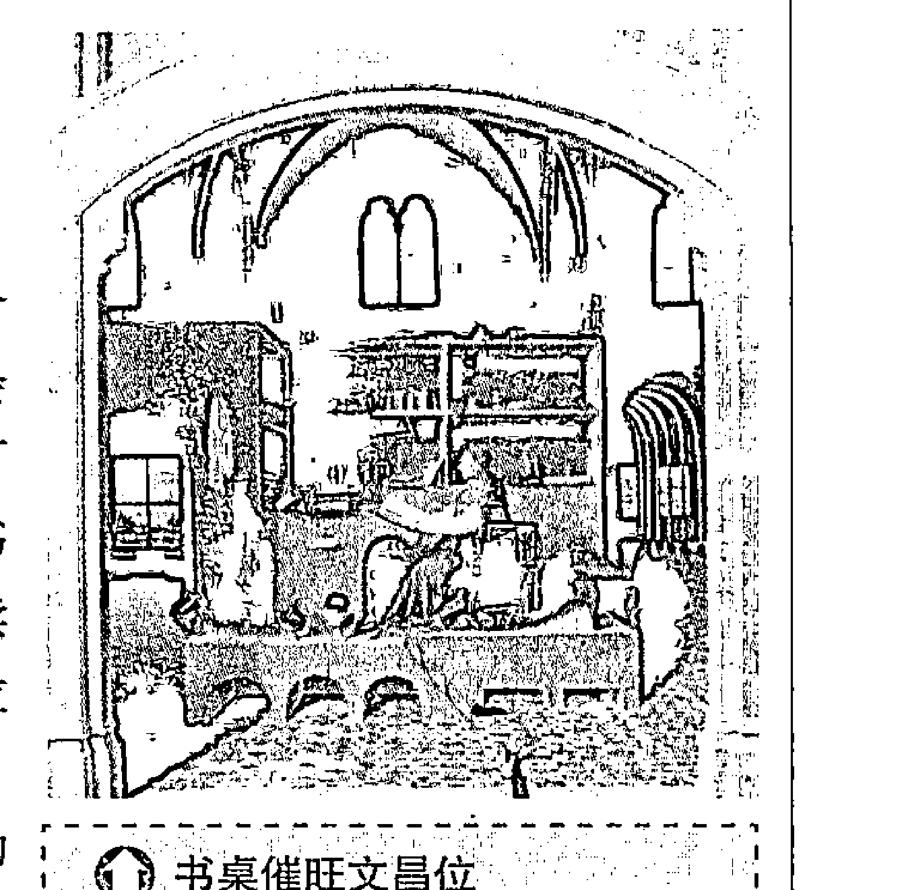

> 书桌催旺文昌位
催旺文昌位要以催旺本命文昌位为主。可在文昌位摆放书桌。

书房的宜忌有哪些？

书房对读书人影响至关重要，因此要注意书房的设置，避免挡住文昌星君，进而不利于学业。
书房应安置在家中的文昌位上，同时要保持通风透气，采光条件要好，环境要清净，一方面可以使人能安心研读书籍，另一方面可以加强这里气场的流动，使文昌星君发挥最大的作用。另外，书房内装饰品的颜色要以浅绿色为主，绿色属木，能起到旺文昌的作用，而且绿色有养眼的作用，孩子读书久了会对眼睛产生不好的影响，绿色则可缓解疲劳。
书房忌有西斜的阳光照射。因为西斜的阳光强烈刺眼，让人精神难以集中，而且这种光线还会产生有害气场，对眼睛造成伤害。此外，书房内的书桌注意不要摆放在电视、音响等电器附近。否则，电器的磁场会干扰文昌星的磁场。书桌不宜紧挨着厕所，这样厕所的污秽之气会埋没聪明。

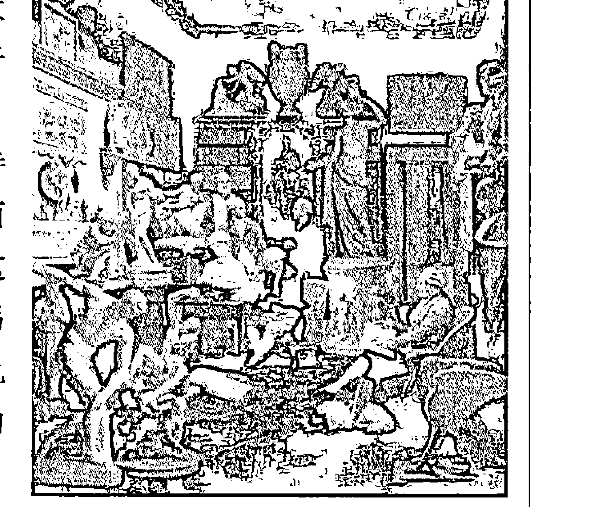

> 公园街的查尔斯书房
大理石运动员雕像、仙女、男女众神及半身胸像布满了这间收藏家的书房，书房的色调为暖色。其实，书房颜色最好布置为绿色，绿色有养眼的作用，可以缓解眼睛的疲劳。

书桌摆放有何讲究？

书桌对读书人来说的是一个神圣的场所，不可乱放，否则会干扰到文昌星，影响学业。因此，在摆放书桌的时候，要注意以下几点。

- 要把书桌放在文昌星位上，但是要避免正对着窗户，否则窗外的景物会使你不能专心读书，心神不宁。
- 不可以将书桌摆放在门口处，这里的气场会干扰人的思维。如果学生正在思考问题，外面有人走动会打断他的思考。
- 不能将书桌摆放在横梁下方，头顶的横梁会使学生感受到压力。这样不但看不进去书，而且学生在考试中容易紧张，发挥失常，直接影响到升学。
- 书桌的前方不能有镜子。镜子象征着幻象，它会直接扰乱学习效率，干扰学生的思维，导致孩子记忆力下降，学习退步。
- 书桌尽量不要紧贴着厨房或者厕所的墙壁。厕所和厨房的气味可能会降低学生的运气，考试中会出现没有复习到的知识点，而反复练习的知识点则一个都不出现。

### 书桌摆放禁忌

书桌是学生学习与阅读的地方，适宜摆放在文昌位。书桌的摆放有很多的禁忌，我们在摆放时需要注意避免。

- 书桌要避免摆放在正对窗口的地方。
- 避免将书桌摆放在门口。
- 不宜将书桌摆放在横梁下方。
- 书桌的前方不能有镜子，镜子会扰乱学习。
- 书桌不宜紧贴厨房或者厕所的墙壁。

文昌位上能够放电脑吗？

在现代家庭，孩子的书桌上通常离不开电脑。但是电脑五行属火，并非每个孩子都适合。五行忌火的孩子，在书桌上放电脑，容易出现疲倦或精神不济的现象。如果不想移动电脑，可在电脑旁边放一杯清水加以调剂。通常来说，生于立夏到立秋之间的孩子五行忌火。

另外，电脑作为学习工具，有助于孩子学习。但现代网络发达，电脑也会传递负面的信息，成为误导孩子的游戏机，不利于孩子学习。因此，家长在为孩子添置电脑的时候，要充分考虑其利弊，再决定是否给孩子添置电脑。

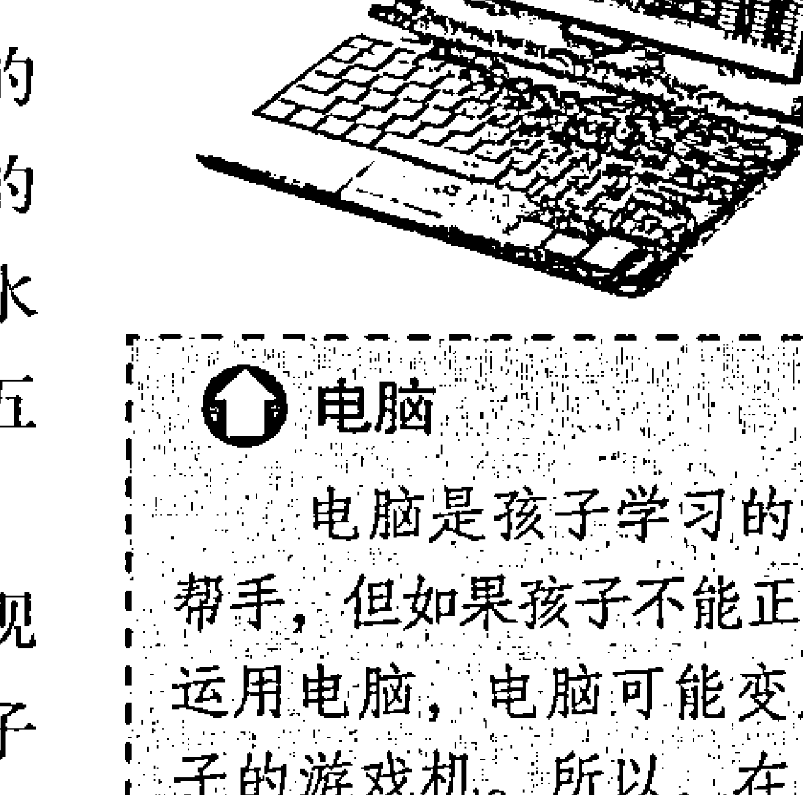

### 电脑

电脑是孩子学习的重要帮手，但如果孩子不能正确地运用电脑，电脑可能变成孩子的游戏机。所以，在为孩子购买电脑前，一定要结合孩子的性情和自我控制力来考虑是否为孩子购买电脑。

如何选择文昌位的地毯颜色？

生辰八字不同的人，催旺文昌位的方法也不同。就以通过地毯催旺文昌位的方式来说，生辰八字不同，所选用的地毯颜色也不同，具体颜色可查询右表。

需要解释的是，地毯会接地气，一方面承接来自地面的气场，另一方面又吸附着房间的能量。因此，地毯有中和房间气场、调节阴阳的作用。我们可通过地毯来改变气场，改变人的命运。

### 不同出生日期对应的地毯颜色
| 出生日期 | 地毯颜色 |
| :--- | :--- |
| 3月1日-5月5日 | 红、绿、黄 |
| 5月6日-8月8日 | 蓝、灰 |
| 8月9日-10月8日 | 红、紫 |
| 10月9日-11月8日 | 蓝、灰 |
| 11月9日-3月1日 | 红、紫 |

书桌为何不宜靠窗或靠空？

若想孩子学业有成，在摆放书桌的时候，要注意避免使其靠窗或靠空。
座位后不能是空的，要有一道墙或者一块板来做靠山。这是因为，座位后面若为空，则无所依靠，人容易因此而忧虑、担心，在学习的时候容易分心。因此，一定要在座位后面放置一个可以依靠的东西，这样才会让孩子无后顾之忧，专心学习。

座位前不能对着窗户。一方面，窗外的景物可能会导致分心，使人不能安心学习，成绩也不容易进步；另一方面，窗户直通外界，外界的邪气容易通过窗户进来，对孩子造成不利影响，肯定会影响其学业。若文昌位恰好在窗户下面，则要在不挡光、空气流通的情况下，用窗帘把窗户挡上。

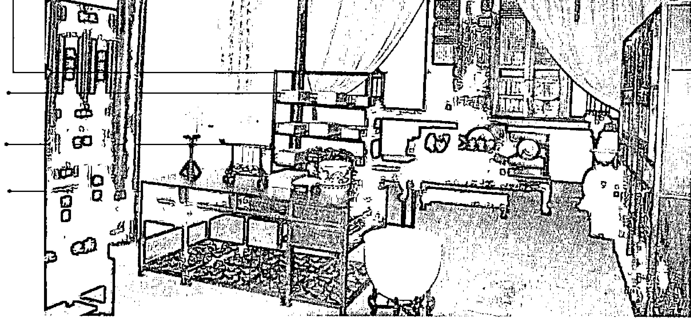

如何利用文昌塔饰品提升学业运？

文昌塔又叫文笔塔，一般有七层、九层和十三层之分。它的作用类似于文昌星君，有帮助孩子读书学习，提升其学业的作用。若把文昌塔饰品摆在书桌的文昌位上，可以提升文昌星的力量，对学习、事业有直接的帮助。

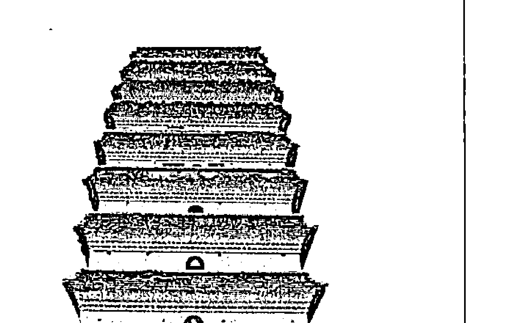

文昌为四绿星，与九数合成一个吉利数，是最常用的催文法器。家中有小孩读书，可以把文昌塔饰品放在小孩的文昌位上，可以使孩子思维开阔，学习进步；如果是正要考试的学生，摆放文昌塔饰品可以促使其头脑清醒，考出好成绩。

> ## 文昌塔
文昌塔一般有七层、九层和十三层之分，它有催旺当地学子升学运的作用。学生在家里摆放文昌塔饰品，思路会越来越开阔；文职人员在文昌位摆放文昌塔饰品，能得老板赏识。

另外，对于做文职工作的职场人员来说，把文昌塔饰品摆放在文昌位上可以提高工作效率，赢得老板的赏识。

悬挂毛笔能催旺文昌位吗？

在文昌位上摆放文具可以催旺文昌位，比如在书桌的中间或西南方放置四支笔，最好是毛笔，就可以催旺文昌。

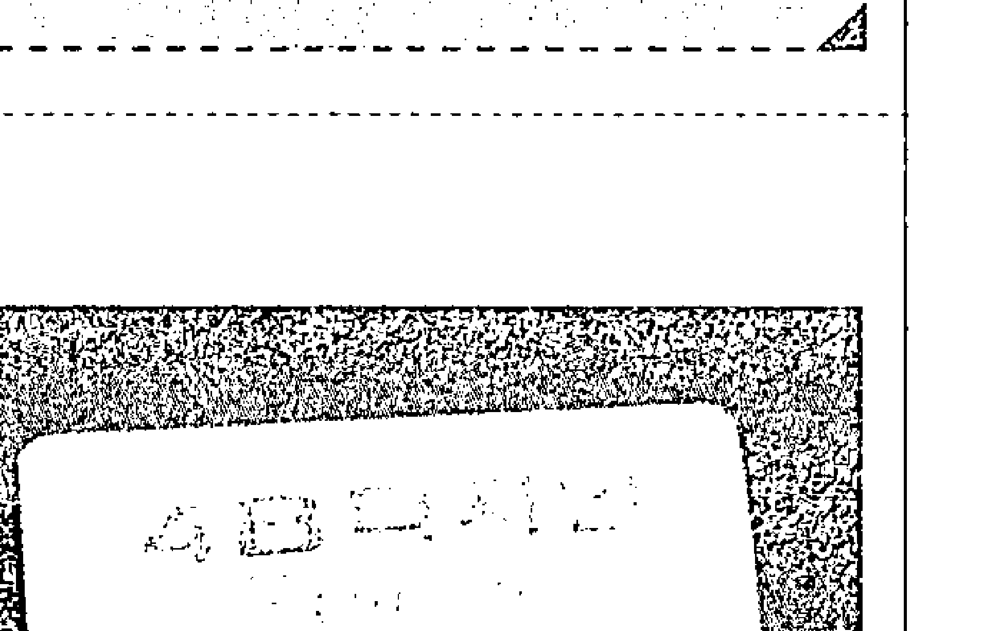

古代人的文房四宝为“笔墨纸砚”，这里的笔主要就是指毛笔，学子通过考试高中进士，所用的笔就是毛笔。所以古人认为，毛笔象征着文昌星，在书房内的文昌位上摆放毛笔，即可起到“旺文”的作用。在读书时有助于帮其凝聚精神，集中思维，帮助人学业进步，在考试中也能有好运气。

> ## 橡皮擦
橡皮擦是现在学生常用的文具，将其摆放在文昌位，能起到催旺文昌位的效果。当然，最佳的催旺方法还是在文昌位摆放四支毛笔。

## 328 如何摆放文竹催旺学业运？

若依据流年文昌的变化，可以在书房的文昌位上摆放四枝长青水养植物，能有效地加强文昌位的力量，文竹是不错的选择。在掌管学业、考运的文昌位上放置文竹，可以起到旺文的作用。

有人认为，文竹象征着书卷，摆放文竹有“开卷有益”之效。读书人在书桌上摆放文竹，可催旺学运。

另外，文竹还有节节高升的意思。若是大学生、研究生等在书桌旁摆放文竹，象征节节高升，在学业上不断取得进步。

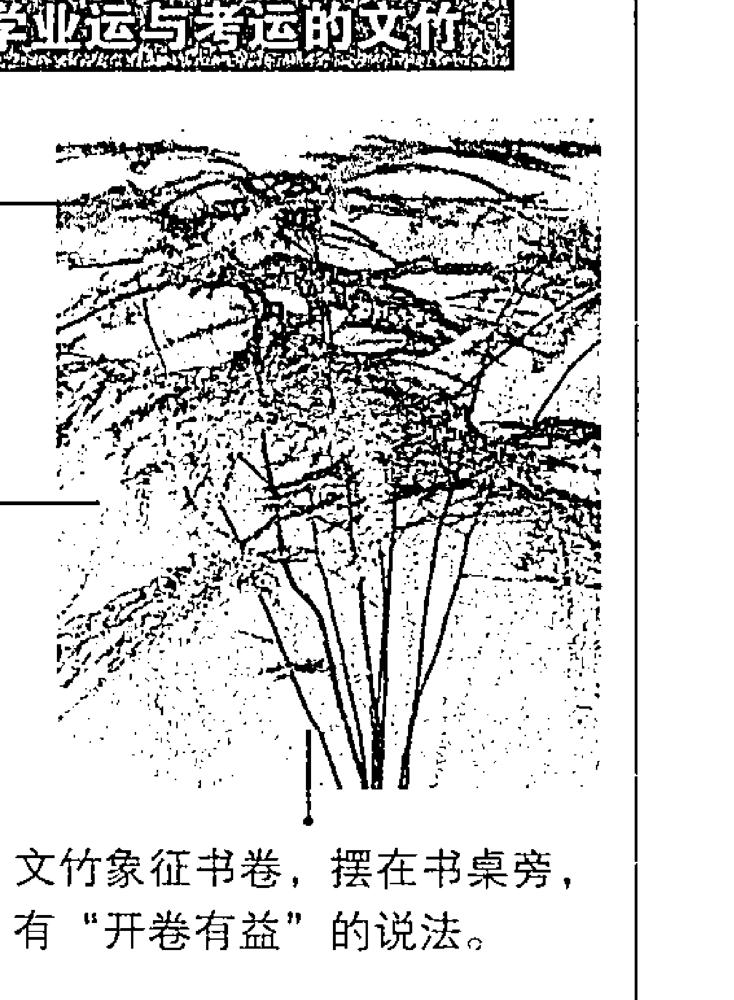

## 329 如何利用桂花叶催旺学业运？

桂花有鼓励后辈勤奋、努力的寓意，“桂”与“贵”同音，取其富贵之意，能对人的仕途起助力作用。因此，人们常用桂花叶来催旺学运，成语“兰桂齐芳”就暗示子女学业有成。家中若有孩子在上学，若巧妙利用桂花叶，可催旺学运。

利用桂花叶催旺学运的方式较灵活，可以在书桌上放一个桂花叶饰品，若根据自己的生辰八字，将桂花叶放到本命文昌星位上，则效果更佳。

也可以采集新鲜的桂花叶，晒干，装到一个透明的玻璃瓶中，然后放在书桌的文昌星位上，时不时打开来看一看，不但能闻到桂花叶的清香，还可以起到提升学运的作用。

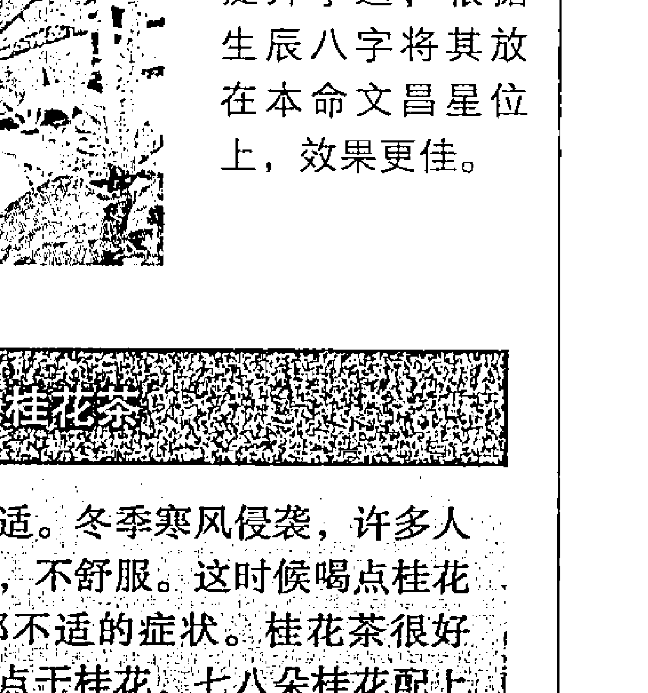

> **桂花茶**
桂花能缓解胃部不适。冬季寒风侵袭，许多人就会感到胃部冷痛，不舒服。这时候喝点桂花茶，就能缓解胃部不适的症状。桂花茶很好做，只需到超市买点干桂花，七八朵桂花配上红茶、红糖，热水冲服即可。

### 330 如何增旺学习气场？

若想增旺学习气场，可以尝试下面列出的几个方法。

- 1. 可以在书房的正南位置上摆放书桌，上面可以再摆放一个水晶文昌塔饰品，象征着文昌星君降临，助其学运。
- 2. 在靠近自己的位置摆放一些绿色的木本阔叶植物。木本阔叶植物有招财纳福的作用，放在吉位可以趋吉避凶。
- 3. 书房的整体色调要以绿色为主，绿色不但可以舒缓人的眼睛，还可以使精力集中。
- 4. 可以通过在书房摆放饰品的方式开启学运，不过在选择饰品的时候，最好选择木质的材料，或者盛水的物品。
- 5. 书房应保持通风，保持空气清新和气场流通，这样气场的能量会帮助其增旺考运。
- 6. 在临近考试时，穿绿色的衣服，佩戴水晶饰品，也能增加考运。结合自身的本命文昌位，利用上述方法效果会更佳。

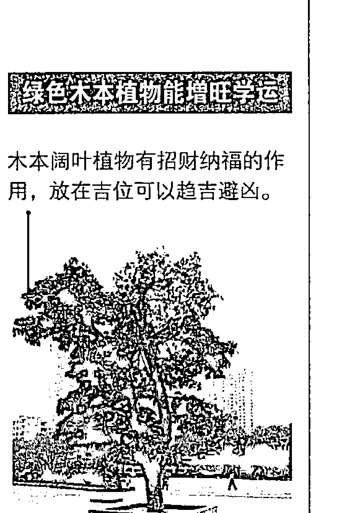

### 331 考试开运的方法有哪些？

考试是检验每个学生学习效果的重要手段，学生若想有个不错的考试运，可以试试下面几种方法。

- 1. 在书桌的下面铺一块红色的地毯，它使你在学习上能达到事半功倍的效果。红色是凝聚能量较强的颜色，地毯下接地气，上调和房间磁场。
- 2. 可以在书桌左前方摆放一盆兰花或者在瓶子里插四枝开运竹，用水浸泡，也能在考试中带来好运。
- 3. 如果你要参加高考，可以到你想上的大学校园里看看，拍些照片，或者喝点学校里的水，都可以帮助你在考试中超常发挥。

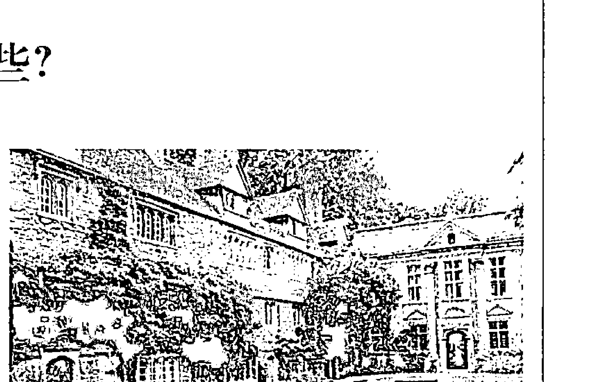

## 332 孩子的卧室有什么讲究？

若想提升孩子的学运，就不能随随便便布置其卧室，这里边有很多讲究。下边所讲的是需要我们注意的。

- 1. 卧室不能设在阳台下或者家用电器旁边。阳台处虽然通风条件良好，但这里邻近窗户，容易与外界的气场交换，外邪、煞气容易乘虚而入。电器本身带有磁场，这种磁场一般有害，容易干扰孩子的学习。
- 2. 孩子卧室的门不能对着厕所。厕所是污秽之气的集中地，最容易招致煞气，厕所的门如果刚好对着孩子的房间，会严重影响孩子的学习。若已经形成这种局面，最好在孩子的卧室门口挂一副水晶门帘。
- 3. 孩子卧室的门口不能悬挂镜子。镜子象征着幻象，另一个世界，放置在卧室门口，刚好像放电影一样，将幻象全部呈现在孩子面前，会严重干扰其学习。
- 4. 卧室的天花板要用乳白色，可装饰一些纵横的木条。乳白色既不属于冷色调，也不属于暖色调，属于中性，它所蕴含的能量可以调节阴阳磁场。
- 5. 孩子卧室不宜铺设深红色的地毯，卧室要保持干净，使孩子养成良好的习惯。

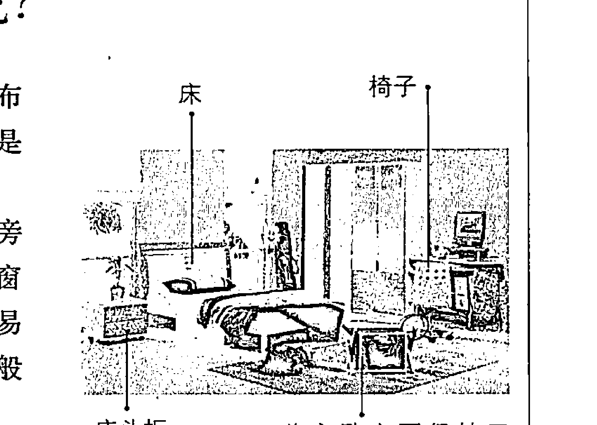

## 333 孩子的房间布置与学业有关系吗？

孩子的房间是孩子最常待的地方，房间的布置与孩子的学业有非常大的关系。以下几点是需要注意的。

- 1. 孩子的房间不宜布置得太花哨，否则会分散孩子的注意力，使得孩子多动，浮躁不安，不能专心致志地学习。
- 2. 孩子的卧室最好保持良好的通风，干净、整洁。这样既可以确保气场流通，也能吸引较好的气场。
- 3. 孩子的房间不能太单调，不宜以纯色色调布置房间，可以适当装饰一些纵横的木条，有助于振奋孩子的精神，间接助其学运。
- 4. 孩子的房间，除了书桌下面，最好不要铺设深红色的地毯。红色地毯虽然可以凝聚能量，但红色太刺眼，容易使人急躁。孩子长期居住在这样的环境中，不但不利于眼睛保健，还容易性情暴躁。

## 334 怎样安排房间有利于孩子学习？

遵循下面两条原则，即可造出有利于文昌星君的气场，提升学业。

原则一：光线好，且房内色调以绿色为主。光线中蕴含着能量，好的光线不但有利于眼睛，不影响学习效率，还能带来有益的气场。

原则二：男主西南，女主正西。如果空间允许，可以把男孩子的房间安排在西南方向，女孩子的房间安排在正西方，这两个位置属于吉位，有利于孩子考取一些与“口才”相关的学科。

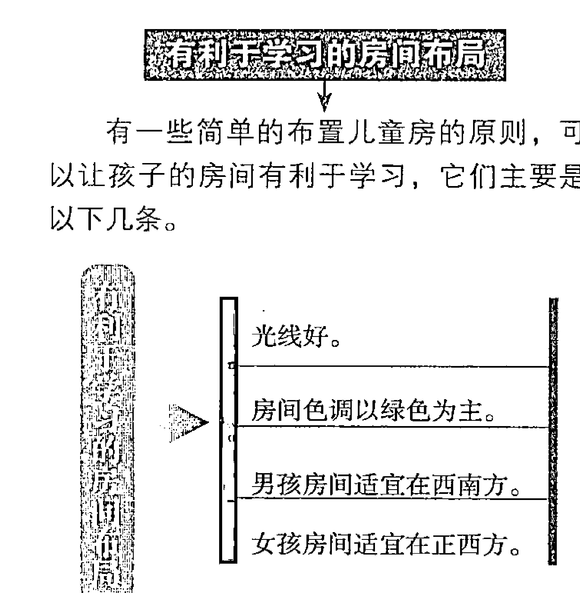

## 335 孩子的卧室应该怎么布置？

孩子每天至少有三分之一的时间里待在卧室里边，因此卧室的布局对孩子来说至关重要，其气场会直接影响孩子的学业。在布置孩子卧室的时候，应注意以下几点。

- 1. 若孩子的卧室空间比较小，则装饰不宜太复杂，放一些生活必需品即可，不可将家中暂时不用的东西堆到孩子房间里。

- 2. 房间的色调以柔和的浅色为主，最好选择乳白色，不要在孩子房间的墙壁上做过多的装饰。浅色可以使人心情平静，有助于使孩子集中精神，专心致志地学习。乳白色为中性色调，有助于调节室内阴阳，化解煞气。

- 3. 配合孩子的命局五行来布置孩子的房间，可以根据孩子的本命文昌位，布置孩子的书桌。

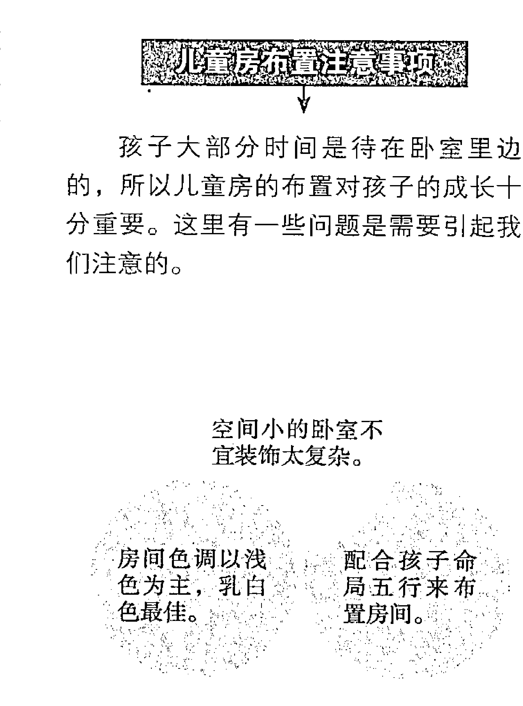

## 336 孩子房间的色彩该如何调整？

孩子房间的色彩布置是一门大学问，一般有以下几点讲究。

- 1. 色调。孩子房间的色调宜采用柔和的色调，最好以浅色为主。整体效果要有利于孩子学习、成长。

- 2. 颜色。孩子房间的颜色最好以乳白色、浅绿色、浅黄色为主。

- 3. 根据孩子的生辰八字确定房间的颜色。比如，在命理学上，如果命理喜神为金，可以以白色和浅黄色为主。

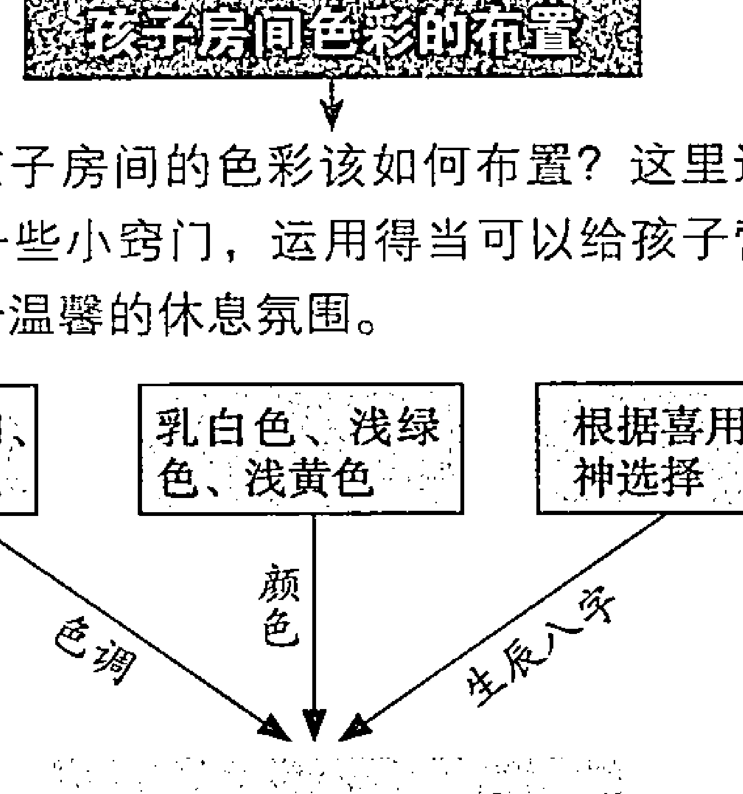

## 337 孩子的枕头选用和摆放有什么讲究？

一个合适的枕头，不但关系着孩子的睡眠，还影响他的学习效率和考试运。所以家长要注意为孩子选择一个好的枕头。枕头的选择和摆放有几点需要注意的地方。

- 1. 枕头的朝向。枕头最好向着木方位，这样可以提升孩子的成长运，对孩子的语言学习和思维反应能力有利。

- 2. 若想使孩子养成积极的性格，在摆设床位的时候，最好使枕头方向朝东。东方积聚的能量较为积极向上，对孩子的大脑有积极的刺激作用。

- 3. 枕头的颜色。枕头的颜色可以用冷暖兼宜的色系，如白色、乳白色。这样有助于调节阴阳，确保孩子的大脑平衡发展。

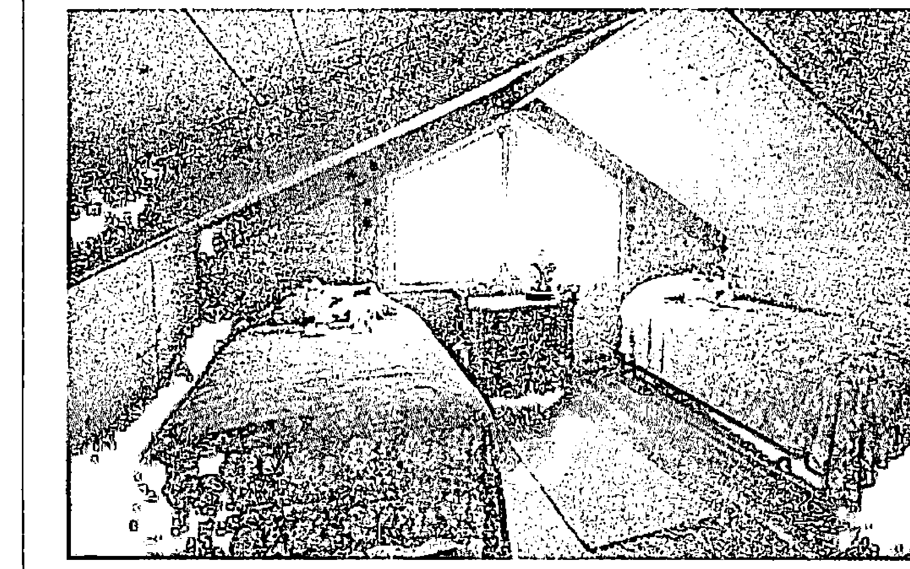

> 枕头朝东
孩子使用的枕头不要太高，也不要太低，以一拳高为宜。枕头最好朝向东方，东方属木，可以提升孩子的成长运，还能调动孩子的积极性。

## 338 孩子的书柜选择有何讲究？

书柜是一个凝聚学运磁场的地方，对正在读书的孩子来说关系重大。家长在为孩子选择书柜的时候，首先要确保书柜为木质的。

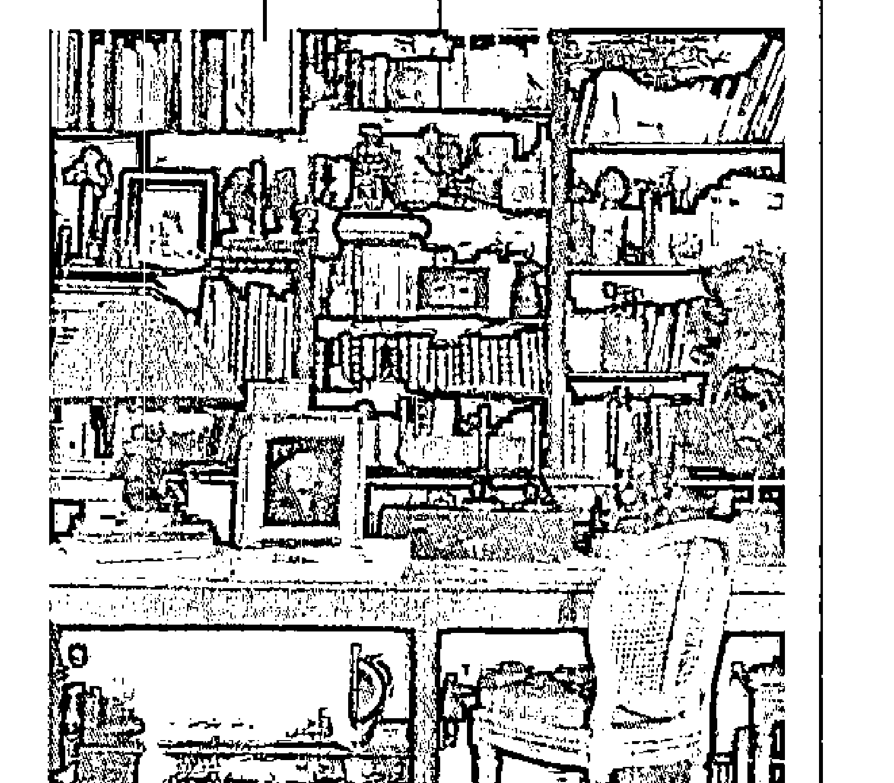

文昌属木，一切木质的东西皆可催旺文昌运，提升其学业。因此，在准备书柜的时候，最好选用木制品。另外，木主春，有春的蓬勃朝气。木质书柜能给孩子的房间带来阳气，一方面使人心境平和，对孩子的学习有利；另一方面有助于孩子养成积极向上的性格，对孩子的成长有利。

书柜的颜色不宜用乳白色、浅绿色，否则容易分散孩子注意力，令孩子不能专心学习。书柜的颜色最好选择深色系，可显得厚重，有助于提升孩子的文化意蕴，提升其气质。

书柜的材质
书柜最好选木质的，能给孩子的房间带来阳气，使人心境平和，对孩子学习有利。

## 339 孩子的书柜越高越好吗？

很多家长在为孩子选择书柜的时候，为了能放置更多的书，也为了培养孩子的书香气，想当然地认为大书柜、高书柜能起到这种作用。其实不然。

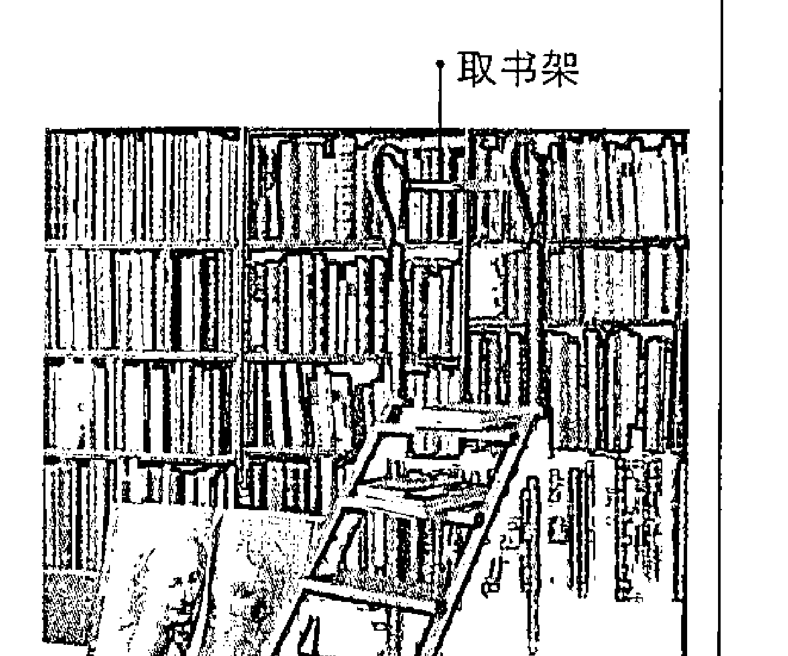

书柜是可以藏风聚气的地方，大小合适的书柜可以调和阴阳气场，利于读书。太高太大的书柜，虽然可以积聚更多的气场，但好坏气场同时进来，难以调和。书柜一旦无法驾驭自身的气场，就容易导致阴阳失衡，招致邪气的入侵，反而不利于孩子学习。

另外，如果孩子书房里的书柜过于高大，一方面给孩子拿书造成不便，另一方面，孩子的书籍也不会太多，书柜过于高大会造成书架闲置。可以选择书架和衣橱两用的书柜。

高大的书柜
过高的书柜，会给孩子拿书造成不便。另一方面，孩子的书不会很多，书柜过于高大会造成书柜闲置。家长在挑选书柜的时候，要考虑到孩子方便与否。

## 340 孩子的书柜里应该摆放什么书？

孩子正处于身心成长的关键时期，书柜上摆放的书籍要以启发智慧、积极向上的内容为主，不宜在孩子的房间摆放阴沉，多阴气的邪书，容易使人做噩梦的恐怖书籍，更不适合摆放淫秽书籍。这些书不但不利于精神和身体健康，还会侵蚀家中的正气，给家中带来邪气。

需要说明的是，孩子平常用的教材，最好不要放在书柜中。因为教材直接与考试及升学有关，若常放在书柜中，书柜里会充满与考试有关的气场，久而久之，容易给孩子造成压力，反而不利于孩子的学习。

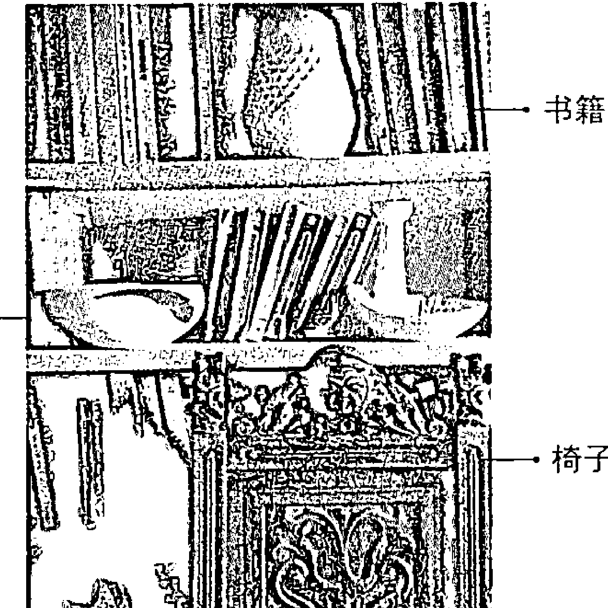

**孩子书柜的书籍**
孩子的书柜中最好经常放有助于完善孩子性格的课外读物、励志书、陶冶性情的书、增加知识的书。不要在孩子的书柜里摆放太多教材和教辅材料，这样会给孩子带来压力。

## 341 孩子书房的墙壁在装饰上有什么讲究吗？

在一间书房里，除了屋子的布局，给人印象最深的，应该就是书房的墙壁了。孩子在书房里学习的时间很长，墙壁装饰的好坏，直接影响着孩子的心神，进而影响其学习。

书房的墙壁，最好粉刷成乳白色的，这样不但可以调和阴阳，而且乳白色有使人安静的作用，利于孩子专心致志地学习。另外乳白色所发出的光线柔和，不会刺激眼睛。

房间的墙壁上，最好适当贴一些图片，图片的内容可以丰富多彩，风景图片、名人图片、卡通图片皆可。也可贴一些书法作品，起陶冶情操的作用。

为了给孩子营造一个安静、宁和的环境，书房墙壁最好采用有隔音或吸音功能的材料，这样可以阻挡或者消去外界的大量杂音，使书房相对安静。

## 342 孩子书房的地面怎么装饰？

除了房间的布局和墙壁的装饰，地面也会给人留下深刻的印象，人长期置于其中，地面的气场对人的作用也很大。
孩子书房的地板，应采用有隔音效果的地板，材料和墙壁相近，这样可以确保房间保持安静，防止孩子受到干扰，进而专心致志地学习。若想在地板上铺设地毯，可以选择绿色的地毯。地毯不能太厚、太软，否则容易使孩子形成懒散的性格，对孩子的学业不利，也影响其成长。
不过地板的材料最好不要是木质。木质地板虽然干净，给人以舒服之感，但走在上面，容易发出脚步声，会干扰到孩子学习。若一家人都喜欢木质地板，那么平常走路最好轻手轻脚，或者直接穿着袜子走路，不要穿鞋子。

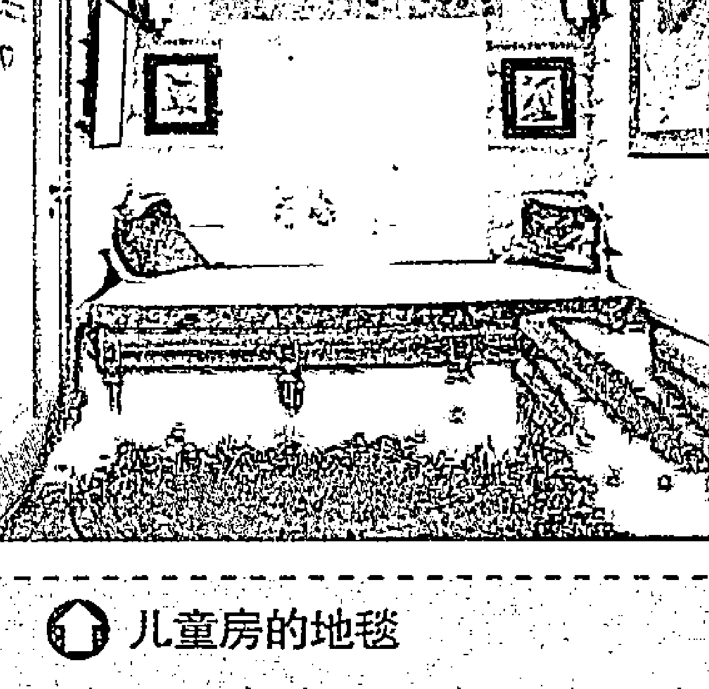

> > 儿童房的地毯
> 可以在孩子的房间铺设地毯，但要注意，地毯不宜太厚、太软。那样的地毯容易让孩子形成懒散的性格，不利于成长。

## 343 门的朝向对孩子的学习有影响吗？

门是住宅与外界交流的气口，是内外气场交换的中枢。因此，大门的朝向不但对孩子学习有影响，而且关系着全家每个成员的运程。
一般来说，大门不宜朝向厕所，不宜向着厨房。如果大门向着厕所，推门而进，首先闻到的是污秽之气，不吉利。而厨房属阴，是女主人的场所，大门向着厨房，女主人容易犯桃花。
门的朝向正确，常年会有紫气东来，对孩子的学习以及家人的财运都有好处。如果门的朝向不当，就会事事不顺，孩子学习不用功，有压力感。

> > 孩子房门不宜朝向厨房
> 孩子的房门不宜朝向厨房，厨房的油烟之气属于不好的气场，会影响孩子的运程。

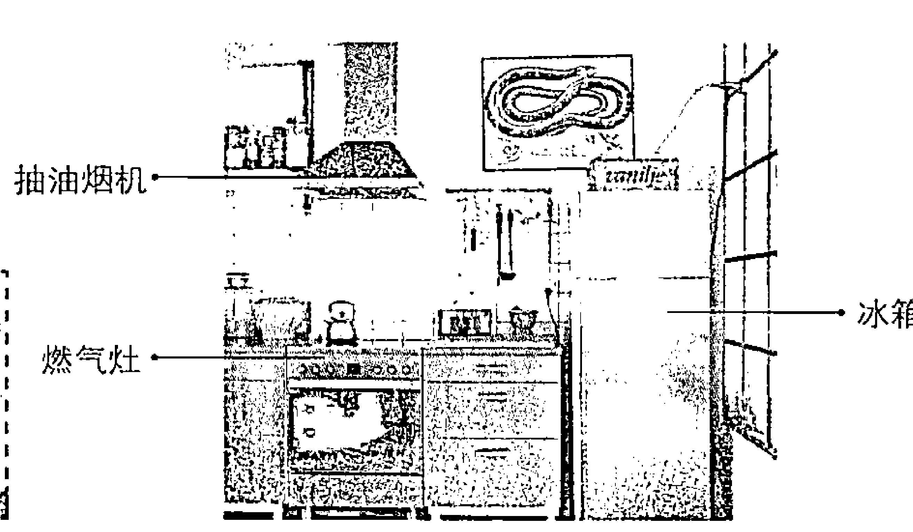

## 344 窗户的大小对孩子的学习有影响吗？

一般来说，窗户的大小应该与房间的整体相协调，大小要适中。如果太大，就难聚内气，虚而不实，不利于精神集中，自然会对孩子的学习产生不利影响。如果窗户太小，光线就不充足，孩子会感觉心里压抑，也不利于学习。另外需要注意的是，不宜将孩子的书桌放在窗户下面，至少要侧着放。窗户下边虽然光线好，但有时候光线太强，容易刺伤眼睛；另外，窗户是气场交流的通道，孩子在窗户下面学习，气场会终日从他身上穿过，不利于孩子的成长。

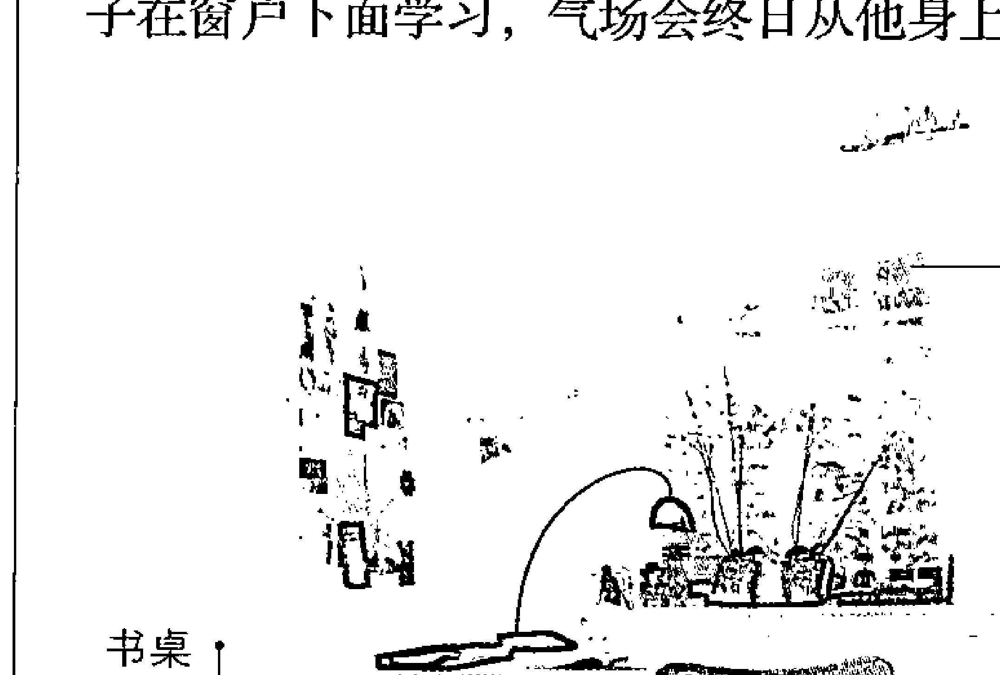

> 书桌位于窗户下边
书桌位于窗户下边，光线容易刺伤孩子的眼睛。另外，窗户是气场交流的通道，孩子长期在此地学习，气场从其身上穿过不利于孩子的成长。

## 345 窗户的朝向对孩子学习有影响吗？

孩子房间窗户的朝向，无论对孩子的学习，还是对孩子的成长，乃至性格的形成都有一定的影响。所以家长在为孩子布置房间的时候，要选择一个窗户朝向比较好的房间当书房或卧室。孩子房间的窗户宜朝向正东、正南方向。这里有太阳直射，房间采光纳气效果好。孩子的心情明朗，对孩子的智慧开启是有益处的。而且正东方向属于青龙之位，能旺文昌；正南方符合坐北朝南之说，窗户朝向南，阳光充足，利于营造专心学习的好环境。

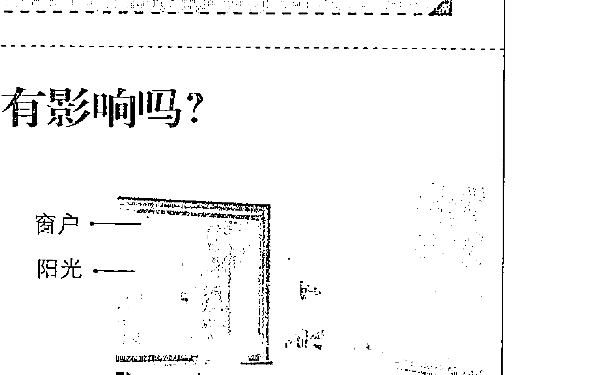

> 儿童房窗户朝向
儿童房的窗户宜朝向正东或正南，这两个方位拥有充足的阳光，有利于孩子性格的形成和专心学习。

## 346 光线的明暗对孩子学习有影响吗？

光线中蕴含着能量，会散发有益或有害的磁场。为了照顾孩子的学习和身心健康，要注意为孩子的房间营造良好的光线。

孩子的房间，宜向阳。这样孩子的房间每日都会有能量补充。孩子每日置身其中，无异于每日享受“日光浴”，充分吸收光线中的能量。但孩子的书桌不宜摆放在窗户下面。这里光线太强烈，强烈的光线从窗户进来，还没来得及与有益光线进行综合，危害较大。同理，孩子书桌正上方所悬挂的灯，不宜太亮。灯光太亮不但会刺眼，还会招致有害光线侵害。

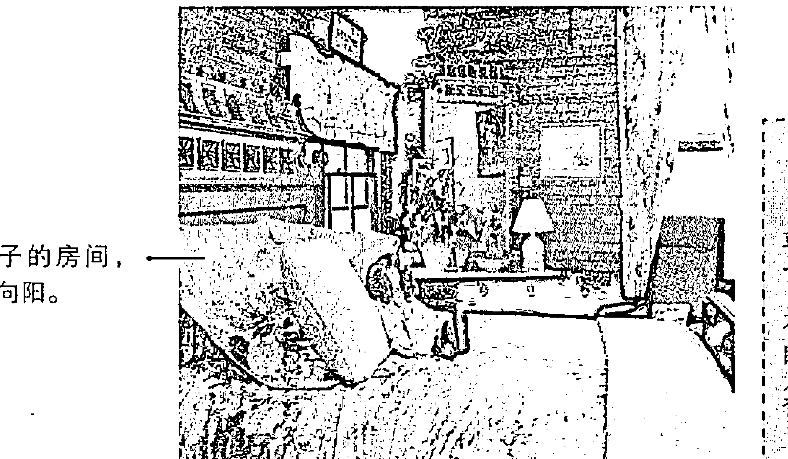

儿童房的光线
光线中蕴含着有益或有害的磁场。光线充足可以满足孩子每日所需光照，但光线太强烈会刺眼，导致思维分散，不能集中思考。

## 347 书桌摆放有何讲究？

书桌沾有书香之气，它对读书人来说是一个重要的藏风聚气的器具，我们完全可以利用书桌来提升孩子的考试运。
摆放书桌的时候要注意避开以下几点。

- 1. 不能将书桌摆放在房间的正中央。中央是气场汇聚之所，孩子若经常坐在这里，很容易受到气场的冲击，这样会影响身心健康。
- 2. 不可将书桌正对着门，最好远离门口。门是气场的交流通道，好的气场和不好的气场都会从这里过，很容易影响到文昌星发挥作用，不利于孩子学习。
- 3. 不可与厨房或厕所相邻。厕所的污秽之气会影响人的运程，当然也会影响学运。厨房的油烟之气也属于不好的气场，会影响孩子的考试运。
- 4. 书桌不能摆放在横梁下。横梁下面容易有危险，横梁还会对孩子的大脑产生压力。
- 5. 书桌不可以对着屋外面的小巷、烟囱、水塔等。这些事物本身带有很多不好的气场，容易扰乱孩子的心智，使其难以专心致志地学习。

## 348 书桌对着窗户会影响孩子学习吗？

很多人喜欢在窗户下面摆放书桌，以为这样采光条件好，其实不然。

过分强烈的光线，会使孩子产生疲劳感，加之如果外界的环境比较嘈杂，景致不好，容易使孩子在学习时难以集中注意力。这样学习就不会收到好的效果。书桌的光应从一侧集中到桌面上，最好使用可以调节亮度的灯具。

另外，窗户附近气场活跃，流通明显，好的气场固然能促进孩子学习，坏的气场也会对孩子产生很明显的副作用。别的地方虽然也有坏气场，但已经在流通的过程中得到了综合，危害比较小。所以书桌的摆放方位，应该根据孩子的生辰八字，寻找其文昌星位，将书桌放到文昌星的位置上即可。

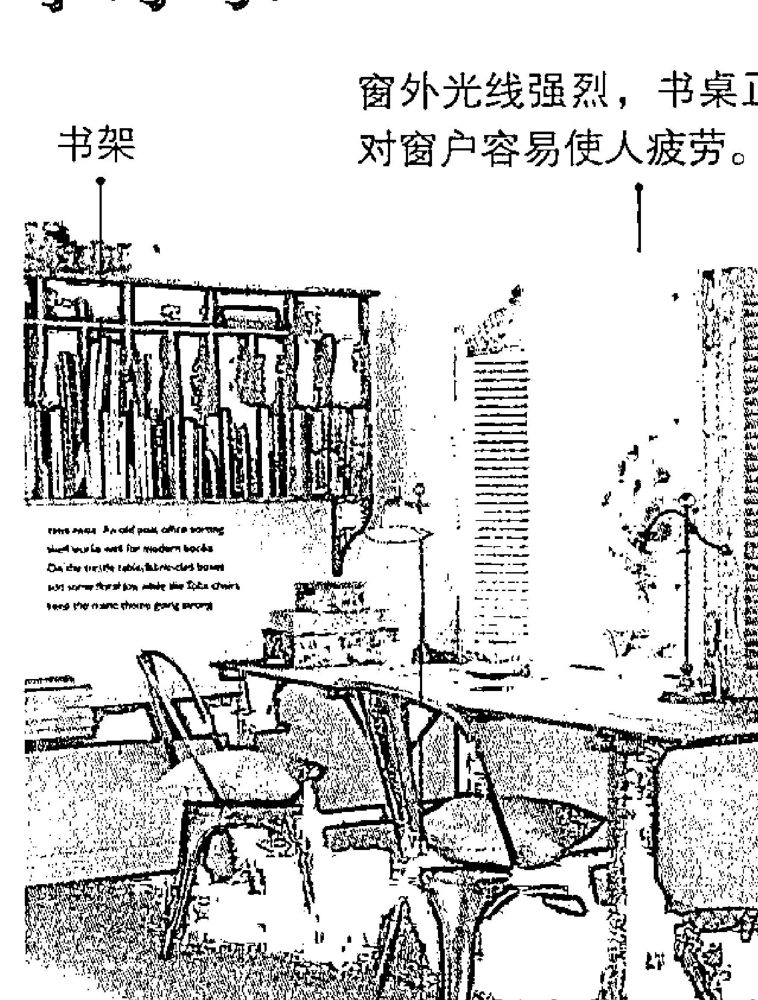

## 349 孩子的座椅摆放有何讲究？

从某种意义上说，座椅的摆放与书桌的摆放是一致的，影响书桌的气场，同样也会影响座椅的气场。

座位前方不要直接对着窗户，窗外的景物或者噪音会影响孩子的学习，而且窗户周围活跃的气场还会影响孩子的身心健康。

与书桌不同的是，座椅的后面一定要有东西可依靠，靠即靠山，可以是一道墙、一块板。这样可以使孩子专心读书，否则孩子座无可依，心神不定，难以专心致志地学习。

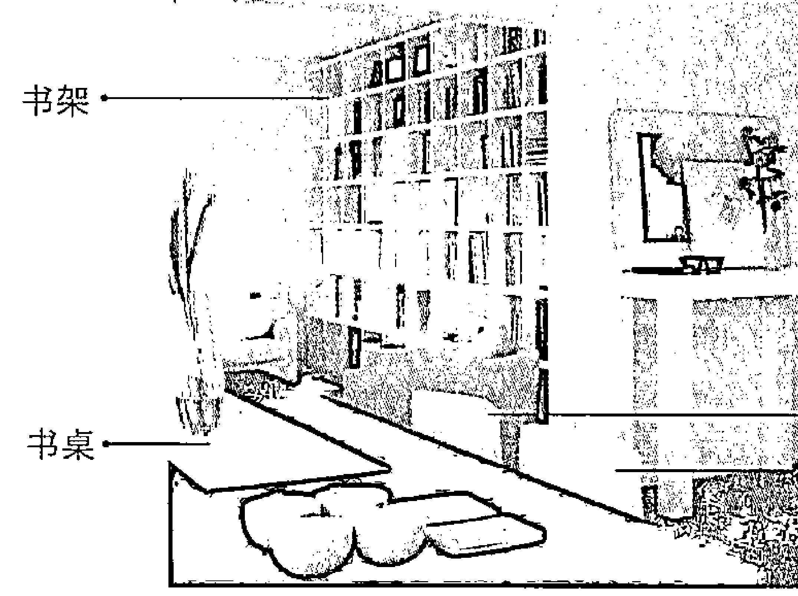

## 350 什么植物可以增强孩子的考试运？

一般认为在卧室摆放盆栽植物会增加阴气，不利于孩子的身心健康。但在孩子的书房就一定要摆放一些盆栽植物。

文昌属木，增加木气就能增加孩子的文昌运，盆栽植物就是“木”的典型代表。因此，在书房内栽种绿色植物，是提升孩子学运的好办法。

可以栽种一盆文竹，文竹代表书卷，能催旺文昌星，绿化书房的同时增加孩子的考试运。也可栽种其他水养植物，如吊兰、绿萝、常春藤、千年木等等。不过要记得常换水。

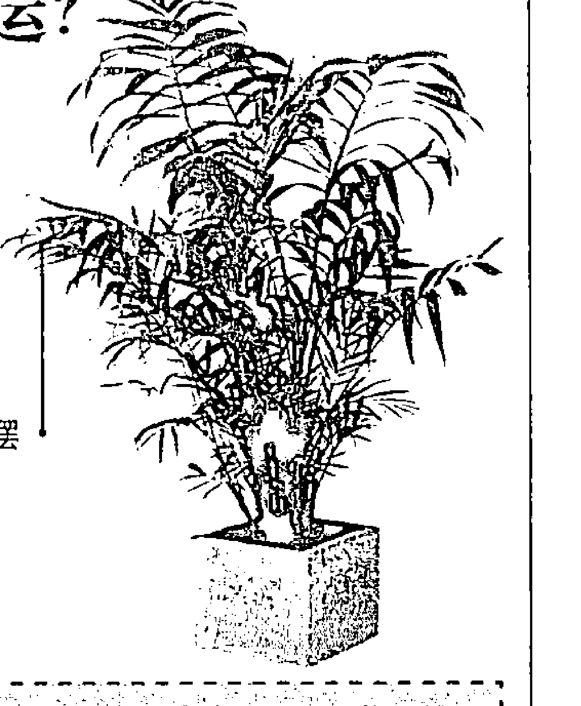

> > **书房植物要保证三天换一次水**
> 书房里适合摆放一些常青植物，可以增旺文昌运。一般来说，要根据植物的习性来浇水，枯萎的植物不要放在书房里。

## 351 空调可以增强学业运吗？

提升学业运有很多方法，除了借助文昌星、文昌塔等常用法器外，还可借助家用电器来增强学运，如可以用空调提升学业运。

空调有调节室温的作用，使人凉爽的同时，还可以帮助人清醒大脑，能使人凝聚思考、专心读书。若在书房的正北方装置空调，在空调运转时，其能量能够带动文昌运，有利于学生考试的发挥，对做学问研究的人也有利。

需要注意的是，空调的出风口不能对着脸或头部吹。这样不但会使人受凉，还会将不好的气场带给人，令人头痛、头沉，无法学习，更谈不上提升学运。

## 352 孩子房间的空调怎么摆放？

空调作为一种生活用具，它有散发能量的作用，它所拥有的气场会影响到孩子的学业。

空调摆放的位置适当可以催旺学业运。空调本身属金，如果孩子的五行中需要金，就可以将空调摆放在孩子所属的方位，如此可以增强孩子的考试运。

另外，空调中释放出的风，还会形成气场，若将风口调向上方，对家居气场好。

## 353 孩子的电脑摆放有何讲究？

在现代学习中，电脑已成为不可或缺的学习工具，人们在享受电脑带来的便捷时，还要注意它所造成的负面影响。
电脑与大多数家用电器一样，属金，生辰八字中缺金的孩子，用电脑可以完善五行，完善其性格，并促进其学业。电脑附近的磁场，虽然有利也有弊，但若将它放在合适的位置，如文昌星位、财位等吉位，可增强其“禄”运，有助于帮他通过读书获得富贵。
从健康方面考虑，电脑产生的辐射对人体非常不利。因此，在摆放电脑时不能把电脑摆放在有阳光直射的地方，空调的散热口下和暖气片附近也不宜摆放电脑。

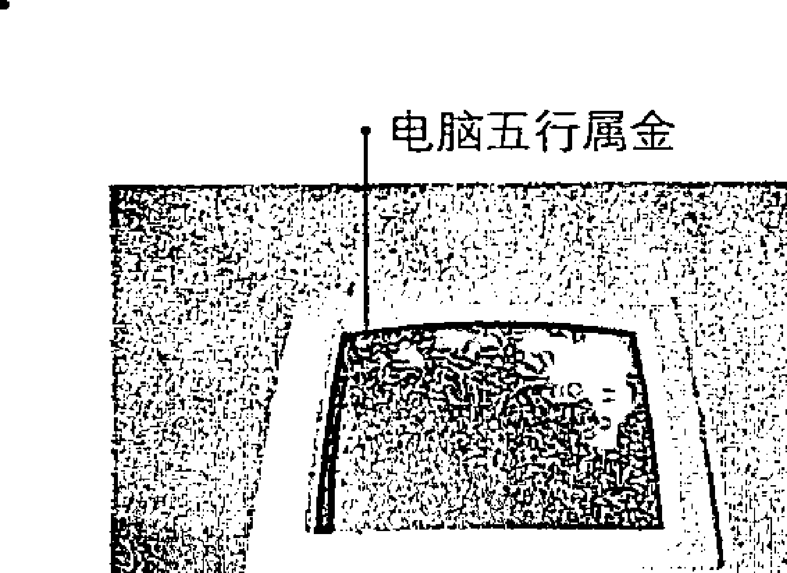

> 电脑摆放的讲究
从健康方面考虑，电脑产生的辐射对人体非常不利，因此不宜摆放在卧室，也不宜摆放在有阳光直射的地方。

## 354 小房间如何增强文昌运？

小房间空间狭小，文昌位上没有足够的空间摆放催旺文昌运的大型饰品，可以采用悬挂式的饰品。如可以让孩子佩戴文昌鱼吊坠，或者在孩子的书包、笔袋上挂文昌鱼挂饰，也可以在床头挂置这些饰品，这样能增强文昌运。
而且，房间无论大小，都有属于自己的吉位，都有文昌星位，只要在这些位置上摆放一些比较关键的法器，如摆放文昌塔、文昌星君，就可以起到提升学业的作用，这在空间上是完全允许的。况且小房间气场能量足，文昌星君能更好地发挥作用。
若是卧室，可以在床头放一些能积聚能量的物质，可以悬挂水晶吊饰等。

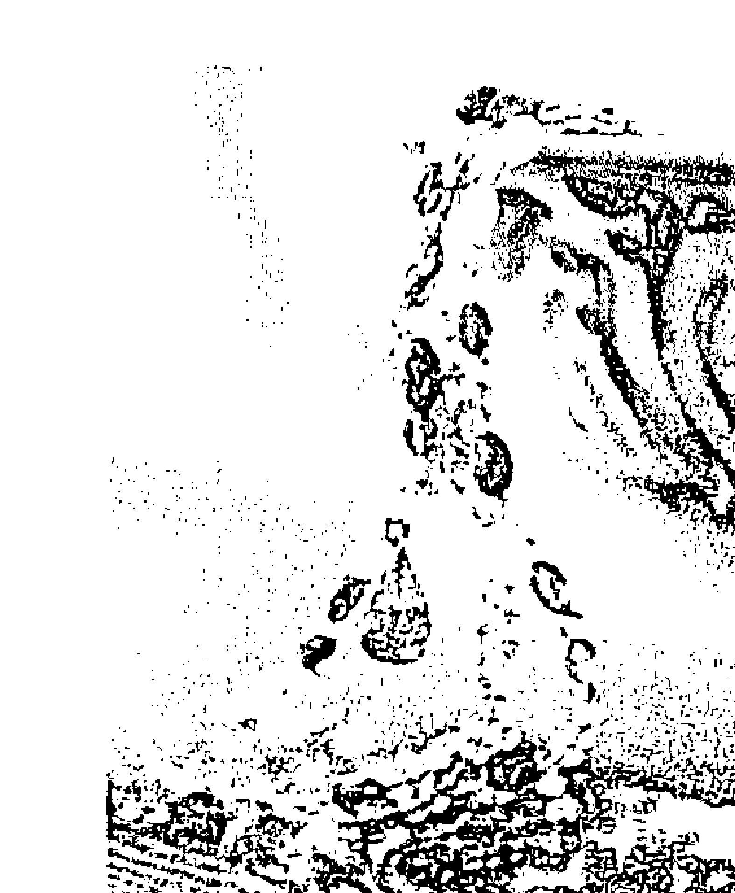

> 水晶吊饰
小卧室想增强文昌运，可以在床头摆放一些能聚集能量的物品，水晶吊饰就是不错的选择。

## 355 移动床位能提升记忆力吗？

如果床位与孩子的命局五行不配，会影响孩子的睡眠质量，孩子容易做噩梦，这样会损害孩子的大脑，导致孩子的记忆力下降。反之，好的床位，有助于提高孩子的睡眠质量，有安心醒神的作用，可以让大脑得到充分的休息，第二天就能更好地学习，间接提升其记忆力。

需要说明的是，男孩子的吉位在西南方，女孩子的吉位在正西方向。因此，在移动床位的时候，最好确保男孩子的床头在西南方向，女孩子的床头在正西方。不过一般说来，不同的人吉位所在的位置不同，在确定床位方向的时候，最好还是根据孩子的生辰八字决定床头合适的朝向。

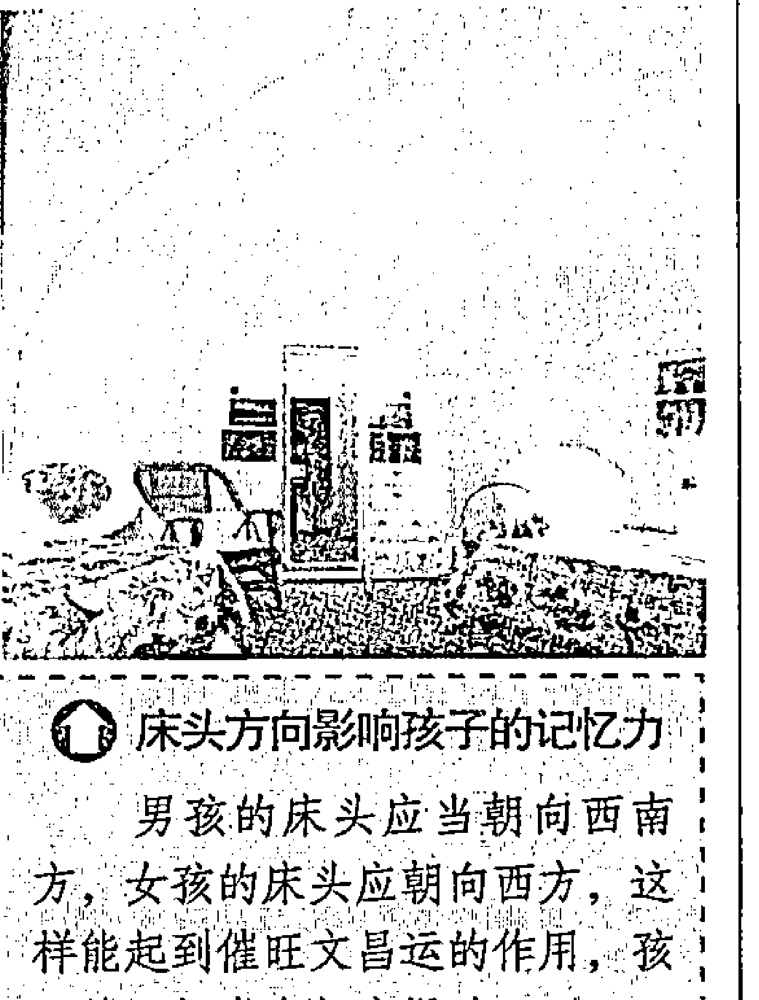

床头方向影响孩子的记忆力
男孩的床头应当朝向西南，女孩的床头应朝向西方，这样能起到催旺文昌运的作用，孩子的记忆力会相应提升。

## 356 孩子的床铺摆放有何讲究？

孩子的床铺摆放有大有讲究。好的床铺摆放，不但可以提升孩子的学运，有助于调和阴阳，确保其身体健康，起养生保健作用，还可以完善孩子的性格，确保其健康成长。因此在安置孩子床铺的时候，要注意下面几条原则。

儿童床不宜摆放在横梁下，那样容易给孩子造成紧张感，不利于孩子休息和成长。

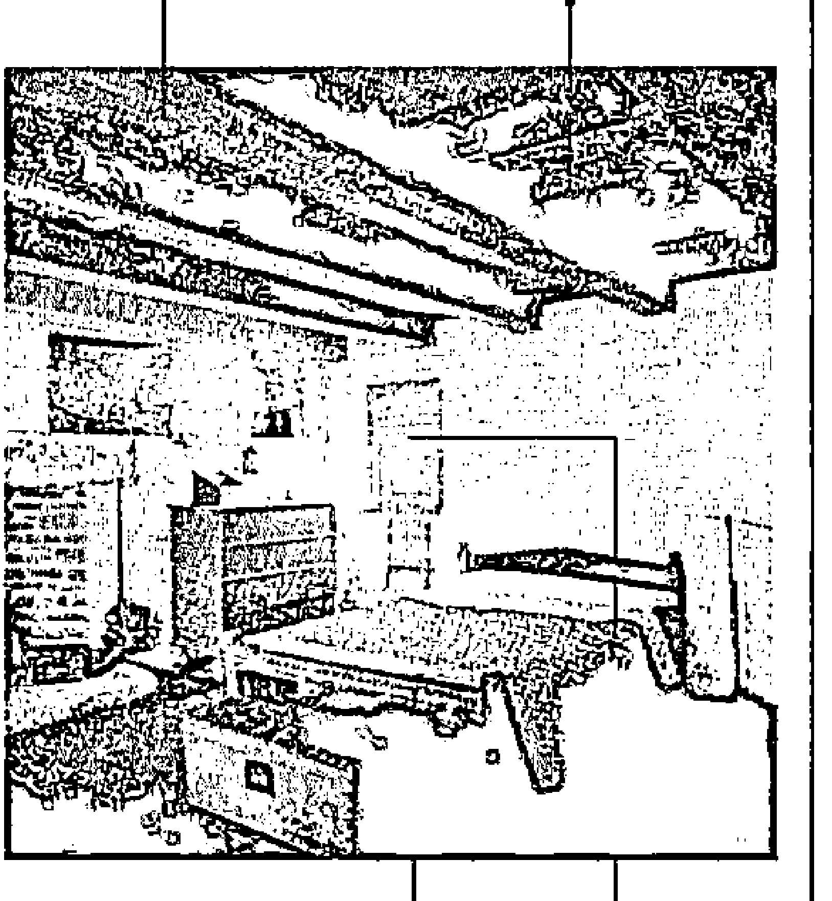

首先，孩子的床不能摆放在横梁下和神位下面。床铺在横梁下，不但容易有危险，还会对孩子造成威慑力，使他养成胆小、恐惧等心理。床铺若在神位下面，一方面对神不敬，不利于家中气运，另一方面人突然睡醒之后，容易受惊。

其次，床位不要靠近阳台的落地窗，也不要正对着厨房或者厕所。床位若靠近落地窗，易受附近磁场的干扰，睡不安稳。床正对着厨房或厕所也是不吉利的，前者的油烟之气，后者的污秽之气，均易产生不好的气场。

最后，不能用成人床代替儿童床。成人的床较大，所蕴含的能量较强，儿童的能力还不足以驾驭这里的能量，结果反受其害。孩子的床最好放在和其他卧室相邻的墙边。孩子睡觉的朝向也以头向东南，脚向西北为好。

## 357 孩子的房间不宜摆放哪些饰物？

用饰物装饰孩子的房间是有讲究的，孩子的房间不适宜摆放镜子，悬挂风铃，也不适宜摆放一些凶猛的野兽饰品。

镜子象征着“幻象”，即虚幻的世界，这个世界的种种易对人产生诱惑，干扰人的心智。

风铃的磁场有这样的作用：稍微有风吹草动，它便深受影响，叮叮当当地响不停，容易影响人心神的稳定，孩子也难以静下心来学习。

凶猛的野兽饰品固然有震慑邪恶的作用，但会潜意识地影响孩子的心神，容易导致小孩分心，严重时还可能导致神经衰弱。而且野兽的凶猛习性还会影响到孩子的性格，因此，孩子的房间最好不要摆设这类饰品。

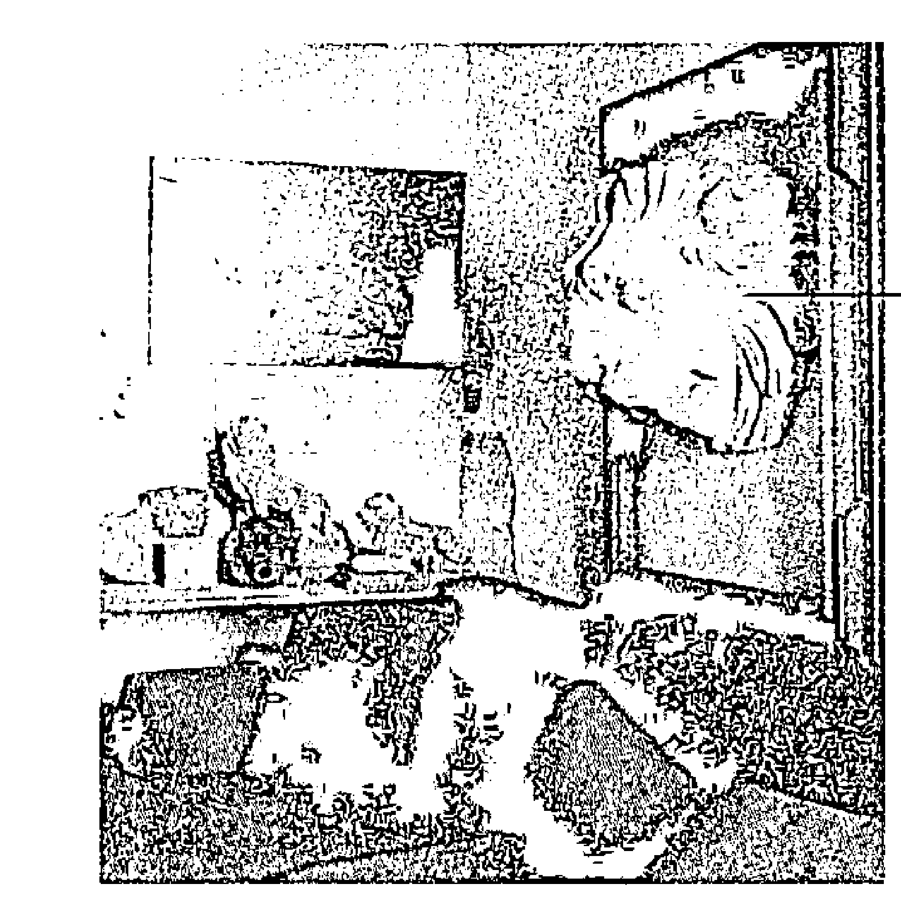

> 儿童房饰品
儿童房最好不要摆放镜子、风铃和猛兽饰品。猛兽饰品虽然有震慑邪恶的力量，但容易影响孩子的心神，导致孩子神经衰弱。

## 358 孩子的玩具有什么讲究？

现代家庭孩子的玩具是很丰富的，但玩具的选择是有讲究的，它的材质、造型均会对家中的气场产生影响。

孩子的玩具应该以小汽车、积木等利于开发智力的玩具为主。这些玩具有助于启发孩子的思考力，有健脑作用，对孩子将来的学运有较好的影响。

玩具材质以木质为最好，因为木是天然材料，不但坚固耐用，而且没有副作用，有利于孩子健康成长。

另外，一些洋娃娃、小动物之类的玩具，在孩子不玩时千万不能锁起来，否则等于锁住了孩子的心神、思维。这样不利于孩子的身心发展，也不利于提升孩子的学运。

## 359 孩子的房间不宜张贴哪些画报？

在孩子的房间适当张贴一些画报、图画，可起到活跃气场的作用，有助于帮助孩子醒神。需要注意的是，张贴海报也是有学问的，不能没有选择地张贴乱七八糟的画报。

奇形怪状的猛兽画报，斗气十足的武士海报是不适宜张贴在孩子房间里的。这些画报容易给人传递一种凶猛、好斗的情绪。孩子若常看到墙壁上这样的画报，心理难免会受其影响，性格变得好斗，不利于孩子健康成长。

孩子的房间应该张贴一些有助于陶冶性情、帮助成长的画报，如卡通、风景、名人字画等等。它们会传递给人一些积极向上的精神内涵，有助于完善孩子的性格。

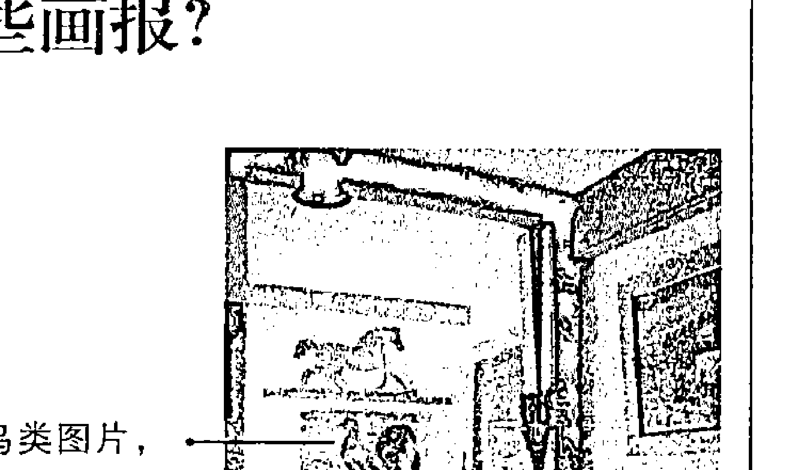

> 画报张贴有讲究
在孩子房间张贴画报，要注意不能贴得太多、太花哨，否则会使孩子心烦气躁。另外，如果给孩子房间张贴人物抽象画，只能张贴一张，不可太多。

## 360 孩子的房间在晚上要注意什么？

孩子的房间，在夜晚要注意安静和通风。

现在的学生压力大，作业多，好的睡眠对他们来说相当重要。孩子的房间若紧挨着客厅，或其他嘈杂的场所，在学习的时候，容易心不在焉；在睡觉的时候，又睡不安稳，容易陷入似睡非睡的状态，大脑得不到充分的休息，直接影响第二天的学习。而且学生的生活一般比较规律，一旦某个晚上的休息被打断，生物钟容易被扰乱，在较长时间内难以恢复。所以孩子的房间，在夜晚一定要保持安静。

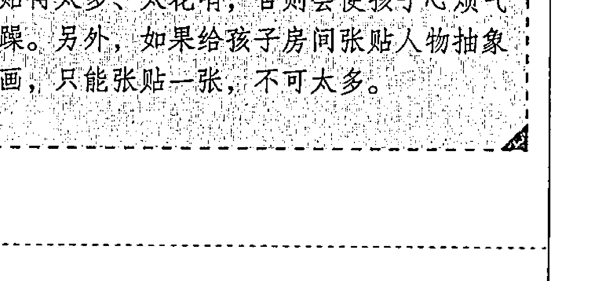

## 361 用神喜水的孩子吃什么好？

通常来说，生于夏秋两季的孩子八字火多，喜水。他们在性格上多愁善感，心理较为混沌，思虑多，梦想多。

根据周易上阴阳互补，“热者寒之”的补益原则，对于这些喜水的孩子来说，要想生旺文昌运，应多吃散热、去火及生津的食物。可多吃生鱼片，它有去火作用；也可适当进食牛肉，它有散热作用（但要注意牛肉一次不可多吃，否则容易上火）。可多吃水产品，如海带、鱼类、乌龟等，这些水产品均可起到清热去火的作用，常吃可生津。此外，还可多吃一些具有滋补作用的食物，如豆浆（凉性）、豆芽（属水）。平时要多喝水，清晨起来一杯凉开水最为适宜。

水分多的食物有助于孩子去热散火。

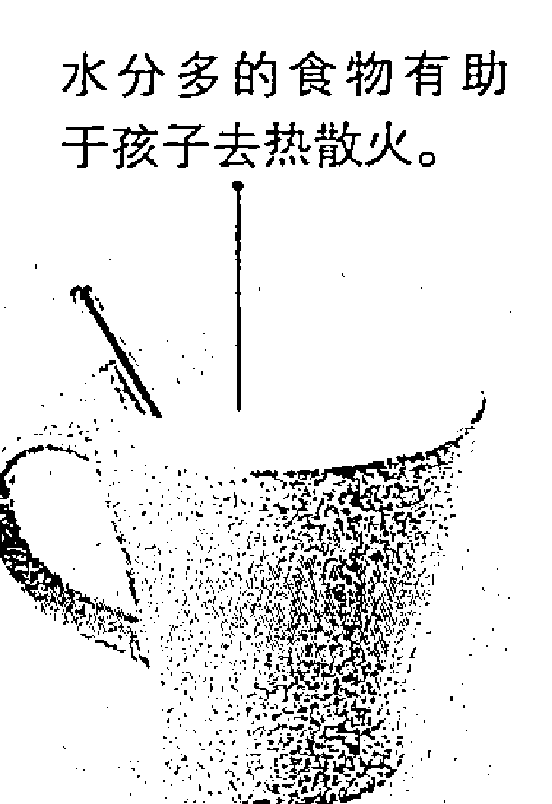

> 豆浆

豆浆营养非常丰富，并且有益于消化吸收。豆浆属于凉性饮品，多喝豆浆有利于八字火多，用神喜水的孩子。

## 362 用神喜火的孩子吃什么好？

通常来说，生于春冬两季的孩子八字喜火，要想生旺文昌运，可多吃动物大脑，如：鱼头、鸡头、猪脑等。民间有“以形补形”的说法，且脑部五行属火，可以补充胆固醇。

喜火的孩子在日常生活中要适当多吃一些属“火”的食物，如可以多吃羊肉，羊肉属火，可以去寒气。也可以多吃动物内脏，如猪心、猪肝、鸡蛋黄、核桃、辣椒、胡萝卜等。

用神喜火的孩子多吃辣椒旺文昌运。

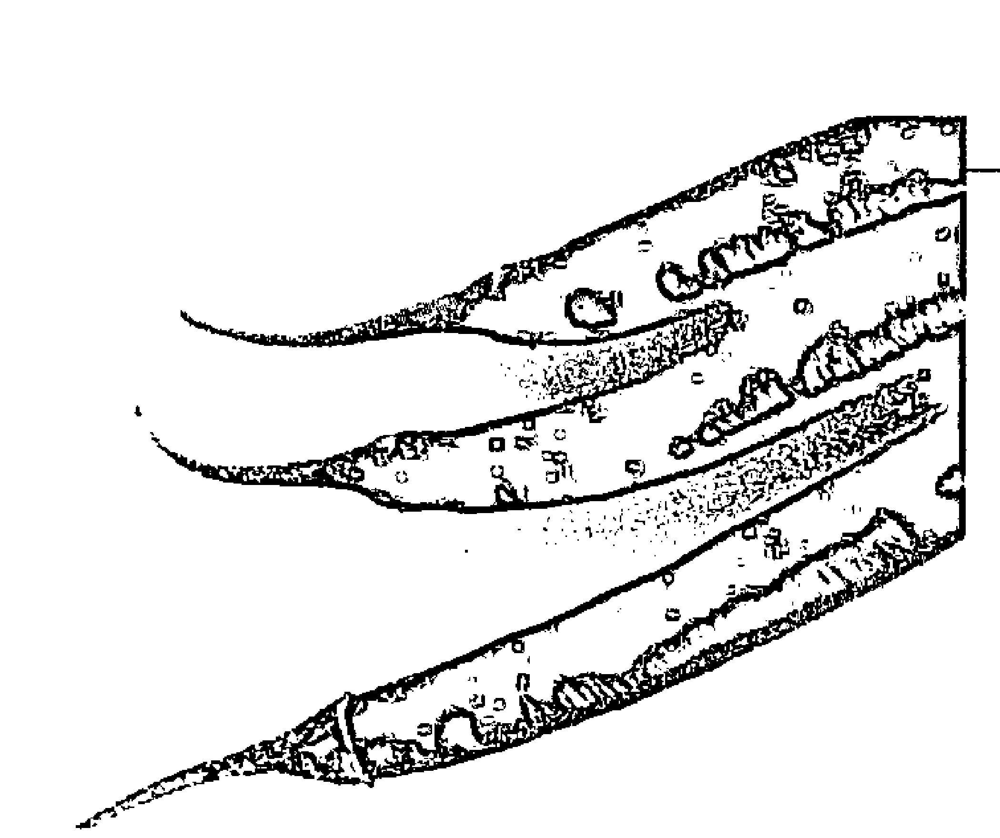

> 辣椒

火红的辣椒属火，多食用辣椒不仅有利于提高孩子的食欲，还能补充维生素C，辣椒是众多蔬菜中维生素C含量最高的食物。

## 363 木型人的孩子适合多吃哪些食物？

《黄帝内经》和《道德经》认为，人有五行、五型之分，根据面相可以分为金、木、水、火、土五种人。其中木型人：“苍色，小头，长面，大肩，背直，身小，手足好。有才，劳心，少力，多忧，劳于事。能春夏，不能秋冬，秋冬感而病生。”

属于木型人的孩子，身心正在发育，要多吃些相对的补益食物。如要多吃蔬菜，多喝茶，尤其是花茶。木型人应适当补火来平衡面色青且身体不佳的状况。所以孩子应该多吃些补火的食物，如红苹果、猪心等。
需要注意的是，木型人不宜吃肥肉，正在长身体的青少年也不宜多吃肥肉。

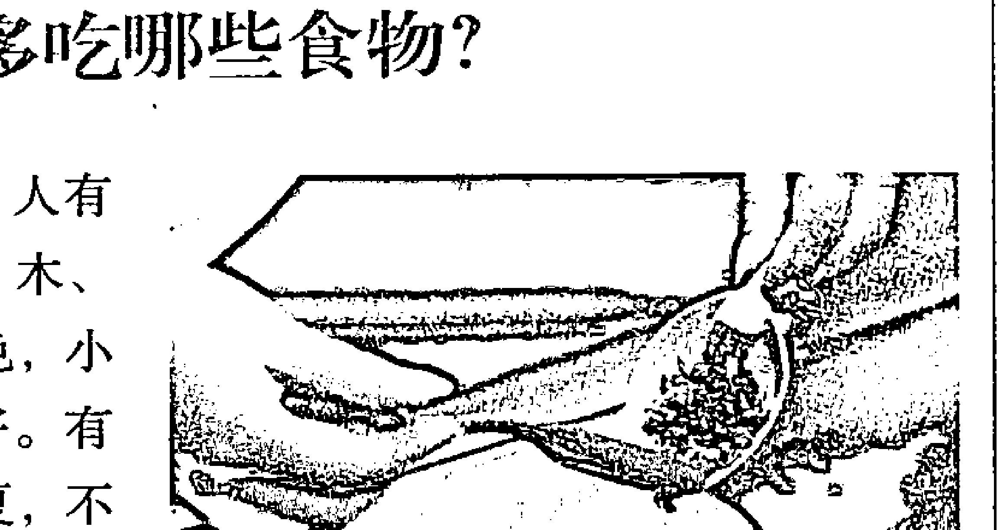

### 茶

茶有保健饮料之称，有帮助消化，提神醒脑，安神，镇静，陶冶性情的功效。适度饮茶，有利于青少年的成长。但是胃寒的孩子，并不适宜饮用。

## 364 金型人的孩子适合多吃哪些食物？

《黄帝内经》和《道德经》认为，人有五行、五型之分，根据面相可以分为金、木、水、火、土五种人。其中金型人：“方面，白色，小头，小肩背，小腹，小手足，如骨发踵外，骨轻。身清廉，急心静悍，善为吏。能秋冬，不能春夏，春夏感而病生。”

属于金型人的孩子，应该适当吃些甜食、豆制品、八宝粥、鸡肉等食物。从五行养身的角度讲，金旺克木，因此金型人应多吃属木的食品，比如木瓜、绿茶、柠檬等。另外，适当地多吃一些属水的食物，如雪梨、鸡肾、猪耳等。这些食物可以补充身体水分，滋阴润燥，防止上火，从而调节身体健康。

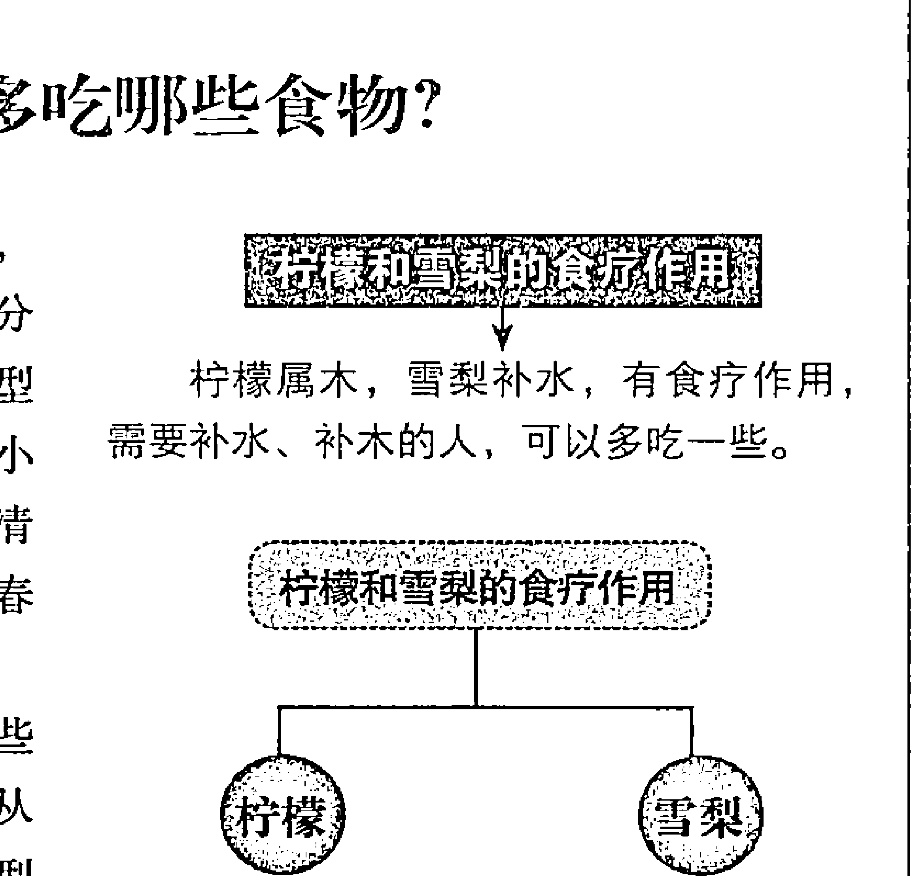

## 365 水型人的孩子适合多吃哪些食物？

《黄帝内经》和《道德经》认为，人有五行、五型之分，根据其面相可以分为金、木、水、火、土五种人。其中水型人：“黑色，面不平，大头，廉颐，小肩，大腹，动手足，发行摇身，下尻长，背延延然。不敬畏，善欺绐人，戮死。能秋冬，不能春夏，春夏感而病生。”

因此，属于水型人的孩子，要适当吃一些属水类和属金类的食物。属水的有海鲜、贝壳类的海产品，属金的有糕点、玉米、蒜等。水型人要注意养肝，多吃蔬菜、鱼头等食物。另外多吃一些羊肉、狗肉、山楂、西瓜等能给水型人带来好运气。

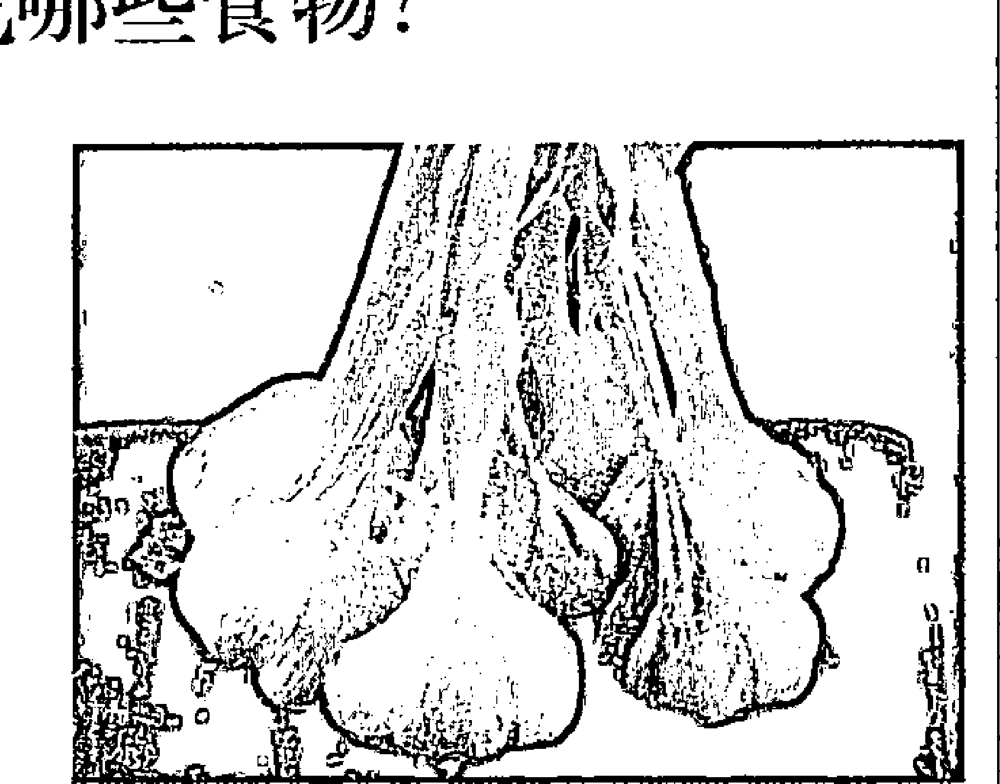

### 大蒜

大蒜性温，可以预防感冒，减轻发烧、咳嗽、喉痛及鼻塞等感冒症状。除阴虚火旺及慢性胃炎溃疡病患者慎食外，其余人群皆可食用。

## 366 火型人的孩子适合多吃哪些食物？

《黄帝内经》和《道德经》认为，人有五行、五型之分，根据其面相可以分为金、木、水、火、土五种人。其中火型人：“赤色，脱面，小头，好肩背、髀腹，小手足，行安地，疾心，行摇肩，背肉满。有气，轻财，小信，多虑，见事明，好颜，急心，不寿暴死。能春夏，不能秋冬，秋冬感而病生。”

水火不相容，二者互补互生。因此，属于火型人的孩子，应多吃一些属水性的食物。这类食物有海带、绿豆汤、鱼、紫菜蛋花汤、燕窝等，它们可以给自身带来好运气。多吃蜂蜜、豆沙饼等能调节身体健康，平时要多加锻炼。

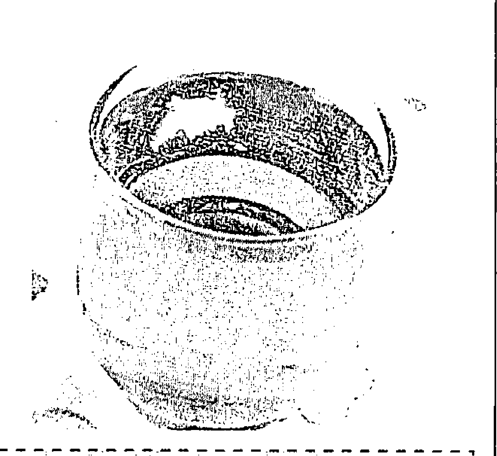

### 蜂蜜

火型人的孩子每天早上喝杯蜂蜜水，有润肠道的作用。蜂蜜最好不要与大蒜同食，否则会导致腹泻。

## 367 土型人的孩子适合多吃哪些食物？

《黄帝内经》和《道德经》认为，人有五行、五型之分，根据其面相可分为金、木、水、火、土五种人。其中土型人：“黄色，圆面、大头、美肩背、大腹、美股胫、小手足，多肉，上下相称，行安地，举足浮。安心，好利人，不喜权势，善附人也。能秋冬，不能春夏，春夏感而病生。”

由于土型人体内阴阳气合，身体没有什么大的缺陷，平素要注意保养肠胃及脾。因此，要多吃一些健脾的食物，比如红薯、土豆、黄豆、牛肉、红枣等。土型人注意饮食结构，阴阳并重，能带来好运气。

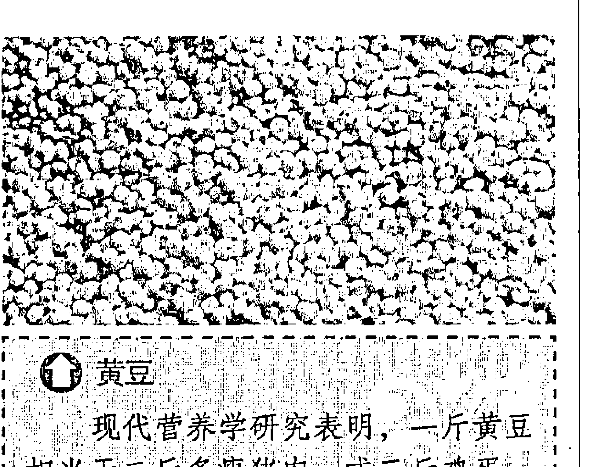

> 黄豆
现代营养学研究表明，一斤黄豆相当于二斤多瘦猪肉，或三斤鸡蛋，或十二斤牛奶的蛋白质含量。儿童多吃黄豆，不仅有利于脾胃，更有利于身体生长。

### 土豆的食用常识

| 分类 | 内容 |
| :--- | :--- |
| 概述 | 土豆富含矿物质和微量元素，经常食用能够缓解紧张、抑郁的情绪。 |
| 土豆的好处 | 做事虎头蛇尾的人，缺乏维生素A和维生素C，经常食用土豆能有效补充这两种维生素，有利于孩子的学业运。 |
| 美容方法 | 年轻人皮肤油脂分泌旺盛，常受青春痘、痤疮困扰，用棉花沾新鲜土豆汁涂抹患处可以解决这个问题。 |
| 转运方法 | 土豆五行属土，春季应多食土豆。不仅能平衡春季过于旺盛的木气，平肝健脾，并且木克土为财，能让你做事更顺利，财源滚滚来。 |
| 食用禁忌 | 不要购买颜色发青和发芽的土豆，以免中毒。买回的土豆必须去皮、去芽儿才能食用，储存的时候，与苹果同放可以防止生芽儿。 |

## 368 学生为什么要多吃芽菜？

芽菜种类很多，常见的有绿豆芽和黄豆芽。绿豆芽性凉味甘，有解酒毒、热毒之功效；黄豆芽性微凉味甘，利湿热，有活血利水、清热消肿、补肝明目之功效。学生终日学习，压力比较大，用脑也比较多，因此要多吃一些具有补益大脑、强健身体的食物。家长在准备菜的时候，可以经常为孩子炒一道酸豆芽，不但味道可口，豆芽或翠绿或嫩黄的颜色，还有助于刺激孩子的食欲，从而满足身体对多种营养的需求。

## 369 学生为什么要适当多吃牛肉？

牛肉含有丰富的蛋白质、氨基酸、维生素B以及锌、铁、镁等多种微量元素，这些都是人体所需的能量。多吃牛肉能提高机体抗病能力，对孩子的生长发育极有好处。另外，冬天吃牛肉，有暖胃作用。
需要说明的是，牛肉虽然好吃，但其性温热，一次食用过量容易上火，体质缺水的孩子吃了，容易眼睛红赤，大便困难，因此最好不要多吃。

### 挑选优质牛肉的方法

牛肉含有丰富的蛋白质，新鲜的牛肉有补中益气、滋养脾胃的功效。

### 挑选方法

- **闻**：是正常的新鲜肉味，无酸味。
- **摸**：肉有弹性不粘手，指压后凹陷立刻恢复。
- **看**：肉皮无红点，有光泽，红色均匀，脂肪洁白或淡黄。

## 370 “及第粥”有什么作用？

相传，清朝时候，广东的林召棠高中状元之后回乡祭祖，每天用猪肝、猪腰子和猪肚煮粥而食。一天，一位老御史来拜访林召棠，刚好遇到他在喝粥，于是一起同吃。老御史觉得这种粥味道很好，就问林召棠这是什么粥。林召棠知道老御史望子成龙，希望自己的儿子高中状元，便告诉他这是“及第粥”，常喝可高中状元。老御史信以为真，回去之后按照林召棠的方法，经常给自己的孩子做“及第粥”喝，后来他的儿子果然高中状元。“及第粥”从此美名远扬，广东一带的人就常给自己的孩子吃及第粥，认为它可提升孩子的学运。

### 及第粥

及第粥味美香浓、营养丰富、做法简单，是提升学运的佳品。

### 及第粥的做法

- **食材**：将猪腰子、猪肝、猪肚加入粥中煮熟而成。
- **做法**：将材料洗净、切好，然后放锅中炖煮，后放入葱花、香菜、调味料调味即可。
- **价值**：为人体提供优质蛋白质和脂肪酸，促进铁元素的吸收。

## 371 学生为什么要多吃鲤鱼？

鲤鱼性平味甘，属于高蛋白食品，营养价值非常高，还有药用功能。鲤鱼具有健脾养胃，利水消肿，止咳平喘等作用。鱼头中含丰富的卵磷脂，对维护大脑营养，增强记忆颇有好处。多吃鲤鱼对于正在上学的孩子十分有益。

此外，在民俗中，鲤鱼常被人们当做吉祥物。年画、饰品等常以鲤鱼的图像为主题，人们还常以“鲤鱼跳龙门”来比喻中举、升官等飞黄腾达之事，也可用来比喻逆流前进、奋发向上。这些象征均表达了鲤鱼对人们的积极影响，孩子常吃鲤鱼可以从心理上得到积极的暗示。

鲤鱼富含磷脂，可改善记忆力。特别是鲤鱼的头部脑髓含量很高，经常食用，能暖胃，祛头眩，益智商，助记忆，最适合孩子及老人食用。

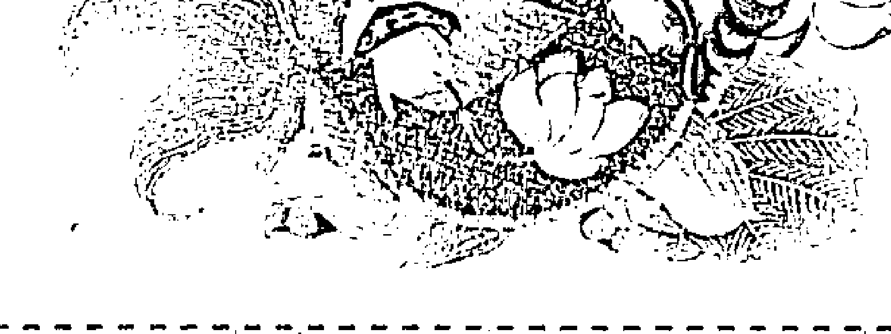

| 价值 | 主要内容 |
|------|----------|
| 营养价值 | 鲤鱼的营养价值高，富含蛋白质，而且极易人体吸收，吸收率高达96%。它还富含多种氨基酸和矿物质。鲤鱼的脂肪为不饱和脂肪酸，能降低胆固醇，经常食用可延年益寿。 |
| 观赏价值 | 锦鲤花色繁多，在世界很多地方都有养殖，比较具有观赏价值。 |

> > 鲤鱼年画
> “鱼”与“余”同音，比喻生活富裕，年年有余。旧时过新年的时候，家家都会挂一张儿童抱鲤鱼的年画，既表达欢庆之情，又图来年吉利。

## 372 学生为什么要多吃青菜？

青菜含有丰富的维生素及纤维，清利口腔、退热利尿的功效非常强。经常吃青菜，可以补充防癌的叶酸，其中的纤维还能增加肠胃的蠕动，缓解便秘，有利于人体新陈代谢，多吃青菜可以使身体内环境保持碱性，增强免疫力。

菠菜是青菜中的代表，有补铁、补血、补充胡萝卜素等作用，有利于大脑神经。菠菜中的绿色能量还可以维持人体的酸碱度，并提供大量的纤维素，有助于清理肠胃，使身材苗条。研究发现，菠菜还有健脑功效，常吃菠菜的老人比不吃菠菜的老人患老年痴呆症的几率要低得多。

需要注意的是，菠菜不宜和豆腐一起吃：进入人体内的草酸会同血中的钙离子反应，形成不溶性草酸钙。

## 373 学生为什么要多吃海带？

营养学家认为，海带中所含的热量较低，胶质和矿物质较高，易消化吸收，抗老化，吃后不用担心发胖，是理想的女性健康食品。

海带中的碘还有补益大脑的作用。研究表明，胎儿3-5个月大时大脑处于发育临界期，这时胎儿会依赖母体内的甲状腺素。若孕妇缺碘，则可能导致胎儿甲状腺素合成不足，严重影响胎儿大脑的发育。所以孕妇在怀孕期间要多吃富含碘的食物，促进胎儿甲状腺素的合成，促进胎儿大脑的发育。处于生长发育期的儿童、青少年多吃海带，还有助于提升智力。

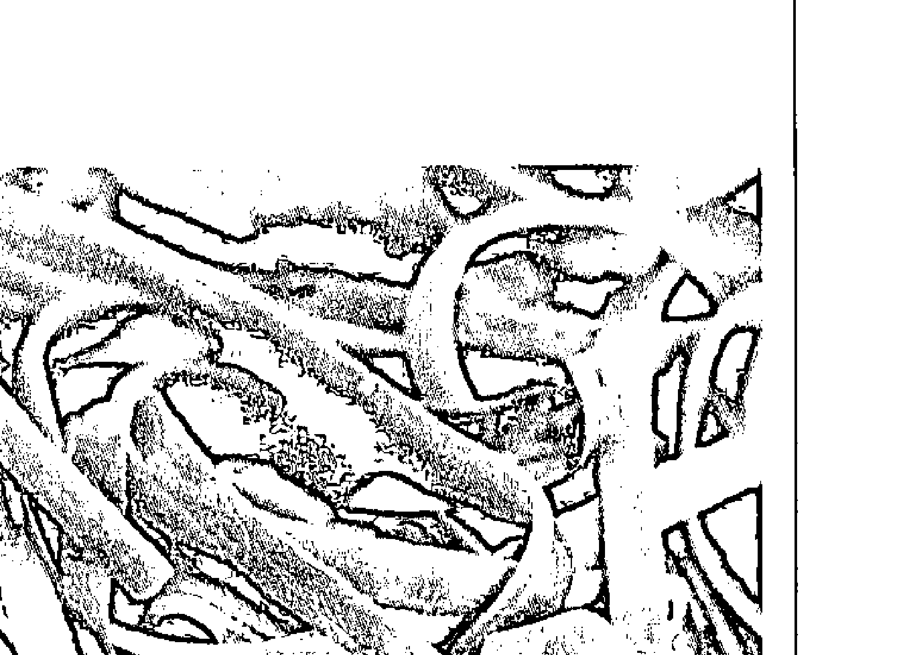

> 食用海带的益处
人们食用的绝大多数动物性食品均属于酸性食物，体液呈酸性会使血液黏度增高。食用海带可以中和身体内的酸性物质，有利于身体健康。

## 374 学生为什么要多吃银耳？

自古以来，银耳就被人们誉为“菌中明珠”“延年益寿之品”“长生不老良药”。它既是名贵的滋补佳品，又是扶正强壮的补药，被历代皇家贵族所重视。中医认为，银耳性平味甘，能滋阴润肺，养气和血，补脑提神，对阴虚火旺、不能吃人参、鹿茸的病人是一种良好的补品。

现代科学研究发现，银耳中富含胶原蛋白，能补养大脑；它所含的磷，对大脑皮质和神经系统有重要调节作用；所含的铁，可参与血液输送氧气和制造血红蛋白，从而保证脑部供血充足。

长期服用银耳有益生长发育，强身健体，润肤美容。

> 银耳富含维生素D，能防止钙的流失，对生长发育十分有益。

> 银耳富含硒等微量元素，它可以增强肌体抗肿瘤的免疫能力。

> 银耳的粗纤维有助胃肠蠕动，减少脂肪吸收，故有助减肥。

> 银耳富有天然植物性胶质，加上它的滋阴作用，有祛除脸部黄褐斑、雀斑的功效。

## 375 学生为什么要多吃金针菇？

现代科学认为，金针菇含锌量很高，有促进儿童智力发育和健脑的作用，被誉为“益智菇”。

医学研究人员发现，婴幼儿从断奶到学龄前，长期适量食用金针菇的儿童要比不常吃金针菇的儿童聪明多智，记忆力强，而且前者的身高、体重也比后者高和重。日本人把金针菇作为儿童保健和智力开发的必需品。我国台湾地区称金针菇为“益智菇”。科学研究发现，金针菇的氨基酸模式与人体需要的模式接近，其中赖氨酸、精氨酸、亮氨酸含量尤多，有利于儿童智力发育。

此外，金针菇还有其他营养价值，如：食用金针菇具有抵抗疲劳、抗菌消炎等作用。

### 金针菇有益人体的六种功效

金针菇被称为菇类中的“蛋白质库”，补益作用显著，最适合孩子食用。

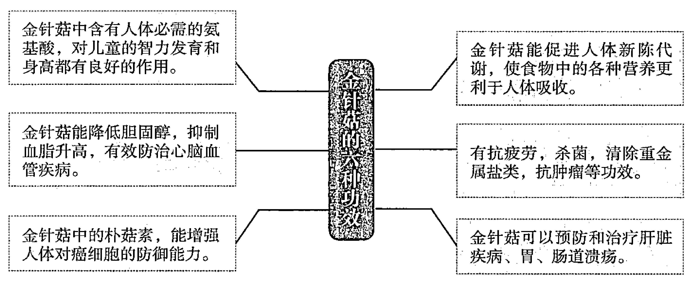

## 376 学生为什么要多吃香菇？

香菇不但口味柔和、鲜香，而且营养价值高，被誉为“上帝的食品”“食用菌皇后”“仙家之珍品”。香菇的营养被人体吸收以后，不但能增强人体抵抗力，增进食欲，促进食欲，而且可以帮助儿童骨骼和牙齿生长。香菇对脑功能的正常发挥也有着重要的促进作用，它可以促进儿童智力发展、延缓老年人智力衰退等。

香菇的菌盖和菌柄都很肥嫩，油性也大，可以单独食用，也可以与鸡鸭鱼肉相配。香菇可以通过炒、烧的方法烹调出美味菜肴，也可通过煮、炖的方法熬出鲜美可口的汤。

## 377 学生为什么要多吃黑木耳？

黑木耳有多种营养保健价值，能养血驻颜，祛病延年，素有“素中之荤”“菌中之花”的美誉，与菇类并称“最佳菌类”。汉朝的《神农本草经》中有关于黑木耳药用的记载。

科学研究发现，黑木耳含有脂肪、蛋白质、多糖类以及钙、铁等矿物质和维生素等营养成分。其中它所含的脂肪主要是脑磷脂、卵磷脂、鞘磷脂等对脑神经生长、发育有滋养作用的磷脂。这些都是儿童补脑、健脑的佳品，久服可以健脑益智。此外，久病体虚、腰膝酸软、肢体麻木、失眠多梦、眩晕、健忘者也可经常食用黑木耳，有强身健体之效。

黑木耳还有其他营养保健功效，如黑木耳中的胶质可把残留在人体消化系统内的灰尘、杂质吸附集中起来排出体外，从而起到清胃涤肠的作用。黑木耳中铁的含量极高，常吃黑木耳不但养血驻颜，还有助于增加大脑中的氧含量，从而起到健脑益智的作用，学生常食可改善记忆力。

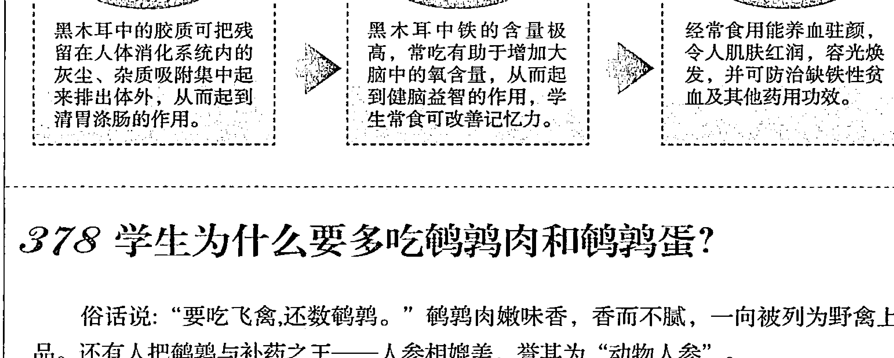

## 378 学生为什么要多吃鹌鹑肉和鹌鹑蛋？

俗话说：“要吃飞禽，还数鹌鹑。”鹌鹑肉嫩味香，香而不腻，一向被列为野禽上品。还有人把鹌鹑与补药之王——人参相媲美，誉其为“动物人参”。

除了营养美味外，鹌鹑还是健脑益智的经典食品。它所含的丰富蛋白质、无机盐、维生素等，对促进儿童发育，提高记忆力，保持充沛精神都有明显作用。脑力劳动者经常吃鹌鹑，还能健脑养身，起到缓解大脑疲劳，提高工作效率的作用。鹌鹑蛋虽然体积小，但它的营养价值却跟鸡蛋有得一拼，有“卵中佳品”之称。因此，常吃鹌鹑蛋有益于大脑运作，最适宜学生。

## 379 学生为什么要多吃水果？

水果富含丰富的维生素及多种营养元素。多吃水果可以排出体内淤积的毒素，令肌肤变得光滑、柔嫩，远离色斑以及青春痘。水果中的天然色素还能预防癌症，含有β胡萝卜素的部分水果，对人体的细胞有益。

学习压力大的学生，最好多吃香蕉。欧洲人因为香蕉能解除忧郁而称它为“快乐水果”。非洲许多国家盛产香蕉，所以那里的人思维敏捷，眼睛明亮有神，少生病。传说佛祖释迦牟尼因吃了香蕉而获得智慧，因此，香蕉又有“智慧之果”之称。儿童常吃香蕉，可有效预防神经疲劳，健脑益智。荷兰科学家研究证明：最符合营养标准又能为人脸上增添笑容的水果是香蕉。它含有泛酸等成分，是人体的“开心激素”，可以有效地减轻心理压力，解除忧郁，令人快乐。

| 益处和注意事项 | 内容 |
| :--- | :--- |
| 益处 | 香蕉易消化，好吸收，能均衡营养，特别适合儿童食用。 |
| | 香蕉中的特殊氨基酸能使儿童精神愉快，活泼开朗。 |
| 注意事项 | 食用生香蕉不仅不能治疗便秘，还会加重便秘。 |
| | 过量食用香蕉会引起人体微量元素比例失调。 |

## 380 学生为什么要多吃核桃？

核桃是坚果之一，核桃中含有丰富的磷脂、不饱和脂肪酸、锌、锰、铬等人体不可或缺的微量元素。其中的磷脂对脑神经有很好的保健作用，不饱和脂肪酸能防止动脉硬化。核桃还有治疗咳嗽的作用，经常食用核桃能强健身体，防衰老。

中国素有“吃核桃补脑”的说法。可能是巧合，也可能是自然选择的结果，核桃仁的形状与人脑相似。老人经常吃核桃还能预防老年痴呆症。从科学的角度上来看，构成人脑细胞的物质中约有60%是不饱和脂肪酸，而核桃仁中含40%-50%的不饱和脂肪酸，是滋养大脑最好的补品。学生常吃核桃仁，有助于大脑的健康发育，强化思维，增强考试运。

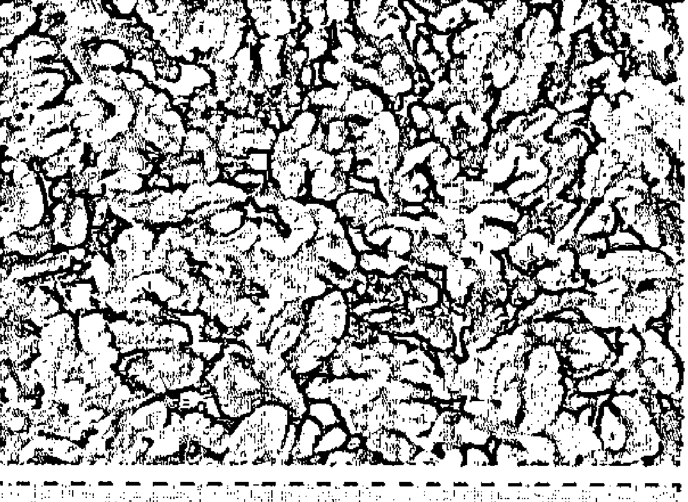

> **补养大脑的核桃**
核桃仁中的维生素E，有润肌肤，乌须发的作用，经常食用可令皮肤滋润光滑，富于弹性。当工作、学习感觉疲劳时，吃些核桃仁，能有效缓解疲劳和压力。

## 381 学生为什么可以经常吃瓜子？

瓜子跟核桃仁一样，内含丰富的不饱和脂肪酸。它可以促进人体细胞再生，防止人体老化，常吃瓜子可以让人更年轻。虽然瓜子是生活中必不可少的零食，但却不宜一次多吃，因为大量嗑瓜子会严重耗费唾液，久而久之会影响人的口腔健康和消化功能，食欲减退甚至引起痉挛。经常用嘴剥果壳，容易使舌头和口角糜烂，还会在吐壳时将大量津液带走，使味觉迟钝。

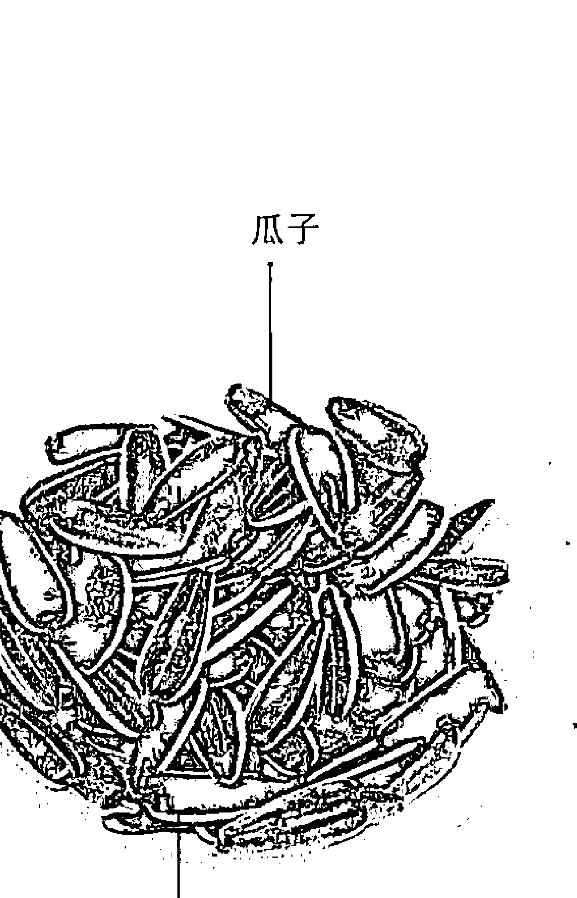

现代科学研究发现，瓜子是一种营养十分丰富的食品。它含有多种维生素，与人体大脑密切相关。其中的维生素A有促进幼儿发育的作用，有助于活跃眼球功能，提高视网膜对光的感受能力，从而为大脑提供更多的信息。维生素C可坚固脑细胞结构，保障大脑的灵活、敏捷，并有提高智商的作用。维生素E可以供应人体各种智能活力和情绪活力，防止脑细胞衰老。维生素B₁可防酸性体质，防止精神疲劳或身体疲倦，保障脑功能的正常运作。总之，瓜子是健脑益智最佳的零食。

## 382 学生为什么要多吃猪脑？

根据中医“以形补形，以脏补脏”的原则，吃猪脑有补益人脑。这是因为，人脑是由脑髓组成的，猪脑跟人脑的结构一样，所以吃猪脑可以补益人脑。另外，猪脑还有丰富的钙、磷、铁等矿物质，不但可以滋养大脑，还有补血的功效。

有的人将猪脑弃之不用实在可惜。其实做猪脑很简单，只要将猪脑表面的血筋除去，弄熟了即可食用。除血筋时，将猪脑浸入冷水中浸泡一会儿，等看到有明显的血筋粘在猪脑表面时，用手抓几下，即可将血筋抓去。食用猪脑时，蒸、炖均可，其肉质细腻，鲜嫩可口，营养丰富。

若家中有孩子，可以常做猪脑炖胡萝卜。其中胡萝卜富含维生素A，可以促进孩子生长发育，增强抵抗力，对孩子的视力、骨髓以及牙齿的生长都有利。

## 383 学生为什么要常吃松子？

松子被人们视为“长寿果”，又被称为“坚果中的鲜品”。松子脂肪含量大，多为油酸、亚油酸等不饱和脂肪酸，它还含有丰富的磷、锰。这些营养成分不但可以强健身体，对大脑和神经也有补益作用，是学生和脑力劳动者的健脑佳品，对小儿生长发育迟缓也有补肾益气、养血润肠、滋补健身的作用，对老年痴呆症有很好的预防作用。

需要注意的是，松子虽然有补益作用，但其油性比较大，不宜大量进食，当零食吃效果比较好，每次食用20克即可。此外，松子存放时间长了会变味，这时也不宜再食用。

### 松子小知识

| 知识要点 | 主要内容 |
| :--- | :--- |
| 主要功效 | 松子是大脑的优质营养补充剂，特别适合用脑过度的人群食用。松子中所含的不饱和脂肪酸具有增强脑细胞代谢，维护脑细胞功能和神经功能的作用。 |
| 其他功效 | 具有抗衰老、预防心脑血管疾病、滋阴润肺、滑肠通便的作用。 |
| 适宜人群 | 特别适合课业压力大的学生和脑力劳动工作者，对老年人慢性支气管炎、风湿性关节炎也有一定的疗效。 |
| 食用禁忌 | 松子油性大，脾虚腹泻和多痰患者不宜过多食用。 |

## 384 学生为什么要多吃胡萝卜？

胡萝卜对人脑有保护作用，还能增强中枢神经系统的功能。荷兰科学家研究发现，胡萝卜中的胡萝卜素可防止记忆衰退及其他神经功能的丢失。美国科学家在实验室观察发现，胡萝卜具有刺激大脑进行物质交换的作用，可减轻背诵记忆前的压力。更神奇的是，胡萝卜虽不含特别的有效成分，但它含有很多能转化为维生素A的胡萝卜素，1个胡萝卜素分子就可转化为2个维生素A分子。这对维护大脑及中枢神经系统的正常运作，减轻紧张情绪，营养和保护眼睛都有好处。此外，胡萝卜中还含有大量构成脑细胞和骨髓细胞的磷质。可以说，胡萝卜是孩童健脑益智的上等蔬菜。

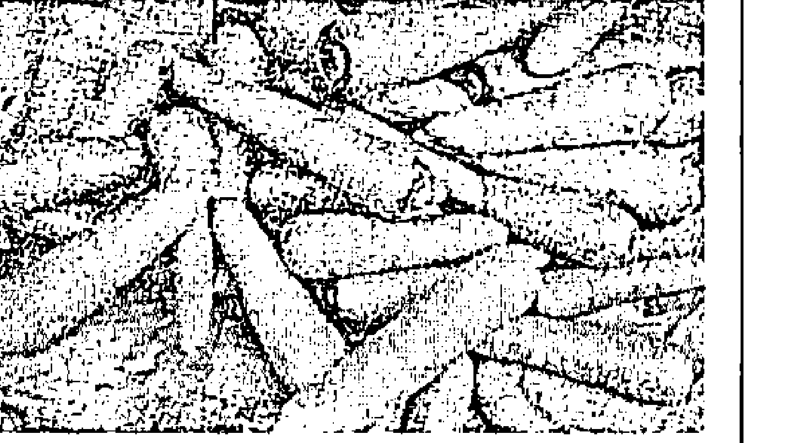

> **胡萝卜**
胡萝卜含有能转化维生素A的胡萝卜素，具有促进机体正常生长与繁殖，防止呼吸道感染，保持视力正常，治疗夜盲症和眼睛干燥症等功能。

## 385 孩子为什么要早餐吃鸡蛋？

鸡蛋中含有卵磷脂、甘油三酯、胆固醇和卵黄素。早餐吃鸡蛋，能补充人体所需的蛋白质，鸡蛋中的营养成分还能起到保护肝脏、防止动脉硬化的作用。早餐吃鸡蛋对神经系统和身体发育有良好作用，能改善孩子的记忆力。

鸡蛋中的蛋白质尤其丰富，几乎每一个鸡蛋就相当于一杯牛奶的营养。丰富的蛋白质是制造荷尔蒙及酵素的重要物质，对于维持人体正常的生长发育极为重要。而且，鸡蛋还是一种食用对象相当广泛的食品，从4～5个月的婴儿一直到老人，都适宜食用。

| 新鲜鸡蛋 | 陈鸡蛋 |
| :--- | :--- |
| 日光下，新鲜鸡蛋呈微红色，半透明，蛋黄轮廓清晰。 | 变质鸡蛋，蛋壳昏暗不透明，有污斑。 |
| 蛋壳颜色鲜明，附着霜状粉末，气孔明显。 | 蛋壳无霜状粉末，气孔不明显。 |
| 用手轻摇，无水声。 | 用手轻摇，有水声。 |
| 能平躺在冷水里。 | 笔直立在冷水中。 |

## 386 学生起床后为何要先喝一杯凉开水？

从保健的角度讲，人体在经过了一夜的睡眠之后，身体处于缺水的状态，早晨起床后需要补充身体新陈代谢失去的水分。喝一杯白开水能有效地刺激胃肠的蠕动，湿润肠道，可以有效地防止便秘。另外，早晨喝一杯白开水还能洗涤肠胃，促进血液循环。

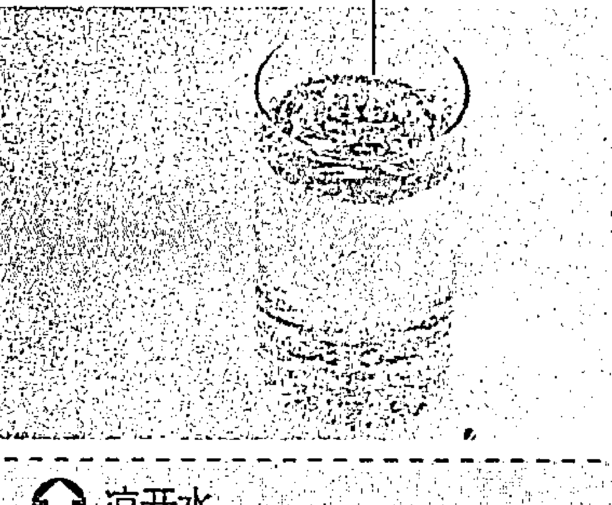

从学习的角度讲，人刚刚起床的时候，身体已经苏醒，但大脑还处于混沌状态。学生学业重，压力大，大脑长久处于混沌状态，不利于学习。而喝一杯凉开水，可以及时唤醒大脑，醒神，让大脑很快处于清醒的状态，有助于开展一天的学习。

> **凉开水**
温和的凉开水更容易透过细胞表膜，促进人体新陈代谢，提高血液中血红蛋白含量，进而改善人体免疫机能。

## 387 孩子吃蛋糕有何讲究？

蛋糕与五行有关，孩子在生日当天，若能吃到一个符合自己生辰八字的蛋糕，可旺文昌运，在来年的学业上一帆风顺。若来年高考，还可以考到一个中意的学校。

生辰五行与蛋糕的对应关系如下：
五行属金的生肖有猴、鸡，可以选择白色系的点心，如奶油蛋糕；
五行属木的生肖有虎、兔，木主绿色，薄荷蛋糕和抹茶蛋糕为首选；
五行属水的生肖有鼠和猪，吃黑色系的巧克力蛋糕比较好；
五行属火的生肖有蛇和马，火为红色，草莓蛋糕、红豆蛋糕是最好的选择；
五行属土的生肖有牛、龙、羊和狗，土主黄色，吃带黄色的点心或蛋糕比较好。

绿色蛋糕属木，适合生肖属虎和兔的人吃。

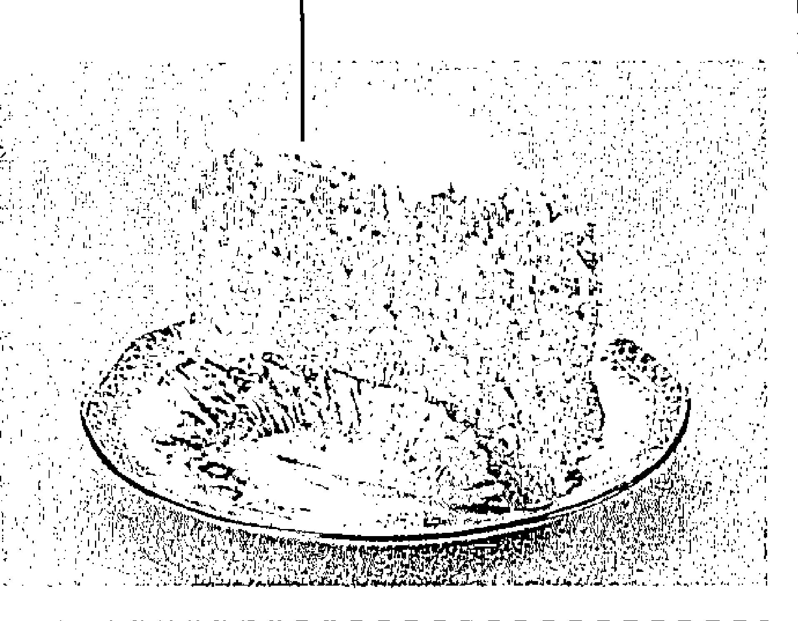

> 旺文昌运的蛋糕
选择与孩子五行相对应的生日蛋糕，有利于孩子考取中意的学校。吃蛋糕的时候最好能配上水果，这样能多补充一些维生素。

## 388 考前孩子吃些什么？

考试无论对父母还是对孩子来说，都是非常重要的，它直接影响着孩子未来学业的进展。因此，若想让孩子发挥出最好的水平，除了平常要多催旺文昌运，考前还要吃一些具有镇静安神的食物，如香蕉、猪心、牛奶、桂圆、荞麦食品、红枣等。

除此之外，还要多吃一些菌类食物，如香菇、平菇、茶树菇、蘑菇等。备考期的学生应该增加蔬菜、水果的摄入量。可以多喝些绿茶，可以提神，对学习劳累引起的困乏无力也有不错的改善效果。

总之，合理搭配饮食是考试顺利的前提，家长在考前要为孩子安排好膳食。

## 389 孩子精力不足宜多吃什么食物？

孩子学业繁重，压力大，很容易出现精力不足的情况。在饮食上要注意多吃富含维生素C的水果，如橙子或西红柿。多吃绿色蔬菜，多喝水。

如果偏瘦的孩子常常感觉神疲力乏、没有精力，家长要多给他吃一些高热量的食物，如狗肉、羊肉、牛肉等，这些食物蛋白质、碳水化合物含量较高，有益肾壮阳，温中暖下，补气活血的功效。

## 390 孩子记忆力差宜多吃什么食物？

孩子的记忆力差，可以经常吃一些补脑的食品，如鸡蛋、牛奶、大豆、瘦肉、鱼、动物内脏(心、脑、肝、肾)及胡萝卜、谷类等。这些食物含有丰富的卵磷脂，容易消化吸收，对孩子的脑髓发育有积极作用。

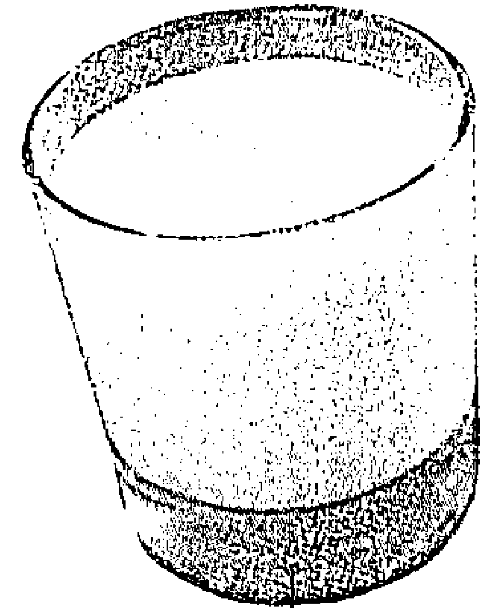

每杯牛奶含钙量大约在300毫克。

无论搭配哪种食物，准备什么样的菜谱，家长每天最好给孩子喝一定的牛奶。有研究显示表明，在其他膳食结构相同的情况下，每天喝1瓶普通牛奶（200毫升）的儿童要比不喝牛奶的儿童操作智商高9分，总智商高5分。所以说，牛奶对保障儿童大脑发育至关重要，是促进智力的良好饮品。

> **小孩喝牛奶**
儿童正处于身体快速成长期，每天都需要补充大量的钙。而每杯牛奶的钙含量大约为300毫克，可以补充孩子钙不足的状况。

## 391 孩子睡眠不好宜多吃什么食物？

很多孩子，由于学业重，学习压力大，很容易出现脑神经衰弱，睡眠质量不好的现象。要想改善这状况，家长可以为孩子安排一些具有养心安神作用的食物。

可以在晚上睡觉前给孩子热一杯牛奶。牛奶中含有丰富的氨基酸，能有效地抑制大脑兴奋，使人产生疲倦感，促进睡眠。

可以给孩子吃小麦制品，如全麦面包。小麦的主要成分是淀粉、蛋白质、氨基酸和B族维生素。全麦面包可以健脾润肺，抗忧郁，有助于改善学生夜不能寐的情况。

全麦面包营养全解析
| 项目分析 | 主要内容 |
| :--- | :--- |
| 制作方法 | 用没有去掉外面麸皮和麦胚的全麦面粉制作。 |
| 面包特点 | 颜色微褐，肉眼能看到很多麦麸的小粒，质地粗糙，香气浓郁。比普通面包更容易发霉、变质。 |
| 营养成分 | 富含粗纤维、维生素E、B族维生素和多种矿物质元素。 |
| 购买注意 | 并不是所有呈褐色的面包都是全麦面包，真正的全麦面包肉眼能看到麦麸，放在嘴里能感受到麦麸的颗粒感。 |

## 第十三章 妆容开运

本章主要讲了化妆在开运中的作用：内容涉及如何给不同的身体部位化开运妆，造成人气色不佳的原因，不同五行属性的人的护肤和保健方法，各种彩妆的象征意义和功效，不同脸形的人如何化妆等。

## 392 合适的彩妆为何能够开运？

迷人的装扮不仅是美丽的需要，还是一种礼貌，更是赢得人缘的通行证。所以，人们可以通过合适的彩妆来开运。

彩妆开运的理论根据是五行学说。根据五行生旺的理论，把五行的色彩元素融入彩妆艺术之中，以水旺木，以木旺火，以火旺土，以土旺金，以金旺水。

若在彩妆中添加檀香、精油等香料，可以营造迷人的，令人注目的气场，有助你吸引他人的眼球，为你带来好的人缘和运气。人变得有魅力，爱情、事业自然会更加顺利，财运也会向你聚集。

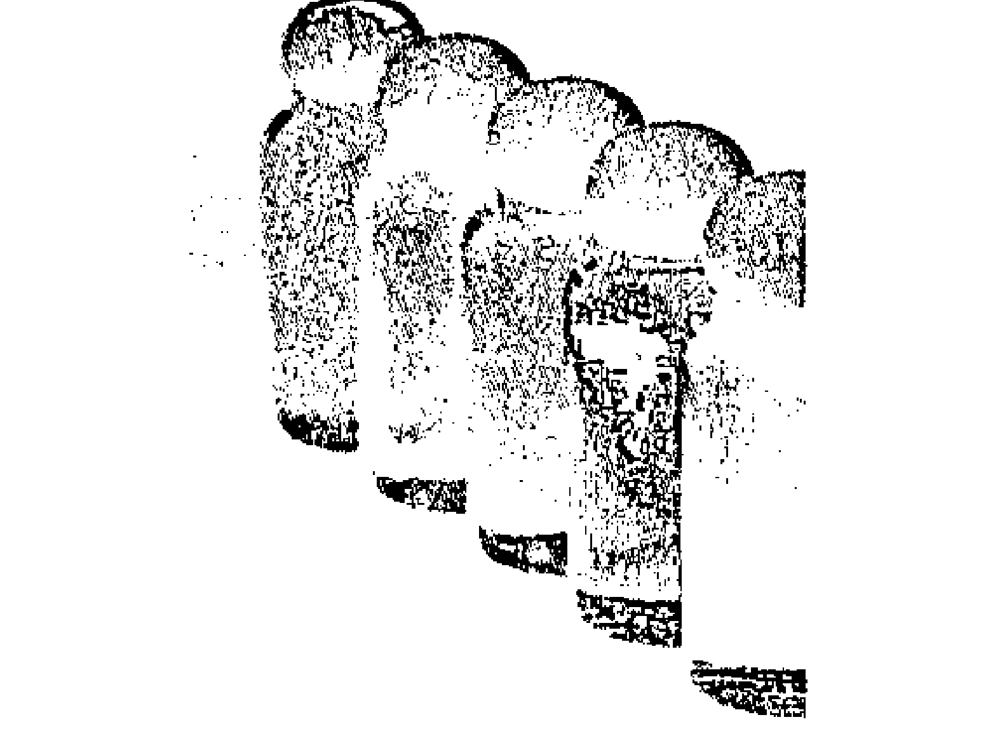

> **精油开运**
精油气芬芳，自然的芳香经由嗅觉神经进入脑部后，可以刺激大脑前叶分泌出内啡肽及脑啡肽两种荷尔蒙。这两种荷尔蒙会使精神呈现最舒适的状态，是守护心灵的最佳良方。

## 393 如何为额头化开运妆？

额头开运，主要指为印堂开运。印堂在双眉之间，象征一个人的整体运势，代表事业和前途。很多人认为，人的运势好坏，可以从额头的面相上来推定。天庭饱满的人，财运、贵人运比较旺盛，因此名流商贾、达官贵人基本上个个都是天庭饱满、地阔方圆的面相。一般人虽然没有这样的天生面相，但可以通过化妆弥补。

化妆的原则，是要确保自己印堂明亮，这样才有助于吸贵人，才能令事业发达，前途光明。印堂若灰涩不明，代表有灾难。

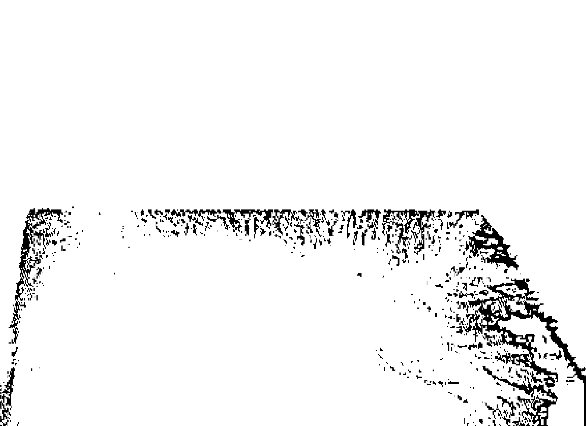

> **额头开运妆**
给额头化合适的彩妆有利于开运。首先要去除额头特别是印堂附近的杂毛，再刷上明亮的粉色腮红，让整个额头显得光洁、明亮。

## 394 如何为眉毛化开运妆？

若想增强爱情运，要定期修饰眉形，并以棕色细眉笔勾勒眉线。想增强考试运和人缘运的人，可在眉尾用紫色的眉粉轻轻掠一下，这叫喜上眉梢。若要增强事业运，可在眉尾三分之二处画上眉峰，使眉毛成弓形，呈蓄力以待之势。经常修剪眉毛，保持眉清目秀，可以防小人。

此外，不同的眉形还要特别修饰。修饰短眉要用与发色相近的眉笔，画出修长的眉毛；修饰剑眉可以将眉毛画得柔和圆弯，呈现自然弧度。

### 眉毛形状与运程的关系

| 眉毛形状 | 运程 |
| :--- | :--- |
| 短眉毛 | 性子急躁，难以等来好运。 |
| 眉毛稀 | 自信心不足，难以赢得贵人。 |
| 八字眉 | 气量小，人脉不好。 |
| 眉毛淡 | 少气无力，给人难成大事的感觉。 |
| 剑眉 | 自我意识较强，容易得罪人。 |

## 395 如何为眼部化开运妆？

眼睛是心灵之窗，一个人的眼睛若没有神，就会给人一种消极无力的感觉，不但没有美感，还难以引起别人的注意，难以有异性缘，难以有贵人缘。利用眼影略作修饰，可以让眼睛显得明亮有神。若想眉目更招人喜欢，还可以提前在眼睛周围打上一层粉底，然后再刷上睫毛膏，可以使眼睛看起来炯炯有神。若想使妆容更持久一些，最后还可以打一层粉底，这样看起来效果更好。

有的人，眉眼间的距离过窄，总会给人一种气量狭小之感，令人望而止步，不会轻易与之交往。这样的人，人际关系不会太好，运程也不会太好。这个遗憾，利用化妆可以得到改善。浅色的眼影，可以让眉眼距离显得宽阔，给人大方、明亮之感。同样，画眼线和上睫毛膏也能让双眼更加有神。

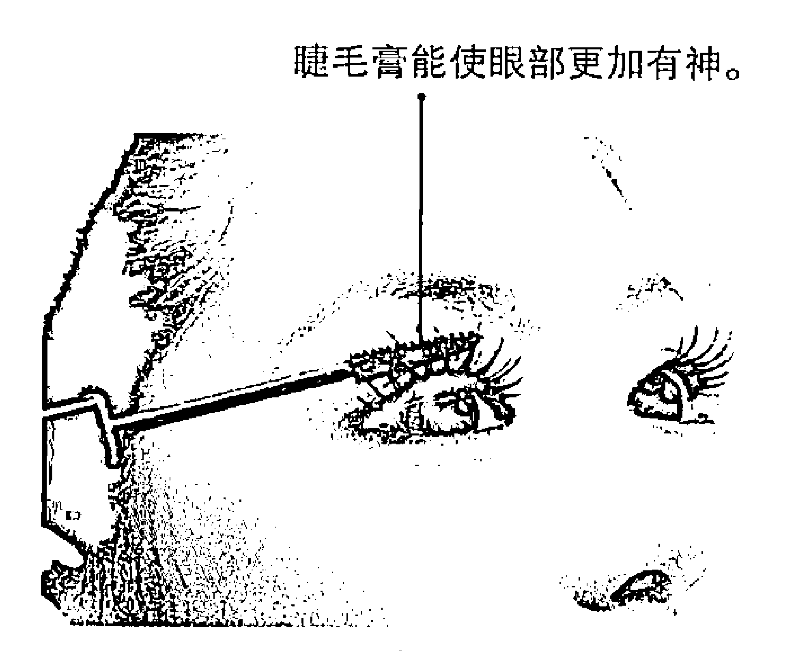

> 💡 **学会用睫毛膏**
质量好的睫毛膏会使眼睫毛变得浓密、纤长、卷翘。浓密曲翘的长睫毛，可以增加面部的美感。

## 396 眼影的颜色有何不同象征？

红色的眼影，可增强你的桃花运和人缘，让你获得一份好姻缘。

黄色的眼影，有助于增加不动产财运，同时它也有趋吉纳福的作用，能为人带来幸运，适合面试时化妆用，平常用黄色系的眼影还可增加你的贵人缘。

绿色的眼影，可加强事业运和文昌运，让你职场得意，考场顺心。大学生、职场的上班族，可根据自己的衣服搭配。

蓝色和黑色的眼影，有助于家运昌隆，家庭和谐，也可增强偏财运。家庭主妇闲来无事，可以为自己化个蓝色或黑色的眼影。

金色和白色的眼影象征金钱财富，适合一切人使用。

### 挑选眼影的方法

不同的眼影颜色，有着不同的开运意义。可以根据自己的需要，选择合适的眼影。

### 挑选方法

- 如没有固定喜好，可以买眼影盒，根据不同需要变换不同的颜色。
- 检查眼影抹出来的色调和看上去的感觉是否一致。
- 不要购买看上去色彩饱满，抹出来轻描淡写的眼影。
- 在眼睛上试妆时，不打滑的眼影质量较好。

## 397 如何为颧骨化开运妆？

颧骨往往跟权力、富贵有关，象征一个人的权力和社会地位，有时候也有败运的命相，民俗认为“颧骨高，福气薄”。通过为颧骨化妆，不但能起到遮盖自身缺陷的作用，也能通过化妆改变自己的面相，改变自己的运程。

一般来说，为颧骨化妆，通常是擦抹不同颜色的腮红，不同的腮红具有不同的象征意义。粉红色的腮红，可以增强你的人缘；橘色的腮红，能增强权威感，让别人对你更加信任。或者用深色粉底加上咖啡色的腮红来淡化颧骨，让人容易亲近。

### 颧骨过高的改善方法

如果颧骨过于突出，会有气势凌人之感，最好加以改善。

### 改善方法

- 颧骨高的人，让人觉得盛气凌人，不够平易近人。
- 可以用深色粉底配上咖啡色的腮红来改善面容。
- 在服饰搭配上多选择成熟、温婉型的服装。

## 398 如何为鼻子化开运妆？

一般来说，鼻子与财运有关，一个挺直饱满的鼻子，象征着财运亨通。所以，为鼻子化妆直接关系着个人的财运。反之，一个人鼻子塌陷，则没有财运，是天生的劳碌命。这个遗憾可以通过化妆来弥补。

为鼻子化开运妆比较简单。可以用有光泽的粉底修饰鼻子，增强鼻子的立体感和光亮，使鼻子看起来挺拔，让你更有财运。注意鼻毛不可外露，鼻毛外露不但有碍美观，还会影响财运，若鼻毛过长露出来了，应修剪，不要用眉夹拔，否则会伤肾气。

![img/ae53abd2345160ac1fe4e7d27eb6eaf1_232_0.png]

> ### 鼻子开运妆
> 鼻子是“财库”的象征，保持这里光泽、明润可以增加你的财运。

## 399 如何为嘴唇化开运妆？

人的五官呈现均是一种面相，嘴唇的面相会影响个人的运程。

嘴唇的颜色与事业运有关。唇色暗淡，说明事业受阻，这点可以通过使用唇膏来改善。若嘴唇总是干燥、脱皮，说明事业运不顺，此人人缘较差，异性缘也不好，易缺少桃花。所以要经常使用护唇膏，让嘴唇保持光泽和湿润，进而使自己的人际关系滋润起来。

![img/ae53abd2345160ac1fe4e7d27eb6eaf1_232_1.png]

> ### 嘴唇开运妆
> 若想增强桃花运和人际关系，应选择粉红色和桃红色的口红。

## 400 怎样化妆能够得到上司的赏识？

让上司赏识，首先得有一副不让上司反感的面容。古人说的“和眉顺眼”就是让人感觉亲切的表情，易引得人的好感。因此，若想与上司拉近距离，就要先从眼睛和眉毛入手。将眉毛画成拱形的长眉，眼睛则要画出自然下垂的感觉，把上眼线向下延伸一毫米，可以给人亲切的感觉。

嘴型轮廓分明，嘴角紧缩，可以给人一种谨言慎行、精明能干的感觉，上司需要这样的员工。因此，在化妆的时候，可以参照此标准化妆。若本人嘴巴大、嘴唇薄，可用粉底减淡原有轮廓，再用唇笔描出小巧的嘴型即可。

## 401 卧室里的梳妆镜应如何摆放？

镜子有反射和吸入功能，若对着人体，不但有害健康，还会影响人的运程，所以卧室的梳妆镜在摆放时要特别讲究。

一般来说，梳妆镜不能对着写字台、睡床等人常活动的地方。写字台是工作的地方，人坐在这个地方需要经常开动脑子，而梳妆镜的吸入功能会干扰到这里的磁场，影响人的正常思维，不利于工作。

若房间里没有更合适的地方摆放梳妆镜，那么睡觉或工作的时候，最好将梳妆镜收起。若是台式梳妆镜，无法收起，不用的时候，最好在上面盖上厚布遮盖。当然，上面若有八卦太极图案，效果更佳。

![img/ae53abd2345160ac1fe4e7d27eb6eaf1_233_0.png]

> > **梳妆镜的摆放**
> > 镜子有反射和吸入功能，所以梳妆镜不能对着写字台和睡床。床是人休息的地方，人休息的时候非常放松，机体抵抗力降低，镜子对着人会降低人体的免疫力。

## 402 空调对皮肤有何不利影响？

夏日炎炎，空调自然成了上班族生活中的必需品。但是空调吹出的风，会带走人体皮肤表面的水分，让皮肤变得干燥。在夏季相对炎热湿润的环境中，这种皮肤干燥的情况不会引起你的注意，但到了凉爽、干燥的秋天，你就会发现皮肤与以前相比，更加粗糙，而且失去了光泽。

另外，空调周围的磁场比较强，对人的影响较大。人若长期待在空调屋内，不但皮肤受到侵扰，而且有害磁场还会通过皮肤穿透人体，对健康造成威胁。因此，久居空调屋的人会有头疼、头晕等不适症状。

![img/ae53abd2345160ac1fe4e7d27eb6eaf1_233_1.png]

> > **空调的危害**
> > 空调的磁场比较强，在空调附近的人，皮肤会受到有害磁场的损害，变得没有光泽。过于贪凉，容易头痛、头晕，进而患上感冒。

## 403 哪些人脸上容易长青春痘？

容易长青春痘的人相对集中在某些时段出生。一般来说，下面三个时段出生的人更容易长青春痘。

-   1. 生于农历一月、五月、六月、九月的人，这些月份，要么湿气较重，要么热邪较猖獗，人在这些月份出生，容易形成湿热体质，体内容易有热毒，因此易长青春痘。
-   2. 生辰在寅时（3-5点）、午时（11-13点）、未时（13-15点）、戌时（19-21点）的人。这四个时辰煞气严重，人在这些时段出生，身上容易携带有害磁场，也容易长青春痘。
-   3. 生肖为虎、马、狗、羊的人容易长青春痘。

![img/ae53abd2345160ac1fe4e7d27eb6eaf1_234_0.png]

前额：心火旺，血液循环有问题，肝脏排毒功能不佳，体内聚积的毒素反映到了脸上。

鼻翼：新陈代谢不佳，鼻翼附近会出现黑头、干纹和皮肤破裂。

下巴：表示肾功能受损或内分泌系统失调。

青春痘的医学名称是痤疮。它是由于毛囊及皮脂腺阻塞，发炎所引发的一种慢性炎症性皮肤病。

## 404 如何利用五行生克来减轻痤疮的症状？

从人体五行来说，痤疮应是内火过旺，体内有湿邪、热毒，它们对皮肤发动攻击时，便表现为痤疮。皮肤属土，需要用水来滋润，所以常长痤疮的人，平时宜用保湿护湿的美容产品。若家中有面向水的房间，可以居住于此，如此可使得面部吸收津液，加速皮肤的新陈代谢，迅速将有害物质代谢掉。也可以在卧室西方摆放一圆形鱼缸，通过养鱼来接近水气。

其次，由于金生水，水克火。因此，还可根据五行相生相克原理，多穿具有生水克火作用的衣服。黑为水，白属金，因此常长痤疮的人平时可穿以黑、白为主色调的衣服；身上的首饰，以金饰、银饰和白金首饰为宜。

## 405 哪种住宅会让女人气色暗淡？

有的女人，即使化了很浓的妆，依然无法掩盖自己暗淡的气色。形成这种气色的原因，除了体质之外，还一部分是居住环境造成的。

一般来说，阴暗潮湿的住宅会让人的脸无血色，印堂灰暗，呈现病态。空气不流通的房子会产生浊气，时间长了，会变成死气。人居住其中，即使不生病，也会精神不振，没有神采。

出现上述两种情况，要么搬家，要么在室内摆放一些具有趋吉纳福作用的饰物，或根据自己的生辰八字重新调整房间布局。

![img/ae53abd2345160ac1fe4e7d27eb6eaf1_235_0.png]

> > **阴暗的住宅**
> > 住宅光线不够，给人阴森的感觉。女性长期住在阴暗的住宅里，容易面无血色，呈现病态。

## 406 如何洗浴才有利于身心健康？

人在一天的工作之后，体力和精神都极为疲惫，这时候冲一个澡，会让人感到神清气爽，重新活了过来。这是因为人体内积累的大量浊气，如毛孔的污垢等，都被流水冲走了，而手指的搓洗则有利于血液的循环。

实际上，盆浴比淋浴更有利于排毒美容化煞气。因为盆浴可以保持相对稳定的温度，有利于血液循环和新陈代谢。由于温度较高，身体会大量排汗，污垢和浊气也会随之排出。

注意，若泡澡时空间比较密闭，湿气和浊气排出不畅，反而会对身体不利。

![img/ae53abd2345160ac1fe4e7d27eb6eaf1_235_1.png]

> > **洗浴有利身体健康**
> > 经常洗浴有利于血液循环和新陈代谢，同时还有排毒养颜的作用。

## 407 怎样改善皮肤状况？

皮肤嫩白、平滑、有光泽，是每个成年女性的梦想，我们可以通过改变环境和气场，改善人的皮肤状况。

皮肤总是干燥的人，可以在卧室的西方放上一杯清水。这样可以利用清水散发的气场滋润皮肤。注意，盛放清水的杯子，最好是透明的玻璃杯。清水每天晚上更换一次，否则形成死水，会造出更坏的气场。皮肤粗糙或易生痤疮的人，可在卧室的东方摆放一株泥养的铁树，这能改善皮肤状况，也可以通过在房间里摆放铁树来改善皮肤状况。

铁树为坚硬之木，而人体的皱纹是由于皮肤收缩引起的，摆放铁树可以起到木克土的作用，从而消除皮肤细纹。

![img/ae53abd2345160ac1fe4e7d27eb6eaf1_236_0.png]

> **铁树**
> 铁树因为树干如铁打般坚硬，喜欢含铁质的肥料，所以得名铁树。铁树五行属木，人的皮肤五行属土，铁树可以起到克制皮肤老化的作用。

## 408 自然环境为何可以改善皮肤状况？

在五行学上，皮肤属土。若想土质肥美，自然需要有足够的水分，泥土要松软但不能松散。所以，在睡房中放一杯清水，可以让皮肤有充足的水分滋润。早上起来，还可到湖边、水边大喊几声，这样既可以增强肺活量，又可以吸收湖水的湿气，让人周围充满具有滋润作用的磁场。

需要说明的是，若用水改善皮肤，记得把水放在西面，因为西方属金，金可生旺水；若使用铁树，则放在东边，因为东方属木。

![img/ae53abd2345160ac1fe4e7d27eb6eaf1_236_1.png]

> **住宅附近的水池**
> 住宅附近最好有水池，波光粼粼的水，会使周围的空气变得湿润，对人的皮肤也有好处。

## 409 如何改善头发的状况？

五行是一个非常复杂的概念，宇宙间的一切事物都可以用五行理论来概括，其中五种元素之间相生相克，任何事物都不可能独立存在。

以头发为例，它在五行学上属木，而木又与水、土、火三大元素有着这样或那样的关系。因此，头发的好坏与水、土、火三大元素所对应的器官有关，如木主肝脏，水主肾脏，火主心，土为脾。因此，人的头发若出现脱发、白发等问题，根据器官之间的五行关系，通常是人的肝或肾出现了问题。因此若想改善发质，也可根据五行之间的关系来改善。如可在卧室东方摆放水养铁树，以水养木。

![img/ae53abd2345160ac1fe4e7d27eb6eaf1_237_0.png]

> **利用周围环境改善发质**
> 人过早出现白发，多是体内器官出现了问题。可以吃些补益的食物，也可以在室内摆放铁树，以水养木。

## 410 如何利用食物改善黑眼圈？

黑眼圈是由先天遗传或后天眼皮色素沉积造成。后天造成黑眼圈通常是因为熬夜和睡眠不足，先天的原因则是本命八字内水火不平衡所致。

人体出现黑眼圈，通常是机体火强而水弱。可以在家中或办公桌上放一杯清水，可以有效地改善状况。

也可以吃些具有滋阴润燥作用的食物，如苦瓜、藕、甘蔗、紫菜、海带、竹笋、香蕉、冬瓜、黄瓜、茄子、白萝卜、丝瓜、油菜、菠菜、蘑菇、黄花菜、圆白菜、芋头、胡萝卜、木耳、猪肺、鲫鱼等寒凉食物。注意不要吃温热食物，如羊肉、狗肉、辣椒等，否则会加剧黑眼圈。

![img/ae53abd2345160ac1fe4e7d27eb6eaf1_237_1.png]

> **蔬菜改善黑眼圈**
> 蔬菜属于凉性食物，多吃蔬菜有利于改善因熬夜等多种原因引起的黑眼圈症状。

## 441 如何巧妙控制体重？

俗话说“心宽体胖”。一个人若生活安逸，心情愉快，自然容易发胖，而心事重重的人，或者忙碌不堪的人，很难发胖。因此，我们可以利用环境对心理的影响，来控制人的食欲和体重。

首先，整洁、干净的房间，会让你神清气爽，精神振作，不容易产生放纵自己的思想。

其次，房间的色彩要以白色或蓝色为主题，这两种色调让人头脑冷静，不易沉溺于享乐，而粉色和黄色则会让人食欲大增。

最后，装饰的线条以直线和棱角为主，这是一种心理暗示，圆润的图案会让人觉得肥胖也没关系。

此外，少吃热量高的食物，多吃清热去湿的食物，如红豆、绿豆、芹菜等。

![img/ae53abd2345160ac1fe4e7d27eb6eaf1_238_0.png]

> > **芹菜减肥**
> > 芹菜是一种理想的绿色减肥食品。当你在嘴巴里咀嚼芹菜时，你消耗的热能远大于芹菜给予你的能量。

## 442 如何利用洗手间让自己变美？

美化自己，除了化妆、美容等方式外，也可以利用洗手间来让自己变美。这种方式既简单又方便，可以通过下列方式进行。

-   1. 在镜子旁边摆上一些插花或小盆栽。它们可以美化环境和视觉，让你心情舒畅。人的心情舒畅了，面部表情自然柔和了，这样可以潜移默化地提升你的审美。
-   2. 洗脸毛巾宜用纯白色或粉嫩的颜色，这些亮色系会给人带来光鲜、亮丽的心理暗示，渐渐影响你的气质。
-   3. 洗手间里水气较大，温度较低。如果本身体质畏寒，要垫一块毛毯在地面上。

![img/ae53abd2345160ac1fe4e7d27eb6eaf1_238_1.png]

> > **洗手间的忌讳**
> > 洗手间里充满湿气和浊气，不宜在此化妆。而吹风机的热风属火，因此不宜在属水的洗手间里吹头发。

## 413 玄空九星与美容有何关系？

俗话说“相由心生”。一个人的面相是否和善，一定程度上暗示着他的心理是否和善。反之，一个人的心理特征，也会影响一个人的面相。因此，一个人的心态和气质，对人体的外貌起着积极的影响作用。

人体若长期处于良好的生理和心理状态中，反映在面相上，自然看起来平易近人，容易有富贵运。

玄空九星对应着人体的各个脏腑器官。因此，当星体的强弱状态及相互关系发生变化时，会直接影响到人体脏腑的健康状态。当脏腑出现问题时，人体会出现肤质暗淡、口臭、痤疮等表象，这些病态有损人体的健康美。

![img/ae53abd2345160ac1fe4e7d27eb6eaf1_239_0.png]

> **玄空九星对应人体器官**
> 玄空九星分别与人体器官相对应，当星体之间的关系发生变化时，就会影响人体相应器官的健康状况。

## 414 五行与护肤、保健有何关系？

根据五行命卦，每个人都有自己的五行属性。五行属性不同，身体的各种状况也不尽相同。因此，人的外观和内脏都受五行的影响，人体的健康状况自然也会受影响。如五行属火的人，体内火旺盛，机体容易缺水，表现出大便干燥、口臭、容易上火、皮肤干燥、头发干燥、容易长斑等一系列火盛缺水的症状。

若想拥有一个健康的身体，就要了解自己的身体属性。这样才能从根本上调节体内阴阳平衡，让身心经常保持在良好的状态中。这样才会拥有一个好的心态和开朗的表情。这样，人自然会变得健康、美丽，充满魅力，更容易拥有好人缘，赢得贵人的帮助。

![img/ae53abd2345160ac1fe4e7d27eb6eaf1_239_1.png]

> **根据五行调理身体**
> 了解自己的五行属性，就可以根据五行随时关注自己的健康，使自己处于良好的状态中，人自然会充满健康的美感。

## 415 五行属金的人如何护肤和保健？

五行属金的人，在外貌上通常表现为：椭圆脸，大眼睛，肤色较白，身材纤细而强壮。在个性上，谨慎而有原则，对人对己要求严格。这种性格容易产生心理压力，引发沮丧，导致消化不良和呼吸系统疾病。

属金的人，皮肤容易干燥和粗糙，保湿是重点。宜使用葡萄籽油、酪梨油、橄榄油等，在皮肤表面形成一层保水屏障，防止水分流失。

平时多进行呼吸练习或瑜伽练习，以强化肺部机能；多吃新鲜蔬菜和海鲜，以改善消化系统。少吃温热干燥之物，如羊肉、狗肉、牛肉、蒜、葱、生姜、八角、茴香、花椒、胡椒、芥末等辛辣性食物及瓜子、油条、薯片、烧烤等炒、炸、煎类食物。

另外，还要改变熬夜的习惯。因为熬夜容易伤阴气，会导致体内阴阳失衡。

-   属金的人如何护肤保健
    -   合适的运动：呼吸练习；瑜伽练习。
    -   适宜的食物：新鲜蔬菜和海鲜。
    -   生活习惯：改变熬夜的习惯。

## 416 五行属木的人如何护肤和保健？

五行属木的人，在外貌上通常表现为：长窄脸型，额头较宽较高，细长眉毛，眼神和善，身材高瘦。充满活力，喜欢挑战，在高压力下仍能良好发挥。由于偏爱刺激，易患胃溃疡、消化系统紊乱、头痛、高血压等疾病。

属木的人，通常为油性皮肤，容易长痤疮，因此要注重皮肤清洁。早晚洗脸时，宜采用弱酸性洁面乳。若出油严重，只能用清水清洗，因过度去脂反而会导致皮脂过度分泌。补水可采用黏度较低的保湿液。

-   属木的人如何护肤保健
    -   适宜的食物：苦味食物与清淡食物：苦瓜、莲子、柚子等。
    -   饮食禁忌：避免饮酒与进食油腻的食物。
    -   适宜的运动：晨跑或健身操。

## 417 五行属水的人如何护肤和保健？

五行属水的人，通常有一张圆脸，五官柔和，眼神温和，肤色较深，身材圆润。人性聪慧，颇具艺术气息，有较强的求知欲。由于对他人过度怀疑和苛求，会产生心理压力，易导致生理上的发热和发炎。

属水的人，容易出现肌肤松弛、老化的状况。因此，要经常去角质，使用活性护肤产品，减缓肌肤的老化。情绪宣泄对于属水的人很重要，心情不好时要找朋友进行倾谈。由于情绪压抑会导致体重增加，因此要避免食用脂肪和糖类食物，多吃利尿的食物，如红豆、南瓜、西瓜、梨、鸭肉、冬瓜等。还可以通过游泳来增强体质，对健康有利。

![img/ae53abd2345160ac1fe4e7d27eb6eaf1_241_0.png]

> **属水人的保健法**
> 属水的人容易情绪压抑，进而导致体重增加。因此，要避免进食脂肪和糖类食物，多吃红豆类利尿的食物。

## 418 五行属土的人如何护肤和保健？

五行属土的人，在外貌上通常表现为：脸形短方，下巴结实，五官较大，肤色较暗，身材结实。个性友善、忠诚，有风度，不喜欢出风头，适合团队合作。受到打击时，易产生懒散心理，导致饮食失衡，或缺少营养，或营养过度，从而造成肠胃问题。

属土的人，皮肤敏感而脆弱，因此要注重皮肤的修护，增强皮肤抵抗力。

有规律的生活，会让你有更好的状态。定期的团队运动，可以缓解你的紧张情绪。高纤蔬果和酵素，可改善消化问题，要避免过度食用乳制品和甜食。

![img/ae53abd2345160ac1fe4e7d27eb6eaf1_241_1.png]

> **属土人的饮食禁忌**
> 五行属土的人要注意养脾，多吃些具有平补作用的食物，如山药、薏米、香菇、银耳、南瓜、胡萝卜、鱼产品等。

## 419 五行属火的人如何护肤和保健？

五行属火的人，在外貌上通常有一张长脸和窄额头，有突出的颧骨与下巴，容易生雀斑，头发较粗或会卷曲，骨架较轻，手型较小。个性较为敏感，容易痴迷于某些事物，对理想有很固执的想法。过于敏感的性格，会产生焦虑心态，导致失眠和疲惫，易患心血管疾病。

属火的人，血液循环不太顺畅，皮肤往往暗淡无光。可以经常以热毛巾敷脸，以加速血液循环，然后敷上较为温和的果酸面膜。

每晚静坐，可以纾解属火人的疲惫状态；参加舞蹈或歌唱班，可挥发属火人表达的欲望；还可多吃苦味食物，有助舒缓情绪。

![img/ae53abd2345160ac1fe4e7d27eb6eaf1_242_0.png]

> **属火人的护肤方法**
> 五行属火的人，皮肤容易暗淡无光。以热毛巾敷脸，或做面膜有利于改善肤质。经常静坐，有缓解疲劳的效果。

## 420 如何通过“画眉”开启旺运？

观察周围的人，你很容易就会发现性格和蔼、容易接近的人，通常面部表情比较柔和。若想改变自己的面相，可以从改变眉相开始，化一个合适的眉妆可以开启旺运。

俗话说，眉清目秀。因此在画眉之前，先要清除两眉间的杂毛，眉毛过于浓密的，要剪掉一些，使眉毛看起来柔顺。接着，用眉笔画出弧形眉弓，眉尾略微上扬。这样的眉型，看上去显得和眉顺眼，面容柔和，有助于增强人际关系。有了人缘，事业运、爱情运和家庭运自然会得到加强。

![img/ae53abd2345160ac1fe4e7d27eb6eaf1_242_1.png]

> **画眉开运法**
> 画眉前，要剔除眉毛之间和眉毛附近的杂毛，以免影响美观。然后从中间开始画眉，要有眉峰，眉头要自然，眉尾以微微上扬为佳。

# 421 如何利用眼影颜色来转运？

化妆是一门神奇的艺术。单就眼影来说，它不仅可以让你的眼睛变得漂亮，还可以让眼睛显得明亮有神。用棕色的眼影在眼窝轻轻上色，就会造成这样的视觉效果。这样还可以使双眼的间距拉近，鼻梁更加挺直，人看起来更有魅力，更有贵气。

不同颜色的眼影，有着不同的开运效果。通常而言，粉红、桃红、紫红等桃花色系的眼影可以催旺桃花运；而珍珠白、米白色、金棕色、黄色、棕褐色、宝蓝色、墨绿色则可以催旺财运。每个人可以根据自己的需要，选择合适的眼影。

### 正确使用单色眼影

- 不同颜色的眼影，有着不同的开运效果。
- 淡红色：柔和，强调眼睛明净可爱，不适合眼睛稍肿的女性。
- 蓝色：可做装饰色彩，不大面积使用，属跳跃色眼影。
- 黄色：可做装饰色彩，属柔和色明亮眼影。
- 绿色：表现年轻、朝气，适于小面积点涂，属跳跃色，中性色眼影。
- 棕色：易与肤色协调，为中性色调眼影。

# 422 怎样化妆能拴住丈夫的心？

女人成家之后，往往被家庭琐事所累，无暇打扮自己，与丈夫的感情渐渐变淡，很可能会导致第三者插足。如何通过化妆，来保持丈夫对自己的热情呢？

首先从眉状开始，注意精心修剪眉毛，化成“和眉顺眼”妆。圆弧形的长眉毛，眉尾稍微下垂，显得温柔和气。

其次，眼睛是心灵的窗户，所以化好眼妆更重要。一般来说，眼睛稍显下垂，显得性格柔顺，可辅助丈夫。用眼线笔将上眼皮眼尾往下轻描即可。

最后记得细致地描出唇线，让嘴唇显得轻巧。嘴唇过厚，显得情感炽烈，有嫉妒心，容易引人反感。并且，嘴唇大且厚的女人，为风流之相，容易招致桃花劫，不利于家庭和谐。

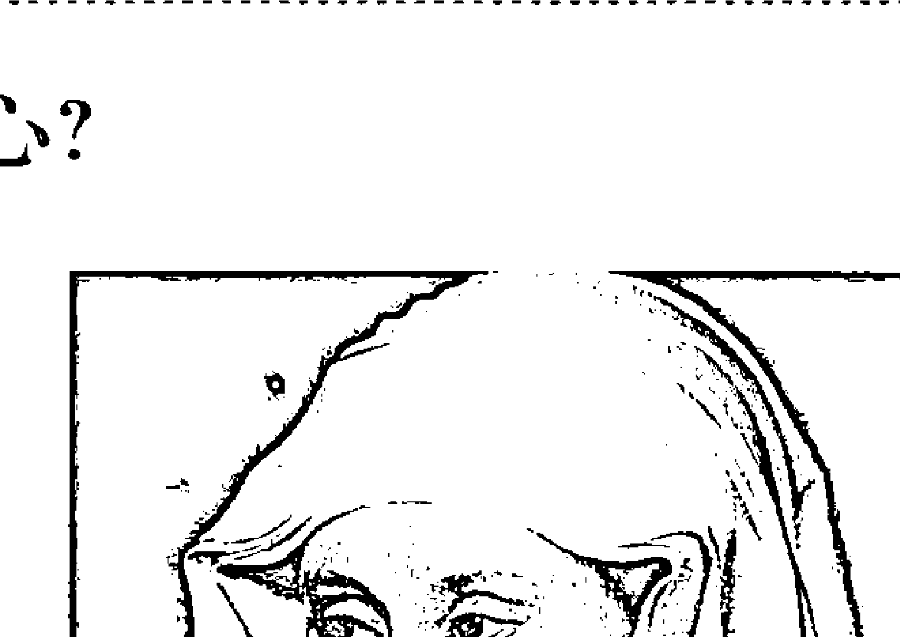

### 唇部化妆

家庭主妇适宜将嘴唇化得轻巧些。嘴唇过厚显得有嫉妒心还容易招致桃花，不利于家庭和谐。

# 423 黄色彩妆有何象征意义和功效？

黄色象征人的精神领域。喜爱黄色的人既聪明又幽默，有较强的分析能力，对生活充满兴趣，但容易半途而废。黄色色彩妆在精神上可以增强观察力和判断力；在外观上，淡黄色的眼妆可以让皮肤显得亮泽，使面部轮廓更自然。在眼部适当涂上一点黄色眼影可以用来增加眼部的美感。在现实生活中，无论是上班、居家，还是访友、赴宴，都可以在眼部周围涂上一点色彩自然的眼影，这样会让自己的眼部更具和谐性，让眼睛看上去更加有神。

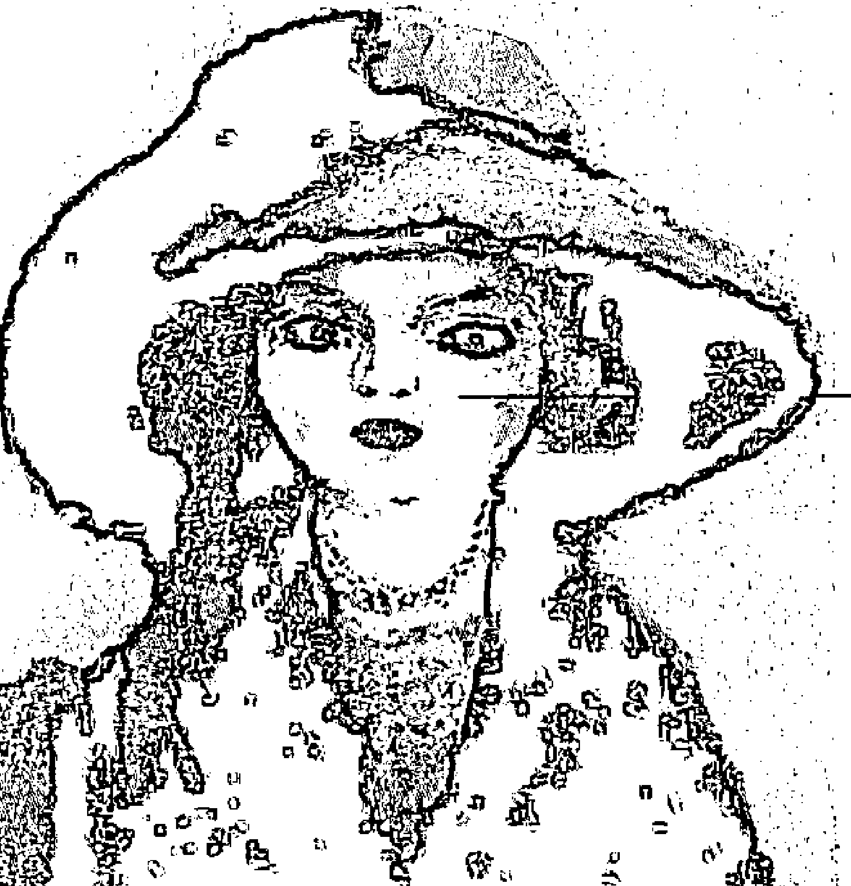

> 黄色彩妆
在涂黄色眼影时，最好以自然、大方为宜，别让人有不庄重的感觉。眼影不宜涂抹得太重，否则会给人不易相处的感觉，难以吸引人脉，运程会受到影响。

# 424 红色彩妆有何象征意义和功效？

红色象征旺盛的生命力。喜爱红色的人，无论工作还是恋爱，都会全心投入，有较强的占有欲，做事有决心和恒心。红色彩妆有一种神秘的性感。涂红色眼影时，不宜涂满整个眼窝，用指尖由眼睑中央向眼尾淡淡抹开。涂红色唇膏要自然，工整的唇线已经不再流行。

在红色彩妆中，口红和唇膏是比较关键的化妆品，化妆时要注意以下几点。

- 1. 涂抹口红宜淡不宜浓，宜薄不宜厚。
- 2. 不要把口红当做胭脂涂于两颊，否则极易诱发粉刺或形成黑斑。
- 3. 平时应尽量少用或不用口红，饮食时应先擦除口红再进食，不要涂抹口红睡觉。
- 4. 一旦发现嘴唇有异常感觉，应及时将口红洗干净，并停用一段时间。
- 5. 不要过多使用唇膏，唇膏中含有致癌物质，容易对肝脏和肾脏产生毒性作用。

# 425 白色彩妆有何象征意义和功效？

白色象征纯洁无瑕。喜爱白色的人，往往言行一致，思想单纯，不会作伪。他们适应环境的能力较强，因此容易受人影响。

白色妆容看起来清纯、有活力。珍珠白让肌肤有一种透明感，用白色碎粉在T字位和眉骨处轻扫，能够突出鼻、眉轮廓，让脸部更有立体感。

白色妆若画不好，容易给人很淡的感觉，不容易突显出来，看上去和没有化妆差不多，人的气质容易受到影响。因此，如果是去参加宴会，想在宴会上引起他人的注意，想成为“焦点”，就不妨把妆上得重一点。上妆选择的色彩应以亮丽为好，如桃红、粉红、紫红等。

化白色妆要注意：在化鼻子的时候，要化好鼻侧影，这样可以突出面部的立体感，容易赢得贵人缘。不过鼻梁高者、鼻梁窄者、两眼间距近者，最好不要画鼻侧影。

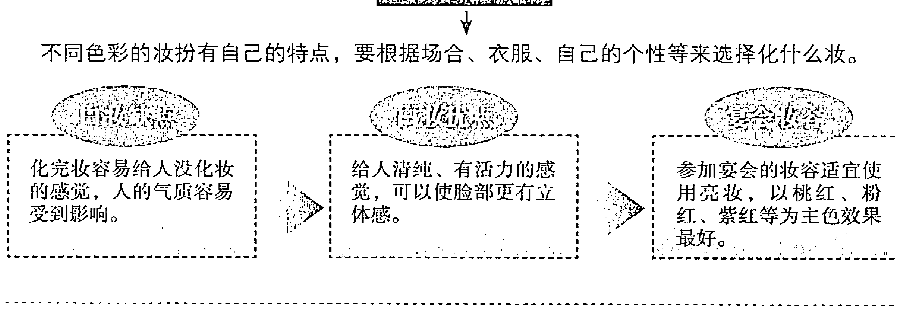

# 426 方形脸的女生如何化妆？

女生若长了一副方形脸，看起来硬朗、有棱角感，无娇小玲珑之美，难以赢得异性缘，个人运程也会大打折扣。若想改善这一点，除了注意家居布局外，还要学会化开运妆。

方形脸的女生在化妆的时候要注意，眉毛不可有坚硬角度，而要呈弯月般的弧度，把发鬓拉长。若是单眼皮，可加粗眼线，上眼线平平拉出。

打腮红的时候，注意将腮红饰成狭长型，这样可以修饰方形脸的棱角，让脸形显得柔和。在画唇线的时候，唇线不宜鲜明，以丰满为宜。塑造脸型，则着重从上额、下额的四个角以深色加以修饰。

# 427 圆形脸的女生如何化妆？

圆形脸的女生固然可爱，但容易给人年轻、幼稚之感，若身在职场，上司一般不敢轻易交给她重任，因此事业运会受到影响。圆形脸的上班族，需要用化妆来完善自己。

圆形脸的女生在化妆的时候注意下面几点：

- 1. 眉毛稍显角度有加强力度的作用，圆形脸的女生在化妆的时候，可以适当提高自己的眉角，显示出干练的一面；
- 2. 腮红从颧骨斜向刷至嘴角，让脸部显出长度，这样可以弥补脸部过圆给人的不成熟之感；
- 3. 耳中至下颚部分，用暗色修饰；
- 4. 上额和下巴用浅色修饰。

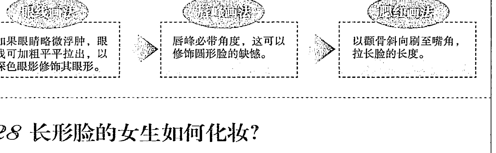

# 428 长形脸的女生如何化妆？

长形脸的女生，一般不会给他人造成困惑，但若脸部过长，既不美观，也难以赢得人缘，自然会影响个人运程。

长形脸的女生在化妆的时候要注意以下几点。

- 1. 在化眉妆的时候，注意将眉毛描得直一些，这样从视觉上显得脸短些。
- 2. 眼形下垂的，在画眼线时，注意稍微上扬，让眼睛显出神彩，这样可以使人忽略脸的长度。
- 3. 若想使自己显得高雅、大方，眼尾眼影要用深色系颜色。
- 4. 在化唇妆时，注意唇峰要平，下唇要丰满。这样一方面可以从视觉上显得脸短些，另一方面还可以使嘴唇显得性感，使人忽略脸形的遗憾。
- 5. 打腮红时，腮红最好横向刷；上额和下巴以深色修饰，两颊用浅色修饰。

# 429 倒三角脸的女生如何化妆？

倒三角脸通常有一双上扬眼。拥有这种脸形的人如果错误地认为，香气袭人就可以增添自己的魅力，赢得人缘，就大错特错了。倒三角脸在化妆的时候，不宜使用较浓的脂粉香，尤其不宜将这种装扮用到工作场合。因为脂粉香过浓会给人轻浮、不稳重的感觉，会让领导对你的工作能力和作风产生怀疑。若想有效利用香气的作用，倒三角脸的女生可在衣领、手帕等地方洒上少量的香水，这样既可以避免香水直接跟皮肤接触，也可以让似有似无的馨香显示自己的高雅、大方。

### 倒三角脸的化妆方法

倒三角脸，通常有一双上扬眼。这种脸形在化妆时，眉尾吊眼尾齐，不可太长。

- 眉毛的画法：眉尾吊眼尾齐，不可太长。上眼线下垂，下眼线平直，可把上扬眼型拉回。
- 眼影的画法：以紫色、粉色等暖色系来化眼影，眼头色宜深，眼尾色宜浅。
- 唇部的画法：描唇线，上唇宜尖薄，下唇宜画船型。

# 430 菱形脸的女生如何化妆？

菱形脸的女生若想使自己变得更有魅力，更有人缘、异性缘、贵人缘，在化妆时要注意以下几点。

- 1. 眼影以粉色系为主，这样会给人明亮之感，使人忽略脸型带来的缺陷。
- 2. 在画唇线时，上唇要平滑，下唇要丰满，这样会抹平一些下部的棱角，且性感的嘴唇更容易赢得人缘。
- 3. 打腮红时，注意将腮红往颧骨最高处刷。
- 4. 上额和下颚两侧较窄处，宜用明色修饰。

### 菱形脸化妆方法

菱形脸的女生，通常眼窝沉陷，化妆时要注意以下提示。

- 在画眉时，眉要平直，眉尾不可拉太长。
- 眼线要画得细长，这样有助于拉宽上部菱形角度。
- 画唇线时，上唇要平滑，下唇要丰满。

# 431 香水与运势有何关系？

每个人都有不同的五行属性，有不同的五行喜忌，比如颜色、味觉、嗅觉等。这都是本身属性决定的，因此，每个人对同一款香水也有不同的感受。嗅觉的感受对大脑有直接的影响，能够对人的情绪造成很大影响。而情绪能够影响人的思考和行动，间接地改变人的习惯和性情，从而造成人的命运的不同。可以说香水在某种程度上影响着人的运势。

使用香水时，要知道这些常识：
- 1. 洒香水最好用喷雾法，这样喷出的香水雾滴匀而细，面广而淡；
- 2. 洗完澡后，在穿衣服前，应先喷洒香水；
- 3. 衣服穿好后，在身体温暖，脉搏跳动处，如手腕、肘弯、膝后喷上相同的香水；
- 4. 根据气候决定香水用量。若气候干燥则用量要大些，香水会慢慢散发且维持长久；气候潮湿时，可以用少量。因香水散发较快，应经常重复使用。

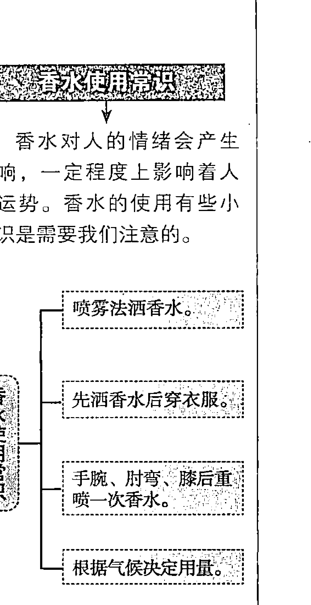

# 432 如何利用香水提升女性魅力？

想要展现女性魅力，自然要使用香水中的花香系列。花香动人，妩媚多情，还能祛除身体中的水毒。玫瑰香型，香味浓郁，让你显得热情大方；百合香型，清新淡雅，幽香暗传，犹如古典佳人；茉莉香型，芬芳独特，让你有着优雅动人的风度；蝴蝶花香，清香浮动，让人眼神更加明亮；莲花香型，天然纯洁，让你成为一个完美女人。

使用香水的时候，要注意喷洒的位置，一般来说应喷洒在下面这些部位：
- 耳后：此处体温高，香气容易散发，且不受紫外线的伤害；
- 头发：洗发后喷在发梢上，亦可喷抹于梳齿上；
- 手腕内侧：此处血液循环比较快，体温较高，脉搏的跳动促使香气的挥发，并散布在肌肤表面；
- 手肘、手背、膝盖：这些部位血液循环较慢，体温较低，这样香气的挥发速度便不会过快，香气能维持较长时间；
- 裙摆：喷在质地轻薄的裙摆上，走起路来会飘出缕缕香味。

# 433 如何选择适合自己的香水？

选择香水是一门学问，让人难以一时领会。但是，选择香水最重要的并不是这些知识，而是你的第一感觉。当香水喷出的一瞬间，在你的感觉中已经有喜好之分。若香水是自己最喜欢的味道，自然会享受在香气中，让你的身心得到放松，人会变得更加自然和自信。这样，人缘和运气自然会聚集在身边。

注意香水宜淡不宜浓，使用太浓的香水会令人难以接受，产生反感，这就失去了用香水的意义了。尤其是在工作时间或参加重要会议的时候，忌用过浓的香水，清新、淡雅的香水会给人一种舒适的感觉。

此外，香水也不宜洒得过多。香水过多、过浓会使人感到俗不可耐，赴约会、参加晚会或出席社交场合时，只需在颈部、手腕或耳后洒少量香水即可。如果在室内，香水尽量要少喷一点，若在室外，则可以适当多喷洒一些。

| 香型 | 香水特点 | 香型 | 香水特点 |
| :--- | :--- | :--- | :--- |
| 单花型 | 单花型香水指香水的原料以单一花香为主调，如玫瑰花型、茉莉花型。 | 柑桔型 | 以柑桔、柠檬为香型，具有香韵新鲜的特点，能引起愉快的心绪。 |
| 混合花型 | 这类香水由几种花香配合形成综合花香型，具有香味浓烈的特点，给人以奇妙的感觉。 | 东方型 | 东方型香水主要以薄荷和麝香为原料，嗅觉辛辣。 |
| 植物型 | 以野外一些清香的植物为原料，配成清香淡雅香型，给人清新、愉快的感觉。 | 森林型 | 森林型主要以橡树和新鲜绿色植物为原料，表现一种深远莫测、宽广凝重的气质。 |
| 香料型 | 以丁香、桂皮、香草等香料为原料配成的香型，表现一种持久的情感和思念。 | | |

# 434 如何利用香水增强桃花运？

有人认为，豌豆花的芬芳，能给人带来一段甜蜜的恋情；赤素馨香，能使人显得美丽、自信，增强人缘和桃花缘，是约会必备佳品；小苍兰的清新，能让你不喜欢的异性避而远之；报春花的香味，可以让你和恋人的关系更进一步；樱桃的果香，能让你显得你更加可爱；桃子香型，能让你开心、快乐；橘子或橙皮苦酒的香型，能让你牢牢抓住恋人的心。

多使用香水，可以使自己心情愉悦，同时也让周遭的人感到愉快。注意香味的变换，使嗅觉不致倦怠。

女性若想让自己身上带一种自然香，可在清洗内衣物时，滴上一两滴香水，使贴身衣物也充满愉悦香气，或将用尽的香水瓶去盖，放入衣柜中，可以善用最后的香气，让衣物充满香气。

# 435 如何利用香水转变运势？

不同的香水具有不同的作用。人们若想利用香水来改变自己的运势，可参照下面的对应关系：

当你的工作遭遇挫折和麻烦时，清香型香水可以为你带来更好的人缘，让工作出现转机；

如果你希望个人的生活更加美好，可以选择薄荷香型；

要想抓住身边机会的人，可以选择柠檬香型，它不但能提高事业缘，还能增强学习的能力；

若想增强财运，最好选择蜂蜜、巧克力、牛奶糖等甜香的气味；同时，它们对增强考试运和偏财运有显著的效果。

> ① 巧克力香型的香水
巧克力的甜香，不仅仅代表了浓情蜜意，还能增加财运。同时，这种香型的香水对增强考试运和偏财运也有不错的效果。

# 436 什么时候使用香水效果最佳？

太阳初升的清晨，是使用香水的最佳时机，能够让转运效果加倍，因此香水通常在上班之前使用。如果不想把工作的烦恼带回家，在下班后不妨换一种香型。

不宜长期使用同一种香型，最好根据具体的需要，不时地更换香水香型。如：失恋的人若持续使用柑橘系列香水，就会沉浸在上一段情感之中，难以迎接新的缘分。

另外还要注意，不要四季都使用香水。这是因为，香水虽然可以让人香气宜人，但却不宜不分时令季节地一年到头都用。春夏和夏秋交替的季节是最适合使用香水的季节，因为此时空气清爽，人的嗅觉比较敏感，人的思维也最活跃，使用香水能突出个性美。

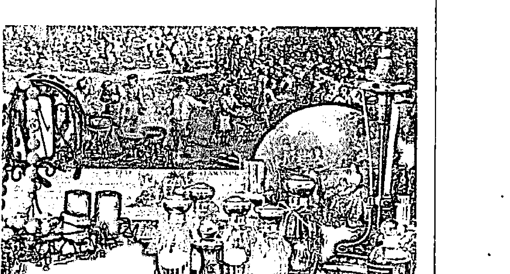

> ① 使用香水的最佳时间
香水在不同时候使用效果是不一样的。最佳喷洒香水的时间是在太阳初升的时候。另外，春夏和夏秋交替之时是最适合使用香水的季节。

# 437 如何正确喷洒香水？

通常来说，把香水涂抹在耳后和脖颈等处，是最适宜的。在睡觉之时，把香水在枕头上喷洒一些，可以带来好的运气，同时，可以让你的秀发有着诱人的味道，散发出女人的魅力。洗头后，在头发将干之际，可以喷上喜爱的香水。

一般来说，不同的季节，选用香水香味的浓淡应有所不同。如冬季宜选香气浓郁的香水，夏季宜选香气淡雅的香水。

由于人的嗅觉傍晚时最为灵敏，所以想选购到满意的香水，时间安排在傍晚较好。

### 喷香水的三种方法

选择合适的方法喷洒香水，会使香气四溢，香味持久。

- **根据浓度，香精以“点”，香水以“线”，淡香水以“面”的方式喷洒。**
- **七点法：依次将香水喷涂于左右手腕静脉处、后颈部、腰部左右两侧、大腿内侧、左右脚膝盖内侧和脚踝内侧。**
- **雾法：喷在穿衣服前，让喷雾器距身体约10-20厘米处，喷出雾状香水，喷洒范围越广越好，随后立于香雾中5分钟。**

# 438 如何为别人选择香水礼物？

购买香水作为礼物时，包装非常重要。塑料包装会降低香水的转运功能，因此不宜使用；黑色、深色的包装，也是犯忌的；而莱茵石的彩色装饰，华贵雍容，会让人一见倾心。

为了买到好香水，在购买时还要知道这些常识：如果是你收到别人的香水礼物，但并不是自己喜欢的类型，最好把它送给适合这种香型的人。送香水之日最好阳光普照，可以让香味更好地挥发，让别人容易接受。

### 挑选香水的方法

香水品种繁多，一般来说，挑选香水要注意香水的色泽、香味和香型。

- **色泽**
  - 优质的香水一般不含色素，清澈透明，清晰度高。
- **香味**
  - 优质的香水香味纯正，无刺鼻的酒精气味或其他异味。
- **香型**
  - 常用的香型大致有花香型、素心兰香型、东方香型等。

# 439 哪些彩妆会让你增加人气和桃花运？

红色系主情感，因此女人若想拉近自己与别人的关系，或增加桃花运，平常可化红色彩妆、粉色彩妆，即所谓“桃花妆”。这有面若桃花之意，容易赢得别人的好感。

> 红色彩妆的注意事项
红色彩妆可以增加自己的桃花运，赢得别人的好感。画红色彩妆要注意以下事项。

化桃花妆，当然以粉红色为主。可以用粉红的唇彩，呈现出粉嫩的效果，以此吸引异性的目光。腮红的颜色，也宜用粉色、桃红色，可给人“艳若桃花”之感，将女性的娇媚完美地呈现出来。在打腮红的时候，应该以45°角轻轻涂抹在脸上，粉末不宜太多，让粉末在脸部显得自然而均匀。这种人气妆，不但可以招来贵人，开创事业和财运，更能创造好人缘，增强爱情运。

- 1. 粉红色的唇彩能吸引异性的眼光。
- 2. 腮红宜用粉色或桃红色。
- 3. 以45°角打腮红。
- 4. 桃花妆以简单和淡雅为主。

需要注意的是，桃花妆应以简单和淡雅为主，避免浓妆艳抹，否则会令上司质疑你的工作能力，甚至将你当做花瓶对待。这样不但不利于事业的开展，还会给自己招来烂桃花。

# 440 哪种彩妆有利于学业或事业？

黄色代表冲劲和行动力，也象征着财富和财运，而橘色则能淡化小人的攻击，有利于业务谈判。因此，橘黄色系的彩妆，能够开启事业运和财运，尤其适合业务或出差人员。白色可以让头脑保持冷静，心境平和，因此是开启学运的彩妆。

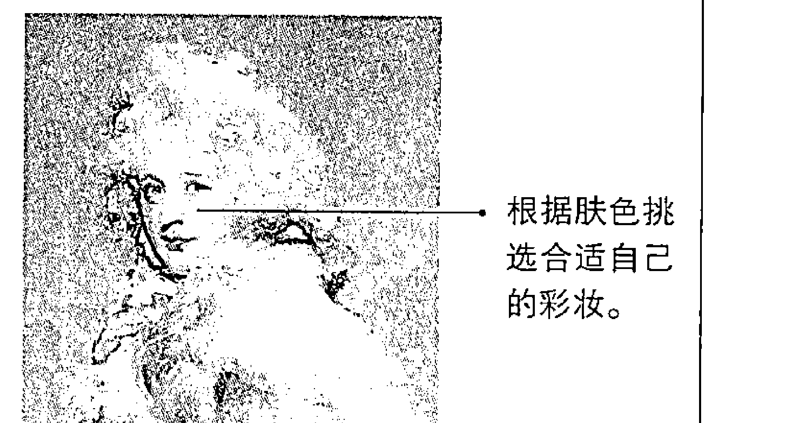

在化橘黄色系彩妆和白色彩妆时，可以根据自己的肤色、脸形，适当以蓝绿色眼影创造烟熏整体妆。这样会让你的眼睛显得神秘而明亮，观察力更加敏锐，也有更清晰的判断力。这种妆既有利于开拓新业务，又容易赢得老板的信赖，事业运会比较好。

> 橘黄色系妆
橘黄色的彩妆有利于开启事业运，当有业务时，化这样的妆容，显得干练而值得信赖。

# 441 属鼠的人按摩哪个部位可以放松身心？

属鼠的人，适宜脚部按摩。脚部按摩不仅会让属鼠的人浑身舒坦，也可以减轻其心理压力，常按摩脚底可促进静脉回流，避免水肿。

把脚浸泡在温水中，加入几滴熏衣草精油或用海矿物浴盐泡脚，可以消除全身疲劳，促进血液循环，起到减压、减肥的效果。

属鼠的人，若身体不太好，可以经常按摩脚部的涌泉穴。涌泉穴位于前部凹陷处第2、3趾趾缝纹头端与足跟连线的前三分之一处，每天晚上临睡前可以用温水泡脚，然后将双手搓热，一只手扶住脚踝，另一只手对准涌泉穴来回往复地推搓，长期坚持可以健肾。

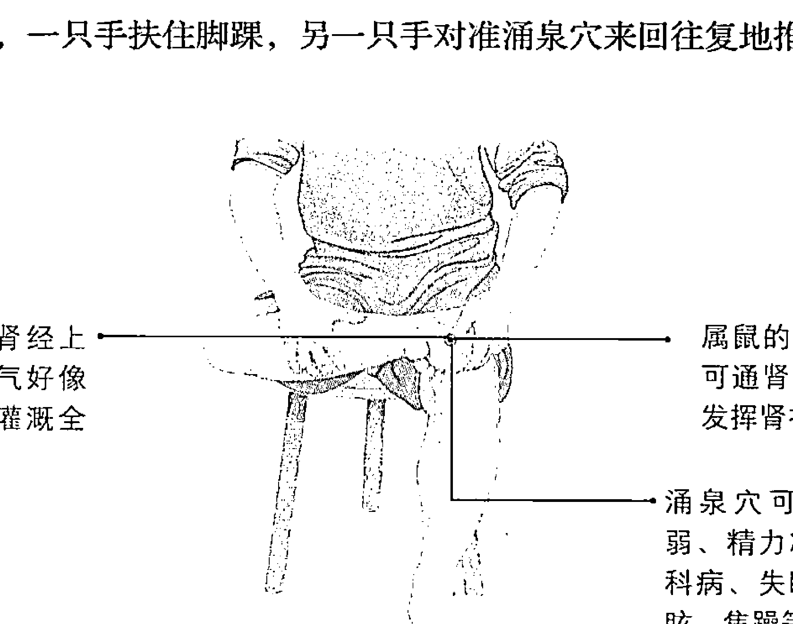

涌泉穴是足少阴肾经上的要穴，肾经之气好像源泉之水，可以灌溉全身五脏六腑。

属鼠的人常按摩涌泉穴可通肾经经络，有助于发挥肾补水的功效。

涌泉穴可以防治神经衰弱、精力减退、倦怠、妇科病、失眠、多眠症、晕眩、焦躁等多种病症。

# 442 属牛的人按摩哪个部位可以放松身心？

属牛的人，总是埋头苦干，一肩挑起所有的重担与责任，无法得到完全的放松。因此，捏揉肩膀最能让属牛的人放松。可揉捏紧绷的部位，肩膀上面要用力，尤其是肩胛上端及下颈部之间的狭长肌肉更要注意。双手交互推揉肌肉，可以释放颈部的压力。

另外，属牛的人容易劳累，除了多休息外，还要适量参加运动。运动可以运气，将全身的气场都激活，人就不会出现少气无力、精神疲惫的状况，有助于改善人的气色，起到令人健康、美丽的作用。

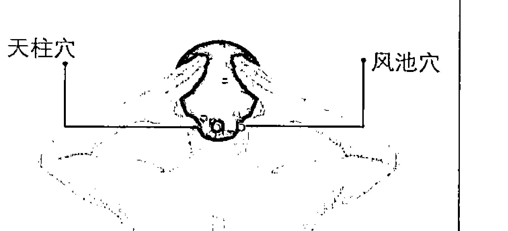

天柱穴

风池穴

> 风池穴
天柱穴位于后脑下方的凹陷处，风池穴位于天柱穴外侧一指处，按压此二穴可缓解肩膀酸痛。

# 443 属虎的人按摩哪个部位可以放松身心？

属虎的人，按摩的重点在手部和双臂。为使按摩达到理想效果，双手要保持温暖、灵活、柔软，并要经常练习，建立自信，增进按摩的范围和创造力。

属虎的人在沐浴时，可以借助硬海绵按摩，使用具有活血、排毒功效的按摩霜，可以改善血液循环，瓦解橘皮组织，进而起到健美的作用，改善肤色。

由于虎野性比较足，比较凶猛，所以属虎的人更应该多运动，将全身多余的能量发泄出去。这样不但有助于改善属虎人的人际关系，还会使自己的面相看起来更柔和，更容易为他人所亲近。

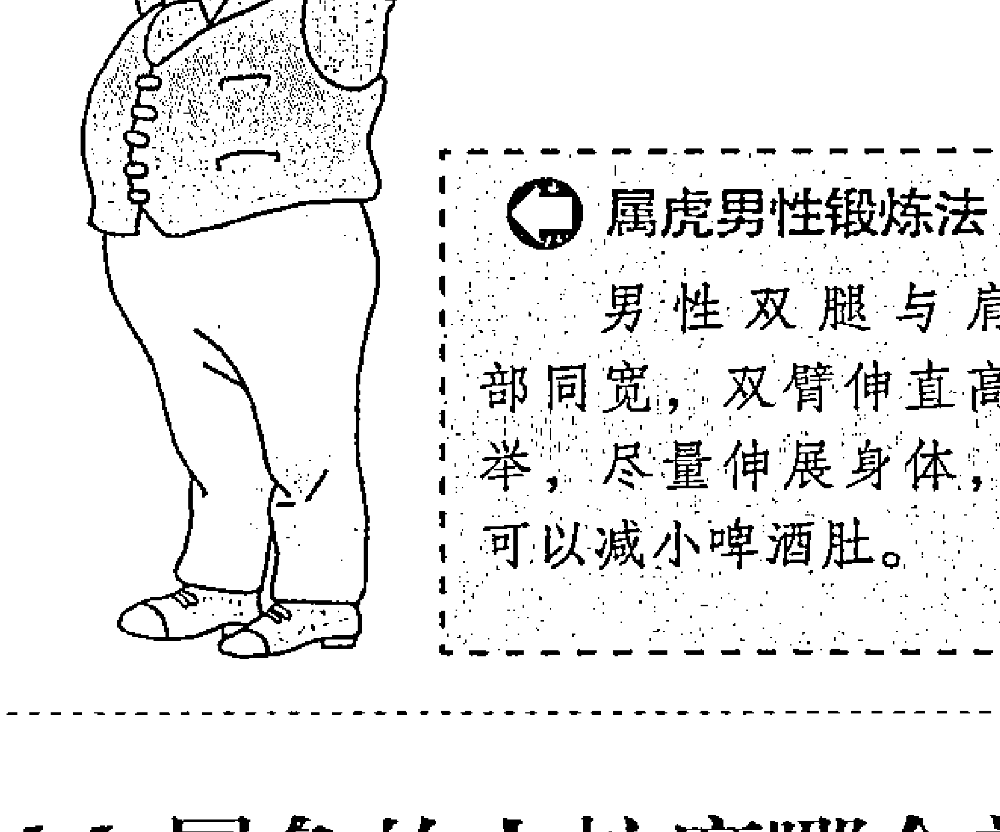

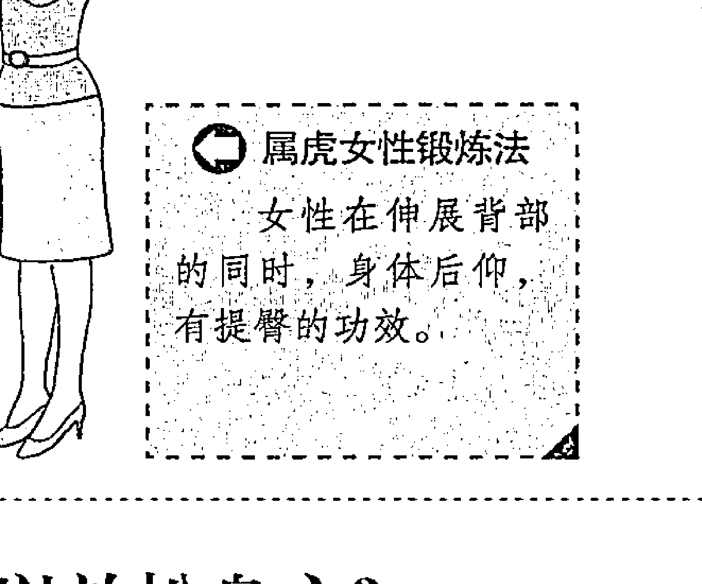

# 444 属兔的人按摩哪个部位可以放松身心？

属兔的人，健康与脚部有密切关系。每天花十几分钟按摩足部，最好用温水泡脚，并配合精油按摩。

现代医学研究发现，人的脚部有丰富的末梢神经网、毛细血管、毛细淋巴管等器官。这些器官与人体五脏六腑、组织、器官有着密切的联系。属兔的人日常按摩涌泉穴可加强这些器官之间的联系，并有效改善毛细血管、毛细淋巴管之间的通透性和规律性运动，增强血液循环，增强体质，避免血液循环不畅而引起的黑眼圈，身上经常莫名其妙地出现淤青及头部刺痛。

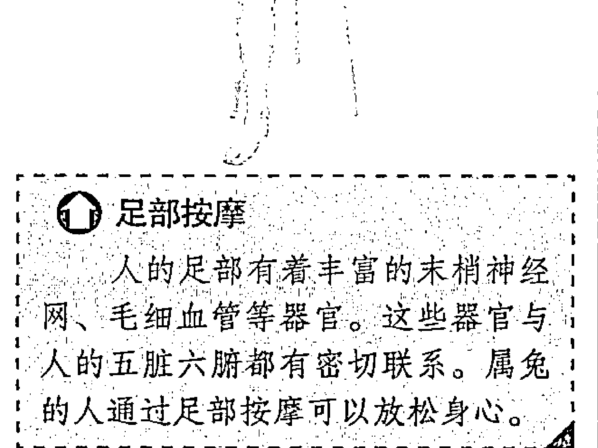

# 445 属龙的人按摩哪个部位可以放松身心？

属龙的人，按摩的重点在腹部。经常按摩腹部，不但有益于瘦身，还可以消除属龙的紧张情绪。圆圈式按摩是推拿腹部的基本动作，用双掌以顺时针方向推圆圈，越靠近腹部中央圆圈越小，然后再往腹部外围画大圆。进行这样的按摩，可以促进呼吸循环，有利于排出废气，达到放松身心的功效。

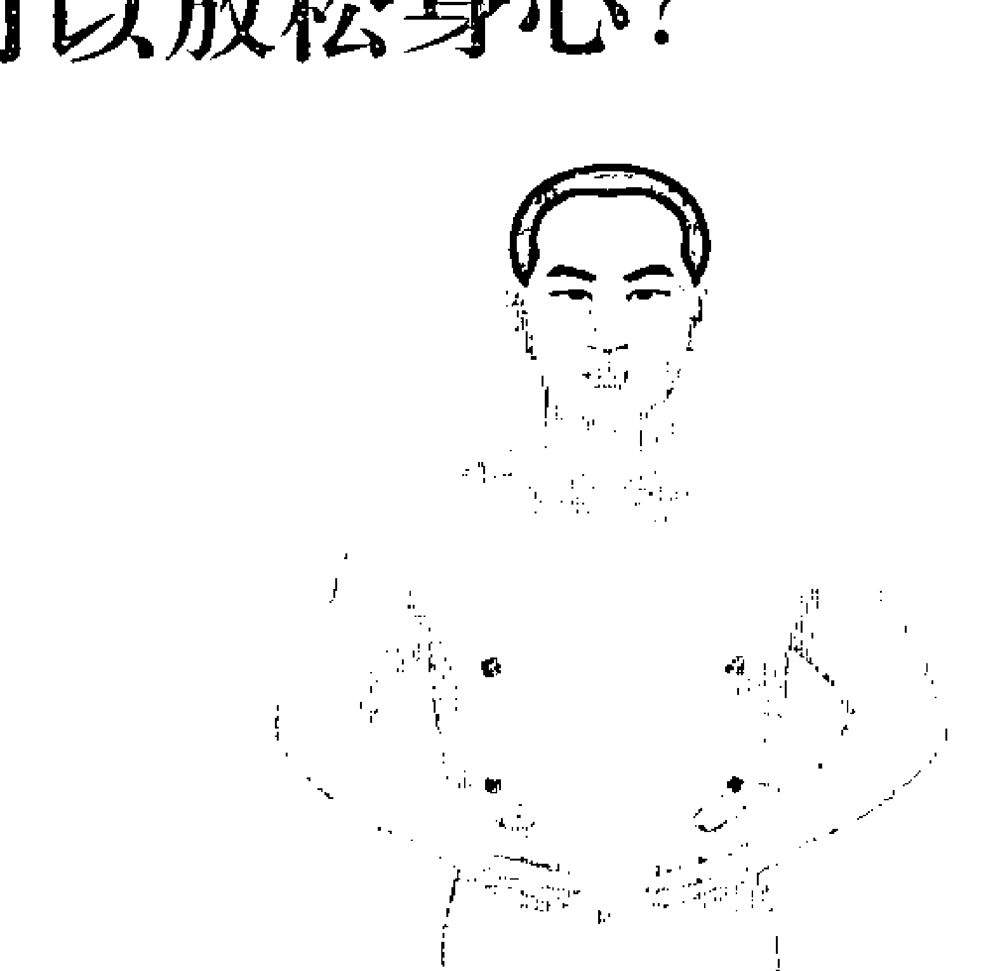

需要说明的是，女性在月经期间，不要乱按摩自己的腹部，因为腹部有很多穴位，按摩不当，很容易引起痛经。若是因为体内有淤血，经常腹痛，可以适当对腹部进行按摩，以促进血脉流通。

> 腹部按摩
属龙的人用圆圈式按摩法按摩腹部，可以促进呼吸循环，有利于排除废气，达到放松身心的作用。

# 446 属蛇的人按摩哪个部位可以放松身心？

属蛇的人，常有肩胛酸紧与脖子僵硬的毛病，可以常做简单的按摩放松身心。以双手交互推揉肌肉，可释出颈部累积的压力。开始揉捏前，先要搓揉肌肉，使之暖和起来，直到僵硬的肩膀肌肉放松，才停止揉捏。每天做几分钟，可以让你舒展筋骨，心胸开阔。

另外，属蛇的人，晚上睡觉的时候，容易受凉，既影响睡眠质量，也影响人的气色，针对这种情况可以对头部进行按摩，一方面使大脑得以短时间地休息，另外，可以调节血液循环，带来充足养分，带走滞留的废物，起到消除精神紧张和疲劳的效果。

令一人双手握拳，轻轻捶击患者的背部，使背部软组织放松。

患者坐直，双腿盘起，双手自然放于膝盖上。

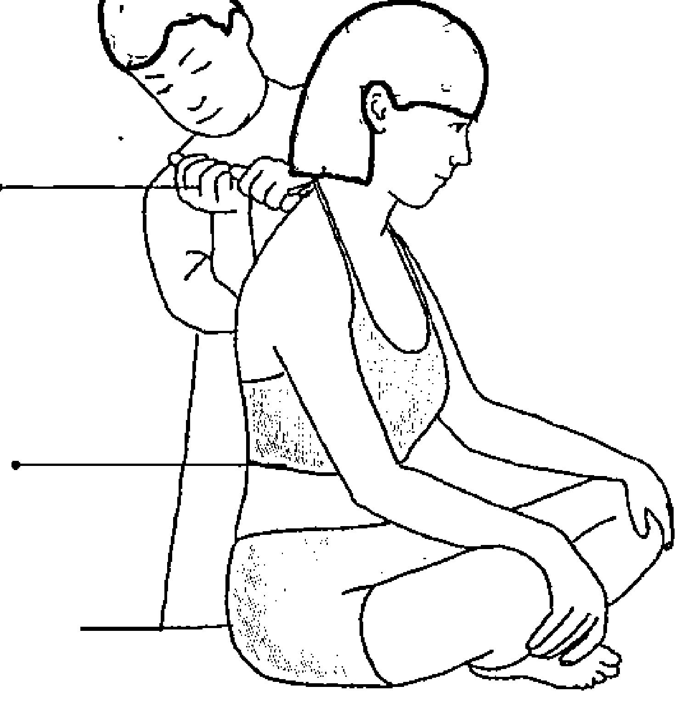

> 背部按摩
若是背部疲劳，可请人拍打自己的肩、背、腰、四肢等肌肉较丰厚处。这样可以促进血液淋巴循环，具有行气通窍、疏松肌肉、安心宁神、催人振奋的功效。

# 447 属马的人按摩哪个部位可以放松身心？

晚上睡觉的时候，被子可以盖住全身，防止身体受凉，但却没法盖住头部，头往往露在外边，容易受凉。属马的人容易头痛，对头部进行按摩，对属马的人来说很重要。

每天晚上临睡前，帮自己做个头部按摩，可以减轻压力。用指尖沾些按摩油，用手指头按摩整个头皮。若有头痛，可按摩脖子底部周围，往上按摩到头皮的底部。手指要采用滑动的按摩动作，力道要强，以便让精油渗入体内。

> 头部按摩

属马的人容易因头部着凉而阳气不足，容易头痛。在压力大或者头痛的时候，可以用指尖沾着按摩油，用手指按摩整个头皮。按摩时注意力道，力道足精油才会渗入体内起到放松或者止痛的效果。

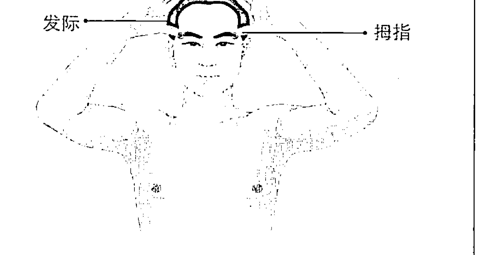

# 448 属羊的人按摩哪个部位可以放松身心？

属羊的人可以通过按摩臀部达到放松身心的目的。臀部按摩可以消除臀侧的赘肉，防止下垂。也可以按摩荐骨，荐骨是位于脊椎顶端的扁平骨骼，属于骨盘的一部分。用舒缓的指压按摩荐骨，来达到放松的目的。

与其他属相的人相比，属羊的人更爱美。他们（她们）尤其在意自己的脸部，会经常做一些面部保健工作。适当的面部保健可以使肌肉和神经得到放松，延缓面部的衰老。但如果长期过度频繁地做面部保健，不仅达不到放松的目的，还会增加皮肤的疲劳，加快皮肤的衰老。因此属羊的人在做面部保健的时候，要注意把握度。

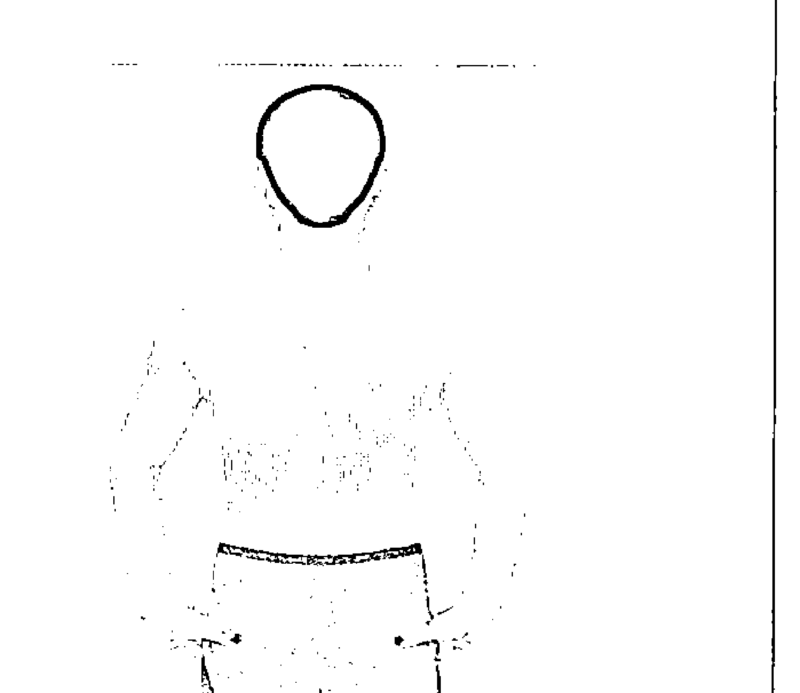

> 臀部按摩

臀部按摩可以消除臀侧的赘肉，防止下垂。属羊的人可以通过按摩臀部达到放松身心的目的。

# 449 属猴的人按摩哪个部位可以放松身心？

手臂按摩，对属猴的人非常有益，可以减轻压力、疲倦与酸痛，提高工作效率。手臂的按摩，以轻柔为主。

手臂内侧是淋巴腺的所在地，先涂上纤体膏，以螺旋方式由下而上轻轻按摩五分钟；手臂外侧则是以直线的方式由下往上进行按摩，这样有利于塑造手臂的美丽曲线。

属猴的人具有猴子好动的特征，但若为了美丽，最好改掉这个习惯，学会静坐，利用冥想达到美容的目的。你可以经常冥想自己是一位皮肤光滑、细嫩的美丽女子，保持好的心情，便能够延缓你脸部皱纹的衰老。

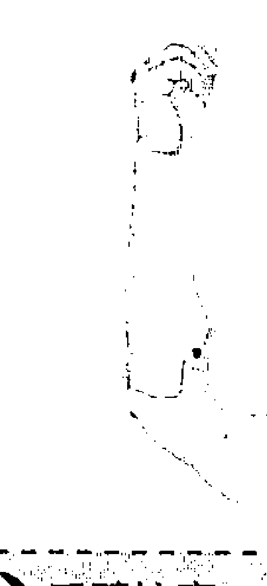

手臂按摩
属猴的人对手臂进行按摩可以减轻身体的疲倦与酸疼，可以提高工作效率，减轻压力。手臂的按摩，以轻柔为主。

# 450 属鸡的人按摩哪些部位可以美容？

对于属鸡的人来说，美化腰部是相当重要的。腰部按摩的目的在于促进血液循环，使肾气通畅，同时消除积余脂肪，改善手脚冰冷、浮肿的现象。可以按下边动作做一套美容操：平躺在地上，双手枕在脑后，以腰为中心点，上肢和下肢分别向身体同侧弯曲，两侧交换进行。在睡前做一组这样的运动，可以提高免疫力。

鸡有咀嚼食物的习惯，属鸡的人可通过咀嚼来美容。研究发现，如果我们每天咀嚼口香糖15~20分钟，对面部的美容大有裨益。如果连续咀嚼几个星期，还能减少面部的皱纹，使面部肤色红润。

### 腰部按摩美容操

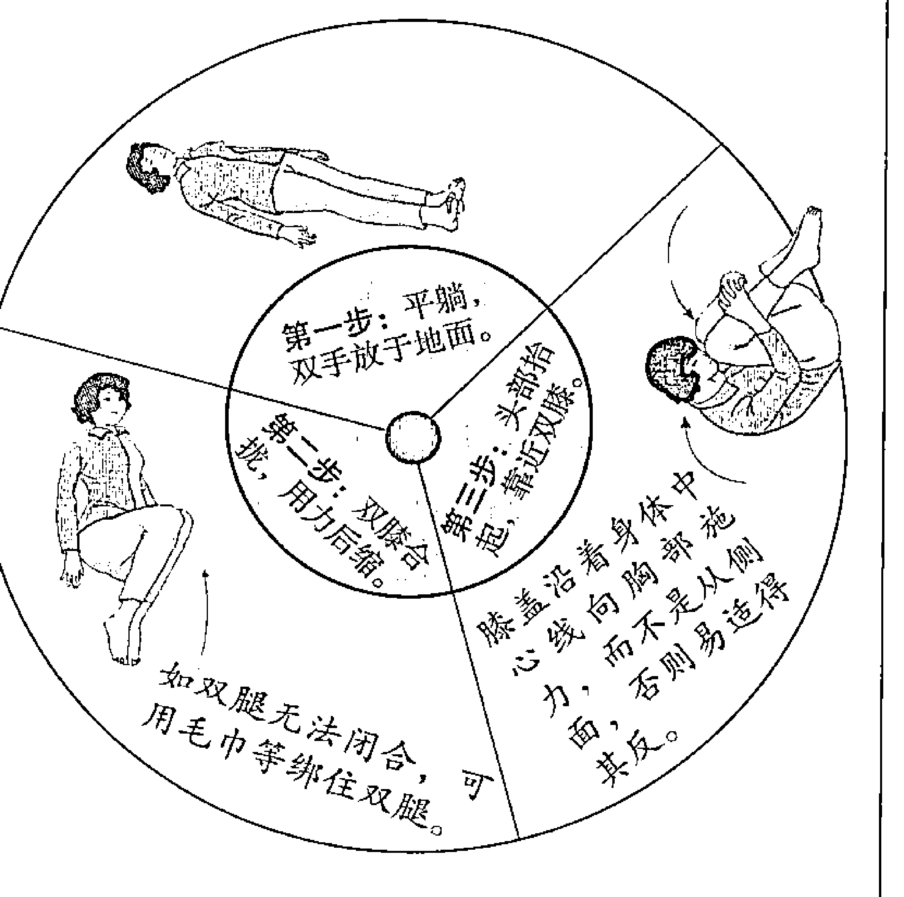

# 451 属狗的人按摩哪个部位可以放松身心？

对属狗的人来说，背部推拿是一种享受，它的功效在于可缓解腰背酸痛，治疗肌肉损伤及痛经所致的腰痛，也能将多余的脂肪消耗掉。

属狗的人，平时要注意保持脊骨挺直，这样才能减轻背部压力。每天通过搓揉来消除背部肌肉酸痛，可以达到解压、塑身的效果。

属狗的人，最适合通过水来美容自己。每天早晨起床后，先喝一杯温开水，然后开始穿衣、叠被、洗漱。这可让睡了一夜的肠胃很快进入工作状态，有利于将体内污染物排出。晚上7点之后，先来一瓶矿泉水。晚餐要有汤有粥，餐后吃些水果，看电视时喝点茶；如有精力可炖些补品来喝。临睡前再用温水洗脸，用保湿的营养晚霜，轻轻按摩脸、手足等容易干燥的部位10分钟，使水分和营养渗透到肌肤深层。

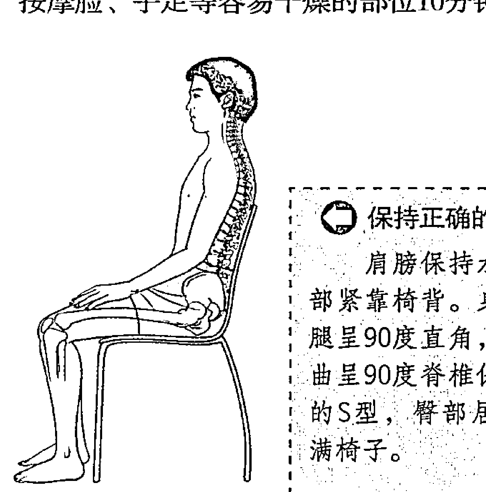

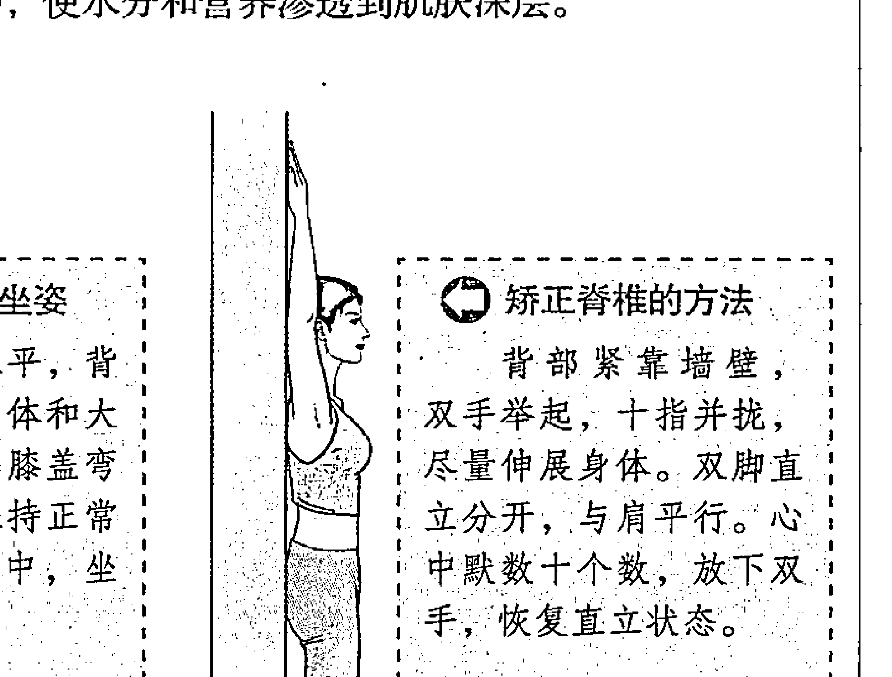

# 452 属猪的人按摩哪个部位可以放松身心？

属猪的人，腿部的压力较大，平时可以按摩腿部。每天回家后多做抬腿运动，这是最好的瘦腿方式。或者用温水泡脚，去除脚部角质。每天按摩腿部，可以达到纾缓压力、塑身的效果，从而让你有个愉快的心情。

属猪的人，具有猪贪吃、贪睡的性情，尤其喜欢睡觉。所以，属猪的人晚上容易忽略对皮肤的护理。因为夜间是皮肤细胞再生的关键时间，而且晚上人体的血液循环顺畅，细胞分裂活动旺盛，能够去除白天进入皮肤内部的杂质和毒素。因此夜间是呵护皮肤的最佳时段，晚上10点之后，不要忘记对皮肤进行彻底的保养，这将有助于保持皮肤的光泽及弹性。

# 第十四章 衣着与饰物

本章主要谈到了衣服的搭配问题，内容涉及衣服颜色搭配的规则，不同颜色的衣服如何搭配，如何利用不同颜色的衣服吸引异性的目光，十二生肖的人如何穿衣服才能显示自己的风采，不同九星的人如何选择衣服，鞋子与运势的关系等。

# 453 如何利用衣服的颜色改运？

五行命卦不同的人，有着不同的颜色喜忌。而穿衣是每日必不可少的内容，一个人若长期运气不佳，可以尝试通过改变衣物的颜色来改变运势。
金命之人，宜多穿金色、黄色和白色的衣物来增强运势。
木命之人，宜多穿绿色系的衣物来助好运。
水命之人，宜多穿黑色和青色衣物来转换运势。
火命之人，宜多穿红色和橙色的衣物。
土命之人，宜多穿黄色和紫红色衣物。

如何推算自己的五行命卦
计算公式
男：（100-出生年份）/9取余数
女：（出生年份-4）/9取余数
命卦
余数为1，五行命卦为水命。
余数为2、5、8，五行命卦为土命。
余数为3、4，五行命卦为木命。
余数为6、7，五行命卦为金命。
余数为9，五行命卦为火命。
举例
一个男人1902年出生，那么（100-02）/9，余数是8，其五行命卦是土，适合穿红色和橙色的衣物。

# 454 购买衣服时要考虑哪些因素？

女人看到喜欢的衣服，就舍不得移动脚步了。但是，不是每一件漂亮衣服都适合自己，要有所考虑，才能让自己的运势和气场达到最佳状态。
首先要想到这件衣服是否容易搭配其他衣物。如果这件衣物与家里的衣服从颜色到格调上都难以搭配，买回家只能放入“冷宫”。
其次，不要购买单一类型的衣物。出席不同的场合，得有不同格调的衣物，这样才显得有品位。如果你的衣物都是同一种类型，就难以应付不同的场合。
最后，若想改变自己的运程，最好根据自己的五行命卦来确定自己的穿着。如五行属水命的人，适合的颜色是蓝、灰、黑色系，平常最好穿这些色系的衣服。五行属土命的人，适合的颜色是黄色、棕色系，平常要穿这些颜色的衣服。

# 455 服装的颜色越鲜艳越好吗？

有些人认为，改变自己的运程，最好从提升别人对自己的关注度着手，可以穿一些艳丽的衣服，洒一些浓浓的香水。但正如受欢迎的人并不一定是最出风头的人一样，一个人若想吸引人气和目光，并不是衣物越艳丽越好。除非你有很强的色彩搭配能力，不然，请不要轻易尝试五颜六色的衣物。

通常来说，一个人的衣服颜色以3～4种为宜，不宜再多，否则会给人花哨的感觉，不庄重，难成大事，也难以遇到贵人。最安全的穿法是只有两种颜色，可以选择搭配一些色系相近的装饰，如手袋、围巾、首饰等。这样就会显得有层次感，又不会过于花哨。

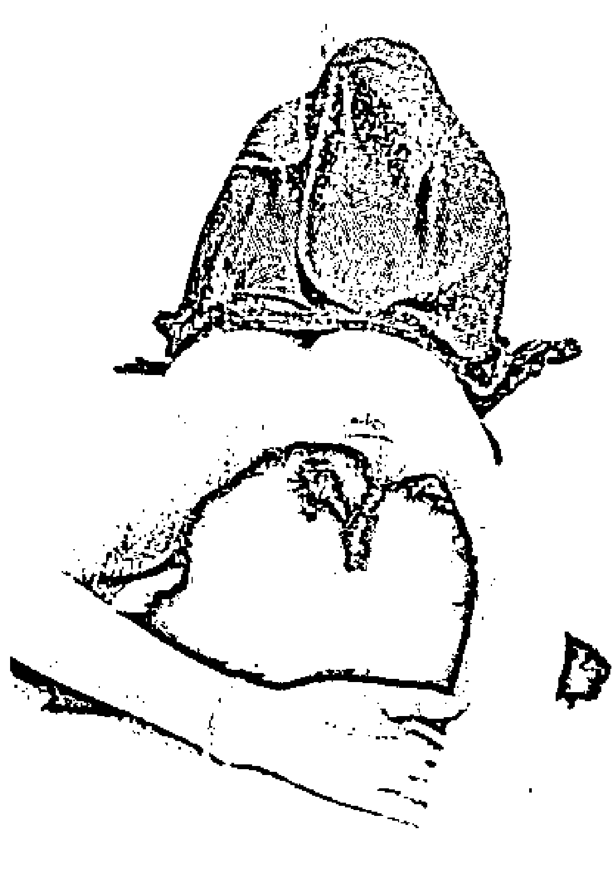

> ① 服装颜色的冷暖
服装的颜色有冷暖之分，暖色系有视觉膨胀感，冷色有视觉收缩感。红色为暖色系，胖的部位不宜穿红色，胖人也不宜穿红色衣服。

# 456 衣服颜色搭配有何讲究？

在生活中，最多的颜色搭配是黑、白、灰色与其他颜色的搭配。因为这三种颜色无论与哪种颜色相配，都不会显得太过突兀。白色能够让其他颜色更加鲜艳明亮，黑色则会让其他颜色显得柔和低调。所以，黑色适合配鲜亮的颜色，如黑与红，黑与黄。

搭配衣服时，要知道自己想要突出哪一部分的服饰。若用相近色与黑、白、灰搭配，只会起到反效果。如：用黑色搭配其他深色调的衣物，就会让整体显得沉重和昏暗。

黄色、红色、紫色为贵气的颜色，与这些颜色相关的成语，如紫气东来、大红大紫、红得发紫、带金佩紫都带有褒义色彩。人若适当穿着这些颜色的衣服，不但会增加回头率，而且容易形成高贵的气质，更能吸引贵人缘。

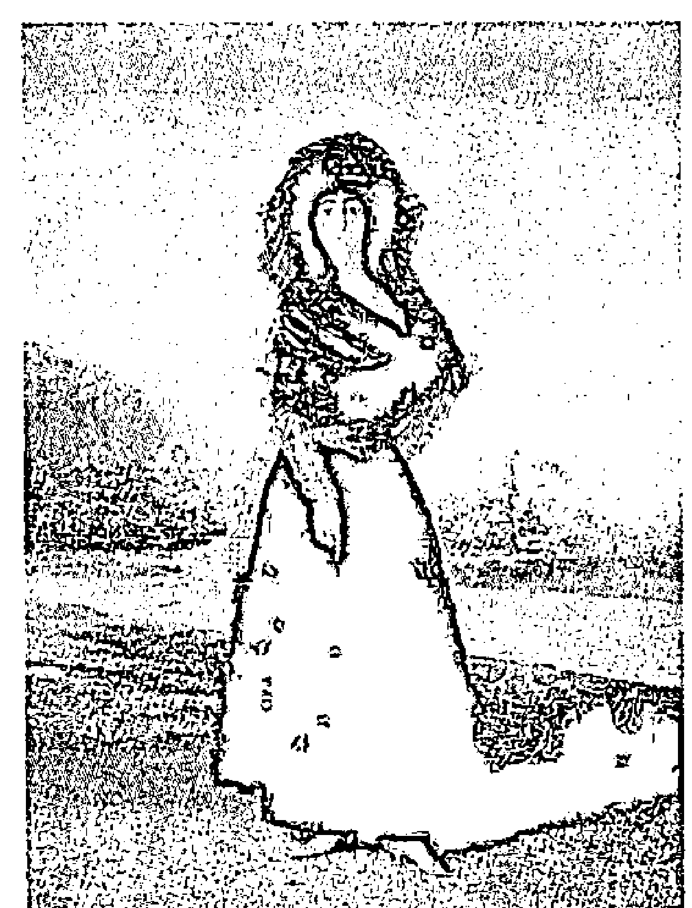

> ② 衣服颜色的搭配
黑色与其他颜色搭配，会让其他颜色显得柔和低调。黑色适合配鲜亮的颜色，如黑与红，黑与黄等。

# 457 如何协调衣服的颜色？

协调色搭配，可分为同色系搭配和近似色搭配。
同色系搭配，是在颜色深浅和明暗上有所不同，如：青与天蓝，墨绿与浅绿，咖啡与米色，深红与浅红等。近似色的搭配，如：红与橙红、紫红，黄色与草绿、橙黄，绿色和嫩黄等。
协调色的服装，有一种柔和、文雅之感，主要用于职业装。特别是浅色搭配，亲切自然，谦逊成熟，最适宜办公室女性。
我们可以从衣服的颜色来判断一个人的运程。喜欢穿黑色衣服的人，容易给人留下神秘、高贵以及专业的印象，因此时尚造型设计师最适合穿黑衣服。但另一方面，黑色又会阻拦成功，经常穿黑衣服的人往往在人际交往上存在障碍，只好用黑色来掩饰自己内心的恐惧。因此若想提升自己的人缘，最好不要穿黑色系的衣服。
穿衣并不是小事情，不仅要考虑搭配，还要考虑你衣服的颜色会给人留下什么样的印象，这些知识都是我们需要了解的。

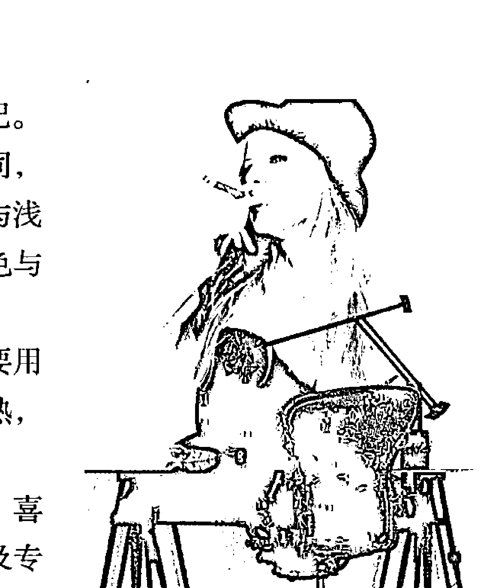

> 时尚造型设计师
喜欢穿黑色衣服的人，容易给人留下神秘、高贵以及专业的印象，因此时尚造型设计师最适合穿黑衣服。

# 458 如何搭配对比色衣物？

对比色的搭配，可分为强烈色系的搭配和相反色的搭配。强烈色系指两个颜色效果相差较远的搭配。比如黄色与紫色，红色与青绿色，黑色与黄色等。而相反色搭配，如黑与白，红与绿，青与橙等。
对比色的搭配，形成鲜明的色彩特征，可以让人眼前一亮。如黑与黄最亮眼，黑与红最隆重，黑与白则是永恒的经典搭配。
一个人若不引人注目，不被老板和上司重视，最好穿对比色的衣服，这样会形成具有超强冲击力作用的磁场，很容易就被上司发现。若个人又有能力，能干出一番成绩，离升职加薪也就不远了。

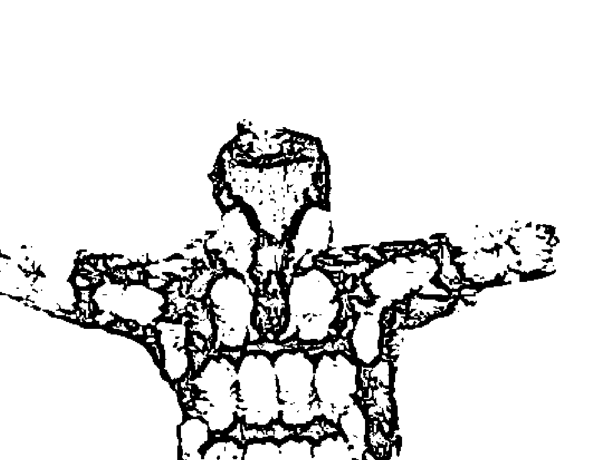

> 黑白经典配
黑与白属于相反色搭配，可以给人强烈的视觉冲击。这种搭配是时装界的咏叹调。

# 459 如何搭配蓝色衣物？

无论是深蓝色还是黑蓝色，都非常容易与其他颜色搭配。蓝色与黑色一样，有视觉收缩的效果，可以让人显得苗条。

鲜明的蓝色外套和及膝的蓝色裙，搭以白衬衣、白袜子、白鞋，让人显得轻盈、青春而有活力。蓝色外套和背心配以细条纹的灰色长裤，可以增添优雅的气质。淡紫色毛衣配以深蓝色窄裙，具有成熟韵味。普通的蓝裙白衬衫，若配以淡紫色小外套，也别有风味。

蓝色是永恒的象征，非常纯净，常令人想起美丽、冷静、理智、安详与广阔等字眼。因此，职场人士若穿蓝色衣服，可以给人理智、沉稳的印象。许多行业的人的工作服就是蓝色的。一般人若常穿蓝色系的衣服，也会收到同样的效果，容易赢得老板的信任，事业运比较好。

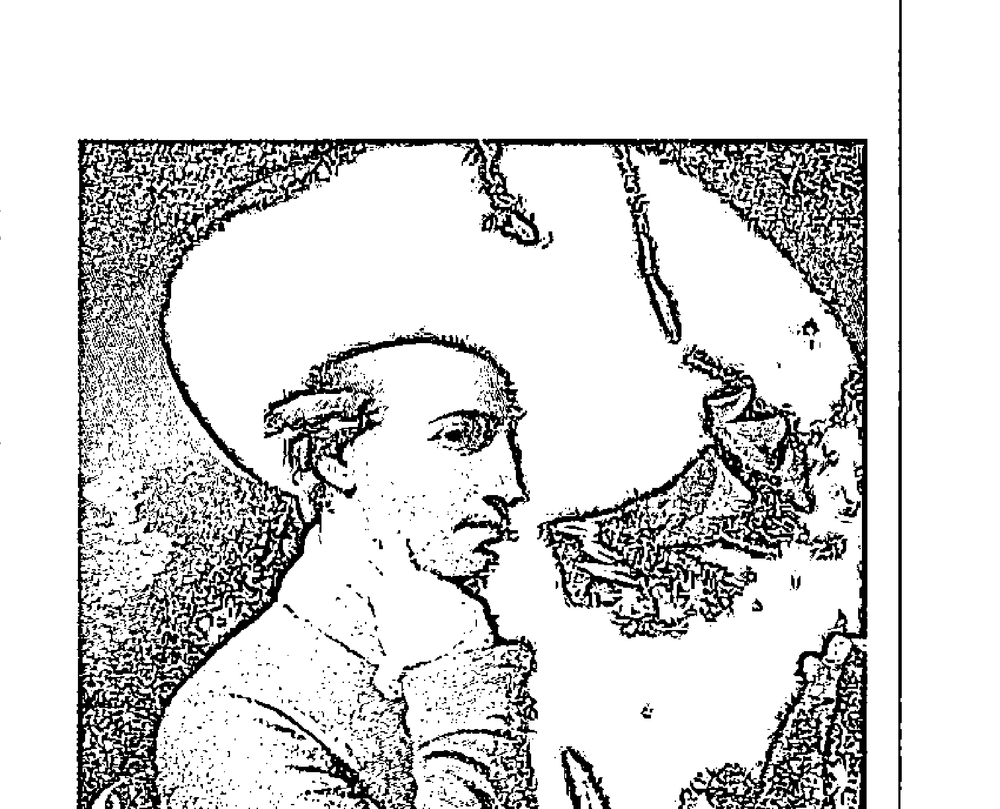

> > 蓝色是永恒的象征，职场人士若穿蓝色衣服，可以给人理智、沉稳的印象。

# 460 如何搭配褐色衣物？

褐色较为沉着，与亮色搭配才能出彩。褐色与白色搭配，让人显得清纯、秀气。褐色毛衣配褐色格子长裤，自有一种成熟的魅力。

金褐色及膝圆裙与大领衬衫搭配，可增添优雅气质。若用保守的栗子色外套，配以红色毛衣与红色围巾，则鲜明生动，俏丽无比。

褐色是在红色和黄色之间的任何一种颜色，只有在更亮的颜色对比下才看得出来，纯褐色的衣服难以为人发现，所以上班族一般不要轻易穿褐色衣服。职场女性若为了显示自己的干练，如果穿褐色的套裙，可以在脖子处挂一条引人注目的项链。

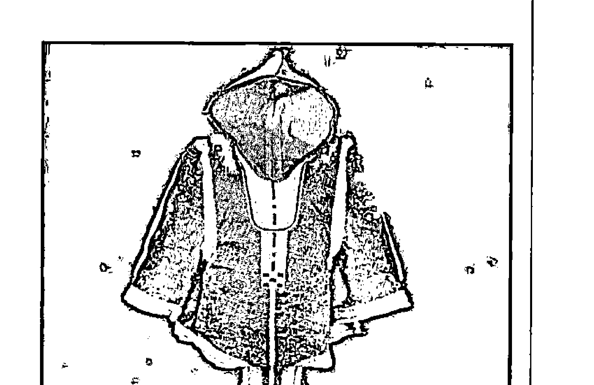

> > 褐色衣服 属鼠的人若遇到桃花年，可以穿米黄、褐色的衣服，这样可以避免烂桃花。褐色衣服让人感觉低沉，一般与亮色搭配才能出彩。

# 461 如何搭配黑色衣物？

黑色是百搭色，无论与什么颜色搭配在一起，都别有风味。我们平时最常见的是黑色长裤搭配其他衣服。若上衣为黑色，比如T恤，下装可穿米色纯棉休闲裤，最好是低腰微喇叭的裤型，脚上穿双休闲鞋，这是年轻时尚的打扮。也可以配米色的及膝裙和休闲鞋子，这样就充满了青春的气息。而黑色和白色搭配，永远都不会过时。

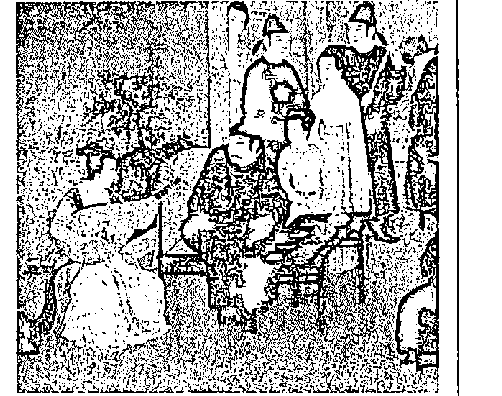

需要解释的是，黑色向来具有不同的文化意义，一方面是高贵、稳重、专业的象征；另一方面，在特殊场合有悲伤、悲哀的意思。因此，黑色整体给人以凝重、神秘、性感的感觉。肤色较白的人、或者气质出众的人，穿黑色衣服能给人高雅之感。相反，肤色灰暗、脸色黄的人，最好不要穿黑色衣服，否则会给人不健康的感觉，不利于人际交往，也不利于提升自己的运程。

- **黑色衣服的穿法**
- 肤色较白的人或者气质出众的人，穿黑色衣服会给人高雅之感。
- 肤色灰暗、脸色黄的人，最好不要穿黑色衣服，否则会给人不健康的感觉，不利于人际交往，也不利于提升自己的运程。

# 462 如何搭配米色衣物？

米色有一种简约风和知性美，因此备受职业女性的喜爱。它比白色更加温暖、含蓄，比黑色更加纯洁、柔和，既不流于夸张，也不过分谦卑。

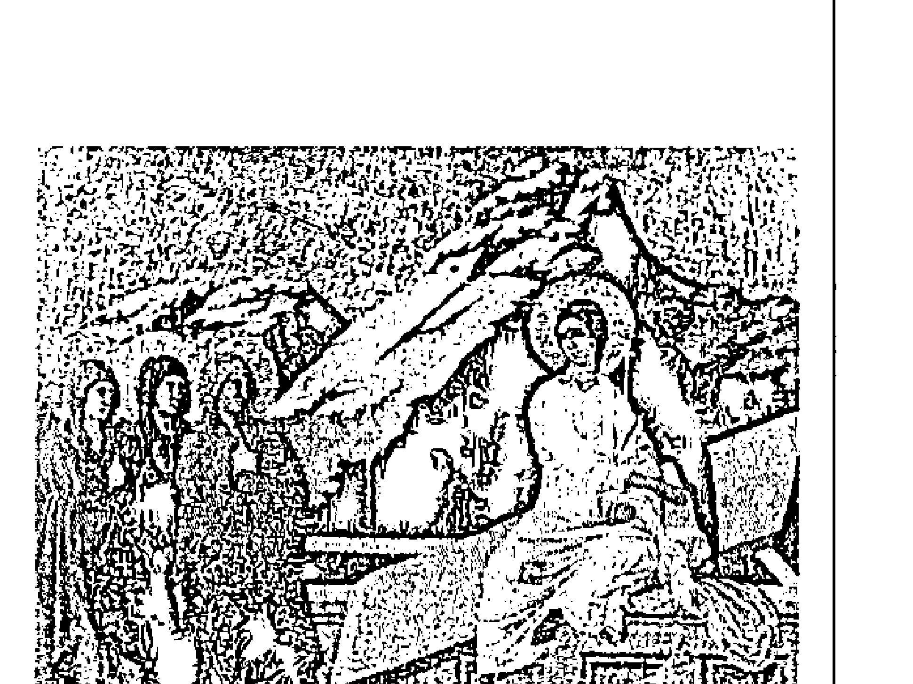

米色衣服女性穿着频率比较高。从表面上来看，它介于驼色和白色之间，但又比驼色多了分清爽宜人，比白色多了一丝纯净和浪漫、温暖与高贵。年纪稍大一点的女性，若常穿米色系衣服，可增添平易近人之感，在职场中容易获得“热心大姐”的称号。一般都市女性若从事服务行业的工作，适当穿米色系衣服还能增添亲和力，易赢得客户。

- **米色衣服**
- 米色简约、知性，最适合职业女性。
- 米色系的颜色还有“旺金”的功效，若常穿这种色系的衣服，可以拢财、聚财。

另外，米色系的颜色有“旺金”的功效，财运不佳的人若常穿米色系的衣服，可以拢财、聚财。

# 463 如何搭配白色衣物？

从理论上说，白色可与任何颜色搭配，但若要巧妙别致，赢得他人瞩目，也不是一件容易的事。最常见的是用白色衬衣与西服搭配，显得干净、利落。

白色的长裤可与淡色系上装搭配。如淡黄色上衣，淡紫色西服或淡色休闲衫。白色的褶折裙搭配淡色系的毛衣或衬衣，都能给人温柔、飘逸的感觉。白色休闲衫与红色窄裙搭配，则显得热情、潇洒。

若想利用白色穿出与众不同的风味，还要善用配件。如果穿白色的丝质衣，配上薄纱式的小披肩，可以给人高雅之感。若是银色上衣，配上白色裤子，就会具有华丽的美感。若在穿白色衣服的同时配一些独特的大皮带、耳饰或项链等配件，一定会给人赏心悦目之感，成为人人欣赏的对象。

需要注意的是，白色衣服穿久了容易发黄，除了在洗衣服的时候多注意清洗外，还可以在洗净之后加适量漂白剂泡几分钟，再用清水冲洗干净。

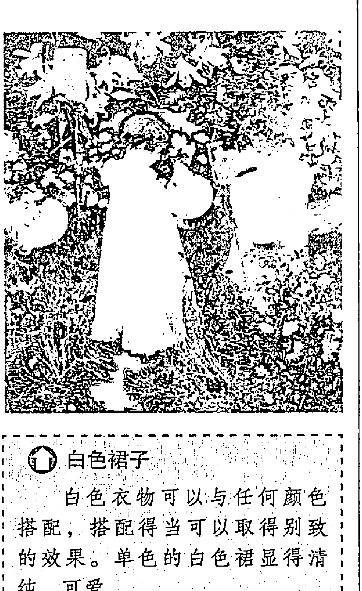

# 464 如何利用红色服饰吸引异性目光？

多数人认为红色和粉红色主情感，是招桃花的必备色，同时也是最具女人味的颜色。单身女性若想获得较好的异性缘，就要多穿红色和粉色服饰。

红色的服饰让人眼前一亮，犹如火一般的热情，会让异性不自觉地将目光停留在你身上，气质独特的女性，稍微上年纪的女性，可适当用大红色系来装扮自己。不过一般的年轻女孩不要轻易穿戴带红色衣物，否则难以压制红色衣服的磁场，无法驾驭这种红色，容易招致烂桃花。

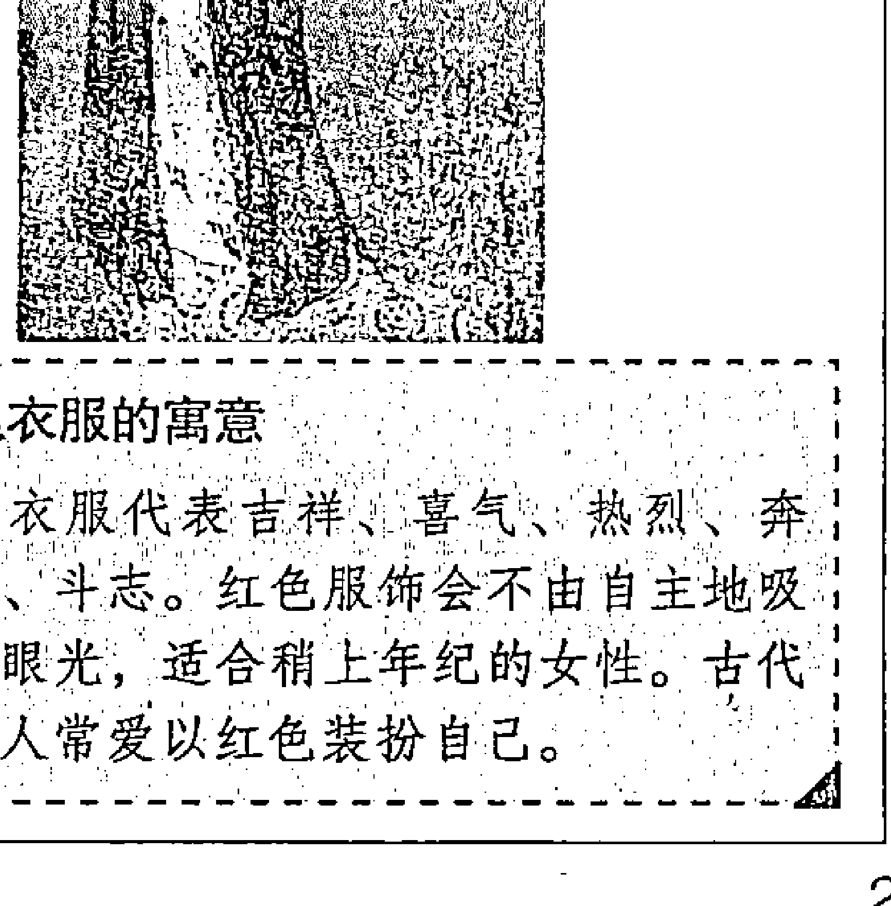## 465 如何利用青、绿色服饰吸引异性目光？

绿色和青色是自然界中常见的颜色，它们给人自然、清新、安全、新鲜、环保、和平的感觉。它们是植物的颜色，是春季的象征。青绿色的服饰，清纯而淡雅，有一种出自田野的新鲜气息，让人无法忽视。绿色和青色，象征着勃勃生机，是大自然和青草的颜色，最适合属虎、鼠和兔的人穿。

脸色发黄的人最好不要穿青绿色的衣服，否则脸色会更黄，给人不健康的感觉，难以引起贵人注意，会直接影响人的运程。

另外，一年四季有各自的颜色属性，春季气色主青，人在春季时适当穿绿色和青色的衣服，符合“天人合一”的养生保健之道。女性在春天多穿青色衣服可以增强自己的磁场，增加异性缘。

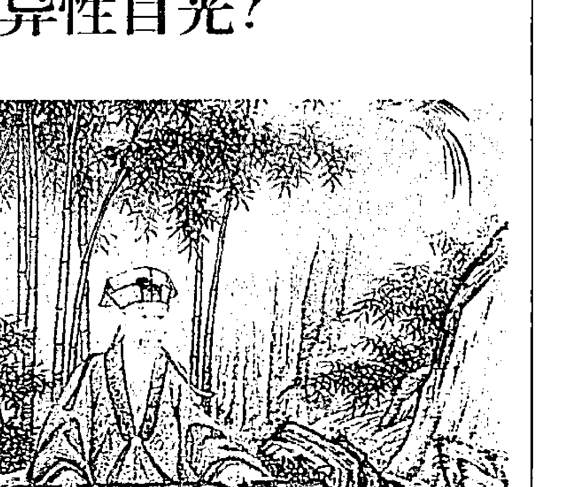

> 青色衣服给人清新、自然的感觉，有一种出自田野的气息，让人无法忽视。

## 466 如何利用金色服饰吸引异性目光？

金色象征着高贵、光荣、华贵、辉煌、财富，通常是皇族的服饰基调色。金色是太阳的颜色，拥有照耀人间、光芒四射的魅力。民俗文化认为，黄色为正色，贵气之色。女性穿金色衣服如果搭配得当，会呈现富贵的气质，容易吸引成功男人的注意。

金色有一个奇妙的特性，可以协调各种颜色，产生光明和华丽之感。但大面积运用金色，则容易流于庸俗。金色属于膨胀色，容易将着装者的优点和缺点都放大出来。

最适合穿金色的生肖是：牛、龙、羊、狗。此外，五行命卦中为金命之人，宜多穿金色、黄色和白色等色系的衣物，可以增强运势。

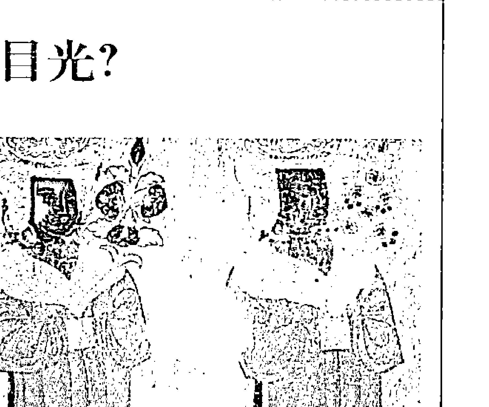

> 金色是皇族的基调色，无论是古代的埃及还是中国，皇族都崇尚金色。

## 467 如何利用白色服饰吸引异性目光？

白色又称全色光，是光明的象征，代表着纯洁、神圣、朴素、雅致、脱俗。白色是结婚礼服的主色，象征爱情的纯洁与坚贞。白色既不是冷色，也不是暖色，没有色彩倾向，它是永远的流行色，可以和任何颜色搭配。

最适合穿白色衣服的属相是猴和鸡。五行命卦为金命的女性，可以利用白色衣服来增强运势。

需要注意的是，白色衣服容易被弄脏。稍微有点脏就要换洗，否则会给人留下邋遢的印象。同理，尽量不要穿纯白色的皮鞋，太容易弄脏，可以选择米色皮鞋来代替。

| 搭配色 | 给人的感觉 |
| :--- | :--- |
| 红色、橘红色 | 动感 |
| 蓝色 | 轻快、活泼 |
| 粉绿色 | 清爽怡人 |
| 米色、灰褐色、棕色 | 温文尔雅 |
| 黑色 | 高雅、干练 |

## 468 如何利用黑色服饰吸引异性目光？

纯黑色让人感觉既高贵又端庄，有一种神秘的魅力。它能吸收所有的色光，使反射降到最低。黑色是永远的流行色，是经典，也是时尚。

黑色和白色一样，都是很容易搭配的颜色。无论是配白色还是红色，甚至金色，都不会给人俗气的感觉。冬天的时候，如果在黑色衣服里配一些鲜艳的颜色，如水红、柠檬黄、草绿等色，会给人生机勃勃的感觉，一改冬日冻得畏畏缩缩、死气沉沉之感。若是夏季，上衣可穿黑色印花衣服，下面穿米色的A字裙，会给人格外舒适的感觉，容易增加个人的亲和力；下身若再穿低腰微喇叭裤或者休闲裤，会给人青春逼人的感觉，容易吸引性格阳光的男孩。

最适合穿黑色服饰的生肖是鼠和猪。五行命卦中水命之人，可通过多穿黑衣服来提升自己的运程。

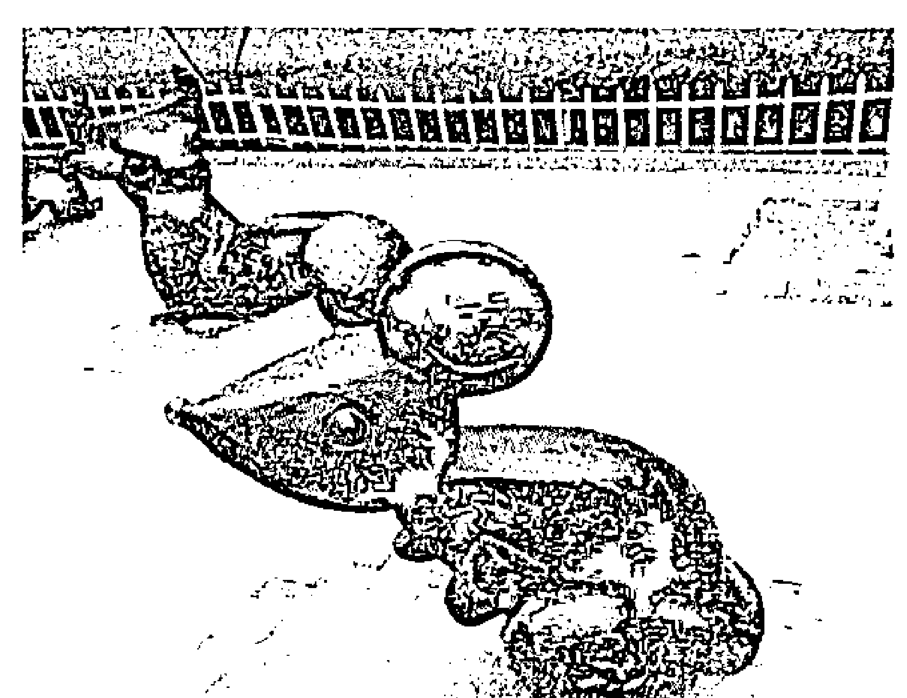

## 469 属鼠的人如何穿衣才显得活泼、可爱？

属鼠的人，天生有一种温柔、细心的特质，个性大方，感觉敏锐，善于体贴别人，可以温暖别人的心，适宜穿着轻快、活泼的服装。

一般认为，黄色容易给人轻快、透明、充满希望和生机的印象，因此很适合属鼠的人穿。浅黄色上衣与咖啡色裙子搭配，会给人轮廓鲜明的感觉。由于高彩度的黄色为富贵的象征，因此适合炎热的夏季穿，低彩度的黄色较为淡雅，适合春季穿。由于黄色容易与橘黄色、蓝色相冲，所以在搭配衣服的颜色时要注意避免。不过浅黄色与深蓝色搭配，会给人耳目一新的感觉，因此穿黄色衣服时可以用深蓝色图案的丝巾点缀。

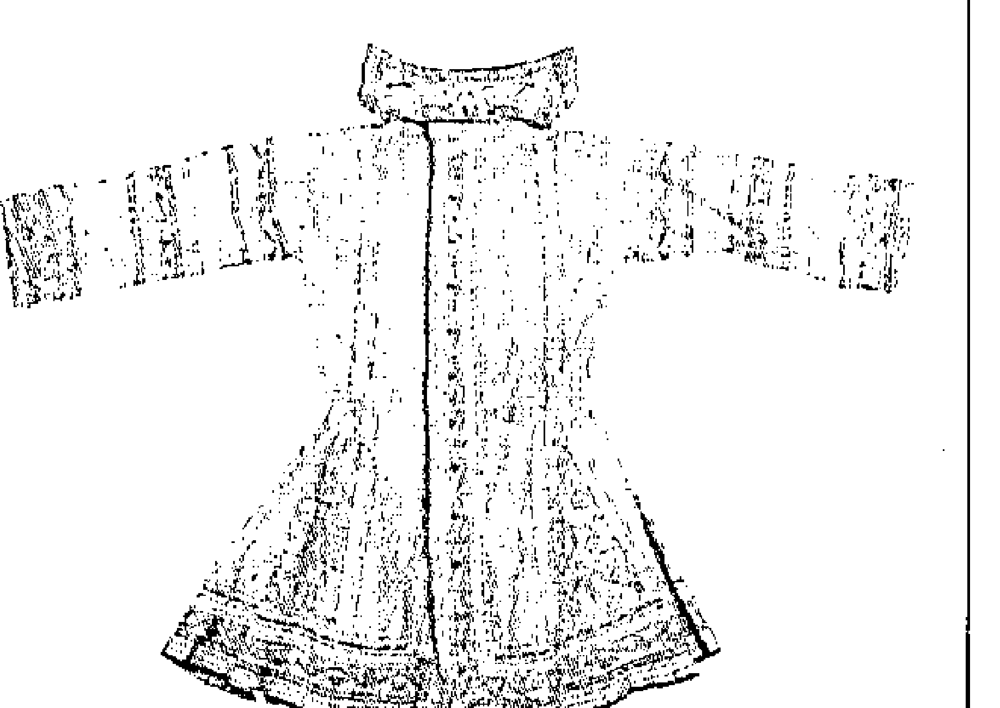

浅黄色上衣
属鼠的人春季穿一条咖啡色裙子和浅黄色上衣，会给人活泼、亮丽的感觉，就算是内向的人，也会感受到活泼的力量。

除了黄色色系，其他颜色的衣服，只要款式时尚，并且搭配得当，也会给人活泼的感觉。

## 470 属牛的人如何穿衣才会拥有优雅的气质？

属牛的人，为人淳朴，勤劳而坚毅，有思想，有主见，有气度。属牛的人在穿着上不会受流行风尚的影响，只要依据自己的个性与品位，就会自然流露出一种非凡的气质。

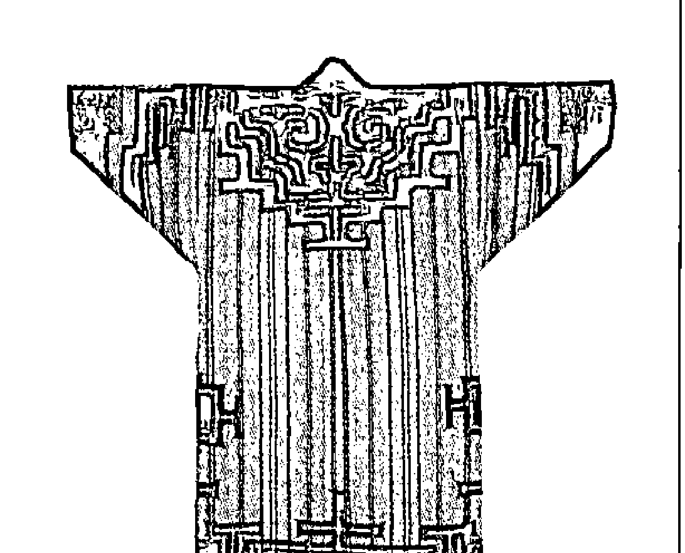

属牛的人在穿衣服的时候，最好选择深系色调的衣服，不要穿纯白色的衣服，否则看起来易显刻板、严肃。深色系的服饰会凸显属牛人身上的踏实、勤劳。无论穿着什么样的衣服，一定要确保衣服干净、整洁，这样才能显出属牛人的品质，流露出个人气质。

气质有内外之分，仅仅依靠穿衣形成的气质是有限的，还要注意内心的修养，多看书，多练习优雅的姿态，在看人的时候注意眼神交流等。这些都是属牛的人在人际交往时应该注意的。

属牛人的服装搭配
属牛的人注意不要穿过于宽松、肥大的衣服。图上的衣服穿上后会显臃肿，像中年大妈一样，毫无气质可言。

## 471 属虎的人如何穿衣才有魅力？

属虎的人有正义感，性格刚柔并济。由于个性开朗又富有行动力，穿运动服和牛仔裤可以让属虎的人魅力自然展现出来。不要为了修饰身材而穿着奇装异服，这样会起反面效果。

属虎的职场女性若想穿出自己的魅力，可以用衬衫搭配高腰铅笔裙，再穿上一双尖头高跟鞋。这样的装配，既显得优雅、成熟，又能展现职业女性干练的一面。服饰色系要尽量简洁，款式要别致，令人过目难忘，若能再佩戴一件合适的配饰，就更完美了。

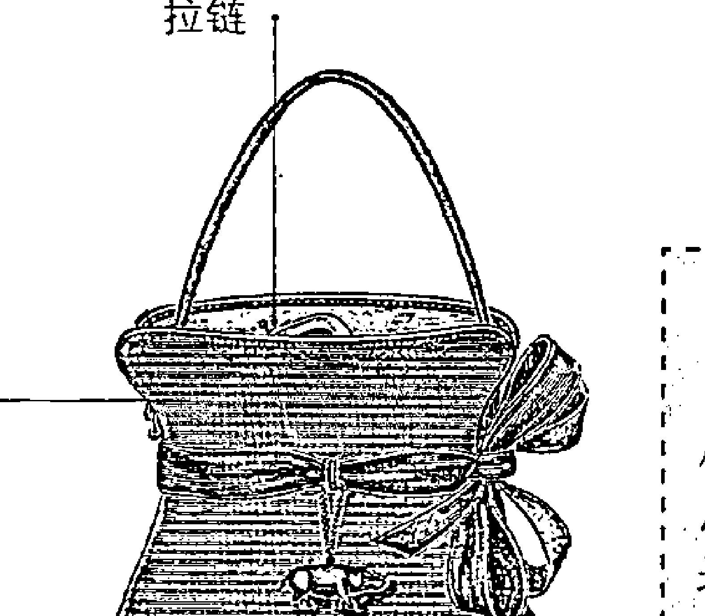

属虎人的服装搭配
属虎的人，若是参加聚会，应穿得庄重一些，打扮得闪亮一点，再配一个小提包，可以很好地展现自己的品位。

## 472 属兔的人如何穿衣才显得有格调？

属兔的人乐观向上，崇尚自由和理想，走在流行前端，有着大都市男女的现代气息和令人愉悦的谈吐。在服饰搭配方面，属兔的人要朴素、大方，才会显得更有品位和格调。

巧妙搭配浅色调衣服和艳丽色调的衣服，可以给人前进感和扩张感。如果上身纤细，下身粗壮，可选用深色轻软的面料做成裙或裤，上身则随意。身材高大、丰满的女性，最好穿深色衣服。

总之，属兔的人要体现个人穿衣的格调，主要是简单、大方，轻松、休闲，既有简约之美，又可体现自己的品位。

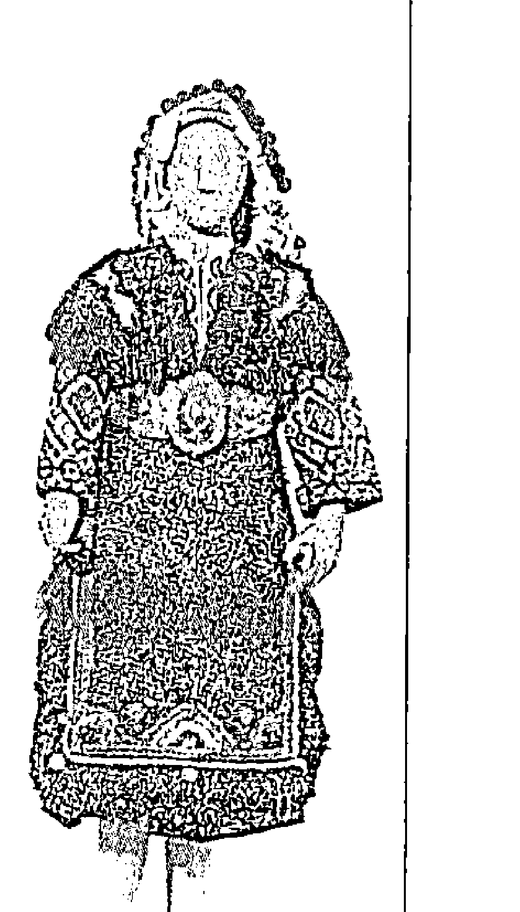

属兔人的服装搭配
属兔的人不要穿着太花哨，如图上这样身上有好几种颜色，配饰众多，易给人留下暴发户的印象，显得很肤浅。

## 473 属龙的人如何穿衣才动人？

属龙的人，人格高尚、积极、乐观、冲动、热情，有着天真浪漫的本性，本身就散发着令人难以抵挡的魅力。只要在出门之时，在身上洒一些清淡的香水，就能让人倾倒。

属龙的人，穿衣没什么特别要求，只要得体就行。若是上班族，则要穿正式的职业套装，或选择与办公室的色调、气氛相和谐的服装，给人端庄、简洁、持重和亲切的感觉，避免穿着过于袒露、花哨、反光，色彩过于夺目。

若在特定场合，如较为正式、隆重的会议、迎宾接待等，还需要穿着品位和格调具有代表性和典型性的公务礼服。

> 高贵优雅，雍容华贵的晚礼服，能恰如其分地烘托出女人的形象。

> 属龙人的服饰搭配 不同的服装能体现不同的场合特点，现代女性要学会根据场合装扮自己，如在酒会上就适宜穿晚礼服。

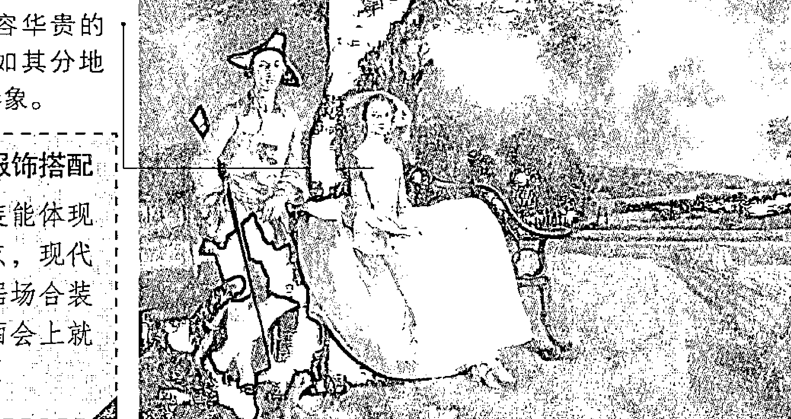

## 474 属蛇的人怎样穿衣才能成为焦点？

属蛇的人，极有智慧，猜疑心强，有探索精神和艺术天分。属蛇的人拥有成熟的气质，往往紧随流行的趋势，是大众瞩目的焦点，适宜穿淡色系为主的服饰。

> 佩戴饰物要注意其含义，如戒指一般只戴在左手，而且最好仅戴一枚，最多戴两枚。

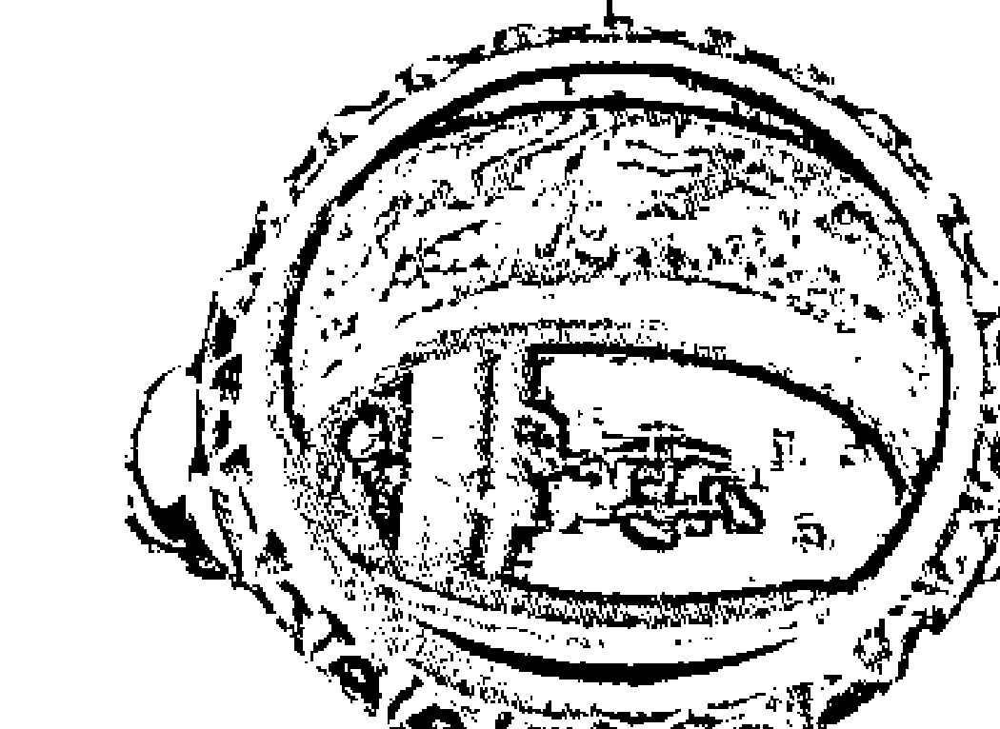

属蛇的人在穿衣方面与属龙者一样，没有特别的要求，关键是要注意配饰的选择。耀眼的项链、各种各样的胸针、小巧的手提包等，这些饰物会给女性衣装带来灵动的色彩，是较活泼的女性装扮。但也要注意佩戴饰物的方法，得体的饰物搭配使人大方、稳重，反之则会给人眼花缭乱、目不暇接的杂乱感。

> 戒指 佩戴首饰是有讲究的，不宜佩戴过多首饰，配饰要与服装和谐搭配。

## 475 属马的人如何穿衣才显得个性十足？

属马的人为人直爽，对事坦诚，善言好辩，性急而任性，喜欢与众不同。属马的人的穿着宜以暗色系为主，宽松的牛仔服饰是不错的选择。个性十足的穿衣风格，要遵循下面几个原则。

- 1. 大胆穿着对比色，如黑白色搭配，靛蓝色与艳红色搭配。这样的颜色搭配非常惹眼，容易吸引人的眼球。注意在穿对比色时要注意衔接恰到好处，不要给人割裂感。
- 2. 学会巧妙地混搭。混搭最能体现个人穿衣的特色，而且一般不会与他人撞衫，不同风格的混合搭配，会让你的装扮引人注目。但要注意不可乱搭，否则易给人杂乱无章之感。
- 3. 巧妙穿黑色衣服。黑色虽然会给人神秘之感，但东方人肤色偏黄，一般穿黑衣不好看。属马的人可以利用黑色来展现自身的优势，如可以大胆地穿一件高领的黑色紧身连衣裙，高雅又时尚，低调又性感。

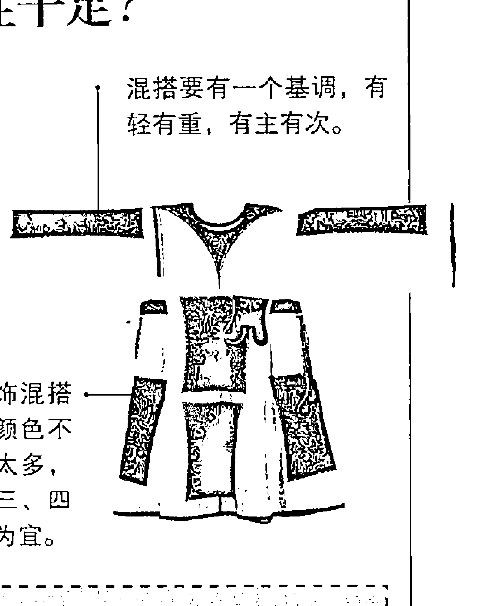

> 混搭要注意颜色之间的过渡和呼应，体现一种看似不经意间流露出来的精致。

## 476 属羊的人怎样穿衣才能给人平易近人之感？

属羊的人性情温柔，感情细腻，为人稳重，有人情味，内心固执，有反抗精神。属羊的人适宜穿平易近人的服装，表现出善解人意的魅力，服装色彩以米色或白色为主。一般认为，淡粉色是最能体现亲和力的颜色，有助于衬托女性水嫩的皮肤。所以作为领导的职业女性，适当穿淡粉色的衣服，可以拉近与下属的距离。最需要穿出平易近人风格的是销售人员。属羊的销售人员要注意做到下面几点。

- 1. 在拜见客户时，最好穿商务休闲装，不要穿商务正装，否则容易增强客户的警惕心，不利于业务的洽谈。
- 2. 避免穿套装。套装看起来比较职业，但容易给人死板的印象。若想增加活泼度，最好选择不成套的服饰搭配，但要注意不要过于休闲。
- 3. 避开单一的服饰搭配，穿衣选择多样化一些。可以适当增加配饰以增加自己的亲和力。

## 477 属猴的人怎样穿衣易体现出自己的特色？

属猴的人机智幽默，生性好动，关注时尚。因此，属猴的人只要穿出自己的特色和爱好，魅力就无人可挡，属猴的人适合穿着清爽、亮丽的色彩。

属猴的人可以根据自己的爱好穿出各种特色。

若想穿出前卫、热辣的感觉，可以穿对比色，如红色衬衫、绿色长裙，挂一个大的白色包；也可以穿一件中规中矩的衬衫，再配一件异常艳丽的傣族长裙，腰挂一个丑娃娃布偶。

若想穿出清爽、大方的感觉，可以穿一件简洁、大方、做工精致的短袖，再配一条暗色中裙，脖子上挂一条白金项链，或者上身穿一件蓝色衬衫，这样的装扮会给人足够的亲和力。

若想穿出灵动飘逸的感觉，可穿一件黑色的吊带，脖子上系一条火红的丝巾。

总之，属猴的人想怎样穿就怎样穿，穿什么像什么。

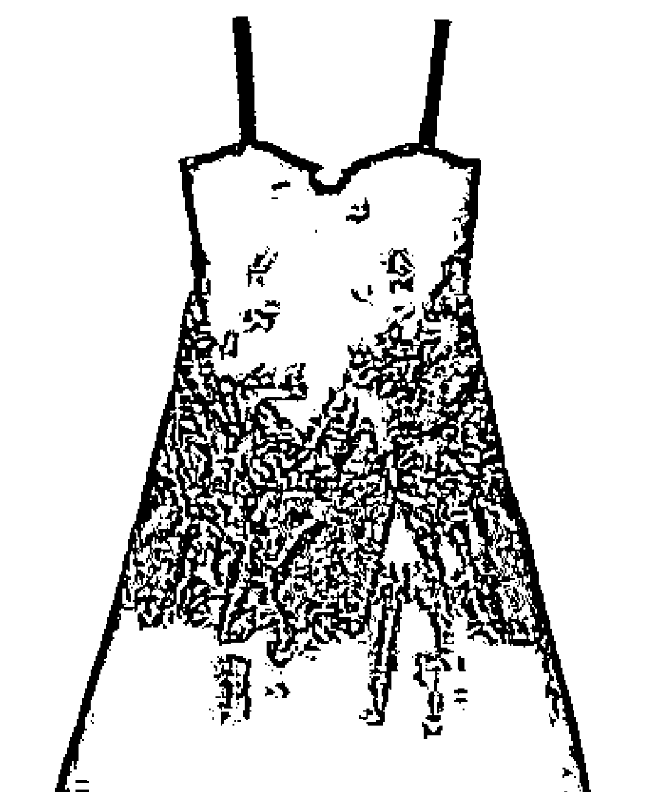

> **属猴人的灵动飘逸装**

属猴的人若想穿出灵动、飘逸的感觉，可以穿一件黑色吊带，脖子上系一条火红的丝巾，这样可以给人轻盈的感觉。

## 478 属鸡的人怎样穿衣才显得高雅、大方？

属鸡的人走在流行的前端，对美的事物有极强的感受力。因此，属鸡的人宜穿着朴素、淡雅的服饰，特别是传统的服饰。

属鸡的人可以参考如下方法搭配服饰。

- 1. 可以穿一身灰色套裙，这个色系虽然比较中性，但属鸡的女性穿上却女人味十足，还能给人典雅大方的感觉。
- 2. 可以穿一身靓丽、清新的蓝色装，下半身搭白色短裙，属鸡的女性这样穿会给人一种凉爽、自然的气质。
- 3. 可以上身穿一件白色衬衣，下身穿紧身短裙，这样可以突出曲线美，还会给人优雅、精致的感觉。
- 4. 可以穿一件碎花印花图案的短袖，下穿高腰裙，再佩戴一条珍珠项链，会给人一种时尚而自信的感觉。

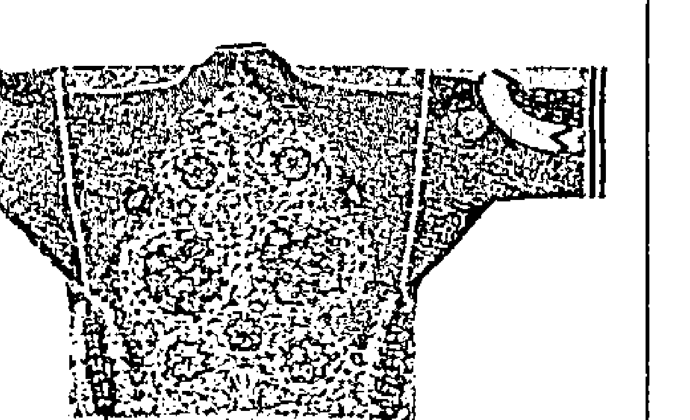

> **属鸡的人的时尚装**

属鸡的人可以上身穿一件碎花印花图案的短袖，下身穿高腰裙，再佩戴一条珍珠项链，可以给人一种时尚而自信的感觉。

## 479 属狗的人怎样穿出华丽的感觉？

属狗的人有强烈的责任感和原则，防卫意识强，不肯轻易尝试。因此，属狗的人在服装上总是千篇一律。属狗的人可以尝试一些华丽的衣服，能让人耳目一新。

属狗的人在冬天可以穿一件白色高领毛衣，外穿杏色的双排扣羊绒大衣，毛茸茸的领子里露出一张温柔的笑脸，给人以温雅、俏丽的感觉。属狗的人可以尝试穿各种优质的皮草及华丽的大衣，以提升自己的气质。

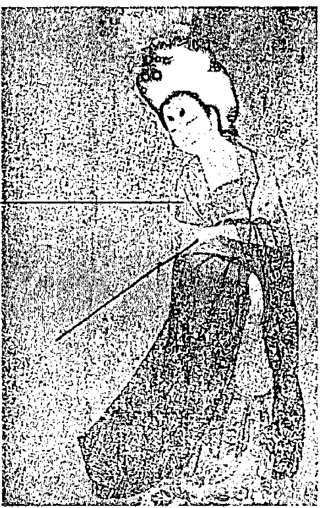

属狗的人多穿红色衣服，少穿蓝色。红色是属狗者的幸运色，它不仅给人华丽之感，还有开运的功效。

> 属狗的人穿衣搭配法
属狗的人防卫意识强，不肯轻易尝试，在服饰上多千篇一律。其实属狗的人可以多尝试，图上这种飘逸的裙子也是不错的选择。

## 480 属猪的人怎样穿出自己的风格？

属猪的人讲人情，讲义气，具有出色的经济头脑和服务热情。在服装上，金色和银色是属猪的人的幸运色，亲切的笑容能展现出属猪人的最大魅力。

总体来说，属猪的人比较活泼、好动，下面几种穿衣方式能展现他们的气质。

- 1. 若想穿出休闲的感觉，可以上身穿一件纯棉的休闲上衣，下身穿一条裤袋数目众多的工装裤。平常多穿T恤衫、休闲裤、大毛衣等。
- 2. 若想穿出潇洒、帅气的感觉，可以穿一身帅气的牛仔，或者在郊野中穿一身猎人装——这并非奇装异服，而是崇尚自由的表现。
- 3. 若想穿出青春浪漫的感觉，可以加各种华丽的蕾丝装饰，把一层一层的纱往身上堆。或者穿一件蕾丝装饰的白色泡泡袖T恤，再配一条带有皱褶的苏格兰短裙，清纯气质显露无遗。
- 4. 心血来潮时，属猪的人还可留一头如黑夜的长发，耳间戴一枚火焰般晶亮的耳环，然后身穿一袭暗如黑夜的长裙，这样会给人性感、神秘的感觉。

## 481 属猪、鼠、虎、兔、蛇、马的人如何挑选夏装？

亥猪、子鼠五行属水，适宜选择一些质地较硬、面料稍厚的衣服，这样会显得比较端庄、俏丽。从颜色上讲，夏季火旺耗水，应多穿黑色、蓝水色的衣服，以克制火旺。

寅虎、卯兔五行属木，适宜选择一些质地柔软、面料轻薄的衣服，这样会显得比较婉约、柔美。从颜色上讲，夏季火旺泄木，应多穿黑色、蓝水色的衣服，既能生木，又能制火。另外，可以佩戴五行属金或水的饰品，这样一夏的运气都会旺到家。

巳蛇、午马五行属火，适宜选择一些质地细密，面料柔韧的衣服。从颜色上讲，夏季火势过旺，应多穿黄色的衣服，既能泄火，又能生金耗火。每季末的土月泄火，特别是辰丑月晦火，应多穿些绿色、红色的衣服来生火、保火。

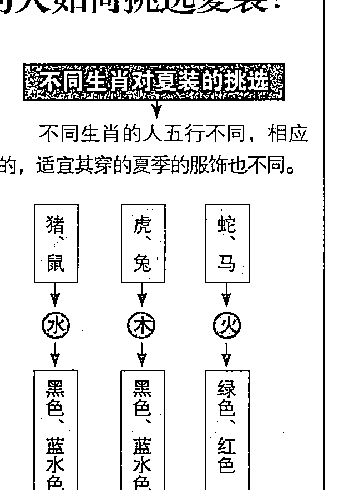

## 482 属猴、鸡、羊、狗、龙、牛的人如何挑选夏装？

申猴、酉鸡五行属金，适宜选择一些质地轻柔，面料适中的衣服，这样会显得比较温润。从颜色上讲，夏季火旺克金，冬季水旺泄金，这两季应多穿些土色的衣服来生金泄火克水。

未羊、戌狗五行属燥土，未戌因其中含有火，故称燥土。燥土中含有火，火克金，所以未戌土不但不生金，反而会“脆金”。因此，适宜选择一些质地柔滑、面料流畅的衣服，这样会显得比较含蓄。从颜色上讲，夏季木火旺，容易生燥，应该多穿一些黑色、蓝水色的衣服来抑火保湿。而冬季应该多穿一些红、橙、黄色的衣服来生土助身。

辰龙、丑牛五行属湿土，辰丑因其中含有水，故称湿土。辰丑湿土中不含火，所以能生金。在选择衣服时，适宜选一些质地粗厚、面料凝固的款式，这样会显得热情奔放。从颜色上讲，夏季火旺生土，应该多穿一些金色、白色的衣服，来泄火之气。

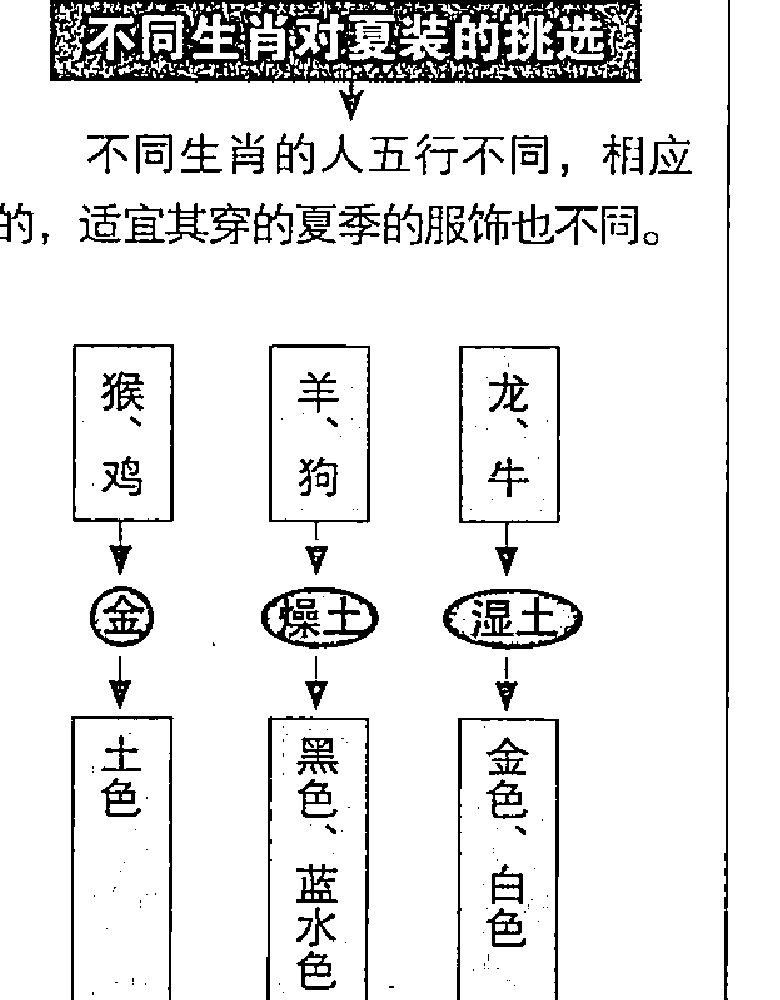

## 483 不同五行的人如何挑选衣服？

五行与形状的关系：长方形属木，三角形属火，四方形属土，圆形属金，波浪形属水。

五行与颜色的关系：木属性的颜色有青色、苹果绿、柠檬黄；火属性的颜色有红色、橙色、紫色；土属性的颜色有土黄色、咖啡色；金属性的颜色有金色、银色、白色；水属性的颜色有黑色、蓝色、灰色、浅蓝色。

人的形体多样，可以根据人的形体五行属性来搭配衣服。那么，该如何根据形体五行选择合适的衣物呢？如果体形是三角形，即头小臀部大，那么适合穿木属性颜色的衣服以及长方形的衣物。因为三角形属火，而木生火，所以木属性的颜色和形状较为适宜体形为三角形的人。

如果体形为长方形，那么就适宜穿水属性颜色的衣服以及波浪形的衣物。长方形属木，水生木，所以水属性的颜色和形状较为适宜体形为长方形的人。

> 形状、颜色与五行的关系
不同五行对应不同的形状与颜色，根据其对应关系，可以判断自己适合穿什么样的衣服。

| 五行 | 形状 | 颜色 |
| :--- | :--- | :--- |
| 木 | 长方形 | 青色、苹果绿、柠檬黄 |
| 火 | 三角形 | 橙色、紫色、红色 |
| 土 | 四方形 | 土黄色、咖啡色 |
| 金 | 圆形 | 金色、银色、白色 |
| 水 | 波浪形 | 黑色、蓝色、灰色、浅蓝色 |

## 484 人们如何根据九星选择衣物颜色？

一白星、二黑星、三碧星、四绿星、五黄星、六白星、七赤星、八白星、九紫星被称为九星，每个人都有属于自己的九星。九星每九年一个轮回，如1936年是一白水星，此后第九年，即1945年就属于下一个一白水星。以此类推，最近的一白水星年应该是2008年与2017年。

不同命卦要穿不同颜色的衣服。由于命卦为一白星的人属水，需要金属性的颜色相生，因此宜穿金色、银色、白色等金属性的颜色。忌讳的是土属性，也忌讳木属性来耗泄。

> 一白星适合的衣服
命卦为一白星的人，适合穿金色、白色等金属性颜色的衣服，有利运气。忌穿黑色、灰色等土属性的衣服，会相克。

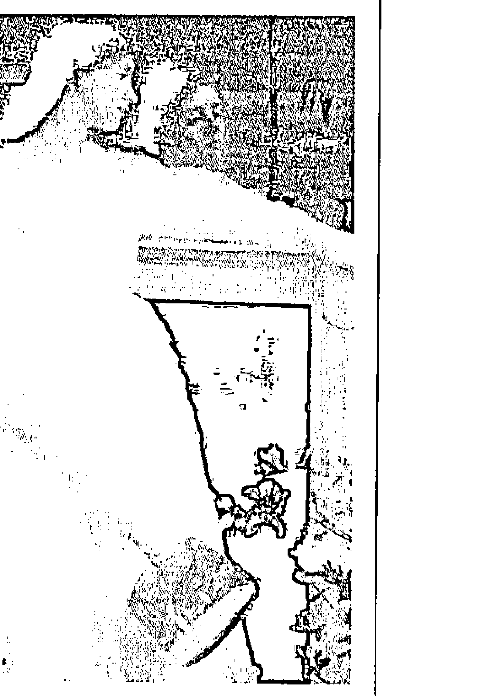

## 485 二黑星与八白星的人如何选择衣物颜色？

二黑星是九星中第二个命卦，八白星是九星中第八个命卦，二者都属于土，属于这两个星的人在衣服颜色选择上具有相似性。1935年是二黑土星，此后第九年，即1944年就属于下一个二黑土星，以此类推，最近的二黑星年应该是2007年与2016年。1929年是一个八白星星年，最近的八白星年应是2010年与2019年。

命卦为二黑星与八白星的人都属土，需要火来相生，即红色、橙色、紫色，需要土来相助，即黄色、咖啡色；忌讳木相克，即青色、绿色，忌讳金来耗泄，即金色、银色、白色。

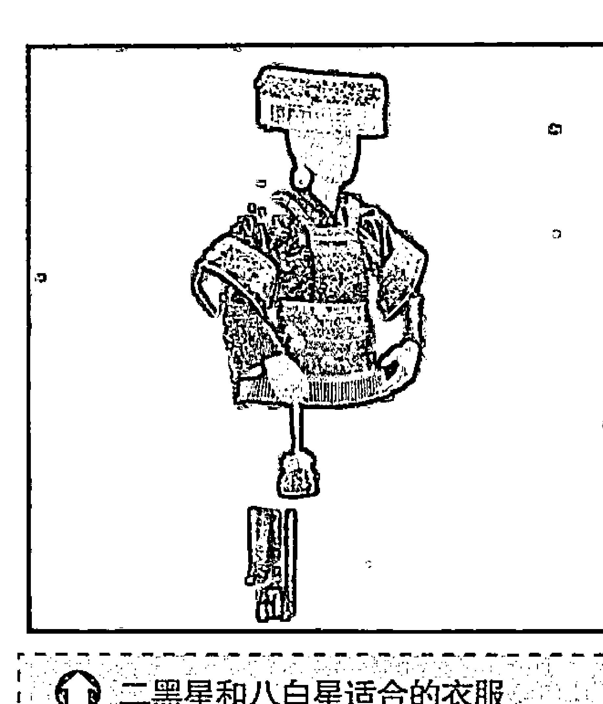

> 二黑星和八白星五行都属土，属于这两个星的人在衣服颜色的挑选上具有相似性。红色、橙色、紫色都是不错的选择。

## 486 三碧星和四绿星的人如何选择衣物颜色？

三碧星是九星中第三个命卦，四绿星是九星中第四个命卦，二者都属于木，因此属于这两个星的人在衣服挑选上具有相似性。1934年是三碧星年，此后第九年，即1943年就属于下一个三碧星年，以此类推，最近的三碧星年应该是2006年与2015年。1933年是一个四绿星年，最近的四绿星年应该是2005年与2014年。

三碧星和四绿星的人属木，喜欢水相生，即黑、灰、蓝色；需要木来相助，即青、绿色；忌讳金相克，即金、银、白色；忌讳火来耗泄，即红、橙、紫色。

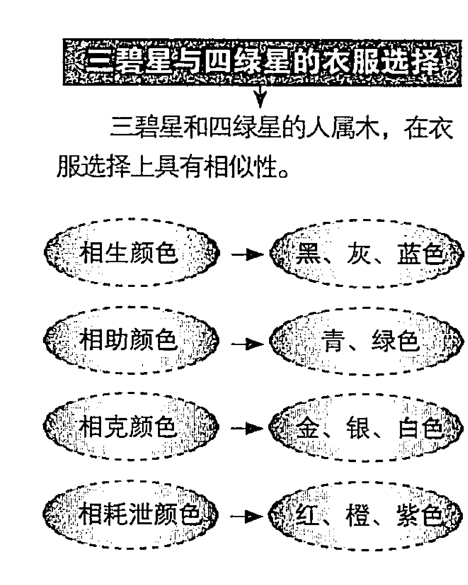

## 487 六白星和七赤星的人如何选择衣物颜色？

六白星是九星中第六个命卦，七赤星是九星中第七个命卦，二者都属金，因此属于这两个星的人在衣服挑选上具有相似性。1931年是六白星年，此后第九年，即1940年是下一个六白星年，以此类推，最近的六白星年应该是2003年与2012年。1930年是一个七赤星年，最近的七赤星年应是2002年与2011年。

六白星和七赤星都属金，喜欢土来相生，即黄色、咖啡色；喜欢金来相助，即金、银、白色；忌讳火相克，即红色、橙色、紫色；忌讳水来耗泄，即黑、蓝、灰色。

### 六白星与七赤星的衣服选择

- 相生颜色 → 黄色、咖啡色
- 相助颜色 → 金、银、白色
- 相克颜色 → 红、橙、紫色
- 相耗泄颜色 → 黑、蓝、灰色

## 488 九紫星的人如何选择衣物颜色？

九紫星是九星中最后一个命卦。1928年是九紫星年，此后第九年，即1937年就属于下一个九紫星年，以此类推，最近的九紫星年应该是2009年与2018年。

九紫星的人属火，喜欢木来相生，即青色、绿色；喜欢火来相助，即红色、橙色、紫色；忌讳水来相克，即黑、灰、蓝色；忌讳土来耗泄，即黄色、咖啡色。

### 九紫星人的衣服选择

- 相生颜色 → 青色、绿色
- 相助颜色 → 红色、橙色、紫色
- 相克颜色 → 黑、灰、蓝色
- 相耗泄颜色 → 黄色、咖啡色

## 489 鞋柜的摆放与运势有何关系？

鞋柜既能影响家居气场，又是衣着饰物中的内容，对个人运势影响较大，最好遵循下边两条摆放原则。

1. 根据宅主人从事行业的不同，鞋柜适宜摆放的方向也有不同。家主若从事文职工作，可把鞋柜放于家中文职位，即东南方；也可利用自己的生辰八字，推算出文昌星的位置，将鞋柜放到那里（鞋柜要保持干净，否则不利于文昌星发挥作用）。若家主从事以体力为主的工作，则鞋宜放于武职位，即西北面，也可将鞋柜放到武财神的位置上，这样不但有助于提升运程，还可招来较好的财运。

2. 鞋子是用来“脚踏实地”的，因此鞋柜要注意接地气。鞋柜不宜超过五层，这代表五行并存。超过五层，则与土相离，代表根基不稳，走路容易扭伤，不利于事业运。

| 家主职业 | 摆放方位 | 摆放效果 |
|----------|----------|----------|
| 文职工作 | 文职位，即东南方；文昌星位。 | 有助于事业运的提升。 |
| 体力工作 | 武职位，即西北面；武财神的位置。 | 有助于提升运程，还可招来财运。 |

## 490 鞋子的摆放有何讲究？

鞋子一边接地气，一边与人体紧密相连。因此，鞋子散发的磁场对人体来说非同小可，即使不穿时，也要注意其摆放，确保它们放到有利的位置，从而给人带来好运。在摆放鞋子时，要特别注意以下禁忌。

穿过的鞋子，不宜放于卧室内。因为鞋子从街上沾染了杂乱之气，各种各样的气场都有，如果摆放在卧室中，街上一些不好的气场可能会被带回家，影响家居气场，进而影响个人运程。所以，穿过的鞋子只适宜摆放于大门口的鞋柜之中。不曾上街的新鞋或室内拖鞋，则没有忌讳。

在摆放鞋子时，鞋尖不宜向外，以免形成火煞。尖头鞋更不宜朝外摆放。

## 491 穿鞋子有何讲究？

鞋子上承人体，下接地气，直接连通人体气场和大地气场，对个人运势影响非同一般。在家办公的人，不宜久穿人字拖鞋，否则会漏财。鞋子象征婚姻，数年前的旧鞋，或别人穿过的鞋，都不宜再穿，以免影响婚姻质量。鞋子以合脚、舒适为主，不合适的鞋子会让脚趾变形，更会带来霉运。

## 492 鞋子的颜色有何讲究？

鉴于鞋子对个人运程的影响，关于鞋子的一切均不可小觑。鞋子的颜色就很有讲究，也有五行喜忌之分。不同命卦的人，往往有着不同的颜色喜好。

通常而言，鞋子的颜色应与自己的五行相匹配。一个人如果五行命卦旺火缺木，鞋子颜色应避开红色、紫色等火型颜色，适宜选择青色、绿色等木型颜色。

五行命卦与鞋子颜色的对应关系

| 五行命卦 | 鞋子颜色 |
|----------|----------|
| 缺金     | 白色、银色、金色 |
| 缺木     | 青色、绿色 |
| 缺水     | 黑色、蓝色 |
| 缺火     | 红色、紫色 |
| 缺土     | 黄色、棕色 |

## 493 各个生肖的开运水晶与颜色分别是什么？

- 子鼠的开运水晶：紫水晶、绿幽灵、琥珀。开运颜色：金色、白色、粉红色、紫色。
- 丑牛的开运水晶：黄水晶、紫水晶、琥珀。开运颜色：红色、橙色、黄色、紫色。
- 寅虎的开运水晶：虎眼石、黄水晶、琥珀。开运颜色：碧绿色、蓝色、浅黄色。
- 卯兔的开运水晶：红纹石、金发晶。开运颜色：黑色、绿色、蓝色。
- 辰龙的开运水晶：红纹石、粉晶、琥珀。开运颜色：橙色、粉红色。
- 巳蛇的开运水晶：紫水晶、粉晶。开运颜色：粉红色、绿色、紫色。
- 午马的开运水晶：白水晶、玛瑙。开运颜色：红色、白色。
- 未羊的开运水晶：碧玺、白水晶。开运颜色：黄色、咖啡色、浅红色。
- 申猴的开运水晶：粉晶、黄水晶。开运颜色：黑色、咖啡色、浅黄色。
- 酉鸡的开运水晶：粉晶、发晶。开运颜色：金色、银色、米黄色。
- 戌狗的开运水晶：紫水晶、碧玺。开运颜色：红色、咖啡色。
- 亥猪的开运水晶：玛瑙、黄水晶。开运颜色：黑色、白色、金色。

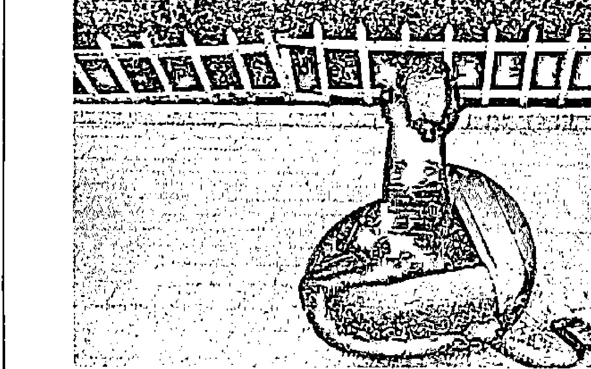

> 十二生肖中蛇的开运水晶是紫水晶和粉晶，开运颜色为粉红色、绿色和紫色。

# 第十五章 商场行大运

本章主要讲了商铺如何才能生意兴隆，财运旺盛。内容涉及商铺所处的环境，不同商铺适合的布局，商铺选址的禁忌，商铺装饰应注意的事项，不同朝向的商铺应如何装饰等。

## 494 商铺能对着三岔路口吗？

有的人认为，三岔路口人流量比较大，因此生意也会好。从道理上讲，确实是这样。但在生活习惯中，三岔路上的商铺最不招人喜爱。如果商铺正好对着三岔路口，不但生意会受到影响，商铺还容易出现是非纠纷，而且家人的健康可能会受到影响。因而在选择商铺时，要避开三岔路口。

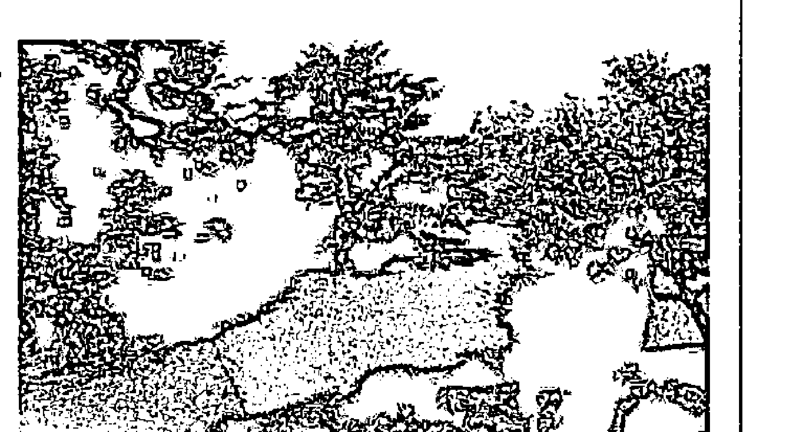

> 三岔路口的能量会被分散，各支路的能量比较弱，无力驾驭这里较强的气场，因而容易招致煞气，使得商运不平稳。

## 495 商铺位于十字路口好吗？

一般情况下，十字路口的车流和人流都比较大，在这里开店，生意会好一些。但凡事有利就有弊。十字路口虽然人流量比较大，但是非也比较多，容易闹纠纷。

想在十字路口开店，在选址时要根据道路的走向，算出十字路的吉位和凶位，再结合店中所卖物品的特点以及店主的命格，才能得出准确的判断。只要分析合理，在此开店多半会生意兴隆。

若想在十字路口的商铺一帆风顺，可在店内放一些招财纳福的法器，如金蟾、招财猫等，既可以招财，又能化解这里的煞气。

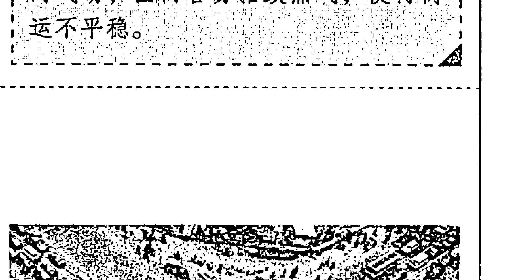

> 在十字路口开店，要根据道路的走向，算出十字路的吉位和凶位，再结合店中所卖物品的特点和店主的命格，才能推算出商铺的吉凶。

## 496 商铺为何不能对着扶梯？

如果你的商铺开在商场里，而且你的商铺大门正好对着商场的扶梯，那么你就要特别注意了。

人们多认为商铺的大门忌讳对着扶梯，不然生意会受到很大影响。即使店里客流量不错，但却是看的人多，买的人少。因为楼梯是一个比较特殊的器物，虽然能积聚人气，但大家只是过路的，从此路过而已。因此从表面上看，这里虽然人很多，但都是往四面八方走的，很杂乱，不但不会带来收入，还会影响商铺的形象。

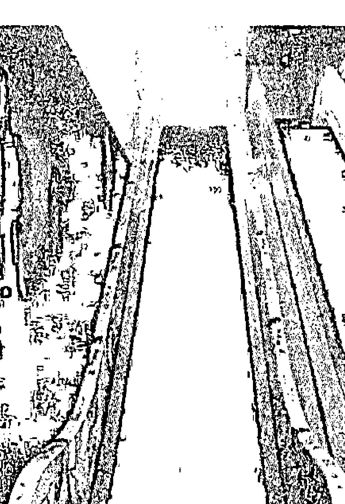

> 商场的扶梯是特殊的器物，它可以为正对扶梯的商铺聚集人气，但却很难带来收入。

## 497 商铺为何要选在繁华处？

商铺选在繁华处，会生意兴隆。

商铺在选址的时候，要遵守趋繁华避偏僻的原则。即在选择开店的地址时，一定要选择在繁华热闹、人流量大的地段，如果太过偏僻，没有人气，生意自然不会兴隆。这是因为繁华的地方气场比较强，力量也比较大，容易将有益人群吸引过来。有人气才有生气，有生气的地方就能生意兴隆。

繁华的商铺人流量大，生意会好一些。但此处鱼龙混杂，会吸引不好的气场。因此，在繁华处的店面，一定要摆放一些具有招财、镇宅、化煞作用的法器，如三脚蟾蜍、古铜钱、桃花斩等。具体使用哪种法器，要根据店主的八字及所处的位置来选择。

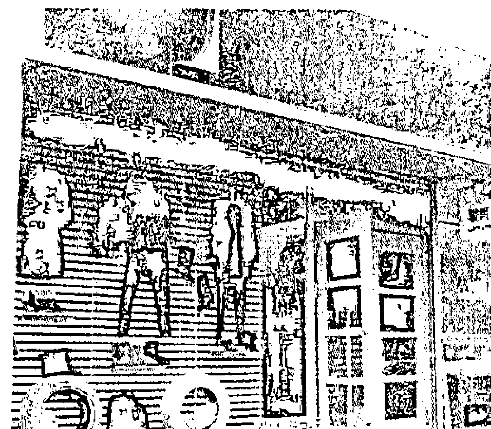

> 繁华的商铺人流量大，生意好，但鱼龙混杂，会吸引不好的气场。所以商铺里有必要摆放一些具有招财、镇宅、化煞作用的法器。

## 498 商铺的坐向有什么讲究？

在选择商铺时，除了地理位置外，坐向也是一个重要因素。店主若想平安无事地赚钱，最好在确定大概位置的情况下，选择坐北朝南的店面做商铺。

商铺选址时，要考虑到日晒和风蚀。如果商铺夏季太热，而冬天又太冷，会让顾客感到不舒服，也就不愿进去购物。商铺的进店率不高，商铺的生意自然不会兴旺。坐北朝南刚好可以使商铺免遭烈日和寒风的侵袭，使商铺冬暖夏凉。

此外，古代帝王君临天下讲究坐北朝南。因此，坐北朝南的房子还容易招来贵气。

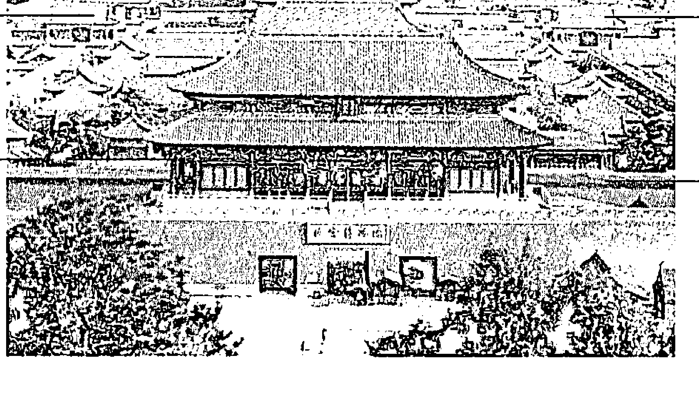

## 499 马路旁边开店为何不好？

古代环境文化学认为，马路属于水局。水虽然象征着财富，但马路上的水流得太快了，难以聚气，气场不聚，则难以成财，不利于招财开运。在这样的格局中开店，不利于经营。

从环境的角度讲，在马路旁边开店，会有很大的噪音，音煞容易影响人的心情。久而久之，店主会脾气暴躁，容易与客人发生争执，因而不利于做生意。商铺开在马路边，出行安全也是一个问题。

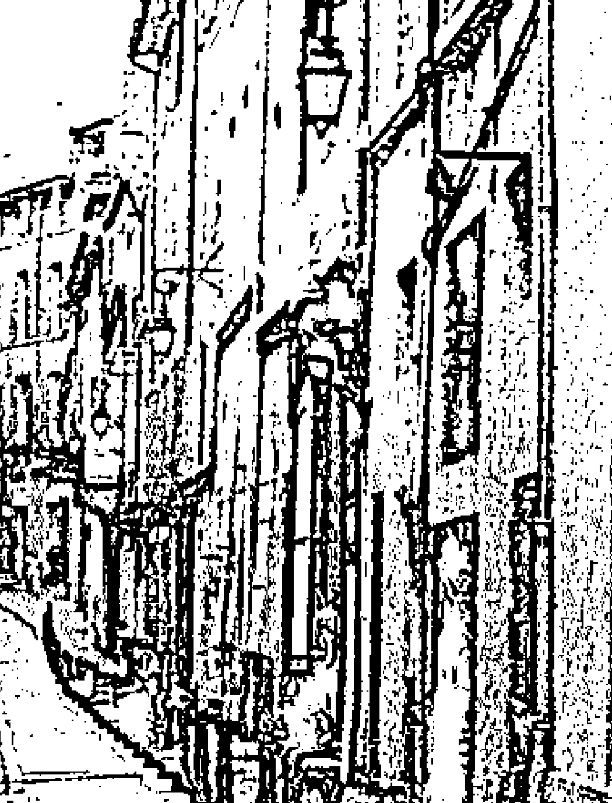

> **马路边的商铺**
> 商铺开在马路边，马路上的噪音会形成音煞，影响人的心情。马路边特别不适合开超市、饭店、服装店等。

## 500 商业楼在天桥附近生意如何？

有些人可能会认为，天桥附近人来车往，人气比较旺盛，生意应该很好，商业楼设置在这里应该不错，其实不然。

天桥属于虚“水”，所谓“水能载舟，亦能覆舟”，商业楼在天桥附近并不意味着生意好。天桥上人流量和车流量都很大，容易干扰周围的气场。车行天桥气流很强；人行天桥气流相对弱小。无论气流大小，都容易产生噪音，最终影响周围的环境。而且人多车多的地方，污染物也多，周围的气场很不新鲜，不利于人体健康，因此天桥附近不算是开店的佳所。

另外，商业楼如果被天桥环抱着，则有利于财运，若形成“反弓”之势，则不利于财运。

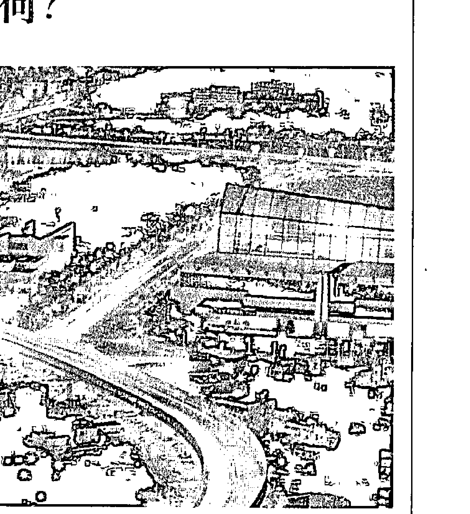

> 天桥附近容易产生噪音，形成对人不利的影响。天桥四周人多车多，污染物多，气场不新鲜，不是开店的佳所。

## 501 餐饮商铺适合什么布局？

餐饮店包括餐厅、咖啡店、酒吧、饮食店等。这些经营和饮食有关的商铺，关键位置在北边。可以把北边设置为大堂，这样有助于散发食物的香气，招揽更多的顾客，对生意是很有利的；东南有突，生意会很兴隆。

若需要用火的餐饮店，例如烤肉店、炸鸡店、火锅店等，厨房最好在东边或者南边，因为这两个方位属火，可起到相生作用，比较吉利。若只是单纯用火，则南边是最佳位置，不但可以旺火，还可起到生财的作用。

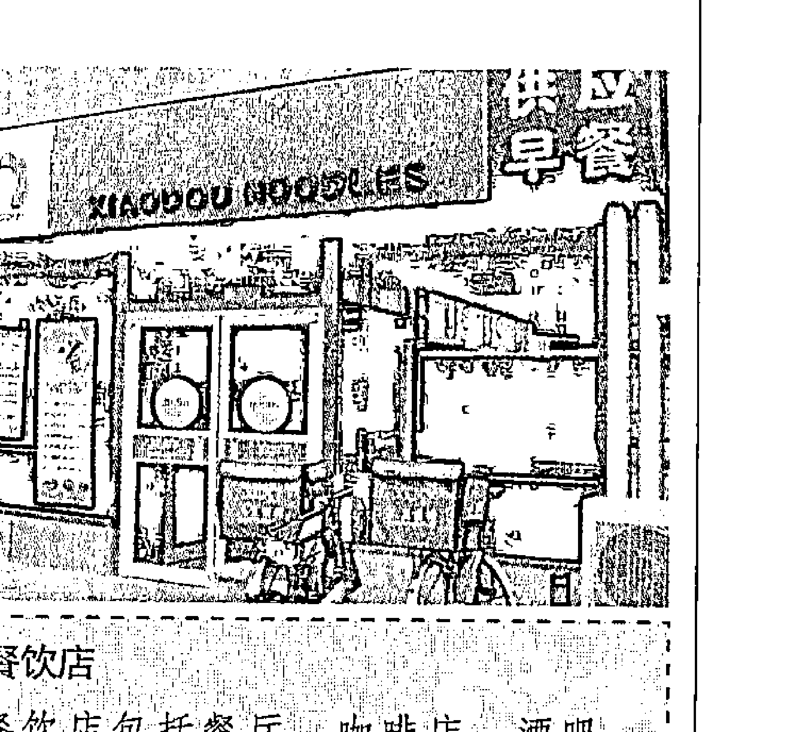

> 餐饮店包括餐厅、咖啡店、酒吧、饮食店等。这些经营和饮食有关的商铺，关键位置在北边。

## 502 食品店适合什么样的布局？

经营食品的商铺有很多种，不同的经营项目有着不同的吉位，也具有不同的布局方式。

如果是经营鱼类、海鲜类食品，最好把店面设在东南方、东方、南方，同时注意用陈列台或箱子等物遮盖住正中线、四隅线。这样的布局比较吉利，有利于经营。

如果是食品加工店，则应该在南方、东南方造突，这样的布局比较吉利。入口最好在东南方、南方、东方等方位，也可以在西南方摆设商品陈列台等物品，这样有助于吸引顾客的眼球，提升进店率，确保生意兴隆。

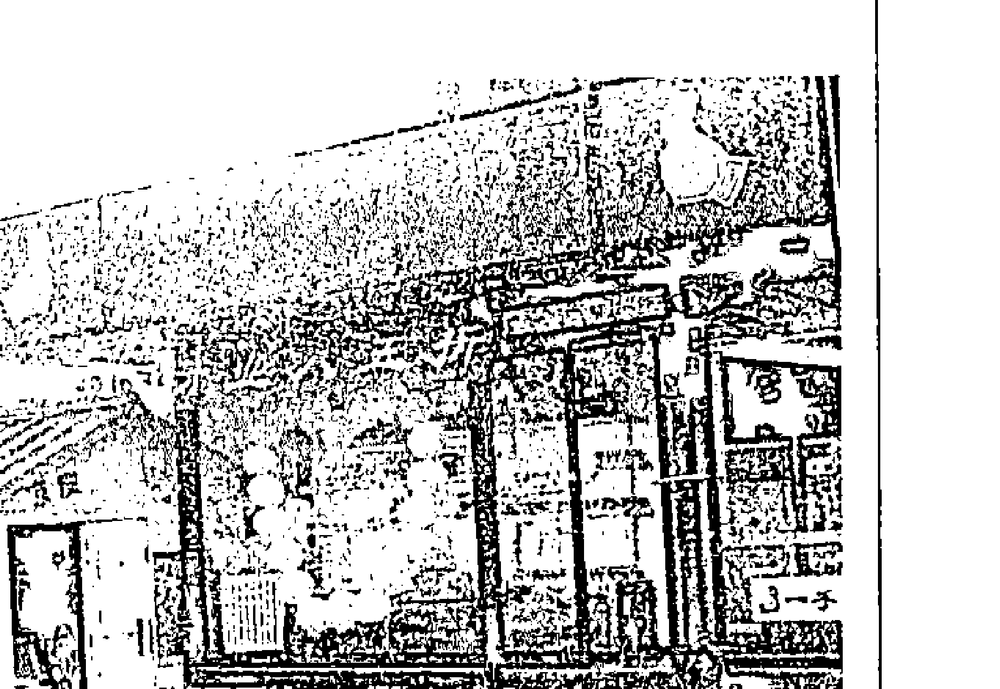

> 食品加工店在南方、东南方造突，入口在东南方、南方、东方等方位比较吉利。在西南方摆设商品陈列台有助于吸引顾客的眼球。

## 503 水果店适合什么布局？

水果店是人们经常光顾的商铺。水果有着保存期短、不宜储存的特点，而且水果的销售期也很短，时间长了，水果易坏，因此水果店的布局有一定的讲究。

在布置水果店时，最好把新鲜的水果摆放在南方或者北方，这两个方位是吉位，水果保质期也比较长，自然会顾客盈门，生意兴隆。即使顾客进店率不高，水果摆放在这两个方位也可以长期保持新鲜，不会因为变质而白白浪费钱财。

另外，水果商铺的出口最好设在东方、东南方、南方、西北方等方位，这样有利于提高顾客的进店率，有助于商铺的发展。

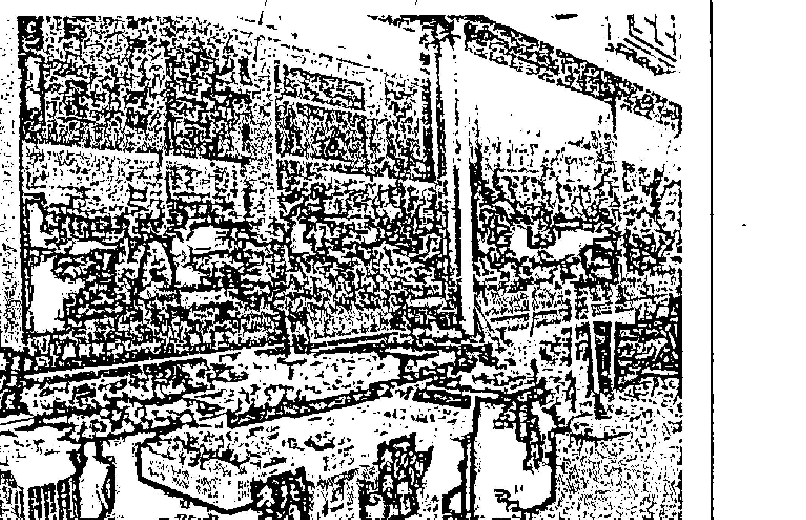

> 把新鲜的水果摆放在南方或者北方吉位，水果保质期长。

## 504 面包店适合什么布局？

面包与人们的生活息息相关，好的布局能增加面包的销售量。面包的保质期很短，容易变质，如果经营面包店，要特别注意店面的布局。

面包店包括西点店、蛋糕店等，这类店面应该把入口设置在东南方、东方、南方。这几处是最吉利的方位，面包在这些方位会散发出诱人的香味，吸引顾客入店，店里的生意会日益兴隆。

由于人来人往，面包店的大门会不可避免地时常开关，这样容易干扰店中磁场。因此，大门不可位于正中线和四隅线上，尽量避免不必要的麻烦。

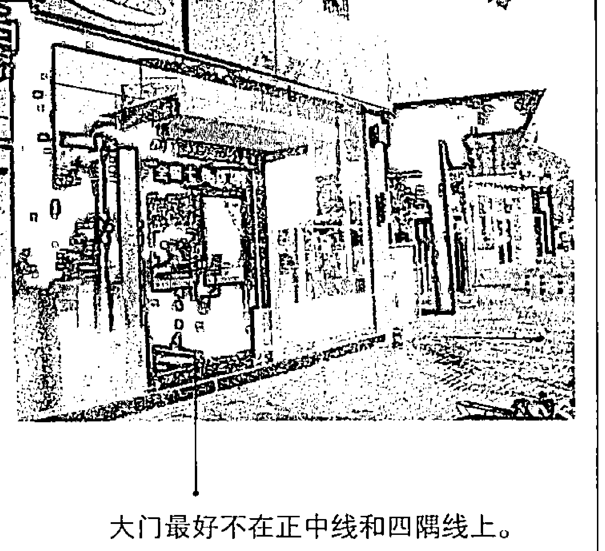

> 大门最好不在正中线和四隅线上。

## 505 家具店应该怎样布局？

家具店经营家具，多是木制品。在布局时，可以在东南方、北方、西方造突，这样会很吉利，有利于经营。切忌在西南方和西方设置出口，会造成不好的影响，也会有财运堵塞的现象，顾客稀少。

另外，由于木的性质宜深长、方正，所以家具店的布置要方正、大气，要有高和深的感觉，给人深远的纵向感。在这种布局中办公，效率会很高，对商铺发展有利。

木为绿色系。因此，家具店外观颜色可用绿色、蓝色等绿色系。由于金克木，金色主白，所以家具店的外表不可用白色粉刷。家具店的窗户和大门的形状宜采用长方形或圆形，方形属木，圆形属水，水能生木，均有相生作用。但家具店窗户和大门的形状不宜为扁平形，因扁平形属土，而木克土，不吉。

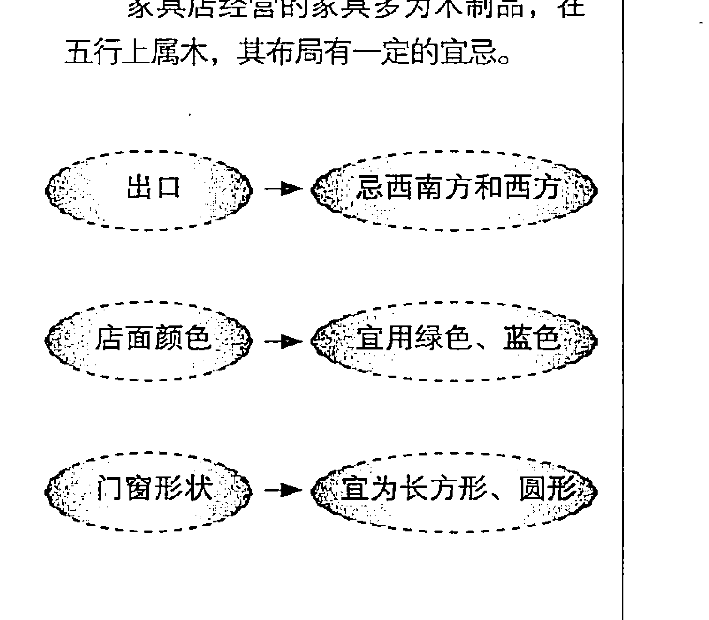

## 506 钟表店应该怎样布局？

经营钟表的商铺，适宜在东方、北方、西北方造突，造突有助于经营。如果是大规模的商铺最好能在两个方位造突，店再小也要有一方造突。店门口的出入口，最吉利的位置是东方、东南方、南方，西方次之。如果钟表店在东侧和南侧有道路经过，是很吉利的位置。

钟表店在五行上属金，布局时一定要注意灯光的设计，办公室里要保持灯火通明，光线充足，要给人明朗、豁然的感觉。金色主白，因此，钟表店的外表颜色，宜用白色系列。可以在外层墙壁用白粉粉刷或者粘贴白色瓷片等。因为土能生金，可以用象征土的黄色系列粉刷钟表店的外表。但火克金，因此，钟表店不可以用火红的颜色装饰。由于金克木，所以钟表店的大门，也不宜为细长形，因为细长形属木；门也不可以呈尖形，因为尖形属火，火克金。

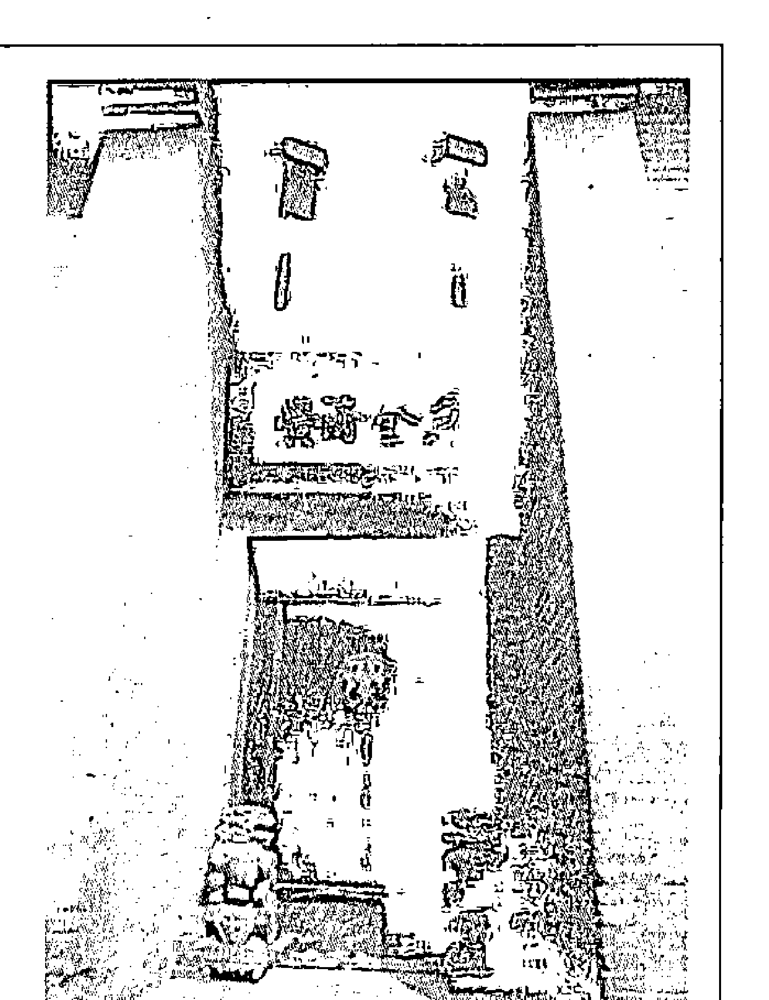

> 细长形大门 钟表店的大门不宜为细长形，因为细长形属木，钟表店属金，金克木。

## 507 照相馆应该怎样选址？

古代传统环境文化学认为，照相馆的入口吉位在东南方、东方、南方、西方。把入口设在这几个方位，有助于商铺的经营，人气会越来越旺，生意也会越来越兴隆。

照相馆的柜台不能随意设置，最吉利的位置是位于店中心的西北侧或者东南侧，有利于商铺的稳定。

照相馆是一个雅致的地方，除了店内外要装修干净、清雅之外，在地理位置上不宜选择人流较多的地方。也不宜在地势过高或过低的地方。否则不但给人一种不上档次的感觉，还容易受不洁环境的污染，影响照片的质量，进而影响相馆的生意和口碑。

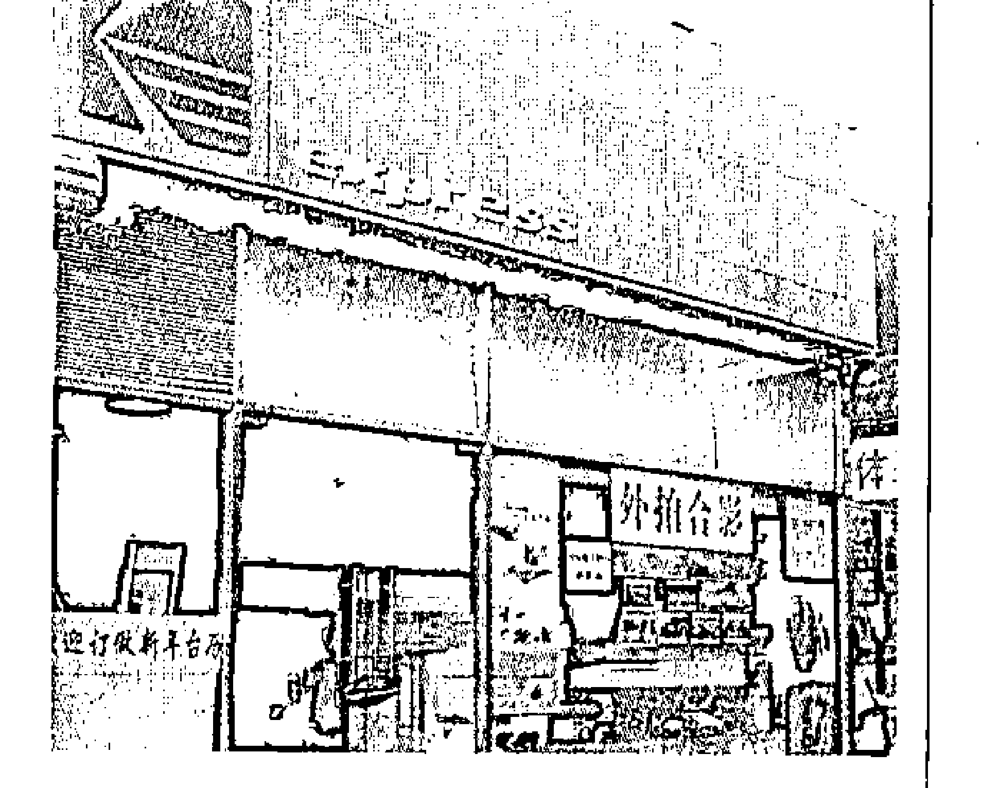

> 照相馆 照相馆不宜在地势过高或过低的地方，否则会给人不上档次的感觉。

## 508 药店适合什么朝向？

药店是经营药品的商铺，讲究比较多，若想药店生意好，需要注意一些布置原则。药店的入口最好在东南方、东方、南方，这些是比较吉利的方位。因为钱财和富裕属于东南方，事业成功属于北方。也可以将鱼缸放置在东南方或北方。放置鱼缸要避开窗户等阳光直接照射的地方，保持鱼缸的干净，生病的鱼要立刻捞出。药店的入口一定要避开正中线和四隅线，否则会很不吉利。若在西北方向造突，则门最好开在东方、东南方、南方。

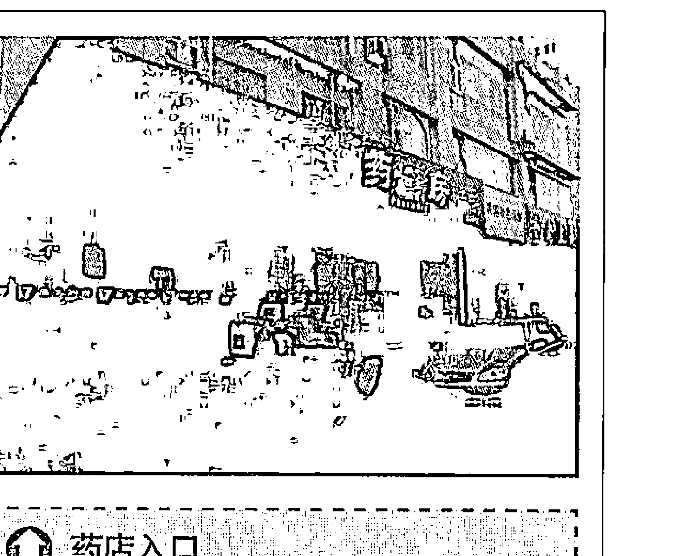

> 药店入口
> 钱财和富裕属于东南方，所以药店的入口最好在东南方、东方、南方等吉方。药店的入口最好避开正中线和四隅线。

## 509 商铺大门为何不能对着烟囱？

商铺的大门对着烟囱，从感官上看，仿佛有一把尖刀正对着商铺。一把“尖刀”对着商铺，会在店主的心理上形成一种压力，时时刻刻担心发生意外，不能专心经营商铺，生意自然不能兴隆。在古代环境文化学中，烟囱正对商铺大门形成了不利格局。想化解这种格局带来的不利影响，可在相应方位摆放开光的文昌塔和五帝古钱。如果相应方位刚好是流年凶星所临方，则要按此星的特性，配合其他饰物，如珠帘、屏风等。或者在对着的那面窗口位置悬挂凸镜，因为凸镜有反射的功能，也可以化解烟囱的不利影响。

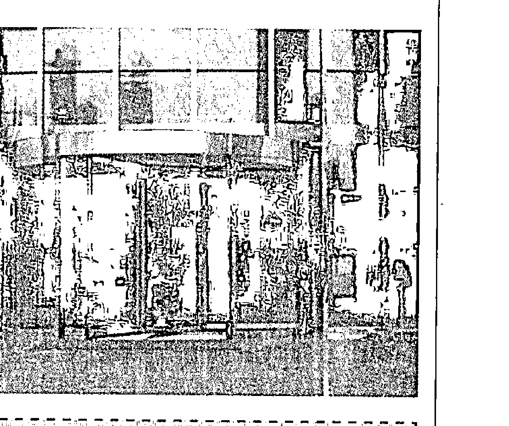

> 商铺大门
> 如果商铺大门正对烟囱会给店主带来很大的心理压力，可以在相应方位摆放开光的文昌塔和五帝古钱来化解。

# 510 商铺附近为何不宜有医院？

商铺附近要尽量避开医院，医院是救死扶伤的地方，本身并没有是非争议，但是只要提起医院人们就会想起疾病和死亡。由于经常有人死亡，因而医院附近的气场和磁场受到干扰，容易波动，会影响到生意。加上人们对医院有着心理阴影，不愿意接近此地，附近没有人气，生意会受到影响。

因此，人们常说商铺要选择一个良好的环境，这样才能让员工精神抖擞，办事效率才会高，生意才会兴隆。

> 医院附近不宜有商铺
医院是比较晦气的场所，常常有哭嚎、死人、病菌等。商铺开设在医院附近，不仅会给员工身体带来伤害，还会严重影响商铺的生意。

# 511 商铺位于丁字路口好吗？

商铺若开在丁字路口，大门易直对着马路，所有的人都直冲着大门过来，会让人觉得很不安全，潜意识中总觉得会发生车祸之类的事故，终日心神不宁，背负着巨大的思想包袱。在巨大心理压力的影响下，人的心情会变得急躁，不能安心，即使有顾客登门也不能与之好好交谈，从而影响生意。

若商铺已经选择在丁字路口，短时间内不会搬迁，那么最好在相应方位挂珠帘，摆放屏风，或者摆放麒麟来化解。

> 丁字路口
丁字路口人多车多，商铺开设在这种地方，顾客不方便横穿马路过来购物。顾客看到对面冲刺而来的车辆，会心生不安，不愿多作逗留。

## 512 商铺处在何种环境中不利于经营？

商铺位于两幢大厦的缝隙间，风经常从这里穿堂而过。商铺位于这里，风每天犹如无形的刀一样砍过来，会使财运丧失，生意衰退，顾客稀少。处在这种位置的商铺，店内经常风来风去，不但不利于人体健康，还会使店主情绪受其影响，变得烦躁易怒，在与顾客交流时就容易不耐烦，商品的成交率会受到影响，进而影响店中生意。

> ### 注意商铺周围的环境
商铺位于两幢大厦的缝隙间，风经常从这里穿堂而过。有些商铺的商品、服务都很好，可是却在开店不久就面临着关门的危机，这就要注意商铺四周的环境。

## 513 商铺处在地势高处不利于经营吗？

商铺处在一条路的高处，是不利于经营的格局。
在古代环境文化学中，水掌管着财禄，做生意要注意水的格局。路在古代环境文化学中为虚水，商铺处在一条路的高处，称为“水龙反走”。
“水龙反走”就是说水向前方流动，如果店处在高处，然后店门外的路一直向下走，商铺处在这样的地方，容易断财，财运会随着水流走。因此，开店选址时一定要避开这种地势。

> ### 商铺位于高处
商铺位于高处不利于经营。一般顾客都不想往上爬，商铺位于高处，不利于提高顾客的进店率，直接影响店铺生意。

# 514 商铺大门前为何不能有路冲？

商铺大门前忌讳有路冲。大门前有大路冲门，在古代环境文化学上称为“直路空亡”。商铺处在这种地理格局中，表示退财，为大凶，商铺生意自然不会兴隆。门前有路冲，周围的气场容易受到干扰，店里的气场不稳定。在店里时间长了，人的身体会变得衰弱，精神状态不好，继而影响到生意。

如果商铺门口已经存在路冲的情况，短时间内无法搬迁，可以采取办法化解。化解的方法很简单，可以在门口做一个0.12米高的门槛，门槛底下压五个铜钱。如果不方便设置门槛，可以在门口种上环形花丛，以圆润化解直冲而来的外力。

> 环形花丛
如果道路直冲商铺大门，店主在短时间内不能搬迁，可以采用在门口种环形花丛的办法来化解，以圆润化解直冲而来的外力。

# 515 商铺大门为何不宜正对路灯？

很多商铺门口都有路灯或者大型灯箱，这便犯了赶丁煞。顾名思义，“赶丁煞”会赶走附近的人。如果商铺长期处在这样的格局中，商铺一般留不住员工。无论店主提供了多么优厚的待遇，无论招来的员工是否优秀，每个员工在店里工作的时间都不会长，都会由于各种原因离职。即使多招一些员工，也会很快离职。员工流失一方面会影响商铺的正常经营和运转；另一方面，店主每招聘一次员工，都要花费大量的人力、物力，结果都为“他人做嫁衣”了。

因此，店主在商铺选址时，一定要避开赶丁煞。如果十字路口有赶丁煞，无论这里的人流多么旺盛，都不要轻易考虑在此开店。

> 如果商铺的门口有路灯，将会影响商铺员工的稳定。

# 516 商铺靠近隧道好吗？

商铺靠近隧道，会影响商铺的财运。
隧道地形向下陷，是可以将水引走的地方。
如果商铺在隧道附近，不利于聚财。尤其是商铺大门对着汽车隧道，不聚财的现象更加明显，而对着人行隧道次之，但也不是好格局，最好能避开。
如果人行隧道是通向地铁站的，隧道可以疏导财气，商铺接近隧道，可以聚财，是好格局。
城市中，一些楼房下面修建了地铁或隧道，车流从楼下穿行而过，这样的情况危害很大，会致使宅运不稳，财运差，家人身体健康较差，易生血光之灾。若在此处开店，不但会影响店员的身体健康，店主还容易破财，有人财两空的危险。可在旺气方或吉方摆放铜葫芦、五帝古钱及一对文昌塔。

> 隧道地形下陷，可以将水引走。水主财，如果商铺在隧道附近，将不利于聚财，尤其是汽车隧道，破财现象更加明显。

# 517 商铺大门为何不能对着死胡同？

走不通的巷子称为“死巷”，俗称“死胡同”。住在死胡同底的人家最不好，对着死胡同开店，生意也会受到严重影响，这是商铺选址的大忌。
死胡同附近的气场受到阻挡，无法流通，胡同里长期累积的浊气、杂气都会累积在胡同底部。人在这里工作、生活都会受到不利的影响，健康和事业都会受损，容易出现破财、多是非的情况。
商铺大门对着死胡同，会令员工和顾客感到憋闷，不舒服，进而影响双方的洽谈；顾客不愿意在此多停留，就无心浏览店中的商品，更谈不上购买，店铺也就没有生意；店主和店员长期处在这种环境中会对自身健康造成不利影响。另外道路的封闭性太强，会在心理上形成压力。

> 死胡同周围气流不流通，浊气、杂气混杂，容易破财，是商铺选址的大忌。

# 518 商铺接近商场大厅好吗？

在商场里开店，如果商铺接近商场大厅，有利于经营。

商场大厅属“聚水局”。商铺的门向着大厅有收水、收财的意思，商铺生意会比较兴隆，顾客也会比较多，能够集人气，聚财气，商铺生意会越来越好。

另外，商场大厅是人来人往，人流汇集的场所，人气比较旺。顾客很容易看见附近商铺里的商品，有助于提升顾客的进店率，商场大厅就相当于商铺的变相宣传平台。

> 商场大厅附近的商铺
商铺靠近商场大厅，有利于财气的聚集，商铺的生意会越来越兴隆。

# 519 商铺的楼层高度为何不能太低？

都市中，高楼林立。如果商铺所在楼层高度太低，阳台对面的楼离得又很近，就会带来强势气压，影响环境和心理健康。

开店如果选择一个楼层高度太低的房子，会给人一种压迫感，无论是店主还是顾客都会感到压力，时间久了，身体和心理都会受到影响，生意自然不会兴隆。另外，楼层高度高，遮挡物少，光照时间长，阳光射入室内深，采光多。相反，楼层高度低，难以采光，会造成室内阳气不足，不利于生意发展。

有的店为了合理利用空间，会在店中加一个阁楼，这样楼层高度就更低了。这在古代环境文化学认为这种格局会阻挡商铺的运势。

> 楼层高度高，遮挡物少，光照时间长，阳光射入室内深，采光多。
楼层高度会影响商铺的生意。楼层高度高有利于生意的兴隆，楼层高度低不仅不利于生意，还有害人体健康。

# 520 商铺大门对着天井好吗？

大型商场里边一般都会设计天井的造型，从二楼以上的楼层可以围绕着栏杆俯瞰。商铺对着天井，古代环境文化学上认为是属于吉祥的格局。

商铺的大门对着天井，可以聚财。因为，在商场里天井下方的平台相当于明堂，明堂聚水，水能生财。因而大门对着天井的商铺要比大门对着走廊的商铺格局好。对着走廊的商铺只能聚小财，对着天井的商铺能聚大财。

> #### 商场里的天井
商铺附近围合成天井形势，前后左右都为环抱之势，为大吉格局，有利于生财旺运。

# 521 商铺选址有哪些禁忌？

商铺在选址时，要遵守以下原则。

- 不要选择低洼的地方。低洼之地易聚水，容易形成“不泄千里”之势，不利于积财。
- 不要选择前高后低的地方。前高后低之地不吉，容易让人产生恐惧感，商铺安全难以保障。
- 不要选择前大后小的建筑物。前大后小的建筑物给人不平衡的感觉，人在其中没有安全感，不容易招揽顾客，商铺没有人气就无生意。
- 不要选择道路尽头的建筑物。道路尽头，客流量少，生意多不好。
- 不要选择南方有高大建筑物的商业楼。南方五行属火，财属水，二者相克，因此南方的建筑物会影响附近店铺的生意。
- 不要选择架空在水上的建筑。架空在水上的建筑不利于生意的发展。
- 不要选择大门正前方有大树、电线杆、变压器的建筑。

> #### 商铺选址禁忌
好的选址可以给商铺带来客源，让生意越做越兴隆；差的选址不但不会带来财运，还会阻碍商铺的发展。

# 522 店门朝东的商铺会令人烦躁吗？

店门朝东，在夏季时，太阳会从早到晚照射到店中。如果商铺内阳光从早照射到晚，店内会很闷热。人待在其中，会因闷热而烦躁，店员和顾客的情绪都会受到影响，不利于买卖双方的洽谈，会影响到商品的成交率，进而影响商铺的生意。

店门朝东，接受阳气过多，容易形成阳盛阴衰、阴阳失衡的局面，也会容易致使店中人员头晕脑涨、烦躁不适。这样的商铺会严重影响店中的生意，顾客也不喜欢光顾这样的商铺。

> 店门朝东
商铺店门朝东，太阳的光线会在店铺内从早照射到晚。店铺阳气接收过多，会导致阴阳失衡，店中人员多会因为闷热而心情烦躁，不利于店铺的生意。

# 523 商铺大门朝北会影响经营吗？

如果商铺大门朝北，冬天风会向大门里钻。北风呼啸，寒气逼人，不但会影响人的健康，还会让人畏畏缩缩，精神不振，给顾客留下不好的印象。顾客进店之后，原本以为可以躲避外面的寒气，却仍然无法逃过店中的寒冷，因此也不愿意过多地逗留，商铺人气不旺，自然没有生意可言。店员在寒冷的地方工作时间久了，容易生病，没有心思工作，店里生意自然不会兴隆。

> 店门朝北
商铺店门朝北，冬季时北风呼啸而来，寒气逼人。店铺内气温低，顾客不愿多逗留，更没有购买的心思。

# 524 商铺为何要遵守适中原则？

商铺选址讲究适中原则，即：恰到好处，大小适中，高低适中，不偏不倚，尽可能做到尽善尽美。

适中原则体现在方方面面。商铺在布局时，一定要和周围的大环境，其他商铺的朝向，经营内容等协调一致。商铺的装修，其色泽、方位、布局等要与所处的位置，店主的命理相和谐。商铺大门的大小要适中，不能过大或过小，过大不宜聚气，过小看起来不上档次，其大小要和商铺的大小协调。

总之，商铺的布置，要做到井井有条，符合一切相生原则，真正做到“天人合一”才能生意兴隆。

# 525 开店为何要遵守“乘风顺气”的原则？

气是万物之源，商铺开在有生气的地方，叫做“乘风顺气”，有助于商铺生意的兴隆。

有生气的地方，光线充足，空气流通畅快，生长在这里的植物会生机盎然。生活在这里的人，因占“地杰”之有利，变得“人灵”。店员精神状态好，顾客来到这里之后，心情也会变好，有利于店员与之洽谈，商铺在这种环境中自然会财源广进。

商店的大门口如果是气口，会带来生气，商店可以轻易得气。同时，人流量大，意味着可以得到很多信息，也能将店中的信息反馈给更多的顾客。

> 商铺大门
商铺大门对商铺生意的好坏有着重要的影响。商铺大门如果在生气口，会给商铺带来生气和客流量，可以促进商铺的生意。

# 526 商铺处在反弓路和抱身路之间好吗？

如果商铺的位置刚好处在反弓路和抱身路中间，就要注意了。

反弓路指商铺门前的道路，形如一把弧形的弓，而弓的圆弧对着商铺，对住宅极为不吉。从科学的角度讲，商铺在反弓外边，当路上有车辆驶过时，由于离心力的作用，灰尘和噪音会直冲住宅而来；若出车祸，车辆会撞进住宅。

抱身路则相反，它的地形呈环抱之势，商铺在环抱之内。商铺处在这样的位置上，有两方面的含义。一方面，商铺的生意会很兴隆，钱财来的多。但另一方面，店铺的开销很大，虽然每天赚的钱很多，却始终看不见有盈余。财来得快去得也快，结果就是商店没有多大的盈利。我们可以在商铺门前挂一面镜子，防止钱财流失。

> ▶ 反弓路和抱身路
商铺位于反弓路对商铺不利；
商铺位于抱身路会生意兴隆，但钱财来得快去得也快，可以在商铺门前挂一面镜子来防止钱财流失。

# 527 商铺周围的环境和商铺有什么关系？

商铺周围的环境和商铺的经营有很大的关系，环境好的建筑会给商铺带来好运，顾客盈门，而不好的建筑，会阻挡顾客的脚步，不讨顾客喜欢。没有顾客，商铺的生意自然不会兴隆。

在看商铺周围的环境时，要注意协调性。看一下前后高低是否合适，左右是否对称，是否和四周景色和谐。总之，看上去舒服，不让人产生排斥感，才是好环境。

- 商铺选址和布置要考虑协调性和相生性。
- 前后高低是否合适
- 左右是否对称
- 是否和四周景色和谐
- 门的朝向、大小
- 装饰的颜色

其次要注意相生性。店主的生辰八字要与店铺的气场相生，店铺的装饰要与店铺的气场相生，店主的生辰八字要与店铺的装饰风格相生。门的朝向、大小，装饰的颜色，店铺中的音乐，收银台的摆放，财位的选择，旺财物品的使用，都是应该考虑的因素，店主在选址、装修时一个因素也不能忽略。

# 528 经营者的属相和商铺朝向有什么关系？

开店的时候要注意经营者的属相与商铺朝向的相生性。如果店主的生辰八字与商铺的五行相生，商铺的生意就会蒸蒸日上，财源不断。反之，即使地段再好，生意也不好。除此之外，还要注意商铺的装饰要与商铺的五行相生，店主的生辰八字要与商铺的装饰风格相生。在选择商铺朝向的时候，可以参考经营者的属相，详细内容如下表所示。

### 经营者的属相与商铺朝向的关系

| 属相 | 禁忌开店坐向 | 适宜开店坐向 |
| :--- | :--- | :--- |
| 鼠 | 坐南向北 | 坐东向西、坐北向南、坐西向东 |
| 牛 | 坐东向西 | 坐北向南、坐西向东、坐南向北 |
| 虎 | 坐北向南、坐西向东 | 坐东向西、坐南向北 |
| 兔 | 坐西向东 | 坐东向西、坐南向北、坐北向南 |
| 龙 | 坐南向北 | 坐东向西、坐北向南、坐西向东 |
| 蛇 | 坐西向东 | 坐北向南、坐南向北、坐东向西 |
| 马 | 坐北向南 | 坐东向西、坐南向北、坐西向东 |
| 羊 | 坐西向东 | 坐东向西、坐南向北、坐北向南 |
| 猴 | 坐南向北 | 坐北向南、坐西向东、坐东向西 |
| 鸡 | 坐东向西 | 坐西向东、坐北向南、坐南向北 |
| 狗 | 坐北向南 | 坐南向北、坐东向西、坐西向东 |
| 猪 | 坐西向东 | 坐东向西、坐北向南、坐南向北 |

# 529 如何应对商铺周围环境的变化？

有些人可能认为商铺选择一个旺地之后，就可以一劳永逸了，事实不是这样的。商铺周围的环境不是一成不变的，随着时间的推移，商铺的布置需要根据变化的环境来调整。

这是因为，市场是在不断变化的。某种产品，在某段时间内适合某一群体的需要，但过一段时间，市场行情就可能发生变化。人们的口味、爱好、审美观等因素都会发生变化，所以自家商铺的经营策略和装修风格等，也要注意“与时俱进”，及时更新。

# 530 如何利用三流旺财？

水代表财，流动的水即为水流，象征着财源滚滚。在现代城市中，车流和人流就相当于“水”。一间商铺如果能收得水流、人流、车流，就能旺财。在选择商铺时，最好选择三流凝聚之地，如水流聚集地码头，车流聚集地车站、停车场等。但凡事过犹不及，若一个地方川流不息，拥塞不堪，就不是上佳的店铺选址。如果可以，那些旺中带静或静中带旺的地段是很不错的选择。

需要说明的是，水流、车流、人流三流汇集之地，通常是繁华地段，租金相对较高，开店时必须量力而为。同时也要考虑到所售商品是否依赖巨大的人气。如果对人气的依赖性不大，可以避开繁华地段以节约开店成本。

# 531 商铺为何要通风顺气？

古代地理环境文化最讲究通风顺气，就是说房屋中的气要流动。

商铺的通风设备不好，室内的气场就难以流通，难以得到更新，店内的气场就不活跃，店员多无精打采，难以吸引顾客。而没有人气的商铺，经营状况自然会受到很大的影响。

因此，商铺中要时刻保持空气新鲜，保持室内干爽，不要湿气太重，更不能因为空气不流通而在室内聚集死气。在装修商铺时一定要把通风透气的因素考虑进去，这样才能生意兴隆。

> 通风顺气的商铺
商铺中人的流动性比较大，如果商铺不能通风顺气，人在这里就会有憋闷感。

# 532 商铺为何不能和银行相对？

有的店主可能会这样考虑，将商铺开在银行的附近，人们取钱之后肯定会消费，那么自己的商铺就是最大的受益者，因此想当然地认为商铺与银行相对生意就会很好。

商铺在选址时一定要注意考察对面或者左右是否有银行，如果有银行就要慎重考虑。银行是财气聚集的地方，一般商铺吸纳财气的力度都很难比过银行。如果商铺对面刚好有银行，那么财气多会被银行吸收殆尽。可想而知，没有财气的商铺，生意自然不会兴隆。即使来往人流很多，但大多数被银行吸纳，商铺不会有大的发展。

> 银行
银行是财气聚集的地方，有强大的吸财能力。商铺最好不位于银行附近，否则财气会被尽数吸走。

# 533 商铺为何不宜开在加油站旁边？

商铺不宜开在加油站旁边。从环境学的角度讲，加油站附近车辆很多，容易产生噪音，汽车排放的汽油味还会污染周围的气场，产生味煞，人闻到之后，容易有胸闷、恶心、头晕等不适感。这不但不利于店员的身体健康，顾客也会避而远之，进店率得不到保障，商品的成交率更低。因此，商铺最好不要开在加油站附近。

> 加油站旁开店隐患多
加油站火灾隐患大，汽油中含有许多对人体有害的物质；加油站车辆来往不断，噪音污染严重；周围环境嘈杂，令人烦躁不安。

## 534 商铺为何不宜开在坟场附近？

商铺选址时，一定要注意周围不要有墓地，否则不但生意会受到影响，店主的运程，店员的气色都会受到影响，不利商铺的长足发展。

殡仪馆、火葬场、墓地或棺材店等地方，是阴气聚集地方，对商铺经营非常不利，有害店员身体健康。由于经常看到丧葬之事，店员心理多会形成负面影响。顾客不愿意接近阴气重的场所，人气薄弱。在墓地附近久了，人在心理上会有恐惧，有一种无形的压力围绕在身边，给人的健康带来隐忧。

坟场晦气重
坟场晦气很重，其周围的商铺会出现不吉利的现象。在坟场附近开店，会给顾客带来心理上的恐惧，进而影响生意。

## 535 商铺的柜台摆放有什么讲究？

- 商铺的柜台不适合摆在出口处。
很多店家为了吸引顾客，会把柜台摆在楼梯出口处，这样看起来好像能吸引顾客，其实恰恰相反。顾客刚刚踏上楼梯就看见柜台，往往会绕开柜台走到别的柜台旁边。在摆放柜台时，不妨将柜台摆在离楼梯口2米远的地方，会收到意外的效果。
- 可适当发挥橱窗的作用。以服装行业为例，如果顾客很远就看见橱窗里的某件衣服，就会不由自主地进店，大大提升进店率。
- 柜台中的产品不必摆放过满。柜台商品适当缺货，可以营造出一种“物以稀为贵”的感觉。

## 536 商铺装修的主色调怎样选择？

店面在装修时，对颜色的选择需要慎重，很多商家会通过心理测试来决定店面的颜色。很多人认为红色是比较明快的色彩，会让人感到兴奋，能够引起人们的购买欲。

### 商铺五行与主色调的对应关系

| 店门朝向 | 五行 | 商铺主色调 |
| :--- | :--- | :--- |
| 东 | 木 | 黄色系 |
| 西 | 金 | 绿色系 |
| 南 | 火 | 白色系 |
| 北 | 水 | 红色系 |
| 东南 | 木 | 黄色系 |
| 西南、东北 | 土 | 蓝色系 |
| 西北 | 金 | 绿色系 |

店面内部的颜色，不能随意选择，而要结合店主的生辰八字、店面的朝向、商品的特性等因素来考虑，最好请专业人士来判断。商铺的颜色还与五行有关，在装饰的时候要注意与五行的对应原则。

## 537 商铺中播放音乐有什么讲究？

音乐可以营造气氛。轻缓舒心的音乐可以使人心情愉快，商铺中播放这种音乐，可以使顾客流连忘返，在店里待的时间就会延长，消费的可能性就增加了。

有些商铺喜欢播放震耳欲聋的音乐，这样做不利于经营。音乐声太大会让人感到烦躁，会对商铺产生排斥感，进而影响到商铺的经营。只有轻柔的音乐，才能让人舒适，顾客在选购商品的时候也会比较自在。

> **商铺中播放的音乐**
> 轻柔的音乐可以在商铺里形成良好的氛围，可以愉悦顾客的心情，增加消费的可能。震耳欲聋的音乐不利于经营。

## 538 店门为何不能过窄？

商铺的大门是整个店面的咽喉，是顾客进出的通道，因而宜大不宜小。商铺大门过于狭窄，不利于纳气，会影响到商铺的财气、人气，还会使人产生压迫感。顾客不愿意在店里逗留，顾客少了，生意自然会受到影响。从人们的心理层面考虑，大门狭窄的商铺，容易给人不上档次的感觉，难以招揽年轻人。即使有顾客进来，也会觉得店内的商品不上档次，可以随口砍价。

> 商铺大门
> 商铺大门是商铺更新气场的通道。大门狭窄，室内的气场更新速度慢，难以招揽人气；大门越宽阔，就意味着越吉利，生意会越来越好。

## 539 商铺前方狭窄如何改善？

商铺前方不能过于狭窄。屋前开阔可以接纳八方财气，生意会越来越好。屋前方狭窄，会让人有拘束感、压抑感，难以招揽人气。狭窄的前堂，还会让顾客产生小家子气的感觉，进而对商品的质量产生怀疑，不利于商品的售出，会直接影响商铺的生意。

如果商铺前方狭窄，可以用下列方法改善。

- 可以将店前面的遮挡物拆掉，使店面显露出来。
- 可以把店牌适当加大加高，醒目的店牌肯定能吸引顾客，这样也把店面狭窄的缺点遮盖了。
- 可以利用媒体对商铺进行宣传，增加商铺的知名度。
- 可以借助设计作用，通过颜色或者其他物品的装饰，吸引人的眼球。

## 540 商铺造型为何要与区域景致协调？

古代环境文化学认为：天地万物都蕴藏着气，环境和谐，气的流动也会和谐通顺，能带来好运，万事顺利；如果周围环境不和谐，会使气流受阻，做事也会磕磕绊绊，进展不顺。

商铺在设计造型时，不仅要结合建筑本身特点来设计，还要和所处区域的自然景观的大环境协调一致。这样，商铺才能稳定发展，不至于在整个大环境中显得突兀、另类，进而影响经营。

店铺的协调涉及到方方面面，如招牌的尺寸大小要与店面相协调，最好能符合五行数理：金为7，木为8，水为6，火为9，土为5。店铺的颜色，也要依据五行之说来选择，以此生旺财运，只有真正做到天人合一，才是真正的协调。

## 541 明堂开阔可以吸纳财气吗？

商铺的正前方是商铺的明堂位，这个地方要开阔、明亮，才能生意兴隆，财源广进。

开店选择地址时，首先要考虑的就是正前方是否开阔，前方最好不要有围墙、电线杆、广告牌、大树等遮挡物，否则会阻碍财气的进入。宽广、明亮的明堂，可以吸纳八方财气，聚集人气，有助于生意兴隆。如果商铺的前方不够开阔，可以把内部的空间舍去一部分，把正前方的空地加大，这样就可以解决明堂狭小的问题了。

## 542 商铺大门如何克服五行相冲？

商铺的店门口和五行有所冲时，可以利用大门或者门前的踏垫来克制或者化解。当商铺遇到金克时，火克金，可以用火色系中的红色、紫色克金。金生水，水色系中的黑色、蓝色也能够化解金气；当商铺遇到木克时，金克木，可以用金色系中的白色、杏色克木。木生火，可用火色系中的紫色、红色化解木气。

| 五行冲煞 | 相克组合解决方案 | 相生组合解决方案 |
|---|---|---|
| 水煞 | 土克水，可以用土色系中的黄色、棕色克水。 | 水生木，可以用木色系中的绿色、青色化解水。 |
| 金煞 | 火克金，可以用火色系中的红色、紫色克金。 | 金生水，可以用水色系中的黑色、蓝色化解金。 |
| 木煞 | 金克木，可以用金色系中的白色、杏色克木。 | 木生火，可以用火色系中的紫色、红色化解木。 |
| 火煞 | 水克火，可以用水色系中的蓝色、黑色克火。 | 火生土，可以用土色系中的黄色、棕色化解火。 |
| 土煞 | 木克土，可以用木色系中的青色、绿色克土。 | 土生金，可以用金色系中的白色、杏色化解土。 |

## 543 商铺内的桌椅陈旧会影响经营吗？

很多商铺中的一个重要摆设就是桌椅，但是很多商铺会因为节约成本，而使用陈旧的桌椅，不及时更换新的桌椅。这种做法不利于经营，会影响商铺的生意。商铺中的桌椅陈旧，甚至开始摇晃，会让店中看起来死气沉沉，毫无生气，严重影响商铺的财运。尤其是摇晃的桌椅，会使店中的运气时好时坏，摇摆不定。最好的做法就是及时更换新桌椅。只要发现桌椅陈旧得影响店面形象，就要及时更换桌椅，保持商铺的整洁、光鲜，这样有助于维持店面形象，招揽人气。

## 544 财位旁边为何宜摆放植物？

俗话说“财位宜生”，“生”指生机。因此，在财位旁边摆放植物是很适宜的。

在财位旁边摆放植物，最好摆放大叶或者厚叶的植物，比如黄金葛、巴西铁树、橡胶树等。在种植这些植物时，注意一定要用泥土种植，千万不要用水。财位旁边切忌摆放带刺的植物，例如仙人掌、仙人球、玫瑰等，否则会适得其反。

此外，植物有净化空气的作用。在商铺的适当位置摆放一些山竹花、文竹、富贵竹、香雪兰、凤尾竹等，不但可以改善人的情绪，还有助于店中的人保持大脑的清醒，确保与顾客有良性的沟通，提升商品的成交率。

需要注意的是，植物容易产生湿气，吸引小飞虫，平常要经常打理，确保植物周围环境干净、清洁。

> 仙人球
> 在财位旁边摆放植物可以生财。但不能摆放带刺的植物，比如仙人掌、仙人球、玫瑰等。

## 545 商铺大门上方的遮阳棚有何作用？

商铺大门上方的遮阳棚作用很大。如果商铺大门上方没有遮阳棚，从侧面看过来，这个商铺就与周围其他商铺没有什么区别，顾客也不会特别留意。相反，如果周围商铺门前都光秃秃的，其中一个商铺上方有遮阳棚，效果就不一样。顾客很容易被吸引过去，这样会为店主展示自己的商品多提供一个机会。

> 遮阳棚
> 商铺前的遮阳棚既可以给顾客遮阳避雨，又会为商铺吸来人气，促进生意的兴隆。

## 546 商铺门口的地毯该如何选择？

地毯的花色、图案、质地和摆放的方位都影响着商铺气场的好坏，如果利用得当，地毯可以给商铺带来财运。值得注意的是，地毯必须保持清洁，否则有害健康。

在店门口铺地毯时，一定要根据自己商铺的整体环境选择合适的地毯颜色。如果商铺大门开在东方、东南方，五行属木，开运颜色是绿色。在此方铺设波浪图案或直条图案的绿色地毯，可旺店主财运。

### 商铺大门朝向与地毯颜色的搭配

| 商铺大门朝向 | 五行属性 | 开运颜色 | 地毯图案 | 具体好处 |
|---------------|----------|----------|----------|----------|
| 东方、东南方 | 木       | 绿色     | 波浪形、直条形 | 可旺店主财运。 |
| 南方         | 火       | 红色     | 直条纹、星状形 | 可使店主名利双收。 |
| 西南方、东北方 | 土       | 黄色     | 星状、格子图案 | 可旺财，可促进店主家庭和谐。 |
| 西方、西北方 | 金       | 白色、金色 | 格子图案 | 可为店主带来贵人运。 |
| 北方         | 水       | 蓝色     | 圆形、波浪形 | 有助于店主事业蓬勃发展。 |

## 547 商铺门口灰尘太多如何缓解？

- 可以在商铺门前种植花草树木，不仅可以除尘，还可以增加生机，给人以新鲜感，从而起到招揽客人的作用。
- 平常要及时清扫灰尘。可在门前洒水，既能凝聚灰尘，又能保持空气清新，将煞气的危害降到最低。
- 如果条件允许，可以在店门前加一道屏障或栅栏，这样可以有效阻挡灰尘。但这个方法要看经营什么性质的商铺，不要在阻挡灰尘的同时也将顾客阻挡在外了。

> 火鹤
> 商铺门口的灰尘太多会影响经营。我们可以通过在商铺门前种植花草的办法来除尘。在商铺门前种植这么两盆火鹤就可以起到很好的除尘作用。

## 548 商铺外部颜色如何搭配？

商铺外部的设计中，颜色是很重要的一部分。如果商铺外部的颜色不协调，或者是刷了人们忌讳的颜色，不仅会影响美观，还会阻挡财源，影响生意。

古代环境文化学认为，色调不和谐，颜色搭配不合理，都会形成煞气。商铺外部颜色不和谐，会给商铺带来煞气，是很不吉利的，商铺的生意会受到影响。不好的颜色会给顾客留下不好的印象，顾客数量会减少。

### 商铺颜色与五行的关系

| 商铺朝向及五行 | 生克关系 | 商铺外部颜色 |
| :--- | :--- | :--- |
| 商铺向东属木 | 木克土为财 | 属土的黄色系 |
| 商铺向西属金 | 金克木为财 | 属木的绿色系 |
| 商铺向南属火 | 火克金为财 | 属金的白色系 |
| 商铺向北属水 | 水克火为财 | 属火的红色系 |

## 549 商铺门前为何不能有臭水？

商铺大门前有臭水，不利于人体的健康，是商铺选址的大忌。

有些商铺大门前会有臭水沟或者因地势低，下雨时形成积水。这些都不利于商铺的经营，会给商铺带来不好的运气。大门是商铺的脸面，如果门前有臭水，会给人脏乱不堪的感觉，顾客多不会光临，生意自然很难开展。在开店选址时，要尽量避开容易形成臭水的地方，有了臭水要及时清理掉。

## 550 商铺附近为何要避开不祥之物？

商铺选址的时候，最好避开烟囱、医院、殡仪馆等不祥场所。这些场所会影响商铺的磁场，破坏商铺内的阴阳平衡，严重影响商铺生意，甚至会为主带来横祸。

员工在这样的环境中工作，容易烦躁不安，身心焦虑，久而久之，会精神不济。顾客即使进店，看到无精打采的员工，多不会购买商品，进而影响商铺生意。因此，店主为了让员工拥有一个良好的工作状态，要选择一个地理位置比较好的商铺，尽量避免商铺附近有不吉祥之物。

| 不祥场所 | 对人的伤害 |
| --- | --- |
| 烟囱的黑烟 | 呼吸道受损 |
| 医院死人 | 阴气过重 |
| 厕所病菌 | 易生病痛 |
| 殡仪馆的哭嚎 | 烦躁不安 |

## 551 天花板的高度要如何把握？

如果天花板太高，会给人冷硬、不亲切的感觉。天花板太高，整个商铺就显得空荡，不利于聚集人气，生意也难以兴旺。化解方法很简单，可以在合适的高度做一个假天花板，还可以根据商铺的性质和店主的喜好，对假天花板进行装饰。在装饰假天花板时，注意不要在天花板上安置镜子。顾客进门抬头就看到自己的倒影，容易产生乾坤颠倒之感，心中会产生不安，这是装饰商铺的大忌。

合适的天花板高度
天花板高度要由商铺的营业面积来确定，面积大的商铺天花板高，反之，天花板低。

### 天花板低矮解决方案

- 有压迫感的天花板
  - 物品摆放整齐，种植笔直的植物。
  - 天花板颜色浅于地板颜色。

## 552 收银台高度对商铺有何影响？

收银台过高或过低都会影响财运。收银台的高度过高，会给顾客拒人于千里之外的感觉，多会不想在店内逗留。如果购买了商品，在结账时，过高的收银台遮挡了顾客的视线，会令顾客心生不安。

收银台过低，收银员会有不安全的感觉，而且顾客付钱的时候也不方便。影响最大的则是商铺的门面，过低的收银台会给人小家子气的感觉，难以赢得顾客的重视，进而对商铺内的商品产生怀疑，影响商品的成交率。

收银台的最恰当的高度，一般在110厘米~120厘米之间，比较吉利的数字是107、108。

> 收银台象征着店主的财运，它的高度影响着店中生意的发展。收银台的高度在110厘米~120厘米之间比较合适。

## 553 商铺收银台应摆在何处？

收银台是商铺钱财进出的地方，直接与店主的财运、财富相关，因此一定要注意收银台的摆放，不要乱安置收银台。

钱财属于相当隐私的东西。收银台的位置，不要对着大门，对着大门容易被别人偷窥到，有漏财的可能。如果顾客进门就看到收银台，心中会产生抵触情绪。收银台的正确摆放位置应该在侧向大门几度的地方，这样可以给人谦和、隐晦之感。

此外，收银台相当于商铺的财位。在收银台上摆放一些具有招财、聚财作用的饰品，如三脚蟾蜍、九龙笔筒、鱼缸等可起到招财纳福的作用，有助于商铺的长足发展。

### 收银台摆放位置分析

| 方位 | 描述 | 建议 |
|------|------|------|
| 白虎方：右边 | 不动边，能够守护住钱财。 | 收银台宜设置在右边。 |
| 青龙方：左边 | 流动性大，财气易流失，有玻璃者更甚。 | 柜台尽量避免摆在此处。 |

## 554 地板为何要保持光洁？

地面的装饰有助于聚集生气，尤其要保持地板的光洁。商铺有了生气才会更强，有了生气也就有了人气，商铺的生意才会越来越好。脏污的地板会让生气变弱，进而影响商铺的经营。

要保持地板的光洁，除了经常打扫地板外，在选择地板时，还要注意地板的材料。要选择品质好，易打扫，经久耐用的地板材料，不要出现地板开裂或是有擦痕的情况，力争做到清洁无污染。商铺在装修地板的时候，要注意天花板的颜色，地板的颜色要比天花板颜色深一些，这样不但有利于清洁，还会给人庄重的感觉。

## 555 如何选择地板的颜色？

不同的颜色有不同的象征意义，地板的颜色直接影响商铺生气的强弱，选择错误的地板颜色，可能会给店中带来不祥，导致店内毫无生气。没有生气的店，自然不会生意兴隆。

在选择地板颜色时，要根据自己店中的具体情况来选择。在中国民俗文化中，红色代表吉祥、富贵，绿色代表长寿、福禄，蓝色代表上天赐福，白色代表干净、纯洁。不同的颜色有不同的含义，选择一种适合自己商铺的颜色，会使生意旺上加旺。由于颜色与五行有关，在选择地板颜色的时候，还要考虑五行的影响。

| 商铺朝向 | 方位五行 | 生克关系 | 代表颜色 | 地板颜色 |
|----------|----------|----------|----------|----------|
| 东       | 木       | 木克土为财 | 土的代表色为黄色 | 黄色     |
| 西       | 金       | 金克木为财 | 木的代表色为绿色 | 绿色     |
| 南       | 火       | 火克金为财 | 金的代表色为白色 | 白色     |
| 北       | 水       | 水克火为财 | 火的代表色为红色 | 红色     |

## 556 商铺中的电线为何不能杂乱？

商铺中的电线穿梭在墙壁上，如果杂乱无章，会有以下几大危害。

- 电线杂乱无章，容易使人心烦气躁，不能安心工作。员工不能认真与客户交谈，客户听得很不耐烦，不利于商品的成交。
- 杂乱的电线易引发火灾。从安全的角度讲，电线杂乱无章，容易引发火灾，个人生命安全得不到保障。
- 杂乱无章的电线会直接影响店面的形象，使顾客心生厌烦，进店率和商品成交率都得不到保障。

因此，商店中的电线要整齐、规律，不能破坏了整个墙面的整洁。电线铺设要尽量笔直，能掩藏在装饰物后面的就尽量不要暴露出来，能够藏在墙体中最好。

> 商铺插座的摆放
> 商铺中的插座和电线一样，都属于危险品，摆放要整齐、规律，不能破坏整个商铺的和谐。插座要放在顾客不容易碰到的地方，以免给顾客带来危险。

## 557 明亮的墙壁会给商铺带来生气吗？

店面就像人的脸，谁都不希望自己的脸肮脏、晦暗。商铺在装修的时候，一定要给人整洁、明亮的感觉。这既可以保证商品品质，又可以增加顾客的好感，有助于促进商品的成交。

明亮能带来生气，带来活跃的气场和人气。宽阔、明亮的墙壁会给店主带来好运，因而商铺保持明亮是很重要的。墙壁是商铺主要的组成部分，在装修的时候尤其要注意确保墙壁的整洁、明亮。

装饰墙壁的材料有很多，可是无论采用哪一种，都要保持墙面的明亮。明亮的墙面可以给商铺带来生气，商铺有了生气，才能够招揽更多顾客，生意才能兴旺。

| 墙壁装饰 | 装修作用 | 商铺收益 |
| --- | --- | --- |
| 商铺墙壁宜明亮、整洁。 | 为店内带来生气，气场和人气随之活跃。 | 招揽到更多顾客，生意兴旺。 |

## 558 商铺为何不能阴暗、潮湿？

古代环境文化认为，阴暗、潮湿是一种不利格局，不但有损人的健康，还会让人变得内向甚至孤僻。人脉关系差，对商铺的经营不利，因此，商铺一定要避免潮湿、阴暗。

商铺如果阴暗、潮湿，会使商铺看起来晦暗无光。在这种店中工作，员工即使不生病，也会无精打采，没有生气，自然不会安心工作。顾客看到没有生气的商铺，多不会光顾，即使光顾，看见员工没有精神，也没有兴趣购物。久而久之，商铺生意自然不会兴旺。化解方法很简单，可以在商铺财位摆放一株黄金葛，商铺生意会自然兴旺。

黄金葛在阴暗的环境中也能长得很好。商铺中摆放黄金葛可以吸收阴暗、潮湿之气，改善气场。

## 559 商铺的光线要如何设计？

灯光和音响主要起着营造氛围、渲染产品的作用，多用于节日期间、商场促销或者个别行业的商铺里。商铺中的光线若恰到好处，能起到较好的宣传作用。需要注意的原则有以下几点。

- 1. 商铺中的光线要充足，要让顾客进门之后能清楚地看见商品，不要出现模糊的情况，也不能忽明忽暗，明暗不一。
- 2. 灯光昏暗不行，但是太刺目也是不可取的。刺目的光线是一种凶光，不能出现在商铺中，顾客在这种光线中会感到不舒服。
- 3. 若有需要，可借助音乐辅助宣传。珠宝店的装修要富丽堂皇，店里一般还会放些古典乐曲。

珠宝店装修要富丽堂皇。珠宝店的光线要柔和、明亮。

## 560 商铺商品摆放要遵守什么原则？

商铺中的商品不能随意摆放，摆放错乱不但会影响美观，还会影响商铺的经营。店主若想提高商品的成交率，最好参照以下几条原则。

- 1. 商铺摆放物品，一般要把美观、能吸引顾客眼球的物品摆在门外，靠门边要摆放一些日常用品。
- 2. 有关联的物品要摆放在一起，以便顾客挑选，而那些犯冲的物品要避免放在一起。
- 3. 简单经营，商品种类不要太多。在摆放商品时，最好简单摆上一些，让顾客明白你有这些东西。
- 4. 如果不想和别家店的摆设雷同，可以自己创新，做一个别致的摆设，这样也能吸引顾客。

## 561 如何根据五行为商铺取名？

五行取名就是将商铺常用的一些字按照五行分为五类，然后根据五行相生相克来选用。例如，商铺在城市的东边，五行就属木，所取店名就应该与木相关，店内的装饰，应该以青色为主。而金克木，水生木，在取店名的时候，应该注意避开金字旁的字，而可用与水有关的字或以三点水为偏旁的字。

自己的商铺五行属什么，要根据商铺的方位、店面的形状及店主的生辰八字等因素综合判断。也可以根据专业人士的意见确定店名。没有使用相生的组合名称没有多大关系，但千万不要使用相克的组合名称，这样对商铺不利。

## 562 开店日期如何选择？

数字具有重要的意义，开店日期一定要选择一个吉利的日期。

### 吉利的数字

根据民俗习惯，人们一般认为2、5、6、8、9、10是比较吉利的数字。开店日期选择在这些数字之间会比较吉利。

在十个数字中，一般认为2、5、6、8、9、10是比较吉利的数字。2代表容易，5代表五行和谐，6代表财富，8寓意致富，9代表长寿，10代表十全十美。最不吉利的数字是4，有着死亡和消失的意味。按照习惯，人们比较偏向偶数，认为有成双成对的含义，而单数就可能意味着形单影只，2、6、8、10都是很吉利的数字。

除了数字本身的吉凶寓意外，选择开店的日期，还要根据店主的生辰八字来分析。

## 563 笔画阴阳和店名有何关联？

店名是一个商铺的招牌，好的店名有招揽人气、使生意兴旺的作用，取店名不可马虎，要遵循一定的取名原则。

为商铺取名时，可以选用一些字，按照笔画的单双来确定阴阳，按照阴生阳的规律来确定店名。一般情况下，笔画为单数的字属阴，笔画为双数的字属阳，取店名时阴阳结合，才能生意兴隆。

此外，店名还与商铺的五行有关。如果商铺五行属金，店名中最好包含金字或带有“钅”字旁的汉字；若五行属水，店名则要体现水的意思或使用有三点水旁的字。

### 店名阴阳组合吉凶表

| 阴阳组合 | 吉凶判断 |
| :--- | :--- |
| 一阴一阳，阴在前，阳在后最吉利 | 吉利的店名组合 |
| 一阴一阴一阳次之 | 吉利的店名组合 |
| 一阴一阳一阳亦可 | 吉利的店名组合 |
| 一阳一阴最差 | 不吉利的店名组合 |
| 一阳一阴一阳 | 不吉利的店名组合 |

## 564 商铺呈三角形该如何处理？

一般认为，三角形的东西是不规则的，有尖角，非常不吉利，因为尖角越锐利，影响越大。同时，商铺不宜对着三角形的街道，这里是秽气或废气积聚的地方，不利于店主经营。

尖角处理不当或者不能完全利用，不仅浪费空间，还会干扰经营者的思考能力，不能作出有效的决策。想要化解三角形带来的困扰，可以把尖角围起来，种点花草，形成绿色植物区，只要保持绿意就可以了。千万不要因为怕浪费空间，将三角区设置成仓库，这样对经营很不利。

由于三角形在五行上属火，而木生火，所以在装饰三角形商铺的时候，以木属性的颜色和形状为主，即可化解三角形的不利影响。

## 565 装饰商铺用石材有哪些注意事项？

如果商铺中使用光洁的石材过多，可以利用地毯或是布质的窗帘，让流动过快的气流减缓；相反，如果商铺中使用粗糙的石材过多，可以用大窗户来加速气流的流动。

若是坐东朝西的商铺和坐南朝北的商铺，在选择地板材料时，最好选择石材，大理石是一个不错的选择。这样可以增强商铺的磁场，促进商铺生意兴隆。

店主若很讲究，可以在商铺的玄关处设置石材墙壁，颜色以浅色为宜，最好是从上至下由浅及深，这样有助于提升店主的运程。

## 566 砖用在商铺中有哪些注意事项？

砖属土，五行和土相冲的商铺要慎重使用。不管商铺需要多么豪华的装饰，切忌使用玻璃砖。因为顾客走在透明的玻璃砖上，容易产生不安感。若是玻璃砖上有一些立体的画，客人会不忍心踩。因此，为了给客人创造一个舒适、和谐的购物环境，商铺地面最好不要铺设玻璃砖。

## 567 木头适宜用在商铺的装饰中吗？

木头属阴，过多用于室内装修阴气会重一点，但并不会给人寒冷的感觉，因此，在商铺装饰中运用比较多。

木头本色近似淡黄色，有助于舒缓身心。顾客较多时，店主言语之间不免会冲撞到客户，不利于商铺的发展。所以店内可适当摆放木制玩具，缓解紧张的神经，清醒大脑，对招揽回头客有利。

## 568 商铺装饰如何运用玻璃？

在商铺显眼的位置摆放水晶玻璃瓶，能起到旺财作用。因为水晶玻璃瓶能将吸收的光能折射到房间中，有助于增强商铺内的气场。若在瓶中插两支橙色、红色或粉红色的玫瑰花，更容易吸引女性顾客，商品成交率比较高，有助于生意兴旺。

店主也可在床头柜放置水晶玻璃瓶或玻璃水族箱。水的阴柔让人心情沉静，在经营商铺的时候容易保持头脑清醒，有助于商铺的长足发展。

## 569 坐东南向西北的商铺如何装饰？

坐东南向西北的商铺，一般要以银白色或者灰色材料装饰墙壁，这样积极的气就会流向西南、东北、西方和北方。在局部适当使用金色，可以加强阳性；淡灰色可以增加阴性，可以让浮躁的心安静下来。
地面可以使用石质材料或者大理石，这样店中的阳性会增加，气的流动会加快，人气也会增加。西北方向可以使用大窗户，但一定要保持干净，无障碍物。

## 570 坐东北向西南的商铺如何装饰？

坐东北向西南的商铺，墙壁最好用黄色，尤其是在商铺内部靠近南方、西南、东北、西方和西北方的位置。相对来讲，枯黄色的阳性重一些，棕黄色的阴性重一些。
地板要和墙壁相呼应，可以铺上赤红色的地板，软质的地板会更阴柔一点。如果想让店内看上去更丰富，可以选择金属或自然材料的货架或有延伸作用的植物。

## 571 坐北朝南的商铺如何装饰？

坐北朝南是最佳的商铺。坐北朝南的商铺适合用紫色墙壁，可以把南面的气反射进来，在店中的东边、西南边、东北边效果尤佳。一般来讲，紫红色会更阳性一点，淡紫和蓝紫的阴性更重一些。
坐北朝南的商铺中地板适合用木质的材料，家具和窗户也适合用木质材料。在店中摆设一些直线形、星形或者梯形的物品是有利的。

## 572 坐西朝东的商铺如何装饰？

坐西朝东的商铺适合用绿色系的材料装饰墙壁，在店中的北边、东边、东南、南边最佳。这是因为，明快的绿色会给人带来愉快的心情，使气的流动更加平和，深绿则相对会显得阴一些。

坐西朝东的商铺，可以使用木质地板，这样会使得商铺整体看上去更加具有创造性。这样的商铺，比较适合使用高大的家具，以便让气流在各个方向自由流动。店中的装饰多用直线形的物品会更加协调。

## 573 坐东朝西的商铺如何装饰？

坐东朝西的商铺适合用红色、粉色、栗色、灰色的材料装饰墙壁，这样会使店内更加透亮，在西南、东北、西方、西北和北方效果更佳。亮红色的效果会更好，亮灰和粉红会显得阴气更重一些。

装饰坐东朝西的商铺，石材和木质的地板会有更好的效果，在西南、东北、西北方位加入一点陶瓷地板也会有不错的效果。装饰物选用球形和圆形都可以。

## 574 坐西南朝东北的商铺如何装饰？

坐西南朝东北的商铺适宜用白色的材料装饰墙壁，特别是在南边、西南边、东南边、西边和西北边。要加强土的性质，可以用明亮的紫色或黄色。

家具不要用太高大的，矮小一些的更适合。相比较而言，金属的和木质的家具效果会更好。窗帘可以使用棉制的或者自然纤维的。

## 575 坐西北朝东南的商铺如何装饰？

坐西北朝东南的商铺，可以使用深绿色和蓝色的材料装饰墙壁，在北边、东边、东南边、南边效果更佳。相对来讲，深绿色阳气重一些，浅绿色阴性重一些。
如果想要阴性更重一点，可以使用木质的地板，在北边、东边、东南边、南边使用木质的装饰，效果很好。此朝向的房子属于金宅，金性喜明亮，光线充足更容易吸引顾客和财神的注意。

### 坐西北朝东南商铺装饰
| 吉祥物：五帝古钱、三脚蟾蜍、葫芦等。 | 西北财位吉祥物 | 正北财位吉祥物 | |
|---|---|---|---|
| | 正西财位吉祥物 | (图形) | |

## 576 坐南朝北的商铺如何装饰？

坐南朝北的商铺适合使用乳白色的材料装饰墙壁，特别是在西边、西北边、北边、东边、东南边。想要增加阳气，可以在小范围内使用红色、银色、金色。
地板最好选择石材，大理石是一个不错的选择。家具用金属材质、木质、玻璃材质的都可以，同时可以利用柔和的灯光来增强商铺的整体效果。

### 坐南朝北商铺植物的种植
商铺特点：背阳，属阴面，空气潮湿。
适应植物：吊兰、君子兰、橡皮树、龟背竹、天冬草。
植物功效：调节阴阳，改善气场，旺财保平安。

## 577 商铺接待处要如何装饰？

- 商铺接待处是一个公司的形象，也是每个员工上班踏入公司第一个经过的地方。这个地方一定要充满生机，能让人精神振奋。一般可采取下列几种装饰方法。
- 1. 可在接待处加上一些绿色植物、盆栽，这样会使人心情舒爽。
- 2. 可在接待处摆放一些水晶或一个漂亮的大鱼缸。鱼缸里面可以放些鲤鱼、水草、乌龟等，既可以活跃气场，又有招财、聚财的作用。
- 3. 商铺如果是娱乐场所，接待处就要装饰得华丽些。可以选用大理石地面，金属色表面，大片的镜子，绚丽的灯光等。在颜色方面，可以用明快、华丽的色彩，比如红色、紫色等。

## 578 咖啡店应如何装饰？

咖啡店是休闲的场所，前往咖啡店的人都是来放松身心的。它的环境一定要舒适、放松，切忌过于杂乱的装饰。过于杂乱的装饰会让人心烦气躁，因而在装饰时要保持一种风格。

咖啡店中的光线要根据不同的咖啡店来确定，不要过于阴暗，最好以自然光为主，再配上柔和的灯光。想要营造典雅的气氛，可以用鲜花和蜡烛做装饰。

另外，店主主要注意商品本身的性质。咖啡会散发出浓厚幽香的气场，店主最好充分利用这点，设置一个有助于散发咖啡气味的位置，让顾客走到这里就被咖啡的气场吸引，然后进店消费。顾客的进店率提高了，生意自然也就兴隆了。

咖啡释放的浓郁香气会吸引顾客。将咖啡放在有助于散发香气的地方，顾客就会被咖啡的香气吸引，忍不住进店品尝。

## 579 首饰店应如何装饰？

首饰是一种特殊的物品，对店主来说，它一方面是商品，是商铺存在的根本，也是生意兴隆与否的根本；另一方面，它本身是灵性法器，如佩戴水晶首饰，可增强人体能量磁场，改善人际关系，从而带来好的事业运和财运。紫黄晶招来偏财运，又可守财开智。金饰、银饰和白金首饰等五行属金，金生水，水克火，会影响到个人的运程。所以店主在装饰首饰店的时候，要考虑这些首饰的磁场关系。

## 580 鞋店应如何装饰？

鞋分为很多种类，鞋店的装饰主要在鞋的分类上。因此，要注意分门别类地摆放鞋子，同一类型的鞋要放在一起。这样不仅看上去整齐，也便于顾客挑选。另外鞋在摆放时，高度要和人的视线相平。

鞋店的镜子应该倾斜23度到25度之间，这样顾客试穿的效果会更好。切忌收银台不要对着大门，否则不利于聚财。

由于鞋子接地气，与人体紧密相连，因此，鞋子所散发的磁场对人体来说非同小可。因此，店主在摆放鞋子的时候，不要将顾客试过的鞋子再摆放在柜台上。沾染了杂乱之气的鞋子，会破坏商铺的气场。应擦拭、整理之后再放到柜台上。

鞋店的鞋子要分门别类地摆放，同一类型的鞋子要放在一起。

## 581 如何应用“五蝠临门”？

商铺的大门是财气进出的通道，也是顾客与商品的流通通道。商铺的大门不宜过小，门小则阻塞财气的流通。古代环境文化学中有“五蝠临门”的摆设，可很多人却不知道如何摆设，才能为商铺带来福运。古时的设置手法是，在大门的正前方刻一个圆形，里面刻五只蝙蝠环列，中间刻一个“财”字。现在可以在商铺大门的正前方地上刻一个圆形，里面环绕着刻五只蝙蝠，中间刻一个大大的财字。

### “五福临门”的应用

现代商铺运用“五蝠临门”还有另外一种方法：在商铺大厅的天花板四角分别刻一只小蝙蝠，在天花板中央刻一只大蝙蝠。

## 582 商铺适合挂什么画？

商铺一般都会用画来装饰，每幅画的摆设都有讲究，画会影响商铺的运势。合适的画会带来好运，聚财源；反之，则会阻碍商铺的发展，影响经营。
如何选择画呢？从五行上看，需要水的人适合挂九鱼图、黄河长江图等和水有关的画；需要金的人，可以挂一幅冰山的画，和金相对应；需要火的人，可以挂八骏图、红色牡丹图；需要木的人，可以挂竹子图，用以报平安；需要土的人可以挂一幅万里长城图。如果商铺想通过龙、虎、鹰等猛兽来镇宅，保证商铺生意的兴隆，一定要注意猛兽的朝向。如果悬挂的是山水、花草鸟鱼或马、鹤、凤等吉祥动物，则无禁忌。

## 583 财位周围可以摆放其他吉祥物吗？

财位是一个聚集财气的地方，有些人认为财位应该保持清净，要一心供财位，不能同时摆放其他吉祥物。其实，事实并不是这样的。
在财位附近摆放其他的吉祥物，不但不会冲淡财气，反而会锦上添花，运气更加旺盛。因为财位附近的财气会影响到吉祥物，收到的效果反而比摆在别处好。比如摆放福星、禄星、寿星皆可。

## 584 开网店可以请在线财神吗？

如今网店很兴盛，网络在线财神也应运而生。但是有人担心，请在线财神会不会没有诚意。

网店不同于实体店，请财神时不必有太多的顾虑。佛教中有“不着像”的说法，没有着像反而是真心实意。只要心中有信仰，不在乎有没有形象，凡事不在乎外在形式，而是重内心。在线财神是顺应潮流产生的，网店用着也方便，效果和真实财神没有差别。但要注意，请在线财神只能请一个，不能多请，否则财神之间会发生争执，妨碍商铺的财运。

### 财神的供奉
在线财神与现实生活中的财神一样，每月初一、十五，都需要上香供奉。

## 585 财位有何忌讳？

财位忌讳总体来说有六方面。

- 1. 财位忌水，财位旁边不能摆放和水有关的东西，如鱼缸、饮水机等，否则会见财化水。
- 2. 财位忌空，财位后面必须有依靠，寓意无后顾之忧，否则会有破财之灾。
- 3. 财位忌冲，财位旁边不能有尖锐的物品，否则会影响财运。
- 4. 财位忌暗，财位明亮，寓意钱财多多。昏暗的财位，有碍财运，如果不能将财位设在明亮处，可以用长明灯化解。
- 5. 财位忌压，财位旁边不要有沉重的家具，它会折损财运。
- 6. 财位忌污，财位旁边要保持清洁，不能在旁设置厕所或摆放垃圾桶，否则会损耗财富。

### 财神摆放宜忌
- 适宜摆放的位置：摆放处背后必须有靠，且所靠墙壁较为固定。
- 禁忌摆放的位置：
  - 容易被其他东西碰撞的地方。
  - 财神附近有吵闹的电视、音响。
  - 财神的前方狭窄，不能起到招财、护财的作用。

## 586 神桌摆放应朝向哪里？

神桌的朝向不能随意，例如关帝、财神都应该朝着大门摆放。

关公是武财神，很多商铺都会供奉，他可以镇店守财。切记要将关公正对着大门，这样可以起到看守门户的作用。

财神作为商铺中的财产守护神，面向大门摆放，不仅可以守护店中财产，还可以守护店门。

神桌背后不宜开窗。神桌背后靠不透光的坚固墙壁才能发挥财神旺财的作用，并有贵人相助，家运平稳顺利。如果神桌背后开窗，最好的化解方法是把神桌重新安置一个位置，或者把窗户用砖封死，重新粉刷墙面。

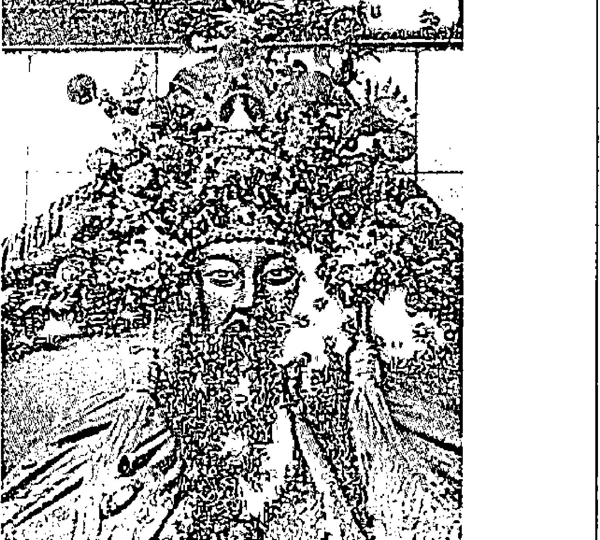

> 城隍神
城隍神是道教信奉守护城池的神。在摆放神桌时要注意，神桌的背后最好是不透光的坚实墙壁，只有这样才能发挥神像旺财、招贵人的作用。

## 587 观音应如何摆放？

观音是佛教的神，要保持清净，戒荤腥。在摆放的时候，要用素食供奉，忌荤腥。最好摆放一些鲜花、水果，这样能为观音营造一个清雅、洁净的场所，有助于其发挥神性。

在摆放观音的时候，要注意坐西向东，不要对着厕所，不要对着房门，不要对着餐桌，否则不但没有保佑作用，还会起到反作用。

在供奉时，观音不能和关公放在一起。因为观音以慈悲为怀，戒杀生；关帝则嫉恶如仇，对敌不手软，二者摆放在一起会犯冲。另外，观音和关公需要的供品不同。

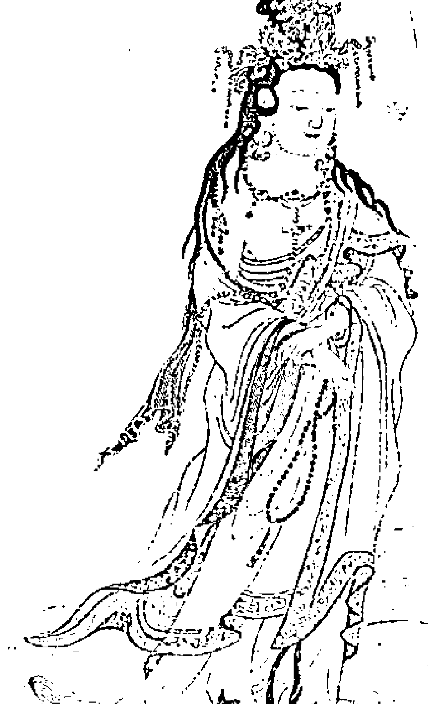

> 观音
观音菩萨，又称观自在菩萨，是四大菩萨之一。她相貌端庄、慈祥，具有无量的智慧和神通。观音吃素守斋，只宜用鲜花及水果供奉。

## 588 祖先能和天神一起供奉吗？

在很多商铺中都能看见这种情况，就是把祖先牌位或者照片和天神放在一起。这种做法是不对的，有不尊重天神的嫌疑，对商铺经营没有好处。

祖先只是普通的家神，和天神是不能在同一个阶层的，因而不能摆在一起供奉。祖先和天神应该在不同的地方分别供奉，这样才能多方面确保生意顺利，财源广进。

若是商铺空间小，布局不方便，只能将祖先和天神摆放在一起，也应该把祖先的牌位、照片放在天神下面，表示对天神的尊敬，也更容易得到他们的照顾。

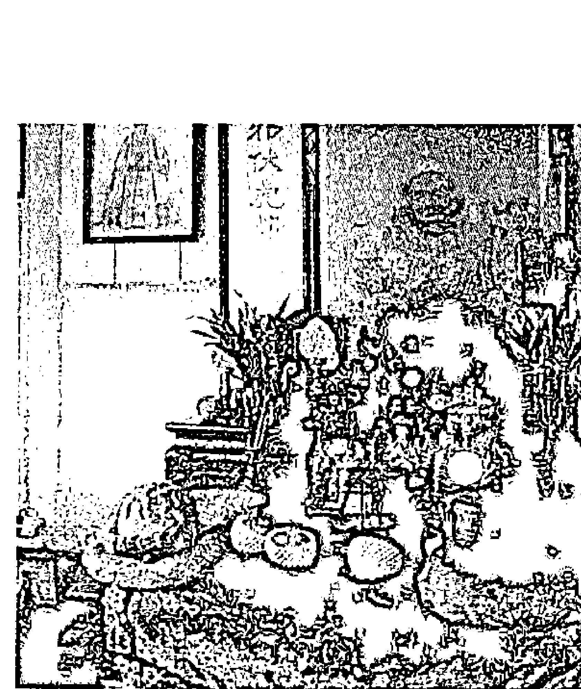

> 天神的供奉
供奉天神时，不要将天神和祖先牌位放在一起。如果商铺面积小，不好摆放，可以将祖先的牌位放在天神神像下面。

## 589 商铺内摆放什么宝石有助经营？

想要招揽更多的顾客，可以在商铺的四个角落摆放孔雀石。孔雀石有助于增加人气，可以让更多的客人上门。

在柜台和橱窗中摆放粉水晶和紫水晶，能够增加人缘和生意缘。商铺没有好的人缘是很难经营下去的。

宝石有增运、助事业的作用。店主可以通过宝石增强自己的事业运。具体做法是：准备七种不同材质、颜色的宝石，把它们放在一个容器中，然后摆放在办公桌的左边，商铺生意会日益兴隆。

> 宝石助运法
> 准备材料：准备水晶、玛瑙、玉石、翡翠、橄榄石等七种不同材质，不同颜色的宝石和一个容器。
> 主要功效：各种颜色的宝石能全面增强店主各方面的运势，尤其是事业运。
> 开运方法：将七种宝石放在任意容器中，然后置于办公桌左手边，以保事业顺利。

## 590 商铺摆放玉壁有何作用？

玉壁，中间有孔的玉饰，多呈扁圆形，质地上乘，手感温润。在家中供奉的财神爷上面放置一块玉壁，能提升财运。将玉佩戴在身上，特别是夏天，有益人的健康。玉壁有两种，一种是圆形玉，中间有一个小孔；另一种是方形玉，中间有一个大圆孔。

圆形玉可以放在关公、仙人刘海蟾、如意观音等天神的左方以招财纳福；方形玉可以摆在地主财神的右边，因为地主财神的吉位在右边，摆放在右边才可以起到招财纳吉的作用。

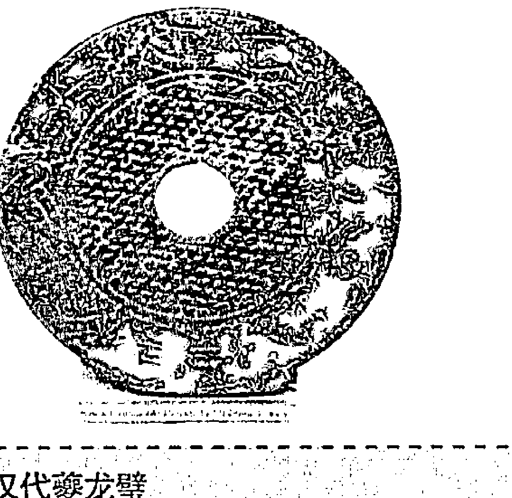

> 汉代夔龙壁属于圆形玉，中间有一个小孔。将其放在关公、仙人刘海蟾、如意观音等天神的左方可以招财纳福。

## 591 商铺摆放金元宝有何作用？

金元宝有招财、聚财的作用，适合放在商铺显眼的地方，有抬头见财的含义。

金元宝一般都是一对同时使用，最好放在商铺最大的橱窗或者窗台上，左右角各摆一个，可以把窗外的财气吸收进来，越大的窗户财气越旺。也可以放在商铺入门斜角的角落中，这里是财位，若放上一对金元宝能加强招财进宝之气。

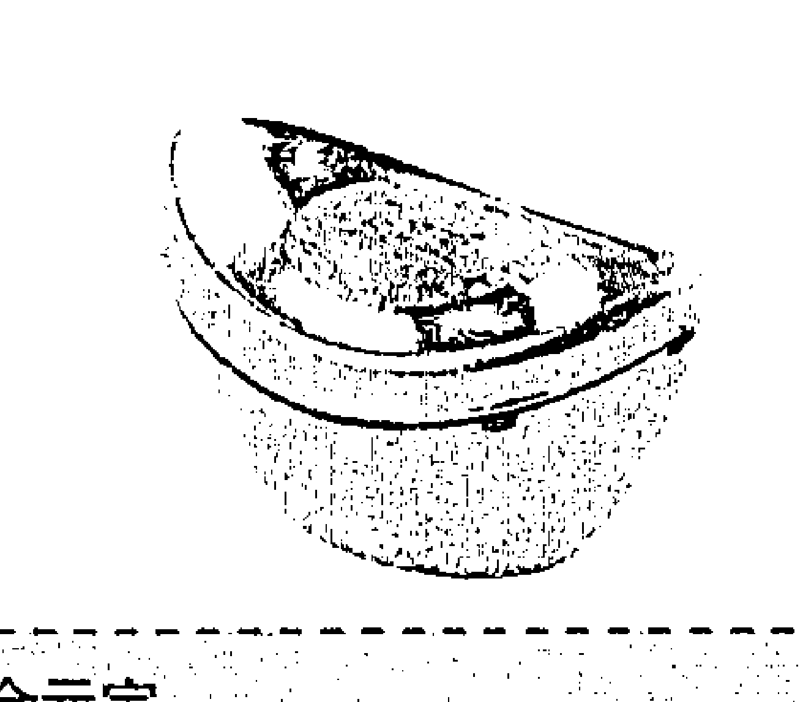

> 金元宝由贵重的黄金或白银制成。金元宝象征着聚财、招财。财帛星君左手握的就是金元宝。

## 592 商铺摆放招财进宝树有何作用？

招财进宝树有着招揽财气、带进宝物的作用，生命力很强，还有净化空气，安定气场的作用，多用于新店开张，也可以把它摆在店中或店门口以稳定气场。

招财进宝树很容易养殖，对土没有严格的要求。种植时只需将树的球形根剥去皮，把突起的部分埋在坑里即可。在树上挂上一个恭喜发财的小挂件，效果会更好。

## 593 商铺中摆放古钱有何作用？

古钱指古代用的铜钱。五帝古钱指清朝顺治、康熙、雍正、乾隆、嘉庆五个皇帝时期的古钱。因为这五个皇帝在位期间，国家兴盛，经济繁荣，一派盛世之象。有人认为，把五帝古钱按照年代次序串在一起，挂在家里有煞气或凶星降临的位置，能够驱走邪气，佩戴在身上可保平安。店主若在店中摆放或随身佩戴这种古钱，有招揽生意，旺财旺运的作用。只是需要注意以下两点。

- 1. 古钱币必须经过专业人士或道士开光，否则就没唤醒五帝古钱的聚财功能，不能发挥聚财功效。
- 2. 必须是真的五帝古钱，不能是商人仿造的假钱。假钱没有天地人三气三运，因此没有聚财功效。

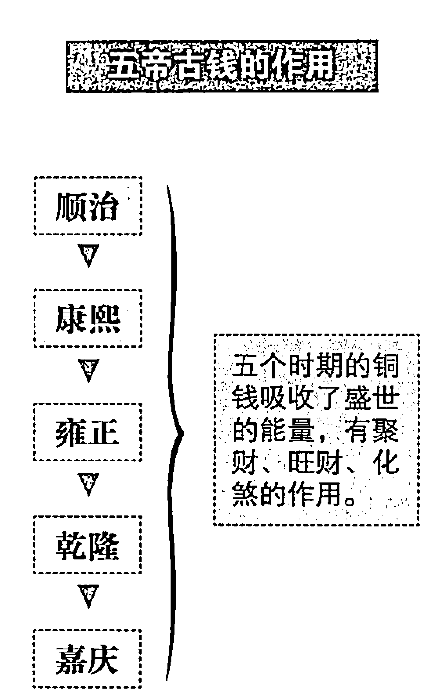

## 594 佩戴琥珀吊坠有何作用？

琥珀是很久以前埋藏在地下的树脂，经过一定的化学变化后形成的一种树脂化石。它具有非同寻常的生旺作用，从某种意义上说比古铜钱的能量还要大。虽然它的质地非常轻，只有石头的三分之一左右，却会散发出独具魅力的磁场。佩戴琥珀，可以给人增加元气和个人魅力，有延年益寿的作用。

商铺老板佩戴琥珀，可以稳定精神，灵活头脑，注意力会有所提高。这样容易提高商品的成交率，进而促进生意兴隆。另外，琥珀还能守护人体，消灾去难，激发人身上的潜力，促进事业腾飞。

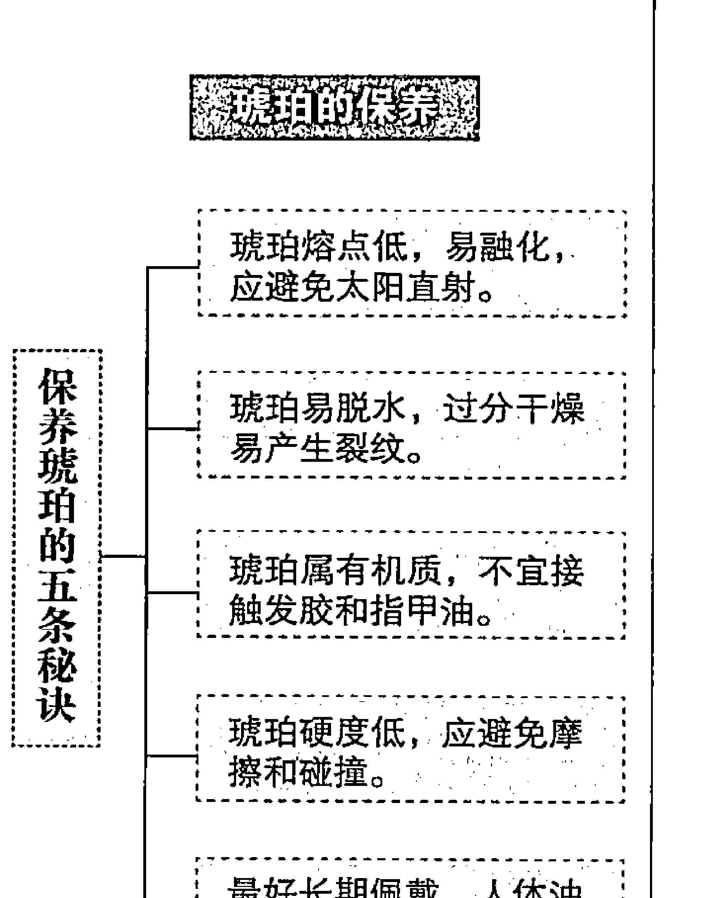

## 595 商铺摆放山海镇平面镜有何作用？

山海镇平面镜是镶在镜框中的山海镇平面图。山海镇平面图集合了所有开运元素，其中有八卦护符、太极、福禄寿三星、镇宅、明光、财神、贵人等吉祥元素。这些元素中的任何一个，都有镇宅、旺运、保平安的作用。如福禄寿三星，寓意福禄寿齐全。其他元素，如太极、八卦、财神等，都有提升运程、招致财富及保平安的作用。

店主将山海镇平面镜放在商铺中，可以调整商铺环境，招财进宝，平衡气场，提升运气，对商铺的经营大有裨益。

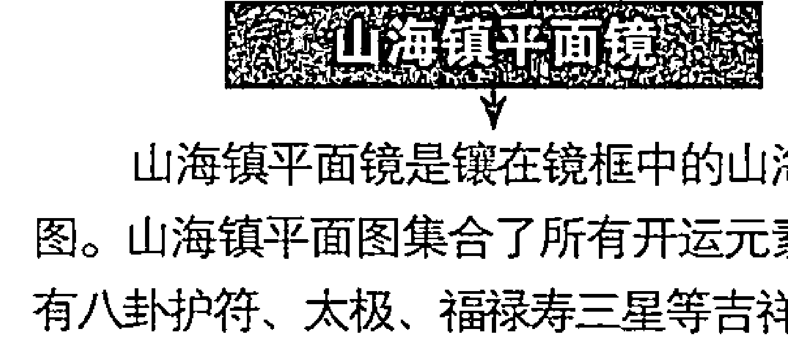

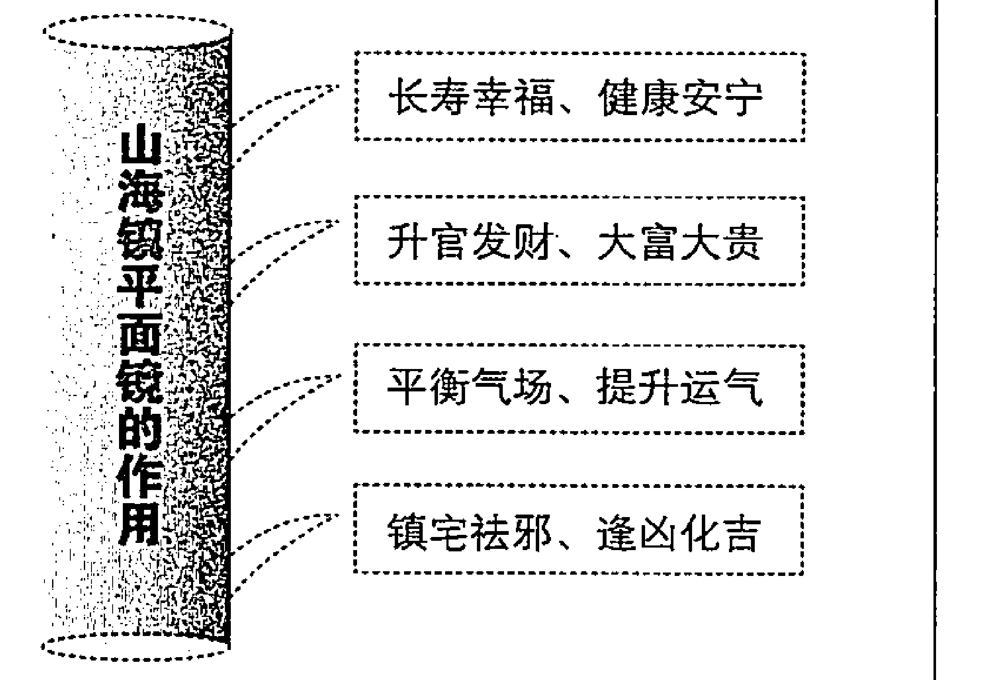

## 596 商铺摆放狮头吊坠有何作用？

狮头吊坠就是狮子头造型的吉祥物，在商铺中挂此吊坠可以守护商铺，避免灾祸。

狮子自古以来就被认为是百兽之王，勇不可挡。狮子可以用来避邪，能带来祥瑞之气，还能加强家人的官威，给屋主带来阳气。如果是从事律师、演艺等以口维生的职业，可以在办公室内摆放一对狮子以壮声势，有助于生财。

悬挂狮头吊坠前都要用一定的方法把周围的环境调整一下，将狮头吊坠挂在正门、东北门（即鬼门）、西南门（即离鬼门）三处，可以保证室内的安全，防止邪气入侵。

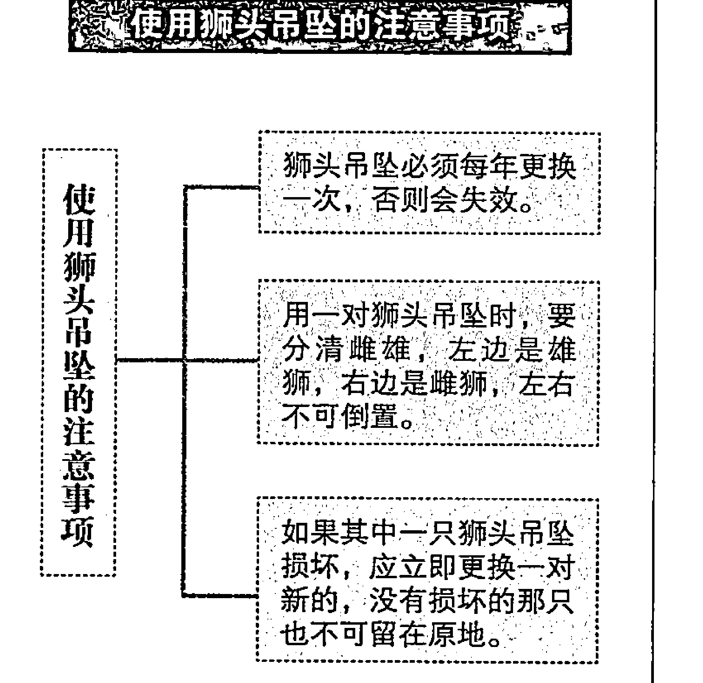

## 597 商铺摆放十二支八卦铜牌有何作用？

八卦有使自己感觉厌恶的所有事物远离的作用，十二支则网罗了全部的方位和全部的时间。刻有八卦和十二支的铜牌叫做“十二支八卦铜牌”。它可以镇定和化解不吉之气。任何人都可以轻易地在住宅、商铺、办公室等地使用，有旺宅、开运、保平安的作用。

店主可把十二支八卦铜牌摆放在商铺中，可以化解不利于商铺发展的不吉气流，避免同行的挤对，守护商铺。同时还可以增加客流量，提升商铺的人气，起到招财、聚财的作用。

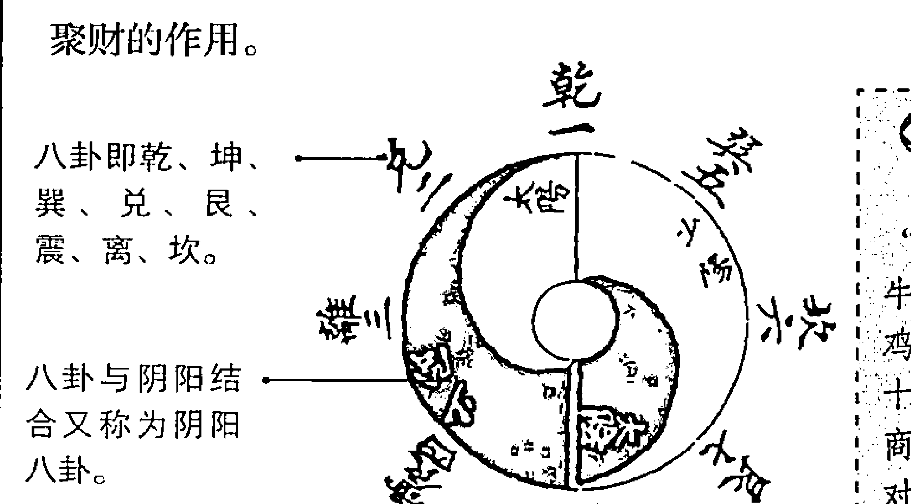

> 十二支八卦铜牌
> 刻有八卦和十二支的铜牌叫做“十二支八卦铜牌”。十二支指鼠、牛、虎、兔、龙、蛇、马、羊、猴、鸡、狗、猪十二生肖。商铺中摆放十二支八卦铜牌，有助于化解不利于商铺发展的不吉气流，避免同行的挤对，守护商铺。

## 598 商铺中摆放金蟾有何作用？

金蟾的造型有很多，材质也各不同，这些都没有关系。需要注意的是，摆放时金蟾的嘴必须朝着屋内，不能对着门窗。金蟾是吐钱的吉祥物，如果对着门窗，金蟾就会把钱吐到屋外面，钱财会流失到外面去。

最旺财的金蟾造型为：背上背着北斗七星，嘴中含着两串铜钱，头顶着太极两仪，脚踏着元宝山。通常在金蟾的脚下还有写着“招财进宝”“乾隆通宝”“宣统通宝”“一本万利”“四季平安”等字样的铜钱。

店主每天打开店门时，最好把金蟾转向店内并轻抚它。由于它天生喜欢金银财宝，对钱财具有敏锐的洞悉力，可为你挖掘财源。在它的尾部压上钱，代表可以双倍为你纳财。

> 招财三脚蟾蜍的演化史
> 三脚蟾蜍即金蟾，原为邪妖，喜爱金银财宝，专门危害人间。道士刘海蟾决心为民除害，做法收服了三脚蟾蜍。三脚蟾蜍变得只能吐钱而不能危害百姓了，从此成为旺财瑞兽，专为人们招财转运。商铺中摆放三脚蟾蜍，可以起到招财、旺运的作用。

## 599 商铺中摆放鱼缸有何作用？

《易经》认为，滋润万物的是水，水即财运。而鱼缸离不开水，所以，在古代环境文化学中，鱼缸就是水和财富的同义词。

在摆放鱼缸时，鱼缸的大小要和商铺的面积相适应。大鱼缸中的水面高度不能超过1.8米。鱼缸中不要有死鱼，水要保持活水，从上而向下流动，催财效果才会好。此外，鱼缸要放置在吉利的方位上，才能把吉利方位的灵动力催动，再配合自己的命卦及房间的坐向来设计。养什么鱼和选择哪种颜色的鱼、鱼的数目等都有讲究，不能根据个人喜好，随意决定。

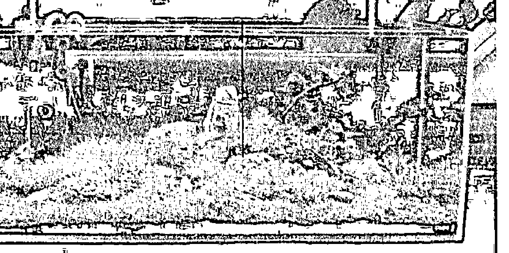

> 商铺鱼缸催财
> “山主贵，水主财。”在商铺中摆放鱼缸可以催财。

## 600 商铺中摆放大象饰物有何作用？

人们常在家中、商铺内摆放大象饰物，如瓷象、玉象、铜象、石象等。有的在住宅门前摆放两尊大象——这些都说明大象具有镇宅作用。

大象善吸水，水象征着财富，因此大象饰物有吸财的作用，是招财的瑞兽。善于吸水的大象，必定会为商铺聚财。

若想生意长期兴隆，最好在商铺中摆放一只铜质大象，无论大财还是小财都可以尽收在内，不会流失半分。大象秉性善良，容易驯服，放在商铺中有吉祥如意的含义。最好能放在商铺中最旺财的方位，这样就更容易招揽顾客，效果更佳。

> 大象吸水相当于吸财，是招财的瑞兽。若是开业的时候将大象请入店中，不仅能招客吸财，还有避邪、镇宅的作用。

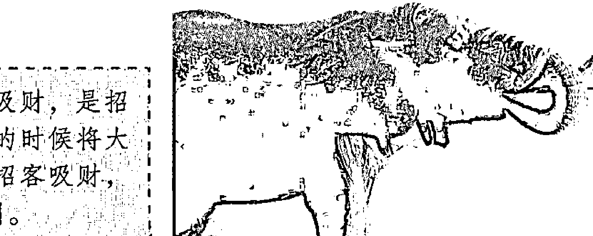

## 旺宅

本篇主要讲述了如何旺宅。

内容涉及住宅的外部环境，如何利用庭院旺运，如何选择楼盘楼层，室内适宜摆放什么旺宅物品，如何布置室内环境，什么样的住宅是理想的住宅，哪些地基不适宜居住，不同五行宅该如何旺运，庭院内可以种哪些植物，如何根据周围环境选择楼盘，如何根据自身生肖、生肖选择楼层等。

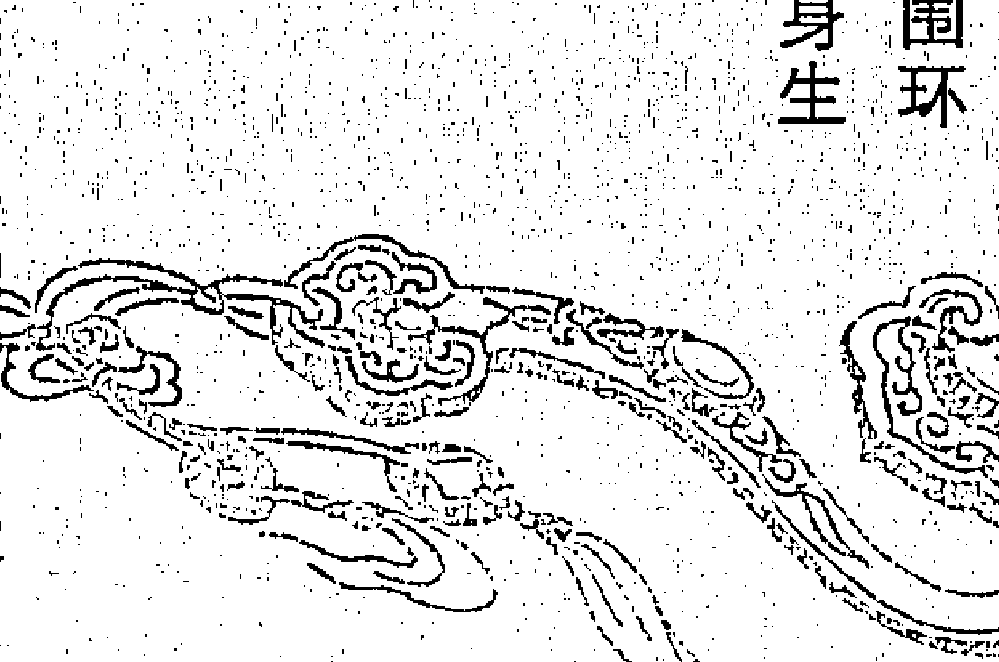

## 第十六章 住宅环境

本章主要讲述住宅周围的环境，内容涉及什么是理想的住宅，如何选择宅基地，什么样的住宅朝向为佳，如何利用五行选择住宅，住宅周围有河水、大树、地下通道等有何吉凶，住宅位于医院、立交桥、教堂等附近有何影响。

## 601 古代的理想住宅是什么样的？

古时挑选住宅，首先要看地理环境，即所谓“负阴抱阳，背山面水”，讲究“龙、砂、穴、水、向”五个方面的环境构成。龙，即背后所靠连绵大山；砂，四周包围的低矮小丘；穴，风水聚集之处；水，门前有曲折之河；向，即住宅的坐向。

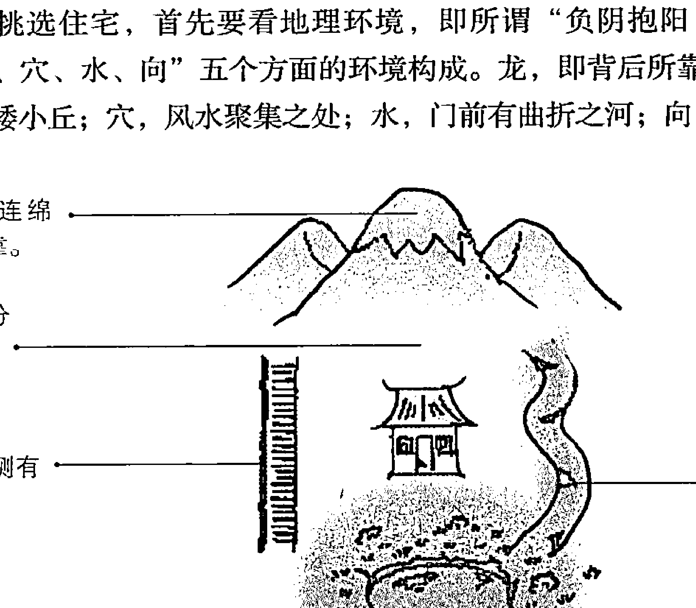

> > 古代理想住宅
> > 古代理想住宅应当是“龙、砂、穴、水、向”五要素齐备的住宅。

## 602 理想住宅模式有何地理优势？

理想住宅的背后有群山，可以抵御冬天北来的寒风；前面有水，可以接纳夏天的凉风，生活用水也极为便利；左右有小山护卫，形成相对封闭的空间，有良好的局部小气候。

这种布局，显然非常适合中国古代自给自足的农业耕作模式，所以才能成为良宅的标准。

## 603 住宅选址要注意哪些因素？

住宅如何选址，包括的知识非常广泛与复杂，通常而言，有三个基本方面。

首先，要测定住宅的坐向，用罗盘或指南针都可以。住宅的坐与向一定是相反的，如果它坐北，那么一定向南。其次，要看住宅内的布局，包括房子的大门，客厅的摆设，卧室床位，厨房、厕所的位置等因素。最后，要看住宅外的环境，包括房子的外形，房子附近的形势、街道、楼房的高低等。

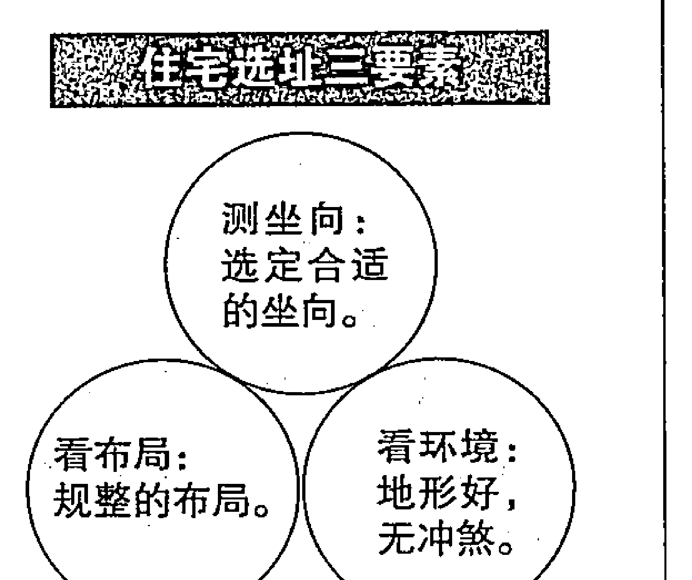

## 604 如何区分土质的类别和优劣？

古代环境文化学认为，土壤由三相体系构成，即由颗粒（固相）、水（液相）、气（气相）组成。根据土壤中三相比例的不同，可区分不同的土壤。现代的土壤学，把土质大致分为三类：砂土类、壤土类和黏土类。

古时民间在建宅时，也把土分成三类：浮土、实土和穴土。浮土为地表之土，实土为深层之土，穴土是位于浮土和实土之间的土。古人以穴土为吉。

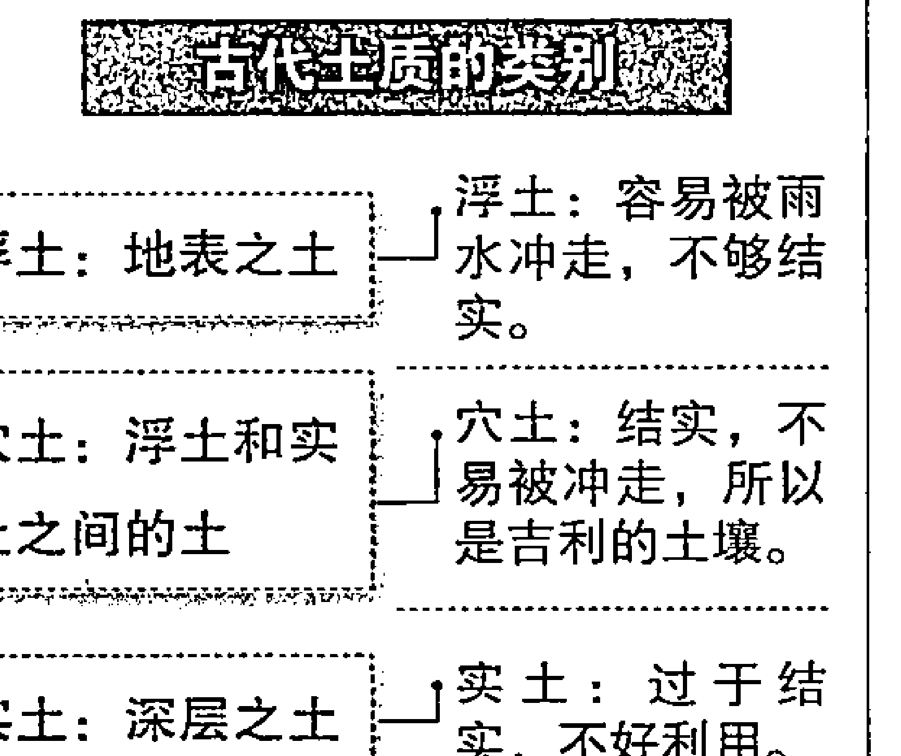

## 605 选择地基要注意哪几方面？

专业人士认为，选择地基要注意以下几个方面。

- 1. 地基要纵向规划，以向阳坡面为佳。
- 2. 宅基地的形状宜方正、平整。
- 3. 查明宅基地的水土之质和用地历史。
- 4. 查明宅基地所在地的地脉和水文情况。

此外，宅基地应避开各种不吉地段，尤其是各种不利格局之所和有工业污染之地。

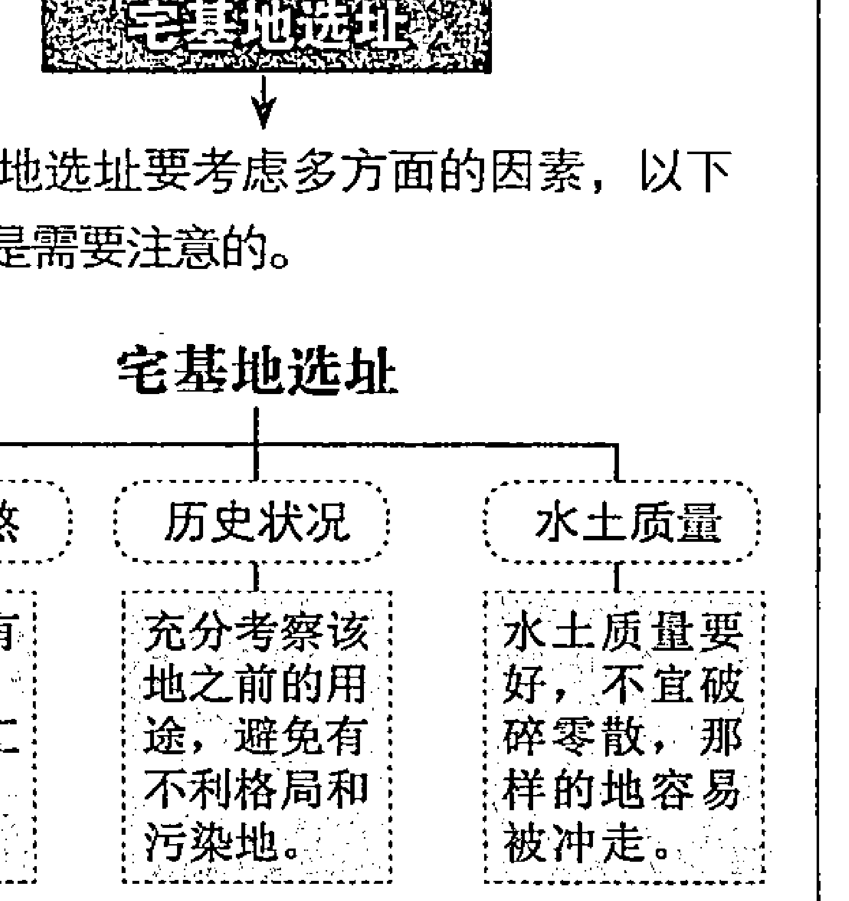

## 606 住宅前的山脉有何五行属性？

在传统文化中，山脉按其外形和五行原理，可分为金形山、木形山、水形山、火形山和土形山。无论哪种山脉，草木旺盛者为吉，光秃荒凉者为凶。

金形山指圆形、椭圆形和弧形的山脉。住宅前有金形山，主富贵荣耀，事业顺利，学业有成。木形山指山坡陡峭，犹如粗木桩竖立。由于山势险恶，主凶险之象。水形山指山脉连绵如波浪。主头脑聪明，出学者、谋臣等。火形山指山峰尖削的山脉，此山不吉，会影响到家人的精神和情绪。土形山指山顶平缓的山脉。这是贵人山，主有贵人或长辈扶持，万事顺利。

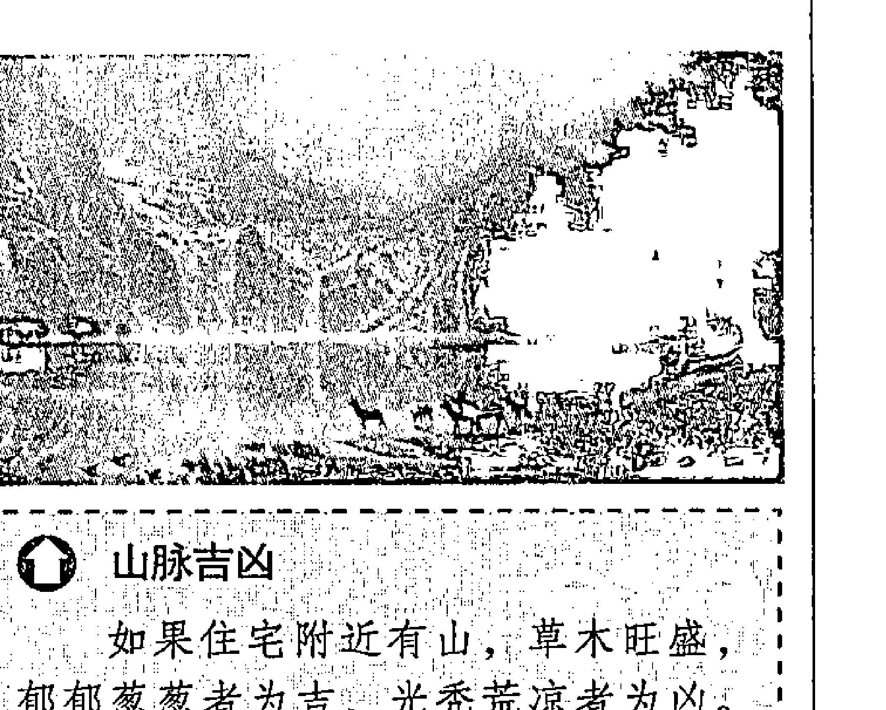

> 山脉吉凶
> 如果住宅附近有山，草木旺盛，郁郁葱葱者为吉，光秃荒凉者为凶。最好不要在凶山前选址建房。

## 607 哪些地方不宜居住？

- 1. 深山幽谷。深山幽谷环境优美，风景宜人，但是如果过于偏远，不适作为住宅。深山幽谷地处偏僻，交通购物都不方便，人气也不旺。
- 2. 形如龟背的地方。如果一个地方的地形像乌龟的背一样，四方地势都较为低下，就不适合做宅基地。
- 3. 新填平的地方。如果选择的宅基地是由大水沟或水塘新填平的，不要立即在上面建房。因为此时的地基还不够扎实，安全性较差。
- 4. 低洼之地。在传统文化中，水代表“财”，低洼之地易聚水。但是，如果坡度过于陡峭，会造成“水泄千里”之势，更加不利于积财。

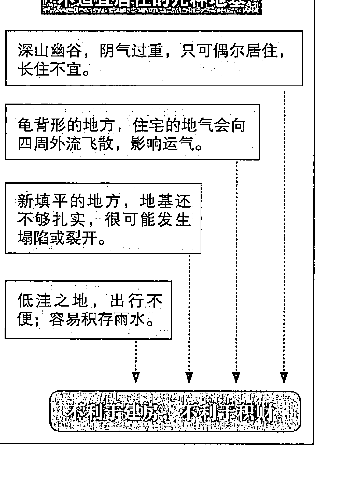

## 608 哪些宅基地不适合居住？

- 1. **填平的废井**。填平的废井上并不适合建房，因为地基可能会因为填土不实导致地下水渗出，或是因当初掘井太深造成地气枯绝。
- 2. **火灾之地**。火灾之后，住宅所在地的土质已经改变，地气也受到严重影响。如果不加以改造，偏要在此建房，定会影响财运和健康。
- 3. **种有作物的农田**。种植过植物的田地，如果要用作宅基地，一定要等农作物收获完毕后才能动工。否则，地气会受到影响，从而影响到家运的兴旺。
- 4. **填平的垃圾场**。垃圾场的土地，由于长期堆放垃圾，所产生的秽气和细菌都渗入土地深处。最好不要在这里建房，否则会影响家人的健康和财运。

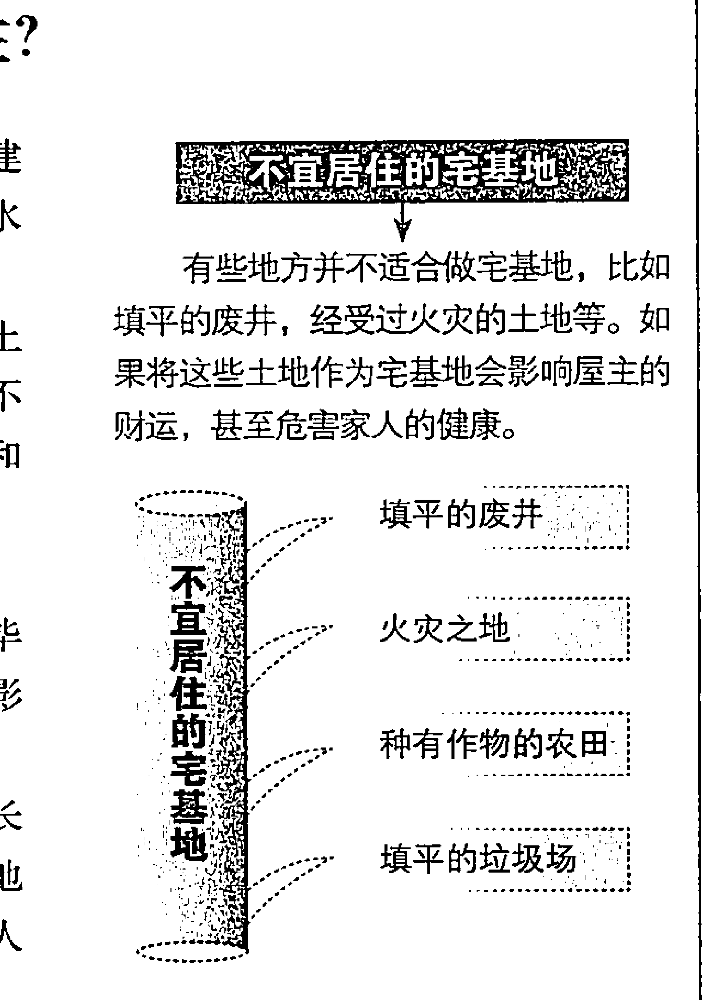

## 609 为何下面几种宅基地不宜修建住宅？

曾经的医院不可以做宅基地。这是因为，医院是许多病菌、病人和废弃物的积存之地，有大量霉气滞留。

曾经的坟地不可以做宅基地。如果要把坟地改造成宅基地，必须提前进行清理和消毒，并且搁置一段时间后再进行动工。否则，将会对家运和健康产生不利影响。

曾经的刑场或战场不可以做宅基地。这是因为曾经的刑场或战场，由于长期积存了大量的冤气、杀气和阴气，非常不宜作为住宅。除非时间久远，并且经过清理和专业人士的超度净场。

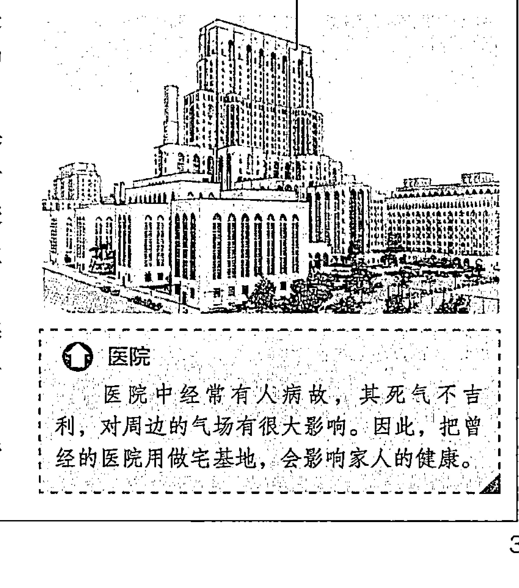

## 610 地基不规则有何不利？

住宅的地基，以方形或长方形为佳。有些边角之地，如三角形、L形、T形、十字形、圆形，主人不舍得空放，就在上面加盖房屋。这样的房屋，是不适宜住人的。

尖角之地，不伤人则伤己，对身心健康非常不利。住在这种类型的房子里，会让人产生紧张、不安等情绪，容易生病、出事。

凡是不整齐、方正的宅基地，都有不吉之处。若要在这地上盖房，必须划出一块整齐的地作为地基，不规则的边角必须割舍。

| 零头地的处理 |
| --- |
| 不规整的地划出一块整齐、方正的土地作为地基之后，裁减下来的零头地，也不必浪费。 |
| **零头地宜忌** |
| 适宜方法 | 禁忌方法 |
| 可以养花、种菜、栽培果树，或者植上草皮，布置成庭园。 | 不能铺上水泥。水泥地会和房子的地基连成一片，地气混于一体，不吉。 |

## 611 别墅的地基有何讲究？

别墅的地基与普通住宅一样，形状上要求方正。前窄后宽或前宽后窄的建筑基地，在气势上就给人不吉的感觉。建筑基地宜高出四周，否则容易积聚水气和阴气，让住宅长期处在潮湿、阴冷的环境之中，易生病。

山间别墅虽以宁静、幽雅为目的，但是，若地势过于偏僻，四周空旷，人烟稀少，这种环境阳气稀少，阴气过重，则不宜居住。附近有烟囱，大门雕檐画栋，形似庙宇，室内天花板装潢成八卦图样，都会影响别墅主人的运势。

| 别墅的讲究 |
| --- |
| 由于别墅是个性的建筑，其作用虽比不上皇宫，但比一般家宅的影响要大。 |
| **别墅禁忌** |
| 左右护卫不佳，格局座空朝满。 |
| 庭院种植榕树、芭蕉或竹子等植物。 |
| 卧室窗外即见假山、水池。 |
| 摆放猛兽雕像、出土古物、兵器或戏偶等饰物。 |

## 612 为何四周空旷和四面临街的宅地不宜居住？

四周空旷的宅地不宜居住。这是因为，四周空旷的宅地，没有事物阻挡，难以藏风聚气。住在这样的住宅里，人会变得孤僻，人缘变差。这对单身人士的桃花运有害无益。若不急于盖房子，可以多等几年，让附近繁荣起来，人气变得充足，再动手盖房。若是农村住宅，四周是自己平日耕作的田地，可以用地气来补充人气，则不会不吉。

四面临街的宅地不宜居住。这是因为，四面临街的宅地，四面都有气流在窜动。若住宅盖在这种地方，若大海孤舟，四周没有依靠，让人没有安全感。在这种环境中，人会变得没有耐性，从而影响事业。尤其是孩子，若长期住在这种住宅中，性格会变得不稳定。

## 613 如何在梯形宅地上盖房？

梯形的地基，若梯形很规则，即两侧边等长，这样的地基是吉地，但是盖房要特别注意坐向。要把短边作为大门的位置，宽边作为建筑的背向，这样的布局有利于蓄气，能积福存财，与方正的宅地一样属于吉地。若相反规划，盖成前宽后窄型，则对人丁和财运不利，家运会不断衰退。

若梯形的两侧边长短不等，为凶煞之地，对健康和运气都不利。左边短，伤家中男性；右边短，伤家中的女性。

## 614 三角形的宅基地不宜盖房吗？

三角形的宅基地最为不宜，在建房的时候就会发生纠纷，引发意外。因为宅地的气场无法取得均衡，住在里面的人会感觉精力日渐消退，容易患怪病。对年老的人影响更大。

三角形宅基地特别容易引起外人的觊觎。从感情角度来说，容易发生婚外情，使婚姻发生变故；从钱财角度来说，容易引来宵小，遭遇偷盗、抢劫事件。

## 615 如何从宅地环境看富贵吉凶？

传统文化认为，以宅地为中心，观察周边地平面的变化情况，可以判断出该住宅的吉凶。如：宅地的西方高、东方低，称鲁土，多出贤人和富贵之人。东高西低，称齐土，不宜经商。北高南低，称晋地，宜人居住。南高北低，称楚土，属凶，为家门断绝之地。四方高、中央低，称之为卫土，主先富后贫，有火灾的危险。东南高、西北低，阴阳相克，灾祸最多。

## 616 中国古建筑为何以土木结构为主？

中国人讲究阴阳五行，古建筑也不例外。五行与方位相对应，土代表中央，代表承载万物、养育万物的大地；木，代表春天和东方，象征生命与生长的力量；水，象征北方，具有厌火的象征；金，象征西方，也象征武力与刑杀。

在五行之中，只有土和木适宜作为建筑材料。因此，中国古建筑大多以土为基，以木柱、木梁作为支架，构建成可供居住的空间。

### 617 中西建筑理念有何不同之处？

西方古建筑，以“坚固、美观”为原则，在外形上力求优雅；在功能上力求坚固，能够流传千古。而中国古建筑，则以空间的舒适与阴阳调和为原则，即万物“负阴而抱阳，冲气以为和”。为达到“阴阳和合”这一目的，建筑的规模就不能太大，建筑的高度也不宜太高；在材质上，阴阳适中的土木结构自然为最佳选择。

### 618 中国的古建筑有何安全依据？

古时的理想房屋，要坐落在丘陵和山地之前，背后的山丘上应有树木覆盖。从现代科学角度来看，这些山丘和树林充当了避雷针的作用，可以最大限度地消除雷电隐患，从而保证建筑的安全。
另一方面，对土质和水质的考察，可让建筑避免在河患、山洪、地震等自然灾害中毁坏。因此，许多古代建筑能够流传下来。

### 619 “背后有山”有何科学意义？

古代理想的居住环境是：背后有山，前面环水，“左青龙、右白虎、前朱雀、后玄武”。从科学角度来说，由于住宅处于山地阳坡的前方，阳光充足；三面有山环抱，可阻挡冬季西北寒风的侵入；南方的开口，则可让夏季温暖的东南季风顺利进入，带来充足的降水。由于三面环山，流水会把山上的表土冲积下来，前方朱雀让山上冲下来的土壤不致流走。这样的地形，对古人的生产活动非常有利。

## 620 “前有曲水”有何科学意义？

传统文化认为，住宅前有曲折环抱之水，最为吉利。水能聚气，有水方有财。从科学的角度看，“玉带环腰”之水，一来可以保证住宅环境有一定的湿度，二来可以固土扩地，有利于农业生产。

河水夹杂着泥沙而来，一面侵蚀，一面沉积；环抱这边河岸，泥土堆积扩展，反弓一边则不断被侵蚀。冲积平原，是最有利于农业生产的土壤。

但是，若河流距离住宅过近，或者住宅门前有排水沟经过，河流的潮湿之气和排水沟的污水，对人体健康不利。

- ① 前有曲水的住宅
水主财，住宅前方有清澈的流水环抱，住宅可财源滚滚。反之，反弓而过，财随水流走。

## 621 “开门见山”与“开门见高楼”有何不利？

“悠然见南山”是一种优美的意境，对居住者来说并非不吉。但是，若开门就见到大山，即山距住宅很近，难免有压迫之感，家居气场也会受到影响，停滞不畅，对家人健康不利。若非要近距离在山边建造住宅，通常要背山而建，背后有靠才属吉宅。

如果住宅对面是一座高楼，比自己的住宅高出很多，并且距离在15米以内，就会造成“奴欺主”之象。家里小孩子多不听话，公司下属不听指挥，事业家庭均不顺利，易生有心无力之感。

- ② 背后靠山的住宅
图中的房子，背山而建，山可阻挡冬季的寒风。如果宅基地附近有高山，那么最好不要面山建房，而要背山建房，否则会给人压抑感。

## 622 “水聚明堂为吉”是什么意思？

明堂指住宅的前方，水聚明堂指住宅前方有水聚集，这“水”指的是江河湖泊之水，水清则吉。水主财；水聚明堂，就是财气聚集。

如果住宅前没有天然水源，可以修筑水池，仍有效果。明堂之水清澈才是吉利的，如果水浑浊不堪或者污秽肮脏，只会影响财运，主破财。

住宅前的水，不宜和住宅距离过近。如果推开门就看到水，虽有财气，但流动过快，无法积累聚集。

住宅悬于水边，家人缺乏安全感。

> ⚠️ 不利的住宅环境
住宅悬空建于水上，或者建在水崖边上，开门就可以看到下面的水，是非常不吉的，长期居住会造成神经紧张、衰弱，做事贪图侥幸。

## 623 住宅为何以坐北向南为最佳？

中国处于地球的北半球，住宅只有坐北朝南，才能得到最适宜的阳光照射。住宅坐北向南，在夏天，可以避开太阳的直射；在冬天，可以得到温暖的阳光。

中国大部分地区，冬天笼罩在寒冷、干燥的西北风下，夏季则是温暖、湿润的东南风。住宅坐北朝南，刚好可以避开冷风，迎接暖风。

坐北朝南的吉方一共有三个：朝向东南方（生气）、朝向正南方（延年）、朝向正东方（天医）。其他坐向的住宅，若符合“采光、挡风、通气”的原则，就算是一所好的住宅。

在传统建筑学上，住宅以坐北朝南为最佳。

> ⚠️ 住宅坐北朝南
我国地处北半球，冬天需要避开寒冷的西北风，夏天需要迎接暖湿的东南风。坐北朝南的住宅刚好满足了这两点。

## 624 怎样挑选旺宅？

所谓旺宅，就是使人接受天地灵气并且能避免不良因素干扰的住宅，这是中国传统哲学中提倡的“天人合一”的具体体现，也是中国人追求的理想住宅。在挑选旺宅的时候，需要注意“藏风聚气”“山环水抱”“龙真穴的”三大要素。

> 挑选旺宅的三要素：
一间住宅，居住起来感到舒适，财运、家运都会有所提升，是最为理想的住宅。

（图示：藏风聚气、山环水抱、龙真穴的 三个相交的圆）

“藏风聚气”，即寻找一个相对封闭的环境，目的是为了留住天地灵气。“山环水抱”类似“藏风聚气”，指使山水灵气有控制地进入并留下。“龙真穴的”，指找到一个能最大限度接受天地精华的地方，达到人杰地灵的境界。

## 625 如何运用五行选择住宅？

住宅选择要以五行方位为依据。出生在不同季节的人，五行不同，住宅朝向自然不同。
出生在春天的人，属木。木克土，利于火、金。所以应该选择南方、西南方，房子应该坐北朝南或坐东北朝向西南。
出生在夏天的人，属火。火克金，利于水。所以应该选择北方、西南方，房子应该坐南朝北或坐东南朝向西北。
出生在秋天的人，属金。金克木，利于火。所以应该选择南方，房子应该坐北朝南。
出生在冬天的人，属水。水克火，利于木。所以应该选择南方、东南方，房子应该坐北朝南或坐西北朝向西南。

> 运用五行选住宅：
不同的人，他命中的好方位是不同的，每个人都要根据自己的五行选择适合自己的住宅方位。

## 626 如何运用生肖方位躲开是非？

亡神会挑起是非，在申、巳、亥年时，该星的影响力最大。人们可根据生肖定坐山，保持家庭和谐。属牛、鸡、蛇的人，不宜坐申方；属马、虎、狗的人，不宜坐巳方；属鼠、龙、猴的人，不宜坐亥方；属兔、羊、猪的人，不宜坐寅方。

## 627 为何门前河水以内曲为宜？

古籍中说：“水抱边可寻地，水反边不可下。”它的意思是说，住宅前面若有弯曲的河流，在河曲内部的住宅为吉地，在河曲外侧的住宅则不吉。

因此，古人常在河流弓形内侧选地建房，住宅的三面均有河流环绕，这种地形被称为“金城环抱”，为大吉。为何称为“金城”，这是因为圆形属金，金生水，可以生旺住宅财运。

## 628 宅前有大树利于家运吗？

住宅前适当种植树木，可以藏风卧水，对家居运程非常有利。古籍上说：“宅基背后要圆高，后拥前平积富豪。四畔俱是栽竹木，绵绵富贵得坚牢。”意思是说，只要住宅地基选得合适，在四面栽种竹子和树木，便是大贵之运。

但是，普通的民居门前有太多的大树，遮蔽天日，会滋生阴气。特别是郊野之中，民居稀少之处，更不宜在住宅四周种植大树，以免削弱住宅的阳气。

住宅外的大树以枝叶繁茂为吉，如果出现枯树或死树，应及时清除，不然就会出现煞气，破坏运势。

**宅前有大树**
大门不宜正对大树，这会妨碍家居气流的流通。雷雨天气还会招引雷击，秋天大量的落叶也会造成家居萧条之感。

## 629 宅前有地下通道或停车场为何不利？

住宅如果对着地下通道，会妨碍气脉的正常流通，大门前的气场也会受到乱流干扰，对人际关系造成不良影响，财气也会受到阻挡，极为不利。

地下停车场的入口是气往下泄的地方，看起来像个张开的大嘴。如果住宅正对着这个入口，必然难以聚气，在事业上不易获得发展。住宅在五层以上，则无关系。

### 630 住宅八大吉树有何增运作用？

- 棕榈树，有观赏价值，棕毛可入药，有生财、护财的作用。
- 桔子树，桔与“吉”同音，象征吉祥如意。桔子为金黄色，有喜庆的味道。
- 槐树，代表“禄”，主官运。由于槐树有威严，也可用来镇宅。
- 椿树是长寿的象征，有护宅和祈寿的作用。
- 枣树，枣与“早”同音，喻凡事快人一步或早生贵子。
- 石榴，有多子多富之义，有富贵运。
- 梅，花开五瓣，清高富贵。
- 榕树，有“容”乃大，可以提高涵养。

> > **椿树**
椿树是楝科落叶乔木。叶子有特殊气味，花芳香，嫩芽可做菜食。因为树龄较长，所以是长寿的象征。

### 631 宅前有大河一定旺财吗?

很多人都认为，水主财，因此门前有水就为吉。其实不然，只有那些弯曲而来的小河才为佳，而且要配合河流的八卦方位。如果门前的河流浩荡、湍急，会产生大量噪音和湿气，让人有不安感，容易导致神经衰弱，睡眠质量不好等问题，对财运也会造成不利影响。如果大河与住宅距离超过百米，则无妨碍。

同理，面朝大海也不一定好。住在大海边，似乎是梦想中的生活。但实际上，距离大海过近，空气中会有大量的湿气和盐分，长期居住在这种环境里对人体健康没有好处。

因此，海边住宅只适合度假或短期居住。

> > **宅前大河**
住宅前方有蜿蜒而来的小河，且河水缓慢，清可见底，是吉利的住宅，财气会随着流水流入家中。

## 632 什么样的水流为吉？

吉利的河流来时蜿蜒曲折，宅前围环相抱，去时回顾不舍。河流来时，不宜直冲而来；河流去时，不宜直奔而去，才是最吉的水流。河水的弯曲是龙气的聚会，曲折才能聚气。

古人对河水的奔流和河水的质地有详细的阐述：“海水，以潮高水白为吉；江水，其势浩荡，弯抱屈曲为吉；湖水，万顷平镜，滨之均吉；溪水，屈曲环绕，聚注深缓为吉；池塘，天然为贵，人工次之；泉水，味甘、色莹、气香、四时不涸为佳泉；冷、喷、漏和瀑布泉为凶泉。” 所以说，水流的水质与缓急和人体的健康息息相关。

> 吉祥的水流
古人以静水流深为吉，以清澈、甘甜为吉。如果住宅对面有水，需仔细辨别水流吉凶，谨慎选择。

## 633 道路与住宅有何关联？

现代住宅，门前很少有江河湖泊，取而代之的是许多纵横交错的道路。在古代环境文化学中，道路属于“水”。道路是气的流动，车流来往，人流涌动，就相当于水流。因此，道路和河流有一致的特性。

比如，门前有内弓道路为吉，有反弓道路为凶；门前道路横向为佳，直冲而来则为凶。运势旺的道路，可以为住宅招财，兴旺事业；差的道路，会有破财之灾，或有意外伤害。住宅如果有道路冲煞，就不宜用作住宅；若不便搬迁，就要想办法化解煞气。

> 住宅前的路煞
住宅门前最忌冲煞，如果门前有一条大路直冲而来，家中的运势起伏不定，应当搬走或予以化解。

## 634 屋后有断崖为何不利？

住宅后面如果是悬崖，就是背后无山，无所依靠，容易后跌。在这种情况下，只有前门，无法开后门，只进不出，家族不易壮大。从安全角度看，这样的房屋地基很不稳固，一旦悬崖塌陷，就会对房屋造成巨大的损害。

此外注意，山间别墅的前方不宜有陡坡。这是因为，依山而建的独栋别墅，讲究的是景观和视野，因此房屋背后的地势通常较高，而前面地势较低。住宅前面的坡宜缓降，忌讳层层下陷或急降的坡。前高后低的独栋别墅，更为不吉。若屋后为急降坡，甚至是悬崖，会让人产生恐惧感，住宅的安全也难以保障。

## 635 住宅附近有哪些情况不宜居住？

不宜住在天桥旁边。住在天桥或者高架路旁边，一是振动很大，二是噪音很大，三是污染较重。长期居住，饱受噪音污染，容易造成神经衰弱。如果住宅恰好位于天桥或者高架路的回弯之处，犹如遭受镰刀切来，更是不吉。

不宜居住在道路斜冲的房屋。如果在住宅的侧面或后面有道路直冲而来，通常都是不利的。不过，若路冲方向与房子的八卦旺位非常契合，则会愈冲愈旺。不过，这种房子极少，最好还是回避这种路冲的住宅。这种住宅在形象上也有被人挖墙脚之意，通常都会遭遇原因不明的损失。

## 636 住宅四周有排水沟有何不利？

如果住宅的四周有排水沟，除了影响健康之外，还会让你的住宅气运随水流走，有伤事业运和财运，可谓凶宅。

> **排水沟影响健康**
排水沟里面全是污浊之水和废弃之水，聚集着污秽之气和废气，是一种不利环境因素，对人体健康不利。

如果只是住宅的一边有排水沟，或者住宅两边有水沟相交成直角，对住宅的不利影响较微。同理，住宅也不宜建在河流出口处。

有些房子修建在已经干枯的河流出口处，不吉。这种地质属于冲积平原，地质结构不稳定，住宅安全有隐患。而且，河流的出口处曾经是气流散出之口，住宅的地气容易散发，无法凝聚，长久居住对家运、健康均不利。

## 637 城市楼房选址有什么重要性？

古代人住宅的选址，往往与大自然的环境结合在一起。如今，人们大多聚集在大城市的水泥楼房中，与自然山水相隔离。这种情况如何衡量现代住宅“旺”与“不旺”呢？

古代人把住宅分为三类，一是山谷之宅，二是旷野之宅，三是井邑之宅。从字面上就能看出它们的意义，即山区的住宅，平原的住宅和城市里的住宅。虽然古代城市与现代城市有很大的差别，但在招财旺运上是一样的。

> 古代人认为，“有诸内而形于外”，有什么样的外形，就会起到什么样的作用。因此，在《阳宅会心集》中，就有这样的说明：“一层街道一层水，一层墙屋一层砂；门前街道即明堂，对面屋舍即案山。”

### 638 如何简单判断一幢大厦位置的利弊？

古籍中说：“前山为朱雀，后山为玄武，左山为青龙，右山为白虎。”又说，“一层街道一层水，一层墙屋一层砂；门前街道即明堂，对面屋舍即案山”，“高一寸即为山，低一寸则为水”。一幢大楼的后方若有高大的建筑，即为靠山，大楼住户易得到上司的赏识；左右两旁若都有楼房，则以左方较高为吉，右方较高为凶。大厦的前方有明堂，就有利于财运，如有广场、草地、公园等。明堂前方若有楼宇，即为案山，案山宜矮，可以聚集明堂之气。

### 639 住在立交桥旁对运势有影响吗？

立交桥犹如奔流之河，它纵横而架，对住宅的财气很有影响。桥上下车辆经过时带来的灰尘和废气会造成空气质量下降和噪音干扰，家人每天都处在这种环境中，会导致神经衰弱、睡眠不好，会间接影响到事业的发展。因此，立交桥附近不宜居住。但是如果住宅楼层较高，则影响不大。
同理，住宅也不宜在铁路附近。铁路会阻隔气脉的流通，而且会造成噪音干扰。铁路所用的高压电流会放射出电磁波，会对家人的健康、生育、工作等各方面造成不良影响。

### 640 住在医院旁对家运有影响吗？

从环境方面说，医院是看病的场所，是大量的病菌出入之所，居住在这附近，对身体和心理都有些不利影响。
在运势角度来说，医院中的病人，都处于运气不顺之中。于是，医院中就聚集了大量的霉运，这会影响周边环境的气场。
如果住宅无法避开医院，只能想法化解。要有宗教信仰，以信仰增强住宅的能量与气场。

## 641 住在教堂或寺庙旁吉利吗？

住宅附近若有寺院、道观、教堂或其他宗教场所，由于这些场所有纯净精神气场，住在附近的人会感觉心态平和、情绪安定。

寺庙和道观，由于有超度亡灵的内容，容易吸引游魂野鬼，导致阴灵聚集，因此住在这附近的人，可能会亲缘不足，大多生活孤独，性格上易走极端，或暴烈或良善。

教堂由于只信仰一个神，并不欢迎游魂野鬼，所以不会有阴气聚集的情形，对住宅的亲缘关系影响不大。

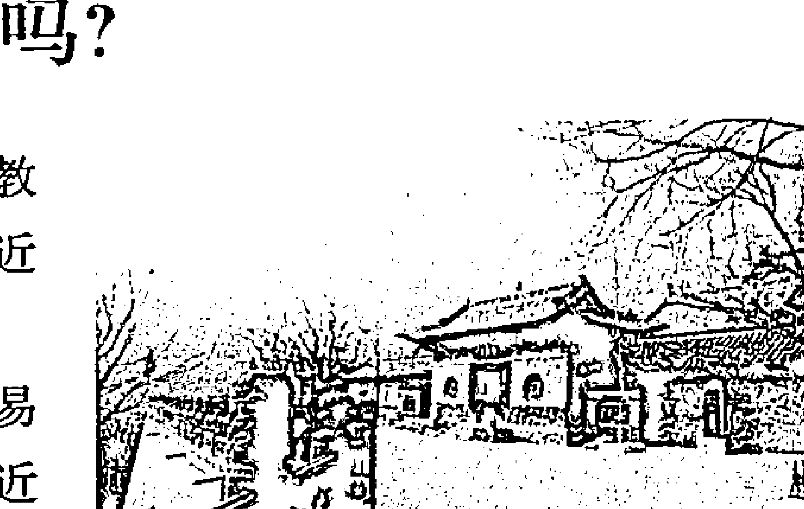

图标：寺院附近住宅财气弱
相对而言，住在寺院附近，财气较弱，因为精神和物质是对立的。居住在寺院附近的人，较为清贫。

## 642 为什么住宅附近不宜有监狱、殡仪馆等建筑？

监狱、派出所、戒毒所等地，由于经常出入充满了暴戾之气和倒霉之气的人。如果住宅在附近，容易犯官司、诉讼和是非之灾。如果大门正对着监狱门，则更不吉利，气场直接受阻，负面气场会侵入家门。不过，如果家中有人就在这些地方上班，则无妨碍。因为其本身就有压制煞气的能力。

殡仪馆、坟场或棺材店等地方，是阴气聚集的地方，对家居运势非常不利，有害家人健康。由于经常看到丧葬之事，家人心理也会有诸多负面影响。不过，这类场所如果有财星飞到，阴气即可转化为财气，对经商非常有利。

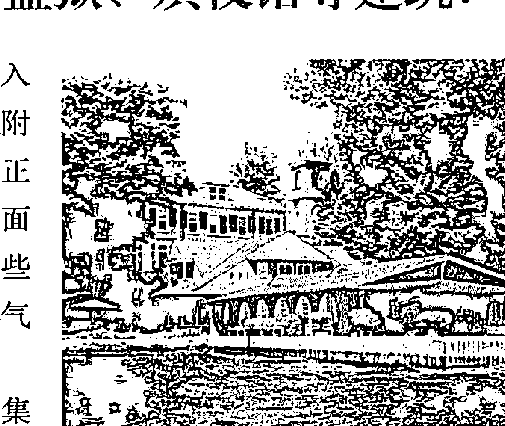

图标：住宅远离凶险之地
一间好的住宅，附近的环境非常重要，最好不要选在殡仪馆、火葬场等阴气聚集的地方。

## 643 住宅附近是建筑工地和屠宰场怎么办？

施工地段的机器喧闹声会对附近的住户造成影响。特别是在住宅外的二黑巨门方和五黄方，不可以随便动土。如果有工程在这两个方位，务必在这两个方位挂上铜制的风铃，每天摇六下，可以化解外界带来的不利影响。

屠宰场充斥着怨气和亡魂，对周围住宅的人不利。

## 644 住宅附近有烟囱、高压电塔有影响吗？

高高的尖塔和烟囱可以形成“文昌笔峰”，这时，家中可能会出聪明之人。但是必须配合八卦吉位，并且距离“文昌笔峰”至少要一百五十米之外。如果距离过近，或不在吉卦位上，对家运都非常不好。

住宅附近有高压电线塔、变电站、发射塔等，不吉利。因为高压电塔或变电站会放射出很强的电磁波，严重影响人体的磁场。如果住宅离电磁波源不到百米，就容易发生强烈的干扰，造成睡眠不好甚至不孕、血液病变等。而发射塔是发射或接收电视、电话信号的设备，对磁场影响很大，其形状是尖的，尖角有煞气。住在附近，家人易发生外伤或精神问题。

工厂的烟囱散发的浓烟，会严重影响人体健康。

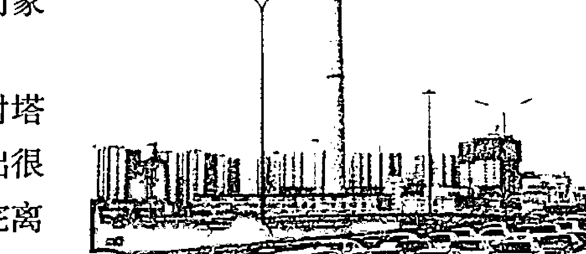

烟囱
工厂通常会有巨大的烟囱，排放出大量的工业废气，健康易受伤害。所以，住宅选址应远离烟囱。

## 645 住宅附近不宜有什么机构？

- 1. 不宜有公安局。公安局在五行上属阳，是孤煞之地，所谓“孤阳不生，独阴不长”。如果住宅正对公安局，会对家人健康不利，家里多犯是非争斗。
- 2. 不宜有政府机关。政府机关有皇气，是至阳之地。政府机关包括各级政府、法院、检察院等。它们与公安局一样，是不利的住宅环境，家人易患精神疾病，易犯官司和是非，甚至血光之灾。
- 3. 不宜有学校。学校、图书馆等文化场所，对于居家住宅来说，并非吉地。因为这些场所以精神活动为主，对物质活动有所妨碍，不易生财。

住宅远离三类机构
住宅最好远离公安局、政府机关和学校，这三种地方不宜积攒财运，也影响家人健康。

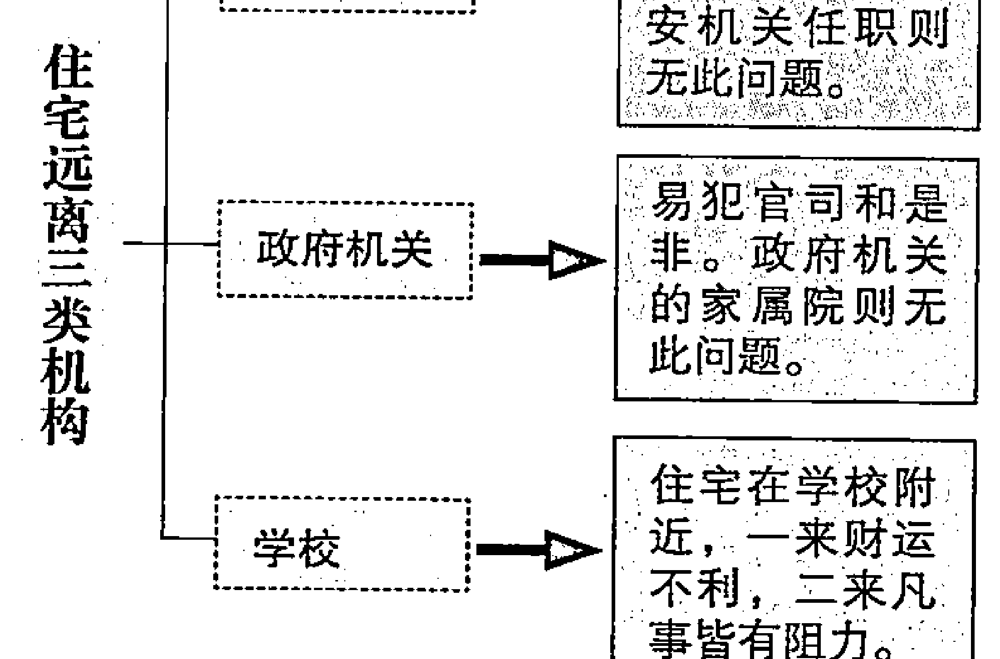

## 646 住在变电站或高压电塔附近有何不利？

电属火，高压电对磁场的影响极大，对人体大脑、心脏和血液也有很大的影响。如果住宅附近有变电站或高压电塔，家人容易患心脏病或大脑方面的疾病，如：心脏病、心血管疾病、脑瘤、精神病等。儿童患白血病的几率比正常儿童高出一倍。

高压电线塔、变电站等建筑会放射出很强的电磁波，会造成家人睡眠不好、不孕、血液病变等。若变电站或高压电塔附近同时还有发射塔，危害更大，不仅有害磁场的能量更大了，而且还容易形成不利格局，住在这附近，家人易受外伤或引发精神问题。

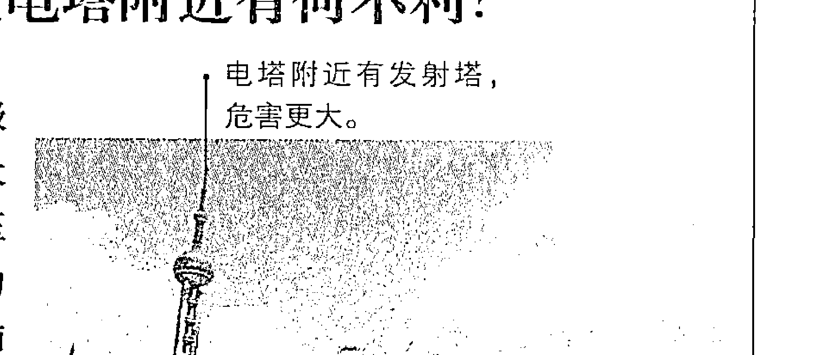

电塔附近有发射塔，危害更大。

> **发射塔的危害**
电磁波所产生的磁场要比人体所产生的磁场高几万倍，会严重干扰人体的磁场，所以住宅选址尽量远离电塔和发射塔。

## 647 为什么住宅附近不宜有以下场所？

不宜有工业区。工业区往往有大量的机器运转声，这样的噪音会让人心情烦躁，无心工作，休息也会受到影响。

不宜有菜市场。住在菜市场附近，日常生活可能比较便利，但对于家运来说，却不吉，主运气停滞，宅运不稳。

不宜有戏院或电影院。戏院或电影院等娱乐场所，是人群聚散之处。当节目上演之时，人群聚集，阳气充沛；而散场之后，一哄而散，这叫做“聚散无常”，会造成居住者运气反复，工作运和财运变幻不定。

| 场所 | 危害 |
|------|------|
| 工业区 | 工业废气污染环境，不利于健康。 |
| 菜市场 | 地面潮湿，易滋生各种细菌，对健康不利。 |
| 电影院 | 人流突然聚集又突然消散，气场不稳定。 |

## 648 为什么住宅不宜靠近垃圾场？

垃圾场是典型的污秽之地、凶地，会产生非常坏的磁场和能量，会对人体健康和运程造成极恶劣的影响，而且人长期居住在附近，还会对人的情绪、性格造成不好的影响，不利于开展人际关系，也不利于提升运程。

垃圾场是严重的污染源，既污染土地，又污染水质，人若长期生活在这样的环境中，会对健康造成很坏的影响，严重的时候甚至会因感冒引起神经根炎，四肢无力好像瘫痪似的。

同理，住宅也不宜靠近公厕，它与垃圾场一样都是影响宅运的不利因素，家人不但健康易受到影响，还会因病而破财。

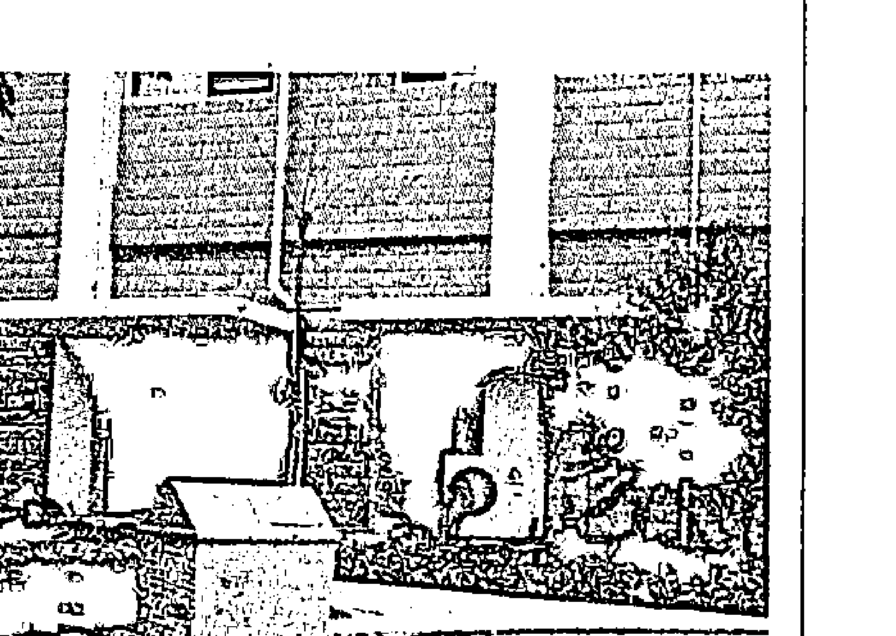

> 图标：垃圾箱
垃圾箱是污秽之物，对人的健康和运程都有不利影响。若想化解垃圾箱对自家运势的破坏，要么搬家，要么在家中摆放木葫芦和五帝古钱。

## 649 为什么住宅门前不宜有坟场、殡仪馆等建筑？

住宅附近，如果有坟场、殡仪馆、火葬场、棺材店等建筑，就形成了阴邪之气，导致人生病、发生意外、影响人际关系。况且面对着坟场，人总觉得阴森森的，影响心理健康，容易与他人发生争执。

有的人认为，将房屋建在自己祖坟的附近，就能得到祖先的保佑，荫及子孙，提升运程。这种想法是幼稚的，任何地方的坟场都是阴气森森的，住宅建在附近会打破阴阳平衡，致使家主因阳气虚弱而得病。情况更严重者，最好在家放古铜钱。平时要多吃红色食物，如番茄、胡萝卜、紫山药等，这样可以养血、护肝，避免邪气侵袭人体。

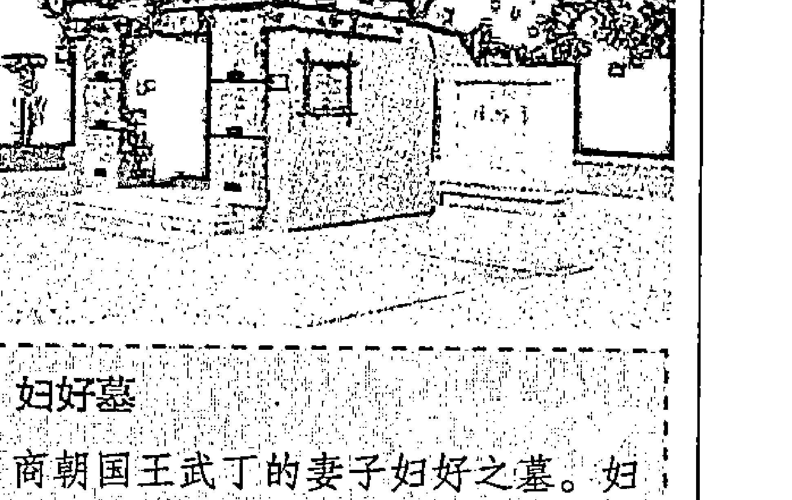

> 图标：妇好墓
商朝国王武丁的妻子妇好之墓。妇好是中国历史上有据可查（甲骨文）的第一位女性军事统帅。墓地即阴宅，住宅附近有墓地易形成阴邪煞。

## 650 为什么住宅周围不宜有玻璃幕墙？

玻璃幕墙是现代建筑常用的材料，尤其是办公大楼里，更少不了玻璃幕墙。但住宅不宜在这种办公大楼对面。

房屋门前有大面积的玻璃幕墙，光线会通过玻璃进行大面积的反射，形成较强的气流，扰乱附近磁场，打破周围的阴阳平衡。人若居住在玻璃幕墙对面，会经常受到强烈光线的刺激，久而久之，容易导致情绪激动，精神紧张，身心健康受到严重伤害。

若已经居住在这样的环境中，要及时化解，如可在自家厨房和客厅之间增设磨砂玻璃墙，阻隔对面玻璃幕墙反射过来的光线，防止气流对室内气场形成冲击。

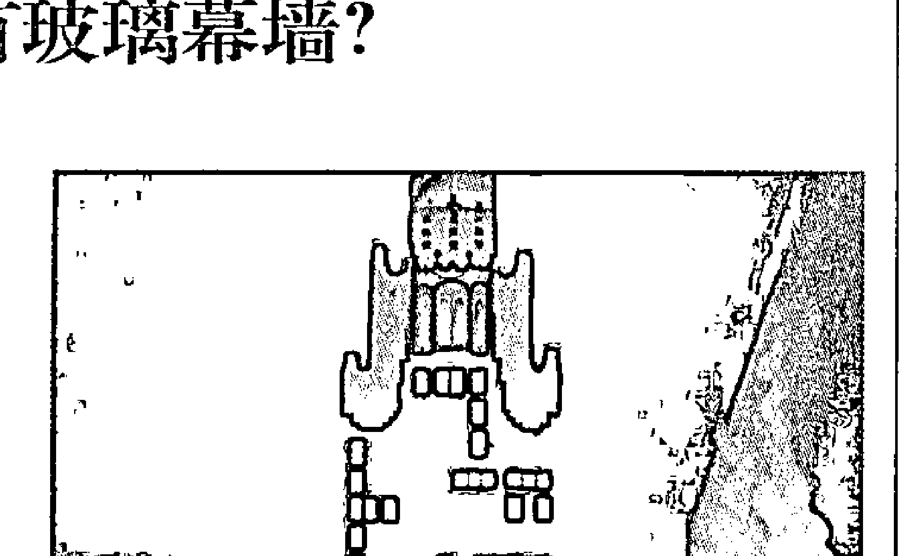

> ### 玻璃幕墙
玻璃幕墙会产生光煞，给附近环境造成光污染。人长期居住在其附近容易患青光眼、白内障等疾病。

## 651 为什么住宅不宜正对两座大厦之间的狭窄空隙？

两座大厦之间的狭窄空隙，好像被刀从半空斩成两半，是一种不利的格局，为大凶。如果不小心遭遇这种格局，家庭成员会有血光之灾，招致意外横祸，滋生疾病，经常破财、漏财。而且空隙越狭长便越凶，距离越近越危险，最好不要居住在这种格局对面。

如果家主事先不知道这种格局的危害，且已经居住在这种格局对面，可在大门上方放置八卦镜；也可在家中吉位摆放铜马或五帝古钱，借助五帝古钱的磁场化解。

需要说明的是，如果背后有另一建筑物填补空隙，则不会对自家造成影响。

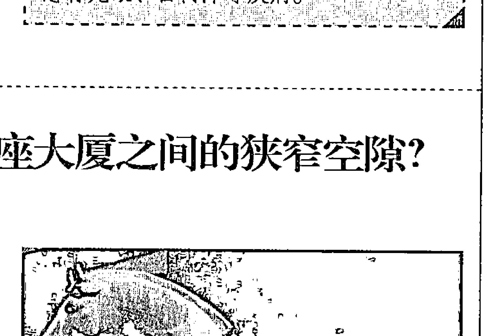

> ### 铜马
如果住宅正好处于两栋大楼之间狭窄的空隙对面，就处于一种不利格局之中，可能给家人带来血光之灾。可以在房间摆放一匹铜马，能起到镇宅、保平安的作用。

## 第十七章 庭院旺运

本章主要讲了庭院旺运的相关问题，内容涉及五行住宅的各自属性，住宅不同方位有树有何吉凶，如何判断植物吉凶，庭院中适合种植哪些植物，住宅大门不宜正对哪些事物，窗户的布置有哪些注意事项等。

### 652 金形宅有何五行属性？

世间万物都是由金、木、水、火、土五种元素组成的，任何事物都有自己的属性。庭院住宅也分金、木、水、火、土五种属性。金为武曲星，象征收敛、聚集、凝结、义气、收成、肃清、刚正、清白、负责。
金色主白，因此，金形宅的外观颜色宜用白色系颜色，如外层墙壁以白色粉刷，贴白色瓷片等。因土能生金，以象征土的黄色系颜色粉刷住宅外墙也可。但火克金，所以金形宅不可以用火红的颜色装饰。

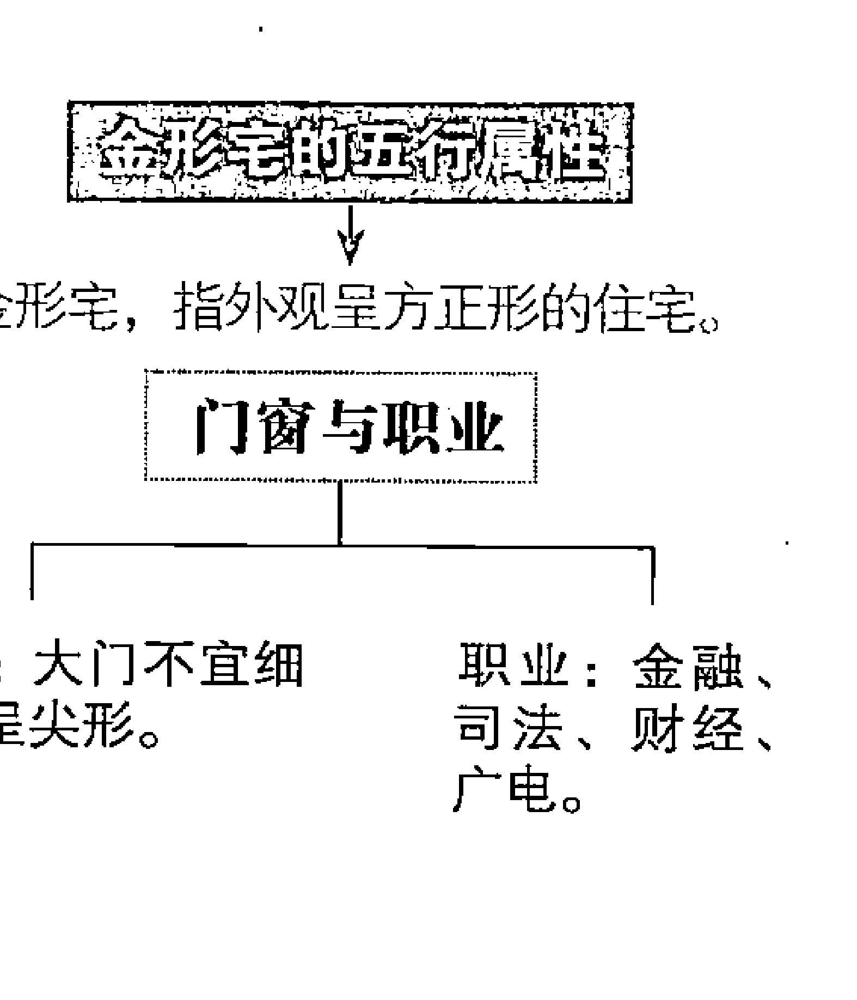

### 653 木形宅有何五行属性？

世间万物都是由金、木、水、火、土五种元素组成的，任何事物都有自己的属性。庭院住宅也分金、木、水、火、土五种属性。木为贪狼星，象征突破、创新、冒险、果断、顽固、劳碌、自大、才干、文笔敏捷。
木色为绿，因此，木形宅的外观颜色可用绿色、蓝色等绿色系。由于金克木，金色主白，所以木形宅的外观颜色不可以用白色粉刷。木形宅的窗户和大门的形状宜采用长方形或圆形。方形属木，圆形属水，水能生木，这两种形状的门窗对住宅均有相生作用。

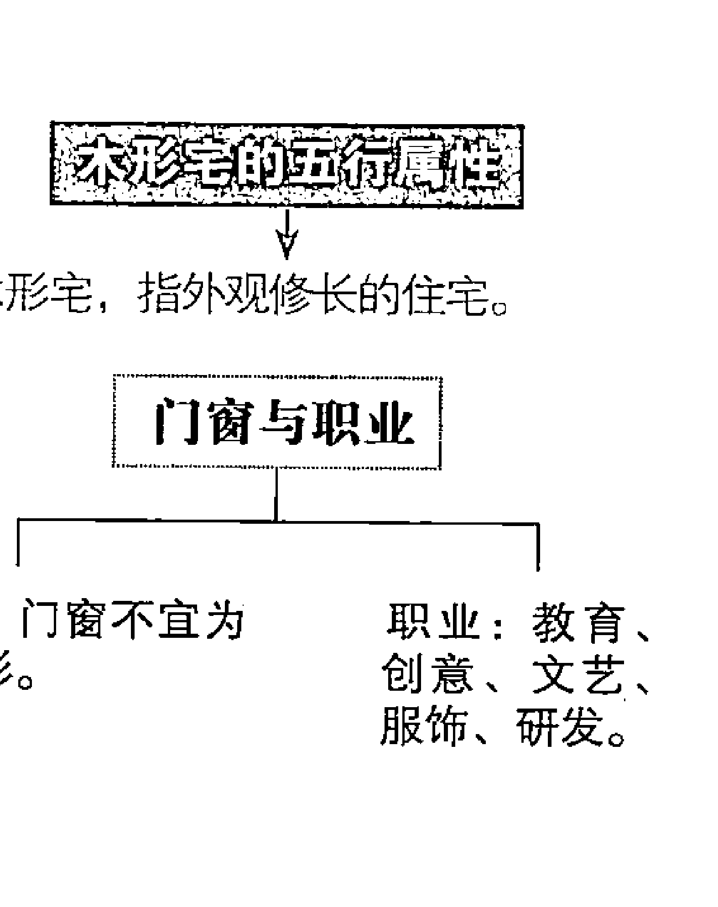

### 654 水形宅有何五行属性？

世间万物都是由金、木、水、火、土五种元素组成的，任何事物都有自己的属性。庭院住宅也分金、木、水、火、土五种属性。水为文曲星，象征亲和力、乐观、享受、构思、挑剔、服务、收藏、滋润、漂泊、桃花。

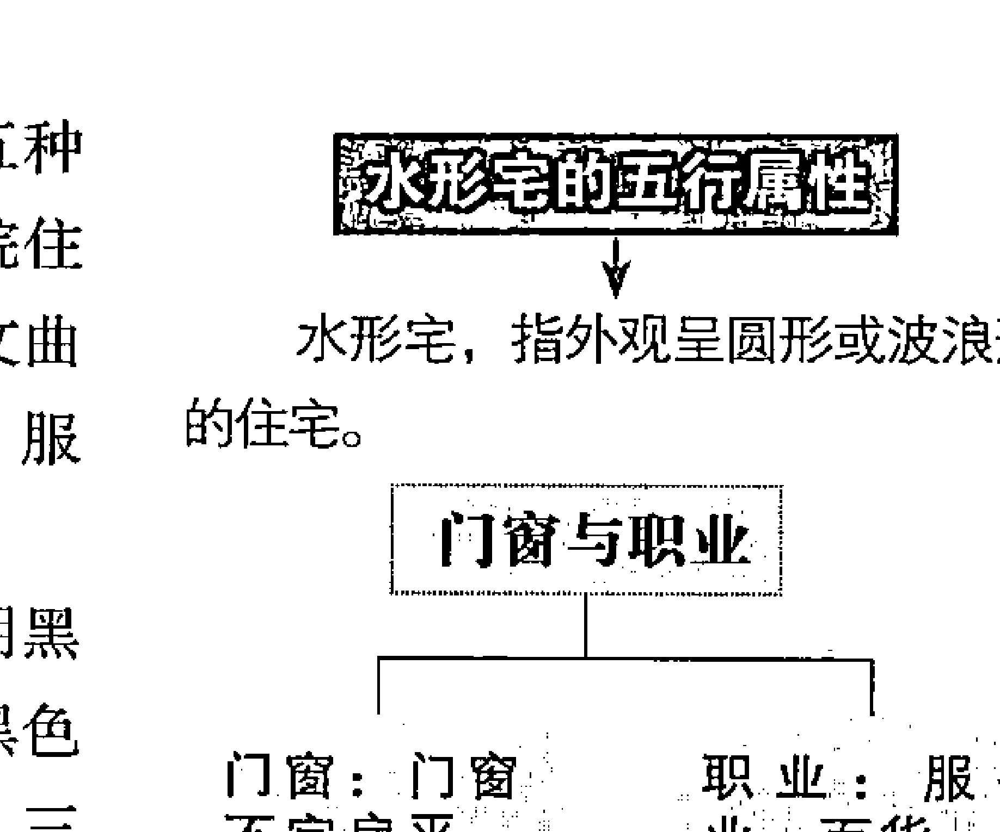

水主黑色，因此，水形宅的外观颜色可用黑色装饰，但不宜全为黑色。这是因为：一来黑色属阴，不利住宅；二来水多木浮，不宜泛滥；三来黑色不吉，少用为佳。因为金可生水，故也可以用白色装饰水形宅的外观。

### 655 火形宅有何五行属性？

世间万物都是由金、木、水、火、土五种元素组成的，任何事物都有自己的属性。庭院住宅也有金、木、水、火、土五种属性。火为廉贞星，象征冲动、得意、无节制、虚荣、效忠、慈善、多事、赌性、虎头蛇尾。

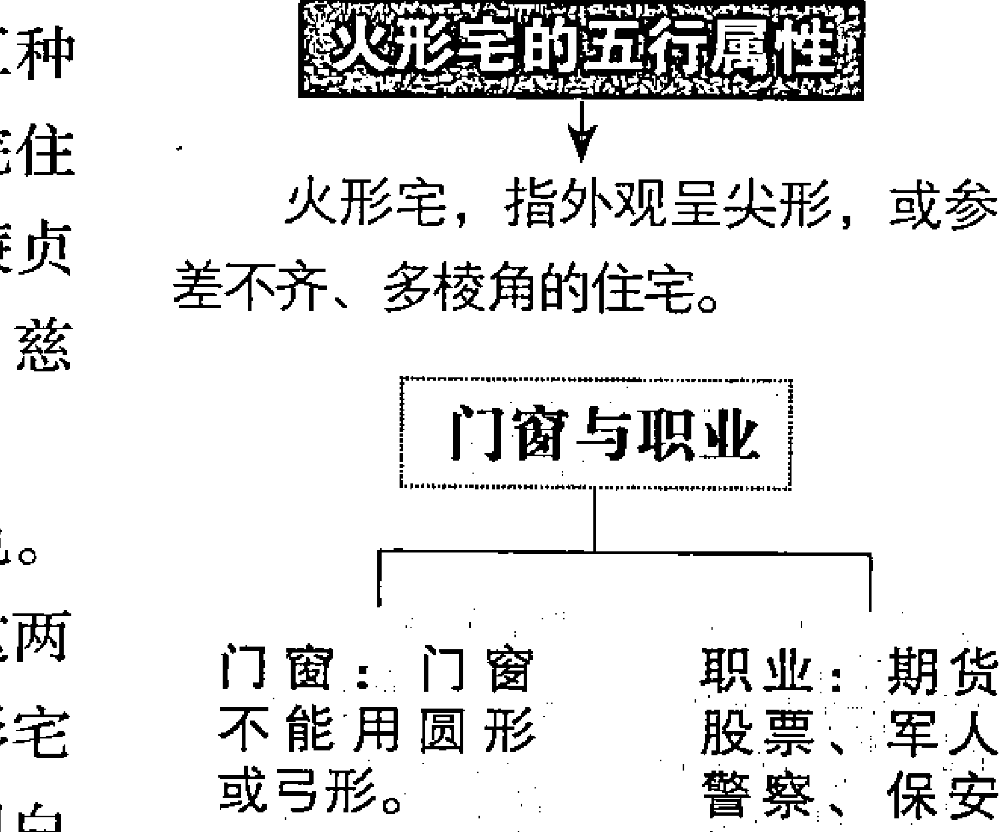

火为红色，因此，火形宅的外墙宜用红色。也可用绿色、蓝色粉刷火形宅的外墙，因为这两种颜色属木，木能生火。不宜用黑色粉刷火形宅的外层，因为黑色属水，而水克火。也不宜用白色粉刷火形宅的外层，因为白色属金，火克金。

### 656 土形宅有何五行属性？

世间万物都是由金、木、水、火、土五种元素组成的，任何事物都有自己的属性。庭院住宅也分金、木、水、火、土五种属性。土为巨门星，象征包容、执著、谋略、保密、木讷、感性、整合、忍让、蓄藏、刚直。

土主黄色，因此，土形宅的外墙可用黄色系颜色来粉刷。也可用红色粉刷，红色象征火，火能生土。但不宜用绿色和蓝色粉刷土形宅，因为绿色和蓝色属木，而木克土，不吉利。门窗的形状不宜用长方形，因为长方形属木，而木克土，容易导致家运不达。

## 657 大门前为何不宜有巨石？

大门前若有巨石挡道或者其他人造石头景观，麻烦事会不断发生，影响事业发展。因为石块会吸收自然之气，且属阴气，大门前方有巨石，会加强阴气而使此气流进门内，对大楼内的人有不好的影响。

另外，《易经》认为，石头在八卦五行里属于艮卦，“艮”为止，有终止之意。浅层理解，人在走路的时候，脚突然卡在石头中间，走不出来。深层理解，人若遇到挫折，很容易遇到重重关卡，难以走出，像陷在泥潭中一样，霉运连连。从现实的角度讲，门口有巨石不利于出行。

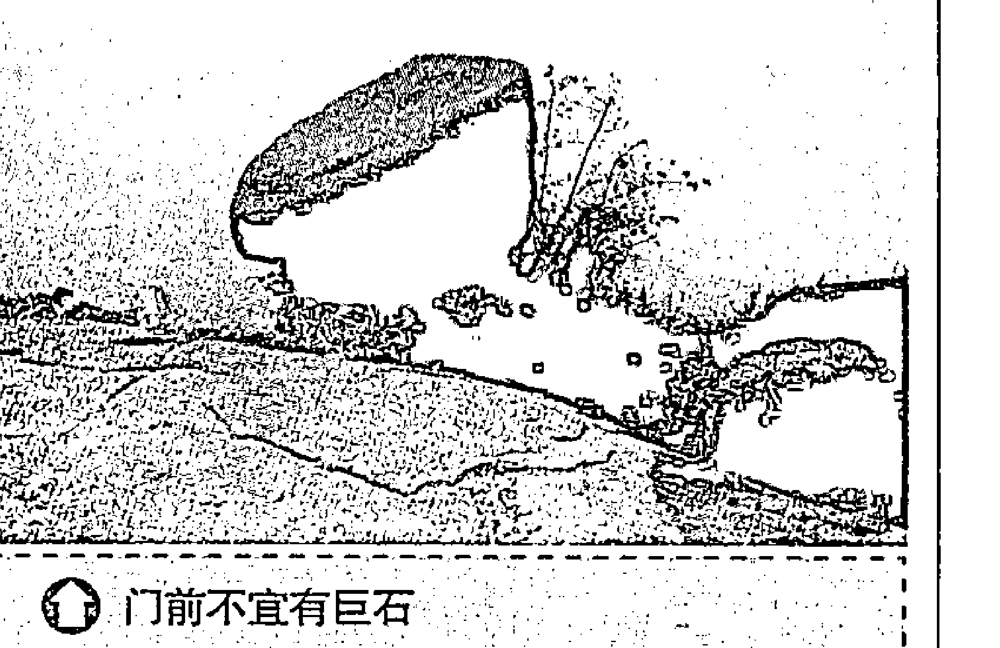

门前不宜有巨石
门口有一块巨石，非常碍事，进出不方便，酒醉后不小心，人容易撞在石头上引起事故。而且巨石挡在门口不利于气流的流通，有碍财运。

## 658 宅前有反弓路有何不利？

住宅门前的道路，若形如一把弧形的弓，而弓的圆弧对着住宅，对住宅运势极为不利。住宅在反弓外边，当路上有车辆驶过时，由于离心力的作用，灰尘和噪音会直冲住宅而来；若出车祸，车辆会撞进住宅。如果在弦的里边，有电线杆或直立的大树，正好形成“一箭穿心”的格局，在运程上，这代表一家之主易出意外，对家运和家中的女性很不利。由此可见反弓路危害很大。

若宅前已经形成这种格局，在门前放石狮子或者在门外种植矮树，可以起到化煞的作用。

### 宅前反弓路化解法

住宅前如果有反弓路，对宅运影响非常大，必须想办法加以化解。

方法一：可在屋内放一面镜子对着门前的路，运用镜子的反射作用化解。

方法二：用已开光的招财童子或化煞罗盘化解。

方法三：若室内的窗户气流流通快，可在窗台上摆放一些吉祥植物遮挡。若在玻璃上贴上反光玻璃纸则效果更佳。

## 659 宅前有反弓水为何不利？

如果住宅前有一条弯如弓的路，且住宅刚好在弯弓之外，这种地方式地气四散，不易聚财，主退财、意外之象，不宜居住。若是将喷水池做得像一把张开的弓一样，方向又正对着住宅，它像一把镰刀向着住宅割过来，则更不吉利。主人容易发生灾难，平常容易漏财。这种情况就叫“反弓水”，又称“镰刀割腰”式建筑。

如果不慎遭遇了“反弓水”，可采取这种化解方法：将反弓形状的喷水池改造成为腰带水，改成“环抱水”，这样可使得水，即财运围着住宅，有“玉带缠腰”之意，有招财、聚财作用。

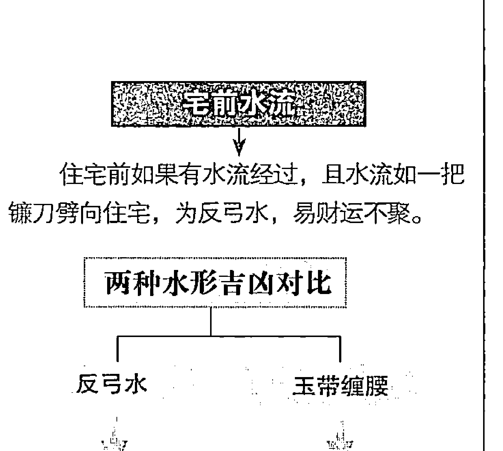

## 660 大门前为何不宜有藤缠树？

大门前若有藤缠树或者大门正对着大树或枯树，不仅会阻挡阳气的进入，还会使阴气、煞气进到门内，湿气较重，不利于健康和财运。大树雷雨天气又易招雷击，所以大门正前方不可有大树。有藤缠树容易形成坏运气，使人陷在困境或厄运中难以自拔，很难“咸鱼翻身”。

但大门外两旁可以种树，若要种树就一定要保持树枝叶茂盛，不可令其枯死，也不可有蚁窝，否则气就坏了，对事业、竞选不利。另外，大树若枯死或树下有蚁窝，说明附近地气、水质均不太好，对人体健康不利。若已经出现这种情况，就要及时检查自家环境。如果大树已经枯死，则要赶快连根挖掉，否则容易被雷电击倒，砸到房屋或行人，极不安全。

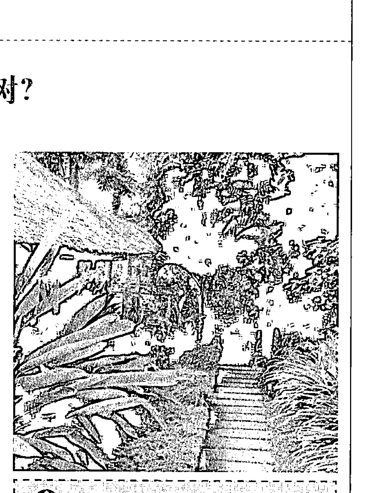

## 661 大树对住宅有何影响？

大树终日挺立在自然界中，长久吸收天地之间的各种磁场，有益能量和有害能量均很强大，对家居运势影响较大。若有下面两种情况会激发有害能量，不利于宅运。

- 1. 宅前大门口不宜有大树。因为大树会阻碍空气的流通，每天落叶繁多，不利于清洁，还会有小虫掉下来，给下边的行人带来不便。但是，大树有利于纳凉，可以调节住宅环境的温度。
- 2. 院中不宜有大树。因为春夏之际，雷电交加，大树容易引下闪电，不利于住宅安全。另外，大树的根可能破坏住宅地基，影响房屋的稳定。

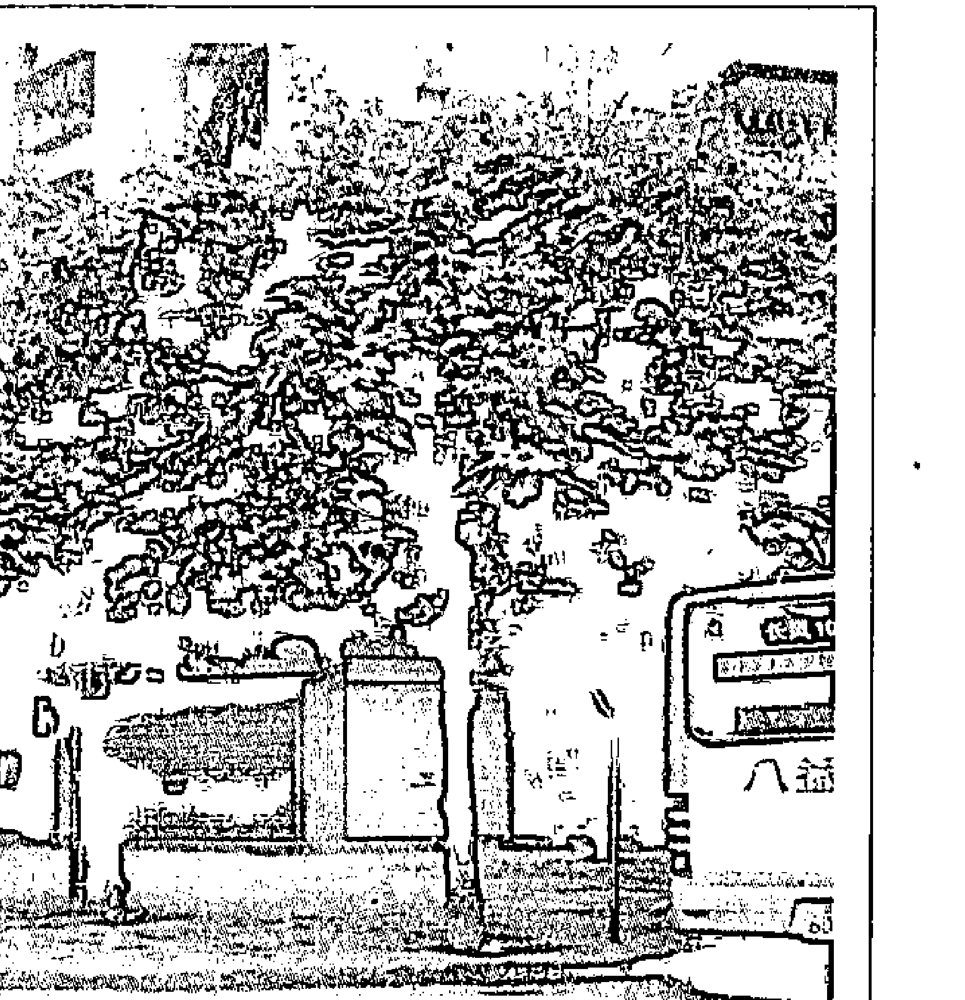

> 宅前有大树
住宅前有大树，并不是吉利的征兆。如果大树正好在门中央，会阻碍空气的流通，不利于清洁道路和家运。

## 662 住宅的西北方有大树吉利吗？

依据后天八卦方位，西北方属乾卦，象征天，象征龙，象征帝王和君子，象征纯阳和兴盛、强健，为大吉大利之卦相。因此，若住宅的西北方有大树，可以激发这里的有益能量，属大吉之相，有助于提升宅运，不可轻意砍伐。

院中有大树不吉，有大风折树压房等安全方面的危险。但若大树在院中的西北方位，则为大吉。另外，暴风多发于夏季的东南季风，大树在西北方即使树断亦不会对住宅造成威胁。

如果西北方有房屋，就要特别注意。大树的根系比较长，伸得比较远，容易伸到房屋地下，破坏房屋地基，影响房子的稳定。

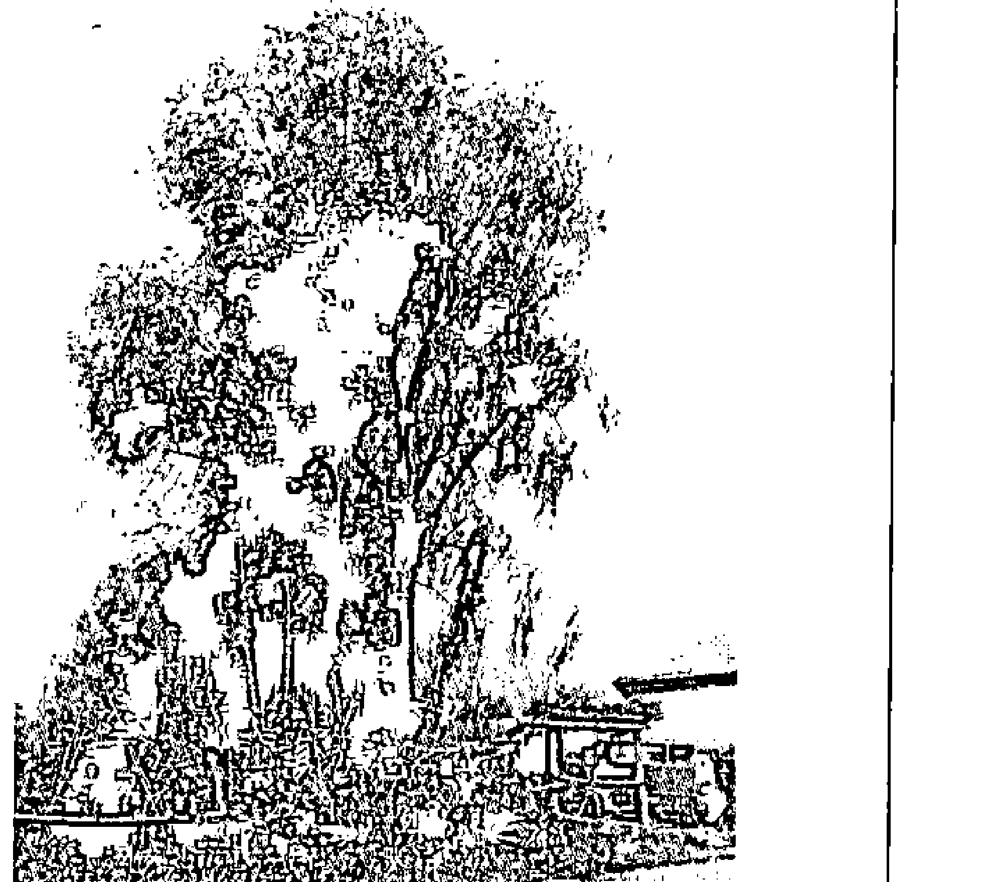

> 西北方的大树
西北方象征帝王，是尊贵的象征。在这个方位种树，可以激发这里吉祥的能量，为男主人的事业带来好运。

## 663 榆树有何旺运作用？

现在的私人别墅，为了安全防盗，通常都有高大的围墙，有的距离屋子还非常近。这样的高墙，再加上上面的铁丝网，如同囚笼，不仅让人心生郁闷，还会让阴气积聚。

在这种情况下，可以在院中种植高大的榆树。榆树在树中属阳木，有去阴生阳之功效，可以改善阴气过旺的情况。民间常在房后种榆树，象征家有所靠，后代有余粮，人的心里比较踏实。

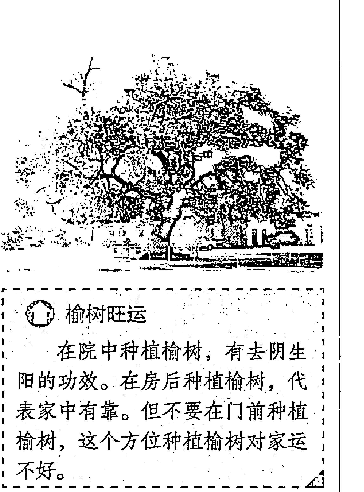

但注意不要将榆树种在门前，否则会阻碍运程，形成顶心煞，一般会对健康产生危害。若想化解，可将榆树连根挖掉，也可在门口挂凸透镜、八卦镜或者五帝古钱等法器化解。

## 664 秀水、恶水分别有哪些外在特征？

秀水：

- 1. 水质清澈，主宅旺家和美，事业顺畅。
- 2. 气味清新，主头脑清醒，家业兴旺，聚沙成塔。
- 3. 水声平静或叮咚悦耳，主有艺术才华，智慧灵性，生财有道。
- 4. 曲折有情，主事业畅达，生意兴隆。
- 5. 环绕弯曲，为真爱之水，主感情真挚，为人正直，事业通达，财源亨通。

恶水：

- 1. 水质污浊，或受污染，对人的生活和健康均有不利影响。
- 2. 气味腥臭，如臭水沟，污秽气聚，严重影响人的健康运和工作运。
- 3. 流水呈反弓形，或呈三角形，主家人心浮气躁，事业难成，不易聚财。
- 4. 流水怒吼，喧哗不息，影响人的听力及精神系统，易生暴躁，破坏人际关系和事业运。

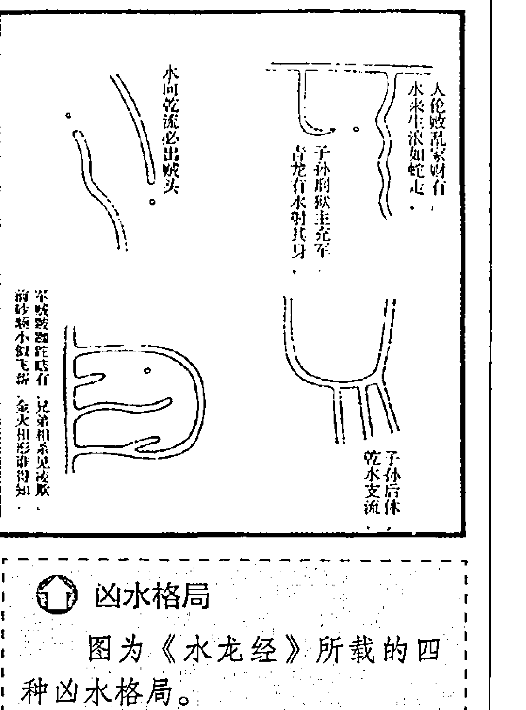

## 665 如何从形状判断水的五行及利弊？

依据水的形状，水可以分为五种，可以五行为之命名。

半圆形或圆形的水，称为金形水，以形如怀抱的半圆者，为旺宅福水。

如一条横木从前面经过，称为木形水。此水匆匆而过，不聚财。

似火焰，呈三角形的水，称为火形水，为不聚财的水。

呈方形的水，称为土形水，若呈长方形如怀抱者，为旺宅福水。

呈波浪形状或S形，称为水形水。顾盼有情，曲折聚财，为最佳的水形。

### 依池塘位置断吉凶

| 池塘位置 | 运势吉凶 |
| :--- | :--- |
| 住宅前方左右各有一池塘 | “龙虎脚上池，淫乱定无疑”，此为凶形，主淫乱。 |
| 住宅前后各有一池塘 | “前塘及后塘，儿孙定少亡”，此为极凶形，主破财损丁，儿童多溺亡。 |
| 住宅附近的池塘一大一小相连 | “上塘连下塘，寡妇守空房；大塘连小塘，疾病不离床。”此为凶形，主病灾，男主人多有凶灾。 |

## 666 山上住宅为何以前低后高为佳？

山上住宅山环水抱，以山体为靠，前低后高，犹如在山的怀抱之中，给人以极大安全感。住宅在山上，便于采光和通风。从视野上来说，前方开阔，让人心胸豁达，心情放松。

如果住宅在山上，前方有坡。此坡宜缓不宜陡，否则有一种悬空之感，造成心理压力。另外，坡度太大不利于出行，陡坡必然多设阶梯，老年人行走不便。还要注意的是，山上住宅不宜在山顶或悬崖边。

## 667 住宅后面不宜有哪种山？

依山傍水是理想的住宅格局。廉贞山却不宜作为住宅的“靠山”。这种山，山形狰狞，怪石嶙峋，植物稀疏，杀气腾腾，给人荒凉、破败之感。廉贞山缺乏滋养，不适宜生命的生长，前人称其为穷山恶水之地，象征着枯竭、衰败之气。

## 668 门前左右的大树有何影响？

大树如果生长在住宅大门的左手边，左为青龙方，故称为“青龙树”。青龙树有扶荫住宅的功效，代表男性贵人。如果大树位于住宅的右手边，右为白虎方，故称为“白虎树”。如果住宅的左方无树或树形相对矮小，代表阴人入宅，即家中女性当权，或女性有桃花缠绕，对家庭关系不利。即使家主命里喜木，也应将此树除去或修短。另外，住宅附近不宜有烟囱、高塔、电线杆等柱状建筑。

高压线塔

住宅附近有高压线塔，对住宅不利。可以在对着的窗口位置悬挂凸镜。凸镜有反射的功能。

## 669 大树距离住宅过近有何不利？

大树应与住宅保持一定距离，这样才能保证室内的空气流通和采光。住宅附近的树，不宜过于高大，宜种植枝条柔软的树种。

住宅附近的大树，枝干不宜直对窗户。窗户等于住宅的眼睛，若有树干直指，家人容易患眼疾。况且，粗大枝干直刺住宅，应尽量避免。

### 庭院种树的冲煞影响

庭院中的树不能随意种植，各种情况都有一定寓意。

**种树宜忌**
- 门前种柳，家运日衰；屋西有松，财运不断。
- 院中种植过多的果树，会影响家运。
- 住宅大门、窗户相对，或有煞气射入，可以种树屏蔽或者阻挡煞气。

## 670 庭院中有死水池非常不吉吗？

豪宅之中多设水池，岂不知水池设置不当，会造成种种烦恼。私人宅地中的水池，最忌密封不流通的死水。这种水池的水质会腐败，滋生细菌，对健康不利。同时，死水池容易招引幽魂，滋生阴气，对家人不利。

这样的死水池，最好把它填平。填平之前，要先抽干池水，挖净淤泥，除去水管等设施，然后再用干净的土壤填平。

## 671 如何布置游泳池的方位？

游泳池的位置要根据具体情况来定，最简单的方法是设置在住宅的前方，因为住宅的前方有水汇聚，有利于招财聚气。

按五行原理来说，游泳池属水，可以布置在家庭成员缺水的方位。

以八运论，进入八运以后，西南方见水旺财运。如果住宅外部的西南方有水汇聚，就是旺财运的好布局。西南方代表家中的女主人，如果女主人五行缺水，在此设计游泳池是大吉的布局。

## 672 怎样判断植物是否属于不利之物？

庭院中种植的植物是否属于凶物，主要从两方面判断。

1. 看植物是否会排放有害气体或液体。如：夜来香的浓郁香味对心脏病和高血压患者不利；夹竹桃的花香易使人昏睡；郁金香含有土碱，接触过多会使人毛发脱落。
2. 看植物的形体是否怪异丑恶。凡枝干不正或畸形的树木，通常不吉。谚语有“大树古怪，气痛名败”。

但具有特殊美感的植物除外，如盆景、梅树等。

郁金香为凶煞的植物，其体内含有土碱，易导致头发脱落。

## 673 竹子对住宅有何影响？

谚语有“竹林围屋，富贵平安”。在住宅周围种满竹子，只留一条通道，这样的房子不仅冬暖夏凉，而且没有噪音，住在里面的人可以长享富贵平安。

谚语说，疏竹当家，精神难安。住宅周围若只是稀疏地种些竹子，会让人的精神恍惚，心神难安，对家人不利。

如果在住宅周围种竹子，夏季可以纳凉，冬季可以保暖。

## 674 庭院中适宜栽种哪些植物？

古人认为，植物有阴阳之分。松、柏、杉、竹、梅、榆、槐、柳、桃、柿、枣、梧桐、杜鹃、万年青、栀子等为阳；梨、木瓜、芭蕉、棕榈、凤尾松等为阴。

庭院中适宜种属阳之树，属阴之树要少种或者不种。

从科学的角度看，桃树和杨树迎春较早，树冠小，栽在东方既迎春又不遮阳；梅树与枣树，对阳光需求较大，故宜种在南方；榆树是喜湿植物，当西晒不怕，栽在西为宜；杏树耐寒不耐涝，宜种在北方。古书记载的“东植桃杨，南植梅枣，西栽栀榆，北栽杏杏”说的就是这个道理。

## 675 以下八大植物有什么作用？

宅院中常见的植物有桃树、柳树、艾蒿、银杏、柏树、茱萸、无患子、葫芦等。

桃树为五行的精华，能镇宅；以柳条插于门户可驱邪；艾蒿焚烧后，可驱蚊虫，除秽；银杏，千年古树，夜间开花，有神秘力量，可镇宅。柏树刚直，木质芳香，能除秽；茱萸香味浓烈，可去邪辟恶；无患子，即菩提子，可串成珠，保平安；葫芦中空，能吸纳邪气。

八种常见植物

| 左 | 右 |
|---|---|
| 桃树为五行的精华。 | 柳条插于门户，吉。 |
| 艾蒿焚烧后，可驱蚊虫，除秽。 | 银杏，千年古树，夜间开花，有神秘力量。 |
| 柏树刚直，木质芳香。 | 茱萸香味浓烈，可除秽。 |
| 无患子，可串成珠，保平安。 | 葫芦中空，能招财聚气。 |

## 676 在庭院中布置水局有何讲究？

很多人想在院子中布置招财水局，但不是所有的水局都能生财，也不是任何住宅的庭院都适合有水。宅前屋后，不宜同时有水；大门前的池塘，半月环抱才为吉；院中的水池形状，宜圆不宜方；水池中的水，宜活不宜死。

人造的水池，如果没有活水流动，就要设法使用动力让水流动。可布置成瀑布，让水从上向下流，循环不止；或设计成喷泉，从下向上喷。

## 677 如何防止水池变成桃花水？

如果庭院中的水池，刚好设置在家人的桃花方位上，就成了“桃花水”。因水有流动性，能强烈激活情感磁场，让当事人变得多情，无法专注于工作或学习。如果是已婚人士，可能会招惹情感是非，对婚姻产生不利影响。

因此，院中的水池一定要避开家人的桃花位。桃花方位各人不同，属牛、蛇、鸡的人，在正南；属兔、羊、猪的人，在正北；属鼠、龙、猴的人，在正西；属虎、马、狗的人，在正东。

水池

庭院中的水池设在家人的桃花方位上，就成了“桃花水”，会对婚姻产生不利影响。

## 678 围墙与篱笆有什么作用？

在现代生活中，把住宅四周的围墙当做砂。四周空旷的住宅，围墙与篱笆可以起到安防的作用，还能在一定程度上减弱它们对住宅的冲击力。院子的门和住宅门不能在一条直线上，以免煞气长驱直入。

院子的围墙太高会阻碍气的流通。前院的围墙，不宜比大门高。如果住宅四面都是围墙，围墙更不宜过高，否则会把住宅的气场与自然气场隔离，整个院子如同监牢，毫无生机和活力。

围墙

围墙和篱笆可以起到安防作用，能在一定程度上帮住宅抵挡煞气，减弱各种煞气对住宅的冲击力。

围墙的高度和院子的大小有很大的关系。院子大，围墙可以高些；院子过小，围墙就不宜过高。

## 679 围墙为何不宜过高？

院子的围墙不能过高，太高的围墙挡风防煞效果很好，却会阻碍气的流通。前院的围墙如果比大门高，会妨碍进气，让住宅陷入滞气的困境。

如果住宅的四面都是围墙，围墙高度不宜过高，否则会把住宅的气场与自然气场隔离。

那么，围墙多高才合适？

围墙的高度和院子的大小很有关系。院子越小，围墙必然会离大门越近，就越不能高。不过就算围墙离大门有相当的距离，其高度也最好不要超过大门的高度，以免进气不畅，造成反效果。

百姓里居图

围墙不宜高过大门的高度，不然不利于住宅进气。

## 680 什么是招财树？

家中阳气太重，容易亢阳不化，阴气衰死而钱财不聚；阴气过重，则容易影响家人的运程。因此，一个和谐的家居应该是阴阳和谐的，而调和阴阳的法器有很多，招财树就是其中一种。

如果住宅门前有空心的大树，多为不吉。空心大树经风吹雨打后容易倒掉，若不及时连根挖掉，留下的树根容易招致虫蚁，对人体健康不利。

不同的树，调节阴阳的能量不同，因此具有不同的作用。

招财树

招财树，顾名思义，是有旺运作用的树。树木可以遮挡“阳”光，招来“阴气”，因此对整个院子及家居有调和阴阳的作用。

## 681 住宅外的树木对住宅有什么影响？

好的环境，既有助于提升家人运程，也有助于保证全家健康；相反，不好的环境容易招致煞气，不吉利。树木是构成健康家居环境的重要元素之一，因此对宅运影响较大。

住宅外的树木具有绿化环境的作用，有养生保健作用。《博山篇》中曾讲到：“草木繁盛则生气旺盛，能护荫地脉，斯为富贵堂局。”现代环境保护主义者也宣称，绿色植物具有除尘、消音、净化空气、美化环境等多重作用，有助于调节生态系统平衡，调节家居气场，进而影响人的运程。若树木间距太近，容易招致阴气，形成潮湿的环境，不利于身体健康。

树木排列需平衡

住宅外的树木排列，应该注意对称、庄重、合理。树木之间的间距不能太宽，也不能太窄，否则会影响树木的气场，干扰阴阳平衡。

## 682 为什么住宅大门正对着大树不利？

很少有人家的大门正对着大树，它会招致煞气、阻挡财运。

大树若在正门前，其遮阴作用会阻扰阳气进入房内，也会阻挡室内阴气出来，造成气场循环不畅，阴阳失调，违背住宅要有生气的原则。久而久之，会形成有害气场。

若门前的大树树龄超过了十年，树根会向房子下面伸展，破坏房子地基，影响房子的牢固。

从现实的角度讲，门口有一棵大树，若遇到打雷下雨的天气，会招雷电，对人体、家用电器均有害处。而且到了秋天的时候，大树的叶子会不断地往屋中飘落，不利于清洁。

大门正对大树

大门正对着大树，容易形成有害气场。大树位于门前，形成“开门见山”的状况，使屋内光线受阻碍，屋主的前途也会受到阻碍。

## 683 为什么住宅大门不宜正对着胡同？

有人会认为，大门不宜对着大树，大树会遮挡好运，但对着一条胡同或小路，运势应该就很旺吧。但实际上不是这样的。

大门对着胡同，首先会让家居所在地成为死地，致使气场无法循环，空气流通不畅，使气场凝滞，不利于家人的健康。

其次，小路或胡同里人来人往，气场活跃，会招致很多乱七八糟的东西。每个家庭都有自己的家居情况，邪气进不去，就停在路口，即你家门前，这样不利于家运。

胡同和小路虽然方便行走，但人人都从这里经过，不但影响这里的气场循环，还会在自家门前形成障碍物，其危害同大门正对大树相同。

在选择住宅时，最好不要将大门正对着胡同。

大门正对胡同

胡同气场浑浊，易滋生细菌，如果大门正对着胡同，不利于家运。

## 684 为什么住宅大门不宜正对着邻居家的大门？

在布置家居的时候，不要让自家的大门正对着邻居家的大门，这属于不利于住宅的格局，主口舌是非，《八宅明镜》曾说过：“两门相对为骂门，主两家不和。”若是公司的大门正对着别的公司的大门，公司内部会人事不利，员工之间彼此明争暗斗。

自家房门若正对着别人的房门，双方开门都很不方便，且难以有隐私，容易为小事吵闹起来。

若是在公寓楼里，邻里之间不可避免会有大门正对的情况，可以采取这样的化解方法：在大门上悬挂珠帘，这样可增强门的隐秘性。

自家大门正对邻居大门，属不利格局。

大门正对邻居大门

自家房门正对着别人的房门，双方容易发生冲撞。可以通过在大门上悬挂珠帘来化解。

## 685 住宅大门的方向有什么讲究？

庭院运势包括方方面面的内容，好的大门方位有旺宅的作用。一般认为，大门的四隅朝向与家居运势有以下对应关系：

家中大门向东南，有助于提升财运，确保家庭成员不会为金钱所累；

家中大门向西南，家中未婚人士易得到佳偶，有利于家庭和谐；

家中大门向西北，有利于向外发展，有助于提高家庭成员的事业运；

若是在都市中买房子，大门的方位已经确定，这时候可以在门内摆放屏风，进而改变门的方位，改善家中运势。

| 四正方位 | 家居运势 |
| :--- | :--- |
| 家中大门向东 | 可吸收大量有益阳气，有助于家庭和谐，生活安康。 |
| 家中大门向西 | 能荫及子孙，子孙后代不会为生活所累。 |
| 家中大门向南 | 利于家庭成员成名，会得到很多额外的收入，还可增添贵人运。 |
| 家中大门向北 | 业务兴隆，做生意会取得不错的成绩。 |

## 686 为什么大门不宜正对楼梯或电梯？

大门正对楼梯或电梯，容易形成“卷帘水”，即宅前地势一层比一层低，水流容易倾泻，水即财运，因此会导致财运外泄、宅气外泄。

住宅原本是聚气养生的地方，而楼梯、电梯有传导气场的作用，若住宅的大门正对着楼梯，会将屋内的生机全部传导走，成为不好的态势，即“卷帘水”。而且电梯不停地上上下下，还会形成一个不断切割的磁场，扰乱人的生活气场。

从现实角度出发，电梯正对着房门，还容易在视线上相互干扰，当电梯门和房门同时打开时，门里面的情况一目了然，会有一种被监视的感觉。既会打破家居生活的私密，也会给人一种不安全的感觉，影响生活质量。

大门正对楼梯

大门正对着楼梯的危害很多，家中的生气会随着向下的楼梯盘旋而下，而且，楼梯正对房门，家中的隐私对外暴露无遗。

## 687 为什么大门不宜对着烟囱？

大门既是人们进出的必经之地，也是气场进出的关键通道，因此有着诸多讲究，其中一条就是不宜正对着烟囱。

烟囱是排废气的东西，容易产生煞气。如果大门正对着烟囱，无异于将排出的废气全部吸入宅院，不但对人体健康有害，而且还会污染家居环境，不利于家庭成员的运程。同理，也不宜将阳台、窗户对着烟囱，烟囱的废气会通过阳台或窗户进入房间，对人体产生不利影响。

烟囱除了有排泄废气的危害，它的外形还像一个“虎头”，若正对着大门，则表示出门不利。

## 688 窗户有哪些注意事项？

窗户是房屋的“眼睛”，人有眼睛才有的生机，房屋有了眼睛才有灵气。

对于窗户来说，最重要的就是朝向问题。东方阳气充足，有紫气东来之说，因此窗户宜向东开。东南方向也比较适合，有助于吸引有益气场，确保室内冬暖夏凉。但要注意外面没东西挡着窗户，否则起不到作用。不宜将窗户朝向北方，因为北方属于阴水，不但影响运程，而且冬天的时候寒风自东来，人容易感冒。另外，窗户也不宜向南开，否则室内人容易患眼部疾病。

窗户的重要性

一个房间若没有窗户，就难以得到空气与阳光，身体状况就会受到影响，运程也会受到影响。

## 689 怎样布置窗户才合理？

布置窗户的时候，有大小、多少等问题。

一般来说，窗户不宜过大，也不宜过小。窗户过大，气场之间流通活跃，人容易受到影响；窗户过小，气场流通不畅，光线吸收不足，人居住在其间会感到憋闷。窗户适宜的大小，在高度上应超过居住者的身高，在宽度上以美观为主。这样的窗户不但有益于气流的流通，而且有助于提升人的自信心，提高其气度。

要注意窗户玻璃的选择，若窗户较大，阳光较充足，最好用染色玻璃，这样可以有效抵消多余的磁场。平时还要注意窗户打开与否的问题，窗户最好能完全向外开，不宜向内、向上或向下斜开。

**窗户数量需适宜**

一间屋子里，窗户的数量不宜过多，要避免同一边有三个或以上的窗户。

**窗户数量**
- 窗户太多：
    1. 窗户太多会产生较强的气流，对人体健康不宜。
    2. 导致气场过强，干扰人的情绪，家庭成员之间容易发生纷争。
- 窗户太少：
    1. 同窗户过多一样，都会影响人的身体和情绪。

## 690 为什么窗户不宜正对着马路？

窗户正对着马路，犯了两大忌讳。

1. 易形成“扯水”之局，难以聚财。马路上必然有汽车往来行驶，不可避免会出现交通事故。而窗户与一般的墙壁相比，遮挡煞气的能力是非常有限的，容易招致煞气，危害自家人的安全。即使汽车平安无事地驶过去，排出的汽车尾气也会污染自家气场。
2. 易形成“路冲”。所谓路冲，即路冲水格，如房子背后有直线道路、河流并向着房子而来并在中途转弯通过，就是路冲水格，容易出现冲煞的情况，容易受到长矛等利器刺伤。窗户正对着马路，所形成的格局也是路冲，会影响孩子读书，对孩子的健康也不利。

**窗外的不利格局**

- **窗外障碍物**：注意窗户外面不能有高塔、电杆、长杆等障碍物，否则容易横生意外。
- **办公室窗户**：若是在自家办公，忌将办公桌摆在窗户之前，自己背窗而坐，这于生意不利。

## 691 窗户应该怎样美化?

美化窗户，既是美化环境的需要，也是改善运势的需要。

一般来说，窗台上应放置一些吉祥的植物，如吊兰、雏菊等。面对着这样的窗户，人的心情会很好，而且不会阻挡空气的流通。还可在窗台上设置一些花架，让花木和盆景分为几层，可增添情趣，有助于改善人际关系。

窗户颜色的选择往往成为一个被忽略的因素，但它的重要意义不仅仅在于美化，更在于运程意义，好的窗户选择应包括颜色的选择。比如说，向正东的窗户，窗户的窗框和墙壁应漆成黄色或褐色；向东南的窗户，窗户的窗框和墙壁应漆成黄色或褐色。

**窗户的朝向与颜色的对应关系**

| 窗户朝向 | 窗户颜色 |
| --- | --- |
| 向正东的窗户 | 窗户的窗框和墙壁应漆成黄色或褐色。 |
| 向东南的窗户 | 窗户的窗框和墙壁应漆成黄色或褐色。 |
| 向正南的窗户 | 窗户的窗框和墙壁应漆成白色或银色。 |
| 向西南的窗户 | 窗户的窗框和墙壁应漆成蓝色或黑色。 |
| 向正西的窗户 | 窗户的窗框和墙壁应漆成绿色或青色。 |
| 向西北的窗户 | 窗户的窗框和墙壁应漆成绿色或青红。 |
| 向正北的窗户 | 窗户的窗框和墙壁应漆成红色或粉红。 |
| 向东北的窗户 | 窗户的窗框和墙壁应漆成蓝色或黑色。 |

## 692 窗帘应怎样美化?

窗帘与窗户关系密切，窗帘有磁场，有一定的抵挡作用。窗帘的选择及搭配原则如下。

若想呈现出古典、优雅的家居环境，窗帘面料应以细纱织成的提花布为佳。这种面料质感柔细，花纹典雅，色泽饱和度较好，古典味十足。

若想呈现出自然、简单的风格，则宜选择柔软的棉质材料，颜色以米色、白色、暖黄、水蜜桃色的混纺色为宜，它们会给人一种温暖、舒适的感觉。

若想表现现代都市风格，窗帘的颜色最好以冷色系为主，同时以抽象、简单的线条图案搭配，都市人的简洁、利落一览无余。

## 693 为什么院子中央不宜有大树？

若想在院中种一些植物，切记不要在院子正中央种植大树。
院子方方正正，像一个“口”字，正中央种一棵树，就相当于“口”字中加一个“木”字，是谓“困”。人在这里容易受困，气场也困作一团难以流通，既影响家居，也影响个人财运。

在院子正中央种一棵大树，从便利角度讲，比较碍事，过人还可以，若是偶尔有车辆或其他大型交通工具经过，就比较麻烦。

另外，院中无论是正中央还是其他地方，都不宜种植槐树，单看“槐”字，木中之鬼，阴气很重，容易招来阴气。

## 694 为什么住宅附近的树木不宜太茂盛？

院中若种植树木，注意不要种太多阔叶植物，或者种植太多的树木，这样会形成很多树荫，一方面造成阴盛阳衰，阴阳失调，既影响家运，又有害人体健康；另一方面树荫过多还会遮挡气场，造成气场循环不畅，同时也会影响人体健康。

若是因为种植树木太多引起枝叶茂盛，地下会有很多树根纵横交错，会影响地气，也会影响家中磁场。而且，树根太多，会延伸到地基下面，影响房子的牢固。太茂盛的树木，遮天蔽日，阳气难以进来，家中会比较潮湿，影响人体健康。

## 695 哪些植物是富贵吉祥的象征？

植物吸取日月之精华，接受山川河流及地气的滋润，具有很强的磁场，拥有很神奇的能量。很多植物都有药效及滋补作用，可以治病救人。

根据《山海经》及相关典籍的记载，有吉祥意义的植物有：富贵竹、荀草、瑶草、萱草、合欢花、荠菜、杏树、梅花、竹子、兰花、桂花、荷花、牡丹、梧桐树、松树等。这些植物，有的象征着富贵吉祥，有的可使人漂亮，有的可驱邪捉鬼，有的可提升运程，都有一定的招财旺运意义，可帮助人趋吉避祸。家中若有院子或阳台，可根据自己的喜好，种植这些具有富贵吉祥意义的植物。

松树是吉祥长寿的象征。

> 松树
松树树姿雄伟、苍劲，树体高大，除经济用途外还具有重要的观赏价值。它是我国很多风景区的重要景观。

## 696 在院中栽桃树好吗？

桃树能驱邪捉鬼，由桃木做成的剑，被称做桃花斩，有降妖除魔的作用。桃树的果实，象征着长寿，是人们常用的祝寿之品。总之，桃树有很多有利的用途，但却不宜种在院中。

俗话说，“前不栽桑，后不栽柳，院中不栽鬼拍手”。即院前不种桑树，院后不种柳树。院中不种桃树，桃树就是“鬼拍手”。这是因为，桃花、桃子都是血红色的，有邪气，容易招引妖魔鬼怪。民间认为家中种桃树者，容易多灾多难。而且“桃”与“逃”谐音，桃树多主逃荒要饭，是乞丐的象征，种植桃树家中难以富贵。

桃树属阴，不宜栽种在家里。

> 种植桃树需谨慎
民谚有“桃花入室摆三年，霉到卖楼又卖田”的说法。另外，桃树种在院中，树根容易延伸到屋里，会影响房子的稳定。

## 697 杏林有怎样的传说？

据说三国时代福州长乐有位名医叫董奉，他医道高明，技术精湛。他看病时从不收取病人的报酬，但是病人一旦重病得治，就要在他的园子里栽5棵杏树；轻病被治好则栽种1棵。由于他治好的病人很多，一年年过去了，他园子里的杏树早已经成了杏林。每到杏子成熟的季节，董奉就告诉人们，想吃杏的人只要拿一些粮食放在他仓中就可以了。于是，每年董奉用杏换来的粮食都堆满了仓库，最后他又拿这些粮食救济穷人。董奉去世后，有关“杏林”的佳话就流传下来了。历代医家借此激励、鞭策自己要努力提高医技医德，解除病人的痛苦。

院中若有空地，可种植一棵杏树。杏树不但吉祥，还有提升人品道德的作用。

### 杏树的吉祥意义

- 木星之精
- 文昌之树

杏树被当做木星之精，因此有“幸”、“幸运”的意思，杏树之地就是福地。

据说孔子设帐收徒的地方，被称做“杏坛”，杏树有提升学运，确保官运亨通的作用。

## 698 槐树种在什么地方较好？

槐树属阴，容易招来阴气，因此不宜种在家中，但却可以种在院前。
槐树遮阴效果比较好，人们常在槐树下乘凉，槐树成为聚集人气的地方。据《周礼》记载，周代的宫廷外种植了三棵槐树，三公来朝拜天子的时候，就站在槐树下面，一边乘凉一边汇报国家大事。三公是指太师、太傅、太保，它们是周代三种最高官职的合称。后来人们用三槐比喻三公，槐树因此成为官位的象征，有大富大贵之意，因此民谣有“屋前种槐，官贵满宅”的说法。家中有院子的人家，可在院前种植三株槐树，则这个家庭必出做官之人。

槐树属于阴性植物，容易招惹邪魅，但是如果种植得当，有旺官运的功效。

### 种植位置

- 院中央种植
- 院前种植

容易招致鬼魂上身，容易发生上吊事件。

家中有院子的人家，可在院前种植三株槐树，则这个家庭必出做官之人。

## 699 哪些植物有旺丁之象？

最具有旺丁之象的植物是石榴，它象征着“千房同膜，千子如一”。新人新婚时，在婚房摆放一个切开的石榴，有多子多福的意思。这个风俗是由石榴的形状特征决定的。汉代张骞出使西域带回石榴后，人们发现石榴里面有好多籽，符合中国人子孙繁衍、家族兴旺、昌盛的祈福心理，于是石榴有了多子多福、富贵、吉祥、繁荣等寓意。除了文化上的特殊意义外，石榴还具有保健作用，可以用来治疗气血虚引起的气短、头晕、心悸、健忘等，是一种营养丰富的水果。家中人丁不旺者种植一棵石榴树，不但可以催财旺丁，还可以促进身体健康。

## 700 有利于招财的庭院吉祥树木有哪些？

以下几种植物是适宜庭院种植的招财吉祥植物。

桔树：“桔”与“吉”谐音，象征着吉祥如意，一般人家喜欢摆设盆栽桔树来表示富贵吉祥。

竹：象征高雅、脱俗，可做防护林。

桂树：“桂”与“贵”谐音，象征着大富大贵，且桂枝可驱风邪、调和阴阳，桂花还有美化环境，吸引人气的作用。

椿树：椿树是长寿之树，有护宅及祈寿的作用，庄子曾说过：“上古有大椿者，以八千岁为秋。”

梅：梅花清高、富贵，花开五瓣，有“梅开五福”的意思，可提升福气。

枣树：象征着早得贵子，凡事快人一步。

石榴：石榴是多子多福的象征，有富贵吉祥之意。

五种招财吉祥树木
1. 葡萄：葡萄藤缠藤，亲密无间，表示家庭和谐。
2. 槐树：槐树可吸引人气，有赢得“三公之位”之意。
3. 榕树：含“有容乃大”之意，有助于提升个人涵养。
4. 海棠：海棠花开，富贵满堂。
5. 棕榈树：既可绿化环境，又可生财、护财。

## 701 有利于长寿的庭院吉祥树木有哪些？

有些红豆杉的树龄高达5000年以上，被称为“长寿树”。人若长期与红豆杉接触，也能受其有益磁场的影响，起到健康、长寿的作用。另外，红豆杉红果满枝，个个晶莹剔透，象征着吉祥如意，被人们奉为吉祥树，是最有助于美化环境的树木之一。

椿树的树龄也比较长，庄子在《逍遥游》中说“上古有大椿者，以八千岁为秋”。家中若种一棵椿树，人容易受其有益磁场的感染，多身体健康，寿命长。

此外，若有条件，可以在家中种植灵芝。灵芝不但是一味很好的中药，而且是长寿的象征，是吉祥图的常见题材，有助于延年益寿。

## 702 哪些植物有利于夫妻恩爱、家庭和睦？

常见有助于促进夫妻恩爱、家庭和谐的植物有合欢树、连理枝、并蒂莲、玫瑰、薰衣草、百合等。

合欢树是一种爱的见证，象征着夫妻和睦。传说以前合欢树是不开花的，因被一对夫妻的真情所感动，从此，合欢树的叶子都随着花开花谢而晨展暮合。

连理枝不是某一棵或某一种植物，而是指两棵树的枝干合生在一起，在自然界中比较罕见。普通人家的树木若出现这种情况，夫妻关系是非常和睦的。

玫瑰、薰衣草、百合等的作用类似，它们能释放一种促进情绪愉悦的化学物质，它们的芳香还可以唤起男人的性欲，有助于促进夫妻关系和谐。

## 703 “花中四君子”有什么作用？

梅、兰、竹、菊象征高尚的精神，被人们誉为“花中四君子”。若在家中种植“花中四君子”，不但可以美化环境，还可以陶冶情操，缓和人的情绪，改善人的精神状态，完善人的性格，提升个人魅力，从而拥有好的人缘，提升事业运。

具体来说，梅花迎寒开放，美丽绝俗，是坚忍不拔的人格象征；兰花空谷幽香，孤芳自赏，是谦谦君子的象征；竹刚直谦逊，不亢不卑，是不同流俗的高雅之士的象征；菊花清丽淡雅，芳香袭人，是恬然自处、傲然不屈高尚品格的象征。

总之，梅、兰、竹、菊从多角度、多方面影响着人的性情，对提升个人气质、个人魅力都有较大的帮助。

## 704 住宅中常见的草木有哪些？

经过数代人的归纳，人们终于总结出以下植物具有驱邪作用。

1. 桃树：桃树为五行的精华，人们可以利用其驱邪，过年的时候人们常在家中悬挂桃符。
2. 柳树：“柳”为二十八宿之一，用一枝柳条插于门户就可以驱邪。
3. 艾蒿：端午节时，人们常将艾蒿置于家中，可以除秽。用干枯的艾蒿泡水洗澡可以消毒、止痒。
4. 银杏树：银杏树常于夜间开花，能量神秘，因此，人们常以银杏木作镇宅的符印。
5. 柏树：柏树的刚直不阿为它迎来了“百木之长”的美誉，可以用它除秽。
6. 茱萸：茱萸香味浓烈，重阳节佩戴茱萸做成的香囊可以驱邪避恶。
7. 无患子：佛教用的念珠即为无患子的核，它有保平安的作用。

## 705 如何选择假山的方位？

假山是山水设计中的重要组成部分，常与池塘紧密相连，因此要特别讲究。
不宜将假山安置在东边，东边是日出的地方，阳气很好，在这里设置假山会阻碍阳气的前进和伸展，不利于家居阴阳平衡。同理，也不宜将假山设置在东南方位，假山在这个方位气场容易受阻，家庭成员在人际交往方面会受到阻碍，不利于聚集人气。也不宜将假山安排在南面和西南面。这两个方位均属于凶位，假山放在这里会阻挡有益气场，致使家庭成员的能力被埋没，不利于运程。
最适宜将假山安排在西边，假山在这里是吉相，如果周围能巧妙配合树木，就更吉了。

> 假山对人的积极作用
西面、北面都属于假山的吉方，将假山放在这两个方位有旺宅作用。人们生活在这样的气场中，性格会变得开朗，不怕困难。

## 706 庭院中不宜种植的植物有哪些？

有些花卉有毒性，它的磁场可能会刺激脑神经，家养容易影响人的身心健康。

- 兰花：香气太浓郁，如闻得过久，人会因过度兴奋而失眠。
- 松柏：松柏类花木散发出来的芳香气味对人体的肠胃有刺激作用，久闻不仅会影响人的食欲，而且会使孕妇心烦意乱、恶心呕吐。
- 如意：又名马缨丹，它的枝叶能散发出强烈的臭味，有毒，久在室内，会导致呼吸道发病。
- 夹竹桃：它散发出的气体能使人心慌气喘，易引发气管炎和肺炎。
- 月季：月季散发出的浓郁香味，会使过敏体质者感到胸闷、憋气。
- 紫荆花：若长时间接触紫荆花的花粉，会诱发哮喘病。

| 禁忌花卉 | 禁忌原因 |
|---|---|
| 夜来香 | 它在晚上会散发出强烈刺激嗅觉的微粒，高血压和心脏病患者不宜久闻，否则，会使人感到头晕目眩、郁闷不适。 |
| 百合花 | 长时间闻其香味，会使人的中枢神经过度兴奋而引起失眠。 |
| 洋绣球花 | 睡眠时间接触它散发出的微粒，会出现皮肤过敏或发生皮肤瘙痒症。 |
| 仙人掌 | 仙人掌为尖利之物，容易引起纷争，不利于家庭和睦。 |

## 707 庭院中的池塘应注意什么？

池塘与水和鱼息息相关，而水和鱼均象征着财运，因此合理的池塘设计有招财纳福的作用。首先要注意池塘中央的喷泉，一定要让水以柔和的曲线朝住宅前门流来，而不是流去，否则会导致财气外泄。喷泉里如果装置向上的灯光，可以强化生财效果。池塘中最好养殖一些锦鲤，在传统文化中向来有“鲤鱼跃龙门”“鲤鱼传尺素”“年年有余”等吉祥如意的说法，象征着富贵。另外，锦鲤外观很漂亮，有助于改善人的情绪。

池塘形状的选择：池塘的形状最好为半圆形，犹如明月半满，有“月盈但却不亏”的意思，象征宅运不断提升，家庭成员不断进取。

## 708 为什么庭院中要设置山水花木？

山水花木，即小型的园林，小巧精致，写意淡雅，是文化和艺术的和谐统一，是自然景观和人文景观的完美融合。家中若有条件设置山水花木，即使不出门，也能享受到野趣，可以展现自己的文人情怀，既可以陶冶性情，又可以娱乐于山水之间。另外，科学的园林设计，不但可以怡情，促进身体健康，还能产生有益的气场，有助于提升、聚集人气，提升运程，对整个家运都有明显的提升作用。

庭院花木添好运：庭院里的花草，不仅能够为家里带来清新、宁静的小气候，还有助于缓解压力，有助于身心健康。

## 709 庭院中的山水设计应注意些什么？

在庭院中，园林应由木质的亭、台、廊等建筑物及山水花木共同组成。但在现代寸土寸金的都市生活中，已经难以拥有一座院落，因此，只需注意建筑的方位及植物的栽种原则即可。建筑方位的确定属于家居的内容，现代山水设计只需注意选择有着明确寓意和严格位置要求的植物即可。可以在屋后栽竹，厅前植桂树，花坛里种牡丹，水池里种荷花。整个院子以大树为中心，同时辅助以水池、竹林、石路即可。小路边还可以种植一些花花草草或者蔬菜，使之最终形成一个有纵横感的庭院格局。

## 第十八章 楼盘楼层

本章主要讲了楼盘、楼层的相关问题，内容涉及不同形态的楼盘有何吉凶，选择楼盘的参考因素，如何根据生肖、生辰选择楼盘，选择楼层的参考因素，适宜居住的楼层数，如何根据命卦选择楼层，如何根据五行选择楼层等。

### 710 选择住宅要注意哪几点？

选择一套住宅，首先要靠感觉。女人的感觉比较敏锐，看房时最好带上一名女性一同前往。

其次，住宅的明堂一定要开阔、空旷，这样才能财源广进。

第三，住宅的形状最好不要缺角。缺角面积如果比较大，会对家人有不利影响。

最后，查看住宅环境，避免附近有路冲、公共厕所、火葬场、坟场、监狱、银行、工厂烟囱、政府机构、铁路、隧道等建筑。此类建筑对家居环境不利。

### 711 孤立高耸的楼房有何讲究？

四周无所依靠的独立高楼，楼层越高，越显孤单无依。住在这样的住宅中，难以开运，并且容易滋生出孤僻、冷漠、自以为是的性格，影响人际关系和事业的发展。

一座高楼孤立独耸，周围完全没有其他高大建筑相伴，这种情况容易形成对住宅不利的格局。若不小心选中了这样的楼盘作为住宅，宅主人多人缘不济，事业不顺，朋友不住，子女难靠，个性孤独。要想化解，可以在吉位或旺气位安放明咒葫芦或铜葫芦，也可以在旺气方或吉方摆放铜葫芦、五帝古钱或一对文昌塔。

## 712 住宅缺角有哪些影响?

一座房子的缺角如果超过了房子面积的四分之一，就会对家人产生不利影响。

东方缺角，对家中长子或中年男性健康不利，家人易患足部疾病。南方缺角，对家中次女和青年女性健康不利，家人易患眼睛、心脏、血管等方面的疾病。西方缺角，对家中幼女或少女的健康不利，家人易患呼吸系统疾病。北方缺角，对家中次子或青年男性健康不利，家人易患肾脏、膀胱、泌尿系统等方面的疾病。

| 缺角方位 | 对应的人 | 易患疾病 |
| --- | --- | --- |
| 西北方缺角 | 老年男性 | 容易患高血压、失眠等头部病症。 |
| 西南方缺角 | 老年女性 | 容易患肠胃等腹部病症。 |
| 东北方缺角 | 少年男性 | 容易患关节、烫伤等手部毛病。 |
| 东南方缺角 | 家中长女及中年女性 | 容易患坐骨神经痛或不育等臀部病症。 |

## 713 不同方位的缺角怎么处理?

如果住宅有缺角，可以在屋外缺角方位的空地上种植一些常绿植物或者装上一盏灯。灯的颜色有讲究，必须依照所缺方位的五行来决定。用这些措施可以提升这些缺角之处的地气。

另外，可以根据五行来化解。若东南方缺角，可以在这个方位摆一只鸡形饰品。东北方缺角，可以在这个方位摆一只狗形饰品。西北方缺角，可以在西北这个方位摆设马形饰品。西南方缺角，可以在这个方位摆一只牛形饰品。这些饰品的材质，用铜、陶、瓷、木均可。

| 缺角方位 | 摆放饰品 |
| --- | --- |
| 东方缺角 | 龙形饰品 |
| 南方缺角 | 凤凰饰品 |
| 西方缺角 | 羊形饰品 |
| 北方缺角 | 猪形饰品 |

## 714 冷清衰败的小区能够居住吗?

一个小区或是大楼，如果大部分住户都已搬走，或是新的小区住户不多，这时就会显得冷清、衰败，人气不旺。这样的地方，衰运已经形成，很难有发展。而且由于空屋过多，容易招来一些流浪汉聚集，对住宅的安全非常不利。千万不要贪便宜选择这样的住宅。

如果不得已住进一个冷清、衰败的小区，也不必担心。可以经常找亲朋好友前来相聚，众人的运势可以激活新房的气场，从而增强住宅的能量。从现实的角度讲，亲朋好友之间经常相聚，可叙亲情，有利于促进人际关系的和谐。

### 715 住宅与人的搭配？

每个人都有不同的年命，又称卦命。卦命分为东四命及西四命，对应关系如下。

东四命指震卦（木）、巽卦（木）、离卦（火）、坎卦（水）。东四命宜住东四宅，即震宅（坐东向西）、巽宅（坐东南向西北）、坎宅（坐北向南）、离宅（坐南向北）。

西四命指乾卦（金）、坤卦（土）、艮卦（土）、兑卦（金），西四命宜住西四宅，西四宅分别是乾宅（坐西北向东南）、坤宅（坐西南向东北）、兑宅（坐西向东）、艮宅（坐东北向西南）。

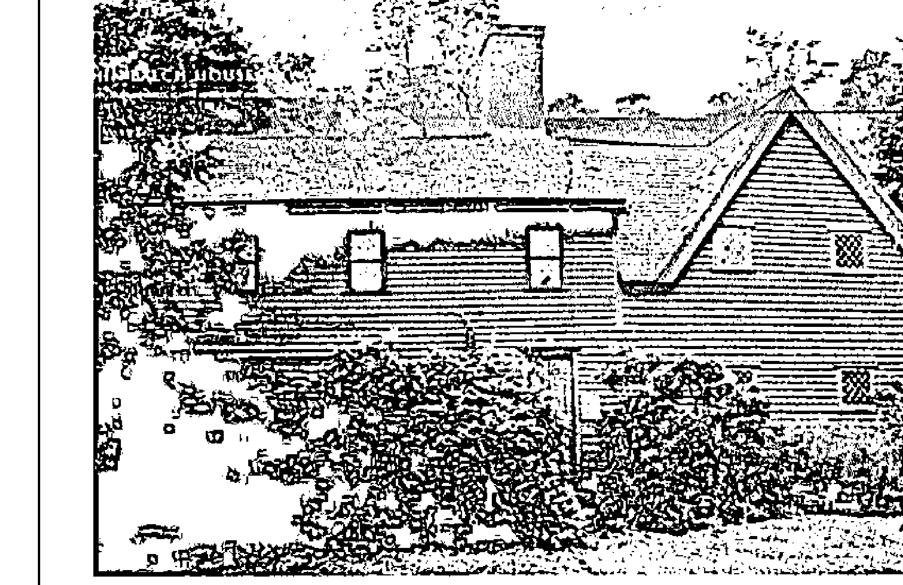

> 根据年命选择房子，更有利于运势。

### 住宅与卦命

年命又称卦命，由于每个人的年命不同，住宅朝向也有所不同。比如命卦属坎卦，对应的住宅为坐北朝南。

### 716 选择楼盘要注意哪些因素？

购买楼盘时，要注意的运势问题很多，但最基本的有以下几条。

- 1. 不宜有强风吹袭。住宅讲究“藏风聚气”，风势强劲，旺气无法停留，无法聚集财运。理想的风势是，微风徐徐，这样可以促进空气流通，确保室内气场新鲜、活跃。
- 2. 有充足的光照时间。在日间，必须要让阳光照射房内，不能长期不见阳光。
- 3. 没有各类不利格局影响，楼盘周围不要有路冲，不要有公共厕所、坟场、监狱、银行、政府机构、隧道、铁路、工厂烟囱等。
- 4. 卫生间不宜在住宅中心。否则屋中心容易受污，破财损丁，购买之后难以改造，故要提前注意。

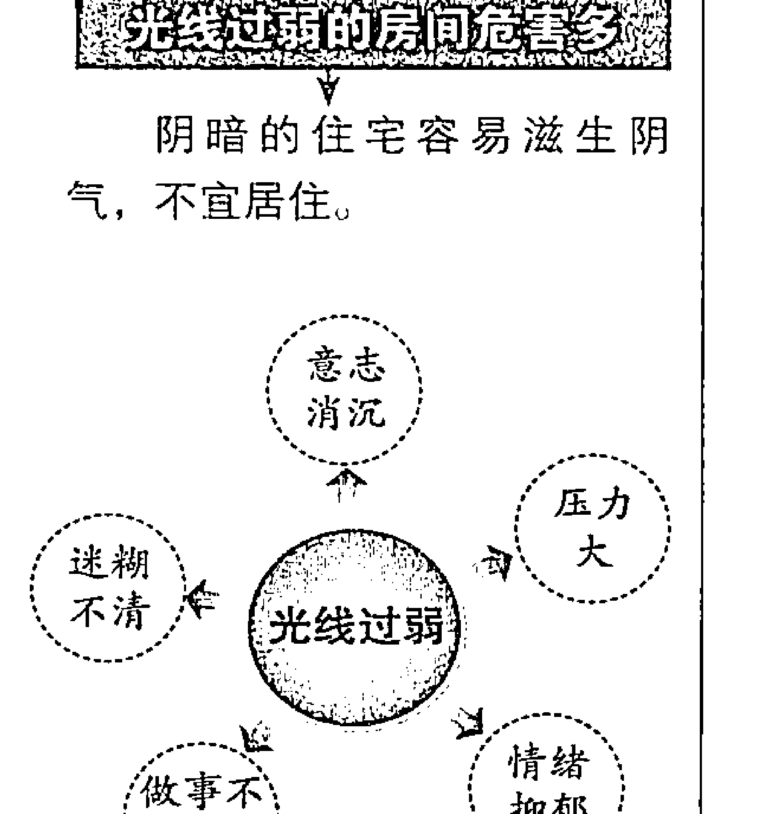

### 717 大门的朝向如何才能当旺？

- 1. 门卦相配。大门朝向要与个人的命卦配合，大门的方向要开在生气方和延年方，才能收拢旺气。
- 2. 财星到门。只要当运星到门，就能收山化煞，丁财两旺。财星(水)到门见真水主发财，丁星到坐山见真山主丁旺。
- 3. 零神卦气。大门要向水或马路，就能收零神卦气，向真山实地收正神卦气。

另外还要注意，大门不宜对着墙壁，否则有“碰壁”之嫌；大门也不要对着墙角，否则容易形成不利格局，家人容易神经衰弱，除了健康和财运受影响之外，甚至还会形成血光之灾。

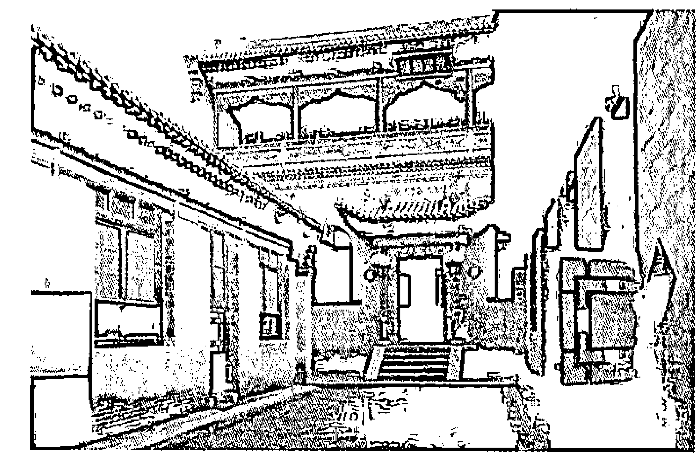

> 大门朝向影响宅运
大门位于吉方时，从大门吹进来的风是吉利的，大门开在生气方和延年方能收拢旺气。

### 718 什么叫“水火忌十字”？

“水火忌十字”中的水，指住宅中的厕所，火指厨房。“水火不留十字线”的意思是，厕所和厨房不能在住宅的正前、正后、正左、正右和中心点。

若住宅内水火相犯，易生不如意之事，容易财运反复，家人疾病丛生，多桃花是非等。而房屋的十字之处，容易阴阳不调，家人易患排泄系统、头、眼、口、手脚等阴阳失衡类疾病。

这是因为，厕所是污秽之地，属孤阴，宜居不利之方；厨房是做饭的地方，为独阳之方，要居有利之方。由于现代建筑的厕所和厨房是固定的，因此在购买前要考察清楚。

水火忌十字
住宅中属水的厕所和属火的厨房，处在正确的位置上才有利于财运。

| 类别 | 属性 | 建议位置 |
| :--- | :--- | :--- |
| 厕所 | 为污秽之地，属孤阴 | 适合设置在住宅的凶方 |
| 厨房 | 是做饭的地方，为独阳之方 | 适合设置在家中有利的地方 |

### 719 住宅的大小有何讲究？

住宅的大小要适中，并非越大越好，要根据居住的人数而决定。

屋大而人少，空旷缺人气，则阴盛而阳乏，主暗病纠缠，阴灵寄居。反之，住宅太小，也不太好。如果屋小而人多，空间拥挤，阳盛而阴少，也会导致阴阳失衡，人居住在这样的房间里容易有憋闷感，家人容易脾气暴躁，影响人际关系的和谐，而且官司是非多。

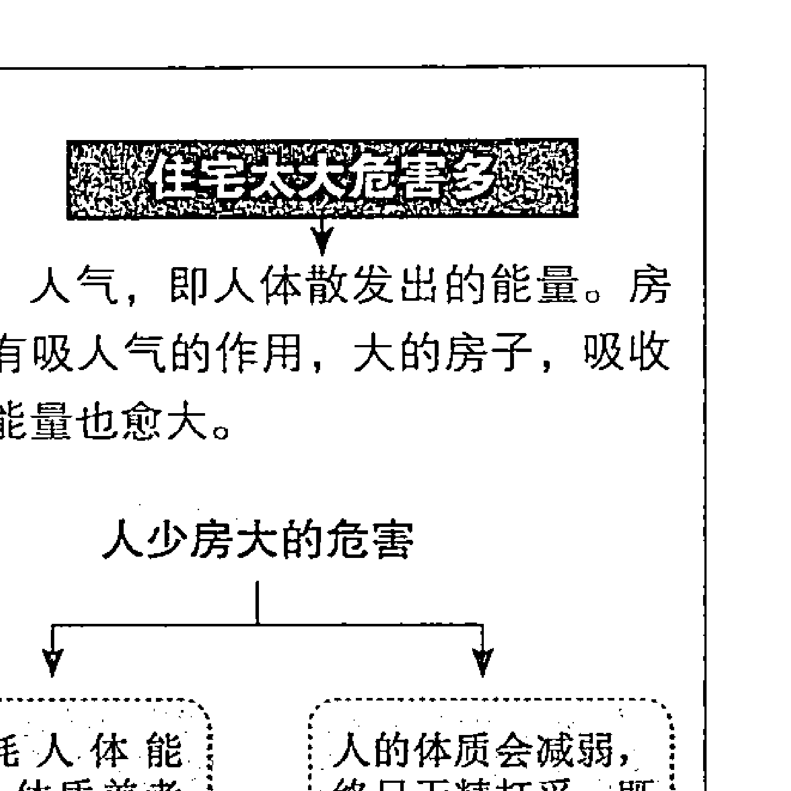

### 720 楼房的五行属性如何确定？

房子的五行属性，与方位有关，其对应关系如下。

土行宅：坐东北朝西南的建筑物。土有厚实、宽广的特征，可以滋润万物，是万物生存的场所。
水行宅：坐北朝南的建筑物。水的性质比较深沉，有藏风聚气的作用，柔且刚，给鱼儿提供了生存的空间。
木行宅：坐东朝西的建筑物，木的住宅宜深长、方正。布局要方正大气，要有高和深的感觉。
金行宅：坐西北朝东南的宅子。金的性质是明亮的，忌讳阴暗灰黄的光线。
火行宅：坐南朝北的宅子。火的性质是升腾，温热。

| 五行属性 | 房屋外形 |
| --- | --- |
| 金形 | 圆形、半圆形 |
| 木形 | 长方形、L形 |
| 水形 | 波浪形、几个圆形处于一处 |
| 火形 | 三角形、尖锐形 |
| 土形 | 四方形、井字形 |

### 721 如何选择“藏风聚气”的旺宅？

在现代城市中，通常没有真正的山环水抱的居住环境。但有形即有灵，楼房周围的建筑物即是山，马路即是水。如果楼房后面有高楼大厦作为“靠山”，左右有大厦环抱挡风，前方有马路环绕而过，也可视为“山环水抱”的格局。相反，附近没有其他高楼挡风的孤耸之楼，或者过于低矮的住房，或风速太强的住宅，应尽量避免。

### 722 住宅缺角有何不利？

住宅的缺角方位，与家人的健康有着对应关系，比如说房屋的西北方缺角，此方五行属金，对家中老年男性不利。老年男性容易患头、肺部疾病；房屋的东北方缺角，此方五行属木，对家中少男不利。家中的少男容易患腹部、脾脏和胃部疾病。如果家里有病人，那就需要看看住宅是否有缺角，如果有缺角，应当及时想办法补救。具体的缺角方位与家人健康对应关系见下表。

缺角方位与家人健康

| 缺角方位 | 五行 | 伤害部位 | 关系家亲 |
| :--- | :--- | :--- | :--- |
| 西北方 | 金 | 头、肺 | 老年男性 |
| 西南方 | 土 | 腹、脾、胃 | 老年女性 |
| 东方 | 木 | 足、肝、发、喉 | 长男 |
| 东南方 | 木 | 肢、股、气、风 | 长女 |
| 北方 | 水 | 耳、血、肾 | 中男 |
| 南方 | 火 | 目、心 | 中女 |
| 东北方 | 木 | 手、骨、鼻、背 | 少男 |
| 西方 | 金 | 舌、口、喉、肺 | 少女 |

### 723 街口巷边的屋子有何不宜？

街口巷边的住宅，或者在整幢大楼中突出部位的房屋，由于屋子位置外露、无遮无挡，受外界气候变化影响较大，易受寒风冷雨的侵袭，昼夜屋内温差较大。家中若有老人、儿童、慢性病患者，不宜居住，因为居住环境会使人体发病的几率提高。

另外，街口巷边的屋子还容易犯路冲。如果房子刚好在丁字路口，总要横穿马路，出门很不方便。

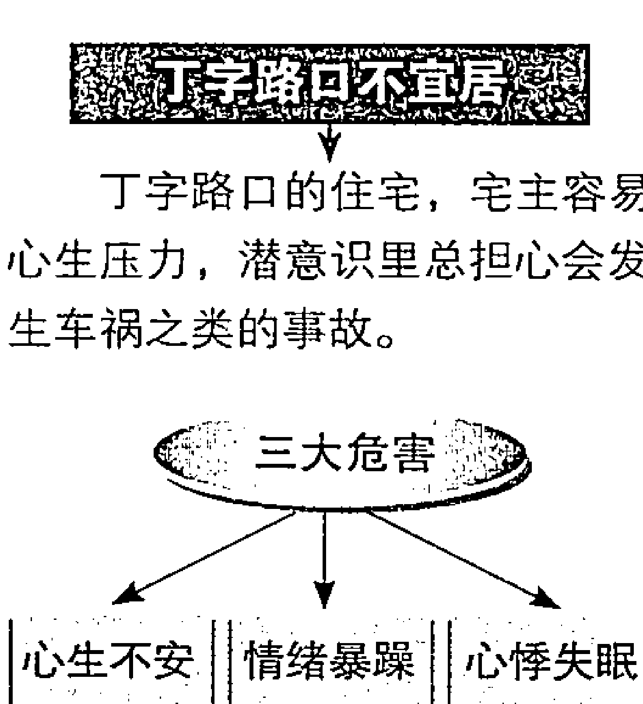

### 724 大厦前的门灯有何讲究？

有的大厦在大门口两旁设有两盏门灯，这对运程是有帮助的，但是必须找出最佳位置和合适高度。夜间灯泡要点亮，不可损坏熄灭。若有不亮的灯要及时检修和更换，不可只留一盏灯发光，那样不吉祥。

但要注意门灯和灯牌是不同的概念，前者可以招财纳福，后者却会形成不利格局。住宅附近夜晚照明的灯牌的灯光照进屋里会造成不利影响。住宅前方若正对着电灯柱、交通牌，容易形成不利格局，不利于家人的健康，可在旺气方摆放铜葫芦化解。

### 725 搬新家为何要“暖房”？

通常，搬了新家之后，要找亲朋好友前来相聚，暖房旺气。

搬迁后宴请朋友，是为了暖屋，旺人气。因为新房缺乏人气和阳气，长期不居住的房屋有一种冷清、死寂之气，而找大家相聚可以让众人的运势激活新房的气场，从而增强住宅的能量。新房子若是不住人，久而久之，这里的家具比住人的房子更容易损坏，这就是阴气太重、缺乏人气造成的。新居与旧居相比，人气不足，人住进去之后，容易觉得寒冷不适。

搬新家宴请亲友
搬新家之后，一般会宴请亲友，一方面可以联络感情，另一方面可以暖房旺气。

宴请亲友的好处
- 联络感情：可以借助乔迁新居联络感情。
- 暖房旺气：可利用众人的运势汇集人气，提升运程。

### 726 如何看楼房的青龙与白虎？

俗话说：左青龙，右白虎，所以理想的住宅应为，左有青龙，右有白虎，以“龙强虎弱”为吉。在城市中，大厦即为“山”，因此，大厦的左右方各有楼房，也为吉地。

相对来说，龙强虎弱的布局要比龙弱虎强的布局更好一些。龙强虎弱分为四种情况：

- 一、龙起虎伏，即左方小山或楼屋较高，而右方较低；
- 二、龙长虎短，即左方较为长阔，右边较为短窄；
- 三、龙近虎远，即左方距自己较近，而右方较远；
- 四、龙盛虎衰，即左方楼宇较多，右方楼宇稀少。

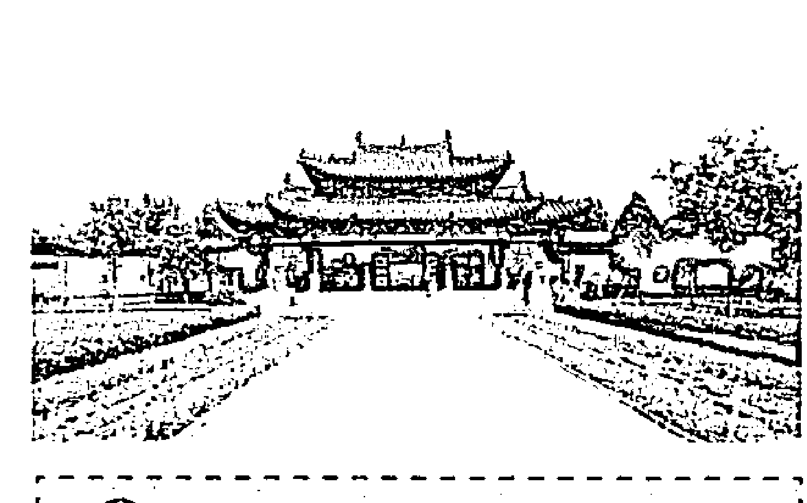

古代建筑的对称美
我国古代建筑，最讲究对称美。左有青龙，右有白虎，龙强虎弱，最为吉利。

### 727 如何看楼房的“靠山”是否强大？

住宅以背山面水为吉，大厦的后方要有靠，宜坐实朝空。即大厦背后有山，或者有其他高大、宽阔的楼房，这就等于是坐实。

如果大厦后方有多座形体相近的楼房，因其数量众多，也属靠山。若背后有一座矮山丘，因其是天然之山，力量强大，也为吉。但是，若背后楼房比本身矮小、稀少，便属靠山无力。

### 728 豪宅门前为何不宜有多条小路？

有些豪华的住宅，在大门前开辟了好几条通往不同方向的道路。这样做，可能是为了视觉上的美观或者行走的便利，但是，这些道路若形成“反弓”，便是大凶之象；若再有一条直路与弓形路交叉而直指向门，便形成了“一箭穿心”，更为凶险。

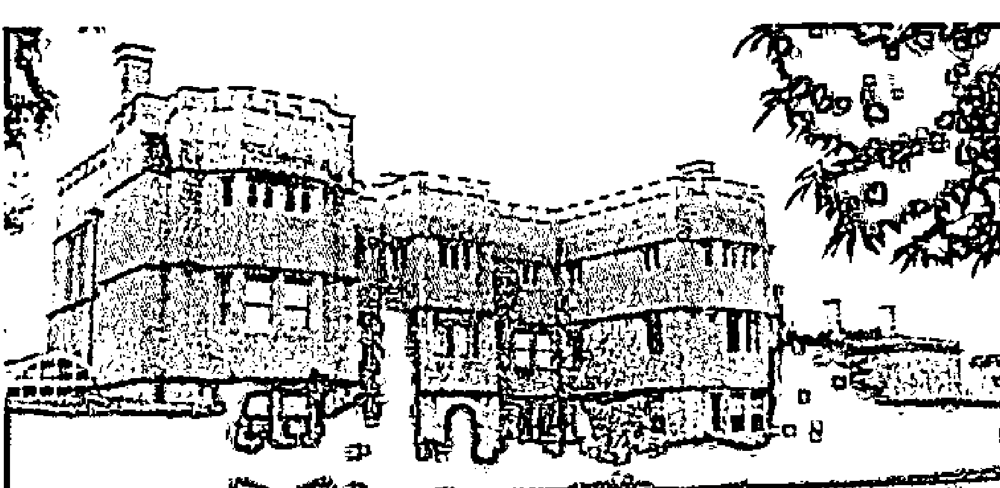

因此，住宅前的路不宜过多，若要形成曲折回环之势，切忌造成反弓。

> 豪宅门前的道路
豪宅的门前道路不宜多，过多容易形成不利格局，分散家中财气，对家运十分不好。

### 729 朝西的房屋带了阳台为何有好运？

西向的住宅之所以不好，主要是因为夏季下午的阳光直射入屋内，午后阳光毒性较强。但是，如果西向房屋有一个大阳台，阳光先照到阳台，再折射入屋内，阳光危害已经大大降低。

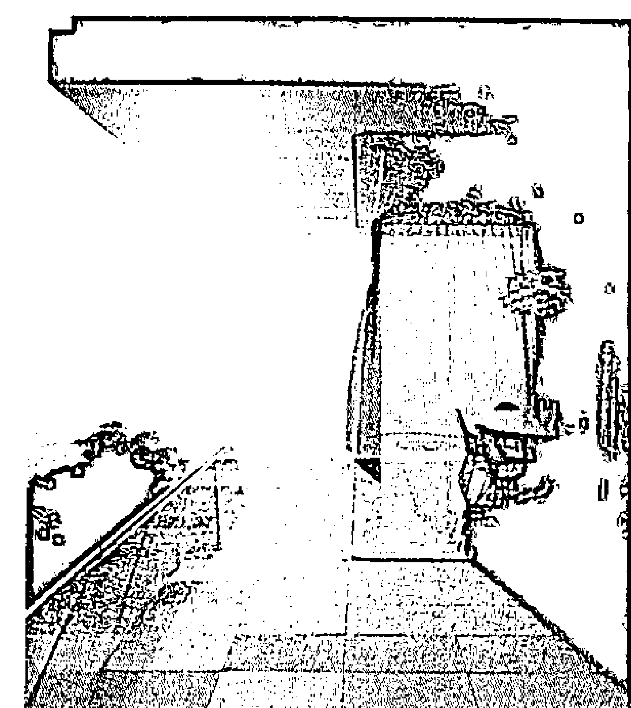

再者，西向带阳台的屋子，晾晒衣物、被褥非常便利；傍晚时分，美丽的夕阳景色让人心情愉快；冬日暖阳，会让你感觉非常惬意。有了这些优点，西向房屋运程自然会变好。

> 阳台暖日
西向的阳台，能够看见美丽的夕阳。尤其是忙碌了一天，凭栏而立，看着落日余晖，格外解乏。

### 730 朝北住宅带了阳台为何变吉利？

朝北的住宅，受光程度最小，屋内阴气较重；冬季时，西北风直吹入大门，住宅寒冷难暖。因此，算不上好地段。

但是，若加上了大阳台，在冬天就可以起到挡风作用，让强风不能直冲而入；由于阳台上有风，晾干衣物也很容易。而且，在炎炎夏日，朝北的住宅是最阴凉通风的。

### 731 住宅与不利事物距离多远合适？

高速公路、铁路、机场、娱乐场所、健身园、停车场、加油站等，住宅在这些场所附近，主要受噪音带来的不利影响，因此，以开窗听不到明显噪音为适宜。

住宅与路灯的距离也要适宜，过远不安全，过近睡觉后屋内被光照，蚊虫容易聚集。住宅与树木距离近，空气清新、凉爽，但是容易受蚊虫骚扰，树上一些毛虫，也对人体不利。

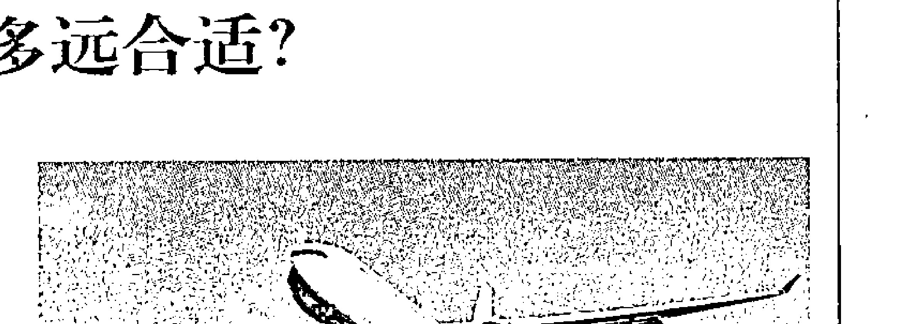

- ① 住宅应远离机场 飞机在低空中飞行时，噪音非常大，住在附近的人，会感觉心情烦躁不安，久而久之易患各种疾病。

### 732 如何根据生肖选择楼层？

依据河图五子算法，一楼和六楼，北方属水，适宜居住的生肖为：鼠、虎、兔、猪；二楼和七楼，南方属火，适宜居住的生肖为：牛、龙、蛇、马、羊、狗；三楼和八楼，东方属木，适宜居住的生肖为：虎、兔、蛇、马。四楼和九楼，西方属金，适宜居住的生肖为：鼠、猴、鸡、猪。五楼和十楼，中央属土，适宜居住的生肖为：牛、龙、羊、猴、狗。十楼以上的楼层，仍然依照上面方法，以尾数来推论。

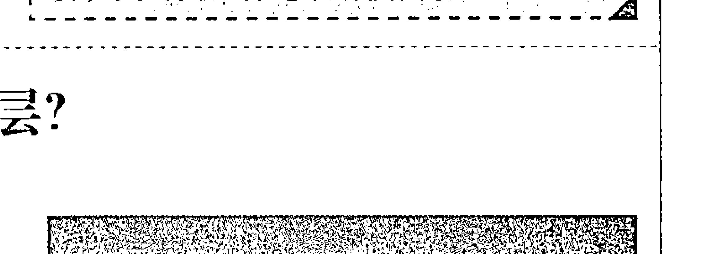

- ① 根据生肖选楼层 不同生肖的人适宜不同的楼层，只有居住在与自己生肖相符合的楼层里，才有利于招财纳福。

### 733 如何依据生辰选择住宅位置和坐向？

春天出生的人，木太旺，利火、金，适宜住在南区、西南区。住宅的坐向，宜坐北向南或坐东北向西南。

夏天出生的人，火太旺，利金、水。适宜住在西北区、北区。住宅的坐向，宜坐东南向西北或坐南向北。

秋天出生的人，金太旺，利火。适宜住南区。住宅的坐向，宜坐北向南。

冬天出生的人，水太旺，利木、火。适宜住东南区、南区。住宅的坐向，宜坐西北向东南或坐北向南。

### 734 破旧的楼房为何不宜入住？

有的人为了贪图便宜，租住破旧的楼房，岂不知这样反而会得不偿失。破旧老楼，由于历史久远，积聚了太多幽怨之气，会让人精神委靡，压抑沉闷，疾病缠身，甚至惹上是非。

破旧楼房往往是藏污纳秽之地，积留大量的霉运之气，常因无人居住而生机死绝，以致滋生阴气，人若入住，必然会受到邪恶之物的侵袭，常疾病丛生，诸事不利。

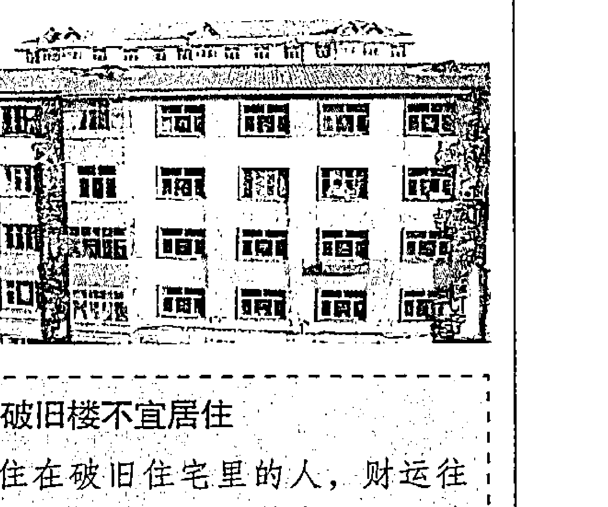

> **破旧楼不宜居住**

住在破旧住宅里的人，财运往往不顺畅，总是入不敷出。严重的有可能破财，有性命之忧。

### 735 选择楼层要注意哪些问题？

除楼层数外，其他因素在选择楼层时也要考虑，如：通风采光、生活便利、家人构成等。

高层的楼房，无其他遮挡，有良好的通风和采光，但上下不便，适合在家时间较短的中年、青年居住。低层的楼房，因上下楼方便，适宜老年人居住，便于户外活动。

但底层干扰大，环境差，空气潮湿，顶层出行不便，防热差，供水不足，因此应尽量选择总层数的1/3以上、2/3以下的那部分楼层。

### 736 大楼的每层多高才适合居住？

住宅的层高通常在2.8米左右，加上吊顶、铺厚地板之后，净高度可能只有2.5～2.6米左右甚至更矮，这样的空间会让居住者有一种心理压抑感，长期居住对身心无益。

因此，挑选楼房时，尽量选择层高在2.8米以上的楼层，以3米左右为佳，过高屋子显得空荡，对照明、冷气的要求也相应提高，提高了装修成本。

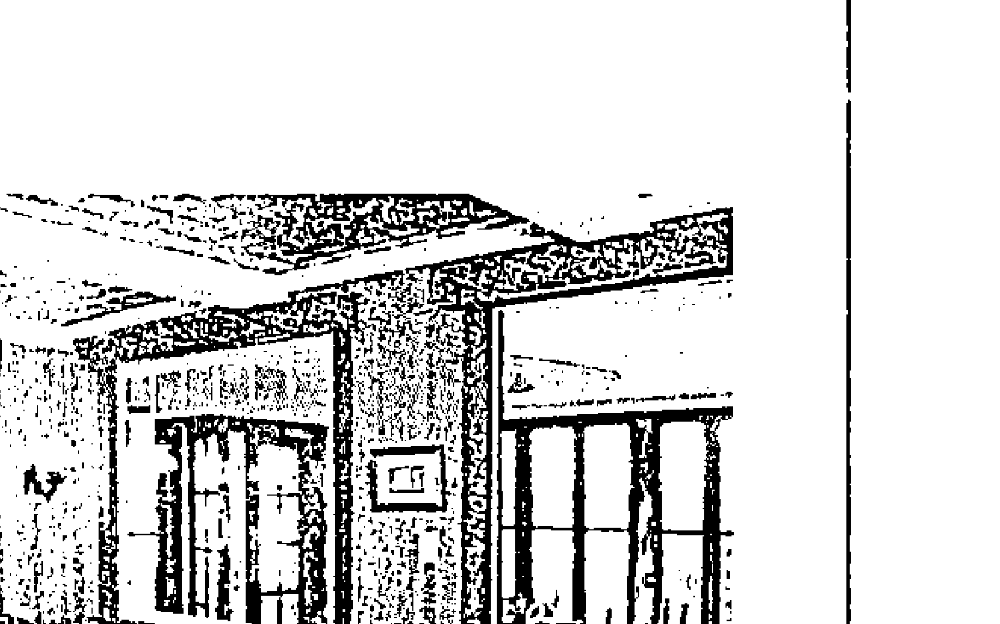

> **楼层高度**

楼层不宜太高也不宜太低，太高的楼房给人感觉不安，而太低的楼房会让人情绪压抑。

### 737 住宅选址有哪些不宜？

不选渺无人烟之地，不选八面来风之地，不选低陷或孤高之地，不选寒冷透风之地，不选阳光不足，阴气旺盛之地。不选正对桥梁之地，不选流水悲声之地，不选公路直射而来之地，不选前宽后窄之地。不选房前屋后带池塘的房子，不选紧靠山脚或高楼的住房，不选大门正对巷口、风口的房子，不选中间高两边低或是中间低两边高的房子，不选缺角或不方正的房子。

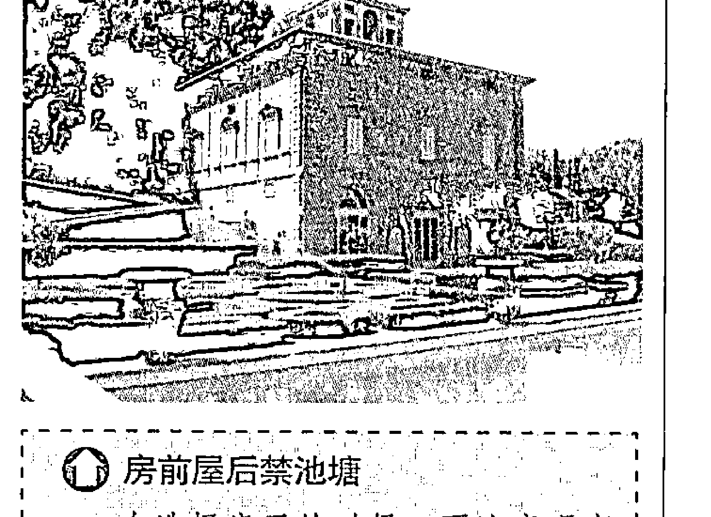

> **房前屋后禁池塘**
在选择房子的时候，要注意观察房前屋后是否有池塘，因为池塘极易滋生蚊虫，对家人的健康非常不利。

### 738 如何选择“门前有水”的格局？

古人认为，山主人丁，水主财。明堂前有曲水环抱，可聚气生财，为生旺福地。在城市中水质纯净的河流无处可寻，甚至连水都不多见。但是，城市的道路、街巷、广场、停车场、桥梁等亦为“水”，即“虚水”。如果这些“水”的形态可构成吉水的话，也算是门前有秀水的旺气格局。

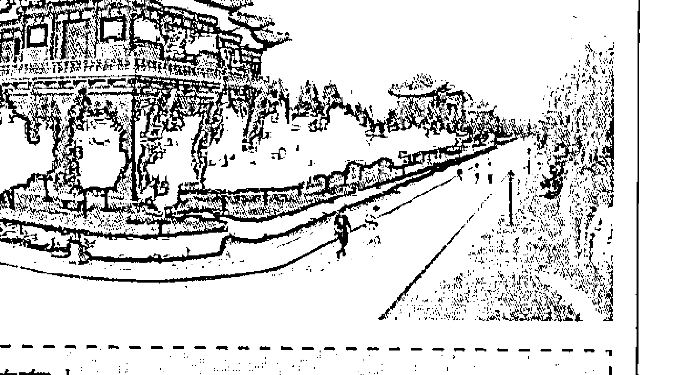

> **门前有水**
门前有水，如果水流清澈环抱，是吉利的格局。在现代，车流、人流和马路都属于水的范畴。

### 739 楼房大门如何才能纳入吉气？

大厦入口若开在前方中央（朱雀门），无论车流方向如何，均为旺宅福地；如果大门前方有明堂，即有一块平地，或者公园、水池等，格局更佳。

若大厦前方的马路，车流方向从右向左，即从白虎方向青龙方流动，则大门开在靠左方，即青龙方，能够接纳吉气，为旺宅福地。若车流从左向右，则大门开在右方为吉。

### 740 楼宇的坐向与人有何关系？

大楼如果用于商业用途，配合经营者的命格，选择向着旺气、生气、进气的大楼，这样才能让生意兴隆，事业兴旺。

大楼向着旺气方，可兴旺发达；向着生气方，生机勃勃，事业稳步向前发展；向着进气方，财源广进，稳定发展。

> 楼房坐向与命格
楼房向着旺气方，事业兴旺发达，向着生气方，则生机勃勃。

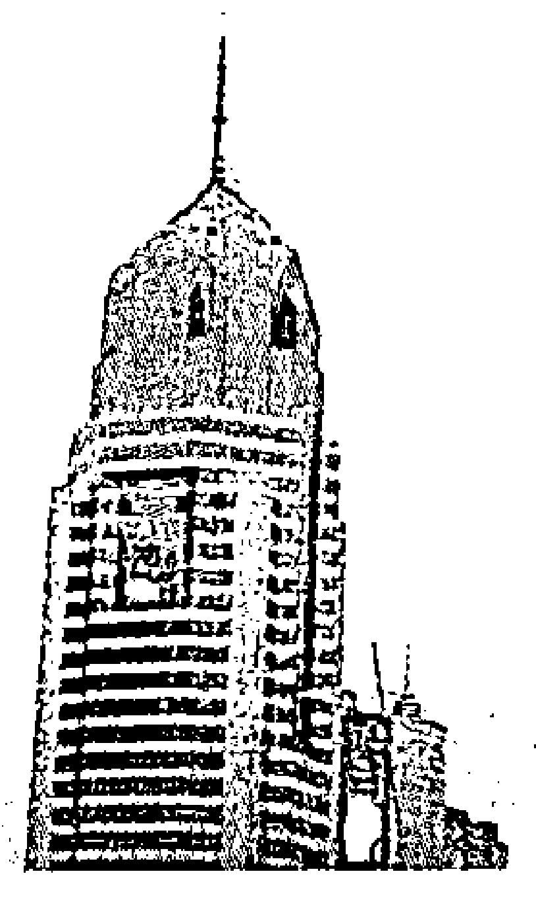

### 741 八运期间，大楼的吉方在哪方？

八运期间指2004－2023年间。在这二十年间，旺气方在东北方，生气方在南方，进气方在北方。因此，大楼入口向着东北（座西南向东北）为得旺气；大楼入口向南方（座北向南）为得生气；大楼入口向北方（座南向北）为得进气。

并非每个人都适用以上吉方，要根据个人的命卦和九星飞伏才能确定是否可用。

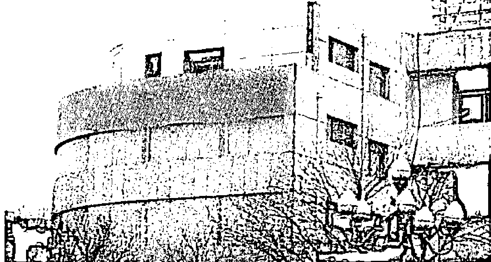

> 楼房的吉方朝向
八运期间大楼入口朝向东北为吉，当然这要配合个人的命卦及九星飞伏来确定。

### 742 楼层数该如何计算？

根据大楼的层数，可推知每一层的五行属性。但是，有的大楼有地下几层，那么这个层数如何计算呢？

其实，楼层的五行属性是从河图数字来推演的，因此楼层运程，实际上是楼层数字所代表的五行，只要依据开发商在楼层上标明的数字即可。

### 743 必须选择与人相匹配的楼层吗？

能够选择与命卦完全吻合的楼层，当然最好。不过，五行有相生相克的属性：火生土、土生金、金生水、水生木、木生火；火克金、金克木、木克土、土克水、水克火。因此，如果楼层的五行，对居住人之命中五行，有相生和相助作用，也为吉。相反，有相克作用为不吉，一定要避开。若想知道自家楼层的五行属性，可参考下面表格。

| 五行属性 | 对应楼层 |
|----------|----------|
| 水       | 第一层、第六层、第十一层 |
| 火       | 第二层、第七层、第十二层 |
| 木       | 第三层、第八层、第十三层 |
| 金       | 第四层、第九层、第十四层 |
| 土       | 第五层、第十层、第十五层 |

### 744 如何根据人选择楼层？

水命的人，最宜住一楼或六楼，宜住低层，不宜住得太高，因为水是向低流的。房屋颜色最好是黑色或浅蓝色。

火命的人，最宜住二楼或七楼，宜住高层，因为火是向上腾升的。宜是红色外墙，高尖形的大厦。

木命的人，最宜住三楼或八楼，宜住中高层，因为木是向上生长的。

金命的人，最宜住四楼或九楼，不宜住得太低，因金忌埋藏、压制。

土命的人：宜住五楼或十楼，适宜住在中高层，有稳重、安心的感觉。

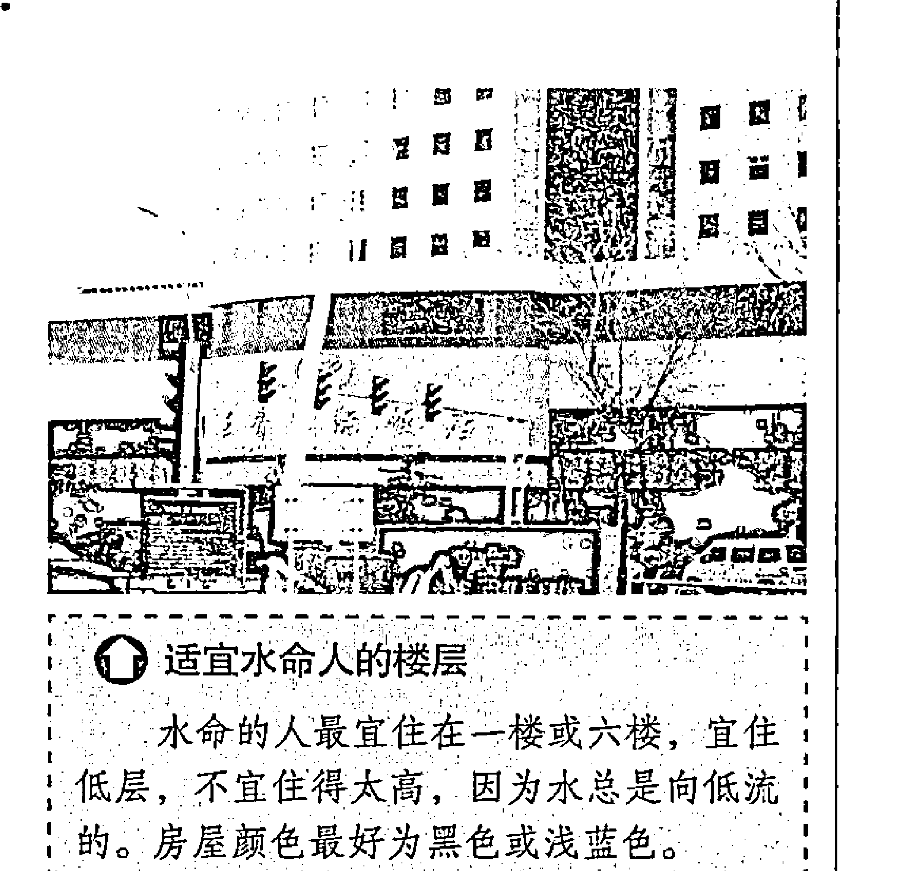

### 745 楼层五行克制，居住者如何化解？

楼层五行为土，而宅主命卦五行为水，土克水；可在大门上悬挂铜铃，以金助水。

楼层为水，主人为火的，可在大门左边摆放富贵竹，以木助火。

楼层为火，主人为金的，可在大门右边摆放一盆从住宅西方取来的土，以土助金。

楼层为金，主人为木的，可在大门上方悬挂山水画，以水助木。

楼层为木，主人为土的，可在大门边摆放龙龟镇守。

# 746 小户型住宅门对门有何不利？

小户型的房屋，本身室内面积就小，气场力量弱，如果大门与对面住宅大门相对，若对方室内面积大，就容易被对方吸纳气场，对家运不利。

要避免这样的情况，就要多跑多看，尽量避开这种门对门的格局；如果无法避免，起码要选择两户大门间距较宽敞的楼盘，或者双方的室内面积相等，这样才不至于被对门气场影响。

> 小户型房屋
小户型的房屋，室内面积小，气场力量弱，如果大门与对面住宅大门相对，不吉。

# 747 厕所在大门内侧的住宅为何不利？

进入大门的一段空间，为内明堂，即玄关的位置。它主管着住宅的财运，代表进财的通道；如果把厕所设置在此处，污秽之气必然会导致家财外漏，财运不来。

另外，门是出入的地方，厕所是方便的地方。任何人从门而入的时候，在厕所里的人都会受到干扰，提心吊胆。久而久之，不但容易形成心理压力，而且容易患排泄方面的疾病。因此，选择楼盘时必须要避开此类住宅。

> 厕所在大门内侧
厕所在大门内侧会导致家财外漏，财运不来。

# 748 如何根据五行生旺楼层？

屋主有命卦八字所喜五行，楼层也有五行属性，因此可以利用五行生旺原理，用八卦符文来生旺所居住的楼层。屋主八字喜木，楼层五行属火，可以用白纸画上八卦坎符，贴于大门上方。屋主喜水，楼层属木，则用白纸乾卦，贴于大门右边。屋主喜土，楼层属金，则用红纸离卦，贴于大门中间。屋主喜金，楼层属水，则用金纸坤卦，贴于大门中间。屋主喜火，楼层属土，则用红纸震卦，贴于大门右边。

# 749 小户型房屋应注意什么？

小户型的房屋室内面积小，藏风聚气的能量低弱，抵御外来影响的能力较差。如果屋外有明显的不利格局的影响，即使不出现灾祸，也会疾病缠身。

许多布局紧凑的小户型房屋，把厨房布置在内明堂。这对住宅财运是不利的。厨房是家宅的财库，若设在大门处，外面吉气直接就进入财库厨房，而不经过客厅、餐厅和其他房间，财气没有在室内气场中流动，导致财路受限。

因此，选择楼盘时一定要注意这一问题。如果是后来出现的影响，若不想搬家，只能针对具体情况进行化解。

# 750 门前有垃圾堆会有霉运吗？

大门前不宜有垃圾堆，如果用的是垃圾桶，要加盖子。垃圾会散发出臭味，滋生细菌，对人体健康不利；垃圾难让好运上门，影响整体家运。

屋外若有污水池或坑洞，主人易破财刑伤，因家人或路人容易掉落；门前不要有排水沟环绕，它与垃圾一样会有臭气和病菌，会让家人灾病连连，官司不断。

同理，自家门前也不宜有垃圾桶，否则会影响到家族成员的成就和吉凶，健康和运气。因此最好建议物业将垃圾桶隐藏起来或放在一个不起眼的角落，或者买个漂亮的垃圾桶，使它看起来更像个装饰品，就不会给家庭带来凶运。

# 第十九章 旺宅物品

本章主要讲了旺宅物品的相关问题，内容涉及纸扇的旺宅作用和摆放讲究，刀具、中国结的摆放讲究，九鱼图、凤凰图、青龙腾飞图等的旺财作用，神像安放的讲究，坠子、竹笛、石敢当、屏风等物品作用等。

## 751 家里摆放纸扇饰物有什么讲究？

纸扇饰物是近代以来出现的旺运器物，一般高达几尺，体积非常大，张开之后往往占据很大的空间，通常扇面上还会有一些预示吉祥的图案。作为一种特殊的饰物，纸扇的摆放非常讲究，由于纸扇通常用表示吉祥的红色装饰，所以在摆放时纸扇还要根据五行来决定。

可将纸扇摆放在南方，表示大吉，因为南方属火，红色的纸扇，火上加火，更吉祥。摆放在西南方、东北方也可以，因为这两个方位五行属土，火生土，符合五行相生原理。

## 752 纸扇摆放在吉位有什么作用？

作为新兴的旺运饰物，纸扇有特殊的作用。纸扇可以像壁画一样美化室内环境，无论展开还是合拢，都给人不一样的感觉，这是其他家居饰物无法替代的。但纸扇最大的作用，仍然是旺运作用。

旺运纸扇通常很大，展开之后像一个巨大的屏障，将瑞气留在居室之内，起着招吉纳福的作用，有助于平衡室内阴阳。若是根据五行之相生原则，将纸扇摆放在家中的吉位，还能使家人保持头脑清醒，遇事顺心，也可使人变得聪明，保家人平安。

# 753 家中摆放刀具饰物有什么讲究？

常见有人将古人的刀剑挂在墙壁上避邪，保家人平安。在摆放刀具饰物的时候，注意不要乱放，因为刀具具有吉、凶两方面的作用，摆放不当，不但不旺宅，反而可能伤害家人。

一方面，刀具作为一种凶器，可以砍伐一切妖魔鬼怪，因此有镇宅避邪的作用，有助于保护家居，使家人平安。另一方面，刀具有一定的聚积戾气的作用，多少会有点杀气，如若放在家中金位，会助长刀剑的锐利，从而引起一些不利的事情发生。若把刀剑挂在西北方位会影响家人的健康，家人容易出现手脚扭伤等状况。

# 754 中国结有什么增运作用？

中国结是用丝线编织而成的传统吉祥装饰物品。每一个结从头到尾都是用一根丝线编织而成，每一个基本结又根据其形、意命名。不同的结饰互相结合在一起，或用其他具有吉祥图案的饰物搭配组合，就形成了造型独特、绚丽多彩、内涵丰富的中国结。近年来，有东方文化特色的中国结已经成为国际时尚潮流的重要元素。除了做吉祥挂饰，编结服饰、佩戴饰品等，也成了中国结新的展示空间。

中国结可以悬挂在家中、办公场所或者商铺中，不仅美观，还能带来平安吉祥之气。

# 755 常见的生旺家居画有哪几种？

一般来说，家中可悬挂一些孔雀、骏马之类的动物图画，有“孔雀开屏”、“马到功成”的意思，有助于提升人的斗志，也可促进家庭成员事业成功。在选择图画的时候，不要用不开屏的孔雀、垂头丧气的马，越是栩栩如生、美丽动人的孔雀，越是奔腾不息的马，越有助于旺宅。

有的人喜欢悬挂风景类图画，这类图画一样可以起到陶冶性情，增进人际关系和谐的作用。而且有的风景图画比较养眼，可保护眼睛，使人精神愉悦，有促进健康的作用。

### 名人字画生旺家运

悬挂一些名人字画，有助于陶冶人的情操，舒缓人的情绪，让你在人际交往中处于有利的地位。

**适宜内容**：内容是积极向上、充满生机和欢乐的。

**不宜内容**：不可是表示悲伤和肃杀的图画，否则会起到相反的作用。

# 756 画作应该如何悬挂？

一般认为，画的悬挂，要与五行的相生相克相符。掌握五行的相生相克规律，并知道家中五行的方位和所代表的颜色，依据相生相克的原理选择画作。

五行缺金的人，可悬挂一幅冰山图。五行缺木的人，可挂一幅竹报平安图。五行缺水的人，可悬挂一幅九鱼图，或黄河长江图。五行缺火的人，可悬挂一幅八骏图或红色牡丹画。五行缺土的人，可悬挂一幅万里长城图。

### 画作的五行作用

| 画作 | 五行作用 |
|---|---|
| 冰山图 | 冰山的形状，远远看起来像金字塔，可以起到旺金的作用。 |
| 竹报平安图 | 竹为植物，为木，且竹子还有节节高升、蒸蒸日上的吉祥意义。 |
| 九鱼图或黄河长江图 | 这类图画中都会表现出水，体现水旺宅运的作用，九鱼图还可以招财、聚财，提升家居的财运。 |
| 八骏图或红色牡丹画 | 这两种图画均能传递给人力量，使人像火一样充满斗志，因此可以起到补充火气的作用。 |
| 万里长城图 | 长城的砖、墙，无不体现土的作用，而且是“大土”“瑞士”，最适合五行缺土的人。 |

# 757 如何确定悬挂画作的方位？

很多人都喜欢在家中悬挂画作，美观的同时也希望 能图个吉祥，招来好运。

绿色调的画作，应该悬挂在东方，因东方五行属 木，颜色与方位刚好相符，有相生作用。

红色调的画作，应该悬挂在南方，因南方属火，颜 色与方位刚好相符，有相生作用。

金色、白色的画作，应该悬挂在屋中的正西方位， 因为西方属金，颜色与方位刚好相符，有相生作用。

而一些色调比较重的图画，如灰色、棕色、蓝色 等，应该挂在北边，因为北方属水，颜色与方位刚好相 符，能起到相生作用，吉上加吉。

> 悬挂画作的讲究
悬挂画作很有讲究，不可乱挂，否 则效果适得其反，因为每幅画的摆设方 位，都控制着不同的家居运程。

# 758 哪些画宜挂在家中？

在家中挂画，能带来视觉上的清新，适合挂 在家中的画有以下这些。

九鱼图：“九”象征着长长久久，寓是永远 发财，财运永远顺利。“鱼”表示“余”，表示 年年有余，年年有多余的钱财。

三羊图：图画中三只羊在温暖的阳光下吃 草，“羊”即“阳”，象征着万象更新，事事顺 心。家中悬挂三羊图，能招来吉利，给家人带来 好运。

百鸟朝风图：中间有一对凤凰，四周禽鸟满 天飞，场面热闹，色彩华丽。凤凰，是中华民族 的神鸟，是百鸟之王。凤凰象征着阳光、雨露、 五谷丰登等一切美好的事物。

### 舒缓心情的画作

在家中悬挂风景画或是象征祥 和的图画，可以传递给人松弛、舒 适的感觉，可帮助人休息。

# 759 家中不适宜挂什么图画？

并不是所有的画都适宜悬挂在家中，若是选择了不恰当的画作，不但起不到镇宅纳福保平安的作用，反而会伤人。 一般来说，下面几种画作不宜悬挂在室内。

1.  颜色过于深沉的图画，如黑色图画，这类图画会使人意志消沉，性情悲观，做事冲动。
2.  一些有凶猛野兽的图画。如猛虎下山图，因为猛虎下山是要伤人的，家人健康会较差，也容易有血光之灾。
3.  寓意消沉的图，如日落西沉图、百花凋零图等，这类图画会使人意志消沉，有时还会增加压力，使人情绪不安。
4.  主色调为红色的图画，如枫叶图等，这类图画容易使人情绪暴躁。

### 家中不适宜的画作

不是所有的画作都能摆放在家中，如果选择不当，会使人的身心健康深受伤害。

# 760 挂画有什么生旺讲究？

画是家居中很好的装饰物。挂什么画要根据屋子来决定。客厅可以挂花卉、风景画，卧室可以采用裸体画等主题，餐厅的挂画主题可以是水果、食品、静物等，颜色可以偏甜蜜，特别是橙色，对人的消化系统有良好的调节功能。整面墙的巨大挂画，要考虑到画的主色调与室内装修主色，避免造成强烈对比。

另外还要注意，挂画在哪个方位，要根据房子的朝向，根据五行相生相克之原则来决定。五行忌木的人，不要悬挂与植物有关的图画，如竹报平安图、森林图等。五行忌水的人，不要悬挂与水有关的图画，如黄河图、长江图等。

### 家中悬挂老虎图的讲究

老虎是用来镇宅的凶猛动物，在悬挂老虎图画的时候，要注意图画的象征意义，否则会适得其反。

# 761 九鱼图有什么旺运作用？

“九鱼图”是一幅绘有九条锦鲤鱼的图画。“鱼”自古就被人们视为吉祥之物，“鱼”表示“余”，象征着年年有剩余，有多余的钱财，表示财运旺盛。“九”则取“长长久久”之意，表示长久的、永远的宅运旺盛、财运旺盛。“鲤”与“利”谐音，有利益、利润、得厚礼等寓意。

总之，“九鱼图”有着多层吉祥意义，是很好的画作，做生意的人悬挂特别有利。宅主若是夏天出生，一般容易五行缺水，也适合挂九鱼图。

与九鱼图有类似作用的还有黄河长江图、双鱼嬉水图等，生意人和夏季出生的人可在家中大厅中悬挂。

# 762 三羊图有何旺运作用？

三羊图即三羊开泰，是民间喜用的吉祥图。图画以三只羊在温暖的阳光下吃草，象征万象更新。取“羊”之谐音“阳”，表达兴旺发达，事事顺心之意。家中悬挂三羊图能招来吉利，给家人带来好运。

“三阳开泰”是岁首人们互相祝福的吉利话；十二生肖年称“午马徐徐去，未羊款款来”，因此也作“三羊开泰”。

“三阳开泰”来自《易经》。“泰”是卦名，表示吉利，开泰有“求财”之意，就是大开财路之意；卦爻分阴阳，“阳”通“羊”，是吉祥美好之意，阳爻有三，“三阳开泰”由此而来。

# 763 骏马图有什么旺运作用？

骏马图象征吉祥如意、飞黄腾达，挂家中是十分吉利的。家中若能搜集一张徐悲鸿的骏马图，则旺运作用更旺盛。徐悲鸿幼年随父学画，成年后得到国内知名画家的指点，也曾留学感受国外艺术的氛围，可谓学贯中西，在绘画艺术方面有极深的造诣。他画的《奔马图》不仅笔力雄厚，气势豪壮，而且有一种“一洗万古凡马空”，独有一种精神抖擞、豪气勃发的意态，对于鼓舞人的士气，振奋人的精神，提升人的事业心、事业运等都有极大的好处。而且人们还能从名师的笔法中陶冶性情，沾染大师的才气。

> 骏马的旺运作用
从五行上来说，马属火，适宜于命中缺火的人，可以弥补火气。悬挂时要马首朝外，能够一马当先。属相为鼠和牛的人不适合挂骏马图。

# 764 凤凰图有什么旺运作用？

凤凰图指画有一对凤凰同飞的图。凤凰是一种寓意吉祥的鸟，象征夫妻和谐相处，共同奋斗。适合夏秋出生的夫妻在家中悬挂。属相为兔和狗的人不宜挂凤凰图。 凤凰形象极美，它在中国人心目中是一个十分美好的形象。古籍描写中说凤凰的形貌有着大雁的头部，麒麟的身体，蛇的颈部，乌龟的背部，龙的纹，燕子一样的下颌，鸡一样的嘴喙，孔雀一样的美丽羽毛。并说凤凰的头上有“德”字，颈部有“义”字，背上有“仁”字，胸部有“信”字，翅膀上有“忠”字，脚踏着“正”字。它的鸣叫声，音如箫笙，它的翅膀，五彩缤纷，金光四射。

> 凤凰的旺运作用
凤凰，雄鸟为凤，雌鸟为凰，一直以来被认为是一种瑞鸟，它的出现会给人们带来祥瑞。

# 765 青龙腾飞图有什么旺运作用？

龙是中华民族的象征。传说中的龙有着兽类的四足、蛇的身体、鹿的角、鹰的爪子、鱼的鳞片和胡须，能在陆地上狂奔，大海里畅游，天空中翱翔。由此看来，人们信仰的龙有着超凡的能力，是一种能通天的灵异动物，它掌管风雨，赐人祸福，无所不能。因此龙成为一切吉祥的象征，常被人们用来表达避凶趋吉、事业兴旺的美好愿望，挂龙灯、赛龙舟等民间风俗也都蕴含了祈求吉祥的意思。中国人给新生儿命名也喜欢加一个龙字，蕴含着自己的儿女将来成为“人中龙”的意思。

### 悬挂龙饰品有讲究

自古以来，龙就是尊贵的象征，家中悬挂龙饰品，有利于家运的兴旺。

### 龙饰品的悬挂方法

主要功效：家中悬挂青龙腾飞图，可以招来贵人，驱除小人，避免是非。

悬挂技巧：在挂青龙腾飞图时要把龙头朝向内，最好挂在客厅的左边，为家人带来吉祥。

悬挂禁忌：属相为狗、兔的人不宜挂青龙图。

# 766 蝙蝠画有什么旺运作用？

蝙蝠画之所以成为吉祥物是因人们取“蝠”的谐音“福”而来的，蝙蝠是幸福的象征物，蝙蝠画通常象征着“五福临门”。

“五福”指的是长寿、富贵、康宁、好德、善终。据《书经》记载，命不夭折而且福寿绵长是长寿；钱财富足而且地位尊贵是富贵；身体健康而且心灵安宁是康宁；生性仁善而且宽厚宁静是好德；能预先知道自己的死期是善终。人生如果能达到“五福临门”就是最美满的境界了。

蝙蝠画有很多种，可以根据实际需要进行选择。属相为马、兔和羊的人不适宜挂置蝙蝠图。

### 蝙蝠的寓意

在传统文化上，蝙蝠寓意着幸福，家中悬挂有蝙蝠的图画，能为家人带来幸福安康。

### 不同数目的蝙蝠寓意

两只蝙蝠
表示求全、求吉祥的心理，追求美好生活，适合新婚的夫妇家中悬挂。

五只蝙蝠
适合老年人悬挂，它表示长寿、富裕、幸福、美德、健康五种天赐之福。

# 767 雄鸡图有什么旺运作用？

公鸡是一个很重要的吉祥物。公鸡象征着雄鸡报晓，新的一天开始，新的开始。此外公鸡每日早起，还有勤快、勤劳的意思。公鸡担任报晓的责任，有提振士气、振作向上的灵动力，因此若想振奋团体精神，可在办公室西边摆放一只风水鸡，可以起到鼓舞士气的作用。上班族如果想在事业上有所作为，得到上司的重用，还可通过在办公室摆放公鸡饰物的方法来提升自己的事业运。另外，悬挂雄鸡图的时候，最好悬挂在西北、正北、东北、正南方向。

雄鸡图增旺运势
每逢鸡年，人们都喜欢在家中悬挂一幅雄鸡图。悬挂雄鸡图，可以增旺运势。

雄鸡图的悬挂方法

| 主要作用 | 特别作用 | 悬挂禁忌 |
|----------|----------|----------|
| 雄鸡善斗，在家中挂置雄鸡图能增强家人的斗志，有利于事业的发展。 | 雄鸡是一种避邪吉祥物，在客厅中悬挂可以消除桃花劫。 | 属兔、狗的人不宜挂雄鸡图。 |

# 768 山水风景画有什么旺运作用？

很多家庭喜欢在客厅里悬挂一张山水风景画，认为这样的图画可以给家中带来清新的气息，使得居室有和谐的氛围，人在家中也能得以放松，感觉舒适。山水风景画的主要作用，在于其在运势上的意义。一般画上的山水，皆为好山好水，寓意吉祥的山水风景画自然可以增添室内能量，将图画中山与水好的作用补贴到居室内，因此可起到镇宅、旺宅保平安的作用。在山水风景画的选择上需要注意，瀑布的画境虽美，但挂在家中会破除家人的好运。另外，西山日落之景也不适宜挂在家中，它会使人意志消沉。

> 身心放松的山水画
山水风景画，可以让人足不出户领略到大自然的风情，秋天出生的人最适合挂山水风景画。

# 769 人物肖像画有什么旺运作用？

一些漂亮的人物素描，对于喜欢它们的人来说，是可以悬挂的。一是可以增加美感，二是可以通过偶像的力量，告诫自己向积极的方向努力，有助于提升个人魅力及事业运。

在一间屋子里，不能挂超过两幅的人物抽象画，否则家人会觉得，房间里多出了许多人，有碍手碍脚的感觉，而且总觉得自己做什么事都在别人的注视下，没有一点隐私感和自在感，容易情绪不稳、性情急躁，出现种种心理不适。另外，不要悬挂已故前辈的肖像画，否则会增加不必要的思想负担。

> > 悬挂人物肖像画注意事项
> 
> 需要注意的是，生肖属马、鸡、龙和猪的人最好不要将根据本人绘画的肖像悬挂出来，否则对本人不利。

# 770 梅花图有什么增旺作用？

梅花一直都被人咏诵，是高洁和富裕的象征，在家中悬挂一张梅花图是非常吉利的。

梅花与山茶、水仙同为岁朝花，岁朝是一年的开始，含有除旧布新、期望来年兴盛之意。因此家中悬挂梅花图可以给居室主人带来新气象，招来好运。

另外，梅花作为花中四君子之一，迎寒而开，美丽绝俗，是坚忍不拔的人格象征。家中悬挂一张梅花图，还可以培养人具有梅花一样高洁的人格特征，从而增添个人魅力，促进人际关系的和谐。

> > 梅花花瓣的五个寓意
> 
> 梅花的五片花瓣分别代表五个吉祥神，有“梅开五福”之意。

# 771 牡丹图有什么作用？

牡丹，富贵之花，雍容大度，象征着富贵吉祥，一般在客厅挂置。在悬挂牡丹图时，要注意将其安置在北方或南方。北方是“水”地，而牡丹属木，木得水生而茂盛繁荣。南方是“火”地，牡丹为木，会形成木生火旺之石，可催旺财星。但不可将牡丹饰物或牡丹图安置在西方，西方在五行上属金，而金克木。

在室内摆放牡丹饰物，悬挂牡丹图，不但可以协调室内环境，陶冶性情，还可营造有益气场，凝聚平和之气，和气生财。家中若有孩子准备高考，还可在孩子书桌上方悬挂牡丹图，有助于提升考运。

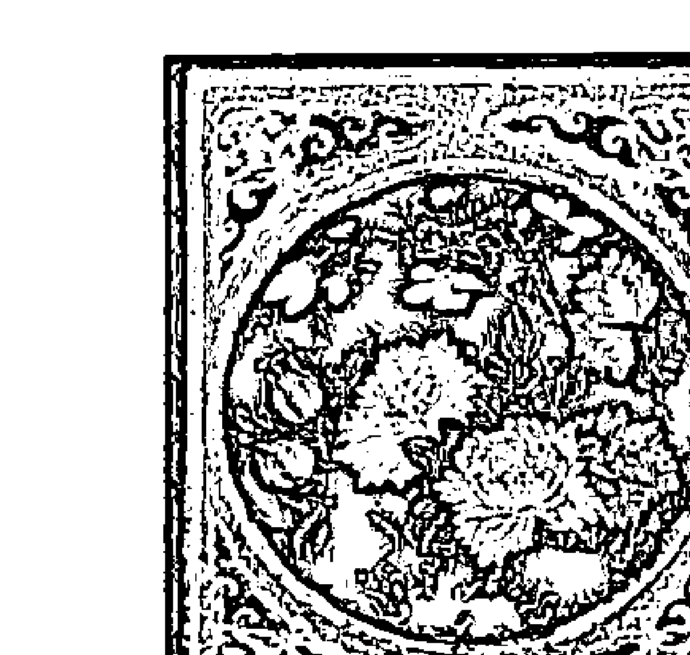

- 牡丹的搭配：牡丹与其他花卉搭配，寓意更丰富。比如牡丹配长春花，表示“富贵长春”；配海棠，表示“光耀门庭”；配桃花，表示“长寿、富贵和荣誉”；配芙蓉，表示“荣华富贵”；配水仙，表示“神仙富贵”。

# 772 仙鹤图有什么作用？

仙鹤，有“一品鸟”之称，在禽类中它的风水作用仅次于凤凰。

传说中的仙鹤就是丹顶鹤，丹顶鹤的寿命长达50年～60年，这在禽类中是非常稀少的，因此人们常将丹顶鹤和松树画在一起，作为长寿、万寿无疆的象征。

由于丹顶鹤生活在沼泽或浅水地带，因此也被人称为“湿地之神”。五行缺水的人，悬挂丹顶鹤图可以弥补命格之不足，同时还有旺宅保平安的作用。

每年4月初，丹顶鹤就开始求偶，一旦求偶成功，就偕老至终。所以夫妻的卧室中或客厅内悬挂一幅仙鹤图，可促进夫妻关系和谐，家庭幸福。

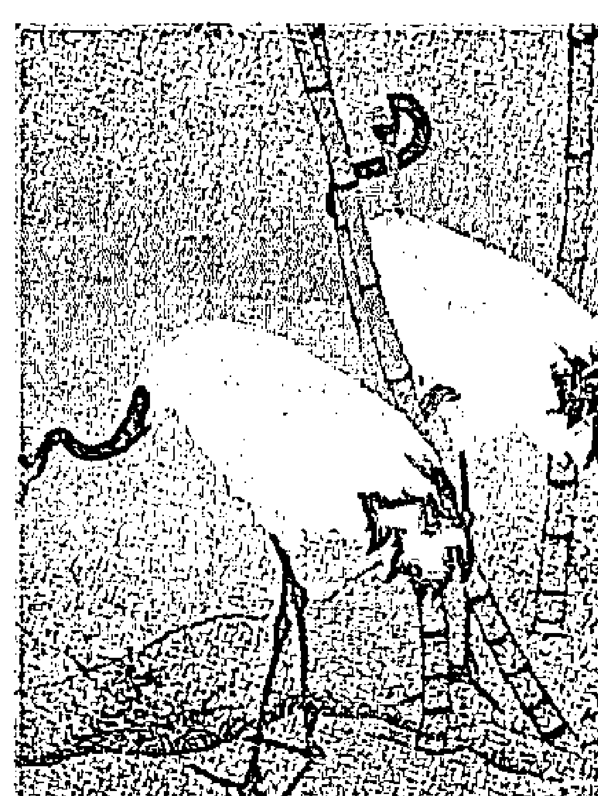

### 延年益寿的仙鹤图

夏秋出生的人最适合挂仙鹤图。属相为龙、兔、马和鼠的不宜在家中挂仙鹤图。家中若有老人，在客厅的宽敞处悬挂一张仙鹤图，有助于老人健康长寿。

# 773 喜鹊图有什么增旺作用？

古代有喜鹊报喜之说，每当有喜鹊临门，人们都视之为好兆头。喜鹊图适宜挂在客厅，家人都会感到身心舒适。

另外，喜鹊还有牵线搭桥的作用，未婚男女若佩戴喜鹊饰品，可早日结束单身生活，及早享受甜蜜的爱情。这是因为，在牛郎织女的传说中，织女被王母娘娘抓走之后，每年只能在七月七日七夕这天与牛郎见面，见面的地点就在银河。银河大浪滔天，难以渡过，所以成群的喜鹊就自动架成一座桥，让牛郎和织女“鹊桥相会”，圆了夫妻两人的梦。从此喜鹊就成为报喜，与喜事有关的瑞鸟。

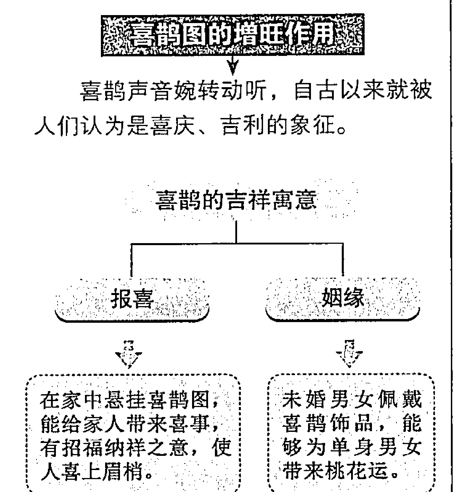

# 774 悬挂老虎图有什么讲究？

一般人认为，老虎为兽中之王，威武雄壮，具有强劲的戾气与爆发能力，因此家中悬挂与老虎相关的图可镇宅，其实不尽然。

虎被视为凶兽，老虎图一般不适合普通人悬挂，不过拥有特殊气势者或特殊职业者无妨，如军人、警察家庭。这些人霸气十足，呼应灵动力较强，可以驾驭老虎，令它发挥强有力的护卫作用。

另外，悬挂老虎图像，要悬挂老虎上山图，不可悬挂老虎下山图，否则对家人不利。

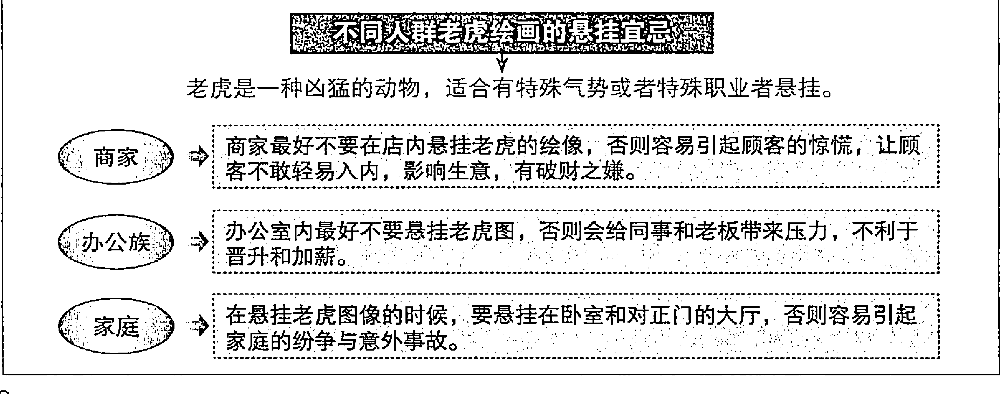

# 775 狮子图有什么增旺作用？

### 狮子图的增旺摆放方法

狮子有吸财作用，配合老虎的守财作用，若能在过年的时候悬挂一对狮子和老虎的门画，则可确保来年财运旺盛。

作为森林之王，悬挂狮子的地方宜高不宜低，悬挂地势高的狮子图像，才能让狮子居高临下，显示其威武不凡的气势，狮子的前面要有足够开阔的空间，让它有用武之地。

另外需注意狮子虽然是瑞兽，能带给人祥庆，但也属于凶猛的动物，挂在家中容易造成血光之灾。若非常喜欢狮子图，最好选择狮子滚绣球的画，表示喜庆、祥和，但一定要把狮子的头朝向外。与老虎绘图一样，狮子图也不适合属相为猴和蛇的人悬挂。

狮子除了摆放在门口镇宅之外，还可以摆放在客厅中，有镇宅保平安的作用。

### 客厅摆放法

客厅摆放：用来镇守家庭气场，从而安定夫妻感情。

客厅进出口摆放：在客厅进门处悬挂一张狮子图像，可以发挥增进夫妻感情的作用。

# 776 悬挂老鹰图有什么讲究？

### 老鹰图的收藏

老鹰是一种猛禽，虽然可以确保家居平安，但若使用不当，效果适得其反，可能还会伤害家人。因此，在用老鹰图时，一定要注意下面几点。

老鹰图的收藏，同其他猛兽图一样，需要注意的地方很多，而且不能随意丢弃。

- 如果在家中悬挂了老鹰等画，应将老鹰的头部向外，不能挂在卧室，那样可能会引起夫妻舌战。
- 老鹰图中的老鹰，头部应该向着门外，否则会影响家中孩子，孩子放学后不肯回家，容易出事。
- 老鹰图不宜挂在大厅内，否则影响家人情绪，容易产生争执。
- 老鹰图也不要悬挂在书房，否则影响文昌星，致使家中孩子考试成绩不理想，若有家人做行政工作，也不宜升职。

错误收藏方法：不想要老鹰图了，随便丢弃在墙角。
导致后果：招来是非，使家庭氛围不和谐。
正确收藏方法：应该用红纱线捆绑收藏起来。

# 777 悬挂龙绘图有什么讲究？

龙是吉祥物，古时候皇上身穿龙袍，称为“天子”，表现的就是以龙为天，以龙为大的意思。古代道家认为，龙代表人之本性，因此在家中悬挂龙绘图可起到招吉纳福的作用。

在悬挂龙绘图时有一定讲究，否则龙就会转化为凶狠的蛇，对家居运程不利。因此在悬挂龙绘图的时候，要注意以下两点。

- 在家中悬挂龙绘图时要把龙头向内，不可与虎放在一起，龙虎斗不完，家中会有大小苦哀。
- 龙绘图最好悬挂在客厅或神厅佛堂之青龙方，这样可起到吉上加吉的作用。

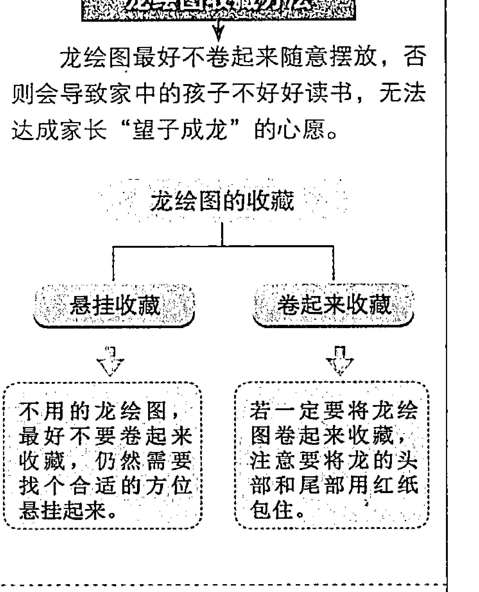

# 778 孕妇家中适合摆放什么饰物？

在家中摆放吉祥物作为装饰，是很多人都喜欢的做法。对于孕妇来说，家中适合摆放的装饰品要以色彩鲜明、能给人以怡情愉悦的图画、照片为主，如小孩子微笑的照片、美丽的山水画、风光图等能使人开心、快乐的图片，这样有助于提高孕妇的情绪，有利于胎儿的生长发育，而且孕妇长期欣赏美的事物，也容易生出美丽、可爱的宝宝。

需要注意的是，孕妇家中不适宜出现动物图案，即使有招财纳福作用的动物也不可，如貔貅、狮子、老虎、大象等吉祥物，这些吉祥物动物性强，人性弱，容易使孕妇生下畸形胎儿。

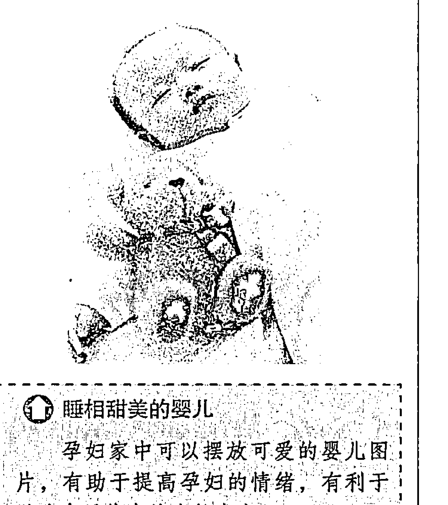

# 779 悬挂宗教题材绘画要注意什么？

宗教题材绘画会产生五行效应，在家中悬挂时要考虑到家人的五行。

佛教绘画在五行中代表金和水，家人五行相符的可以悬挂在家中北或西两个方向上。又如心经，在五行中属火，五行忌火的人是不宜挂在屋里的。

更应该注意的是，观音菩萨的绘画具有多重吉祥意义，但却不可在家中悬挂太多观音菩萨的绘画，否则会影响成员间的关系，不利于夫妻和睦。其实不仅仅是观音菩萨的图像，所有宗教题材绘画，包括圣母图，都不宜悬挂太多，点到为止即可起到画龙点睛的作用，多了反而杂乱，而且诸神之间容易发生争执，不利于维护家中气场的平衡、和谐。

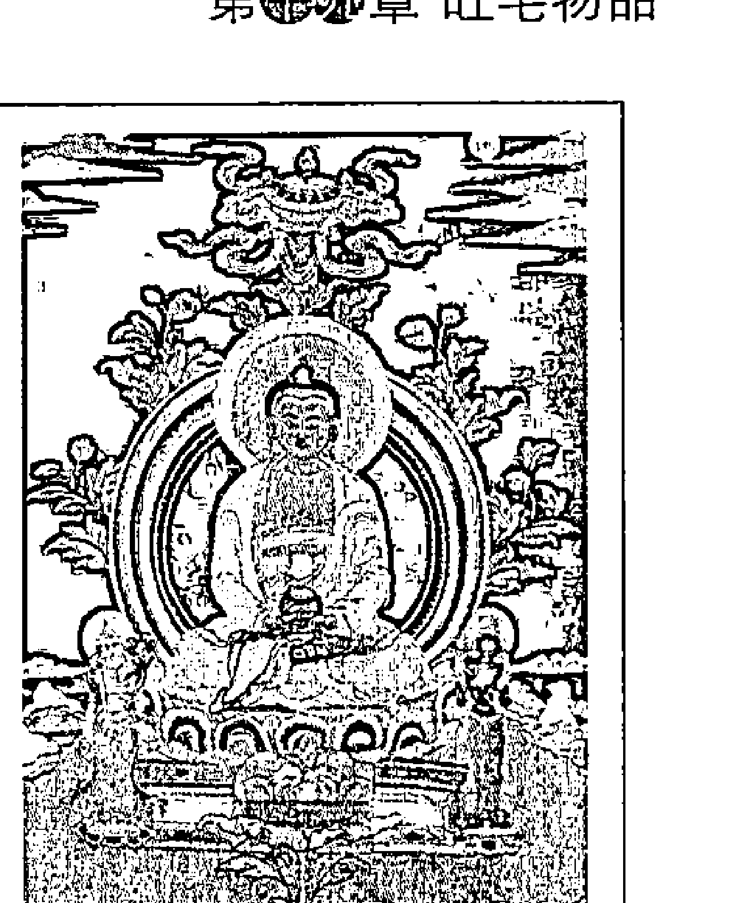

### 宗教题材绘画

宗教题材绘画如果恰好与家人五行相符，可以悬挂于家中北方或西方。

# 780 一般家庭供奉的神灵有哪些？

常见的家庭供奉的神灵有佛、菩萨、天神、财神、土地神等几类。具体有阿弥陀佛、释迦牟尼佛、长寿佛、观世音菩萨、普巴金刚、大黑天、伽蓝尊者（即关公）、太上老君、天后娘娘、吕祖、钟旭、济公、财帛星君、龙母娘娘、齐天大圣君、五路财神、武财神以及在门外供奉的土地神。不同的神灵，有不同的作用。如财帛星君在天上的职衔是“都天致富财帛星君”，专管天下的金银财帛，有招财纳福的作用；福禄寿星主管人间富贵、仕途、寿辰等，因此有招吉纳福等多重吉祥意义；观音菩萨普度众生，有助人消灾，保平安的作用。

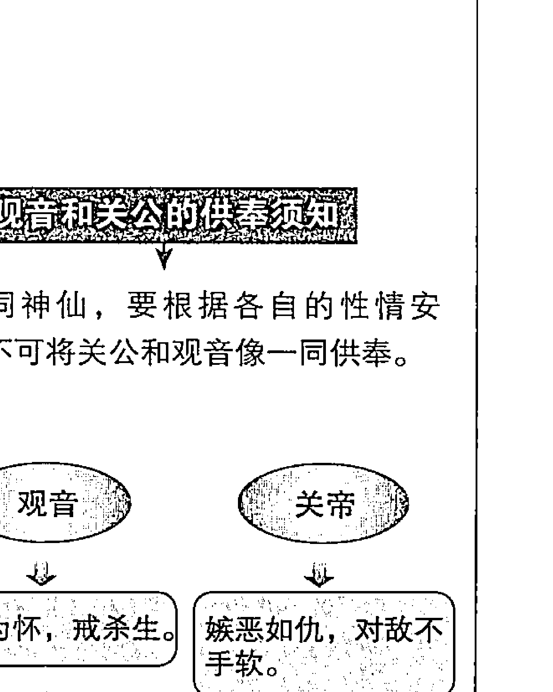

# 781 安放神位有什么讲究？

神位的安放很讲究，应谨记以下原则。

- 安放神位的地方背后必须有靠，最好是靠墙壁等比较固定的地方，否则就形成“无所依靠”之相，宅主难以赢得贵人的青睐。
- 神位要安放在不容易被其他东西碰撞的地方，比如墙角处。
- 神位的前方要开阔，形成“藏风聚气”的格局，不能在神位附近摆放电视、音响，这样才能使神有空间保护家人平安。
- 家中若是同时安置了祖先牌和神位，记得将神位供奉得比祖先的位置高，否则就对神大不敬，容易得罪神仙。
- 神位要摆放在吉位，不宜正对着厨房、厕所等容易产生污浊气息的场所，否则也是大不敬。

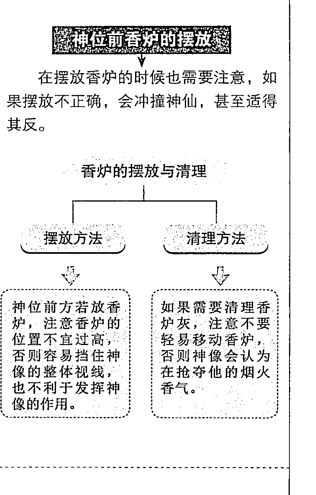

# 782 如何安放佛像保平安？

人们自古就习惯把佛祖的圣像请回家供奉，早晚拜拜，可以保平安。但在摆放佛像的时候要注意记得遵循下面几条原则。

- 佛像不能太多，否则会使家人多心。
- 佛像要摆放在清洁、干净的地方，不可摆放在卧室，否则容易做梦，导致睡眠质量下降。
- 如果佛像的眼睛、手指损坏了，应该及时修补重画，否则对家人不利，如佛像实在破损不堪，也不能乱丢弃，而要用金纸包数日在日光下烧化。
- 若佛像已经老旧了，不要随便扔掉，要请到寺庙，或用金纸烧化。

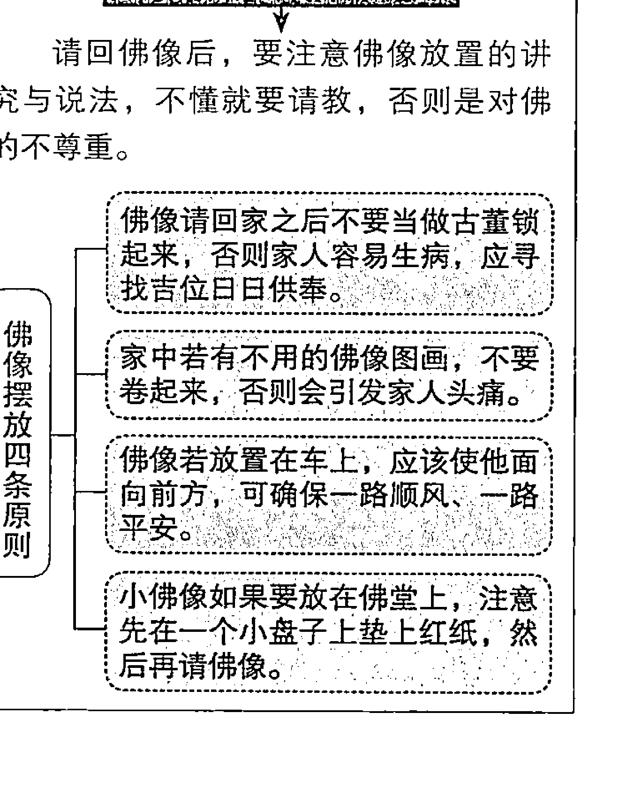

# 783 如何张贴招财神贴纸？

招财神贴纸可以提高家人的财运。张贴的位置一般选择在家中的财位上，或者大门口处。在张贴时，要注意其高度要与家里的最高收入者的眼睛高度相一致，并且要仔细测量。

注意财神有武财神和文财神之分，武财神是关羽，文财神是范蠡，二者在招财方面各有自己的本领，所以在张贴财神贴纸的时候应该有所区分。

注意将文财神范蠡贴在进门后的左右两边，并面向屋内。张贴武财神的时候，注意使他面向外面，如此方可起到镇宅护院保平安的作用。

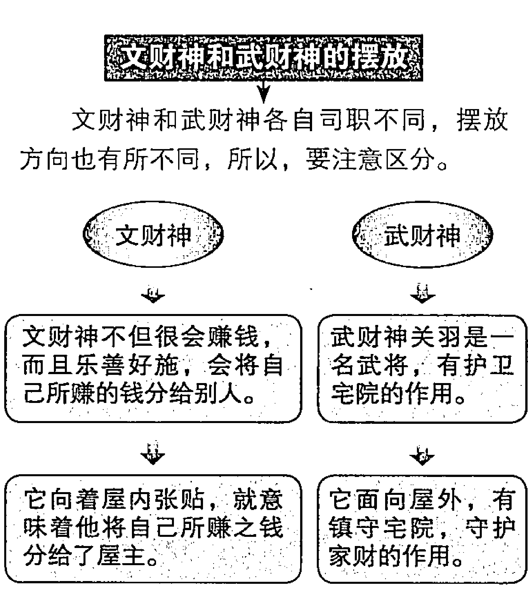

# 784 关羽神像有什么增旺作用？

关公即关羽，字云长，生于公元160年，卒于公元220年。关羽在其近六十年的一生中，策马横刀，驰骋疆场，征战群雄，辅佐刘备完成三分天下的大业，谱写出一曲令人感慨万端的人生壮歌。作为三国时期的名将，关羽在中国古代思想史上可谓毫无建树。但关羽充满传奇的一生，却感动了千千万万的人，他被后人推举为“忠”“信”“义”“勇”集于一身的道德楷模，并成了上至帝王将相，下至士农工商广泛顶礼膜拜的神圣偶像。民俗认为，摆放关羽的神像可以起到开运、旺宅的作用。

在摆放关羽神像时要注意，武财神属于武将，起着护卫的作用，可保护你的家产，防止小人对你的财产图谋不轨。

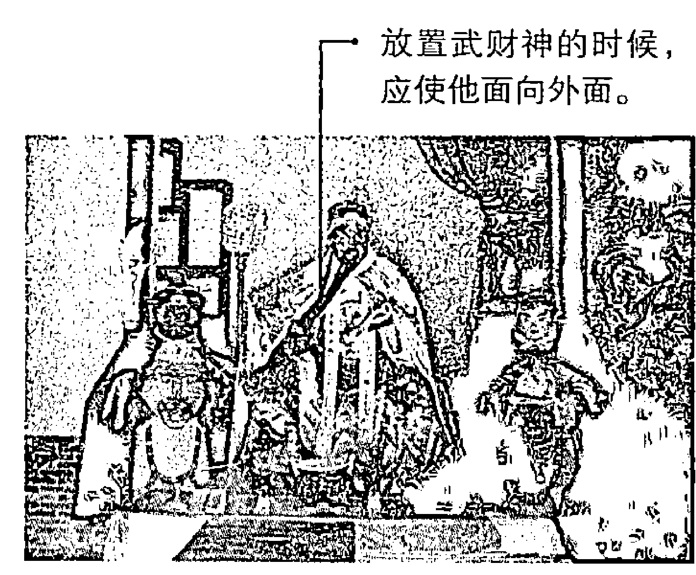

### 镇守住宅的关公

图中红面长须者即为关公。在家中摆放关公既可镇守门户，防止外邪入侵，又可帮你招财纳福。关公像旁再摆设龙龟，则吉上加吉，可以提高财运。

# 785 家中摆放古董有何讲究？

古董的摆放要符合旺运原则，摆设好了可以给家人带来财运和福气，若摆设了有邪气的古董则会令主人人财两空。

把古董带回家之前，应先在太阳下晒三天，吸收大自然的甘露水三夜才能带回家。然后要用新毛笔把红朱砂点在不影响古董美观的地方，并且要用红色绒布或者红纸垫底，这样能保家人平安。

但不宜将家当做古董的存放仓库，更不可在客厅里塞满古董，否则很容易影响到家人的健康，做事也不顺心，有时还会有一些怪异的事情发生，使家人情绪难以稳定。

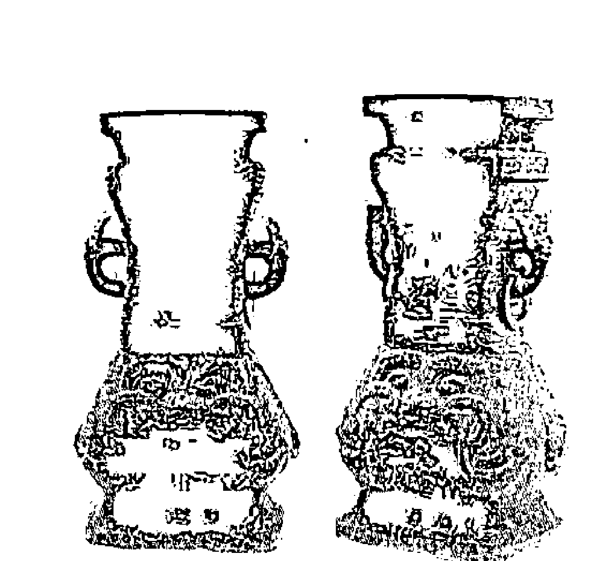

### 蟠虺纹铜圆壶

一般来说，古董年代越久远，越稀少，收藏价值就越高。图为蟠虺纹铜圆壶，为春秋时期的铜器。

# 786 祖宗照片应该如何摆放？

摆放祖宗的照片，不但可以寄托哀思，表达家人的思念和敬仰之情，而且祖宗属于家神，有助于镇宅保平安，所以一般的家庭会在合适的位置摆放祖宗的照片。

但祖宗的照片不可随便摆放，应该摆在厅堂底面墙的正中位置，或者摆在大门或屋里的左侧，左边表示尊敬。照片最好放在桌子上稳定之处，不可放在常用的器具上，因为经常打开会掉下来。

若是将祖宗的照片和财神、观音等天神同放，最好不要放置在同一水平线上，天神的神像应该在上位，祖宗的照片应该在下位。

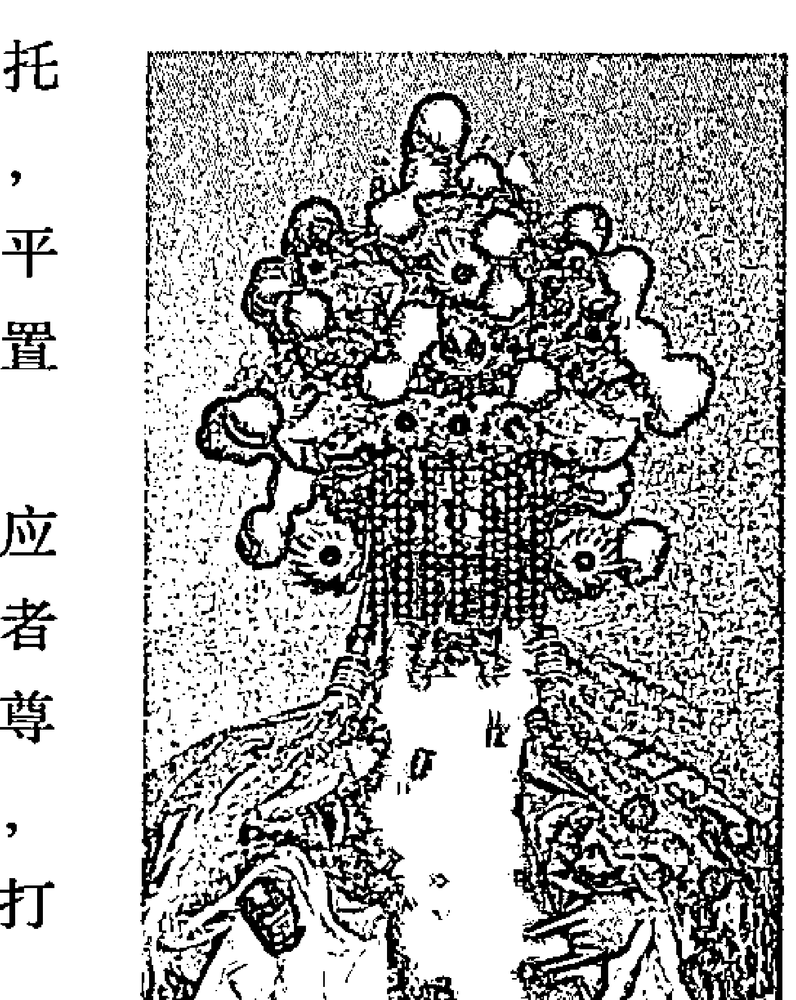

### 尊重天神

天神比家神的作用大，不应将家神摆在天神上位，摆放位置相反，不但难以抵御煞气，还因不尊敬天神而得罪他们，影响宅运。

# 787 毛笔摆放在书房有什么作用？

书房是阅读、写作的空间，饰物摆放要对求学有帮助才适宜。最常见的饰物有文昌塔、求学图、文人字画等。另外，毛笔也是不可缺少的饰物之一。尖尖的毛笔头和长长的笔杆，符合文昌塔尖尖的顶部卦象，在书房的写字台上放一支或四支毛笔，可以令你在阅读与写作中思维开阔。

在文昌位上摆放文具也可影响运程。比如在书桌的中间位或西南方放置四支笔，最好是毛笔，也可以催旺文昌。家中若有上学的孩子，这样摆放读书时能集中思维，帮助学业进步，并且在考试中也能带来好运气。

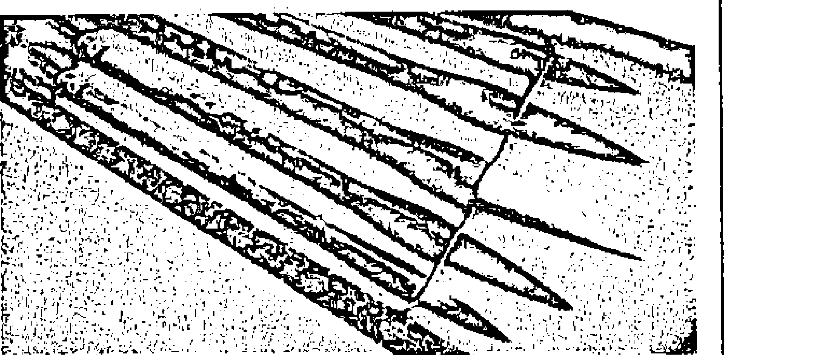

### 文昌笔旺文昌

在古代，毛笔代表文昌，在书房内的文昌位上摆放毛笔，可起到旺文的作用。如果在孩子的书房中摆放毛笔，有利学业运。

# 788 坠子有什么增运作用？

不同的坠子有不同的增运作用。

红色和黄色两种穗坠有吉利作用。挂置红色的穗坠能够开运，注意要挂在房间的东面，充分发挥红色的开运作用。黄色的穗坠则要挂在西侧才能提高财运。穗坠不宜过长，约60厘米为好，也可以挂在车上，能给驾车的人带来好运。

若有条件，还可佩戴琥珀吊坠，可以给人带来元气，有延年益寿的作用。生意人若佩戴琥珀吊坠，还可确保思维灵活，头脑清醒，有助于增强对事物的判断力，容易做对事业有利的决策。

狮头吊坠是狮子头造型的吉祥物。在商铺中挂此吊坠可以守护商铺，避免灾祸。

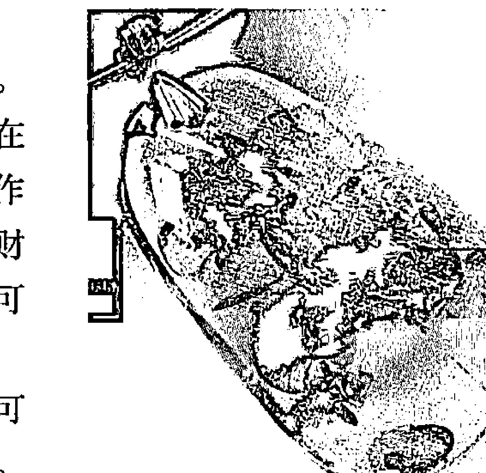

### 琥珀吊坠

生意人若佩戴琥珀吊坠，可以确保思维灵活，头脑清醒，有助于增强对事物的判断力，做出对事业有利的决策。

# 789 竹笛有什么妙用？

很多人只知道笛是乐器，能奏出优美的音乐，却不知道笛还是常用堪舆道具，有生财、聚财之效。

笛由一根竹管做成，里面去节中空成内膛，外呈圆柱形，不但可以通过气孔发声，还有竹子“节节高升”的内涵。工薪阶层若想升职、加薪，就可借助笛、箫帮忙，让自己通过不断的晋升获取财富上的增加。正确的招财方式是：找出家中的文昌位或文曲位，然后将笛子悬挂在这个位置上，即可利用笛子的高升作用，为自己招揽财富。

### 竹笛的妙用

竹笛不仅是能演奏出优美音乐的乐器，更是一种效果良好的开运物品。

- **竹笛寓意**：竹笛一节比一节粗，有节节高升之意。
- **竹笛开运**：竹笛挂置时，较细的一端挂在墙壁上，可以开财运。
- **适宜人群**：特别适合经营生意的商人挂置，可带来很好的生意运。

# 790 铜鼎有什么作用？

铜鼎，圆腹，三足，少数为方形，四足，鼎耳可以穿杠或搭钩。

鼎不但是我国古人的炊食器，也是一种特色文化的代表。在古代，鼎是一种标明身份等级的重要礼器，是祭祀天帝和祖先的“神器”，鼎也因此被笼罩上一层神秘而威严的面纱，“一言九鼎”“大名鼎鼎”“鼎盛时期”“鼎力相助”等都说明了鼎的尊贵地位。

鼎有藏风聚气的作用。在古代，鼎是显赫帝王的象征，被人尊重，是权威的象征，有“一言九鼎”之说，寓意说话的分量重。现代人在家中摆放鼎，主要利用其避凶趋吉。

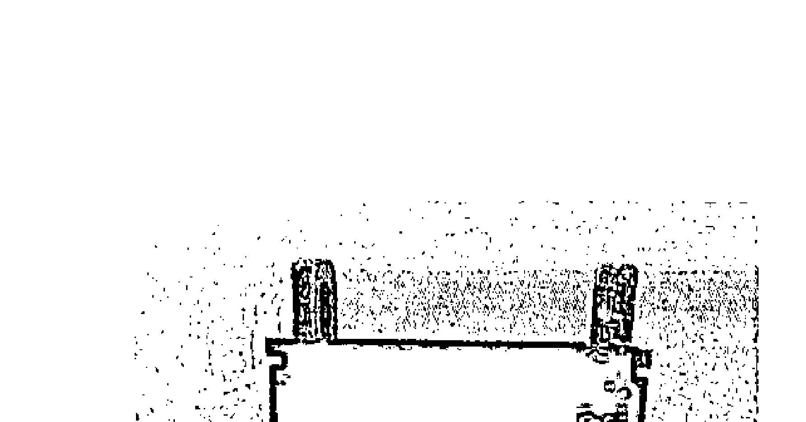

### 铜鼎的作用

鼎作为青铜文化的主要标志，具有很高的审美价值。鼎的身价不凡，家中若有铜鼎，是身份的象征，有助于招揽人气。

# 791 家中摆放过多旺宅饰物有害吗？

上面我们介绍了很多能驱邪避煞、招财纳福的饰物。有的人就想当然地认为，把这些饰物都摆放在家中一定可以带来好运。

其实，在家中摆设太多的旺宅装饰品会对人体产生不好的影响。旺宅装饰品太多，会阻止家中气场的流动，这不仅对眼睛不好，而且还容易引起感冒，身体抵抗力下降。有时候，各种饰物之间互相影响，甚至会出现同类饰物打架的情况，起不到旺宅保平安的作用。另外，家中旺宅饰物太多，会显得很乱，不利于家居环境的美化。

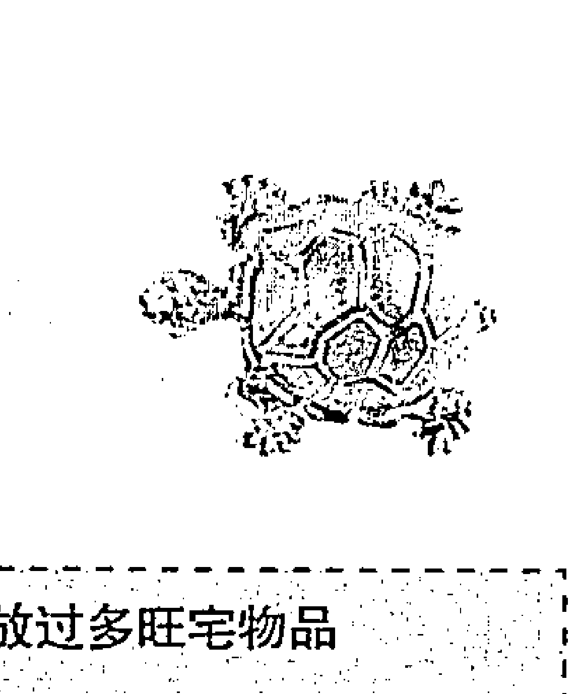

### 家中不宜摆放过多旺宅物品

在选择旺宅饰物时，根据自己的喜好或五行命格有针对性地挑选一两件就好，不宜将全部旺宅饰物请回来，更不宜同时摆放或随身携带具有同类作用的旺宅饰物，以免出现打架的情况。

# 792 玄关饰物怎么选择？

玄关即内明堂，它不仅是大门与客厅的缓冲地带，还是内外空气的对流处，代表家中的财路，它还起到遮掩隐私的作用，因此，玄关布置非常重要。

在玄关的柜子上，可摆设黄水晶或是流动的水，如鱼缸、流水盆、手绘山水画，用来增强气场，催财招运。流水的方向最好指向住宅的财库——厨房。在玄关处摆放饰物，选择是很重要的，古人常在玄关处摆放狮子等威猛的动物，可以镇守住宅。现代住宅摆放大型饰物会受到限制，可以摆放一些动物造型的工艺品。但要注意不要与主人的生肖相冲。鼠忌马，牛忌羊，虎忌猴，兔忌鸡，龙忌狗，蛇忌猪。

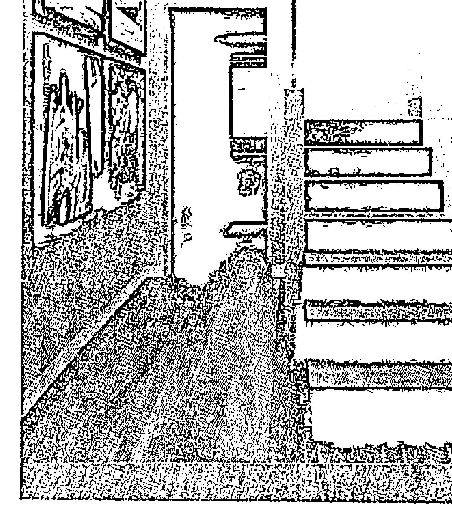

### 玄关

玄关可以阻挡冬天的寒风，春天的风沙。玄关处摆放饰物要特别小心，以免无意中破坏了住宅气场。

# 793 石敢当有什么作用？

在一块小石碑上刻上“石敢当”或“泰山石敢当”，将其立于桥道要冲或砌在房屋墙壁上，这样的习俗，在民间非常流行。

“石敢当”的文字出处，最早见于西汉史游的《急就章》中：“师猛虎，石敢当，所不侵，龙未央。”据说，石敢当是汉时的勇士，生平逢凶化吉，御侮防危。也有人认为，石敢当前加泰山，其用意是借泰山之力以增威势。泰山的“泰”字，古为“太”，即“大”，太山就是大山，大山可以压妖镇邪。宋象之在《舆地纪胜》中曾说过：“石敢当，镇百鬼，压灾殃，官吏福，百姓康，风教盛，永乐康。”由此可以看出泰山石敢当的主要功效是镇宅、驱阴、避邪。

后人常在桥路之处，以石刻上石敢当，用以避邪厌殃，保卫居民安全。

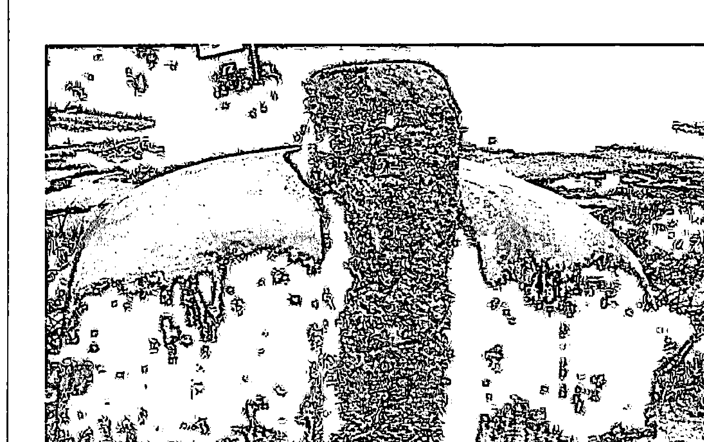

### 石敢当

古人常在自家门前摆放一块巨石，石头刻上“石敢当”三个大字，借泰山的力量守护宅院。

# 794 什么地方适合摆放石敢当？

石敢当放在门内，窗台上，可以压制邪气。特别是放在汽车内效果更佳，保人出行平安。

南宋后期时把石敢当放在村镇入口、桥头、河岸等地，镇压百鬼，制止灾殃。石敢当被当做是镇压凶地之物，凡是有凶相的地势都可放置。另外，如果住宅处于三叉路口，或者住宅对面有小人探头，也可以放置石敢当，还能提升家人的运势。

## 795 后人为什么尊秦叔宝和尉迟敬德为门神？

关于门神的来历，有一个有趣的故事。相传，唐太宗下令杀了泾河龙王，心有不服的泾河龙王就经常在唐太宗的梦中鬼哭狼嚎，唐太宗又怕又恼。唐太宗手下有两员大将，秦叔宝和尉迟敬德，他们两人主动要求在太宗寝宫外站岗。以后泾河龙王不再来骚扰。惜才的太宗不忍心两人不休息天天为自己站岗，于是命人将两位大将戎装肖像挂在寝宫门口，泾河龙王也没出现在太宗的噩梦里。故事流传到民间，百姓也效仿，将秦叔宝和尉迟敬德两人的肖像贴在自己门口来驱除恶鬼，并尊称两位为“门神”。

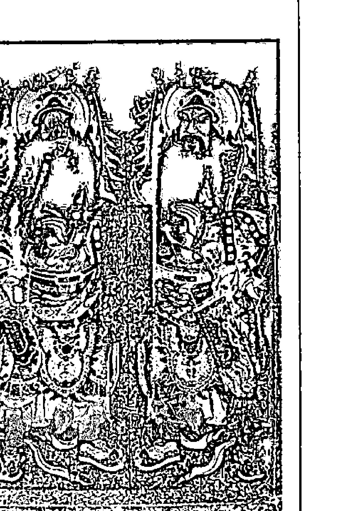

### 门神增喜庆

花花绿绿的门神不但增添了节日的喜庆，更重要的是，人们对贴门神有种情感寄托。最开始贴门神，是为驱鬼避邪，求福祈祷平安；今天贴门神表达的是对平安、幸福的向往与追求。

## 796 门神有什么作用？

民间各地贴的门神有所不同。河北人供奉的门神是马超、马岱哥俩；河南人供奉的门神为三国时期蜀国的赵云和马超；陕西人供奉孙膑和庞涓；苏州地区曾以温峤、岳飞为门神。门神又分文门神、武门神、祈福门神。文门神即画着朝服的一般文官像，武门神一般是指武官，祈福门神则多指福、禄、寿三星。

### 门神的不同作用

门神主要有镇邪驱鬼、招财纳福、镇宅保平安和有助于修炼等四个方面的作用。可以根据不同需要进行选择。

- 镇邪驱鬼：被称为捉鬼门神，如神荼和郁垒，金鸡和老虎。
- 招财纳福：专用做祈福，中心人物多为赐福天官，也有用刘海戏金蟾、招财童子小财神等，张贴这样的门神容易得到功名利禄。
- 镇宅保平安：可以镇住恶魔或灾星从大门外进入，这类门神多为秦叔宝、尉迟敬德、马武、铫期等。
- 有助于修炼：如青龙孟章神君、白虎监兵道君，这类门神一般人家不常用，道观中常张贴。

## 797 狮子像有什么作用？

一般来说，摆放狮子的地方宜高不宜低，这样才能让狮子居高临下，显示其威武不凡的气势。狮子的前面要有足够开阔的空间，让它有用武之地。不能把狮子摆放在低洼的地方，这样会使得狮子处于四面围困的境地，不利于发挥它的作用。

另外，狮子像可以阻挡阴气，可根据住宅的格局摆放不同的狮子像，阻挡来自东边的阴气要在东边摆放铜狮、白狮；南方摆置黑狮；西方摆置红色的狮子，北方摆置石狮和玉狮。

> ● 狮子
大门前立着的狮子，气势威武，对邪恶事物有威慑作用。如果住宅周围有冲煞，可以根据不同的方位摆放不同材质的狮子。

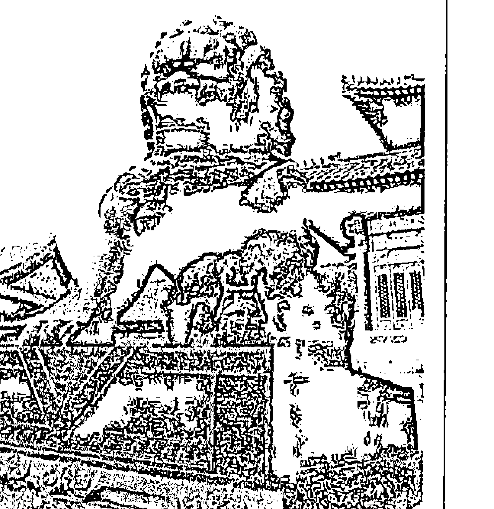

## 798 “四神兽”有什么作用？

“四神兽”即青龙、白虎、朱雀、玄武。青龙又称“苍龙”，就是中华民族常称的龙，它与白虎因为勇武的缘故，被人们当做镇邪的神灵，因此多出现在宫阙、殿门、城门或墓葬建筑及其器物上，起着镇宅、保平安的作用。白虎除了镇宅作用外，还有避邪、禳灾、祈丰、惩恶扬善、招财纳福、喜结良缘等多种作用，是富贵的象征。

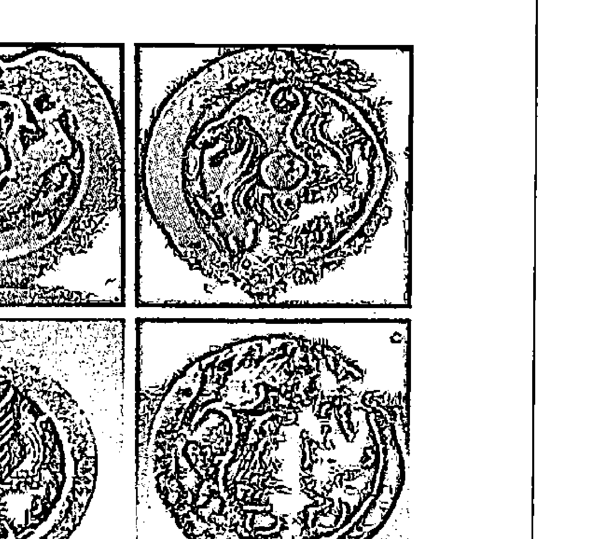

朱雀形似凤凰，又称朱鸟，它是天之灵兽，比凤凰更稀有尊贵，象征着美好的品德，与龙相对，是纯阴的代表。玄武为龟、蛇合体，因此具有龟和蛇的双重作用，象征着无比尊贵。

> ● 四神兽
图中左上为青龙，东方之神；右上为白虎，西方之神；左下为朱雀，南方之神；右下为玄武，北方之神。这四大神兽均具有强大的法力，它们共同驱邪除恶，调节阴阳。

## 799 钟馗像有什么作用？

钟馗是传说中的驱鬼逐邪之神，他相貌奇丑：豹头环眼，铁面虬髯。他性格刚直，不惧邪魅。据说钟馗曾参加科考，成为贡生之首，但在殿试中，因为面貌丑陋而落选。钟馗一怒之下撞殿柱而死，朝野震惊。于是皇帝下诏封他为“驱魔大神”，为天下“斩妖驱邪”。从此，钟馗就成为驱鬼逐邪之神。

钟馗像运用了钟馗的驱鬼逐邪作用，每逢过年，家家户户都在门上悬挂钟馗像，祈祷全家平安。在江淮地区，每到驱邪辟毒的节日——端午节，家家户户都要准备三件避邪的宝物：钟馗像、天师符和雄黄酒，以驱邪魔，镇宅保平安。

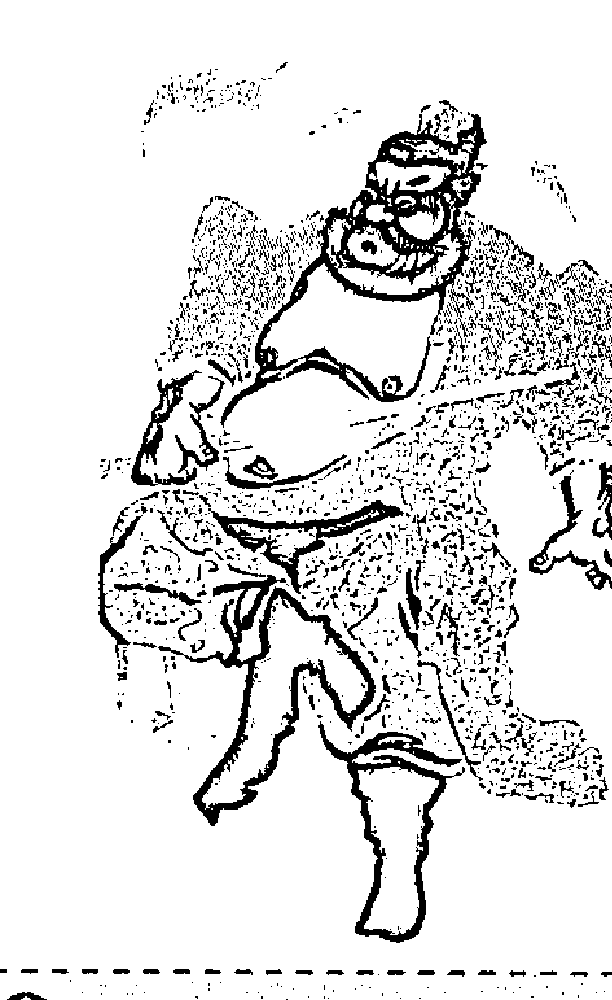

> 钟馗像
钟馗是驱鬼逐邪的神仙，逢年过节，将钟馗像挂在家中大门上，能保佑全家平安。

## 800 屏风有什么作用？

屏风原本是皇帝宝座后面的东西，象征着富贵、威严。经过时间的变迁，到了后来，屏风成为一件家用器具，普及到了民间。人们普遍认为，屏风具有挡风聚气、美化室内环境的作用。屏风的主要作用在于调节家居气场。

一般人认为，屏风的主要作用在于阻挡煞气，因此应该安放在靠近大门的区域——玄关处。其实不然，屏风的安放要看大门的朝向。如果大门朝向接纳旺气的方位，放置屏风就会阻挡财运。屏风具体应该放在哪里，要看家中气场及宅主八字。

### 屏风的选择

屏风的选择，很有讲究，其材质的好坏和颜色的搭配，都会影响到运程。

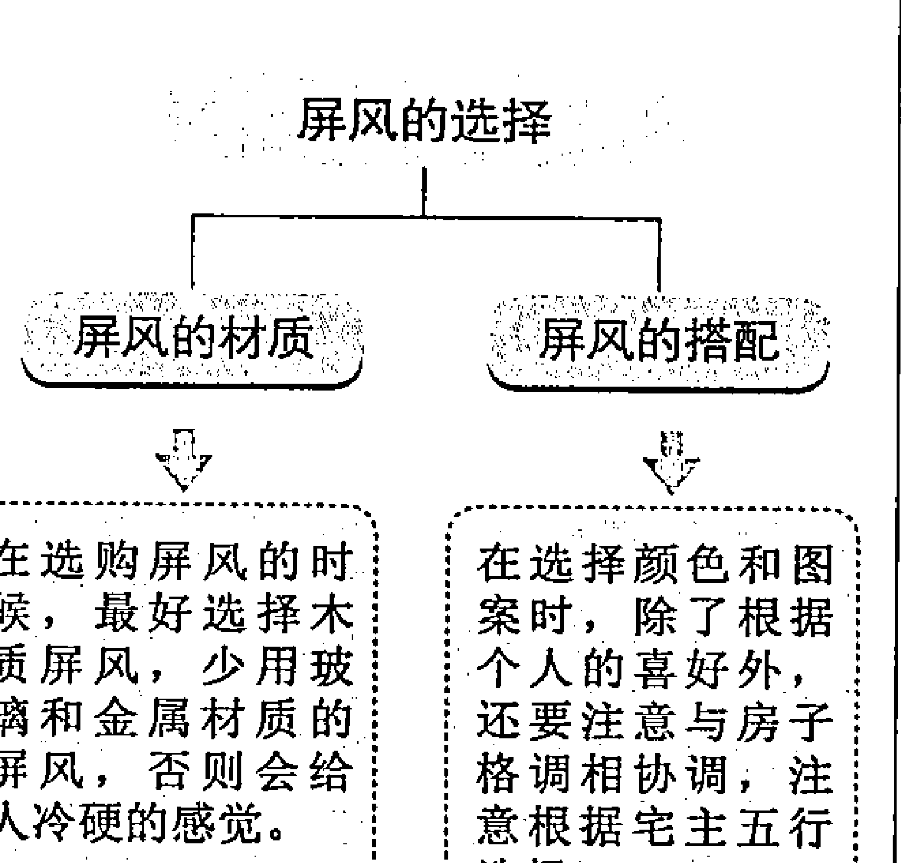

## 801 八卦镜有什么作用？

八卦镜又叫太极八卦镜，是广为中国人熟知的器具之一，很多人家的屋檐、墙壁上都会悬挂八卦镜，它有镇宅保平安的作用。

八卦镜一般分为八卦平光镜和八卦凸镜，它们均具有化煞作用。八卦镜最好是凸镜，能反射出阴气，而平面镜和凹陷的镜，只能把外物“借入”。

在放置八卦镜的时候要注意，它是一种转运工具，只能对外，不能挂在室内照人，而且八卦镜不宜放置太多，一个方位只能挂一个，全家不超过三个，否则会伤害家人。

### 八卦镜悬挂注意事项

八卦镜分为八卦平光镜和八卦凸镜，它们都有不同的作用。八卦镜在悬挂时有三方面注意事项。

### 悬挂时间
八卦镜要在中午12时整悬挂。

### 悬挂要求
悬挂的八卦镜一定要经过开光。

### 悬挂禁忌
不可将自己家的煞气转向别人家，即八卦镜的反射方向不能对着别人家。

## 802 葫芦有什么作用？

葫芦口小肚大，进气容易出气难，因此具有聚气生财的作用，可广纳四方财气，增加财运，象征着财运亨通、财库饱满。

葫芦有多重作用，自古以来医生、占卜、风水、算命或看相职业的人都喜欢在家中或办公室中挂葫芦，即所谓的“葫芦山现，术数医流”。这样一方面可以催旺他们的事业，一方面也可开运、保健康。

一般人家，在横梁上或两条大梁之间挂一个葫芦，可以化解横梁压顶之象；在卫生间放置一个开光的葫芦，可化解卫生间的浊气。葫芦摆放到哪个位置，就可化解哪里的阴气，并确保家庭成员的身体健康。

### 葫芦的作用

葫芦不仅仅是一种植物，还是具有一定转运作用的法器。

葫芦的作用

可促进人际关系的圆融、和谐，有利于广结人缘，增加贵人运，为个人事业的发展带来契机。

家里若有秽气或不好的气场，导致个人运程不畅或危害健康，可用葫芦来祛病。

若想旺丁，可悬挂有许多种子的天然葫芦。

## 803 紫金葫芦有什么作用？

葫芦的旺运作用，使得它成为与神仙相伴的灵物，沾染了仙气，成了给人类带来福禄、驱魔辟邪的法宝，太上老君、铁拐李、南极仙翁、济公和尚等神仙都身背葫芦。其中紫金葫芦是太上老君炼药的法器，在《西游记》中，装孙悟空的葫芦，即为紫金葫芦。

紫金葫芦不但具有一般葫芦带来福禄吉祥、健康长寿等吉祥作用，它还可以中和仙药，使它具有化解阴气的作用。

家中若有对人体不利的气场，可在家中的卧室、书房、沙发或厨房的凶位放置一个紫金葫芦，可以化解流年凶气，也可化解因为房子年代过久而形成的室内邪气。

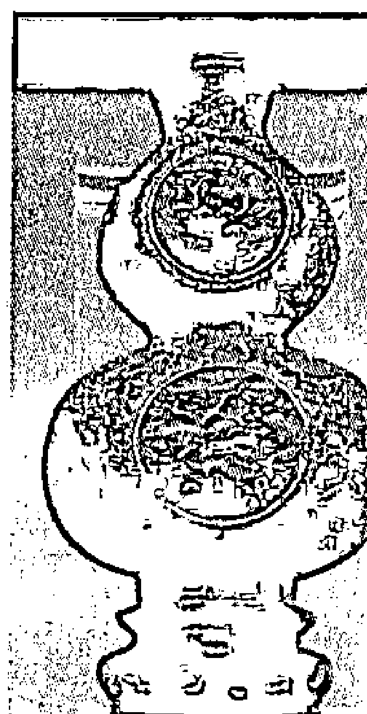

> 紫金葫芦
主人健康状况不佳，可以找哪个地方出现问题了，然在自己睡床的两侧各挂一个开过光的紫金葫芦，人体的病气就会被吸走，身体会快速好转。

## 804 五帝古钱有什么作用？

五帝古钱指清朝顺治、康熙、雍正、乾隆、嘉庆五个皇帝时期的古钱。这五个皇帝在位期间，国家繁荣兴旺，可谓盛世。当时的钱币吸收了盛世的气场，有旺财的作用。把它们按照年代次序串在一起，挂在家里有煞气或凶星降临的位置，能够驱走邪气，佩戴在身上可以保平安。

此外，古钱币还有化煞的作用，将古钱挂在窗口、门楣上可化解不利格局带来的影响；放在坐椅背或墙壁上，可防小人中伤；将古钱币放到枕头下，可防夫妻一方有外遇；若用黄线将其串挂在大门右侧，可防女人唠叨。

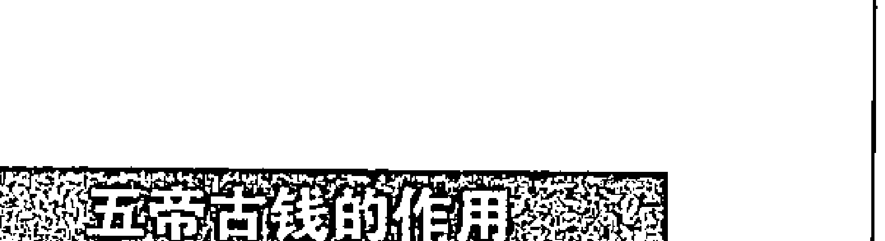

### 五帝古钱旺财的三个方法
1. 必须是真正的五帝古钱，不能是商人仿造的假钱，假钱没有天地人三气三运并存，因此没有聚财功效。
2. 古钱币必须经过堪舆师或道士开光，否则就没唤醒五帝古钱的聚财能力，不能发挥聚财功效。
3. 不能清洗古钱币，否则会洗去上面的三气三运，失去了能量，就失去聚财功效。

## 805 桃符有什么作用？

桃木具有驱邪驱鬼的作用，古人在过年的时候，分别在桃木板上画上“神荼”“郁垒”两神的图像，然后悬挂在大门上，就可以祈福灭祸。后来人们为了省事，不再画两神的头像，直接在桃木板上写上“神荼”“郁垒”两神的名字，也可以祈福灭祸，这就是桃符了。再后来，桃符的内容更广泛了，除了书写两神的名字外，还多了一些其他的吉祥话，这就是春联了。

无论是春联还是桃符，悬挂在大门或卧房门的两侧，就可以镇邪驱鬼、祈福纳祥，都表达了人们对吉祥的向往。

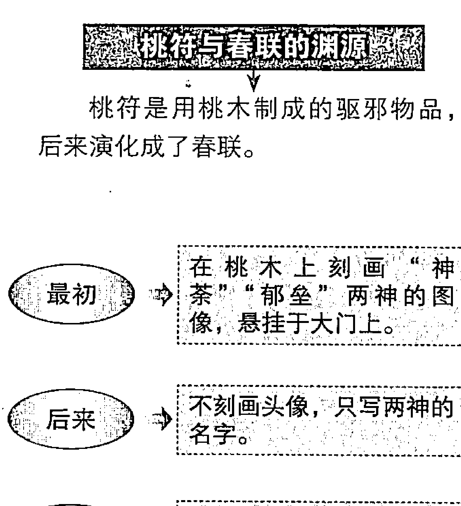

## 806 公鸡饰物有什么作用？

公鸡是灵动的吉祥宝物，有吉祥如意、心想事成的意思。在现实生活中，公鸡以小虫为食物，家中小孩若肚内有虫，肠胃不佳，面黄肌瘦，在适当位置摆放一个公鸡饰物，可改善小孩不思饮食的状况。家中大门若正对着形如蜈蚣的水管，远远望去像一条直立的百足虫一样，这对家居运程不利，在大门口摆放一个公鸡饰物，可有效化解。

需要注意的是，公鸡饰物只能摆放一只，不能过多，否则公鸡好斗的天性会被激发出来，这些公鸡将会自相打斗，起不到增运作用。

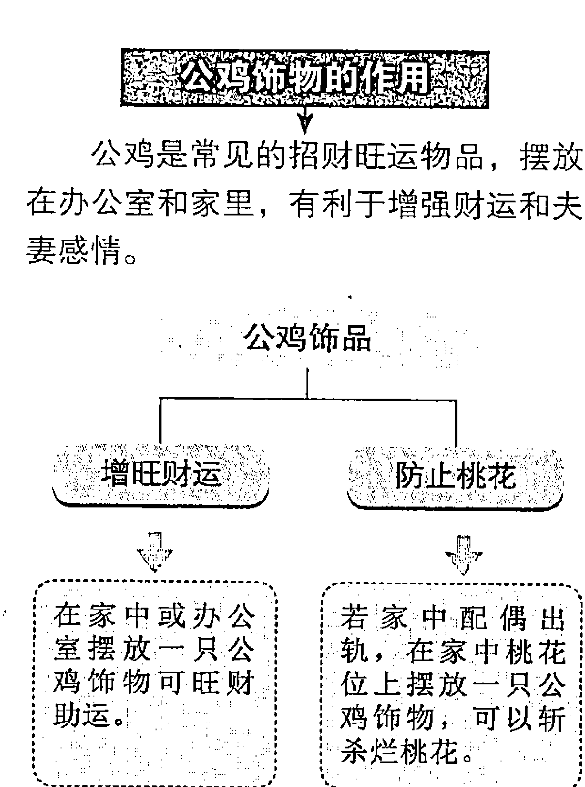

## 807 麒麟有什么作用？

麒麟生有龙头、鹿角、马蹄、牛尾、狼额，身上披五彩鳞甲，具有这些动物的特性，因此被认为是吉祥之物。传说它走过的地方，都会给人带来好运，因此有“麒麟吉祥”之说。

传说麒麟品质优秀，性情温善，喜欢帮助人，对好人、孝顺的人特别照顾，遇到坏人就会追着咬，因此有助运驱邪的作用，从事黄、赌、毒等有关行业的人，如在家中摆放麒麟，一定会受到它的惩罚。

麒麟一般摆放在家中显眼的位置，象征着富贵和权威，能够消灾解难，驱除邪魔，镇宅避煞，催财升官，最适合军队、司法、公安、检察院、大公司高层行政机关人员使用。

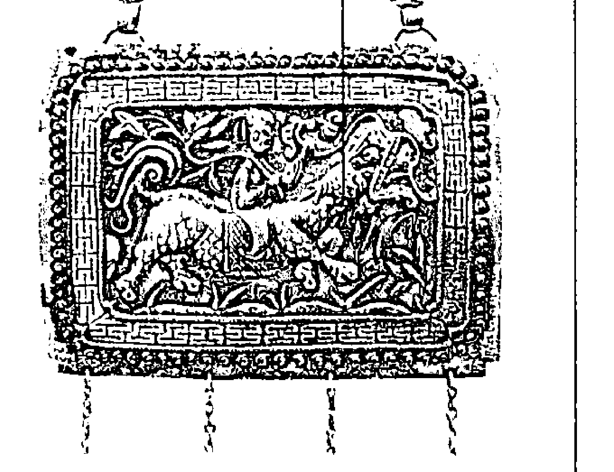

> > **麒麟**
>
> 由于麒麟有旺丁的作用，民间一直有“麒麟送子”的说法，一般人家在吉位上摆放麒麟，不但可以增加财运，还可早得贵子。

## 808 如意有什么作用？

如意，又称“握君”“执友”或“谈柄”，本是自印度传入的佛具之一，由于多与王公大臣、士大夫相伴，渐渐成为权力和财富的象征。

今天流行的玉如意造型是唐代以后确立的，它的头部呈心字形，曲柄有些弧度，作弯曲状，其头部弯曲回头之状，被人赋予了“回头即如意”的吉祥寓意。玉如意的出现，实现了玉坚贞不渝的美德与如意吉祥寓意的完美结合，成了具有中国特色的吉祥文化器物。

清代中后期，如意在民间广为流传，逢年过节、寿诞婚嫁都用如意做礼物，贵重的玉如意还被当做镇宅之宝，成为人们身份、地位的象征。

明、清时期，如意从权杖的实用品逐步转变为一种艺术陈设品，供人们欣赏娱乐。

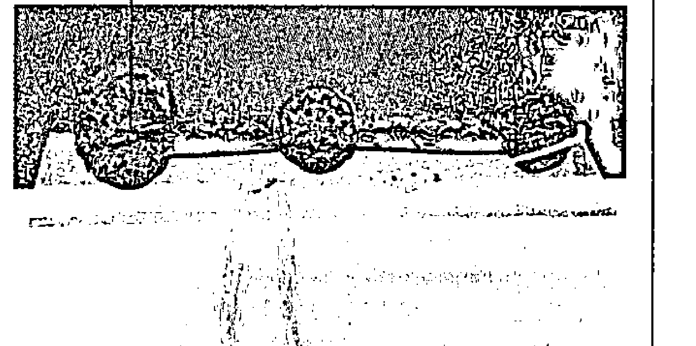

> > **如意**
>
> 如意头尾两相呼应，主体呈流线形，柄微曲，造型美观、华丽。康熙年间如意成为皇宫珍玩，宝座旁、寝殿中摆设的如意表示吉祥和顺心。

## 809 花瓶有什么作用？

一般来说，花瓶有两大旺运作用。
1.  催旺桃花。花瓶是旺桃花的常用器具，里面装满清水效果更佳，最好在里面装上花，最好是鲜花。注意不要将花瓶摆放在窗台上，否则容易招致烂桃花。
在摆放花瓶的时候，最好根据宅主的出生日期，选择不同的花瓶和位置。不同颜色的花瓶有不同的作用。如绿色花瓶主口舌，可以改善性情内向，不善言语的性格，但若摆放在不合适的位置上，家中口舌必多，容易产生纠纷。
2.  调节阴阳。有些花瓶还有调整室内阴阳的作用，如有四神兽图案的花瓶。将这样的花瓶放到房间里显眼的位置，可以招来幸福和财富。

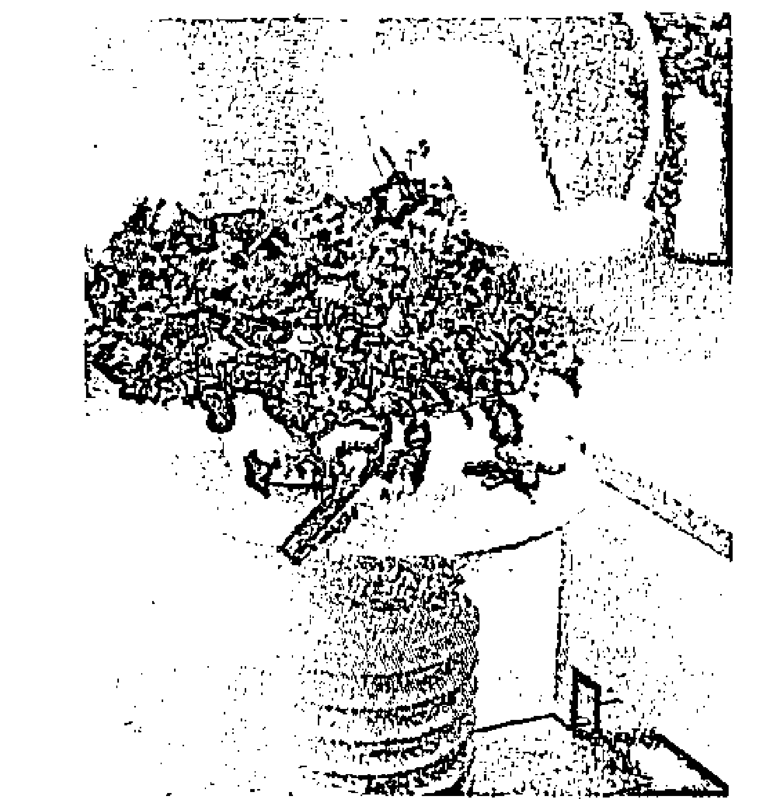

> 商铺摆放花瓶增客流
经商人士将花瓶放在客人目所能及的地方，有助于增加客流量，财源滚滚。若在花瓶内放一些水晶和古钱，则催财作用更盛。

## 810 铜铃有什么作用？

铜铃形同铜钟，佛教和道教常将文、咒语等铸在铜钟上祈福，因此铜铃具有趋吉避凶的作用，可聚财、赐福、避邪、保平安。人们常将铜铃挂在门口或各个角落的屋檐下，铜铃会在微风的吹拂下发出阵阵响声，好像寺庙、道观里的钟声一样悠扬，令邪气闻而害怕，不敢前来。

铜铃能挡住各种不利影响，尤其可以化解五黄煞。水晶和黄玉具有纳气招财的作用，若在铜铃上加上小水晶和两个小黄玉元宝，挂在门口，不但可以化解五黄煞，防止厄事发生，还可以起到开门见财的作用。

| 相冲生肖 | 禁忌安装时间 |
| :--- | :--- |
| 鼠马相冲 | 属鼠的人不能在午时安装<br>属马的人不能在子时安装 |
| 兔鸡相冲 | 属兔的人不能在酉时安装<br>属鸡的人不能在卯时安装 |
| 龙狗相冲 | 属龙的人不能在戌时安装<br>属狗的人不能在辰时安装 |
| 牛羊相冲 | 属牛的人不能在未时安装<br>属羊的人不能在丑时安装 |
| 虎猴相冲 | 属虎的人不能在申时安装<br>属猴的人不能在寅时安装 |
| 蛇猪相冲 | 属蛇的人不能在亥时安装<br>属猪的人不能在巳时安装 |

## 811 牛有什么旺运作用？

牛踏实、本分，刻苦、耐劳，属于吉兽，家中摆放牛饰品，家庭成员可发挥牛般的工作精神，从而招来福气，提升事业运，旺运生财。

摆放牛饰品的时候，要注意以下几点。

1.  在材料的选择上，最好用黄金打造而成的牛，它所散发的金色光芒将大大催旺家中气场，对工作、事业、财运的提升均有较强的作用。同理，也可使用镀金的铜制牛。
2.  若经济条件不允许，可使用陶制的牛，不过要注意选择吉位。
3.  千万不要使用木制的牛。在五行原理中，牛即丑，丑属土，而木克土。木制的牛使牛的旺运作用得不到发挥。

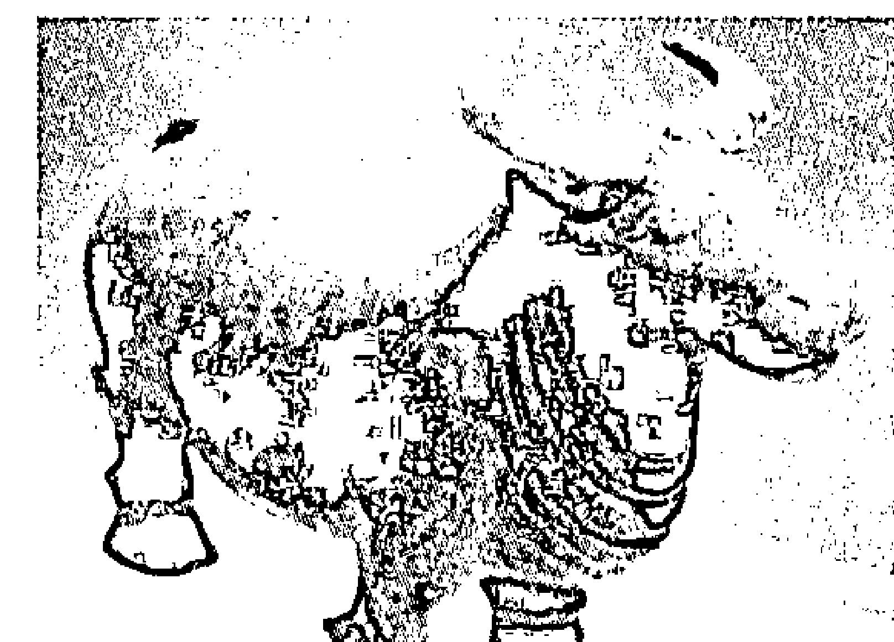

### 牛饰品的旺运摆放方法
| 摆放原则：牛的数量不在多，而在精。 |
| 饰品样式：神态祥和、稳实、憨厚的牛。 |
| 摆放数量：家中摆放一只即可。 |

## 812 玉兔有什么作用？

玉兔象征着温驯慧黠，性格温和，喜欢干净。人们可借玉兔的灵动力去化解一些戾气，但对于特别不利的格局，则无法化解。

在摆兔饰品的时候应注意：兔子属木，最好选择木质的玉兔，陶瓷的也可以，但不可用金质或玉质玉兔，否则无法发挥玉兔的祥和灵动性。摆放的方位，最好在东方，此方位有助于改善人际关系。

需要注意的是，玉兔与公鸡相克，属鸡的人不宜用兔饰品来提升运程。

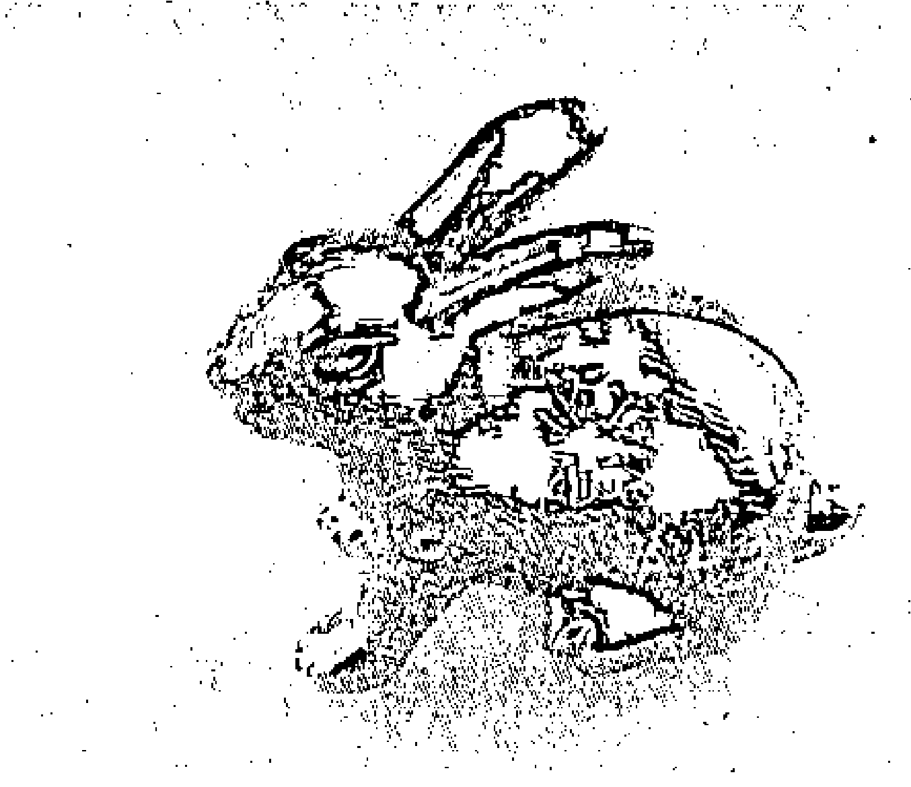

### 玉兔的旺运摆放方法
| 摆放原则：属鸡的人不摆兔饰品。 |
| 饰品样式：木质最佳，不可用金质或玉质的兔饰品。 |
| 摆放方位：东方，有助于提升人气。 |

## 813 龙凤呈祥有什么作用？

龙凤呈祥是一种吉祥画，在画面上，龙、凤各居一半位置，升龙张口旋身，回首望凤；翔凤展翅翘尾，举目眺龙。周围是朵朵瑞云，一副祥和之气跃然纸上。

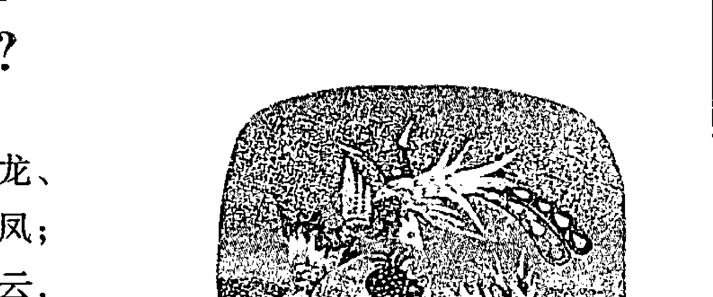

龙有喜水、好飞、通天、善变、灵异、征瑞、示威等神性；凤有喜火、向阳、秉德、兆瑞、崇高、尚洁、示美、寓情等神性，二者完美结合，交融互渗，有阴阳和谐的意思，象征着婚恋美满，求吉祈福。总之龙凤呈祥图广泛流行于大众之间，它既可以赏心悦目，增加家居美感，又可以起到招财、聚财的作用。

> 龙凤呈祥
这个枕套上所绣的龙凤呈祥图案，广泛流传于中国民间，寓意天赐好运，象征着美满和谐，求吉祈福。

## 814 八仙过海图有什么作用？

八仙过海图是根据八仙过海的故事画成的，民间有“八仙过海，各显神通”的说法，象征人们各自有一套办法获得成功。

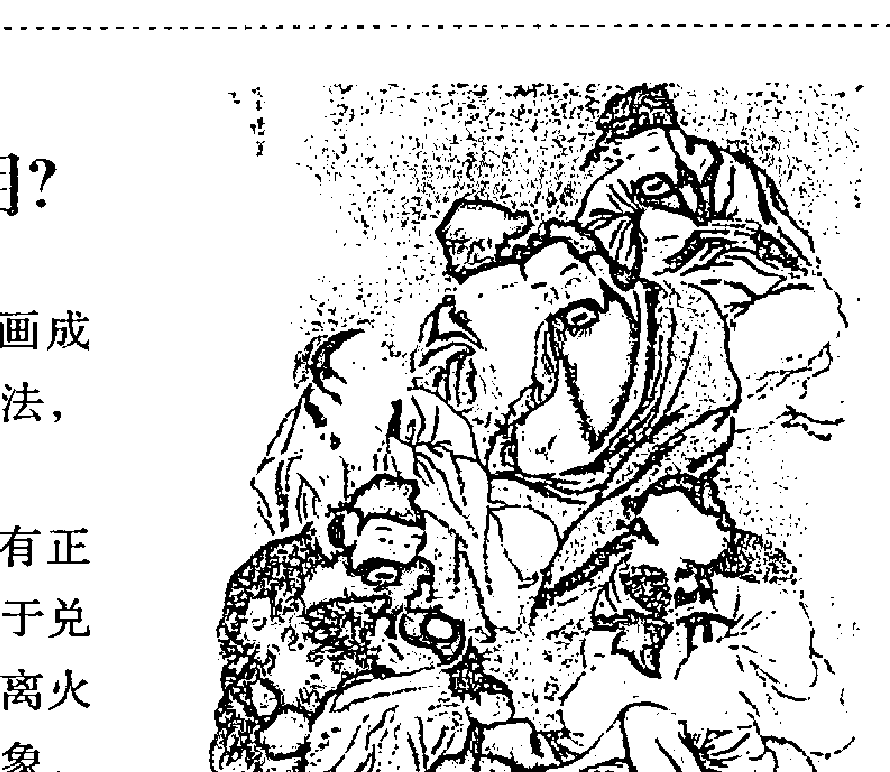

具体来说，吕洞宾属于乾金之象，有正气、正义的意思，可镇邪驱魔；铁拐李属于兑金之象，表示可以物得其所；汉钟离属于离火之象，可巽木生离火；张果老属于震木之象，可震吉祥之音；蓝采和属于巽木之象，可装“木”生财；韩湘子属于坎水之象，可生水生财；曹国舅属于艮土之象，可祛除邪恶鬼怪；何仙姑属于坤土之象，象征着圣洁。因此八仙过海图就成了一张地天泰卦，八卦、五行俱全，家中悬挂一张八仙过海图，无异于悬挂了一张趋吉纳福的八卦图。

> 八仙过海图
在家中或办公室悬挂一张八仙过海图，喻为可得到许多身怀绝技的能人的帮助，有八仙就能万事如意。

## 815 招财四宝有什么作用？

招财四宝即活水、鲜花、文昌笔、宝石。它们可以招财，有助于提升人的运程。
其中的活水，主要作用在于旺财，水的多寡就代表财富的多少，流动的水，则表示财源不断，家中可适当摆放一些开运活水，如鱼缸。
鲜花令人心情舒畅，可增添个人魅力，因此可以用来招人缘。在注满清水的花瓶中，经常放些宝石，可以使人缘越来越好，桃花运越来越旺盛。
文昌笔主功名，对考生、职场中人有利，在家中东南方向摆放文昌笔可提升文昌运。
宝石可以招来贵人，家中吉位放置宝石可以改善室内气场，去除厄运。

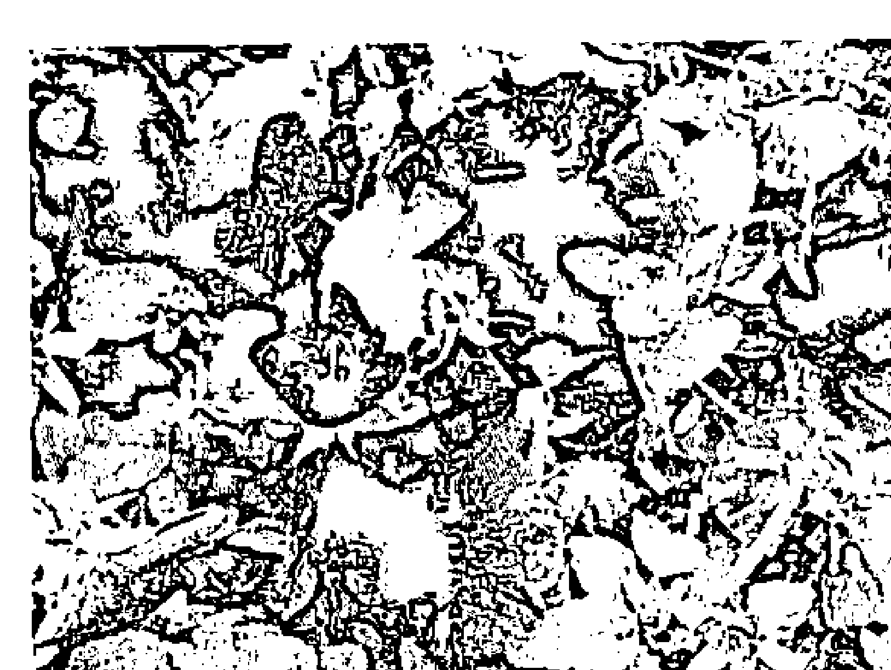

### 鲜花的开运作用
- **鲜花作用**：令人心情舒畅，也可以增添个人魅力。
- **摆放方法**：花瓶中的水需要保持干净，不浑浊。
- **桃花方法**：在花瓶中放置粉晶，增强桃花运。

## 816 大肚弥勒佛有什么作用？

弥勒佛大腹便便，长耳，笑眼，姿态动人，笑意醉人，很惹人喜爱。它袒胸开怀、笑容满面的形象有助于改善人的性情，使人像弥勒佛一样大肚能容天下难容之事，经常笑口常开，无忧无虑，不但有助于凝聚有益气场，还可提升人缘，增添贵人运，过着安乐自在的生活。
摆放大肚弥勒佛时应注意摆放在公共空间，如大堂或客厅的公共空间，这样有助于促进住宅紫气东来，也可使人心情愉快、忘掉忧愁之事。大肚弥勒佛在放置的时候，要高过人的头顶，不可摆放太低，否则就相当于隐藏了笑容，失去了欢笑。

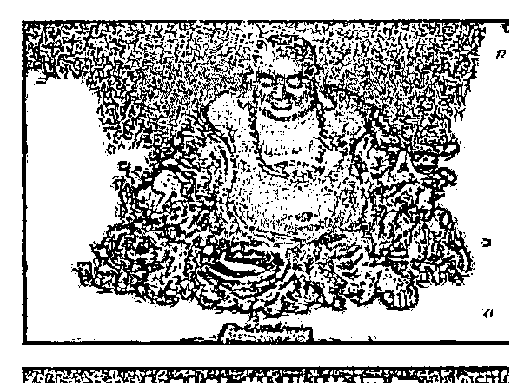

### 大肚弥勒佛增福气
- **增旺作用**：凝聚有益气场，提升人缘，增添贵人运。
- **摆放位置**：摆放在大堂或客厅的公共空间，有助运势。
- **摆放禁忌**：要高过人的头顶，不可摆放太低。

## 817 八白玉有什么作用？

八白玉由八块白玉组成，有“八白共发”之意，是吉祥和正气的象征，是非常吉祥的器物，有助于增添财运、事业运和人缘。八白玉可随身携带，又可放置家中做摆设。

一般来说，八白玉可以这样用：晚上加班回来晚的人，容易招致鬼邪上身，随身携带一串八白玉可化邪气，保平安。

家道衰弱或公司运势不济时，在大门口悬挂一串八白玉，有助于凝聚有益气场，促进运气上升，促进人际关系的和谐。

常开车的人，在车上悬挂一串八白玉还可化解路上的邪气，确保一路顺风。

## 818 空气净化器有什么作用？

空气净化器是家居布局必备的旺财之物，除了旺财作用外，空气净化器在现代家居中还有如下作用。

- 美化居室环境。空气净化器的动感，不但可增加室内环境生机，还可与周围的植物、装饰工艺品、灯具等相协调，令空间景象焕然一新。
- 增添生活情趣。空气净化器外形美观，缓缓的流水令人赏心悦目，身心舒缓，摆放在办公室中，不但可以娱情养性，还可消除压力与焦虑，仿佛大自然就在身边。
- 消除空气异味。空气净化器的细小水珠同空气分子撞击，可产生大量负氧离子，有助于消除空气中的正离子、异味及有害粉尘，可美化环境。

## 819 存钱罐有什么作用？

存钱罐是用来装散钱的，从现实角度讲，可以将人们不用的散钱暂时集中起来，积少成多，有聚财运的作用。若存钱罐是一个漂亮的装饰物，摆放在房间中还有美化环境，养眼养神的作用。

存钱罐通常摆放在财位上，也可以摆放在房间中任何地方——卫生间除外。存钱罐的材料，以黄金为最佳，也可用金属材料取代，如铜制品，这两种材料的存钱罐最有助于激活财运。

需要注意的是，存钱罐一旦摆放安定，就不要经常移动位置，否则会造成气场不稳，财运不稳，积聚钱财的速度较慢。

## 820 牡丹饰物有什么作用？

牡丹象征着富贵吉祥、娇艳繁华，有大富大贵、早生贵子等含义，人经常欣赏牡丹，还会带给人雍容华贵的高雅品位。在摆放牡丹饰物和悬挂牡丹图时，要注意将其安置在北方或南方。北方是“水”地，而牡丹属木，木得水生而茂盛繁荣。南方是“火”地，牡丹为木，会形成木生火旺之势，可催旺财星。但不可将牡丹饰物或牡丹图安置在西方，西方在五行上属金，而金克木。

家中若有孩子准备高考，还可为他准备一个富贵牡丹笔筒，将其摆放在文昌星位置上，有助于提升考运。

## 821 白菜饰物有什么作用？

常见的白菜饰物为玉制的，玉白菜，即“遇百财”，寓意吉祥。传说很久以前，有一对穷苦母子，母亲病了，儿子到处求医问药为母亲治病，母亲病情仍不见好转。一天夜里，儿子梦中得到一位老人指点，得知某处的玉白菜能救母亲的病，但不能贪心，只能索取一小片。儿子醒来后照做了，母亲的病就好了，周围得病的乡亲们也都依此治好了病。当地恶霸听说这件事之后，就派人去抢玉白菜，结果这群人全部被火烧死了。从此人们过上了幸福的生活。玉白菜的故事告诉人们，不要贪心，勤劳就是美德。

> 玉白菜饰品巧招财
> 玉白菜有“遇百财”之意，鼓励人们努力争取好生活，就能“遇百财”，所以白菜饰物不但是旺运宝物，还是送礼佳品。

## 822 大象饰物有什么作用？

常见大象饰物有瓷象、玉象、铜象、石象等。自古以来，大象就是一种神兽，以善吸水而闻名。而水就是财富，因此大象饰物有“明堂聚水”的作用，家中摆放大象饰物可积聚财源。

大象禀性驯良，放在家中有吉祥如意的寓意，若刚好放在室内财气最盛的地方，则可促进全家人的财运。

建筑上讲究“前方有照，后方有靠”，即后方有靠山，而大象体积墩厚，如山一般，因此有加强坐山的力量，当屋后无依靠物的时候，家中放一个大象饰物，则可增加贵人运，助旺事业运程。

> 珐琅太平有象
> 上图为清代的珐琅太平有象。大象饰物是家中客厅、办公室中开业招财、避邪、镇宅的最佳选择，可以自家摆放，也可送礼。

## 823 怎样运用大象饰物？

西南方向利财，如果这个方位刚好有水，可将大象饰物放在这里吸水，可起收财之效。相反地，东北方向为破财之位，不可将大象饰物摆放在这里。

大象还有镇宅、避邪的功效，如住宅有反弓格局，在反弓位窗口或门口摆放一对开过光的大象即可化解。

若想家中成员心情开朗，笑口常开，可买一个象鼻向上的“喷水象”，这种造型有助于改善人的心情。若想求得子女，可买一个背一小男孩的“送子象”，有送子送贵的意思。若想在事业上快速成功，则最好买催权贵的“白玉象”。

> > 窗口面向水塘的聚财法
> > 家中窗口向着泳池、水塘、大海等位置，若想快速聚财，可买一个象鼻向下的“吸水象”，然后将它放在面向水源的位置。

## 824 苍蝇饰品有什么作用？

苍蝇是令人讨厌的昆虫，但从招财旺运的角度看，它却是一种可以招来偏财运的器物，特别是用钻石、翡翠和珍珠制成的苍蝇价格昂贵。

苍蝇有“仓促地赢”“快速地赢”的意思。若在马背上加上一只苍蝇，即代表“马上赢”，有快速成功，独占鳌头的意思。

苍蝇饰物应摆放在南方、西北方这两个方位，可催财。上班族若想快速升职加薪，还可以将苍蝇摆放在办公桌左边的青龙方，不久就可达成所愿。

## 825 寿星有什么作用？

寿星又称为南极仙翁，古人认为南极星可以预兆国家寿命的长短，也可给人增寿，因此南极仙翁就成了长寿的象征。寿星鹤发童颜，精神饱满，老而不衰，前额突出，慈祥可爱。百善孝为先，民间经常将祭祀寿星的活动与敬老仪式结合在一起。

寿星一方面可预祝人长寿，另一方面又可帮助招财进宝。因此每到逢年过节，中国人就为家人祈福，保佑家人福星高照、福如东海，做官的高官厚禄、仕途顺利，老年人能寿比南山、福寿双全。寿星常与福星、禄星一同出现，象征着福、禄、寿齐全，大富大贵。

> **寿星**
> 寿星又称南极仙翁，不仅能预判国家的寿数，还能给人增福添寿，所以在家中摆放寿星能为家中老人祈福，预祝老人长寿。

## 826 龟形饰品有什么作用？

龟与龙、凤、麒麟秉承四灵，既是吉祥如意的化身，也是仁寿的象征，所以很多人都喜欢在家中饲养乌龟，或者摆放铜龟或石龟，或在门前摆放龟来镇宅治邪。

古时候有这样一句话：斗三煞。三煞即灾煞、岁煞、劫煞，化解三煞的最好法器就是乌龟和龙头龟。这是因为，龟虽然爬行很慢，自卫能力较弱，但却懂得忍辱负重，遇到危险时总会把头尾及四肢缩入坚厚的龟壳内，令敌人无可奈何，因而渡过难关。龟的这个特性，正印证了“凶煞宜化不宜斗”的原则。

需要注意的是，龟属火，养龟就等于养火，但水火相克，所以五行属水的人不宜养龟。

> **龟形饰品增福寿**
> 由于龟会吸收天地、山川的灵气，所以特别长寿。在老人卧室里摆放一个龟形饰品可以让老人健康长寿。上图为清代的掐丝珐琅龟形瓶，摆放在家中具有增福寿的作用。

## 827 怎样运用龟形饰品？

龟是吉祥和长寿的象征，可逢凶化吉，因此家中、办公室中均可摆放龟形饰品。

家居中若想利用龟来转运，最好在家中养一只龟，让它四处爬动，一方面可以借助龟壳驱走厄运，一方面又可加强火运，将邪神赶走。因此家道衰落，或者家庭成员欠火时，最适合养龟。家中有人去世的时候，在棺材下放一只龟，还可荫及后代。养龟并不麻烦，它会吸食空气中的微生物，基本无须喂食。

由于龟是神性之物，最好摆在需要阳性的位置，如大门附近。还可摆放在需要火的位置，男性的需火方位为西北方，女性在西南方。

> 办公室养龟招财运
> 在办公室中运用龟形饰品或养龟，可为公司带来财气，加强火运。销售部尤其需要龟形饰品，摆放位置同家居，也是放在阳性位置或需要火的方位。

## 828 寿山石有什么旺运作用？

寿山石是一种印章石，分布在福州市北郊与连江、罗源交界处的“金三角”地带，它的作用与一个传说有关。

相传，玉皇大帝曾派凤凰女神到福州北峰郊区寿山巡逻，凤凰女神被寿山的美景吸引住了，于是就在山中休息了一会儿，吃了山中的野果，喝了山上的泉水，然后就睡着了。醒来之后，百鸟为它唱歌，山花为它怒放，它变得更加雍容华贵，因此，它再也舍不得离开这里了。但有玉皇大帝之命在身，它只好令自己的后代在这里繁衍，于是留下了彩卵，这就是晶莹璀璨、五颜六色的寿山石。

> 寿山石的养护
> 寿山石的养护因石而异。优质的寿山石印章，会使家中气场会变得清新，有助于人体健康。
> 寿山石养护方法：
> - 石头表面有灰尘时，可用细软绸布轻轻擦拭。
> - 寿山石最忌干燥、高温，养护的关键是要保持润泽。
> - 开料水磨，谨防燥裂。以水锯、湿磨为上。
> - 原坯石料，最好选用木盒装放。

## 829 寿桃有什么增寿作用？

每当老人生日的时候，我国很多地方都有儿女送老人寿桃的习俗，认为这样会为老人带来健康、长寿。
传说在三月三日王母娘娘寿辰的时候，她就会召开蟠桃盛会，邀请各路神仙来为自己祝寿，用桃子祝寿逐渐成为习俗。到了战国时代，孙膑在母亲寿辰的时候送了一颗蟠桃给母亲，他的老母亲吃后立刻返老还童，白发转黑，双眼变亮，已经掉了的牙齿重新长了出来。人们听说后，纷纷效仿，在父母生日时送桃祝寿。

> **桃子增寿**
> 桃子纤维素含量高，含有维生素E，有抗氧化、抗衰老的作用，有助于防止老人动脉硬化、便秘，因此，民谚有“宁吃鲜桃一口，不吃烂杏一筐”的说法。

## 830 鸳鸯饰物有什么增运作用？

鸳鸯又称匹鸟，雌雄常形影不离，一同振翅起飞，一同在水中嬉戏，休息的时候连着翅膀，脖颈缠绵。如一只死去，另一只决不再寻找其他鸳鸯结婚，因此成为夫妻恩爱、忠贞爱情的象征，鸳鸯饰物因此具有促进夫妻双方和谐的作用。
夫妻双方由于工作因素聚少离多，感情容易疏离。在家中西南方摆放一对鸳鸯，就可巩固夫妻关系，防止出现烂桃花。

> **鸳鸯饰品**
> 我国传统文化认为鸳鸯雌雄形影不离，是坚贞爱情的代表，佩戴鸳鸯饰品会巩固夫妻感情。

## 831 和合二仙用在什么场合？

和合二仙是民间传说之神，主婚姻和合，因此得名。在传统婚礼上，洞房必悬挂和合二仙的神像，人们借此来祝贺新婚夫妇白头偕老，永结同心。
和合二仙常出现在木雕、漆画、刺绣、剪纸和木版年画上。除了适用于婚礼上，新婚夫妇卧室内常放和合二仙的图像还可促进夫妻关系和谐，爱情甜蜜。但单身男女不宜悬挂和合二仙的图像，否则容易招致烂桃花。

## 832 鲤鱼跃龙门有什么作用？

传说黄河鲤鱼跳过龙门，就会变化成龙。跳龙门非常难，龙门不但高，而且跳到半空中时还有云雨和天火阻挡，因此很多鲤鱼都无法完成跳龙门的重任。意志坚定的鲤鱼，则忍着疼痛，成功跳过龙门，变成了一条条美丽的龙。

今天，“鲤鱼跃龙门”已经成为中举、升官等飞黄腾达的象征，也预示着人们敢于逆流前进，奋发向上。“鲤鱼跃龙门”图、饰物因此成为催人奋进的器物，常用来鼓舞人心，激发斗志。

## 833 鹿形饰物有什么旺运作用？

鹿在外形上虽然是一个庞然大物，但它的性子很温和，只吃青草和树叶，从不伤害其他小动物，其他野兽想伤害它，它也不反抗，只会逃跑。人们常常将鹿比作天下，希望天下人都温顺善良，因此，夺取某个地盘，就说“逐鹿”，大家争着要“鹿”这种肥美又温和的动物。家中若摆放鹿形饰品，就表示永远有肥美的“鹿”等着自己去抓，永远有利可图。

## 834 同心结有什么作用？

同心结是用红线编织成的花结，结与结之间缠绕相连，常用来象征男女之间的爱情，即永结同心。

古时同心结常用于婚礼。新娘被迎娶到男方家中时，两家各出一根彩缎绾成同心结，新郎新娘各执一头，先后拜谒祖先，夫妻对拜，然后再由新郎牵着新娘进入洞房。

现代生活中也多用同心结表示夫妻关系和谐，爱人之间互相关心。

## 835 马饰品有什么增旺作用？

马奔腾不息，象征着勇往直前、自强不息和风驰电掣的精神，有提振人心，使人事业如意的作用，常用来当做加官晋爵的吉兽。

在摆放风水马的时候要注意以下几点。

- 马的奔腾气息可以带动财运的流转，所以最好将风水马摆放在吉位和财位上。
- 马属午，与南方相克。因此无论在家中还是办公室中，都不宜将风水马摆放在南面。
- 另外，马与火相克，因此也不宜摆放在厨房。

### 马饰品的选用

| 项目 | 具体内容 |
| :--- | :--- |
| 马饰品材料 | 最好选择玉质或铜质，不要用塑胶，否则难以激发马的灵动性，不利于运气的提升。 |
| 马饰品摆放 | 最好将马头向着自己所希望的方向，如为了催旺桃花，就要将马头朝向桃花位。 |
| 适合职业 | 贸易、物流、房地产业务、保险、公务员、企业主管。 |

## 836 怎样查询自己的驿马位？

马虽然代表着升迁、贸易、业务发展等积极意义，但它奔腾不息的精神使它周围的气场非常强，一般人无法轻易掌控其气数为我所用。所以在使用风水马的时候，一定要找准自己的驿马位。驿马位与生肖有关。具体来说，驿马位还与月份有关，每月要注意更换马饰品的位置。无论驿马位在哪个方位，在摆放的时候，记得马头朝向外面。

### 驿马位与生肖、月份的关系

| 生肖 | 驿马位 | 月份 | 驿马位 |
| :--- | :--- | :--- | :--- |
| 猴、鼠、龙 | 寅方，即东方或偏东方 | 3月、7月、11月 | 申，即西方 |
| 蛇、鸡、牛 | 亥方，即西北或偏北方 | 1月、5月、9月 | 寅，即东方 |
| 虎、马、狗 | 申方，即西方或偏西方 | 4月、8月、12月 | 巳，即南方 |
| 猪、兔、羊 | 巳方，即东南或偏南方 | 2月、6月、10月 | 亥，即北方 |

## 837 竹形饰物有什么旺运作用？

竹形饰物是常用的法器，有竹报平安、步步高升、节节高升的意思，尤其适合公务员和行政人员使用，可加速升职，确保官运亨通。

家中若有学生，可在书桌左前方摆放一瓶开运竹，用水浸泡着，也能带来好运。开运竹即富贵竹，有“学而优则仕”之意，表示人们可通过良好的学业走向富贵之路。

此外，“竹”与“足”谐音，有满足、富足、充足的意思，家中若摆放一些竹形饰物或在吉位种几棵竹子，有助于家庭富足安康，世世代代过着小康生活。

## 838 蝉有什么增运作用？

蝉，谐音“缠”，若将一个蝉饰品悬挂在腰间，则预示着“腰缠万贯”，生活富足，财运亨通。俗话说，有钱能使鬼推磨，有钱自然可以提升人的运程，确保事业的发展，人际交往的顺利。

蝉喜欢鸣叫，因此将蝉饰品悬挂在胸前，还有“一鸣惊人”的作用。在职场、人际交往场所默默无闻的人，可提升其人气，有助于积聚自己的人脉资源，赢得贵人的赏识，运程自然不错。另外，蝉的鸣叫声还有镇静作用，有助于赶跑邪气、煞气，因此有一定的保平安作用。

## 839 葵花有什么增运作用？

向日葵最大的特征是向阳，花盘常朝着太阳，随着太阳的升落而转动自己的花盘，花盘一旦长成，就不再转动花盘，而是固定朝向东方，可谓尽自己最大的能力吸取阳气，获得生机。因此家中若种几株向日葵，可帮助住宅吸收阳气，避免潮湿，人不容易生病。

人们从家中向日葵生长的好坏，还可判断家中的土质、气场状况。若向日葵生长不佳，说明家中阳气不足，阴阳不平衡，该补充阳气了；或者说明家中土质、水质不好，人们容易有健康隐患，需要改进水源或搬家。

## 840 “桂折一枝”有什么增运作用？

“桂折一枝”象征着登科及第，即考试能高中，官运能亨通。桂树中的“桂”，与“贵”谐音，象征着大富大贵，富贵吉祥，以至于只需折一枝桂枝即可助运。家中有考生者，可买一个跟桂树有关的饰物，摆放在家内，就可激发桂树的“贵气”，在周围形成有利磁场，提升其运程。

## 841 升官印有什么增运作用？

升官印主要适合公务员和行政人员。
古代的官员，都有一个象征自己身份的器物，这就是玉印。官位越高的人，玉印的质地越纯越美，最高级别的官位是皇帝，他的玉印最珍贵，叫玉玺，有一统江山的作用。所以人人都喜欢质地好的官印。
现代官员以普通的印章代替了官印，这不及古代官印的增旺作用。古代官印质地好，且流传了数百年，凝聚了很强的磁场，能量比现代官员的印章大得多，它可辅助自己步步高升，官运亨通。

玉印是古代官员身份的象征，图中的玉印是汉代左司徒印。司徒是我国古代的一个重要官职名，由《周礼》地方官司徒演变而来。

家中若有美玉雕刻而成的官印，摆放在案头或书柜里，不但可以怡情养性，还可辅助自己步步高升，官运亨通。图上为十二生肖玉印。

## 842 文昌塔有什么增运作用？

古人非常重视文昌星，稍微留心的人就会发现，我国很多城市都有文昌塔。而这些城市，在古代均是出过文人墨客的。这是因为，文昌塔有催旺文昌运的作用，利于读书、功名及事业。孩子将文昌塔放在办公桌上可促进学习，成人将文昌塔放在桌上可旺贵气，利于文思，尤其利于文职。此外，文昌塔主智慧，尤其适合做策划、创造性工作的人使用。

| 项目 | 内容 |
| :--- | :--- |
| 种类 | 一般分七层、九层和十三层三种。层数越多，高度越高，催文催贵的作用就越大。 |
| 作用 | 摆放文昌塔，既可以平衡阴阳，又可招财纳福。 |
| 摆放 | 不要摆放在书桌的右边，而要摆在左边的吉祥位。 |
| 适用人群 | 创业家、公司高管或者想从事文学、艺术工作的人。 |

## 843 笔筒有什么增运作用？

笔筒的形状决定了它具有聚气生财的作用，这点类似于葫芦和存钱罐。另外，笔筒的形状可以多种多样，上面还可纹饰各种图案。因此，不同的图案、形状还具有不同的增旺作用。

例如，牡丹笔筒以牡丹为图案，牡丹象征着大富大贵，尤其适合女子使用，有助于培养雍容华贵的高雅气质。但男人不宜使用牡丹笔筒，否则容易招致烂桃花。

玉竹笔筒象征着竹子的节节高升；久久有余笔筒代表着家运昌盛、事业兴旺；佛手笔筒，则表示可受佛陀的保护，出入平安。

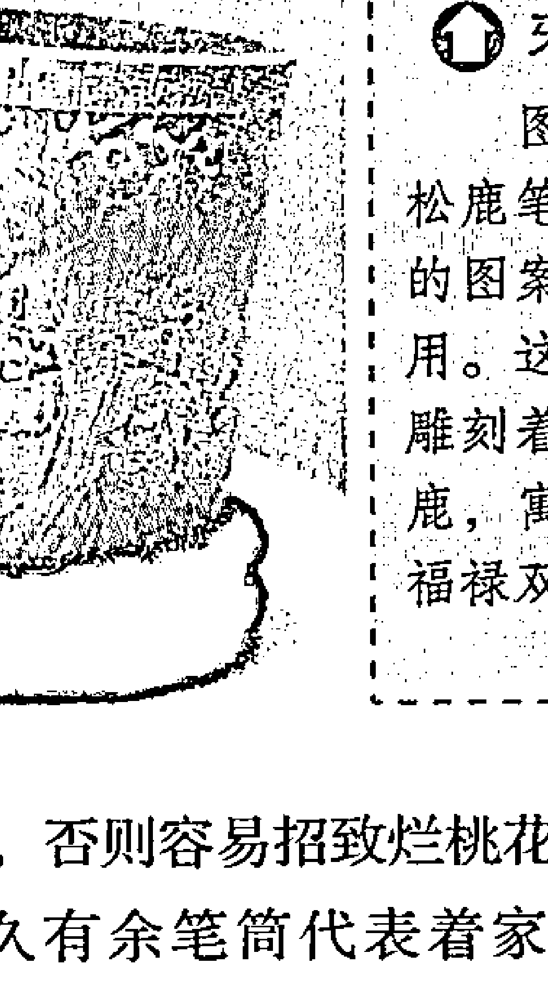

牙雕松鹿笔筒
图为清代的牙雕松鹿笔筒。笔筒上不同的图案有不同的增旺作用。这只象牙笔筒筒身雕刻着苍翠的松树和小鹿，寓意着延年益寿，福禄双至。

## 844 黑曜石狐狸有什么增运作用？

狐狸向来是鬼魅的象征，但黑曜石狐狸可以带来好的运势。

黑曜石狐狸的主要作用在于化解烂桃花。桃花运过旺者，家中配偶有外遇者，感情生活理不清者，可佩戴黑曜石狐狸，或者将黑曜石狐狸摆放在家中床头旁，这样就可以压制烂桃花，将负面能量转移到黑曜石狐狸中化解掉。

也有人认为，黑曜石狐狸的旺运作用主要体现在黑曜石上，黑曜石有镇宅避邪、催财旺财、化解五黄煞的作用。因此，家中摆放黑曜石制品，如黑曜石狐狸，可为家中请来保护神，保护家庭平安。

## 845 金翅鸟有什么增运作用？

金翅鸟是古代印度神话传说中的神鸟，它人面、鸟嘴、羽冠，腰部以上为人身，以下为鸟身，威力无穷，喜战斗。它是一个法力无边的护法神，有镇宅驱邪保平安的作用。

由于震慑力极强，金翅鸟还有一定的招财作用。传说它以龙为食物，招财能力比青龙更强，堪称招财第一神兽。一般人家在住宅、商业楼、办公场所等地方，均可摆放金翅鸟招财。需要注意的是，金翅鸟很凶猛，在摆放金翅鸟饰物时，它的头不宜向内，否则容易危害家人。

## 第二十章 住宅变旺

本章主要讲了住宅如何改旺的相关问题，内容涉及搬迁的吉日、习俗和相关注意事项，入住新居如何开运，各种不利格局的内涵、危害和化解方法，大门、阳台的朝向问题，厕所的方位问题及化解方法等。

### 846 什么是兴造动土的“择吉”？

动土，指的是修建阳宅的第一天，用锄头在吉方锄下第一锄土的时间。中国古代人认为，这个时间是有讲究的。

古人讲究择吉，即选择吉祥的日子，吉祥的时刻，吉祥的地点，这是为了避开不利因素。动土的吉日需要择吉，目的是趋吉避凶。动土的择日，首先必须弄清楚此地是否适合动土，是吉还是凶，是吉的方位可动土，是凶的方位不宜动土。

若是为了修造阳宅，要考虑坐向、家中是否有孕妇、胎神所在之处，不能有冲犯。传统文化讲究天人合一，符合天时地利人和才为吉，有利于日后家庭和谐。

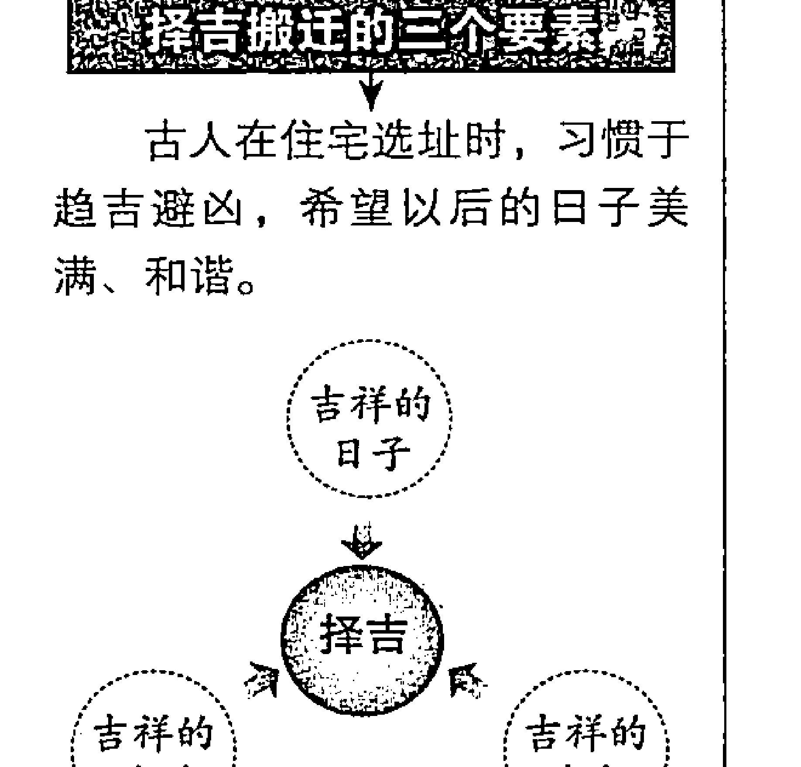

### 847 入宅搬迁的吉日有哪些？

搬新家的日子很重要，需要考虑各方面的因素。

若家中有神灵或祖先，搬家之前，要先看看有无“宜入厝（新居入宅的意思）”之类的日子，注意不要与自己的生肖、日柱相冲。

搬迁的日子也不宜与家人的生肖和日柱相冲。日柱，即人出生那一天的农历干支。牢记子午相冲、丑未相冲、寅申相冲、卯酉相冲、辰戌相冲、巳亥相冲等忌讳。

搬迁的日子，最好选择水日，不要选择火日。搬迁的时辰，最好遵循“阳日用阴时，阴日用阳时”的原则。

【图表：入住吉日的选择】
搬新家的时候，将各个方面的吉凶因素考虑全面，住起来才会舒适、安心。
入住吉日的选择需遵循三点：
1.  第一，不与自己的生肖、日柱相冲。
2.  第二，不与家人的生肖、日柱相冲。
3.  第三，最好选择水日，不要选择火日。

### 848 搬新家有哪些习俗？

一般来说，搬家时除了注意选择黄道吉日之外，还要准备米、水、碗筷、箕畚和新的扫帚一对，内衣裤、火炉、风扇、锅等六组物品。

这六组物品是日常生活所必须的，搬家的时候，要先将这六组物品搬进厨房，然后再搬其他东西。家庭成员中若有人容易水土不服，最好还要从旧居带一块泥土过去。

此外，在离开旧居之前，还要在旧居房间留一个旧钱包，里面放下五枚硬币。旧厨房要留两个鸡蛋和一个红包袋，红包袋里装着柏叶和一张双数币值的纸币。最后，在旧居门前撒一些米，然后锁门离去。

| 六组物品 | 详细用法 |
| --- | --- |
| 米 | 用米桶装八分满的米，且米桶里要裹放着一个红包，红包里放着纸币、茶叶和九个铜钱。 |
| 水 | 用水桶装三分满的水，记得水是旧居的水。 |
| 碗筷 | 双数较好，碗筷的数量以家中人员数量为准。 |
| 箕畚、新扫帚 | 箕畚和新的扫帚一对，上面绑红布。 |
| 内衣裤 | 为所有家庭成员每人准备一套新的内衣裤，枕头及床单。 |
| 火炉、风扇、锅 | 火炉、风扇、锅各准备一份。 |

### 849 搬迁要注意什么事项？

搬家并不仅仅是将家居从一个地方挪到另一个地方，而是关系到很多方面的事情。

很多人都知道，人生只要经过一次变迁与移动，都会给自己带来或多或少的吉凶祸福的感应。搬家也是一次人生的迁移，也会影响到自己日后的运程，所以在搬家的时候要特别注意以下具体情况。

遵守一定的搬迁习俗，如搬入新居时要先放米、水、碗筷、箕畚、内衣裤、火炉等日常用品，再放其他物品。根据生辰八字及房屋位置选好黄道吉日、吉时，吉日、吉时的选择最好请一位专业人士帮忙。

| 注意事项 | 具体内容 |
| --- | --- |
| 择吉时搬迁 | 根据生辰八字及房屋位置选好黄道吉日、吉时。 |
| 遵守搬迁习俗 | 搬入新居时要先放米、水、碗筷、箕畚、内衣裤、火炉等日常用品。 |
| 祭拜土地宅神 | 搬入新房后，当天黄昏要对当地的土神、宅神进行祭拜。贡品一定要正确，如祭拜地基主要用到一碗饭，一肉，一菜，一汤，酒三杯，红烛一对，三炷香，纸钱等。 |
| 多说吉祥话 | 搬家当天要多说吉祥话，不可发脾气，打骂孩子。注意搬家当天不可午睡，否则日后容易生病。晚上宜煮些甜汤圆，一家人共食，表示一家团圆，生活甜蜜。 |

### 850 怀孕期间为什么不宜搬迁？

由于搬家的时候容易碰到胎神，所以家中若有孕妇，尽量不要搬家。若非搬不可，则要先让孕妇离开旧宅，每搬动一件家具的时候，都用扫帚扫一扫，避免触怒胎神。

胎神是专管胎儿的神灵，它通常在孕妇的周围，且每日所在的位置都不固定，人们不得触犯它，否则得罪了胎神，它就不再是护卫胎儿的神仙，容易伤害到胎儿，导致孕妇肚痛难产，或者胎损子夭。因此非搬家不可的时候，事先一定要参阅“胎神逐日所占游方定局”，寻找搬家当天胎神所在的位置，避免动到胎神。如此才能避凶趋吉，阖家平安。

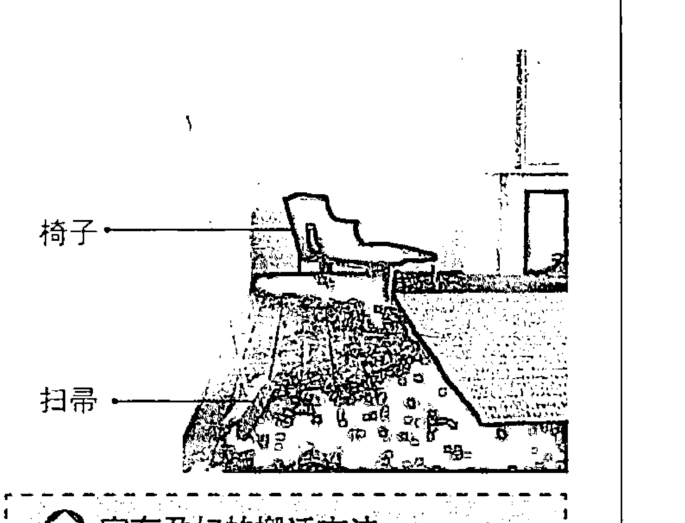

> > **家有孕妇的搬迁方法**
>
> 搬迁的时候，孕妇先离开旧宅，而且在搬动东西的时候，每搬一件家具，都要先用新扫帚扫一扫，避免触怒胎神。

### 851 入住当天怎么给新居开运？

首先，要先将新房打扫干净，买一个新的花瓶，瓶颈上系九寸或九的倍数长度的红丝带。

然后，准备一个桃木剑或竹箫，在桃木剑上或竹箫上系红丝带及两个宫灯的红色穗子，做成一把古代佩剑。宅主手捧箫剑和花瓶，在新居的每个房间里绕一圈，如此可驱除屋中的晦气。

最后，将宣纸摊开铺在地上，在宣纸中央放一颗黄色扁平的石头，上面再放一些米，宣纸的四角放麦、豆、稗、粟等粮食，这样神农就会保佑宅主日后丰衣足食。然后再将宣纸和上面的东西一起包好，放到一个空盒里，再用红丝绳吊放在厨房的正中央。

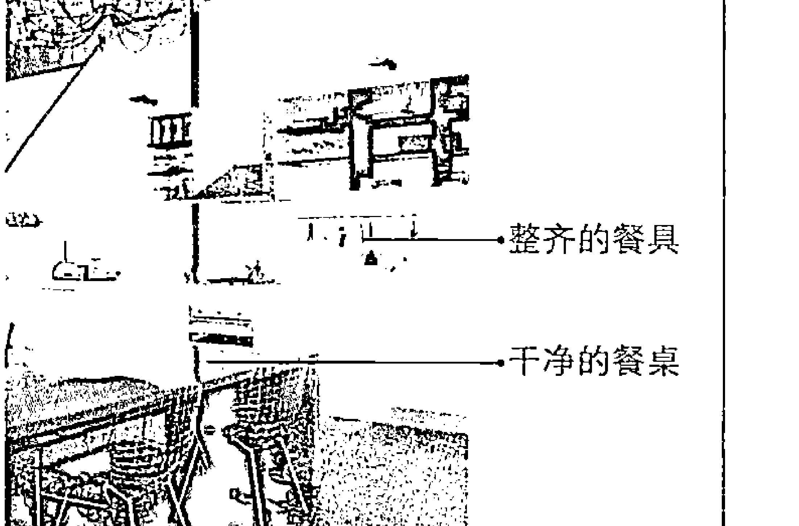

> > **新居入住需开运**
>
> 新居是日后全家人居住的地方，它的气场和能量直接影响家人日后的运程，所以入住新居一定要给新居开运，培养一个好的气场。

### 852 入住新居怎么驱邪？

入住新居之前，最好手拿一根竹竿顺着楼梯爬到自己的楼层，不要坐电梯。然后在新居的四角和橱柜的角落里放上硬币。回到房间后，打开所有的灯，并保持照明三天。住进去的第一件事，就是烧一锅开水，然后用风扇将水蒸气吹散。做这些事，一方面是为了驱除新居的阴气，另一方面也是为了将来的风生水起，为日后运程的提升作铺垫。

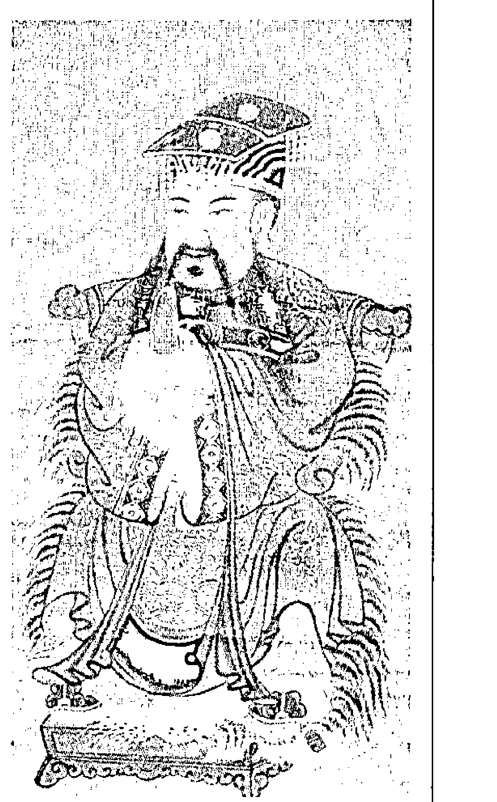

另一个驱邪的好方法就是祭祖。首先祭拜自己的祖先，然后祭拜玉皇大帝，再祭拜福德正神，接着祭拜地基主。总之通过这些天地神灵的保佑，邪恶之物不敢轻易前来，因此起到驱邪的作用。

> 玉皇大帝
玉皇大帝是道教诸神中的神权最大者，除统领天、地、人三界神灵之外，还管理宇宙万物的兴隆衰败、吉凶祸福。入住新居后，祭拜玉皇大帝可得到天神的保佑。

### 853 迁入新居后要注意什么？

搬入新家之后，最主要的是调整家居风水，旺己旺家，要做到以下几点：
首先将不合理的布局调整吉祥，策划好财位和卧室。卧室不但是维系夫妻感情和谐的场所，也是能否生出健康可爱宝宝的保证。策划好文昌位。文昌位不仅是利于小孩读书成绩的地方，还关乎这孩子的前程、宅主的升职与否，好的文昌位可使小孩聪明，大人办事头脑清醒。策划好客厅的方位。客厅是一个家庭最显眼的位置，客厅不好一样会导致烂桃花。策划好其他家庭人员的起居室，这样有利于全家人身体健康。

进入新居后的六条注意事项

| 注意事项 | 主要内容 |
| :--- | :--- |
| 调整格局 | 在不大动土木的情况下，调整不吉布局。 |
| 策划好财位 | 先调理好财位，才能为家庭带来好财运。 |
| 策划好卧室 | 卧室不但是维系夫妻感情和谐的场所，也是能否生出健康可爱宝宝的保证。 |
| 策划好文昌位 | 好的文昌位可使小孩聪明，大人办事头脑清醒。 |
| 策划好客厅的方位 | 客厅是一个家庭最显眼的位置，它的好坏影响着家中的运势和夫妻关系。 |
| 策划好起居室 | 这样有利于全家人身体健康。 |

### 854 怎样调节室内环境？

调节室内环境，要遵守以下四大原则。

1.  客厅原则。客厅的吉位在进门的对角线方位，这样会给访客造成较好的视觉感受，有助于增添家居人气，增加宅主人缘，提升事业运和财运。
2.  卧室原则。卧室要体现出安定性与隐秘性，且卧室的床铺最好避免床头朝西，否则容易受惊，影响睡眠质量，进而影响健康和人际交往。
3.  厨房原则。厨房即餐厅的位置最好安排在东南方，这里能量充足，有利于促进人的食欲，进而确保家庭成员的身体健康。
4.  门窗原则。家中的门窗一定要给人协调之感，大门口的空间应相对开阔，空气流通畅快。

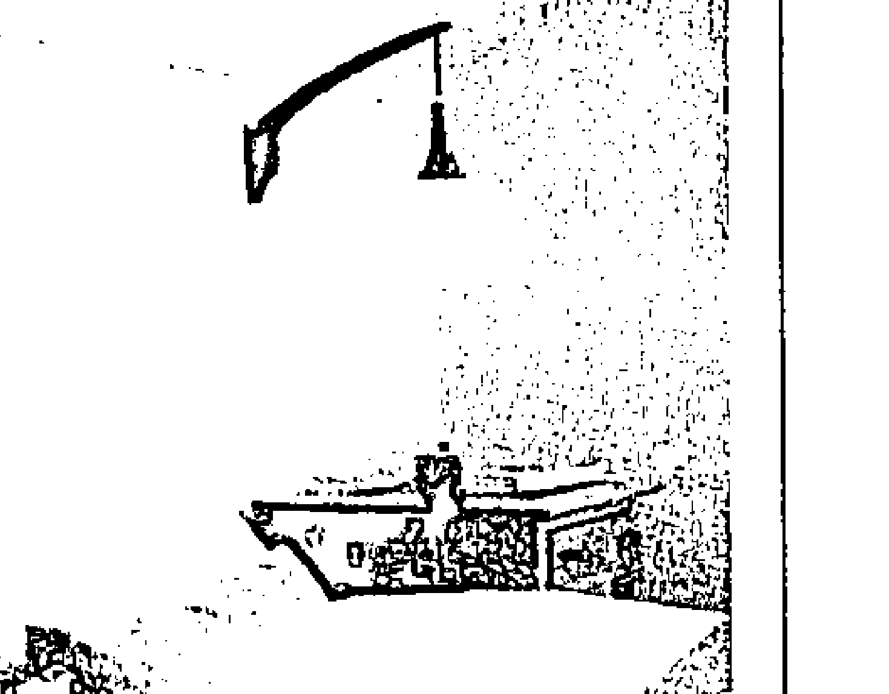

> 床头柜的形状
卧室的床头柜最好不要选择方形的，方形有棱角，容易磕碰。而圆形的床头柜，可避免柜角横冲头部。

### 855 新居环境要注意些什么？

搬入新家，除了必须的室内布置外，还要注意培养温馨舒适的室内环境，因为环境是形成气场的重要因素。搬入新家之后，在环境方面，要注意以下四个方面的内容。

1.  光照方面。无论是客厅还是卧室，白天要采光充足，有助于促进阴阳平衡，晚上要保证灯光照明的亮度，以舒服为宜。
2.  色彩方面。家居颜色的选配，不宜五颜六色，否则容易兴奋人的神经，不利于大脑健康。
3.  植物方面。室内和阳台上要多种一些有益于人体健康的植物，如雏菊、吊兰等。
4.  家居方面。家居的摆放，要有利于采光和通风，不会给人造成压迫感和碍事的感觉。

家居色彩与人体健康

房间的色彩与人的健康情况直接挂钩，合适的颜色有益健康，宅主可根据家庭成员的需要安排。

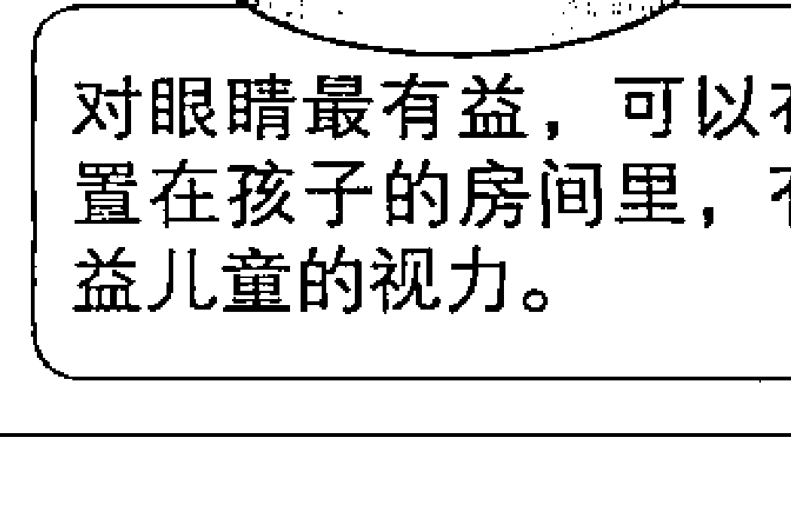

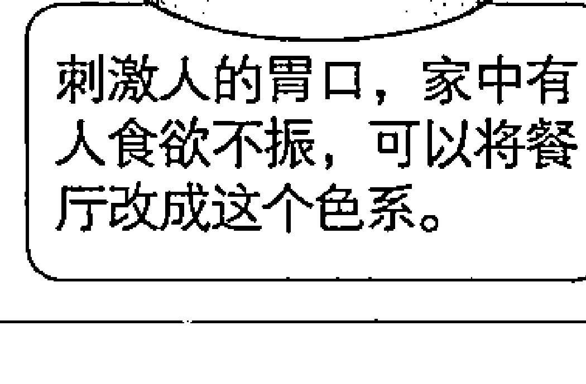

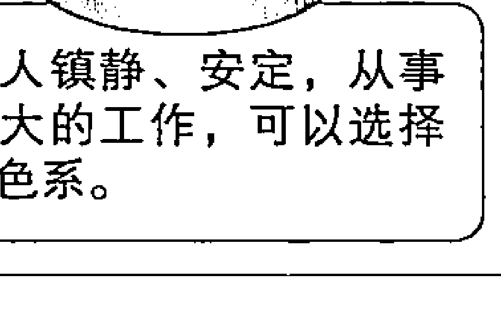

### **856 搬迁后为什么要宴请朋友？**

细心的人会发现，一般搬入新家后，都要请一些亲朋好友来新家坐坐，这也是很有讲究的。
搬迁后宴请朋友，是为了暖屋，旺人气。很多人都有这样的经验，一间空房子若是很久没人住的话，即使没有任何破坏，它自己也容易毁坏，但是人长住的房子，即使住很久，也不会有太大的改变，这就是人气在起作用。新居与旧居相比，人气不足，人住进去之后，容易觉得寒冷不适。而宴请朋友们，一方面可联络感情，一方面又可夹带众人的运势来汇集人气，提升运程。

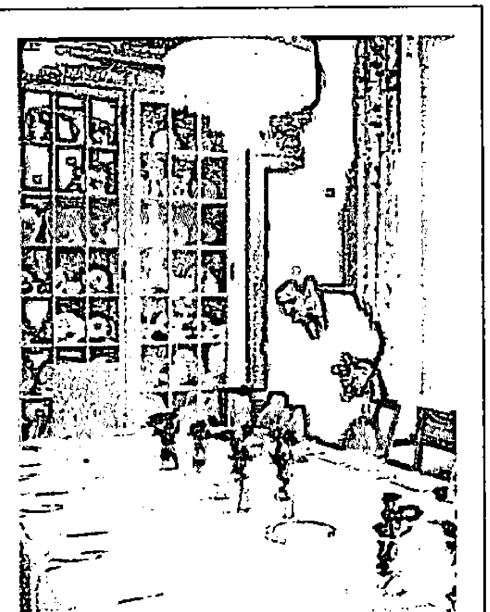

> > 宴请好友增人气
现代人终日忙碌，都顾不上与亲朋好友联络感情。乔迁新居之时，正好借机弥补。

### **857 入住新居后怎样确保身体健康？**

很多人入住新居后，由于种种不适，都会对健康产生不利影响，所以在选择新居前，就要根据风水学理论，选择适宜人体健康的风水。如：
新房的风势不宜太强，风力不宜太大。传统文化上讲究藏风聚气，风势强劲的地方一般不是旺地，容易对宅主不利。
新房的方位要阳光充足。阳光不足的房屋，阴气过重，人居住在这样的环境中容易得病，而且容易引起家宅不宁。

新居附近的三种冲煞

新居附近最好不要有工厂、路冲等不好的物体，这些地方会影响运势和人体健康。

*   **三种不利格局**
    *   **工厂或者烟囱**：烟囱排出的有害气体、粉尘也会影响人体健康。
    *   **反弓、天斩**：不但不利于运程的提升，也会影响人体健康。
    *   **房屋建在斜坡上**：会造成家财散尽、家人离散的局面。

### 858 如何根据天罡选择搬迁时间？

天罡，指北斗七星的柄，一般认为北斗丛星中有三十六个天罡星、七十二个地煞星，《水浒传》一百零八名英雄好汉传说就是三十六个天罡星、七十二个地煞星的化身。

由于天罡四煞为岁煞，是根据生年地支来确定的，所以不宜再犯天干，否则凶上加凶。如属虎、马、狗者，在搬迁的时候不要再犯甲、乙、庚、辛；属蛇、鸡、牛者，搬迁之日不宜再犯丙、丁、壬、癸。

除了搬迁，任何吉祥的日子，如婚庆、升职等，都是一样的，不可在犯地支的同时又冲撞天干。

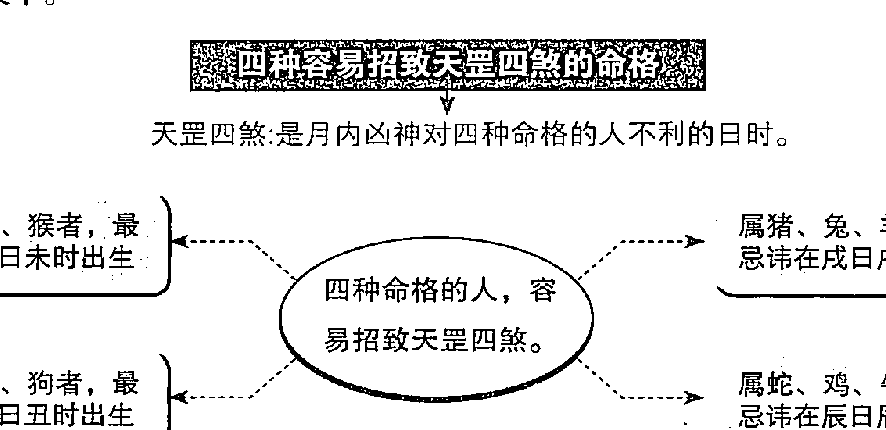

### 859 住宅附近有反光或噪音有何影响？

反光是一种光线的折射，大多因阳光在水面或玻璃上的反射而形成。住宅被反光照射是一种不利格局。如：住宅面对湖水反光，或面对大厦玻璃幕墙。

凡是出现在住宅附近的噪音也是一种不利影响。如：附近要盖楼房，工地上的嘈杂声；附近工厂的轰鸣声；附近是铁路或机场，火车或飞机的轰鸣声……会造成家人睡眠不好，脾气暴躁，精神状态差。

化解方法

| 类型 | 具体方法 |
|------|----------|
| 反射 | 可在玻璃窗上贴上半透明的磨砂胶纸，再把明咒葫芦两串放在窗边左右角，加上一个木葫芦，便能解决；反光较弱者，不必加木葫芦；反光较强者，可加安放两串五帝古钱，配上白玉明咒便可化解。 |
| 噪音 | 噪音不易化解，若是在坤方（西南）出现，凶性最强；可在坤方安放铜葫芦或两串麒麟风铃，以吸收凶气。平时尽量关闭窗户，选用较厚帘布和隔声效果好的玻璃。 |

### 860 居住在水边有何影响？

在城市中，水边住宅较为少见，但楼下高速公路是虚水，也属不利格局。水能聚财，当运者可利用这段时间积极进取，努力发财，但不能长久。运气反复，当运时大富大贵，失运时一落千丈。可在每年的旺气位摆放八白玉进行化解。

弯形的道路或弯形的天桥，形如镰刀，切向前方。通常认为，天桥反弓为大镰刀，而道路反弓为小镰刀，或称钝镰刀。住宅若正对镰刀方向，可能会带来运气的反复，甚至招来血光之灾。要配合玄空飞星的吉凶，在吉位安放一对铜马及五帝钱即可化解。

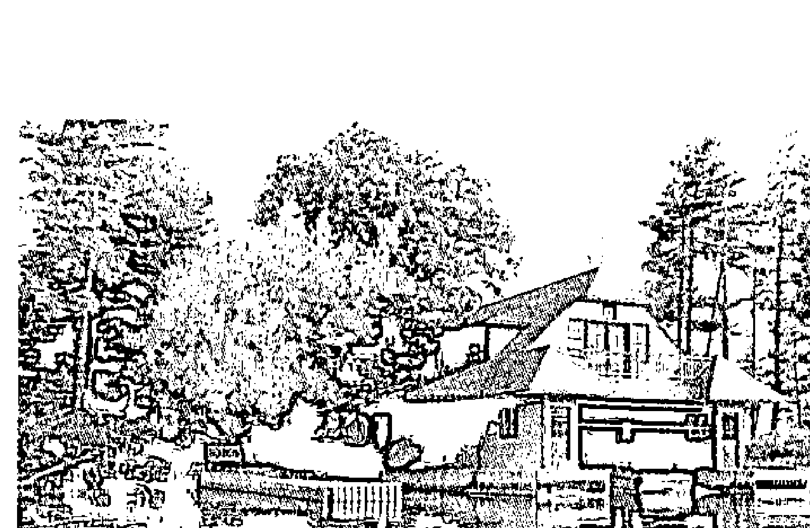

> **近水居住不利**
当一所住宅距离水边过近时，波流涌动时如同在切割住宅的墙脚一般，这种格局非常不利。

### 861 居住在独栋高楼或隧道上有何不利？

在城市中一座高楼孤立独耸，周围完全没有其他高大建筑相伴。若住宅在这样的大楼中，家主往往人缘不济，事业不顺，朋友不助，子女难靠，个性孤独。要想解决这个问题，可在吉位或旺气位安放明咒葫芦和铜葫芦。

城市中的一些楼房下面修建了地下铁路或隧道，车流从楼下穿行而过，这样的住宅格局非常不利。尤其对低层住户的影响较大，会致使宅运不稳，财运差，家人身体健康较差，易生血光之灾。

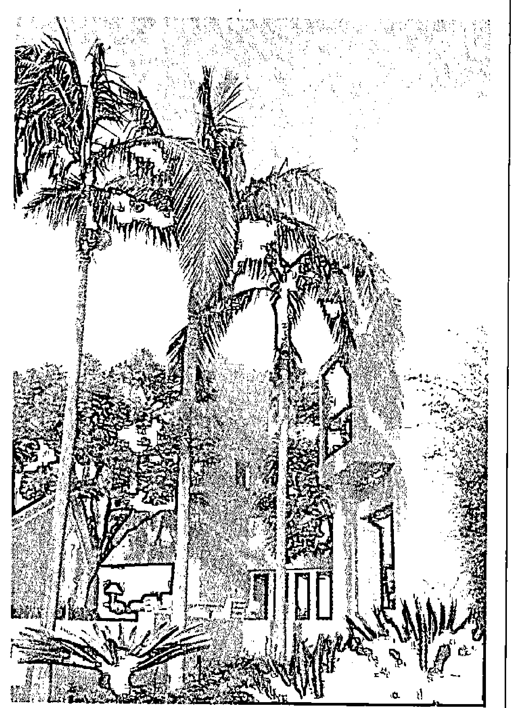

> **穿心煞**
城市中的一些楼房下面修建了地下铁或隧道，车流从楼下穿行而过，这样的住宅格局非常不利。住宅前方若正对着柱状物体，如大树，也属不利格局。

## 862 住宅内的屏风和珠帘有何影响？

谚语说：一条直路一条枪。住宅大门正对着一条直长的走廊或道路，或者是一条河流直向住宅而来。这是一种不利的格局，主血光之灾，或患重大疾病等。

化解方法：在门上悬挂珠帘，或者摆放屏风；也可在窗口摆放金元宝或一对麒麟。

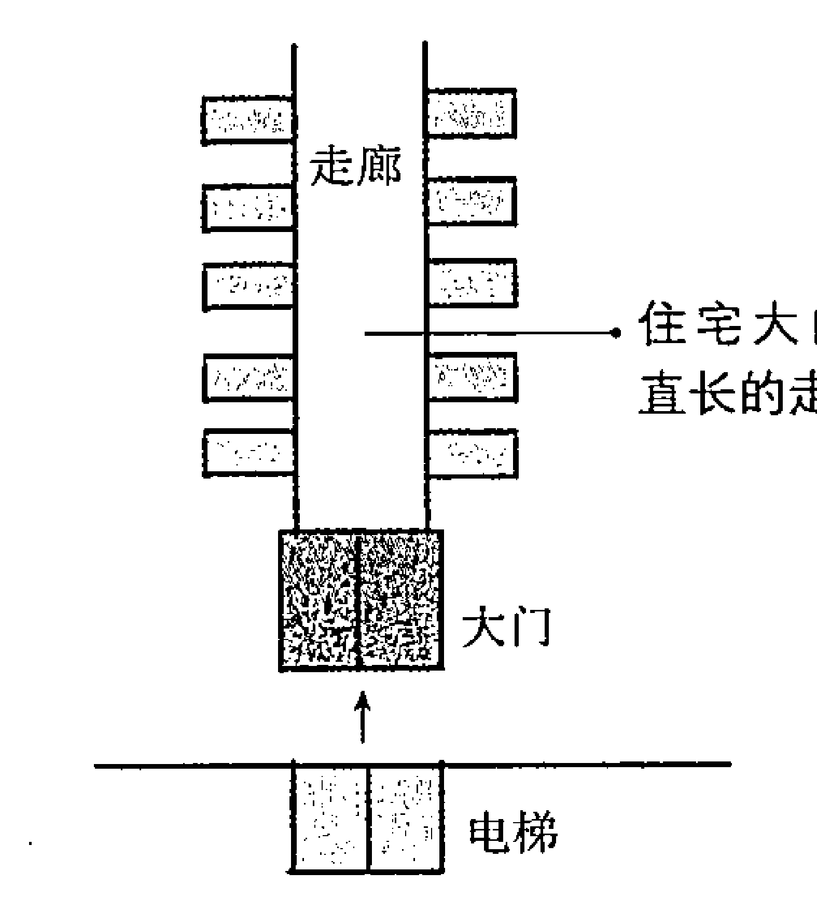

一条道路斜向经过住宅旁边，称为斜枪煞。主家人易有意外伤害，或有破财之灾。道路冲射住宅的左边，称为左斜枪，伤青龙方，家中男性易出意外；道路冲射右方，伤白虎方，家中女性易出意外。

化解方法：在大门悬挂珠帘或在门内放置屏风。

| 不利格局：一条道路斜向经过住宅旁边。 |
| :--- |
| 影响：家中人员容易出意外。 |
| 解决方法：可在大门悬挂珠帘或在门内摆放屏风。 |

## 863 住宅内摆放麒麟或马饰品有何影响？

住宅的右方有动土现象对宅主不利，住宅若遇到这种情况，家人会多病或因病破财，甚至会有伤亡。

化解方法：摆放一对麒麟。

城市中楼房密集，经常可以看到这样的现象：两座大厦靠得很近，中间只有一道狭窄的缝隙，远远看去就像天降巨斧把大楼从中劈开似的，这种格局对住宅不利。

如果住宅正对着这条窄缝，主有血光之灾，或易动手术及患危险性高的疾病。

化解方法：可摆放铜马或者一对麒麟来化解。

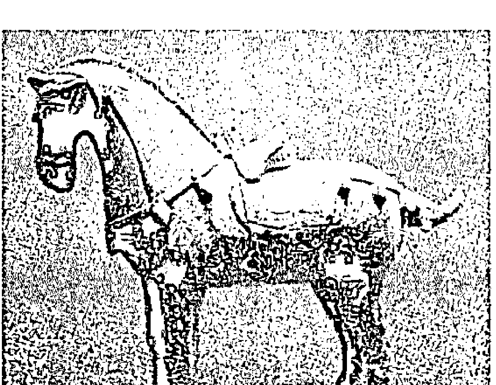

| 不利格局：大楼正对着两座大厦中间的一道狭窄的缝隙。 |
| :--- |
| 影响：容易患重病，或有血光之灾。 |
| 解决方法：摆放铜马或麒麟。 |

### 864 靠山和天桥对住宅有何影响？

住宅格局讲究背后有靠山，但如果住宅所靠之山不是吉祥之山，是怪石嶙峋、寸草不生的穷山，这种格局就对住宅非常不利。住宅后有此凶恶靠山，会让家人在事业上受挫，被上司或长辈责难，才能难以施展；或者属下不听指挥，阳奉阴违。

化解方法：面向此方的窗帘要常年放下来，并悬挂葫芦；严重者，可摆放四对貔貅。

天桥自上而下时，常有弯斜而去的结构。桥为虚水，斜去而水泄，是泄财之象。若住宅窗户正对着天桥下斜去的方位，就会对住宅不利。

化解方法：可摆放开光的铜大象或一对铜麒麟，回收外泄之气。

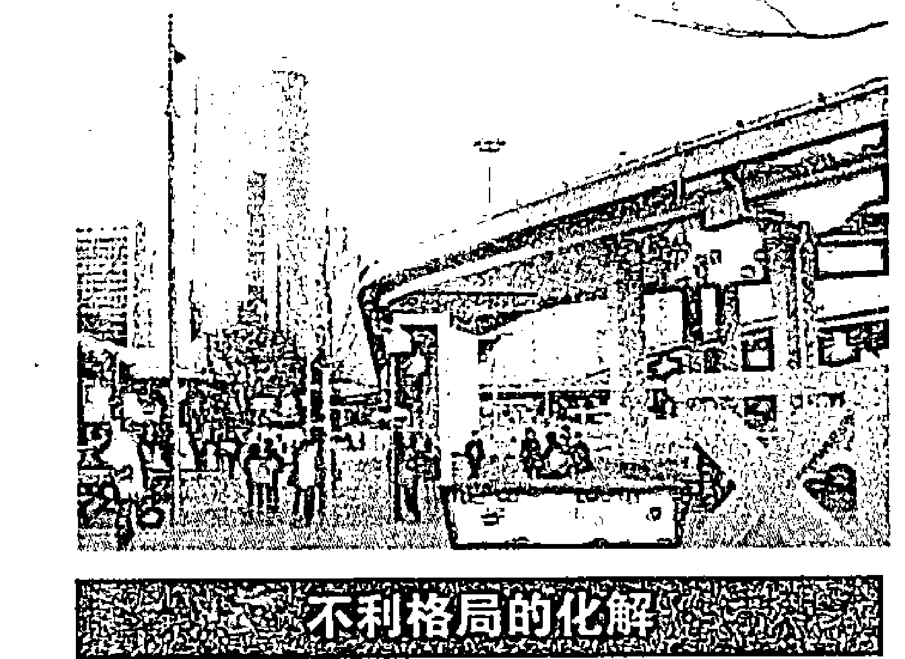

| 不利格局: | 窗前面对弯斜而去的天桥。 |
| 影响: | 家中财气容易外泄。 |
| 解决方法: | 摆放开光的铜大象或一对铜麒麟。 |

### 865 大门对着电梯和发射塔有何影响？

住宅的大门，若正对着电梯入口，电梯门闭合的时候，就好像虎口吞食一般，这种格局非常不利，会吸纳住宅的家运之气，非常不利。

化解方法：可在大门上方悬挂镇宅铜牌来化解，若在门口地面镶上五帝古钱，效果更佳。

住宅附近如果可以看见电塔、发射塔等一些尖锐的建筑物体，主家人易有血光之灾、火灾，健康状况差。

化解方法：可摆放铜貔貅，或在门下吊铜钱以加强力量。

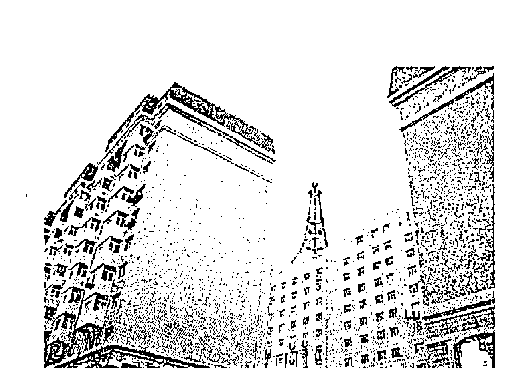

| 不利格局: | 大楼正对着发射塔。 |
| 影响: | 容易患重病，或有血光之灾。 |
| 解决方法: | 在此方摆放铜貔貅或铜钱。 |

## 866 住在庙宇附近有什么不利影响？

普通住宅如果附近有庙宇、教堂等建筑，容易造成家人性格孤独、脾气暴躁等。

这种格局的主要危害在于对人心理方面的危害，如会造成人脾气暴躁，有口舌是非之争，总感觉生活不如意，易导致皮肤擦伤等状况。因此，在购买房子的时候，应选择离庙宇或教堂100米以外的地方。

还有人认为，这种格局是指人和住宅孤零零地在一个地方，和外界的联系很少，人容易变得抑郁、烦闷，没有丝毫活力，也不爱和人交往，久而久之，人际关系就会变得冷淡。而人际关系冷淡会导致事业不顺，财运不通。

化解方法：可把开光的木葫芦和八卦罗盘钟悬挂在相关方位的墙上。如果主人体弱多病，可在同一位置加放两串明咒葫芦。

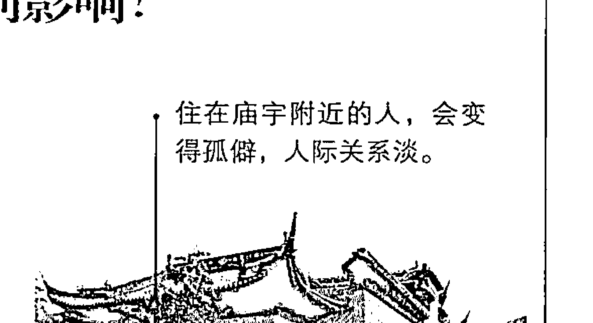

> > **庙宇附近不宜居住**
>
> 庙宇、教堂等地，属于孤阴之地，普通住宅如太过接近这些建筑，格局非常不利。

## 867 烟囱对住宅有何不利影响？

一些工厂里面有许多烟囱，住宅若面对着那些高大的烟囱，主家人健康易出问题，多易意外受伤。

具体情况分为三种：住宅对面只有一个烟囱，有两个烟囱，或者三个以上的烟囱，就像插在香炉中的香。

因此，住宅附近若有这种情况，一定要及时化解。

化解方法：可摆放开光的文昌塔和五帝古钱，如果相应方位刚好是流年凶星所临方，则要按此星的特性，配合其他物品，如珠帘、屏风等。

### 烟囱对不同人产生的影响

烟囱会造成大气污染，危害人体健康，尤其影响上半身健康，容易患胃病、喉病、胸肺部等疾病。

| 方位 | 影响 |
|------|------|
| 东方 | 长子多病 |
| 南方 | 中女多病 |
| 西方 | 少女多病 |
| 北方 | 中男多病 |

## 868 住宅面对尖角有何不利？

如果住宅面对着一幢大楼的墙角尖，或者两条路相交成三角，呈45度角直冲住宅，主家人易有血光之灾。窗户是室内外气场交流的重要通道之一，如果透过窗户能看到一些带尖的物体直射房子而来，也是一种不利格局。
住宅面对的若是墙角一边，并非正对，主家人健康差，易生病。
化解方法：摆放莲花杯和五帝古钱可化解；或摆放两串五帝古钱，如果此方位同时犯流年凶星，可加放两只麒麟和明咒葫芦。

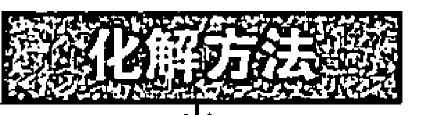

如果住宅格局不利，对家人的健康有很大的危害，应及时予以化解。

**危害及化解**
危害：窗口正好看见大楼的墙角尖，整日精神紧张。主家人易有血光之灾，为大凶之象。
化解方法：一般难以化解，最好在专业人士的指导下摆放莲花杯和五帝古钱化解。

**危害与化解**
危害：家人健康差，容易生病，家人容易浑身疼痛。
化解方法：平时生活还要注意，不宜将床摆放在墙角，否则会加重这种格局带来的危害，同时还要多注意休息，有助于增强体质。

## 869 住在阴气重的地方有何不利影响？

坟场、殡仪馆、医院等地属于阴气重的地方，普通住宅如果离这些建筑过近，会对住宅产生不利的影响。一般坟场、树林、殡仪馆、医院、监狱附近阴性物质多，易形成这种不利格局。
会造就人比较情绪化，容易有生活不如意之感；老有疾病缠身，体质较差，容易做噩梦，家人易患不知名疾病，运气多不好，易患忧郁症或者阴湿之病。
化解方法：可在家中安放木葫芦和五帝古钱以化解。

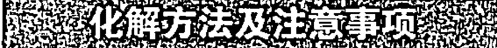

| 项目 | 内容 |
|---|---|
| **化解方法** | **较轻**：可在家中安放木葫芦和五帝古钱以化其凶气。<br>**严重**：若对家人造成了危害，那应在房内贴近厕所的墙上挂上四串明咒葫芦。 |
| **注意事项** | 无论哪种情况，所使用的葫芦必须是经专人开过光，最好选择铜葫芦，这样方能起到作用。 |

## 870 住宅前有道路相交有何不利？

指住宅前方有三四条道路相交，形状如同一把剪刀，刀口朝向住宅。一般屋宅、大楼位于多叉路口其内角度通常低于90度者，屋宅、大楼群由于设计原因自身形成类似剪刀形结构者，家人容易有意外灾祸、疾病、口舌是非、血光之灾等灾祸。

前方马路如同大刀般劈向住宅，或者对面相向的两排房子因地基没有对齐而产生交错的现象。主伤人、多意外，容易发生车祸、开刀、官司不断、家庭不和等事端。若情况非常严重，宅主还容易患心肺疾病，导致孕妇流产、难产等。

### 化解方法

| | 剪刀煞 | 刀斩煞 |
| :--- | :--- | :--- |
| 定义 | 住宅前方有三四条道路相交，形如一把剪刀，刀口朝向住宅。 | 前方马路如同大刀般劈向住宅，或者对面相向的两排房子因地基没有对齐而产生交错的现象。 |
| 主要危害 | 会给宅主带来极大的危害，主破财、损丁、意外受伤。 | 事端多，易发生车祸、开刀、官司不断以及家庭不和等。 |
| 解决方法 | 第一，刀或剪刀等利刃尖刺物品，不能随手摆放。<br>第二，卧室中也不宜摆放尖刺多角或尖形叶的植物。 | 第一，在家中摆放开光的龙神座，可化解。<br>第二，请专人使用乾坤八卦图化解。 |

## 871 气味对人有何影响？

对人体健康有害的气味除了对健康不利外，也对人的精神有所影响，从而影响工作情绪。

住宅的门前或者窗外，有路灯柱子、电线杆、交通指示牌、大树等直柱形物体冲射而来，不利于人体健康，尤其对人的情绪产生不利，主脾气暴躁，容易造成家庭成员思维不清晰、思维不流畅，容易发生眼疾、血光之灾等，且多病痛、多官灾及是非。可以在相关方位方悬挂两串五帝明咒，或者再加上石敢当共同起作用。

### 化解的方法

- **主要危害**：令人反感、作呕，易引起人体不快。
- **种类**：附近有臭水沟、公共厕所、污水渠、污水处理厂、垃圾站、焚化炉、臭河、污水排放沟、化学工厂、家中的厨房和厕所。
- **化解方法**：经常关闭窗、门，使用空气清新剂加以改善，平常厨房和厕所保持洁净。

## 872 住宅中摆放铜制大象或石狮子有何影响？

如果住宅的门或窗外，正对着一个峥嵘小山或土坡，犹如直刺住宅的门或窗，这种格局对住宅非常不利，易遭贼盗或被打劫，或家人易惹司法纠纷。
化解方法：在面对煞气方悬挂两串明咒葫芦或摆放铜大象。

有的楼顶上安装有卫星信号接收设备或其他通讯接收设备。它的形状类似于一口大锅，如果正对住宅的窗口，而且距离较近，家人易疲倦，压力大，健康差，工作不顺利。
化解方法：可用小石狮子加以阻挡。

### 化解方法表

| | 不利格局1 | 不利格局2 |
| :--- | :--- | :--- |
| 定义 | 家中正面对着一座峥嵘小山。 | 家中临近卫星信号接收或其他通讯接收设备。 |
| 主要危害 | 不会对家人健康产生危害，家中容易失窃。 | 卫星信号接收设备会释放大量的辐射，对人体健康危害极大。 |
| 化解方法 | 第一，悬挂两串明咒葫芦或铜大象。<br>第二，平常注意不露富，不给小人可乘之机。<br>第三，做好自我约束，有助于培养其敬畏之心，进而改掉偷窃等坏毛病。 | 第一，在选址的时候，注意远离这样的地方。<br>第二，放置小石狮子加以阻挡。<br>第三，拆除卫星信号接收设备，切断电磁辐射的源头。 |

## 873 住宅中的铜鸡和山水画有何作用？

有的楼房外墙上，水管或天然气管道犹如一条蜈蚣盘根错节，如果住宅的窗口正对此类物体主口舌是非、工作不顺。
化解方法：可用一对铜鸡摆放在相应方向以克制化解。

住宅后面有一条直路相冲而来，主小人缠绕，无论如何努力，也难以得到上司的欣赏。而且如果在此处开店，店主看到直冲而来的车辆，容易心生不安，总担心会有车祸，精神负担极大；在接待顾客时难免心神不宁，会影响商品的成交率，进而影响商铺的生意。

化解方法：最好办法是搬家；可以用石敢当化解，还可以在住宅的后墙上挂一幅山水画。

> **鸡饰品的作用**
摆放一对铜鸡。小孩营养不良，还可根据其生日、时辰，在窗台上摆放一对铜鸡或瓷鸡。

> **山水画的作用**
在家中悬挂山水画可以抵消道路直冲而来的不利影响。

## 874 住宅遇到不利格局如何解决？

住宅的四方都被道路包围划分，住宅如在“井”字中间，主家人运气反复，财来财去一场空，生意、前途等挫折、困难多。

化解方法：最佳解决办法是搬家，也可以请专业人士进行布局，尽量抵消这一格局。

住宅面对两座大楼，一远一近相邻，远处大楼稍高出近处大楼，如同探头张望，主家人易犯盗劫，出不良少年。

化解方法：最理想的化解方法是把那个“探头探脑”的建筑拆掉，不过现实中不一定可行。凸镜是很实用的化解工具，如果住宅备受困扰，只要把凸镜挂在窗外正对其方向就可以化解了。

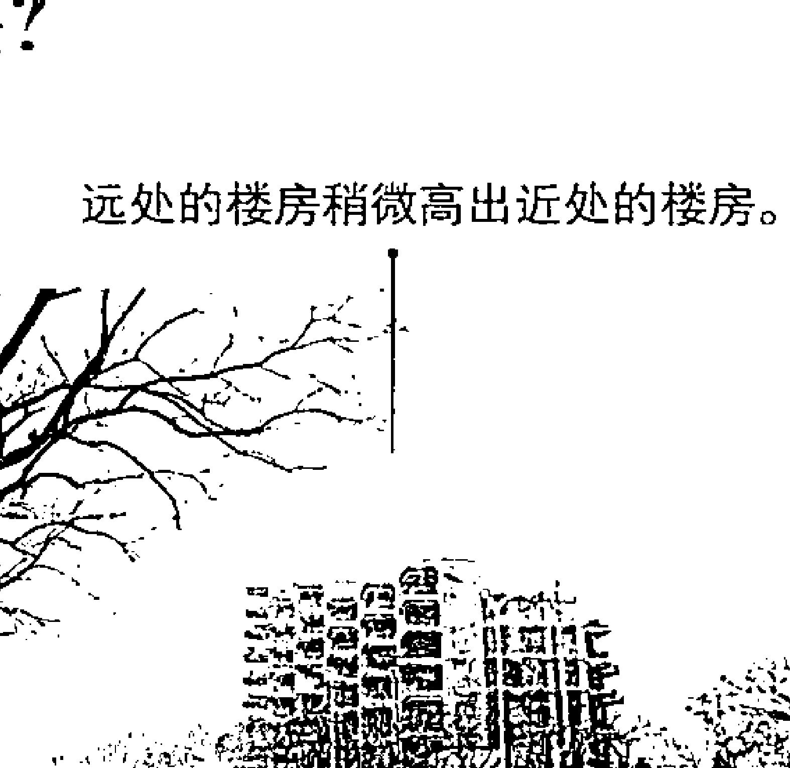

> > 化解方法
>
> 可用一面凸镜化解掉。安装凸镜的时候要注意方位。

## 875 住宅中摆放仙人掌和玫瑰有何作用？

住宅的前面或窗前，可以看见对面大厦一单元突出，如同向外击出一拳，主容易胸闷、胸痛，严重时甚至引起癌变。还会导致家人失和，经常吵架，还容易和外人发生口角，发生官司是非，造成金钱损失。

化解方法：最好的方法就是搬家。可以在窗台或门口摆放仙人掌、玫瑰等带刺的植物，利用尖刺对抗邪气。若有条件，还可以买一对金色的龙饰品，龙头向外，可以化解。

住宅前可以看见一些建筑物的顶部呈三角形。容易形成比较尖锐的矛盾，严重时可能产生血光之灾。

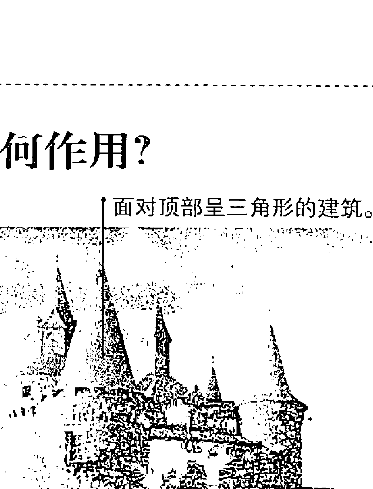

> > 化解方法
>
> 如果不能搬家，请专人在凶位上安置凸镜。室内的布局，则要根据专人的建议，根据家人的生辰八字，重新调整。

## 876 大门朝向房间怎么解决？

大门朝向房间门，和其他门窗连成一条直线。这种情况下，气流进入大门后会直接从其他门窗流走，无法在住宅内缓慢地循环并积蓄能量，从而造成破财、车祸、争吵、离异等不良状况，人居住在这样的环境中，还容易得肝炎、脸上长痘痘、体质不健康。穿堂风还会影响人的财运，会让宅主手中抓不住钱，而财运都随着风俗从指缝间溜走，不但不会有财运，而且家中的花销还会增多，无法积攒积累财富。

如果家中有这种格局，可以利用屏风、酒柜、鞋柜或其他家具将这条线上的门窗隔开，以阻挡气流。

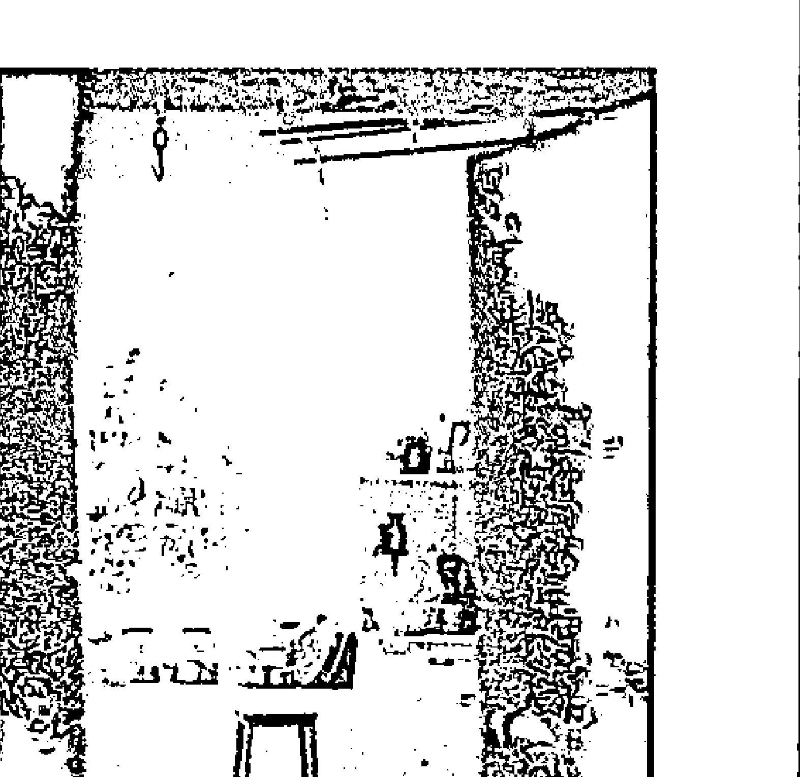

> > 大门与房门相对不吉
> 气流进入大门后，在屋里曲折、缓慢流动为吉。如果如图中，大门与窗户连成一条直线，形成穿堂煞，气流直出直入，不吉利。

## 877 横梁压门代表什么？

在装修大门时切忌横梁压门。家里人每次进门即受压制，代表在各方面都要仰人鼻息、郁郁不得志，一生无法出人头地。如果有横梁，可以用吊顶的方法，将它挡住。

横梁是一种不吉祥的建筑，不但大门，其他地方也不宜有横梁。玄关处不宜有横梁。如果玄关的顶部有横梁，可以在横梁处做一个假的天花板以便把横梁遮挡住，把横梁带来的不利影响消除，再在这个天花板上吊上一盏灯效果会更好。

客厅里不宜有横梁，否则会给家人带来横梁压顶的感觉，增加压力，在工作上会出现阻力。如果走廊上没有横梁，则可以不做。

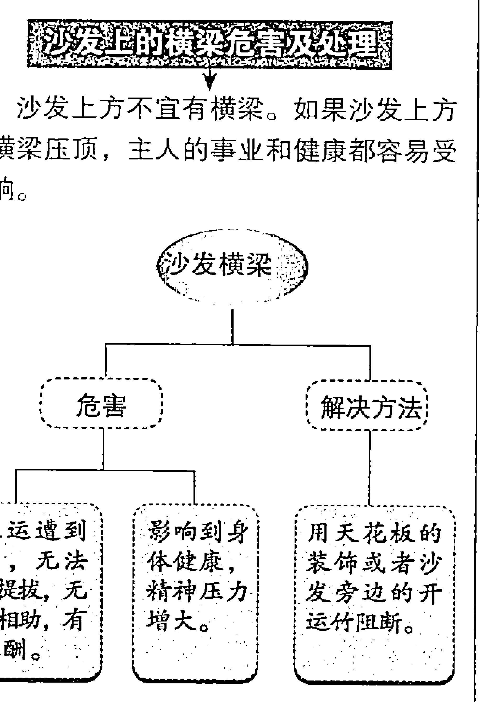

## 878 大门朝向厕所怎么解决？

进入大门通常就是客厅，如果一进门就看到厕所，如同晦气迎面，这种结构容易导致家庭经济困难、夫妻不和、身患怪病等不良状况。如果是自家大门与邻居大门正对，厕所的晦气直扑邻居大门，邻里之间还容易产生纠纷，因此还会对邻里关系、人际交往等产生不利影响。

化解的方法，最好改变厕所位置。若厕所的位置已经无法变更，就要注意经常关闭厕所的门，保持厕所的干净整洁，常开厕所的窗户通风，消除厕所异味。或者在厕所门前悬挂一扇水晶门帘，如此不但可以化解煞气，还有聚财转运的作用。

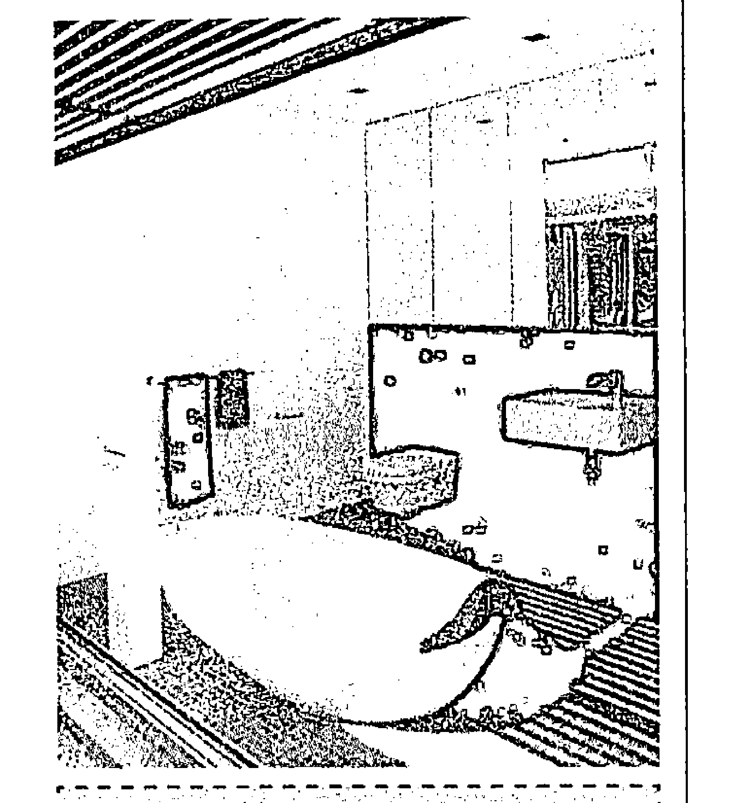

> > **大门朝向厕所**
>
> 大门朝向厕所，相当于晦气迎面，非常不吉利，最好改变厕所的位置，或者经常关闭厕所大门，并做好通风工作。

## 879 玄关处有横梁怎么解决？

中国传统文化认为玄关处有横梁是不吉利的。如果玄关的顶部有横梁，可以在横梁处做一个假的天花板以便把横梁遮挡住，把横梁带来的不利影响消除，再在这个天花板上吊上一盏灯效果会更好。

若使用假天花来遮挡横梁，还要根据五行相生相克的原则，注意不同的方位有不同的对应关系。

如果在假天花板上稍作装饰，效果会更好。如可在假天花板左右各安一盖圆形壁灯，或者在左右各安一各托梁架等等，既可美化家居环境，又可化解不利格局带来的影响。

### 房屋朝向与假天花板颜色的对应关系

| 住宅朝向 | 假天花板颜色 |
|----------|--------------|
| 住宅大门向东 | 假天花板应用灰色系装饰 |
| 住宅大门向西 | 假天花板应用杏白色装饰 |
| 住宅大门向南 | 假天花板应用湖水蓝色装饰 |
| 住宅大门向东南 | 假天花板应用浅蓝色装饰 |
| 住宅大门向西南 | 假天花板应用天蓝色装饰 |
| 住宅大门向西北 | 假天花板应用灰色系装饰 |
| 住宅大门向东北 | 假天花板应用天蓝色装饰 |

## 880 大门朝向厨房代表什么？

厨房是住宅的财库，开门就看到厨房，代表钱财外露，对家里的财运非常不利。由于厨房常与家庭主妇打交道，属阴，因此容易对女主人不利。大门朝向厨房，容易使家中的凝聚力减弱，夫妻感情不和，丈夫容易有外遇，不利于家庭和谐。

另外，大门若对着厨房，厨房的油烟和湿热之气会随着大门带来的气流而四散开来，影响家人的健康。而且厨房属火，与大门相对，还会导致家中蒸蒸日上的旺火流失，不利于宅运的提升。总之，大门正对着厨房，会给家居生活带来各种各样的危害。

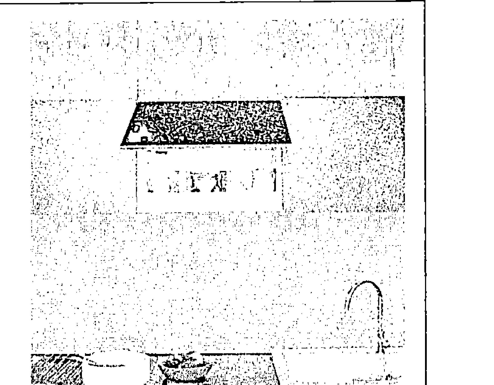

> 大门不能正对厨房
大门是家居中交流内外气场的关键通道，大门正对厨房，很容易导致煞气进入，财气外泄，直接危害家运，不可不防。

## 881 窗户过多或太大怎么办？

一般来说，窗户不宜过大，也不宜过多。窗户过大，气场之间流通活跃，人容易受到影响。窗户过多也有同样的问题，而且这种布局所产生的强烈气流，不但有损财运，还会造成主人身体不佳。

如果窗户过多，可以悬挂百叶窗或窗帘来改善运程。百叶窗比窗户更易于吸纳外气。而大型落地窗则要安装布料厚且颜色重的窗帘，以防夏天热量大量涌入和冬天热量迅速散失。

若是孩子的书房，窗户数量与大小应与房间的整体相协调，否则不利于精神集中，自然会对孩子的学习产生不利的影响。

> 窗户大小对家人的影响
窗户的高度与数量，会影响气场。气场过强还会干扰人的情绪，家庭成员之间容易发生纷争。

> 窗户的高度

> 窗户的数量

> 高度上应超过居住者的身高，在宽度上以美观为主。这样的窗户有益于气流的流通，有助于提升人的自信心。

> 窗户的数量要避免在同一排有3个或以上的窗，这样会产生较强的气流，对人体健康不宜。

## 882 如何化解阳台的不利格局？

住在都市中，一般免不了住宅的周围高楼林立。如果住的楼层低，阳台对面的楼离得又很近，就会带来庞大的强势气压，影响风水。距离近时，强大的气压会给人带来很大的压力，造成精神紧张、失眠等症状。这种情况下，可以在阳台上加一个屏风来化解。

另外宅主还需要注意，不要将阳台设置为落地窗的形式。落地窗与墙壁相比，支撑能力有限，承受风吹雨打和大气压强的能力比较弱，因此容易给人不踏实的感觉。

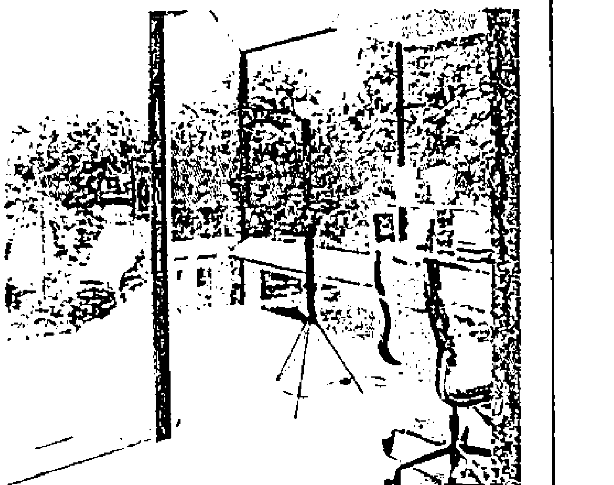

> 落地窗不利家运
落地窗总让人觉得玻璃随时会被击碎。

## 883 阳台对着厨房如何处理？

阳台正对厨房，容易导致家中的凝聚力减弱，夫妻感情不和，小孩放学后不愿回家，总之会给家庭幸福带来极大的干扰。

这是因为，阳台承受着外界各种各样的诱惑，若风水不好的话，护卫住宅的作用就会大大降低。而厨房常与家庭主妇打交道，属阴，因此容易对女主人不利。阳台和厨房相对，就容易形成不利于家庭和睦的格局，所以一定要将阳台与厨房隔开。

- 阳台与厨房需隔开
阳台对着厨房是一种不利格局，阳台的窗帘最好经常拉上，或是想其他办法将其隔开。
隔开的三个方法：
- 在阳台与大厅之间悬挂水晶珠帘，利用水晶的凝聚作用促使家庭和谐。
- 可以在阳台上种几株藤本植物或放置盆栽，使阳台与室内隔开。
- 在阳台和厨房之间的动线上，摆放柜子或屏风。

## 884 阳台对着大门如何处理？

大门不要正对阳台，否则家中破财的事会接二连三地发生。化解方法，则要看具体情况。如果玄关处有柜子，将大门和阳台隔开，则化解了此格局。也可以在入门处放一个大鱼缸，不过，命中忌水的人不可用此方法，而用屏风取代。经常拉上窗帘，也是一种简单可行的好办法。

## 885 如何驱除阳台的阴气？

如果阳台对着阴气较重的建筑物，如庙宇、道观、医院、殡仪馆、坟场，以及大片阴森丛林、形状丑恶的山冈等，住宅就会受到阴气的不断侵袭，影响家人健康和财运。因此，必须在阳台放置至少一尊的麒麟、貔貅、祥龙、石狮等瑞兽，利用它们威武的本性，给住宅环境带来好的影响。

另外，珠帘是用来化煞的常用道具，比如：阳台正对着大楼、电线杆、高架桥、墙角，为避免正面冲突，通常会悬挂一副珠帘来缓冲。

悬挂珠帘挡阴气
阳台是气场交流活跃的地方，阴气也最容易从这里进入室内，在阳台与客厅之间悬挂一副珠帘，也能起到净化能量，提升财运的功效。

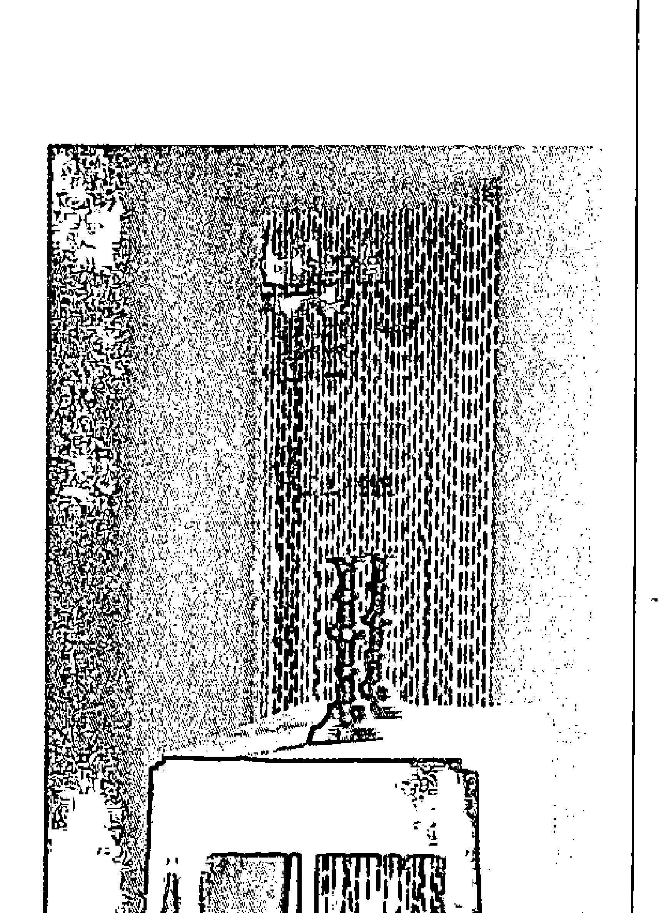

## 886 厕所在房子中间如何处理？

厕所在房子中间犯了装修中的大忌，会引来家人病痛连连，心脏血管或者腹部疾病会时有发生。

住宅的中心点位置是住宅里生气和旺气的凝聚点，是“大皇极是”，同时也是整个家居环境中最尊贵之处。将厕所安置在这里，无疑于将一切污垢放在此地一样，不但破坏了家居的灵气，也污染了整个家居的吉气。而且从现实的角度讲，厕所在房子中央，难以通风透气，势必会产生难闻的气味，污染了整个家居环境，使人吃饭不香，睡觉难眠。

### 厕所在房子中间的化解方法

在布置家居环境时，一定要避免厕所在房子中间。若已经形成这种局面，就要想办法化解。

| 摆放物品 | 化解方法 |
|---|---|
| 黄金葛和投射灯 | 厕所摆放黄金葛配上墙上的投射灯，可以净化气场。 |
| 长布帘和六帝古钱 | 在门口挂上长布帘和六帝古钱，有效地阻止厕所的秽气外泄。 |
| 海盐 | 在厕所放一盘海盐净化气场。 |

# 第二十一章 室内环境

本章讲了室内的环境问题，内容涉及哪些因素会影响室内环境，不同因素对室内环境的影响，空调的作用及安装忌讳，什么是阳宅六事，河流、空气流通、土壤对宅运有何影响，窗户的旺宅作用及忌讳，书房、阳台、卫生间、客厅、卧室等的布局注意事项等。

## 887 厕所在房子北方和东北方如何处理？

厕所在北方或东北方，也是不吉利的，厕所在这两个方位属于凶象。化解方法如下。

- 1. 将厕所移动到北方或东北方偏离十五度的方位即可。若想省事，或将坐便器偏离这两个方位十五度即可。
- 2. 在厕所里放置阔叶植物。一方面，植物可以吸收厕所的污秽之气，尽量减轻厕所气场对家居运程的影响，另一方面，阔叶植物还有催财作用。
- 3. 在厕所里放一个钱箱，钱箱里放些钱。若厕所门边有地方的话，还可在那里放一个鱼缸，这样可催财。但注意鱼缸不要对着厨房门，家里会不安宁。

> **厕所的设计**
在布置厕所位置的时候，需要注意，不要把厕所放在房屋中间和北方或东北方上，这多是不吉利的，需要想办法加以化解。

## 888 厕所在房子西南方如何化解？

厕所位置在房子的西南方向，不但不利于家人的健康，还会影响宅主的人际关系，影响宅主的运程。因为这个方位的好运气，会随着厕所马桶水的流出而流失，家居中好的气场和能量都会受到影响。
平常将马桶盖放下，厕所的门关上，并把厕所的灯光设为黄色的，这样有助于培养好的气场。
需要说明的是，并非所有在西南方的厕所都属大凶，还要根据家居情况具体问题具体分析。

### 西南方厕所的化解

| 化解方法 | 具体内容 |
| :--- | :--- |
| 内部布置法 | 平常将马桶盖放下，厕所的门关上，并把厕所的灯光设为黄色的，这样有助于培养好的气场，减少污秽之气。 |
| 外部改良法 | 在厕所门外贴一面镜子，通过镜子的反射作用，在视觉上会给人一种“厕所不见了”的感觉，进而起到改良运势的作用。 |
| 完全改造法 | 搬家，或者变更厕所的位置。不过这两种方法动作太大，一般不采用。 |

## 889 哪些物质会影响住宅的运势？

影响运势的因素有很多。比如说气候会影响运势，温度、气压、阳光、水质、土壤、风、水、山等等因素都会影响气场的力量，对周围的磁场产生作用，进而影响运势。

地理环境也会影响运势，房间的位置、方位，周围的建筑、路、天桥、停车场等，都对气场有一定的切割作用，或切成好的气场，或切成坏的，都会对家居运势造成影响。

## 890 气候对住宅环境有什么影响？

从地理学的角度讲，气候包括温度、湿度、太阳辐射、风、气压和降水量等因素，它们不仅是气候因素，也是影响人体健康的重要因素，古代人所说的“风水”，其实也包括了气候的内容，好风水必然有好气候，风水宝地总是气候宜人。

气候的各个因素都会影响家运。如太阳辐射是形成自然气候的首要条件，也与家居中热、能量、阳气、采光等直接挂钩。因此，古代人非常重视住宅的朝向和日照，追求向阳府第，忌讳住背阴之宅。

## 891 室温对住宅有何影响？

影响人体健康的一个因素是室温。一般来说，室温过高，室内就会形成干燥的气场，人鼻腔和咽喉容易发干、充血、疼痛。而且，这种气场会使室内的家具、石材及室内装饰物散发出邪气，致使人体中毒。
反之，室温过低，会形成阴冷的气场，人容易受凉感冒。寒邪还会使人的血管收缩，心率加快，容易引起心绞痛。

| 项目 | 主要内容 |
|---|---|
| 适宜室温标准 | 夏季室内的适宜温度为21-32℃；冬季室温为19-24℃。如果超过了这些范围，过高或过低，都会引发多种疾病，不利于人体健康。 |
| 温差大的危害 | 若是室温与外界温度相差很大，容易形成骤冷骤热的气场，人容易伤风感冒，还会引起老年人中风。 |
| 调节的方法 | 若是室温对家居气场产生不利影响，最容易影响人体健康，化解方法可以通过门、窗的数量来调整。 |

## 892 湿度对住宅有何影响？

从现代科学的角度讲，空气湿度高，会增加机体的传导力，容易流失热量，导致体温下降，神经系统和其他系统的机能活动下降，人体容易呈现出一系列病态，如易患感冒、冻疮、风湿病等。空气湿度过低，容易形成干燥的气场，引起人们嗓子发炎，喉咙疼痛。所以室内的相对湿度一般要求为30-65%。
在选择新居的时候，若是干冷或湿冷气候区，房子宜建在向南的斜坡上，这里容易接受太阳光。而气候干燥的地区，则宜选择相反方向的房子。

| 空气湿度 | 主要内容 |
|---|---|
| 空气湿度过高 | 第一，容易招致寒邪、湿邪，不但会影响身体健康，人居住在这种环境中，还容易胸闷，肝气不畅，脾气暴躁。第二，影响人际关系，不利于事业运的提升，也不利于培养贵人缘。 |
| 空气湿度不足 | 容易招致燥邪，人容易贫血，头发枯燥、白发、脱发，人的精神会变得委靡不振，不利于人际关系的和谐。 |

## 893 空气太潮对住宅有何不利影响？

空气湿度过大，就容易形成湿邪。湿邪侵入肌表，就会阻滞人体气血的运行，导致阴盛阳郁。人一方面会怕冷，另一方面，人体内的内热不能畅快地抒发出来。机体出于本能，会通过排汗降热。
长期居住在潮湿的环境中，很容易有四肢沉重、虚胖浮肿、大便粘小便不畅、易出粘汗等亚健康症状。
此外，潮湿的环境还会令人心情烦闷，不利于人际交往。有时候潮湿还会带来异味，直接为生活带来不便。

## 894 阳光对住宅有什么影响？

阳光属于气候中的一个因素，会对家居运势产生直接影响。
从物理学的角度考虑，阳光会直接影响人们的生活。如夏季阳光直射能使室内温度过高，人们在这样的环境中容易疲劳，也容易损伤眼睛。夏季阳光的能量较强，会使室内温度升高，家中若有危险物，很容易发生爆炸。反之，光线太弱，人容易感到寒冷、冷清，身体抗病能力将减弱，还会影响视力。

> 阳光的作用
人是带电体，会与周围的磁场发生磁性感应。阳光中的磁力会作用于人体，影响人的精神面貌和家庭幸福。

## 895 风对住宅有什么影响？

风属于气候中的一个因素，它是气流流动形成的，会直接影响家居运程。
传统文化中有“气乘风则散”的说法，即风会将好的气场冲散。因此要选择“藏风得水”的房子，避免风的危害。风对宅运的影响主要体现在容易招致风邪和容易冲坏气场两个方面。
因此在选择房子的时候，应选择冬季风力小、夏季常有风，且近距离内无大气污染源的地方。

| 风对宅运的影响 | 具体体现 |
| :--- | :--- |
| 易招致风邪 | 在中医中风与寒、暑、湿、燥、火并称六邪，风邪居首。冷风会让人感冒，热风会让人少气无力。若周围有湿气，风邪、湿邪同时袭击，对人体健康危害更大。 |
| 易冲坏气场 | 风盛很容易形成强劲气流，好的气场容易被冲走，坏的气场容易到来，既影响人体健康，又影响个人运程。 |

## 896 微环境对住宅有什么影响？

现在的房地产开发商很讲究住宅环境的设计，一般会根据大环境设计中环境，根据中环境设计小环境，根据小环境设计微环境。这是因为，任何一个环境都会影响家居的气场，影响家居运势。可以在楼宇的入口开一条路，通过路来纳气。如果入口在左边，就在左边设置小路，若路很长，就在右边开一个门，反之亦然。总之以既不影响交通，又不影响气场的流通为宜。

## 897 水对住宅有什么影响？

从大的方面来说，水对宅运的影响主要体现在降水上。某个地区的降水量较大，就容易形成潮湿的气场，如岭南地区，就容易产生瘴气，人容易生病，夏季容易患疟疾，是肠疾多发地区。反之，降水太少，又容易形成干燥的气场，人容易受到风邪的影响，如我国西北地区。

> 水对宅运的影响
住宅附近如果有小河、护城河、湖泊、池塘，家运会受到影响。在选择房子的时候，水质、水流方向等都是应该注意的。

## 898 房间大小会影响运气吗？

房间的大小会对人体产生影响，过大的房间对人的身心都有不良影响。传统文化认为，房子有吸人气的作用。人气，即人体散发出的能量。我们都有这样的感觉：一间房子若是很久没人住，里面就冷冷清清的，体质差者刚住进去可能会生病。卧室适宜的大小，面积最好在15平方米左右，最多不超过20平方米。房间超过20平方米，人体能量消耗太多，会影响生育。但房间也不宜太小，否则人容易有压抑感，脾气容易变得暴躁，影响人际关系的和谐。

> 大房子的危害
房子越大，吸收的能量愈大。它会大量消耗人体的能量，人的体质会因此减弱，终日无精打采，影响健康，又影响工作和事业。

## 899 房间深浅会影响宅运吗？

房间的深浅会对人体产生影响，过深的房间不利于家运，所谓“人造房屋，房屋造人”，讲的就是这个道理。

一个很深的房间，就好像一个柱形高杯，气流不容易流通，会形成传统建筑学上的“气厚”，容易聚气生财，但平常要注意多开窗通气，否则人容易有憋闷感。

一个很浅的房间，空气流通太快，能量容易散失，既所谓的“气散不聚”“气薄”。居住在这种房间里的人，情绪容易冲动，容易得罪人，而且也容易漏财。

房间的深浅适宜度以可以藏风聚气为准，不宜太深，也不宜太浅。

> 深色调的卧室
深色调的卧室，气流不容易流通，会给人憋闷感。在这样的屋子里居住，应当注意通风。

## 900 卧室有哪些讲究？

- 1. 忌卧室带阳台或带低飘窗，这样容易形成穿堂风。人居住在这样的环境中容易得肝炎，脸上容易长痘痘，体质不佳。
- 2. 忌对着卫生间。人一天三分之一的时间都是在床上度过的，卧室对着卫生间，污秽之气会经常侵扰人体，影响身体健康和家庭和睦。
- 3. 忌床脚正对着电视。电视的作用类似于镜子，显示屏会呈现出“幻象”。电视正对着床脚会影响床的气场，进而影响人体的健康。
- 4. 忌床靠墙较少。假如三面都可以上床，只有床头靠墙，人会有一种心无所依的感觉，难以安宁。
- 5. 忌床头上有吊灯。床头上有吊灯，吊灯散发出的光线和能量会干扰人的磁场，影响人的情绪，不利于人际交往。

> 床忌三面无靠
床忌三面无靠，假如床的三面都可以上床，只有床头靠墙，人会有一种心无所依的感觉，难以安宁。

## ## 901 何为“地有十不葬”？

“地有十不葬”指古代环境文化学上关于葬地的十种忌讳。歌诀为：“一不葬粗顽块石；二不葬急水滩头；三不葬穷源绝境；四不葬孤独山头；五不葬神前庙后；六不葬左右休囚；七不葬山冈缭乱；八不葬风水悲愁；九不葬坐下低小；十不葬龙虎尖头。”

粗顽块石之地，多凶恶之气。急水滩头，水煞直冲穴场，气也随水而泄。穷源绝境，水脉到此而绝，气也随之而死。孤独山头，四顾不应，无依无靠。神前庙后，与神灵争地气，多凶。左右休囚，即地形狭小局促，穴位逼迫不安。山冈缭乱，则主客不分，有喧宾夺主之嫌。风水悲愁，即有风啸水鸣之声，多惨痛之事。坐下低小，地形如坐井观天，主卑微下贱。龙虎尖头，四灵桀骜不驯，于主不利。

## ## 902 室内装修的颜色有什么作用？

室内装修的颜色不仅与个人喜好有关，还与旺宅有密切关系。一般认为红色是最吉利的颜色，它可以传递给人温暖、愉快、吉祥、力量等气场；黄色也不错，一般是光明、权威和长寿的象征，可以传递给人神圣和至高无上的气场；绿色也可以，它可以传递给生命、春天、宁静与清新等能量，令人感到心旷神怡，身心健康；白色象征着纯洁，可以给人坚定的气场。需要注意的是，室内装修颜色最好不要固定为某一种，否则容易刺激视觉神经，引起不适。

> > 室内装修颜色与五行的搭配

根据阴阳和五行的平衡原则，用五行所代表的物质来选用相生相合的色调为最佳。

颜色相合才会吉祥，当然还要尽量避免相克的颜色。

## 903 安装空调有哪些讲究？

空调具有一定的旺运作用，在安装空调时要注意以下几点。

- 1. 空调的出风口不可对着人体，否则易招致风邪，引起肩膀、胳膊受风疼痛，严重时甚至嘴歪眼斜，对人体造成极大的伤害，所以最好调整空调的出风口，使风来自侧面。
- 2. 空调的出风口不要正对着门，否则就违反了“藏风聚气”的原则，有漏财、难聚人气的隐患。
- 3. 空调最好不要对着厨房。厨房有炉灶，有火，空调对着厨房，会引起火苗不稳，家中运势不旺。若在厨房装空调，空调的出风口最好向上。

## 904 空调会影响宅运吗？

夏天到了，空调又成为家用电器的主角，作为家居中的重要的组成元素，要注意它的作用。

空调是利用冷风、热风来调节室温，这种风会形成磁场，直接影响宅运。很多人认为，空调在室内散发寒冻之气，在室外散发热空气，因此空调五行属金。它既可以激活吉利方位的气场能量，把吉祥的气流吹到居室，给家人带来好运；也可加重凶位的能量，把不吉的气流吹向各个方位，影响家人运程。

另外，搬入新居之后，最好重新装置空调。若是二手房，要将前主人使用的空调彻底清洁一次，避免前主人家的病菌和霉气影响自己的气场。

| 命中缺金 | 空调方位 | 风口方向 |
| --- | --- | --- |
| 男主人命中缺金 | 空调放在西北方 | 将风口调向上方，代表气流由上而下，形成较好的气流。 |
| 女主人命中缺金 | 空调放在西南方 | 将风口调向上方，代表气流由上而下，形成较好的气流。 |

# 图解中国家居生活百科1001问

## 905 空调有哪些作用？

- 1. 空调的转动，会将外面的气流、气场卷入家中，容易干扰宅运。宅主应该根据流年运程适当调换风向。如猴年西南方向主疾病，不宜将空调放在西南方向，而东北方向主财运，可将空调安装在东北方向，或安在东南方向提升桃花运。
- 2. 空调的出风口最忌讳吹向财位，否则会将家中的财运吹走。这时候可将空调挪向财位，或者在风吹向的位置挂玻璃屏风或布帘来化解。
- 3. 由于空调容易招致风邪，会导致人体失去靠山而得病，心无所依而人际交往失和，所以要及时调整空调的出风口，不要对准人、沙发、椅子等。

## 906 什么是“阳宅六事”？

“阳宅六事”包括“内六事”和“外六事”。“内六事”指门、灶、井、厕、磨、畜栏。

古代人认为，内、外六事的方位坐向与人的祸福吉凶有着密切关系。其中，大门关系家运，必须开在吉方；灶位与主妇相关，祸及老幼；水井关系家人健康，宜开在生气方和延年方。厕所宜在四凶方，以镇其凶。磨，代表粮食之所，如仓库。畜栏为家畜之所。

“阳宅外六事”指山水、道路、池塘、桥梁、庙宇、佛塔。外六事都是以外形论，重在象征意义，多采用峦头之法。

山水，即住宅四周的山势和水势。

道路，即大门前的路，与家运有关。如：门前道路渐远渐宽则人口安康，渐远渐窄则抑郁厄难；路呈“之”字形，主旺宅进财；呈“八”字形，则家出逆子。

池塘，即宅前的水池，在宅前主招财，宅后主损妻伤儿；以半月形或圆形为吉，以方形为凶；忌双池相连。

桥梁、庙宇、佛塔等建筑对家居不利。

> 门为阳宅内六事之一，大门关系家运，必须开在吉方。

## ## 907 怎样选择好的住宅环境？

在选择楼盘时，要考察一下整个楼盘的环境。一般认为，山主人丁，水主财，即后面有靠山，前面有秀水的环境为上。后有靠山指楼盘的后面有山，或者有其他楼宇。人居住在这样的环境中，心中有所依靠，心里比较踏实，容易有贵人相帮。具体说来，山也分金、木、水、火、土五行之山，其中以半球形的金形山，三个以上的金形山连在一起形成的水形山为上，不宜选择山顶有尖的火形山。背后楼宇的选择与此类似。前面有秀水指楼盘前面有水流经过，这样的环境非常优美，容易制造有益气场，适合居住。

## ## 908 理想的楼盘是怎样的？

好的楼盘，一定要具备下面这些条件。

- 1. 楼房的入口前面一定是空旷的，这是“明堂”，利于水聚于此处，即利于财富的汇集，人也容易感到心旷神怡。若楼盘前面有马路，马路最好是略低于楼房地面，并且不呈现反弓或是枪煞形状。
- 2. 楼盘的后方最好有几座楼宇高度与此楼房相同，这样有助于支撑本楼房，形成“坐实”之相。生活在这样的楼盘里，在工作上容易得到贵人的赏识和帮助，做事往往事半功倍。

## 909 天桥会影响宅运吗？

一般认为，天桥对住宅有这些方面的影响。

天桥压着楼宇，形成“天桥压宅”之势，人容易感到压抑，容易出现精神紧张，易头痛，既不利于人体健康，也不利于人际交往的和谐，更不容易赢得贵人运。

天桥盖着楼宇，或在楼宇之下，要根据是反弓之相还是环抱之势来判断好坏。若形成反弓之相，则宅主容易碰到不如意的事情，对家居运程不利；若形成环抱之势，则宅主容易形成积极、乐观的性格，为好的格局。

此外，天桥周围来往车辆较多，容易产生噪音，在选楼的时候最好注意这点，不要选择靠近主干线的住宅，如环路、轻轨、铁路、高速公路等。

> 天桥影响人体健康
天桥压着楼宇或者盖着楼宇，会形成“天桥压宅”之势，人的精神压抑，情绪紧张，容易患头痛等症，脾气变得暴躁，不利人际交往。

## 910 怎样选择合适的楼层？

不同的楼层有不同的增旺作用，宅主要根据自己的五行所需来选择楼层。

- 每栋楼的第一层、第六层、第十一层、第十六层、第二十一层、第二十六层属水，适合属猪、鼠者居住；
- 第二层、第七层、第十二层、第十七层、第二十二层、第二十七层属火，适合属蛇、马的人居住；
- 第三层、第八层、第十三层、第十八层、第二十三层、第二十八层属木，适合属虎、兔的人居住；
- 第四层、第九层、第十四层、第十九层、第二十四层、第二十九层属金，适合属猴、鸡的人居住；
- 第五层、第十层、第十五层、第二十层、第二十五层、第三十层属土，适合属牛、龙、羊、狗的人居住。

# 911 地势会影响宅运吗？

地势是住宅选址的重要元素之一，当然会影响宅运。最佳的地势，应是房屋周围平坦。

楼盘周围的地势大致有西高东低、东高西低、北高南低、四方高而中央低、东南高西北低等几种情况。选择在正确的地方居住或开店，可以生旺自己的运势，反之，不仅运势衰败，还会影响身心健康。

若楼盘周围地势前高后低，为不好的地点，表示前有阻碍，后无保障，不宜居住，也不宜经商。相反，前低后高的地势，大吉，表示步步高升，财运、事业运均不错。

楼盘周围的地势对宅运的影响
| 楼盘周围地势 | 运势影响 |
| :--- | :--- |
| 西高东低 | 排水方向必须是自左向右，否则容易致使宅主性情急躁，个人生活不安定。 |
| 东高西低 | 附近楼盘不宜作商铺。 |
| 北高南低 | 适合居住；南高北低，则不宜居住，不利于身体健康。 |
| 四方高而中央低 | 不宜居住，也不宜经商。 |
| 东南高西北低 | 低洼地带容易积水、湿气重，对人体健康不利。 |

# 912 什么是孤峰独秀？

如果只有一座山特别高，前、后、左、右方的山很矮小或没有山，就形成“孤峰独秀”或“孤峰独耸”之势，有鹤立鸡群之感，不吉利。这种地形没有依靠，容易受到煞气的干扰。

运用到楼盘中，道理也是一样的，好的楼盘，应该是背后有高大的楼盘，左右两方有小楼盘，前方有小楼盘或前远方有高大楼盘，包括自身，共五楼盘。若是周围没有楼盘，或者都是小楼盘，就形成了“孤峰独秀”，人居住其中，心中不踏实，对人体健康也不利。

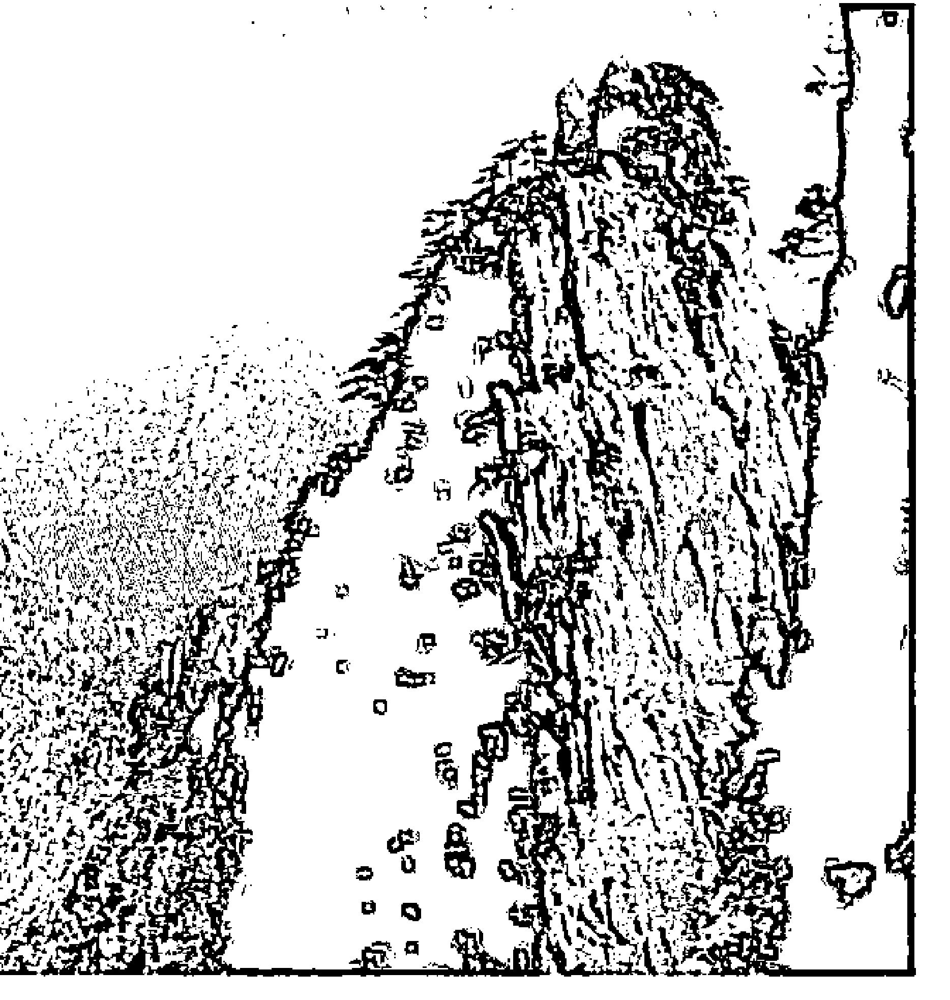

> 孤峰独秀
孤峰独秀就是只有一山独高，这样的地方前无遮挡，后无依靠。运用到现代楼盘中指一楼独高。人居住在其中没有安全感，情绪化，会影响人的身体健康。

# 913 道路会影响宅运吗？

古人认为路有影响宅运的作用，“凡宅东有流水达江海，吉；东有大路，贫；北有大路，凶；南有大路，富贵”。

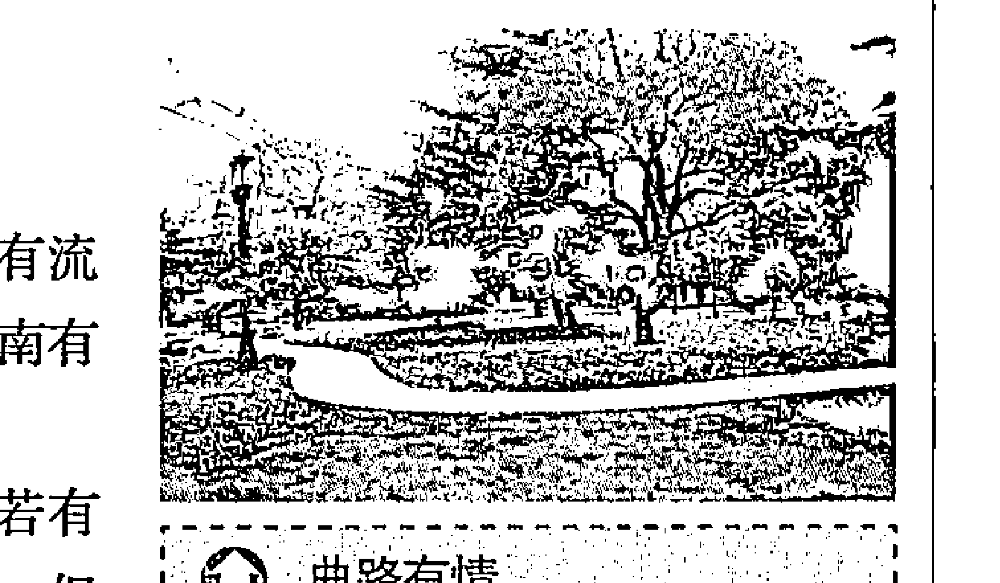

东方为陶朱之地，陶朱公即文财神范蠡，若有流水达江海，表示路伸向东方，意味着财源广进。但东方不宜有大路，否则会导致内气外泄，内财外流，易受穷。

> **曲路有情**
门前若有曲折的马路，是非常吉利的，因为“曲路有情”。从现实角度考虑，曲路上车速相对较慢，危险性低，不容易影响附近居民的日常生活。

房子北边有马路，喧闹声会使人心神不宁，浪费人的心神，影响人的情绪，为不吉。反之，路在南面，则象征着大吉大利，因为南为阳，预示着阳气充足。

# 914 地下污染对住宅有何影响？

地下污染与化学污染不同，它对人体的影响较慢，但却是长期的，且不容易得到救治。如有的人容易长白头发，很难白发转黑，检查身体之后也没什么问题，这很可能就是地下污染造成的。

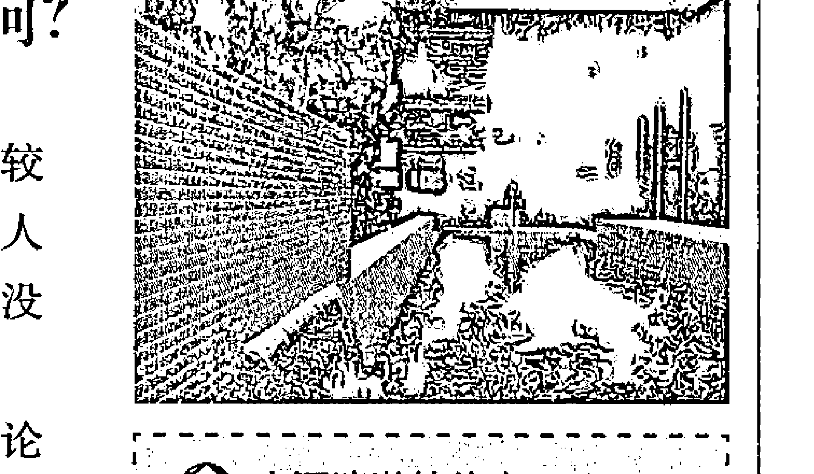

地下污染主要表现为水质污染。古代建筑理论认为：“吉地不可无水。”好的住宅选址自然需要好的水源。现代都市好的水源很少。要注意查看住宅周围是否有渗水厕所、粪坑、畜圈、垃圾场和工业废水等污染源，如果有，则需坚决搬离此地。

> **水源清澈的住宅**
好的水源应水质良好，水量充沛。住宅周围有这样的水源是比较吉利的。

# 915 室内化学污染对人体健康有何影响？

一般人都知道，新居容易有化学污染，人居住在这样的环境中容易有憋闷、恶心、头晕目眩、嗓子不舒服、皮肤过敏、新婚夫妇难以怀孕、胎儿畸形、小孩常咳嗽、打喷嚏、免疫力下降。这就是室内化学污染对人体造成的伤害，其实污染已经影响了健康运，招致了煞气、邪气。

# 916 河流会影响住宅气场吗？

河流对住宅选址的影响有利有弊，门前若有清澈的流水经过，大吉，门后有河水经过，则凶，人容易患病。
房子周围若有护城河，不吉。这是因为护城河中往往长满了水葫芦、水藻，这说明这里的水质已经受到了严重污染，这种水会散发出有害气体甚至恶臭，既影响人体健康，也不利于财运提升。
若周围有容易断流的河水，也不宜在此居住。河如果常断流，属于“瓦陷煞”，是破财之兆，人居住在此没有财运。

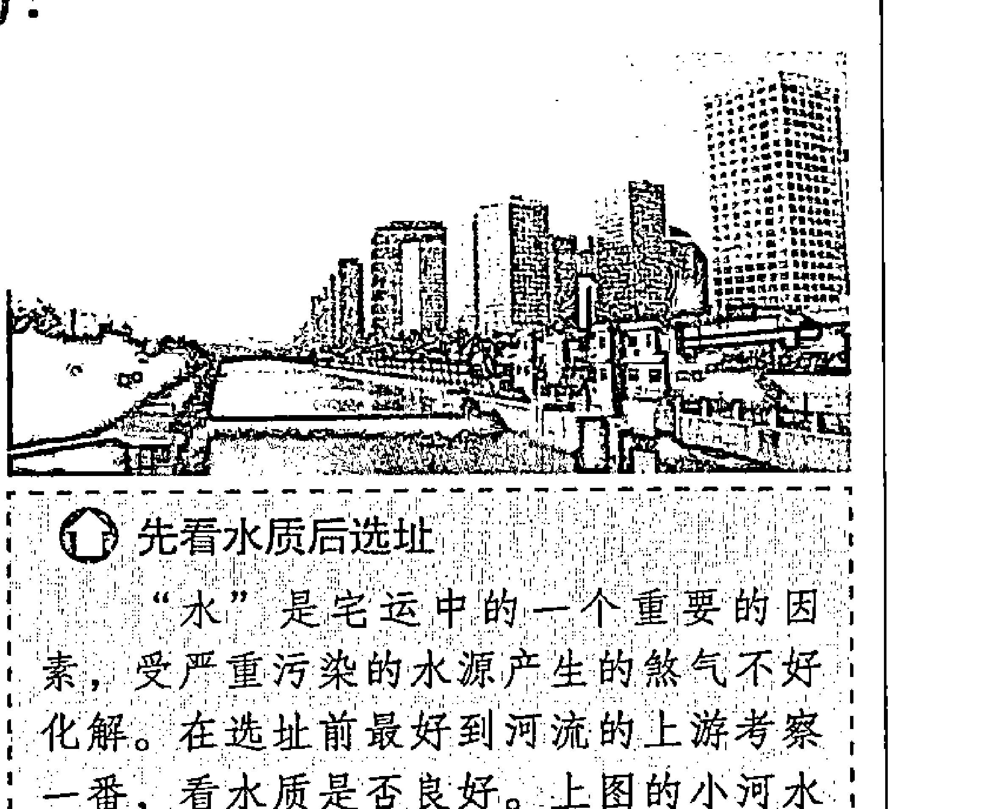

> 先看水质后选址
“水”是宅运中的一个重要的因素，受严重污染的水源产生的煞气不好化解。在选址前最好到河流的上游考察一番，看水质是否良好。上图的小河水质清澈，这对周围的住宅非常有利。

# 917 空气流通对住宅运势有何影响？

空气的能量在流通的过程中得到了更新和交换，住宅才有源源不断的能量补充，人在鲜活能量的环境中生活才会身心健康，吉祥如意。反之，若空气不流通，或流通不畅，房间内的活力就相应减少了，阴气、衰气就增多了，这不但不利于家庭成员的健康，大家还会经常莫名其妙地与人发生争执，不利于人际交往，也难以赢得贵人缘。
因此，一旦觉得人体莫名其妙地不适，难以调理好，家庭成员之间经常莫名其妙地与人发生口角，就要考虑是否是住宅环境的原因了。

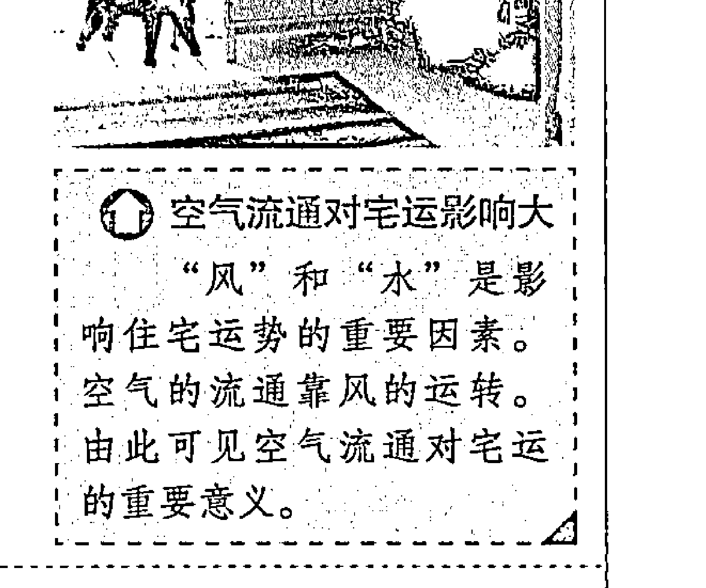

> 空气流通对宅运影响大
“风”和“水”是影响住宅运势的重要因素。空气的流通靠风的运转。由此可见空气流通对宅运的重要意义。

# 918 土壤会影响宅运吗？

土壤对宅运的影响，主要体现在对祖先的影响和对家居的影响两方面。祖先穴位土壤好，会荫及子孙后代。而住宅周围若有医院、垃圾场、火葬场、烟囱等地，土壤和水容易受到污染，进而影响家人健康。因此在选择楼盘的时候，要进行多方面的考察，包括对土壤的考察。

## 919 哪些情况不利于空气流通？

家中空气流通不畅，会影响家庭磁场发生变化，容易影响家庭幸福和谐，也会导致宅主的事业和运势不顺。在装修的时候，一定要避开不利于空气流通的情况。

东西向的房子，空气流通不畅，可东西向开窗，并以金属百叶做窗，使光线和空气进入室内。

南北向的房子，空气流通不畅，可安置百叶排气孔或设置垂直遮阳板，让房子有呼吸、喘气的机会。

| 空气流通不畅的房子 | 化解方法 |
|-------------------|----------|
| 东西向的房子 | 可东西向开窗，并以金属百叶做窗，使光线和空气进入室内。 |
| 南北向的房子 | 可安置百叶排气孔或设置垂直遮阳板，让房子有呼吸、喘气的机会。 |
| 客厅无窗 | 西面种阔叶植物，有助于增加新鲜空气，制造水汽。 |
| 室内窗户数量少 | 以拉门、布帘等活动设计创造弹性隔间，或将门向上开到天花板。 |

## 920 孕妇需要什么样的居室环境？

我们可以根据孩子的生辰八字推测出母亲在怀孕时期周围的环境，而生辰八字又决定着孩子的运程，由此可见堪舆对人命运的影响。所以孩子出生之前，家人就要为孕妇提供好的环境，真正做到优生优孕。

| 环境标准 | 主要内容 |
|----------|----------|
| 空气要流通 | 这样有助于提供鲜活的能量，使胎儿拥有鲜活的生命力。 |
| 环境要优雅 | 这样会为孕妇提供一个安心、舒适的休息环境，有利于胎儿性情平稳。 |
| 房间内要生机勃勃 | 可摆放一些鲜花，养一些金鱼，这些鲜活、灵动的东西有助于形成积极的气场，有助于提高人的情绪。 |
| 声音要悦耳 | 周围不能有火车、汽车的噪音，否则孕妇烦躁不安，会影响到胎儿。最好多让孕妇听听美妙的音乐，听听丈夫的甜言蜜语。 |
| 颜色要适宜 | 色彩对人的心理和情绪有一定的影响，家居环境的颜色布置要和谐美观，最好根据孕妇的命理及所喜好的颜色来布置房间。 |
| 要有吉祥物 | 如龙、龙头龟、麒麟，或者其他美丽的事物，如漂亮宝贝的图像、美女的图像等，这些东西会将吉祥、美好的力量传递给孕妇和胎儿。 |

# 921 如何利用自然通风改善住宅环境？

空气流通对宅运有重要意义，空气流通不畅会导致室内憋闷、潮湿，不利于人体健康，影响家居运势。在房子朝向一定的情况下，人们还可以利用自然通风条件改善室内环境。

| 利用自然环境改善通风的方法 |
| :--- |
| **空气不流通的情况** | **改善方法** |
| 若是浴室没有对外窗户容易造成室内潮湿、空气流通不畅。 | 移动浴室位置，或拉大浴室隔间，打造对外窗户。 |
| 若是卧室不通风，空气不流通。 | 在附近的窗户安置百叶窗，既可让空气流入房间，又可以遮挡室外明亮的光线。 |
| 若是室内前后都没有窗户造成空气流通不畅。 | 可开两扇窗户，且两侧宜遥遥相对。 |
| 若是客厅对着另一栋大厦，通风但不能循环流通。 | 在客厅中放一面镂空的屏风，能够让空气部分流通，有所停留。 |

# 922 灯对住宅运势有何影响？

灯与光照、光线有关，因此能传递能量，对宅运起作用。如夜幕降临，华灯初上，人就有一种“归心似箭”的感觉，因为灯光能传递温馨、温暖的能量。因此恰到好处的灯光布局有提升家居旺气、减轻阴暗气场的作用。

不管家中用了什么灯，都要注意明暗分明，书房、厨房光线要充足，卧室灯光要柔和。为了避免产生浮躁不安的心理，家居中最好不要用红色灯及闪烁的霓虹灯作装饰。

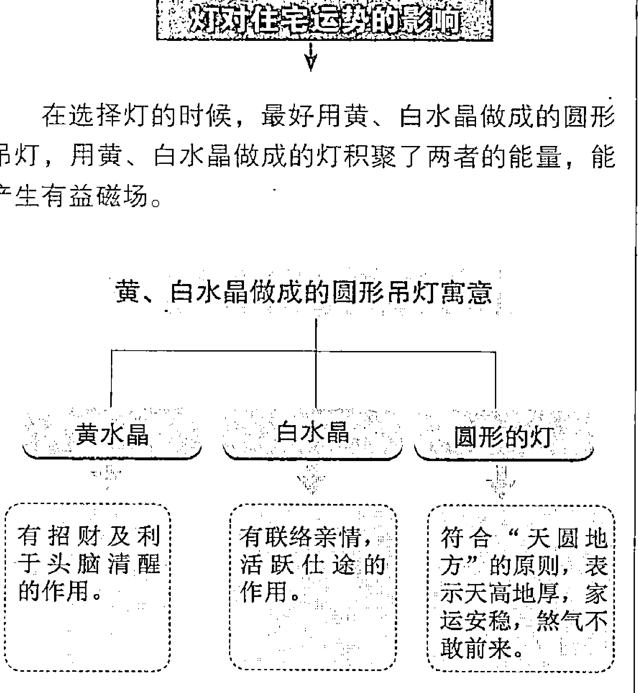

# 923 室内光线对家居环境有何影响？

光线一方面起着照明作用，一方面又能传递能量，因此能影响家居环境。

室内光线不宜太亮，否则容易晃眼，引起眼疾。强光线传递的能量强，容易使人心烦意乱，或过于激动、亢奋，容易造成失眠、神经衰弱等症，不利于人际关系的和谐。

室内光线太弱，容易视物不清，眼睛太过劳累。弱光线传递的能量弱，人若长期居住在这样的环境中，容易精神恍惚，鬼上身，不利于健康。

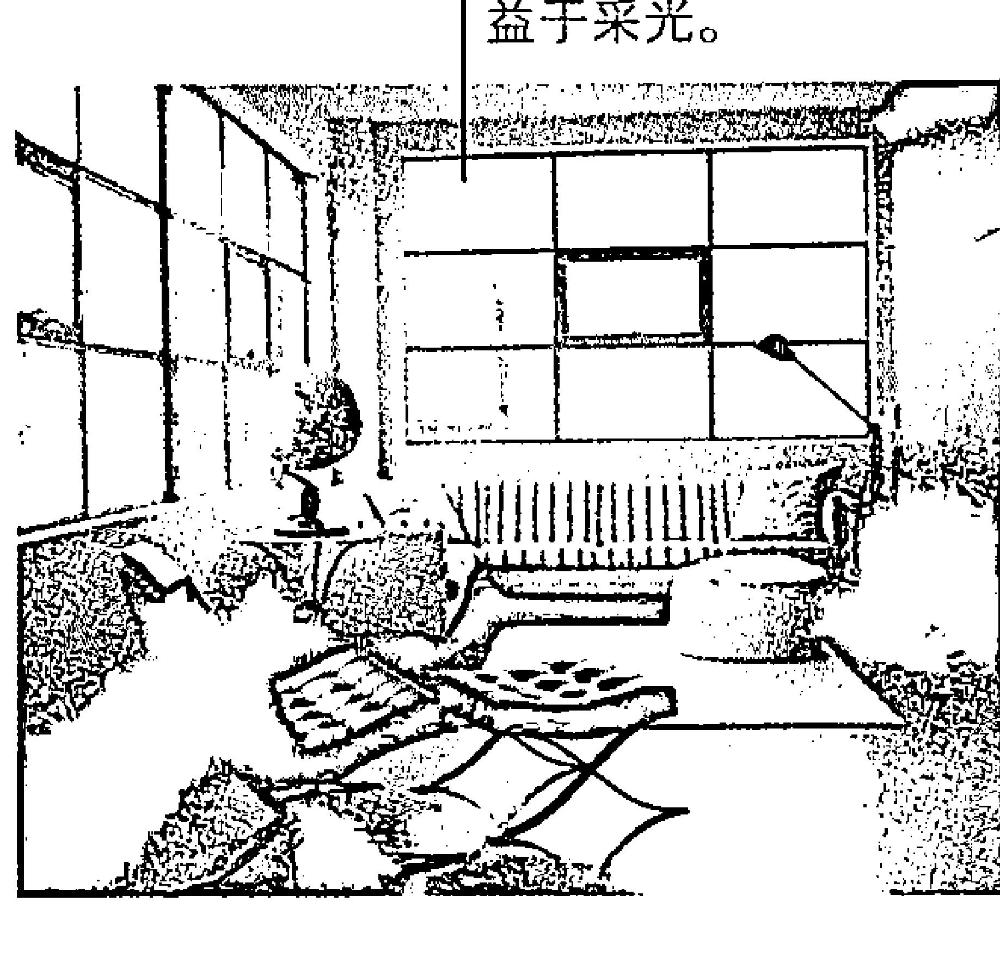

> 适宜的室内光线
室内光线不宜刺眼或昏暗。好的室内环境，应该是采光好，光线充足，空气流通，照明自然而温馨。

# 924 怎样设计窗户可催旺宅运？

窗户和门一样扮演着吸纳阳光和空气的角色，是形成室内气场的关键因素。人们可以通过窗户的设计来加强室内气场，催旺宅运。

1.  窗户的顶端高于居住者的身高，这样有助于增进宅主的自信，提升其气质、气度，利于人际交往。
2.  窗户开启的方式最好是向外或向两侧推开，这样有助于培养人积极、勇敢、向上的性格作风，容易赢得贵人的帮助，进而提升运程。

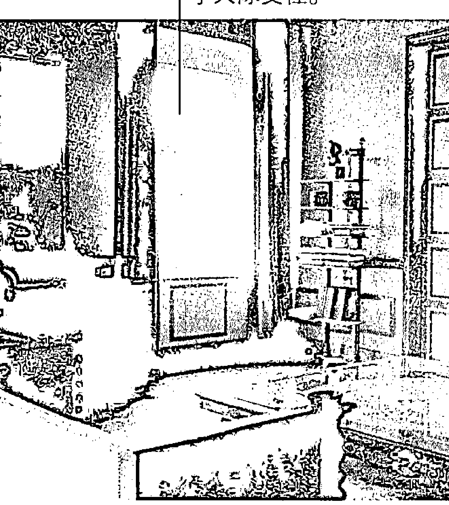

> 方形的窗户
窗户设计成方形或拱形，会给人教堂般的宁静与安祥，有利于稳定人的情绪。另外，方形窗有振奋人心的作用，可提升人的自信心和事业运。总的来说，方形的窗户有利于财运和事业运。

# 925 窗户的大小与宅运有什么关系？

窗户是一个住宅的眼睛，有画龙点睛的作用，窗户的大小当然会影响室内气场能量的大小。
一般认为，窗户不宜过大，客厅或卧室的窗户数量不宜太多，否则气流旺盛，不利于聚气生财，也会导致亲子关系不和。
凡事过犹不及，窗户也不宜太小，否则会给人寒酸、小气的感觉。宅主容易变得视野狭小，气量狭小，退缩内向，不利于运程的提升。
因此窗户的大小，高度上以超过大多数居住者的身高为宜，宽度上以方便开关窗为宜。

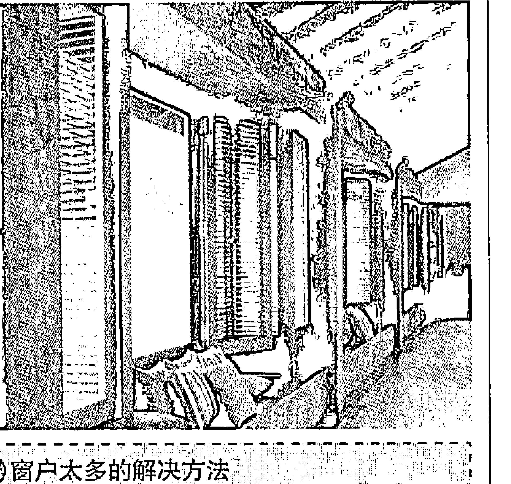

> 窗户太多的解决方法
窗户太多会扰乱室内气场，使人情绪紧张，不利于家庭和谐。若想化解，可用百叶窗或窗帘遮挡多余气流。

# 926 窗户有什么旺运作用？

窗户好比人的口、鼻、毛孔，有纳气的作用，对家居气场影响很大，主要体现在以下几个方面。
1.  保持居室内空气能良好地流通。好的家居气场，应该气场活跃，空气流通。而空气流通，主要靠窗户来调理，因此窗户有促进人体呼吸通畅，身体健康，保持气场活跃的作用。
2.  有“吐故纳新”的作用，即将室内的旧气场流转出去，将外面的新鲜空气送进来，可以及时更新室内气场，为家人补充能量，有助于全家人身心健康，安居乐业。
当然，凡事有利也有弊，煞气、邪气可通过窗户跑进来，这时候要注意化解。

窗外绿树成荫，会带给宅主名望。

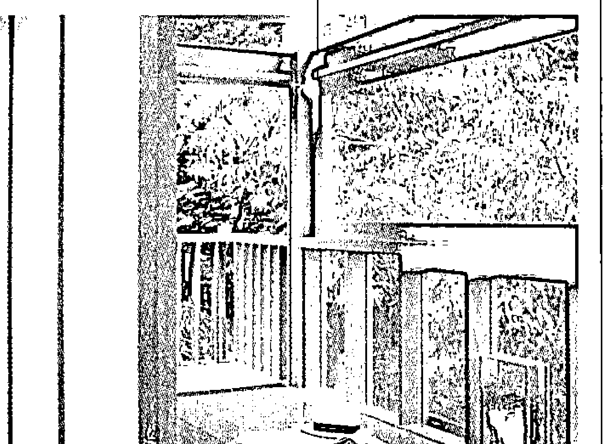

> 窗外好风景招财运
如果窗外有好的风景，如河流环绕，绿树成荫，为吉祥。它可以将外面的名望及财运全部通过窗户传给宅主，提升其事业运。

## 927 窗外的不利环境怎样化解？

窗口一面对内，一面对外，难免会遇到不利影响。

最好的情况是，窗户外面无遮无挡，视野开阔，对着一条缓缓的马路或环绕的河流也好。若想进一步提升宅主的运程，可在窗口放一条金色的龙，保证龙头向外，可以起到招财聚气的作用。若窗外对着医院、坟场、庙宇、监狱、屠场、公共厕所、垃圾场等场所，或反弓弧形的路或水流等路冲，就要在窗口处悬挂化解物以吸收煞气。

### 不利环境的化解方法
| 不利环境 | 危害 | 化解物品 |
| :--- | :--- | :--- |
| 场所 | 不利于家人健康和运程。 | 悬挂打开葫芦盖的葫芦。 |
| 路冲 | 感情破裂，金钱散去。 | 挂貔貅，可避邪、旺财。 |
| 天斩煞 | 容易招致血光之灾。 | 悬挂凸镜，反射和遮挡阴气，有镇宅保平安的作用。 |

## 928 窗户的形状应注意什么？

窗户的形状与五行有关，会影响家居运程。五行与窗户形状的对应关系、窗户的设置如右表。

圆形窗户，属金，适合安置在住宅的西南、西、西北、北与东北等方向，有助于产生凝聚力，确保家庭和睦；金形窗户会给人宁静、安详的感觉，有助于人际交往的展开，可获得贵人帮助。

### 五行与窗户形状的对应关系
| 窗户形状 | 五行 | 适宜安置方位 |
| :--- | :--- | :--- |
| 圆形 | 金 | 西南、西、西北、北与东北 |
| 长方形 | 木 | 东、南与东南方 |
| 曲形 | 水 | 不应用于家居建筑 |
| 尖形、三角形 | 火 | 过于尖锐，不用于家居建筑。 |
| 正方形 | 土 | 南、西南、西、西北或东北方 |

## 929 窗户的方位应注意什么？

窗户的方位会影响宅运，其对应关系如下。

窗户若向东开，表示大吉，意味着紫气东来；窗户若向北开，不利于家人健康，因为背面属于阴水；窗户若向南开，若看到屋角、天线、枯树、废弃物、尖石等不利住者，容易使宅主患眼疾；窗户的朝向，若有尖峰之类的东西，容易导致车祸、家庭人员伤亡，或家中人员是非不断；两面正对的墙壁之间不宜同时开窗，空气流通太旺盛，难以藏风聚气，会造成人财两空的局面。鉴于窗户的以上堪舆作用，在设置窗户的时候要特别注意。

# 930 窗帘有什么增旺作用？

窗帘具有以下三大作用。

1.  保护家庭隐私。窗帘有遮盖作用，避免自己的一举一动都在别人的视野之内，因而起到保护自我，防止邪气入侵的作用。
2.  遮挡光线。窗帘的遮挡作用，不仅是保护人的隐私，而且人们可以通过窗户的色泽及透过灯光的明暗度来改善室内亮度，形成自然采光。
3.  降低噪音的危害。外面的噪音很容易通过窗户传递过来，影响室内人的安静，而窗帘既可确保通风良好，又可有效降低噪音，改善室内环境。

鉴于窗帘的作用，在考察具体情况时，还应该将窗帘的因素综合进去。

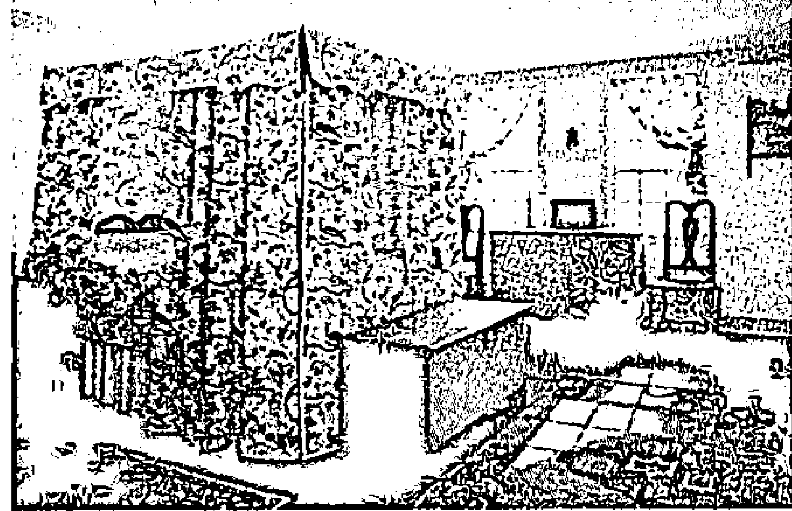

> ## 美化环境的窗帘
窗帘一方面可以起到美化环境的作用，另一方面还可通过窗户周围气场的流通来增加室内气场的动感，给人以生机勃勃之感。

# 931 窗户有哪些讲究？

一忌床头靠窗口。这易形成 “无靠山”，容易造成办事不利，有理说不清，背后常有人说三道四。人长期睡在这里，容易患头部及心血管方面的疾病。
二忌窗户数量太少。这会造成内气抑郁其中，无法吐故纳新，气场不活跃，人容易患病，精神状态不佳，不利于人际交往。
三忌卧室窗户太低，底层的气场容易导致夫妻久婚不孕或产后失调等症。
四忌窗外正对着尖锐的屋角、医院、坟场、垃圾场、监狱、烟囱等不洁之物。这容易招致邪气入室，不利于家庭平安。

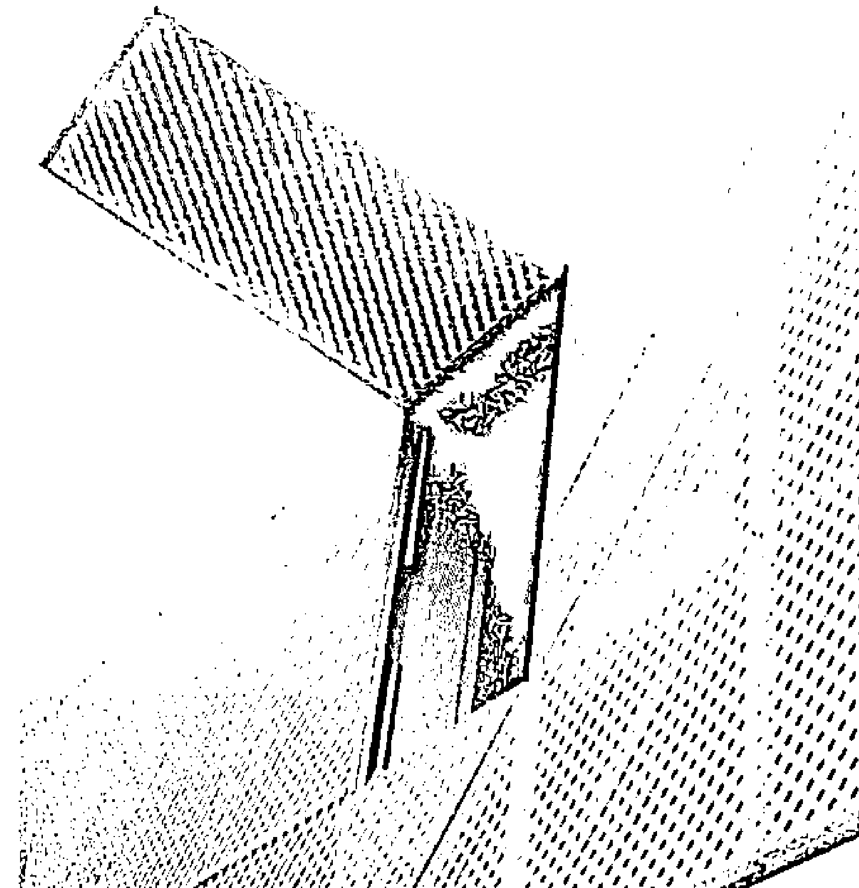

> ## 向外开的窗户运势好
窗户最好向外开。内开的窗户不利于大量的气进入室内，室内浊气也无法外流，造成气场不流通。

# 932 落地窗对住宅运势有何影响？

现代很多居室卧室、客厅都与阳台连在一起，房地产商为了突出欣赏风景作用，就将阳台做成直立的落地玻璃墙，这样虽然让人觉得室内面积更大，采光更好，但却不利于运势。

落地窗主要有四大危害。

第一，人站在落地窗面前，容易感觉脚下中空，不踏实，没有安全感。
第二，落地窗还会将自家隐私全暴露在别人面前，容易招致邪气，引起别人的窥视。
第三，玻璃没有墙壁结实，刮风下雨时，玻璃噼里啪啦作响，给人极大的不安全感。
第四，落地窗窗外的风景美则美矣，可却危害众多。久居这样的房子，有不安感，不利于家庭和谐。

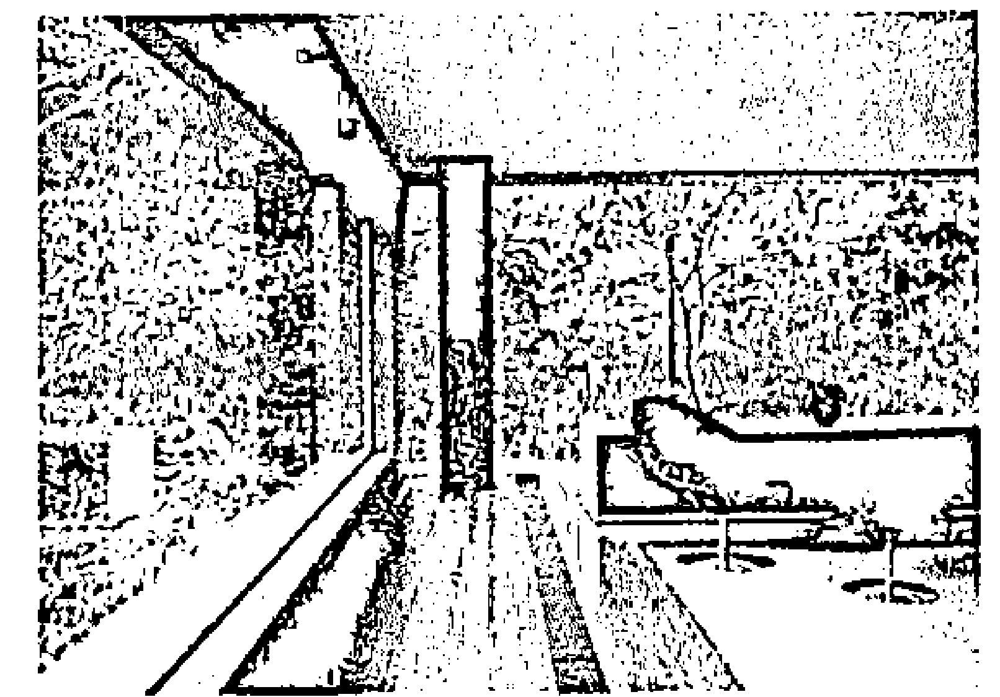

1.  落地窗影响运势
落地窗有利于光线的进入和人们欣赏窗外的风景。但落地窗的危害却很多，久居这样的房子，不仅没有安全感，自家隐私得不到保护，还容易影响家庭的运势。

# 933 强光对住宅运势有何影响？

住宅忌用强光，强光刺激眼部，而眼为肝的代表，久而久之还会伤肝，影响人的五脏。

光线太强，室内能量太强，容易使人蠢蠢欲动，产生烦躁冲动的情绪，影响家庭和睦，也不利于人际交往的展开。

强光照在镜子上，光线能量更强，不但会形成光煞，还会形成大凶的宅运，引起家庭成员之间争执不断。

强光照在凶方上，气场受光刺激会四散开来，对人的健康及运气产生不良影响。

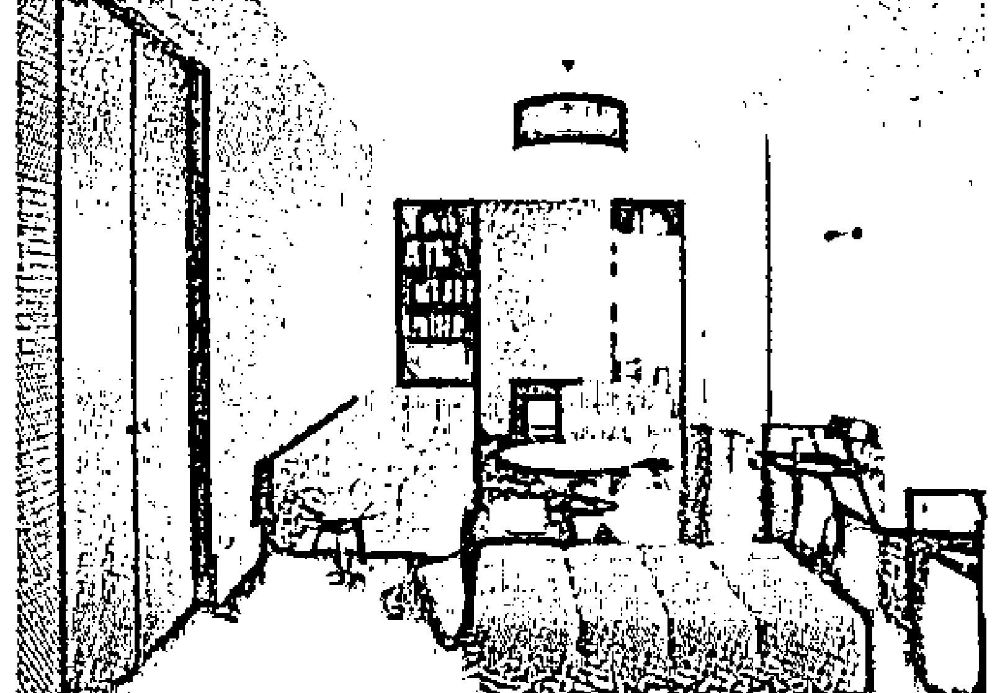

室内的光线忌过强
室内的光线不能太弱，但是也不能过强。过强的光线，不仅容易刺伤眼睛，还会使人情绪暴躁，不利于家庭和人际关系的开展。

### 落地窗对人的危害
| 危害 | 具体内容 |
| :--- | :--- |
| 身体影响 | 拉开窗帘之后，光线会大面积进入室内，可能引起眼疾或夫妻感情不和。 |
| 心理影响 | 透明的窗户给人不安感，不利于工作和学习，久而久之还会形成心理阴影。 |

# 934 书房的采光对住宅环境有何影响？

书房是一个学习的地方，人们在这里经常需要伏案写作，用眼用脑很多，因此，合理的采光不但能增添室内活力，还可保护眼睛。

| 书房要素 | 布置方法 |
| --- | --- |
| 书房结构 | 要有大窗户，这样有助于空气流通和光线的进入，形成“天人合一”的清明境界，有助于提高学习效率。 |
| 窗帘选择 | 窗帘要注意采用较为轻薄的浅色窗帘，既可让光线穿透，又可挡住窗外的干扰，也可减弱过分强烈的阳光，一举多得。 |
| 书桌摆放 | 书桌一般应与窗户成直角而设，这样容易获得自然柔和的光线。 |
| 灯具选择 | 书房的天花板上装一个吸顶灯，可确保光线明亮、均匀、自然、柔和。 |
| 桌椅、书架摆放 | 桌椅、书架不要阻挡光源，这些因素会影响采光。 |

# 935 书房布局有什么具体要求？

书房是一个特殊的地方，孩子的未来，家人职位和事业的提升常常与书房挂钩。从某种程度上讲，书房就是家庭的未来，是财运、事业运旺盛的保障。因此，书房布局是一个特别需要注意的地方。

| 注意事项 | 具体内容 |
| --- | --- |
| 位置选择 | 书房是学习和思考的场所，也是一个比较个性的角落，因此要选择一个僻静的角落，如将阳台的空间封起来做一个小书房，将书房和影音室结合起来。 |
| 采光布置 | 书房是一个工作区域，应该安排在窗前等自然光源充足的地方，最好安排在窗户两侧，离窗稍远的墙边。 |
| 布局合理 | 为了存放书籍，有一个舒适的读书环境，书房的布局最好划分出工作区、休闲区、辅助区三个部分，不要太凌乱。 |
| 书桌选择 | 这要根据个人需要，如工作比较负责的人可选择多功能书桌；喜欢休闲的人可选择装饰性强的书桌。 |
| 书架选择 | 书架的颜色、大小、风格等要与书房风格相协调。书架的书摆放要有规律，这有助于提高学习效率。 |

## 936 穿堂风对住宅运势有何影响？

穿堂风是阳宅第一凶，会对人的身心健康造成很大危害。

所谓穿堂风，即风从建筑物间隙、高墙间隙、门窗相对的房间或相似的通道中穿过，气流很大，风速很快，对人的身体伤害较大。人在穿堂风处睡一觉，醒来之后很可能感觉头沉、头痛。久而久之，容易造成肝气不舒，消化不良，脸上容易长痘痘，还会影响个人运程。

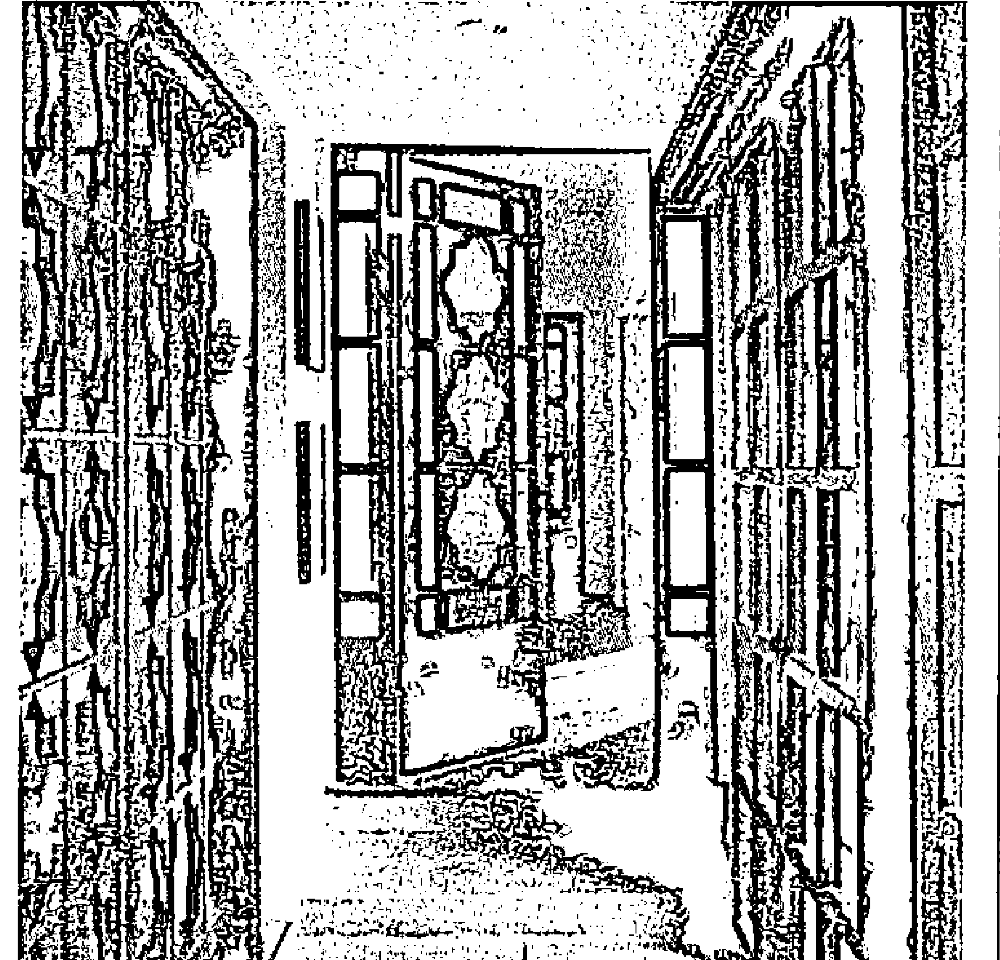

穿堂风还会影响人的财运，它会形成“一箭穿心”之相，会让宅主手中抓不住钱。

> **穿堂风影响财运**
> 家中有穿堂风，财运会随着风从指缝间溜走，家中的花销会增多，无法积累财富。

## 937 怎样改善处理穿堂风？

所谓穿堂风，即空气从大门进入，然后从对面的窗户出去了，不利于聚气生财，会导致人肝气不畅、长痘痘、内分泌失调等。化解方法如下。

- 1. 在大门口做玄关，阻隔穿堂风。但注意玄关不宜是玻璃制品。
- 2. 在大门口放置屏风，既可美化居室，又可遮挡邪气，起到“屏其风也”的作用。
- 3. 若进门就是走廊，可以悬挂水晶珠帘，既可化解煞气，又可招揽财气，一举两得。
- 4. 在窗户上挂一个厚实的窗帘，拉上窗帘，即可阻挡风一吹而过，而且还能增添室内灵动感。

**摆放吉祥物化穿堂煞**

在大门或窗户放置吉祥物品，不但可以化解穿堂风，还可起到镇宅旺财保平安的作用。

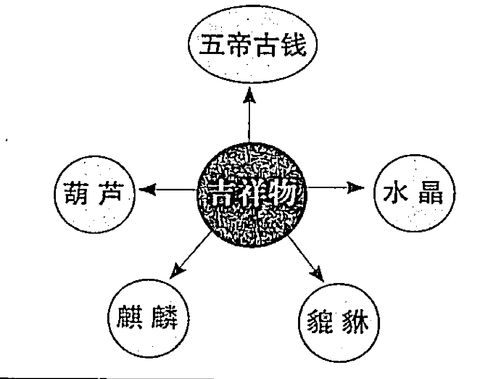

## 938 阳台对住宅运势有何影响?

阳台饱吸室外的阳光、空气及雨露，是纳气藏精之处，对整个宅运有重要作用。

在设置阳台的时候，要注意以下两点。

- 1. 阳台不宜正对着大门。阳台正对着大门，不利于家人健康，也不容易聚气生财。而且从现实角度考虑，阳台与大门正对，人们从门口经过，能将房中的情形看得清清楚楚，全家没有一点隐私感。
- 2. 阳台不要正对着厨房。阳台正对着厨房，也会影响家人身心健康。而且从现实角度考虑，厨房的油烟很容易穿过大厅，来到阳台，使整个住宅都充满了油烟味。

> 阳台对住宅运势的影响
> 阳台最好不要对着大门和厨房，否则对家运不利，一定要想办法加以化解。

### 化解方法

- 阳台对着大门：可以在大门和阳台之间安装一个屏风化解，或者在大门入口处放置鱼缸也可。
- 阳台对着厨房：在厨房和阳台之间合适的地方设一个屏风，或在阳台上种植爬藤植物以吸收厨房的煞气。

## 939 哪些物品放在阳台上益处?

阳台极易受外界不良环境影响，家中要适当配备物品。常见饰物有以下几种。

- 1. 铜龟。铜龟是逢凶化吉的象征。当阳台对面是两栋楼房之间的一条狭窄空隙时，正对着街道时，正对着尖角物品时，正对着反弓路时，根据“宜化不宜斗”的原则，铜龟即可化解。
- 2. 石狮。石狮具有镇宅保平安的作用，在阳台上摆放一对石狮可镇宅。如果阳台对面有监狱、垃圾场、坟场等阴气较重的场所，石狮均可有效化解。

除了上述两种物品外，阳台常用的化煞物品还有龙、石鹰、植物等。

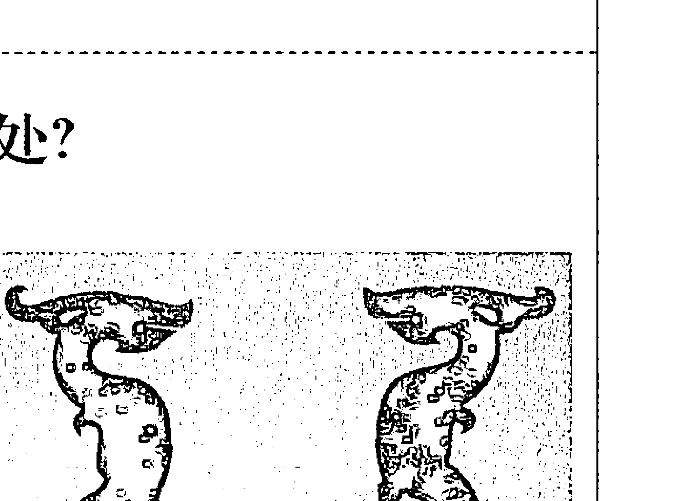

> **玉龙的作用**
> 阳台情况：阳台对面有水经过。
> 摆放方法：在阳台两边摆放一对玉质龙，且头部要向着前面的水。
> 具体功效：不但可以化解，还能起到招财的作用。

## 940 阳台种植哪些植物可以旺财?

常用来旺宅的植物有以下几种。

- 1. 万年青。万年青叶片肥厚，宛如伸出的一只只粗壮、肥厚的手掌，它所吸纳的瑞气对提升家居气场有重要作用，是纳气接福招财的象征，因此常被人们视为室内吉祥物。
- 2. 发财树。发财树就是花生树，它干茎粗壮，树叶尖长而苍绿，极易生长，有助于提升整个住宅的朝气，对活跃气场有好处。
- 3. 棕竹。棕竹因叶如竹而得名，有竹节节高升之意。棕竹的树叶窄长，象征着好运连绵不断，因此也可旺宅。

此外，铁树、金钱树、棕树等也可旺财。

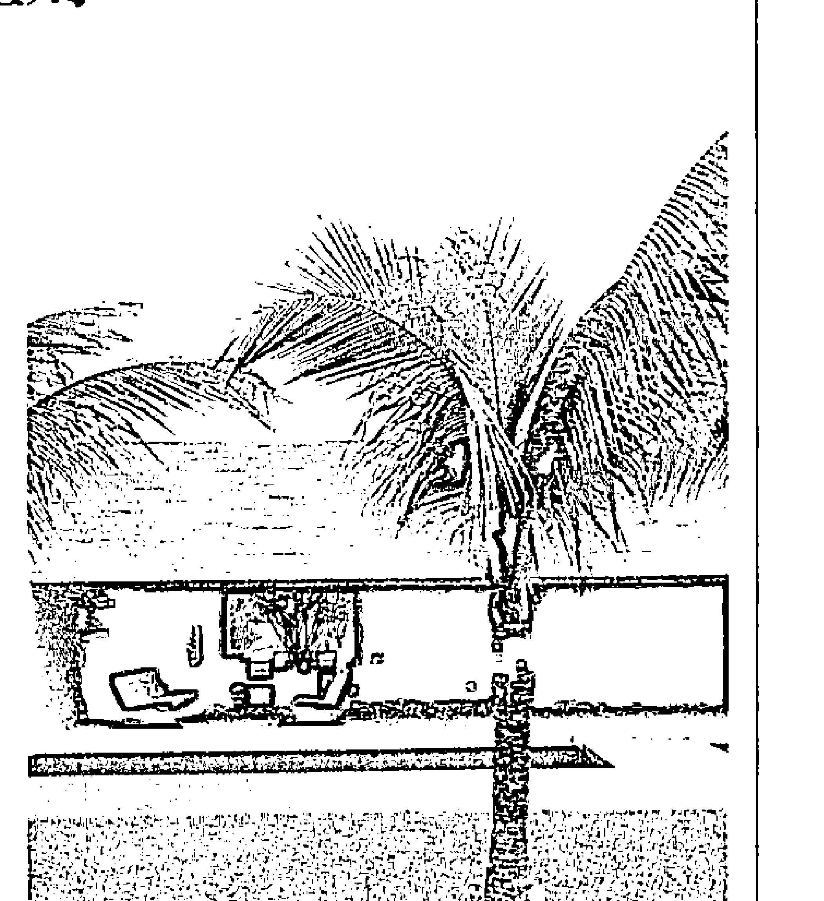

> **棕树**
> 阳台的阳光、水汽都很充足，在这里种植旺财的植物，不但可以美化环境，还能起到旺宅的作用。常见的旺财植物有万年青、招财树、棕竹、铁树、金钱树、棕树等。

## 941 阳台适宜种植哪些植物?

阳台直接对外，一方面承接着天地的精华，另一方面也遭受着外界煞气、邪气的攻击，所以阳台上应该种植一些植物。适宜种植的植物有以下几种。

- 1. 仙人掌。仙人掌多刺，全身上下布满坚硬的茸毛和针刺。
- 2. 玫瑰。玫瑰艳丽多姿，可以美化环境，而且其多刺的形态特征可化解阴气，对于尖角冲射、街道直冲、街道反弓，或面对庙宇、医院及坟场等尤其有效。
- 3. 刺杜鹃。刺杜鹃花叶茂而有尖刺，易于种植，它的尖刺充满力量，是化解阴气的好法器，对外煞有强劲的抵挡作用。

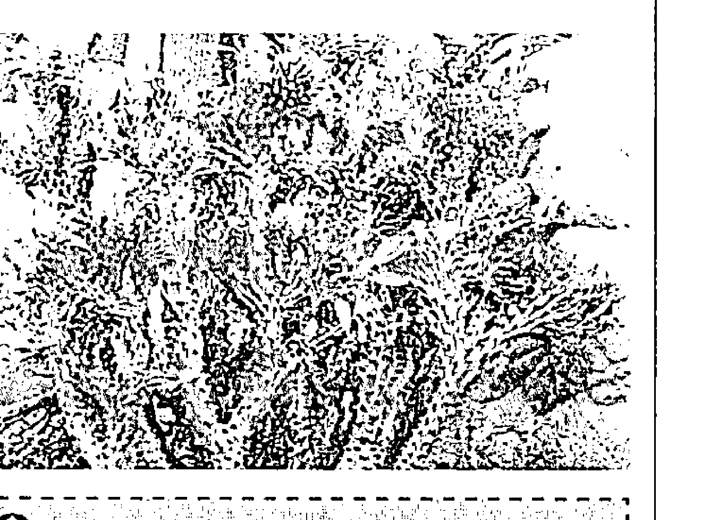

> **仙人掌**
> 阳台种植带刺的植物，可以收到生旺聚风之效，把屋外的阴气化解于无形。常见的植物有仙人掌、玫瑰、刺杜鹃等。

## 942 怎样改建阳台才能旺运？

现代家庭讲究实用，为了扩大室内面积，往往将客厅向外推移，对阳台进行改进，使阳台成为客厅的一部分。但在改建阳台的时候，要注意一定原则，不要破坏家运。

阳台改造之后，阳台最好只放轻物，不放重物。因为阳台是突出房外的部分，承受能力有限，为了安全起见，阳台上最好不要放置大柜、组合柜、沙发、假山、鱼缸等重物。

另外，改建阳台的时候，最好下面留三分之一的实墙，确保护墙高过膝盖，上面再安装玻璃。

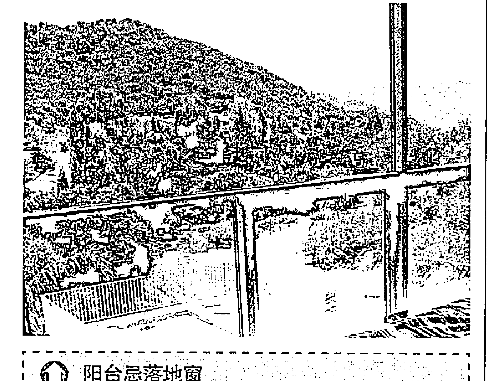

> ## 阳台忌落地窗
> 阳台为落地窗，容易形成“膝下虚空”的格局，自家隐私容易外泄，家庭成员没有安全感，容易造成人丁单薄，钱财外泄。

## 943 阳台朝向对家运有何影响？

阳台最好设置成朝向东方或南方。朝向东方，意味着“紫气东来”。日出东方，祥瑞之气经过阳台，全家显得既光亮又温暖，一家人就能幸福安康，神清气爽。阳台设置在南方，意味着“熏风南来”，和暖宜人的南风形成极好的气场，令人感到舒适。

阳台不宜朝向北方，北风呼啸，很容易引寒风入室，使人受凉感冒，也会影响人的情绪。阳台朝向西方也不好，住宅只能在夕阳西下的时候才能见到阳光，能量不够好，而且热气到夜晚还不能消散，会影响人体健康。

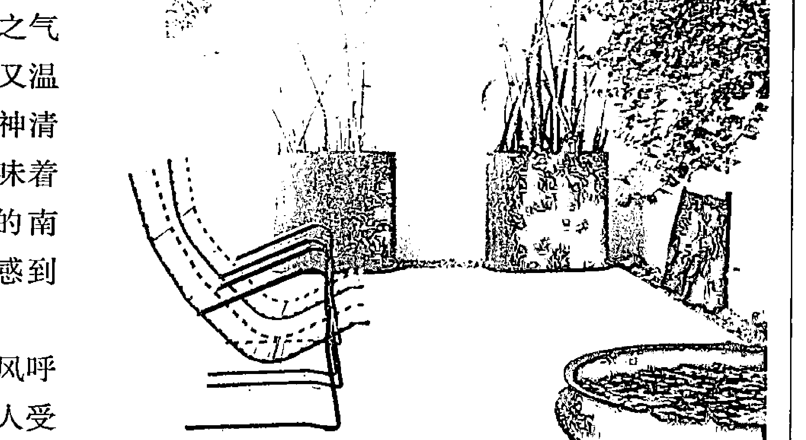

> ## 阳台朝向
> 有的阳台之所以令人感到舒适，主要原因在于阳台位置好。东方的阳台，寓意紫气东来，最有利家运，南方的阳台，温暖宜人，也很不错。

## 944 封闭的阳台对家运有何影响？

现代人越来越懂得享受生活，喜欢在卧室或客厅外设置封闭阳台，享受身处居室又有阳光照耀的生活。

这样的阳台表面上看扩大了房屋的使用面积，但却不利于室内空气的流通。从现实的角度讲，这样做会导致空气中氧含量下降，人久居其中容易出现恶心、头晕等疲劳症状。婴幼儿若居住在这样的环境中，还会引起发育不良、佝偻病。

因此，在装修的时候最好不要将阳台封闭，若已经封闭，则最好用鲜花和绿色植物美化室内环境。

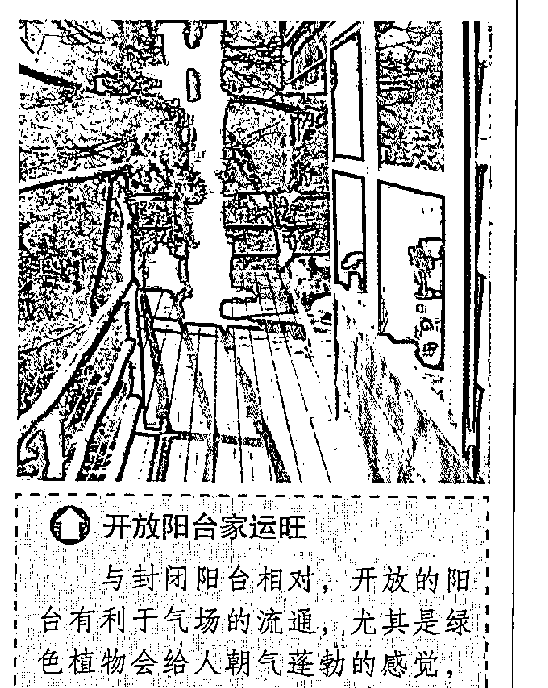

## 945 阳台对面不宜有哪些事物？

- 1. 阳台不宜正对着锯齿形建筑物，如一些欧陆风格的住宅往往设置有大型凸窗，看起来像一排尖锐的锯齿。这些锯齿与尖角的作用类似，不利于家庭幸福。
- 2. 阳台不宜正对着反弓路。即阳台不宜对着街道的弯角，这样容易招致煞气，不利于提升宅运，因此最好在阳台上种些爬藤植物化解。
- 3. 阳台不宜正对着街道。阳台外面若有街道直冲过来，形成“猛虎迎面直扑”之势，十分危险，会对家居气场造成十分恶劣的影响，不利于家人身体健康。
- 4. 阳台不宜对着尖锐物。阳台面对着其他建筑尖锐的楼顶，易导致家庭不和，不利于家庭幸福。

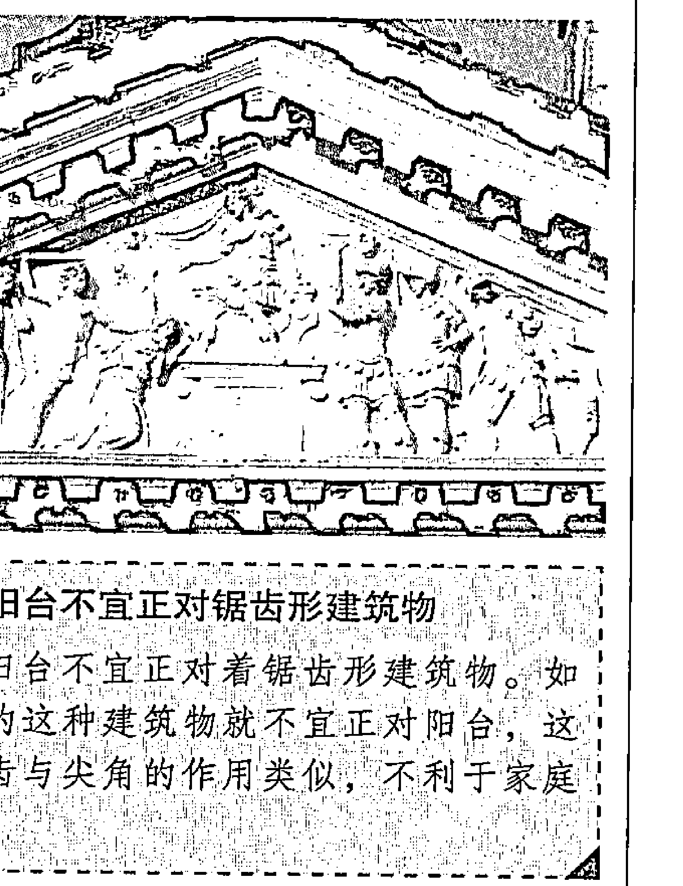

## 946 怎样布置孩子的房间？

孩子房间的布置，可从以下几个角度考虑。

- 1. 颜色方面。孩子房间的颜色，宜色泽淡雅，不宜太刺眼，否则会刺激孩子，影响孩子的形态健康。最好以淡蓝色为底，点缀一些草绿、明黄、粉红的色泽装饰。
- 2. 照明方面。最好使用光线柔和的台灯或壁灯，既可传递温馨舒适的能量，又可激发孩子的想象力，改善其性格，有助于他健康成长。
- 3. 装饰方面。墙壁上最好悬挂一些有积极作用的字画，不宜有神像、明星图像或凶恶恐怖的图案。好的装饰画有助于陶冶孩子情操，培养其积极向上的心态。

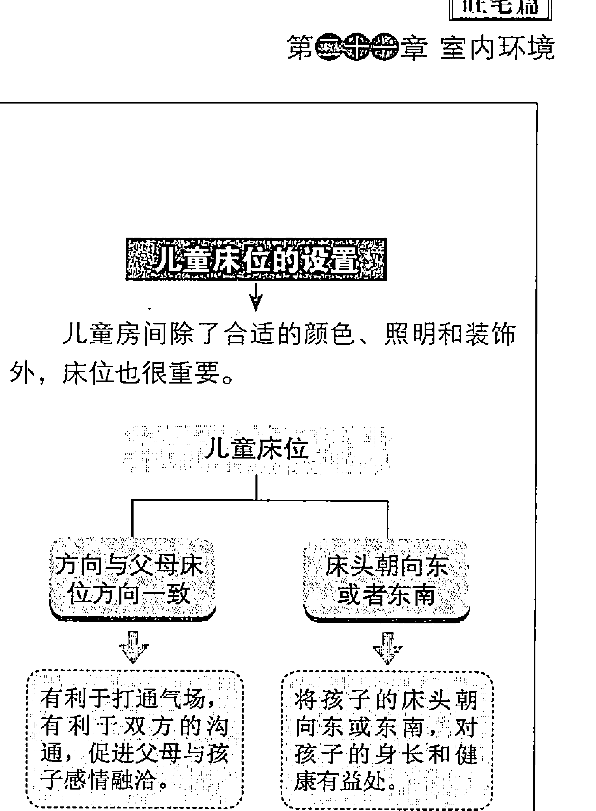

## 947 卫生间的通风对家运有何影响？

卫生间是人们盥洗、排泄的场所，防水、防潮是关键。遗憾的是，有些住宅空间规划不合理，卫生间没有窗户，或无法开窗，致使空气流通不畅，卫生间终年潮湿，这是非常不好的。

另外，卫生间是水积聚的地方，容易弥漫湿气，若不及时使之干燥，湿邪就会影响人体健康。如果水停滞不动，又形成了浊水，不但潮湿，而且难闻，会严重污染家运，不利于人的健康和心情。

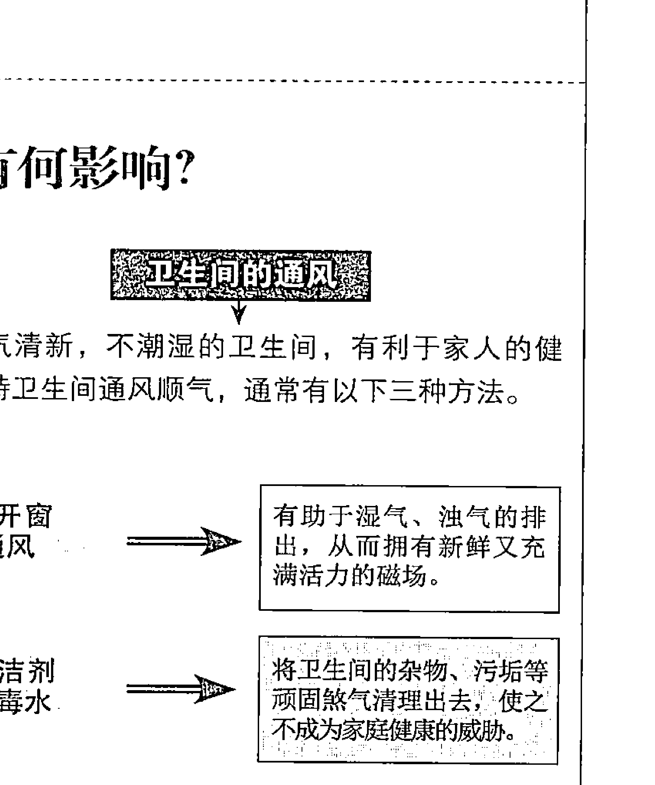

## 948 照明光对家运有何影响？

照明光不仅人们看书、学习需要，它还具有一定的增旺运势作用。

照明光作为光线的一种，它与自然阳光一样，具有能量，会形成磁场，然后作用于人体。如黄色、橘黄色的灯光，会传递一种温馨的气场，令人感到温暖。而五颜六色的灯光，则会传递一种杂乱和躁动的气场，令人心神不安，情绪烦躁，不利于工作和学习。

屋内安装照明灯的时候，一定要充分考虑照明光的增旺作用，发挥其有利的作用，避免其危害。

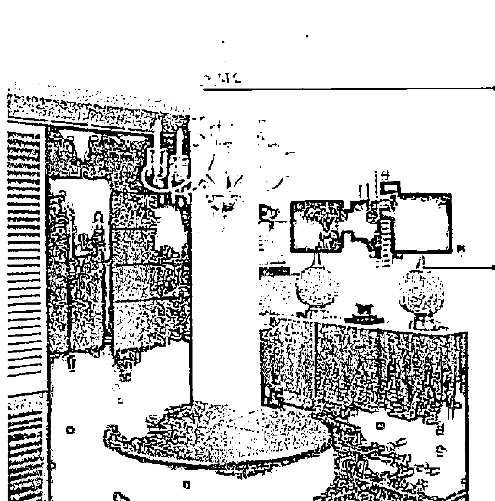

- 水晶寓意吉祥，悬挂在家中有增旺家运的作用。
- 圆形的灯饰品，给人带来安全感，有利家运。

> 适宜的光线有利家运
> 柔和的室内光线，会使人的心情平和、安宁，有助于人体健康，进而有助于人的工作和学习。

## 949 灯具对家运有何影响？

灯具是家庭生活必需品，同时也是影响家运的重要元素之一。可惜的是，大多数人对灯具的认识，仅限于其照明作用，不知其旺运作用，因此在选择灯具的时候往往随随便便，破坏了家运。

住宅大门向东、南、东南，宜选择长筒形、长方形、木制框的灯具。灯具的数量尾数以1、2为佳。住宅大门向西、北、西北，宜选择圆筒形、圆形、金属制框的灯具，灯具数量尾数以6、8为佳。住宅大门向西南、东北，宜选择正方形灯框、铝塑制框的灯具，灯具数量尾数4、9为佳。

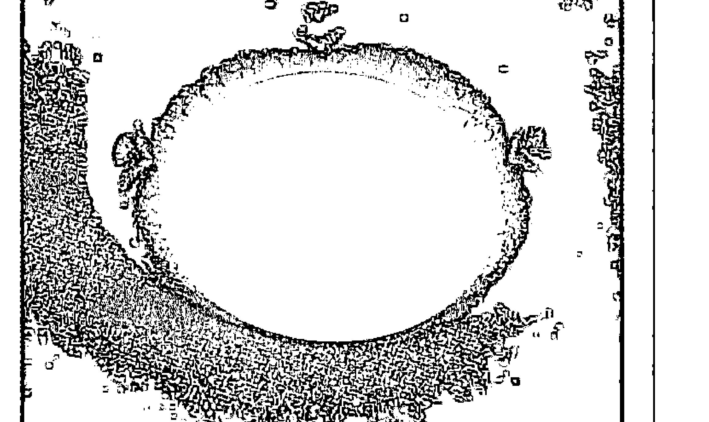

> 灯具的选择
> 灯具是居家必备品，在挑选的时候，款式与形状需要与家中大门朝向吻合。比如说大门朝向西方，最好选择圆形灯具。

## 950 灯具的款式有什么作用？

不同款式的灯具，所起的作用不一样。

下垂式吊灯如果安装位置不当，人坐在下面，随时会担心它掉下来，人会有沉重的心理压抑。如果灯具的下摆处有尖角，下面的人更感到不安。

合适的灯具款式，应该是圆形，如吸顶式圆形吊灯，这种灯具象征天圆地方、天高地厚，会给家人带来平稳、安康的感觉。家中若有条件，还可安装水晶质灯具，利用水晶的招财开运作用来提升宅运。

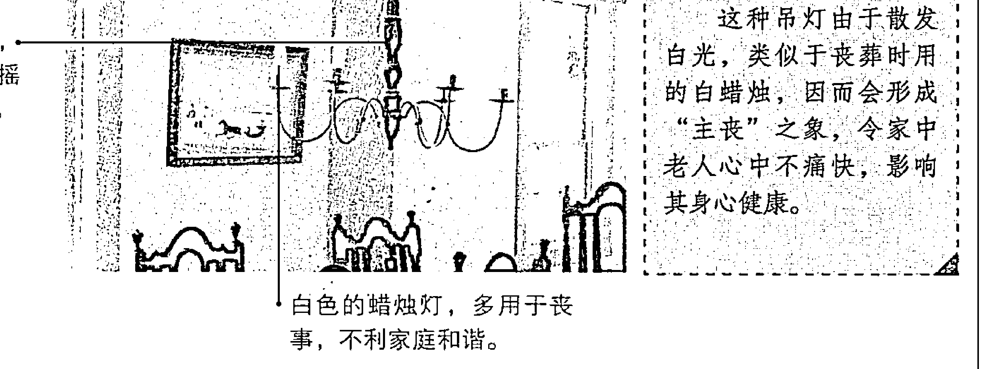

## 951 家中必不可少哪三盏灯？

三盏灯即家中必不可少的三种灯，它们起着镇宅保平安的作用。

第一盏灯为财位灯，它应该在进门对角线45°处的财位上，这里安置一盏灯照明，就是照亮全家人的财运，令家人“钱”途光明，“钱”程似锦。

第二盏灯为明堂灯，它在楼房各单元的门前处，这里安装一盏指示灯，不但可以照亮楼梯空间，而且有防贼的作用，能确保全家人平安如意。

第三盏灯为长明灯，适合夜间照明，既方便夜归者出入，也方便夜间如厕，又能补充夜间因人气减少而缺失的能量，同时能起到防贼的作用。

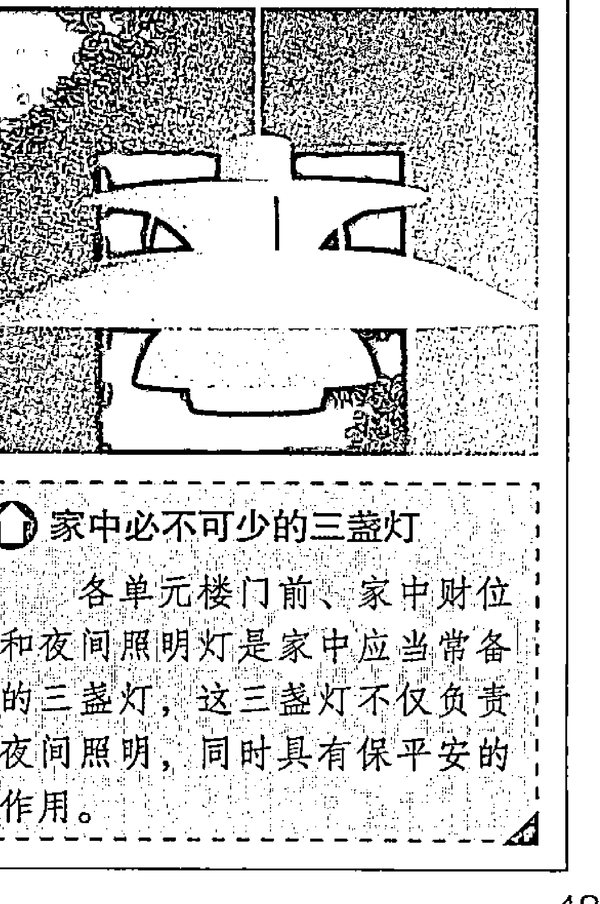

## 952 蜡烛对家运有何影响？

有了灯具，蜡烛已是不常用的照明工具，但不可否认其作用。

蜡烛代表着五行火的能量。在黑暗、潮湿的环境中，点燃一支蜡烛，不但可以起到照明作用，还可改善周围环境，减少潮湿，给人以温暖、干燥的感觉。

蜡烛还拥有灯具所没有的另一个功能。据说人在蜡烛下学习，大脑会变得异常清晰，思想可得到突破，从而激发学习者的能量和热情，提升其学运和事业运。

蜡烛五行属火，能旺家中的金、火能量，可为家人带来财运。将蜡烛放在家中的东、东南、东北等方位还可起到旺宅的作用。

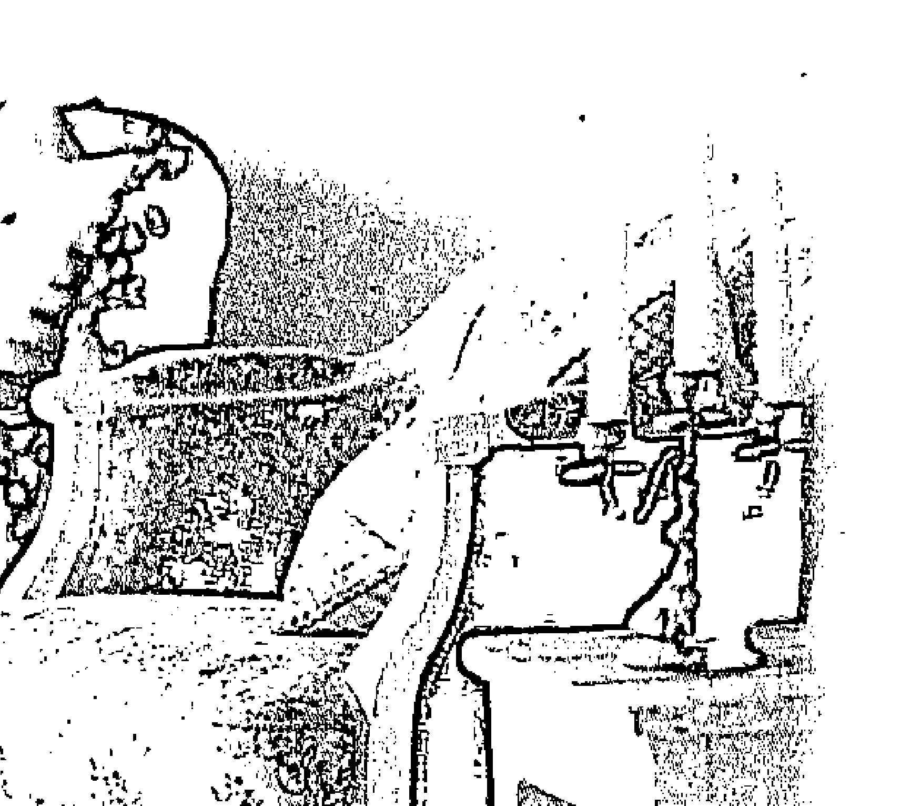

> 蜡烛对家中的影响
> 蜡烛的五行属火，在确保安全的情况下，点燃蜡烛，能去除湿气，点燃学习热情，可提升财运、家运和健康运。

## 953 怎样设置走廊的灯来催旺宅运？

走廊灯的设置，一定要遵循下面两个原则。

- 1. 明亮。通常情况下，走廊是最经常经过的地方，不宜太阴暗，否则不但会形成有害气场伤害途经之人，还会造成诸多不便，不利于提升宅运。因此，走廊里最好用一两支明亮的光管。不宜将走廊灯光设置成五颜六色的，这样不但会带来不利影响，而且光不明亮，容易让人心情躁动，人走在下面，总不由自主地向上看，形成心理压力。
- 2. 长明。走廊里的灯应发挥长明灯的作用，晚上最好通宵亮着，方便上厕所，方便晚上回来晚者，也可吓退小偷等。既方便生活，又可镇宅、旺宅，一举两得。

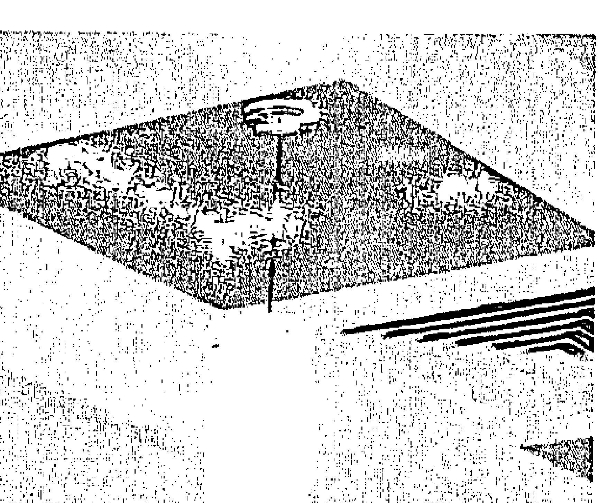

> 走廊灯光催旺宅运
> 走廊处一般都比较窄小、昏暗，在此处安装灯具，可以方便晚归和起夜的人，也可以吓退小偷，有利于家运。

## 954 怎样设置卧室的灯来催旺宅运？

卧室是休息放松的地方，同时也是一个相对隐私的地方。无论是从健康的角度考虑还是从心理角度考虑，灯光都不宜太亮，否则人难以入眠，且隐私容易曝光。心理学家认为，卧室的灯光太亮，人的情形容易变得暴躁，导致肝气不舒，容易伤肝气，也会引起夫妻感情不和。

卧室的光线，应以柔和养眼为宜，这样才能给人温馨、舒适之感觉。若是孩子的卧室，这样的光线还会激发孩子的想象力，提升其学运。

> 💡 卧室的台灯
> 卧室安置台灯、悬挂壁灯是一种很好的选择，尤其是儿童房，既有助于增添室内美感，又可增添舒适度。

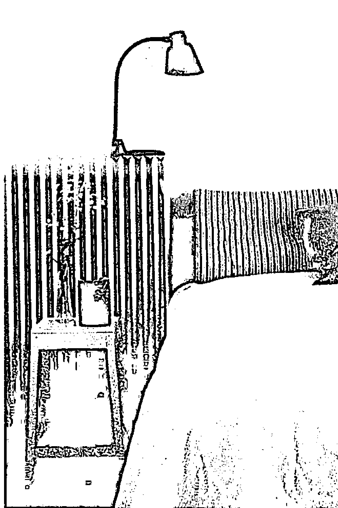

## 955 怎样设置阳台的灯来催旺宅运？

阳台一方面承受雨露及天地精华，另一方面起着抵御外来不利影响作用，因此阳台处的灯，一定要能帮助阳台纳气，在设置的时候尤其要注意以下两点。

- 1. 阳台处的灯不要太明亮。一方面，这样可以减少隐私的曝光，防止他人了解室内情况；另一方面，可起到吸收能量的作用，可与阳台上其他饰物一起对抗外邪。
- 2. 阳台处的灯要有增加财运的作用。可安装一支蓝光的水族灯管，既可以照明，又能辅助阳台的金形属性，帮助聚气生财。

> 💡 阳台的灯
> 阳台安置灯，有利于帮助阳台纳气，提升家中好运。但是，阳台的灯光不要过于明亮，否则容易曝光自家隐私。

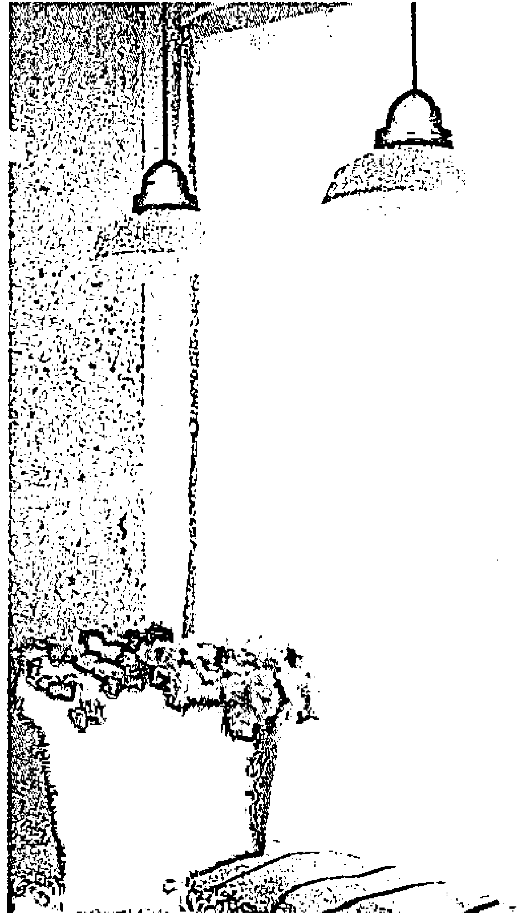

## 956 怎样设置卫生间的灯来催旺宅运？

卫生间是一个容易藏污纳垢的场所，若空气流通不好，还容易生潮，产生的浊气更容易破坏室内环境，因此卫生间的灯也有很重要的作用。

卫生间属水，宜用暖光调黄光灯，这样的光线不但可与卫生间相辅相成，而且灯光所散发的能量，还可使污垢无处遁形，乖乖溜走。有些细菌、病毒在这种光线的照耀下，容易被杀死，灯光可起到清理污垢、清洁环境的作用。

若卫生间有水管，吊完顶后最好用吸顶灯、筒灯或嵌入式灯具，然后再根据卫生间的整体风格选择冷色灯光或暖色灯光，它们均可起到杀菌、驱邪的作用。

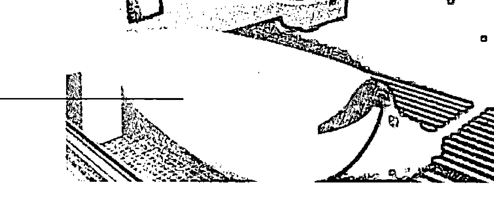

> 卫生间的灯光设置
> 卫生间的灯，最好选用吸顶灯、筒灯或嵌入式灯具。因为卫生间属水，选择暖色灯光，能调节卫生间的阴阳五行。

## 957 怎样设置厨房的灯来催旺宅运？

厨房容易沾染油烟之气，也是一个容易藏污纳垢的场所。一盏明亮的灯对厨房来说是必不可少的，它有助于女主人仔细打扫、擦拭厨房，有助于家人健康。

另外，由于厨房属火，最好选择冷色调的白光灯或吸顶灯及嵌入式灯具。这可提供充足的光线，与厨房的环境相辅相成，从而利于女主人健康，确保全家人的饮食安全。

若餐厅在厨房附近，餐桌处最好用暖色吊灯营造温馨的用餐气氛，这样有助于增强家人食欲，提高身体免疫力。

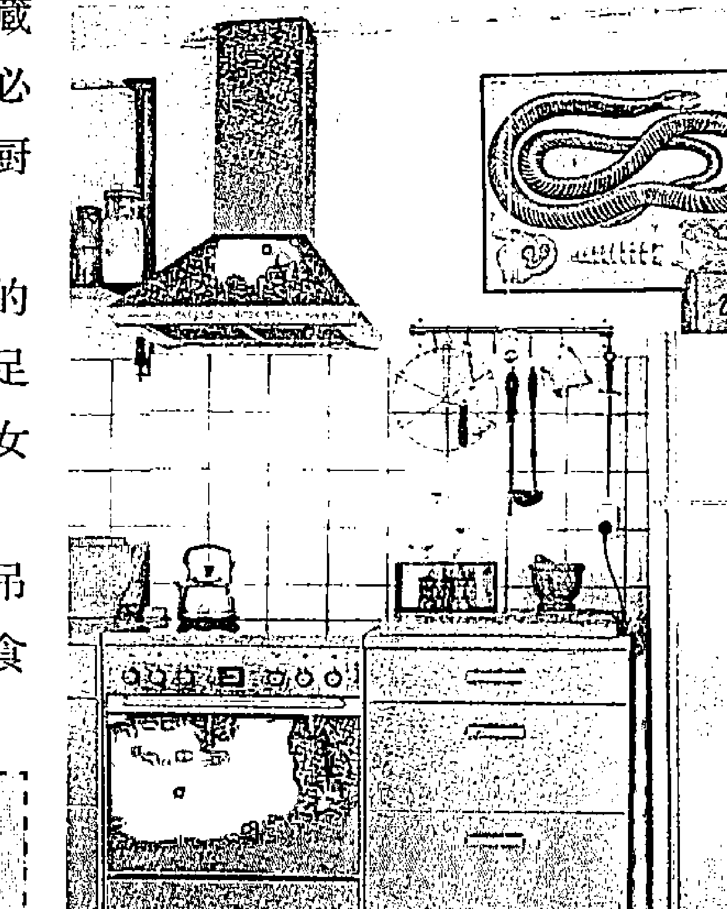

> 厨房
> 厨房属火，而冷色调的白光灯或吸顶灯及嵌入式灯具，刚好能中和厨房的火，有利于家运和家人的饮食安全。

## 958 天花板与宅运有何关联？

每个家庭都有天花板，每个家庭的宅运都会受到天花板的影响。一般来说，天花板若设置不合理，容易给人造成压迫感，在身体上容易得与颈椎有关的疾病，在心理上容易有紧张感，不利于人家健康。因此，在装修天花板的时候，要注意其设置。

### 天花板的设饰

| 天花板设计宜忌 | 主要影响 |
| :--- | :--- |
| 天花板可做成横梁，尽量不要在天花板内藏灯。 | 容易造成“天花压头”之象，不利于家庭成员身心健康。 |
| 天花板附近忌讳同时挂风扇、灯具。 | 不但会有“天花压头”之象。 |
| 天花板上不宜悬挂镜子。 | 镜子预示着“幻象”，会严重干扰室内磁场，既影响家人身心健康，又会给家人带来灾难。 |
| 天花板上若悬挂灯具，灯光不宜为白色。 | 白光寒气逼人，最好选择黄色灯光。如有条件，可安置黄水晶，有招财纳福的作用。 |
| 天花板上不能随意添置灯具。 | 不要放太极之物，不悬挂尖、角形状的灯具，也不要放假花，这些都是不吉利的。 |

## 959 客厅布局有什么注意事项？

根据专业人士的建议，客厅最好如下布置。格局最好是正方形或长方形；确保气流通畅；大门与客厅应设玄关；客厅应设在住家的最前方；客厅地板不宜高低不平；客厅不宜太过阴暗，晚上最好灯火通明；客厅里的家居，造型要坚实，可摆放高背的沙发和座椅；客厅不宜放古董或杂物，否则会扰乱室内气场；客厅可多悬挂圆形造型的装饰物，如圆形的吊灯等，不宜挂猛兽图画；客厅不该摆放刀剑、火器、奖牌、动物标本等物品。

### 客厅的主色调

客厅直接吸纳从大门进入的气，是室内之气、室外之气汇聚的场所，直接影响整个家运。为此，我们更应重视客厅色调的选择。

- 黄色系 --> 适用于客厅在西南或东北方位
- 绿色系 --> 适用于客厅在东南方或正东方
- 蓝色系 --> 适用于客厅在北方
- 红色系 --> 适用于客厅在南方
- 白色、银色或金色 --> 适用于客厅在西北方或西方

## 960 沙发上方安装灯具会影响家运吗？

沙发的上方最好不要安装灯具。这是因为，沙发是休息的地方，人坐在那里应该感到全身轻松、自然。头顶有灯具，灯释放的能量会影响人，让人感到干扰，有时甚至会不由自主地抬头看，形成心理压力。

此外，灯具还有镜子的作用，可反射，也可显出幻象。灯在沙发上方照着人的后脑，会干扰人的思考，容易导致人精神不宁，情绪紧张，甚至失魂落魄。

> **沙发上忌吊灯**

沙发上不要安装吊灯，因为如果灯具装置不稳，掉下来很容易给人带来危险，这也是人们形成心理压力的原因之一。

因此，沙发上方最好不要有灯具，如果有灯具，最好将灯改射向墙壁，这样对人的压力会减少一些。

## 961 室内植物对家运有何影响？

从生物学的角度讲，植物会进行光合作用，不断地制造氧气，吸收二氧化碳，有助于净化环境，使家居空气清新，有助于家人健康。植物的绿色还有助于帮人放松心情，保护眼睛。总体来说，室内种植植物能增强全家人的体质。

植物能不断地吸收天地精华，然后转化为对人体有益的能量，从而起到活跃气场，使家人生机勃勃的作用，因而有助于提升宅运。一些特殊的植物，如金钱树、仙人掌等，还可起到招财的作用，间接提升了全家人的运程。

> **植物影响家运**

植物是有灵性、有感情的，如果植物在屋中生长不好，说明屋内环境不好，要及时改良。

## 962 怎样选择植物来催旺宅运？

植物可加强人与自然世界的协调，有些植物还可充分发挥人与植物相生的作用，起到催旺宅运的作用。

吊兰、马蹄莲等植物，放在卧室里，会发出淡淡的香气，使人心神宁静，容易入眠。而仙人掌、玫瑰等带刺的植物，则可放在门口。总之，室内植物的摆放不是随便选择的，要遵循一定的相生原则。

| 植物摆放原则 | 代表植物 |
| :--- | :--- |
| 卧室内宜摆放帮助休息、使人心情宁静、温和的植物。 | 吊兰、马蹄莲。 |
| 客厅内要摆放旺风水的植物。 | 富贵竹、仙人掌、罗汉松、七叶莲、棕竹、发财树、君子兰、蓬莱松、兰花、柑桔。 |
| 书房内要摆放有宁神、通窍作用的植物。 | 文竹、富贵竹、常青藤。 |
| 阳台最好摆放有纳气、聚财作用的植物。 | 文竹、石竹、秋海棠、太阳花。 |
| 大门附近应摆放有镇宅作用的植物。 | 仙人掌、玫瑰、棕竹、葫芦。 |

## 963 怎样摆放植物可以催旺宅运？

植物的摆放要遵循一定的原则，合适的位置才可起到聚气、旺宅的作用。

住宅中的旺位，应摆放大叶的绿色植物和具有生财作用的植物，如宽叶榕、散尾葵、富贵竹、铁树、橡树、万年青等，这样既可以收生旺之效，又可提升宅运。

住宅中的衰位，应摆放仙人掌、仙人球、玫瑰、刺杜鹃等有刺类植物，这样可以利于这些植物的尖刺来对抗邪气，起到旺宅保平安的作用。但注意这些有刺的植物最好放在花槽、露台等室外地方，不要摆放在室内，否则容易引起家人争执。

> 生旺的室内植物
生旺的室内植物应当生机勃勃，无论是旺位还是衰位上的植物，都要及时更换，室内不要留枯萎的植物。

## 964 住宅内的旺位在哪里？

住宅内的旺位主要有两处：财位和文昌位。

财位的位置，根据不同的说法，主要有下面三种寻找方法。

- 1.  在大门的斜角位；
- 2.  在房内的三白位，即一白、六白、八白三个飞星位；
- 3.  根据宅主的生辰八字，在命主五行得用位。如五行属水，则财位在房间的东、东南。

| 住宅坐向 | 文昌位 | 住宅坐向 | 文昌位 |
|----------|--------|----------|--------|
| 坐北朝南 | 东北方 | 坐东北朝西南 | 北方 |
| 坐东朝西 | 西北方 | 坐东南朝西北 | 中央 |
| 坐南朝北 | 南方 | 坐西南朝东北 | 西方 |
| 坐西朝东 | 西南方 | 坐西北朝东南 | 东方 |

## 965 哪些植物不宜摆放在室内？

目前研究发现，以下五十多种植物均含有致癌物质，不宜家养。它们有火殃勒、木油桐、石栗、广金钱草、怀牛膝、细叶变叶木、蜂腰榕、多裂麻风树、红背桂花、石山巴豆、毛果巴豆、巴豆、剪刀股、麒麟冠、猫眼草、坚荚树、泽漆、甘遂、续随子、高山积雪、铁海棠、鸢尾、千根草、鸡尾木、红雀珊瑚、三棱、变叶木、山乌桕、圆叶乌桕、乌桕、假连翘、油桐、芫花、结香、狼毒、黄芫花、土沉香、细轴芫花、苏木、红芽大戟、黄毛豆腐柴、黄花铁线莲、金果榄、曼陀罗、阔叶猕猴桃、红凤仙花、海南蒌、苦杏仁、银粉背蕨等。

> > 郁金香
> 郁金香的香气浓郁，长时间在这种芳香中，人容易头晕，不利于身体健康。

| 类别 | 植物列表 |
|------|----------|
| 过于芳香的植物 | 夜来香、郁金香、月季、紫荆花、一品红、夹竹桃、百合花等 |
| 其他植物 | 容易过敏的植物、有毒的植物、容易招致邪气的植物、容易产生异味的植物 |

## 966 如何挑选生旺花卉？

生旺花卉的挑选，要根据家居的具体位置来决定。比如门口适合摆放生气盎然的花木，这样能达到热忱的迎客心理，也可以摆放郁金香，象征出门遇金；客厅则要依据整体的视觉效果来选择。

除了常规的选择方式，在实际的选择中还要根据住宅的具体方位、具体情况来选择。

**家居生旺花卉的摆放方法**

| 地点 | 具体摆放方法 |
|------|--------------|
| 客厅 | 客厅空旷可以摆置吊兰，增加纵深感，桌上可以摆放常春藤，客厅的角落则可以摆放凤梨、黛粉叶、鸭掌木、马拉巴栗等植物。 |
| 卧室 | 卧室要摆放百合、海棠、芙蓉、康乃馨、海芋等花卉，床头可放置橙、桃、苹果等水果。 |
| 书房 | 书房书桌上摆放的植物以小型的为主，不能阻碍视线，最好能怡神，如文竹、水仙、莲花等象征着节节高升、出类拔萃的植物。 |
| 厨房 | 厨房要挑选山苏、黄金葛、万年青、卷柏等植物。由于厨房油烟大，这些植物不开花，不易污染。 |

## 967 厕所是住宅内不利的位置吗？

厕所是藏污纳垢的场所，容易发潮，产生异味，影响家人身体健康，又影响人的情绪，是破坏室内气场的罪魁祸首。时常打扫厕所，确保厕所温暖、干燥、空气清新，可提升自己的运程。

特殊情况下，桃花位、窗户附近也是衰位常居之地，最好根据自己的实际情况，寻找最近危害自己最大的衰位，及早化解。

> > 厕所是住宅的衰位
>
> 厕所布满了污秽之气，如果位置不对，或是平时不注意通风、清扫，就会给家人的健康带来危害。

## 968 厨房是住宅内不利的位置吗？

一般人不会想到厨房也是衰位的常在位置，它一般对女主人不利。据说家庭主妇因油烟的熏烤得病率要比常人高，也比不常做饭的女人更容易衰老。一个家庭的女主人若运程不好，所有家庭成员都会受到影响，因此要注意厨房的气场，确保女主人幸福、安康。

## 969 花卉有什么增旺作用？

花草能改变环境，使人神清气爽，能给人带来好运。花卉通过自身的能量能使人健康安神，它吸收人们呼出的二氧化碳，释放氧气，同时还能分解空气中的有害物质。美丽的花卉还能让人感到轻松，激发生活的积极性，化解不利的影响，带来好的运气。需要注意的是在摆设花卉时要分清阴阳五行，定好方位，让花卉充分发挥作用。

> **花卉增旺**
无论是在室内还是在庭院，摆放一盆花卉，总会给人带来清新的感觉。

## 970 房间内的植物是摆放越多越好吗？

屋子里种植的花草，净化室内的空气，养心怡神。但是在屋里种植的花草种类也不宜过多。比如：在卧室里讲究舒适，放上两盆桂花或茉莉，满屋飘香，舒适宜人；在书房里，只放一两盆淡雅的花草就行了，如兰花或文竹；客厅里可以多放几盆植物。通常，向阳处放置有花或有果的植物，墙角、阴凉处宜放置观叶、长青类植物。

## 971 庭院中适合种哪些植物？

在庭院里种植植物，有利于庭院主人的健康与升迁。适合在庭院中种植的常见植物有以下这些。

- 枣树，枣树喻早得贵子，在庭院中种植枣树有利，凡事要比别人快一步。
- 石榴，蕴含多子多福的祥兆，有富贵之意。在庭院种植石榴能给主人带来福气。
- 桂树，传说月中有桂，香飘万里，桂树象征高洁、高雅，桂枝还可入药做药引。在庭院中种植桂树有驱邪、调和的作用。
- 棕榈，又名棕树。适合种植在庭院，这种树有观赏价值，树干又可作为亭柱，棕毛还可入药做药引，功能甚多，是中药材的重要原料。
- 灵芝，自古就被人们视为吉祥之物，蕴含长寿之兆。中老年人多采灵芝服用，味温和甘甜，有益精气、强筋骨之功效。
- 葡萄，藤缠藤象征亲密无间，夏季藤叶繁茂可在葡萄架下乘凉，自古还有葡萄架下七夕相会之说，适合在庭院栽种。
- 椿树，有长寿之兆，庄子曾在《逍遥游》中提到：“上古有大椿者，以八千岁为秋。”可见椿树生命之长。

## 972 坐向不同的房屋如何养花？

房屋要依据不同坐向种植不同的花草，这样才能发挥花草的重要作用。

东西面向的屋子，白天光线短暂，可选择山茶、杜鹃、含笑、文竹、万年青等半耐阴植物。

坐北朝南的屋子，阳光充足，选择茉莉、月季、白兰花、金橘、石榴、米兰、扶桑等喜光植物；还有一些像仙人球、昙花、箭荷花、蟹爪兰、山影等肉质植物也适于种植在坐北朝南的屋子里。

坐南朝北的屋子，背阳，属阴面，空气潮湿，要选择一些喜阴的花草种植，比如吊兰、君子兰、橡皮树、龟背竹、天冬草等。

根据坐向巧养花

不同坐向的房子，照射进房子的阳光有所不同。可以根据阳光的强弱程度，来选择适合的植物。

## 973 花卉对人体健康有何作用？

花卉与人有相生相克作用，不同的花卉对人体有不同的作用。有的花卉吸收空气中的杂质，能净化空气这类花卉对人体是有利的。比如仙人掌具有强烈的抗辐射作用，对人体是十分有利的。而有些花卉会排出一些废气，比如夜来香，会大量消耗氧气，在夜间停止光合作用，并排出废气，对人体是不利的。

东晋诗人陶渊明曾辞官隐居，他题诗赞曰：“榆柳荫后檐，桃李罗堂前”，就是说住宅处种植这些植物是有利的。民谚中也有“榕树不容人”的说法，就是说榕树不宜栽种在住宅处，榕树根的气场对人体不利。

葡萄对健康的影响

具体情况：
家中庭院种植了葡萄，在葡萄架下卧睡。

不利影响：
葡萄的气场吸收人体的灵气，对人体是不利的。

## 974 庭院中不宜种哪些植物？

植物的气场好坏直接影响居住者的健康和运气。自古以来，我国民间就有各种禁忌说法，比如“前不栽桑，后不栽柳，院中不栽鬼拍手”等。
不适宜在庭院中栽种的植物有：杨树、榕树、柏树、桑树、李树、柳树、楝树、芭蕉等。

庭院中不适宜种植的树木
| 树种 | 原因 |
| :--- | :--- |
| 杨树 | 因为杨树遇到风吹，就会发出一阵阵哗啦啦的响声，古代人认为这会招来妖狐鬼魅，所以不宜种植在庭院里。 |
| 榕树 | 有“榕树不容人”之说，榕树的气根会散发一种对人体不利的气体，不适宜在庭院中栽种。 |
| 柏树 | 会散发出阴气，一般栽种在坟墓旁，不宜栽种在庭院。 |
| 桑树 | 与“丧”同音，古人认为是不吉利的树。 |

## 975 客厅适合摆放哪些花卉？

客厅是家人一起活动和招待客人的地方，在客厅摆放花卉应给人轻松、活泼之感。

客厅里宜摆放柱形植物，一般以暖色调为主。例如澳洲杉、橡皮树、龟背竹、绿萝、散尾葵、凤梨、巴西铁树、棕竹等。叶状植物如火鹤、金苞花、蟹爪兰、爪叶菊、大叶蕙兰等花状植物也是可以的。另外，象征吉祥如意、贵宾临门的仙客来，寓意百年好合的百合花等，都适宜摆放在客厅，这样可以在宾主之间营造出温馨气氛和亲切感觉。

客厅里还可以摆放一些装饰性的植物，比如常青藤、吊兰等藤状植物。

> 客厅适宜摆放花卉
不同的花卉有不同的含义，可以根据这些不同含义，在客厅摆放相应的花卉。这样会给客人带来轻松、愉快的感觉。

## 976 如何利用花草装饰客厅？

用花草装饰客厅无疑是最好的选择。那么，如何用花草装饰客厅呢？在客厅中不同的位置摆放不同的花草，视觉感受和效果是不同的，所以通过花草的装饰，能够改善客厅给人的感觉。

凡事过犹不及，客厅里用来装饰的花草也是如此。摆放过多，会使客厅显得繁琐、杂乱。尤其是在客厅的窗台、壁炉和电视机上不能随意摆放花草。客厅的壁炉，因其在冬季以外的其他季节不发挥作用，这时可以摆放一些喜阴的花草在空壁炉里，也是一种不错的装饰。

根据客厅的风格选择花卉

| 客厅风格 | 适宜花卉 |
|---|---|
| 简单、古朴的客厅 | 适宜摆放形状复杂的叶状植物，可以使客厅显得充实一些。 |
| 豪华、富丽的客厅 | 适宜摆放阔叶的简单植物，这样既不显得累赘还能加强装饰的效果。 |
| 空间高度大的客厅 | 适宜选择吊兰或蔓垂性植物，这样可以填充空间，让屋顶显得低一些。 |
| 天花板较低的客厅 | 适宜在客厅里摆放形态整齐、笔直的植物，从视觉上可以使得空间有纵深感；空间小的客厅适宜摆放小叶、枝条伸展的植物。 |

## 977 如何根据主人性格选择客厅植物？

客厅是住宅中最常摆放植物的地方，可以用植物起到美化和装饰的效果。因此，客厅的植物一定要搭配好，并且要生长旺盛。

客厅植物的选择，要与主人的性格、气质一致，这样才显得和谐。兰花芳香、宁静、风雅、高洁；鹅绒的样子柔顺，给人温柔的感觉；竹类植物，象征坚忍不拔，高风亮节。蕨类植物有羽状叶，能给人亲切的感觉；铁海棠枝干刚硬，又多刺，能让人产生敬畏。客厅主人要依据自己的性格、爱好选择客厅植物。

如果主人喜欢绿色，可以在客厅中种植绿叶植物。

> 根据主人选植物

在选择客厅植物时，可以根据房主的个人喜好。比如说房主性格随和，可以种植绿色植物，既增添了室内的生机，也彰显了个性。

## 978 如何根据阳台方位摆放花卉？

阳台是人们最常摆放花卉的地方，阳台上摆放什么花卉要依据阳台的朝向来决定。
朝向北面的阳台，因光照不足，适合种植吊兰、紫竹梅、棕竹、常春藤、豆瓣绿、龟背竹、广东万年青、鸭趾草、铁线蕨等植物。而朝向南面的阳台，光照充足，可以种植茉莉、米兰、百广莲、仙人球类植物。

| 阳台朝向 | 种植花卉 |
| :--- | :--- |
| 朝向北面 | 吊兰、紫竹梅、棕竹、常春藤、豆瓣绿、龟背竹、万年青、鸭趾草、铁线蕨。 |
| 朝向南面 | 茉莉、米兰、百广莲、仙人球、芦荟、龙舌兰、金莲花、栀子花、茶花、牵牛花、天竺葵、杜鹃、鹤望兰、石榴、川季、郁金香、风信子、小苍兰、冬珊瑚、水仙、观赏辣椒、五色梅、菊花、马蹄莲、苏铁、葱兰、景天、彩叶草、石莲花、仙人掌、五针松、针柏。 |
| 朝向东面 | 山茶、杜鹃、文竹、秋海棠、海芋、花叶芋、仙客来、君子兰、蟹爪兰。 |
| 朝向西面 | 罗汉松、络石、扶芳藤、爬山虎、凌霄、报春花。 |

## 979 如何根据大门方位选择盆栽？

东方在五行上属木，因此大门向东的住宅，适合栽种属木宜水的植物，如富贵竹、绿元宝、发财树、棕竹等，有助于促进家人肾脏健康。

西方在五行上属金，因此大门向西的住宅，适宜摆放属金和属土的植物，如金边虎尾兰、金心吊兰、金百合、金心巴西铁树等，对家人的呼吸道、肺、脾的健康有好处。

南方在五行上属火，因此大门向南的住宅，宜栽属火和木的植物，如龙血树、红铁、五彩铁、马尾铁等，这样可增加火的能量，有利于身体健康。

北方在五行上属水，因此大门向北的住宅，宜栽种属金和水的植物，如酒瓶兰、夏威夷椰子等，能促进肾和肺的健康。

> 兰花
兰花属土，如果家中大门向西，可以选择盆栽兰花。

## 980 玄关如何摆放花卉？

玄关位于东北时，应该以白色作为主要的装饰色调。玄关要经常擦拭以保持清洁，因为这里是客人进入室内时首先引入眼帘的地方。玄关摆放的植物，一般以大型的树木或者四季常青的观叶植物为主，如赏叶榕、富贵竹、黄金葛等，如果有叶枯黄要及时更换。

## 981 卧室不宜摆放什么花卉？

卧室是供人们睡眠与休息的地方，在卧室摆放的植物要以有利于人的休息为宗旨。有一些花卉在夜间会释放出一些对人体不利的物质，是不适合摆放在卧室中的。如郁金香花朵接触频繁，易使毛发脱落。夜来香，在夜间散发一种浓郁的香气，长期呼吸这种味道，会让高血压或心脏病患者感到不适，头晕、胸闷，病情加重。

卧室里忌摆的几种花卉
| 花卉 | 主要危害 |
|---|---|
| 郁金香 | 接触频繁，易使毛发脱落。 |
| 夜来香 | 在夜间散发一种刺激味，长期呼吸这种味道，会让高血压或心脏病患者感到不适，头晕、胸闷；病情加重。 |
| 含羞草 | 人体如果过多接触这种物质，会出现毛发脱落的现象。 |
| 夹竹桃 | 分泌一种乳白色的液体，这种液体的气味会让人头脑昏沉，智力下降，严重时还会导致中毒。 |
| 月季 | 香气独特浓郁，让人精神兴奋，放置在卧室容易引起失眠。月季的浓郁香气还会让一部分人产生憋闷、缺氧和呼吸困难的感觉。 |
| 紫荆花 | 患有哮喘的病人卧室不适合摆放，有这种疾病的人不宜近距离接触紫荆花。 |

## 982 卧室适合摆放哪些花卉？

卧室的空间是有限的，在卧室摆放的花卉要选择小型的盆栽，或者吊盆式的植物。另外所选的花卉还要有助于睡眠质量的提高，卧室是休息的地方，要保持安静、雅致的气氛，营造幽美、宁静的氛围，不能过于喧闹，例如可以摆放君子兰、文竹、常春藤、绿萝等植物，它们能带给人柔美、安静的感觉，放松人的心情，有利于休息；也可以选择风信子等可以散发出甜甜的香味的植物，花香有利于人们睡眠。
对于比较宽敞的卧室，可以选择一些直立式的大型盆栽；卧室空间狭小的，则要选择吊挂式的植物。

卧室花卉的摆放
卧室是人们休息的地方，一般来说空间不大，对周围的噪音和舒适度要求比较高，所以选择植物的时候，要挑选一些给人宁静感的植物。

## 983 床位为什么会影响人的睡眠？

无论是古人，还是现代的科学家，都认为床位的朝向会影响人的睡眠质量。

从旺运的角度上讲，卧室一定要“藏风聚气”，床位不当，就无法使人体气场与卧室气场和谐统一，不利于人体健康。此外，还要注意，床不宜对着卫生间，不宜安放在厨房、楼梯口等处，否则都会影响睡眠质量。

| 床位 | 对健康的影响 |
| :--- | :--- |
| 不宜正对着门 | 隐私和安全均得不到保障，容易使人生病或心绪不宁，进而影响睡眠。 |
| 床头不宜靠门 | 人容易受到门的干扰、惊吓，容易心悸失眠。 |
| 床前不宜放镜子 | 镜子的反射作用会造成人神经衰弱。 |
| 床上方不宜有吊灯或吊扇 | 容易给人的心理形成压迫感，致使人心神不安而难以入眠。 |
| 床不宜放在横梁下 | 容易给人造成压抑感，不利于身心健康。 |

## 984 如何根据属相选择卧室植物？

卧室的植物可根据不同生肖来进行选择，生肖属鼠、猪的人多喜水，可栽种属金和水的花卉植物，如水仙、白兰花、橡皮树等；属兔与虎的人选择属木的植物，如秋兰、万年青等。属牛、龙、蛇、马、羊、狗，尤其是生于冬季的人，冬寒喜火，可多选择属火的花，如君子兰、山茶花、杜鹃、红玫瑰等；属鸡和猴的人多喜金，可选择属土和金的花卉，如黄玫瑰、含笑、栀子、晚香玉等。

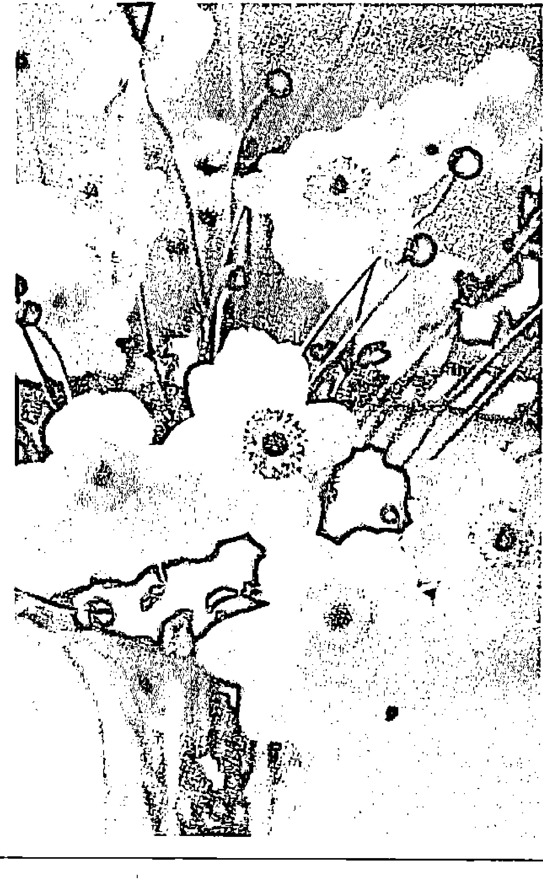

> 卧室植物
总体上来看，卧室的植物，最好以美丽的花卉为主，如茉莉、桂花等，这些花卉有利于增进夫妻感情。

## 985 书房适合摆放哪些花卉？

书房可以适时选择梅、兰、竹、菊等自古就被人们推崇的花卉，也可选择一些清爽、淡雅的植物，以调节神经系统，还可以消除工作和学习产生的疲惫，并且与书香相得益彰。可在书桌上点缀几株清秀俊逸的文竹、铁线蕨，婀娜娇俏的仙客来。

文竹，枝叶碧绿，且展开的叶子像是片片云松，苍翠浓郁，可以给人一种宁静、雅致之感，是非常适合摆放在书房的植物。

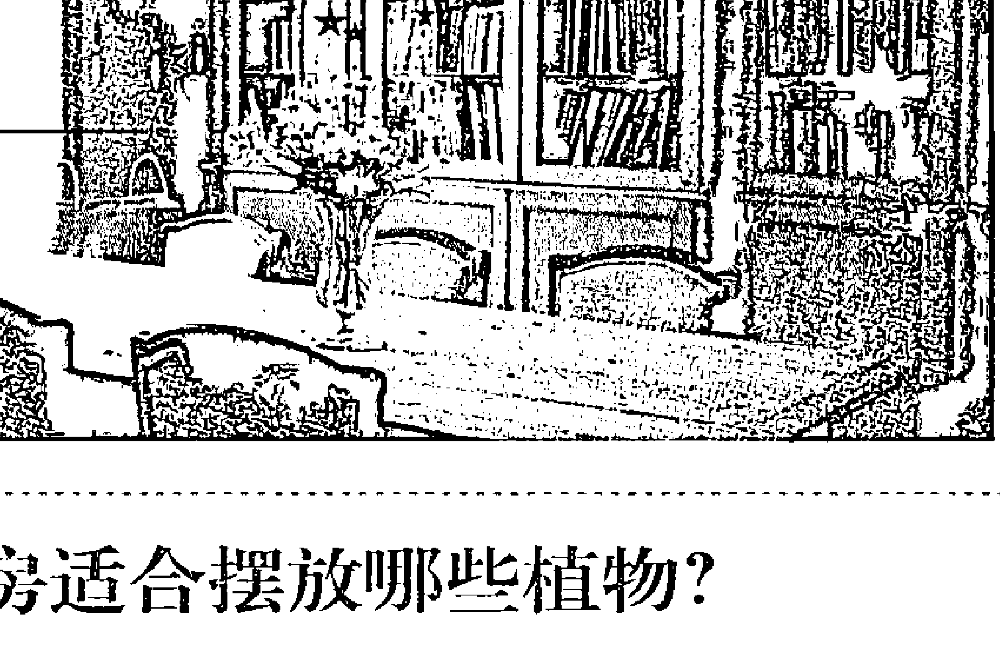

白色淡雅的花卉，摆放在书房，让人充分感受读书的乐趣。

> **书房花卉**
书房作为读书的空间，摆置花卉时应当营造清静、幽雅的环境，以烘托气氛。

## 986 厨房适合摆放哪些植物？

由于厨房油烟较大，是不适合摆放植物的。但在厨房适当地摆放一些植物对家人的身体健康是极其有益的。

厨房适合摆放一些普通的色彩鲜艳的花，如吊兰、绿萝、凤仙花、秋海棠、天竺葵等植物。厨房易产生油烟，选择摆放的植物应有较好的抗污染能力，如芦荟、水塔花、万年青等。平时要注意保持植物的清洁。在厨房种植花卉还可以把蔬菜、水果做成插花，与厨房环境相协调，点缀气氛，增添生气。

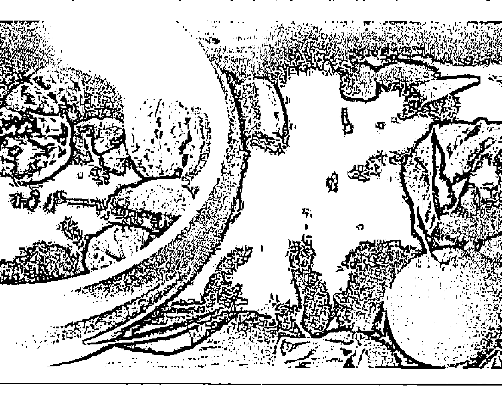

核桃

橘子

> **厨房的点缀**
厨房里摆放桔子、核桃能与厨房环境相和谐。厨房里摆放鲜艳的花卉，能吸收油烟，净化室内空气，如果能在花卉旁边摆放桔子等水果，就会为厨房增添不少生气。

## 987 如何根据厨房的方位确定植物的摆放？

厨房是油烟汇集的场所，不但对人的健康有害，而且容易破坏家居气场，因此可根据风向及厨房的方位确定植物的摆放。

一般来说，位于东方的厨房是最吉利的，可在桌上摆放一些红色的花，不但对家人身体有利，而且东方象征着红红火火，家业兴旺。

位于西方的厨房，容易承受黄昏阴气的袭击，因此需要能够挡住黄昏阴气的植物，可摆放金黄色的花，比如水仙。

若厨房位于南方，阳光充足，容易形成“大方”的磁场，家人会有大手大脚乱花钱的倾向，可以种植观叶植物，有助于储蓄。

位于北方的厨房，则要在桌上或者橱柜上摆放粉红色和橙色的花卉。

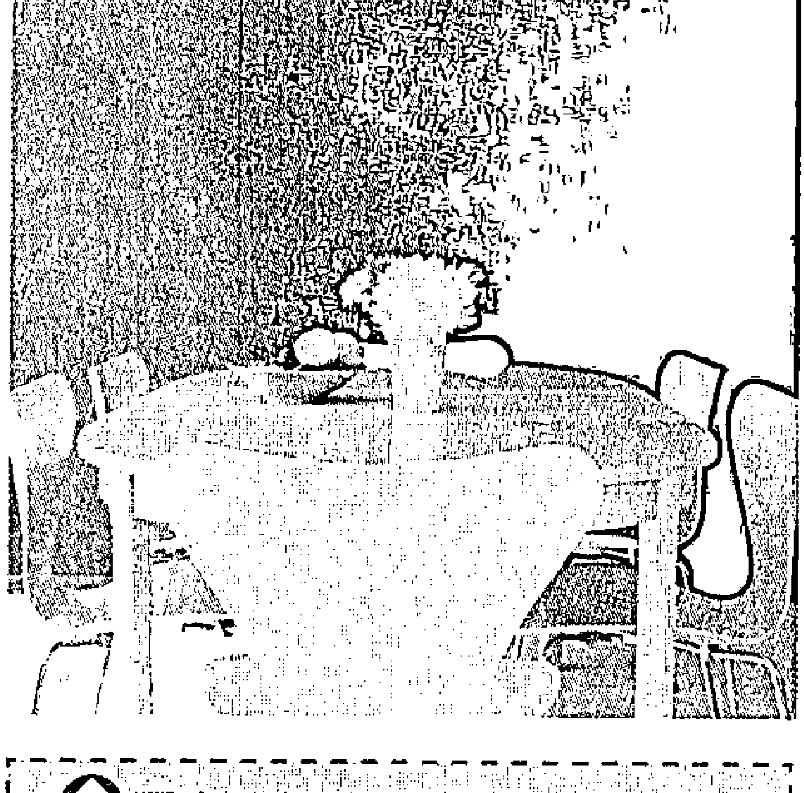

> 厨房植物的摆放
厨房位于西方，适合摆放金黄色的花卉。如果厨房的一角改做餐厅，可以将花摆放在餐桌上。

## 988 厨房位于什么方位好？

有人认为，厨房最好位于东方或东南方。
这是因为东方为木，东南方为水，厨房同时要用到木柴、火、水才能做饭，而且燃木可以生火，水可以润木，三者都是相生的关系。因此东方、东南方朝向的厨房，会给人木火通明、家业兴旺的感觉，家庭成员容易健康和谐，勤勉向上。

从现实的角度讲，我国冬季常刮西北风，将厨房设置在东方或东南方向，有助于通过风力的作用催旺炉子，饭容易煮熟，象征着红红火火。西北风来的时候，厨房的香味还容易被刮到外，有助于住宅空气保持清新，避免厨房污染破坏掉家居气场。

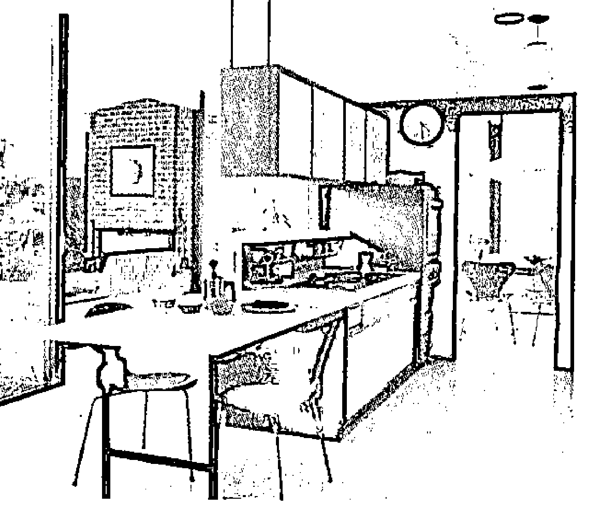

> 厨房位于东南方
东方或东南方空气新鲜，室温相对较低，有助于食物的存放。家中厨房若不在这两个方向，最好及时变更。

## 989 餐厅适合摆放哪些花卉？

餐厅是家人一起吃饭的地方，可以在餐厅摆放一些能够烘托欢乐、祥和气氛的花卉，如圣诞花、秋海棠等。在餐厅的柜子上还可以摆放一些吊盆类的植物以装饰环境。
摆放在餐厅的植物，要避免香味过于浓郁，这会影响人的食欲，如风信子等。植物在外观上要矮小一点，以免影响人们的视线，妨碍用餐的人交流。
适合在餐厅内摆放的植物有：常春藤、四季秋海棠、仙客来和番红花等。另外，餐厅摆放的植物务必要保持清洁，提倡用无菌的培养土来栽种。

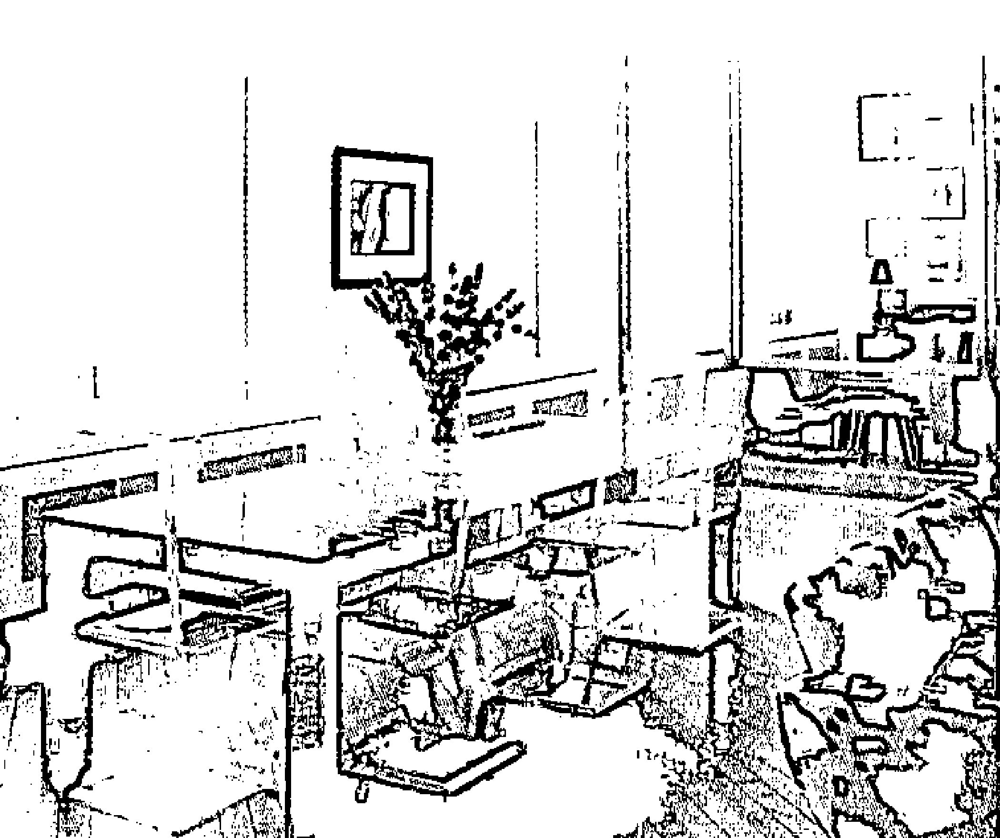

> 适合餐厅摆放的植物
餐厅是吃饭的地方，所摆放的植物要能烘托出温馨的气氛，但是不能过于芳香，因为浓郁的香气往往会影响人的食欲。

## 990 卫生间适合摆放哪些花草？

卫生间因湿气较重，又有秽气，摆放的花草要能驱逐异味。在卫生间摆放的花草最好是喜阴又能净化空气的植物。适宜摆放垂叶榕、黄金葛或蕨类植物。
垂叶榕是十分有效的空气净化器，自然是卫生间里摆放植物的最佳选择。
黄金葛是一种在阴暗的环境中也能长得很好的植物。卫生间一般都比较阴暗、潮湿，适合黄金葛的生长。
比较宽敞的卫生间，可供选择的花卉也多些。可以摆放观叶凤梨、蕙兰等色彩鲜艳的植物，让卫生间显得有自然的气息，生机焕发，更能使卫生间的空气清新。

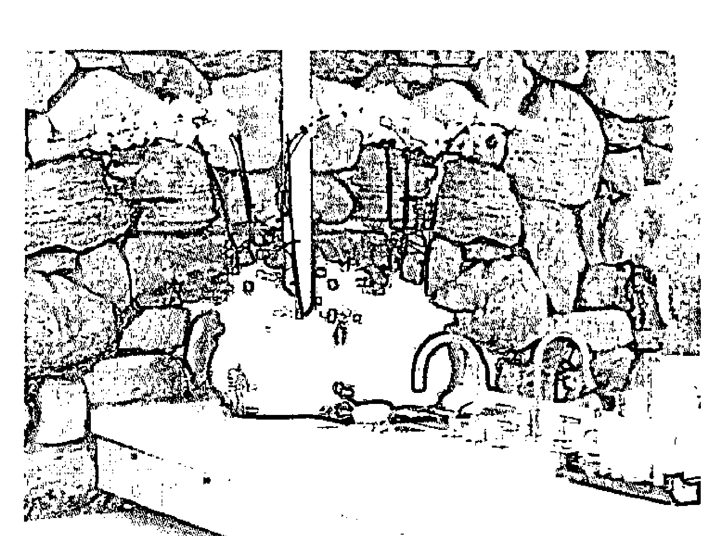

> 蕙兰
蕙兰香气浓郁，摆放在卫生间能有效地吸收厕所之内的污秽之气，并且释放出清新的芬芳，使毫不起眼的卫生间变得生机焕发。

## 991 儿童房适合摆放花草吗？

儿童身体还处在发育不完全的时期，不管是皮肤还是身体的机能对外界的抵抗能力还很差，摆放花草容易引发过敏等现象。像迎春花、万年青、广玉兰等植物对儿童的皮肤有刺激作用。

有些花草的茎叶含有毒素，处于儿童期的孩子可能会把它误含在口中，这就会导致中毒。如万年青的叶子会刺激口腔黏膜，严重时还会引起水肿，甚至呼吸困难；如果孩子吞食夹竹桃会出现呕吐、腹痛甚至昏迷等中毒症状；水仙花的球茎，孩子误食后会发生呕吐、腹泄等急性胃炎症状。

### 儿童房不适宜摆放花草的原因

| 降低食欲 | 减少氧气 | 误伤孩子 |
| :--- | :--- | :--- |
| 花草散发的浓郁香味，会引起孩子食欲下降，不利于孩子的身体健康。 | 花草在夜间进行呼吸作用，吸收氧气释放二氧化碳，导致儿童房内氧气量减少，影响孩子休息。 | 仙人掌、玫瑰、虎刺梅等带刺类的花草不宜摆放在儿童房中，以防误伤孩子。 |

## 992 室内摆放花草应注意些什么？

花卉生长需要光照等很多自然因素。在室内养花，要注意是否有足够的光线及空间等问题。总的来说，有以下几点需要注意。

1.  在室内养的植物应以耐荫性较强的观叶植物为上。这类植物摆放的时间可以长些，夏秋生长季节，要放在室内空气流通处，或者在室内、窗台、阳台、庭院间轮流调换摆放，晚上最好摆放在室外，这样可以生长繁茂。冬季则需要在室内过冬，这类植物四季常绿，是很适宜在室内种植的。
2.  植物的大小与室内的空间大小要相互协调，空间大的居室可以摆放大型的植物，而空间小的居室则应摆放一些小型盆栽花卉。人少的居室，可适当放一些大型的盆栽花卉，如龟背竹、苏铁、橡皮树等，给人美观、大方之感。
3.  根据盆花生长的姿态选择放置的位置，要适当摆放才能凸显其美。如在低处要放置直立生长或者植株较高的花卉，而有些枝叶悬垂或扩展性的盆花，则应放置在较高的地方，这样才能突出盆花的美。
4.  盆花的颜色要和室内墙面、家具的颜色相协调。

## 993 孕妇的家中适合摆放什么植物？

家中有孕妇时，摆放植物一定要讲究，要求不仅能给家里带来新鲜的空气，对孕妇有益，还能愉悦心情。可摆放吊兰、文竹、万年青、仙人掌、常青藤、扶郎花、芦荟、铁树、菊花等。

其他的植物，如绿萝、龟背竹等绿色观叶植物，摆放在室内可起到美化环境，使人心情好转的作用，家里有小孩、孕妇者最适合摆放。

需要注意的是，有孕妇的家中，最好不要种植仙人球、铁树等。这两种植物虽然有助于气场，但其尖利的刺会伤害到人，而且会对孕妇的心理产生不良作用。

### 吊兰对孕妇的好处

| 简介 | 吊兰是传统的居室垂挂植物之一，外形美观，不但可以起到点缀家居环境的作用，而且还是一种良好的室内空气净化花卉。 |
| :--- | :--- |
| 好处 | 一个房间若养两盆吊兰，可将空气中的有毒气体吸收完毕，因此，吊兰有“绿色净化器”的美誉。孕妇经常欣赏吊兰，不但有赏心悦目之感，而且会觉得空气清新，对怀孕初期的胸闷、打饱嗝等有较好的缓解作用。 |

## 994 家中可以摆放假花吗？

现代人都时间紧迫，没有时间照看花卉，经常会买一些丝带花、塑胶花摆放在家中，这些花没有生命，不会对屋里造成影响。但是千万不能用嶙峋状的假山衬托植物，否则家人容易受伤或生病。

由此可见，假花对家中的运程不好，一般人不要轻易摆放假花。不过五行木多且又在金融行业工作者，适当摆放假花可改善个人运程。

### 不同环境摆放假花的危害

| 具体情况 | 主要危害 |
| :--- | :--- |
| 刚刚新婚，家中摆放了假花或干花。 | 容易影响夫妻感情，可能对未来胎儿不利。 |
| 书房中摆放了假花或干花。 | 不利于人静下心来学习，对文昌运不利。 |
| 在办公室中摆放了假花或干花。 | 意味着无水滋润，无贵人提携，事业、运程会受到危害。 |

## 995 家中不能摆放空花瓶吗？

平常人们为了室内美观会在家里摆放漂亮外形的花瓶，但从旺运角度讲，家中不宜摆放空花瓶。
若是不小心将空花瓶放在了房间的西方，容易招致不正桃花，导致丈夫花心，夜不归宿，不利于家庭幸福、和谐。
如果已经摆放了空花瓶，可以插上鲜花，放上清水。并且注意经常更换清水，莫使清水变成死水影响家中运程。或者在摆放花瓶的位置上悬挂带有花朵的图画，这样不但可以避邪，还可招来桃花运。

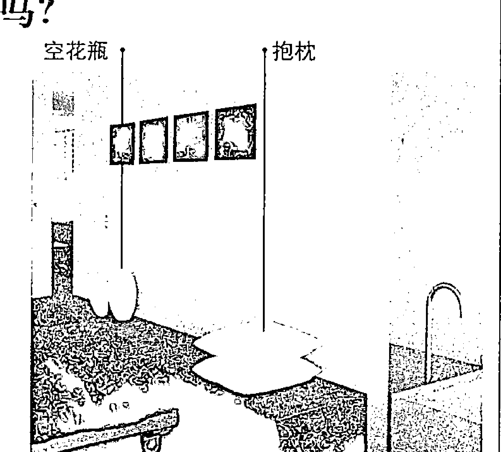

> ### 家中不能摆放空花瓶
空花瓶虽然外表看起来美观，却带有邪气、煞气，容易惹来桃花劫，还有可能导致骗财骗色之类的事情发生。

## 996 电视机旁植物摆放有何讲究？

一般而言，电视机旁是不宜摆放花卉、盆景的。因为花卉等植物产生的潮气对电视机有影响。电视机一般都不带防水保护，绿色植物带来的潮气会严重影响到电视机的使用安全和寿命。而且电视机的辐射，也会破坏植物的生长，导致花草枯萎、死亡。
一定要摆放植物，可以在电视机的旁边摆放一些类似仙人球、仙人掌或芦荟等耐旱的绿色植物。这类植物不但会避免上述问题，而且可以化解电视机产生的有害磁场，减轻煞气对人体的威胁。若不喜欢仙人球等植物，一定要摆放其他植物，那么在看电视的时候最好不要躺着。

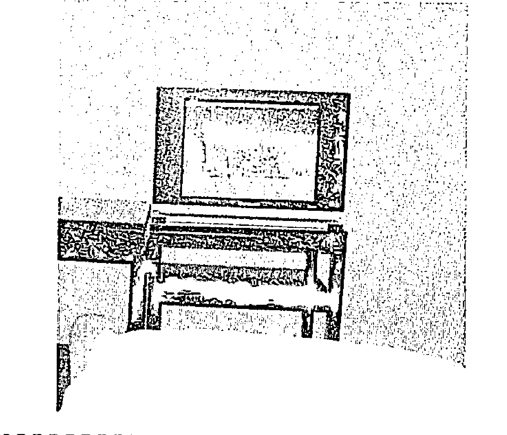

> ### 不要躺着看电视
躺着看电视，会引起眼部肌肉痉挛性收缩，造成眼睛胀痛，结膜充血，双眼流泪，甚至导致眼部血压升高，造成视力模糊，还会引起斜视。

## 997 住宅内可否摆放富贵竹？

富贵竹不可摆放在家中的西南方向。因为在八卦中，西南方是阴气最盛的“坤卦”。很多堪舆家都把坤卦称为鬼门，在此摆放任何植物都是不适宜的。家中的其他方位均可摆放富贵竹。

家中若有孩子在读书，或者家中有人从事行政工作，可以将书桌摆放在文昌位。书桌下面摆放一块灰色或蓝色的地毯，将一枝或四枝富贵竹插在水瓶中置于书桌上，这样有助于增强考试运，上班族则利于升职。

### 大门朝东家庭的招财旺运植物

住宅大门向东的，可在客厅栽种属木的植物，这些植物有利于家人肾和肝的健康。

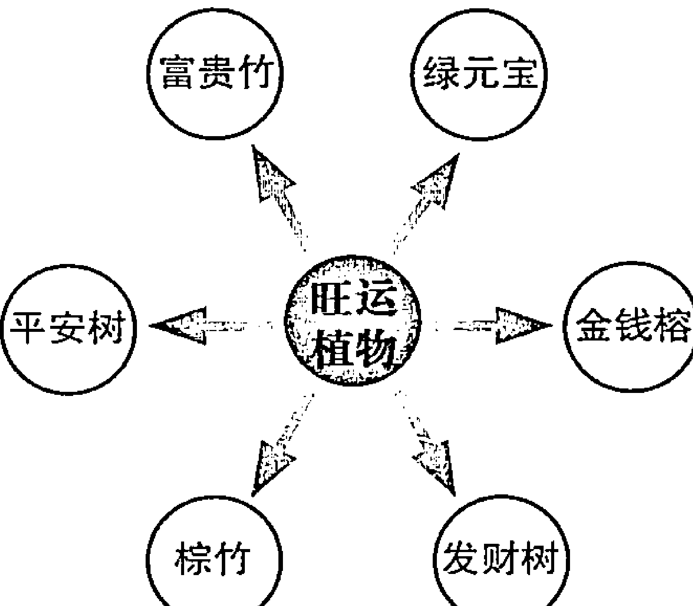

## 998 葫芦有什么旺运作用？

葫芦被古人认为是最能驱邪的植物，在家中摆放葫芦或者葫芦状的饰物对家人有益处。若想化解“横梁压顶”的不利之象，就用带葫芦的装饰藤绕在上面即可。另外，葫芦还蕴含多子多福之意，有老人的家中多放置此物。

宅主若想催旺自己的财运，也可通过葫芦来实现。葫芦在古时常被用做器皿，用来盛水或酒。它嘴小肚大的外形，有吸纳气场的作用，因此成为常用的饰物。

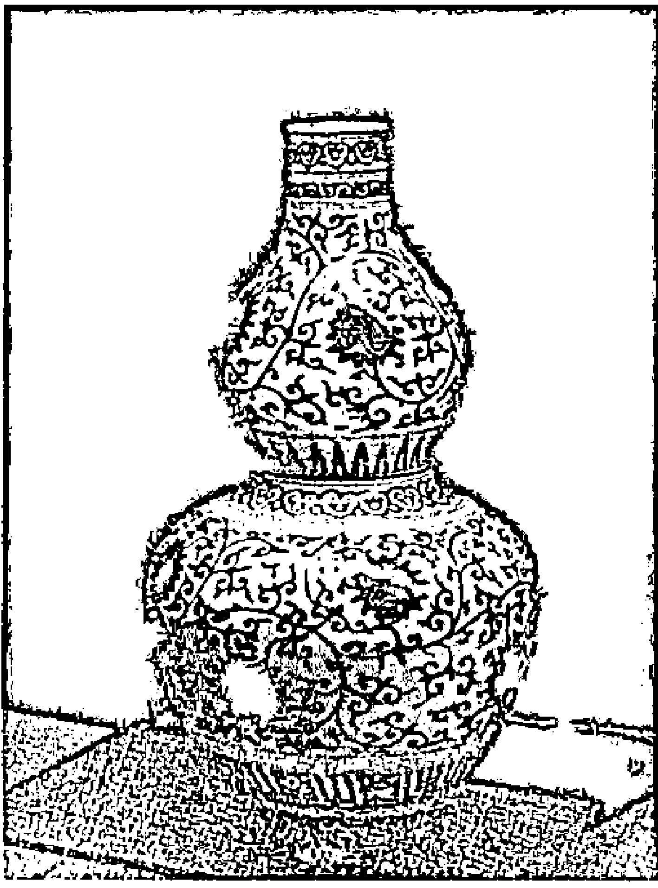

### 在财位摆放葫芦的方法

- 招财地点：在客厅东南方或住宅的西方。
- 摆放位置：用一根红绳将葫芦拴在天花板上，离地约有三分之二的距离。
- 葫芦外形：干净、完整，以留有一段蒂头为佳。若找不到真葫芦，用铜葫芦代替也可以。

**葫芦招财**
葫芦自古以来就被认为是招财灵物，如果把葫芦悬挂在财位，就可以纳进财富，且不易外流，起到守财聚富的效果。

## 999 新装修的房子摆放什么植物好？

新装修的房子内常常充斥着苯、甲醛等有害物质。这些物质会给人体造成极大伤害。我们可以在屋内种植一些植物来改善室内环境，排除居室的有害物质。

适宜摆放在新居的常见植物有：吊兰、芦荟、仙人掌、平安树。这些植物能吸收有害气体，相当于空气净化剂。

## 1000 梅花等花卉有什么内涵？

不同的花卉有不同的内涵，在传统文化中也有不同的寓意。

1.  梅花、水仙：“岁朝花”，岁朝是一年的开始，有除旧布新之意。居室摆放这些花可以给居室主人带来新气象，招来好运。
2.  银柳：外貌似银两，象征财源滚滚，是开运植物。
3.  山茶花：大理名花，花容娇艳，象征富贵。
4.  菊花：又称发财花，蕴含富贵、吉祥之意。菊花茶喝了能使人长寿，所以又被称为长寿花。
5.  百合花：有“百年好合”之意，花朵呈白色，是婚庆时必不可少的吉祥花卉。
6.  剑兰：是一种避凶招福的植物，还有节节高升、富贵吉祥等寓意。

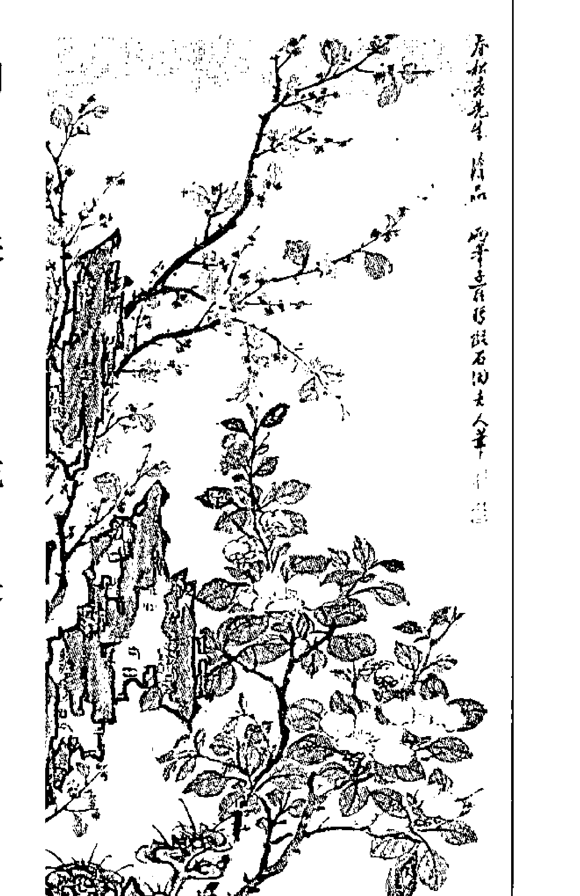

> > 山茶花
画中一株山茶花叶繁茂，后有嶙峋奇石耸立，山茶设色清丽。山茶花是大理名花，象征富贵。

## 1001 办公室摆放植物有何讲究？

办公室有大量的现代办公设备，容易释放有害气体。办公室适合摆放能净化空气的大型绿叶植物，通过光合作用，吸收二氧化碳，放出氧气，使封闭的办公室环境变得清爽。适合在办公室种植的植物有：常春藤、吊兰、万年青、发财树、金钱榕、菊花等。

# 图解中国家居生活百科1001问

# 完全掌握招财开运

详细介绍住宅、商铺的选址、装修，实用易懂。

重点分析招财开运旺宅的具体方法，操作性强。

王学典 编著

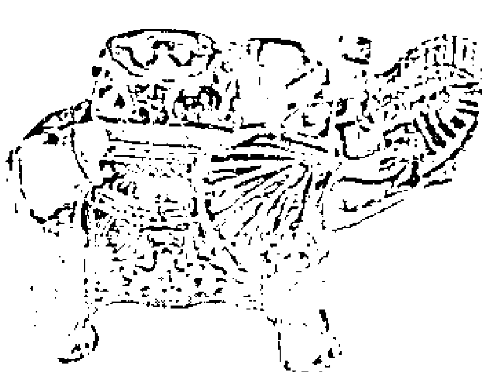

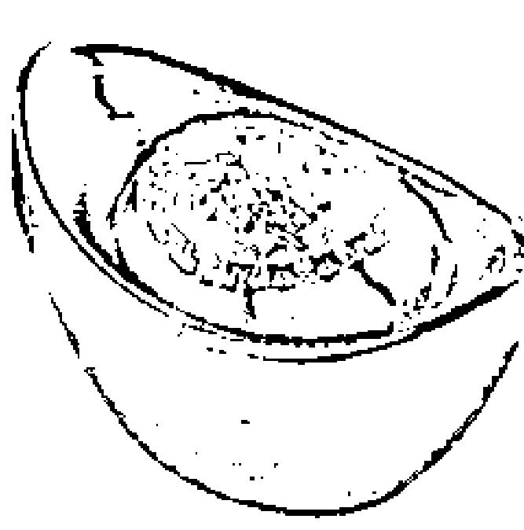

## 住宅常规招财法

- **五行补运法**：用本命的喜用色系，通过衣着、装饰、配件来辅助本命的不足。
- **财位招财法**：在财位摆放盆栽、宝马、鹿、船模型、财神像等物品。

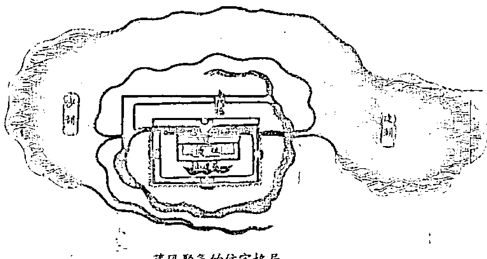

## 住宅常见开运法

- **鱼缸开运法**：在鱼缸里放入八条红色金鱼，将鱼缸放在客厅北方的角落处。
- **扑满招运法**：买一个扑满放在自己的卧室，每天固定存一元硬币，直到扑满填满。

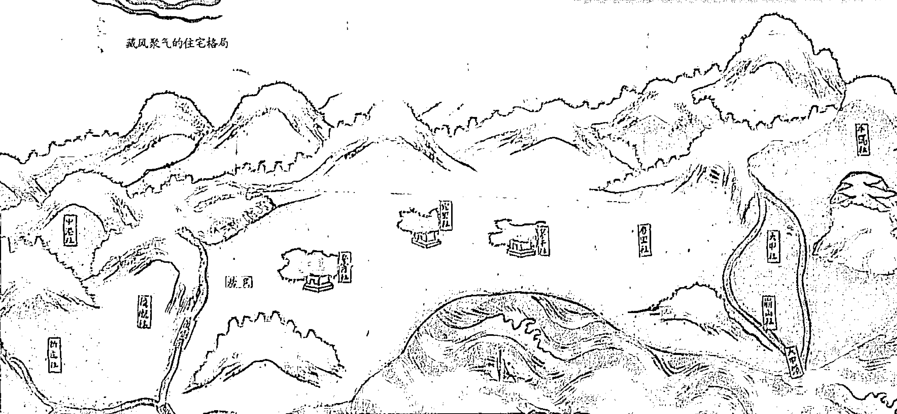

# 全面解读住宅、商铺招财、开运、旺宅方法的实用宝典

# 本书看点

内容全面+图解丰富+实操性强=完全读懂招财开运

- 内容全面：内容囊括住宅、商铺招财、开运、旺宅各方面的内容，全面解读住宅文化。
- 图解丰富：书中运用了1000多幅精美的插图和图解，形象生动地讲述古代文化知识。
- 实操性强：结合实例分析，用图文结合的方式详细讲解，让人一学就会，简单实用。

内文展示

# 图解中国家居生活百科1001问

# 居住环境

住宅环境主要由外部环境和内部环境构成。外部环境主要指住宅周围的景物、住宅的外形形态、住宅的地基地势等。内部环境主要指玄关、客厅、卧室、厨房、卫生间等。这些因素对住宅的财运都有重要影响，在选址和布局时要引起注意。

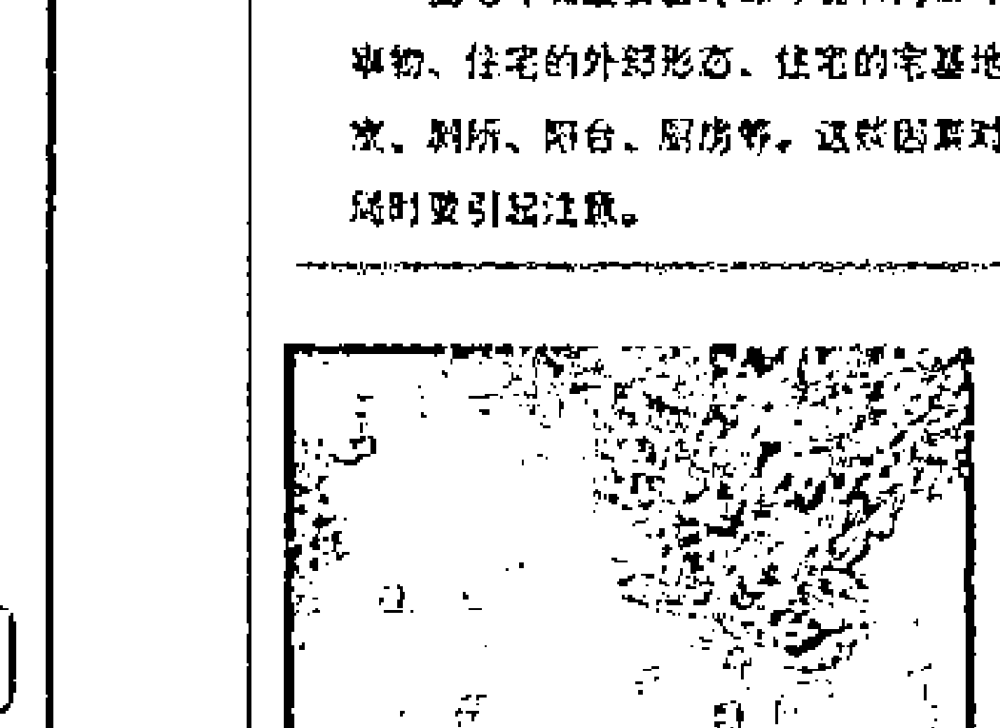

住宅外观的形态：包括建筑形状、屋顶形式等，影响气场流通和财运。

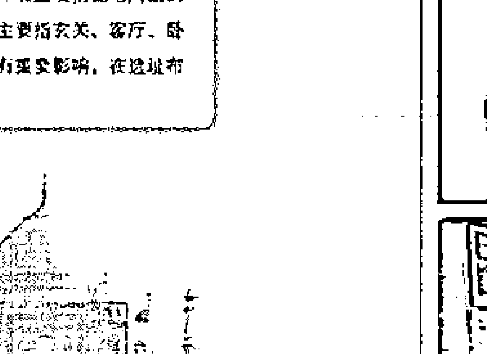

客厅布局：作为家庭活动中心，布局需合理，以聚集财气。

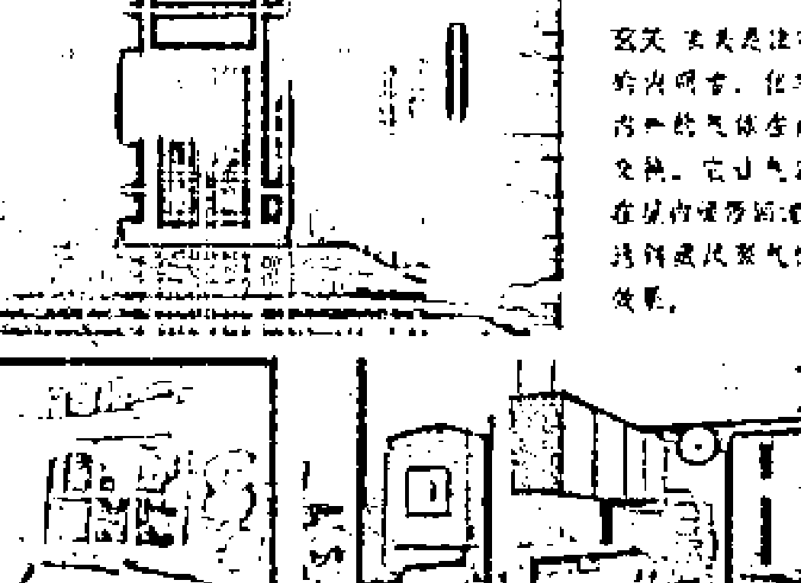

卧室设计：关系健康和财运，床位摆放和装饰有讲究。

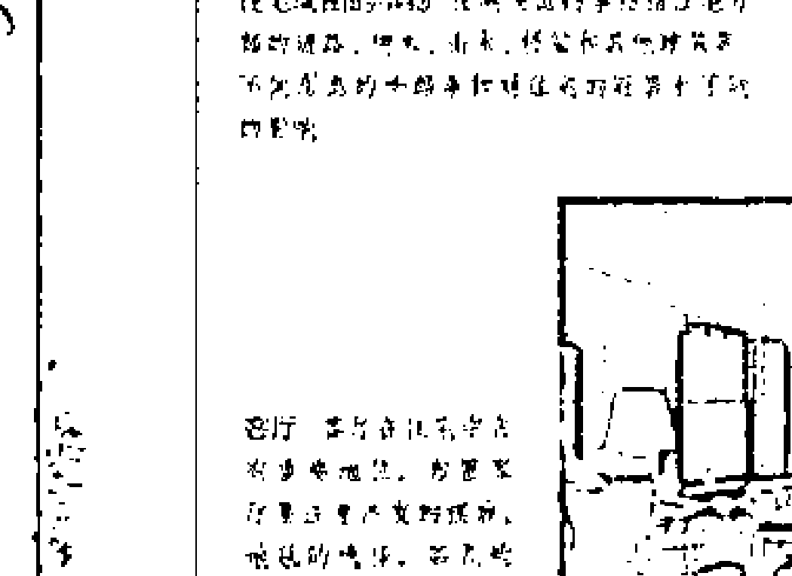

厨房与卫生间：需注意方位和布局，避免负面能量影响财运。