克苏鲁的低语、黄衣之神、伟大的克苏鲁、阿斯塔罗特、拜亚基、夏塔克、米·戈、廷达洛斯猎犬、廷达罗斯、深潜者、巨噬蠕虫、古老者、伦道夫·卡特的祖先、《死灵之书》、《克苏鲁神话》文本、《纳克特抄本》、《波菲利手稿》、《伊波恩之书》、《翡翠抄本》、拉莱耶之王、黄色面具、夏延岛、印斯茅斯、阿卡姆疗养院……

## 110项

## 克苏鲁神话知识全收录！

克苏鲁、哈斯塔、洛夫克拉夫特、门托尔、阿撒托斯、犹格·索托斯、奈亚拉托提普、撒托古亚、黄衣之主、印斯茅斯、阿卡姆、米斯卡托尼克大学、印斯茅斯、因斯港、金斯波特……以及更多的神秘事件……

## 图解神话 Cthulhu

曲折离奇错综复杂的神话体系精华，全部浓缩成为这一册。只要有本书在手，不论如何艰涩困难的故事都能一目了然。

## 《死灵之书》Necronomicon

记载了地球和宇宙真正历史的禁忌魔法书、终极魔法书，是对宇宙的恐怖悚惧恐惧的人类所曾经得到过最最危险的两面刃。

## 伟大的克苏鲁 Great Cthulhu

彼并非是恒久倒卧不起的死者，却在无可测知的永劫岁月中穿越死亡。当众星回到正确位置的同时，伟大的神明就会复活。

## 阿撒托斯 Azathoth

疯狂的宇宙真正造物主。阵阵痴狂骚乱的笛鼓乐音回荡声中，高坐在翻滚沸胀的混沌中央的宝座、为饥饿感和百无聊赖所恼的白痴魔王。

## 诺登斯 Nodens

所有夜魇奉为主宰的伟大深渊大帝，手持三叉戟并驾着战车猎杀“旧日支配者”和“外神”手下爪牙的伟大猎人。

城邦读书花园
www.cite.com.tw

ISBN 978-986-6275-08-1
9 789866 275081
00320
1HP005 售价320元 HK$167

## 图解克苏鲁神话

### 作者简介

森 澀 哲

早稻田大学第一文学部毕业，现为企划制作公司“Chronoscape”代表。活跃于游戏的企划和设计、书籍编辑与插画执笔等领域。

### 译者简介

王书铭

辅仁大学日文研究所毕业。

- 《召唤术》
- 《必法的十五堂课》
- 《图解炼金术》
- 《图解忍者武术》
- 《图解太空船》
- 《图解谜语知识》

## 图解克苏鲁神话

手持幻想地图，踏入知识神殿的奇幻旅程。

已出版 8

- 图解炼金术
  - 草野巧 ◎ 著
  - 2007年7月出版／售价300元
- 图解近身武器
  - 大枚抚司 ◎ 著
  - 2008年5月出版／售价280元
- 图解太空船
  - 铃木信哉・平野浩之 ◎ 著
  - 2008年5月出版／售价300元
- 图解魔法知识
  - 羽仁礼 ◎ 著
  - 2009年6月出版／售价300元

|      | 列1 | 列2 | 列3 | 列4 |
|------|-----|-----|-----|-----|
| 行1 | a   | b   | c   | d   |
| 行2 | e   | f   | g   | h   |

一段位于图表下方的说明文字，具体内容难以辨识。

- 项目一
- 项目二

## 金庸群侠传

(C) 群侠工作室
作者：Xia

## 克苏鲁神话

## 旧神谱
Cthulhu Mythos

林枫绿编著
王铭丽

## 前 言

“克苏鲁神话”是从恐怖小说家霍华·菲力普·洛夫克莱夫特跟作家朋友将自创黑暗神祇、魔法书等固有名词写进彼此作品的游戏里面所形成的虚构神话体系。

克苏鲁作品群诞生80余年，如今“克苏鲁神话”爱好者遍布全世界，不仅仅是小说，在音乐、电影、游戏、漫画等所有设想得到的媒体同样也有众多的相关作品发表。

有别于一般拥有明确的规则方向、作品设定审判者的共享世界，“克苏鲁神话”是个极开放的世界观，可供各个创造者自行取舍选择作品设定、加以个人的独自解释，甚至追加新的作品设定。历来有奥古斯特·德勒斯、林·卡特、桑迪·皮特逊等人均曾经致力于将“克苏鲁神话”体系化的浩大工程，可是始终没人能提出足以让众人心服的成果。

各个项目间产生的矛盾堪称是本书这种必须针对主题进行解剖、对照、分析的图解书籍的致命伤，话虽如此却也不能为勉强追求统合性而就此浪费“克苏鲁神话”这个顶级的素材。这跟《庄子》应帝王第七里面，替混沌挖开眼耳口鼻却反将其害死的故事是同样的道理。

本书透过图解呈现“克苏鲁神话”，恰如面对着一只熬煮着不知名食材的黑色汤锅、看准要害处拦腰剖开，并试图借文字捕捉出现在横切面的奇异风景。本书是以日语译本比较容易取得的作品为中心之“选择”，与其他项目发生矛盾则势必要忍痛割爱，还请见谅。

此外，本书是站在将“克苏鲁神话”视为真实的立场来执笔写作，有关历史、地理、人物的记述并不一定会跟现实相符吻合，尚请各位读者大德在阅读的时候能够置身其中、仿佛自己就是被故事里诸多奇异诡谲玩弄在股掌之间的登场人物，这将会是编者无上的喜悦。

欢迎来到宇宙的恐怖世界，“穷极之门”亦将为君而开。

## 目次

## 第一章 旧日支配者

- No.001 克苏鲁神话 —— 8
- No.002 异形诸神 —— 10
- No.003 伟大的克苏鲁 —— 12
- No.004 阿撒托斯 —— 14
- No.005 奈亚拉托提普 —— 16
- No.006 尤格·索托斯 —— 18
- No.007 沙布·尼古拉斯 —— 20
- No.008 哈斯塔 —— 22
- No.009 达贡 —— 24
- No.010 伊塔库亚 —— 26
- No.011 克图格亚 —— 28
- No.012 札特瓜 —— 30
- No.013 梅·哥斯 —— 32
- No.014 外神人人 —— 34
- No.015 其他外神 —— 36
- No.016 “廷达罗斯” —— 38
- No.017 “光辉之偏” —— 40
- No.018 佐斯 —— 42
- No.019 “伊斯之伟大种族” —— 44
- No.020 食尸鬼 —— 46
- No.021 妖鬼·洛斯猎犬 —— 48
- No.022 “米·戈”（恐怖山峰） —— 50
- No.023 夜魇 —— 52
- No.024 其他存在 —— 54

专栏：“克苏鲁神话”的由来 —— 56

## 第二章 禁忌之书

- No.025 《死灵之书》 —— 58
- No.026 《蠕虫之秘密》 —— 60
- No.027 《拉莱耶文本》 —— 62
- No.028 《奈克特抄本》 —— 64
- No.029 《无名祭祀书》 —— 66
- No.030 《金枝》 —— 68
- No.031 《伊波恩之书》 —— 70
- No.032 《律法之书》 —— 72
- No.033 《黄衣之王》 —— 74
- No.034 《尸食教典仪》 —— 76
- No.035 《塞拉伊诺断章》 —— 78
- No.036 《水神克塔亚特》 —— 80
- No.037 其他书籍 —— 82

专栏：“黑魔法”问题 —— 84

## 第三章 黑暗地区探索指南

- No.038 北美大陆 —— 86
- No.039 阿卡姆镇 —— 88
- No.040 米斯卡塔尼克大学 —— 90
- No.041 印斯茅斯镇 —— 92
- No.042 敦威治村 —— 94
- No.043 里弗班克斯 —— 96
- No.044 雪伦 —— 98
- No.045 恩盖伊森林 —— 100
- No.046 金-阳星 —— 102
- No.047 中南美 —— 104
- No.048 马丘比丘 —— 106
- No.049 蟾蜍神殿 —— 108
- No.050 欧洲 —— 110
- No.051 布瑞契司特 —— 112
- No.052 羊木须 —— 114
- No.053 史崔戈伊卡伐 —— 116
- No.054 非洲大陆 —— 118
- No.055 埃及 —— 120
- No.056 格·哈恩 —— 122
- No.057 月崖山脉 —— 124
- No.058 亚洲·中东 —— 126
- No.059 无名都市 —— 128
- No.060 冷之高原 —— 130
- No.061 阿佬扎儿 —— 132
- No.062 夜刀浦 —— 134
- No.063 南极·大洋洲 —— 136
- No.064 奈克特城 —— 138
- No.065 疯狂山脉 —— 140
- No.066 南太平洋 —— 142
- No.067 拉莱耶城 —— 144
- No.068 复活岛 —— 146
- No.069 失落的大陆 —— 148
- No.070 希柏里亚 —— 150
- No.071 姆 —— 152
- No.072 米姆利亚 —— 154
- No.073 星星的世界 —— 156
- No.074 月球 —— 158
- No.075 火星 —— 160
- No.076 土星 —— 162
- No.077 海王星 —— 164
- No.078 卡拉伊诺 —— 166
- No.079 卫克隧城 —— 168
- No.080 幻影之境 —— 170
- No.081 卡尔斯 —— 172
- No.082 入动拉斯城 —— 174
- No.083 入伯日记 —— 176
- No.084 11那 —— 178
- No.085 古拉拉涅山 —— 180
- No.086 （哈斯洛神话） —— 182
- No.087 华·菲力普·洛夫克莱夫特 —— 186
- No.088 阿卜杜·阿雨哈兹莱德 —— 188
- No.089 乔治·甘莫·安吉尔教授 —— 190
- No.090 罗伯特·哈里森·布莱克 —— 192
- No.091 伦讷夫·卡特 —— 194
- No.092 亨利·温特渥兹·阿克莱 —— 196
- No.093 达斯汀·季奥佛瑞 —— 198
- No.094 费特烈·威廉·冯容兹 —— 200
- No.095 信仰及其代价 —— 202
- No.096 马许家族 —— 204
- No.097 华特立家族 —— 206
- No.098 洛萨亚·梅恭 —— 208
- No.099 约瑟夫·古温 —— 210
- No.100 理查·比尔顿 —— 212
- No.101 理查·厄普敦·皮克曼 —— 214
- No.102 詹姆斯·莫里亚蒂教授 —— 216
- No.103 星际德鲁伊教派 —— 218
- No.104 银之蔷薇炼金术会 —— 220
- No.105 永无止境的抗争 —— 222
- No.106 拉班·舒兹伯利博士 —— 224
- No.107 亨利·阿米塔吉博士 —— 226
- No.108 艾德华·卡恩拜 —— 228
- No.109 乔武斯·克妻 —— 230
- No.110 艾德温·温斯罗普 —— 232
- No.111 索枷·劳斯 —— 234

英日中名词对照索引 —— 236
参考文献 —— 244

## # 第1章 暗黑神统记

## 克苏鲁神话
Cthulhu Mythos

宇宙对人类非但不存好意，甚至还是会招致祸害的场所。在人智万不能企及的众多神祇眼中，渺小如人类根本不值一顾。

### ○ 暗黑的神话体系

所谓克苏鲁神话就是围绕着君临于充斥着混沌的异次元空间的高次元存在“外神”，以及从黯然外宇宙飞到太古地球、在人类尚未诞生的遥远从前统治这个星球的旧日支配者，描述这些恐怖邪祟诸神祇的暗黑神话体系。这些神祇和祭祀仪式早在人类史黎明时期便曾受到姆和黎姆利亚等失落的大陆和极地地区繁盛一时的文化团崇拜，却因各时代当政者以及否定异教的一神教恐怕淫祀邪教将对社会造成不良影响，遂而从古老文字记录和传说中遭到悉数抹灭，如今除了在海蛇*、挪威海怪*等传说里面可以发现些许痕迹以外，也只能从《死灵之书》等禁断的秘密宗教典籍里面去找寻它的蛛丝马迹了。这些书籍大多都经过查禁、焚书等形式打压而成为非常稀有的珍本，本应再无甚机会能引起一般人注意。谁料1920年代活跃于美国廉价杂志的霍华·菲力普·洛夫克莱夫特以及跟他有固定交流的作家们——人称“洛夫克莱夫特圈”——竟将这个暗黑神话体系当成题材进行创作，这才使得克苏鲁神话开始为少部分好事之徒所知悉，然后徐徐缓缓、深沉而静谧地向全世界散播开来。

据说学术界首先使用“克苏鲁邪教”此语的就是布朗大学的乔治·甘莫·安吉尔教授，而“克苏鲁神话”则应是后来拉班·舒兹伯利博士等研究者才开始用来统称“外神”和“旧日支配者”相关神话及其信徒的用语。基本上在哈斯塔、犹格·索托斯等地球上崇拜的诸神祇当中，伟大的克苏鲁一直都被视为是最最邪恶而且恐怖的存在，早在姆大陆还存在于太平洋面的时代便已经在世界各地广受信仰膜拜。

*1 海蛇 (Sea Serpent)：神话和传奇中的海洋动物，据传系条巨蛇。在整个古代世界，人们普遍相信海底深处住着巨兽。
*2 挪威海怪 (Kraken)：北欧神话中游离于挪威和冰岛近海的海怪，巨大的身躯和令人畏惧的外表使他们经常出现在小说作品中。其实这个传说可能只不过是人们对真实世界中的大乌贼（约13公尺或43英呎长，包括触手）的印象。

### 受洛夫克莱夫特影响的作家

- “幻梦境”等幻造世界
  - 尼古拉·特斯拉
- 异次元的疯狂
  - 阿萨克·布莱克伍德
  - 阿尔伯特·马钦
  - 威利·霍普·霍金森

### 与洛夫克莱夫特同时代的作家（出身《奇妙故事》）

- “洛夫克莱夫特圈”
  - 克拉克·阿什顿·史密斯
  - 罗伯特·E·霍华德
  - 罗伯特·布洛奇
  - 法兰克·B·朗恩
  - 罗伯·普莱斯
  - 亨利·克特涅
  - 佛瑞兹·雷伯
- 与洛夫克莱夫特通信
  - C. L. 摩尔
  - 亨利·S·怀特海
- 委托洛夫克莱夫特修改文案
  - 海瑟·希尔德
  - 珍利亚·毕夏普
  - 阿道夫·德·卡斯特罗
- 改编其作品
  - C. 霍尔·汤普森
  - 阿道夫·德·卡斯特罗

### 洛夫克莱夫特死后的作家

- 活跃于小众怪奇活动的作家
  - 伦布·坎贝尔
  - 大卫·德雷克
  - 布莱恩·姆利
  - 流川·麦克劳德
- 受洛夫克莱夫特影响而改编其作品
  - 林·卡特
  - 史蒂芬·金
  - T. E. D. 克莱因
  - 麦克·胥
- 批判洛夫克莱夫特（或重新肯定）
  - 柯林·威尔森

○ 霍华·菲力普·洛夫克莱夫特 → No.087
○ 乔治·甘英·安吉尔教授 → No.089
○ 阿道夫·德·卡斯特罗 → No.006
○ 拉班·舒兹伯利博士 → No.106
○ 伟大的克苏鲁 → No.003

唐纳德·万德雷 (Donald Wandrei)：此为《诡丽幻谭》笔名，《克苏鲁神话》...

### # 异形诸神
Strange Aeon

> 落在时间与空间彼方的穷极之门对面，大地深处魑魅蠕动着巨体，不具固定形体的神明则是在混沌中央以裹滚的方式不断地吐着泡沫。

### ○ 万魔殿

按照恐怖小说形式表现出宇宙恐怖的霍华·菲力普·洛夫克莱夫特的说法，在极大宇宙的漠漠然虚空之中，人类的法律、好恶抑或情感既无所谓妥当与否，亦无任何意义可言。宇宙和统治宇宙的诸神对人类还轮抱持有些许善意，甚至根本就对人类没有半点关心；在这样异形诸神眼前，人类只不过是个等着被玩弄、被破坏的无力而渺小的存在。克苏鲁神话的这个宇宙观，跟神智学所谓作为生物的人类及其社会只不过是个短暂现象的教义确有共通之处。

距离人类诞生还远的从前，“旧日支配者”从外宇宙飞来太古的地球施行统治，后来地壳变动和星辰运行变化使其无法继续在地面活动，于是才躲到地球和诸行星地底长眠，至今依然。永劫的日月流逝，彼等“旧日支配者”躺在甚麼的漆黑之中，丝毫不动弹地保持着意识，以其足以覆盖极广大区域的意念梭巡于宇宙所有能够感知的事件之间。

尽管“外神”不具备血肉，但跟拥有不完全形体的“旧日支配者”相较之下，从传言位于宇宙中心或外侧的那充斥着混沌的高次元空间统治全宇宙的“外神”，反而是更类似于神明的超自然存在，同时也是个透过被命名便能获得神性的能量质概念。统帅阿撒托斯是不断向外膨胀的原初混沌，早在宇宙创世以前便已经存在，副王犹格·索托斯既是过去、现在连接直到未来的时间流，同时也是无止境累积下去的世界的记忆。在“外神”身旁，则是有以笛鼓吹奏着疯狂而骚乱曲音的异形仆从随行在侧。

宇宙里还另有一支跟“旧日支配者”、“外神”敌对，也有人说是处于中立立场的神秘神祇“古神”存在，诺登斯就是其中一员，或曰是乃“古神”主神。

1 古神 (Elder Gods)：或称“旧神”，《克苏鲁神话》译为“老神”，《西洋神名事典》译作“古老神明”。

### 克苏鲁神话的宇宙观

| 地球原住种族       | 人类 | 其他种族       | 沉眠于地球的旧日支配者 |
|------------------|------|----------------|------------------------|
| “远古旧族”     |      | “活著者”     | 廷达罗斯猎犬与食尸鬼       |
| “伊斯之伟大种族” |      | “丘丘人”     | 克图格亚           |

“地球本来的神”（Great Ones，亦称“地球的虚弱众神”）

除“旧日支配者”和“外神”、“古神”以外，以幻梦境为故事舞台的诸作品亦曾多次提及另一批称为“地球本来的神”；它们虽然并非邪恶，但也并不代表它们绝对是属于良善的一方。“地球本来的神”是在奈亚拉托提普和诺登斯的庇护之下，在幻梦境的卡达斯宫殿安然度日。奈亚拉托提普和诺登斯是敌对关系，至于“地球本来的神”为何会受到这两个神明庇护，其中缘由全然不明。“地球本来的神”既然名为诸神想必是有复数神明存在，可是就连这些神明分别叫什么名字也全都无从得知。克苏鲁神话研究家兼神话作品作家林·卡特曾经在名为“克苏鲁神话的文学”的文献里指出克苏鲁神话提到的几个神明就是“地球本来的神”，但这个分析并无明确根据，最好还是当作参考就好。

- ○ 克苏鲁神话 → No.001
- ○ 犹格·索托斯 → No.006
- ○ 阿撒托斯 → No.004
- ○ 诺登斯 → No.013

### No.003

### # 伟大的克苏鲁
Great Cthulhu

彼亚非是恒久倒卧不起的死者，却在无可测知的永劫岁月中穿越死亡。当众星回到正确位置的同时，伟大的神明就会复活。

### ○ 最受畏惧恐怖的“旧日支配者”

在人类诞生以前君临地球的“旧日支配者”诸神祇当中，伟大的克苏鲁是最受人类畏惧的一个。

克苏鲁经常被描绘成身体表面满覆着鳞片和肉瘤，头部像个章鱼，脸上长有不知是蛇还是触手的胡须，双手生有白爪、两腿有如蜥蜴，这模个仿佛是将人类的形体极尽妖魔能事所改造成的极端丑恶凶残的恐怖模样，可是克苏鲁的实体其实是个能够随意变化形状的不定形原形质肉块，它那充满恶意的巨眼、每当眼球蠕动时所发出仿佛用尖刀刮削听觉神经般的长音、类似双簧管的颤栗吼声，再再彰显了它的本质。

遥远的太古时代，伟大的克苏鲁跟着属从黑暗的佐思星系穿过万千星游来到地球，打败“远古种族”征服姆大陆，后来却因为天文变化与随之而来的地壳变动而丧失力量，沉眠于太平洋海底都市拉莱耶城的石棺里。早在人类史初期，莎布·尼古拉斯和蛇神伊格等都曾经在古代的姆大陆受到崇拜，其后也对世界各地的民间传说造成影响，譬如克丘亚艾亚尔族信奉的战争之神和阿兹特克帝国崇拜的羽蛇神奎札柯特、南太平洋几个岛屿发现的神像、澳洲发现的盾牌等，都可以发现这些古老信仰的痕迹。

伟大的克苏鲁受到海神达贡及其眷属“深潜者”等水栖种族崇拜，其人类信徒则大多是航海生活。克苏鲁的疯狂信徒抱持着坚决的信念一直守护着禁忌的知识，好让伟大的克苏鲁能在繁星回到正确位置的时候从永恒的梦境中苏醒、从拉莱耶城的墓窟里崛起。

> 克丘亚艾亚尔族 (Quechua Ayars)：《战栗传说》和《克苏鲁神话》均无此说法，恐是大英线上百科所指“克丘亚人”(Quechua)，是住在由厄瓜多到玻利维亚的安地斯山区的南美洲印地安人。
> 奎札柯特 (Quetzalcoatl)：阿兹特克的文明与秩序之神，是与泰兹卡特力波卡对立的“羽蛇”。同时也是太阳神、风神。

偉大的克蘇魯及其崇拜者

拉莱耶城
偉大的克蘇魯及其崇拜者

「深潜者」的海底都市
如尔哈斯里

通过梦境下达命令

伊塔库亚

不死的纳们们
据
世界各地的信仰
克蘇魯邪教

- 拥有「深潜者」血统的人类
- 印斯茅斯、印卡波卡等「深潜者」的势力范围
- 「星之彩」的同类变体

偉大的克蘇魯

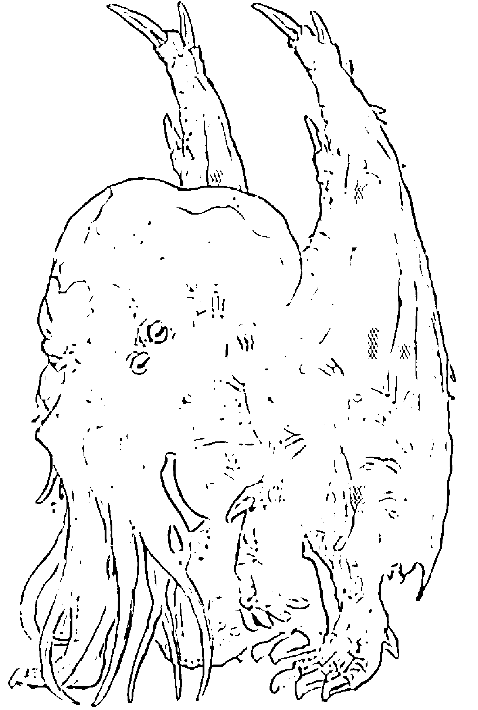

偉大的克蘇魯
偉大的克蘇魯活像出現在惡心裡的怪物，經常被描繪成頭顱生有觸手彷彿魷魚頭、背後長有翅膀的蝙蝠宛如泥漿的模樣

- 如→No.071
- 拉莱耶城→No.067
- 旧日支配者→No.009
- 「深潜者」→No.016
- 其他神明（蛇神伊格）→No.015

No.004
阿撒托斯
Azathoth

瘋狂的宇宙真正造物主。陣陣瘋狂騷亂的笛鼓樂音迴盪響中，高坐在翻滾沸騰的混沌中央的寶座、為飢餓感和百無聊賴所惱的白痴魔王。

○「外神」的統帥

在無邊無際的宇宙空間中心、沸騰的混沌捲曲成漩渦的最深處有個超越時間的無明房室裡面，身為萬物之王的盲眼白痴神明、所有「外神」的統帥、不具任何形狀的無定形黑影——阿撒托斯就彷彿個大字般地隨便躺臥在寶座上面冒著泡沫，重複膨脹與收縮並不斷吐出污穢不淨的字句。
在阿撒托斯的混沌寶座周圍，隨時都有不具心志而無固定形體的吶喊跳舞者群聚在旁瘋狂地舞蹈，並同時發狂般地連續擊打大鼓發出低步而模糊的音色、以受詛咒的魔笛吹奏出細長而平調的樂音，以慰無時不感到飢渴的魔王阿撒托斯的無聊。
阿撒托斯就是難以名狀的宇宙的原罪，宇宙間存在的所有事物均是阿撒托斯的思考所創造，相反地，任何人看見阿撒托斯的模樣都要從最根本的存在遭到破壞。不過，阿撒托斯鮮少親自有所作為，大多都是由諸神的強壯使者奈亞拉托提普以代行者身分，直接執行其意旨。
有預言指出當地從前的統治者從沉眠中復活的時候，阿撒托斯也將會降臨在無光的冷之高原；阿撒托斯出現的場所必定會颳起陣陣混雜著創造與破壞的爆炸性混沌，因此除煞該星的昆蟲等極少數例外以外，根本沒有崇拜者會期待它的到來。火星和木星中間的小行星帶，就是從前位在該處的星球被應召喚而來的阿撒托斯擊碎所造成的結果。
麻薩諸塞州阿卡姆鎮出身的詩人艾德華·皮克曼·德比曾經根據自己從《死靈之書》等禁斷書籍中得來的阿撒托斯形象，寫成惡夢般的抒情詩〈阿撒托斯詛邪記〉轟動文壇。

* 阿撒托斯：《敦威治恐怖》、《克蘇魯神話》譯為「阿撒托斯」

### 阿撒托斯与「外神」

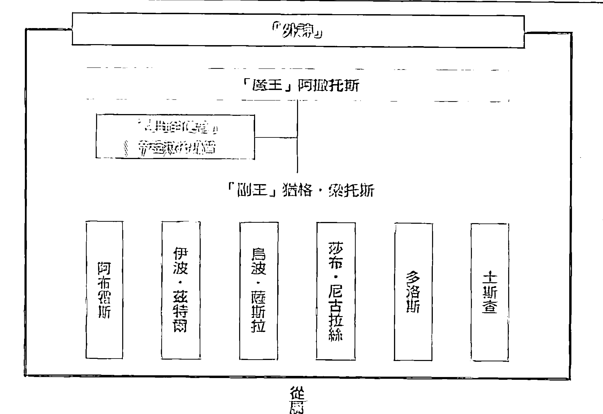

———————————————————————————————————————————————

### 阿撒托斯及其侍从

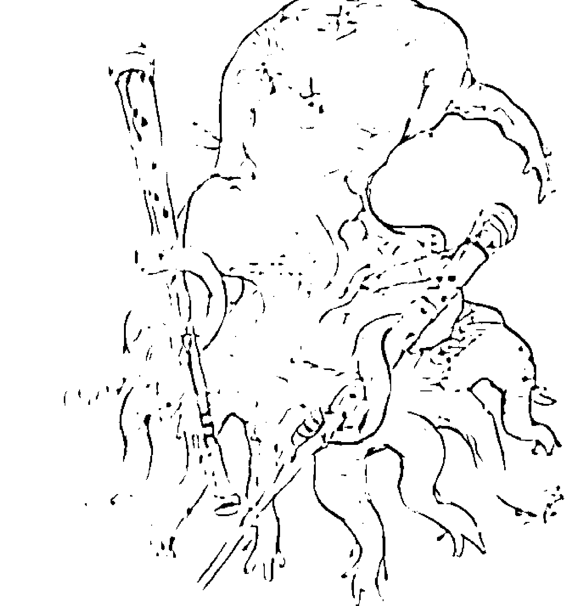

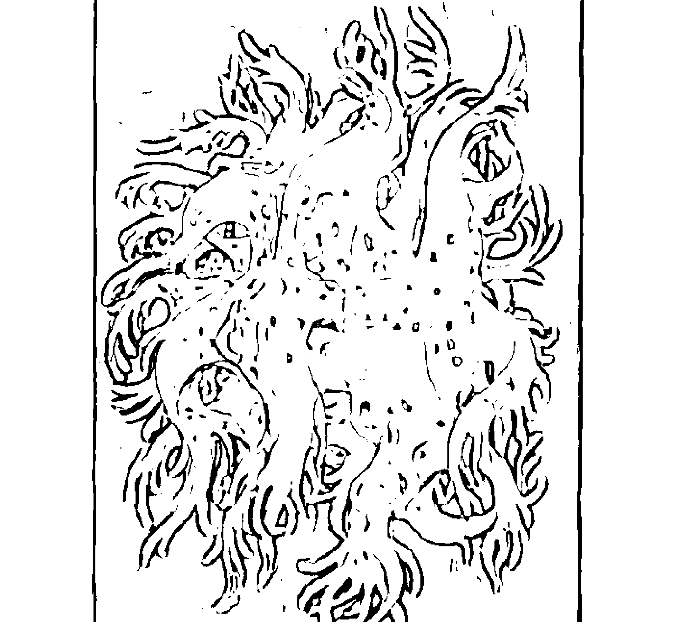

「外神」的侍从
在阿撒托斯身边聚集的无定形团块的侍从，拥有不可名状的恐怖外貌，为不明的活体。

阿撒托斯
以不可名状的怪异形象示人的阿撒托斯，其形态无法被人类所理解。它是超越三次元空间的存在，不断地进行膨胀与缩小。

———————————————————————————————————————————————
关联条目：
○ 阿撒托斯的侍从 → No.005
○ 冷之高原 → No.060
○ 火星 → No.075
○ 《死灵之书》 → No.025

No.005
奈亚拉托提普
Nyarlathotep

身為「外神」的強壯使者，卻連自己服事的主人都可以公然嘲笑的克蘇魯神話惡作劇神祇。

○千面的無貌神明

「亙伏的混沌」、「夜吼者」、「燃燒的三眼」、「無貌神明」、「黑色法老王」、「眩惑之女」——強壯的奈亞拉托提普是以阿撒托斯為首的「外神」的使者暨代行者，它有千百個不同的名字和化身、能夠出現在任何的時空。在從前公然崇拜邪惡神祇、後遭古埃及從歷史裡抹煞的奈夫倫-卡時代，奈亞拉托提普足以擁有銳利的長爪、禿鷹的雙翼和鬣狗的胴體，並且戴著三重頭冠的無臉斯芬克斯²模樣為人所知。

埃及最古老的魔神奈亞拉托提普是亦稱黑色使者的復活之神，據說當世界末日即將到來的時候，它就會變成皮膚黝黑沒有五官的男子出現，一方面到處散播死亡，卻又手持聖杖穿越重重沙漠、使太古的死者一一復活。

為遂行其邪惡目的，奈亞拉托提普偶爾會變身成人類模樣公然出現在人前。相傳現身於魔宴引導女巫的「黑色男子」、使星際智慧教派在洛杉磯復活的奈神父、核子物理學家安布魯斯·德克斯特博士、在里弗班克斯廢棄教會講道的麥可·馬克西米連神父等，都疑似為奈亞拉托提普的化身。

有時奈亞拉托提普也會跟其他「外神」同樣帶著吹奏魔笛的侍從們行動，不過這些侍從都有自己的名字，時而還會擔任主人奈亞拉托提普的代行者。

1945年大日本帝國已顯露頹敗之勢時，曾經執行過幾個咒殺法蘭克林·D·羅斯福總統的作戰計畫，當時就有位初出茅廬不久的魔法師曾經召喚出奈亞拉托提普第16號侍從，名叫「托羅斯」的魔物。

### 「持缠千面之神」

「外神」的使者奈亚拉托提普拥有无数化身并且能够展现于任何时间、空间，被称为「持缠千面之神」。

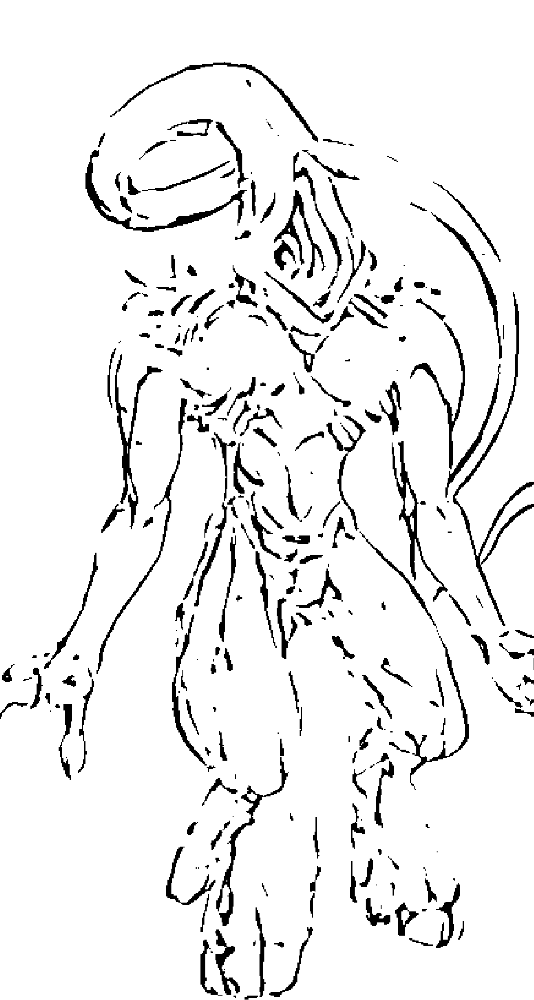

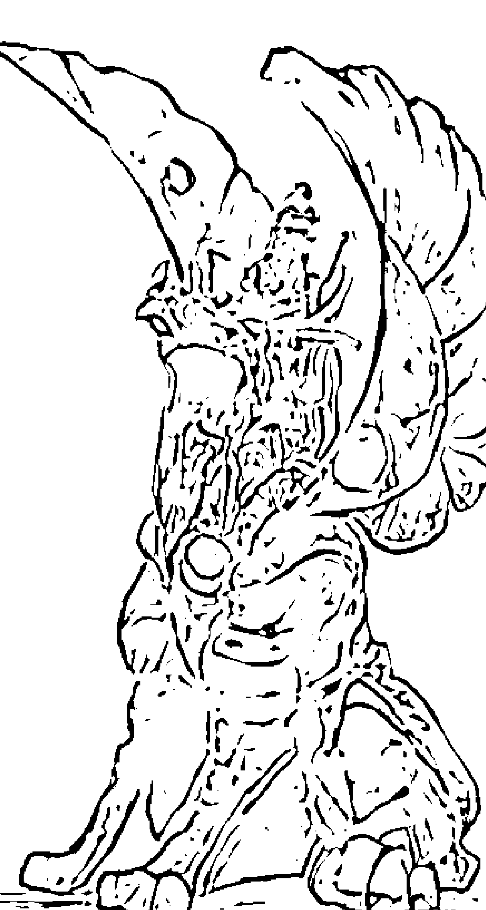

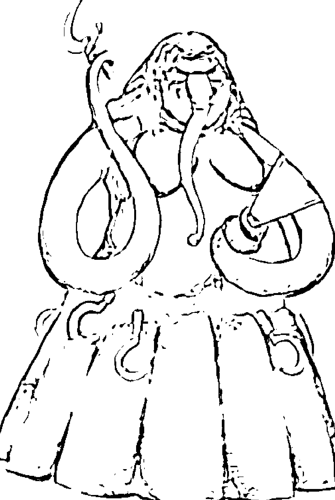

### 「奈亚拉托提普关系图表」

「外神」
阿撒托斯、犹格·索托斯等

作为使徒服务

| 地球 | ↔ | 奈亚拉托提普 | → | 「地球本来的神」 |
|---|---|---|---|---|
| (不明) | | 千百个化身、使徒 | | |

崇信

### 人类的密教结社

- 暗黑教团
- 圣·泰勒玛黄金黎明会
- 暗之兄弟会

- 黑色法老兄弟会
- 奈夫伦-卡的坟墓
- 「血舌」

> ○星际智慧教派→No.103
○里弗班克斯→No.043

### No.006 猶格·索托斯
*Yog-Sothoth*

它既是開門的鑰匙，同時也是守護者。端坐於以銀鑰匙開啟的窮極之門外，完全不受時空任何限制的最強大神祇、「外神」的副王。

### ○位在遠方者

裝扮成由眾多散發出太陽般強光的彩虹色球體和集物模樣的「外神」猶格·索托斯，是個在時空問最底層的底層、混沌的正中央，永無止境發出泡沫的有觸角無定形怪物。它超越時間與空間的法則，與所有時間同在、及於一切空間。

根據《死靈之書》記載：猶格·索托斯是通往「外神」所在外宇宙的門扉，它既是這扇門的鑰匙、守護者，同時也是宇宙最終極的秘密。開啟這扇門的咒文記載於《死靈之書》中，不過除17世紀刊行的拉丁語版以外，其他版本在咒文最關鍵部分都有殘缺。猶格·索托斯是具有實體的神祇，甚至還曾經跟華特立家族的女性產下子嗣，但這位神明同時卻也是個概念，是難以捉摸無法碰觸到的「猶格·索托斯現象」。在「一生萬物，萬物歸一者」的猶格·索托斯裡面，過去、現在和未來的一切時間都是同一，宇宙的全部存在甚至於「外神」和「舊日支配者」，盡皆都在猶格·索托斯的認知之內。又或者可以說猶格·索托斯是部鉅細靡遺記錄宇宙所有情報的《阿卡錫大事紀》*2。約翰·狄和初代倫道夫·卡特等伊利莎白女王時期的魔法師甚至認為只要掌握猶格·索托斯就能夠階及神明。

「米·戈」稱呼猶格·索托斯為「位在遠方者」崇拜之，據說普洛維頓斯的黑魔法師約瑟夫·古溫還曾經創造出召喚猶格·索托斯的咒文，並且唱誦咒語見到了猶格·索托斯。據說有「引路人」、「窮極之門守護者」、「長生者」、「最古老者」等眾多稱號的尤瑪特-塔威爾，其實就是偽裝成人類模樣的猶格·索托斯化身，它會將銀鑰匙的持有者領往窮極之門。

> *1 猶格·索托斯：《裁禒傳說》、《克蘇魯神話》譯為「猶戈-索托斯」。
*2 《阿卡錫大事記》（Akashic Chronicles）：記錄世界的一切事件、思想、知識，甚至於每個人的私密感情。與其說它是本書，倒不如說是座巨大的圖書館，是故《阿卡錫大事記》另有個別名叫「宇宙的記憶」。

### 穿越銀色之門

No.006
第1章◆暗黒神統記

### 第一個門

### 穿越「混沌之門」

尤格特-索托斯的常態

- 1. 密遊「混沌之門」」
- 2. 「混沌之門」在六角形台上顯出姿態，有四處地基發光球組
- 3. 透過入口階梯的「U」形缺口，「混沌之門」得到穩定化
- 4. 他從「混沌之門」的深處，窺視到他在「混沌之門」的前方有顆
- 5. 看到的彼端「混沌之門」巨大的石門
- 6. 超重低震動「混沌之門」，請以咒文進行向測量
- 7. 前往「混沌之門」」的空間

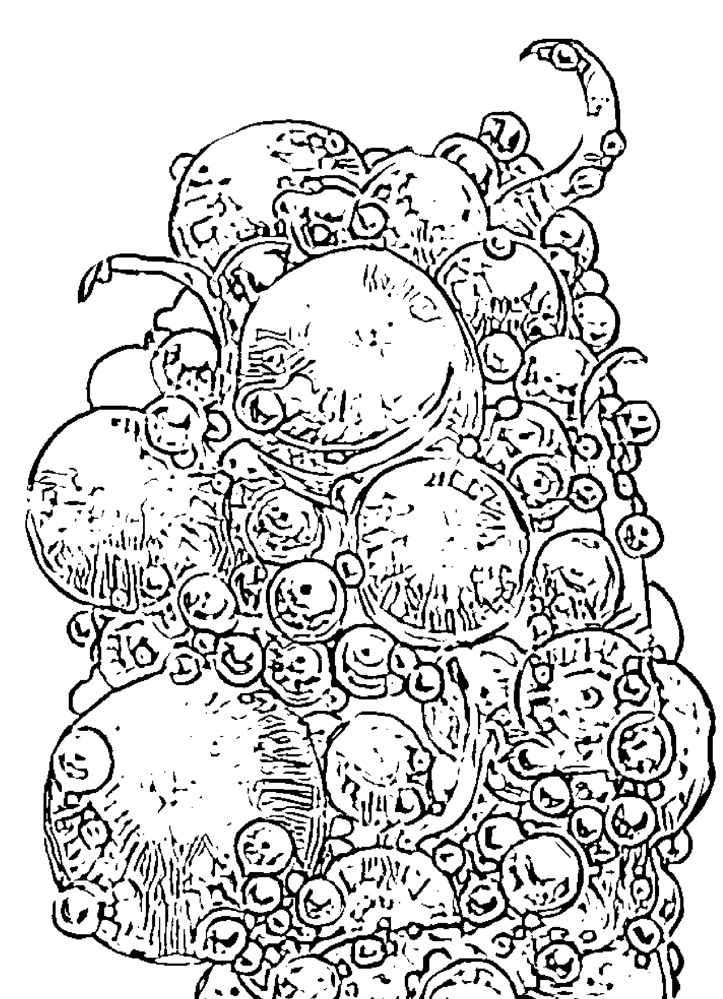

猶格・索托斯
如泡沫般不斷冒出泡沫，以無數氣泡球狀集合體形態顯現的「外神」猶格・索托斯。隱藏在這些發泡球體底下的，則是它那生有觸角的無定形怪物模樣

>No.025

○「米・戈」(狂格斯
 →No.022

○約瑟夫・古溫→No.099

### NO.007
### 莎布·尼古拉斯
Shub-Niggurath

遙遠的太古時代、德魯伊出沒的幽暗森林深處，生下千頭羊幼仔的「母親」的巨們正緩慢地吐著泡沫。

### ○生下千頭羊幼仔的森林黑山羊

莎布·尼古拉斯是克蘇魯神話中少數被定位為女性神格的「外神」，《死靈之書》等禁斷魔法書指其為「難以名狀之物」哈斯塔的妻子。即便如此稀有的禁忌文獻亦無莎布·尼古拉斯曾經出現在人類面前的記錄，無法從中得知它的容貌，不過從許多片斷的文字記錄和口耳傳說倒是顯示莎布·尼古拉斯的崇拜儀式似乎是祭祀以希臘神話狄蜜特為代表的眾多豐饒神儀式的誇張版，甚至誇張到滑稽的地步。事實上，古代的姆大陸便曾經公然將莎布·尼古拉斯奉為帶來豐收的大地母神崇拜。莎布·尼古拉斯似乎頻頻給予崇拜者直接的恩惠庇蔭，譬如從前將人類石化的邪神——加塔諾托亞之禍侵襲姆大陸的時候，它就曾經透過神靈感應將對抗邪神的咒文傳授予服事於莎布·尼古拉斯神殿的神官。

這種現世利益的傾向，使得莎布·尼古拉斯信仰得以潛伏於世界各地，尤其是跟妖精、半人半獸神、矮人族等妖魅相關的傳說底層，並且根深蒂固地留存於擁有深邃古老森林的地區。除此以外，不少文化人類學家也注意到了古代塞爾特人的土著信仰跟為求在基督教化過程中存活而進行偽裝的黑聖母信仰兩者間的關聯。其次，在信奉莎布·尼古拉斯的地區更不時有目擊者發現軀幹瘤起槃槃有如巨樹、腳上生有巨蹄、觸手宛如數條粗大繩索綁成糰、通體黝黑的怪物。這個代替絕不現身的母神出現在崇拜者們的儀式、接受彼等奉獻活祭品的怪物就是莎布·尼古拉斯之子胤，而這「黑山羊幼仔」(Dark Young) 或許正是傳說中會出現在中世時期惡魔崇拜者聚會的魔宴「黑山羊之原型」。

> > [1]《裁決傳說》及《克蘇魯神話》譯為「舒伯尼-古拉斯」，《西洋神名事典》譯作「夏伯尼古拉斯」。
> [2]德魯伊 (Druid)：另譯「督伊德」，古代塞爾特民族的神官，乃西洋亦有白色鬍鬚身穿長袍的魔法師形象的原型。
> [3]狄蜜特 (Demeter)：大地女神，相當於羅馬神話中的穀物女神席瑞絲。另外也被視同埃及神話中的伊西斯和佛里幾亞 (小亞細亞地方) 的女神希比莉。

### 莎布·尼古拉斯关系图

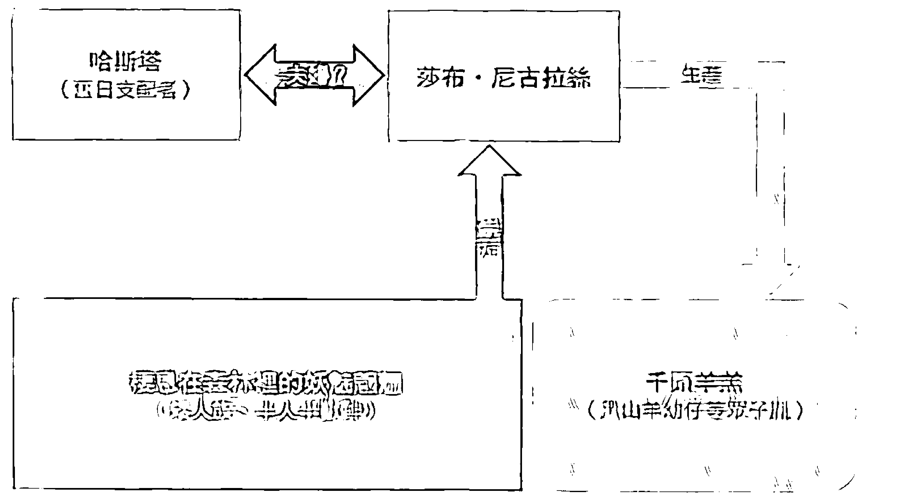

### 黑山羊幼仔 (Dark Young)

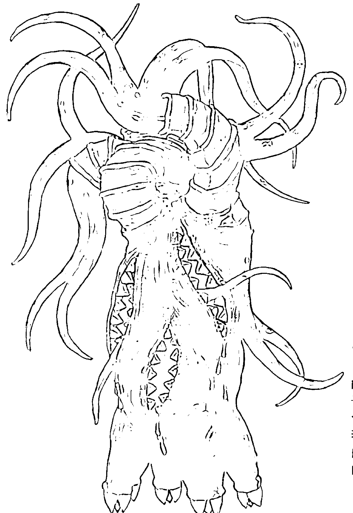

黑山羊幼仔
拥有山羊般巨体的莎布·尼古拉斯之子嗣。黑山羊幼仔。据说在崇拜莎布·尼古拉斯的地区可以看见它的身影踪迹。

→No.025 ○奈亚→No.071 ○哈斯塔→No.008

No.008
哈斯塔
Hastur

君臨於星際空間所有風神之上，並與眾多水神相持對抗的邪神。潛伏於雄牛座的黑色星球，等待星辰運行到正確位置的那天到來。

○統領宇宙風動的神祇

哈斯塔棲身於雄牛座紅色星球畢宿五附近黑色星球的哈利湖湖底，是亦稱「無以名狀之物」、「邪惡皇太子」的「舊日支配者」。被所有讀者悉數毀滅的劇本《黃衣之王》裡面有位「黃衣之王」，也被認為是這位神祇的其中一個化身。

卡爾克薩城與塞拉伊諾都在它的統治之下，古文獻裡面還記載哈斯塔是猶格·索托斯之子、偉大的克蘇魯的半兄弟、莎布·尼古拉絲的丈夫。不過這些系譜其實大都相當可疑。其次，跟地水風火所謂四大元素當中的風元素關係尤深的哈斯塔還被視為是統率羅伊格爾、札爾、伊塔庫亞等同屬風精靈眾神的領袖。

據說時而被奉為牧羊者的溫厚守護神祭祀的哈斯塔跟住在北落師門的克圖格亞締有同盟關係，因此跟偉大的克蘇魯是處於敵對關係，拉班·舒茲伯利博士與其同志就曾經試圖透過取得哈斯塔的保護藉以阻止克蘇魯復活。

哈斯塔麾下有支僕從種族，亦即樣貌怪異得彷彿爬蟲類與蜜蜂的混合體、能夠在宇宙星際間飛行的有翼生物拜亞基（Byakhee）。根據《塞拉伊諾斷章》等文獻記載，只要吹響蘊有魔力的石笛並唱禱請哈斯塔的咒文便能召喚拜亞基，並且讓拜亞基把自己送到任何場所。倘若目的地是塞拉伊諾等地球以外的地方，則必須先喝下能夠使人從時空的束縛得到解放的黃金蜂蜜酒，否則肉身就會直接曝露於宇宙空間，必須特別注意。

另外，目前已經得知在日本國內有不少地方，諸如富士山麓以溫泉鄉而聞名的村落，均有崇拜相當於哈斯塔的神明之土著信仰生根存在。

+   *1哈斯塔：《戰慄傳說》及《克蘇魯神話》譯為「赫斯忒」，《西洋神名事典》譯作「赫斯楚」，《惡魔事典》譯作「哈斯特」。
*2雄牛座：請參照P011詳註。
*3畢宿五（Aldebaran）：即金牛座 α（Alpha Tauri），金牛座的紅色巨星，天空中15顆最亮的恆星之一，目視星等為0.86等，直徑約為太陽的50倍。

### 暗黑神话系谱

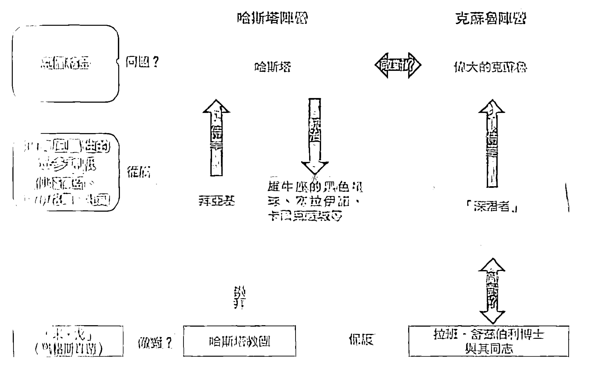

### 哈斯塔插画

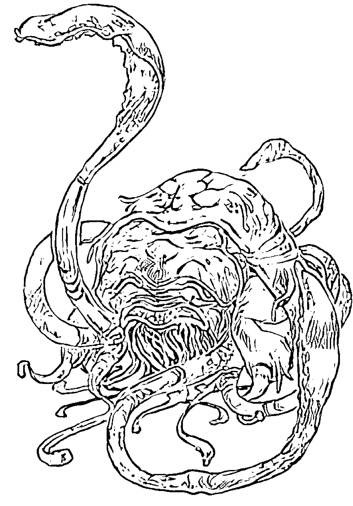

哈斯塔
据说跟伟大的克苏鲁是半兄弟关系的哈斯塔，其 样貌迥异于克苏鲁或其亲属，唯有令人联想到八腕 头生物的触手是双方的共同点

- (一些条目) → No.033
- (一些条目) → No.079
- (一些条目) → No.078
- (一些条目)
- 尤·乌塔

- ◯犹格·索托斯 → No.006
- ◯克图格亚 → No.011
- ◯伊塔库亚 → No.010
- ◯伟大的克苏鲁 → No.003

- ◯拉班·舒兹伯利博士 → No.106
- ◯《塞拉伊诺断章》 → No.035

No.009
達貢
Dagon
所有「深潛者」的父祖，古老到甚至被認為是神明崇拜的存在。服事於偉大的克蘇魯及其眷屬的深海大祭司。

○非利士人的神

克蘇魯和猶格·索托斯等「舊日支配者」和「外神」的名辭之所以不為世人所知，其崇拜者大多嚴格保守信仰秘密固然是個相當重要的理由，不過除此之外還有個更重要的原因：自從統一的羅馬帝國的最後一位皇帝狄奧多西³將基督教定為國教以來，跟國家權力緊密結合故而掌握重大權力的天主教會便在這段長達1500年以上的漫長歲月裡，致力於將所有提及這些神祇存在的文獻徹底抹殺。

然而這些古神祇卻也隨著基督教的傳揚而散播至世界各地，其中最著名的當屬君臨於「深潛者」的海神達貢。基督教的典籍《聖經》被認為是現今全世界擁有最多讀者的書籍，其中舊約聖經的〈士師記〉第16章就曾經提到達貢是非利士人崇拜的半人半魚神。

相傳「父神達貢」其實是經年累月不斷成長、終於長成巨大軀體的「深潛者」長老；達貢和配偶「母神海德拉」一起受到後代「深潛者」祭祀崇拜，它不但向偉大的克蘇魯獻禱，而且還積極地進行活動好讓克蘇魯能早日復活。

第一次世界大戰期間曾經有艘美國籍商船的船員在太平洋某個不知名島嶼目擊到疑似達貢、長達6公尺的巨大怪物，不過達貢的活動範圍絕對並不僅止於太平洋而已。舉例來說，據說在英國某個有深海大型褐藻⁴漂流而至的煤炭礦層海岸附近，就有個起源於太古時期的達貢信仰地下祭壇。除此以外，在英國國內還另外發現有相傳為史前時代矮人種族所挖通的「達貢洞窟」。

+   1. 達貢：《克蘇魯神話》譯為「大衮」。
2. 非利士人（Philistine）：起源於愛琴海的民族，西元前12世紀在以色列人到達不久後定居於巴勒斯坦南部海岸地帶。
3. 狄奧多西：乃指狄奧多西一世（Theodosius I），是最後一位統治統一的羅馬帝國的君主，並將基督教定為國教。
4. 大型褐藻（Kelp）：生長於冷水海域的沿海大型海藻，屬於褐藻（brown algae）的海帶目（Laminariales，約30屬）。

### 非利士人的神

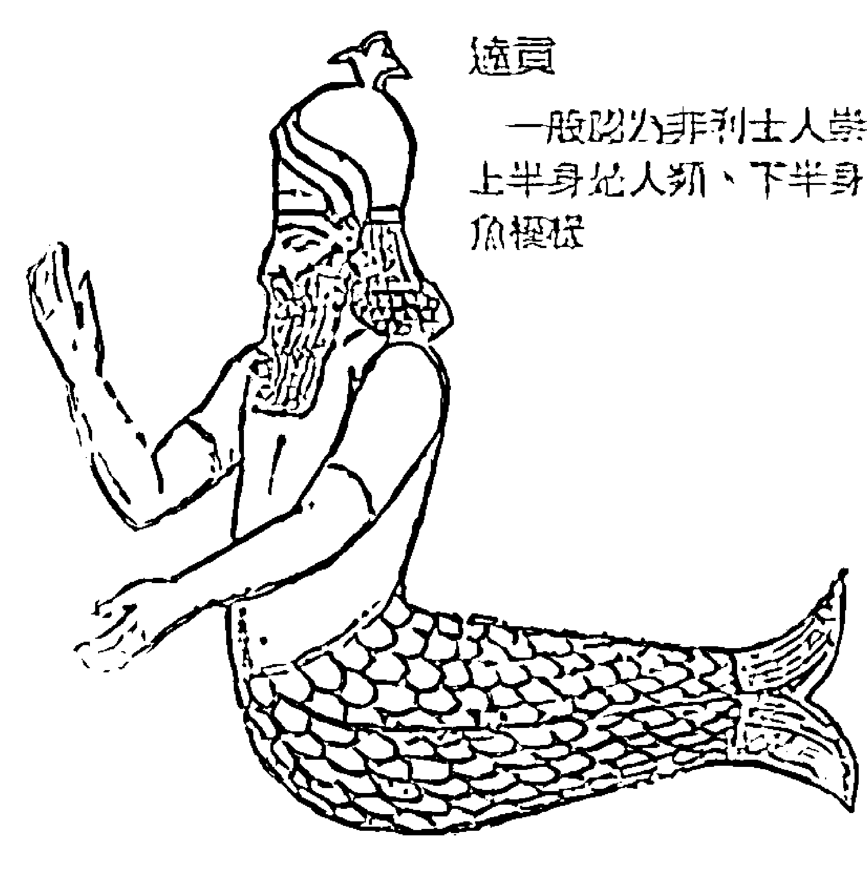

达贡
一般认为非利士人崇拜的达贡是上半身是人头、下半身是鱼尾的人鱼模样

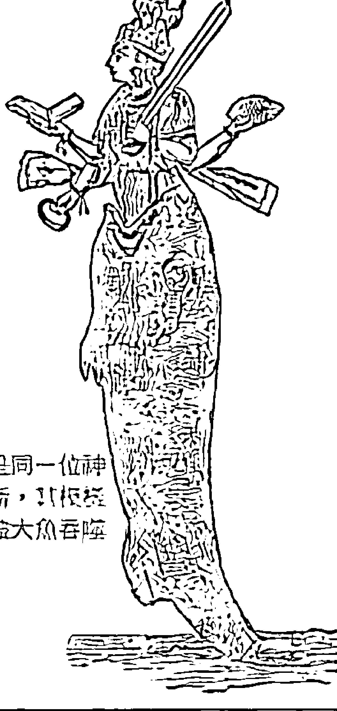

奥安尼斯
被认为是与达贡同一位神，巴比伦的海神奥安尼斯，其形象相当怪异，仿佛被大鱼吞噬了一般

### 深潜者

日本某地区的猎户间称为「达贡像」崇拜的奇特神像。相传此神像是用来祈求丰收的神明。

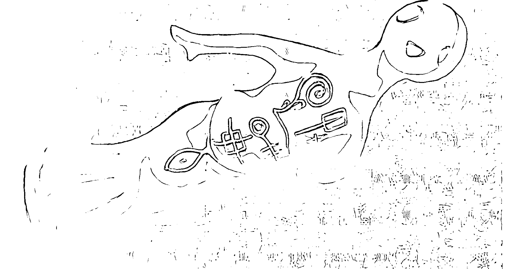

> ○ 「深潜者」→No.016
第1章 No.003
第1章 No.006
奥安尼斯（Oannes）：古代美索不达米亚神话中的半人半鱼，它自海出水，向人类传授知识与技艺。

No.010
伊塔庫亞
Ithaqua

行走於拂掃星際的疾風中、漫步在暴風雪的夜裡尋找犧牲者的邪神。當朱紅色彗星在夜空中綻放光芒的時候，伊塔庫亞就會伸出可怕的巨腕將人類擄往異界。

○溫迪戈（Wendigo）

伊塔庫亞擁有「風行者」、「行走的死亡」、「偉大的白色沉默之神」、「不得見於圖騰的神」等眾多別名，它是吹拂於星際宇宙的風動、從屬於哈斯塔的大氣之神。伊塔庫亞就是原住於加拿大曼尼托巴省的奧吉布瓦族^1所謂在冰風雪夜裡徘徊於森林深處的神靈「溫迪戈」，他們相信每年入秋溫迪戈就會現身在五十島湖畔。誰要是運氣差碰到它就會成為犧牲品，先是被拖行往返於地球之外許多遙遠的地方，然後被帶到哈斯塔面前，最後則是變成神秘的凍屍墜落在雪地上。根據少數逃離死厄的目擊者表示，只看見輪廓近似人類並且大得出奇、甚至於恐怖的身影出現在天際，還有兩顆如眼睛般燃燒的明亮星體散發著深深的紫紅色光芒。此外，死者身上通常可以發現死者在失去行蹤以前的所在地，也就是距離陳屍地極遠處的物品。

像這樣被人發現的犧牲者其實都還算是幸運的；有些遇害者甚至還會變成有如伊塔庫亞複製品的怪物，拖著被極凍寒冰灼傷的雙腳，永無止境地在森林裡面流浪徘徊。

米斯卡托尼克大學探險隊曾經在蘿拉·克莉絲汀·納德爾曼教授率領之下前往相傳有「小東西」帕克伍基棲息的加拿大西北部大森林進行調查，當時就在森林裡面遭遇到了伊塔庫亞，導致隊員伯納·艾普斯坦被擄走。

伊塔庫亞相關神話可見於《死靈之書》和《奈克特抄本》、《拉萊耶文本》等^2，潛伏於緬甸內地森恩高原以及馬來半島等地的矮人族「丘丘人」則是將伊塔庫亞跟羅伊格爾和札爾等神祇並列，一併崇拜祭祀。

*1 伊塔庫亞：《克蘇魯神話》譯為「伊斯卡」。
*2 奧吉布瓦族（Ojibwa）：亦稱奇珀瓦人（Chippewa），採阿爾岡昆語語言的印地安人，原住於休倫湖北岸和蘇必略湖北北兩岸，約當今明尼蘇達州至北達科他州龜山山脈一帶。加拿大境內的奧吉布瓦人住在溫尼伯（Winnipeg）湖以西，名為蘇爾托人（Saulteaux）。

### 有温迪戈传说流传之加拿大印第安人居留地

（图片：cc6f315cc23095a14c0146c93b4c3463_33_0.png）

### 温迪戈

（图片：cc6f315cc23095a14c0146c93b4c3463_33_1.png）

（图片：cc6f315cc23095a14c0146c93b4c3463_33_2.png）

墨拉·克莉丝汀·纳伊德曼教授，身为女性的纳伊德曼教授是米斯卡塔尼克大学史上最年轻的博士，受到万众瞩目和期待。她这次的探险跋涉，全程在大森林的怪异木屋之中，遭受到温迪戈围攻。

温迪戈，怪物人间传说中的温迪戈・吸血。

- ○ 《死灵之书》→No.025
- ○ 《奈克特抄本》→No.028
- ○ 《拉莱耶文本》→No.027

### No.015 克图格亚
### Cthugha

在北落师门的红色灼热烈焰中张牙舞爪的火焰之王，率领目光凶光的眷属们在地面大肆破坏的“旧日支配者”。

○ 奈亚拉托提普的天敌

北落师门（Fomalhaut）此语乃源自于阿拉伯语意为鱼口的“fum al-hawt”，是颗落在南鱼座口部的蓝白色1等星；在这颗恒星表面超过一万度的熊熊烈焰里面，则是有统领无数有智能等离子球体“火焰精灵”的旧日支配者克图格亚栖身其中。

克图格亚在数以千计的小光球簇拥下，仿佛活生生的火焰一般不断变形的巨大身影，有时甚至会被形容为地上的太阳。关于这位“旧日支配者”还有太多太多仍是未知之数。少说在地球就几乎从来没人知道有信仰克图格亚的种族或宗教团体存在，甚至连阿卜杜·阿尔哈兹莱德也只是在《死灵之书》里面极其闪烁暧昧地稍稍提及而已，唯独古罗马的梅卡斯教会有留下信奉克图格亚的痕迹。

尽管我们对克图格亚的性质所知极少，不过这位“旧日支配者”却因某个特质而非常受到重视。克图格亚是“外神”的使者奈亚拉托提普的天敌，因此对深受奈亚拉托提普威胁的人类来说，召唤克图格亚便可以成为用来对抗奈亚拉托提普的王牌。欲将克图格亚从距离地球25光年的北落师门召唤出来，只需趁北落师门在树梢上闪闪发光的时候唱颂召唤咒文3次即可。

克图格亚曾经在1940年的威斯康辛州笛克湖畔被威斯康辛州立大学的两名学生召唤出来，并以愤怒的烈焰吞噬奈亚拉托提普在地球的住处恩盖伊森林，将该地破坏殆尽，好让奈亚拉托提普无法再度使用此地。

> 克图格亚：《克苏鲁神话》译为“库多古”。

### 南鱼座的北落师门

（图片：cc6f315cc23095a14c0146c93b4c3463_35_0.png）

北落师门是落在南鱼座嘴巴部位的一等星，连奈亚拉托提普都畏惧不已的克图格亚就藏在北落师门高达1万度的烈焰之中。

（图片：cc6f315cc23095a14c0146c93b4c3463_35_1.png）

- ○《死灵之书》→No.025
- ○ 奈亚拉托提普→No.005
- ○ 恩盖伊森林→No.045

### 札特瓜
### Tsathoggua

从外宇宙偶然飞来的太古神祇。除希柏里尔以外，这位“旧日支配者”在世界各地也都有信徒崇拜，然其传说却大半都已遭到遗忘。

### ○ 怠惰之神

相传札特瓜是在地球诞生不久，便从当时名为塞克拉诺修星的土星飞到希柏里尔穆苏尔半岛的“旧日支配者”。尽管它在地球大多是以脸孔类似蝙蝠、弓着树懒般的身体、活像只毛茸茸黑色蟾蜍的模样显现，但札特瓜在本质上其实是位不具固定形体的神明。

阴阳同体的克萨库斯库鲁斯是盲眼白痴神明阿撒托斯的子孙，其子吉斯古斯是札特瓜的父亲，其母则是来自黑暗星球索斯的伊克纳格尼斯斯分裂生殖所产下的茨丢曾姆格尼。

克萨库斯库鲁斯率其族裔来到后世名为冥王星的犹格斯，但札特瓜的伯父荷鸠癸格姆札却厌恶克萨库斯库鲁斯嗜食人肉的习性而迁居海王星，不久又移往土星。当时札特瓜虽然是跟父母亲一起留在犹格斯，可是整个星球经过克萨库斯库鲁斯大肆破坏以后只剩下一片狂风萧萧，于是札特瓜遂经由塞克拉诺修星飞抵地球，在恩盖伊的地底世界落脚。其后札特瓜虽曾一度移居至希柏里尔大陆的沃米达雷斯山底的洞窟世界、成为当地居民的崇拜对象，但自从冰河期使得该大陆灭亡之后，他便再度回到恩盖伊，并且在北极的洛马王国和地底世界金-阳星颇受崇拜。《伊波恩之书》对希柏里尔时代的札特瓜信仰便有颇详细的记载。

札特瓜非但会将知识或施有魔法的物品授予热心的信徒、献牲与祭拜等秘密仪式里亦不乏有血腥场面，不过它在众多“旧日支配者”当中倒还算是比较温和的神明，再加上它那堪称颇为奇异的家庭背景，有时倒还真能让人感到那么点诙谐的趣味。

### 札特瓜关系图

伊克纳格尼…来自黑暗星云…分裂生物

阿撒托斯（外神，旧日支配者）
克图格亚 阴阳同体的神
荷姆格姆扎 土星的神
克苏鲁
吉斯古斯
茨丢哲姆格尼
沙达克
札特瓜
茨维卜瓜
史法提克套布
爪尼加歇·佐姆 如前所述的巫师…带来毁灭

### 札特瓜

（图片：cc6f315cc23095a14c0146c93b4c3463_37_0.png）

札特瓜，相似蛇形爬行类的头部特征，全身像蛇形，不过札特瓜具有可塑性的皮肤在本质上其语言并不具固定形体。

- …No.070
- …No.004
- ○ 冥王星→No.077
- ○ 金星→No.046
- ○ 《伊波恩之书》→No.031

### No.013 诺登斯
### Nodens

所有夜魇奉为主宰的伟大深渊大帝，手持三叉戟并驾着战车猎杀“旧日支配者”和“外神”手下爪牙的伟大猎人。

### ○ 独行“古神”

“伟大深渊大帝”诺登斯是位白发皓皓须须苍苍、威严堂堂老者风貌的古神。它的声音犹如回荡于深渊的渺然巨响，它的怒火可以化作恐怖的雷光将敌对者消灭。

由于诺登斯有只银制的手臂，所以英国语言学家暨妖精故事的巨擘——J·R·R·托尔金还曾经指出这位神祇跟塞尔特神话中那位力抗佛摩尔人国王巴罗尔的逊奴神族之王“银色手弩阿达”之间的关系，不过诺登斯这位神明在现实世界的知名度其实远不如在幻梦境为人所知。

守护恩葛拉涅山没有脸孔的夜魇信奉崇拜诺登斯已是颇为人知的事实，据说诺登斯平时所乘战车的兽兽便是由夜魇变化而成。

诺登斯是相比之下对人类较为友善的神明，有种说法认为它既不属于“旧日支配者”亦非“外神”，而是通常皆与此二者敌对的谜样神格——“古神”的最高神祇。“外神”的使者奈亚拉托提普和诺登斯似乎是处于对立关系，有的时候两者间的齟齬甚至还会发展成为以人类为媒介所进行的代理战争。

诺登斯所属“古神”在克苏鲁神话当中要算是特别神秘的存在，《死灵之书》等魔法书多将大部分篇幅用于“旧日支配者”和“外神”，几乎不曾提及过“古神”，甚至否定“古神”存在，认为诺登斯是较温和的“地球本来的神”一员的人亦不在少数。不过可以确定的是，诺登斯并非如少数研究者所主张，是可以用基督教式善恶二元论来分类的存在。

无论如何我们都不能掉以轻心，说不定诺登斯偶尔对人类表达的善意其实只是单纯当下的情绪使然。

> 古神（Elder Gods）：或称“旧神”，《克苏鲁神话》译为“老神”，《西洋神名事典》译作“古老神明”。

### 神关系图

“伟大深渊大帝”诺登斯

- “地球本来的神”
- 卡拉卡尔
- 洛邦
- 纳斯·霍恩斯
- 塔马什
- 佐·卡拉
- 哈洛兹·玻尼斯

奈亚拉托提普

伦道夫·卡特

（图片：cc6f315cc23095a14c0146c93b4c3463_39_0.png）

诺登斯，年老却身体强壮的老者样貌，诺登斯的右肩是银制义肢，乘坐于由夜魇塑成马匹或海豚拉引的战车之上。

### No.014 雲頭大人
### Wanju-Sama

越前地方第一大河 — 九头龙川两岸风俗奇异，至今依旧奉行着祭祀来自大海的极古老不详神明的土著信仰。

### ○ 泥府神社与雲頭大人

源自于福井县与岐阜县交境山区，注入日本海的九头龙川长年氾滥不止，是越前地方最大颇凶暴的河流。

“雲頭大人”是自古便在这条九头龙川下游占地极狭的特定地区受到崇拜的土著信仰神格，有时还会被国外的研究者拿来与麻萨诸塞州的印斯茅斯镇相提并论。

河口附近海岸区的小村落目前仍有祭祀“雲頭大人”的泥府神社留存，被视为是该土著信仰的中心地。

一般认为“泥府”的地名应是来自于“雲頭大人会从河口浅滩的泥巴里面出现”的传说，不过当地的发音其实比较接近“でいーぶ”而非普通“でいーふ”的读法。还有说法指出倘若这个发音是正确的，那么“泥府”两字恐怕只是选字表音、不重视其字面含意的地名而已。

地称为“雲頭大人”唯一文献资料的《九头龙樫现缘起》有记载，“雲頭”本来是位海神，不过它并非庇佑渔获丰厚的幸运之神，而是属于不详神明、祸祟神之类。关于它那古怪名字的由来，则是“头抵云端的巨神”、“无形如云、变幻自在的神明”、“取守护海岸之意名为海袭，后讹为雲頭”众说纷纭，不过这些说法目前都还未成定论。这本《九头龙樫现缘起》现有一部收藏于日本国会图书馆，任何人只要办理正式手续都能轻易地阅览。

泥府神社每年都要举行镇魂祭，祭典中必须唱诵意为“拜请大神俯临坐镇泥府之湾”的祝词，可见这个祭典似乎原本应该是复活祈愿祭，而非镇魂祭。可惜的是，如此特异的祭典仪式却已经在1995年泥府神社邁逢祝融之灾以后永远失传了。

### 福井县七成以上面积的九头龙川

（图片：cc6f315cc23095a14c0146c93b4c3463_41_0.png）

### 九头龙川上流

（图片：cc6f315cc23095a14c0146c93b4c3463_41_1.png）

泥府神社，祭祀九头大人的泥府神社，地下部分是古代的石组遗迹，木造部分则很明显是后世方才另行增建。

### No.015 其他神明
### Other Gods

真正君临于宇宙以及地球的诸多神明，牠们野蛮的名字鲜少出现在我等人类知道的神话或传说之中。

### ○ 召唤的野蛮名字

阿布霍斯（Abhoth）是太古时代从外宇宙降临到地底的神明。这个巨大的原形质肉块一方面毫不间断地生产出龌龊不净的怪物，同时却又贪婪地啖噬自己生下的怪物。这位神明似乎还拥有跟人对话的能力。

阿特拉克·纳克亚（Atlach-Nacha）是貌似蜘蛛的“旧日支配者”，在地底广阔的空间不断构筑蜘蛛巢。传言道“阿特拉斯·纳克亚将蜘蛛巢筑置完成的时候，世界就会终结”。

“众蛇之父”伊格（Yig）是在古代的姆大陆和美洲大陆受崇拜的蛇神。伊格每年逢秋就会转趋狂躁，甚是可怕，但通常只要不去加害蛇类的话，伊格倒还算是位相当温和的神。

多洛斯（Daoloth）是主要在亦称犹格斯的冥王星受崇拜的神。它跟阿撒托斯相同的是，在地球几乎无人祭拜这位神明；由此便可窥见多洛斯是位多么异质的神明，是我等无法理解的存在。

夏乌戈纳尔·法格恩（Chaugnar Faugn）看来就是尊形似大象的石像。事实上亦确有说法指出其身体便是由某种矿物所造，然其本质却是个生饮活祭品鲜血的不祥存在。夏乌戈纳尔·法格恩是在中亚受到其所创造的亚人类崇拜。

猫女神巴斯特（Bast）广受全世界的猫只崇拜；它在古代埃及跟奈亚拉托提普共同受到祭祀，据说其神官子孙血脉目前仍留存存在英国的康瓦耳。

闇·提戈斯（Rhan-Tegoth）是降临于北极附近的神明，伦敦的罗杰斯博物馆展示有以此神为首的“旧日支配者”蜡像。根据仲说记载，闇·提戈斯若死则“旧日支配者”将再也无法复活。

除此之外，还另有黑蝉（Dark Han）、“有发的蛇”拜提斯和发光的猎人伊欧德等诸多神明。

（图片：cc6f315cc23095a14c0146c93b4c3463_43_0.png）

亚斯·亚斯·沙克亚，在...泊米拉密斯山谷张开结网的巨...甚至还能逼退人...

（图片：cc6f315cc23095a14c0146c93b4c3463_43_1.png）

亚乌戈纳尔·法格恩，“来自山丘的恐怖”，潜伏于中亚的腐之属所，受到邪恶的亚人种“丘丘人”祭祀。

（图片：cc6f315cc23095a14c0146c93b4c3463_43_2.png）

巴斯泰，...的幻之女神“幻梦坦”的庇护...

（图片：cc6f315cc23095a14c0146c93b4c3463_43_3.png）

墨·提戈斯，早在人类诞生以前便飞抵北方的邪神。球状的躯体生有六只手足，管状口器能吸吮活祭品的血液。

- ○ 冥王星→No.077
- ○ 埃及→No.055
- ○ 阿撒托斯→No.004

### No.016 深潜者
### Deep Ones

潜入深潜于人类社会的人类敌对者，一方面与人类交配增加数目，另一方面则是为伟大的克苏鲁复活之日的到来而进行准备。

### ○ 两只脚的两栖类

“深潜者”是听奉该族最年长者“父神达贡”及其配偶“母神海德拉”以及所有水栖生物统治者伟大的克苏鲁的种族，为事奉这些存在并求随时能执行其交办事项从而栖息于海底。马奎萨斯群岛视为护身符随身携带的蒂基偶像，外形即头为两栖类、身为人类的模样，一般相信跟纽西兰毛利族所使用表面带有雕刻纹饰的天井石等物同样，均是按照“深潜者”模样所造。

担任拉班·舒兹伯利博士助手挺身对抗“深潜者”的安德禄·埃兰曾经追忆自己首次目睹“深潜者”时的印象，当下便让他联想到约翰·但涅尔笔下《爱丽丝梦游仙境》插画里的蛙男。

承袭“深潜者”血统的人类出生以后，其样貌虽然在某段时间内均与常人无异，却可能会因为跟同族接触或者承受极端压力等因素，使得面貌急速变化成为人称“印斯茅斯长相”的“深潜者”特有的青蛙般容貌，其后更随着时间流逝而渐离人形。先是眼球逐渐突出隆起以致眼皮无法闭合，转趋灰绿色的皮肤则是变得又湿又冷、表面长出鳞片，接着五指之间生出划水连蹼，满是绉折的后颈生出鱼鳃等，转变成两栖类模样所费时间其实并不长。

“深潜者”是用吼叫般的声音交谈，如青蛙般弹腿在地面跳跃移动，不会因为老化而死亡，若无外力影响则不致丧命。“深潜者”设有长列赛克洛斯式巨大圆柱的海底都市分布于全世界各海域，位于印斯茅斯镇外海魔鬼礁前方的伊哈斯里便是其中之一。

> *“深潜者”：《战栗传说》、《克苏鲁神话》评为“深海巨人”。

### 人类逐渐变异的过程

（图片：cc6f315cc23095a14c0146c93b4c3463_45_0.png）

年轻的时候，除了那双大眼的眼珠子来是鱼须有些相似以外，其他倒都只寻常人气质。走路方式等也与常人别无二致。

（图片：cc6f315cc23095a14c0146c93b4c3463_45_1.png）

皮肤开始变粗、凹陷开始成痂，脖子两侧的皮肤开始出现皱褶，渐渐变成鱼鳃。其次，此阶段的脑袋也逐渐变成椭圆形。

（图片：cc6f315cc23095a14c0146c93b4c3463_45_2.png）

全身皮肤变得粗硬光滑，眉毛也完全脱落，脸型已成为鱼形的头型，变得好像压扁似的，并逐渐缩进体内，凹陷的眼珠子已经缩到眼皮不用起来的地步，越来越不擅长在陆地行走，走起路来摇摇晃晃、蹒跚而行。

（图片：cc6f315cc23095a14c0146c93b4c3463_45_3.png）

皮肤变得有如鳄鱼的两栖类，耳孔变得平坦，此时改以鳃裂为呼吸器官呼吸，不适在陆地生活，再无法步行而是以坐姿移动。

### 但丁笔下的蛙男

（图片：cc6f315cc23095a14c0146c93b4c3463_45_4.png）

但丁笔下的蛙男，19世纪英国插画家约翰·但丁所绘路易士·卡洛因作品《爱丽丝镜中奇缘》插图中的蛙男。据说给人的印象跟“深潜者”相同。

### No.017 “远古种族”（古代支配者）
### Elder Things / Old Ones

早在人类诞生太古以前便飞抵地球，建立起高度文明的桶状生物。地球所有生命都是从它的原形质细胞孕生而来。

### ○ 最初的“地球人”

“远古种族”是距今约10亿年前，也就是地质年代所谓寒武纪再往前追溯5亿年前，从外宇宙飞抵当时尚且年轻的地球，并在南极大陆建设巨型石造都市的高等智慧生物。其国家体制跟社会主义颇为相近，使用五芒星形状的货币流通，并且在世界各地均建设有都市国家：

“远古种族”的矮胖胴体活像是个高6英呎、直径3.5英呎的大木桶，其上则是生有纤毛的海星状头部，除红色玻璃质虹膜的眼睛以外，还有如白色锐齿般的突起物排列成铃状的口部。其胴体共有五只类似海百合触手的腕足，还有能够像折扇般折叠起来的膜状翅膀，翼展甚至可达7英呎宽，凭借此优官方能在空中与水中迅速移动。为满足营造都市等在地球上的诸多劳动力需求，“远古种族”遂创造出以修格斯为首的各种生物，一般认为人类便是由修格斯的生命细胞经过漫长进化而成。

从前新大陆隆起海面的同时，“远古种族”曾经跟来自宇宙的伟大的克苏鲁及其眷属展开激烈战斗，一度遭到驱逐，后来双方议和、各自割据统治，太平洋的新大陆归克苏鲁，海洋和原先便已经存在的旧大陆则属“远古种族”管辖。

自从星辰运行变化引起地壳变动致使该大陆沉入太平洋，伟大的克苏鲁亦于拉莱耶城进入沉眠，地球便再度落入彼等掌握，谁料“远古种族”跟侏罗纪时期从冥王星飞抵地球的“米·戈”（犹格斯真菌）一战之后，竟然就此被逐出北半球。后来它们在历经物种的生理限制和衰退期、冰河期来袭、与“伊斯之伟大种族”等异族的战争、修格斯屡次叛乱的过程中逐渐衰败，目前只知道仅有极少数“远古种族”仍存活于南极的巨大都市遗迹而已。

> ¹¹“远古种族”：亦称“古代支配者”，没查《邪神传说》译作“古代怪物”，《西洋神名事典》则译作“老家伙”。
¹²海百合（Crinoid）：棘皮动物门海百合纲海产无脊椎动物，五个腕有羽状分肢，内有生殖器和司感觉用的无数管足以及食物沟。

### 远古种族 之盛衰

| 10亿年前 | 4亿8千5百万年前 | （无法辨认） | 3亿5千万年前 | 3亿年前 | 2亿5千万年前 | 1亿6千万年前 | 1亿5千万年前 |
| :--- | :--- | :--- | :--- | :--- | :--- | :--- | :--- |
| “远古种族”飞抵地球。 | “远古种族”从天而降，飞抵地球后开始繁殖。 | “远古种族”与恐龙同时在地球上出现，开始共存。 | 伟大的“克苏鲁”及其眷族飞抵地球，与“远古种族”爆发战争。 | （无法辨认） | “远古种族”首次败北。（“远古种族”衰落） | “米·戈”（犹格斯实体）飞来，与“远古种族”爆发战争。 | 与“伊斯之伟大种族”发生精神交换大战（“远古种族”因此灭亡） |

### 远古种族

（图片：cc6f315cc23095a14c0146c93b4c3463_47_0.png）

“远古种族”生有许多两手的摇头怪物，遍布谷间各个海星的头部，却更是特异。其实它同样也是“地球人”，是早在人类出现远古以前便生活在地球的氏族。

- ○ 宇宙泵 → No.018
- ○ 冥王星 → No.077
- ○ “米·戈”（犹格斯实体）→ No.022
- ○ “伊斯之伟大种族” → No.019## No.018

### 修格斯
### Shoggoth

修格斯是外星生命體所造最原初的阿米巴狀生物，亦是日後地球所有生物進化之起點。力量強大、富於狡智的巨大原形質肉塊。

### ○不屈的叛乱者

修格斯是「遠古種族」飛抵地球以後，為應付各式各樣的用途而首先創造出來的僕從種族。如果想知道修格斯是什麼模樣，不妨試著回想1980年代在日本蔚為流行的玩具「史萊姆」。修格斯是黏涎答答、長得跟史萊姆幾乎一個模一樣的綠色原形質肉塊，是在「遠古種族」的催眠暗示控制之下，替它們在海裡從事重度勞動的奴隸生物。構成修格斯那無定形身體的每一個細胞俱各自擁有堪稱為自我進化能力的特殊性質，可以使那些好似正在起泡的細胞在轉瞬間重新組織構成，模擬生成各種形態、各種器官。「遠古種族」應該就是利用這修格斯的細胞才創造出了地球上各式各樣的生物。

經過千萬次的分裂繁殖，修格斯慢慢獲得足以抵抗「遠古種族」統治的力量，並於2億5000萬年前興起第一次叛變。

此次叛變雖遭「遠古種族」鎮壓，然而在經歷多次不斷的爭鬥以後，修格斯終於逐次獲得諸如爬上陸地生存等各種更高等的能力。其中尤以模仿主人「遠古種族」因而獲得高度智慧的個體更是具備了恐怖的適應能力，據說有時還能變成人類的模樣。

修格斯會發出「Tekeli-li！Tekeli-li！」的叫聲，1830年代出身於麻薩諸塞州南塔克特島的亞瑟·戈登·皮姆便曾經因為某些不吉的緣由而被迫必須航海至南極，當時他便在南極海親耳聽見這個聲音：由此可見直到「遠古種族」文明都已因為修格斯叛亂和地殼變動而逝去的今天，至少還有1隻以上的修格斯仍然生存在南極海。

> ☆ 修格斯：《裁決傳說》，《克蘇魯神話》譯為「舒卜」。

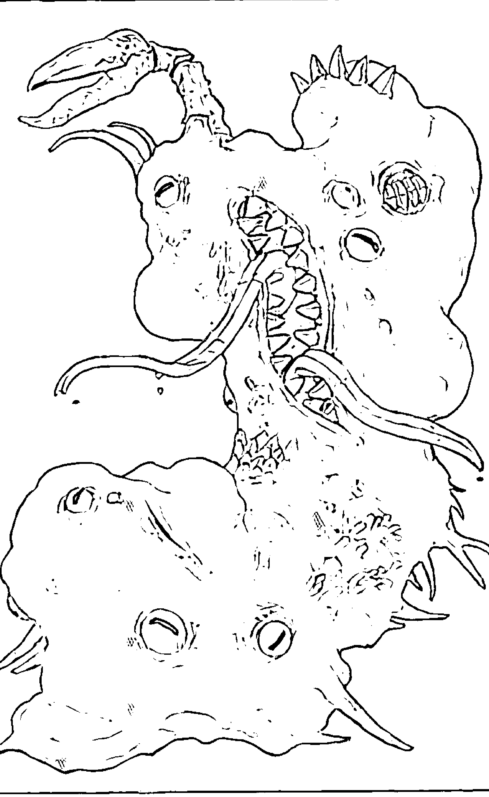

### 修格斯

修格斯通常多是呈现无定形的阿米巴形状，不过，修格斯由「远古种族」以高科技所创造，其细胞却能根据需要，任意组成各种形状和器官。

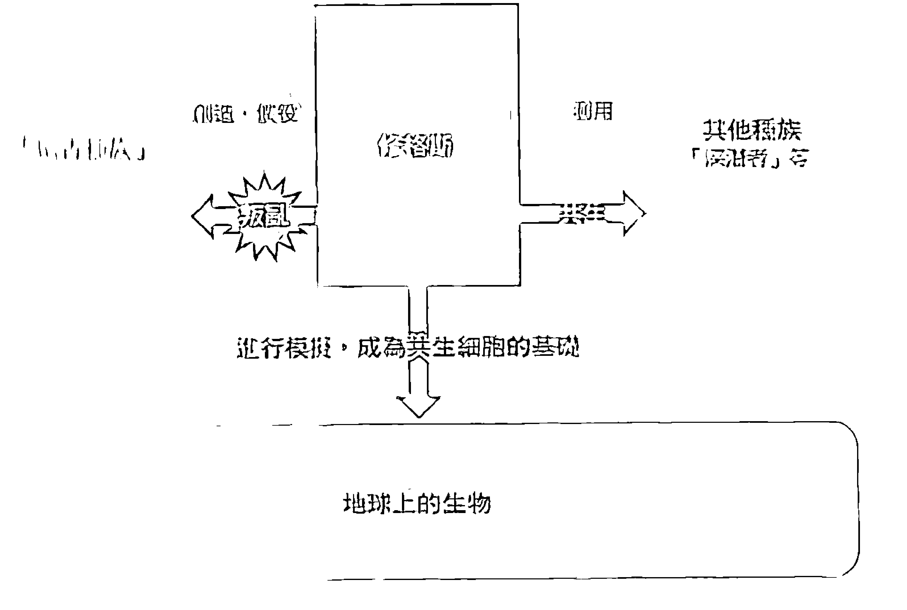

### No.019

### 「伊斯之偉大種族」
“Great Race of Yith”

是乃知悉時間之秘密的唯一存在，故有「偉大種族」之謂，是跟其他生物交換精神意識藉此獲得永恆生命的長生種族。

### ○精神寄生體

根據《奈克特抄本》和《埃爾特頓陶片》記載，距今4億8000萬年前從超銀河宇宙來到地球的「伊斯之偉大種族」是支不停地向未來探索、找尋是否有適合永生的環境以及擁有綿長肉體壽命的生物存在的永劫開拓者。

這群平均壽命達5000年的精神生命體從前將其精神輸送轉移至生存於相當今日澳洲大陸的圓錐生物身上，並建設了擁有高度發達之科技文明的機械化都市奈克特城。

這個被偉大種族選為寄生肉體、高約10英呎的圓錐狀生物乃是利用身體底部黏著層構造的縮張運動前進步行，感覺器官則是生長在圓錐頂部四根長肢的末端。其中兩根的末端生有巨爪，個體間便是利用這爪子相互碰觸摩擦，藉此進行對話溝通；第三根肉肢末端附有一漏斗狀附屬器官，最末根則是連接到一個共有三隻眼睛、直徑約2英呎的球體。

「伊斯之偉大種族」一貫秉持著以客觀角度觀察事物、只圖能夠安穩度日的生活態度，不斷地跟過去與未來的智慧生命體進行精神交換、蒐集極龐大且豐富的知識，並將該記錄收存至各都市的中央資料室。

儘管它們跟殘酷的獵殺者——「飛天水螅」、「遠古種族」等地球先住民族之間斷斷續續多有戰事，「伊斯之偉大種族」始終能夠維持其社會組織；偉大種族知道自己終將遭到盲目者滅絕，所以它們從中生代末期便已經開始準備要遷居到將於人類滅亡2萬年後在地球上繁榮興盛的某支甲蟲類體內。未來地球壽命將盡的時候，偉大種族則是會移居到水星的球莖狀植物體體內。

「伊斯之偉大種族」便是如此這般，永保種族命脈不致亡佚。

### 第1章 ◆ 路黑神遊記

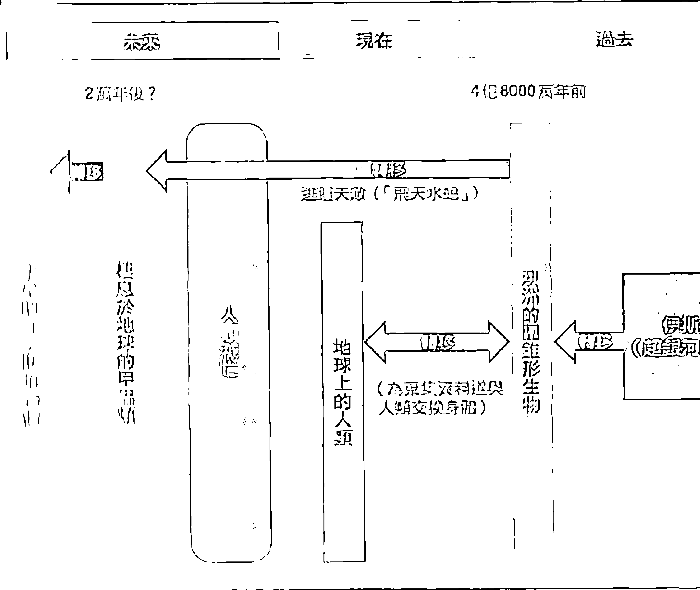

### 「伊斯族」與「飛天水螅」

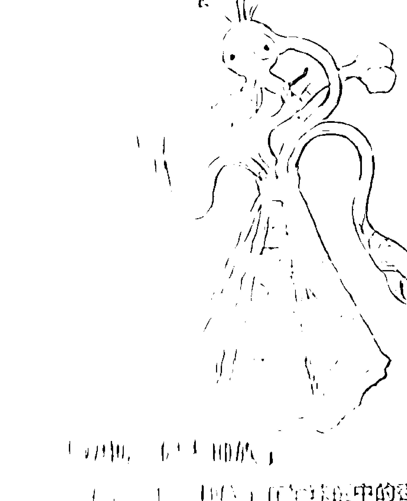

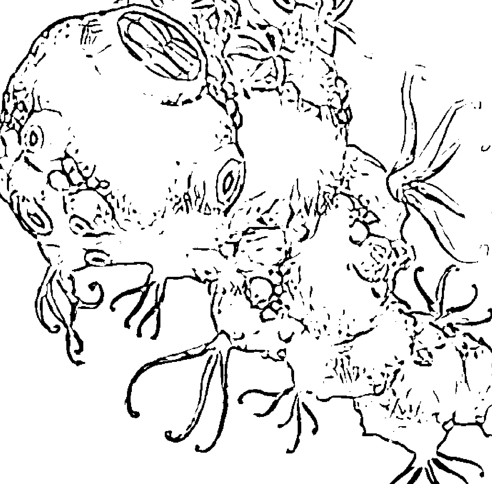

隱匿於黑色玄武岩都市的「飛天水螅」是四足狀生物的天敵。雖然「伊斯之巨大石像」已經把牠們趕進地底，卻也深知彼等終會捲土重來。

- ○ 其他出處（《埃爾特頓照片》）→No.037
- ○ 「遠古種族」→No.017
- ○ 其他存在（飛天水螅）→No.024

### No.020 食屍鬼 Ghoul

潜伏地底啃噬屍肉的淫邪餓鬼。許多食屍鬼原本其實都是人類，卻因為無法忘懷人肉的鮮美味道，最終才墮落變成這副模樣。

### ○ 嗜食屍肉之眾

食屍鬼恰如其名，是會到墳場挖掘屍體大咥大啖晃如餓鬼的生物。食屍鬼如橡膠般富有彈性的厚實皮膚已經四處潰爛，乍看之下跟腐爛的屍體其實並無二致，其顏面五官跟犬類有幾分相似，指間尚有森森白爪露出，並總是以身體前傾的姿勢移動。它們寄居於人類社會並且隨時潛伏在人類聚落附近，方便取得殘羹剩飯、排泄物甚至於屍體供其裹腹。

從前食屍鬼大多藏身於緊鄰墓地的納骨堂深處等場所，進入20世紀以後此類場所雖已不得復見，不過世界各國卻也紛紛在各大都市建構出錯綜複雜的地下鐵網路，反而使得食屍鬼的勢力範圍有飛躍性的增加，有時甚至還會發生食屍鬼刻意釀成列車事故、「獵食」遇害者屍體的案件。

少數負責營運都市地下鐵的企業其實知道食屍鬼的存在，並設立私人警衛隊與彼等展開地底霸權的爭奪戰。

大部分的食屍鬼多少都還留有前身為人類時的記憶，而且還能透過語言與其溝通，因此在某些條件下甚至可以與食屍鬼展開談判交涉。

地球的幻夢境裡同樣亦有食屍鬼的社群存在。若欲與彼等相見，只須一味朝著食屍鬼丟棄飲食殘餚的普拿司谷地攀爬即可；那裡有個開闊的墓地，從前名叫理查·厄普敦·皮克曼的食屍鬼便棲息出沒於該地。

古革巨人是種嘴巴異常巨大、從額頭直到下巴縱向裂開的巨人，只要一具古革巨人的屍體就足足可以餓在幻夢境的整個食屍鬼社會吃一年之久，因此食屍鬼有時候也會甘冒危險，偷進古革巨人族的墓地盜掘屍體。

除此之外，據說食屍鬼信奉崇拜某位名叫莫爾迪基安（Mordiggian）的神明，不過目前對這位神祇所知甚少。

### 食屍鬼與人類的關係

| 食屍鬼 | 人類 |
|---|---|
| 現在・厄皆敦・皮克曼 | 食屍鬼種的大砲 |
| 倫道夫・卡特 | |
| - 仍以人類的形交行 | |
| - 約多現兩組組合 | |
| - 融合 | |
| - 寄生於生物 | |
| - 變種 → 古老巨人 | |
| - 變種 → 妖鬼 | |
| - 共生 → 夜眼 | |
| - 寄生？ → 莫爾迪基安 四日支配者？ | |

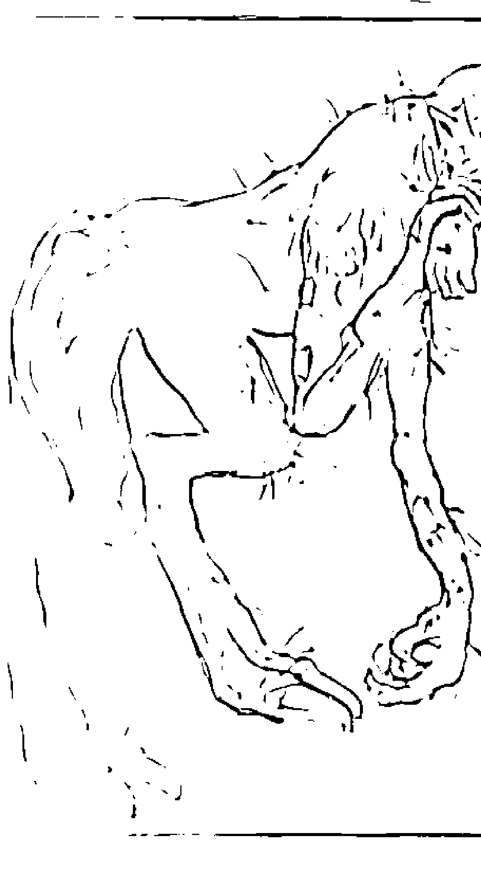

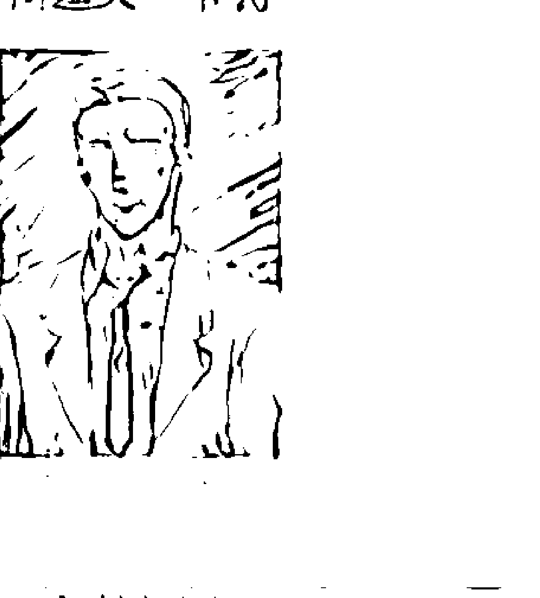

### 地下的食屍鬼

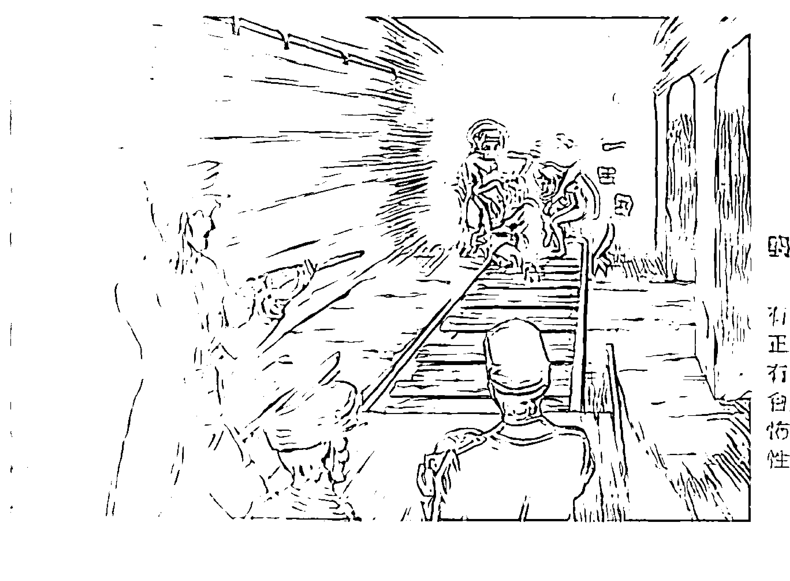

陰森地下道的食屍鬼
在世界各地的大都市有人類與食屍鬼的抗戰正在秘密進行中 鮮少有地下鑽洞者能夠在飽食而眠於地底通道的恐怖力量之後仍得以保存性命

> ○理查・厄普敦・皮克曼 →No.101
○其他存在（古老巨人）→No.024

### No.021

### 廷達洛斯獵犬
### Hounds of Tindalos

緩步跨過位在時間盡頭的角度，緊咬著自己盯上的獵物，循著氣味窮追不捨的狩獵獵犬。

### ○ 飢腸轆轆的獵人

在極為遙遠的過去，遙遠地讓人覺得就連「太古」此語都不足以形容於萬一的過去，時間的棱角之中棲息著一種名叫廷達洛斯獵犬的獰獵怪物。人類乃是沿著時間的曲線生存而非棱角，是故只要尋常度日便完全不會有遭遇此怪物的危險，然則一旦服用傳為東洋仙人所調製的靈丹，抑或《蠕蟲之秘密》所載具有時間回溯效果的藥物而回到過去的話，就有可能會觸動這頭獵犬非比尋常的靈敏嗅覺。

廷達洛斯獵犬並無現實肉體，其肉體乃是由缺乏生命活動所需一切酵素、酷似青色膿汁的原形質所構成。獵犬在我等所處空間現身前後均會傳來強烈刺激嗅覺、難以名狀的惡臭，心裡有數的人馬上就能察覺它的出現，只不過等到惡臭傳來便已經是為時已晚、再無用處。除此以外，亦有文獻指出廷達洛斯獵犬的住處是位在外宇宙的彼方。這頭猛獸無時無刻不是受到飢餓感所迫促，鮮少會放棄已經捕捉到的獵物。然而廷達洛斯獵犬卻有個制約條件，亦即它們只能通過角度才能來到現實世界，因此若是能夠躲在用水泥或油灰等物質將四周所有角度填起的空間裡，如此欺騙獵犬靜待它發現其他獵物的話，說不定還能躲過獵犬穿越時空的跟蹤。

玄學作家哈品·查默斯是在取得靈丹、進行危險的時間回溯實驗過程中被獵犬發覺，他曾經留下記錄表示巨噬蠕蟲和森林之神*2等存在會協助獵犬進行追蹤，可惜其中詳情卻是不得而知。其次，詹姆斯·毛頓博士曾經把這起案件案發現場逗留的獵犬體液取回分析，自己擔任受測者進行實驗，結果竟然與不死獵犬融合，並企圖將廷達洛斯獵犬之王梅斯拉釋放到地球上。

> *1 廷達洛斯獵犬：《戴爾傳說》譯為「汀達洛斯的魔犬」。
> *2 森林之神：此即所謂的狄泰爾 (Salyros) - 頭上長著羊角，下半身是羊腿的小年怪精靈，性好女色，此處乃直接採用《克蘇魯神話》譯名。

### 遊走於時間盡頭的人

廷達洛斯獵犬的活動範圍

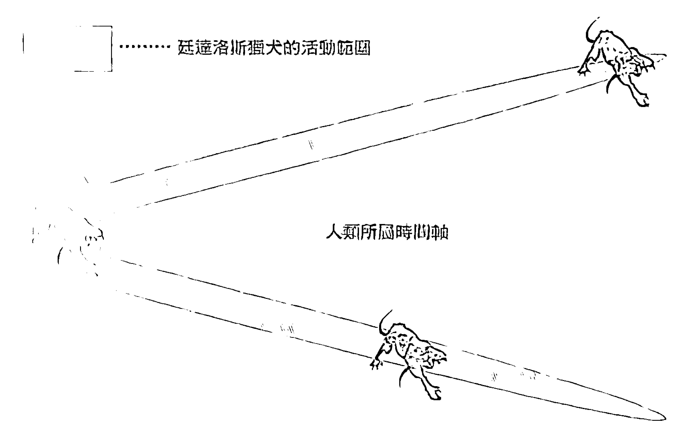

### 廷達洛斯獵犬

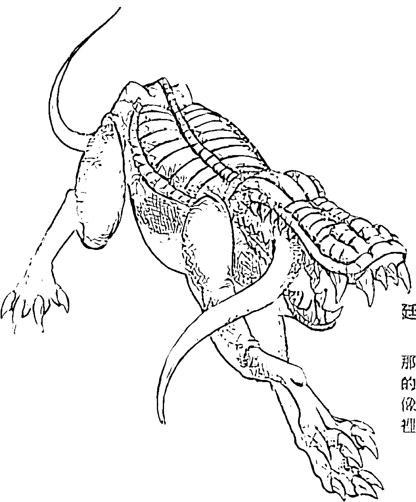

廷達洛斯獵犬
雖然名為「獵犬」，但那副活像是扭曲時間所生的惡魔型犬科動物說像不像，彷彿就是出現在惡夢裡的怪物。

### No.022

### 「米·戈」（猶格斯真菌）
**Mi-Go / Fungus-beings of Yuggoth**

專為性能在地球採行的稀少礦物從冥王星飛來，擁有高度智慧、跟人類非敵非友的菌類生物。

### ○冥王星的微菌

在佛蒙特州的山岳地帶、安地斯高原等場所均建有活動據點的「米·戈」，是遠從亦名冥王星的猶格斯飛至地球的智慧生命體。他們來訪地球其實並非最近的事情，最早可以追溯至遙遠的侏羅紀；彼等還曾經與當時主宰地球的統治者「遠古種族」開戰，將其一掃逐出北半球。其殖民地附近偶爾可以目擊到「米·戈」長約5英呎的身影，活像雙淡桃紅色螃蟹的外形經常讓人誤以為是甲殼類，事實上它們卻是種更接近菌類的生物。除皮膜狀翅膀以外，胴體還另有數對足肢構造；在頭部短天線狀構造的末端，則是有許多隆起組織的漩渦狀圓形體。潘納庫克族*1便有則神話描述曾經有種有翅膀的生物從大熊座飛到地球，進到山中開採其他地方採不到的珍稀礦石。

其實不只是南北美地區，就連尼泊爾也都有它們開採的礦場；那裡的「米·戈」外形並非前述那般酷似甲殼類，而是種貌似大型類人猿的生物，當地人均稱呼為雪人 (Yeti)*2，甚是畏懼之。

「米·戈」擁有驚人的外科醫學、機械工學技術，若能配合協助從事其造訪地球最大而且唯一之目的——開採稀有礦物，它們有時也願意將部分的高科技傳授給地球人。相反地，有意阻撓者的腦髓則是會被取出，移植至採自猶格斯的特殊金屬材質圓筒中，然後將圓筒連接到感覺裝置，帶回猶格斯。

美國科學界煞有介事地盛傳——1980年代後期因罹患不治絕症而過世的尖端工學巨匠西蒙·萊特教授其實是腦髓被移植到金屬容器中，至今仍然在世。假設這則傳言是真的，如此困難的手術必定是有「米·戈」的從旁協助無疑。

- *1「米·戈」：《戰慄傳說》譯為「米高」。
- *2 潘納庫克族 (Pennacocks)：此處乃採《戰慄傳說》譯名，大英線上百科中的「彭納庫克人」。指阿爾罔昆語的美洲印地安人，其聚落位於今新罕布夏州西部及中部、麻薩諸塞州東北部及緬因州南部。
- *3 雪人 (Yeti)：傳說生活在喜馬拉雅山雪線一帶的怪物

### 「米·戈」（猶格斯真菌）的来到

UFO见（猶格斯）

地球的月亮
「米·戈」的殖民地
从何而来？
从月球而来

地球

「米·戈」
（猶格斯真菌）

互助关系
妨碍
纯粹的…妨碍

人类

防卫
驱逐

### 【图】凶残的「米·戈」（猶格斯真菌）

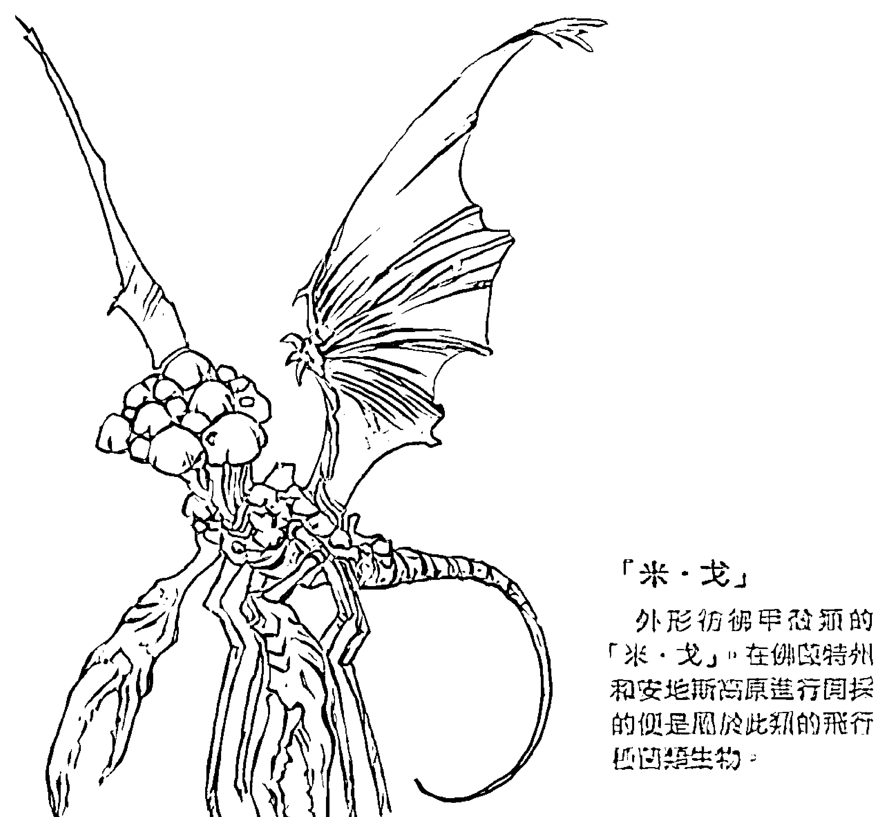

○「远古种族」→No.017

### ○無貌之暗夜魔物

夜魇是種除了在山腰刻有「地球本來的神」面貌的恩葛拉涅山以外，在幻夢境各地也都有聚落的枯瘦黑色魔物。它那油亮圓滑如橡皮般的肌膚黑似影，還有即便奮力振翅也不聞半點聲響的蝙蝠般翅膀、尖利的顎角和尾巴，彷彿活生生正是基督教教義所描述的惡魔，顏面原本該有五官的位置卻是平坦毫無起伏，徒剩下一片陰影般的空白。

神聖的恩葛拉涅山山腰「地球本來的神」的容貌乃是由彼等所崇拜的「偉大深淵大帝」諾登斯所刻，而它們的任務就是要保護此山免受好奇心旺盛的人類侵擾；一旦發現入侵者，它們立即就會悄聲欺近，迅速奪走武器，然後用有橡皮觸感的手腳抱住對方高高地飛上天空。入侵者將要被帶去的地方，就是巨噬蠕蟲棲息的普拿司谷地。夜魇並不自己殺害捕獲者，而是將這些沒禮貌的入侵者丟在普拿司谷地讓巨噬蠕蟲去收拾。

普拿司谷地同時也是食屍鬼丟棄食物殘滓的場所，若是有幸運的入侵者知道跟食屍鬼溝通的方法，如果處理得好的話，說不定還能在遭遇巨噬蠕蟲以前先行逃離山谷。其次，由於夜魇與食屍鬼締有某種友好協議，如果知道食屍鬼的暗語的話，讓夜魇聽命於自己也不是沒有可能的事情。

有時候夜魇也會按照諾登斯的意思，故意去妨礙「外神」或「舊日支配者」的各種意圖，因此像是夏塔克鳥或不祥的獵人等奈亞拉托提普的僕從種族，便對這種漆黑的魔物甚是畏懼。

除此以外，幻夢境的克雷德叢林是太古時代曾以伊普神之名受崇拜的伊普·茲特爾的住處，據說亦有夜魇擔任這位「外神」的家臣服事之。

### 守護咒神殿堂的黑色戍衛

| 角色/势力 | 关系/描述 | 受其统治/影响 |
|---|---|---|
| 守護咒神殿堂的「诺登斯」 | 害怕/统治 | 「奈亚拉托提普」 |
| 「伊波·兹特爾」 | 统治 | 夜魇 |
| 夜魇 | 出现 | 栖息于恩葛拉涅山等幻梦境各地 |
| 「奈亚拉托提普」 | 统治 | 伊波·兹特爾 |
| 「奈亚拉托提普」 | 统治 | 夏塔克烏 不祥的獵人 |
| 「奈亚拉托提普」 | 在幻梦境的兵力 | 食尸鬼 同盟四邪 |
| 巨噬蠕蟲 | 籍其收拾 入侵者 | 夜魇 |

*（图表旁注文字）*
**夜魇**
**食尸鬼**
**同盟四邪**
**栖息於恩葛拉涅山等幻梦境各地**
**夏塔克烏**
**不祥的獵人**
**奈亚拉托提普在幻梦境的兵力**

### 夜魇

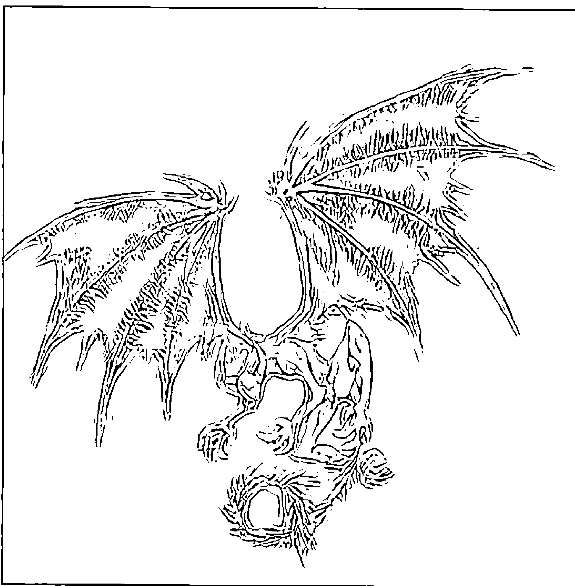

**夜魇**
漆黑的蝙蝠和
蝙蝠般的双翼，
夜魇长得简直就
跟人类想像中的
恶魔没有两样，
但夜魇其实是种
颇为温厚的生物。
只要循着正确
的步骤进行交
涉，有时甚至可
以得到夜魇相助。

- ○拉萊耶→No.080
- ○恩葛拉涅山→No.085
- ○奈亚拉托提普→No.005
- ○诺登斯→No.013
- ○食尸鬼→No.020
- ○其他存在（夏塔克烏）→No.024

### No.024 其他存在 Other Ones

潛身於黑夜暗影、地底闃黑以及沉睡之門外的非人存在，從遙遠的過去便一直凝視著人類。

### ○非人的存在

地球與幻夢境有各式各樣異形生物棲息，每個種族都可以分類為從屬於某特定神格的僕從種族以及獨立種族兩類。

早在恐龍出現以前便已進化出高等智慧的蛇人（Serpent-People），是曾經於超古代建構偉大文明並統治地球的獨立種族。後來蛇人隨著環境的變化和恐龍的出現而緩慢衰退，並與在亞特蘭提斯、黎姆利亞漸漸儲積實力的人類展開一連串鬥爭，最後終於遭到人類的英雄所消滅。據說少數僅存的蛇人都已經變身成人類的模樣，潛伏在人類社會底層。

能夠操縱風動的殘忍獵人——「飛天水螅」（Flying polyp）是在距今7億5000萬年前從外宇宙飛抵太陽系，定居於包括地球在內的四個行星，並且建有以黑色玄武岩構築成的都市。地球的「飛天水螅」從前與「伊斯之偉大種族」精神所附的圓錐狀生物戰敗，因而被驅趕至地底，據說至今依然存活於澳洲西部的地底。

馬臉的夏塔克鳥（Shantak）是僅出沒於幻夢境部分地區的巨大飛行生物。只要是服事「外神」的崇拜者均可將夏塔克鳥當作座騎使用，只不過有時候可能會因為奈亞拉托提普的介入而被帶往阿撒托斯的混沌寶座。

古革巨人（Gug）居住在夢境的地底，其最大特徵便是縱向裂開的大口和四隻前腳，是支令人望而生厭的巨人族。其實古革巨人原本住在地面，但牠們的邪惡儀式觸怒了「地球本來的神」，所以才會被驅逐到地底。

巨噬蠕蟲（Dhol）是曾經將數個星球破壞殆盡、貌似巨大蚯蚓的生物。所幸此生物不曾出現在地球，只是在夢境地底的啞谷地裡蜷曲爬行。據說巨噬蠕蟲跟廷達洛斯獵犬亦有關聯，然則其中詳情不得而知。

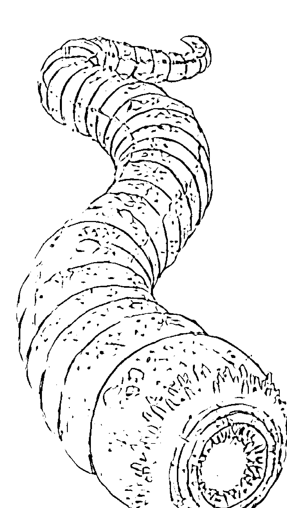

体长数百公尺，满身都是乳白色粘液的巨大生物，栖息于幻梦境的阿撒托斯谷地。

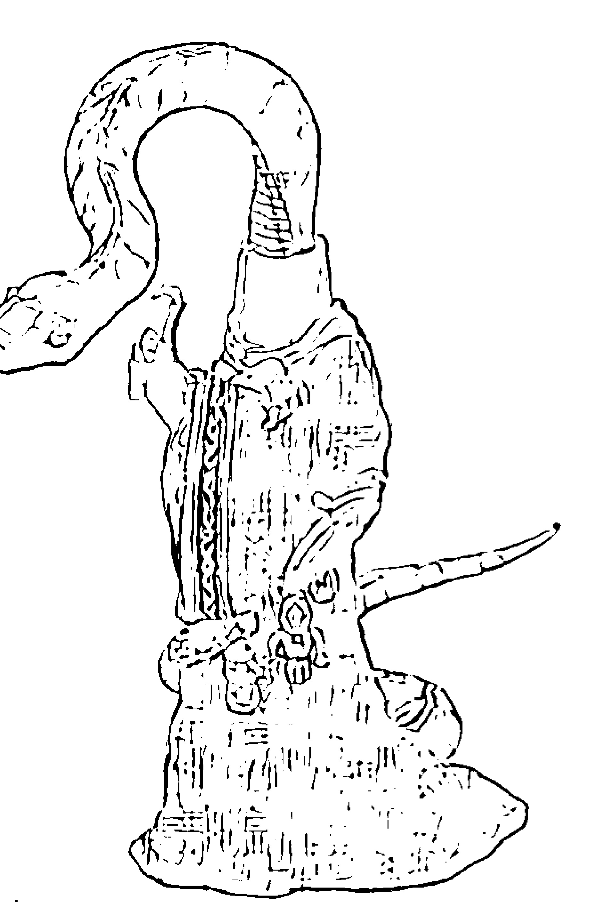

### 蛇人

由蛇类进化而成的爬虫人类，曾经于二叠纪建立高度发达的文明，擅长魔法，曾变身成人形侵略统治古代的西亚和西欧。

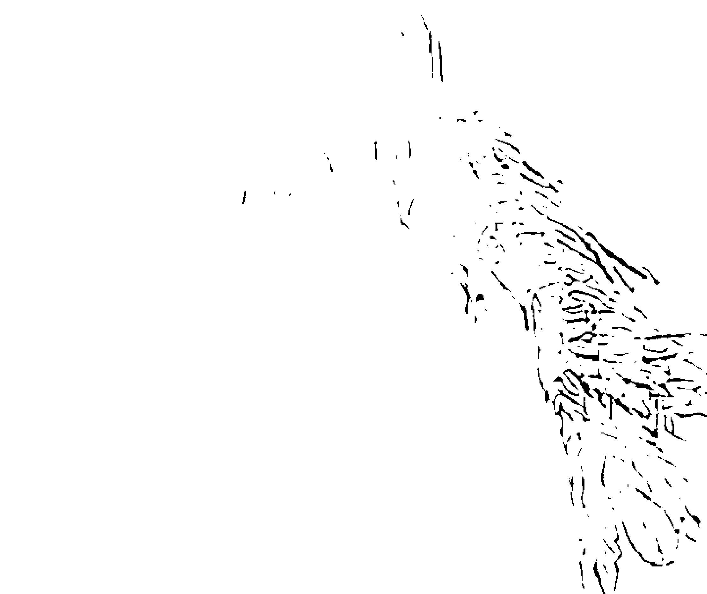

体长数百公尺，栖息于幻梦境。

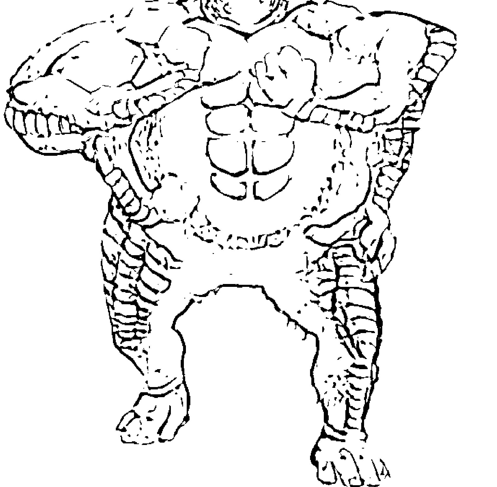

### 古革巨人

在魔法泛滥的地底世界建有都市的驯养巨人，其特征是纵向裂开的巨口，以及从手肘处分成两肢的手腕。

- ○奈亞拉托提普→No.005
- ○阿撒托斯→No.004
- ○廷達洛斯獵犬→No.021
- ○幻夢境→No.080

### 「克苏鲁神话」的由来

霍华德·菲利普·洛夫克拉夫特是「克苏鲁神话」的创始者，此事当然已是定论，再无置喙之余地；然而洛夫克拉夫特却将自己的作品群称为「宇宙的恐怖 (Cosmic Horror)」，至少在他生前便从未有过使用「克苏鲁神话」此用语的痕迹。

根据对翻译本作品多有涉猎的克苏鲁神话研究家竹冈启先生表示，「克苏鲁神话」此语最早乃是出现在洛夫克拉夫特的盟友克拉克·艾希顿·史密斯于1937年4月13日寄给奥古斯特·德雷斯的书信当中，信中便是用“the Cthulhu mythology”来统称洛夫克拉夫特的作品群。这封信件的存在固然使人感受到，史密斯和德雷斯等洛夫克拉夫特相关人士之间很可能在此之前便已经将「克苏鲁神话」此语当作日常用语使用。德雷斯还曾经向1937年6月号的文艺杂志《River》投称一篇题为《H．P．洛夫克拉夫特 化外之民》的洛夫克拉夫特评论，该篇文章便是第一份使用「克苏鲁神话」此名的刊物。

除此以外，洛夫克拉夫特首篇被译成日语的作品则是《荒中鼠》，与江户川乱步的作品一起刊载于河出书房发行的《文艺》杂志1995年7月号。其後乱步还曾经在当时由岩谷书店发行的侦探小说杂志《宝石》里的连载《幻影城通信》等记事专栏中介绍洛夫克拉夫特，并且予以很高的评价。後来这个连载单元又被集结成为筑摩文库出版的《乱步精选恐怖小说》（�的英俊／野村宏平 编），在此推荐有兴趣的朋友可以一读。克苏鲁神话的首部日译作品正是乱步在前述连载单元中曾经特别介绍的《夜半哭声》，是由多村雄二翻译，同样刊载于《宝石》杂志的1955年11月号。

在众多经过乱步介绍而被洛夫克拉夫特吸引的读者当中，还包括了早稻田推理俱乐部的创设者仁贺克雄。他曾经在1972年刊行日本首部洛夫克拉夫特作品集《暗黑秘儀》，不过这本书里却还没有「克苏鲁神话」这个名词。那么，日本国内首位引进「克苏鲁神话」此用语的究竟是谁呢？

经过笔者的追踪调查，最後只能追溯到从前以笔名「冈�的二」大力翻译介绍海外幻想文学的荒宏曾经在1970年代初早川书房《S-F杂志》介绍未版作品的单元「SF Scanner」中有过「近来数年悄悄在美国年轻读者间掀起浪潮的『Cthulhu神话』」的描述。其後荒宏还曾经在同杂志的1972年9月临时增刊号，以及荒本身也有参与编辑的�的月社《幻想与怪奇》杂志第4号（1973年11月发行）对「Cthulhu神话」进行介绍。

### 第2章 · 禁忌之書

[图片]

### NO.025
《死灵之书》
Necronomicon

《死灵之书》乃阿拉伯疯狂诗人阿卜杜·阿尔哈兹莱德于730年所著的魔法书，内文述及“旧日支配者”和“外神”等异形诸神，以及崇拜这些神祇的各个宗派及其秘密仪式。此书原名《魔法师之书》，书名是来自阿拉伯人指称夜里昆虫的鸣叫其实是魔物吼叫的阿拉伯语（Kitab Al-Azif）；至于《死灵之书》这个有名的书名，则是君士坦丁堡的席德罗斯·菲力塔斯于950年译成希腊语版时新取的书名，但由于此书会对阅读者的精神和行动造成不良的影响，遂遭牧首米恰尔下令焚书处分。岂料这本书后来却仍旧在追求禁忌知识者之间不断地传阅、抄写。1228年又有欧努司·渥米尔斯将其翻译成拉丁语，刊行4年后再度遭到教宗格列高列九世禁书。

以这本拉丁语版《死灵之书》为源头，后来德国在15世纪有黑体字版问世，17世纪经翻译而有西班牙语版发行，16世纪在意大利则有希腊语版付梓。现存的《死灵之书》多是17世纪的拉丁语版，分别收藏于哈佛大学魏德纳图书馆、米斯卡塔尼克大学附属图书馆、布宜诺斯艾利斯大学图书馆以及巴黎国立图书馆，大英博物馆所藏则是15世纪的拉丁语版。所有《死灵之书》均毫无例外皆有部分章节佚失，已无完整收录30余章内容的完整版本存在，有不少研究者致力于抄写分散世界各地的《死灵之书》，希望尽可能拼凑成最接近完整版本的模样。又据传阿拉伯语版原著早在13世纪便已经失传，但有目击者在收藏家或神秘学者书架上发现此书的传闻至今却仍是不绝于世。另外，从前出仕于伊利莎白女王的17世纪英国魔法师约翰·狄所编著之不完整英译版如今则是传到了敦威治村的华特立家族手上。

牧首（Patriarch）：基督教重要教区的主教的称呼。325年的尼西亚会议以后，教会机构按罗马帝国行政区设置，每个行政区设都主教，更大的行政单位教区则设督主教（后改称牧首）。此名乃指大英百科全书的译名，然而《宗教词典》却主要使用“宗主教”译名，并指“牧首”为东正教的译称。

### 《禁忌之書》的收藏·阅览状况（部分）

- **8世纪 原本 《禁忌之書》**
  - 朱利安·卡斯泰因
  - 约翰·卡恩拜
  - 米斯卡塔尼克大学附属图书馆
    - 拉尔夫·西德伯利保有目录
    - 爱德华·华盛顿州立大学图书馆收·加德纳交托圣迁设计投书 (1940年)
    - 约翰伯·波特立就回将其带走

- **13世纪 拉丁语版**
  - 约瑟夫·古温 (普罗维登斯)
  - 哈佛大学 斯德纳图书馆
  - 巴黎国立图书馆
    - 墨西哥国立教派 (普罗维登斯) 收回 圣殿骑士团秘密文书
  - 布宜诺斯 艾利斯大学图书馆
    - 京斯波特的抄本收回

- **15世纪 拉丁语版**
  - 大英博物馆
    - 英国的大富设

- **16世纪 意大利语版**
  - 那不勒斯的皮克曼家
    - 理查·U·皮克曼

- **其他 (翻译版·抄本)**
  - 菲印德博物馆 (芝加哥)
    - 大斯纳图书馆 (纽约)
  - 大英图书馆
    - 歪特立家族 (约翰·狄的英化版)
  - 皮耶伯·阿克来 (复制品)
  - 艾德华·比豆领 (复制品)
  - 迈可·雷伊 (复制品)
  - 大司·班贝云 (复制品)

**相关条目：**
- ○敦威治村→No.042
- ○歪特立家族→No.097
- ○米斯卡塔尼克大学 →No.040

**米哈伊尔·色洛拉里乌斯 (Michael Cerularius)**，希正教会教廷皇帝君士坦丁九世任命为牧首。

**格列高利九世 (Gregory IX)**：1170年-1241年，意大利人教宗（教皇）。他是教会势力达到顶峰的13世纪的最有力教宗之一。以创立宗教裁判所及强化教宗特权而著名。

### 《蟲蠱之秘密》（妖蛆之秘密）
De Vermis Mysteriis

《蠕蟲之秘密》是飽經風霜、自稱為不幸的第九次十字軍東征唯一生還者的鍊金術師所著，也是將禁忌的奈夫倫-卡之名傳諸後世的魔法書。

### ○知悉薩拉森人秘密者

《蠕蟲之秘密》的作者，是16世紀中葉隱居於比利時首都布魯塞爾附近某個墓穴廢墟的老鍊金術師路維克·普林。這位自稱是第九次十字軍唯一生還者的出生年份無從得知，唯一可以確定的是當時他已是超乎常理的長壽高齡。

比利時國內獵女巫風潮正盛的1541年，普林也被揪到了布魯塞爾的異端審判所，經過宗教審判名義的殘酷拷問後判處死刑，而這本《蠕蟲之秘密》便是普林在跨進這扇通往黃泉路的審判所大門之前於獄中完成的著作。普林去世1年後德國科隆曾經發行過少量的《蠕蟲之秘密》，有人說這是本封面以鐵製成的黑色大書，也有人說是本對開裝訂的粗體字版。《蠕蟲之秘密》初版甫出版便遭到教會查禁處分，不久後雖有經過審查合格的刪節版刊行，可是資料價值極低。1820年有查理斯·雷格特翻譯的英語版刊行，似乎是從初版版本直接翻譯而來，初版仍有15部現存於世，其中一部目前收藏於米斯卡塔尼克大學附屬圖書館。

此書記載普林從敘利亞、埃及、亞歷山卓等中東、非洲地區所得到的禁忌知識與各種秘密法術。在記載古埃及傳說的〈薩拉森人的儀式〉一章，除大蛇塞特和奧賽利斯等眾所周知的諸多神明以外，就連《死者之書》亦將其存在悉數抹殺的奈夫倫-卡等不為人知的存在，內文也有詳細的記載敘述。書中特別值得一提的，當屬如何召喚人稱「看不見的同伴」、「群星遣來的僕人」，亦即經常聚集在晚年的普林身邊的魑魅的召喚方法。

1《蠕蟲之秘密》（妖蛆之秘密）：《克蘇魯神話》與《魔導具事典》譯為《妖蟲的秘密》，《戰慄傳說》譯作《邪蟲的秘密》。

2 薩拉森人（Saracen）：中世紀基督教用語，指所有信奉伊斯蘭教的民族（阿拉伯人、突厥人等）。

3 塞特（Seth）：埃及神話中一位完全擔負「惡」角的神明。他謀殺了他的哥哥奧賽利斯。奧賽利斯（Osiris）：埃及的地府之神，奴特之子，妹妹伊西斯的丈夫。是埃及的統治者，是他將文明傳授給了人類。

### 「星之鬼」（Star Vampire）

[图片]

### 《妖蛆の秘密》讀音考
《De Vermiis Mysteries》本有《虫の神秘》等各种译法，不过从收录于1972年版《创土社版洛夫克拉夫特全集》第1卷《克苏鲁神话》中采用《妖蛆の秘密》译语以来，此译名便受到其它译者的采用。在对克苏鲁神话作品已是熟稔的现代读者之间，此译名读作「ようしゅうのひみつ」乃是通例，但「蛆」这个汉字按照音读其实应该读作「しょ」才是，仔细想来相当奇怪。

让我们去追溯这件事的始末经纬，最后找到1976年国会刊行会所出版的《小松·利特尔神话集》。此作品集收有由矢野浩之翻译的克拉克·A·史密斯作品《The Coming of the White Worm》，当时这个标题被译作「白蛆（びゃくしゅ）の襲来」。译者翻阅汉字字典，果然「蛆」字除「しょ」外，另有读作「びゃくしゅ」这个较为文雅的用法，想必译者认为这个译名听起来颇具邪气，方才采用了这个读音。后来承继「びゃくしゅ」读音的，正是以翻译过无数克苏鲁神话作品而闻名的佐藤圭；他是在1982年青心社所刊《克苏鲁III》收录的《比壑山的魔性》一文中，首度使用「ようしゅうのひみつ」这个假名注音。此后随着《洛夫克拉夫特全集》、青心社《克苏鲁神话》等由大�翻译的作品普及开来，「ようしゅうのひみつ」这个读音也才在广大读者间散播了开来。

### No.027d
《拉萊耶文本》
R'lyeh Text

> 「深潛者」為了替偉大克蘇魯的復活做好準備而潛藏在海底，而《拉萊耶文本》便是記載彼等在地球上的活動據點的中文書。

### ○價值10萬美金的稀有書籍

現以《拉萊耶文本》之名為世所知的書籍，是一本人皮裝訂的中文抄本。這本書是阿卡姆鎮的老研究家亞莫士・吐圖從某個來自西藏內地的中國人手中以10萬元美金購得；《拉萊耶文本》在所有者亞莫士・吐圖死後，已經由繼承人也就是他的姪子保羅・吐圖捐贈予米斯卡塔尼克大學附屬圖書館。

據說《拉萊耶文本》原著是用人類誕生以前的語言寫成，書中除了記載到偉大的克蘇魯及其眷屬跟大海有何關聯、它們出沒的8個活動據點以外，還記載了如何召喚猶格・索托斯的方法，對伊塔庫亞的神話亦有著墨。

執教米斯卡塔尼克大學並定居於阿卡姆鎮的哲學教授拉班・舒茲伯利博士曾經對保羅・吐圖捐贈的這本《拉萊耶文本》做過詳細研究，並且在他的論文〈拉萊耶文本之後期原始人神話類型研究〉裡面，指出克蘇魯邪教設有據點的8個場所分別是：以南太平洋加羅林群島波納佩為中心的海域、以麻薩諸塞州印斯茅斯鎮外海為中心的海域、以印加帝國馬丘比丘古代要塞為中心的秘密地底湖、以埃爾內格羅綠洲周邊為中心的北非暨地中海一帶、以梅迪辛哈特為中心的北加拿大暨阿拉斯加、以大西洋亞速群島為中心的海域、以墨西哥灣某地為中心的美國南部一帶、亞洲西南部，以及據說在某個已遭掩埋的古代都市附近的克威特沙漠地帶。

除中文版以外，《拉萊耶文本》另有魔法師法蘭西斯・佩拉提翻譯的義大利文版，據說從前登基成為法國皇帝的拿破崙・波拿巴便曾經擁有過這本書，不過其中詳情便不得而知了。

*《拉萊耶文本》：《克蘇魯神話》譯為《拉萊耶》。

### 《死灵之书》的收藏·发现状况（部分）

[图片]

### 追随者的迁徙

[图片]

- ○伟大的克苏鲁→No.003
- ○猎格·索托斯→No.006
- ○印斯茅斯镇→No.041
- ○拉班·舒兹伯利博士→No.106
- ○伊塔库亚→No.010

### No.028
### 《奈克特抄本》
Pnakotic Manuscripts

人类诞生许久以前曾经兴盛繁荣的海参状生物留下了残缺的记录断片，后来在北方的洛马被翻译成人类的语言，便是《奈克特抄本》。

### ○人类诞生以前的记录

由许多片段记述而成的《奈克特抄本》，原书是在冰河期以前、座落于北方酷寒地带的洛马汇编而成。相信最后一本《奈克特抄本》已经在从前信奉伊塔库亚、全身毛茸茸的食人族——诺沓凯族于洛马灭绝时被带到了幻梦境，现在收藏在乌尔塔尔的神殿，据说乌尔塔尔的贤者巴尔塞便是从这本书里面，得到了许多有关‘地球本来的神’的知识和情报。

《奈克特抄本》里面有许多记载是从远比人类诞生更加古老的角度进行描述，据说其起源可以追溯到更新世的海参状生物。不知是否因为抄录誊写的洛马人主观意识使然，书中整体记述内容多与北极圈有关，而这本书也是唯一详细记载玛·提戈斯是如何在洛马王国兴起的300万年前从外宇宙飞到地球、迁居至阿拉斯加附近，并且受到部分因努伊特部族奉为‘无穷无极’之神崇拜的书籍。除有关伊塔库亚和‘伊斯之伟大种族’的记述以外，这本书还记录了如何利用催眠后暗示操纵意志、使用银钥匙的仪式、时间溯行药物的制作方法等。

书名‘奈克特’是何涵义不得而知，可能跟澳洲西部‘伊斯之伟大种族’的都市奈克特城有关也未得知。

在清醒的世界里面至少有5本《奈克特抄本》存在，其中北美洲大陆就有米斯卡塔尼克大学附属图书馆、星际智慧教派从前设为据点的教会这两个地方都有藏书。虽然我们无从得知这本书当初是如何从幻梦境流传到了清醒的世界，不过至少可以确定的是，从古文献等资料里面可以发现，早在古希腊时代便已经有题名为《PNAKOTICA》的先行书籍存在。

*1《克苏鲁神话》译为《那卡提克手札》，《.我栗你說》另译为《那卡克手札》，《庞学典事典》则译作《约可托手抄本》。

*2更新世（Pleistocene Epoch）：地球历史第四纪的两个世宙中较早也是较长的一个世，开始于距今约160万年前，终止于约1万年前。

*3因努伊特（Inuit）：即爱斯基摩人（Eskimo）。

### 《奈克特抄本》的收藏・关联状况（部分）

| 原持有者（地点） | 状态/关联 | 版本/持有者（地点） | 备注 |
| :--- | :--- | :--- | :--- |
| 幻梦境乌尔塔尔的神殿 | ？ | PNAKOTICA（古希腊） | |
| 冰川期后的沼泽 | 佚失 | 英译版（约15世纪） | |
| 西加尔・亚力加（印斯茅斯镇） | 纽格尔斯博物馆（伦敦） | 1928年、佚失 | 阿洛夫・古德曼于印斯茅斯制作副本；西加尔・亚力加于（1924年）亚瑟士・J.伯加见知（1930年-1933年） |
| 亚瑟士・吐白（阿卡姆镇） | 罗伯・B・亚里奇（阿卡姆镇） | 1924年、佚失 | 圣顿斯认夏州立大学厄普敦・加内克于新奥尔良制作副本（1940年） |
| 艾比尔・哈洛苍（阿卡姆镇） | 泰威斯・克劳（普洛维登斯） | | |
| 阿道尔・阿克菜（阿卡姆镇） | 星际智慧教派（普洛维登斯） | 佚失 | 阿卡姆艺报社 |

### 《奈克特抄本》与「奈克特五角形」

[图片]

[图片]

> 「奈克特五角形」
《奈克特抄本》所载之神秘印记，似乎是在使用时间溯行药物的时候当作通行符使用。

《奈克特抄本》以其内容奇诡，但不可否认它是言语，[?]的[?]的[?]。其中情报可以追溯。

出处：《ENCYCLOPEDIA CTHULHIANA》Chaosium

- 米斯卡塔尼克大学
- 奈亚拉托提普・No.010
- 幻境・No.064
- 「伊斯之伟大种族」→No.019
- 幻梦境→No.080
- 星际智慧教派→No.103
- 乌尔塔尔→No.083
- 其他神明（哈・提戈斯）→No.015

（posthypnotic suggestion）：指催眠状态中暗示被催眠者，要他在[?]的[?]时间或看到某个讯号时去做某件事情。

### No.029
### 《無名祭祀書》
Unaussprechen Kulten

《無名祭祀書》是位生涯詭怪奇礪、最終死得離奇虐絕的德國怪人，將其畢生研究成果毫無遺漏地網羅其中的黑暗宗教書。

### ○ 《黑色書籍》

《無名祭祀書》或稱《黑色書籍》，是19世紀前半葉曾經走遍世界各地遊蹤與秘密結社的德國神秘學者腓特烈·威廉·馮容茲，將他用畢生精力蒐集得來的神秘知識與傳說悉數匯集而成的禁忌宗教研究書籍。書中除記載到加塔諾托亞信仰和史崔戈伊卡伐的黑色獨石、宏都拉斯的蟾蜍神殿以外，亦提及古代匹克特人對戰鬥王布蘭·麥克斐的信仰，以及五月節前晚「夏節之夜」的慶祝祭典。

初版乃1839年於德國的杜塞道夫以鐵框與厚皮革裝訂出版，因為內容陰晦遂偶有人以《黑色書籍》異名稱呼之。

此書的刊印數量本來就非常少，再加上出版隔年馮容茲才剛從蒙古旅行返回便離奇死亡在密室裡，喧騰一時，許多害怕的購買者紛紛拋棄此書，使得現存冊數更是少之又少。

在《無名祭祀書》裡面，馮容茲就他在世界各地親眼見聞的遊蹤和儀式等進行論證，主張古遜時代的黑暗宗教即便到19世紀依舊存在。

然而，除卻極少數條理分明、合乎情理的內容以外，《無名祭祀書》的所有篇幅幾乎都被曖昧模糊、支離破碎的秘文暗語所占據，因而被視為全無學術價值、形同痴人瞽言妄語的書籍。

不過據說通曉某種知識者就能將這些隻言片語像拼圖般重新排列成完整通順的敘述，如此就能企及於隱藏於文章背後的真實知識。

1《無名祭祀書》：《恐怖傳說》評為《無名邪教》。

2 匹克特人（Pict）：居住於現在蘇格蘭東部和東北部的古代非凱爾特民族。其族名可能是指他們在身體上塗顏色或可能刺花的習慣。

3 五月節（May Day）：五月一日，中古時代和現代歐洲的傳統春季節日。

### 《無名祭祀書》的收藏·阅览状况（部分）

包含亚瑟士·吐白（1928年 死亡）、亨利·W·阿克莱（1924年 死亡）、艾比尔·哈洛言、星际智慧教派教会（普洛维登斯）、探险家……发现……后死亡，右侧米斯卡塔尼克大学附属图书馆（收录……以上），《無名祭祀書》*的……者。

[图片]

《無名祭祀書》以……金属、皮制装订的四折……

> 《無名祭祀書》：罗伯特·霍华德（Robert Howard）所作，收录……

### No.030
### 《金枝》
The Golden Bough

就原始咒術演變成宗教，宗教最終又遭科學取代的演進過程進行剖析，泛靈論、圖騰崇拜研究領域的古典名著。

### ○安樂椅上的人類學家

《金枝》的作者詹姆斯·喬治·弗雷澤於1854年出生在蘇格蘭的格拉斯哥，他從當地的格拉斯哥大學畢業以後，便來到後來的英國秘法師阿雷斯特·柯羅利亦曾就讀過的劍橋大學三一學院，專攻社會人類學。

弗雷澤將《金枝》上下卷付梓刊印是在1890年，他還是劍橋大學特別研究員的時候。「金枝」這個名字是來自於約瑟夫·M·特納的風景畫題名，這幅畫所描繪的是素有一則跟槲寄生有關的殺王傳說流傳的義大利內米湖湖畔。《金枝》雖未直接述及跟克蘇魯神話有關的諸多神明或教團，但由於其中內容深入歐洲神話和地方信仰的世界，不少研究家將其視為參考書籍，藏書在架。另一方面，因為這本著作而博得頗高評價的弗雷澤後於1907年就任利物浦大學的社會人類學教授，1914年獲授爵士勳位。1921年弗雷澤返回母校劍橋大學三一學院就任教授，這件事使他獲得了比受封「爵士」稱號還要更大更高的名譽。其後於1925年獲頒相當於日本文化勳章的功績勛章，並且歷任英國學士院特別研究員、愛丁堡皇家學會名譽評議員、皇家普魯士科學學會名譽會員等極富名望的職位，達到身為學者的最高頂點，豈料弗雷澤卻於第二次歐洲大戰期間1947年5月7日遭德軍空襲，與夫人雙雙被炸死。

《金枝》每每再版均有內容增補，直到從1911年刊行至1915年共12卷的完整版問世，方告完結。

1920年代以後，弗雷澤在田野調查成為學術主流的現代人類學界遭詬稱為「安樂椅上的人類學家」，早已乏人問津。

> * 阿雷斯特·柯羅利 (Aleister Crowley)：此處乃採奇幻基地《克蘇魯神話》譯名，另可譯作「亞雷斯特·克勞利」或者「阿萊斯特·克勞力」。
* 槲寄生 (Mistletoe)：塞爾特人的神官——德魯伊視為最神聖的植物，而且只有寄生於橡樹上的槲寄生，才會被尊為神賜與神聖樹木的最神聖植物。

[图片]

[图片]

詹姆斯·乔治·弗雷泽爵士

《金枝》的封面

### 三一学院与使徒会

剑桥大学三一学院除了被开除的柯兹利以外，还有许多名人辈出。著有《道德原理》，被奉为近代逻辑学之祖的伯特兰·罗素。否定「看不见的上帝之手」，奠定微观经济学基础的约翰·梅纳德·凯因斯。拥有「印度魔术师」异名的神秘数学家拉曼纳扬。著有《数学原理》，开创分析哲学先河的维也纳人路德维希·维根斯坦。只是随便便列出几个名字，个个都是对后世学问有决定性影响的重要人物。

凯因斯因为对英国国教教会存有反抗心而选择无神论，后来则成为这个倾向神秘学的传统组织——使徒会的会员。罗素与神智学协会也有联系，而众所周知凯因斯就是艾萨克·牛顿炼金术笔记的所有人。柯兹利虽然也想参加使徒会，但是却遭到拒绝。

### No.031
### 《伊波恩之書》
### The Book of Eibon / Liber Eibonis

《伊波恩之書》記載著早已被人類遺忘的傳說，是陰晦悚然的神話、邪惡高深的咒語、儀式、典禮的集大成之作。

### ○希柏里爾時代的魔法書

《伊波恩之書》是從前在希柏里爾大陸北方的穆蘇爾半島建造黑色片麻岩建築，並且在當地居民間素來頗負名聲與威信、惡名昭彰的魔道士伊波恩，用希柏里爾的言語記述而成的魔法書。

此書流傳至今期間曾經過多次翻譯，如今已有用各種語言記述的抄本、手稿存在，有幾篇不完整的殘簡片段現收藏於米斯塔尼克大學附屬圖書館。在現存的抄本當中，有些抄本原本就是用猿猴的皮毛裝訂，有些則是後來才被服侍惡魔的聖職者換成了基督教彌撒經書所使用的羊皮。

《伊波恩之書》之出版刊物，則是以9世紀凱俄斯·菲力普斯·費帕的拉丁語版、13世紀阿維洛瓦的魔道士瑪士珀杜諾德的中世法語版最有名。15世紀亦曾有英語版發行，然則多有誤譯，可信度頗低。

也許是因為作者伊波恩的出身使然，《伊波恩之書》最主要的特徵便是對巨大白色蠕蟲邪神亜利姆·夏科洛斯（Rlim-Shaikorth）侵襲希柏里爾，以及伊波恩本身信仰的「舊日支配者」扎特瓜等希柏里爾大陸相關事項均有相當詳實的記載，至於書中提及其他「外神」和「舊日支配者」的部分亦與《死靈之書》多有呼應。不僅如此，書裡甚至記載了不知道是阿卜杜·阿爾哈茲萊德本來就不知道還是他有意刪除，又或者是在《死靈之書》翻譯過程中被刪減掉的禁忌知識和太古咒文，因此精通禁忌知識的神秘學家均將這本《伊波恩之書》讚為是「陰晦悚然的神話、邪惡高深的咒語、儀式、典禮的集大成之作」，並且指定為與《死靈之書》參照閱讀的最重要的一本書。

> > *《伊波恩之書》：《死靈之書》譯為《哀邦者》

### 《伊波恩之书》的收藏·阅览状况（部分）

阿卡姆及其近郊
- 亚瑟·吐图 | 1928年 | 死前不久？
- 亨利·W·阿卡姆 | 1924年 | 死前不久？
- 乔治·阿克莱 | ?
- 理查·比安奇 | 1921年

米斯塔尼克大学附属图书馆
- 拉班·修斯伯利博士所藏
- 阿道夫·吉同总教授所藏
- 达德尼尔·阿兰特·皮斯里教授所藏
- 迈克·菲力门氏 (1924年)
- 瓦特·吉同总教授 (1927年)
- 亚瑟·汉伯氏 (1930年-1933年)

至高四兰教会教会（普洛维顿斯） | 收回
尼可拉斯·凡·古尔 | 佛罗里达 丹尼尔·英里斯 亨利·斯·范宁
凡德斯两家（纽约州） 西冈凡·菲力普（印第安纳） 保罗·托马斯迪斯（伦敦）

### 《伊波恩之书》与「伊波恩之印」

「伊波恩之印」
三股组成的十字形图案伊波恩印
据说当作护符使用，可免受奈亚拉托提普及其爪牙侵犯。

《伊波恩之书》又名且其作者希柏里尔女士所作的内容与《死灵之书》互补。

出处：《ENCYCLOPEDIA CTHULHIANA》 Chaosium

- ○札特瓜→No.012
- ○《死灵之书》→No.025
- ○阿卜杜·阿尔哈兹莱德→No.088

### No.033
### 《律法之書》
### Liber AL vel Legis
### 將生涯全數耗費在魔法實踐與研究的神秘學怪人、20世紀最後且最偉大的魔法師——阿雷斯特·柯羅利¹的聖經。

### ○ 「汝當順從自身意志而行」

1875年10月12日出生於英國瓦立克郡雷明頓的阿雷斯特·柯羅利（本名愛德華·亞歷山大·柯羅利）在大眾媒體口中稱為「黑魔法師」「全世界最邪惡的人」，是20世紀英國最偉大的魔法師之一。

從小在一個信奉基督教普利茅斯弟兄會的富裕家庭裡面長大的柯羅利，起初是因為對該教派嚴格的教義感到不滿，所以才開始對神秘學產生了興趣。

後來柯羅利雖然進入了劍橋大學三一學院就讀，卻在校內惹出大大小小各式各樣的麻煩；在畢業前夕遭到退學以後，柯羅利遂加入成立於19世紀末的魔法結社「黃金黎明」，自此才展開了他身為稀世魔法師的第二個人生。

《律法之書》是柯羅利1904年旅居埃及開羅的時候，將自稱愛華斯或稱史托透特的外星智慧體所昭示的「汝當順從自身意志而行。是乃律法全部要義」、「所有男女都是星辰」等共220則神諭記載下來，匯集成冊，所以嚴格說起來並不算是柯羅利的著作，而是他將聽到的聲音翻譯成人類的語言、編輯成的靈界通信文件。

柯羅利的弟子，也就是後來成為魔法結社「東方聖殿騎士團」大師的肯尼斯·葛蘭特曾經指出，阿卜杜·阿爾哈茲萊德的《死靈之書》跟柯羅利在以《律法之書》為首的許多著作中所提到的諸多神名和秘密儀式有許多都是相同的。

现如今已經證實美國以促使邪神復活為目的的組織「銀之黃昏鍊金術會」跟柯羅利所創魔法結社「銀星」之間確實曾經透過信件往來接觸，再再顯示這兩本書的吻合絕非偶然。

> ¹ 阿雷斯特·柯羅利 (Aleister Crowley)：此處乃採奇幻基地《克蘇魯神話》譯名，另可譯作「亞雷斯特·克羅利」或者「阿萊斯特·克勞力」。

### 奈亚拉托提普与克苏鲁神话的共通点

| 形象 | 特征与神话 |
|------|------------|
| Al Azif | Al vel Legis |
| 夜晚的使者 | 夜晚的使者 |
| 史托迦特 | 史托迦特 |
| 犹格·索托斯 | 犹格·索托斯 |
| 哈斯塔（荒野的流浪者） | 哈斯塔（荒野的流浪者） |
| 笛音融入寂静虚空之中的吹笛者 | 笛音融入寂静虚空之中的吹笛者 |
| 狗与山羊的混血神「喀布斯」 | 狗与山羊的混血神「喀布斯」 |
| 「夜晚的使者」浸淫在根深蒂固之中 | 「夜晚的使者」浸淫在根深蒂固之中 |
| 阿布霍特（水银）无限之中的神明的般的所？ | 阿布霍特（水银）无限之中的神明的般的所？ |
| 黑山羊（不受孕生者） | 黑山羊（不受孕生者） |
| 无名之物（中心有圆圈的五角星）灰色是代表无限的颜色 | 无名之物（中心有圆圈的五角星）灰色是代表无限的颜色 |

### 阿撒托斯·柯罗诺斯与犹格·索托斯

阿撒托斯：向与它订下契约的守望天使显现的长相，据说它住在天狼星。

犹格·索托斯：向与它订下契约的守望天使显现的长相，据说它住在天狼星。

- 银之黄昏炼金术会 → No.104
- 《死灵之书》→ No.025

> (注)：亦即希腊神话中的混沌

### No.034
### 《黃衣之王》
### The King in Yellow
### 刻劃出人類精神所無法承受的悽然美感，將讀者步步逼向瘋狂與毀滅的禁忌劇本。

### ○步向破滅的開端

這本曾把讀者逼到發瘋的《黃衣之王》，是以古代都市卡爾克薩城為故事舞台的劇本匿名，其作者與成書年代均不得而知。原書是由蛇皮裝訂，封面繪有「黃之印」的模樣。

劇中有兩位名叫卡西爾達與卡蜜拉的人物，並對雄牛座*畢宿星團和哈利湖多有頌揚歌頌，然其具體內容卻墜入層層謎霧之中，如今只剩下卡西爾達「黃衣之王將我剝奪。決定夢之去向的力量被奪，從夢裡逃離的力量亦然」等幾句片段的台詞被記錄下來而已。

在這個戲劇裡面扮演著中心要角的，便是亦被引為題名的神秘人物「黃衣之王」。戲劇裡登場的黃衣之王約有常人兩倍身高，戴著蒼白的假面具；他身穿散發異樣光彩的襤褸衣衫，有的時候看起來就像是背後有雙翅膀，有時候背後還會綻放出光環。《黃衣之王》總共兩幕，第一幕內容完全無害。然而，從報幕小童開口報出介紹詞開始的第二幕內容，便急轉直下變得充滿著瘋狂、就連「戰慄」兩字亦不足以形容於萬一，任何人一旦知道其中內容，命運裡剩下的便只有破滅。

從前希爾爵·卡斯塔因讀過《黃衣之王》以後，便患了以為自己是黃衣之王的僕從同時也是美國之王的妄想，留下支離破碎的手記之後死於精神病院。

黃衣之王亦稱「眾帝王歸服之王」，有時還會滿帶諷刺地引用聖經話語對人類講話，其真面目除「難以名狀之物」哈斯塔的化身以外不作他想。

1895年前後曾經有黑色薄本八開裝訂的《黃衣之王》英語版刊行過，但包括譯者名等資訊卻是一切不明。

《黄衣之王》
（上图）封面为受诅咒的副本

「黄之印」
《黄衣之王》封面所描绘不知是符纹亦或文字的奇妙纹样。

出处：《ENCYCLOPEDIA CTHULHIANA》Chaosium

### 钱伯斯两三事

罗伯特·威廉·钱伯斯（1865-1933）是位活跃于19世纪末至20世纪初的作家。钱伯斯原本就读于工科学校，后来在巴黎进修美术成为画家，之后又转职成为小说家。钱伯斯为人称道的是，他虽然身为流行作家，但从不以成功而自傲，总是谦虚待人。

《黄衣之王》是发表于1895年的钱伯斯处女作，如今亦以其最高杰作而闻名。这部作品是部短篇集作品，前半部是故事主角黄衣巡礼使读者感到其中与《黄衣之王》共通的恐怖小说，后半部收录的则是普通的恋爱小说。

洛夫克拉夫特曾经在一篇名为《<死灵之书>的历史>的文章里面提到《黄衣之王》，所以有些人认为他是从《黄衣之王》得到灵感、进而创作了克苏鲁神话，不过这种说法并不正确。洛夫克拉夫特首次在作品中提及《黄衣之王》是在1922年，但是他在1926年以前都还没有阅读过该书。

### No.035
### 《屍食教典儀》
### Cultes Des Goules
### 《屍食教典儀》是中世紀末期法國邪教宗派之綜合目錄，也是甘冒食人禁忌、希望實現長生不老的非人教義指導教程。

### ○食人者

16世紀法國貴族保羅·亨利·迪爾雷德伯爵（另說為弗朗索瓦·歐諾·巴爾弗）所著《屍食教典儀》，是本將法國國內耽溺於降靈術、食人癖、戀屍癖的淫祠邪教目錄化，並詳實記述這些教團之教義與行動的書籍。此書是採取當時最普遍的四開裝訂，應是出版於1702年或1703年。《屍食教典儀》內容極具震撼性，甚至還記載到如何透過食用人肉籍以達致長生不老之秘法，因此馬上遭到天主教教會禁書處分，不過《屍食教典儀》卻還是在暗地裡繼續四處傳播。

部分的法國文學研究者指出，以「薩德侯爵」此名為世所知的多納提安·阿爾馮斯·弗朗索瓦·薩德侯爵，其著作便受到了《屍食教典儀》的影響。其次，在《屍食教典儀》刊行數年後誕生於英國白金漢郡，據說後來甚至成為此書所有者的英國貴族法蘭西斯·達希伍德男爵，還曾經在18世紀中葉設立以性交和黑魔法為中心教義的秘密結社「地獄火俱樂部」，直到1762年他就任財務大臣事跡敗露為止，該社團瘋狂淫亂的宴會已經持續長達10年以上時間。

如今對作者迪爾雷德伯爵的所知不多，不過後來迪爾雷德伯爵家曾經遷居德國拜仁並且改姓「德勒斯」，後來又移民前往新大陸，直到1919年過世的米歇爾·德勒斯這一代都仍然保有爵位；至於1939年在美國威斯康辛州設立了恐怖小說出版社「阿卡姆之家」的鄉土文學家與古斯特·威廉·德勒斯，正是米歇爾的孫子。

據說《屍食教典儀》原版書目前共有14部仍然存在，其中至少有4部是收藏在米斯卡塔尼克大學附屬圖書館。

> ※《屍食教典儀》：《滅傑傳說》、《克蘇魯神話》譯為《食屍教》。

### 《死灵教典仪》的收藏、阅读状况（部分）

| 收藏者/地点 | 时间 | 备注 |
| :--- | :--- | :--- |
| 阿卡姆及其近郊 | | |
| 亚瑟·吐图 | 1928年 | 克拉肯？ |
| 亨利·W·阿卡姆 | | |
| 伯纳德·阿克莱 | 1924年 | 克拉肯？ |
| 米斯塔尼克大学图书馆 | | 收藏有四册以上 |
| 里卡·拉法尔·沃顿 | 1921年 | |
| 塔尔·比尔纳 | | |
| 霍尔·里立普 | 约1948年？ | |
| 艾比·哈洛普 | | |
| 西奥凡·乔力西（印第安纳州） | | |
| 亨利奥斯·范纳（密西西比州） | | |
| 黑暗智者教会（台洛丝州） | | 克拉肯 |
| 朱利安·卡尔公司（英国伦敦） | 1948年 | 杰式斯·克劳 |
| | | 亨利·约翰·马里克 |
| 拉班·德亚伯列图书室 | | |
| 佛朗西斯·派屈特·皮斯贝敦 | 1919年-1923年 | |
| 派屈特·菲力斯·凯特 | 1924年 | |

### 洛夫克莱夫特的游戏 其一

菲利普·迪尔雷德伯的乃是被设定为霍伯·布卡克所创造的《死灵教典仪》的作者。《死灵教典仪》虽然是部虚构的书籍，这位迪尔雷德伯却是位真实人物。

> H.P.洛夫克莱夫特曾经表示：“他并不是个邪恶的人。据说迪尔雷德伯是位法国的贵族，却因为大革命而亡命逃往拜仁，并且归化德国改姓成日耳曼风格的德勒斯。1835年迁居至威斯康辛州。其子名为奥古斯特·德勒斯。”

奥古斯特·德勒斯自己也在自传中写道：“我的祖先是法裔拜仁人”，不过关于其祖先的贵族背景却隻字未提。

根据与洛夫克莱夫特交情甚笃的友人说法，这位伟大作家有个习惯，喜欢大吹牛皮，以捉弄他人为乐；因此也有人认为，所谓布卡克乃是真实人物的说法，其实是他最拿手的吹牛伎俩。

### No.035
### 《塞拉伊诺断章》
### The Cthulhu Fragments
### ○「古神」的记录

《塞拉伊诺断章》有别于其他魔法书或禁书，并非古籍或抄本的题名，而是指称拉班·舒兹伯利博士在收藏了许多「旧日支配者」从敌对的「古神」盗来的文献的塞拉伊诺大图书馆里发现的一批半破破损、从来不曾有活人看过的巨大石板，以及石板所篆刻的「外神」及其敌对者相关秘密知识的统称。

《塞拉伊诺断章》的书籍，则是有一部由舒兹伯利博士译成英语的私人版亲笔抄本，后来舒兹伯利博士在1915年神秘失踪前夕将这本书寄放到米斯卡塔尼克大学附属图书馆。波士顿的核子物理学家阿萨夫·吉尔曼教授和利马大学的维巴洛·安卓罗斯教授便是在这个时期阅览了《塞拉伊诺断章》，并且制作成摘录。

舒兹伯利博士失踪的20年后已是1935年，岂料他竟然跟消失时同样那么突然地回到了阿卡姆镇，并且立刻前赴米斯卡塔尼克大学取回这本手工制作的书。

这部后来亦曾数度往返于舒兹伯利博士与米斯卡塔尼克大学之间的二开装订本，如今已加锁受到严密切管，没有关系的人很难窥得其中堂奥。

书中所记载的包括能够驱退「外神」及其眷属的「古神之印」、从北落师门召唤火神克图格亚的方法，还有非但能让饮用者不再受时空束缚、遍游任何时间任何空间，还能获得敏锐的感官并且停留在幻梦境与清醒夹缝之间的黄金蜂蜜酒；舒兹伯利博士与其同志们便是利用这种神秘的神酒，并辅以表面刻有奇异纹饰、能召唤出服侍哈斯塔的有翼爬虫——拜亚基的石笛，方才度过了重重危机与难关。

> *1 塞拉伊诺（Cthulhu）：《戰慄傳說》譯為「喜拉諾」
> *2 古神（Elder Gods）：或稱「舊神」，《克蘇魯神話》稱「老神」，《西洋神名大典》譯作「古老神明」

### 《塞拉伊诺断章》的收藏·阅读状况（部分）

哈佛大学图书馆
← 回国（1915年）

→ 拉班·舒兹伯利博士

→ 领回（1935年）

← 送往瑞士保管（1937年）

哈斯特（1924年）
→ 回国（1937年）

捐赠给学校（1935年以前？）→ 阿萨夫·吉尔曼教授（波士顿）

捐赠给学校（1935年以前？）→ 维巴洛·安卓罗斯教授（利马大学）

### 《塞拉伊诺断章》与「古神之印」

「古神之印」（或称「芒神之印」）
代表「古神」的五芒星符号，能够驱退「外神」和「旧日支配者」的低级爪牙。

出处：《ENCYCLOPEDIA CTHULHIANA》Chaosium

- 米斯卡塔尼克大学 → No.040
- 克图格亚 → No.011
- 哈斯塔 → No.008
- 阿卡姆镇 → No.039

### No.036
### 《水神克塔亚特》
### Cthaat Aquadingen
### 網羅所有潛伏於大海、湖泊、河流裡的神秘水棲種族相關知識，甚至還會自己冒汗濕漉、令人毛骨悚然的研究書。

### ○會冒汗的書

《水神克塔亚特》是11~12世紀以拉丁語創作的作品，書中蒐羅的是針對「深潛者」等水棲種族所進行的廣泛研究，作者不詳。這本書不但有記載到「深潛者」當中最年長、君臨該族的夫婦海神「父神達貢」「母神海德拉」，同時對彼等所崇拜的偉大的克蘇魯及其眷屬亦有記載。

目前經過證實的的確存在的拉丁語版《水神克塔亚特》共有3本，這本書跟《拉萊耶文本》同樣是用人類的皮膚裝訂，據說會在溫度下降的時候微微滲出汗水。

英國曾經在14世紀時發行過此書譯本，目前至少有一本英譯版《水神克塔亚特》跟拉丁語版一起被收藏在大英博物館裡。

19世紀英國海洋博物學家菲力普·亨利·戈斯曾經因為完成全世界首部繪製活生生而非被撈起來的海棲生物，而且還附有飼育方法等各種解說的《水族館》（此書名是戈斯自創的造語，後來正式被英語採納，成為指稱「水族館」的用語），遂而成為國內首屈一指的海洋博物學者，博得盛名，後來卻發表了主張聖經內容與化石之存在兩者均可成立的肚臍假說†2奇書《臍》，就此葬送了他積著學術生涯所建立起來的名聲。

這個使歐洲自然科學界大為困惑的事件，或許是戈斯透過大英博物館所藏《水神克塔亚特》後受到衝擊，欲從基督教尋找出
口，方才有這般舉動也說不定。此外，據說另外兩本拉丁語版目前則是在英國國內的收藏家手中。

> †1《水神克塔亚特》：《克蘇魯神話》譯為《水中生物》。
†2 肚臍假說（Omphalos hypothesis）：當時學界有個討論亞當夏娃究竟有無肚臍
的論戰。聖經指世界所有事物均是由上帝所創，然則世間卻有太多事物足以
證實這些事物的成長，譬如樹木的年輪、河川侵蝕陸地的痕跡、各地地形構
造和人類的肚臍，卻都是無法忽視的事實。於是戈斯便提出了世間萬物的狀
態，完全是由上帝所創，主張推測地球或宇宙年齡的證據都是不可能的。

### 《水神克塔亚特》的收藏、阅览状况（部分）

朱利安·卡斯提庸（义大利基耶蒂） | 1946年 | 赠刊品？
杰忒斯·克劳 | | 分出目立运的22只？
朱利安·郝夫雀（英国格拉斯哥） | 1963年 | 亲胞兄作比利亞·郝夫雀被窃。
大英博物馆 | |

### 《水神克塔亚特》

《水神克塔亚特》
用人皮装订，使人不寒而栗的《水神克塔亚特》。据说这本出受风湿症与天气影响而渗出汗水。

- ○伟大的克苏鲁→No.003
- ○《拉莱耶文本》→No.027# 其他書籍
### Other Books

讓閱讀者趨向瘋狂的研究、使接觸者步入毀滅的故事書。這些各有種種來歷縁由的古書，如今仍在書架的陰影深處等待著讀者前來翻閱。

### ○黑暗藏書錄

視若題名恰恰與H·P·洛夫克拉夫特首部作品集《化外之民》不謀而合、在文壇初試啼聲的英國作家柯林·威爾森主張、自從被珍本書商維佛·伏尼契在羅馬的蒙德拉戈涅神學院發現、一個世紀以來一直讓研究者傷透腦筋的《伏尼契手稿》(Voynich Manuscript)，其實正是《死靈之書》的抄本。

《埃爾特頓陶片》(Eltdown Shards)^1據說是由1912年於英國南部發現的某份黏土板篆刻象形文字翻譯而成，書中有提到「伊斯之偉大種族」，且部分內容可與《奈克特抄本》相互對應，故而有研究指出此書有可能是《奈克特抄本》原書的一部分。

記載古代諸神相關秘密的《赫桑的七秘聖典》(The Seven Cryptical Books of Hsan)，則是收藏保存於幻夢境的塞勒菲斯城；江州是冷之高原的中文地名，相傳用中文書寫的《江州七秘經典》便是此書之原本。除此以外，似乎還有本題為《慘之七秘聖典》的抄本在鎌倉時代傳入日本。

《多基安之書》(Book of Dzyan)^2是在亞特蘭提斯大陸用已經失傳的森薩爾語寫成，布拉瓦茨基夫人編匯的神智學教義經典《秘密教義》便是此書的選粹精要。另有說法指出阿卜杜·阿爾哈茲萊德執筆《死靈之書》時亦曾經參考過此書，普洛維頓斯星際智慧教派的教會便曾經收藏有一本。

休伯·畢昂迪所著1842年的《黑暗法國史》跟現實法國歷史完全不同。美國神秘學者班乃狄克·威瑟托普表示書中所載，其實是哈斯塔參與創造而孕生的異世界的歷史。

- *1《埃爾特頓陶片》：《戰慄傳說》譯為《亞特蘭陶片集》。
- *2《多基安之書》：《戰慄傳說》譯為《次揚書》。

# 通往真理的道路。書籍

（伏尼契手稿）

希拉瓦茨基
柯林·威爾森
1875年創立神智學協會，是位神秘學的神祕學者。
威爾森是位傑出的暢銷書作家，而其半工半讀自行進修獲得學位的奇異研究者，也是後來掀起神秘學風潮的始作俑者。

- ○ 幻夢境 → No.080
- ○ 密勒菲斯城 → No.082
- ○ 冷之高原 → No.060
- ○ 阿卜杜·阿爾哈茲萊德 → No.088
- ○ 《死靈之書》 → No.025
- ○ 星際智慧教派 → No.103
- ○ 《奈克特抄本》 → No.028

# 「黑魔法」問題

奧古斯特·德勒斯乃以其描繪故鄉威斯康辛州的鄉土文學，以及「太陽帽」系列偵探推理小說等眾多小說作品而獲得頗高評價；他為了要替敬望的老師洛夫克拉夫特刊行作品集，遂創設了專學恐怖懸疑小說的出版社阿卡姆之屋，並且傾注力量欲使「克蘇魯神話」得以普及。然則，坊間卻有流言指出其行動很是強硬，諸如對試圖執筆創作獨創性神話作品的作者施加壓力等，及至德勒斯死後，有關於其功績的許多疑點才紛紛被指摘出來。

在這些疑點當中，跟他引進善惡對立概念同樣飽受爭議詬伐的，便是德勒斯在作品裡經常會以引用洛夫克拉夫特書信的形式，插入捏造的「黑魔法」的問題。

> 我的小說是建立在一個原則性的傳承或傳說之上，這個世界曾有其他生命存在，他們曾是因為使用黑魔法而失去容身之地，遭到放逐。不過他們如今仍然活在外世界，正準備要奪回地球的統治權。

洛夫克拉夫特研究家德克·莫西曾經在德勒斯死後發表一篇名為「神話創造者洛夫克拉夫特」的研究，指出洛夫克拉夫特的書信裡面並無任何有關黑魔法的文件。除此之外，莫西還表示這段黑魔法文「不像是洛夫克拉夫特會說的話，倒很像是德勒斯才會說的話」。自此以往，德勒斯捏造洛夫克拉夫特書信的說法便甚囂塵上，就連日本的那智史郎、山本弘都曾經提過這個說法，儼然已經成為定論。

那麼，究竟洛夫克拉夫特的說法是否德勒斯所捏造的呢？

對此也有人抱持否定的看法。大衛·舒瓦茨便認為真正捏造洛夫克拉夫特說法的罪魁禍首，其實是位叫作哈洛德·法爾內塞的音樂家。

根據舒瓦茨的說法，德勒斯曾在編輯洛夫克拉夫特書信集的時候，聯絡過洛夫克拉夫特的多位通信筆友，而曾經替洛夫克拉夫特的詩作譜曲的法爾內塞便是其中一人。當初這位音樂家提供資料給德勒斯的時候，曾經憑著自己的記憶重新拼湊出了一封已經不在手邊的信件，而舒瓦茨認為這段黑魔法文正是出自於法爾內塞所重現的這封信件。

德勒斯看到這封信以後很是困惑，於是便去找洛夫克拉夫特的盟友克拉克·艾希頓·史密斯商議。史密斯本來相當懷疑這封信的真假，不過後來卻還是回答德勒斯「洛夫克拉夫特有可能會寫出像法爾內塞信件裡的內容」。如此這般，德勒斯才會在得到史密斯的印證之後，極力推動欲使洛夫克拉夫特自己為「克蘇魯神話」定調的旨趣「黑魔法」能夠普及。

# 第3章 黑暗棱巡 盘据的场所

# # 北美大陸

North America

從摩天高樓林立的大都會到杳無人跡的森林深處，四處都有人類無法測知的存在顯然並處的古老「新大陸」。

### ○太古恐怖力量盤結之地

早在北美印地安人的祖先蒙古人種於冰河期時代從歐亞大陸遷居至北美大陸很久以前，北美大陸便是「舊日支配者」在地球設有許多領地，極為危險的場所。

每當暴風雪的夜晚，從美國北部延伸至加拿大的森林地帶就會有伊塔庫亞出沒尋找獵物。至於有少數信仰蛇神伊格之部族居住的美國中西部地區，亦有地底世界金-陽星暗藏於地層之下。

威斯康辛州雷克湖周邊的恩蓋伊森林是奈亞拉托提普的住處。另外在美國東海岸麻薩諸塞州艾塞克斯郡的部分地區，以萬帕諾亞格人為首的古老印地安部族也曾經在山丘上排列環狀石陣，召喚彼等稱為歐薩多戈瓦的猶格·索托斯。在潘納庫克族描述有翅膀的生物從大熊座飛來的神話流傳的佛蒙特州山岳地帶，則是有專為採掘礦物遠從冥王星飛來的「米·戈」出沒。

自從1620年清教徒前輩移民登陸麻薩諸塞州的科德角以來，北美大陸便成了來自形形色色的國家、各自懷抱著不同想法的人聚集在一起的人種大熔爐。這種現象在宗教信仰方面亦然，包括歐洲土著的女巫信仰、墮落的基督教異端宗派、黑奴帶進來的黑暗大陸巫咒法術等等紛紜雜沓，整個北美大陸活像個淫祠邪教的綜合博覽會；這些外來宗教又跟北美原住民固有的秘密儀式和咒術交雜混合，譬如在紐奧良南部森林裡的沼澤地就有批由西印度群島居民和維德角群島的葡萄牙人組成的船員，在這裡舉行將巫毒教稍加更改的儀式，向偉大的克蘇魯獻活祭。對「舊日支配者」和「外神」的崇拜信仰，便是如此這般根深蒂固地滲透到了北美大陸的每個角落。

- ※1 潘纳库克族：请参照P.050注。
- ※2 清教徒前辈移民 (Pilgrim Fathers)：原意为「巡礼始祖」，即指从英国远渡大西洋前往美国的清教徒。

# 北美殖民年表

| 年份 | 事件 |
|------|------|
| 1492 | 哥倫布抵達美洲大陸。 |
| 1620 | 清教徒抵達普利茅斯。 |
| 1770 | 阿卡姆鎮建立。 |
| 1776 | 美國從大英帝國獨立。 |
| 1783 | 獨立戰爭結束。 |
| 1799 | 金·斯星號沉沒。 |
| 1867 | 美國向俄國購買阿拉斯加。 |
| 1844 | 利亞·洛夫克拉夫特出生於麻薩諸塞州的西洛維爾。 |
| 1861 | 南北戰爭爆發。 |
| 1914 | 第一次世界大戰。 |
| 1918 | 米斯茅斯邪教集團。 |
| 1927 | 利亞·洛夫克拉夫特去世。 |
| 1928 | 《克蘇魯的呼喚》出版。 |
| 1936 | 阿爾戈多星首次核子試驗成功。 |
| 1947 | 西班牙政府收回阿拉斯加。 |

- 「米·戈」（猶格斯真菌）→ No.022
- 其他神明（蛇神伊格）→ No.015
- 偉大的克蘇魯 → No.003
- 伊塔庫亞 → No.010

# 第3章 黑暗校巡查据的場所

# No.039 阿卡姆鎮
Arkham

阿卡姆鎮可說是另一座賽倫，保留著濃濃的麻薩諸塞州傳統色彩，古老的幽靈怪譚和女巫傳說至今仍在夜幕交界處喘息的地方都市。

### ○時間靜止的城鎮

麻薩諸塞州艾塞克斯郡的古老地方都市阿卡姆鎮，如今主要是以常春藤盟名校米斯卡塔尼克大學的通勤者都市而聞名。驚黑的米斯卡塔尼克河東西向貫穿城鎮中央，北側有波士頓——麻薩諸塞鐵路經過，不到兩個小時便可抵達麻州首府波士頓。替這座城鎮奠立基礎的，是17世紀後半一群厭惡改革派教會近乎強迫的手段，追求信仰自由而從波士頓或賽倫遷居而來的民眾，1692年賽倫發生女巫審判大騷動的時候，阿卡姆鎮居民寬仁大度地接納了逃亡者及其家屬，將他們藏匿在閣樓裡。

阿卡姆鎮上有幾個與賽倫相同的地名，暗地裡更有謠諜紛傳，說是從賽倫逃難至此的女巫們夜夜都在米斯卡塔尼克河裡的沙洲上舉行淫穢不堪的宴會。

進入18世紀以後，阿卡姆鎮作為西印度群島貿易活動的據點之一，與鄰近的京斯波特均有相當蓬勃的發展；19世紀以後其主要產業轉移至工業，成為麻薩諸塞州首屈一指的紡織工業重鎮，一時之間榮景蒸蒸。

跟鄰近的印斯茅斯鎮和京斯波特相較之下，阿卡姆鎮談不上什麼歷史悠久的城鎮，不過正如「時間靜止的城鎮」這句話所形容的，不論是密集的山形牆複折式屋頂建築、喬治亞式欄杆等數個世紀前的街景，還是夜幕低垂時分老人家講述的種種女巫和幽靈故事，毫無變化、原原本本地遺留在阿卡姆鎮。因為這個緣故，研究新英格蘭地區歷史和風俗的學者自是不在話下，嚮往美國北部傳統文化、滿腔懷古情懷而造訪此地甚至長期定居的藝術家、作家亦不在少數。

阿卡姆鎮的主要報社包括1806年創刊頗具傳統的《阿卡姆憲報》，以及話題比較輕鬆、大眾取向的《阿卡姆新閒報》。

> *1 阿卡姆鎮：《戰慄傳說》、《克蘇魯神話》譯為「阿克罕鎮」。

阿卡姆鎮街道地圖 被米斯卡塔尼克河分成南北兩側的阿卡姆鎮，阿卡姆鎮是米斯卡塔尼克大學的通勤者所在的城市，到處都可以看現有名研究者的住宅。

# 事件

| 年份 | 事件 |
|------|------|
| 1642 | 始有居屋五人阿卡姆的開拓 |
| 1692 | 阿卡姆在北美州交西克斯郡的市立市 |
| 1882 | 陰石墜落在後來被稱為「焦土」的郊外 |
| 1915 | 偶寒暖°流行造成大量死亡，加以應狂殺人者出沒 |
| 1920 | 米斯卡塔尼克大學的拉班·舒茲伯利博士失踪 |
| 1923 | 安布息斯·杜壽忽訴此這筆宅邸 |
| 1927 | 在京斯波出现的失憶症患者，被收容於阿卡姆鎮的收容醫院 |
| 1928 | 忘特·吉此於死於女巫之家 |
| 1930 | 名匠侵入米斯卡塔尼克大學附設口立旅的政派治村良威回信·亞秘立死亡 |
| 1931 | 波士頓的伯伍夫·卡特於阿卡姆的郊外失蹤 |
| 1932 | 名人艾德華·皮克生·巴比與雅凱列翰·凱特法理 |
| 1933 | 斯卡塔尼克大學地的男系之迦母均埃迪伊前往南極大陸 |
| 1934 | 女巫之家壁面破壞 |
| 1935 | 米斯卡塔尼克大學的彼得尼圖·溫茲特·皮斯里教授前往澳洲支援調查團隊 |

- No.040
- No.044
- No.041

（傷寒）：傷寒沙門氏菌的一個特定血清型所引起的急性傳染。傷寒以污染的食物和水而進入人體，在腸壁吸收，在淋巴組織12小時內最先进入血流中，導致敗血症和全身感染。

# 米斯卡塔尼克大學
Miskatonic University

與麻省理工齊名的東海岸名校大學，其附屬圖書館堪稱是特定領域研究家的聖地耶路撒冷。

### ○藏匿禁忌知識的象牙塔

校園設在麻薩諸塞州阿卡姆鎮市中心的米斯卡塔尼克大學，是跟麻省理工、哥倫比亞大學、芝加哥大學齊名的美國東岸常春藤名校。

米斯卡塔尼克大學創立於1765年；其前身是該鎮名士傑瑞米亞·歐渥留下龐大遺產和900冊藏書逝世時，依其遺言所創立的米斯卡塔尼克學院。

米斯卡塔尼克學院起初是因為鄰近波士頓的地利之便和豐富的藏書，方才使得知名研究者逐漸聚集，進而發展成為正式的研究機構，及至南北戰爭結束以後終於昇格成為大學，改名為米斯卡塔尼克大學。

拜阿卡姆鎮新英格蘭古老傳統色彩濃厚的地方特色所賜，米斯卡塔尼克大學不但在民俗學、人類學領域有許多亮眼的研究成果，還曾經於1930年前往南極探勘、1934年前往澳洲西部沙漠探勘，在地質學和考古學領域亦有相當豐富的成果。

儘管米斯卡塔尼克大學擁有許許多多極珍貴的智慧財產，諸如收藏有當地著名的「女巫之家」文物的博物館等，然則其中最重要的資產始終還是當初創設此大學的出發點——附屬圖書館。

米斯卡塔尼克大學附屬圖書館乃於1878年大量使用當地出產的花崗岩改建成共三層樓的哥德式建築，館內收藏有40萬冊以上的貴重文獻資料，絕對堪稱是米斯卡塔尼克大學校園最具象徵意義的設施。在該圖書館的藏書當中，尤以據說全世界僅存5部的拉丁語版《死靈之書》與諸多魔法書，更是專攻特定領域的研究者垂涎不已的目標，偷竊夾帶者層出不窮，所以包括前述《死靈之書》在內的部分書籍現在已經收進了不開放自由閱覽的特別閱覽室。

# 米斯卡塔尼克大學的教授群

### 阿爾伯特·N·威爾馬斯教授

文學系主任，因受亨利·溫特渥茲·阿克萊形而深入克蘇魯神話，冷然笑看世事，在校內擁有同學近乎恐怖的評價。後來創設了對抗邪神的組織「威爾瑪斯基金會」。

### 威廉·菲利普斯教授

地質學教授，帶領隊伍從事1930年南極探勘、1935年澳洲西部沙漠探勘等活動，大大提高了米斯卡塔尼克大學地質學系的威望。

### 傑瑞米·溫斯特·皮斯里教授

心理學教授。曾經有過與「伊斯之徒大師族」交換情報的危險經歷，其後為研究自身記憶中的殘缺空白，辭去米斯卡塔尼克大學經濟學系教職，改而從事心理學研究。

### 蕾拉·克萊斯汀·納德爾教授

人類學教授。米斯卡塔尼克大學最年輕的博士，倍受校內外瞩目。前往加拿大西北部的大森林探險時，在森林裡邂逅了伊塔庫亞的異象。

### 阿瑟卡·拉法姆教授

人類學教授，對禁忌知識有很深的造詣，曾經及早發現盤踞在比靈斯森林驅散不去的威脅，並與菲力普·菲力斯共同阻止了「外神」的降臨。

### 米斯卡塔尼克大學的校園

米斯卡塔尼克大學校園
米斯卡塔尼克大學的校園。此圖是根據1987年畢業典禮所散放的資料而繪製，部分細節與其他文獻所載地圖有些許出入。

# No.041 印斯茅斯鎮
Innsmouth

克蘇魯信徒居住的城市，受承繼「深潛者」血統者統治支配。一片頹廢與墮落的蕭條景象中，邪惡的影子正逐漸籠罩這個步步趨於消滅的港都。

### ○來自大海的威脅

麻薩諸塞州艾塞克斯郡的印斯茅斯鎮是座位於馬奴塞特河口的沒落港都。此地並無鐵路經過，來往於阿卡姆鎮與紐貝里波特之間的公車是前往印斯茅斯鎮唯一的公共交通手段。

這座1643年建設的城市在獨立戰爭爆發以前造船業相當興盛，進入19世紀以後則是成為對中國印度的東洋貿易港口，甚是繁榮興旺。

讓印斯茅斯鎮發展成繁榮港口的契機，就是該城的重要貿易商之一、專跑東印度群島和太平洋航線的歐畢德·馬許船長在信奉崇拜「深潛者」的西印度群島，與某島嶼的居民發生了接觸。

歐畢德用廉價的玻璃加工物向當地居民以物易物，換回來了大量的黃金製品，然後在印斯茅斯鎮開設運用馬奴塞特河作為工廠動力的鍊金廠，不久之後，印斯茅斯鎮便成了該地區的輕工業中心要地。

但是在這片欣欣榮景的背後，印斯茅斯鎮在1840年創設了達貢的神祕教團，並且開始在印斯茅斯鎮外海的魔鬼礁直接和住在海底都市伊哈斯里的「深潛者」進行交易，終於在1846年發生了一樁決定性的重大事件。當年的某個夜裡，「深潛者」竟然大舉登陸印斯茅斯鎮，屠殺反對派居民，一夜之間就把整個城鎮變成了以馬許家族和馬許船長麾下的高級船員們——魏特家、小爾曼家、艾略特家和菲力普家這五個家族為頂點的邪神信仰據點。

1927年政府接獲某位名叫威廉斯的青年報告後，對籠罩在這座城鎮的黑影深深感到憂慮，遂於翌年派遣海軍和FBI進行共同作戰，展開大規模搜查。當時非但共有數百隻「深潛者」遭到殺害，同時還有大批信徒遭到逮捕，就連魔鬼礁也受到潛水艇的魚雷攻擊破壞殆盡。

不過，好不容易逃離此次劫難的信徒們卻又在經過一段時間以後重返印斯茅斯鎮，並且多次試圖使教團復活。

# 11. 伊普斯维奇街景

仿佛贴在海岸边似的簇聚密集、眼看就要腐朽崩塌的印斯茅斯镇的景象。过往的繁华荣景，如今早已不得复见，再无半点痕迹。

# 12. 周边地图

- ○选页→No.009
- ○馬許家族→No.096

# No.042 敦威治村
Dunwich

被層層的墮落與頹廢包圍、日趨滅亡的古老寒村。來自賓倫的殘存恐怖力量，卻在這裡引發了多起不祥而淒慘的怪異事件。

### ○與外宇宙的連接點

沿著在麻薩諸塞州北部圓頂狀山丘之間蜿蜒蛇行的米斯卡塔尼克河、面西而行，就會發現一塊被夾在山頂有座巨石圓陣的凹山陡坡跟河水中間的荒涼土地，來到一個四周盡是荒廢朽蝕的摺線形屋頂建築物櫛比鱗次的老舊小村落。據說直到18世紀為止，印地安人都還在這裡舉行著邪惡儀式和秘密集會，而來自地底深處的肅然巨響亦應驗了他們粗野而瘋狂的祈禱，使得群峰丘壑為之震動。

除了1692年女巫審判當時從賓倫竄逃而來的華特立家族、畢夏普家族等極少數的名門世族以外，附近一帶居民大半都經過了無數次的近親結婚，墮落頹廢至極；偶有不尋常的案件發生，總是惹得《亞茲貝里快報》等地方報紙版面沸沸揚揚。其中尤以同屬艾塞克斯郡的印斯茅斯鎮遭政府機關搜捕的1928年，更是敦威治村記憶中淒慘案件發生頻率最集中的一年。

首先是丹・哈洛普犯下的谷敘山村連環殺人事件。8月上旬則是發生了肉體成長異常迅速、連阿卡姆鎮亦有名聲的知名神秘學家威爾伯・華特立企圖潛入米斯卡塔尼克大學附屬圖書館，結果被守門犬咬死的事件。9月9日以後又發生每晚有隱形的巨人怪物出沒，拆毀破舊民房家屋，使得敦威治村民人人惶惶無措的事件。敦威治村周邊地區詭異事件可謂是層出不窮，在1928年以後亦未曾間斷。譬如村民之間對稱呼為魔法師、治煉師頗為慣，而且跟威爾伯也有過來往的塞蒂默斯・畢夏普，便是在1929年突然間憑空失去蹤影。或許在這些同時間多起併發的奇異事件中間，其實有種肉眼無法察覺的密切關係存在也未可知。

### （1）小城的位置

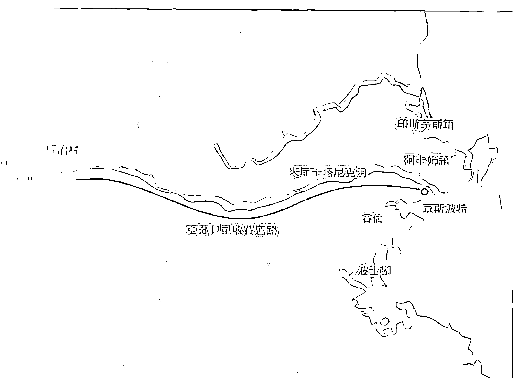

### （2）哨兵山的祭坛

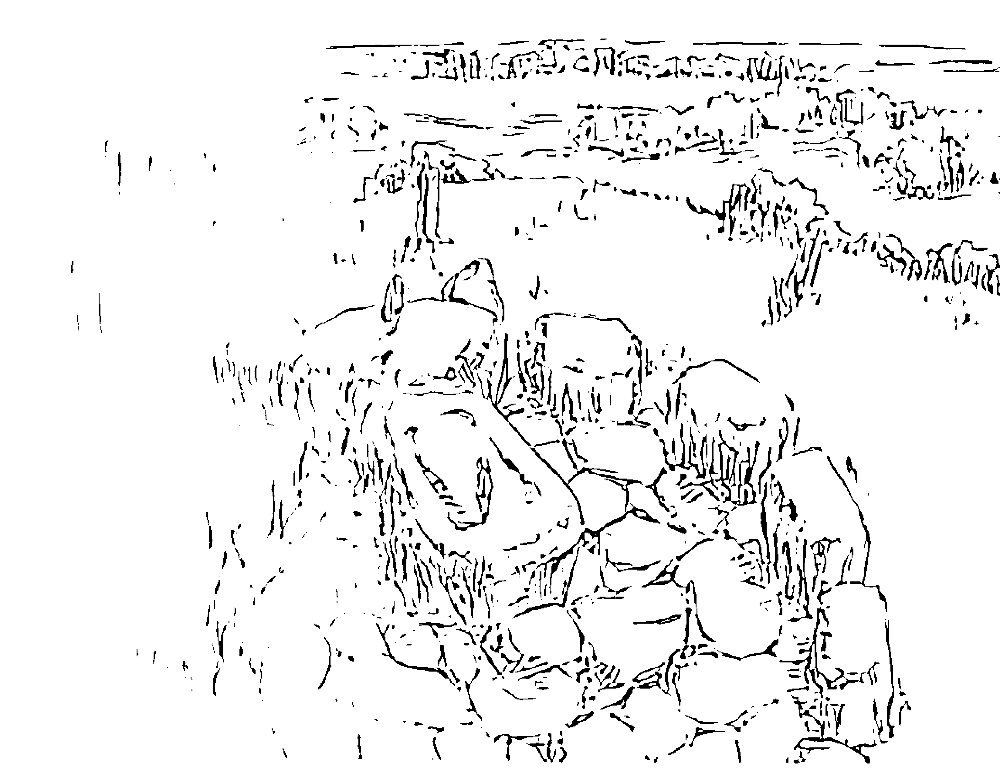

哨兵山的祭坛
据说老华特立跟孙子曾建在这个哨兵山的巨大祭坛以举行迦行的仪式。“敦威治村经历”也许也是从这里开始，从这里结束。

-   - ○宾伦→No.044
-   ○印斯茅斯镇→No.041
-   ○米斯卡塔尼克大学→No.040

### No.043 里弗班克斯

里弗班克斯

Riverbanks

缅因州偏僻地方的古老乡镇。在时间停滞静止的寂静阴影中，〈黑之断章〉带来的淫靡疯狂即将悄然到来。

### ○盘据缅因州的阴影

里弗班克斯座落于美国东北部初开拓时仍留有浓浓欧洲气息的缅因州一隅，是个被层层绿意包围环绕、街景宁静而陈旧的乡下城镇，其位置就在以大规模失踪事件而出名的耶路撒冷镇南方不远处。镇外的环状石阵跟法国的卡纳克石林相当类似，经过碳年代测定法检验，结果发现该遗迹的历史至少可以追到距今2万年以前。

知识街尽头的镇立图书馆有间“特别阅览室”，在馆内错综复杂有如迷宫的最深处，有个角落收藏了大量珍贵的秘法书和神秘学研究相关书籍。根据负责这间阅览室的图书管理员辛蒂·德拉波表示，这里的神秘学相关藏书量其实并不亚于米斯卡塔尼克大学附属图书馆或者哈佛大学的魏德纳图书馆。流言盛传，现存《死灵之书》所遗失的有关复活、还魂秘密仪式的章节，也就是研究者间通称为〈第十四书〉或〈黑之断章〉的文件就藏在里弗班克斯的某个地方，而这份文件和图书馆正是里弗班克斯之所以被视为神秘学重要据点的理由之一。除此以外，1993年曾经有位来自阿卡姆镇名叫麦可·马克西米连的黑人神父在镇郊的废弃教会有过极富活力、别树一格的讲道传教，吸引众多信徒疯狂热烈的信仰。

这里的镇民虽然朴素而诚实，却也相当封闭，这在不重视文化的乡下地方可说是相当常见的倾向，但是过去发生的种种事件却在这个乡镇留下了阴影。1943年返乡士兵所引起的悲惨杀人事件至今在老镇民心中仍旧是记忆犹新。近年来研究者遭到袭击和失踪的事件更是层出不穷。1995年的时候又发生纵火事件，导致米斯卡塔尼克大学出身的医师赫伯特·威斯特从前当作研究所使用的建筑物半亩地狱遭到烧毁。

米斯卡塔尼克大学医学系出身的赫伯特·威斯特博士当作研究所使用的建筑物，1943年惨烈的杀人事件便是发生在这栋建筑物的后面。

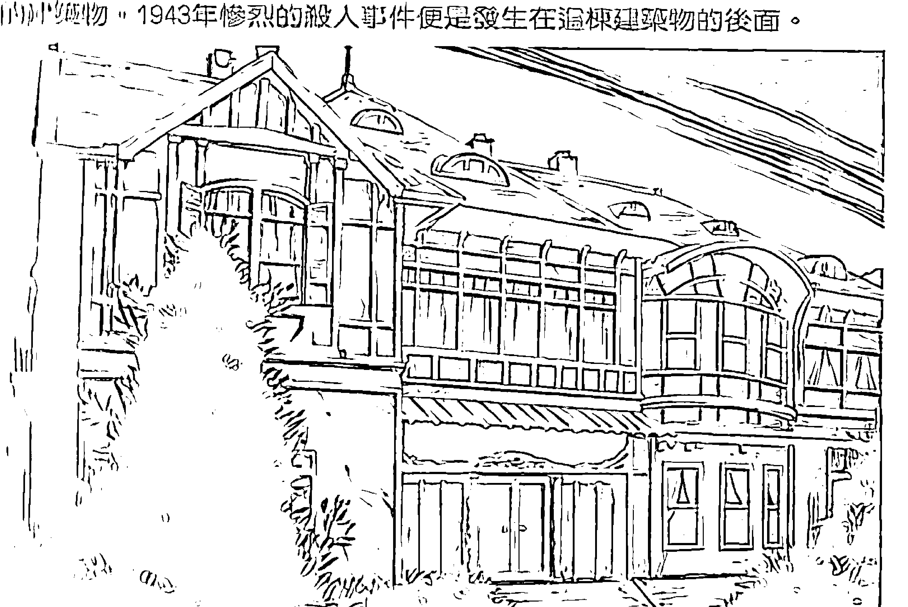

### 威斯特的位置

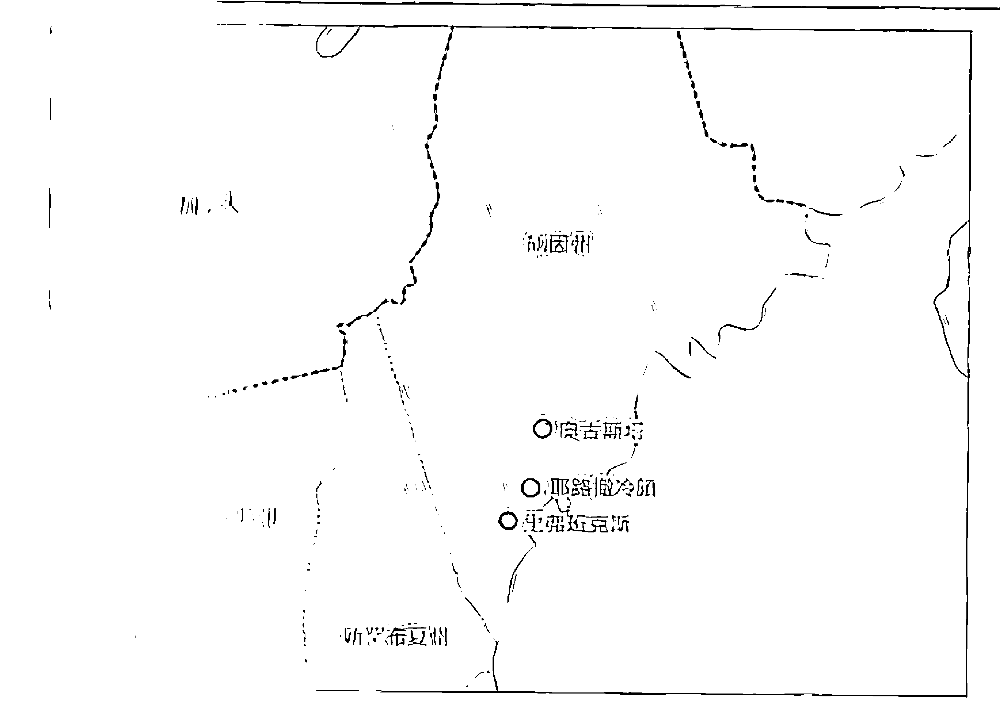

### No.044 赛伦

赛伦

Salem

17世纪凄惨的女巫审判事件的发生地，造成大量无辜牺牲者的城镇，真正邪恶之徒却逃过了审判、星散各地。

### ○绞刑台之城

赛伦位于麻萨诸塞州东北部，是初建于1626年，继而发展成港湾都市的地方都市，这里的基斯特图书馆收藏有《死灵之书》和《波纳佩经典》（Ponape Scripture）。

赛伦有很多重要史迹，包括以《红字》等作品而著名的美国国民派作家纳撒尼尔·霍桑出生的房屋，另外致力于复兴培育日本美术并将其介绍到海外因而颇有名气的恩尼斯·法兰西斯科·芬诺洛萨同样也是在此地出生的。

与此同时，赛伦却也是以1692年的女巫审判而闻名于世的地方。相传有超过200名的居民以女巫嫌疑遭到逮捕，在这场包括狱死者死亡总数多达25人的审判当中，大作家霍桑的祖先，也就是恶名昭彰的约翰·霍桑法官未能秉持其审判官的公正身份，反而还像检察官似地纠察问罪，毫不留情地对蒙受不白之冤者做出有罪的判决。

当时有不少很可能被视为嫌犯的居民及其家人纷纷逃离这由科顿·马瑟牧师所煽动起的宗教狂热，并且迁居到阿卡姆镇或敦威治村等地，其中亦不乏女巫齐萨亚·梅森、约瑟夫·古温和艾德蒙·卡特等确实曾经染指魔法妖术者。1926年失踪的波士顿画家理查·厄普敦·皮克曼的祖先也是从赛伦女巫审判狂潮中逃得性命的其中一人。皮克曼家族还曾经长期收藏有16世纪刊行的希腊语版《死灵之书》。其次，迁徙移居到敦威治村的华特立家族则是拥有《死灵之书》的抄译版。

除此以外，当时有位名叫爱比嘉·普林的女巫在女巫审判的纷乱情势中离奇死亡，岂料她竟然在死亡超过200年后，也就是20世纪初的赛伦复活，并企图解放“旧日支配者”纽格莎，不过却遭神秘学者麦可·雷伊阻止。

## 第3章◆黑暗梭巡盘踞的场所

### NO.043

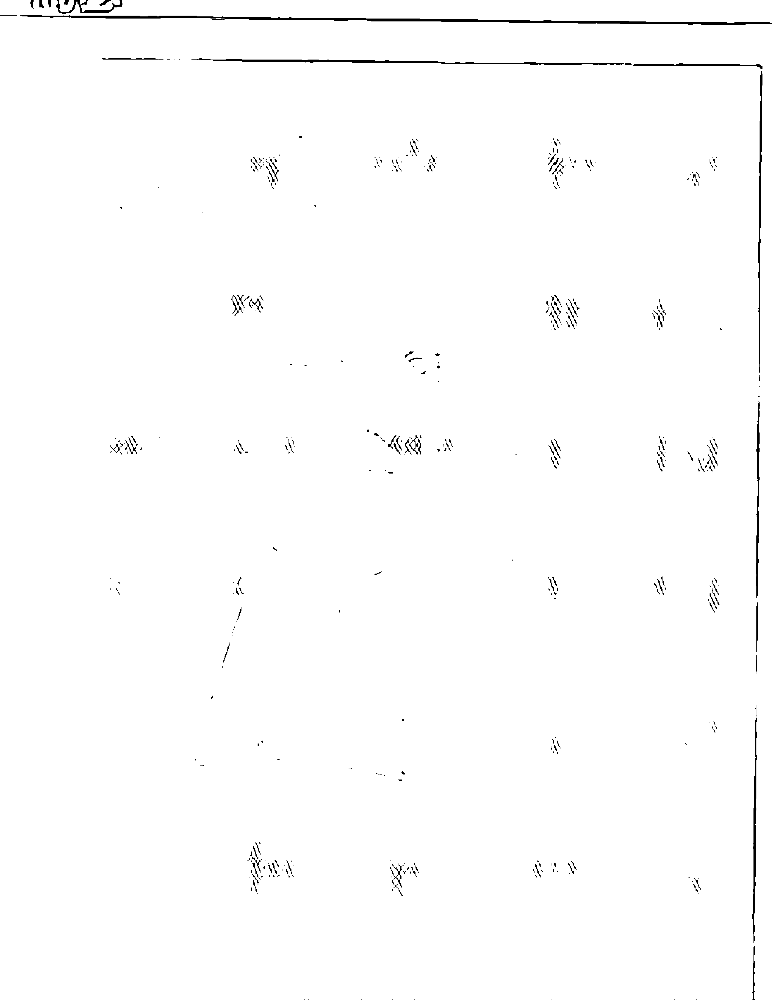

### 科顿·马瑟

科顿·马瑟是波士顿教会的牧师，也是宣称自己在这场女巫审判中执法公正的坚强者。他有一部名为《关于女巫与恶的附身值得注意之神迹》的著作，力主严惩那些州女巫和妖术之危险性，应该将其消灭。

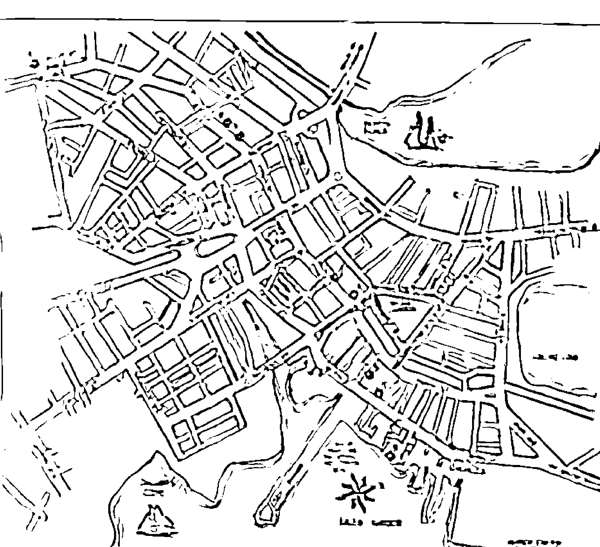

### 查伦的地图

查伦街道地图，许多地名可见阿卡姆的相同，想必是女巫审判的逃犯者来到此地后，直接将地名导用至阿卡姆镇，方才会有这番光景

-   • ◆No.025
-   • ○哈萨亚·梅森→No.098
-   • ○理查·厄普敦·皮克曼→No.101
-   • ○约瑟夫·古温→No.099
-   • ○华特立家族→No.097

### No.045 恩盖伊森林

恩盖伊森林

Wood of N'gai

传说中“夜吼者”居住的威斯康辛州黑暗森林，最后整片森林却是被来自北落师门的火焰之神全部烧毁。

### ○混沌蛰伏的森林

传说在威斯康辛州北部中央雷克湖周围的茂密森林深处，有种半人半兽的恐怖生物栖息于此。这则传说所提到的神秘神物已然超过了其他未开化地区的北美印地安传说，自从17世纪来此传教的庇瑞加神父在祈祷书里面留下一段声声称目击到巨大生物足迹的莫名其妙文字并离奇失踪以来，现实世界无法理解的事件便层出不穷地发生。18世纪中，美国中西部恶名昭彰的伐木业者大愨伯·希勒看上了雷克湖周围的松木，于是便派遣作业员前往采伐，岂料却造成总计18名作业员失踪，不得已才决定收手。

1940年在威斯康辛州北部有名飞行员在试飞任务中目击到雷克湖面有一头巨大生物，尽管当地报社在报道这则事件的时候，是拿它来跟1930年代仍有目击证言、令大众议论纷纷的尼斯湖水怪作比较，不过却也有极少数人把这则形同八卦的报道当真，威斯康辛州立大学的厄普顿·葛纳教授便是其中之一。葛纳教授原本就对雷克湖的传说非常关心，并于同年7月单独住到雷克湖附近的小木屋，开始进行田野调查。葛纳教授前三个月的调查相当顺利，还在树林中央发现刻着某种没有颜面五官生物的石板，可是某日教授却突如其来地断了联络，音讯全无。担心教授安危的州立大学赖尔德·杜根等人从小木屋里遗留的资料得知那个地方叫作恩盖伊森林，是“夜吼者”奈亚拉托提普在地上的住处；后来他们按照被囚禁的葛纳教授传来的讯息指示，成功唤出与奈亚拉托提普敌对的“旧日支配者”克图格亚，将恩盖伊森林烧成了灰烬。

> ・恩盖伊（N'gai）：《骰源传说》、《克苏鲁神话》译为“恩歌亚”。

### No.045 第3位〈黑暗梭巡盘据的场所〉 恩盖伊森林位置图

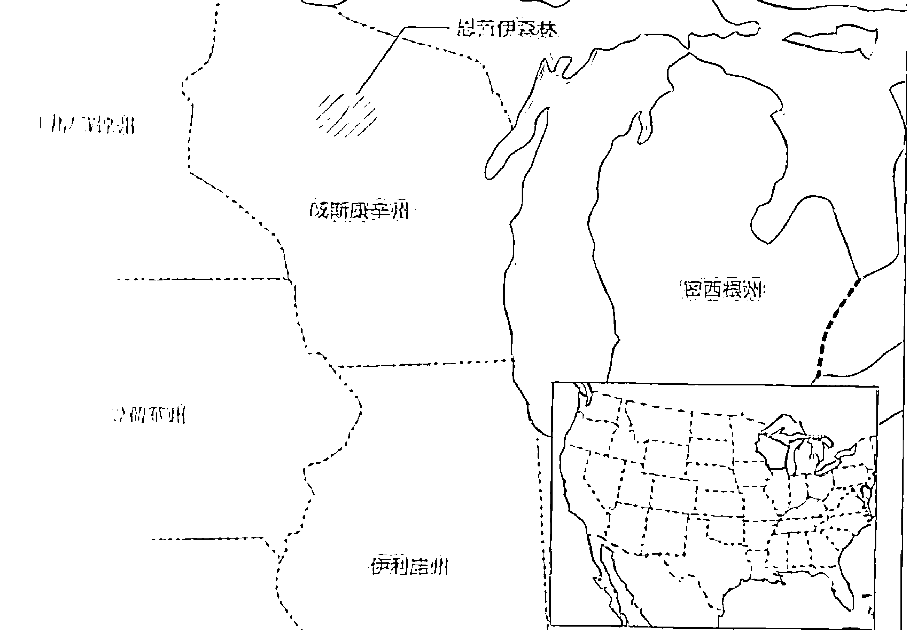

### 尼斯湖水怪的怪物照片

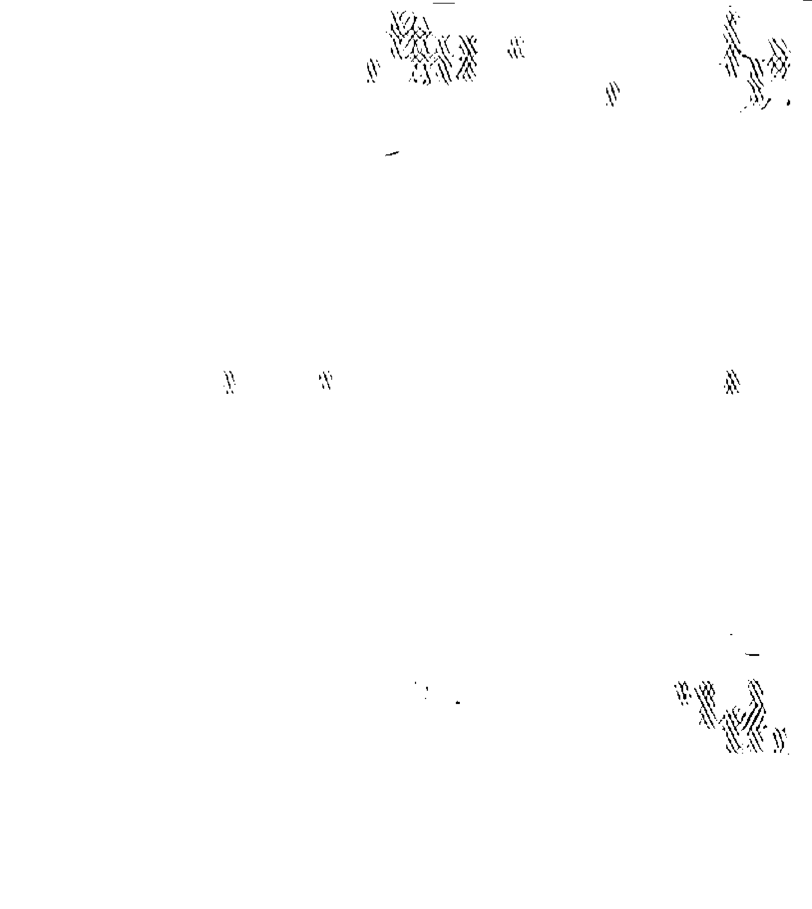

尼斯湖水怪
1933年于苏格兰尼斯湖捕捉到怪物正在游泳的照片，目击尼斯湖怪物的飞行员们说不定也曾想在报纸上看到抓到怪物。

### ○克图格亚→No.011

### No.046 金-阳星

金-阳星

Kimyan

青白色灯焰极光映照穹顶的地底世界。在闪耀着赤红色光芒的围思星底下更深处，黑暗世界恩蓝伊兀自张开着深不见底的漆黑大口。

### ○奥克拉荷马州地底的世界

金-阳星是个座落于美国中西部地底的广大地底世界，从奥克拉荷马州卡多郡宾格镇附近的古代坟丘，或是佛蒙特州“米·戈”（犹格斯真菌）栖息的山区等地，北美洲不少地方都有入口可以到达。至于金-阳星的居民则是一支在遥远的太古时代，跟着他们称为“丘鲁”的伟大的克苏鲁一起从外宇宙来到地球的种族。除克苏鲁以外，他们也崇拜蛇神伊格与莎布·尼古拉丝，还会举行活祭献神的血腥仪式。

其实他们并非一直都居住在地底世界，早在地球表面的世界大半都沉入水底以前，他们也曾经在南极的疯狂山脉等地拥有过高度文明。

金-阳星有两个分别放射出蓝色与红色光芒的领域。从前蓝色世界大都市札思的居民曾经征服并奴役住在红色世界围思星的其他种族，如今几乎所有居民均集中在札思。地底世界的居民们大半都已经忘记有地面世界的存在，如果有迷途的地上人误闯此地，金-阳星一律不准他们回到地面，以免金-阳星的存在泄漏出去，不过这些贵客却能满足寿命长达数千年的金-阳星居民少知的好奇心，只要别企图脱逃都会受到非常隆重的厚待。出没在宾格镇坟丘附近的男女幽灵，其实就是西班牙人庞仕洛·萨玛利纳和前女友土拉·约伯两次逃亡，所以才被变成没有思想的奴隶“尹比”作为惩罚。

据说在闪烁着赤红色光芒的围思星世界底下的更深处，还有个名为恩盖伊的黑暗世界，那里的不定形黑色生物崇拜信奉札特瓜。这个黑暗世界正是札特瓜飞抵地球以后的第一个住处，不过在希柏里尔灭亡以后，这位神明似乎又再度回到了恩盖伊来。

※ 恩盖伊：金-阳星的恩盖伊（N‘kai）与威斯康辛州的恩盖伊（N‘gai）并非是两个不同的地方。

### 黄金世界的入口

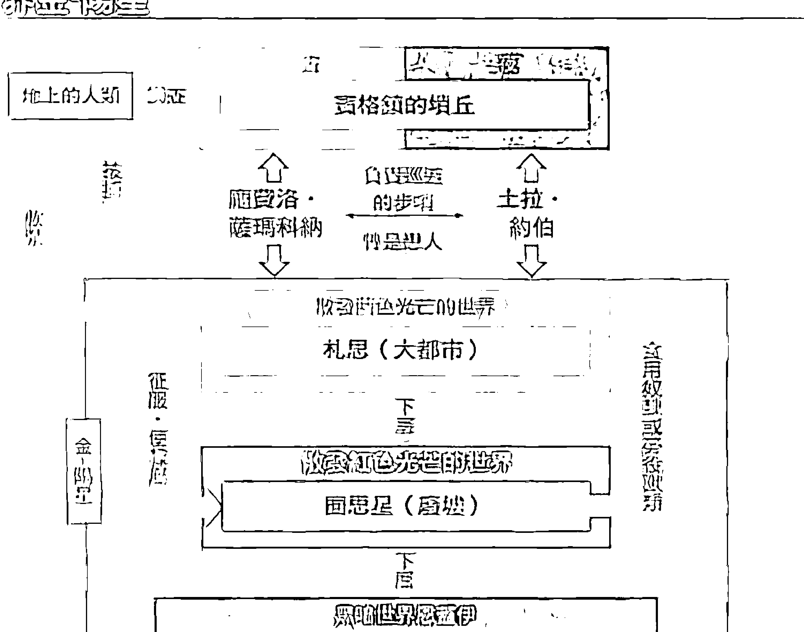

类似北美洲金字塔的美洲印地安民族坟墓。在这类坟丘当中，或许真有入口可以通接到地底世界也说不定。

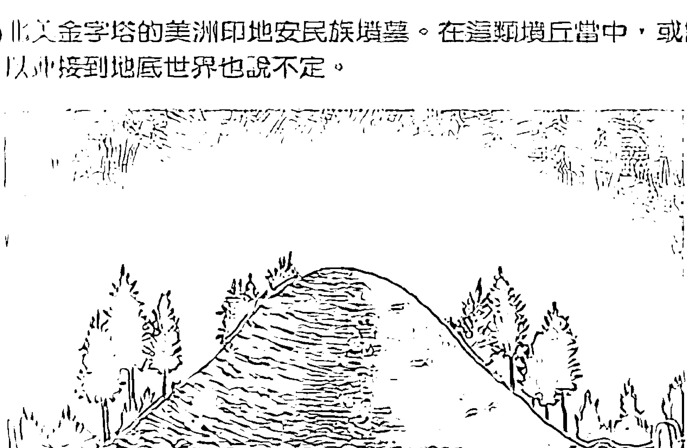

-   - ○伟大的克苏鲁→No.003
-   ○莎布·尼古拉斯→No.007
-   ○疯狂山脉→No.065
-   ○札特瓜→No.012
-   ○希柏里尔→No.070

### ○失落大陆的殖民都市

中美洲的阿兹特克文明、玛雅文明和南美的印加文明并非“古代文明”，它们的历史其实非常的新。

阿兹特克帝国乃继特奥蒂瓦坎文明之后，于14世纪至16世纪间兴起于墨西哥的中央平原；从4世纪起便繁荣直至16世纪的玛雅文明则是在南方不远的犹加敦半岛建有大都市。此二者都建设了金字塔状的石造神殿，而且都曾经向以太阳神为首的诸多神明献上活祭品的心脏。此地区素有崇拜应该是由伟大的克苏鲁抑或伊格演变而成的羽蛇神信仰，阿兹特克把这位神明唤作奎札柯特 *1，玛雅则是称为库库尔坎 *2。其实早在阿兹特克和玛雅之前，约莫西元前1000年的时候中美洲便已经有建造巨石头像的奥尔梅克文明，再往前推还有古代种族的遗迹——蟾蜍神殿的废墟沉睡在宏都拉斯的茂密丛林深处。

13世纪兴起于南美洲安地斯高原与现在秘鲁附近的印加文明，同样也是个崇拜太阳神的巨石文明。《失落的姆大陆》的作者詹姆斯·却屈伍德主张现今亚马逊雨林密布地区在数万年前是个巨大的内海，姆大陆在内海周遭建设有许多殖民都市，是中南美洲巨石文明的苗床。

拉班·舒兹伯利博士在着作里面指出南美洲克丘亚艾亚尔族 *3 的战争之神跟伟大克苏鲁的相似处，并且表示曾经有“深潜者”和堕落的圣职者在秘鲁的港都和深山里推广传扬对伟大克苏鲁的崇拜信仰。其次，西印度群岛的海地岛有种以僵尸咒术而闻名的巫毒教流传至今，其中就有为数不少的邪神崇拜者混杂在这个土着宗教的信徒当中，混水摸水，向远比巫毒教神明古老许多的邪恶魔神献活祭。

-   *1 奎札柯特（Quetzalcoatl）：文明与秩序之神，是与泰兹凯特力波卡对立的“羽蛇”。同时也是太阳神、风神。
-   *2 库库尔坎（Kukulcan）：一只长着翅膀的蛇。它既是风神，也是教导人类知识的文明之神，受到大多数玛雅人所信奉。
-   *3 克丘亚艾亚尔族：请参照P.012译注。

### 中南美洲的地图

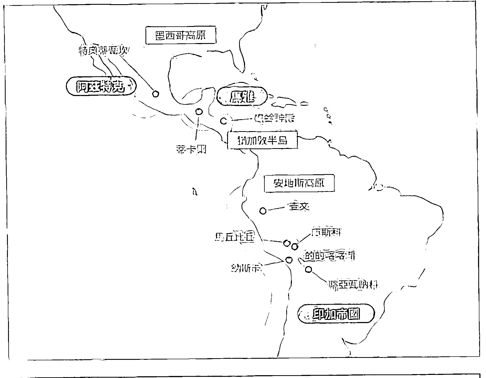

### 中南美洲相关年表

| 世纪 | 概要 |
|---|---|
| 公元前11000年 | 印文明在南美洲建立殖民地 |
| 公元前2世纪 | 特奥蒂瓦坎文明兴起于墨西哥高原 |
| 10世纪 | 玛雅文明兴起 |
| 15世纪 | 印加帝国势力达到最大 |
| 1492年 | 克里斯多福·哥伦布“发现”新大陆 |
| 1519年 | 西班牙人荷南·科尔特斯登陆尤卡坦半岛，阿兹特克帝国灭亡 |
| 1531年 | 西班牙人法兰西斯科·皮萨罗侵略印加帝国，印加帝国灭亡 |
| 1536年 | 西班牙人米·罗伦佐在圣多明各建立圣神职 |
| 1804年 | 海地脱离法国统治独立，全世界第一个黑人共和国诞生 |
| 19世纪前半 | 西蒙·玻利瓦尔进行独立运动 |
| 1911年 | 发现马丘比丘的遗迹 |
| 1926年 | 海地的巫医教仪式随着拉美文化浮出水面而倍受注目 |
| 1930年代 | 巴西的信仰在秘鲁传播开来，与此同时，海地则有巫医教的法师活跃着 |
| 1945年 | 第二次世界大战后纳粹党人逃往南美洲，其党之黄金完全由全秘密的死人助手 |
| 1959年 | 卡斯特罗和切·格瓦拉率领的革命军推翻古巴的巴蒂斯塔政权 |

-   * ○伟大的克苏苏→No.003
-   * ○蛇神伊格→No.015
-   * ○姆→No.071
-   * ○“深潜者”→No.016
-   * ○拉班·舒兹伯利博士→No.106

### No.049 马丘比丘

马丘比丘

Machu Picchu

16世纪迎到消灭的印加帝国规模最大的空中要塞都市。这座曾经激起考古学家无限梦想的遗迹，其实是克苏鲁邪教的其中一个根据地。

### ○另一个马丘比丘

马丘比丘在当地原住民语言里面的原意是“伟大的顶峰”，这座印加王国时期要塞都市遗迹座落于秘鲁内陆紧临乌鲁班巴溪谷、标高超过2000公尺的高山余脉，其重要性与库斯科不相上下。

在1911年耶鲁大学历史学教授希尔·宾厄姆偶然在探索印加时期古代道路时发现——马丘比丘从法兰西斯科·皮萨罗入侵算起来整整有3个世纪完全不为白人所知，据说就连前赴调查的学者们都对马丘比丘的保存良好感叹不已。后来宾厄姆博士还曾经就任康乃狄克州副州长、进而晋升成为参议员，从此便不难想见这个发现在当时世人眼里是何等重要的“伟业”。然而遗憾的是，宾厄姆终究还是未能在生前得知在这座15世纪的要塞不远处，其实还有个堪称为另一座马丘比丘的古代遗迹存在。

这个遗迹的发现者是米斯卡塔尼克大学的拉班·舒兹伯利博士，他还在自着的《拉莱耶文本之后期原始人神话类型研究》里面提及了这个发现。

此遗迹位于比尔卡诺塔山脉地底，从开在峡谷岩壁的石阶拾级而下，潜入地底深处，就会走到一个巨大的地底岩洞，这里有座应该能够容纳数千人的神殿，祭祀有远比印加帝国崇拜的帕查卡马克¹和提西·维拉科察等神明更古老的超自然存在。岩洞中心有一口巨大的咸水湖，湖水可以从湖底的开口流经通往太平洋的漫长通道，与洪堡洋流²汇流，顺着这道洋流继续前进，最终就会抵达沉没在太平洋海底的拉莱耶城。

*1 帕查卡马克（Pachacamac）：秘鲁海岸地区人们所信奉的创世之神。它名称的原意是“大地的创造者”。
*2 洪堡洋流（Humboldt Current）：即秘鲁洋流（Peru Current）。东南太平洋的寒流，水流极慢而浅，是北太平洋的加利福尼亚洋流类似的东部边际洋流。

### 马丘比丘周边的克苏鲁邪教

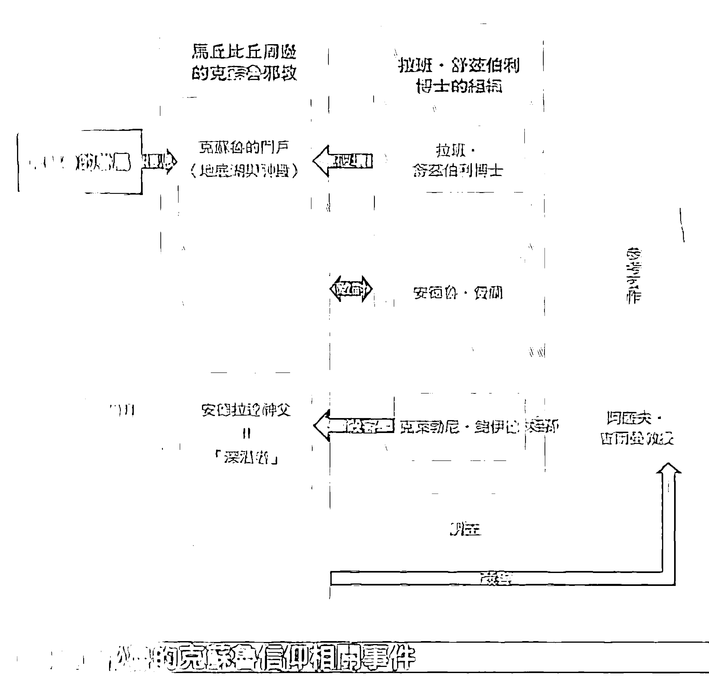

### 第3章 黑暗梭巡盘据的场所

| 马丘比丘事件 |
| --- |
| 001. 贺尔修斯在马丘比丘附近目击到前往克苏鲁地底神殿的门户。 |
| 002. 舒兹伯利博士对贺尔修斯进行侦讯调查。 |
| 003. 贺尔修斯被发现死于印加茅厕内。 |
| 004. 舒兹伯利博士破坏神殿门户，将超过200人的克苏鲁信徒悉数杀死。 |
| 005. 克莱勃尼·鲍伊德继承伯祖父阿瑟夫·西门受难父的志愿，调查并在印加帝国遗迹中埋藏的克苏鲁邪教据点。 |
| 006. 克莱勃尼·鲍伊德获得利巴·安卓巴斯教授协助，开始对立克苏鲁的祭司安德烈。 |
| 007. 克莱勃尼·鲍伊德得知安德烈已经被杀害，由“深渊者”所取代。鲍伊德将死后的安德烈，并利用炸弹破坏克苏鲁的神殿。 |

-   - 拉班·舒兹伯利博士 →No.106
-   - 《拉莱耶文本》 →No.027

### No.049 蟾蜍神殿

蟾蜍神殿

Temple of the Toad

> “神殿之神即是神殿之谜”。曾经有男子为求宝物而深入丛林，涉足冒犯禁忌圣域，结果遭到太古恐怖力量袭击。

### ○ 隐密林里的古代神殿

中美洲的宏都拉斯，玛雅文明曾经繁华一时的地方。蟾蜍神殿仿佛遭到淹没似地伫立在这块被加勒比海环抱的郁郁密林之中，这座神殿是从前比原住民族更早来到此地居住的古代种族祭祀异样神祇的圣域。

有关蟾蜍神殿最早的文字记载，应是出自于曾经在1793年前后造访过宏都拉斯的西班牙裔旅行家璜·冈萨雷斯无疑。冈萨雷斯在探险途中发现了一座建筑模式显然有别于原住民族遗迹与当地建筑的神殿，并且以存疑的笔调记录下邻近居民所谓神殿地底隐藏着某种不寻常东西的传说。

1839年杜塞道夫出版的腓特烈·威廉·冯容兹所着《无名祭祀书》里面，对这座神殿有些若非亲眼见识则不可能会有如此精准确实的记述，从这点来判断，冯容兹曾经踏入蟾蜍神殿似乎已是无庸置疑的事情。

进入20世纪以后，曾经有个人类学与考古学界评价颇差、看起来像是个骗徒的人物名叫塔斯曼，在探索宏都拉斯茂密雨林的时候发现了疑似蟾蜍神殿的遗迹；塔斯曼按照后来才得到手的《无名祭祀书》书中记述，进入遗迹调查，结果发现一具很可能是传说中大神官的木乃伊，木乃伊的脖子上还挂着一个刻着蟾蜍模样的红色宝玉。根据冯容兹的记载，神殿的红色宝玉就是可以开启藏在蟾蜍神殿深处真正宝物的钥匙。

塔斯曼意气风发地带着这块宝玉返国，岂料在美国等着他的，竟然是数千年前建造该神殿的未知古代种族的信仰对象——生有巨大触手与蹄子、貌似怪物的神明。原来蟾蜍神殿的宝物指的正是这个神明，而塔斯曼打开的锁则是恰恰解开了封印。

### 玛雅文明的金字塔

特奥蒂瓦坎的奎扎柯特神殿。中南美洲的金字塔有别于埃及金字塔，其用途并非坟墓而是神庙。

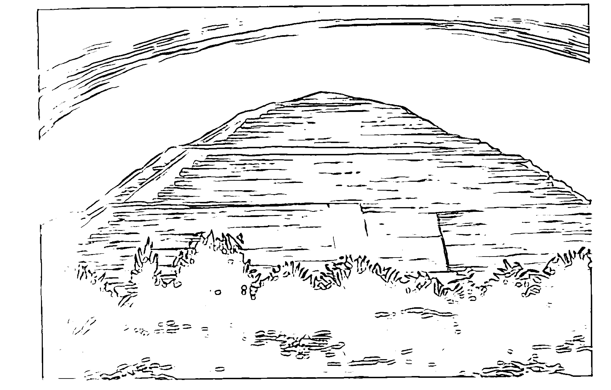

### 玛雅文明的所在位置

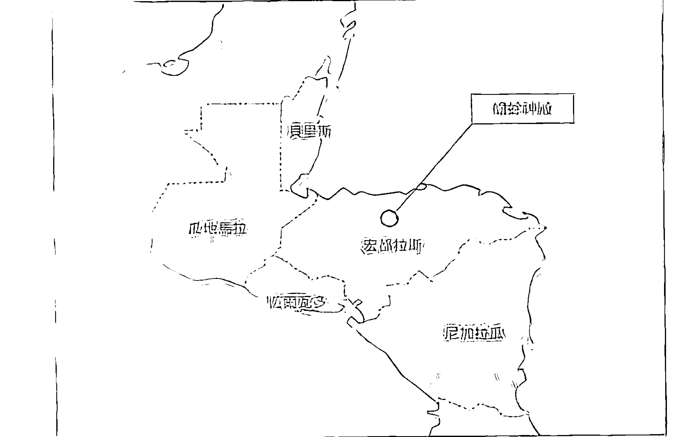

> →No.029

> ○腓特烈·威廉·冯客兹→No.094# 歐洲
Europe

高加索山脈以北、烏拉山脈以西的地區。這片孕育出人類的理性與文化的舊大陸，流傳各種光怪陸離的傳說、魑魅魍魎橫行跋扈之地。

### ○歐洲舊大陸

冰河期結束以後歐洲大部分地區都被深邃的森林覆蓋住，承繼希柏里尔記憶的塞爾特人則是居住在歐洲的中央地帶。

從政教雙方面統率塞爾特人的德魯伊*崇拜信仰身分相當於莎布·尼古拉斯的大地母神，並且在各地留下了世稱史前巨石柱或桌形石的巨石遺跡。這些遺跡集中於歐洲西部，向來都被認為是建於西元前2000年前後、相較之下算是比較新的產物，不過近年卻發現大約在西元前4600年到前4800年以前，歐洲中部就曾經有比埃及金字塔更加古老的石造神殿文化存在過。

約莫4世紀的時候日耳曼民族開始大舉遷移，塞爾特人和他們的信仰便漸漸遭到壓縮，驅趕至西方。及至五賢君之一的圖拉真時代，羅馬帝國已經掌握東起黑海地中海沿岸地區、西至大西洋入口的廣大版圖，這些古神祇信仰則有如涓涓細流般地流傳在歐洲北方或是外西凡尼亞等深邃森林之中，最後終於被吸收融入至直到313年才得到米蘭敕令官方認可、不到1個世紀便成為羅馬國教的基督教，並且以零星分布於法國和伊比利半島的黑色聖母等信仰形式，在歷史中留下痕跡。除此以外，相傳儒略·凱撒時代羅馬帝國的英雄馬克·安東尼還曾經在阿爾卑斯山裡面與邪神搏鬥，並成功打敗邪神，將其吃進肚子裡去。

在不列顛群島周邊地區則是以頑強抵抗羅馬帝國的愛爾蘭、威爾斯地區為中心，流傳著服從塞爾特諸神敵對者——邪神巴羅爾的深海棲息者，也就是「深潛者」的相關傳說，甚至遊吟人表示這些傳說與潛伏於沼澤濕地的哥布林、人魚傳說有某種關聯性。除此之外，據說康瓦耳地區還有從前黑暗王朝倒台時逃離埃及的貓神巴斯特的神官曾經隱居在此。

> *德魯伊 (Druid) : 另譯「督伊德」，古代塞爾特氏族的神官，乃西洋奇幻色彩別稱身穿長袍的魔法師形象的原型。

### 布瑞契司特與羊木鎮

坎貝爾跟著有「深武斯·克斐」系列作的布萊恩·魯姆利同様神话作家第二世代的代表人物，從前坎貝爾模仿 H · P · 洛夫克拉夫特作品，寫成一篇以阿卡姆鎮作為故事舞台的作品，然後寄給阿卡山斯特·德雷斯，但德雷斯對坎貝爾的文才頗為訕諷，他還出近乎逆耳的助言。他認為不應只使用洛夫克拉夫特創造的地方，而是應該要設定自己融合與你自己的原創神話誕生。坎貝爾採納德雷斯的建議，設定出虛構的英國鄉下小鎮布瑞契司特，在布瑞契司特的「舊日支配者」恐怖力量脫離底益神話，開始發表自創的恐怖小說作品，終於成為恐怖小說代表作家。如今他也很坦承地表示，他創作恐怖小说的方法其實是向洛夫克拉夫特學來的。

- 「深潛者」→No.016
- 埃及→No.055
- 其他神明（貓神巴斯特）→No.015

# 布瑞契司特
Brichester

在地方都市安稳模様的假象底下，「舊日支配者」漆黑的身影已經籠罩了這座禁忌的城鎮，周邊地區流言蜚語紛紛擾擾之地更是所在多有。

### ○「舊日支配者」橫行的城鎮

布瑞契司特位於英國東南部充滿恬靜田園風光的格洛斯特郡塞鴻河谷附近，是當地少數的近代化城鎮，同時也是英國僅次於牛津劍橋的頂尖學術機關——布瑞契司特大學的所在地。

儘管乍看之下只是個悠閒的地方都市，但布瑞契司特其實跟美國的賓倫、阿卡姆鎮同樣，是個仍然保留著濃濃女巫傳統色彩的古老城鎮。其实在這片恬靜風景的背後經常有許多奇怪的事件發生，附近還有羊木鎮、塞鴻津等許多流佈著可怕流言的城鎮散布在周邊。

從郊外的「女巫巢穴」可以進入塞鴻河谷的地底迷宮，這裡會有在布瑞契司特和附近一個叫作坎賽的城鎮受到發狂民眾崇拜的「舊日支配者」伊荷特徘徊出沒。目前對這個有著腐爛麵糰般青白色圓形胴體、圓形果凍狀眼睛和好幾隻蹄足的「舊日支配者」所知不多，但據說被稱為「伊荷特之雛」的伊荷特後代有時候會變成人類的模樣混進城裡民眾之間。

另外在布瑞契司特北部的幽靈湖還有種活像巨型海膽、圓形身體生有無數尖刺的「舊日支配者」葛拉奇（Glaaki）棲息在此。葛拉奇可以從幽靈湖利用惡夢將犧牲者引誘過來，用身上的棘刺殺死對方，然後製作出類似巫毒教殭屍的僕從。19世紀初崇拜葛拉奇的教團所編纂的《葛拉奇的啟示》對葛拉奇有相當詳細的描述。

其次，布瑞契司特郊外的岩山「惡魔階梯」裡面有個「米戈（猶格斯真菌）的基地，頂端有座可以連接到冥王星的塔。

### 1.2 布瑞契司特的历史

| 时间 | 事件 |
| --- | --- |
| 43 AD | 不列颠群岛全境均在罗马统治之下，彼时便已经有莎布·尼古拉斯的祭坛存在 |
| 1114 | 夏盖虫族利用空间移动在羊木纽森林定居，密拉希的启示录在裂石拉提布瑞契河将北部所形成的湖泊 |
| 1882 | 密拉希的启示录流出外邦甚至在伦敦出现，但最后被调查机关全数回收 |
| 1920 | 秘密教团的核心人物艾德蒙·派勒等人在布瑞契司特大肆放逐，并且在得到《密拉希的启示录》以后前往布瑞契司特郊外的岩山『恶魔的摇篮』，被发现都已遇害 |
| 1928 | 布瑞契司特大学教授前往丘陵地寻回奇异生物遗体，在阅读《死灵之书》、取得《密拉希的启示录》并制作异次元通信机以后失踪 |
| 1935 | 布瑞契司特大学的学生目击到异次元通信机，校警却在警报中遭到杀害的学生，大学遂派研究团队进行调查、回收《密拉希的启示录》 |
| 1971 | 布瑞契司特北部湖泊传出奇怪声音，据说密拉希的密拉希信徒在暗地里活动，在羊木纽用月亮进行仪式 |

### 1.3 布瑞契司特的「旧日支配者」

伊荷特
徘徊在密特河谷地底洞窟附近地面的「旧日支配者」，它带着外形类似小型犀牛的特征活动。

其它的「旧日支配者」：能够适应地面，拥有半虫半人的特征。

- ○「米·戈」（格拉斯真菌）→No.022
- ○冥王星→No.077

# 羊木鎮
Goatswood

羊木鎮是已毀滅行星的居民建造邪神神殿的地方。來自深宇宙的殘虐妖蟲，無時無刻不在找尋新的犧牲者。

### ○非比尋常的城鎮

英國格洛斯特郡布瑞契司特近郊的城鎮羊木鎮是目前地球上所知道極少數仍舊盛行原始的莎布·尼古拉斯信仰的地方。

羊木鎮居民都是面向樹立於該鎮廣場中央的金屬材質高塔，朝著裝設在塔頂、名曰月亮透鏡的鏡子膜拜，如此崇拜從山丘底下召喚出來的莎布·尼古拉斯的其中一個化身——「月亮透鏡守者」。

羊木鎮附近森林有片空地，這裡矗立著一座跟廣場所建不同類型的金屬圓錐塔，有群於17世紀從夏蓋星*來到地球的「夏蓋蟲族」（Insects from Shaggai）棲息在此。

夏蓋蟲族的體型跟地球的鴿子差不多，其他特徵包括無眼瞼的巨眼、三個口器、前端捲曲成團的捲曲觸鬚、共有十隻腳，擁有半圓形的翅膀。當初夏蓋星因為重大變異而即將滅亡的時候，它們便逃進了用灰色金屬建造的阿撒托斯的寺院裡，並進行空間轉移逃往其他星體。前述圓錐塔，其實就是阿撒托斯的寺院的頂點部分。

它們因為地球大氣層內含的某種成份而無法再移動到其他世界，不得已只能停留在地球。偏偏好巧不巧，從它們崇拜阿撒托斯便也不難理解，這些擁有高度文明與科技的夏蓋蟲族，性情可是非常的殘酷。

夏蓋蟲族在來到地球以前曾經待過一個叫作塞克洛托爾的星球，當時它們在那裡將一種外形類似樹木的生物「塞克洛托爾怪」奴隸化，作為努力和兵力使用。

> ※夏蓋星（Shaggai）：《威懼傳說》譯為「煞該星」。

### 101 昆虫族（Insects from Shaggai）

夏蛊族
從已經毀滅的豆星嚲移至地球的蟲類生物，其性情與心態變化，常與阿撒托斯－

### 102 沼泽与羊木镇的位置

- ○莎布·尼古拉斯 → No.007
- ○阿撒托斯 → No.004

# No.053
史崔戈伊卡伐
Stregocavar

邪惡的太古種族在此重複進行著淫邪不祥的儀式、受到詛咒的村落。
村外的黑色石碑，眼看就要喚醒從前淫邪儀式的記憶。

### ○「黑石之秘」

史崔戈伊卡伐是匈牙利山區某個地圖並未記載的村落，腓特烈·威廉·馮容茲在《無名祭祀書》裡面提到的「黑石」，也就是一座約高5公尺的八角形黑色石柱，就建在此村附近。相傳這座石碑是史前時代巨大城堡頂端的尖塔，石碑表面刻著可能是文字的符號，可是尚未被解讀出來。

史崔戈伊卡伐此名在當地語言裡有「女巫城」的涵義，這是因為在16世紀鄂圖曼土耳其帝國入侵東歐以前，村子裡有支斯拉夫人和神秘原始民族的混血種族的所作所為遂有此名。這座原名蘇瑟坦的村落原本住的是邪教信徒，他們會攻擊附近村落拐掠婦孺當成活祭品獻給他們供奉的神明。

相傳西利姆·巴哈杜率領的土耳其軍隊攻進此地，知道村裡的作為以後，便因為其行徑太過邪惡而將居民悉數殺死，並且前往「黑石」附近的洞窟跟躲在洞裡長得像癩蛤蟆的怪物作戰。

史崔戈伊卡伐現在的居民是馬札兒人*[1]的後代，他們是在土耳其軍隊剷除邪教離開以後才進入了這個被拋棄的村莊，從前那個受詛咒的原住民族血統早已不復存在。如今史崔戈伊卡伐人口流失的問題愈來愈嚴重，而且歐洲的環保團體還煞有介事地盛傳有舊共產圈國家把核廢料遺棄在村外洞窟裡。每年6月23日仲夏夜的前一晚，「黑石」附近就會像海市蜃樓似地浮現從前邪教徒舉行邪教儀式的景象，目擊到這個景象致使精神異常的受害者不在少數。早夭的天才詩人賈斯汀·季奧佛瑞*[2]從前旅遊倒楣的時候曾經造訪過這個受詛咒的村落，其幻想詩《獨石的人們》*[3]就是他目睹「黑石」得到強烈靈感以後的結晶。

*[1] 馬札兒人（Magyar）：採芬蘭-烏戈爾語系匈牙利語的民族，亦即匈牙利人。
*[2] 賈斯汀·季奧佛瑞：此處採用《克蘇魯神話》譯名，《裁縫傳記》則譯作「賈斯丁·傑福瑞」。
*[3]《獨石的人們》：此處採用《克蘇魯神話》譯名，《裁縫傳記》卻作《巨石……

小山丘頂瞭朧四下的黑石。有人認為這座黑石其實是埋在山裡的古代城的尖塔。

### 10. 圖片標的位置

- ○賈斯汀·季奧偉瑞→No.093
- No.094
- No.029

# NO.054
非洲大陆
Africa

人類與文明的發祥地，布滿沙漠與密林的大地。在這個歐洲人稱為黑暗大陸的非洲大陸暗地裡，無貌神明正在蠢蠢欲動。

### ○光明與黑暗並陳的土地

西元前5世紀的希臘歷史學家曾說過「埃及是尼羅河的恩賜」。埃及文明在西元前4000年前後誕生於北非沙漠地帶定期氾濫帶來肥沃土地的尼羅河流域。自西元前3000年前後統一王朝誕生後，埃及由單獨一位法老統治的神權國家，直到被羅馬帝國吞併為止總共2900年，經歷27個王朝興衰更迭。古埃及有太陽神拉、守護歷代法老的荷露斯、統治死者國度的大頭神亞奴比斯等各式各樣的信仰，其中最古老的當屬復活之神奈亞拉托提普。從新王國時期*1到第三中間時期*2的古埃及聖經時代，曾經有段神官奈夫倫-卡篡奪王位的黑暗王朝，當時禁止除奈亞拉托提普和貓神巴斯特等邪神以外的所有信仰，苛政之暴虐無以復加。埃及興起叛亂將奈夫倫-卡放逐，所有有關該王朝的紀錄徹底遭到抹殺。

在非洲中部的剛果盆地，除代代傳說怪物龐克拉、姆邊貝會與彩虹同時出現的俾格米人*3以外，還有大猩猩和大型類人猿居住在熱帶雨林裡面，在雨林深處更隱藏有白色類人猿居住的灰色都市、有尾人種居住的峽谷等無數秘境。
「黑暗大陸」非洲仍舊保留有許多被視為野蠻的風俗習慣：據說在從各國相繼脫離19世紀以來割據稱雄的歐洲宗主國紛紛獨立的「非洲年」，也就是從1960年開始的剛果動亂當中，被喚作辛巴*4的剛果獨立派士兵先是得到部族咒術師製作的就算被子彈擊中也不會死亡的護身符，還從紅色鐵幕那裡得到最新的武器，他們非但恣意殘殺所遇到的所有白人，而且還大啖其血肉內臟。

*1:新王國時期（New Kingdom）：起於西元前16世紀至前11世紀。
*2:第三中間時期（Third Intermediate Period）：或稱「末期王朝時代」，始於西元前1069年前後，是古埃及史的時代區分。
*3:俾格米人（Pygmy）：人類學中指男性平均身高不足150公分的人種，稍高的稱為類俾格米人（Pygmoid）。
*4:辛巴（Simba）：斯瓦希里語（Swahili languages）「獅子」的意思。

### 非洲大陆地图

### 非洲大陆相关年表

| 西元（年） | 事件 |
| :--- | :--- |
| 前3100 | 美尼斯王统一上下埃及 |
| 前30 | 罗马军征服托勒密王朝的埃及，收埃及为省地 |
| 1415 | 葡萄牙占领休达 |
| 1600 | 英国东印度公司首开殖民非洲之端始 |
| 1798 | 拿破仑·波拿巴远征埃及 |
| 1871 | 亨利·莫顿·史坦利前往刚果河流域探险。 |
| 1884 | 欧洲列强召开柏林西非会议，瓜分非洲。 |
| 1885 | 比利时国王利奥波德二世刚果自由邦为私人领地。 |
| 1899 | 布尔战争爆发。 |
| 1910 | 卡莱尔的非洲探险队失去行踪。 |
| 1938 | 在非的科考队在乍得湖发现「活化石」腔棘鱼。 |
| 1960 | 德国在刚果盆地深处建立秘密研究所。 |
| 1960 | 「非洲年」，非洲大陆各殖民国相继脱离宗主国独立。刚果开始动乱。 |
| 1975 | 安哥拉内战开始。 |
| 1994 | 卢旺达发生大屠杀。 |

> No.055 ○奈亚拉托提普→No.005 ○其他神明（巴斯特）→No.015
克利奥帕特拉（Cleopatra）：托勒密王朝（西元前332-30年）皇族，是埃及最后一位实际的统治者，亦即著名的埃及艳后。
柏林西非会议（Berlin West Africa Conference）：乃由德国首相俾斯麦於1884年召开的会议，与会列强於1885年的「柏林会议」（Congress of Berlin）。
布尔战争（Boer Wars）：英国与南非布尔人建立的共和国之间的战争。史上共发生过两次，第一次发生在1880至1881年，第二次发生在1899至1902年。

# No.055
埃及
**Egypt**
遭《死者之书》抹殺封印的古埃及黑暗王國。從前以神官身分篡奪王位的奈夫倫-卡現已進入長達7000年的長眠，至今仍在夢寐之中。

### ○黑色法老王

從前在聖經時代的古埃及，曾經有過一段法老王位遞到統領邪教團體的神官奈夫倫-卡篡奪、公然食用人類屍肉的血腥黑暗時代。

「黑色法老王」奈夫倫-卡尊奈亞拉托提普為主神，除信奉巴斯特、亞奴比斯、蘇貝克的邪教以外，廢止其他所有信仰。

相傳邪教的神官們建立了好幾座神殿，並且向他們信奉的神祇貢獻活祭品換取魔法的力量。奈夫倫-卡的統治政權太過血腥，終於引發了大規模叛亂：埃及人不只是將邪惡的法老和邪教集團逐出埃及，而且還將《死者之書》裡面所有跟「黑色法老王」有關的記載全數抹殺，因此除《死靈之書》和《蠕蟲之秘密》等文獻以外，很難透過其他方法得知跟當時有關的知識。

奈夫倫-卡原本打算乘船帶著屬下神官們航向西方的島嶼，不料卻在開羅附近遭遇追兵，被逼進了秘密地下墓室。相傳當時有部分貓神巴斯特的神官逃到西方的島嶼，歷史家認為他們的流亡目的地就是英國。

奈夫倫-卡在漆黑的墓室裡面進行最後的儀式，成功召喚出奈亞拉托提普在地上的化身，他用自願獻身擔任活祭品的100個人跟奈亞拉托提普換得預言能力，並且在墓室牆壁畫下了埃及未來的歷史。據說奈夫倫-卡就躺在地底墓室最深處的紅色房間的大理石棺裡面進入沉眠，直到7000年後才會跟屬下同時甦醒。

其次，相似《蠕蟲之秘密》的作者路維克・普林還曾經在一間紅色房間裡面遭遇過負責守護墓室的邪教神官的後代子孫。

普洛維頓斯出身的考古學家伊諾克·鮑文教授曾經在1844年挖掘調查奈夫倫-卡的地下墓室，並從墓室裡帶回了光芒之蛇形體，且創設名為星際智慧教派教會的宗教團體。

> *《死者之书》：请参照P.060详注。

### 金字塔和狮身人面像

古代世界七大奇景之一的吉萨三大金字塔与狮身人面像。不过也有人认为狮身人面像早在埃及建设金字塔很久以前便已经存在。

> No.005 No.025 No.103 ○《蛆虫之秘密》（妖蛆之秘密）→No.026 ○其他神明（巴斯特）→No.015

# 格·哈恩
G'harme

非洲黑暗大陸的大地昏暗深處，邪惡的魔物正蠕動著駭人的可怕軀體、商討如何消滅地面的世界。

### ○未知的地底都市

地底都市格·哈恩的存在得以為世所知，乃是由於探險家溫卓普從北非帶回來的黏土板。這塊黏土板刻著乍看之下像是馬雅文字、由許多點集合成的奇妙象形文字，公諸於世的當時曾經被學界和媒體懷疑是捏造的贗品，使得這位命運乖舛的探險家因而以形同發狂而死的悲慘方式與世長辭。

溫卓普的不甘得到艾默瑞·溫蒂史密斯爵士承繼其志，將溫卓普的翻譯和學術研究成果在1919年整理成書自費出版，此即印刷量不足千冊、16開裝訂的《格·哈恩斷章》（G'harm Fragments）。另有他說指出這本研究書籍並非出版於1919年而是1931年，目前大英博物館便收藏有一本。至於溫卓普帶回來的黏土板，目前研判應是「遠古種族」所作的記錄，內容包括天文知識譬如從前運行在太陽周圍被命名為涅歐夫星或猶格斯的冥外星以及哈斯塔居住的黑星；還有格·哈恩等地球古代遺跡的相關概要與位置。

在不知被埋在非洲何處沙漠底下的格·哈恩的昏暗環境中，有種外形可怕貌似烏賊名叫克托尼亞（Chthonian）的怪物四處爬竄。這種如毛蟲般在地穴中伸展著帶有黏液的粗長軀體的克托尼亞擁有超過千年的綿長壽命，以及保護自己後代的強烈保護本能。這種怪物還可以數隻聚集起來引起大規模的地震。邪惡的修德·梅爾（Shudde M'ell）是所有克托尼亞中體型最龐大、最強壯的個體，因而得以成為「舊日支配者」。其次，相關著作《格·哈恩斷章》的艾默瑞爵士後來還在造訪非洲之際遭到梅爾及其屬下綁架，等到返回文明世界的時候卻已經陷入半瘋狀態。

> > 1: 格·哈恩（G'harme）：《克蘇魯神話》譯為「蓋尼」；而《格·哈恩斷章》則為《蓋尼遺稿》。

### 斯蒂格·哈恩的位置

> > ((Chthonian))

克托尼亞
地居於格·哈恩，酷似巨大扇蝨的怪物 克托尼亞 其地首佬 德·梅更是當中最大巨大的個體。

## 第3章 黑暗後巡邏據的場所

No.057
# 月矿山脉

### Mountains of the Moon

在堪稱非洲黑暗大陸之象徵的茂密雨林地帶、不見天日的剛果盆地深處，服侍古老邪神的姆巴，隨時等著有勇無謀的冒險家闖入。

### 黑暗大陸奇異事件

非洲大陸中部4380公里綿長大河剛果河蜿蜒蛇行的熱帶雨林地帶剛果盆地，在地圖上經常因麥卡托投影法[1]造成錯覺，讓人誤以為剛果盆地的範圍要比實際來得狹小，然而「煙檜森林」和「惡魔的尿池」等無人涉足的大地如今卻仍在不見天日的深邃雨林廚爛包覆之下，是非洲黑暗大陸最大、最後的綠色謎境。

在亨利·史坦利和亞倫·闊特曼、基特·甘迺迪等冒險家大展身手的比屬剛果（今剛果民主共和國）與烏干達接壤的國境附近，有座從前希臘地理學家托勒密[2]稱為「月矿山脉」的魯文佐里山脈。從剛果攀越「月矿山脉」，走進冰河侵蝕切劃而成的山谷，就深入了連原住民都避之唯恐不及的地區：其中心地帶有個會不斷變幻成金字塔、方尖碑或球體等形狀、同時還會發出紅色金屬光芒的「旋轉流」，旁邊還有一排扭曲成詭異角度的樹木這些樹木其實全部都是最早可追溯至亞特蘭提斯時代的眾多探險家有勇無謀地踏進這個謎境，被「旋轉流」的守護者姆巴變成化木人的下場——就算在身體變成木頭以前將肢體前端截斷，也無法阻止末端變成有如觸手般的狀態。另外在19世紀中葉，曾秘有部分的巴剛果人[3]信奉一位叫作阿杜的新神明，並且對比利時興起叛亂。一般認為這位貌似巨大樹木的阿杜是奈亞拉托提普一千個化身的其中之一，但是這跟月矿山脉的「旋轉流」有何關聯便不得而知了。

- [1] 麥卡托投影法（Mercator projection）：1569年由麥卡托（Gerardus Mercator）發明的地圖投影法。從地心向環繞地球並與赤道相切的一個圓筒上投影，這時經線是等距和平行的垂直線，緯線是平行的水平直線。距赤道越遠，經緯間的距離就越大。常用於製作航海圖，但世界地圖之製作則鮮少採用此法。
- [2] 托勒密（Claudius Ptolemaeus）：古代天文學家、地理學家和數學家，認為地球是宇宙的中心（托勒密體系）。
- [3] 巴剛果人（Bakongo）：即剛果人（Kongo）。在語言和文化上互相關聯的剛果河的民族集團，居住地區沿大西洋岸。

### 位置

## 第3話 黑暗中巡邏的場所

化木人
化木人是門犯禁忌，不怕品丑月圣山脈深谷的探險汶、畵人同的下場

# 亞洲・中東
Asia, Middle East

在沉默神秘氛圍籠罩下的亞洲以及素來就跟重視傳統的歐洲多有接觸的中東地區，亦有源自太古的禁忌知識流傳往來於此地。

### 深遠美麗的亞細亞

距今1萬5000年以前，在人類文明以黃河長江流域為中心繁榮興盛的東亞地區，早在中國字出現以前便已經知道有鬼歹老海（克蘇魯）的存在，「鬼」這個字就是從偉大的克蘇魯頭部演變而來的象形字。克蘇魯自古便受到根據地設在江河湖泊的盜賊們崇拜，清朝末期暗中活動、當時稱作「幫」的秘密結社便繼承了這個信仰。在紐奧良被逮捕的克蘇魯信徒卡斯楚曾經留下了與中國山岳地帶裡面長生不老的教團領袖有關的證言，暗示此教團領袖跟傳授神智學教義給海倫娜・帕特洛夫娜・布拉瓦茨斯的喜馬拉雅山導師有某種關聯。其次，喜馬拉雅山裡面還有「米・戈（猶格斯真菌）變成類人猿模樣躲在這裡，當地人均稱呼為雪人*¹。

除此之外，上海有崇拜奈亞拉托提普的「匱脈之女」教團、緬甸內地森恩高原有古代都市阿佬札兒、馬來半島有「伊斯之偉大種族」的最後一座都市。另外，據說詹姆斯・卻屈伍德是從某位印度僧侶處發現了記錄姆大陸沉沒海底事件的黏土板。

### 一千零一夜

太古時代的阿拉伯世界曾經有信奉偉大克蘇魯的爬蟲人類在此建造無名都市，後來奉伊斯蘭教義為圭臬的阿拉伯諸部族組成聯盟發展成為大帝國，阿拉伯亦成為東洋西洋文明相互衝擊的國際貿易中心。在聚集於此地的秘密宗教和傳說當中，除「舊日支配者」和「外神」相關神話傳說以外，還包括了——跟中亞冷之高原有關、跟被埃及史全面抹煞的奈夫倫-卡黑暗王朝有關的記錄——這些禁忌的知識後來都被匯整成為《死靈之書》和《蠕蟲之秘密》等書籍形式。

- *¹ 雪人 (Yeti)：傳說生活在喜馬拉雅山雪線一帶的怪物。
- *² 多倫 (To-lun)：亦作Doulun。中國內蒙古自治區的縣，位於錫林郭勒盟南部。

| 年份 | 事件 |
|------|------|
| 公元前4年 | 拿撒勒的耶穌誕生於伯利恆。 |
| 622年 | 伊斯蘭教徒控制聖地麥加。 |
| 751年 | 阿拉伯狂人阿卜杜·阿爾哈茲萊德著作《風之古》。 |
| 751年 | 唐朝與伊斯蘭阿拔斯王朝兩大世界帝國於塔拉斯河畔發生激戰。 |
| 1219年 | 成吉思汗攻滅花剌子模王朝。 |
| 1264年 | 忽必烈汗在多倫「建造上都」。 |
| 1600年 | 日本完成鎖國體制。 |
| 1850年 | 大清帝國國內發生太平天國武裝蜂湧起義，背後有邪神崇拜者的影子。 |
| 1857年 | 印度發生反抗東印度公司的大規模動亂，莫臥兒帝國敗北因而解體。 |
| 1900年 | 阿佬扎兒的古代都市遭到破壞。 |
| 1930年 | 堅迪派軍人在東京興起政變，背後有邪神崇拜者的影子。 |
| 1945年 | 在廣島長崎投下原子彈，太平洋戰爭結束。 |
| 1948年 | 猶太人國家以色列建國。 |
| 1950年 | 北韓軍隊進攻南韓，冷戰在亞洲同樣也是愈演愈烈。 |
| 1960年 | 西貢淪陷，在東南亞產生大量難民，「丘丘人」亦淪為難民。 |

- (中東的)死靈秘->No.003
- ○「伊斯之偉大種族」->No.019
- ○埃及->No.055
- (東方的)龍->No.022
- ○《死靈之書》->No.025
- ○《蠕蟲之秘密》->No.026
- (印度的)正提斯->No.005
- ○姆->No.071
- ○冷之高原->No.060
- ○姆文明->No.061

No.059
# 无名都市
### Nameless City

阿拉伯所有部族均忌避不已的傳說都市。在人類誕生以前曾經繁榮過的可憎爬蟲人類惡黨，至今仍盤據棲息在都市深處。

### 不知名的地底都市

相傳在古代人以意為「虛空」的「Roba El Khaliyey」稱呼，現代阿拉伯人則是喚作赤紅沙漠的阿拉伯南部杳無人跡的沙漠中央，早在古埃及首都孟斐斯城初建基礎、巴比倫城的磚瓦砌入磚很久以前，便已經有座連名字亦無從得知的地底都市埋沒在沙漠裡。

這座從前沉沒在海底的都市是偉大的克蘇魯及其眷屬的信徒——們何移動的爬蟲人類居住長達千萬年之久的古代文明都市。這座都市曾經在地殼大變動浮出海面，成為阿拉伯的一部分以後發展成繁華壯麗的沿海都市，後來卻隨著沙漠的侵蝕而漸漸衰退，最後終於被滾滾黃沙和歲月掩沒，成為遭到世人遺忘的地方。其次，無名都市附近還有個太古人類所建設的石柱之城伊倫，這兩個都市經常會被混淆。

透過夜幕低垂時輕聲傳誦在星空下營火旁的傳奇故事，阿拉伯諸部族始得以模模糊糊地知道無名都市的存在，同時卻也不知為何均將其視為禁忌的對象。著有禁書《死靈之書》的阿拉伯人阿卜杜·阿爾哈茲萊德聲稱曾經在夢裡造訪過無名都市，並且他手上的神奇油燈就是來自於這座無名的都市。無名都市曾經是克蘇魯信仰的中心重鎮之一，如今卻已成為其敵對者哈斯塔的領地，蒙受其守護而前赴塞拉伊諾者的肉體，便是由拜亞基保護在這座無名都市裡面。根據與拉班·舒茲伯利博士一起造訪此地的奈爾德·柯倫的筆記記載，傳說中738年慘死於大馬士革的阿爾哈茲萊德其實是被帶到了無名都市，他被關在刻著阿拉伯語警告銘文的青銅大門裡面的房間，飽受殘酷刑求拷問然後丟失性命。

### 无名都市的位置

无名都市
无名都市内部到处是纵横交错的低矮通道，两边墙壁壁边有往时的涂鸦，以及市区的自动移动的世外人迹的构造。

- No.003 ○阿卜杜·阿爾哈茲萊德 →No.088
- No.025 ○瑟拉伊諾→No.078
- ○拉班·舒茲伯利博士 →No.106
- ○哈斯塔→No.008

# 冷之高原
### Plateau of Leng

> 儘管《死靈之書》等諸多舊籍都有提及，然而所有記述卻又相互矛盾 的與世隔絕不祥之地。

### 隱藏的高原

正如其別稱「隱藏的冷之高原」字面所示，冷之高原是個正確位置尚無定論的場所，這片神秘土地的相關傳說和記錄又極為錯綜複雜，往往使得研究者們因而陷入混亂。

根據蒐羅了「舊日支配者」和「外神」禁忌秘密宗教的阿卜杜·阿爾哈茲萊德作品《死靈之書》記載，邪惡的食屍教派猖獗橫行的無明冷之高原是位在中亞某個無法接近的場所，目前也已經發現了幾幅可以證明這個說法的地圖和文獻。

另一方面，攀越過幻夢境北方灰色山脈有片不毛之地，同樣也叫作冷之高原。在這座曝露於寒冰荒野嚴寒風雨下的冷之高原台地頂端，則是建有一座就連在幻夢境也僅止於傳說的矮胖無窗石造修道院。

這座史前時代的修道院裡面只有一位面戴紅紋黃絹面具的「神官居住在此，他就是站在這圓頂狀禮拜堂詭異的彩色祭壇前，吹奏刻著恐怖圖案的象牙笛，向奈亞拉托提普和其他野蠻番神祇上冒瀆的祈禱。

神殿南側有個叫作沙爾科曼的都市，這裡住著一種腳上長蹄、全身長滿獸毛、背後有條粗短尾巴的亞人種。它們全部都將從月亮背面前來侵略此都市的月獸(Moon-Beast)當作奴隸使喚；它們會戴著附有小小短角的假髮偽裝成人類，乘著黑色漿帆船往幻夢境各地進行貿易，並將所得收益貢納給月獸。

除此以外，亦有報告指出在緬甸內地和南極大陸也都有冷之高原存在，不過也有人認為這些存在於不同地方的「冷之高原」，其實都是被某種特殊的時空連續體連結在一起的相同場所。

冷之高原：《克蘇魯神話》譯為「冷原」。

### 地多流的冷之高原

幻夢境北方 的不毛之地

中亞

與許多世界接壤的黑暗圓區

### Moon-Beast

月獸
深泊幻夢境北方冷之高原的月獸，它們居住在月球背面的都市，並將沙丹科曼的居民保為奴隸。

- ○ 奈亞拉托提普→No.005
- ○ 阿卜杜·阿爾哈茲萊德→No.088

No.061
# 阿佬札兒
### Alaozar

在緬甸內地失落的森恩高原，素有邪神與崇拜者潛伏在古代都市之中。如今「古神」的盛怒早已化作強光，將所有邪惡全部葬送。

### 「古神」的舊都

阿佬札兒是連古代中國傳說都曾提及並且視為禁忌的未知領域，它位於東南亞中央緬甸人跡杳至的山區深處、早已遭到遺忘許久的森恩高原「恐怖之湖」正中央，是座用綠岩建造的石造都市遺跡。阿佬札兒的建築物大半相當低矮，彷彿地衣類植物般緊貼著地面，較高的建築物寥寥可數。城牆圍繞的都市佔據了湖裡的島嶼「星之島」的大部分面積，城牆外側則是稀稀落落幾株樹木，暗綠色的樹幹頂著摻了點點嫣紅的綠葉樹叢，即便沒有風動卻依然兀自地嗶剝啪嘈作響。
早在人類誕生許多以前，這座島嶼曾經是從獵戶座參宿一、參宿二和參宿四來到地球的超自然存在「古神」在地球上的住處。跟它們敵對的雙胞胎「舊日支配者」羅伊格爾與札爾就被封印在這個森恩高原的地底洞窟裡面。「古神」離開地球、古代都市成為廢墟以後，這裡便成了相傳由隸屬於「舊日支配者」夏烏戈爾·法格恩的亞人類米里·尼格利和當地人所繁衍出來的矮人種族——「丘丘人」(Tcho-Tcho)的棲身之地。「丘丘人」為了使他們崇拜的雙胞胎「舊日支配者」復活，遂在「恐怖之湖」附近挖掘深穴，並綁架著名中國學者符藍迫其協助從事陰謀。後來因為巧妙騙過高齡7000歲的「丘丘人」長老以坡，從獵戶座召喚「古神」的戰士們降臨在森恩高原，戰士們毫不容情的攻勢進而使得「恐怖之湖」乾涸，同時還對阿佬札兒、住在這裡的「丘丘人」、甚至「舊日支配者」造成了破壞性的打擊。
「丘丘人」散居於亞洲各地，曾經在太平洋戰爭期間受到日本軍隊迫害、越戰時期受到共產主義勢力迫害，倖存者都已經逃離為難民逃往美國去了。

- ※1 古神：或稱「舊神」，請參照P.010註釋：
- ※2 參宿七（Rigel）：亦稱獵戶座β（Beta Orionis）。不論是實際上或表觀上都是全天最亮的恆星之一。它是獵戶座中的一顆藍白色超巨星。
- ※3 參宿四（Betelgeuse）：《克蘇魯神話》譯作「別特瑪斯」，此處採大眾科普譯法」是獵戶座當中最亮的恆星。

（14.02.09法格恩）

No.062
# 夜刀浦
### Yato-Ura

由斑斑悲慘歷史事件點綴而成，昏暗的千葉縣地方都市。糾纏著蒼老世族的諸多恩怨因緣，甚至還可以牽連至深渺的幽幽海底。

### 夜刀神的土地

夜刀浦是座位於千葉縣海底郡的地方都市。相傳此地乃是因為素有將強大的禍崇神——人頭蛇身的夜刀神奉為土地神祭祀的風俗習慣遂得此名。此外夜刀浦的歷史也相當悠久，有記錄指出此地早在室町時代便曾經展開領地爭奪戰，最後由馬加賴姬與小崎重沼兩人在「舊日支配者」的協助下勝出，成為掌控夜刀浦的新世族。後來夜刀浦卻在與官軍一戰以後失去力址，並且衰退成為小小的地方都市，就此從史冊中消失蹤影。戰爭期間飯綱製藥公司曾經在這裡建設巨大軍事施設，展開詭異的實驗。海邊則有家老一族之末裔——俱兩家在這裡經營罐頭工廠，俱兩家的歷長代代都是投身於工廠機械而死亡，事實上卻往往有人目擊到五官與死者一模一樣的巨大生物出現在海中。夜刀浦的海岸不只曾經多次遭到大海嘯襲擊，同時還受到複雜海流影響，往往便有全世界的浮屍都漂到這裡來。俱兩家傳到俱兩俊之這代便告終嗣，罐頭工廠亦不復在。目前在飯綱製藥公司佔地內設有一所飯綱大學，該校乃以醫學部與藥學部最為出名；大學裡面共有將近兩棟圖書館，其中尤以舊岡書館堪稱為稀有書之寶庫，是狂熱份子垂涎的目標，偶爾甚至還會有非人者入侵，因此這座圖書館設有攜帶特殊武器的守衛。另有報告指出八斗浦地區有不少地洞和洞穴遭到非法投棄廢棄半，這些洞穴與地底水脈相通，使得人地飽受污染。夜刀浦市本身的形狀非常特殊，甚至還有說法因此將其指為咒術都市。

此外，夜刀浦向來就是著名落語家輩出之地，與此同時這些落語家卻大多選擇隱匿其出生地，三遊亭圓明、談洲枠柳和初代烏亭圓馬等人皆是如此，更有甚者，這些人最後全部都離奇死亡。除此以外，亦有流言指出夜刀浦當地許多居民會在到固定年齡以後回到海裡，恐怕跟被視為是「深潛者」在日個殖民地的地方都市赤牢有某種關聯。

### 夜刀浦与《秘神》

从江户时代卡姆红、印斯茅斯镇、敦威治村等鬼魅城镇开始，一……
来的克苏鲁神话相关地名当中，亦不乏位于日本列岛的选所，作
《秘神》设定为共通舞台的地方都市夜刀浦便居此例。1999年刊
《秘神》是日本首部由日本人创作的神隐作品选集，出版当时许多克
得「日本终于也能出这样的书了」，很是欢喜。《秘
松先生是将克苏鲁神话介绍到日本的先驱功臣之一，曾经

# 南極・大洋洲
South Pole, Oceania

太古時代飛抵地球的諸多先住種族展開一連串地球霸權爭奪戰的紛爭地帶，它們曾經住過的大都市至今都還遺留在這裡。

### 地球先住種族的紛爭地帶

位於南半球的南極圈和大洋洲，是人類誕生以前地球的先住種族為爭奪地盤而展開極激烈衝突、幾經興亡的地方。
10億年前「遠古種族」飛抵南極大陸，並且驅使修格斯在海底建造大都市。
「飛天水螅」則是飛到相當於今日澳洲大陸的地方，建造無窗的黑色玄武岩都市，其後卻於距今4億年前遭「伊斯之偉大種族」附身的圓錐狀生物驅趕到海底洞窟裡面；5000萬年以後，當時佔領姆大陸的偉大的克蘇魯眷族與其他先住種族爆發戰爭，最後形成割據統治的局面：南極歸「遠古種族」，澳洲歸「伊斯之偉大種族」，姆大陸則是屬於克蘇魯的眷屬管轄。距今5000萬年前發生地殼變動，「伊斯之偉大種族」遂捨棄圓錐狀生物的軀體前往未來，「遠古種族」的都市亦受地殼變動影響因而滅亡；澳洲原住民毛利人的巨人「布葳」傳說，講述的便是他們對「飛天水螅」的記憶。

### 南極探險的時代

直到19世紀以後，人類才開始對幾乎全被厚實冰床覆蓋的冰雪大地南極大陸展開正式調查。當時共有挪威的羅爾德·阿蒙森和英國的羅伯特·法爾肯·史考特以及日本的白瀨矗中尉三支隊伍，於1910年同時展開抵達南極極點第一人的爭奪戰。結果阿蒙森的隊伍率先於1911年12月14日抵達南極極點，而史考特的隊伍亦於翌年1912年1月18日抵達南極極點，不料卻在歸途中全數遇難。
其後各國亦曾多次派遣探險隊前赴南極大陸，米斯卡塔尼克大學地質學系威廉·岱爾教授便曾於1930年率領探險隊抵達瘋狂山脈發現「遠古種族」的都市遺跡。

### 大洋洲年表

| 年份 | 事件 |
|------|------|
| 10万年前 | 人类（原住民）定居澳洲 |
| 17世纪初 | 欧洲人登陆澳洲大陆 |
| 1770年 | 科克船长登陆澳洲植物学湾，宣称澳洲为英国皇家领地 |
| 1788年 | 英国囚犯移民船队抵达澳洲，建设殖民地 |
| 1840年 | 捕鲸的猎人率先登陆南极大陆。 |
| 1841年 | 大英帝国将纽西兰殖民地化。 |
| 1901年 | 澳大利亚联邦成立。 |
| 1908年 | 罗伯特·福尔肯·斯科特率领探险队率先抵达南极极点。 |
| 1958年 | 大洋洲外海发现海底火山活动造成岛屿隆起。 |
| 1959年 | 约翰·查尔斯·达尼克斯大学地质学系派遣南极探险队伍。 |
| 1960年 | 日本展开「高跳行动」探勘南极。 |
| 1961年 | 各国争先南极大陆领土，争相在南极建设基地。 |
| 1964年 | 南极洋航行记录实验，陆续目击到巨大生物。 |
| 1966年 | 日本展开「深渊行动」探勘南极，日本建设昭和基地。 |
| 1967年 | 南极大陆须用于和平用途的「南极条约」通过。 |

→No.017 ○修格斯→No.018 ○姆→No.071 ○「伊斯之伟大种族」→No.019 ○伟大的克苏眷→No.003 ○疯狂山脉→No.065

(Botany Bay)：澳大利亚新南威尔斯州小海湾。1770年科克船长在附近登陆澳洲大陆，因在当地发现许多新植物而得名。

# 奈克特城
Pnakotis

在澳洲西部的沙漠裡面，這裡有能夠超越宇宙終結、在不斷延續下去的恆久時間裡存活下去的「伊斯之偉大種族」的古代都市沉眠於此。

### ○超時間的記錄

1932年礦冶工程師羅伯特·馬肯齊於澳洲西部大沙地沙漠進行調查時，在南緯22度3分東經125度1分的地方，發現30個到40個深深刻著曲線與文字的巨大石塊散佈在附近。這些被澳洲原住民們牽合附會說是與老巨人布藏沉眠於地底深處傳說有關的巨石遺跡，其實是4億8000萬年前將精神轉移至圓錐狀生物們內的「伊斯之偉大種族」所建造的科學都市奈克特城露出地面的部分。於是乎，曾經在1908年遭到「偉大種族」交換精神長達5年的米斯卡塔尼克大學前政治經濟學教授納撒尼爾·溫蓋特·皮斯里，遂在米斯卡塔尼克大學地質學系的協助之下組成探險隊前往奈克特城；同行的探險隊成員包括皮斯里教授的次子，亦即在同所大學執教心理學的溫蓋特·皮斯里教授，以及曾經在1930年率領探險隊前往瘋狂山脈的威廉·岱爾教授等人。

自從「偉大種族」將精神轉移至未來的甲蟲類體內、奈克特城遭「飛天水螅」攻滅化成廢墟以後，至今已經過了5000萬年時間。該遺跡地底仍遺留有彼等偉大種族建造的中央資料室收納從各個時空蒐羅得來的知識所編寫成的書籍，皮斯里教授甚至在探索遺跡的時候發現自己的親手記錄。除此之外，據說1919年在肯亞失蹤的美國大富翁羅傑·卡萊爾所率領之非洲探險隊的其中一名生還者羅伯特·休斯頓博士還曾經在奈克特城創設了奈亞拉托提普崇拜者宗教團體「蝙蝠之父」。

馬來半島亦發現有「偉大種族」的都市存在。其次，根據跟皮斯里教授同樣擁有交換精神經驗的米斯卡塔尼克大學職員菲比·派帕的報告指出，在哈斯塔居住的雄牛座黑色星球似乎也有圓錐狀生物的都市存在，但是它們往來於地球之間的方法就不得而知了。

# 奈克特城的時間之環

| 時間 | 事件 |
| :--- | :--- |
| 1000年前 | 「伊斯之偉大種族」將「飛天水螅」趕到地底，建設奈克特城。 |
| 1913年6月 | 米斯卡塔尼克大學經濟學系的尼爾·溫茲特，皮斯里教授與「伊斯之偉大種族」交換精神、搬移至奈克特城。 |
| 1914年1月 | 皮斯里教授在米斯卡塔尼克的經濟學課堂上昏倒。 |
| 1913年11月 | 皮斯里教授回過神來 |
| 1914年11月 | 礦治工程師羅伯特·馬肯席在澳洲西部沙漠發現奈克特城的部分遺跡。 |
| 1914年10月31日 | 皮斯里教授在米斯卡塔尼克大學地質學系的協助之下組成調查團隊，前往澳洲發掘奈克特城。 |
| 1914年11月17日 | 皮斯里教授在奈克特城深處發現從前與「伊斯之偉大種族」交換精神當時自己留下來的工作痕跡。 |

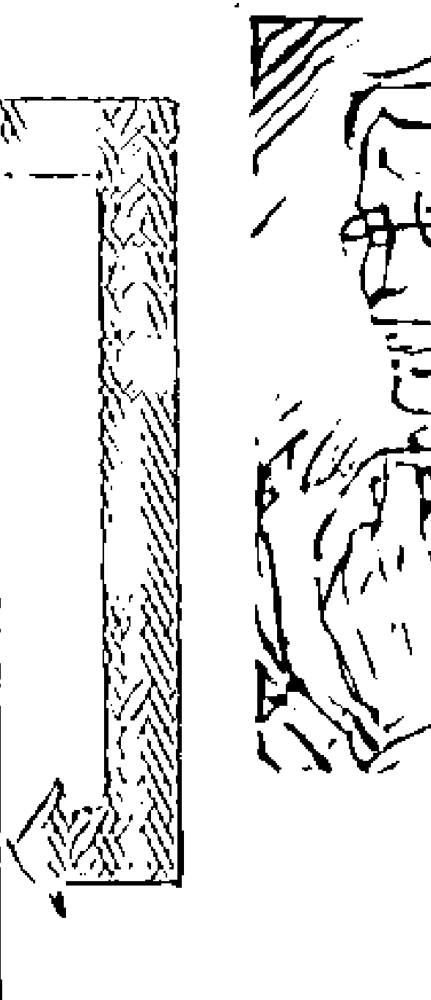

# 米斯卡塔尼克沙漠的遺跡

米斯卡塔尼克沙漠中央有刻著各種圖樣的岩石成排屹立，這些石頭其實是「古神」的遺跡曝露在地面以上的部分。

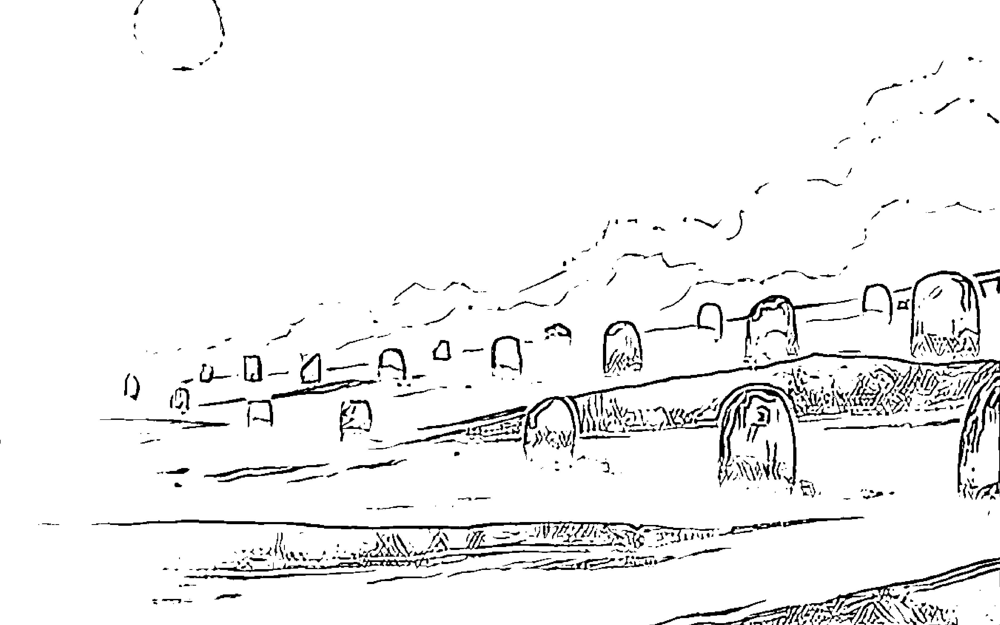

- ◯其他存在（「飛天水螅」）→No.024
- ◯奈亞拉托提普→No.005
- ◯瘋狂山脈→No.065

No.065

# 疯狂山脉

### Mountains of Madness

疯狂山脉是多名队员遇难牺牲的米斯卡塔尼克大学南极探险队在冰雪大陆所发现的充满疯狂氛围的山脉。

### ○黑色山岭

米斯卡塔尼克大学地质学系曾经在得到纳撒尼尔·德比·皮克曼财团资金赞助之后，于1930年毅然出发前往充满神秘气氛的冰天雪地南极大陆从事学术探勘。米斯卡塔尼克大学前后总共派遣过三次探险队，其中遭遇极为不幸的第一次调查队是跟日本的研究机关签约，于1月中旬从马尼拉出发，除仅有一名队员生还以外，包括队长查特威克教授和南豪义纪博士的所有队员全部神秘失踪，以极为惨澹的结局收场。9月2日从波士顿出航的第三次调查队是以队长米斯卡塔尼克大学地质学系的威廉·岱尔教授为首，再加上发明新式钻头的法兰克·H·帕博第教授、生物学系的雷克教授、物理学系的阿特伍德教授等4名顶尖学者，另外还有16名助手参加。调查队于11月9日抵达罗斯岛*1后，便在该岛设置贮藏物资的营地，展开南极大陆的学术调查。隔年1931年的1月22日，雷克教授率领西北部调查队在南纬76度10分东经113度10分的地方发现一座最高峰标高可达3万5000英尺、主要是由寒武纪*2的板岩所构成的黝黑山脉。当时调查队利用钻探调查找到一个洞穴，并且从中发现推测是在50万年前冰河期来袭时灭绝的生物化石。其实这个「化石」是陷入假死状态长期睡眠的「远古种族」，岂料「它们」却在解剖过程中醒来并陷入恐慌、死命抵抗反击导致雷克小队全灭。学者认为这座使人不禁联想到尼古拉斯·罗耶里奇*3的奇怪绘画、后来被命名为「疯狂山脉」的山脉或许就是《死灵之书》里面提到的黑色卡达斯山，标高2万英尺的台地上还有一座由许多巨石建筑物按照几何学整整齐齐排列而成的老第三纪*4巨大都市。

- *1 罗斯岛 (Ross Island): 罗斯海中的火山岛。位于南极洲维多利亚地岸外，罗斯冰棚的北缘。
- *2 寒武纪 (Cambrian Period): 古生代最老的一个时间划分单位，延续期间：5.4亿~5.05亿年。
- *3 尼古拉斯·罗耶里奇 (Nicholas Roerich): 俄国佳吉列夫俄罗斯芭蕾舞团的设计师，以雄伟的历史布景闻名，亦是神秘主义者、考古学家和风景画家。

# 1 南極探險隊的命運

| 日期 | 事件 |
|---|---|
| 10/10/11/12日 | 雷克小隊（本隊） |
| 10/10/11/11/18日 | 阿卡姆號、米斯卡塔尼克號從波士頓出航 |
| 10/10/11/11/21日 | 登陸羅斯島，設定貯藏物資營地 |
| | 於南緯86度7分 東經174度23分 設立南基地 |
| 10/10/11/11/22日 | 在南基地待命 |
| 10/10/11/11/23日 | 本隊開始準備撤離南基地 |
| 10/10/11/11/24日 | 與雷克小隊約定於10點左右再度通訊 |
| | 無法與雷克小隊取得通聯 |
| | 本隊出發前往南基地搜索雷克小隊 |
| 10/10/11/20日 | 佐阿教授與丹佛斯駕飛機前往探察 |
| | 佐阿教授與丹佛斯墜落瘋狂山脈 |
| 10/10/11/27日 | 佐阿教授與丹佛斯從瘋狂山脈折返 |
| 10/10/11/28日 | 本隊返回貯藏物資營地 |
| 10/10/11/29日 | 探險隊從南極撤退 |

**雷克小隊** |
| | 雷克小隊出發前往西北部探勘 |
| | 於南緯76度 東經113度10分 發現瘋狂山脈 |
| | 降落在瘋狂山脈附近的台地，開始調查 |
| | 發現變成化石的「遠古種族」 |
| | 將化石運往營地，開始挖掘 |
| | 遭到復活的「遠古種族」反擊，雷克小隊全滅 |
| | 本隊得知雷克小隊消滅 |

# 14 位置探勘：羅耶里奇

據說瘋狂山脈的黑色山嶺風景，跟認為「傳說中的香巴拉是位於緬甸、印度的俄羅斯東洋學者尼古拉斯·羅耶里奇的繪畫有幾分相似。

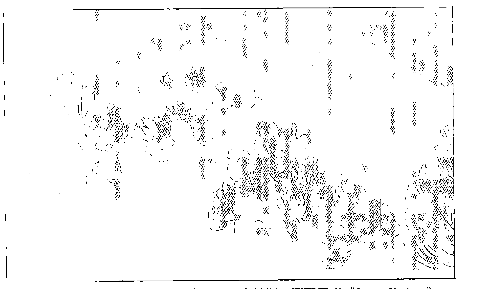

# 相關條目／參考文獻

- ○「遠古種族」→No.017
- ○《死靈之書》→No.025
- ○卡達斯→No.081

古近紀 (Palaeogene Period)：為新生代地層二分法中較老的一紀。開始時期約在6600萬年前，持續了大約4270萬年，隨後的是新第三紀。

# No.066
南太平洋
The South Pacific

南太平洋海域，最大的邪惡沉眠於此，一切事端亦肇始於此。宣告末日來臨的喇叭響起之時，遭到遺忘的大陸就會出現。

### ○邪惡潛伏的海域

除了擁有別稱「詛咒之遺跡」的南馬都爾海上遺跡的加羅林郡島波納佩島以外，其他像是以摩艾石像而聞名的復活島、毛依三石塔遺跡所在地湯加塔布島、還有科克群島和馬奎薩斯郡島等南太平洋島嶼，曾經多次發現許多明顯擁有共通特徵或模式的巨石遺跡和神像，因此這些島嶼在遙遠的太古時代應該是被涵蓋在整個南太平洋地區的範圍內，屬於相同的文化圈。挪威探險家托爾·海爾達爾認為此地區特有的基調樣式跟南美洲安地斯高原的文化頗有相通之處，主張南太平洋的島民乃是從南美洲乘船渡海而來，還在1947年親自乘著命名為康-提基號的木筏由秘魯的卡勞島航行至東玻里尼西亞，航程共8000公里、耗時101天。

不過早在海爾達爾進行這項實驗的15年前，也就是1931年，美國的詹姆斯·卻屈伍德早就在其著作《失落的姆大陸》裡面提出更大膽的假設，主張這些屬於共同文明圈的島嶼其實是數萬年前沉入海底的巨大大陸——姆大陸的一部分。

探險家阿博納·伊齊基爾·霍格1734年於波納佩發現《波納佩聖典》（Ponape Scipture），書中記載有當地崇拜的偉大的克蘇魯和「深潛者」相關記錄，如今已經成為佐證卻屈伍德說法的一項重要史料。

另外，1878年5月11日由紐西蘭航向智利的貨船波江座號，曾經在途中遭遇到因為火山活動而隆起、疑似屬於部分姆大陸的島嶼，並且從巨石建築物帶回一具木乃伊和書卷。

這些遺物被收藏在全美國木乃伊館藏量最富豐的波士頓卡伯特考古學博物館，並於1931年公開展示。

# 太平洋地图

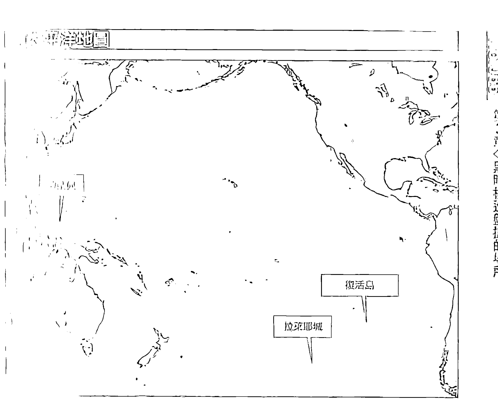

# 大事紀年表

| 年份 | 事件 |
|------|------|
| 1521年 | 麥哲倫從馬魯古群島出發至復活島 |
| 1535年 | 巴爾沃亞全面內戰 |
| 1542年 | 雷切爾·德·加馬由海峽抵達大海，將其命名為太平洋 |
| 1567年 | 西班牙人阿爾瓦羅·德·門達尼亞發現所羅門群島 |
| 1605年 | 西班牙人上將佩德羅·費爾南德斯·德·基羅斯發現復活島 |
| 1642年 | 荷蘭人亞伯爾·塔斯曼，首次出航 |
| 1722年 | 荷蘭人亞伯爾·塔斯曼，死於托克勞群島 |
| 1774年 | 詹姆斯·庫克小艇失蹤登陸加拉帕戈斯群島 |
| 1835年 | 達爾文，出海 |
| 1945年 | 美國對廣島與長崎實施核子攻擊 |
| 1946年 | 美國馬康-提太級秘密出航 |
| 1969年 | 美國登月行動，對拉萊耶城施以核子攻擊 |
| 1971年 | 在加拉帕戈斯群島發現古代美洲印地安人的遺物 |
| 1972年 | 尼米茲進行掃蕩試驗，將五艘船隻擊毀 |
| 1975年 | 在復活島的南岸發現遺跡 |

# 拉萊耶城

R'lyeh

> 聳立島嶼中央的巨大建築物裡面，彷彿死亡般沉沉睡去的偉大克蘇魯及眷屬正迫不及待地等待復活之日到來。

### ## ○龐然大物沉睡潛伏的海底都市

南緯47度8分、西經126度43分。從紐西蘭到智利西岸中央的南太平洋中央、座落於復活島東北方的海域裡，從前太古時代因地殼變動沉入海底、用綠色巨石營造而成的海底都市拉萊耶城，如今仍然在深海底静静等待著再次浮出海面。

表面已經被黑中帶綠的泥土覆蓋掩蔽住的拉萊耶城，乃是無視於歐幾里得幾何學、近乎瘋狂的曲線和形狀所構成。島嶼中央有座彷彿巨型陵墓的石造建築物聳立於山頂，底下躺著偉大的克蘇魯和眷屬們的龐然身軀，發出像是夢囈般的單調聲音墜入沉沉睡夢。

有史以來不知有多少克蘇魯的信徒用盡各種方法，試圖要這座拉萊耶城浮出海面。1925年3月受到海底火山的影響，使包括克蘇魯沉睡處在內的拉萊耶城部分地區自沉入海底以來首次浮出太平洋。不過另有其他說法指出，這場天地變異其實是一個信奉「外神」與「舊日支配者」，名為銀之黃昏鍊金術會的秘密教團所引起的。拉萊耶城浮出海面的時候，世界各地的藝術家等感受性較為強烈者均受到克蘇魯影響，暫時陷入瘋狂，甚至有人留下相當奇怪的作品。

其次，克蘇魯信徒還會使用語句中夾雜著許多模糊不清的擦音——就人類口部構造來說發音有點困難的「拉萊耶語」，一個語言其實是早在人類誕生以前克蘇魯從外宇宙帶到地球來的古老語言。拉萊耶語的禱詞當中最有名的便是「Ph'nglui mglw' nafh Cthulhu R'lyeh Wgah'nagl fhtagn」，經過翻譯後意為「死去的克蘇魯在拉萊耶城的巢穴裡，等著作夢」的意思。

# 阿拉耶城

沉沒在深海底下的拉萊耶城。偉大的克蘇魯及其眷屬沉睡的巨大石造生物，就在這座無視於幾何學規則的扭曲都市裡面。

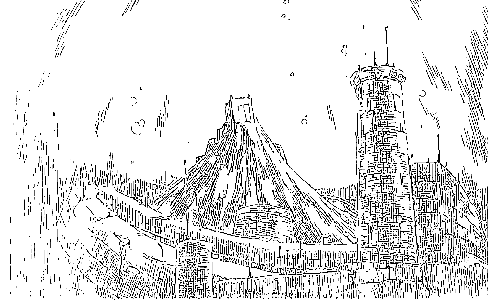

# 克苏鲁之地

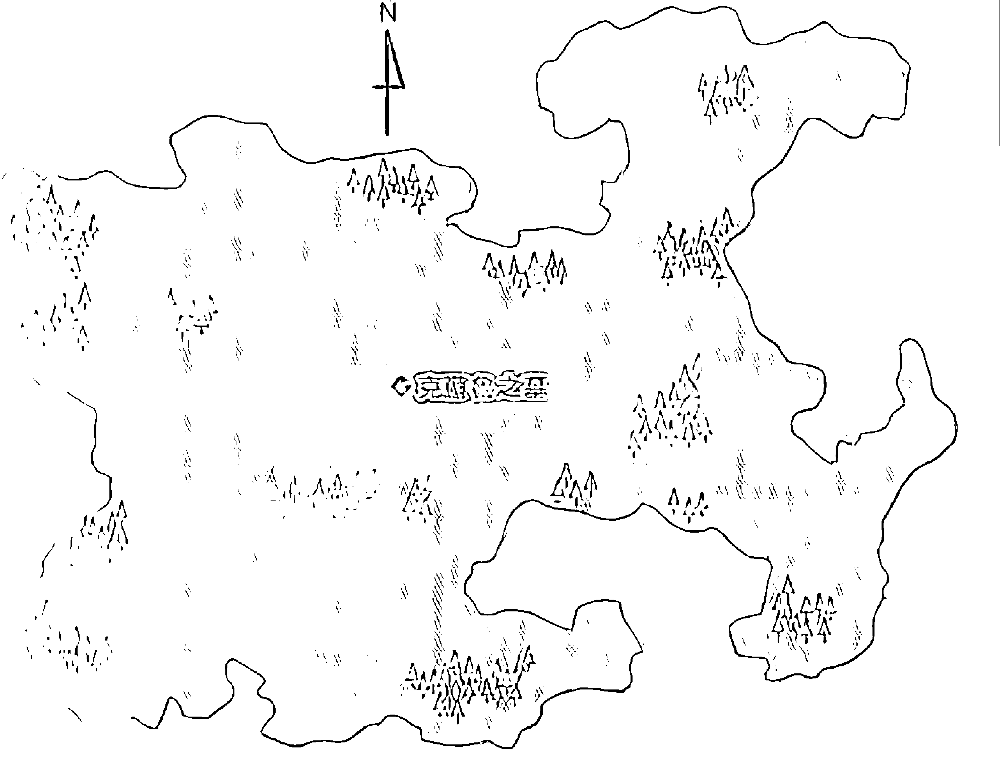

# No.068 复活岛
Easter Island

當地語言稱為「拉帕努伊」（大島）的太平洋火山島，島上的巨石像只是靜靜地凝望著水平線彼方。

### ○阿胡摩艾之岛

南緯27度、西經109度的太平洋海面有個形狀接近等邊三角形的大島，名叫復活島。這座正式名稱叫作帕斯瓜島，屬於智利的火山島跟加羅林群島波納佩島等島嶼同樣，是從前統治地球的「舊日支配者」留下了明顯足跡的眾多秘境之一。

在復活島正對海面的山腰地帶有許多名為阿胡摩艾的人形巨石像林立。阿胡摩艾是此島得以成為世界遺產之主要原因，同時也是現在復活島最重要的觀光資源，其實這些巨石像是從「深潛者」在這座島嶼設立太平洋據點時，為了要用來觀察他們所崇拜的偉大的克蘇魯沈眠的海底都市拉萊耶城浮出海面之情報所設置的監視裝置。

復活島全域均有阿胡摩艾分布，其中在建有多達53座神殿的拉諾拉拉庫火山地底還有個克蘇魯信徒奉為聖地的「獨石域」，該聖地中央的獨石頂端則是放置著一尊克蘇魯石像。

這尊克蘇魯石像具備類似通訊裝置的功能，當地面的阿胡摩艾偵測到拉萊耶城浮出海面的時候，石像就會將消息通報給地中的強壯使者奈亞拉托提普知道。

從前「深潛者」居住的洞窟是由脆弱的溶岩所構成，幾乎已經全數崩塌，自從牠們離開復活島以後，看守觀測拉萊耶城的工作便改由人類的克蘇魯信徒接手。

其次，長期以來復活島和「深潛者」的關係向來都是不為人知，直到1925年有位名叫梅斯里吉的教授率領美國大學考古隊發現了顯示此地有魚人信仰的雕像和黏土陶壺，這個傳說才得到學術研究的證實。

> *1 阿胡摩艾 (Ahu Moai):「阿胡」(Ahu) 在當地語言裡面有聖城、祭壇的意思。

# 第3章 ◇ 黑暗搜巡盤據的場所

位於復活島阿基維地區、凝視著海平面的7尊摩艾像。拉萊耶城便沈沒在這些石像的視線前方。

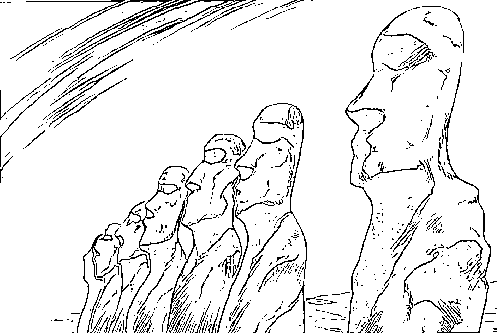

拉萊耶的謎樣地圖

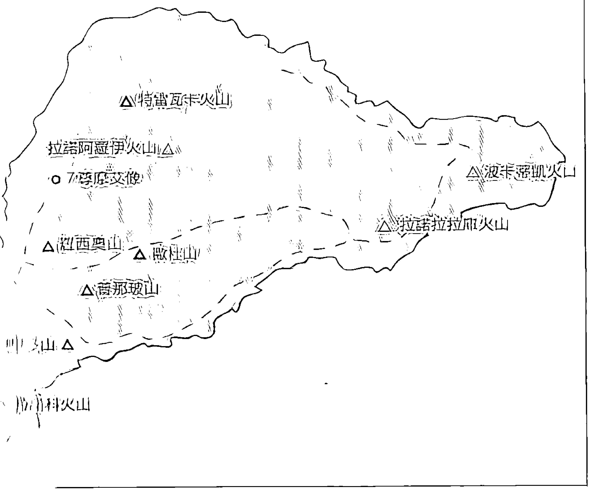

- No.016 ◯偉大的克蘇魯 →No.003
- No.017 ◯奈亞拉托提普 →No.005

# No. 069
失落的大陆
Lost Continents

悠悠歲月洪流之中，巨大大陸的壯麗文明亦不過是過眼雲煙，從澹澹白浪裡面出現的，終究還是要消逝在澹澹白浪之中。

### ○幽幽深海

世界各地都有洪水或火山爆發等天地變異使得陸地沉入海洋的傳說，譬如《舊約聖經》〈創世記〉的諾亞方舟傳說、環太平洋地區的兄妹始祖洪水神話等都是。

史上最有名的「失落的大陸」當屬柏拉圖在《柯里西亞斯》、《提瑪友斯》裡面提到沉沒在大西洋海底的亞特蘭提斯大陸。因為奠定西洋哲學之基礎而聞名於世的柏拉圖生於西元前400年前後的希臘，他是根據西元前6世紀的政治家梭倫從埃及祭司口中聽來的傳說，將亞特蘭提斯大陸的地理、歷史和文化記錄了下來。直到美國的伊格內修斯·唐納利於1882年發表研究書籍《亞特蘭提斯》以後，這則亞特蘭提斯傳說方才在一夜之間受到了全世界矚目。一般認為這股亞特蘭提斯風潮其實是受到因里希·謝里曼於1870年發現特洛伊的衝擊影響，事實上也有說法指出謝里曼本身握有跟亞特蘭提斯有關的重大線索，他們的孫子保羅·謝里曼後來還曾經在1912年的美國報紙上公布關於亞特蘭提斯的消息，隨後卻立刻斷絕了音訊。

希柏里爾大陸與亞特蘭提斯同樣是希臘時代傳說中的大陸，老普林尼於1世紀前後編纂的《博物誌》、《萬物的性質》曾經提及在蘇格蘭北方有個叫作希柏里爾的肥沃樂園。前述大陸都只是種半神話的存在，相對太平洋的姆大陸和印度洋的利亞大陸雖是19世紀以後「發現」的新大陸，不過神智學始者海倫娜·P·布拉瓦茨基卻主張，相傳在亞特蘭提斯大陸的森薩爾語所寫成、後來阿卜杜·阿爾哈茲萊德在執筆《死者之書》時曾經引為參考的《多基安之書》便有記載姆和黎姆利亞的歷史。

# 「失落的大陸」發現史

| 年份 | 事件 |
| :--- | :--- |
| 1904 | 賢者梭倫從埃及的祭司口中得知亞特蘭提斯的傳說 |
| 1904 | 柏拉圖在《柯里西亞斯》與《提迈友斯》裡面提及亞特蘭提斯 |
| 1911 | 英國生物學家菲力普·史拉特爾發表利姆利亞大陸的概念 |
| 1913 | 詹姆斯·卻屈伍德從印度高但處發現記利姆大陸記錄的碑文 |
| 1925年4月19日 | 巴黎博物館的拉爾·阿薩那斯教授在北緯33度22分西經16度17分的深海裡目賭到亞特蘭提斯的遺跡。 |
| 1928年10月11日 | 利姆大陸部份地區浮出海面，發現石化的活木乃伊。 |
| 1929年10月20日 | 保羅·衛里曼投稿報社，發表他發現亞特蘭提斯大陸的消息。 |
| 1930 | 倫道夫·卡特卻屈伍德進行奈柯爾的共同研究？ |
| 1930 | 詹姆斯·卻屈伍德發表《失落的姆大陸》 |
| 1930 | 萊昂尼爾·厄奈特發表《姆大陸的神秘》 |
| 1930 | 克蘇魯神話研究家林·卡特介紹利姆利亞之王的傳說 |
| 1930年10月10日 | 萊昂尼爾·厄奈特失蹤。 |

# 將亞特蘭提斯之名傳給後世的柏拉圖

與亞里斯多德共同構築奠定西歐哲學基礎的柏拉圖，曾經在其著作中提到亞特蘭提斯的傳說。

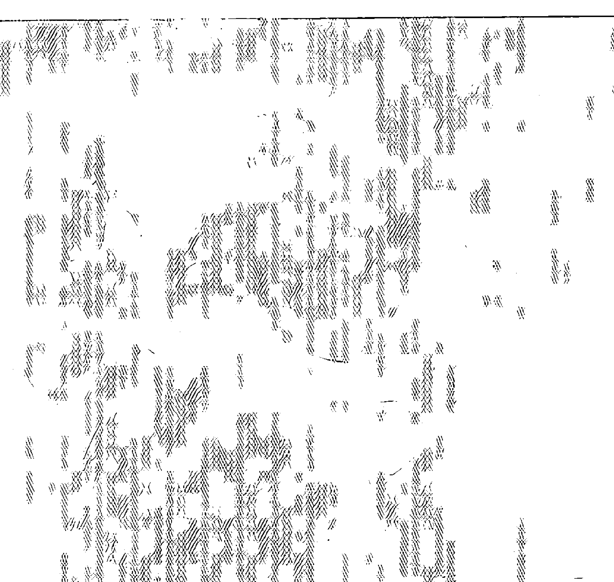

出處：ラファエロ 《アテネの学堂》

- ○阿卜杜·阿爾哈茲萊德→No.088
- ○《死靈之書》→No.025
- ○其他書籍（《多基安之書》）→No.037

# No.070
希柏里爾
Hyperborea

希柏里爾是在冰河時期滅亡的偉大北方王國。沃米達雷斯山的地底下，隱藏著黑暗神明居住棲身的領域。

### ○希柏里爾的歷史與信仰

所謂希柏里爾是指冰河期以前位於歐洲北方格陵蘭附近的大陸，以及曾經存在於該大陸的王國。該王國各個都市是由受封領主的貴族們統治，他們擁有高度發達的商業文化、使用賈爾幣和帕茲爾幣等貨幣，其鼎盛時期遠從姆和亞特蘭提斯都有進口，希柏里爾跟這些隔著汪洋大海的地方也都維持著頻繁的貿易往來。首都科莫里翁附近的沃米達雷斯山有支叫作沃米族的凶惡種族棲息於此，他們一直都是希柏里爾的統治者，直到300萬年以前遭到人類驅趕進入山區為止。在沃米達雷斯山地底開闢的廣大洞窟世界裡面，除了有傳為沃米族創造的物種——蛇人族的都城之外，還有蜘蛛神阿特拉克·納克亞、札特瓜、阿布霍斯等古老神明的住處也都在這裡。

希柏里爾王國普遍崇拜一位名叫伊荷黛（Yhoundeh）的鹿女神，可憎而貪婪的札特瓜教團則是被視為邪教，其信仰時期遭到王國禁止。然而當地對這個來自外宇宙的「舊日支配者」札特瓜的信仰卻是根深蒂固，相傳從繞著大角星運行的雙星米爾飛到地球、早在人類出現以前就住在希柏里爾大陸的外星生物同樣也是札特瓜的信徒。

希柏里爾信仰的神明還另有在尤祖達魯姆建有神殿的月之神蕾尼琪亞（Leniqua），以及乘著巨大冰山來襲、貌似的蠕蟲的魯利姆·夏科洛斯（Rlim Shaikorth）等神明。

希柏里爾王國曾經在人類史初期盛極一時，後來卻受到流著札特瓜血液的沃米人庫尼加欽·佐姆的襲擊而棄守首都科莫里翁，接著就開始慢慢地持續衰退。最後希柏里爾終於因為冰河期侵襲地球而滅亡，這片大陸亦就此沉入海底。

## 希柏里爾的歷史

| 年代 | 重大事件 |
| --- | --- |
| ...... | 札特瓜從恩益伊的黑暗世界移居至希柏里爾地底。 |
| ...... | 其後，最早統治希柏里爾的基座米爾星人飛抵此地。 |
| ...... | 蛇人族逃居至此，創造繁榮的科學文明。後來漸漸被趕進地底世界。 |
| ...... | 與札特瓜結有淵源的沃米族文明興起，後因冰河期來襲以及人類出現而開始衰退。 |
| ...... | 希柏里爾的許多王國繁榮發展。首都設於科莫里翁的時代和接下來首都設於尤祖達倫姆的時代，是人類在希柏里爾的鼎盛時期。 |
| ...... | 厭道士伊波恩逃亡土星。伊荷黛信仰漸趨沒落，札特瓜信仰崛起。 |
| ...... | 邪神母利姆、夏科洛斯乘著移動冰山伊亞爾斯來襲，造成柯蘇爾半島各大都市滅亡。 |
| ...... | 冰河期到來導致大陸沉入海底，希柏里爾滅亡。 |

## 希柏里爾的地圖

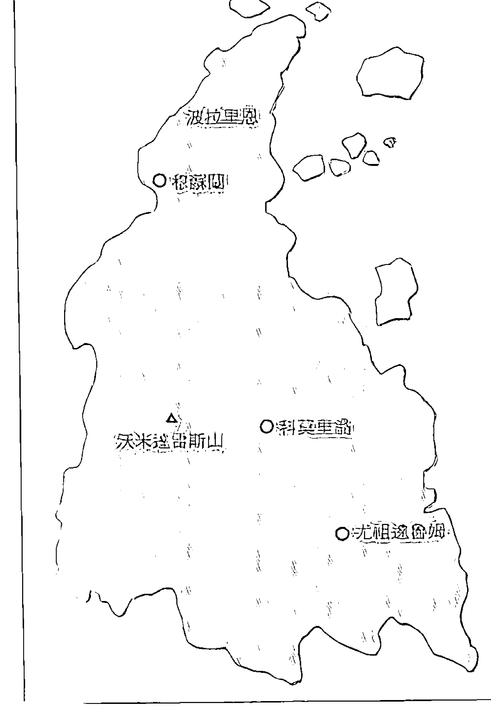

希柏里爾 傳說位於現在格陵蘭附近的古代大陸希柏里爾地圖。除札特瓜和阿特拉克·納克亞棲息的沃米達雷納斯山以外，還有受到威尼加敦·佐姆毀壞因而荒都的科莫里翁。

- ○其他神明（阿特拉克·納克亞）→No.015
- ○札特瓜→No.012

No.0711
Mu姆
早在人類搖籃時期便已經擁有高度發達文明的南太平洋大陸，卻因為蒙受從前居民驅趕的神明盛怒而在一夜之間沉入大海。

### ○失落的姆大陸

姆大陸是距今數十萬年前曾經存在於南太平洋的寬廣大陸，3億年前的姆大陸是偉大的克蘇魯及其眷屬統治的勢力範圍。

自從古代都市拉萊耶城因為星辰的變化以及隨之而來的地殼變動而沉沒海底、克蘇魯亦陷入長眠以後，距今1億6000萬年前又有猶格斯星人飛抵地球。儘管它們最後還是從姆大陸消失了，但它們卻把從猶格斯帶來的「舊日支配者」加塔諾托亞給留在亞狄斯戈山的地底。

後來人類在姆大陸發展出繁榮興盛的王國，並且與亞特蘭提斯和希柏里爾都有頻繁貿易往來，最後卻因為地殼變動而沉入海底。

姆大陸的名字僅可見於相傳於亞特蘭提斯著作的《多基》和腓特烈·威廉·馮容茲的《無名祭祀書》等極少數文獻直到自稱是英國陸軍上校的詹姆斯·卻屈伍德解讀出收藏在某座印度教寺院裡的黏土板上的奈柯碑文，並於1931年《失落的姆大陸》為止，長期以來姆大陸一直都是個早已被人類史遺忘的名字。

後來威爾斯出身的陸軍上校萊昂尼爾·厄奈特繼承了卻屈伍德的研究工作，並將研究成果匯整成其著作《姆大陸的神秘》。

厄奈特認為古代的姆大陸是受到來自仙女座星雲的羅伊格爾族統治，並且主張卻屈伍德在書裡面提到的七頭邪神納拉亞其實就是羅伊格爾族的首腦加塔諾托亞。厄奈特在1969年2月1日連同一架從夏洛特維爾飛往華府的西斯納客機憑空消失，到現在仍然不知去向。

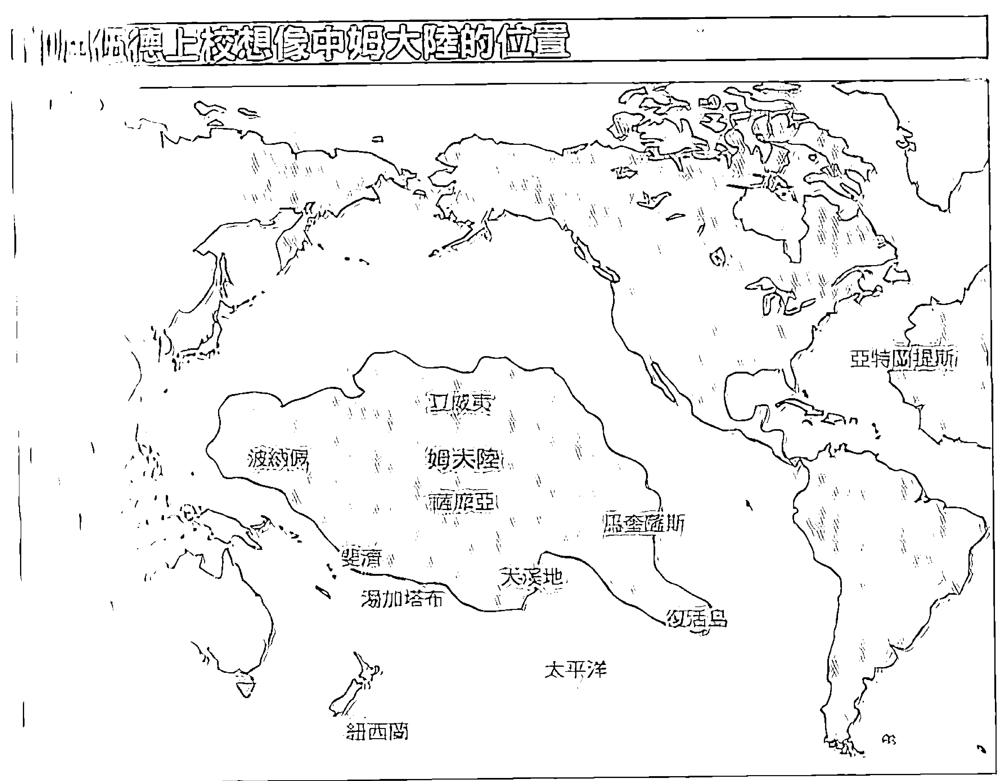

| 时间 | 事件 |
| :--- | :--- |
| 约 1000 万年前 | 姆大陆隆起浮出太平洋海面。 |
| 约 100 万年前 | 伟大的克苏鲁及其部族自天外降临地球，在姆大陆建造拉莱耶城。 |
| 约 50 万年前 | 地壳变动使得姆大陆部分地区沉入海中，拉莱耶城亦沉入海底，伟大的克苏鲁则进入沉眠。 |
| 约 1.5 万年前 | 据传斯星人飞来（无法得知是否就是‘米·戈’（廷格斯真菌）），在亚狄斯戈山建造地底要塞，将加塔诺托亚和伊塔库族幽禁于亚狄斯戈山。 |
| 约 1 万年前 | 人类在姆大陆创造文明，通过与穆利利亚、希柏里尔的贸易而迅速兴盛，并且在南美洲建立殖民地。 |
|  | 姆大陆崇拜伟大的克苏鲁、众蛇之父伊格、莎布·尼古拉斯、加塔诺托亚。 |
| 约 8000 年前 | 加塔诺托亚使得姆大陆在一夜之间沉入水中。 |

- ○ 拉莱耶城 → No.067
- ○ 《无名祭祀书》 → No.029
- ○ 其他书籍（《多基安之书》） → No.037

> 透過狐猴始得以將大地連結起來的印度洋超古代大陸。將這座大陸拼湊殆盡的蛇人與人類的最終戰役，前前後後竟持續長達千年之久。

### ○蛇人終末之地

黎姆利亞大陸位於太古時代的印度洋，同時也是從前在人類黎明時期成為人類與蛇人最終戰場的大陸名。

首位注意到這個沉入海底已久的黎姆利亞大陸的人，就是19世紀的英國生物學家菲力普·史拉特爾。

史拉特爾在調查一種叫作狐猴的狐猴科動物的時候，發現一個非常奇妙的現象：分布於印尼、斯里蘭卡與蘇門答臘的狐猴，在汪洋彼岸的非洲和馬達加斯加亦有棲息地。為說明這種分布範圍的特異現象，史拉特爾遂提出了一個主張從前印度洋曾經有個廣大大陸存在的假設。德國生物學家恩尼斯特·海因里希·海克爾也贊成這個假設，甚至還進一步主張黎姆利亞是人類的起源地。

現實世界裡的黎姆大陸是在距今50萬年前從印度洋沉入海面。黎姆利亞的首批統治者，就是在進入冰河期之後逃離沉入海面退的希柏里爾大陸而遷居到這塊新大陸的蛇人。

蛇人是在恐龍主宰地球許久以前，於二疊紀由爬蟲類進化形成並建立高等文明的種族，當時蛇人們在黎姆利亞這個新大陸建立了強大的王國，但終於還是與在身心雙方面都已逐漸獲得力量的人類展開了黎姆利亞統治權爭奪戰。

經過長達千年的戰亂以後，蛇人王國終於崩潰破滅，蛇人們也幾乎全部都在與人類的戰鬥當中遭到殺害。好不容易才存活下來的蛇人魔法師們雖然曾經陰謀欲將「外神」召喚到地球，但是其陰謀卻悉數遭到人類的英雄們阻止，黎姆利亞大陸亦就落入人類掌握。如今黎姆利亞大陸也已經沉進了印度洋海底，蛇人類的偉大時代已經告一段落。

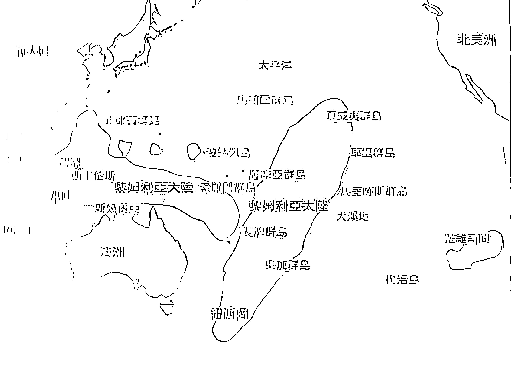

## 黎姆利亚萨迦

「黎姆利亚萨迦」始于1967年出版的《松葛门邪神》，是由林·卡特所写的一部英雄式奇幻小说。著名的克苏鲁神话研究家林·卡特其实本以撰写、评论英雄式奇幻作品而闻名，甚至还著有J·R·R·托尔金的《魔戒》评论等作品。「黎姆利亚萨迦」是以超古代黎姆利亚大陆为背景，叙述英雄松葛如何对抗邪恶的爬虫类人种和魔法师，是部模仿《野蛮人柯南》、《王科南》系列作的正统派英雄式奇幻小说，里面还有个源自克苏鲁神话蛇人的爬虫类人种「恶龙之王」的角色。虽然林·卡特从来不曾明确指出克苏鲁神话与「黎姆利亚萨迦」有何关联，但在1980年代后，混沌元素出版公司（Chaosium Inc.）推出的桌上型角色扮演游戏《克苏鲁的呼唤》却在蛇人的解说条目中添加了「恶龙之王」此项目；此后，「黎姆利亚萨迦」的设定也才从此被吸收纳入了不断增殖进化的克苏鲁神话体系之中。

- No.024 ○希柏里尔→No.070

No.073

## 星星的世界

### The Stars

人类往往贪图名为无知的安息假象，对繁星趁着夜黑低语耳语的无限恶意以及彼等所散播的恐怖全都一无所知。

### 来自远方

《死灵之书》和《伊波恩之书》等禁书在字里行间暗示著我等身处宇宙的真正面貌，在这个世界里面，每颗在黑暗中绽放光芒的星星都藏著相互敌视的无限恶意，发出狂啸的疯狂混沌力量漫步在银河与银河间的黑暗空间，到处破坏、散播灭亡，是个仿佛巨大鬼屋般充满怪异与恐怖的世界。如果说夜的黑暗是人类恐惧的凝聚物，那么被无底的黑暗填满的宇宙空间究竟会有何等恐怖力量滋生蔓延呢？我们对潜藏在蓝色大海深处的黑暗都几乎毫无所知了，更遑论是位于苍穹彼方阖黑的无垠真空，所知更是少之又少。在众所周知的公开历史里面，人类仅仅1969年7月20日阿波罗11号登陆月球以来曾经数次在地球外的星球留下足迹，即便是在人称宇宙时代的21世纪，也从没有人能够将足迹拓展至地球运行轨道之外。

### 诸神的黄昏

有些人主张从前在天上曾经有过战争发生。他们认为，住在异次元世界的「外神」和世称「旧日支配者」的邪恶神明曾经展开激烈的宇宙霸权争夺战，可是这些异形邪神后来却被猎户座的一等星参宿四[^1] ——亦即古代记录里称为古琉湟的红色恒星的诸位善神「古神」[^2]打倒，并且被封印于宇宙之外、雄牛座[^3]的黑色星球以及地球的海底深渊等地。不过这个二元论式的宇宙观目前已经大致遭到否定。据传许多神明都受到星辰变化影响而进入沉眠，必须经过漫长岁月，等到繁星再度回到正确的位置，它们才会再度醒转，重登宇宙统治者的宝座。

- * 参宿四：请参照P.011译注。
- * 古神（Elder Gods）：或称「旧神」，请参照P.011译注。
- * 雄牛座：请参照P.011译注。

## 洛夫克拉夫特神话相关天体

| 分类 | 名称 | 说明 |
| :--- | :--- | :--- |
| (不明) | 尤格·索托斯 | 有「米·戈」(弗格斯豆苗)的殖民地 |
| | | 有名为「火星内的埃及」的巨石遗迹 |
| | | 沒來的水星住著「伊斯之裔大種族」將來的精神將移植到植物根系 |
| 山 (人非人) | 達貢一族 | 曾在挑染地球的途中在此歇腳 |
| (不明) | 札特瓜的伯父荷姆拉·札特瓜曾居住於此 |
| | 「遠古支配者」札特瓜所居住的星體 |
| | 札特瓜的爪牙：不定形生物的母星 |
| | 来到布列契斯特的「達貢一族」的星球，因大規模天地變異而毀滅 |
| (不明) | 「達貢一族」奴役的蝦状生物栖息的行星 |
| (不明) | 「遠古支配者」哈斯塔所居住的黑色星球就在織宿五附近 |
| | 察拉伊諾斯所在星系，同時也是「遠古支配者」哈斯塔居住的星體 |
| | 「古神」居住的星系 |
| (不明) | 擁有高度文明的巨噬細菌族的智慧生命体居住於此 |
| | 伟大的克苏鲁及其仆从来自的星系 |
| | 「伊斯之裔大種族」的出身地，《埃爾特紐姆之片》指其位在銀河系 |

## 热心于天文世界的少年

洛夫克拉夫特神话作品的英雄式奇幻小说作家理查·L·堤艾尼曾经评论：「洛夫克拉夫特将整个大宇宙化作了一个人间，换句话说，他成功地将宇宙恐怖跟哥德小说风格融合在一起。」  作为神话的创造者，或者说得更精粹一点，身为创造出后来成为恐怖小说根源的宇宙恐怖的创造者，洛夫克拉夫特从少年时代起就对天文非常感兴趣，是位曾经仅以13岁之龄便向天文杂志投稿专栏短文的少年。  不知道当时洛夫克拉夫特眺望着头顶黑暗的宇宙空间时，究竟有什么样的想法？  洛夫克拉夫特所处的20世纪前半叶时代，同时也是科学发达与新发现不断出现的时代，自1930年太阳系最遥远的行星冥王星被发现以来，洛夫克拉夫特便将人类所知最遥远的行星命名为邪恶的犹格·索托斯，并且频繁地在作品中提及这颗星球。地球宛如伫立于太阳系这个狭窄庭院里的一个小房间，宇宙的恐怖仿佛是威胁着人类的力量悄然逼近的门户，从外宇宙飞来地球的异形怪兽与非人种族也大多都曾经在这个太阳系最边缘的行星留下足迹。洛夫克拉夫特神话故事，便是利用这种宇宙规模的宏观观点向读者释放出强烈的恐怖感，让陷入疯狂被恐惧所迷惑的人类，其实只不过是沧海一粟、渺小的存在。

No.074

## 月球

### Moon

> 永遠僅以單面朝向地球進行旋轉的神秘衛星。潛伏於月球背面的邪惡力量如今仍在夢中不斷地蠶食侵略。

### ○悠悠月照

打從上古時代以來，地球的衛星月球便一直是人類數不盡的沒情懷的寄託對象。

自從1969年7月20日阿波羅11號登陸月球以來，月球對人類來說便再也不是未知的領域，但事實上月球至今仍是個充滿無數秘密的神秘場所。「米·戈（猶格斯真菌）」在滿佈無數火山口彷彿麻臉般的月球表面底下建有殖民地，可供它們從安地斯山的採礦場轉移至此。

月球殖民地共有1000隻以上的「米·戈」與超過100名的人類協助者滯留於此，月球表面的某個火山口底下還設有它們用來祭祀莎布·尼古拉斯的祭壇。

幻夢境裡的月球有別於現實世界裡的月球，自成一個獨立的小世界。

幻夢境的商業貿易中心地藏拉茲李恩有許多商人乘著散發惡臭的槳帆船，來這裡買賣在現實世界完全沒有出產的紅色寶石。

這些神秘商人完成工作以後就會返回在神秘的月球背面散發著惡臭的都市，將黃金和奴隸獻給擁有粉紅色觸角貌似蟾蜍的生物月獸。

相傳月球背面還有個可供地球的貓隻秘密聚會的神秘領域，牠們會在這裡舉辦唯有貓才能參加的饗宴；利用大跳躍從地球來到月球的貓族跟月獸是世仇，雙方的的衝突還經常演變成戰爭。

這些地球貓族唯一畏懼的就是來自土星的貓族，牠們同樣喜歡來到月球的背面。來自土星的貓族還與月獸締有盟約，共同對抗不共戴天的仇敵地球貓族。

## 月球背面的各方勢力

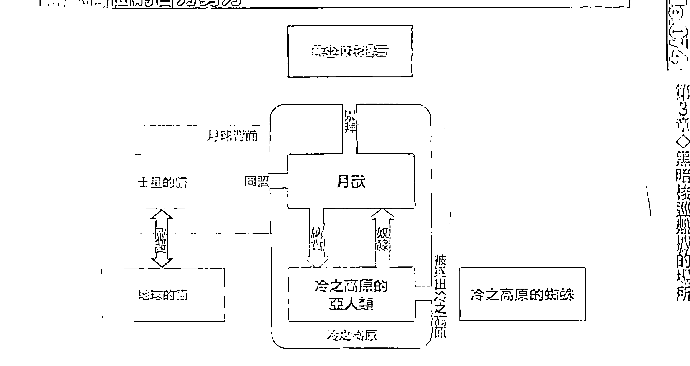

月球是距离地球最近的天体，也是人类视力可及的异世界，自古以来便承载着许多神话与传说的舞台。

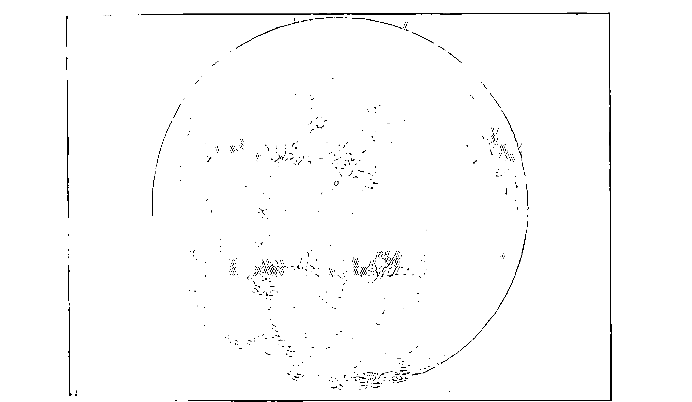

- 月球表面（背面）→No.022
- ○幻梦境→No.080
- 月球的卫→No.007

## 火星

### Mars

以羅馬神話的戰神命名、在地球外側繞著太陽運行的赤紅星球，同時卻也是不斷激起地球人無盡幻想的戰爭星球。

### ○火星的人面岩

火星是除月球以外最接近地球的星球，從遙遠的太古時代以來一直都是外宇宙存在飛往地球時的前哨地。

進入 20 世紀以後，在火星大幅接近地球的 1902 年 6 月澳洲渥金地區，以及第二次世界大戰開戰前夕 1938 年 10 月的美國紐澤西州特棱頓，曾經有從火星發射出來的圓筒形物體墜落在地面，從中鑽出不知是蜘蛛抑或章魚的奇怪生物大肆破壞、造成恐怖，最後還發展成必須出動軍隊的嚴重騷動。

波士頓的夢想家倫道夫·卡特對朋友說過自己曾經在火星地表目睹到巨石建築物的廢墟；包括卡特在內的部分神秘學者相信，在火星的賽多尼亞地區有種外形彷彿模仿人類面孔所造的巨大建築物「火星內的埃及」，跟「銀鑰匙」有關的太古時代秘密就在這個建築物裡面。1976 年 7 月，火星勘查機「維京人 1 號」偶然拍攝到這座長達 2.6 公里、寬達 2.3 公里的奇特建築，引發外界疑為古代文明遺跡等多方揣測。然則 1998 年 4 月再度派遣搭載高性能機具的火星勘查機「火星環球測量者」前往拍攝，原先的地點卻只剩下曾經有座岩山存在過的痕跡。

倫道夫的伯祖父是住在維吉尼亞州的前南軍騎兵上尉約翰·卡特，南北戰爭結束後他在 1866 年從亞利桑那州的某個洞穴奇異失蹤；根據約翰·卡特傳記的作者——奇幻作家艾德加·賴斯·柏洛茲表示，約翰·卡特在再度出現以前的這段 15~16 年期間內，其實是滯留生活在火星上面。其次，波士頓的發明家湯瑪斯·麥克魯斯基也自稱曾經多次使用自己發明的可將人的心靈與肉體分離開的裝置，前往火星。

## 斯基亞帕雷利的火星圖

義大利天文學家喬凡尼·斯基亞帕雷利在火星地表觀察到的溝壑，後來的羅威爾認為應該是運河。

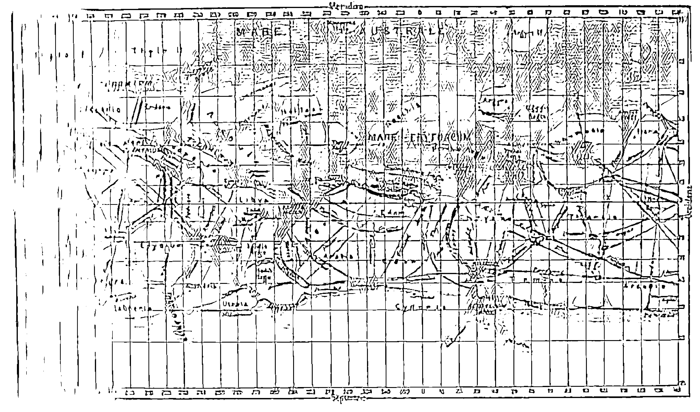

## 火星的誘惑

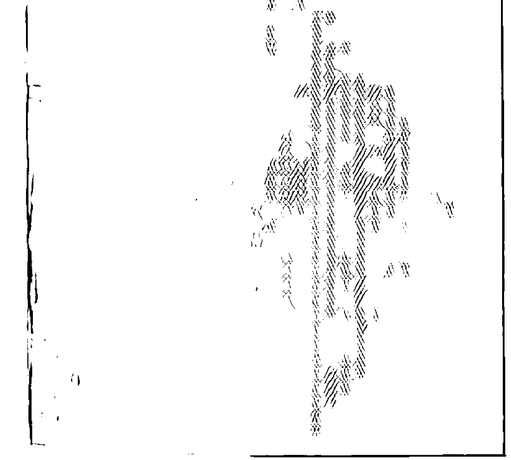

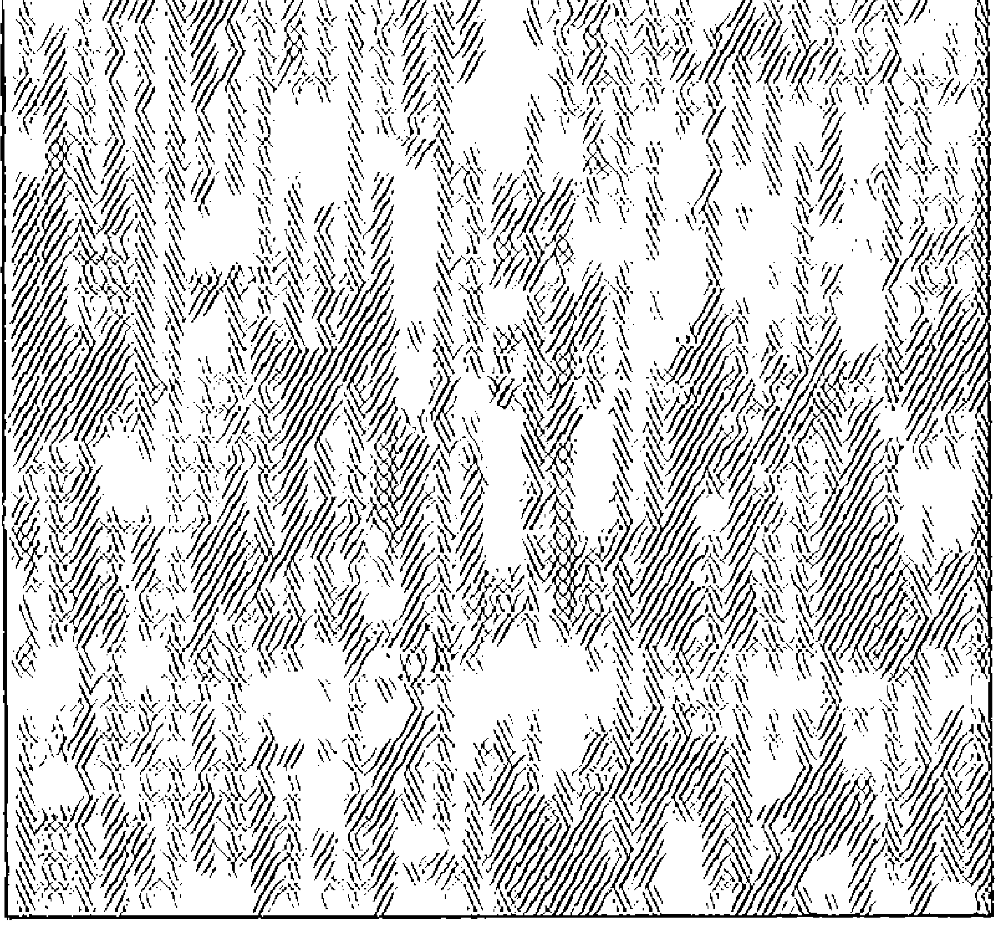

火星是太陽系第四行星。

火星的人面岩
1976 年維京人 2 號於火星的賽多尼亞地區拍攝到的人面岩。當時受到大眾媒體大篇幅報導，討論人面岩是否曾經有智慧生命存在過的痕跡。

在羅馬神話中，戰神「馬爾斯」

No.076

## 土星

### Cyklranosh

擁有巨大環狀構造的太陽系第六行星。這顆與扎特瓜一族頗有淵源的星球，是個人類或可在此存活、充滿生命力的行星。

### ○塞克拉諾修星

環狀小行星帶是土星的最大特徵，此星球絕非目前根據科學勘查結果所推測的那般是個氣態行星，這裡其實擁有會散發硫磺味道和刺鼻酸味的大氣層；在微微帶著綠色的黑暗天空裡，嚇人的三層環狀行星帶隨時綻放著耀眼的光芒，跟小小的太陽一齊照亮了土星的地面。

土星在希柏里爾大陸北方的穆蘇蘭半島被稱為「塞克拉諾修星」，其自然環境是由礦物性植物與菌類的森林，以及類似水銀的液化金屬匯流成的河川湖泊所構成，還有好幾種智慧生命棲息於此，包括頭部和身體連成一體的布雷孚羅姆族、沒有翅膀的鳥人吉比斯族、饒舌的侏儒艾菲克族、畏光躲在地底的格爾族，以及頭部有道痕跡的伊迪姆族。

從前魔術師伊波恩遭伊荷黛的祭司們驅逐、借助扎特瓜的力量才逃到了土星，他還曾經在這裡與伊荷黛的祭司莫爾基一齊面見扎特瓜的伯父——土星之神荷鳩癸格姆扎。

其次，據說從前偉大的克蘇魯率領眷族從黑暗的索斯拉到太陽系的時候，也曾經在降落地球以前在此暫停休息。

### ○土星的貓

幻夢境的太陽系與現實的太陽系同樣都有土星存在，所以土星經常會有種體型非常龐大的「土星的貓」飛到月球旅行。儘管名為貓類，其體態卻不像地球的貓如此優美，而是由許多表面帶有複雜圖樣的寶石所構成。土星的貓出於某種只有他們自己才知道的理由，對地球的貓極為敵視，甚至還會特地從土星及其衛星來到地球，挑起貓族之間的戰爭。

## 土衛系修星的生物

| 名称 | 種族別 | 說明 |
| :--- | :--- | :--- |
| 扎特瓜的伯父 | 神 | 札特瓜的伯父，土星之神。全身有毛，腳短骨長，頭部倒掛在球狀肩膀頂端，臉上總是一副快要睡著的表情。 |
| 土星人 | 土星人 | 頭部與身體連成一體的高等種族。此種族是功利主義者，早就已經拋棄對神明的信仰。 |
| 土星人 | 土星人 | 沒有翅膀的鳥人族。終日待在樹木上耽於冥想。 |
| 土星人 | 土星人 | 住在雙殼亜幹裡面的細舌侏儒。由於收穫很快就會崩塌，所以不時都在尋找新家。 |
| 土星人 | 土星人 | 畏懼太陽與土星小行星帶的光線，無論如何都不會離開地底的神祕種族。 |
| 土星人 | 土星人 | 崇拜荷蘭癸格姆札的秘魚的種族。厄道士伊波恩與神官莫爾基曾經受到他們庇護。 |
| 吃人怪物的怪物 | 動物 | 會留下凹形足跡的多足生物。布密罕羅姆族的家畜。 |
| 土星人 | 植物 | 擁有黑曜石的光澤，貌似藍結色仙人掌的固物植物。 |
| 土星人 | 植物 | 布密罕羅姆族當作主食的巨大豆類。密克拉諾修星有各式各樣不同種類的豆類。 |

### 土衛六/土衛十

土星非但以其巨大環狀構造而聞名，另外擁有土衛六、土衛十等總共……也是它的重要特徵之一。

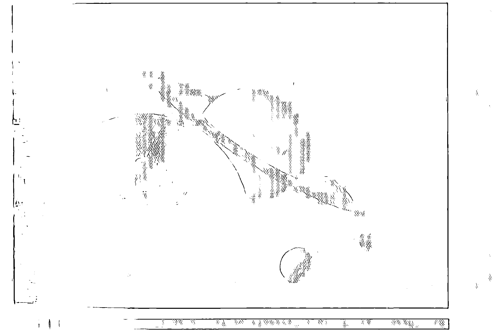

- ○偉大的克蘇魯 →No.003
- ○幻夢境→No.080
- ○月球→No.074

## [No.077] 冥王星

### Yuggoth

記載禁忌知識的禁書均以另外一個名字稱呼這個位處太陽系邊陲的矮行星，此行星同時也是來自外宇宙者暫時休憩翅膀的太陽系的玄關。

### ○黑暗星球猶格斯

在1895年出版的著作《火星》中提出有關火星表面運河的報告，進而引起許多有關火星人議論的天文學家帕西法爾·羅威爾，同時也是從太陽系已知的行星運行現況首先預測出在海王星外側還另有個「X行星」存在的人物。後來在羅威爾1894年創設於亞利桑那州的羅威爾天文台有位克萊德·威廉·湯博在羅威爾死後14年的1930年3月13日終於發現了冥王星，巧的是那天竟然是羅威爾的生日。

這顆太陽系的邊陲行星後來會以羅馬神話冥界之王普魯托傳說而命名為「冥王」，其實也只能說是某種冥冥中的安排，因為冥王星恰恰正是《死靈之書》等禁書稱為「猶格斯」、崇拜的「外神」多洛斯的黑暗星球。

從前降落在古代姆大陸並且在盤立於聖地瓦納亞的亞狄斯山裡面建設要塞的猶格斯星人，正是將「舊日支配者」加塔托亞引進地球的始作俑者，但他们和「米·戈（猶格斯真菌）」有何關係至今仍是不得而知。

冥王星經常有許多來自太陽系以外的種族來訪，充份發揮太陽系玄關門口的作用，譬如潛伏在佛蒙特州山岳地帶的「米·戈」和「舊日支配者」札特瓜的眷屬們，便在飛往地球的時候把這個星球當作前線基地利用。

除此以外，據說阿撒托斯的後裔，也就是相當於札特瓜之母的兼具兩性性徵的神明克薩庫斯庫爾如今仍然與族人一起在冥王星。

由於猶格斯人在地球上早已滅亡許多，因此現在所謂的「冥王星人」、「猶格斯星人」所指的幾乎都是「米·戈（猶格斯真菌）」。

> *猶格斯：《恐懼傳說》、《克蘇魯神話》譯為「愛果思」。

## 冥王星的历史

| 时间 | 事件 |
| --- | --- |
| 远古 | 扎特瓜及其同族从外宇宙飞抵冥王星，曾选择暂时停驻在，前往到克里姆林（土星） |
| | 「光之四边形」约于此时刻被封印出来 |
| | 「米·戈」（福格斯真菌）侵略地球，同「远古种族」进入交战状态，并将「远古种族」驱逐出北半球 |
| | 福格斯星人在地球正值全盛期的约大亚特兰蒂斯，来自那加所的那家加塔记位所居住在该地，的大陆的居民曾经向这些神祇祭品 |
| 1910.11.11 | 爱德华·泰勒在布雷克斯外的名山「深渊隧道」前往福格斯，后来被发现那时已经发狂 |
| 1930.1.11 | 佛蒙特州洪水犯滥，发现「米·戈」的脚印，威廉·丹杰斯教授就此事件写文具向报纸投稿 |
| | 相传「米·戈」为阻止某国正在该地进行的实验，曾袭击卡斯卡尼卡大学的多位研究人员 |
| 1930.1.11 | 威廉·丹杰斯教授收到住在佛蒙特州的亨利·阿克莱有关「米·戈」的来信 |
| 1930.1.11 | 「米·戈」及其部下在佛蒙特州的阿克莱住宅附近开始有奇怪的活动 |
| 1930.1.11 | 亨利·阿克莱失踪 |
| 1930.1.18 | 威廉天文台的克劳德·汤博发现冥王星 |
| 1930.1.11 | 谣言「米·戈」的爪牙入侵威得鸟医院，抓走两位濒死的医生的器官 |
| 1930.1.11 - 11.10 | 托生希尔夫受难等事件，有一说那晚众心时所目睹到的「小灰人」典型外星人其实那就是「米·戈」的爪牙 |

### 冥王星的发现者

**帕西法尔·罗威尔**

1855年出生于麻萨诸塞州波士顿的天文学家，除主张火星人存在以外，还透过各种计算预测出冥王星的存在。

除此以外，还成立罗威尔天文台，本身亦是日本文化的研究家，著有与神话及有关的著作。

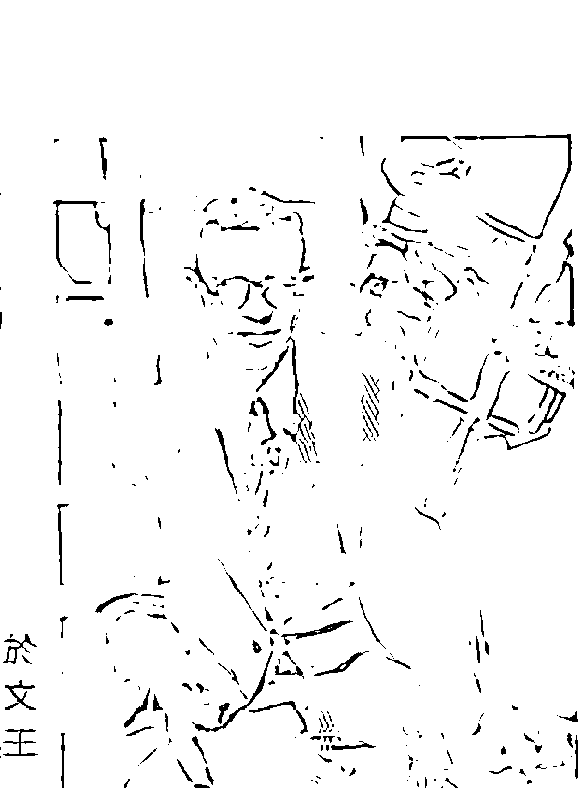

**克莱德·W·汤博**

1906年出生于伊利诺伊州，就读于堪萨斯大学，后来进入洛威尔天文台成为研究员，以1930年发现冥王星而闻名。

No.078
塞拉伊諾
Celaeno
聳立於大宇宙彼方的石造巨大圖書館。在這座由暗黑諸神建造的圖書館裡面，藏著許多跟「古神」有關的秘密。

### 諸神的大圖書館

塞拉伊諾是雄牛座*2疏散星團畢宿星團裡的其中一顆恆星，距離地球1400光年。塞拉伊諾雖然是顆恆星，然其星等卻相當低，大約只有七等星左右，從地球上很難直接用肉眼發現觀察到它。

在以這個塞拉伊諾為主星的恆星系統中，被散發著金屬味的霧氣包裹住的第四顆行星上面，有個蓄滿冷灰色液體的大湖泊。湖畔石造碼頭旁邊有座用厚重石塊建造的巨大建築物，此建築物的石材還會隨著視角的不同而變色，時而金色時而綠色。座正前方有許多高度超過400英呎巨人圓柱林立、看起來像座莊嚴神殿的建築物，正是從前「舊日支配者」的敵對者「古神」用來收藏所有盜取來的知識的塞拉伊諾大圖書館。

走進圖書館正面入口，首先映入眼簾的便是規模宏大的大廳。大廳的四面牆壁均設有類似人偶陳列架的台座，每個台座上的書架則是都裝滿了用早已遭到世人遺忘的語言所記載而成的書異典。

塞拉伊諾大圖書館是屬於據住在雄牛座畢宿五*4附近星球的「難以名狀之物」哈斯塔的勢力範圍，因此許多遭到「舊日支配者」的敵對者——偉大的克蘇魯追殺的人經常會把它當成緊急避難場所使用。從前阿卡姆鎮的拉班·舒茲伯利博士和5位年輕的同志便曾經來到塞拉伊諾避難，好逃離克蘇魯的魔掌和「深潛者」的魔掌。

舒茲伯利博士還在這座大圖書館裡面發現記載如何對付「舊日支配者」的大石板，並將其翻譯成英語，是為《塞拉伊諾章》。

+   *1 塞拉伊諾：《戰慄傳說》譯為「塞拉諾」。
*2 雄牛座 (Taurus)：即黃道十二宮的金牛座。此處乃《克蘇魯神話》...
*3 古神 (Elder Gods)：或稱「舊神」，請參照P.010註注。
*4 畢宿五：請參照P.022註注。

### 關係圖

在塞拉伊諾恒星系統內某個行星上的巨大石造大圖書館。從「古…」

+   - 拉班·舒茲伯利博士→No.106
- 「深潛者」→No.016
- 《塞拉伊諾斷章》→No.035

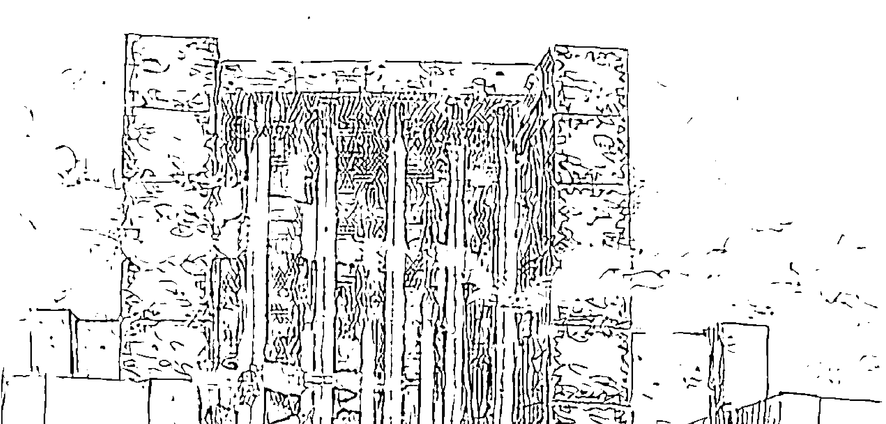

No.079
## 卡爾克薩城
Carcosa

往往使人無法保持著正常精神狀態抵達此地，曾經使無數人步向毀滅命運的異界都市。

### 黃衣之王的影子

卡爾克薩城是瘋狂的戲劇《黃衣之王》引為故事舞台的異形古代都市。據說貌似章魚的「旧日支配者」之「難以名狀之物」哈斯塔便是藏身於卡爾克薩城附近的黑色哈利湖湖底，此外遊行文獻指出卡爾克薩城本來就是哈斯塔的轄地。

卡爾克薩城並不存在於地球上的任何一個地方，除此以外人們對卡爾克薩城究竟在宇宙何處可謂是一無所知；雖有說法指出卡爾克薩城可能就是雄牛座中央紅色恆星畢宿五附近的黑星，可是此說法卻沒有人可以證實。

前往卡爾克薩城最短的捷徑，就是閱讀《黃衣之王》使人發瘋，不過除此以外似乎還另有他法，從前在阿卡姆鎮郊外活動的魔法師理查·比靈頓的僕從夸米斯便自稱曾經去過卡爾克薩城，而1940年在恩蓋伊森林失蹤的威斯康辛州立大學人類學教授加德納教授似乎就是被奈亞拉托提普帶到了卡爾克薩城

另外還有不甚可靠的流言指出。在紐約的高級俱樂部「沙龍」地下5樓有扇綠色的門可以通往卡爾克薩城，然其真假難辨。

卡爾克薩城還有這麼一則傳說：卡爾克薩城會透過吸收其他都市而不斷成長，頹廢墮落至極點的都市則將會遭到卡爾克薩城吞噬。「真實的幽靈」的出現就是此類都市將要遭到吞噬的前兆，它們會判斷該都市是否有資格能夠被卡爾克薩城吸收，然後黃衣之王就會降臨，而該都市也將會永遠與卡爾克薩城融合在一起。

### 卡尔克薩城

相信位於獵戶座的古代都市卡尔克薩城。這裡的空間已經扭曲變形，下位巡會看見月球漸漸橫過都市尖塔前方的瘋狂景象。

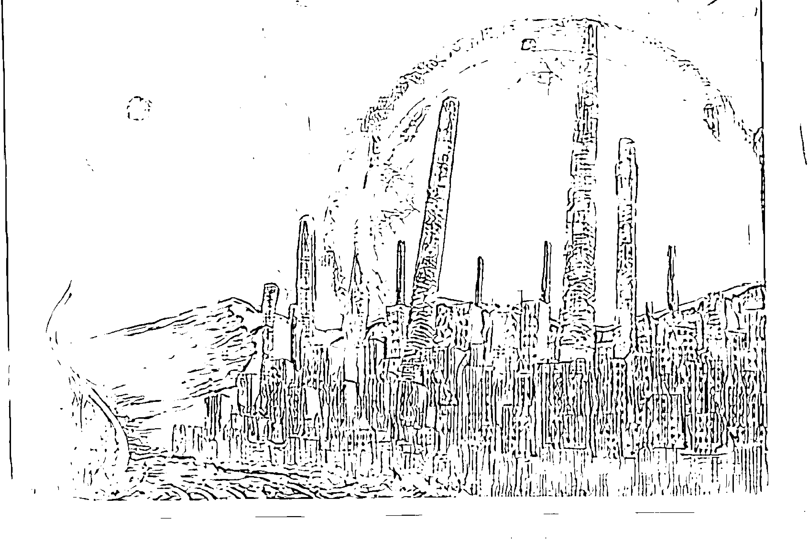

### 卡尔克薩城相關作品

1842年出生的安布魯斯·畢爾斯是位出色的小說家、詩人，以《惡魔辭典》作者聞名於世。他曾經以北軍士兵身分參加過美國內戰，還因為屢勇作戰而擢升至少校職，卻也親眼目睹了民眾生活的悲慘生活以及將軍們爭名奪利的醜態，據說他冷嘲式的辛辣作風即來自此。1914年，畢爾斯在革命中的墨西哥失去行蹤，相信他為了掩人耳目而投身革命軍，恐怕是遭到了政府軍施以死刑。此外，克拉克·史密斯便相當於他的徒孫。

卡尔克薩城相關作品乃起源於畢爾斯，他在《牧羊人海他》裡面創造了哈斯塔，在《卡尔克薩城的居民》裡面創造了卡尔克薩城和哈利。不過，最初作品中的卡尔克薩城其實並非異世界的都市，而哈利則是預言者的身分。

經過羅伯特·威廉·錢伯斯等作家加以改編之後，哈斯塔和卡尔克薩城方才有了今日的樣貌。

+   - ○理查·比靈頓→No.100
- ○恩茲伊森林→No.045
- ○奈亞拉托提普→No.005

No.080
## 幻夢境
### Dream Land

在沉沉睡眠的深淵底下有扇巨大的門，穿過這扇門就會來到夢的國度。無論是美夢抑或噩夢，人類所有的夢全都存在於這個幻想世界之中。

### 夢的國度

幻夢境是個存在於比人類睡夢更加深沉處的異世界。僅僅進入睡眠是無法進入這個國度的；欲前往幻夢境則首先必須在較淺的睡夢中找到通往下方的巨大階梯。沿著階梯向下走70階就會來到「火焰神殿」，來訪者必須在這裡翻見納須特和卡曼塔兩位祭司，祭司放行後繼續向下走700階就會抵達「沉睡之門」，穿過這扇大門，眼前就是寬廣開闊的幻夢境。

像倫道夫·卡特這些知道如何前往幻夢境的人被稱為「夢遊家」，其中亦不乏像統治塞勒菲斯城的克拉涅斯王這種在幻夢境和清醒的世界各有不同名字的人。

除了地球的幻夢境以外，據說在北落師門和畢宿五的伴侶也都有幻夢境存在，想要前往這些其他世界的幻夢境可謂非常困難。所有試圖前往的人總共僅有3個人生還，而且除克拉涅斯以外的另兩人回來時都已經完全發瘋了。

幻夢境有塞勒菲斯城和戴拉茲李恩等許多都市，還有許多生於幻夢境的人們生活在這裡，這些都市的文明水準跟工業革命以前的時代相去不遠。幻夢境的自然環境和氣候等條件跟我們的世界其實沒什麼兩樣，但是除了飄浮在半空中的都市、往來於星星之間的乘帆船以外，還有通曉人語的貓族等許多不屬於我們處世界的奇怪生物棲息在此，再再都讓人強烈地感受到這裡是人智可及、不受自然科學法則束縛的夢裡世界。

大部分的幻夢境居民都信奉一群名叫「地球本來的神」，但神力不如「外神」和「舊日支配者」，是住在幻夢境北方的冰雪凍的卡達斯宮殿裡，接受奈亞拉托提普與諾登斯的庇陰保護。

> ※幻夢域：《戰慄傳說》詳如「幻夢域」。

> ※畢宿五：請參照P.022註注。

### 11.通往幻梦境的道路

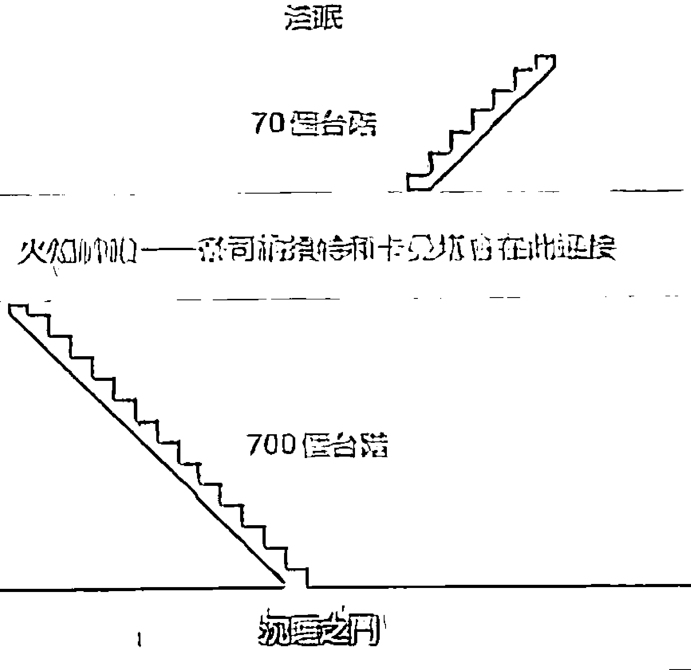

### 11.2.幻梦境的地图

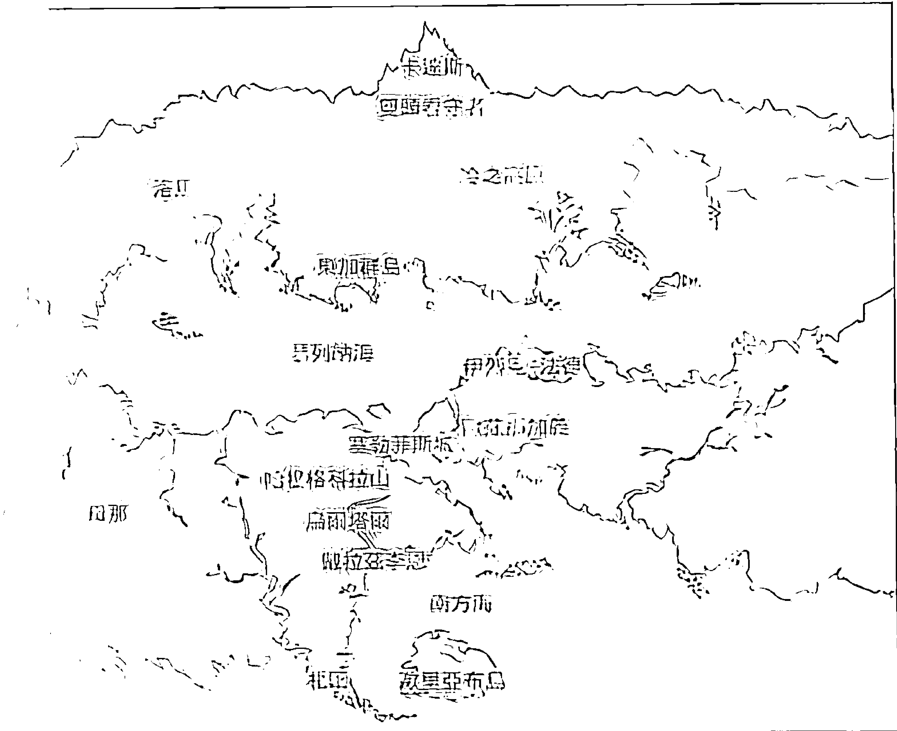

+   - ○密勒菲斯城→No.082
- ○卡达斯→No.081
- ○奈亞拉托提普→No.005
- ○诺登斯→No.013

No.081
## 卡達斯
Kadath

「地球本來的神」居住的傳說之地，結凍荒野上未知的卡達斯。卡達斯的位置至今仍然是個謎，無論再怎麼查閱文獻也無法找到確切的相關記錄。

### 諸神居住的場所

結凍荒野上的未知卡達斯是座幽暗漆黑的山峰，幻夢境居民信奉的「地球本來的神」居住的巨大緞瑪瑙城堡便是聳立於此，

阿卜杜·阿爾哈茲萊德曾經在《死靈之書》裡面寫到卡達斯這個地方跟冷之高原同樣位於中亞地區，但是聽聞過傳說的人似乎都相信卡達斯其實是在宇宙不知哪個星球的幻夢境裡面。

倫道夫·卡特曾經前往地球的幻夢境尋訪卡達斯，他根據「地球本來的神」變成人類模樣來到人類聚落娶妻的傳說，推測在卡達斯附近應該有個繼承「地球本來的神」血統的城鎮，住著眼睛細長、耳朵長、鼻翼窄、下顎突出的民族。經過多番探察之後，卡特終於在冷之高原附近光線昏暗的寒冷地帶發現了諸神後裔生活居住的印夸諾克。

用緞瑪瑙岩塊建造的印夸諾克是個城裡有許多球根狀尖塔和風格特異的尖塔聳立、景觀美麗而奇異的古都。整個都市以黑色色調統一，並且施有鍍金的漩渦紋飾、縱溝紋飾和藤蔓紋飾；齊頭等高的建築物美麗的窗框上面還刻滿了擁有某種陰沈象徵性的圖式與花樣。印夸諾克市區周圍有許多採石場，緞瑪瑙的巨石建材便是採掘自此，然後在經過研磨以後用黑船運往塞勒斯城等幻夢境各個貿易都市，交換翡翠雕刻、金絲、啁啾鳴叫的紅色小鳥等各種美麗的物資。

印夸諾克北方山脈裡面有座外形酷似戴著三角形頭冠的巨大怪物的山峰，屹立在此阻絕外敵入侵。攀越這座山峰以後，便會發現有座緞瑪瑙建造的城堡聳立在眾神居住的山脈裡，而結凍荒野上未知卡達斯的壯麗景緻也被隱藏在這座崇山峻嶺的背後。

* 卡達斯：《戰慄傳說》、《克蘇魯神話》譯為「卡達思」。

### 傳說的「地球本來的神」

「地球本來的神」長得就跟刻在恩葛拉涅山腰的雕像沒有兩樣，眼睛細長、耳朵長、鼻翼窄、下顎突出。它們就住在卡達斯的宮殿裡。

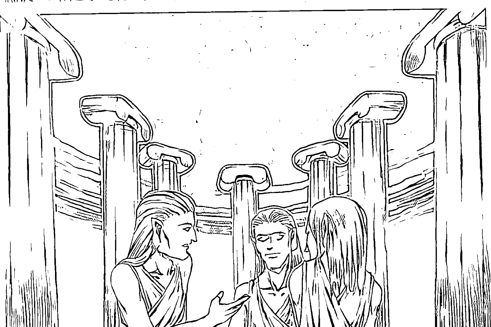

### 冰凍荒野上未知的卡達斯

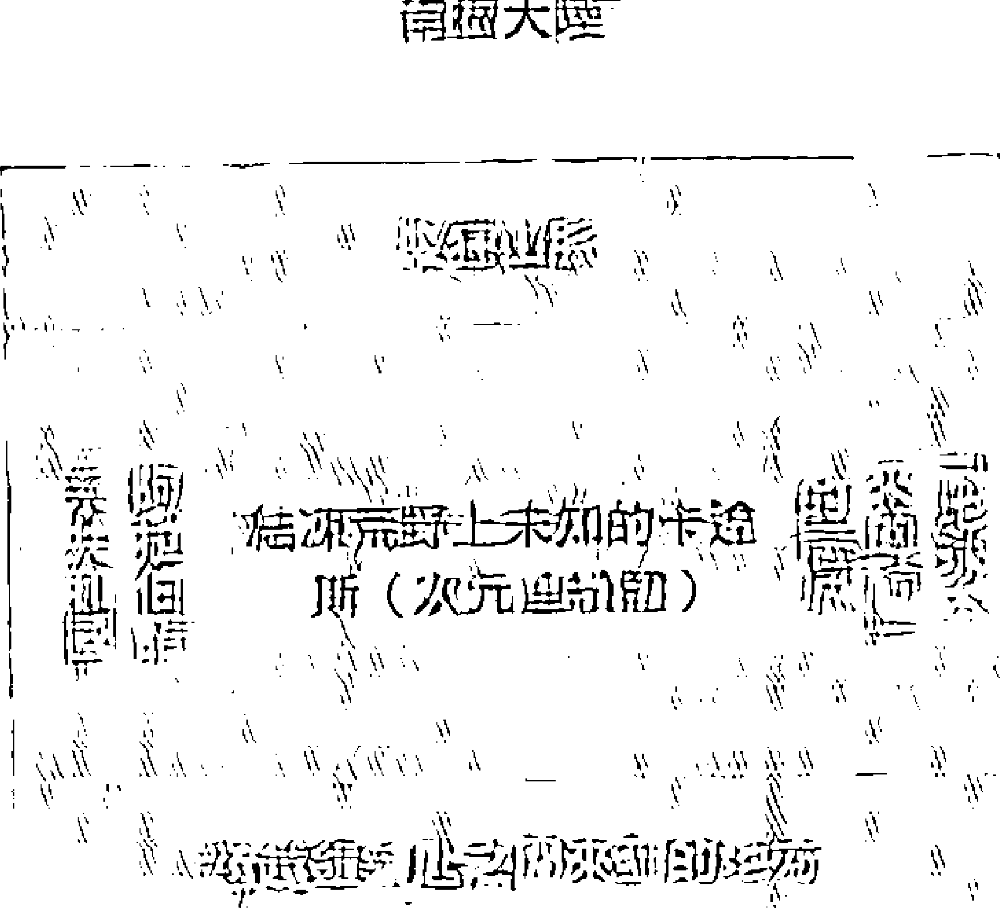

異次元空間？

+   - 可可西哈絲萊德→No.088
- 地之書→No.025
- 塞爾德→No.060
○幻夢境→No.080
○倫道夫·卡特→No.091
○塞勒菲斯城→No.082

No.082
## 塞勒菲斯城
Celephais

在沉眠之門彼方的歐茲那加義河谷裡，千座高塔林立的壯麗光明之都正等待著造物主克拉涅斯王到來。

### ## ○大海與天空交際處

塞勒菲斯城是位在幻夢境塔納爾丘陵彼方歐茲那加義河谷北面的壯麗的千塔林立之都，這裏有位名叫納斯・霍薩斯（Nath Horthath）的神明頗受信仰，用土耳其石建造的神殿裡面向外都有80位頭戴蘭花頭冠的祭司服侍神明，從1萬年以前直到現在從來不曾有過增加或減少。在使用產自印夸諾克的細瑪瑙鋪設而成的塞勒菲斯大道上，不僅有當地居民出入，還可以見到從幻夢境各地遠道而來的行商人和船員等形形色色打扮各異的人們。

從塞勒菲斯城可以搭乘停泊在港口裡的金色槳帆船，經由得以通往天空的瑟列納海便能前往用粉紅色大理石建構成的雲上都市賽拉尼安。賽拉尼安與塞勒菲斯一帶歐茲那加義河谷鄰近地區的統治者，就是跟倫道夫・卡特亦有交情、住在倫敦的夢想家，也就是在幻夢境裡面名字叫作克拉涅斯的國王。在通往兩旁聳立著多青銅雕像的塞勒菲斯城大理石大門、橫跨納拉克薩河的橋樑上，便可以看見克拉涅斯在極遙遠的過去刻下的名字。在幻夢境裡面，夢想家在睡夢中想像的好夢將會創造出所有的事物，而塞勒菲斯與賽拉尼安都是克拉涅斯夢見的都市，他就是歐茲那加義河谷的國王、主神、造物主。

現實世界中的克拉涅斯其寶早已亡故，據說他的遺骸被海浪打上了茫茫大海彼岸的印斯茅斯鎮岩岸。儘管他已經在作夢見到的都市裡登上了「70歡宴宮殿」的寶座，而且其下側還會永無止境地延續下去，可是已經找到應許之地的克拉涅斯心中追求的，始終還是故鄉康瓦耳的風景，於是克拉涅斯遂在塞勒菲斯附近的海岸和山谷建設能夠讓他想起故鄉的漁村與修道院，沉浸在往日回憶之中。

> > 1 塞勒菲斯：《克蘇魯神話》譯為「西里非斯」

### 1. 堪萨斯城

位于欧兹那加兹河谷、全幻梦境最美丽的都市——亚勒菲斯。这座都市由克拉涅斯所创造，永远由克拉涅斯统治。

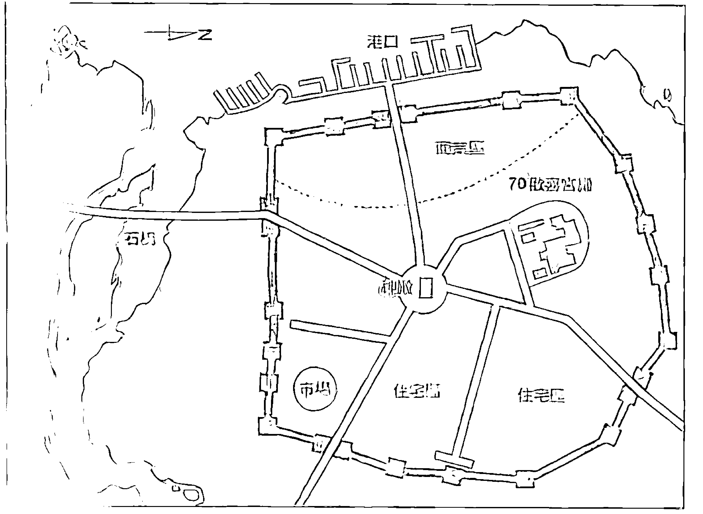

### 2. 堪萨斯城的城门

堪萨斯城的大理石城门与紧邻城门的巨大石桥。纳拉克亚河面不时有小船来来往往。

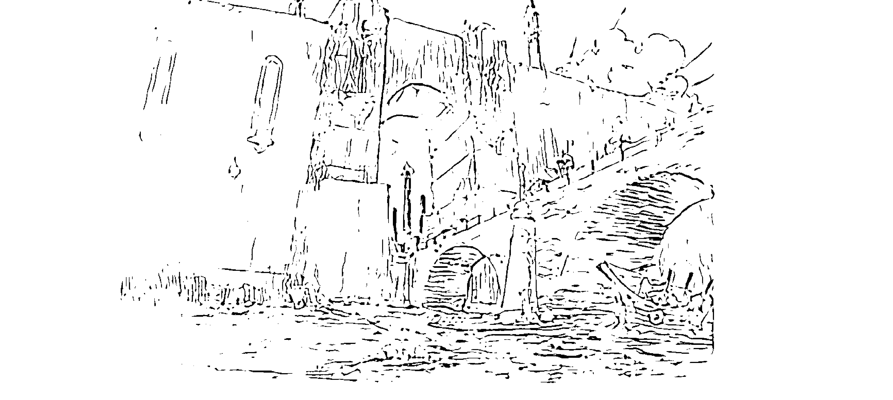

> ○倫道夫・卡特→No.091 ○印斯茅斯鎮→No.041

No.083
## 乌尔塔尔城
### Ulthar

> 猫不但解开斯芬克斯[1]的谜语、比斯芬克斯还要长寿高龄、甚至记得连斯芬克斯都已经遗忘的事情。愿灾祸降临在杀猫者身上。

### 不可杀猫的城镇

跨进幻梦境的入口「沉眠之门」，穿过魔法森林沿着司凯河向前走，就会在大石桥的对面看见一座堆满古典风格尖屋顶、到处都可以发现猫的踪影的古老城镇——乌尔塔尔城。这个城镇跟各个都市都有频繁的贸易往来，连幻梦境首屈一指的贸易都市也有商人组成商队来作买卖。

乌尔塔尔城的贤者巴尔塞从收藏在供奉「地球本来的神」的山顶小神殿里面的《奈克特抄本》、《洹山七秘经典》等古文献，得知从前居住在哈提格科拉山的「地球本来的神」会在月光大放光芒的夜里乘着云船来到此山饮酒狂欢，于是他便带着想要看看诸神模样的徒弟祭司阿塔·勇闯自桑斯的时代以来人们便再也不曾涉足过的峻岭。尽管单独生还以后由神殿收留的阿塔曾经描述到巴尔塞触怒守护「地球本来的神」的蛮神因而丧命的经过，不过根据阿拉伯狂人所著《死灵之书》记载，巴尔塞却在哈提格科拉山山顶锻造一柄叫作「巴尔塞的偃月刀」的神剑

乌尔塔尔城亦以「不可杀猫」的奇怪法律而闻名——从前有一对农夫经常喜欢布设陷阱，并且用各种极尽残酷之能事的方法杀害附近的猫以此取乐。有次他们杀害了某支南方商队里一个叫美尼斯的少年极疼爱的小黑猫；少年在得知此事以后向太阳神祈祷，而就在少年离开乌尔塔尔城不久后，这对老夫妇竟以神秘的方式惨死，从此乌尔塔尔城才制定了禁止杀猫的法律。

如今乌尔塔尔城不但建有猫的神殿，连年以来伦道夫·卡特的朋友老猫将军还会率领众猫族，不时对魔法森林的祖格族等敌对种族兴起战争。

[1]乌尔塔尔(Ulthar)：除为古老城镇以外，亦有一位「古神」Ulthurn（或称乌尔达Uldar），负责监视地球上的「旧日支配者」。

[2]斯芬克斯(Sphinx)：常见于埃及和希腊艺术作品的神话式狮身人面

### 烏爾塔爾城的位置

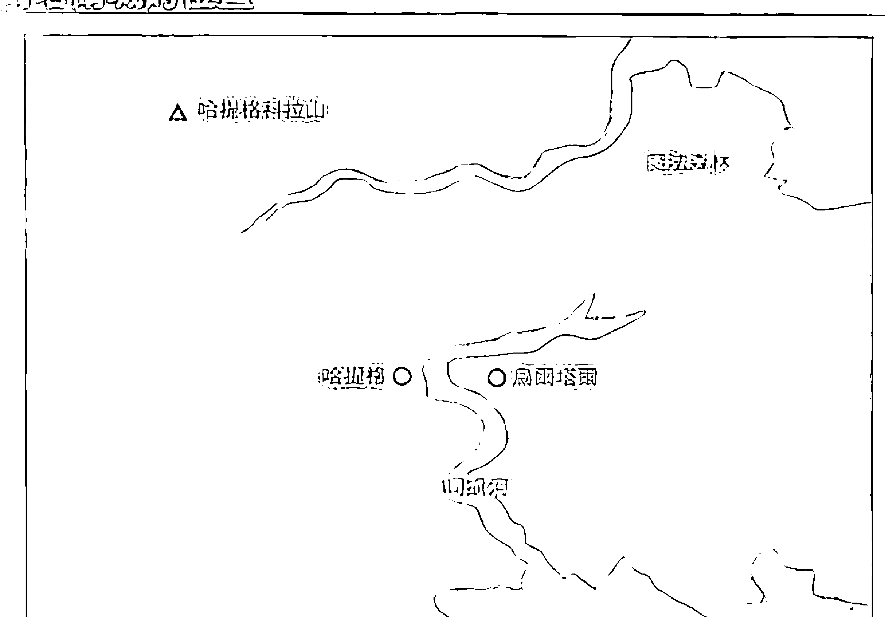

### 烏爾塔爾城

烏爾塔爾城乃是以「不可殺貓」的法律為世所知，因此有許多貓紛紛來到在此，儼然已經成為貓族在地球幻夢境裡的據點

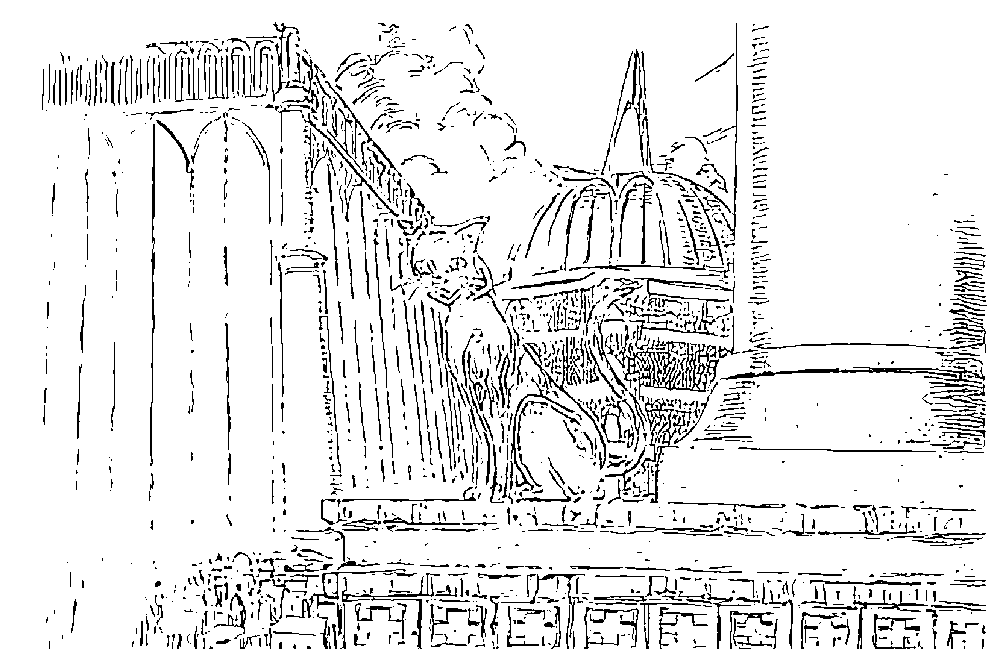

+   - （部分文字不清，似为数据条目，如11,000等）
- （部分文字不清，似为另一组数据）

+   ○ 其他書籍（《洹山七秘經典》）→ No.037
○ 《死靈之書》→ No.025
○ 倫道夫・卡特 → No.091

No.084
## 母那
### Minor

自從母那的礦業都市薩拿斯受到原住民族詛咒在一一夜之間覆滅以來，與這個災厄有關的流言便不斷在行商人和旅行者之間悄悄流傳。

### 災難都市薩拿斯

母那是幻夢境的某個地區名，同時也是在製作對抗「舊日支配者」與「外神」的護符時，經常用來篆刻缺角五芒星形狀的从白色石頭的產地。

從前有批黑髮的牧羊民族沿著艾河開拓荒地，並且建設了樹拉、依拉尼克、卡達德隆等城鎮。這批牧羊民族當中有支特別剽悍的部族，從前他們在母那湖畔的非金屬礦層旁邊建設薩拿斯時，不遠處早已經有座火尖塔林立、用灰白色石材建造成的城伊布。

伊布的居民是種貌似魚類的綠色生物，平時信奉水棲大蝸牛波克祿格（Bokrug），按照其模樣刻成綠色彫像膜拜。薩拿斯居民對這群生物奇怪的模樣感到厭惡不已，於是便發動滅族戰爭，徹底將伊布破壞殆盡。

其後薩拿斯先是整頓通往依拉尼克的通商道路，按著又擴大開採貴金屬進行貿易，發展成人口總數達5000萬的巨大都市。市區裡無數宮殿高塔林立，除美麗的庭園以外，還建有獻給伊‧佐‧卡拉（Zo-Kalar）和塔馬什（Tamash）、洛邦（Lobon）諸位神明的17座神殿。

薩拿斯全盛時期的疆域除整個母那地區以外甚至還涵蓋附近地區，然而在慶祝攻陷伊布1000週年的宴會上，薩拿斯的王公貴族卻全部變成了他們在千年前所消滅的綠色水棲生物，而整個薩拿斯也在狂風暴雨兵荒馬亂之中沉進了母那湖底，從前被視為世界中心的城址，也只剩下一片綠色蜥蜴四處爬竄的濕地而已。

### 1:3 北地區地圖

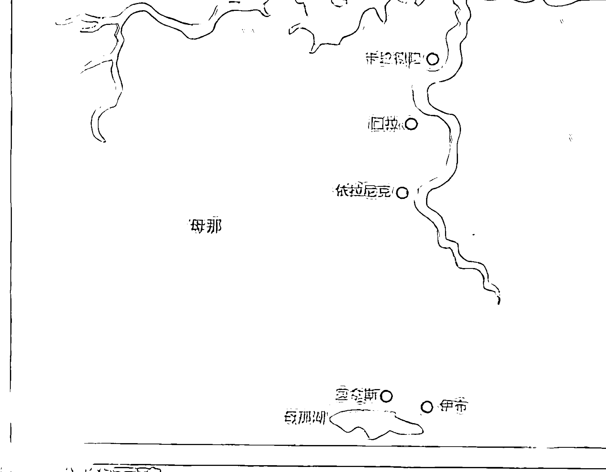

### 1:4 波克翁格的石碑

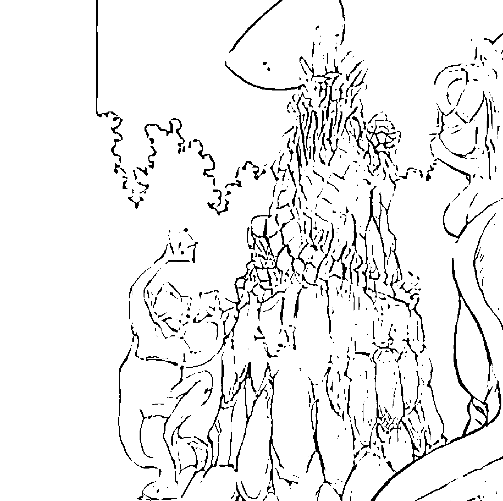

波克翁格的石碑
於古代伊布受到異形居民和族衆拜的波克翁格石碑 伊布毀滅的同時・波克翁格信仰亦從此在幻廣埋望消散## No.085
## 恩葛拉涅山
Mountain Ngranek

> 「地球本來的神」將自己容貌刻在山腹的恩葛拉涅山，是彷彿烏雲般群聚盤旋在天空中的夜魇嚴密看守的禁忌聖地。

### ○諸神的容貌

從幻夢境首屈一指的商港姒拉茲李恩朝南方海面航行十日來到歐里亞布島的港口都市巴哈納，接著還要再騎斑馬前進兩天，才能夠抵達標高約1萬公尺的休火山——恩葛拉涅山。

很久以前，地球本來的神住在哈提格村石礫荒野彼端的鳳凰哈提格科拉山，每到月亮被青白色霧靄覆蓋住的夜晚，「地球本來的神」就會乘著雲船來到這裡，緬懷從前住在這裡的日子、翩翩起舞。

從前諸神為遠離人類而決定搬到卡達斯壯麗的夕照之都生活，它們在離開哈提格科拉山的時候雖然抹去了所有痕跡，唯有刻在恩葛拉涅山岩壁上的雕像仍然原原本本地留在那裡。

相傳倫道夫·卡特為尋訪未知的卡達斯而走遍幻夢境當時，就曾經循著他在恩葛拉涅山南側山腰處發現的「地球本來的神」雕像，找到繼承「地球本來的神」血統的種族所居住的緹瑪蘭市印夸諾克，進而得到通往卡達斯的線索。

恩葛拉涅山是沒有五官的夜魇的棲息地，同時也是它們守護的神聖場所。不小心誤闖此山的人類會被不作一點聲響接近的夜魇捉到地底世界而遺棄在體型極為龐大的巨噬蠕蟲、屍鬼居住的普翕司谷地。

庇護脆弱「地球本來的神」的奈亞拉托提普與夜魇的「偉大深淵大帝」諾登斯雖然是敵對關係，可是光就保護「地球本來的神」免受好奇心旺盛的人類騷擾這點來說，兩者卻似意外地在利害關係上面達到一致。

### 『地球本來的神』的復甦

『地球本來的神』早已經離開卡達斯，如今足以證明『地球本來的神』曾經存在過的證據只剩下刻在恩葛拉涅山壁的雕像。

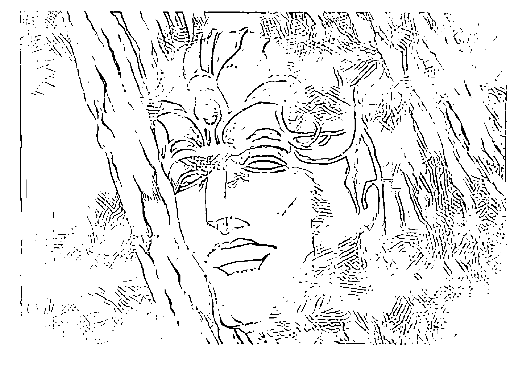

### 11.7 歐里亞布島

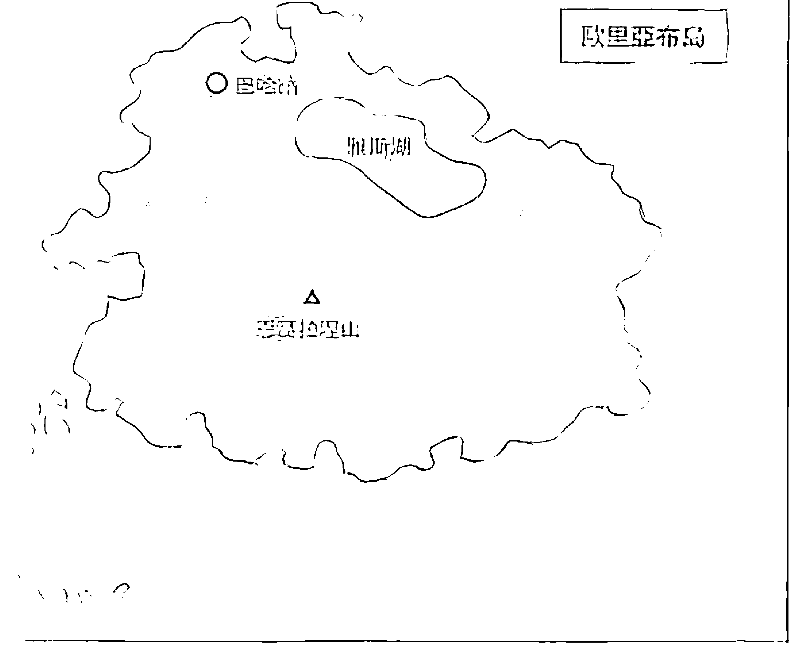

| 实体列表 | 参考编号 |
| --- | --- |
| ○倫道夫·卡特→No.091 | ○其他存在（巨噬蠕蟲）→No.024 |
| ○諾登斯→No.013 | →No.024 |
| ○食屍鬼→No.020 | ○奈亞拉托提普→No.005 |

## # 關於「哈斯塔神話」

「舊日支配者」哈斯塔是透過奧古斯特·德勒斯系列作品《永劫之探求》等小說而以克蘇魯的敵對者為人所知，不過這位神明其實並非洛夫克萊夫特相關作家創造出來的角色。

首先提及哈斯塔此存在的，其實是美國作家安布魯斯·畢爾斯；哈斯塔是以牧羊者的溫厚神明身分首次出現在他的短篇小說《牧羊人海他》裡面。

後來羅伯特·錢伯斯小說裡的哈斯塔，便已經跟畢爾斯筆下的哈斯塔是大大不同。錢伯斯在短篇集《黃衣之王》裡面暗示神秘的哈斯塔是個都市的名字，同時卻也留下了可將其解釋為神名或人名的餘地。洛夫克萊夫特首次提及哈斯塔的作品是〈暗夜呢喃〉，可是他在這篇小說裡也僅止於暗示哈斯塔是種跟「米·戈」（猶格斯真菌）對立的神秘存在，距離後來所謂「不可命名者」的形象仍然有段很遠的距離。

確立哈斯塔今日這番形象的人，就是奧古斯特·德勒斯。德勒斯讀過〈暗夜呢喃〉以後深受感動，於是寫信向洛夫克萊夫特提議使用「哈斯塔神話」統稱其作品，可是洛夫克萊夫特認為自己受到唐珊尼和馬欽的影響要比畢爾斯和錢伯斯來得深，所以沒有採納此提議（另外這裡還有個經常被克蘇魯神話書迷們忽略的事實，那就是德勒斯和洛夫克萊夫特兩人其實從來不曾直接見過面）。

或許是因為對「哈斯塔神話」久久無法割捨的緣故，德勒斯又在1931年與史戈勒的共同創作《潛伏者的巢穴》裡面提到哈斯塔被封印在哈利湖的情節設定。「舊日支配者」哈斯塔便是從此開始正式粉墨登場。

其次，德勒斯又在1939年發表的《哈斯塔的歸來》裡面導入了哈斯塔與克蘇魯兩者對立的結構。另外，《哈斯塔的歸來》雖然發表時期比較晚，不過該作品似乎早就已經完成，連洛夫克萊夫特都已經讀過，而且還對該作品有很高的評價。

與德勒斯相同時期還有另一位在作品裡面寫到哈斯塔的作家，就是著有《臨終的看護》的休·B·凱夫。根據訪談等資料顯示，凱夫雖然說過自己「受到了畢爾斯和錢伯斯影響」，不過他也曾經與洛夫克萊夫特書信往返，甚至還在作品中使用到奈亞拉托提普角色。

洛夫克萊夫特死後，著手將其作品體系化的德勒斯雖然并非「哈斯塔神話」，而是創造出「克蘇魯神話」此用語，並致力於普及化，但是德勒斯構想中的哈斯塔神話卻仍舊透過他的作品而延續下去，即便在德勒斯死後，也仍然有許許多多的作家不斷創作哈斯塔的新神話。

## 第4章
永劫之探求

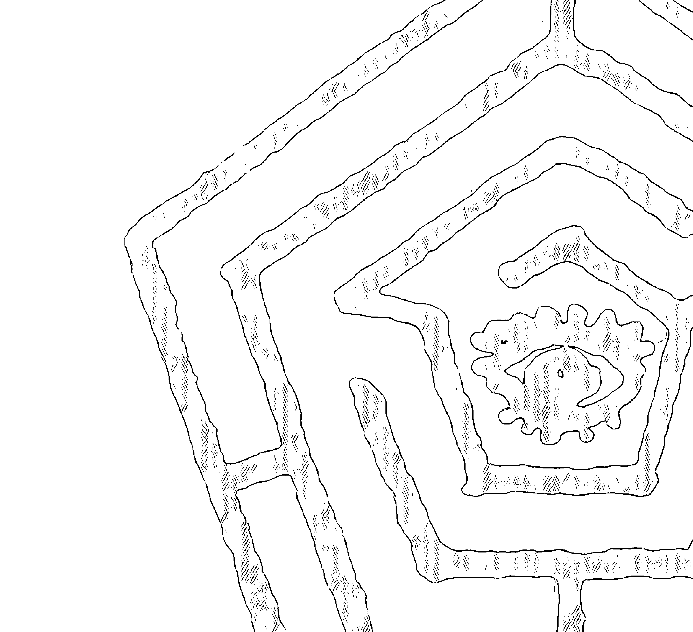

### No.086

### 探求及其代價
Sacrifice for Study

雖然說知識就是力量，知道太多卻會招致瘋狂。沒有付出便無法有所得，可是必須付出的卻往往是再也無法挽回的代價。

### ○知道太多的下場

克蘇魯神話描述的諸多存在招來的恐怖陰影，其實並不會只是一味地盤據籠罩在流言紛飛的腐朽老舊房屋、排拒外來者僅僅同族獨自生活的封閉村落、神秘的古代巨石遺跡或者光線無法企及的萬丈深淵等看似理所當然的場所。

舉例來說，不論是避免與他人來往的鄰居、從街角傳來的小提琴樂音、每週同一天同一時間雜音就會變得特別嚴重的風箱以及幼年少年時期莫名奇妙的空白記憶等，日常生活裡任何些微的扭曲和異象，經常都有宇宙恐怖的細微斷片潛伏其中。

這些不起眼的渺小事件經過不斷累積，最終就會在某個瞬間有機地牽動人類的腦部連結至某種使人顫慄的事項。通常通往宇宙秘密的大門便是如此悄然無聲地被開啟：受到好奇心與求知慾等人類特有精神性的驅使而毫無防備地走進這扇門的人，他們的下場絕大多數都是極為悲慘的遇難以及無可避免的死亡。這些人通常不是為鑽研學問而太過深入禁忌知識領域的研究者，就是為尋找刺激題材而太過深入禁地或禁地的作家，再不然就是從不知名的遠方親戚手中得到遺產的不幸繼承人。

將生涯奉獻於對抗克蘇魯邪教的麻薩諸塞州阿卡姆科学者班·舒茲伯利博士便曾經舉出許多實例，諸如在公開宣稱在東印度群島發現的太古生物不久後便變成浮屍被人們從河打撈起來的英國學者、在澳洲西部發現黑色獨石以後立即死亡的考古學家，還有在恐怖小說裡面詳細記載「外神、舊日支配者」相關信仰以後便因為某種太古時代的怪病而過世的小說家，道出了知道太多的人將會有什麼樣的命運。

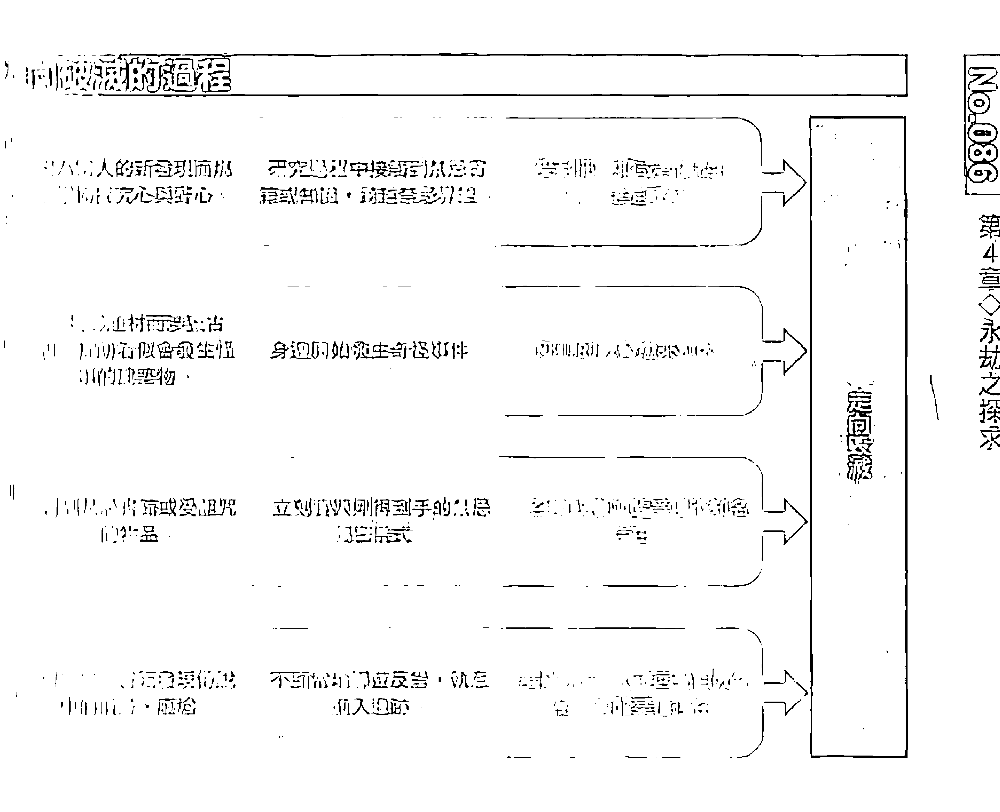

### 太多的人

在克苏鲁神话的世界裡，人類社會和邪神潛伏的黑暗領域乃是毗鄰而居。他們的犧牲者大多是偶然跨越禁忌界線誤闖異次元領域的人，但其中也不乏故意要跳進邪神虎口的人物。此處試舉出神話作品中的幾個例證。

好奇心強烈的學者和學生通常都難以抵抗跨越禁忌的誘惑，是以經常會掉入陷阱。最典型的例子便是H·P·洛夫克萊夫特的〈克蘇魯的喚醒〉和〈黑暗之中的夢〉等作品。洛夫克萊夫特的同行，也就是恐怖作家史密斯也容易落入邪神的圈套，洛夫克萊夫特的〈獵黑行者〉和F·W·霍華德的〈空間的怪物〉便是以此為題材。

其他如克拉克·阿什頓·史密斯的〈廷達洛斯獵犬〉、C·A·史密斯的〈水晶的秘密〉、以及羅伯·布洛克的《無貌之神》、《黑色法老王的神殿》等，也都是邪神的絕佳獵物。

- 拉班·舒茲伯利博士→No.106

### No.087

### 霍華·菲力普·洛夫克萊夫特
Howard Phillips Lovecraft

承繼愛倫·坡衣缽的幻想小說、恐怖小說巨擘，同時也是將地球和周遭宇宙的真實模樣公諸於世的黑暗神話傳道者。

### OI AM PROVIDENCE

被譽為20世紀最偉大恐怖小說家的霍華·菲力普·洛夫克萊夫特，是在1890年8月20日在羅得島州的普洛維斯頓呱呱落地。洛夫克萊夫特從小生在保有殖民地時期光輝記憶的新英格蘭，重視傳統的風氣之下長大，他深愛當地的風土傳統，同時卻也是個每晚都抱著望遠鏡觀察星空的天文少年。

洛夫克萊夫特對人文學科與自然科學都有興趣，早在幼年時代便已經從文筆活動中發現樂趣，十來歲時便已經開始向雜誌投稿專欄和文章。

1920年代以後，洛夫克萊夫特才開始在《奇詭故事》等低價雜誌上發表恐怖小說，其作品內容大多是在揭露人類誕生以前曾經有群統治地球與宇宙的神明存在，因此不少人認為洛夫克萊夫特與查爾斯·福特同樣是位警告者。另外，在洛夫克萊夫特大約13歲時發生精神異常的父親溫菲爾德，其實是從前大革命前夕在漢州暗中活動的卡廖斯特羅伯爵後來在各地設立的埃及共濟會會員之一。

該結社有部據說與《死靈之書》有關的秘儀書籍《無名之書》，因此亦有人認為洛夫克萊夫特擁有的禁忌知識有可能是來自於曾經接觸過該書的溫菲爾德。

對科學技術亦頗具造詣的洛夫克萊夫特筆下描寫的宇宙不僅僅震撼了讀者，甚至在同行間也有狂熱的信徒。洛夫克萊夫特熱心地和這些人互通信件，而且還讓他們潤飾文章、協助創作，因此這個書信交往的團體才會被稱為「洛夫克萊夫特圈」。

描述南極荒野禁地的長篇小說《在瘋狂的山上》是洛夫克萊夫特的遺作，於1936年發表。1937年，洛夫克萊夫特染上早已從地球消失的怪病，僅46歲之齡便與世長辭。

> * 愛倫·坡：埃德加·愛倫·坡（Edgar Allan Poe, 1809-1849），美國詩人、作家、文學評論家，美國浪漫主義運動重要人物，對恐怖小說與偵探小說開創者、科幻小說共同催生者，以哥德、恐怖小說最負盛名。

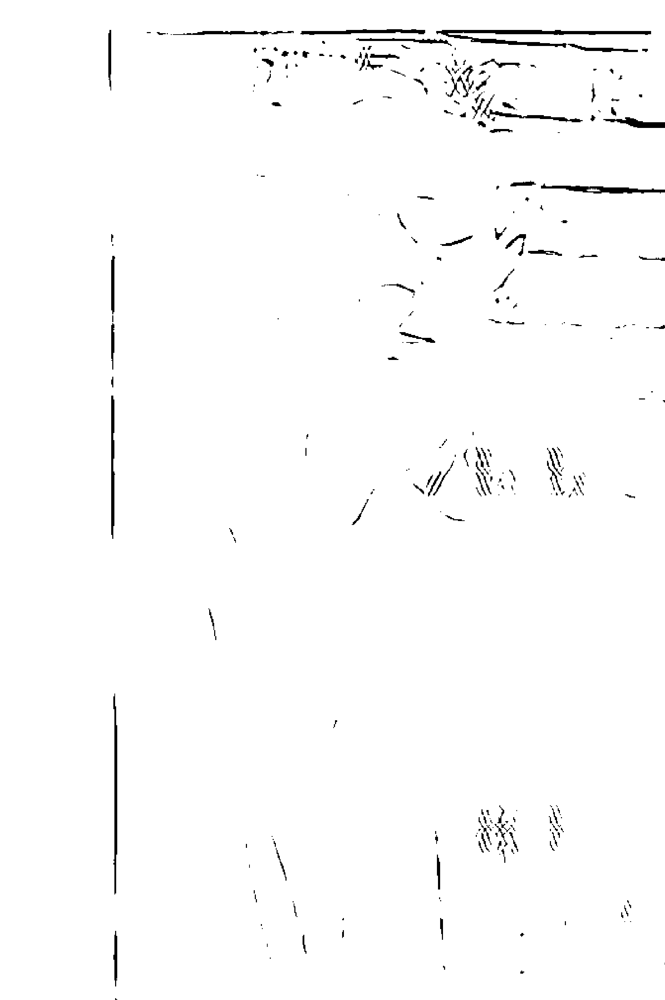

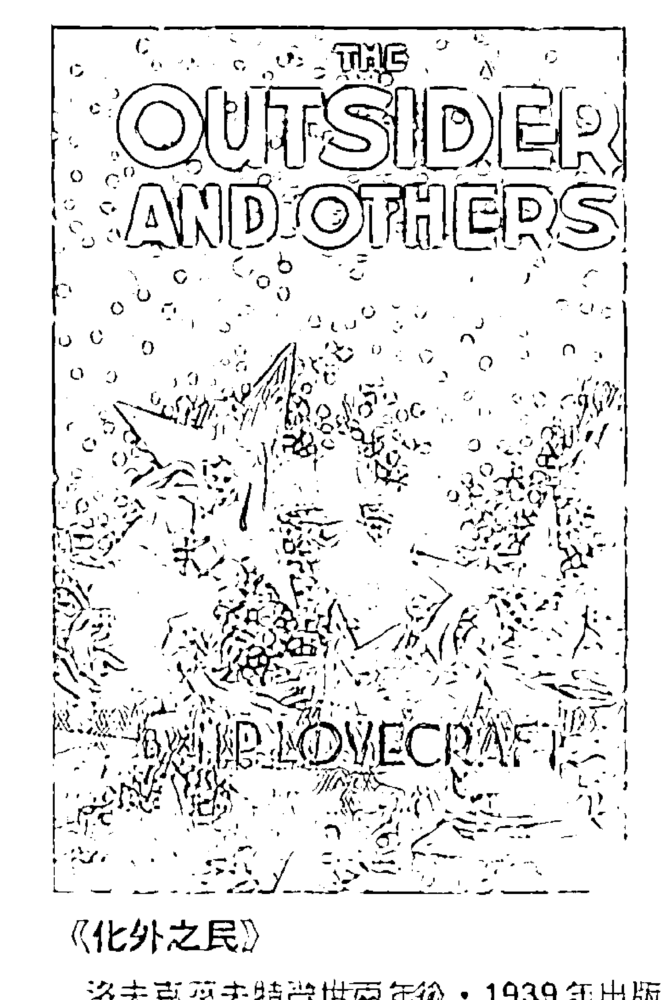

### H. P. · 洛夫克萊夫特

与同时代造成影响的伟人同样，洛夫克莱夫特在生前可以说是寂寂无名。他在法国极受欢迎，被相当的极高评价。

### 《化外之民》

洛夫克萊夫特辞世两年后，1939年出版的首部作品集。阿卡姆之屋就是专为出版洛夫克莱夫特作品而创设的出版社。

### 小说裡的洛夫克莱夫特

H·P·菲力普·洛夫克莱夫特屡屡会出现在追随他的作家们笔下的神话故事里面，小说裡的洛夫克莱夫特有时就像奥古斯特·德勒斯所说的那种，成为透过小说形式向人类警告邪神威胁的预言者，有时则会被描绘成《伯·布洛克《尖塔的阴影》》的主角这种恐怖小说作家朋友提供点子的角色。在所有曾经提及洛夫克莱夫特的作品当中，最引人注目的是佛瑞兹·雷伯的《阿卡姆镇与外星世界》。雷伯在这部作品裡描写自己前往真实世界裡的阿卡姆镇，亲自走访洛夫克莱夫特小说裡的场所，当面与米斯卡塔尼克大学的教授们交谈，是部充满了对洛夫克莱夫特的热爱的独特作品。雷伯甚至还在这部小说裡暗示洛夫克莱夫特是某个死了的外星人长相，于是乎，洛夫克莱夫特才如此像是咬著自己尾巴一般，被吸收至自己创造出来的作品裡面。

## 阿卜杜·阿爾哈茲萊德
Abdul Alhazred

著作記載禁忌知識的魔法書《死靈之書》，從黑夜世界永遠剝奪安眠，相反地卻帶來了瘋狂的阿拉伯妖術師。

### ○瘋狂的阿拉伯人

阿卜杜·阿爾哈茲萊德是在世界首個伊斯蘭王朝伍麥葉王朝時代活躍於葉門沙那的鬼神論者、妖術師。他雖然是伊斯蘭教徒卻對伊斯蘭教義和可蘭經並無興趣，反而選擇信奉猶格·索托斯和克蘇魯等古老的神明。

由於阿爾哈茲萊德曾經造訪過巴比倫廢墟和孟斐斯地底洞窟，還有曾經在相傳有死靈與怪物棲息出沒的阿拉伯南部大沙漠獨自生活長達10年之久等特異行徑，再加上他還有許多令人難以致信的主張，包括宣稱自己去過傳說中的石柱之城伊倫、去過位在阿拉伯南部沙漠裡的無名都市地底世界、發現記載著地球住民族秘密的年代記等，因此被世間視為瘋狂，遂有「瘋狂人」、「瘋狂的阿拉伯人」等異名。

阿爾哈茲萊德晚年落腳定居在首都大馬士革，並於730年創作後世稱為《死靈之書》的終極秘儀魔法書《魔聲之書》，將自己窮極一生所得到的禁忌知識和秘密儀式毫無遺漏地全部記載在總共30多章的鉅作之中。

關於阿爾哈茲萊德在738年究竟是離奇死亡抑或失蹤，世界上就有數種不同說法。曾經替阿爾哈茲萊德寫過傳記的12世紀阿拉伯傳記作家伊本·海利坎說阿爾哈茲萊德是大白天在大馬士革的眾人面前被某種隱形的怪物擒住，然後就在被嚇傻呆立原地的眾人面前慘遭吞噬。然而米斯卡塔尼克大學的拉班·舒茲伯利博士主張，阿爾哈茲萊德在眾目睽睽之下遭到吞噬其實是種集體歇斯底里，事實真相正如同阿爾哈茲萊德記載著「舊日支配者」與「外神」秘密的著書所述，阿爾哈茲萊德其實是被帶到了他自稱曾經到過的無名都市，經過極為淒慘的嚴刑拷打之後遭到殺害。

1 阿卜杜·阿爾哈茲萊德：《裁縫傳說》、《克蘇魯神話》譯為「阿卜杜爾·阿爾哈茲萊德」

### II 阿卜杜·阿朗哈兹莱德的生涯

| 年代 | 重要事项 |
| --- | --- |
| 1111/1100年前后 | 阿卜杜·阿朗哈兹莱德活躍於伍麥葉王朝哈里發時代 |
| | 阿朗哈兹莱德走訪巴比倫遺跡與美索不達米亞平原以西、在阿拉伯南部沙漠地帶自生活長達10年，此外他還自阿比西尼亞傳說中的石柱之城伊恰，並於同名都市地底得知人類誕生以前的歷史 |
| | 晚年的阿朗哈兹莱德定居於大馬士革 |
| 1111 | 阿朗哈兹莱德執筆《死靈之書》 |
| 1111 | 阿朗哈兹莱德在大馬士革街道上詭異死亡，死因失蹤 |
| 1127 | 君士坦丁堡出版希臘語版《死靈之書》 |
| 1150 | 歐努司·渥米厄斯出版拉丁語版 |
| 1155 | 教宗格列高利九世禁止拉丁語版《死靈之書》 |
| 1232 | 德國自行翻譯學術拉丁語版《死靈之書》 |
| 1375 | 希臘語版在義大利傳印 |
| 1510 | 出版以拉丁語版作為底本的西班牙語版《死靈之書》 |
| 1612 | 拉班·舒茲伯利博士於同名都市調查阿朗哈兹莱德的生平 |

### 《死灵之书》的著者

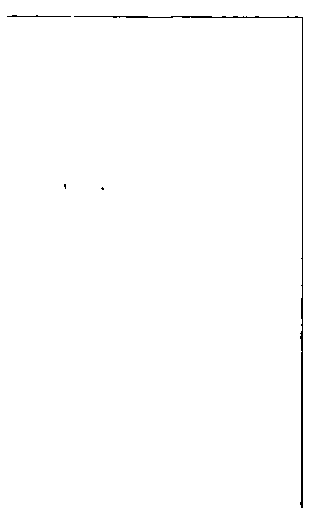

（不明）
可能是位神秘學者，相信他曾翻譯《死靈之書》，他的生平目前僅知下落不明。

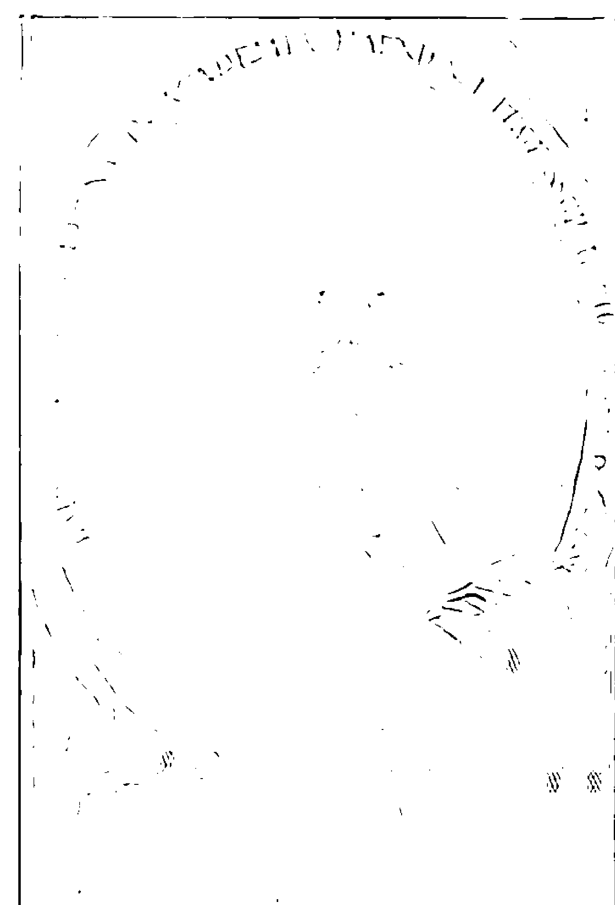

欧努司·渥米厄斯
歐努司是位醫師，以《死靈之書》拉丁語譯者而為世所知；由於年代不符，亦有說法指為同名醫師的作品。

- （不明）→No.006
- （不明）→No.003
- （不明）→No.050
- ○《死靈之書》→No.025
- ○米斯卡塔尼克大學→No.040
- ○拉班·舒茲伯利博士→No.106

## 真摯的老學究

曾經在羅得島州普洛維頓斯的布朗大學開設閃族語言課程的喬治·甘莫·安吉爾榮譽教授，乃是以古代碑石文字權威而廣為學界所知的人物。這位老學者首次受到克蘇魯神話洗禮，是發生在1908年的事情。那年在聖路易舉辦的考古學大會上，約翰·雷蒙·勒格拉斯巡官帶來了一張奇怪的神像引起一陣騷動。這尊彷彿揉合頭足類、龍族、人類而成的醜陋神像，據說是他在搜查紐奧良南方非法集會巫術教團的時候沒收的物品。經過一番議論，眾人發現該集團的儀式竟然與格陵蘭西部丘陵地帶調查到的愛斯基摩人奇怪信仰不謀而合。這是「克蘇魯」這個神名首次公然出現在學術界的場合。

老學者第二次聽到克蘇魯的名字是在1925年3月，出自於當地的年輕藝術家亨利·安東尼·威爾卡斯之口。這名青年帶來一張根據夢裡看見的古代都市景象所創造出來的浮雕黏土板，上面刻著的象形文字怪物的模樣，還有青年頻頻聽見的「克蘇魯」和「拉萊耶城」這兩個名字，喚醒了教授過去的記憶。

從此以後，安吉爾教授就像著魔似地開始調查這個自己命名為「克蘇魯邪教」的組織，他蒐集世界各國報紙的相關記錄，終於發現在雕刻家頻頻作夢的3月23日到4月2日這段期間，世界各地發瘋的事件竟然有異常增加的現象。這段時間又恰恰跟拉萊耶城部分地區浮出太平洋海面的時間完全吻合，然而安吉爾教授終究還是沒能知道這件事；1926年冬天教授從紐波特返家途中與一名黑人水手相撞昏倒，從此就再也沒有睜開眼睛。

### 纽奥良的克苏鲁邪教

纽奥良遇到当局取缔的克苏鲁邪教举行疯狂宴会的情景。信徒就是在这里围绕克苏鲁的神像，举行类似巫毒教的残酷活祭仪式。

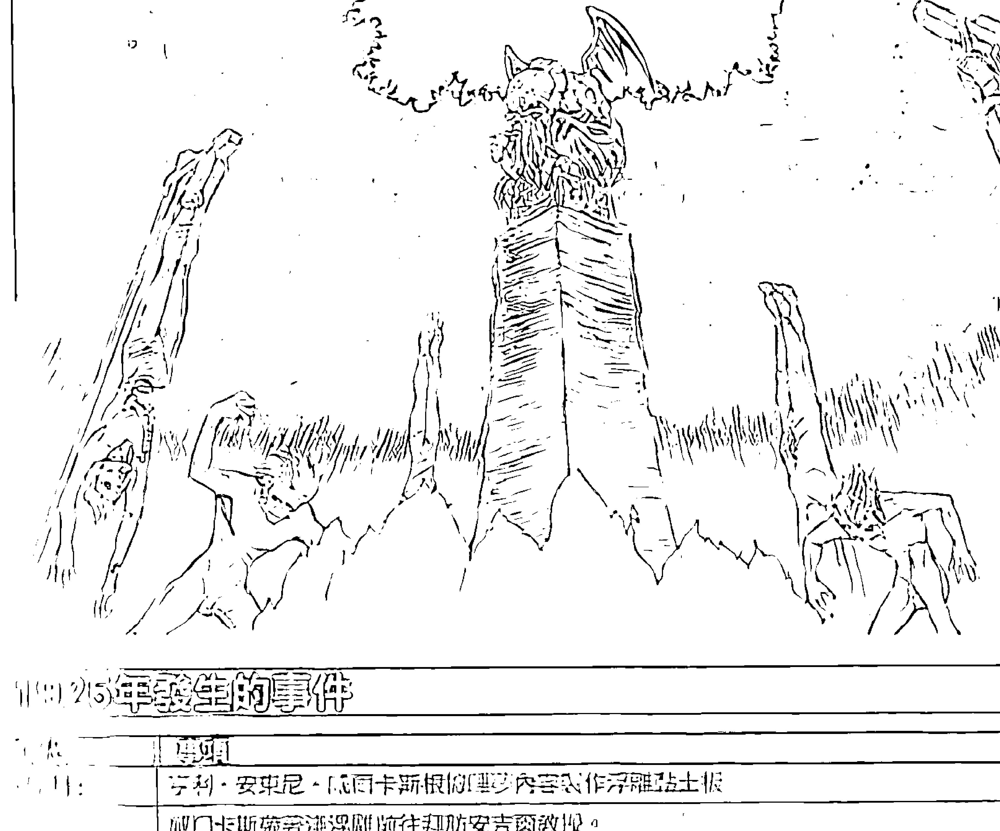

### 1956年发生的事件

| 序号/日期 | 事项 |
|-----------|------|
| 11 | 亨利·安本尼·凡·卡斯根的埋葬内容在工作现场土掘 |
| | 凡·卡斯蒂若液深雕师前往拜访安吉尔教授。 |
| 10/1/11 | 凡·卡斯因不明原因坠落死 |
| | 印度殖民地居民开始骚动不安 |
| | 马地巫毒教仪式有增加的趋势 |
| | 非洲地区殖民地有「不祥的预兆」 |
| | 北美殖民地有些地区特别不安定，这期间 |
| | 纽约的警官们处理这里的暴民殴击 |
| | 伯克利发生有狂乱暴动在一阵吼叫之后从窗口跳下自杀 |
| | 北日本全国各地的警察和居民们被幻视奇景的怪物 |
| | 全世界的精神病院患者发生骚动 |
| | 凡·卡斯的祖母发玛斯定到玛斯跳明堡。发玛斯的祖母反叛成功 |
| | 凡·卡斯的祖先所传至至拉莱耶城，除约波以外都因为生活而死亡 |
| | 凡·卡斯被拍正常，失去3月22日以后的记忆 |
| | 发玛斯的生还者约有10人被救起 |

## 羅伯特·哈里森·布萊克
Robert Harrison Blake

充满追根究底精神的恐怖小说。罗伯特·哈里森·布莱克在邪神崇拜曾经蔓延氾滥的废棄教堂深處觸犯了「燃烧的三隻眼」禁忌，註定要走上凄惨的末路。

### ○洛夫克莱夫特的弟子

1930年代曾經以廢雜誌為中心發表《挖地者》、《墓窟階梯》《夏蓋星》、《普拿司谷地》、《外星賓客》等恐怖小說與繪畫的羅伯特·哈里森·布莱克，他跟羅伯特·布洛克、伊迪蒙·費司基等同行都是奉霍華·菲力普·洛夫克萊夫特為師，並以洛夫克萊夫特為中心進行書信交流的「洛夫克萊夫特幫」的成員。

為創作而孜孜追求禁忌知識的布莱克，曾經非常幸運地在阿迪爾勃恩街的舊書攤得到初版的路維克·普林所著《蠕蟲之秘密》；他為了要請人翻譯，遂帶著這本禁忌的魔法書造訪他跟洛夫克萊夫特的共同友人——某位住在普洛維頓斯的古神祕學者，豈料老人卻不小心召喚出吸飲人血的「群星遣來的僕人」因而死亡，布莱克則是在放火燒毀老人住處後，這才狼狽不堪地離開了普洛維頓斯。

儘管有過如此慘痛的經驗，布莱克旺盛的好奇心卻依然不減，結果還因此丟了性命。

1935年在洛夫克萊夫特的勸說之下，布莱克從已經住慣的密爾瓦基搬到普洛維頓斯，他為尋找題材創作一部有關新英格蘭地區女巫信仰的長篇小說，遂偷偷潛入曾經在19世紀興盛的洛夫克萊夫特的星際智慧教派總部舊址，亦即位於聯邦山丘的廢棄教會。布莱克在廢墟進行探索調查的時候，發現一個盒子裝著的是星際智慧教派膜拜神祇的光輝之四邊形體，他還在無意間打開了盒蓋而召喚出奈亞拉托提普。潛入教會搜索的一週後，布莱克在8月8日被發現遭到電擊死在書房裡；布莱克死前在日記裡以扭曲字體，則是綿綿不斷地訴說著奈亞拉托提普的恐怖。

# 被诅咒的废弃教会

曾经是普洛维顿斯所有恐惧来源的星际智慧教派总部旧址。尽管星际智慧教派灭亡已久，有关这个废弃教会的不祥流言却未曾止息。

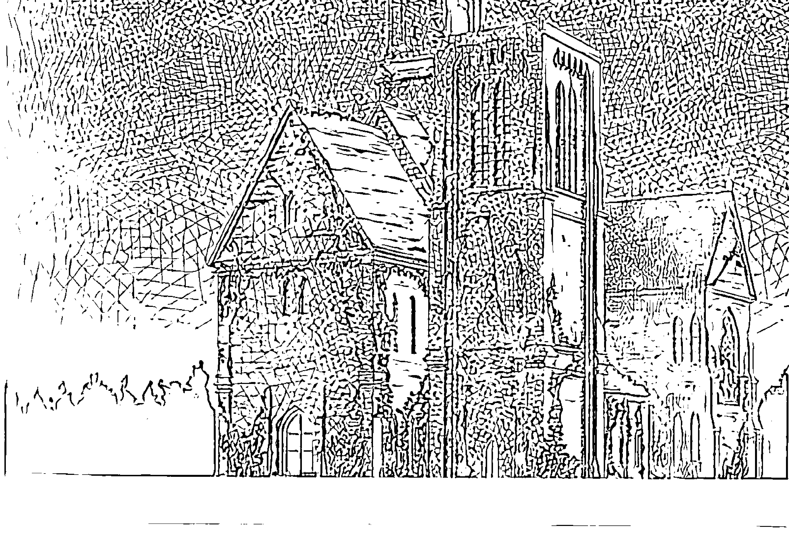

# 洛夫克拉夫特写的遊戲 其二

在罗伯特·布洛克的作品当中，有部名为《来自星际的怪物》的短篇小说。

这部作品裡面有个仿佛就是布洛克自己的年轻作家和暗指为H·P·洛夫克拉夫特的老作家，故事主要是描述老作家召唤怪物并惨遭杀害的始末。在此作品以前，布洛克曾经向洛夫克拉夫特寻求许可，说是「我想写一篇你被杀死的小说」，对此那名「老作家」则是与多位克苏鲁神话的登场人物相同，将杀戮许可证书给了布洛克。

《来自星际的怪物》发表以后，有读者提议「洛夫克拉夫特要不要也写一篇杀死布洛克的小说」，后来洛夫克拉夫特应读者要求所完成的作品就是《猎黑行者》。洛夫克拉夫特为这个年轻作家取了个跟布洛克很相似的名字——罗伯特·布莱克，并且让奈亚拉托提普将其吞噬。布洛克在1936年後再度提笔创作《猎黑行者》的续集，可惜当时洛夫克拉夫特已不在人世。

- H.P.洛夫克拉夫特 → No.008
- 《矮星之秘密》（妖蛆之秘密）→ No.026
- 星际智慧教派 → No.103
- 奈亚拉托提普 → No.005

# No.091

# 倫道夫·卡特

Randolph Carter

酷愛幻想的業餘愛好者，為找尋已然迷失的路標而穿越超次元之門，如今已經去到深宇宙的永遠的旅人。

### ○ 夢想家

定居波士頓的夢想家倫道夫·卡特乃於1874年10月7日誕生在阿卡姆鎮。其家系親族從英國伊利莎白女王時期跟約翰·狄齊名的初代倫道夫開始，便有許多舉止特異的族人輩出，其中包括1692年女巫審判盛行時移居至阿卡姆鎮的賈倫妖術師艾德蒙，以及曾經以騎兵士官身分從軍參加南北戰爭、1866年卻在亞利桑那失蹤的伯祖父約翰。至於倫道夫本身也是過著整日研究古代語言、創作幻想小說之類相當獨特的業餘愛好者生活，並且跟透過這些嗜好而結識的友人們有頻繁的書信往來。

卡特家族有支代代相傳的銀色大鑰匙，收藏在一只刻著詛咒的哥德式雕刻的橡木箱子裡。相傳艾德蒙·卡特曾經於1781年在阿卡姆鎮郊森林坡地上某個當地居民稱為「蛇巢」的洞窟裡面使用這把銀鑰匙，然後就憑空消失了。

知道如何前往幻夢境的倫道夫出發尋訪「地球本來的神」居住的都市，並且在經過漫長旅途以後得到諾登斯的幫助，從企圖陷害他的奈亞拉托提普魔掌脫身，最後終於成功找到未知的卡爾斯，可是卻也付出了通往幻夢境的門戶被關閉起來的代價。

30歲失去作夢的能力以後，他曾經加入法國的外籍傭兵隊參加第一次世界大戰，也曾經跟通曉禁忌知識的南卡羅萊納紳士哈利·華倫結伴行動，想盡辦法要逃避再也沒有夢的人生。然而在1928年10月7日他的54歲生日當天，倫道夫就帶著家傳的鑰匙前往「蛇巢」從此消失在世間。

關於他後來的下落，有人說他登上了幻夢境的伊烈克王位，也有人說他在遊歷彷彿但丁《神曲》般的超次元世界後跟亞狄斯星的魔道士茲考巴融合，並且不斷摸索返回地球的方法。

# 伦道夫·卡特关系图

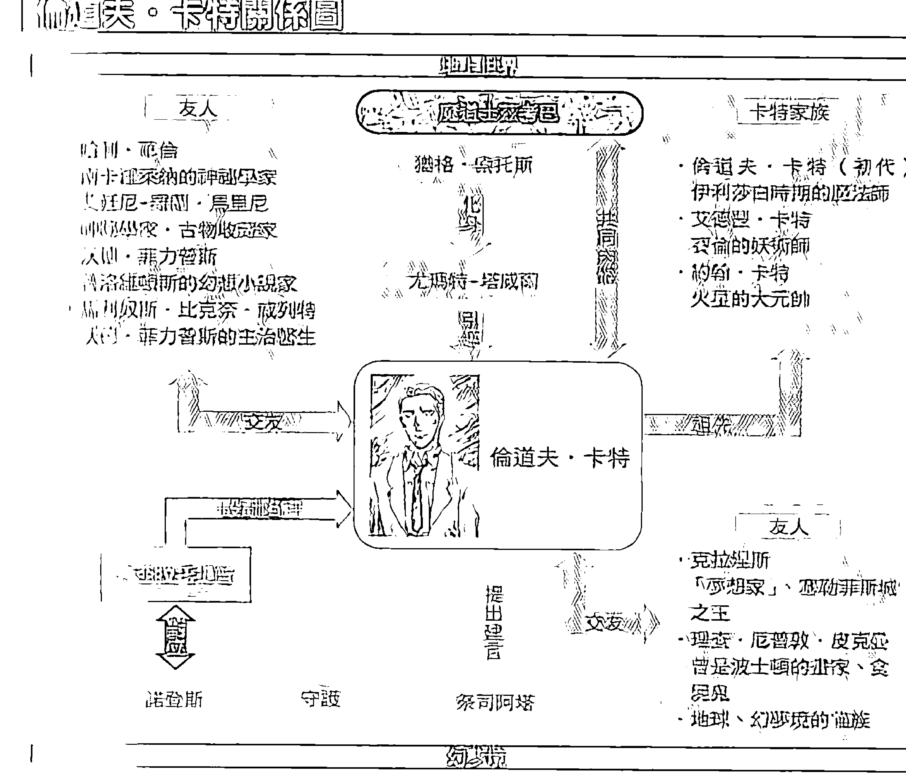

# 伦道夫·卡特年谱

| 年份 | 事项 |
| :--- | :--- |
| 1500年 | 初代伦道夫·卡特活跃于伊丽莎白时期的英国。 |
| 1692年 | 哀恸的妖术师德蒙·卡特被处以火刑判决送往阿卡姆镇。 |
| 1874年 | 伦道夫·卡特出生。 |
| 1883年 | 少年时期的卡特在「蛇巢」获得奇妙体验。 |
| 1917年 | 卡特为寻访卡达斯而游走于幻梦境，惊醒奈亚拉托提普后再也无法作梦。 |
| 1918年 | 得到哈利·华伦知晓器皿。 |
| 1918-19年 | 参加法国外籍兵团加入第一次世界大战，身负濒死重伤。 |
| 1927年10月 | 哈利·华伦在跟卡特一起调查地底圣地的时候突然失踪。 |
| 1928年10月 | 伦道夫·卡特失踪。 |
| 1929年10月 | 羌多拉·雷格尔师出现在美国，开始写信联络卡特的友人。 |
| 1930年10月 | 卡特的远亲亚司平瓦在讨论伦道夫·卡特遗产继承事宜的会面上死亡。 |

# 亨利·溫特渥茲·阿克萊

Henry Wentworth Akeley

佛蒙特州獨自從工研究的當地名士。他因為太過深入山岳地帶的怪異事件，終於走上可怕的命運末途。

# 消失在星際的研究者

隱居於美國東北部佛蒙特州的亨利·溫特渥茲·阿克萊是位打從受聘於佛蒙特大學時期起便在數學、天文學、生物學、人類學與民俗學領域極富盛名的在野研究家。

阿克萊家族自從1721年移民美國以來便有許多實務派名士輩出，可是學究派卻是非常罕見；除亨利以外就只有他堂兄弟的兒子——在阿卡姆鎮米斯卡塔尼克大學修習考古學和人類學的威爾伯·阿克萊而已。

阿克萊對出沒在他家附近佛蒙特州山岳地帶的淡紅色甲殼類奇怪生物頗感興趣，1927年11月洪水氾濫時在河裡發現該生物的屍體進而引起學術界討論，還讓阿克萊因此結識了米斯卡塔尼克大學的阿爾伯特·N·威爾瑪斯教授。阿克萊得到威爾瑪斯教授這個相當理想的討論對象以後非但與其有頻繁的書信往來，同時他還積極進行調查，包括使用口述式錄音機和錄音用唱片錄下神秘生物的聲音、前往阿克萊住家東邊圓丘取回刻有象形文字卻已經半數磨滅的黑色大石頭。

當時兩人都還不知道，這種生物就是在佛蒙特州山區裡採礦的「米·戈（猶格斯真菌）」。「米·戈」對阿克萊的調查頗感不悅，遂與協助它們採礦的人類於1928年9月5日到6日對阿克萊展開攻擊；後來它們還使用高科技機械裝置偽裝成阿克萊，從數日後来访的威爾瑪斯教授手中收回了唱片和黑色石頭等證據。從此阿克萊便音信杳然、不知去向，但是根據威爾瑪斯教授在阿克萊家見到聽到的幾項狀況證據研判，阿克萊應該是到冥王星去了。

# 阿克莱失蹤始末

| 日期 | 事件 |
|------|------|
| 1721年 | 阿克萊家族移民美國。 |
| 1901年 | 威因伯·阿克萊從米斯卡塔尼克大學畢業以後，前往中亞生活三年。 |
| 1904年 | 威因伯在美國中西部生活三年。 |
| 1907年 | 威因伯回到阿卡姆鎮，此時兩位叔父死亡，返回克萊頓家。 |
| 1910年 | 威因伯死於米斯卡塔尼克大學附屬醫院。 |
| 1927年11月 | 米斯卡塔尼克大學的阿爾伯特·N·威爾瑪斯教授向報社投稿關於在阿卡姆鎮河邊發現的「米・戈」（猶格斯星）的腦部有關的文獻。 |
| 1928年9月 | 威爾瑪斯教授收到亨利·溫特沃斯·阿克萊關於「米・戈」的來信，兩人開始通信。 |
| 1931年6月15日 | 阿克萊將所有關於「米・戈」亞宿的紀錄寄給威爾瑪斯教授。 |
| 1932年7月 | 阿克萊將「黑色石頭」寄給威爾瑪斯教授，可是卻在運送途中遭不明人士奪走。 |
| 1933年11月 | 阿克萊家附近「米・戈」活動愈加頻繁，阿克萊購買犬隻充滿敵意。 |
| 1934年8月5日 | 阿克萊的兒子遭不明人士槍擊。 |
| 1934年9月12日 | 阿克萊本人遭不明人士槍擊，犬隻被殺害。 |
| 1934年10月初 | 威爾瑪斯教授收到阿克萊來信，大意是「一切都已好轉，現似『米・戈』是個錯誤」。 |
| 1934年10月12日 | 威爾瑪斯教授受阿克萊之邀前往阿卡姆鎮的阿克萊家。 |
| 1934年10月13日 | 阿克萊從此音信杳然。 |

### 1935年來的東西

威爾瑪斯教授最後在阿克萊家看到的，是顯示「米・戈」高超外科手術的東西。

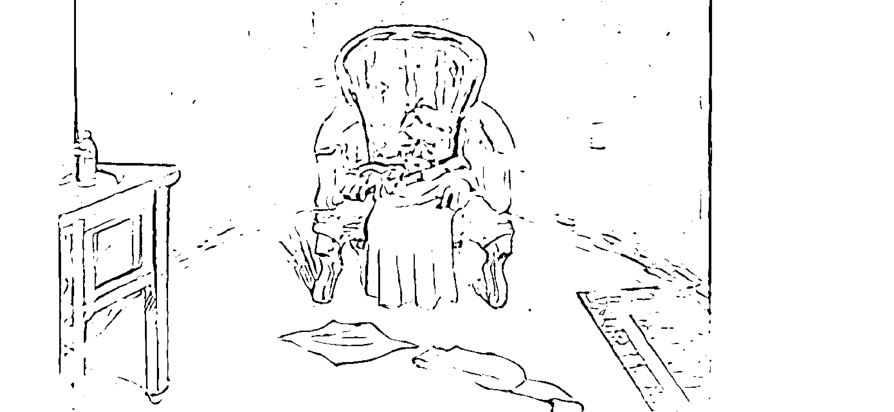

- ○（米戈斯真 No.022
- ○ 冥王星→No.077
- ○ 阿卡姆鎮→No.039
- ○ 米斯卡塔尼克大學→No.040

# 賈斯汀·季奧佛瑞

Justin Geoffrey

森林廢棄小屋裡的噩夢，竟然在一夜之間使樸實的少年獲得瘋狂的才能。這位英年早逝的天才詩人，亦從而步向充滿噩夢與瘋狂的生涯。

### ○受噩夢縈繞的少年

賈斯汀·季奧佛瑞是住在紐約的波特萊爾派天才詩人。將所有生涯奉獻在研究這位英年早逝詩人的詹姆斯·康拉德在描述季奧佛瑞的出身時是這麼寫的——

季奧佛瑞家族是許多在家道沒落以後遷居美國散居各地的英國鄉紳階級的其中一個舊世家，該族成員大多都是忠厚勤奮的商人，同時卻也是令人幾乎難以忍受的無趣、毫無想像力的凡夫俗子。季奧佛瑞家族500年歷史中唯一的例外，就是後來被譽為人才詩人的賈斯汀。

賈斯汀10歲時曾經因為迷路而在某個廢棄房屋過夜，從此以後他每晚都會受到噩夢所惱。這個困擾後來更成為促使他發展詩才的起因，而賈斯汀也就像是受到每晚的噩夢驅動似地開始創作詩歌。賈斯汀少年時代的作品雖然粗糙，卻已經可以從中感覺到在他晚年作品裡面那種彷彿電光般稍縱即逝的瘋狂。父母認為賈斯汀所擁有的是不健康的才能，遂嚴格禁止他從事詩歌創作，可是賈斯汀17歲離開家庭以後又在友人協助之下開始發表詩歌，而且過不多久便在文壇搏得相當高的評價。

賈斯汀極特異的作品是從天才與瘋狂的夾縫中孕育出來的產物，有時甚至還會被拿來與愛倫坡相提並論。儘管他名聲不佳，其才能還是得到了許多人的認同；他在旅途中從史崔戈伊卡附近的黑色獨石獲得《獨石的人們》*2 創作靈感的神秘匈牙利行，也是發生在這個時期的事情。

然則賈斯汀在獲得名聲與成功以後仍舊夜夜受噩夢所苦，後來再也無法區別夢境與現實，最終他是在精神病院裡面呼喊詛咒，年僅21歲便發狂而死。

*1 賈斯汀·季奧佛瑞：此處採用《克蘇魯神話》譯名，《戰慄傳說》則譯作「賈斯汀·傑福瑞」。

*2《獨石的人們》：請參照P.116譯注。

# 四、乔治·季奥佛瑞的诗

> 那些像伙竖夜大摇大摆地行走
足肢相互倾轧出砰然巨响
我不由得害怕地颤抖起来
川逊床底缩成一团
那些像伙张开大得出奇的翅膀
住在招折式屋顶高处
川水般攫掠着搭巡着
把可怕的巨陷抡得咯咯作响
——《来自旧世界》

> 女王的秘密，埋藏在金字塔底下
沙漠的黄沙，将其遮盖不留一点痕迹
<蛇子>也一并逃到地底
从深夜的异界映出<魇>的形影
如此跟<魇>囚禁在一起
女王在恐怖之中死去
——《殒石的人们》

> 太古之民，将戒律刻在石碑
他用冥界力量的人
们所敬畏不致降临于其自身
而后者不致成为受诅吊者……
——《殒石的人们》

注：以下R·E·霍华《黑石之秘》、B·洛姆利《泰忒斯·克菱事件簿》（均为笔者依次所译）。

# 五、乔治·季奥佛瑞年谱

| 年份 | 事件 |
|---|---|
| 1810年 | 季奥佛瑞家族原是英国的乡绅阶级，家道中落后移民新大陆。 |
| 1813年 | 季奥佛瑞家族移居至纽约，从此以后为业、勤恳度日。 |
| 1814年 | 乔治·季奥佛瑞出生。 |
| 1821年 | 乔治在废屋里过夜，从此以后便恶梦不断。 |
| 1835年~1840年 | 初期诗作时代。遭家人禁止从事创作活动。 |
| 1843年 | 乔治离家，独自埋首于诗歌创作。在友人的奔走下出版诗集，延续生命。 |
| 1849年~1850年 | 前往匈牙利旅行，途经史雀戈伊卡伐，执笔《殒石的人们》。 |
| 1853年 | 跟著有《阿撒托斯神话记》的阿卡姆镇诗人艾德迦·皮克曼，德比通讯。 |
| 1865年 | 乔治在精神病院里寂迢而死。 |

# 腓特烈·威廉·冯·容兹

Friedrich Wilhelm von Junzt

著作《无名祭祀书》泄漏众神秘密的德国神秘学者，注定要蒙上邪恶凶爪的阴影。

### ○离奇死亡的神秘学者

腓特烈·威廉·冯·容兹于1795年出生于德国，是位因为著有某个世界称为《黑色书籍》抑或《无名祭祀书》的禁忌秘密仪式书籍而闻名、19世纪前半叶活跃于德国的古怪神秘学者。

相传冯容兹在他不算长的生涯里面走遍全世界、探索过各式各样的遗迹与文物，他曾经参加过无数的秘密结社、穷究太古流传至今的秘密仪式与传说、接触过以希腊语版《死灵之书》为首的诸多禁忌魔法书原典。

前述所有知识的冯容兹集大成之作，便是1839年在杜塞尔道夫出版的《无名祭祀书》。

这部亦称《黑色书籍》的书籍的印刷量原本就很少，再加上在这本书出版的隔年1840年，半年前才刚从旅行返回德国的冯容兹竟然死在上了门锁和门闩的密室，被绞死的尸体头部还有硕大的爪印、死状极为凄惨，因此许多人纷纷害怕地将这本书抛弃，以致现存数量可谓少之又少。

冯容兹出版《无名祭祀书》后的这趟旅行很可能就是导致他遭到杀害的导火线，而这趟旅程的记录如今也已经散佚，是故其中细节亦不得而知。普遍相信冯容兹是前往蒙古旅行，不过也有不少人认为他这趟旅行的目的地其实是无明的冷之高原。

冯容兹的尸体被发现的时候，他在死前才刚写下的草稿已经被撕得支离破碎、满地都是；据说冯容兹的挚友艾历塞克·克拉迪奥花了一整晚时间把这份草稿修复完成，岂料他却在阅读完草稿内容以后立刻一把火烧了原稿，接着用剃刀割开了自己的喉咙。

| 時代 | 事件 |
|---|---|
| 1795年 | 腓特烈・威廉・馮容茲生於德国 |
| 1795年-1839年 | 馮容茲前往探索宏都拉斯的幽謎神殿、奈夫倫-卡的墳墓等世界各地古代遺跡、結交各地秘密教團、解讀各式各樣的隐密儀式密祀原典。 |
| 1839年 | 馮容茲在杜塞爾夫出版《無名祭祀書》，其後前往蒙古旅行。 |
| 1840年 | 馮容茲從亞洲之旅返回，正在整理旅行記錄的時候，卻離奇死在密室裡而，其遺稿後來被友人艾歷克斯・拉迪奥燒毀。 |
| 1846年 | 倫敦的布萊德沃爾出版社出版删節版的《無名祭祀書》英譯本。 |
| 1850年 | 紐約的黃金與虔見出版社出版英語圇內版《無名祭祀書》 |
| 1940年代 | 紐約亞爾斯的特莎・摩根與艾歷克斯・拉迪奥的孫子，尋現容茲的殘存遺稿 |

# 「破滅之男」布爾・麥克茂

羅伯特・E・霍華德曾經在他的短篇作品〈夜之末裔〉裡面，除腓特烈・威廉・馮容茲曾經在《無名祭祀書》裡面提到的膜拜克蘇魯神話邪神的教團以外，還提到有個崇拜以布爾的男子為主神的黑暗宗教，並且若有似無地暗示這個宗教直到今日仍然存在

不過這個布爾，就是憑著描寫半精靈半人類英雄科南冒險故事的「蠻王科南」系列作品開創出英雄式奇幻文學類型的羅伯特・E・霍華德筆下的另一個主角：皮克特人的戰鬥王布爾・麥克茂。在霍華的作品世界裡，皮克特人是被塑造成為「史上最兇惡最野蠻的種族」的形象，可是就連這群蠻族卻也無法承受強大的羅馬帝國帶來的壓力，眼看就要滅亡，而布爾就是在這等危急情勢之下受推舉成為身負民族未來希望的國王。布爾的活躍在《黑暗帝王》的短篇故事中跟霍華筆下另一位英雄庫爾王聯手作戰。值得一提的是，這位庫爾王的宿敵蛇人就是後來克蘇魯神話裡面蛇人角色設定的由來。

也就是說，戰鬥王布爾・麥克茂其實是個將霍華的英雄奇幻作品群跟克蘇魯神話世界連接在一起的關鍵人物。

- ○《死靈之書》→No.025
- ○冷之高原→No.060

※：請参照P.066評注。

# No.095

# 信仰及其代价

### Value of worship

> 不論是將其視為邪惡而嫌惡忌避之，或者為求得到好處而狂熱信奉之，或許都只不過是人類單方面的心理投射而已。

### ○邪神的眾多崇拜者

「舊日支配者」長期沉眠於地球和諸行星地底，它們會透過睡夢聯絡打從太古時代開始便一直服侍它們的非人種族，以及雖然脆弱卻擁有敏銳的精神和感官、經常能感應到「舊日支配者」呼喚的人類，並且還在世界各地設立無數教團，藉此利用其進行活動。

信徒崇拜邪神的動機可謂五花八門，有的像加羅林群島信奉「深潛者」的卡那卡人和接納達貢神秘教團的印斯茅斯鎮居民那樣，是因為貪圖黃金飾品或豐碩漁獲此類現世利益所以才崇拜這些神明；有的則是被「舊日支配者」透過睡夢傳送的訊息逼瘋，並且從服侍最高存在的行為中找到喜悅的瘋狂信徒。

其中有部分信徒認為「舊日支配者」如今已經遭到其敵對者封印，他們堅信自己的使命就是要做好打開時空之門的準備，好讓「舊日支配者」能夠順利逃脫。然而事實的真相卻是不勞他們費心，在遙遠的未來當繁星回到正確位置的時候，「舊日支配者」自然就會從它們的墓所裡面再度甦醒。諸神給予眾多信徒的命令，其實大多都是遠遠超越人類所能理解之範疇、唯有神明自己才知道有何意圖的任務，諸如為使紐約發生暴風雨而故意放蝴蝶在北京拍擊翅膀之類的。

相對於這些崇拜「舊日支配者」的教團，奉「外神」為主的宗教團體則是絕大多數在組織成立過程中都曾經有過「外神」的使者奈亞拉托提普的力量介入。據說奈亞拉托提普曾親自對獻上活祭品的信徒授予使用魔法的力量或者千里眼的能力。跟奈亞拉托提普有關的宗教團體除埃及的奈夫倫-卡教團以外，還包括美國的星際智慧教派和獸之兄弟會、上海的「甦眠之女教團」、澳洲的「蝙蝠之父」等組織。

# 邪神教团的阴影

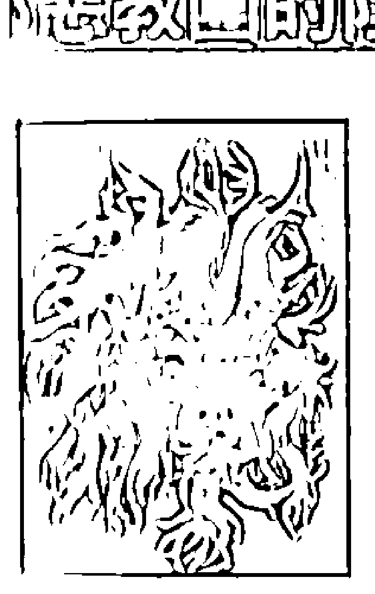

阿撒托斯教团

- 阿卡姆镇的女巫集团
- 莫里亚蒂教授的组织
- 病态狂人所组成的信徒

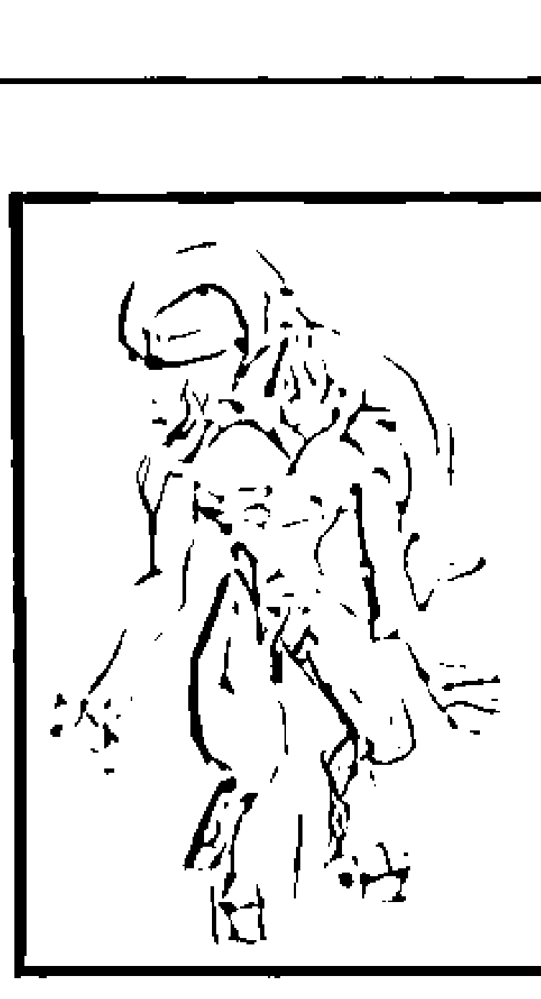

星之彩崇拜团

- 奈夫伦卡的祭司们
- 星际智慧教派
- 欧之兄弟会

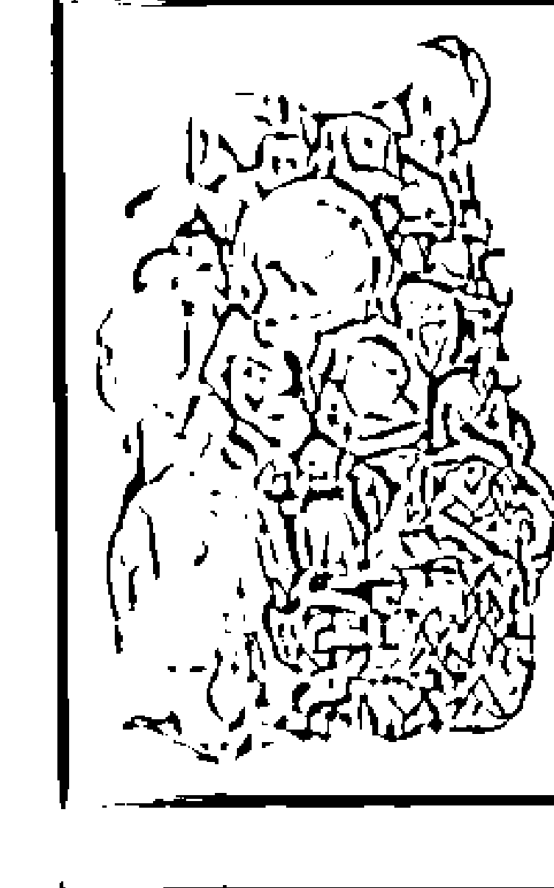

深潜者集团

- 约瑟夫·古温的同党
- 理查·比里顿
- 华特立家族

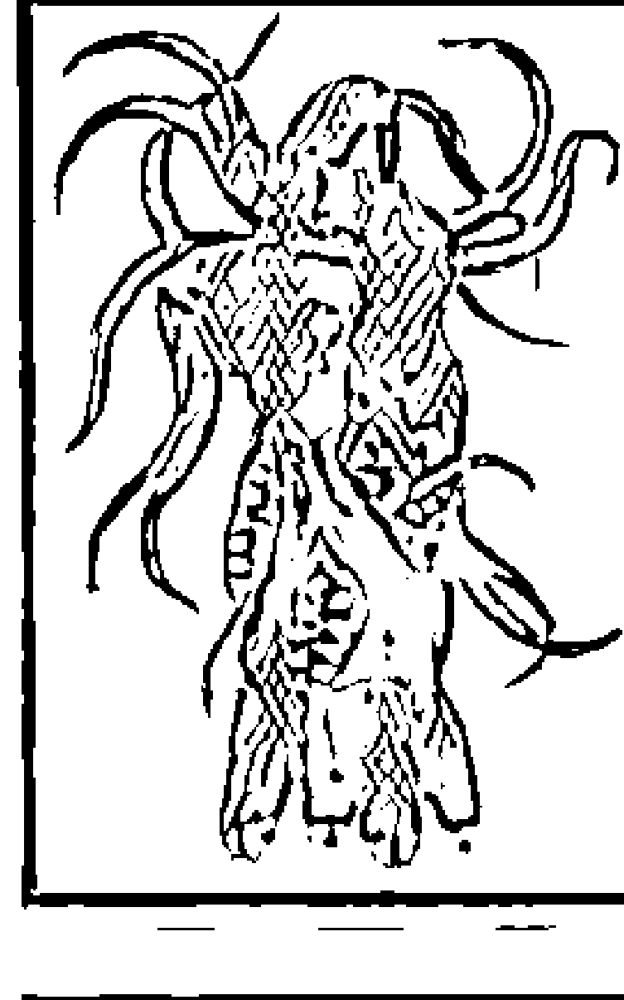

塔维尔·亚提

- 姆大陆的祭司们
- 恩洛伊·伯们及其后裔

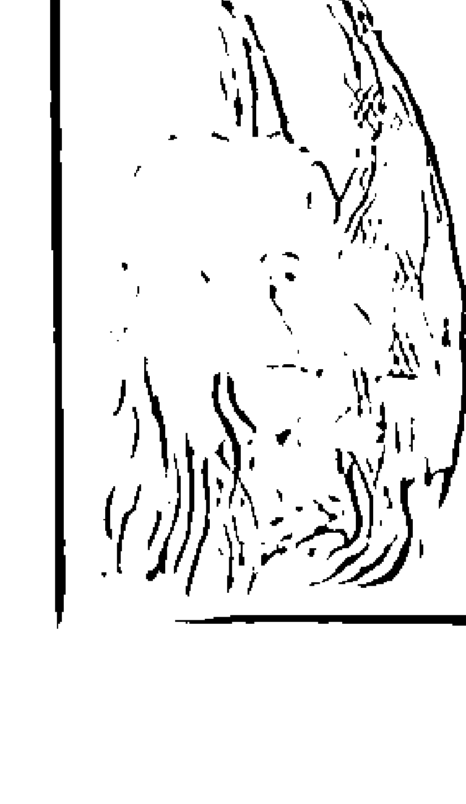

伟大的克图格亚

- 克苏鲁邪教
- 契之访间欧金术会
- 马许家族（间接性）

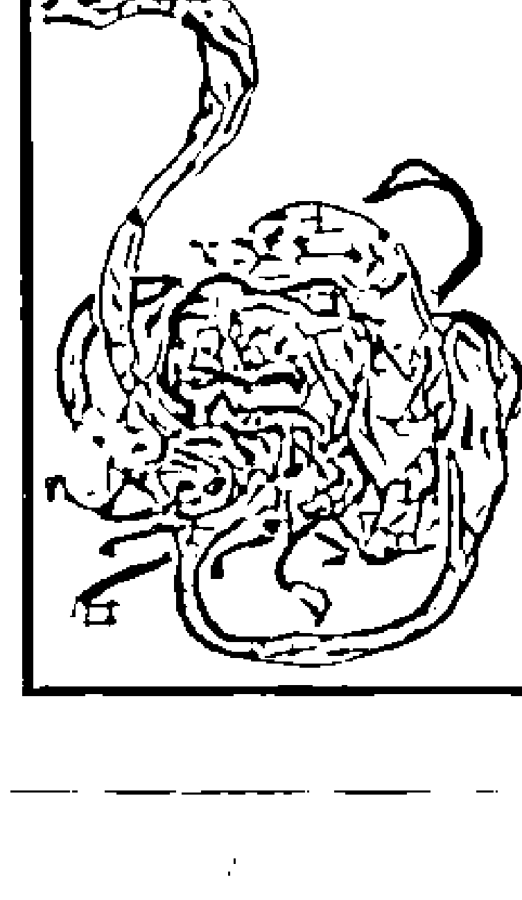

哈斯那教团

- 哈斯塔教团
- 皮耶·西·拉普拉斯

# 服侍黑暗力量为虎作伥者

「旧日支配者」的复活或「外神」的降临，便意味著人类世界的毁灭。虽然按照常理来说，应该不会有人想要做这种事情，但现实却是世界各地都有邪神崇拜者存在，而今他们也仍然还是为了自己的「神」而正在活动当中。

我们首先来看看最广受信仰的克苏鲁的教团。根据洛夫克拉夫特《克苏鲁的呼唤》记载，克苏鲁邪教的总部是设在中国内陆，全世界都有分部。除此以外，「深潜者」同样也是克苏鲁的信徒。

哈斯塔的劲敌哈斯塔同样也有崇拜者，至于是否有教团存在却仍是个谜，顶多也只有洛夫克拉夫特曾经在《暗夜呢喃》里面轻描淡写地提到跟哈斯塔有关的秘密结社在暗中活动而已。

「外神」当中虽然也有奈亚拉托提普受到星际智慧教派崇拜信仰，不过只是个特例，「外神」普遍因为神格特异而少有宗教团体的组织，通常都是采取像华特立家族和古温这样由魔法师各自单独崇拜的形态。

- 旧日支配者→No.016
- 奈亚拉托提普→No.005
- 达贡→No.009
- 旧神：外神→No.041
- 星际智慧教派→No.103

关于「督伊德」，请参照P.020译注。

# No.096 馬許家族

Marshes

將「深潛者」引進麻薩諸塞州的港都印斯茅斯鎮的歐畢德·馬許船長受到詛咒的子孫。

### ○深淵的大祭司

從前美國因為1812年英美戰爭造成經濟不景氣時，富冒險精神的歐畢德·馬許船長是印斯茅斯鎮唯一沒把不景氣看在眼裡，仍然派遣商船前往東印度群島和太平洋的商人，而馬許家族便是奉其為中興之祖的印斯茅斯鎮世家望族。

歐畢德船長在西印度群島的某個島嶼，跟崇拜「深潛者」的卡那卡族島民學到如何用活祭品跟古老的神明交換到實質利益的方法，並且在1838年該島居民突然消失不見以後，循著他們教導的方法在印斯茅斯鎮外海的魔鬼礁與「深潛者」進行接觸。馬許家族設立工廠提煉用活祭品跟「深潛者」交換得來的黃金，然後將高純度金塊投入金屬市場因而獲得巨富，同時他們家族也世代擔任總部設在共濟會堂的達貢神秘教團的祭司。

歐畢德船長和他跟人類妻子生下的長子萬西弗魯斯都曾經以「深潛者」為妻，所以從他們兩人以下的所有馬許家族成員體內均混有非人者的血液。

1928年美國聯邦政府大舉搜捕印斯茅斯鎮時，馬許家族便順利地脫逃至各地，有的人逃到了海底的伊哈斯里以「深潛者」身分展開新生命，有的人等到風頭過了以後又回到印斯茅斯鎮供奉達貢的神秘教團，還有人則是跑到加州等地展開相同的活動。

除此以外，西班牙的印波卡*、英國與日本沿海地帶也有像印斯茅斯鎮這種所有居民均崇拜「深潛者」的城鎮存在；馬許家族有時還會跟這些異鄉同志締結姻親關係，可說是這群人當中強大有力的家族。

> * 印波卡 (Inboca)：西班牙語裡面「boca」就是嘴巴的意思，也就是英文的「mouth」，因此印斯茅斯鎮 (Innsmouth) 其實就是印波卡 (Inboca)，這是作者的刻意安排。

## 马什家族系谱

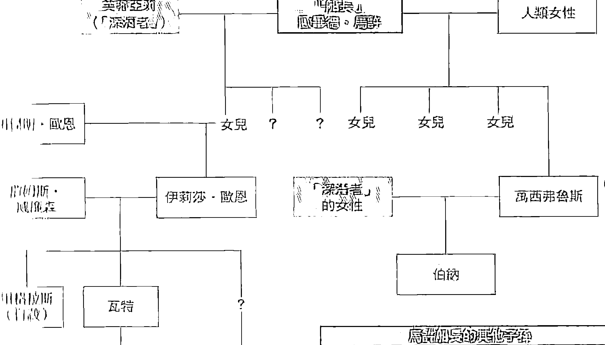

## 神秘教团

以德買下位於印斯茅斯鎮中央新教堂綠廣場的共濟會會堂，作為遠古神秘教團的據點。

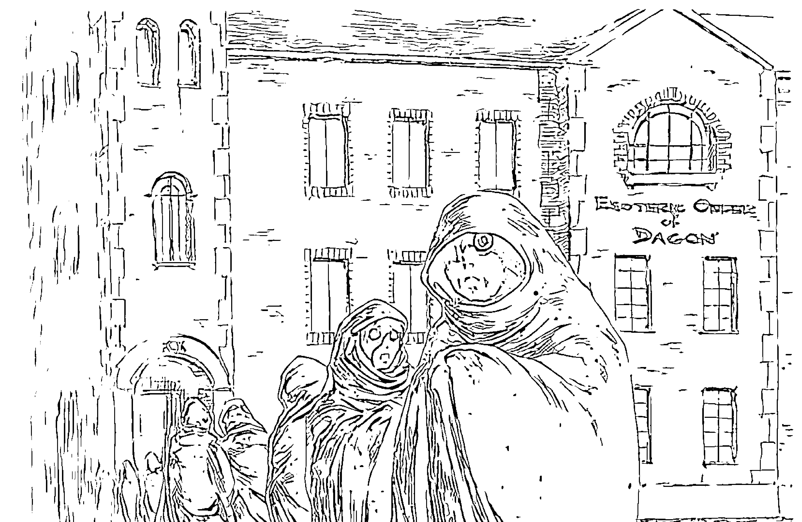

- No.041
- 深潜者→No.016
- 達貢→No.009

# No. 097
華特立家族
Whateleys

為逃避獵女巫而遷居至敦威治村的邪惡而可憎的魔法師，因為重複近親結婚導致在生物學上極度退化的家族。

### ○敦威治村怪譚

華特立家族是為躲避1692年賽倫女巫審判而逃往阿卡姆鎮和敦威治村的其中一個家族，他們跟畢夏普家族同樣是獲頒麻薩諸塞州徽章的古老名門。這個大地主家族的嫡系子弟當中，不少人曾經在哈佛大學、米斯卡塔尼克大學和索邦大學*1等名校接受過高等教育，可是少部分沉溺於研究當初從賽倫帶出來的魔法書，極為墜落的旁系家族卻使得華特立家族名聲掃地。

「巫師」諾亞·華特立1912年五月節*2前晚在哨兵山的祭壇舉行猶格·索托斯的召喚儀式，並使其與自己的女兒拉薇妮雅交合；於是乎拉薇妮雅就在聖燭節的前一天1913年2月2日的夜裡，產下了一對被詛咒的雙胞胎。根據米斯卡塔尼克大學的亨利·阿米塔吉教授表示，1928年潛入該大學附屬圖書館試圖盜取拉丁語版《死靈之書》而被看門犬咬死的威爾伯·華特立，年僅15歲便已經長到與年齡極不相稱的9英呎高，下半身全部被蜥蜴類的鱗片包覆、長滿了野獸般的黑色毛髮，腹部伸出的紅色觸手末端還附有吸盤。另外一個沒有名字的雙胞胎卻是個長得跟父親更像的隱形怪物，曾經多次襲擊人類、讓敦威治村家家戶戶恐慌不已，直到1928年才被阿米塔吉教授等人消滅。

後來繼承「巫師」此惡名的，就是跟諾亞同時代的魯瑟·S·華特立。魯瑟本身其實是位嚴格恪守戒律者，跟華特立家族的魔法傳統毫無關係，可是他的女兒莎莉卻跟印斯茅斯鎮歐文德·馬許船長的曾孫拉爾生下了擁有「深潛者」血統的異形，所以莎莉遂將這個會襲擊人畜的怪物給關在製粉工廠2樓裝有百葉窗的房間裡面。

*1 索邦大學 (Sorbonne University)：即巴黎大學。
*2 五月節：請參照 P.066 註解。

## 華立家族系譜

拉爾莎家族
拉爾莎・阿卡姆
血緣

| 家族 | 配偶/父母 | 子女 |
| :--- | :--- | :--- |
| 拉爾莎・阿卡姆 | 伯莎・S・華特立 (血緣) | 拉爾莎、莎拉 (莎莉)、魯比、傑瑞米亞・華特立、阿爾弗 |
| 潔布隆・華特立 | (關係不明) | 托拜亞 |
| 拉薇妮雅・沃特雷 | (關係不明) | 威爾伯、(無名的弟弟) (雙胞胎) |
| 亞賓士・柯特斯 | 艾瑪 | 威利、瑪米 |
| 塞司・亞賓士 | (關係不明) | (亞賓貝里的加特納家族) |

拉爾莎
二世
繼承「深潛者」血統
的怪獸。被囚禁在華
立家的磨粉工廠裡。

阿爾弗
繼承拉爾莎的土地之
後搬到殷斯治村，釋
放磨粉工廠的建築物。

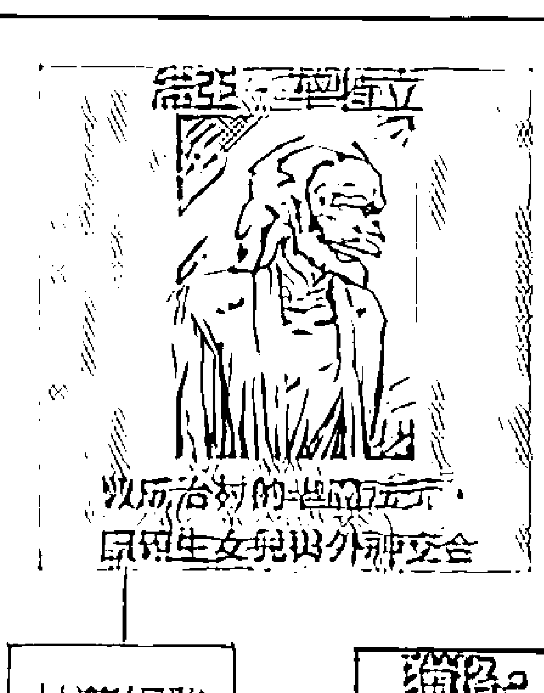

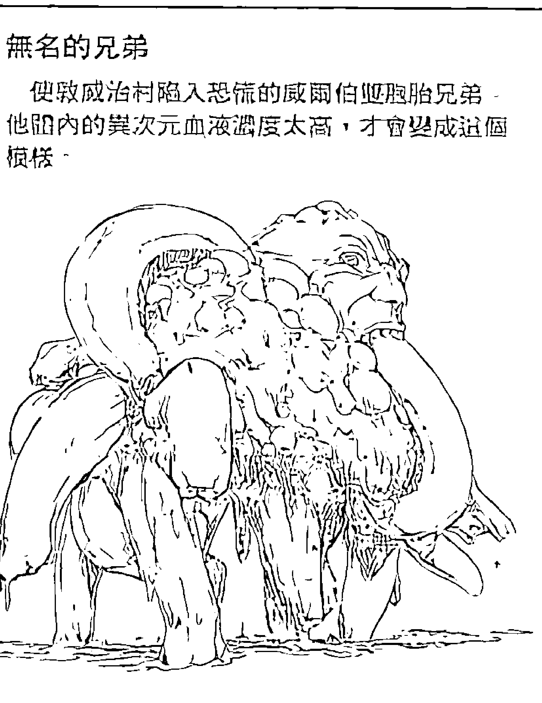

### 丑惡的雙胞胎

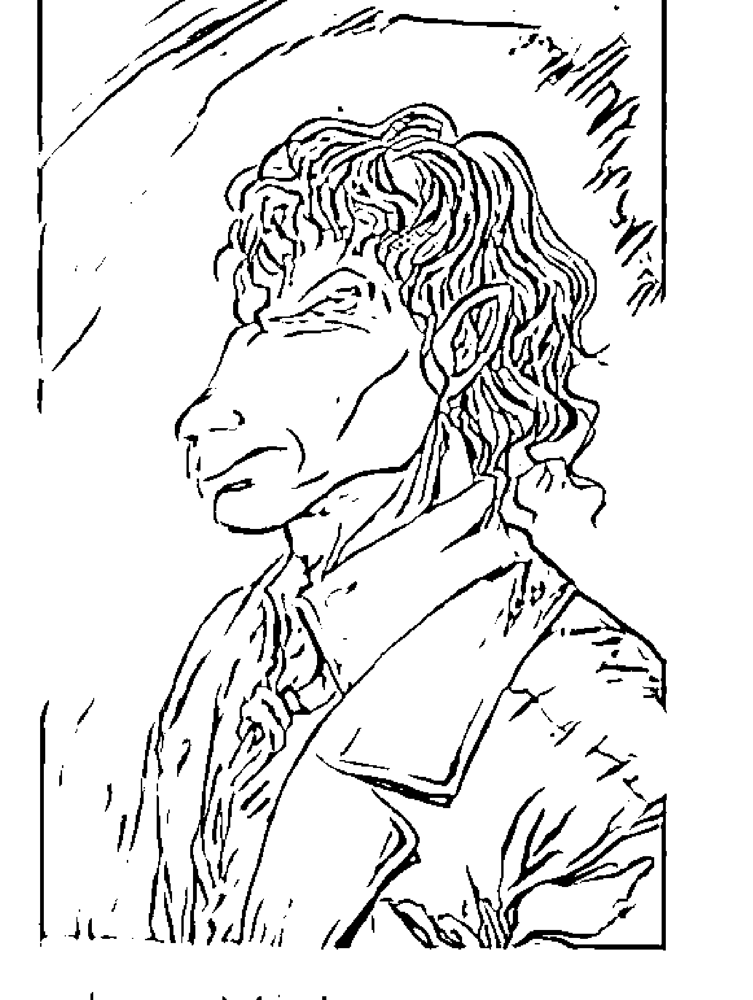

無名的兄弟
使殷斯治村陷入恐怖的威爾伯雙胞胎兄弟，
他體內的異次元血液濃度太高，才會變成這個
德性。

威爾伯・華特立
外表看起來就像個尋常的人類，但其
身體構造和他的兄弟同樣體內均流著異次元
生物的血液。

- 殷斯治村 → No.044
- 亞賓士・柯特斯 → No.039
- 塞司・亞賓士 → No.042
- 拉薇妮雅・沃特雷 → No.016
- ○《死靈之書》→ No.025
- ○猶格・索托斯 → No.006
- ○亨利・阿米塔吉 → No.107
- ○印斯茅斯鎮 → No.041
- ○馬許家族 → No.096
- ○米斯卡塔尼克大學 → No.040

No.097 第4章 永劫之探求

# No.098
### 齐萨亚·梅森
### Keziah Mason
潜伏於「女巫之家」的阁楼房间、臣服於混沌力量的女巫。数百年以来，她带着庞宠布朗詹肯在阿卡姆镇掀起了无数恐慌。

### ○跳跃来去于不同空间的女巫

在总共超过150名居民以女巫嫌疑陆续遭到告发投入牢狱的1692年赛伦女巫审判事件当中，最终共有25人因为受到严刑拷打或遭处刑而死亡，可是这些牺牲者其实都是不幸被冠上莫名其妙罪名的无辜赛伦市民。赛伦真正染指于邪恶妖术的女巫和巫师，却已经巧妙地躲过警方搜捕和加洛斯山丘的绞刑台，早早逃往阿卡姆镇和敦威治村等地，隐匿行踪等待追捕行动结束。

其中特别著名的是位名叫齐萨亚·梅森的狡猾女巫，她曾经在高等刑事审判所的公开审判庭上对约翰·霍森法官提出证辞，表示自己能够利用某种直线和曲线在空间与空间之间移动，随后却又利用同样的技术从牢里脱逃。

齐萨亚的巫名叫作纳哈，不论是弯腰驼背、长长的鼻子或干瘪削瘦的脸颊，全都像极了童话故事里的女巫，据说她不但能够跟化身成穿着黑色法衣的「黑暗之男」前来主持魔宴的奈亚托提普一起任意往来于星际宇宙，甚至还曾经不只一两次去到位于混沌中央的「外神」之王阿撒托斯的宝座。

她身边有隻叫作布朗詹肯的庞宠随侍在侧，这只庞宠经常坐在她和「黑暗之男」的脚边，不时还会用身体厮磨撒娇。布朗詹肯乍看之下活像隻大老鼠，脸孔却像是个留着胡须的人类，而且双手也跟人类同样是五隻手指头，再再都说明着牠是并不属于自然界的生物。

阿卡姆镇上有栋齐萨亚把阁楼当作藏身处的复折式屋顶建筑，后来被称为「女巫之家」，该建筑物于1931年3月被纵火焚毁以后，竟然从中发现包括女巫在内的许多人类白骨和慾心加的巨鼠骸骨。

> *[1] 庞宠：请参照P.060评注。
*[2] 魔宴：请参照P.020评注。

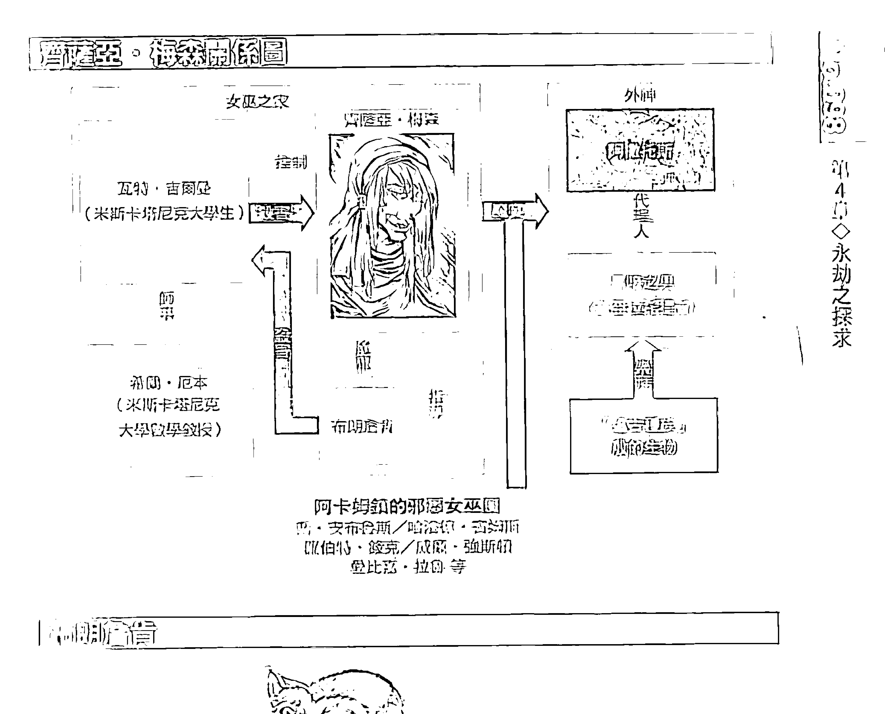

阿卡姆镇的邪恶女巫团
瓦·安布罗斯/哈洛德·吉斯斯
凯伯特·德克/威廉·戴斯纳
萨比兹·拉图等

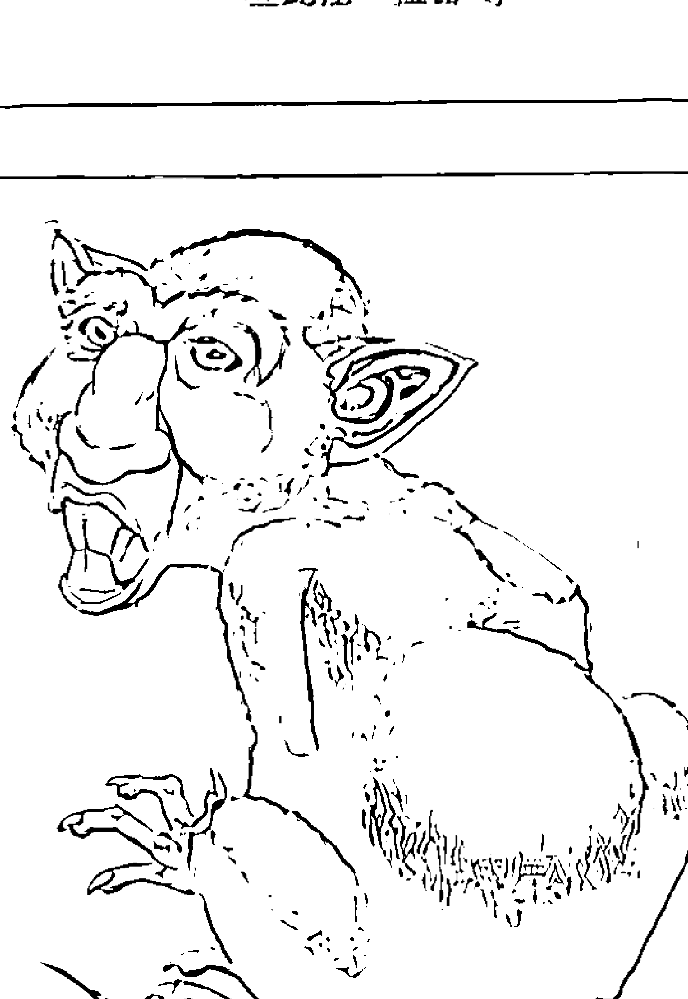

布朗詹衍
是生活在老鼠的怪物
命於女巫·在暗中进行活动·但他在后来「女巫之家」出现了更为凶猛的白分·但是这些跟主人同样邪恶的巫师或许其打正没死也说不定·

# No.099
約瑟夫·古溫

Joseph Curwen

將人類的生死玩弄於股掌的邪惡魔法師。跟他長得一模一樣的子孫的好奇心，竟然穿越了150年的時間，喚醒了過去的惡魔。

### ○普洛維頓斯的死靈術師

1662年或1663年的2月18日誕生於賽倫的約瑟夫·古溫，是位曾經犯下無數邪惡凶殘行徑、惡名昭彰的黑魔法師。

古溫15歲的時候離家出海當水手，後來他迷上在海外得到的祕密儀式魔法書，於是便與志同道合的西蒙·歐恩、艾德華·赫金森兩位朋友在賽倫整日埋首於黑魔法實驗。

古溫在1692年獵女巫前夕跟同伴離開賽倫搬到羅得島州的普洛維頓斯，改變身分成爲大力協助地方產業發展的實業家。不過他卻並未停止進行實驗，甚至還挖掘古代名人的墳墓，以便使其甦醒，並且向這些曾經活在過去世界的證人們拷問各種祕密，藉此提升自己的知識。

船人伊莉莎·蒂林哈斯特遭到橫刀奪愛而立誓要向古溫報仇的船員伊茲拉·維頓，經過多方探索以後終於掌握了仇敵古溫邪惡行爲的證據，並且跟該鎮多位曾經懷疑過古溫的重要人士共同策劃，於1771年襲擊古溫位在歐尼考特的家，成功將其打倒。

1918年在摩西布朗學校研究歷史學的時候，查理士·德威斯特·華德無意發現自己是這名惡名昭彰魔法師的後代，於是他便在受到學問求知心的驅動之下，使用古溫記錄下來的秘術成功讓死亡將近150年的古溫復活。古溫復活以後便跟仍然活在世上的同伴們取得聯絡，重新展開實驗，可是他卻認爲原本相當協助、後來卻開始後悔的查理士是個阻礙，於是便毫不留情將其殺害。得知此真相的馬利奴斯·比克奈·威列特醫師後來在古溫舊家地下室偶然讓某個骨灰甕在寫著編號118號的骨灰罐裡的神祕存在甦醒，並且使用這個神祕存在所教導的咒語，終於成功將這名黑魔法師徹底埋葬，令其永遠再也無法作祟。

| 时间 | 事件 |
|------|------|
| 1882年2月18日 | 约瑟夫·古温出生于伦敦（另一说法1863年） |
| 1881年 | 古温成为船员流浪海外，得到禁忌的魔法书 |
| 1881年 | 古温返回伦敦，与两位朋友钻研禁忌魔法 |
| 1882年3月 | 古温公开展示女巫巫术而遭告普洛维顿斯，脚被铐上镣铐，经公船运送 |
| 1882-1703年 | 古温成为普洛维顿斯的主要海运业者 |
| 1703年3月7日 | 古温与伊莉莎·赫林哈斯特结婚，伊莉莎的情人伊亚拉·维纳尔生复仇 |
| 1703年 | 维纳尔与教会重要人士展开接触，而图谋如何除掉古温 |
| 1704年4月12日 | 教会的有志之士袭击古温的仓库，古温遭到逮捕，跟他有关的证据亦遭到销毁 |
| 1704年 | 查理士·德克斯特·华德出生 |
| 1705年 | 查理士得知恶名昭彰的约瑟夫·古温是自己的祖先 |
| 1705年 | 查理士前往古温住过的房子进行调查，发现古温的肖像画与秘密文件 |
| 1706-1707年 | 查理士积极奔走于全美图书馆以及欧洲各地，学习禁忌的知识 |
| 1707年4月15日 | 查理士成功使古温复活，古温化名艾伦·查德，与查理士过着共同生活 |
| 1928年 | 普洛维顿斯及周边地区发生骚动，吸血鬼等多起怪异事件 |
| 1928年9月 | 查理士让古温复活，从此以后，古温完全取代查理士 |
| 1928年10月13日 | 马利奴斯·比克奈·威列特医师使用魔法消灭古温 |

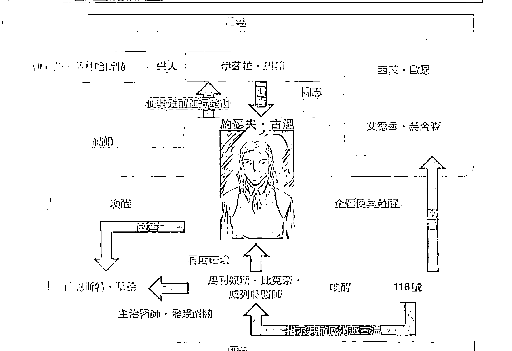

# No.100
理查·比灵顿
Richard Billington

即便被驱逐至异世界以后仍多次占据子孙肉体藉此返回现世，并于森林深处的石塔中重复进行黑暗仪式的阿卡姆镇魔法师。

### ○比灵顿森林

阿卡姆镇北部丘陵地带的树海自古以来被当地居民称为「比灵顿森林」，而附近一带土地的所有者比灵顿家族的古老宅邸位于这片森林深处。

18世纪的大地主理查·比灵顿是位魔法师，他曾以禁忌的魔法来自学，也曾经向萬帕诺亚格族的老咒术师米斯夸马可学习秘密仪式。从前他在比灵顿森林里面某河流上的岛屿建造了环状石阵和石塔，然后从石塔的开口处前往外宇宙，得到萬帕诺亚族印地安人称为欧萨多戈瓦的犹格·索托斯赐予智慧，他还曾将古老的神话和仪式教导给巫夏普家族和华特立家族等堕落的威治村居民，这些人甚至直到今天都仍旧以导师称呼之。后来他虽然被米斯夸马可封印在石塔的另一边，可是他的剩余意志却依然残留在比灵顿森林，不断对他的子孙后代造成邪恶的影响。

19世纪初的艾历亚·比灵顿曾经遭其附身，并将伊塔库亚召唤至石塔开口处，进而引起1807年沸沸扬扬的连续失踪事件，不过后来稍通秘密仪式的艾历亚终于发现自己遭到某种牵制，遂再度将其封印在石塔里面，然后就带着儿子拉班渡海逃至英国。

拉班的曾孙安布鲁斯·杜华德于1921年继承比灵顿家的产业，同时还搬进了比灵顿宅邸。杜华德出于好奇心而将石塔和环状石阵修复，却让理查·比灵顿得以附身于子孙肉体而复活；虽然他透过黑暗仪式引起了一连串奇怪的事件，可是在不久后再度遭到米斯卡塔尼克大学的塞涅卡·拉法姆教授和菲尔·菲力普等人破坏。

其次，理查还有个自称是纳拉干瑟族印地安人的仆人夸米斯。每次魔法师复活的时候，夸米斯也都会从石塔里面出来，辅佐主人灵魂寄附的比灵顿家族成员。

## 迪普顿家族关系图

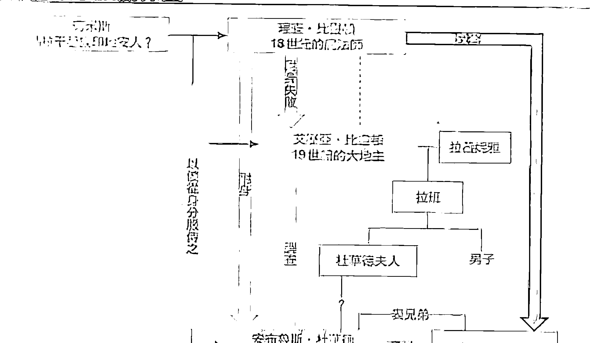

### 比尔斯通的周边地图

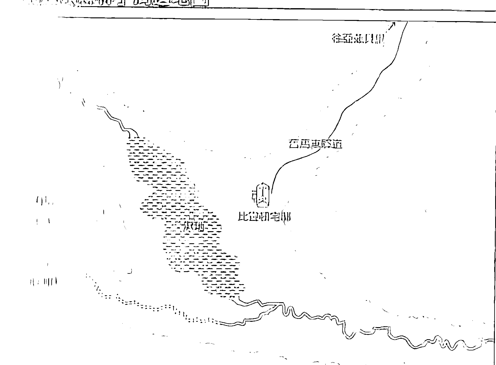

# No.101
理查·厄普頓·皮克曼

Richard Upton Pickman

體內流著賣倫女巫的血液，與非人存在過從甚密，最後就連自己也淪落成為非人者的波士頓天才畫家。

### ○皮克曼的範本

除了因為生理方面的理由而對其病態的畫風產生嫌惡感的部分保守派人士以外，1926年失蹤的理查·厄普頓·皮克曼是位公認堪與古斯塔夫·朵瑞、悉尼·西姆等幻想畫派巨擘大家相比擬的波士頓最偉大的畫家，這位唯美主義藝術家還被譽為能夠將逼真到令人害怕的景象呈現於畫布之上的天才。自從新古典主義的巨匠哥雅以來，能夠光憑扭曲的五官和表情便將地獄活生生地呈現出來的畫家，除皮克曼以外也就只有英國的貝爾·霍爾渥德而已。

皮克曼家族原本住在賣倫，他們是在理查四代以前的祖母在1692年惡名昭彰的女巫審判受到牽連逃處環首死刑以後，方才逃離賣倫，遷居到波士頓。皮克曼用假名彼得斯在北尾區貧民窟租了一間老房子當作秘密畫室，供其創作就連他這麼旁若無人的人都也害怕被人看見的作品。他在這間秘密畫室裡面完成了「地獄鐵意外」、「教訓」、「霍姆茲·嬰威爾與隆羅長眠在奧本山」、「食屍」等一系列以潛伏於地底世界的食屍鬼為主題、令人不寒而慄的作品，這些栩栩如生得令人害怕的繪畫，其實全部都是他以從波士頓周邊的納骨堂出沒在北尾區錯綜複雜網狀地底隧道中活生生的食屍鬼為模特兒臨摹出來的寫實畫。皮克曼與食屍鬼交往愈來愈深，最後終於放棄了人類的身分，如今已經變成食屍鬼住在幻夢境。據說皮克曼家族原本收藏有一本16世紀出版的希臘語版《死靈之書》，卻在皮克曼失蹤後下落不明。

> *1 古斯塔夫·朵瑞（Gustave Doré）：法國畫家暨插畫藝術家，擅長於奇幻藝術。他的插畫經常出現《神曲》、《聖經》、《老水手之歌》（Rime of the Ancient Mariner）、《唐吉訶德》中的意象。
> *2 悉尼·西姆（Sidney Sime）：英國插畫家，其最著名的是他為恐怖小說家鄧沙尼勳爵（Lord Dunsany）的叢書作的插畫。儘管他的幻想天分經常被史丹利·溫·克來相媲美，但近年來卻少見到他的作品。
> *3 法蘭西斯科·哥雅（Francisco Goya）：西班牙浪漫主義畫派畫家，畫風多變，從早期巴洛克式畫風到後期類似表現主義的作品，對後世的現、浪漫主義畫派和印象派都有很大影響。

### 理查·厄普顿·皮克曼

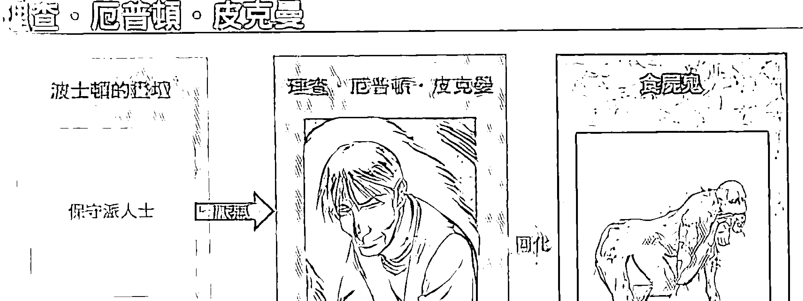

### 食尸鬼

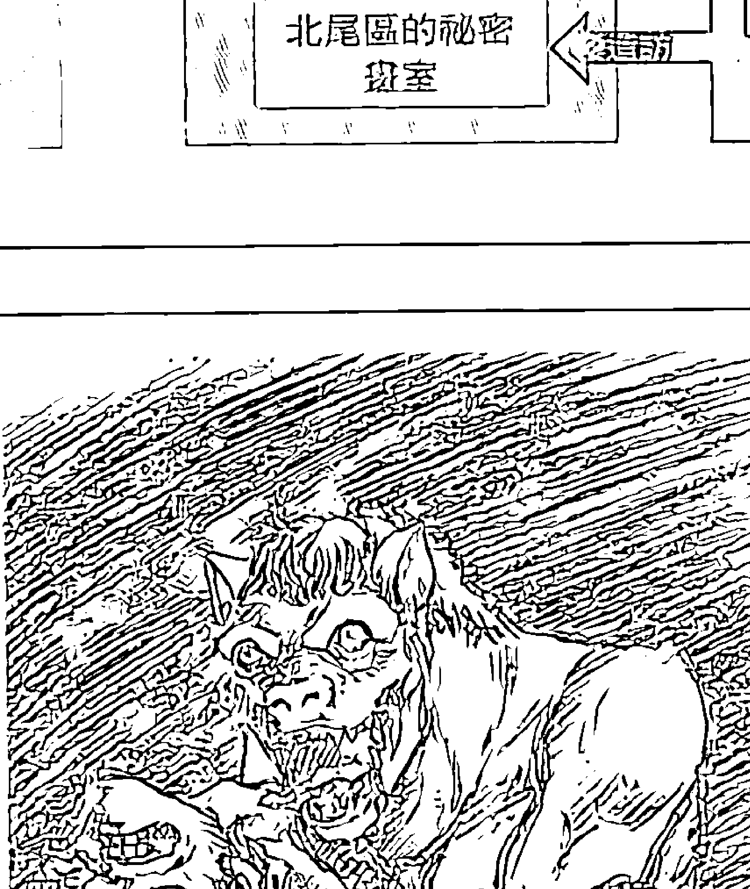

「食尸鬼」理查·厄普顿·皮克曼在这幅作品里面用细腻的笔触钜细靡遗描绘出食尸鬼啃食人类尸体的模样，此画被�的为他的最高杰作，不过却有流言指出皮克曼是把真正的食尸鬼召到他的秘密画室里才画出来的作品。

> 幻梦境→No.080
> 《死灵之书》→No.025

# No.102 詹姆斯·莫里亚蒂教授

Professor James Moriarty

詹姆斯·莫里亚蒂教授不但是极富盛名的数学家，同时也是位邪恶的天才。就在他过于敏锐的思考超越生死境界的瞬间，回响于星际间的笛音便捕捉到了他的灵魂。

### ○罪犯界的拿破仑

在英国维多利亚时期由连续杀人魔「开膛手杰克」所代表象征的社会黑暗面和黑暗世界背后，其实有个强大的犯罪组织在暗地里利用恐怖力量操纵。这个跟当时所有发生在伦敦暗巷里的绝大多数犯罪都有关系的组织，其首领便是詹姆斯·莫里亚蒂教授。

从他的头衔「教授」便不难发现，莫里亚蒂表面上是以在英国西部某大学执掌教鞭的数学教授身份作掩护。这个荣誉的地位是他在1867年发表有关二项式定理的论文所得来的，不过真正让他确立在欧洲数学界鼎鼎大名的其实是在1872年发表的著作《小行星之力学》。莫里亚蒂在这篇论文里面提出一个假说：从前在火星与木星中间本来另外有个行星，后来却因为接触到某种强大的能量而爆炸粉碎，终于形成现在的小行星带。神奇的是，这个假说还相当准确地论证了阿撒托斯在遥远的太古时代被召唤至太阳系当时所发生的事情。

至于莫里亚蒂究竟是在著作《小行星之力学》之前还是之后得知有关「外神」的知识，如今已经无从考证。不管怎么说，这位天才数学家后来竟然会染指于有组织犯罪活动，其中的经纬肯定跟他那股希望透过《小行星之力学》打开通往禁忌知识大门的渴望有关。

莫里亚蒂向来都能极巧妙地暗中操纵，避免暴露其犯罪身分，可是其组织后来还是在某位曾经是他学生的私家侦探的调查之下遭到破获，莫里亚蒂也从1891年开始遭到追捕。虽然历来世间的普遍相信莫里亚蒂已经命丧于瑞士的赖兴巴赫瀑布，事实上他却是在九死一生之际被「外神」打捞救起，从此便成为「外神」的虔诚信徒，在历史不可企及处暗中进行活动。

### 1. 里亚蒂教授的犯罪组织

### 莫里亚蒂教授

英国画家悉尼·佩吉特 (1860-1908) 所绘的詹姆斯·莫里亚蒂教授肖像。「他是一个非常高瘦的男子，额头突出一道漂亮的曲线，深邃的双眸深陷在尖刻的五官轮廓之中。他总是把脸刮得干干净净，外表看起来是个苍白的禁欲者，表情里面仍然带着某种教授气质。他的肩膀因为经过长期的勤奋研究生活而不由得佝偻起来，他总是伸长着脖子，用某种仿佛是爬虫类般的奇特动作，缓缓地不断左右摇摆。」 (森村誠 译)

> 莫里亚蒂教授是柯南·道尔笔下夏洛克·福尔摩斯的宿敌，被福尔摩斯形容为“伦敦最危险的男人”。1894年以后被人遗忘，其真实身份成谜。

### 揺

维多利亚时期英国的所有犯罪

+   - 伦敦警察 (苏格兰场)
- 市警局
- 贝奥吉尼斯俱乐部

### 伦敦最危险的男子

要说伦敦最危险的男子，毋庸置疑，那就是活跃于英国维多利亚时期的侦探夏洛克·福尔摩斯不共戴天的仇敌——詹姆斯·莫里亚蒂教授。将亚瑟·柯南·道尔的畅销侦探小说跟克苏鲁神话结合起来的，就是混沌元素出版公司（Chaosium Inc.）桌上型RPG「克苏鲁的呼唤」于1989年推出的补充设定集《煤气灯下的克苏鲁》。这个以维多利亚时期的故事为舞台的设定集，乃是根据以详注版夏洛克·福尔摩斯全集而为世所知的福尔摩斯研究家W·S·巴林-古尔德所著的福尔摩斯传记《Sherlock Holmes: A life of the world's first consulting detective》进行设定，各项目的记述说明也全都照足了这本传记的内容。设定集里面有关阿撒托斯的记述，则是以收录在以撒·艾西莫夫的推理小说集《黑鳏夫故事集》的短篇作品《终极为犯罪》为准，并且在混沌元素出版公司的《Polarity's Field Guide to Cthulhu Monsters》里面被纳入克苏鲁神话体系。

## No.103
### 星际智慧教派

**Starry Wisdom**

崇拜「猎魔行者」的邪教集团。曾经在灭亡以后再度复活，直到现在仍不断地威胁着全世界。

### ○黑暗教团的阴影

星际智慧教派是由 1843 年曾经在埃及挖掘调查奈夫伦-卡瑟室的伊诺克·鲍文教授，于翌年以普洛维顿斯联邦山丘上的自由意志老教堂为根据地所设立的新兴教派。

鲍文是以他从埃及带回来的「光辉之四边形体」作为信仰基础，奉奈亚拉托提普为主神，并且崇拜伟大的克苏鲁、莎布·尼古拉斯等「旧日支配者」与「外神」。

据说「光辉之四边形体」是能够通往所有时间和空间的窗口，此物是在冥王星制造后由「远古种族」带到地球，瓦路西亚的蛇人经手以后才落入了人类的手中；「光辉之四边形体」是放在某个侧面刻有蜷曲着身体的生物、没有光泽的金色盒子里面，只要阖上盒盖使这块黑色多面体结晶陷入无光的黑暗里，便能够唤奈亚拉托提普。

星际智慧教派曾经一度发展成教徒总数超过 200 名的大型教派，却因为使用活祭品等险恶流言而遭到当地居民忌避厌恶，并于 1877 年受到当局揭发、勒令解散。当时星际智慧教派的组织教会也遭到封锁，可是后来仍然有各式各样的奇异事件发生，包括 1893 年报社记者艾德温·利力布里吉在潜入教会以后失踪、1935 年同样潜入教会的恐怖小说家罗伯特·哈里森·布莱克在离开 1 周后竟然离奇死亡。星际智慧教派虽然看似已经消灭，但其实仍有许多信徒潜伏于各地，1890 年代还曾经在詹姆斯·莫里亚蒂教授的协助下在英国的约克夏郡设立教会，并且在 1970 年代亦有位名叫奈神父的神秘黑人男性在加州洛杉矶的诺曼地重建教团，并且在 80 年代曾经跟印斯茅斯镇的达贡秘教教团合作过。

* 星际智慧教派：此处乃采奇幻基地《战慄传说》译名，《克苏鲁神话》则译作「史塔瑞智慧」。

## 星際智慧教派年表

| 年代 | 事件 |
| :--- | :--- |
| 1943年 | 伊諾克·鮑文教授於埃及挖掘奈夫倫-卡的墓室，得到「光輝之四邊形體」。 |
| 1944年 | 鮑文教授買下普洛維頓斯的自由意志老教堂，設立星際智慧教派。 |
| 1948年 | 星際智慧教派信徒增加到將近 100 名，被當作活祭品獻神的犧牲者亦達到 10 名。 |
| 1953年 | 星際智慧教派信徒達到將近 200 名。 |
| 1957年 | 當局進行搜捕，致使星際智慧教派被迫解散，許多信徒紛紛離開普洛維頓斯。 |
| 1958年 | 報社記者艾德溫·利力布里吉潛入教會遺址、離奇失蹤。 |
| 1960年代 | 星際智慧教派在莫里亞蒂教授的協助下於英國約克亞郡設立教會。 |
| 1960年 | 恐怖小說作家羅伯特·H·布萊克潛入教會遺址，發現「光輝之四邊形體」，後來在某個暴風雨的夜裡喪命。布萊克死後，安布羅斯·德克斯特醫師將「光輝之四邊形體」沉入海底。 |
| 1970年代 | 奈神父於洛杉磯重建美國國內的星際智慧教派。 |
| 1980年代 | 星際智慧教派與達古神秘教團為回收「光輝之四邊形體」而合作。 |

### 光輝之四邊形體

在猶格斯星被製造出來以後，人類誕生以前的許多文明都曾經持有過光輝之四邊形體。據說後來它被丟進了海底，不過除此以外還有其他同樣的物品存在。

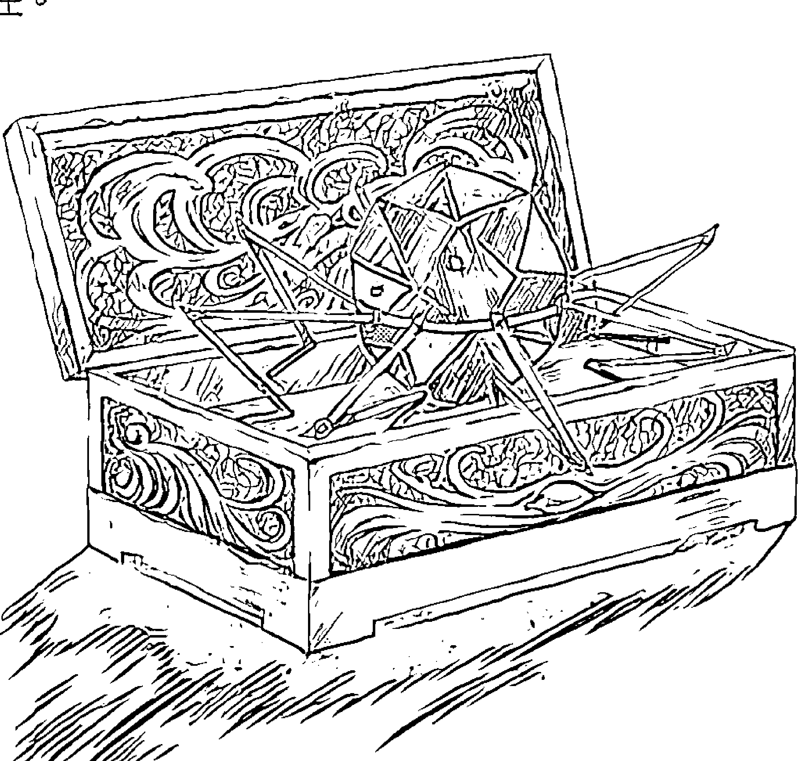

- ◎「遠古種族」→No.017
- ◎其他存在（蛇人）→No.024
- ◎羅伯特·哈里森·布萊克→No.090
- ◎詹姆斯·莫里亞蒂教授→No.102
- ◎印斯茅斯鎮→No.041

## No.104
### 銀之黃昏鍊金術會（S∴T∴）
### The Hermetic Order of Silver Twilight

1920年代曾於世界各地暗中從事活動，陰謀欲使古神明復活、破壞世界秩序的秘密結社。其殘黨至今仍不斷在歷史的背後蠢蠢欲動。

### ○陰謀欲使邪神復活的秘密結社

銀之黃昏鍊金術會是1920年代成立於麻薩諸塞州波士頓的排他性秘密結社，其前身是1657年由蘇格蘭女巫安·夏特蓮所創設的組織。世間普遍將銀之黃昏鍊金術會視為跟共濟會相同的友愛團體，非但有不少波士頓的重要人士入會，而且還經常出資贊助各種慈善事業，都讓此組織搏得了不錯的評價。然則事實上，銀之黃昏鍊金術會卻是個信奉「舊日支配者」和「外神」、企圖召喚這些神明陰謀破壞所有秩序的瘋狂教徒所組成的宗教團體，包括前述波士頓政商名士在內的普通會員，只不過是他們用來掩飾真正目的的偽裝而已。

此教團的最高領導者，就是擁有最高位階「魔法師」頭銜的卡爾·史丹佛。這位史丹佛據說已經活了3個世紀之久，而且相傳他跟德國國家社會主義工人黨（納粹）的前身——神秘學結社「圖勒協會」，以及英國魔法師阿雷斯特·柯羅利所創設的秘密結社「銀星」都有關係。

銀之黃昏鍊金術會真正展開正式的行動，是1925年的事情。據說當時他們欲使拉萊耶城浮出太平洋海面、把偉大的克蘇魯從睡眠中喚醒的計畫其實已經成功了一半，最後卻因為一個教團對抗的敵對者介入而使得計畫以失敗告終；不僅如此，教團許多幹部甚至還隨著再度沉入海底的拉萊耶城遭到大海吞沒，使得銀之黃昏鍊金術會在實質上已經形同滅亡。

當時倖逃得性命的殘黨後來遂分散至世界各地，並維持低調的神秘身分繼續在暗中活動。其中逃往南美洲的群體甚至跟同樣在戰後同樣潛逃至南美洲的納粹餘黨結合，一時之間儼然形成一股強大勢力，可是該組織卻在經過跟1983年分家的「東方騎士團（G∴O∴T∴）」的激烈內部鬥爭以後疲弊困乏，而再度趨向衰退。

> > 1 阿雷斯特·柯羅利（Aleister Crowley）：此處乃採奇幻基準《克蘇魯神話》之名，另可譯作「亞雷斯特·克羅利」或者「阿萊斯特·克勞力」。

## 銀之黃昏鍊金術會的集會所

位於波士頓郊外的銀之黃昏鍊金術會集會所，是採哥德式風格的後維多利亞時代建築，主要使用於會員交流、舉行召集儀式，1925年開館。

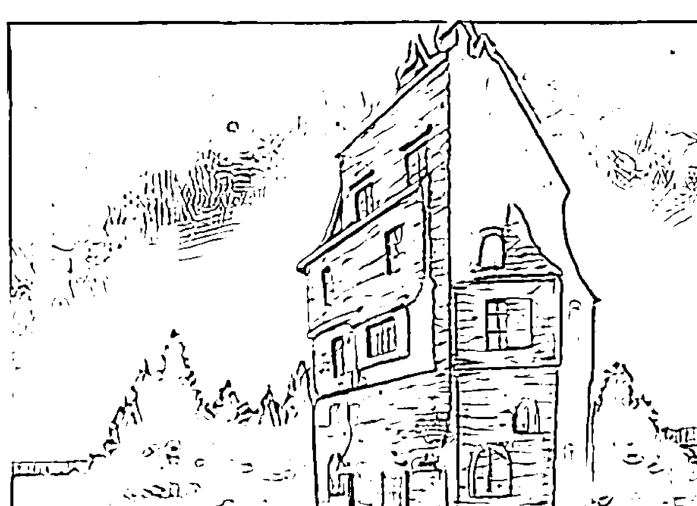

銀之黃昏鍊金術會授予會員的七個位階當中，最下方的三個階級是不會被告知任何與克蘇甘神話有關情報，而屬於普通會員的位階。

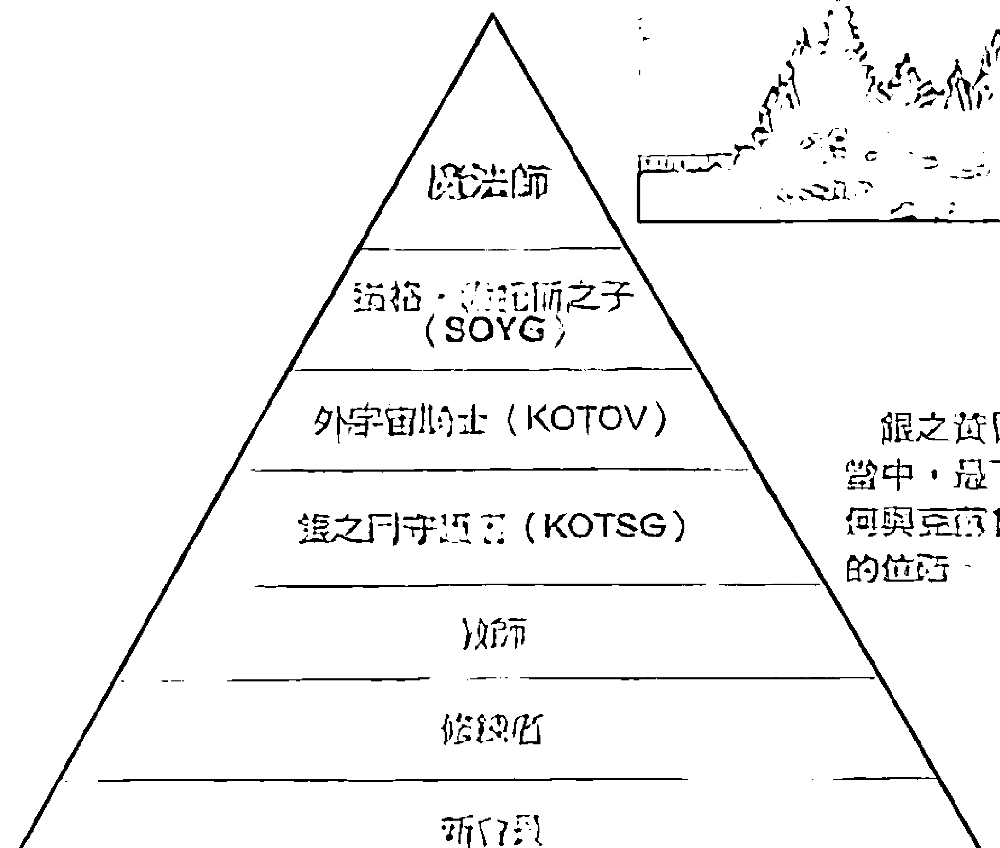

### 卡爾・史丹佛

在美國混沌元素出版公司（Chaosium Inc.）1983年發售的桌上型RPG「克蘇魯的呼喊」專用補充設定集《獵格・索托斯的陰影》當中，卡爾・史丹佛是跟玩家相敵對的銀之黃昏鍊金術協會首領，此外後是1984年日本的《奈亞拉托提普的假面》（混沌元素）、1988年發售的《黃昏的神話》（Hobby Japan）等其他設定集也曾經提及他的名字。

「卡爾・史丹佛」這個名字其實是來自桌上型RPG「克蘇魯的呼喊」的作者桑迪・皮特遜的本名（卡爾・史丹佛・皮特遜），這就跟奧古斯・德雷斯筆下的拉班・舒茲伯利博士和《塞拉伊諾斷片》、R・E・霍華德筆下的約翰・雷蒙等設定同様，作者乃是利用這些與混沌元素公司神話般的作品間的聯繫，藉此替作品增添一番趣味。

## No.105
### 永無止境的抗爭
Endless Resistance
勇於對抗威脅人類社會的邪神及其崇拜者的鬥士，修習禁忌知識與魔法對抗強大存在的逆神者。

### ○十字軍的後繼者

世上有群被稱呼為「探索者」的人們。當克蘇魯神話的許多神明及其崇拜者潛伏在人類社會黑暗處蠢蠢欲動，並即將毀滅和混沌投影在和平安穩度日的人類身上時，這些彷彿十字軍騎士般挺矛以向、意欲阻止諸多怪異事件背後陰謀的探索者們，他們雖然知道自己的行為就像是朝著風車衝刺突擊的唐吉訶德、知道這將是場愚蠱而虛幻的戰鬥，卻依舊沒有辦法放棄挺身對抗，可見是群勇氣與智慧兼備卻又稍欠思慮的志士。

為了對抗那些擁有驚人力量、認真起來足足可以將世界毀滅好幾遍、而且只要時機到來也確實會毀滅世界的邪惡存在，探索者們有時甚至不惜利用「外神」或「舊日支配者」自身的力量。他們必須涉獵遭到封印的史前時代神話傳說、研究著名魔法師們留下的禁忌魔法書、學習有關敵人的知識以及原本是敵人巫器的那些密儀式和魔法，並且毫不猶豫地行使這股力量。

這些人的身分個性各不相同。有的是湯瑪斯·卡納基、約翰·亞倫斯醫師、麥可·雷伊和泰忒斯·克斐這些被稱為惡獵人或超自然偵探的職業專家。當然也有馬丁·赫塞留斯博士、以伯拉罕·凡·赫辛教授、拉班·舒茲伯利博士等，原本是從事探討的方向漸漸牽涉到超自然存在，最後終於踏進該領域而無法回頭的學者們。又或者也有像艾德溫·溫斯羅普或FBI探員萊這種在政府機關的秘密命令之下與太古時代流傳至今的邪惡勢力對抗的人。有些人是為了求更接近宇宙的真理，有些人是為了履行自己被賦予的崇高義務，有些人則是為了獲得地位和名譽，幾乎才將他們有限的生命全部投注於對永劫的探求。

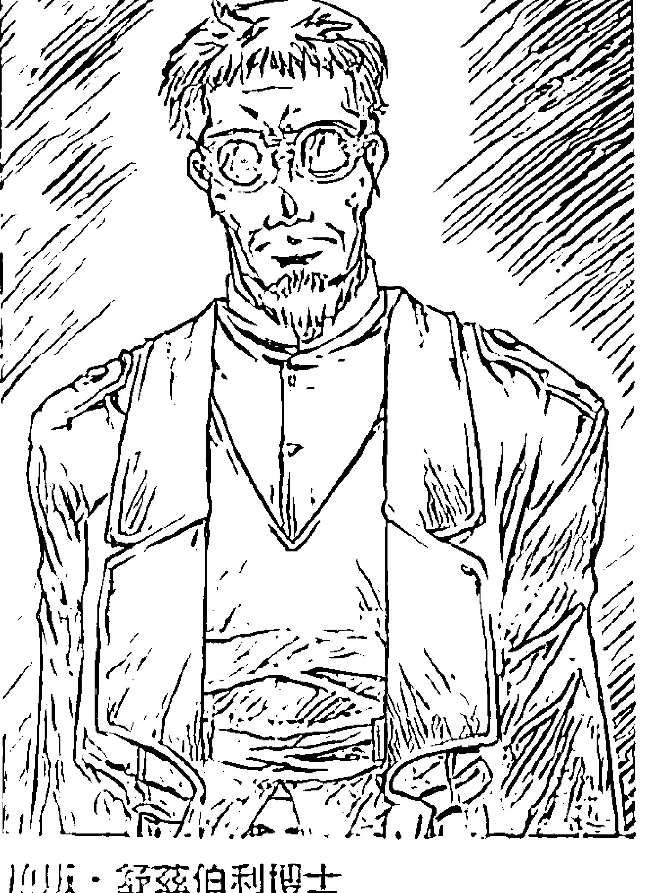

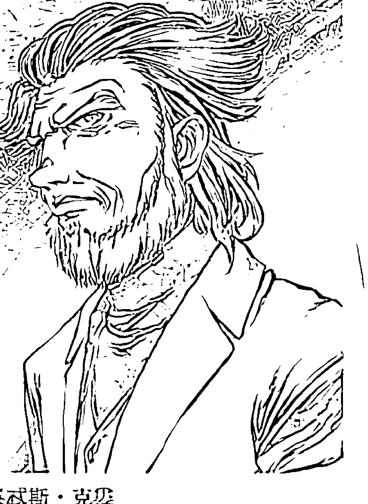

### 明神明擓學者

在H·P·洛夫克萊夫特創作的作品裡面，不論主角們有多麼的智勇，他們始終都只不過是渺小而脆弱的人類，面對各種詭奇詭異的事件往往束手任其擺布、殘酷地邁向毀滅。可是在繼之而起的後續作家群中，並不乏像奧古斯特·德勒斯這種給予人類堪與邪神對抗之力量的作

屬於德勒斯《永劫之探求》系列作品的拉班·舒茲伯利博士便曾經是位年輕的探索者，打擊世界克蘇魯信徒在世界各地的據點和拉萊耶，以及德勒斯登峰之作的《永劫之探求》在日本同好間頗受歡迎，而且對後續作品造成了很大的影響。

泰忒斯·克瑟則是布萊恩·魯姆利所創造出來的英雄人物，他精通魔法，是能利用魔法進行戰鬥的角色形象，正可謂是新世代探索者的象徵。克魯出版社除了出版短篇集《泰忒斯·克瑟事件簿》以外，同時也有長篇系列作品《泰忒斯·克瑟薩迦》。

- → No.001
- → No.003
- 克瑟→No.109

- ○拉班·舒茲伯利博士→No.106
- ○艾德溫·溫斯羅普→No.110

## No.106
### 拉班·舒茲伯利博士
Dr. Laban Shrewsbury

通曉禁忌的知識與魔法，在「古神之印」與哈斯塔的守護之下對抗偉大的克蘇魯及其眷屬、崇拜者們的不可思議老學者。

### ○戴著墨鏡的探索者

曾經在米斯卡塔尼克大學任教哲學課程的拉班·舒茲伯利博士是古代神話與宗教的權威，同時也是從《死靈之書》等禁忌書籍得到許多「舊日支配者」與「外神」相關知識，領導眾多志士與威脅人類社會的克蘇魯信徒相對抗的領袖人物。

舒茲伯利博士總是戴著一副嵌著有如黑夜般昏暗的墨鏡，掩蓋著底下兩個空空如也的眼窩。

1915年9月某日傍晚，原本正走在阿卡姆鎮西部城區小徑上的博士竟突然消失，在他失蹤長達20年的這段期間，其實他是待在塞拉伊諾的大圖書館。據說從以前就已經多次來訪此地的博士，從他在大圖書館發現的石板記錄裡面解讀出許多情報，如能夠驅退「舊日支配者」崇拜者的「古神之印」——亦即刻畫象徵「古神」的五芒星圖案的護身符等。後來博士還把他從石板裡面學到的知識連同如何操縱哈斯塔麾下飛行生物拜亞基的秘法彙整成《塞拉伊諾斷章》，除此以外他還有1936年發行的《拉萊耶文本之後期原始人神話類型研究》，以及終究沒能付印出版、草稿收藏在米斯卡塔尼克大學附屬圖書館的《死靈之書解說》與《克蘇魯》等著作。

1935年舒茲伯利博士再度像失蹤當時那樣突然憑空出現，然後回到古溫街93號律師幫他維持的家。當時博士的樣貌與20年前完全沒有兩樣，引起附近不少流言紛紛。

得到安德魯·費蘭等同志加入的博士在破壞《拉萊耶文本》記載的克蘇魯信徒據點以後，還曾經與美國海軍共同擬定「普羅維登斯行動」，對1947年9月浮出太平洋海面的拉萊耶城施以核武攻擊。

> *古神 (Elder Gods)：或稱「舊神」，《克蘇魯神話》譯為「老神」，《神名事典》譯作「古老神明」。

## 舒兹伯利博士年谱

| 年代 | 事件 |
| :--- | :--- |
| 1915年 | 米斯卡塔尼克大学拉班·舒兹伯利博士在阿卡姆镇街上失踪。 |
| 1935年 | 舒兹伯利博士突然从塞拉伊诺返回。 |
| 1936年6月 | 安德鲁·贾冈受雇于舒兹伯利博士。 |
| 1938年9月 | 安德鲁·贾冈失踪。 |
| 1940年 | 安德鲁·贾冈在艾比盖·基尼的协助之下毁灭印斯茅斯镇的达贡邪教教团。 |
| 1940年 | 艾比盖·基尼失踪。 |
| 1940年 | 克莱勃尼·鲍伊德得知伯祖父阿瑟夫·吉尔曼的死亡背后有克苏鲁邪教的阴谋。 |
| 1940年 | 克莱勃尼·鲍伊德依照舒兹伯利博士的指示，前往马丘比丘其湖泊破坏通往拉莱耶城的入口。 |
| 1946年 | 舒兹伯利博士为调查营里城发生的事件前往冲绳。 |
| 1947年 | 舒兹伯利博士与奈罔留·柯伦前往无名都市，从阿卜杜·阿尔哈兹莱德的灵启中得知有恩拉莱耶城位置的情报。 |
| 1947年 | 舒兹伯利博士请求郝瓦茨·布雷尼协助对抗克苏鲁。 |
| 1947年9月 | 舒兹伯利博士与美国海军共同对拉莱耶城展开核子攻击。 |
| 1947年9月 | 艾比盖·基尼离奇死亡。舒兹伯利博士于太平洋战争结束后在西海岸组织对抗邪神组织？ |

### 舒兹伯利博士的同志们

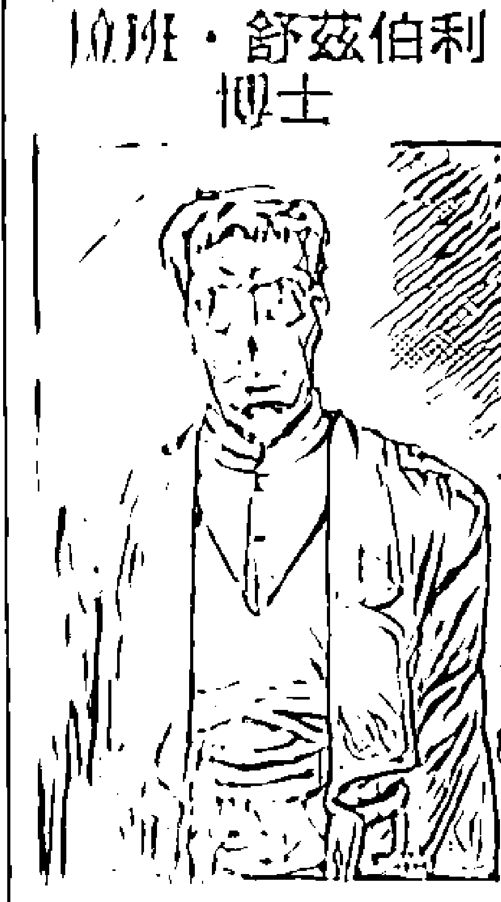

### 1930-40年代活跃的调查员们

> **安德鲁·贾冈**
舒兹伯利博士雇用为保镖兼秘书。与博士共同破坏马丘比丘遗迹的地底入口。

> **艾比盖·基尼**
在贾冈失踪以后租下贾冈住所的神学生。因为好奇心与正义感而协助贾冈探索印斯茅斯镇。

> **克莱勃尼·鲍伊德**
克里奥尔文化研究者。因为调查伯祖父阿瑟夫·吉尔曼死因而与秘密的克苏鲁崇拜者短兵相接。

> **奈罔留·柯伦**
恐怖小说作家。与舒兹伯利博士前往无名都市，遇到阿卜杜·阿尔哈兹莱德的亡灵。

> **郝瓦茨·布雷尼**
考古学家。受到舒兹伯利博士等人请求协助寻找拉莱耶城，就此成为同伴。母亲的祖先出身于印斯茅斯镇。

> **在近代仍然活跃的调查员**
1980年代米斯卡塔尼克大学附属图书馆管理员。继承伯父皮斯里博士遗志，继续探索印斯茅斯镇的达贡神秘教团的秘密。

- 米斯卡塔尼克大学
- 《印斯茅斯之影》→No.025
- 亚瑟·柯勒·乔安→No.039
- 伟大的克苏鲁→No.003
- 《塞拉伊诺断章》→No.035
- 哈斯塔→No.008
- 塞拉伊诺→No.078
- 《拉莱耶文本》→No.027
- 拉莱耶城→No.067

## No.107
### 亨利·阿米塔吉博士
Dr. Henry Armitage

在儲存著禁忌記錄的象牙塔裡面看守書籍的老賢者，憑藉早已遭到遺忘的語言挺身對抗危害人類的邪惡力量。

### ○禁忌知識的守護者

1920年代後期擔任米斯卡塔尼克大學附屬圖書館館長的亨利·阿米塔吉博士，同時擁有米斯卡塔尼克大學文學碩士、普林斯頓大學哲學博士、約翰·霍普金斯大學文學博士學位，是米斯卡塔尼克大學校園裡面最頂尖最淵博的研究者之一。

阿米塔吉博士曾經在1925年造訪一直以書信與自己交換意見的威爾伯·華特立在敦威治村的住家，當時他便對威爾伯年僅12歲就已經長到6呎9吋高的畸形身體，以及與他年齡不符的言行舉動抱持著相當大的不安。

就在威爾伯來到米斯卡塔尼克大學附屬圖書館，博士目睹他比對拉丁語版《死靈之書》和他繼承自祖父的約翰·狄所著英語版，調查一段提到猶格·索托斯名字疑似咒語或禱辭的記錄以後，博士對威爾伯·華特立的疑慮就變得愈發強烈。

儘管已經高齡73歲，阿米塔吉博士仍然感到有股漠然的使命感，自己必須挺身對抗威爾伯的不明企圖，於是他一方面調查華特立家族，一方面搬出《死靈之書》等禁書著手研究威爾伯苦心調查的邪惡諸神。過沒多久，威爾伯就在1928年8月試圖闖入米斯卡塔尼克大學附屬圖書館的時候被守門狗咬死，而阿米塔吉博士也從威爾伯所留下的筆記裡面得知他的真面目、陰謀，以及有個可怕的怪物正潛伏在敦威治村。

該年9月15日，博士帶著同僚沃倫·萊斯教授和法蘭西斯·摩根教授前赴敦威治村，他們追趕怪物來到哨兵山頂以後，利用魔法書所記載的咒文成功將其打倒。

## 亨利·阿米塔吉博士關係圖

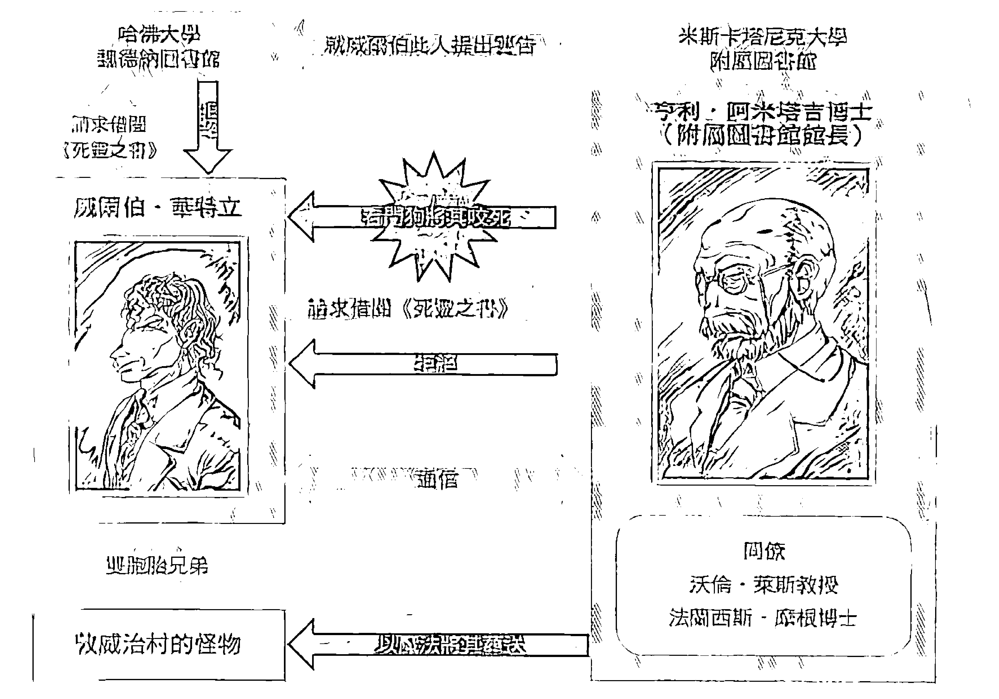

### 艾莉西亞·Y

除小說和影視作品以外，亦有漫畫將克蘇魯神話引為題材，美國就有艾倫·摩爾的《The League of Extraordinary Gentlemen》等美式漫畫作品，日本也有矢野健太郎的《邪神傳說》系列、楓城子的《召喚之盛名》同人作品問世。這裡介紹的後藤壽庵《艾莉西亞·Y》，是1994年由茜新社出版的正統派克蘇魯神話作品；此作品擁有H·P·洛夫克萊夫特《敦威治恐怖事件》後日譚之要素，主角艾莉西亞·Y·阿米塔吉是繼承原本敵對的阿米塔吉教授與華特立家族雙方血統，描述她帶著彷彿厄庇²般跟隨在身邊的奈亞拉托提普，與已經有數百歲、陰謀奪取神明力量的伊利莎白女伯爵及魔法師約翰·狄博士——傳說中將《死靈之書》譯成英語的人物對抗戰鬥的故事。至於艾莉西亞·Y這個名字裡的「Y」代表什麼意義，相信各位讀者從頭讀到這裡都已經心裡有數。

- 卡塔尼克大學
- 猶格·索托斯→No.006
- 華特立家族→No.097
- 《死靈之書》→No.025
- 敦威治村→No.042

> 《The League of Extraordinary Gentlemen》：這部作品曾經被電影化，電影片名譯為《天降奇兵》，由史恩康納萊主演。
> （A）參照P.060註釋）

## No.108 艾德華·卡恩拜
Edward Carnby

專門處理各種詭異離奇現象的幹練的超自然偵探。因緣際會連結起來的諸多怪事件，不斷把他和周遭的人拖向黑暗與瘋狂的世界。

### ○孤身獨處黑暗中（Alone in the Dark）

艾德華·卡恩拜在洛杉磯開設事務所，是位專門處理超自然離奇事件的著名私家偵探。

卡恩拜原本只是一個普通的私家偵探，他初次以超自然偵探身分進行調查的首樁事件，發生在1924年的秋天。他接受委託調查在《神秘觀察報》上鬧得沸沸揚揚、離奇自殺的藝術家傑瑞米·哈特伍德所留下來的遺物，他前往路易斯安那州遠離聚落的德塞特豪宅，並且從這間空無一人宅院的陰影房間漏出來的燈光裡面看見了驚人的景象。

自從這樁受到克蘇魯詛咒的惡靈鬼屋事件以後，陸續前來委託卡恩拜的許多案件便是伴隨著某種詭異現象的事件，不管他願意或者不願意，卡恩拜漸漸地被視為此領域的第一高手。

德塞特豪宅怪異事件發生不過幾個月後，1924年12月又發生著名電影製作人喬治·桑德斯的女兒葛蕾絲遭黑幫組織地獄廚房綁架事件。卡恩拜在這樁案件裡面跟傳說中的海盜「獨眼傑克」的惡靈展開決鬥，終於順利救出被擄的少女。

隔年1925年的7月，卡恩拜再度接受桑德斯委託搜尋下落不明的電影外景隊伍，來到從前印地安人奉為聖地的鬼城——幽靈谷，與西部開拓時代的惡靈展開戰鬥。當時卡恩拜雖然遭到殺害因而一度喪命，後來卻還是靠著印地安驅魔護身符的力量，重新取回肉體得以復活。

其次，跟卡恩拜關係匪淺的德塞特鬼屋在那位藝術家自殺以後是由其姪女艾蜜莉·哈特伍德繼承；後來這間豪宅被貝茨夫婦買下，改裝成汽車旅館，卻又在他們的兒子諾曼這代再度發生連續殺人事件。

## 艾德華·卡恩斯關係圖

德雷塞特定家事件（1924年7月）

電影外景下落不明（1924年3月）

伯侄關係 → 艾密莉·哈特伍德 → 拘禁 → 傑瑞米·哈特伍德

親子 → 以西結·普爾古斯多 → 18世紀的大海盜

傑瑞米·哈特伍德 → 影子 → 愛德華·卡恩斯 → 獨眼傑克（200年前的大海盜）

以西結·普爾古斯多 → 後者 → 愛德華·卡恩斯

愛德華·卡恩斯 → 友人 → 泰德·史特萊克

愛德華·卡恩斯 → 敵對 → 傑西·史東 → 西部開拓時代的惡棍 → 屠殺谷的統治者

傑西·史東 → 工作上的往來 → 喬治·桑德斯

喬治·桑德斯 → 委託調查 → 愛德華·卡恩斯

泰德·史特萊克 → 委託調查事件 → 喬治·桑德斯

泰德·史特萊克 → 似誼 → 葛蕾絲·桑德斯

伊利莎白·貝勒特（200年前的巫毒教女巫）→ 傑瑞米·哈特伍德

葛蕾絲出襲事件（1924年12月）

### 德雷塞特家宅

事件發生以後轉賣給貝茨夫婦，改建成汽車旅館的鬼屋德雷塞特家宅。在這對夫婦的兒子諾曼時代曾經多次發生慘案。

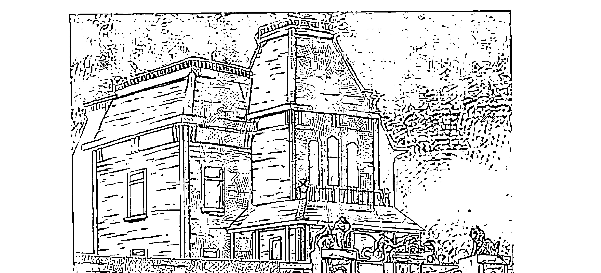

## No.109 泰忒斯·克羅

**Titus Crow**

對抗邪神組織「威爾瑪斯基金會」的王牌。憑著魔法與數字命理學*向邪神挑戰的人類守護者。

### ○超自然偵探

泰忒斯·克羅乃於1916年12月2日出生於英國首都倫敦。他受到父親影響，自幼便對考古學和古生物學極感興趣，成年以後還開始涉獵研究神秘學，甚是博學；他曾經在第二次世界大戰期間任職於英國陸軍部，專門負責解碼德軍暗號、針對阿道夫·希特勒總統的神秘學嗜好進行建言等特殊工作。此外，憑著大受歡迎的《007》系列作品而成為世界聞名間諜小說大作家的伊恩·佛萊明在大戰期間也是從事跟泰忒斯幾乎相同的任務，或許這兩個人曾經見過面也說不定。

泰忒斯在戰爭結束世界回歸和平以後喪失了陸軍部的職位，轉而成為有「現代的大魔術師」、「妖蛆之王」等稱號的古神祕學者朱利安·卡斯泰爾的秘書；就在泰忒斯替卡斯泰爾整理家中龐大藏書的過程當中，他察覺這名老人的真正目的是想要佔據自己青春的肉體，遂利用經過長年研究的數字命理學和魔法的知識與其對抗，並且在聖燭節前晚與卡斯泰爾這個已經活了300年的老妖術師正面對決，成功將他打倒。泰忒斯便是拜這樁事件所賜才開始鑽研東西 方世界的魔法書籍，更加深入神祕學的領域，一方面靠著創作恐怖小說等文筆活動糊口，同時還開始運用本身敵人武器的魔法和數字命理學向邪惡黨徒挑起魔法戰爭。後來泰忒斯與多年的盟友亨利·羅蘭·馬里尼同時參加人類對抗邪神的組織「威爾瑪斯基金會」，並且成為該組織的中心人物，打著對抗他們稱為克蘇魯眷屬邪神群的邪惡存在，最後卻在1968年10月4日颳著狂風的夜裡失去行蹤。

> * 數字命理學 (Numerology)：用數字解釋人的性格或占卜禍福。其理論源自古希臘哲學家畢達哥拉斯的思想，即萬物最終都可以分解為數。

## 泰忒斯·克罗年谱

| 年代 | 事件 |
| :--- | :--- |
| 1916年 | 泰忒斯·克罗出生于伦敦。 |
| 1923年 | 亨利·屈臣·马里尼出生。 |
| 1930年代后期 | 亨利·屈臣·马里尼前往英国，结识克娄。 |
| 1933年 | 克娄饱受行回「昨日支配者」的痛苦所苦。 |
| 1939-45年 | 克娄任职于陆军部，负责解码密码与有关神秘学的任务。 |
| 1945年 | 克娄从陆军部退职后，受雇于世称「妖蛆之王」的黑魔法师朱利安·卡斯泰因，后来与其对决。自从道场开门以后，克娄便与邪教信徒或恐怖份子有过许多次决斗。 |
| 1964年 | 克托尼亚入侵北关大碰，与威玛斯基金会合医开垦门。 |
| 1966年 | 密州的心灵感应超能力者洛克·希柏因参加威玛斯基金会，后与克娄并肩作战。 |
| 1968年6月 | 克娄与马里尼加入威玛斯基金会，成为英国支部的代表者。 |
| 1968年10月4日 | 克娄的奥布莱家址狂风吹毁，克娄本身亦下落不明。 |
| 1970年 | 曾经与克娄明门过的邪教集团邪恶秘社在布鲁家西址，发生内部斗争因而自灭。 |
| 1980年3月 | 亨利·屈臣·马里尼失踪。 |

### 泰忒斯·克罗关系图

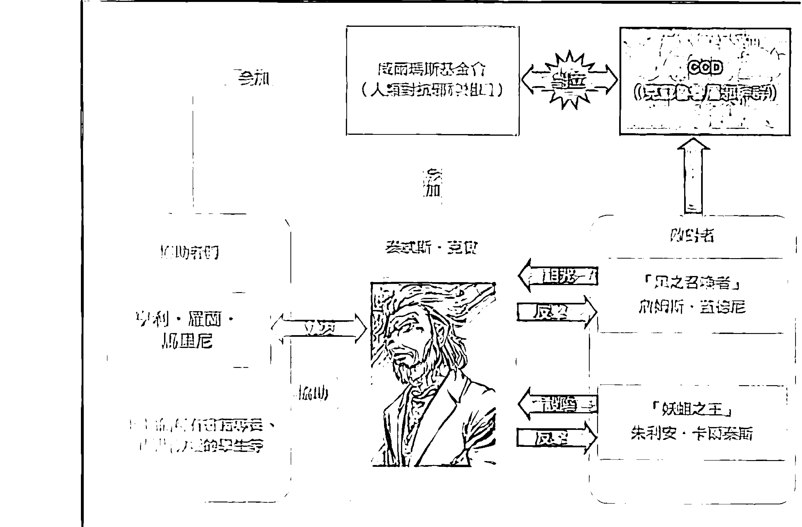

## No.110 艾德溫·溫斯羅普

**Edwin Winthrop**

喜歡挑戰複雜思考與複雜陰謀的大英帝國秘密情報員，他伸出右手握手的同時，外套底下的左手卻正霍霍地磨著短劍。

### ○女王陛下的特務機關

戴奧吉尼斯俱樂部是個在介於外交與戰爭中間的範圍內暗地從事活動、旨在守護英國舊有體制的英國皇室直屬特務機關，而艾德溫·溫斯羅普則是隸屬於此秘密情報機關的幹探。

英國非但是貓之女神巴斯特的祭司們在古埃及王國時期遭驅逐出境以後的流亡地，塞爾特神話的人魚傳說還隱隱然有「深潛者」的影子潛伏其中，在英國歷史未能企及的暗處，人類從遙迢的太古時代以來便與邪神崇拜者有過無數次的戰鬥，而戴奧吉尼斯俱樂部也是這些邪神崇拜的敵對組織之一。

溫斯羅普受到該俱樂部偉大領袖查理·彭寧頓·波爾格的栽培與訓練，在第一次歐洲大戰期間順利完成對德國陸軍航空隊作的首次任務，其後歷經過許多次艱難的任務，終於成長為經驗豐富、身經百戰的情報員。

大日本帝國偷襲珍珠港、太平洋戰爭爆發3個月後，溫斯羅普於1942年2月在美國聯邦政府的請求之下來到美國；當時加州洛杉磯有「深潛者」的據點——達貢的神秘教團死灰復燃，該教團乃是以歐畢德·馬許船長的直系子孫、擁有代表領袖地位之稱號「船長的女兒」的珍妮絲·馬許為中心所組成。溫斯羅普協助FBI的芬萊探員調查該教團，並且成功阻止了珍妮絲等人將歐畢德·馬許的亡魂召喚至嬰兒體內的陰謀。

溫斯羅普在第二次世界大戰結束以後晉升至戴奧吉尼斯俱樂部稱為地下內閣的最高領導決策團體，並以波爾格繼承人的身份擔任議長職位。

## 戴奥吉尼斯俱乐部

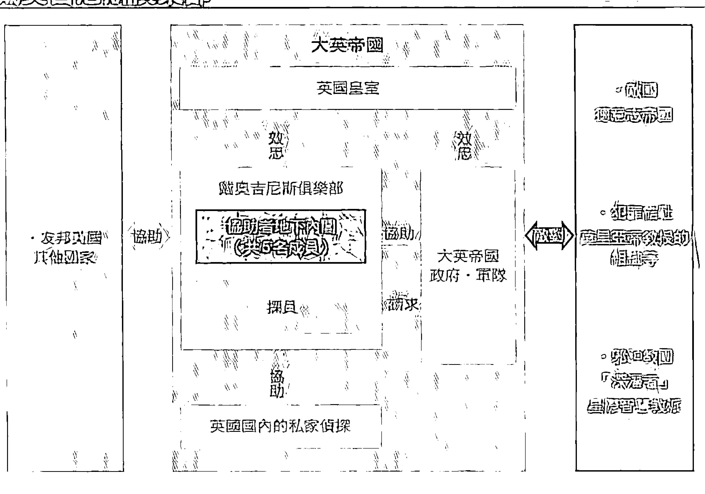

### 《德古拉紀元》

金·紐曼在《德古拉紀元》系列小說裡面描述歷史從德古拉伯爵擊退亞伯拉罕·凡·赫辛教授及其同志以後產生分歧、構築出眾多吸血鬼堂而之橫行闊步的異形社會虛構世界，而艾德溫·溫斯羅普便是其中第二部小說《德古拉戰記》的主角：溫斯羅普在故事裡面與能夠變身成深紅色巨大蝙蝠、屠殺聯合國戰鬥機飛行員的德國擊墜王曼弗雷德·馮·里希特霍芬展開了空中的纏鬥決戰。貫穿整部系列作品的重要角色——有著楚可憐少女外表的吸血鬼長生者熱內維埃夫·迪厄多內是金·紐曼最喜愛的角色，他在用傑克·約維爾名義著作的TRPG「戰錠」小說化作品《龍》

他用紐曼和約維爾這兩個名義發表過數篇的克蘇魯神話作品，還在題《大魚》的作品裡面讓溫斯羅普和熱內維埃夫兩人以「深潛者」的敵對身份登場；此作品與其說是《德古拉紀元》的外傳，倒不如說是另外平行宇宙來得更加貼切。

- ○《阿卡迪亞傳說（巴斯特）》→ No.015
- ○《阿卡迪亞傳說》→ No.016
- ○《阿卡ディ亞傳說》→ No.009
- ○埃及 → No.055
- ○馬許家族 → No.096

## No.111 索勒·旁斯

**Solar Pons**

以瀟灑的鴨舌帽和一雙披肩外套為招牌標記的名偵探。索勒·旁斯既是夏洛克·福爾摩斯的勁敵，同時也是他的繼承人之一。

### ○普雷德街的夏洛克·福爾摩斯

索勒·旁斯與那位彷彿是跟他接班似的退隱薩西克斯鄉下的偉大前輩同樣，都是使用傳統的演繹式推理方法解決各式各樣疑難案件的著名私家偵探。1880年旁斯出生於鍊金術師的城市布拉格，據說他以優秀成績從牛津大學畢業以後，曾經在第一次世界大戰期間隸屬於英軍情報部門，從事某種極機密任務。戰爭結束後的1919年，當他在倫敦普雷德街7號B座的租屋處開設偵探事務所的時候，索勒·旁斯早已經獲得了蘇格蘭警場和英國政府極高的評價。旁斯的興趣非常廣泛，研究對象從最新科學論文到神秘學領域不一而足，1905年還曾經發表有關波納佩島南馬都爾遺跡的論文，1931年則是發表有關克蘇魯邪教的論文。根據其助手兼事件簿記錄者——醫師林頓·帕克博士的報告，我們可以確信旁斯對阿卜杜·阿爾哈茲萊德的《死靈之書》和《蠕蟲之秘密》、《屍食教典儀》等禁忌魔法書擁有相當豐富的知識。

此外在他經手過的案件當中，亦不乏有幾件像是16世紀著名占星術師根據水晶球裡面看到的未來而連續犯下殺人行為的西伯拉罕·威迪喬事件，以及將會在遙遠未來組織犯罪結社沙利!俱樂部的詹姆斯·莫里亞蒂教授事件等，屬於超脫於自然法則的魔法領域、超科學領域的案件。

其次，旁斯還經常出入英國對抗邪神崇拜的組織戴奧吉尼斯俱樂部，甚至可能跟當時隸屬於該機關的查理·波爾格和艾德溫·溫斯羅普曾經見過面。

> ※1 阿雷斯特·柯維利（Aleister Crowley）：此處乃採奇幻基地《克蘇魯神話》譯名，另可譯作「亞雷斯特·克羅利」或者「阿萊斯特·克勞力」。

## 索勒·旁斯年谱

| 年代 | 主要的行动与活动等 |
| :--- | :--- |
| 1880年 | 索勒·旁斯出生，是为英国领事馆员亚森纳斯·旁斯的次子。 |
| 1899年 | 以最优秀成绩毕业于牛津大学。 |
| 1905年 | 旁斯发表有关波纳佩岛南马都尔遗迹的论文。 |
| 1914年~1918年 | 第一次世纪大战期间，以英国情报部门探员身分从事极机密任务。 |
| 1919年 | 旁斯的侦探事务所于普雷德街开张，同年与林顿·帕克博士开始共同生活。 |
| 1920年代 | 旁斯解决诺斯特拉达姆斯水晶球迎击杀人事件。 |
| 1921年 | 旁斯与侦探汤玛斯·卡纳基进行交流。 |
| 1923年9月 | 旁斯与佛满州及其犯罪组织「西方」对决。 |
| 1925年6月 | 旁斯在著名新维登堡的相关事件当中涉及到阿留斯特·柯雷斯 *1。 |
| 1926年10月 | 旁斯解决「孔雀眼」事件。 |
| 1930年10月 | 旁斯在稀有书拍卖册里面发现《死灵之书》、《蠕虫之秘密》等书名。 |
| 1931年 | 旁斯发表有关克苏鲁邪教的论文。 |
| 1932年初夏 | 旁斯访问夏洛克·福尔摩斯，提供协助。 |
| 1938年 | 旁斯在东方快车上邂逅保罗·班普与艾尔·白罗。 |
| 1939年 | 第二次世界大战爆发，旁斯重返英国情报部门从事极机密任务。 |

### 索勒·旁斯事件簿

亚瑟·柯南·道尔的《夏洛克·福尔摩斯》是部追随者远多于克苏鲁神话的小说作品。这部侦探小说不但对全世界作家造成影响，同时还孕生出无数的戏仿作品*1和模仿作品。奥古斯特·德勒斯便是其中一位的模仿者。为福尔摩斯的故事深深着迷的德勒斯曾经写信给敬爱的柯南道尔，希望他能继续创作续集，可是这位伟大作家礼貌周到的回信里面却清楚地表示他并没有意思想要写续集，于是德勒斯方才决定要自己写福尔摩斯的故事。由于德勒斯是因为一心想要读到续集方才提笔创作，再加上他所创造的泰勒·旁斯及其搭档帕克简直就是福尔摩斯跟华生医师的翻版，因此许多人认为德勒斯甚至根本就没有改名字的必要。或许是从德勒斯的字里行间感受到他对福尔摩斯的深厚情感，他的作品在艾勒里·昆恩等福尔摩斯研究家之间获得了极高评价，甚至还有后续作家在德勒斯死后继续接手创作。

## 参考资料

- ○ 阿卜杜·阿尔哈兹莱德 → No.088
- ○ 《死灵之书》 → No.025
- ○ 《蠕虫之秘密》 → No.026
- ○ 《尸食教典仪》 → No.034
- ○ 詹姆斯·莫里亚蒂教授 → No.102
- ○ 文德温·温斯罗普 → No.110

*1 戏仿（Parody）：又称谐仿，文学中的一种讽刺批评或滑稽嘲弄的形式，它模仿特定的作家或该派的文体和手法，以突显该作家的瑕疵，或该流派所使用的俗套。

### 英日中名詞対照索引

### **[A]**
Abdul Alhazred アブドゥル・アルハザード 阿卜杜・阿爾哈茲萊德
.......................................................... 28,58,70,72,82,127,128,130,148,172,188,189
Abhoth アブホース 阿布霍斯 ........................................................ 15,36,150
Africa 大陸 非洲大陸........................................................ 118,119,124
Ahu Moai アフ＝モアイ 阿胡摩艾........................................................ 146,147
Alaozar アラオザル 阿佬札兒........................................................ 126,127,132,133
Aldebaran アルデバラン 罽宿五........................................................ 22,157,166,167,168,170
apostolate 使徒会 使徒會........................................................ 69
Arkham アーカム 阿卡姆鎮
........................................................ 14,62,63,65,67,71,77,78,87,88,89,90,
92,93,94,95,96,98,99,111,112,135,166,168,184,187,194,195,196,197,199,
203,206,208,209,212,224,225
Arkham House アーカムハウス 阿卡姆之家........................................................ 9,76,111,187
Asia アジア 亞洲........................................................ 62,126,127,132,155,201
Atlantis 『アトランティス』《亞特蘭提斯》........................................................ 148
Azathoth アザトース 阿撒托斯
..... 10,14,15,16,17,30,31,36,54,73,114,115,164,199,203,208,209,216,217

### **[B]**
Bast バースト 巴斯特........................................................ 36,37,110,118,120,121,232
Betelgeuse ベテルギウス 参宿四........................................................ 11,132,156,157
Bokrug ボクラス 波克魯格........................................................ 178,179
Book of Dzyan 『ドジアンの書』《多基安之書》........................................................ 82,148,152
Brichester ブリチェスター 布瑞契司特.................. 111,112,113,114,115,157,166
Brotherhood of Black Pharaoh ブラック・ファラオ団 黑色法老兄弟會.... 17
Brotherhood of the Beast 野獣の結社 獸之兄弟會.................. 17,202,208
Byakhee ビャーキー 拜亞基........................................................ 22,23,78,128,221

### **[C]**
Carcosa カルコサ 卡爾克薩城........................................................ 22,23,74,167,168,169
Celaeno セラエノ 塞拉伊諾........................................................ 22,23,78,79,128,157,166,167,224,225
Celephais セレファイス 塞勒菲斯城........................................................ 82,170,171,172,174,175,195
Chaugnar Faugn チャウグナー・ファウグン 夏烏哥納爾・法格恩 36,37,132
Cthaat Aquadingen 『水神クタアト』 《水神克塔亞特》........................................................ 80,81
Cthonians クトーニアン 庫多尼安........................................................ 122,123,231
Cthugha クトゥグア 克圖格亞........................................................ 17,22,23,28,29,78,100
Cthulhu クトゥルフ 克蘇魯
........................................................ 8,12,13,22,23,24,31,38,40,41,62,63,73, 78,80,86,92,102,104,105,107,126,128,136,142,144,145,146,152,153,157, 162,166,167,182,188,190,191,203,218,220,223,224,225,228,230,231
Cthulhu Cult クトゥルフ教団 克蘇魯邪教
........................................................ 8,13,62,87,106,107,184,190,191,203,234,235
Cthulhu Mythos クトゥルフ神話 克蘇魯神話
........................................................ 3,8,9,10,11,16,20,32,37,55,56,68,73,84,91,111,135,149,155,157, 182,184,185,190,193,201,217,221,222,227,233
Cult of the Bloody Tongue 「血塗られた舌」 「血舌」........................................................ 17
Cultes des Goules / Cults of the Ghouls 『屍食教典儀』 《屍食教典儀》
........................................................ 76,77
C’tullu トゥルー 庫魯........................................................ 102
Cxaxukluth クグサクスクルス 克薩庫斯庫惑斯........................................................ 30,31,164
Cykranosh 土星 土星........................................................ 11,30,31,151,158,159,162,163,165,176
Cykranosh サイクラノーシュ 塞克拉諾修星........................................................ 30,162,163,165

### **[D]**
Dagon / Father Dagon ダゴン 達貢
........................................................ 12,13,24,25,38,80,92,202,204,205,218,219,225,232
Daotholoth ダオロス 多洛斯........................................................ 15,36,164
Dark Han 暗きハン 黑韓........................................................ 36
Dark Star Xoth 暗黒星ノス 黑暗星球索斯........................................................ 30,31,153,157,162
De Vormlis Mysteries 『妖蛆の秘密』 《蠕蟲之秘密》（妖蛆之秘密)
........................................................ 48,60,61,120,126,192,234,235
Deep Ones 「深きものども」 「深潛者」
........................................................ 11,12,13,23,24,38,39,43, 49,60,92,104,107,110,134,142,146,166,202,203,204,206,232,233Dhol ドール 巨噬蠕蟲 48,52,53,54,55,157,180

Diogenes Club ディオゲネス・クラブ 蔵奥吉尼斯倶楽部 217,232,233,234,235

Dr. Henry Armitage ヘンリー・アーミティッジ博士 亨利・阿米塔吉博士 206,226,227

Dr. Laban Shrewsbury ラバン・シュリュズベリィ博士 拉班・舒兹伯利博士 8,22,23,38,59,62,63,71,77,78,79,89,104,106,107,128,166,184,188,189,221,222,223,224,225

Dreamland 夢の國（ドリームランド） 幻夢境 9,11,12,13,19,32,37,46,47,52,53,54,55,64,65,78,82,130,131,158,162,170,171,172,173,174,175,176,177,178,179,180,191,194,195,198,214

Dunwich ダンウィッチ 敦威治村 58,87,89,94,95,98,135,165,206,207,208,212,226,227

Easter Island イースター島 復活島 142,143,144,146,147,153,155

Edward Camby エドワード・カーンビイ 艾德華・卡恩拜 228,229

Edwin Winthrop エドウィン・ウィンスロップ 艾德温・温斯羅普 222,232,233,234

Egypt エジプト 埃及 16,36,37,60,72,109,110,118,119,120,121,126,128,148,149,157,160,161,186,202,218,219,232

Elder Gods 旧き神 古神（舊神） 10,11,32,78,79,110,132,133,150,156,157,166,167,192,220,224,230

Elder Sign 旧き印 古神之印（舊神之印） 78,79,224

Elder Things / Old Ones 「古のもの」 「遠古種族」（古代支配者） 11,12,40,41,42,43,44,50,122,136,140,141,165,209,218

Eltdown Shards 「エルトダウン・シャーズ」 《埃爾特頓陶片》 44,82,157

Europe ヨーロッパ 歐洲 68,80,86,96,110,111,116,118,119,126,137,150,210,211,216,232

Flying polyp 空飛ぶポリプ状生物 飛天水螅 44,45,136,139

Folmalhaut フォルマルハウト 北落師門 22,28,29,78,100,157,170

Friedrich Wilhelm von Junzt フリードリヒ・ヴィルヘルム・フォン・ツンスト 腓特烈・威廉・馮容茲 66,105,108,116,152,200,201

## G

Galley ガレー船 槳帆船 130,158,170,174

George Gammell Angell ジョージ・ギャマル・エインジェル 喬治・甘莫・安吉爾 8,190,191

G'harne ガールン 格・哈恩 119,122,123

G'harne Fragments 『ガールン断章』 《格・哈恩断章》 122

Ghast ガスト 妖鬼 47

Ghatnothoa ガタノソア 加塔諾托亞 11,20,66,152,153,164,165

Ghoul 食尸鬼（グール） 食尸鬼 46,47,52,53,180,195,214,215

Glaaki グラーき 葛拉奇 112,113

Goatswood ゴーツウッド 羊木嶺 111,112,113,114,115

Golden Bough 『金枝篇』 《金枝》 68,69

Grandorder of Oriental Twilight 「東方薄暮騎士団」 「東方薄暮騎士団」 220

Great Cthulhu 大いなるクトゥルフ 偉大的克蘇魯 8,12,13,22,23,24,38,40,41,62,78,80,86,102,104,126,128,136,142,144,145,146,152,153,157,162,166,167,203,218,220,223,224

Great Ones 「大地の神々」 「地球本來的神」 11,17,32,33,52,54,64,170,172,173,176,180,181,194

Great Race of Yith 「イスの偉大なる種族」 「伊斯之偉大種族」 11,40,41,44,45,54,64,82,91,126,136,138,139,157

Gug ググ族 古革巨人 46,47,54,55

## H

Hagarg Ryonis ハガーグ・ニョリス 哈葛葛・琉尼斯 33

Hastur ハスター 哈斯塔 8,11,20,21,22,23,26,74,78,82,122,128,138,157,166,167,168,169,182,203,223,224

Hell-Fire Club 「地獄の火クラブ」 「地獄火俱樂部」 76

Henry Wentworth Akeley ヘンリー・ウェントワース・エイクリイ 亨利・溫特渥茲・阿克萊 91,196,197

Hound of Tindalos ティンダロスの猟犬 廷達洛斯獵犬 48,49,54,185

Howard Phillips Lovecraft ハワード・フィリップス・ラヴクラフト 霍華德・菲力普・洛夫克萊夫特 3,8,9,10,56,61,75,77

Hyades ヒヤデス星 畢宿星團 74,157,166

Hydra / Mother Hydra ハイドラ 海德拉 13,24,38,80

Hyperborea ハイパーボリア 希柏里爾 30,31,37,70,71,102,110,148,150,151,152,153,154,162

Hziulquolgm nzhah フジウルクオイグムンズハー 荷鳩癸格姆札 30,31,162,163

## I

Innsmouth インスマス 印斯茅斯鎮 13,34,38,39,62,63,65,71,77,87,88,89,92,93,94,95,107,135,174,202,204,205,206,218,225

Insects from Shaggai シャッガイからの昆虫 夏蓋蟲族 14,113,114,115,157

Irem of the Pillars 円柱都市アィレム 石柱之城伊倫 63,128,129,188,189

Ithaqua イタクア 伊塔庫亞 22,23,26,27,62,64,86,91,212

## J

Joseph Curwen ジョゼフ・カーウィン 約瑟夫・古溫 18,59,98,203,210,211

Justin Geoffrey ジャスティン・ジョフリー 賈斯汀・季奧佛瑞 116,198,199

## K

Kadath カダス 卡達斯 11,73,140,170,171,172,173,180,181,194,195

Keziah Mason キザイア・メイスン 齊薩亜・梅森 98,208,209

Kitab Al Azif 『キタブ・アル・アジフ』 《魔導之書》 58,59,188,189

K'n-yan クン・ヤン 金-陽星 30,87,102,103

Kraken クラーケン 挪威海怪 8

Kuranes クラネス 克拉涅斯 170,174,175,195

Kythamil キタミール 基薩米爾 150,151,157

## L

Latin America 中南米 中南美 104,105,109

Lemuria レムリア 黎姆利亜 8,54,148,149,153,154,156

Lemuria Saga 『レムリア・サーガ』 《黎姆利亜薩迦》 156

Leniqua レニキュア 萊尼琪亜 150

L'gy'hx ルギハクス 魯基赫斯 167

Liber Al vel Legis 『法の書』 《律法之書》 72

Lloigor ロイガー 羅伊格爾 11,22,23,26,132,133,152

Lost Continents 失われた大陸 失落的大陸 8,148,149

Lovecraft ラヴクラフト 洛夫克萊夫特 即Howard Phillips Lovecraft（霍華德・菲力普・洛夫克萊夫特）

Lovecraft School 「ラブクラフト・スクール」 「洛夫克萊夫特派」 8,9,56,77,182,186,192,193

## M

Machu Picchu マチュ・ピチュ 馬丘比丘 62,63,105,106,107,225

Mars 火星 火星 11,14,157,160,161,164,165,195,216

Marshes マーシュ家 馬許家族 92,203,204,205,207

Middle East 中東 中東 60,126,127

Mi-Go / Fungus-beings of Yuggoth ミゴ、「ユグスよりのもの」 「米・戈」（猶格斯真菌） 18,23,40,41,50,51,86,87,102,112,126,153,157,158,164,165,182,196,197

Miskatonic University ミスカトニック大学 米斯卡塔尼克大学 27,58,59,60,62,63,64,65,67,70,71,76,77,78,79,88,89,90,91,94,96,97,106,136,137,138,139,140,165,187,188,196,197,206,209,212,224,225,226,227

Mnar ムナール 母那 178,179

Moon 月 月球 131,156,157,158,159,160,162,169

Moon-beasts ムーン・ビースト 月獸 130,131,158,159

Mordiggian モルディギアン 莫爾迪基安 46,47

Mountain Ngranek ングラネク山 恩葛拉涅山 32,33,52,53,173,180,181

Mountains of Madness 狂気山脈 瘋狂山脈 102,136,138,140,141,173

Mountains of the Moon 月盈山脈 月盈山脈 124,125

Mu ムー 姆 8,12,20,36,104,105,126,136,142,148,149,150,152,153,164,165,203

## N

Nameless City 無名都市 無名都市 126,127,128,129,188,189,225

Nath-Horthath ナス＝ホーサス 納斯・霍薩斯 33,174

Necronomicon 『死霊秘法（ネクロノミコン）』 《死靈之書》 8,14,18,20,26,32,58,59,70,71,72,75,82,90,96,98,113,120,126,128,130,140,148,156,164,172,176,186,188,189,200,206,214,224,226,227,234,235

Nephren-Ka ネフレン=カ 奈夫倫-卡 118,120,121,126,201,202,203,219

Night Gaunts 夜鬼（ナイトゴーント） 夜魇 32,33,47,52,53,55,180

Nodens ノーデンス 諾登斯 10,11,32,33,52,53,170,180,194,195

North America 北米大陸 北美大陸 86,87,103,231

Nyarlathotep ニャルラトテップ 奈亞拉托提普 11,14,15,16,17,28,29,32,33,36,52,53,54,55,59,65,67,71,73,77,86,100,118,120,121,124,126,130,131,138,146,159,168,170,180,182,192,193,194,195,202,203,208,209,218,221,227

## O

Oceania オセアニア 大洋洲 136,137

Ordo Templi Orientis 「東方聖堂騎士団」 「東方聖殿騎士團」 72

Outer Gods 外なる神 外神 8,10,11,14,15,16,17,18,19,20,24,28,31,32,52,54,58,70,78,79,86,91,126,130,144,154,156,164,170,178,184,188,202,203,207,208,209,216,218,220,222,224

## P

Plateau of Leng レン高原 冷之高原 14,82,126,127,130,131,159,172,200

Pnakotic Manuscripts 「パナコト写本」 《奈克特抄本》 26,44,64,82,176

Pnakotus パナコタス 奈克特城 44,64,137,138,139

Professor James Moriarty ジェームズ・モリアーティ教授 詹姆斯・莫里亚蒂教授 216,217,218

Providence プロヴィデンス 普洛維頓斯 18,59,65,67,71,77,82,87,120,190,192,193,195,210,211,218,219

## Q

Quamis クアミス 夸米斯 168,212,213

## R

Randolph Carter ランドルフ・カーター 倫道夫・卡特 18,33,47,65,89,149,160,170,172,174,176,180,194,195

Rhan-Tegoth ラーン＝テゴス 拉・提戈斯 30,31

Richard Billington リチャード・ビリントン 理查・比灵顿 71,77,168,203,212,213

Richard Upton Pickman リチャード・アプトン・ピックマン 理查・厄普敦・皮克曼 46,47,98,195,214,215

Rigel リゲル 参宿七 132

Riverbanks リヴァーバンクス 里弗班克斯 16,87,96,97

Rlim-Shaikorth ルリム・シャイコース 鲁利姆・夏科洛斯 70,150,151

R'Lyeh ルルイエ 拉莱耶城 12,13,40,73,105,106,143,144,145,146,147,152,153,190,191,220,223,224,225

R'lyeh Text 『ルルイエ異本』 《拉莱耶文本》 26,62,63,80,106,224

Rober Harrison Blake ロバート・ハリスン・ブレイク 羅伯特・哈里森・布萊克 192,218

## S

Salem セイレム 賽倫 59,87,88,93,94,95,98,99,112,194,195,206,208,210,211,214

Serpent-People 蛇人間 蛇人 54,55,150,151,154,155,201,218

Sfaticllp スファトリクルルプ 史法提克密布 31

Shaggai 『シャッガイ』 夏蓋星 114,115,157,192

Shantaks シャンタク鳥 夏塔克鳥 52,53,54,55

Shathak シャタク 沙達克 31

Shining Trapezohedron 輝くトラペソヘドロン 光輝之四邊形體 165,192,218,219

Shoggoth ショゴス 修格斯 13,40,41,42,43,136

Shub-Niggurath シュブ＝ニグラス 莎布・尼古拉絲 12,15,20,21,22,73,102,110,113,114,153,158,203,218

Shudde-M'ell シュド＝メル 修德・梅爾 122,123

Solar Pons ソーラー・ボンズ 索勒・旁斯 234,235

South Pacific Ocean 南太平洋 南太平洋 12,62,142,143,152

South Pole 南極 南極 40,41,42,89,90,91,102,130,136,137,140,141,173,186

Stellar Wisdom 星の智慧派 星際智慧教派 16,17,59,64,65,67,71,77,82,120,192,193,202,203,218,219,232,234

Shtrompolcavar シュトレゴイカバール 史崔戈伊卡伐 66,111,116,117,198,199Tamash タマッシ 塔马什 33,178
Taurus トゥーラス 托罗斯 16
Tcho-Tcho チョーチョー人 丘丘人 11,26,37,127,132,133
Temple of the Toad 蟾蜍の神殿 蟾蜍神殿 66,67,104,105,108,109,201
terra incognita 未踏の大地 (テラ・インコグニタ) 黑暗大陆（亦译未知的领域） 86,118,122,124
The Book of Elbon 『エイボンの書』 《伊波恩之書》 30,70,71,156
The Celaeno Fragments 『セラエノ断章』 《塞拉伊诺断章》 22,78,79,166,221,224
The Dunwich Horror 「ダンウィッチの怪」 「敦威治村怪谭」 95,206,207
The Haunter of the Dark 「闇に逍う者」 〈猎黑行者〉 61,185,193,218
The Hermetic Order of Silver Twilight 銀の黄昏錬金術会 银之黄昏炼金术会 72,105,144,203,220,221
The King in Yellow 『黄衣の王』 《黄衣之王》 22,74,75,168,182
The Lost Continent of Mu 『失われたムー大陸』 《失落的姆大陆》 104,142,149,152
The Mysteries of Mu 『ムー大陸の神秘』 《姆大陆的神秘》 149,152
The Order of Silver Star 「銀の星」 「银星」 72,220
The Seven Cryptical Books of Hsan 『サンの七秘聖典』 《赫桑的七秘聖典》 82
Theosophical Society 神智学协会 神智學協會 69,83
Thule Society トゥーレ協会 「图勒协会」 220
Titus Crow タイタス・クロウ 泰忒斯·克劳 63,65,77,81,111,199,222,223,230,231
Trinity College トリニティ・カレッジ 三一学院 68,69,72
Tsathoggua ツァトゥグア 札特瓜 30,31,70,102,103,150,151,157,162,163,164,166
Tulzscha トゥールスチャ 土斯查 11
Ubbo-Sathla ウボ=サスラ 乌波·萨斯拉 19
Ulthar ウルタール 乌尔塔尔城 64,65,171,176,177
Umrat-Tawil ウムル・アト=タウィル 尤玛特-塔威尔 18,19,196
Unaussprechlichen Kulten 『無名祭祀书』《無名祭祀书》 66,67,108,116,152,200,201,221
Wanzu-Sama 雲頭様（わんずさま） 雲頭大人 34,35
Weird Tales 『ウィアード・テールズ』 《奇谭故事》 9,186
Whateleys ウェイトリー家 華特立家族 18,58,59,94,98,203,206,207,212,226,227
Wilmarth Foundation ウィルマーズ・ファウンデーション 威尔玛斯基金会 91,230,231
Witch House 魔女の家 女巫之家 89,90,185,208,209
Wood of N'gai ンガイの森 恩盖伊森林 28,86,87,100,101,168
Yaddith ヤディス星 亞狄斯星 55,157,194
Yaksh ヤクシャ 雅克斯星（海王星） 157
Yato-Ura 夜刀浦 夜刀浦 127,134,135
Yeti 雪男（イエティ） 雪人 50,126
Y'ha-nthlei イハントレイ 伊哈斯里 13,38,92,204
Y'houndeh イホウンデー 伊荷德 150,151,162
Yibb-Tstll イブスティトル 伊波・茲特爾 15,52,53
Yig イグ 伊格 12,36,86,102,104,153
Yog-Sothoth ヨグ＝ソトース 犹格・索托斯 8,10,15,17,18,19,22,24,62,73,86,188,195,203,206,207,212,226
Yoth ヨス 圖思星 102,103
Yuggoth 冥王星 犹格斯星（冥王星） 11,30,36,40,41,50,51,86,112,122,157,164,165,196,218
Zhar ザーハル 扎尔 11,22,23,26,132,133
Zo Kalar ジ＝カラ－ 佐・卡拉 33,178
Zstylzhemghi ズストゥルゼームグニ 茨丢菅姆格尼 30,31
Zvilpoghghua ズヴィルボググーア 茨維卜瓜 31

## 参考文献

『ラヴクラフト全集』全7巻、H・P・ラヴクラフト、東京創元社
『定本ラヴクラフト全集』全11冊、H・P・ラヴクラフト、国書刊行会
『ラヴクラフト全集』4巻、H・P・ラヴクラフト、創土社
『暗黒の秘儀』H・P・ラヴクラフト、朝日ソノラマ
『イルーニュの巨人』C・A・スミス、東京創元社
『魔界王国』C・A・スミス、朝日ソノラマ
『アーカム計画』ロバート・ブロック、東京創元社
『暗黒界の悪霊』ロバート・ブロック、朝日ソノラマ
『熱の召喚者』ブライアン・ラムレイ、国書刊行会
『タイタス・クロウの事件簿』ブライアン・ラムレイ、東京創元社
『賢者の石』コリン・ウィルソン、東京創元社
『ロイガーの復活』コリン・ウィルソン、早川書房
『ク・リトル・リトル神話集』H・P・ラヴクラフト、国書刊行会
『真ク・リトル・リトル神話大系』全11冊、国書刊行会
『クトゥルー』全13巻、大瀧啓裕・編、青心社
『ラヴクラフトの遺産』R・E・ワインバーグ／M・H・グリーンバーグ編、東京創元社
『インスマス年代記』上・下、スティーヴァン・ジョーンズ編、学習研究社
『理想郷シャンバラ』田中眞知、学習研究社
『秘神』期松健・編、アスペクト
『秘神界　現代編・歴史編』期松健・編、東京創元社
『ドラキュラ紀元』キム・ニューマン、東京創元社
『ドラキュラ戦記』キム・ニューマン、東京創元社
『ドラキュラ崩御』キム・ニューマン、東京創元社
『ブラックウッド傑作選』A・ブラックウッド、東京創元社
『宇宙戦争』H・G・ウェルズ、東京創元社
『シャーロック・ホームズの宇宙戦争』M・W／W・ウェルマン、東京創元社
『海底二万里』ジュール・ヴェルヌ、東京創元社
『氷のスフィンクス』ジュール・ヴェルヌ、集英社文庫
『ポォ全集』2巻、エドガー・アラン・ポォ、東京創元社
『火星のプリンセス』E・R・バローズ、東京創元社
『ゾンガーと魔道士の王』リン・カーター、東京創元社
『失われた黄金都市』マイクル・クライトン、ハヤカワ書房
『暗黒大陸の怪異』ジェイムズ・ブリッシュ、東京創元社
『ラプラスの魔』山本弘、角川書店
『ラヴクラフト恐怖の宇宙史』H・P・ラヴクラフト／コリン・ウィルソン、角川書店
『ソーラー・ポンズの事件簿』オーガスト・ダーレス、東京創元社
"The Memoirs of Solar Pons" August Derleth, Mycroft&Moran
『シャーロック・ホームズ対オカルト怪人』ランダル・コリンズ編、河出書房新社
『アリシア・Y』後藤寿庵、茜新社
『召喚の変名』桃城ゆう子、エンターブレイン
『邪神伝説シリーズ』全5巻、矢野健太郎、学習研究社
『リーグ・オブ・エクストラオーディナリー・ジェントルメン』 アラン・ムーア、JIVE
『続リーグ・オブ・エクストラオーディナリー・ジェントルメン』 アラン・ムーア、JIVE
『拝Hiテンション』 平野耕太、青磁ビブロス
『真夜中の檻』 平井呈一、東京創元社
『人外魔境』 小栗虫太郎、角川書店
『魔道書ネクロノミコン』 ジョージ・ヘイリ、学習研究社
『暗黒の邪神世界 クトゥルフ神話大全』 学習研究社
『新訂 クトゥルフ神話本典』 東雅夫、学習研究社
『怪物世界 パルプマガジン 恐怖の絵師たち』 ピーター・ヘイニング他、国書刊行会
『世界文学にみる架空地名大事典』 アルベルト・マングェル&ジャンニ・グアルダーニ他、訳談社
『シャーロック・ホームズ ガス燈に浮かぶその生涯』 W・S・ベアリング・グールド、河出書房新社
『シャーロック・ホームズ大全』 アーサー・コナン・ドイル、訳談社
『90年度宇宙帆船全誌』 近藤体
『クトゥルフ・ハンドブック』 山本弘、ホビージャパン
『クトゥルフ神話図説』 サンディ・ピーターセン、ホビージャパン
『クトゥルフ・ワールドツアー』 ホビージャパン
『悪の断章Complete Works』 高橋書店
『涼宮探偵事務所シリーズEsの方程式・悪の断章 原画集』 ぶんか社
『アローン・イン・ザ・ダーク 公式ガイドブック』 飯田三平、小学館
『アローン・イン・ザ・ダーク2 公式ガイドブック』 北山昇、小学館
『アローン・イン・ザ・ダーク3 公式ガイドブック』 飯田三平、小学館
『乱歩の遊んだベスト・ホラー』 森英俊／野村宏平・他、筑摩書房
『失われたムー大陸』 J・チャーチワード、大陸書房
『幻のレムリア大陸』 ルイス・スペンス、大陸書房
『セイレムの魔術』 チャドウィック・ハンセン、工作舎
"THE MEMOIRS OF SOLAR PONS" August Derleth, PINNACLE BOOKS
"ENCYCLOPEDIA CTHULHIANA" DANIEL HARMS, Chaosium
『ユリイカ』 1984年10月号、青土社
『幽玄と怪奇』 4号、微月社
『怪奇文学6号 ラヴクラフト症候群』 幻想文学出版局
『別冊幻想文学 クトゥルーテー仮案部』 幻想文学出版局
『別冊幻想文学 ラヴクラフト・シンドローム』 幻想文学出版局
『S・Fマガジン』 1972年9月臨時増刊号、早川書房
『ミステリマガジン』 2003年8月号、早川書房

### ○ゲーム：

- 『暗黒教団の陰謀』大瀧啓裕、東京創元社
- 『クトゥルフの呼び声 改訂版』ホビージャパン
- 『ウェンディゴの挑戦』ホビージャパン
- 『ヨグ・ソトースの影』ホビージャパン
- 『ユグスよりの侵略』ホビージャパン
- 『クトゥルフ・バイ・ガスライト』ホビージャパン
- 『黄昏の天使』ホビージャパン
- 『ニャルラトテップの仮面』ホビージャパン
- 『アーカムのすべて』ホビージャパン
- 『コール・オブ・クトゥルフd20』モンテ・クック／ジョン・タイネズ、新紀元社
- 『H・P・ラヴクラフト アーカム』キース・ハーバー、新紀元社
- 『コール・オブ・クトゥルフ』サンディ・ピーターセン／リン・ウィリス、エンタープレイン
- "CALL of CTHULHU COLLECTIBLE CARD GAME" Fantasy Fight Games
- 『アローン・イン・ザ・ダーク』アローマイクロテックス
- 『アローン・イン・ザ・ダーク2』アローマイクロテックス
- 『アローン・イン・ザ・ダーク3』エーエムティーサヴァン
- 『黒の断章』アボガドパワーズ
- 『Esの方程式』アボガドパワーズ
- 『斉魔大聖デモンベイン』ニトロプラス
- "MISKATONIC U. Graduate Kit" Chaosium
- "H.P.Lovecraft's DUNWICH" Keith Herber, Chaosium
- "H.P.Lovecraft's DREAMLANDS" CHRIS WILLIAMS/SANDY PETERSEN, Chaosium
- "RAMSEY CAMPBELL'S GOATSWOOD" Scott David Aniolowski/Gary Sumpter, Chaosium

### ○影像作品

- 『ダンウィッチの怪』ダニエル・ホラー監督
- 『DAGON』スチュアート・ゴードン監督
- 『インスマスを覆う影』TBS

## 参考文献

- 《宗教辞典》（上下）任继愈主编／旅游出版社／1989年
- 《怪物传说》H·P·洛夫克莱夫特／赵三警译／奇幻基地／2004年
- 《克苏鲁神话》史蒂芬·金等／李瑛良译／奇幻基地／2004年
- 《恶魔事典》山北笃·佐藤俊之监修／高尾晓·刘子滔·林哲逸合译／奇幻基地／2003
- 《魔导具事典》山北笃监修／黄牧仁·林哲逸·魏巧育合译／奇幻基地／2005年
- 《图解炼金术》户野巧著／王书铭译／奇幻基地／2007年
- 《西洋神名事典》山北笃监修／郑铭伟译／奇幻基地／2004年
- 《埃及神名事典》池上正太译／王书铭译／奇幻基地／2008年
- 《魔法·幻想百科》山北笃监修／王书铭·高尾晓译／奇幻基地／2006年

## 國家圖書館出版品預行編目資料

> 圖解克蘇魯神話 / 森瀬 緒 著 ; 王啟銘 譯. -- 初版 -- 台北市 : 奇幻基地出版 : 家庭傳媒城邦分公司發行 : 2010 [民99.06]
面 : 公分. -- (F-Maps : 005)
ISBN 978-986-6275-08-1 (平裝)
1. 神怪小説 2. 神話 3. 角色 4. 文學批評

872.57
99007188

城邦讀書花園
www.cite.com.tw

### F-Maps 005

## 圖解克蘇魯神話

原著書名 / 圖解クトゥルフ神話
作 者 / 森瀬 緒
譯 者 / 王啟銘
企劃選書人 / 楊秀真
責任編輯 / 張世國

總 編 輯 / 楊秀真
發 行 人 / 何飛鵬
法 律 顧 問 / 台英國國際商務法律事務所羅明通律師
出 版 / 奇幻基地出版
城邦文化事業股份有限公司
台北市104民生東路2段141號8樓
電話 : (02)25007008 傳真 : (02)25027676
網址 : www.ffoundation.com.tw
e-mail : ffoundation@cite.com.tw

行 銷 企 劃 / 吳孟儒
業 務 主 任 / 李振東

發 行 / 英屬蓋曼群島商家庭傳媒股份有限公司城邦分公司
聯絡地址 : 台北市104民生東路2段141號11樓
書虫客服服務專線 : 02-25007718 ; 25007719
24小時傳真專線 : 02-25001990 ; 25001991
服務時間 : 週一至週五上午09:30-12:00 ; 下午13:30-17:00
劃撥帳號 : 19863813 ; 戶名 : 書虫股份有限公司
讀者服務信箱 : service@readingclub.com.tw
歡迎光臨城邦讀書花園 網址 : www.cite.com.tw

香港發行所 / 城邦 (香港) 出版集團有限公司
香港灣仔軒尼詩道235號3樓
電話 : (852) 2508-6231 傳真 : (852) 2578-9337
e-mail : hkcite@biznetvigator.com

馬新發行所 / 城邦 (馬新) 出版集團【Cite(M)Sdn. Bhd.(458372U)】
11, Jalan 30D/146, Desa Tasik, Sungai Besi, 57000 Kuala Lumpur, Malaysia.
電話 : 603-9056-3833 傳真 : 603-9056-2833

封面設計 / 黃聖文
排 版 / 浩瀚電腦排版股份有限公司
印 刷 / 鴻霖印刷傳媒股份有限公司

□2010年 (民99) 6月8日初版
□2012年 (民101) 7月9日初版3.5刷

Printed in Taiwan.

## 售價 / 320元

ZUKAI CTHULHU SHINWA
by Leou Molice (Chronoscape Co., Ltd.)
Copyright©2005 Leou Molice (Chronoscape Co., Ltd.) /Hiraku Takeoka/Touya Tachihara
Illustrations©2005 Midori Satoh/Spark Utamaro/Kaname Itsuki/Rasenjin Hayami/Tohru Yoshii/Ninaru Kohse
All rights reserved.
Originally published in Japan by Shinkigensha, Tokyo.
Chinese (in complex character only) translation rights arranged with Shinkigensha, Japan
through THE SAKAI AGENCY.
Complex Chinese translation copyright© 2010 by Fantasy Foundation Publication, a division of Cité Publishing Ltd.
All Rights Reserved.
著作權所有・翻印必究
ISBN 978-986-6275-08-1
奇幻基地部落格 http://ffoundation.pixnet.net/blog

+   DIRECTION
Leou Molice
(Chronoscape Co., Ltd)
GUEST WRITING
Hiraku Takeoka
Touya Tachihara
ILLUST
Midori Satoh
Spark Utamaro
Kaname Itsuki
Rasenjin Hayami
Tohru Yoshii
Ninnru Kohse
SPECIAL THANKS
Ken Asamatsu| 內容 |
|------|
| 廣告回函 |
| 北區郵政管理登記證 |
| 台北廣字第000791號 |
| 郵資已付，免貼郵票 |

104台北市民生東路二段141號11樓
英屬蓋曼群島商家庭傳媒股份有限公司城邦分公司 收

MAIS 險險 人間

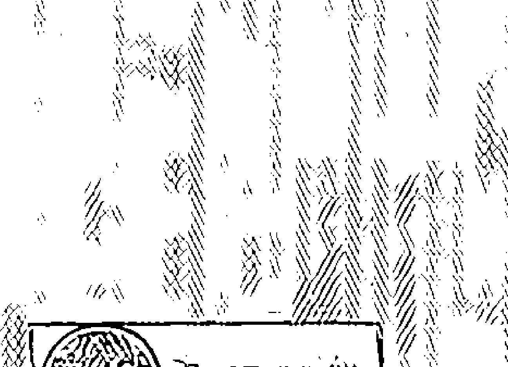

每個人都有一本奇蹟文庫的必備書

網站: http://www.ffoundation.com.tw

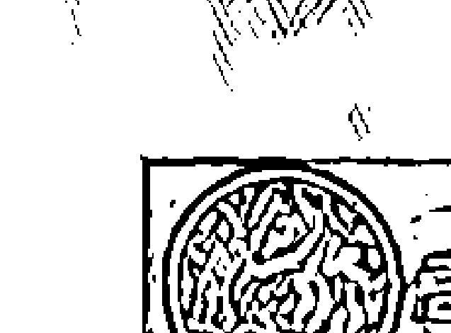

# 讀者回函卡

謝謝您購買我們出版的書籍！請用心填寫此回函卡，我們將不定期寄上最新出版訊息

姓名：_________________________

- 性別：
  - □男
  - □女

生日：西元______年______月______日

地址：_________________________

聯絡電話：_________________________ 傳真：_________________________

E-mail：_________________________

- 學歷：
  - □1.小學
  - □2.國中
  - □3.高中
  - □4.大專
  - □5.研究所以上

- 職業：
  - □1.學生
  - □2.軍公教
  - □3.服務
  - □4.金融
  - □5.製造
  - □6.資訊
  - □7.傳播
  - □8.自由業
  - □9.農漁牧
  - □10.家管
  - □11.退休
  - □12.其他____________

- 您從何種方式得知本書消息？
  - □1.書店
  - □2.網路
  - □3.報紙
  - □4.雜誌
  - □5.廣播
  - □6.電視
  - □7.親友推薦
  - □8.其他____________

- 您通常以何種方式購書？
  - □1.書店
  - □2.網路
  - □3.傳真訂購
  - □4.郵局劃撥
  - □5.其他

- 您購買本書的原因是（單選）
  - □1.封面吸引人
  - □2.內容豐富
  - □3.價格合理

- 您喜歡以下哪一種類型的書籍？（可複選）
  - □1.科幻
  - □2.魔法奇幻
  - □3.恐怖
  - □4.偵探推理
  - □5.實用類型工具書籍

- 您是否為奇幻基地網站會員？
  - □1.是
  - □2.否（若您非奇幻基地會員，歡迎您上網免費加入，可享奇幻基地網站線上購書75折，以及不定時優惠活動：http://www.ffoundation.com.tw/）

對我們的建議：_________________________
________________________________________
________________________________________