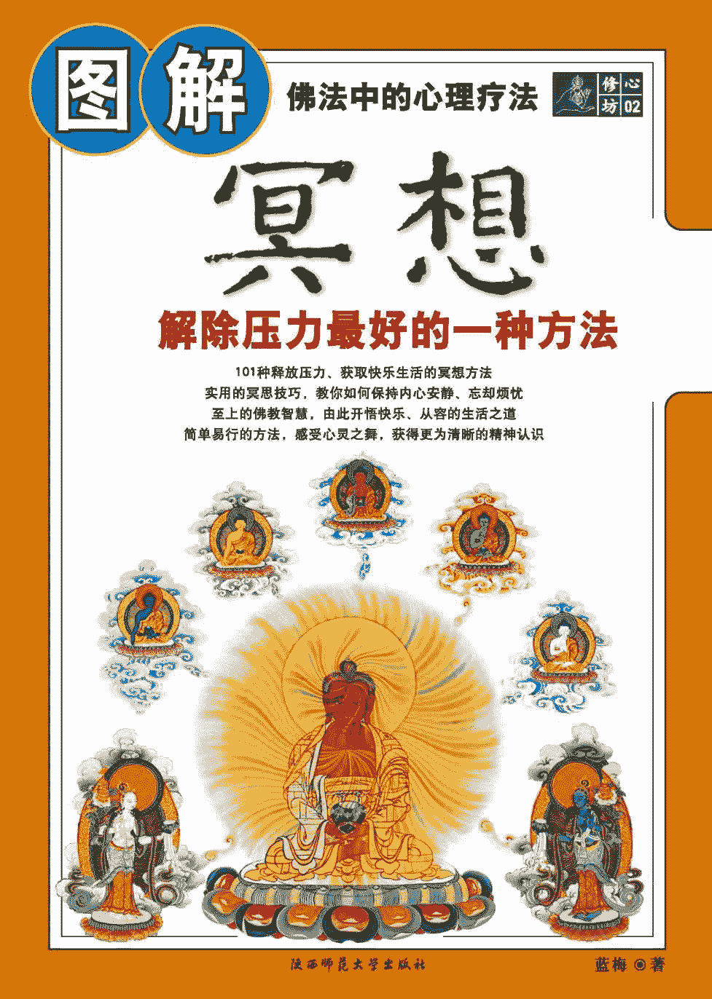

## 本书将告诉你

冥想是佛教一项独特的静心解脱法门，以静坐的基本方式，有意识、有目的地引导人的精神思维，使修行者能够专注一心，排除内心杂念，驱除心灵的焦虑感，为人的内心建立平静、健康、积极的心理机制，是一种深层的精神调节法。

本书中所介绍的冥想法，是对佛教冥想修行的提炼，选取其中易于实践的部分来介绍给读者。作为一种时尚的都市修心法，冥想修心法能够非常有效地帮助我们缓解生活、工作中的巨大压力，排除内心的恐惧与焦虑感，让我们的精神放松下来，真正体味到生活的快乐和从容。

**封面故事**

**阿弥陀佛**

这幅图中所绘为阿弥陀佛。阿弥陀佛结跏趺坐于莲台上，手捧宝钵，全身发出灿烂的五色佛光，主尊左右两侧绘有观音菩萨和大势至菩萨，上方绘有五方佛。与通常的认识不同，佛教的思想并非远离尘世，其中每一点都是针对我们世间之人而论说的。虽然我们不能如画中的佛、菩萨那样了悟深奥的义理，但却能通过冥想修行从佛教的智慧中获得益处。

项目策划／

www.readroad.com

## 源自佛教的修行方式——冥想的四个阶段

冥想的起源最早可以追溯到古印度的瑜伽，是佛教中一种最古老、最基础的修行方法，无数的僧侣正是通过冥想的方法来了悟生命的真谛。冥想能够使修行者专注一心，有意识、有目的地引导人的精神意识趋向正面、和谐，是佛教中一种深层的精神调节法。不同于我们常见的心理学，冥想并不是简单的去治疗某种心理疾病，而是要帮助我们将心灵从执念的束缚中释放出来，建立正面、稳定、平静的心理机制，彻底去除我们心中的焦虑和痛苦。

**第一阶段：意识凝聚**

与禅修类似，冥想的准备主要从调身、调息、调心三个方面进行，将自己的意识凝聚起来，达到佛教所讲意识的专注。

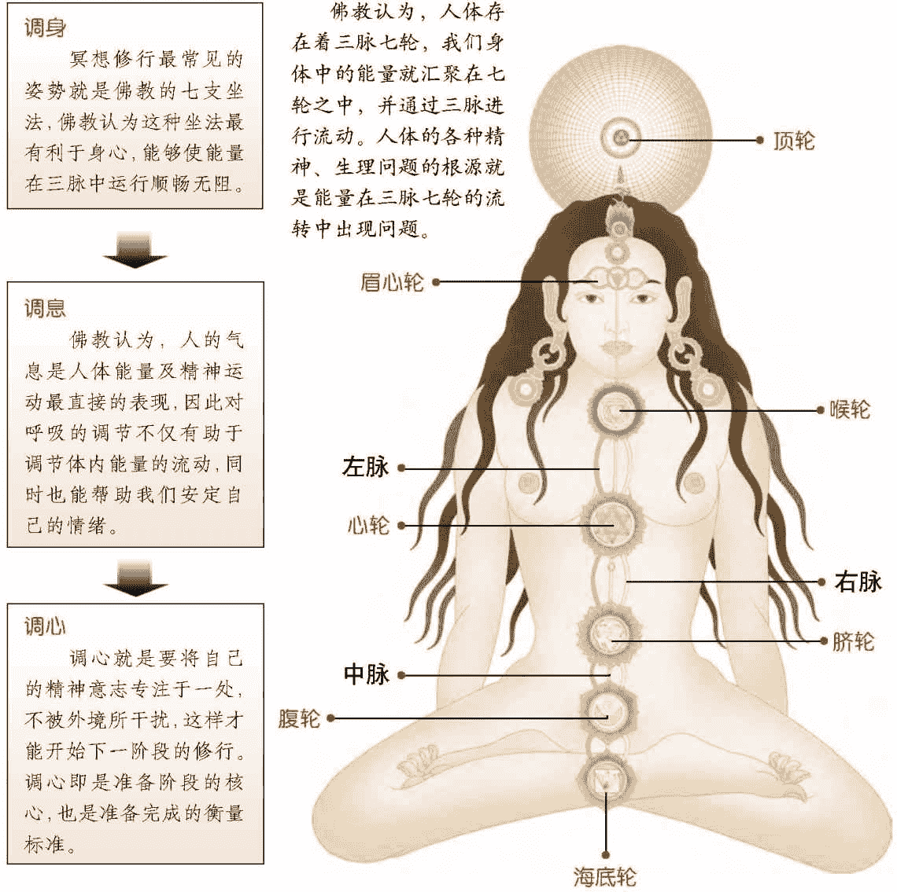

**第二阶段：观照自我**

冥想不是看一下就能解决一切问题的东西，真正的解决是要靠自己的修行。冥想的第二阶段就是要展开这种修行，返诸内心、观照自我，解决的起点是对自我的认识。

在冥想的修行中，发现自我具有两层含义：一层是从佛法上的自我认识，另一层是从日常中自我认识。

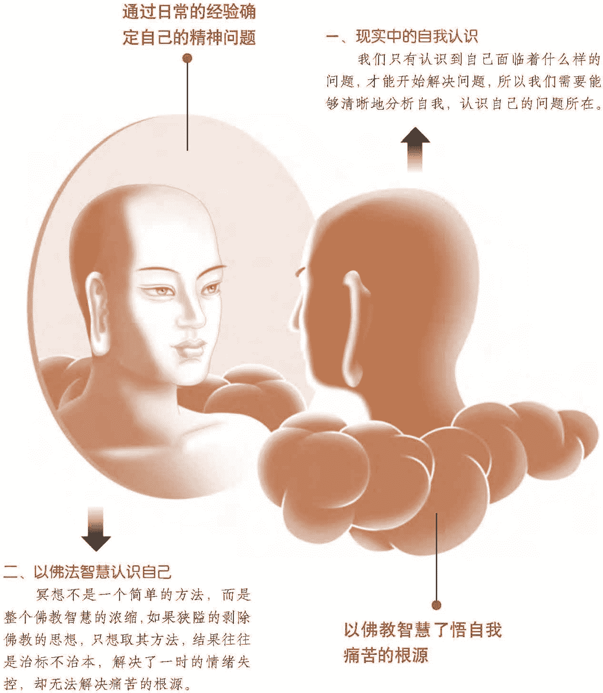

**第三阶段：心理治疗**

一次通常的冥想治疗持续 20 分钟左右，修行者根据自己的情绪问题，在禅定中开始冥想特殊的意象，这种意象会在心中唤起正面的力量，去除内心负面的精神，在修行者心里建立平衡、稳定的的心理机制。

冥想的治疗与我们通常认识的心理治疗有很大的不同，它通过修行者自我的精神调节来达到自我治疗的目的，通常一次简单治疗冥想可以分为以下四步。

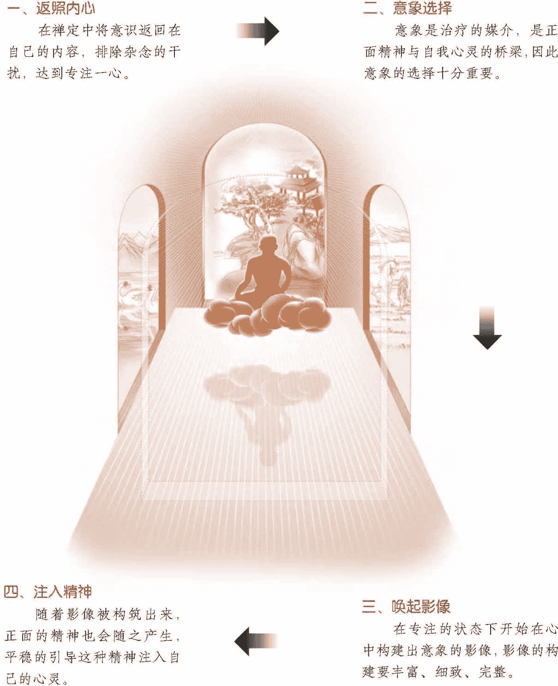

**第四阶段：面对当下**

我们生活在当下，一切回避当下的行为都是逃避，冥想的智慧是要从容地面对现实。

真正的冥想只有一个重点，就是我们当下的生活，让自己的生活充实、快乐起来才是最终的目的。但同时，我们还要避免两种错误。

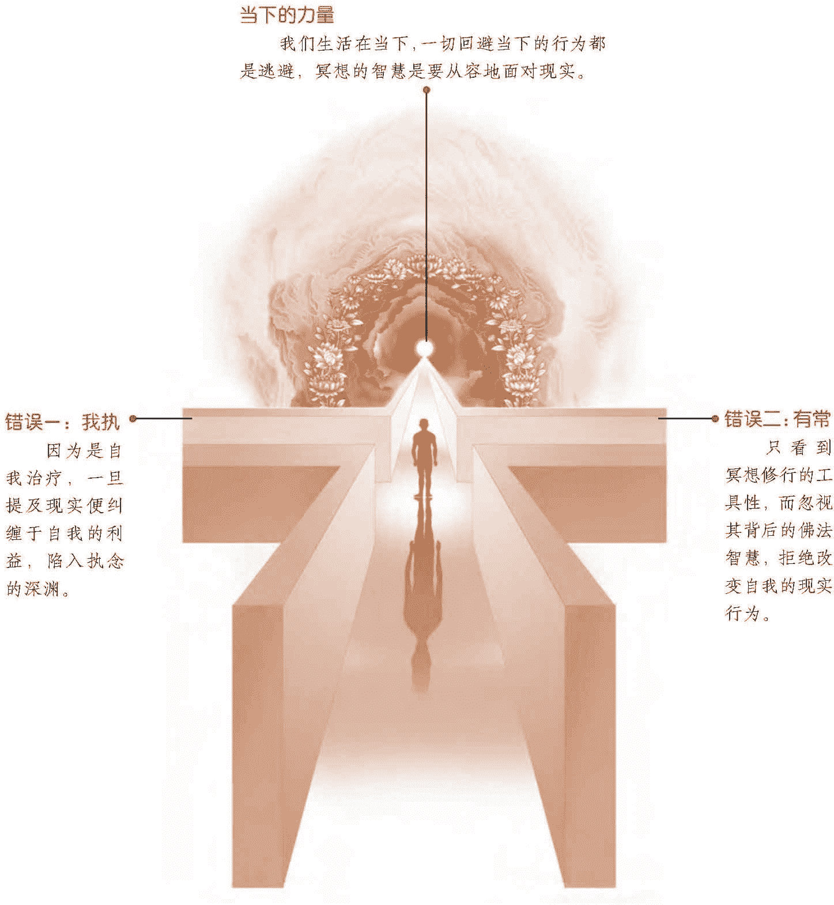

## 冥想的四种精神特质

公元前 6 世纪，佛祖释迦牟尼在菩提树下静心默照，冥想 7 天 7 夜而顿悟人生的痛苦之源与解脱之道，并将这种智慧教导给后人。作为佛祖成道时所修行的方法，冥想一直被视为佛教重要的修行方法之一。通过冥想的修行，能够给人的精神带来禅定、专注、正念、全观四种精神的特质，这四种精神特质正是获得顿悟所必须具备的。

### 释迦牟尼的解脱之道——冥想

佛祖释迦牟尼的解脱之道就是心的修行。通过冥想；我们的心中能够产生四种精神特质：禅定、专注、正念、全观。这四种正面的精神能够使我们的精神更加的成熟、从容，帮助我们化解妄念带来的痛苦。

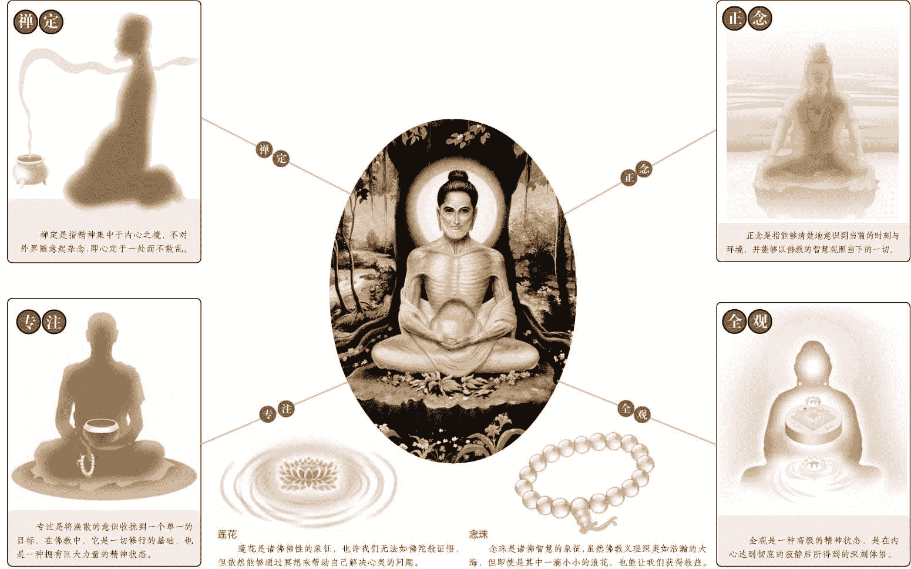

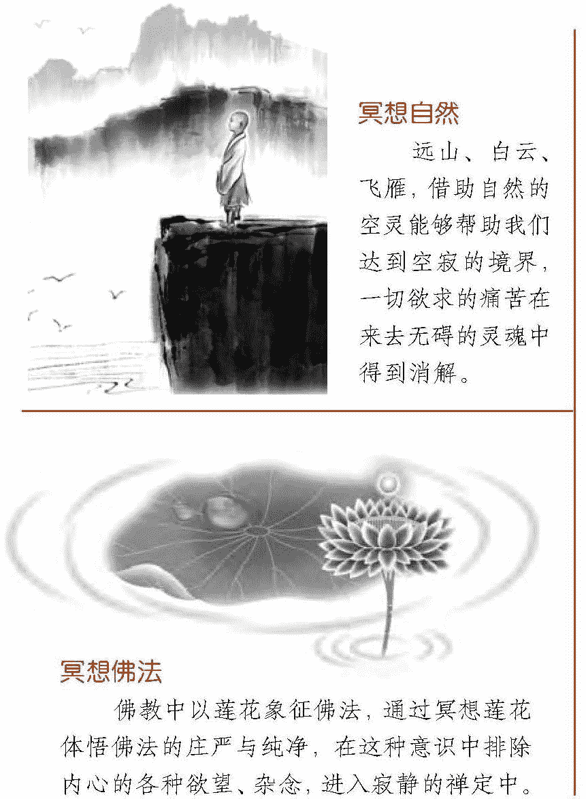

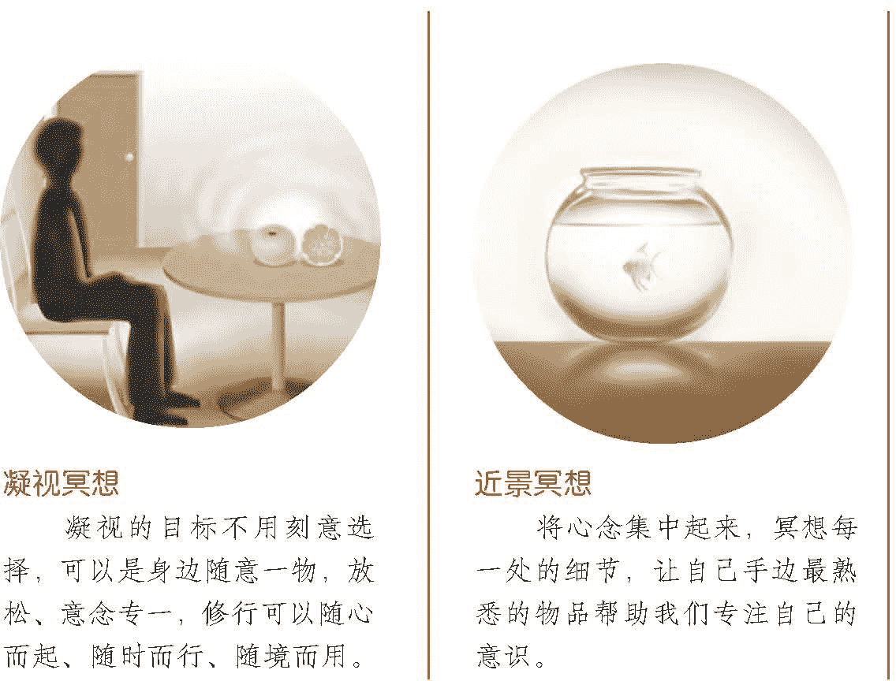

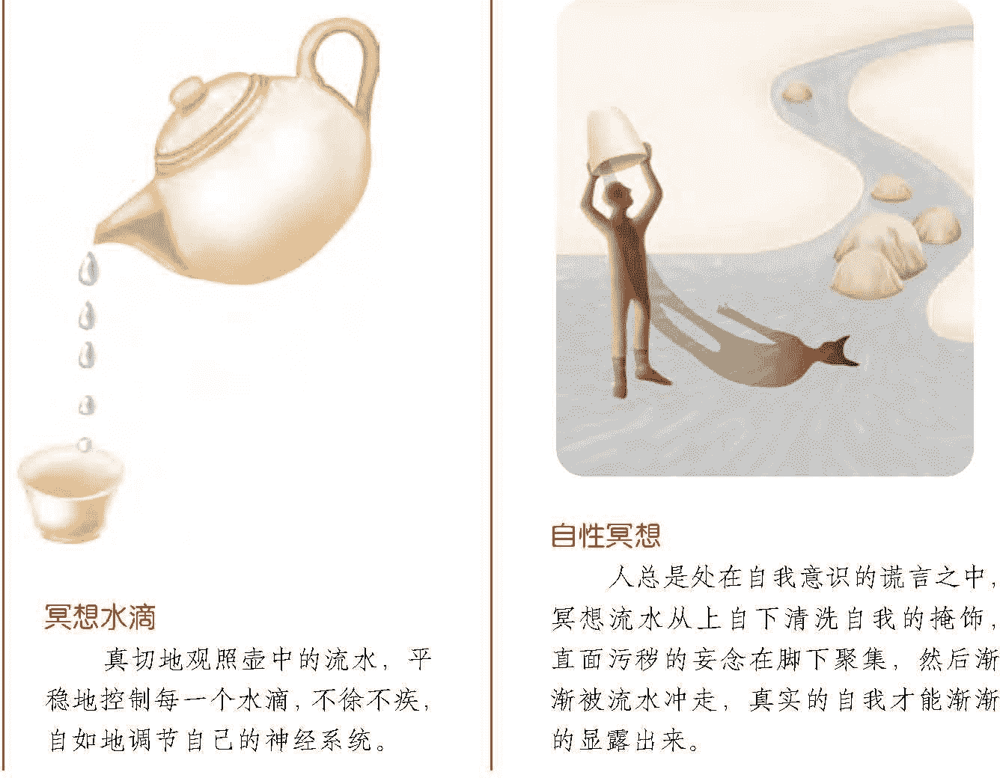

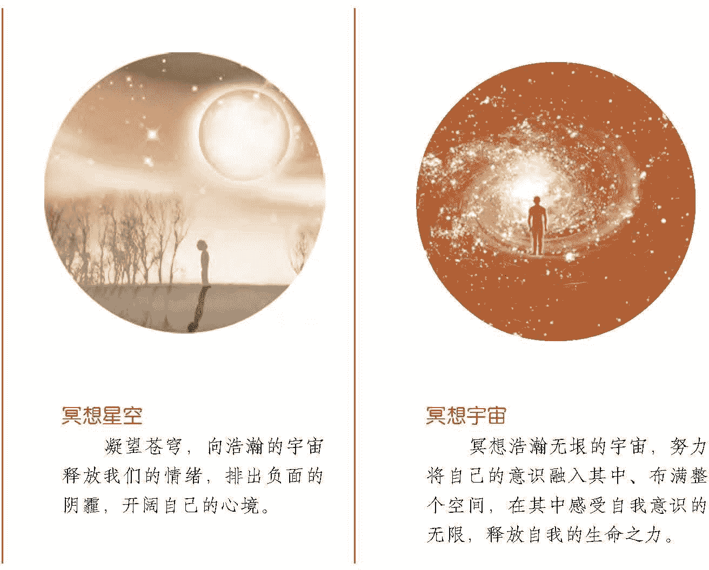

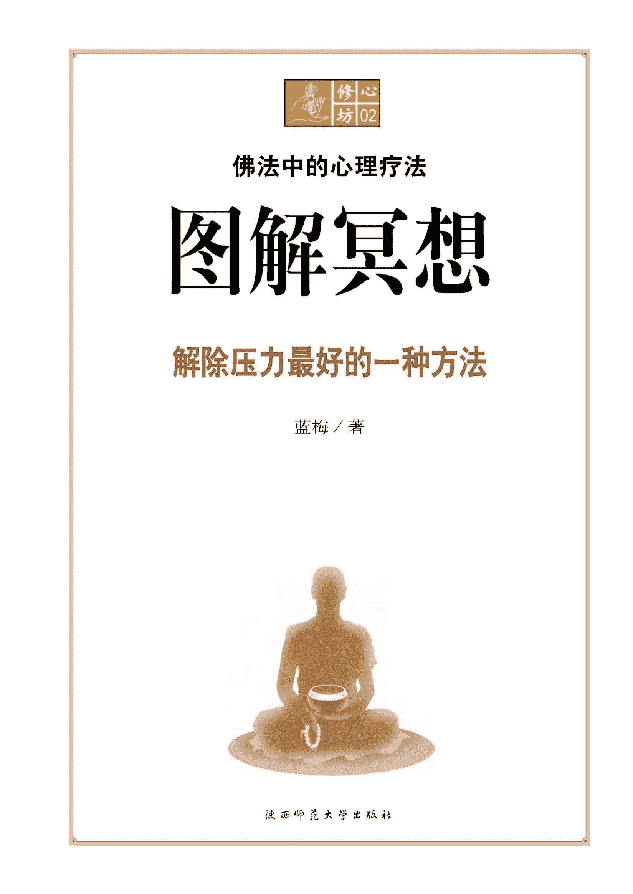

**图书在版编目（CIP）数据**

图解冥想／蓝梅著．—西安：陕西师范大学出版社，2009.1

ISBN 978-7-5613-4474-3

Ⅰ．图…　Ⅱ．蓝…　Ⅲ．情绪-自我控制-图解　Ⅳ．B842.6-64

中国版本图书馆 CIP 数据核字（2009）第 010287 号

图书代号：SK9N0009

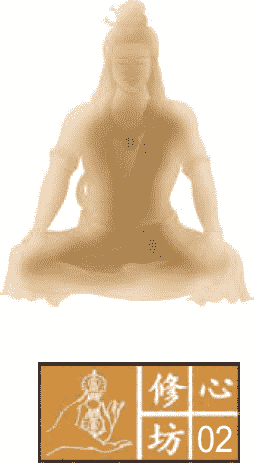

项目创意／设计制作／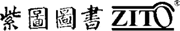

本书著作权、版式和装帧设计受国际版权公约和中华人民共和国著作权法保护。

本书中所有文字、图片、示意图等著作权为北京紫图图书有限公司所有，未事先获得北京紫图图书有限公司书面许可，本书的任何部分不得以图表、声像、电子、影印、缩拍、录音或其他任何手段进行复制和转载，除非在一些重要的评论及文章中作简单的摘引。违者必究。

**图解冥想**

蓝梅／著

责任编辑／周宏

出版发行／陕西师范大学出版社

经销／新华书店

印刷／北京盛兰兄弟装订有限公司

版次／2009 年 3 月第 1 版

2009 年 3 月第 1 次印刷

开本／787×1092 毫米　1/16　20 印张

字数／190 千字

书号／ISBN 978-7-5613-4474-3

定价／68.00 元

* * *

**如有印装质量问题，请寄回印刷厂调换**

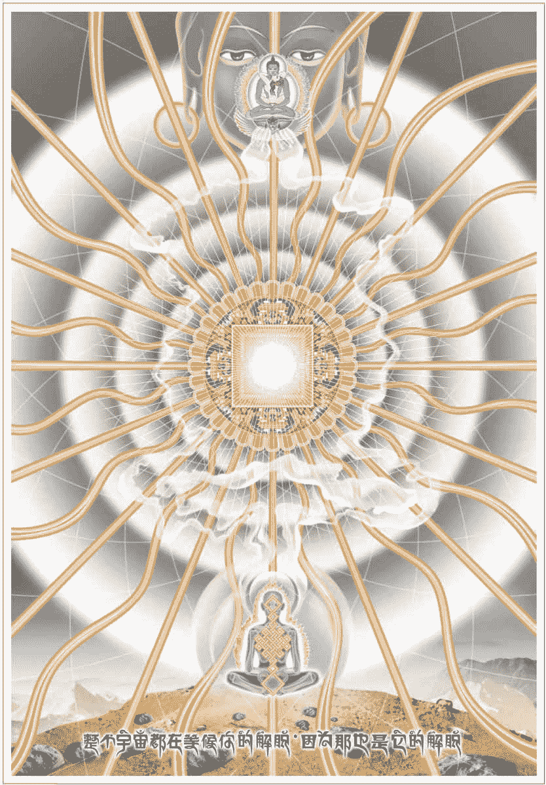

编者序

# 冥想——放松身心的最佳法门

早在公元前 6 世纪，佛祖释迦牟尼在菩提树下冥想七天而悟道成佛。此后，冥想这种源自古印度的修心方法，成为佛教一种重要的修行方式。无数僧侣遵循着佛祖的教诲，通过冥想静坐的方法来了悟生命的真谛。

冥想不是简单的静坐，而是一种对自我、外物于内在精神中的观照，是一种独特的精神思维修行。在佛教看来，由于人会受到外物的蒙蔽，往往纠缠于执念之中。这种妄生于内心的执著深深的陷入人的自我精神世界中，即使我们智慧地意识到了这种纠缠，却依然难以摆脱它。这个时候，我们可以借鉴佛教的冥想修行，让这种充满智慧的精神修行方法帮助我们摆脱心中炙人的焦虑、驱除痛苦的阴霾。

冥想是佛教一项独特的静心解脱法门。冥想以静坐的基本方式，有意识、有目的的引导人的精神思维，使修行者能够专注一心，而对外境不起妄念，使人的内心在这种平静、从容和澄明中，摒弃各种错误的认识，对自我当下的生命进行观照，将现实的精神困扰和情绪苦恼从自我的精神世界中排除出去。最终，为人的内心建立平静、健康、积极的心理机制，是一种深层的精神调节法。

思考一下我们现实中的生活，外部的物质世界几乎能够给我们提供一切的便利，从起居饮食到出行娱乐，我们能够感受到最淋漓尽致的感官享受，我们似乎无所不能。即使我们如此的强大，但内心却依然会感到恐惧，我们惧怕的就是那如同幽灵般存在的焦虑感。这种焦虑感让我们时常陷入空虚、无聊的痛苦和对寂寞、死亡的恐惧中。这个时候，我们可以从冥想中寻求帮助，利用佛教的智慧来获得精神上的自我解救。

提到佛教、佛法，往往使人心生敬畏却避而远之。虽然我们无法像高僧大德那样修行以期证悟解脱，但我们依然能够从佛陀的教导中受益，即使是浩瀚如大海的佛法中的一个水花，也能够给我们的生活带来益处，本书所讲的冥想法门正是如此。冥想放松法并不如通常想象的那样神秘复杂，它只是在每日中占用 10 到 20 分钟的时间，用一种简单、舒适的方法，为你开启一段奇妙的旅程，我们体验过各种美妙的感官享受，但何曾体验过更加玄妙的精神享受？

冥想的本质是一种想象性的心理治疗方法。其基本方法源自佛教的观想禅修，通过集中的观想一个对象，而使人心智专注，并通过积极的想象，将健康、开放的意识注入我们的精神中。佛教用冥想来提升修行者的意志力、净化身心、抑制妄念、解决精神认知上的障碍。而对于我们普通人来说，冥想能够有效的帮助我们调节精神状态。这种独特的佛教法门能够扫清我们的心理障碍，将心灵从执念的束缚中释放出来，驱除内心的焦虑感和压力；让我们的心灵获得真正的放松。

当下，在我们所生活的社会中充满着各种的压力。人们在这种环境中思考日益复杂化，情绪心理也更加不明朗，抑郁、浮躁，这就要求我们必须有能力对自己的精神情绪做出有效的调节，否则将十分容易被焦虑、恐惧、愤怒的负面情绪所左右，不仅会影响到日常的为人处世，还会影响到个人的生理健康。因此，学会如何通过冥想来去放松身心、平静情绪就是十分有意义的。当我们能够培养起积极健康良好的心态，维持身心的放松、和谐，便能够使自己更易到达成功的彼岸。

本书继承了修心坊系列清丽、闲适的风格，为都市生活中的人们提供一种新形态的静心艺术。本书试图传达给读者的，不仅仅是一种简单、易行的放松法门，更是一种重视生活、重视自我、享受生命的精神。只有我们真正放松下来，才能够体味到生活中的快乐、充实和幸福。因此我们在书中介绍了众多的冥想方法，如凝视蜡烛冥想、遥望星空冥想，以及针对各种精神疾病、心理障碍的冥想法等等，希望读者能够从中找到属于自己的静心途径。另外，我们采用图解这一现代的编辑手法，使阅读不仅仅是一种学习冥想的过程，同时也让你随着我们精美的绘图开始一段放松、安逸的精神之旅。

编者

2009 年 2 月

# 目录

源自佛教的修行方式——冥想的四个阶段

冥想的四种精神特质

编者序　冥想——放松身心的最佳法门

本书阅读导航

第一章　觉者的观想：走向生命的深邃

1　冥想是什么：一种发现内在精神的过程

2　瑜伽与冥想：古老哲学渗透进都市群落

3　冥想的起源：跏趺坐上的独特思考方式

4　冥想和佛教禅修：冥想的禅宗渊源

5　冥想和西藏密宗：宗教仪式上的幻象

6　从中国传统文化角度看冥想：从空寂中观照世界

7　从心理学角度看冥想：无法伪装的自性

8　从易学的角度看冥想：建立心灵的宇宙秩序

9　冥想的基本方法：启发全部的内在灵光

10　冥想时的精神状态：心灵的零度意识

11　冥想各种意象的结果：进入迷宫般的神秘丛林

12　冥想所达到的境界：开悟的人生

13　冥想中的智慧：纯粹的平静

14　冥想的最终目的：身、心、灵合一

第二章　现代科学诠释下的冥想：在直觉中触摸真理

1　真实的冥想（一）：剥开超灵的面纱

2　真实的冥想（二）：达到自由无为之道的手段

3　冥想的本质（一）：一种静修方法

4　冥想的本质（二）：一种精神训练

5　冥想的本质（三）：一种意境艺术

6　冥想开发大脑潜能：诞生富有创造性的灵感

7　运用潜意识和无意识的力量：开启冥想的“暗箱”

8　冥想加强图像记忆：视觉图像的刺激

9　冥想时反复吟诵：特殊声波的功能

10　对人体意想不到的积极效果：冥想治病的精神因素

11　冥想与催眠术：在迷睡状态中产生幻觉

12　冥想与第六感：深层的意识活动

13　到达冥想的高级阶段：关于开悟者的心理测试

第三章　冥想静心术：观察和引导自己的精神

1　静坐：冥想的最佳体位

2　禅定：在静心中产生内在智能

3　正念和觉知：进行冥想的两个必要阶段

4　专注：寻找把心固定的对象

5　观想和心像：发展运用内在视像的能力

6　内观：组织管理心灵的艺术

7　全观：一种不加思索的冥想

8　唵咒：瑜伽圣音介入冥想

9　脉轮：身体的能源中心

10　三摩地：冥想三昧的极致境界

11　心灵感应：一种神秘的心理能力

12　暗示法：同本来的自己对话

13　平静符号：审视具有召唤性质的符号

14　密法治疗：运用神秘术进行治疗的代称

15　蓝图：对自我精神的积极引导

第四章　冥想的第一阶段：准备工作

1　关于自我的实验：投入全部注意力

2　排除无价值的幻想：驾驭想象

3　安排冥想的时间：每天 20 分钟

4　选择冥想的环境：寻找专属你的领域

5　冥想前的预备功：放松练习

6　调身：冥想的姿势

7　手势：引导体内能量流通

8　调息：控制生命之气

9　调心：静坐冥想的关键因素

10　平静技巧：缓解紧张和压力的运动

11　辅助工具（一）：拥有烛和莲花般的隐喻力量

12　辅助工具（二）：发出咒语般催眠效果的声音

13　穿戴服饰：能由内至外地舒展身体

14　饮食睡眠：准备随时被启迪的头脑

15　道德规范：追求一种精神上的生活

第五章　冥想的第二阶段：发现自己

1　约束急躁的情绪：成功的冥想源于静心

2　找到精神的魔障：给情绪命名

3　转化情绪的方法：创造一种画面或情境

4　愤怒是对生命目的的反动：转化愤怒的情绪

5　恐惧是对正确信念的背叛：转化恐惧的情绪

6　痛苦是对人生的无能为力：转化痛苦的情绪

7　烦恼是对欲望的无法实现：转化烦恼的情绪

8　骄傲是对自我形象的执著：转化骄傲的情绪

9　进入制感的阶段：控制心念

10　执持静默的状态：集中注意力

11　释放内在的智慧：无欲以观其妙

12　达到真实的禅定：恢复我们的本性

13　觉知精神的蜕变：开放意识领域

14　领悟个人化体验：看到心灵的虚幻之相

15　最高禅定的心境：充塞自由和平静

第六章　冥想的第三阶段：心理治疗

1　冥想释放压力：深层放松

2　冥想治疗抑郁症：开放心灵

3　冥想治疗强迫症：克制自我

4　冥想治疗自闭症：适应社会

5　冥想治疗躁狂症：抚平狂躁

6　冥想治疗焦虑症：平衡内心

7　冥想治疗恐惧症：缓解紧张

8　冥想治疗偏执症：改变想法

9　冥想治疗妄想症：消除妄念

10　冥想治疗精神分裂症：协调身心

11　冥想治疗癔症：控制情绪

12　冥想治疗疑病症：转移忧虑

13　冥想治疗臆想症：引导想象

14　冥想治疗神经衰弱：静心沉思

15　冥想治疗失眠：腹式呼吸

第七章　冥想的第四阶段：面向生活

1　限制人生的因素（一）：封闭的头脑

2　限制人生的因素（二）：对小我的认同

3　开放身体的觉知：净化身心

4　处理自己的反应：第三种选择

5　改变内在的自我：提升心智

6　喜欢自己的处境：邀请自我

7　见证当下的力量：永恒的现在

8　毫无必要的恐惧：静看花开

9　停止内心的争战：你就是你自己

10　成为创造性主体：萌生创意

11　保持心空和热诚：感知流动变化的生命

12　培养成熟的心智：了悟的开端

13　获得圆满的特质（一）：唤醒沉睡的生命力

14　获得圆满的特质（二）：精神上的成熟

15　获得圆满的特质（三）：心灵的圆满和开阔

16　获得圆满的特质（四）：流露宽恕与慈悲

17　朝向觉醒的路径：把冥想作为筏子

18　解脱的时刻来临：达成精神的超越

第八章　冥想的多种形式：提升自我的灵性

1　印度式冥想：沉浸在大自然的母体中

2　瑜伽冥想术：制服心灵的本能冲动

3　蜡烛冥想法：专注于一个物体

4　呼吸冥想法：把注意力放在呼吸上

5　语音冥想法：反复吟诵一个梵语音节

6　音乐冥想法：聆听宇宙调和之声

7　色彩冥想法：一种康复疗法

8　慢走式冥想：迈向神妙的奇境

9　运动式冥想：动静结合的冥想法

10　有趣的水晶球：解码无意识的有效工具

11　神秘术与冥想（一）：炼金术中的冥想

12　神秘术与冥想（二）：占星术中的冥想

13　神秘术与冥想（三）：塔罗牌中的冥想

附录

## 本书阅读导航

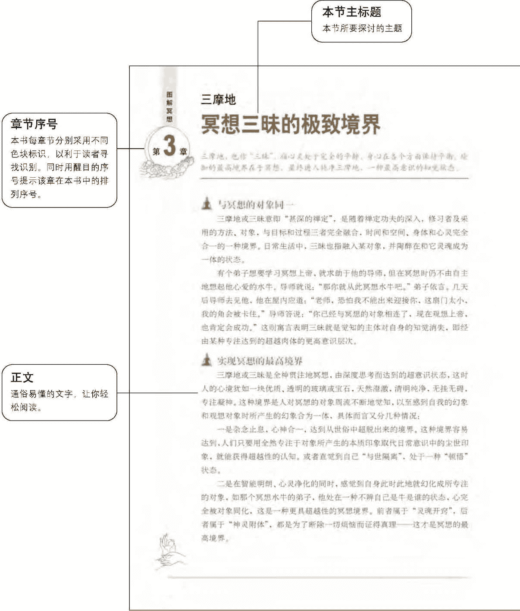

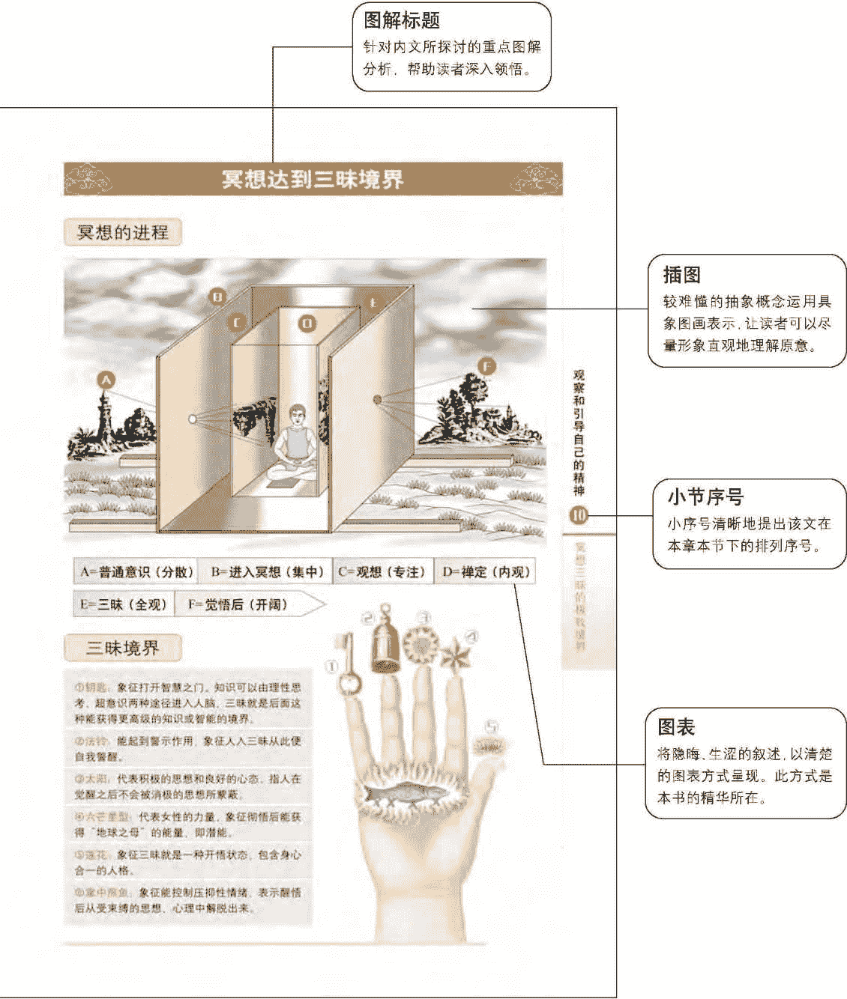

# 第一章
觉者的观想
走向生命的深邃

伟大的“觉者”——佛教中觉悟了的佛陀告诉我们，任何精神上的证悟、极乐、知识、神圣的狂喜，无不来源于一种与自己的心灵深刻的结合。那些吸引我们的迷人而超凡的能力，科学界所称的 ESP（超感知能力），不是什么神秘的、异于常人的特殊技能，而是以全部的心理能量深刻地感受未知的自己和世界，而最传统、最久远地发挥人这种本能的重要方式就是冥想。

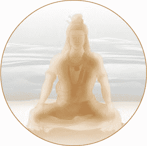

### 本章图版目录

冥想的方式和效用之大观

瑜伽修习法和环境

冥想和古印度僧侣的修行

冥想和禅宗修炼形式

冥想和密宗特殊修持功法

万物静观皆自得

冥想的内心机制

由冥想诞生的经典图像（一）

由冥想诞生的经典图像（二）

凝视冥想的技法

心无杂念的冥想术

意象是有特定内涵的事物

开悟是冥想的最高目标

冥想物质的三个阶段

身心灵统一的多方面阐释

冥想的种类

## 冥想是什么
一种发现内在精神的过程

在印度吠陀时代，婆罗门经典《奥义书》中说：“让感官和意识的注意力，转移到心上……”在原始佛教《经集》中也有说：“抑制自己的意志，向内反省思维，守住内心，不让它外骛……要学会独自静坐。”这可能是关于冥想及其方法的最早的阐释。

* * *

#### 冥想的定义

冥想在人类漫长的历史进程中已经存在了几千年，它不是简单的思维形式，或如做梦般充斥着无序或混乱，而是一种深刻、深奥的思索和想象，这是因为：**冥想最初的含义就是通过禅定达到内在精神发现的具体方式。**

心理学家荣格称，在东方人的沉潜文化中，人们常常经由冥想向内追寻，且认为最高的神性潜藏在一切事物或人的内在层面。他以印度古代的庙宇为例，认为他们的祭坛往往比地面低二三尺，仿佛深藏里面，因此，东方哲学必定是深刻的向内转，目的是要达到最高层、最玄奥的意识状态。

冥想尤其能体现这种东方式精神走向的特征，它通过静思吐纳、打坐聚气等方式改变意识，使人能从较低层的心智状态提升到较高层的心智，减少外部刺激对人的精神的影响，令身心处于平衡、和谐的境界及深度的宁静、平静状态。

#### 冥想的方法

冥想本身就是对真实的自己或世界，直接、当下和直觉的观察，达到对真理的实际领悟的一种方法，如人们对每种物体、感觉、对象或行为等进行直接而又深入的发现和冥思，都会促进人更深刻地了解自己，这就是它的独特效用。

冥想的方法多种多样，人们由有心到“无心”、任由潜意识运转或兴奋地沉湎于一件事中，也都能体现冥想的特质，即：**冥想需要心意坚定，念头只停留在一个事物上，在一段时间内细细观察然后慢慢进入，对着同一个事物培养感官的警觉力，让“奇迹”自己出现** ——这不是什么“超能力”，而是通过冥想开启直觉，控制自我意识，使其专注，自然就能收获关于心灵的各种讯息，和真实的内在接触。

### 冥想的方式和效用之大观

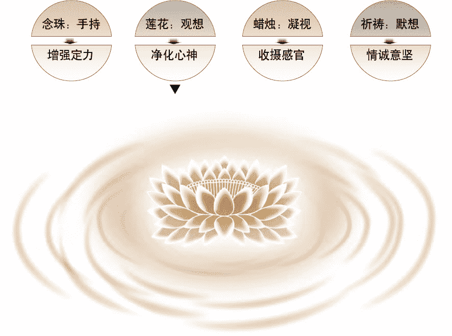

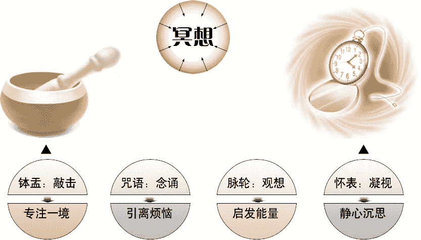

## 瑜伽与冥想
古老哲学渗透进都市群落

东方的冥想即静思，起源于古老印度的瑜伽术。相传，在古印度高达 8000 米的圣母山，很早就有人通过修炼瑜伽成为圣贤，又将密法传给后世的有心人。

* * *

#### 瑜伽是控制意识的一种方法

3000 年以前的古印度哲学经典《奥义书》中就出现了冥想形式的瑜伽修炼。就其最初的深层意义而言，**瑜伽是古印度先贤在最深沉的观想和静定状态下，从直觉了悟生命的认知，** 因而荣格称瑜伽是“印度精神最雄伟的体现”。《石氏奥义书》中．则曾这样解释瑜伽：它是“坚定地控制心和各种器官的活动”。《瑜伽经》也说瑜伽是“控制心识的活动”。可见，瑜伽最初就被作为东方人发明的控制意识的重要方法。

#### 瑜伽的两种练习方式

瑜伽，梵文 Yoga 的音译，意为联结，指个人和宇宙的连接、身体与心灵的结合。瑜伽主要有两种：一是对身体（即动作）的训练，二是对思想（即意识）的训练。瑜伽练习者无论采取哪种形式，都必须处在静（身体）、纯（心灵）、空（精神）的状态中，才能进入冥想，**唤起深度睡眠的意识，激发自我潜能，同时净化心灵，获得至善、悲悯、圆满的人格特质。** 在这种状态中，人通过先天和后天两种集中精神的能力，使内心的智能与所观之境冥合，从而心态平衡、和谐，内外统一，了彻分明，而悟得真理。

#### 瑜伽追求身心和谐之道

瑜伽是一种很早就流行的养生之术，且古代瑜伽修炼的环境多样，从喜马拉雅山的洞穴到乡间小舍，从佛教寺院到茂密森林，都有瑜伽修持者的足迹。现代人陷在物质繁荣的都市丛林中，变化的现实和太多的欲望、追求使身心忙碌、疲惫，上述田园山林式的环境也已不多见，**但练习瑜伽，进行冥想，仍然是一种健康、放松、愉悦的生活方式。** 瑜伽能通过姿势、呼吸的调身、调息之法，配合调心（即冥想）的实践，使人在深沉的静坐冥想中摆脱烦恼、压抑、空虚等负面精神的困扰，心灵变得宁静、达观。

### 瑜伽修习法和环境

古老的《瑜伽经》记载了“八支行法”，即修习瑜伽的八个阶段，能促人改善自身的行为及意识，走向永恒的觉悟。

##### 八支行法

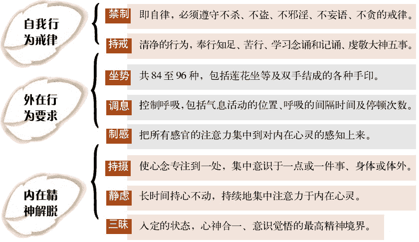

##### 瑜伽修炼的环境

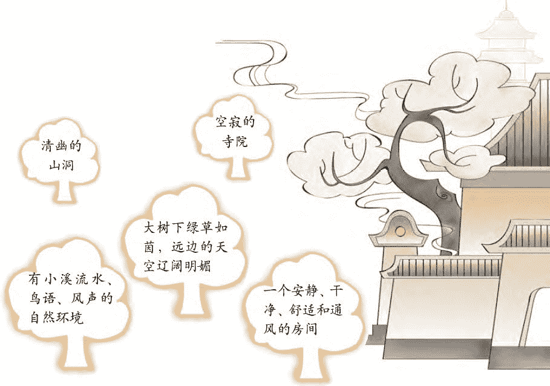

## 冥想的起源
跏趺坐上的独特思考方式

瑜伽后来成为佛教修行体系中的组成部分，冥想也融入佛教的坐禅中。如瑜伽功法中最著名冥想姿势之一莲花坐式，就是禅定时的重要姿势，也是佛教的主要修炼方式。

* * *

#### 冥想来源于佛教高僧的心灵感悟

早在 5000 年前，古印度的高僧们常常僻居深林，静坐冥想，以远离纷扰，息心凝神，在一个全然宁静的空间中进入心神合一的最高境界。据古吠陀神话，宇宙的创造者梵天趁大天神毗湿奴入定时，从他脐中所生莲花之中出来，结跏趺坐，继而创造万物。又说创世之初，天下水茫茫一片，有莲生出水面，因而后世圣贤僧众冥想时大多以莲花为座，静坐修定，以此为返归初始，还原清净的唯一法门。

坐禅即“趺坐而修禅”，一种盘腿而坐的姿势，俗称打坐，佛教未东传之前，就是我国较为流行的静坐养生之法，据说这种坐姿有利于腿部经脉和血液通畅。**坐禅是打坐和冥想结合，既能实现息虑凝心、究明心性等宗教上的修炼，也能达到养身延寿、开智增慧之目的，体现了这种古老瑜伽姿势对于身心兼修、天人合一境界的追求。**

#### 冥想是释迦证悟人生的解脱之道

冥想是一种直观的认识方法或途径。自从这种方式和人类心灵史上的最伟大的壮举和“奇迹”之一——佛祖乔达摩·悉达多在菩提树下静坐得道结合后，它成为自我觉醒以获得启发性开悟的重要思维途径。据说释迦牟尼创立佛教之初，常于深山修行冥想，最后端身正意在菩提树下结跏趺坐，静思默想，即得证悟，自度成佛，圆成正果，从此佛光普照，发誓愿普度众生脱离苦海。

冥想方法很多，主要源于印度教、印度佛教、中国佛教和日本佛教，大多以“静”为主，即静虑息心。冥想也从最初的养生、养气追升到思想境界的修炼，通过静观自己的精神世界，超越对外物的经验性质的理解，直接把握、体悟外物的本质或本性。佛教的“瑜伽冥想”就是静观、入定、合一、喜乐、自在、慈悲、智慧、完善、一切万有、生命之能、本体实相。

### 冥想和古印度僧侣的修行

在佛教以前，冥想就已经出现在古印度婆罗门教僧侣的修炼体系中。当时婆罗门教将人的一生分为四阶段或四个境界，依次为梵行期、家住期、林栖期和遁世期，其中只有在林栖期，才要禁欲、苦行，经苦修冥想求得解脱。

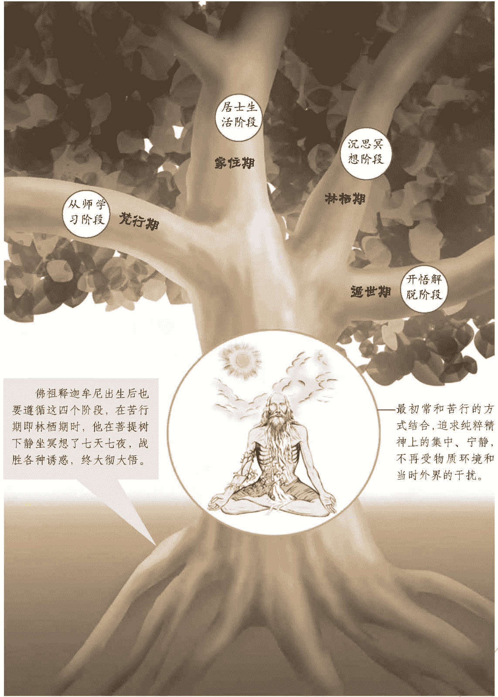

## 冥想和佛教禅修
冥想的禅宗渊源

禅是梵语“禅那”之略，原指静坐默念，译成中文是有定、静虑、思维修等意思。所谓定，是心止于一境；静虑就是冥想。

* * *

#### 禅是一种冥想

禅，译自梵文 Dhyāna（迪亚那）或 jhāna（禅那），是指一种精神的集中、有层次的冥想，即指修习者的意念集中于一种特定的观察对象，循佛教义理的思维方式，尽力排除外界种种欲望对内心的诱惑和干扰，以便达到弃恶从善，使本体心性获得绝对自由之目的，因而禅就是冥想。

#### 冥想是禅定和禅修的关键

禅宗重在“修心”、“见性”，主张以禅定进行佛教义理的修习，但不仅限于静坐凝心，专注观境的形式。

佛陀以前的《奥义书》中已讲到修习禅定的方法，且《奥义书》的梵语就是“近坐”的合成语，意即“肝胆相照地对坐”，其主张用调息、调身、调心及口诵“唵”字进入禅定。**禅定就是用冥想的方法达到入定，其主要内容是修禅或禅修，关键是静虑、冥想。** 禅宗是具有高度心灵特质的教派，它不重视冥想的物质环境和宗教仪式，只是在简单、清静的表象中，进入深层禅定的状态中。虽然心念就像无时无刻不在变化的意识的溪流，仍能通过坐禅培养自己意念的安定、专一，达到“止”的状态。佛教曰：“因定生慧”，禅定不仅能协调身心，使人在入定中沉静心灵，在观想时更直观地把握宇宙人心的奥秘。

禅修在藏文中意为“熟悉”，指这时心念中常出现最熟悉的东西。禅修的实质就是冥想，即心灵处于持续的无间断的平静状态，感觉自心本性就像天空一般澄澈空明。禅修属于心神意识的活动，它的最终目标是要唤醒意识当中幽微玄妙的层面，使修行者获得对于事物直接而直觉式的觉察力，即证悟之境地。但禅修并非是要人做白日梦式的冥想，使其从眼前现实中逃避开来，而是在沉思冥想中直觉宇宙的本体实相，瞬间顿悟达到“梵我合一”、物我交融的境界。

### 冥想和禅宗修炼形式

禅僧喜爱到深山野林中，沉浸在古韵幽绝中的宁静氛围以利于深刻地冥想，是一种亲近自然、天人合一的冥想方式。

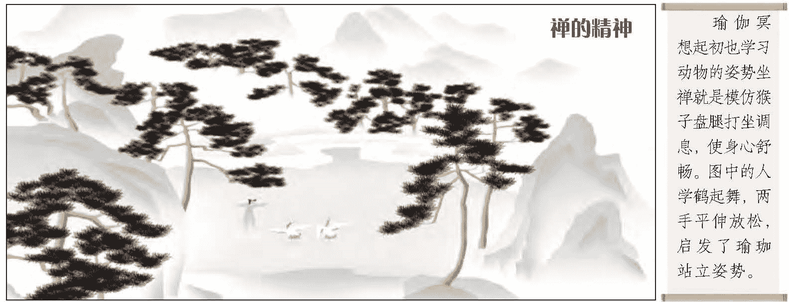

##### 修炼禅定的益处

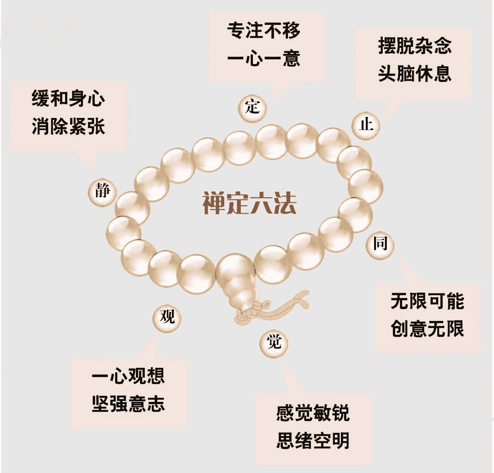

## 冥想和西藏密宗
宗教仪式上的幻象

为了摆脱与大自然越来越强的疏离感，许多原始部落采取集体宗教仪式，提供狂欢性质的体验，促成恍惚的精神迷离，通过冥想各种生活画面来排遣这种情绪。

* * *

#### 冥想是身口意的净化实践

佛教密宗认为存在着影响人类生命的三个层面：身（肉体）、口（言语）、意（心灵），且认为众生都能成佛，获得至高的精神转化。因而，西藏密宗修持者在平时都会进行禅定的精神活动以升华意识。其修行仪式中的“三密加持”，具体方法是设下坛城、供养神佛，经大宗师或上师诵咒、灌顶，修持者只须身、口、意三密相应，就能即身成佛，直接体验和领悟“永恒真理”。声音（口密）或想象（意密）的冥想方式即来自于密宗。

**“心观”是密宗修炼的特征，就是运用各种各样的冥想方法，抑制和平静心灵，培养专注的意志力和知觉。** 在心观时，修持者要构想种种精神意象，对应着诸如宁静、美丽、忿怒、恐怖的密宗神的气质，使自己受到众神精神上的引导，与他们密切结合，完成修行的过程。每个神的整体状态和颜色不一样，禅定者按他们的需要被赋予不同的神，修行时将注意力集中于其在心中所创造的神的意象上，把神想象得和自己一样真实，就会萌生出“成佛”的神圣感。

#### 冥想、心观和炼金术的奥秘

冥想或心观的核心都在于与“神”统一，这时修炼者的自我和他们的浅层意识被摒弃，被更高的神的意识所取代。

西方炼金术也认为在自然界的一切存在物中，都有一个独一无二、无处不在的“生命起因”在起作用，它作为世界本原的“宇宙神灵”，以独特而永恒的方式推动每个存在的个体。在这个伟大而秘密的“自然法则”之下，人们通过冥想，在精神世界里重复造物主的“工作”，感应天体大宇宙和自身小宇宙之间的微妙联系，就会处于充满神灵的状态。这个“神灵化”过程的最终结果和密宗心观修持一样，即心灵能从冥想时所见的幻象中获得超验的智能，达到彻悟。

### 冥想和密宗特殊修持功法

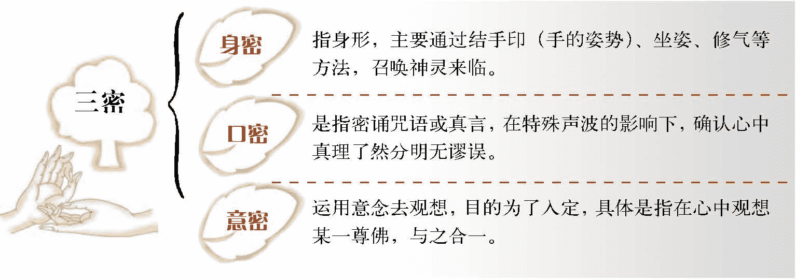

##### 观想是密宗修持之一

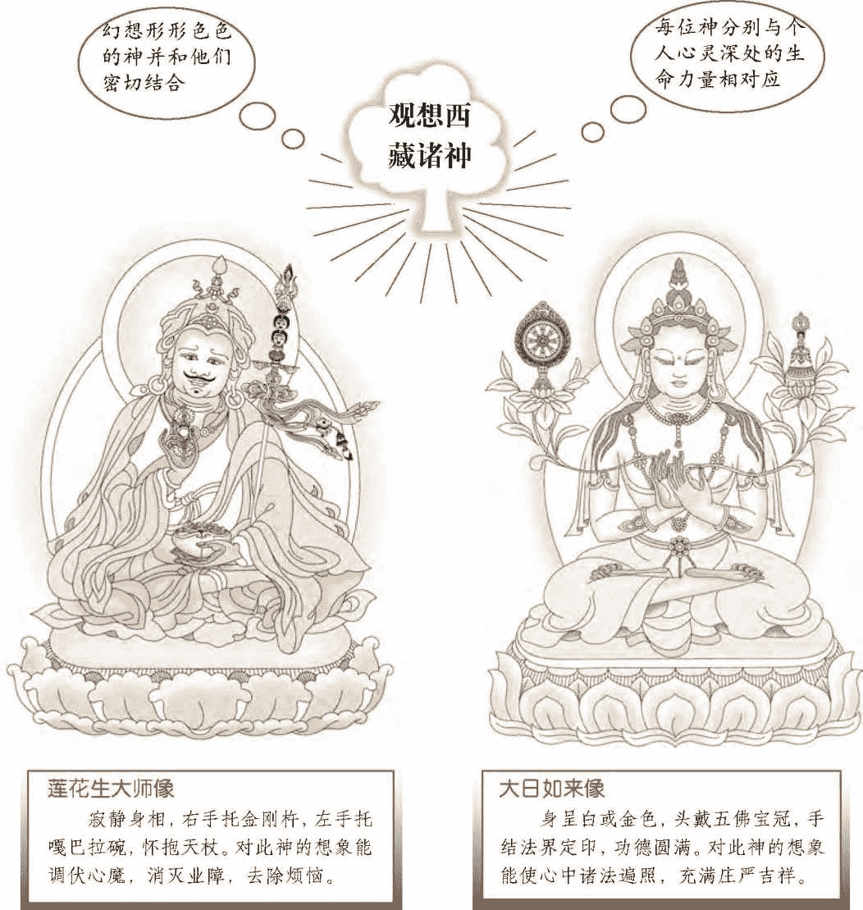

## 从中国传统文化角度看冥想
从空寂中观照世界

哲人曾经这样评价中国传统文化：重感情、轻理性，重冥想、轻现实。中国古代诗歌禅趣禅意的表现，也主要是营造空寂的冥想的氛围。

* * *

#### 什么是空寂

空寂本意是表佛的清净无垢的世界，它也是禅的心灵世界。禅能帮助人安定和集中心思，其精神强调空与无，与冥想所能达到的至境同一，这时思想往往达到玄之又玄的深度，如水之极透明，彻悟了然，这里的“空”就是“空寂”。

空寂包括寂静和空性两个方面：寂静有时指空间上的静，有时又指心灵上的静；空性是除去一切概念后所剩下的东西。当人从空寂观察万物，就看不到事物的概念，而是走出对客观世界习惯性地作诠释的执著，真正看到事物的本来面貌。在空性中看这些被“概念化”的事物的方式便是冥想。因此，冥想是觉察自己“本来面目”的最好方法。

冥想达到的空寂绝不是思想的产物，因为思想无论如何都有界限，然而冥想的心却没有界限。**在冥想的觉照中，“个人”并不存在，存在的只有空寂、超脱以及非凡的爱。** 这既是宗教性感悟，又是中国古诗、日本俳句等所追求的东方意境之美。纯粹的平静也只能在空寂中获得，这是因为空寂的本质深意就是从彻底的寂静中出现纯然的观照。

#### 空寂体现传统文化的审美特征和思维方式

在古典哲学中，空寂是一种深刻的宗教情怀，如中国禅宗偏爱空寂的气象，禅诗和禅画也普遍追求空、静、幽、寂、深的禅境，使人忘却尘世繁华，远离世俗，流连此澄明幽深之境，万念皆寂，在宁静、闲适和恬淡的平常心中，沉浸于超然物外、清新自然的生命状态。中国传统美学就强调这种重感悟、重体验的思维方式：它**主要通过感性形态的直觉体悟，经由冥想与自然及自然之道合而为一，再通过类比、起兴等，将主体心灵浸润在客观世界所感发的情绪表达出来，** 就会产生一个有审美意蕴、渗透着感性情思的，人的内在心灵完全外化的艺术品。

### 万物静观皆自得

中国古人常借山川草木之形，陶洗心中的尘俗、杂思，涵咏自然，既吸取老庄虚无哲学和对道的冥思的文化精髓，又灌注佛家的空寂禅意之意趣，从而显出空寂的冥想氛围。

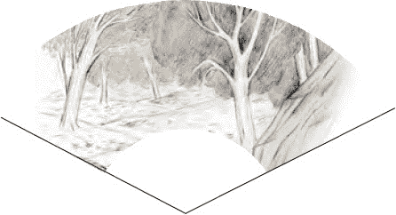

**落叶满空山，何处寻行迹**

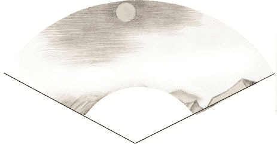

**万古长空，一朝风月**

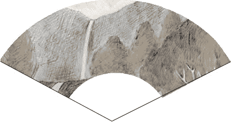

**空山无人，水流花开**

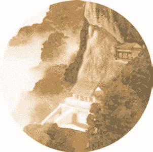

**仙山亭阁**

佛院建于山野中，既空灵动荡又深沉幽渺，表现出深静的心灵与宇宙意象“两镜相入”、互摄互映的佛禅心境。

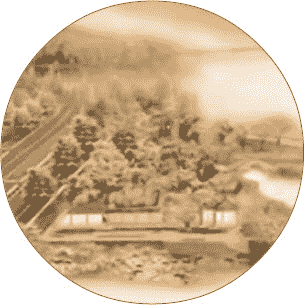

**都市芳庄**

将森林、山水、石桥、云雾与城市景观结合，运用传统园林艺术手法表现出一个空灵而又寂静的、冥想中的世界。

**野渡无人**

淡墨、寒色、幽景合起来表现出一种超然物外和极静的空灵意境，仿佛内心与自然、外物合一的冥想境界。

## 从心理学角度看冥想
无法伪装的自性

心理学范畴的冥想，其理论基础是近年来尤为受关注的潜意识理论、集体无意识理论或超意识理论。它从人的潜意识深层解释冥想，重视对冥想心理治疗的作用的研究。

* * *

#### 冥想通向人潜在意识的世界

潜意识指人的深层意识，是潜藏在人们一般意识下面的神秘力量，或人对未知事物的朦胧状态和对生存世界、未知世界的模糊感觉。现在看来，它是一股存在但却未被开发利用的能力。要进入潜意识状态去思考，必须首先做到身心宁静，再闭目冥想。

**冥想渗透到潜意识的工作原理中，即通过直觉、感知超视力和超听力甚至来自他人、自然，祖先等的各种信息，并对人的意识产生影响，帮助意识做出判断和深层次的分析。** 潜意识一经开启，将和宇宙意识产生共鸣，宇宙信息就会以图像方式浮现出来，ESP 能力（又称超感官知觉，即心灵感应、透视力、触知力、预知力等的总称）也将一一出现。

#### 潜意识显现冥想者本来的自性

心理学家荣格解释自性是心、性或本性，是心灵的中心。冥想是意念和意境的结合：观想境界中，出现无界限的宁静、安详的佛国，位于佛国中心的浑圆的八叶莲花上，佛陀结跏趺静坐其间。这种由内在本质显现的佛陀就是悉达多王子（即释迦牟尼）的自性，也就是冥想者本来的自己。

潜意识中的图像都是种族文化、宗族宗教、人自身欲望和企图等意识的镜像映照，这些潜藏在最底端的，构成我们最隐秘的“自己”，随着“出生”和“经验”就携带着。当我们的意识混乱或行动错误时，可能就是自性黯淡不清，被经表象意识伪装的“自我”迷惑，因此无法正确判断。

禅修者或瑜伽士在冥想的初级阶段，都还徘徊在那过去时、有局限性的经验世界，思想仍黏着于意识内容，尚无法成为拥有单纯、空寂心灵的主体。但经过反复的放松和集中意识的训练，或通过催眠、梦幻沉醉和自由联想的心理学方法，就能探索自性、实相，看到自己和宇宙世界的本来面目。

### 冥想的内心机制

##### 冥想的三重目标

##### 激发潜意识的冥想方法

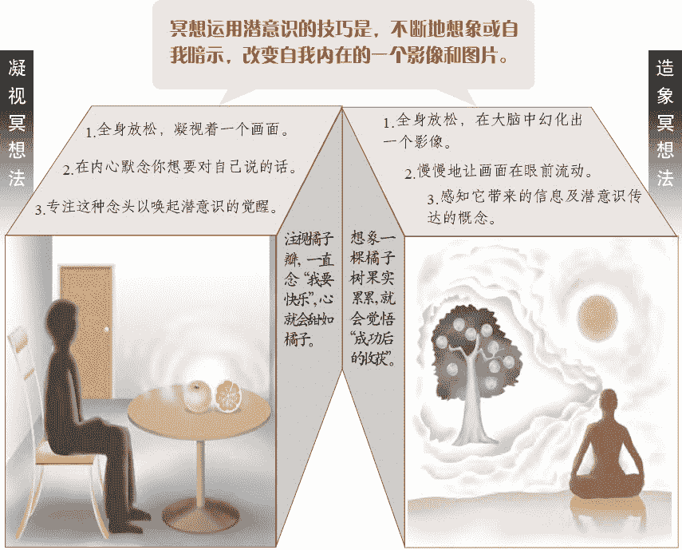

## 从易学的角度看冥想
建立心灵的宇宙秩序

《易》中最著名的辞曰：“仰则观象于天，俯则观法于地，观鸟兽之文与地之宜。近取诸身，远取诸物，于是始作八卦，以通神明之德，以类万物之情。”表明我国古人相信心灵感应能通天地，以及沉思宇宙与生命的态度。

* * *

#### 观物取象的思维模式

中国古代用阴阳八卦从自然和精神两方面概括宇宙秩序，阴阳八卦之象出于《易》，是古人面对天地长期思索后“观物取象”的产物。所谓观物取象，首先是视觉上的“观”，即“仰观于天”和“俯观于地”，以视觉方式通达宇宙的本体。它不止于一般的物象观察，而是通过观象领悟事物的深层蕴涵，再将之符号化以彰显对宇宙秩序的认识。

《易》又解释象说：“圣人有以见天下之赜（指幽深复杂的事理）而拟其形容，象其物宜，是故谓之象。”因而“象”，有双重意义——既诞生于圣人对天下幽深之“道”（宇宙秩序）的发现，又是道之具体形象，这和冥想行为中“凝神观照”所见的象一致，即**它们都是主观创造的视觉化的图像，却包含了宇宙最深刻的智能，是主体对事物的直接观照后用来把握事物内在机微的宇宙心灵图像。**

阴阳八卦作为国人心中宇宙秩序的符号，就是几千年前华夏圣贤对世界冥想的象。凡进行深刻真想时所见的幻“象”俱能反映自己心灵及心灵的秩序。

#### 天人合一的宇宙秩序

天人合一观强调天、地、人的“同与应”的关系，并将人放在中心地位，这就是《易》所说的三才之道。人追求心灵的稳定和宁静，就必须溯源到对“天”道的感应上——唯有正确的感应才能真正剥离强加于身心的藩篱，因此**人需要冥想来回归到自然状态，通过呼吸、调息、调心等方法，不仅达成与万物、天在生理状态上的合一，更能自觉地履行与天统一的道德理性原则。**

当外在的“天”（客观世界）是内在（主观世界）的投射时，天人关系就昭示着冥想所追求的精神秩序：其一是通过观象发现世界的本质，实现个人心灵的超越与升华；其二是天人感应，通过个人对宇宙一切现象和变数的感通，建立平衡、和谐的内在心灵的宇宙秩序。可见，两个世界、两种秩序有比附关系，宇宙秩序就是精神道德秩序，心、神及宇宙无差别。**冥想时，一般都会有心完全沉浸在宇宙本体镜相中的体验，没有这种超越性的感受，就根本谈不上从生死、烦恼、世俗琐事上解脱的可能，也无法在环境中真正地安静下来，默想一些有助于建立心灵秩序的景象。**

#### 理、象、数的三易观

在《易》书中，理为世界之主宰、气为宇宙之周流，象因之昭其形容，数因之定其分限。除了冥想前必须用呼吸来调节气息，其他三者（即《易》中之“三易”）都关乎意识构想的原则：“理”是探讨宇宙人生形上与形下、所变与不变之原理，如义理、道理；“象”是从现实世界提炼出来的具有表征及象征意义的形象，如卦象、意象；“数”是由现象界万事的运行轨迹和变化过程所推理演绎出的完备的数理体系，能知人事的前因与后果，如河图、洛书。

要知道我们心灵思维的原始本能，及感通宇宙秩序的方法，就必须具备运用理、象、数的能力，例如感知一把钥匙一把锁；钥匙是天，乾卦，数码时代 1 和 0（两者能组成全部的数码画面，犹如天地构成宇宙之象）中的 1，因为它属纯阳、质刚、主动、活跃；锁是地，坤卦，数码时代 1 和 0 中的 0，因为它属纯阴、被动、主藏、不活跃。**所有冥想到的事物无不存在着这种阴阳分际，如果将各种各样的心理能量、信息归类，人的精种层面也不断转化、和合、制约、释放、交互，最后一切都平静、秩序化后，才可谓彻悟。**

### 由冥想诞生的经典图像（一）

世界上最古老、最富有象征意义及包含最深厚美学价值的图像，多是古代圣贤经由观察和冥想，在当时环境中依据其内心体验和想象创作出来的。作为流传久远的象征符号，它们既表现了外部的形象化世界，即某种宇宙秩序，也表现了内在的精神世界。

##### 周易宇宙图

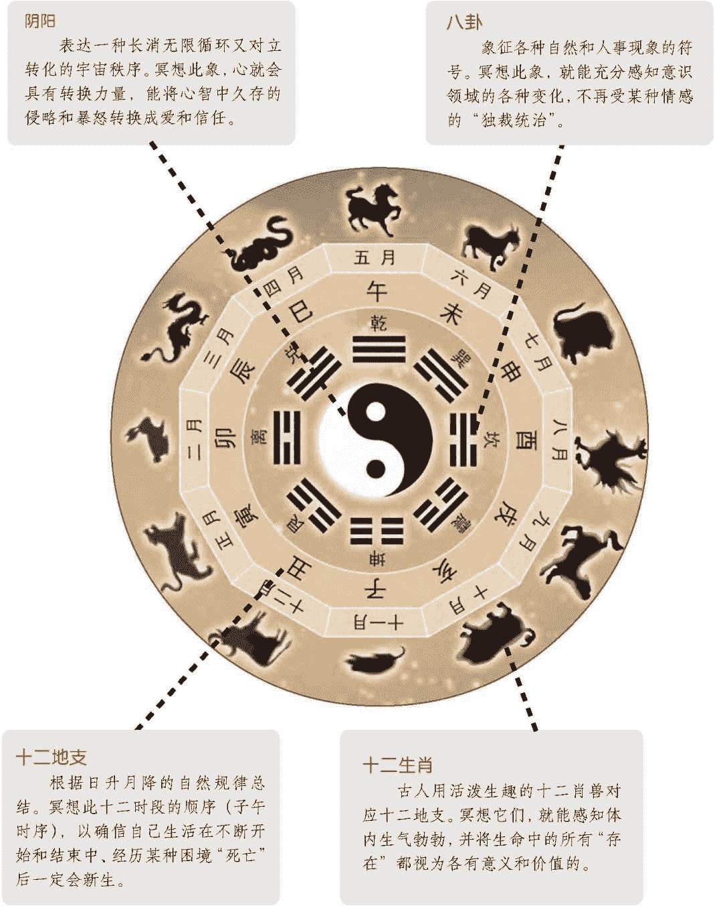

### 由冥想诞生的经典图像（二）

##### 道教星宫图

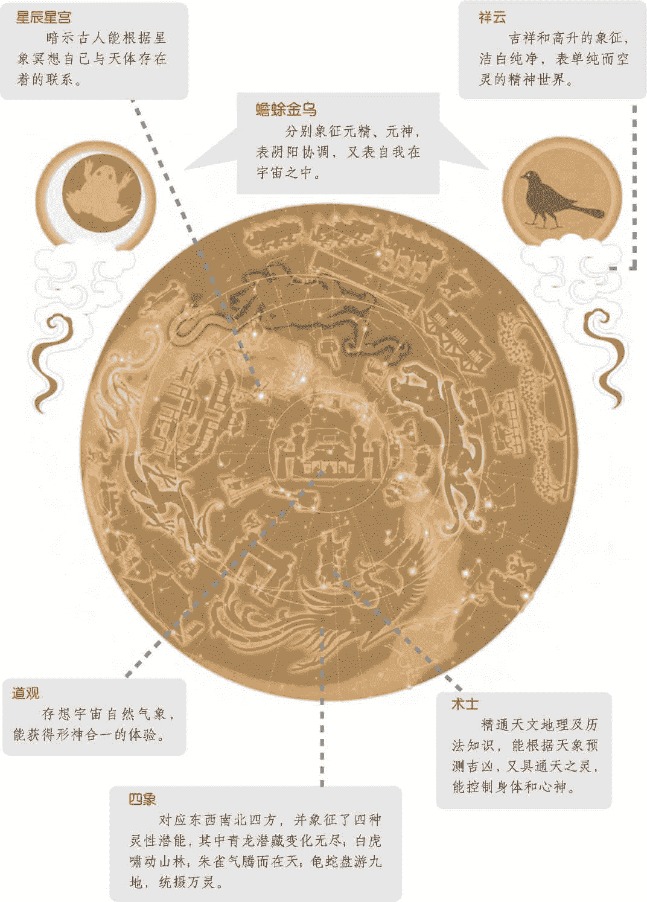

## 冥想的基本方法
启发全部的内在灵光

冥想要使我们摆脱情绪上的纷争、内心的失调和心理的紧张，就要启发自己的全部内在灵光（心灵能量），洞察到生活最高真谛的真正根源。

* * *

#### 集中全部的能量

自从人们开始学习东西，就要学会全神贯注于自己的思想、意象、记忆、感觉等上面，这不是佛家三昧所独有。当思维定在一个方向上，持续地朝这个内在或外在的目标集中注意力，并且彻底消除精神涣散，就形成了冥想状态。

集中一切能量是进入冥想的基础，最传统的方法是将人的注意力集中于一个能代表个人价值或象征宇宙的物体上，如曼荼罗等。能量不是超能力，人可以想象自己接收来自宇宙和地球的信息或能量，却不能凭空认为自己的意识可以支配天体星球的运动。

据称，借由冥想开启右脑的人，能够自由自在地使用宇宙的资讯与构想，这实质上是右脑思维更富有想象力和直观性的体现。集中全部能量意味着最大地激发右脑，这种脑的状态最宜于冥想。

#### 培养专注和凝视的技巧

**冥想的对象主要是自我、纯粹的存在或宇宙的真义。** 每个人都可以根据他的信仰或信念去选择一种提升意识和心智的象征作为冥想对象，只要有助自己全神贯注于生命、灵魂中，上升到更超脱的境界。聆听音乐或任何声音也能培养专注的能力，因此听一些舒缓的、大自然的音乐不仅不干扰冥想，反而有助于进入冥想的状态。

当然，冥想时将注意力集中到某一物体上，并不是要仔细观察它的细节，而只当它是个聚焦点，在意识到注意力分散时，将视线重新集中到这个物体上来。视线聚焦在轻微摇动的事物上更容易进入冥想状态，比如凝视摇曳的烛光、被风吹动的树叶与水波、袅袅飘动的烟雾。通常做法是：视线和这些事物基本持平，然后一直凝视它，直到朦朦胧胧地感觉到这些事物被映像在由目光放射形成的屏幕上。此时，图像不再重复，只有呈现在眼前的模糊画面在不断地延伸。

### 凝视冥想的技法

许多瑜伽冥想练习者常会专注凝视一幅心中所崇敬的人格神，如薄伽梵的图像，引导自己进入真、善、美的境界。

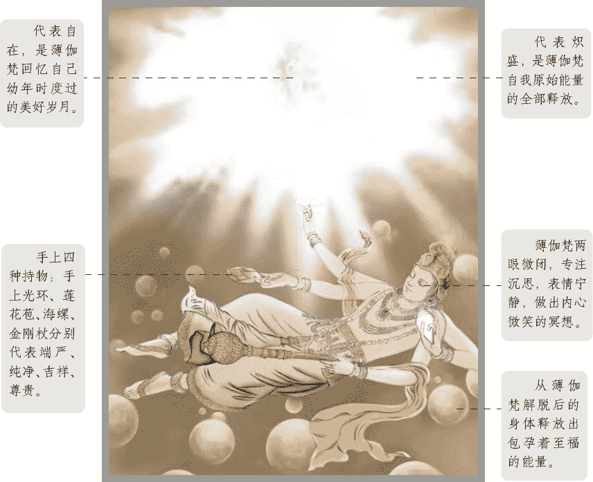

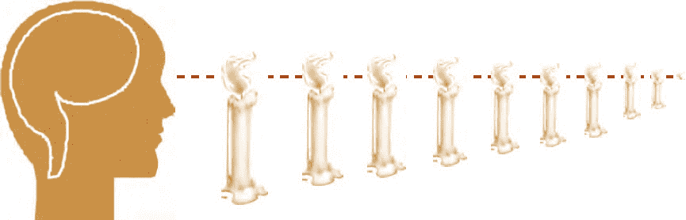

**凝视时眼睛一动不动，集中在一个焦点上，最后让这个焦点也从逐渐从脑海里消失。**

## 冥想时的精神状态
心灵的零度意识

在冥想时主体必须认清，控制念头（意识）或驾驭念头都是不对的。人使自己的心彻底安静下来的方法只有一个：处于零度的意识状态。

* * *

#### 身体失调源于混乱的思维

按照惯性定律，人不能免于内心长期累积的从出生到现在的负面思维，而人的自律神经也将大大受到此种心理状态的影响。在无意识中习以为常，就很难发现自己思维的负面作用，更没有注意自己“平常在想些什么”。净化心灵不是简单地消除某个炎症，对症下药就可以，而是**人要先从自己的习惯性思维中抽出来，认识到混乱的思维是造成种种身心失调的“罪恶根源”。** 这些“混乱的思维”就是：纵容感情神经、给负面心理暗示、忘记从经验中积攒智能、相信痛苦是源于外在而不是思维本身。

#### 不要过于依赖理性思维

在冥想的过程中，绝不能过分附着于思维而忽视想象力、强调理性的巨大作用，而不了解非理性才能通向心灵幽径。培养一种直观，一种对普遍之物的感知，就要有意愿引导自己的灵性暂时“出窍”，走出有限的思维去神游于浩荡的宇宙空间中，将感官所收集到的各种“信息”看清，领悟这些就是自己的真实情况、常常束缚头脑的“存在”不过是没有真正意义的东西，就能忘却烦忧。但如果此时头脑里仍出现凌乱的分析、批评、判断和规划的思维，直觉就不会出现。

#### 真正放任心灵就是不要意识

从禅宗来看，心灵空无才能进入超知性、超功利的精神境界，也是认为思维会“蒙蔽”真相，阻碍我们摆脱业障、走出无明。这是因为非冥想状态时，思维都是凭经验在运作，而经验是支离破碎、混淆不清的意识——从结构上讲它是智能颗粒和非智能颗粒的凝结。因此，**冥想时最好保持零度意识的心理状态，让所有杂芜的表面意识不能再“刺激”主体，人才能真正沉思、精神集中。**

### 心无杂念的冥想术

“心无杂念”是冥想的最高境界，却并非易事。因为我们的心容易游荡，不断受到分心的干扰，只有让意识“不活动”，才能宁静下来，进入冥想状态中。

冥想的状态，是处于无压力、虚空境界中的过程，此时内心世界完全放松，思维是处在非理性的感知渠道，而不是和平常一样主要进行逻辑分析。

**运用冥想看到“灵”（如神鬼）的方法**

**1** 　心灵空无杂念，但感官警觉

**2** 　没有被琐事、情绪困扰

**3** 　大脑什么都别想

**4** 　不要恐惧

**5** 　豁然

**心无杂念就是什么都不想，将意识（想法）都排除出去，精神集中于一点。**

**冥想＝心灵寂然不动？**

中国茶文化讲究通过茶事创造一种宁静的氛围和一个空灵虚静的心，让心灵处于空无一物的虚静状态，通过所谓“虚而待物”达到与“道”契合。

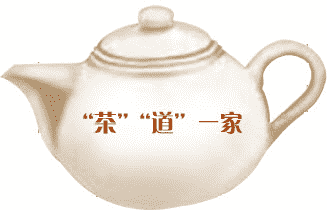

**心无挂碍**

传统文化讲究去“物”去“我”，对物象作自由的心灵观照，才能以澄澈之心体味微妙之旨。

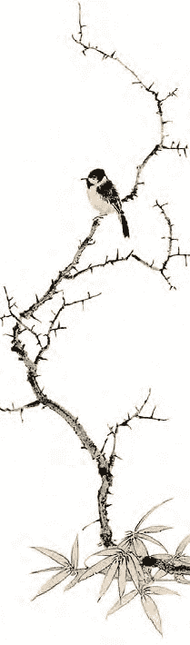

## 冥想各种意象的结果
进入迷宫般的神秘丛林

冥想尽管是一种训练集中思想的修炼过程，但它同时又是在一种想象的历程中，指引自我到达内在的灵性之光。

* * *

#### 重拾走迷宫的灵修方法

迷宫是一种古老的神秘工具，每个迷宫的形状不一，路上通常设置很丰富的“内容”，让你失去方向感，且它只有一条出路。人一旦进迷宫，所选择走过的路径就成为他生命旅程的一种隐喻，迷宫的中心和外缘也构成宇宙、心灵结构的示意图。**迷宫能开发人的灵性，是指它能唤醒我们潜在意识中的“灵光”深藏着我们心灵的奥妙。**

在这个高度靠感官察觉的迷宫世界——思维分析常更容易遇到“迷惑”，一切会让你有置身异地的感受，同时没有他人来影响你的判断，会使我们重新发现灵魂深处的神圣场所，即迷宫中心。**冥想所看到的各种意象实质也是交织成一个精神迷宫原型，** 让人在里面时与自己的“神性”相会，即通过经历心灵所显现的全部意象，来找出自己所拥有的灵性潜能。

#### 透过意象的途径

迈出冥想的第一步是使心灵平静，达到不随杂念起舞的意识层次；同时又要放开束缚，凭天赋和理解力感悟迷宫中设置的意象——它代表着人类潜意识里的幻想。迷宫的入口，你可能会遇到斯芬克斯之类幻象，她是传说中狮身人面妖怪，会指着人间：“早上四条腿、中午两条腿、晚上三条腿的是什么动物？”答案就在人自身。因此，**冥想第一个需要解决的难题就是洞悉自己的本质和处境。**

启发是冥想的第二个阶段，我们在迷宫的每个入口都会遭遇“阴阳二卦”之类幻象，它考察人对不确定性东西或途径的悟感层次，最后就是：正确的辨识通向“生”，错误的辨识走向“死”局。因此，**冥想第二个需要解决的难题就是放弃日常生活中要辨识一切的愿望。** 这是因为走在“迷宫”般的幻象中，想要控制一切事物是错误的思维方式。在这条漫长而曲折的路径上，人的心灵只有经历“舍却”一部分后，才会收获“启发”，到达理想的中心。

### 意像是有特定内涵的事物

##### 唤醒无意识的意象

意象是指在知觉的基础上所形成的呈现于脑际的感性形象。按照这个定义，冥想时所看到的图像也可称之为意象。

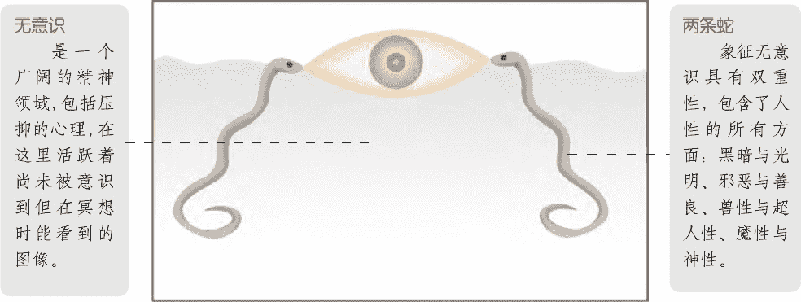

##### 诱发想象力的意象

在迷宫中，只有借由富有创造性的想象力，才能引导我们走进生命的核心，窥探灵魂的奥秘和人生的真相。

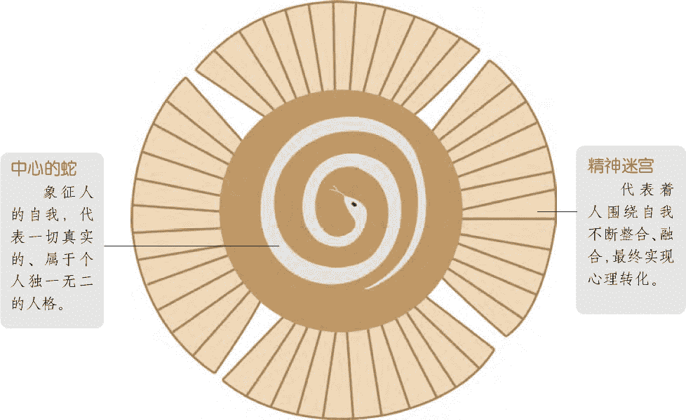

## 冥想所达到的境界
开悟的人生

在冥想的精神旅途之中，并不是没有终端，也并不是不能区别幻想与现实，这种精神修炼的目的恰恰是走出迷误，变成深思熟虑、用开悟的心境看人生的智者。

* * *

#### 什么是开悟

在佛教中，开悟是没有固定语义的，当心灵不再被控制、恨、无知所纠缠时，它就会自然出现：如一个真正懂爱的人，开悟就体现在他和他人的亲密关系中；一个真正智慧的人，开悟就是不再执迷于得失、财富、名利的纯粹平静的心灵；一个真正专心的人，开悟就等同于他集中精神思考深邃的问题之后的解脱感。总之，**开悟就是不受妄念蒙蔽。**

被分裂的意识所左右，沉溺于空想的状态，看不清过去和未来的遥远、尚未实践，都不是真正的开悟。它不能凭“合乎逻辑”的思考到达，而是只要拥有一种信条：真心接受所接触的一切现实。

#### 开悟是冥想的“最后一站”

冥想的最高阶段是觉醒，有时觉醒表现为沉默或空寂的心灵，更多层面上它表现为一种超脱，一种从过去的“自己”中逃离出来的新生的“存在”。原始社会人们由个人捕猎转向在群体关系中彼此扶持、一起狩猎，这种“成长”所体现的觉醒是集体意识性质的。**而开悟是完完全全属于个人的。**

例如，一个女人怀了孩子，她渴望听到“胚胎”想说些什么，就把耳朵贴到肚子上去。尽管什么都听不到，她的幻觉却认为孩子在腹中唱歌，然后想象歌词可能是对她“跌倒”或受伤时的抚慰，因而心灵受到鼓舞，大为欢悦。开悟时的心理就和这个女人一样，先由某种强烈的自我意识或愿景引出幻象，再以积极的念头发现和这一幻象有联系、有价值的“现实”——认为它就是迷宫的中心、是希望之光，此后再面对人生，宁愿选择“亲吻土地”而非“践踏芳草”的态度。

佛教也认为每个人都具备开悟的能力，也就是人人都能在心灵中找到安适。冥想一种亲密的关系，人们会发现世界美丽并优雅、生命短暂而珍贵，这就是开悟的人生。

### 开悟是冥想的最高目标

##### 开悟后的人格特质

冥想开悟的瞬间，灵魂犹如破茧成蝶，此后进入呈现真我、身心合一、自我驱动、树立人格、忘我境界五个层次。开悟就是人的精神追求的最高目标，就是摆脱一切束缚。

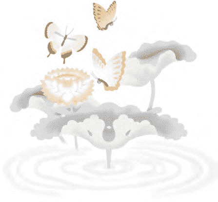

一　平静安稳，清醒澄明

二　绵延不断，用之不竭

三　无欲无求，自在平衡

四　自信坚定，内外一致

五　随机应变，运用自如

##### 冥想度母

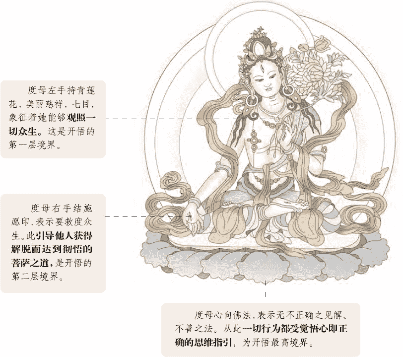

## 冥想中的智慧
纯粹的平静

心智最成熟的状态是平静，当一切来自于物质世界的外在干扰和影响消除之后，人才能真正认识自己精神的本质。在佛教中，觉悟就是达到了纯粹的平静。

* * *

#### 现象界：控制混沌的物质

众所周知，天地万物皆始于混沌，物质本身也是由多种元素构成。然而尽管物质本身是有规律的组织体，它存在的形式却纷繁多样，现象千变万化，这影响到人的日常意识和经验也常是混沌一片。人每天接触各色各样的物质环境，情绪、思想不可能安稳不动，也会像宇宙中有亿万个太阳，时时处处放射出能量，牵动物质本身向着更无序的方向发展。要探索自然的奥妙，理解这个混沌一体的世界，就必须拥有比物质这种趋向无状态的力量更高的控制力，这就对精神有了更高层次的要求。

**冥想是强调心灵和脑中构想的神（即某种虚象）冥合，想象此刻肉眼观察不到的事物，以及对更高级的意识的追求，通过控制注意力，摆脱面对物质界时的混沌状态。** 这就需要人凭借直觉、感觉、天赋和专注一心的能力，在冥想中找到纯粹的自我意识——没有分心、没有杂念，消除陷在环境中的习惯性思维的影响，重新发现物质作为一个统一整体的本质。

#### 精神界：变得单纯而空灵

精神借着自己的意志摆脱了现象界的混沌的控制，就会自然走向平静。在这里**冥想的效用体现在：注意力能不受环境的干扰，集中在一处或一个物体上不动，** 例如集中于坛前供奉的佛像、有节奏性发出的咒语或幽明不定的烛火等等；观想某个有特定涵义的图案，摆脱杂乱而纷扰的思绪，忘记时间不断流逝、万象总是变化的恐惧，使自己带着一种单纯的观念，注意身边的事物。

这时，人们无暇顾及物质的行动和生命是不是按计划进行，而是明了平静不是一种抽象的感觉，是人运用感知能力不再被过去羁绊或为未来焦虑，并使自己有更高的心智尽情享受和欣赏生命。真实的生命就是平静地活在当下，**冥想到自己是“存在”的个体，而非“实行”的个体。**

### 冥想物质的三个阶段

##### 第一，感受物质世界的多样性

由生命和非生命的物质组成完整的生态系统，种类繁多，相互关系。

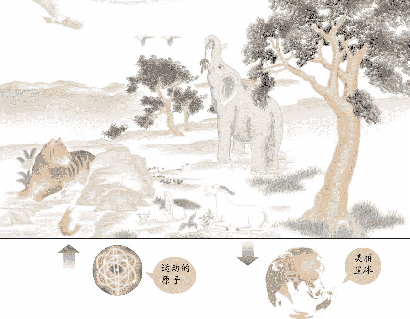

##### 第二，获得对物质世界的知识

##### 第三，改变自身的物质状态

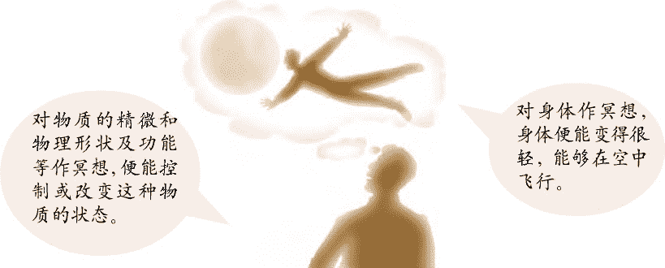

## 冥想的最终目的
身、心、灵合一

无论是古老宗教哲学还是发展至今的科学，都把人看成是“身心灵”统合体，注重这三个层面的统一与和谐，就能寻求到整体的健康。

* * *

#### 身：无以言喻的放松体验

冥想练习虽然不只是放松那么简单，却从始至终都离不开放松，并且追求一种完全放松的状态，身体倘若没有达到这种彻底放松，甚至冥想都无法顺利进行。保持身体放松，才不会让意识受到来到身体紧张部位的最直接、最难忍受的干扰。且**一旦通过冥想完全消解了不必要的紧张和压力，身体会处于空前的放松状态。** 这时，意识不需要费多大力气，就能领悟到真理，因为灵感往往选择躲避日常烦扰杂乱的时段，而在“真实”的放松下泉涌不断。

#### 心：获得远离干扰的理想生活形态

传统上为实现远离干扰的“理想生活或社会”，会有两个途径：一个是像佛陀献身传道一样的僧侣，去往“不食人间烟火之地”修道，他们有的是个人静修，有的是创办有组织的静修团体，宗旨只有一个：解脱。另外一个则是在并非清净之地保持自身的独立和超脱，从内心中与世俗的喧嚣或是非隔离，由此实现生活之理想。

冥想者可以选择任何一种方式来提升自己的精神理想，**只要能运用适当的冥想技巧摆脱各种纷扰，使自己进入专注的境地，才能最后享受平静、快乐、满足和自信的生活，** 达到如同修道者证悟自心之后的完满精神层次，内心变得积极、零压力。

#### 灵：觉醒的思想境界

**冥想也是一种灵修的方法。** 在西方神秘学辞典中，灵修指向一种“超越性体验”，或“超感应”的东西，如对着圣经默想就会感到自己仿佛接触到心中的“上帝”。这种神秘性体验摒除神学意义外，其内在含义还可以是追求心灵上的解脱、观念上的超越、人本性的回归等超越性质的领悟，诸种修炼或体验的最高目的都是要使精神上升到觉醒的思想境界，即个体意识与宇宙意识结合，满足身、心、灵统一的需要。

### 身心灵统一的多方面阐释

##### 取经僧

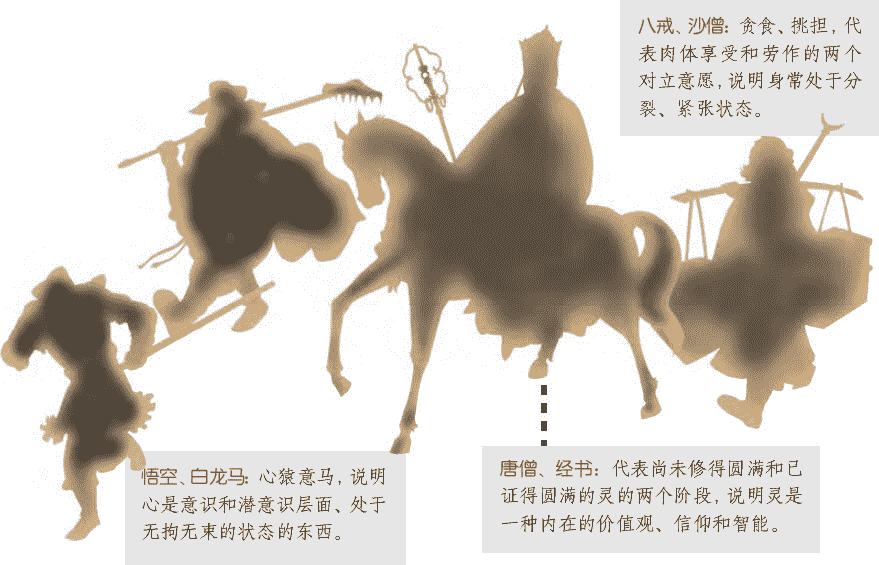

##### 伊甸园

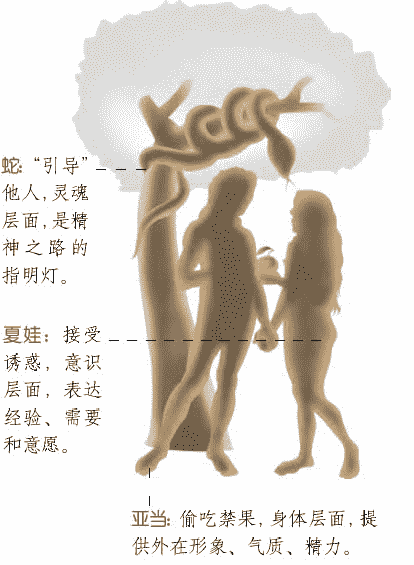

##### 坐禅

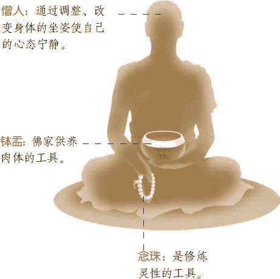

### 冥想的种类

##### 语音冥想

利用无意义的声音把人的心灵引离各种世俗欲念。

##### 注目凝视冥想

观察某一物体后，把印象刻在眉心，或把心神集中在观察的对象上。

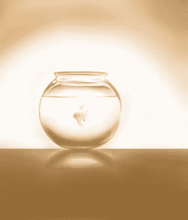

**注视近景**

盯着眼前玻璃缸中的金鱼冥想，景象反而更加模糊。

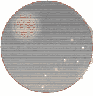

**凝望远景**

一直遥望窗外的圆月，景象反而渐清晰。

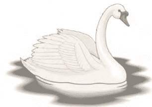

**凝视湖面的天鹅进行冥想**

可能它会变成美丽的公主，正跳着芭蕾“天鹅舞”。

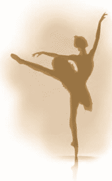

##### 意象冥想

借由意象可以更深沉地观察及治疗灵魂，如“天鹅公主”的意象满足我们对美、自由和爱的追求。

##### 不同形式冥想的起源

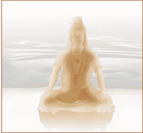

**坐式冥想**

源于印度苦修士在恒河边打坐的方法。

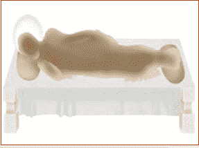

**卧式冥想**

源于佛陀涅槃时的姿态。

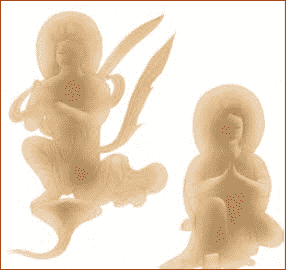

**蹲立式冥想**

源于证得圆满的菩萨造型。

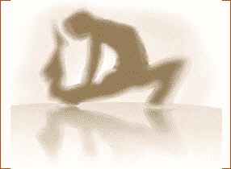

**运动式冥想**

源于瑜伽这种古老强身术。

“AUM”和六字大明咒被作为冥想的工具已经诵念了几千年。

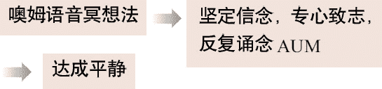

##### 沉思冥想

静心感知生命每一瞬间的变化和大千世界的真理，使自己沉浸在抛开万物的真空状态，不再受到外界的干扰，获得清晰的思维以及和平安静的内在世界。

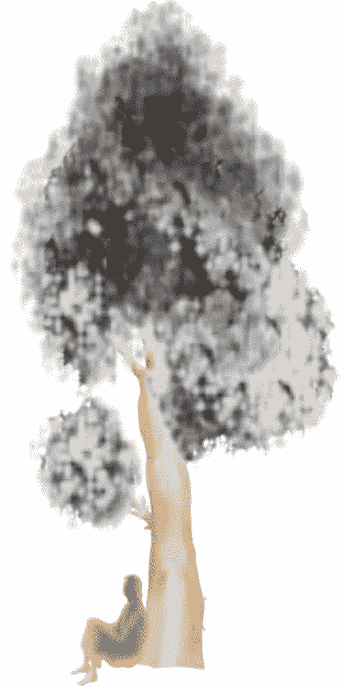

##### 呼吸冥想

人们可以选择在绿树茂林中进行有氧呼吸冥想，专注于自身的呼吸和意识，直至达到物我两忘、与自然合而为一的境界。

# 第二章
现代科学诠释下的冥想
在直觉中触摸真理

冥想是以一颗澄澈的心唤起生命的感觉，面对所有生物、地球、宇宙表达自己最原始的爱和最鲜活的冲动，然后调动心智到最成熟、最平静的状态，推动生命之轮碾碎“死亡了的时间（过去之路）”，再运用强大的想象力让未来的图像自然浮现出来。它是意念和意境的结合，却并非是超常通灵的感应能力，和运用意念隔墙取物、改变自然现象的“神通力”不可同日而语。

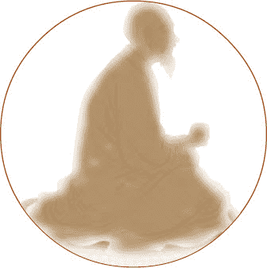

### 本章图版目录

冥想是一种精神放松练习

冥想是经直觉进入无为之境地

静修

冥想的精神训练法

冥想的意象训练法

冥想打开右脑思维

通过潜意识激发生命潜能

色彩与冥想

声音和冥想

冥想疗法

冥想和催眠之异同

第六感作用范围

冥想、第六感和潜意识

心理学对冥想开悟的研究

## 真实的冥想（一）
剥开超灵的面纱

超灵的本义是指被称为上帝的那类宇宙间的最高神，在这里它只是为了把宗教上的与“神”接触的那种神秘体验和冥想产生的神秘体验区分开来。

* * *

#### 沉浸在一种与宇宙意识结合的体验中

既然冥想的传统形式来自瑜伽修炼或禅的修炼，它必定和按照一定仪式和修炼“秘诀”体验到的异常意识状态相连。这些修炼包括控制和调节呼吸，排除外界刺激，保持极度放松的身体姿态，心中念想着一种事物或某一符号的心像，结果就会产生一种如同禅定般的神秘体验：感到自己与外部世界脱离，融于一个更广阔的天地之中，体验到与宇宙同一的“觉（觉悟）、观（洞观）、喜乐、空定”的感觉。

每个人心中尽管或多或少、或深或浅都会有那种超灵的体验——与宇宙间最高的“灵”（真理和真我）接触，且在冥想时要比平时感知宇宙的运行方式和秩序更生动、清晰，以至于难以用言语来描述最后的“觉悟之境”。但这种体验的真相只是人在最深沉的静坐或静思等中，唤醒了内在沉睡的能量（今天科学界称之为“潜能”），因此个体意识和心智得到相当大地提升，人被自己意识到的“生命的真相”启蒙了。

#### 诱导放松和激发自然生命冲动的益处

**冥想就是一种放松训练法，即按照一定的练习过程控制或调节自身注意力及心理活动，调整因紧张刺激而紊乱的生理功能，从而缓解精神焦虑、减少压抑的方法。** 关于冥想的研究表明，冥想者由于都有长时间调息的训练，他们的呼吸会变得更深、更缓慢，也更容易集中精力解决眼前的问题，且记忆力、理解力、感知力都会明显超过没有进行过冥想的人，这充分显示冥想之后机体深层放松和唤醒自我意识的好处。实验也证明，冥想的生理状态与通过其他放松机制如催眠、生物反馈及深度肌肉放松等所引起的生理状态是一样的。

静思冥想常常被作为一种发现个人神秘感、激发自我潜在的创造力与想象力的手段，也就是在那种神秘体验中，人们反而能看到自己的生命本能冲动——趋向自然或真理。

### 冥想是一种精神放松练习

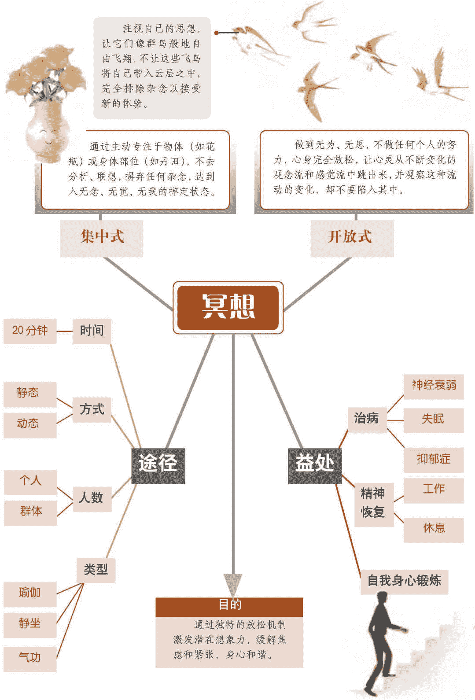

## 真实的冥想（二）
达到自由无为之道的手段

无为进入到冥想中，就是人必须让心灵追随自己的本质，而不是追随世俗欲望——充满欲念的人无法冥想并真实地了解到自己的情绪。

* * *

#### 无为就是不要尝试去控制一切

苏格拉底说：“为了使我们的心灵充满光明而不是黑暗，整个灵魂必须从变化万端的世界超脱，直到灵魂的眼睛看见真实和我们称为善的至高的光辉。”这就是冥想所追求的最高自由，即活在灵魂的超脱、真实和善意里。一个愤怒和仇恨的人不懂得冥想，因为他们被禁锢在自己的狭隘情绪中，永远不会让生命自己展露它的真实面目，自己也得不到真正的自由和解脱。

无为不是指不要去控制，如放纵自己的身体或信念，而是指不要尝试去控制一切，否则违背自然世界，就会时刻对一些无法控制的事烦心，这种焦虑的状态严重妨碍了人在冥想中直觉到真相。

#### 生命真相是通过有为达成无为

有两个坚信自己的人为争论“什么是正确的人生修行方式”发生冲突，就去询问智者。第一个选择有为之路，他说：“难道我们不是应该抛弃懒散、无作为的态度，尽全力真诚而专注地追求理想吗？”智者说：“你说得对。”第二个选择无为之路，他说：“努力不过是出于自我的贪妄之心，难道真正的智能不是无为而治，依循自然吗？”智者说：“你说得对。”第三个人听了问：“可是他们不可能两个都对啊？”智者说：“你说得对。”

生命的真谛不寓于有为和无为，而是无论哪种修行途径，都没有必要从外在寻找判断和证明，真正的认知是一切来自别处的干扰和影响都消除之后，能在冥想的内心中平静地感受“真我”：你是谁和你的生命目的。用现代哲学的角度阐释无为，就是平静地接受你只是一个“存在”。

一切冥想的形式都包含了有为和无为，且两者存在辩证关系：通过有意识、专注的进行冥想培养觉醒、慈爱、慈悲，是一种“有为”；**冥想却是要达到寂定无为，甚至忘却时间的流逝和忽视身体的存在，完全沉浸在自由的状态中。**

### 冥想是经直觉进入无为之境地

##### 运用直觉的能力

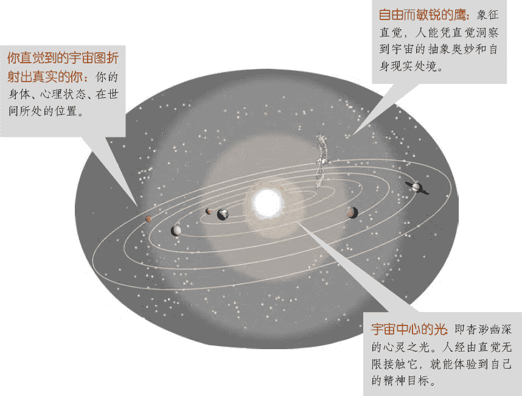

##### 重释生命的有为和无为

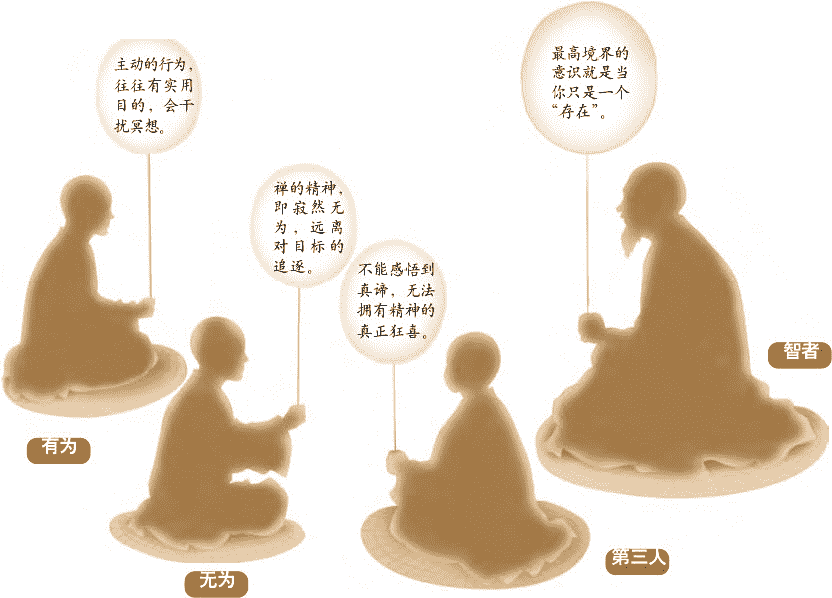

## 冥想的本质（一）
一种静修方法

西方哲人说：“我们都是自己内心的囚徒。认识到这一点是走向自由的第一步。”足见人的心灵并非总在最佳状态，需要静修达到和谐状态。

* * *

#### 什么是静修

静修是冥想的同义词，又译为打坐、静坐、沉思、心悟等。它是一种为了内在的安宁和超越所做的操练，反映身心两方面（身体的或外部的行为和内在精神）的目的与变化。打坐和静坐都突出了一个“静”字，主要是身体行为上的静态，但静修还有其他方式，如散步、舞蹈。沉思和心悟强调精神目的与变化的方面，追求内在的安宁和超越。一些静修常只突出状态和过程，不包含实质的具体内容，甚至以“空（被认为是无所不包的丰富的生命境界）”为目的或最高境界。但不管什么形式的静修或冥想都强调身心整体的变化，因为静本身反映了追求身心内在的宁静，修是指修养身心的过程。

#### 关于静修的传统

大多数宗教都注重内观自身，探究心灵的奥秘，与生命的本源建立联系，不是只顾世俗功利的活动，而疏远了自己的本性。根据考古文献，大约在印度吠陀时代（约公元前 4000 年），古埃及人的坐像中就有人直背静坐，是现今发现的较古老的静修行为。可见几乎所有的宗教传统都包括静修，但现代的静修通常不与特定的信仰系统相联系，如都市流行的瑜伽冥想只是为了养身修心之目的。

#### 静修的实质含义

西方学者沃希曾认为，**静修就是培养注意力之类的操练，它借助更主动地控制心理过程，培养一些特殊心理品质，如明了、领悟、专注、镇定和关爱，其目的是追求最佳的意识和心理健康状态。** 冯塔纳的说法可能更接近现代人的理解：所谓静修就是摒弃日常心理聒噪的干扰，去体验无边无际的心灵本质。

#### 静修的必要性

东西方都将冥想定义为“意识清醒的梦”，也就是人在通常的意识状态下往往是糊涂的，而在异常的状态下（如某个远离喧嚣之境地）反而是清醒的。静修能让我们感受到心灵本身，而不被欲望和思绪的浮云所遮蔽。

### 静修

##### 超觉静坐

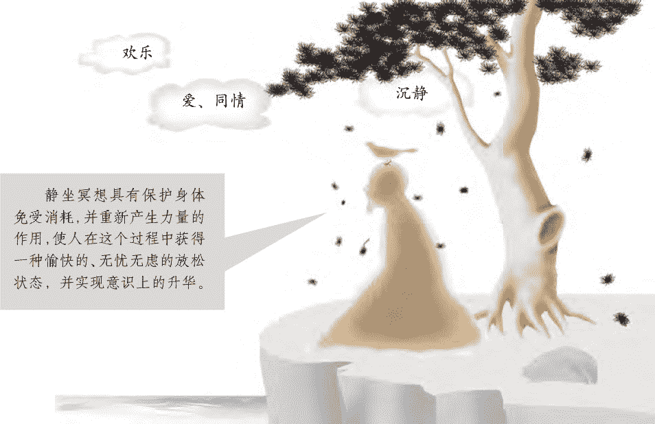

##### 两种静修的方式和目的

#### 禅修

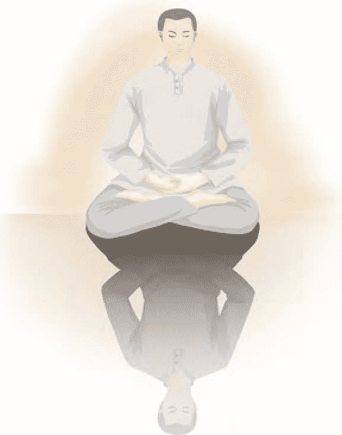

**获得精神超脱的静修**

通过心灵的完全沉静、物我合一而使精神从有形世界中解放出来，达到最高的宇宙意识。例如禅修，强调专注、泯灭“自我”的精神，追求无我的精神状态。

#### 瑜伽

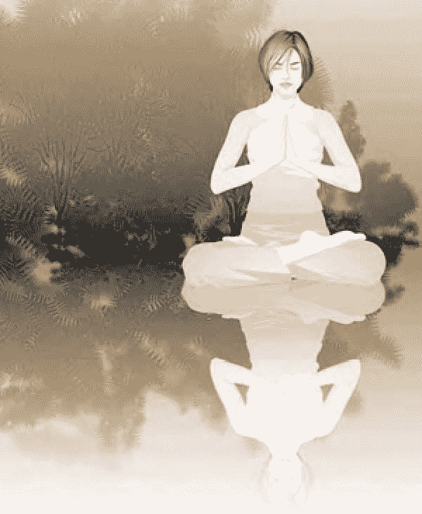

**求得身心安定的静修**

通过调整呼吸和身体姿势以达到调整意识的自我控制方法。例如瑜伽，有助于将人的身心从现代社会的紧张状态中解脱出来，以恢复有机体内在的平衡。

## 冥想的本质（二）
一种精神训练

尽管冥想的方式很多，但沃希等人认为，有 6 种要素构成了它精神训练的核心，即道德的训练、专注的形成、情绪的转化、动机的转向、意识的精炼和智能的培养。

* * *

#### 冥想的心理要素

**（1）道德的训练　向内心观照（内观）是冥想最重要的实践，** 虽然它会使不道德行为得以滋生和强化的破坏性心理（如贪婪和怒火）显露出来，而导致痛苦，但随着超越性、超个人意识慢慢觉醒，对全人类和所有生命的认同，导致道德行为自发出现，人心的贪婪和怒火被消解，代之以仁慈和宁静的美德。

**（2）专注的形成** 　冥想是训练注意力和培养专注的能力以克服浮躁心境的有效途径。据传统西方心理学的观点，注意不能持续不变，冥想行为却相反证明人的心灵一旦走向成熟，就能控制情绪和注意。

**（3）情绪的转化** 　通过冥想所达到的情绪转换包括：一是不适当的破坏性情绪减少，通常是不去压抑而是清楚地觉察并放弃它；二是培养积极的情绪情感，如爱、喜悦和同情；三是培养沉着的品质，它使人即使在遭遇强迫时也无条件保持爱与同情。传统西方心理学治疗只能减少消极的情绪，对后两者却束手无策。

**（4）动机的转向** 　在冥想的净化实践中，动机将朝着更健康更具有超越性的方向转化，即向最高的需要层次攀升，这表现在：沉溺和厌恶的强制性力量减少、动机不再分散而是更加集中、渴望得到的东西更加内在、看重给予多过得到、欲望也由自我中心过渡到自我超越，尤其强迫性渴望的减少也相应地导致内心冲突和痛苦的减少。

**（5）意识的精炼** 　冥想就是一种超越的艺术，它能“精炼”知觉和意识，使人对于经验中每一瞬间的新变化，更灵敏、精确、有鉴赏力。未经训练的知觉和意识通常是迟钝、不完整、被欲望扭曲的，冥想让内在和外在知觉都会变得更灵敏，色彩变得更明亮，内在世界变得更丰富。

**（6）智能的培养　冥想中的智能源自对心灵、自我、意识和宇宙的直觉领悟** ，它超越语言、概念、思考甚至表象，使自我得以更新并获得自由，从而实现冥想的目的。

### 冥想的精神训练法

##### 古瑜伽冥想的道德戒律

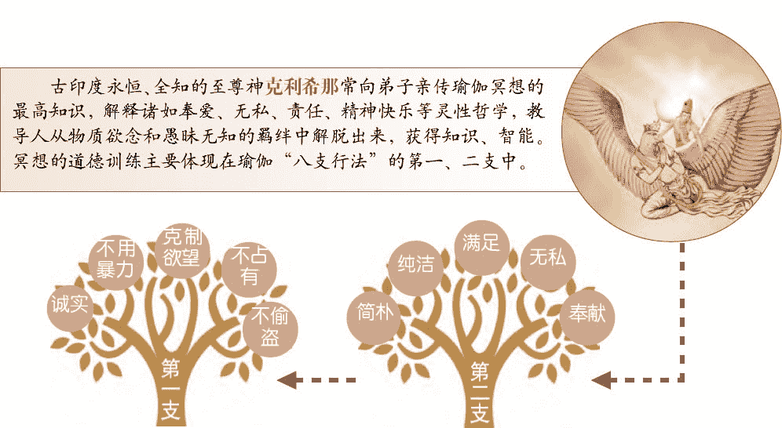

##### 人体的精神能量中心

中西方都把冥想作为提高身体能量的精神训练法，并且认为控制呼吸和体位的冥想操练能控制身体的能量流向——其能量中心称为轮，最终实现精神圆满。

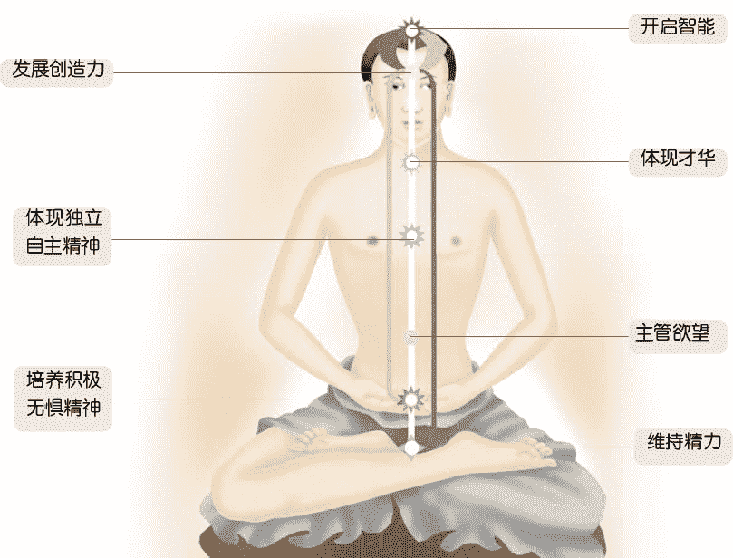

## 冥想的本质（三）
一种意境艺术

冥想是比白日梦更高级的精神活动，它是内心意念和意境的结合，因而从严格意义上讲它更是一种感觉、精神范畴的理念。

* * *

#### 心灵具有重构意象的能力

**冥想一种感受，是再度对生命“悟”的过程，它往往通过构造意象的途径。** 意象有两种，一种是外在意象，指看得见的事物和现象；一种是内在意象，指脑海里所显出的影像。以攀岩为例，外在意象是看见有个人正在爬这条路径，内在意象是想象要爬的岩点和如何去克服。进行意象构想时，有人习惯于从外部观察自己，也有人习惯于自我体验，从内部来体察自己，冥想就是后者。

人们要达到一种超越自我的精神境界，不仅仅是静静地坐着，将身体安顿于一种平稳、宁静、舒适的姿势之中。要让自己进入到一种全新的境界中，就必须把暴露在各种刺激中的感官解脱出来，使其脱离所处的环境，避免情绪和感觉的影响，将注意力转向体内。这时就需要经由意象去体验新的感受，通过把意识集中到重新构造的内在意象上，以摆脱现代诱惑回归自然生命的路径。这种运用意象而不是思考来改变意识，把自我从身心障碍中解放出来的能力，就是意境的艺术。

#### 冥想意境的要领

**意境是冥想者在客观世界中瞬间或长期体验到的心境和感受所呈现出来的主观境象。** 冥想是要达到“忘我之境”的一种心灵自律行为，为了领悟平和、愉快、安详的美好境界，就要在冥想中保持镇定状态，不为外界的刺激而动摇，持续进行着心灵深处的冥动，主要是靠开启让身体和心灵共同放松的意境。“闭着眼睛进行深思”就是冥想的方式的一种，是指以类似禅定的状态进入观心智的意境和无限广阔的宁静世界中，只有当沉浸在意境中的心灵完全失去主观与客观的对立感，进入浑然忘我的真空状态，才能达到宗教意义上讲的解脱。

冥想不同的意境也会对心灵产生不同的效果：如冥想生命中美好的东西，能进入甜美的意境，心灵会更加愉悦和明亮；冥想具有宏大宇宙意识的内容，能进入深远的意境，心灵会变得纯粹和超脱。

### 冥想的意象训练法

在头脑中构造意象的能力是进入冥想的意境中的基础。训练意象的路线须从最简单、最熟悉的情况开始，然后再逐步提高意中之象的难度。冥想者通过想象意象，最后能沉浸在抛开万物的真空状态，找到心灵的平衡。

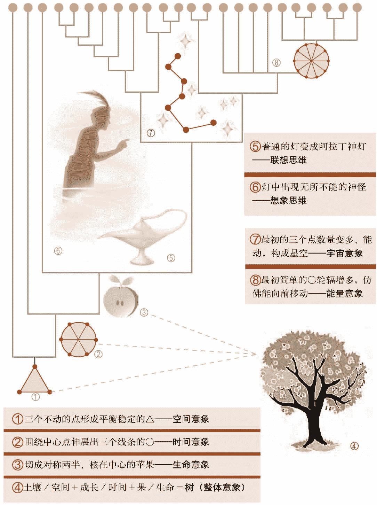

## 冥想开发大脑潜能
诞生富有创造性的灵感

当人进入冥想状态，支配知性与理性思考的大脑皮质作用会受到抑制，而支配本能且无法用意志去控制的自律神经就会变得活性化。

* * *

#### 改变大脑的状态

传统上认为，冥想是进入禅定的状态，此时人的体脑完全放松，心跳变缓，呼吸呈龟息状态；人一旦达到最高的静定层次，大脑甚至意识不到自己的呼吸、自我精神和心性的存在。从现在来看，让大脑处于休息、不作为之中，是对于脑功能的浪费，但实质人却比平时更能看清周围的世界、做出深思熟虑的判断及更多依靠内在的力量和智能。且由于人的心脑运作减慢，生命新旧更替程度也随之变缓，身体的能量消耗降到极低水平。因此古人常通过冥想来达成深度思考、储蓄生命、延缓衰老之目的。

#### 倾听右脑的声音

现代科学表明，人的左、右脑分工不同：左脑主要完成语言、逻辑、分析的思考认识和行为；右脑则主要负责直观、综合、形象的思考认识和行为。左脑更侧重知性和理性方面的思考力、判断力，右脑更偏向感性和直觉方面的想象力、创造力。许多科学家在长期的逻辑推理之后，偶然从灵感中获得解决问题的方法或答案，正是开放了右脑思维之花的结果。

由于右脑较之左脑更是天赋、创新能力产生的土壤，现代人常借用聆听空灵的、自然的、古典的音乐冥想，使长期从事理性思维的左脑安宁下来，让更多进行构造图像、感悟体验、艺术思维的右脑变得活跃，此时不仅收获充满意境、令人心旷神怡的感觉和体验，也会促使左脑与之协调，人对于事物的判断和理解都会上升到一个空前的高度，用新的说法就是思考进入了左脑触摸不到的思维的“另一次元”。

#### 脑内的奇特物质

当人处于紧张、大笑、疼痛等情绪和较放松的情况时，大脑就会分泌一种叫做“脑内啡”的神经传导素，它被称为“人体内的吗啡”，会让人产生舒适、安定、愉悦感。人打坐、冥想时，大脑内的脑内啡浓度也会增加，因此选择这种方式能放松身心，消除压力，使体脑保持镇定和平静，比吃止痛药与注射麻醉剂更有利于身体健康。

### 冥想打开右脑思维

##### 四种脑波及功率图

科学家发现，人脑在工作、休息及睡眠时，脑电波的波长和频率都是不同的。其中α波为人们学习与思考的最佳脑波状态，也就是冥想时的脑波模式。

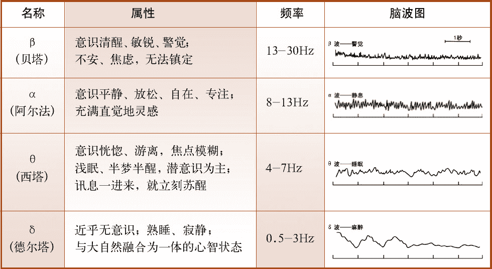

##### 大脑的左右脑功能

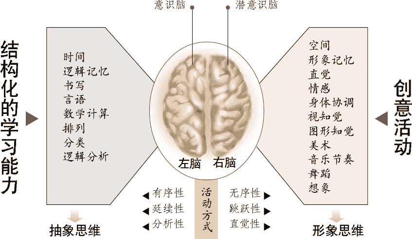

**冥想锻炼右脑思维**

右脑负责图像记忆、情境构想、做白日梦等，开发其功能可提升想象力、创造力、记忆力及艺术能力等。冥想就是暂时停止左脑思维，运用右脑思维，能使人的学习和行动更富创意。

## 运用潜意识和无意识的力量
开启冥想的“暗箱”

潜意识和人的显意识相对，当前虽没被察觉和发现，却保持在记忆中，可通过一定方式提取出；无意识则相对于意识到的内容而言，是个无边无际的精神领域。

* * *

#### 潜意识：储藏能量和管理情绪的领域

潜意识作为脑中一个极重要的“容器”，是制造、储存、分配及传送生命能量的地方，也是情绪的领域。当它完全自主工作时，会不加选择和评判地接收来自各方的信息及指令，不像意识一样受到先前经验的干扰，以致“过滤”或“扭曲”很多外来信息。潜意识是冥想中起极大作用的“幕后黑手”，源于它有如下特征：

**（1）潜意识是存储能量的地方** 。当人们焦点专注于某个目标，能量就会被输入到这里，成果也就在此出现。冥想利用它的这个功用激发处于睡眠中的内在能量。

**（2）潜意识的沟通方式是图像和符号** 。它运用图像和符号使内在和外在世界沟通，而不是抽象的语言文字（显意识）。人在梦中或观想时，多“幻视”到图像而并不是语言。

**（3）把每件事物都看成与自己有关** 。潜意识是与整体相联系的，不像意识将自我和他人、主观和客观二分，因此我们会更自然地感到与一些事关联。冥想需要潜意识的这种敏感。

#### 无意识：朝向过去和未来的“两张面孔”

人的无意识中包含了远古以来祖先遗传、积累的沉淀物，及未来的有意识精神内容，既朝向原始的本能世界，又朝向人未来的命运，同时有祖先遗传的保守“基因”和拓宽“阵地”的创新因素，故如同拥有两张面孔。它作为一种自发性精神系统，其重要作用是纠正有意识心灵中的偏见，以一种更普遍、富想象、非理性的直观补充意识的片面性。这种直观以符号语言进行表述，在冥想中它的作用体现在：（1）使意识恢复平衡，并显示出某种更广泛的意义；（2）其动机比有意识的思维更明智、客观；（3）如同一位宝贵的向导，能为人指出通向真正目标的道路——这个目标才是自我的真正归宿。因此无意识又是冥想要开启的宝箱。

### 通过潜意识激发生命潜能

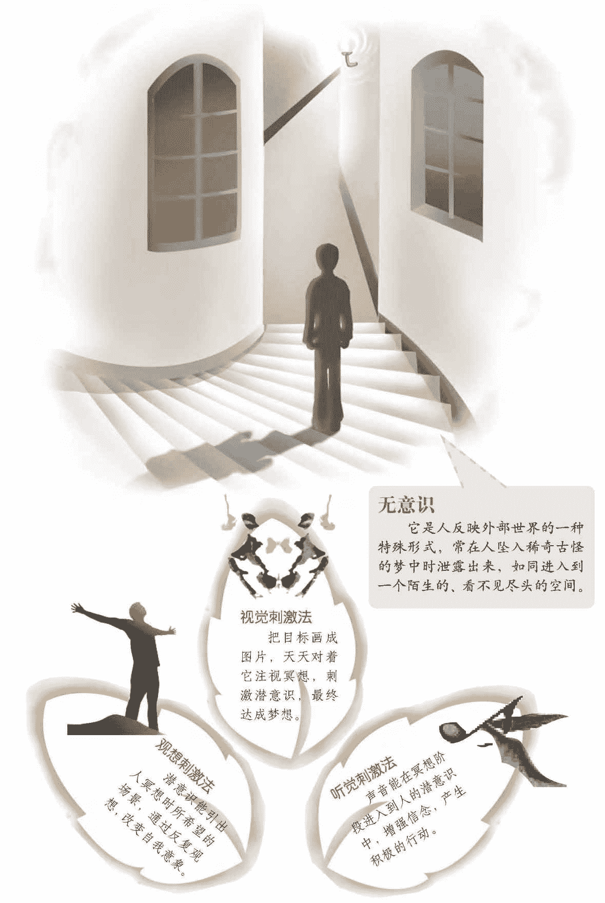

## 冥想加强图像记忆
视觉图像的刺激

对绝大多数人而言，视觉冥想（想象图像、图片）比听觉冥想（冥想时伴随着音乐）要生动、直接，且印象深刻很多。

* * *

#### 图像文化是集体无意识的凝结

图像不是自发形成的，它经由个性化意识、集体性意识甚至无意识诞生，通常带有人类情感、情结、心理原型的普遍共性。由于它是人类世界最能给人的记忆留下强烈“印象”的产品，因此在数千年的人类社会发展历程中，图像文化记录和反映着每个阶段的物质文化及精神文化内涵：从原始历史记录到现在的视觉盛宴，它包含了人类各个时期的“精神意象”，以图像符号的形式反映着我们广阔的精神、意识领域（集体无意识）——这里藏着人类最真实最深刻的原欲或原动力。毫无疑问，借助图像的冥想法更清晰、更直观，也更持久。

#### 潜意识易受图像刺激

由于潜意识缺乏辨识能力，生动的画面景象，不论真实的还是假想的，都会给它带来深刻印象。冥想的视觉刺激法就是通过特殊的画面、图像来影响我们的潜意识。如果你不进行冥想时，一种很美丽的植物、一幅内容丰富的绘画作品、一尊充满感染力的神像等都不会让你注目。人的头脑要注意到观察对象的细节，必须先让“它”（图像）在脑海中有“历历在目”之感，否则就会成为过眼云烟。这种“历历在目”的感觉持续越长，潜意识对图像的记忆就更强，冥想实质就是接受图像反复对自己的刺激，并超越头脑不断猎奇以致分散注意力的“缺点”，使它进入到潜意识中影响和改变人的想法，或者用于提高人的注意力和记忆力等。

#### 观想有象征意义的图像

在冥想中，最常见的就是观想有象征意义、象征形式的图片或图像符号，因为图片等很容易对人产生吸引力，辅助冥想的图像又可分为可视和非可视的两种，这导致视觉冥想的形式非常丰富且自由方便。人们可以用身体之眼观看物象，也可用心灵之眼幻视不存在的画面，两种图像都能刺激人的右脑思维，使人的灵感、创意如接踵而来的“不速之客”，不绝于脑。

### 色彩与冥想

现代医学认为，从人对色彩的感觉中能得知其心理活动和健康状况，因此把色彩治疗加入冥想打坐中，据称可治愈心理性失衡疾病。冥想时经由重复某些色彩及其排列组合的视觉刺激，能加深印象，补充、平衡体内能量或缓解压抑性情绪。

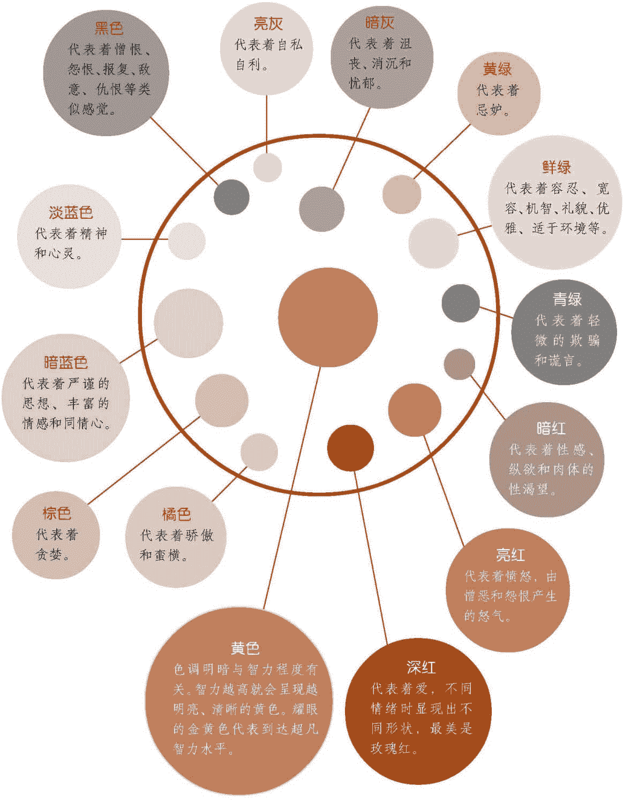

## 冥想时反复吟诵
特殊声波的功能

无论东西方都存在念咒、祈祷的仪式，如唱念、持咒、背诵经文等，它们从作为神秘的修持方式，到进入日常普通生活起心理抚慰的作用，都使声音的奥妙更为关注。

* * *

#### 念诵一种特别音符的益处

念诵咒语的冥想方式源于印度瑜伽密教，它主要是利用一种特别的音符，震动身体内部的气脉（在印度人的世界里它们是储藏和运转宇宙能量的管道），能启动生命的潜能，超越现象界而进入神妙的领域，可以开发人体各种功能和高度智能。

礼佛唱赞中也会把念诵作为日诵功课，随着感情至切的拉长声音，礼佛者的心诚意识及恭敬之情会升华到极点，随之身体也跟着起相应的变化。

静坐时持诵咒语（称曼特拉），既能使人从其他世俗欲念等中摆脱出来，又因为它是一种有强烈震撼力、韵律感的声音，不仅悦耳动听，并且能震动人体内微妙的腺体，唤醒人们潜伏的能量，达到自我了悟的完美境界。

在现代瑜伽冥想中，也常伴随着念咒的方式，利用咒语的声音刺激潜意识或进行催眠，能感到自己带有呼唤的发声与宇宙有规律性的声音律动相呼应，使人获得最诚挚的心态，去除身心方面的消极情绪。

#### 念诵咒语的正确方法

在印度瑜伽行派中，有四种念诵（即持咒）的方法，一般包括开口念诵、莲花念诵、金刚念诵、瑜伽念诵，代表了四个层次，各有其独立功用，冥想时能借用这四种方式发挥特殊声波的功能。以下介绍其中几种念诵方式：

**（1）开口念诵：** 一口气一口气地念，眼宜睁开，与外界自然之光融成一片光明，身心俱忘。尽量舌头在拌动，唇齿不动。念时要回转来听自己的声音，而不是听别人的。

**（2）金刚念诵：** 心气慢慢自然向内合一，嘴巴自然不动，唇齿微动或不动，而只由舌根弹动。唇齿不动，而以舌根弹动。心气合一，心平如静，念得很慢，但不能太慢。

**（3）瑜伽念诵：** 即心念，默念。耳根回转来，眼根回转来，身心念头与观想合为一。

### 声音和冥想

宇宙间物体发出无数声波影响着我们身体，而在人体内部结构中，瑜伽士发现沿着脊椎向上共有五十个非常精细的腺体在活动并产生不同情绪，凭借冥想时意识向内所产生的力量，就能听到那些极微妙的声波——这具特殊震波的咒语能使脑波变得更精微而有规律。

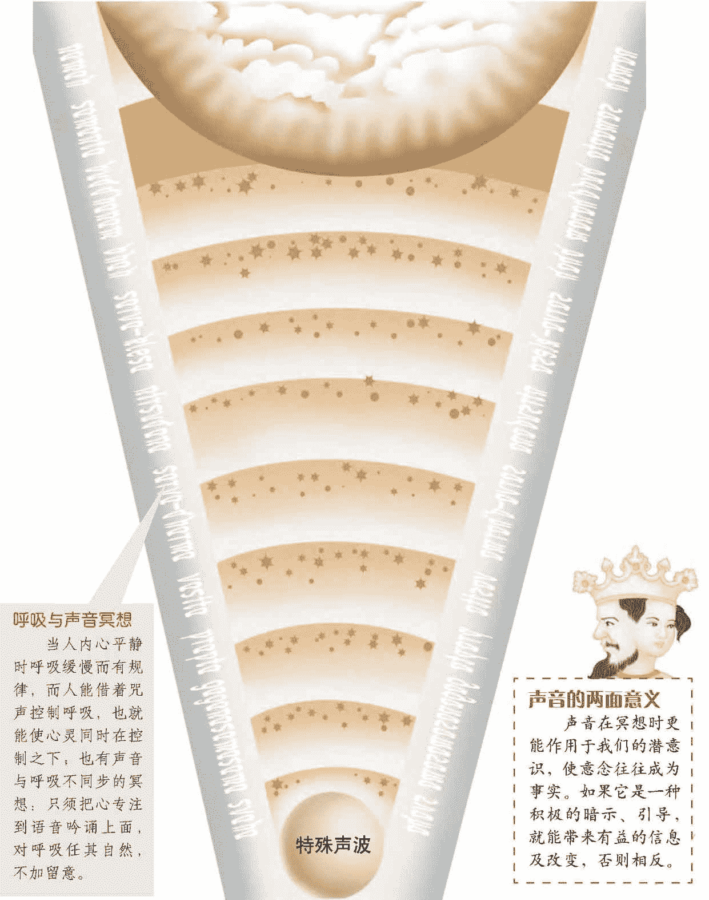

## 对人体意想不到的积极效果
冥想治病的精神因素

冥想能帮人走出精神上的困境或医治疾病，并提升自我、升华思想，解决多种身心和社会性的失调，归功于它所产生的放松、平静、控制这三种利于精神疗治的因素。

* * *

#### “放松”

**冥想是让身体处于高度放松状态，并持续保持镇静、专注及顿悟的一种方式。** 尽管它在不同的文化传统中有不同的理解和修炼行为，但总体而言，东、西方都把冥想作为用于精神治疗的有效手段，这其中共同的心理因素不在于专注的程度或顿悟的修为，而是冥想能通过使身心放松来疏导情绪、缓解焦虑。

科学证明，当α波为优势脑波时，人的意识清醒，但身体却是放松的，它打开意识与潜意识的信道。冥想中的人呼吸是在意识引导下缓缓吸气，慢慢呼出，从胸式呼吸（浅呼吸）过渡到用鼻子呼吸（深呼吸），以便摄取更多的“气”（生命之源），此时α脑波最容易出现，以及使脑内啡分泌更多，因而能达到深层的放松效果。

#### “平静”

不同于睡眠或催眠对人体的影响，冥想使人的脑波模式反映出如下心理状态：高度清醒，深度放松；同时在新陈代谢方面的表现也令人惊讶：心跳和呼吸速率大大降低，血液中的乳酸盐（这种化学物质会造成焦虑、紧张和疲劳感）含量锐减 50％，再加上会出现跳动较慢的脑波，都会使人进入深层次的精神静止状态，身心自然感到平静、和谐。古人认为如果人能守住“静”，就会与道同在，增加内在智能。**平静就是帮助人和内在的自我进行真正的沟通，感到爱、同情心与宽容的意识，而不是虚空、漂浮和分离的经验。**

#### “控制”

科学研究表明，僧人长期打坐可以训练大脑的控制能力，他们比普通人能更持久地专注眼前的某一个画面，这种发现使冥想对大脑注意力的影响备受关注。据称，这些僧人经过很多年的打坐冥想训练，已经能控制基本精神反应，不受外界各种信息咨讯的干扰，因此有较强能力保持注意力集中，**冥想训练的过程就是培养人的专心、引导注意力、调控意识的操练过程。** 做到心无旁骛、意念集中，就能控制自己的精神、知觉、感观。

### 冥想疗法

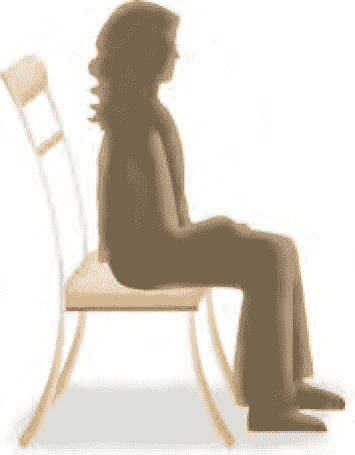

**静坐沉思冥想疗法**

舒适地坐在一张椅子上，头部或靠或斜，顺其自然，闭目静思。沉想对象最好是以往的愉快事情，或大自然的美好风光、曾去过的旅游名胜、在图片上见过的名山大川等。这是很好的静养保健方法，能提高身体抵抗疾病的免疫力。

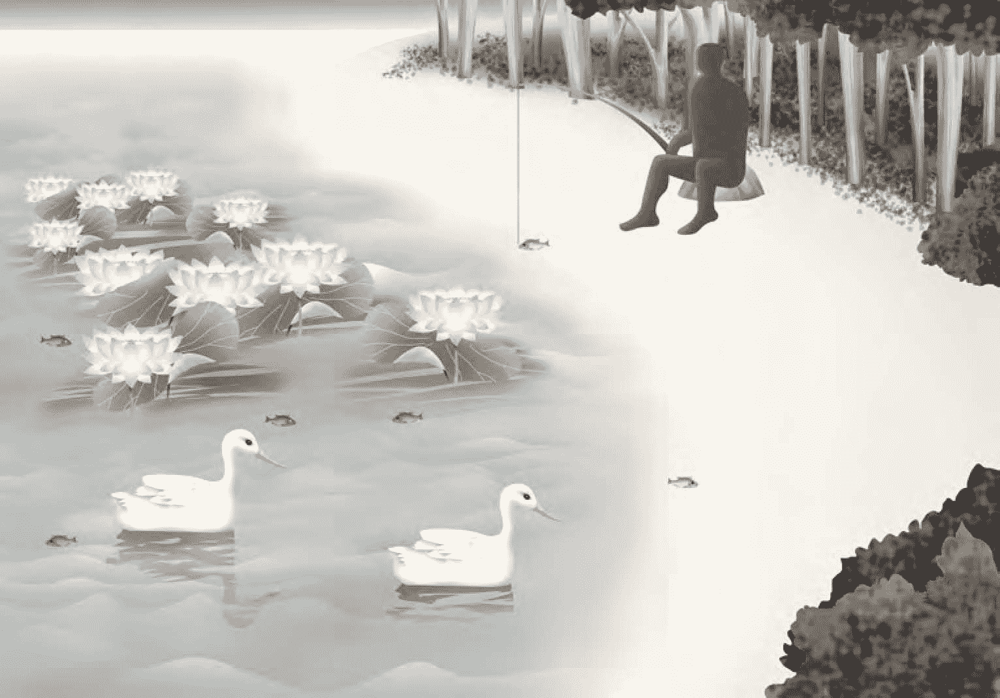

**平衡身心冥想疗法**

钓鱼时冥想能使全身的肌肉、细胞以及血液循环等作用都缓慢下来，可以减少焦虑，真正实现人体内部、人和外在、人和宇宙的平衡和谐。

##### 内心微笑冥想疗法

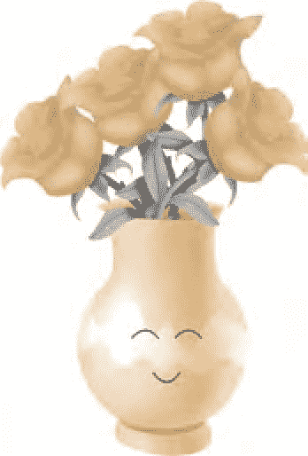

**方法一**

想象你正看着一面镜子，看看镜子里自己的微笑，你的眼睛因为快乐而发出奇异的光彩，体验积极微笑带给你的幸福感。

**方法二**

将一幅你自己正绽放笑容的照片端放在身前 1 米远的地方，想象你微笑的能量来源于它，然后让微笑的能量流过体内。

**方法三**

想象你正看着插满鲜花的玻璃花瓶上映现的自己微笑，感觉自己笑得就像鲜花一样美、灿烂，通过提升自信来抵抗消极情绪。

## 冥想与催眠术
在迷睡状态中产生幻觉

催眠、冥想都是运用暗示和想象的心理治疗方法，也都能减轻或消除病人的紧张、焦虑、冲突、失眠及其他身心疾病。

* * *

#### 控制意识的催眠术

催眠术源自西方，和产生于东方文化体系中的冥想有很大不同，但它和冥想一样都是运用暗示和想象等手段使被催眠或冥想者在幻觉中作出反应，以进行精神治疗。具体而言，催眠以诱导为主，它主要是由专业催眠师采用刺激人的视觉、听觉、触觉等方法，使之进入半睡半醒的状态，如处在一种梦幻、恍惚的精神幻觉中。由于被催眠的人的大脑皮层不完全受抑制，且其思想、精力往往集中在某一点上，思维难以发散，因而容易接受特别的暗示，意识便“主动”向它靠拢。

#### 运用暗示和想象的力量

暗示是指个体受到人或环境以不明显的方式发出的某种信息，并无意中受到这些信息的影响，以至做出相应行动的心理现象。这种暗示的成功源于主观肯定这些“假设”的存在，心理上就竭力向它靠近。催眠就是暗示被催眠者想象这些假设的内容，使他们自愿接受“假设”所给的信息，在不清醒状态下完全服从它的指示。冥想更接近自我催眠，即不需要他人的强迫性暗示或刺激，冥想者就能在大脑清醒时，充分调动自我意识和构造意象的能力进行心理强化，也能使自己接受那种“被主观意愿肯定了的假设”，努力用积极暗示调整自己的行为和感觉，增强身体的免疫功能，减轻精神上的无形压力，甚至解除很多难以治愈的病痛。

#### 冥想追求更高精神层次

催眠和冥想都能让人产生幻觉，并借此诱发人的潜在意识，不同的是催眠追求的是让人在迷睡状态中接受指示吐露“真相”，或唤起对意识中消失了的事物的记忆；而冥想有更高层次的精神追求：“和谐”，一是通过灵魂的修炼超越肉体上的局限，到达个人与宇宙自然的结合，如瑜伽冥想；二是通过对呼吸、意识及身体的控制，使人的内在心情稳定、平静，如静坐冥想。冥想也是身、心、灵合一后进入的状态，它能让大脑安静下来，变得更加自觉和自制，此时思绪宁静，也是非常清醒敏锐，和催眠时的迷睡状态完全不一样。

### 冥想和催眠之异同

##### 催眠术

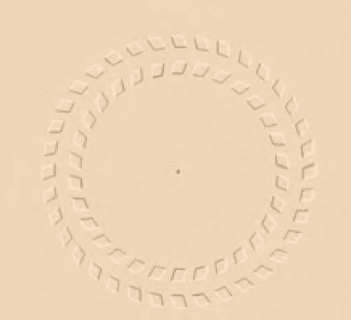

**图片的错觉**

常借助让人产生幻觉的图片达到视觉催眠之目的。

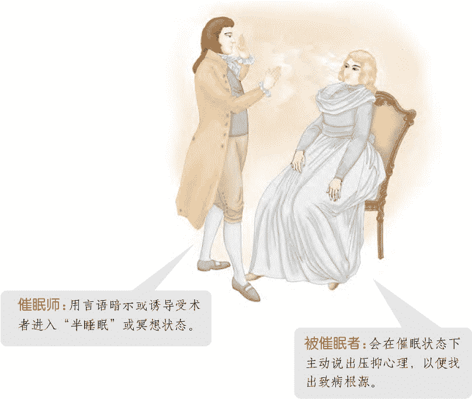

##### 催眠后进入冥想状态

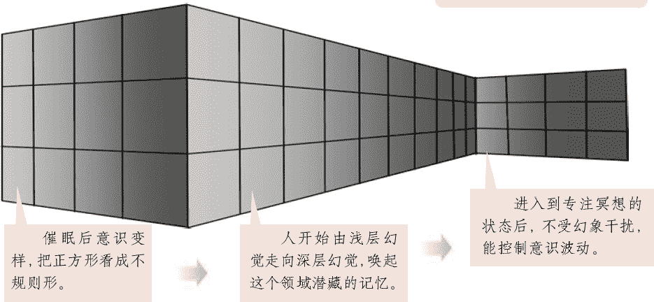

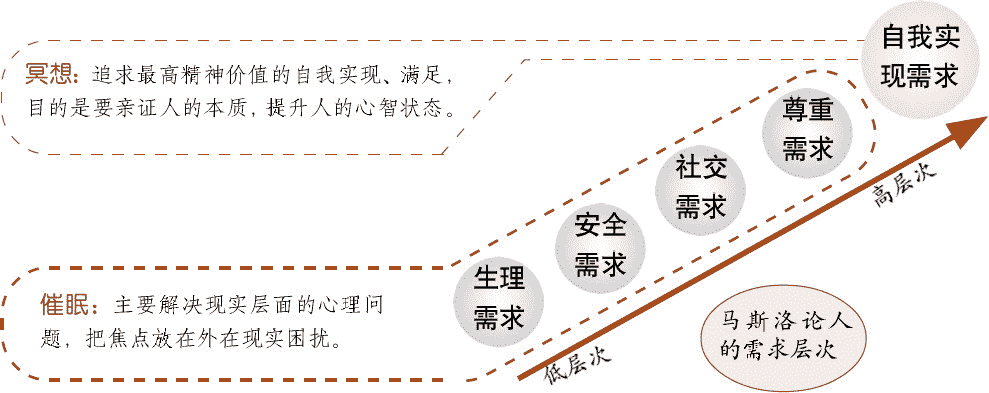

## 冥想与第六感
深层的意识活动

西方心理学家认为，意识是通过五种感官（听觉、视觉、味觉、嗅觉和触觉）来接收外在信息，形成认识。第六感属于潜意识，和冥想都是深层的意识活动。

* * *

#### 第六感等同于“直觉”

直觉是不经逻辑思考就直达目标，迅速识别、洞察对象本质的一种感受能力，又称“直感”，常常可以与预感、灵感、洞察力、发现内在的声音或预兆、第六感等词互换。如果说逻辑思考是意识脑的作用，直觉就属于潜意识脑的功能范畴。由于潜意识会接收到意识层面所遗漏的东西，因而直觉就是洞察到了意识“没发现到”的东西。经由直觉思维发现的成果包括物体的精微细节、精神的微妙层面、情感的矛盾纠结、宇宙的实体真相等。

从某种程度上，第六感可以说就是一种直觉，它是潜意识里储存的、没有被意识察觉到的意识“浮出水面”的结果，所以也有种说法把“第六感”比喻为“潜意识的漂浮物”。当人们冥想时，实际上也是在专注“打捞”这些潜意识的漂浮物，从中剥开日常心念的“伪善面具”，露出本来的自己、真相。

#### 第六感活动的范围

有时，人们也把第六感称之为“心灵感应”、“特异功能”等。心灵感应是人通过意识就能像无线电传送信息给他人，而特异功能是运用意识去改变物体的位置、形状、性质等，这两者都包含又夸大了第六感的作用。尽管冥想也可能使人产生超常的“神通力”，但都是与运用潜意识、无意识激发潜能，右脑的灵感、创意思维，催眠行为中暗示和想象法等有关。

第六感真正活动的最显著范围，归纳起来有三种情况：（1）做梦（包括白日梦）时；（2）神经病、精神病及昏迷状况时；（3）进入禅定某种境界中时。第六感的获得常常具有偶然性，即它的产生缺乏定时，常是一些片片断断、无连贯的直感，因而很少是存在于禅定的最高境界中的感知。常人的冥想状态中会出现第六感现象，如表现为由于专注充分开发视觉后形成的“天眼通”能力，能通过心灵视线观察到遥远地方“看不见的物体”。

#### 解释第六感玄妙现象

通常认为第六感具备的“超感官知觉”能力与由右脑主导的功能“直觉”或“内心感觉”有关。但更深层的是，右脑具有左脑所无的四项特别机能：

**（1）谐振共鸣机能** 。右脑有“音叉作用”，与万物发出的波动谐振，接收到复杂微妙的信息。

**（2）想象化机** 。右脑懂得透过天马行空的创造力，将种种意义重组，感应出整全的信息（这是作家、作曲家、画家的灵感诞生的原理）。

**（3）高速大量记忆机能** 。左脑的记忆像计算机，是线性的，右脑的记忆像照相机，看一眼就能全部储起来（速读能力的发展源于这种功能）。

**（4）高速自动处理机能** 。右脑有办法将接收得来的大量信息整理成为有意义的意念，予以运用，这种功能的速度与复杂性高于左脑千万倍。

近年的“新物理学”研究，又将前面的第六感现象解释为：基本粒子的波动在传送信息的能量（波动本身是一种能量），所有物体（一草一木一石、光线及动物等）都不断像广播发射站那样向全宇宙放送动波，又同时像钢琴的键盘一样，对周围的波动发出共鸣。

#### 冥想使“第六感”更强

冥想能使日常生活中的人摆脱左脑操控进入“化境”，让人与外界的沟通发生“变异意识状态”。按照心理学说法，“变异意识状态”包括了所谓的“入定”、“催眠”、“着迷”、“忘我”、“灵魂出窍”、“神游四方”等各种恍惚迷离的心境，有深浅之别，且往往带有信仰、观念的成分。冥想期间，人们的身心非常松弛，处于整体平衡状态，全不留意周围发生的事，就能令自己随时进入这种境界。“无意识状态”也是“变异意识状态”的一种，处于这种状态时人们的思考推理方法大异平时，但却能记忆起事情的各式各样细节，连理性意识里完全忘掉的细节及平常无法想起的东西，也一样记得。

### 第六感作用范围

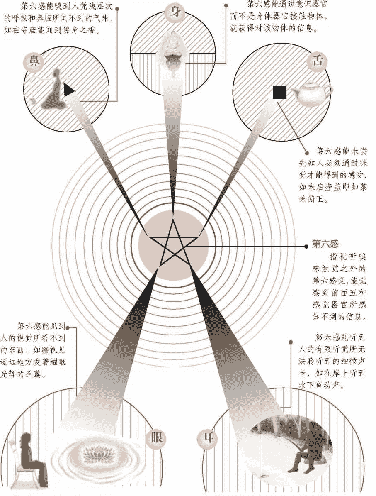

**第六感和冥想的关系**

动物学家表明，人类不及动物第六感明显、强、灵敏，甚至不及原始人，是因其受外部社会干扰较大，原始本能及感应能力都随之退化。冥想让人的身心回到最原始的状态，能作为增进第六感恢复的手段。

### 冥想、第六感和潜意识

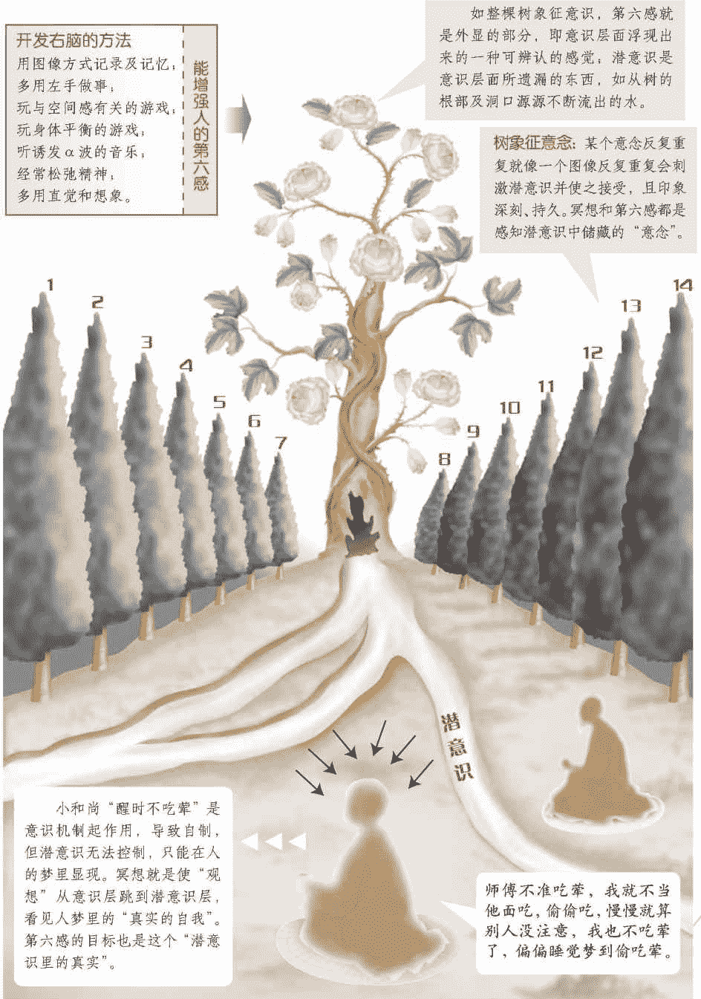

## 到达冥想的高级阶段
关于开悟者的心理测试

关于超越的静修（TM）的心理测试显示静修或冥想会有助于自我、道德、认知的发展，智力、学业成就、自我实现，以及增进创造力、知觉敏感、同理心和自我控制等。

* * *

#### 罗夏墨迹测验

罗夏墨迹测验是由瑞士精神病学家罗夏发明的著名投射法人格测验。投射法是让被试者通过一定媒介，在自己想象的无拘束的情景中显露出其个性特征。测试的媒介可能是一些有意义而又模糊的图片，让被试者凭想象来说明它——他的回答和反应就显露了其人格与人生态度。研究显示，用这一测验研究不同层次或境界的佛教静修者，初学者显示出常态的反应，但在测验图片上看到的不是简单的光线明暗及动物、人物形象，而是能集中到一些主题上，表明他们开始集中于内心而较少联想了。更高一层的开悟者在罗夏测验中倾向于将那些图像赋予自己心灵的创造，并且能觉察到将图片变成有组织的形象的意识流动的过程，同时仍然存在一些围绕性和暴力的冲突问题，但已经能接受并泰然自若地面对它们。而达到高级阶段的开悟者，表现出以下三个特征：（一）不仅能从图片组织出形象，而且将墨迹看成是心灵的投射。（二）没有显示出从心理冲突中解放出来的状态，也就是说到达静修的高级阶段心理上的痛苦已明显减少。（三）能将所有图片系统地联系起来，整合到一个单的主题中，往往是一篇深刻的有关人类痛苦的本质及其解脱的解释。

#### 信息过滤系统

同样是由瑞士科学家得出的一个结论：在每个人的意识中，都存在着一个信息过滤系统，它的形成是由人的遗传、生活环境、学习及生活经验等决定的，同时它又是人类进化的产物，其存在使人避免了许多危险，如使符合它要求的信息进入，将对不利于人生存的宇宙波屏蔽。但正是这个信息过滤系统的存在，使人的认知千差万别并产生了偏见，而无论哲学家还是心理学家都将偏知与成见归于人类烦恼的根因。因此这个信息过滤系统的作用可以被比喻为禅学中心镜上的尘埃。开悟者能直感宇宙与人生的实相，就是因为他们有打破、重建并善用这个系统的能力，在打破的那个瞬间，禅学称之为开悟，也就是打破了认知屏蔽。

### 心理学对冥想开悟的研究

##### 从信息过滤系统阐释开悟

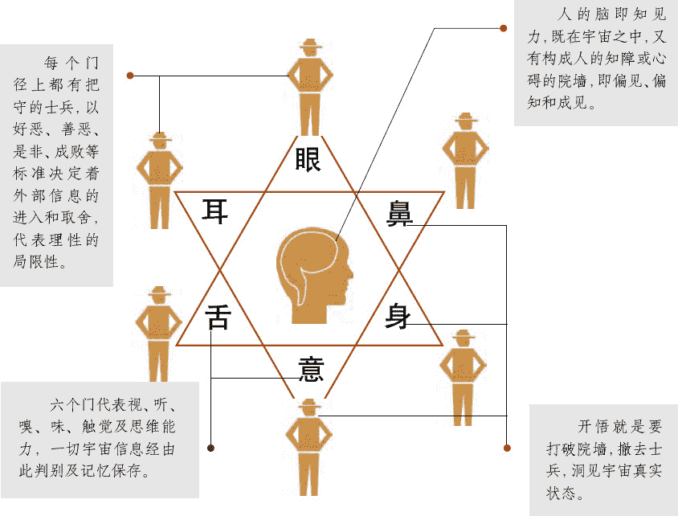

##### 罗夏墨迹测验导航

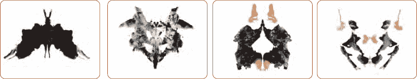

**制作图片方法**

在纸中央滴墨汁，将纸对折后用力挤压，使墨汁向四周流动，形成两边对称但形状不定的墨迹图形。

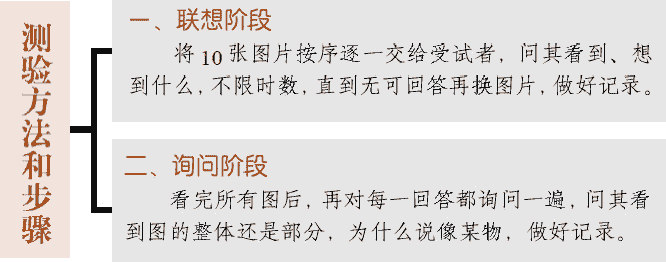

**目的**

诱导出被试者的生活经验、情感、个性倾向等心声，因其在回答时已把自己的心态投射入情境之中。

# 第三章
冥想静心术
观察和引导自己的精神

在佛教中，静坐冥想就是打坐，但冥想不仅仅是一种“打坐的心态”，也就是坐在那里一动也不动，无论蚊虫叮咬，还是虎兽惊现于前，都无所畏惧及动摇，而是自有一种高僧入定的境界和哲学涵义。达成冥想的契机是专注一心，即不执著于内心的欲望和外界的干扰，自然进入活泼泼的生命哲思和禅悟的体验，在佛教看来就是入定、三昧。

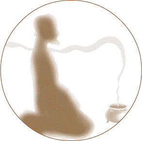

### 本章图版目录

静坐冥想

禅定就是静思悟道

正念冥想

觉知冥想

超越形体的专注境界

观想练习

心像构成

内观的训练步骤

日常意识、专注和全观

OM 字禅法

关于脉轮的冥想

冥想达到三昧境界

冥想中心灵感应的发生

冥想暗示法的正负作用

冥想不同类型的平静符号

冥想和灵异治疗

蓝图冥想的具体步骤

## 静坐
冥想的最佳体位

一切静坐法的共同点是：选择一个安静的环境，采取正确舒服的体位，头脑中有一定的意念、想象作为注意对象，态度自然、放松。

* * *

#### 静坐的正确姿势

静坐和宗教性的坐禅不完全等同，坐禅是修炼一门禅定的功夫，而静坐的现代含义就是以坐姿入静，通常是选择既舒适又挺直的坐姿，如优雅、平衡的莲花坐姿。完美的静坐不会给身体带来多余的、不必要的压力，一般是呼吸匀称顺畅，肩膀放松，手臂轻松垂下，头部、上半身挺直放松，腿脚盘坐并对称放置，使身体处于一种平稳的状态。

#### 两种静坐时的心理机制

**引导性静坐** 被作为心理治疗的一种手段，其基本机制是在经过一段时间他人指导后进行自我催眠，诱导出生理——心理性的放松反应，包括进入催眠性的“出神”或“入静”状态。常用的自我催眠的方法是：闭目，调整呼吸节奏，并相应地默念简单词汇或无意义单音，或作轻松、愉快想象，体会、暗示身体出现放松感，其目的都是为了使自己从思想者转变为思想的观察者，以超越自我，摆脱生活中的困惑与烦扰。

**非引导性静坐** 就必须靠自己导向心灵集中，主要方法有两种：其一从心中排除一切感官的欲望，即完全置心灵于一切事物之外，这种方法有更好的活动过程，但较难做到；另一种是将心灵从各方面收摄回来，然后集中在单一的一点上，这种方法即系心于一缘，容易与目标认同，较易做到，适合于初学者。也可以采用一些将心灵集中在偶像或象征性的图像上的方法，以导向入静。

#### 静坐冥想的益处

静坐不仅使人放松，也会导致心灵的宁静，积极的情绪，敏感的知觉和内省的习惯，以及对心灵本质的领悟，达到各种神秘体验的超越状态，减少褊狭、闭塞、执著的思考方式，更有能力明白真正的烦恼因果及解决问题。

### 静坐冥想

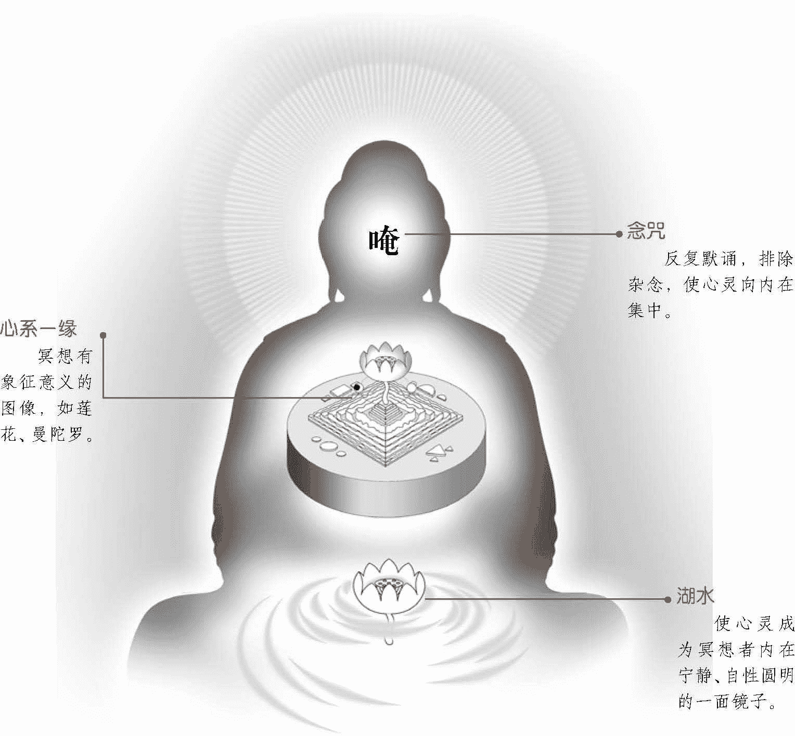

##### 静坐冥想的四阶段

**第一阶段**

**最艰难的阶段** ：所有心智活动都直接指向心灵中最原始的那一层次。静坐者面对内在的心智混乱和外在的压力，从一开始就接受耐心和决心的考验。

**第二阶段**

**成功的开始** ：所有心智活动都指向心灵中较高的层次，此时困难较少，外在压力也减少，静坐者会享受到从未有过的精神上极端愉快及幸福感。

**第三阶段**

**心灵及灵性潜力发展时期** ：此时心智潜能指向心灵中更高层次，静坐者可控制其心神及部分感觉，这种控制给他一些超感知力量，象征向前迈进一步。

**第四阶段**

**最后一个阶段** ：静坐者所有心智都指向心灵最高、最纯、最微妙的一层，达到内心中最深的意识，了解真实的自己，并使个人的心灵与无限幸福结合。

## 禅定
在静心中产生内在智能

所谓入于禅定，原本是指佛教坐禅时心不驰散，进入安静状态。“定”就是要求将散乱的心念，通过一定的功法，集定于一处——冥想的目标就是入定。

* * *

禅定是指专注于内心之境，不对外界环境随意起杂念，即心定于一处而不散乱的状态。它能让混乱的思绪平静下来，是修习冥想必须掌握的可称之为“法门”或“境界”的东西。禅定由“入静”开始，进而到“至静”，最后到达“寂静”，灵魂才入“三昧”之境地。

#### 入静：不起杂念

**入静就是静坐摒除杂念，指在思想安静、意念集中的基础上出现的清醒及保持意念专一、轻松舒适的一种境界。** 《资治通鉴》上说：“入静者，静处一室，屏去左右，澄神静虑，无私无营。”入静又称虚静，即“心中无物为虚，念头不起为静。”入静状态不是一般的清醒时，更不是入睡，也不能等同于“万念俱息”的寂静状态。它是在有意识的训练中、无意识下形成的，亦有高低、深浅之分。冥想者要避免追求入静，否则生起杂念，反而一样难以入静。

#### 至静：感到极静

**至静就是神安气宁、心安理得的静心境界，此时心中妄念不动，又不意在求静，一切都是圆和、自然的状态。** 禅定者或冥想者进入至静后，精气神聚集合一，收发自如，如到虚无的真空，已经感到宇宙间的极静，身体与精神合而为一，但还只是在入定的浅层次上，有待静中生慧。

#### 寂静：产生智能

禅定者或冥想者进入至静和寂静，已经具备超越的意识，突破了一切生理、心理及意识的障碍，达到忘我的境界。因而**寂静也指佛教中断除一切烦恼的涅槃境界。** 此种禅定的境界又称三昧或三摩地，禅定者或冥想者达到这一状态，能息虑凝心，自觉运用与生俱来、后天努力而得的精神集中能力专注某一对象，于所观之境中明了宇宙的真相，产生既空寂（无纷扰思绪及心灵上的觉醒）又包含了实相（世间万事万物的真实面目或本来状态）的智能。

### 禅定就是静思悟道

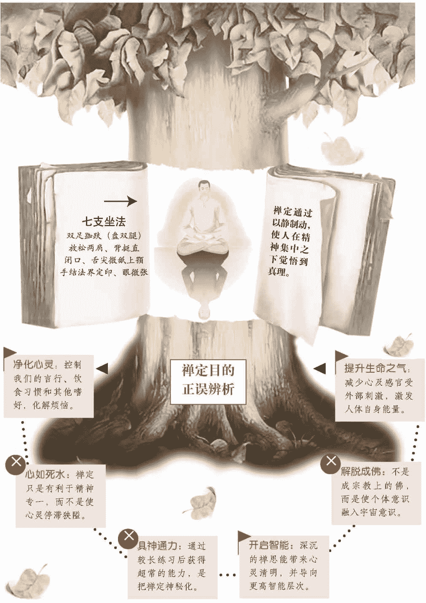

## 正念和觉知
进行冥想的两个必要阶段

任何类型的冥想都存在着正念和觉知这两种方法，前者是把头脑的平和、平静和镇定作为目标，后者是要探索并获得思想的洞察力。

* * *

#### 正念：直见当下的事物

正念不是和邪念相反的概念，它由佛教“八圣谛”引出，又发展出新的意义：指无须参考过去或未来，精确地意识到当前时刻，并能完全地把它们看得一清二楚。念就是观念及心念，其功能一般是令已经历过的事、物、境界重现，包括心里所产生过的或观念中的意境，使心铭记不忘。“正念”本指对于念佛的境要铭记不忘，后来却演成使意无杂念、心专一境，即达到让心安定的境界这个意思。

**正念就是把注意聚焦在当下事务，它能产生精力、头脑清醒和快乐。** 佛教中有个譬喻说，假如有人念佛时想吃东西，就是不正念；假使有人念佛时想要去做救人的好事，也不是正念，因为他自己不觉知心已随境转。冥想的人把修定（集中注意力）作为起始阶段，一般先要找一个目标对象（佛教称“所缘境”），然后一心一意专注在这个目标对象上，就像猴子被绑在一个地方，久而久之，心就慢慢安定了，也就是达到“正念”了。

所缘境根据每个人的需要而不同，如佛教徒的所缘境可能是观音像。有时心里凭意念产生了某一个相，将注意力投射到它，这个假想的意象也是“所缘境”。当我们仅留意那个所缘境时，注意力不会混乱于将来或者过去，对此刻正在发生的一切事情不作判断或反应，就当我们本身只是个“存在”。

#### 觉知：朝向觉醒的意识

觉知不同于觉醒，**觉知是主体之于客体的一种行为，它意味着某个东西被注意到；** 而觉醒是一种完整状态——正在觉知的或被觉知的人都没到达觉醒，它意味着人“现在的头脑”整体超越了“旧有的头脑”，变得更智能、更通达、更超脱，也更接近真理。觉醒是觉知的终极目标：从平常的无意识活动到觉醒存在一个空白，它是用觉知填满的。

正念、觉知和觉醒存在密切关系：打个比方说，人在丛林中发现一朵美丽的花，是应该摘它回家还是让它继续留在丛林里。“正念”能帮助我们精确地看到事物，如长期注意这朵花能细致了解到它的花纹、花瓣等美丽之处及生长环境、空间；而“觉知”更进一步清楚地看到它的存在状态，从而摆它到正确的位置，如让它留在丛林土壤里，因为那是它生长的自然环境。“觉醒”就更深一层，会认为自然界的生命应保持它原始、自在的状态，不要过分干扰或损坏，顺其自然，才能拥有良性平衡的生态。

总之，生活中的各种情境都是觉知与正念的“食粮”。觉知就是看见正念所发现之物，只有在“正念”之后才能产生觉知。正念就是精确性——直见事物的本貌，觉知就是朝向觉醒的行动，它比平常的行动、无意识的行动更高一层。如果说觉醒就是一种超越，觉知就是培养、靠向这种超越的意识。

#### 冥想中的正念和觉知

人在冥想时注意到不安的存在并要消除它，需要正念——因它训练能精确地意识到当前时刻，如把思想集中在辅助物或所缘镜（蜡烛、佛像等）上，帮助集中注意力，使头脑达到平和、平静、镇定的状态；而人要“给躁动的牛（心神）”提供很多空间，需要觉知——因觉知匹配正念，就能在接受生活情况原貌的基础之上，探索并获得思想的洞察力，这种深刻的洞察力只有当思想处于平静和清澈的状态时才能产生。冥想不能离开“正念”或“觉醒”，前者将意识导向、集中于当下，后者深刻地察知当下的处境，并把意识摆在正确的位置。

正念既然是觉知的前驱，就好比是舞台、摄影中的“打光灯”或“闪光灯”——通过“专注”对象或目标而令它们更具“精确性”，觉知就是在“专注”中看到思想最真实的状态。因此正念就是冥想对所注意目标的“警觉”，觉知就是冥想所要具备的“深刻洞察力”。

### 正念冥想

所谓正念冥想，就是接纳现时出现的所有体验，通常它采取认真地观察与忆念、自我平静、集中意识、情绪调节和关注此时此刻的策略。

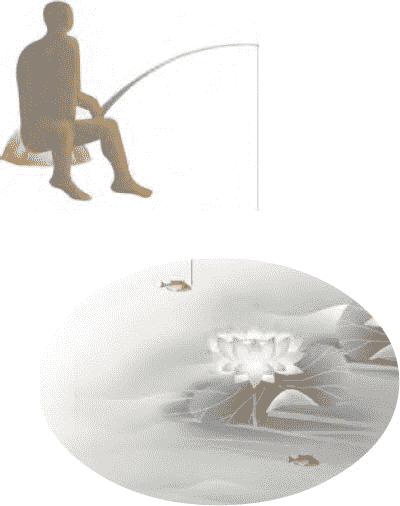

**正念冥想的益处**

正念冥想是我们全心全意地集中在此时此刻，及现在做的事情上。它通过使我们静心在当下一刻，摆脱超负荷的感觉和过度紧张的生活，获得更多平衡，现实地看待和接受现在的行为、态度和行动。如钓鱼时运用正念冥想就能治疗抑郁症、焦虑、失眠等疾病。

训练正念冥想的步骤

**1** 　专心在此刻

**2** 　保持机警的醒觉

**3** 　调整呼吸如控制茶壶滴水

**4** 　集中精神 10—20 分钟

**5** 　灌注注意力如水滴杯中

**6** 　默默忆念一滴水的澄澈

**7** 　观察自己的思想，直觉或反应

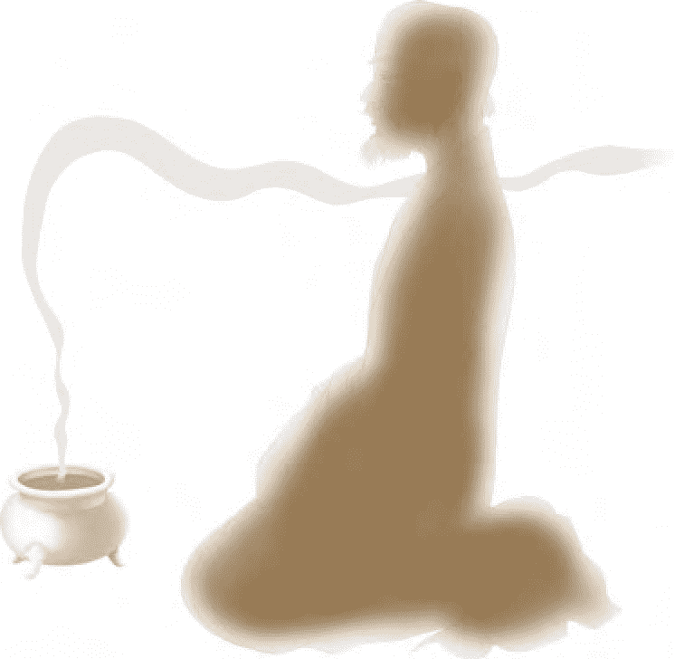

**正念冥想要达到的效果**

**1** 　无忧，专心享受每一刻的生活，如僧人参禅时心境安逸豁达

**2** 　捕捉到内心想要的“与世隔绝”的瞬间，如参禅悟“道”

**3** 　长时间进行正念冥想的人，脑部开心区的脑电波会较常人活跃

### 觉知冥想

觉知冥想能产生一种直面生命中一切的积极态度，使内在变得更加专注、敏锐、理性、积极、豁达、自信、活力、镇定、从容，身体也会发生积极的变化。

##### 全然觉知式冥想

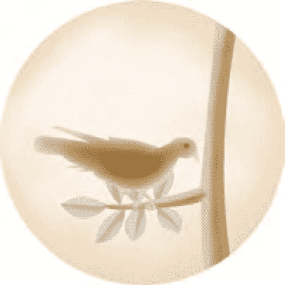

**想象啄木鸟**

全然觉知式冥想就是把觉察力放在所有内外在感官与觉知上且不加判断，训练专心、敏锐的洞察力，如同一只啄木鸟很快全然“觉知”树上的每一处。

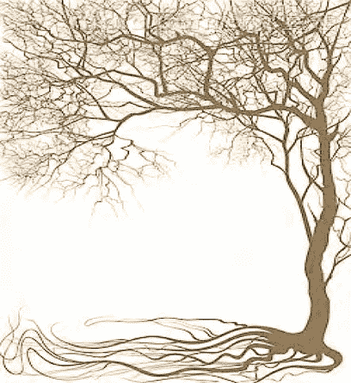

**真正的觉知**

不通过概念去看事物，如**用心注视一棵树** ，不从其形状、颜色、外表等概念识别，而是持续觉察它在外在环境下的变化。

**传统阐释的觉知**

是东方最古老最深邃的生命智能，对自我、世间和宇宙如佛塔般高深的洞察与觉悟。

**现代阐释的觉知**

是一种主动关注而不加判断的意识状态，时刻感觉到佛光般的智能对人的“启蒙”。

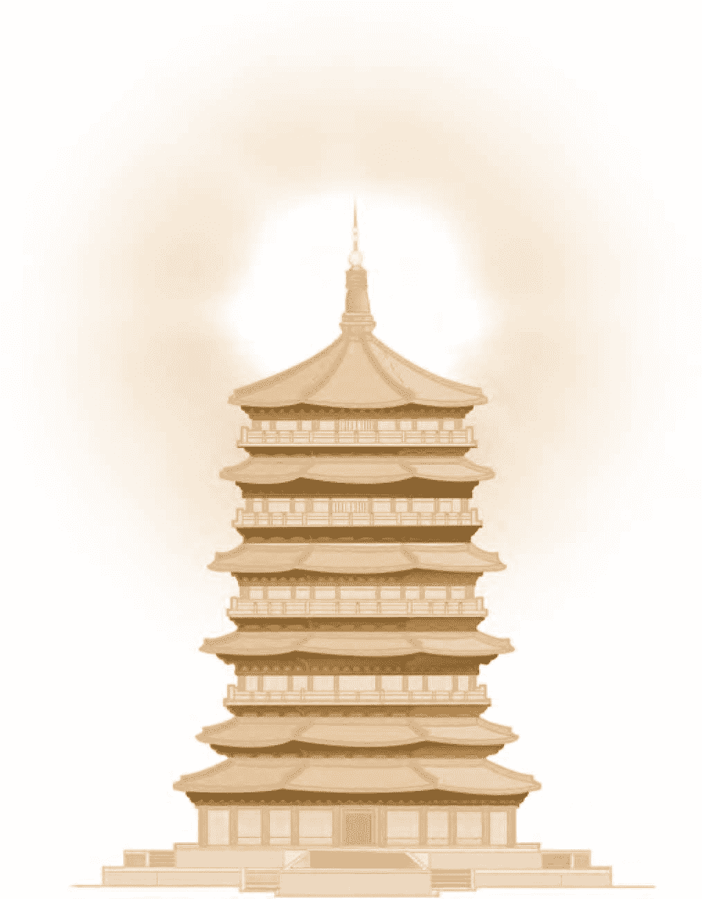

##### 自我觉知式冥想

**步骤一**

用心体察身体和头脑的细微变化

**步骤二**

时刻意识到自己的情绪和思想

**步骤三**

觉知每个当下的真相与幻象

## 专注
寻找把心固定的对象

通过锻炼专注的能力，能使心集中在一个方向上，这样才能进入冥想的状态。在冥想过程中，专注最能够控制意识波动和消除精神涣散。

* * *

#### 专注的必要性

我们的注意、意识和思想在平时是处于散乱的状态，专注就是把这些分散在各个领域的精神的东西收拢回来，引向一个单一的目标。当我们持续这样做时，就会发现自己正日益把思想定在自己所寻求的目标上。

冥想语境里的专注有特定含义，它不仅仅是注意力集中，**瑜伽哲学将专注解释为：把心集中在身体的灵性意识中枢内，或体内、体外的某种神圣形式上** ——也就是说，专注是一门重要的技术，如同在佛教中专注要靠信、力、念、定、慧达到，冥想的专注也要靠具体方法才能达到，且是灵活而不是唯一的，如专注于一个物体或一个真理，都能将心收拢。

#### 专注于一个物体

这是指把注意力放在身体之外的可见形象上，如一朵花、一粒石子或一支蜡烛，有时越简单越好，因为简单事物更能避免意识波动。所谓意识波动，是指每当外界的某个对象或事件被感官记录下来时，意识、感觉就会受到影响和刺激，这时会带来快乐或焦虑，让人的心不能平静。专注于一个物体就能把情绪和意识引向这个可见形式，然后逐渐将储藏在记忆中的种种“烦恼源”遗忘，这个过程常被称之为“换心”，有时意味着一次性格的彻底转变。

#### 专注于一个真理

这种专注要求必须平息和净化自己的心，和“抓住”自己选择的理想的神圣形式或象征。心的平静来自对德行的培养，包含着嗔恚、怨怒、欲念等的心灵都会导致精神涣散，因为这些带着“激情”的情绪都会影响到精神不集中和注意力的稳定，是心理疾病的成因，并带来认识的障碍，从而看不到真理的面目，也无法让人集中全部的专注的能量。这个注意力所投射的“真理”一定要能经得起心灵的检验、分辨和个体意识的觉知，也应该是真实的、永恒的。

### 超越形体的专注境界

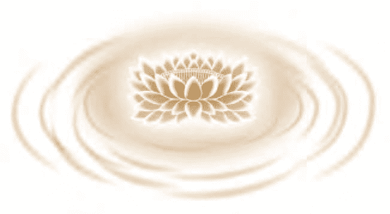

**第一境界：完全专注**

专注冥想的初步行为就是让心专注于单一对象并获得体验，**如将意识固定在一朵莲花的内在之光上** ，能感到圣洁、明亮、喜悦、纯粹。专注掺入觉知，就能透过事物的粗糙外表，深察到细微本质。

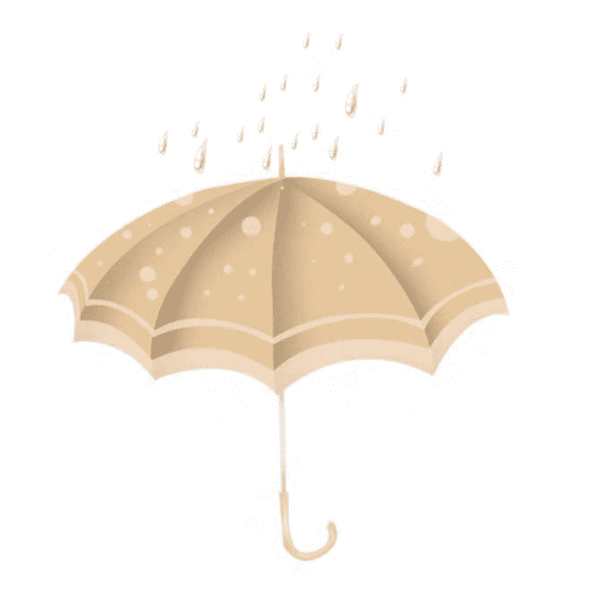

**第二境界：全新稳定**

专注冥想在第二阶段呈现一种心灵和心智的稳定状态，这时即使人遇到干扰也会表现出冷静与觉醒，**如在雨中撑起一把伞** ，能获得持续的、不受干扰的注意力。

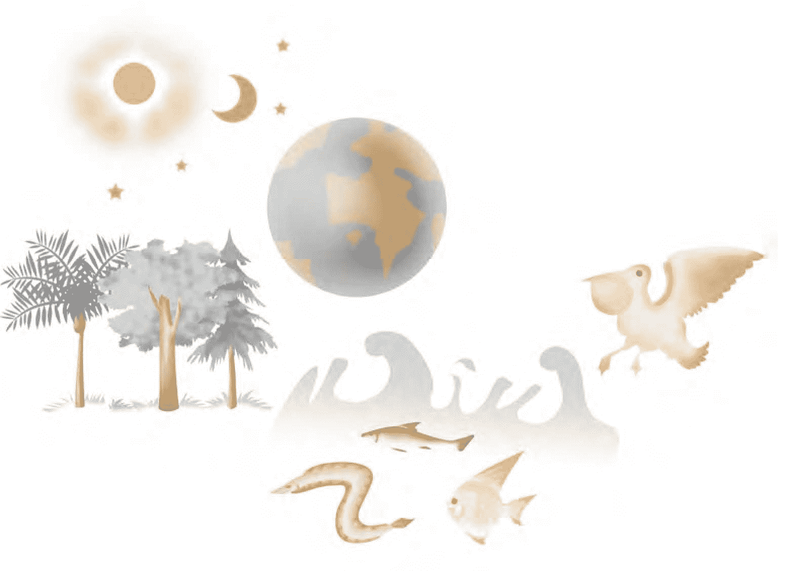

**第三境界：沉默广阔**

专注冥想到第三阶段就能获得一种宽阔的整体感和舒适感，因意识一直保持坚定、清晰、稳定、平衡，心智就会**如看到伊甸园感到舒爽而广阔** ，充满欢喜与快乐。

**第四境界：物我合一**

在专注冥想的最后阶段，当意识完全平静，就会出现一种想体验更高深更不寻常境界的渴望，**如想和专注对象相融合一** 。

## 观想和心像
发展运用内在视像的能力

内在视力存在于很多积极想象的行为中，它是用心来注视专注的对象，这个对象可以是实物、画面或某种具体的情境，让冥想中的人有身临其境之感。

* * *

#### 避开杂念和妄念的想象

**观想就是将看到过的一种或一组静态、动态的形象，运用形象思维把它在脑海中“过目”，以产生积极的想象，去掉杂念、妄念。** 杂念在人不具备专注能力时产生的“胡思乱想”，通常是当人注意一个目标时，又从它游离出去，却没能使注意再返回到这个目标上，它是能通过提升专注技巧、集中心念观想某一对象克服的。妄念是指虚妄的心念，它不是心脱离感知对象，而是心受到某种念头诱惑后偏执于欲念所产生的错误思考，通常人在妄念中会构想一种颠倒真相或真心的情境，妨碍人进入觉悟之境界，它是能通过调养心性、在观想中重拾信念来克服的。

**观想时在脑海中或心灵中出现的“内在视像”叫做心像。** 观想行为和产生心像都是冥想的重要实践，大多数简单易为的冥想常通过这些方法来满足获得美好体验或“觉醒”的愿望，降低精神被外界刺激的数值。

#### 观想是一种想象治疗

尽管观想被佛教和很多灵修视为一种神通，这种神通力就是当你用心去想象一件事或一幅画面，它们就会变成真的现实，即观想的境界就是“心想事成”，但它实际上不过是让心灵召唤一些有意义的图像，而这些美好的、令人充实和喜乐的图像仅仅起到心理治疗的作用，运用恰当它还能让脑中掌管思想、记忆、主意和主观积极行动的潜能得到进一步开发。

从心理学的角度，人们在积极想象时，实质是在完成一个“自我肯定”的心理过程，如在心中常渴想一幅能带给自己积极信息的画面，或者冥想各种积极的变化，都会把人导向情绪顺畅、身心健康、提高自我形象，以使人从疾病中恢复的几率大大提高。观想到一定阶段，也会产生肯定或否定的“自语”，这时就必须靠冥想解决负面影响的问题，让自己开悟。

观想有很多类别，如观想见过的理想中的人物、美丽的风景或过去发生的事情的经过等，闭上眼睛想象它们，而不需要面对实物实景。观想练习先是想象一些简单的图案，慢慢再想得更复杂些，如想象自己出现在不同场景中都能应付自如，使自己充满自信。但观想在冥想中要复杂得多，如观想诸佛就可以得到他们的种种“方便法门”，就不单单是所愿得成，而是从明佛理到开心智要经历深刻的修炼。普通人冥想时主要是运用观想打开心视，练习自己能自如地让心灵召唤各种图像即心像的能力，这个过程常常精神集中，心情平静，当看到某种心像时过度亢奋或情绪波动，都可能会给冥想带来负面作用。

#### 心像是拓展想象和意识的入口

**心像就是用心灵中的眼睛代替肉身的眼睛“观察”到的事物，它是拓展想象和意识的入口。** 就平常而言，心像也常出现在我们的精神世界中，如幻觉、妄想等，但冥想中产生的心像有独特的内涵，它排除了一些片段式幻觉和无意义的妄想，而是既生动、深刻、活泼泼、充满生机的，且当人们把其中的幻想成分剥离开来时又充满了哲学的意味，使人破解困难、激发创意，并会在日常生活中更充满开拓力。宗教领域有许多文化意义深厚的心像图，如前面提到的八卦象、曼荼罗等。

一般心像出现的过程要经历几个步骤，首先是进入极度松弛的状态，撇开杂念，然后将自己愿意得到的事物变成脑中的一幅图画，集中精神去想象，把它想象得越真越好，而且必须相信它是真的，这时灵性和心灵所具备的能量就会被释放出来影响物质世界、改变自身环境。冥想中的心像要经过专注观想的练习，人运用内在视力（即用心灵中的眼睛看目标）的能力必须要达到很高的层次，这样内心所看到的心像才不再仅是现实的影像，而是充满深刻的洞察力、极具启发性的心灵“真”像，是人进入开悟阶段的启蒙。

### 观想练习

观想将看过的某种形象想象出来，能训练人的形象思维，尤其观想几种形态的组合形象更能锻炼想象能力。如观想一尊佛像，就对人的图像记忆能力要求很高，否则无法通过观想进入冥想。

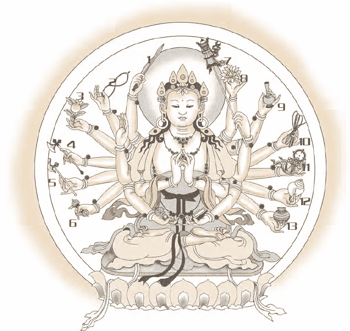

**辨认特征**

**1．宝剑：** 表战胜诱惑、除去愚痴的决心。

**2．念珠：** 为除去烦恼、安定心念之菩提珠。

**3．天妙果：** 表圆满万行善之种子。

**4．钺斧：** 表催迫一切无明、惑障。

**5．铁钩：** 表摄召一切众生。

**6．金刚杵：** 表真理坚实永固。

**7．宝幢：** 表无上庄严之感。

**8．莲花：** 表洁净无污，内心圣洁。

**9．净瓶：** 表盛慢一切，心受净化。

**10．套索：** 表降伏恶魔。

**11．法轮：** 表佛法智慧，碾破无用意识。

**12．海螺：** 表降伏众生烦恼。

**13．宝瓶：** 表流出宝藏、施与众生。

### 心像构成

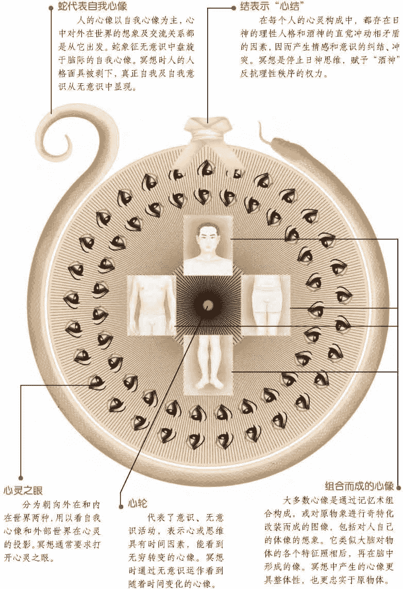

## 内观
组织管理心灵的艺术

约在公元前 531 年的一天，古印度王子乔达摩·悉达多在菩提树下冥想看清了自己的实相，就把他发现的这个脱离精神苦恼的方法向世人传授，这个法门就是内观。

* * *

#### 内观是一种古老的禅修方法

现代人把禅修看成是对于心的训练，这种训练不是回顾和分析往日年月中的陈年旧事，也不是整日思虑未来，考虑以后某个时日的长期或短期的作为，它是让心灵和当下建立联系，培养出持续不断的正念。单一身体及语言都保持静态，却没有内在安宁，离禅修十万八千里。真正的禅修是要避开这些心灵困境，而是心既不沉迷于过去，也不关切未来，以一种光明、清晰及平静的状态，安住于现在或当下。

禅修分为两个阶段：第一个阶段称为息内，即“止”，使心平静，在这个阶段中人逐渐平息内心的纷扰。第二个阶段称为慧观，即“观”在这个阶段中人修心导向证悟。内观和“止”的阶段联系比较多，主要是在使心安定的训练中，学着保持内心的平衡稳定，以面对内在的一切体验，同时也发展出对外在一切境遇的豁达，而不再执著。在达到冥想更高层的境界中，内观是一个基本指标，它让内心平静，不再卷入烦恼中。

#### 内观是往内观察自己身心的实相

所谓实相，是指宇宙间事物本来的面貌或状态。据说佛祖释迦牟尼，也就是 2500 多年前的那位悉达多王子，就是通过内观法门净化身心、看清实相，才被称为觉者。在冥想中，人要保持内心轻松而开敞，时时向内观照，直到从表面贯穿到整个身心结构的内部，不再盲目地随境（指环境或外界）起反应，探究到人、物或事情的终极实相，就是在运用内观法门。

常常内观的好处有很多，既能像正念和觉知一样看清当下的自己，又能由于体验到宇宙实相，不再执著于身心为“我”、时时不“舍”的浅表个人意识，而是以觉醒而智能的心去面对起伏的人生。冥想把内观作为重要的直接体验自身实相、自我观察和自我平静的技巧。

### 内观的训练步骤

内观是人如同进入“与世隔绝”的意识深洞，在那里好好看“发生了什么事”。因而内观最主要的是内心平静，才能发现内在和外在的冥合、互动。

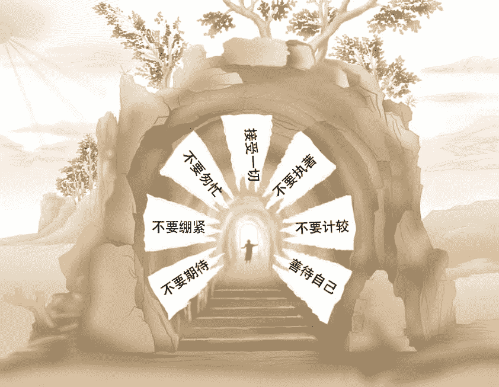

### 内观的实践

**停止不良的言行举止**

不可做任何骚扰他人安宁的言行举止，否则净增烦恼，要遵守戒律及外部世界的道德规范。

**培养心的控制力**

将心专注于一点即气息上，尝试延绵不断地觉知呼吸出入。如实观察自然的呼吸，不要刻意控制气息。

**开展洞察力**

体验自我实相，借着有系统的与平静的观察，观察自身不断变化的身心现象及显现的感受。

## 全观
一种不加思索的冥想

既然我们的思想能变得完全专注，心也就能达到彻底的寂静。心一旦寂静就会带来念头止息，人会感觉不到时间、空间、差别和境界，将不同于日常习惯地觉知一切。

* * *

#### 全观前放弃一切知识和言教

这里的知识包括了我们所掌握的各种概念、理论和推理分析等逻辑思维的技巧，大多是经由左脑思维而得到的“财富”。但要进入冥想的全观境界，就必须放弃、坚决“割舍”掉这些财富，因为它们是“言教”的产物，也就是某种权威知识或思维模式。当我们在冥想中思考或运用它们时，实际上就如同追随别人而去。如当你想象月亮时，你去想象它的温度差、表面结构和矿物质等，月亮作为一种美好象征物的精气神就全没有了。所以把这些知识、理论及言教全部放在一边，甚至也完全撇弃自己的习惯所培养起来的认知、倾向和偏好，以崭新的生命状态注意和倾听那些投射在寂静心灵上的“存在物”——可能是一道明亮的、启发内在自我的光，也可能是一种深刻经验的发现，如冥想月亮的乍圆乍缺、乍现乍隐能给自己不被平等对待的身心以抚慰。

#### 全观就是自我中心感完全不见了

生活在现代社会里的人，越来越感到真正交流的减少，我们的身心被一种叫做工作焦虑的强迫性意识和私人生活空间的隔离感所挤兑，越来越只看到自己周身的小环境，及听到内心的欲念喋喋不休。怎么办呢？如果我们不运用全观的方法进行冥想，人们根深蒂固的自我中心感就无法去除，仍陷在“小我”的知识、经验、情绪中。这是因为全观是不要有“我”（或“我的”）、“非我”（或“非我的”）之分，人的觉知也不被“先入为主”或“习惯定式”的概念性东西所阻碍，就只是全心全意地让心灵感知一切，享受真正的空寂中的那种超平静体验。但全观不是专注，专注仍然有“我”的存在，不能脱离选择注意目标的成分，内心对别的东西、意识还存在抗拒和压制，而全观就是不再想操控什么，也不再被操控——错误的冥想方式，只汇集全部的能量去走出内心混乱和失衡的状态，降低压抑情绪对能量的消耗。

### 日常意识、专注和全观

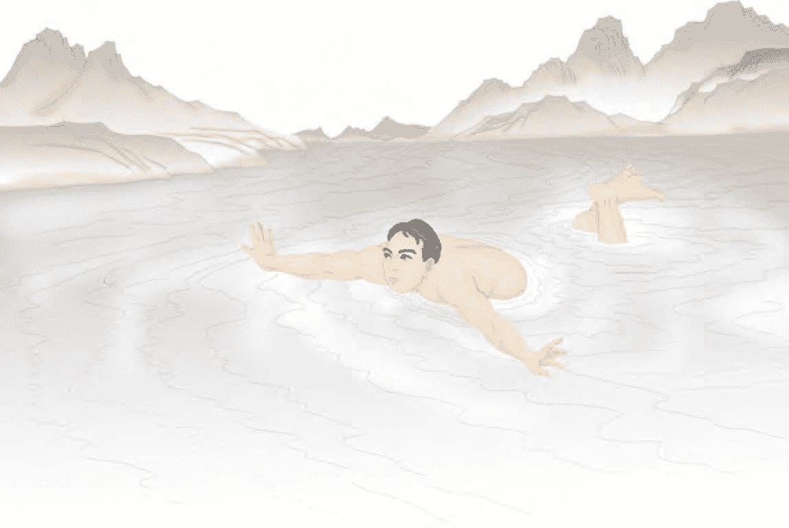

**日常意识**

把发现外在世界作为自己的主要任务。如游于湖中，身体探出湖外，边划边“观赏”周围的风景，“我”每前进一步都需要现实的动力，容易感到疲劳。

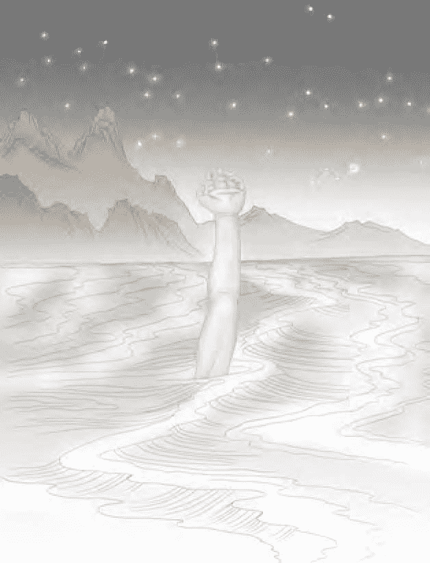

**专注**

努力屏蔽外部影响和排除杂念。如同在黑夜的湖中游泳，仅一只手露出在湖面上，好像它要集中全力抓住“专注的对象”。

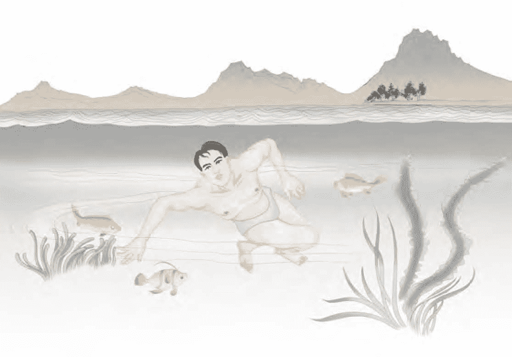

**全观**

在潜意识中自由漂浮，发现一个非思想所能构造出来的“空境”。如同深入湖面之下、身体极端放松地潜游，在这里感到浩瀚无边的空寂，时间仿佛停止，记忆被净化，那个不断进展、冲突、达成、观察的“我”也静止了。直到到达湖底时，也就看到了人心。

## 唵咒
瑜伽圣音介入冥想

从前，瑜伽师修习冥想是一种沉思法，就是不做声，只是沉思默想。后来渐渐发现冥想时不断念诵至尊神（OM）之名，就能够控制心情变化，抗拒外界干扰。

* * *

#### 唵是宇宙间最神圣的圣音

唵就是 OM，它是古印度《奥义书》这个神秘符号系统中的中心符号，据称为印度最高宇宙神（梵）的读音，过去汉语将它音译为“唵”（读如嗡音），意为“极赞、极致”。在印度婆罗门教中它是宇宙三大主神的密咒（代号、密码），被视为宇宙间最神圣的圣音，也是印度教、佛教甚至一些别的教派的祈祷语。

OM 的元音“O”是一个复合元音，由“a+u”复合而成，故 OM 也写作“AUM”。瑜伽世界有一个关于 OM 来源的有趣说法：宇宙创世之初，天体星球发出细微的嗡嗡的震荡声响，很长时间内这种音波一直存在，并积蓄了越来越强的能量，很多生物及宇宙其他事物随之诞生，那最初嗡嗡的声音被记录下来，就是 OM。因此，OM 是宇宙原始音，代表了一种产生强大新生事物或能量的力量，是冥想中可以听到的声音。

#### 念诵唵的意义

唵（OM）这个声音，不仅有作为符号的哲学意义，表示无上圣音，从语音学的角度，它同样有很丰富的内涵。

唵是宇宙间最具包容性的声音：首先，它的第一个字母是 A，这是最根本的声音，发音时不碰触舌头或上颚；M 代表着（印度）字母表的最后一个首，它是闭唇首；U 是从舌的最根部滚动到声带的底部。也就是说，AUM（OM）音能代表发音的整个现象。因此，念 AUM 时心胸会开阔，仿佛能容纳整个宇宙。在瑜伽修炼中，反复念唵意味着与梵同一，也就是个体意识和宇宙意识相接。

AUM 的这三个音在冥想中吟诵也有心理学意义：A 发作 Ah，是呼唤的圣音，冥想时人们可能感到是在呼唤上帝之类的神性；U 发作 Ooh，给人持续不断地专注之感；M 发作 Mmm，是收口音，代表心灵逐渐走向安静无声、宁息安详。

### OM 字禅法

##### 唵代表梵我合一

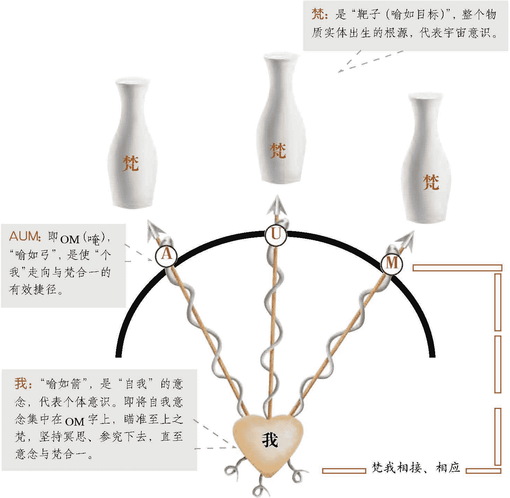

##### 从 OM 的三个音——A、U、M 推导出一个“宇宙三形式”

**空间三形式**

包括：长、宽、高，地（有形）、火（介于有形和无形间）、风（无形），大地（核）、大气层（中层）、虚空（更高层）等多种。

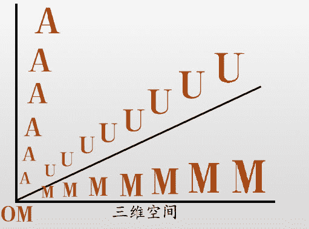

**时间的三形式**

时间的阶段划分是：过去、现在、将来；从意识思想（具时间性）的状态划分则是：有意识、睡梦、无梦三部分。

## 脉轮
身体的能源中心

脉轮在生理方面与器官功能有关，在心理方面则影响情感及精神，它们沿着脊椎按顺序、有一定间隔地分布在主气脉上，并对应不同的感觉器官、色彩及五种元素和空气。

* * *

#### 脉轮是生命能量控制中枢

脉轮（chakra），梵文意思是轮子、转动，指能量汇聚集中在身体的某个部位（即能源中心），循环转动，成为体内能量进出的管道。古印度瑜伽术认为人体有七个能源中心，且它们都以盘旋的轮状出现，贯穿身体的前后部分，能接收和传达精神、社交以及性等方面的能量。因此脉轮可以说是存在于身体、掌管身心运作的生命能量控制中枢，对身体各个器官的机能、感情、精神都施加影响。

#### 三脉七轮

印度哲学用“三脉七轮”来概括身体内能量运作，认为能源是通过三个主要渠道，即中、左、右三脉，在人体中流动。中脉贯穿脊椎的中央，是身体内的最重要的脉道，又称为命脉，蓝色。左脉和右脉分别从左、右鼻子开始，上至头顶，沿着中脉交错向下，直达脊椎根部。三者在七个汇合处相交，其汇合点就是气轮。

七个气轮是体内的七个能量中心，依次名为海底轮、腹轮、脐轮、心轮、喉轮、眉心轮和顶轮。其中前三轮是人生存在世界的物质基础，和身体意识相关；后三轮是人的精神基础，和高我意识及灵魂相关；心轮位于中间，代表爱，是连接人性和神性，物质和精神的桥梁。

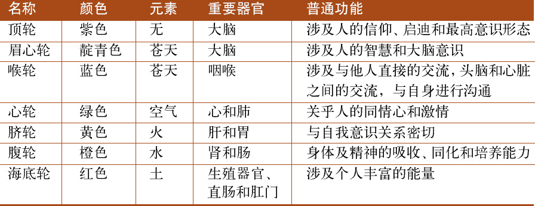

### 关于脉轮的冥想

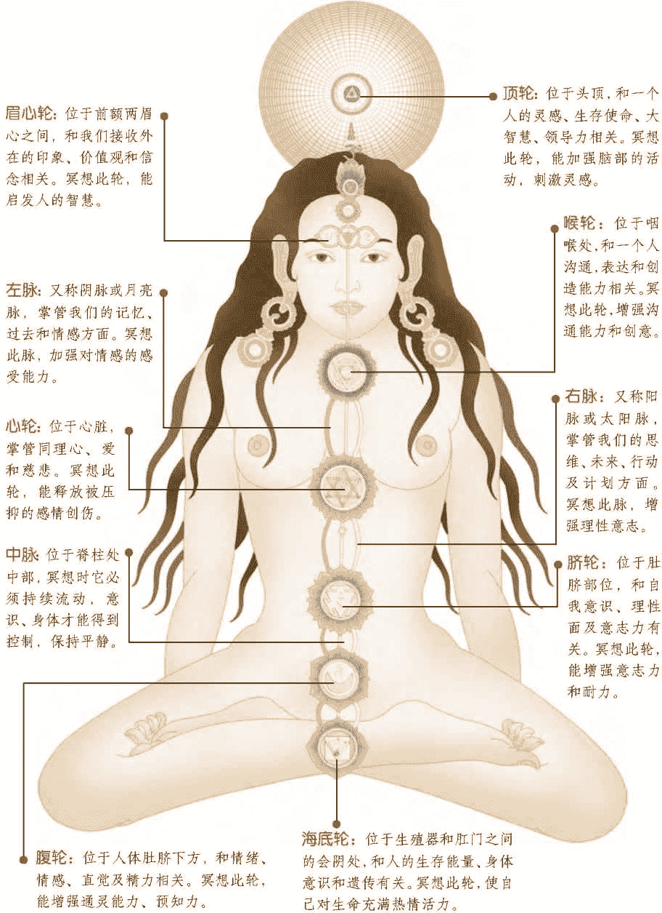

## 三摩地
冥想三昧的极致境界

三摩地，也称“三昧”，指心灵处于完全的平静，身心在各个方面保持平衡。瑜伽的最高境界在于冥想，最终进入纯净三摩地，一种最高意识的知觉状态。

* * *

#### 与冥想的对象同一

三摩地或三昧意即“甚深的禅定”，是随着禅定功夫的深入，修习者及釆用的方法、对象，与目标和过程三者完全融合，时间和空间、身体和心灵完全合一的一种境界。日常生活中，三昧也指融入某对象，并陶醉在和它灵魂成为一体的状态。

有个弟子想要学习冥想上帝，就求助于他的导师，但在冥想时仍不由自主地想起他心爱的水牛。导师就说：“那你就从此冥想水牛吧。”弟子依言。几天后导师去见他，他在屋内应道：“老师，恐怕我不能出来迎接你，这扇门太小，我的角会被卡住。”导师答说：“你已经与冥想的对象相连了，现在观想上帝，也肯定会成功。”这则寓言表明三昧就是觉知的主体对自身的知觉消失，即经由某种专注达到的超越肉体的更高意识层次。

#### 实现冥想的最高境界

三摩地或三昧是全神贯注地冥想，由深度思考而达到的超意识状态，这时人的心境犹如一块优质、透明的玻璃或宝石，天然澄澈，清明纯净，无挂无碍，专注凝神。这种境界是人对冥想的对象周流不断地觉知，以至感到自我的幻象和观想对象时所产生的幻象合为一体，具体而言又分几种情况：

一是杂念止息，心神合一，达到从世俗中超脱出来的境界。这种境界容易达到，人们只要用全然专注于对象所产生的本质印象取代日常意识中的尘世印象，就能获得超越性的认知。或者直觉到自己“与世隔离”，处于一种“顿悟”状态。

二是在智能明朗、心灵净化的同时，感觉到自身此时此地就幻化成所专注的对象，如那个冥想水牛的弟子，他处在一种不辨自己是牛是谁的状态，心完全被对象同化，这是一种更具超越性的冥想境界。前者属于“灵魂开窍”，后者属于“神灵附体”，都是为了断除一切烦恼而证得真理——这才是冥想的最高境界。

### 冥想达到三昧境界

##### 冥想的进程

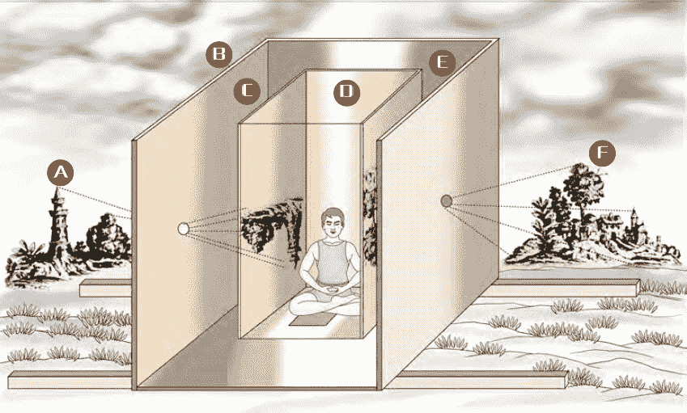

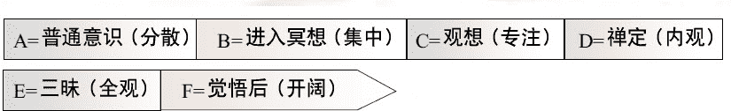

##### 三昧境界

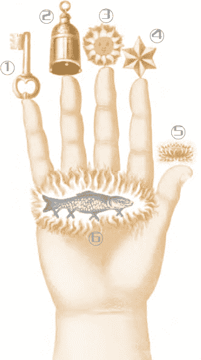

**①钥匙：** 象征打开智慧之门。知识可以由理性思考、超意识两种途径进入人脑，三昧就是后面这种能获得更高级的知识或智能的境界。

**②法铃：** 能起到警示作用，象征人入三昧从此便自我警醒。

**③太阳：** 代表积极的思想和良好的心态。指人在觉醒之后不会被消极的思想所蒙蔽。

**④六芒星型：** 代表女性的力量，象征彻悟后能获得“地球之母”的能量，即潜能。

**⑤莲花：** 象征三昧就是一种开悟状态，包含身心合一的人格。

**⑥掌中煎鱼：** 象征能控制压抑性情绪，表示醒悟后从受束缚的思想、心理中解脱出来。

## 心灵感应
一种神秘的心理能力

人在用心灵的眼睛看想象中的事物或场景时，冥冥之中觉得它存在于某个地方或在一处曾经或将要“上演”，这种感应能力在冥想中较之平时会强烈很多。

* * *

#### 冥想中的心灵感应现象

心灵感应在西方很长时间一直被视为一种神秘的心理现象，通常对它有几种理解：

一是认为心灵和眼耳鼻舌等同样具有捕获“印象”的能力，我们能通过心灵感官得到对身体外的物质世界的无形感觉。如很多看到 UFO（外星人的飞碟）的人未必亲见这一事物，却信誓旦旦声称绝对在某个时间、地点接触过此类事物，就是这种心灵感应现象。

二是相信个体可以“了解”他人想法，或能接收到遥远地方的人或事物发出的无声无形的、瞬间传递的意识信号，具有和他人、宇宙的“心灵相通”的能力。如人能预感到某个地方在发生某件事情，然后赶过去看，结果应验。这种心灵感应能穿越时空，据称可感应到“前生”或未来发生的重要事件，告诫现在要做出某种决断。

冥想能产生这两种心灵感应，常体现为恍惚地感知大脑接应着源于其他人或物质的思维波或信号，强烈时甚至感到脑震荡、摇摆，总之而言就是自己心灵（或意识）与外界发生了一种深层次的共鸣、共振现象。

#### 冥想开启心灵感应之门

由于冥想呈现出一种停止左脑活动，而让右脑单独活动的思维方式，内容多以图像和情景为主，因此它更容易导出心灵感应这种神秘能力。冥想中的几种精神力量的开发就是心灵感应的变体。

**对过去事物的忆念：** 冥想获得的较高层的智能能让人任意进出“记忆之门”，人会具有穿越过去的洞察力。

**观察目标地点的一切现象：** 冥想之人既能仿佛在梦中神游这个地方，又能像穿过“心灵隧道”和那里的人事进行交流。

**好像戴上透视镜看穿人和物休：** 冥想到极端专注的层次就能“自由”和对象进行“心灵对话”，甚至能感到自己产生强大的精神气流改变目标的方位、位置、形态等等。

### 冥想中心灵感应的发生

**蝙蝠装**

冥想能给人体像蝙蝠一样装上了“雷达”——白天黑夜均能探测远距离目标，不受天候阻挡，有穿透能力——是心灵感应发生的机制。

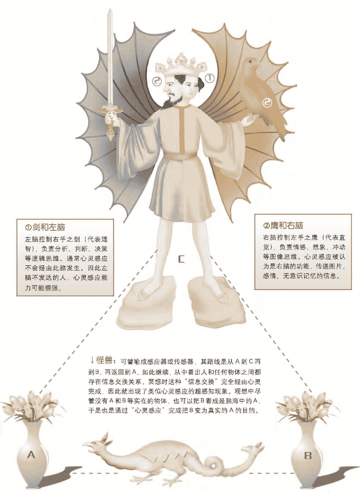

## 暗示法
同本来的自己对话

暗示是心灵感应层面的一种形式，它表现为有意识的和无意识的暗示、自我暗示、他人带有强制性的暗示、言语暗示等多种。

* * *

#### 自我心像：成功冥想暗示的基础

一个人无论做出怎样的行为、表现情感及才能等都是从自我意识出发，这个自我意识包括了个人对自己的一个固有认识或内心对自己形象的构想，如果把人“对自己形象的构想”称做自我心像，那么人的言行就永远与自我心像相吻合，同样人们也能从他人的自我心像中判断出其性格和需要。成功的暗示就是让某种信息与被暗示者的自我心像最大程度地吻合，如有人认为自己正处于饥饿，这就是他的“自我心像”，这时暗示他水果在冰箱里，就能激发他的原动力——立刻去将拿水果的行为付诸实践；或者如不停地问自己：我是谁？我想了些什么？我的生命目的？

冥想法主要就是观察自我心像，通过“强迫性”专注于一支蜡烛来行使自己的力量与意志力，若此时注意转移到其他事物上就不可能成功地了解自我心像，若持续在蜡烛上，就会发现自我本来的心性：如“我是个充满斗志的人”，“我有实现一个计划的力量”等等。

冥想要达到“梵我合一”的境界，就是指发现自我心像后，使之和广阔的宇宙意识相契合。

#### 观想暗示：冥想最主要的暗示法

从自我心像出发的暗示法会受到过去经验及反应的影响，也就是人们会从自认为是什么而行事。观想暗示离不开对自我心像的发现，但更强调一种“成功预演”的暗示过程，它是指冥想者让渴想看到的一幅画面或目标已经达成的情景反复在心灵之眼中“预演”，这样身体内的原冲动就会突然爆发出不可思议的超常能力，完成在未进行观想暗示前做不到的事情。

自我心像属于接受自己本真面目和需要的暗示，观想暗示就是把自己提升到更高级意识或心灵、更高层觉悟或能量的暗示法。它们都能改变脆弱的自我意识的面貌，而使自己的内在意识变得积极、强大和有目的性。

### 冥想暗示法的正负作用

自我心像是冥想暗示法的一个前提、根据、基础，由此引发整个个性行为甚至环境的改变，我们的体验似乎是要证实并加强我们的自我心像，常常一个有利的或谬误的循环因此而建立起来。

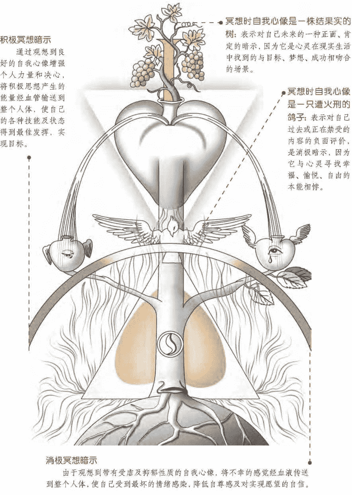

## 平静符号
审视具有召唤性质的符号

当人们面对或暗诵平静符号进行冥想时，心中就会自然平静。平静符号的意义就是为了最方便地给冥想者提供放松、平静。

* * *

#### 平静符号的模式

最初的平静符号是咒语的文字形式或者具有神秘性质的语句，包括梵文真言（如六字大明咒）、古老经文等，能消除心中一切思绪，导向平静。每种文化的平静符号都是这种文化符号系统中具有核心意义的符号，如十字架、太极图等。它们都具有高度象征和精神意义，并像太阳一样让人联想到光明、积极的内涵。运用平静符号的有名例子是念唵咒和交叉划十字，冥想中常见平静符号是蜡烛、莲花和湖水，能让意识在波动摇晃中变得平静澄澈。

#### 平静符号的种类及特征

**第一种平静符号是情绪符号，处理人情理层面的问题，倾向具有个人性质。** 当人们希望改变逆境时对着吉祥图像、吉祥符号（如倒字福、毛主席像）冥想，能增加对未来的信心；当人们期盼财源滚滚时冥想财神爷，这样财神爷的像就是给人带来财运的平静符号。有童年创伤、感情创伤及不良习惯的人应在冥想时使用这类平静符号，如一篮成熟草莓，想象即使会腐烂仍拥有美丽、鲜艳、可口的时候。

**第二种平静符号是力量符号，处理人心理层面的问题，倾向具有集体性质。** 最著名的力量型平静符号是万（卐）字符，它来源于佛教，被视为具有吉祥和功德的意义，在藏密表示坚固，而在很多地方它被视为一种魔咒，代表权威及强大的控制力，如纳粹的万字旗。冥想此类符号就会让人体内像穿过强大的能量气流，意识迅速集中，释放出压抑着的潜能。

**第三种平静符号是超越时空符号，处理人灵魂层面的问题，兼具有个人性质和集体性质。** 如密宗曼荼罗，以交叉的三角形、圆形及方形等图案象征整个心灵宇宙，既是宗教神坛的标识，对个人它也有永恒的意义，如三角形的坚定、圆形的轮回、方形的永固等，能提升人的灵魂的层次，又能抚慰人的情感，如超越时空的水晶这种平静符号使人心情澄明、透彻。

### 冥想不同类型的平静符号

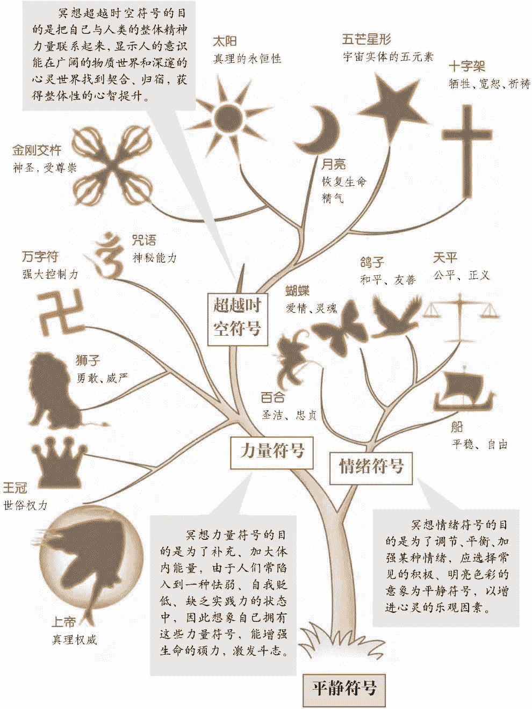

## 密法治疗
运用神秘术进行治疗的代称

“密法”源于佛教密宗修持法，藏密用灌顶的方式传授弟子“密法”，在冥想中只保留它作为一种神秘治疗之形式的意思，与密宗的具体修持方式“三密”无关。

* * *

无论是原始、野蛮的巫术迷信的医疗手段，还是带有现代心理学色彩的精神治疗，都产生过很多神奇般治愈的案例，以致从古至今都会有人相信神秘治疗术的存在。东西方运用与冥想有关的神秘术进行治疗的例子介绍如下：

**（1）自然冥想疗法：** 与自然养生术有关。冥想时使自己的行为更符合自然，身体放松，调整呼吸，平衡身体阴阳，顺应天然的内心想法和季节饮食变化；或在大自然中找一僻静处不受干扰地进行冥想，疾病就会慢慢好转。

**（2）星象学疗法：** 认为人体和宇宙磁场存在互动密切关系，星体的移动左右着宇宙和人类的磁场，因而要按照星象学来安排疗程。冥想星体移动方式或星象改变轨迹，也能产生从宇宙中汲取强大能量气流的功效。

**（3）冥想“五芒星”：** 尖角向上的五芒星代表着“生命”和“健康”，被作为守护符和治疗伤病的符号。这是因为从整体上看，五芒星就像一个人的身体，最顶上一点为头部，其余为四肢。因而冥想它时能带来让生命力回归人体的幻觉。

**（4）冥想“心灵粒子”：** 个别西方作家认为在心灵活动与现象当中一定充满了许多常人肉眼看不见的“能量粒子”，它们带有人类心灵的讯息，会听从指挥，也会去产生作用，且每个人的数量与精纯度不一样，因此冥想很多心灵粒子向身上聚集也能改变肉体疾病状况。

**（5）磁治疗：** 和前面种种冥想中产生生命气流向身体灌注的状况一样，治疗师将手伸给病人，通过双方意愿的努力或引导性冥想暗示，体内产生强大的气流，该气流由治疗师的手传给病人。在磁治疗过程中，治疗师和病人都会发散出不断增加的气来影响病变部位。

### 冥想和灵异治疗

##### 冥想是灵异治疗的一种手段

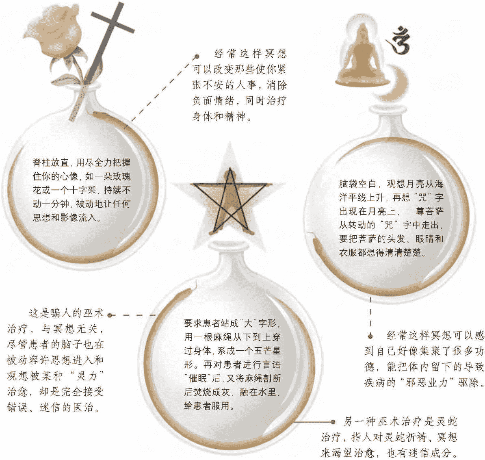

##### 冥想“灵力”治病

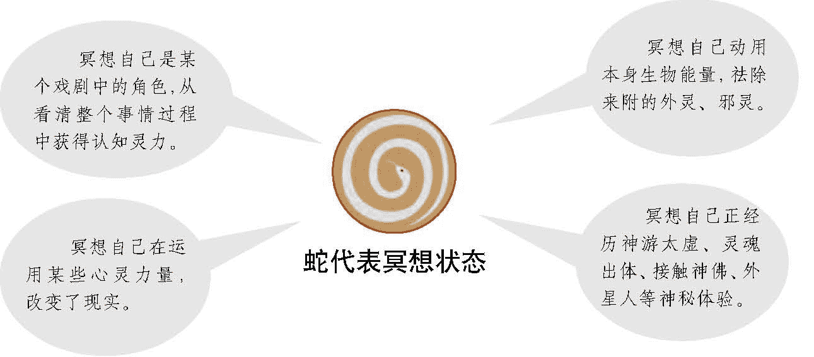

## 蓝图
对自我精神的积极引导

冥想就是让自己的思绪游离于身心之外，与虚幻世界结合，在脑海里展现一幅充满积极想象和成功图景的蓝图。

* * *

#### 蓝图：对虚构世界的想象

在人类的各个领域，都存在想象设计的元素，它和付诸实践后的成果之间存在着不断展开、变化的蓝图。所谓蓝图，就是关于未来信息或现实的预先构想，它源于人们想象的天赋、第六感直觉、分析推理的思维以及对未知生命和世界的好奇等。想象是构造生命蓝图的关键，灵感也常“孕育”一些不朽蓝图。放飞思绪，通过观想将蓝图想象得越来越清晰，就能拥有将它变成现实的力量。

每个人心中都有自己的蓝图，它是能让自己感到身心愉悦的、积极美好的、充满期待的图像。冥想法的实质意义就是一种发挥想象，让人的心灵在美好的图像里找到安宁、平静的练习。这种想象也是对自我精神的积极引导，且是简单冥想法中比较广泛利用的一种方式。人们在冥想时应该充分地发挥想象，根据自己的需要和想象力来组织心中的蓝图，就能帮助自己在困境中找到自我、内心平衡的感觉，实现期待中的目标。

#### 蓝图冥想的方法

（1）从头到脚地放松身体，闭上眼睛，慢慢地、稳定地、有规律地呼吸，面带微笑，愉悦地想象着理想的蓝图；

（2）心中逐渐打开一幅画面，这幅画面给自己的身心带来从来未有过的放松、轻松感，使自己能够整个沉浸在其中，感到意识处于恍恍惚惚、轻飘飘的异样状态；

（3）持续陶醉在这种轻松的想象中，此时感到自己如进入一个太阳帝国，光芒四射，理想的激情万丈，忽然它又很快被湮灭，自己恍然又看到波光消散下的澄澈的湖水（湖水代表人心，水波表示意识波动，炽烈的太阳暗示对理想的强烈追求欲望）；

（4）想象温暖的阳光洒在平静的湖面，湖水清澈见底，身体热烈、湿润的感觉不见，变得安宁、祥和，所有紧张、疲劳在最后都消失了。

### 蓝图冥想的具体步骤

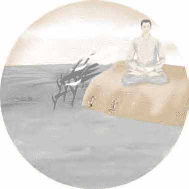

**1** 　想象这幅画面：你正躺在或者坐在一个美丽的湖边，微风拂面，皮肤正呼吸着周围湿润的空气，身体在吸收着大自然的能量。

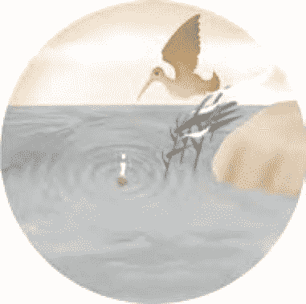

**2** 　继续感受这种轻松：风吹过湖水，水波被撩动，一层一层地荡漾开来，此时感受美丽湖水的轻盈。一只美丽的大鸟飞过湖面，顽皮地从嘴里扔下一颗小石子，湖面又被撩拨开去，一圈又一圈，然后湖慢慢平静下来，平静的湖水清澈见底，想象着你的身心就如这湖水一样平静、安宁。

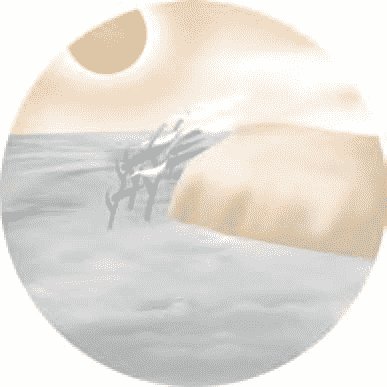

**3** 　想象温暖的阳光照在湖面，一切变得温暖起来，你的身体也变得温暖起来，让你的身心感受着这种温暖与平和。

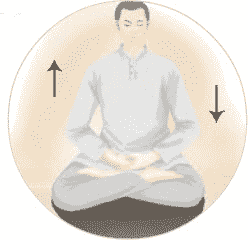

**4** 　把注意力慢慢转移到你的呼吸，平静地、深长地呼吸。每一次吸气想象你正吸收着阳光、温暖和大自然的精力；每一次吐气时，想象你的身体慢慢变重、下沉，整个身心就像周围的环境一样安宁祥和。保持这种状态 5 到 10 分钟或更长时间。

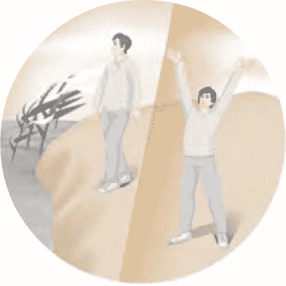

**5** 　当你处在各种紧张和压力的情况下，你也可以选择仰卧或舒适的坐姿，想象着自己解决完各种问题之后的状态或者成功时候的状态。

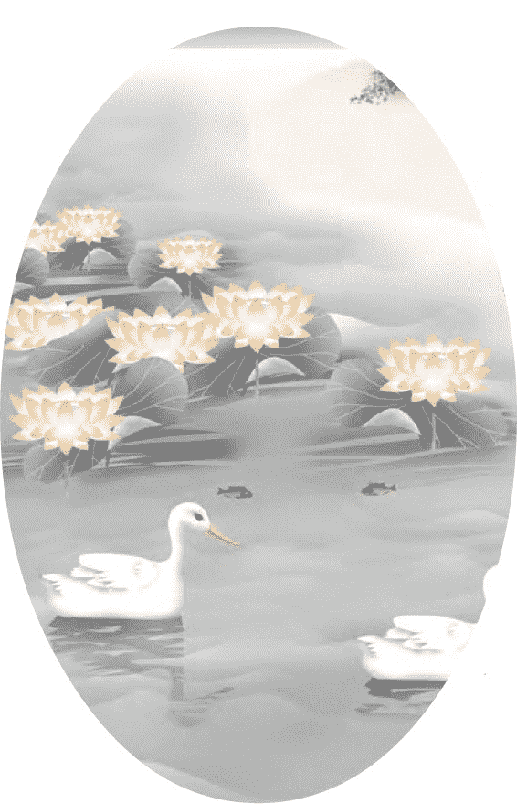

# 第四章
冥想的第一阶段
准备工作

过去冥想是佛教徒修道的“筏子”——他们在去除私欲的静坐冥想中进入禅定，以促使意识纯粹、精敛，达到平心静气、强化意志和扩大慈爱之心的目的。而在今天，冥想更重要的价值是帮助人们克服主观在客观世界中的不适感，它通过真正的静心及调身、调息的法门，跟随内在精神之光的指引，察知自己的思维与情绪模式，完成身心净化的全过程。

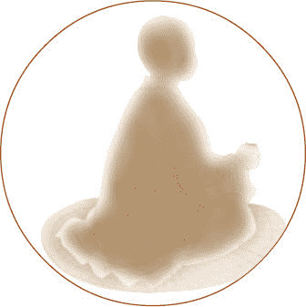

### 本章图版目录

练习集中注意力：将能量完全聚合在对象物上

冥想中的想象：映着自性的河流

冥想训练：拟定一个计划

想象在一个空灵的空间

静坐前的伸展放松运动

冥想的各种坐姿

冥想手印大观

调整呼吸的技巧

练习调心

平静运动

用于观想的曼荼罗

和呼吸同步的声音冥想

冥想者的服饰

调饮食的做法

佛祖的观想

## 关于自我的实验
投入全部注意力

冥想就是把注意力集中在某一特定对象（呼吸、物象或意念等）之上的深思方法，当努力将思維持续不断地趋向同一个方向时，自然就进入了冥想的状态。

* * *

#### 必要性

防止外界诱惑：无论你用哪种方式冥想，或第一次体验冥想，过多分散注意力的信息都会难免刺激身体的某些敏感元，造成感官疲乏及情绪失控，尤其在当今信息爆炸、娱乐方式层出不穷的都市群落。

脑清空一下：大脑就像一个“养鱼池”，外界给多少“信息饲料”都貌似不为过，却会无形中扼杀许多新生的“小鱼苗”——有生命力的灵感和创造的火花，也给其他“鱼体”（身体和思想）造成疾病。

#### 准备工作

**▲场合** 　在任何地方进行冥想，都必须先确定至少一段时间内不会被干扰。

**▲时间** 　每天给自己空出 10 到 30 分钟，什么也不干，什么也不想。

**▲方法**

**（1）提高对身体的自控力：** 人的身体需要管理，精力缺乏会影响对它们的控制，必须在冥想的前期通过各种姿势的练习，使它感到自然、放松、舒适，注意力才更易集中。

**（2）培养长时间注意的习惯：** 在平时尚未进行冥想时，就要令视线、听力无论接触哪个目标，墙上的一个斑点或蜻蜓的震翅声，都要产生能对它投入比较久的注意力的惯性。

**（3）训练更高集中意念的能力：** 意念是人体最复杂的“麻烦对象”，它天生具有流动性和分散性——活泼好动、喜新厌旧，必须学会将它“封锁在心灵匣子”里。看一朵花或一块石头都能将意念汇聚在一个对象上，但你要成功地运用技巧使它锁定得更久、更坚定些。

#### 注意事项

最主要是避免人的大脑经常会有的、“目标对象”的形象在意念中一闪即过的现象，要持续保持注意。

### 练习集中注意力：将能量完全聚合在对象物上

##### 专注观察实物

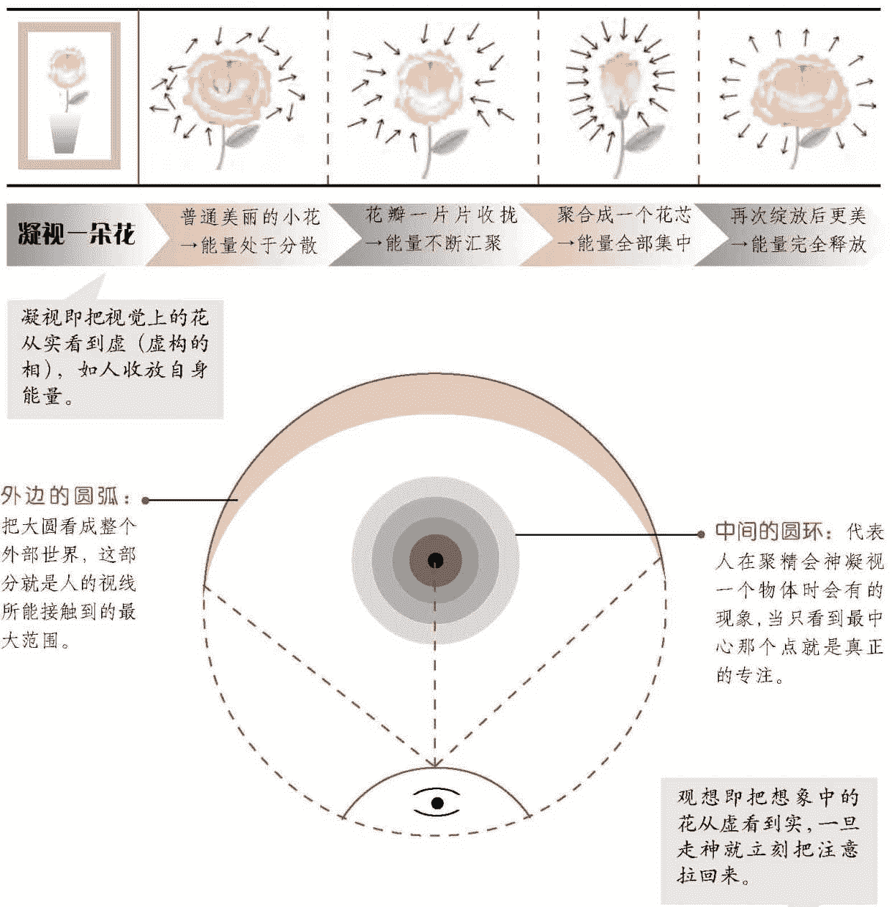

##### 专注意念之物

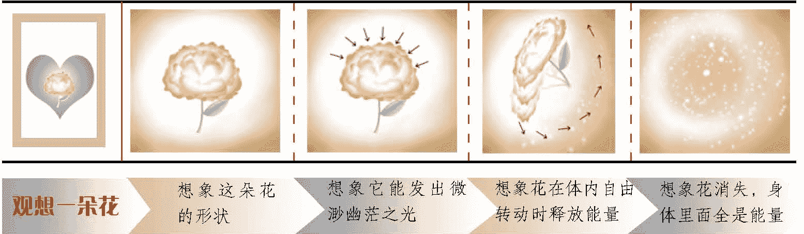

## 排除无价值的幻想
驾驭想象

对于冥想练习，最主要的不仅仅是专注观察，而是要通过学习观察，能在保持注意力集中和头脑清楚的同时，让精神分离于物外，能观察自己想象中的意识。

* * *

#### 摆脱习惯性的思维

驾驭想象不是要驾驭思想或控制想象——至少在禅宗教义看来控制自己的想象是徒劳的，而是要学着和自己的各种情绪、想法、想象中的情景等建立一种新的关系。这种关系必须建立在以下能力之上：

**（1）大脑不受约束的观察能力** 。这里观察的目标不仅是凝视或观想的对象，还包括在大脑中自由出入的意识及情绪反应等。

**（2）放飞想象的能力** 。不是每个人都拥有发达的想象力，大脑的想象潜能没有被开发，“看物还是物”，只能被排除在冥想的门外。放飞想象是驾驭想象的前提。

当人具备这两种能力，就能从习惯性的思维中摆脱出来，提升对物象和自己意识状态的感觉，使冥想中的想象更具有一种发现性的眼光。但想象绝不能太随意或与目标脱离，否则就超过了冥想专注的范畴，变成杂念或空想，这就是一种无价值的想象。

#### 驾驭想象就是引导式想象

想象分为引导式想象和非引导式想象，冥想中的想象更接近一种引导式想象的形式。引导的目的是要使人的意识和感觉得到提升，具有察觉、发现、识别、认知的能力；同时使自己不陷于想象的纷乱和外在世界的干扰中，不让头脑内产生任何与冥想本身无关的“思想辩论”。引导式想象的步骤包括：

**（1）必须让心灵平静下来** 。要使头脑清醒并摒弃无关的想象，就必须先让自己处于各方面都稳定、平静的状态，否则稍微的“波澜”都会让人不由自主地想象和联想其他状况。

**（2）训练头脑“捕捉焦点”的能力** 。捕捉焦点不仅是专注目标，而是与人是否有集中对某一物体沉思的能力有关。引导式想象离不开善于沉思的头脑，否则会流于零散和肤浅。

### 冥想中的想象：映着自性的河流

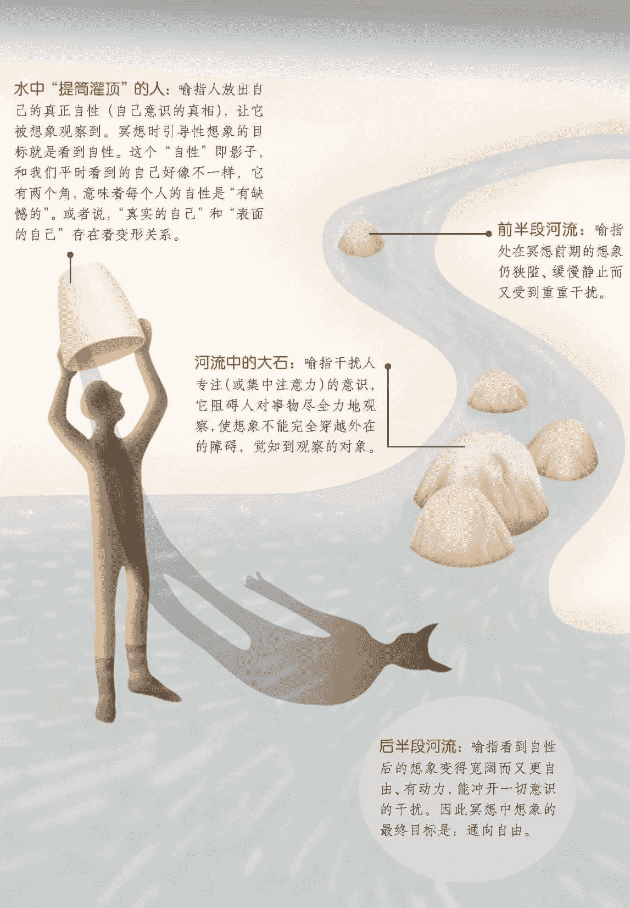

## 安排冥想的时间
每天 20 分钟

在“现代社会病”丛生的当今，冥想是最简单易行的放松方式和治疗方式，既能使自己更好地投入工作，也能使患有各种难缠的身心疾病的人恢复健康。

* * *

#### 学会在四维的宇宙中静默

从某些角度看，思想是有时间性的，因为它在不断流动变化；物体是有时间性的，因为不同时间产生的思想看同一个物体也会发生改变。冥想观察的对象是自我意识，自我意识随着时间变化而改变，因而也是有时间性的。思想、物体、自我意识、时间等构成宇宙的四维结构，冥想实质上就是人在这个四维结构中让思想保持一下静默——平时纷繁杂乱的思想如同喋喋不休的“老母鸡”一直刺激着大脑神经。

#### 训练每天专心冥想

冥想并不是人们想象的那样简单，就是让自己一动不动地去想，也不是躺在一个舒适的房间里望着天花板般的悠闲，而是要在沉思的过程中与自己“对抗”——发现平时所没察觉到的真实的自己。这需要一段静心的时间，且持续静心才能提高自身对抗疾病的能量。

你必须要克服一些消极的念头，追求那种令人神往的冥想境界，这就需要训练每天给自己的大脑腾出一些“空间”，让想象的小鸟无拘无束憩息、飞腾，最快地觉知自已情绪的真实面貌。所以，冥想就是每天花点时间让自己保持“宁静的警觉”状态。

#### 冥想需要的时间

冥想最好要让自己完全独处，这样心灵才最容易处在平静状态。这个独处的时间不宜过长，也没有必要。冥想也不宜过短，尽管现在很多人提出“3 分钟冥想法”、“7 分钟冥想法”等，但大多时候这些方法只能短暂提神及恢复注意力，而真正的、持久的冥想才对身心健康有明显疗效。

建议投入冥想的最佳时间长是 10—30 分钟，其中每天冥想练习以 20 分钟为准，形成规律性的冥想实践。且一般在清晨及下午时，冥想最有效果。短期冥想能使体内的焦虑感和应激激素减少，缓解压力，长期持续冥想益处无穷。

### 冥想训练：拟定一个计划

刚开始学习冥想的人，不管是 2 分钟还是 2 个小时，都会觉得度“分”如年，甚至花很长时间都无法沉浸在冥想的状态中，更谈不上进行自由的冥想。这就需要拟定计划，有规律地进行冥想练习，有效地帮助自己放松，持续保持身心健康。

**1．练习频率**

一旦开始冥想，最好每日坚持，无论天气晴朗或狂风暴雨，戒掉找借口的习惯。

**2．所需时间**

一般至少 20 分钟。最不方便时也要能静坐 5—10 分钟冥想，保持一下心境自由。

**3．分配时间**

冥想前先用 5 分钟放松身心，持续专注约 15 分钟，最后接受现实并完全超越它。

**4．练习次数**

每天 1—2 次，选择头脑较清醒的清晨及生命气息平缓的下午或晚上，易于坚持。

**5．专注训练**

从挑一个简单的物体开始，如蜡烛的火焰、一个苹果或一只碗，看清自己的感觉。

**6．开启直觉**

听一些能缓解情绪、激发想象、寻思自我的音乐，令自己进入冥想的忘我之境。

**7．选择姿势**

无论你是莲花坐式还是其他姿势，都必须保持脊背挺直，呼吸、身体完全放松。

**8．适应场合**

你不总能找到适于冥想的地方（如完全没人打扰），要适应并不彻底安静的环境。

**9．提升心智**

不断给自己的内心充电，提高抵抗外界压力的能量，拒绝愤怒、焦虑或恐惧等。

**10．自我确认**

在专注 15 分钟后，就开始和自己对话，确定自己已经获得改变，拥有积极态度。

**11．转化意识**

必须使自己的意识上升到更超脱的层面，有重获新生的感觉，追求更高的精神。

**12．始终信实**

从事冥想最重要的是真心面对，虔诚地专注，尽全副精神地觉知，体验真个性。

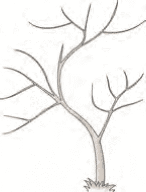

## 选择冥想的环境
寻找专属你的领域

冥想没有固定的场所要求，无论户外还是户内，风景秀丽之区还是简单空荡的小房子，都能作为冥想的地方，只要它能让你产生独处这个领域的感觉。

* * *

#### 冥想的最佳时间和地点

**（1）一个不被打扰的时间＋地点。**

冥想是要全神贯注在当前时刻，因此寻找一个安静、没有干扰的场所，对于想要尝试冥想的人就显得尤为必要。人们只有在没有外界信息“滋扰生事”时，才能将思想限制在专注对象上，和内心的自我沟通。

**（2）同一个时间＋同一个地点。**

当每天坚持练习冥想时，就要尽量选择在同一时间，如固定在每日的清晨或黄昏时间段；选择在同一地点，如自己喜欢的某个房间。时间和地点的熟悉感能减少大脑对外在环境的适应，能尽快平静下来，进入冥想的状态。

**（3）清醒时分＋清静而温度适中的环境。**

人最好不要选择在入睡前进行冥想，否则既无法达到专注冥想的要求，也会被冥想中的单调因素“自我催眠”，加速进入睡眠状态。气候因素也难免会对冥想有影响，如果天气晴朗，最好到外面的清静场地进行冥想，接触大自然更有利于头脑放松。

#### 专属一个人的领域

冥想有个人单独练习和集体一起练习两种，自然而然，前面一种更具有广泛性，也更贴近冥想本身的意义和价值：实现内在自我的超越和提升。每个人选择个性化的冥想空间也更有利于心灵迅速平静。

通常人们把冥想视为一种个人静心行为，解决个性化的问题，反而是都市瑜伽修行越来越倾向于集体练习，让一群人在同一时间、同一空间都有回归大自然的感触，把练瑜伽释放人的原始身体本能充分体现出来。但人在一个独属自己的领域里更能实现自我超越力的提高，因为一些令人困惑的事情常常产生于群体交互中，人们只有独处时才能真正倾听到自己内心的想法，回归自我本心。

### 想象在一个空灵的空间

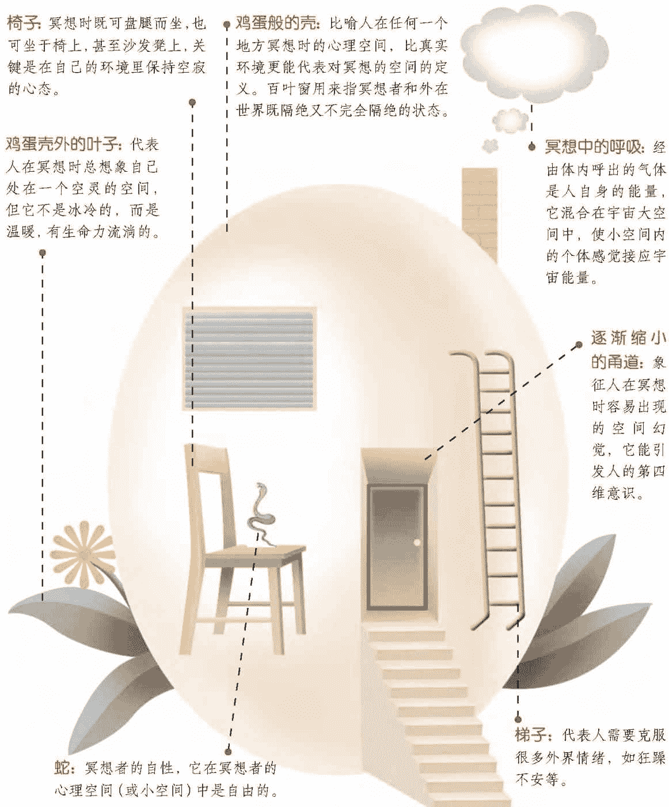

蜥蜴式瑜伽： 人在日常生活的空间中就不免感到像容易受外在环境影响的蜥蜴一样，带着无法摆脱的焦灼感，因此就应该逃出这个“熟悉的日常空间”，进入冥想的心灵空间。

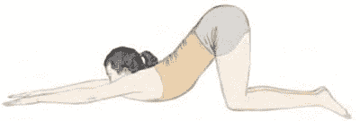

## 冥想前的预备功
放松练习

只有在身体达到完全的放松后，冥想才可以顺利进行，否则，注意力会转移到身体紧张的部位，将意识唤醒，使冥想者无法进入如梦游般的幻觉状态。

* * *

#### 放松和冥想的区别

放松和冥想都需要保持一种平静的状态，来面对生活中的压力，但放松会让人舒服的想睡觉一样，冥想是要人保持既平静又专注的状态。

放松是使全身从肌肉到神经都逐渐舒缓下来，冥想则是虽然放松身体，却会把精神集中在某个定点上，这个定点可以是身体某部位，也可是身外的某个地方。

放松不需要大脑保持警觉或注意力集中，冥想是通过把注意力集中在当前的时刻（如一个特定的物体、图像、词语、短语或情绪上），使人的大脑进入一种更高的意识和警觉状态。

放松与睡眠的状态非常接近，而且持续的放松状态会让你入睡，冥想主要是针对某一场景的想象，通过积极正向的想象可以使人的情绪更加放松。

#### 放松的要求和技巧

**（1）心态放松：** 在进行冥想前，要保持宁静安详的心态，摒弃不安的举止，以从容之心进入，因为粗暴浮躁之相、心意轻浮都会导致冥想者难以入定；还要有轻松乐观的态度，当一个人心情紧张时无法令姿势自然舒畅，而且正面的心态总是比负面的心态有力。

**（2）呼吸放松：** 可以坐着或躺着，闭上双眼缓慢深呼吸，专注于呼吸在身体中进出，将注意力放在身体的感觉上，如在呼气时想象所有的紧张都随着呼出的气体离开了身体，而吸气时想象有一股能量被吸入胸腔，且觉得吸进的能量充满了全身。

**（3）大脑放松：** 在冥想前听一些舒缓、轻松的音乐或闻自己喜欢的香味，同时还可以在大脑中构想一幅最满意的图画，品味画中的含意，使自己的大脑器官收到各种积极的信息。大脑放松的结果是思维清晰、精神平静、注意力集中，及只注意当下。

**（4）身体放松：** 在床上或地面等地方，双腿伸直，微微分开，如果感到不舒适，双腿可以稍做弯曲的姿势；如果头部不舒服，可以在颈下放置枕头或类似的物品；如果背部不舒服，可以放置一些衣物等，以达到舒适之目的。

### 静坐前的伸展放松运动

冥想以静坐为主，当采用传统的盘坐姿势时，还需要预先做一些伸展运动以增强身体的柔韧性，避免稍坐片刻就会感到腰酸背痛，特别是两膝在盘曲中会十分僵硬。

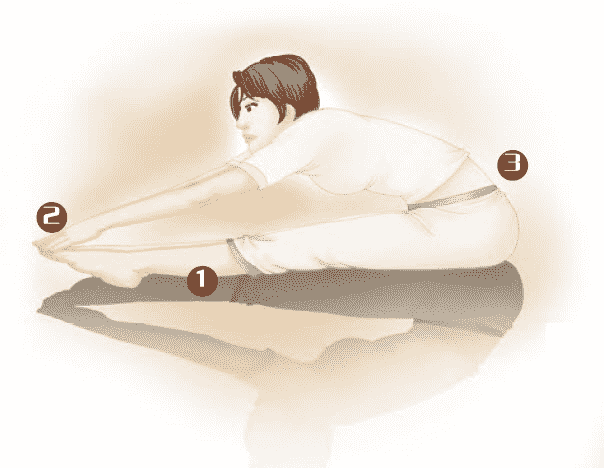

①坐在平坦的地板上，在身体前方伸直双腿。

②向前俯身弯腰，试着用手指去摸脚趾。如果够不着脚尖也没关系，只要尽量弯腰，伸展自己的身体就好了。

③上身不要靠惯性大幅度地来回弹动，而应慢慢向前弯，然后放松，重复步骤 1—3 共 5 次。

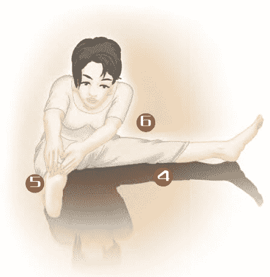

④把伸直的两腿打开成“V”字形，在感到舒服的前提下尽可能把两腿分得开一些。

⑤然后用双手去摸左脚尖，接着再摸右脚尖。

⑥慢慢地伸展身体，往身体两侧重复 4—6 共 5 次。

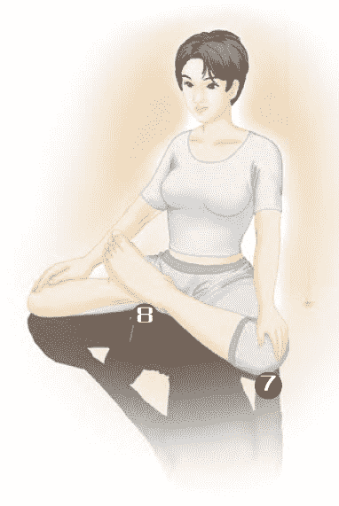

⑦把双脚掌相对并拢，并尽量向自己身体靠近，这时膝盖会离开地面一些距离。

⑧当双脚的脚底都完全相对并在一起之后，用两个手肘慢慢地将两只膝盖向地面压下去，重复这个动作 5 次。

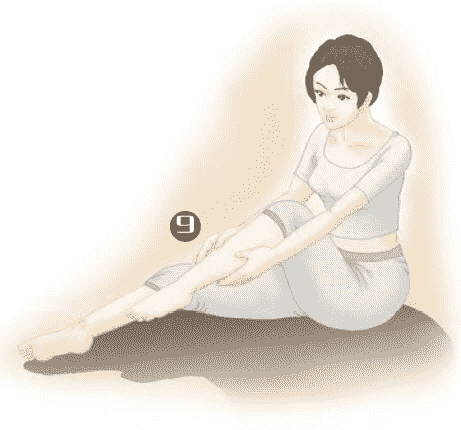

⑨当完成伸展运动后，仔细彻底的按摩双腿，促进血液循环。对脚和膝盖的按摩尤其要仔细。

## 调身
冥想的姿势

最常见的冥想姿势是坐在一个地方一动不动，将双手放在大腿、膝盖上，手掌向下，或双掌朝天，食指和拇指接触，近似做 OK 的手势。

* * *

#### 打坐冥想

冥想的基本姿势都是坐势，或称之为打坐。打坐源自佛陀的修炼姿势，又称跏趺坐，也可能来源于更早的印度苦修士及瑜伽士，为历代大师所传承，可以说是冥想最古老、最基本的姿势。打坐可分为七种，通常冥想采用的打坐方式包括简易坐、半莲花坐、莲花坐、金刚坐、至善坐、雷电坐、吉祥坐等。进行冥想时，坐法是否合适会直接影响冥想的效果。理想的坐姿是挺直背部，身体不要前后左右倾斜，为使背部达到最适合冥想的状态，支撑背部的腿以及腰部都必须稳固地支撑上半身。

莲花坐就是盘腿坐于地面，包括散盘、单盘、双盘等，有时仅指双盘。散盘又称简易坐，单盘又称半莲花座。它能平静和控制整个神经系统，令身体处于安稳、宁静、灵空境界中，蕴藏着使人气定神闲的效果。从科学角度上讲，盘腿坐姿是最有利于身心的，它使下肢的血流减缓，使更多血液流向上肢与大脑，刺激、活化、改善内脏器官及大脑的功能，使人感到安定、放松、清醒。特别是双盘，使身心最大范围的放松，令每个细胞都得到休整和滋润。

练习莲花坐时，一般是：眼睑自然下垂，但不必紧闭；拇指与食指扣成环状；呼吸自动慢下来。同时要下定决心不分散自己的注意力，以这种姿势保持不动，直到感到不舒服为止，并敏锐地感知体内发生的一切。莲花坐是不需要频繁活动双腿的姿势，既能避免精神分散，也能支撑颈部、后背和肩膀，培养起积极的心态。

#### 仰卧冥想

仰卧式冥想是最简易的放松运动之一。进行这种方式的冥想时最好在室内或草地上，可预先在地板上铺放一块垫子，身体放松，仰卧其上，双腿微分，双臂自然伸直放于身体两侧，掌心向上，双眼微闭。头部要摆正，颈椎、脊椎要在同一直线上，注意力集中，避免让自己睡着。冥想要从有意识地放松脚尖开始，直至身体的每一块肌肉都彻底放松，一般保持这种平躺的方式几分钟后才正式开始进行冥想。

#### 瑜伽冥想姿势

姿势、呼吸、放松、冥想、健康的饮食习惯和正确的思维是瑜伽的六项基本元素。它们彼此相关联：姿势是瑜伽的基础，它是调身的部分，健康的姿势能反映出一个人内心的平衡和安宁；冥想是调心的部分，和正确的思维结合，把注意力集中在当下；放松是我们躺着或静坐时完全放开身体的能力，它能去除生活中不必要的紧张情绪，使精神更加集中；呼吸要和动作协调一致，一般当动作是开、伸、起、收时，配以吸气；合、屈、落、放时配以呼气。不强调刻意注意呼吸。

由于瑜伽的姿势有上百种，冥想又是瑜伽练习中达到专注状态的重要方式，因此冥想的姿势也能呈现出“千姿百态”，并具静态式和动态式两种，以下简单介绍：

**（1）站立式**

树式：是用一只腿维持身体平衡的姿势，能提高对自己身体的感知。具体做法是眼睛注视着固定的一点；稳定呼吸；双手自然上举，掌心相对；脚跟有力、稳健，保持身体平衡。

伸展式：是将意识集中在整个身体的伸展上的姿势，能增加四肢的力量，缓解肩部紧张。也可作为放松练习，吸气时伸展整个身体，呼气时将身体蜷曲成一团，膝盖靠近额头，手臂抱住双腿。

山式：是能使人意识到大脑和想象力如何影响、动摇人平衡的姿势。具体做法是双腿和双脚并拢站好；集中注意力，觉得自己慢慢在长高；收腹，把双腿挤到一起，使之形成一个支撑整个身体的坚固柱子。

**（2）仰卧式**

瑜伽的仰卧冥想动作不仅是简单地躺或卧在那里，而是可以分解开来，作为一套组合动作练习：向上举起左手；右手掌心紧贴肚脐；双手搭在腹部，呼吸；抱膝，膝盖用力向外推，手臂伸直；再呼吸，手用力把膝盖拉回来。

**（3）跪式**

从跪立起开始，身体前屈两臂上举，臀部后移到脚部，双手放在地板上，重心前移。

### 冥想的各种坐姿

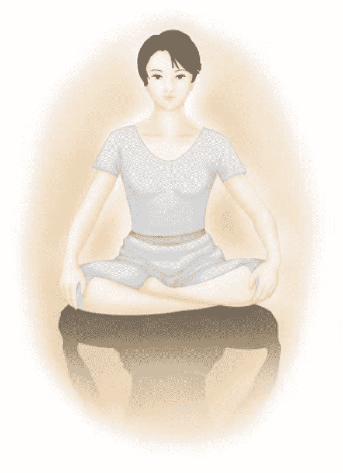

**简易坐**

坐于地面，两腿向前伸直→弯曲右小腿，把右脚放在左大腿之下→弯曲左小腿，把左脚放在右大腿之下→两手放在两膝上→头、颈和躯干都应保持在一条直线上不弯曲。

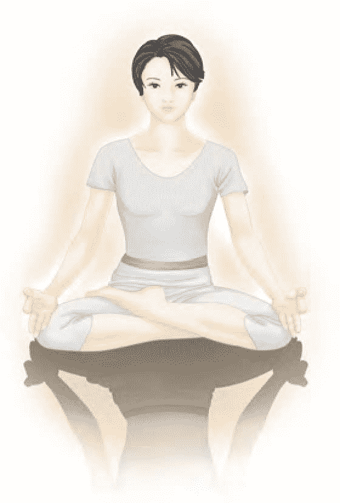

**半莲花坐**

坐于地面，两腿向前伸直→弯曲右小腿并让右脚脚板底顶住左大腿内侧→弯曲左小腿井把左脚放在右大腿上面→头、颈和躯干保持在一条直线上→坐至你感到极不舒服，然后交换两腿位置，继续再坐下去。

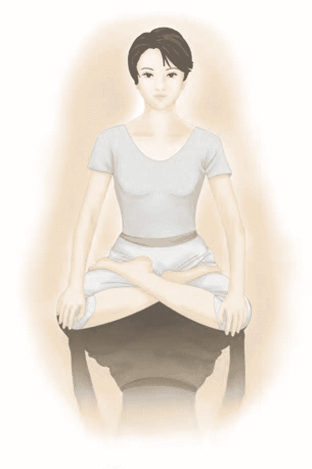

**莲花坐**

坐于地面，两腿向前伸直→用双手抓住左脚，把左脚放在右大腿上，左脚板底朝天→再抓住右脚，把它板过左小腿下方，放在左大腿之上，右脚板底朝天→脊柱伸直→两膝贴在地上。

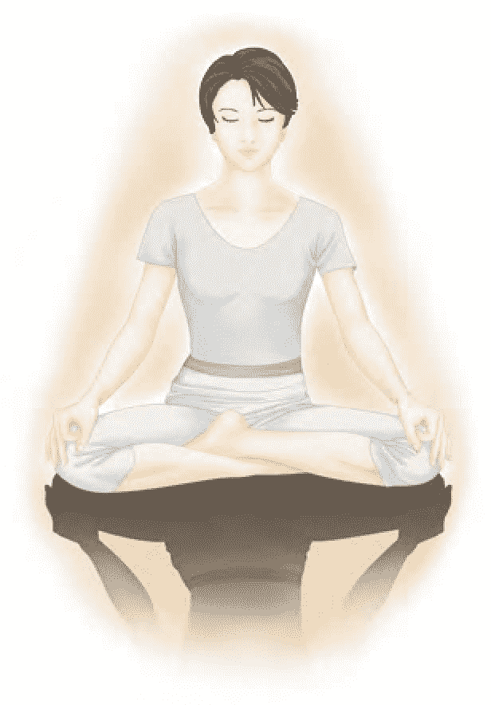

**至善坐**

坐于地面，两腿并拢向前伸直→弯曲左小腿，抓住左脚，脚跟顶住会阴处，左脚底紧贴右大腿→弯曲右小腿，右脚跟靠近耻骨，脚底板或脚趾放在左腿的大腿和小腿之间→头、颈和躯干保持在一条直线上→闭目内视，设想双目凝视鼻尖处。

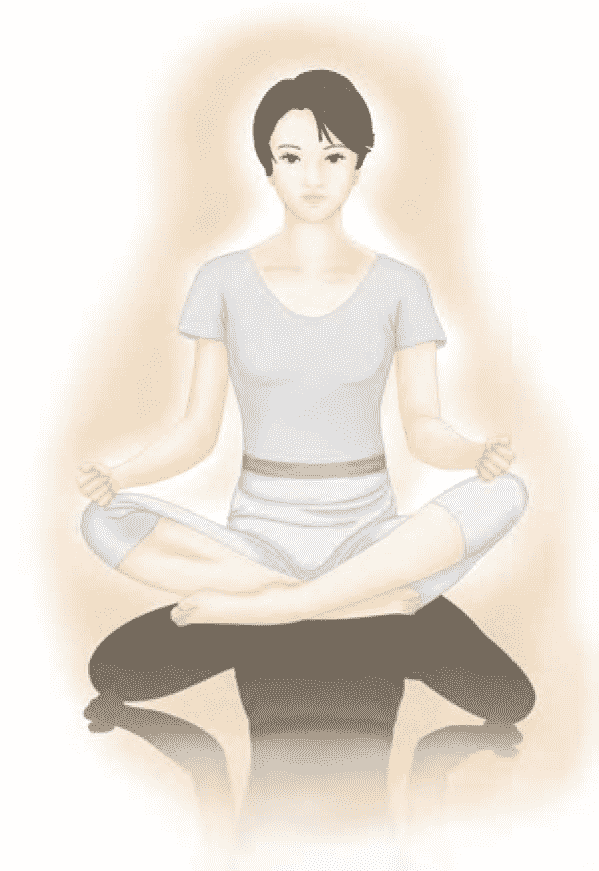

**吉祥坐**

坐于地面，两腿向前伸直→弯曲左小腿，左脚板顶住右大腿→弯曲右小腿，右脚放在左大腿和左小腿腿肚之间→两手放于两膝→头、颈和躯干保持在一条直线上。

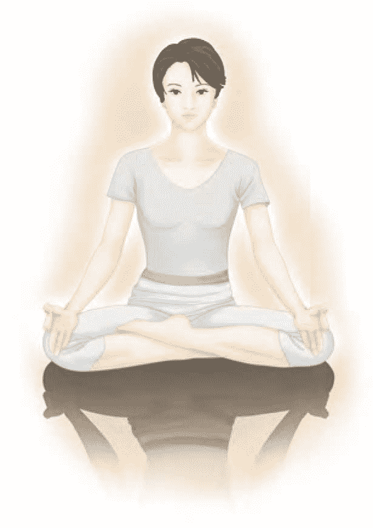

**达人座**

双脚伸直坐下→右脚弯曲，将脚跟靠边会阴部→左脚脚底置于右脚小腿处→左脚弯曲，使左脚跟叠在右脚跟上→手指做圈，放在膝盖上。

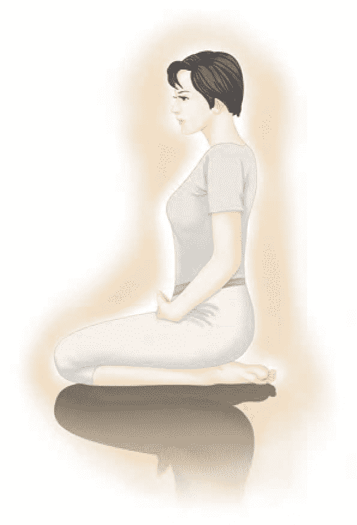

**金刚坐**

采取正确坐姿，臂部坐在腿上→双脚的拇指不可相叠→手轻放腿上，以拇指和其余四指围成一个圈。

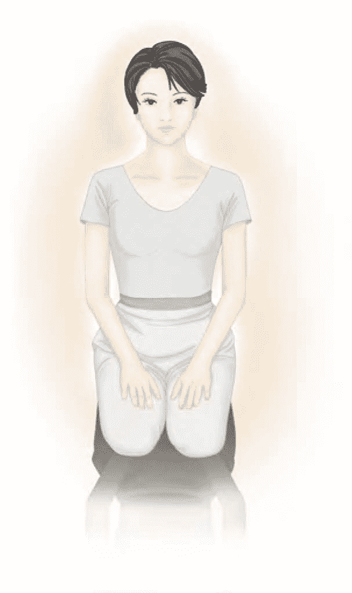

**雷电坐**

两膝跪地，两小腿胫骨和两脚脚背平放地面→两膝靠拢，两个大脚趾互相交叉，使两脚跟向外指→伸直背部→将臀部放落于两脚内侧。

## 手势
引导体内能量流通

在瑜伽冥想和调息的练习中，手的姿势（称手印）具有重要意义。冥想时各种手的姿势一是为了和整个身体的姿势、呼吸相配合，二也能帮助集中注意力和提升定力。

* * *

#### 手和手印

手印，梵文称 Mudra，本意是密封或留下烙印，现指瑜伽、禅定或密法修炼时的手势，又称为印契或契合法。瑜伽契合法是将细微的运动、手势等物理的表象具体为精神上的内涵，它们常常代表着一个传递着深奥思想的象征性语言。在瑜伽哲学中，手又可以被看做是连接宇宙能量流动的通道，每个手指还代表不同的含义：小指代表 Tama，是懒惰、懒散、黑暗；无名指代表 Raja，是活力、动作、激情；中指代表 Sativa，是纯洁、智慧、和平；食指代表 Jivatma，是个体心灵；拇指代表 Parmatma，是无处不在的宇宙本体。

冥想常用食指去触摸拇指根部，代表在超然忘我的境界中的一种天人合一意识。因食指代表个人的自觉性，拇指象征着最高意识。

在现代瑜伽冥想中，手印的作用则常是加强注意力、引导体内能量流通的姿势，不同的手印能对身心产生不同的影响。冥想练习中最常用的手势是将每只手的食指尖和拇指尖合在一起，拇指必须压着食指。由手指创造的圈代表“出生”，象征寻找知识和新的觉悟。

#### 冥想最常见的手印

**（1）禅那手印**

将两手叠成碗状，再将拇指指尖相连。它是比较古老的手印，意味着空而充满力量的容器，可以平和和稳定神经。一般是女性的右脚和右手在上，男性的左脚和左手在上。

**（2）秦手印**

双手的拇指和食指相抵，其余 3 个手指伸直放松；把双手放在膝上，掌心朝上。它有助于身心更加平衡、稳定，意识更专注，使静坐冥想更完善、更具高质量。

**（3）智慧手印**

手势同秦手印一样，双手手心朝下，放于两膝上。智慧手印代表小宇宙能量和大宇宙的能量合一，也就是人和自然合一。还可以让人很快地进入平静的状态。

### 冥想手印大观

##### 佛教手印概义

手印来源于佛教，是以双手或手指所创造出的特殊曲连接环，表神圣意记，或象征特殊愿力，于修持者自己能净化心灵，产生特殊的身体的力量、意念的力量。

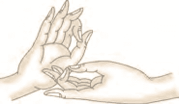

**说法印**

表把法界中圆满的境界转动起来。

##### 冥想使用的手印

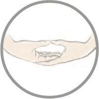

**禅那手印**

一只手叠放于另一只手上，拇指相对表示冷静、沉静有助于思想稳定。

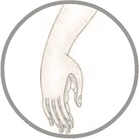

**触地印**

即接触地式，跪着的时候手心朝下放在膝盖上，表示以大地见证智慧生活。

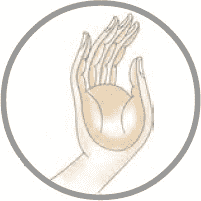

**无畏印**

即接受式，掌心向上，手掌稍微倾斜，表示愿意接纳呈现在面前的任何事。

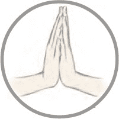

**合十印**

即祈祷式，双手手掌合一，能增强专注力，表示身心统一，祈祷实现所愿。

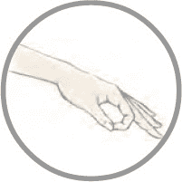

**秦手印**

即下巴式，双手的拇指和食指相抵，其余伸展，使人很快进入平静的状态。

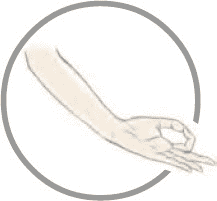

**智慧手印**

手掌向上，大拇指与食指相加，其他三指自然伸展，代表人与自然合一。

##### 现代手印概观

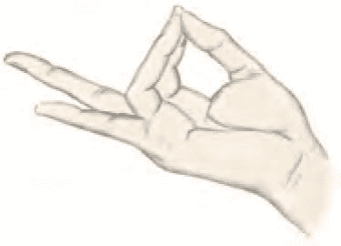

**能量手印**

无名指、中指和大拇指自然相加，其余伸展，能排除体内毒素，增强自信。

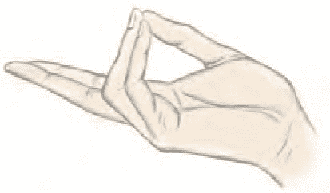

**生命手印**

大拇指、小拇指、无名指相加，其余伸展，可以增强人的活力，改进视力。

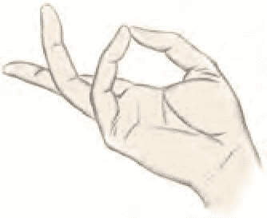

**流体手印**

大拇指和小拇指相加，其余 3 指自然伸展，能平衡生命内流体，改善视力。

## 调息
控制生命之气

静坐冥想最重要的功夫在调息。呼吸为鼻中气体出入，调息为一呼一吸全过程。训练调息要循序渐进，长期进行，最后练就深、长、细、匀的呼吸。

* * *

#### 简单的调息练习

在进行冥想训练时，一开始先要使姿势舒适，肌肉放松，情绪安宁，然后才注意调整呼吸，以免一开始就强调练呼吸，反致呼吸急迫不顺畅。当选择好冥想姿势后，开始通过鼻孔缓慢而深深地吸气，一直数到 20，再屏息数 20 下，通过嘴缓慢吐气，也数到 20。反复练习这个过程 6—12 次。然后再吸气，拉紧整个身体，握拳；马上放松全身，通过嘴吐气。重复这个练习 6 次。然后忘掉呼吸，让其随顺自然地流进和流出，好像普通的呼吸一样。

#### 正确的调息方式

调息，就是通过控制我们的生命之气，形成健康呼吸法。冥想呼吸时，丝毫不可刻意、用力，要令鼻息轻细深长，自然达到腹部，以致耳不闻出入息声，才是正确的调息方式；高层次冥想者的呼吸经历由粗到细，细到微细，微细到悬吸最终入休息阶段。下面简单介绍四种呼吸的方式：

**（1）喉轮呼吸：** 即用喉头呼吸，它是日常生活常进行，但在冥想时要改变的呼吸方式。这种呼吸方式最浅短，气息仅在喉头出入，不能尽肺叶张缩的力量，因此达不到吸进氧气、吐出二氧化碳的功用，血液循环不能优良，对身体有不良作用，因此要改变。

**（2）胸式呼吸：** 进行此呼吸时，气体虽能达到胸部，充满肺部，但仍不算调息。

**（3）腹式呼吸：** 是最重要的冥想呼吸法。它通过一呼一吸，气体到达腹部（脐轮部位），吸气时让空气入肺充满遍体，肺底舒畅扩张，把膈肌压下，使胸部空松，腹部外凸；又呼气时腹部紧缩，膈肌被推而上，紧抵肺部，使肺中浊气尽量外散——是静坐时的正确调息方式，能有效地令身体放松。

**（4）体呼吸：** 是冥想进入到高层境界后的呼吸状态，此时的呼吸极细微，不觉气息出入及器官作用，如无呼吸，而气息仿佛从全身毛孔出入，达调息之极致，是深入定。

### 调整呼吸的技巧

呼吸与人的身、心有很大的关系，而平稳的呼吸是让身体、心灵平静的关键之一。调息，就是要让我们的呼吸，由粗重转为和缓细微，最后绵密而无觉。

##### 深呼吸练习

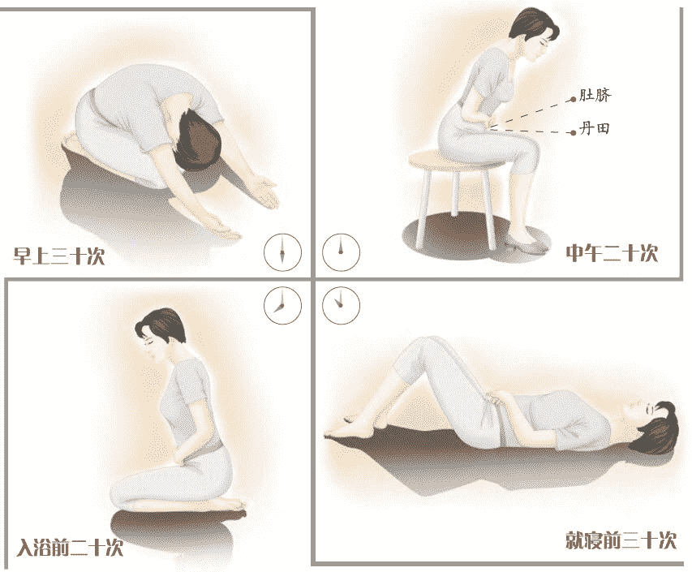

##### 腹式呼吸法

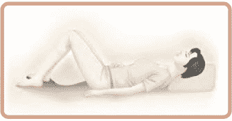

吸气时让腹部凸起，吐气时压缩腹部使之凹入的呼吸法。每次做 5—15 分钟，每次训练以 5—7 次为宜，逐渐养成平稳而缓慢的腹式呼吸习惯。

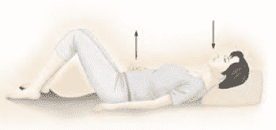

吸气时全身用力，用鼻子缓慢吸气，此时肺部及腹部会充满空气而鼓起，腹部的手有向上抬起的感觉。

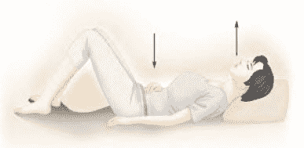

呼气时，腹肌收缩，腹部的手有下降感。呼吸要深长而缓慢，尽量用鼻而不用口。

## 调心
静坐冥想的关键因素

调心和调身、调息这“三调”是冥想最重要的准备工作。尤其调心在这三种要素中起着决定性的主导作用，是进入冥想的根本因素和重要目的。

* * *

#### 调心是入静的方法

调心，又称调神，主要是锻炼和调整意识，它要求人的精神放松，情绪安宁，杂念逐渐消除，以达到冥想入静状态。调心主要是发挥意识的作用，这里的意识包括了潜意识、无意识等心理因素，使机体内部功能在精神因素的主导下进行自我调整和锻炼，最后平衡、平静、和谐内心，调整好自身的心理、生理状态，就能沉浸在冥想中。

#### 调心是静坐的目的

在佛教中看来，心有真心与妄心之别，静坐时也会由妄心产生两种状况：一是心中散乱，支持不定；二是心中昏昧，容易瞌睡。因此调心就是分别真心与妄心，致使心内不乱、不昏昧。现代人调心的目的无非是通过改善心理、消除不良情绪等精神意识上的修炼，降低身体能量的无用消耗和各种精神副作用，最终起到调整身心、祛病强身、安眠养神的功效。高质量的调心还对精神生活有深远影响，不仅能使平时杂乱的思绪安定下来，更学会了摄心凝神，长时间集中精神、保持清晰地思考问题。

#### 调心的方法

**（1）数息：** 最适宜快节奏的日常生活。数息的方法是由 1 至 10，每次数出息或数入息，一呼一吸为之 1，如此渐次数下去，心便能专注。也可借鉴佛教中念佛或持咒的方法，反复念诵某个词语或某句话使心有所专注，总之，只要能将心摄持，就是好的调心方法。

**（2）练习内视：** 内视是指在闭上眼睛之后用人的心灵之眼来看闭眼之后的一切，它主要是从想象中的情境，或称意象——可以引起和调节情绪入手，来帮助自己调心。练习内视时，要闭上眼睛，让双眼凝视人的鼻尖部位（想象在那个高度），还要有一个目标（意象），并保持这个闭目内视的姿势尽可能长的时间，才能慢慢地静下心。

### 练习调心

##### 三调相应

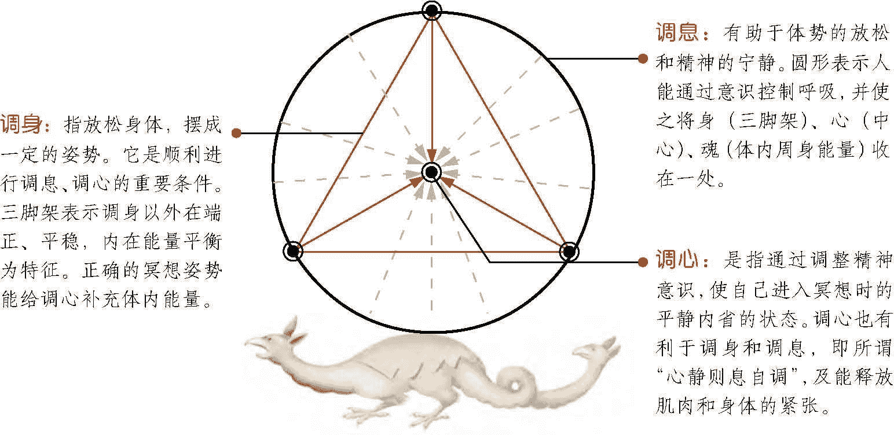

##### 调心的过程

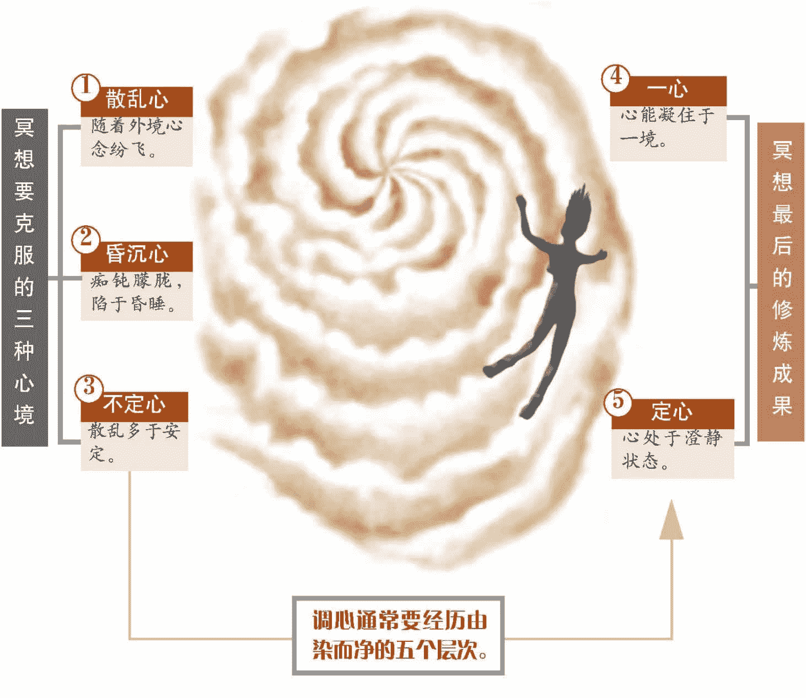

## 平静技巧
缓解紧张和压力的运动

冥想前要练习一些帮助平静的技巧，如看看随身携带、挂在固定的冥想地方的平静符号，或反复念诵一个词，直到心情完全平静下来。

* * *

在冥想前使用平静技巧，不需要任何有难度的姿势，只要背挺直，头抬高，手和脚可以随意摆放。所谓的平静技巧，是大部分时间内让双眼闭上，直视前方，没有特定焦点；静坐几分钟后，感到呼吸变得缓慢而规律，听觉变得敏锐，逐渐忘记了身边的一切事物，忘记了自己要必须做些什么。如此静坐 10 来分钟后，身体便不会再感到绷紧和压力。

#### 平静运动

平静技巧可以是一些动作非常简单，但能放松全身的暖身操，如在冥想前可以按以下步骤练习平静运动：

调整表情和姿势，双臂自然下垂，直到变得沉重和放松；

双脚、双腿和腰部固定不动，将上半身向左旋转，直到双肩和脸部都面向左方，手臂仍放松地垂在身边；

以同样的动作转向右边，慢慢找出旋转身体的节奏，左右交替，手臂跟随上半身的转动自然从身体的一侧转向另一侧，并一直保持松弛、手指放松的状态；

左右交替旋转，直到手臂的重量足以转动身体；

当手臂通过身体的前方时，可以将膝盖稍弯曲一下，造成上抬和旋转的动作，能增进下半身的血液循环；

持续两分钟，逐渐放慢动作，直到手臂放松地垂在身体两侧；最后休息。

#### 平静准则

各种各样的平静技巧和平静形式都可以化为一种平静准则，如：节食——健康的饮食生活，多笑——乐观态度，都能成为使人平静的武器。对于冥想和日常生活，最重要的一条平静准则就是：必须全心全意，发挥所有能力去做每一件事；当做某件事的同时，必须排除所有干扰，集中一切注意力在当下，即使最无聊、最琐碎的工作。因此，平静准则就是要帮助人克服对过去的后悔及对未来的担忧，专心于当下的生活。这种类似集中精神的训练，能让人有平静和满足的感受，也能使人持续获得平静。

### 平静运动

##### 平静运动练习一

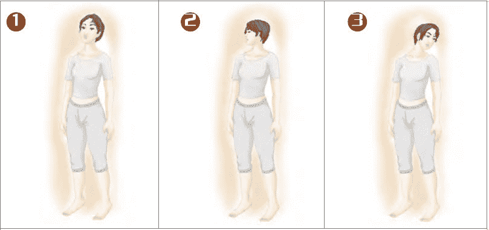

①调整表情和姿势，双臂自然下垂，目视前方，吸气→

②呼气时头往后转，直到看到左肩，再慢慢吸气转回前方→

③呼气时头往后转，直到看到右肩→左右各重复三次。

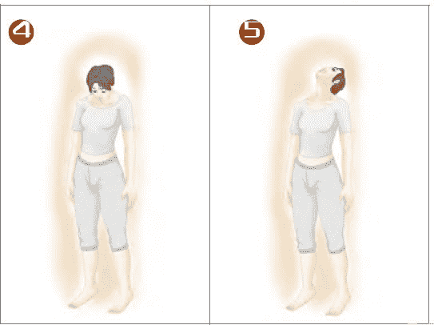

①目视前方，吸气→

④边呼气边把头慢慢地放低到胸口→吸气时再把头慢慢抬高→

⑤呼气时，把头慢慢往后仰，直到能看到天花板→重复三次。

##### 平静运动练习二

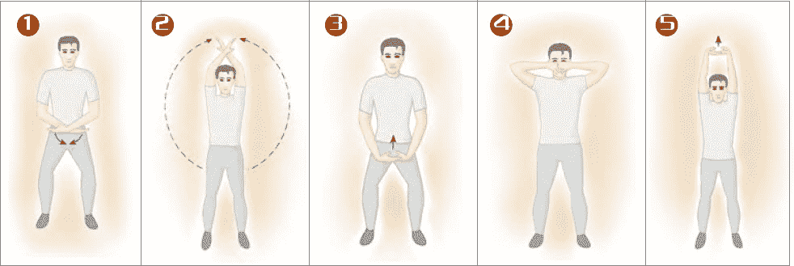

①调整表情和姿势，膝盖微弯成弓形，手肘弯曲，手腕在肚脐前方交叉，手心向上→手臂随着吸气向外画圈伸展，双腿伸直→②在手臂达到最高点时，立起脚尖将身体提高→呼气时，继续画圈的动作让膝盖弯回原来的姿势，即①→重复五次。

③调整表情和姿势，膝盖微弯成弓形，双臂下垂，掌心向上，吸气，将交错成杯状的手掌抬高到嘴部→④当双手向上抬起，通过脸部时，将双手推离身体，掌心向外，并开始吐气→⑤立起脚尖，继续把手往上推，直到掌心面对天花板，手臂完全向上伸展。

## 辅助工具（一）
拥有烛和莲花般的隐喻力量

冥想常要把注意力放在一个物体上，这个物体往往是作为集中思考的辅助工具，借以进入感知敏锐的心灵状态，如密宗的曼荼罗。

* * *

#### 冥想的工具

冥想的过程是要进入一种集中注意力，又似睡非睡、似醒非醒的迷睡状态，而其目标是要人们摒除杂念，使头脑清晰，这样单凭大脑努力地沉思静想，并不能让人们充分享受头脑既警醒又清空的“冥想旅程”。因此，冥想常常使用一些让注意力集中、精神平静，并能使头脑达到内在清晰状态的工具。

传统的冥想的工具包括：蜡烛、油灯等光亮幽微的照明物，线香、檀香、薰衣草、迷香、乳香等帮助提升精神意识和稳定心态、给大脑提神的香品。燃烧的蜡烛和油灯常常象征了点燃内心的光明之灯；点馨香则有助于心情的沉静，一些其他香料如薰衣草等具有安定身心、降热利胃、稳定气息的功效，能扫除室内污浊空气，辅助心情平静。

#### 冥想常用的辅助物

**（1）引导思想集中的辅助物**

辅助集中精神的曼荼罗通常是由圆形或方形围绕一个中心组成的复杂图案，其含义中有“神的循环”，由对称形图案和有规律的几何形表示宇宙世界的秩序是有序的循环。它以四周或四方向中心汇聚的图案促使人的头脑向内在的“神灵”智慧集中，使人进入到这个“神圣的空间”中无法转移注意力。另外一类恰好和复杂构成的曼荼罗相反，而是越简单越好，如蜡烛、鲜花、石头、水晶、树之类，容易让人们记住它们的形象，并把这些物质看得越来越微小，最后缩成一点。

**（2）具有佛像般启发性质的辅助物**

一些很有特征的雕刻物，如神像、人像，或者一幅内涵精妙绝伦或具有某种象征煮义的画作，如基督教圣母画等，不仅对人的视觉产生吸引力，还以其形象或细节对人们在冥想中时刻准备着的被启迪的头脑能产生启发作用。如看到观音菩萨的慈悲像，一些冥想者就会自然浮想到六道众生还在苦难中轮回的“厄运”，既对其精神起抚慰作用，也使其不由对生命中的“劫数”产生深刻的思索。

### 用于观想的曼荼罗

曼荼罗意译为坛场，指一切圣贤，一切功德的聚集之处，在密宗意思是“撷取生命、智能、证悟的精华”，也就是说，修持者可以通过将自己、众生和外在环境的普通形相观想为曼荼罗中的纯净形相来萃取生命中的精华。

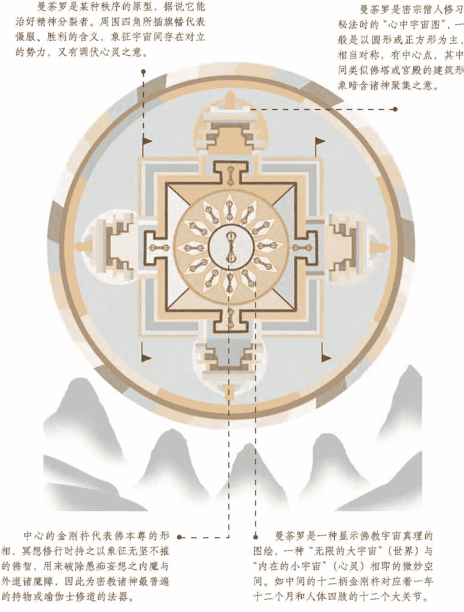

## 辅助工具（二）
发出咒语般催眠效果的声音

冥想中声音也能作为辅助工具，如念 OM 能使人更加专注，另外音乐也能创造出一些适宜于冥想的气氛，使人在观想时更容易展开想象，且更沉浸其中。

* * *

#### 咒语

在冥想中，咒语通常在呼吸时默念、低吟或诵唱，但念诵咒语不是为了增强法力，而是在和念珠一起使用时，通过计数（如 108 颗念珠对应着 108 次念咒），循环反复，产生暂时使妄念止息的功效。

冥想过去一直被视为一种使自已顺应上帝或一切、某种神灵或自然的修行，常常与宗教联系在一起，其反复吟诵咒语（mantra），即一个词或一种声音，也被当做神灵法力或神通的显现，使冥想者从中获得情性和启示，达到一种仿佛是和这种神秘力量结合在一起的销魂状态。但这种冥想技术流传至今，虽然念咒仍能辅助全神贯注、配合呼吸的节奏，但已不再具备使意识上升到某种深度的工具性质。

#### 铃钟、藏铃、西藏老唱钵

冥想时，举行一些小小的仪式会很有帮助。在开始和结束冥想时，敲敲铃钟或藏铃，能有助及时调整状态。铃钟如金刚铃，能发出清泠之音，使人警醒，其开口代表大乐和智慧。至于“西藏老唱钵”，就是喇嘛用的钵，外观与碗相似。冥想者可以用一根小木锤敲打它，也可以轻轻摩擦其边缘让其发出悦耳的共鸣声，如和尚敲木鱼般，使自己进入类似催眠的状态，但头脑又保持警醒。在佛教修持以外，演奏老唱钵，或者敲木鱼声声，也都能使身体和情绪得到沉静。

#### 诵念经文

在大多宗教教派中，都有念诵各种经文的仪式，如默念佛教、道教经文、基督教的圣经经文等，并认为在诵读经文时，身体和心灵之间存在着一种声音，这种声音的内在涵义可能是表达某种愿力、期望，激发全身的能量以实现自己的意图，因此诵经和念咒一样，表面上是在不断地重读一些“无意义的”经文，实际上却是使声音和自己的意识共鸣，让念诵者和这一连串的音符的本来涵义更近。

### 和呼吸同步的声音冥想

##### 诵念 OM 音和呼吸同步

声音本来是宇宙中的一种“跳动的能量”，能和人体的能量形成共振或连接关系，如著名的 OM 音就代表宇宙最初的能量，使各种事物产生。

O 的发音现象类似将气息吸入，代表了人呼吸时吸进体内的一切能量。

M 的发音现象类似将气息从鼻腔中呼出，代表了人呼吸对吐出体内的浊气，即不利情绪的心理能量。

##### 诵念 so，ham 音和呼吸同步

①吸气时念 so 音，和身体能量中逐渐增强的生命力同步→②呼气时念 ham 音，和身体能量中逐渐变弱的生命力同步→③每一次呼吸都开始于呼气，诵 ham，紧接着吸气念 so，两者之间有一个短暂的停顿，延长呼气时 ham 的震动，同时与 so 的吸气震动相连接→④再吸气时默念 so，呼气时默念 ham。延长吸气时 so 的震动，同时与 ham 的呼气震动相结合。

### Soham

反复练习一段时间后，会发现 so 和 ham 已连接自如，形成新的 soham-soham-soham 的循环，感觉不到 soham 和 hamso 交替进行，持续这种模式，就能使注意力集中在声音上。

## 穿戴服饰
能由内至外地舒展身体

根据冥想的目的，它不需要有特定、统一的服装，因为最古老的印度瑜伽冥想修炼者最初可能什么都没有穿，追求的就是使身体无限接近大自然的本来状态。

* * *

冥想对于服装的要求不高，但日常适宜于工作的紧身衣服如果是在冥想时穿，会对身体产生束缚，或令它处于绷紧的状态，不能达到放松的目的。冥想时的一切穿戴打扮应以放松为原则。

#### 着装

冥想时宜穿舒适宽松的服装，如松软的衫裤、裙子、长袍、运动服等，或披上一件宽大的白色被肩，服装最好是棉质的，这种透气性的衣服可能会和你的身体一起呼吸、且柔软贴身。最好赤脚，天气冷时可以穿不太紧的棉质短袜——任何紧束的服饰都会在冥想时产生不适感，因为真正的静坐冥想就是让身体摆脱外在和内在的束缚。何况冥想前的放松也不是一下子完成，而是通过放松每一个身体部位，最终以自我暗示的方式令自己全身放松。任何束缚性质的衣物都会妨碍这种放松的效果。

#### 饰物

冥想之前，最好除去不必要的首饰、手表、眼镜等物，使身体更舒适自然。系皮带和戴过紧的手表，都是冥想练习最忌讳的。但随着冥想时呼吸和循环过程减缓，身体很快变冷，摆坐姿的时间过长，或者在冷天气进行冥想，都会使精神无法集中。这时，可以准备一件稍暖和的披肩或轻便的毯子。在大清早进行冥想觉得身体发冷，也可以给自己裹上一条围巾。有时戴一些有特殊情感价值的饰物或平静符号也能给冥想者带来启发，成为使人和内心世界沟通并专注于所做事情的一个象征。手上的饰物可以是念珠（佛珠），它有不同的颜色或材质，大部分有 108 颗。念珠能使人持心一念，专注冥想，并能通过不断数念珠、念唵咒，把内心的不安和焦虑一点点扔掉，使心灵经常处于平静状态。

做放松运动时，也能根据需要给自己披上一层薄棉披肩或毯子以保暖，或者在硬冷的她板上铺块垫子，作简单的辅助设施，如那种薄薄的、轻便的瑜伽垫。

### 冥想者的服饰

##### 古印度神的着装

印度人对于服饰非常讲究，在这幅画着薄伽梵冥想姿势的图中，他身上的精丽的服饰仍以宽松为主要特征，整体上能给人以放松的感觉。

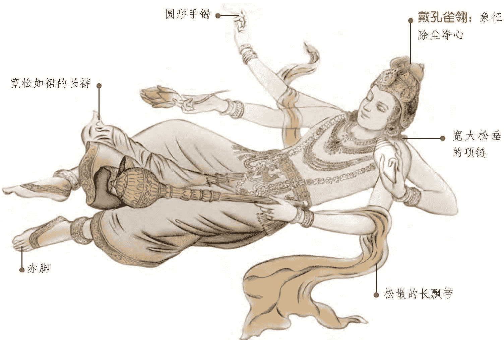

##### 冥想者的服饰变化进程

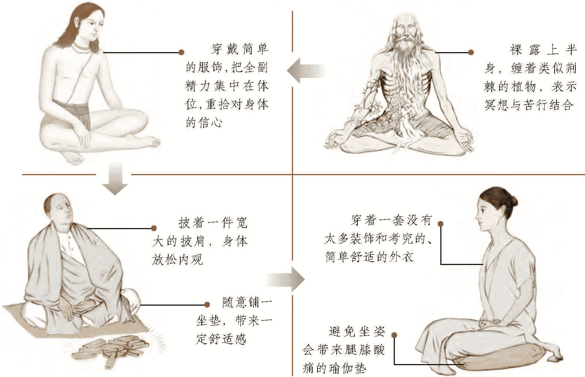

## 饮食睡眠
准备随时被启迪的头脑

在瑜伽哲学中，食物被视为具有生理和心理的作用，有些食物对身心产生积极性的影响，一些则正相反。饮食结构及睡眠习惯，都能直接影响到我们脑内的感应强弱。

* * *

#### 调整饮食结构

人的身体与饮食有密切的关联，若饮食调整不好，人就容易心浮气躁，做不到冥想所需要的身安心静，因此要培养健康的饮食习惯。有些食物具有刺激性，并含有咖啡因，如提炼过的糖、洋葱、大蒜、辣椒及具有强烈味道的作料等，这些食物都将刺激内分泌和神经系统，使大脑激动起来，从而与冥想的平静知足状态背道而驰。另一类食物也能扰乱身心安宁，使人易怒、易妒、变懒惰萎靡等，对人具有抑制作用，如一些不新鲜的、没味道、腐烂或过熟的食品，罐头、肉类、酒精类饮品等。还有一类食物，能给人的身心带来纯净和愉悦，如新鲜的水果蔬菜、豆类奶制食品等，这些食物都能通过咀嚼，进入胃中调和消化，转为对身体的滋养，使其营养精华化于血液，供全身使用。

冥想者适量地进行“斋戒”，不是要像宗教人士或考验意志力，而是从健康的角度，在一天左右的时间里不摄入任何固体食品仍对身体有滋补功效。它能让消化系统得到修习，并能给一些身体器官解毒。不要吃得过饱进入冥想，且要避免贪食，即见饮食无法自制，或吃大量饮食美味令感官细胞兴奋过度。饱食后身体容易懒散、松懈，加倍身体的浮躁气虚，令身体火大，静坐时不得安宁。进食太少也会导致身体所需的营养不够，造成体弱力衰，静坐难以有成效。

#### 调整睡眠习惯

睡眠要充足、有规律，睡眠太少冥想时容易昏睡，且缺乏睡眠也会造成人的身体和大脑疲劳。使人无精打采地做任何事。睡眠要和饮食一样，也以适度为宜，如古人所云：“久卧伤神，少卧神伤”，因睡得过多也容易精神困昧，不利于静坐；睡得过少则体力不能恢复，精神恍惚，也不宜静坐。导致睡眠问题的常见原因是无法放松肌肉，或在一天中的最后时刻，无法使大脑中的“噪音”或活动安静下来，这些都导致睡眠质量不高。睡前适当冥想或练习瑜伽姿势，能帮助放松身心，补充体内能量消耗。

### 调饮食的做法

##### 健康的饮食

水果

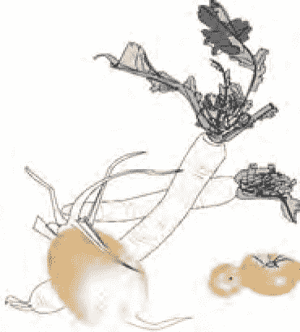

蔬菜

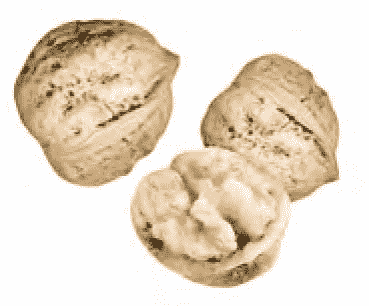

坚果

很多冥想流派提倡吃素，推崇新鲜蔬菜、豆类及水果等天然的有益的食物，这样身体内外才保持平衡，否则便会生病。任何食物都能影响个人身体内外，如果饮食不当，不仅会致病，也会耗损、刺激精神，使人浮躁、性情易变，无法有正常稳定的心态完成冥想。

**1** 　冥想之前，多吃非常清淡的事物，如水果或汤。

**2** 　减少吃肉或不吃任何经过加工的食物。

**3** 　定期“断食”，使身体得以休息和恢复元气。

**4** 　“灌肠”，戒吃菌类、葱蒜类等刺激性食物。

**5** 　每周或每月中的一天只进食水果和液体，或仅是液体。

**6** 　冥想时，可喝一点清水以帮助排出体内毒素。

**7** 　饭后 2 至 3 小时内最好不要冥想。

**8** 　冥想之后不要马上进食，至少隔半小时。

**9** 　高级冥想者可以很长时间不摄入任何固体食品。

## 道德规范
追求一种精神上的生活

当我们在最基本、最普通的生活方式下无法与他人进行真诚的交流，那么在冥想时也无法与真正的自己进行心灵交流，更无法触及我们生命的最深处。

* * *

#### 简单：与心灵互相结合

冥想要求的精神生活并不是一种伴随着超凡能力，或者拥有不凡精神修养的生活，也就是说并非人间持神通力者或道德楷模才能和自我的真实心灵接触。不仅进行冥想的条件可以是最简单的，如在一个空旷、清洁、通风的房子里，没有任何设施，没有任何辅助工具，甚至物质供给极其贫乏，每日节食、少睡眠，仍能经由禅定通向自己最深切的自灵世界；且就精神上的简单而言，冥想只需要持守基本的道德戒律，将含着欲望因子的意识完全排除在外，专注于心，追求纯粹精神上的超越，才能达成开悟的状态。

#### 舍：顺应生命中种种变化

舍就是放手，它源于一种更高的心智，而不是情绪上的厌恶，也不是作出权衡后的批判的态度或逃避的做法，相反它常常是要进入到很多错综复杂的事情或心结中，随着心灵的需要任意来去或者顺应生命本身的冲动而作出选择，因为只有洞悉了事物的真相或世事的本质，人才能运用智能舍弃一些生命中不必要的东西，并从不强迫自己去得到之中获得冷静、平衡的心态。冥想不是要我们逃离生命的困境，而是暂时对一切都放手，随着生命的自身变化及发展方向，使意识过那种“简单”，的心灵生活。

#### 宽恕：尊敬生命本身的状态

宽恕是冥想追求更崇高、更超越的精神生活的关键词。在冥想前，人们必须要去原谅一些事情，包括社会对于自己的种种不公、个人过去精神生活的缺陷、对他人或环境的苛责，即使不能完全宽恕一切，也应该以一种悲悯的心质去看待自己及他人生命中的各种遭遇，对每件事情不求全责备，对自己的每种品性都能越发看清，才能了悟这件事或那件事发生的动机、契机，不再有任何狂躁、暴怒的情绪，而具备“舍”的智慧，求得生命的超越意识。

### 佛祖的观想

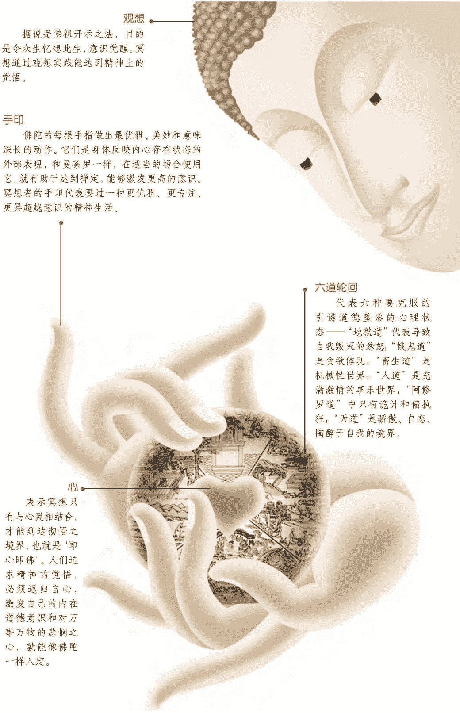

# 第五章
冥想的第二阶段
发现自己

冥想是静静地感知周围世界和心灵层面的各种变化，随着感知的越集中、深入，对自我的认识也越清晰，最后获得追寻已久的超脱感。冥想并不神秘，它是我们的心灵不断寻找自我、提升修为的艺术。它让我们抛却对过去、现在和未来胡思乱想，集中在当下时，又让我们自然地跟随内在精神之光的指引，接触更真实的生命和更高境界的意识。

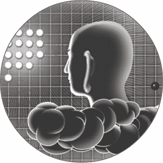

### 本章图版目录

静心感悟冥想

增强自我意识的冥想法

冥想消除情绪障碍

冥想通过意象转化情绪的原理

运用冥想转化情绪

战胜愤怒情绪的方法

战胜恐惧情绪的方法

战胜痛苦情绪的方法

战胜烦恼情绪的方法

战胜骄傲情绪的方法

制感的方法

执持的目标是看到自性

冥想实现人格的彻底转化

转变自我的冥想练习法

十牛图揭示禅定目的

冥想是一种心灵自律行为

冥想中面对种种心灵幻象

“预言”你的未来之路

看清实相

走迷宫：追求更高自我的冥想练习

## 约束急躁的情绪
成功的冥想源于静心

当你开始冥想时，表示你已经准备去感受那来自你内心中的寂静和心灵深层的奥秘。然而你又不可避免地还带着忙碌时的那种精神上的急躁情绪，这时你最先需要静下心来。

* * *

#### 静心是一种精神成长

静心不是技巧所能达到的，更不是外在强加于身体的，它就是冥想的状态——结合了深度的放松、极度清醒的心智和追求宁静的心灵。宁静并非是静心的最高目的，却很少有人能达到。

静心涵盖了日常的宁静和具超越意识的宁静。日常的宁静是一种无声的、无噪音、无情绪波动的境地，处于这种状况中人们能听到自己心灵的声音，也能体验到某种空的内在，但一旦有吸引注意力的东西、念头出现，所谓的平静就很容易被搅乱。

具超越意识的宁静必须通过一种变化或称之为“蜕变”才能达到，它来自于人整体意识的成长和内在心灵对于包括身体以外的一切存在的全面超越。只有达到这种深刻的宁静状态，任意意识出入而无法激荡心性，人才能窥看到自己全部的内心活动，进入到心灵的神圣殿堂。

#### 静心发现冥想的真实状态

在静心冥想中，我们常常需要闭上双眼去洞察事物本质，感觉那个超越思想、物质、行为的身体中“遥远的地方”，因此静心时经由直觉探索世界，心灵的能力将大开，比人未闭眼时看到的还要深入、彻底、全面，人们会经历从“对事物的一般认识、相对认识”到“对真理的绝对体验”之中。只有在静心时，人才能经历那个全新的世界，即用自我的眼睛探索到的世界。

静心的目的是要接触“自我的大梵”，就是追随一个更高的精神中心，在这段心灵旅程中，人慢慢抛开自己的身体、原有的世界，忙忙碌碌中的急躁情绪完全没有了，心智开始在另一个世界漫游，好似水上的涟漪扩散，经历了最美妙的体验，最后到达天边、超越星际，真正的自我意识苏醒。但在这个旅程中，能发现冥想中没有心绪、物状和色彩。

### 静心感悟冥想

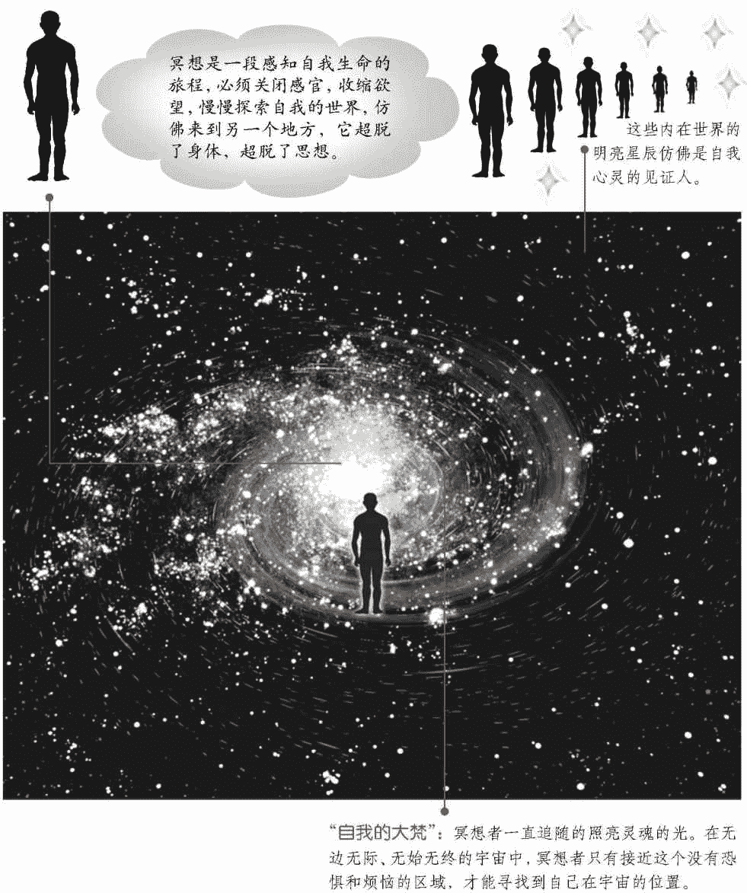

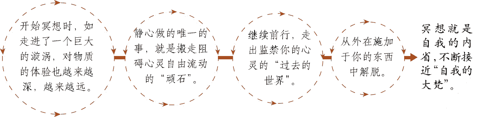

### 增强自我意识的冥想法

用冥想开始这个转变进程，从自我中心转变为敏锐地自我意识。

##### 个人分析

进入冥想状态，然后问你自己下列问题，每个问题将得到来自无意识的答案。

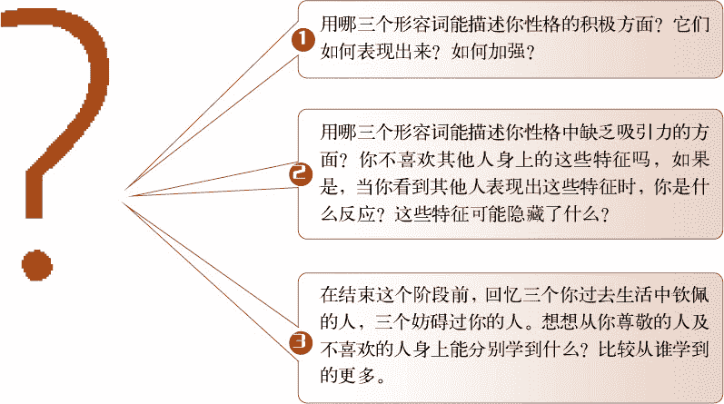

##### 灵魂之屋

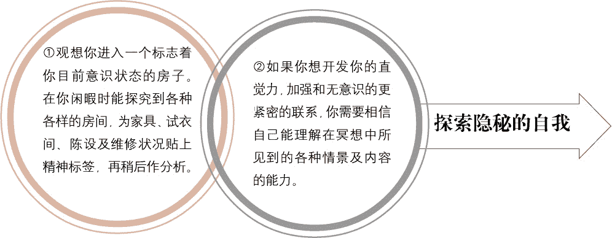

##### 理解困难

**1** 　当你面对一个困难的形势，把它看成一个你将要跨越的障碍。进入冥想状态，问你自己下列问题。

**2** 　你如何反应到这些问题呢？你要证明自己能够应付还是抱怨其他人呢？因为你强烈期待一个好的结果出现致使这些问题看起来无法解决？还是因为你否认根本没有问题存在致使它们重现？你可能不知不觉地造成了这个局面，如果是，想象你以前是怎么处理的？一旦你意识到你想要去做的，这种形势可能不再发生。

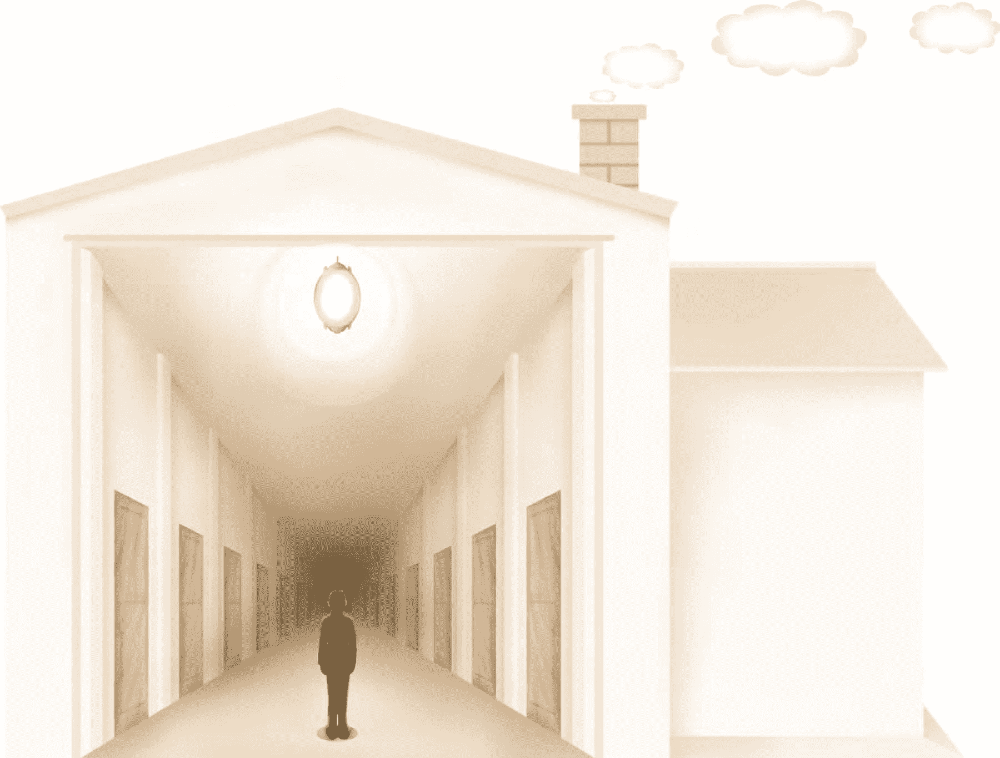

**这些精神标签反映了你无意识中的“自我认识”，如自信程度、记忆包袱。**

## 找到精神的魔障
给情绪命名

人每时每刻都处在情绪当中，且情绪又是一个善变的东西，它的起伏常常是心灵、意识流动的反映，因此在冥想中察知我们的情绪完全等同于认识自己。

* * *

#### 找出自己的情绪

人们因比较而嫉妒，因不足而愤怒，因未知而恐惧，嫉妒、愤怒、恐惧等都是一种情绪。它们也代表了一种心灵正释放的能量，同时由于缺乏更高意识的指导，其性质较低级，对人的身体的损害较大，被称为“心灵的魔鬼”，常常误导人们看不到真相。另外一些如喜悦、善意等、和平、爱则是正面情绪，代表一种良好的感受，能“驱走”前面那些精神魔障。对禅修者而言，前面那类情绪是精神的障碍，在静下心来开始冥想后，它们就是一些带有敌意的“魔鬼”，引诱冥想者摆脱专注的目标，无法实现禅定。

#### 为自己的情绪重新命名

给一些负面情绪命名能帮助我们清晰了解并克服它，这种命名通常在敏感地觉知了它之后。命名的方式是通过呼吸冥想的方法：舒服地坐在或卧在一个地方，将意识集中在呼吸上，当吸气时感觉自己要什么或缺乏什么，呼气时感觉自己想要赶走什么障碍或“魔鬼”。呼吸的节奏实质和释放生命能量的节奏同步，因而也能帮我们管理情绪。当我们有骄傲的情绪，吸气时就会感到自己强烈需要别人认可或有实现某种意愿的强大野心，但又缺乏一时之下实现这种野心的能力，呼气时想要赶走这种过于骄傲带来的不安和焦虑，甚至过去生活中遭蔑视的负面经验、内心深处的隐隐自卑情结。因此可以给这种情绪命名为“自我膨胀的意识”。

#### 认清情绪的本质

通过命名，我们会发现某种情绪实际是在限制自己拥有更高的心智，或陷在错误的幻觉中，它能诱发自己有不当的行为反应，如愤怒令人失智，恐惧令心灵退缩，反而会带来更多精神上的困境。在冥想时，人能观察到情绪经验的丰富会使心灵处于被动的状况中，自己不再是“自己”，而是不断产生又消失的情绪的“奴隶”。

### 冥想消除情绪障碍

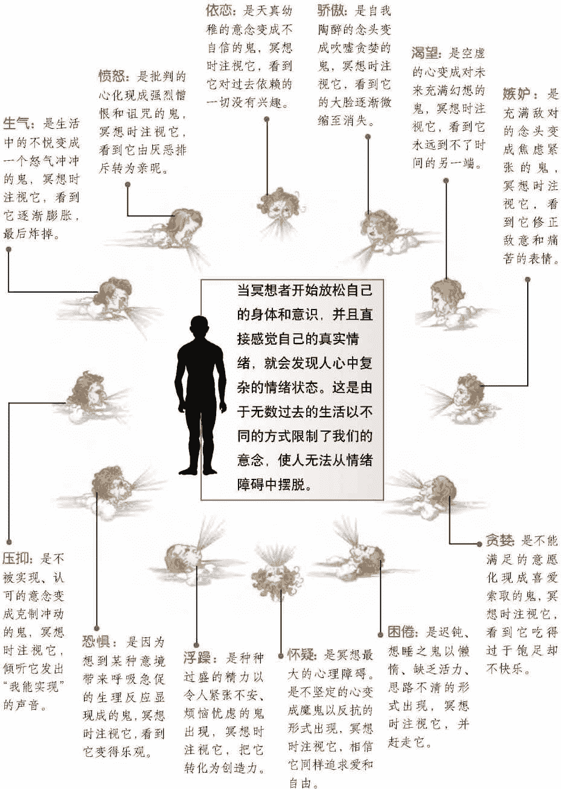

## 转化情绪的方法
创造一种画面或情境

人们把经验转化为头脑中的意象，也就同时固定了一种感受，强化了一种情绪的色调。在冥想中创造新的意象或情境，能转化和改变人的情绪。

* * *

#### 意象就是引发情绪的心理画面

情绪是一种意识经验，它和意象有直接的联系，通常是由某种意象引起意识作出反应，产生情绪。如当人们看到一条蛇（意象）时，会引起恐惧的情绪；或者想到未完成任务时自己被训斥（情境意象），也会处在一种紧张的情绪中。不管情绪的好坏，它都属于意识波动，而在未进入禅定时，任何意识都会导致精神不集中。

意象包含着一种对情绪的认知，如看到蛇后产生“某个可怕的生物接近，自己无能为力”的情绪。情绪本身既然附着了心理能量，而它又会受到意象（心理画面）影响，也就意味着人能通过改变意象来调节这种心理能量。

#### 运用意象改变情绪的方法

**（1）开始观想** 　人过去脑海中出现的情境，常是经由旧有的思维模式、情绪心理创造出来的，且是被外在世界的人及事物引动而产生。冥想时幻想新的情境能转化情绪，如人被恐惧的情绪包围时，就可以采用这种方法躺下来默想几分钟。

**（2）创造情境** 　呼唤所有令你紧张的情绪细胞集合，想象它们凝结成一个黑色的光球（意象），在体内不受控制地到处窜动，有时会变成你最恐惧的人或事，让自己紧张一下，有时又玩一些可爱的动作，让人想到它不过是一些活跃的情绪能量的聚合。

**（3）动态转移** 　放松全身的每一处，想象这个黑色光球从体内进入了安全而又温暖的宇宙，加入闪亮的星星中，它在这个新的环境中化作乌云遮蔽明亮的星辰，你想象自己喝止它，对它大声说：“你不过是我的一个情绪小卒，有什么能力让大自然不显现它的真相。”从而唤醒了自己深藏的勇气能量。两种情绪能量在天空中交战，失败的黑色光球解散成一粒粒小的情绪能量，最后进入真相的灿烂光明通道。恐惧情绪也随之解散。

### 冥想通过意象转化情绪的原理

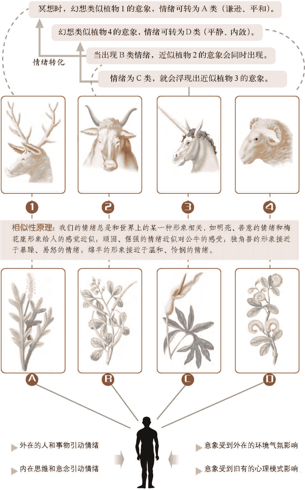

### 运用冥想转化情绪

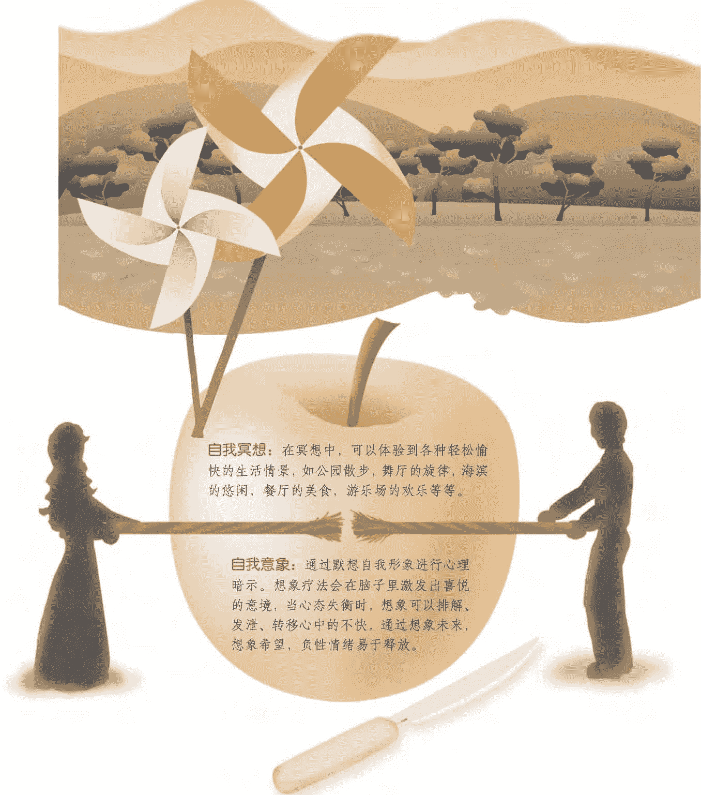

解开心结的冥想法： 先摆好姿势，深呼吸几次，了解你的心结，如最近因“他”而烦恼。然后开始在脑海中仔细描绘他的形象，尽情去想你和他的一切“关系纽带”，如共同经历的所有事情，想得越彻底越好。最后想象你用小刀将“纽带”割断，各种念头如绳断一样烟消云散，达到心脑皆空的状态。

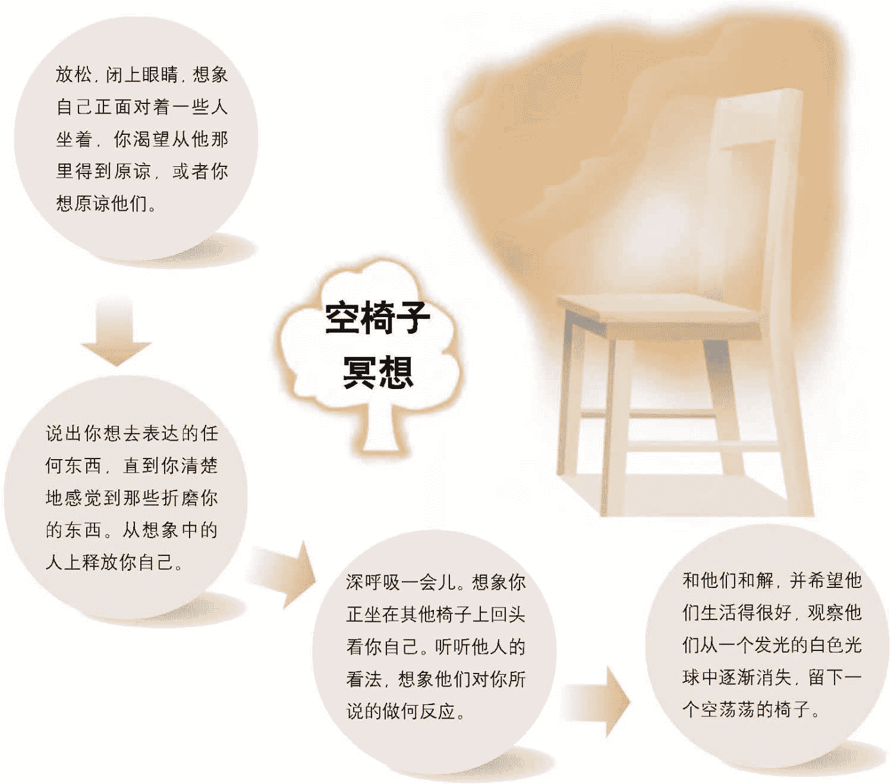

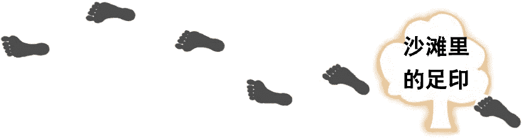

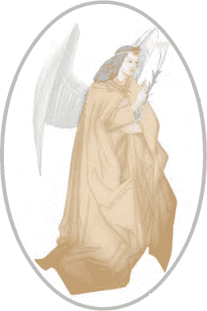

假想人在沙滩中行走，他身后的一组脚印是他记忆中的事情，它们可能很快被湮没，可能会存留一段时间——人不可能回去再找他的脚印。

当人无法走出记忆中的过失时，想象在沙滩上行走时遇到天使，天使说：“亲爱的孩子，我爱你也从来没有离开过你。当你背负着悲伤、忧虑和恐惧的大多时候，都是我在为你承载。”

## 愤怒是对生命目的的反动
转化愤怒的情绪

愤怒的形式有很多：抱怨、不满发火、大发雷霆是明显的愤怒，感到懊恼、受挫折、不公平是较隐的愤怒，掩饰不住自己的压抑而爆发、被别人的愤怒所激怒也都是愤怒。

* * *

#### 对治愤怒

单纯的静心方式无法使我们从愤怒中摆脱，必须首先明白愤怒的心理根源：是因为对事情有所期待，希望期待的事能成真，结果事与愿违；是因为对人生有需求，希望人生的需求能被满足，结果需求落空；也是因为生气、受伤害或痛苦，不耐烦或委屈，甚至恐惧或害怕……

然而愤怒窄化了我们的意识，使我们失去了更宏观的视野，也切断了我们和他人的更紧密的连结感。看清楚愤怒是对生命目的的反动，它伤害到别人，也伤害到自己，使我们变得琐碎与自我中心，封闭和孤立。因此，冥想要留意并转化这类情绪。

#### 转移怒气的冥想练习（一）

（1）想象一个情境：一个跟自己熟悉、亲近的人，因为不愉快的事情失去耐性，发起脾气。他完全失去镇定，脑中积聚负面的能量，甚至折磨自己。

（2）会看到一种身体上的变化：把注意力集中到愤怒对他外表的影响上，这个一向你很亲近的人，现在外表看起来很丑陋。将这个情况跟自己的经验联结在一起。

（3）将意志力集中在这个结论上：“如果我生气或憎恨，也会变得像那个人。”

#### 转移怒气的冥想练习（二）

（1）观想一个自己不喜欢的人：给自己带来麻烦、干扰，或做自己不喜欢的事，或让自己神经紧张的人。

（2）然后你在自己的想象中自然做出反应。看你的感觉如何，心跳有没有加速等，心情平静，还是充满了不舒服的感觉。

（3）冥想结束前，让自己的思想停留在这样的结论中：“无论别人做了什么，我都要保持平静。”

### 战胜愤怒情绪的方法

愤怒的出现是一个征兆，它提醒我们思考用何种方式才能达到需求和愿望。这时，就必须向内观看愤怒心像，可反复念六字大明咒，使自己不带有任何谴责或评判。

**1** 　第一步：觉察到自身的愤怒。

**2** 　第二步：制止为愤怒找说辞的行动或意念。

**3** 　第三步：为愤怒命名，如“无法忍受的念头”。

**4** 　第四步：直接在身上体证愤怒的能量。

**5** 　第五步：触及更深层的创伤感、悲哀和恐惧。

**6** 　第六步：真实的自己比“愤怒的小我”更宽广。

## 恐惧是对正确信念的背叛
转化恐惧的情绪

恐惧和很多情绪都联系在一起，如愤怒中包含有对某种后果的恐惧，焦虑中有对自身能力不足的恐惧……几乎任何负面情绪经验中都带有恐惧的心理成分。

* * *

#### 对治恐惧

在努力使自己不要恐惧前，必须对恐惧是什么有好奇心，以至于任何时刻只要恐惧一生成，就要立刻问自己：“这是什么？”然后接着问：“什么被伤害了？”答案都在对当下的觉知和感受当中。

如果我们将所恐惧的事物列出一张清单，将堪比世界上最庞大的数据库。最基本的恐惧包括害怕死亡、生病、受苦、失控、绝望及未知。常让我们感到恐惧的则是失去所爱、衰老、地位或财产丧失、别人的批评等。正因我们的恐惧太多，以及怀疑也是一种恐惧，它可说是任何修行中最难对付的一种情绪。

恐惧是一种企图摆脱、逃避某种情景而又无能为力的情绪体验，它令我们害怕那种从未发生的、想象出来的结局，走向紧缩、封闭、自我设限而无法超越那层防身之茧。然而一旦我们向恐惧妥协，又只会使事情变得更恶劣，“敌人”变得更强大，危险变得更坚实。

#### 消除恐惧的冥想练习

（1）恐惧的感觉不过是由某些深植于内心的自我信念带来的一些强烈的肉体反应，如胃部和胸部的紧缩、肩膀紧迫、嘴部僵硬等。所以，当我们感到恐惧时，应做些身体放松的练习。恐惧也来源于想逃避恐惧的执著，因此，肉体放松的目的就是放下这种执著。

（2）冥想时，最重要的是**愿意经验恐惧** 。在日常生活中更多是对恐惧的事和恐惧体验的惊怕、退缩。在冥想中经验恐惧是要感受它对自己的完整刺激，让恐惧情境在脑海中反复出现，直到再想起它时没有任何气堵胸塞的感觉。

（3）**体验当下的恐惧** 。并不是时时刻刻都觉察到恐惧安住在我们的体内，只有当和某些具体事情联系在一起时，才会有恐惧的反应。把冥想的注意力集中在这个问题上：“什么被伤害了？”直到对问题的答案有了一定了解。

### 战胜恐惧情绪的方法

恐惧的内容有很多，但最让我们感到恐惧的，是我们自己对恐惧本身的恐惧。恐惧总是因为某一件事成为让人产生恐惧心理的中心源，使这种情绪扩散开来，以致人心可忧可怖。

**1** 　第一步：觉察我们做的每一件事中都有恐惧的成分，野心、沮丧、愤怒背后都有恐惧。

**2** 　第二步：不要企图直接消解掉恐惧，而要改为比较间接的方式。否则结果产生误导和带来制约。

**3** 　第三步：将注意力集中在呼吸之上，最能直接转移恐惧。加强下丹田，用腹部呼吸。

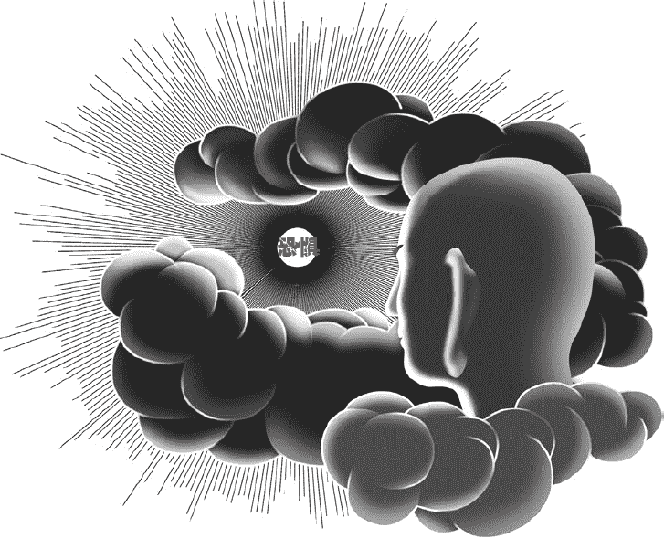

**4** 　第四步：要有意愿和恐惧共处。想象恐惧的情境并冷静地看自身的反应，培养出勇气。

**5** 　第五步：认清恐惧的真相。当我们选择在想象中面对恐惧，就能寻找到恐惧的根源，作出决断。

**6** 　第六步：看到恐惧如何局限了我们的人生，不再相信产生那些恐惧反应的就是自己。

## 痛苦是对人生的无能为力
转化痛苦的情绪

既然痛苦是必然存在的，那么痛苦的情绪也是必然随之产生。痛苦既是一种肉体的经验，也是一种对苦难的感受。冥想能对治身体上和精神上的两种痛苦。

* * *

#### 对治痛苦

痛苦和任何一种情绪一样，都包含两部分：一是身体的感受及反应；一是心灵经验。身体的疼痛、精神的苦难、对受苦的排拒都是痛苦。尽管大部分生物都不愿意和痛苦有任何牵扯，如对疼痛的自然反应及产生的消极情绪，但人类很多时候都是经由痛苦走向成熟，也从来没有一个人走过完全没有痛苦的人生。

当痛苦和苦难与人的精神信念联系在一起，它就不再是生命最后的终点，也不再是多么难熬的苦涩，而是在和理想相遇前的一些生动的感受。也有持悲观信念的人把痛苦和苦难看成是使人陷入“充满抗拒和孤独的窟窿”的魔鬼，当他们越不想接近痛苦，自身就会变得越来越脆弱。而跨过痛苦的人都会反过来把痛苦看成强心剂。因此，感受痛苦不一定是坏事，刻意去消除痛苦的情绪也不一定是好事。

社会文化有时也教导我们尽量去避免或逃离伤痛，因此当我们意识到那些伤痛时，如痛苦的感情、记忆或意象等，就会不由自主地紧张、反感、逃避。

#### 减轻痛苦的冥想练习

**（1）冥想也有助于让大脑在痛苦时保持镇定** 。长期超觉静坐的人会降低紧张，心率变慢，血压下降，耗氧量减少，脑电图中α波增多，大脑中对疼痛的反应也比初学者少得多。但长时间静坐冥想会产生新的问题，如肩膀、背部、颚，或脖子都会疼痛，这可能是由于我们不太舒服的坐姿，也可能是没有完全集中意识，或放松不够。

**（2）正念冥想也常用来减轻慢性病带来的压力和痛苦** 。冥想时，注意力集中在当下时刻，只注意当下思想和情感的产生。然后仍通过集中注意力，培养正面意识和情绪，改变面对疾病时的心理状态。这对于伤痛并非是那些肉体上的毛病，而通常是情绪、心理上的毛病很有效果。

### 战胜痛苦情绪的方法

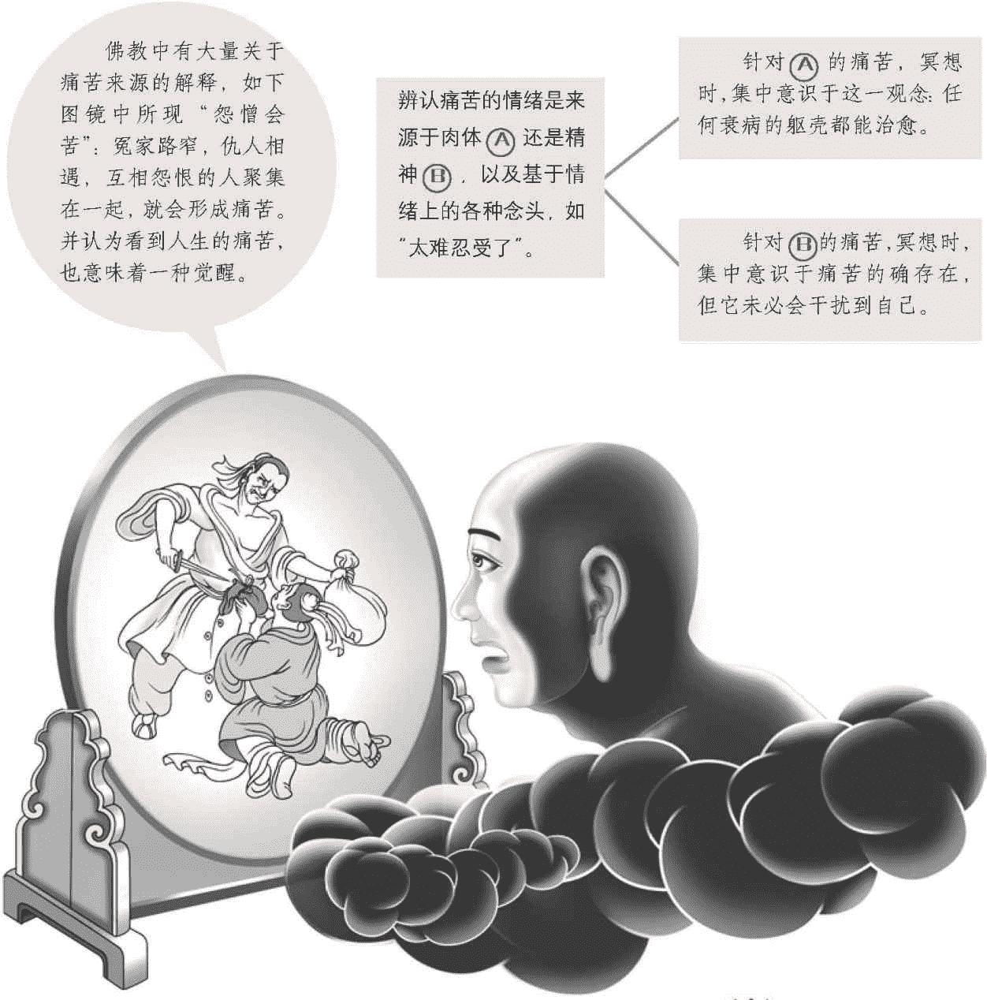

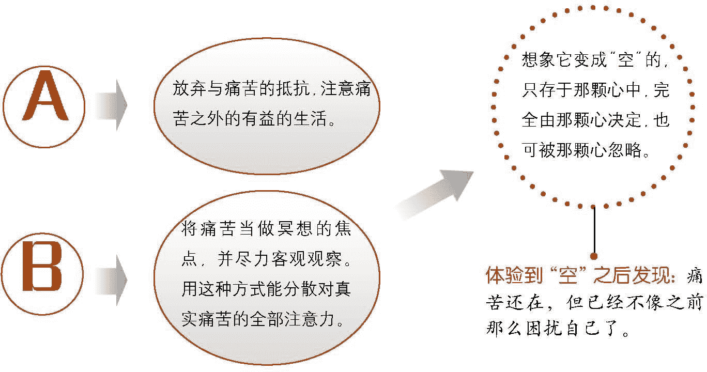

## 烦恼是对欲望的无法实现
转化烦恼的情绪

转化烦恼的关键是开放心胸，改变负面的信念，面对真相，使思想变得更智慧。这些都能在静坐冥想中完成。

* * *

#### 对治烦恼

有一个关于烦恼的著名公式：W＝D/B。其中，W 表示烦恼，D 表示欲望，B 表示实现欲望的有效行为。也就是说，关于烦恼有几个特点：

（1）烦恼总是和欲望、实现欲望的能力及行动力有关。也就是说，烦恼的内容无论是客观存在还是想象的，都有现实的基础，它存在于世俗层面。

（2）一旦我们心中有执著的念头，就会生无明之烦恼。所谓烦恼，即产生于得到想要的东西的执著的念头和行为。

（3）想从烦恼中解脱，要么看清楚自己的欲望和培养实现它的能力，要么既没有欲望也没有烦恼。

烦恼的根源是思想本身。人的思想皆因物质而起，因人本身的种种欲望、情绪而生合缘起。思想有其自身的局限性和种种矛盾，人也就有了束缚、烦恼。开启冥想就是要从自身的思想中生发智慧，使思想如我们本心一般，无限而寂静，深远而博大。

#### 摆脱烦恼的冥想练习

**（1）针对自寻烦恼的冥想**

静坐冥想时无须达到那种宗教上的境界，也无须刻意放松自己，只是从一些固有习惯中释放出来，用新观点去看事物，烦恼可能顿时消失。

**（2）针对轻度烦恼的冥想**

深深吸气、呼气，集中精神，留意自己的身体和思绪，然后让这些身、心的感觉，像通过一扇打开了的窗自然溜走；或像一片叶在河水上漂浮而去。

**（3）针对本心烦恼的冥想**

将当下意识全部集中于一句或几句话，如“除了烦恼本身之外，没有什么可以烦恼的”，“烦恼和别的情绪一样，只是一时的幻觉”，“无论被烦扰得多严重，烦恼本身不过是一些妄念、记忆和感觉罢了”等。

### 战胜烦恼情绪的方法

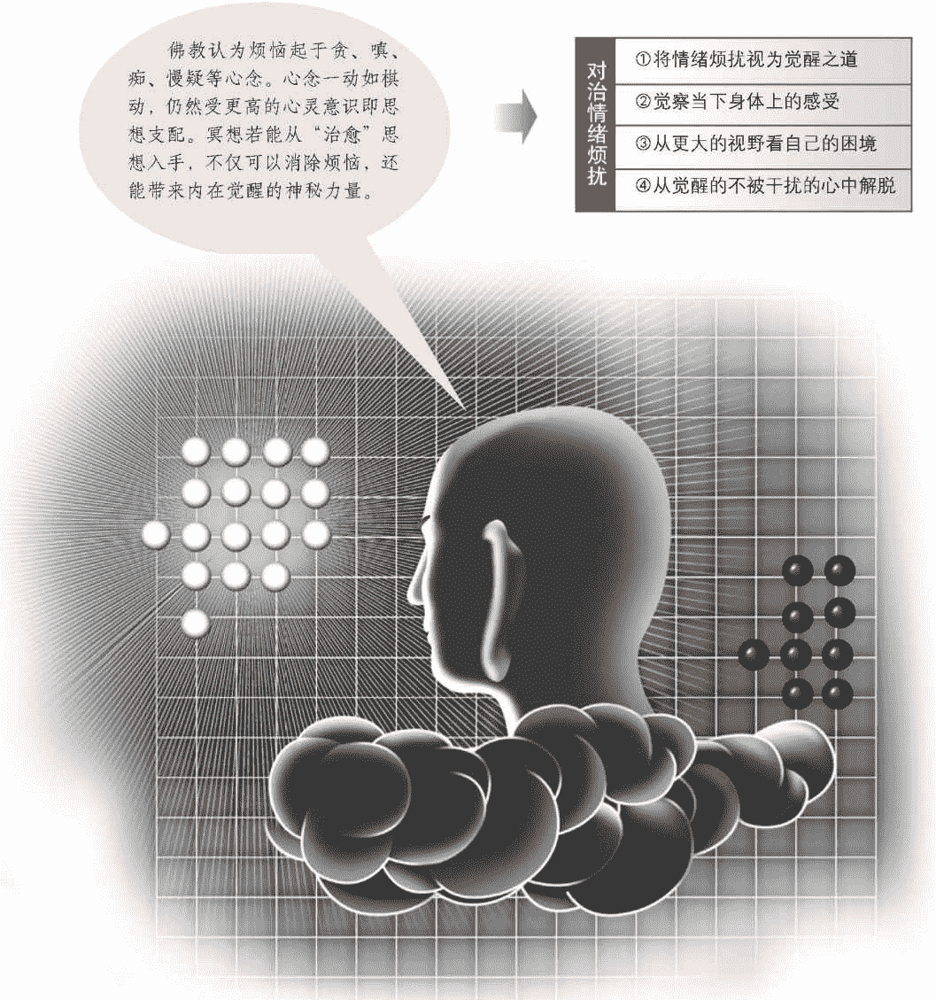

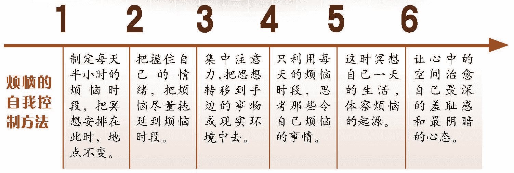

## 骄傲是对自我形象的执著
转化骄傲的情绪

当我们征服了其他各种各样的情绪，感到从困难转到顺境时，骄傲这种情绪又随之而来。对于冥想而言，骄傲的情绪比怀疑的情绪更不易察觉，不过容易对付很多。

* * *

#### 对治骄傲

必须分辨哪些是正面的骄傲，哪些是负面的骄傲。正面的骄傲是一种自信，伴随着理性的自我肯定。为了发展意志力及决心，拥有强烈的自信是必要的，可称之为积极的自我，代表冥想所需要的内在的强大的力量；太过自信，“小我”不断自我膨胀，以致阻碍通向自由、开阔及拥有慈爱的人性，就是骄傲，代表干扰冥想的负面情绪，要发挥心智改变。

佛教认为一切情绪起于“我执”，即一种自我中心的思考。对自我的执著——易产生骄傲的情绪，是人永恒的本性。继续分辨骄傲是给自己还是给别人带来负面影响。伤害到别人，就要发挥正面人性心智的力量，如恢复慈爱，化解骄傲带来的对别人的不尊重；对自己不利，就要通过禅定和内观看清楚是哪些因素蒙蔽了对自我的正确认识。

#### 转化负面情绪的冥想练习

针对上述一切情绪，可总结出冥想如何调控和改变它们的方法：

**（1）增强情绪的觉察**

情绪觉察不是思考情绪，而是要有意识地不阻止情绪。冥想的最初阶段，要允许那些情绪的来临，包括骄傲等负面情绪，承认和接纳这些感觉。

**（2）加强情绪的辨识**

更细致地觉察和认清情绪，是找出所体验过的情境中的“原生情绪”——一个人最基本的、直接的、最初的对一个情境的反应，比如对丧失的哀伤。

**（3）情绪调控和改变**

首先确定和命名情绪，允许情绪出现和忍受情绪。然后调整呼吸和转移注意，放任情绪来去的能力。最好能区分情绪的强度及情绪到达的深度。冥想关键的一步是要利用意象、音乐来激起替换性情绪。把负面情绪替换成积极情绪。

### 战胜骄傲情绪的方法

**1** 　观想（“镜中”）骄傲的那个人是自我的敌人，自己是被他蔑视的对象（受害者）或不知道什么是傲慢的人。

**2** 　当看到敌人对我所做的事，要明白他正在开始一个不好的作为，这样种下的因缘，将会要很长时间去面对。

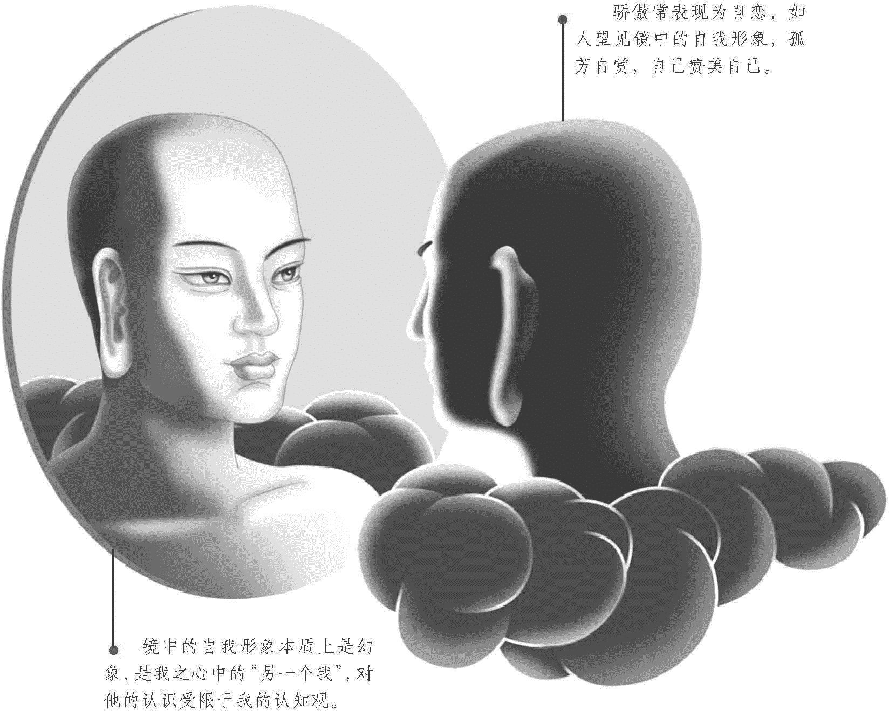

**3** 　观想我接受这个骄傲的敌人的所有负面的情绪与能量，但并非是将它们留给自己，而是在反复的过程中，将负面的能量转化为正面的能量。

**4** 　不管是骄傲，还是阻碍冥想到达完全自在的其他的情绪，到最后我都要发挥自身的宽恕、慈悲与耐心的人性去净化、去除这些负面的情绪。

## 进入制感的阶段
控制心念

在制感之前，必须调整好冥想的姿势，并通过调息控制呼吸，真心放下各种世俗的欲望，舍弃一些执著的念头。制感就是要控制心念，净化心念、智力及错误意识。

* * *

#### “感官”的重要性

我们大部分的人在日常生活中都是依感官的冲动、需求和坚持而反应或采取行动。如果你观察一下自己和自己的感官活动，就会发现不是这个感官就是那个感官在掌控一切，它们总是控制了我们大部分的日常生活。在那样的感官运作之中是没有自我感的。冥想不是不要感官活动，而是将所有的感官化成整体来运作，即集中所有的感官能量去观想一个事物。专注地观察一棵树或一个人，都是冥想的一部分，但它们也都动用了视觉感官或听觉感官。冥想是以所有的感官清醒地去觉知这一切。

若想深入于冥想的活动，除非我们能觉察到自己的感官活动，否则它们一定会制造出各种形式的幻觉及操控我们的情绪。当感官充分觉醒和发展时，身体自然会变得非常安详。

#### 控制感官和心念

经过前面调身、调息阶段的训练，人开始学会在静心中找到内在的感受，还要控制并忽略外在的味觉、嗅觉、视觉、听觉、触觉等感官，以及控制平时的念头，即制感。制感就是控制感官，内视自我，是一种切断所有知觉器官与外界事物联系的方法。控制心念也是制感的重要内容，其涵义还包括了控制心念思考、感受和意愿，以及接受和拒绝的功能。

#### 制感阶段的目的

当人的理智屈从于感官，就会迷失方向。但当人通过制感的途径进入冥想，感官不是向外追寻欲望的对象而是转向内在，就会从感官和欲望的束缚中解脱出来。

制感就是使感官处于控制之下，它通过控制和收摄感官，使身体慢慢变得洁净通透，心灵变得平和，觉知洞察敏锐，了悟一些真心。

冥想必须要经历收摄感官，才能让那些来来去去的世俗念头慢慢退到意识的边缘，使人不再关注那些实际上并不重要的混乱杂念，学会专注和排除杂念。

### 制感的方法

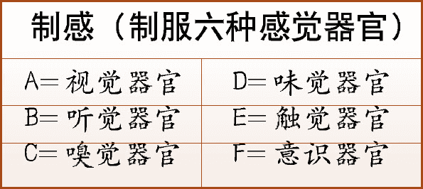

**1　关闭眼耳等器官的肉体的方法**

闭上眼耳等是要达到一种“视而不见、听而不闻”的境地，人并没有进入睡眠时“停止”五官运作的状态，而是控制五官及意识器官不再受到外界的刺激、干扰及各种影响。

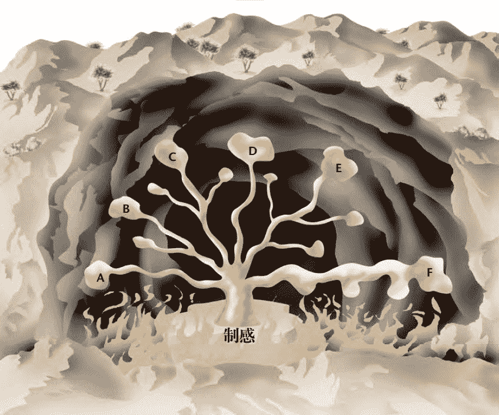

**2　不注意外界的心理的方法**

制感就是要求心灵必须学会“不注意外界”，而是关注自己的意识（内在）。外界和感官的各种欲望相接，而自我的内在意识属于灵魂层面。

**3　催眠术等功法**

在催眠术中，人的自主判断即心念活动、自主意愿行动、感觉、知觉等都会有丧失的情况。同时催眠术也是使人内视自己，达到制感的目的。

## 执持静默的状态
集中注意力

冥想者必须能够控制自己涣散的精神，有意识地把自己的思想正确地引向一个预期的目标，并且不断深入的集中，达到高级阶段的静默的状态。

* * *

#### 执持的阶段

**执持就是专注地持守静默和将意识集中在一点上。** 尽管从冥想最开始的调身、调息，到制感的阶段，人都要集中精力和投入全部注意力在专注的对象上，但只有在执持阶段，人才能真正完成制感和达到专注。因为人的精神本性是游离、流动的，即使不动用感觉器官，也很难持续地专注在某一对象事物上。因此冥想者的心也总是倾向于从专注的对象事物上游离开去。通过执持心念于一个目标的途径，让人不断分散的注意回到专注的对象上，使毫无意义的、无价值的杂念被排除掉。

执持的阶段也就是培养人控制精神并将其引导到某一个经过选择的方向上的能力。当人能够按照自己的主观意愿把精力集中在某一点上，就成为了驾驭自己精神的主人，能控制自己精神的起伏波动。同时也可以约束自己的头脑，使之不胡思乱想或纠缠在数不清的问题、事件、顾虑和客观事物上。这就是一种高级阶段的静默状况，既专注又开始使自己成为不受外界摆布的“独立的自己”。

#### 持续静默的心理障碍

**（1）无法弃绝世俗生活** 　冥想是一种修行，尽管不必像宗教僧侣那样完全离弃俗世，却也要精炼意识、持心一念，拒绝对于其他事物、信息的摄入，它应该像僧侣禅修一样，至简至深，简单之极，才能深刻之极，因此一个人应该尽量使自己远离精神和外界的繁忙。此心不动，断绝一切妄想，才能制心一处。

**（2）无法做到精炼意识** 　冥想专注一个对象的目的是要使我们的意识精炼，而不是消灭意识——这是违反精神本质的。人的精神总是以其特性与一些问题、事件、想法或实物联系在一起，并受到它们影响而产生特殊反应。当人的注意力增强，就会减少一些杂乱无章的反应，但如果一旦精神脱离专注对象，就会让“反应”来干扰静默。

### 执持的目标是看到自性

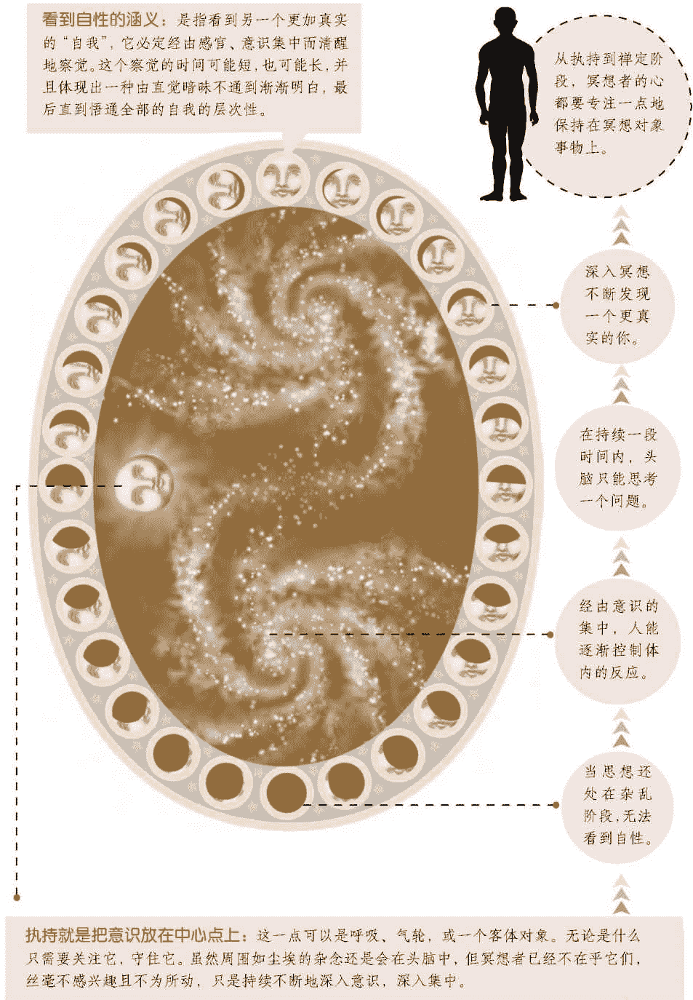

## 释放内在的智慧
无欲以观其妙

正的内省还要“无欲以观其妙”，所谓“观”是用意念内视，所谓“妙”是空静之境中所显现出的宇宙实相，或者可指称客观真理的“道”。

* * *

#### 拓展内省的能力

从古至今，佛教僧侣都有“闭门参省”的实践，其闭门内省的深意是追求对当下的“知”，这个当下包括自我的生活和意识，以及宇宙全体。由于觉知的这个对象是一个活生生的整体，完全无法用任何东西分割、破析、清理……因此，唯有闭门内省才能和完整的心灵、宇宙实体接触。在这个过程中，人们更容易反省到自己当下的真实心理状态，因为此刻意识不再是些碎片，而是被观察的对象。在闭门参省中，不完全是无尽的教义帮他们克服自身的局限和心灵上的痛苦，而是观察到意识、宇宙的种种微妙玄奥，使一切有感知的生命更加向往意念上的快乐和平和。

#### 冥想体悟大道的玄机

冥想者不是凭智力理解“大道”，也不是凭欲望去追逐“大道”，而是通过感知活生生的当下，在无欲的状态下，凭心眼通观这个极其丰富、奥妙的“大道”——自然之真、常所在。先前由于意识中有欲望，遮蔽了人的先天慧性、先天状态，而冥想通过控制大脑，也就是控制心念和意识，达到无欲空寂的境界，返归当下生命本身。且有欲只能感知事物的外在特征、形式变化、使用性质等，无欲才能深入事物的本质，体悟大道的玄妙。

#### 妨碍内省的因素

**（1）被过去所吸引或者游离于对未来的幻想中。** 内省是对当下的知，人们有时候主观认为道是过去经验的总结，或将来幽渺无际的希望，而无法智慧地看到当下实际困境和意识的局限性。

**（2）不能忍受过简朴的生活。** 长期在一些复杂的活动中，就会有些不纯洁的意念，这不是由不道德引起，也不是未净化意识，而是藏在潜意识中无法控制的本能欲望。它们可能经由内省浮上心头，又不能简单地通过大脑克制，只能过简朴的生活，培养意念上的平静和简单。

### 冥想实现人格的彻底转化

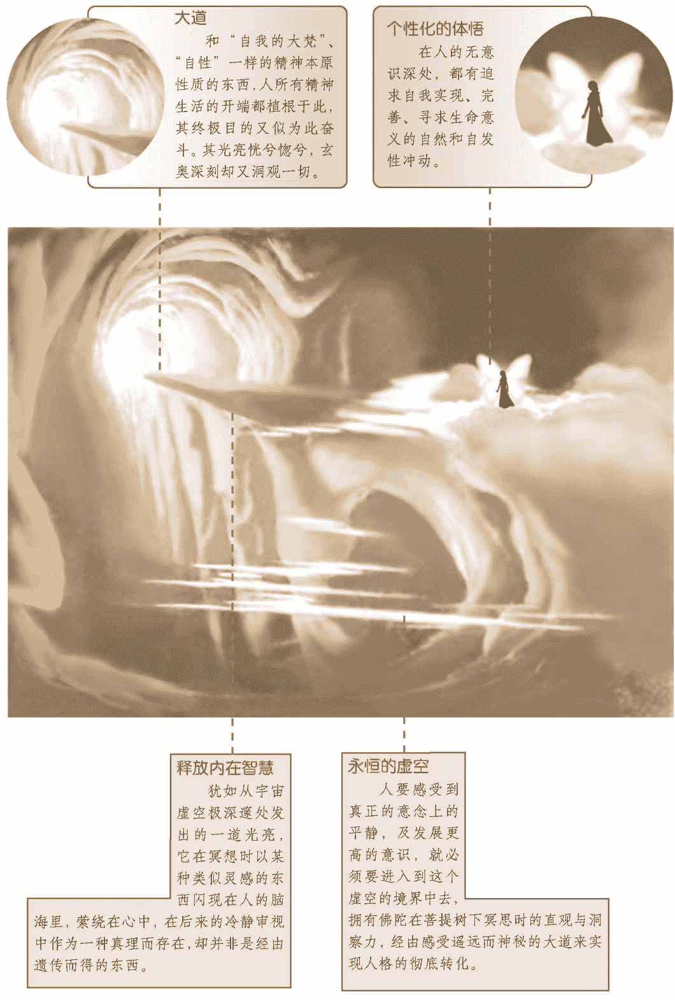

### 转变自我的冥想练习法

##### 观想“三种面孔”

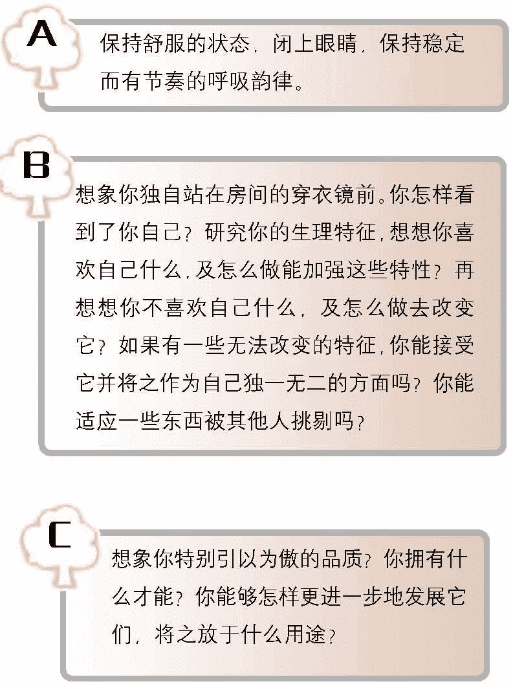

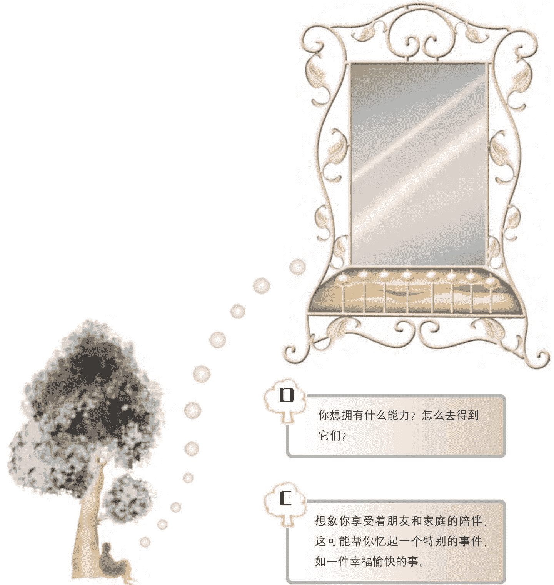

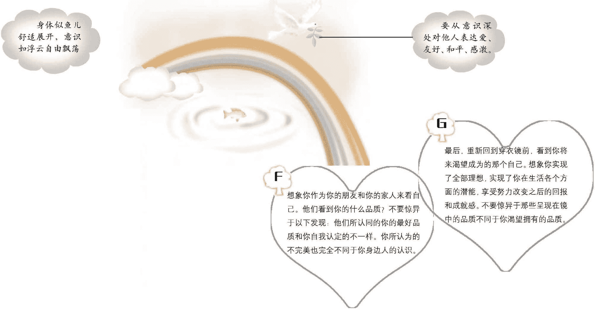

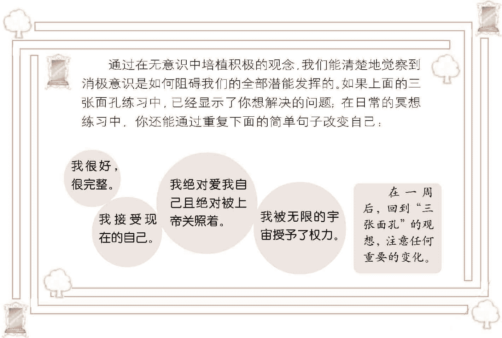

## 达到真实的禅定
恢复我们的本性

禅定不是打坐静默，而是要人超越身体、感官的欲望，摒弃对名、状、色的思虑，将监禁在人的头脑中的，阻碍心灵、遮蔽本性的“顽石”搬走。

* * *

#### 精神烦恼的根源

当冥想到达了禅定的阶段，就拥有了一种不被外界所牵动的态度、不被情绪所激的平静。在佛教中，禅定就是指自己不被外界色相所迷惑，不被贪欲、嗔怒、愚痴、傲慢和疑心所牵动，维持醒觉的状态。贪、嗔、痴、慢、疑被认为是人类精神的智障及烦恼的诸种因素，它使我们看不清正在发生什么，因此产生沉溺、麻木、被动、消极的行为和心态相反的举措。所以禅定又是对正在发生的事情保持清醒意识。

所谓不定，就是心被名利物欲所迷，情绪被生活所激，即认幻为实，以假当真，对境生心。人所有一切精神痛苦的来源不是不知道自己做什么，而是不晓得自己的真心在哪里，精神不得自由。在禅定之中我们只做一件事情：就是超然物外，保持一颗安定的心，回归真正的自我。

#### 通过禅定达到静心的本质

禅定是到达了很高层的静心，它让人在单独中感到喜悦，由于经历长时间而又专注的内视，其内心强大到可以不再依赖任何人、任何情况、任何条件而获得自我满足感，或者获得自我精神上的发现。对于冥想者，他通往禅定的旅程是一个内在的旅程，也就是一个走向完全单独的旅程——因为他不可能依靠别人“冥思苦想”；而当他完全和自己所专注的对象冥合为一时，整个世界好像都消失了，他进入了他自身，享受更加孤独的体验，此时没有任何东西能干扰他成为他自己，他已经成为一个完全独立的存在，从他的生命里喷涌出来的都是他的自性，而不再是被污染了的本性——如前面的贪、嗔、痴、慢、疑对人性的侵蚀。

他也许没有苦行者的志向追求，也没有宗教性的对神的体验，但他从没有放弃一点，那就是在持续地专注静心中发现自己的精神中心所在，那里蕴藏着自我的本质，是冥想者竭尽全力追求进入的领域。

### 十牛图揭示禅定目的

禅宗有以牛比喻“本心”（即真实的自己）的传统，如下面十幅图反映了禅定修行的十个过程，展现了牛（真实的自己）与人（现实的自己）之间由在俗世生活中的分裂状态到禅定高级阶段逐渐契合、完全合一的过程。

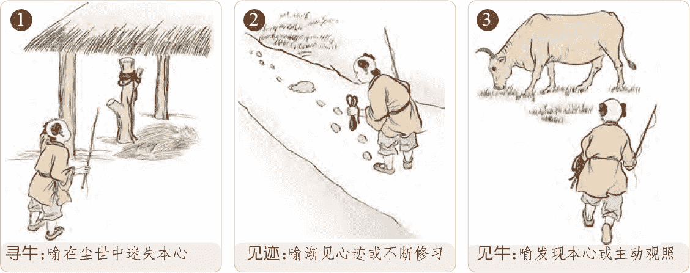

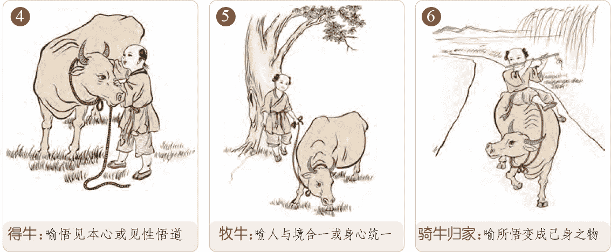

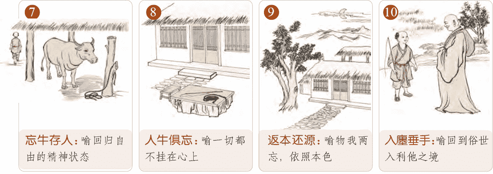

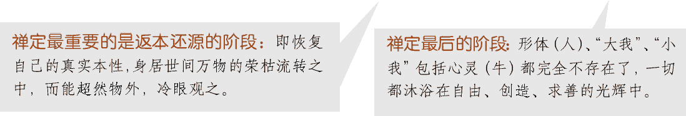

## 觉知精神的蜕变
开放意识领域

禅定就是让身体和心灵习惯于面对那颗真心，能做到自己意识的旁观者，观察呼吸、杂念的进进出出，让身体和心灵再一次返回到没受外界熏染和干扰的纯真状态。

* * *

#### 意识的三种品性

根据印度哲学，意识以三种不同的品性呈现，并且人人都会受到这三种品性的影响。这些品性或属性包括：

**（1）纯质，Sattva，** 照亮、纯净或好的品性，可以使精神明晰和平静。

**（2）激质，Rajas，** 活跃的品性，使人变得活跃和精力充沛，也令人紧张与任性。

**（3）翳质，Tamas，** 黑暗和限制的品性，妨碍和抵消激质的活动与纯质的展露。

通过前面对自身感官的控制及集中意识、长期内省的训练，冥想者已经能够认清哪些言行和思想来自翳质，哪些又来自激质，并通过恢复本性的净化意识活动，根除了那些由激质、翳质所引发的不安想法，逐渐形成了纯质的思维模式，这实际上是个精神蜕变的过程。

#### 冥想时意识的真实状态

冥想是创造向内的爆发，保持一种内省而又警觉的状态。在禅定时，人的感官是指向内在的，人的整体是统一而放松的，不再分裂，不再和往常生活一样经营，只需要什么都不做，也不用达成什么目标。这时意识会自觉指向其本身就存在的内在的规律，即宇宙间动迁流变而又永恒的真。

但冥想又要求开放地把心打开，不设置任何障碍，允许所有的思想和念头（包括了上述三种品性的意识）自然浮现与消失。这是因为冥想的心在禅定阶段经验了万物的圆满或造物主的圆满，对感官对象的渴求就会消失，世俗的冷热、苦乐、荣辱、美丑，也已经不能再打扰它。它能超越所有品性的牵引，平静地看意识在脑海中出出入入。它不仅不会鄙视任何事物、意识，更会引导所有的事物或意识走向通往圆满的道路。因为禅定使人心性自明，自觉地成为一个心地纯洁和品性高尚的人。

### 冥想是一种心灵自律行为

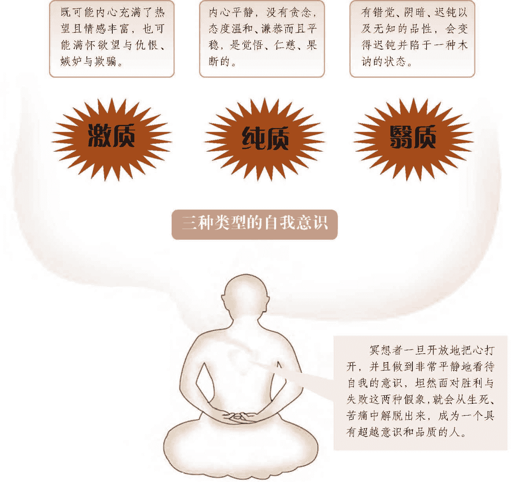

##### 外界对意识的影响

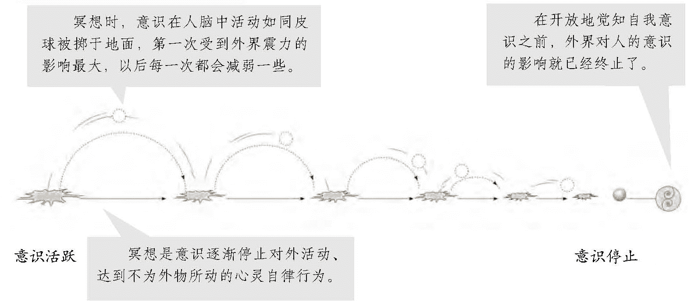

## 领悟个人化体验
看到心灵的虚幻之相

持续专注地冥想就能入定，在入定阶段心灵也并非完全空寂，而是仍然能见到种种境界：佛教徒看到佛陀菩萨现身说法的相，性欲亢进者看到男女贪爱之相。

* * *

#### 观想进入种种幻境

**第一种情形是，在冥想时敞开意识，打开情绪熔炉，就能看到自己心中幻现的情景。** 这些情景可能是自己本来的意识，也可能是自己一些未净的意识。幻相中自己的形态可能是“佛”，也可能是“鬼怪”。

这种幻相出现的根源是：如看见可爱或可怕的境界、听见种种声音，未必都是外界干扰的作用，而是意识本有的独自制造境相、声音的作用，如梦境就完全是梦中意识的产物。在禅定的进程中，由于有意停息及意识的活动，当心稍趋寂静、放松对所缘境（专注目标）的注意时，储藏于脑中的各种信息，便得到脱离意识监督而自动组合的机会，在半醒半睡似的心中现出种种形相、声音、境界，其原理与做梦十分相似。如果在这时由所念生起联想，或在意识深处有想看见某种境界、听见某种声音的主观意欲，便会起自我诱导和自我暗示的作用，使人见所想见，闻所想闻，有如催眠师的诱导和暗示，会使被催眠者有所见闻。

#### 最终和观想的目标合一

**第二种情形是，在冥想时由于持续专注，境与心冥，得浑然合一的禅定，就会使自己和专注体验的目标产生同一的幻相。** 幻相因自己对冥想的对象坚定的信念而产生，一般是冥想者执著要成为的那个“自己”。

如同水以它的容器为形，当精神沉思于一个事物，它就会变为那个事物的形态。当油从一个容器中倒进另一个容器中时，可以看到油不间断地流动。当专注持续不断时，人便进入了冥想状态；当获得不间断的电流，灯丝才会发光发亮，同样也能通过冥想而得到精神的觉悟。如当大脑一直想着它所崇敬的“神性”，通过持续不断的努力，它最终将趋同于这一“神性”。他的身体、呼吸、感官、大脑、理智和自我都融入了他所冥想的对象中。

### 冥想中面对种种心灵幻象

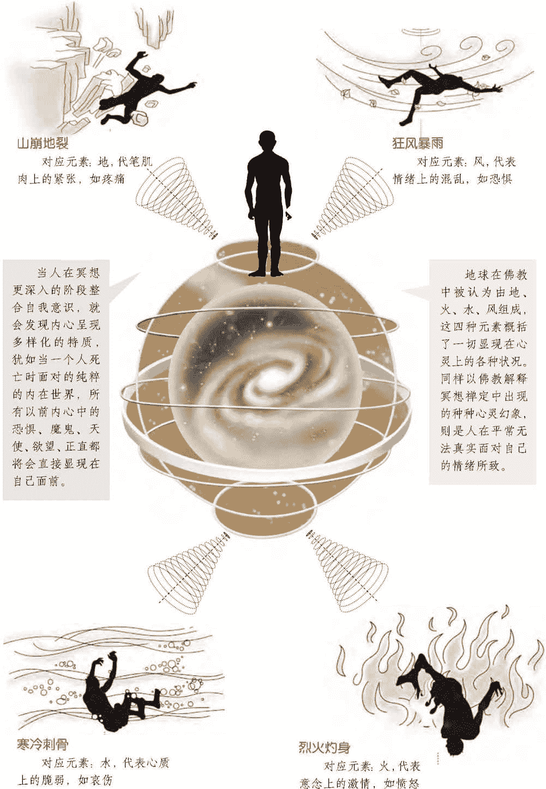

### “预言”你的未来之路

##### 探测每一种选择

继续前面灵魂之屋的冥想，想象你处在灯火辉煌的门厅里，面对很多门。

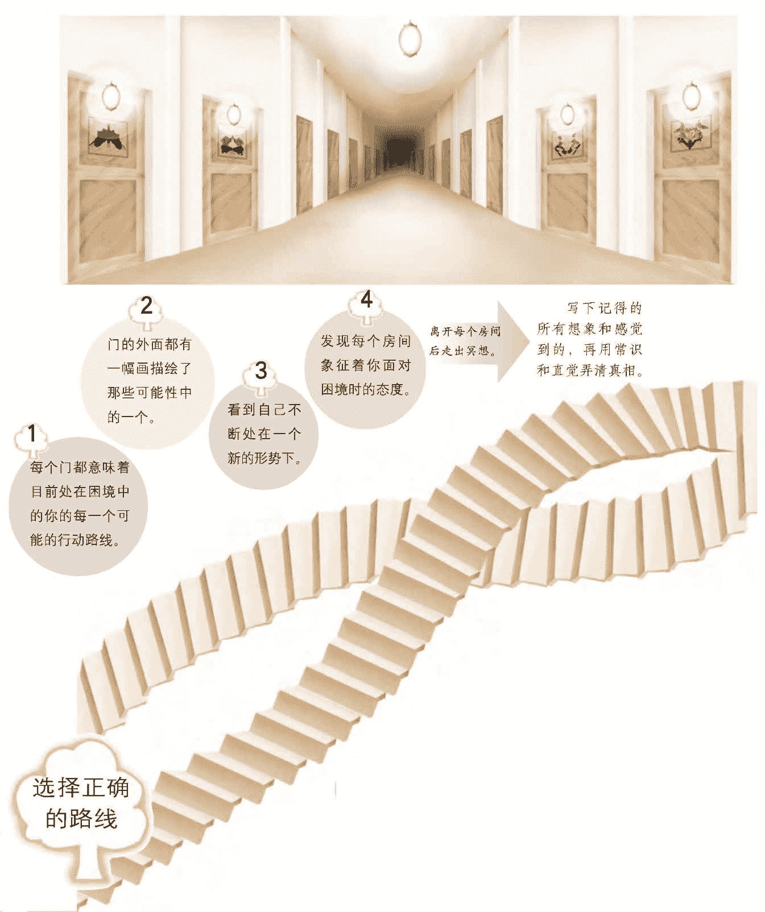

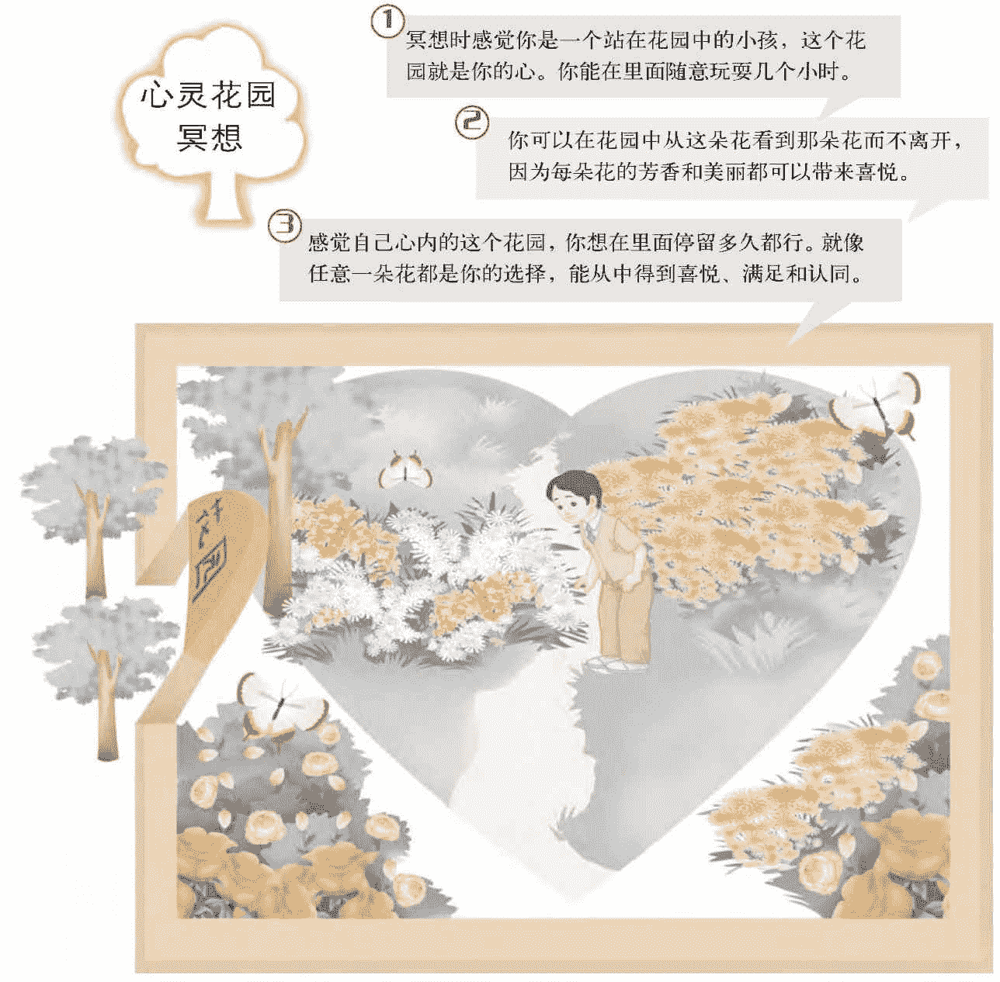

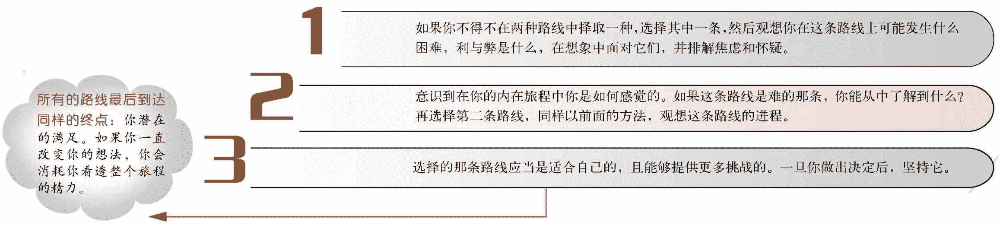

## 最高禅定的心境
充塞自由和平静

到达最高禅定的阶段，也就是三摩地，人处于一种无拘无束的意识状态，并感受到了一种无上的极乐。仿佛一道闪电发出的光芒超越天地，冥想者也看到了自己内心的光芒。

* * *

#### 三摩地的真实状态

三摩地是冥想或禅定的最高境界。用佛教的解释是，“心住一处不动”就是三昧，即三摩地，通指离散乱、昏沉的一切寂定心境。冥想经由心灵的集中和禅定，就会达到三摩地的境界。在这种境界里，个体意识与宇宙意识合而为一，低层次的小我扩展为宇宙大我，进入灵性上的纯然的喜悦状态，永恒的喜悦，没有痛苦的喜悦。到达三摩地，又有三种状态：

**（1）超然的状态** 　“我”见证到心灵的各种不同境界，它们不断地显现和消失，并且“我”感知外界的事物，但与“我”毫不相干。

**（2）寂定的状态** 　“我”不再执著，对一切都清醒澄明，内心寂静，又安定和平，感知到世界没有对立与区别，只有“我”的存在。

**（3）解脱的状态** 　“我”能够把生命中受到的无数束缚，逐一加以抛弃，看到宇宙间的光芒，最终到达自性解脱、完全自由的国度。

#### 在冥想最高阶段的变化

**（1）对知识的体验** 　人在日常经验中是通过感官知觉和理性思考获得知识，且这种知识是只包括了感性知识和理性知识的普通知识。而在冥想的最高阶段，是通过直接的超意识体验即三摩地获得“超验的知识”。这种知识必须经由每个人自己去发现，它是人在灵性潜能极大开发下，对宇宙万事万物的一种洞彻力，对自我存在状态的一种了然顿悟。并且人所体验到的是纯粹的知识和真相，没有任何来自世俗说教的、教化的内容。

**（2）对自我的体验** 　人完全走出压抑、昏昧的状态，而感知到自己身体健康、身躯轻盈、心态平稳、着装整洁、声音甜美、体味芳香和无欲无求，拥有一颗平和宁静的心，摆脱了行动的束缚，成为一个解脱了的灵魂。

### 看清实相

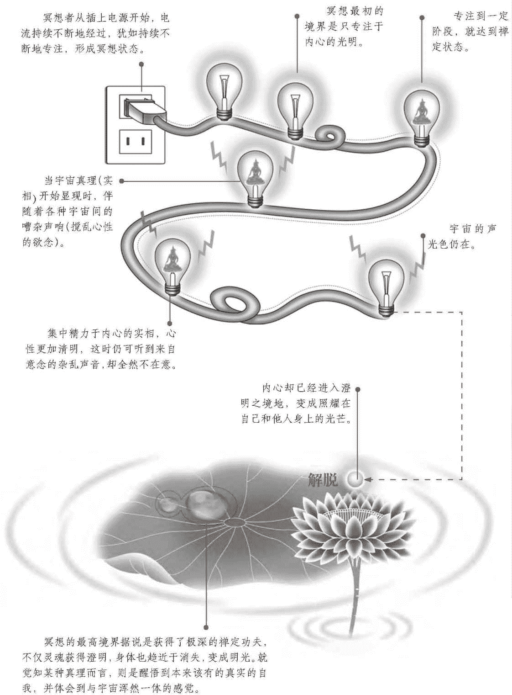

### 走迷宫：追求更高自我的冥想练习

##### 寻找“钥匙”之旅

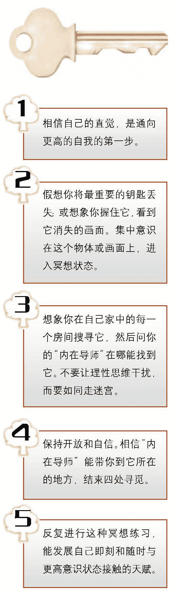

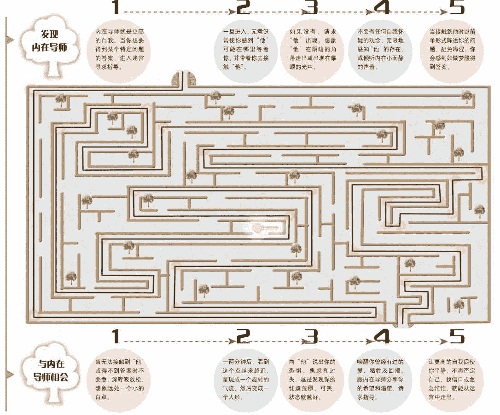

# 第六章
冥想的第三阶段
心理治疗

东西方对冥想的现代性阐释略有不同：东方的冥想倾向于非引导式的想象，任由心灵漫无边际，自由翱翔于没有烦恼、没有压力、不受任何外在控制的精神时空；而西方的冥想倾向于引导式的想象，往往确定一个凝视目标，或假想某种情景，跟随冥想中的心灵意象进入一个更开阔的精神领域，通过自我发现，完成各种心境障碍的自疗。

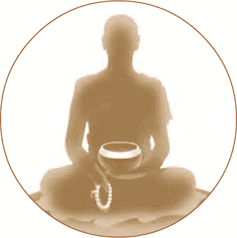

### 本章图版目录

冥想减压的精神疗法

冥想帮助人走出精神抑郁（一）

冥想帮助人走出精神抑郁（二）

走出和自我搏斗的怪圈

冥想有助减少自闭症儿童

平和心境的冥想法

冥想治疗焦虑症的四个步骤

冥想克制恐惧心理

对治不同类型的偏执狂

妄想症者观察自己

关于精神分裂症者的研究

冥想治疗幻听症者

走出压抑的心理世界

两种不同疑病症的冥想治法

遥望星空冥想法

冥想治疗神经衰弱的万能公式

治疗失眠症的冥想法

## 冥想释放压力
深层放松

冥想就是让想法不受控制，自由自在随意去想，思绪本身如风一样地飘，如水一样地流。人的心灵就在这个自由自在的飘流的过程中，将压力释放掉。

* * *

#### 压力对身心健康的危害

压力产生的根源常常是我们与自己的内心分离，很多人从小就被动或主动地强迫自己成为另外一个人，如勉强自己讨父母、老师、领导欢心，却让自己一直不喜欢自己。不让自己去做自己、成为自己，反而要成为另外一个自己不喜欢的人，于是就给自己形成非常强大的压力。更进一层地说，许多压力来自于我们太过在乎我们所拥有的这个“我”，如太过在乎别人会怎么看“我”，以致会紧张担心，强迫自己配合别人；或常常过度执著自我的形象，太看重外表的事物，而忽略了内心。现代人的生活，让我们跟自我疏离，忽视了真实的我，以至于压力不断累积，无法消散。

压力时时刻刻破坏我们的身心健康，想要好好保养心灵，就要常常清理压力，来维持身心运作平顺。如同房屋需要时时做好清洁打扫，才不会有灰尘堆积一般，压力也要时时清除，才能维持内心的清净。累积的压力就像是充满在气球中的空气一般，如果再堆积更多的压力，很可能会让气球整个爆开，一发不可收拾。

#### 回归内在的自我

冥想的进程是我们不断走入内在的心灵，释放外在的压力的过程。由于在冥想中，我们停止日常生活时努力营造一个虚假的自我的行动，维持外在虚幻假象的压力自然就会消失。冥想既是要我们回归内在原本的自我，也要求放下以“我”为中心的思考，维持一种平常心。

冥想带领我们放下外表的我，进入内心真实的我。与内在自我的连结，带来内在充实的力量，让我们不用再担心别人对我们的评价与批评。冥想练习和治疗就是找到一种通向内心自我的感觉，直观透视我们所有的思绪，这样所有压力和紧张情绪都会得到舒缓或消逝。

#### 冥想释放压力的方法

**（1）放弃控制身体，身体进入完全放松的状态**

冥想放松身体，一般从肌肉开始。先感觉肌肉，让我们的心思进入肌肉当中，全心全意接收肌肉的感觉。放手让肌肉自己进入全然松弛的状态，逐渐放松，慢慢越来越松弛。当我们觉得肌肉已经完全放松的时候，再静静地等待更轻松的状态产生。整个过程都不要控制，也不要强求，而是被动地等待，然后全心地享受所有肌肉传达来的感觉。

**（2）进入呼吸当中，全心全意享受自然的呼吸**

在放弃控制身体后，一样不要去控制呼吸，不要刻意也不要用力，而是完全被动地接受我们的呼吸，全心全意享受空气从鼻孔中进来，又从鼻孔中出去。把所有想要控制与掌握的心念和对事情的各种态度都放下，只是完完全全被动地接受与享受。

**（3）回到心灵之中，充分感受心中的各种思绪**

同样不要控制或掌握思想与感觉，而是全然放手让心思去流，让想法与念头自己去跑。我们只是被动地接受与感受，享受所有跑出来的想法与念头，而不是去批评或判断。让所有的思绪自己去流，以它们自身的方式出入于头脑中。真正的冥想就是要放手，使每一种心思自由自在地走动。

冥想时享受各式各样的心情，享受各种的想法念头，就能最大程度地舒缓压力。一旦心灵没有完全享受到这种自由，感觉受了束缚，就会重新回到有压力的状态。但当我们满足于内在心灵自由地运转，压力便自然不存在了。

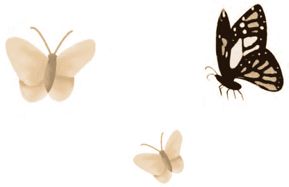

### 冥想减压的精神疗法

每天，压力都可能导致我们的身体、情绪和精神上的过度疲劳和痛苦。冥想能缓解或释放一天的压力，可以通过了解并深入自我意识深处，感受内在心灵的丰富与满足。

**心灵路线 1**

发现心灵中许多被遗忘了的幸福感觉，如生命最原始依恋的三件人事：食物、玩乐和亲情。

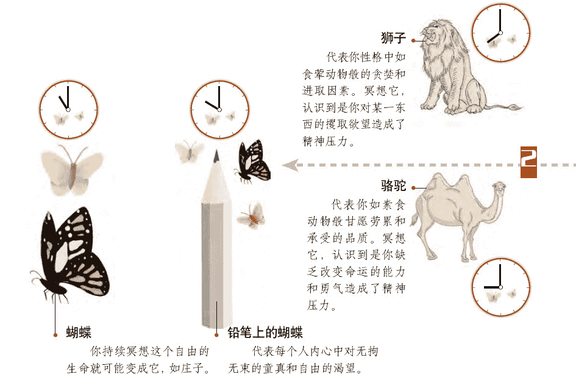

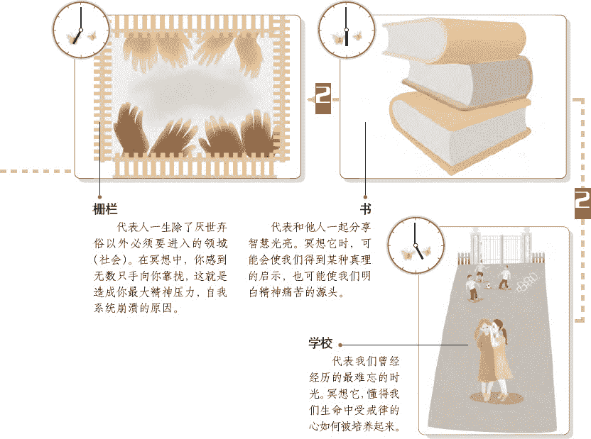

**心灵路线 2**

发现内心总有一块无法被社会性制度“熏陶”的自由幻想的园地，且和人的理性并不矛盾。

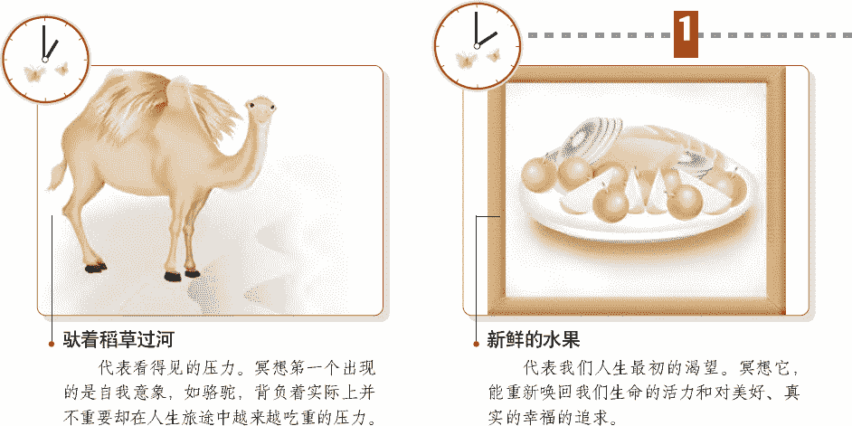

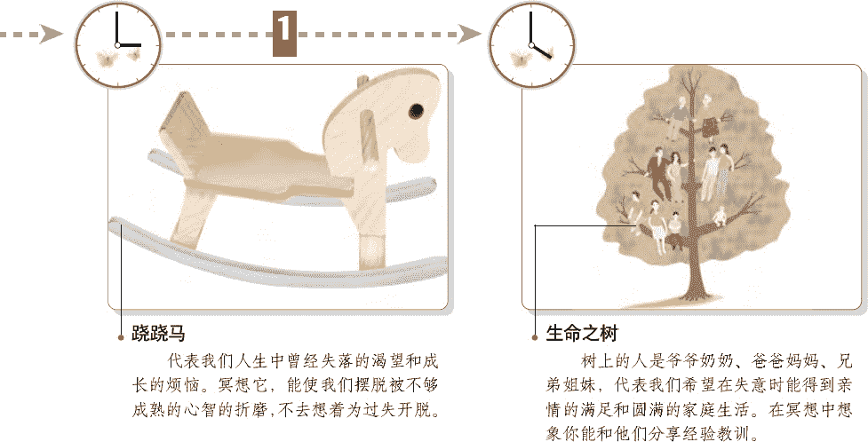

## 冥想治疗抑郁症
开放心灵

冥想改变精神状态，就能消除抑郁。在冥想过程中，人的反省能力能增强，对事物的看法会随着冥想的深入逐渐清醒或有积极的变化。

* * *

#### 精神抑郁的表现及危害

抑郁作为一种重要的情感性精神障碍，对人的身心造成极为严重的影响，甚至每个人的精神上都存在着程度不同的抑郁病症，其特征包括情绪低落、容易悲伤、悲观失望、自我评价过低等等。患抑郁症的人可能出现一段时间内难以恢复的低落心境，闷闷不乐、悲痛欲绝，甚至产生自杀念头；也可能出现与其处境不相称的幻觉、妄想等，以致精神时而消极低沉，时而狂躁不安，走向悲观厌世。

#### 通向过去隐秘的情绪

人的精神处于抑郁状态，可能源于当下遭遇的明显的精神创伤，如不利的外部环境、不公平的对待等。因外在原因造成抑郁心境的人，冥想时可以通过舒展和放松身体，平静内心，得到一定程度的缓解，从短暂的情绪低落中走出。

更深重的一种抑郁症状，源自内心世界长期受到某种压抑，如过去遭遇的不可告人的内心隐秘，或怀有某种社会范畴内被禁止的欲望，使人产生痛苦难熬、自责自罪、忧伤烦恼、常与焦虑共存的心境。因内在原因造成情绪抑郁的人，冥想时必须坦诚、真心地面对长期折磨内心的事件或情绪本身，让自己不再因它伤痛、害怕。

#### 减轻抑郁症的冥想方法

**（1）静坐冥想放松内心，从各种念头和思维中超脱**

静坐一段时间，使日常的压抑和烦闷得以释放，有效的舒缓紧张的肌肉和神经。冥想时什么都不想，过去的各种念头都排除在脑外，让抑郁造成的精力贫乏和索然无味的身心在这段时间内重新恢复到正常状态，能消除较轻程度的精神抑郁。

**（2）给自己一天的时间进行冥想，处理内心的情绪**

这一整天内你都必须非常专注地冥想，防止任何引起情绪低落、精神焦虑的反应出现。对自己的各种想法都不加掩饰，允许它们在意识层面活动，但不受其影响。

### 冥想帮助人走出精神抑郁（一）

人们冥想积极阳光的事情通常能给自己带来好心情，但想要摆脱抑郁症的困扰却需要更深入的冥想的努力。由于导致精神抑郁的因素有很多，如孤独就是其中一项，因此想通过冥想赶走人的抑郁情绪，就必须从更深刻的精神根源入手。

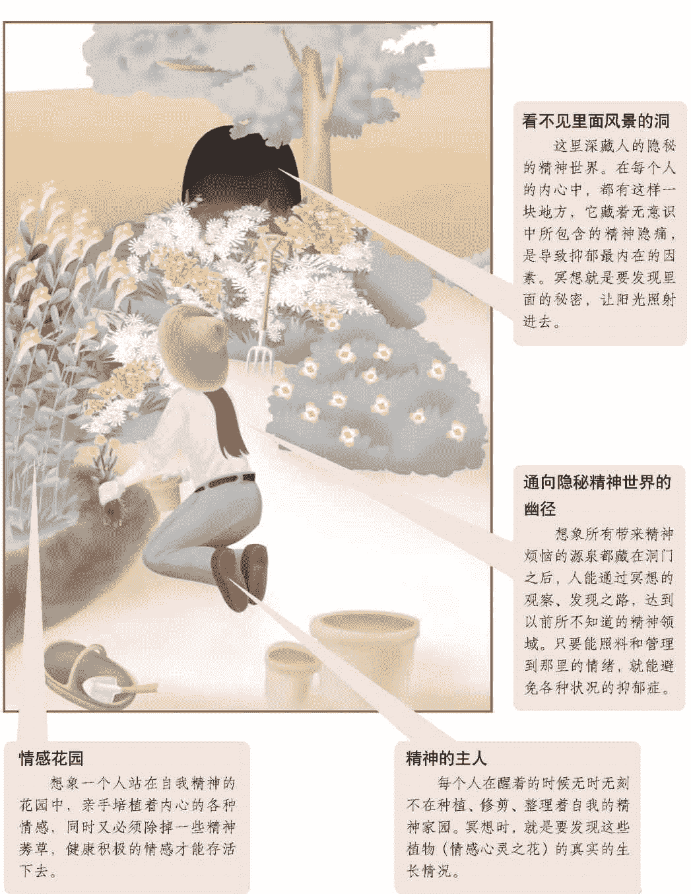

### 冥想帮助人走出精神抑郁（二）

猫和人的抑郁心理有某种联系，一是其习性偏于懒散、被动，不愿意集体行动，对什么都似缺乏兴趣；二是常和人的幻觉及妄想症状似乎有某种联系，因猫的情绪特质以抑郁为主。由此精神抑郁的人能通过冥想猫看清自身的当下状态。

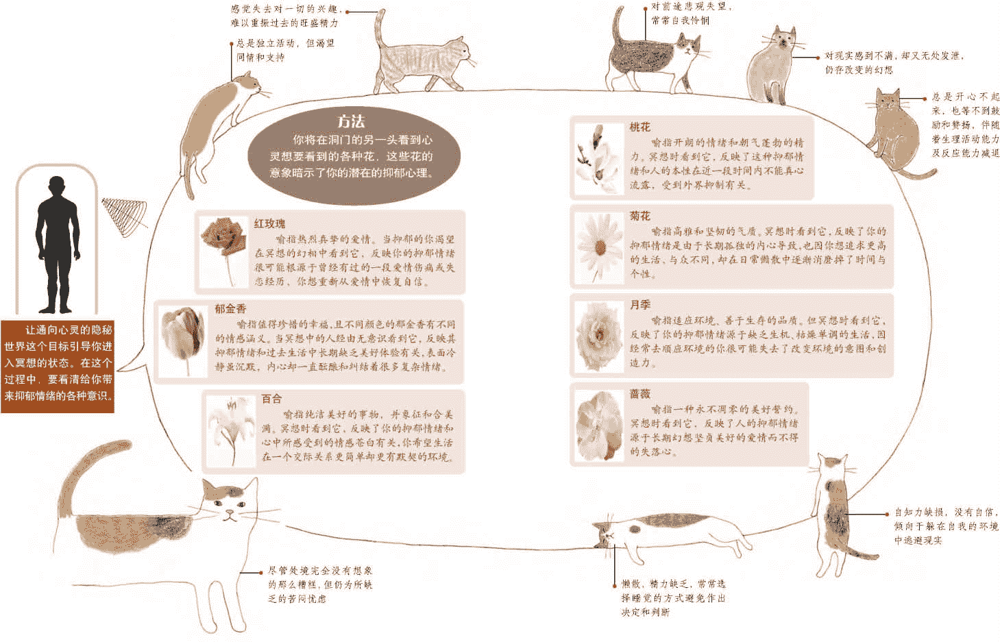

## 冥想治疗强迫症
克制自我

对于自我强迫心理过重的人，冥想时可以通过集中意念的方式，反复在内心告诫自己不要把强迫意向转变成实际行动。

* * *

#### 强迫症的精神症状及危害

所谓强迫症，是指人的许多行为和动作不是出于自己的意愿进行的，而是某种难以名状的力量迫使其做出来的，尤其以自我强迫为突出症状。主要表现为两种：**（1）观念上的强迫。** 如某种联想、观念、回忆或疑虑等顽固地反复出现，难以控制。它还包括了强迫性思虑，如对自然现象或日常生活中毫无意义的事件反复思考，不能克制；强迫对立思维，如两种对立的概念或思维反复在脑中相继出现；强迫意向，如在某种场合下不能控制与当时情况相违背的念头出现；强迫性恐惧，如害怕对自己的情绪会失去控制的恐惧。**（2）行为上的强迫。** 如强迫仪式动作、强迫洗手、强迫检查、强迫计数、强迫眨眼、强迫摇头、强迫咬指甲等。

有强迫症的人常为那种强迫自己产生某种观念或实施某种行为的莫名其妙的力量所苦恼，感到精神紧张，对自己所想所做的事过度关心，以致产生严重的焦虑，加重心理负担，严重者甚至完全无法进行正常的思考和作息，成为精神分裂病症患者。

#### 强迫症的根源及冥想治法

强迫症发生的原因，有遗传因素、社会心理因素和个人的自身因素三种。

**（1）家庭遗传，** 如亲属中某个人有过于神经质的表现，也会增加其家人患上强迫症的几率。冥想时，集中精力回忆生命中影响你最大的人，看他（她）是否给你带来了某种强迫意识。

**（2）社会因素，** 包括来自工作、人际交往、习俗等的影响，都会加重内心压力，生成强迫性观念和行为。冥想时，在独处的心境中摆脱来自外界的各种看法和评价，回到自己怎么看自己的状态。

**（3）个人因素，** 既有父母管教过严、自我苛求过高以及某种怪癖等，也有精神受到刺激后形成的强迫性心理。冥想时，反复地内视自己的强迫性观念和行为，直到自己警觉到它给自己造成的困境。

### 走出和自我搏斗的怪圈

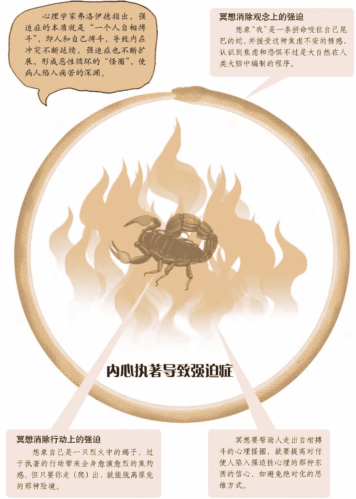

## 冥想治疗自闭症
适应社会

冥想并不是脱离现实社会、逃避世俗一切事物的行径，反而，它的目的是为了让人不失去自我，而以一种较温和、有弹性的方式来适应社会。

* * *

#### 自闭症的基本特征及危害

自闭症主要发生在人的儿童时期，是一种儿童脑功能失常的疾病，又称为孤独症。它作为一种心理疾病，在人的成年后也会出现，表现为缺乏与人交往的兴趣，从婴儿时期起就不愿意和他人交流，喜欢自己单独活动，长大后则孤独离群，失去与人建立正常联系的能力。这类孤独的人不单是内向，完全不关心周围的事，自顾自地活动，而且呈现一种智力缺乏或低下的特质，无法进入正常的社会交际中，对外界的刺激常常没有反应。

有这种心理疾病的人，某些存在着语言障碍，不仅不懂基本的沟通技巧，甚至根本不能理解他人的语言；害怕环境改变，喜欢重复做同样的事情，把自己封闭在自我的小世界中；能够学习，甚至在一些方面智力表现超常，但常人需要具备的生活能力却严重缺乏；有些还存在着自伤、自残性质的行为。

#### 冥想提高对外在世界的适应力

在现今世界，网络上的游戏、虚拟聊天等都会带来自闭症这种心理疾病，有自闭症倾向的人常常偏执于一种习惯不能改变，迷恋自己怪异的活动方式，用尖叫来表达情绪，与现实的世界隔阂。冥想能用凝视和引导式想象改变这种状况：

在有自闭症或这种倾向的人的眼睛能平视的范围内放一个苹果，每次让“他”专注凝视它 5—10 分钟，引导“他”从苹果还是个种子开始幻想，果农为之施肥除草，悉心栽培，不到几年长成苹果树，鸟儿飞过也忍不住下来栖息，一旦果实累累，市农来热情地收购，进了专门卖水果的商店，后来又到了愿意品尝它的顾客手中，才完成一次积极有意义的生命旅程。想象那棵苹果树的形状，想象运输苹果的卡车式样……明白每一种生命都有其生命程序，和他人切断联系只能破坏其正常的生命程序。

### 冥想有助减少自闭症儿童

儿童自闭症的产生可能源于母亲在胎儿时期的恶劣情绪，使孩子受到不良刺激，大脑或触觉出现缺陷，出生后异于常人。

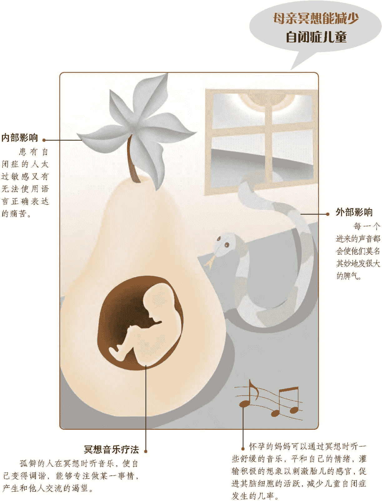

## 冥想治疗躁狂症
抚平狂躁

躁狂症的表现是心境高涨，思维奔逸和精神易兴奋。有躁狂症的人可采取静坐冥想的方法平静心灵，克服狂躁情绪。

* * *

#### 躁狂症的基本特征及危害

躁狂症是心境显著而持久的高涨，并伴有相应思维和行为异常的一种精神疾病。它和抑郁症正好相反：抑郁症以情绪极度低落为主要症状，而躁狂症主要表现为情绪极端的高涨。躁狂症多发生在人 20 岁左右的青春期，其发病可能与遗传、心理学社会因素、精神刺激因素等有关，常突然发病但很快能得到控制，有反复发作的倾向。

患有躁狂症的人过分自信，情绪亢奋，意念飘忽，好管闲事，注意力分散，容易狂喜、兴奋，也易被激怒，因而常与周围发生冲突。他们多产生自我夸大的妄想，对自己缺乏正确、客观的认识；躁狂情绪常表现为容易激动、烦躁，说话多，精力旺盛。躁狂症患者有时会扰乱正常社会秩序，影响他人。

#### 抑制躁狂症的冥想方法

在静坐冥想前，必须保证良好的生活作息，睡眠要充足，多喝水，多吃新鲜蔬菜、水果。由于躁狂症多发生在夏季，要避免长期处于高温环境，做好防暑降温的准备。通过静坐冥想治疗躁狂症的方法是：

**（1）不需要刻意保持精神集中，** 否则反而容易引起烦躁情绪。坐在你平时习惯坐的椅子上，放松精神，减少压力，听一些轻松的音乐进入冥想状态。

**（2）注意自己的呼吸，** 当呼气时，想象它变成一缕清风，把自己的过剩精力带到天边。当吸气时，想象它给自己带来凉爽的雨天般的感觉。（根据中医学阴阳调适的原理，躁狂接近热症，应以寒凉阴湿之法抑之。）

**（3）让思绪任意漂流，** 慢慢觉知自己情绪过分高涨是不正常的，平息各种“风云突起”的情绪。有时冥想也可能发现引起躁狂的心理根源，如过分认定自己拥有某种形象（善于言谈、表现力强等），或感官受到精神刺激后过分活跃等等。

### 平和心境的冥想法

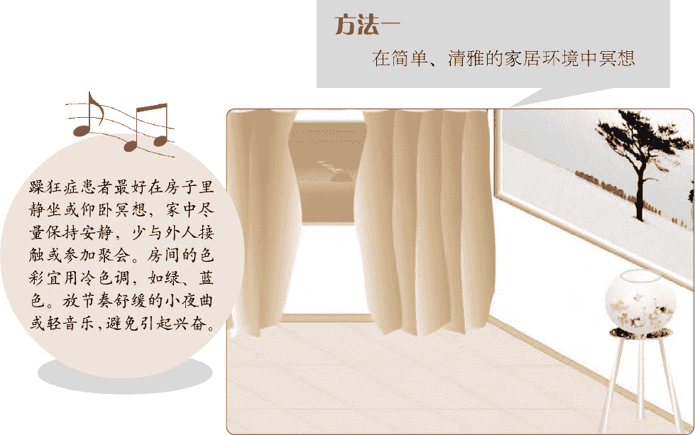

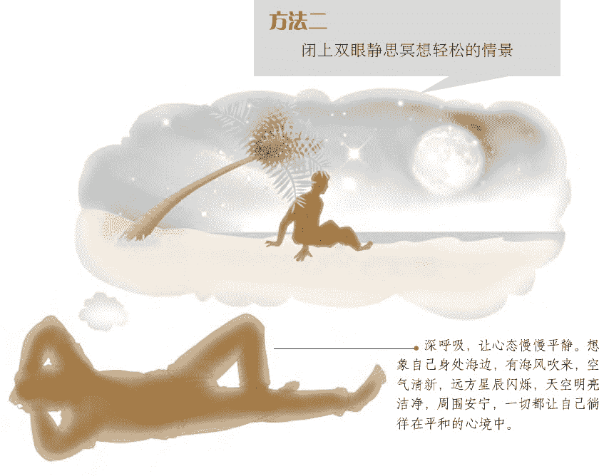

## 冥想治疗焦虑症
平衡内心

焦虑症患者常表现出不安与恐惧的焦虑情绪，对现实生活或将来某些事情，存在毫无必要的过分担忧，而令本人感到痛苦。冥想就是要改变人的焦虑心态。

* * *

## 焦虑症的基本表现及危害

焦虑症是人的精神受到影响后，以急性或慢性形式出现的一组焦虑反应。其不同于正常焦虑情绪反应，表现为：一种无根据的惊慌和紧张；无缘无故、没有明确对象和内容的焦急、紧张和恐惧；莫名其妙地感到某种威胁或危险，却无法知道究竟；出现强烈的内心冲突，给自己造成情绪不稳、精神痛苦。焦虑症患者常伴随着神经和肌肉紧张、忧虑、恐惧、坐立不安、神经过敏，及呼吸困难、头晕、胸闷、恶心、呕吐、心悸、口干、尿频、尿急、出汗、震颤等种种不良心理和身体反应。

焦虑症大多发生在人的青壮年时期，且女性多于男性，主要是由遗传因素、社会环境、性格特点、心理冲突所引起。儿童时期，人遭遇到一些特殊的情感经验，长久压抑后也会在成年爆发，并形成某种特殊焦虑反应。社会环境给人的生存压力很大，尤其是大的社会气候造成人心惶惶，如遇到股市暴跌、金融危机、不利政治形势，都会加剧焦虑症发生的可能。一些自身性格就敏感多虑、疑心重、自卑、适应环境或处理突发事件能力差的人，也会常常给自己带来紧张和焦虑，久而久之就养成一种容易焦虑的心理。另外在精神受到刺激下，产生极大的心理冲突，也会将一时的焦虑体验泛化为面对任何事情都担心惊恐的强迫性焦虑症。

焦虑症一般分为两种：**急性焦虑症，** 往往无任何明显外在刺激就突然心发慌，感到某种灾难即将降临，甚至有濒临死亡感，内心说不出的紧张和恐惧，以致神经过敏。**慢性焦虑症，** 则是持续性地焦虑、恐惧、不安、紧张，惶惶不可终日，对事情多怀有悲观想法，夸大面临的困难，常常失眠、心悸，如总是担心自己的某处身体机能损坏，难以恢复，以致产生消极、多疑的心理。

#### 改变焦虑心态的冥想方法

**（1）自我放松的深呼吸**

冥想的一切活动都要深呼吸。深呼吸能使心跳减缓，血压降低，让人保持镇静，重新控制情感，缓解焦虑情绪。

**（2）做放松运动**

左右摆动下颚，以松弛肌肉，继续做一下扩胸运动，改变焦虑时常出现的咬紧牙关、肌肉紧绷的状况。配合深呼吸，上下转动双肩，举肩时吸气，松肩时呼气，反复进行几次。

**（3）冥想积极乐观的事情**

焦虑多由缺乏自信引起，不信任自己解决问题的能力，悲观想象事情的结局，因而无法享受事情本身，一味苦恼紧张。冥想时先放松自己的表情，对任何人、事保持一种乐观的态度。再想象那些最能激发自信的事，如一次成功经验或把问题成功解决后的心境。

**（4）幻想治疗**

引起焦虑最重要的心理障碍是自我怀疑。总怀疑自己可能出现哪些状况，可能面对哪些危险等等。

**针对急性焦虑症的冥想：** 当自己怀疑“大难临头”时，幻想和“未来的自己”对话——“他”比现在的你更聪敏、更能应付那些难缠的局面，也更快乐。从想象自己能变得更强大中，焦虑情绪能得到转移。

**针对慢性焦虑症的冥想：** 紧握住最重要的那把钥匙，幻想钥匙丢了之后，当下什么都干不了的现实窘况，最好受惊到完全把自己吓得全身冷汗。再重新凝视手上的钥匙，感觉眼前所见是坚定可信的事，借此解除焦虑情绪。

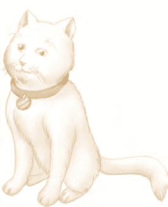

### 冥想治疗焦虑症的四个步骤

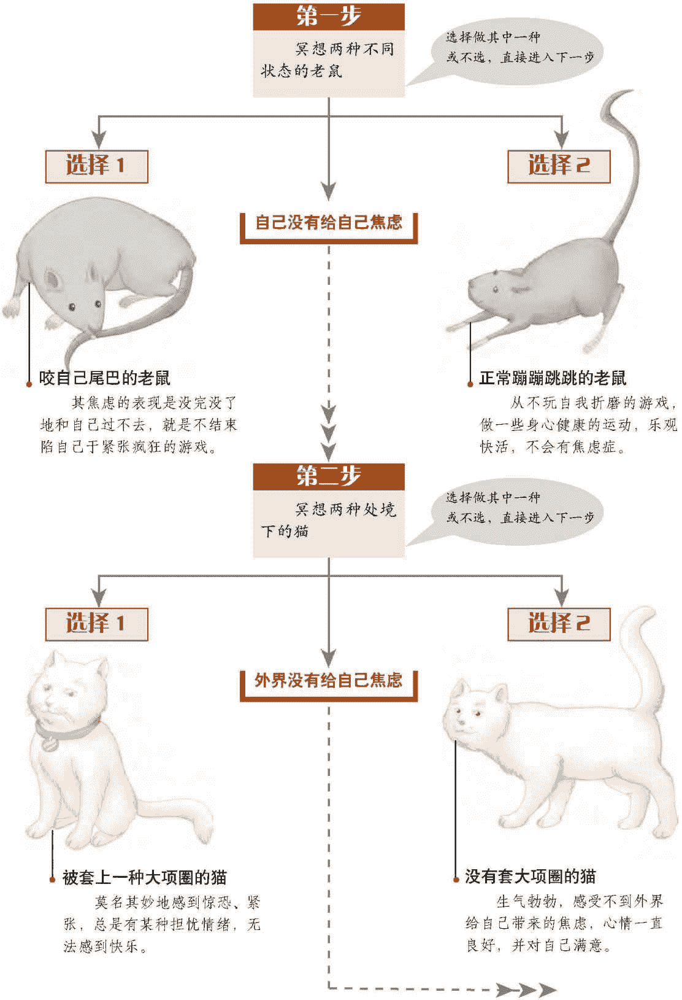

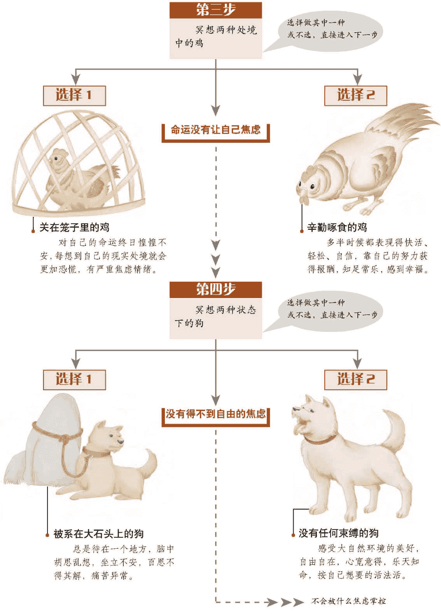

## 冥想治疗恐惧症
缓解紧张

心理学认为，有恐惧症的人真正所害怕的不是令他产生恐怖心理的那一类事物，而是他自己的焦虑情绪。冥想要发现那些引起恐怖的、被压抑的潜意识焦虑。

* * *

#### 恐惧症的基本表现及危害

恐惧症是指对于特定事物、对象或情境产生超出一般紧张的恐怖状态，发作时伴有强烈的恐惧反应，如突然脑袋中一片空白，然后全身麻木，眼睛瞳孔放大，脸上肌肉不断痉挛，露出极为惊恐的表情。恐惧症表现为：当时并无危险，所害怕的特定事物或处境只是外在的；恐惧的对象不足以引起如此强烈的恐惧反应；极力回避所害怕的处境，或对自己的处境产生过度的焦虑；对某一事情或动物有特殊的恐惧心理，如恐高、恐蛇、社交恐惧等。

有恐惧症的人往往也知道自己的害怕是过分的、不应该的或不合理的，但并不能防止恐惧发作，并且一旦进入令他恐惧的情境或接触恐惧的事物就会不由自主、难以克制地害怕。

#### 冥想克服恐惧条件反射

就恐惧症产生的根源，是因为人对自己的不自信感、恐惧、焦虑、抑郁等消极情绪在头脑中引起消极兴奋，从而建立了消极条件性情绪反射。冥想对付这种类型条件反射的方法是：

**（1）放松冥想调控情绪**

渐进式肌肉放松和冥想相结合，即先使肌肉紧张 5—7 秒，注意肌肉紧张时的感觉，很快使紧张的肌肉彻底放松，注意放松时肌肉的感觉。按照顺序，每部分肌肉一张一弛做两遍，同时其他肌肉保持放松，直到全身都彻底放松。这时思绪可以漫无边际，不要集中在紧张的肌肉上。

**（2）场景想象改变心向**

从自己“胡思乱想”中择取明亮的意象，如骑马持剑飞奔的剑客，想象自己化身为他，参加了一场战争，打斗得非常激烈，在战争中感受到除了勇往直前，别无选择。你的敌人就是你“潜意识焦虑”的象征物，过去一直是他占优势，现在你充分调动所有感官和能量，赶走敌人，改变总是被他打败的思维定式。

### 冥想克制恐惧心理

恐惧症是在个人经验中受到某种外部刺激形成条件反射，一接触到这种刺激情境就产生紧张和焦虑的过敏性情绪反应。下面一个“触摸青蛙”的五人考验中，有一个人（E）有青蛙恐惧症——源于一次青蛙对他的突然袭击，他通过冥想克服这种恐惧心理。

##### 参加者　ABCDE

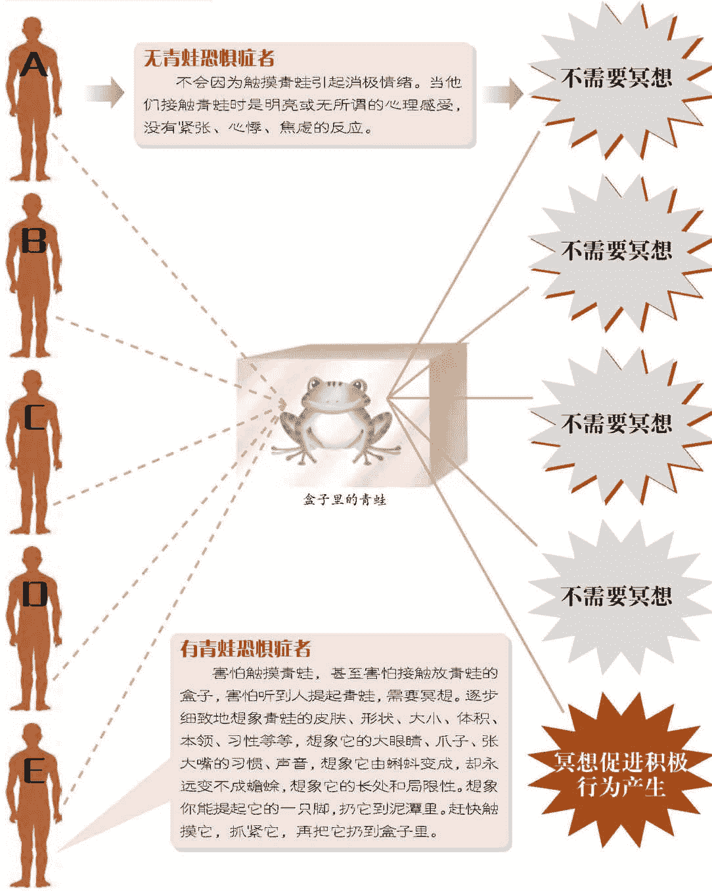

## 冥想治疗偏执症
改变想法

有偏执症的人往往被称为偏执狂，他们常常从自我的看法、情感或想象出发，看问题不根据客观事实。冥想能改变他们带有癔想色彩的偏执心态。

* * *

#### 偏执症的基本特征及危害

偏执症是指长时间固执地坚持自己偏颇性的看法，且因别人没有遵从自己的看法而对其充满敌意的心理状态，通常它还伴随着一种关于被害、爱、恨、嫉妒、荣誉、诉讼、夸大和超自然力的妄想。其过激的反应可视为一种人格障碍或精神分裂。偏执狂往往极度敏感，观念狭隘，行为固执，易猜疑、嫉恨，爱寻衅争吵，脾气暴躁，既自以为是，又很自卑，有强迫自我和他人对立的焦虑情绪。因而对别人或爱侣缺乏信任，并饱受没有安全感或某种强迫意识的折磨。

过于偏执是一种病态心理，对周围事情的解释极为偏激，并固执自己的看法，“强迫”他人同意自己的看法，对有异见者不能宽容。性格或受到精神刺激是导致偏执的主要原因。一些邪教修炼也会导致偏执，如狂热地相信通过某种修炼途径能通向“真理”或天堂，甚至因此“殒命殉道”。

#### 冥想帮助人走出偏执心理

偏执症发生的直接原因是以自我为中心，心理失衡，疑心过重，或执著于极端思考。偏执狂未必是从来就很偏执，不能听从别人的意见，但一旦形成偏执心理，就会长久陷在那种自以为是的绝对化思维中。发现自己有偏执症的人，不要用意志去控制自己的想法，也不要猜测别人的任何想法，你只需要通过冥想理解自己：

想象各种几何形，三角形、圆形、正方形、椭圆形、梯形、菱形、平行四边形等，它们变成一个个“小人”在你的眼前晃动；

你发现每个的形态不同，精神气质也不同，用不同的方式告诉你他们对世界的看法，如三角形说“我很坚固但．容易伤到人”，椭圆形说“圆形比我更正规，但我真实、自然”。

想想你的想法都会和他们每一种相应，并不是只是一种不变。

### 对治不同类型的偏执狂

一些偏执狂常过于相信自己观点的唯一正确性，或者自己本来普普通通，却自命不凡。可以冥想这个形象：用王冠和长长的丝绸把自己装扮成无所不能的上帝，其实自己是个缺乏自知之明的呆瓜。

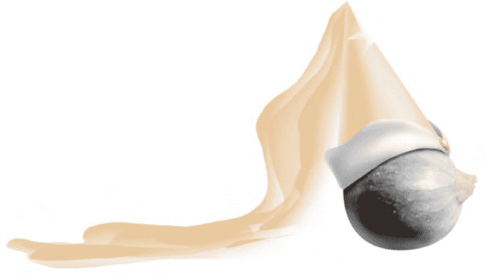

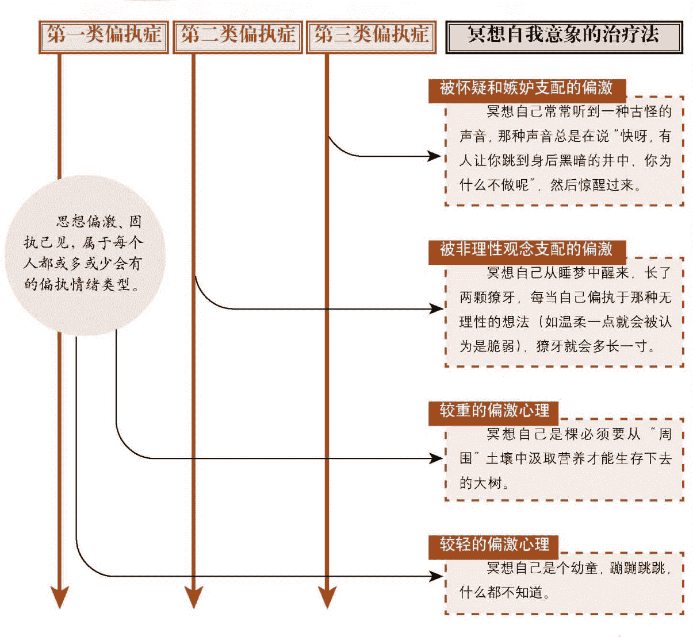

## 冥想治疗妄想症
消除妄念

有妄想症的人常错误地利用暗示法，使自己处在非理性的思维变态中，常和强迫症、焦虑症、恐惧症、精神分裂等心理障碍有关联。冥想要使他们走出不正常的心理。

#### 妄想症的基本特征及危害

妄想症是一种自我中心的、坚信或确信个人独有的信念，不接受事实和理性纠正的思维变态。它可能是突然发生的妄想性体验或确信，也可能是在已有的心理障碍基础上发展起来的妄想。其妄想的内容包括：情爱妄想、自大妄想、嫉妒妄想、被迫害妄想、身体妄想等等。妄想常基于一种错误的个人信念，其核心判断总是包含着“我”，即使坚持的信念是错误的，甚至与社会现实及文化背景相抵触，也毫不动摇。

妄想症患者常常是自我卷入错误的想法中，不相信其他人的说法，也无法通过个人经验改变歪曲的心理。其内心可能有不可告人之秘密，或处于特殊环境、长期紧张状态，一时的妄想逐渐扩大，形成对自己毫无根据的想法坚定不移，与他人、社会存在敌对心理的错误思维。

#### 对治妄想型人格的冥想方法

妄想形成的因素有意识障碍，造成对事物的判断能力丧失；情感障碍，强化某种缺失或妄想出来的情感；性格及情绪体验的特殊，想象荒谬离奇，及对事物错误的解释等等。有时，过分冥想也可能导致妄想，如在禅定过程中放松意识，让一种杂念在脑中形成幻相，可能会变成“心魔”，使禅定者出现妄想、谵语、发疯等等病态状况。由于妄想常常和幻觉联系在一起，冥想可以用幻想来治疗妄想的方法：

想象每次又出现无法摆脱的妄想的时候，就幻想一下你所妄想出来的内容是由另一个人想象出来的。想象“那个人”的外貌、年龄、体形、特征、性格……想象他有一个小孩一样的大脑袋（妄想的主要器官就是头脑），和瘦小的身体（类似于婴儿的身体）……当有妄想症的人发现自己只具有婴儿的身体和婴儿的行动力，就自然会对妄想有所认识，在现实世界中减少妄想行动。

### 妄想症者观察自己

妄想症者常常不能经由理性的头脑意识到自己的想法是多么荒谬、可笑、不符合客观世界的规范，冥想有时能帮助他们看清自我的形象。

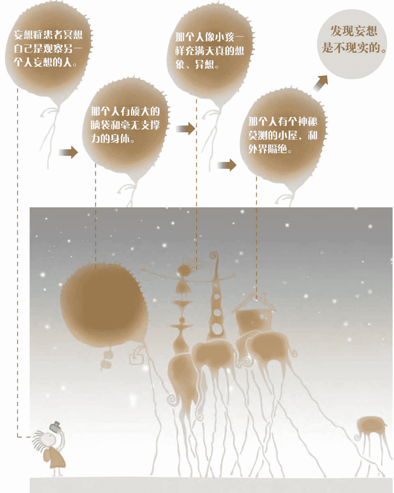

## 冥想治疗精神分裂症
协调身心

精神分裂症患者可能出现幻听、幻视、幻触、幻嗅等，似乎失去了与现实的接触，难以鉴别主观与客观、真实与幻觉。冥想协调主体对自我、客体的认识。

* * *

#### 精神分裂症的基本特征及危害

精神分裂症是一种精神活动与现实环境相脱离，思想、情感、意志与个性特征等都互不协调、相互分裂，并认为自己的情感受到控制的常见心理疾病。早期时性格改变，有不理睬亲人、对镜子独笑等异常表现。病情严重后出现思维紊乱，思考过程常缺乏逻辑性和连贯性，言语零乱、词不达意，或思维贫乏、缺乏内容。这种病症主要有两种：一种表现为思维障碍、情感障碍、妄想、幻觉等，常有毫无事实根据的想象，如以为自己是大发明家或盖世英雄等；一种是情感淡漠、迟钝、缄默、行动退缩、被动等，甚至丧失与周围环境的任何情感联系。

精神分裂包括情感反应与环境不协调，如缺乏细腻的情感，喜怒反常，为一点小事就暴跳如雷，缺乏同情心；妄想的内容自相矛盾、变化不定、荒谬离奇，还可能出现毫无联系的多个妄想；思想、行为与现实脱离，常常幼稚、可笑、冲动、缺乏逻辑、愚蠢、颠倒正常，却又对自己的行为毫无觉知；出现严重的幻听现象，如威胁性、议论性、命令性幻听，内容是消极的，甚至明知声音是不真实的，却很难忽视，以致给身边的人或自己带来生命危险。

#### 冥想感受流变的精神意识而不加注意

较轻的精神分裂症患者用正念冥想观察当下意识中不断流变的思想、感受或感觉，这时只需要记录下它们是如何影响情绪的。由于精神分裂的人对于外在刺激要么特别敏感，要么毫无察觉，因此可以通过观照各种情境对精神的刺激，发现自己是属于哪一种精神分裂，如兴奋型，还是冷漠型。注意力不要放在感受到的个别内容上，也不要加自己的偏见、评论、判断、解释，甚至不要反省。感觉自己仿佛在做白日梦一般，对各种刺激情境不动心而警醒。

#### 冥想驱走痛苦的快乐原则

有精神分裂症的人除了遗传因素影响，最可能是遭受精神刺激，如有被虐经历、看到过心理无法承受的场面、重大事件对性格的改变等，它们作为一种被压抑的感受转到潜意识里，一旦活在缺乏稳定的情绪中，就会成为精神分裂的“诱因”。还有一种情绪上的痛苦，类似拒斥、毁弃、忧郁、死亡、厌苦、单调重复等无法让人快乐的心理经验。冥想要纾解这些背离人本来意愿或理性的痛苦，唤醒正常的对快乐的追求：

知道苦恼的根源是“害怕苦恼”。冥想让自己感到痛苦的情境，发现自己不是天生应该受迫害或被拒斥，而是因为什么原因有如此遭遇。冥想自己对“那个情境”很害怕，因为它发生后自己就成为一个苦恼者。冥想这种苦恼只是“一般人的不幸福”，而不是“不幸者天生受的罪”。冥想令自己痛苦的最终的根源是个人在社会中的脆弱心理和害怕成为苦恼者的趋乐避苦心理。结束冥想前，将“害怕苦恼”的精神形式转换为想要快乐的精神形式。

#### 冥想察知自我的分裂状态

精神分裂可能与几种心理暗示有关，如压抑的自我暗示导致长期与内在的自我进行对话，那一个“自我”本来就不健康，它在逐步加深的暗示中渐渐变成“上帝”或自我灵魂的主的角色，成精神幻听的来源之一；夸大的自我暗示也会致使自己和现实的角色分离，妄想自己是拥有另一种性格、超强能力及影响力的人，因此一个自我“萎缩”，另一个自我“膨胀”，造成思想、行动不协调。这时冥想的目标就是追求身心和谐与统一。

（1）观想身体中的“超出意愿控制之外的自主性神经系统的反应程序”，告诉自己这个程序的驱动力在于自己。即是否允许情绪自发、趋利避苦、思考、行动都在于自己。

（2）冥想有个“错乱”的自己被“有秩序”的自己给打败。自己偏好的是“有秩序”的自己。因为这个“有秩序”的自己各方面知觉正常。

### 关于精神分裂症者的研究

冥想对于较重的精神分裂症是极不合适的，尤其用它作单一治疗，很可能加重原有的精神疾病。

##### 精神分裂症的类型

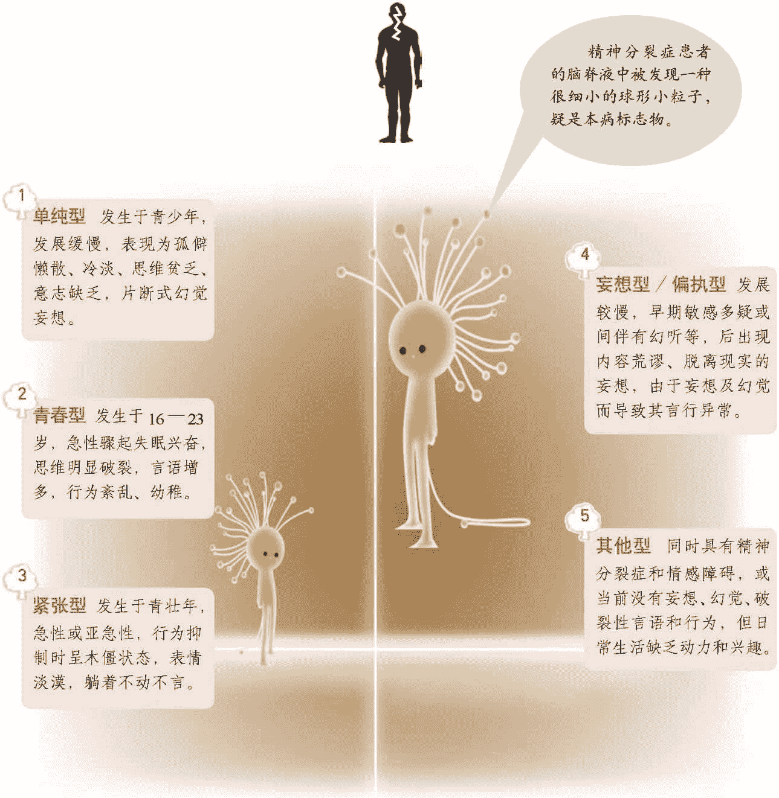

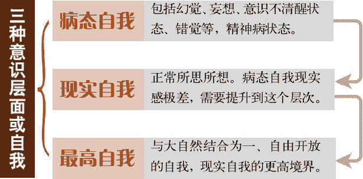

冥想是身心灵的结合、统一、和谐，正确的饮食方式和生活态度，可防止精神分裂或帮助精神恢复。

### 冥想治疗幻听症者

有精神分裂症的人常从看不见的地方听到神秘的声音，这些声音似朋友、家人或陌生人的讲话，诱导其做出行动。冥想也可能带来幻听，但和精神分裂病人不同的是：后者出现幻听时，神经细胞过度兴奋；而当人冥想时，即使出现幻听，仍意识平静。

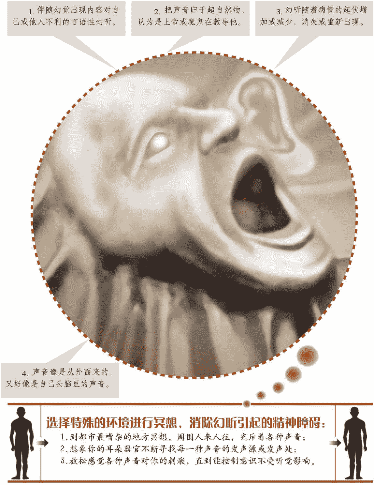

## 冥想治疗癔症
控制情绪

癔症又称癔病或歇斯底里症，是一种情绪、反应失控的心理病症，对某件事或某人具有情感倾向性就会易受暗示。冥想放松、暗示、催眠都对这一类病症有很好疗效。

* * *

#### 癔症的基本表现及危害

癔症或癔病是一类由精神因素如重大生活事件、内心冲突、情绪激动、暗示或自我暗示等引起的精神障碍。其主要表现为情感爆发、多重人格、意识范围缩小、选择性遗忘、漫游等。最常见的是情感爆发，突然又哭又闹，表演夸张，如撕衣扯发，喊叫打滚，诉述悲痛和委屈，带有情绪发泄的特征和强烈的情感色彩。严重者也会产生幻觉，冲动打人毁物，自伤甚至自杀等。漫游是突然外出无目的游走或神游，经历过的事情在清醒后大部分遗忘。

癔症病人常情感反应过分强烈，喜从一个极端走入另一个极端，感情用事，易受暗示，自我中心，好幻想；也会由于癔症性情感障碍带来各种躯体反应，如震颤、瘫痪、昏厥、失语等。有的会突然丧失记忆，一些日常生活小事都错误百出，看上去还不如稚童；或莫名其妙称是另一个人，为已故亲友、神灵、鬼怪附身等。

#### 冥想催眠术和暗示法治疗癔症

癔症是由心理原因造成的，患者不仅有很强的自我暗示性，还容易接受他人暗示，对于自己所信赖的人，常可盲目服从，易接受周围人的言语、行动、态度等影响，并产生相应的联想和反应。它是适宜于用催眠和暗示法治疗的一类心理问题。

**（1）冥想催眠术** 　催眠常被用来治疗癔病，是通过催眠使病人处在一种沉思冥想的状态中，再与他谈话以了解其真实的内心世界。

**（2）冥想暗示法** 　医生向病人暗示某种观念，使患者解除心理上的压力和精神的负担，从而减轻或改善癔病症状，称为“暗示疗法”。通过暗示，病人在沉思冥想时心率减慢，呼吸平和，肌肉放松，从而相信此时体内脑细胞正在“休养生息”，与紧张有关的肾上腺素分泌减少，免疫机能提高，有利于病情改善，称为“信念治疗”。

### 走出压抑的心理世界

癔病与心理、潜意识相关，其患者可面对达利的这幅超现实主义画作冥想。它以一种不被理性控制的梦境与幻觉，表达“压抑的自我”和潜意识看到的世界。

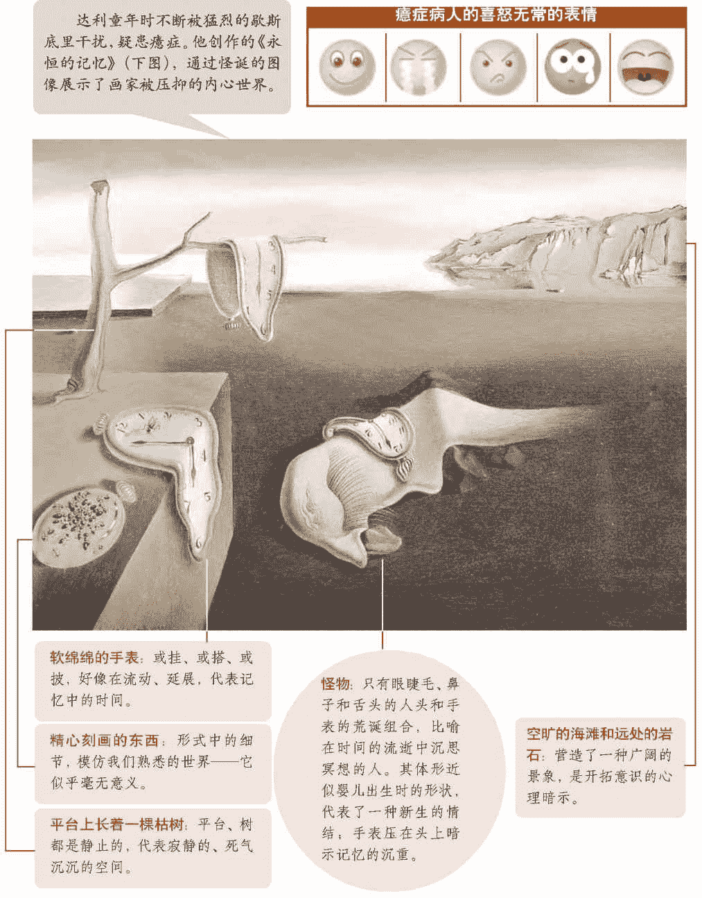

## 冥想治疗疑病症
转移忧虑

疑病症患者强烈怀疑自己患病，其实质是心理不安的转移。病不在于怀疑的病，而在于怀疑本身。冥想让疑病症患者静下心来想清楚，烦恼自然不见了。

* * *

#### 疑病症的基本特征及危害

疑病症是一种担心或相信自己的身体患有严重疾病，并让这种想法持久占优势的心理疾病。其特征为对躯体过分关注，以致对于任何与它有关的迹象都会表现出敏感、多疑、主观、固执、谨小慎微，医生或其他人的说法不能打消其是否患病的疑虑。这种病症发生于中年以后，患病因素包括病人的自恋性格、孤独感、生活变故或一次不确切的诊断等等。

有疑病症的人整日考虑自己的身体状况，病态地害怕自己罹患某种严重的疾病。其心理障碍表现为两种：一为疑病感觉，即对某躯体部位的敏感性增加进而疑病，但对病情的描述含混不清；二为疑病观念，即确信自己患有某种疾病，描述形象逼真，生动具体，认为医生的检查可能有失误，并由此担心忧虑、惶惶不安、焦虑苦恼等。

#### 针对疑病症的瑜伽冥想疗法

疑病症病人常见的症状是疼痛，但他们往往把注意力主要放在身体的某一部分，尤其是腹、胸、颈和头部。且他们似乎有特殊的感受能力，能感觉到常人不易发现的身体内部活动，如心脏跳动、肠胃蠕动等。

瑜伽冥想疗法通过采用多种姿势和体位，缓解疑病症病人身体上的疼痛。由于瑜伽的姿势崇尚自然，如模仿动物的自然姿势、做腹式呼吸，能改变人在日常生活中不自然的姿势，带来身体某些器官负担过重，引起的疑病状态。

#### 适应疑病症的佛教心理疗法

冥想和佛教戒、定、慧的修习结合也能治疗疑病症：戒是限制意识，使病人把注意力从症状上移开，以降低对身心不适的敏感性；定是什么都不要想，人为的意识改变、放松，消除疑病的心理障碍；慧是让人从小我中走向大我，使其不过分关注自己，不脱离现实，从矛盾不得解决的痛苦中走出来。

### 两种不同疑病症的冥想治法

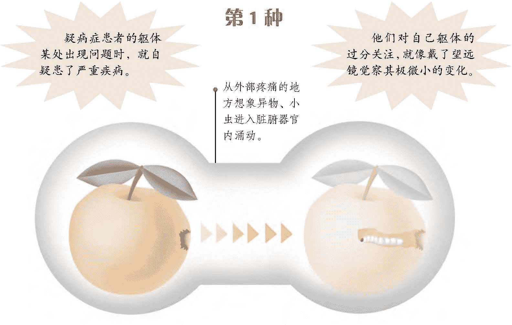

## 冥想治疗臆想症
引导想象

严重的幻想、过度冥想、重大精神刺激或长时间较大伤害都会导致臆想症。正确的冥想能通过控制意识，来消除臆想病人由于幻想过度产生的恐惧心理。

* * *

#### 臆想症的基本表现及危害

臆想症是一种白日做梦式的幻想过度和思想、感觉失调，严重时使人产生幻觉，导致精神失常的精神病症。有臆想症的人往往轻易将自己融入幻想中，做出一些平时不会做的举止，其清晰臆想出的身临其境的画面，常是恐怖的情形，如同真实发生一般。与恐惧症不同的是，臆想病人通过想象进入了那种恐怖境界里，而不是现实接触它时产生恐怖反应；与妄想症不同的是，他所坚持的“信念”不是妄想症中那种错误的观念，而只是一种毫无根据的假想。患有臆想症的人常有如下表现：

**（1）对将要发生的事情产生心理恐惧**

原因多是对事物缺乏足够的认识、判断力，或是分析、思索救助自己的办法，又无力解决，只好不停地思考答案，做出恐怖环境下的种种假设。但由于持续使自己处于幻想恐惧的事情当中，身心消耗巨大，精神长时间极度不安，而实际情况不过是微小的事情，其本人实际上非常平安。

**（2）会在大脑里虚拟一个完美世界**

其病态的大脑会按本人意志和意愿构造精神幻境的所有元素，并完善一切的情节和细节，使之没有任何破绽，然后反过来催眠本人认同这一切。其实每个人都会有希望、盼望构想或愿望等积极的精神活动，但使人患上臆想症的关键在于患者大脑主体是否乐意接受并存活在这个完美世界。

如果一个人的心理素质不好、精神萎靡脆弱、意志薄弱甚至崩溃，他的潜意识就会努力寻求一种解脱的方式，以维持主体的心理平衡和修补心灵创伤。当他的意识很主动很乐意地接受这个虚拟精神世界并选择驻留在主观意识中，就是得了臆想症。通过臆想，他就能逃避一切现实中不能实现或不如意的事情。

#### 冥想克服臆想症者的心理恐惧

臆想症病人通常因环境压抑或心理阴影，造成难以承受的心理压力而最终致病，表现为精神莫名紧张和极度缺乏安全感。冥想可以消除那种恐惧的假想，或减少假想的时间。

**（1）冥想所有可能发生的可怕情形**

感知各种浮现在大脑中客观实际情况，不断暗示自己其实非常安全，直到受到警示或醒悟，完全没有必要去臆想。

**（2）冥想恐惧的事情发生在明天**

假如臆想症病人恐惧的事情发生在明天，比发生在一个月后，对他伤害小得多，因为发生在明天的话，他根本没有时间去臆想，办完了立刻就结束了。

**（3）冥想自己已经离开敏感源（导致心理恐惧的源头）**

假如离开敏感源，臆想病人将自动停止臆想，约经过 1—2 个月平静生活后，头脑就会自动清晰，不再幻想那些事情了。即使回到敏感源里，也不会去幻想什么。

#### 冥想治疗臆想症的正确态度

**（1）冥想本身是一种臆想**

所谓臆想就是空想、幻想，做白日梦一般。冥想的方法是静思、观想，也包含了臆想的成分。但臆想症则是一种思想上的疾病，是对于脱离客观事实的内容的病态的想象。冥想如果方法不当，思想意识走入歧途，也会得“妄想”、“臆想”的病症。

**（2）冥想对于臆想症病人的心理治疗**

冥想是对当下的不受意识束缚的感知，且不要求采取任何行动，精神自由、觉醒而冷静。当臆想症病人没有完全思想错乱，失去对客观事情的正确判断时，可以通过一段时间的静思冥想，放松紧张的身体，思想冷静下来，反省恐惧的事或本人意识的状态，直到他对当下的觉知合乎客观真相，就会自然没有焦虑和恐惧。对于病情严重者，不妨把周围的环境布置得如同病人所想象的完美幻境，让他过一段梦幻般的生活后，通过有意引导使他慢慢回到现实。

### 遥望星空冥想法

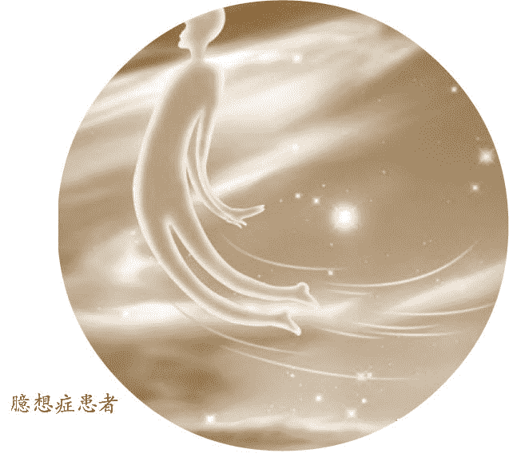

**1　选择性臆想症**

其臆想世界是有特定中心和固定指向的，激活对象是一切与某人某事相关的关联物。

**2　精神异度空间迷失症**

完全陷入虚拟的精神世界，达到“忘我”，意识完全不能正确地反映客观世界的实质。

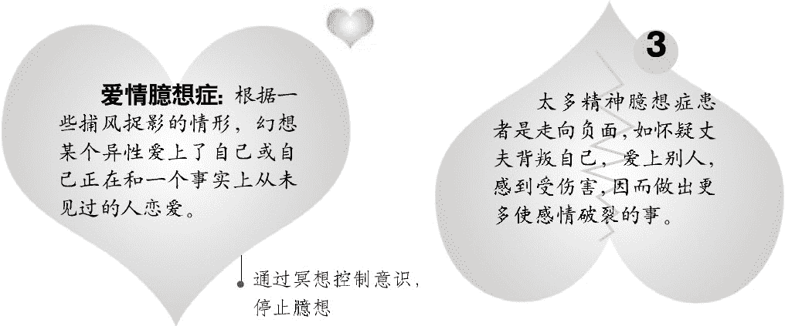

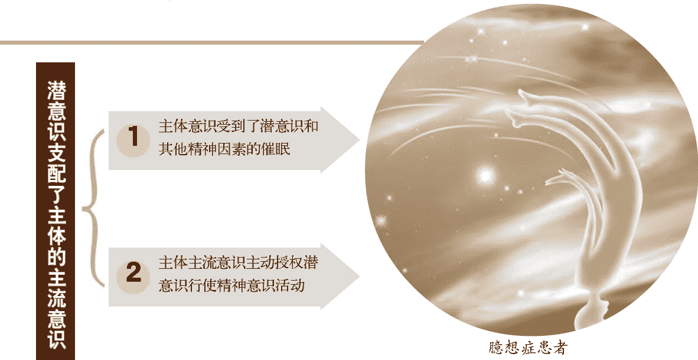

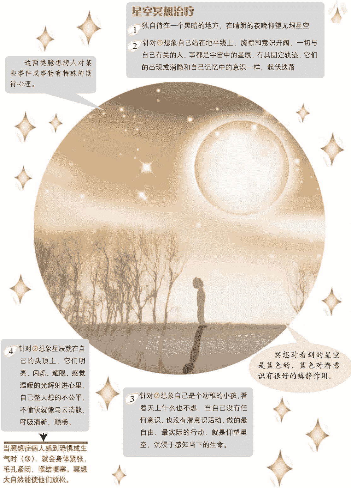

## 冥想治疗神经衰弱
静心沉思

快节奏的生活带来躯体疲劳和心理紧张，使神经衰弱成为现代人的常见病症。人们可以通过静养，如沉思冥想来松弛思想，缓解身体的紧张状态，预防和治疗神经衰弱。

* * *

#### 神经衰弱的基本特征及危害

神经衰弱是指一类由于持久的情绪紧张或精神压力，造成精神易于兴奋，脑力易于疲乏，并常伴有情绪烦恼、睡眠障碍的疾病。常表现为情绪容易激动、兴奋和发怒，自制能力弱，微不足道的小事就可引起强烈情绪反应，发作后又感到后悔。其发病的原因主要是脑力活动的过度紧张或长期内心冲突，一般压力过大、精神创伤、紊乱的生活习惯等也都会导致神经衰弱。

有神经衰弱的人精神上常过于敏感、情绪烦躁，并感到头痛、心神不安、注意力不集中、记忆力减退等；身体上极易疲乏，肢体无力，全身酸软，即使充分休息也不能消除其疲劳感。其大脑对目前需要完成的正常思考感到吃力，却在不必要思维方面异常活跃，难以自控。因自制力明显减弱，常遇事感到困难，易于伤感流泪。睡眠也出现严重障碍，如困倦嗜睡、上床后大脑仍兴奋、终夜不寐或难以入睡、多噩梦、易惊醒等。

#### 沉思冥想治疗神经衰弱

**（1）背靠椅上，头部或靠或斜，顺其自然，闭目静思。** 沉思冥想能让左侧大脑从语言活动中解脱出来，并处于休息状态，让右脑充分发挥其直观的形象思维能力，从而使善于语言思维和多用右手的人容易发生的右脑疲劳获得消除。

**（2）所思所想最好是以往的愉快事情，也可是大自然美好的风光。** 或者通过沉思冥想，引导对有关事物进行思考，以摆脱和对抗病态情绪，从而增进健康。不要把注意力集中于症状，不去有意识地直接消除症状，反而比较容易摆脱症状。

**（3）沉思冥想每天 2—3 次，尤其在早餐前和睡前，能起到一定的防病健身效果。** 由于持续紧张是导致神经衰弱的主要因素，经常有意识地沉思冥想，能减缓身体的紧张，减少消极情绪。

### 冥想治疗神经衰弱的万能公式

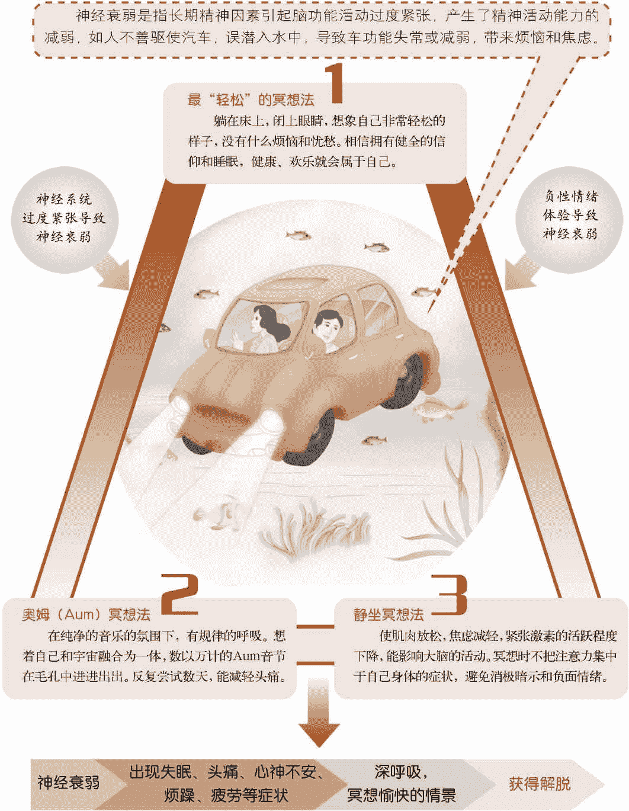

## 冥想治疗失眠
腹式呼吸

一般而言是身体紧张引起的思维混乱易导致入睡困难。冥想能使人摆脱紧张情绪，改变失眠状态对其身心健康造成的不利影响。

* * *

#### 失眠的基本表现及危害

失眠是指持续出现了不能入寐的睡眠障碍，或睡眠时间和质量不足，以致影响白天正常工作、作息规律的一种症状。其主要表现为难以入睡，上床后仍辗转反侧，头脑兴奋；浅睡易醒，稍有声响或震动就从睡眠状态中醒觉；经常早醒，无论睡得早晚，总是未到天亮就醒过来；夜晚多梦，第二天白天感到精神不振、精力不足。失眠与外部刺激、生活作息及心理紊乱、睡前精神活动兴奋有关。

失眠会引起人的疲劳感、不安、全身不适、无精打采、反应迟缓、头痛、记忆力不集中等症状。严重的失眠会进一步导致体质衰弱、抵抗力变差、精神分裂及其他身心疾病。长期失眠会产生“失眠期待性焦虑”，即从晚上刚上床开始，就担心自己睡不着，强迫自己尽快入睡，结果适得其反。这是由于越怕失眠脑细胞就越兴奋，就越难入睡。

#### 冥想自疗失眠症的方法

**（1）选择在安全、舒适、安静和令人放松的地方进入睡眠。** 不要使用药物或接触刺激性的物品。卧房的温度适中，避免光线过亮或噪音的污染。

**（2）临睡时不要再接着思考白天的问题或回忆易激起情绪反应的事。** 放松地仰卧在床上，闭上眼睛，头下放一个薄枕头，双手轻轻搁在肚脐上。注意力集中于自己的呼吸，进入冥想的状态。

**（3）吸气时，把空气直接吸向腹部，手随腹部抬起；吸气越深，腹部升起越高。** 呼气，发出“O”的声音，然后合上嘴唇，发出“M”的声音，腹部向内朝脊柱方向收，直到把所有废气从肺部全部呼出来。然后再吸气重复 3 至 5 分钟。

**（4）注意力集中在语音上。** 发出的声音要足以让自己的耳朵听到，体会它在大脑中的回音。这样可以放松大脑皮层，使自己进入安静的内心世界，直到自然而然地睡着为止。

### 治疗失眠症的冥想法

##### 失眠产生的各种因素

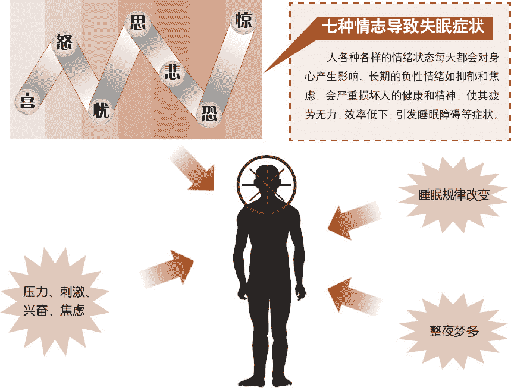

##### 失眠症的冥想疗法

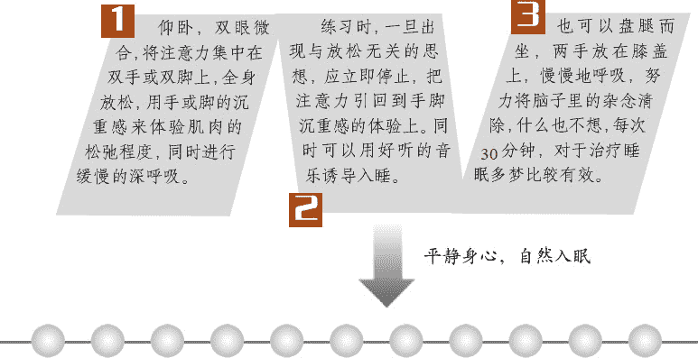

# 第七章
冥想的第四阶段
面向生活

静心，也就是心之无为，什么都不想，不去理解和尝试任何东西。换句话说，冥想就是要不动用分析思维，头脑空明，像等待一朵花开放一样，等待意识平静。但在冥想的“打坐的心态”中，包含了一种直觉式的、深刻的感悟，从容合理的心态，及放弃控制我们处身其中的现实，快乐地拥抱自己、拥抱周围环境、拥抱世界。

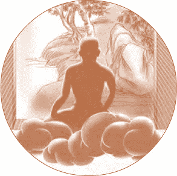

### 本章图版目录

冥想证悟般的情怀

超越小我

关于身体的冥想

关于精神成长的冥想

关于超越自我的冥想

关于保持快乐的冥想

不可否认的当下

冥想就是充分感知当下

恐惧者的类型分析

关于内心争战的冥想

冥想：运用创造性想象获得成功

空是一种意识的觉醒

转化心智的进程

在你自己的花园中清醒过来

精神成熟的特质

开悟的人看世界

关于大爱的冥想

觉醒后的作为

冥想通向心灵幽径

## 限制人生的因素（一）
封闭的头脑

如果认为不需要冥想就能达到那种结果，自由、慈悲、开放；如果认为浮在生活的现实层面就能找到答案，无须冥想深入内心——那只意味着一种结论：自我封闭心灵。

* * *

#### 觉醒从认识封闭的心入手

冥想是愿意深入自己的内心，耐心等待真相的浮现；是认识已经存在于内在的，重新挖掘和提升的灵性。冥想要证明的只有一件事：智慧是一只存在于你内在的音叉。因而冥想也就是和心中的智者相遇。

当你认为有问题时，智者不会试图说服你没有问题，她永远都站在理解的位置上，因为她——内在的自我，是你自己反射回来的映像。但她也知道，所有问题的产生，都在于你相信了自己的念头，如“这种痛苦会持续多久，给我带来什么……”等，否则不可能有什么问题。

对于冥想者而言，如果有什么存在，心是唯一的存在。所有问题的答案都必须从“心”得到解决，也就是让心灵自我觉醒。智者永远都会指引你回归自己的心、自己的认识。

有一颗封闭的心，就有一颗封闭的头脑。那些恐惧、烦恼念头的产生，都是因为缺乏无惧开放的心，也是由于意识不开阔的、封闭的头脑。当你通过冥想的反省和觉醒，拥有了一颗无惧开放的心，就意味着你将抛弃一个残酷、充满复仇和丑恶的世界，去实现心的愿望。

#### 封闭的头脑对人生的限制

封闭的头脑意味着受各种经验、思维方式局限的大脑，不能控制正面、负面情绪的被动的大脑，这个大脑总在一个小范围内思考和倾听，被动地接受信号，偶然性地纠正思想，却很少自动走向开放。开放就是从所认识的那个世界中走出来，面对心中的智者。在非冥想状态，智者对自我的过去、现在、未来知道得足够清晰，却还没有和“封闭的大脑”相遇。而只有在冥想时，“封闭的大脑”才能倾听到智者的指引，质疑并解构所有令人烦恼的念头，认识到它们只是“过去所认识的那个世界”的浅显投影，从为负面情绪付各种代价中觉醒。

### 冥想证悟般的情怀

以佛陀证悟一般的坐姿，带着尊严和居于宇宙中心的感觉，去面对任何浮现出来的事物。

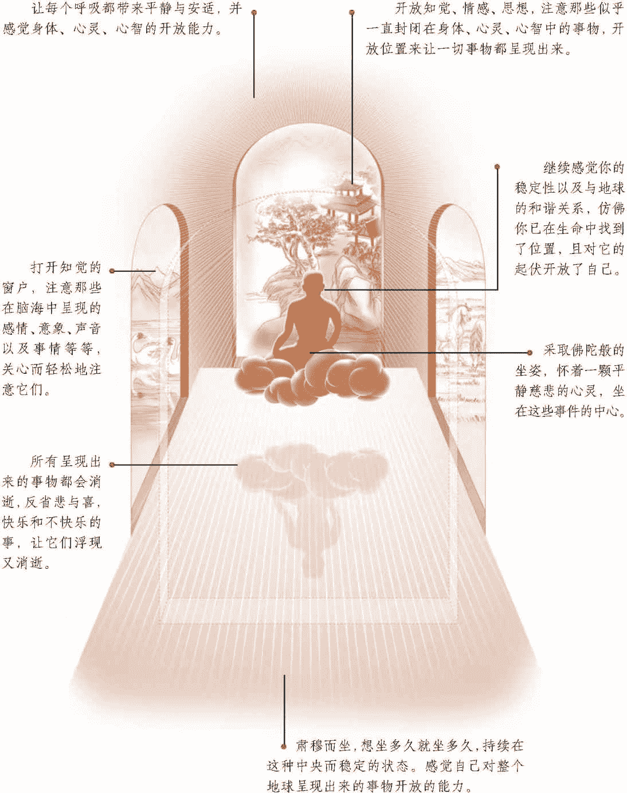

## 限制人生的因素（二）
对小我的认同

人们大多都对自己脑袋里的声音是如此的认同——那个不间断的、不自主的、强迫性的思想流及随之而来的情绪。在每个思想中都有一个自我感，即小我感。

* * *

#### 小我和无意识、潜意识

人的思想包括记忆、阐释、意见、观点、反应和情绪等，当每个思想产生时，都有小我在起作用。在这里，小我不是一种以自我为中心的、狭窄自私的个人意识，而是包括了所有过去知识经验的积累、文化教育程度、家庭背景、社会传统等沉淀在无意识的内容。

人的心智活动最核心的推动力就是小我，当我们在思考和做出情绪反应时，是“小我”在替“我们”思考、坚持自己的意志、形成属于“我们自己”的情绪反应模式（即性格），小我中还有“我自己的故事”和“我和他人的故事”，小我让我们发言时以“我想什么……”“我感觉什么……”的方式，小我表达的内容都是“我们”最强烈认同的。对小我的认同，不仅包括了小我中“自有的东西”（如教养、性格），还有国籍、宗教、种族等集体“共有的东西”。

小我中也有我们的潜意识。如果人生是马车，潜意识就是驾驶马车的马车夫——潜意识通过对小我的认同驾驶我们的人生。这就是说，小我已经写好了我们人生的模式。当我们有很多的思考和苦恼时，在小我那里都能找到答案。

**冥想的过程就是：发现小我，看到小我是怎样对我们起作用的。**

#### 小我的特点

（1）小我的内容因人而异，但是在每个小我中运作的结构都是一样的。冥想的目的是使人对小我的认同转化成和小我的分离。

（2）抱怨、挑毛病和过度反应都会给小我以生存的优越感。因为抱怨他人反过来意味着认同、肯定自己，是替小我着想。冥想的目的是剥离这种判断的成分，还原事实真相本身、真心所想。

（3）小我中有矛盾的声音，既告诉我们要活在自己的梦想中，又告诉我们不能想做什么就做什么。**冥想的目的就是解除小我的控制，重要的是活在当下。**

### 超越小我

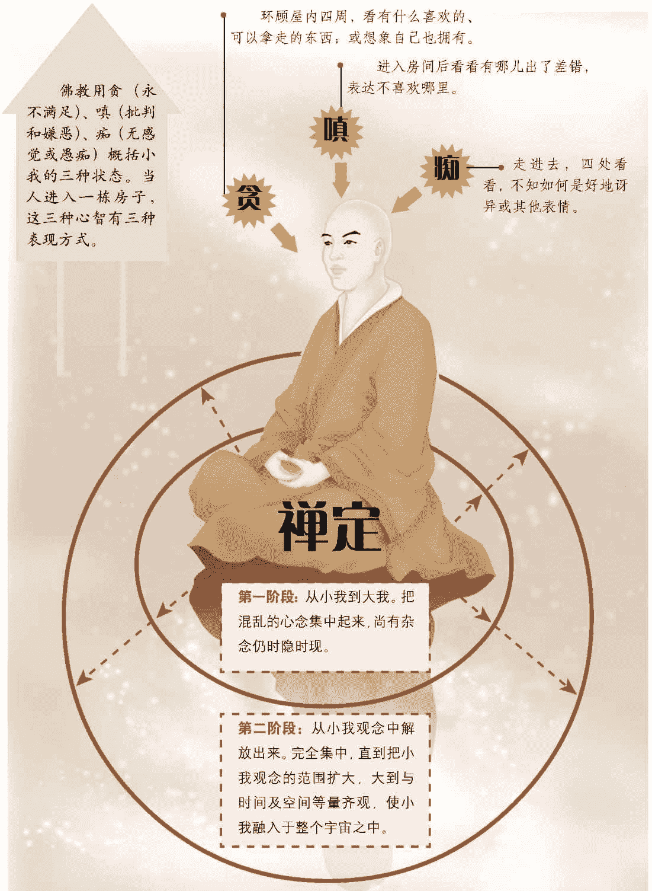

当与宇宙合而为一时，自己的身心世界便不存在了，存在的是无限深远及无限广大的宇宙。**这就是冥想要达到的最高境界。**

## 开放身体的觉知
净化身心

解决思想上的问题要从培养身体上的开放开始，开放地感觉各种意识、情绪对身体的刺激或在体内经过，然后密切地观察身体的反应，直到身体本身不被什么所紧缚。

* * *

#### 开放的第一条定律

**第一条是开放地面对所有浮现出来的意识。** 冥想时，在静坐过程中慢慢进入禅定状态后，伴随着各种醒悟，让意识真正进驻自己的身体，其目的一是能更清晰地感觉身体，二是能通过控制意识来控制身体的感觉。当意识带着外界的信息和自我的思考影响身体时，身体必须允许意识出入而不受其干扰，同时冷静地知觉意识层面浮现出来的各种事物。如伤痛常常是心理不健全或肉体上发生毛病，当我们意识到那些伤痛时，就相当于身体收到痛苦的信号，于是会呈现出与之相应的紧张状态，而一旦走向开放后，就不会再受到属于“小我”层面的意识的影响，而刻意淡漠或忽略那种伤痛的感受。

这些浮现出来的意识和身体是内外关系。意识一般落在压力、痛苦等表面层次，身体就会迅速做出内在的紧张的反应（由外至内）；意识如果表现出深层的愉悦，身体就会完全呈现出外在的放松（由内至外）。

#### 开放的第二条定律

**第二条是开放地面对所有浮现出来的事物。** 冥想时，必定会经由观想或禅定后意识的开放而觉察到种种幻象，这些幻象尽管是一些事物的幻现，却由于注意力的集中，使它们如同真实的存在。当身体渐渐松弛，就仿佛和这些事物自由接触，直到感觉自己变成了这种事物（完全合一）或净化了这些事物。如冥想蜡烛的极致是感觉自己的身体变成蜡烛。

冥想如果是悦纳所出现的事物，身体就会处于有精力的状态；如果是憎恶所出现的事物，身体也会产生一种净化的力量。冥想到旧疾和精神的创伤，身体会感到如结被松开般。因为经由集中意识，和对各种知觉、事物的开放，禅定后身体已经能达到一种无拘无束的状态，不再随意识起伏，受种种出现的事物（或意象）困缚。

### 关于身体的冥想

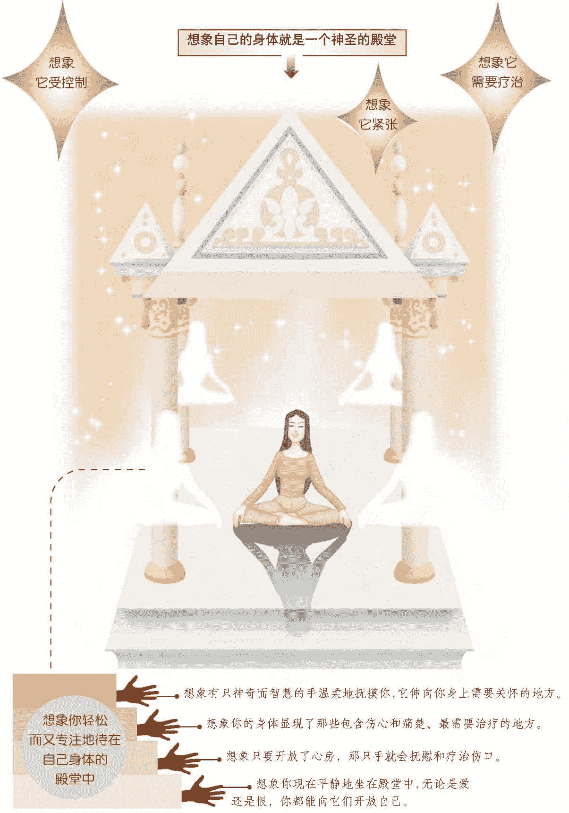

## 处理自己的反应
第三种选择

面对现实的第三种选择是谨慎注意我们有可能忽略了的心灵力量，它能使我们处理现实的问题时，勇敢而智慧地面对各种势力和困难。

* * *

#### 面对现实的方式

通常人们面对现实的方式有两种：第一种是压抑、否认它们，只希望生活中充满光明、美丽和理想，长期下来发现这起不了作用，因为那些被压抑的内容会从别处显现，甚至压抑会以更严重的方式危害我们自身，而且长期压抑思想还会对身体大大不利。如果采取第一个策略，我们就会忍住各种问题，心还是会动荡或僵化，且会被不敢面对的恐惧所充塞。

第二种面对现实时正好相反，是将我们一切的反应全都释放出来，让情感自由地流泻，这同样会形成问题，因为如果我们让每种感情、厌恶、意见、焦虑都表露出来，习惯性的反应就会逐渐增长，到后来它们会变得疲惫、痛苦、迷惘、矛盾、困难，且最后将变得难以控制。如果采取第二个策略，仍然不能解决我们的各种问题，也不能让我们的精神生活更进一步。

#### 第三种反应

一个古老的故事曾阐明，我们能在接近困难的过程中培养出成熟：当看见一棵有毒的树时，有些人只见到它的危险性，他们立即的反应是“在我们受害之前将它砍倒吧！在有人吃了有毒的果子之前将它砍倒吧！”这就是我们在生活中遇到困难时的通常反应：当遭遇到侵略、强制、贪婪或恐惧时，当面对自己或他人的损失、矛盾、沮丧、悲伤时，就立刻想逃避，把它们看成是困扰我们的“毒树”。

第三种人是经过了冥想禅定阶段后的人，他们已了解到向生活开放，需要对周遭的事物给予由衷的慈悲之情，因为这些“毒树”也是我们的一部分。这些人不会有嫌恶的反应，也不会采取第一种、第二种策略，反而会捡起有毒的果子，研究它的性质，将它与其他成分混合，用这毒素制成好药来治病。经由尊重和了解，他们以与普通人相反的方式在最困难的环境下发现了它的价值所在。

### 关于精神成长的冥想

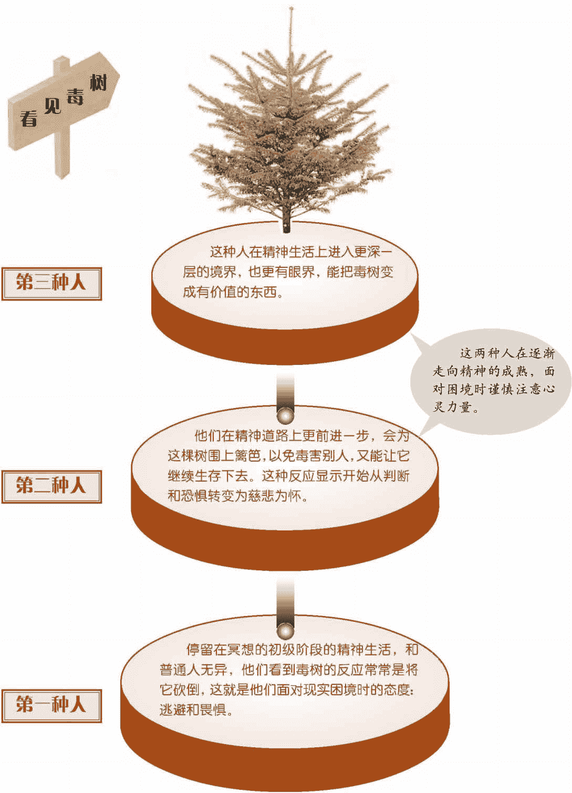

## 改变内在的自我
提升心智

心灵力量最明显的表现在于你可以通过改变了内心，改变内在的想法，改变心态，去改变你的现实处境。即通常所说的改变内在的世界，外在的世界也随之改变。

* * *

#### 不要太在意别人的看法

这是冥想改变内在自我的第一条原则。冥想中没有别人，只有你自己，当你全然专注于内心的所想，就不会想要与别人比较，或者为了听从他人而放弃自己的想法，更不会去干扰或干涉别人。同样冥想时，由于是开放地觉知周围的事物，不加任何判断或评论，就会保持自己“自然人”的本身，使自己不成为为社会性的概念、他人的眼光活着的人。且认识到所有的情绪都是来自你自己，来自自己对所遇到的事情的反应，就会明了心随境转和境随心转是一回事。

#### 提升心智力量

每个人生活与命运的不同，在于人内在的心智结构。冥想无法改变那个由人的既定生活经验、性格、家庭教育、文化程度等决定的心智结构，却能提升人的心智力量，表现在：（1）唤醒人已有的智慧、良知、爱心，通过对生命的了解和感悟，放下内心的执著、分别、妄想，了解一切事物发生的真相，享有身体的安适和心灵的快乐。（2）正确运用精神成长中积极能动的因素，认识精神世界的规律，觉悟自醒，实现自我价值的最高生命状态。（3）不着相于事物的表层，深入事物的内部找到造成结果的障碍并加以清除和化解，就能达到人与宇宙的和谐共融。（4）正确运用想象力、情商和感官直觉，唤醒个体生命的潜能，使人充满自信，世事洞明，活力迸发，重新认识自我。

#### 学会自我接纳

自我接纳是欣然接受自己现实中的状况，对自身及自我特征持积极客观的态度。冥想能看到当下的自己，停止对自己挑剔和责备的思考，坦然地承认并且接纳自己的负性情绪，不论它是沮丧、愤怒、焦虑还是敌意，且不论产生什么样的负性情绪，都选择积极地正视、关注和体验它，并最终转化情绪和精神。

### 关于超越自我的冥想

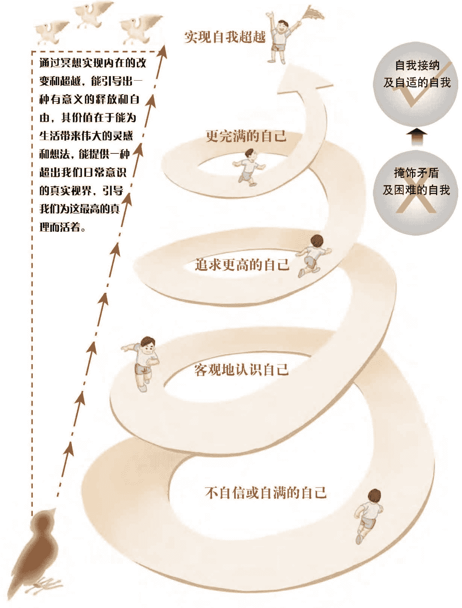

## 喜欢自己的处境
邀请自我

当我们对自己的处境不满时，一定是我们的行动和我们的心有冲突，我们对处境的看法和我们的心格格不入。

* * *

#### 世界是内在的

冥想最大的发现是世界是内在的，人除了到自己内心探求，不需要在外面找寻任何东西。外在的一切事物都存在于内。那些进入到我生活中的人，由我自己的心决定对他们的感情色彩及程度、执意或淡漠。那些存在于我周围的事物，由我自己的心决定对它们接受与否，执著与否。我的心和我的行为并不存在冲突的必要，我的生活也是遵随己愿在不断滋生念头、做出行动，我的经历是由心对各种经验的邀请并留下各种看法形成。既然如此，只要我们喜欢自己的处境，心会欢迎一切经历。

#### 满足做眼前的事

让我们感到心满意足的原因只能是我们做的事和自己的心没有冲突。心永远是活在当下的，过去的心在通过时光隧道时变成了“记忆”或“忆念”，未来的心根本不存在，它只是时光火车通过“将来时段”的心，因而它活在将来时段的当下。所以，让心感到愉快的唯一方式是满足做眼前的事。这就是说，无论你当下在呼吸、走路、对别人说话、有目的的做事，小至漱口、洗脸、梳头，大至政治谈判、环境保护、维护他人人身安全，等等，你都必须学会满足做眼前的事——从享受你手上的事中得到满足感。只有如此，我们才能拥有快乐的心，才能真实地喜欢自己的处境。

#### 调整对处境的看法

当你对处境不存在任何看法时，一切对于你都是虚无的，它们也不可能妨碍你的信念，和你的心有任何冲突。但除了冥想高级禅定状态中对周围环境的空无体验，没有什么时候能做到这一点。我们的经历中都不断有对自身处境的看法，它们或者是正面的，或者是负面的，形成所谓的经验。负面的经验映射到心中就是烦恼和伤痛，使人（指自己）产生反恶。因此要有一颗和自己没有冲突的心，就必须清理出负面的经验——其根源是改变自己对自身处境的负面看法。

### 关于保持快乐的冥想

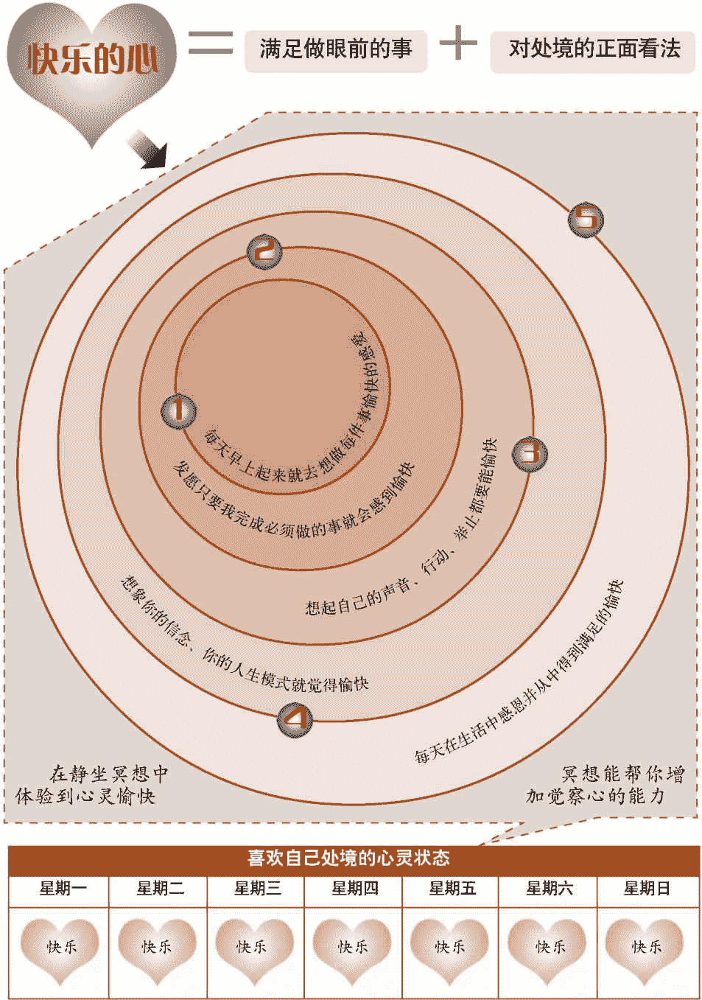

## 见证当下的力量
永恒的现在

人大部分的问题与他们的自我感密切联系，因此无限复杂的外在情形总会因某种联系变成复杂的个人问题。而这种自我感的来源只是人们在时间里创造的一个虚假的自我。

* * *

#### 自我在时间中丧失

时间分为三部分：过去、现在和未来，这影响到我们的意识也通常分为三部分：对过去的意识（记忆）、对现在的意识（感知当下）和对未来的意识（憧憬）。人对自我的意识也同样存在这三部分。过去的自我看到的是旧的现实，一旦这个旧的现实变化了，那个和旧的现实联系的自我的种种情感、情绪、问题等也在这种变化中瓦解了。因此这个过去的自我对于当下而言是个幻相。未来的自我是现在自我意识的一部分，它并不存在于虚无缥缈的未来，而是紧密地和对当下现实的看法、预测联系在一起。因此，唯一能确定存在的只有当下的自我。

但问题又来了，一旦人们有时间感，就会被时间的虚幻所迷惑，因为他们总是不会只看到当下，而多半会保有对过去的记忆（幻相），对未来的希冀（幻相），因此迷失在时间中的人总会看不到真正的自我（实相）——它只存在于当下。因此人专注在时间（呈现为不断流逝的过去和又将成为过去的未来）越多，自我的丧失也越多。且在时间中，自我面对“层出不穷”的现实总会感到脆弱和饱受威胁，因为它会无休止地活在一个疲于应对、恐惧和匮乏的状态里。

#### 错误的心智认同

心智常常执著于对虚假的自我的认同，在佛教中称之为“我执”。我执的状态是总在寻求执著物，好强化和抬高它虚幻的价值，也随时准备执著在自我遇到的问题上，沉溺其中而无法摆脱。由于问题具有时间性，在时间中产生，也在时间中消失。因而心智认同的实质就是自陷于时间的泥沼：对过去和未来的问题执迷不悟，一意孤行地活在记忆和期盼的驱迫力中。驱迫力的产生，是因为过去给予你一个“身份”（记忆凭证），而未来又以各种形式为你“准备”了救赎和实现的应许。两者都是幻相。它们造成了你对当下这一刻缺乏尊重（或重视）、认知（或理解）和容许它存在的意愿（或谨慎面对）。

关键是人能促进心智的成熟，却不能完全撤离心智，否则就无异于疯人病院的常住病户，或者思维长眠不醒的植物人。心智和人自身的联系紧密，在人没有达到完全的开悟前，是无法超越心智的。现实的人通过冥想达到的最高阶段的开悟也只是心智的成熟。走出心智认同的局限的最重要的一点是：终止时间的幻相，活在当下的生命中。

#### 生命的本质就是当下

哲人说，永恒的现在，就是你整个生命展现其中的空间。想想当你濒临死亡时，过去和未来对你毫无意义，你拥有的只有当下的时光。生命就是当下：过去的生命在过去的当下，未来的生命在未来的当下。过去和未来只是永恒的现在的光的反射。明白当下的重要性的好处是：

**（1）最短暂地从问题里解脱。** 看到每一个问题都有它的时间性，就会觉察到它只是一个幻相。因此浑身都会变得轻松起来，你只需要让问题存在，无须烦恼和恐惧，努力做你自己的事（可以与解决它有关），然后“等着”它消失。

**（2）成熟地运作心智。** 只看到当下，你会变得清醒和理智起来，正如耶稣所说，“你成了葡萄树上砍断的枝桠”。没有什么完美的自我，因而也没有什么完美的解决事情的方法。因此你只需要在当下足够清醒和动用理智去做事，事情就会基本有个“完美的结局”。

**（3）汲取当下的力量。** 如同每一棵树只能吸收每一个当下的阳光，在没有阳光时，它就安心地等着下个阳光的出现，或汲取月光的精华。高寿的树总比人能存活得更久。人明白当下的重要性，就会像树一样，都能汲取到“最当下的阳光”，无须为一时的黑暗而痛苦。

### 不可否认的当下

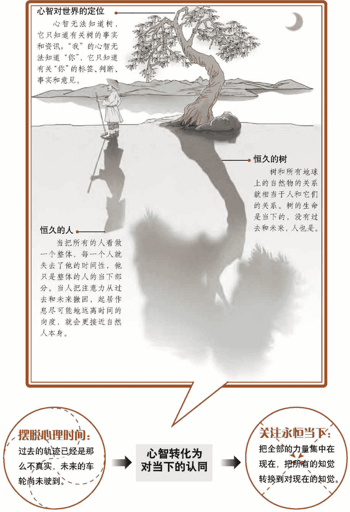

### 冥想就是充分感知当下

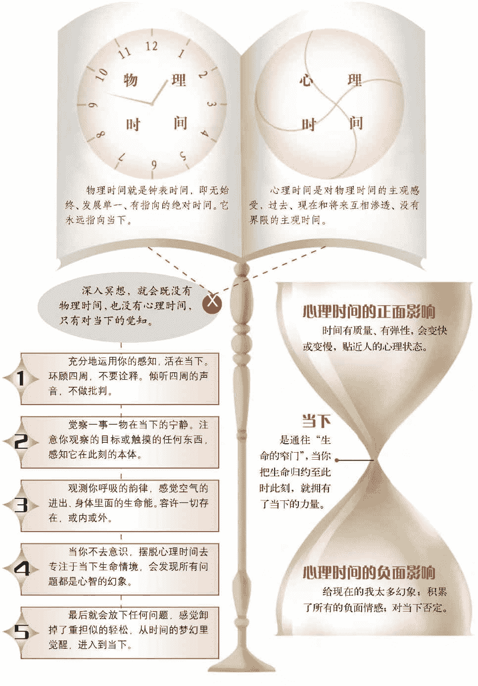

## 毫无必要的恐惧
静看花开

唯一让我们感到害怕的是我们自己对恐惧的恐惧，是种植阶段对能否发芽的恐惧、发芽阶段对能否开花的恐惧、开花阶段对能否结果的恐惧：恐惧都和未知联系在一起。

* * *

#### 接受最自然的结果

无论我们选择了什么实践方式，就如同我们选择了种植什么，只需要抱着“种瓜得瓜、种豆得豆”的心态，静看花开。相信我们愿意接受最自然的结果，因为谁都知道种子是自然地发芽，花朵是自然地开放。就像无论我们选择了什么冥想方式，只需要真正地亲身去实践、静心去体验，自然拥有不惧及觉醒于人生之中的能力。如果我们做不到，强迫花朵按照我们的要求开放，就会对存于内心许久的愤怒、悲伤、恐惧等感到害怕，最后真的可能被这些情绪风暴摧毁。如果我们做到，等待看花自然开放的样子，就能够面对生命中所有悲喜，我们的心灵大得足够容纳所有，且不可动摇。

#### 信任的愉快

亲身实践需要信任，信任当下的情境是安全的，信任我们自身的力量，信任我们内心中那些还没被理解（未知）的部分并不是真正能带给我们威胁的东西。当有一个任务落在我们头上，我们感到恐惧，并不是任务要我们恐惧，而是我们自身对它产生了恐惧的念头。所有的恐惧都像这样，是因为我们相信了我们自己的恐惧的念头，而不去信任亲身实践这个任务后产生的新的判断。所以，恐惧都是与将来，与不确定，或是心把一个过去的故事投射到将来时——与时间感有关。也就是所有的恐惧都是关于不信任。

#### 从恐惧中解脱

自我救赎就是从恐惧、受苦中解脱，活在无时间、无匮乏的当下。当你在冥想时，心是不借助于外物的，由于你相信了恐惧也是一种幻相，就会自然从强迫性的思考，从负面的情感，最重要的是，从以“心理需求”为形式的过去和未来中解脱。因此，冥想对你最大的改变是你对恐惧的认识，即所谓的恐惧是“我担心你对我的看法其实是我对自己的看法，或我强迫自己拥有的看法”。

### 恐惧者的类型分析

#### 1．种植的阶段

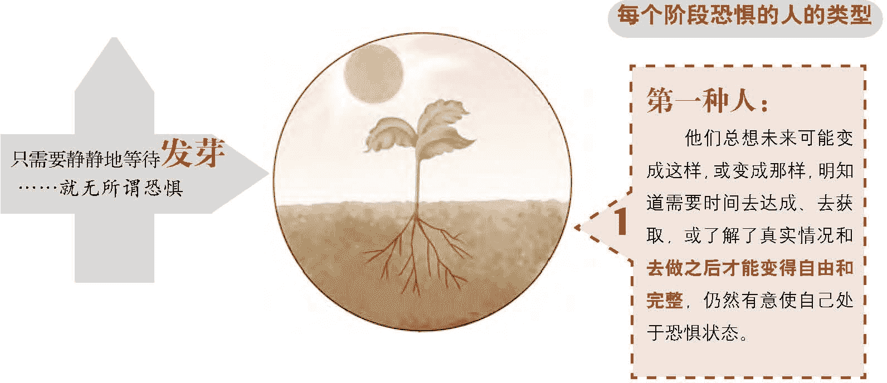

#### 2．花开的阶段

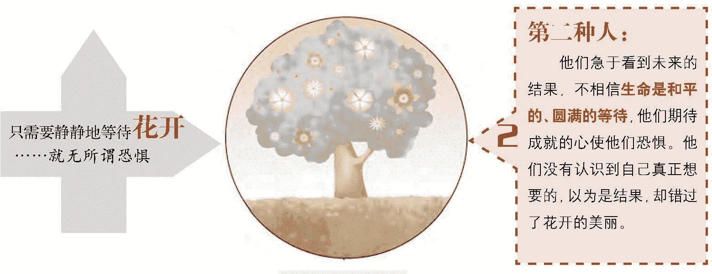

#### 3．结果的阶段

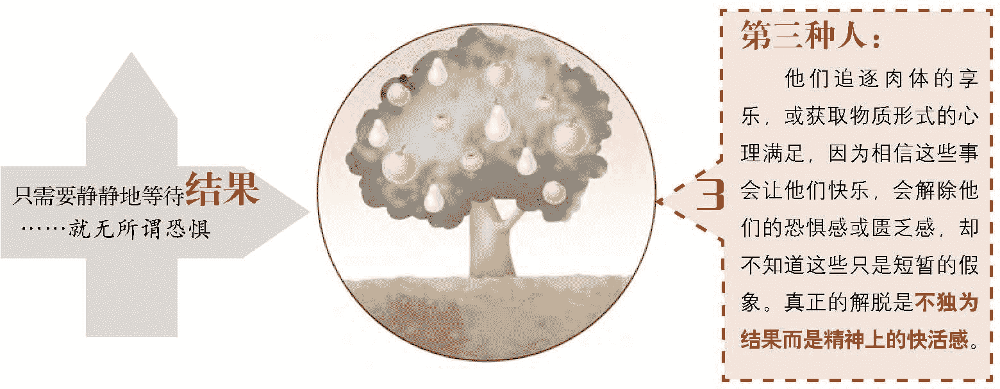

## 停止内心的争战
你就是你自己

将注意力转向仍存在你生活之中的争战，在心中感觉它们。温柔地、用开放的态度让紧张和冲突的经验呈现出来，直到身心祥和。最后你回到现实中将有一颗毫无冲突的心。

* * *

#### 观察内在的冲突

当你持续地静坐时，注意力不一定能完全集中。除了意识自身的分散性，很可能是因为体内进行着你尚未察觉的抗拒。这些抗拒，除了身体本身在长时间静止不动后对骚动的渴望，就只能是心灵、精神、灵魂的内部冲突。而这些内部冲突包括：你在转化情绪时与自我的感情的争战，如与你自己的孤单、恐惧、迷惑、悲伤、气愤、沉迷所起的冲突；思想上的争斗，不停歇地关于内在、外在思考的各种矛盾心理；你要防御和你想防御的对象的冲突；自我作为内心的独裁者和内在的反抗大军的冲突……注意所有的内在争战，想想这些冲突有多长的时间了。

#### 开放的心

在冥想中坚持“相信你想要的才是对你最好的”，是条死路，它让心僵硬、不灵活，陷在一个想象的现实存在里，而不是真正开放的心。现实存在是不可改变的，它有客观存在的理由，然而它又一直在变，像水一样地流动。开放的心应对现实存在本来的样子智慧地开放，才没有所谓冲突。开放的心也就是“真心”，它只是静静地、温柔地等着，不会让谁听从它，因为任何听从、强迫、固执都意味着痛苦。面对现实，它只会说一件事：“是什么就是什么”——真心面对的就是真相，永恒的现实存在。

#### 和自己的关系

当你独自静心的时候还无法做到完全自在，就会寻求一份关系——常常是你和你自己的关系——来掩饰你的不安。而原来的不安会在这一份关系里以其他的形式再现。这些不安的根源都能归结到你和你自己的身份分离开来，如你会对自己说“我希望我安心”、“我祈求我不要再为什么焦虑”，在这种把自己一分为二的思维过程中，你没有想到：你就是你自己。也就是只要你想安心，你就安心了。确定你自己就是你的真心。

### 关于内心争战的冥想

**1** 　静坐着，平静地呼吸，让你的身体处于休息状态，注意力转向当前，注意任何出现在体内的感觉。在你内心有挣扎的地方，让你的身体、心灵、心智软化下来，不要抵御。感觉身体的每一部分。

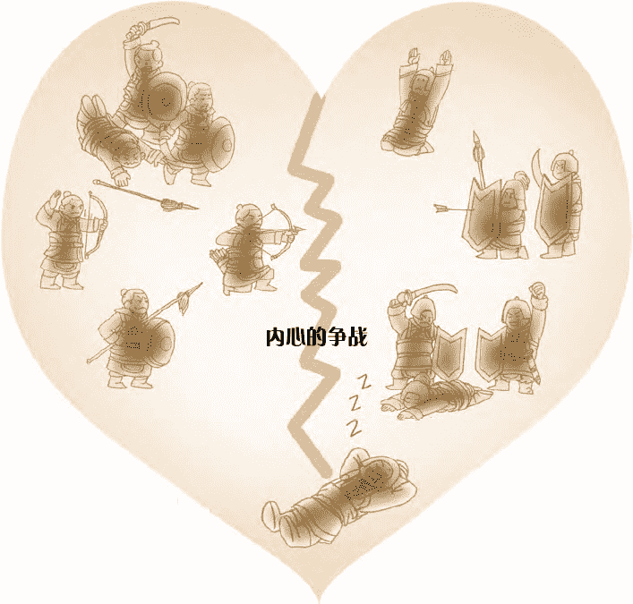

**2** 　让各种内在的冲突以原形出现，用心而感兴趣地注意它们。

**3** 　不要抗拒开放经历，忘掉争战，直到处在心灵的祥和之中。

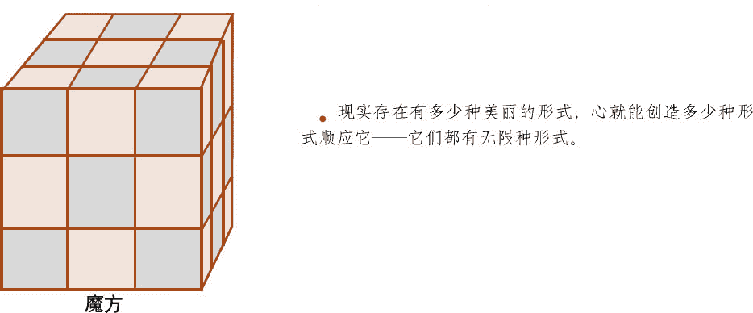

**“你想要的”只是其中一种形式，且是主观固定的形式，它和客观的、不断变动的、多样的形式必定会起冲突，由此酿成许多内在冲突。**

## 成为创造性主体
萌生创意

冥想使大脑休息、放松，有助于得到创造性智能。这是因为冥想的入定状态使脑活动减弱，实际上心智和生理愈益有序，且在某种催眠状态，创意反而更易诞生。

* * *

#### 每个人都是创造性主体

有一本佛教经典《华严经》描述了宇宙数十个可能领域——它们是欢愉与痛苦的领域，由火、水、金属，甚至花朵创造出的领域。在每个领域中必须遵循相同的基本法则，如：你若种下一颗芒果种子，就会得到一棵芒果树；若种下苹果种子，就长成苹果树。所以在世上存在的领域中充满了创造的气氛。也可以这样理解，如果你是一颗芒果种子，你就能长成一棵芒果树；如果你是苹果种子，就会成为苹果树。你自己本身就能创造出“一个自己”，因此，从这个角度，每个人都是创造性主体。当你这样冥想时，你会对自身的创造性非常自信。

#### 萌发创意的无意识过程

人们都可能在一段时间的无意识酝酿后，如一晚的睡眠之后或做梦中，冥想之中或之后，突然自发地想到了创造性解决问题的方法，或萌生创造性的点子。

人的意识就像他所创造的机械性的机器，通常有固定的程序，称之为思维模式。无意识也有纯粹机械的成分，运作起来就像大多内脏器官的官能作用都是人并无知觉的情况下进行。但也存在着并非完全机械的无意识过程，许多创造性就是由此而产生，通常呈现为三个阶段：（1）吸收饱和，即收集、消化各种相关信息阶段；（2）孵化，即在心智中“烹调”这些相关信息阶段；（3）启发或显现，即新观念诞生阶段。尤其后两个阶段是并非纯粹机械的无意识的“功劳”。难以想象纯粹机械的过程能激发真正的创意，如果有——也只是对旧观念的加工提升或重新组合罢了。

冥想就是并非纯粹机械的无意识过程，由于创造性是一种不连续的思维模式，人们在正常思考问题时遇到思维中断、创意缺乏的情况下，去冥想放松，往往之后能有奇思妙想，这是无意识酝酿后右脑的创新功能得到发挥的结果。

#### 运用想象力激发创造性

（1）如果你想让自己拥有更多创造性行动，在冥想中，想象你动用意念在一个巨大无边的白纸上不受任何束缚地绘画着，你大胆而狂热地将自己的想法用画笔表现出来，尽管那些线条和色块看起来杂乱无章，却是对世界的规律的真正认识。反复进行这个想象练习，然后投入到现实生活中带有设计成分的工作中去，看看实际的效果。

（2）如果你想对自己或生活有更多创造性认识，在冥想中，想象自己是一个压抑不住创造性的人，冥想就是放飞你每个异想天开的“思想”的过程。尤其要注意当你的情绪被允许呈现出来时它们的真实状态，观察你对他们的反应，以及当你开放意识时，观察各种在你脑海中自由出入的意识。当你通过冥想觉醒后，就会发现这些才真正代表你对自己及生活的真实看法，毫无疑问，它们和理性思维得出的结论相比，无疑是更新颖、更贴近内心的发现。

#### 催眠状态开发创造潜能

日常思维对创造性的阻碍主要表现在：一是意识对潜意识的压抑，二是心理定式的消极作用。但冥想如同自我催眠般的状态，能较轻易突破上述两种状态：

（1）表面上，冥想者的身心处于全面放松状态，但由于实际的精神活动并没因此停止，自我暗示、自由联想、积极思维、正面情绪都在作用于人体及人的心理过程，这些都能激发人的创造本能。因此，在冥想中，人的创造力是处在假休息实活跃的状态。

（2）冥想之中和之后，经由集中意识，消除杂念，日常动荡不安、占主导性的意识都收敛到最安伏、最缩小范围的状态，而那些平时不那么积极的潜意识及藏在潜意识中的新观念、新思想就能够上升到意识层面，一些能突破心理定式、条条框框的新见解也能“趁机”产生。

### 冥想：运用创造性想象获得成功

#### 1　确定你的目标

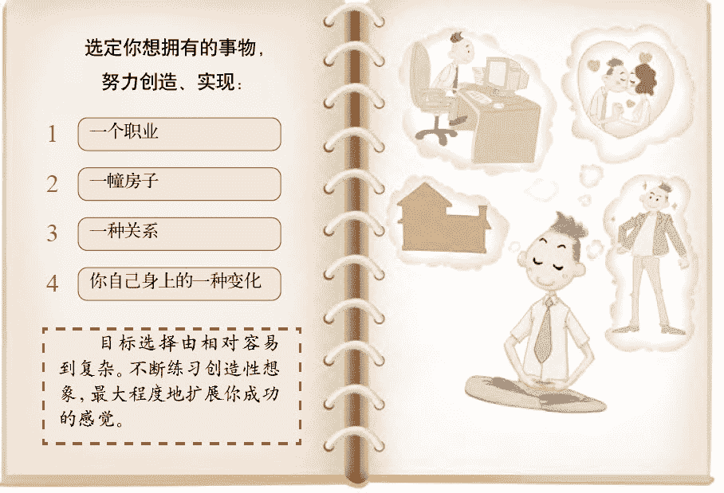

#### 2　创造一个清晰的念头或图像

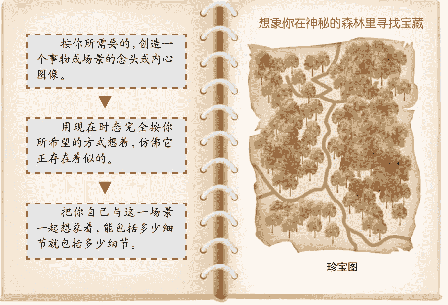

#### 3　集中思想冥想它

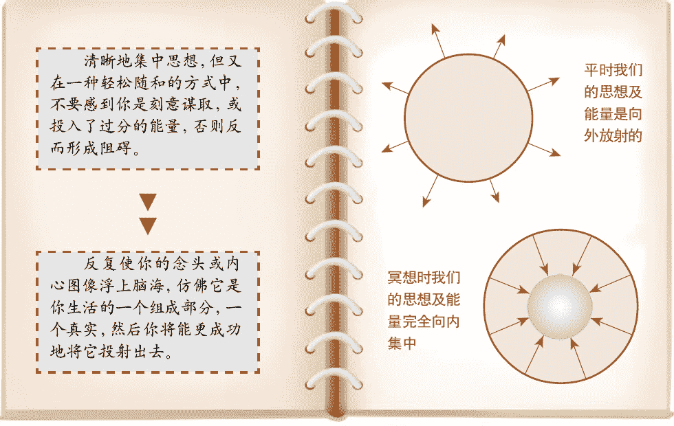

#### 4　给它积极的能量

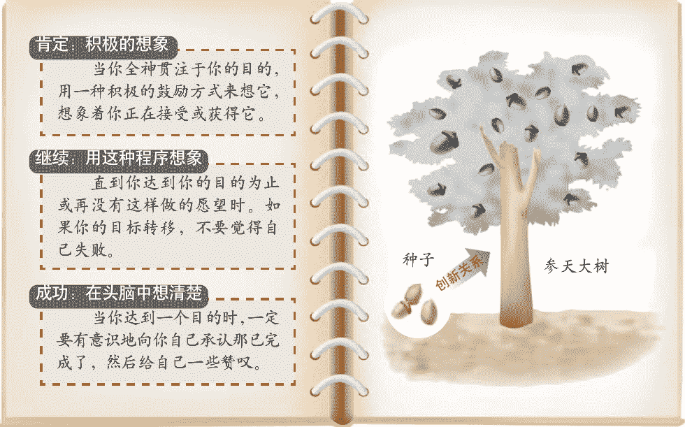

## 保持心空和热诚
感知流动变化的生命

在精神治疗或心理治疗中，很多都是经由“空”来实现，真正的空在现实生活中很难体验也难以用言语描述，只要亲身去经历某种精神修行，如冥想，才能真正理解空的涵义。

* * *

#### 心空

空有时是指一无所想，没有杂念，完全感觉不到意识活动，但它却使心像镜子一样澄明，能映射自己的真心、真性，心空带来的是清晰；有时是指一种开放，也就是不受任何限制，心完全自由，想去哪里就去哪里，不崇敬什么，也不会痛苦，心空带来的是自由。佛教中对空的解释是指因缘和合而生的一切事物，当认识到我们的身体、心灵、心智都起于生命变化之网，在那儿任何事物既不相连也不分离，也就经历了空的感觉。由于不相连，我们是能做到心空，心中无他，心中无物。由于不分离，我们也要做到对他人和事物保有热诚，不能缺失基本的生命联系和情感联系。

当冥想感觉到了心空，生命顿时无阻无滞，而生命本身又是变化流动的，因而空的真相就是不断变动。如果承认人生是一个不断变化的过程，一种身体、情感、记忆、认知及思想变化的过程，那人生也是“空”，生命的流逝及对世事的体验都不过是空相、空性。因此，**由冥想体验到空，由空来把握人生，就会觉醒到生命的空（变化）和心空（流动、开放）才是它们各自的本质。** 没能体验到心空，就是没有从短暂的生命中获得对永恒真相的体验。不能保持心空，精神上就常会有阻障。

#### 热诚

热诚的人是能看到自己和客观存在真实联系的人，也是热爱一切现实存在的人——即使死亡、病痛、失去、地震、炸弹等“坏事”来临，也一样愿意拥抱的人。生活不会管我们是否需要还是痛苦，只会呈现它自身的存在。热诚的人相信自身以外不存在任何让我们痛苦的东西，痛苦的只是我们的心对某些存在的不满足、不欢迎，或者是我们怀疑的念头。对于那些缺乏热诚的人，如果没有那些质疑客观存在的念头，则处处是天堂。

### 空是一种意识的觉醒

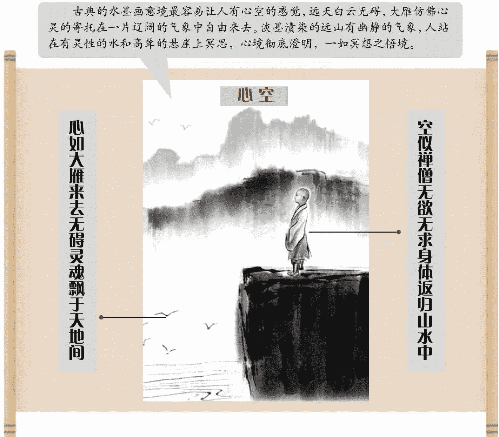

##### 冥想生命的变化形式体悟空

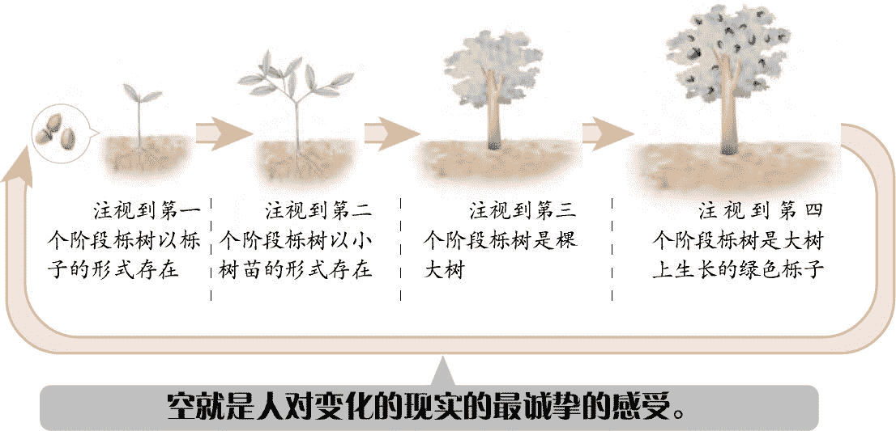

## 培养成熟的心智
了悟的开端

我们的心智和心灵并非一开始就干净而纯洁。培养成熟的心智是冥想的重要目的之一。唯有成熟的心智，使之与身体心灵结合，才能稳定我们内在的生命。

* * *

#### 未经训练的心智

**（1）发狂的猴子**

在冥想最开始时，我们最先经验的常常是我们自己的不连续的散乱心智。这种未经训练的心智过去被比喻为发狂的猴子：它从思想冲到回忆，从眼界又冲到声音，从计划冲到悔恨，永远没有停止的时候。冥想能使我们静静地、全心地观察心智的去向。静坐最初阶段，我们确实会觉得充满了挫折感，因为这只猴子总是四处游荡，伴随着身体感觉紧张，常使我们感到自己内在的纪律、耐心及慈悲多么缺乏。即使这时注意的焦点都投射在心智上，也无法长久看视着它，因为这只猴子遵循着它自己的天性、自己的情况和法则。

**（2）训练小狗**

冥想经历了几分钟的冷静之后，当伤痛的意象及感情出现，我们仍然会习惯地避开，这反而导致分心，心智也变得急躁、忙碌、计划、潜藏等。训练心智就像训练小狗，需要一再地重新开始。当你按下小狗说：“留在原地！”小狗多半不会听话，而是站起来跑走；当你又把它按下说：“留在原地！”小狗会再次跑走，有时还会跳起来，打滚，甚至在角落便溺或制造其他的脏乱。我们的心智就如同小狗，对于禅定而言，它只会制造出一团糟的局面。

**（3）琵琶的频率**

一旦心智和身体狂乱而紧张，就要去控制这些情况。当心智显得紧绷时，就要软化、开放、松弛注意力；当心智困倦而放松时，就要坐起来更加专注。佛陀将这比喻为琵琶的频率，检视、感觉自己有没有走调，然后放松或加强来保持平衡。

#### 转变心智

**（1）转变心智的失败**

如果常人的心智是未经训练的心智，冥想不成功的人的问题就出在转变心智失败上。很多愿意通过冥想来解脱的人，都是希望能丢弃他们过去的悲伤和沉痛经验，愈合伤口，进入一种没有矛盾、充满善意、圆满的精神领域。冥想能够借着极度的专注和热诚，激发人内在的成熟及祥和来达到这种境地。但心灵和精神转化并不是一件容易的事，它不一定需要付出多大代价，但阻挠不可避免：一是完全的专注不是每个人都能达到，甚至连专注的技巧、艺术和境界都不是每一个人能领会或掌握。做不到全部专注，心智就会有跑开、受控制的机会，无法真正令心灵稳定；二是专注之前、之中、之后都会有放松下来的情形，一旦放松，那些被暂时抛在脑后的事情或情绪又会出来，破坏刚获得的一点点善意和圆满的特质，心灵的修行实际上仍未结束，又要重新开始觉醒。

**（2）转变为成熟的心智**

冥想成功的人意味着他的心智开始成熟，他已经成功地将未经训练的心智（原来的天性），转变为另一种更加高尚、圆满、开放的天性。在原来的天性中，心智总是容易产生许多悲伤，无法解决思想上的冲突，而在禅定中，经由我们自己与心灵相连，停止了思想上的冲突，顿时产生种宽阔、整体、慈悲之感；在禅定开放意识的阶段，心智尽情地编造故事和想法、幻想和恐惧，自己的心却不会再去相信、遵循或实现它们。这时我们会忘却忙碌的思想，而会发现一种甜蜜的、轻松的、带有疗伤意味的宁静，也会发现我们每个人天性中都有一种平和、善心、力量的特质——这是我们原始的天性（佛教称之为佛性）。当我们返回到原始的天性，憩息在和平及善之中时，心智就得到了转化，反省并放下那些无用的烦恼和妄想，清除困惑及有害的想法和观点，深省我们真心所看重的事物，并将思想转到关爱、敬重及放松等方面。

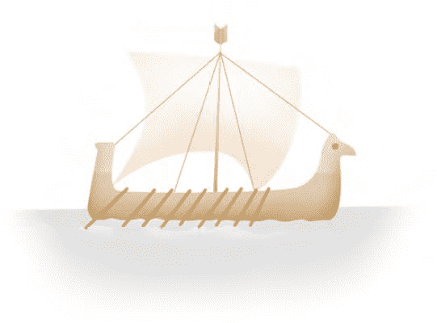

### 转化心智的进程

在不断深入的冥想过程中，只有达到了真正的禅定，心智才能转化，心理学把这种转化称之为自我实现、完整性，是精神成熟的必要条件。

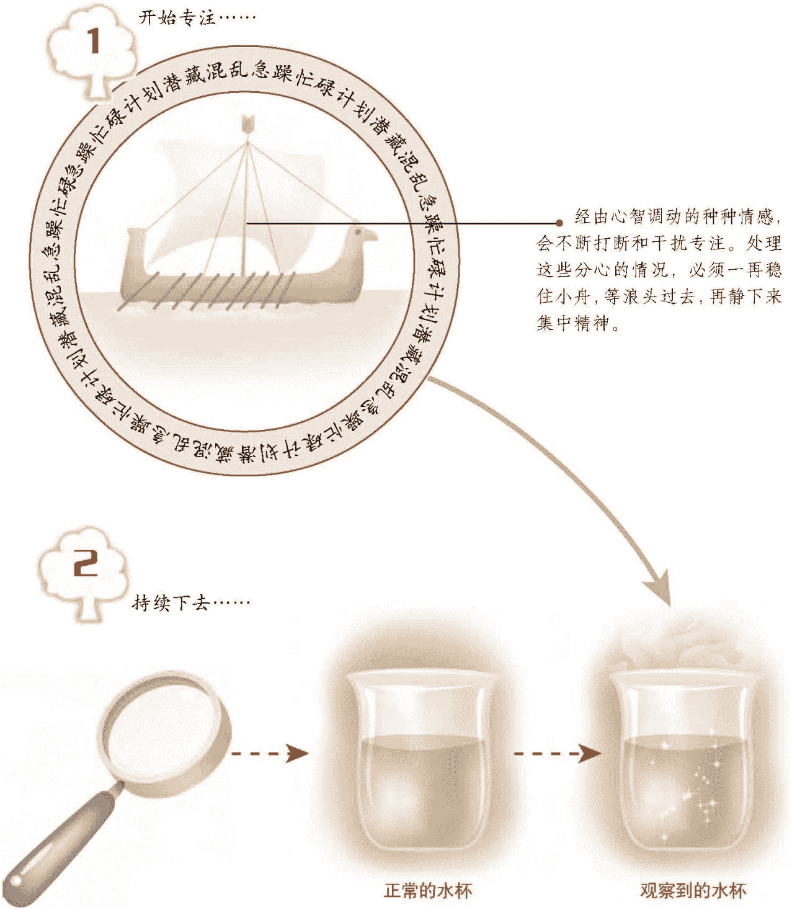

持续专注带领我们更接近生命，如同镜片聚焦一般。当我们看着杯中的水时，它显得干净而静止，可是将它放在显微镜下时，却会发现其中充满了生命和律动。深入专注，身体中感觉到呼吸的部分会随着轻微的振动而活化起来。

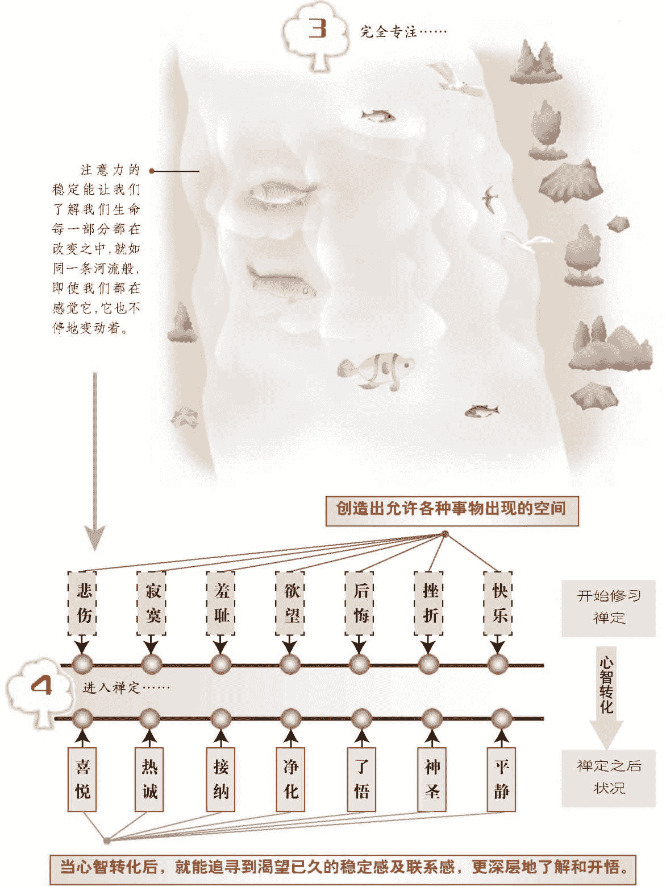

## 获得圆满的特质（一）
唤醒沉睡的生命力

冥想所获得的精神上的圆满由三部分构成：我们没有被压抑的自身力量及人格、开放和成熟的心灵、对自我生命和其他生命的无限宽恕与慈悲。

* * *

#### 被压抑的生命力

人类即使在挣扎和悲伤之下，也有一种无法阻止的生命力。这种生命力是我们与生俱来的、源自个人生命及生存的整体力量。然而当我们在解除各种黑暗的现实对自我生命（包括情绪、思想、动力）的压抑之前，有一部分生命力是处于近乎睡眠的状态。因此，我们会整个看起来死气沉沉，缺乏活力或应对、举措。即使有足够的时间和勇气，找到解决的路径，恢复状态，最后仍会感到精力耗尽，身体十分疲乏，忙于应付的心也丧失真正的愉悦。

#### 为自己找一个位置

**冥想要唤醒这部分沉睡的生命力，它让心走出黑暗和低潮之后，不仅有全新的活力，也会有一种新的态度出现。** 但是在这个过程中，重要的不是冥想本身，而是我们必须真正了解自身的压抑，然后为自己在地球上找到一个位置——个人与他人、世界建立了正确的联系，对现实的态度更客观、公正。压抑我们肉体的从感官上渐进放松，压抑我们情绪的从心灵上逐渐释放，直到我们能在每个压抑的地方发现自在和空间，得到解放。

这时我们拥有属于自己生命的伟大力量，心灵上生出一种悲悯的接纳，心智上会有包容万物的清净空间，所有看起来无法面对、无法解决的问题，过去的困难或无法克服的损失，都会经由生命力的唤醒而得到化解或弥补。

#### 觉醒后不再压抑的生命力

**冥想就是让我们觉醒后不再压抑，让身体和心智的空间自然地充满了能反映生命整体的特质，感受到幸福、快乐、清晰、智慧和自信** ——这种冥想得到的精神财产，其实质来源于自身过去沉睡的生命力，而不是外在的给予。每次冥想，当我们越过压抑和恐惧时就能到达这种境界，然后用我们自身的生命力，去疗伤、弥补先前经历中困扰我们的一些东西，释放孤独，得到追寻已久的整体感和满足感。

### 在你自己的花园中清醒过来

冥想并不是我们想象的、为你的心灵写下了最好的“剧本”，当你看毕这个“剧本”，智慧和了悟就会来临，而是一个不断重复的精神训练，你可能需要很多次类似下面场景的观想，才能从你自己的心灵花园中清醒过来。

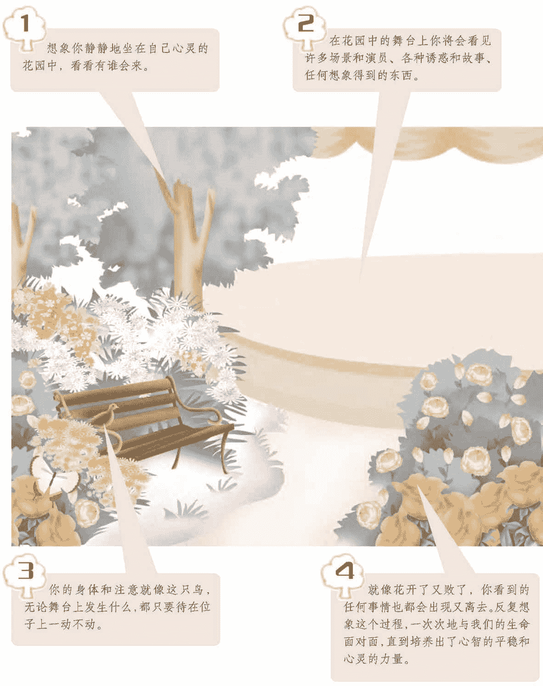

## 获得圆满的特质（二）
精神上的成熟

精神成熟的人通常也意味着心智上的成熟，行动深思熟虑而不拖沓，情绪自然而不矫情，最重要的是自有一种超拔的人格和心灵的稳定、平静。

* * *

#### 非理想主义和完美主义

**经由冥想达到精神成熟的第一个表现是从追求虚幻的完美中解脱。** 所谓“虚幻的完美”，是指我们对生活的要求及对现实的索取，无意识地表现出一种苛刻及不达目的就悔恨的特质。生活能提供所有我们真心需要的，但浪漫的心灵常常制造出一些虚假的需要——即我们认为自己必须拥有、一旦缺失就意味着伤痛的东西。这种理想情结和完美主义不只是表现在人寻求完美的自己、完美的身体、完美的人格——这看起来并无过错，却由于我们自身只是个现实的存在，而不是所谓的完美的存在如佛陀，终究无法达到；还表现在人对一个完美的世界的追求，一个没有任何伤痛经验、没有任何缺失、完全满意的世界不是不存在，只是作为客观存在的世界从来不缺少什么，而人类的心却是永远的不满足、永远充满缺憾。成熟的心灵憩息于慈悲中而非理想中，即并非追求那个极单纯的世界和某种极纯洁的生命意象。冥想的现实目的也不是要人的精神到达什么境界，只是让人觉醒后去爱，得到自由。

#### 既完整又个人的神圣感

**经由冥想达到精神成熟的第二个表现是不在生活中制造分裂，相信自己与圣者无分野。** “个人”意味着在自己的语言和行动中寓有一种精神，“完整”感来源于领悟到个人和宇宙是紧密联系的。“既完整又个人”是指精神生活中的普遍真相只能在每个独特的个人环境中才能完全呈现，且我们如何生活就是我们的精神生活。“完整的精神”感觉到人必须先从自己的生活开始做起，才能将慈悲和光明带入人世间。很多人不能获得完整的精神，因为他们在生活中就总是制造各种分裂：将生活划分成工作、假期、娱乐等时段，将事业生活、爱情生活、精神生活与身体的运动、锻炼、享乐区分开来，将学校教育和家庭教育分离，纵容过多的建筑将视野分隔成碎片。我们周遭的社会也反映并夸大了这种分野，以至于人从出生就挣扎在各种“分裂”中，过度关注得与失、悲伤和喜悦、生与死的差别，带来精神的痛苦和分裂感。由于习惯于这种分裂模式，精神就无法真正集中和完整，在冥想还未开始就制造了圣人和俗人的差别，相信冥想就是要我们经由放下一切才能达到超越自我、寻求达到神圣和纯净的境界，超然物外；就是要我们觉得现在的自己不纯洁、可耻、无价值……于是冥想成了一种自我逃避的手段，或者人们错误地将它理解成：要“启蒙”和教化人追随、供奉那些有更高领悟的人。分裂模式还是得妄想症和恐惧症的根源，即个人的内在和外界过分对立。但如果反省到这点，就会在冥想时从外在世界的烦恼转移到自身的问题和悲伤上，然后发觉那个制造恐惧、妄想、痛苦的就是自己，便会消除分裂，精神觉醒。

#### 拥抱相反的事物

**经由冥想达到精神成熟的第三个表现是获得将生命中的矛盾放在心灵中的能力，敢于和有意愿拥抱相反的事物。** 以最熟悉的事情为例，当我们还小时，父母供应我们一切或不照我们的意思去做，我们都不会认为他们是完全好的或坏的，从这就能照见一个人内心同时存有好与坏、爱与愤怒、慷慨与恐惧两面。我们所追求的精神成熟就是要看到一切事物都包含着相反的另一面，不能执著于每个层面的冲突。如同冥想中既要专注又要开放，既让生命中的矛盾在头脑中自现，又能以诚挚的心灵拥抱一切，无论美丽或丑恶，都尊重和欣赏生命本身的模棱含糊及固有冲突，且反而能从中培养觉悟的精神，使我们免于受苦和迷惑，感到自在。凡是达到精神上成熟的人，矛盾冲突都会自然被解开，挣扎不复存在，困难得到释放，返回快乐自在的安适之中。

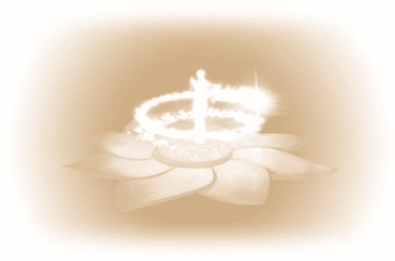

### 精神成熟的特质

犹如果子成熟时自然会从树上落下来，到适当的时候精神成熟的人，也会自然呈现出冥想“青涩时期”所没有的特质，如宽恕及仁慈等。真正的成熟都表现为一种耐心，不是想获得或控制什么，也并不寻求任何成就，而是要与宇宙规则一道和谐地相处。

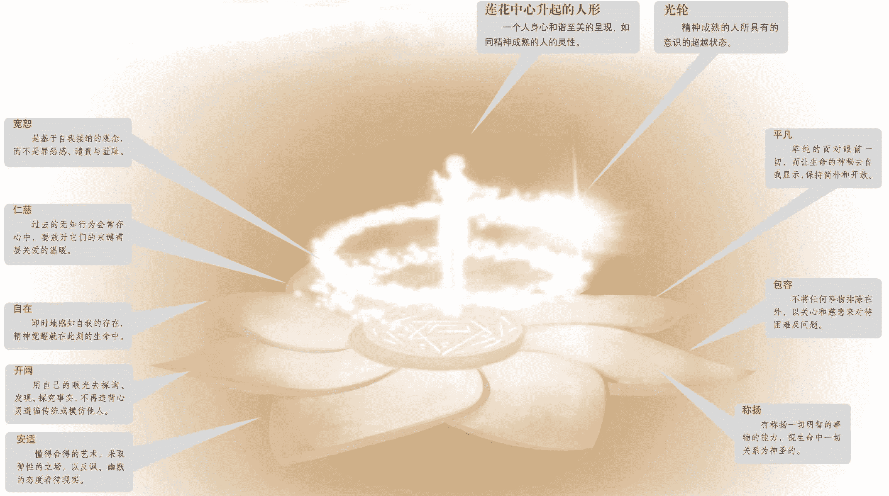

**莲花是佛教用来形容我们的心及清净的信仰的象征物。上图中心的莲花形，即八瓣莲花，在佛教中寓意吉祥幸福。这八瓣既可喻指八种精神成熟的品性，也可代表八种开悟的感官器识：具备明察能力的意识、五官及身体、自我。**

**八瓣莲花中央升起的、操控一切运作的五色光明，分外、内、秘密三层面，各代表：我们外界的环境、世界、现象，身体内部精微的能量，心灵和生命之本质。冥想深入这三层面，灵性出现三个结果：会自然熄灭、化作光轮最后的极亮光（能量聚集）或开悟的人形。**

## 获得圆满的特质（三）
心灵的圆满和开阔

没有什么人能质疑、离弃、羞辱一颗圆满的心，因为它从来不拒绝什么，不厌弃什么，不搅扰什么。它就像“道”一样的存在，像任何一个真正、完全觉醒的人，如佛陀。

* * *

#### 心的开放是自由之始

持续保持静默，你能感到自己的心开始逐渐开放，因为这时它可以不关心你想什么、注视什么，**变得自由而开阔、空灵而寂静，这是心灵圆满显现的第一个特征。**

当你没有冥想时，为念头所萦绕，难以做到心平气和。但冥想之中、之后，面对那些仍具让你烦恼痛苦的力量的事物，不会再有如此反应。因为经由冥想打开心房后，一颗开放的心完全平静。不是世界变了，而是开放的心就是自由、解脱的心。

#### 开悟存在于内心

有个学生向禅师请教开悟，当他们一起走过松林时，大师指着一棵树说：“看见这树有多高吗？”学生说：“是的。”大师又指着另一棵：“看见这树有多矮吗？”学生说：“是的。”大师说：“这就是开悟。”开悟与未开悟之间的区别，在于内心是否和事实保持统一。**觉悟到事实本身就是如此，是心灵圆满显现的第二个特征。**

在佛教中，开悟是不受限制的，当心灵不再被控制、恨、无知所纠缠时，它就会自然出现。那些让心灵感到遭受痛苦、不能开悟的情形，大多是因为世界没有问题，只是投射到它上面的心出了问题。

#### 过一种心灵上觉醒的生活

未觉醒的人紧紧抓住他们的思想和情感、肉体、观念和意识，以为这些才是自己，将之与事实分开。因此一旦有欲望，就只看到“要满足欲望的自己”，看不到事情的自身发展，成功后就妄自尊大，失败后就怨艾后悔。而觉醒的人也有同样的思想、情感、观念、肉体和意识，但他们的心对此不把持、不紧握，不以为这就是自己。他们能与事情的发展保持一种亲密的关系，于心灵中接纳生活的整体，超越悲伤，体会深刻而真实的喜悦。**回归到生活中，意识变得完全开阔，是心灵圆满显现的最后一个特征。**

### 开悟的人看世界

#### 第 1 层境界：看到存在的差异及完整性

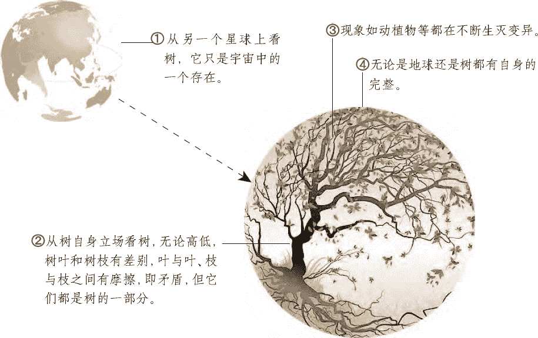

从冥想中开悟的人看到存在、矛盾、变化、完整及一切。

#### 第 2 层境界：看到无差异和对世界的责任

当开悟的人从小我的境域中解脱出来之后，发觉自己是全体宇宙的存在及一部分，既与万物无二，亦有责任爱护万物。

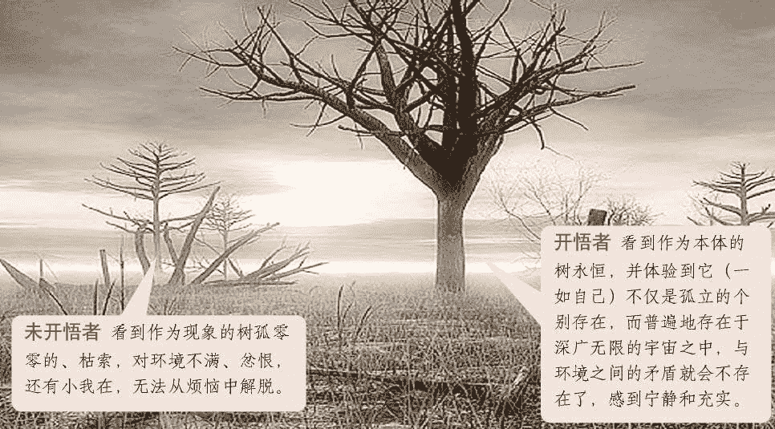

## 获得圆满的特质（四）
流露宽恕与慈悲

冥想不仅解决个人心灵超越，且一颗开放宽阔的心灵能让我们有力量直接面对世界，了解整个人类精神痛苦的根源，自然会流露出宽恕和慈悲。

* * *

#### 世界性的精神危机

当我们把眼光从自我精神层面转移到更广阔的社会层面，会发现世界现今的问题基本上是一种精神危机，源于人类有限的视界——彼此之间失去联系感、整体感，及大多数不成熟的心智中的贪婪、恨、偏见、迷惑、恐惧而来。地球上最严重的问题包括战争、贫穷、生态破坏，当前的经济危机和各种精神病症等，都和这世界整体层面的精神危机有关。历史进程也阐明了政治和经济上的改变并不足以减轻痛苦，要从根本上解决，只有超越我们自身的贪婪、恨、迷惑，找到慈悲、善及了解，才能在世界上建立光明的精神家园。

#### 向世界的痛苦开放

许多不需要正面面对的势力，如发生在他人身上的迫害、远离个人的战乱、不曾去过的地方的瘟疫等，好像和冥想并没有精神价值观的联系，因为憩息在我们心灵中需要改善和净化的只是完全自我的精神体验——但一旦精神成熟后就会发现自我的觉悟并不局限于个人，而是抑制不住地产生对世界的关怀、仁慈和宽恕。就像我们了解到自己的疼痛与悲伤时，便会感受到他人的疼痛与悲伤；开始对自己有更深刻更伟大的认识后，便会对世界有更深刻更伟大的认识；且在这感受和认识之中，心灵充满了无边的慈悲之情。

#### 真正的慈悲具有医治世界的能力

当母鸟将小鸟丢出巢外，让它自己学会去飞，这里并没有那种表面上的宽恕和慈悲，有的是更高指导、更深刻的爱的意义。宽恕和慈悲不是建立在简单的同情、理解与自我感觉上，而是有佛陀般的力量及包容心。慈悲的心灵和真正的慈悲不仅能转换我们遭遇到的痛苦力量，也能医治世界的伤口。当冥想后的人自然产生了一种慈悲心，一旦心灵开放，便会创造出伟大的精神艺术，或竭尽全力去停止争战、医治世界环境、照顾穷人等。

### 关于大爱的冥想

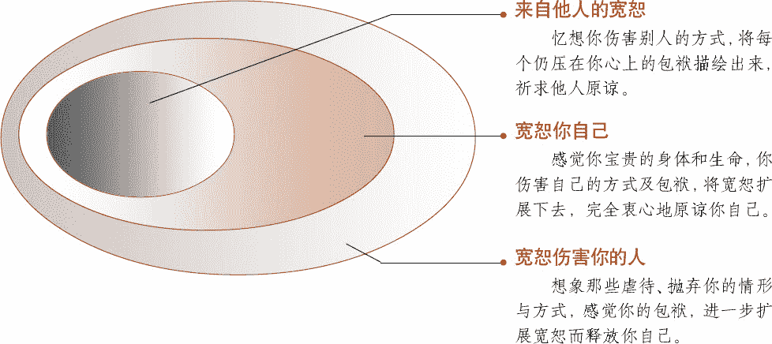

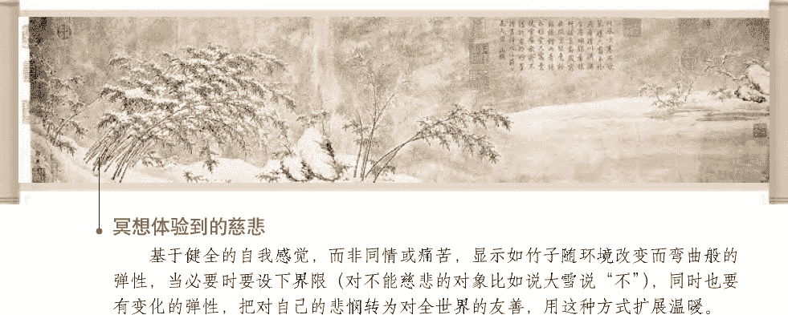

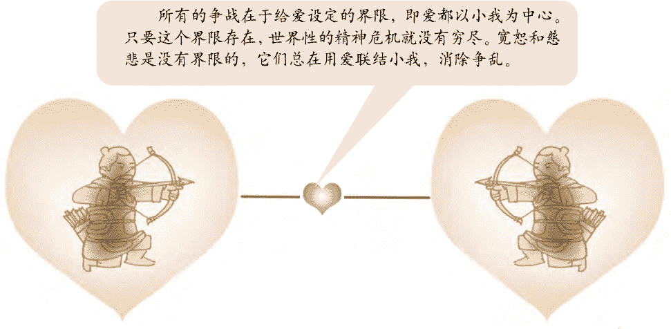

## 朝向觉醒的路径
把冥想作为筏子

正如佛陀曾经说：“过了河之后，就不需要再把筏子扛在头上了。”——冥想就是佛陀所称的那个筏子，一个助我们渡过疑惑、迷惘、欲望、恐惧水域的筏子。

* * *

#### 伟大灵性的觉醒

任何手段的静修方式，终极目的都朝向一个：觉醒。在最初的阶段，苦行被作为通向觉醒的重要途径。后来当佛陀开始传道时，其他瑜伽士和苦行僧都诘难他，对他放弃苦行提出质疑：“你每天吃追随者置于碗中的美食，穿袈裟御寒，而我们一天只吃几粒玉米，赤身躺在钉床上。你太软弱、太舒适，凭什么称修行者兼老师呢？”佛陀就以狮吼回复：“你们做过的我都做过，但我发现用这种修行方式来对抗自我并非是好方法。”他用“中道”取代苦行，使修行不再基于对世界的厌恶或迷惑、自我“惩罚”，而是基于包容和慈悲。觉醒的佛陀开放心灵去拥抱所有，使自己完全从幻象及苦难中释放出来。其他修行士的错误在于仍把苦行这种筏子当做目的，执迷不悟。

每个经历了灵性觉醒的人也都有佛陀的狮吼精神，否则疑惑、悲伤、恐惧很快就能将他压垮。把冥想看成是到达觉醒的彼岸的一个筏子，也只能是以不可动摇的勇气去贯彻到底，但上了筏子，仍然不等于到达目的地。

#### 觉醒的力量

“筏子”毕竟只是个工具，它的价值在于使我们到达目的之地——禅定后觉醒。经过了很多次的冥想，从一再禅定中，已经能够逐渐做到：①放开被恐惧压抑的自我、平静心灵、倾听而非反抗；②通过注意力集中将自己导向有系统的反省、慈悲、净化行为；③唤起并强化自己的勇气、关爱、悲悯，选择放弃自满、愤恨、恐惧及压抑；④留下弹性且开放的空间。

当拥有了觉醒后的精神能力，一个清净、纯洁的意识空间会自然地呈现在我们的生命中。这个意识空间的“外显”充满了平静、清晰和相连，“内显”就是精神真正的归处，基本的善、仁慈、自信、正直等等。对于觉醒的人，冥想倒不一定是需要丢弃的“筏子”。

### 觉醒后的作为

只要放开那些阻挡我们心灵的事物，我们的意识中自然会闪现觉醒之光。

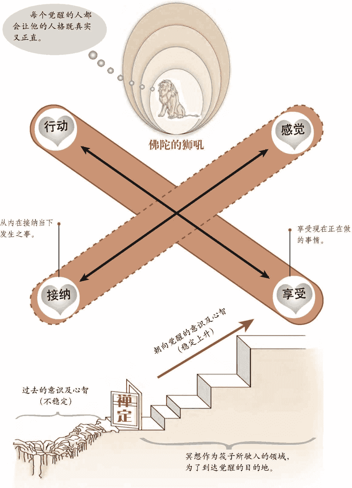

## 解脱的时刻来临
达成精神的超越

解脱表现在精神层面是一种强烈的、活跃的、开放的自由精神，表现在心灵层面是完全的觉知能力，和对外在、心灵的深刻洞察。

* * *

#### 理解真正的自由

所谓自由，是一种心智状态，它不是从某种东西挣脱的自由，也不是用言语表达出来的自由，更不是意味着孤独就是自由。真正的自由是意识的自由、怀疑的自由、不依赖于任何权威的自由。孤独不过是内心的一种感觉，而自由是受一种解脱了的精神支配的心态。如果孤独是在身边筑起围墙式的孤立主义，自由就是打破围墙，清除一切封闭、依赖、奴役、臣服及逆来顺受的阴影。这种自由有别于心灵制造的类似放松的假相，而与心智对生命的观照有关，它的到来是自然的，并不来自我们的期待、要求和渴望。它是一种更深刻的孤独，就像那些自由的思想家都是精神上的孤独者。

当冥想到达既孤独又自由的精神领域，心智就会有一种成熟而超越的领悟，完全从过去的记忆和限制、传统与权威中解脱出来，以富有生气而独特的观照生命的态度，精神的创新，潜能的激发，使自己成为“既个人又完整”的生命体。

#### 觉察一切的能力

冥想最大的发现就是我们自己。由于在冥想过程中，一切觉知到的存在的真相都会呈现，经由意识集中，会看到各式各样的意象集合成一个中心意象，这个中心意象实际上是人自己的一个映射。人在实际生活中扮演的就是以自己的意识为中心的观察者，其他都是被观察的对象，人头脑中产生的念头无非是观察者自己的观念、判断和结论的统合，就像统合了其他意象的中心意象。认识到这一点，就会每次通过冥想观察到自我意象，也就更深入地觉察自身。

**冥想最重要的体验是觉知周围的环境及人心的各种意象，即无论外在的还是内在的，都在最宁静的状态中让心灵觉察。** 冥想觉察到极致，主体和客体没有分别，达到完全合一的境界，因此在所有心灵修行方式中，冥想能使人对环境及心灵的觉察达到最高、最深的层次。

### 冥想通向心灵幽径

冥想是人在孤独的心灵之途上，投入全部注意反省与警觉，寻找自由和解脱。而通往心灵隐秘之处的阻碍除了自己，没有别人。

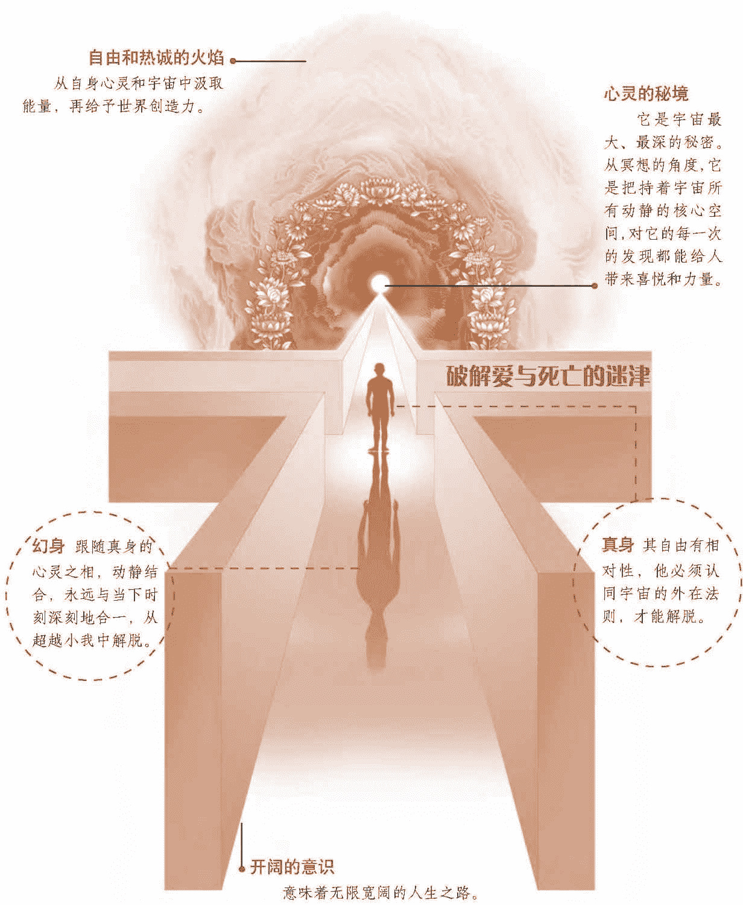

# 第八章
冥想的多种形式
提升自我的灵性

无论是专注地沉思，还是心灵漫想，人们能在摇曳的烛火中进入一个更集中、也更开阔的心灵空间；在奥妙难测的水晶球里，发现属于自己的念想、独特反应、个性的思维模式等，窥伺到种种命运的隐征……冥想就是集中注意力，从最微小的事物的表层进入到无限广阔和深刻的宇宙的意识中，获得对整个生命的清晰认识，提升自我灵性。

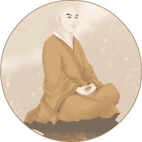

### 本章图版目录

冥想让你接触滋养心灵的大地

瑜伽冥想的放松姿势

观光冥想

四种健康冥想呼吸法

口诵六字大明咒冥想

音乐冥想的方法

七色花冥想法

步行冥想的基本步骤

气功冥想练习

瑜伽拜日式动作分解图示

水晶球占卜

水晶之功效一览

炼金术的三个阶段

关于身体和精神的占星术冥想

塔罗牌冥想

## 印度式冥想
沉浸在大自然的母体中

冥想与古代印度的灵性文化有千丝万缕的联系，最初在恒河岸边打坐冥想的苦修士，用这种方式体验着印度宇宙神的灵性的同时，也接近了大自然及真实的自我。

* * *

#### 源自古老印度的身心放松法

古印度人修习冥想，常常会到大自然环境中接受“挑战”，相信只有在和自然的“亲近”当中才能达到心思的静定及坚定、持久的平和，并与他们追求的最高神性统一——这种神性可以说是一种道德品质极高、灵性极深、意识极纯粹的东西。因此，印度式冥想不同于后来传入中国的打坐的单纯的宗教意味，也不同于日本坐禅把止欲作为全部修行的特征，而是一种让身心返归原始自然状态的、身体及精神的疗养方式。

修习印度式冥想，就要感觉自然母体的力量在体内经过，如同古印度人面对恒河之水的想象；同时要感觉到自己对“神圣真理”的企慕，才能动用这股力量净化身心。即一方面藉由内在静定使身体完全放松，犹如在短暂的时间内享受了一次深度睡眠；一方面借由灵性提升使自己能克服消沉，将无形的光明“内置”于有形的身体中，持久地获得静心的力量。

#### 作为一种自然疗法医治疾病

5000 年前，古印度高僧们到深山野林中进行冥想，在长时间与自然接触的单纯生活之后，他们从观察生物中体悟了不少大自然法则——瑜伽冥想的体位法中很多姿势来源于此，如蝗虫式、乌鸦式、蜥蜴式等，能起到松弛神经、伸展肌肉、强化身体、镇静心灵的功效。又从生物的生存法则验证到人的身上，逐步地去感应人身体内部的微妙变化，积极探索自己的身体，观察它受到各种心灵经验的刺激后的反应。

在此之前，单一苦行之士的冥想一直是以安静、坚韧的态度忍受疾病，而高僧们多把疾病看做是生理本性的一种变形，如欲乐、忿怒、嫉妒等都是情性的变形；错误、成见、虚伪之纵容都是思想的变形。因此，他们很早开始把冥想作为一种自然疗法，用来维护和调理身体之康健，医治疾病和精神创痛。

### 冥想让你接触滋养心灵的大地

大地上冥想使人仿佛超越容易疲劳的理性时空，接触了让生命憩息、意识散步的大自然的永恒时空。

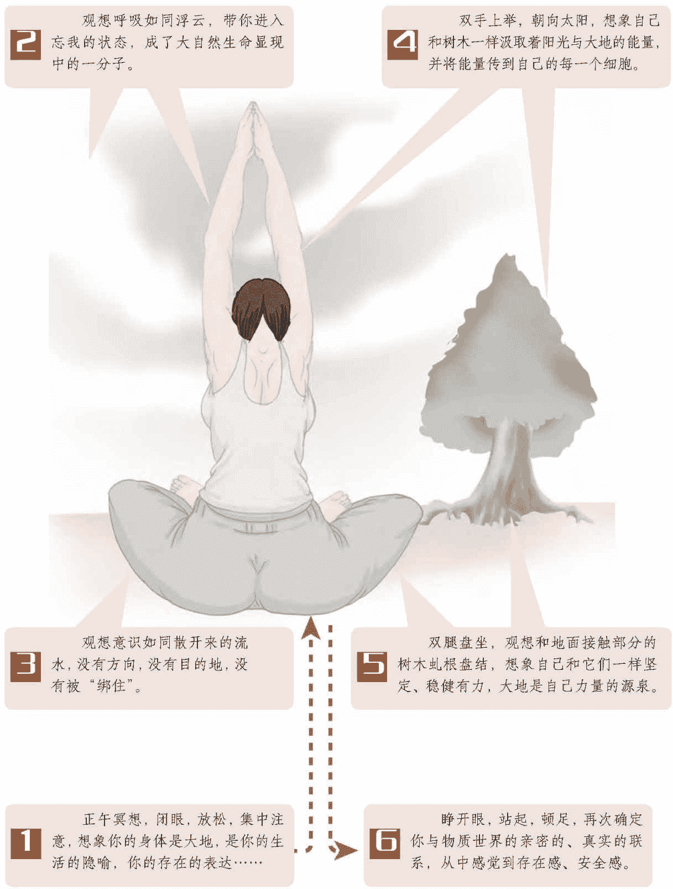

## 瑜伽冥想术
制服心灵的本能冲动

瑜伽作为一种控制意识的方法及精神和肉体结合的运动，包括了呼吸、体位和冥想三部分。瑜伽冥想是整个瑜伽体系中最能体现瑜伽术精神的一部分。

* * *

#### 瑜伽冥想术的方法

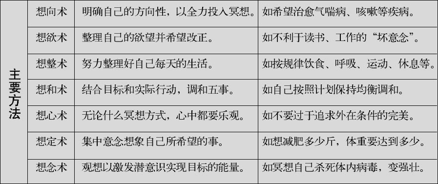

#### 瑜伽冥想术的目的

根据古印度典籍《薄伽梵歌》所记录，瑜伽冥想术的目的是要获得内心的和平与安宁，其更深之意在于达致无限的精神之爱、欢乐、幸福和智慧。这本书也详细解释了三昧境界即入定的状态，是指一个人由于修炼瑜伽而使其心灵完全脱离物质性的心理活动，处身在一种无限的超然幸福状态里，不是通过尘世的享乐，而是通过各种超然的感官自得其乐。这种快乐就是冥想最高深的境界所得到的快乐，也被认为是至善的快乐。要达到入定的途径就是瑜伽冥想。

这本书又称，心灵是各种感官的君王，如果你控制了心灵，也就控制了所有其他的感官。一切瑜伽修行士都是通过瑜伽冥想制服心灵，并超脱物质欲念，得到人所能有的最高幸福，到达解脱的境地。

同时，瑜伽冥想对人的身体健康也产生非常积极的影响。它能使人的内心更为平静，感觉到自己的紧张、怒气等减少，较少可能患上一些由紧张与忧虑引起的疾病，因而它又是能增强人的免疫力的“预防性医药”。

### 瑜伽冥想的放松姿势

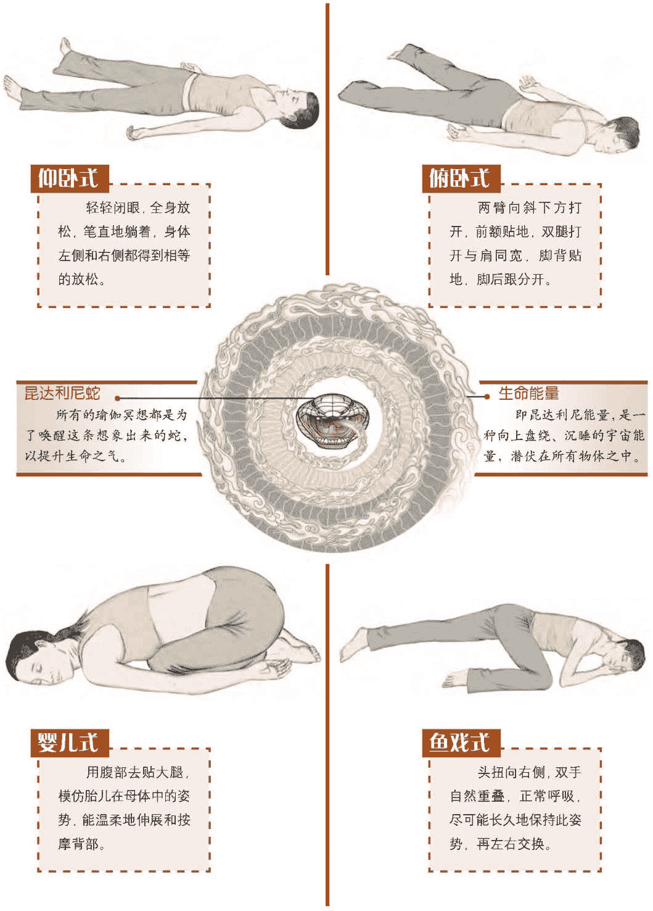

## 蜡烛冥想法
专注于一个物体

进行蜡烛冥想时，一定不要被周围的事物干扰。如果你的思想一直不安宁，必须在冥想之前就明确只有你才能决定自己的思想何去何从。

* * *

#### 选择场合

在一个比较昏黑、空气流通的房间，点燃一支蜡烛。或坐在光线很暗的房间地板上。蜡烛放在与视线齐平的前方。可以坐在椅子上或结跏趺坐，挺直脊梁，集中注意。端正姿势后，自然的呼吸，放松，用柔和的眼光注视那根燃烧着的蜡烛。有的烛光冥想还用两个大拇指分别堵住两个耳孔，把注意力集中到两眉之间，即天眼处。

#### 凝视冥想

注视蜡烛时，眼睛一定要盯住蜡烛的火苗，大概凝视 2 分钟。将视线集中于这种轻微移动的物像上，体会模糊状态，假想身体依靠浮力漂浮在水面上，而不去强迫大脑集中精力，反而更不容易走神。半闭双眼，凝视着火苗，直到即使合上双眼，火苗的余晖也不会立刻从视觉中消失。几分钟后，感到烛光已经停留在脑海里，就闭上眼睛，想象那簇火苗就在眉心之间，尽量让它保持稳定。

凝视冥想也可以配上呼吸法，用两个中指压住两个鼻孔，吸气时把中指移开，吸完气后再把鼻孔压住。呼气时把中指移开，呼完气后中指再关上。如此反复。用这种方式时，用其余的手指夹住上下嘴唇，使它们闭合在一起。

尽力让蜡烛的视觉残像在头脑中保持 10 分钟，越持久越好，延长集中注意的时间。

#### 控制思想

在平时学习、工作中，可通过给自己精神加压及高度的紧张感，借控制大脑来控制思想和杂念。但在冥想中，如果一直采取拒绝思考的做法，强迫大脑安宁，往往适得其反。

专注于火焰，在这种情境中能听到自己的心跳。这时，如果有外部因素干扰，正确的方法是应该努力把思想集中在前方的火焰上。通过凝视着蜡烛的火焰，来排除大脑里的所有杂念。再闭上眼，感受内心的平静，有意地让意识和思维器官分离，仿佛大脑已不能思考。

### 观光冥想

为了证明头脑可被驯服，当脑子很乱时一个有效方法是：把注意力集中到一个蜡烛的火焰上，缩小视野，排除杂念；一旦分心，立刻默视蜡烛。凝视蜡烛冥想又称观光冥想，其具体方法可如下：

#### step1

眼部放松，轻轻闭目，眼球自然转动，可做一些类似眼保健操的简单按摩。

#### step2

睁开眼睛，不直视烛光，先看腿前侧，慢慢向移动目光，最后移到烛光上去凝视。不要瞪眼眨眼，直到感觉眼泪要流下才收回眼光，闭眼，掌心弓起，使手掌呈碗状扣在双眼上，不碰触眼睛，停留 5 至 7 个呼吸，放松。

#### step3

再次睁开眼睛直接凝视烛光，感觉眼睛发酸、眼泪要流或已流下时闭眼，双掌相合揉搓后扣在眼睛上，注意手心不要碰触眼睛，此时眼睛非常敏感，让眼泪自然流即可。

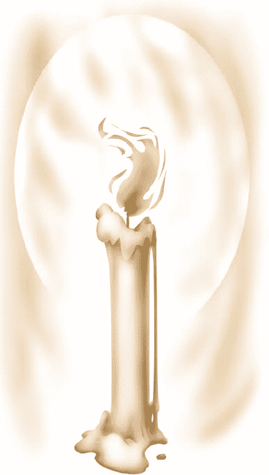

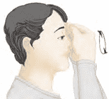

**注意事项：**

1．正常视力和视力稍差者，蜡烛和人的距离是一米半左右；如果视力特别低，要与蜡烛保持两米以上的距离。

2．患抑郁症、戴隐形眼镜者不宜做，戴眼镜者可做但用手扣眼时要摘掉眼镜。

## 呼吸冥想法
把注意力放在呼吸上

开始这种方法的冥想时，先不用刻意调整呼吸，只需观察自己呼吸的状态，呼吸的节奏、快慢、深浅，或静静地体会呼吸时的紧张与放松。

* * *

#### 冥想时的主要呼吸方法

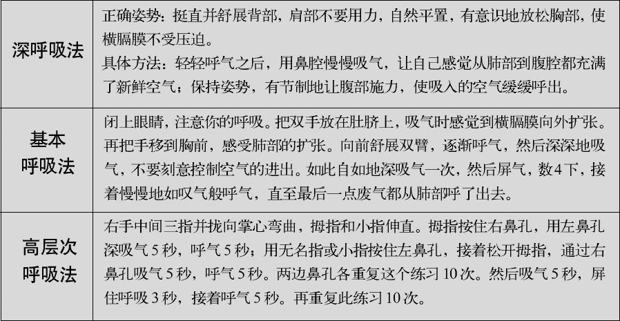

#### 呼吸冥想法的具体步骤

（1）选择一个舒适的姿势让自己放松下来，放松全身，双手自然地放在膝盖上，放松脸部肌肉、眼睛、鼻子、嘴唇、舌头，闭上眼睛，把注意力放在呼吸上，用鼻子呼吸。注意自己呼吸的声音。

（2）尽可能地放松自己，让呼吸的状态自然、平静。慢慢吸气，慢慢吐气，体会吸气和吐气之间的平和。吸气时，想象自己正在感受大自然给予身体的能量；吐气时，感觉所有的紧张，浊气排出体外。

（3）当注意力从呼吸上跑开时，不要着急，静观这种游离，慢慢把意识引回到自己的呼吸上。不断增加练习时间的长度和次数，也可以根据自己的状态来调节冥想时间的长短。

### 四种健康冥想呼吸法

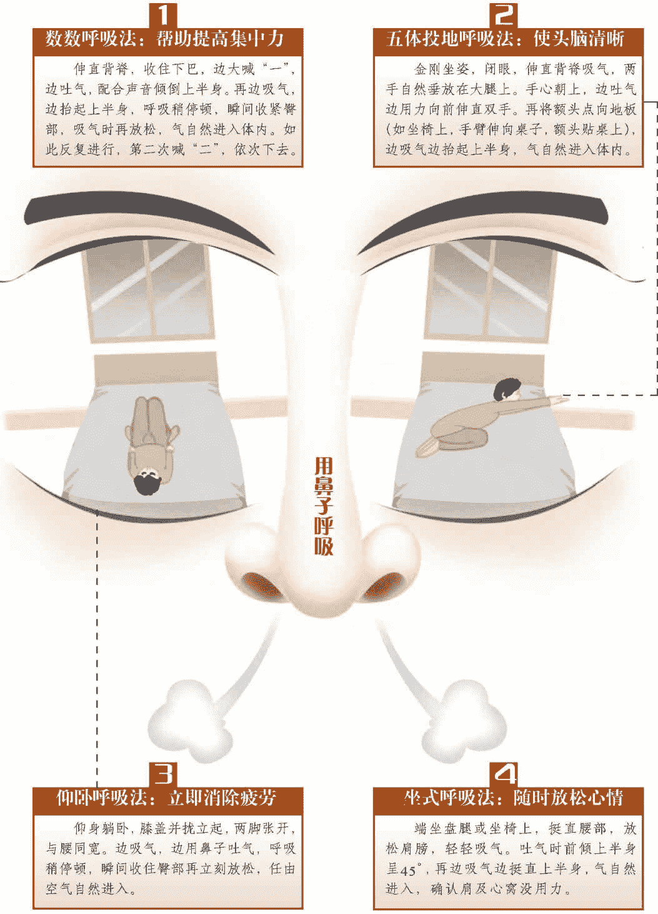

## 语音冥想法
反复吟诵一个梵语音节

语音冥想法是一种引导心灵纯净的冥想方法。语音本身具有特殊的含义和力量，能缓解人的精神压力，治疗精神疾病，甚至使人达到最高、最纯净的意识状态。

* * *

#### 梵文语音冥想的种类

语音冥想法又称超然冥想法，它通过反复吟诵一个梵文音节或一句梵语，使人超越世俗的思想、忧虑、欲念、精神负担等，把注意力集中在念诵的语音上。这组语音一般有如下特点：很长时间流传，有一定的韵律、节奏，代表了某种美好的精神理想和超人的宇宙力量，能实现自我最高意识状态，增强精神的集中力。且经过一段时间练习后，会形成关于这个语音冥想的特定模式，再次吟诵它就很容易进入冥想状态。

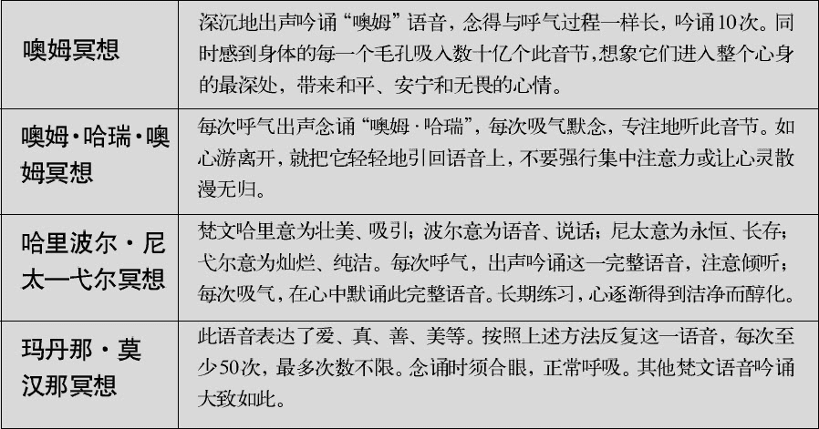

#### 藏密语音冥想方法

藏密语音冥想是梵文语音冥想中一种，自身也有很多种类。以简单的金刚颂为例，练习时选择坐姿（如七支坐法），手握金刚拳于双胯，吸气默念吽，收式。唵、啊、吽都是宇宙的根本音。

### 口诵六字大明咒冥想

藏密语音冥想一般是在禅定时口诵咒语，它们是一些神圣声音或听觉符号，能唤起内心深沉的情感及潜在的力量，如六字大明咒（下图中间字符即为此咒的梵文书写），也常用于祈祷。

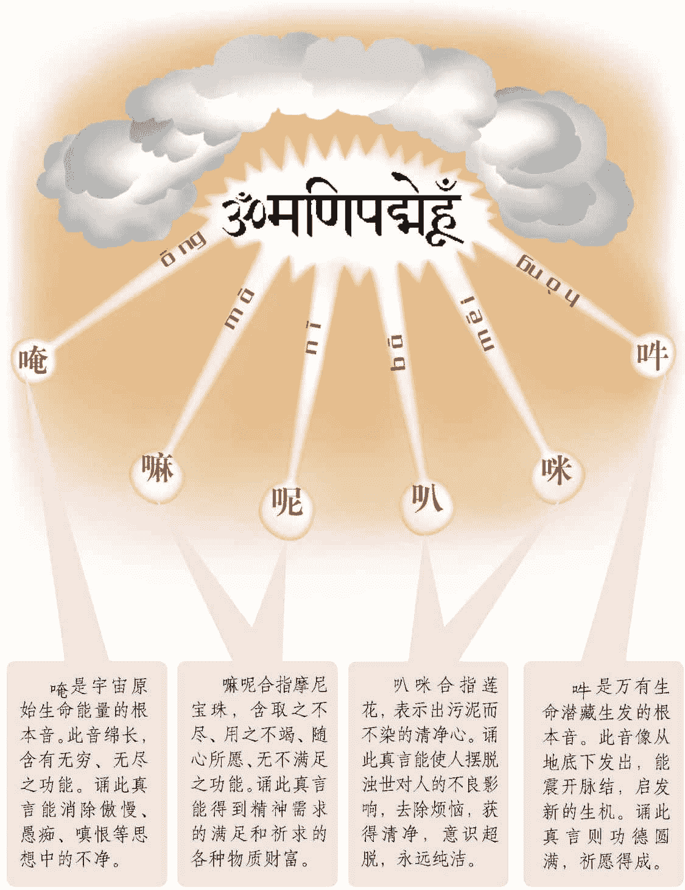

## 音乐冥想法
聆听宇宙调和之声

音乐冥想是很普遍的冥想方式，在静坐、凝视、语音冥想时都可以同时播放一段能起到放松、催眠、安定等作用的音乐，能增强冥想的意境，疏导负面情绪。

* * *

#### 音乐冥想法的种类

**（1）宗教音乐冥想**

基督教很早就认识到音乐对信仰的作用，因而西方的教堂音乐如格里高利圣咏或素歌等都能给人一种平静、祥和的感觉。20 世纪中期以来科学家们也不断发现音乐对人的心灵有独特的疗治功效，如聆听格里高利圣咏时，脑中就会呈现冥想状态下的有规律的α波，新陈代谢减慢，呼吸减缓，头脑镇静。佛教中也在禅定或日常修行时大量借助缓慢、低沉的佛乐来加深人心和信仰的联系。它们都能使人忘却烦忧，平静身心，产生一种远离日常意识或言语的超脱感，扫净心灵上的尘埃。

**（2）非宗教音乐冥想**

也可以选择一些反映大自然的，或自己喜欢的、舒服的、放松心情的音乐进行冥想，比如高山、流水、海浪之声，东西方乐器演奏的舒缓、柔和的音乐，神秘的电子合成音乐等。纯净的音乐能使人在冥想时获得身心的平和与安宁，仿佛经历了一次神奇的自然冥想之旅，被引向无限的精神之爱和幸福智慧。柔和、愉快、轻松的音乐还能和人的心灵架起彩虹般的桥梁，载着渴望飞升的心，漫步悠游在流动的天空中，慢慢地释放心灵的毒素，使身心呈现安定、愉快、心旷神怡的美妙感觉。

#### 音乐冥想法的具体步骤

（1）把冥想前准备好的音乐打开，不同的音乐能带给你不同的心灵境界，因此注意音乐的选择。不固定什么动作，姿势舒适、放松，让心灵沉静下来。

（2）注意聆听音乐，让慢节奏的音乐充满你的身体，感受音乐对情绪、心理的影响，逐渐洗去紧张和不适。

（3）配合着延长的呼吸，渐渐地心随意走，把脑里正在思考和担忧的东西也去掉。在更深入的想象中，人变得恬淡而渺然，忘却烦恼，飘至一个天人合一的空远的境地。

### 音乐冥想的方法

**西藏老唱钵**

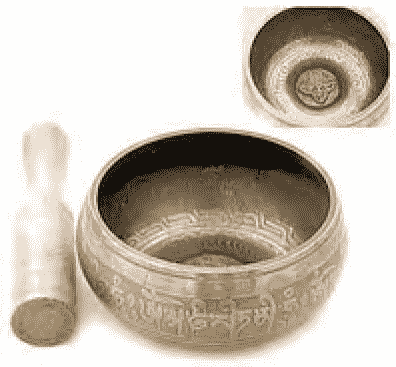

**藏铃**

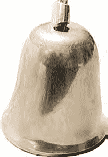

用实心的小音槌敲打唱钵或轻摇藏铃，聆听它们发出的声音，并感受轻微的振动，任其声音响起或自然减退，不要碰触其边缘，以免抑制声响发出。

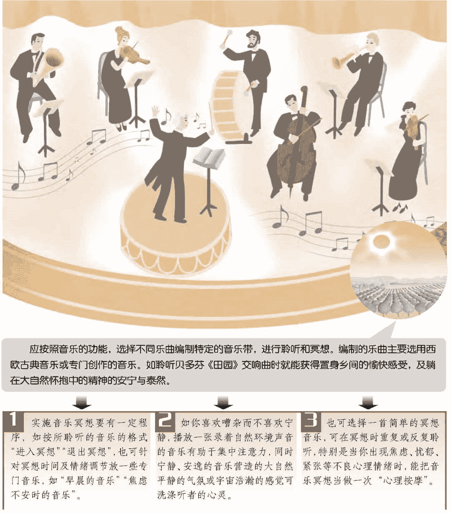

## 色彩冥想法
一种康复疗法

把色彩运用于冥想中，是使一种观念或想法深深印入无意识，且在情感领域产生一种即时而深刻的反应的最有效的方法之一，因而它常被作为一种有效的色彩康复疗法。

* * *

#### 色彩冥想和脉轮的关系

每个人都能从色彩冥想法中获益，当他们从身体主要能量中心即脉轮引出一个自然反应时。因为脉轮被认为和色彩有密切的联系，其七个气轮从下而上分别对应着红橙黄绿蓝靛紫七种颜色。在你熟悉各种各样的色彩及深入了解与之对应的脉轮后，你能选择集中你的思想到一种颜色或一个脉轮上，以解决特殊心理问题；也能随时随地进入冥想状态，或得到你渴求的某种颜色。这种颜色将出现在你的脑海中，以一种抽象的形式将客观事物和那种色调联系起来。对照前面的脉轮知识，在生活中活用色彩能量进行自然疗法，能给予身心安适感，回归平衡的健康状态。

#### 色彩冥想法的具体步骤

**（1）开始集中注意到呼吸上。** 观想红色以任何形式自动出现在你的脑海中，如一件红外套、红地毯、一片红色的花海甚或你体内的血管。集中意识到红色，改变不活泼的、冷漠的性情，甚至治好关节炎。

**（2）现在观想黄色，** 并对之产生情绪反应，允许任何心结打开或从情感障碍中解脱。这时不要惊异你会变得情绪化。冥想光明的、温暖的太阳般的黄色能释放你压抑的情绪。但你不需要有意去意识到，而只是清晰地觉察。

**（3）现在观想绿色。** 绿是生气勃勃、和谐的大自然的标识，给人以宁静的感觉。因而集中冥想这种颜色能变得平和，减少焦虑。

**（4）现在观想蓝色，** 集中注意沉思这种颜色能变得更加镇定，缓解精神不安。因而它是最重要的用于治疗的色彩。

**（5）观想紫色，** 刺激思想的流动，使自己能更容易去观想到你生活中的需求。

**（6）最后观想白色，** 感觉自己被吸进这束神圣的光，完全忘掉自我及一切意识。

### 七色花冥想法

色彩冥想法常用于身体及心理治疗，主要是通过对色彩的想象，产生与这种色彩的象征义有关的联想，可配合瑜伽、呼吸法等激发色彩能量，使整个身体放松，心情畅达，身心得到解放。其基础原理是每一种颜色都有其独特的作用，令人产生不同的情感。

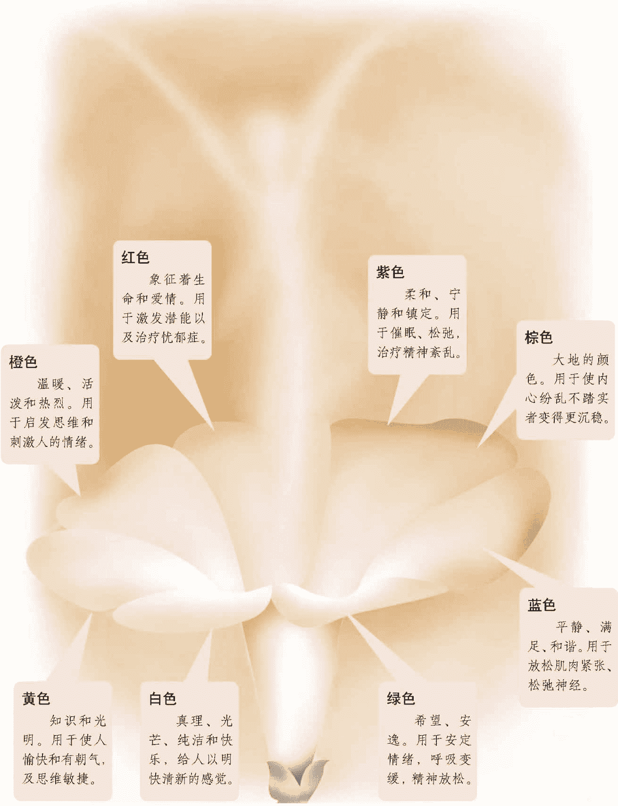

## 慢走式冥想
迈向神妙的奇境

传统意义上的冥想都伴随着坐姿，但如果你无法保持静止，也可以采取步行冥想的方式，慢慢地走，把注意力集中到你的脚接触地面的感觉上，并凝视面前散落的足印。

* * *

#### 步行与冥想

慢走式冥想又称步行冥想，是把注意的焦点放在步行的体验上。放松，呼吸自然，慢慢迈开步伐，然后集中注意于行走的感觉、腿部的运动、胳膊的运动，及步行的节奏和韵律。它和传统冥想的区别在于，一般冥想都要求人们闭上眼睛静默，但步行冥想需要眼睛来辨识方向，注意前方是否有危险及障碍物，在注意走路的步伐的节奏的同时，也要知道身边的环境、声音及感觉。人们在这种环境中注意和冥想，比传统的静坐冥想方式更容易成功，且能带来更有力的和更深的享受。

步行冥想的方式有很多，最普遍的还是在户外步行。选择一个合适的地点来进行步行冥想是冥想前的重要事项，它必须能让你安全的步行 20 分钟而不用考虑交通或穿行于复杂街道的问题，也不会使你全部的感知放在身边的环境上，如一个公园或空停车场之类的地方。同时在步行时没有必要去试图改变自己走路的方式，用你平时的步幅和速度来走路，不要过快。你需要做的只是保持注意力放在自己的身上并感觉它的移动。一旦你把所有的注意力都放在身体上，然后将注意力转换到感觉身边所经过的一切。

### 步行冥想的基本步骤

##### 步行冥想

选择理想的地点和路线来进行，遵循以下方针：

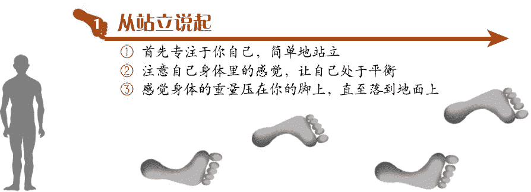

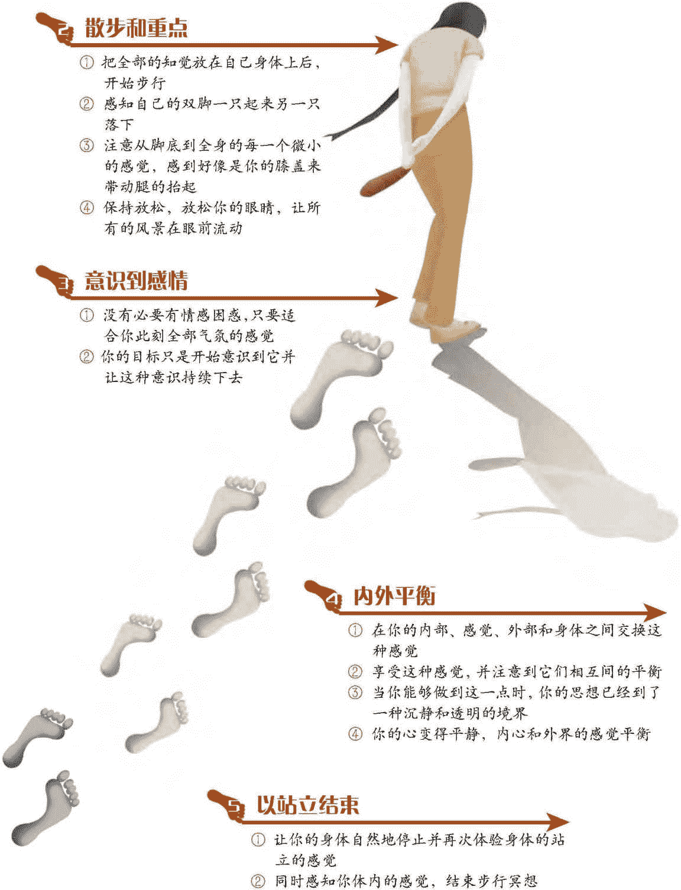

## 运动式冥想
动静结合的冥想法

冥想和运动往往结合在一些养生健体的练功体系中。气功、太极拳、瑜伽体位法都属于动态冥想，即通过一段时间的静心沉浸在某个舒适的动作或姿势里得到放松。

* * *

#### 气功与冥想：能量运行

在中国传统的气功中，常常通过“内观”或“内视”调神，这就是冥想的做法，练气功的肢体运动也主要是为调心即调神服务。气功把气或生命的能量作为练功的基础，让流动的气通过身体，在引导或推动体内气息的过程中获得身心平衡与和谐。练气功者需要神情专注和自然的深呼吸，在一个镇定的头脑下聚气，增强身体内气的能量，及在积极的心境下促使气息沿着体内正确的能量通道循环运行。

气功中“内观”的具体做法包括：观想体内的感觉或活动状态，及某特定事物的形象，比如“任督脉循行”（即大、小周天），“内视”脏腑的形象。内视必须在环境安静、心情平静、全身放松、主观上有意但却不刻意要求的特定的条件下出现，它不是通过逻辑严密、层次分明的思考实现，而是在意识清醒但尚未达到“警觉”的冥想状态下进行的。

从气功中产生的内视疗法，仍结合了冥想的技术。如练习气功的人把注意力集中在身体某部位时，局部血流和温度会发生变化，通过想象可以使血液成分发生变化，也可以改变人的免疫功能。和冥想一样，主要通过视觉形象进行想象、思考，来达到治疗疾病、缓和疼痛的目的。

#### 太极拳与冥想：心意合一

太极拳最初是气功的一种，后来成为一门强身健体的练拳功法，讲究实虚统一、动静结合，拳法以柔和、缓慢、轻灵见长，采取借力打力的运动形式，并注重“意到气到，用意不用力”。好的太极拳师还能做到“心与意合、意与气合、气与劲合”，达到阴阳协调的最佳状态，在体内产生“一团和气”。

太极拳与调身、调气、调心“三调”关系密切，一般是从外动内静着手，具有动中求静、紧中求松的特点，调整和平衡体内外阴阳。太极拳的优雅（缓慢运气的外观）、和谐（身心协调及心神协调的内外在统一）都能很好地体现出冥想的特点——即一种平和的，对身体、头脑和精神进行控制的，激发生命活力的“运动”练习。

太极拳运动中的“静”和“松”也分别对应着冥想的状态，调息的方法可以和冥想通用。太极拳原理亦视人体为小宇宙、天地为大宇宙，要沟通体内小宇宙和外在大宇宙，保持阴阳之气交糅而始终达到动态平衡，这正如冥想中也要使“小我”（即“内在的自我”）和宇宙的最高神性（或意识）联结。不过太极拳一般不能进入到无意识，不及冥想的意识状态深。

#### 瑜伽体位法与冥想：身心平衡

传统的瑜伽冥想方式一般是坐姿或躺姿，现代瑜伽运动更鲜明地把呼吸法、冥想和体位法结合在一起。瑜伽体位法是指在某一个舒适的动作或姿势上维持一段时间，姿势即身体在瞬间保持的方式。瑜伽姿势能让身体平衡、健康、有力，大脑平静，促进气息和能量的顺畅流通，使身体功能处于最佳状态，且强化身体内部的意识，被认为是通往灵魂的大门。

瑜伽体位法配合缓慢的呼吸和冥想，在一种或一套动作练习中，反复使身体处于紧张与松弛这两个极端的状态，经过多次之后，全身就出现按摩般的效果，能促进血液流通，恢复身体的活力，并获得心灵的安宁感，释放心理压力，逐渐消除紧张、忧郁、压抑、烦躁、自我封闭等不良心态，最终达到身心合一的完美境界。

瑜伽体位法和太极拳、冥想在本质上是一致的，都是意念、身体共同参与的运动形式，都能调动人体的自然调节能力，整合身心，强身健体，增强了人的免疫力，从而获得健康。

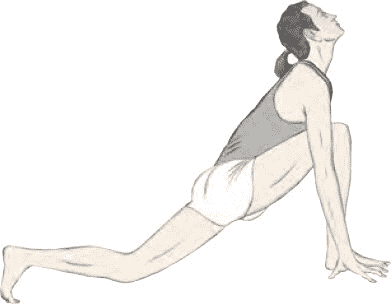

### 气功冥想练习

##### 对着太阳冥想

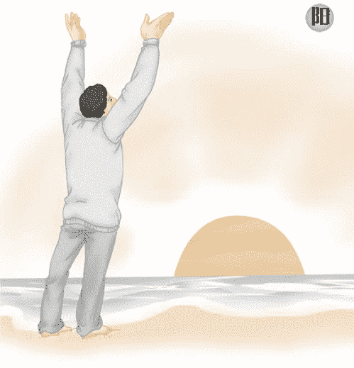

**1** 　舒适地站立，赤脚着地。向前弯腰，手伸向膝盖下，身体呈弧状，头向下弯。放松时想象气的能量从中央通道上升，沿着椎骨到达头顶。

**2** 　慢慢挺直身体，手臂向前伸直抬起，吸气时向上举至最高点，拇指和食指构成满月状，眼睛朝手中间看，头向后微仰，屏息再呼气，手臂放下，挺直身体。

**3** 　呼气时想象气像太阳的透明的光一样从头顶落下，通过身体到达地面，洗净消极情感。

##### 对着月亮冥想

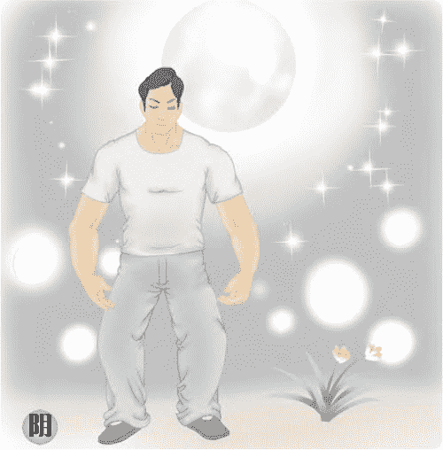

**1** 　姿势自然放松，双脚分开与肩部同宽站立，膝盖轻微地弯曲，背挺直，把手放在身体两侧，向中心聚气。

**2** 　深呼吸，提精聚神，缓慢吸气时冥想气沉丹田，吐气时较快，反复几次。在月夜练气功，想象气是月精。

**3** 　配合手的动作，提气时缓缓抬起手，呼气时放下，直到进入入静状态，心无杂念，意念集中。

### 瑜伽拜日式动作分解图示

瑜伽体位法通过身体的前弯、后仰、扭转、侧弯、俯卧、仰卧等各种姿势，配合吸气和屏息的过程，对人体及内脏进行全方位的刺激与按摩，激活身体的潜能，提升身体素质。

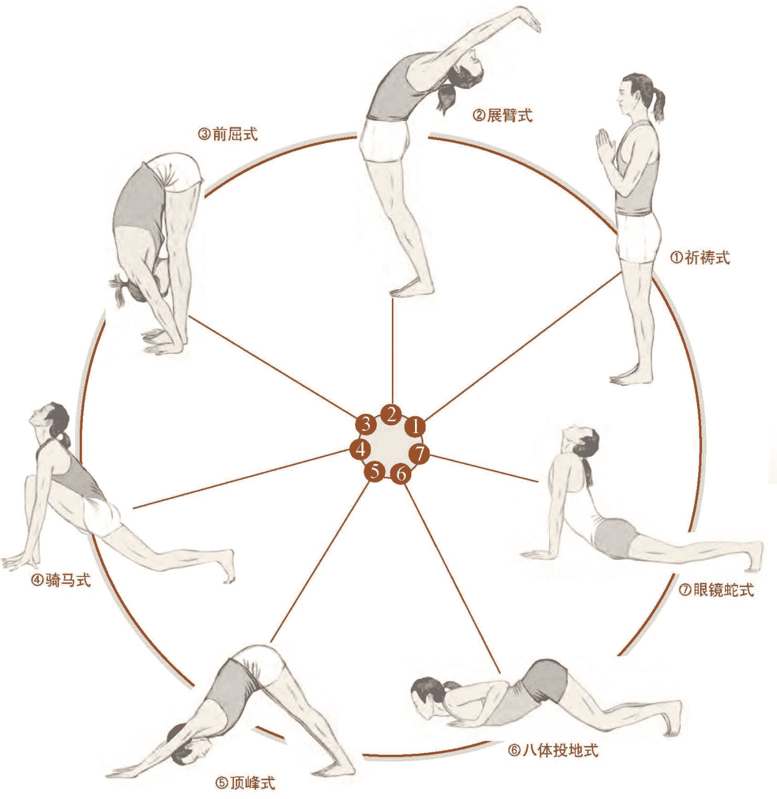

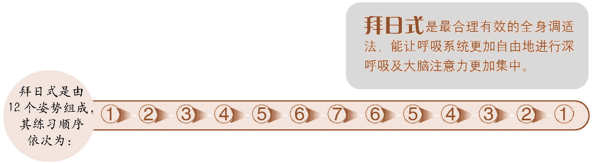

## 有趣的水晶球
解码无意识的有效工具

水晶和宝石都能使人平静，踏实，稳定。在练习冥想时，佩戴水晶或在旁边放着聚宝盆、水晶球，据称可以聚集大自然的磁场和灵气，帮助人集中意念。

* * *

#### 冥想和水晶

水晶用于冥想可追溯到佛教，一是佛教七宝谓之“砗磲、玛瑙、水晶、珊瑚、琥珀、珍珠、金银”，能消除烦恼，增加定力，因此常用于修习禅定时，这可能与人们最初认为水晶对光的聚焦折射功能有关，现代科学也认为水晶和宝石能吸收、储存和传输能量。

二是带颜色的水晶能利用色彩在冥想中发挥重要作用。如在脉轮中，放松大小脑的顶轮（紫色）、调节呼吸的喉轮（蓝色）、平衡心肺循环的心轮，都有相对应的水晶，也是与色彩及释放的能量有关。

再者，冥想追求一个境界、一个安静的情境，这时在身边放一个七晶阵、水晶球或聚宝盆之类的东西，也能增加意境，安定心神。

#### 用于冥想的水晶的类别

**（1）水晶球**

水晶球，或透明，或半透明，或白色，或紫色，或黄色，都能拨动人的心弦，代表圆满、圆润、圆融，有助于愿望达成。

水晶球在佛教中象征摩尼宝珠，代表一个人的自信、圆满、大成就之结晶。

吉卜赛人喜欢用水晶球来冥想、预测及占卜等，把它看成是神奇力量的象征。

**（2）七晶阵**

水晶阵中一种，利用两个正三角形相交，能将水晶能量加倍激荡放大，向上三角形代表精神力量，向下三角形代表身体力量。

凝聚强大磁场，增加室内能量，使用同一色系，磁场对象较集中。人在七晶阵内，细胞内的磁体得到充电、修正，产生自我治疗的能力，疾病随而消失。

**（3）聚宝盆**

一个圆形玛瑙球，切割开来，中间竟是空的，形成球形盆子，里边又长满了细小的结晶体。

将自己的宝物或愿望放在里边，加上观想和祈祷，对愿望的达成会有事半功倍之效果。

**（4）海蓝宝**

一种象征爱与和平的宝石。它的能量对应着人体七轮中的“喉轮”，适合佩戴在喉咙周围。

用于冥想，能与形而上的力量达到某种程度的沟通，对时间及空间运用都能掌握。它也能令人联想到蓝天、海洋，改善心情。

**（5）月光石**

最有价值的具有光学效应的宝石。无色或乳白色，呈半透明状，具淡蓝色晕色，如同朦胧的月光。

古代很多人相信它能给人带来好运，并能唤醒心上人的温柔感情。用于冥想能给人以力量和爱情，憧憬美好的未来。

能改变人的饮食习惯，达到减肥效果，也可助人安然入睡，改善皮肤，有美容功效。

**（6）各色水晶**

**黄水晶** 　主脐轮，能消解紧张情绪，增加财运。温和的黄光能给人的心灵注入和谐的动力，加强灵气，令人充满自信与喜悦。

**紫水晶** 　主顶轮，刺激直觉，唤醒灵性。它象征着智能与财富，可加强第六感。冥想时佩戴于额前，可助于看清事实的真相，消除紧张、固执、刻板、冷漠。

**白水晶** 　有聚焦、集中、扩大记忆的功能，是所有能量的综合体。用它冥想，能加强个人的灵感源泉，思想更敏捷，且净化全身，去除病气。

**玫瑰晶** 　对应“心轮”，能量柔和舒服，不会影响睡眠，可放在书桌、床头或枕下。用于冥想，能舒缓烦躁情绪，使人心胸广阔，易于察觉到别人的心意，即心灵相通。

### 水晶球占卜

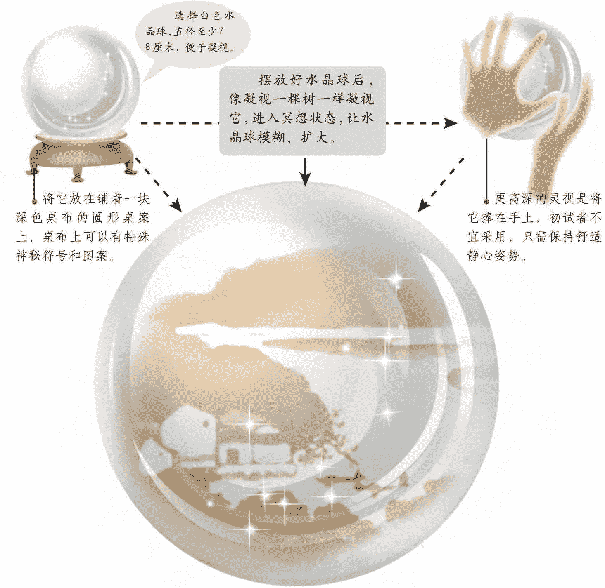

**你在水晶球冥想中看到这幅影像：**

水边的小屋是你自己，你渴望和爱人的关系是屋和树那样亲密而又独立，水的意象是你的事业，你的生命特征大半显现在这一意象中。

**1　探索与沉淀阶段**

把水晶球当成一个池塘、湖泊或盛满水的盆凝视，允许心思飘乱。

**2　询问阶段**

预先准备好问题，或从简单问题开始，如想知道自己的心思、过去的事情、明天的心情……

**3　心理暗示阶段**

让自己受到水晶球白色光芒和光影的催眠，暗示自己一定能得到答案或已经看到答案。

**4　浮现画面阶段**

在清醒与不清醒之间看到有影像在水晶球中浮现。这些影像是你的意识状态的折射，有梦幻色彩。

### 水晶之功效一览

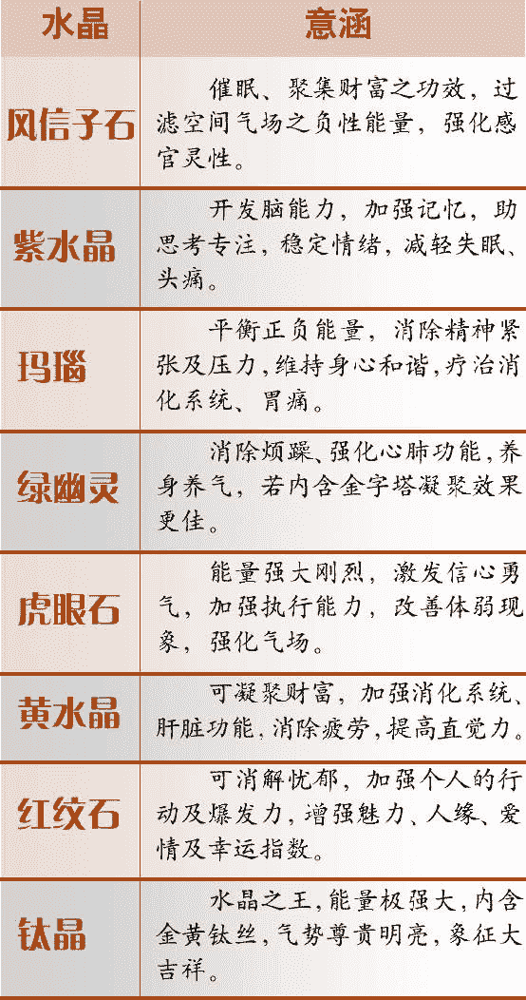

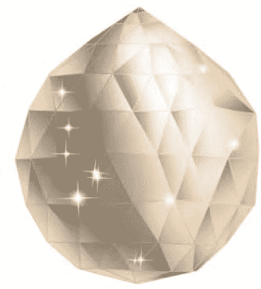

神秘、优雅的**紫水晶** ，呈现洁净、无瑕的质感，象征诚挚、正直与善良。

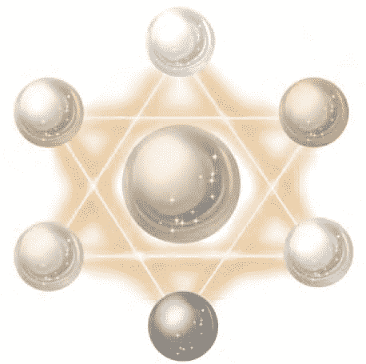

**七晶阵**

改变人体磁场，能强化生命，促进健康，及带来好运。

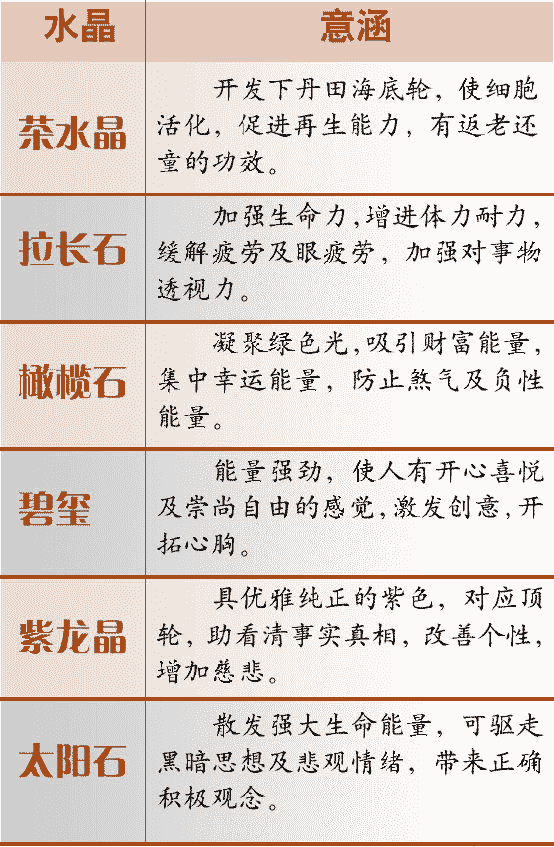

## 神秘术与冥想（一）
炼金术中的冥想

炼金术和瑜伽一样也倡导身体、情感、理智的修行，强调从生活的原点开始，观察自己、认识自己，记得自己的重要性，并走上解脱。冥想就是灵魂炼金之路。

* * *

#### 炼金术的过程就是灵魂进化的过程

炼金术是中世纪盛行的一种神秘术，每个炼金术师千方百计想要制造出贤者之石——它无所不能，不但能炼成黄金，还能让人长生不老，使人类灵性趋向完整，是一颗能达成所有梦想的万能圣石。炼金术师在制造这种“灵丹妙药”的同时，也修炼精神，提升自我灵性。不仅物质（贱金属）炼成黄金，且当灵性不高的人（普通人）超越或高于这一层面，看轻肉体，完全舍弃肉体的欲望，就能实现灵性上升，获得神明创造宇宙的秘术，探究到真知（智慧），这种精神修炼的实质同于冥想的“精神转化”，都把进入意识深层（即无意识领域或深沉的宇宙意识）、唤醒生命自身的力量作为目标，都追求人类灵魂与宇宙合一，和最高神性结合，只是分别通过炼金过程和静坐完成。

#### 炼金术的象征符号揭秘无意识

与其说炼金术师是在寻求炼金的秘密，不如说他们正体验着自己的无意识，从一些奇怪的炼金符号上就能看到他们的精神经历了从蛰伏到苏醒的过程，且涤除了一切杂质才能炼成“宝石”。以树木为例，结成月亮果实的树就是将物质炼成银，结成太阳果实的树就是炼成金。鸟也是象征物，振翅起飞的鸟表示气化、升华；正要降落的鸟表示沉淀、凝固，两者结合表示蒸馏。物质上转铅成金，也意味着精神上从凡到圣。

可见，无意识的内容会以象征的方式投射到那些物质材料上，外部世界与内心世界之间、世俗生活与它的象征领域（梦、幻想、幻象）中，通过这些符号语言进行持续不断的对话。意识和无意识的对立是根本对立，炼金术的任务就是要调和它们，使它们统一。意识必须注意无意识，必须倾听内心的声音。因此整个炼金术的过程也是体验无意识的过程，就是冥想的过程。

### 炼金术的三个阶段

炼金的过程不仅创造点石成金的奇迹，更在于使有智慧的人领悟到真理，而炼金术士也要像禅修者一样，有纯净的灵魂。

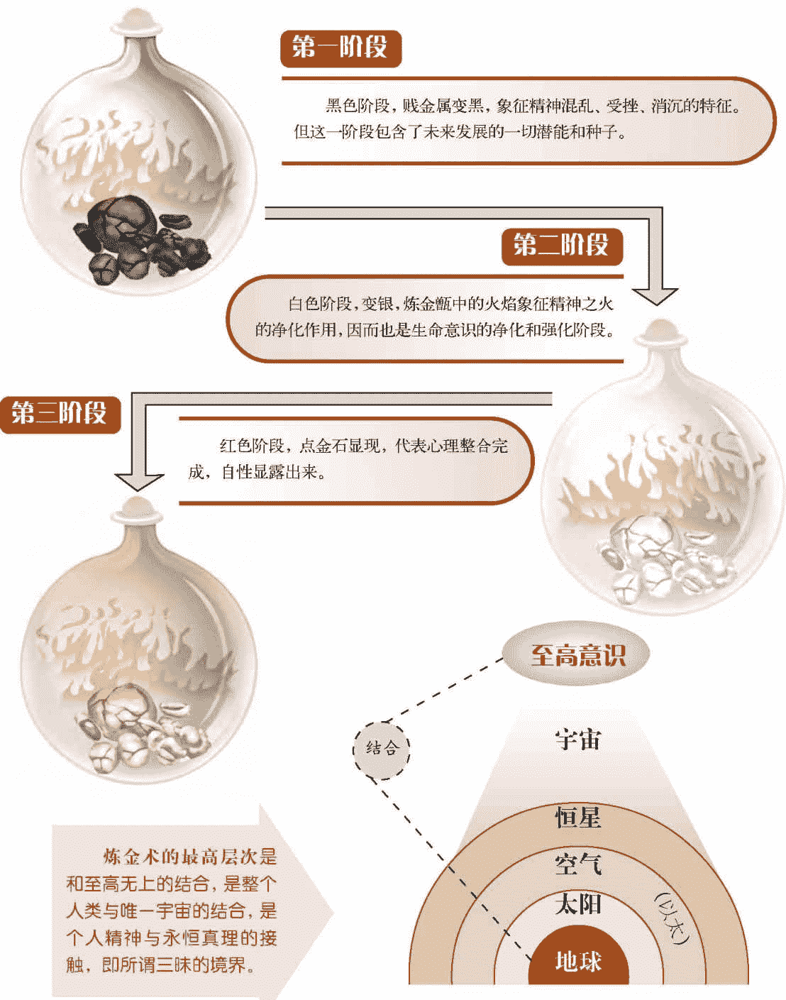

## 神秘术与冥想（二）
占星术中的冥想

古代人相信天体的运动会影响到地上的人类和事物，因此出现占星、占卜，这种把自然天道和人类的行为、精神、命运密切联系在一起的思考，就是占星术式的思考。

* * *

#### 预言的“智慧”

对着水晶球冥想，然后预言未来的命运，就是一种占星术式的思考。早在古埃及时代，酷爱天文学的埃及祭司就通过观察天象冥想，将“天”的某些运行规律和人间气象对应，按天行之象确定人间的信仰——奉信的神灵、对象。中国道家的“存想”（即一种通过想象，集中意念，能达到治疗作用的静功方法）也经常观察天象，并把阴阳五行的观念用于观察、判断和治疗中。这种将对物质自然世界（如天体的运行及天象）的观察结论，和人的精神品质、品性及未知命运等联系在一起的占星术式的思考，就是冥想时我们通过一些无意识信号之类的暗示，开启自我灵性的思维方式，也常常是声称能运用某种神秘法则预知未来的人的思维方式。

#### 运用“占星术”自我观察

古今中外的占星术有很多经典划分，包括太阳、月亮及五大元素、九宫图、十二宫等，这些知识并没有淡出我们的生活，如五大元素所对应的金木水火土五行与中医学紧密联系，十二宫对应的十二星座常被作为性格测试的依据，太阳和月亮作为阴阳之代表，常与人的调息、身体特征相关。占星术的知识不一定是非常客观、科学的，但可以作为冥想时自我观察并判断的参照。

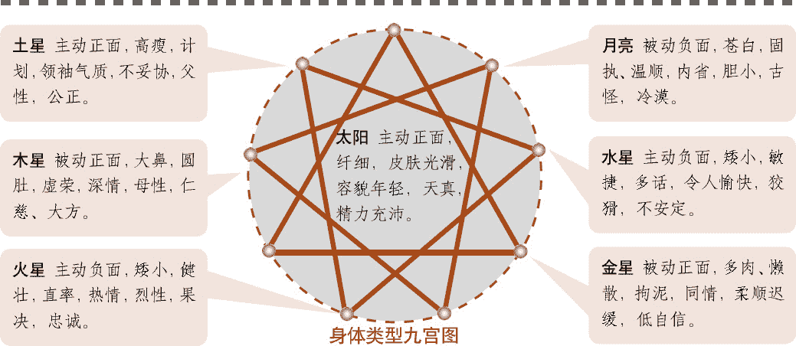

### 关于身体和精神的占星术冥想

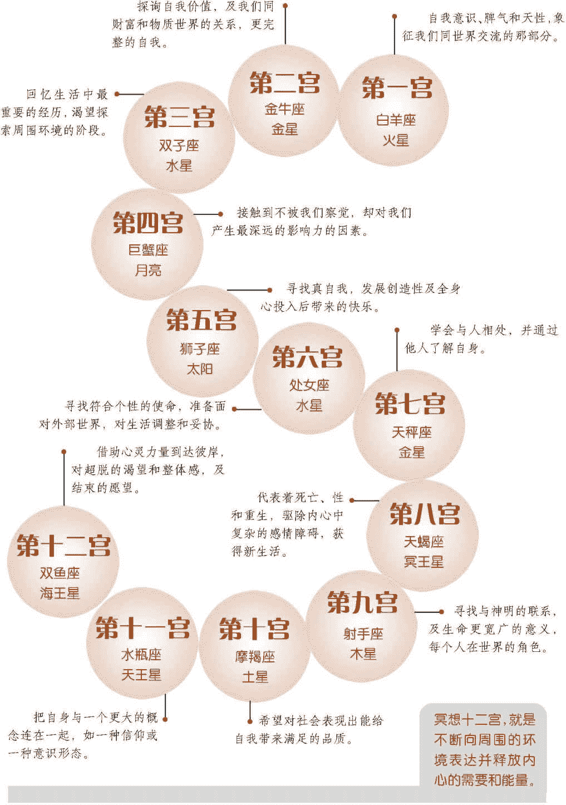

## 神秘术与冥想（三）
塔罗牌中的冥想

塔罗牌是一种象征图像系统，能针对恋爱、健康、财运、婚姻等不同需求占卜，是西方著名的占卜道具，现在常作为反映个人生活的工具，及帮助人们去沉思考虑事物。

* * *

#### 塔罗牌用于精神分析和占卜

塔罗牌被广泛视为一种纸牌占卜的形式，总共有 78 张，由 22 张图画牌与 56 张数字牌组合而成，每张纸牌都有它独特的图案和意义。心理学家荣格把人类意识深处普遍相通的东西称为精神原型，他认为人的基本类型或境遇都隐含在人类所有的潜意识行为里。塔罗牌中的图案就是这种有象征性的原型，如“国王”象征最高权威或父亲的形象，“宝剑”象征力量，满足人渴望保护和安全感的愿望。另外，塔罗牌中常出现“高贵人坐的椅子”，它使人联想到“权力”、“金钱”、“名誉”等，这也是图案刺激人的深层心理，即借着塔罗牌所描绘的原型意象，能使存在于人类心底深处的无意识领域活性化。

用塔罗牌占卜近似于一种“心理游戏”，由于塔罗牌隐含着与人类深层心理密切相关的意涵，在看到图案时所产生的无意识心理活动，会不知不觉把你的“真心”或愿望表露无遗，因此占卜活动就是一个精神分析的过程。在冥想的状态中发现塔罗牌图案中隐藏的“自我的秘密”，就是一次借助原型意象进行的灵魂的剖析。

#### 神秘图案的象征意义

更神秘的说法是，塔罗牌中的图案象征着我们随时都会遇到及发生的事，人生的一切都在塔罗牌图案中表现出来。这和人类心灵的两层表现有关，即表层“直接的自己”和不常表现出来的“另一个自己”，一是我们对生活的直接反应和外部的特征；一是无意识中深藏的自己，更能影响人的命运及对事情的真实感受和判断。

当人在塔罗牌冥想中提问时，那一个反映人的愿望（倾向）的自己就会回答：如一幅图片描述了港口遥远处有一只客船冒烟，内心深处想出国旅行的人就会回答“出港”，渴望归家或心中期盼见到某人的就会回答“进港”。

### 塔罗牌冥想

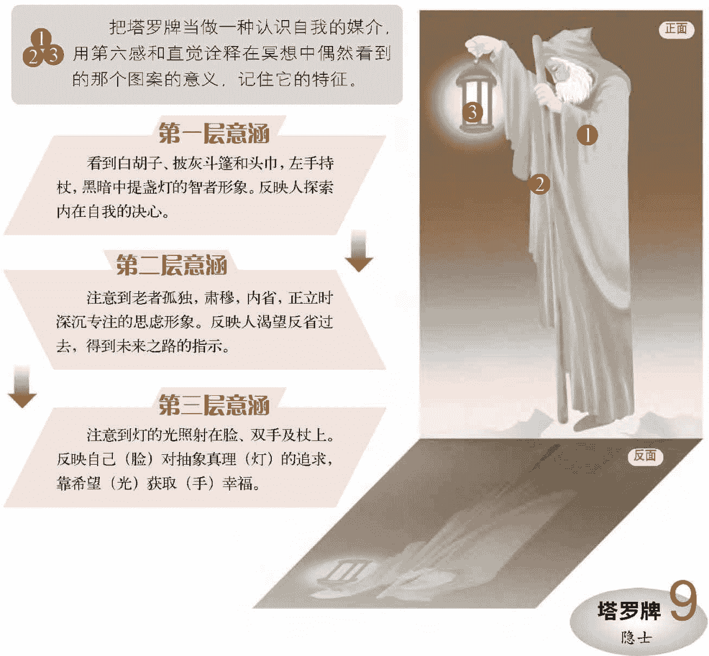

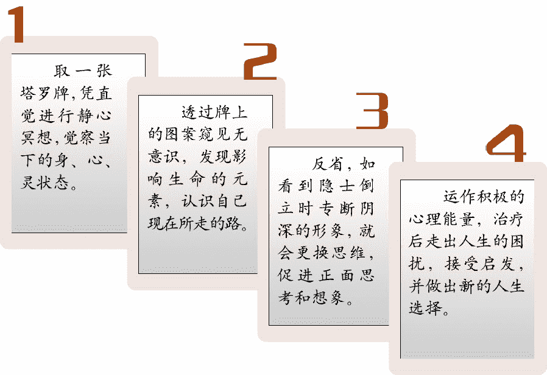

# 附录

### 名词术语

**1．冥想：** 是通过禅定达到内在精神发现及内在能量觉醒的具体方式。它需要意念坚定，专注一个对象，把精神集中在内在，去发现内在的爱与智能，喜悦与和平的源泉，最终目标是达到和宇宙意识合一的境界。

**2．瑜伽：** 源于梵文音译，有“结合、联系”之意，为达到冥想而集中意识之义。完整的瑜伽体系包括三部分：呼吸、体位（即身体保持的姿势）和冥想，又依次称调息、调身、调心“三调”。

**3．跏趺：** 盘腿而坐，脚背放在大腿上，是佛教徒的一种坐法。

**4．梵行：** 古印度婆罗门教僧侣从师学习阶段，后来在佛教中泛指摆脱世俗执著的清净生活。

**5．禅定：** 就是心住一境，不随物转，放下一切，达到解脱。佛教将使精神返观自身称做“禅”，心内清楚明了的安住叫做“定”。

**6．禅修：** 将扰乱内心平衡及安住的思想放下。禅修时，心保持开放、轻松，不涣散地安住在当下的觉知之中。

**7．三密：** 即身（肉体）、口（言语）、意（心灵）三密，手结印契（手部动作）为身密，口诵真言为语密，心观本尊之法相为意密。

**8．心观：** 在密宗修炼中，以各种各样的冥想方法，抑制心灵，使它平静、专注一心，培养注意力和直觉，是这种修炼的特征，称为“心观”或“观想”。

**9．空寂：** 从空间上表佛的清净无垢的世界，即禅的心灵世界；又是一种禅的意境，即心空和寂静。要有空寂的心必须清理心中无用的杂念，如贪心、焦虑。

**10．潜意识：** 相对于“意识”而言，心理学上指不知不觉、没有意识的心理活动，或是指潜藏在我们一般意识底下的一股“神秘力量”，又称“右脑意识”、“宇宙意识”。

**11．无意识：** 是现实中得不到满足的本能冲动和欲望，被意识所压抑着，只能在暗中活动。或者是一种“不费脑力”的心理活动，当人们用无意识思考问题时，不会感到疲劳，反而更有创造性。

**12．自性：** 心理学家荣格解释自性是心、性或本性，是心灵的中心。

**13．意象：** 指客观形象反映到主观心灵上，融合了某种意蕴与情调的东西，想象出来的具体画面也叫意象，常包含了个人心灵的某些特质。

**14．开悟：** 是探索到生命的真相之后的状态，包含呈现真我、身心合一、自我驱动、树立人格、忘我境界五个层次。

**15．α脑波：** 就是当你放松身心，入定沉思时的脑波。它以每秒八至十二的周波运行着。当你在做白日梦或冥想时，脑波就呈现这种模式。此时你是处于放松式的清醒状态中。

**16．咒语：** 是语言禁忌发展到极点，达到灵物崇拜程度的结果。咒是口头语言禁忌，平时禁止使用，一经使用，就具有超自然的力量。

**17．超灵：** 是一种超验主义的概念，它强调万物本质上的统一，万物皆受“超灵”制约，而人类灵魂与“超灵”一致。

**18．超觉静坐：** 静坐时必须心无旁骛，专注于重复咒语，久之将自己身心带入一种沉静的境界。在沉静的境界中，得以消除心理上的紧张和生理上的疲劳，可作为自助式的心理治疗。

**19．催眠术：** 是运用暗示等手段让受术者进入催眠状态，并能够产生神奇效应的一种法术。催眠是以人为诱导（如放松、单调刺激、集中注意、想象等）引起的一种特殊的类似睡眠又非睡眠的意识恍惚心理状态。

**20．第六感：** 常常是指一种直觉，最原始、最基本的感觉，又名为“动物直觉”。这种直觉超过了人类的视、听、嗅、味、触五种感觉，是逻辑判断和理性所不及的。

**21．观想：** 可分为两种方法，一种是宗教的方法，另一种是非宗教的方法，有宗教信仰的人通常观想宗教上精神皈依的神，而没有宗教信仰的人可以观想一轮皎洁的明月在心中。

**22．入静：** 指在思想安静、意念集中的基础上出现的清醒及保持意念专一、轻松舒适的一种境界。

**23．正念：** 就是把注意聚焦在当下事务，它能产生精力、头脑清醒和快乐。

**24．觉知：** 是观察当下，不要做出反应，不去压抑、批判，不去分析，更不要做任何行为。真正的觉知是没有紧张的，放松的。

**25．内观：** 是佛教用来观察自身及净化身心的一个过程。开始时，借着观察自然的呼吸来提升专注力；等到觉知渐渐变得敏锐之后，就观察身和心不断在变化的特性，体验无常、苦以及无我的等无处不在的真理，自然就慢慢离欲，从中体验到安详、满足、愉悦。

**26．全观：** 就是当它出现时，你我之分就不见了，二元对立也消失了，观者与所观之物的分界因此而消融。

**27．脉轮：** 是指分布在人体中的七个能量中枢，分别为头顶、眉间、喉头、胸口中央、肚脐附近、下腹部和尾骨。

**28．三昧：** 指禅定境界，是心定于一处而不散乱；与所观境冥合，分明了知，而悟得真理的状态。

**29．心灵感应：** 是一种将某些讯息透过普通感官之外的途径传到另一人的心中的能力，又称心电感应、他心通、犀牛角。

**30．放松：** 在做静坐冥想时，必须要放松肌肉，放下内心的挣扎，但放松不可以到懒散、昏昏欲睡的地步。

**31．调身：** 一般所讲调身的主要方法，是指打坐时的坐姿。调身最重要的原则是安适，因此环境宜安静，空气流通但避免风直吹，光线柔和，不宜太亮或太暗，太亮容易分心，太暗容易昏沉；此外要注意身心放松，衣着宽松，两膝应包裹暖和。

**32．腹式呼吸法：** 包括顺腹式呼吸法和逆腹式呼吸法两种。前者指吸气时腹部隆起，呼气时腹部缓慢回收；后者指吸气时腹部轻轻凹陷，呼气时腹部放松还原。

**33．气功静坐：** 采坐姿时，双手分别放在两膝盖上，舌头抵住上颚，专心一意进行静坐；躺着时，双手平放于床上，舌头亦抵住上颚进行静坐。

**34．炼金术：** 是中世纪的一种化学哲学的思想和实践，是精馏和提纯贱金属，并炼成黄金的行为。炼金术士相信，它是一道经由死亡、复活而完善的过程，象征了从事炼金的人的灵魂由死亡、复活而完善，最终达到与造物主沟通。

**35．占星术：** 是古代根据天象来预卜人间事务的一种方术。它满足了许多人对他们目前或未来的状况的超自然的、形而上学的解释的需要。心理学家荣格等人将西方占星学与心理占星结合起来，用来分析人的性格和心理。

**36．塔罗牌：** 是一种象征图像系统，共有 78 张纸牌，分为 22 张大阿尔克那和 56 张小阿尔克那。大阿尔克那代表的是圣、天界、抽象而伟大的观念，小阿尔克那代表的则是俗、凡人、芸芸众生、具体而实际的日常处境、心境。它目前被使用为反映个人生活的工具，以及帮助人们去沉思考虑事物。

责任编辑／周宏

装帧设计／