# 图解吸血鬼.

## 100项吸血鬼相关知识集于一书！

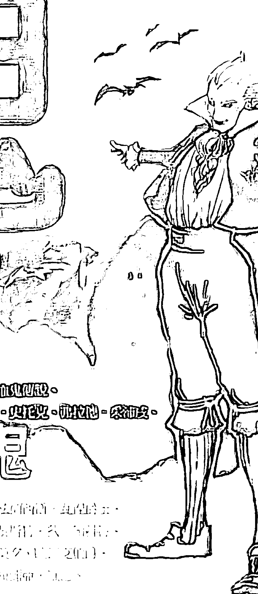

图解吸血鬼相关人物、历史、知识
一册在手，清楚明了！

## 消灭吸血鬼的正确方法

- 1. 找到沉眠中的吸血鬼
  - 活用线索发现吸血鬼的藏身处
- 2. 选择时间带
  - 月亮盈满的时刻
- 3. 选择有效的方法手段
  - 用木桩钉入心脏是经典有效的方法，但现代也有银制子弹等方法。
- 4. 选择场所
  - 吸血鬼在巢穴中活动，将其诱出并在有利场所解决。
- 5. 务必实行消灭吸血鬼

本章作者
森濑 缭
猎川龙宗

译者简介
王书铭
辅仁大学日文研究所毕业。
翻译作品：《召唤师》、《魔法的十五堂课》、《图解炼金术》、《图解近身武器》、《图解太空船》、《图解克苏鲁》（以上皆为奇幻基地出版）。

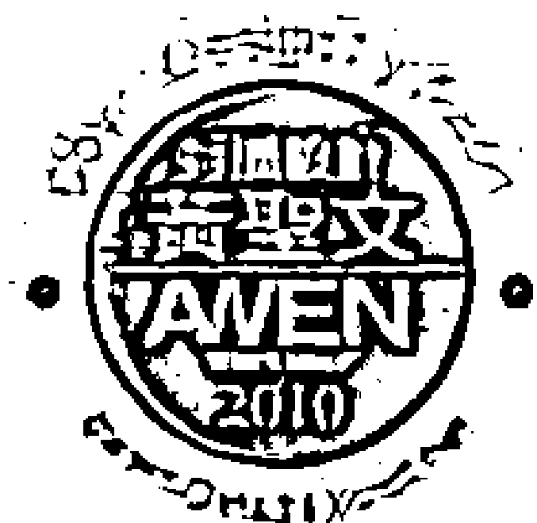

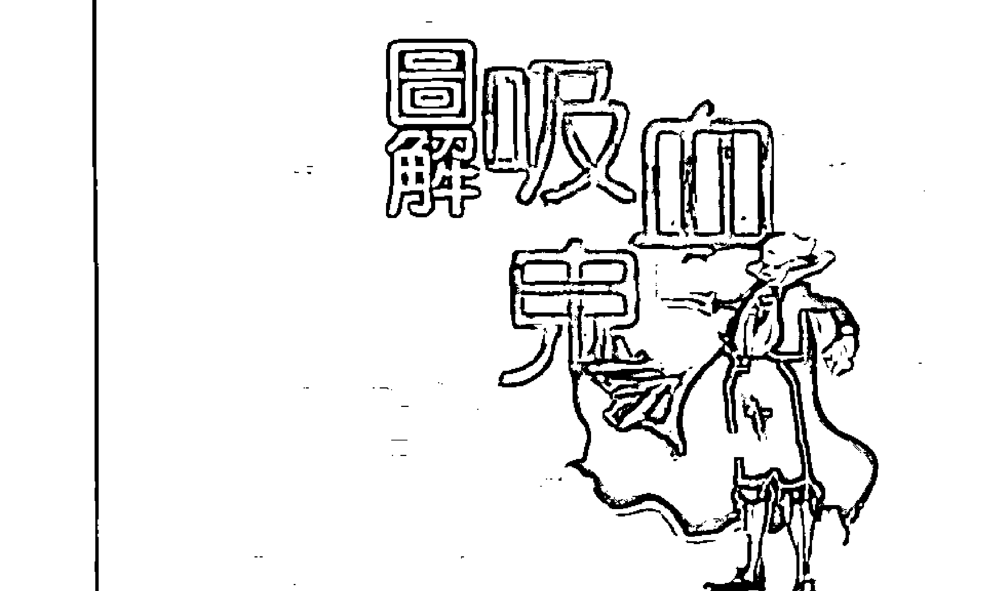

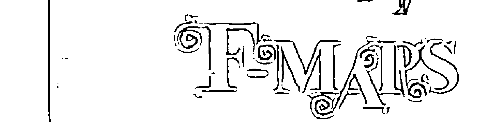

手持幻想地图，踏入知识满载的奇幻旅程。

**已出版：**

- **图解炼金术**
  草野巧 ◎ 著
  2007年7月出版／售价300元
- **图解近身武器**
  大波真理 ◎ 著
  2008年5月出版／售价280元
- **图解太空船**
  称名寺明雄、�的村明 ◎ 著
  2008年12月出版／售价300元
- **图解魔法知识**
  羽仁礼 ◎ 著
  2009年6月出版／售价300元
- **图解克苏鲁神话**
  赖明雄 ◎ 著
  2010年6月出版／售价520元

## 前言

吸血鬼。这个字眼映入眼帘的时候，脑海中会浮现出什么模样的怪物呢？月光暧暧的夜里，拨开阵阵霉味的泥土起身，为寻求生命的温度而出现在村落的亡者。这个恶魔每夜出现在被害者枕边，带来缓慢的死亡。披着漆黑天鹅绒长外套的黑夜贵族，赐予人们人世间尝不到的无上快乐，并慢慢夺取其血液作为代价。自从源自东欧边境的“VAMPIRE”一字在18世纪急速扩散至欧美诸国以来，自从英国人伯兰·史托克创造出拥有不祥吸血鬼德古拉伯爵以来，就有无数吸血鬼现身于文学、戏剧以及影像作品里。

吸血鬼是面反映人类社会的黑暗镜子。吸血行为，以及藉吸血增殖的闇黑种族这两个隐喻手法，有时正暗示着倒错性行为与随之而来的性快感，或者又被视为散播死亡不分贫富贵贱的疾病之象征。有人认为吸血鬼象征剥削市民的堕落特权阶级，但相反地，也有人认为吸血鬼是反教会、反政府的反英雄。此外，现代人对素不相识的旁人之不信任感，也跟都市阴暗死角不断增殖的吸血鬼恐慌有所相通。

就像我们无法用一个单字来说明现代社会一样，相同地我们也无法找到一个简洁扼要的字，能够完全说明吸血鬼这种非人的怪物。即便如此，本书为究明吸血鬼此存在之本质，参考前人研究成果并尽可能地分割研究对象，尽力整理出吸血鬼是如何在人们心中形成如今这种充满矛盾的图像，并且用浅显易懂的方式作个解说。

此外，本书第2章以后所介绍的吸血鬼、敌对者以及相关组织，主要是以对后世作品之影响力为标准而选定。囿于总项目数量的限制，可能无法囊括许多广受喜爱的作品，还请读者诸君见谅。

# 目录

## 第一章 吸血鬼概览

- No.001 德古拉伯爵 8
- No.002 东欧的吸血鬼传说 10
- No.003 吸血鬼的特征 12
- No.004 吸血鬼的弱点 14
- No.005 如何消灭吸血鬼 16
- No.006 “VAMPIRE”的确立 18
- No.007 吸血的怪物 20
- No.008 活死人 22
- No.009 基督教的血液信仰 24
- No.010 东方正教与罗马天主教会 26
- No.011 狼人 28
- No.012 女巫 30
- No.013 黑死病与过早的埋葬 32
- No.014 彼得·普罗戈约维奇与阿诺·鲍尔 34
- No.015 吸血鬼论争 36
- No.016 浪漫主义中的吸血鬼文学 38
- No.017 日内瓦湖畔事件 40
- No.018 廉价恐怖小说 42
- No.019 《吸血鬼德古拉》 44
- No.020 弗拉德·采沛戎 46
- No.021 布拉姆·史托克 48
- No.022 饰演德古拉的演员 50
- No.023 欧洲的吸血鬼 52
- No.024 美洲的吸血鬼 54
- No.025 中东与非洲的吸血鬼 56
- No.026 印度与东南亚的吸血鬼 58
- No.027 中国的吸血鬼 60
- No.028 日本的吸血鬼 62
- No.029 吸血杀人魔 64
- No.030 伊利莎白·巴托里伯爵夫人 66
- No.031 吉里·德·莱斯男爵 68
- No.032 约翰·乔治·海尔 70
专栏：日语“吸血鬼”的由来 72

## 第二章 吸血鬼淑女录

- No.033 法兰西斯·瓦涅爵士 74
- No.034 鲁斯凡爵士 76
- No.035 卡蜜拉·卡恩斯坦 78
- No.036 马格努斯·加尔迪伯爵 80
- No.037 康拉德·渥肯 82
- No.038 拉度·莫拉萨子爵 84
- No.039 威利·包尔舍特上校 86
- No.040 黎斯特·狄·赖科特 88
- No.041 约书亚·约克 90
- No.042 热内维埃夫·桑德琳·狄丽·迪厄多内 92
- No.043 欧罗克伯爵 94
- No.044 拉弥亚·维达 96
- No.045 神代绘里香 98
- No.046 灵·克洛克伯爵 100
- No.047 玛利亚·莎丽丝卡伯爵夫人 102
- No.048 杰利·丹吉 104
- No.049 范斯劳·德古拉伯爵 106
- No.050 号伽弥多罗 108
- No.051 音无小夜 110
- No.052 索尼娅·布卢 112
- No.053 大吸血鬼 114
- No.054 爱尔奎特·布伦史塔德 116
- No.055 远野秋叶 118
- No.056 戈耳工三姐妹 120
- No.057 戴米特里·玛基希摩夫 122
- No.058 默邱列里·乔凡尼 124
- No.059 城岛月子 126
- No.060 范碧芮拉 128
- No.061 阿尔卡特 130
- No.062 迪奥·布兰席 132
- No.063 戴·亚蒙伯爵 134
- No.064 艾多加·波特尼尔 136
- No.065 布拉杜伯爵 138
- No.066 江藤闇世 140
- No.067 美夕 142
专栏：“不死之人” 144

## 第三章 西欧血脉 145

- No.068 伊西斯与奥赛利斯 146
- No.069 德古拉的子女 148
- No.070 神祖与贵族 150
- No.071 红蔷薇结社 152
- No.072 II世界与“贵族” 154
- No.073 吸血鬼与吸血魔 156
- No.074 II伯爵的—— 158
- No.075 一户山邱幽住宅的居民 160
- No.076 拓乳酒吧 162
- No.077 恩 J 164
- No.078 II族人 166
- No.079 II神的死亡游戏 168
- No.080 II白的血的—— 170
- No.081 I吸血鬼 172
- No.082 I II（Vampire）猎人与被狩猎者 174
- No.083 高城家 176
专栏：吸血鬼研究中心 178

## 第四章 吸血鬼猎人 179

- No.084 亚伯拉罕·凡·赫辛教授 180
- No.085 夏洛克·福尔摩斯 182
- No.086 泰拉玛斯卡 184
- No.087 罗勃特·内维尔 186
- No.088 查理·彭宁顿·波尔格 188
- No.089 吸血鬼猎人D 190
- No.090 亚伯·奈特罗德神父 192
- No.091 欧文·夜行者少校 194
- No.092 桑多神父 196
- No.093 威廉米娜·莫瑞 198
- No.094 刀锋战士 200
- No.095 埋葬机关 202
- No.096 贝尔蒙多家族 204
- No.097 莫拉 206
- No.098 皇家国教骑士团 208
- No.099 法皇厅特务局第十三课 210
- No.100 乔斯达家族与史彼特瓦根财团 212
- 中英日名词索引 214
- 中英名词对照表 219
- 参考文献 226

# 第1章
## 吸血鬼猎人

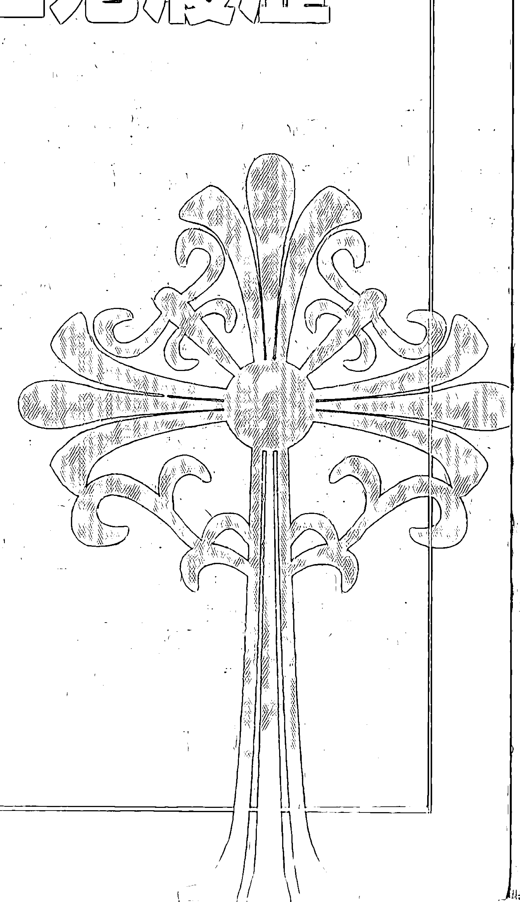

## No.001
### 德古拉伯爵
Count Dracula

剧作家布拉姆·史托克笔下，生自中世黑暗荒芜、亡于近代开化之光的《吸血鬼德古拉》，乃是吸血鬼中的吸血鬼。

## ☆ 吸血鬼德古拉

维多利亚朝大英帝国中，知识分子厉夏洛克·福尔摩斯风靡、世人为“开膛手杰克”胆寒，另有因小说《吸血鬼德古拉》而成为吸血鬼代名词的德古拉伯爵，是作者布拉姆·史托克参考几部先行作品和真实历史人物——罗马尼亚领主弗拉德·采沛成传说所创造出来的不死怪物。原作里的伯爵高瘦颀长，高耸的鹰钩鼻与颧颚使五官显得粗犷而冷酷，更有极惹人注目的恶态赤红血唇与狰狞雪白犬牙的强烈色调对比，俨然像只野兽；后来历经许多广受好评的戏剧、电影，方才发展成今日的固定形象——一头高耸黑发、身穿黑色晚礼服酷似蝙蝠的洗练贵族，甚至成为众人心目中的“第七艺术”*男主角。

时值19世纪末，居住在中世迷信色彩仍然相当浓厚的外西凡尼亚的德古拉伯爵，想要移居至工业革命后的近代英国，于是便在伦敦购买房产。德古拉家是罗马尼亚的大贵族，他们在赫曼修逊特的道场代代传承世袭魔法的技艺，出过不少有“恶魔”恶名的人物，是个被诅咒的家族。

伯爵从东北方的惠特比登陆英国后，陆续将魔爪伸向维斯坦罗家的千金露西等英国人，并逐渐增加可任其摆布的不死棋子。然而，伯爵的真实身份还是被曾在德古拉城有过骇人体验、费尽辛苦才生还的律师强纳生·哈克、爱慕露西的三个男人，以及博学的荷兰学者亚伯拉罕·凡·赫辛教授等人揭穿，不得已只能逃离英国，最后被追到了外西凡尼亚。讽刺的是，毁灭他的既非近代科学亦非神的制裁，而是最原始的暴力。

> * 第七艺术：乃指电影。第一到第六艺术依序是：音乐、舞蹈、绘画、雕刻、戏剧、建筑。

## 德古拉伯爵登陆英国

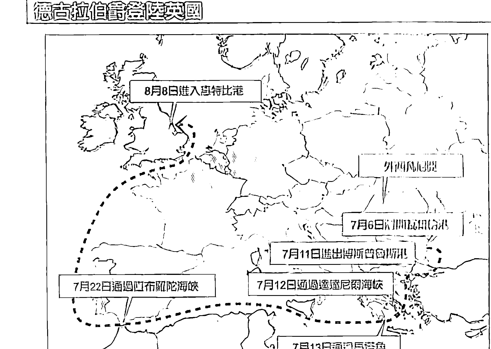

## 德古拉伯爵与赫尔曼教授的对抗

### 19世纪末潜入大英帝国的吸血鬼

| 日期 | 德古拉伯爵 | 赫尔曼教授 |
|------|------------|------------|
| 8月6日 | 乘坐德特号登陆英国 | |
| 8月11日 | 吸血鬼 | |
| 9月29日 | 德古拉伯爵伪装成狗进入伦敦 | |
| 10月3日 | 破坏德古拉伯爵位于伦敦的住所 | 德古拉伯爵 |
| 10月14日 | | 出发前往外西凡尼亚 |
| 11月16日 | | 抵达德古拉城 |
| 11月10日 | 埋伏德古拉伯爵 | |

相关作品
- 《吸血鬼德古拉》 No.019
- 弗拉德·采佩什 No.020
- 亚伯拉罕·凡·赫尔曼 No.084
- 约翰·史托克 No.021
- 布拉姆·斯托克 No.085

### No.002
## 东欧的吸血鬼传说
The Legend of Vampire

在《吸血鬼德古拉》揭开序幕的舞台——东欧，自古便有吸血鬼传说流传于民间。

## ☆ 德古拉的摇篮

虽然德古拉伯爵只是布拉姆·史托克将罗马尼亚勇将塑造成吸血鬼的虚构作品，但东欧地区其实自古就有吸血鬼传说流传，并且和基督教信仰紧密结合、深植民间。
东欧吸血鬼传说的核心，就是迟迟未见腐烂、容貌仍与生前无异的尸体。根据基督教的说法，人类的肉体是神集尘土造来容纳灵魂的容器，死后当须归于大地；天主教埋葬死者时唱诵的祷词“尘归尘、土归土”，亦反映了前述基督宗教教义对人类肉体的解释。然而，尸体有时会因为棺柩密闭空间里空气滞塞而迟迟没有腐烂，有时则是因为地质环境而产生尸蜡化现象，诸多要因致使不腐死尸时有所见，并且被当作吸血鬼。这些不腐死尸传说之所以会集中发生于东欧诸国，其实东方正教在安葬后一段时间将尸体掘起、移地再葬的改葬风俗也是个相当重要的因素。此外，东方正教认为悖离神旨之人，如自杀或死刑犯等非自然死亡者、被逐出教会者，肉体不得归于尘土；此教义和改葬时发现的不腐死尸结合，四处游走索人鲜血以维持生命的吸血鬼传说于焉成型；而教会本身亦积极地活用这些罗马尼亚称作莫罗伊、巴尔干半岛称作维科拉加思、维科多拉克的行尸民俗，作为一种推广基督教的恫吓力量。
此外，罗马尼亚另有只外型似鸟、日落后出没吸人鲜血的史特雷哥吸血鬼传说。

## 东方正教信仰圈

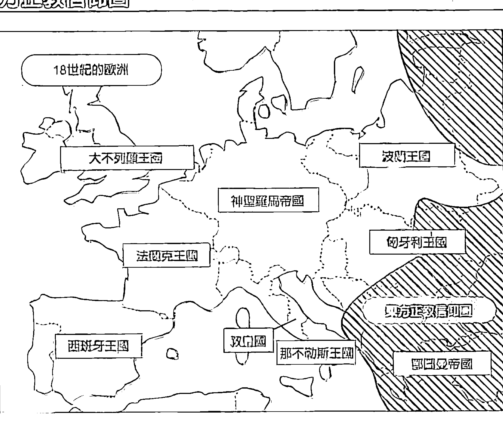

## 东欧民间传说与基督教

西方民间传说

东方正教

地祇、恶灵等条件造成的
「不死鬼」

信仰
「死后的魂的救済」
「背徳神示者は地狱に落ちる」

互恵共生

利用民间传说而布教

（图中左侧流程部分，描述具体关系）

（西方民间传说与东方正教的互动融合，最终形成东欧独特的文化形态）

### No.003
## 吸血鬼的特征
Vampire's Character

此节乃参考小说家创作德古拉伯爵所依据的东欧吸血鬼传说，就吸血鬼的主要特征作简要的解说。

## ☆ 茹血为生者

所谓吸血鬼，其实就是指人类一旦死亡后、从坟地里再度复苏的不死怪物。他们不能在日间活动，会与其他死者同眠于棺柩之中，直到入夜才爬出坟外，趁人入眠时偷袭和自己生前有交集的人，夜夜啜饮鲜血直到不幸的被害者死亡。吸血鬼的皮肤苍白有如死尸，唯有嘴唇像是染上受害者鲜血一般地赤红。他们有如神魔般的力童、能迷惑他人而无男女老幼之分，被害者一旦被引入室后就再也不能抗拒其再度造访，最后自己也成为找寻鲜血而游走在夜里的死人。据传罗马尼亚与希腊传说中有两个心脏的吸血鬼史特雷哥能够变成魔鸟，而吸血鬼也有类似特征；东欧的狼人有时亦被视同于此，是以鲁斯凡爵士之后的不少吸血鬼都有狼或蝙蝠等兽类随侍，到德古拉伯爵甚至有变身成黑犬或蝙蝠的兽化能力。作品中的吸血鬼已不只是从坟里复苏的死者，而被塑造成获得恶魔恩宠的怪物，不但拥有可与数十人匹敌的怪力、惊人的自我治愈能力，且唯有用经过圣别的银制品等特殊武器才能伤害吸血鬼被诅咒的肉体。

经历人我死亡的吸血鬼是种不完全的存在，他们必须透过摄取生命力能源——活人温热的血液，才能维系灵魂与肉体不致剥离。人类自古就相信镜子具有映出灵魂的力量，但是吸血鬼的灵魂无法紧密地和肉体结合，所以镜子无法照出其模样，也不会有影子。相片同样也照不出来，不少以此为题材的作品经常会利用镜子、照相机作为辨别吸血鬼的重要道具。

> > 注：基督教为某些神圣用途，含藉由仪式来净化人或物，以与普通世俗的用途区别。

## 吸血鬼的特殊能力

- 吸血鬼
  - 多种迷惑人类的能力
  - 吸取人血鲜血
  - 控制被吸血的数小时
  - 怪力、迅速的伤口回复能力
  - 治愈能力
  - 超自然视觉、听觉、力量
  - 变身成动物的能力
  - 将身体化作云雾
  - 控制天气
  - 长生不老

## 如何分辨吸血鬼

吸血鬼有许多不自然的特征

| 特征 | 描述 |
|------|------|
| 饮食 | 只吸血不进食 |
| 镜子 | 照不出吸血鬼的模样 |
| 影子 | 吸血鬼没有影子 |
| 活动时间 | 吸血鬼不会在白天出现 |
| 牙齿 | 狼牙般的尖锐牙齿 |## 吸血鬼的弱點

吸血鬼遁身於人目不能及的黑暗裡，為飲腥臭鮮血而現形。先人們已經調查過吸血鬼的弱點，以防患於未然。

## 阿基里斯的腳踝

阿基里斯的腳踝、貝奧武夫的腋下……神話中不死的英雄們都有致命弱點，不死的怪物吸血鬼同樣也有許多天生的弱點，可以防止他們過度的快速繁殖。

吸血鬼乃因悖離神的教義始得復甦，他們會對十字架、聖像項墜等具強烈信仰力量的聖具產生抗拒反應。高位階主教聖別*過的聖餅聖水也能驅逐吸血鬼，是能夠灼傷吸血鬼不滅肉體的強力武器。早在希臘神話裡吸血怪物拉彌亞的時代，人類就相信發出刺激性臭味的植物能使惡靈惡鬼不敢接近，具有驅邪的效果；尤其用來殺菌食物的蒜頭驅魔效果更佳，東歐現在還能發現有些人家會在門前掛串蒜頭。中國的吸血鬼殭屍也害怕蒜頭，甚至還有研究者主張這種俗信其實是從東歐經由絲路傳至中國的。另外，同樣具有殺菌作用的銀製品亦有淨化魔物的法力，這也是為何唯有銀製的武器才能傷害吸血鬼與狼人。

野薔薇藤蔓、罌粟種子等長有尖刺的植物亦有除魔效果，民眾為使吸血鬼不能接近，有時會用生有棘刺的野薔薇製做十字架，有時則是會在墓地連接村裡的道路撒滿罌粟的種子。吸血鬼厭惡陽光，白天都躲在棺樞裡；當他們離開當初被埋葬的墓地時，就必須準備鋪著該墳墳土的棺樞，才能睡在棺材裡。

另外，民間還相信若是無人召請吸血鬼就無法進入別人家里，這也算是吸血鬼喜歡攻擊生前認識之人的理由之一。除此之外，其行動範圍亦有不少限制，譬如無法渡過流水等。

>* 聖別：請參照第012頁註。

## 具神力的物品

十字架、聖瓶、驅符、聖水等

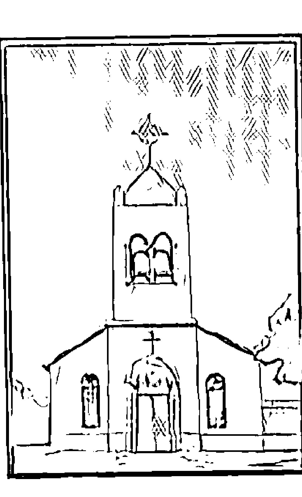

## 討厭的植物

蒜頭、山楂、野薔薇藤蔓、罌粟種子等

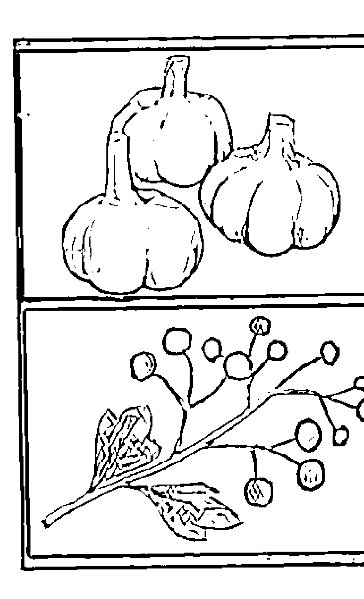

## 厭惡陽光

白天必須躲在棺裡停止活動

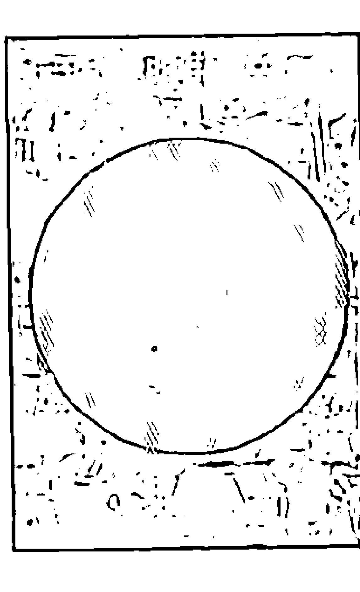

## 如何擊退吸血鬼

### 擊退吸血鬼的方法

消極的

- 佈滿吸血鬼的十字架
- 用銀製十字架掛在門口
- 小動物的血可以嚇阻吸血鬼

積極的

- 白晝開棺
- 用聖別過的木樁打進吸血鬼的心臟
- 在吸血鬼嘴裡塞蒜頭
- 砍下吸血鬼的首級
- 火化後把灰燼流入河裡

## 如何消滅吸血鬼

吸血鬼是不畏神明，就連死亡都摒棄的超常存在。然而，消滅吸血鬼卻絕非不可能。

### ☆消滅吸血鬼

想要消滅吸血鬼，首先必須要找到在墳墓裡長生不死的吸血鬼。白馬對吸血鬼等魔物非常敏感，只要接近吸血鬼潛伏的墓地就會大聲嘶鳴、揚起前腳霍地人立，反應極為強烈。找到吸血鬼以後，消滅他們的最佳時機，當屬陽光普照、吸血鬼動彈不得的白晝最為理想。最有效的方法則是用樺樹或山楂樹削製的木樁刺穿吸血鬼的心臟、牢牢釘在地上使其無法再次起身。被木樁刺殺後，吸血鬼體內會流出大量鮮血，最後靈魂與不死肉體剝離，才會真正的死亡。火燒吸血鬼也是另一種方法，但想要完全消滅擁有駭人回復能力的吸血鬼，必須選在十字路口或三叉路口才行；十字路口與三叉路口等地乃道路的分歧點，非常接近現世與彼世的界線，自古就是神靈經常出沒的場所。

在這種靈流動頻仍的場所，吸血鬼原本被詛咒束縛在死者肉體上的靈魂特別容易剝離。吸血鬼被砍下首級同樣也無法再度復活，但是若將首級置於頸脖附近，吸血鬼就會恢復原狀，所以必須將首級放在屍體的腳邊。由於被吸血鬼襲擊的被害者死後也很可能會變成吸血鬼，因此埋葬前必須施以相同處置。

根據吉普賽傳說，人類與吸血鬼生的半吸血鬼天生就具備足以對抗吸血鬼的特殊能力。斯拉夫傳說中的吸血鬼獵人亦背負著必須與吸血鬼作戰的命運；據傳吸血鬼是裹著紅色羊膜出生的，而斯拉夫的吸血鬼獵人則是裹著白色羊膜出世的。

### 消滅吸血鬼的正確方法

流程圖（步驟與說明）：
1.  找到沉眠當中的吸血鬼 → 活用能夠發現吸血鬼的白馬
2.  選擇時間帶 → 日光照射的白天
3.  選擇有效的方法手段 → 用木樁打穿心臟、燒成灰燼、把身體與心臟分開
4.  選擇場所 → 吸血鬼之魂容易被封住的三叉路口或十字路口
5.  著手實際消滅吸血鬼

### 半吸血鬼（Dhampir）和斯拉夫吸血鬼獵人（Kresnik）

半吸血鬼：吉普賽傳說中吸血鬼與人類的混血兒。會尋找並消滅吸血鬼。

斯拉夫吸血鬼獵人：斯拉夫傳說中註定要和吸血鬼戰鬥的生物。據說裹著白色羊膜出世。

吸血鬼的剋星

## 「VAMPIRE」的確立

如今「Vampire」已是世界共通用來指稱吸血鬼的普通名詞：其實直到近代以後，此語才得以在歐美社會確立。

### ♠ Vampire Begins

現代指稱吸血鬼的單字「VAMPIRE」歷史其實並不甚久，此用法直到18世紀初的歐洲始得確立；從前的紀錄都是採用「吸血的屍體」、「活死人」等說法。1694年德國刊行的雜誌《風流信使》所載東歐的吸血鬼傳說相關報告當中，便曾提及當地對吸血鬼的稱呼「VAMPIR」一詞。後來在18世紀塞爾維亞發生的彼得・普羅戈約維奇事件相關報告書裡，此用語才首次成爲西歐官方文書中指稱吸血鬼的一般用語，而不再只是外語的用法。數年後使西歐諸國騷動一時的阿諾・鮑爾事件，更是由政府層級主導展開大規模調查。軍醫弗魯肯格於1731年12月發表的《阿諾・鮑爾事件報告書》，很快地在隔年就被翻譯成英語、刊登在3月11日的《倫敦日報》，而這篇報導正是首開英語使用「VAMPIRE」先例的文章。

至於「VAMPIR」之語源，目前只能確定此字乃屬斯拉夫語系。或說此字原是立陶宛語的「吸飲」——「WEMPTI」加上接頭語「VA」「AV」而成，另說此字是結合北方土耳其語的「妖術師」——「UBER」和塞爾維亞・克羅埃西亞語的「飛翔」——「PIRATI」所組成，紛紜衆說似乎都有相當的可信度，可惜並無明確定說。在斯拉夫諸國文化圈裡，波蘭語的「UPIOR」、塞爾維亞・克羅埃西亞語的「UPIRINA」、烏克蘭語的「UPIRIBI」、波士尼亞語的「LAMPIR」等，語源很可能就跟「VAMPIR」相同，而從前各國也會如此指稱吸血鬼，不過「VAMPIR」終究還是取代了前述諸國的各種用法。

### 指稱吸血鬼的用語

### 語源諸說

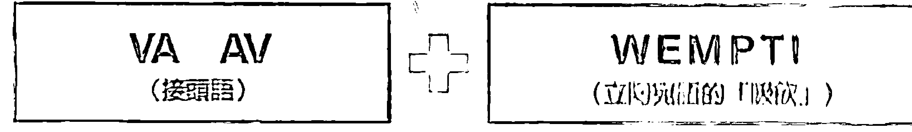

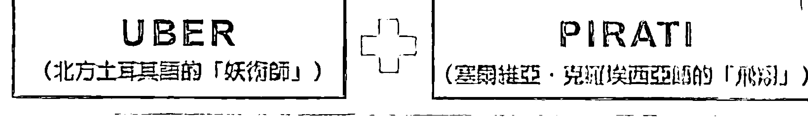

並無明確定說

### VAMPIR (東歐對吸血鬼的稱呼)

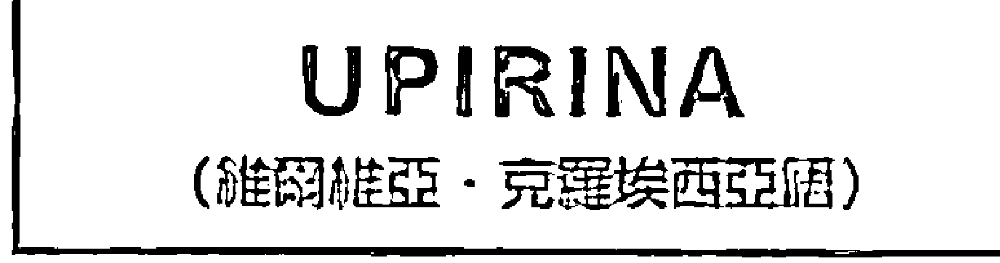

「VAMPIR」確立

### VAMPIRE

## 吸血的怪物

吸血怪物「吸血鬼」的原型，可一直追溯至將血液視為生命力象徵的古希臘神話裡的怪物。

### ☆貪婪的母親

我們撇開西歐文明圈裡飲血怪物的系譜、向前追溯東歐的吸血鬼之原型，就會找到希臘神話當中的拉彌亞。

拉彌亞乃海神波賽頓血脈、利比亞的女王，雖因其美貌受主神宙斯寵愛，孩子卻一個個全遭宙斯的善妒妻子赫拉毒手。後來拉彌亞的喪子之痛演變成羨慕他人有子的羨妒心，原來的美女竟也逐漸變成一個半人半蛇、專飲童血的駭人怪物。「拉彌亞」此名源自希臘語的「貪婪」——「Lamuros」，而她的名字也成了後世女吸血鬼的別名。古希臘神話除拉彌亞以外，還另有個惡名昭彰的吸血怪物——埃姆普薩。此字原指交尾後摀殺配偶吞食的母螳螂，而這個能夠自由變化形體的「埃姆普薩」同樣也是個喜歡啜飲童血的怪物。

泰安娜的阿波羅尼俄斯是和耶穌基督同時代的古希臘哲人，他對伊利法斯·利未等後世的魔法師有莫大的影響；據傳他曾經在婚宴中發現自己的學生——科林斯的邁尼普斯被偽裝成腓尼基女性的女吸血鬼盯上，阿波羅尼俄斯遂以魔術拆穿其真面目、消滅女吸血鬼。

自古以來，希臘神話文化圈便將血液視為人類活力之象徵；被當成青年教養用書、廣受閱讀的敘事詩《奧德賽》當中，奧德賽前往冥界召集亡靈時，就曾經以公羊母羊的鮮血供給諸亡靈；亡者們得到鮮血後暫時重獲生前的活力，終於才能跟生者奧德賽對話。荷馬的《伊里亞德》裡也有同一幕。

>*1 伊利法斯·利未 (Eliphas Levi)：19世紀的魔法師，他大膽運用既有的神祕學和他在聖尼古拉神學校接觸到的催眠術，並新統合兩者、重新定作；他還構思出半物質半心靈狀態的媒介——星氣光 (Astral Light)，藉以說明靈異現象。

### 吸血鬼傳說之原型

| 拉彌亞 | 埃姆普薩 |
| :--- | :--- |
| 希臘神話 | 希臘神話 |
| 深愛主神宙斯寵愛的利比亞王室 | 服侍黑夜與月亮女神赫卡忒，變幻自在的吸血怪物 |
| 親生血肉全部被宙斯的正妻赫拉殺死以後，變成專喝孩童鮮血的怪物 | 「埃姆普薩」此名是母親詛咒的意思，這種怪物會殺害兒童飲其鮮血 |

### 希臘神話中人類活力之象徵

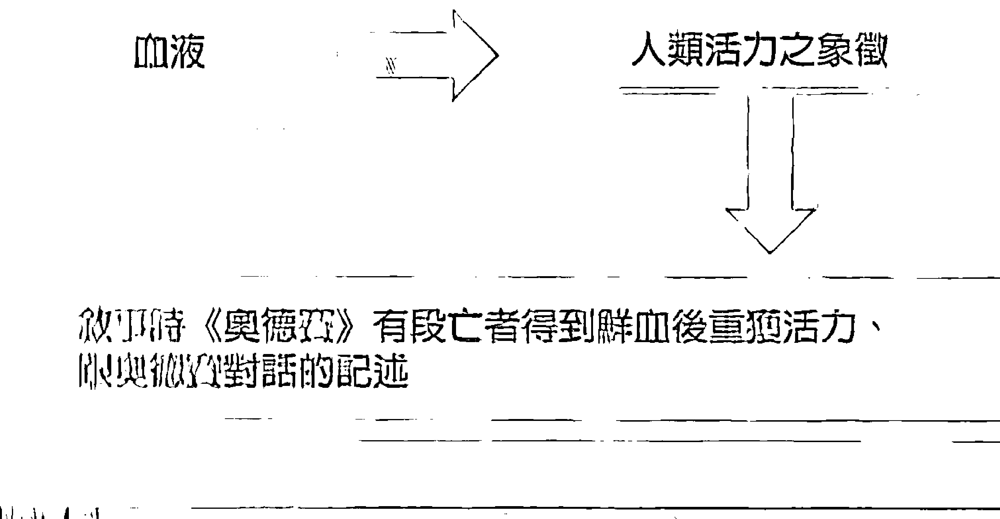

荷馬《奧德賽》有段亡者得到鮮血後重獲活力、並與他對話的記述。

## No.008 活死人

古代希臘的風土孕生造就的活死人，跟前篇所述神話傳說中的吸血怪物都是形成今日吸血鬼傳說的變態源頭。

### ☆ 維科拉加思

古代希臘除拉彌亞與埃姆普薩等吸血的怪物傳說以外，還有個從墳地裡甦醒的活死人——維科拉加思的傳說。「維科拉加思」此字的原意是「從墓場回來的人」，斯拉夫人用這個名字稱呼狼人；傳說狼人死後會變成吸血鬼，所以維科拉加思此語後來也慢慢演變成指稱吸血鬼的名詞。維科拉加思在古希臘原指得到新的靈魂後從墳裡復活的亡者，危險性其實並不高；後來是因為傳至希臘的基督教影響方才被賦予邪惡性質，變成孤獨而終者、未得妥善安葬者、未受洗禮者等死者，為向活人復仇而甦醒的吸血鬼。雖然其軀體不會腐壞，但是會全身硬化、身體四處膨脹；其關節不能彎曲，腫脹的軀體更有惡魔藏匿其中。維科拉加思會在入夜後爬出墳地，敲自己的家門叫家人出來。要阻止其復甦，就必須將屍體骨骸燒成灰燼。

希臘的維科拉加思傳說跟孕育此傳說的溫床——愛琴海上的聖托里尼島之土壤有相當大的關聯。東方正教有在安葬三年後將遺體改葬的習俗，由於當地土壤含有大量具防腐效果的石灰成分，致使屍體埋葬後不易腐爛，是以屍體掘起後容貌仍與生前無異者並不少見。

原生並流佈於巴爾幹半島、不列顛群島、斯堪的那維亞半島等歐洲各地的活死人傳說，在11世紀左右和基督教信仰結合；第二次里摩日主教會議當時，卡奧爾主教便曾報告過一樁民眾數度目擊遭教會驅逐的騎士屍體離開墓地的案例。

### 維科拉加思詞義之演變

| 維科拉加思 (Vrykolakas) | 在古希臘是「活死人」的意思 |
| :--- | :--- |
| | 斯拉夫地區對狼人的稱呼 |

> 基督教的影響

變成指稱吸血鬼的名詞

### 愛琴海的聖托里尼島

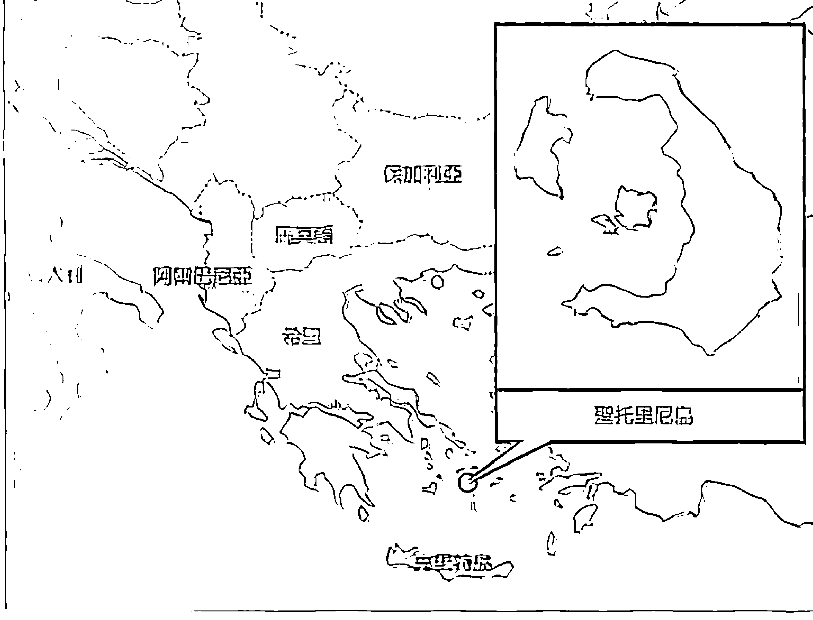

## No.009 基督教的血液信仰

從羅馬天主教會與東方正教拜領聖體的儀式中，就能發現基督教繼承自猶太教的血液信仰。

### ◇ 麵包和葡萄酒

《舊約聖經》的出埃及記、利未記、申命記裡提及的摩西律法，明文禁止飲用相當於肉體生命的血液。

猶太教認為所有生物的靈魂皆存在於血液，後來基督教亦承繼此信仰；《新約聖經》約翰福音寫道：「吃我肉、喝我血的人就有永生」強調基督聖血的重要性，如此直接的表現甚至容易讓人誤作將食人肉解讀。耶穌基督在最後的晚餐裡，曾象徵性地說葡萄酒和麵包就是他自己的血和肉，接著將麵包與酒分給眾門徒，還說他在十字架上流的血能為全人類贖罪。

羅馬天主教會和東方正教拜領聖體的彌撒，就是紀念最後的晚餐、重現救世主如何救濟世人的儀式。對向來採用和法蘭克王國查理曼大帝征服撒克遜人後於785年制定的「對異教徒撒克遜人條約」類似法令，試圖教化異教徒、杜絕活祭等野蠻宗教儀式的教會來說，勢必要非常慎重地處理這段論及救世主血肉的教義；事實上在11世紀當時，似乎確有巫師或醫師囫圇吞棗，直接照表面字義解釋聖經字句，而把處女鮮血當成能使人重獲活力的萬能藥給人服用。

中世的惡魔學乃因基督教勢力大張而興起的反動力量，主張生物的血液有種超自然的力量。惡魔崇拜者會舉行褻瀆的黑彌撒，儀式內容和領聖體的彌撒完全相反。他們倒掛十字架，用嬰兒的屍體和鮮血代替麵包和葡萄酒獻於祭壇，有時甚至還有吃嬰兒血肉的野蠻行徑；這也是為何吸血行為總是無法脫離反基督、反教會形象的要因。

### 基督教血液信仰之演變

猶太教的血液信仰

+   所有生物的靈魂皆存在於血液之中
+   猶太教禁止飲血的行為

基督教的「最後的晚餐」

> 象徵性地表示葡萄酒就是自己的血，然後分給眾門徒

基督教的救贖

> 表示他在十字架上流的血能為全人類贖罪

血祭儀式的儀式

> 紀念「最後的晚餐」、再現救世主如何救贖世人的儀式

基督教內部的反猶主義與血祭儀式

+   因為猶太人殺了耶穌基督
+   為生物的血液賦予超自然的力量

吸血行為與反宗教、反科學的結合

## No.010 東方正教與羅馬天主教會

東方正教和羅馬天主教會對不腐死屍的解釋可謂大異其趣，甚至是恰恰相反。

### 不同的解釋

歐洲的吸血鬼傳說之所以都集中在東歐地區如斯拉夫諸國和巴爾幹半島，東歐信仰的東方正教與西歐羅馬天主教會兩者的教義差異也是個頗重要的因素。

東方正教有改葬遺體的習慣；改葬有時會發現未腐爛的屍體，而東方正教和羅馬天主教會對此現象的解釋可是大異其趣。東方正教認為這些沒有腐爛的屍體，就是上帝對被逐出教會的異端者降下的神罰，也是這些人死後不得安寧、長受苦難的證據。他們還相信不只女巫、狼人、自殺者跟死刑犯等悖離上帝正道的罪人，就連葬在希臘的羅馬天主教信徒的屍體也不會腐爛。此教就是如此積極吸收基督教傳來前早已存在民間的不腐死屍信仰，然後煽動人類對死亡的恐懼，以達傳教目的。

相對地，羅馬天主教會倒認為沒有腐敗、已經屍蠟化的屍體是永遠的美之象徵，多尊為神聖。受聖方濟感動、決意與聖方濟同在阿西西佈教義的聖女克拉雷歿於1253年；其屍體雖因空氣作用多少有點發黑，然其容貌在七百年後的今天仍與生前無異，目前仍被安置在聖克拉雷教會。

此外，盧爾德的聖貝爾娜黛特則是因為曾經在1858年目擊聖母馬利亞顯靈而聲名大噪。眾人在她死後30年，亦即1909年將其遺體掘起，卻發現屍體完全沒有腐敗的現象；眾人將此事奉為奇蹟、於訥韋爾的聖吉爾達德修道院公諸於世後，羅馬天主教會教宗庇護十一世遂於1933年將其列為聖人。

### 兩者教義之差異

**羅馬・天主教會** 與 **東方正教** 對 **不腐爛的屍體** 的觀點對比：

- **羅馬・天主教會**：視其為「永遠的美之象徵」，「尊之為聖」。
- **東方正教**：視其為「對異端者的神罰」，「死後不得安寧、長受其苦的證明」。

### 不腐化的屍體

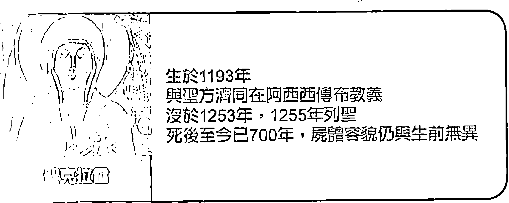

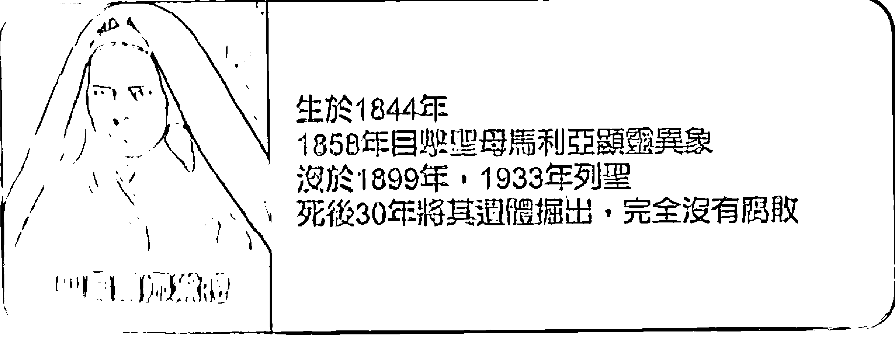

## No.011 狼人

名列三大怪物的狼人日間潛伏於暗黑森林深處，是可任意變換形體的夜之魔物。

### 狼人和吸血鬼

自漁獵維生的古代人類開始從事畜牧、確保食糧不虞匱乏後，覬覦家畜的貪婪狼群就一直是威脅人類安定生活的最大敵人。印歐語系當中，指稱狼的名詞多有「掠奪者」、「貪婪啖食者」等語意，不難窺見人類對這種兇猛野獸有何印象。

許多神話裡都有狼，譬如北歐神話裡當諸神的黃昏（世界末日）到來時得到解放的芬里爾¹，用親生骨肉活祭獻神因而觸怒宙斯、被變成半人半獸怪物模樣的阿卡迪亞國王呂卡翁，都是頗具代表性的例子。雖然在聖經裡面，狼乃是上帝對不虔誠者所降神罰之體現，不過民眾通常都只是很單純地把狼看作是惡魔的化身而已。與吸血鬼、科學怪人並列三大怪物的狼人，便是來自於前述人類對狼的恐懼心理。

雖然現今歐洲各地都有狼人傳說流傳，然而各地狼人的形態不一，有些是人類變身成狼的模樣，有的則是披著人皮的狼。此外，還有許多跟狼人性質相關的故事傳說，諸如看見月亮會變身成狼、腳踏狼走過的足跡、在狼飲水的場所喝水等，不過這些傳說裡的狼人都有個共通點：狼人喜好食人血肉，以及可任意變身成狼的獸人化現象。

布拉姆・史托克筆下的德古拉伯爵可以變身成黑犬、號令狼群，狼人色彩可謂相當濃厚，而吸血鬼與狼人此二者在部分東歐地區經常被視為同物。根據波蘭但澤地區的傳說，狼人死後會變成吸血鬼復活。而希臘用來指稱吸血鬼的名詞維科拉加思在巴爾幹半島則是狼人的意思。

¹ 芬里爾（Fenrisulfr）：北歐神話中造成眾神毀滅的元凶。他的父親是擅長使奸計的邪神洛基（Loki）。

### 從狼到狼人

| 階段 | 描述 |
| :--- | :--- |
| 古代人與狼 | 襲擊家畜威脅生活的敵人 稱之為「掠奪者」、「貪婪啖食者」 |
| 神聖化 | 北歐神話的芬里爾 希臘神話的阿卡迪亞國王呂卡翁 聖經中體現上帝對不虔誠者神罰的狼 |
| 演變為狼人 | 視為惡魔的化身 同吸血鬼傳說混淆 |

### 狼人的特徵

+   孕生自人類對狼的恐懼心理
+   看見月亮變身成狼
+   腳踏狼走過的足跡
+   在狼飲水的場所喝水
+   好食人肉
+   獸人化現象
+   死後復活變成吸血鬼的傳說

> 相關條目：
> - 德古拉伯爵→No.001
> - 活死人→No.008
> - 小說・史托克→No.021

## No.012 女巫

女巫因使用黑魔法與巫術害人的罪名而遭受極淒慘之迫害厄待，跟吸血鬼亦有很深的關係。

### ☆ 女巫之槌

中世紀歐洲認為女巫跟惡魔締結契約、沉溺黑魔法和巫術，乃遭上帝見棄者，因此他們相信女巫跟狼人一樣，死後會變成吸血鬼。關於其原始形象，可追溯至在基督教尚未滲透歐洲以前、侍奉諸神的巫女。古代巫女同時也是賣娼婦，中世女巫能將趁人熟睡時吸取精液的淫魔收為魔寵¹號令，約莫是由來於此。除煎藥草替人治病、占卜天候指示農耕作業方針以外，她們還是民眾的生活諮商者，關係頗為密切。然而她們亦不乏許多血腥要素，譬如色薩利女巫會在祭拜女神赫卡蒂²儀式中生飲死者鮮血，以致日後女巫被視同為吸血鬼。羅馬帝國時代民眾普遍認為吸血行為乃女巫諸惡行之一；阿普列烏斯所著通稱《金驢記》的《變形記》裡，就有兩個女巫喝蘇格拉底的血。此外，歐洲人還相信羅馬尼亞的吸血鬼乃女巫所化；從西元9世紀法蘭克王國頒布的薩利克法典³的字裡行間，就能發現許多有史特雷哥嫌疑者頻頻遭處火刑的痕跡。

羅馬天主教教宗英諾森八世於1484年的教宗詔書中表示惡靈與女巫肆虐，多明我會異端審問官海利奇・克拉馬與雅各・史賓格受命展開女巫之實態調查，並共同著作惡名昭彰的《女巫之槌》。這本引發席捲歐洲長達數世紀獵女巫狂潮的著作，乃是利用《舊約聖經》出埃及記第22章第18節「行邪術的女子必須處死」之記述，將迫害女巫的暴行正當化。

+   ¹. 魔寵（Familiar）：女巫飼養的爪牙、寵物，由惡魔變化而成，負責暗中慫恿協助作惡。多數變身成貓狗、蟾蜍與雛雞這種庶民身邊常見的動物。
+   ². 赫卡蒂（Hecate）：希臘神話中掌管魔法、冥界和月亮的女神。希臘的魔法師會借這位恐怖女神的力量行使魔法：譬如女魔法師美狄亞在使用回復青春的秘法時，就曾向這位女神借用力量。
+   ³. 薩利克法典（Salic Law）：指5世紀時征服高盧的薩利安法蘭克人之法典。雖非條頓法律（蠻族法律）中最古老的，卻是最重要的。於西歐梅羅文加王朝的創始人克洛維（Clovis）統治後期（507？~511）頒布。

# 女巫形象之形成

基督教以前
侍奉古代诸神的巫女
- 占卜天候
- 指示农业方针
- 以药草进行医疗
- 与民众协商

正面形象

基督教以后
跟恶魔缔结契约的女巫
- 吸血行为
- 死后成为吸血鬼
- 跟恶魔缔结契约
- 沉溺于黑魔法及巫术，淫乱
- 收淫魔为随从

负面形象

# 女巫审判

15世纪至18世纪间席卷欧洲各地的女巫审判，乃是西欧史上最为空前绝后的大规模迫害，时则被视为集体歇斯底里症（群体性精神病）所引发的狂潮。一般通常认为女巫审判主要都是由罗马天主教的异端审问所、透过宗教审判的形式来审理异端，但根据最近的研究显示，实际上异端审问所取缔女巫的态度其实并不积极。
然而15世纪以后，随着瑞士与克罗埃西亚等地民众设置的「民众法庭」，民众法庭体系渐趋完备，教会再也无法忽视民众对于审判的要求。谈及女巫审判，相信很多人马上就会联想到残酷拷问与火刑，把被指控无罪的被害者送上火刑台的鲜明意象；然而实际上并未进行拷问，倒是以下案例居多：14世纪末的米兰异端审问官，以女巫嫌疑起诉两名女子，最后却因为证据不足将其释放。
民众法庭之所以运用残酷私刑拷打逼问、如野火般残害无数被指控为女巫的无辜民众，其背景正是由于民众自发的民众法庭之行为。

# No.013

# 黑死病与过早的埋葬

# The Black Plague and The Premature Burial

18世纪肆虐欧洲的黑死病，以及爱伦坡亦曾引为创作题材的过早埋葬恐怖故事，都是栽培吸血鬼传说的土壤。

# ◇ 二次死亡

根据文献，东欧巴尔干地区吸血鬼出现的纪录多集中在18世纪；经过仔细检视就会发现，这些案例发生的地点时间其实都跟黑死病或类似疾病之发生案例吻合。
黑死病是欧洲史上最严重的疾病，据传以都市为中心大肆流行时，每三个染病者当中就有一人死亡。在1894年北里柴三郎发现鼠疫杆菌以前，黑死病一直是病因不明的不治之症，除隔离感染者之外别无他法。在此时，黑死病就是死亡象征，甚至还有人身体稍感不适、以为自己染上了不治之症，惊吓过度而亡。有些被隔离的患者陷入一种叫做强直性昏厥¹的假死状态，进而误判为死亡而相继被活埋。该症状包括身体僵硬、感觉机能与肌肉运动停止，长时间僵硬导致血行受阻、身体有如尸蜡，进而脉搏呼吸机能也会严重降低到令人无法相信患者还活着的地步。德国吸血鬼纳赫齐拉²发现报告始于16世纪，传说这种吸血鬼会在棺里吃自己的尸衣与血肉止饥；其实这些都是太早被埋葬、又不幸在地底的棺柩里苏醒，一番毫无获救希望的痛苦挣扎之后，才终于断气的强直性昏厥症患者。

这种误判死亡活埋事件其实并不限于黑死病，任何时代都可能发生；据神秘学家蒙塔古·苏梅尔斯所著《吸血妖魅考》³记载，在20世纪初的美国，平均每週就有一次过早的埋葬。初期吸血鬼电影《吸血鬼Nosferatu》导演F·W·穆尔诺，就在电影里将吸血鬼欧罗克伯爵塑造成黑死病般的角色，描写其经过的都市有如黑死病笼罩的模样。

¹ 强直性昏厥（Catalepsy）：亦作全身僵硬症、僵住症。
² 纳赫齐拉（NachZehrer）：此语在德语里是「吸血鬼之初」的意思。
³ 《吸血妖魅考》：原书名《The Vampire: His Kith and Kin》，再版书名《Vampires and Vampirism》，此处採日文直译。

# 黑死病流行

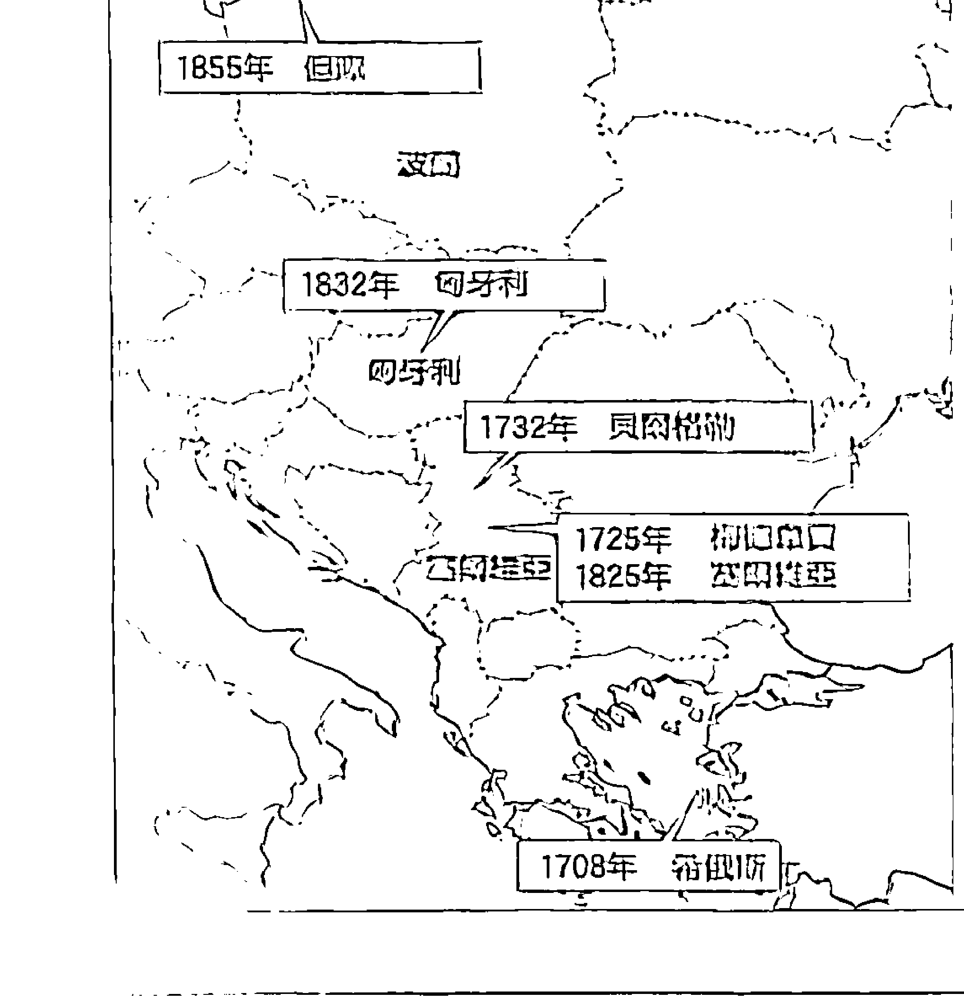

## 吸血鬼事件的由来
- 1720年：科西嘉岛爆发黑死病，当地人认为死者会复活成为吸血鬼。
- 1725年：梅德韦贾村发生吸血鬼事件，村民彼得·普洛戈维茨被指认为吸血鬼。
- 1727年：梅德韦贾村的阿伦·什皮尔事件，村民挖出尸体，发现其口中含血。
- 1732年：梯罗村吸血鬼事件，村民挖出尸体，发现其毛发和指甲生长。

## 里耶之因果

强制性假死症
对黑死病的恐怖心理造成假死状态之误判
医学尚未发达

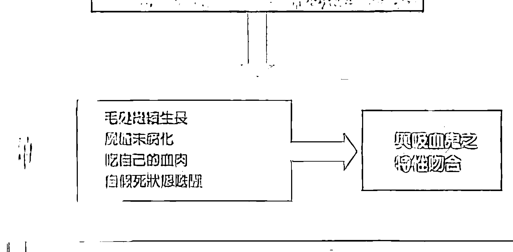

# No.014

# 彼得·普罗戈约维奇与阿诺·鲍尔

# Peter Plogojowitz, Arnold Paole

18世纪初，塞尔维亚和瓦拉几亚刚纳入神圣罗马帝国版图少顷，马上就发生两桩震懾全欧洲的异常事件。

## ☆两则吸血鬼事件

第一个事件发生在1725年9月，塞尔维亚的基希洛瓦村；农夫彼得·普罗戈约维奇竟然在过世埋葬三天后从坟里复活，还去吸亲生儿子和村民的血。一周内死者达9人，教区主教见事态严重赶紧向上报告，神圣罗马帝国遂指派数名军官到基希洛瓦村掘坟，结果有极为骇人的发现：农夫死后已经10週仍不见尸体腐化，而且尸体嘴边还有斑斑血跡。官方纪录记载，当时军官取木桩打进彼得心脏时，有大量鲜血迸溢而出，然而众人仍心存疑虑，为求保险索性放火将彼得的尸体烧化。当时在场军官制作的彼得·普罗戈约维奇事件相关报告书，就是近代国家第一份与吸血鬼有关的官方纪录。

两年后1727年，同样又在塞尔维亚的梅德韦贾村，发生了伍兵阿诺·鲍尔事件。摔落货车折断头骨而亡的阿诺，有段相关骇人的过去。阿诺从前在希腊的哥斯塔拉札服兵役时曾遭当地吸血鬼袭击，但他为摆脱恶魔的诅咒，遂找到吸血鬼栖息的墓地并自力消灭了吸血鬼。后来不知是否因为吸血鬼诅咒作祟，他死亡以后村里竟陆续有村民表示曾经遭到理应已经死亡的阿诺攻击，最后甚至还弄出人命。村民打开阿诺之墓，发现尸衣沾满鲜血、尸体迟迟没有腐化，随即取来木桩贯穿尸体心脏，只见大量鲜血随着呻吟声喷出。政府亦针对此事件展开大规模调查行动，军医弗鲁肯格所著调查书题为「见闻录」，其中的纪录某种程度地证实了村民的说辞。

# 事件发生当时的欧洲

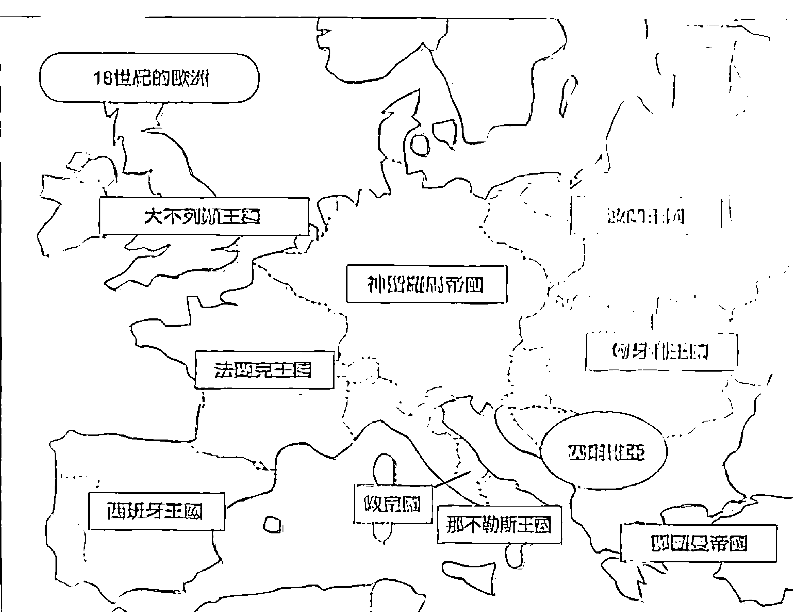

# 比较吸血鬼事件

| 项目 | 彼得·普哥戈维奇事件 | 阿诺德·保尔事件 |
| :--- | :--- | :--- |
| 年份 | 1725年 | 1727年 |
| 地点 | 塞尔维亚的基舍洛瓦村 | 塞尔维亚的梅德韦贾村 |
| 受害者 | 9名村民回尸身亡 | 4名村民回尸身亡 |
| 原因 | 吸血鬼彼得·普哥戈维奇作祟所致 | 吸血鬼阿诺德·保尔所致 |
| 记录 | 近代国家第一份与吸血鬼有关的官方记录 | 政府进行大规模流行病防止制作调查报告的「见解」 |

# No.015

# 吸血鬼论争

# Vampire controversy

吸血鬼论争曾于18世纪席卷全欧，复为伏尔泰、卢梭等启蒙主义思想家所逐。

## ☆启蒙主义之光

东欧边境诸国纳入神圣罗马帝国版图后，不光是喜欢嚼舌根的普通民众，即使是知识分子也对吸血鬼造成的骚动感兴趣。其中18世纪初的彼得·普罗戈约维奇事件与阿诺·鲍尔事件甚至还惊动官方提出调查报告书，自此吸血鬼论争蔚然成为一种社会运动，各国字典亦纷纷加入吸血鬼此字。此论争始于莱恩夫特于1734年针对德国神学家罗尔于1679年将吸血鬼现象全归咎于恶魔阴谋的论文，所提出的「随意在坟墓里咀嚼的尸体」反论，后来包括曾经仔细检证强直性昏厥实例并进行科学式论证的卡尔梅神父等，众多圣职者纷纷以正反两方立场加入这场论争，最后甚至连罗马教宗本笃十四世都在著作里以启蒙之立场提及吸血鬼。此论争提出的各种纪录和证词，对后世的吸血鬼研究、以其为题材的小说与电影等各种创作亦多有影响。然而在标榜合理性的启蒙主义全盛时期，吸血鬼就像是盛开却不会结果的花朵，马上就成为法国百科全书派学者等启蒙主义者的众矢之的。其中反教会、反权力的旗手伏尔泰更是感慨「多么荒唐啊！我们18世纪竟然有吸血鬼存在！」并发表论文抨击。启蒙思想的巨人卢梭亦曾在与巴黎大主教的书信中批判此论争，后来才慢慢平息下来。

此时欧洲正沐浴在启蒙主义和工业革命的光芒之中，根本就没有象征黑暗中世纪的吸血鬼存在的余地。然而，人类终究无法舍弃黑暗，而吸血鬼也终将复活。

# 吸血鬼论争之经纬

科学和启蒙思想
否定吸血鬼

传说与迷信中的
吸血鬼信仰

吸血鬼论争

胜利

一扫中世纪迷信

败北

19世纪以文学形式复活

# 各自的主张

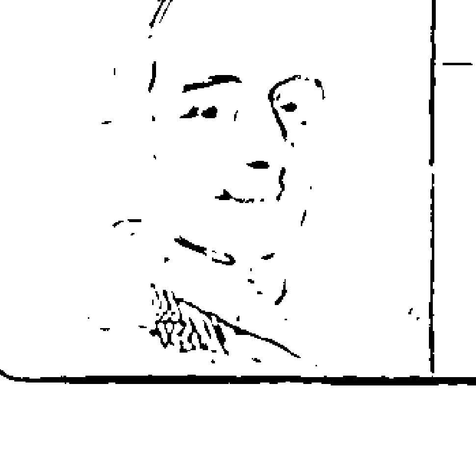

伏尔泰（1694～1778）
「多么荒谬啊！我们18世纪竟然有吸血鬼存在！」
否定吸血鬼存在、发表论文攻击教会与迷信者的启蒙思想者

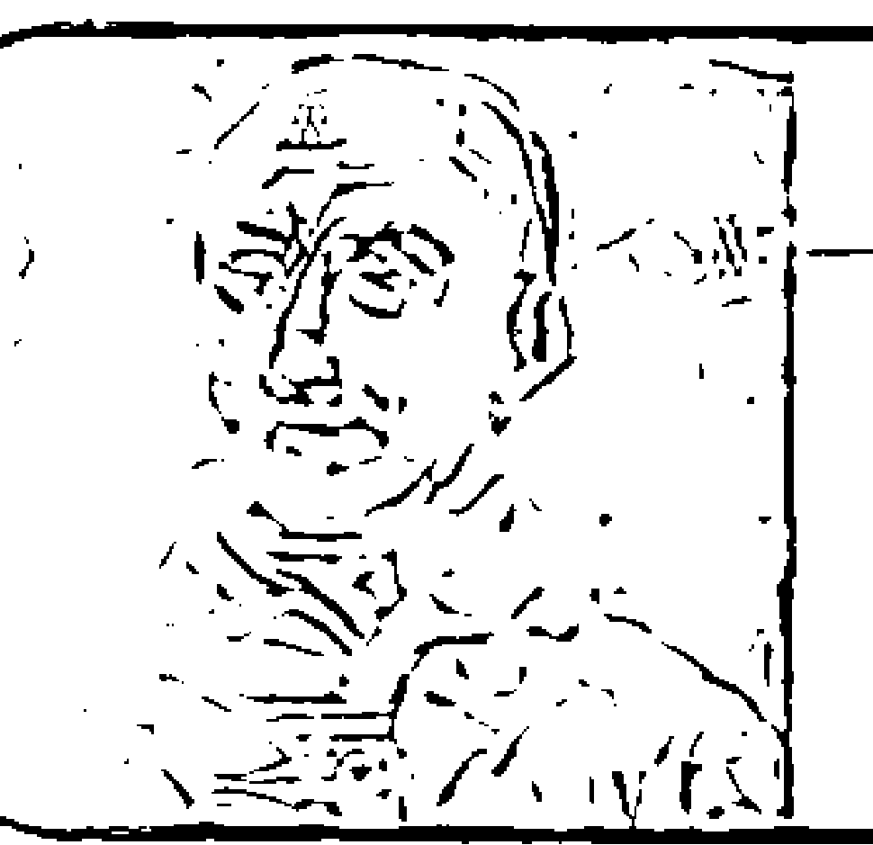

奥古斯丁·卡尔梅（1672～1757）
「死者复活的现象，其实只是我们误以为已经死亡的活人苏醒过来而已。」
利用科学式论证使吸血鬼现象脱离迷信的圣职者

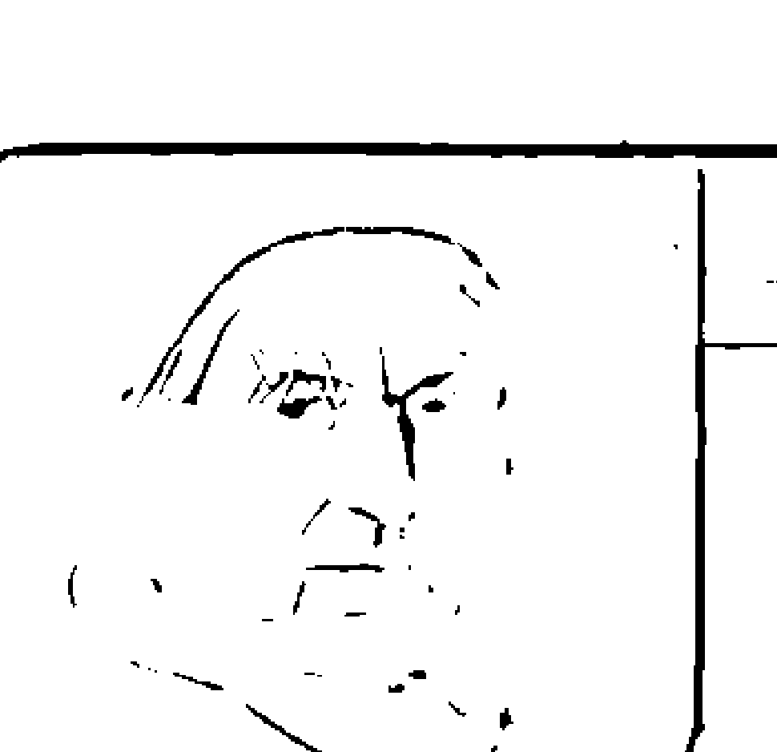

本笃十四世（1675～1758）
「吸血鬼之复苏及其行为，实为想像力、不安和恐怖心理的产物。」
崇拜伏尔泰，唯一曾针对吸血鬼发言的罗马教宗

- ◇黑死病与过早的埋葬→No.013
- ◇彼得·普罗戈约维奇与阿诺·鲍尔→No.014

# 浪漫主义中的吸血鬼文学
Vampire in romantic literature

浪漫主义运动乃因重视理性的启蒙主义之光而兴起的反动力量：从浪漫主义的黑暗荒芜中，复又孕育出前所未有的新吸血鬼。

## ◇ 暗夜之诱惑者

科学与技术的进步，看似已将吸血鬼传说等迷信全抛在中世纪的黑暗之中。然而，反合理主义的浪漫主义运动在18世纪末的德国兴起、传遍英国等欧洲诸国，却使吸血鬼得以再度复活。

为神秘幻想之存在深深着迷的英国浪漫派诗人，曾经参考德国疾风怒涛般浪漫主义运动的代表人物约翰·沃尔夫冈·冯·歌德的《科林斯新娘》等先行作品，创作寓意吸血鬼诗。作品中的吸血鬼就是死亡的拟人化角色，并多将此角色托于苍白美少女，或者来自异界的俊美青年。

此外，文学家还会设定吸血鬼与被害者间有如宿命般的恋爱关系，堆积爱情牵绊造成的悲剧性高潮。

浪漫派诗人对这无关东欧风土的新吸血鬼传说发展过程有很大的影响。从来的吸血鬼传说自始至终都是以墓地里受诅咒死者的复苏为题材，并未露骨地强调吸血鬼诱惑异性的性魅力。有别于现今仍不断增生、为数众多的虚构吸血鬼作品，东欧原生吸血鬼传说根本全无半点性暗示。诗人爱写的吸血鬼，是可追溯至拉弥亚或色萨利女巫、能同时为男性带来快乐与毁灭的命运之女，可谓希腊式淫魔之延长，是否有吸血行为其实并不重要。尽管后年约翰·波里多利与布拉姆·斯托克等人的注意力再度回到东欧的吸血鬼传说、巴尔干半岛和外西凡尼亚等地名亦重返吸血鬼小说主流，但吸血鬼异性诱惑者的新形象仍然根深蒂固，直至今日。

# 吸血鬼特征之变迁

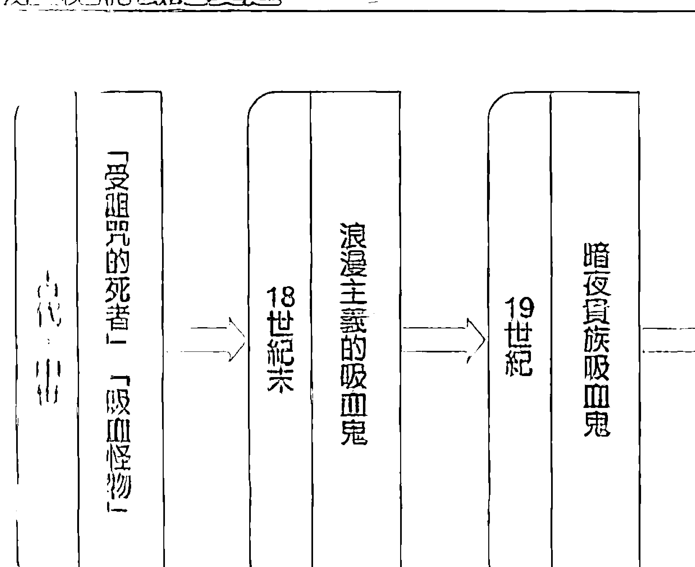

## 至今仍根深蒂固的吸血鬼形象

- 死亡的拟人化：苍白美少女或来自异界的俊美青年
- 宿命的悲剧与宿命的恋爱关系：作品之悲剧性面向
- 对血与性的性暗示：跨性别的性魅力

- ◇吸血鬼的历史・No.002
- ◇吸血的怪物・No.007
- ◇女妖・No.012
- ◇德古拉・No.024
- ◇纳斯凡伯爵・No.034

# No.017
日内瓦湖畔事件
Event in lakeside

暴风雨来袭日内瓦湖畔的别墅，诗人贵族与主治医师翻脸反目。许多巧合与偶然的累积，竟造就第一部吸血鬼小说，以及随之而来的吸血鬼风潮。

## ☆约翰·波里多利的吸血鬼

横跨瑞士与法国边境的新月湖日内瓦湖畔，建有一幢名为帝欧达地的别墅。别墅的主人是英国浪漫派的代表性诗人，因女性丑闻缠身而离开祖国的乔治·戈登·拜伦男爵。

1816年夏天，别墅里除男爵以外，还有四个男女在此避难。这四个人分别是：以梦游症与血液相关医学论文受到拜伦青睐、聘作主治医师的约翰·波里多利博士，拜伦的旧情人克莱儿·克莱阿蒙，克莱阿蒙的异母姐妹、颇富教养的玛丽·沃斯通克拉芙·戈德温，还有以《解放的普罗米修斯》闻名的诗人、和玛丽私奔中的珀西·比西·雪莱。

6月15日夜，五个人因为连续倾盆大雨被迫待在别墅里，正在拿译成法语版的德国幽灵故事打发时间，此时拜伦突然异想天开、提议大家也来创作此类灵怪故事，还取出自己在三年前执笔尚未完成的吸血鬼故事。不出数月，波里多利与拜伦失和，或是出于精神式的报复心理，波里多利遂根据从拜伦口中听来的部分片段，把自己厌恶的拜伦戏剧化、塑造出邪恶贵族的化身——鲁斯凡爵士，创作小说《吸血鬼》。这便是文学史上第一本吸血鬼小说诞生之缘由。后来不知怎地，这部小说却是以拜伦之名刊行，一时间拜伦从来的名声与恶名都被抛诸脑后，小说广受国内外读者疯狂喜爱。法国浪漫派旗手诺迪埃曾将这部哥德评为「拜伦最佳杰作」的小说搬上舞台，结果大受欢迎。

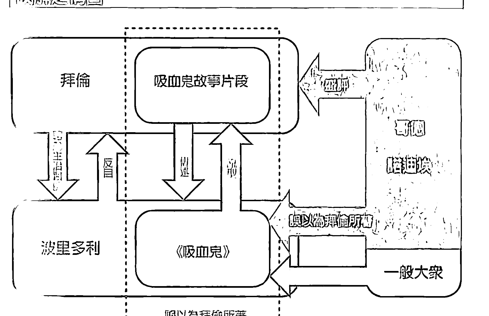

# 另一部作品的诞生

拜伦的提议除构成波里多利创作《吸血鬼》的契机，更促成了另一大怪物的诞生——维多·法兰坎斯坦博士（Victor Frankenstein）拼凑尸体组合成的人造人科学怪人。

在日内瓦湖畔暴风雨夜的一年后，玛丽·戈德温——就是后来的玛丽·雪莱，于1818年3月11日完成了《科学怪人》（Frankenstein）匿名出版。后来电影中，或者该说演员卡洛夫（Boris Karloff）扮演的怪物形象，反而超越了原作，此现象更甚于布拉姆·斯托克的《吸血鬼德古拉》。《科学怪人》描述挑战神明领域的禁忌，乃科幻小说之创始、哥德恐怖小说（Gothic Fiction）的代表作，毋庸置疑亦是文学史的另一部杰作。

根据玛丽·雪莱的回想，她曾经跟拜伦针对伊拉谟斯·达尔文博士（Erasmus Darwin）——以进化论闻名的查理·达尔文（Charles Darwin）的祖父——的实验进行论辩，并得到拼凑尸体、通灵赋予生命之作的灵感，然若谓这部作品乃源自暴风雨夜里的那场灵感，倒也不尽然。

# No.018
廉价恐怖小说
Penny Dreadful

充满色情、暴力和恐怖的廉价小说志，被当时的家长们视为少年犯罪之温床，是19世纪的不良书刊。

## ☆一便士硬币就买得到的恐怖

19世纪中叶，伦敦街头充斥着一种叫做廉价恐怖小说的出版物，广受庶民喜爱。这些仅需一便士就买得到的报纸或杂志几乎每週刊行，读者以少年阶层为主，内容尽是利用恐怖情节快速刺激读者的奇异冒险故事。尤其连载小说几乎每回都固定会有个高潮，尽管取悦了不少喜欢刺激的都市小孩，但是配合情节需求的设定太多，以致破绽百出前后矛盾。廉价恐怖小说刊行的恐怖故事的主题多是剽窃自哥德恐怖小说等先行作品，而且或多或少都有哥德《科林斯的新娘》，抑或至少仍保有文艺作品体裁的约翰·波里多利《吸血鬼》的影子。作家伊莉莎白·葛雷1828年开始连载的《骸骨伯爵》当中，主角拉芬斯堡伯爵罗多夫跟恶魔订定契约获得永恒生命，相对地必须每天以骇人的骸骨模样度过日落到破晓的这段时间，而这部小说里就有位因罗多夫伯爵而复活的美少女吸血鬼配角。廉价恐怖小说的吸血鬼小说几乎都已为人遗忘，唯有《吸血鬼瓦涅爵士》这部作者不详，传为汤姆士·普莱斯基·普莱斯特或詹姆斯·马尔科姆·赖默所著，可谓是吸血鬼小说的原点，因而得以留名。这部长篇吸血鬼小说是在布拉姆·史托克出生的1847年整理成完全版、发行单行本；尽管《吸血鬼瓦涅爵士》和其他吸血鬼小说同样不具文学价值，然此作除继承了波里多利塑造的吸血贵族形象以外，还赋予吸血鬼变身成蝙蝠野狼的怪物属性，对史托克的《吸血鬼德古拉》亦有莫大影响。

# 从哥德恐怖小说、廉价恐怖小说到《吸血鬼德古拉》

18~19世纪哥德恐怖小说全盛时期（古城、修道院、红月、荒原等）

书本仍是专属于上流阶级的奢侈品

波里多利《吸血鬼》之出版及戏剧化，皆获好评

识字率急速增加，劳工阶级对书本的需求增加

大众取向的廉价小说（廉价恐怖小说）时代

读者逐渐具备批判能力，对剽窃先行作品的行为与自相矛盾的故事情节感到不满

《吸血鬼卡蜜拉》、《吸血鬼德古拉》等作品出版

# 以哥德恐怖小说里的吸血鬼

《浮士德》（Johann Wolfgang von Goethe，1749-1832）《浮士德》（Faust. Eine Tragödie）（1808）主角是把灵魂卖给恶魔的伯爵，吸血鬼只是配角

《吸血鬼》（John Polidori，1785-1821）《吸血鬼》（The Vampyre， or. The Flight of Blood）（1819）英国首部以吸血鬼为主角的小说

- ◇ 吸血鬼相关作品・No.017
- ◇ 爱伦・坡恐怖作品・No.021
- ◇ 《吸血鬼德古拉》・No.019
- ◇ 法兰西斯・瓦涅阁士・No.033

# 《吸血鬼德古拉》
DRACULA

《吸血鬼德古拉》对「吸血鬼小说」带来决定性变革，甚至有「《吸血鬼德古拉》以后再无吸血鬼小说」盛名，乃灵怪小说史上最伟大的金字塔。

# 吸血鬼小说的代名词

名侦探夏洛克·福尔摩斯以短篇小说《绯色的研究》一举名震文坛恰恰十年后，Archibald Constable & Co.出版社在1897年发行了布拉姆·史托克的《吸血鬼德古拉》。促使史托克执笔从事吸血鬼小说创作的直接动机，就是同乡前辈雪利登·勒法努1872年所著的《吸血鬼卡蜜拉》。

史托克读过此作品以后便对此题材深深着迷，于是遂打定主意总有一天要创作自己的吸血鬼小说。1878年他辞去公职，一面在演员亨利·欧文经营的兰心剧场担任管理者，同时还发表了几篇灵怪小说；后来在1890年，才透过欧文的介绍认识在布达佩斯大学执教东洋语言学的阿米纽斯·范贝利教授。

这位史托克引为亚伯拉罕·凡·赫辛教授蓝本人物的老学者，他讲述的外西凡尼亚历史和传说，为史托克仍旧混沌不明尚未成型的吸血鬼小说，提供了一个明确的方向。后来史托克造访约克夏郡的惠特比港，无意间在图书馆翻阅一本名为《瓦拉几亚公国暨摩达维亚公国传说》的书，发现德古拉公爵弗拉德·采沛成的名字。1892年史托克再会范贝利教授，并且向教授请教许多与这不祥之人有关的问题。接下来他又花了三年蒐集资料，直到1895年才实际开始进行着作，最后又花了一年半的时间方告完成。《吸血鬼德古拉》出版后，在英国颇受好评，但是美国读者的反应却远较英国热烈。后来《吸血鬼德古拉》被搬上舞台、拍成电影，正如吸血鬼不断增殖扩大势力般地蔓延全世界，而布拉姆·史托克的名字也因此永留史册。

# 《吸血鬼德古拉》之成立

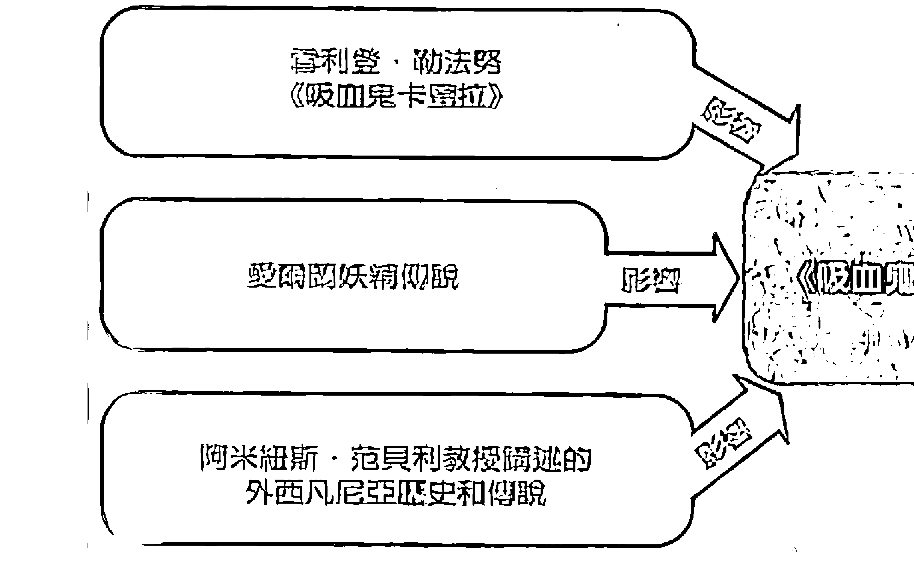

# 阿米纽斯·范贝利教授

阿米纽斯·范贝利教授是在匈牙利的布达佩斯大学讲授东洋语学及东洋历史学；他不但是通晓20国语言的语言天才，还是位杰出的探险家，曾经依据《马可波罗游记》记录过马可波罗走过的路线，游历过亚洲各国。1890年4月30日，布拉姆·史托克在欧文举行的宴会中认识了范贝利教授，并且对教授的经历颇感兴趣。史托克的脑中记许许多多各国的传说，对外西凡尼亚传说更是特别着迷。起初他是受雪利登·勒法努的《吸血鬼卡蜜拉》影响而有创作现代吸血鬼小说的构想，后来才在教授讲述的东欧历史中发现了绝佳的题材。
史托克对《瓦拉几亚公国暨摩达维亚公国传说》等文献竭力查明东欧传说的史托克，幸于两年后再遇教授，得以请教进一步的知识。史托克把这些知识活用在《吸血鬼德古拉》的创作，并以范贝利教授的形象创造了范辛教授此角，以表感恩之念。

- 范贝利教授 → No.020
- 布拉姆·史托克 → No.021
- 外西凡尼亚传说 → No.035
- 亚伯拉罕·凡·范辛教授 → No.084
- 吸血鬼传说 → No.086## No.020 弗拉德・采佩戊
Vlad Tepes

费尽毕生心力只为报复奥斯曼帝国，不因其战功彪炳，却是以残虐成性留名历史的瓦拉几亚英雄将军。

## ♠ 嗜血的“串刺公爵”

弗拉德・采佩戊乃因布拉姆・斯托克的德古拉伯爵而闻名，是瓦拉几亚的半传奇性领主。他生于外西凡尼亚，乃当时领主“恶魔公爵”弗拉德二世次子；他在1431年得东罗马帝国正式授爵，继承身为守护皇帝及上帝荣光二十四龙骑士之一的父亲之名讳，命名为弗拉德三世。然而他出身的小公国却在纳入东罗马帝国版图五年后随即遭到奥斯曼帝国侵略，13岁的弗拉德三世及胞弟“美公爵”拉度被送到奥斯曼帝国当人质。长达四年屈辱至极的俘虏生活对正值青春期的他有极大影响，这段痛苦经验亦使父祖血脉中的残虐性格更为剧烈。

1447年父亲与胞兄米尔恰遭暗杀，奥斯曼帝国遂扶植弗拉德三世傀儡政权，就任瓦拉几亚公爵；后来弗拉德的遭遇可谓迂回曲折，包括跟邻近领主间的势力竞争、被迫逃亡，以及1459年拒绝向不共戴天之仇奥斯曼帝国纳贡。弗拉德向强大的奥斯曼帝国挑起战端，将农牧为业的领民组织成民兵转战于各地，并多次击退来袭敌军。弗拉德三世对俘虏的刑罚可谓严苛残忍至极；他用木桩把战俘从肛门至嘴巴刺成肉串，还把痛苦而亡的尸体连同木桩竖起、曝于荒野。

有时甚至连弗拉德的家臣或领民也会遭此木桩串刺酷刑，不论敌我无不对其残虐惧怕三分；当时有份名为“德古拉大将军之嗜血野蛮凶恶传说”的小册子，描绘弗拉德三世优雅地在许多处串刺血刑的尸体旁进餐的阴惨景象，连同其“恶魔之子”、“串刺公爵”异名一并流传至今。

## “德古拉”的由来

在纽伦堡 (Nurnberg) 刊载弗拉德・采佩戊旅行的书册“德古拉大将军之嗜血野蛮凶恶传说”题名，便不难发现弗拉德・采佩戊“德古拉”其名相当有名：此号由来众说纷纭，并无定论，到底是弗拉德三世继承自施行残暴统治、被称为“龙公爵” (Dracul) 的父亲弗拉德二世的名号，然后“Dracul之子”的“Dracula”又演变成“恶魔之子”(Draculha)，遂得此名。

另一位说法指弗拉德二世受任神圣罗马帝国龙骑士之际，曾以对抗异教徒而得以授龙之勋章，因此亦有不少研究者将“Dracul”解释为龙，相信无须援引《约翰默示录》，读者诸君也知道世界自古便将龙与恶魔视为同物，而拉丁语的“Draco”同时拥有这两个意涵。

此外，亦有说法指“德古拉”此名乃由屠龙“Drago”演变而来，但此说法与所塑造的串刺公爵形象差距太大，支持者极少。

## 布拉姆·斯托克
Bram Stoker

将全部生涯奉献给戏剧及创作的爱尔兰作家，以《吸血鬼德古拉》之作者名留英国文学史。

## ☆ 德古拉伯爵的生父

布拉姆・斯托克，1847年11月8日出生于爱尔兰首都都柏林。布拉姆乃亚伯拉罕之略称，其本名叫做亚伯拉罕・斯托克，名字继承自担任公务员的父亲。他是个早产儿，多愁善感的少年时代大半都躺在病榻上，听母亲讲爱尔兰的民间故事和妖精传说。他在即将满二十岁的时候终于完全恢复健康，进入都柏林大学的三一学院就学，学业体育兼优；他就是在此时迷上戏剧的。大学毕业后，斯托克虽效法父亲任职于爱尔兰政府，仍一面向当地报社投稿戏剧评论；亦热心从事文笔活动，并曾经在1875年的通俗周刊杂志连载了四回题名为《命运之锁》的灵怪小说。1878年是斯托克生涯的转折点，他在敬爱的名演员亨利・欧文邀请下辞去公职，并和女演员佛罗伦斯・巴尔贡博结婚、移居伦敦。斯托克在欧文经营的兰心剧场担任管理职，经营剧团长达20余年，并以作家身份发表作品。他以1870年代爱读并深受感动的《吸血鬼卡蜜拉》为骨架，再加上平日看戏培养的构思力、细心调查得来的资料，以及黄金黎明爱丁堡支部创设者J・W・布罗迪・英尼斯的建言等，才在1897年完成闻名全球的名作《吸血鬼德古拉》；而斯托克取自东欧历史的德古拉伯爵，如今已是吸血鬼的代名词。此后他仍陆续发表数篇小说，虽再无作品能超越，但1902年的《海之秘密》仍得友人柯南・道尔激赏，另外斯托克的遗作《白蛇筑巢》则是于1988年被翻拍成电影《白蛇传说》。

“黄金黎明 (Hermetic Order of Golden Dawn)：1888年由威廉・韦恩・韦斯考特 (William Wynn Westcott) 与多迄格・玛瑟斯 (Mac Gregor Mathers) 等一流魔法师创设的魔法结社。为英国蔷薇十字协会分支出来的组织。

## 布拉姆·斯托克的生涯

- 1847年 生于爱尔兰首都都柏林
  (本名：亚伯拉罕・斯托克)
- 1864年 就读于都柏林大学三一学院
- 1872年 《理查·纽法苏》(吸血鬼卡密拉) 刊行
- 1876年 任职于爱尔兰政府
  于通俗周刊连载短篇小说
- 1878年 受亨利・欧文之邀移居伦敦
  担任兰心剧院经理
  (与佛萝伦丝・巴尔摩结婚)
- 1890年 于罗马尼亚听到“瓦拉几亚公园传说”
  (《瓦拉几亚公园传说》)，得知弗拉德・采佩戊公爵此人
- 1897年 Archibald Constable & Co.
  出版社出版《吸血鬼德古拉》

> 之后的短篇作品
1902年《海之秘密》
1905年《七宝磐石》
1909年《白衣妇人》
1911年《白蛇幽灵》

布拉姆・斯托克

伦敦・欧文逝世
布拉姆・斯托克・执笔欧文回忆录

1912年

## # 饰演德古拉的演员
Dracula Actors

拜电影所赐，德古拉伯爵才能获得怪物之王的地位；对世人而言，饰演过此角色的演员们每位都是不折不扣的德古拉伯爵。

- ◇ 银幕上的吸血鬼

《吸血鬼德古拉》单行本发行该年，布拉姆・斯托克经营的兰心剧场便以《德古拉・不死之人》剧名将这部作品搬上舞台，由一位叫做“琼斯”的演员饰演德古拉。其后此剧有很长一段时间没有在舞台上演出，直到1923年汉弥尔顿・狄恩演出舞台剧《德古拉》才又复活，由雷蒙・杭特利等人扮演吸血鬼。英国的演出成功后，《德古拉》剧随即跨越大西洋，1927年的百老汇公演乃由匈牙利出身的贝拉・路哥西扮演德古拉伯爵。首部德古拉电影——1922年《吸血鬼Nosferatu》里马克斯・史瑞克饰演的乃是斯拉夫式的吸血鬼，但这怪物般形象的银幕生命并不长久；贝拉・路哥西在1931年环球电影公司推出的《德古拉》当中，从舞台转战大银幕再演德古拉伯爵，他贵族般的容貌气质与演技，从而确立德古拉伯爵的“夜之贵族”形象。

其后环球电影公司还推出了许多怪物电影，包括1936年的《德古拉的女儿》、1943年的《德古拉之子》等吸血鬼电影。后来在二次世界大战后拍摄了许多低成本怪物电影的英国汉默电影公司向环球电影公司购买制作权，并于1958年推出电影《嗜血伯爵》。主演这部电影的克里斯多夫・李曾经以演过最多部电影的演员身份进入金氏世界纪录，并且自《德古拉・黑暗王子》以后连续在十多部电影中扮演德古拉伯爵。日本同样也有吸血鬼电影，1971年主演《诅咒之馆：吸血邪眼》的岸田森，是日本最具代表性的吸血鬼演员。

## 吸血鬼演员及作品

| 演员 | 作品 |
|------|------|
| 马克斯・史瑞克 | 《吸血鬼Nosferatu》（1922年） |
| 朗・钱尼 | 《午夜伦敦》（1927年） |
| 贝拉・路哥西 | 《德古拉》（1931年） |
| 格塔莉亚・荷顿 | 《德古拉的女儿》（1936年） |
| 克里斯托弗・李 | 《嗜血伯爵》（1958年） |
| 彼得・库欣 | 《诅咒之馆 吸血邪眼》（1971年） |
| 弗兰克・兰杰拉 | 《吸血鬼》（1979年） |
| 加里・奥德曼 | 《惊情四百年》（1992年） |

贝拉・路哥西 饰演《德古拉》，他贵族般的容貌气质与演技，确立了德古拉伯爵的“夜之贵族”形象。由于他饰演德古拉的演技太过精湛，致使其银幕形象已固定于德古拉伯爵，因此至今仍仅是以德古拉演员身份为人所知。

克里斯托弗・李 出生于英国。在电影《嗜血伯爵》里的出色演技，使他得到路哥西接班人的称号。他并非将德古拉当怪物演，而是作“心怀哀愁与孤独的不死之贵族”，将德古拉伯爵的形象引领至一个全新的高度，并因此而演了多部德古拉电影。

- 《吸血鬼德古拉》→No.019
- ◇ 欧罗克伯爵…No.043
- ◇ 桑多神父 No.092

## No.023 欧洲的吸血鬼
European Vampire

尽管欧洲的吸血鬼传说多集中在东欧地区，但西欧同样也有若干吸血怪物的传说。

## ◇ 东欧的影响

根据12世纪英国的拉丁语著作——华特・马普的《廷臣琐闻》、纽堡修道僧威廉的《英国国教史》等文献记载，英国也有许多被逐出教会的亡者从坟里复活加害亲友、类似东欧的吸血鬼传说的事例发生，不过当时英语并无用语足堪指称此怪物，仅以“吸血的尸体”记述之。话虽如此，不列颠群岛却也不是全无吸血鬼传说；爱尔兰人代代传唱凯尔特民族的神话与传说，其中就有几个专门吸人精气或鲜血的妖精。黎偈希会以美貌诱惑男性、吸人精气以致衰亡，这种妖精可归类为欧洲各地传说中的女夜魔、男夜魇等淫魔类。苏格兰的巴凡希也是种吸血的妖精，他会变身成金发美女，身穿绿衣掩饰鹿蹄般的双脚。爱尔兰传说的吸血妖精当中，就属古语意为“赤血吸食者”的狄亚格・狄乌最为可怕。他会变成美女诱惑男性，想要活命的人只能用石头封住妖精栖息出没的坟墓，除此之外别无他法。

德国受东欧的吸血鬼传说影响颇深，除会在坟里翻身的纳赫齐拉*以外，还有种叫做杜鲁德的怪物。有时半夜呼吸困难，惊醒后却动弹不得、好像有什么东西压在身上，德国人认为这是杜鲁德在作祟，把这个现象称作“杜鲁德压床”。杜鲁德应是种淫魔，但很可能也具备吸人精气等吸血鬼的特性。

> * 纳赫齐拉：请参照第032页注释。

## 欧洲吸血鬼分布图

## 不列颠群岛与德国的吸血鬼

| 不列颠群岛 | 地区影响 | 德国 |
| :--- | :--- | :--- |
| 塞尔特神话与传说 | 影响 | 东欧吸血鬼传说 |
| 吸人鲜血或精气的妖精 | 种类 | 从坟墓里复活的尸体 |

> 12世纪英国的文献

某些与东欧吸血鬼相似的‘吸血的尸鬼’事件

## 关联项目

- ◇东欧的吸血鬼传说 → No.002
- ◇彼得・普罗戈约维奇与阿诺・鲍尔 → No.014

## # 美洲的吸血鬼

## ## American Vampire

美洲大陆原生的吸血鬼传说掺杂白色人种侵略者的传说，再加上白人强掳来的非洲民族的传说，融合产生出一种全新的吸血鬼传说。

## ### ☆混交的吸血鬼传说

美洲大陆的吸血鬼传说，先是由喜好活人生血的原住民族诸神神话形成当地原生传说以后，再有外来侵略者——欧洲白人带来的基督教，加上白人掳来的大量非洲黑奴的巫咒信仰交互混合而成。在盛行血腥仪式活祭献神的阿兹特克帝国曾经盛极一时的中美洲地区，就有数种吸血鬼存在，例如为恋人产子却遭背叛、愤而四处向男性复仇的“哭泣的女人”，以及嗜吸童血历历致死的白面女巫西瓦塔特等。北美原住民族间也有类似中美地区哭泣的女人的传说流传，据传缅因州阿尔冈昆族传说中的女吸血鬼“蟾蜍女”便是由哭泣的女人演变而成。遭掳至西印度群岛海地岛的非洲人，则相信因巫毒咒术而复苏的活死人“僵尸”的存在。除僵尸以外，还有个名叫朗格罗的老巫婆传说，同样是受非洲传说影响而发生在海地。传说朗格罗会跟恶魔订立契约，以活祭品鲜血献给恶魔；她在入夜后褪去人皮，变成火球潜入人家吸血。巴西有种蛇形吸血鬼杰拉拉卡，还有种小猴子外型的吸血鬼洛比苏曼的传说，遇其毒牙的女性就会变成色情狂。此外，巴西从前的殖民国葡萄牙也有个叫做洛比苏曼的狼人传说，巴西的吸血鬼应是由此而来。

此外，新英格兰地区在1692年发生塞伦女巫审判事件时曾因女巫吸血行为而纷扰一时；1854年诺里奇又发生雷家族吸血鬼骚动事件*，后来当地民众在教区牧师监看下掘坟，把雷一家人的尸体火化。

* 雷家族吸血鬼骚动事件：Horace Ray于1846年于诺里奇（Norwich）的Jewett市死于衰弱。后来他两个已成年的儿子亦死于相同疾病，第二个儿子死于1852年。不久众人决定要掘出两兄弟尸体，因为死者应是靠消耗活人的生命而获得活力；不论是整个尸体或部分尸体，只要尸体没有腐烂，其他还活着的家族成员就必须提供生命力给这些死者。雷家族与友人在1854年6月8日掘出所有死于同样疾病的家族成员，将其火葬烧成灰烬。

## 美洲大陆吸血鬼分布图

## 美洲大陆的吸血鬼传说

美洲大陆的吸血鬼传说由三大源流交互混合而成：
1. 原住民族诸神传说（原生传说）
2. 欧洲白人带来的基督教
3. 非洲黑奴的巫咒信仰
三者通过‘交互混合’，最终形成独特的‘美洲大陆的吸血鬼传说’。

- ◇狼人→No.011
- ◇女巫→No.012

## No.025 中东与非洲的吸血鬼
Middle Eastern Vampire, African Vampire

非洲风土迥异于欧洲，尸体难免腐坏，是以吸血鬼传说亦大异其趣。

## ## ♤ 亚当的首任妻子

莉莉丝乃巴比伦魔鬼莉莉图演变而来，后来更被希伯来神话吸收，成为上帝创造夏娃以前亚当的妻子。

由于无法忍受亚当的傲慢，莉莉丝遂逃至红海一带居住，却因此受到神的诅咒，每天都要产下大量婴儿，而每天都会有一百个婴儿丧命。据传莉莉丝最后跟希腊神话里的拉弥亚一样，变成专吸婴儿童血的怪物；又传说她后来成为恶魔之王——堕天使路西法之妻。除莉莉丝以外，巴比伦传说里还有出没坟场吸人精气的乌闲库、埃提姆等吸血怪物。此外，阿拉伯诸国则有潜伏于墓地食人血肉的食尸鬼，《天方夜谭》里亦曾提及。

## ## ♤ 迦纳的吸血鬼

非洲大陆不但因低纬度的炎热气候使尸体容易腐败，更有许多野生食尸动物栖息，所以很少有从坟里苏醒吸人鲜血的欧式吸血鬼传说，反而是受到各种族间的食人行为和食葬等巫咒风俗影响，孕育出迥异于他处的特异吸血鬼。

亚斯安伯沙栖息于森林深处，会把进入森林的人吊在树上，咬对方的大姆指吸血，是迦纳南部阿善提族传说中的吸血鬼。同样在阿善提族还有个神秘的女巫欧贝佛，白天生活起居无异于常人，其灵魂会在入夜后离开肉体；欧贝佛的灵魂会形成一颗发出磷光的光球，袭击他人破坏作物。此外，据传欧贝佛还特别喜欢喝小孩子的血。

## 巴比伦的莉莉丝

巴比伦的恶魔莉莉丝 → 希伯来传说中亚当之妻莉莉丝 → 堕天使路西法之妻莉莉丝 → 吸婴儿血的怪物莉莉丝

## 相关项目

- ◇吸血的怪物・No.007
- ◇女巫・No.012

## # 印度与东南亚的吸血鬼

## ## Indian Vampire, Southeast Asian Vampire

印度及东南亚各地也有各式各样的吸血鬼：印度吸血鬼后来转而成为守护神，东南亚吸血鬼则多是女性。

## ☆ 专挑幼童孕妇下手的吸血鬼

在至今仍有以活祭品血祭湿婆神妃——死亡暨破坏女神迦梨的狂热宗教团体活动的印度，亦有许多吸血鬼传说流传。其中最有名的，就是古印度长篇叙事诗《摩诃婆罗多》、《罗摩衍那》皆曾提及的罗刹娑。罗刹娑栖息于墓地，朱红色的眼睛有如烈焰、舌长尾长，每逢没有月亮的暗夜就会变成各种模样，出没集落攻击孕妇和幼童、啖其血肉。传说罗刹娑是印度教最高神祇梵天创造的河川守护者，后来佛教更将其奉为护法神，成为守护八方与天地日月的“十二天”之一，是为西南方的守护神“罗刹天”。此外印度还有偷取活人肝脏的吉嘉华、罪犯或疯子等人转世来食人血肉的毗舍遮，以及对世间尚有留恋不舍之亡者变成的浮陀等吸血妖怪。

马来西亚的朥朥是难产而死，抑或因胎儿死亡悲伤过度而亡的女性所化，跟罗刹娑同样是吸孕妇血的吸血鬼。这种吸血鬼会化作绿袍美女，后脑杓头发里还有另一张嘴，长长的指甲则是她致命的弱点。马来西亚还有头部能与躯体分离、会在夜里飞首寻找幼童孕妇的女吸血鬼潘那贾拉，以及用遇害死者鲜血制成的人造女仆波隆。马来西亚的巫师会用自己的血来喂养波隆，而波隆会变成一种叫做毕利锡的蟋蟀听其号令，与巫师一起害人。东南亚的吸血鬼大多是女性，另外菲律宾还有亚斯文、曼杜哥等吸血鬼。

## 印度与东南亚的吸血鬼分布图

## 罗刹婆的别名

| 别名 | 含义 |
|------|------|
| 阿伽舍罗 | 杀戮者 |
| 沙谛吒婆罗 | 黄昏拥有力量者 |
| 因修谛婆迦 | 盗取供物者 |
| 罗哆里迦罗 | 深夜出没者 |
| 侠里迦婆 | 食人鬼 |
| 罗怛婆 | 饮血者 |
| 婆罗怛 | 肉食者 |
| 摩里瑟 | 黑脸的人 |

## 关联项目

- ◇吸血的怪物→No.007

## No.027 中国的吸血鬼
Chinese Vampire

自电影《暂时停止呼吸》后一跃成为最具代表性中国妖怪的僵尸，就是死后复苏、每夜四处徘徊吃人血肉的中国吸血鬼。

## ☆ 僵硬的尸体

古代中国相信人类共有两种灵魂；授之于天的阳“魂”司掌人的精神活动，授之于地的阴“魄”则是使容纳精神的肉体能够动作的能源。人死后魂归于天，魄则留在尸体中，待尸体化为尘土才归于后土；然死者若未妥善供养，抑或对俗世尚有留恋，魄就会变成“鬼”寄附在尸体上。这就是自杀或遭他杀者、天寿不得全而疾者都要早早安葬，善加供养祭祀的原因。

由于人死后身体会变得僵硬，所以这种从坟里复苏的尸体就被称为“僵尸”；僵尸会用锐爪利牙攻击活人啖其血肉，有时还会强奸被害者。僵尸能跟生前一样四处活动，而且力大无穷有如猛兽，能把人四肢硬生生扯下来。根据中国民间信仰，除被僵尸咬到的人也会变成僵尸以外，僵尸害怕阳光与蒜头的特性亦与东欧的吸血鬼传说相通。

僵尸并未完全腐烂，只要撒盐就能加速尸体腐化，另外僵尸讨厌噪音或打雷等巨大声响，所以用力敲打金属制品就能赶跑僵尸。僵尸在夜里出没时容貌与生前无异，但白天睡在棺材或洞窟里的时候，就会变成木乃伊般的干瘪尸体。要消灭僵尸，唯有趁白天僵尸睡着时点火将其烧毁，据说此时僵尸会发出一种奇怪的叫声、化为灰烬。

自从嘉禾电影公司制作的《暂时停止呼吸》系列电影大受欢迎以后，僵尸就成为香港和台湾恐怖电影的固定要角，然而在电影拍摄过程中，也或多或少添加了欧美吸血鬼电影或僵尸电影的因素。

# 僵尸的诞生

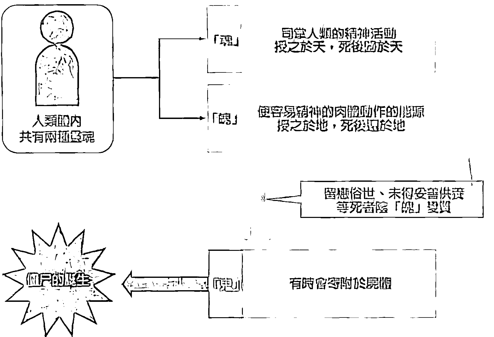

# 僵尸的特征

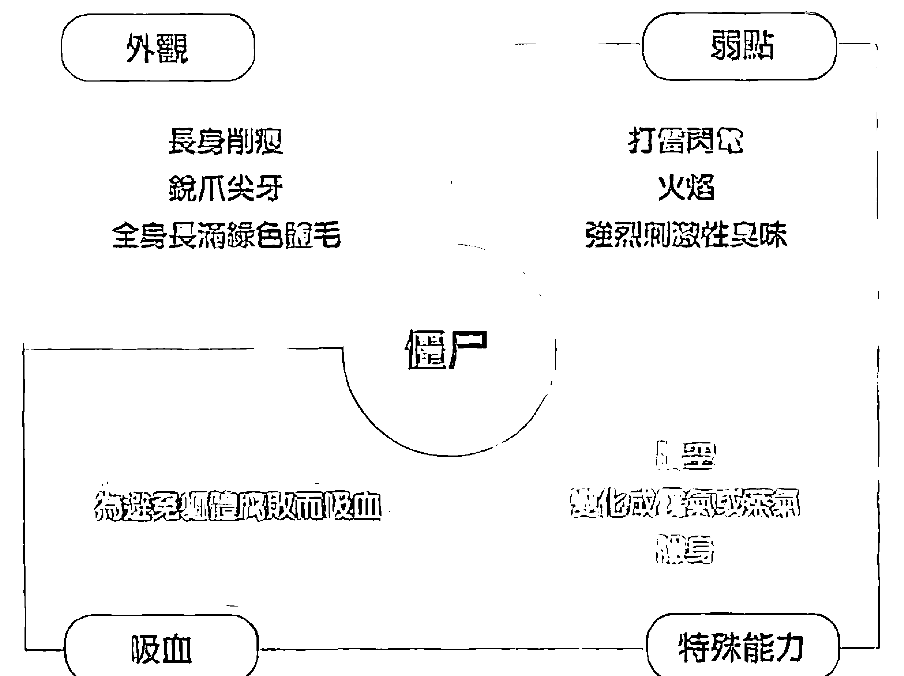

- ◇东欧的吸血鬼传说→No.002
- ◇吸血鬼的弱点→No.004

# No.028

# 日本的吸血鬼

# Japanese Vampire

在日本的民间信仰及传说中除食人鬼以外，更有许多爱饮活血、使人不禁联想到吸血鬼的妖怪

# ☆ 矶女和飞缘魔

日本各地不乏许多鬼怪传说，例如仁明帝在位时使京城为之骚动的大江山酒吞童子，以及取胎儿活胆替自己服侍的小姐治病，却误杀亲生女儿的安达原的妖婆，不过这些都是吃人肉的食人鬼，不能算是吸血鬼。

要说到有明确吸血行为的妖怪，九州有个在海边出没的矶女。这个女妖怪又名矶姬、海姬，会变身为乌黑长发的绝世美女，用美丽外表与动人嗓音引诱渔夫，然后把受骗的受害者鲜血吸得精光。据传九州的渔夫会随身携带三支自家屋顶的稻草，当作驱退矶女的护身符。根据日本民间传说，矶女是由千年船虫（海蟑螂）所化；曲亭马琴的长篇传奇小说《南总里见八犬传》里有个名叫船虫的恶女，便是矶女形象的投影。

与鸟山石燕《画图百鬼夜行》并列为江户时代后期妖怪图画杰作的竹原春泉《绘本百物语》里，绘有一种叫做飞缘魔的女妖。飞缘魔念作“ひのえんま”，音通“丙午”（ひのえうま）。日本民间相信丙午年出生的女性，阴阳五行中的“火”行太盛，男人都会遭殃：其实此迷信是由江户时代传至日本、丙午山的母马咬死公马的中国传说演变而来。从前有个卖菜姑娘阿七，她因为太想再次见到某次火灾时邂逅的男性，不惜四处纵火，结果在1682年遭处火刑，后来这则故事因为井原西鹤的《好色五人女》而声名大噪；据说这个阿七就是丙午年出生，可谓日本人将丙午之女视为妖怪的见证。

飞缘魔这种吸血鬼会夜夜出没吸取男性精血以致死亡，是种利用倾城美貌诱惑男性的妖怪，而其吸血行为其实就是在暗喻榨取男人财产屡致倾家荡产的恶女。

# # 丙午之女民间信仰与飞缘魔

## 中国传说

丙午山母马咬死公马

## 日本传说

丙午年出生的女性会让男性死于非命

## 卖菜姑娘阿七的故事

丙午年出生的女子，因想再见到某次火灾遇见的男性而四处纵火，最终被判火刑

## 飞缘魔

# # 任官于地狱的小野篁

如今已成吸血鬼既定形象的“夜之贵族”属性，乃因19世纪以后透过波里多利的《吸血鬼》等文学作品所确立；原来东欧传说中泛着霉烂泥土气味的吸血鬼，本无一点贵族的痕迹。然而，若谓吸血鬼乃指往返于阴阳死生界者，那么任官于日本平安时代前期的从三位参议贵族小野篁，可算得上是位值得一提吸血鬼般的人物。根据传说记载，小野篁白天出仕朝廷，夜里则从六道珍皇寺后面的水井前往地狱，担任阎魔王的第二冥官，协助审讯判决。

据考证，《篁物语》应是成于10世纪后半期，记载小野篁与异母妹比右子不伦之恋遭到拆散，抑郁而终的比右子死后变成亡灵出没的故事，使人不禁联想到吸血鬼鲁斯凡离士影射的人物，亦即跟异母姐姐奥古斯塔（Augusta Leigh）密切来往而苦的诗人拜伦。小野篁跟拜伦有不少共同点，此人颇有诗才而有日本白乐天美称，在“城女”间亦是花名扬扬。此外小野篁之孙——歌人小野小町，在京都洛北补陀洛寺亦有亡灵传说流传。

◇吸血鬼的特征 No.003

酒吞童子：平安朝时代，盘据京都西北大江山众鬼的首领。传说原是被扔在大江山的弃儿，也有一说为寺庙的小僧。小僧是寺庙拾来的弃婴，并非正式出家人。因为不想出家而从寺庙逃走，至今仍保持“童子”之姿。

# # 吸血杀人魔
Vampire Murderers

绑架、监禁、杀害，然后饮血。就某方面而言，实际存在的吸血杀人魔其实远比小说与传说中的吸血鬼来得可怖。

## 鬼音狂宴

跟人称“杜塞尔多夫吸血鬼”的彼得·库登一样有吸血鬼绰号的罪犯很多，然而在这些罪犯当中，真正曾经喝过鲜血的却很少。让我们来看看这些少数的例外。

1950年出生于加州的理查·蔡斯满十岁以后，人生才开始扭曲。他的母亲是位人格障碍者，其负面影响使得蔡斯逐渐产生许多奇怪的妄想。他认为自己的血液正在不断地粉末化，于是便开始杀害小动物、饮用鲜血好阻止血液变成粉状；随着妄想症状的加剧，目标很快就从小动物、大型动物，转移至人类。1977年12月底至1978年1月，短短一个半月时间，蔡斯就杀害并喝了六个人的鲜血。被警察逮捕以后，蔡斯服下致命剂量的抗抑郁药物、自杀身亡。

“佛罗里达吸血鬼”约翰·布伦南·柯鲁切利生于1945年。1985年，他绑架并囚禁一位路边搭便车的少女、施以暴行后采取其血液，然后若无其事地表示自己是吸血鬼，在她面前喝下鲜血。后来少女自行脱逃报警，柯鲁切利被判终身监禁，最后同样在牢里自杀而亡。他也是佛罗里达州另几桩杀人事件的嫌疑犯，但现已无从考证。

父亲过世以后，“怀抱不死梦想的男人”马修·哈特曼一直无法抹去人类对死亡的强迫观念，终致发狂。他妄想唯有成为吸血鬼才能免于死亡，终日耽溺于吸血鬼小说和电影，最后却在踌躇失措间袭击一位名叫美宝·雷尚的老太太、挖出心脏啜饮生血。

> > 强迫观念：其性质多是一些并非是患者自愿产生的思想、意向和冲动，这些观念会反复或持续不断地进入患者的意识，挥之不去、控制不住；其内容大多是一些不健康、不适应、互相矛盾、十分乏味的想法。

# “沙加缅度吸血鬼”理查·崔斯

- 妄想自己的血液变成粉末状以至饮血
- 一个半月内杀害六个被害者、饮其鲜血
- 被捕后服下致命剂量抗抑郁药物自杀

# “佛罗里达吸血鬼”约翰·布伦南·柯恩切利

- 绑架搭便车的少女、饮其鲜血
- 警方怀疑另外数起杀人事件亦是柯恩切利所为
- 被捕后被判终身监禁，在牢里自杀身亡

# “怀抱不死梦想的男人”马修·哈特曼

- 妄想只要变成吸血鬼就不会死亡
- 欲成为吸血鬼而袭击老太太、吃下其心脏
- 逮捕后被判终身监禁

# “杜塞尔多夫吸血鬼”彼得·库登

- 幼时遭父亲虐待，埋下日后残虐性格的种子
- 四年内杀害29人，割喉饮血
- 向妻子告白所犯罪行，最后被判死刑

# “汉诺威吸血鬼”弗里茨·哈特曼

- 咬破被害者咽喉、食其血肉的食人癖好者
- 六年内杀害28～48位年轻男性，将尸体当作普通食用肉品贩卖
- 遭逮捕后被判死刑

# [附记项目]

◇约翰·乔治·海尔-No.032

# # 伊利莎白·巴托里伯爵夫人
Countess Elizabeth Bathory

伊利莎白·巴托里伯爵夫人凌虐数百少女榨取鲜血，只为追求永恒的青春美貌。

## ☆血腥的伯爵夫人

历史上被唤作吸血鬼揶揄的王公贵族可谓不胜枚举，然而除却比喻用法，真正按照字义榨取领民鲜血的吸血鬼，除伊利莎白·巴托里伯爵夫人不作他想。距弗拉德·采沛戌一个世纪后，伊利莎白·巴托里于1560年出生在外西凡尼亚和瓦拉奇亚公爵家有姻亲关系的家族——巴托里家族。代代实行近亲联姻的巴托里家族流着晦暗淫邪的血液，伊利莎白的近亲当中就有许多知名的色情狂、同性恋和恶魔崇拜者。

伊利莎白15岁的时候嫁给匈牙利的贵族佛伦·纳达斯第伯爵，移居至位于尼特拉地区的塞伊特城。当丈夫领着士兵在领地内四处奔波的同时，她内的黑暗血脉也就在塞伊特城开花结果。她透过男仆托尔科将女巫师多罗蒂亚·森滕斯与森林女巫达尔维拉召入城内，把跟自己反目成仇的婆婆身边的侧近与女仆们关进地牢，施以刑罚拷问虐杀。

1600年丈夫过世以后，伊利莎白的残虐嗜好变本加厉。她先暗杀碍眼的婆婆，控制住塞伊特城，比从前更狂热地埋首于邪恶诅咒与妖术研究。某次她将一个犯错的女仆打得浑身是血，隔天竟然觉得被女仆鲜血溅到的皮肤异常光滑；此后深信处女的血液有回春奇效，于是就使用各式各样的拷问器具，先是向塞伊特城的女仆下手，接着又以聘请女佣名目召集领地内的少女榨取鲜血，在恍惚出神状态下用鲜血沐浴全身。

后来此间恶行恶状终于传入当局耳中，伊利莎白就在1611年被逮捕，终身被囚禁在塞伊特城内。

# 伊利莎白·巴托里伯爵夫人年谱

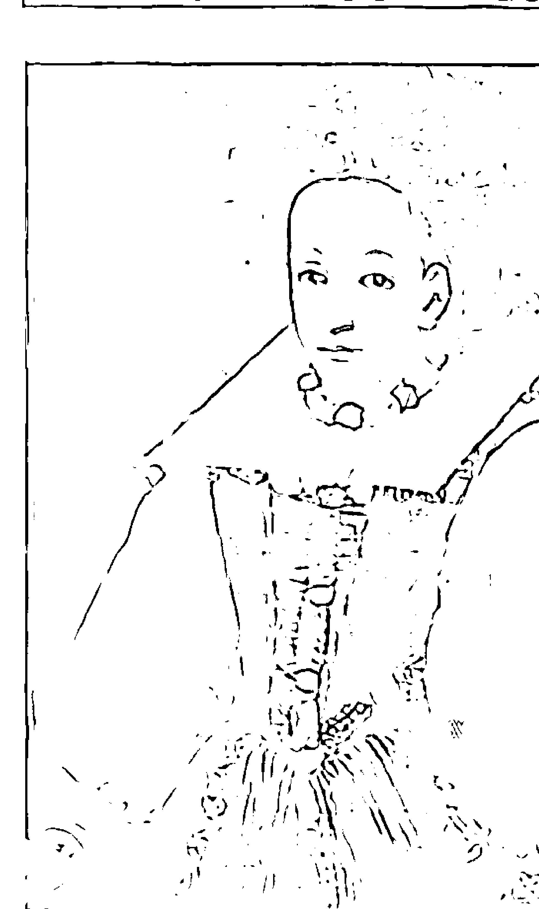

| 年份 | 事件 |
|------|------|
| 1560年 | 出生于外西凡尼亚的巴托里家族 |
| 1575年 | 嫁给约翰·纳达斯第伯爵、迁居恰赫提斯城堡 |
| 1600年 | 丈夫去世，恰赫提斯城堡内的塔楼进行改造 |
| | 被害者包括城中女性与邻地内年轻女性，估计超过600人 |
| 1610年 | 匈牙利国王下令逮捕，伯爵夫人被捕 |
| 1611年 | 宣告终身监禁于恰赫提斯城堡 |
| 1614年 | 54岁逝世于恰赫提斯城堡 |

# 伊利莎白·巴托里伯爵夫人爱用的拷问手段

| 手段 | 描述 |
|------|------|
| 初步拷问 | 针刺指甲缝、针刺乳房、用针签死老鼠、用火红的铁棒戳喉咙 |
| 铁处女 | 命德国铁匠制作的铁人。把人关进对开的铁偶内，用内部铁钉刺穿被害者。 |
| 铁马桶 | 命铁匠制作的铁笼，里面装有无数铁钉。被关在铁笼里的人只要稍微移动身体，就会被铁钉刺穿流血。 |

> ◇女巫→No.012 ◇弗拉德·采沛戌→No.020

# # 吉里·德·莱斯男爵

## Baron Gilles de Rais

被引为童话《蓝胡子》创作蓝本、让小朋友们惧怕不已的恐怖拷问者，其实原本是位曾经在英法百年战争中跟随圣女拯救法国的战争英雄。

# # 蓝胡子男爵

所有偷窥过城堡深处紧闭房间里骇人秘密的新娘，全都会被蓄着蓝色胡须的丈夫亲手杀死；在这篇佩罗所著、格林兄弟童话集亦有收录的《蓝胡子》童话背后，其实有位实际存在的历史人物。跟弗拉德·采沛戌同时代的法国大贵族吉里·德·莱斯男爵出生于1404年，时值英法百年战争期间。

吉里继承早逝双亲留下的庞大遗产后，非但成为极富教养的青年贵族，其聪明才智更是超越了所有的贵族子弟。此外吉里武勇过人，曾于1420年自资组织骑士团，向英国占领的奥尔良进军，并且邂逅“奥尔良贞女”圣女贞德。在这段充满荣耀的短暂岁月里，吉里无时无刻都随侍在这位蒙受上帝指引的少女身旁。吉里担任贞德的副手一同奋战，并且在奥尔良解放之后，得授元帅勋位的最高荣誉。

然而，当他崇拜的少女被教会异端审问法庭认定为女巫、送往火刑场的时候，吉里的命运亦随之大兴波澜。逊法国政治中枢疏远之后，吉里开始向神秘思想倾倒；此外不知是否出于圣女信仰之反动，他还耽溺于与美少年间的男色行为。从此他只闭居于广大领地内，并倾尽所有财产在居城蒂福日城从事炼金术研究；最后他是在意大利出身的魔魔法师法兰西斯科·佩拉提唆使怂恿下，才开始从事诡异阴晦的黑魔法仪式。

法国作家于斯曼便从吉里身上发现吸血鬼的性质，并且在小说《在那儿》中记述吉里如何对领地里掳来的少年施以性拷问、如何沐浴在少年鲜血中狂喜不已的景象。

## 吉里·德·莱斯男爵年谱

- 1404年: 生于法国名门贵族之家
- 1420年: 组织骑士团迫害奥尔良
- 1429年: 迎回圣女贞德 得授法兰克王国元帅勋位
- 1431年: 圣女贞德遭受火刑
- 1432年: 祖父过世，继承庞大财产 (倾向神秘思想、行使黑魔法仪式)
- 1440年: 被逮捕后，经异端审判所判处火刑

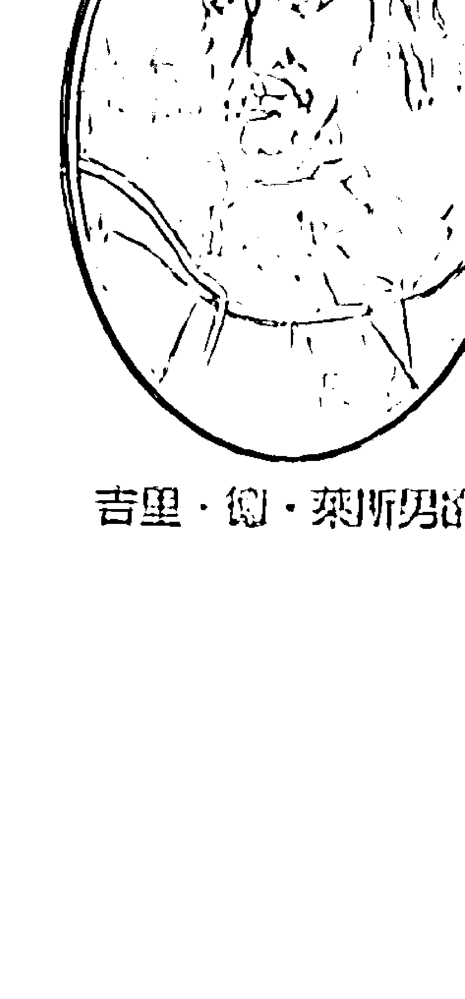

## 吉里·德·莱斯男爵的明与暗

**前半生**
- 名门贵族
- 法国元帅
- 女巫祭拜
- 骑士精神
- 具有多面且密艺术气质

**后半生**
- 倾向神秘思想
- 研究炼金术
- 恶魔崇拜
- 行使黑魔法
- 对美少年施以男色行为

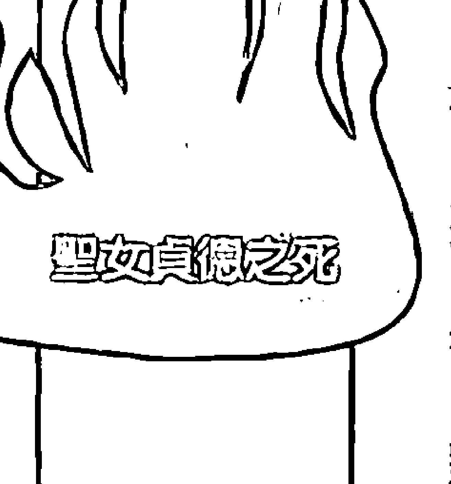

> ... ... - No.020 ◇女巫→No.012

# No.032

# 约翰・乔治・海尔

**John George Haigh**

四处杂乱地树立着十字架，淌血的森林……这个噩梦不断驱使着男子犯下吸血杀人案。将梦中血盂一饮而尽，他已经成为真正的吸血鬼。

# ☆ 血腥噩梦缠身的男子

1949年2月，苏格兰警场就寡妇奥莉芙・杜兰・狄肯失踪案，针对此案重要关系人暨报案人约翰・乔治・海尔进行调查时，不禁为这名犯罪者的骇人罪行感到战栗。海尔先是巧妙地引诱并杀害被害人后，从被害人刀伤伤口吸饮鲜血，接着用硫酸溶解尸体流入下水道；1944年至48年间，海尔用相同的犯罪手法杀害至少9位生前与他相识的被害者。

后来海尔当然遭到警察逮捕，所有报纸都把他写成“伦敦吸血鬼”大肆报道，审判定谳五年后处刑。约翰・乔治・海尔出生于1910年，乃林肯郡电气技师之子。根据他在狱中写的告白录，海尔是在12岁时候发现自己有嗜血癖好，当时他吸饮手部伤口流出的鲜血，就感觉到血液里生命力的存在；但追根究柢，海尔少年时代的噩梦应该有相当大的影响。他可能是在加入韦克菲尔德大教堂圣歌队的时候，对在教会见到的基督受刑像留下非常深刻的印象，后来就多次梦见双掌淌着鲜血的耶稣基督。决定性的噩梦发生在1944年。海尔看见一个奇幻至极的景象，他梦见自己身处无数十字架杂乱林立的森林里，后来十字架全变成了树木，枝头还不断有鲜血渗出。树林里有个男子，向他递出盛满鲜血的血盂，尽管海尔感到某种渴望，他终究未能在梦中接过血盂饮下。不久，海尔便犯下第一起杀人案。当他割开被害者喉咙、啜饮温热鲜血的时候，他又回到了那夜梦中的十字架森林里。这次他选择接过血盂一饮而尽，“伦敦吸血鬼”于焉诞生。

# 伦敦吸血鬼

少年时代 舔舐流血 母口发现 吮血癖好

从小到大 不断出现、不可压抑的“欲望”

# 吸血的渴望

# 连续杀人事件

# 附录：海尔的手下亡魂

| 编号 | 描述 |
|------|------|
| 第1被害者 | 威廉·唐纳·麦克史旺 (William Donald McSwann, 约翰·海尔友人) |
| 第2被害者 | 姓名不详的女性 |
| 第3、4被害者 | 第1被害者威廉的双亲 |
| 第5被害者 | 名为麦克斯 (Max) 的男性 |
| 第6、7被害者 | 阿奇博·庞德森 (Archibald Henderson) 及其妻罗丝 (Rosalie, 约翰·海尔友人) |
| 第8被害者 | 名为玛丽 (Mary) 的女性 |
| 第9被害者 | 奥莉芙·杜兰·狄肯 (Olive Durand Deacon, 约翰·海尔友人) |

一般来说，日本通常都是以“吸血鬼”充当“Vampire”译语。本章已经介绍过，从前在英语法语等西欧语言里，并无足以指称吸血鬼的单字，后来18世纪初来自东欧的单字“Vampire”才得以确立、通全欧；同样地，古日本语亦无吸血鬼此类用语存在，因此“吸血鬼”此译语无疑是在“Vampire”概念从欧洲传入日本后新造的译语。

至于究竟是何时、何人最初采用“吸血鬼”此译语，目前并无明确定论，但根据某些吸血鬼文学研究书籍记载，此人很可能就是人称“日本达文西”的知识巨人南方熊楠。他在投稿《人类学杂志》1915年4月号的文章〈论咀言〉当中，曾写道：“东欧州有吸血鬼，需受父母伦俗诅言而死”。后来熊楠更特意在言及“Vampire”的各种论文中，将此字译作“吸血鬼”。此外，最初被译成日语的吸血鬼小说，则是在熊楠发表该论文的前一年1914年，芥川龙之介翻译之哥提耶（Theophile Gautier）的《多情女》（Clarimonde）。芥川在翻译这本著名的哥德恐怖小说时，则是将原书中的“Vampire”文字译作“夜叉”。芥川在文学领域不问东洋西洋，是出名的博学强记，而且又特别喜欢怪力乱神妖怪变化之异闻；既然他并未使用“吸血鬼”一语，足见“吸血鬼”此译语在1914年时尚未普及。这便是将南方熊楠视为“吸血鬼”译语发明者的理论根据之一。

不久，“吸血鬼”便慢慢开始普及。大正时代的作家国枝史郎对半村良等日本传奇作家影响颇巨，他在1925年发表的《神州绚烂城》当中，替“吸血鬼”一语附上假名“バンパイアー”（Vampire）；此外1929年冈本绮堂重译芥川龙之介译过的《多情女》，便将从前芥川所译“夜叉”改译为“女吸血鬼”，还跟国枝一样附上假名“ヴァンパイア”（Vampire）。『吸血鬼』此语在1920年代渐渐普及，后来应是在1930年左右江户川乱步发表《吸血鬼》的时候才成为一般用语。这部小说并非灵怪恐怖小说，而是在描述为报仇而连续犯罪的故意；乱步以“吸血鬼”为书名，无疑更进一步提升了国人对“吸血鬼”此词的认知程度。《吸血鬼》发表翌年，环球电影公司由贝拉·路可西（Bela Lugosi）主演的《德古拉》在日本公开上演，接着1932年又有佐藤春夫翻译约翰·波里多利的小说《吸血鬼》，此时佐藤便已将“吸血鬼”视为“一般通用”的译语采用。

*佐藤春夫：1892~1964，日本知名诗人、小说家。曾来台旅行，将台湾风情写入他的作品中，引起许多回响。

# 第2章

# 吸血种士淑女录

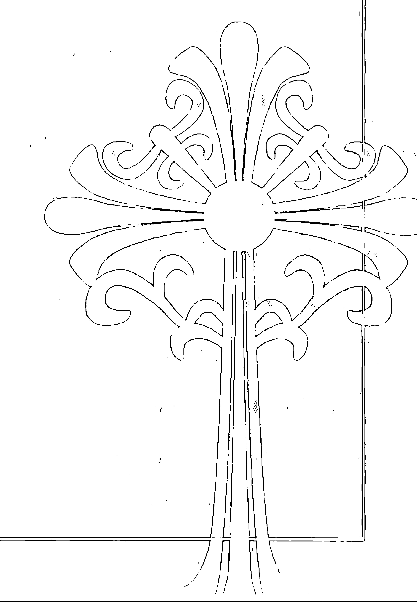

# No.033
法兰西斯·瓦涅爵士
Sir Francis Varney

吸血鬼瓦涅爵士的传记以血淋淋的尸块占据廉价杂志封面，并藉由煽情字句和粗犷笔法煽动读者的阅读欲。

# ♡ 吸血鬼瓦涅

英王查理一世遭处死刑、建立英国共和制度的护国公克伦威尔死后，因1660年王政复辟而重返大英帝国王位的查理二世治世，有个吸血鬼趁夜将毒牙伸向美丽女性的粉颈，用她们高贵的鲜血滋润喉咽。

法兰西斯·瓦涅爵士的骑士装扮下暗藏苍白肌肤与尖锐血牙，乃吸血贵族之原型，可谓是约翰·波里多利以贵族凡爵士确立之厌世而残酷刻薄的夜之贵族形象，以及布拉姆·史托克所创德古拉伯爵之间的过渡角色。吸血鬼瓦涅有对尖锐毒牙、如铅双眼，身材修长；作者必须用大量充满鲜血和尸块的血腥画面给予读者源源不绝的刺激和兴奋感，是以此作内容支离破碎、缺乏一致性；光是瓦涅爵士的前身，就有因杀害儿童而被龙骑兵射杀的男子莫蒂默，以及因自杀而不得神明恩宠的马默杜克·班涅沃斯两种矛盾说法，情节极为混乱。

瓦涅爵士害怕阳光，白天藏身在阴影下或屋内，直到街市喧嚣的夜晚来临才开始活动。他以各种不同的姓名与身份，时则袭击美女，时则投身于危险而浪漫的冒险旅程；在这部长达220章868页的长篇小说中，爵士曾经中弹、被木桩打穿心脏，甚至被勒毙，数度身亡。不过每当月光洒在其尸骸上，就会复活、再次出现在被害者面前。就在一次又一次的冒险、破灭和月光下复活的无限循环中，故事一再地重复，直到最后瓦涅爵士对人生感到厌倦，前往意大利的维苏威火山、投身于灼热的火山口，才终于为邪恶的复活循环画下了终止符。

## 法兰西斯·瓦涅爵士档案

| 活动时期 | 1660年以后 |
| :--- | :--- |
| 外貌 | 贵族骑士装扮、身材修长的吸血鬼，有对尖锐犬牙、如蜡的苍白大眼 |
| 能力 | 每当月光照时就能复活 |
| 前身 | 马休·杜克·班涅沃斯或沃康松，角色设定矛盾 |

厌世投身火山以免再度复活

## 贵族吸血鬼之演化

**形象之演化**

**约翰·波里多利《吸血鬼》的人物，贵族吸血鬼之嚆矢**

**法兰西斯·瓦涅爵士**

詹姆斯·马尔科姆·赖默《吸血鬼瓦涅爵士》（部分有日译）

**德古拉伯爵**

布拉姆·史托克《吸血鬼德古拉》，确立厌世而残酷刻薄的「夜之贵族」形象的吸血鬼

> （注）《Varney the Vampyre, or, The Feast of Blood》· James Malcolm Rymer
（出版信息）· Dover Publications Inc.

### 鲁斯凡爵士
#### Lord Ruthven

鲁斯凡爵士淫欲而放纵，使原本的东欧土俗妖魔吸血鬼演变成「夜之贵族」，约翰·波里多利《吸血鬼》的邪恶主角。

## ☆邪恶的鲁斯凡爵士

伦敦名流聚集、争奇斗艳有如孔雀的社交沙龙里，有位外型迥异格外引人注目的贵族。铅灰色光芒的双眼与蜡白肤色虽使其容貌有如死者，却也衬托出轮廓均整而美丽的五官，沙龙里试图引起他注意的贵妇岂是一二人而已。约翰·波里多利《吸血鬼》里的鲁斯凡爵士，是首次结合吸血鬼与颓废贵族形象的作品，乃对德古拉伯爵人物造型影响颇巨的吸血鬼原型。

整个故事是以被吸血鬼迷惑而失去一切、终至破灭的青年士绅奥布里为第一人称进行描述。奥布里跟鲁斯凡爵士同行游历欧洲，却在希腊邂逅两个怪异的事件：吸少女鲜血以获永生的吸血鬼肆虐，以及鲁斯凡爵士被拦路打劫的强盗开枪打死，尸体却无端失踪。奥布里归国后，竟然遇见理应已经死亡的鲁斯凡爵士，而且爵士还跟自己最疼爱的妹妹订下婚约，发生了一连串不祥的事件。最后这位青年因为自己的无能为力而抑郁以终，妹妹亦难逃邪恶吸血鬼毒牙、香消玉殒。

邪恶吸血鬼鲁斯凡爵士的蓝本人物，就是当时社交界的宠儿、同时与许多女性传有绯闻花名的乔治·戈登·拜伦；至于那位一生全毁在吸血鬼手上的青年奥布里，当然就是在写曾与拜伦同游欧洲、后来又与拜伦决裂的波里多利自己。

或许正是因此，这部小说当初才会被人误认为拜伦的作品，而拜伦亦拜此误解之赐而在文坛获得名过于实的过高评价；后来诺迪埃将这部小说改编成剧本搬上舞台，成为1820年代法国林荫大道剧场最受欢迎的戏码之一。

### 1. 吸血鬼之原型

- 被出卖的活人
- 脸部暗黑浮肿泛红、指甲
  阶段变长
- 仍穿着埋葬时的褴褛尸衣
- 出现于沼泽树丛等地
- 不具备智能的怪物

- 外貌出众的高帅人族打扮
- 参加社交界活动的正式
  服装
- 赋予吸血鬼高贵气质与
  颓废的形象

变化

### 波里多利与拜伦

- 贵族
- 英国浪漫派代表诗人
- 社交界宠儿

- 拜伦的主治医师
- 曾与拜伦同游欧
  洲，后来决裂

波里多利从拜伦的时与作品获得灵感，创作《吸血鬼》

1819年《吸血鬼》被盗成拜伦作品出版

约翰·波里多利对《吸血鬼》批判不满

- 不满被写成鲁斯凡·波士
- 不满自己跟吸血鬼作品
  沾上关系

《吸血鬼》所受好评，掀起19世纪欧洲的「吸血鬼风潮」

《吸血鬼（Vampire）》、John Polidori著、1819年，New Monthly magazine and monthly register

## 卡蜜拉・卡恩斯坦

Carmilla Karnstein

少女在美丽妖姬的诱使下一步步走近死亡。雪利登・勒法努《吸血鬼卡蜜拉》描写的吸血妖姬对后来的吸血鬼小说有很大的影响。

## ◇同性爱的吸血鬼

19世纪中叶，在奥地利历史悠久的州郡施蒂里亚，有种奇怪的疾病让家有年轻少女的人家为之苦恼不已；当地频频传出容貌端正姣好的良家女孩，突然日渐衰弱终至死亡的离奇事件。当地名士斯庇尔斯朵夫将军有位一直当作亲生女儿疼爱的侄女贝尔塔・林费尔德也是这怪病的受害者。将军因为侄女的死而悲痛不已，但他确信这出悲剧是由一个不久前才进入将军府的少女蜜拉卡（Millarca）所招致，并且在摩拉维亚贵族冯登堡男爵协助下，发现从前为害当地的吸血鬼。

吸血鬼卡恩斯坦伯爵夫人蜜卡拉（Mircalla），是从前因内乱而香火断绝的当地领主之女，其肖像画拥有1698年的字样。尽管她已经死亡逾百年，将军一行人打开存放于卡恩斯坦家礼拜堂的棺柩时，却发现蜜卡拉遗容与生前无异，甚至还带着点生命的余温，而灌铅的棺柩底部更积有7英寸高的血液。

蜜卡拉变成吸血鬼后，遂变换名字字母排列顺序，以蜜拉卡、卡蜜拉等假名进行活动；她还跟不知名的共犯一起与附近贵族交流，让子女寄生于贵族人家，就像把自己的卵产在别种鸟巢的鸟类一样。

伯爵夫人看上哪户人家少女的时候，就会为该少女带来性的愉悦，并吸取鲜血作为交换、维持永恒的生命。

伯爵夫人变成吸血鬼之来龙去脉已然不能确知，但根据吸血鬼研究家冯登堡男爵说法，先是个做过坏事的自杀者死后变成吸血鬼，后来夫人遭其攻击，才会变成为害乡里的怪物。

### 塞希里亚州连续吸血事件

用假名与邻近贵族交流、接近年轻女孩

少女终将衰弱而亡

为少女带来性愉悦、吸血作为代价

### 蜜卡拉名字字母排列

改变字母排列当作假名使用

| 本名 | 假名 |
|------|------|
| 蜜卡拉 Mircalla | 卡蜜拉 Carmilla |
|  | 蜜拉卡 Millarca |

> 小说《Carmilla》，J. S. Le Fanu著，1872年，The Dark Blue

### No.036 马格努斯・加尔迪伯爵
Count Magnus de la Gardie

《马格努斯伯爵》描写具吸血鬼黑暗性格的邪恶领主之恐怖统治及复活传说，乃英国幽灵小说巨匠M・R・詹姆斯的代表作。

## ☆恶魔之旅

马格努斯・加尔迪伯爵是17世纪初瑞典的贵族。

马格努斯伯爵以毫无慈悲心闻名，从前附近农民起兵叛乱，他便毫不容情地挥军镇压严惩不贷；即便佃农只是稍有过错，他一贯以严刑处置，据传他还曾经偷偷地杀害并埋葬了许多碍事的自耕农。然若只是毫无慈悲心，马格努斯伯爵不可能在死后数百年仍教人又恼又恨。

传说伯爵生前曾经有过一趟神秘的「恶魔之旅」；此行目的地不明，但根据伯爵自己的说法，他是去敌基督的出生地哥拉汛。有人说伯爵在这段旅程中拿了又或者带了某种东西回来……当地民众害怕这段传说，甚至更甚于伯爵恶名。

18世纪后半期有些人认为「伯爵已死」而在马格努斯伯爵领地里狩猎，不料却遭不明存在攻击杀害。

这个事件使得附近居民更加惧怕伯爵。

后来1863年有个好事者拉克索来瑞典旅游；他拜访伯爵后裔听闻其各种传说，竟对这恶魔般的人物深感兴趣。

马格努斯的棺枢原本有三道锁，但拉克索三度不经意说出「想要见见马格努斯伯爵」，三道锁便随之一一解开。当最后的锁也被解开时，棺材盖应声开启。

拉克索虽成功逃离瑞典，但身后总有二个可怕的神秘人物不断与他纠缠，直到他死亡为止。由于纪录中并未记载尸体的状态，因此拉克索是否曾遭吸血亦不得而知；纪录里唯有记载其死因——「天谴报应」。

### 马格努斯伯爵年谱

1600年代初期，残忍高压统治时代
「恶魔之旅」

「恶魔之旅」的意义：探索未知的地理与心灵边界

约1770年，村里两个年轻人在已故马格努斯伯爵的领地内打猎、惨遭杀害

1863年，英国籍好事者拉克索不慎唤醒马格努斯伯爵、遭「天谴报应」

### 拉克索其人

现况
小有储蓄毋须工作
为编写第二本游记而前往瑞典取材
为兼顾兴趣而从事文字创作业？

身后
天涯孤独孑然一身
行旅各地漫游度日
死后大部分遗物与著作都焚毁散佚

> 参考书目：《Count Magnus and Other Ghost Stories》· Montague Rhodes James
· Penguin Classics

### No.037

## 康拉德·渥肯

### Conrad Vulkan

企图统治君临洛杉矶的勇猛荒鹫。罗伯特・R・麦卡门笔下《焦渴鬼域》的新时代吸血鬼之王。

#### ☆焦渴鬼域

科隆斯汀城这座城堡原是行事风格特异的恐怖片演员奥龙・科隆斯汀的物产，建在俯瞰洛杉矶的小山丘上。此城现任城主是康拉德・渥肯王子，乃14世纪匈牙利国王「鹰王」约翰・渥肯嫡子，从1342年以后就不再是人类的吸血鬼。

康拉德发挥与生俱来的指挥能力，将匈牙利的吸血鬼组织起来以后，遂以自己的领地为起点展开数波有组织的猎杀行动，时则悄然征服邻近的孤立村落，不断地扩张势力。后来康拉德更与孕生吸血鬼的巨大黑暗力量「首脑」接触，除获得全新的力量以外，还受命渡海前往新大陆。

成功潜入美国以后，康拉德先是在各地建立小型吸血鬼殖民地，逐步将势力扩展至洛杉矶，然后利用连环杀人魔与吸血暴走族等爪牙在暗地里活动，准备把洛杉矶献给首脑。

康拉德起先运用麾下吸血鬼部队与首脑的魔力，成功地以砂尘暴封锁住洛杉矶，派吸血鬼占领了整个城市。在洛杉矶市内，安迪・帕拉塔辛警官的故乡匈牙利已经被康拉德占据，现在又再度目睹相同事件发生；席维拉神父则患有肌萎缩性脊髓侧索硬化症，有今天没明天……除此二人以外，还有爱看恐怖电影的汤米・钱德勒、女友变成吸血鬼的魏斯・里奇、盖尔・克拉克等人，众人奋起对抗吸血鬼，虽然付出相当惨重的牺牲，终于打倒了康拉德；至于充斥洛城街头的吸血鬼，也被紧接而来的洛杉矶大地震与海啸全数消灭。

康拉德虽亡，然麾下吸血鬼仍潜伏于世界各地。相信不久的将来，吸血鬼必定会在首脑的命令下再度来犯。

### 黑暗势力组织图

### 四位勇士

| 名字 | 描述 |
|------|------|
| 弗朗茨・帕拉塔辛警官 | 出身于匈牙利克拉杰村，故乡遭康拉德所率吸血鬼所灭的洛杉矶警察，挺身对抗康拉德 |
| 傑米・钱德勒 | 沉迷恐怖电影的御宅族少年，双亲惨遭吸血鬼杀害；后得帕拉塔辛警官赏助，遂协助警官潜入吸血鬼城堡 |
| 厲維拉神父 | 向洛杉矶街头迷途羔羊宣扬神爱、奋力对抗邪恶死品的神的士兵；患有肌萎缩性脊髓侧索硬化症，仍不惜与康拉德性命相搏 |
| 山姆・里奇 | 蓝调色剧演员。曾试图偕同女友桑妮（Solange）逃出洛杉矶，女友却遭吸血暴走族头目眼镜蛇掳去，魏斯为救女友而与厉维拉神父共同对抗康拉德 |

参考数据

> 《They Thirst》，Robert R. McCammon著，1981年，Kinnell

### No.038

## 拉度・莫拉萨子爵

### Viscount Radu Molasart

F・P・威尔逊笔下透过「夜世界循环」（Nightworld Cycle）威胁人类社会，成为日后吸血鬼传说原型的超古代文明混沌盟主。

## ◇永劫魔性

罗马尼亚的迪努山口有座附近村民称作「城寨」的无名城堡。1941年4月，第二次世界大战东部战线苏德战争爆发前夕，德国防卫军最高司令部决定派遣小规模监视部队，进驻这位于连结苏俄草原地带与普洛耶什蒂油田区之军事要道上的城堡。接获此任务的克劳斯・霍尔曼上尉及其部属不顾代管理此城的当地居民反对，执意驻兵在一栋连飞禽也不敢接近的建筑物里；其中有两名士兵深信城堡必定藏有罗马时代的宝藏，并轻率地打开地底暗门，不小心释放被封印于黑暗中长达5个世纪的可怕人物——拉度・莫拉萨。

拉度・莫拉萨子爵是弗拉德・采佩什就任瓦拉几亚公爵当时手下的一位大贵族。莫拉萨子爵能巧妙地操纵人类痛苦、恐怖与疯狂等情绪，他躲在暴虐巨恶的弗拉德身后偷吸人血，并成为东欧地区吸血鬼传说之原型，不过他的真正身分却是比吸血鬼更加恐怖。在超古代文明繁荣、人类并无纪录的第一时代，全世界分成「光明」与「混沌」两个泾渭分明的对立阵营；莫拉萨子爵的真正身分，就是「混沌」的领导者：邪恶法师拉萨洛。尽管他一度被从前将他封印于城寨内的宿敌——「光明」战士葛拉肯消灭，但莫拉萨子爵却在濒死之际转移至其他肉体，再度现身于现代的曼哈顿，并派遣群魔企图再次毁灭文明世界。不过，在拼着一身老骨头的葛拉肯和「铁公鸡杰克」等勇者的奔走奋战之下，终于还是成功消灭了「混沌」群魔。

### 测度：莫拉萨子爵的足迹

| 太古时代 | 「光明」与「混沌」战后世界毁灭，跨越世纪的葛拉肯与莫拉萨的漫长战史 |
|----------|--------------------------------------------------------------|
| 15世纪 外西凡尼亚 | 于串刺公爵麾下暗地活动 葛拉肯打倒莫拉萨，将其封印于城塞中 |
| 20世纪 外西凡尼亚 | 1941年 德军进驻城塞，解开莫拉萨的封印 葛拉肯持圣剑毁灭莫拉萨的肉体 |
| 1968年 台北 | 莫拉萨的灵魂逃至基隆复制胎儿 吉姆・史蒂芬斯（Jim Stevens）体内 1968年 吉姆・史蒂芬斯死亡 1968年 莫拉萨夺取吉姆之子肉体而得以复活 1990年左右，莫拉萨对全世界宣战。 葛拉肯得「铁公鸡杰克」相助消灭莫拉萨 |

> 《The Keep》· F. P. Wilson著· 1981年· William Morrow

### # 威利・包尔舍特上校
Colonel Willy Borchert

丹・西蒙斯《腐肉的慰藉》当中，控制他人心志榨取生命力的新品种吸血鬼。

## 恶魔棋士

威利・包尔舍特上校生于普鲁士的贵族世家，能控制他人心志、榨取生命力维生，是个强大精神吸血鬼（Mind Vampire）。自从1925年认识名叫梅兰妮・富勒与妮娜・德雷顿的女吸血鬼后，他的能力便开始觉醒。时值纳粹运动势力大张，包尔舍特遂加入纳粹党并成功打进该党势力核心。第二次世界大战期间，包尔舍特经常和一位叫做「老人」的精神吸血鬼，用犹太人当棋子玩活人西洋棋。大战末期他已成为总理阿道夫・希特勒的侧近，但包尔舍特已经预见第三帝国的衰败，遂假死改名逃往战胜国美国，化作一位成功的电影制片。

包尔舍特在美国再次邂逅梅兰妮与妮娜，三个人玩起了杀人游戏，此时在暗地里控制着美国政府的精神吸血鬼组织「Island Club」已经在监视着他的一举一动。包尔舍特发现该组织以后，遂再度假死并尝试潜入该组织、统治美国。梅兰妮与妮娜不知包尔舍特只是佯作死亡，两人竟展开凄厉至极的相互厮杀，连Island Club也被波及，最后妮娜身亡、梅兰妮发疯，组织成员亦一一丧命。

此时包尔舍特突然现身，杀到组织立为根据地的岛屿，打败组织首领巴伦。然而，组织最后却在发狂的梅兰妮攻袭下崩坏，包尔舍特亦遭自己从前视为棋子的犹太人反击身亡。

包尔舍特向来都是藏身在安全处、把别人当作棋子远端操作；然而在最后这盘棋局里，选择现身、成为盘上棋子，即包尔舍特之败着。

### 威利・包尔舍特上校年谱

- 1925年 结识两个女精神吸血鬼
- 1944年 与纳粹军官「老人」玩活人西洋棋
- 1945年 战死于柏林攻防战（第一次假死）
- 1964年 出现在美国电视节目的观众席中
- 1980年 化身电影制片进行活动
死于飞机失事意外（第二次假死）
- 1981年 与「Island Club」首领巴伦玩活人西洋棋
遭自己视为棋子的犹太人役害

### 威利・包尔舍特上校之变迁

> 出处：《Carrion Comfort》・ Dan Simmons著・ 1990年・ Warner Books

### No.040
黎斯特・德・赖科特
Lestat de Lioncourt

恣意奔驰于红与黑杂沓扰动的历史中，安・莱丝《吸血鬼纪事》的调皮吸血鬼。

## ☆吸血鬼贵公子

吸血鬼黎斯特的名号为世所知，乃肇始于1976年美国出版的书籍《夜访吸血鬼》书背。这部作品是用小说的形式记录对18世纪出生的吸血鬼路易的访谈，黎斯特则是路易25岁时赐他黑暗赐礼的年长吸血鬼。

黎斯特・德・赖科特出自18世纪末法国的赖科特侯爵家；黎斯特得到老吸血鬼梅格能赐与黑暗赐礼时，已是1780年法国大革命即将爆发的前夕。黎斯特获得梅格能赐与蕴藏巨大魔力的血液、不经过程即变成吸血鬼，加上他与生俱来的破天荒性格，使黎斯特成为吸血鬼当中独树一格的叛逆份子。黎斯特言行举止与常人无异，他经商创业甚至涉足教会，一一粉碎吸血鬼比人类迷信更加固执、更加囿于偏见的固有黑魔法信仰习俗，甚至还推翻了传说中最年长的吸血鬼——巫会组织领导者阿曼德的权威，一度登上法国吸血鬼的顶点。

后来黎斯特为探寻吸血鬼之起源而离群出外游历，终于找到阿曼德之师马瑞斯，听他讲述堪称吸血鬼祖神的阿可奇和恩基尔的故事。告别马瑞斯以后，黎斯特为把路易和克劳蒂亚变成自己的家人，将两人变成吸血鬼、体验过一段家庭生活；后来他却又藏身地底深眠，直到20世纪文化烂熟期才又苏醒。由于黎斯特在绵长睡眠中累积了许多力量，醒来后更变本加厉大肆胡闹、组织摇滚乐团「吸血鬼黎斯特」；他还将稍有年纪地位的吸血鬼之姓名或传说写在歌词里，透过广播向这些黑暗之子挑衅、使吸血鬼世界陷入一片混乱。

### 黎斯特之生平

- 18世纪末: 生于法国的勒科特侯爵家
- 1780年: 被老吸血鬼梅格能变成吸血鬼
  - 有别于吸血鬼的许多特性
  - 推翻阿曼德的统治，登上法国吸血鬼之顶端
  - 为求吸血鬼之起源而来到传说中的吸血鬼岛
  - 得知如何可违背地底的沉眠
- 1791年: 把路易变成吸血鬼
- 1795年: 把克劳蒂亚变成吸血鬼
  - 其后和路易、克劳蒂亚共同生活65年
- 1929年: 躲进地底沉眠
- 1976年: 《夜访吸血鬼》出版
- 1984年: 半世纪后苏醒
- 1985年: 组成摇滚乐团「吸血鬼黎斯特」

### 黎斯特周围关系图

> 来源：《Interview with the Vampire》・ Ann Rice著，1976年・ Alfred A. Knopf

### # 约书亚・约克
Joshua York

乔治・R・R・马丁《狂热梦想》主角，试图使「暗夜之民」与人类达致融合，风格迥异的吸血鬼。

## ☆ 狂热的梦相

1857年，密西西比河充斥着轮船与钢铁男儿泪的时代，有艘叫作「狂热梦想号」的蒸汽船缓缓航行河面。船长阿布纳・马什从前曾经因为事故而失去自己的船，现在这艘壮丽的蒸汽船则是位想要享受密西西比船旅之乐的约书亚・约克投入庞大资金所打造，交给阿布纳来打理。约书亚・约克有个富豪间屡见不鲜的怪癖：白天闭居于豪华船室，只有晚上才会出现。然而，约书亚却未将其真正目的告诉他的合伙人阿布纳。约书亚是人称「暗夜之民」的吸血鬼，更是吸血鬼领导层级「血之支配者」之一员；他打造狂热梦想号，其实是要集结从世界各地来到密西西比河流域的所有「暗夜之民」。

「暗夜之民」间有个救世主传说：未来将有位「苍白之王」领导全体吸血鬼，回到他们的故乡——地下都市。约书亚开发出代替血液的液体，让暗夜之民遥不可及的梦想，亦即与人类和平共存的梦想出现一丝曙光，使众吸血鬼开始相信约书亚便是传说中的苍白之王。随着约书亚麾下吸血鬼日增，船长阿布纳得知其秘密后仍然欣然接受挚友约书亚及其理想。其后约书亚主动挑战另一位相当危险的血之支配者——千年吸血鬼达蒙・尤利安，不料却在狡猾尤利安强大的精神力之前败下阵来，象征其梦想的狂热梦想号亦遭剥夺。为了要和同胞命运与共，约书亚只能一度拜在尤利安帐下，不过他的狂热梦想却未曾止息；1870年约书亚再遇阿布纳，并且在阿布纳协助下再次挑战尤利安，经过几番激烈鏖斗终于消灭宿敌，真正成为暗夜之民的苍白之王。

## 狂熱夢想關係圖

約書亞·約克

種族的希望

狂熱夢想號

理想的船隻

慾望

阿布納·馬什

達蒙·尤利安

## 血之支配者

約書亞·約克

- 摸索人類與「暗夜之民」的共存之道
- 發現「暗夜之民」不吸血也能存活的方法

對立

尤利安

- 長年統治「暗夜之民」的男子
- 強大精神力足以壓倒約書亞
- 將人類視為獵物的殘忍野獸

出典：《Fevre Dream》，George R. R. Martin著，1982年，Poseldon Press

## No.042

## 熱內維埃夫·桑德琳·狄麗·迪厄多內
Geneviève Sandrine de Rais Diendome

《德古拉紀元》描述的異形歷史中，從聖女貞德時代一直存活至今的吸血公主，金·紐曼筆下永遠的少女。

### 永遠的16歲

從前聖女貞德受火刑而亡，有位14歲的少女決定繼其遺志，爲王儲查理而戰；翌年1432年，這位崇拜「奧爾良貞女」的少女受吸血鬼尚邁涅的黑暗之吻，轉化成吸血鬼。熱內維埃夫·桑德琳·狄麗·迪厄多內，這位永遠維持可愛少女模樣的長生者就此誕生。她不像晚10年誕生的吸血鬼德古拉以優於人類的物種自居，反而認爲吸血鬼不過就是寄附於溫血動物皮膚裡的跳蚤。她在數百年間走遍各國，視必要從事各項職業，包括妓女、士兵、地理學家等。19世紀末，熱內維埃夫任職於倫敦負責救濟貧民的湯恩比服務所，擔任傑克·蘇華德所長的醫療助手。雖然她跟現存長生者中占三分之二、擁有德古拉血統的吸血鬼不同，無法變身成蝙蝠或野獸，但是體力、回復力、耐日曬的能力都超越前者；累積數世紀經驗養成的智慧與教養，更是她成爲當代屈指可數最強大吸血鬼之主要原因。

1888年熱內維埃夫接受蘇格警場萊斯特雷德警長委託，協助搜查連環殺人魔「開膛手傑克」，並且邂逅查理·彭寧頓·波爾格。解決開膛手傑克事件、歷經一連串歐洲的亂象，與波爾格共同度過人稱「恐怖時代」的19世紀後，熱內維埃夫卻因爲厭惡革新的20世紀使歐洲發生根本上的變化，一度離開波爾格。其後輾轉於美國、印尼等地，並且在第二次世界大戰結束後回到心愛男人的身邊，直到情人辭世。

> 湯恩比服務所（Toynbee Hall）：最早的社會服務組織，巴尼特（Samuel Augustus Barnett）1884年在英國倫敦東區建立，並以湯恩比（Arnold Toynbee，1852～1883）的名字命名。

## 熱內維埃夫·桑德琳·狄麗·迪厄多內的生平

| 時代 | 年份 | 事件 |
| :--- | :--- | :--- |
| 中世紀 | 1417年 | 生為法國男爵之女 |
| | 1432年 | 受吸血鬼尚遜渥血吻變成吸血鬼 |
| 維多利亞時代 | 1888年 | 於湯恩比服務所擔任記室 |
| | | 協助搜查「開膛手傑克」 |
| | | 結識波爾格 |
| 近代 | 1959年 | 陪伴波爾格直到辭世 |
| | | 目睹德古拉之敗亡 |

## 熱內維埃夫和德古拉

- 熱內維埃夫·桑德琳·狄麗·迪厄多內
  - 年長且法力高強的吸血鬼
  - 不知自身血脈
  - 認為吸血鬼只不過是寄附於人類皮膚的蟲豸而已

- 德古拉
  - 擁有很多血親及兵力的吸血鬼
  - 三分之二的長生者皆承襲其血統
  - 認為吸血鬼是優於人類的統治者

> 出處：《Anno Dracula》· Kim Newman著，1994年，Avon Books

## 歐羅克伯爵

Count Orlok

《吸血鬼Nosferatu》是電影史上最早同時也是最佳的吸血鬼電影。歐羅克伯爵的形象迥異於德古拉，甚至連電影製作者都被伯爵迫向破滅。

### 形象迥異的吸血鬼

惡魔般的尖耳、血盆大嘴裡咧出的銳利毒牙、修長十指指尖則長著野獸般的異樣鉤爪。歐羅克伯爵存活已超過四百年，外貌儼然就是惡夢中的怪物。1922年費德里希·威罕·穆爾諾製作的德國電影《吸血鬼Nosferatu》幾乎原原本本移植自《吸血鬼德古拉》，並且將故事舞台從倫敦搬到德國的不來梅，經過脫胎換骨的蛻變，終於完成全世界第一部吸血鬼電影。

歐羅克伯爵不只是個吸血鬼，還被塑造成傳染病化身，可號令鼠群傳播瘟疫。1838年，從事不動產買賣的湯瑪斯·杭特應欲於不來梅置產的伯爵之邀前往外西凡尼亞古城，在寄宿處隨手翻閱一本《吸血鬼之書》，發現有段「1443年，不死者Nosferatu誕生」的文字。當時他只當是迷信，一笑置之；僅僅數日後他發現客戶歐羅克伯爵正是吸人血的不死者，然而為時已晚，伯爵已在歐洲各地散播鼠疫，並經海路登陸不來梅。

正當不來梅市民紛紛感染致命傳染病的時候，杭特的未婚妻艾倫從杭特生還帶回的《吸血鬼之書》裡發現不來梅疫情的真正內情，以及打倒伯爵的方法；最後她更犧牲性命，拯救不來梅免受鼠疫肆虐。

麥克斯·史瑞克扮演恐怖吸血鬼的精彩演出，以及超越當時黑白電影限制的美麗畫面，使《吸血鬼Nosferatu》成為初期無聲電影的傑作。可惜原作《吸血鬼德古拉》版權所有者佛羅倫斯·史托克興訟爭回版權，《吸血鬼Nosferatu》不幸敗訴，除少數幸得保持完好的底片以外，所有底片皆付之祝融，穆爾諾亦落得破產的下場。

## 小說《吸血鬼德古拉》之差異

《吸血鬼德古拉》

+   **人物**
- 德古拉伯爵
- 強納生·哈克
- 米娜·哈克

**舞台**
英國倫敦

《吸血鬼Nosferatu》

+   **人物**
- 奧洛克伯爵
- 喬納森·哈克
- 艾倫

**舞台**
德國不來梅

## 電影《吸血鬼Nosferatu》訴訟案例

1922年未得原作者同意便即拍攝

原著版稅所有者勃朗台斯·史托克起訴

+   **勃朗台斯之主張**
- 侵犯著作權
- 該片乃剽竊自小說《吸血鬼德古拉》

+   **瑪娜諾之主張**
- 已改名為《吸血鬼Nosferatu》
- 呈現方式有別於原作
- 已變更地名、人名
- 該片跟小說《吸血鬼德古拉》乃不同作品

1925年法院判決此作品已明確侵犯著作權
勒令停止放映並
沒收所有拷貝底片

> > 電影《Nosferatu, eine Symphonie des Grauens》，F. W. Murnau導演，1922

## No.044

## 拉彌亞·維達

Lamia Vindan

鬼才笠井潔以科幻筆法詮釋吸血鬼傳說之大作《吸血鬼戰爭》，以惹火動人的女歌星和恐怖份子為男女主角，乃美女與野獸的組合。

### ☆ 巴黎歌姬

「琪琪」此名在巴黎乃是超級巨星之象徵：拉彌亞·維達這位美少女體內流著亡命貴族馬嘉爾家族的血液，其「巴黎情人」名號乃承繼自1920年代的傳奇模特兒，在法國，她家喻戶曉、才貌出眾，是叫眾人皆為之心醉的偶像人物。自從遭吸血鬼襲擊、成為某超級大國組織獵殺目標後，身邊就多了位受秘密情報機關半脅迫密令保護她的前恐怖份子九鬼鴻三郎。

距今兩萬年前，超星間文明拉魯薩之主——靈王渥歐迫降於太平洋的姆大陸，而吸血鬼其實就是靈王渥歐帶來的流體生物——佐魯卡寄附於人體而成。流體生物佐魯卡能使人獲得強韌的生命力，並透過吸血行為注入他者肉體、將其力量分予宿主。尤其靈王渥歐與承繼姆大陸神官血脈者，更擁有長生不老的肉體、驚人肌力以及超自然的超能力。拉彌亞亦是輾轉移居至外西凡尼亞的姆大陸神官一族，自出生時流體生物佐魯卡便寄宿於體內。有預言說她將喚醒沉睡的靈王，而她也在接連來襲的危機中覺醒，成為真正的吸血鬼。拉彌亞的能力遠遠凌駕於其他吸血鬼，她的念力防護障壁甚至可以阻絕核爆的威力。

這位少女家人悉數遇害，原本只能接受九鬼和吸血鬼同族保護始得倖存，覺醒後仍不改其好強固執，逐漸愛上原本只是值得信賴的保護者、最後成為無可取代之夥伴的九鬼鴻三郎。經過一番奮戰，兩人最後希望仍告破滅，只能以普通情侶的身分度過滅亡前僅存的有限時間。然而兩人卻在此時發現連九鬼自身也不曾意識到的真正身分；當兩人因愛情與情慾而結合之時，地球與宇宙就會隨之產生極為重大的變化。

## 擁有佐魯卡之力的拉彌亞

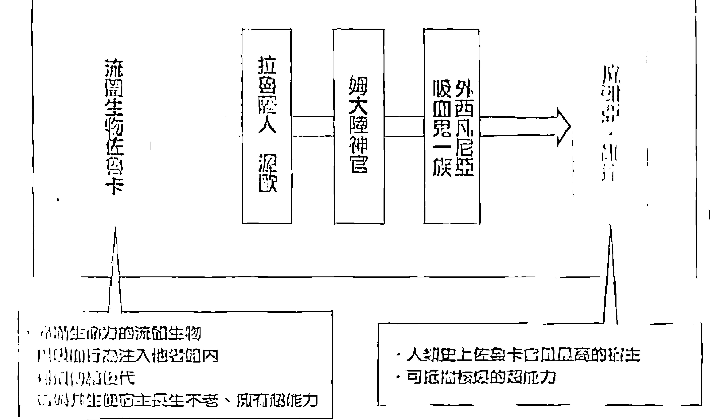

## 使徒吸血鬼之誕生

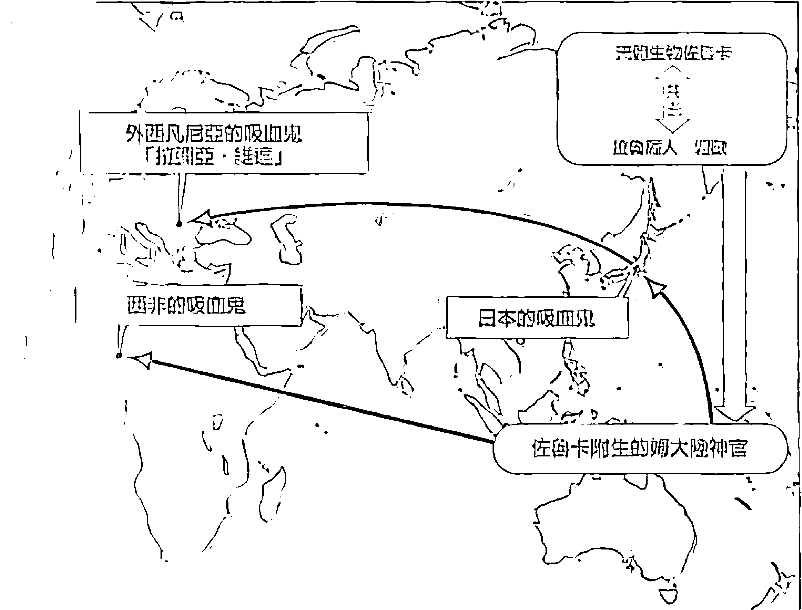

> 出處：《ヴァンパイヤー戦争》，笠井潔著，1982年，角川書店

## 神代繪里香

Erika Kamishiro

神代繪里香是吸血鬼跟人類所生的混血兒。赤川次郎《妙齡吸血鬼》系列作品中，略異於常人的年輕女子。

### ☆混血吸血鬼名偵探

神代繪里香是N大學二年級生。打從高中時代起，繪里香便和朋友過著愉快的校園生活，家裡有怕老婆的社長爸爸、比自己更年輕的繼母、可愛的弟弟，四人過著幸福的家庭生活。神代繪里香容姿端麗卻沒有男朋友，周遭不免有流言紛擾，說她是因為過去戀愛受創，以致現在極端厭惡男性。

神代繪里香再怎麼看都和時下的普通年輕女孩沒有兩樣，唯獨一點並不普通：她的父親霍·克洛克乃外西凡尼亞吸血鬼名門世族出身，是位齡逾百年的正宗吸血鬼。由於外西凡尼亞迫害吸血鬼日苛，克洛克不得已只能離鄉背井、流亡歐洲各國；他為尋求新天地而遠渡重洋來到日本，並且跟已過世的前妻（姓神代）生下了繪里香。

克洛克喪妻後消沉失志、閉居深山，卻讓獨生女獨居在市區，讓她能融入人類社會。繪里香高中三年級時，發生同校學弟妹遭吸血鬼攻擊事件；她在父親克洛克與表兄速夫協助下，運用遺傳自父親的吸血鬼異能解決了事件。歷經九死一生的學妹涼子，後來還與克洛克結為連理，產下一子虎之介。

神代繪里香與霍·克洛克父女的偵探故事《妙齡吸血鬼》始於1981年，這部為懸疑小說添加蠻異要素而頗受好評的系列作，一直都是集英社Cobalt文庫的暢銷書，至今仍在刊行中，2006年已有22冊之多，是國產吸血鬼小說最長壽的作品。

此作在1985年被改編成由早見優主演的電視劇，在富士電視台的「日曜劇場」播出。

### 神代家之成立

- 吸血鬼克洛克為免於迫害而逃至日本、與姓神代的女性結婚
- 神代繪里香誕生
  - 喪妻後克洛克閉居深山
  - 繪里香獨居於市區
- 父女協力解決吸血鬼事件 克洛克與繪里香的學妹再婚、產下一子

### 神代家之家族關係

- 父母:
  - 姓神代的女性
  - 霍·克洛克
- 子女:
  - 神代繪里香
  - 涼子
  - 虎之介

> > 《吸血鬼的年ころ》・赤川次郎著・1981年・筑摩書房

## No.046
霍·克洛克伯爵
Count Von Krolock

《天師捉妖》裡優雅、殘忍卻又帶點滑稽的仿德古拉吸血鬼

### ♣滑稽而恐怖的吸血鬼

環球電影公司與漢默電影公司在第二次世界大戰前後製作出大量吸血鬼電影，而這些電影又再衍生出了無數的模仿者。其中大多數作品的故事主題皆是剽竊自《吸血鬼德古拉》，1969年MGM推出的《天師捉妖》亦不例外。這是部直接襲用《吸血鬼德古拉》劇情的喜劇諷刺模仿作品，片中統治外西凡尼亞偏遠地區的吸血鬼並非德古拉伯爵，而是霍·克洛克伯爵。

相對地，片中隨身攜帶十字架、木槌木樁等武器，成天妄想要消滅真正吸血鬼而浪跡歐洲的，則是赫辛教授的滑稽化角色亞布隆西斯教授及助手阿福。兩人流浪到外西凡尼亞的鄉下地方，該地正處於吸血鬼的恐怖統治之下，此時霍·克洛克伯爵正要向師徒二人留宿的旅館東主夏格爾獨生女莎拉下手。

伯爵趁莎拉入浴之際趁隙在她的喉嚨烙下牙印，待教授與阿福聽聞尖叫聲趕至現場，莎拉的心志早已被伯爵控制，而口嚼大蒜前來搭救愛女的夏格爾也已經遇害。

教授和阿福跟蹤已變成吸血鬼的夏格爾來到一座相當可疑的古城，另一方面因好事性格而去讀教授著作的克洛克伯爵竟將其迎為座上佳賓款待。整個故事從吸血鬼電影必備的古城搜索行動，到後來揭發吸血鬼真面目、救出被擄少女，吸血鬼獵人與吸血鬼幾番激烈戰鬥，最後發展成出人意料的結局。拜其諷刺模仿作品性格所賜，《天師捉妖》才能生動地刻畫出吸血鬼電影之精華，成為名留吸血鬼電影史的傑作。

### 《天師捉妖》與《吸血鬼德古拉》

### 《吸血鬼德古拉》的諷刺模仿作品

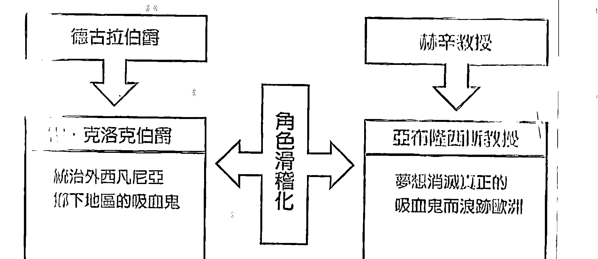

### 吸血鬼獵人道具組

### 亞布隆西斯教授的皮箱

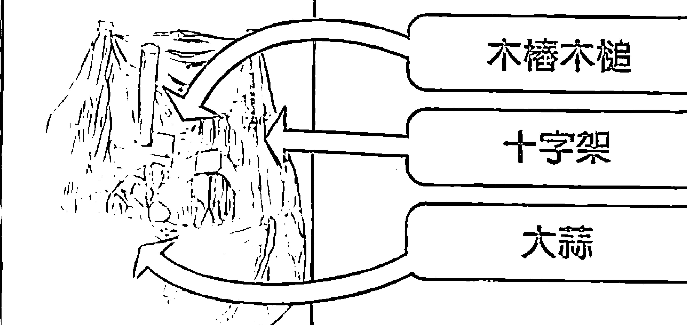

吸血鬼的常見道具：除了亞布隆西斯教授皮箱裡的道具外，還有「聖水」、「鏡子」、「小刀」等物。

> > The Fearless Vampire Killers》· Roman Polanski導演·1969

### 瑪利亞·莎麗絲卡伯爵夫人

Countess Mirya Zaleska

《德古拉的女兒》是環球電影公司1931年《德古拉》的續集，敘述飽受詛咒宿命折磨的德古拉之女。

### ☆ 德古拉的女兒

環球電影公司於1936年上映的《德古拉的女兒》，是由貝拉·路哥西主演吸血鬼的《德古拉》的續集。

受詛的「德古拉之女」身分，使已亡故逾百年的瑪利亞夫人因囿於永遠活在黑夜裡的吸血鬼可悲宿命。瑪利亞聽說德古拉伯爵已遭亞伯拉罕·凡·赫辛教授消滅，便來到倫敦企圖盜取停放於蘇格蘭警場的德古拉屍首；她順利燒化伯爵屍首並撒鹽其上，希望能擺脫被詛咒的命運，然而詛咒仍然緊縛著她的靈魂。瑪利亞感嘆命運弄人，隱居於倫敦切爾西，卻無法按捺吸血的衝動，利用僕從桑得加害不少不幸的倫敦市民。後來終於在社交宴會裡結識提倡「自我解放而不囚於欲望」的精神科醫師葛斯博士；葛斯博士是當代最偉大精神科醫師赫辛教授的高徒，同時還擔任恩師的辯護者、為教授洗刷殺人罪嫌。

瑪利亞起初以為走到這步田地，唯有透過近代科學自己才能得到救贖，遂特意接近葛斯博士；後來兩人墜入情網，瑪利亞邀博士移居至歐洲大陸遭拒，便擄走博士的助手珍娜，並說出自己的真正身分、經空路逃往外西凡尼亞。

德古拉城舉城點燃燈火迎接城主之女，民眾知悉吸血鬼返城後，外西凡尼亞就此陷入恐慌狀態。此時瑪利亞已接納自己受詛的宿命，更揚言要賜予葛斯博士永恆的生命，成為自己永夜的伴侶。

雖然追到外西凡尼亞的葛斯博士終於答應瑪利亞的請求，但屈於吸血鬼血脈的伯爵夫人卻終究難逃悲劇的宿命。

## 瑪利亞·莎麗絲卡伯爵夫人之人物相關圖

德古拉伯爵
(被范海辛教授消滅)

吸血鬼之宿命

瑪利亞·莎麗絲卡伯爵夫人
(德古拉的女兒)

被詛咒自己的
吸血鬼之身份
詛咒的始末

產生情愫

葛斯博士
(精神科醫師)

范海辛教授高徒
提倡「自我解放而不困於欲望」

## 瑪利亞·莎麗絲卡伯爵夫人的足跡

| 時間 | 事件 | 結果/過程 | 目的 |
| :--- | :--- | :--- | :--- |
| (193?) | 準備欲盜取德古拉伯爵屍首 | 燒化德古拉伯爵屍首以化解吸血鬼之詛咒 | 目的 |
| | | 未得解脫以失敗告終 | |
| (193?) | 交往精神科醫師葛斯博士 | 希望近代科學化解吸血鬼之詛咒 | 目的 |
| | | 產生情愫 | |
| (193?) | 咒術師吸血鬼之宿命並賜予葛斯博士永恆的生命 | 跟心愛的男人永浴廝守 | 目的 |
| | | 不敵吸血鬼之詛咒成悲劇性結尾 | |

出處：
《Dracula's Daughter》，Lambert Hillyer導演，1936年，Universal

## No.048
傑利・丹吉

Jerry Dandridge
《天師鬥殭屍》的少年酷愛恐怖電影，沒想到隔壁竟搬來一個真正的吸血鬼，讓恐怖影迷們惡夢成真。

### ☆隔壁先生是吸血鬼

電視開著最愛看的節目「恐怖夜」，查理一面跟女友艾咪調情，卻在此時目擊一具棺柩被搬進隔壁閒置已久的空屋。此番光景激起查理身為恐怖影迷的好奇心，他故作輕鬆若無其事地注視著隔壁的動靜，不料卻親眼目擊鄰家充滿野性魅力的男主人傑利・丹吉攻擊帶回家的女性。原來傑利・丹吉竟然是如假包換的吸血鬼，同時也正是震動街坊的連續女性殺人事件的真正犯人。查理千方百計要將真相告訴母親，但丹吉的僕從比利總是能巧妙地隱藏主人犯罪的痕跡，警察也遍尋不著證據。此後丹吉愈發大膽，甚至還侵入查理家、威脅查理的私生活。

除驚人怪力、催眠術、變身成蝙蝠等獸類、使受害者變成吸血鬼等耳熟能詳的能力以外，丹吉更擁有瞬間移動、分身等超能力，魔力極為高強；他非但不怕沒有信仰心加持的十字架，就算心臟被木樁打穿也能自力拔出木樁復活。

查理陷入絕境，只能將最後希望寄託在主持恐怖夜的靈異片演員彼得・文森身上；然而文森卻因收視率低迷遭到裁撤，對查理亦是毫不理睬。經過一番曲折離奇的遭遇，文森總算相信丹吉是吸血鬼，百般不願地答應幫助迎戰吸血鬼。老是欺負查理的小惡霸艾德和查理的女友艾咪前後遭吸血鬼毒牙，紛紛變成吸血鬼受丹吉控制。逢此絕境之下，查理和文森被吸血鬼追殺至停放丹吉棺木的地下室，卻在此時發現丹吉被縫隙裡射進來的陽光灼傷，於是兩人便破壞遮蔽陽光的障礙物，消滅了視十字架木樁如無物的吸血鬼，艾咪也終於恢復意識。

## 原來有吸血鬼

特徵
- 影子無法映出身影
- 睡在棺柩裡
- 害怕陽光

吸血鬼的能力
- 怪力
- 伯伯比耐力
- 變身成蝙蝠
- 用爪

## 吸血鬼傑利·丹吉

- 沒有信仰心加持的十字架
- 小槍打穿心臟
- 無效化

- 瞬間移動
- 分身
- 超能力

## 特技演員消滅吸血鬼

「恐怖夜」
- 主持工作遭裁撤

以吸血鬼惡人一角
- 頗受觀眾歡迎

## 彼得·文森

- 受查理之託對付吸血鬼
- 發現丹吉是如假包換的吸血鬼
- 以豐富知識對抗吸血鬼

《Fright Night》· Tom Holland導演· 1985年· Columbia Picture

## No.049
范斯勞·德古拉伯爵
Count Vladislaus Dragnia

電影《凡赫辛》將赫辛教授塑造成喜治怪物的黑暗英雄，而主角的死對頭當然非德古拉伯爵莫屬。

### ♤另一個德古拉伯爵

為尋回失去的記憶，怪物獵人凡赫辛受命於吉奈特樞機主教所率梵蒂岡聖靈騎士團追討怪物，並於1888年奉命協助守護羅馬東部達400年之久的薇洛家族，打倒盤踞外西凡尼亞的吸血鬼。

吸血鬼范斯勞·德古拉伯爵通稱德古拉伯爵，生於1422年，原是薇洛家長老之子。

後來不知怎地，德古拉伯爵在1462年被人稱「上帝的左手」的神秘人物殺死，臨死還跟惡魔訂下契約，遂得復活變成吸血鬼。出了這名邪惡的罪人，薇洛家族遂立誓曰：「德古拉未滅，不入天國之門」，舉全族之力對抗德古拉長達400年之久。

德古拉資助維多·法蘭坎斯坦用無生命的屍塊拼湊成完整軀體並賦予其生命，但博士的性命和研究成果皆為德古拉所奪，德古拉更以自己贈與博士的外西凡尼亞法蘭坎斯坦城為據點進行實驗，企圖大量生產吸血鬼後裔作為邪惡尖兵。此時凡赫辛亦會合薇洛家族最後一個成員安娜·薇洛，並得知若無法蘭坎斯坦博士拼湊屍體創造的怪物科學怪人，則德古拉伯爵的實驗決計無法成功。

科學怪人爭奪戰由德古拉勝出後，雙方對戰舞臺移至昔日的德古拉城；而宿敵德古拉在最終決戰中稱凡赫辛為「加利列」，正昭示了凡赫辛追尋已久的真正身分。

# 德古拉伯爵及范洛家族

范斯努·德古拉

范洛家族

1422年出生，乃范洛家族长老之子

自15世纪起戍守罗马尼亚的世人家族

自闻名400年之久

与恶魔订下契约，变成吸血鬼不死

“德古拉未归，不入天国之门”

通称“德古拉伯爵”

1888年神秘失踪

## 人物关系图

范斯努·德古拉伯爵

凡·赫辛

法兰坎斯坦博士

米娜·范洛

博士所创怪物

# No.050
号伽弥多罗
GOKI

松竹电影公司《吸血鬼号伽弥多罗》描绘在宇宙吸血生物的侵略之下，人类是何等地愚蠢……穷途绝望之中究竟有何深意？

## ♡无固定形体的吸血生物

我从未看过天空如此模样，仿佛我们正航行在血海里似的……机长喃喃低语，似乎正暗示着由羽田机场飞往大阪的JA307号班机即将遭遇的不幸。机外的鸟群仿佛受惊似的撞上机头、将驾驶室玻璃窗染得血红，就连机内也是事件频传；除炸弹危机以外，还有暗杀不列颠大使后偶然搭上此航班逃亡的寺冈劫机事件。此时飞机突然撞上迎面而来泛着橘光的飞行物体，顿时火苗四窜，JA307号只能迫降在山里。

圆盘型飞行物体里，躲着如液态金属般黏稠、外形酷似阿米巴原虫的生物。这种叫做“号伽弥多罗”的无定形生命体来自宇宙某行星，长年觊觎地球、宣言杀尽地球所有人类；他们用橘色怪光蛊惑寺冈步入宇宙船并寄生于寺冈体内，让寺冈攻击JA307号班机乘客作为侵略地球的第一步。

号伽弥多罗会在被害者的前额划道伤口，从伤口进入头盖骨寄生人体，把人类当成傀儡操纵。被吸血鬼附身者就会变成地球人所谓的吸血鬼，噬咬他人颈部把全身血液吸得精光。

此类寄生者吸血时不会传染吸血癖，也不会让寄生者的腕力大幅上升。被寄生的肉体难以行动时，号伽弥多罗就会从前额伤口脱离、寻找另一位牺牲者，此时变成空壳的原寄生者就会如烂泥般分崩瓦解。

历经吸血鬼号伽弥多罗浩劫，以及机内乘客疑神暗鬼丑陋的争斗之后，唯二的幸存者副机师杉坂与空服员朝仓好不容易逃到市区，但两人面前唯有骇人的恐怖光景而已。

# 硫伽弥多罗

用圆盘在恒星间旅行的有智慧生命体

| 项目 | 内容 |
| :--- | :--- |
| 目的 | 侵略地球 将全人类赶尽杀绝 |
| 外观 | 如溶解金属般的银色阿米巴状生物 |
| 能力 | 寄生并操纵人类 |
| 特征 | 啃咬人类头部吸血 |

出处：《硫伽弥多罗》，佐藤肇导演，1968年，松竹映画

# No.051
音无小夜

## Saya Otonashi

猎手肆虐的“血战”世界中，担从者足历修罗道、手提血刀，要将猎手猎杀殆尽的红眼女高中生。

## 受诅的朱红宝石

所谓猎手，就是伪装成人类潜伏于社会、伺机掠食人类的吸血鬼。“赤盾”乃以歼灭猎手为宗旨之组织，该组织多年来致力于猎手与人类之交配实验，终于开发出堪称猎手天敌的兵器——音无小夜。赤盾乃罗思柴尔德财团的约珥·葛施密创设的组织，其后“约珥”之名与赤盾指挥官之职便由历代葛施密家族当家世袭。

小夜1833年诞生于初代约珥·葛施密世界各地动植物的居城“动物园”；承继猎手长生不老的特性，小夜一直都是芳龄十五六岁的少女模样：短发漆黑、面如白雪，还有丰腴厚唇与朱红眼眸更添风情。音无小夜乃猎手统治阶级“女王种”后裔，其体液对猎手而言乃致命剧毒，一旦进入体内，必定在转眼间毙命。不知是否因为其出身的缘故，小夜本能地憎恶猎手。赤盾曾将其派遣至1930年代的上海、1960年代的东京与越南，挥舞可将持刀者血液导入刀身的日本刀，大举猎杀猎手。

小夜的连续活动时间并不甚长，每数年的活动期后必须进入一种类似冬眠的休眠状态。越战结束后，小夜苏醒于2004年的冲绳美军基地，被退伍军人宫城乔治收为养女。失去记忆的小夜虽得以暂时与家人度过普通女高中生的生活，却终究无法摆脱残酷的命运以及永不结束的征战。小夜的身边除职名为“大卫”与“路易”的“赤盾”后援双人组随时提供支援以外，还有拥有并负责守护猎手女王种血脉的骑士、小夜从前在“动物园”时代拉拔大的吉普赛青年哈吉。

## 瀬戸小夜的足跡

-   1893年 出生于初代约坦·葛施密居城“动物园”
-   1903年 长成十五六岁少女模样后便停止成长
-   1974年 邂逅自己未来的骑士哈吉
-   1983年 解放胞妹DIVA

其后转战各地对抗翼手
西伯利亚（1910年代）
上海（1930年代）
日本（1960年代）

-   1972年 于越南因不自然苏醒而脱逃后，进入休眠
-   2004年 苏醒于冲绳
-   2005年 对抗出现在冲绳的翼手

## 羅思柴爾德家

-   组织 翼手
罗思柴尔德家的约坦·葛施密所创设
-   来源 来自原应为赤盾的“罗思柴尔德”（Rothschild）
-   指挥官：历代葛施密家当主“约坦”
-   后援组：大卫、路易
-   骑士：哈吉
宫城凯（小夜义兄）

> 出处：《BLOOD THE LAST VAMPIRE》，北久保弘之导演，2000年，Production I.G

# # 索尼亞·布盧
## Sonya Blue

冷酷而凶暴，野蛮而时髦……南茜·科林斯《午夜蓝调》系列作刻划的新时代吸血鬼。

### ☆戴着镜面墨镜的女吸血鬼

身穿修长牛仔裤、印着反社会标语的皱巴巴T恤与皮衣外套，拿下遮掩着碧眼的镜面墨镜后，俨然就是都会喧嚣杂沓中稍许引人目光的时下年轻女性。

索尼亞·布盧是未经死亡即成为吸血鬼的突变种，她不仅毫不畏惧阳光及银制品，同时也是喜欢吸食吸血鬼血液的异端吸血鬼；1969年8月3日在伦敦被名为摩根的“贵族”蛊惑、吸乾血液弃置路侧以前，她的名字叫做丹尼絲·索恩。她原是索恩工业创设人雅各·索恩的独生女，媒体曾经大篇幅报道这宗富家千金失踪事件。失踪的丹尼絲其实并没有死，她奇迹似的捡回一条命；在伦敦的医院里昏睡9个月方才醒转，却同时丧失了关于身世的所有记忆。后来拉皮条的约瑟夫·伦特收留她、取名叫索尼亞，并传授她娼妓营生的各种技巧，此时从伤口进入身体的摩根吸血鬼体液已经潜伏于其体内；直到18岁的时候，体内的吸血鬼方才觉醒并将她变成另一种生物。

当她寻回所有记忆的同时，丹尼絲发现自己的里面还有个“她”——狡猾且凶暴的吸血鬼索尼亞·布盧的存在。丹尼絲遇见她黑暗血统家系的祖父“贵族”邦葛罗斯、研究吸血鬼的老学者艾力克·吉尔拉迪，并且成为吸血鬼和狼人等非人“伪装者”潜伏的真世界之居民，以娼妓维生流浪于各都市间，找当初袭击她的可憎“贵族”摩根、向他报复。

## 从丹尼丝·索恩到索尼娅·布雷

-   丹尼丝·索恩
大富翁千金
遭“贵族”摩根吸血
失忆、住院9个月以后失踪
-   以娼妓为业、改名“索尼娅·布雷”
觉醒成为吸血鬼
认识另一个“索尼娅·布雷”的存在
-   为向摩根复仇而寻狩吸血鬼

## 索尼娅·布雷及其血亲

-   索尼娅
丹尼丝
唯一肉体内同时有两个存在
-   丹尼丝的祖父 邦葛罗斯
-   血亲 “贵族”摩根
-   协助
-   对立
-   复仇

## 附录

> 《Midnight Blue》· Nancy A. Collins著·1995年·White Wolf Games出版。

# No.053
大吸血鬼
Vampire Lord

电脑RPG游戏之始祖“巫术”里的吸血鬼，以吸取能源的吸血攻坚威胁玩家

## ◇不具实体的怪物

从前利喀敏的统治者“狂王崔波尔”和邪恶巫师瓦德纳曾经为了一只暗藏着强大力量的护身符而兴起争夺战；这只护符被人在遗忘的诸神神殿发现后进呈给崔波尔，却被瓦德纳用高阶转移咒文MALOR从国王谒见室盗走。瓦德纳得到护符的骇人力量以后，遂将自己居住的高塔变成共十层的巨型地底迷宫，把许多恐怖的怪物放到迷宫里，自己则躲在迷宫的最深处。国王崔波尔贴出布告曰：谁能夺回护符，就能得到财富与名誉——于是国内外有许多对自己身手颇有自信的冒险者云集，纷纷踏进利喀敏郊外伸手不见五指的迷宫入口，但绝大多数冒险家不是被迷宫里的怪物杀害，就是触动通道及宝物箱的机关，接连命丧黄泉。

这座人称“狂王试炼场”的迷宫里有各种怪物栖息，包括面色苍白血口尖牙的吸血鬼。其中尤强者只在第七层以下的地底迷宫里出没，即所谓大吸血鬼；他们是吸血鬼的贵族，不像低级吸血鬼般成群结党，多是单独行动。由于其生前多是巫师，咒文可与高等级巫师相匹敌。除攻击带有麻痹效果外，同时还有卓越的治愈能力，即便承受巨大打击损害也能恢复。

遭遇大吸血鬼的时候，绝对要提防吸取能源的吸血攻坚。冒险者若是被这个不具实体的怪物擒住吸血，将会丧失4个等级的经验值，即便在接下来的战斗当中消灭了敌人，也无法取回丧失的经验值；若玩家不幸丧失超过自身等级的经验值，就会被完全消灭殆尽。

## 大吸血鬼之特征

在尚未确定其身分前，大吸血鬼会成为“不明存在”，是因为玩家务须熟知下列特征

| 外观・特征 | 咒文 |
| :--- | :--- |
| 面色苍白血口尖牙 出没于迷宫最深处 经常单独出现 | 可使用巫师的 最强等级咒文 |
| **吸取能源攻击** | **特殊能力** |
| 被吸血的冒险者会 失去“经验值” 以至被消灭殆尽 | 具麻痹效果的攻击 卓越的治愈能力 |

## 游戏文化与吸血鬼

许多早期电脑游戏，如全乐山线上游戏公司（Sierra Online）的ADV游戏“外西凡尼亚”就已经有吸血鬼的角色。其中首先将吸血鬼系统呈现吸血行为、怕怕神圣力量等吸血鬼特性的电脑游戏，就是1981年SIR-TECH游戏公司发表的“巫师”；然而在这款游戏诞生前，其实早就有游戏利用数值与游戏系统来呈现吸血鬼，而这部游戏就是盖瑞·盖克斯（Gary Gygax）发明的全世界第一款桌上角色扮演游戏（TRPG）——1974年TSR公司发售的“龙与地下城”（Dungeons & Dragons）。最早的日文版规则书中，日本通称“青箱”的《龙与地下城》角色手册里就有吸血鬼的角色。前述“巫师”大吸血鬼的吸血、召唤其他怪物等特，便是承继自“龙与地下城”而来。

## 资料来源

《巫师》（Wizardry），SIR-TECH制作，1981年，SIR-TECH

# 愛爾奎特・布倫史塔德
Arcueid Brunestud

爱尔奎特乃近年因TYPE-MOON人气作品“月姬”而异军突起的吸血姬，亦是为猎杀死徒而创造的美丽杀戮者。

## ☆布伦史塔德的白色公主

“我要你负起杀死我的责任。”陋巷里朝阳点点泼洒，语毕盈盈含笑的这张脸孔，正是昨日被他用小刀分成17个肉片、理应已经死亡的金发女性。一名素不相识的女性，只是在居住的三咲町街道擦身而过罢了，然而少年却无端兴起莫名杀意、杀害该名女子。这段杀人的记忆究竟是现实抑或只是噩梦？就连他自己也完全没有个头绪，此时这名女性竟毫发无伤地出现在他面前，说道：“我是吸血鬼。还有，我需要你的帮助。”这名女性――非人吸血鬼爱爾奎特・布倫史塔德，跟一介平凡高中生远野志贵之间的关系，便是从这里开始的。关于“真祖”种类的吸血鬼爱爾奎特・布倫史塔德，约诞生于12世纪左右；她是住在真祖之城――布伦史塔德城的吸血鬼公主。其真实身分其实是经过精心设计调整，不断重复睡眠、醒转、杀戮，又再度进入睡眠的完美猎杀吸血鬼兵器。部分的真祖不敌吸血冲动而堕落，受害者转化成的吸血鬼叫做“死徒”，而死徒又不断透过吸血增加同类。为处置这些按几何级数增殖的死徒，真祖们遂创造专为猎杀吸血鬼而生的纯粹真祖，交付执刑者的职务并赐其真祖皇族的姓氏布伦史塔德。全无任何情感、最完美的纯粹个体，吸血姬爱尔奎特。然而在邂逅志贵、遭其杀害再度重生后，这位纯粹无垢的高贵公主却如同重新组装的机械获得全新机能般，转而变成毫不掩饰喜怒哀乐之情、天真烂漫的女性。

## 1. 漆黒の「濾過吸血鬼」

-   决定滤杀对象
-   旧态被删除、进入睡眠
-   朝食、等身大の胡蝶の夢の知る
-   消灭滤杀对象

## 1. 降臨する吸血姫

-   全无任何情感、最完美的纯粹个体
-   贯彻们谨慎运用的滤杀吸血鬼兵器
-   纯粹无垢的高贵吸血鬼公主
-   消灭滤杀对象
-   亜生
-   变成拥有人类情感、天真烂漫的女性

© TYPE-MOON制作，2000年，TYPE-MOON

# 遠野秋葉
Akiha Tohno

TYPE-MOON“月姬”中登场的远野家当家，每当这位爱恋兄长的少女体内远野血脉贵起时，漆黑长髮就会染成血一般赤红。

## ◇非人血脉

夜半银月散发的冷冽光线下，远野志贵在寂静宅邸旁的草庵里，目睹亲生妹妹的牙齿没入家僕少女的柔嫩肌肤。

此景纯粹是单方面掠取他人热量的“掠夺”行为。背后随风飘舞的美丽黑髮，而今已经染成滋润她喉咙的液体般的不祥闇红绯色，如火焰般摇曳着。

昔时远野家与非人化生者结合、借其异能统治邻近地区，而远野秋叶乃该族嫡系；她芳龄18，就读浅上女子学院，是当地自古至今一直颇具权势的“远野家”少当家。身为该族之长，负责统辖包括远野家分家在内的数支异形族氏；每当同族因血液深处“鬼之因子”显在化而成为噬人恶鬼，她就必须要出面制裁堕落的族亲。她在执行制裁的时候，活像是在夜空中披散着火焰般红髮的恶鬼。在远野家历代当家中，远野秋叶的力量尤其强大；其力量完全觉醒之际，她的髮丝便会在四周结起红色丝线般的结界“朧髮”，将身处其中者统统铲除。

拥有如此强大的力量，当然必须付出相当的代价。每次使用这种力量，体内的“远野”家血液就会愈趋浓稠，她也会逐渐变化成非人的存在；到最后若非发疯发狂，否则就是跟其他同族一样变成可怕的怪物。

护秋叶至今仍得以保持神智清醒的，就是她不时拿自己半生命力营救、自己最爱的那个人之存在。虽然秋叶面对兄长时总是摆出一副凛然难犯的态度，暗地里却是打从幼年便一心地爱着兄长一人；她对兄长的深情近乎执迷，有时会转化成强烈的占有欲，甚至本能地想要扫除兄长周边的人。

## 遠野秋葉

以与生俱来的“能力”履行“义务”的少女

| 当家的职务 | 能力 |
| :--- | :--- |
| 保护包括分家在内的“混血种” | “鬼之因子”的能力 |
| 训练堕落的同族 | · 窃取他人热血的“掠夺” |
| 肃清附近魔物 | · 足以消灭任何身体结晶化的“极变” |
| 还有几项职务 | |

## “月姬”主角——远野志贵

“月姬”是TYPE-MOON于2000年冬季同人志即售会(Comic Market) 发售的传奇ADV游戏。爱尔奎特·布伦史塔德和远野志贵虽然是同一部作品里的角色，却是两个完全不同种类的吸血鬼猎人，因此故事的主角——高中生远野志贵始得在“月姬”的世界中有所交集。

身为远野家的嫡子——远野志贵在8年前遭遇险些丧命的事故后，长年寄住在远野的分家有马家；其妹秋叶在父亲逝世后继承远野当家之位，并将主角召回本家，而故事就是从他回到妹妹与两位女僕所居住的远野家那天揭开序幕。

故事会随着玩家点选的选项而分歧成不同剧本，而“月姬”的路线主要分成爱尔奎特篇以及远野秋叶篇两个路线。这两个路线是独立的，甚至在后者纯和风传奇故事路线当中，爱尔奎特自始至终都不曾现身。

志贵和爱尔奎特这两个猎杀非人者的非人化生者一样，拥有名为“直死之魔眼”的人间凶器远野志贵，同样也是异于常人的存在，他这种情况是否可归作吸血鬼猎人一类尚犹可议，是以本出个相关设定介绍。

# # 戈耳工三姐妹
## Gorgons

TYPE-MOON“Fate / hollow ataraxia”当中，两个任性而奔放的双胞胎姐姐和善良而身材高大的幺妹……描述在诸神时代被灭的三姊妹的和平生活。

### ### 美女与魔兽

“无形岛”是被逐出诸神宝座者的流放地；三位人称戈耳工三姐妹的美女姐妹，住在这座荒凉的孤岛上。除两体一心的美丽双胞胎斯塞诺和欧律雅耳以外，还有被任性的姐姐使来唤去、包办家里煮饭洗衣所有大小事的么妹美杜莎，三人过着幸福的生活。

尽管美杜莎本身也是位颇吸引人目光的高个美女，却向往姐姐楚楚可怜的模样，并自卑于自己比男性还高大的身材。戈耳工三姐妹都是跟希腊神话里拉弥亚类似的吸血怪物；美杜莎为保护两位身为永远的处女、因其美貌而遭众神及英雄蹂躏的姐姐们，遂屠杀所有侵入岛内的战士并啖其血肉，最后终于变成可怖的蛇身怪物，就连两个姐姐也被心爱的妹妹所吞噬。女蛇怪散发的瘴气使无形岛成为海鸟亦不敢接近的魔境；后来阿戈斯公主达那厄与主神宙斯之子珀耳修斯带着诸神所授宝具前来讨伐，起初虽因恐惧而颤抖，最后仍成功砍下美杜莎首级。

在冬木市第五次圣杯战争中，魔术师为得到能实现持有者愿望的圣杯，召唤神话与传说中的英雄为使役者、代替自己竞争夺圣杯，而美杜莎则是间桐樱召唤的“骑兵”使役者。骑兵美杜莎身怀诸多异能为主人征战，包括操纵魔兽神兽的“骑英之缰锁”、封印自身魔眼的“自我封印・暗黑神殿”、吸吮固定范围内人类血液的“他者封印・鲜血神殿”等能力。美杜莎平时使用眼罩或眼镜封住邪眼，与主人间桐樱一起寄住在魔术师卫宫士郎家里。

## 美杜莎

-   操纵魔兽神兽的“骑英之缰勒”
-   封印自身魔眼的“自我封印・暗黑神殿”
-   吸取固定范围内人类血液的“他者封印・鲜血神殿”
-   藉吸血获得魔力
-   魔眼
-   怪力

> 出自【hollow ataraxia】，TYPE-MOON制作，2005年，TYPE-MOON

# 戴米特里·玛基希摩夫
Demetri Maximoff

卡普空“恶魔城”系列游戏主角。虎视眈眈觊觎着魔界的霸权，历经一败涂地后东山再起、成功返回魔界，不屈不挠的吸血鬼。

## 黑暗贵公子

戴米特里·玛基希摩夫奇装异服。身高197公分、体重101公斤，有如铠甲般发达的肌肉就连职业摔角选手也要相形见绌，全身却穿着极贴身的紧身衣；与其说他是吸血鬼贵公子，倒还比较像是“惊奇漫画”里的美式漫画英雄。戴米特里应是藉由这身装扮表示除吸血鬼的魔力以外，他对自己的肉体亦有绝对的自信，并藉此战斗服装昭示在战场上拚斗的决心。

吸血鬼德米特里·玛基希摩夫1483年出生于罗马尼亚，乃魔界名门玛基希摩夫家当主。其战斗能力与好胜心在魔界中堪称超群，魔界居民皆称“伯爵”、“黑暗贵公子”敬畏之。

戴米特里的强大力量逐渐转变成莫大的自傲心，并加剧对自身立场及现状的不满。终于，觊觎魔界霸权的戴米特里按捺不住支配欲，遂向魔界帝王安斯兰特家当主贝里欧鲁·安斯兰特挑战，力有未逮败阵而去。战后戴米特里被逐出魔界，忍受战败的莫大屈辱并暗自潜伏蓄积力量，静待良机再闯魔界。

约莫百年以后，戴米特里率领仆从再度现身魔界。经过几番战役后返回魔界，以后势如破竹，甚至还与魔界帝王贝里欧鲁的继承者混魔莉卡·安斯兰特二分魔界天下。除隐形、变化成蝙蝠等吸血鬼固有能力以外，戴米特里尚且具备自由自在操纵火焰的特殊能力，有“混沌火焰”、“恶魔火焰”等施放火焰的秘杀技。戴米特里亦擅长近身肉搏，还有对空技“恶魔旋风”、有如螺旋钻头般的强烈飞踢“蝙蝠螺旋踢”等各式各样的技巧。

# 吸血鬼猎人D与安斯尔特家之争

| 左侧 | 动作 | 右侧 |
|------|------|------|
| 马基希夫的当家 从魔界挑战魔界帝王 | 攻击 | 魔界帝王所畏惧的 |
| 人间力量百年 | 反攻 | 将马基希夫赶出魔界 |
| 潜入魔界 分离魔界势力 | 攻击 | 贝里欧的继承者摩莉卡 |

# 马基希夫的能力

### 吸血鬼的能力
- 吸血
- 变身成蝙蝠
- 瞬身

### 近身肉搏战
- 恶魔摇篮
- 蝙蝠螺旋击

### 克服阳光
用气覆盖全身折射阳光

### 火焰能力
- 混沌火焰
- 深红火焰

> > Night Warriors，Capcom制作，1994年，Capcom

# 黑犬邸列里·乔凡尼
Giovanni Mercurial

「魇骸魔京」世界中，非人者藏身于人类社会的各个角落，而黑犬邸列里就是统辖所有非人闇夜居民的一族之长、手腕高明而纤细柔弱的吸血鬼。

# 「最强的」黑犬邸列里

即便是自古代至中世纪向来都是飞扬跋扈的非人之民，同样难逃随着历史逐渐销声匿迹的命运。光是伴随着人类急速增加而来的乌烟瘴气，便已足以使非人者濒临疯狂与灭亡，于是身负巨大魅力的非人者遂举族逃往秘境异界，有的就此进入深眠，甚至也有些坐待灭亡临头……根据现有的记载，黑犬邸列里·乔凡尼最早是出现在16世纪的意大利。这位温文儒雅的长发男子、重视传统的闇夜民族中血液最稀薄的毛头小伙子初任族长时，闇黑世界尽皆哗然。他的魅力根本弱不可堪，既不耐阳光照射，顶多也只有吸血延长生命的魔力。由于族长太过弱小，以至同族经常半侮辱地戏称他叫做「最强的」黑犬邸列里。

不知何时，此戏称已丧失原本侮辱的意味。究竟是当初击败支家世渊源的非人者见黑犬邸列里势弱来犯却被击退时，还是他成功潜入西欧世界之象征暨吸血鬼宿敌——基督教体系、成为人类社会实质统治者时，如今已经不得而知。正因为他深知自身短处与他人长处，方才得以利用长生不老的梦想操弄他人，在各方权谋算计中获得共存之可能性。平定西欧之后，他便扮成传教士单身远渡东洋岛国，迎接未来的世界统治者「门」——九门克绮。他在狛祭市设立海东学园并担任该校教师，总是以亲切态度和甜美假面具来面对学生。另一方面，还跟其他非人者的组织斯托刺合作，甚至牺牲同族提供该组织作实验材料。据说他亦曾暗中参与斯托刺的研究计画，开发使非人者魔力无效化的强化实验体。自从九门克绮觉醒、紧接斯托刺组织消灭以后，黑犬邸列里就此没了消息。这位黄昏世界的原统治者心里究竟期待着怎么样的未来，至今尚未可知。

# # II 斯托列里·乔凡尼的足迹

非人者当中血液最稀薄的族长——被侮蔑地诅称为「最强」

+   - 魔力弱不可堪
- 不耐阳光照射
- 只有吸血延命的魔力

利用族长地位平定西欧

+   - 悉数击退数支家世渊源的非人者
- 潜入非人者宿敌基督教体系

寻求与人类共存之道

+   - 翘渡日本传教

# # II 斯托列里在日动向

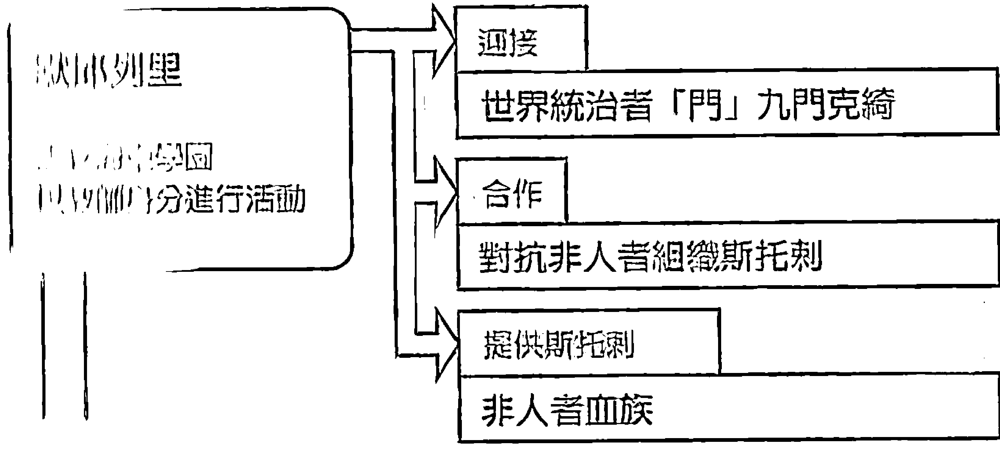

# # II 斯托列里最终命运

斯托列里觉醒、斯托刺消灭后，行踪不明

# 城島月子
Tsukako Jyoshima

熊本通称「青会社」的Alpha System公司所创无名世界观中的吸血鬼。使一度佚失的神话血脉得传至今、未受祭祀者的公主。

# 壱血公主

最初的原始女性就是太阳。由天照大神乃属女性一事便不难发现，日本自古就有母系社会统治的传统。然而天照大神躲在岩洞中不肯出来，自此便有男性篡夺太阳神神位、开启父系社会的历史。古神话中的诸神与英雄不是变成未受祭祀之民、亦即受人追讨的鬼族，不然就如日本武将变成神族以鬼伐鬼的尖兵。结城小夜等人辈出的壬生谷家乃属后者；从前的女神似乎也是如此成为服侍新体制神祇的巫女，并献身以讨伐恶鬼的实剑自任。在汪洋的遥远彼岸，亦不断重复着相同悲剧。塞尔特神话中流着达奴神族血液的女神，同样也丧失了「太阳的巫女」之地位，终致没落变成妖精。其中得以保持最高贵血统的家系，就是城島月子一族。城島家举族横越欧亚大陆，移居至中国某处远离尘俗的世外桃源，却不幸遭到灭族血祸，唯独月子幸存并得稀世阴阳师玖珂英太郎收留。她便是在此时遇见并爱上了名叫玖珂光太郎的少年。光太郎就是太阳，相对月子就是太阴。日昇则月蔽，月夜则无日；两人命运紧密连结，当光太郎力量增强时，相对月子也丧失了健康。其实这全都是英太郎的计谋，他企图透过演神话达致魔法复权的盛大仪式。自此城島月子经常都是卧以病床，白昼总是削瘦病弱，唯有粗眉仍剩下半点健康少女的样子。她的一言一行无不是温柔如缕，更拥有能让总是独自逃离的光太郎停下脚步恣意撒娇的母性特质。城島月子纯粹只因为玖珂光太郎会感到不忍，便从此不再吸食人血，却未丧失能力；但有必要，她随时会奋不顾身地在夜世界中展现威严，不断奋力挥舞日本刀、与盲眼狼人「加贺薙」一同击退恶鬼。对城島月子而言，光太郎的幸福就是她的最大愿望，而她却只能在无限哀愁与柔情之下，静静地看顾着他和小夜的淡淡恋情。

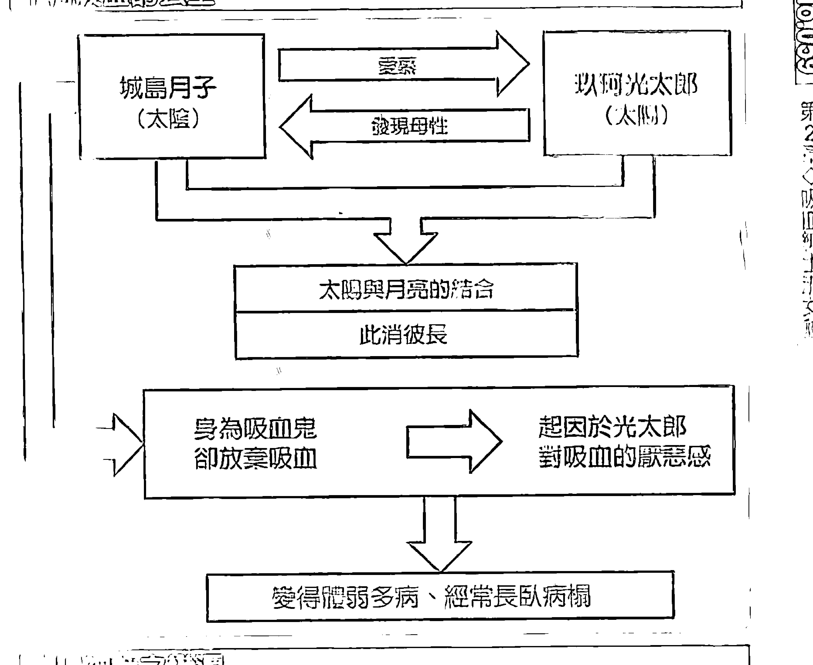

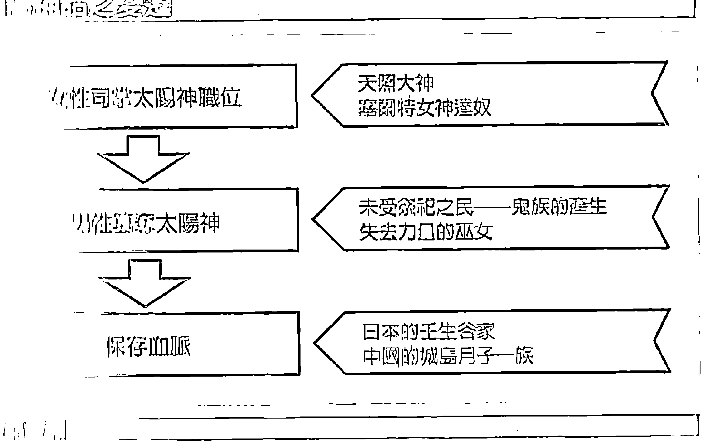

出处：『血界軒內傳 七夜月幻想曲』，Alpha System制作，2005年，Alpha

Danann：以爱尔兰为中心的塞尔特民族的女神。其子孙被称为『达奴神族』(Tuatha Dé Danann)。

# 范碧芮拉
Vampirella

女吸血鬼范碧芮拉性感并充满异国情调，为灵怪漫画《女吸血鬼》增添不少颜色。她的真实身份其实是从深宇宙追击仇敌来到地球的外星人。

☆战斗女吸血鬼

美式漫画除超人与蝙蝠侠等许多著名的超级英雄以外，同样也有吸血鬼存在。著名科幻收藏家福雷斯特·J·阿克曼所构思的性感女吸血鬼范碧芮拉漫画，从1969年起由哈里斯漫画开始刊载。

距今三千年前，在科技文明凌驾地球的德古隆行星，因叛国罪遭处死刑的弗拉德带领三名部属，杀害评会长老并且逃亡至地球。本名艾拉的女吸血鬼范碧芮拉就是惨遭杀害的长老之女；她誓报杀父之仇，并整装出发前往太阳系。

在20世纪的地球，弗拉德已化身为拉斯维加斯的超级摇滚巨星「杰米·布勒」，并与麾下的吸血鬼密谋进行征服全世界的恐怖计划。堪与其相对抗的，唯有以消灭吸血鬼德古拉而闻名的赫辛教授之子、继承父亲所创秘密组织亚当·凡·赫辛等地吸血鬼猎人，以及不知为何总是穿着清凉养眼深红色制服的复仇者范碧芮拉。

范碧芮拉和弗拉德等德古隆星人在母星都必须饮用名为「命之河」的液体，其身体素质与寿命皆远逊凌驾地球人。而在地球则有地球人的血液可以代替「命之河」，这便是弗拉德与德古隆星吸血鬼攻击人类的原因。范碧芮拉同样也必须靠命之河维系生命，不过她都是以人工合成的黑色血清代替。

这部作品历经数名漫画家轮流诠释，如今已是美国最受欢迎的漫画之一。此作于1996年被拍成电影《太空吸血鬼》，由泰丽莎·索托主演。

# # 宇宙的吸血鬼

太古隆星（科技文明极度发达的行星）

汉斯仇西恩

艾林比斯

范妲西拉（太古隆星长者之女）

太古隆星

弗拉德（太古隆星吸血鬼始祖）

亚当·凡·赫辛（赫辛教授之子）地球的吸血鬼猎人

# # 地球

# # 外星人的能源

> > 血之河

太古隆星人必须摄取的液体  
饮用后便能获得超越地球人的  
身体能力及寿命

在地球可以以地球人的血液代替

弗拉德  
1000年以下的太古隆星人

范妲西拉  
以人工合成的  
黑色血清代替

> ——《Vampirella》，Jose Gonzalez著，1979年，Harris Comics

最强的吸血鬼，王立国教骑士团的垃圾处理班。平野耕太描绘漫画《厄夜怪客》描述“伯爵”的未来模样。

# ☆王立国教骑士团的王牌

19世纪，一只吸血鬼从森林深处的国度横渡多佛海峡，来到夕阳迟暮的大英帝国。吸血鬼搭乘的帆船尽是堆积如山的死尸，载着一具漆黑的棺木，飞腾浪间划破浓雾、滑进伦敦港。这艘载送人称“伯爵”的不死者之王的船只，俄文船名唤作戏米特里号；船只进港神秘事件经过媒体大肆渲染，使伦敦市民上下陷入一阵骚动。

西元1999年，英国北部的小村落契塔斯村，在短短一夜之间就被一介新生吸血鬼化为死城。攻进村里的警队悉数遭吸血鬼及其麾下食尸鬼（遇袭村民所化）屠杀，让听闻者仿佛置身阿鼻地狱的枪声和惨叫哀嚎声消失于夜空中；就在这个时候，身披朱红外套的修长男子俨然现身于村落边境。这个头戴和外套同色的深檐帽、手持装填溶解兰开斯塔大教堂银制十字架所铸13mm爆裂钢铁弹的特制手枪、转瞬间歼灭所有怪物的高渺男子，正是从前人称“伯爵”的最强吸血鬼，后来被三代前的初代贺鲁希洁爵士收伏、如今却是王立国教骑士团走狗的阿尔卡特。受大英帝国救命统辖王立国教骑士团的历代贺鲁希洁们爵，都运用以毒制毒策略、以阿尔卡特对付吸血鬼；每当夜洲非人徒辈威胁英国领土，阿尔卡特便会使解开封印歼灭敌人。虽然作品并未明述阿尔卡特从前的战绩，但第二次世界大战的纳粹亲卫队直属特务机关“千禧年”组织吸血鬼大队开启战端时，阿尔卡特便曾经跟贺鲁希洁爵士的管家、同时也是骑士洲最强的“垃圾处理班”瓦特·C·德尼斯两人孤军杀进“千年”的研究所，令其计划一度受挫。

# 【Hellsing】兵器「阿尔卡特」

大英帝国

王立国教骑士团

教会

威协英国的「怪物」

教会特务局

法皇厅特务局第十三队

理用

隶属

千禧年

阿尔卡特

处理

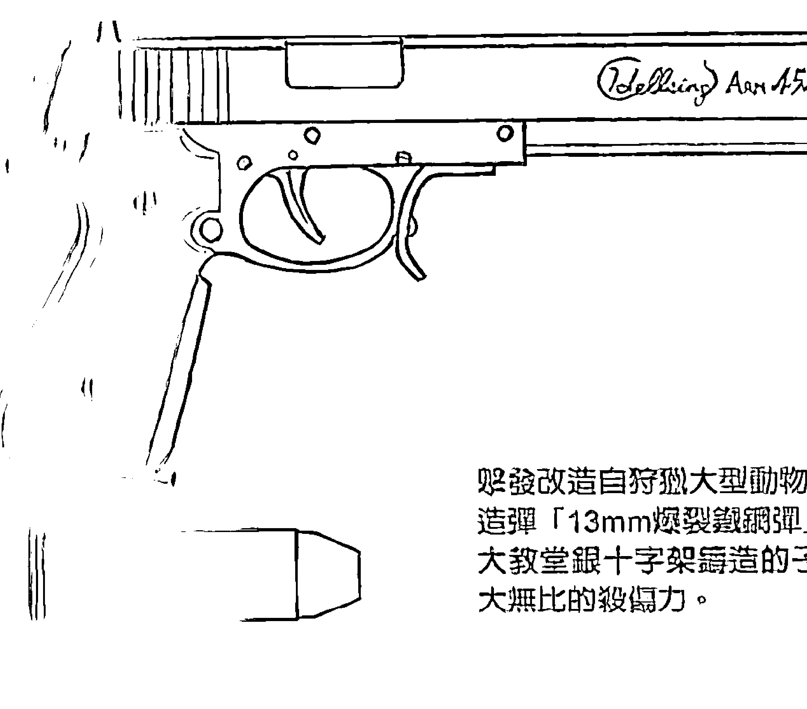

开发改造自狩猎大型动物用454加斯尔的改造弹「13mm爆裂银钢弹」，溶解圆周斯塔大教堂银十字架铸造的子弹，对怪物有奇大无比的杀伤力。

出典：《HELLSING》·平野耕太著，1996年，少年画报社

# 迪奥·布兰度
Dio Brando

荒木飛呂彥浪漫恐怖大作《JOJO冒険野郎》當中，跟喬斯達家族相鬥數個世代的不祥非人者。

# ☆高傲不羈的邪道

在貧民街長大的迪奥・布蘭度憑著無賴父親達里奥留下的唯一遺產——喬斯達爵士欠他的救命之恩，在1881年成爲喬斯達家的養子。七年後，立志成爲考古學家的喬斯達爵士嫡子喬納森，無意間發現石假面碰觸到血液時會有骨針飛刺而出，日夜埋首於研究石假面；另一方面，迪奥卻將石假面視爲達成完美犯罪的絕佳凶器。陰謀篡奪喬斯達家的迪奥本欲利用其殺害喬納森，佯作是研究中的意外事故，卻在事先用流浪漢作實驗時，意外地比喬納森早一步發現石假面能使人吸血鬼化的秘密。事跡敗露、進退維谷之際，迪奥便戴上石假面化作吸血鬼，殺害喬斯達爵士與在場警官逃離已遭烈焰吞噬的喬斯達宅第。

大部分吸血鬼都有頹廢、容易倦怠怠惰的弱點，迪奥卻具備過人的精力和爭鬥心，而且行事謹慎。迪奥在名爲旋風騎士鎮的小鎮建立據點、吸收吸血鬼企圖統治世界，此時獲得全新力量的喬納森又再次出現在他面前……透過特殊呼吸法發出的「波紋」，可以對吸血鬼的肉體造成與太陽相同的傷害。

儘管迪奥在此戰中敗下陣來，肉體被毀、僅剩頭顱得以狼狽脫逃，不過他又在航行大西洋的船隻上襲擊正在蜜月旅行的喬納森，並成功奪得其肉體。囚於海底棺柩沉眠百年後，迪奥再度復活，又在埃及建立根據地、企圖利用新獲得的「幽波紋」能力完成征服世界的野心，最終仍被得知迪奥復活的喬納森之孫喬瑟夫・喬斯達及其孫空条承太郎阻止。

於是乎，長達百年的宿命爭鬥至此終於落幕。

# 第二章：吸血鬼的诞生

+   19世纪末
* 生于英国贫民街（1868年）
* 成为贵族养子（1881年）
* 利用石假面变成吸血鬼（1888年）
* 一度败给乔纳森·乔斯达，后于大西洋沉睡海底（1889年）

+   20世纪末
* 约百年后苏醒（1984年）
* 发现出波纹能力
* 于埃及迎战乔瑟夫·乔斯达、空条承太郎（1988年）

# 波纹对吸血鬼的效果

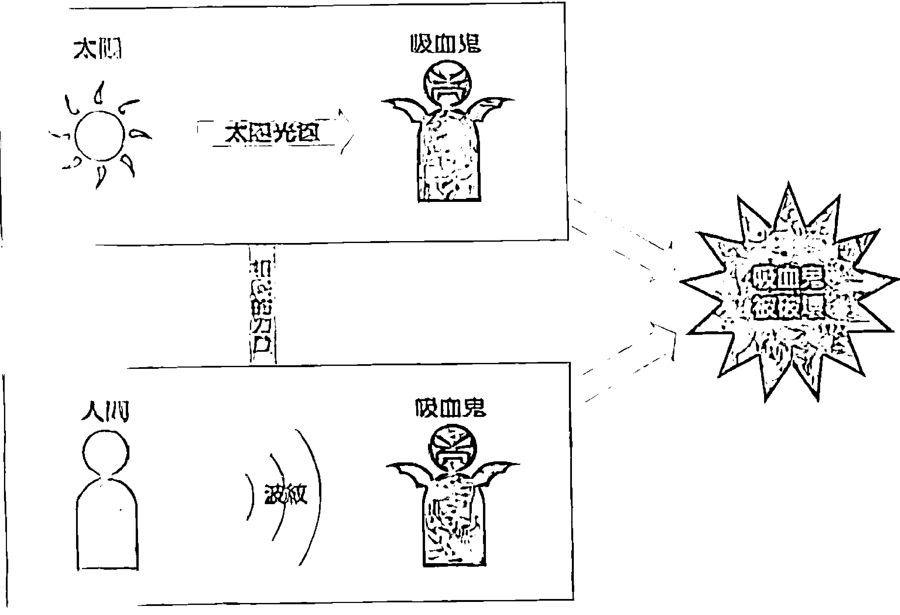

出自《JOJO的奇妙冒险》，荒木飞吕彦著，1987年，集英社

# 戴·亚蒙伯爵
Count Di-Amon

# ◇叛逆的吸血鬼

为萩原一至〈Bastard!!暗黑的破坏神〉平添不少笑声的耽美主义肌肉男，其身为一介魔法师所达到的理想模样。

人类文明因大崩坏而终结后的世界，有位龄逾400年的「爆炎之魔法师」。这位传说魔法师的养女，亦即其门徒四天王之一——黑暗精灵魔法剑士「雷帝」亚协斯·妮麾下有三位部属，合称鬼道三人众；一是符术师茜恩·哈利，一是雷帝亲传弟子魔法剑士凯依·哈恩。最后一位就是利用强大魔力将自己吸血鬼化，藉此使魔力倍增并获得肌肉猛男肉体的魔法师戴·亚蒙伯爵。他原本是个拥有清瘦高贵体态的绝世美男子，不过似乎对自己的外型怀有强烈自卑感，于是便在吸血鬼化之后运用魔力变身成全身肌肉暴起的猛男。

同时，其野心亦随前述各种变化而无限肥大化，以致他时常伺机要除掉同样身为鬼道三人众的同志，甚至还暗地策划意欲将毒牙伸向长官亚协斯·妮。伯爵确实具备与其狂妄自信相当的实力；他虽是吸血鬼却完全视十字架与蒜头为无物，根本就是个逸脱常理的荒唐怪物。其智力体力皆优于鬼道众另外两人；在不死者力量最强大的月圆夜里，甚至可以独力将四天王之首魔法师卡鲁斯麾下十二魔战将军近半数打倒。性格可谓傲慢狂妄至极，恬不知耻厚颜无耻穷廉鲜耻，却是个无法让人彻底憎恶的丑角人物。伯爵为图称霸，亦曾于四天王叛变时一度脱离鬼道三人众，后来却被比他还要恬不知耻厚颜无耻穷廉鲜耻、魔力强大的离谱、比他更接近怪物的达克·修耐达打得体无完肤，还被施下绝对服从魔法「青爪邪核咒诅」被迫臣服。戴·亚蒙伯爵的拿手招式是双眼发射的「吸血破坏光线」，另有应用技「大迴转吸血破坏光线」及「大迴转抛投高空吸血破坏光线」。最终奥义则是「超最高吸血破坏炮」。

# 四天王与组织·亚蒙

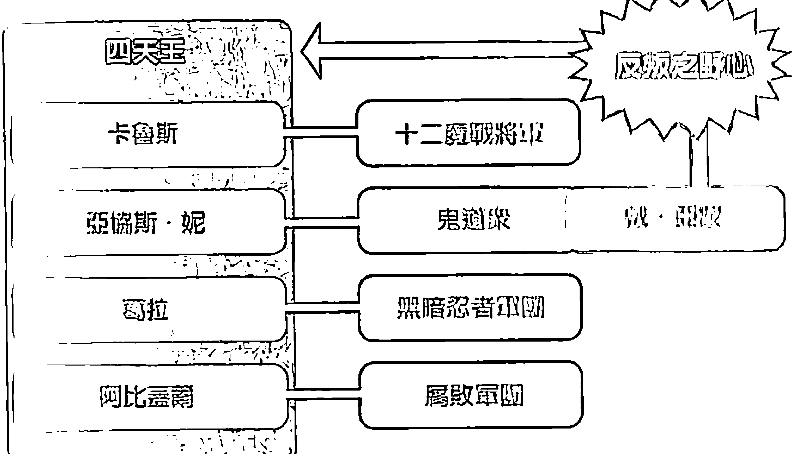

# 鬼道之轨迹

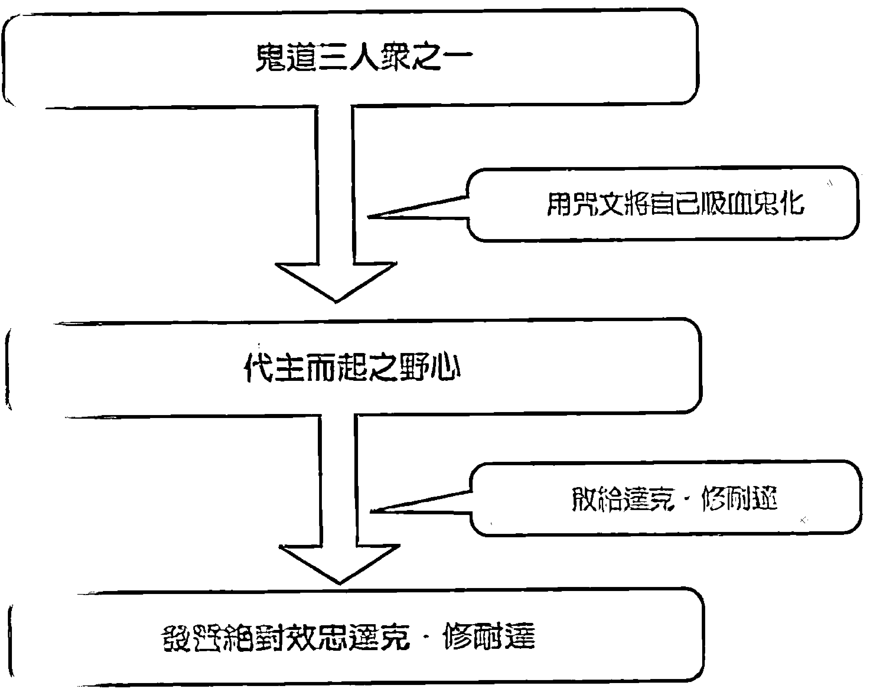

> 《暗黑破坏神III 暗黑の破坏神》· 萩原一至着，1988年，集英社

# **No.064 艾多加·波特尼尔** Edgar Porsnel

数百年间若隐若现的吸血鬼家族，以及身属该族的永远的少年。萩尾望都《波族传奇》夜里的美丽少年。

◇ 遥不可及的艾多加

1754年某夜，被发狂史可迪村村民包围的邸馆里，一名少年接受了大老波的血液，自此告别人类身分、成为时间永远停止的吸血鬼。艾多加·波特尼尔是个吸血鬼。这群自称波族的吸血鬼平时饮用玫瑰汤维生，偶尔才会经由口腔或指尖吸取人类鲜血保持生命力；他们只要不生病就不会变老，还有非常惊人的回复能力，只要不是致命的伤势都能在瞬间痊癒。艾多加跟妹妹梅莉贝露本是艾文斯伯爵与恋人梅莉薇莎所生，却被厌恶这对兄妹的伯爵正妻弃置于森林里，又被波族的最长老、在邸馆地下室沉睡百年的大老波之伴侣——老淡娜·波捡回邸馆抚养。数年后，艾多加和妹妹梅莉贝露都变成了吸血鬼，并且成为同属波族的波特尼尔男爵夫妇养子。艾多加在英国的某都市丧失所有亲人后，被他在寄宿制圣温莎学院结识的亚朗·泰莱特接纳，自此焦孟不离。

1950年遭遇艾多加的唐·马歇尔怀疑亚瑟·汤玛士·昆顿爵士所画的萨普顿肖像画，跟1865年女作家玛格丽特·赫森根据曾祖父葛伦斯密·隆勃德爵士亲身体验写成的小说《葛伦斯密日记》里的少年艾多加，还有1959年转校至加布里埃高中的艾多加·波特尼尔都是同一人；马歇尔还跟后来成为他妻子的玛格丽特共同执笔创作名为《猎杀吸血鬼》的书。1934年在伦敦遭遇艾多加的灵异现象研究家杰克·奥宾，同样也是追查艾多加秘密的跟踪者之一。奥宾直到1972年才再次见到他，可是这位失去伴侣的少年却已消失在艾文斯宅邸的烈焰当中。

# # 艾多加·波特尼尔年谱

+   1. 1740年: 生于英国的艾文斯伯爵家
2. 1744年: 跟妹妹梅莉贝尔被弃置森林里，被波族拾回抚养
3. 1754年: 得授大老波血液成为吸血鬼 成为波族的波特尼尔男爵养子、结伴四处游历
4. 1759年: 把梅莉贝尔变成吸血鬼
5. 1820年: 发生意外丧失记忆，受亨利·艾文斯伯爵悉心照料
6. 1865年: 遇见葛伦斯密·隆勃尔爵士
7. 1879年: 梅莉贝尔与波特尼尔男爵夫妇被消灭 把亚朗·泰莱特变成吸血鬼、结伴四处游历
8. 1888年: 担任亚瑟·汤玛士·昆明爵士作画的模特儿
9. 1934年: 遇见杰克·奥宾
10. 1950年: 遇见唐·马歇尔
11. 1959年: 转学至西德的加布里埃高中
12. 1966年: 《巡弋吸血鬼》刊行
13. 1972年: 亚朗·泰莱特消灭 艾多加亦于同时期失踪

| 营养来源 | 能力 |
|----------|------|
| 人类血液 吸取的生气与精力 | 不老 高度治愈能力 |
| **特征** | **弱点** |
| 只喝人血的血 不须呼吸 镜子映不出身影 不能用日光灯  只要模仿人类行为便能安然无恙 否则 | 致命伤 银制造弹造成的伤口 心脏受损害  畏惧 十字架、圣经、银制造品、阳光 |

> > 出处：《ベルの一族》，萩原望都著，1972年，小学馆

# 布拉杜伯爵
Count Blado

> 吸血鬼末裔为求和平度日而委托外界驱魔人士打倒布拉杜伯爵……
椎名高志《GS美神：极乐大战》里的大吸血鬼。

# ☆ 中世纪欧洲的杀戮伯爵

长及肩胛的丰硕金发、深邃碧绿有如水晶的瞳孔……身披天鹅绒的修长身影一跃，曝露出尖锐犬齿的伯爵疾飞而去，徒留嗤笑声在暗黑夜空中回荡。

布拉杜伯爵有「杀戮伯爵」异名，是曾使中世纪欧洲陷入大恐慌的意大利吸血鬼；当时欧洲曾有数次严重的鼠疫令人口锐减，其中至少有两次是因他而起。布拉杜伯爵原乃威胁旧世界、震撼人类社会的诸恶根源，后来却被正值颠峰期的年轻炼金术师卡奥斯博士和其开发的各种武器追逼至穷途末路，不得已只能逃至其领地——地中海的孤岛布拉杜岛，在岛屿四周张设结界、成功瞒骗过追杀者的眼睛。此后数百年间，在他跟人类生下的半吸血鬼——秉性稳重的皮特杜雷·布拉杜协助之下，布拉杜伯爵得以顺利隐藏行踪不为世间所知。然而「犯罪界的拿破仑」詹姆士·莫里亚蒂教授的犯罪组织却看上吸血鬼不死的性质，于1891年一度突破布拉杜岛结界、掳走伯爵的子孙艾利斯·布拉杜，后幸得当时扬名世界的大侦探、莫里亚蒂教授的宿敌夏洛克·福尔摩斯协助，事态始得收束。

布拉杜伯爵直到20世纪末才从永眠状态醒转，企图再展征服世界的野心，但是他的儿子和领民都希望可以和人类共存、没没无闻地平静度日，于是便去向外界专门驱退妖魔的驱魔清道伕GS（Ghost Sweeper）寻求协助。布拉杜伯爵和继承其吸血能力的皮特杜雷遂展开壮烈吸血交战企图控制对方，最后布拉杜伯爵的野心终告破灭，布拉杜岛亦寻回往日的平静。

# 布拉杜伯爵年表

- 11世纪
- 席卷中世纪欧洲
- 嫡子半吸血鬼皮特·杜雷诞生
- 被炼金术师卡奥斯博士迎至鹤途
- 于领地布拉杜岛张设结界
- 1901年
- 布拉杜岛结界被莫理哀教授突破
- 皮特·杜雷协同福尔摩斯成功收束以斯
- 20世纪末
- 再次苏醒企图征服世界
- 皮特·杜雷委托恶魔清道侠GS
- 与皮特·杜雷吸血交战后败阵、野心破灭

# 两方之争

布拉杜伯爵
征服世界的野心

以暴力统治领民

吸血交战以图控制对方

皮特·杜雷败北
转向与人类和睦

与人类共存
皮特·杜雷·布拉杜

向恶魔清道侠GS寻求协助

（出处）《GS美神：极乐大作战!!》，椎名高志著，1991年，小学馆

# 江藤兰世

# Ranze Jitou

爸爸是吸血鬼，妈妈是狼女……为跨种族恋情苦恼的池野恋《我们一家都是鬼》女主角。

# ♡客居人间的异邦人

1968年7月27日生，狮子座O型……看似普通女孩的江藤兰世，其实是从魔界私奔至人间的吸血鬼爸爸和狼女妈妈生下的魔界女孩。在日本没人知道她真正身份，过着极普通生活的中学二年级生兰世，转学初日便一见钟情地爱上真壁俊。这不但是她的初恋，也是将对魔界及人间掀起波澜的邂逅。长生不死的魔界人跟寿命有限的人类之间超越种族的恋情，一次又一次地考验着兰世……后来兰世发现俊其实是魔界的双胞胎王子，只是因为预言说双胞胎乃属不祥之兆，方才被安排在人间成长，又再度因为身份立场的差距而受到打击。然而自从兰世下定决心要成为人类以后，每逢阻碍其决心便只有愈发坚定；她逐一战胜所有障碍，并终于在七年后得到众人祝福、跟心爱的人结为连理。

婚后的真壁兰世是有两个孩子的家庭主妇，过着幸福快乐的家庭生活。她虽然因为跟俊结婚而成为魔界皇族，本人却喜爱人间的闲适悠然；她是孩子眼中的慈母，还经常替同样拥有跨种族恋情烦恼的少女们提出各种建议，俨然是位沉着稳重的成熟女性。

尽管兰世的魔力直到14岁方才觉醒，不过她确实继承了父亲江藤望里的吸血鬼能力。除变身成噬咬对象的“吸取容貌”异能以外，她还通晓把人变成狗的魔法、进入他人梦境等魔法，并且运用这些能力克服重重危机。

# # 小川闵世的足迹

- **小学**
  - 1968年：诞生。乃吸血鬼与狼女混血
- **中学时代**
  - 1982年：14岁。邂逅真壁俊
  - 1983年：15岁。得知真壁俊是魔界的王子
  - 1986年：18岁时就读高中一年级
    - 一度由魔界人变成人类，后来又变回魔界人
- **高中**
  - 1989年：21岁。跟真壁俊结婚成为“小川闵世”
    - 成为魔界皇族的一员
- **结婚时代**
  - 1991年：23岁。长男诞生
    - 被人类得知真正身份，一度返回魔界
  - 1994年：26岁。长女诞生

# # 『吸取容貌』的能力

出處：《とけませめてきトゥナイト》，池野戀著，1982年，集英社

# 美夕

Miyu
负责监视沉睡的神魔并猎捕迷失的神魔、使其归于黑暗空间，拥有神魔血统的神魔监视者。以血液为交换条件赐人永不醒转幸福之梦的《吸血姬 美夕》。

# ◇ 神魔的监视者

有位人称吸血姬的少女，身穿古风和服、数十年间容貌全无改变的少女，美夕。美夕的父亲是普通人类，母亲则是未曾觉醒的吸血姬，自己则被当作普通人类女孩抚养长大，同时父母也不断祈祷她能跟母亲一样不要变成吸血姬。美夕直到中学方才觉醒，她的人生亦在啜饮母亲鲜血的同时宣告终结。

吸血姬跟传说中的吸血鬼不同，她们不是害怕十字架、蒜头、圣水等物的怪物。她们既不畏阳光，被她们吸血的人也不会变成吸血鬼。受彼等吸血姬血牙礼的人，便能得到“永远幸福的梦”。也就是说，被吸血者永远不会从自己打从心底冀望的梦境醒来；这便是吸血姬给予人类的血之代价。

吸血姬的职责，就是要监视正在沉眠的神魔、将迷失的神魔归于黑暗空间。神魔通常居住在神魔界，唯有部分神魔才会偶尔被人类心底的黑暗面所吸引，现身于人间界。这些神魔经常会为人间界带来灾难，是以神魔进入人间界已然成为禁忌。身为监视者的吸血姬就是要猎捕此类神魔，将其遣返至黑暗的空間；于是，美夕便带着受其鲜血而成为仆从的西洋神魔拉法，凭着红莲烈焰跟神魔战斗。虽然就结果而言，美夕确实曾经多次拯救人间界免于灾厄，但她也并非人类的伙伴；对人类来说，这位神魔监视者既是个旁观者，同时也是个不断恣意吸血解渴的掠食者。尽管被吸血者可以得到永远幸福的梦，但相对地却会失去现世的生活、就此长眠。至于这究竟是幸或不幸，没有人知道。

# 美夕的吸血行为

使人陷入永久的沉睡

- 美夕的喜好：
  - 姬宫桃子
  - 澄世之巫女的血液
  - 身体柔弱的少女
  - 有不可告人的过去的人的血液

变成朱红色明珠在美夕身旁做永远幸福的梦

- 现世生活告终（共有两种形式）：
  - 血液干涸而亡
  - 进入“脱魂”状态

# 吸血姬之职责

吸血姬“美夕”
体内血液觉醒后成为“神魔监视者”的神魔

- “神魔”：
  - “监视者”
  - 保护沉睡的神魔
  - 将现身人间界的迷失神魔归还黑暗空间

- “人类”：
  - “旁观者”
  - 不积极干涉
  - 吸血解渴的对象

# # 永生之人

有名始终蒙着神秘面纱的谜样男子，以其卓越知识能力出入欧洲各国宫廷、曾为路易十五世（Louis XV）从事许多政治活动，就连绝代“浪荡公子”卡萨诺瓦（Giacomo Girolamo Casanova）和哲学巨人伏尔泰都为之惊叹。坊间传言他是蔷薇十字团会员……只要是娴熟欧洲历史的人，一定都听说过和卡廖斯特罗伯爵（Duk Cagliostro）并称欧洲史上最大谜团，自称外西凡尼亚拉克兹家族（Rakoczy）皇位继承人的拉克兹·圣日门伯爵（Comte de Saint Germain）的名字。

根据提及名的最早纪录——1710年法国音乐家拉摩（Jean Philippe Rameau）的日记，当时伯爵的样貌像是50多岁，然其实际年龄不详，有时看来更加年轻、有时看来更加年迈……他谈论的话题亦非常广阔，与他对话就会有种超越时空的感觉。又，据传圣日门伯爵在40年后谒见路易十五世，他的样貌就像是个40岁前后的男性。此外，据说法国皇帝拿破仑一世也对伯爵极感兴趣，甚至有部分神秘学者主张拿破仑远征埃及和流放至厄尔巴岛（Elba Island）前，向他提出建言的“土伊勒里宫（Palais de Tuileries）的红衣男子”，正是圣日门伯爵。

这位普鲁士腓特烈大帝口中的“永不死亡的男子”曾自称有2000岁至4000岁，更把谒见所罗门王、参加十字军东征等故事叙述得活灵活现，好像数世纪前曾亲身经历过一样……于是有人便认为他是古代的炼金术师，有些虚构创作作品甚至把他设定为长生不老的吸血鬼。

翠西雅·奎恩·雅柏（Chelsea Quinn Yarbro）的《圣日门纪事》（Saint Germain Chronicle）便属此类。

雅柏笔下的吸血鬼圣日门伯爵会在鞋跟里放些土壤，如此一来不仅是夜晚，就连白天在大太阳底下亦能行走自如。圣日耳门伯爵还结交罗马贵族奥莉薇亚·克莱门斯（Atta Olivia Clemens）等朋友，只要美丽的女性分给他少许血液，他就会馈赠对方唯有自己才能提供的不可思议代价作为交换。《圣日门纪事》并无日译（亦无中译），不过许多吸血鬼研究书籍和入门书都曾经数度介绍此部作品，所以日本的吸血鬼迷对此系列作品应该并不陌生。《圣日门纪事》是由数部短篇小说和长篇小说所构成，吸血鬼圣日门的编年史始于伯爵在古埃及寺院的修行时代，直到1920年的奥地利。

此外现实历史中的圣日门伯爵，还曾经在信史所载亡殁于1784年后数度现身，直到20世纪以后仍不断有人目睹伯爵的身影。

# ## 第3章

# ### 阴墓血踪

# # No:068 伊西斯与奥赛利斯
Iisis, Osiris

非人化生者来自何处、往何处去？安·莱丝《吸血鬼纪事》对此疑问有独特的解释。

# ## ☆天谴者的女王

距今6000年前、早在那块黑色大地被称呼为“埃及”之前，阿可奇嫁给国王恩基尔以后，便厉行改革，严令禁止周边各国食葬风俗，成为黑色大地的实质统治者。前往神圣事物的女王宣召两位能跟精灵对话的双胞胎女巫玛赫特和玛凯进宫，岂料两名女巫不服，女王盛怒之下挥军杀光女巫的亲族，还命令侍卫长凯曼在众目睽睽之下凌辱两人。玛凯誓言复仇，便派遣尝过人血滋味的恶灵阿莫前往黑色大地；阿莫伺机由阿可奇的伤口入侵体内，与其结合变成非人的另一种生物。拥有超人体力与回复力但畏惧光线、可藉由摄取他人血液维持生命的非人者——吸血鬼于焉诞生。

阿可奇将此黑暗赐礼授予丈夫恩基尔后，便巧妙地扭曲伊西斯与赛利斯神话、以神明自任君临埃及，同时被当作实验对象的凯曼，以及玛赫特、玛凯等遭转化成吸血鬼者等“首代血族”举兵起义，反抗阿可奇的统治。经过长期征战被逐出埃及以后，国王和女王化作名为“必须被守护者”的神像，被藏匿于亚历山卓；后来两座神像被罗马出身的吸血鬼马瑞斯带出埃及，安置在地中海的某个岛屿上。2000多年后的1985年，阿可奇被黎斯特的歌声唤醒，并大开杀戒要杀光地球上所有男吸血鬼和男人，却终究被三名首代血族率领的吸血鬼和拒绝服从的黎斯特消灭，而吸血鬼生命的根源——阿可奇的脑髓和心脏也被玛凯所吞食。

# 埃及神话中的伊西斯与奥西里斯

- 冥界之神和死者守护神白天不外出活动也很合理
- 惧怕阳光的吸血鬼无法在白天活动
- 变成吸血鬼的阿可奇和恩基用为统治埃及而扭曲神话

# 吸血鬼的诞生

## 参考文献

《吸血鬼莱斯特》（Vampire Lestat），Ann Rice著，1986年，Ballantine Books

# # 德古拉的子女

# ## Dracula's Get

德古拉伯爵获得胜利后，大英帝国到处都是横行无忌的黑暗血脉……金·纽曼《德古拉纪元》系列作品描绘的另一个版本的近代史。

# ### ☆吸血鬼的帝国

吸血鬼德古拉伯爵从中世纪的荒芜中苏醒后，由惠特比登陆不列颠群岛；他非但掐住工业革命后的大英帝国命脉，还成功地在188X年打败了亚伯拉罕·凡·赫辛教授及其同伴。伯爵以其黑暗血脉在英国的第二位子女——弑夫的米娜·哈克为首，转瞬间让大英帝国到处都充斥拥有德古拉伯爵血统的吸血鬼。此时伯爵早已放弃藏匿于黑暗的生活、公开其吸血鬼的身份，并在1861年维多利亚女王的丈夫萨克森—科堡—哥达公爵艾伯特逝世后，成为正在服丧中的女王的配偶；后来德古拉晋升至摄政亲王的地位，成为大英帝国实质的统治者，自此开创“德古拉纪元”。不出数年，英国俨然已经成为吸血鬼横行肆虐的黑暗帝国，原本潜伏于各地的长生者陆续集结，尤其出身于德古拉伯爵生前领地中欧地区的吸血鬼，还组织成“喀尔巴阡近卫队”，时常在首都伦敦大摇大摆横行霸道。

德古拉的血统出自代代重复近亲联姻的中世边境贵族，其血脉黝暗而稠浊，其中不少新生者无法承受毒药般的血液，发生可怕的严重畸型，非但没有得到永恒的生命，还必须极度痛苦而亡。非德古拉系统长生者大多相当厌恶德古拉血脉，担任大英帝国首相的长生者鲁斯凡爵士便曾毫不留情地批评如今已是主君身份的德古拉，说德古拉血统是墓地里发霉的血。

德古拉伯爵于1888年被逐出大英帝国流亡海外后，其血脉曾一度向德国蔓延，然而第一次世界大战后抬头的阿道夫·希特勒国家社会主义德意志劳工党政权却将德古拉的子女视为劣等人种，并建立灭绝集中营推行根绝政策。

# 德古拉统治的大英帝国

- ### 德古拉血统
  - 威拉德·布伦
  - 玛丽·雪莱
  - 玛利亚·莎朗·卡利伯恩夫人
  - 伊利莎白·巴托里伯爵夫人
  - 其他

- ### 大英帝国

- ### 非德古拉血统
  - 鲁斯凡爵士
  - 照内维埃夫·桑德琳·狄娜·迪厄多内
  - 等等

# 吸血鬼帝国之始末

- **德古拉**
  - 将赫辛教授处死
  - 成为维多利亚女王的配偶、统治大英帝国
- **吸血鬼横行首都伦敦**
  - 德古拉召来的血族
  - 长期潜伏的长生者
  - 刚从人类变成吸血鬼的新生者
- **1901年维多利亚女王去世，德古拉被逐出伦敦**
- **德古拉统治的吸血鬼帝国告终**

> 出自《Anno Dracula》，Kim Newman著，1994年，Avon Books

# 神祖与贵族

Sacred Ancestor and Nobles

菊地秀行《吸血鬼猎人D》的背景世界中，曾以超科学黑魔法盛极一时的吸血鬼文明，如今已然衰退恰如夕阳晚照。

◇ 黑暗世界的统治者

1999年，人类文明因全面核子战争而破坏殆尽。少数倖存人类虽力求复兴，却只能达到与中世纪相当的文明。此时自称“贵族”的吸血鬼，遂取代人类成为地球的统治者。吸血鬼早在人类文明正繁荣的时代便已藏身于各个角落，并在核战爆发前互通消息，暗中准备要在战后占领全世界。

约值西元5000年的时候，吸血鬼便以名为“神祖”的大吸血鬼为顶点，运用超科学和黑魔法构筑起规模遍及全球的吸血鬼文明圈。来自外宇宙与异世界的外来者侵略、大贵族和信奉诡异神祇的宗教组织叛变，都曾经数度动摇由贵族统治的吸血鬼世界，但是贵族也在神祖的领导下陆续克服危机。

然而由于吸血鬼种族灵魂深处的生命热情缺乏持续性，甚至含有注定灭亡的因子，于是贵族文明便于西元8000年左右开始凋零，人类强烈反抗，贵族不得已只能妥协。到最后，他们就像是放弃了自己的命运，一个一个消失，有些贵族选择自我了断，有些则选择移居至地球以外的星球。贵族建立的繁荣文明终于解体，仅有少数倖存者能在边境地区威胁居民。

所谓“神祖”，便是核战后的世界统治者——贵族的最高存在；正如其名所示，受吸血鬼崇拜的“神祖”拥有神明般的力量，就算是吸血鬼也无人能够理解神祖行事的真正意图。

神祖虽然拥有远远凌驾其他吸血鬼的超能力、超科学，不过他却在贵族开始衰退时将所有能力封印起来，简直就像是在加速贵族黄昏的到来。神祖曾私下表示贵族与人类的融合才是他的真正愿望，但现如今却已无从证实。

# # Vampire Hunter D 年表

- 旧世界
  - 人类的世界 ~1999年
    - 因核子战争而崩坏
    - 科学魔法
- 新世界
  - 贵族霸权确立期 2000年~5000年
    - 利用起科学及魔法建立的文明
    - 人类的地狱时代
  - 贵族的全盛时期 5000年~8000年
    - 击退来自外宇宙的侵略者
    - 大贵族殒落
    - 贵族将文明圈扩展至地球以外的地区
  - 贵族的衰退期 8000年~12000年
    - 吸血鬼贵族的寿命限制
    - 封印“神祖”的技法
    - 人类大规模反抗
    - 贵族渐渐消失
  - 人类的新时代 12000年~

# 红蔷薇结社

# Crimson Rose Society

田中芳树《红蔷薇新娘》描绘的现代吸血鬼社会中，以跟人类社会和平共存为创设宗旨的吸血鬼互助组织。

# ◇ 吸血鬼的互助团体

从前有个透过血液分得他者生物能量的种族，一直生存在人类社会里不起眼的阴暗处。这些人称“吸血鬼”的生物，其实是感染了一万年前发生突变所产生的吸血病毒之感染者；感染者又可以分成出生时便带有病毒抗体的先天性吸血鬼，以及不含抗体遭受感染的后天性吸血鬼。红蔷薇结社便是亦称“带原者”的先天性吸血鬼，有鉴于弱势同胞经常受到多数人类的偏见及暴力威胁、为求团结自保，便自行发起援助的吸血鬼互助组织。其历史至少可追溯至13世纪初叶，至今20世纪末会员约有500名左右。结社总部位于奥地利维也纳，在德国、日本等世界各国也都设有支部；红蔷薇结社并非动辄影响社会的大型组织，经营日本支部的吸血鬼仅有12人而已。

后天性吸血鬼乃指被先天性吸血鬼传染病毒者，结社称之为“患者”。感染病毒的后天性吸血鬼非但吸血欲望激增，还会透过吸血行为传播病毒、增加感染者，俨然就是个撒播灾厄的病原菌。猎捕后天性吸血鬼也是红蔷薇结社的工作项目之一，倘若放置不理，这些“患者”将会以几何级数无限增殖。红蔷薇结社主要工作就是要对抗“患者”以及企图利用“患者”的人类，维护自己平稳的生活。

尽管红蔷薇结社的组织方针温和，将其视为毒瘤的人类团体亦不在少数，其中最激进的当属基督教；基督教过去曾经屡度大举迫害该结社，甚至曾经在第四次十字军（1202年～1204年）的时候，将外西凡尼亚的吸血鬼全数歼灭。

# 吸血鬼协会

# 吸血鬼自行发起援助吸血鬼的吸血鬼志愿团体

| 类型 | 内容 |
| :--- | :--- |
| 成员 | 皆由先天性吸血鬼组成 |
| 目标 | 生存于人类社会中的吸血鬼 |
| 纲领 | 相互扶助，排除后天性吸血鬼，保护低阶 |
| 敌人 | 部份人类，基督教，后天性吸血鬼 |

# 先天性吸血鬼和后天性吸血鬼

| 特征 | 先天性吸血鬼 | 后天性吸血鬼 |
| :--- | :--- | :--- |
| 状态 | 带有挑衅的“恶魔” | 无抵抗的“患者” |
| 性质 | 停止成长、老化 | 无法回归人类 |
| 能力 | 感知能力提升 吸收生物能量 | 肌力增强 吸收生物能量 |
| 吸血 | 不需吸血液 | 须吸血增加同伴 |
| 弱点 | 无特别吸血鬼的弱点 | 阳光、十字架、银制品等 |

> 出自《ドレッド・ドロップに紅いバラ》，田中芳树着，1989年，徳间书店

# No.07/2

## 真世界与“贵族”

## True World and Nobles

假扮人类混入文明社会的非人者。南茜·科林斯《午夜蓝调》里充满危险魅力的异界居民。

# ☆潜伏者

《伊古利索尼亚》此书名乃拉丁语“发现真世界的锁匙”之意。此书是13世纪一位叫做帕里努斯的人物，冒着烧坏脑袋的热病所写成的；这本异端书详细记载数千年来，狼人、女梦魇、食人鬼等假扮人类混入人类社会的“伪装者”之生态，以及彼等所构成的非人者社会——真世界。这本书还有种魔力，可以赋予热读者发现真世界的洞察力；索尼娅·布卢还不知道自己身份时，年迈的神秘学家艾力克·吉尔拉迪就会逼她熟读此书，后来才能进入真世界。袭击索尼娅的吸血鬼种族，同样也在此书记述的“伪装者”之列。

真世界的吸血鬼非但拥有过人体力与某种催眠能力，还有无法映照于镜面的长生不老肉体。并非所有吸血鬼都害怕十字架和蒜头，不过除索尼娅此类突变种以外，吸血鬼害怕阳光和银制品的特性都与传说中无异。使人类变成吸血鬼的其实并非吸血行为本身，而是吸血鬼的唾液或精液进入被害者体内所致；吸血鬼的体液会让被害者进入死亡状态、重新组合其肉体及遗传基因，接着下级恶魔就会进入宿主脑部、连结宿主生前的记忆及人格，统合形成新的人格。通常新生的吸血鬼光是要掌握所有能力，就必须花费数十年时间；其中又仅有极少数能够存活得更久，并且成为吸血鬼的统治阶级“贵族”。

彼等“贵族”既傲慢又有极强烈的自尊心，毫不避讳行踪被人发现，最喜欢品尝人类的负面情绪；愈是黑暗的负面情绪就愈是美味，是以“贵族”经常会故意挑起人类的邪恶性格制造动乱，然后像品尝美酒般享受历史的动乱。

# 1. 世界

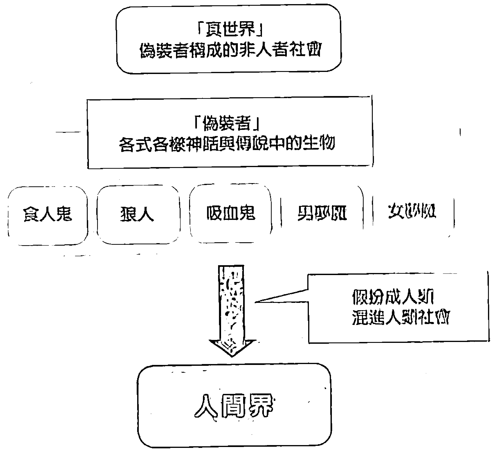

# 2. 吸血鬼變成貴族

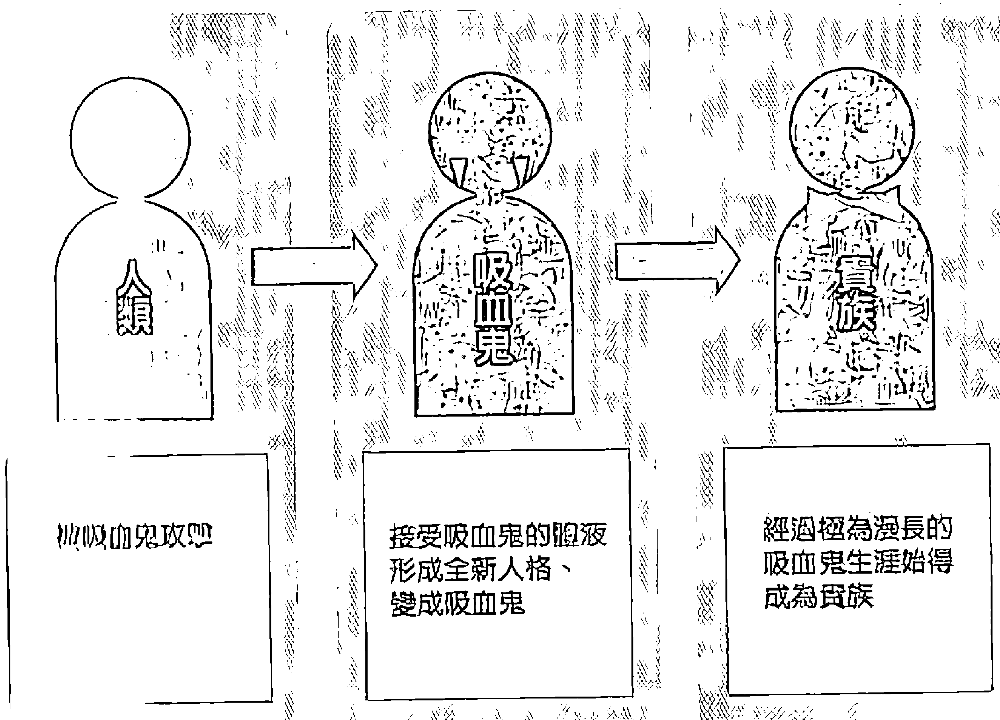

> 出处：小说《Midnight Blue》，Nancy A. Collins著，1995年，White Wolf Games

## No:073

## 吸血鬼與吸血魔

> Vampires, Vampireze

吸血鬼和吸血魔是黑暗世界的兩個吸血鬼族……神秘作家向遼倫筆下兩大吸血鬼家族的對立與抗爭。

# 負傷者之戰

自古以來活在黑暗世界的吸血鬼，向來都將人類視為獵物、吸取人類鮮血維持生命。然而隨著人類的勢力愈發擴張，害怕人類反擊的保守派吸血鬼漸成主流，遂有「吸血時應盡量謹慎、避免致死」的規定誕生。

而吸血魔就是極力反對此規定，揚言要獨立的吸血種族。吸血鬼不允許吸血魔獨立，並且在吸血魔公然殺戮人類時發動攻擊，雙方遂展開激烈的戰鬥。後來人多勢眾的吸血鬼佔得優勢，一度使得吸血魔瀕臨滅亡，不料被吸血魔襲擊因而得知吸血種族存在的人類竟然開始獵殺吸血鬼，只要見到吸血種族便殺，使得吸血鬼族亦急速銳減。

由於吸血種族危機當前，雙方遂締結停戰協定：只要吸血魔不公然殺人，吸血鬼便默認吸血魔的存在。這紙停戰協定維持數百年，兩族間雖偶有零星的個人爭執，卻也著實避免了大規模戰爭。

然而，預言中「率領吸血魔殲滅吸血鬼」的吸血魔王之出現，使得兩族均勢急轉直下。吸血魔王將己方陣營的人類組織成「血寵物」，相對地將吸血魔視為危險存在的人類則組織成「血盟友」，並與吸血鬼結成同盟。於是，吸血鬼和吸血魔兩族便全面展開了連人類都牽連進去的「負傷者之戰」。

負傷者之戰長達10年以上，直到後來吸血魔王戰死，兩族才開始交涉協議停戰。

# 吸血鬼與人類的關係

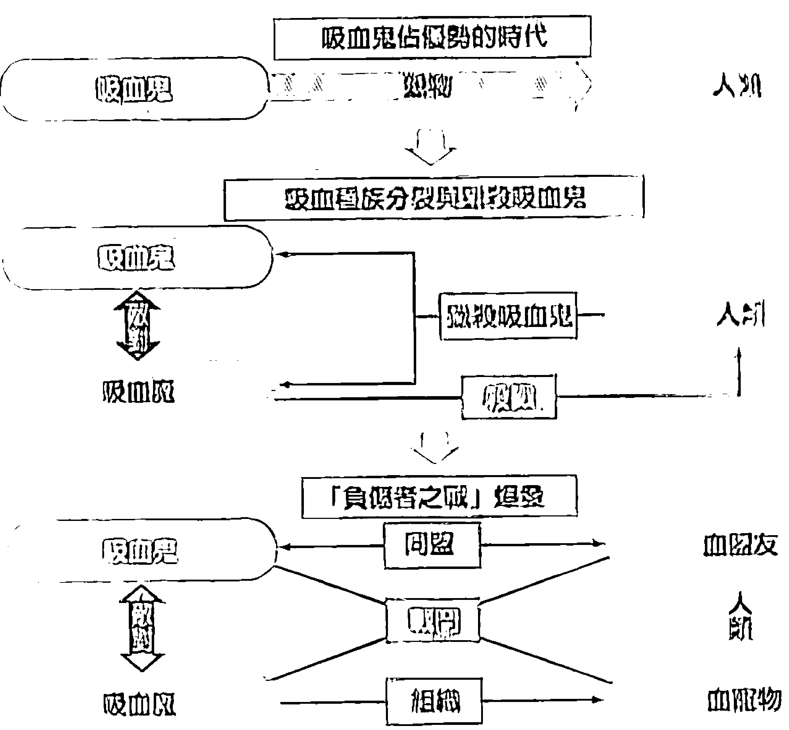

# 主要的吸血鬼

### 吸血鬼
| 名称 | 描述 |
| :--- | :--- |
| (帕絲·史提利元帥 (Parls Skyle)) | 吸血鬼長老 |
| 箭元帥 (Arrow) | 對吸血鬼態度強硬的吸血鬼元帥 |
| 華加斯奇元帥 (Vancha March) | 從前曾是吸血魔的吸血鬼 |
| 達倫元帥 (Darren Shan) | 原是人類的半吸血鬼 以特例晉升為元帥 |

### 吸血魔
| 名称 | 描述 |
| :--- | :--- |
| 吸血魔王 (Vampaneze Lord) | 預言將「率領吸血魔殲滅吸血鬼」的吸血魔首領 |

參考資料：《The Saga of Darren Shan》，Darren Shan著，2000年，HarperCollins

# 賽倫鎮
Salem's Lot

神不知鬼不覺被吸血鬼佔領的緬因州鄉下小鎮。恐怖小說巨匠史蒂芬·金《吸血鬼復仇記》的發生地。

### ☆ 吸血鬼棲居的鄉鎮

正式地名為「耶路撒冷鎮」的賽倫鎮位於緬因州坎伯蘭東方、波特蘭北方20英哩處，是個居民人口共1400人左右的鄉下小鎮。除1951年9月曾遭祝融肆虐以外，賽倫鎮一直都是個非常平凡的小鎮，直到1975年9月22日，舊世界的邪惡力量才打破了小鎮的平靜。理查·史垂克偽裝成骨董商住進馬斯登舊宅，趁著半夜在墓地舉行活祭儀式，迎接其所事奉的吸血鬼科特·巴羅。早在1939年修伯特·柏克萊·馬斯登自殺身亡、滿是蒼蠅的屍體被發現以前，這座俯瞰全鎮的馬斯登宅邸就已經是恐怖與惡德的象徵。自稱貨運公司經營者的馬斯登有許多負面流言，有些鎮民說馬斯登跟波士頓的黑幫有關，也有人說他是惡魔崇拜者；其實這兩則流言皆屬實，馬斯登從前是個職業殺手，退休後便成為巴羅在新大陸美國的資助者。

巴羅是個面色蠟白的削瘦男子，向後梳齊的白髮間藏著絲絲灰髮，嘴邊則蓄有黑色鬍鬚；明亮眼眸顯露出智慧光芒，有時會充血染成火焰般的赤紅。賽倫鎮沒什麼值得提的事業，就算鎮民憑空消失可能也要很久才會有人注意到。會去教會的鎮民原本就不多，鄰居間的交際往來更因為電視普及而斷絕已久。這些心裡暗藏著黑暗、充滿生命力、鮮血與攻擊性的鄉人，正是巴羅眼中最理想的獵物。他巧妙地挑逗並誘發鎮民們藏在心底的願望與欲望，然後把鎮民一個個都變成吸血鬼。

# 缅因州的伦镇

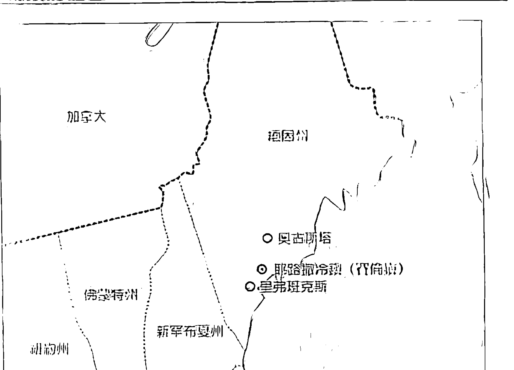

# 故事梗概与登场人物

- **1975年**：发现科特·巴罗资助者 修伯特·伯克莱·马斯登自杀的尸体
- **1976年**：发生波及大部分镇区的火灾
- **1976年**：骨灰盒科特·巴罗被理查·史垂克运回马斯登凶宅
- **1976年**：两名镇民逐一变成吸血鬼
- **1976年**：吸血鬼科特·巴罗与人类对决

**反派:**
- 科特·巴罗 (吸血鬼)
- 理查·史垂克 (巴罗的仆人)

**正派:**
- 班·米尔斯 (作家)
- 马克·皮特里 (流亡的少年)
- 苏珊·卡拉汉 (神父)
- 乔纳斯·科迪 (警长)

> > 《'Salem's Lot》· Stephen King著，1975年，Doubleday

# No.075

# 户山都营住宅的居民

# Toyama Heights

深爱吸血鬼的恐怖小说作家菊地秀行，在跟其他作品共通的舞台——魔界都市「新宿」为吸血鬼安排了一方安居之地。

# 爽朗居民的棺柩

200X年，新宿区被突如其来的「胧霞」侵袭、仅止三秒便全般崩坏。我们熟知的新宿已不复在，散发着妖气的「魔界都市」取而代之，诞生在从前叫做新宿的这块土地上。各种妖魔、魔导士、异常犯罪者，都被新宿吸引聚集于此地。妖魔当中当然也包括暗夜世界的居民——吸血鬼。

栖息于新宿区的吸血鬼大多属于东洋系，居住在占地颇广、房屋就快要崩塌的户山都营住宅社区里。想当然尔，当初新宿区公所也认为此社区的吸血鬼相当危险，并曾经组织讨伐队搞得甚嚣尘上；不过令人不可置信的是，区公所竟然收到2000名普通区民联合署名曰「虽然身为吸血鬼，只要是住在此地的人就有生存下去的权利」，吸血鬼甚至还推派代表跟区公所建立交涉管道。在此番交涉过程当中，区公所釐清吸血鬼居民都是支付正当的代价、向区外的血液银行购买血液作为糊食，是以户山都营住宅遂被认定为特别居住区域，并计画要开拓共存共荣的愿景。具体来说，就是将区民捐血获得的血液分配给吸血鬼，吸血鬼方面则是提供含有长生不老因子的血液。此外，白天吸血鬼停止活动的时间，则由民间警卫保全公司看守户山住宅、以防其他妖魔来袭，双方关系可谓非常良好。即便如此，吸血鬼也知道每当有吸血事件发生，户山住宅绝对是第一个被怀疑的对象，因此平时便主动配合新宿区警方。当新宿遇到美姬、布伦贝克家族等「区外吸血鬼」，以及吸血邪教团「邪严」蹂躏之际，身为新宿区民的吸血鬼亦会挺身而出，即便牺牲惨重，都要共同抵御威胁「魔界都市」和平的外敌。

# 新宿區的吸血鬼

| 項目 | 描述 |
| :--- | :--- |
| 由來 | 吸血鬼被吸引到因「厭惡」而誕生的異界都市居住 |
| 居住地 | 新宿戶山町都營住宅 |
| 人數 | 約200名（以西洋系吸血鬼為主） |
| 飲食 | 從血液銀行購買的血液 區民捐血得來的血液 |
| 工作 收入 | 夜警、深夜營業場所的守衛、保鑣 提供吸血鬼的血液等等 |
| 備註 | 為防止外敵於白晝入侵， 都營住宅設有常駐守衛 位處危險地帶， 因此普通人不敢接近 |

# 戶山都營住宅之位置圖

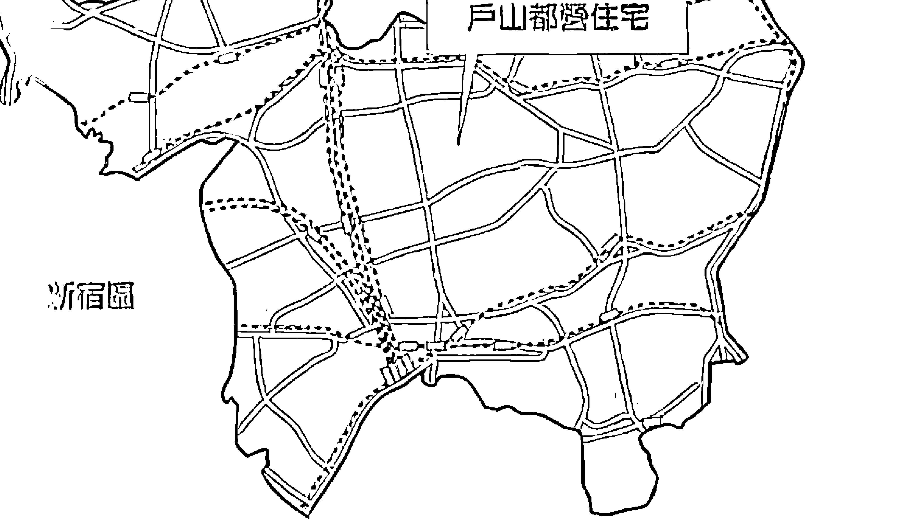

> 出典：《吸血鬼メフィスト》，菊地秀行著，1988年，角川書店

# No.076

# 搖乳酒吧

# Titty Twister

爛酒吧雖多，這間更是糟糕透頂。從黃昏營業到黎明，吸血鬼等待獵物上門的恐怖酒吧。

# 墨西哥的噩夢

接近墨西哥邊境的荒漠地區，點著花俏低俗霓虹看板的店門口，滿臉颯髯的禿頭皮條客查特·普西軍手拿著麥克風，喊著「Pussy!! Pussy!!」*招攬客人。這裡是機車暴走族與貨車司機等不法之徒的巢地，從黃昏喧囂直至黎明的買春淫窟兼酒吧，店名叫做「搖乳酒吧」。搖滾樂團發出惱人的電吉他噪音，吧台和客桌上到處都有裸女狂舞著一絲不掛的軀體……店裡的顧客粗暴地抱著女人，喝酒、互毆，然後再用啤酒將這片猥褻暴力又瘋狂的景象一股腦灌進胃袋裡。普通人絕對無法忍受酒吧裡如翻天覆地般的景象超過30秒。這家酒吧不宜久留，最好趁酒醉前趕快離開，否則很可能會因此喪命。

彷彿夜裡的喧囂都是虛幻夢境，若在白天路經這家沉睡於寂靜空間的店，大可停下車來向屋裡窺視。你會發現此處並非酒場，其實是阿茲特克民族神殿最高層、取活人心臟活祭野蠻眾神的血腥祭壇。不光是上半身布滿刺青、穿著皮背心的調酒師剃刀查理，店裡所有人全都是醜陋的吸血鬼，從前不幸被騙進來的人類，早都成了他們的腹中物。這群吸血鬼的頭目，就是肩披白色巨蟒的頭號舞嬪、死亡王國的女王——地獄的聖母妮可；她是棲息於神殿裡的吸血鬼之孫女，是墨西哥革命風潮正盛的1910年代，妖豔女吸血鬼和劊子手所生的混血女孩。

只有極少數人才能逃離吸血鬼的陷阱倖存，於墨西哥失蹤的作家畢爾斯也是其中一人。

> 。 「Pussy!!Pussy!!」：「Pussy」原是指稱「貓咪」的兒童用語，後引申為女性的陰部或女人。譯作中文恐將失真，仍採英譯。

# 搖亂酒吧位置圖

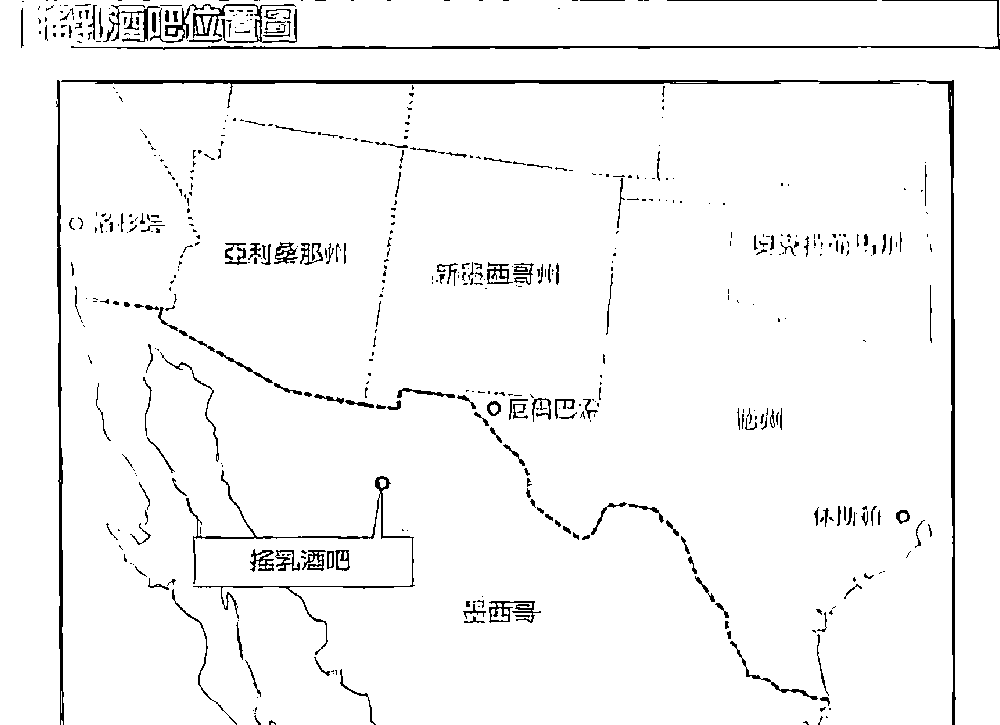

# 搖亂酒吧裡的吸血鬼

| 名字 | 特徵 |
| --- | --- |
| 山米的聖塔妮可 | 身披白色巨蟒路西法圖樣的頭號舞者。 |
| 鋼刀亞理 | 上半身全是紋身的男酒保。擁有可將人類手腳硬生生扭下來的怪力。 |
| 尼洛·布朗西 | 用假髮及濕梳子眼招呼客人的皮條客。因為被富勒 (Fuller) 強迫吞下十字架而死亡。 |
| 人父米蘭奧 | 穿著休閒格子襯衫的酒吧西哥。被挖出心臟、用木樁刺穿而亡。 |
| 小丑與小丑女半身進奇 | 肩部安裝馬鞍的男舞者和騎在他背上的女舞者。 |
| 忍忍 | 在吧台側寫桌上狂熱的女吸血鬼。恃其怪力吸人鮮血。 |
| 吉普賽樂隊 | 頭蓋骨加工製成的樂器演奏吸血鬼樂團。搖亂酒吧樂團。 |

> From Dusk Till Dawn》· Robert Rodriguez导演·1996年· MELHOUN FILMS

## NO.077 翼手

Chiropteran 穿著人皮外衣掩飾蝙蝠般獸人模樣，「BLOOD」世界裡四處獵捕人類吸血的類人猿。

### ☆智人的天敵

人類此物種本是藉由捕食動物而適應進化的類人猿；同樣地，吸血類人猿亦是藉由捕食人類而進化成爲位於食物鏈頂點的「艾爾頓的魔鬼」——翼手。

翼手平時偽裝成人類，狩獵時則會變回本來恐怖駭人的模樣。他們先是伸展折疊藏在人皮下的骨骼，展開後全身將近有五公尺長；翼手跟古畫裡的惡魔同樣有雙尖耳朵和尖銳的長牙，臉部皮膚被撐開後活像隻老鼠，再加上長出鉤爪和翼膜的雙腕，儼然就是個被過度誇大化的巨型蝙蝠。翼手以人類的鮮血爲主食，可以經由吸血行爲使人類變成翼手。他們平時混雜藏匿於人類社會之中，有些翼手還會寄生於小型社群或組織，暗地增加同伴、維持生活圈。

不光是將翼手視為人類之敵、暗地從事殲滅活動的「水盾」與羅馬天主教等組織，不少國家亦知悉翼手的存在；Cinq Fl?ches製藥公司開發出可透過人爲手段製造翼手的藥物—Delta 67，並且在美軍協助下進行許多不人道的人體實驗。

翼手當中有種女王種相當於蜜蜂社會裡的女王蜂，還有稱作「騎士」的從屬階級翼手，負責守護不斷重複長眠與循環過程的女王。現在的翼手女王是音無小夜及其雙胞胎妹妹Diva，並由Cinq Fléches製藥會長兼最高負責人所羅門·斯密及其胞兄安謝爾等五位騎士輔佐。此外，安謝爾亦和利用遺傳基因技術開發出人工翼手「席夫」的冰島秘密研究所維德有關。

# 何謂翼手

- 平時偽裝成人類 (真面目是翼手5公尺的巨大蝙蝠)
- 以人血為食
- 透過吸血增加同伴
- 擁有極高智能，可混入人類社會維持其生活圈

捕食人類的吸血類人獸

# 翼手的構造

| 名字 | 類別 | 名稱 |
|------|------|------|
| 小夜 | 女王種 | DIVA |
| 崎吉 | 騎士 | 所羅門、安謝爾等數名 |
| 小山 | 組織 | Cinq Fleches 製藥 |

Production I.G 《BLOOD THE LAST VAMPIRE》, 北久保弘之導演, 2000

## 血族 Group of Kindred

「吸血鬼之避世」是部化身為吸血鬼操弄人類進行階級鬥爭的桌上角色扮演遊戲 (TRPG)。

# 該隱之末裔

以活人鮮血獲得生命力的闇黑狩獵者、流離於永劫時空的不死種族——吸血鬼。吸血鬼「血族」自稱乃亞當長子、殺害胞弟亞伯的第一個殺人犯該隱之後裔，是以亦名「該隱之末裔」。歷經數千年，已繁衍達十數個世代；「受該隱抱擁」的第二世代自是不在話下，就連第五世代亦是非常罕見，而且如今都已經成爲傳頌於血族間的半傳奇性人物。《諾得書》乃血族聖經，內容記載其誕生及相關的諸多古訓、誥誡與預言。此書所載預言中，亦有記述指血族終將跟北歐神話中的諸神黃昏同樣，面臨滅亡末日。

血族以「黑闇的抱擁」增加同伴時，新生者能夠繼承繁衍者的部分能力，是以在長年累月後發展形成了數支特性各異的氏族；更以氏族爲單位建立名爲「塞圖克」的組織，形成各自獨立的社會。當中以密黨的勢力最大。

爲求生存，血族選擇主動融入人類社會，並且在彼等的八大原則之下，維持嚴格的血統階級社會制度、秘密操縱人類社會。然而，血族固有無數規範下的和平狀態卻在各氏族甚至近親血族之間，製造出各種複雜奇怪的派閥和權力利益構造。

由年長吸血鬼君臨化裝舞會、以神明般的強大力量壓制低級血族迫其順服，原是吸血鬼間不可動搖的固有倫理規範；不滿現況的激進派新生血族遂起而反抗，爲追求充滿自由、放縱與暴力的無限快樂而發起推翻長生者的統治。夜裡人類沉眠的時候，血族正不斷重複著殘酷血腥的權力鬥爭。

# 血族的發生

- 偽際中的血族
    - 人類第一個殺人者該隱
    - 第二世代
    - 第三世代～第五世代
- 現代的血族
    - 經過數千年後血族已繁衍至十數個世代
    - 形成特性各異的「氏族」
    - 融入人類社會暗地操縱

# 血族勢力的黨

- 密黨
    - 中心六氏族
        - Toreador
        - Tremere
        - Nosferatu
        - Brujah
        - Malkavian
    - 脫離密黨獨立的氏族
        - Gangrel

## NO.079

# 真祖與死徒
**True Ancestor and Dead Apostles**

地球孕生出真祖，真祖孕生出死徒，死徒又孕生出死徒。TYPE-MOON成名作「月姬」提示的吸血鬼無限循環。

◇ 人類望而生畏的存在、以人為糧的存在

昔日人類誕生之時，整個地球對這種迥異於其他既有物種的生物便感到極度地不安。就像是在回應這股不安感似的，月球的王者「朱之紅月」亦表示要保護地球。得到地球的接納與應承後，「朱之紅月」遂創造出能力跟自己相近、肉體酷似人類的「月之民」。這便是真祖誕生的始末。

真祖就是自然、真祖就是世界；真祖並非怪物，而是種比較類似於精靈的存在。我們無法消滅世界，所以同理可證，人類抑或曾經是人類的吸血鬼也無法殺死真祖才是。

人類乃因排除自然而得以繁榮，為勵諫生於自然的人類而誕生的真祖，當然就將人類視為敵對者。真祖亦繼承其原型朱之紅月之特性，先天就有渴望人血的吸血衝動。為避免無法承受突發性吸血衝動，經常會準備僕從隨侍在側處理吸血的問題。這些僕從稱作死徒，被吸血後自身也會產生吸血衝動；他們害怕陽光，透過吸血行為增加同類，為廣義的吸血鬼。

死徒為服侍長生不死的真祖，自身也必須要有相當長的寿命，於是便透過攝取他者血液來獲得必須的生命力；吸血行為不但使他們萌生某種超越人類的優越感，同時還使得死徒更加強壯更有力量，以致後來終於有死徒逃離真祖的支配，混入人類社會中恣意吸血以求生存延命。

擺脫真祖控制的死徒當中，最年長、力量最強大的死徒被稱作死徒二十七祖；儘管死徒二十七祖所繁衍的吸血鬼大多已遭真祖消滅，但他們至今仍不斷地在持續增殖當中。

# 真祖與死徒之誕生

- 「朱之紅月」的能力+人類的肉體
- ↓
- 「真祖」誕生
- ↓
- 「真祖」的吸血行為產生「死徒」
- ↓
- 強大「死徒」持續繁殖吸血鬼

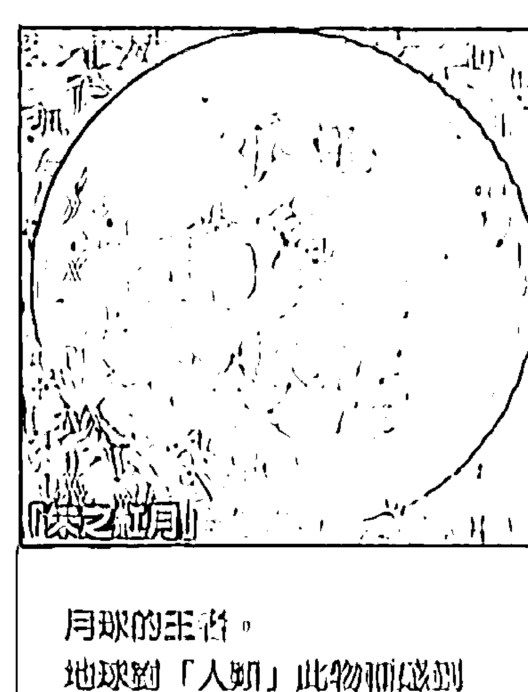

月球的王、地球對「人類」此物種感到不安，遂迎來「朱之紅月」創造出「真祖」。此使真祖亦稱「月之民」之由。朱之紅月雖敗給人類而離開地球，卻依然夢想要再渡回到地球

# 真祖與死徒之差異

|      | 真祖 | 死徒 |
|------|------|------|
| 誕生 | 酷似地球所生精靈的存在 | 「真祖」用來抑制吸血衝動的對象 |
| 人類 | 敵對者 | 吸血的對象 |
| 弱點 | 人類或吸血鬼無法殺死真祖 | 厭惡吸血鬼討厭的事物，如陽光 |
| 數量 | 數量極少 | 仍然在不斷增殖中 |

> > 出典：月姬，TYPE-MOON製作，2000年，TYPE-MOON

## No.080

## 伊诺维奇

Inovercy

憧憬长生不死、背离人道者。美少女游戏界之异端Nitro+公司游戏「吸血鬼Vjedogonia」自称「异端者」的恶徒。

## 该隐与亚伯

从前上帝将杀害弟弟的哥哥贬为永远的罪人，并将其放逐。这名前额烙着罪恶记号、最初的不死者名叫该隐，是所有吸血鬼的始祖。弟弟亚伯的后裔人类则必须在有限的生命里，经历休憩、生子然后死亡的命运。可是，部分人类却妄想违逆上帝约定的秩序……教会的背后、极东之地，所有人都在做长生不老的梦，而这个邪佞的梦想，终究要跟吸血鬼扯上关系。他们曾经历过多次毁灭，多少书册被烧成灰烬，多少人身首异处；即便如此，仍未灭绝。历史站在他们那边。尽管宗教狂热曾一度屈于科学合理主义，却还有大屠杀再次扭曲道德价值观。经过二次世界大战纳粹德国的惨痛失败，情报化社会拉近了跟黑暗世界的距离，以致今日异端组织伊诺维奇得以吸收各企业与政府，网络遍布全球。伊诺维奇近年最大的成果，就是「培雷西多林」；此药品是拥有惊人效果的免疫抑制药剂，内含萃取自吸血鬼活体的药效成分——V酵素。V酵素亦名V-tuned，还可以用来制作人造吸血鬼、当作生物武器。炼金制药公司诸井博士的这项发明，乃因捕得最古老的大吸血鬼——已存活两千余年的吸血鬼蕾阿侬始得实现。

为保护失去气力的吸血鬼女王，吸血鬼决定和异端者联手。祈愿女王早日恢复的骑士吉拉、甘于与人类杂居的纳榭克拉、快乐主义者吉他手乌庇合称吸血鬼三剑客，虽称不上团结同心，却都绝对效忠于蕾阿侬；而三人与异端组织伊诺维奇之间，则总是有层出不穷的紧张情势和各种权谋。

## 吸血鬼之始祖該隱

「吸血鬼長生不死」「人類生命有限」乃上帝約定的秩序

## 何謂維奇

+   違逆上帝約定秩序者 → 嚮往長生不老 → 因屬異端而多受阻礙迫害 → 倖存至今並建立遍及全球的網路 → 與吸血鬼結合、獲得成果
-   利用「V酵素」從不死吸血鬼體內抽出
-   利用「V酵素」製造人造吸血鬼

> 「夜想曲『吸血鬼ヴェドゴニア』」，ニトロプラス製作，2001年，ニトロプラス

## No.081 千禧年

高舉旗幟揭竿而起！平野耕太的《厄夜怪客》當中，為使戰火延全世界而復活的，最強大、最凶暴、最瘋狂的軍隊。

◇為了下一場戰爭，為了下下場戰爭

時值20世紀末，大英帝國境內頻傳吸血鬼殺人事件。

領導大英帝國的四桌會議發現數樁事件都有頗怪異的共同點，遂斷定這些吸血鬼事件並非自然發生，而是有某人在背後操縱，並且命令皇家國教騎士團調查真相。

「千禧年」便是這一連串事件背後的黑手。它是總統特祕第666號作戰的名稱，同時也是執行該作戰的部隊名。千禧年從第二次世界大戰前期便已開始活動，集結搜刮占領地的龐大物資及人才、分批陸續運送至南美洲。

其最終目的，就是組織暗號名為「最後的大隊」之吸血鬼軍團投入戰線。千禧年的指揮官是位又矮又肥的親衛隊軍官，人稱「少校」或「代理總統」。這位戰爭愛好者只是單純渴望戰爭，為了要發動戰爭而與英國以及曾經一度粉碎其陰謀的皇家國教騎士團和阿爾卡特為敵，並在南美的賈布羅潛伏長達50年。憑著麾下科學家「博士」的技術和無數次活體實驗，終於創造出能以自身意志行動的吸血鬼；現在少校麾下的一個大隊1000名吸血鬼，絕大多數都是亡命南美了卻餘生的親衛隊老兵。這個部隊是由名為「狼人」的異能集團率領；此集團乃以人稱「上尉」的狼人軍官為首，再加上李普范·文克中尉、萊林·布里茲中尉與休雷丁准尉等，每個都是擁有超人能力的怪物。1999年千禧年發動第二次海獅作戰^*，一群不怕死的納粹德國士兵們驟然登陸倫敦，只為滿足少校毀滅世界的欲望。

> ^* 海獅作戰：第二次世界大戰納粹德國的作戰，目的是要消滅大不列顛，使敵人不能從此發動對德國的戰爭。希特勒的「海獅作戰」計畫，是準備用39個師的兵力在寬廣的正面上，以奇襲為基礎實施登陸，第一波登陸兵力為13個師。此外還要在海峽各港口內集中駁船1722艘，拖船471艘，摩托艇1161艘，一切的準備均應在8月中完成。

## 最後的大隊

No.081 第3章 ◇納粹血脈

少校

科學家「博士」

上尉

吸人部隊
麥可·文克中尉
傑林·布亞斯中尉
休伍丁準尉

一個大隊共1000人的
吸血鬼部隊

## 「千禧年」作戰

移動

作戰目的
研究如何人為創造吸血鬼
以吸血鬼軍團投入戰線

> 《HELLSING》· 平野耕太著 · 1996年 · 少年画報社

## 「石假面」與其創造者

## Stone Mask and Creators

漫長的戰鬥全都肇始於這副假面。荒木飛呂彥《JOJO冒險野郎》序章中出土地點錯誤的古代文物（Out Of Place Artifacts），以及創造該物的非人種族。

## ☆柱之男

距今一萬年前，有種外形跟人類相似的強韌生命體出現在地球上。

他們擁有優秀的身體能力與智能，還可以吸收其他動植物生命獲得近乎長生不老的無限壽命，唯一的弱點就是極端不耐陽光照射。此物種數量非常稀少，他們在地底深處建立文明，不好爭鬥、過著和平穩定的生活。直到後來有位天才誕生，才改變了他們的命運。

這位名叫卡茲的天才研究自己的腦部組織構造，並且發明了用骨針刺激腦部特定部位的裝置「石假面」。人類接受「石假面」洗禮將會吸血鬼化，但若由創造石假面的物種使用，不但可以克服他們不耐日光照射的弱點，更可以將該物種的潛在能力發揮到極限。

卡茲等人為進行實驗，遂將地上所有動植物都一掃而盡。其同族害怕所有生物都將滅絕，便欲抹殺卡茲等人並破壞石假面，不料反被擅長「光之流法」的卡茲和擅長「炎之流法」的艾特西全數殲滅。兩人為尋找能使石假面趨向完成的深紅色寶石「艾哲紅石」，便帶著倖存的兩個嬰兒離開了故鄉。

他們必須進入周期長達2000年的睡眠，以維持其生命力。經過2000年後的1938年，卡茲、艾特西和使用「風之流法」的瓦姆烏身處羅馬的地下遺跡，另一個不知名的男性則是位於墨西哥遺跡深處，分別被休特羅哈姆少校等納粹親衛隊和史彼特瓦根財團所發現。由於這些生物都半埋在石柱當中，當地調查員遂稱之為「柱之男」。

## 卡茲一族

進化過程異於人類的生物
優秀的身體能力及鬥爭本能
吸血動物的口
不易死亡人數極少
原始人類祖宗輩輩的對象
唯一的威脅是「太陽」

不好爭鬥的和平種族

對立

厭惡人類的太陽的民族
研究生存的方法
創造「石假面」

艾哲紅石

消滅同族、奪走「艾哲紅石」的閃族戰記

追蹤長達2000年的旅程

1938年
卡茲、艾特西、瓦姆烏在馬魯的地底追跡，另一個不知名男子則在馬西毆追踪，結果被人發現

## 「石假面」

目的 卡茲為了克服太陽光所創造
結構 接觸鮮血
性能 骨針能刺激齒部且放未知的力量
-   人類使用石假面就會變成吸血鬼！
-   卡茲使用石假面就會變成能克服陽光弱點的完全生物
卡茲等人必須具有「艾哲紅石」才能使用石假面

※ 資料來源：《ジョジョの奇妙な冒険》，荒木飛呂彥著，1987年，集英社

## No.083 高城家

## Takashiro Family

冬目見《羔羊之歌》串連整個故事、罹患渴望血液怪病的古老氏族，以及發生在該族最後兩人身上的詭譎命運。

## ◆對血感到飢渴的疾病

高城家是明治後期至昭和初期間憑著貿易逐漸壯大的舊氏族，政府高官都想要巴結。除卻這些表象，還有個不為人知的秘密——他們是被「發作性渴求血液」怪病詛咒的一族。
其實這個疾病也只不過是肉體上「必須定期補充特定血液成分」而已，但是此病的最大問題卻是會併發「發作性渴求血液」的精神性疾病。發病時期因人而異，男性只會在兩歲以前的嬰幼兒時期發病，成長後才發病的病例非常罕見。患者會在目睹使人聯想血液的事物時產生不定期發作、發生貧血般的頭暈感，緊接著作起愈加高漲的吸血衝動。
患者可藉由口服攝取他人血液來平復發作時的吸血衝動，同樣也可利用某種算不上合法的藥物得到某種程度的抑制。當然也有相當大的副作用，用量過多甚至可以致死。此外，有時也會因為體質因素而失去效果，因此基本上患者都必須靠著攝取血液才能維生。絕大多數發病者不是無法忍受精神上的厭惡感與痛苦而自殺，就是併發其他疾病而死亡。儘管肉體方面的疾病可以透過長期隔離治療而痊癒，精神方面的問題也很可能在同時得到解決，不過絕大多數患者在痊癒以前，就已經承受不住精神壓力勞瘁斃命。這是唯有高城家才會發病的遺傳性疾病，至今並無其他臨床病例，尚未發現可以根治的方法。由於嗜血病給人的「吸血鬼」印象等諸多因素，高城家對此疾病一概隱瞞，還曾經靠著權力來解決許多事情。然而太平洋戰爭開戰的同時，高城家亦隨之沒落；如今倖存的少數末裔也只得繼續忍受疾病的苦痛，盡量避人耳目安靜地生活。

## 高城家的怪病

| 男性 | 女性 |
| --- | --- |
| 只在兩歲以前的嬰幼兒時期發病，成長後才發病的病例非常罕見 | 成年後仍有發病的病例 |
| 肉體方面的形態 | 精神方面的形態 |
| 必須定期補充特定血液成分 | 追求血液的衝動 |
| 原因 | 發病後 |
| 高城家特有遺傳疾病，尚未發現治療方法 | 多數患者皆因併發其他疾病或自殺而死亡 |

## 小林的結果

> 資料來源《(日)漫画》，冬目景著，2002年，幻冬舍

吸血鬼研究中心 (The Vampire Research Center) 是美国吸血鬼研究家史蒂芬·卡普尔 (Stephen Kaplan) 於1960年代末期设立，专门针对出自主理需求而非心理需求的人血吸食者进行研究的研究机关。

根据其撰写的作者简史记载——史蒂芬·卡普尔1940年9月19日出生于纽约市布朗克斯区 (Bronx) ：在纽约市立大学取得社会学等学位后，他一面从事教职一面从事超心理学研究，并于1971年设立了美国超心理学研究所。

卡普尔曾经透过电视广告与《花花公子》杂志等各种媒体大肆宣传吸血鬼研究中心，并公开该中心的热线电话。此后不断有自称吸血鬼的民众拨打这条热线电话，而卡普尔亦积极地联络这些民众，有时甚至还会直接与来电者进行访谈，并且在长达20年的积极活动以后，累积无数自称是吸血鬼之民众的相关纪录。

卡普尔得到的情报绝大多数都是嘲弄研究活动的假情报，直接出言威吓的电话亦不在少数，有时甚至还会遭遇恶意崇拜因而有生命危险，不过据说卡普尔确实也遭遇过很可能是真正吸血鬼的案例。

在1984年卡普尔刊行的著书《VAMPIRES ARE》当中，有则相当有趣的案例：有位自称439岁的吸血鬼伊莉莎白在1973年5月主动向研究中心联络。伊莉莎白表示自己于1540年出生于大英帝国的福克斯顿 (Folkestone) 或坎特伯里 (Canterbury)，1962年以后则居住在佛罗里达。她还说自己是在十几岁的时候发现自己是吸血鬼，每天都要摄取8到9品脱的血液。

在经过连续数个月的访谈调查后，卡普尔判断伊莉莎白的确是位真实的吸血鬼，并从她身上搜集到许多与吸血鬼的生活方式有关的情报；他还曾经收到伊莉莎白用神秘符号文字写成的信件，不过在1979年8月15日以后，研究中心就再也没有伊莉莎白的消息。

卡普尔的著作于1996年被翻译成日语，由广济堂以《真实的吸血鬼》书名出版刊行。卡普尔亦曾于1992年到访日本，并以实际存在的吸血鬼为题进行演讲：虽然当时他的活动并未受到瞩目，不过后来美国的八卦报纸 (Tabloid) 有报导，日本国内亦有数家杂志社本着趣味性报导此事，以致日本有部分好事者亦知悉卡普尔的活动。

1996年史蒂芬·卡普尔正在准备日语译书出版事宜，突然心脏病发作猝逝，他所搜集的庞大资料现在应该是在未亡人的手上。

## 第4章 吸血鬼猎人

## No.084 亚伯拉罕·凡·赫辛教授

## Professor Abraham Van Helsing

> 以人类血肉之躯对抗恶魔的吸血鬼猎人始祖。从布拉姆·史托克的《吸血鬼德古拉》以后便在众多作品中不断屠杀吸血鬼的古强者。

## ☆固执的追击者

布拉姆·史托克创造的荷兰学者亚伯拉罕·凡·赫辛教授，就跟成为日后吸血鬼作品当中吸血鬼原型的德古拉伯爵同样，也是个成为后世吸血鬼猎人原型的重要角色。史托克笔下的赫辛教授胸膛厚实、颈脖粗壮，是个中等体格身材结实的人物。他将荷兰人特有的红色头发整齐地向后梳拢，铁块般的头颅与开阔的前额则显示出其坚强意志力与智慧；浓而粗的眉毛、有力的下颚给人威严不可侵犯的印象，碧绿瞳孔炯炯有神却又散发出稳健光芒。受德古拉意志感应而成为其仆从的狂人伦费尔德，以及英国遭伯爵毒牙的首名被害者露西·维斯坦莱都是精神科医师约翰·西华的病患；而赫辛教授则是西华医师的恩师、精神病理学大家，也是同时拥有哲学文学双博士学位、当代首屈一指的宏儒硕学。教授受西华医师之邀，前来看诊因不明原因日渐衰弱的露西·维斯坦莱，马上发现露西已经被吸血鬼吸过血。他来回奔走于英国与荷兰之间，寻找拯救露西的办法，最后仍被奸诈狡猾的伯爵得逞，露西也终于变成在黑夜里徘徊的吸血鬼。后来教授协同戈德明爵士、亚瑟·汉姆伍德、来自美国的富翁昆西·莫利斯以及西华医师这三位深爱露西的男性，消灭已经变成吸血鬼的露西，并帮助遭德古拉毒牙的律师强纳生·哈克及其妻米娜，领导众人合力对抗伯爵。教授先是跟踪德古拉伯爵、破坏伯爵位于英国的秘密居所，后来更追击直至外西凡尼亚，终于消灭吸血鬼。

汉默电影公司制作的德古拉电影中，由英国籍演员彼得·库欣饰演此角，他的诠释遂成后世赫辛教授的普遍形象。

## 赫辛教授與五位同伴

## 神怪文學中吸血鬼獵人的傳統

布拉姆·史托克乃以消滅吸血鬼卡蜜拉的斯庇爾斯朵夫將軍 (General Spielsdorf) 和渦登堡男爵 (Baron Vordenburg) 為骨架，再加上實際存在的阿米紐斯·范貝利教授 (Arminius Vambery) 之形象，創造出赫辛教授這個角色。

在19世紀到20世紀前半的靈怪小說當中，挺身協助或領導受超自然力威脅者的角色，通常都是碩學之士。勒法努作品中的馬丁·赫塞陸斯 (Martin Hesselius) 如此，霍吉森 (William Hope Hodgson) 作品中的湯瑪斯·迦納基 (Thomas Carnacki) 如此，阿爾傑農·布萊克伍德 (Algernon Blackwood) 作品中的沈默約翰博士 (Dr. John Silence) 亦然。儘管德古拉伯爵畏懼教會和十字架，對付伯爵人選並非聖職者而是近代科學的信徒，這種現象是受到英國文學中的吸血鬼獵人傳統影響使然。

值得一提，德古拉伯爵眾多死對頭當中的首位聖職者，就是環球影業公司《黑暗王子德古拉》 (Dracula: Prince of Darkness) 裡的桑多神父 (Father Sandor)。

> 《德古拉》(Dracula)，Bram Stoker著，1897年，Archibald Constable and Company

## 夏洛克·福尔摩斯

Sherlock Holmes

包括羅倫·D·艾斯曼的《夏洛克·福尔摩斯對決德古拉》在内，不少作品都曾描述過名偵探與吸血鬼的激烈對决。

### 名偵探對決吸血鬼

夏洛克·福尔摩斯是英國維多利亞王朝時期的偵探，擅長以其獨特的推理方法解決無數懸案難題。福尔摩斯受理的無數案件當中，亦不乏1897年「薩西克斯吸血鬼事件」等跟吸血鬼有關的事件。

根據華生博士的記載，福尔摩斯曾經幫助弗格森夫人洗刷吸血鬼嫌疑；她被人懷疑吸食自己嬰兒鮮血，後來經過追查才發現，夫人其實是為嬰兒吸出毒箭的毒液。儘管福尔摩斯在這個事件當中斷然否定吸血鬼的存在，不過在後人發現的華生博士未發表原稿當中，確實有幾個遭遇到真正吸血鬼的事件存在。其中1977年從福尔摩斯親戚克萊頓·T·弗諾遺物中發現的手寫原稿《夏洛克·福尔摩斯對決德古拉》尤其值得一提。

這份後來被轉交給作家羅倫·D·艾斯曼的草稿內容相當驚人；亞伯拉罕·凡·赫辛教授一行人和登陸英國的德古拉伯爵鬥法的同時，福尔摩斯也正在調查伯爵。

1890年8月初，福尔摩斯受報社記者湯瑪斯·C·派克委託來到約克夏郡的惠特比港；派克的委託內容就是要請他調查前晚深夜載著大群屍體入港的狄蜜特號。隨著搜查進行，福尔摩斯確信有個不單純的事件正在英國發生，並在漢普特西斯公園內邂逅德古拉伯爵的首名被害者吸血鬼露西·維斯坦，從赫辛教授口中得知有關德古拉伯爵的情報。儘管伯爵曾親自造訪福尔摩斯位於貝克街221號B座的住所、提出警告，福尔摩斯仍執意繼續進行搜查，可惜最終未能逮住吸血鬼。

## 福尔摩斯与德古拉：小说《吸血鬼德古拉》中的时间线

> 范辛教授刻意回避布拉姆·史托克与福尔摩斯的存在
↓
不让他人知道德古拉与福尔摩斯的关系，足以表明立场

## 夏洛克·福尔摩斯与吸血鬼

（原生父亚瑟·柯南·道尔以后，英国侦探福尔摩斯仍然在许多作品之下，运用理性智慧的力量对抗开膛手杰克、火星人、克苏鲁邪神等恶势力；想当然尔，在福尔摩斯的对战纪录当然也少不了吸血鬼。

虽然本文主要是在介绍罗伦·D·艾斯曼所著《夏洛克·福尔摩斯对决德古拉》（作者乃採约翰·D·华生博士未发表原稿之体裁），不过在安·莱丝改写《夜访吸血鬼》前一年1975年发表吸血鬼小说处女作《The Dracula Tape》的美国科幻作家弗雷德·沙贝哈根 (Fred Saberhagen)，亦曾于1978年的《The Holmes-Dracula File》小说中描述福尔摩斯与德古拉伯爵的对决场面；此外，日本漫画家椎名高志也曾经在《少年Sunday GX》杂志2005年10月刊载的《GS 福尔摩斯极限大作战!! ～吸血侦探～》当中，描绘德古拉伯爵的末裔与福尔摩斯邂逅的局面。

【主要参考文献】
《Sherlock Holmes VS. Dracula》、John H. Watson著，Loren D. Estleman编，1978年，Doubleday & Co.

## 泰拉瑪斯卡

Talamasca

哥德式小說女王安・萊絲作品群中的超常現象研究者。這個不斷急遽變質的組織未來究竟如何？

## ☆ 常在的旁觀者

泰拉瑪斯卡是西元758年設立的超自然現象研究團體，當初是由某位魔法師創設於啟蒙都市阿姆斯特丹。此組織的學者們躲在遠離塵囂人世的地方，埋首於包括諸如精靈、幽靈、狼人等非人存在的各種研究，並且曾經在獵女巫時代從火刑臺上搭救不少人，藏匿於阿姆斯特丹。該組織直到11世紀才開始以「泰拉瑪斯卡」自稱，並且制定沿襲至今的組織憲章。泰拉瑪斯卡不但巧妙地躲過了天主教會耳目，還利用聖殿騎士團的財寶在阿姆斯特丹、羅馬、倫敦等古都設立據點，在世界各地進行活動。泰拉瑪斯卡有個旁觀的原則；跟研究對象保持距離、蒐集群觀資料並記錄保存，是泰拉瑪斯卡從事研究的方針。在眾多研究對象當中，女巫和吸血鬼是泰拉瑪斯卡分類為「特別危險」的兩個研究對象。

吸血鬼路易的告白被出版成書、黎斯特・狄・賴科特組織搖滾樂團「吸血鬼黎斯特」……在這驚人的20世紀末，泰拉瑪斯卡的吸血鬼研究在泰伯特的領導下有長足進展，而負責第一階段實地調查的調查員潔西卡・李維，亦曾於紐奧良得到許多證明路易與黎斯特確實存在的證據；然而兩人卻罔顧泰拉瑪斯卡的既有原則，太接近研究對象。當潔西卡在吸血鬼黎斯特的演唱會遭其他吸血鬼攻擊、身負瀕死重傷時，跟她有多年交情的吸血鬼便將黑暗賜禮賜給了她。至於泰伯特也在事件結束後，被結成好友的黎斯特強制轉化成吸血鬼。

## 吸血鬼的研究

20世纪末在泰伯特的领导下有长足的进展

+   研究急剧发展之理由
    -   吸血鬼路易之告白的出版
    -   根据告白进行实地调查
    -   吸血鬼黎斯特所组织的摇滚乐团「吸血鬼黎斯特」的活动

研究虽有进展，却偏离「旁观」的方针## 羅伯特·內維爾
Robert Neville

> 當所有人全部變成吸血鬼的時候，最後的一個人類會有怎樣的命運？理察·馬德森 (Richard Matheson) 《我是傳奇》的悲慘景象。

## ♠ I AM LEGEND

1976年的地球，絕大多數人類都遭到某種叫做吸血病毒的細菌感染，變成有如行屍的恐怖吸血鬼，並且不斷地吸人鮮血增加同伴。人類汲汲營營建立的文明在瞬間分崩離析，名為「荒廢」的時間疾然飛逝、將街道化成鬼域，終於地球只剩下最後一名人類——羅伯特·內維爾。

埋首於洛杉磯立市圖書館查閱吸血鬼相關文獻、帶著用五金行所有資材製成的武器，每逢吸血鬼無法行動的白晝時分，內維爾就會離開設有嚴重防禦工事儼如軍事要塞的居所，來到如今已成亡者巢穴的街道上，尋找愛妻維吉尼亞和從前有過親交的鄰居，把木樁一一打進他們的心臟。獨自在絕望世界求生存的內維爾直到開始孤軍奮戰生活的第三年，才在白天的街頭遇見一名叫做茹絲的少女。

此時有種藥物新發明問世，服用者就算感染吸血病毒，也不會變成毫無自我意志的吸血鬼，而這些新人類也正建立新的文明社會。身為新人類的少女，其實是來尋找殺戮感染者的地球最後一個人類——羅伯特·內維爾的間諜。正如本作題名《我是傳奇》所示，內維爾被捕後發現自己竟是白晝不停殺戮吸血鬼的傳說中怪物，最後服毒自盡。這部小說曾得史蒂芬·金譽為現代恐怖小說的原點，並曾經於1964年和1971年兩度被拍成電影；片中吸血鬼們徘徊在荒廢街道的景象，對後來開創殭屍電影先河的喬治·A·羅梅羅的活死人三部曲有極大影響。此外，漫畫家藤子·F·不二雄亦曾受此作品感動，並創作短篇作品《流血鬼》描繪出一個反論的、充滿希望的新世界。

## 羅伯特·內維爾的孤軍奮戰

1976年

人類感染吸血病毒變成吸血鬼

內維爾成為地球最後一個人類

利用白晝攻擊吸血鬼巢穴、消滅吸血鬼

1979年

開發出控制吸血病毒的藥物

內維爾結識藉藥物鈍化成新人類的少女

得知自己是吸血鬼畏懼的傳說中屠殺吸血鬼的怪物

內維爾服毒自盡

## 新人類與吸血鬼

吸血病毒

無對策

人類感染病毒

服用藥物

| 特徵 | 吸血鬼 | 新人類 |
|---|---|---|
| 種族 | 吸血鬼 | 新人類 |
| 特徵 | 已無意志的行屍 | 透過服藥維持意志 |
| 文明 | 人類文明因感染而崩壞 | 新人類建立新社會 |
| 能力 | 透過吸血增加同伴 白天進入睡眠 動作敏捷 | 白天進入睡眠 身體能力無異於人類 |

> 出处：《I am Legend》，Richard Matheson著，1954年，Nelson Doubleday

## 查理·彭寧頓·波爾格

> 金·紐曼《德古拉紀元》惡徒肆虐的黑暗時代中，堪稱護國之劍的英國紳士。

## ♢ 歐洲最後的紳士

重重機密保護之下，學者派外交官查理·彭寧頓·波爾格還有另外一個身分，那就是暗中支持英國皇室與政府的情報機關「戴奧吉尼斯俱樂部」情報員。在高級黑外套下拄著暗藏鍍銀利刃手杖的波爾格，曾經執行許多困難任務，就是左右英國國運的護國之劍。

1853年於印度出生的波爾格乃駐地軍人之子，畢業於牛津大學以後，得到賞識其能力的戴奧吉尼斯俱樂部吸收為情報員，並以外交官身分作為掩護、主要負責執行海外任務。

1877年波爾格跟帕梅拉·邱吉沃德結婚，三年後於任地印度產下一子，不料愛妻卻因難產逝世，兒子也在母親死後一週夭折。與家人死別，反而使他更加專注地投入艱難的任務。

曾經打敗「惡魔博士」傅滿州並破壞其犯罪組織「西方」的波爾格，返國後的第一個任務便是搜查在倫敦白教堂區連環殺害吸血鬼妓女、有如濃霧般籠罩英國的恐怖力量——連環殺人魔「開膛手傑克」。

波爾格便是於此時結識當時協助警察進行調查的長生者吸血鬼熱內維埃夫·迪厄多內，並聯手追查事件真相，就此捲入統治大英帝國的德古拉之重大陰謀。後來他成為熱內維埃夫的戀人、發生伴隨吸血的關係，就此獲得凌駕於常人的活力和生命。他還在兩次世界大戰期間擔任地下內閣的議長，對帝國頗有莫大貢獻；1959年7月31日，波爾格在熱內維埃夫等三位深愛他的女吸血鬼的環顧當中，比他後半生的宿敵德古拉早一步結束了充滿榮耀的生涯。

## 查理·彭寧頓·波爾格年表

- **1853年**: 诞生於英國印度，乃駐地印度人之子
- **1873年**: 卒業於牛津大學、成為戴奧吉尼斯俱樂部的始創會員
- **1877年**: 與帕梅拉·邱吉沃德結婚
- **1880年**: 於任地失去愛妻幼子
- **1888年**: 海上大敗犯罪組織「西方」
- **1888年**: 於「開膛手傑克」搜查行動中結識熱內維埃夫
- **1888年**: 阻止德古拉在大英帝國的陰謀
- **繼任戴奧吉尼斯俱樂部地下內閣總長職，並奔波於世界各地監視德古拉的舉動**
- **1953年**: 百歲壽辰得英女皇冊封
- **1959年**: 在三位女吸血鬼的環伺下逝世於羅馬

## 戴奧吉尼斯俱樂部

- 暗中支持英國皇室及政府
- 地下內閣共五名團員，直接指揮眾多情報員
- 團員包括:
  - 麥考夫特·福爾摩斯（夏洛克·福爾摩斯的哥哥）
  - 查理·彭寧頓·波爾格（德古拉的宿敵）
  - 艾德溫·溫思羅普（波爾格的繼承者）

> 资料来源：《Anno Dracula》，Kim Newman著，1994年，Avon Books

## 吸血鬼獵人D
## Vampire Hunter D

被譽為邊境第一高手的流浪吸血鬼獵人。菊地秀行《吸血鬼獵人D》系列主角，也是究明世界堂奧與真相的鑰匙。

## ☆邊境第一高手

在遙遠的未來，為對抗橫行霸道的吸血鬼，及其運用超科學和黑魔法創造出來的妖魅而進行鍛鍊的人類，我們稱之為獵人。其中最強的獵人當屬「吸血鬼獵人」，其智慧與力量足以跟自稱「貴族」的領導階級吸血鬼匹敵。許多人皆因虛榮心而自稱是吸血鬼獵人，但真正能夠打倒吸血鬼的實力派卻是屈指可數。說得出名字的，大概也只有馬可斯兄妹、庇特寵斯，以及一名自稱「D」的男子。

D是人稱邊境第一的吸血鬼獵人。他穿著黑色長外套與寬簷旅人帽掩蓋俊美的臉龐，背著一柄劃出優美弧線的長劍，胸口藍色墜飾發出的神秘光輝能使吸血鬼的所有機關失效。D慣以壓倒性高超劍技屠殺馬古納斯、李伯爵等數名大貴族，威名已然成為傳說。如此強悍的秘密，就在於他的身世。

他的真正身分是人類和吸血鬼的混血兒、受詛咒的半吸血鬼。受其獵物吸血鬼輕蔑、遭其保護對象人類厭惡的半吸血鬼，天生便具備打倒吸血鬼的力量。話雖如此，D的能力卻遠遠凌駕於普通的半吸血鬼，這便表示他那素不相識的父親地位相當高級的貴族。半吸血鬼跟吸血鬼同樣都是長生不老，連看似人類青年的D都已經度過了數千個寒暑的流浪生活。

此外，寄生於左手，吞食四大元素（Elementals）慾望和生命能量的人面瘡，雖然總被D嫌棄是麻煩的傢伙，卻也是受詛咒身世注定要獨自流浪的D在孤獨旅途上的旅伴。

## 獵人的誕生

## 101:所持装備
## 吸血鬼獵人D

- ### 半吸血鬼的能力
  - 人類與吸血鬼的混血兒
  - 天生具備打倒吸血鬼的能力
  - 與吸血鬼同樣長生不老
- ### D的特徵
  - 劍技堪稱第一
  - 令貝族所設結界無效化的墜飾
  - 本人擁有能令D死而復活的力量

邏輯上反對吸血鬼獵人之理由

出處：《吸血鬼ハンター"D"》，菊地秀行著，1983年，朝日ソノラマ

## 亚伯·奈特罗德神父
Father Abel Nightroad

英才早逝的作家吉田直樹未完成大作《圣魔之血》系列中，直逼作品世界观的黑翼吸血鬼猎人。

## ◇教廷派遣执行官

裹覆全身的黑色修士服和胸前闪闪发光的念珠，显示银发青年的职业是神父。仿佛牛奶瓶底的圆框眼镜底下，有如冬季湖水般湛蓝眼眸散发着柔和的光芒。看起来相当亲切，又似乎有点不太可靠。不论长生种或短生种，没有人不会被亚伯·奈特罗德神父给人的印象欺骗，因为这并不只是种伪装，就连他本人也希望自己是这个模样。

核武化武大灾难吞噬地球以后的世界，人类集结于罗马组织泛国家机关教廷、居住在从前叫做「西欧」的地区，已经在抵抗吸血鬼的战争上耗费长达数百年。现任教皇亚历山卓十八世亲生姐姐米兰大公卡特琳娜·丝弗札枢机主教率领的教廷国务院特务分室之工作，就是派遣执行官前往各国保护人类。每位派遣执行官都是具备独力捕捉吸血鬼的高度身心能力者，其中亚伯·奈特罗德以旧世界斯洛伐尼亚地区传说中保护人类不受吸血鬼侵犯的守护精灵「吸血鬼猎人」（Kresnik）为代号，喝红茶要加十三块方糖、超爱甜食的赤脚神父，更是吸血鬼眼中教廷饲养的怪物、吸取掠夺吸血鬼血液的吸血鬼，长生者无不闻风丧胆。

派遣执行官活动纪录都是机密档案，鲜少公诸于世。不值得一提的是，在位于吸血鬼贵族所辖东欧真人类帝国边境的自由都市伊什特万，民间盛传后来成为阿尔比恩女王的「伊什特万圣女」艾丝缇·布兰雪，将长期统治伊什特万的匈牙利伯爵各勒「打倒」的事件发生前不久，亚伯·奈特罗德神父才刚到伊什特万的圣马提亚斯教堂赴任未几。

## 勢力相關圖

教廷

國務院特務分室

派遣執行官

要求服從

少數人開始讓步妥協

真人類帝國

亞伯・奈特羅德神父

知悉其秘密

其他勢力

要求協助

協助

薔薇十字騎士團
自稱「世界之敵」的秘密結社

## 大災變後的世界

教廷

真人類帝國

人類殘存人類集團組成的泛國家機關

吸血鬼貴族統治的帝國

> 資料來源：《Trinity Blood Reborn on the Mars》，吉田直樹，2001年，角川書店。

## No.091

## 欧文·夜行者少校
## Major Irving Nightwalker

古桥秀之構築特異魔法世界的《黑色權杖》三部作裡，積層都市世界名氣最高的吸血鬼殲滅者，也是最強的吸血鬼。

## ◇長牙之夜

約翰·R·達克隊長——「擁有神鳴拳的男人」。

他率領曉勇善戰以一當百的吸血鬼殲滅部隊，消滅在以混沌為名的積層都市「混沌六方」肆虐作惡的紅色恐怖力量「長牙」。達克隊長是從都市層83年起開始播映的電視影集中頗受兒童喜愛的英雄角色，不過其實他真有其人，名字就叫做歐文·夜行者少校。起初吸血鬼學家威廉·赫辛看上少校優異的殺人能力，讓他擔任「赫辛計劃」之下設立的吸血鬼殲滅部隊隊長，結果少校在短短兩個月內便掃平都市內繁殖既久的吸血鬼，成為傳說中的英雄人物；而曾經讓混沌六方陷入恐慌的吸血鬼禍源、擁有長大血牙的吸血鬼長牙亦在夜行者少校的彪炳戰功之列。

身穿吸血鬼殲滅部隊專用、赤紅如血的軍用夾克制服，手持破壞力驚人的李德沃恩九二型、魔法麥格農五〇口徑巨型手槍大舉討伐吸血鬼，最後卻在第五次吸血鬼殲滅戰中變成吸血鬼；有人說他在殺光殲滅部隊全25名隊員和赫辛計劃主事者後自盡，也有人說他是被咒裝戰術隊包圍「處理」掉的。

儘管少校已經身亡，負責混沌六方行政及治安的公安局即降魔局，卻仍舊不斷收到跟少校有關的情報。在D層505號山經營偵探事務所的威廉·龍、在C層的盲目命運餅乾公司擔任生產線主任的克里斯多夫·瓊斯，很可能都是少校偽裝的身分。此外，還有些紀錄顯示少校其實就是他從前殲滅的傳說中吸血鬼長牙。

## 欧文·夜行者少校人物相关图

## 11层都市『混沌六方』目击少校事件

> > 小说《ブラックロッド》，古桥秀之著，1996年，メディアワークス

## 桑多神父
Father Sandor

漢默電影公司《黑暗王子德古拉》中，扮演赫辛教授角色對抗德古拉伯爵、膽大如斗的聖職者。

## ♡ 來福槍與白木樁

儘管在必須服從嚴謹戒律、重節制的羅馬尼亞正教會修道院擔任要職，豪放磊落的桑多神父不但隨身攜帶來福槍而非祈禱書，而且看見葡萄酒和鹿肉便要咂嘴弄舌，在當地是個小有名氣的奇人。神父聲如雷響、白髮銀髯相貌堂堂，說他是服事上帝的聖職者，倒是像個勇闖未知秘境的大膽探險家。

橫瓦羅馬尼亞的喀爾巴阡山脈深處，從神父所居修道院所在的克廉堡有條林道，連接到以美景馳名的卡爾斯巴德；沿著林道往前走，會看見一座仍有濃濃中世紀韻味的石造古城。這座被官方地圖抹煞的城堡，正是從前被亞伯拉罕·凡·赫辛教授消滅，曾企圖侵略大英帝國未果的德古拉伯爵數個世紀以來的棲身處，恐怖統治外西凡尼亞地區的吸血鬼之居城。

當地居民對吸血鬼的恐怖情感已經近乎某種堅定的信仰，至今仍遲遲不能忘懷，每每不敢直視該城，日落後也絕對不敢靠近。桑多神父極力反對當地的吸血鬼信仰，某次正教會教派神父取木樁刺穿疑為吸血鬼死者心臟、正要引火將屍體燒成灰燼的時候，桑多神父就曾經鳴槍恫嚇制止；另外他還曾經搬除吊滿整個房間的驅魔蒜頭，身體力行要打破這種不知恥的信仰。並不是他不相信有吸血鬼存在，而是他比任何人都還要瞭解吸血鬼、比任何人都還要瞭解德古拉伯爵。

原本已經被消滅成灰的德古拉伯爵，此番以不幸的英國旅行者向惡魔獻祭、得以再度復活之際，神父仍毫不猶豫提槍桿與其對抗，最後還在德古拉正要逃回城裡時擊碎了吸血鬼腳下的冰塊，再次葬送可怕的魔鬼。

## 羅馬尼亞正教會

屬於東方正教會的獨立正教會

- 歷史
  - 19世紀成為獨立的正教會
  - 位於羅馬尼亞首都布加勒斯特（Bucharest）
- 特徵
  - 得到大多數羅馬尼亞人信仰
  - 是東方正教會信徒人數第二多的教派
- 特色
  - 德古拉伯爵居城位於教區內

## 阿多神父

出自《Dracula: Prince of Darkness》，Terence Fisher導演，1966年，Hammer Studio

## 威廉米娜・莫瑞
## Wilhelmina Murray

## ◇ 從吸血鬼變回人類的才媛

英國情報機關曾數度召集由多位身懷特殊能力成員所組成的聯盟，如17世紀的普羅斯帕羅小隊，解決許多動搖大英帝國的嚴重事件。1898年威廉米娜・莫瑞受英國情報局坎平・庇德召集加入的「怪傑同盟會」，已經是第四個同類型的組織。其成員有：活躍於暗黑非洲大陸的傳說探險家艾倫・鄧德曼、利用潛艇鸚鵡螺號從事海盜勾當而被祖國放逐的科學家尼莫船長、變身成兇暴怪物海德博士、在巴黎連續犯下殺人罪行的傑基醫生、利用透明軀體侵犯寄宿制女校學生的強姦犯赫利・葛瑞芬，以及擔任領導角色的威廉米娜。儘管時有爭執，五人仍齊心運用各自的特殊能力，打敗統治東倫敦萊姆豪斯區的「魔鬼博士」傅滿洲、奪回探索月球不可或缺的反重力物質「凱許萊特」，並於同年擊退了侵略英國的火星人。

以其驚人記憶力與高度分析力、邏輯思考能力勝任怪傑同盟會軍師職的威廉米娜・莫瑞，其原本就是1897年登陸英國後被亞伯拉罕・凡・赫辛教授擊退的德古拉伯爵的第二名被害者——前吸血鬼威廉米娜・哈克；她之所以總是圍著圍巾，就是想要遮掩被吸血鬼吸血的牙痕。

她在接受此任務前不久才跟丈夫強納生・哈克離婚、改回舊姓；後來據說她和組織成員鄧德曼成為戀人，不過沒有再婚。她曾以記事形式記載怪傑同盟會1899年至1912年的所作所為，如今這份文件已是研究該組織秘密活動的貴重資料。

## 怪傑同盟會

| 成員 | 登場作品 |
|------|----------|
| 威廉米娜·莫瑞 | 伯爵·史托克原著《吸血鬼德古拉》的人物 |
| 艾倫·鄧德曼 | H·R·海格德原著《所羅門王的寶藏》的主角 |
| 尼莫船長 | 凡爾納原著《海底兩萬里》的主角 |
| 傑基醫生 (海德博士) | 史蒂文生原著《變身博士》的主角 |
| 赫利·葛瑞芬 | H·G·威爾斯原著《隐形人》的主角 |

## 電影《天降奇兵》

英美人氣漫畫家艾倫·摩爾原著的《怪傑同盟會》曾於2003年被拍攝成電影《天降奇兵》

原著漫畫裡的米娜跟丈夫強納生離婚，並且恢復舊姓，不過電影裡的米娜卻是與丈夫死別，仍然姓哈克。

想必是為通過此角色出典《吸血鬼德古拉》的普通觀眾，特意更改的人物設定。

此外《天降奇兵》還有個只有電影版才有的原創角色——取自王爾德小說的德雷安·葛雷 (Dorian Grey)。這個角色在電影裡設定為米娜的舊情人，相信這是因為布拉姆·史托克的妻子佛羅倫斯 (Florence) 從前正是王爾德的舊情人，電影版方才故意如此安排。

> 《The Leage of Extraordinary Gentlemen》 · Alan Moore著 · 1999年 · America's Best Comics

## No.094

## 刀鋒戰士
Blade

未出世便受詛咒的少年，終於蛻變成利用特殊武器消滅敵人的最強吸血鬼獵人，其舞臺亦從美國漫畫轉移至電影《刀鋒戰士》的世界。

## ♦ 黑色的復仇者

這位半人半吸血鬼的少年並非吸血鬼混血種，雙親也都不是吸血鬼；其母懷孕時曾遇吸血鬼襲擊，胎兒亦遭吸血鬼血液污染，未待出世便受到吸血鬼的詛咒。

這個甫出生不久就被母親遺棄、循著吸血鬼本能吸取他人鮮血以求生存的少年，終於被吸血鬼獵人亞巴拉罕・惠斯勒搭救；孤軍奮戰對抗吸血鬼的惠斯勒，不但為這位不知自己是誰的少年注射蒜頭萃取物、抑制吸血鬼化，還待之如子、傳授各種對抗吸血鬼的技術。最後，習得高超劍術的少年自稱「刀鋒戰士」，並利用拍檔惠斯勒製造的強力武器獵殺吸血鬼。

拜其特殊出身所賜，刀鋒戰士不但擁有凌駕普通吸血鬼的體力、反射神經與治癒能力，他還能在白晝間行動自如，因此敵對的吸血鬼皆稱之為「日行者」、對他相當畏懼。

他消滅了狄肯・佛斯特——這個異端吸血鬼為了要讓血神再度降臨，不惜殺害數名主張與人類和平共存的吸血鬼真祖進行血神復活儀式。三年後，他受捷克斯洛伐尼亞的吸血鬼之王達馬斯基諾委託，殲滅名為「收割者」的新品種吸血鬼。歷經過許多激烈戰役之後，刀鋒戰士終於獲得了新的夥伴——老拍檔惠斯勒的親生女兒愛碧嘉・惠斯勒、吸血鬼漢尼拔・金恩，以及由兩人所率領的、市民權已遭剝奪的吸血鬼獵人組織「夜行幫」。獲得這些新血以後，刀鋒戰士又要面對從前人稱「德古拉」的吸血鬼始祖——從敘利亞沙漠裡的金字塔復活的吸血鬼達克，以及意欲利用達克神明般強大力量的女吸血鬼丹妮卡・塔洛斯等全新的敵人，繼續戰鬥。

## 日行者「刀鋒戰士」

身世的秘密
出生前於母親胎內
受吸血鬼血液污染

能力

同伴

成為吸血鬼的
體力、反射神經與治癒能力

白天依舊
行動自如

半人半吸血鬼
的少年

養父
亞巴拉罕・
惠斯勒

日行者「刀鋒戰士」誕生

## © 驚奇漫畫的刀鋒戰士與德古拉©

刀鋒戰士原本是驚奇漫畫公司某部以德古拉為主角的吸血鬼漫畫中的一個角色，不過漫畫版與電影版不論是角色設定或是造型皆大異其趣，觀眾與讀者的反應也相當兩極化。

為了打倒1970年代甦活的德古拉，赫赫有名的吸血鬼獵人之女薇瑞秋・赫辛 (Rachel Helsing)、昆西・哈克 (Quincy Harker) 以及潤助人類的吸血鬼漢尼拔・金恩，共同組織了一個獵殺吸血鬼的隊伍；而刀鋒戰士就是這個隊伍的成員之一。在這部漫畫裡面，德古拉最後是跟昆西同歸於盡，獵殺隊伍也因為跟黑暗勢力的激烈戰鬥而崩潰消滅。

刀鋒戰士是獵殺隊伍唯一倖存的隊員，並且繼續孤軍奮戰、獨自對抗後來又再一次復活的德古拉、吸血鬼組織諾斯亞拉提 (Nosferati) 等黑暗勢力。

## 【相關電影】

電影《Blade》• Stephen Norrington導演 • 1998年 • New Line Cinema

## No.095

## 埋葬机关

## Burial Organization

诉诸力量而非循法理来处理天主教教廷破绽的圣堂教会暴力装置。TYPE-MOON「月姬」的世界里，藏匿于上帝荣耀威望底下的存在。

## 教会的杀手

罗马天主教的圣堂教会在全世界共有十亿天主教信徒，而埋葬机关是教会不为人知的另一面，是以上帝之威名排除悖离教会的异端、恶魔与吸血鬼的暴力装置。埋葬机关的本部设于梵谛冈的所在地意大利，其前身是12世纪时魔法师米海尔·罗亚·巴尔丹扬和纳鲁巴列克家族创设的「埋葬教室」。历代埋葬机关的代表皆出自纳鲁巴列克家族，由包括纳鲁巴列克在内的七位「代行者」和一名后备成员所构成。

埋葬机关拥有绝对的权力，为达成歼灭异端之目的甚至可以罔顾教会意向；不过它有违天主教教会和平、非暴力的精神，是原本就不该存在的组织、禁忌中的禁忌，是以亦有「圣堂教会之异端」异名，经常被知悉其存在的人视为杀人者。

对几近病态地厌恶吸血鬼的天主教而言，埋葬机关是一把最锋利的剑，也是圣堂教会的王牌，更是埋葬无数真祖与死徒的吸血鬼天敌。由于代行者不必具备坚定的信仰心，只需要足以抹杀教会所指异端的特殊能力，因此该组织完全是采实力主义制度，就连名列封印对象的吸血鬼死徒二十七祖也是成员之一。其中名为希耶尔的代行者从前曾经是号为「初始之蛇」的死徒米海尔·罗亚·巴尔丹扬的转生体，后来经过种种巧合又寻回自我意识恢复成完整个体。希耶尔使用的武器有反转轮回的最终兵器第七圣典，以及利用罗亚的记忆施以火药式的黑键等强力武装；她有时候会跟真祖的公主爱尔奎特·布伦史塔德协力共同猎杀死徒，是组织中数一数二的杀手。

## 理牙机关

来源：亚·巴尔丹姆 & 阿尔比恩·布里希特曼

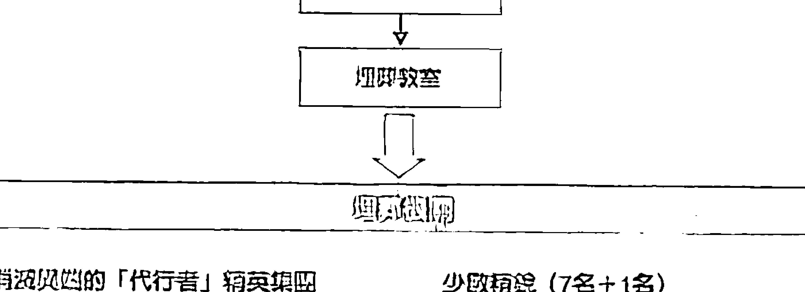

- 消灭死徒的「代行者」精英集团
- 起源自12世纪的「圣堂教会之异端」
- 拥有极近距离的圣堂教会暴力集团
- 少数精锐（7名+1名）
- 采完全实力主义的合理主义者
- 吸血鬼的天敌

## 各势力相关图

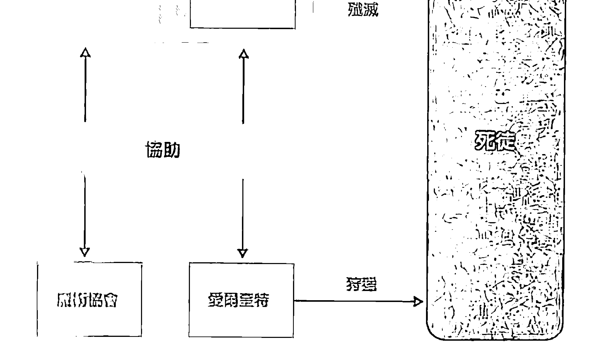

> （出典）『月姫』，TYPE-MOON制作，2000年，TYPE-MOON

## 贝尔蒙多家族

## Belmondos

科拿米人气游戏「恶夜城Dracula」系列当中，不论是过去抑或未来，注定要挥舞退魔鞭、跟吸血鬼战斗的家族。

## ◆ 挥舞长鞭的退魔人

贝尔蒙多，代代传承吸血鬼猎人技艺的家族。自从1094年骑士儒奥・贝尔蒙多男爵从炼金术师里纳尔多・嘉铎费手上接过退魔鞭、出发前往统治「永恒黑夜」森林的吸血鬼华特・伯恩哈德的城堡搭救未婚妻莎拉，贝尔蒙多家族便和吸血鬼结下不解之缘。

贝尔蒙多家族跟他们的宿敌同样，一直都是众人忌避厌恶的对象。1476年德古拉伯爵施行残酷的恐怖统治时，贝尔蒙多家族之名才首次为世人所知。拉尔夫・C・贝尔蒙多受东方正教会委托跟伯爵之子阿卡德并肩作战对抗吸血鬼派出来的各种妖魔，并且杀死了德古拉伯爵。德古拉伯爵其实并未消灭，而且还曾经数度复活，不过每次都被克里斯多夫・贝尔蒙多、索列・贝尔蒙多、杰斯特・贝尔蒙多、里希特・贝尔蒙多等贝尔蒙多家族吸血鬼猎人所阻止。贝尔蒙多家族中名声最高者，当属17世纪末打败第二次复活的德古拉伯爵的西蒙・贝尔蒙多。1691年和1698年两次和吸血鬼的战斗，让退魔鞭高手西蒙・贝尔蒙多之名传遍欧洲，贝尔蒙多家族亦成为暗夜里的妖魔最惧怕的名字。此外，1897年德古拉伯爵入侵大英帝国时，跟随亚伯拉罕・凡・赫辛教授对抗吸血鬼，以其性命为代价成功打倒伯爵的美国冒险家昆西・莫利斯，其实也是贝尔蒙多家族的分支；其子强尼・莫利斯亦曾讨伐为使德古拉伯爵复活而引起第一次世界大战战端的吸血鬼伊利莎白・巴托里，并成功地消灭了吸血鬼。

## 贝尔蒙多家族与吸血鬼的战斗

| 年份 | 贝尔蒙多家族 | 吸血鬼 |
| :--- | :--- | :--- |
| 1094年 | 儒奥·贝尔蒙多男爵 | 华特·伯恩哈德 |
| 1476年 | 拉尔夫·C·贝尔蒙多 | 德古拉伯爵 (此后约每隔百年苏醒一次) |
| 1576年 1591年 | 克里斯多夫·贝尔蒙多 索列·贝尔蒙多 | 德古拉伯爵 (第一次复活) |
| 1691年 1698年 | 西蒙·贝尔蒙多 (名誉最高的吸血鬼猎人) | 德古拉伯爵 (第二次复活) |
| 1748年 | 茹斯特·贝尔蒙多 | 德古拉鬼魂 |
| 1792年 | 里希特·贝尔蒙多 | 德古拉伯爵 (第三次复活) |
| 1897年 | 昆西·莫里斯 (贝尔蒙多家族分支) | 德古拉伯爵 (第四次复活) |
| 1914年 | 强尼·莫里斯 (贝尔蒙多家族分支) | 伊利莎白·巴托里 (自称是德古拉伯爵的侄女) |
| 1999年 | 尤里乌斯·贝尔蒙多 | 德古拉伯爵 (最后一次复活) |

（图片底部注释）「悪魔城ドラキュラ」，コナミ製作，1986年，コナミ

## 莫拉

挥舞著铁鎚、拥有受诅身世的少女。Nitro+「吸血鬼Vjedogonia」的女主角、屠杀夜行者的幼艾死神。

## ♢少女与铁鎚

甫出世的女婴当然没有任何罪过。然而寒村需要娱乐，积忿须透过机制始得升华成为神圣的暴力，到处都需要羔羊作活祭品。母亲遭吸血鬼侵犯、出世便失去「神的恩宠」的少女莫拉正是最理想的羔羊。村民用滚烫热油当作圣水洒在她身上，还把烫伤痊癒称作是「神的奇迹」；尽管满身疮痍每到夜里就会再生，心里的伤痕却不断侵蚀。终于少女离开村子，选择了「猎人」这条路。或许是因为这是不被阳光所接受、成长过程迥异于其他孩童的少女能够发挥怪力的唯一职业；又或者是对未曾谋面的生父之憎恨与憧憬。不论如何，少女确如半吸血鬼传说所述，是位相当强悍的吸血鬼猎人。接近透明的白色肌肤、金色短髮与翡翠色的瞳孔，穿著闇色洋装的「永远的少女」舞弄著沉重的铁鎚，跟擅使火器陷阱的弗利兹搭档，猎杀所有闇黑眷族。莫拉战斗的模样优美而豪壮，用铁鎚里暗藏的山楂木椿刺穿心脏，让敌人死得痛快。莫拉鲜少有情绪表现，唯一可以让她感到愤怒与愉悦的，就是背叛人类者——亦即自愿成为吸血鬼的敌人。她厌恶这些自己选择成为吸血鬼的怪物，她厌恶他们的不死之躯与吸血求生的模样，每每发狂似的要把敌人打成肉沫，好像那支铁鎚的巨鎚全都打在自己身上一般。

莫拉跟蹤最古老的吸血鬼「大吸血鬼」蕾阿儂来到日本，结识高中生伊藤惣太——因蕾阿儂而获得屠杀吸血鬼能力、成为半人半吸血鬼的吸血猎鬼。伊藤与其同伴间那种让她怀恋、爱恋且嫉妒不已的普通生活，亦使她幼小的心灵为之动摇。

## 莫拉之人物相关图

莫拉人物关系图：
- 莫拉与弗利兹是兄妹关系。
- 莫拉的父亲是吸血鬼（全体吸血鬼），母亲是人类。
- 弗利兹的父亲是人类，母亲是人类。
- 关系：父亲（吸血鬼）→ 母亲（人类）→ 莫拉（女儿）。
- 关系：母亲（人类）→ 父亲（人类）→ 弗利兹（儿子）。
- 伊诺维奇 帮助/利用 岳阿傻。
- 岳阿傻 敌对/背叛 全体吸血鬼（父亲）。
- 岳阿傻 吸血 伊藤悠太。
- 伊藤悠太 认为 吸血鬼杀父仇人。
- 伊藤悠太 与 岳阿傻 有婚约。
- 全体吸血鬼（父亲） 偏向 莫拉。
- 全体吸血鬼（父亲） 利用 伊诺维奇。

## 猎杀吸血鬼的武器

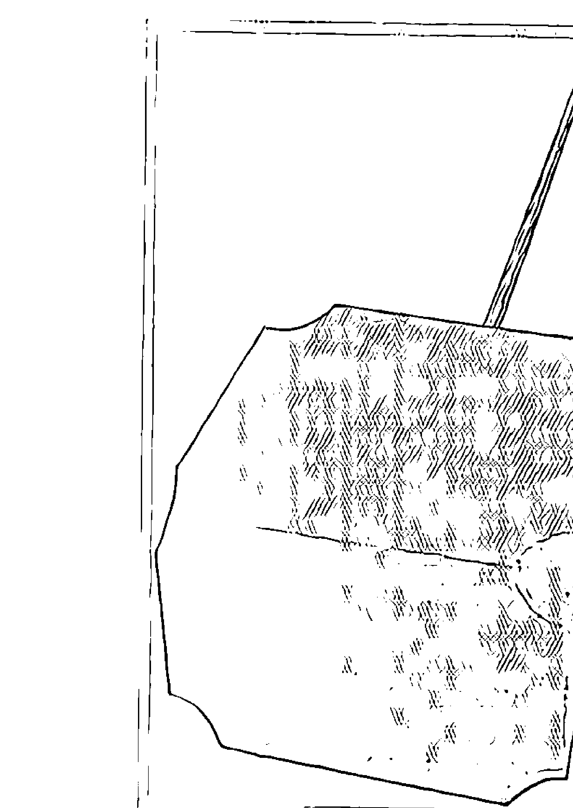

### 莫拉之镐
猎杀吸血鬼专用的巨大铁镐。莫拉能够若无其事地挥舞比她体重还沉重的铁镐，应是半吸血鬼惊人的怪力所致。
只要转动握柄，暗藏在镐槌里的山楂木桩就会从镐槌头部射出，刺穿吸血鬼的心脏。

### 山楂木木桩
山楂木棺起源于塞尔维亚地区「吸血鬼害怕山楂木」的传说，塞尔维亚甚至还有「通往彼等之路布满荆棘与山楂」的驱除吸血鬼咒语流传至今。

## No.098 皇家国教骑士团

## Hellsing

平野耕太的漫画《厄夜怪客》始自初代贺鲁希洁爵士的时代，将威胁大英帝国的非人徒ö恶歼灭的特务机关。

## ☆命令只有一个——「见敌必杀」

守护大英帝国与英国国教会不受暗夜妖魔侵袭的护国之剑，为秘密处理敌基督怪物而创设的大英帝国非公开组织。由于历代局长职位皆由贺鲁希洁伯爵家族世袭，是以皇家国教骑士团又通称「Hellsing机关」或略称为「Hellsing」。初代的贺鲁希洁爵士，就是曾阻止吸血鬼「伯爵」侵犯英国的吸血鬼猎人。或许正因如此，皇家国教骑士团多以吸血鬼为主要敌人，而自称「垃圾处理班」的最强战斗员也都各自身怀绝技。其中在前任局长亚瑟·贺鲁希洁时代便有「死神」绰号的瓦特·C·德尼斯更有超强绝伦的战斗能力；在尚不及少年时，就曾与现任局长沙·伊特古拉·华尔布克·维克兹·贺鲁希洁麾下的吸血鬼「阿尔卡特」联手破坏纳粹亲卫队的吸血鬼研究机关，并阻止德意志第三帝国利用食尸鬼蹂躏旧大陆的阴谋。

皇家国教骑士团的本部设于伦敦郊外，本部共96名成员，全都是从警察及军队里挑选出来的精锐中的精锐。然而在跟同样是基督教徒却视英国国教会为异端的法皇厅特务局第十三课，以及曾经被Hellsing逼至绝境的纳粹亲卫队秘密结社千禧年的战斗当中，Hellsing成员几乎全数被歼灭，仅有瓦特、阿尔卡特、前女警的女吸血鬼西洛斯·维多利亚等少数要员幸存。

现在的Hellsing是临时以高额的报酬雇用培尔那德队长所率佣兵部队，和发动第二次海狮作战*突袭伦敦的千禧年吸血鬼大队，以及渡过多佛海岸宣示要「狂热性再征服」的罗马人主教会大军团，展开一连串激烈的防卫战。

## 「皇家国教骑士团」的组织

女王 → 圆桌会议 (政治·军事) → 皇家国教骑士团
└─ 垃圾处理班 (阿尔卡特、西洛斯·维多利亚、瓦特·C·德尼斯)
   └─ 佣员·佣门员 → 佣兵部队

| 分类 | 成员/描述 |
| :--- | :--- |
| 垃圾处理班 | 阿尔卡特、西洛斯·维多利亚、瓦特·C·德尼斯 |
| 佣员·佣门员 | (指向) 佣兵部队 |

## 历代贾鲁希洁爵士

- 1. 初代贾鲁希洁爵士
   - 19世纪末，阻止吸血鬼「伯爵」侵略英国
- 2. 亚瑟·贾鲁希洁
   - 1944年，阻止千禧年的吸血鬼研究据点
- 3. 沙·伊特古拉·罕尔布克·维克兹·贾鲁希洁
   - 20世纪末，阻止千禧年的千禧年、罗马天主教会大军团展开防卫战

> 「HELLSING」，平野耕太著，1996年，少年画报社

## No.099
## 法皇厅特务局第十三课
## Iscariot Organization
イズカリオット機関、ローマ教皇庁直轄の最後の組織

我们身为使徒，但又不是使徒！我们是死徒，我们是一群死徒……
平野耕太的《厄夜怪客》，记录了基督教狂战士的历史。

## ☆神罚的地上代行者

以十字架上受刑的救世主之名，宣扬慈爱和平等教义的天主教。走过初期受严厉迫害的历史，却又复以异端审问、迫害异教等众多尸骨血骸建构起全世界最强大宗教，此乃以唯一绝对神的地上代行者自任者的另一面貌。在这段悲淒历史中诞生的法皇厅特务局第十三课，乃以耶稣基督十二门徒中用30枚银币出卖恩师的背叛者「加略人犹大」（Judas Iscariot）为名，梵谛冈里不该存在的部门，通称「伊斯卡利奥得」（Iscariot）。

法皇厅特务局第十三课是梵谛冈的非官方实战部队，也是天主教迫害异教歼灭异端的专家，早在皇家国教骑士团成立很久以前便一直在对抗吸血鬼等怪物。

连局长安立柯·马克斯威尔主教亦曾直言不讳「为维护教义，连教祖都可以杀」，伊斯卡利奥得全都是拥有怪物般战斗能力的疯狂信徒。其中拥有「圣堂骑士」「枪剑」「杀手」「斩首刑警」「天使尘」等无数绰号、专门消灭怪物的武装神父亚雷客斯·安德鲁，更曾用施以圣别的枪剑和结界埋葬了无数怪物，是梵谛冈唯一可与皇家国教骑士团阿尔卡特相互匹敌的最强战力。神父平时十分亲切，喜欢照顾孤儿，不过其肉体却是生命科学与回复法术的结晶，具有高度的自我再生能力，足以跟腕力凌驾人类的吸血鬼阿尔卡特正面冲突且毫不逊色。

千禧年执行第二次海狮作战※、让英国陷入一片火海的同时，罗马天主教也在升任大司教的马克斯威尔指挥下，发动「狂热性再征服」。事先布置于伦敦的安德鲁神父等武装神父先遣部队，亦向纳粹亲卫吸血鬼大队掀起战端。

> ※ 海狮作战：请参照第172页注註。

## 以猎大为名的组织

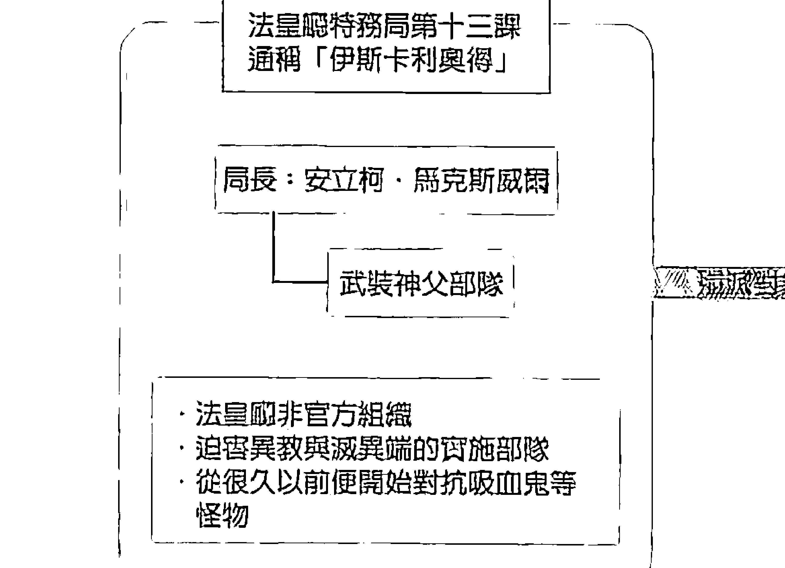

## 狂热性再征服

日本少年画报社发售的《厄夜怪客》单行本第六集当中，升任大司教的法皇厅特务局第十三课安立柯・马克斯威尔局长，宣布将对大英帝国及英国国教发动「狂热性再征服」。

「狂热性再征服」（Reconquista）此字是西班牙语「再征服」的意思；在欧洲史当中乃特指基督教势力企图从回教徒手中夺回伊比利半岛（Iberian Peninsula）的再征服运动。

伊比半岛乃是西元711年受到回教徒侵略，此时半岛南部已然成为回教势力范围，而天主教亦迅速地在718年便起兵反击；这更是再征服运动的肇始，此后天主教徒跟回教徒便在伊比利半岛展开极漫长的攻防战。直到1492年回教徒的最后据点格拉那达（Granada）陷落，长达8个世纪的再征服运动方才告终。

另外，现在天主教的主教协会里设有联络会议，藉以统合基督教诸教派，英国国教会与东方正教会都有参加。英国国教会的坎特伯里枢机主教便曾参加新任罗马教宗本笃十六世的就任弥撒，如今各教派间的紧绷情势不再，漫画里罗马天主教会将其他教会视为异端发动攻击的事态，已经不太可能会发生。

出典《HELLSING》，平野耕太著，1996年，少年画报社

## No.100

## 乔斯达家族与史彼特瓦根财团

## Joestars and Speedwagon Foundation

荒木飞吕彦长篇漫画《JOJO冒险野郎》的漫长冒险故事里，不停进行战斗的乔斯达家族背后，总是有史彼特瓦根财团的支持。

## 友情的证明

1881年，英国贵族乔治·乔斯达一世向骨董商购得一个神秘的石造面具，同时也揭开了乔斯达家族和暴虐无道吸血鬼长达百年的宿命战役。石假面成为乔斯达家财产的七年后，利用石假面成为吸血鬼的乔斯达家养子迪奥·布兰度于旋风骑士领一役，打败了修习仙道的乔斯达爵士嫡子乔纳森及其同伴。罗勃·E·O·史彼特瓦根就是乔纳森当时的同伴之一。

史彼特瓦根原是伦敦贫民区食尸鬼街的地头蛇，因为受到乔纳森的男子气概感召，遂奋起挺身加入对抗吸血鬼的行列，并曾经帮助乔纳森度过数次危机。尽管史彼特瓦根和乔纳森相处不过短短不到一年的时间，两人的相遇却大大地从根本改变了原本只是个小混混的史彼特瓦根的人生观与价值观。

与迪奥决战过后不久，乔纳森在蜜月旅行途中遭到迪奥袭击，仅仅21岁便即英年早逝，对抗吸血鬼的重担便交由史彼特瓦根扛下。史彼特瓦根于挚友死后在美国发现油矿，并且组织史彼特瓦根财团；他不但暗地里资助变成寡妇的乔纳森之妻艾莉娜·乔斯达，而且毫不吝惜财产地四处蒐集吸血鬼以及「柱之男」等人类之敌的情报。

乔斯达家族与吸血鬼迪奥·布兰度的宿世因缘，直到1988年乔纳森的孙子乔瑟夫·乔斯达及其孙空条承太郎的时代才划下休止符，而在那场漫长的战役当中，总是有史彼特瓦根财团在背后默默支持着乔斯达家族。

## 乔斯达家族与史彼特瓦根

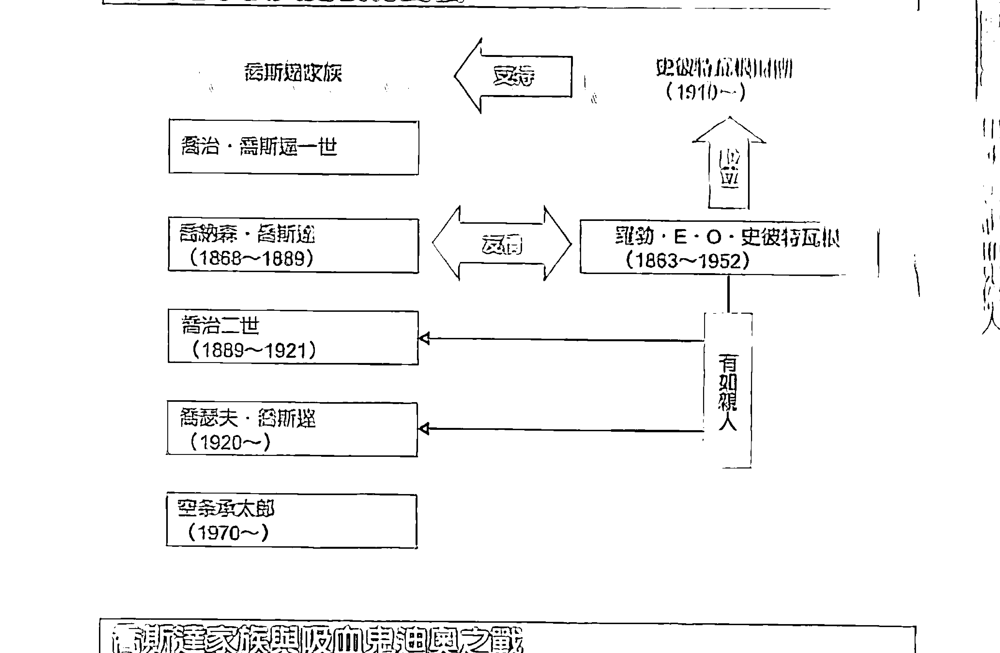

## 乔斯达家族与吸血鬼迪奥之战

| 年份 | 事件 |
|------|------|
| 1888年 | 乔纳森结识史彼特瓦根 乔纳森修习波纹 乔纳森于英国骑士团打倒吸血鬼迪奥 |
| 1889年 | 乔纳森于大西洋遇吸血鬼迪奥杀害 |
| 1910年 | 史彼特瓦根财团成立 |
| 1938年 | 乔纳森的孙子乔瑟夫修习波纹 乔瑟夫打倒创造石假面的「柱之男」 |
| 1952年 | 史彼特瓦根逝世 |
| 1984年 | 吸血鬼迪奥苏醒 |
| 1987年 | 乔瑟夫发现波纹 |
| 1988年 | 乔瑟夫的孙子空条承太郎发现波纹 乔瑟夫与承太郎于埃及消灭吸血鬼迪奥，为长达百年的战役划下休止符 |

## 中英日名词索引

- 《Fate/hollow ataraxia》「Fate/hollow ataraxia」「Fate/hollow ataraxia」 120
- HELLSING HELLSING ヘルシング ……… 208
- 《JOJO冒険野郎》 JoJo's Bizarre Adventure 『ジョジョの奇妙な冒険』 ……… 132, 212
- 「VAMPIRE」的確立 Stettling of Vampire 「VAMPIRE」の定着 ……… 18
- 刀鋒戰士 Blade ブレイド ……… 200
- 十字架 Cross 十字架 ……… 14
- 千禧年 Millennium ミレニアム ……… 172
- 大吸血鬼 Vampire Lord ヴァンパイアロード ……… 114
- 女巫 Witch 魔女 ……… 30
- 中東與非洲的吸血鬼 Middle Eastern Vampire, African Vampire 中東・アフリカの吸血鬼 ……… 56
- 中國的吸血鬼 Chinese Vampire 中国の吸血鬼 ……… 60
- 《午夜藍調》『Midnight Blue』『ミッドナイト・ブルー』 ……… 112, 154
- 《厄夜怪客》『HELLSING』『HELLSING』 ……… 130
- 戈耳工三姐妹 Gorgons ゴルゴンの三姉妹 ……… 120
- 戶山都營住宅的居民 Toyama Heights 戸山都営住宅の住人達 ……… 160
- 日內瓦湖畔事件 Event in lake side レマン湖畔の出来事 ……… 40
- 日本的吸血鬼 Japanese Vampire 日本の吸血鬼 ……… 62
- 「月姬」『Tsukihime』『月姫』 ……… 116, 118
- 半吸血鬼 Dhampir ダンピール ……… 16, 190
- 「石假面」與其創造者 Stone Mask and Creaters 「石仮面」とその創造者 174
- 卡茲 カーズ ……… 174
- 卡爾梅神父 Don Augustine Calmet オーギュスタン・カルメ ……… 36
- 卡蜜拉・卡恩斯坦 Carmilla Karnstein カーミラ・カルンスタイン ……… 78
- 外西凡尼亞 Transylvania トランシルヴァニア ……… 8, 44, 46
- 布拉杜伯爵 Count Blado ブラドー伯爵 ……… 138
- 弗拉德・提別斯 Vlad Tepes ヴラド・ツェペシュ ……… 46
- 本篤14世 Benedict XIV ベネディクトゥス14世 ……… 36
- 伊西斯與奧西利斯 Isis, Osiris イシスとオシリス ……… 140
- 伊利莎白・巴托里伯爵夫人 Countess Elizabeth Bathory エリザベート・バートリ伯爵夫人 ……… 60
- 伊斯卡利奧得 Iscariot イスカリオテ ……… 210

## 中英名詞對照表

- 伊諾維奇 Inovercy イノヴェルチ 170
- 伏爾泰 Voltaire ゾオルテール 110
- 印度與東南亞的吸血鬼 Indian Vampire, Southeast Asian Vampire インド・東南アジアの吸血鬼 110
- 吉里·德·萊斯男爵 Baron Gilles de Rais ジル・ド・レーリヌ 111
- 地獄的聖塔妮可 Santanico Pandemonium 地獄のサンタニコ 162
- 如何消滅吸血鬼 Method of killing vampire 吸血鬼の退治方法 16
- 江藤蘭世 Ranze Etou 江藤蘭世 140
- 色薩利女巫 Witch of Thessalia テッサリアの巫女 30
- 艾多加·波特尼爾 Edgar Portsnell エドガー・ポーツネル 136
- 血族 Group of Kindred 血族達 166
- 伯匍·史托克 Bram Stoker ブラム・ストーカー 48
- 克里斯多夫·李 Christopher Lee クリストファー・リー 50
- 吸血的怪物 monsters Who drink Blood 血を吸う怪物 20
- 吸血病毒 Vampire Bazillus 吸血バチルス 186
- 吸血鬼 Vampanella バンパネラ 136
- 《吸血鬼Nosferatu》 Nosferatu, eine Symphonie des Grauens 「吸血鬼ノスフェラトゥ」 94
- 《吸血鬼卡蜜拉》 「Carmilla」 「吸血鬼カーミラ」 78
- 《吸血鬼的女兒》 「Dracula's Daughter」 「女ドラキュラ」 102
- 吸血鬼的弱點 Vampire's Weakpoint 吸血鬼の弱点 14
- 吸血鬼的特徵 Vampire's Character 吸血鬼の特徴 12
- 「吸血鬼紀事」 「Vampire Chronicle」 「ヴァンパイア・クロニクル」 88
- 吸血鬼與吸血魔 Vampires, Vampiraze ヴァンパイア族とバンパニーズ族 156
- 《吸血鬼德古拉》 DRACULA 「吸血鬼ドラキュラ」 44
- 吸血鬼論爭 Vampire controversy 吸血鬼論爭 36
- 吸血鬼獵人 Kresnik クルースニク 16, 192
- 吸血鬼獵人D Vampire Hunter D 吸血鬼ハンターD 190
- 吸血殺人魔 Vampire Murderers 吸血の殺人者 64
- 《吸血殭屍Vjedogonia》 「Vampizdhija Vjedogonia」 「吸血殭屍ヴェドゴニア」 170, 206
- インテグラル・ファルブルケ・ウィンゲート・ヘルシンク Integral Farbrook Wingates Hellsing 208
- 貝路西 Bela Lugosi ベラ・ルゴシ 50
- 貝路多家族 Belmondos ベルモンド一族 204
- 亞伯 Abel アベル 166, 170
- 亞伯・黎特羅德神父 Father Abel Nighroad アベル・ナイトロード神父 118
- 亞伯拉罕·凡·赫辛 Professor Abraham Van Helsing アブラハム・ヴァン・ヘルシング教授 180
- 亞雷客斯·安德森 Alexandra Andersong アレクサンド・アンデルセン 210
- 彼得·文森 Peter Vincent ピーター・ビンセント 104
- 彼得·普羅戈約維奇 Peter Plogojowitz ピーター・プロゴヴィッチ 34
- 拉度·莫拉薩子爵 Viscount Radu Molasar ラドゥ・モラサール子爵 84
- 拉彌亞 Lamia ラミア 20
- 拉彌亞·維遙 Lamia Vindau ラミア・ヴィンダウ 96
- 東方正教與羅馬天主教會 Eastern Orthodox and Roman Catholic Church 東方正教會とローマ・カトリック教会 26
- 東歐的吸血鬼傳說 The Legend of Vampire 東欧の吸血鬼伝説 10
- 波紋 Hamon 波紋 132
- 法皇廳特務局第十三課 Iscariot Organization 法皇庁特務第13課 210
- 法蘭西斯·瓦涅爵士 Sir Francis Varney フランシス・ヴァーニー卿 74
- 阿可奇 Akasha アカシャ 146
- 阿爾卡特 Arucard アーカード 130
- 阿諾·鮑爾 Arnold Paole アルノルト・パウル 34
- 城島月子 Tsukiko Jyoshima 城島月子 126
- 威利·包爾舍特上校 Colonel Willy Borchert ウィリー・ボルヘルト大佐 86
- 威廉米娜·莫瑞 Wilhelmina Murray ウィルヘルミナ・マリー 198
- 查理·彭寧頓·波爾格 Charles Pennington Beauregard チャールズ・ベニントン・ボウルガード 188
- 活死人 Living Dead 生ける死者 22
- 皇家國教騎士團 Hellsing 王立国教騎士団 208
- 科特·巴羅 Kurt Barlow カート・バーロー 158
- 紅薔薇結社 Crimson Rose Society クリムゾン・ローズ・ソサエティ 152
- 紅薔薇結社 Crimson Rose Society 深紅の薔薇結社 152
- 約書亞·約克 Joshua York ジョシュア・ヨーク 90
- 約翰·波里多利 John Polidori ジョン・ポリドリ 40, 76
- 約翰·喬治·海爾 John George Haigh ジョン・ジョージ・ヘイ 70
- 約翰·喬治·海爾 John George Haigh ロンドンの吸血鬼 70
- 美夕 Miyu 美夕 142
- 美杜莎 Modusa メデューサ 120
- 美洲的吸血鬼 American Vampire アメリカ大陸の吸血鬼 54
- 范斯勞·德古拉伯爵 Count Vladislaus Dragulia ヴラディスラウス・ドラクリア伯爵 106
- 范碧芮拉 Vampirella ヴァンピレラ 128
- 迪奥·布兰度 Dio Brando ディオ・ブランドー 112
- 音無小夜 Saya Otonashi 音無小夜 110
- 埋葬機関 Burial Organization 埋葬機関 202
- 夏洛克·福尔摩斯 Sherlock Holmes シャーロック・ホームズ 116
- 恩基尔 Enkil エンキル 146
- 桑多神父 Father Sandor サンドール神父 196
- 塔拉玛斯卡 Talamasca タラマスカ 184
- 浪漫主义中的吸血鬼文学 Vampire in romantic literature ロマン主義の吸血鬼文学 38
- 狼人 Werewolf 狼人間 28
- 「世界与「贵族」 True World and Nobles 眞世界と<贵族>達 154
- 真祖与死徒 True Ancestor and Dead Apostles 眞祖と死徒 168
- 神代绘里香 Erika Kamishiro 神代エリカ 98
- 神祖与贵族 Sacred Ancestor and Nobles 神祖と贵族 150
- 索尼亚·布卢 Sonya Blue ソーニャ・ブルー 112
- 马格努斯·加尔迪伯爵 Count Magnus de la Gardie マグナス・ド・ラ・ガルディ伯爵 80
- 高城家 Takashiro Family 高城家の人々 176
- 基督教的血液信仰 Blood belief of Christianity キリスト教の血液信仰 24
- 康拉德·沃尔坎 Conrad Vulkan コンラッド・ヴァルカン 82
- 假死性昏厥 Catalepsy カタレプシー 32
- 莫拉 Mora モーラ 206
- 马克斯·史瑞克 Max Schreck マックス・シュレック 50, 94
- 杰利·丹吉 Jerry Dandridge ジェリー・ダンドリッジ 104
- 乔治·戈登·拜伦 George Gordon Byron ジョージ・ゴードン・バイロン卿 40
- 乔斯达家族与史彼特瓦根财团 Joestars and Speedwagon Foundation ジョースター家とスピードワゴン財団 212
- 黑死病与过早的埋葬 The Black Plague and The Premature Burial 黒死病と早すぎた埋葬 32
- 瑪利亞·莎麗絲卡伯爵夫人 Countess Marya Zaleska マリヤ・ザレスカ伯爵夫人 102
- 維科拉加思 Vrykolakas ヴリコラカス 22
- 蒜頭 Garlic ニンニク 14
- 遠野志貴 Shiki Tohno 遠野志貴 119
- 遠野秋葉 Akiha Tohno 遠野秋葉 118
- 僵尸 Jiang-shi 僵尸 60
- 《德古拉》 『Dracula』 『魔人ドラキュラ』 50
- 德古拉伯爵 Count Dracula ドラキュラ伯爵 8
- 德古拉的子女 Dracula's Get ドラキュラの子供達 148
- 《德古拉紀元》 『Anno Dracula』 『ドラキュラ紀元』 148
- 歐文·夜行者少校 Major Irving Nightwalker アーヴィング・ナイトウォーカー少佐 194
- 歐洲的吸血鬼 European Vampire ヨーロッパの吸血鬼 52
- 歐羅克伯爵 Count Orlok オルロック伯爵 94
- 熱內維埃夫·桑德琳·狄麗·迪厄多內 Geneviève Sandrine de l'Isle Dieudonné ジュヌヴィエーヴ・サンドリン・ド・リール・チュドネ 92
- 魯斯凡爵士 Lord Ruthven ルスヴン卿 76
- 黎斯特·狄·賴科特 Lestat de Lioncourt レスタト・ド・リオンクール 88
- 瓶伽彌多羅 GOKE ゴケミドロ 108
- 霍·克洛克伯爵 Count Von Krolock フォン・クロロック伯爵 100
- 默邱列里·喬凡尼 Giovanni Mercuriali メルクリアーリ・ジョバンニ 124
- 獄·亞蒙伯爵 Count Di-Amon ダイ・アモン伯爵 134
- 殿米特里·瑪基希摩夫 Demitri=Maximoff デミトリ=マキシモフ 122
- 環球電影公司 Universal Picture ユニヴァーサル映画 102
- 翼手 Chiropteran 翼手 164
- 賓倫鎮 Salem's Lot セイラムズロット 158
- 羅勁·E·O·史彼特瓦根 Robert E. O. Speedwagon ロバート・E・O・スピードワゴン 212
- 羅勁特·內維爾 Robert Neville ロバート・ネヴィル 186
- 露西·維斯坦羅 Lucy Westenra ルーシー・ウェステンラ 8, 180, 182

### 中英日名詞對照表（續）

- J · W · 布羅迪 · 英尼斯 John William Brodie Innes
- 三一學院 Trinity College
- 于斯曼 Joris Karl Huysmans
- 大不列顛王國 Kingdom of Great Britain
- 女王的配偶 Prince Consort
- 《女巫之槌》 Maleficarum
- 女夜魔 Succubus
- 山楂 Hawthorn
- 不來梅 Bremen
- 丹尼絲·索恩 Denise Thorn
- 丹妮卡·塔洛斯 Danica Talos
- 切爾西 Chelsea
- 《天師捉妖》 The Fearless Vampire Killers
- 巴凡希 Baobhan Sith
- 巴倫 Barend
- 戈德爾明爵士亞瑟·漢姆伍德 Lord Godalming Arthur Holmwood
- 比利 Billy Cole
- 加百列 Gabriel
- 加略人猶大 Judas Iscariot
- 卡特琳娜·絲弗札樞機主教 Cardinal Caterina Sforza
- 卡奧斯主教 Cahros
- 卡爾斯巴德 Carlsbad
- 斯特伍哥 Strigoii
- 川大元素 Elementals
- 尼特拉 Nyitra
- 尼莫船長 Nemo
- 弗拉德 Vlad
- 弗格森夫人 Mrs. Ferguson
- 弗魯肯格 Fluckinger
- 瓦德納 Werdna
- 白教堂區 Whitechapel
- 《白蛇窩巢》 Lair of the White Worm
- 立陶宛 Lithuania
- 伊什特萬 Istvan
- 伊利法斯·利未 Eliphas Levi
- 伊利莎白·巴托里 Elizabeth Bathory
- 伊里亞德 Iliad
- 伊莉莎白·葛蕾 Elizabeth Grey
- 匈牙利侯爵答勒 Gyula Kadar
- 吉奈特樞機主教 Cardinal Jinette
- 吉拉 Gierach
- 吉嘉華 Jlgarkhwar
- 《在那兒》 La-bas
- 多佛海峽 Strait of Dover
- 多蘿蒂亞·森騰斯 Dorottya Szenles
- 安迪·帕拉塔辛 Andy Palatazin
- 安娜·薇洛 Anna Valerious
- 安謝爾 Amshel
- 托爾科 Thorko
- 收割者 Reapers
- 米娜·哈克 Mina Haker
- 米爾恰 Mircea
- 艾力克·吉爾拉迪 Eric Qiraldr
- 艾拉 Ella## 艾咪 Amy Peterson
- 艾倫·鄂德曼 Allan Quatermain
- 艾絲緹·布蘭雪 Esther Blanchett
- 艾德 Evil Ed Thompson
- 血盟友 Vampirites
- 血寵物 Vampet
- 西方 Si-Fan
- 西瓦塔特 Civatateo
- 西蒙·貝爾蒙多 Simon Belmondo
- 亨利·歐文 Henry Irving
- 佛倫·納達斯第伯爵 Count Ferencz Nadasdy
- 佛羅倫斯·巴爾貢博 Florence Balcombe
- 佛羅倫斯·史托克 Florence Stoker
- 但澤 Danzig
- 克里特島 Crete Island
- 克里斯多夫·李 Christopher Lee
- 克里斯多夫·貝爾蒙多 Christopher Belmondo
- 克里斯多夫·坦斯 Christopher Jones
- 克倫威爾 Oliver Cromwell
- 克勞斯·霍爾曼上尉 Captain Klaus Woermann
- 克勞蒂亞 Claudia
- 克萊兒·克萊阿蒙 Clair Clairmont
- 克萊頓·T·弗諾 Clayton T. Vernor
- 克蘭堡 Kleinberg
- 克羅埃西亞 Croatia
- 利比亞 Libya
- 利喀敏 Llygamyn
- 呂卡翁 Lycaon
- 《吸血鬼》 The Vampyre
- 《吸血鬼瓦涅騎士》 Varney the Vampyre, or, The Feast of Blood
- 吸血鬼路易 Louis de Pointe du Lac
- 吸血鬼黎斯特 Vampire Lestat
- 坎平·麗德 Camplon Bond
- 坎伯蘭 Cumberland
- 巫會組織 Coven
- 庇護11世 Pius XI
- 底亞十一世 Pius XI
- 《廷臣瑣聞》 De Nugis Curialium
- 杜塞爾多夫吸血鬼 The Vampire of Düsseldorf
- 杜留德 Drude
- 沛爾希·雪萊 Percy Bysshe Shelley
- 狄亞格·狄馬 Dearg Due
- 狄肯·佛斯特 Deacon Frost
- 狄密特號 Demeter
- 狂王崔波爾 Mad Overlord Trebor
- 狂熱夢想號 Fevre Dream
- 男夜魔 Incubus
- 貝里歐爵·安斯蘭特 Belial Aensland
- 貝奧武夫 Beowulf
- 貝爾塔·林費爾德 Berta Reinfeldt
- 邦哥羅斯 Pangloss
- 那不勒斯王國 Kingdom of Naples
- 里希特·貝爾蒙多 Richter Belmondo
- 里納爾多·費渾賓 Rinaldo Gandolfi
- 里摩日主教會議 Le Concile de Limoges
- 亞巴拉罕·恩斯勒 Abraham Whistler
- 亞斯文 Aswang
- 亞斯安伯沙 Asanbosam
- 亞當·凡·赫辛 Adam Van Helsing
- 亞歷山卓十八世 Alessandro XVIII
- 佩羅 Charles Perrault
- 夜行燈 Nightwalker
- 《夜訪吸血鬼》 Interview with Vampire
- 妮娜·德雷頓 Nina Drayton
- 宙斯 Zeus
- 尚達涅 Chandagnac
- 摩城蒂福日城 Chateau Tiffauges
- 帕里努斯 Palinurus
- 帕梅拉·邱吉沃德 Pamela Churchward
- 彼得·庫登 Peter Kürten
- 彼得·庫興 Peter Cushing
- 所羅門·哥德斯密 Solomon Goldsmith
- 拉克萊 Wraxall
- 拉文斯堡 Ravensburg
- 拉杜 Radu
- 拉爾夫·C·貝爾蒙多 Ralph C. Belmondo
- 拉薩路 Rasalom
- 奎西·莫利斯 Quincey Morris
- 林肯郡 Lincolnshire
- 吉斯特·貝爾蒙多 Geste Belmonto
- 波士尼亞 Bosnia
- 波隆 Polong
- 波塞冬 Poseidon
- 弗朗西斯科·佩拉提 Francesco Prelati
- 盲目命運餅乾公司 Blind Fortune Biscuit
- 長牙 Long Fang
- 阿戈斯 Argos
- 阿卡迪亞 Arcadia
- 阿卡德 Alcard
- 阿布納·馬什 Abner Marsh
- 阿米紐斯·范貝利 Arminius Vambury
- 阿西西 Assis
- 阿波羅尼俄斯 Appolonius Tyaneus
- 阿曼德 Armand
- 阿莫 Amel
- 阿善提族 Ashanti
- 阿爾巴尼亞 Albania
- 阿爾比恩 Albion
- 阿爾岡昆族 Algonquian
- 保加利亞 Bulgaria
- 哈里斯漫畫 Harris Comics
- 契塔斯村 Cheders
- 威廉·赫辛 William Helsing
- 帝歐達地的別墅 Villa Diodati
- 施蒂里亞 Styria
- 柯南·道爾 Arthur Conan Doyle
- 查特·普西 Chet Pussy
- 查理 Charley Brewster
- 查理 Razor Charlie
- 查理一世 Charles I
- 查理二世 Charles II
- 查理曼大帝 Charlemagne
- 毗舍遮 Pisaca
- 洛比蘇曼 Lobishomen
- 珍娜 Janet Blake
- 珀耳修斯 Perseus
- 科林斯的尼普斯 Menippus of Corinth
- 《科林斯的新娘》 Bride of Corinth
- 約克夏郡 Yorkshire
- 約珥·葛施密 Joel Goltshmit
- 約瑟夫·倫特 Joseph Lent
- 約翰·R·達克隊長 Captain John R. Drake
- 約翰·布倫南·柯睿切利 John Brennan Crutchley
- 約翰·西華 John Seward
- 約翰·渥肯 John Vulkan
- 美寶·雷尚 Mabel Leyshon
- 耶路撒冷鎮 Jerusalem's Lot
- 《英國國教史》 Historia rerum Anglicarum
- 英諾森八世 Innocent VIII
- 迪努山口 Dinu Pass
- 韋克爾菲德大教堂 Wakefield Cathedral
- 《風流信使》雜誌 Mercure Galant
- 食屍鬼 Ghoul
- 首腦 Headmaster
- 修伯特·柏克萊·馬斯登 Hubert Berkley Marsten
- 倫敦日報 London Journal
- 倫費爾德 Renfield
- 哥拉汛 Chorazin
- 哥德恐怖小說 Gothic Romance
- 哭泣的女人 La Llorona
- 埃姆普薩 Empusa
- 埃提姆 Edimmu
- 夏格爾 Shagal
- 席夫 Schiff
- 席維拉神父 Father Silvera
- 恐怖夜 Fright Night
- 朗格羅 Langaroo
- 桑澤 Sandor
- 泰伯特 David Talbot
- 泰麗莎·索托 Talisa Soto
- 《海之秘密》 The Mystery of the Sea
- 海利奇·克拉馬 Heinrich Kramer
- 海德博士 Edward Hyde
- 浮陀 Bhuta
- 烏克蘭 Ukraine
- 烏庇 Upier
- 烏圖庫 Utukku
- 索列·貝爾蒙多 Soleil Belmondo
- 紐堡修道僧威廉 William of Newburgh
- 茹絲 Ruth
- 馬其頓 Macedonia
- 馬修·哈特曼 Matthew Hardman
- 馬斯登舊宅 Marsten House
- 馬瑞斯 Marius
- 馬默杜克·班涅沃斯 Marmaduke Bannerworth
- 曼杜哥 Mandurgo
- 基希洛瓦村 Kisilova
- 基爾維德 Kilbed
- 密黨 Camarilla
- 強尼·莫利斯 Johnny Morris
- 強納生·哈克 Jonathan Harker
- 旋風騎士鎮 Windknights' Lot
- 梵蒂岡 Vatican City
- 梅格能 Magnus
- 梅德韋賈村 Medwegya
- 梅爾妮·富勒 Melanie Fuller
- 混沌六方 Chaos Hexa
- 混沌火焰 Chaos Flare
- 理查·史垂克 Richard Straker
- 理查·泰斯 Richard Chase
- 畢利錫 Pelesit
- 斯塞諾 Stheno
- 畢爾德斯 Ambrose Bierce
- 普洛耶什蒂 Ploesti
- 莎拉 Sarah
- 普羅斯帕羅小隊 Prospero
- 莫蒂默 Mortimer
- 湯米·錢德勒 Tommy Chandler
- 莫罗伊 Moroi
- 湯姆士·普萊斯蒂·普萊斯 Thomas Presti Press
- 莉莉丝 Lilith
- 湯瑪斯·C·派克 Thomas C. Parker
- 莉莉图 Lilitu
- 湯瑪斯·杭特 Thomas Hunter
- 荷马 Homer
- 華特·伯恩哈德 Walter Bernhard
- 都柏林 Dublin
- 華特·馬普 Walter Map
- 謝利登·勒法努 Sheridan Le Fanu
- 萊姆豪斯區 Limehouse
- 梣 Ash
- 萊恩夫特 Michael Ranft
- 傅满洲 Fu Manchu
- 萊斯特雷德 Lestrade
- 傑米·布勒 Jamie Blood
- 費德里希·威罕·穆爾諾（F·W·穆爾諾） Friedrich Wilhelm Murnau
- 傑克·蘇華德 Jack Seward
- 開膛手傑克 Jack the Ripper
- 傑拉拉卡 Jararaca
- 雅各·史賓格 Jacob Sprenger
- 傑基醫生意 Henry Jekyll
- 雅各·索恩 Jacob Thorn
- 後的大隊 Lazte Battalion
- 馮登堡男爵 Baron Vordenburg
- 凱浮來特 Cavorite
- 塞伊特城 Csejthe
- 凱曼 Khayman
- 塞圖克 Setukh
- 治·A·羅梅羅 George A. Romero
- 塞爾維亞 Serbia
- 治·戈登·拜倫男爵 Baron George Gordon Byron
- 奧布里 Aubrey
- 治·喬斯達一世 George Joestar I
- 奧莉芙·杜蘭·狄肯 Olive Durand Deacon
- 治森 Jonathan
- 奧斯曼帝國 Ottoman Empire
- 治必夫·喬斯達 Joseph Joestar
- 奧爾良 Orleans
- 爆火焰 Demon Flare
- 《奧德賽》 Odyssey
- 爆搖籃 Demon Cradle
- 奧龍·科隆斯汀 Orion Kronsteen
- 比 Whitby
- 愛丁堡 Edinburgh
- 港 Whitby
- 愛碧嘉·惠斯勒 Abigail Whistler
- 斯 Stolas
- 滅絕集中營 Extermination Camp
- 斯佩爾斯朵夫將軍 General Spielsdorf
- 聖女克拉蕾 Saint Clare
- 斯堪的納維亞半島 Scandinavian Peninsula
- 聖方濟 Saint Francis
- 聖吉爾達德修道院 Saint Gildard
- 聖托里尼島 Santorini Island
- 聖克拉雷 Saint Clare
- 聖馬提亞斯教堂 Church of St. Mathias
- 聖塔妮可 Santanico Pandemonium
- 聖殿騎士團 Templar
- 聖像 ×ダイ
- 葛拉肯 Glaeken
- 葛斯博士 Dr. Jeffrey Garth
- 《解放的普羅米修斯》 Prometheus Unbound
- 詹姆斯·馬爾科姆·賴默 James Malcolm Rymer
- 詹姆斯·莫理亞蒂教授 Professor James Moriarty
- 達克 Drake
- 達那厄 Danae
- 達里奧 Dario
- 達馬斯基諾 Damaskinos
- 達爾維拉 Darvula
- 達蒙·尤利安 Damon Julian
- 雷 Ray
- 雷蒙·杭特利 Raymond Huntley
- 漢尼拔·金恩 Hannibal King
- 漢普特西斯公園 Hampstead Heath
- 漢彌爾頓·狄恩 Hamilton Deane
- 瑪凱 Makare
- 瑪赫特 Maharet
- 瑪麗·沃斯通克拉芙·戈德溫 Mary Wollstonecraft Godwin
- 福雷斯特·J·阿克曼 Forest J. Ackerman
- 精神吸血鬼 Mind Vampire
- 維吉尼亞 Virginia
- 維科多拉克 Vukodlak
- 蒙塔古·赫梅爾斯 Montague Summers
- 蓋爾·克拉克 Gayle Clark
- 赫利·葛瑞芬 Hawley Griffin
- 赫拉 Hera
- 赫曼修達特 Hermannstadt
- 《德古拉·黑暗王子》 Dracula: Prince of Darkness
- 《德古拉》 Dracula
- 《德古拉之子》 Son of Dracula
- 《德古拉的女兒》 Dracula's Daughter
- 德古隆行星 Planet Draculon
- 摩拉維亞 Moravia
- 摩根 Morgan
- 摩莉卡·安斯蘭特 Morrigan Aensland
- 撒克遜人 Saxon
- 歐貝佛 Obayifo
- 歐律雅耳 Euryale
- 潔西卡·李維 Jessica Reeves
- 潘那賈拉 Penanggalan
- 蝙蝠螺旋擊 Bat Spin
- 黎僕希 Leanhaum-shee
- 儒奧·貝爾蒙多男爵 Baron Julius Belmondo
- 盧爾德的聖貝爾娜黛特 Saint Bernadette of Lourdes
- 諾里奇 Norwich
- 諾迪埃 Charles Nodier
- 《諾得書》 Book of Nod
- 錫比烏 Sibiu

## 隨意在墳墓裡咀嚼的屍體

About the chewing and slurping corpses in the graves

- 《骸骨伯爵》 The Skeleton Count
- 戴米特里號 Demitri
- 戴奧吉尼斯俱樂部 Diogenes Club
- 薩阿儂 Leanhuam
- 薇洛家族 Valerious Family
- 通尼普斯 Menippus of Corinth
- 殭屍 Zombie
- 薩西克斯吸血鬼事件 The Adventure of the Sussex Vampire
- 薩克森-科堡-哥達公爵艾伯特 Albert of Saxe Coburg Gotha
- 魏斯·里奇 Wes Richer
- 羅多夫 Roldolph
- 維剎婆 Raksasa
- 羅爾 Philip Rohr
- 蜍蜍女 Toad Woman
- 川栗 Poppy
- 蘭心劇場 Lyceum Theatre
- 蘭尛 Langsuir
- 蘭開斯塔大教堂 Lanchester Cathedral
- 漫奇週刊 Marvel Comic
- 鸚鵡螺號 Nautilus

## 参考文献

『吸血鬼ドラキュラ』ブラム・ストーカー、東京創元社
『ドラキュラの客』ブラム・ストーカー、国書刊行会
『ドラキュラ完訳註注版』ブラム・ストーカー、水声社
『吸血鬼カーミラ』レ・ファニュ、東京創元社
『呪われた町』上・下、スティーヴン・キング、集英社
『深夜勤務　S・キング短編傑作全集4』スティーヴン・キング、サンケイ出版
『ザ・キープ』上・下、F・ポール・ウィルスン、扶桑社
『マンハッタンの戦慄』上・下、F・ポール・ウィルスン、扶桑社
『リポーン』F・ポール・ウィルスン、扶桑社
『闇の報復』上・下、F・ポール・ウィルスン、扶桑社
『ナイトワールド』上・下、F・ポール・ウィルスン、扶桑社
『神と悪魔の遺産』上・下、F・ポール・ウィルスン、扶桑社
『奴らは渴いている』上・下、ロバート・R・マキャモン、扶桑社
『魔女の刻』Ⅰ～Ⅳ、アン・ライス、徳間書店
『ラシャー』上・下、アン・ライス、徳間書店
『夜明けのヴァンパイア』アン・ライス、早川書房
『ヴァンパイア・レスタト』上・下、アン・ライス、扶桑社
『呪われし者の女王』上・下、アン・ライス、扶桑社
『肉体泥棒の匣』上・下、アン・ライス、扶桑社
『悪魔メムノック』上・下、アン・ライス、扶桑社
『パンドラ、真紅の夢』アン・ライス、扶桑社
『美青年アルマンの遍歴』上・下、アン・ライス、扶桑社
『呪われた天使、ヴィットーリオ』アン・ライス、扶桑社
『ドラキュラ紀元』キム・ニューマン、東京創元社
『ドラキュラ戦記』キム・ニューマン、東京創元社
『ドラキュラ脳髄』キム・ニューマン、東京創元社
『フィーヴァードリーム』上・下、ジョージ・R・R・マーティン、東京創元社
『ドラッケンフェルズ』ジャック・ヨーヴィル、角川書店
『殺戮のチェスゲーム』上・中・下、ダン・シモンズ、早川書房
『地球最後の男』リチャード・マシスン、早川書房
『ミッドナイト・ブルー』ナンシー・A・コリンズ、早川書房
『ゴースト・トラップ』ナンシー・A・コリンズ、早川書房
『フォーリング・エンジェル』ナンシー・A・コリンズ、早川書房
『ブラック・ローズ』ナンシー・A・コリンズ、早川書房
『ダレン・シャン』全12巻、ダレン・シャン、小学館
『リーグ・オブ・レジェンド 時空を超えた戦い』K・J・アンダーソン、竹書房
『シャーロック・ホームズの事件簿』アーサー・コナン・ドイル、東京創元社
『シャーロック・ホームズ対ドラキュラ』ローレン・D・エスルマン、河出書房新社
『シャーロック・ホームズ ガス燈に浮かぶその生涯』W・S・ベアリング＝グールド、河出書房新社
『ブラム・ストーカーズ ドラキュラ』フレッド・セイバーハーゲン／ジェームズ・V・ハート、ソニー・マガジンズ
『ドラキュラ伯爵 ルーマニアにおける正しい正史』ニコラエ・ストイチェスク、中央公論社
『ヴァン・ヘルシング』ケヴィン・ライアン、竹書房
『奇物の王国12 吸血鬼』国書刊行会
『ヴァンパイア・コレクション』ピーター・ヘイニング・編、角川書店
『ドラキュラのライバルたち』マイケル・パリー・編、早川書房
『血と薔薇コレクション1』渋濱仙彦・編、河出書房新社
『妖魔の宴 ドラキュラ編』全2冊、竹書房
『血と薔薇の誘う夜に 吸血鬼ホラー傑作選』東雅夫・編、角川書店
『M・R・ジェイムズ怪談全集1』M・R・ジェイムズ、東京創元社
『吸血鬼ハンターD』シリーズ、菊地秀行、朝日ソノラマ
『魔界都市』シリーズ、菊地秀行
『ヴァンパイヤー戦争』全11巻、笠井潔、角川書店
『吸血鬼はお年ごろ』シリーズ、赤川次郎、集英社
『ウエディング・ドレスに紅いバラ』田中芳樹、徳間書店
『獣たちの夜 BLOOD THE LAST VAMPIRE』押井守、角川書店
『上海哀僕 BLOOD THE LAST VAMPIRE』膝咲淳一、角川書店## 参考文献

### ゲーム：

- 『ダンジョンズ＆ドラゴンズ エキスペルトルールブック』TSR、新和
- 『ドラキュラ城の血闘』J・H・ブレナン、二見書房
- 『ヴァンパイア：ザ・マスカレード』アトリエサード
- 『ガイド・トゥ・カマリリア』アトリエサード
- 『ノド渇』アトリエサード
- 『Wizardry #1 Proving Grounds of the Mad Overlord』SIR-TECH
- 『悪魔城ドラキュラ』シリーズ、コナミ
- 『ヴァンパイア』シリーズ、カプコン
- 『式神の城 七夜月幻想曲』アルファ・システム
- 『月姫』TYPE-MOON
- 『真月十夜』TYPE-MOON
- 『Fate/stay night』TYPE-MOON
- 『Fate/hollow ataraxia』TYPE-MOON
- 『吸血鬼ヴェドゴニア』ニトロプラス
- 『圏姫恋京』ニトロプラス

### 漫画：

- 『ボーの一族』全5巻、萩尾望都、小学館
- 『ジョジョの奇妙な冒険』荒木飛呂彦、集英社
- 『ときめきトゥナイト』全31巻、池野恋、集英社
- 『HELLSING』平野耕太、少年画報社
- 『コヨーテ』平野耕太、フランス書院
- 『羊のうた』全7巻、冬目景、幻冬舎
- 『吸血姫美夕』垣野内成美、秋田書店
- 『バスタード!! 暗黒の破壊神』萩原一至、集英社
- 『GS美神 極楽大作戦!!』全39巻、椎名高志、小学館
- 『(有) 椎名百貨店超GSホームズ極楽大作戦!!』椎名高志、小学館
- 『GSホームズ極楽大作戦!! 血を吸う探偵』少年サンデーGX2005年6月号、椎名高志、小学館
- 『リーグ・オブ・オーディナリー・ジェントルメン』正・継、アラン・ムーア、ジャイブ

### 映画：

- 『吸血鬼ノスフェラトゥ』F・W・ムルナウ監督
- 『吸血鬼ドラキュラ』テレンス・フィッシャー監督
- 『凶人ドラキュラ』テレンス・フィッシャー監督
- 『魔人ドラキュラ』トッド・ブラウニング監督
- 『ロマン・ポランスキーの吸血鬼』ロマン・ポランスキー監督
- 『女ドラキュラ』ランバート・ヒルヤー監督
- 『地球最後の男』シドニー・サルコウ監督
- 『フライトナイト』トム・ホランド監督
- 『インタビュー・ウィズ・ヴァンパイア』ニール・ジョーダン監督
- 『ブレイド』スティーヴン・ノリントン監督
- 『ブレイド2』ギジェルモ・デル・トロ監督
- 『ブレイド3』デヴィッド・S・ゴイヤー監督
- 『フロム・ダスク・ティル・ドーン』ロバート・ロドリゲス監督
- 『フロム・ダスク・ティル・ドーン2』スコット・スピーゲル監督
- 『フロム・ダスク・ティル・ドーン3』P・J・ピース監督
- 『ヴァン・ヘルシング』スティーヴン・ソマーズ監督
- 『吸血鬼ゴケミドロ』佐藤嗣麻子監督
- 『HELLSING 1』ところともかず監督
- 『BLOOD THE LAST VAMPIRE』北久保弘之監督
- 『BLOOD+』MBS・TBS系

## 著者参考文献

### 图书：

- 《宗教辞典》（上下），任继愈主编，1989年博远出版社
- 《西洋神名事典》，山北笃监修，郑铭倍译，2004年，奇幻基地
- 《恶魔事典》，山北笃、佐藤俊之监修，高脱晓、刘子榴、林哲逸合译，2003年，奇幻基地
- 《东洋神名事典》，山北笃监修，高脱晓译，2005年，奇幻基地
- 《魔法・幻想百科》，山北笃监修，王杏铭高脱晓合译，2006年，奇幻基地
- 《吸血鬼德古拉》，布拉姆・史托克著，黄含硕译，1998年，万象图书
- 《科学怪人》（上下），玛丽・雪莱著，胡毓文译，1998年，万象图书
- 《变身博士》，罗伯特・路易斯・史帝文生著，1998年，万象图书
- 《德瑞安・葛雷的画像》，奥斯卡・王尔德著，蔡雅雅译，1998年，万象图书
- 《夜访吸血鬼》，安・莱丝著，张瑟英译，1994年，时报出版
- 《天蝎者的女王》，安・莱丝著，洪凌译，1999年，时报出版
- 《吸血鬼猎人D》，菊地秀行著，高脱晓译，2003年，奇幻基地
- 《魔界都市1 新宿》，菊地秀行著，黄碧君译，2003年，奇幻基地
- 《圣域之血 欺悲之星》，吉田直著，谢怡苓译，2004年，台湾角川
- 《红蔷薇新娘》，田中芳树著，吕相儒译，1999年，尖端
- 《厄夜怪客》，平井耕太著，何宜叡译，2000年，东立
- 《JOJO冒险野郎》，荒木飞吕彦著，Tombow等译，1992年，大然
- 《欢迎莅临吸血鬼同好会》，赤川次郎等著，邹清菲译，1995年，皇冠
- 《真月谭 月姬》，佐々木少年作画 原作TYPE-MOON / 「真月 月姬」制作委员会 任天狗译，2005年，台湾角川
- 《暗黑的破坏神》，萩原一至著，游若琪译，2004年，尖端
- 《羔羊之歌》，冬目景著，张家铭译，2001年，东立
- 《GS美神：极乐大作战》，椎名高志著，黄蒸蓁等译，1996年，青文
- 《吸血姬美夕》，垣野内成美著，李守爱译，1993年，长鸿
- 《妖族传奇》，萩尾望都著，苏傲希译，1994年，尖端

### 游戏：

- “鬼烦幽灵”，CAPCOM
- “幻想城”，KONAMI

### 电影：

- 《凡赫辛》，史蒂芬桑莫导演，2004年，环球电影
- 《天际奇兵》，史蒂芬诺林顿导演，2003年，福斯电影
- 《刀锋战士》，史蒂芬诺林顿导演，1999年，New Line Cinema
- 《刀锋战士2》，Guillermo Toro导演，2002年，New Line Cinema
- 《刀锋战士3》，大卫欧雅导演，2005年，New Line Cinema
- 《夜访吸血鬼》，尼可乔丹导演，1994年，华纳

### 网站资料：

Evidence for New England Vampire Belief：http://users.netplus.com/vyrdolnk/NEFolkbelief.htm

### 百科全书：

http://wordpedia.britannica.com/default.aspx

