李泓斌、蔡桑妮 著

許智雯 封面繪圖

## The Illustration Guide to Bach Flower Remedies

## 圖解 巴赫花精

解析創傷、釋放壓力，療癒心靈與情緒的最佳解方

花精的療癒原理 VS。中醫辨證與情緒轉化。兩大專家聯合打造最全面、最完整的巴赫花精療法寶典！

## The Illustration Guide to Bach Flower Remedies

## 圖解巴赫花精

解析創傷、釋放壓力，療癒心靈與情緒的最佳解方

李泓斌、蔡桑妮　著
許智雯　封面繪圖

## Contents

- 006 推薦序 —— 黃建榮
- 007 作者序 —— 李泓斌
- 010 作者序 —— 蔡桑妮

## Chapter 1 —— 與花相遇

- 014 何謂花精療法
- 016 花精發現的心路歷程
- 019 有關順勢療法
- 022 花精的發展與製作
- 027 自製花精
- 030 如何選購花精
- 032 認識新一代花精

## Chapter 2 —— 花精的治療原理

- 040 中醫辨證與情緒辨證
- 047 身心症候群解析
- 052 疾病的靈性意義
- 054 巴赫花精能為我們做些什麼

## Chapter 3 —— 圖像記憶與7大類花精

- 062 如何應用圖像記憶法
- 064 巴赫花精7大分類解說

## Chapter 4 —— 深入了解38種花精

- 070 龍芽草 (Agrimony)
- 080 白楊 (Aspen)
- 090 山毛櫸 (Beech)
- 100 矢車菊 (Centaury)
- 110 水蕨 (Cerato)
- 118 櫻桃李 (Cherry Plum)
- 128 栗樹芽苞 (Chestnut Bud)
- 138 菊苣 (Chicory)
- 148 鐵線蓮 (Clematis)
- 158 野酸蘋果 (Crab Apple)
- 170 榆樹 (Elm)
- 180 龍膽 (Gentian)
- 190 荊豆 (Gorse)
- 202 石楠 (Heather)
- 212 冬青 (Holly)
- 224 忍冬 (Honeysuckle)
- 236 鵝耳櫸 (Hornbeam)
- 246 鳳仙花 (Impatiens)
- 256 落葉松 (Larch)
- 266 溝酸漿 (Mimulus)
- 276 芥末 (Mustard)
- 286 橡樹 (Oak)
- 296 橄欖 (Olive)
- 306 松樹 (Pine)
- 316 紅栗 (Red Chestnut)
- 326 岩玫瑰 (Rock Rose)
- 336 岩水 (Rock Water)
- 346 線球草 (Scleranthus)
- 354 聖星百合 (Star of Bethlehem)
- 364 甜栗 (Sweet Chestnut)
- 372 馬鞭草 (Vervain)
- 384 葡萄 (Vine)
- 392 胡桃（Walnut）
- 402 水堇（Water Violet）
- 412 白栗（White Chestnut）
- 422 野燕麥（Wild Oat）
- 432 野玫瑰（Wild Rose）
- 442 楊柳（Willow）
- 454 從飲論花精

## Chapter 5 —— 急救花精的應用 & 寵物花精的調配

- 458 神奇的急救花精

## Chapter 6 —— 花精的選擇

- 470 如何選擇花精
- 472 談話諮商
- 475 觸診法
- 477 占星
- 479 情緒檢測表
- 485 花精握持法
- 486 抽花卡
- 487 能量檢測儀
- 495 靈擺
- 497 LET

### Chapter 7 — 花精的調配及使用

- 504 花精的使用
- 506 花精內服法
- 507 內服法注意事項
- 517 花精外用法
- 520 新巴赫花精對應穴位

### Chapter 8 — 如何提高花精療效

- 526 造成花精無效的因素
- 527 避免選錯花精
- 528 正視毒素干擾
- 533 預防花精的能量遞減
- 534 清除個案本身之能量阻塞
- 539 如何化解個案不相信自己會療癒
- 542 配合自我覺察及靈性修行
- 544 38種巴赫花精情緒與正向語

- 546 後記
- 548 參考資料

## 推薦序 黃建榮 —— 台北市中醫師公會理事長

## 圖解巴赫花精

依據中醫理論，中草藥物的香氣通過口、鼻、皮毛等孔竅進入體內，影響五臟的功能，平衡氣血，調和臟腑，祛病強身。這個理論也得到了現代醫學研究的證實，氣味分子可以促進人體免疫球蛋白的產生，提高身體抵抗力，同時能調節全身新陳代謝，平衡自律神經功能。Bach為英國知名的醫師、細菌學家兼病理學家，Bach醫師於1920年代與1930年代研究發現38單方花精。每個花精都跟人類基本的情緒狀態有關。舉例來說，Mimulus溝酸漿是對應我們對某件特定的事情所感到的焦慮或害怕，使用這個花精可以幫助我們克服懼怕並有勇氣去面對。

巴哈花精療法亦屬於自然療法的一種，花精指的是花上的露水，在清·汪昂《本草備要》中即完整記載各藥露的性味、功用、主治，例如金銀花露：開胃寬中，解毒，清暑消火。薄荷露：散頭目風熱，涼膈發汗，解熱祛暑。玫瑰花露：氣香，味淡微甘，能和血，平肝養胃，寬膈散鬱，治肝氣胃氣極效。佛手露：氣香，味淡微辛。能疏膈氣，專治氣膈解鬱，寬胸。《本草備要》中的花露與本書中所提到的花精療法，有異曲同工之妙，而花精療法更著重於心靈與情緒的治療、壓力釋放，促進身心靈的健康。

本會傑出會員李泓斌醫師大學畢業，醫學工程研究所進修碩士學位，考取中醫師特考，接受中國醫藥大學現代醫學訓練，匯通中西醫學，又因精研花精療法，與中醫學理論相輔相成，運用於治療病患，療效有口皆碑。泓斌院長特匯集花精療法之理論、治療及應用心得，出版圖文並茂《圖解巴赫花精》專書。本書編輯精采內容豐富，在圖文對照下對奇妙的花精療法，更容易理解，引領讀者們進入一場淨化身心靈的饗宴，誠為花精療法的寶典，特為之序。

## 作者序 李泓斌

人生際遇，宛如花瓣飄落，順著微風流水，飄往它的落腳處。沒有所謂好與壞，只有心境上接受與不接受而已。困境是好是壞，無從定論，但換個心境想，歷代諸多偉人與詩人，不都是在困境中創作令人讚嘆的史跡嗎？當心境轉不過來時，花精，恰好是您心境不接受時的最佳轉捩點。

際遇是偶然，也是前世的軌跡，正如我與花精的相遇，是偶然，也是命中註定要走的道路。幼時家境，經濟上只能供應到高中，之後的求學、生活費，只能靠自己，那時幾乎過著半夜11點睡到3點（保養肝膽的最佳時間），便起床工作讀書的回憶，辛苦，但卻一輩子記得。也由於這樣的處境，激勵起超強的學習力與效率。在中科院服科技軍官役的八年，幸好上蒼眷顧，僅利用下班零碎的時間準備課業，竟也讓我同時考上中醫師執照與醫工研究所，八年中也上了很多中醫臨床課程。而對我幫助最大的，莫過於氣功了，這是一把萬能鑰匙，讓人能開啟各個法門，游刃有餘於眾多療法間，整合成適合自己的濟世大道。若讀者有空，建議愈早學氣功或太極拳愈好，若人生能有機會重來的話，我會先鑽研氣功，其他再慢慢學。

自12歲接觸道法起，已近40個年頭，聖賢書上寫道：「八福田中，看病功德為第一。」要讓個案擺脫陳疴，累積功德，會的療法愈多愈好，多一份法門，就尤如多一雙手臂，也能拉拔更多人。因緣際會下，在網路上看到花精這個字言，初見完全不相識，花了約半年的時間拜訪花精專家，又發揮11點睡到3點的精神，把周遭所能收集到的花精資料整合，配合氣功的體悟運用於臨床，效果卓著。臨症多年，也將這些心得體會在北醫等地授課。只是，人生的課業繁多，時間也有限，授課僅能傳給少數人，如何才能讓更多人了解花精的精髓，擺脫情緒對自己與家人的困擾，寫書似乎是最好管道。原著的《圖說巴哈花精》一書，就是在這種想法下，將上課的講義及臨床心得，透過圖像記憶法展現出來，用來取代上課，也讓人更快速掌握重點。內人負責全書內外的色鉛筆插畫，在書中也暗藏著一些泛黃的老照片，當做對我父母的思念。

唐朝名醫孫思邈說：「世有愚者，讀方三年，便謂天下無病可治；及治病三年，乃知天下無方可用。故學者必須博極醫源，精勤不倦，不得道聽途說，而言醫道已了，深自誤哉！凡大醫治病，必當安神定志，無欲無求，先發大慈惻隱之心，誓願普救含靈之苦。」孫思邈這段話，是他的多年體會，也是我的體悟。上師說：「為學日益，為道日損。」學術與療法，愈多愈好，但要能探索各項療法的核心，卻只能走放空一途，這也是幾千年來先聖先賢的經驗之道。臨床日久，雖集眾多療法於一身，但隨修煉愈長，內觀看的境界愈廣，卻愈覺得自己渺小。自2011年起，我幾乎過著半隱居生活，謝絕所有媒體採訪與寫作邀約，也暫停所有對外課程，想藉由自己內丹的提升，做到孫思邈所說的大醫精誠。看診、練功、整理醫學文獻，幾乎是每天的固定課表。一個人靜慣了，也常獨自往山裡跑，有天我還打趣的和本書另一作者桑妮說，我應該有了社交不適應，不過喝點Water Violet（水堇）就好了。看著自己保育的森林，雖然離群索居，但有大自然與野生動物相伴，倒也不覺得孤單。

因緣際會下，與桑妮討論到花精書，因原著《圖說巴哈花精》一書已絕版，她想把這本書重新出版，好幫助更多人，也想把她的臨床資訊整合在一起。或許時機點到了，也或許是提醒我該開始笑傲江湖了，藉由內觀，發現這個合作案能量很強，可將原書發揮到極致，更有畫龍點睛的效果。書中貫穿著各類花精的整合，精采而豐富，若您翻開本書，相信會為之驚豔，也能節省您許多寶貴時間，可以說，這本書可謂花精界的聖經。「世道亂，在於人心之亂」，在這個世間法則動亂的時期，靜心是最好的防護罩，而花精的運用，恰好能讓您遠離俗世的困擾。擁有本書，您除了可以保有一份清靜心靈外，也能讓您擁有一扇濟世法門，一份療癒身心靈的偉大力量。

李泓斌

### 作者序 蔡桑妮

本書完稿半年，自序才遲遲生出來，不是因為無話可說，而是因為台灣的花精推廣正在面臨瓶頸，一言難盡。

是在2005年，我為了療癒原生家庭的創傷，接觸到花精，又因為發現花精當時在台灣一瓶訂價近千元，幾瓶買下來，荷包難以負擔，所以我以趨近英國當地的平價將Crystal Herbs花精引進來台，一瓶10ml只售220元。

李泓斌醫師，就是在最早期認識的老友。最初覺得他是對療癒特別熱情的年輕醫師，沒想到他的認真度驚人至斯，幾年之內，不只探索頻道對他專訪，更成為排隊半年都掛不到號的神醫。但他念茲在茲每天要練氣功至少五個小時，以精進自己的脈氣診斷能力，因此推卻電視節目邀約無數。我欽佩他，不只在於他的高明醫術，更在於他視病如親的心腸。

## 圖解巴赫花精

這本書的主體架構，皆出自李醫師之筆，我只是做了些增潤與刪修，主要是新譯巴赫醫師的原典敘述、新增花精檔案、增潤花精區辨、更新巴赫花精與新一代花精的對應，並刪除對一般讀者較艱深的中草藥處方敘述。

算一算，我認識李醫師多少年，就是代理花精多少年了。這十多年來，花精的心靈療癒功效，已從我剛接觸時的半信半疑，乃至現在的深信不疑。關於我做過多少實驗，獲得多少神奇成效，暫且略過不表。我只想說，花精真是個簡單、方便、安全、省時又省荷包的療癒好物，讓我們輕輕鬆鬆就能照顧自己，及照顧自己深愛的家人和寵物。

隨著時光推移，台灣民眾已從最普及的38支巴赫花精，認識到世界各地的靈性花精。無論代理多少品牌的花精，我始終沒有忘記初衷，那就是「希望台灣有需要的人，都能沒有負擔地取得花精」。至少巴赫花精這38+1種，屬於療癒情緒的救苦救難花精，一定堅持低價。

不過，這個初衷，在2019年3月21日，海關登門索討酒類重稅時，狠狠被打了一擊。「因為花精含有白蘭地，所以要依酒類課40%關稅。」他們說。我們拿出英國方出具的公文，證明花精在英國是歸類為食品或化妝品，海關卻說：「化妝品不可能。最好也不要歸到食品，不然衛福部說妳們誇大食品療效，妳更麻煩。」

是的，花精在台灣推行從來不容易，「食品療效誇大」是必須竭力避免的危險地帶，所以我們不能在商品說明中提及內服用法，自行消音閹割。這種種束縛，不足為外人道也。

儘管經過多時等待，最終海關仍判定花精需繳酒稅，不過，供應價格可親的花精，這份堅持並未受到撼動。五個月後，我們開發的自有品牌「晶荷日光花精」上市，以國際水準在台生產免關稅花精，隨後又推出「英國花精直運代購服務」，合法避免進口花精的重稅。這種種舉措，都是為了讓需要情緒療癒的花友，不被政府的重稅再剝削一層。

當一扇門關起，總會有另一扇窗開著。在這麼不容易的領域推廣十多年，其實只是希望心靈受苦者能透過這個簡單的療癒法獲得紓解罷了。我仍相信，這一切都是值得的。

## Chapter 1

### 與花相遇

### 何謂花精療法

若說「花精」可以轉化一個人的個性，能夠預防自殺的發生，可以幫助小朋友注意力集中，可以讓家中小寵物變得較聽話，在未接觸花精療法之前，心中一定充滿著懷疑的想法，也會認為說這應該是不太可能的事吧！

但當一個性情暴躁的人，運用巴赫花精中的「櫻桃李」花精後，您一定不敢相信，他的情緒居然可以平穩許多，不再時常火山爆發。而不敢上台的同學，在運用「溝酸漿」花精後，在台上可以變得落落大方。而在自殺預防方面，久病厭世或長期遭受負面情緒折磨的人，在用了「荊豆」花精後，會燃起活下去的勇氣，將自殺的念頭拋諸腦後。可以說，花精是心靈的解藥。

近十幾年來，花精療法隨著世界各國自然醫學的普及，人們對於這個療法的熟悉度愈來愈高，而國內也在崔玖醫師的推廣下，不少中、西醫師紛紛投入這方面的研究，只是台灣的花精起步，仍略落後於歐美各國。讀者不禁想問，那花精到底是什麼呢？若要說得複雜一點，可能要從量子物理、經絡心理學、信息醫學等理論去解釋，但簡單的說，花精就是鮮花花瓣上的露水，而這個露水經過特殊的製程處理後，含有植物的能量特性（即花的共振頻率），花精治療師便是用這個來撫平我們的情緒。在我這些年的臨床應用中，很多患者聽到「花精」這個名詞，不免會和「精油」相混淆，總會問我說那是不是香香的精油，事實上，這兩種是截然不同的品項。

花精是鮮花花瓣上的露水，可回溯到中世紀歐洲，那時的煉金術士已發現花的露水可以治療情緒不平衡，但由於採集不易，運用的情形並不普遍。除了西方世界外，在中醫裡頭，露水也是中藥的一種，並記載於各藥典中。如《本草備要》記載：「露水，味甘平，能止消渴，宜煎潤肺之藥。稻葉露清肺和中，荷葉露辟暑清熱，芭蕉葉露明目駐顏。」因此東、西方對於露水都有應用記載，只是中醫尚把露水定位在身體疾病的治療而已。

在中醫運用花的露水治療身體疾病時，英國的愛德華巴赫醫師（Dr. Edward Bach,1886～1936），他運用自身敏銳的直覺，以類似古代神農嚐百草的方式，逐步找到三十八種能協助人類解決各種心理困擾的植物與泉水，並於1936年完成整套療法。這三十八種花精，可以說是針對人們不同的負面情緒及行為，提供最安全而有效的身心靈療癒途徑。運用得當，不僅情緒可以平復，連身心症候群亦可一併獲得緩解與消除。巴赫醫師當年致力於花精的推廣，希望每一個人都能學會花精來醫治自己，直到他辭世後，仍由英國的巴哈中心及世界各地的花精教育機構繼續教學，將這份愛與花精知識傳播下去。

### 花精發現的心路歷程

巴赫醫師從小直覺力就很強，因此常能體會周遭生命的痛楚，由於體弱多病，便立志要做個醫師，並且夢想著可以用簡單的方法，消除任何的疾病。年輕時的他，目睹了疾病對人們所造成的痛苦，而當時的醫師們卻僅能將患者的症狀緩解而已，無法把疾病做根治。看到了這些情境，對於曾想當牧師的他來說，不由得想起了童年的夢想：「為人消除任何疾病。」因此他徵得家人同意，進入伯明翰大學就讀，之後並轉往倫敦的大學醫院完成訓練，取得內外全科醫學士學位。

在醫學院時，他發現到「病」的症狀不是最重要的，而洞察患病的「人」才是治療的要點，這個想法正和中醫強調因人施治、辨證下藥的理念不謀而合。而他也發現到臨床治療用的手術、藥物，往往會給患者帶來更多痛苦及副作用，因此巴赫醫師訂下了目標：「理想的治療，必定是無痛、溫和的」。畢業後，為了尋找溫和的治療模式，巴赫醫師一頭鑽進免疫學。在免疫學的領域裡，他發現體內菌叢失衡（即腸道中毒）是許多慢性病的根源，有不少慢性病患者，他們腸道中某些細菌會呈現失衡狀態。於是，巴赫醫師就運用免疫學技術，將這些腸道細菌製成疫苗，並利用靜脈注射的方法幫病人施打，而居然許多患者的慢性病就在這麼注射後也隨之消失，療效頗佳。此時，由於全球流感的關係，他也運用這項發現幫一些士兵注射這種細菌疫苗，獲得很好的效果，此時聲名如日中天的他，連英國皇家醫學院也邀請其發表腸道細菌疫苗的研究成果。

在機緣巧合下，巴赫醫師到了倫敦順勢療法醫院工作，順勢療法在英國歷史悠久，也長期獲得英國皇室的贊助，巴赫醫師此行，是他初次接觸順勢療法（Homoeopathy），但這一次機緣也徹底改變了花精的發展。在閱讀了順勢療法創始人赫尼曼醫師（Samuel Hahnemann）的著作後，讓巴赫醫師有了下列新觀念，也發現赫尼曼醫師的某些理念和他本身的想法不謀而合：

- 藥物可以口服，不用注射。
- 藥物服用採最少量化原則，是有需要才吃。
- 藥物不必從細菌而來，可以是從植物、礦物獲得。
- 理想的治療，是利用簡單、安全的方法，迅速、溫和地把疾病趕走。
- 藥物經過高度的稀釋後，效果反而增加，可以治療身、心的各種急、慢性疾病。
- 身心靈是一體的，病人本身才是治癒病痛最重要的關鍵，而選擇藥物須採相似原則，與病人的狀況愈像愈能幫助個案把疾病療癒。

有了順勢療法的這些體會後，巴赫醫師突發奇想，既然赫尼曼醫師認為藥物可以口服，且可稀釋，於是他便將腸道細菌採用順勢療法的高度稀釋方式製成口服疫苗，結果試用效果出奇的好，許多醫生都向他訂購這些新的口服疫苗。在後續幾年，巴赫醫師也逐步證實了病人的情緒才是治療的主要目標，也就是「情緒治療」才是成敗的關鍵，只要情緒問題處理好，疾病就能解決。因此他針對七大類性情的病人研究出對應的七種腸道細菌疫苗，不論病人患的是什麼病，只要針對性情來開處方，就可以取得效果。

獲得如此重要的成就，巴赫醫師並不滿足，他始終思索著赫尼曼醫師所提出「藥物不必從細菌而來，而是以植物、礦物為主」的理念。於1928年，他首先採集鳳仙花、滿酸漿這兩種植物，用順勢療法的方式製成花精，憑著巴赫醫師過人的直覺（有點像中國人用的氣功測病），他感應到溝酸漿花精是可以用在膽小或害怕某些事的人身上，而鳳仙花花精對於性情急躁的人特別適合，於是巴赫醫師就將這兩種花精給有這些情緒的患者服用，沒想到效果真的比之前所有療法更棒。因此，他對於過往迄今的療效做比較，得到的結果是：傳統藥物 < 腸道細菌注射 < 腸道細菌口服 < 花精療法。

這樣的發現，讓巴赫醫師全力投入花精的研究。剛開始，他先把人的性情分為十二大類，並以最先發現的十二種花精做對應治療，也就是花精書籍上所寫的十二個治療者花精，而這些花精也是後來十二星座花精的基礎。隨著發現的花精愈來愈多，巴赫醫師便改以七大類性情來做歸類，到了1936年，他完成了所有三十八種花精的研究，並出版《 The Twelve Healers and Other Remedies 》，書中以最淺顯的語句來描述三十八種花精的特性，但也由於太過淺顯，讓許多民眾摸不著頭緒，於是巴赫醫師便興起講課的念頭，在同年他五十歲生日時，主講了第一個花精講座，以期民眾可以熟悉花精、運用花精。或許是上蒼交付給他的任務已完成，巴赫醫師在同年底辭世，留下運用迄今的巴赫花精。

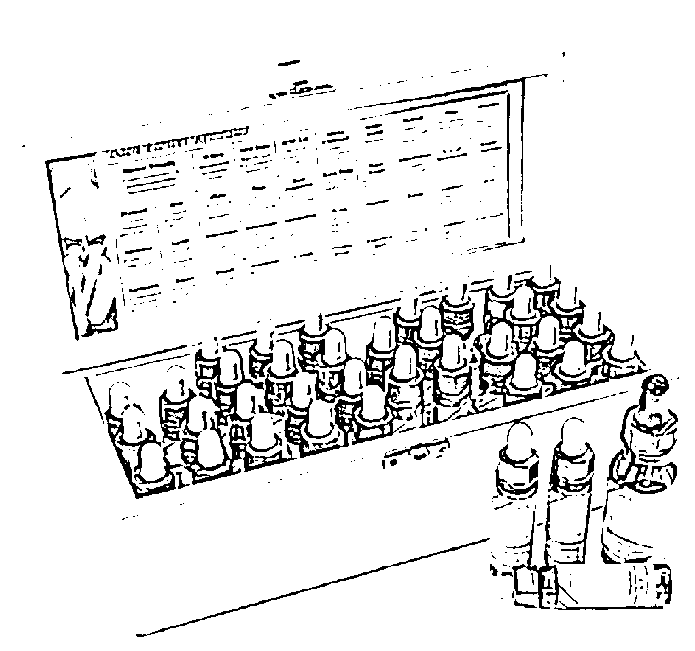

### 有關順勢療法

在研讀巴赫花精資料時，常看到「巴赫花精是順勢療法的一種」的說法。初聽順勢療法，有些陌生，在深入鑽研有關資料後，這才發現，原來順勢療法的理論和中醫類似，都是強調整體治療、身心靈治療，心中對它的觀感，突然間也就親近了許多。許多人都認為，中醫是治病因，是整體治療，不像西醫是治標，頭痛醫頭，腳痛醫腳，因為在醫療體系裡，西醫是屬於對抗療法。所謂對抗療法是與症狀相反的治療方式，如當您發炎時，就給您消炎藥；當一個人腹瀉時，就用藥物來直接止瀉；而最常見的咳嗽，當患者採用西醫對抗療法時，便會拿到止咳劑，這些都是直接從症狀來做相對的治療。這樣的療法，雖能讓一時的症狀緩解、甚或消除，但卻會把病因掩藏在體內，日久便會誘發出更多的問題，而藥物的副作用，也讓許多患者吃不消，這也是為何在歐陸醫學最發達的法國、德國，有愈來愈多的民眾寧願捨棄西醫，轉而接受自然療法的原因。

順勢療法（Homoeopathy）又稱同類療法，在西元前四世紀，希臘醫學之父希波克拉底斯（Hippocrates），就有使用過，只是到了十八世紀由德國醫學博士赫尼曼發揚光大。這個療法是採用可以在健康人體引發與病人類似症狀的物質來治療病症，即「相似法則（treat like with like）」，如受到洋蔥刺激會流眼淚和流鼻水，所以可用洋蔥來治療感冒、花粉熱和鼻黏膜炎，因為這些病症的患者都會流眼淚和流鼻水，與正常人受到洋蔥的刺激反應相同。只是順勢療法藥物的劑量要經過高度的稀釋與震盪，即所謂勢能化（potentization）後，藥效可大幅增加且無副作用，這樣才能有效且安全。像是毒蛇的毒液雖會使血液凝集，但將其稀釋多次後，毒液卻會讓血液不容易凝集，反而產生相反作用且無任何毒副作用。可以說，順勢療法是運用藥物劑量的不同來治病，亦即劑量高

低，便會造成完全反向的作用。 中藥的應用與此類似，舉中藥「黃耆」為例，黃耆是補氣藥，「十全大補湯」及各種冬令進補的方子裡常會用到，大量的黃耆會使血壓下降，但少量則會使血壓上升。許多人到廟裡，常會看到有善心人士印送藥方，不難見到有一首用大劑量的黃耆配合其他藥物的促進血液循環處方，號稱可治中風、口眼歪斜等，這個方子即是用大量的黃耆來降壓。又如中藥「附子」，學過中醫的人都知道，附子是相當燥熱的藥，少量運用時是強心劑，可以治療手腳冰冷、虛弱乏力、循環不佳、胸悶、心悸等，中國大陸著名醫家「盧火神」或《思考中醫》的作者劉力紅等，就是擅長用附子來回陽、強心。雖然附子可用在強心上，但當過量使用時，反而會造成心臟衰竭、口乾舌燥等上火現象，而這些差異，僅是在劑量的不同而已。

早在十幾年前，那時我在中科院擔任研究員，因為喜歡鑽研中醫，所以同事有中藥的問題都常來問我。有一位住雲林的同事，他的女兒時常腹瀉，看遍中西醫均無效，最後找到一位山中的醫者，給他女兒開的處方是「蟑螂大便」，還教導服法：先抓一隻蟑螂，放在碗裡，用蓋子蓋住，到了第二天早上，將蟑螂拿走後，用開水沖服碗中的蟑螂大便。由於這種療法蠻奇特的，同事特地跑來問我說這樣可行嗎？當時我頭上直冒三條線，因第一次聽到這麼奇怪的治法，就勸他先不要用。那位同事聽我分析後，起先也不敢使用，但後來由於拗不過家中老母的建議，就真的抓一隻蟑螂，沖服蟑螂大便給她女兒喝。說也奇怪，就在那次後，她女兒便不再腹瀉，當時我百思不得其解：「小強的大便可以治拉肚子，而且效果奇佳？」這個疑惑，直到後來接觸順勢療法後，才發現其實那是高明

的治法。順勢療法有二個運用特點：「高度稀釋、震盪」。當碗中的蟑螂大便用熱開水沖服，即是高度稀釋，而沖熱開水時，即是水流震盪，所以這種製服法是完全符合順勢療法的原理。另由於蟑螂大便會讓人腹瀉，但當小劑量使用時，便搖身一變成了同類療法中的止瀉劑了，無怪可療癒同事女兒的腹瀉。

現代人喜歡野外活動，應用順勢療法的原理，或許可以救人於頃刻。當我們在野外活動時，若知道何種有毒植物服用後會產生什麼副作用，只要利用其極低劑量便可以幫助相同症狀回復，因此學會順勢療法，對於野外求生而言，也不啻是一個救命的法門。

不過，需要釐清的是，巴赫花精之所以被歸類為順勢療法，只是早年為了推廣花精的權宜之計，其實兩者的製作方式、作用原理和使用方法都大不相同了，花精並非藉由稀釋震盪的勢能化方法製作，作用原理也不是「以毒攻毒」，而是以較高的能量頻率將人體的低頻帶上去，故巴赫醫師本人曾經明言巴赫花精已經不是順勢療法了，因此當代新出版的歐美花精書籍中，都會就這一點特別加以釐清了。

### 花精的發展與製作

目前全世界約有超過七百種的花精（如巴赫花精、北美花精、蘇格蘭芬活花精、澳洲花精等），製法多半仍遵循巴赫醫師當初採用的日光照射法及煮沸法兩種。巴赫醫師剛開始是用順勢療法的原理製造花精，並常在山林中找尋適合製作花精的植物。有天清晨，他看到植物上的露水很多，由於中世紀歐洲有應用露水的記錄，巴赫醫師就嘗試看看，以他的直覺發現露水效果真的還不錯。但令人迷惑的是，有時露水有效，但有時卻是無效的，後來一分析，發現當他睡得較晚起床時，陽光照射後的露水特別有效；若是太早起床，飲用太陽尚未出來前的露水，則療效不佳。他靈光一閃，歸納發現花精若要有效，必須藉著陽光的照射，即是要有溫差變化，才能使露水蘊含的植物能量精華顯現。但是露水的收集不易，於是巴赫醫師便將花精製作，採用日光照射法及煮沸法兩種，並將整個製法寫得相當完整，好方便世人依樣製作，花精製法為：

+   - 鮮花類大多用日光照射法（如龍芽草、矢車菊等）。
- 樹木類大多是採煮沸法（如白楊、山毛櫸、紅栗等）。

當然我們可以找到被巴赫醫師用煮沸法製作的花朵，或以日照法製作的樹木，這些例外使得後世認為巴赫醫師可能不是單純以花朵或樹木作為製法的區分，也有可能與英國晴天難得有關，所以他才會在前期皆採用日照法，後期皆用煮沸法。真正的原因隨著巴赫醫師的謝世已難獲得，總之這兩種方法就是現在市面上所謂「巴赫醫師的古法」。

運用上述這二種製法，得到的液體稱為「能量水」，能量水加上等比例的酒精即為「母酊劑」，母酊劑再經稀釋分裝即為市售花精及治療瓶花精。因此我們所拿到的花精，其完整的製作流程為下列三個步驟：

### 母酊劑（Mother Tincture）

+   1.日光照射法：在無污染的野外地方，採集當季盛開的花朵放在玻璃容器中，注滿水，再經由陽光曝曬約四個小時（最好的時間是中午前後各二個小時，即早上十點到下午二點間的四個小時，此時間刻剛好經過中國傳統時辰裡的「午時」，也是陽氣最旺的時候）。

+   2.煮沸法：非適用日光照射法的花朵則使用水煮的方式，這些樹木類的花在採集時，常會伴隨著嫩枝一起摘取煮用。煮沸的工具傳統是以厚玻璃鍋為主，並且在使用一次後即打破銷毀，會將玻璃鍋打破的主因是怕清洗不完全，殘留上一次的植物能量，會干擾到花精品質，故用一次即銷毀。能量殘留是一種氣場留滯，像我們在戴水晶時，常會用海鹽或日曬法做消磁，為了就是要清除上一個人觸摸的能量，所以進入能量界，便可發現很多東西都大同小異。在使用煮沸法時，其炮製法和煎煮中藥雷同，均是將植物放進鍋中，再倒入泉水浸過花枝，加蓋煮沸後，再用文火煮約半小時。待其冷卻後，將植物取出，並即刻用酒類做保存。萬事萬物皆有能量，但只要是能量便會有能量遞減的問題，因此從花朵的採集、炮製到最後加入酒類的時間，相隔愈短愈好，才能完整保存植物的訊息。

+   3.不論是日光照射或煮沸法，大部份花精製造廠是請工作人員戴上手套，撈出已浸泡多時的花朵枝葉，不過傳統中醫是以植物的枝

當做筷子將花朵夾出，現代對製程較講究的花精廠商也是這樣做。此時所取得的液體即為能量水，再使用等分的酒精（如白蘭地）貯存後，即為母酊劑。

4.水本身是最好的載體，可以把花的能量訊息儲存其中，現代物理學研究發現，水分子H2O有特殊的結構形狀，它是由兩個氫離子以某個特殊角度結合而成，水在0℃～60℃的溫度下並不是完全呈現液狀，而是以一種液化晶體的形式存在，其液化晶體的特殊夾角便可將植物的訊息包含在它的結晶體中，這便是水的記憶性。在東方，這種理念較容易理解，每年端午節時，鄉下地方的人會在這一天的正中午裝泉水，而此時所裝的水稱為「午時水」，用來退燒效果不錯，而且放很久都不會壞。另外在宗教裡常會有人對著水唸誦大悲咒，即「大悲水」，佛經記載大悲水可治世間十萬八千種病。而藥師琉璃光如來本願功德經裡更記載一段經文「曼殊室利，若見男子女人有病苦者，應當一心，為彼病人常清淨澡漱，或食、或藥、或無蟲水，咒一百八遍，與彼服食，所有病苦悉皆消滅」。對於水的儲存信息能力，無論東西方均認同這個理念，都是用水來承載無形的能量，只是水的選擇必須潔淨，最好是使用泉水。在都會區這種無泉水的場合，採用一般的礦泉水也是一種替代方案。

5.市售花精通常是以酒作為保存劑，多數廠商會加入水作為基底，以平衡成本、便於空運並減少酒精攝取，只有少數廠商是完全不加水。英國花精製造商協會特別規定水酒調和後的最終酒精濃度必須足以抑制細菌生長，因此廠商多半依循巴赫醫師古法，採用酒精度40%的白蘭地來保存，調和後最終酒精濃度多介於10-40%之間。至於白蘭地種類則沒有限定，像台灣出產的白蘭地酒精濃度為

40%，當然也可以用來製作花精。目前英國部份花精製造廠也開始逐步運用有機白蘭地，因為有機表示無農藥、無化肥，最貼近自然，應該能把花精的效用更加提升，如Crystal Herbs花精。值得一提的是，酒類是很好的保存劑，花精的能量保存期限和酒的品質有很大的關係，當酒精的濃度愈高，花精的保存便愈久，也會影響到花精品質良窳，因此選購時選擇20%以上最理想，10%以下則不建議考慮。

+   6.花精的品質與花的質地有很大的關係，在《植物也有情緒》一書裡，作者巴克斯特介紹了植物會感應到人的心思與周遭的喜怒哀樂，而這個論述也業經實驗證明「植物確實有驚人的感應能力」。但同樣一種花，在不同地方，如在西門町與在玉山上，它們的品質是截然不同的，因為植物會記錄附近的氣場與情緒。若是採摘自喪葬場附近的野花，也多少沾染了些哀傷氣息，用這樣的花精給患者服用，有時會得到反效果。原料的挑選如此嚴謹，製作流程亦馬虎不得，國外有些花精的製作會挑選在深山野地，並會避開飛機的航班、無線電基地台的干擾，為了就是要得到最大且最純淨的花精能量，因為任何一點小干擾，都有可能造成無法修補的能量瑕疵，而這種嚴謹的態度，是值得我們學習的。

### 濃縮瓶裝（Stock Bottle），或稱儲存瓶

把母酊劑2滴加入裝滿白蘭地的瓶中，即為市售的花精，也就是我們購買到的原裝花精，一般隨著內裝「花精」容量的不同，常見的容量通常介於10ml到30ml之間。

### 治療瓶裝（Treatment Bottle），或稱調配瓶

由花精治療師根據個案的情緒需求，從不同的濃縮瓶裝中取出2～4滴，加進另一瓶清水中，並倒入少量酒精以防止腐壞，即為花精診療中患者所拿到的花精。防止腐壞的酒精可加可不加，不過加入酒精可讓能量遞減的情形延後一些，這將在「內服法常見問題」一節裡有更詳細的說明。另外滴入的花精劑量一般是2～4滴，但最好還是經過能量測試，可得到較準確的劑量，治療效果也較好。有些患者經過能量測試，單種花精一次便要使用十數滴，若以常規的2～4滴來算，對於治療品質將有不小的影響。

### 自製花精

在現今複雜多變的情緒世界裡，自製花精是有其必要的，但自製的第一步便是要知道花的功用。一般而言可從左腦的理性分析，和右腦的直覺感應兩個角度進行。

左腦的理性分析，通常就是研究植物型態。譬如北美花精協會的負責人理查·凱茲（Richard Katz）曾提出植物的形狀、生長環境、季節性等要素可看出每朵花的生命力及情緒含意。而研發花精同類療法製劑的洛伊·馬提納（Roy Martina）也提出類似的看法：透過觀察每棵植物從種子萌芽、展枝、生葉到開花結果的循環過程中，對應人體的相似功能，即可覺察到花精的功用。其實這些理論，在傳統中醫藥理學中，早已應用數千年，清朝鄒澍的《本經疏證》一書，可說是這方面的代表作，但許多學說往往要外國人提出後，我們才會認同，並大加地讚嘆外國人的智慧。可曾想過，在數千年的中醫典籍裡，早就叫我們要從植物的形態去延伸其功用，但有不少中醫師們卻不認同，一直等到國外發表類似的文章，才驚覺前人的睿智，真是可悲。

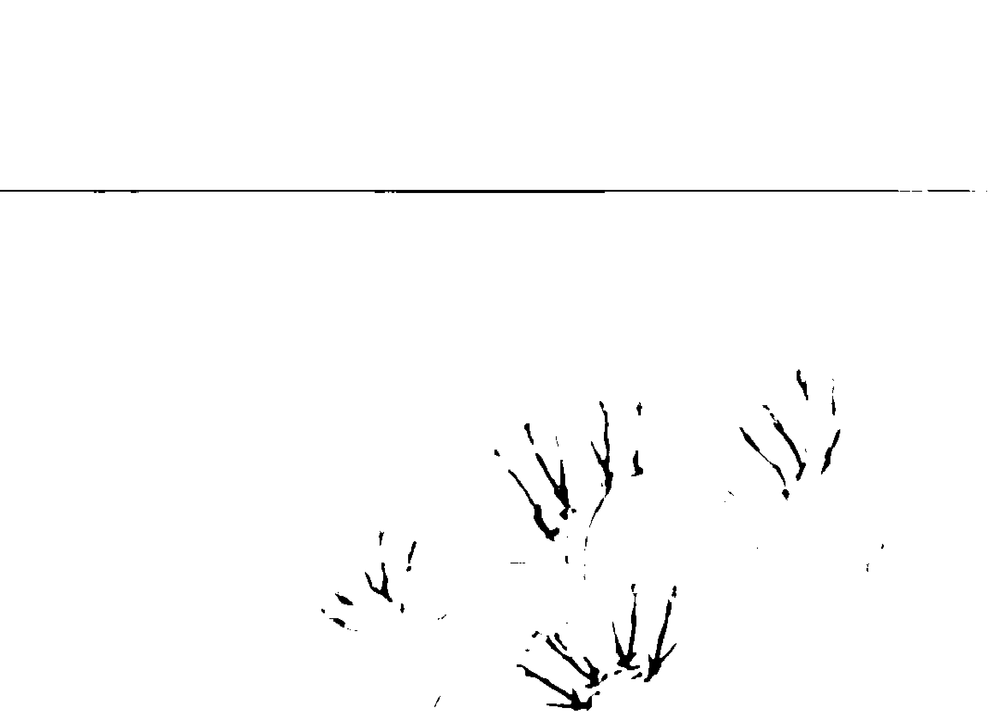

植物生長的循環過程中，可與人體對應

右腦的直覺感應，就像巴赫醫師能憑藉觸摸就感應到花朵的功用，中國的古人也會用氣感去感觸植物的功用。有養動物的朋友都知道，動物在生病時，會自己去找藥草吃，即使是家中的貓、狗亦會，因為任何生命體都有其直覺的氣感，只是物慾的渲染，這種能力暫時被蒙蔽，除非是有修行的人，才能擁有像巴赫醫師那樣過人的直覺。不過直覺力是可以訓練的，「自發功」這個簡單的氣功倒可以提供不少的幫助，在學習自發功後，有些朋友會在氣功態下採集適合自己的草藥，因為在心靜、氣強的狀態下，靈覺便可顯用，故佛陀觀花微笑便可了解到花的精義，而我們所要做的，便是追求靜心，才能達到古人說：「唯天下之至靜，可觀天下之至動」的境界。修行是一個出色的花精治療師必經的路程，北美花精協會的負責人派翠西亞·凱明斯姬（Patricia Kaminski）更明白指出，想要發現可用的花精材料，唯一的答案：「修行與修練」。

花精的功用可說是天語，天語要靠自性、修行去體會，方能了悟這「形而上」的學問。若無法做到這點，便只能從外形去慢慢推敲了，不過似乎努力修行才是最根本之道。

自製花精時，可以使用最簡單的日光照射法，我們可以把它當成花露水來直接飲用，若無法馬上喝完它，可加入高濃度的酒精做保存，因為酒是很好的保存劑，可以延長花精的壽命。在家中，我們可以依據巴赫醫師的製法自製花精，覺得五月份的油桐花美嗎？路旁酢醬草是否吸引您呢？當您能靜心地體會花精的功用時，不妨試著製作屬於自己的DIY花精，說不定花精世界裡，也有您的品牌喔！

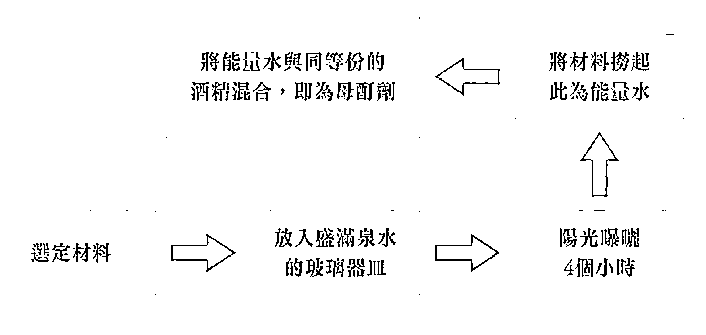

關於花精的製作流程，除了上述說明之外，本書作者蔡桑妮另著的《手作芳療噴霧魔法書》中有近萬字的專業探討，是目前市面上最齊備的華文資料。若有興趣深入了解花精作法，建議一讀。

# # 如何選購花精

現代生活忙碌，不是每個人都有閒功夫自製花精，大多數情況下，購買花精還是最方便的方法。巴赫花精目前在全球有多家廠商在製造，如Cyrstal Herbs、Nelson、Healing Herbs等大廠，使用效果都差不多，只是口感略顯不同，這是因為各家使用不同的酒類作保存劑的關係。前些年在我們診所裡，光Cyrstal Herbs巴赫花精便有新舊兩款，新的一批花精採用的是有機白蘭地做保存劑，因此服用起來口感較為香甜，連開瓶時聞的香氣也不同，不過我倒是蠻喜歡這種新氣味的。

自製花精是巴赫醫師的理想，巴赫醫師一開始是希望每個人都能做自己的醫生，因此他把花精的作法及每種植物的型態說得非常清楚，目的就是希望大家都能自行製作花精來療癒自己。只是後來巴赫醫師發現到並非每個人都有閒閒的時間去野外採花，而且有些花雖然書上寫的很清楚，但還是會有人採錯，於是他便委託Nelson公司幫忙製作，因此這家公司的花精上便有Bach的簽名。早期有些通路商便會據此宣傳說有簽名才是正統花精，但其他那麼多家製造商，難道就不是正統的嗎？其實不然，不論是有Bach簽名的或是其他廠所製作的花精，都是依據巴赫醫師的做法來製作花精，因此都可算是正統的巴赫花精，使用者也就不用去管所謂的正統或不正統之爭了。

此外，巴赫醫師心懷慈悲。當他建立這套花精療癒系統，他只想到要推廣，從未想過註冊商標或專利來把這套療法據為己有，可惜他的繼承者將巴赫花精原名「Bach Flower Remedies」拿去註冊商標，因此在英國掀起了商標權的多年纏訟，最後法院判定Bach Flower Remedies屬於通用名稱，不得由任何廠商獨佔。這個判例

確定後，歐洲也做出了相同的判決。遺憾的是，巴赫花精在台灣仍是廠商各自註冊商標的狀態，所以坊間還可見到「巴哈花精」、「Bach花精」、「貝曲花精」、「巴曲花精」等名稱，其實都是Bach Flower Remedies。如果要從事花精行業，建議使用「巴赫花精」或「貝曲花精」這兩個目前商標權屬開放狀態的名稱，以免侵權。其中「巴赫花精」在台灣較常見，「貝曲花精」較通行於香港及中國大陸。

既然市面上已有數種廠牌，在選購時，只要認明瓶身上寫Bach Flower Remedies就沒錯，不過各家的價位略有不同，但在全球化的趨勢下，現在的網路資訊及各通路都相當發達，使用者在購買花精時，可以上專業的花精網站或拍賣網站查詢相關資料，多方比較與挑選，才不會花大錢買到同樣的東西。

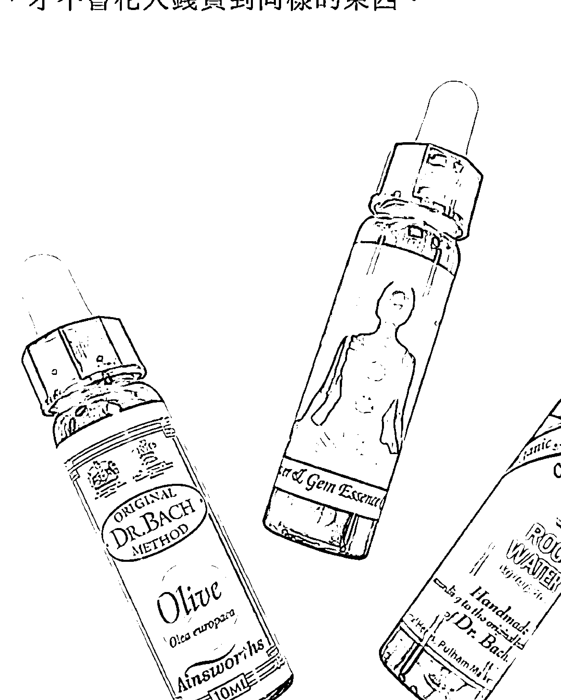

### 市面上常見的各廠牌花精

# # 認識新一代花精

# ## 圖解巴赫花精

目前全世界的花精已有超過七百種，除了植物為主的花精外，各種動物、貝殼、寶石類的精素也因應而生，功效各有所專，如海豚精素、螞蟻精素、老鷹精素、美洲豹精素、青金石精素、黑曜岩精素、珍珠精素等……種類可說五花八門，令人目不暇給。大家都聽過虎頭蜂藥酒吧！本土的台灣花精除了鮮花類花精外，也有出虎頭蜂精素及蜈蚣精素。中國人什麼都往酒裡塞，像是蛇、海馬、鰻魚、中藥材等，都可以浸泡成藥酒，其實國外的動物花精，也是用類似的方法製造出來的，但並不是把整隻動物浸泡在酒中，而是剪一些動物的毛髮或殼代替，或者製作者以手持動物毛髮加以意念引導能量，或者在動物棲息地攝取環境能量製作，如此精素內可以完全不含動物成分。

動物精素的治療效果和中藥一樣，都是由這些動物、昆蟲的特性所推論出來，以中藥蟬蛻為例，蟬蛻是蟬的殼，蟬的特徵為白天叫，晚上不叫，因此中藥用其治小朋友夜啼（夜間哭鬧，因為蟬晚上不叫，吃了這個藥後小朋友晚上便不會哭，故可止夜啼），且蟬的殼光滑，像似光滑的皮膚，因此蟬蛻的另一功用為治療皮膚病。精素的功用，也是以類似的方法推論出來的，中醫是以外觀、哲學性思考去探索藥物的功用，這種看似易經哲學性的藥理學，以往雖被人們所诟病，但在科學的進步下，許多老祖宗經驗也已獲得證

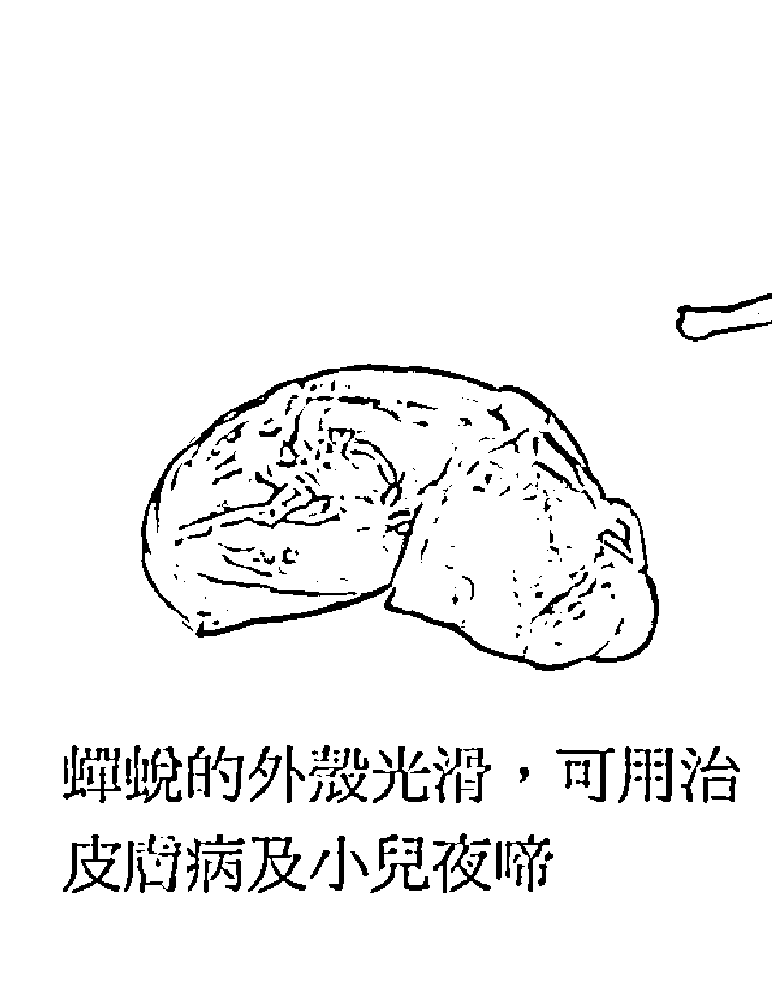

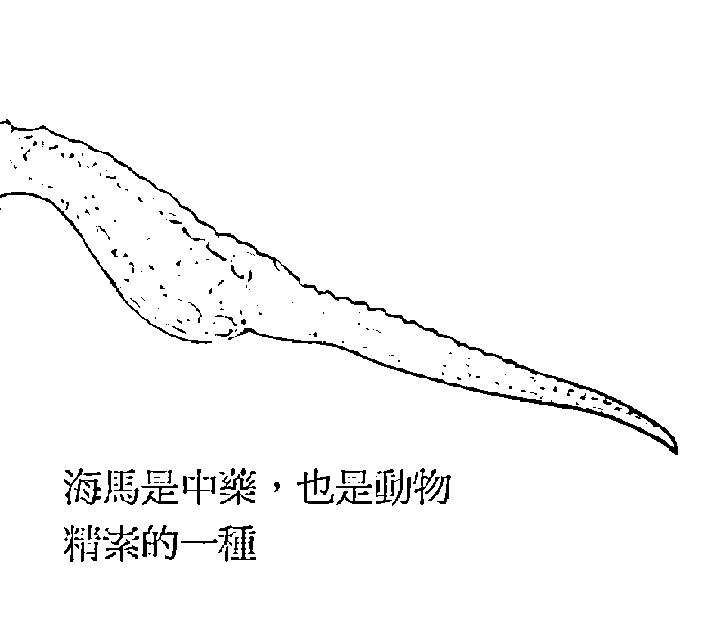

實，讓人們對於中藥的觀念從此刮目相看。花精的種類雖多，但只有三十八種的巴赫花精，對一般人來說是比較好研究的，而且歷史較久的巴赫花精，相關的網路資源、研究資料也較多，對於花精較不普及的地方來說，可以讓使用者安心服用。

清朝名醫葉天士常使用「紫石英」來調補奇經八脈中的衝任二脈，礦石類用藥在中醫相當多，連動物化石如龍骨、龍齒、石燕等也常在開藥處方裡，並大多具有鎮定安神、調補元氣的作用。中醫醫書《溫病條辨》裡曾提及：「燥久傷及肝腎之陰，上盛下虛，晝涼夜熱，或乾咳，或不咳，甚者痙厥者，三甲復脈湯主之、定風珠亦主之、專翕大生膏亦主之」。其中的三甲復脈湯、定風珠，處方裡頭有牡蠣、龜板、鱉甲等中藥材，在動物、貝殼類花精還沒問世前，西方人士對於中藥的煎煮很有意見，覺得很不科學，怎麼連蜈蚣、牡蠣、龜板、海馬、紫石英等都是藥，全部下鍋一起煎煮。

學過中醫的都知道，中藥是取其氣而不取其味，是用氣（即能量）來治病，由於不同的能量有不同的屬性，因此藥物都有不同的經絡歸屬（中醫稱為歸經），如人參入脾、肺經，當歸入心、肝、脾經等。這些中醫術語使用了數千年，但在清末國勢轉弱後，即不被人重視，中醫也就沈寂了一陣子。傳統中醫是用物理的這一部份理論（即氣、能量）來治病，因此特別強調「氣」，這與現今醫學偏重於藥理分析，即著重在化學這部份有很大的差異，如人參含人參皂苷，川芎含川芎嗪，某藥含什麼成份等。許多大陸醫家及老中醫對於這種現象感到憂心，因為太過於將中醫西藥化，反而會把中醫運用能量治療的技術給斷送掉，畢竟宇宙的一切是物理與化學的組合，無法將其分開。古人說物極必反，隨著科技的發展，近年來中醫理論中有關「氣」的這一成份被歐美所認同，並衍生出許多能量儀器及保健方法。花精多元化後，歐美各國對於中藥的認同度提高了，因為他們發現中藥煎煮與各種精素的製法與功用是相似的，都是取其能量來調節人體，均屬於先進的能量醫學一環。拜花精之賜，讓中藥應用又向前一步邁入國際，也洗刷中醫不科學之名。

除了利用礦石、動物來製作精素之外，環境能量也日益受到重視。花精母酊劑製作之時，其實環境能量也會一併被記錄進去，這也是為什麼花精母酊劑一定要在完全純淨無污染之地製作，如果還能有搭配得宜的環境能量，更是絕妙。譬如在蘇格蘭Findhorn靈性生態村出產的芬活花精，就是利用殊勝的環境能量，讓花精效果更上一層樓。至於單純擷取環境能量而未加花朵的能量製劑，就稱為「環境精素」。

近些年來，由於上述各種動物、寶石與環境精素興起，有些花精製造商便把花朵與精素能量複合，形成能量治療花精，並用此來提升人體能量，相較於純植物性花精，這二大類花精區隔如下：

| 花精 | 代表 | 特色 |
|------|------|------|
| 第一代花精 | 巴赫花精、北美花精、澳洲花精 | 純花精，情緒治療 |
| 第二代花精 | Crystal Herbs晶荷花精、蘇格蘭芬活花精 | 花精⊕寶石、動物或環境精素，能量治療 |

### 花精與精油之比較

每次幫新患者貼敷花精時，患者總會誤認為那是具有花香味香香的精油，聞了聞後說：「怎麼沒有味道？」事實上，花精與精油是兩種不同的療法，但由於國內的花精療法尚未普及，國人對於花精仍處於模糊的認識，因此我也只能以「這是鮮花的水藥」來和患者略為說明。

茲將花精與精油比較如下，以方便治療師和個案解說：

| | 精油 ( Essential Oil ) | 花精 ( Flower Essence ) |
| :--- | :--- | :--- |
| 來源 | 植物的任一部份均可用 | 以花為主 |
| 提煉方法 | 採用蒸餾法、壓榨法 | 放在泉水中，經陽光或是爐火，把花的能量釋放出來，儲存到水中 |
| 製劑 | 油劑 | 水劑 |
| 使用方法 | 以外用為主，常以皮膚吸收和嗅覺吸收為主 | 內服、外敷、泡澡均可 |
| 作用機轉 | 運用植物所含精華油的化學成份為主，屬於化學層次治療 | 運用花的「能量頻律」，屬於物理層次治療 |
| 保存期限 | 通常一至八年不等 | 依酒精濃度不同，通常保存5-10年。 |
| 生產成本 | 昂貴：需昂貴器械及大量植物與人力 | 便宜：只需一碗花和簡單廚房器具，採集、製作期間的交通住宿費通常為最大開銷 |
| 安全性 | 用錯可能導致中毒。孕婦、兒童、病患需在專業指導下使用。 | 用錯頂多是效果不彰，不會有任何副作用。任何人皆可使用。 |
| 療法歸類 | 芳香療法 | 花精療法（或順勢療法） |

# Chapter: 1

## 與花相邂

### 花精的治療原理

傳統中醫，運用「辨證論治」的方法來對症下藥，如「血虛」的人，會有疲倦、眼睛酸澀、臉色蒼白、皮膚乾等症狀，給予「補血」的藥，如當歸、雞血藤、龍眼肉等，上述的這些情形便可獲得改善。

體內氣機不順暢者，中醫稱為「氣滯」，容易有胸悶、腹脹、喘息、經痛等症，使用「理氣」的藥，如陳皮、佛手、沈香、檀香等可藥到症除。中醫就是運用這種整體治療的模式來對症下藥以治病，而花精的運用也是如此，同樣都是「對症下花精」，如：

- 自信心不足時，可用「落葉松（Larch）」來提升自信。
- 時感莫名的恐慌，就用可以讓自己安神無懼的「白楊（Aspen）」。
- 對於一切認命，可以服用令人鬥志提升的「野玫瑰（Wild Rose）」。
- 歷經無數的創傷，就用「聖星百合（Star of Bethlehem）」來撫平內心的傷痛。
- 一直陷在過去的回憶，「忍冬（Honeysuckle）」可幫助把過去的恩怨情仇做一釋懷。

花精強調「對治」，就如同中醫重視對證下藥一樣，只要「對證下花精」，都有不錯的效果。巴赫醫師把人類的「基本負面情緒」分為三十八種，每種「基本負面情緒」各有一個對應花精。那這三十八種花精可以治療世間萬種情緒嗎？答案是可以的。我們都知道，自然界的顏色千奇百種，光我們的眼睛可識別的色彩即超過萬種，顏色雖如此多，但均由紅、黃、藍三種基本色共構而成。

當然負面情緒也是，這些「基本負面情緒」複合起來便會構成無數的煩惱，所以運用這三十八種花精組合便可以處理人們所有的心理困擾。在這些花精裡，巴赫醫師曾單次使用過最多的花精為一次開立九種處方，若以數學組合公式來運算，這三十八種花精共有227881003種組合，這麼多的花精組合，對治人們的複雜情緒是綽綽有餘的了。

C₉³⁸ + C₈³⁸ + C₇³⁸ + C₆³⁸ + C₅³⁸ + C₄³⁸ + C₃³⁸ + C₂³⁸ + C₁³⁸ =

人從出生呱呱墜地時，就註定要接受環境的磨難，有時歷經的是陣陣波瀾，有時卻是迎頭痛擊，就看個人的命運造化如何了。孟子曰：「天將降大任於斯人也，必先苦其心志，勞其筋骨，餓其體膚……」天下不如意事雖那麼多，但就如同良藥苦口，遭逢的這些挫折是可以幫助我們成長的，只不過有些人卻會因此而倒下，在心靈深處留下傷痛的刻痕，形成心靈創傷，有時還會引發身心症候群，如失眠、頭痛、月經週期不規則、肥胖等。

巴赫醫師所發明的這三十八種花精，剛好可以協助人們處理這些心靈刻痕，不同的心靈創傷就需要不同的花精組合來撫平，這就如同鑰匙與鎖孔，必須緊密結合才能打開心結。因此契合的花精療方是必須的，巴赫花精雖僅有三十八種，有些花精的功用也很相似，但若未能對症下花精，就會和輸入電腦密碼一樣，即使只差一個小符號也無法進入操作，而有「差之毫釐，失之千里」之憾，這樣是無法幫助患者把心靈的迷惑解除。

為何花精會有療效呢？能量醫學及量子物理學可以提供解答。我們知道，人是由許多系統所組成，如循環系統、消化系統等，若從系統再一直細分下去，則可細分出器官、組織、細胞、分子、原子等，而原子尚不是最基本的單位，因為原子再細分下去又有原子核、電子等，物理學家發現電子的繞行是一整團無形的能量場（氣場）在運作，故可以說，生命的最基本單位是一團能量場，這些無形的氣場便構成世間各種生命，古人說：「氣合而有形」，就是指這個意思。

量子物理學證實萬物皆有能量，醫界對於能量的見解，也由否定轉向研究，2007年七月新英格蘭醫學期刊發表了一篇靈貓預測死期的文章，這種文章在數年前是不可能刊登的，但現在會出現，主要是現今醫界也開始認同能量的觀念，由於可見能量醫療是未來的趨勢。既然生命體由能量組成，當然負面情緒也是，都是屬於氣場的波動，在我們日常生活中，一些用語便可看出端倪，如怒氣衝天、彌漫恐怖氣息、喜氣洋洋等，都代表著情緒與氣（能量）的關係。在《敲醒心靈的能量》一書中，作者羅傑·卡拉漢博士（Dr. Roger J. Callahan）以思維場來解釋情緒，認為情緒是一種能量，而現今的自然療法界也認同情緒是一種波動，因此可用能量檢測儀器檢測出情緒指數。當這個負面的波動出現時，只要找到一個可以與它相抵銷的波動，便可以將這個情緒撫平，這也就是在本節開頭所說的契合，而花精療法便是用來撫平情緒的重要工具，當然找到適合的花精更是其中重要的關鍵了。

由於不同的情緒在腦海中會留下不同的刻痕，歷時愈久的刻痕會在心靈愈深處。隨著歲月的更迭，新舊情緒就如同包心菜般層層疊疊，因此花精的處理就必須像把包心菜剝開一樣層層地處理。若不把這些情緒做妥善釋放，即使當初的情緒已逐漸淡忘，但這些傷痛往事仍會持續地影響著身體機能及心理變化，形成身心症候群，而許多人的疑難雜症往往與這有關。我們從報章媒體中擷取兩則新聞來做分析：

### 新聞案例一

失眠脫衣性慾亢奮，原來是甲狀腺亢進

- **症狀**：38歲已婚女性，突然出現失眠、言談混亂、不斷高聲唱歌，以及性慾亢奮、在眾人面前脫衣服。
- **檢查**：診斷發現甲狀腺機能亢進（從外觀看並無甲狀腺腫大或是眼球突出，而是由血液、內分泌功能等檢查證實為甲亢）。
- **病因**：就醫十多天前，因為丈夫外遇離婚即產生這些症狀。
- **治療**：給予抗甲狀腺素藥物後，兩周後患者情緒恢復平穩。

上述案例的患者，是在遭受外遇的情緒刺激後，引發內分泌臨時失調，醫生抽血檢查時，發現個案的甲狀腺素分泌過高，因此給予抗甲狀腺藥物，以消除其甲亢的情形。在服藥後，患者的失眠、言談混亂、性慾亢奮等情形消失，醫生於是宣稱找到其病因是甲狀腺異常引發。但這就是唯一的治療方法嗎？這就是她的病因嗎？答案是否定的，我們要討論的是，為何這位原本正常的女子，會突然甲狀腺亢進（長期甲亢會造成甲狀腺腫大或是眼球突出，但此個案沒有這個情形，僅是血液、內分泌功能檢查時發現為甲亢，表明她的甲狀腺亢進是臨時性的）。癥結點在於這位患者受到丈夫外遇、離婚的刺激，導致內分泌異常，而甲狀腺只是內分泌異常所誘發的無辜受害者。情緒會引起內分泌異常，這是醫界認定的事實，如失火時，體內腎上腺素分泌瞬間提高，連冰箱也扛得動。新聞中這個患者因甲狀腺臨時異常所產生的失眠、性慾亢奮等症狀，其實只要用花精協助她情緒平穩，自然內分泌就會正常，甲亢的情形也會自動消失，當然這些脫衣、性慾亢奮的失常情形就不會產生，不用藥而病自癒。

### 新聞案例二

頭痛藥吃了20年無效，才發現是憂鬱症作祟。

- **症狀**：台中市一名五十三歲張姓婦人，長期頭痛，檢查不出原因，每天要吃止痛藥十二包以上。
- **診斷**：精神科醫師發現頭痛的病因是長期憂鬱症引起。
- **病因**：多年前結婚，因丈夫花心，有暴力傾向，終日鬱鬱寡歡，二十年前離婚後，獨自撫養十歲女兒，沉重經濟及情緒壓力，讓她沒有喘息空間，形成憂鬱症。
- **治療**：開立抗憂鬱劑處方，頭痛消失，失眠改善。

此案例則是壓力引發自律神經失調，精神科醫師診斷出她的病因是憂鬱症，未開立止痛藥，而是更高竿的給予抗憂鬱處方後，頭痛自動消失，擺脫頭痛醫頭的傳統套藥模式。以上述這兩個案例來說，案例二醫者的治療思緒顯然寬廣許多，他知道情緒會引起這些症狀，因而給予抗憂鬱劑，但對一位花精治療師來說，抗憂鬱劑畢竟要長期服用，且有不小的副作用，花精療法倒可以幫助個案完全療癒。就情緒治療的立場而言，這個患者的憂鬱症是肇因於多年前丈夫花心，對她又暴力相向，在離婚後終日鬱鬱寡歡而成。雖然多年前讓她心碎的情緒已隱約不見，但心靈中創傷卻依舊存在，才會造成今天這種身心症候群的症狀，其實只要能消除其心靈創傷，憂鬱、頭痛的情形也會自動消失，就不用再長期服用抗憂鬱劑了。

上述的這些例子在現今社會中屢見不鮮，但許多人在治療疾病的過程中，往往會忽略了情緒對身體的影響，更不會知道現在的疾病竟和多年前的負面情緒有關，而選擇一般中西醫治療或是精神科門診。面對複雜的身心症，抗憂鬱劑並不是唯一的選擇，花精療法師只要分析其情緒因素，對症使用花精，不僅可以快速消除其困擾已久的煩惱，也沒有抗憂鬱藥物的副作用，對病患而言，也算是一種福音。

史書記載，大禹治水時，採用疏通的方式，將水陸陸續續排出，最後治好水災。而其父親鯀治水失敗的原因，就在於他採用圍堵的方法，使得水一直淹沒各村落。情緒的治療，就如同大禹治水一樣，必須採用疏導的模式，一層一層地將負面情緒排除，花精療法就是幫助個案將心海中的髒東西疏導出去，這和現今主流心理學慣用鎮定劑來壓抑情緒是不同的，因為壓抑的後果，將使得負面情緒愈積愈多，這也是為什麼大部份的個案在服用抗焦慮藥物後愈來愈嚴重，當然形成身心症候群的人也不少，就看醫界如何思考這個問題了。

### 身心症候群解析

根據美國衛生署統計，美國就業人口中，至醫院求診者有70~90%的人是由壓力引發，而美國壓力學會統計的資料更指出，美國每天有一百萬上班族，因壓力而請假，損失金額高達每年60億美元。在歐洲，亦有同樣的狀況，歐盟統計，一半以上的員工請假是因壓力症候群，可以說壓力與心理疾病是二十一世紀企業的頭號敵人。在國內，中央健保局最新的統計，情緒性疾病已列入國人二十大疾病之中，而許多和情緒有關的病症如高血壓、下背痛、心臟病、精神分裂症等，也都名列前茅，可以說，情緒問題不光是單純的疾病，而是牽一髮而動全身的身心症候群問題。

身心症候群這個名詞由來已久，但人們常著墨在多少病是從心理因素所引發，如壓力大容易造成腸胃潰瘍，生氣的人血壓易偏高，但卻鮮少有專書去探討如何從情緒面去協助身體機能的提升，進而消除疾病。人的身心靈是一體的，情緒會影響我們的身體健康及膚質變化，在中醫早有記載，中醫是最早把情緒與五臟六腑疾病相連的醫學，如暴怒傷肝，肝主怒，肺主悲等論述。而現今醫界也已證實，負面情緒會影響我們的神經系統及內分泌系統，所以國外的醫學院裡有教授「情緒神經免疫內分泌學」，就是要告訴我們，除了一些急性感染、意外受傷等疾病外，許多病痛都和情緒失衡有關，即使是學齡孩童常見的脊椎側彎也和緊張所造成的肌肉緊繃有關。除此之外，困擾現代人的另一個文明病「慢性疼痛」也和情緒有關，電視廣告中止痛錠銷售量逐日攀升，甚至連加強錠也問世，足見現代人的疼痛有增加的趨勢，值得玩味的是許多人的疼痛卻在服用抗焦慮劑後獲得明顯改善，這是因為憂鬱的情緒會導致體內血清素、腎上腺素等神經傳導物質異常，因而變得對疼痛特別敏感。醫界也證實有些人全身到處痠痛，在服用抗焦慮劑等藥物讓情緒平穩後，和疼痛有關的神經傳導物質自會正常，無怪乎可以消除疼痛。

中醫聖經《黃帝內經》曾提及：「心者，君主之官，神明出焉，主明則下安，主不明則十二官危」，中醫的「心」，指的是腦部的所有功能，當然也包含情緒調節。我們都知道，神經系統源自於腦，而內分泌系統的源頭：下視丘及腦下垂體，亦在腦部。所以中醫的「心」正常，即代表腦部的運作正常，則身體的神經系統及內分泌系統即會平穩，因此中醫才會把腦的思維運作當作君主。當君主正常時，則身體機能自然正常，為何情緒會如此影響生理呢？就情緒生理而言，負面的情緒，會影響到腦部的邊緣系統，進而影響到下視丘，而下視丘是自律神經系統的核心。因此，壞的情緒便會藉由這個管道而影響到我們的自律神經，造成自律神經失調，而憂鬱症患者幾乎等於自律神經失調。

近年來，科學家也運用正子造影術（PET）研究發現，有些負面情緒如強迫症患者，其基底核的新陳代謝率特別旺盛，比正常人高出許多，因而影響本身對衝動的控制，而產生強迫症，足證情緒與生理的變化。

日常生活中，有人一生氣，便血壓升高。當感到恐懼時，便不由自主發抖、流手汗。當工作壓力過大時，腎上腺分泌便受到影響，因而導致失眠，黑斑、褐斑。上述生氣、恐懼、壓力都是負面情緒，都會導致身體變化。另一方面，由於下視丘是內分泌的源頭，當負面情緒影響到下視丘時，便有一些惱人的膚質變差、肥胖等內分泌失衡問題，可以說「情緒是美麗的最大殺手」。古人說：「心病還須心藥醫」，這也是為何巴赫醫師發現，只要情緒處理好，身體疾病自可療癒。所以翻開巴赫醫師的醫案，不難發現從青春痘、便秘、到癌症的治療，巴赫花精都能幫得上忙，而花精的治療心法，就是這麼自然簡單。

### 自律神經

1.  腎上腺髓質增加分泌腎上腺素。
2.  促進交感神經系統的活性，同時抑制副交感神經系統。

### 內分泌

1.  腎上腺皮質分泌Cortisol。
2.  腦下垂體系統大量分泌腦內啡、泌乳激素、升糖素、升壓素。
3.  抑制分泌胰島素、生長激素、LH、FSH。

身心症候群是現代人常見的文明病，可說是一種身心互相影響的疾病，但主要是以心理影響生理佔了絕大多數。有些患者的頭痛、胸悶、失眠、氣喘等症狀，常用現今醫學檢驗無法偵測出任何病因時，就要懷疑是否為身心症了。在我的臨床經驗中，這樣的例子屢見不鮮，我曾治癒一位因環境不適應引發長期頭痛的小妹妹，電腦斷層CT及腦波各項檢查均無法查出病因，用中藥搭配情緒分析及花精調治數週後，頭痛症狀便消失，印證了古人所說的「病由心生」這個論述。不過要特別強調的是，花精療法對於身心症候群的患者有幫助，這並不是說花精可以治療下列的這些病，而是當和疾病有關的情緒消失時，疾病自會不見，使用者在使用時，切勿強調用花精可以治療何病，以免違反相關法規。茲將臨床常見的身心症分述如下：

### 常見內分泌失調

| 情緒壓力引發內分泌異常 | 內分泌異常後的症狀 |
| :--- | :--- |
| ◎腎上腺皮質分泌cortisol。 ◎腦下垂體系統大量分泌腦內啡、泌乳激素、升糖素、升壓素。 ◎抑制分泌：胰島素、生長激素、LH、FSH。 | 1.多巴胺及血清素改變：憂鬱症／焦慮症 2.腦細胞萎縮：阿茲海默症、健忘 3.為因應緊急狀況，胃口增加，肌肉分解加速，增加脂肪屯積：肥胖症（上腹部，壓力愈大愈容易胖） 4.血壓升高：心臟疾病 5.血糖濃度升高：糖尿病 6.升糖素升高：血糖升高、脂肪酸增加 7.睪固酮與女性賀爾蒙濃度降低：不孕、性無能、性冷感 8.免疫細胞受到抑制：容易感冒、感染 9.加速骨質崩解：骨質疏鬆症 10.泌乳激素分泌：未懷孕即分泌乳汁、導致不孕 11.抑制分泌胰島素：血糖升高 12.抑制分泌生長激素：小朋友長不高 13.抑制分泌LH、FSH：造成不孕、女性第二性徵不明顯，平胸 14.其他內分泌腺體異常 |

### 常見自律神經失調

- **頭**：頭痛、頭暈、頭皮發麻感。
- **眼**：眼睛酸澀、眼睛疲勞、時常流眼淚、視物模糊。
- **耳**：耳鳴、耳中有阻塞感。
- **喉嚨**：咽中有異物阻塞感（中醫稱梅核氣）。
- **皮膚**：流手汗、多汗、無汗、皮膚容易乾燥、全身發癢、畏寒、自覺發冷感或燥熱感。
- **心臟循環**：心悸、胸悶、胸部有壓迫感、緊張時容易手腳冰冷、血壓容易起伏。
- **呼吸器官**：呼吸困難、不由自主地想深呼吸或是嘆氣（中醫稱為善太息）。
- **消化器官**：食慾不佳、噁心、嘔吐、腹脹、腹痛、便秘或是腹瀉交作。
- **泌尿生殖**：頻尿、殘尿感、早洩、女性陰道乾澀（害怕性行為）、月經週期不規則。
- **肌肉關節**：頸部及肩膀緊繃痠痛、全身肌肉容易僵緊疼痛、肌肉不自主跳動。
- **精神症狀**：失眠、淺眠或多夢、白天容易賴床、全身倦怠。

**轉化症**：常表現為感覺及運動系統方面的異常，如突然失明、耳聾、癱瘓、抽搐、不能說話等。患者的異常狀況經過臨床檢查卻大多正常，但在病發前一定有情緒起伏的情形。如電視劇中演的「看到鬼後，兩腳發軟，說不出話，或聽到惡耗後便呆坐在椅子上無法起身」，都是屬於這一種。我曾治癒一阿嬤因跌倒後而呆若木雞，經花精治療（以聖星百合花精為主）後即恢復往日風采，家屬都詫異療效能如此迅速，善用花精，除了可以幫助別人外，也可創造無數功德。

### 疾病的靈性意義

每個人都不願意生病，但當生病時，您有想過為何會這樣呢？一個人在車上裝了警報器，當有小偷來偷東西時，警報器便會大響。有天，警報器響了，車主卻抱怨很吵，無法睡覺。隔天，警報器又響了，車主除了抱怨外，還計畫買個耳塞來塞，並和家人討論要把家中的窗戶換成隔音氣密鋁門窗，這樣比較不會那麼吵。看了上面這個笑話，讀者都會清楚，只要把小偷抓走，警報器就不會響了，若不去思索小偷的問題，反而追尋耳塞、隔音窗，甚或抱怨等本末倒置的做法，將永遠無法獲得解脫，而持續沈陷在痛苦的深淵中。

本末倒置的行為在現今醫療環境中，佔了絕大多數，這也是健保龐大醫療開支的地方。如一個人因個性較急，因此吃東西過快，久了便傷害到腸胃，造成十二指腸潰瘍、胃潰瘍。這樣的患者，除了服用中、西藥外，還會去照胃鏡、全身健檢、嚴重者甚至還要開刀，這些都是常規的醫病公式，但鮮少有人去思索為何自己會得十二指腸潰瘍？若個案不懂得放鬆自己，不去改變自己的行為及情緒，反而到處去醫院診斷治療，將是緣木求魚，自尋痛苦的作法。

巴赫醫師曾說：「疾病雖然殘酷，本身卻是仁慈而和善的，如果我們能正確的解讀，它將能指引我們看出缺點本質所在……」。巴赫醫師在多年前，便一語道破疾病的靈性意義，因為疾病雖然造成人的痛苦，但它卻是仁慈地提醒我們，身體有些缺失，叫我們注意，故人身上的警報器「疾病」便產生，如前面所提的內分泌失調及自律神經失調症狀，即屬於人體的天然警報器。可是在西醫對抗療法的思考模式下，現代人一有風吹草動，便馬上到醫院做對抗治療，腹瀉，便給止瀉劑；咳嗽，便吃止咳藥；過敏，便用抗組織胺藥，種種的對抗治療，就是急著把「警報器」關掉，但歐美各國已發現這樣的療法將導致更大的問題，這也是為何各先進的醫療國家如德國、法國等有將近五成的患者寧願捨棄西醫，尋找自然療法的原因。古人知曉這個道理，因此善於養生者在生病時常會透過閉關、靜坐等方法來消除疾病，而生活在現代的我們，很少有人知道如何內省，如何發現自己的問題所在？而且內省的功夫並不是那麼容易做到，此時花精就是那個協助我們內省的好工具，藉由對應花精的服用，讓我們知道情緒異常處，便可帶領我們消弭自身的缺點，讓身心靈更趨完美，疾病自會不藥而癒，這也是為什麼花精可以緩解疾病的作用機轉。

黃帝內經：「聖人不治已病治未病，不治已亂治未亂，此之謂也。夫病已成而後藥之，亂已成而後治之，譬尤渴而穿井，鬥而鑄錐，不亦晚乎」。數千年前的中國人，就已提出這種上工治未病的理念，雖說人們生病後，去思索疾病的原因，可以幫助緩解，但卻得承受一陣子的身心症候群折磨，這就是「下工治已病」，而我們又何必讓自己這樣呢？當我們懂得花精療法，在思索每一個花精的正面意義時，先進而內省自己，改正自己的缺點，如此便不會產生負面情緒，也就不會有自律神經及內分泌失調的疾病產生，如此便可達到卻病延年的預防醫學境界，而這也就是花精療法的「上工治未病」精神。

# 巴赫花精能為我們做些什麼

巴赫花精在世界各國應用已超過八十年，不論是巴赫醫師的醫案或眾多療法師的經驗，花精可以處理身心靈的問題。但花精到底有那些方面的應用呢？在我這些年的臨床應用上，可把花精常見功用分為下列數種：

### 憂鬱、失眠的救星

繼癌症、愛滋病之後，憂鬱症已成為本世紀三大疾病之一。根據世界衛生組織（WHO）的研究發現，平均每一百人中就有三人罹患憂鬱症。在日本，憂鬱症可以說是國民病，平均每五人就有一人有憂鬱症，因此憂鬱症在日本有「心靈感冒」之稱。台灣憂鬱症患者雖無日本多，但根據統計目前全台約有300萬人深受憂鬱症所苦。而國、高中生重度憂鬱盛行率也逐年提高，嚴重性到了教育部決定自2007年起針對大專校院新生，進行憂鬱症的問卷篩選。

依門診經驗發現，憂鬱症不光只是影響患者個人，也會深深的干擾到家人、周遭親友，可以說是一人病，全家病，造成社會成本負擔加重。而在失眠方面，行政院主計處2006年8月統計顯示台灣地區15歲以上人口中，就有550萬人有失眠問題，因此坊間各種幫助睡眠的寢具、音樂、SPA大行其道。而各大醫院如台大、長庚醫院的睡眠中心床位供不應求，足見失眠的嚴重性。

其實不論是憂鬱或失眠，都有一個心靈療癒點，如擔心功課、失戀、憂慮家人、亂猜疑等，一般的用藥如安眠藥、鎮定劑、抗焦慮劑等雖可強制性助眠，但卻無法消除這些情緒因素，久服還會愈吃愈嚴重，也從來沒有聽過有人吃抗憂鬱劑吃好的。而善用三十八種巴赫花精卻可以幫助個案做情緒調整，把心中的心結打開，就可以獲得不錯的成果。如過度擔憂親人引起的失眠，用「白栗」、「紅栗」花精對治即有幫助，而「馬鞭草」、「龍芽草」花精對壓力釋放一向效果不錯，可參看書內所附的案例。

### 預防自殺的發生

每天打開報章媒體，社會新聞中自殺報導總是不停地放送，光以台北市為例，平均每天就有約1.3人自殺身亡。世界衛生組織也預測，到了2020年，全球十大死因中，自殺將排名第九位。隨著物質生活不斷提升，居處環境改善，看似富裕的人生，心靈卻日漸空虛，許多人長期累積情緒壓力，最後卻選擇走上自殺一途，都是因為負面情緒抵銷了自我對生命延續的價值感，如演藝圈中有人因憂鬱症跳樓自殺，張國榮、倪敏然各有心結而結束自己的生命。生命是可貴的，連螞蟻掉入水中都會努力掙扎，更何況是萬物之靈的人類呢？只是這些悲劇真的無法事先預防嗎？其實不然，在生命關頭前，只要我們適時伸出援手，善用「荊豆」、「櫻桃李」、「野玫瑰」等花精便可挽回一條生命。關懷是很重要的，經過統計，最低的自殺死亡率是在春節與家人團聚期間，所以關心是可以降低自殺，一瓶小小的花精，或許就是讓周邊好友繼續延續生命的熱飲。

### 緩和情緒

現在的網路社會，大家都以十倍速在過生活，情緒也跟著緊繃，火氣超大，有時一點小小的衝突也會衍生社會新聞。看到政治人物脫序演出，貪污腐敗，毫無公理正義，雖然心生憤怒，但也不要因此而傷了自己的身心，用「馬鞭草」、「山毛櫸」花精可瞬間讓現階段心情放鬆。失戀時，萬種思緒湧上心頭，服用「冬青」、「忍冬」、「落葉松」花精可以讓我們釋懷，重新迎向新的未來，勝過唱無數遍伍佰的浪人情歌。家中小孩考試壓力大時，可用「白楊」、「岩玫瑰」、「急救花精」來降低學子恐慌，考試比較不會失常，可獲得較好的成績。只要對症下花精，生活可以過得更美好、更自在，擁有最佳的情緒組合。

### 增進親子關係

門診時，看診的小朋友總會目不轉睛地盯著我在調配花精，孩童對於瓶瓶罐罐一向很有興趣，尤其是在電影哈利波特之後，調配花精就像是在魔法學校上實習課般有趣，花精的調配需要許多的器材，孩童就喜歡這種類似魔法課調配的感覺。網路時代，和親子間溝通的語言愈來愈少，而花精調配倒是增進親子關係的好方法，讓您跟您的孩子之間，增加另一種互動的管道。

### 提高孩童專注力

根據統計，每五個男孩就有一位被診斷為注意力不足或過動障礙症，影響孩童的學習能力，當然也累壞了父母。在接觸一些學校老師後，才發現這些年來學校特教班的數目一直在增加，因為被診斷為ADD/ADHD（attention deficit/hyperactivity disorder注意力不足／過動障礙症）的個案確實變多。花精對於注意力提升效果不錯，臨床上我常運用「胡桃」、「鐵線蓮」、「栗樹芽苞」、「石楠」花精來幫助小朋友注意力集中，父母反映成績確有進步，寫功課的速度也加快，而且對話的詞彙也進步不少，沒想到小小的花精，竟也有聰明效果。

### 改善自身習性

每個人都有自身習性，常見患者因患有強迫症，不停的洗手；有人因自信心不足，怕自己做的不好，終日鎖在家中變得像自閉；不懂得拒絕別人的患者，常被別人當作奴婢般使喚，而顯得疲倦乏力。其實自身的習性都可以用負面情緒來解釋，只要用花精將負面情緒溶解，自能塑造完美的習性。像強迫症患者，我常用「野酸蘋果」來幫忙；信心不足的人，「落葉松」可以讓我們勇敢地走出去；而不好意思拒絕的人，「矢車菊」可以讓我們勇敢地說不，對自己更好。改善自身習性，用花精是可輕易達到的，您也想讓自己脫胎換骨嗎？試試花精吧！

### 加強醫學美容效果

有些人每天在辦公室中忙碌，皮膚卻日漸暗沈，有人解釋是日光燈的照射所致。但根據研究，發現情緒不穩定，會刺激黑色素分泌，才是導致皮膚變暗的幕後黑手。新聞也報載一名妙齡女子因壓力太大，頭皮猛冒痘，結果竟變成禿頭！而周遭親朋好友，最常見的是壓力太大，便藉由吃東西來發洩，結果造成體重走樣。近來醫學美容如雨後春筍般發展，我之前在中壢的門診，也有附設中醫醫學美容部門，來診者不少。但一般醫學美容大都著重在身體的保養處理，而較少談論到情緒影響。負面情緒是會影響我們的整體美，並造成內分泌失衡、失眠、癮癖等病症，而花精療法可以消除負面情緒，對醫學美容效果有加成作用。如運用「龍芽草」花精，可以消除壓力性嗜吃；「野酸蘋果」花精可以讓我們接納自己的身材，不會過度挑剔；「溝酸漿」、「落葉松」花精則可以讓我們對身材有信心。

### 痠痛療法的新選擇

我對於痠痛的治療一向很有興趣，因為家人常有痠痛的問題。為了治療痠痛，曾學習了AMCT、彩光針灸疼痛療法、肌內效貼布、正骨手法，皮內針、耳針、遠絡療法、河洛神針等，有時效果卓著，但有時卻成效不彰。在參考李穎哲醫師的花精外敷後，發現花精治療對於現代人常見的痠痛效果並不亞於傳統治療。歸納原因，乃許多的疼痛是情緒壓力所引發，造成血清素、腎上腺素等神經傳導物質異常，故對疼痛特別敏感。比如說在證券市場的營業員、竹科的工程師、擔心家人的父母，都是痠痛的好發一族。以肩膀疼痛為例，根據花精反射區貼上「橄欖」花精，對止痛有幫助，且有提神的作用，臨床上當患者主訴肩膀痠痛時，貼上「橄欖」花精大多有很好的回應。而最簡單的用法是使用「急救花精乳霜」，因為這個乳霜外塗對於疼痛也有意想不到的效果。

### 體貼您的寵物

看到新聞畫面，一隻鸚鵡因得了憂鬱症而每天拔自己的毛，才幾天的光景便成了禿鷹。其實，任何生命體都有情緒，當然寵物也會有情緒，如有些小狗會為了爭寵而亂破壞東西，就是希望引起家人的注意。動物的情緒治療和人類一樣，都是對症下花精，曾經剖腹生產的狗，可用「聖星百合」幫助牠；喜歡翻垃圾桶，怎麼教也學不會，可用「栗樹芽苞」來幫助學習；而「急救花精」對於動物與植物大小毛病是不錯的通用方喔。

### 因應健保困境

全民健保調整，影響著醫師及民眾。根據天下雜誌專刊，英國的健保給付下，醫師必須早上看診，下午開計程車方能生存。而健保點值下降，醫師每診給付人數下降；大陸人士預期來台執業，僧多粥少；中醫可能列入附加保等，都使得醫師的金飯碗受到衝擊。因此身為醫師若會花精療法，將可多一項謀生技能。其實我們可以發現許多疾病是身心症候群的問題，只要善用花精，便可以處理許多原本須門診的症狀，不僅可為健保局省下大筆預算，對民眾而言，也能節省醫療支出。而未來的醫學趨勢，強調自然療法與非侵入式治療，以及全人治療。現今醫療方法裡，能同時兼顧身心靈治療的並不多，而花精就是其中一種，也因此花精療法在世界各國日漸普及起來。中南美洲，由於花精療法方便、便宜、且效果卓著，已有部份國家將花精療法列為健保給付項目。因此推廣花精，不僅可因應健保困境，也符合巴赫醫師的理想：每個人都能成為醫治自己的醫師。

## Chapter 3

### 圖像記憶 與 7 大類花精

### 如何應用圖像記憶法

### 快樂輕鬆的學習，來自圖像記憶

圖像記憶法就是快速記憶法，是運用右腦的整體記憶，來強化文字記憶的不足。人體左右腦都掌管記憶，左腦負責的是短期記憶及文字、邏輯的記憶，右腦則負責長期記憶及圖像、感覺的記憶，如同我們看到一座遠山，會依稀記得山的輪廓，這就是右腦的功能。圖像記憶法就是大量發揮右腦的功用，將原本難記或容易忘的資訊快速領悟，過目不忘，應用這個記憶法時若能有天馬行空的想像力，將可以獲得更佳的效果，想像力很重要，一些令人捧腹大笑的圖像，可以讓我們記得更牢、記得更久。

這種記憶法究竟有多好用呢？舉例來說，巴赫花精的七大分類中，有一類為孤獨類花精：這類花精共有「石楠」、「鳳仙花」、「水堇」三種花精。若我們用純文字在腦海中記憶時，會佔四個記憶空間，分別為：1.孤獨類花精、2.石楠、3.鳳仙花、4.水堇。不僅須花時間背誦這四個物件，即使勉強記下，卻無法記得牢，時間一久，這四個物件會與別的物件（如不同的花精）混淆，造成回憶的困擾，而形成錯誤資訊。當我們運用圖像記憶法時，只須記一個圖形，所以在腦中僅佔一個記憶空間，這樣不僅記憶快速，且回憶清晰，即使一個月後再回想仍可說出正確的答案。如右頁圖，一座名叫孤獨山的山頂，站著一隻鳳凰，山的兩側有水晶及南瓜。花個一兩秒記住這個圖形，孤獨山即代表「孤獨」、鳳凰即代表「鳳仙花」，水晶代表「水堇」，南瓜代表「石楠」。以後若想到孤獨類花精，腦中的路徑便會自動出現這個圖，而三種花精便可以不費力的背誦出來了。

三十八種花精，若用純背誦的方式記憶會很辛苦，當然看久了也會記得起來，只不過曠時日久，且容易遺忘，而運用圖像記憶法，將可幫助讀者快速且長久的記憶，迅速理解巴赫花精，尤其適合在現今一寸光陰一寸金的時代。

### 巴赫花精7大分類解說

之前在花精發現的心路歷程中，有提到巴赫醫師發明七種腸道細菌藥物，就是針對七大類性情的病人。因此他將所發現的三十八種花精，歸納為七大類，方便臨床選擇花精時使用，這樣的分類有何好處呢？

運用七大類可以幫助花精療法師快速找到適合的花精，如當個案總是孤單一個人時，我們便可直接想到孤獨類的花精，並從患者的情緒分析其到底適合石楠、鳳仙花、水堇花精？而當一個感到恐慌的個案來時，我們可以從恐懼類的五個花精中挑選出適合他的花精。因此，熟悉七大分類法是可以幫助我們快速找到個案所需要的花精。七大類花精囊括三十八種巴赫花精，讀者若採用文字強記的話，可能會費時且容易混淆，可以試試下列的圖像記憶，不需多少時間便可讓您銘記於心。

#### 孤獨類

#### 恐懼類

#### 對外界及他人想法過於敏感類

#### 對他人的安康過度關心類

#### 不確定類

#### 對現實興趣缺缺類

#### 沮喪絕望類

## Chapter 4

### 深入了解 38種花精

#### 龍芽草

##### 花精檔案

- 拉丁學名 | Agrimonia eupatoria
- 別名 | 龍牙草
- 七大分類 | 對外界及他人想法過於敏感類
- 製作法 | 日照
- 關鍵字 | 強顏歡笑
- 正面特質 | 平靜

##### 巴赫醫師的敘述

平易近人、歡樂幽默的人，熱愛和平，不喜爭執，為了避免爭執，他們會大幅退讓。雖然他們通常懷有困擾，受折磨，身心憂慮不安，他們還是把心事隱藏在幽默逗趣之下，因此被視為值得認識的好朋友。為了刺激自己和強顏歡笑，他們經常飲酒或用藥過量。

> ——出自《The Twelve Healers and Other Remedies》

- 弱點：不安
- 美德：平靜

你是否受煩惱所苦；靈魂不安；找不到平靜，然而勇敢的面對世界，在同儕面前隱藏自己的折磨：你大笑、你微笑、你開玩笑，在你受苦時，還幫助身邊的人保持喜悅的心。你是否藉由喝酒或用藥來紓緩悲傷，以幫助自己面對磨難？你是否感覺在生活中必須要有刺激物，好讓自己繼續前進？

若是如此，這在小徑邊或田野生長的美麗植物龍芽草，有著教堂尖塔般的形狀，種籽像鐘一樣，會帶給你平靜，「出人意外的理解」那種平靜。這種植物教你在所有苦難逆境中保有平靜，直到沒人有辦法煩擾到你。

> ——出自《Free Thyself》## 龍芽草 VS 中醫觀點

## 圖解巴赫花精

教育部和國科會的大規模調查發現，超過六成的學生，會為了紓解壓力而大吃大喝。近幾年演藝界最轟動的新聞就是許多藝人因吸毒問題而遭受勒戒，不但丟了主持或戲劇工作，也害得他們差點失去大好的前程。暴飲暴食、吸毒、酗酒，只是單純的行為問題嗎？深入分析，這些舉動和情緒有著密不可分的關聯性。巴赫花精的第一個花精龍芽草，對於這樣的情形就有很好的預防作用，因為龍芽草主要是應用在「內外不平衡」上。

中醫及《易經》喜歡用陰陽來解釋一切，所以龍芽草也可說是治療「陰陽不平衡」的花精，它能讓我們勇敢面對內心問題，不逃避。那什麼是「內外不平衡」呢？就是自我相對矛盾的狀態，如有人白天是好好先生，晚上卻苦惱失眠；或在老闆面前頻頻說是，但心裡頭卻滿腹牢騷的人，這樣的情形都屬於龍芽草的「內外不平衡」狀態。

所以運用此花精的辨證要點在：

- 會用強顏歡笑、藥物、飲食或特殊習慣來掩飾內心的一切。
- 內心苦悶，卻還扮開心果去逗別人開心。
- 常保微笑，外表看似快樂，但內心痛苦。
- 睡覺時會磨牙、咬指甲、拉頭髮。
- 常抱著忍一時，風平浪靜的想法。
- 愛面子，愛三五朋友聚會。
- 失眠。

##### 龍芽草 × 情緒與思緒

龍芽草情緒的人，喜歡處在祥和的氣氛中，寧可委屈求全也不願意跟別人有任何爭執。他們不喜歡朋友知道他的心事，即使處境很糟糕，別人如何問也不會把心底事顯露出來，常以「我也不知道怎麼說」、「沒什麼事啦」等話來一語帶過，或是一笑置之迅速把話題轉開，會這樣做，就是害怕別人洞悉他的內心。但是內心的壓力始終存在，為了要掩飾壓力，他們喜歡找朋友聚會、串串門子來暫時忘記自己內心的煩惱，有時還會扮演小丑的角色，逗大家開心，和朋友談笑風生，說話幽默又有趣，所以龍芽草狀態的人可說人緣相當好。但是回到家後，苦悶的思緒又會再度湧上心頭，有人會因此而失眠，並有咬指甲、拉自己的頭髮、或睡覺時磨牙的情形產生。有些人則會藉由抽菸、酗酒、吃東西來發洩，而最糟糕的，則是沉迷在吸毒的惡習中。

在現今強調包裝的社會裡，龍芽草思緒存在於您我周圍。進入百貨公司，服務人員深深的一鞠躬，笑臉迎人，但她們的內心真的是如此快樂嗎？隨著人際關係日趨複雜，業務往來頻繁，人們常常會做到自己不想做卻又必須從事的工作或應酬。如下班後上司要求一起聚會，明明不想去卻又怕得罪長官，誤了自己升遷，只得裝個笑臉做陪客。演藝人員也是，為了在觀眾面前拚收視或排名，即使上綜藝節目被整也是用笑容來回應，日子久了這樣的內外不平衡指數不斷地攀升，便會想用某些習慣或上癮症來掩飾內心的焦慮與不滿，而尋找替代品如毒品、酗酒來麻痺自己就是最直接的一種。而在平時門診中，我遇到更多的是像暴飲暴食、抽菸等上癮症來紓解壓力，而這也是一般人常會碰到的。

##### 花精運用

診所裡有做減肥門診，我總會加上壓力諮詢。我們知道塑身三大基本要素：吃得少、排得多、代謝快，因此吃多吃少會和體重有正比關係，遇到想減重的患者，我總會問到「最近胃口好嗎？會不會因為壓力大而特別想吃東西呢？」而居然有將近一半的減重個案答案是yes。這一類的患者便是屬於龍芽草情緒，其肥胖大多是因為吃太多所致。雖然運用耳針刺激「飢渴點」及「耳神門穴」對於食慾控制很有幫助，但面對這種因壓力而暴飲暴食的個案，耳針幫助卻不大，此時龍芽草就是很好的小幫手了，它可以協助我們紓解內心的壓力，自然就不會「過量進食」。習慣上我常用龍芽草外貼在手部的神門穴，對於因壓力而肥胖、失眠、小朋友夜間磨牙等會有不錯的效果。

花精運用的良窳，和推理有很大的關係，因此只要遇到有「內外不平衡」的情形便可使用龍芽草花精，列舉一些範例供讀者參考：

- 外表看起來很樂觀地承受病痛或心靈折磨患者。
- 皮膚起疹但仍笑容滿面的baby。
- 生病了依舊和朋友、醫師談笑風生的個案。
- 有些人皮膚病起疹，但在衣服外部位無起疹，僅在衣服遮蔽處才有皮疹。

這個花精對於紓壓會有幫助，但有一點要提醒的是，龍芽草狀態的人有時在服用這個花精後會有焦躁的情形產生，讓一些個案不敢繼續服用。這是因為原本風平浪靜的生活，突然會因過去隱藏的問題掀撥開來而造成波濤洶湧的局勢，其實這是一個好現象，畢竟壓力最終還是要紓解開來的，因為情緒如同洪水，要用大禹治水的疏導方式一步步釋出，否則累積久了，總有火山爆發的一天。若要預防服用後的焦躁情形產生，治療師可加用櫻桃李或岩玫瑰花精，會讓焦躁不安的感覺慢慢釋放，患者會比較舒服。在臨床使用中，我常配合運用彩光針灸等能量療法來幫助患者安適地渡過情緒焦躁期。而氣功、生活作息調養、靜坐修行、爬山等方式，也是協助個案早日突破這個過渡期的重要心法，我個人倒很建議爬山，因為山上的磁場會把我們身上的負面情緒吸走，身心靈會更寧靜平和。由於一些龍芽草狀態的人在服用此花精後心情會變的焦躁不安，所以依據同類療法的原則，龍芽草花精可也用來處理疾病所導致的慌張不安、焦躁現象，讀者倒是可以參考應用。

大多數龍芽草狀態的人曾經成長於嚴格禮教約束的團體或保守社會裡，所以很難將心中真實的感受表達出來，只是一味的忍讓，日久便產生內外不平衡的情緒。巧妙運用龍芽草這個處方，將可以幫助我們勇敢地面對內心的問題，不再當個暗自啜泣的小丑，對現今看重包裝的社會而言，可說是協助我們放鬆的一個良方。

##### 李醫師診間案例探討

劉小弟，因鼻子過敏來診，初次見到他時，臉色暗沈，不發一語，即使是他一些問題，也僅「嗯、嗯」地回答，患者除了有過敏症狀外，也有黑眼圈。媽媽告訴我說，劉小弟平時在家還有咬指甲的習慣，我看著他的雙手，指甲確實咬得像鋸齒一般，也因此有一段時間都沒有用過指甲刀修剪過。一般醫者及家長並不太曉得這和內心的壓力有關，但由花精的分析，咬指甲大多是內心苦悶的一種情緒發洩，小小年紀的他不知有何壓力？

我依據劉小弟的情形選用龍芽草、荊豆花精外敷於手部的「神門穴」，並開立鼻過敏處方。數次門診後，鼻子過敏症狀減緩，個性也快樂開朗許多，門診時還不時露出陽光般燦爛的笑容，成績進步不少，偶而還會和我說些飼養楓葉鼠的事，尤令媽媽高興的是，劉小弟不再咬指甲，媽媽說：「經過那麼多年，總算有指甲可以讓做媽媽的幫忙剪了」，原來小小龍芽草，也有大大的作用。

#### 龍芽草

運用此花精可幫助釋放其內心的壓力，尤其是沈悶不願透露心事的人，劉小弟在壓力釋放後，個性變得較快樂、開朗，也不再因內心壓抑而咬指甲。

## 萵豆

有黑眼圈的患者，大多心情較沈悶，此花精可讓個案更開朗，變得更快樂。臨床上我遇一些過敏性鼻炎的患者，尤其是流鼻水色透明的個案，常會用這個花精輔助，在能量層次上對於協助個案陽氣提升頗有助益。

神門穴是花精貼敷的通用穴，屬於十二經絡裡手少陰心經的原穴，心經主管全身情緒，因此貼敷神門穴可起著情緒調節作用。

##### 相似花精區辨及補充說明

| 分类 | 花精 | 描述 | 备注 |
|------|------|------|------|
| 害怕獨處 | 龍芽草 | 隱藏自己的痛苦 | 需要嗜吃、飲酒或藥物來緩和精神上的折磨 |
| 害怕獨處 | 石楠 | 會不厭其煩和別人訴說自己的痛苦，不論對方是否熟識 | 需要聽眾來發洩心中的悶氣 |
| 面對痛苦 | 橡樹 | 勇敢面對痛苦，繼續堅持下去 |  |
| 面對痛苦 | 龍芽草 | 把痛苦隱藏起來 |  |
| 壓抑表達 | 龍芽草 | 為了禮貌或避免衝突而隱藏真實感受 |  |
| 壓抑表達 | 矢車菊 | 為了取悅他人而不敢表達 |  |
| 壓抑表達 | 落葉松 | 因為缺乏自信而不敢展露創意才能 |  |
| 壓抑表達 | 橡樹 | 因為感覺不到自己的身心疲累 |  |
| 壓抑表達 | 岩水 | 為了達到自我要求的嚴格標準 |  |
| 避免爭執 | 龍芽草 | 因為易受衝突所苦惱 |  |
| 避免爭執 | 矢車菊 | 因為想要取悅他人 |  |
| 避免爭執 | 鐵線蓮 | 因為逃避現實 |  |
| 避免爭執 | 滑酸漿 | 因為害羞膽小 |  |
| 避免爭執 | 水堇 | 因為孤傲，不屑為之 |  |
| 避免爭執 | 野玫瑰 | 因為消極認命 |  |
| 容易上癮 | 龍芽草 | 為了逃避內心的痛苦、追求刺激 |  |
| 容易上癮 | 白楊 | 為了掩蓋莫名的恐懼，刻意麻痺自己的敏感度 |  |
| 容易上癮 | 鐵線蓮 | 為了逃避現實世界 |  |
| 容易上癮 | 野酸漿果 | 為了追求完美外表或身心淨化，導致潔癖、整容癮等 |  |
| 容易上癮 | 栗苞 | 因為無法從過去經驗中汲取教訓，無法從既定行為模式中跳脫出來 |  |

##### 與龍芽草花精相似的新一代花精

- 1. 心輸花精（ Crystal Herbs脈輪花精）
- 2. 白風鈴草White Bluebell（ Crystal Herbs業力花精）
- 3. 精靈杯石蕊花精（ 蘇格蘭芬活花精）

##### 龍芽草花精功用圖像記憶

##### 花精檔案

- 拉丁學名 | *Populus tremula*
- 別名 | 火燒楊、歐洲山楊
- 七大分類 | 恐懼類
- 製作法 | 煮沸
- 關鍵字 | 莫名的恐懼
- 正面特質 | 信任未知

##### 巴赫醫師的敘述

模糊莫名的恐懼，沒有理由，無法解釋。然而患者可能感到某種恐怖的事會發生，而感到恐慌，但他不知道是什麼。這種模糊而無法解釋的恐懼日日夜夜糾纏著他。受苦者通常不敢向別人說起這種困擾。

> ——出自《The Twelve Healers and Other Remedies》

##### 白楊 VS 中醫觀點

談到中醫藥物學，從二千多年前的《神農本草經》開端迄今，歷代先賢屢有佳作，當然最有名的莫過於明朝李時珍的《本草綱目》了。不同的創作有不同的特色，其中清朝鄒澍所著的《本經疏證》一書，可以發人啟迪，讓大眾對中藥應用有更深的體會，也可印證巴赫醫師的理念與本書有相似之處。《本經疏證》是以《神農本草經》為藍本，運用植物的特徵做功效分析，如根莖是中空的植物，因為它們中空，便有通暢的意思，便可用於利尿，如通草、木通等，中醫師臨床應用及現代藥理分析也證實也是如此。

白楊花精，也可用這種方法，推論其可治療莫名的恐懼，為何巴赫醫師認為它有這樣的功用呢？因為白楊的葉片常在一陣微風過後颯颯地響，所以又有「顫抖樹」之稱，望文生義，由於白楊會莫名的顫抖，所以任何因為恐懼而發抖、易做惡夢等現象，這個花精都能處理。

臨床上遇到下列情形時都可考慮應用白楊：

- 莫名的恐懼，這種懼怕會引起發抖、流手汗或昏倒。
- 易感受到負能量，會幻聽、幻視及做惡夢。
- 常有不祥的預感或被迫害妄想症。
- 不明原因的焦慮和掛念。

##### 白楊 × 情緒與思緒

人們的恐懼分為許多層次，巴赫花精用來處理恐懼的花精共有五種，而白楊是治療那種無法解釋的未知恐懼，患者並不曉得自己到底在怕什麼，但卻呈現出心慌、莫名的恐懼、焦慮感。有過這種經歷的人都會承認，任何身體層次的懼怕與這種未知的恐懼相比，根本是微不足道。中藥裡的「桂枝加龍骨牡蠣湯」、「天王補心丹」等方劑治療這種症狀雖有效，但耗時日久，而運用白楊花精，效果可說出奇的快。臨床上，只要患者說會有莫名的心慌感，我都會用此花精，往往一劑知，二劑癒。

白楊的恐懼，是對於未知原因或事物所感受到的茫然恐懼，而這一類的懼怕通常會和宗教思想、靈界或死亡有關，除了會讓人起雞皮疙瘩外，也會伴隨強烈的恐慌、流手汗、顫抖、做噩夢等，嚴重的還會有幻聽、幻視及被迫害妄想症。有些受虐兒童或曾受家暴的女性，由於之前創傷經驗，便會時常出現這種白楊恐懼，曾有花精學員受到男友暴力相向後，有好一陣子聽到電話鈴響便開始恐慌、失眠，在運用白楊花精治療後症狀明顯好轉。對於被迫害妄想症，這個花精亦有不錯的效果，以前我的鄰居阿姨就有被迫害妄想症，別人送她的土產總會被扔掉，聽她的先生說是怕人家下毒，所以都不敢吃，食物就全進了垃圾桶，那時我們是把她當成精神異常來看，避之唯恐不及。在多年後，當我學習到花精，才知道原來鄰居阿姨的症狀是可用白楊花精來處理的，也很可惜未能早日接觸到這個療法，不然就可以幫助更多的人。

##### 花精運用

白楊狀態的人容易感受到負能量，他們只要接近墓地、殯儀館或參加葬禮後便會覺得很不舒服。即使只是到人多的電影院、或是去逛世貿寵物展，都會被別人或動物的磁場干擾而有想吐、心慌的感覺，因此常被周遭朋友誤認為迷信或心理作用。在我診治的患者中，除了長期服用高血壓、心臟用藥患者會容易出現心慌的症狀外，這種莫名的恐慌感也常出現在對靈界較為敏感的人。這一類的朋友對於宗教、靈魂學說、能量療法、催眠等充滿著無比的興趣，也因此他們對於靈異的人、事、地較為敏感，所以和神秘學的聯結性會比一般人強，當然對超自然現象或迷信的事便容易著迷，只是較容易感受到氣場的變化而有不舒服的感覺，倒是這類型患者的一個特徵。古人云：「水可載舟，亦可覆舟」，世間萬事均是有利亦有弊，白楊的恐慌，雖會帶給人們不少困擾，但由於對能量感觸較為敏銳，因此也較容易開發出特異能力或較強的覺知力，這對於學習能量測試如靈擺、LET等技術來說也會比一般人快，就看個案如何去解讀了。

## 圖解巴赫花精

焦慮是現代人常會碰到的問題，許多人會因焦慮而服用抗焦慮劑，白楊花精對於不明原因的焦慮和掛念是有效果的，因為這種焦慮可說是「莫名恐懼」的延伸。由於負面情緒會引發身心症候群的產生，在巴赫醫師的醫案中，曾描述患者因莫名的焦慮而引發氣喘、咽喉吞嚥困難等症狀，類似中醫所稱的「梅核氣」，在使用白楊花精內服、並運用花精外塗於咽喉後，收效迅速，吞嚥困難等症快速消失。這並不是說白楊花精可治梅核氣，而是莫名的焦慮所引發梅核氣，只要把這種焦慮消除，症狀自會不藥而癒。而花精外塗法，只是效法中醫針灸的「阿是穴（痛那裡針那裡）」治療原則，在患部施藥而已。在花精治療裡，若能整合中醫理論及經絡穴道，將可使花精應用更具靈活性，療效也會大幅提高，對於恐慌症盛行的今日，除了求助精神科醫師外，白楊花精，倒是提供我們另一種不錯的選擇。

##### 李醫師診間案例探討

馬先生，76歲，2007／2／3因心悸來診，患者曾至榮總檢查，主治醫師告訴他為心律不整，建議他用高頻電燒術治療。患者因懼怕手術的副作用，故求助於中醫。來診時，除了心悸外，還有莫名的心慌，且容易受驚嚇，即使是一點小聲響也會被嚇到。由於這是馬先生近年來第二次發作，所以言談中一直訴說著這種狀況會不會是不治之症？

患者的懼怕之情，在門診中流露無遺，以中醫診斷後，我為他選用白楊、岩玫瑰、龍膽三種花精外貼於內關穴。馬先生於一週後回診，自訴心悸情形已好轉，而心慌，容易受驚嚇的情形近一週來已減少許多。

## 圖解巴赫花精

#### 花精解析

**白楊**
採用白楊係治療其莫名的心慌，臨床發現只要心臟有問題或高血壓的患者，大多會有心慌的症狀，在中醫來說是屬於心氣虛的範圍，故在把脈時可見其左寸脈較沈，白楊花精可將個案的心慌情形快速緩解，臨床應用歷試不爽。

**岩玫瑰**
可提供安全感，治療其容易受驚嚇的情形。臨床上當有些個案敘述半夜容易驚醒，即使是小貓小狗在叫也會嚇一跳，這都是因為內心缺乏安全感所致，我常用這個花精輔助治療夜半驚醒。

**龍膽**
龍膽是屬於懷疑且悲觀的花精，加用此花精是對治馬先生「因這個疾病再次出現而懷疑是否為不治之症」，在花精門診裡只要發現個案有遭受挫折而心生懷疑的特性，龍膽花精就有很好的效果，可以幫助我們跳脫懷疑的枷鎖。

**內關穴**
位於手前臂內側，腕橫紋上二寸，約二個大姆指寬度，這個穴道是針灸裡用來治療心臟病的要穴，以花精結合穴道可收加倍效果。

##### 相似花精區辨及補充說明

1.  臨終安寧照護花精組合：白楊⊕胡桃花精。
2.  因某個病而使內心充滿無道理的懼怕，可用白楊。若因這種懼怕導致個案疲累，可用白楊⊕橄欖花精。
3.  有白楊恐懼的人，除了服用這個花精外，也可建議多曬太陽、學習氣功，待體內陽氣提升後，黑暗的恐懼便較容易消除。

| 恐懼 | 花精 | 描述 |
|------|------|------|
|      | 白楊 | 靈界的恐懼 |
|      | 櫻桃李 | 害怕自己失控爆發 |
|      | 溝酸漿 | 物質類的恐懼或清晰實在的恐懼，如怕黑、怕蜘蛛 |
|      | 紅栗 | 害怕親愛的人發生不幸 |
|      | 岩玫瑰 | 生死邊緣的恐懼、深沈的極度恐懼 |

##### 與白楊花精相似的新一代花精

- 1. 粉紅玫瑰花精（Crystal Herbs業力花精）
- 2. 聖約翰草花精、西洋蓍草花精（Crystal Herbs治療師單方花精）
- 3. 受保護花精（Crystal Herbs內在小孩花精）
- 4. 靈性保護花精（蘇格蘭芬活花精）

##### 白楊花精功用圖像記憶

#### 山毛櫸

### 花精 精華

- 拉丁學名 | *Fagus sylvatica*
- 七大分類 | 對他人的安康過度關心類
- 製作法 | 煮沸
- 關鍵字 | 愛批評
- 正面特質 | 寬容

##### 巴赫醫師的敘述

> 給感覺需要看見周遭更多美善的人。還有，雖然很多事情看似是錯，也能看見其中的好，因而更加寬容，並理解所有人事物都以不同方式邁向完美。
——出自《The Twelve Healers and Other Remedies》

##### 山毛櫸VS.中醫觀點

農曆年前，到淡水紅樹林拜訪我的能量醫學老師桂枝姐，每次到了她的工作室，都有心靈充電的感覺。這裡是台灣版海寧格家族排列的發源地，「海寧格家族排列」是目前歐洲盛行的心靈療法，它是透過角色扮演及互動，來探討人們所面臨之心靈困境。只不過這個技術在台灣這裡卻有了新的發揮，不僅用來調整人際互動關係，也用來治療身心靈的問題，所以取名叫EIP家族排列，桂枝姐可算是這方面的泰斗。在她們最近的案例裡，發現許多負面能量不停地竄升，原因就在現代人常會批評，造了許多口業所致。

批評=造口業，會帶來強大的負面能量。這個論述給我一個當頭棒喝，因為我常會看著電視新聞而碎碎唸。古人說：「上醫醫國、中醫醫人、下醫醫病」，我一直覺得社會的公理正義很重要，國家社會雖還不到處腥羶、滿街狼犬的地步，但對於全球氣候變化、台灣政局亂象與經濟落後亞洲其他國家，我總會特別關心，常不由自主地批評某些政治人物。照EIP家族排列的說法，這可是造口業，會招致負能量。桂枝姐告訴我：「外界的一切現象，都有其因果，都有共業，只要隨緣就好了」。回家後，我馬上喝了山毛櫸、馬鞭草花精，對新聞內容的觀點也就隨和許多，因為山毛櫸的正面特質是凡事包容、欣賞，或許任何事都要欣賞其背後的正面意義，少批評，多說好話，這樣日子才會好過些。山毛櫸花精顯然在那一刻幫助了我，好東西要和大家分享，而這個花精也同樣適用在有下列特質的人身上：

- 思想狹隘，對於別人不同的觀念與行為無法認同。
- 對事物要求完美，不懂得欣賞其美好的一面。
- 喜歡挑別人的毛病、放大別人的缺陷。
- 皮膚病。

##### 山毛榉 × 情绪与思绪

常听人说，德国人凡事要求精确、纪律、有条理，这是一种好现象，但过度要求精确无误，却容易变成吹毛求疵的山毛榉状态。这种特性对任何人、事、物都有意见，看到错误或小毛病总是忍不住想去批评，数落其哪里不好，从来不会去欣赏别人的优点。曾有邻居两姐妹一起出国旅游，但却不高兴地回来，原因是姐姐常会批评妹妹衣服穿得不合季节、颜色搭配不对、背的包包很土，甚至连吃饭时筷子拿的姿势也有意见，无怪乎大家心情都不好。

山毛榉的人有些高傲，因为他们认为自己有责任去找出别人的缺点，好让别人赶快纠正过来，以期周遭一切呈现至善至美的状态，因此被巴赫医师归类在「对他人福祉过度关心」的花精族群中。有山毛榉特性的人，当看到略为发福的朋友，他们可能会说：「你最近好像越来越肥了！要不要考虑去健身中心入会一下？」虽然他们是出自好意，但过多的批评除了会让别人讨厌外，也会因口业产生的负能量而伤害到自己。翻开巴赫花精的医案，常见山毛榉状态的人，容易有皮肤问题或过敏现象，或许这和它们只重视表象或忽略背后的意义有关。

俗话说：「龙生龙，凤生凤，老鼠的儿子会打洞」，山毛榉状态会产生，大多和严格的成长环境有关，他们从小就遭受到长辈不停的批评，无形中自尊心受挫，及至年长，便开始有样学样地批评别人。一些花精学者也表示，批评别人除了是模仿上一辈外，也是内心自卑的一种掩饰反应，故他们常会以高傲批评的手段来掩饰自己的自卑。值得一提的是，当山毛榉状态者在场合不适合挑剔时，常会生气地用「随便你啦！我不管了」来一语带过，而这也是日常生活中较常遇见的对谈。过度挑别人毛病的后果除了会导致自己暴躁不安、容易生气外，也会使得人际关系变得较差，许多长辈最后落得孤单一人，儿孙不愿意和他们相处在一起，主要便是这个情绪在作祟。

女性朋友较常见的生理痛问题，也会衍生出山毛榉情绪，有些人会无法忍受生理期造成的不适，便对自己的遭遇碎碎念，为何要当女生、为何这么痛让我不舒服……对于这样的情形，也可加用山毛榉，因为生理期的疼痛虽会造成身体上的不适，但其背后却有着女性成长的正向意义。批评生理期而忽略了其带来的女性成长好处，就如同山毛榉花精对事看不顺眼一般。不过临床上我发现经痛的女孩，大都会和恐惧有关，这可能和她们自小从街坊邻居中听到经痛的可怕，才会恐惧生理期到来而产生经前期症候群，此时可适时加入恐惧类花精如沟酸浆或岩玫瑰，对于消除恐惧，缓解经痛是有帮助的。

> 印地安诗人Rolling Thunder所说：「任何的话，任何想法，都要心存善意，因为用在别人身上的话，有一天会飞回自己身上。」每个人的生活环境与家世不同，价值观也有异，运用山毛榉花精，可以让我们不批评，多说好话，让我们有同理心可以接纳别人不同的观点或缺点，社会或许能因此祥和些，当然对于人际关系的改善也有很好的帮助。

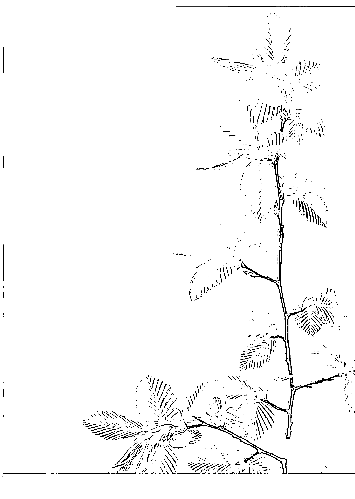

##### 相似花精区辨及补充说明

- 1. 生理期无法忍耐，山毛榉⊕胡桃⊕芥末。
- 2. 常见吹毛求疵的皮肤病，用山毛榉⊕野酸苹果。
- 3. 山毛榉⊕水堇：会展现高傲不想管别人，但心里却又不自主地嫌弃他人。
- 4. 山毛榉⊕樱桃李情绪状态会让批评力道增强。

| 生气别人 |   |   |   |
| --- | --- | --- | --- |
|   | 山毛榉 | 生闷气 | 气别人笨 |
|   | 矢车菊 | 生气，楚楚可怜 | 气别人欺压自己，与自己无法拒绝别人 |
|   | 樱桃李 | 暴怒（承受很久，终于失控） | 「骆驼的最后一根稻草」式的情绪爆发 |
|   | 菊苣 | 生气（可能一哭二闹三上吊） | 气别人没有回报自己的爱 |
|   | 野酸苹果 | 生闷气 | 气自己外表的瑕疵 |
|   | 冬青 | 暴怒（较突发性），可配合樱桃李让疗效提高 | 强烈的仇恨、嫉妒或报复心 |
|   | 凤仙花 | 生气 | 气别人动作慢，或事情耗时太久 |
|   | 马鞭草 | 生气 | 气重要的事未达成，或公理正义无法获得伸张 |
|   | 葡萄 | 生气 | 气别人不听自己的命令 |
|   | 杨柳 | 生闷气（较内在与深沈的憎恨），一脸苦涩 | 气外界或别人害了自己 |

| | | |
|---|---|---|
| 自恋 | 山毛榉 | 认为自己的作法是最好的，如果别人没照着自己的作法，就会觉得他们笨 |
| | 水堇 | 有优越感，远离汲汲营营的凡人，但不会批评别人 |
| | 葡萄 | 认为自己智慧高人一等，命令别人照他的指示做事 |
| 完美主义 | 山毛榉 | 认为自己的作法是最好的，如果别人没照着自己的作法，就会觉得他们笨 |
| | 野酸苹果 | 要求环境整洁，或自己外表完美 |
| | 凤仙花 | 要求别人遵循自己的速度 |
| | 岩水 | 要求自己达到自己的标准 |
| | 马鞭草 | 要求别人认同自己的理念 |
| | 葡萄 | 要求别人听从自己的命令 |
| 严以律己<br>vs.<br>严以律人 | 山毛榉 | 严以律人（可能也严以律己） |
| | 松树 | 严以律己 |
| | 岩水 | 严以律己 |
| | 葡萄 | 严以律人 |

##### 与山毛榉花精相似的新一代花精

- 1. 喉轮花精（Crystal Herbs脉轮花精）
- 2. 野鸢尾花花精（Crystal Herbs业力花精）
- 3. 山樱花精（苏格兰芬活花精）
- 4. 爱意沟通花精（Crystal Herbs神圣和谐花精）

##### 山毛榉花精功用图像记忆

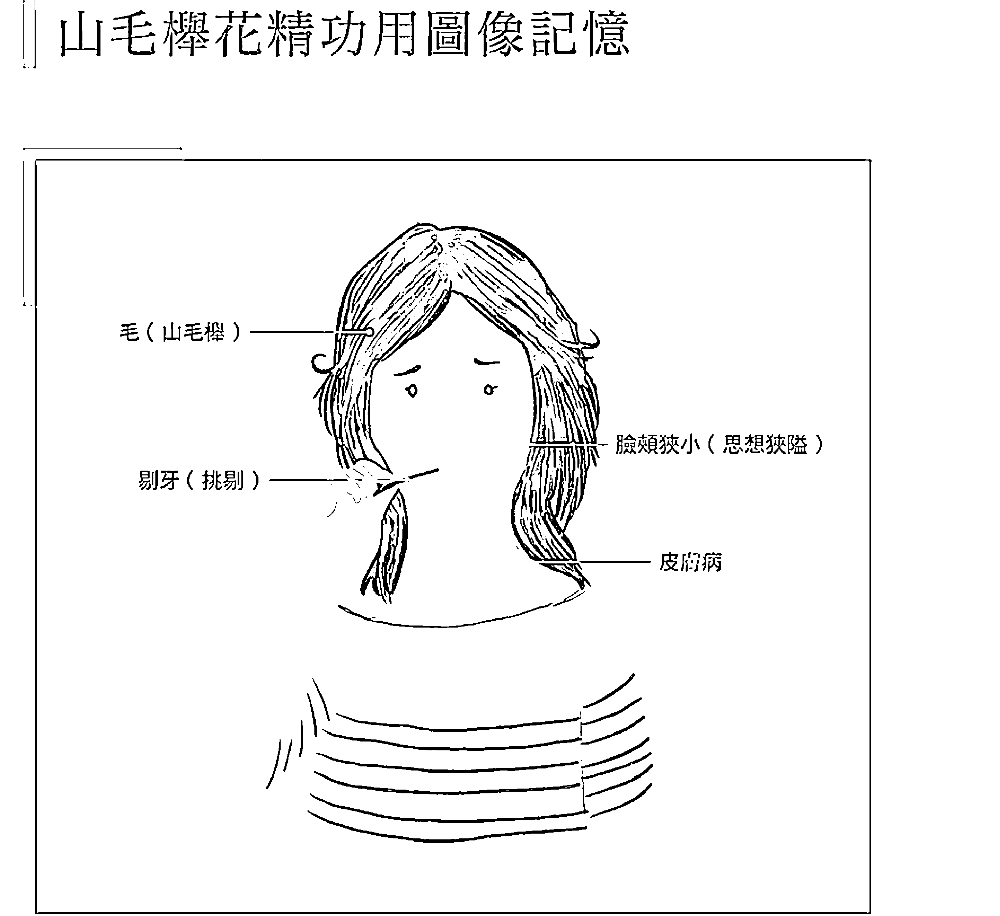

## Chapter:4

03

## 山毛榉

对他人的安康过度关心

### 矢车菊

花精
精华

- 拉丁学名 | Centaurium erythraea
- 别名 | 百金花
- 七大分类 | 对外界及他人想法过于敏感类
- 制作法 | 日照
- 关键字 | 无法说不
- 正面特质 | 勇敢说不

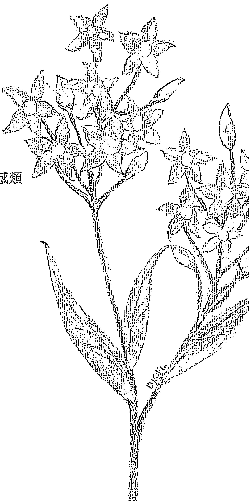

### 巴赫医师的叙述

善良、安静、温和的人，太想要服务他人。他们付出过分的努力。这愿望持续壮大，使他们成为仆人，而非愿意帮忙的人。这种好心使他们承担了超过自己原本的工作量，如此之下，他们忽视了自己的人生使命。

> ——出自《The Twelve Healers and Other Remedies》

- 弱点：软弱
- 美德：力量

你是不是被每个人利用？因为有颗善良的心，你不喜欢拒绝任何人。你是否为了和平而退让，而不是做你认为对的事，因为你不喜欢斗争？你的动机是好的，但你消极地被利用，而不是主动选择自己的工作？你是别人的垫脚石，要通往能真正给出大服务的路还很远，必须等到你认知到自己得活得更积极一点。
在牧场生长的矢车菊，会帮助你找到真正的自我，好让你成为更主动积极的工作者，而不是消极的代理人。

> ——出自《Free Thyself》

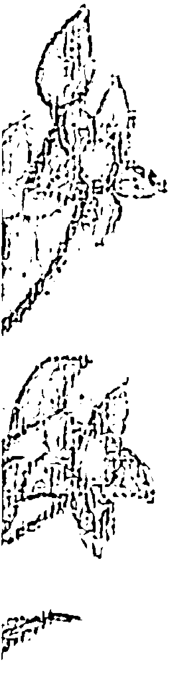

##### 矢车菊 VS 中医观点

德国的自然疗法师Dietmar Kramer在其所著的《新巴赫花精身体地图》中，详列了各种花精在人体的反射区，如橄榄花精对应到肩膀，甜栗花精对应到臀部。对于情绪引发的酸痛，我常应用书中的反射区直接做花精外部贴敷，有时酸痛会有马上消除的作用，当然心灵深处的负面情绪也会跟着平复一些。其中右腕处的花精是对应到矢车菊，为何右腕会对应到这个花精呢？

右手是代表给予，人们常用右手拿东西给别人，有些患者右腕痛或是右手伸出后有无力感，大多会和付出、给予不平衡有关。如有的情侣单方付出太多的爱，但另一半却回应冷淡；或婆婆对媳妇很好，但媳妇却不太理会，久了便有这种负面情绪产生。针对这种因为给的太多而导致内心自我冲突，彩光针灸中的「手冲突解决」可以处理这样的情形，而花精中的矢车菊花精也有同样作用。临床上这个花精我使用量很大，除了对过度付出的人有帮助外，当然也适合下列各要点的朋友：

- 没有自主性，仆人性格，不懂得拒绝别人。
- 本性善良，常受人欺负、利用。
- 常活在别人的影下。
- 太阳神经丛虚弱。
- 常感到疲倦。
- 右手腕痛。

##### 矢车菊×情绪与思维

矢车菊状态的人可说是好好先生、好好小姐，他们通常不好意思拒绝别人，深怕这样的举动伤害了别人或让他人失望，所以总是没理由地讨别人欢心。心地仁慈的他们对于自己的利益不敢有所要求，即使老板给的薪水低于外头行情，也不敢要求加薪。这些行为除了会牺牲个人的利益外，也常被周遭的人士所利用，把他当成仆人般使唤来使唤去。

由于时间与精力一直被别人掏空，也就造成自己休息时间不足，在生理上除了会容易疲倦外，最常出现虚弱、乏力、脸色苍白的症状。久之他们内心会迷惑于为何自己这么没用，让别人牵着鼻子走，当初直接拒绝别人不就好了。这种负向的自我怨气，常会伤到自己，使得右手腕因付出与收获不平衡而疼痛，并使得心轮处受伤，而有胸闷等不舒服的感觉。虽说人生以服务为目的，但服务必须基于自我的意愿上才能快乐，毕竟任何付出都要真心真意，否则只会让自己能量消耗，并产生自我牺牲的内心冲突情形。

俗话说：「群众是盲目的」，矢车菊状态的人，就常是盲从的那一群，他们缺乏自主性，往往别人怎么做，自己也跟着这样做，给人那种「人云亦云」的感觉。如同学直升研究所，就跟着直升；室友去修基因工程课程，也就跟着选修。缺乏主见的盲从，普遍存在于现今年轻的一代，他们往往到了毕业离开学校时，也还茫然不知所措，不晓得自己未来在哪？矢车菊状态另一个特质是常活在别人的影下，如为了某人而牺牲自己的自由、权利。如父母说读什么科系比较好，就不管自己的兴趣为何，就去读了，在医学院里头，便常有这种顺着父母意当医生的乖乖同学；有的家长觉得子女嫁娶何人最好，就不断撮合，即使不是真心地爱着对方，但在父母命令难违的情况下，往往牺牲自己的幸福而结婚。

新闻中常有的孝子或孝女，为了照顾年迈双亲，宁愿不结婚也不愿离开父母。就华人孝道立场来说，这些都是孝顺的表现，但反过来说，这样的人生态度会抵销自己生活的使命，一辈子都会被家庭事务或父母所束缚住，反而会错失了许多人生的经验与生活乐趣。虽然孝顺是做人最基本的，但这可以和其他的人生规划并进而不互相违背，毕竟幸福及自我心灵的成长并非只是对他人让步或牺牲自己，而是要在「甘愿」的基础上才能活得美满。

有花精治疗师曾提出矢车菊状态的人其太阳神经丛会呈现虚弱状态，太阳神经丛是七个脉轮之一，位于针灸穴道「中脘」穴附近，这个穴道约在肚脐上一个拳头高度，主要是治疗肠胃的问题，因此许多女性朋友肠胃不佳、或此处肥胖，像游泳圈一般，大都和不懂得拒绝别人及较少主见有关。所以矢车菊的正面特质：「活出自己生命，勇于说不」，不但可以让我们更快乐，也可以应用在上腹部肥胖者的减肥。当然这个花精最大的用处是让我们能「勇于说不」，摆脱别人的影响与束缚，而活出更有意义的自主人生。

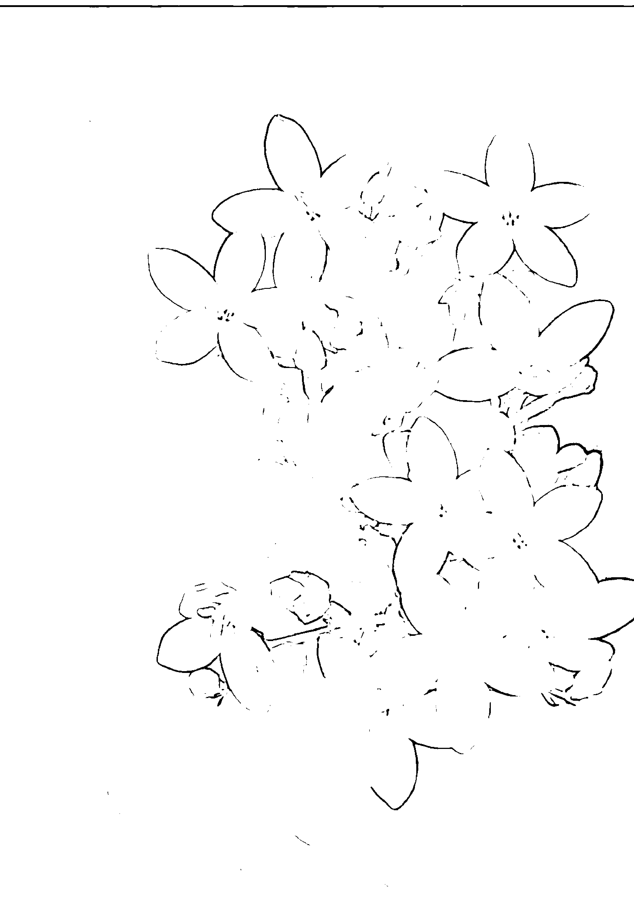

##### 李医师诊间案例探讨

吴女士，左脚底长了鸡眼，走路时疼痛，曾用鸡眼药膏外贴无效。个案的左脚在数年前亦曾因鸡眼开刀，当时医师以外科手术方式挖除这个区块的肉，但伤口愈合后仍长出鸡眼。

由于个案不喜欢内服花精，因此便采用花精外敷，处方矢车菊、圣星百合，做左脚底局部外敷，半小时后，吴女士踩地时疼痛感已消除许多。

#### 花精解析

- 1. 根据Dietmar Kramer所著的《新巴赫花精身体地图》，左脚底对应的花精为矢车菊，右脚底对应的花精是沟酸浆。
- 2. 吴女士由于喜欢种花，常在社区里义务当志工整理花园，社区里若有人请她帮忙，即使很累了也不好意思拒绝，久之便产生矢车菊状态，因此左脚底容易出现疼痛反射，如鸡眼。
- 3. 圣星百合可治疗任何创伤，尤其是曾开过刀的创伤，吴女士左脚底曾开刀切除鸡眼，因此必须用圣星百合抚平该处的组织创伤。
- 4. 用花精局部贴敷鸡眼时，虽然可快速消除因情绪引起的疼痛，但当贴敷棉片干涸时，效果即消失，疼痛又会复发，而且这种贴敷法对于鸡眼本身的消除是无效的，最好是配合骨骼矫正如AMCT、中医正骨手法，将脚底的跖骨复位，才能将鸡眼做彻底根治。

##### 相似花精区辨及补充说明

1. 有些人士体质特别敏感，常被无形的能量场缠绕而体力消耗，此时矢车菊可阻止元气被不停地吸收。也可搭配唸咒语等能量疗法，让能量共振进入身体需要的地方，这种方法在无花精时可做替代使用。

2. Crystal Herbs玫瑰花精系列，可开启心轮，强化矢车菊的能量。

3. 当一个人总是让别人替他做决定，便可使用矢车菊。

4. 铁线莲现象，会对矢车菊产生负面情绪的加强作用。

| 分类 | 花精 | 说明 |
|------|------|------|
| 疲累昏倦 | 矢车菊 | 因过度服务他人而感到疲累 |
| 疲累昏倦 | 铁线莲 | 因做白日梦、逃避现实而昏沉嗜睡 |
| 疲累昏倦 | 榆树 | 因为感觉自己负荷不了这么多责任而累 |
| 疲累昏倦 | 橄榄 | 身心俱疲 |
| 疲累昏倦 | 鹅耳枥 | 心理疲累 |
| 疲累昏倦 | 岩水 | 可能因为自我要求过高而把自己逼得太累，虽然外表不见得会表现出来 |
| 疲累昏倦 | 白栗 | 因为想太多、思考过度而感到头昏脑胀 |
| 疲累昏倦 | 野玫瑰 | 因为过度消极认命而显得有气无力 |
| 生病后乏力 | 矢车菊 | 疾病后导致虚弱，被病气需索无度后的体力透支 |
| 生病后乏力 | 橄榄 | 重病后身心俱疲的现象 |
| 生病后乏力 | 鹅耳枥 | 怀疑自己会有体力不足的现象 |
| 付出 | 菊苣 | 自私的付出，付出多少之后，就要得到多少回报，并要她爱的人顺她的意思去做 |
| 付出 | 矢车菊 | 有较崇高的理想，如服务人群 |
| 易受影响 | 矢车菊 | 容易受他人摆布、指挥 |
| 易受影响 | 水蕨 | 容易被别人影响决定 |
| 易受影响 | 胡桃 | 容易被别人动摇人生方向，或受到环境影响 |

##### 与矢车菊花精相似的新一代花精

- 1. 太阳神经丛花精（Crystal Herbs脉轮花精）
- 2. 白风铃草White Bluebell（Crystal Herbs业力花精）
- 3. 漏芦花精（苏格兰芬活花精）

##### 矢车菊花精功用图像记忆

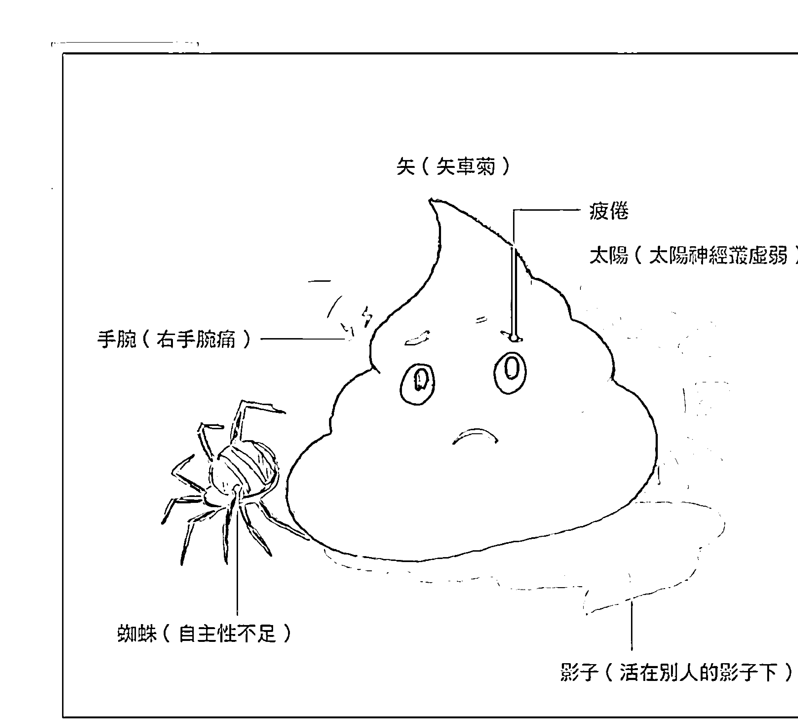

#### 水蕨

花精
精雾

- 拉丁学名 | *Ceratostigma willmottianum*
- 别名 | 希拉图、紫金莲
- 七大分类 | 不确定类
- 制作法 | 日照
- 关键字 | 不信任自己的决定
- 正面特质 | 智慧

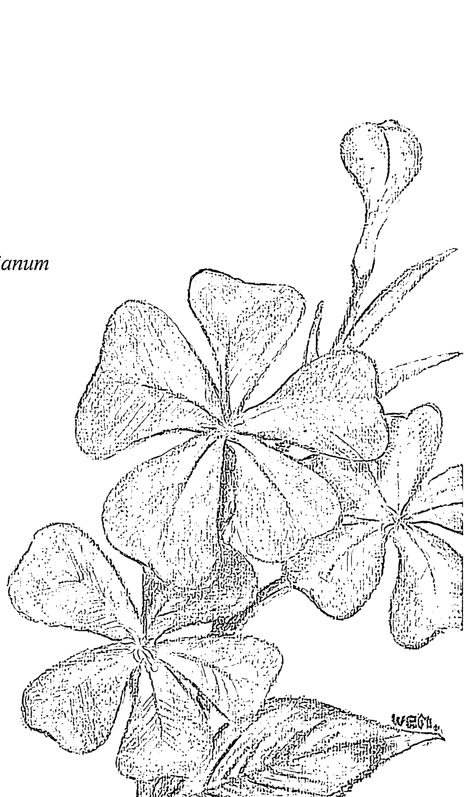

### 巴赫医师的叙述

对自己没有足够信心，无法自己做决定的人。他们不断寻求他人的建议，而经常被误导。

> ——出自《 The Twelve Healers and Other Remedies 》

- 弱点：无知
- 美德：智慧

你是否感觉自己有智慧，能成为指引他人的哲学家？你是否感到自己内在有力量，想在他人遭遇困难时给予建议，纾解他们的悲伤，而且在任何时候都能帮他人解决困扰，然而，你因为对自己缺乏信心，所以无法做到这些，也许是因为你听太多别人的声音，太注重世界的常规？你是否理解到这不过是对自己缺乏信心，因为你不知道自己拥有知识和智慧，才会不由得太过于听从别人的意见？那么水蕨会帮助你找到自己的独立性和个性，而不再被外界影响，使你能运用智慧的伟大天赋。你拥有这天赋是为了人类的最高善。

> ——出自《 Free Thyself 》

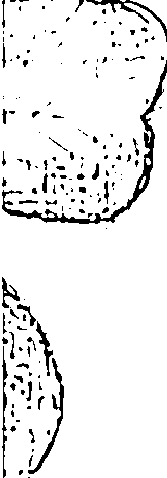

人體有七個脈輪，記載於古印度傳統醫書《吠陀經》，脈輪的功用類似中醫十二經絡與奇經八脈，是全身氣場的能量交會點。不同的脈輪有不同的共振頻率，所以也對應到不同的顏色，其中頂輪對應的顏色是紫色。紫色是智慧的顏色，能讓人開悟，所以Crystal Herbs有出一種稱做「紫焰（Violet Flame）」的花精，是用來清除各種負面的能量、思維和感受，加速人類悟道。

水蕨又名紫金蓮，是原生於中國四川的植物，由英國探險家發現後帶回英國培育，故這也是巴赫花精裡頭少數來自異鄉的植物。紫金蓮的花朵為紫藍色，因其紫色，亦可用來開悟，在探討水蕨花精時，若能從頂輪的功用來做切入點，將會對這個花精有更多的了解。這個花精是巴赫醫師用來治療「不相信自己的直覺、向外尋求決定」的人，這樣的個案普遍有下列特性：

- 缺乏自信，不相信自己的判斷或直覺。
- 總是喜歡問別人意見。
- 資訊狂，愛模仿。
- 對占卜有需求。
- 完美主義。

##### 水蕨 × 情緒與思緒

紫色的水蕨，是頂輪智慧的象徵，因此他們可以站在更高的角度看待世間的一切，直覺性較強的他們，在任何問題出現時都可以螯出答案來。唯一可惜的是，他們對於自己的判斷卻充滿著懷疑，一點也不相信自己的直覺，所以被巴赫醫師列在「缺乏自信、懷疑和猶豫不決」花精族群中。

頂輪是頂端的脈輪，相應著水蕨狀態的人，心裡要的是Top的答案，因此他們也可說是完美主義的代表，任何答案都必須完美，必須頂尖。雖說他們直覺超強，但由於沒有足夠的信心來為自己的決定背書，因此他們會到處請教別人，好讓自己的想法更加清晰，以補強其心中對直覺的疑惑，並藉此給自己一個方向，因此水蕨狀態的人常以下列方式來請教：

- 1. 到處收集資料，如上課、上網、買書等。因為他們認為資訊愈多，愈能給予自身更大的決策依據，好消除內心的不安全感，是個標準的資訊狂。
- 2. 直接問別人對這件事的意見，尤其是權威者的意見。
- 3. 會尋求靈界的力量，如透過抽籤、占卜、問神等來解答心中的疑惑。

##### 花精運用

好學、好問，可說是水蕨狀態人的代名詞。因為不停地學習，水蕨狀態的個案充滿著聰明才智，但由於太過完美主義，總想找到更好、更正確的答案，在知識無止盡且自信心不足的情況下，這種總是想要知道更多的結果便會模糊了信心的焦點，反而讓自己產生困擾，開始不相信自己。加上他們容易接受別人的意見，所以常被一些才智不如自己的人所牽引誤導，而做出錯誤的判斷。如現今世面上出現這麼多種減肥法，也有許多藝人代言的減肥方，水蕨狀態的人憑直覺可以感應出這些方式是有問題的，但由於被懷疑能量所牽引，仍讓自己盲信在電視廣告裡，而誤了自己。等到新聞播出那是不對的方法時，才後悔當初應該相信自己的直覺才對。

古人云：「知足常樂」，知足，可以讓我們學到多少便用多少，永遠都活在法喜充滿的時刻裡。水蕨狀態的人可以作下決定，只是他們對於自己的決定沒有信心，一直詢問他人對此決定的意見，浪費時間事小，誤信他人言而錯失機會才是最可惜的地方。運用水蕨花精，除了可以讓我們直覺提升，做出精準的判斷外，也能真正體會到知足的真諦，而擁有智慧與快樂的人生！

##### 相似花精區辨及補充說明

常靜心，留意自己在每個處境下的第一個反應，有助於直覺訓練。

| 大類 | 花精 | 描述 |
|------|------|------|
| 選擇 | 水蕨 | 知道自己想要的是什麼，也已做好決定，卻對自己的判斷沒信心，到處詢問別人意見。只要一做了決定，便有足夠的自信堅持下去，而且成功機率很大 |
| | 落葉松 | 對任何事都沒有信心，寧願退縮讓機會流失 |
| | 胡桃 | 有清晰的目標，但短暫的受外界影響而意志動搖 |
| | 野燕麥 | 小事情決斷力強，卻不知道自己人生的目標與方向 |
| | 線球草 | 二選一時出現困惑，卻不會問人，只留在心中慢慢思考 |
| 缺乏自信 | 水蕨 | 對自己的判斷或決定沒自信 |
| | 落葉松 | 對自己的能力沒自信 |
| | 野酸蕒果 | 對自己的外表沒自信 |
| | 榆樹 | 因為壓力而暫時失去自信 |
| | 龍膽 | 因為受到挫折而漸漸失去自信 |

##### 與水蕨花精相似的新一代花精

- 1. 野蘭花花精（Crystal Herbs業力花精）
- 2. 決斷力花精（Crystal Herbs神聖和諧花精）
- 3. 抉擇花精（Crystal Herbs內在小孩花精）
- 4. 金色鳶尾花花精、蘇格蘭松花精（蘇格蘭芬活花精）

##### 水蕨花精功用圖像記憶

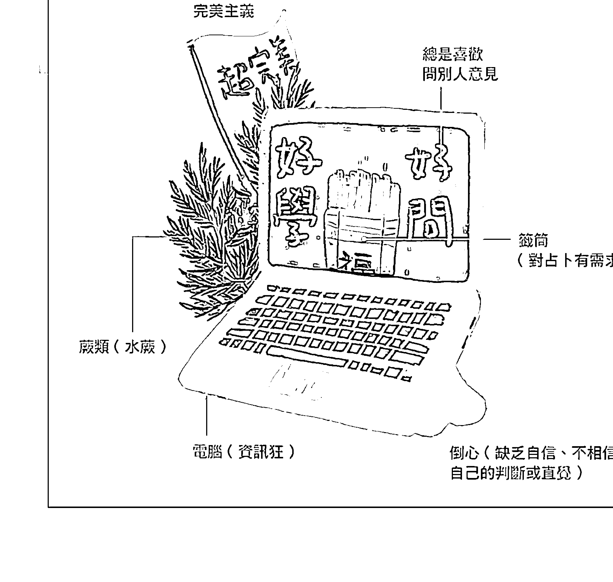

## 樱桃李

花精 樱李

拉丁學名 | *Prunus cerasifera*
---|---
別名 | 櫻花
七大分類 | 恐懼類
製作法 | 煮沸
關鍵字 | 害怕自己失控
正面特質 | 冷靜

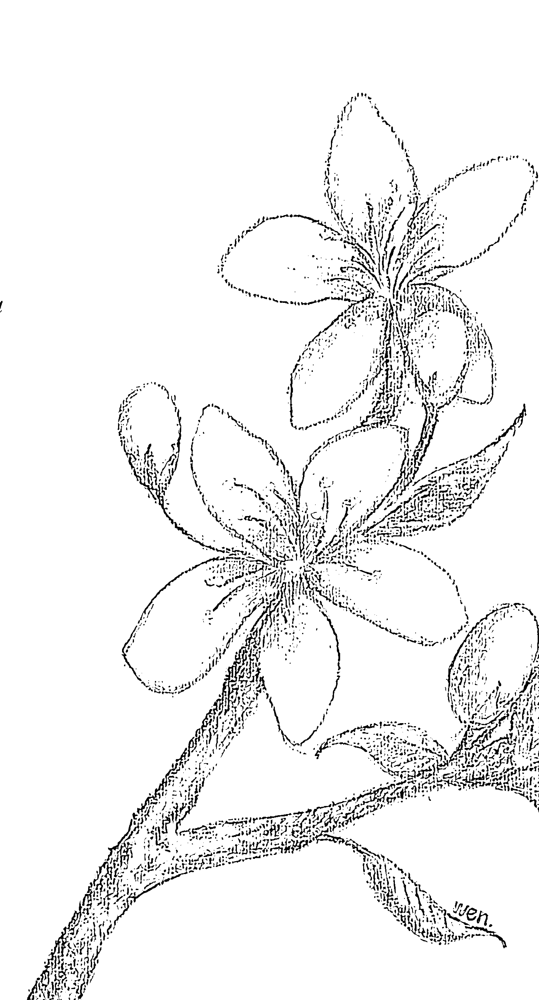

## Cherry Plum

##### 巴赫醫師的敘述

害怕心理過度緊繃，失去理性，做出不希望做出的恐怖的錯事，可是卻有想要去做的想法和衝動。

> ——出自《The Twelve Healers and Other Remedies》

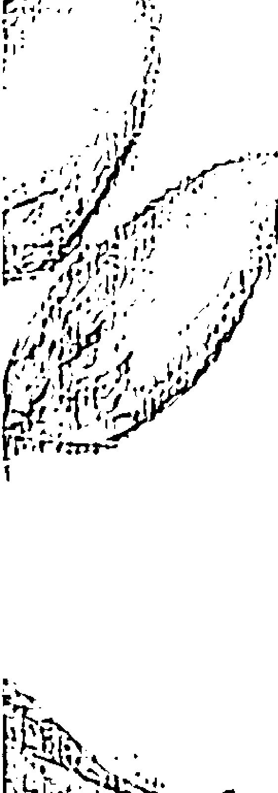

##### 櫻桃李VS.中醫觀點

管教問題一直是親子間及師生間一個重大的課題，但能妥善處理的並非多數。社會新聞裡，不論是老師體罰、受虐兒、過動兒、還是自殘的行為，都和壓抑後的爆發情緒有關，而櫻桃李花精恰好是這些狀況的最佳解方。

巴赫花精共有三十八種單方、一種複方花精。複方花精又稱急救花精，用來對治任何的緊急情況，其由五種單方所組成，櫻桃李花精便是其中之一。急救花精會用到它，主要是側重在能處理「有抓狂危機、失控」時的狀態。巴赫醫師當初發現這個花精，起因於他自己的鼻竇炎引發持續性頭痛，並產生一種心智會隨時失控的狀態，他記錄下這種害怕喪失理智但又忍不住想要爆發的負面情緒，直到尋覓到櫻桃李花精，他的這些情況才好轉。因此櫻桃李花精除了用於抓狂危機外，並普遍用於下列這些情形：

- 心中容易浮現自殺念頭或想傷害別人的想法。
- 長期累積而來的壓抑情緒或突發的變化。
- 容易受刺激而被激怒。
- 任何失控狀態。

##### 櫻桃李 × 情緒與思緒

櫻桃李狀態的人，就好像休火山一樣，在沈寂一段時間後突然大爆發，造成重大的傷亡。爆發的引火線有時只是別人的一些不經意的言行，就好像魔咒一樣，深深地刺激著他，瞬間讓情緒到達崩潰邊緣，而產生憤怒、暴力、狂躁或歇斯底里的情形。曾有朋友僅因上司對她說句「妳到底是不是人」而崩潰，開始呈現歇斯底里的狀況，造成周遭親友不少的困擾。

古人云：「冰凍三尺，非一日之寒」，會有這樣的情緒反應大多和長期累積而來的壓抑環境有關，讓心中的炸藥逐漸成形，爾後任何一點小事情都有可能變成引爆它的引信，讓旁人措手不及。除此之外，一些突然而來的變化，或心中的觀念在剎那間崩潰時，同樣會產生這種櫻桃李情緒，如：

1. 原本恩愛的夫妻，太太出差提前返家，卻發現丈夫和別的女人躺在床上，失控地對丈夫又罵又打。
2. 農曆年前，某家旅行社突然倒閉，當記者前往採訪時，卻遭到旅行社員工失控的叫罵。
3. 不少的媽媽因小朋友不乖，歷次教導都無成效，媽媽氣得自己去撞牆。
4. 家長教小朋友唸拼音，卻教不會，越教越氣，最後把小朋友毒打一頓。

##### 花精運用

台灣位於地震帶上，地震可說是能量釋放的一種，而櫻桃李的失控狀態，就好比地震後能量獲得釋放一樣，在情緒爆發後便有如釋重負的感覺。但他們在爆發前，會儲存許多負面能量，使得體內暴戾之氣不斷上升，之後便產生無法控制的情緒起伏，導致攻擊別人或自殘的情形產生，而櫻桃李花精對於消弭體內這種積累的暴戾之氣幫助頗大。有些花精學者認為這種櫻桃李狀態是一種「精神分裂」或「多重人格」的情緒反應，而一些自殺的個案、襲胸之狼，也常有這樣的情緒，因此妥善應用櫻桃李花精將會是治安的好幫手，或許警政署可以思索一下花精對治安的幫助，相信對於整體環境而言會有不錯的改善作用。

在日常生活中，有些人於飲酒後，會有開始摔東西，對人暴力相向等所謂「發酒瘋」情形，但酒醒後卻又變成好好先生，這種現象可用德國自然療法師Dieter Kramer的雙魚座情緒路徑理論來解釋：岩玫瑰→龍芽草→櫻桃李。我們都知道，龍芽草會隱藏自己內心的壓力，但三杯黃湯下肚後，壓抑許久的情緒便不設防地爆發出來，而呈現櫻桃李的自殘、攻擊性。當有常發酒瘋的家人時，我們可以試著推敲，是否平時有些委屈或不滿埋藏在心中，才會引爆這個花精的情緒。身為一個花精治療師，便是要協助大眾找尋其情緒治療核心，否則一味地治療其外部情緒，不去分析事情背後所隱含的意義，將使治療起起伏伏，無法根治。也因此，花精的選擇便很重要，很多小技巧可以幫助我們找出個案未透露的內心世界，這在之後的章節會詳細提到。

在能量世界裡，情緒、花精、言語都是一種能量，也都是一種波動，因此多說些肯定別人的話語是相當重要的能量治療。人在世間要多說好話，多做好事，多存善心，這些正面性的鼓勵，即是最好的花藥。倘若有櫻桃李情結，只要旁人多給予關懷，讓當事人獲得愛、獲得別人的肯定和支持，那他們體內蓄積的負面能量，就會如同雪花碰到陽光般，逐漸融化，家庭生活才能更融洽，難怪巴赫醫師形容櫻桃李花精「可以驅離所有錯誤的想法，並同時給予患者精神上的力量與信心」。這個花精，是現今社會所缺乏的那份愛、肯定與支持，也是疏導個人情緒，減少自殺的濟世妙方，端賴治療師如何取捨了。

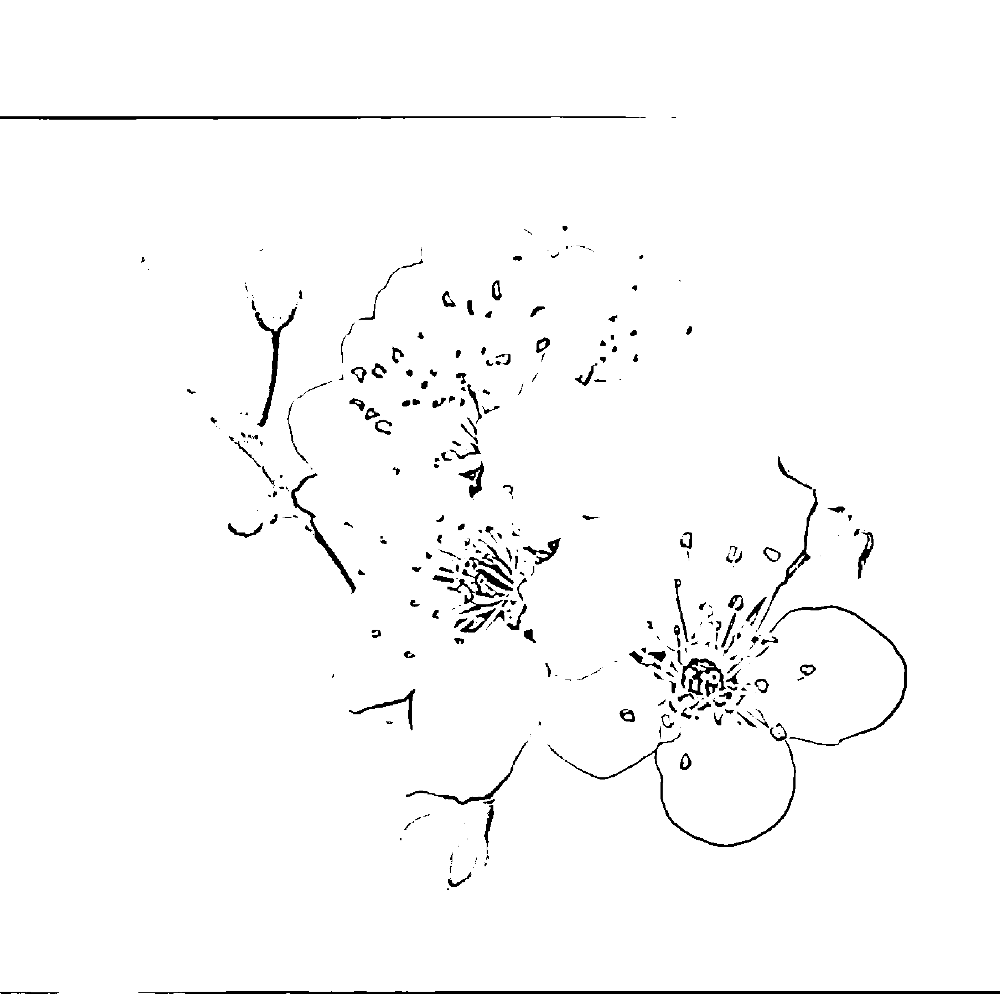

##### 李醫師診間案例探討

范小姐，中國籍配偶，青島人，2007年5月5日來診，主訴經痛，月經血塊量多，經期時下肢無力，月經淋漓不停，緊張時容易心慌、焦慮、腹脹、情緒起伏很大，常常脾氣無法控制，有時會有想摔東西的衝動。給予花精貼敷處方：白楊、櫻桃李，外敷神門穴。

四星期後回診，述說自從上次用花精外敷神門穴後，心慌情形好轉許多，情緒也較平穩，比較不會發脾氣，家庭也較為和樂，故要求繼續貼敷。

個案再於一個月後回診，經痛和經期下肢無力感已完全消失，血塊量也已減少許多，原本起伏的情緒在本次來時又更加平穩了。

##### 花精療癒解析

許多外籍配偶來台灣後，面對諸多壓力，如政治上的歧視、入出境時官員的言語羞辱（如問些和先生行房的私密事），久了會產生櫻桃李現象，情緒會突然激烈起伏，因此情緒紓壓是有必要的。但紓壓僅是一時的，倘若大環境未做變更，為政者對於外籍配偶諸多的限制與歧視，將無法使這種現象獲得根本解決，因此主政者必須慈悲為懷，在法制方面做些調整，方能消除這種負面情緒。

- **白楊**
  針對心慌、莫名的恐慌效果不錯。
- **櫻桃李**
  情緒起伏，脾氣無法控制必用。

##### 相似花精區辨及補充說明

- 1. 在氣頭上可用櫻桃李花精控制自己。
- 2. 因病痛而令人感到絕望時亦可用櫻桃李花精。
- 3. 龍芽草思緒久了，會逐漸演變成櫻桃李情緒。
- 4. 遇到激烈的情緒，可用激烈的運動來發洩、紓壓，如快跑、拳擊、爬山等。
- 5. 有痙攣體質的人，一點刺激便會誘發痙攣產生，摔倒在地，頭部猛烈撞擊，即可視為自我傷害的櫻桃李。

|  | 自殺 | 發怒 |
| --- | --- | --- |
| 櫻桃李 | 長期累積而來的壓抑情緒，衝動自殺 |
| 荊豆 | 久病厭世，覺得人生無希望 |
| 山毛櫸 | 因為感到別人很笨 |
| 櫻桃李 | 突發性、不理性、忍耐很久而爆發的憤怒 |
| 冬青 | 出於仇恨、報復、嫉妒的憤怒 |
| 鳳仙花 | 因為受不了別人動作慢，或事情耗時太久 |
| 葡萄 | 因為覺得自己一定是對的、自己是老大，所以他人的不服從感到憤怒 |
| 馬鞭草 | 因為覺得不公平、不正義或不符合個人原則 |
| 菊苣 | 因為感覺對別人的付出沒有獲得回報 |

##### 與櫻桃李花精相似的新一代花精

- 1. 粉紅玫瑰Pink Rose（ Crystal Herbs業力花精）
- 2. 我心寧靜花精、柳葉菜花精（ 蘇格蘭芬活花精）
- 3. 粉色溫柔、台灣山櫻花精（ 晶荷日光花精）

##### 櫻桃李花精功用圖像記憶

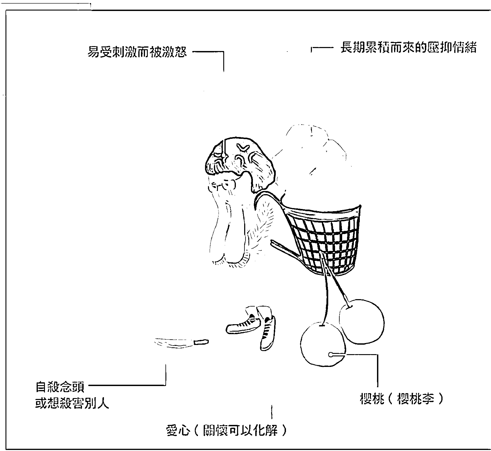

#### 栗樹芽苞

花精精薈

- 拉丁學名: Aesculus hippocastanum
- 別名: 栗苞、栗子芽、栗樹花蕾、白栗芽苞
- 七大分類: 對現實興趣缺缺類
- 製作法: 煮沸
- 關鍵字: 重蹈覆轍
- 正面特質: 從經驗中學習

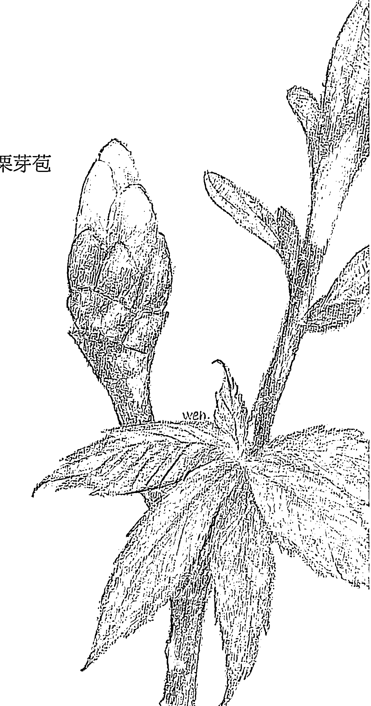

## Chestnut Bud

##### 巴赫醫師的敘述

給無法從觀察和經驗中學習的人。他們比別人需要花更多時間才能學會日常生活的教訓。儘管有些人經歷一次就能學會，他們卻需要更多次，有時要好幾次。因此，他們會後悔地發現自己不斷重蹈覆轍，儘管這種錯犯一次就夠，甚至可以透過觀察別人來把犯一次錯的機會都省掉。

——出自《 The Twelve Healers and Other Remedies 》

##### 栗樹芽苞 VS. 中醫觀點

栗樹芽苞，可說是速讀花精，在運用這個花精後，讀書效率真的會增加不少。理解這個花精，可從速讀做切入點。俗話說：「寸金難買寸光陰，光陰一去不復返」，以前在學速讀的時候，老師特別強調，要進步，就不可以回頭看資料，就和時光一樣，只有一次機會，當您們特別用心時，就能做到這點。那一陣子，我的讀書效率真的增加很多，這可能要歸功於用心去記憶閃過去的那一個畫面吧！只是一段時間沒練習，我又恢復到原本的讀書速度，一篇文章要看多次才了解意義。這才體會到，用不用心居然效率差這麼多，而栗樹芽苞，就是可以讓我們專心地留意當下所有資訊的小偏方。

做為父母，除了關心孩童的健康外，亞洲國家的家長普遍對於課業也相當重視，各種幫助記憶的才藝班也深受歡迎，如速讀、心算、圖像記憶等，無非就是要讓小孩贏在起跑點上。但許多小朋友的記憶力不佳其實是和專注力不足有關，特教班雖能給予這樣的孩童有較佳之學習空間，但根本之道還是要導正其學習習慣。花精對於注意力提升倒有不錯的輔助效果，臨床上我常運用「胡桃」、「鐵線蓮」、「栗樹芽苞」、「石楠」花精來幫助小朋友集中注意力，讓他們更專注。其中的栗樹芽苞是用來幫助不斷重蹈覆轍，容易被周遭事物所引誘的學童。其實不光是小朋友，有時大人們常脫線的時候也可使用。

應用條件：

- 一直在同一種負面情緒中打轉，或是週期性地罹患同一種疾病。
- 喜歡嘗試新奇的事物，不停地轉移注意力到新事物上。
- 注意力不集中，容易健忘。
- 重複犯相同的錯誤。

##### 栗樹芽苞×情緒與思緒

- 發育慢、學習慢。
- 白目。
- 固執。

常聽人用「白目」來調侃一個人，栗樹芽苞狀態的人就是這種，一直在犯同樣的錯誤，怎麼學也學不會。一般人會從錯誤中記取經驗，以避免犯下同樣的錯誤，但栗樹芽苞狀態的人卻常重蹈覆轍。他們這種特性，不僅無法記取教訓，即使是看到別人失敗的經驗，也照樣從同一個洞掉下去。這就和水蕨類型的人明顯不同，因為水蕨類型的人會一直詢問別人意見，不像栗樹芽苞狀態的人不會去問人，也從不向別人請教，做事我行我素，讓人氣得跳腳，這種拒絕接受別人意見的作法，即可視為無法吸收別人經驗的延伸。

- 注意力不足。
- 警覺性太低。
- 被新奇事物所吸引。
- 刻意忘記過去不愉快的記憶。

根據康健雜誌2007年2月份的報導內容，兒童自閉症可能和疫苗中的柳酸汞有關，隨著自閉症孩童增加，被診斷為ADD／ADHD（注意力不足／過動症）的個案也變多。之前上能量測試課程時，我的老師曾提到ADD／ADHD也和腦中的汞含量有關，只是先前大家都以為是深海魚的汞含量太多，吃太多的魚肉所致，只是沒有想到疫苗居然也含汞，當然這方面的關聯性，還要做進一步的統計。不過根據最新資料顯示，每五個孩童就有一位被診斷為注意力不足或過動症，比例之高令人咋舌，難怪學校特教班的數目也因此不斷攀升。

現代父母最煩惱的地方，就是小孩讀書不專心、做事粗心大意，不但老師交代的功課常做不好，做功課的時間特別長，也常把媽媽吩咐的事情忘得一乾二淨。栗樹芽苞狀態的人常不斷地轉移注意力到新奇的事物上，反而對當下重要的事物沒興趣。如讀書時，會不停地被電視、電玩、零嘴、乃至周遭的聲音所吸引而分心，鄰居小孩半小時能背好的課文，這樣的小朋友可能要背三個小時才行，因此被巴赫醫師歸納在「對當下沒有興趣」花精族群中。臨床上，我常運用「胡桃」、「鐵線蓮」、「栗樹芽苞」、「石楠」花精來幫助小朋友集中注意力，只要注意力能集中，記憶力及聰明度自然會提升。

白栗（White Chestnut）與栗樹芽苞（Chestnut Bud）這兩種花精是巴赫醫師採用同一株植物所製成。栗樹芽苞是每年春天時白栗樹所萌生的新芽，任何植物的芽都充滿著無限生機，不論是豆芽菜、綠豆、黑豆都有這種功用，所以數年前曾有醫師推廣每天早上生吞黑豆49顆，可以讓活力提升，供應我們生命的活力，就是運用芽的生發之氣。因為栗樹芽苞的這種活力特質，所以可以輔助青少年成長發育，在發育期使用，可協助讓身心靈同步成長，因此有花精治療師提出，在小朋友發育期時，可運用栗樹芽苞、胡桃花精來幫助成長，作為青少年發育期時搭配「轉骨方」的利器。

運用這個花精要善用「重蹈覆轍」這個重點，有些人服用花精後時好時壞，一直在同一種負面情緒中打轉；或週期性疾病，像是每年冬天都生同樣的皮膚病；或固執的人、久病無法痊癒者，均可視為重蹈覆轍的現象，都可使用此花精來做Stop，此時栗樹芽苞就是一個相當好的處方。運用這個花精，不僅可以讓我們懂得察言觀色、揮別白目生活，也可以幫助我們善用日常經驗及別人的心得，創造更美好的生命價值。

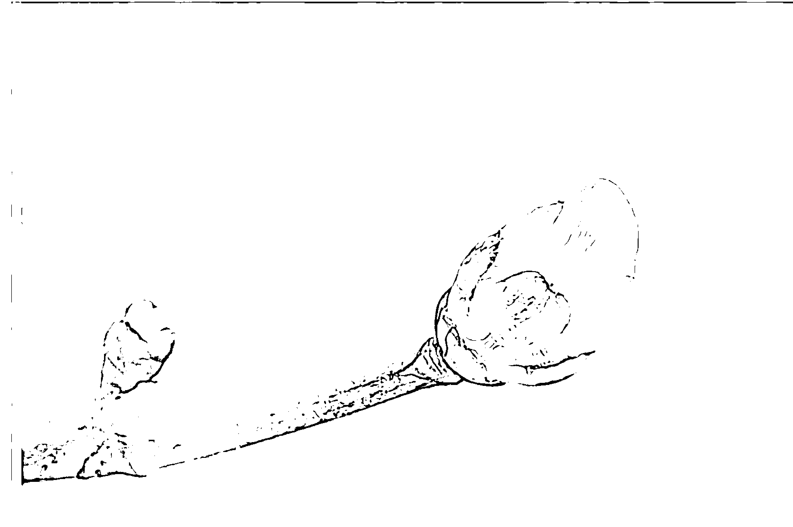

##### 李醫師診間案例探討

小禾，今年五歲，夜半經常尿床，媽媽說不論讀書、吃飯，只要旁邊有任何風吹草動都會轉移注意力，即使只是服務生在收盤子也會分心，而忘記自己正在做什麼。坐公車時，媽媽再三叮嚀不可以亂按公車悠遊卡機器上的按鈕，但下車時仍會不自主地伸手過去按壓，氣得媽媽直跳腳。

診療後，除了開立中藥處方外，我運用「胡桃」、「鐵線蓮」、「栗樹芽苞」花精，貼敷於小禾手部的「神門穴」，並建議媽媽有空帶他來做花精貼敷。數週後，媽媽回診時告稱記憶力有所提升，注意力也較集中，應媽媽的要求，小禾還當場背誦「弟子規」給我聽，看來李醫師又升格當幼稚園的李老師了。

圖解巴赫花精

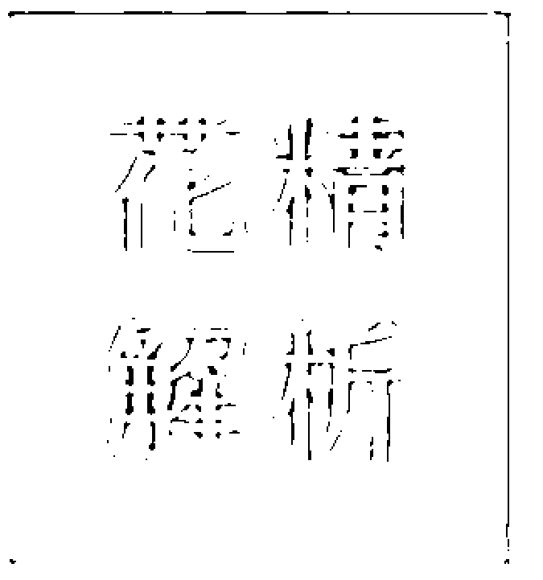

#### 胡桃

提升保護力，讓個案不會受到外界事物的干擾、影響，尤其適用有任何風吹草動即轉移注意力的小朋友。

#### 鐵線蓮

針對恍神、容易打瞌睡的小朋友效果不錯，對大人也有同樣的效果，使用後比較不會神遊太虛。

#### 栗樹芽苞

不會重蹈覆轍，並能聽懂別人說的話。

##### 相似花精區辨及補充說明

1. 栗樹芽苞，適用於總是一錯再錯，「心理逆轉療法（後面章節會介紹）」亦可破除此種循環。
2. 週期性疾病或疾病常復發，可算是栗樹芽苞情緒。
3. 栗樹芽苞情緒容易和山毛櫸情緒交錯在一起。

| 學習力不佳 | 鐵線蓮 | 愛幻想，容易囈語，健忘 |
| --- | --- | --- |
| | 胡桃 | 容易受外界干擾 |
| | 栗樹芽苞 | 容易被新奇事物吸引 |
| | 石楠 | 因為愛跟別人聊天而荒廢學習 |
| 關於過去 | 栗樹芽苞 | 總試著遺忘過去 |
| | 忍冬 | 拼命想要記住過去 |

##### 與栗樹芽苞花精相似的新一代花精

- 1. 眉心輪花精（Crystal Herbs脈輪花精）
- 2. 纈草花精（Crystal Herbs業力花精）
- 3. 好專心花精（Crystal Herbs神聖和諧花精）
- 4. 明晰之光花精（蘇格蘭芬活花精）

##### 栗樹芽苞花精功用圖像記憶

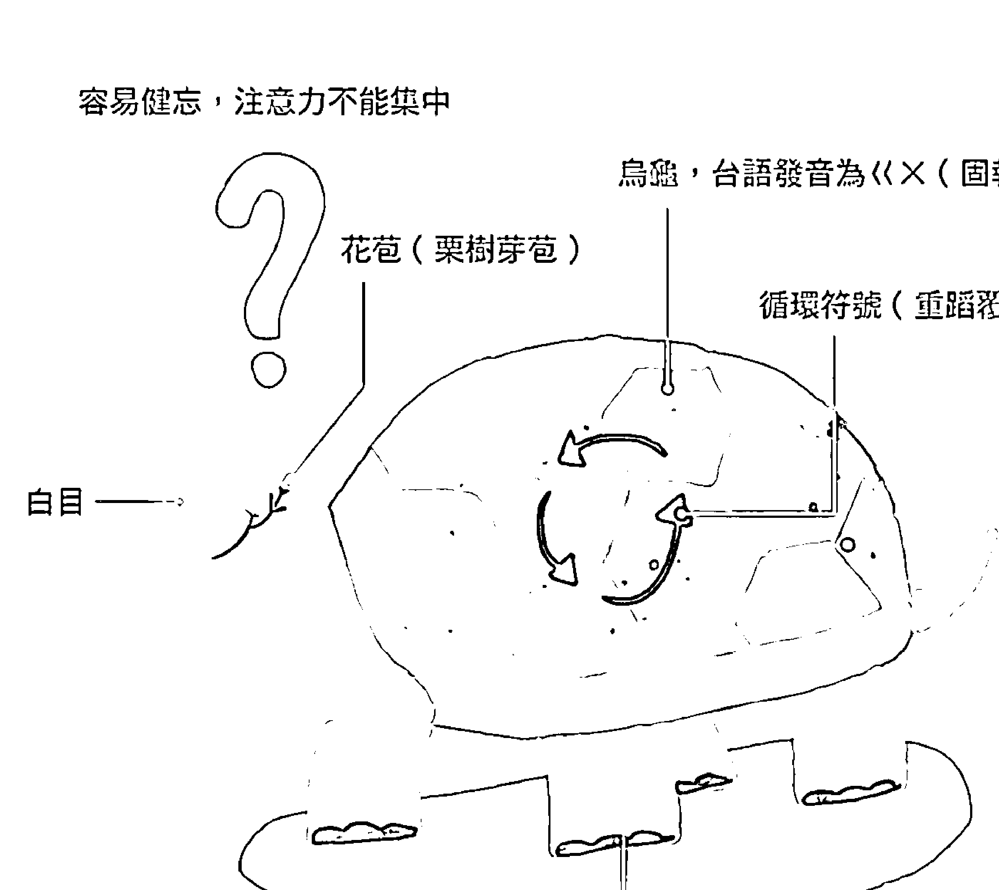

#### 菊苣

##### 花精檔案

| 項目 | 內容 |
|---|---|
| 拉丁學名 | Cichorium intybus |
| 七大分類 | 對他人的安康過度關心類 |
| 製作法 | 日照 |
| 關鍵字 | 自私的愛 |
| 正面特質 | 無私的愛 |

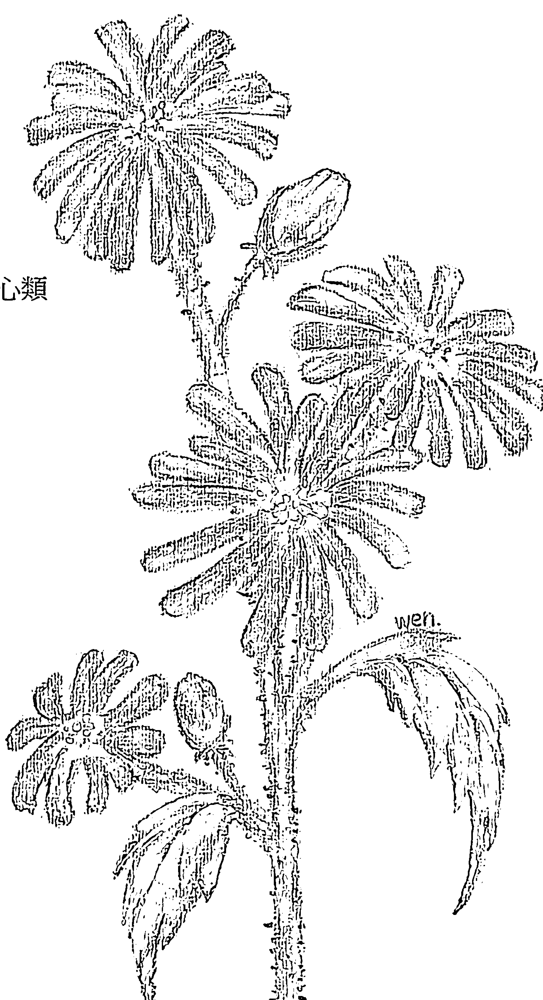

##### 巴赫醫師的敘述

對別人的需求非常細心的人。他們對親友和小孩容易關照過度，總是在找可以糾正之處。他們始終在矯正他們覺得錯誤的事情，而且很享受這樣做。他們渴望所關心的人可以待在自己身旁。

> ——出自《The Twelve Healers and Other Remedies 》

弱點：限制

美德：愛

你是否渴望服務世界，想要展開雙臂祝福身邊所有的人，幫助他人、同理他人，可是被某些人事物所阻擋了？你是否發現你只抓緊了少數人，而不是服務多數人，因此你全然付出的機會受到限制了？你是否到了需要理解「人人都能信賴你，但沒人依賴過頭」的階段？那麼這生在玉米田中的美麗藍色菊苣會幫助你通往自由。這自由，是在我們有能力服務世界之前，必得先擁有的。

> ——出自《 Free Thyself 》## 菊苣 VS. 中醫觀點

證嚴法師在靜思語中曾說：「愛不是要求對方，而是要由自身的付出……對自己所愛的人，能以智慧斷除佔有的感情。待人退一步，愛人寬一寸，就會活得很快樂了。」這也正是菊苣花精的正面意義：真誠無私地關心他人且不求回報。

許多人在還沒有談戀愛前，對於愛情生活的甜蜜，總是充滿著憧憬，也是多數人夢寐以求的。但有些伴侶間，卻常出現「過黏」的情形，造成甜蜜的負擔，讓人喘不過氣來。其實不光是情人間，家庭中的這種情形也是屢見不鮮，而主角呢？常是當事者的母親。親子間的過黏情形會限制小孩的發展並產生磨擦，而情人間的過黏的情形則容易和猜忌的心理連結。如何不自私地去愛別人、不強迫別人做不想做的事情，菊苣花精倒可以居中當個潤滑劑，有助於消除這種自私的愛。

有關菊苣的人格特徵分述如下：

- 有過度的佔有慾，會將自己喜歡的人留在身邊，指揮他的生活並批評他的行事作風。
- 做任何事均在等待別人給予肯定或回報。
- 大部份的母親，尤其會有囉嗦的傾向。
- 常以生病為藉口，換取別人的關心。
- 內心空虛，需要愛與陪伴。
- 常感到自憐而容易流眼淚。
- 女性生殖系統易出問題。

## 圖解巴赫花精

##### 菊苣×情緒與思緒

菊苣狀態的人，有強烈的自我中心，她們想把所有的東西都抓在自己手中，因此這樣的個案普遍有兩種特質：佔有及掌控。她們佔有慾相當地強，喜歡把心愛的人留在身邊。當情人中有人是這樣時，即使是睡覺也想要把愛人抱住；逛街時，喜歡拉著男朋友一起走走；看電視時，喜歡另一半坐在身邊陪著；吃飯時，喜歡和心愛的人一起用餐。即使只是看個帳單、拿件衣服也一定要愛人共同參與，最好是像繃帶那樣把兩個人纏繞在一起！

菊苣式的掌控，喜歡用說教或勸告的方式來照顧她們關心的人，而在家庭中，大多數的媽媽都是屬於菊苣特質。她們覺得小孩留在身旁是保護他們最好的方式，這種內心的善意便開始指導、勸告、批評孩子們該如何做事才對，如要讀某某大學才有競爭力、要學何種才藝較有氣質、那些朋友才是可以交往的……等等。家長這樣的勸告與說教，其實心中最主要的是希望透過控制小孩來證明自己的存在，表面上雖是關心別人，實際上則是反映內心需要別人的關心。小孩若屈從父母的意見便成為另一種花精情緒：無自主性的矢車菊現象，有些人會因此而放棄目標、事業及婚姻，一輩子待在家中陪伴父母。

倘若所關愛的人不在她們身邊，或在付出愛時遭受些許冷落，她們就會很難過，而楚楚落淚。為了吸引親人的注意，裝病就是她們覺得最好的方法，或是把小病放大，用乞討的眼光期待你能多陪她一些，所以她們的病不容易好。若這招行不通，這種佔有的強大力量會轉變為物質慾望提升，藉由購買東西來滿足內心的空虛，因而變成購物狂而到處血拚，嚴重的甚至家人發現時就已刷卡上百萬，造成夫妻間不小的糾紛。

另一個困擾的菊苣問題是婆媳關係，若小孩決定結婚離開母親，媽媽便會產生巨大的失落感，他們會不自主地批評媳婦或女婿，尤其是在單親家庭裡頭，因為媳婦或女婿是搶走她的小孩，害她孤單一人的元兇。這樣的特質和山毛櫸狀態的人明顯不同，因為山毛櫸狀態對每個人都會批判，不像菊苣狀態僅會針對特定的親人碎碎唸。在物理學上，當作用力出現時，反作用力也會出現，以家族情緒來說，這種轉而對媳婦的嫉妒，會使媽媽身上產生新的冬青情緒（憤怒、嫉妒）。而小孩的心境可能會有三種情緒變化：冬青（憤怒、叛逆）、松樹（因背叛父母而有罪惡感）、矢車菊（為了父母，放棄自己的理想），這就如同命盤中命運的軌跡一般，形成惡性循環。所以有菊苣父母的家庭，唯有中止菊苣路徑，家中才不會衍生出負面情緒。

就小朋友來說，佔有及掌控也會出現，尤其在新弟妹出生後，爭寵的情形更加明顯，他們會刻意製造一些問題，如說自己那裡不舒服，破壞東西，來吸引父母的注意，這種想把父母抓在自己手中的情形，便是菊苣現象的一種表現，而在診所的花精特別門診中，常會發現有些過動、注意力不集中的小朋友，其實內心深層是菊苣情緒，在使用這個花精後，注意力提升許多。當然小朋友對玩具的佔有慾很強，也是可以使用這個花精。

菊苣現象產生大多是在付出愛的過程中受到阻礙，便將愛轉向自己，由付出愛變成貪婪的佔有。由於菊苣的愛是母愛的表現，易經上說：「雲從龍，風從虎，陰陽之道，同氣相求。」所以女性生殖系統像是子宮、卵巢等器官也容易受到情緒磁場的影響而產生病變，形成諸如子宮肌瘤、子宮內膜異位、卵巢水瘤等病症。根據Dieter Kramer的身體地圖，右眼下方有黑斑者，大多有菊苣現象，這可以提供個案臨床望診的參考。雖說菊苣人格的出發點是善意的，希望用她們的照顧來讓對方幸福快樂，但由於這種愛太過於自私與強勢，所以被愛者往往會很痛苦。因此運用這個花精，除了可降低對喜愛的人、事、物的佔有慾外，也可以散發無私的愛，但最好還是建議個案多修行，培養自己的興趣，才不會內心空虛，這樣在人與人之間，也才能活得更快樂。

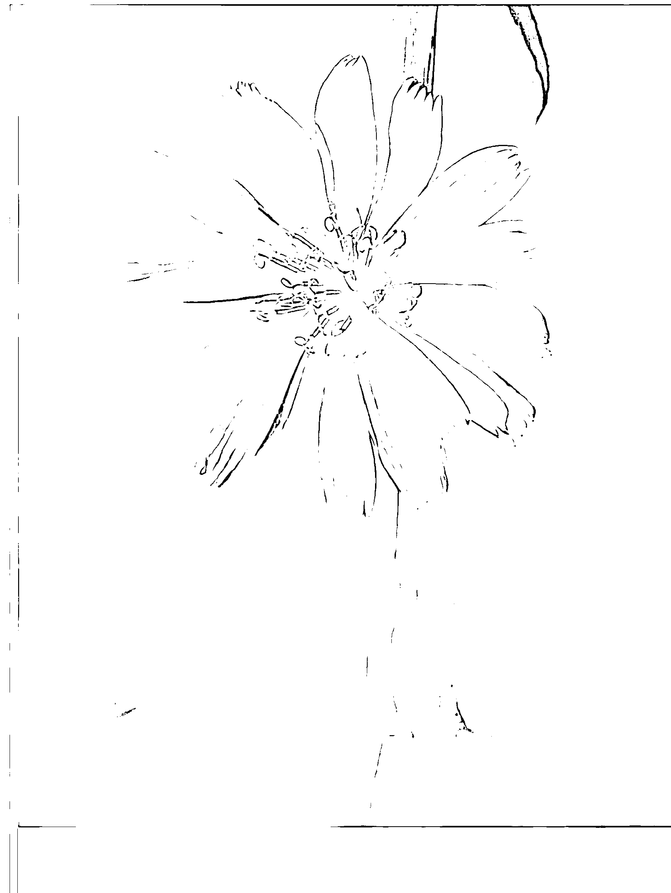

##### 李醫師診間案例探討

廖小姐，大一學生，個案近來睡眠品質不佳，不容易入眠，每天在床上要翻到凌晨3～4點才睡得著，腦袋中會一直東想西想，無法靜下心來，淺眠，初次見到她時疲態滿面，這也是一般睡眠品質不佳患者常見的症狀。廖小姐曾割腕自殺，家人帶她去醫院就診時，被精神科醫師診斷為「嚴重人格分裂」，並開立抗憂鬱劑。個案在服用抗憂鬱劑數天後，腦中一片空白，呈現恍神狀態，由於家人懼怕抗憂鬱劑藥物長期服用會產生副作用，遂來門診。細問下，廖小姐就讀設計相關科系，常和同學合作做題目，本身很重視友情，常會為同學付出許多。但廖小姐心中一直覺得為同學做了這麼多，同伴回饋卻很少，內心不愉快的感覺逐漸累積，卻悶在心中不說，日子一久壓力太大便割腕自殺。精神科診療時，醫師從廖小姐口述得知其心中還曾想拿刀殺同學的念頭，便將她診斷為「嚴重人格分裂」，就直接開立抗憂鬱劑。在述說過程中，講到傷心處還不停地潸然淚下，可見她這一段時期的心路歷程，確實是受傷蠻大的。

我為廖小姐調配花精處方：菊苣、白栗、岩玫瑰、龍芽草、櫻桃李、聖星百合。治療一週後，很神奇，她即脫離自殺的負面情緒，還笑著說：「真想不透為何自己當初要自殺？」不過對於精神科醫師將她診斷為「嚴重人格分裂」一事有點生氣，我為她再開立一週的花精處方，數天後電話詢問已恢復正常，不再需要抗憂鬱劑了。

#### 花精解析

#### 菊苣

渴望愛，對朋友付出多少便要求回饋多少的個案很適合。

#### 白栗

腦袋中一直東想西想，這種情緒的患者常不容易入眠。

### 岩玫瑰⊕龍芽草⊕櫻桃李

這三支花精是德國花精師Dieter Kramer的雙魚座情緒路徑。雖然Kramar書中表示同一情緒路徑的花精絕不可三者合用，否則會引發強烈的反應，不過，在此案例中，我們發現合用這三者對這個案的效果反而更佳，強烈反應亦未發生。此例給我們一個啟發：每位治療師的領悟雖可參考，不過宇宙間沒有百分之百的規則，最終仍宜回歸靜心診斷，給個案最高善的治癒方法。

#### 聖星百合

針對創傷，消除割腕處細胞組織的創傷。

##### 相似花精區辨及補充說明

1. 親人的過世可用聖星百合，但若對親人的愛與悲痛是出自占有的心理，便可加用菊苣花精。
2. 當個案覺得自己很可憐，便可用菊苣。
3. 菊苣的情緒久了，常會誘發出對親人過度擔憂的紅栗現象，這是治療師要注意的地方。因此當個案有紅栗情緒出現時，必須檢測出其內心深層是否有菊苣的掌控欲。

| 情緒 | 花精 | 說明 |
|------|------|------|
| 操縱 | 矢車菊 | 受他人操縱 |
| | 菊苣 | 強勢操縱親人 |
| | 岩玫瑰 | 害怕被人拋棄 |
| | 葡萄 | 命令別人 |
| 妒忌 | 冬青 | 憤怒、猜疑、火燥脾氣 |
| | 菊苣 | 覺得自己很可憐，楚楚落淚 |
| 害怕獨處 | 龍芽草 | 因為不想獨自面對內心的痛苦，因此參加各種活動，當眾人的開心果 |
| | 白楊 | 因為怕黑或怕鬼 |
| | 消酸漿 | 因為害羞膽小的個性，獨處可能是他日常害怕的事物之一（但不一定） |
| 不喜獨處 | 石楠 | 1. 渴望別人注意，但不自憐<br>2. 只要有聽眾即可，不管是誰 |
| | 菊苣 | 1. 非常渴望別人的愛與注意，有時會自憐<br>2. 黏人，尤其是針對所愛的人 |
| 喜歡獨處 | 鳳仙花 | 因為喜歡照自己的步調做事，不想等人 |
| | 水堇 | 因為不喜與人交際 |
| 待人惡劣 | 山毛樺 | 因為不夠寬容、愛批評 |
| | 櫻桃李 | 因為脾氣突然爆發，通常可能已隱忍一段時間 |
| | 菊苣 | 因為自私的佔有欲 |
| | 鳳仙花 | 因為受不了對方動作慢 |
| | 冬青 | 因為仇恨或報復 |
| | 馬鞭草 | 因為過於狂熱想要對方認同自己的理念 |
| | 葡萄 | 因為強勢命令對方 |

##### 與菊苣花精相似的新一代花精

1. 無條件的愛花精（Crystal Herbs玫瑰花精）
2. 一無所需花精（Crystal Herbs內在小孩花精）
3. 帕納賽斯草花精（蘇格蘭芬活花精）
4. 成為愛・上海蜜桃花花精（晶荷日光花精）

##### 菊苣花精功用圖像記憶

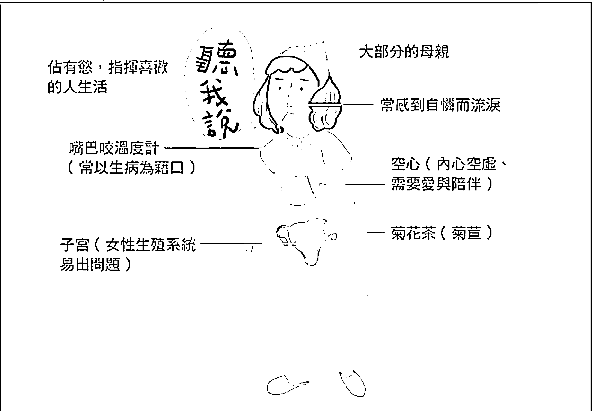

#### 鐵線蓮

##### 花精檔案

- 拉丁學名 | Clematis vitalba
- 七大分類 | 對現實興趣缺缺類
- 製作法 | 日照
- 關鍵字 | 幻想未來
- 正面特質 | 回到現實

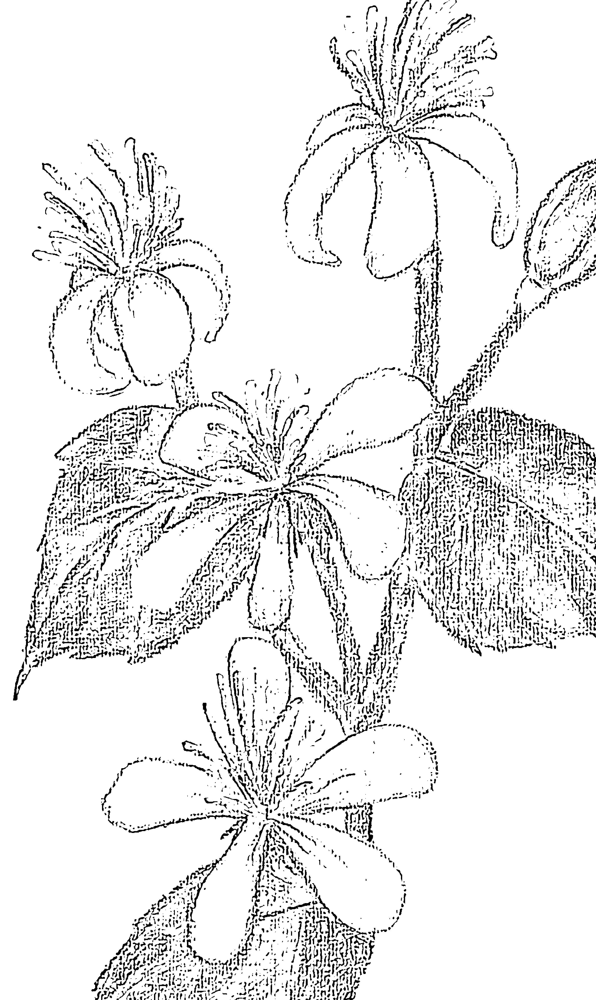

## Clematis

##### 巴赫醫師的敘述

愛幻想、昏倦、不全然清醒的人，對生活沒太大的興趣。安靜，對目前的現狀並不真的開心，活在未來甚於現在。希望未來更幸福，理想可以實現。如果生病了，他幾乎不會付出努力來復原，在某些情況下甚至更期待死亡，期盼死後時光會更好，也許能與逝去的摯愛的人再相會。

> ——出自《 The Twelve Healers and Other Remedies 》

弱點：冷漠

美德：溫柔

你是否對生活沒什麼興趣，醒來時幾乎希望不用再面對下一天？生命如此辛苦艱難，喜悅這麼少，沒什麼事情值得花時間，如果能只是睡覺該有多好，不需要努力嘗試去復原？你的眼神如此遙遠，好像活在夢中，覺得夢境比生活美好多了。還是你更常想到過世的人？如果你有這樣的感覺，你就是在學習「撐下去，即使你一無所有，只剩下告訴自己撐下去的意志力——也要撐下去！」( 譯注：出自吉卜林Rudyard Kipling的詩 )，而如果你過關，這會是一場偉大的勝利。

這種用來裝飾樹籬的美麗植物，鐵線蓮，生長在白堊土，更熟知為「旅人的喜悅」。羽狀的種子總是希望被吹走、重新開始，這會大大幫助你回到現實，面對生活，找到工作，帶來喜悅。

> ——出自《 Free Thyself 》

##### 鐵線蓮VS.中醫觀點

虛空藏咒，是佛經十小咒之一，常在寺廟中和大悲咒合印成一本，這個咒的功用是可以讓人的記憶力提升。國小六年級時，由於因緣，我在關渡宮拿到這本經書，對於書中記載虛空藏咒的功用感到好奇，花了點時間將它記下後，我試著背誦大悲咒，或許是小時候記憶力較好、也或許真的是這個咒的關係，發音艱澀的大悲咒不花三天的時間就已銘記於心，朗朗上口。之後常有人問我要如何提升記憶力，我總會建議他們不妨試試這個咒語。

虛空代表著腦中空無雜念，當一個人心無它念時，學習速度是最快的，有些速讀教材也強調必須放空，才能獲得最佳的學習效果。但對現代人而言，這個要求顯然很難達到，因為人們的心中總存有許多慾望及幻想：年少時渴求情感的滋潤；踏入社會後，追逐著名與利，以及永無止息的欲求，造成心思飄渺，無法活在現實生活中。禪修的第一個重要的課題便是活在當下，但一般人卻常活在顛倒夢想中，無法法定志，而鐵線蓮花精則可以幫助我們專注，讓人們不再虛無縹緲。運用這個花精，除了可以幫助我們禪定外，也適用於下列特性的人服用：

- 發生事情後失神，神情恍惚，不停地走來走去。
- 生活在幻想中，總是期待更美好的未來。
- 記憶力差，容易患有老人痴呆症。
- 做事漫不經心、心不在焉。
- 對現實生活逃避。
- 臉色蒼白。
- 嗜睡。

##### 鐵線蓮 × 情緒與思緒

鐵線蓮狀態的人，生活在虛空幻想中，翻開巴赫醫師的醫案，不難發現鐵線蓮花精常應用在發生事情後失神的人，不論是高燒後嗜睡的患者；或情人分手時，滿腦空白地在房間內走來走去；或是在遭受巨變後，對現實生活充滿冷漠、興趣缺缺、昏昏欲睡，均可使用它。上述這些情況在現今複雜多變的社會中相當常見，因此鐵線蓮花精用量也較大，急救花精中，就有這個成份，主要就是要用它來幫助回神。

巴赫醫師描述鐵線蓮狀態的人，目光會有些冷淡、臉色蒼白沒有生氣、嗜睡、身體虛弱，為何會有這樣的體格呢？易經的一句話：「陰陽之道，同氣相求」，是所有花精功用推論的基石。鐵線蓮狀態的虛弱體格可由其情緒比對引伸而出：

> 生活在虛空幻想：不腳踏實地=身體虛弱：沒有體力活動、嗜睡

##### 花精運用

鐵線蓮特性的人對於當下和生活周遭都沒有興趣，有人歸納出是因為對現實生活不滿，或是感到生活枯燥乏味，故退縮在自己想像空間裡，因而喜歡編織未來美好的夢想，不知不覺中便神遊太虛。睡眠除了是他們做夢最好的場合外，也是一種逃避現實生活的方式，至少不會讓他們看到討厭的生活。所以鐵線蓮特性的人普遍有嗜睡的習慣，常可看到他們在上課或上班時頻頻打瞌睡，巴赫醫師也曾用它來治療腦膜炎後昏睡的患者。但這種不務實的生活態度，常使得他們做事心不在焉，容易漏東漏西，時常忘記他們所說的話或者別人交代的事情。比較嚴重的，則可能會有未老先衰的情形出現，記憶力大幅下降。臨床上，當我們遇到臉色蒼白且又恍神的人，便可使用這個花精，尤其在家長說小朋友讀書或上課時會心不在焉、注意力無法集中時，除了栗樹芽苞外，鐵線蓮也常是主要選項之一。

有一點要特別提出的是，有時鐵線蓮特性的患者在生病時，並不會急著想要痊癒，因為生病之後，他們可以藉由生病來逃避現實與困難，這和菊苣用生病來乞討同情是不同的。臨床上有些憂鬱症患者之所以不會好，是因為他們想藉此來逃避現實的一些挑戰，如被上司責罵時，他們會裝成憂鬱症，好讓大家同情他，不再責備他們，這時鐵線蓮便可派上用場，但最好再加上患者內心真正care的情緒花精，才能將他們的思緒徹底根治。

愛因斯坦說：「 想像力比知識重要。」有一段話形容的很生動：「 用勞力賺錢太辛苦，用資本賺錢進步一些，用知識賺錢更好一些，用想像力賺錢最划算。」對於杜拜的帆船酒店，大家都印象很深，中東的杜拜、阿布達比以創意行銷全球，在這全球重視想像力的時代，鐵線蓮花精，將是那個把創意帶到現實的重要關鑰。思緒飄渺的人，常有著絕佳的創造力，想像力豐富的他們，常會是個優秀的思想家、藝術家或發明家。而在面相學上，手指纖細的人大多較有藝術天份，這倒可以提供我們一個使用鐵線蓮花精的依據。

中醫強調五行，土為後天之本，而中國哲學也強調天覆地載，后土可以承載萬物，也象徵著土可以使我們做事腳踏實地。因此常在草地上或海濱沙灘上打赤腳走路，對務實性提升頗有幫助，有類似服用鐵線蓮花精的作用。當然運用花精是可以幫我們更快速地帶回到現實面上來，將難以付諸實行的理想轉化為具體動作，完成人世間即時須處理的事。《金剛經》所說：「一切有為法，如夢幻泡影，如露亦如電，應作如是觀。」人世間的一切，雖如往事如煙，但面對生命的無常，又何必再去幻想未知的未來呢？

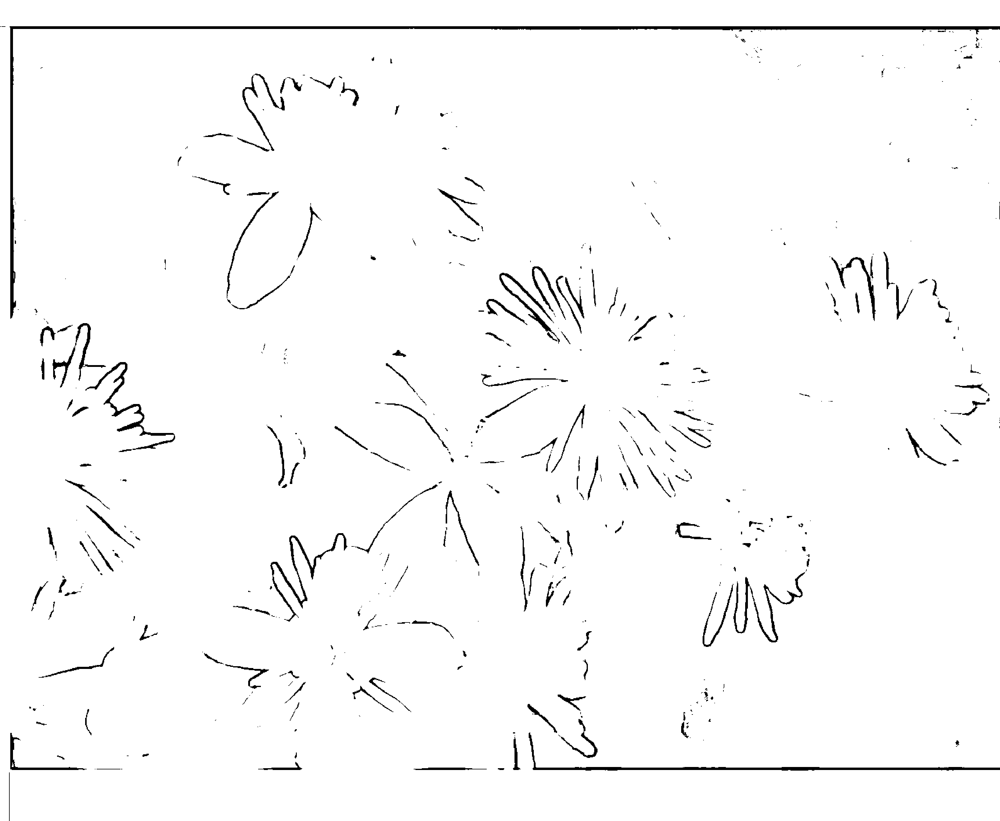

##### 李醫師診間案例探討

簡小姐，22歲，大學生，2007年5月7日來診，主訴：頭痛、容易昏沈、白天容易疲倦，睡覺時須戴耳塞，否則睡不著，並且容易驚醒，腸胃功能不佳，時常便秘腹瀉交作。個案曾因腦膜炎發高燒，之後便產生上述這些症狀，持續數年迄今。簡小姐除了有這些情形外，在觸診時，我發現其右頸項相當僵緊，而簡同學也認為她的脖子活動不是很順暢。

除了開立中藥外，我搭配花精配方：岩玫瑰、鐵線蓮、橡樹、鵝耳欐，外敷於右頸。由於她是學生，因此我另外調配一小罐的花精治療瓶送她，建議她有空就滴在手心。

一週後回診，主訴頭痛減少，白天容易疲倦的情形有所改善，但仍會頭暈，容易昏沈，容易驚醒，睡覺時仍須戴耳塞，鼻塞。這次使用花精配方：岩玫瑰、鐵線蓮、橄欖、胡桃外敷於右頸，並調配花精治療瓶。

兩周後來診，頭痛減少許多，白天的疲倦感也消失大半，容易驚醒現象已完全消失，尤令她高興的是，睡覺時已不須戴耳塞，可熟睡至天亮。

#### 花精解析

岩玫瑰：容易驚醒，為深沈恐懼的一種表現，對於主訴半夜會驚醒的患者，我常會用到這個花精。

鐵線蓮：對治昏沈，臉色蒼白的個案，尤其是曾有腦膜炎的患者，更是巴赫醫師醫案中記憶的case。

橡樹：右頸項僵緊的反射區，為身體地圖的橡樹反射區，可將因情緒導致的頸部緊繃放鬆。

鵝耳櫪：情緒性疲倦，個案認為腦膜炎會傷到自己的腦，故心理上認為自己一定會昏沈，因而容易疲倦，使用這個花精可消除其心理上的疲倦想法。

橄欖：消除所有疲倦的通用花精。

胡桃：提供一環境保護的能量，較能不受外界干擾。

使用花精兩週後，當初因腦膜炎而產生的極度驚恐消失，故可以很好入眠。花精雖不是安眠藥，但當負面情緒消除時，自能好眠，而一些情緒所引發的疲倦，在使用花精後，也能讓精神好轉。

##### 相似花精區辨及補充說明

1. 禪修花精：忍冬、白栗、鐵線蓮（活在當下）。
2. 為了過自己喜歡的生活，逃避家人，而搬離家，也算是躲進自己的世界的鐵線蓮現象。
3. 在遭受巨變後，對現實生活充滿冷漠、興趣缺缺、昏昏欲睡，均可使用這個花精。只要有冷漠、興趣缺缺、昏昏欲睡，不須要幻想美好的未來，便可用鐵線蓮。
4. 強迫自己不停地前進，便可用馬鞭草，而鐵線蓮可驅逐無法控制的睡意。

| 狀態 | 花精 | 描述 |
|------|------|------|
| 嗜睡 | 鐵線蓮 | 幻想美好未來 |
| | 橄欖 | 身心都過勞而疲倦 |
| 疲憊無力 | 鐵線蓮 | 愛幻想、做白日夢 |
| | 橄欖 | 身心俱疲 |
| | 鵝耳櫸 | 心理倦怠 |
| | 野玫瑰 | 對一切都提不起興趣 |
| 想太多 | 鐵線蓮 | 幻想美好未來 |
| | 忍冬 | 沉溺過去 |
| | 白栗 | 反覆想著最近的事 |
| 外表疏離 | 鐵線蓮 | 因為太沉浸在自己的幻想世界 |
| | 鳳仙花 | 因為不想等人，寧可獨自行動 |
| | 水堇 | 因為孤傲，喜歡與人保持距離 |

##### 與鐵線蓮花精相似的新一代花精

- 1. 鳶尾草花精（Crystal Herbs業力花精）
- 2. 活在當下花精（Crystal Herbs神聖和諧花精）
- 3. 回神花精（Crystal Herbs內在小孩花精）
- 4. 明晰之光花精（蘇格蘭花卉花精）
- 5. 把握當下·琴葉珊瑚花精（晶荷日光花精）

##### 鐵線蓮花精功用圖像記憶

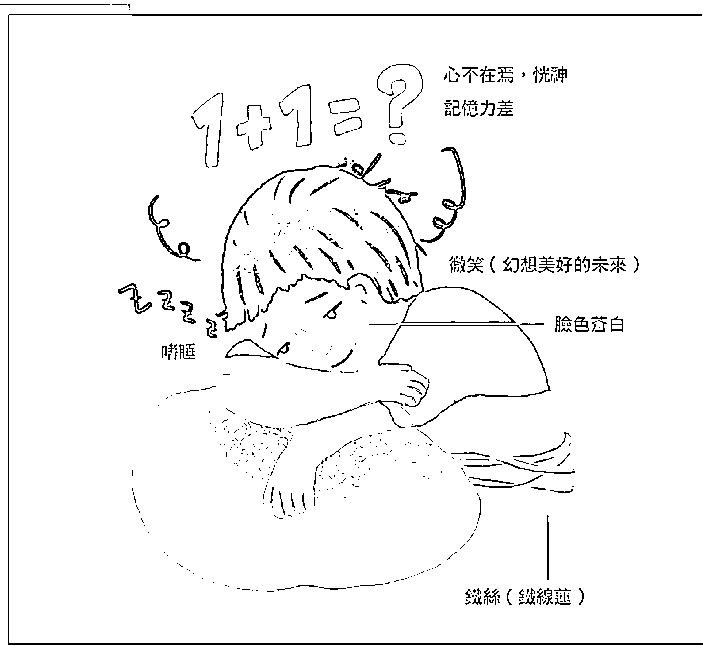

#### 野酸蘋果

##### 花精檔案

- **拉丁學名** | Malus sylvestris
- **別名** | 野生酸蘋果、海棠
- **七大分類** | 沮喪絕望類
- **製作法** | 煮沸
- **關鍵字** | 不潔感
- **正面特質** | 淨化

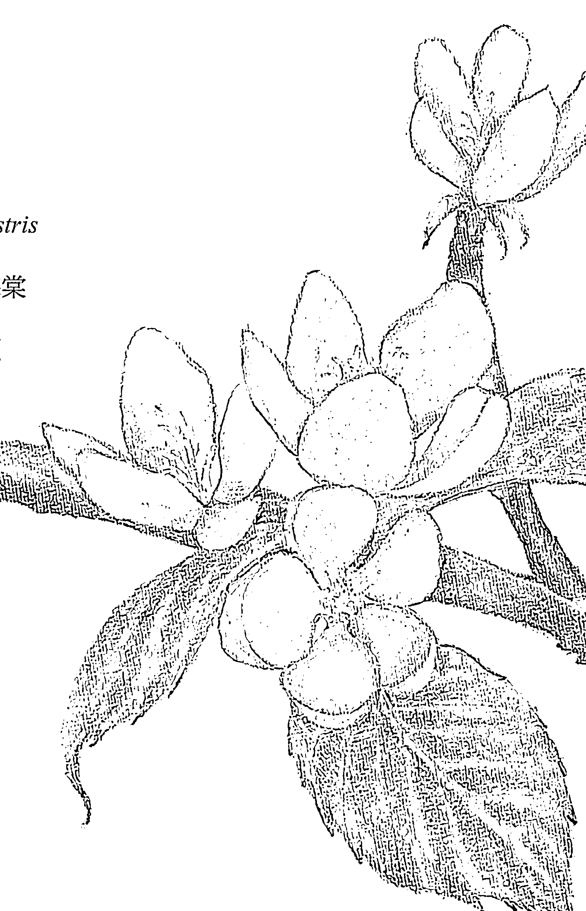

##### 巴赫醫師的敘述

這是淨化花精。給感覺自己不是很乾淨的人。相較於有些人患有更嚴重的疾病還能置之不理，他卻只聚焦顯然不重要的小事。無論是感覺自己不乾淨，或聚焦在小事，他們都急著從這件事獲得解脫，這件事在他們腦中是最大的事，對他們來說是如此重要，必須獲得治癒。如果治療失敗，他們會很沮喪。而作為一支淨化花精，如果病人有理由相信傷口有毒素入侵，必須加以排除時，這支花精能加以潔淨。

> > ——出自《The Twelve Healers and Other Remedies》

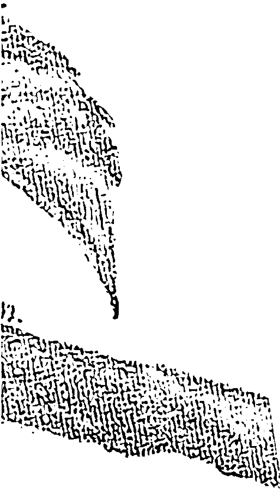

##### 野酸蘋果VS.中醫觀點

中國北京著名的溫病學者宋乃光教授，有次應邀來我們位於中壢的診所參訪中醫醫學美容部門。在座談中，她有提及一個案例：有位二十出頭的妙齡女郎，因眼角下方的一個小黑斑而焦慮地到處求醫，當她找到宋教授時，教授當時還找不著女子所說的黑斑在哪裡？最後是透過放大鏡才見著那一丁點的小黑斑（因為實在太小了，不仔細瞧根本看不到），宋教授是開立逍遙散類的方劑給那位小姐，座談中也討論到傳統中醫是如何治療。

其實面對這樣的患者，醫生除了用美白的中藥材進行治療外，最多也只能加些心理衛教的方式幫助她，但如此的傳統療法，對個案幫助並不大，因為關鍵在於如何讓患者能全然地接納自己的身體，而不要過份地對身體、細節太過執著，才能免除這樣的煩惱。在整形外科門診中，常可見有些身材、面貌已十分姣好的患者，為了身體的一些小地方而動大刀，不僅浪費金錢，且又耗費大量的時間。巴赫花精中，野酸蘋果花精則是可以幫助這樣的患者，讓個案能欣賞自己的一切。

## 應用條件：

- 對於細節要求完美，若沒有達到預期的標準便會懊惱。
- 常為了雞毛蒜皮的小事，而感到沮喪或焦慮不安。
- 有潔癖，不喜歡別人用過的東西。
- 對自己的疾病過於在意。
- 害怕被毒物入侵。
- 容易得皮膚病。
- 潔淨花藥。
- 強迫症。
- 白帶。

##### 野酸蘋果 × 情緒與思緒

凡事要求完美可說是野酸蘋果特性人共有的特點，有些女性朋友，在生理期時冒一兩顆痘痘，體重稍微小增個0.1公斤，便強烈覺得自己變醜，開始討厭自己的長相，憎恨自己的體重，而到處求醫治療。她們對於身體一些微不足道的小毛病相當重視，而且容易焦急，倘若這些疾病未能適時的解除，她們就會認為身體不夠完美，而感到相當沮喪。

但這種注意身體小細節的特性也會讓她們終日活在恐懼中，如被一根小毛刺刺到，便會害怕是否會因而得病、是否會得AIDS、身體一不舒服便會懷疑是否病毒已入侵。因此野酸蘋果特性的人會強迫自己不停地整理、不停地清潔與洗滌。有些患者一摸到身體外的東西便會不由自主地一直洗手，彷彿手上染有毒物，不趕快清洗就會受到感染般，這就衍生成現代人另一個常見的問題：潔癖。有潔癖的人不喜歡別人用過的東西，即使是不得不用到公共的物品，也會先行擦拭，如進入飯店後，害怕枕頭髒，會自己先墊個毛巾再睡覺；浴室的毛巾桿會先用衛生紙多擦幾次，才敢放毛巾上去；在餐廳用餐前，會仔細檢查刀叉，並用紙擦拭一番，會這樣，都是因為害怕毒物入侵。

##### 花精運用

野酸蘋果狀態的人無法接受環境的不完美與無秩序，並容易顯現出憎恨與排斥的行為，以滿足其心目中的完美境界。如新聞報導某足球金童有龜毛個性，要求眼前的東西都得規律整齊，不是排成一列、就得成雙成對，就算飲料也不例外，若有三罐飲料出現在眼前，一定會丟掉其中一罐，讓它始終成雙，新聞對此評論說他可能患上強迫症，其實只要野酸蘋果就可輕鬆處理這個問題了。我的鄰居也常為了浴室的一點小灰塵而把整間浴室洗了一遍，都是屬於這種野酸蘋果的要求完美特性。

有些個案則會把注意力集中在繁雜瑣事，如出門前門窗檢查再檢查，即使已進入電梯中，也在煩惱剛才的鐵門是否有鎖好，而無法控制地跑回去再拉一下鐵門看看。像這樣到處查看，確保萬無一失，就是怕門窗鎖的不夠完美，壞人會入侵。由於他們對於瑣事過度關注，常因此忽略重要的事，如一個媽媽對於全身淋濕的小朋友進門前沒把鞋上的泥巴弄乾淨，比他會不會感冒還要關心，這種見樹不見林的特性，在運用野酸蘋果花精後，可消除對繁雜瑣事的過分專注與執著，讓生活多些愜意。

在生理部份，翻開巴赫醫師的醫案，可發現野酸蘋果在生理問題的應用上相當廣泛。巴赫醫師當初發現野酸蘋果時，全身起疹、頭髮掉落、皮膚潰瘍、大腸也不斷的出血，一直到他自己運用這個花精後，這些症狀才完全的解除。臨床上，我常據此應用在女性白帶過多、各種皮膚病（青春痘、濕疹、蕁麻疹），僅用花精貼敷便有效果。不過我發現要把野酸蘋果花精用的好，治療的關鍵在於個案是否會對上述這些症狀感到厭煩或噁心，才符合這個花精的特點，用了才會有效。如有白帶的女孩，覺得白帶很髒，常不自覺地厭惡自己，這時用野酸蘋果效果就不錯，倘無這種情緒，患者覺得白帶沒什麼，是正常的，此時用這個花精就看不出什麼效果了，這主要在於花精是治療情緒引起的身心症，必須情緒契合才行。有一點好玩的是，有些人咳嗽，其實並不是真的生病，而是她們認為體內有髒東西，會藉由這種假咳嗽來幻想排出病毒，當然也可用這個花精來處理。急救乳霜中都有野酸蘋果的成分，對於傷口及皮膚病都有不錯潔淨排毒的作用，有些臨床治療師會使用它來潔淨傷口。皮膚病可看成是毒素往外排所產生的症狀。其實各種負面情緒都會產生的毒素，疾病如牛皮癬、寄生蟲、尿酸過高、腎結石、癌症、血糖過高、便秘等現象，也可看成是毒素現象，運用野酸蘋果做為毒素淨化，但仍需配合其他花精來處理其負面情緒的主因，方能有效。

不論潔癖的形成或要求完美，其實這都是內心充滿著不潔與不完美，向外投射的結果。曾讀一個歷史故事，某日蘇東坡與一高僧打坐，過了約一柱香時間，蘇東坡覺得渾身舒暢，便問高僧說：「你看我現在像什麼？」高僧回答蘇東坡：「我看閣下像一尊佛。」高僧也反問蘇東坡說：「那閣下見我像什麼呢？」蘇東坡答道：「我看你像一坨大便。」高僧臉上微微一笑，便又繼續打坐了。蘇東坡沾沾自喜，回來後把這件事告訴他的家人，他家人點醒蘇東坡說：「心中有屎的人，才會把別人看成屎。心中有佛的人，便會把別人看成佛。」蘇東坡聽後為之汗顏。若東坡居士當時會用野酸蘋果花精來淨化內心，就不會留下這個千古笑話。巴赫醫師把野酸蘋果做為身體與心理的潔淨花精，就是用它來淨化生理與心理的污染。因此這個淨化花精，可幫助去除任何在想法上、意識上或身體上我們所不喜歡的部分，有些人失去勇氣、絕望就是因為其體內充斥著絕望與憎恨，用野酸蘋果可以清除心靈及身體內的厭惡的因子，讓我們身心靈能處於平衡、純淨與完美狀態，而保有更多的喜樂。

##### 李醫師診間案例探討

蕭小姐，因白帶問題來診，主訴白帶量多、白帶呈乳白色，並有異味，患者這個情形已持續數個月，曾在醫院門診無效。問診時，患者對於這樣的情形覺得難以啟齒，總是用羞愧的言詞來形容，表明了其覺得白帶很丟臉，一直很想把這個疾病消除。中藥處方：當歸芍藥散加減。花精外敷處方：野酸蘋果，外貼於「溫溜穴」。一個星期後，患者回診時告訴白帶量已減少，異味也消退不少。

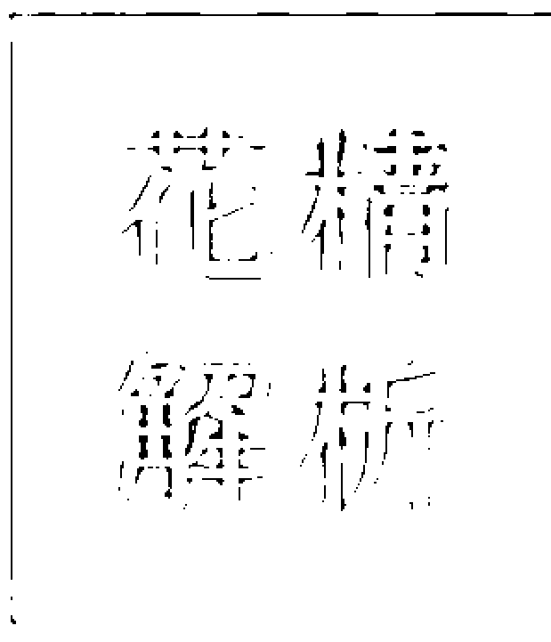

#### 野酸蘋果

是巴赫花精裡唯一記載有生理疾病應用的花精，對於白帶、皮膚病而有羞恥感時，會有不錯的清除效果，臨床上當個案對某種疾病有厭惡感時，便可使用此花精。

溫溜穴或三間穴，均位於手陽明大腸經，野酸蘋果花精貼敷於此，可讓花精療效提升。

##### 相似花精區辨及補充說明

1. 野酸蘋果⊕松樹花精可用來泡澡，大人各10滴，小孩各5滴，滴入浴缸中，可協助處理皮膚病及做為身體磁場淨化之用。
2. 遇到不潔或參加喪事用法：傳統是用抹草來洗澡，在巴赫花精中「胡桃⊕野酸蘋果」泡澡也有同樣的效果（大人各10滴、小朋友各5滴）。
3. 潔淨傷口，可用2～4滴野酸蘋果稀釋100cc生理食鹽水使用。
4. 野酸蘋果：松樹=噁心／厭惡：罪惡感
5. 下視丘旁的邊緣系統會受情緒影響，因而間接影響到內分泌及自律神經系統。當體內的內分泌失衡時，便會引發臉上痤瘡及肥胖問題，常見許多人一緊張壓力後便滿臉痘花、體重直線上升。在傳統耳穴裡，耳垂處就有一個「身心穴」，是用來調控邊緣系統，對身心紓壓有幫助，但效果仍不若花精來得直接。

常見下列的花精可藉由調整情緒來輔助醫學美容：

- 龍芽草：針對嗜吃及因發洩不滿而暴飲暴食。
- 野酸蘋果：讓個案喜歡自己的身材，不會為一點小問題而嫌棄自己。
- 溺酸漿、落葉松：讓個案對身材有信心，勇於秀出來。
- 栗樹芽苞：針對個案到處嘗試新奇的美容、減重產品，減肥沒恆心又不專一。
- 龍膽：使個案能突破減重停滯期。
- 矢車菊：針對上腹部肥胖，太陽神經叢虛弱的患者。
- 脈輪花精：全身虛胖（補充元氣）。

## 美容疗程前期

## 美容疗程中

## 美容疗程后期

- 龍芽草
- 溺酸漿落葉松
- 野酸蘋果

| 類別 | 花精 | 描述 |
| :--- | :--- | :--- |
| 對自己的疾病太過在意 | 野酸蘋果 | 追求細節上的完美，一顆小粉刺也要求醫。 |
|  | 石楠 | 喋喋不休，醫生無法插嘴，從去某家醫院看診遇到誰到疾病的變化，可連講十多分鐘不停。 |
| 追求完美 | 野酸蘋果 | 追求外觀上的完美。有潔癖，不論精神上或外在環境，均追求細節上的完美，一有不完美便容易沮喪。 |
| 追求完美 | 岩水 | 對自己追求完美。會追求高標準，而且樂此不疲，習慣獨善其身。行事一板一眼，常以自己的方式步驟來處理他們要完成的事情，別人完全無法干預，他們會要求自己做的很好，達到完美要求。 |
| 追求完美 | 山毛樺 | 追求他人的完美。認為別人一定要照著自己的方法做事，否則就是愚蠢。 |
| 追求完美 | 馬鞭草 | 追求社會的完美。希望公理正義獲得伸張，而急切想要遊說他人認同自己的理念。 |

##### 與野酸蘋果花精相似的新一代花精

- 1. 佛甲草花精 ( Crystal Herbs業力花精 )
- 2. 純真花精 ( Crystal Herbs內在小孩花精 ) ( 專門處理性方面的不潔感 )
- 3. 紫斑掌裂蔭花精 ( 蘇格蘭芬活花精 )

##### 野酸蘋果花精功用圖像記憶

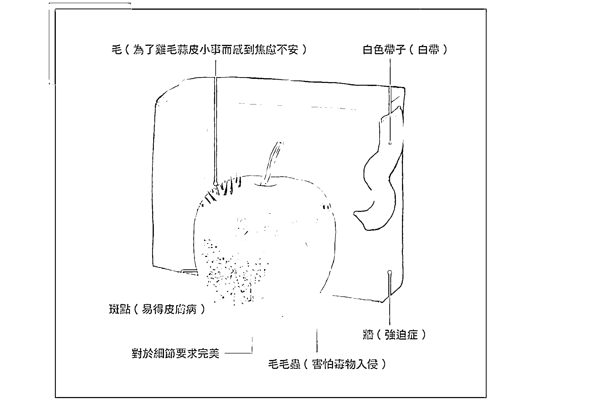

#### 榆樹

| 拉丁學名 | *Ulmus procera* |
| :--- | :--- |
| 七大分類 | 沮喪絕望類 |
| 製作法 | 煮沸 |
| 關鍵字 | 被責任壓垮 |
| 正面特質 | 信心 |

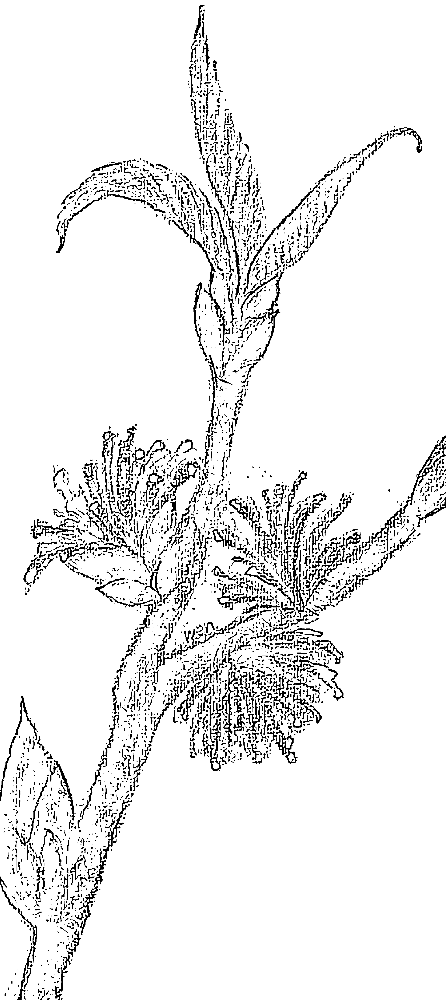

##### 巴赫醫師的敘述

這種人工作做得很好，有跟隨生命的召喚，希望做重要的事，而且通常是為了人類的福祉。當他們感覺承擔的工作太困難、超出一般人能力所及的話，可能會有偶發性的憂鬱。

> > ——出自《The Twelve Healers and Other Remedies》


##### 榆樹 VS. 中醫觀點

李媽媽，因兒子媳婦忙著工作，為了減輕他們的負擔，便將孫子帶來身邊照料，但從那時起就無法入眠。詢問原因，乃李媽媽責任心很強，怕沒把孫子照顧好，心中認為受託帶小孩就要做到無微不至，因此睡覺時為了怕孫子踢被著涼，便時常清醒，導致這段日子來睡眠品質不佳。

人們在遇到挑戰或重大任務時，常會有多種心態呈現：有的人自信心不足，直接放棄，形成落葉松心態；有的人無論如何也要堅持下去，不管多苦都照撐不誤，造成橡樹情緒；而有些人則會憂慮自己應付不來，造成短暫的憂鬱、沮喪，這便是榆樹情緒。李媽媽的狀況，就是這種榆樹特性，在應用了榆樹花精後，睡眠品質開始好轉，心中被責任壓得喘不過氣的感覺也漸漸釋放。

榆樹花精是用來減輕壓力的，現代人工作壓力普遍都很大，尤其是在高科技產業的競爭壓力下，更需要這個花精來幫忙。

### 應用條件：

- 責任心很重，常有過高的期待，過度努力而精疲力盡。
- 獨自面對重大的責任，突然擔心無法勝任而信心動搖。
- 強者短暫的憂鬱。

##### 榆樹 × 情緒與思緒

榆樹特性的人平時充滿自信、能力很強，但由於對所負的責任太過在意，且又獨自攬下重任，不會把工作share給別人，因此常會過度努力，形成過勞現象，即使是在玩樂時，依舊掛念著工作的事。這樣過強的責任心有時會讓個案產生突發性的信心危機，「不知道自己是否應付得了」的思緒會一直浮上心頭，造成當事人短暫的憂鬱。

雖然這種情形只是暫時性的能力喪失，很快的可以恢復，但仍會造成個案不少的困擾，甚或有失常的表現。有些運動選手在平時成績出色，但到了重要比賽，卻突然全身乏力、使不出勁來，好像能量被抽乾一樣，都可以用榆樹花精來提升自己的成績。之前體壇曾有跆拳道國手，參加比賽時就因為此種榆樹情緒而痛失金牌，讓人惋惜。

##### 花精運用

憂鬱的情緒本來就會使得體內的神經系統及內分泌系統紊亂，這兩個系統原本是人體內最重要的調節裝備，但當系統失靈時，再加上過度勞累，便容易有「過勞死」的猝死情形產生。這原本是在日本出現較多，但現在竹科等科學園區也常耳聞有員工或主管因過勞而死亡的例子，而榆樹花精的應用，在過勞死的預防上會有不少的幫助。

在肉體上，當身體過度活動部份肌肉時，也會導致自我意識產生榆樹情緒，認為自己快要無法負荷了，這種情緒一產生，便會造成該部位肌肉韌帶機能自動下降、局部肌肉產生沾黏等發炎痠痛情形，如媽媽手、網球肘、高爾夫球肘等各種肌肉關節的疼痛，這是人體身心靈合一的必然作用機轉。在Dieter Kramer的身體地圖資料中，不難發現經常活動的右手上，榆樹反應區分佈較多，這可為過勞理論提供良好的佐證資料。

古人說：「天下事無好也無壞」，榆樹特性的人，由於工作能力強，經常獨力承擔過多的工作，因此常被派駐在重要職位。就外人眼中，升遷雖是件好事，但也代表著會有更多的挑戰，會讓您的心力被瓜分的更厲害，因此是福是禍就看人們心境如何取捨了。倘若覺得肩上的擔子愈來愈重，快要超出負荷而令自己無法承受時，榆樹花精可以幫助我們應付這些難以承擔的驚慌，讓被各種責任壓的透不過氣而感覺沮喪的人，能有個更清楚的頭腦，以理性、樂觀的態度來面對接踵而至的挑戰，順利解決眼前所有難關。

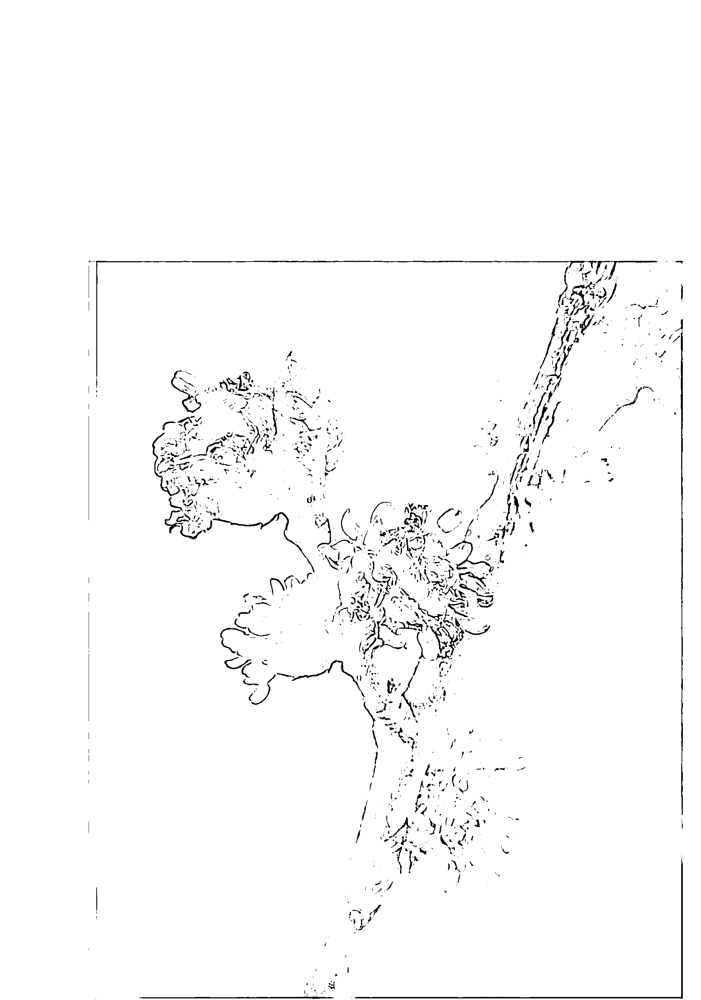

##### 李醫師診間案例探討

許小姐，47歲，來診時主訴口乾、胸悶、淺眠、腦袋中會一直想著白天的事，除此之外，腰痛問題也持續困擾著她，個案雖有服用抗焦慮劑及肌肉鬆弛劑，但血壓仍不穩定，所有症狀均改善不大。在問診中得知許小姐自從國外回國後，常須處理公事及翻譯著作，因而工作壓力大，而且不太會將工作分配給下屬，把所有的事情都攬在自己身上做，因而心力憔悴，極度疲倦。給予花精配方：榆樹、落葉松、馬鞭草、橡樹、橄欖、矢車菊。

一週後回診，雖睡眠情形尚無明顯改善，但在工作上已會主動分些工作給下屬做，不會再獨自承攬所有的業務，因此覺得工作壓力下降，心情也輕鬆不少。腰痛部份雖有另行去別處中醫診所做過AMCT美式整脊治療，但骨架檢查結果均正常，照理來說若骨架正常是不會有疼痛情形產生，因此持續性的腰痛及下半身肌肉痠痛情形令她倍感困擾。我問她腰部之前有受過什麼樣的傷害嗎？許小姐回答我說腰部曾因跌倒造成第四、第五腰椎擠壓，該處並有做過椎間盤手術。花精配方同上週，並加入聖星百合。

又一週後回診，睡眠情形已開始好轉，雖會想白天的事，但對於入睡不致有太大的影響。神奇的是腰痛部份，在使用花精後，困擾許久的腰痛及下半身肌肉痠痛消失了。而工作自主性提升更多，會懂得去指揮別人做事，且也會回絕不合理的要求，不再照單全收，心情也份外輕鬆，相信花精可以調適身心，因而繼續接受治療。

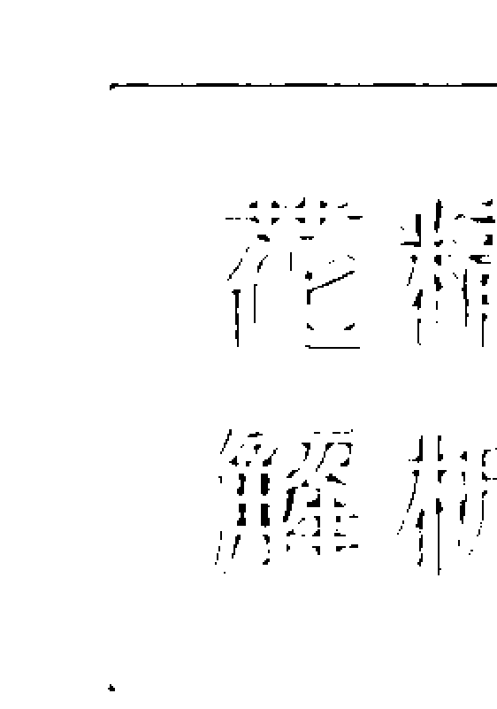

榆樹：獨自承攬所有工作，壓力大，怕自己應付不來。
落葉松：給予療癒的信心。
馬鞭草、橡樹：肌肉緊繃者可用以放鬆。
橄欖：恢復體力。
矢車菊：讓個案自主性提升，懂得將工作分配給別人，並懂得拒絕別人不合理的要求，不再活在別人的影下。
聖星百合：許小姐的腰部曾因椎間盤手術及跌倒受傷，這些均可視為腰部創傷，可用聖星百合撫平創傷。

許小姐前往我一位專門做AMCT美式整脊的朋友處檢查，腰椎均正常，以常理來說檢查結果正常是不應該會有腰痛的，但就情緒面來說，情緒會有記憶性，當過往的創傷經驗未及時做消除時，疼痛就會持續，因此用聖星百合消除其過去因椎間盤手術及跌倒受傷的傷傷經驗，腰痛及下半身肌肉痠痛情形才有好轉的時候。

##### 相似花精區辨及補充說明

- 1. 因責任過大而信心動搖：落葉松⊕榆樹。
- 2. 有些人在演講前，會有流手汗現象，亦可視為榆樹現象，用榆樹⊕落葉松可讓人不怯場。

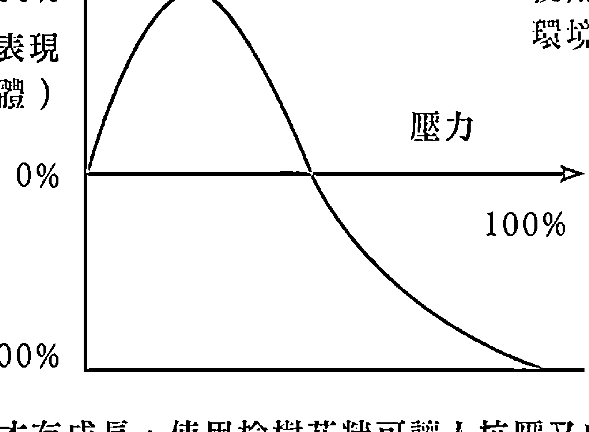

使用榆樹花精可在壓力環境下，提升表現能力。
有壓力，才有成長，使用榆樹花精可讓人抗壓又成長。

| 类别 | 花精 | 描述 |
| :--- | :--- | :--- |
| 短暫的憂鬱 | 芥末 | 突發性的憂鬱，如烏雲罩頂 |
|  | 榆樹 | 遇到重大責任會憂鬱 |
| 能力強 | 橡樹 | 負擔再重也硬撐下去 |
|  | 榆樹 | 負擔一重便會產生信心危機，超出了能輕鬆應付的範圍。但榆樹很有信心，不像落葉松無信心 |
| 失去信心 | 榆樹 | 一般而言對自己很有信心，能力也很好，是在負擔過重時，才會產生短暫信心危機，但仍會努力繼續做 |
|  | 落葉松 | 因為對自己一直都沒信心，一開始就不願嘗試 |
|  | 龍膽 | 並非天生沒信心，是在遭遇失敗或挫折之後，才漸失信心，但仍願嘗試 |

##### 與榆樹花精相似的新一代花精

- 海底輪花精（Crystal Herbs脈輪花精）
- 佛甲草花精（Crystal Herbs業力花精）
- 堅強力量花精（Crystal Herbs神聖和諧花精）
- 歐石楠花精、海濱芥花精（蘇格蘭芬活花精）

##### 榆樹花精功用圖像記憶

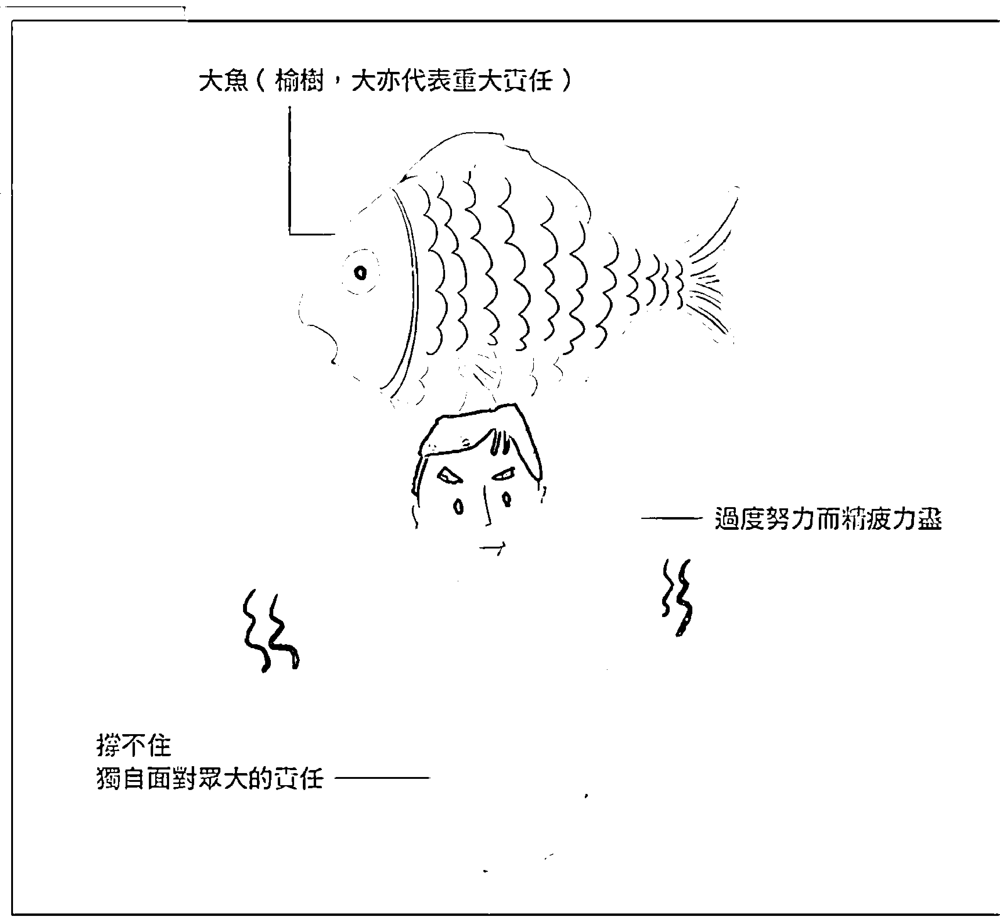

#### 龍膽

花精

精靈

- 拉丁學名 | Gentiana amarella
- 別名 | 龍膽根、龍膽草
- 七大分類 | 不確定類
- 製作法 | 日照
- 關鍵字 | 挫折後的沮喪
- 正面特質 | 信心

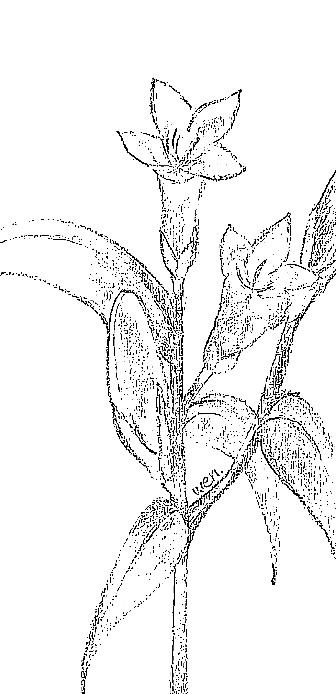

##### 巴赫醫師的敘述

容易感到挫折的人。他們也許疾病復原良好，或生活進展得不錯，但是任何過程中的延遲或阻礙，都會讓他們灰心懷疑。

> > ——出自《 The Twelve Healers and Other Remedies 》

- 弱點：懷疑
- 美德：理解

你是否有遠大理想，希望做些好事，卻在發現自己的企圖心無法快速實現時，感到灰心？當成功唾手可得，你興高采烈，但是當困難出現時，就很容易沮喪？若是如此，生長在小丘田野上的小小龍膽草能幫助你堅定目標，就算烏雲密布，你也能保持快樂與希望。它會不斷給你鼓勵，讓你理解：只要盡力而為，那麼無論結局如何，都沒有所謂的失敗。

> > ——出自《 Free Thyself 》

##### 龍膽VS.中醫觀點

中秋節時，和大家湊熱鬧去參觀台北101大樓，坐快速電梯到達91樓時，有一個金色大球，重量達660公噸，相當巨大，服務人員說這個叫調質阻尼器TMD（Tuned Mass Damper），是用來減低大樓受風吹時之擺動、以及吸收地震的震波，以確保大樓安全。而這個設計，就是物理學上所謂的緩衝系統（Bumper System）。

緩衝系統的作用是在降低衝擊力，有時在電視上，看到有人跳樓自殺，消防隊員在樓下鋪設的氣墊，就是另一類型的緩衝系統，用來降低跳樓者的傷害。而在情緒治療上，也有一個花精作用與緩衝系統相似：龍膽，用來對治因遭遇挫折而缺乏勇氣、意志消沉。

人生的路途起起伏伏，遭遇挫折在所難免，有人在遭遇挫折後即一蹶不起，有些人則會因此而缺乏向前邁進的勇氣。龍膽花精就是用來吸收挫折給我們的衝擊、中和悲觀的思緒，讓我們快速回復原狀，繼續邁進，不再意志消沉。

### 應用條件

- 生病去看醫生，報告尚未出來便認定一定有問題。
- 懷疑心態，即使一帆風順也不相信運氣這麼好。
- 悲觀，凡事均想到壞的一面。
- 太消極容易形成憂鬱症。
- 一遇到挫折便氣餒。
- 疾病或減重停滯期。
- 喪偶的人。

## 圖解巴赫花精

##### 龍膽 × 情緒與思維

龍膽狀態的人有二個特點：悲觀及懷疑。

### 在悲觀部份

他們天生就是悲觀主義者，因此他們對人生總是抱持著負面或懷疑的態度，這種想法會使他們在事情進展到一半，便往壞處想。如咳嗽時，去醫院照X光，檢驗報告還沒出來就認為一定是肺癌或肺結核；在疾病恢復期，倘若病情有點惡化，就整個人崩潰，認為一定不可能康復；投資做生意，就先想到景氣不好，會很容易倒閉。這種一直往壞處鑽牛角尖的行為，很難自我調整，也常給周遭親人帶來負面氣壓。Dietmar Kramer的十二星座情緒路徑中，金牛座的情緒路徑理論有三個花精，依序為：龍膽→楊柳→野玫瑰，因此有些治療師認為龍膽特性的人，會有金牛座的頑固態度，處理起來也較為棘手。另一個現代人較關注的減重問題，也會和此花精有關，臨床上，常見到患者在減重過程中遇到瓶頸而產生龍膽情緒。我們知道減肥「停滯期」是減重過程中必經的，時間長短因人而異，但有時停滯期會使得個案喪失信心，並導致體重復胖，運用龍膽花精將使我們樂觀的向前，對於輔助減重也是一個良方。

### 在懷疑部份

他們的懷疑包括對自己能力的懷疑及對外界事物的懷疑。龍膽特性人，一遇到挫折便會裹足不前，開始氣餒，呈現意志消沉狀態。這些都是因為他們在受到挫折的衝擊後，就開始懷疑自己的能力，因此巴赫醫師把它列在「不確定類」花精族群中。如家中小孩學測成績不理想，就悶悶不樂，放棄自己，不想上學；成人們遇到面試失敗或失業，便意志消沉地躲在家中，足不出戶；和女孩子約會被拒絕時，便覺得自己才能平庸，相貌不佳，從此不敢向別人邀約；而喪偶的人，會因為另一半去世的衝擊而開始懷疑自己人生的意義，因而時常愁容滿面。

##### 花精運用

這種自我懷疑的態度，連帶使他們跟著懷疑外界的一切，也因此他們只相信科學檢驗數據，期待這些經過驗證的資訊可以處理他們心中的疑惑。所以常見龍膽特性的人總是不停地檢驗、詢問他人意見，即使是去做花精諮詢，他們也只會找有執照的醫師做，這是因為龍膽特性者會懷疑一般治療師的能力。俗語說：「疑心生暗鬼」，由於天生的懷疑特性，又會使得他們不相信自己所拿到的資訊，心中雖很想相信事情這麼順利，但卻無法辦到，因而一直在死胡同中打轉。如去健康檢查一切正常時，他們會認為自己不可能這麼健康，而開始懷疑是不是醫院的檢驗過程有問題，而再去找別家診所繼續檢查。

曾有花精治療師提出龍膽人格的產生，是源自於受傷的自我保護與恐懼失敗的心理作祟。華人深信：「寵豬拿灶，寵子不孝（台語）」，因此教育小孩常以打罵來代替鼓勵，比如說小朋友走路跌倒，父母不是去安慰他，而是責罵他為何這麼不小心、為何跑這麼快。及至長大成人，不論是在課業上、事業上，在遭遇到挫折時，也很少得到適度的鼓勵與支持，而是周遭不停地批評，親人也常會說「早就叫你不要⋯⋯」這樣日久，便產生了龍膽狀態的懷疑與悲觀情緒。身為一位花精治療師，我們除了運用這個花精讓人脫離悲觀及懷疑的思緒外，也要宣導良好的教育方法，才不會因父母的教育錯誤而害了下一代。

在歐美的花精治療師，常把龍膽花精做為憂鬱症的第一線處方，易經上說：「陰陽之道，同氣相求」，時常悲觀的人，由於磁場吸引，會不斷地產生更多的負面能量，如恐懼、焦慮、急燥等，因而逐漸形成憂鬱症。國外的治療師們就是用它來打破悲觀思緒，化解憂鬱症的起頭，不過造成憂鬱症的因素很多，治療師們必須根據個案的情形對症下花精，這樣加上龍膽才能有事半功倍之效。

孟子曰：「天將降大任於斯人也，必先苦其心志、勞其筋骨、餓其體膚……」。任何挫折都是我們進步的墊腳石，也是幫助我們成長的工具，若我們能「領悟」到這一點，並適時地運用龍膽花精來當做緩衝系統，便可中和挫折的衝擊與負向思想，讓人不會掉進自我猜疑、心情低潮的死胡同中。妥善運用這個花精，將可讓人擁有無比的信心，在面對失敗後可以重拾信心，開始對眼前的困境抱持著樂觀的態度，而擁有更樂觀的美麗人生。

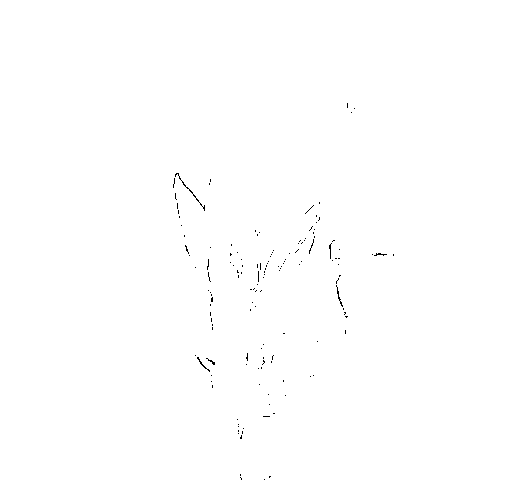

##### 李醫師診間案例探討

魏小姐的母親患有子宮頸癌，近來因白血球太低而無法化療，並有疲倦、乏力、胃口不佳、聞到食物味道便想吐的情形，個案全身虛弱，無法出門看診，讓子女焦急不已。

魏小姐來診時，和我訴說其母親的情形，問我說如何可以幫助她媽媽，我根據魏小姐口述的狀況，給予楊柳、橄欖、鵝耳櫪、龍膽四個花精混合的貼片，囑其回家幫母親貼敷於手的神門穴。一週後魏小姐複診，告知其母親近來胃口增加，疲倦感明顯減少，我繼續給予楊柳、橄欖、鵝耳櫪、龍膽花精貼片，以幫助魏媽媽身心靈能快速恢復。

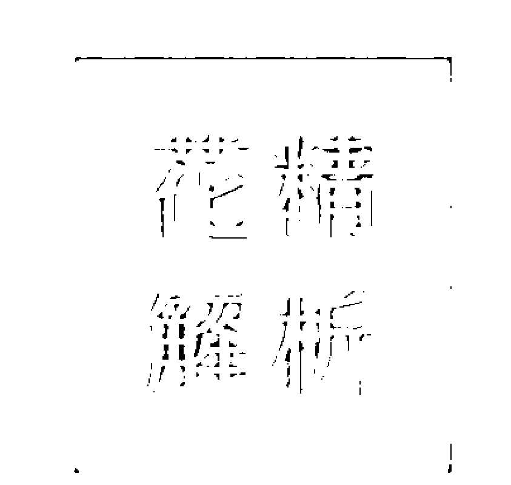

### 橄榄、鹅耳枥

癌症患者在做完化疗后，大多会有疲倦、乏力、想吐的感觉，此时可用花精缓解其不适的状况。

#### 楊柳

处理癌症患者的自怨自艾，临床上发现癌症患者常会有「为何是我得癌症」的埋怨情绪。

#### 龍膽

因无法化疗而受挫心情不舒服，龙胆花精是一个缓冲系统，可帮助任何人在遇到挫折时快速站起来，如患者因白血球值下降而不能化疗，即可用此花精抚平其受到别人拒绝的临时挫折。

花精贴敷是一种安全的自然疗法，即使是用错花精，也只是效果不佳而已，并不会有任何副作用。

##### 相似花精區辨及補充說明

1. 學習能量測試進步的工具：龍膽⊕落葉松⊕水蕨。
2. 龍膽狀態由於有金牛座的頑固個性，因此頑固者可考慮龍膽、馬鞭草、栗樹芽苞或岩水。
3. 龍膽，遭遇挫折後懷疑自己的能力，因而信心下降，他們會懷疑所經歷的一切是完美的，因而產生悲觀的思緒，日久會轉變成落葉松狀態。落葉松是僅對自己完全沒有信心，做事前已認定失敗，所以根本不想冒險，連試都不想試。
4. 龍膽情緒久了，容易演變為荊豆或楊柳情緒。

| 類別 | 情緒/花精 | 描述 |
| :--- | :--- | :--- |
| 沮喪與憂鬱 | 龍膽 | 只是失望，他們只是在遇到困難後沮喪，容易放棄，待事情有轉機，會很快再站起來。仍願嘗試 |
|  | 荊豆 | 已絕望，他們決定放棄，拒絕所有的鼓勵，不願再嘗試。即使被鼓勵、強迫去行事或看病，他們也是勉強去做，為的是證明那是沒用的 |
| 詢問他人意見 | 水蕨 | 有自己的想法，只是不太相信自己，詢問別人對這個決策的意見 |
|  | 龍膽 | 悲觀的個性，凡事均想到壞的一面，解決他們懷疑的方法就是不停地檢驗、詢問他人意見 |
| 想著不好的事 | 白栗 | 一直想著已發生的不愉快事情 |
|  | 龍膽 | 悲觀，凡事均想到壞的一面，事情尚未發生便往壞處想 |
| 憂鬱的原因 | 龍膽 | 有明確原因，因為挫折 |
|  | 芥菜 | 沒有原因，莫名憂鬱 |
|  | 荊豆 | 原因通常是長期累積下來，最後導致的絕望 |
|  | 甜栗 | 有明確原因。因為某件事無論如何努力都無法解決，最後不知該怎麼辦的苦惱 |
|  | 榆樹 | 有明確原因，因責任或壓力一時之間過於繁重 |

### 考前倦怠

| 花名 | 症状 |
|------|------|
| 龍膽 | 容易灰心 |
| 落葉松 | 沒自信 |
| 獅耳櫸 | 心理疲憊，提不起勁讀書 |
| 橄欖 | 身心俱疲 |
| 鐵線蓮 | 渙散嗜睡、做白日夢 |
| 野玫瑰 | 消極冷漠 |

##### 與龍膽花精相似的新一代花精

- 太陽神經叢花精（Crystal Herbs脈輪花精）
- 野茵花花精（Crystal Herbs業力花精）
- 信心花精（Crystal Herbs內在小孩花精）
- 圓葉風鈴草花精（蘇格蘭芬活花精）
- 溫暖擁抱·黃波斯花精（晶荷日光花精）

##### 龍膽花精功用圖像記憶

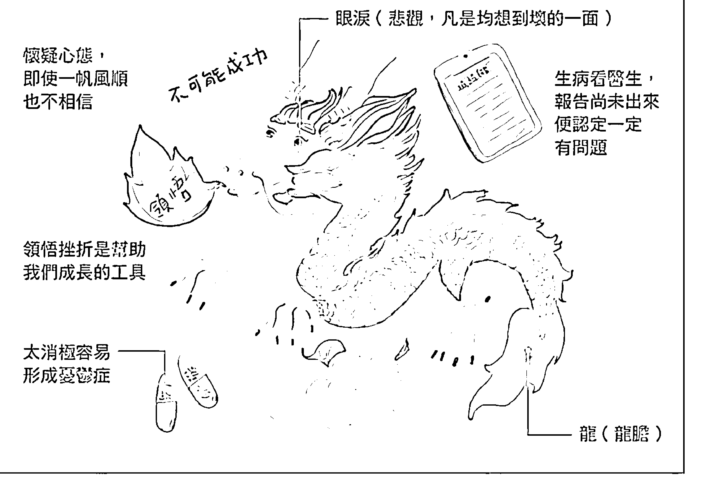

#### 荆豆

花精植物图鉴

- 拉丁學名 | Ulex europaeus
- 别名 | 金雀花
- 七大分類 | 不確定類
- 製作法 | 日照
- 關鍵字 | 沮喪絕望
- 正面特質 | 希望

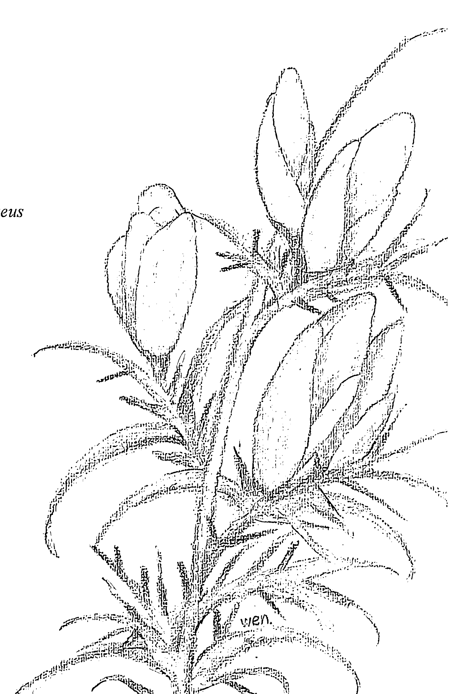

##### 巴赫醫師的敘述

非常嚴重的絕望。他們已經放棄相信還有任何可以做的事。在別人說服之下，或為了取悅別人，他們可能會嘗試不同的療法，同時卻肯定地向身邊的人說：沒什麼治癒的希望了。

> ——出自《The Twelve Healers and Other Remedies》

##### 荆豆VS中医观点

依照巴赫醫師的說法，荆豆狀態的人其眼眶深邃、臉色暗沈、皮黃骨瘦，這樣的形容可由中醫心氣不足理論來解釋：「心，五行屬火，其華在面，心氣充則面色紅潤，心氣不足則面色蒼白無華」。由於荆豆特性的人其心中希望的火苗早已被澆熄，因此就如同中醫心氣不足的症狀一樣，臉部暗沉，常有黑眼圈，就像活殭屍。台灣地區過敏現象嚴重，黑眼圈的情形常和過敏性鼻炎有關，一來鼻子過敏者由於眼眶處血液迴流較差，常造成這種熊貓眼的現象，二來過敏性鼻炎是屬於慢性疾病，可看成是鼻子一直遭遇不間斷的挫折，因此過敏的患者大都有荆豆反應，在觸診左頸部荆豆反應區常有僵緊的情形。我在臨床上，治療鼻子過敏除了應用溫熱性質的中藥，如麻黃附子細辛湯、小青龍湯外，常搭配荆豆花精貼敷及彩光針灸的破冰療法，以這三種陽光型治法來消除陰寒的荆豆情緒，當然對於過敏症狀的緩解與消除頗有助益。荆豆狀態的人，由於已認為自己無法擺脫疾病的控制，因此常陷於絕望之中，這樣的個案自殺比例也較高。自殺已經成為美國人的前十大死因。而統計資料也顯示，自殺死亡率在春節與家人團聚期間是最低的，所以關心是可以降低自殺。在處理自殺的問題中，荆豆是常見的處方，救人一命，勝造七級浮屠，或許這一瓶小小的花精，將是延續生命的最佳熱飲。

### 應用條件

- 臉部暗沉，常有黑眼圈，像活殭屍。
- 經歷重大挫折，內心感到絕望。
- 面對困境或痛苦會想自殺。
- 身陷久病、重病。
- 左頸荆豆區僵緊。
- 深沉的沮喪絕望

##### 荊豆 × 情緒與思維

### 荊豆
2月份生日花
花語：給我們永恆的愛

有人說：荊豆是龍膽的加強版，亦即荊豆所呈現的是：深度悲觀與絕望。人們在龍膽情緒產生後，會對現實人、事產生短暫的懷疑，但當事情能有轉機時，他們可以很快的回復到正常狀況。倘若龍膽狀態的人在嘗試提振自己時，卻一而再地碰釘子，使得生命中希望的火苗在一次又一次的挫折中逐漸被澆熄，他們就不願再嘗試，並認為所有的努力都只是白費功夫，而開始懷疑自己是否真的還有希望，以致形成冷冷的荊豆情緒：「以絕望來回應一切」。

如經歷多次失戀、家人變故、課業或事業接連不順，都會使人一步一步進入負面情緒，而導致思緒也漸入灰色。

##### 花精運用

荊豆花精，是巴赫醫師七個協助者花精（Seven Helpers）之一，用來輔助最早發現的十二個療癒者花精（The Twelve Healers），以協助病人擺脫疾病的枷鎖。七個協助者花精為：岩水、石楠、橡樹、橄欖、葡萄、野燕麥、荊豆。會用到這七個花精，依照巴赫醫師的說法，這樣的患者往往已習慣疾病是他們生活的一部份，必須用協助者花精帶領病人脫離身心靈呆滯的現象，而後治療方可收效。

根據Dieter Kramer著作《新巴赫花精身體地圖》的資料，左頸部為荊豆反應區，門診裡，曾見數例因外傷而導致下肢癱瘓的患者、或腦性麻痺的個案，觸診他們的左頸項很緊，這可能是因為個案認為終生無法脫離這種病痛，故而在這個荊豆反應區特別僵硬。幫助他們的方法，除了熱敷外，荊豆花精貼敷或內服也可讓這樣的情緒逐漸釋放，讓僵硬的左頸放鬆一些。

絕望與深度悲觀的想法，常會造成疾病的惡化與難治，荊豆狀態的人對於醫療會打從內心放棄。當別人熱心的介紹他們一些新的醫療資訊時，他們會感謝別人的介紹，但行為上僅會勉為其難的去嘗試，因為他們內心早已不抱任何希望。巴赫花精強調自我療癒，若患者心中有絕望的思緒時，將會影響到治療的成效。因此有花精治療師提出許多重病或癌症患者，常會合併有荊豆及野玫瑰的負面情緒狀態，必須兩者合用效果才佳，以幫助患者恢復內在的希望。大陸醫家劉力紅在《思考中醫》一書中曾提出，中藥的運用是在模擬時間與空間，如附子這個藥材，是溫熱的藥，就是模擬夏天的陽光給人溫暖，因此可用附子治療體質虛寒的人。金黃色的荊豆花精，就如同模擬夏季般，給人溫熱、給人陽光，可以驅除內心的黑暗與陰冷，讓生命充滿希望，帶領我們邁向療癒的第一步。

### 蘇軾 定風波

> 莫聽穿林打葉聲，何妨吟嘯且徐行。
竹杖芒鞋輕勝馬，誰怕？
一蓑煙雨任平生。
料峭春風吹酒醒，微冷，山頭斜照卻相迎。
回首向來蕭瑟處，歸去，也無風雨也無晴。

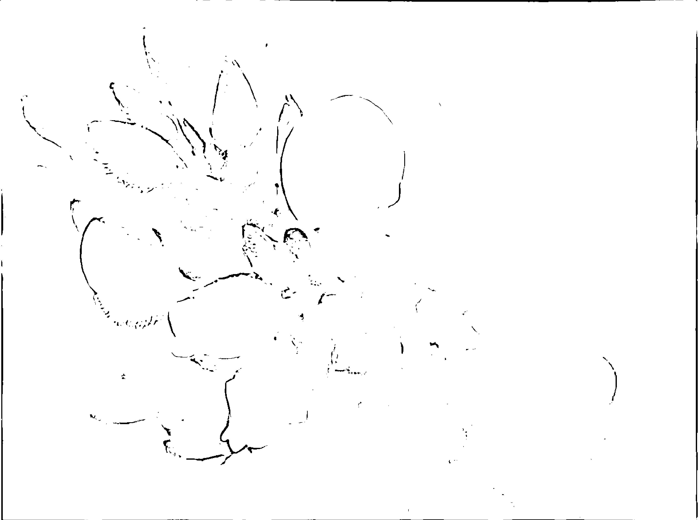

##### 李醫師診間案例探討

黃小姐，62歲，B型肝炎陽性，於省立三重醫院檢查有小型肝腫瘤0.5×0.5公分，患者因睡眠品質不佳來診，初次見到她時，臉上膚色暗沈，自訴有服用鎮定劑，而且血壓偏高，手有時還會不時抖動，在幫她把脈時，也可感覺到手抖的情形。觸診其肩膀僵硬。由於患者不能接受花精內服法，因此每星期一次的門診裡，僅做花精外敷。花精處方以荊豆、馬鞭草為主，會選擇荊豆的辨證要點在於長期被疾病所困擾的個案便可使用，而馬鞭草花精則用在容易緊張、觸診肩膀僵緊的較胖人士，一般兩肩僵緊若對應到身體地圖的資料，常規是使用橄欖花精，但臨床上，我發現較胖人士的雙肩僵緊，用馬鞭草效果反而更佳。在幫黃女士貼敷花精並搭配中藥處方治療數個療程後，黃女士不須依賴鎮定劑即能入眠，而且臉色也光亮許多。2007年8月21日黃女士來診，抱怨最近不知何故，常有頭痛、頭麻、還有想吐的感覺，從這些主訴來看，這些是屬於自律神經失調的常見症狀。言談中不時說出「真歹命」的怨嘆話語，還和我說「若有人有提供安樂死的話，願意給他十萬元讓自己了結」，其實個案之前的治療已獲得不錯的效果，但其內心深層由於有楊柳情緒環繞，所以會對於療癒不太滿足，花精療法如同剖洋蔥一般，當外週的情緒處理好時，便會浮現出深埋的負面情緒，而黃女士此時出現的便是楊柳為主的情境。我依照其情緒狀態擬定龍膽、楊柳、野玫瑰花精，這也是Dietmar Kramer的金牛座情緒路徑，雖然Kramer認為同一情緒路徑上的三種花精不可並用，會效果過於強烈，但我在臨床上發現不少三者並用收效良好的情況。這三種花有時甚至可以當成藥對來使用，所謂「藥對」是中藥的用語，指的是一起使用可達到1+1＞2的加成作用。

#### 花精解析

這三個花精裡，龍膽花精是針對臨時遇到挫折的沮喪，選用楊柳花精是因為黃女士會埋怨、怨嘆，而野玫瑰花精則是起著畫龍點睛的作用，讓個案對人生更有興趣，算是提供給她快樂的花精。

個案的左頸部觸診相當僵緊，且有一死了之的情緒出現，我便將龍膽換成了荊豆，因為荊豆是龍膽的加強版，且在身體地圖中是對應到左頸部。因此最終處方為荊豆、楊柳、野玫瑰花精，將這三個花精貼敷於黃女士的左頸項後，並為她加做河圖洛書開穴（這種簡單的附加療法不用一分鐘即可完成，但卻對頭部疾患有很好的療癒作用）。

就在療程完成後，我再問黃女士：「頭有感覺舒服點嗎？」回答我說已好很多，叮嚀她貼敷花精四個小時即可取下，在開立中藥處方後愉快地回家。

### 河圖洛書開穴療法

在黃小姐的案例中，使用了河圖洛書開穴療法。河圖洛書是易經的前身，相傳伏羲有一天看到黃河中出現了龍馬，背上有奇怪的圖案，此即河圖，他發現馬背上的圖案，與自己仰觀天文，俯察萬物的心得相吻合，於是結合自然規律性繪製了先天八卦，所以可說先天八卦是由河圖衍生的。而洛書則是大禹治理洪水時，發現洛水中浮現刻有奇怪紋路的彩龜，以其紋路演繹出天文地理資料，之後夏商周三代便依據河圖、洛書及各自對先天八卦的體會，變化出「連山易」、「歸藏易」、「周易」等易經，而周易裡即有文王所推衍出的後天八卦。

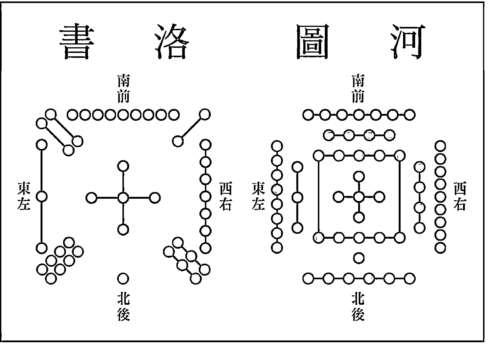無論傳說如何，河圖、洛書、八卦與易經是存在的事實，而歐美各國對於中華文化的哲理也愛不釋手，只恨自己不懂中文而已，深入花精的人不難發現許多國外的花精書籍也漸漸地加入經絡、穴道、陰陽的論述資料，因此我們更應該珍惜自己的文化資產，整理出更符合陰陽哲理、中醫理論的花精資料，而不是一味地依循外國人所提的穴道與花精結合資料照本宣科，畢竟這些資訊都是中華文化的一部份，我們應該比外國人更了解才對，而身為一個中醫師，更應該有這樣的時代使命。

雖然挑戰會很大，但我想胡桃花精可以幫助我們勇敢向前，就如同巴赫醫師當初發展花精時，被醫界批評而不畏艱難，才能找出嘉惠後人的療方。由於易經主導著自然的變化，中華文化五千年的歷史均由易經的陰陽理論導出，而河圖洛書又是易經的前身，因此中華文化又稱河洛文化。就自然醫學的分類來說，中醫是屬於整體醫學，強調身心靈一體，人是一個小宇宙，因此用河圖洛書開穴法則，等於是運用天地宇宙運行法則來幫助個案陰陽平衡，激發自癒力，進而治療到情緒，達到巴赫醫師所提「治療自己」的目的。身為一位花精療法師，最重要的，是如何用最短的時間來幫助患者療癒，因此整合性治療便顯得特別重要，可以幫助讓個案早日離苦，這種予人快樂的法則，就端賴治療師的巧手如何運用了。

##### 相似花精區辨及補充說明

- 1. 水堇的問題常會和荊豆、橡樹合在一起，先後順序不明，但會相互影響造成頸椎疾病。
- 2. 重病病人（癌症），荊豆⊕野玫瑰，可讓生命充滿希望。
- 3. 荊豆是絕望，不抱任何希望，但由於歸類在不確定類花精族群中，所以不一定沮喪，有時他們也相當活潑，只是對人生的某些事件感到無望而已。因此對身體疾病感到絕望的人，使用此花精最為合拍。
- 4. 鼻子過敏常會使用到荊豆，不過許多的患者的過敏現象常和季節變換或是晨起時特別明顯，此時便要加入胡桃花精。

| 類別 | 花精 | 描述 |
|------|------|------|
| 沮喪 | 龍膽 | 受挫後的暫時沮喪，但若有方法仍願嘗試 |
| 沮喪 | 荊豆 | 歷經多次失敗後，覺得已經沒有希望。就算受親友說服而嘗試別的方法，也不抱任何希望，通常只是為了證明親友的方法是無效而已 |
| 沮喪 | 甜栗 | 極度沮喪，努力嘗試要突破，但試到最後一步仍無效，剎那間不知該如何是好，但若有其他方法，還是願意嘗試 |
| 沮喪 | 野玫瑰 | 更為絕望。對生命失去熱忱，有沒有都一樣。對生活中的一切也不太想改變，只會默默地承受一切 |
| 沮喪 | 芥末 | 芥末的沮喪常伴隨著憂鬱，常莫名的出現，不過時間很短暫，一下子烏雲密佈，但一下子又突然消失 |

##### 與荆豆花精相似的新一代花精

- 1. 野茵花花精（Crystal Herbs業力花精）
- 2. 燃喜悦花精（Crystal Herbs神聖和諧花精）
- 3. 荆豆花精、光的存在花精（蘇格蘭芬活花精）
- 4. 金色喜悦・油麻菜花精（晶荷日光花精）

##### 荆豆花精功用圖像記憶

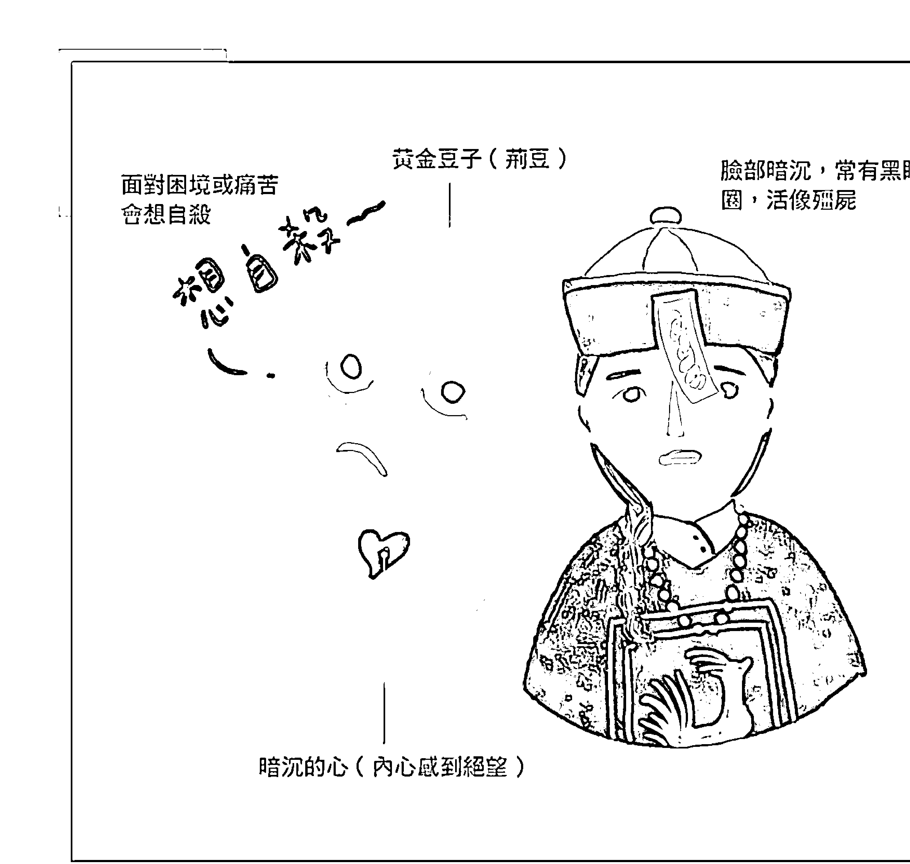

#### 石楠

##### 花精檔案

- 拉丁學名 | Calluna vulgaris
- 別名 | 石南
- 七大分類 | 孤獨類
- 製作法 | 日照
- 關鍵字 | 自我中心
- 正面特質 | 同理心

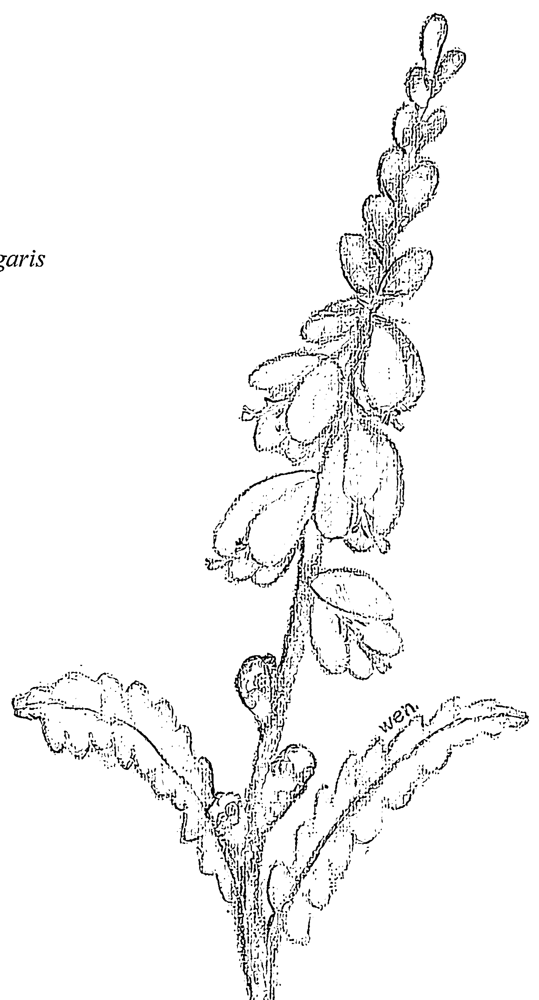

##### 巴赫醫師的敘述

總是想要找任何可能的人來陪伴自己，因為他們需要跟別人討論自己的事情，不管是誰都好。如果需要獨處，不管多久，他們都會很高興。

> ——出自《The Twelve Healers and Other Remedies》

##### 石楠 VS. 中醫觀點

荊三稜，是一種活血消腫塊的中藥材，清朝汪昂所著《本草備要》中提到：「荊三稜治一切血瘀氣結，老塊堅積……昔有人患瘕死，遺言開腹取之，得病塊如石，文理五色，削成刀柄，因砍三稜，柄消成水，乃知此藥可療瘕。」古人發現這個藥，是因為一個人腹部有腫塊，臨終時吩咐家人將肚子剖開，看那是什麼東西。家人剖開後發現這個腫塊硬得像石頭，便把它做成刀柄，拿去割草。等到割到「荊三稜」這個藥草時，刀柄居然溶化成水，便推論荊三稜這個藥草可治瘕腫塊。中藥的發現，是先聖先賢累積豐富的觀察力，觸類旁通的推導而來，藥理學上亦證實確有此種功用。

巴赫醫師會發現石楠這個花精，就和《本草備要》的荊三稜一樣，來自一次偶然的巧遇。有次門診時，他遇到一位滔滔不絕的女人，不停地談論著自己的病情，巴赫醫師完全無法插上嘴。在無奈之際巴赫醫師便問患者說：「有什麼樣的情景會讓您靜下來，稍微放鬆一下呢？」患者回答說：「當我看到淡紫紅色的石楠花後，我會佇足下來，靜靜的欣賞。」巴赫醫師靈機一動，心想患者既然看到這個花後會稍微靜下來，那應該可以治療那種喋喋不休，以自我為中心的特性，於是他就前往採集，研製成石楠花精，好讓有這種特性的人，服用後能懂得細心聆聽別人。

## 應用條件：

- 說話喋喋不休，一直接續不停地講，無法插嘴。
- 別人的委屈不算，自己的委屈才算。
- 不喜歡孤單，只要獨處便不高興。
- 自我中心，只關心自身事務。
- 過動／注意力不集中，的小孩。
- 喜歡成為注意的焦點。

##### 石楠×情緒與思緒

石楠狀態的人，是天生的話匣子，可說是長舌公或長舌婦。他們所談論的事項，總是環繞在自己身上，如自己的病症、生活瑣事等，希望自己的一切能成為大家注意的焦點。

話匣子一開，別人幾乎是無法插嘴，而且外人的一切對石楠狀態的人來說，就和空氣一樣，不想聽也沒興趣，即使對方有癌症、心臟病，也比不上他們手上被蚊子咬的小腫塊來得重要。

他們這種以自我為中心的作法，是標準的不甘寂寞一族，所以會不分晝夜地四出找尋朋友，吐露心聲，或是上網和網友分享心中的想法。有時石楠個案為了要增強別人對他的注意，常會不自覺地使用一些肢體動作，像是用手輕輕推你一下，或稍微碰觸你的手來引起注意。但旁人對他的這種作法早已敬畏三分，遠遠看到他就逃之夭夭，反而使他們更形孤單，因此被巴赫醫師歸類在孤獨類花精族群中。

##### 花精運用

有些花精治療師提出，過動症的小孩，常會有石楠特質。原本，我對於過動的小朋友，常會以父母的觀察意見為主，如媽媽會說：「小朋友注意力不集中，容易分心、好動等。」因此我會直接選用栗樹芽苞、鐵線蓮、胡桃花精免費來幫患者做花精貼敷，但有些個案的效果卻不彰，在經過能量檢測分析後，發現有過動或注意力不集中的小朋友，石楠對他們的幫助超大，而臨床治療上也印證效果卓著。

仔細分析過動症小孩的背後，常會隱藏著孤獨感，因此會用一些大動作來吸引別人的注意，如調皮搗蛋、說話大聲、關門特別用力、打斷大人們的談話、扮鬼臉、製造巨大聲響，甚至大聲放屁等動作，就是要讓別人知道他的存在，進而把注意力關注到他的身上。一般父母不曉得這一點，便到處做檢測分析，事實上，過動兒這種以自我為中心的作法，就好像石楠說話以自我為中心的特性一樣，均可適用這個花精，而且有不錯的治療效果。

石楠狀態的人需要的是別人肯定他的存在，因此面對這樣的患者，我們除了給予花精外，還要當個傾聽者，適時地給與肯定、讚美，讓他有被肯定的感覺。此外也可以請他們多寫些文章、投稿，或做個人部落格，以這種另類的吐露心聲方式來協助他，幫助他們不會再把心思都放在自己身上，而可以關心注意周遭人們所發生的事情。Julian Barnard曾提出：「石楠是對生命和死亡的焦躁。」古人云：「靜者壽，躁者夭。」運用石楠花精將能減輕對自我問題及對微不足道小毛病的過度熱衷，對現今巧妙的人際關係改善頗有助益，也能讓我們安適度日，頤養天年，達到古人所說「靜者壽」的內心安適境界。

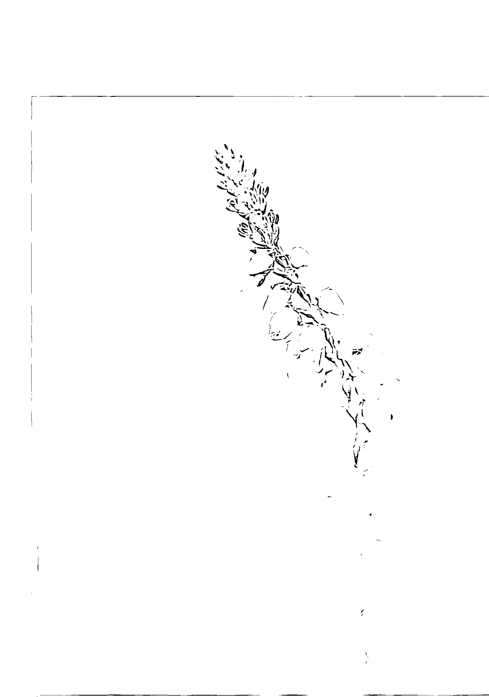

##### 李醫師診間案例探討

游先生，67歲，患有青光眼，個案是我以前中科院同事的岳父，因青光眼久治不癒故介紹來此門診。患者初診時，主訴眼壓高、偏頭痛、胸悶、後頭抽痛感，自兩年前起即為了青光眼問題到各大醫院求診，游先生進來診間後，即出示一張記錄表，上頭記滿了曾到各醫院的就醫時間、主治醫師姓名、服用處方，並開始訴說青光眼的病史、內心如何懼怕、某某醫院如何治療、服用某某醫師的處方後感覺如何等。

個案滔滔不絕的言談前後近十分鐘，幾乎讓我無法插上話，陪同而來的家屬也面露無奈的表情，不過在其描述中似乎也說到了關鍵「台大醫院眼科將其轉診至家醫科，並開立鎮定劑、抗焦慮劑等藥」，說明個案的病況並非單純性的眼科問題，而是伴隨有焦慮的病因，且觸診時其兩肩僵緊。由於我曾用情緒療法幫助別的患者將眼壓由59mmHg降至接近正常值（20mmHg），因此對於情緒引起的眼壓過高，心中也有一些花精配方方針。

花精貼敷處方：石楠、龍膽、白栗、橄欖。在運用花精貼敷後，頭抽痛的情形即減少，而眼睛也當場感覺較為明亮。個案接連於一週及兩週後來診，雖然眼壓短期內尚無法完整降下，但偏頭痛的頻率下降，後頭抽痛的情形也好轉許多，最大的轉變是患者說自己也不太想去量眼壓，說話也較緩和，不會像過去一樣滔滔不絕，看來個案對青光眼焦慮已減輕不少，相信持續的治療，會給他帶來完整的療癒。

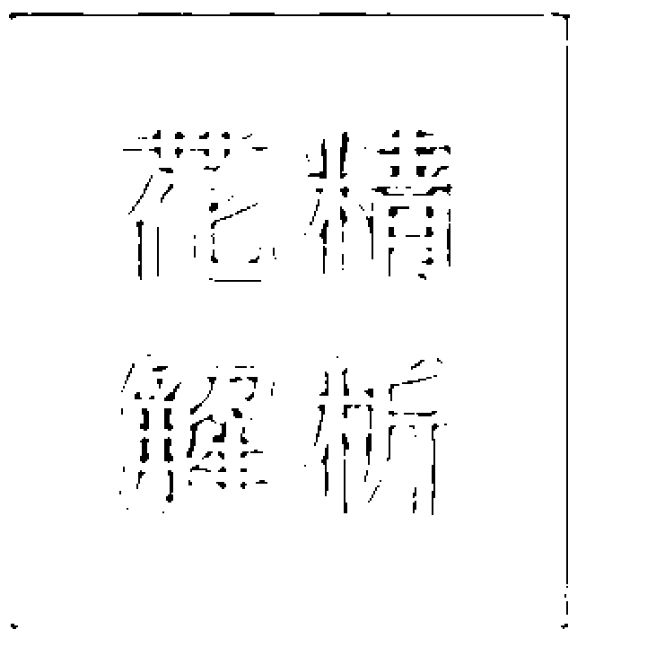

#### 石楠

針對個案滔滔不絕的情形即可使用，我也常應用在過動兒身上。

#### 龍膽

個性悲觀可使用，患者一直認為自己不會好，怕青光眼久了眼睛會瞎掉，運用此花精幫助個案恢復樂觀的人生。

#### 白栗

針對胡思亂想的良方，人腦中後頭部的枕葉管轄視覺，因此常用腦過度亂想時，後頭容易脹痛，用白栗可終止個案東想西想，讓枕葉休息，後頭脹痛及眼壓問題自會調整過來。

#### 橄欖

患者兩肩緊繃，為過勞的橄欖現象，貼敷橄欖花精可協助放鬆斜方肌，對偏頭痛釋放有幫助。

##### 相似花精區辨及補充說明

| 害怕獨處 | 石楠 | 只要有聽眾即可，不論親疏 |
| --- | --- | --- |
| | 菊苣 | 會黏人，尤其是針對所愛的人 |
| | 滿酸漿 | 喜歡和群眾在一起，但不太愛說話 |
| | 龍芽草 | 想利用愉悅的氣氛來忘卻內心的煩惱 |
| | 白楊 | 因為怕黑或怕鬼而不敢獨自一人 |

##### 與石楠花精相似的新一代花精

- 1. 頂輪花精（Crystal Herbs脈輪花精）
- 2. 蓮花花精（Crystal Herbs業力花精）
- 3. 姬星美人花精、玫瑰睡蓮花精（蘇格蘭芬活花精）

##### 石楠花精功用圖像記憶

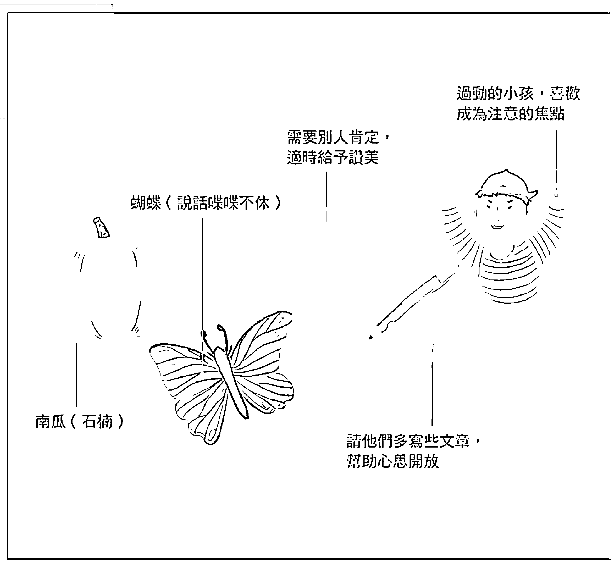

#### 冬青

##### 花精檔案

- 拉丁學名 | Ilex aquifolium
- 七大分類 | 對外界及他人想法過於敏感類
- 製作法 | 煮沸
- 關鍵字 | 仇恨嫉妒
- 正面特質 | 愛

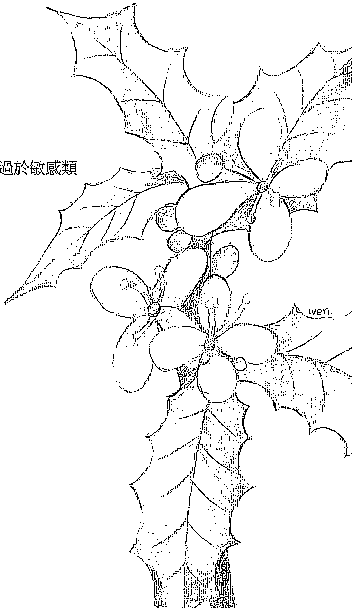

##### 巴赫醫師的敘述

給有時會受到嫉妒、復仇、懷疑等念頭襲擊的人。各式各樣的苦惱。他們心中受苦很深，這種不快樂通常沒有真正的原因。

> ——出自《The Twelve Healers and Other Remedies》

##### 冬青 VS. 中醫觀點

多年前，上彩光針灸課程時，有個單元是介紹父親點與母親點，用照射特定穴位來治療個案和父母親之間的關係，當然也包含衝突。在實習操作時，和我搭擋的夥伴是一位美容師，那次輪到我先幫她照射父親點。起初兩個人還有說有笑，但沒多久，那位美容師便不發一語。當時我以為，她大概是累了，想休息一下。可是，她的眼角突然飆出一滴淚珠來，瞬間失控大叫，並在地上打滾，開始摔東西，所有人都被這一幕嚇到，當然我也是。但最尷尬的莫過於我了，因為大家都把目光放在我身上，以為是我幹了什麼好事？真是冤枉。不久後，隔壁的男生也發狂大叫，還趴在地上學狗狂吠，周遭一些學員也有類似的行為。一會兒後，這些狀況慢慢平靜，德籍講師向大家解釋說這是一個壓力釋放過程，只有在和父母間有重大衝突時才會有這樣的反應，是正常的宣洩。話雖如此，但大家在下課時還是有點錯愕，尤其是和我搭檔的那位。

一個人會有這麼大的動作，可說是憤怒的一種表現，但究竟是什麼樣的親子關係讓她產生如此強烈的負面情緒，只有當事人才知道。今天早上，打開電視，由於是二二八，所以新聞台也播放了許多有關二二八事件的史料，當然受害者家屬悲憤的表情，從電視上我們是可以感受得到的。我的能量老師曾告訴我，台灣目前的亂象和二二八的仇恨有很大的關係，一個人的驟逝和整個家族有關，家族又因姻親關係而放射出去，使得積怨心一直在擴大。這個仇恨並沒有因事情經過一甲子而逐漸平息，反而因政治人物的刻意操作而一直加溫，連帶使得日據時代日本人屠殺近四十萬台灣人的悲痛歷史文獻又再次地浮現檯面。

## 圖解巴赫花精

> 冤冤相報何時了，證嚴法師在靜思語中曾說：「努力去愛一個原本怨恨的人，是善待自己。」生命的一切，都有其緣份，生與死，以現實的眼光來看確實是令人悲痛與刻骨銘心，但就靈魂輪迴來說，這些都是命中註定的因緣，對無法以現今的人道立場來評論六十年前的戰亂處置，也沒有人願意見到那時的場景，因為那都是大時代的悲劇。目前社會裡，暴力事件充斥，仇恨心如此彌漫，既然政府與百姓能原諒日本人當初在台灣所造成的痛苦，那對於二二八，更應該有這樣的寬恕心，不能再因選票而製造仇恨。期待冬青花精，可以予人寬恕的陽光，讓我們後代子孫能活在愛的氛圍中，永保喜樂。

## 應用條件：

- 曾因愛而受苦的人，如失戀、被第三者介入、親人被害。
- 容易產生負面情緒：懷疑、嫉妒、憎恨。
- 容易生氣，有暴力傾向，會報復。
- 右臉頰黑斑。
- 右脅肋痛。
- 悶悶不樂。

##### 冬青 × 情緒與思緒

花精運用冬青花精是巴赫醫師用來對治強烈的負面情緒，有這些特性的人由於心中感受不到愛，因而對於外界的環境過度敏感，只要外界一點小小的刺激，便開始動怒，不像櫻桃李是積忍一段時日後才爆發，因此被巴赫醫師歸類在「對外界過於敏感」花精族群中。冬青狀態的人常以憎恨、報復等過度反應的心態來處理生活周遭的問題，不但有暴力傾向，也容易生氣、嫉妒、亂猜疑。

如：

- 1. 男朋友和女同學一起討論功課，會認為女生想當第三者。
- 2. 路人不小心擦撞到他，便開始破口大罵，三字經脫口而出。
- 3. 即使同事只是湊在一起聊天，也會認為那群人正在說自己的壞話。
- 4. 嫉妒別人比他有錢、比他美、身材比她好。可說見不得人家好，有時還會冷嘲熱諷。
- 5. 一些位高權重的人，當有冬青情緒存在時，也會認為身邊的人不懷好意，想密謀篡位，日日夜夜都害怕失去現有的地位，對政敵窮追猛打，手段凶殘。

圖解巴赫花精

## Chapter:4 15 冬季

對外界及他人想法過於敏感

冬青狀態的人由於心中的愛不見，患者會因此而誘發出更多的負面情緒，造成治療師選擇花精的困擾。所以巴赫醫師總結其經驗：如果患者久服花精無效，可開立冬青或野燕麥，不需一次使用很多花精，就能處理看似複雜的許多情緒，之後便可找糾結情緒的主軸，再來決定他需要什麼花精。因此往後的治療師即將冬青及野燕麥列為基礎花精，用來治療複雜型個案。

為何冬青特性的人感受不到愛呢？因為他們曾經歷過愛情或親情的背叛與分離，如失戀、被第三者介入、被父母推入火坑、親人被害等，心中因此失去愛，並充滿著不甘與憤怒。而這個蓄積的怒火隨時會被引燃。當一個人常有暴怒現象時，我們要分析以前是否曾有過深層傷痛的心靈往事，來決定是否加用冬青花精或櫻桃李花精。另外值得一提的是，在我的治療經驗中，過動的小孩常會有冬青情緒出現，此時父母會說小朋友容易和別人產生衝突、打架，倘若個案亦伴隨著櫻桃李情緒出現，將會讓衝突火力加大，而造成更大的創傷。要處理這方面的問題，除了找出過動的源頭外，這些外週的情緒像冬青、櫻桃李等也要適時跟著加入，才能讓過動的小朋友早日恢復正常，因為許多這樣的小朋友往往心中感受不到愛。我也用LET能量測試法發現到急救花精亦適合每一個過動的小孩，或許會用到急救花精，可能和其到處碰撞的撫平傷痛有關。

倘若這種強烈的恨意被刻意壓抑住，日久怒火便會往意識底層移動而轉換成生悶氣、怨恨的楊柳狀態，偶而也會轉變成與世無爭看破的野玫瑰狀態，此時患者除了會悶悶不樂外，也會怨恨當事人。由於這種負面情緒較深層，所以治療師可能需要花更多的時間來處理。在情、理、法中，中國人是最重視情的了，如同學之情、師生之情、同鄉之情、親情、愛情等，但冬青的人，由於其心已死，行事作風有些無情，可用鐵石心腸來形容他，一些歷史上殺無赦的人，或社會新聞中的殺人狂、弒父兇手，便常有這樣的冬青情緒。

根據Dietmar Kramer的身體地圖，右肋骨區是冬青花精的反射區，這個地方也是肝臟位置所在。臨床上有B肝帶原患者右脅肋疼痛，在貼敷冬青花精後疼痛確實有減少，不過仍須配合情緒辨證法則才能有更好的效果。中醫理論認為「肝主怒，肝火旺則脅肋疼痛」，憤怒是一種很強烈的破壞思緒，不論古今都常用「肝火旺」來形容一個人的憤怒情緒。憤怒是會傷肝的，肝傷則右脅肋區常會疼痛，因此Dietmar Kramer的理論與中醫、西醫的醫理不謀而合。倘若個案的怒氣無法順利發洩而轉變成楊柳的怨恨、生悶氣時，對身體氣機的破壞性將會更大，所以善於養生者都會建議千萬不要生悶氣，要把氣導引而出，才能活得長久與快樂。

在人生的歷程中，總會遇到背叛、欺騙的人與事，其實這都是幫助我們成長的，因為天下事無好也無壞，經歷的一切，都是上蒼給我們的考驗，吃苦就當做吃補好了。當心中有怒氣時，一定要適時地把怒氣轉換，才能平撫內心的忌妒、羨慕、猜忌與報復等苦悶情緒。激烈運動倒可以提供不少的幫助，香港花精治療師黃偉德認為，多親近海水、樹木也能幫助釋放憤怒的情緒，或許《論語》中所提的「仁者樂山，智者樂水」，就是希望在山水間培養的仁慈與智慧，能帶領我們遠離怨恨。運用冬青花精則可幫助我們更快地消除心中的憎恨，處理個案煩躁、憤慨的負面情緒。相信在這個花精的磁場洗禮下，人的心境將可逐漸平復，而我們的生活空間，也將永保喜樂與安適。

##### 李醫師診間案例探討

馬先生，來診時主訴右脅肋疼痛，疲倦，每天到了早上十一點即疲倦，並有多夢、睡眠品質不佳、腹部悶脹等情形。馬先生是慢性肝炎患者，B型肝炎陽性，超音波檢查輕微肝硬化，大便一天一次，矢氣多。根據個案症狀，除了開立科學中藥治療之外，由於其主要是治右脅肋痛，因此我另外為他局部加敷冬青花精於右脅肋。

五天後患者回診，主訴右脅肋仍疼痛，運用LET能量檢測法後，發現其尚需要櫻桃李花精，花精處方冬青⊕櫻桃李⊕龍膽貼敷於右脅肋。一週後回診，脅肋痛已減輕不少。

##### 花精解码

馬先生，右脅肋疼痛，根據Dietmer Kramer的身體地圖資料，該處對應到的冬青花精，但冬青花精貼敷後，疼痛依舊，表示需加配其他情緒類花精。

採用情緒辨證法，加入櫻桃李、龍膽花精，疼痛消失。而運用龍膽是用來化解疼痛給他帶來的挫折。

##### 相似花精區辨及補充說明

在望診時，右臉頰為冬青反應區，當此處有黑斑或皮膚異常時，大多有冬青情緒存在。

有花精治療師把冬青視為是「打開心的花精」，輔助使用心輪花精或玫瑰花精也有不錯的效果。

冬青與楊柳都是屬於感受不到愛、缺乏愛的花精。

| 类别 | 花精 | 描述 |
|------|------|------|
| 基础花药 | 冬青 | 巴赫醫師的基礎花藥，一個人看似需要許多花藥，而且個性較活潑躁動者 |
| 基础花药 | 野燕麦 | 巴赫醫師的基礎花藥，一個人看似需要許多花藥，而且性情溫和沉悶者 |
| 基础花药 | 落叶松 | Dietmar Kramer的基礎花藥，可提升治病的信心 |
| 生气别人 | 冬青 | 強烈的仇恨、懷疑、嫉妒、報復 |
| 生气别人 | 樱桃李 | 隱忍很久後的脾氣失控 |
| 生气别人 | 山毛榉 | 氣別人笨 |
| 生气别人 | 凤仙花 | 氣別人動作慢 |
| 生气别人 | 葡萄 | 氣別人不聽命令 |
| 生气别人 | 杨柳 | 怨天尤人、無法原諒，「全都是他害的」的受害者情緒 |
| 争宠 | 冬青 | 有暴力傾向 |
| 争宠 | 菊苣 | 楚楚可憐地流淚 |
| 闷闷不乐 | 冬青 | 心中的愛不見，誘發出更多的負面情緒，如憎恨、報復、容易生氣、嫉妒、亂猜疑，憤怒是火爆的 |
| 闷闷不乐 | 野玫瑰 | 野玫瑰遇到別人言行不會敏感，對現實生活已看破，故列在不會活在當下的花精族群中 |
| 闷闷不乐 | 杨柳 | 憎恨藏在心裡，不直接表達，憤怒是悶燒的 |

##### 與冬青花精相似的新一代花精

- 1. 心輪花精（Crystal Herbs脈輪花精）
- 2. 莫生氣花精Inner Peace（Crystal Herbs神聖和諧花精）
- 3. 原諒玫瑰複方花精（Crystal Herbs玫瑰花精）

##### 冬青花精功用圖像記憶

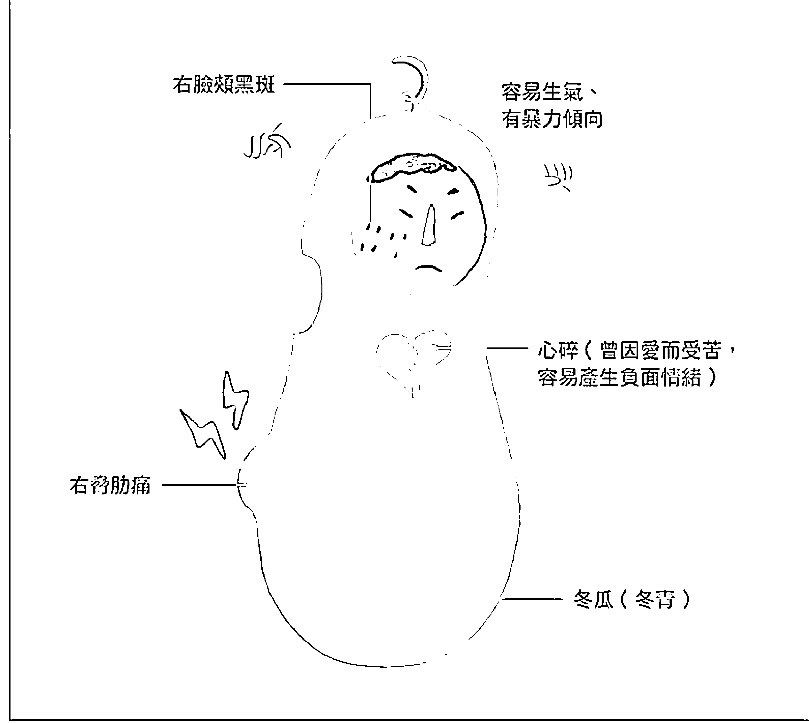

#### 忍冬

花精档案

- 拉丁學名: Lonicera caprifolium
- 七大分類: 對現實興趣缺缺類
- 製作法: 煮沸
- 關鍵字: 沈溺過去
- 正面特質: 回到當下

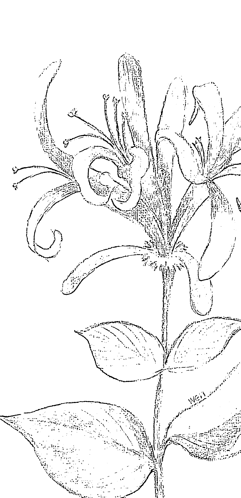

##### 巴赫醫師的敘述

活在過去的人，也許是沉緬於過去的快樂、回憶逝去的朋友，或沒有實現的抱負。他們不太期待未來會有比過去更快樂的時光。

> > ——出自《 The Twelve Healers and Other Remedies 》

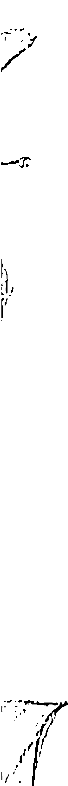

每個人都有過去，回憶起過往，總會讓人想起許多，也讓我憶起十六年前的美妙詞句：

> 宋朝 蔣捷 虞美人

少年聽雨歌樓上，紅燭昏羅帳。
壯年聽雨客舟中，江闊雲低，斷雁叫西風。
而今聽雨僧廬下，鬢已星星也。
悲歡離合總無情，一任階前點滴到天明。

初讀這一闋詞，是在我大一國文課的時候，國文老師說，越讀會越有滋味，只是那時我沒有什麼感覺。慢慢地，畢業了，進入工作崗位，人生的閱歷愈形豐富，但內心的酸甜苦辣也品嚐不少。那是我第二次回憶起蔣捷的虞美人，而國文老師的涵意我才略有領悟。

蔣捷從少年時光的浪蕩縱情，到中年時的人海奔波、名利追逐，及至最後「聽雨僧廬下，鬢已星星也」的淒涼寂寞，感慨人生的悲歡離合與往事如煙的無奈與悲悵。每個人都有歷史，都有過去，在遇到悲歡離合時，總會不由自主地和過去做比較，適時的緬懷是OK的，唐太宗說：「以古為鏡，可以知興衰。」以過往的經驗做基石，可以讓我們少走許多冤枉路。但若沈溺太久則會牽絆自己前進的動力，而忍冬花精，則可以幫助我們放下過去，活在當下，擁有更踏實的生活，並且幫助下列的朋友免於沉溺過去。

# 應用條件：

- 一直回憶過去的情境（傷痛或快樂的事）。
- 行為不合乎實際年齡。
- 不專心，容易恍神。
- 老人痴呆。
- 無法懷孕。
- 心臟問題。

##### 忍冬 × 情緒與思緒

忍冬狀態的人，無法割捨過去的一切，總是沈溺在往日的回憶中，有些忍冬情緒的人，很喜歡收集古董，或做古文明探險之旅，可以說「過去對他影響很大，對現在視而不見，對未來毫無計畫」。過去的一切，不論是傷痛或快樂的往事，總是佔據腦中大部分的空間，如曾遭家暴的往事、父親往生、學校讀書的快樂時光、想起童年等。他們對於過去壯志未酬的事，也會心存許多懊悔，如「要是當初我把這個號碼拿去簽大樂透，現在我也是億萬富翁了」等一直浮現在腦海中。這種思想停留在過去的行為，常會使得他們處事、學習心不在焉，除了容易恍神外，記憶力也會下降，時常忘東忘西。在幫助學童提升記憶力的處方中，我也會依症狀考慮使用忍冬花精。而在生理上，這種緊抓過去的行為，也常使得大便被腸道抓住，無法前進，而形成便秘。

有些治療師認為這個花精也可以治療老人癡呆症，因為有這種病症的患者只記得過去的種種，卻對當下發生的事毫無印象，忍冬就是符合這個特性，這種現象在老榮民的身上特別容易見到。分析原由，乃這些榮民伯伯們從小就離開家鄉，隻身來到台灣後，鄉愁就在那一灣淺淺的海峽裡與日俱增，在那種國共對立的年代，常會憶起家鄉的往事，因而產生忍冬情緒。

有些花精治療師發現忍冬狀態的人，容易導致心臟疾病，這個論點對住在眷村的我而言可是頭如搗蒜般地認同。我發現榮民伯伯另一個常見的問題是心肌梗塞，正在寫稿時，救護車來了，隔壁的夏伯伯才剛因這個疾病而送醫急救。根據Dietmar Kramer的身體地圖資料，心窩處是忍冬花精的反應區，眷村裡頭榮民伯伯的心臟問題特別多，或許真和思鄉的忍冬情緒有關。說實在的，我還滿感謝這些荣民伯伯的，从小就被迫与家人离异，要不是当初他们在前线作战保护我们，胼手胝足的开辟中横、规划十大建设等基础，台湾根本就不会有今天的繁荣。吃果子拜树头，对他们，除了感恩外，还是感恩。

##### 花精運用

說「日有所思，夜有所夢」，這種活在過去記憶的行為，會間接影響到睡眠品質而使人多夢或做噩夢，我以前就常夢到大學時期考試不會寫的情景，其实在現實生活裡考試我是很會作答啦，可能是當初擔心考試考不好，記憶就遺留迄今，才會在多年後一直做這種怪夢，好在服用忍冬花精後，這樣的情形就少很多了。所以臨床上，當有患者說會多夢時，我除了會用白栗花精外，忍冬也是另一個選擇項目。

哈佛衛生研究院公佈的最新研究資料顯示，經常食用低脂乳品的女性，較不容易受孕。不孕症的因素很多，有些不孕其實是和心理因素有關，部份無法懷孕的女性，因為有忍冬情緒，心思沉迷在以往，所以她們的心理狀態還認為自己是小女生，因而導致生殖系統功能自動低落。對於這一類的不孕，除了營養補充外，催眠及花精治療也是可選擇的方便法門。另外，許多辣媽穿著不符合實際年齡，明明已四、五十歲了還打扮像十八歲的小女生，也算是忍冬沈溺過去的行為，均可適用這個花精。

卡通哆啦A夢裡有一個時光機，常帶大雄回到以前的時代，其實忍冬花精就有這個功能，可把它比擬做電腦的時光回溯器，把過去不好的記憶消除。運用這個花精，可將我們的心靈帶回去當初發生事情的時間點上，巧妙搭配其他的花精，將可處理那時的傷痛。如親人往生造成的傷痛，常有人會受到這樣的哀痛折磨達數十年，運用忍冬花精可以將我們的心思帶到那個時間點，配合治療創傷的聖星百合，便可以幫助心靈重建，跳脫過去的悲情。這是一個消除過去可怕記憶很好用的花精，當然也可適時加入白栗花精，若患者的可怕的記憶一直在重複的話。忍冬是一個很好的藥引，所謂藥引是中醫的名詞，是指可以把藥效帶到某些特定的地方，就好像出國的導遊一般，可以把治療花精帶到過去，當有人常會因過去的事而感到憤怒時，便可使用冬青⊕忍冬花精撫平。

俗話說：「世事如棋局局新」，過去的一切，雖如同蔣捷的虞美人，歷歷在目，但也不斷更迭。佛家說：「緣起緣滅」，或許隨緣是活在當下最好的方法。忍冬花精可以幫助人們把思緒從過去的回憶裡喚回到當下，讓我們在懷念過去記憶的同時，也不忘記現實生活的一切，並充份掌握眼前。悲歡離合總無情，聰明的我們，就讓它一任階前點滴到天明吧。

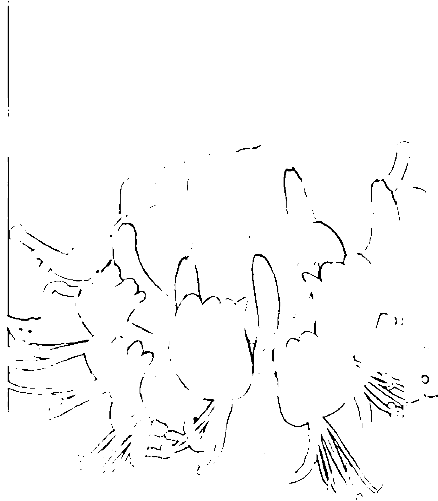

##### 李醫師診間案例探討

林小姐，42歲，來診時主訴胃痛，林小姐曾因臉上痤瘡及經前期的偏頭痛來診，每次治療均有搭配花精外敷、彩光針灸及耳針治療，故獲得很好的成效，臉上青春痘及偏頭痛均消失，因此一家大小都會來診所門診，我也有點像是中醫的家庭醫師。

這次突發性胃痛，是在六天前發生，當時由於疼痛劇烈，故先至馬偕醫院檢查並照胃鏡，但檢查結果均正常，醫生只好先開些止痛藥讓她服用。但幾天的西藥吃下來，胃痛依舊，因而前來找我門診。看診時，我有問她，最近是否有些情緒上的起伏？由於和患者間相處就和朋友一般，林小姐也吐露出過往的傷心事，三年前，她的妹妹帶著小女兒自殺，看著日曆上的日期，就讓她想起那年她捧著一大一小的骨灰，因而心生哀傷，而胃痛也就突然發作。眼眶泛紅的她，述說著往事，言談中也可看出她對於妹妹的自殺有點自責，認為當初要是自己多付點心力，就不會有這樣的情形發生了。

我為她調配花精外敷方：聖星百合、松樹、忍冬、橡樹、橄欖，並請她先生幫她貼在胃部疼痛的地方。治療後，我拿出《新巴赫花精身體地圖》這本書及花精的powerpoint檔案向她解釋為何會有胃痛的情形，聽完後她才豁然開朗，原來自責的松樹情緒與沈溺過往的忍冬情緒會引發胃痛。診療後，林小姐的眉頭也不再深鎖，略帶微笑地回家。一週後回診，告訴我說胃痛當天回去已好相當多，很感謝這些療法能將她心中的心結打開，心情又更加地舒緩，當然我也很快樂，感謝上蒼慈悲，讓我能夠認識花精，並有機會散播花精的愛與關懷～感恩。

#### 花精解析

聖星百合

親人突然過世的創傷。

松樹

消除她對於妹妹的自殺的自責心態。

忍冬

沈溺於過往的哀傷情緒。

橡樹、橄欖

個案觸診時兩肩及右頸部緊繃，此為Dieter Kramer著《新巴赫花精身體地圖》中的橡樹、橄欖反射區，故加用此兩種花精。

身心症候群的病症可發於身上任何部位，重點在於情緒的處理，因為萬變不離其宗，能把核心的情緒問題處理好，疾病自會消除。任何病症只是上蒼提醒我們要內省自己的一個小信號，懂得觀照的人，便會發現上蒼是在仁慈的警示我們。巴赫醫師曾說：「疾病雖然殘酷，本身卻是仁慈而和善的，如果我們正確的解讀，它能指引我們看出缺點本質所在。」我想，這也是巴赫醫師認為疾病是仁慈的真正意義。

##### 相似花精區辨及補充說明

- 1. 親人過世後自責對親人的不是，且對一切事沒有興趣：忍冬⊕松樹⊕聖星百合。
- 2. 忍冬狀態的人不滿意現況，對未來亦不抱期望，不像鐵線蓮對未來抱很高的期望。
- 3. 國外有些美容師會將忍冬放進潤膚霜中，讓肌膚恢復年輕的思緒。

| 憂神、不在當下 | 忍冬 | 過去式。回想過去 |
| :--- | :--- | :--- |
|  | 白栗 | 進行式。反覆想著最近的事 |
|  | 鐵線蓮 | 未來式。幻想未來 |

##### 與忍冬花精相似的新一代花精

- 1. 顴草花精（Crystal Herbs業力花精）
- 2. 活在當下花精（Crystal Herbs神聖和諧花精）
- 3. 榛樹花精（蘇格蘭芬活花精）

##### 忍冬花精功用圖像記憶

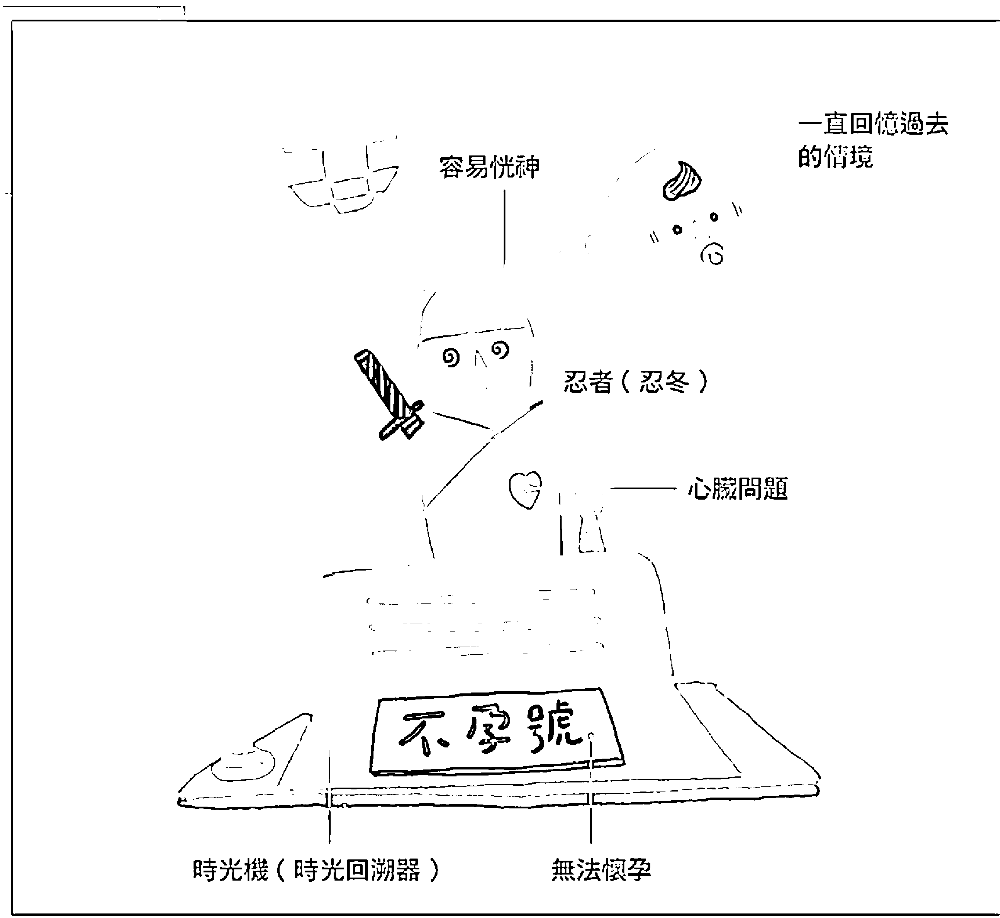

#### 鹅耳枥

花精档案

- 拉丁学名 | *Carpinus betula*
- 别名 | 铁树、角树
- 七大分类 | 不确定类
- 制作法 | 煮沸
- 关键字 | 心理倦怠
- 正面特质 | 热忱

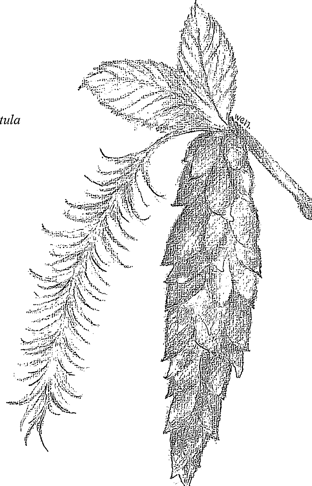

##### 巴赫醫師的敘述

給感覺自己身心力量不足的人，無法承擔生活的重擔，日常事務在他們看來太多了，做不完，雖然他們通常能成功做完。給相信自己身體或心理上某部分必須強化，才有辦法完成工作的人。

> > ——出自《 The Twelve Healers and Other Remedies 》

##### 鵝耳櫪 VS 中醫觀點

年假的時間特別長，收假時，也剛好是小朋友要開學的時候。在漫漫長假過後，開學症候群、收假症候群也漸漸浮現。有些人會出現焦慮、睡不著覺、遲到、注意力不集中等症狀，就有新聞報導一名銀行行員，因擔心要回到銀行工作而失眠，自行服用過量的安眠藥，最後送醫急診。不過，一般上班族普遍會遇到的情形是不自覺的疲倦感，一想到明天要上班便開始全身乏力、精神不好。

電視新聞中，雖有教導觀眾如何「收心」的方法，像是調整作息、飲食儘量清淡、每天撥空運動30分鐘等方法幫助人們回歸常軌，但這些方法對收假前疲倦感卻是成效不彰。疲倦的原因很多，長假後的這一類疲勞現象，主要是和心裡厭倦工作，所產生的心靈疲勞有關。花精中，正好有鵝耳櫪花精，可以幫助收假症候群的患者補充消失的體力，對於平時就有藍色星期一的個案也有不錯的效果。

# 應用條件：

- 對自己能力懷疑而產生無力感。
- 事情還沒有做就感到很累。
- 需要刺激提振精神。
- 賴床。

##### 鵝耳欏 × 情緒與思緒

鵝耳欏，又名角樹，是一種落葉性喬木，質地相當堅硬，幾乎可與動物的角相比擬，所以有角樹這種稱謂。在從事花精教學過程中，我常和學員們談論到中藥的應用與花精關係，因為花精的用法有許多和中藥原理相似，許多原本對中藥材不太認同的外國朋友，在接觸花精的製作過程後，訝異地發現中醫原理是這麼接近能量醫學。

以中藥杜仲為例，杜仲是黑色的樹皮，在撕開時會有白色的膠狀絲，相當黏稠，古人發現這種特性，便將它引伸為如同筋骨間的水泥，可以幫助骨骼更加強壯，臨床上就用它來強筋健骨，醫學研究證明確有這種功用，也因此各種風濕關節疼痛的處方時常可見到他的蹤跡。而鵝耳欏的功用也是由類似方法引伸出來，由於其剛硬，象徵著可以給人朝氣蓬勃的力量，讓人堅持下去，所以可治療星期一症候群、倦怠感，讓人活力再現。

##### 花精運用

星期一症候群是一種心理性的疲憊，有這種症狀的患者一想到眼前的責任或要做的工作就感到疲勞、無力，其實他們的疲倦並不是真正的疲態，而是情緒上討厭常規化生活的一種反應。這和另一種治療身心俱疲的橄欖花精不同，因為橄欖狀態是一種體力完全透支的疲勞，不像鵝耳欖狀態的人僅僅是厭惡單調刻板的生活模式。

資訊化社會這樣的個案特多，如專寫程式的電腦工程師、每天朝九晚五的上班族，大多會有鵝耳欖情緒，他們雖只有精神及腦力上的疲勞，肉體上幾乎沒有什麼勞動，也都睡很飽，依舊每一分每一秒都感到疲倦不堪。不過有趣的是，這種心靈疲態只要給他們刺激性的东西，或做些自己感到興趣的新鮮事物，體力便可以馬上恢復，如抽菸、喝咖啡、可樂。或來點音樂、上網亂逛一番，精神就會提振很多。這種疲倦我也曾有過，以前在考醫師執照時，常喜歡變換環境讀書，去麥當勞、IS咖啡、乃至石門水庫旁的花茶坊，那時我有發現到當快要讀不下去時，換個地方K書還真的可以提高讀書效率。只是當時的我，還不知道有花精這麼好的東西，不然的話早就用它個一瓶。

在巴赫醫師的花精七大分類中，將鵝耳欖歸類在「懷疑、不確定」的花精族群中，因為這樣的患者會懷疑自己有承擔工作的能力，所以在工作開始前，便自我懷疑而愣了一下，認為自己無能力處理眼前的工作，因而全身乏力。另外家長比較關心的孩童賴床問題，臨床上發現有許學童是屬於這樣花精的特質，對症下花精後一樣有提神醒腦的效果，而我也常應用此花精治療常態性疲勞的患者，效果令人滿意。花精的種類很多，端賴治療師或讀者挑選出適合自己的花精，選擇是一種智慧，若周遭朋友有這類的慢性疲勞，不妨建議他們試試這個活力花精，相信會有不錯的幫助喔。

值得注意的是，有些表象看起來是鵝耳欏情緒，其實深層是野燕麥狀態。野燕麥是處理找不到人生方向的花精，因為所做的工作並非自己的熱情所在，做起來當然會提不起勁。此情況下，使用野燕麥找到真正有興趣的工作，才是根本的解法。

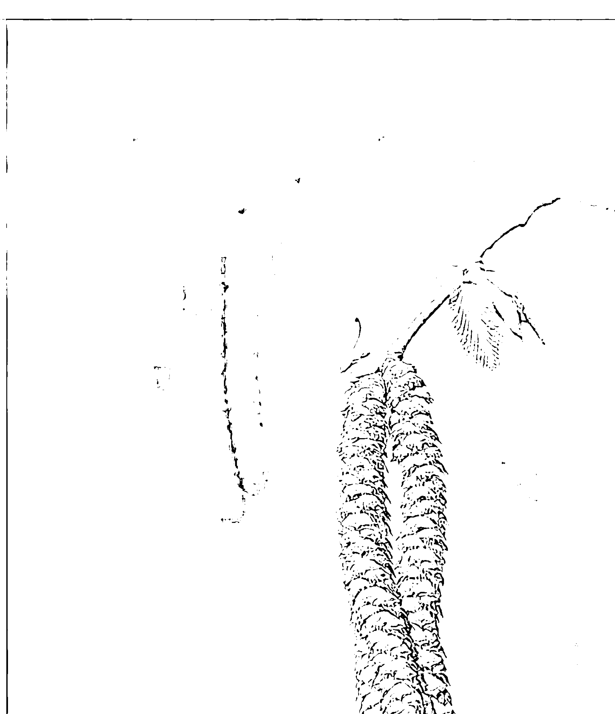

##### 李醫師診間案例探討

顏小姐，來診時主訴頭量、疲倦乏力，白天特別明顯，頸項僵，多夢，容易清醒，心悸，胸悶，曾膽囊炎開刀，並有軟便情形。我給予花精貼敷處方：橄欖、鵝耳檉、紅栗、聖星百合，貼敷於雙側肩井穴。

一週後回診，自訴頭量及疲倦乏力情形好轉，尤其是頸項肩膀僵硬的情形，在貼敷後快速緩解，可說特效，連她先生對於花精的放鬆療效也表認同。我幫她處方加減後，綴開花精處方貼敷，患者愉快地回家。

#### 花精解析

## 橄欖、鵝耳樅

針對個案疲倦乏力，白天特別明顯的症狀使用。臨床上發現肩膀僵緊，運用橄欖花精外貼效果不錯。

#### 紅栗

紅栗花精針對擔憂親人的思緒，言談中發現顏小姐特別關心家人，故用此方。

#### 聖星百合

個案曾因膽囊炎開刀，只要開刀必有創傷，便可看成是組織細胞受到傷害，必用聖星百合。

## 肩井穴

為橄欖花精的反射區。

##### 相似花精區辨及補充說明

- 1. 鵝耳樺狀態是一種腦力工作或常規化生活的反應。
- 2. 常有個案以鵝耳樺花精治療賴床，不過睡覺使用鵝耳樺⊕馬鞭草，可使睡眠更深沉。
- 3. 眼睛容易疲倦的個案，除了肝陰虛，用杞菊地黃丸外，亦可用鵝耳樺花精。

| 分類 | 狀態 | 描述 |
| :--- | :--- | :--- |
| 虛弱 | 橄欖 | 真的累。重病或過勞後，身心俱疲 |
| 虛弱 | 鵝耳樺 | 身體不累，心理累。懷疑自己體力不足，來自不想工作的思緒，並不是來自身體或腦力的勞動，一但開始工作便不會疲倦 |
| 虛弱 | 榆樹 | 事情或任務過多導致的信心危機。平時處事可從容應付，遇到重大責任時才臨時有無力感 |
| 虛弱 | 矢車菊 | 被別人弄得很累。為了別人耗盡自己的能量，太柔順而常被人利用 |
| 虛弱 | 野玫瑰 | 對人生整體無興趣。消極認命，顯得行屍走肉 |
| 懶床 | 橄欖 | 怎麼睡也睡不飽 |
| 懶床 | 鵝耳樺 | 早上起床時，感覺比前晚睡覺前還要累 |
| 懶床 | 鐵線蓮 | 只想遁入美夢中，不想面對現實生活 |
| 拖延 | 橄欖 | 因為身心俱疲 |
| 拖延 | 鵝耳樺 | 因為欠缺熱忱與幹勁 |
| 拖延 | 線球草 | 因為在兩個選項間做不出決定 |
| 拖延 | 野燕麥 | 因為還沒找到真正的熱情所在，目前這件事並非真正的興趣 |
| 拖延 | 龍膽 | 因為受過挫折，擔心失敗 |
| 拖延 | 落葉松 | 因為長期沒自信，覺得一定會失敗 |
| 拖延 | 鐵線蓮 | 因為愛做白日夢、對現實沒有興趣 |
| 拖延 | 野玫瑰 | 因為消極認命，已不想做任何改變 |

##### 與鵝耳欏花精相似的新一代花精

- 1. 太陽神經叢花精（Crystal Herbs脈輪花精）
- 2. 野蘭花花精（Crystal Herbs業力花精）
- 3. 火元素精素（蘇格蘭芬活花精）
- 4. 火神之力·馬纓丹花精（晶荷日光花精）

##### 鵝耳欏花精功用圖像記憶

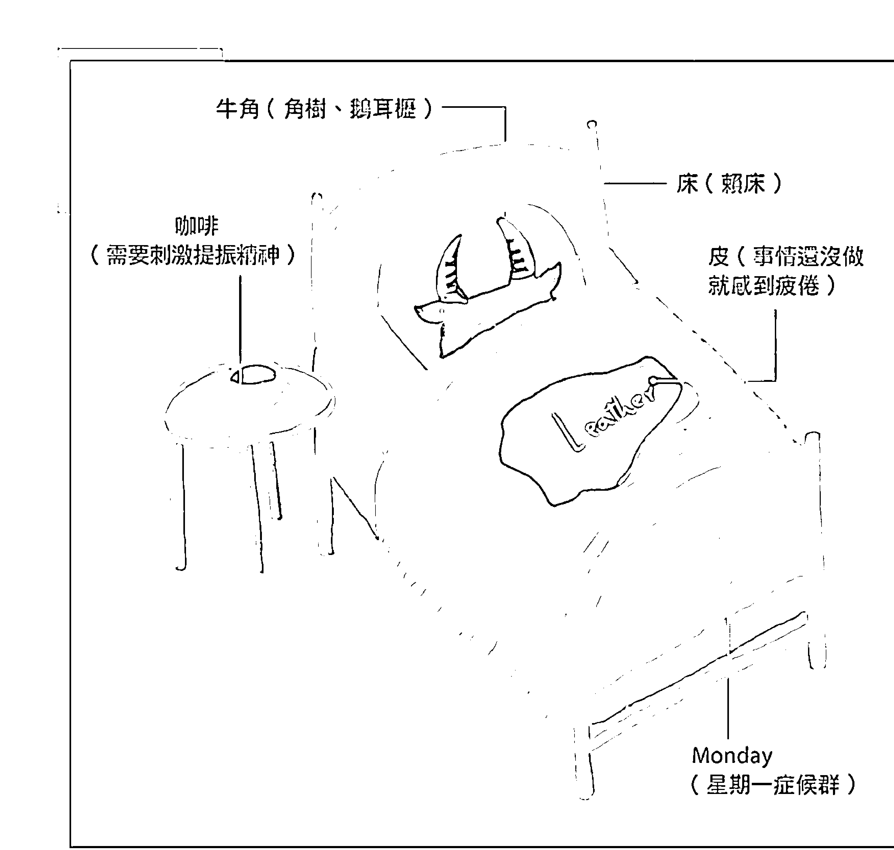

#### 鳳仙花

花精檔案

- 拉丁學名 | *Impatiens glandulifera*
- 七大分類 | 孤獨類
- 製作法 | 日照
- 關鍵字 | 急躁
- 正面特質 | 耐心

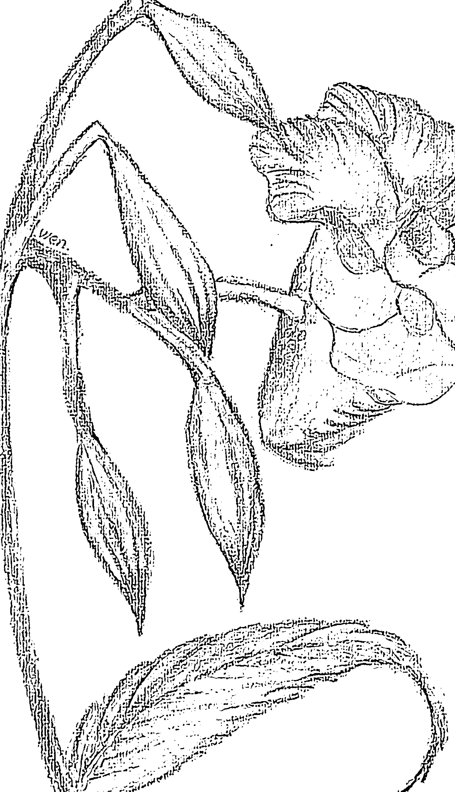

## Impatiens

##### 巴赫醫師的敘述

想得快、行動也很快的人，希望事情能毫無拖延地完成。當生病時，他們會急著趕快好起來。對動作慢的人很難有耐心，因為他們覺得浪費時間是錯的，他們會盡其所能讓那些人快一點。他們通常喜歡獨自工作和思考，才能以自己的速度完成所有事情。

> ——出自《 The Twelve Healers and Other Remedies 》

弱點：沒耐心
美德：原諒

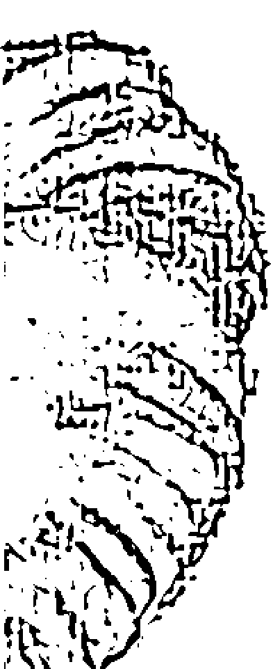

你是否知道，在自己內心深處，仍藏著一絲嚴酷？當受到攻擊或騷擾時，你發現很難不懷有一點惡意？你的內在是否有想要強迫別人跟你想法相同的渴望？你是否沒有耐心，而因為欠缺耐心，使你顯得有點殘酷？你的天性是否仍有一絲審判者的痕跡？若是如此，你正努力獲得細膩的溫柔和寬恕，而這沿著威爾斯小溪邊生長的美麗紫色鳳仙花，將會帶著它的祝福，協助你走過這條路。

> ——出自《 Free Thyself 》

##### 鳳仙花 VS. 中醫觀點

## 圖解巴赫花精

電視劇〈大醫院小醫師〉中，竇智孔飾演的阿邦第一次到心臟外科實習，就被總醫師訓誡動作太慢，因為心臟外科要的是快速反應的急救團隊，醫護人員必須馬上到達崗位，加入救援行列，這樣緊湊的生活讓他們這群實習醫生招架不住，神經緊繃，也害阿邦差點和女朋友分手。

忙碌緊張是大多數人現實生活的寫照，尤其在這N倍速的時代裡，許多人都過得匆匆忙忙，緊繃急躁的情緒也讓他們不知不覺中動作愈來愈快。醫學報告指出急躁的生活容易導致消化性潰瘍、肌肉僵緊、頭痛等疾病，可說是高速時代給大家的一個代價。其實世間事均有輕重緩急，並非每一件事都非急著處理不可，有些事情，像是生命的搶救，確實是要分秒必爭，但有些卻可以稍微放慢腳步，享受一下慢工出細活的悠閒樂趣。鳳仙花花精就是那個可以幫助我們放鬆的好工具，進而消除精神上的緊繃，有耐心地處理周遭的人、事、物，體會現代人早已遺忘的自在閒情。

## 應用條件：

- 喜歡獨自一個人做事，無法忍受別人的慢動作。
- 急性子，行動、吃飯、說話速度快。
- 會動來動去、不停地看錶。
- 神經質，容易激動、緊張。
- 皮膚搔癢、過敏。
- 容易肌肉緊繃。
- 失眠、多夢。

##### 鳳仙花×情緒與思緒

鳳仙花的英文Impatiens恰巧與不耐煩的英文impatient相似，代表鳳仙花特性的人沒耐性，像個急煞風，也因此，他們很怕碰到慢郎中。開車時，前面的車速度慢一些，就開始發牢騷，猛按喇叭，一幅快要抓狂的模樣，日常生活中，許多人個性暴躁、發脾氣的主因就是沒耐心。以前我的一位主管，個性相當急，開會時，別人說話比較慢，他們就急著幫忙插嘴，但常常把別人的意思詮釋錯誤，造成當事者的不滿。這種急躁的個性，讓他們無法適應團隊工作，因為這樣的人總是認為別人在拖累他的進度，無法忍受旁人動作太慢，故喜歡自己一個人工作，因此被巴赫醫師歸類在「孤獨類」花精族群中。

鳳仙花情緒這種走路快、吃飯快、說話快的三快特性，不僅使得他們不自覺中容易激動、緊張，也間接影響到睡眠品質，因此常有失眠、多夢的現象產生。現代人常見的消化系統問題，如吃太快而造成潰瘍、胃腸疾病、突發性痙攣或劇痛，都和這個花精有關。這類型的人，即使是生病，也會焦急地想要快點康復，不想拖泥帶水，充份顯現出性急的本質。

巴赫醫師在《自我治療》（Heal Thyself）一書中提到：「……疾病雖然殘酷，本身卻是仁慈而和善的，若我們能正確的解讀，它將指引我們看出缺點本質所在……」，當我們出現疾病時，應該要靜下心來，仔細思考，為何上蒼讓我生病，是要我加強什麼嗎？這樣的疾病才有正面意義，才能使我們的身心靈更趨完美。

##### 花精運用

在門診時，常會看到有些患者在診間外走來走去，不時往內看，也頻頻地看著手錶，似乎在暗示我們動作快一點。其實從望診中就可以推敲出這位患者應該就是鳳仙花狀態的人，因此他們不耐久候，也常催促別人動作快一點。由於鳳仙花狀態的人動作特快，連帶使得皮膚的皮脂腺分泌也加速，容易毛孔阻塞而形成痤瘡（青春痘）。皮膚病是鳳仙花狀態的人常見的疾患，除了痤瘡外，風疹塊（急性蕁麻疹）也符合鳳仙花急躁的特性，它就如同夏天午後的一場雷陣雨，來的快，去的也快，因此鳳仙花花精就能幫得上忙。

古人常說：「十年磨一劍。」中國古代的拳術，如太極拳、各式養生氣功等，都強調圓融輕慢，中國功夫更重視內功，要求呼吸吐納要細、長、慢、勻，這樣氣感才強，勤練三年，才會有小成，這和西方主張快速攻擊的理念明顯不同。現代人注重速食，也漸漸將東方文化中重視「事緩則圓」的理念拋諸於後。其實人生不需要急，不管是在事業、感情，乃至養生保健，都須以此為準則。俗諺說：「呷緊撞破碗。」快速有時是會造成反效果的。二次大戰時，德軍急著攻佔俄國，就因為進展過快，導致補給線太長，物資無法順利補充，因而吃了敗仗。在感情上，也是如此，慢慢地加溫，感情才會濃郁，太猴急反而會嚇跑對方，這說明了一件事，急不見得就好。

巴赫花精是一種能量療法，所以它的服用原則，也就和練氣功一樣，要頻頻啜飲，才能接收到其氣場的加持，這也是巴赫醫師特別強調的。畢竟花精飲用太過頻繁，就已處在急躁的負面情緒中，反而會誘發出更多的情緒來。善用鳳仙花花精，將可幫助我們詳細規劃，揮別匆忙的生活，方能體會自在快樂的輕柔人生。

## 孤独

它不像牡丹那樣富麗堂皇，也不像玫瑰那樣艷麗多姿。它只是孤獨地開在牆角，默默地散發著自己的清香。它的花瓣薄如蟬翼，顏色淡雅，彷彿是用最細膩的筆觸描繪而成。它不與百花爭艷，只是靜靜地綻放，彷彿在告訴世人，即使孤獨，也要活出自己的精彩。它的根莖纖細，卻堅韌有力，支撐著整朵花的重量。它的葉子翠綠欲滴，襯托得花朵更加嬌嫩。它彷彿是大自然的傑作，雖不引人注目，卻有著獨特的魅力。它讓人想起那些默默奉獻的人，他們不求回報，只願在自己的崗位上發光發熱。這朵孤獨的花，成為了這片角落的靈魂，它的存在，讓這個世界多了一份寧靜與美好。它不需要太多的关注和赞赏，只是静静地生长，默默地绽放，最后又静静地凋谢。它的一生，仿佛是一首无声的诗，讲述着关于孤独、坚韧和美丽的永恒故事。当微风拂过，它轻轻摇曳，仿佛在向世界展示它最后的舞姿。花瓣一片片落下，回归大地，却留下了种子，等待来年的新生。这便是孤独的力量，在寂寞中积蓄能量，在平凡中创造奇迹。它教会我们，即使在最不起眼的角落，也能活出生命的深度和广度。这朵凤仙花，以其独特的姿态，诠释着孤独的真正含义——不是孤单，而是独立；不是寂寞，而是宁静；不是被遗忘，而是选择自我绽放。它的故事，将继续在这片土地上流传，激励着每一个路过的人，去发现生活中的美好，去珍惜每一个平凡而独特的瞬间。而它，依然在那里，静静地，孤独地，美丽着。

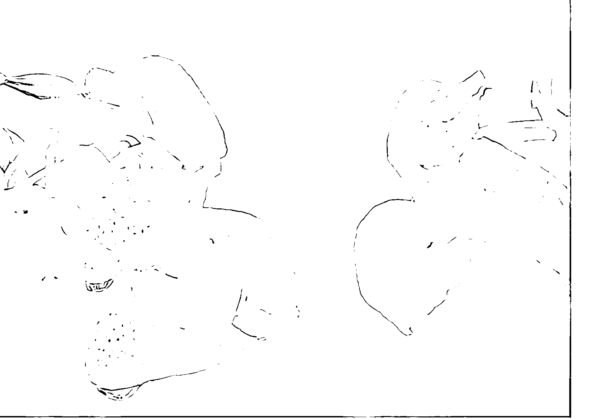

##### 李醫師診間案例探討

陳先生，57歲，因腹瀉來診，把脈時發現其左前臂內側遍佈紅疹，並有數條紅色的抓痕，細問之下原來個案有蕁麻疹病史，發作時紅疹迅速出現，奇癢難耐。我詢問個案是否平時做事較為心急？患者回答我說做任何事確實超級急。

我根據他的狀況採用野酸蘋果⊕櫻桃李⊕鳳仙花花精外敷於右手肺經的太淵穴，並於紅疹處局部外噴野酸蘋果花精。數分鐘後，就在患者等待領藥時，發現紅疹有開始消退，膚色也漸漸正常，對於花精療效的快速噴噴稱奇。

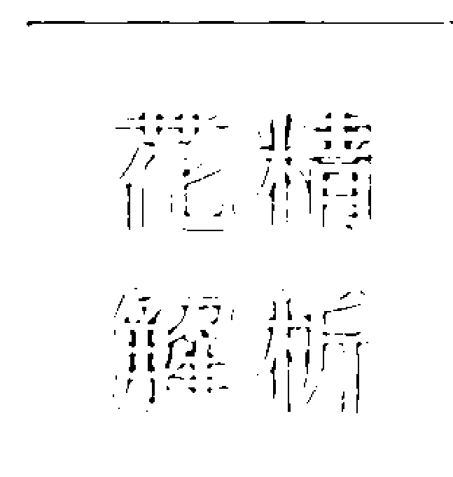

#### 野酸蘋果

對於各種皮膚病的情緒釋放有良好的作用。

#### 櫻桃李

皮膚癢到抓狂時適用，可幫助消除癢到抓狂的感覺。

#### 鳳仙花

個性急的人，而皮膚起疹快速亦可視為鳳仙花現象，我亦用此花精處理別的患者頻尿情形，效果令人滿意。

皮膚過敏、風疹塊，常用鳳仙花⊕野酸蘋果，若患者會搔癢，可加入令人抓狂的櫻桃李花精。

## 小叮嚀

花精是情緒療法，並無法直接治療疾病，而是針對因情緒引起的身心症有效。

##### 相似花精區辨及補充說明

- 1. 頸項僵，可以考慮鳳仙花、馬鞭草、水薑、荊豆、橡樹、橄欖花精。
- 2. 鼻子過敏，常用到荊豆。而皮膚過敏，則常用鳳仙花。
- 3. 過動兒除了思索石楠花精外，也要考慮鳳仙花。

| 類型 | 花精 | 特性描述 |
|------|------|----------|
| 急催子 | 馬鞭草 | 喜歡集體行動，早點把事情完成，也希望大家都能按照他的原則去做事，做事常廢寢忘食、過度努力 |
| | 鳳仙花 | 做事情相當有效率，同時間可以做很多事，也做的相當完美，希望事情趕快完成，所以會嫌別人動作太慢，故喜歡單獨工作 |

##### 與鳳仙花花精相似的新一代花精

- 1. 頂輪花精（Crystal Herbs脈輪花精）
- 2. 耐心花精（Crystal Herbs神聖和諧花精）
- 3. 安定花精（Crystal Herbs內在小孩花精）
- 4. 香膠花精（蘇格蘭芬活花精）
- 5. 優雅慢活·三色緬梔花精（晶荷日光花精）

##### 鳳仙花花精功用圖像記憶

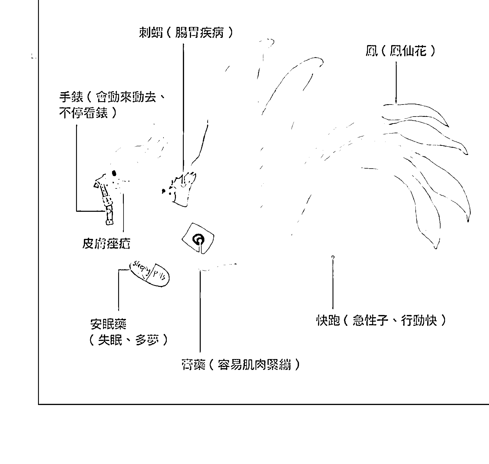

#### 落葉松

花精檔案

| 項目 | 內容 |
|------|------|
| 拉丁學名 | Larix decidua |
| 七大分類 | 沮喪絕望類 |
| 製作法 | 煮沸 |
| 關鍵字 | 沒自信 |
| 正面特質 | 自信 |

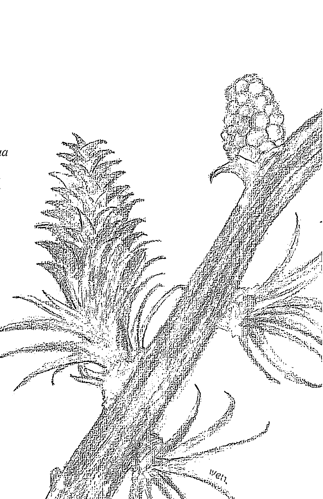

##### 巴赫醫師的敘述

給不覺得自己比身邊的人好或有能力的人。預期自己會失敗，感覺自己永遠不會成功，因此不願冒險嘗試，或不付出足夠努力來獲得成功。

> ——出自《 The Twelve Healers and Other Remedies 》

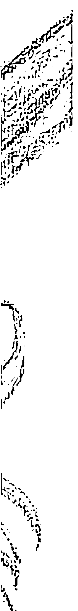

##### 落葉松 VS. 中醫觀點

生命意義的追尋，是每個人一生中最重要的課題。然而，有些人在遇到機會時，會因缺乏對自己的信賴而讓許多機會白白地流失。曾在網路上看到一篇新詩，述說一個男孩拍攝下油菜花的美景，想跟心儀的女孩分享，最後卻道：「只是不知／不擅言詞的我／妳是否能夠接受？」這種缺乏自信的心情，充分反映出落葉松狀態。

> 巴赫醫師曾說：「讓我們躍入生命吧！我們人生的目的就是要獲取知識與經驗，除非我們面對現實，挑戰自我極限，否則將一無所獲。」期待落葉松花精，能巧妙地幫助人們恢復自信，順利克服眼前的生活挑戰。

應用條件：

- 自卑感很重，對於別人的批評、眼光非常敏感。
- 很有禮貌、溫文儒雅來掩飾自己的無能。
- 喜歡機械化式的工作，無法做大事。
- 可能染上吸毒或酗酒惡習。
- 缺乏自信。
- 未戰先敗。

##### 落葉松 × 情緒與思緒

落葉松狀態的人，覺得自己比不上別人，充滿著自卑情結，對別人的批評與眼光非常敏感，如母親對做哥哥的說：「你弟一個月賺十幾萬，你賺多少？」或是妹妹在轉角處聽到鄰居在談論她：「連騎機車都不太會，還當什麼大學生？」這一類批評或否定的話語，往往會讓他們自卑感更加嚴重，因為落葉松狀態的人，會很在乎別人對他的評價。自信心不足的人，即使滿懷技術、學富五車，也不敢接受新的挑戰、新的工作、也不敢跳槽。這種認為自己一定會失敗的態度，常使許多很好的機會拱手讓人。落葉松狀態的人最喜歡從事常規化的工作，因為這樣的工作，沒有什麼變化，適合他們內心對自己的期許，也不用擔心別人會批評。

落葉松狀態的人凡事能躲則躲，不喜歡出頭，常會尋找藉口或裝病來逃避眼前的問題。外表看來溫文儒雅、很有禮貌，其實這是一種保護色，主要是讓大家不容易發現他的存在，好推卸讓他發揮的機會，是掩飾自己無能的一種手法。倘若遇到不能躲的事，如考試、運動比賽，便開始產生自律神經失調的症狀，如一遇到考試便流手汗、焦慮、參加運動會跑步前便開始腿軟、老師要求上台報告時便口吃。若單從外觀看很像是害怕的心理作祟，會讓治療師誤用恐懼類花精，但其真正的病因則是自信心不足，認為自己會做不好所致。這種特性可能會讓他們染上吸毒或酗酒惡習，以躲避內心的自我認同。

在人體七個脈輪中，落葉松情緒常和喉輪有關，喉輪和表達能力有關，自信心不足的人表達能力一向很差，除了容易講話結巴外，遇到問題也不敢問，在KTV唱歌時，最容易看出這樣特質的人，因為他們就是那種不敢唱歌的一群。有些個案在服用落葉松花精後，會突然愛講話，也會打電話找朋友聊天，就喉輪能量開啟來說，這個花精將是很好的啟動開關。

##### 花精運用

落葉松的自信心不足在做任何事前都會出現，即使是臨床上常見的男性性功能障礙，也都有它的蹤跡。早洩是男性常會遇到的問題，其中有一半的患者是屬於心理性早洩，因為他們總認為自己不能持久，會很快射精，這種未戰先敗的特性正是落葉松人格特質的表現。德國花精治療師Dietmar Kramer在《新巴赫花精身體地圖》將陰莖劃分為五個花精反射區，分別為野酸蘋果（過度敏感）、溝酸漿（害怕被伴侶瞧不起，害怕紅杏出牆）、落葉松（未戰先敗）、鳳仙花（性急）、龍膽（悲觀、沮喪）。只要辦證下花精，內服加外敷關元穴（關元穴即丹田，在肚臍下三寸，約四指寬），即可針對心理情緒面作調整，也可搭配補腎中藥調整身體質質面，對男性早泄有不錯的效果。

或許是曾受殖民的關係，台灣人普遍都有自卑心態，認為自己次人一等，講話也比較小聲。常以滿腹的藉口，如學歷不好、口才差、外語能力不行等，來躲避眼前的挑戰，這點在現在的大學生中特別明顯。就讀研究所時，我發現很多同學及學弟妹們，讀研究所的目的是不知道自己可以做什麼，害怕在社會上沒有競爭力，心中認為自己的毫無實力可言，於是選擇躲在學校裡避風頭。大學之後讀碩士、碩士畢業後繼續攻讀博士，鮮少有人是因為興趣或學術而讀的。自信心比學歷重要，全球前三大首富裡，就有一半以上是輟學生，如世界首富比爾蓋茲、甲骨文總裁艾利森、戴爾董事長麥克戴爾、蘋果電腦創辦人賈伯斯等；而台灣首富郭台銘，也不是大學畢業，但他們卻可以引領全球，最主要原因是這些人均有著超強的自信心，敢去打拚，相較於現今學生忙著準備未來，不願接受挑戰，實在有天壤之別。

俗話說：「不做，哪有希望；做了，希望也就來了。」運用落葉松這個處方，可以讓我們不會懼怕任何的考試與挑戰，並擁有像戰士般無比的信心，讓我們有背水一戰的勇氣，開創人生的一片天。加油！我做不到還有誰做得到呢？

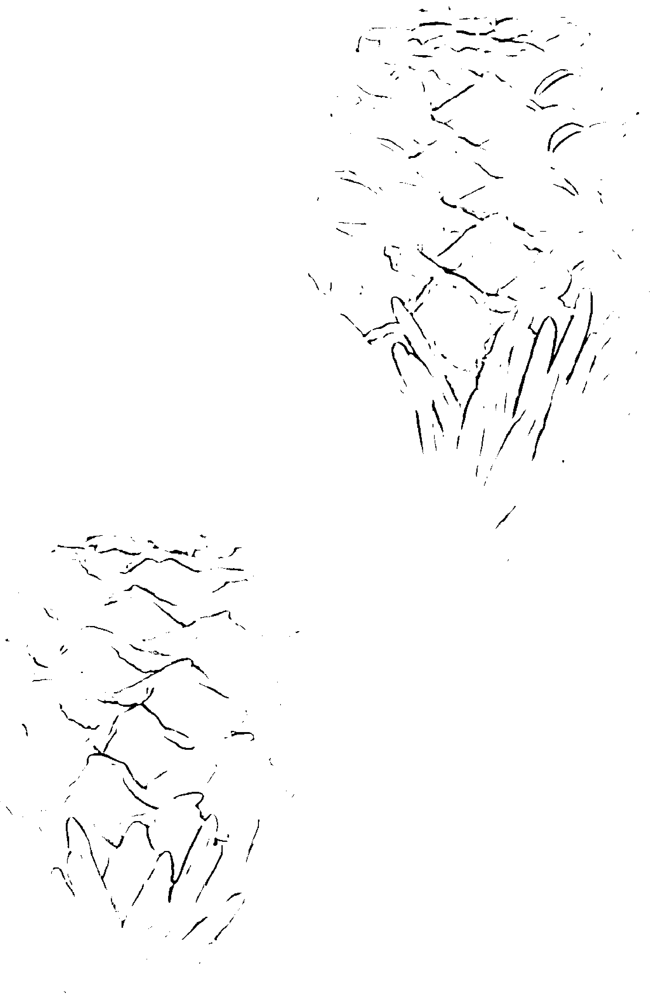

##### 李醫師診間案例探討

鄰居吳先生，2007年4月初騎機車下班時，為了閃躲一輛逆向行駛的貨車，不小心連人帶衝進田裡，幸好這塊田剛插秧，鬆軟的泥土降低衝擊力，僅左臀部上緣疼痛，大致無恙。由於吳先生從事的是營造水電工程，左臀部的疼痛使他無法蹲下來接管線，只能無奈的在家休養。

4月15日早上我剛好回到大溪，知道這個訊息，由於手頭上沒有中藥可用，便調了花精給他：急救花精、龍芽草、龍膽、落葉松，服法為一天至少6次，一次4～6滴。除了內服調配瓶外，亦用同樣的處方調配噴瓶，讓他可以用棉片貼在患處，也隨帶送他一罐急救花精乳霜，並建議他有空時便可塗抹於患處。當天晚上，和吳先生電話聯繫，告知疼痛已稍減，對於花精療效如此快速，感到有點驚訝。三天後，再聯絡時疼痛已完全消除，不僅無按壓痛，也可正常蹲下起坐，高興地準備隔天上班的事情。

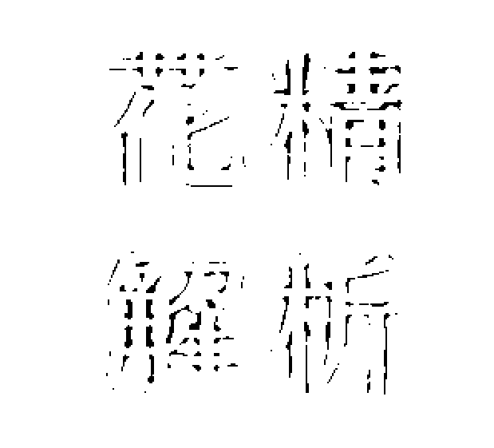

我和吳先生熟識，他平時人很好，但三杯黃湯下肚便開始胡言亂語，這是龍芽草→櫻桃李現象。

#### 鐵線蓮

常幻想著以後要當大老板。

## 聖星百合及岩玫瑰

被貨車嚇到掉進田裡，為一個心靈衝擊（生死一瞬間的恐懼）。

#### 落葉松

是基礎花精，幫助恢復。

#### 龍膽

運用在遭受挫後的臨時憂鬱（無奈的在家休養）。

個案所需處方為龍芽草、落葉松、龍膽、櫻桃李、鐵線蓮、聖星百合、岩玫瑰這七個花精，由於後面四個花精為急救花精的成份，所以將其簡化為急救花精，故處方縮簡為龍芽草、龍膽、落葉松、急救花精。雖說患者受傷處為Dietmar Kramer身體地圖中的甜栗反射區，但此次未用甜栗花精，純粹以情緒辯證法為主來選用花精，依然效果卓著。

##### 相似花精區辨及補充說明

- 1. Dietmar Kramer把落葉松列為基礎花精，倘若患者有落葉松失衡狀態時，常會因欠缺療癒的信心，效果會大打折扣，必須先把自信心提升，患者的負面情緒才有清除的一天。
- 2. 落葉松⊕滿酸漿可以改變人的怯懦，是上台演說前的強心針。
- 3. 每天列出一條自己的優點，可幫助自信心提升。
- 4. 落葉松狀態的人有能力但卻懷疑自己的能力；水蕨狀態的人對於自己達成任務的能力深具信心，不懷疑能力卻懷疑自己的判斷。
- 5. 自信心的問題通常是根深蒂固的問題，短時間的治療通常無濟於事，因此落葉松花精必須長期服用。
- 6. 洛伊·馬提納（Roy Martina）常使用肌力測試加情緒語句來判斷一個人的情緒，可心中默想「我是個充滿自信的人」，當有這個信念但肌力測試卻是無力時，代表自信心不足，就必須服用落葉松花精。

| 狀態 | 花精 | 描述 |
|------|------|------|
| 酗酒 | 落葉松 | 麻醉自己不如人的心態 |
| | 龍芽草 | 麻醉自己內心的苦悶 |
| 沒自信 | 落葉松 | 長期的沒有自信 |
| | 龍膽 | 受到挫折之後導致暫時失去信心 |
| | 榆樹 | 因為一時任務過重而產生的短暫信心危機 |
| 不相信自己 | 落葉松 | 不相信自己的能力 |
| | 水蕨 | 不相信自己的智慧或判斷力（但相信自己的能力） |
| | 線球草 | 不相信自己的決定 |
| 自卑感 | 落葉松 | 對自己的能力沒信心 |
| | 野酸漿果 | 對自己的外貌沒信心 |
| | 松樹 | 對自己的行為自責 |
| 表現膽怯 | 落葉松 | 因為對自己沒有信心 |
| | 洌酸漿 | 因為害羞或害怕 |
| | 矢車菊 | 因為不敢說出自己的意見、不敢拒絕別人 |

##### 與落葉松花精相似的新一代花精

- 1. 自信花精（Crystal Herbs神聖和諧花精）
- 2. 自信之聲花精、豌豆花精、海冬青花精（蘇格蘭芬活花精）

##### 落葉松花精功用圖像記憶

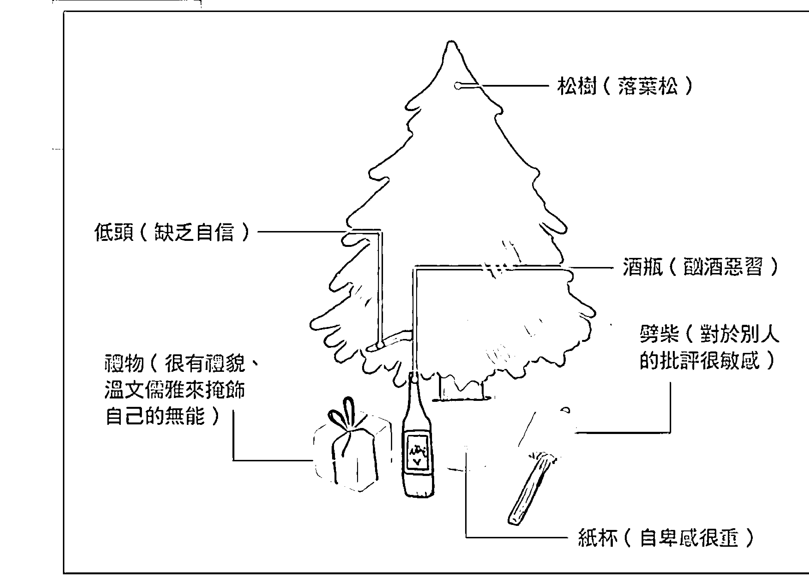

#### 溝酸漿
##### 花精檔案

| 项目 | 内容 |
| :--- | :--- |
| 拉丁學名 | Mimulus guttatus |
| 別名 | 溝酸醬、龍頭花、猿猴花、猴子花、畏縮草 |
| 七大分類 | 恐懼類 |
| 製作法 | 日照 |
| 關鍵字 | 具體的恐懼 |
| 正面特質 | 勇氣 |

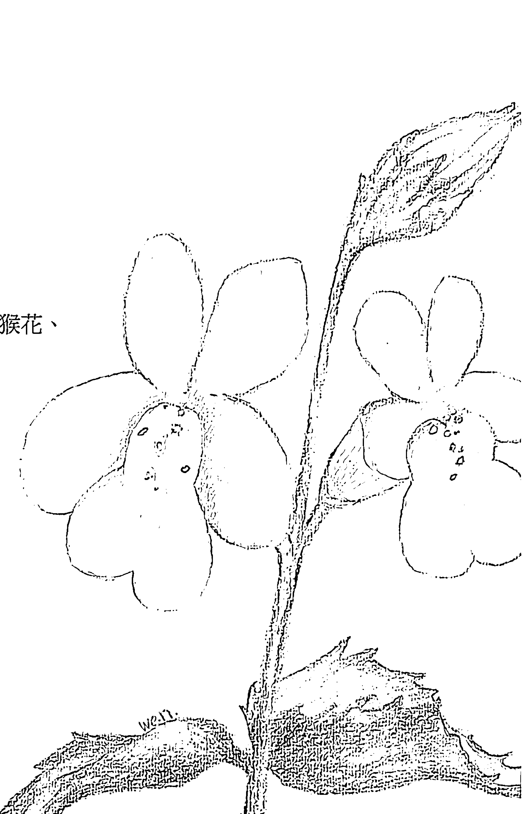

##### 巴赫醫師的敘述

恐懼具體事物，疾病、痛苦、意外、貧窮、黑暗、獨處、不幸。日常生活的恐懼。這些人默默地忍受他們的恐懼，不主動向別人傾訴。

> ——出自《The Twelve Healers and Other Remedies》

- 弱點：恐懼
- 美德：同儕心

你是害怕的人嗎，無論怕人或怕事？勇敢前進，然而生命卻被恐懼奪走了喜悅？你怕永遠不會發生的事、怕對你根本沒有影響的人、怕明天會發生什麼、怕生病或失去朋友、怕習俗、怕一百種事情嗎？
你是否希望堅定立場，獲得自由，卻沒有勇氣去衝破牢籠？若是如此，在水晶般的溪邊生長的溝酸漿，會讓你自由地愛上生命，教導你對別人懷有最溫柔的同情心。

> ——出自《Free Thyself》

##### 溝酸漿 VS. 中醫觀點

癌症是國人懼怕得到的疾病，連續多年的十大死因排行中，惡性腫瘤始終名列前茅，更令大家談癌色變。其實癌症的治療不一定只有放療、化療兩種選擇，在深入了解情緒療法後，不難發現心境的變化也是癌症惡化與康復的關鍵。邁阿密大學和德州大學西南醫學中心的一份研究報告顯示，持消極或自暴自棄態度的婦女容易罹患子宮頸癌；而新聞也報導，一名生命垂危的美國醫學院博士，每天觀看喜劇節目和開懷大笑，居然奇蹟般存活下來，讓醫學界人士大為驚訝。

其實任何一個負面情緒，如不滿、憤怒、冤屈、恐懼等均會導致能量不流通，因此在處理腫瘤問題時，一定要搭配情緒療法，將心中的結打開，疾病才有康復的希望。透過情緒療法，即使無法把癌症解掉，至少也可以讓患者「走」得心無罣礙。不論是健康人士或罹癌患者，在談癌色變的今日，溝酸漿花精，將可以幫助我們解除恐懼得癌的心理及懼怕惡化的負面情緒。

應用條件：

- 害怕所有世俗的事物，並將恐懼放大。
- 害怕在人群中說話，或常不知所云。
- 害怕害羞靦腆以隱藏焦慮。
- 事情還沒有做就開始擔心。
- 經常傻笑。
- 手足冰冷。

##### 溝酸漿×情緒與思緒

溝酸漿狀態的人，最大的痛苦就是害怕，他們怕痛、怕貧窮、怕黑、怕冷氣、怕蜘蛛、有懼高症等，對某些人而言，這些恐懼的東西並沒有什麼值得害怕，如一隻小蜘蛛，一般人覺得這只是一隻小昆蟲，但溝酸漿狀態的人卻會將它放大，宛如是一隻食人大怪獸。

巴赫醫師曾提到溝酸漿狀態的人「害怕擁擠的人群／噪音／談話……」，這種纖細而敏感的人格特性，使得他們對周遭環境及人群相當敏感，尤其是對聲、光這兩方面。他們很怕製造出太多的聲音，如拉開椅子要坐時，很怕拖出聲響；早上起床走路時，會像小偷一樣，放慢腳步走路，就怕別人聽到他的腳步聲。這種神經過敏的情形，也害得他們容易焦慮、擔心，常常事情還沒有開始做就擔心做不好。而有些小朋友的尿床常和溝酸漿的害怕有關，因為他們害怕尿床後會被媽媽修理，反而更加緊張，尿床更頻繁。部份患者的失眠、焦慮等現象也常和溝酸漿的恐懼有關，只是患者不太會表達，須要治療師仔細推敲。

##### 花精運用

溝酸漿狀態的人害怕別人把目光集中在身上，和落葉松一樣很不喜歡出頭，只要和陌生人相處或在人群中說話，便會覺得不自在而臉紅、說話結巴，偶而還會傻笑，一幅害羞靦腆的樣子。他們很容易因怯場而說不出話，或為掩飾內心的焦慮不安而多話，所以常不知所云。相較於落葉松以逃避來掩飾自己的無能，溝酸漿的人常用傻笑來掩飾內在的恐懼及焦慮不安，這在臨床鑑別上很好區分。

香港花精治療師黃偉德提出，有溝酸漿狀態的人會體溫偏低、畏寒，這或許和他們因驚慌而導致體表血液循環下降有關。臨床上常有女性朋友主訴手腳冰冷，也常有人因擔心害怕而產生這種症狀，雖然我尚未用過溝酸漿花精治療類似的個案，但也是臨床上可供參考的一個療法。

巴赫花精的溝酸漿，又叫做黃色猿猴花（Yellow Monkey Flower），目前世界各國約有超過二百種花精體系，光是不同顏色的猿猴花就分為數個花精體系，像是北美花精系統的猿猴花就可對治不同形式的恐懼。古人云：「善用兵者，以少為多；不善用兵者，雖多亦少。」雖然花精有這麼多種，只要我們專研其中一種，就可以將花精治療發揮到淋漓盡致，而達到「善用兵者，以少為多」這個境界。運用溝酸漿這個處方，將可協助人們擁有面對恐懼的勇氣，當然對社交活動的進展，也有不錯的效益。

#### 溝酸漿

恐

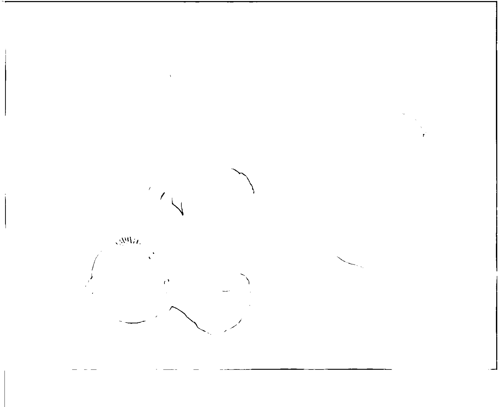

##### 李醫師診間案例探討

這天看診時，工作人員送給我吃咖啡糖，味道蠻濃的。我以前很喜歡喝咖啡，尤其是去歐式自助餐或下午茶，一定會點杯卡布奇諾，研究所學弟們也已知道我的用餐規律性，當我吃到黑森林蛋糕外加一杯咖啡時，表示我已經用餐完了。喝咖啡習慣的直到後來做能量測試發現咖啡對我的副作用很大，我才較少飲用。

這幾顆咖啡糖下肚後，過一會兒，突然右眼皮突然不停地輕微抽搐，抽抽停停的情形，雖不會痛，但也令人有點困擾。怎會這樣呢？我左思右想，應該是因為心中害怕吃咖啡糖的副作用吧！能量測試後果然沒錯，是因為擔憂副作用所引發，而我也測試出光使用溝酸漿花精三滴便可以緩解這種情形，服用花精三分鐘後，眼皮跳動的情形即消失，原來情緒所引發的身心症候群，竟以這麼多樣的形式來顯現。

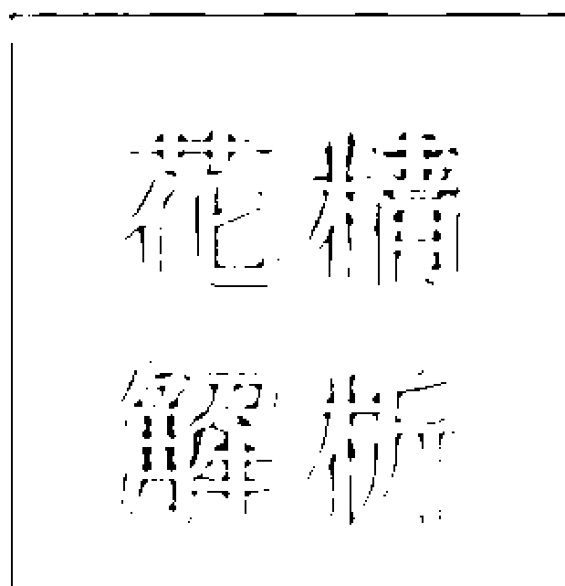

#### 溝酸漿

對治已知悉的恐懼。

能量測試法，可用靈擺或LET，可以幫助我們找出病因來。

##### 相似花精區辨及補充說明

- 1. 說話不知所云、口吃：溝酸漿⊕落葉松。
- 2. 溝酸漿的恐懼是針對將發生在自己身上的事，而紅栗的恐懼是針對將發生在自己愛人身上的事，這兩者都能明確指出自己害怕的原因，而白楊是模糊的害怕。

| 类别 | 花精 | 描述 |
| :--- | :--- | :--- |
| 恐懼 | 溝酸漿 | 明確的恐懼。針對將發生在自己身上的事 |
| 恐懼 | 白楊 | 莫名的恐懼。通常是靈界方面 |
| 恐懼 | 紅栗 | 明確的恐懼。針對害怕親愛的人發生不幸 |
| 恐懼 | 岩玫瑰 | 任何恐懼。以上所有恐懼的嚴重版 |
| 遇到挫折 | 落葉松 | 尚未遇到挫折便未戰先敗，認為自己做不到 |
| 遇到挫折 | 溝酸漿 | 遇到挫折會害怕被人瞧不起，反而會奮發向上 |
| 遇到挫折 | 龍膽 | 遇到挫折就裹足不前，暫時失去自信與勇氣 |

##### 與溝酸漿花精相似的新一代花精

- 1. 粉紅玫瑰花精（Crystal Herbs業力花精）
- 2. 勇氣花精（Crystal Herbs內在小孩花精）
- 3. 猿猴花花精（蘇格蘭芬活花精）
- 4. 假酸漿花精（晶荷日光花精）

##### 溝酸漿花精功用圖像記憶

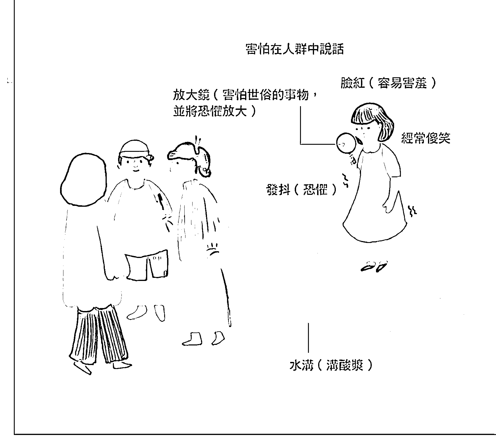

#### 芥末
##### 花精檔案

| 项目 | 内容 |
| :--- | :--- |
| 拉丁學名 | *Sinapis arvensis* |
| 別名 | 芥茉、芥子、芥子花 |
| 七大分類 | 對現實興趣缺缺類 |
| 製作法 | 煮沸 |
| 關鍵字 | 莫名的憂鬱 |
| 正面特質 | 光明 |

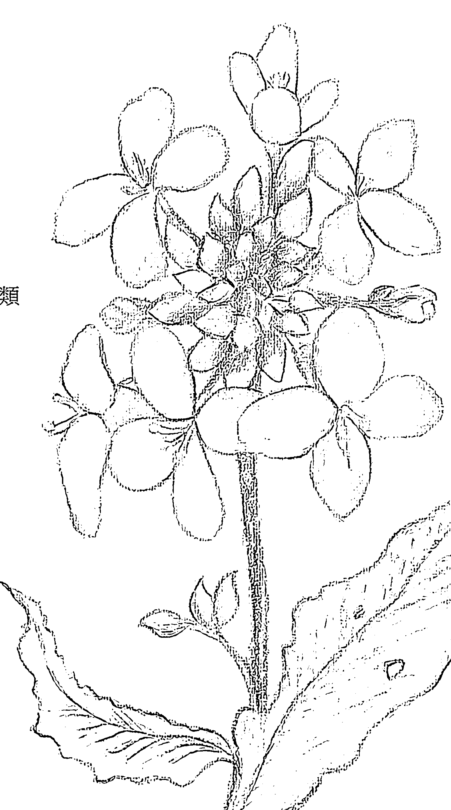

##### 巴赫醫師的敘述

容易陷入憂鬱甚至絕望的人，彷彿被一片寒冷的烏雲籠罩，掩蓋了光明和生命的喜悅。這種打擊可能說不出原因，或無法解釋。在這種情況下，幾乎不可能顯露開朗快樂。

> ——出自《The Twelve Healers and Other Remedies》

##### 芥末 VS. 中醫觀點

過年期間，利用難得的假期，到菲律賓的薄荷島渡假。連續幾天的水上活動，讓喜歡熱和海水的我大呼過癮，我喜歡這樣的沙灘、夕陽、悠閒、自然。晚上，我們有一個活動：烤乳豬，沙灘邊滿桌的燒烤，啤酒免費暢飲，還有紅酒配著烤肉串，好舒服的感覺。正當大家舉起酒杯互道新年快樂時，紅酒杯裡卻濺起一滴滴的水花，居然在這個時候，下雨了！若是久旱逢甘霖，那絕對是喜樂的事，只是，在烤乳豬的時候，下的這場雨，還真的是潑了大家一大桶冷水。

心中頓時飄來一朵朵的烏雲，除了用悶字來形容外，也找不到其他可以比擬的詞句。忘記帶芥末花精來了，不然的話，肯定把那一瓶10ml的花精喝光。一來那也是白蘭地，就當做紅酒喝好了。二來，芥末花精是專門對治突發性憂鬱，心中突然烏雲密布，就和那時一樣。

### 應用條件：

- 女性生理期時，孕婦陣痛，心情臨時不好。
- 想不出任何可以讓自己高興的事。
- 無明顯理由突發性憂鬱。

圖解巴赫花精

278

##### 芥末 × 情緒與思緒

芥末狀態的人，常會突發性憂鬱，通常是沒有原因的就發生了，心頭就是悶！一下子烏雲密佈，但一下子又突然消失。

女性朋友在生理期時，由於下腹持續悶痛、心情處於低潮狀態，容易有芥末現象產生。尤其是在懷孕陣痛時，心中更是如同黑雲降臨，阻斷了對生命的喜悅與陽光。這種情緒跌入憂鬱谷底的心境，是非常不快樂的，即使他們五子登科、擁有令人稱羨的財富、地位、學識，也還是覺得情緒低落。

國外的花精治療師常用芥末及龍膽花精治療一般性的憂鬱，若是比較深沈的憂鬱，則可依不同的情緒辨證使用甜栗、荊豆花精。

一般人除了對花精的功用有興趣外，也對芥末花精的原料有興趣，會是哇沙米嗎？食用芥末分為綠芥末與黃芥末兩種。

### 黃芥末（Mustard）

主產地：阿根廷、澳、加、英、衣索比亞、法、義及美加西部等地。最有名的出產地是在法國的第戎（Dijon）。

利用部位：種子。

### 其他功效：

- 1. 醫療功效為利尿劑、興奮劑及風濕關節炎之治療劑。
- 2. 巴赫花精的芥末是這種。

### 綠芥末（Wasabia japonica）

山葵別稱芥菜、瓦沙米。

山葵原產地：日本、民國初年引進台灣，生長於冷涼潮濕的溫帶地區，台灣阿里山產的品質最佳。

利用部位：地下根莖，洗淨後以磨成細末食用。

吃到芥末時，會有一股辛辣氣息上沖腦頂，或許這就是芥末花精可以對治突發性憂鬱的原因。巴赫醫師說：「 這是能驅逐憂鬱、為生活帶來歡樂的花精 」。運用這個處方可以幫助人們驅除壟罩生命的烏雲，讓感覺沮喪卻找不出原因的人擁有快樂的生活。

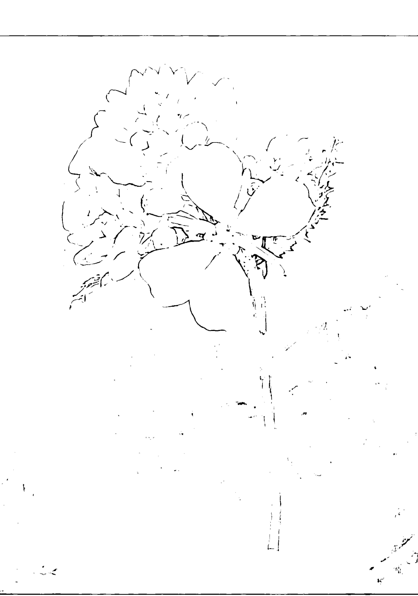

##### 李醫師診間案例探討

張小姐，2007/8/3來診，個案近來忙著準備GMAT留學考試，但由於壓力過大，眼睛酸澀、頸項僵緊、且有疲勞感，遂來門診。我為張小姐診察發現，她為了準備考試而讓自己繃得太緊，因此讀書效率亦不佳，為了讓她能應付近期的留學考試，我在開立中藥處方後，為她點敷花精。這是個案第一次使用花精，採用急救花精、橡樹、橄欖、溝酸漿點敷於雙肩處，點後張小姐馬上感覺眼睛為之一亮，原本快閉上的眼皮突然精神飽滿，讓她對於花精的初體驗驚奇不已。診療結束後，我加送一小罐調配花精給她（處方同上），並建議回去後自行滴在手心，對考試作答有不錯的幫助。

個案之後回診，第一句話便是感謝花精的幫忙，讓她GMAT考得不錯，雖僅用花精點敷法，但對花精的療效相當滿意。2007/8/31日，張小姐告訴我，這些年來每逢生理期前常會有莫名的情緒低落、沮喪、脾氣暴躁而且月經週期不規則，常會數個月才來一次，此次感覺月經快來了，問我花精對此是否有幫助？其實在身心症中，情緒所引起的生理期異常是很普遍的，我除了開立中藥加味道遙散外，亦使用櫻桃李、芥末、橄欖、橡樹、紅栗花精做穴位點敷，也送她一些花精貼片回家自行貼穴位。2007/9/8日回診，張小姐愉快地說運用花精後，經前期原本會出現的情緒完全消失，而生理期的症狀也不似之前般難過。在中藥與花精搭配使用後，經血原量少色暗情形亦改善不少，且食量變少，不會想去喝咖啡及茶，高興除了中西藥外，原來花精也是一個助人的方便法門。

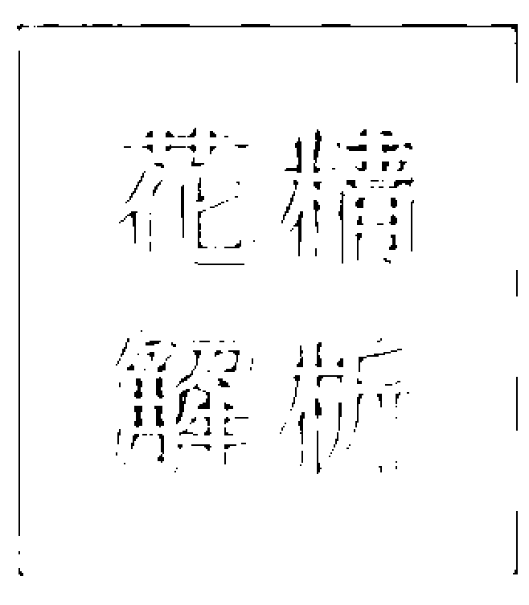

- 急救花精 應付任何緊急狀況，在考試時可協助心情穩定，比較不會失常。
- 橡樹 個案因勞累而硬撐便可使用。
- 橄欖 疲倦時可用，對於精神提振有幫助，有這種疲倦情緒時，其兩肩處容易緊繃痠痛。
- 溝酸漿 害怕已知的事物，個案因擔憂考試考不好，故使用此花精消除其內心的恐懼。
- 櫻桃李 情緒起伏，脾氣暴躁可用。
- 芥末 女性朋友在生理期時，由於下腹持續悶痛、心情處於低潮狀態，容易心頭產生一團烏雲。
- 紅栗 擔憂親人，張小姐有養一隻巴西龜，近來巴西龜好像生病，在門診言談中有提到她的擔心，故用紅栗消除其內心的擔憂。

##### 相似花精區辨及補充說明

- 1. 龍膽與荊豆的疑惑、絕望是已知的原因，而芥末的憂鬱是未知的原因。
- 2. 芥末狀態的人，容易受到天候影響，陰天時心情更容易blue。

| 憂鬱 | 花精 | 描述 |
| :--- | :--- | :--- |
|  | 芥末 | 莫名原因的憂鬱，如烏雲罩頂 |
|  | 龍膽 | 悲觀，凡事均想到壞的一面，久之形成憂鬱，他們知道自己悲觀的原因是什麼 |
|  | 荊豆 | 龍膽加強版 |
|  | 紅栗 | 因擔憂親人而造成憂鬱 |
|  | 榆樹 | 遇到重大責任會短暫的憂鬱 |

##### 與芥末花精相似的新一代花精

- 1. 眉心輪花精（Crystal Herbs脈輪花精）
- 2. 纈草花精（Crystal Herbs業力花精）
- 3. 季節情緒花精、光的存在花精（蘇格蘭芬活花精）

##### 芥末花精功用圖像記憶

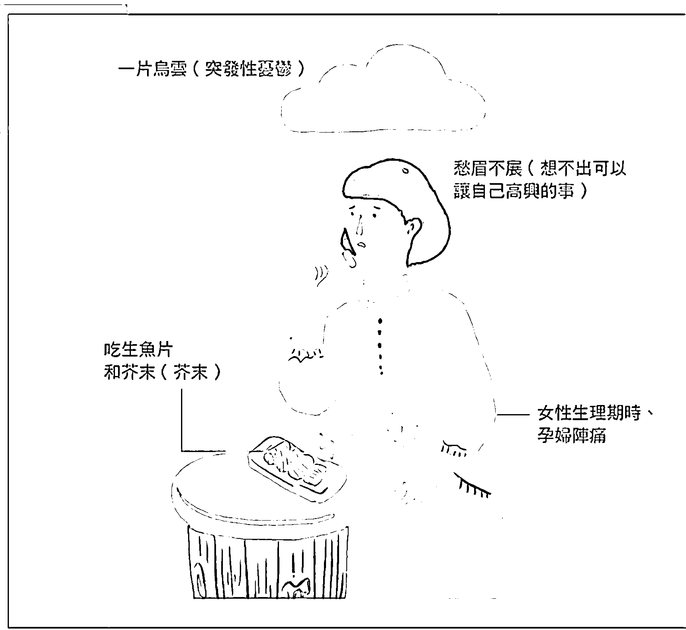

#### 橡樹
##### 花精檔案

| 项目 | 内容 |
| :--- | :--- |
| 花精橡樹 |  |
| 拉丁學名 | Quercus robur |
| 七大分類 | 沮喪絕望類 |
| 製作法 | 日照 |
| 關鍵字 | 過勞硬撐 |
| 正面特質 | 休息 |

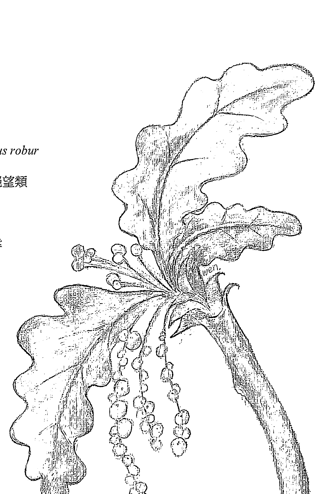

##### 巴赫醫師的敘述

給奮戰不懈與病魔對抗的人，或在日常生活中奮鬥的人。儘管情況看來無望，他們仍會一件接著一件嘗試，奮戰下去。如果生病影響到他們完成責任或幫助他人，他們會對自己很不滿意。他們是勇敢的人，對抗巨大難關，不失去希望，也不停止努力。

> ——出自《The Twelve Healers and Other Remedies》

##### 橡樹 VS. 中醫觀點

元宵節那天，到屋頂上看遠處放煙火，家住十一樓，天候好時連台北101都看得很清楚，讓人很難想像這是在大溪。樓梯轉角處有一個花盆，是媽媽從屋頂上拿下來準備種花用的，裡頭除了十幾株野生的酢漿草外，還有一株小半夏，是那種花梗看起來像老鼠尾巴的品種。或許是太久沒有喝到水，這群小生命已快奄奄一息。

聽媽媽說已放在那裡兩個禮拜，但她們還是硬撐下去。十四天沒水的日子，真不曉得她們是怎麼辦到的？轉身回到屋內，裝了一整個漱口杯的水，我把這杯水澆在她們身上，乾涸的泥土發出一陣霹靂啵啵的聲音，似乎是在和我說聲謝謝，看著這群小生命堅持下去的模樣，讓我想起了橡樹花精，永遠不向環境屈服的堅忍花精。

### 應用條件：

- 絕不讓步，不投降，即使知道每次都會失敗，仍堅持下去。
- 面對生命困難或病痛折磨，仍會奮力掙扎。
- 常自我鞭策，不會自我放鬆。
- 容易頸項僵硬及失眠。
- 硬撐。

##### 橡樹×情緒與思緒

橡樹狀態的人，有一種堅忍的特質，就好像雪地裡的梅花，值得推崇。但為何巴赫醫師把它列在負面情緒裡頭呢？主要的原因是橡樹的人很會硬撐，當超過他們體力的極限時，他們會把身體的限制當作是一種阻礙，並會很不高興地對自己生氣，因而產生沮喪感，而巴赫醫師就是運用橡樹花精來處理這種沮喪。

橡樹特質的人做事絕不讓步，因為他們有堅持達成目標的強烈責任心，即使已到環境、體力、腦力的極限，仍會堅持下去。明朝末年史可法死守揚州，近代八百壯士死守四行倉庫，還有電影斯巴達三百壯士，都是描述橡樹特質的最佳寫照，也為後人所歌頌。倘若軍中的將領及部會首長，都是這種橡樹型將領，那準是國家之幸，社稷之福，總統躺著做也照樣安穩。

##### 花精運用

橡樹狀態的人，由於責任感的驅使，是典型的拼命三郎。他們不會有太多的享樂，時間均會用在做事情上，且從不言倦。不論是在公司、家庭中，都是努力打拼，不願休息，而且責任心很強，不把工作做完，就不願意下班。我之前在編寫講義時，即使已經肩膀酸痛，也堅持要把一個段落寫完，才會休息，可說是標準的橡樹性格，在服用橡樹花精後，心情較能放鬆，編寫資料反而更加順暢。

睡眠或遊戲對橡樹狀態的人來說是很浪費時間的，每一分每一秒都必須利用，即使只是下班坐車回家，也要把握機會背些英文單詞。我曾半開玩笑的告訴上花精課的學員，說她們是橡樹人，因為平時要上班，假日還要上課，算是標準的打拼性格。而橡樹人常見的失眠現象，則是他們不想浪費時間睡覺的一種反射。只不過，這種終日只想挽起衣袖做事的人，有時候會做過頭了，而忽略疲勞與疼痛的警訊，等到發現時，常是完全虛脫的時候，這時就已進入橄欖花精的負面情緒（身心極度疲倦），因此負面橡樹狀態的病人，發病時疾病都已相當嚴重。

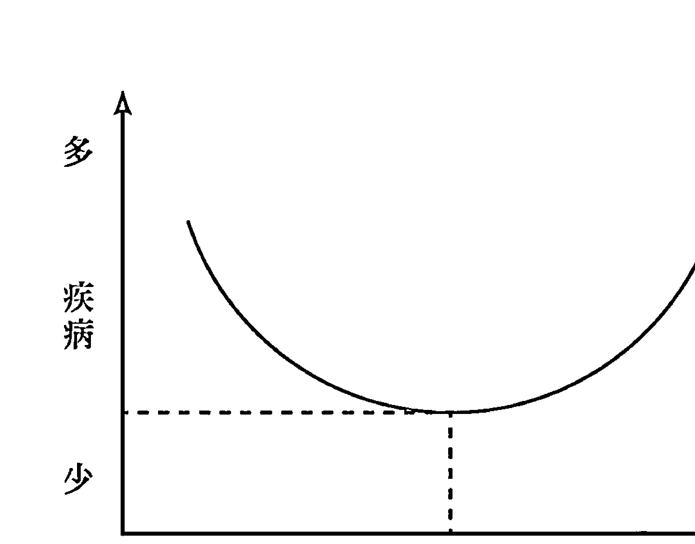

適當的壓力，可讓人身心健康，但若過頭則會產生反效果

橡樹狀態的人若是體力不佳或健康不佳影響到他的進度，便會沮喪，即使是處在這樣的環境，他們仍會日夜不停地堅持下去。他們這種硬撐個性，須要花一段時間來治療，否則他們依然會活在錯誤的責任感與使命感中，不願意改變，治療師必須多點耐心來開花精處方。不過橡樹狀態的人也有很好的性格，他們喜歡幫助人，「助人為快樂之本」是他們奉行的準則，即使已經很累了，也還是不吝嗇地幫別人忙，只是常忽略自己體能極限的特性，因而造成體力透支。堅持是很好的特性，當我們能妥善運用橡樹花精時，將可讓我們堅持到適當時刻，從容自在，輕鬆地完成我們的責任。

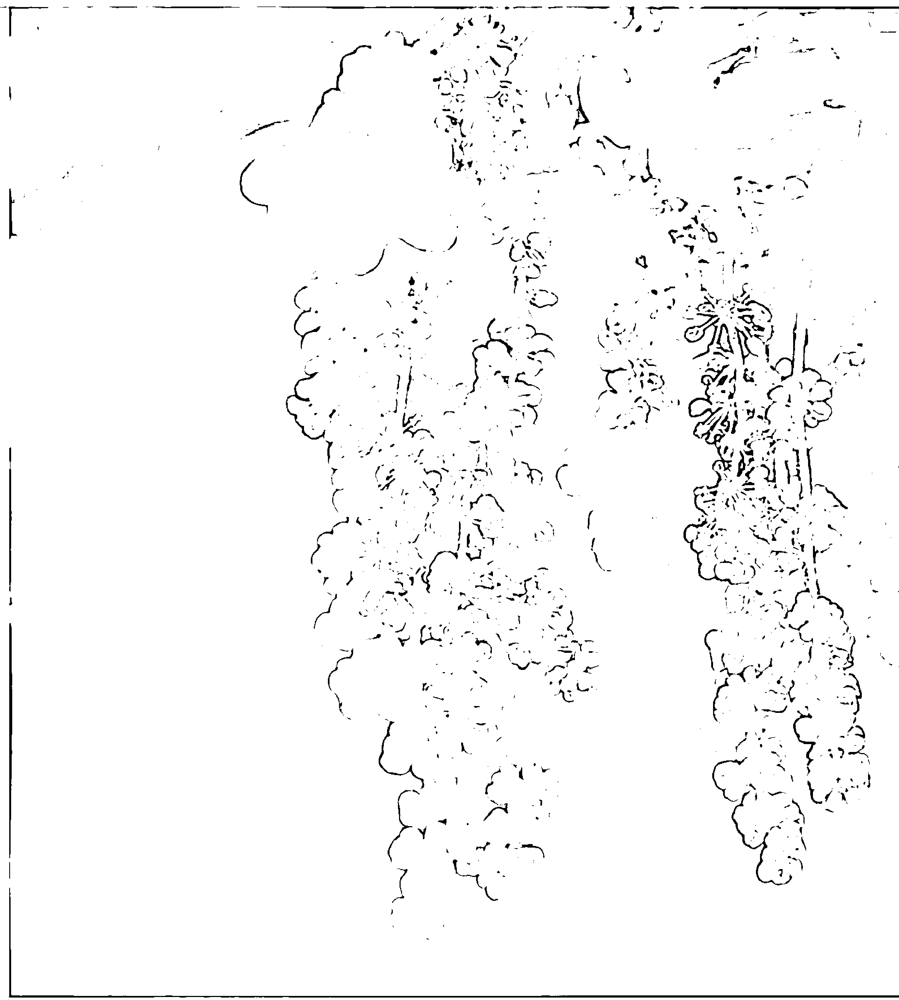

##### 李醫師診間案例探討

劉先生來診，主訴頸項僵、後頭悶脹疼痛、眼睛視物朦朧、並伴有心慌，劉先生工作壓力大，之前曾因胸悶、心悸、疲倦、睡不飽感來診，在服用中藥及做白楊、橄欖花精貼敷後，好轉許多。此次因為頸項僵極度不適故來診，我幫他做頸部觸診檢查時，發現右頸部相當僵緊，這個區塊是身體地圖中的橡樹花精反射區。

我問他說，工作會很累嗎？劉先生回答公司中午都沒有午休，即使很疲倦也要硬撐著做事。依他的症狀，開立常規中藥、貼敷耳針後，我為他貼敷花精於右頸部，花精處方：白楊、橄欖、橡樹。貼敷不到一分鐘，按壓其右頸部，肌肉已較鬆軟，患者也自覺放鬆不少，而後頭發脹感也獲得緩解。

## 白杨

患者心慌，心悸时可用，可消除莫名的恐慌感。刘先生在贴敷白杨花精后，心慌感减轻不少。

## 橄榄

极度疲倦、有睡不饱的感觉时便可用。

## 橡树

体力不足仍硬撑的个案，容易右颈项僵紧，贴敷此花精可协助释放紧绷的情绪。

##### 相似花精区辨及补充说明

| 分类 | 花精 | 说明 |
|------|------|------|
| 遇到困境 | 橡树 | 没有埋怨，任劳任怨 |
| | 杨柳 | 埋怨，自怨自艾 |
| 责任心强 | 橡树 | 遇到重大的事情，仍坚持到底 |
| | 榆树 | 遇到重大的事情，怕自己承受不了 |
| 疲累 | 橡树 | 硬撑硬熬，不知道累 |
| | 橄榄 | 身心虚脱，感觉很累 |
| | 鹅耳枥 | 提不起劲只是因为心理倦怠，而非身体操劳 |
| 过劳的原因 | 橡树 | 因为责任感 |
| | 马鞭草 | 为了完成远大理想与计划 |
| | 矢车菊 | 因为不好意思拒绝别人 |

## 与橡树花精相似的新一代花精

- 1. 海底轮花精（Crystal Herbs脉轮花精）
- 2. 佛甲草花精（Crystal Herbs业力花精）
- 3. 放松花精（Crystal Herbs神圣和谐花精）
- 4. 漏芦花精（苏格兰芬活花精）

## 橡树花精功用图像记忆

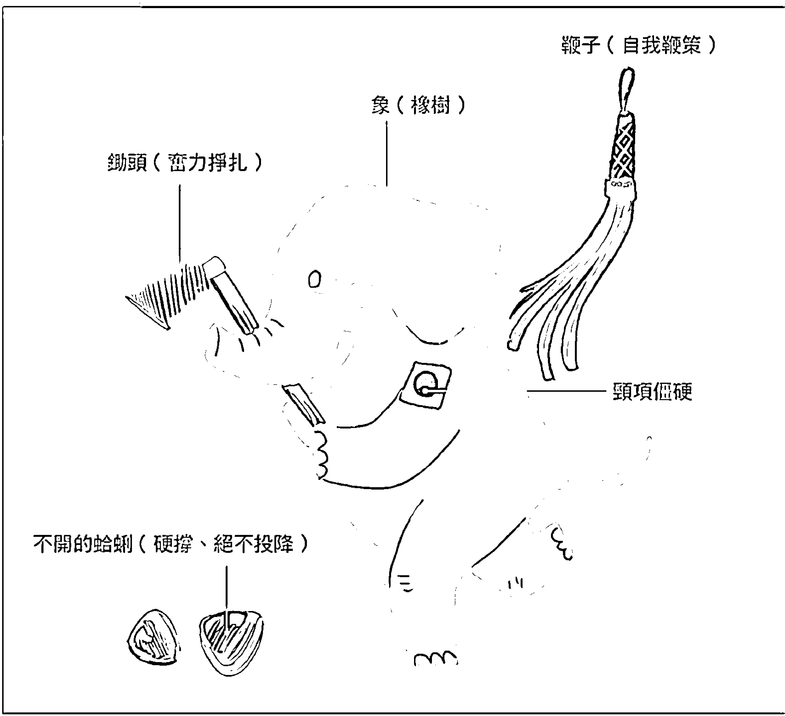

## 橄榄

## 花精个案

-   - **拉丁学名** | *Olea europaea*
-   - **七大分类** | 对现实兴趣缺缺类
-   - **制作法** | 日照
-   - **关键字** | 身心俱疲
-   - **正面特质** | 元气

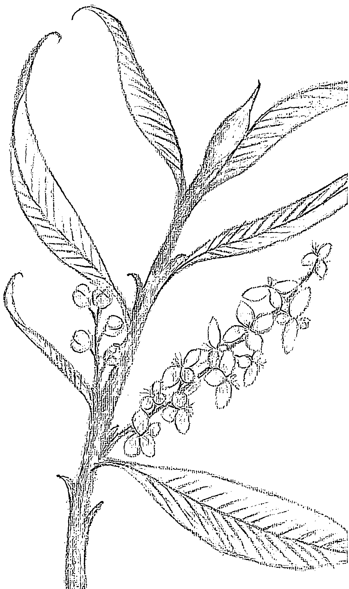

## 巴赫医师的叙述

身心受苦的人，精疲力竭，感觉再也没有力气做任何努力。日常生活对他们来说已成难事，毫无喜悦可言。

> ——出自《The Twelve Healers and Other Remedies》

##### 橄榄 VS. 中医观点

读研究所时，参加学校的运动会，由于平时有运动习惯，我一口气便报名了5000公尺跑步及50公尺蛙式个人赛。运动会那天，由于下着大雨，操场上的运动临时取消，仅剩下游泳比赛照常举行。虽然那只是短短的50公尺泳道，但我却前后游了三次，原因是每次枪声响起前，都有人偷游，害我冲刺到一半就被叫回来，就这样，接连三次的冲刺，我全身几乎虚脱（快速游泳很费力，另可能是平时都仅跑步，鲜少游泳），游到对岸时差点连岸边都爬不上去。

上岸后，我瘫坐在更衣室前，连套上衣服的力量都没有，眼前出现阵阵黑花的影像。最糟的是，居然还会想吐，只是当时还有学妹在场，为了面子强忍着，不然我就呕了。还好同学送来了一包科学面，啃了几口后稍微恢复点活力。可惜那时我还不认识花精，不然的话，急救花精与橄榄花精将会是我的救星，尤其是橄榄花精，适合过度操劳、身心耗竭的人，让人们迅速提升活力。

## 应用条件：

-   - 肩膀酸痛，临床表现为脸色苍白、眼皮、双肩均有下垂现象。
-   - 太努力某件事，目标达到后的累瘫状态。
-   - 身心俱疲，只想休息，什么也没兴趣。
-   - 长期重病、失眠或照顾病人。
-   - 女人为家庭付出太多。
-   - 想吐。

##### 橄榄 × 情绪与思绪

打开电视，提神饮料广告播的火热，量贩店、山区杂货店、乃至槟榔摊，都算是必销商品，足见台湾人疲劳指数有多高。在治疗疲惫的花精处方中，除了心理性疲倦的鹅耳枥花精外，针对身心俱疲的橄榄花精也很管用，这样的患者由于操劳过度，体力透支，外观上可见脸色苍白，眼皮、双肩都已累到下垂，情形严重者甚或想吐，一副奄奄一息的模样。

现代人工作忙碌，常一下班就累得四肢发软，提不起劲，眼前即使再多的美食，再好的电视节目，也变得没兴趣去欣赏，睡觉就是他们唯一想做的事，因此被巴赫医师归类在「对现实兴趣缺缺类」花精族群中。

##### 花精运用

许多职业妇女，平时上班已经很劳累了，一回到家还要忙着做家事、带小孩，常会从橡树的硬撑状态转移成身心俱疲的橄榄现象。肩膀酸痛是女性朋友们常见的问题，也常和过劳有关，根据Dieter Kramer的身体地图资料，肩膀处为橄榄花精反应区，现代人由于长期使用电脑，肩膀处的肌肉如斜方肌、提肩胛肌等常会酸痛，所以临床上这类的患者愈来愈多，而我也常用橄榄花精外贴于肩膀的酸痛处，大多数人肩膀会有马上放松的感觉，对于因过劳而引发的酸痛缓解相当迅速。之前讲课时，有些学员体力不支，差点神游太虚，我都会用橄榄花精滴在他们手心，马上会有眼睛为之一亮的感觉，而且头脑变得较清新，似乎比提神饮料还有效。

在参考巴赫花精的医案中，记载有一位患者因工作劳累而引发眼前昏黑住院，并有心悸、耳鸣、眼前出现斑点的现象，治疗师在应用橄榄花精后，症状全数消失。因此不论是何种症状显现，只要有身心俱疲的现象，都可应用此花精。即使只是搬太多重物，手臂过度劳累的酸痛无力；或是参加考试、立法委员选举后之疲倦乏力，只要对症下花精，都有不错的效果。

有一点提醒的是，有橄榄现象的人，不一定都是因为工作过度，有时心灵受到严重创伤或是久病被病魔所折磨，也会引发身心俱疲的橄榄现象。一般长久处于逆境的人，治疗师会先想到使用荆豆花精，但橄榄花精也是另一种选择，因为在长久逆境折磨下，身心灵的能量会一直下降，会造成个案虚脱疲劳。比如说某人的先生、兄长等相继过世，之后便变得容易疲倦、睡眠品质不佳、对任何事都无法感到兴趣，此时便可使用这个属于兴趣缺缺类的橄榄花精。

橄榄花精可以帮助任何因体力不足所引起的疲惫感，但有些人在使用橄榄后，会有令人想睡的感觉，这是因为服用这个处方后，会启动身心灵充电的能力。这个时候就不要刻意去抗拒想睡的感觉，好好睡一觉，精神体力自会恢复，许多生活很紧绷，事情多到没闲暇时间放松休息的人，使用橄榄花精后常有这种现象，而不像一般人会突然提振精神。对于体力恢复，我是比较建议练气功，因为气功是采天地之气，可以无穷无尽的从天地间取得能量，若能配合丹田呼吸，则提振精神效果将更大。身心灵是一体的，心灵的任何需求，必须以健康的身体为工具，而善用花精与养生气功，将是我们活力的永久泉源。

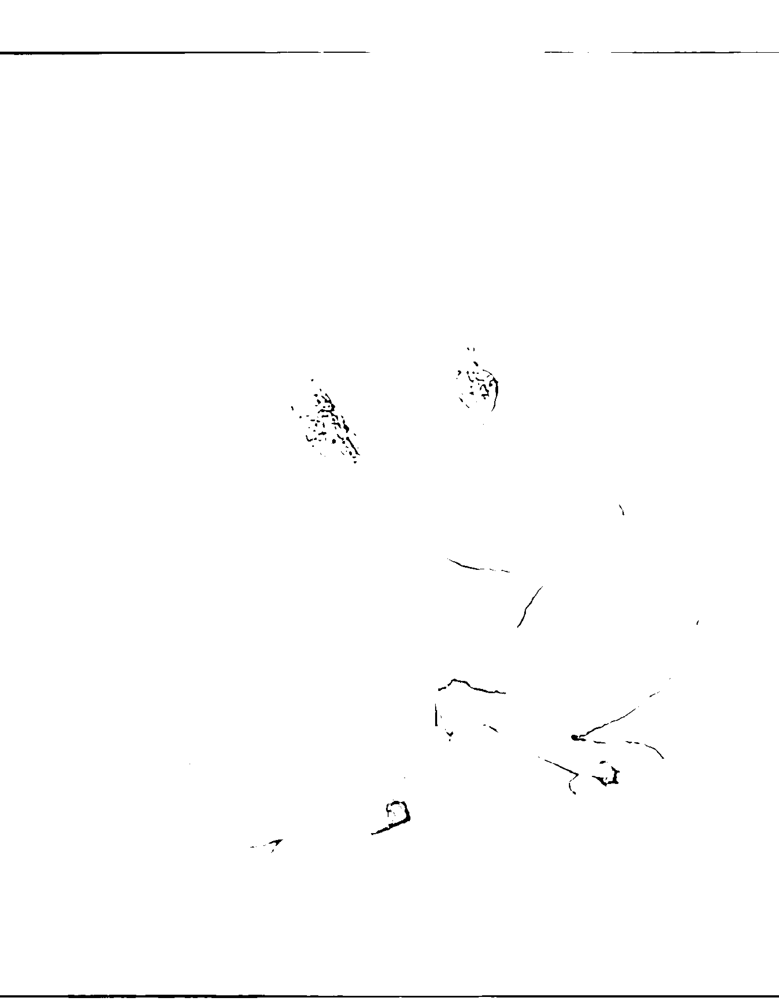

##### 李医师诊间案例探讨

吴女士，个性相当负责，由于儿媳工作忙碌，便帮忙带孙子，近日来由于孙子晚上会踢被子，为了不让小朋友着凉，便睡睡醒醒，帮忙盖被子。数天后，吴女士疲倦异常，完全提不起劲，晨起偶有想吐的感觉，我为她触诊时，发现其双侧肩膀斜方肌处隆起，由于此区是橄榄花精反射区，于是我使用红栗⊕橡树⊕橄榄花精贴敷于双侧的肩井穴，第二天询问时晨起想吐的感觉已消失。

#### 花精解析

### 橄榄

斜方肌为橄榄花精反射区，当劳累过度时，此处的肌肉常会隆起。

### 红栗

红栗状态的人，容易将小事化大，也常会为了别人的事而寝食难安。只要担心亲人的健康、安危，不论何症均可使用此花精。

### 橡树

体力不足仍硬撑，吴女士为了照顾孙子，即使很累仍不敢好好休息，而橡树硬撑的结果也很容易产生橄榄的体力透支情形。

##### 相似花精区辨及补充说明

-   1. 眼睛朦的人，可用橄榄花精外敷肩井穴。
-   2. 觉得很疲倦时，可滴一滴橄榄花精在手心劳宫穴。
-   3. 荆豆状态的人对外界虽绝望，但别人劝他做治疗时仍有可能接受。橄榄状态的人则是身心灵完全疲倦，什么都不想动，他们不想听、不想看、也不想治疗，因此常会拒绝别人的治疗建议。

| 大项 | 花精 | 描述 |
| --- | --- | --- |
| 失眠 | 橄榄 | 生理、心理上有明确原因的疲倦，很累，但睡不着，或一觉醒来仍睡不饱 |
| 失眠 | 凤仙花 | 急性子，脸上痤疮 |
| 失眠 | 白栗 | 不容易入眠或清晨四点醒来 |
| 失眠 | 岩玫瑰 | 容易惊醒 |
| 失眠 | 马鞭草 | 为了工作废寝忘食 |
| 失眠 | 龙芽草 | 内心苦闷，大多肥胖者 |
| 疲惫 | 橄榄 | 经历某事「之后」的体力透支，累到即使是兴趣的事情也不想理会，只想休息 |
| 疲惫 | 鹅耳枥 | 事情开始之前的心理疲劳，虽然感觉很累，但一看到有兴趣的事，如第四台的电影，便精神振奋，但一广告时间要做家务，便马上感觉想睡觉 |

##### 与橄榄花精相似的新一代花精

-   1. 颧草花精（Crystal Herbs业力花精）
-   2. 生命力花精（苏格兰芬活花精）

##### 橄榄花精功用图像记忆

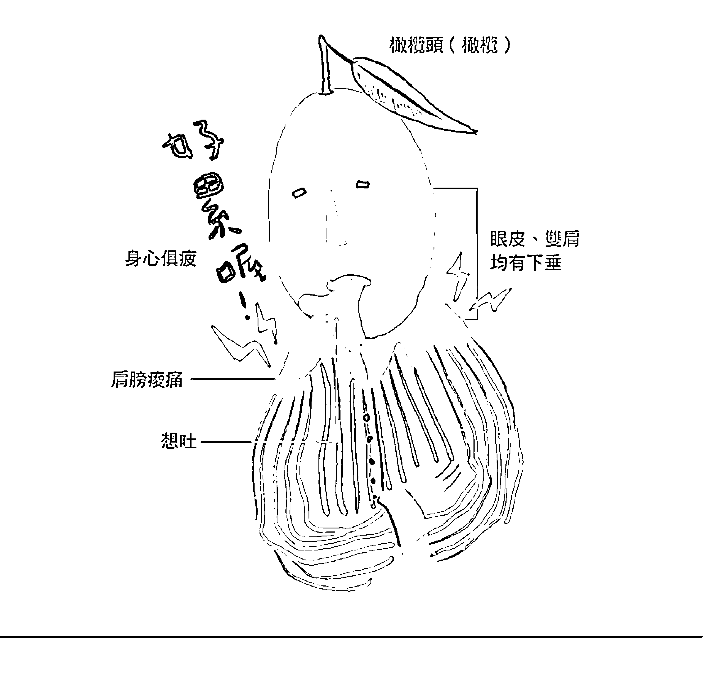

## 花精 精囊

-   - **拉丁学名**: Pinus sylvestris
-   - **别名**: 松树
-   - **七大分类**: 沮丧绝望类
-   - **制作法**: 煮沸
-   - **关键字**: 罪恶感
-   - **正面特质**: 无愧

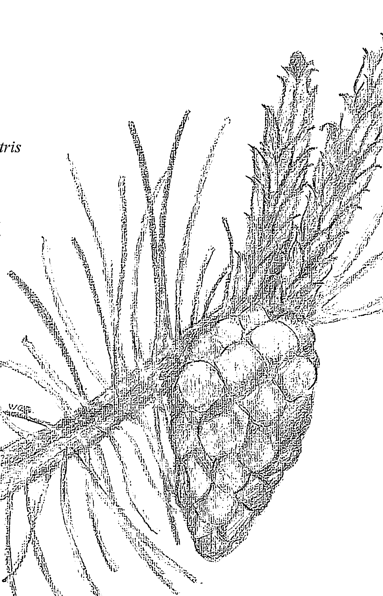

## 巴赫医师的叙述

给自责的人。即使他们成功，也觉得自己可以做得更好，对自己的表现或结果从未感到满意。他们工作很努力，却因为把过错怪在自己身上，而深受折磨。有时即使错在别人，他们也会认为是自己的责任。

> > ——出自《The Twelve Healers and Other Remedies》

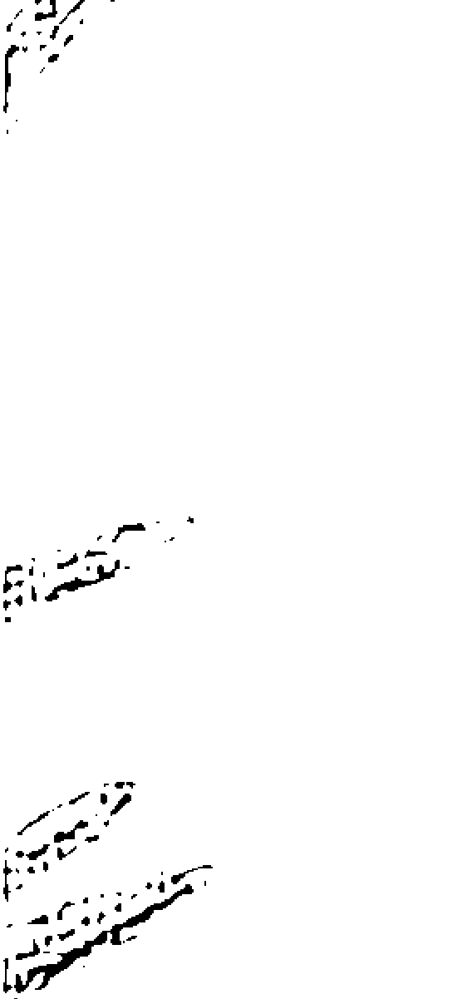

每年元宵节，台东市都会举行规模盛大的全县神明绕境活动，其中最受人瞩目的就是炸寒单爷活动了。以真人装扮的寒单爷赤裸着上身，手持着榕树叶护脸，站在神轿上，让民众丢掷鞭炮轰炸，或由数位助手点燃挂在竹竿上的长串鞭炮近身轰炸。在烟雾弥漫中，展现具有草根性又独树一格的地方风情。

相传寒单爷原本是一位鱼肉乡民的地方流氓，因受到神明点化后为表示忏悔之意，于是赤裸着上身游街让民众泄愤以减轻其罪孽，最后还变成了财神，民众相信鞭炮炸得越旺，将会带来更多的财富。这种炮打寒单的活动，原是为了消除自身的罪恶感所演变而来的民俗活动，中国古代也流传着「周处除三害」的历史故事，都是借由类似负荆请罪的方法来宽恕自己。巴赫花精中，松树花精就有帮助我们消除罪恶感的妙用，将心中的那根带罪之刺顺利拔除。

## **应用条件：**

-   - 很少满意自己的表现，总是不停地找自己的麻烦。
-   - 生病时还内疚会影响别人或工作。
-   - 将别人的过错归咎在自己身上。
-   - 胃或右肩三角肌处会疼痛。
-   - 觉得自己不值得被爱。
-   - 太悲天悯人。
-   - 会自虐。

##### 松树 × 情绪与思绪

松树状态的人，心中始终罩在罪恶感的阴影中，就好像肉中有根刺一样，任何活动都会觉得不舒服。罪恶感从那里来呢？可能是自己做错事，如外遇、与人争执；或给自己设立太高的标准，怕自己不够努力，达不到目标，遗漏某些小细节；或将别人的过错揽在自己身上，如悲天悯人的宗教家们或问题儿童的家长。以前，我觉得这个花精只是单纯的治疗罪恶感，但后来发现，许多人对现实生活兴趣缺缺、忧郁、甚或想自杀都和这个有极大的关系，因为那根罪恶之刺埋在心中，人生就无乐趣，也不太想动，唯有消除松树情绪，才能获得动力的泉源。

松树状态的人会尽力做好任何事，但他们却很少满意自己的表现，常否定自我的成就，总认为自己不够好，不值得被爱。即使成功了，也会认为「缺点一大堆，那里要加强」，因此常处在沮丧的情绪中，故被巴赫医师归类在「沮丧绝望类」花精族群里。有时连别人造成的错误，也常一肩挑下来，都认为他们的错，和自己有关，而不停地自责。

##### 花精运用

有花精治疗师提出，自责的人容易引发很多疼痛或内脏下垂的毛病，因此在生理上就容易表现出像腹痛、腰痛或源于颈部的头痛（颈源性头痛）。根据Dietmar Kramer的身体地图资料，胃部及右肩三角肌处是松树花精的反射区，临床常见这些部位疼痛的父母来诊，都和松树情绪有关。现代社会由于少子化的关系，许多父母都把子女当成宝，小朋友一有错误发生，做妈妈的常会自责小孩不学好，都是她的错，形成一种很深的罪恶感，便因此引发这些疼痛反射。

在看诊时，曾遇到一位脸部血管瘤的患者，由妈妈陪同而来，由于血管瘤无法做雷射消除，造成脸部大片红色突出。在短短的门诊时间里，我发现小孩对妈妈说话的口气相当不好，虽然他妈妈只是陪诊，但我看得出来她心中有强烈的罪恶感，自责是自己害小孩变这样，因此便默默的接受小孩的怒骂。看到这样，我也于心不忍，毕竟没有父母愿意小孩这样。问诊过程中我顺道给小孩外贴花精在穴道上：落叶松⊕荆豆⊕冬青⊕樱桃李，用落叶松是因为患者因脸部这样而没有自信，荆豆则是久病后对一切绝望，冬青与樱桃李则是消弭他的愤怒，只希望这样的治疗能对他有所帮助。

自虐是松树状态的人常有的行为，他们觉得自己做错了，便希望得到应有的惩罚，即使得不到上苍或社会的处罚，他们在潜意识中也会惩罚自己，如刺青、打耳洞、时常生病、自己用头撞墙等自虐行为都算是。之前提到龙胆状态的人，好像不找件事情来怀疑就不行；而松树状态的人，则是不找件事来惩罚自己就不行一样，严重的，会让自己身陷忧郁症的阴影中，造成长期失眠、莫名的疼痛、或时常沉浸在自杀念头里，这些都是自我给自己的惩罚。遇到这样的患者，我总会对他们说：「或许你们这样只是想证明某些事情，证明我虽然犯错，但我已在处罚我自己了，请别人不要再责怪我了。」有些患者听我这么一说，病情会突然好转，仿佛那根罪恶之刺已被拔除。但有更多的患者，仍自己深陷在黑洞里，只能慢慢的使用花精来帮助他们走出来。

松树状态的人，常寻求宗教来救赎，有些朋友突然间开始吃素、吃十斋、唸经，除了部份人是为了自我修行外，大多是为了消除罪恶感而做的。不过以能量的角度分析，唸经持咒确实是有很强的疗愈力量，十小咒中的「七佛灭罪真言」就是很好的疗法。妥善运用松树花精这个处方，除了可以帮助我们宽心外，也可帮助那些经常自责或带着罪恶感过日子的人，懂得接纳自己，也更加欣赏自己。

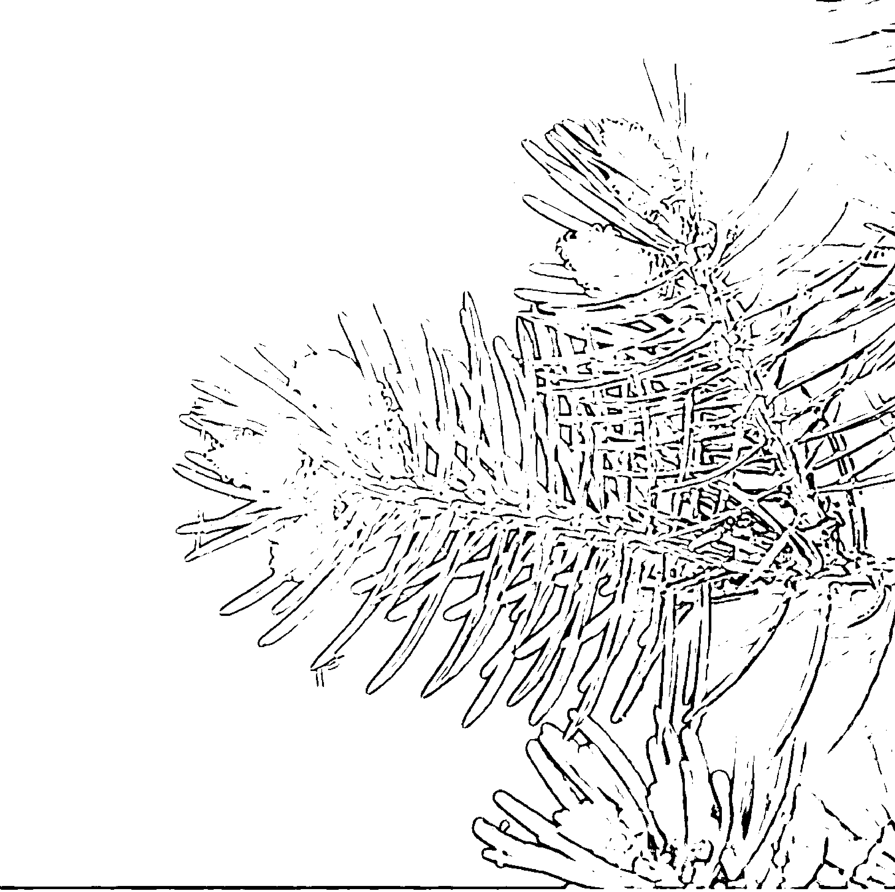

##### 李医师诊间案例探讨

花精课时，学员钟小姐上腹部突然疼痛，这个区块是身体地图中的松树花精反射区，我先采用握持法让她握住松树花精，一会儿感觉疼痛减少，但在上腹部深层仍有疼痛的感觉。由于钟小姐平素个性较急，因此我又加了凤仙花花精请她握住，而疼痛在这一刻获得缓解。

## 花精处方

松树⊕凤仙花花精贴敷于上腹部，贴敷后不久，疼痛完全消除， 在座的学员虽是第一次接触到花精握持法及贴敷法，但对于花精的速效都喷喷称奇。

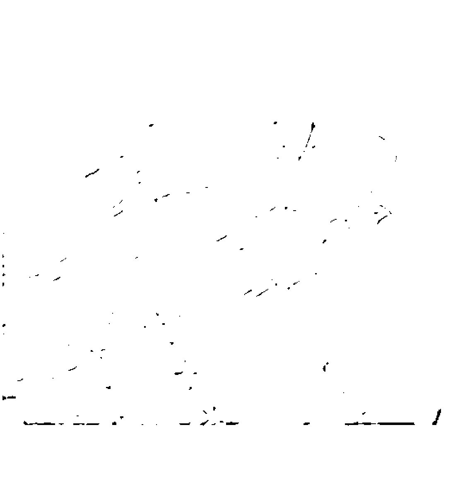

## 花精 解析

### 松树

疼痛区块刚好为身体地图中的松树花精反射区。

### 凤仙花

个性较急的人，不论何症，均可采用此花精。

身体地图反射区在临床有参考价值，可以按图索骥找出对应的花精，但应用时仍须配合情绪辨证法，才能有满意的效果。

##### 相似花精区辨及补充说明

-   1. 上腹部不舒服：松树⊕落叶松外敷。
-   2. 经痛：急救花精⊕岩玫瑰局部外敷。
-   3. 松树状态的人会动手且尽力做好任何事，落叶松状态的人则是怕失败而不去尝试。
-   4. 唸诵忏悔文：「往昔所造诸恶业，皆由无始贪瞋痴，从身语意之所生，一切我今皆忏悔。」对于松树情绪释放有帮助。
-   5. 自体免疫疾病，如僵直性脊椎炎、红斑性狼疮（免疫系统攻击自己），或是十二指肠溃疡、胃溃疡（胃酸腐蚀自己）等，均为自己攻击自己的现象，均可视为自虐的松树状态。

| 类别 | 花精 | 描述 |
|------|------|------|
| 过错 | 松树 | 很少满意自己的表现，总是不停地找自己的麻烦，将别人的过错归咎在自己身上 |
| 过错 | 杨柳 | 总是把过错推给别人 |
| 高标准 | 松树 | 很谦卑，很容易认错，设立太高的理想，但这些理想常是别人的要求。如传统家庭里，夫家想要生男丁，媳妇却都生女儿，做媳妇的内心自责不能延续香火 |
| 高标准 | 岩水 | 隐瞒自己错误且乐此不疲 |
| 过度的完美主义者 | 野酸苹果 | 容不下一点小瑕疵 |
| 过度的完美主义者 | 岩水 | 对自己总是过度训练 |
| 过度的完美主义者 | 马鞭草 | 如一根蜡烛两头燃，被工作压得喘不过气来 |
| 过度的完美主义者 | 松树 | 觉得该做更多的工作才对，且事情要做得更好 |
| 挑剔自己 | 野酸苹果 | 挑剔自己的外表 |
| 挑剔自己 | 岩水 | 挑剔自己没达到自设的高标准或原则 |
| 挑剔自己 | 松树 | 挑剔自己犯错误 |
| 挑剔自己 | 橡树 | 挑剔自己没能继续撑下去 |

图
解
巴
赫
花
精

##### 与松树花精相似的新一代花精

-   1. 佛甲草花精（Crystal Herbs业力花精）
-   2. 原谅花精（Crystal Herbs神圣和谐花精）
-   3. 玉杯花精（苏格兰芬活花精）

##### 松树花精功用图像记忆

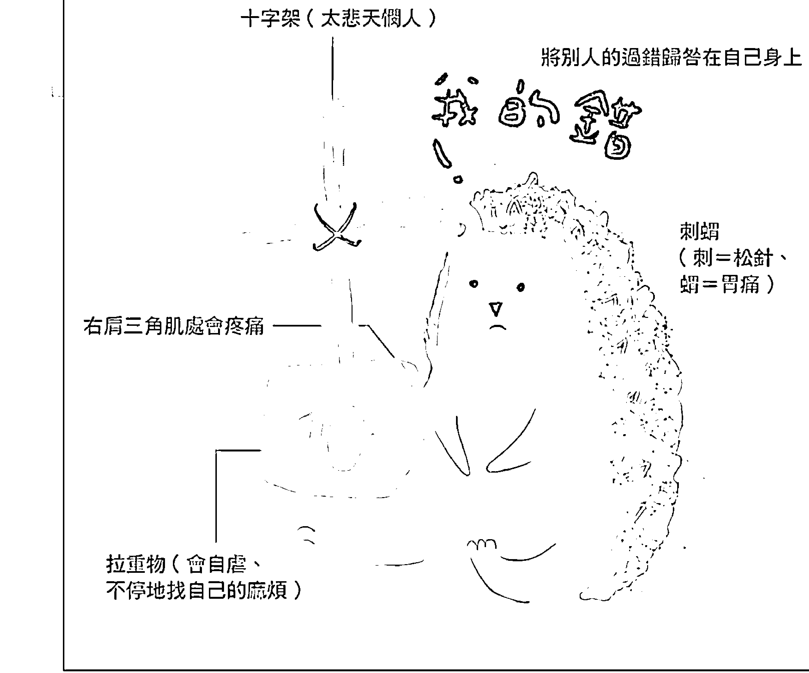

## 红栗

### 花精 精灵

图解巴赫花精

-   - 拉丁学名 | *Aesculus carnea*
-   - 别名 | 红西洋栗、红栗子
-   - 七大分类 | 恐惧类
-   - 制作法 | 煮沸
-   - 关键字 | 过度担忧亲爱的人
-   - 正面特质 | 放心

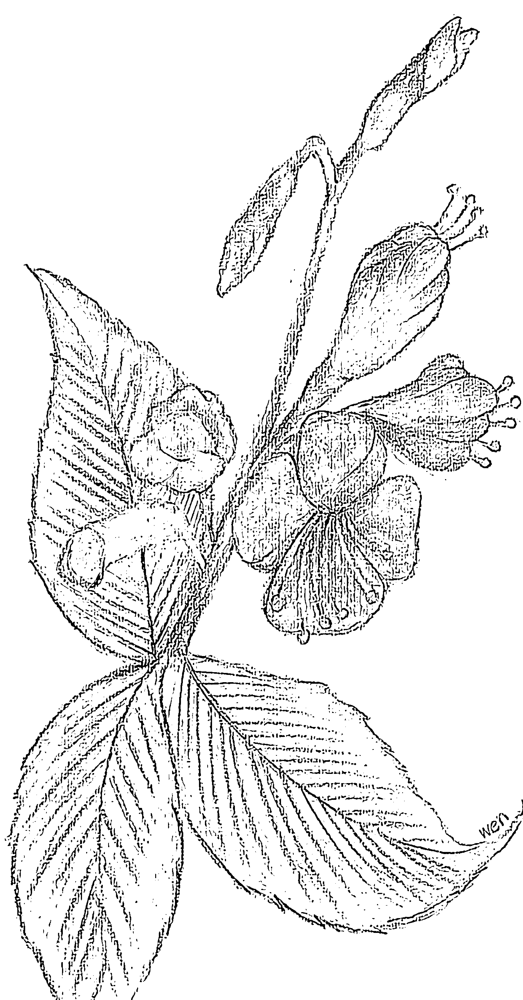

## 巴赫医师的叙述

给很难不为别人担心的人。他们通常已经不会担心自己，但是会因为担忧所爱的人而深受折折磨，经常预期不幸会发生在他们身上。

> > ——出自《The Twelve Healers and Other Remedies》

## 红栗 VS. 中医观点

图解巴赫花精

根据欧洲一项调查显示，心理健康与血压健康是幸福的重要指标。调查发现，包括丹麦、瑞典、荷兰、英国等幸福指数较高的国家，他们的国民较少有血压问题，经过专家比对，发现血压高低与幸福指数正好成反比，幸福指数愈高，血压愈偏低，显示社会福利制度较健全的国家，诸如瑞典等北欧国家，因为良好的照护制度，降低民众的恐惧感及不安全感，幸福指数因此提高，也较少有高血压的问题。

俗话说：「天下父母心」，身为家长总是不免小孩担心安危，但若终日担忧子女出事，而牵挂于心的父母，则较容易有血压问题产生，也就是说，这样的恐惧感会使得他们的幸福指数下降，身体疾病便不断增加，给孩子适时的指导是必要的，但若过度担忧，对于双方而言只会产生反效果。如何让彼此的幸福指数增高呢？红栗花精，倒是可帮不少忙！

应用条件：

-   - 过分挂念亲人，害怕不幸的事发生在他们身上。
-   - 生活全被亲人所占满，忽略自己身心灵需求。
-   - 断脐花精。

##### 紅栗与情绪与思绪

紅栗狀態的人，很重視友情與愛情，常主動幫助親人與朋友，但也常因此而為他們擔心，尤其是親人。只要有一點小事便會想像為最糟的情形，害怕不幸的事會降臨在親友身上，而活在恐懼中。如：

- 害怕小孩被同學欺負、害怕他們住校會得肺炎、害怕子女嫁／娶錯人。
- 害怕伴侶會有不測、害怕先生工作壓力大影響到身體。
- 擔心父母在家不小心跌倒、天冷時害怕他們是否心臟負荷不了。
- 害怕朋友是否被股票套牢、朋友遲到了害怕他們是否發生意外。
- 擔憂自己班上的學生不能得到最好的教導。

擔心愛人的健康是人之常情，但若過度的擔憂不但無法改善狀況，還會讓自己也變得病懨懨。紅栗狀態的人生活全被親人所佔滿，常忽略自己身心靈的感受，有些家長即使下班後已經很累了，仍會痴痴地等到小孩回家才肯上床睡覺，而忽視自己疲倦的訊息，這類型的人通常不擔心自己，唯一憂慮的就是家人的健康與安危。

##### 花精運用

紅栗的父母老是擔心小孩在做什麼？擔心他們能否做得好？由於他們常害怕子女會因做不好而受到傷害，便動手幫他，以減少周遭環境對子女的傷害。但這樣過度的保護，反而把孩子寵成溫室裡的小花，無法獨立成長，到最後變得須要仰賴別人才能生存。曾聽報導說，一位殺人犯，從小有任何事都由媽媽出面擺平，因此養成天不怕地不怕的習性，反正出事了父母都會處理，直到有一次因口角而殺人，居然還認為是小事一樁，在警局裡打電話嚷著叫媽媽快來處理，連一旁的員警聽到都搖頭。俗話說：「一枝草一點露、兒孫自有兒孫福」，家長給孩子適時的指導是必要的，但若過度的關懷，反而會害了他。

父母的紅栗狀態在無形中會與子女有隱形的連結，讓小孩容易產生依賴性。現在許多草莓族，尤其是中國大陸在一胎化政策下，孩子被當成寶，過度保護的結果便造成這些國家未來的主人翁抗壓性差、社會環境適應不良，常衍生出一些社會問題。要讓小孩們能順利「轉大人」，紅栗花精也有成效，即使是baby斷奶期，亦可使用紅栗⊕胡桃花精來減少幼兒對母乳的依賴。因此有花精治療師將這個花精稱為「斬斷臍帶的花藥」，就是要用它來幫助小孩成長，減少子女與父母間的掌控與依賴。

但為何會有紅栗情緒這種擔憂產生呢？俗話說：「一朝被蛇咬，十年怕草繩」，紅栗狀態的人會如此擔憂害怕，大多源自於過去記憶裡的創傷經驗，為了怕這種創傷再度出現，因此在事情尚未發生，便幻想到不好的結果，而處處預防，便產生這樣的現象。如前夫因酗酒過度導致肝癌死亡，太太便會擔心現任先生飲酒過度，又會肝癌死掉，而過度焦慮。所以日本的花精治療師才會認為紅栗花精最根本的情緒因素為聖星百合，若想要快速消除這種現象，治療師可使用紅栗⊕聖星百合複方，以幫助我們斬斷過去的記憶及思考模式。

佛家說：「欲知前世因，今生受者是；欲知後世果，今生做者是」，生命自有一套公式在行進，不須我們過度擔心。而紅栗這個花精，可以讓我們隨緣地為所愛的人祈福，揮別不健康的互相依賴關係，活出自自在生命。

> > 「右持利劍煩惱斷，左捧經書智慧揚」

> 南無大智文殊師利菩薩

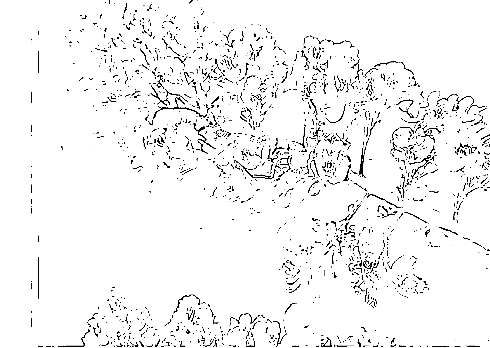

##### 李醫師診間案例探討

奉先生，是我國中同學，患有心律不整，常從桃園來台北找我看診。最近這一陣子來，常感覺後頭脹痛，而這種悶脹感在半夜11～12點時特別明顯。來診時，我先為他做頸部觸診，發現其左頸項相當僵緊，而這個區塊根據Dietmer Kramer的身體地圖資料，是對應到荊豆花精。

奉先生家中由於父親中風已久，經常擔心父親健康，因而常會胡思亂想，並容易有緊張、心慌的情形。我先幫他做花精外敷，使用荊豆、紅栗、馬鞭草、白栗、白楊貼敷於左後頸部，並調配一小罐花精滴瓶給他，建議有空時便做局部貼敷或滴在手心的勞宮穴。貼敷不到五分鐘，就在等待領藥的時刻，頭脹感即消失，有時在眷村中遇到，對於花精貼敷消頭脹的速效，奉先生屢試不爽，每次有頭脹感就自行做貼敷，不用數分鐘即顯效，由於其只用花精外敷，心想若能配合使用內服法，將可獲得更好的效果，不過這一切還有賴花精推廣，這樣患者的接受度才會提升。

#### 花精解析

#### 荆豆

為左頸部的反應區，當家人有久病時，即可視為長期承受挫折的荊豆現象。

#### 紅栗

擔心家人的健康，奉先生因其父親中風已久，時常擔心父親健康，故選用此花精。

#### 馬鞭草

個性容易緊張的人都可使用，而奉先生有濃厚的政黨意識，對於國家施政常有不滿，這種情緒會使得肌肉緊繃，故可用馬鞭草緩和其情緒。

#### 白栗

經常胡思亂想，會導致後枕葉過度活躍，故容易後頭脹。而有些患者的青光眼、眼壓高等現象，臨床上發現也和這個花精有關。

#### 白楊

心臟患者常用，只要有心慌的敘述，便可使用。

##### 相似花精區辨及補充說明

| 對親人 嘮叨 或焦慮 | 菊苣 | 自私或佔有 |
|-------------------|------|------------|
|                   | 紅栗 | 害怕與擔憂 |
| 打破／ 改變思考 模式 | 白栗 | 不斷重複出現的想法與憂慮 |
|                   | 紅栗 | 擔心不幸的事情會發生在親人身上 |

##### 與紅栗花精相似的新一代花精

- 1. 臍輪花精 ( Crystal Herbs脈輪花精 )
- 2. 粉紅玫瑰Pink Rose ( Crystal Herbs業力花精 )
- 3. 漏盧花精 ( 蘇格蘭芬活花精 )
- 4. 根源療癒花精 ( 蘇格蘭芬活花精 )——親友久病時可適用

##### 紅栗花精功用圖像記憶

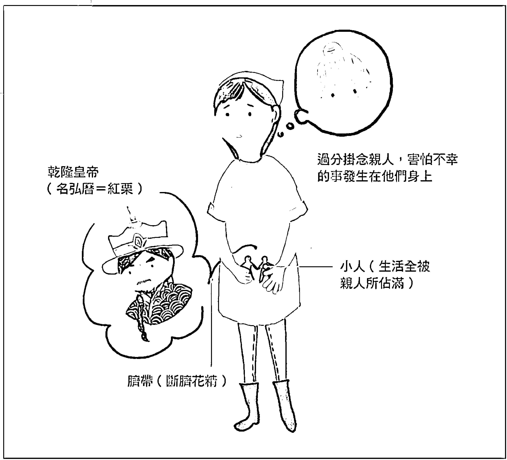

#### 岩玫瑰

花精精華

- 拉丁學名 | Helianthemum nummularium
- 別名 | 岩薔薇、岩薔薇
- 七大分類 | 恐懼類
- 製作法 | 日照
- 關鍵字 | 驚恐
- 正面特質 | 勇氣

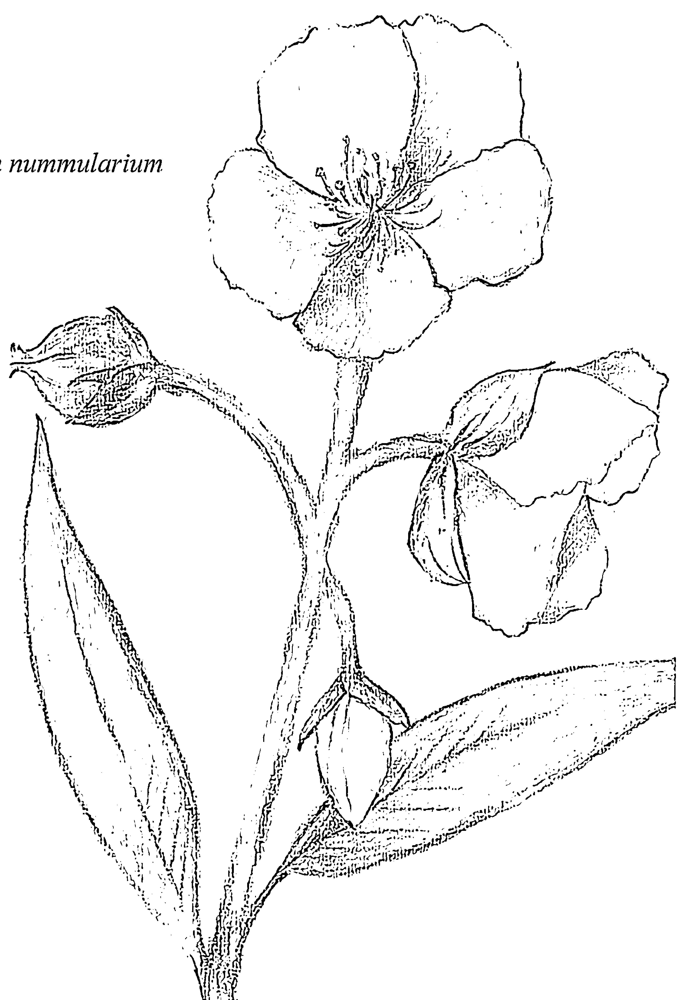

##### 巴赫醫師的敘述

急救花精。這個緊急使用的花精是給當看似毫無希望的情況時，意外、急病或當病人非常害怕、驚怖，或當情況嚴重到使周遭的人恐懼萬分時。如果病人失去意識，可以塗抹一些在他的嘴唇上，也許還需要加入其他花精，譬如如果失去意識是一種深沈嗜睡的狀態，用鐵線蓮；如果痛苦折磨，用龍芽草，依此類推。

> > ——出自《The Twelve Healers and Other Remedies》

- 弱點：驚怖

- 美德：勇氣

你是否在絕對的絕望與驚恐中，感覺再也受不了了？被預期發生的事嚇壞，如死亡、自殺、發瘋、可怕的疾病，或害怕面對絕望的經濟狀況？

若是如此，你正在學習勇敢面對巨大的逆境，為自由奮戰，在牧場丘陵上遍佈生長的美麗的小黃岩玫瑰，會給你獲勝的力量。

> > ——出自《Free Thyself》


##### 岩玫瑰 VS. 中醫觀點

圖解巴赫花精

難得的星期四，利用休診的空檔，和家人去大溪的百吉步道爬山。這裡有許多老樟樹，慈湖後山就在這裡，由於常年屬於軍事管制區，因此林相保持相當完整，加上慈湖正在附近，因此山中的芬多精也較他處為多，每次來這爬山，精神與身體都有百分百的充電感。下山後，在路旁的店家買早餐，這是一個重劃區，透天住宅很多，但卻無車水馬龍的喧囂。突然，遠處來了一輛好像垃圾車的貨車，下來了幾個人，就在他們把後車門打開的時候，七八個大鐵籠映入眼簾，裡頭裝了滿滿的狗，原來是捕狗大隊。隊員們蹲在地上，抽著口哨用熟練的技術引誘一隻遠處的大白狗，而那隻呆呆的狗，居然就搖著尾巴一步一步地走來。工作人員撫摸了狗頭幾下，就像抓小貓一樣一把捏起狗的後脖子。大白狗在一瞬間癱軟在地上，發起低吟聲，被抓到車上時還不時顫抖，書上說狗在害怕時尾巴會縮起來，我不僅看到狗的尾巴蜷縮在腹部，還看到地上的那一灘尿，poor dog，看來牠真的尿失禁了。還好，遠處跑來一個太太，上氣不接下氣的說狗是她的，工作人員只好把狗還給她，還叮嚀她要幫狗上項圈。望著那隻尿失禁的狗，我想到了岩玫瑰，對治人類極度恐懼，當然對當時的大白狗來說，也會有不錯的效果。

### 應用條件：

- 常會慌慌張張，自己也不知道在害怕什麼。
- 承受極大的恐懼與驚嚇，與生命有關。
- 睡中容易醒，一點聲響便清醒。
- 喜歡準備東西。
- 冒冷汗，顫抖。
- 做噩夢尖叫。
- 會暴怒。

##### 岩玫瑰×情緒與思緒

奧修說，人的恐懼來自於死亡與性。岩玫瑰所對治的，正是這種危在旦夕的深層恐懼。這種害怕除了會造成極度恐懼、驚嚇外，也常會令人驚惶失措，不知如何應變才好。通常這類的深層恐懼感常和死亡威脅有關，如看到驚悚的恐怖片、自己心臟病發快暈倒、目睹家人因突發性中風不省人事、或看到一場死亡車禍等，都會引發岩玫瑰的恐懼。有些曾經發生重大事故而死裡逃生的人，如失火後獲救的人，也常有這種恐懼。值得一提的是，由於每個人的價值觀不同，臨床上發現有些個案的岩玫瑰特質則不見得和死亡有關，而由別的事情所誘發。如：

- A.有些人把愛情看的比生命還重要，害怕被人拋棄。
- B.有些人則把事業或金錢奉為第一個保護對象，害怕被人奪走。

當這些比生命還要重要的東西受到侵擾時，岩玫瑰的恐懼也會產生。若未及時處理，內心的安全感便一點一滴地消失。因此，許多貧窮家庭、感情曾有第三者介入的人，就容易有岩玫瑰恐懼，也常令他們處事會小題大作，如過度準備、暴怒抓狂等。之前曾有個案因要去法院出庭作證，害怕說錯話成了偽證罪，自己的事業就完蛋了，但礙於法令又不得不去，因而失眠、流手汗。這就是事業型的岩玫瑰恐懼，在運用岩玫瑰花精後心境明顯舒坦許多。

岩玫瑰狀態的人，由於內心安全感消失，因此常會過度敏感，敏感到即使只是打個電話，按個電鈴，也會莫名的心跳加速、流手汗。可以說他們是不曉得到底在害怕什麼的慌張一族，這和白楊的恐懼有點類似，只是岩玫瑰的恐懼更是加強版。過度敏感的狀況常導致他們會過度準備，以試圖控制無常。日常生活中，可從一些小細節看出是否有岩玫瑰傾向：如出門時，外套、雨傘、白花油、礦泉水等大包小包的東西都帶在身上，以備不時之需；家中所有的金飾都配戴在身上，怕這些比生命還重要的東西被搶；書包裡裝滿了所有的參考書、電腦資料，怕臨時找不到資料。反之，電視廣告中，有人出門，什麼都不帶，只帶小小的一張信用卡，就不太像這類的人了。許多曾經打過仗的老榮民，這種岩玫瑰特質尤其明顯，他們歷經經過戰爭的死亡恐懼，即使那段打仗的日子已過去那麼久，但內心深處仍處於極度恐懼狀態。很多老榮民雖然生活已過得去了，退休後仍不停地工作，許多大樓的管理員就因這樣都由榮民伯伯接手，這也代表著岩玫瑰特質的人，常會有生存的恐懼和壓力。

台灣地區目前約有四百五十萬人深受失眠所苦，失眠的因素眾多，有些人的失眠就和岩玫瑰有關。門診時，遇到失眠患者，我總會加問他們是否會因一點小聲響而驚醒？是否容易做惡夢？岩玫瑰恐懼的人，即使是一點風吹草動，也會打擾到他，因此半夜容易驚醒，導致睡眠障礙。在運用這個處方後，患者的安全感提升，驚醒頻率自會下降，失眠狀況也獲得改善，連時常做惡夢尖叫情形也消失許多，對時常服用安眠藥的人，岩玫瑰情緒可當做參考指標。

本書另一作者桑妮曾在女兒患皮膚病的時候，半夜會因為聽到女兒抓癢的微細聲音而醒來。剛開始她以為是擔憂親人及恐懼疾病所致，所以使用紅栗和溝酸漿花精，卻不見明顯效果。後來經由靈擺測試發現，岩玫瑰才是更符合的選擇。其實當恐懼已經達到「怒」、「恐」或會「到」的程度時，就很有可能要用上岩玫瑰了，只是很多時候我們會以為自己沒有那麼嚴重，而忽略了這個選項。後來她一用，果然馬上見效。

當人在面臨緊張、恐懼時，交感神經系統會被喚醒並且開始作用，交感神經興奮會使得腎上腺分泌增加、血糖升高、血壓上升、心跳加快、血管收縮、消化變慢，以便全力對付眼前的危機，當然不少疾病也和此有關，如糖尿病、高血壓、心悸等。因此由情緒治療反推，岩玫瑰花精對於交感神經興奮所產生的疾患可有不錯的治療效果。身心症候群中，不少疾病是由緊張、恐懼所引發，治病求其本，當然要由情緒來處理，方能獲致良好成效。

另外要提的是，有些人的暴怒其實是一種假象，我們常會從冬青或櫻桃李去治療暴怒，但有部份人的暴怒是由於深層恐懼所引發，並多半伴有容易冒冷汗、盜汗、流手汗等症狀。「狗急跳牆」，任何一個生物體在面臨生死存亡時常會奮力一戰，暴怒只是一種因恐懼而發洩的情緒。在伊拉克戰爭中，不少美軍的情緒極度波動，這時就得藉助花精來消弭他們的恐懼。許多在戰地死亡的平民，大多是因為軍方恐懼被攻擊而開槍濫殺，寧可錯殺一萬，也不可放一人，這就是戰爭的殘酷，因此消除他們的恐懼也算是功德一件。由於岩玫瑰情緒為深層的恐懼，當使用這個處方時，有些患者的深層恐懼會浮出檯面，而表現出突發性的驚恐，甚或有種心跳快要停止的感覺，這是一種暈眩反應。以前我比較沒有注意到這種現象，但在一位患者使用岩玫瑰花精後產生強烈的驚恐，我才正視這種暈眩反應。因此我們在使用這個花精的同時，先向患者預告服用後可能有的反應，也可以搭配急救花精一起使用，就可有效防止暈眩反應產生。

中醫理論提到「腎主恐」，腎氣虛的人臨床上抗壓性是比較差，也比較會怕東怕西，在服用花精的同時，若能搭配補腎處方劑如還少丹、桂附地黃丸、右歸丸等，將可達到事半功倍的效果。金黃色的岩玫瑰，就如同向日葵一樣，充滿著陽光，可以帶給我們強大的療癒能量，為看似沒有希望的情況，帶來一線生機。善用它，就像是黑暗中的一盞明燈，帶領深受恐慌的人走出黑暗，也走出恐懼。

##### 李醫師診間案例探討

蔡小姐來診時主訴容易疲倦、容易緊張、睡眠品質不佳、下肢無力、渾身不適、偶雙手發麻，近來生理期結束後會有頭暈現象。在開立中藥之後，我另給予花精處方：鵝耳櫪、岩玫瑰、龍芽草、櫻桃李、紅栗，貼敷於手的神門穴。

一週後回診，下肢無力感消失，渾身不適的情形減少許多，雙手發麻情形也有改善，但仍睡眠不佳。此次給花精貼敷處方：鵝耳櫪、龍芽草、櫻桃李、岩玫瑰。

再一週後回診，睡眠品質已開始好轉，渾身不適減少，雙手發麻情形消失，但仍容易緊張，繼續接受數次的中藥及花精治療後，蔡小姐的情形好轉許多，亦為身心症的治療多了一個成功範例。

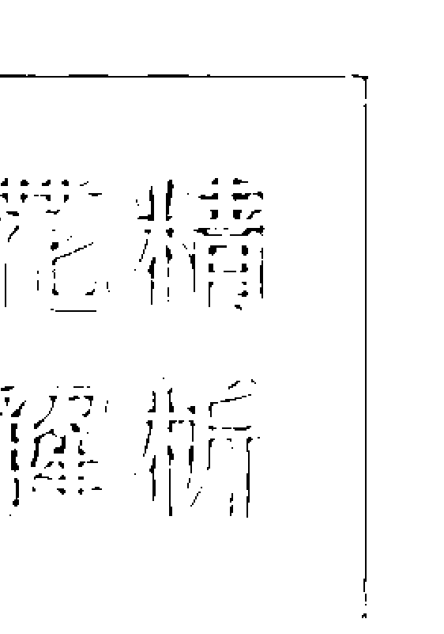

蔡小姐敘述工作壓力大，常壓抑自己的情緒，並有隨時想要爆發的感覺，運用龍芽草、櫻桃李、岩玫瑰，讓壓力釋放，這三個處方是德國花精治療師Dietmar Kramer的雙魚座情緒路徑用藥，對於壓抑情緒所引發的身心症候有幫助（如此例蔡小姐的諸多症狀）。

雖然Dietmar Kramer《新巴赫花精療癒》書中說絕對不能同一花軌上三支花精同時使用，認為會引發強烈反應，對此我們相信，任何治療方針都是正確的，只是會依據時空環境和每人背景狀況不同，而有不同的表現。花精治療師要懂得因人制宜、因地制宜而變通。每個人的心靈層次都是海闊天空，也都擁有無限的創造性智慧，無須束縛在特定的指導原則或方針。

- 鵝耳櫪：針對容易疲倦，下肢無力的情緒做調整。
- 馬鞭草：消除容易緊張的情緒。

##### 相似花精區辨及補充說明

- 1. 心慌：岩玫瑰⊕白楊，岩玫瑰與白楊均會導致身體及情緒上的恐慌，兩者合用效更佳。
- 2. 被綁匪綁架後，害怕會死亡，用岩玫瑰、聖星百合，人們對於死亡的恐懼勝過一切物質的懼怕。
- 3. 噩夢初醒用岩玫瑰，若未即時治療則噩夢過後一陣子的模糊恐懼可用白楊。
- 4. 可治白楊及滿酸漿的加強版恐懼，不論是具體或抽象的害怕都適用。
- 5. 腹部手術後，因很恐懼，腸子不蠕動而排不出大便，可用岩玫瑰。
- 6. 想要體會岩玫瑰的恐懼，可看電影《阿波卡獵逃》。

| 受到驚嚇 | 聖星百合 | 能量凝住 |
| 受到驚嚇 | 岩玫瑰   | 能量亂竄 |

##### 與岩玫瑰花精相似的新一代花精

- 1. 粉紅玫瑰花精（Crystal Herbs業力花精）
- 2. 雛菊花精、薊草花精（蘇格蘭芬活花精）

##### 岩玫瑰花精功用圖像記憶

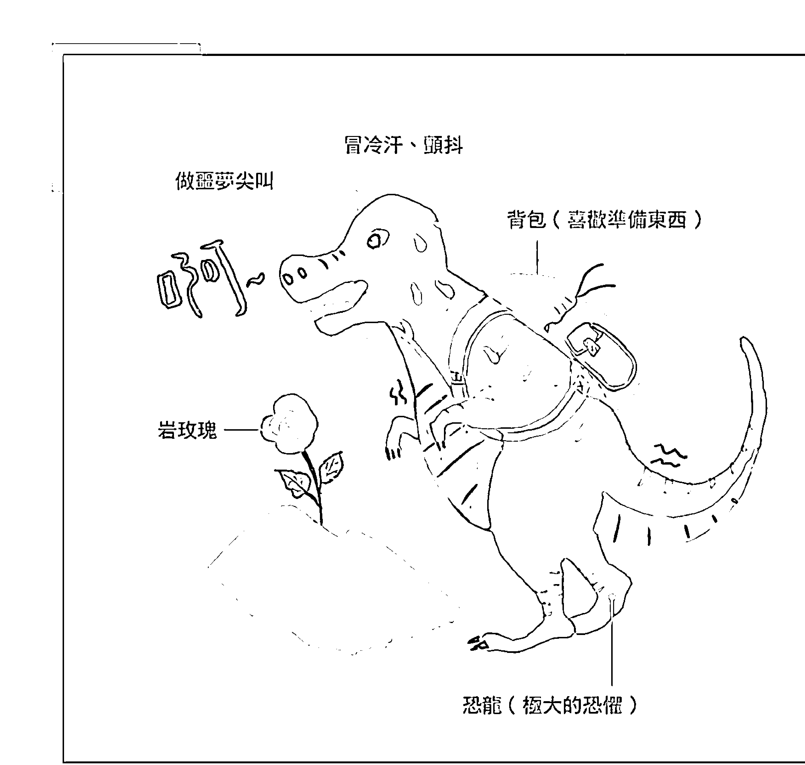

#### 岩水

花精档案

- 别名 | 岩清水、嚴泉水、岩泉水
- 七大分類 | 對他人的安康過度關心類
- 製作法 | 日照
- 關鍵字 | 僵硬
- 正面特質 | 彈性

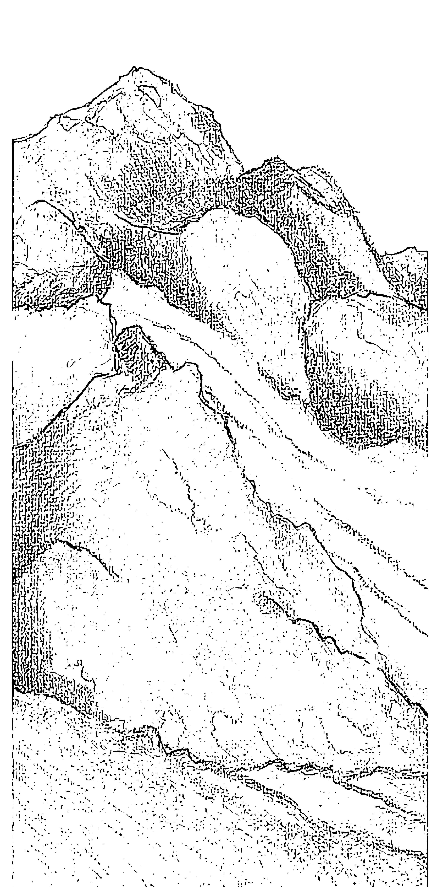

##### 巴赫醫師的敘述

對自己的生活方式很嚴格的人。他們否定許多生活樂趣，因為認為這些會妨礙工作。他們是自己嚴厲的導師，希望自己強健活躍，會做任何他們認為能讓自己保持這種狀態的事。他們希望成為別人的楷模，吸引別人效法追隨，而變得更好。

> > ——出自《The Twelve Healers and Other Remedies》

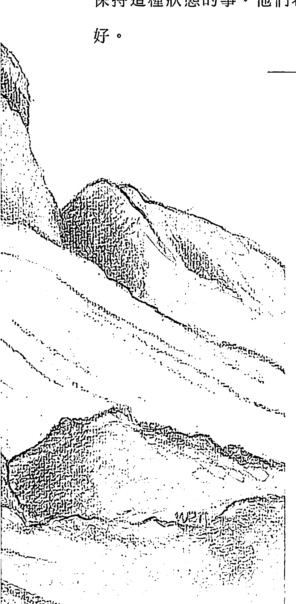

##### 岩水 VS. 中醫觀點

電影《笑傲江湖》中，日月神教教主為了要練成葵花寶典，不惜自宮，以期自己能成為武林盟主，一統天下。現今人雖不像古代有這樣的自殘舉動，但在美式英雄主義的薰陶下，如何獲得成功是許多人竭盡心力所追求的人生目標，而嚴格又規律的訓練模式則是一般人最常採用的。

商場、學術界如此，能量醫學界亦復如是，許多能量治療師為了讓自己獲得更大的能量與覺知，好成為這個山頭的尊者，對自己相當嚴格，便捨棄許多的娛樂和慾望，努力修行，連家人、親友的情感也棄之不顧，深怕延誤自己的進度，因而產生親人間的心理創傷，這就進入了德國花精治療師Mechthild Scheffer所提出的葡萄、岩水、聖星百合三位一體的惡性循環中。實踐個人理想固然重要，但當過度自律時，反而會讓人們成為戒律的奴隸。古人云：「上善若水」，此時的岩水，就和潤滑油一樣，給人彈性，也給予人們更開放的心靈。

### 應用條件：

- 嚴以律己，強迫自己達到高標準。
- 生活嚴謹，規律化而缺乏彈性。
- 捨棄一切慾望、娛樂。
- 頑固且堅持己見。
- 關節問題。
- 肌肉緊繃。

##### 岩水 × 情緒與思緒

有句廣告詞：「輕鬆一點，來塊青箭口香糖。」對岩水狀態的人而言，這句話似乎不太適合他，倒是「嚴以律己、獨善其身」可說是他們的座右銘。

岩水狀態的人對自己很嚴格，堅守自己的信條，要求做任何事都要達到完美的境界。那為何巴赫醫師會把這個獨善其身的花精列在「對他人過度關心」的花精族群中呢？因為岩水狀態的人常以自己的標準來看待萬事萬物，只要無法達到自己所設的標準者，都是不完美的一群，都需要改正。因此他們會以身作則，把自己做到最好，希望別人能見賢思齊而效法他，讓這個世界變得更完美，故被巴赫醫師歸類在這個花精族群中。

##### 花精運用

以身作則的第一步便是專注在自我修行上，尤其是實踐自我的理想。每個人的理想不同，有人是想讓自己更健康；有人是為了宗教求道修成正果；有人則是為了讓自己成為某個專業的龍頭。對他們來說，歡樂的生活是萎靡的象徵，他們不喜歡自己懶散，當然也不希望別人有這樣的生活態度。在他們心中，規律化的修行生活，才是幫助他們達到這個目標的最佳方法。因此他們會捨棄一切慾望、娛樂，假日時，大家相約看電影，開車出遊，他們會選擇一個人到學校操場跑五千公尺、拉幾下單槓、或到國家圖書館去查個資料。每天的行程，就從一早練氣功、打坐、唸經開始，到晚上十一點準時就寢；外食時只吃有機食品，不喝咖啡、刺激性、含冰塊的飲料，不吃人造奶油、炸雞排，就這樣日復一日，過著軍事化刻板的生活，但岩水狀態的人卻樂此不疲。即使別人叫他們輕鬆一下，不要按表操課，讓自己放兩天假，他們也會拒絕，可說是個性相當頑固且墨守成規的一族。

另外，岩水狀態的人主觀性超強，總認為自己認同的理念如技術、學說、乃至政黨是最正確的，別人的一切都不完美，有時為了堅持己見也會和別人爭辯，但他們卻覺得很快樂，沈醉在自我主觀的完美世界中。

岩水狀態的人常強勢要求自我，只是他們的高標準會讓自己變得愈來愈嚴苛與沒有彈性，有時也會為了進度未達到要求而自我苛責。古人云：「強者，僵也。」這樣的過份自律與僵化思維，除了會讓生活沒有樂趣外，也使得身體肌肉、關節處跟著僵硬起來，導致屈伸不利。

中醫的聖經黃帝內經曾提出「宗筋主束骨而利關節」。中醫的筋，即是現今的肌腱、韌帶、筋膜，當筋柔軟健全時，關節活動自會順暢。因此有岩水情緒的個案，他們太高的標準常使得肌腱、韌帶緊繃，因而造成關節處活動會有關節磨損、肌肉也變得容易痠痛。中醫理論亦提到「膝為筋之府」，因此一個人筋骨強健看膝關節即可知道，由這理論亦可推敲出為何Dietmar Kramer的身體地圖資料中，整個右膝都是屬於岩水的反射區了。

俗語說：「水滴石穿」，緩解人們頑固的心態，巴赫醫師想到的解決之道便是用岩水了，因為再堅硬的石頭也會被水滴所穿透。古人云：「柔弱生之徒，水善利萬物而不爭。」岩水是巴赫花精裡頭唯一非植物的花精，是取自能量良好之聖地，流經堅硬岩石的天然湧泉水，故屬於「環境精素」的一種。運用這個處方，除了可以幫助人們降低自我的要求外，也可讓自己更加地放鬆，充份享受人生中的點滴樂趣。

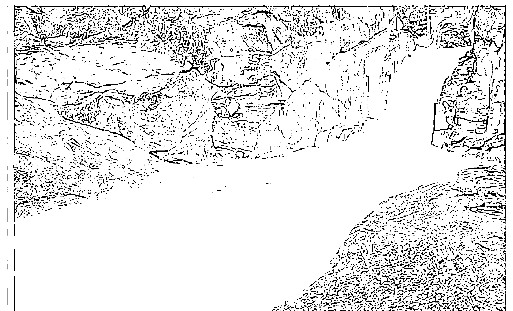

##### 李醫師診間案例探討

李先生，關節活動有響聲，用能量測試測得橡樹、水堇、岩水花精對其症狀消除有幫助。採用上述花精內服，並搭配中藥處方。

使用一週後，活動響聲減少，肌肉也變得較放鬆。

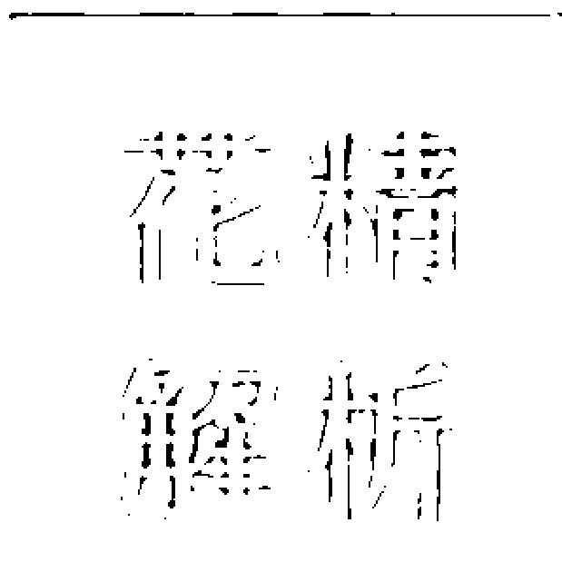

身心靈是一體的，當心靈緊繃時，身體各組織便跟著緊起來。所以運用花精釋放深層的心靈，肌肉自會跟著放鬆。

關節活動有響聲主要是因為肌肉、肌腱太緊，讓關節之間受力提升，因此在活動時便容易有卡啦卡啦響，當嘗試過傳統理筋手法及熱敷仍未見效時，便要考虑情緒釋放的問題。

李先生平時做事相當認真，即使是疲倦，也會堅持把工作做到一個段落才會休息，因此橡樹就很適合。水堇是孤傲的花精，個案本身喜歡自己一個人做事，不喜歡跟別人互動，也因此水堇特性很強。在此次花精治療中，水堇用8滴，橡樹4滴，岩水3滴，足見水堇在此次治療中佔有重大的關鍵，水堇在身體地圖中對應到第一頸椎到第六頸椎之間，在國外的整脊技術中，有一派是專門調整第一頸椎來放鬆全身筋骨，故水堇便可使用。岩水則是因個案自我要求很強，常按表操課，所以跟著緊繃。

一般我在使用花精時，常會以能量測試選擇所需的花精，即使是劑量也是透過LET能量測試法，往往個案在治療一陣子後，同一種花精的使用滴數會一直下降，代表症狀正一步步緩解，但有時上一次用的花精在下一次測試時會測不到，這是因為其負面情緒已完全解除。

# # 相似花精區辨及補充說明

關節活動有響聲，可先考慮岩水花精，中醫理論「筋會陽陵泉」，可貼敷在陽陵泉穴。

圖陽陵泉穴，位於小腿外側，腓骨頭下方往前約一寸。

| 類別 | 花精 | 描述 |
|------|------|------|
| 放鬆玩樂 | 岩水 | 嚴以律己，且樂此不彼 |
| 放鬆玩樂 | 楊柳 | 自怨自艾 |
| 放鬆玩樂 | 野玫瑰 | 消極的人生，像行屍走肉 |
| 放鬆玩樂 | 橡樹 | 努力工作，過度自我鞭策，當體力無法負荷時會沮喪 |
| 指導行為 | 馬鞭草 | 費盡心思想要改變他人，不斷和人溝通，走回他認為的正道。行事嚴以律己，也嚴以待人 |
| 指導行為 | 岩水 | 專注在自我修行上，獨善其身，並不管別人在做什麼，是標準的嚴以律己，寬以待人。不會說教，嚴重時會捨棄一切慾望、娛樂、殉道 |
| 指導行為 | 山毛櫸 | 批評別人，無法接受為何大家不用他的方法生活，完全無法體諒別人所面臨的困難。他們喜歡精確與秩序，也要求自己和身邊的人過規律的生活 |
| 指導行為 | 葡萄 | 命令別人。像獨裁者，不管別人心裡懂不懂、服不服，總之要別人聽自己一個口令、一個動作就對了 |
| 生氣自己 | 岩水 | 氣自己無法達到自己設定的標準或原則 |
| 生氣自己 | 矢車菊 | 氣自己軟弱、無法拒絕別人 |
| 生氣自己 | 野酸蘋果 | 氣自己的外表瑕疵 |
| 生氣自己 | 線球草 | 氣自己做不出決定 |

##### 與岩水花精相似的新一代花精

+   1. 野鳶尾花（Crystal Herbs業力花精）
    2. 愉悅花精（Crystal Herbs內在小孩花精）
    3. 繩草花精（蘇格蘭芬活花精）

##### 岩水花精功用圖像記憶

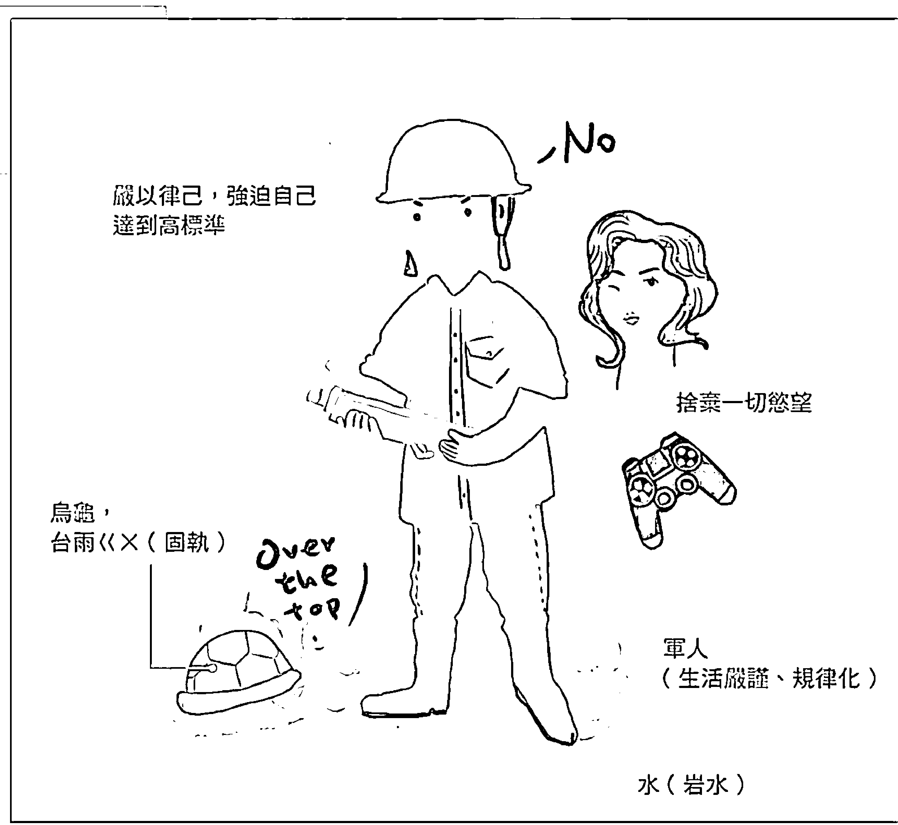

# 線球草花精檔案

+   - 拉丁學名 | *Scleranthus annuus*
    - 別名 | 史開蘭、硬花草
    - 七大分類 | 不確定類
    - 製作法 | 日照
    - 關鍵字 | 對日常瑣事無法決定
    - 正面特質 | 果決

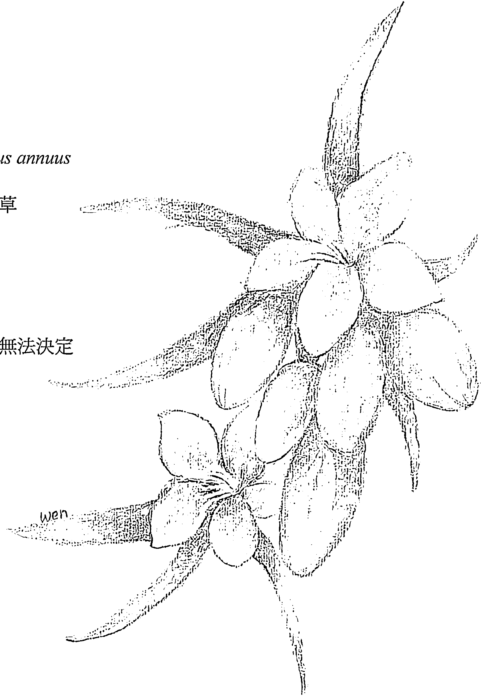

# # 巴赫醫師的敘述

苦於無法在兩件事中做選擇的人，本來第一個看起來是對的，馬上又覺得第二個才是。他們通常很安靜，獨自承受這些難題，通常不會與其他人討論。

> ——出自《The Twelve Healers and Other Remedies》

+   - 弱點：猶豫不決
    - 美德：堅定

你是否很難做出決定？當矛盾的想法進入腦海，你很難統合成見解，因此很難決定出正確的方向？猶豫不決阻礙你的道路，延遲你的進展？你是否一下覺得第一個選項對，一下又覺得是另一個？若是如此，你正在學習在艱難處境下快速行動，形成正確的見解，並堅定不移地追隨。玉米田間的小小綠色線球草會幫助你達成目的。

> ——出自《Free Thyself》

##### 線球草VS.中醫觀點

「選擇，是一種智慧」。記得多年前在創見堂上LET課（Life Energy Test生命能量檢測）時，老師開場白的第一句話這樣告訴我們。直至今日，許多的選擇還是不停地出現，也考驗著我當時的智慧。

前些天，花精課學員廖妹妹的媽媽（慈濟的吳師姐）來院門診，在看診之餘，順道提及近來她家中的兩隻貓常會打架，問我說花精可否解除這種問題？由於我未見過這兩隻貓，我就跟吳師姐介紹能量測試LET，並運用這個方法幫她家的寵物測得櫻桃李⊕冬青花精可讓他們脾氣好些。吳師姐對這種檢測法有些興趣，我就把花精課中談到的能量測試向她show了一些簡報檔案，當她看到其中一段靈擺操作時，突然呵呵的笑。看著她笑，我有點疑惑！原來她終於知道廖妹妹的靈擺是從那裡學來的了。之前上花精課時，向學員介紹如何訓練靈擺，廖妹妹回去之後便照章練習，沒幾個月居然就變成了靈擺高手，幫人解決了不少疑惑，連過年時親戚打麻將都找她先測過，也算是多了一個選擇的工具。人世間有許多的選擇，每一次的選擇都有不同的道路在行走，端看個人的智慧來取捨，而線球草花精則是幫助我們順利選擇的美妙花精。

# 應用條件：

+   - 無法在兩件事情中做決定，又不問人。
    - 疾病時好時壞。
    - 多變的情緒。
    - 少陽症。
    - 暈眩。

##### 線球草×情緒與思緒

線球草狀態的人，處事優柔寡斷，就好像時鐘的鐘擺一樣，左右搖擺，因而使他們常在兩個選擇之間猶豫不決，很難獲得平衡，才剛決定好的事，下一刻又改變，如：

+   - 吃飯時，到底是要吃自助餐還是漢堡。
+   - 便利商店結帳時，拿著飲料站在櫃檯結帳的前一刻，又轉身去看泡麵。
+   - 著裝時，在鏡子前一套又一套的換裝，到底是要穿白色衣服好，還是粉色衣服好。

他們一般個性較內向，不太愛講話，做事猶豫不決，因此常把這些難以抉擇的問題留在心中，慢慢地做出決定，而不會去問別人，這和水蕨特性的人明顯不同，因為水蕨人會到處請教人。若自己的主管有這樣特性的話，那呈上去的企劃案可能會拖延不少時間，才能決定要執行那個方案，這在現今分秒必爭的競爭環境中將是一大殺傷力，也是老闆爾後用人的一項參考。他們這樣的特性除了會因遲遲無法下決定而浪費自己的時光外，也會使得疾病與性情來回反覆，如：

+   - 肢體會左右晃動。
+   - 生病時，東痛西痛。
+   - 便秘與腹瀉交替出現。
+   - 有時精力充沛，有時昏昏欲睡。
+   - 白天很有自信，夜間便自信心不在。
+   - 常在兩種極端中擺蕩，如大哭與大笑，樂觀及悲觀，充滿興趣和興趣缺缺間游移。

##### 花精運用

中醫聖經《黃帝內經》中的病機十九條曾提出「諸風掉眩，皆屬於肝」的理論，這個理論說明了眩暈和肝膽二個臟腑有關，在中醫的定義裡，肝為足厥陰肝經，而膽為足少陽膽經，因此眩暈症即和少陽經絡有關。另一部中醫經典「傷寒論」一書中則是直接提到「少陽證」，所謂少陽證是一種疾病在表裡、左右間遊走的毛病。有這樣的患者可能會有暈眩、兩手體溫不同、便秘腹瀉交錯，或是一下發燒一下畏寒的交錯現象。中醫師在遇到這樣的患者時，常會開立像小柴胡湯、四逆散等方劑做調理。因此從症狀來推敲，少陽症和線球草狀態的人有雷同之處，因此臨床上常可以互相輔助以提高療效。而左右搖動的暈眩現象同樣也適用於容易暈車、暈船的患者，可幫助他們減少不適。

除此之外，有花精治療師提出，線球草⊕胡桃花精可運來治療時差問題。時差是一種黑夜、白晝無法平衡的狀態，生命體內的生物鐘是以太陽為依歸，當快速通過換日線時，會使得體內生物鐘臨時失靈，在它自動調校的那段時間便有疲倦不適的時差現象產生。在《敲醒心靈的能量》一書中，作者羅傑·卡拉漢博士（Dr. Roger J. Callahan）曾介紹用「思維場療法」（Thought Field Therapy，簡稱TFT）來治療時差，這是一種藉由敲穴道及動眼運動來治療情緒的療法，我曾用過書裡頭部份資料幫患者做治療，效果還不錯，當然花精與TFT結合使用，是可以創造更高的療效。

值得一提的是，由於線球草狀態的人處事常搖擺不定，因此容易造成情緒不穩定。而獨自和自己優柔寡斷對抗的結果，就是消耗自己過多的能量，這便形成疲倦、精神恍惚等病症，並產生舉止失措的情緒焦躁現象。上述這些狀況指導著臨床，當我們遇到情緒起伏的患者時，便可善用線球草這個花精來穩定他們多變的情緒。線球草狀態的人在談話或思考時，常會有思緒亂跳，不能集中的情況出現。我在臨床上，偶有遇到注意力無法集中的小朋友，在幫他們做彩光針灸治療時會左右晃動，無法安定下來，或許可以用這個處方輔助治療注意力不足的個案，但臨床效果尚待評估。

服用這個處方，主要是協助人們擁有較強的決斷力，不論是在暈車、注意力集中、時差或是選擇上都能給予幫助。當您還不敢使用花精時，不妨先喝幾滴線球草花精，您就會相信自己的判斷是對的，而能勇敢地做出自己的決定！

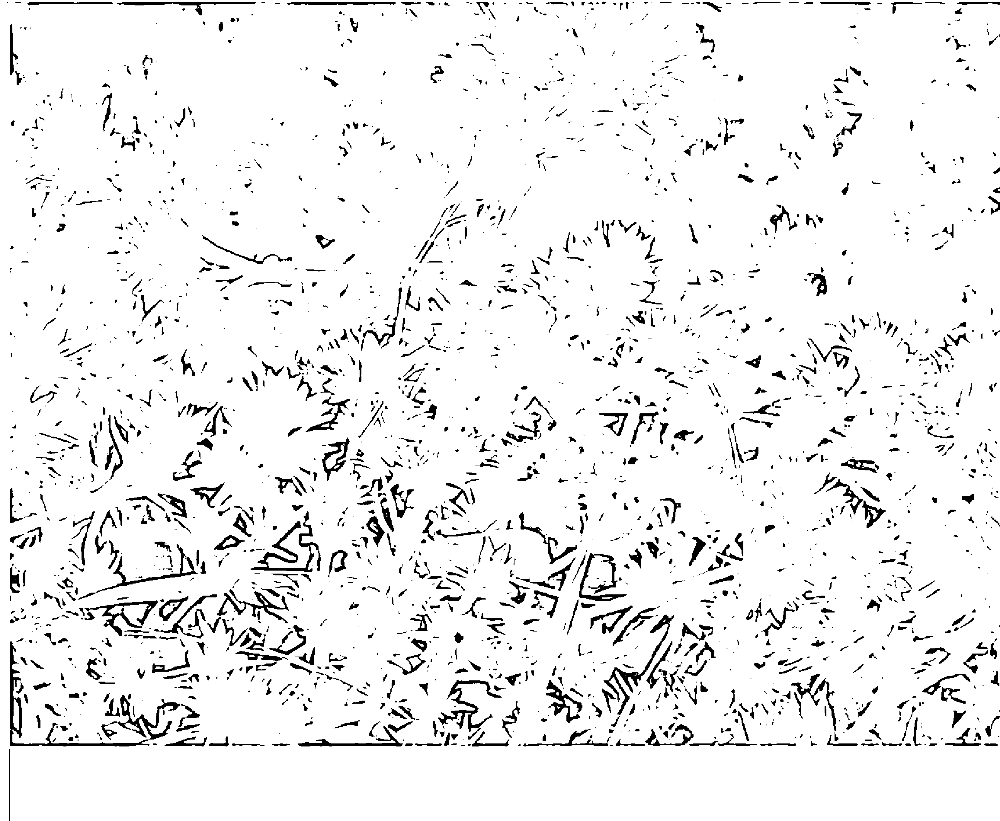

##### 相似花精區辨及補充說明

+   1. 注意力不集中的小朋友，可用線球草⊕栗樹芽苞⊕胡桃。
    2. Crystal Herbs神聖和諧花精中的情緒平衡花精，組成為月見草、月長石、珍珠、棟棠，可協助情緒波動、起伏不定、難以冷靜的人，平衡情緒，釋放在胃部和太陽神經叢的緊張壓力。

| 選擇 | 線球草 | 問自己。有明確的選擇，卻無法於兩種事物中擇一，但最終仍會自己做出決定，而不會問別人 |
|------|--------|------|
|      | 水蕨   | 問別人 |

##### 與線球草花精相似的新一代花精

+   1. 野蘭花花精（Crystal Herbs業力花精）
    2. 金雀花花精（蘇格蘭芬活花精）
    3. 決斷力花精、情緒平衡花精（Crystal Herbs神聖和諧花精）

##### 線球草花精功用圖像記憶

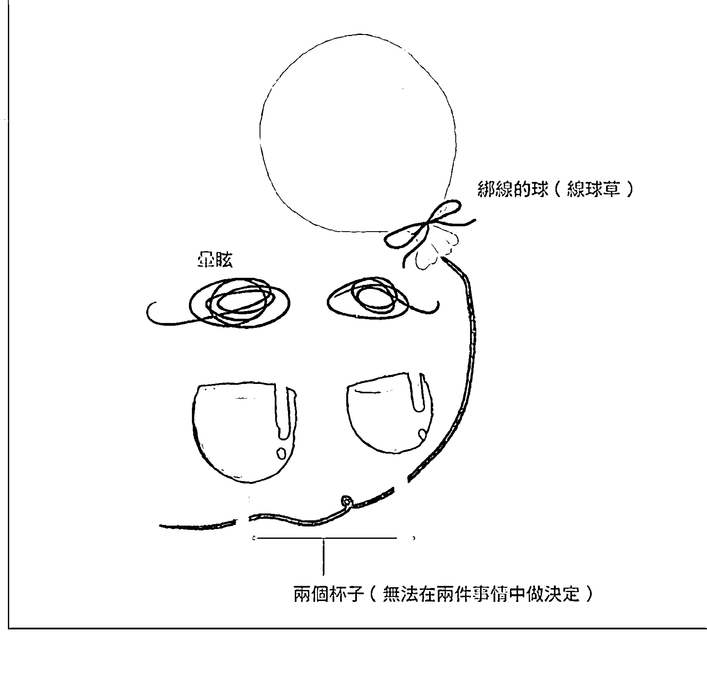

# # 聖星百合

##### 花精檔案

+   - 拉丁學名 | *Ornithogalum umbellatum*
    - 別名 | 聖心百合、伯利恆之星
    - 七大分類 | 沮喪絕望類
    - 製作法 | 煮沸
    - 關鍵字 | 驚嚇創傷
    - 正面特質 | 安撫

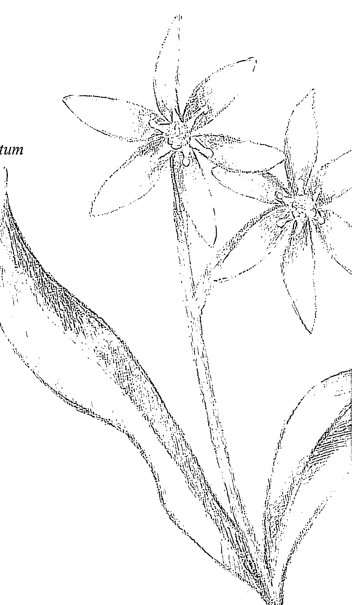

# Star of Bethlehem

##### 巴赫醫師的敘述

給痛苦不堪的人，遇到的情況使他有段時間非常不快樂，例如噩耗的驚嚇、失去所愛、意外後的恐懼之類。對於無法接受安慰的人，這支花精能帶來撫慰。

> ——出自《The Twelve Healers and Other Remedies》

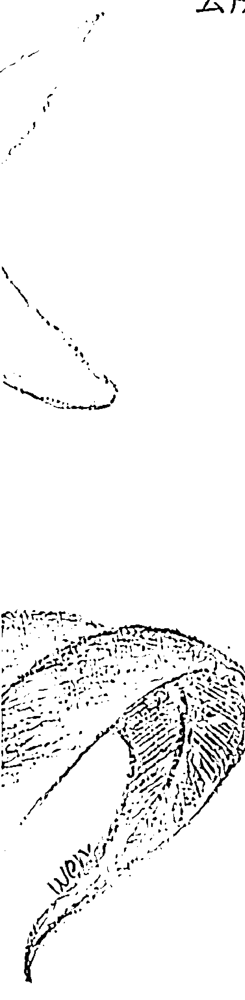

之前我在仁心聯醫看診時，有一位阿婆是來做針灸的，原因是下肢癱瘓。

我問她：「阿婆，妳的腳這樣癱瘓有多久了？」

「已經三年了。」

我問：「三年……那之前是有發生什麼事嗎？不然怎會突然癱瘓？」

「我也不曉得，我去美國找兒子，剛好我先生臨時中風，住在醫院裡，我就去幫忙照顧。半夜去洗手間時，被一位黑人護士嚇到後，就昏迷三天，醒來就變成這個樣子。」

「嚇到？那有做檢查嗎？」我又問。

「有啊，我兒子是波士頓那裡的醫師，在美國所有的檢查都做了，查不出原因。回國後，也到台大、長庚醫院做檢查，什麼電腦斷層、MRI、肌電圖都做了，就是找不出病因。醫師沒辦法就叫我找中醫針灸看看，所以我就來了。」

阿婆這種現象，是心理學上的「轉化症」。轉化症在古老的西方醫學中是屬於歇斯底里疾患中的一種，主要表現是以感覺及運動系統方面的異常為主，如失明、抽搐、突然癱瘓、不能說話等症狀。但這些異常現象透過臨床檢查卻大多正常，也無法用任何已知的身體疾病去解釋，只是在發生前常會先有一些心理衝突的事件出現，如上例阿婆受到驚嚇，之後便產生上述身體症狀。而曾經轟動一時的蘇建和三人死刑宣判，被害人的兒子吳東諺，因當年目睹雙親被殺害慘況，因而罹患肌肉萎縮，現在只能躺在床上，依賴呼吸器維生，即是屬於聖星百合創傷情緒下的轉化症情形。

我那時有建議她使用巴赫花精看看，阿婆稍微點個頭。因當時我把花精放在家裡，現場沒有東西可以幫她，就約她第二天來時再做。隔天我帶花精來了，阿婆卻沒有依約前來，我的內心有點小失望。我想，或許是她經過這麼多大醫院先進的儀器檢查，卻始終無法得到療癒的信心，內心已放棄任何希望，只想來試試針灸而已。我當時擬定處方：聖星百合⊕荊豆⊕落葉松，聖星百合，對治驚嚇、創傷後遺症；荊豆，對於久病後已放棄任何希望的個案有幫助；落葉松，讓人恢復療癒的信心。可惜這組處方，無緣用上，人生的際會，或許只能用因緣來解釋吧。

聖星百合，百合科的球莖植物，生長於巴勒斯坦與敘利亞一帶，故以伯利恆之星（Star of Bethlehem）命名。

# 應用條件：

+   - 沈溺在悲痛中，不願接受別人安慰，無法釋懷。
    - 突發性事故或消息導致驚嚇。
    - 驚嚇後無力感或癱瘓。
    - 失去親人或愛人。
    - 冷若冰霜。

聖星百合是巴赫醫師用來應付突發性事故或壞消息所帶來的悲痛與驚嚇。這些創傷分肉體及心靈創傷兩大類，但常兩者同時發生。

肉體創傷如：車禍、意外傷害所造成的肌肉骨骼損傷（扭傷、挫傷、骨折）、皮膚損傷（割傷、燒燙傷、曬傷、保養品過敏）、碰撞、跌倒、開刀、非自然產（剖腹產或早產者，無論孕婦及胎兒均須使用）、經前症候群。

心靈創傷如：喪親之痛、失戀、親人自殺、生意失敗、極度失望、驚嚇，乃至多年前使心靈崩潰的事件。

西方強調身心靈合一，而中國道教養生體系則強調三魂七魄歸一，雖然東西方的用詞不同，但指的都是同一個東西。當我們在受到極大的震驚與打擊時，全身的能量系統會暫時分離，這就是傳統人們常說的魂飛魄散。面對這種失魂的現象，老祖宗是用收驚的方式，幫助魂魄歸一，這種方式目前在各大廟宇仍繼續流傳下來，台北市最有名的莫過於行天宮收驚了，只是運用花精後，收驚的動作可以變得簡化許多。倘若震驚的情緒不能及時處理，那負面情緒可能在事情發生後多年，以各種方式展現出來，即使過去的傷痛已經遺忘或沖淡，患者仍可能會引發身體種種的病痛，或在某個特殊的言行後引動他們過去的記憶，而讓他們感到傷痛與沮喪。在英國聖星百合的使用醫案中，記錄不少因二次大戰空襲或親人過世多年後所引發的全身無力、頭痛、心臟病、皮膚病，乃至精神崩潰的個案，這些患者因屬於聖星百合的適應症，故在使用這個花精後恢復健康，不治疾病而病自癒，這也是花精療法迷人之處。

創傷的處理必須即時，因為它對人體的危害是立即的，門診中常見有患者因車禍、跌倒或親人自殺而變得無力、呆若木雞感。而我們在電視劇中也常看到有人因見到鬼後說不出話來，腳軟無力；或聽到惡耗後發瘋、暈倒，都是屬於聖星百合的應用範圍。巴赫醫師稱此為「痛楚與憂愁的安撫使者」，可以撫慰悲傷及減輕痛苦，因此急救花精中就有用到聖星百合，用來處理創傷後對人體的衝擊。

聖星百合負向狀態的人，冷若冰霜，對任何人事物都漠不關心，不理不睬，這是因為他們沈溺於悲傷之中，無法接受安慰的結果。這個現象和「逃避現實、無法適應當下生活、興趣缺缺類」的花精族群中的野玫瑰很像，治療師必須有所區隔，即聖星百合是用在曾受創傷，身心靈處於分離狀態所引發的症狀。就因為這樣，有些治療師發現，當使用多次花精都沒有反應時，最大可能即是體內能量失衡，這也和創傷後身心靈不能合一有關，就必須使用聖星百合。

人生路上，總會遇到不同的挫折與打擊，而聖星百合會幫助我們消除打擊，撫平創傷，只要患者說某某事情對他來說是一個打擊時，便可用這個處方。運用聖星百合，除了可以撫慰心靈，幫助平復親人過世或被驚嚇後的悲傷情緒外，也是我常用的基礎花精（另一個為落葉松）。對於任何人而言，倒是一個不錯的安撫花精喔。

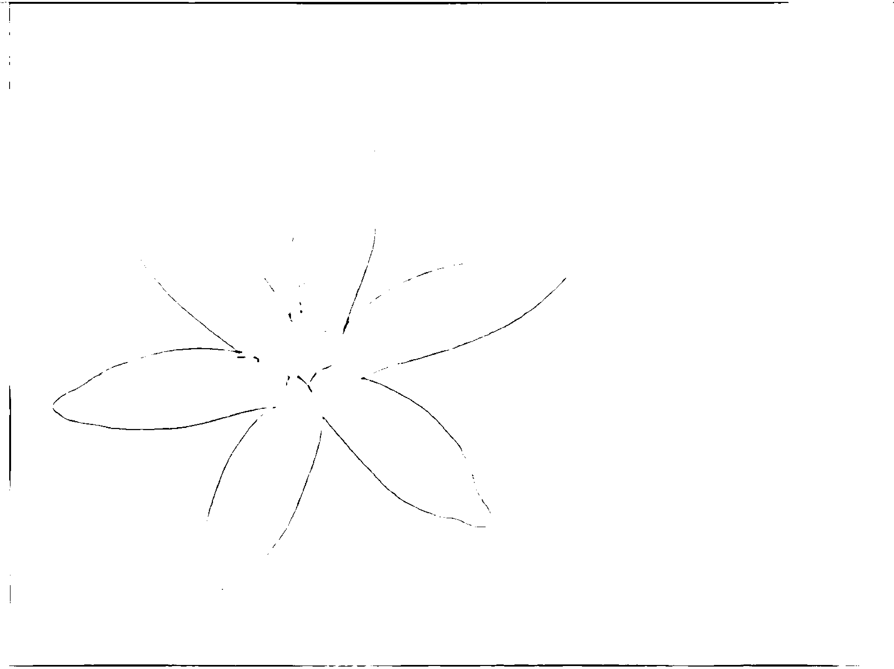## 李醫師診間案例探討

李先生，26歲，因青春痘來診，個案除了有青春痘情形外，亦有失眠困擾。門診時，我問個案失眠情形有多久了？個案告稱自從到了泰山當兵後，便睡眠品質不佳，時常睡睡醒醒。我在幫他把脈的時候，發現他的左手會不自覺地抖動，細問之下，原來患者在七年前就讀大學時，在一次騎機車跌倒碰撞到左手後，便會不自覺抖動，即使是拿個碗也都會晃動，李先生指著他那左腕處受傷的疤痕這樣跟我說。根據他的情形，我選擇野酸蘋果⊕胡桃⊕聖星百合花精局部外敷於左腕受傷處，並開立安神助眠、消青春痘的處方。

患者於一週後回診，主訴本週睡眠品質開始好轉，但仍滿臉青春痘、而手抖情形依舊，由於個案只願做花精貼敷，我在開立中藥處方後，仍照前次花精處方做花精局部外敷。又一週後回診，個案手抖已減輕許多，我請他手伸直看看，已不像之前晃動，李先生對於這困擾七年的問題，就在這幾次的貼敷後，居然可以獲得如此好的效果感到滿意。而失眠的問題亦在這兩週的療法中，好轉許多。

#### 花精解析

#### 野酸蘋果

針對皮膚病做治療，一般只要是青春痘、或蕁麻疹、皮膚過敏，我都會用到野酸蘋果花精，可用這個花精接納自己皮膚上的瑕疵。

#### 胡桃

適應環境，患者到新地點當兵後，便無法入眠，這和環境變化所引發的情緒有關，用胡桃花精可以協助適應環境，而這個處方對於容易認床的失眠相當有療效。

#### 聖星百合

李先生的左腕於七年前受傷，從此左腕便開始抖動，這種現象稱為「情緒的記憶性」。情緒的記憶性是說身體的組織、細胞會把當初的情緒記憶下來，而一直呈現當時的狀態，如患者因左腕受傷處的疤痕仍活在七年前的創傷記憶中，所以仍會不停地顫抖，在使用聖星百合後，該處的創傷做一釋放，手抖的情形便好轉許多。「思維場療法」創始人羅傑·卡拉漢（Roger J. Callahan）博士有次曾以情緒療法幫助一名男子消除手痛，這名男子車禍已十一年，但當初撞裂的胳膊持續劇痛多年，每天服用大量止痛藥仍無效，在運用情緒療法做釋放後，疼痛即解除，因此花精治療師必須重視情緒的記憶性，尤其是曾開刀或有癌症的個案，更須重視這個技巧，而彩光針灸的「創傷螺旋療法」對於這樣的情形也有不錯的效果。

##### 相似花精區辨及補充說明

聖星百合花精建議長期使用，才能將心中的創傷完全抹平，亦可輔助使用彩光針灸的「創傷螺旋療法」，或「身心靈合一療法」，亦可幫助魂魄歸一。

| 類別 | 花精 | 說明 |
|------|------|------|
| 驚嚇後 | 聖星百合 | 一片空白無力 |
| 驚嚇後 | 岩玫瑰 | 流手汗 |
| 皮膚問題 | 野酸蘋果 | 任何皮膚過敏或皮膚病均可適用，對於追求細節上完美的人，可用這個花精接納自己皮膚上的瑕疵 |
| 皮膚問題 | 聖星百合 | 曬傷、燙傷、以及化妝品所引起的皮膚過敏等等，均可視為肌膚遭受創傷，可用此花精撫平傷痛，加速皮膚修護 |
| 皮膚問題 | 胡桃 | 治療對外在環境過度敏感的花精，可以幫助我們通過人生的所有階段，如青春期臉上的青春痘問題。可以內服與外用，外用時胡桃⊕野酸蘋果花精合併使用 |
| 皮膚問題 | 鳳仙花 | 急性子引起過敏，或皮脂腺分泌過快引發青春痘 |
| 使用方法：內服⊕外用噴霧 | | |

花精醫學美容將可帶來身心靈的全方位照顧

- 花精醫學美容 → 自信、健康、美麗
- 醫學美容 → 健康、美麗
- 美容 → 美麗

##### 與聖星百合花精相似的新一代花精

1.  海底輪花精（Crystal Herbs脈輪花精）
2.  佛甲草花精（Crystal Herbs業力花精）
3.  節哀憫花精、走出受虐花精（Crystal Herbs神聖和諧花精）
4.  平和花精、靈魂修復花精（Crystal Herbs內在小孩花精）
5.  人間天堂、紫花藿香薊花精（晶荷日光花精）

##### 聖星百合花精功用圖像記憶

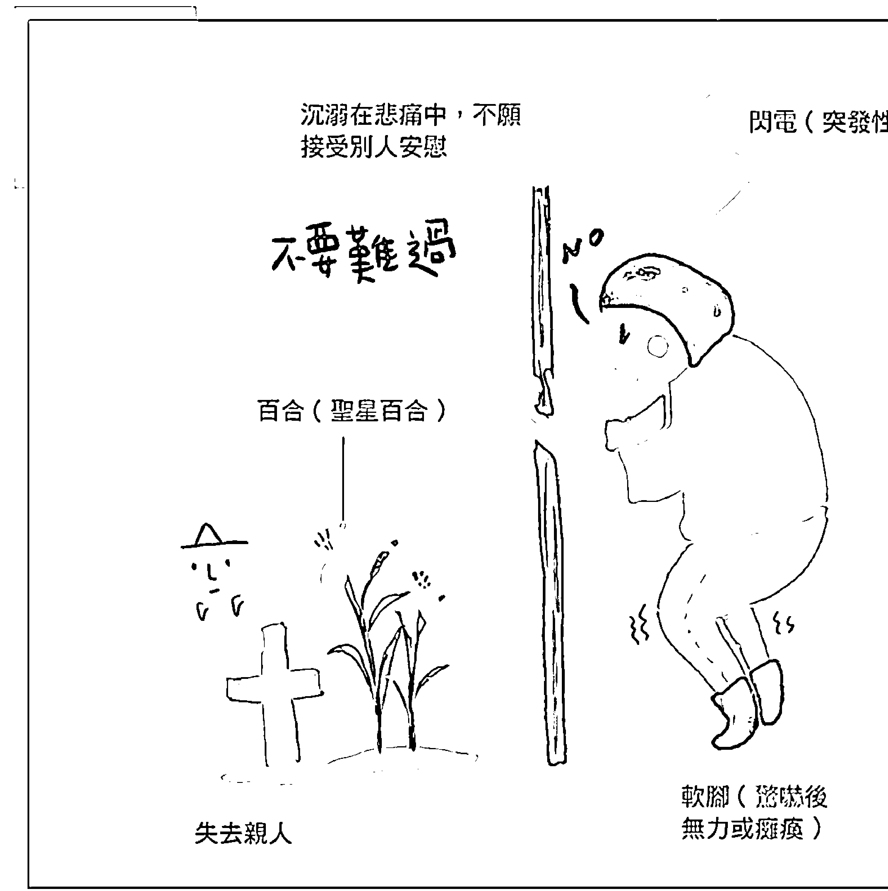

#### 甜栗

## 花精档案

- 拉丁學名 | *Castamea sativa*
- 別名 | 甜栗子、甜西洋栗、西洋栗
- 七大分類 | 沮喪絕望類
- 製作法 | 煮沸
- 關鍵字 | 苦惱（因試過各種方法仍無法解決）
- 正面特質 | 希望

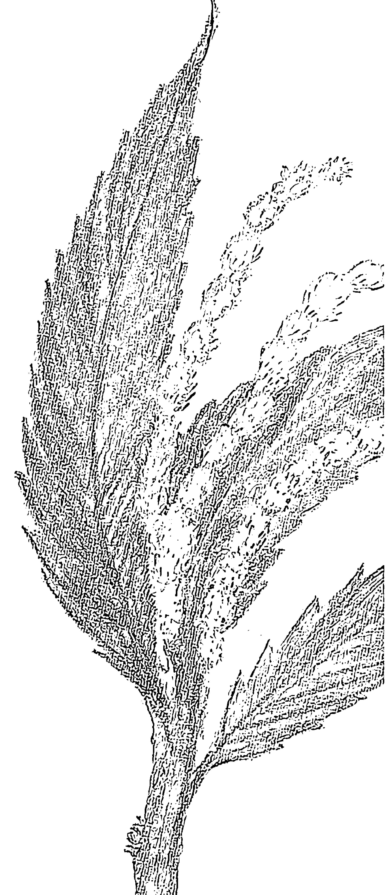

## Sweet Chestnut

##### 巴赫醫師的敘述

有些人會遭遇到某些時刻，痛苦巨大到似乎無法承受了。身心感覺已到達忍耐的極限，要崩潰了。眼前除了毀滅，別無他路。

> ——出自《The Twelve Healers and Other Remedies》

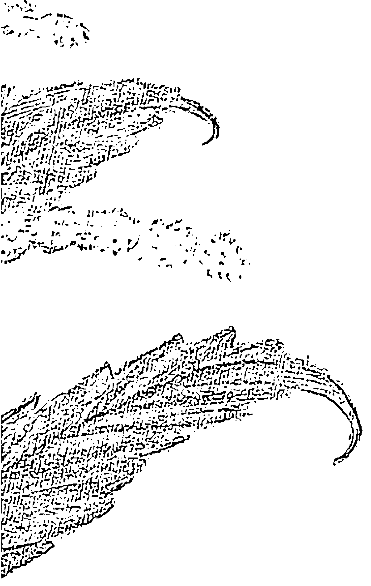

##### 甜栗 VS. 中醫觀點

最近有位女士從台中來診，年約四十歲，頭部常會不自主地左右搖動，而且近八個月來頭部向左偏移的幅度愈來愈大，這個疾病，不但害她丟了工作，也逐漸喪失自信，但跑遍了各大醫院，卻檢查不出任何原因。為了治療這個問題，患者從台灣頭看到台灣尾，在中醫、西醫的正規療法及最新治法對她都無法奏效後，便開始嘗試氣功、拔罐、正骨手法、催眠、AMCT等另類療法，絲毫無任何起色，後因人介紹，來到我這裡試試花精療法。由於患者已試過各種療法，我便向她說明能量療法的操作方式及花精應用，患者表示都可以接受，只希望在這裡能有奇蹟出現。

在問診時，她的眼神透露出疲態，我知道這些年來她一次又一次的希望，最後都變成失望。而每一次的失望，都會讓患者的沮喪感增加，導致深陷沮喪、不知今後何去何從的甜栗現象日漸增強，因此在觸診時其左頸部乳突處（耳朵後、骨頭下方）的肌肉特別緊繃，這個地方剛好是甜栗花精反射區。以能量測試測得患者需要甜栗⊕荊豆⊕馬鞭草⊕楊柳⊕落葉松⊕橄欖花精，剛好這些花精反射區在患者身上都呈現陽性反應，而且運用花精貼敷法後，患者自覺肌肉有放鬆一些，不似先前那麼緊繃，臉上也稍微露出一點笑容。調配治療瓶後，我幫她加做了彩光針灸，我知道若她最後在這裡仍無起色時，她的甜栗現象將會更加地嚴重，我是很不希望這種情形發生，只想好好幫她，但願上蒼慈悲，給我多點智慧，讓我能夠做到這一點。

應用條件：
- 身心遭受極大的折磨，內心已到無法忍受的地步。
- 彷彿任何人事物的出現，也幫不了他。
- 深陷絕望，不知今後何去何從。

##### 甜栗 × 情緒與思緒

甜栗狀態的人，身心屢屢受到極大的折騰，他們已經嘗試過許多努力，撐過一關又一關，在到達身心忍耐的臨界點時，仍得不到預期的成果，就在那一瞬間感到沮喪、覺得人生一片黑暗，雖還想再努力掙扎，卻不知還有什麼路可走。

由於嘗試過多種方法也解決不了問題，因此他們的心中認為：即使是死亡也無法幫他們從無邊無際的痛苦深淵中救起，所以這類型的人不會像櫻桃李狀態的人一樣，走上自殺這條路

倘若這種沮喪的甜栗狀態未能即時處理，將會造成個案生活空虛感及沒有充實感，而逐漸進入荊豆狀態或對現實興趣缺缺類花精族群中，增加治療的困難度。

乍看之下，甜栗狀態很難出現，但在日常生活中，這種現象卻常出現在你我周遭，如：

- 歷治無效的病患，每治一次，都承受一次的折磨。
- 學生在大考之前，他們試著把書K完，日子一天天逼近，但要讀的書卻還是那麼多，一直撐到考試前一天晚上，仍無法將書讀好，不論是出現再好的補教名師、再好的輔導教材，也幫不了他，在最後這一刻，心裡頭徹底的崩潰，並有著不論多努力都無法改變現狀的沮喪感。
- 家中若有問題小孩，父母使盡各種方法督促他向善，連寺廟、神壇、家族排列等都嘗試了，仍未獲改善，深陷絕望，不曉得還有什麼方法可以做。
- 未曾交往過男女朋友，試過相親、朋友牽線、婚姻介紹所、網路交友，仍無法找到合適的對象。
- 一直擺脫不了的罪惡感，一直懷疑自己生病的心態，導致自己心力交瘁，再也無法承受新的打擊。

以前在大學讀書時，常聽同學說：「撐必勝。」我那幾個橄欖球校隊的同學們，最喜歡把這句話掛在嘴上，唯有堅持到最後一刻，繼續努力，勝利才會到來。孟子曰：「天將大任於斯人也，必先苦其心志，勞其筋骨，餓其體膚……」雖說磨練是艱苦的，但壓力能讓人變成鑽石，堅持下去，才能變成浴火鳳凰。人世間的一切，我們無法定論好與不好，一切都在命運巧妙的安排中。巴赫醫師也告訴我們說要正視疾病的靈性意義，因為病痛可以讓人們了解自己的問題所在，進而改正缺失，而我們所要做的，便是接受命運的考驗，在苦難中超越自己，積極地選擇合適的心態來迎接生活的挑戰，一步步向前邁進，這樣疾病與磨練才會早日消除。

服用甜栗花精雖無法讓問題消失，但卻可以幫助人們，將心中的希望再度燃起，重新擁有衝破困境的勇氣與力量。畢竟在黎明之前，總是最黑暗的，只要能堅持下去，必定可以看見美麗的曙光。

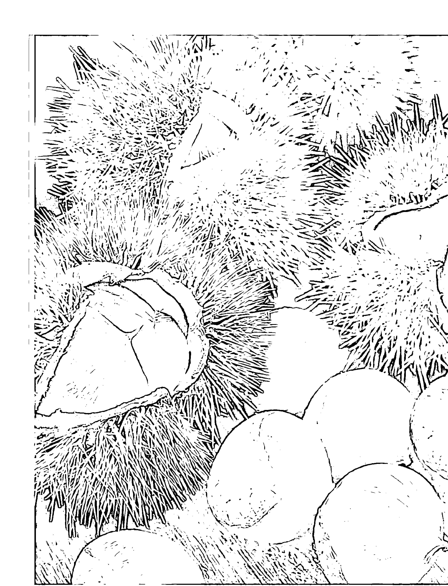

##### 相似花精區辨及補充說明

1.  可配合宗教力量支持，讓人全然接受命運的考驗。
2.  甜栗和龍芽草都會把痛苦留給自己，但甜栗的痛苦是心理極度痛苦，所以比龍芽草重，而絕望也比荊豆強。但甜栗能掌握自己的情緒，不像櫻桃李會自殺。
3.  甜栗的情緒是隱含著聖星百合，長期以來生命充滿了失望、打擊、悲傷，但仍繼續堅持下去，直到某件事情發生，覺得自己已經被折磨到了極限，再也無法忍下去，瞬間變得沮喪、絕望。

| 大類別 | 花精名稱 | 描述 |
|--------|----------|------|
| 絕望 | 甜栗 | 韌性相當強，就算深處絕境，仍會一直尋求生機及希望，直到見到光明的一天。他們不會想要自殺，因為他們認為死亡也解決不了問題 |
| 絕望 | 荊豆 | 心智認為已經沒有希望了，他們對「努力會帶來成功」這個理念抱持懷疑態度，因此不會做任何的努力與尋求協助。外表呈現絕望感 |
| 絕望 | 野玫瑰 | 內心找不到任何生活的樂趣，冷淡死寂、行屍走肉的狀態，但外表看來可能讓人誤以為是隨遇而安、認命不抱怨 |
| 情緒低落 | 甜栗 | 有當下知道的明確原因 |
| 情緒低落 | 芥末 | 沒有原因 |
| 情緒低落 | 荊豆 | 原因通常需回溯到久遠以前 |
| 崩潰 | 甜栗 | 因為不斷嘗試都無法解決，走投無路，束手無策，一時不知該怎麼辦了 |
| 崩潰 | 櫻桃李 | 忍耐一段時間後，「駱駝的最後一根稻草」式的情緒爆發，擔心會傷己傷人 |

##### 與甜栗花精相似的新一代花精

1.  海底輪花精（Crystal Herbs脈輪花精）
2.  佛甲草花精（Crystal Herbs業力花精）
3.  獨麗花花精（蘇格蘭芬活花精）

##### 甜粟花精功用圖像記憶

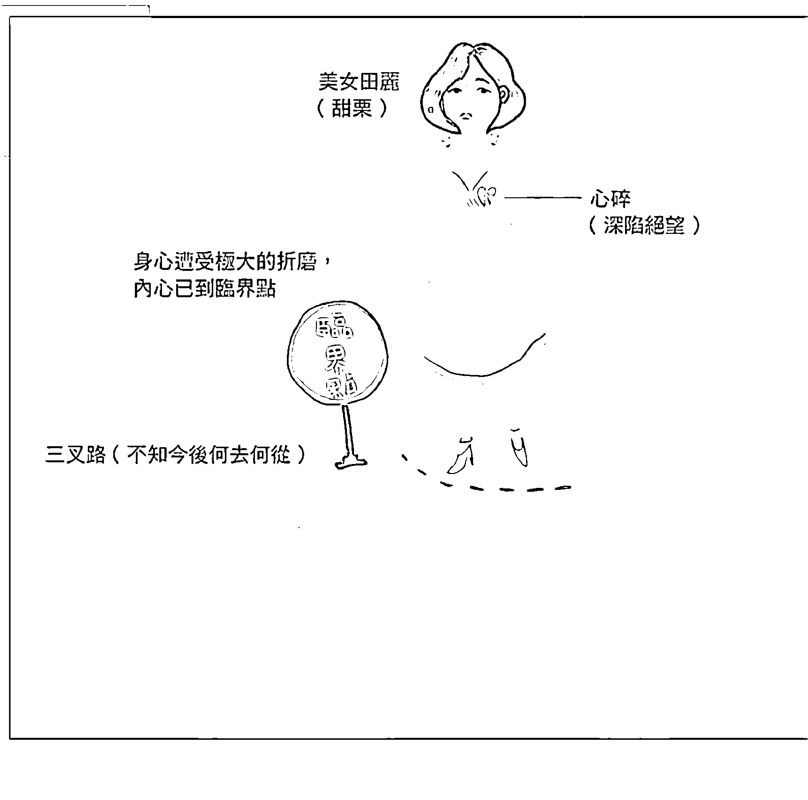

#### 馬鞭草

### 花精档案

- **拉丁學名**: *Verbena officinalis*
- **七大分類**: 對他人的安康過度關心類
- **製作法**: 日照
- **關鍵字**: 過度熱衷
- **正面特質**: 寬容

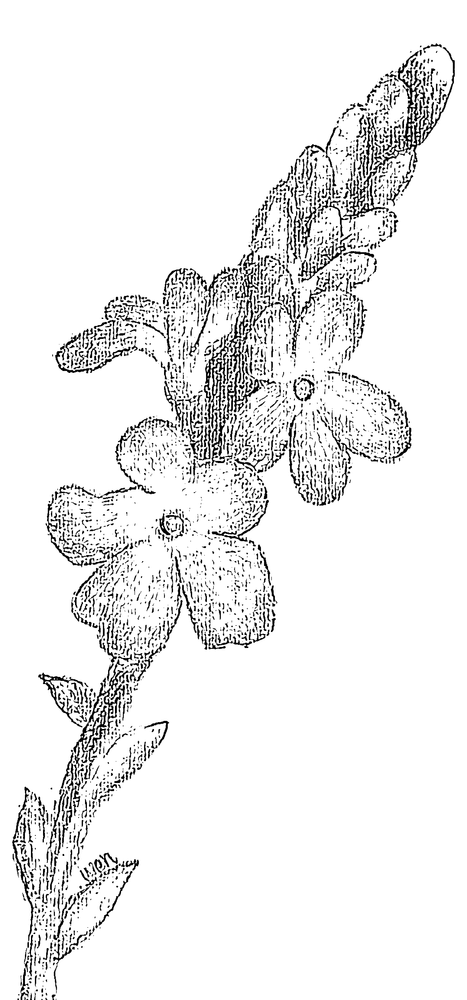

##### 巴赫醫師的敘述

給有既定的原則和想法的人，他們相信自己是正確的，而且很少改變。他們強烈希望改變周遭的人的想法，使其認同自己的人生觀。當他們深信自己希望教導別人的事情時，他們意志力堅強，勇氣十足。在患病期間，當別人早就放棄時，他們仍能持續奮鬥下去。

> ——出自《The Twelve Healers and Other Remedies》

- 弱點：過度熱衷
- 美德：寬容

你是否有熾烈的熱忱，希望做大事，而且希望在片刻間達成？你是否很難耐心制定計畫，因為當你一開始做的時候，就希望馬上看到結果？你的熱忱是否使自己對別人太嚴厲了，希望別人和與你相同的眼光看事情，企圖強迫他們採取自己的意見，而當他們不聽從時，你會失去耐心？若是如此，你內在有成為人群的領導者和老師的力量。馬鞭草這長在樹籬邊的小紫花，會幫助你獲得需要的品質，對弟兄的仁慈、對他人意見的寬容，幫助你以溫柔安靜的方式，完成生活中的大計畫，而沒有緊張壓力。

> ——出自《Free Thyself》

##### 馬鞭草 VS 中醫觀點

我喜歡上國文課，從古代先聖詩詞，至近代文人創作，在一本書中舉目可得，讓人陶冶性情，也可修身養性。高中國文課時曾讀到〈林覺民與妻訣別書〉，書中寫道：「吾自遇汝以來，常願天下有情人都成眷屬；然遍地腥羶，滿街狼犬，稱心快意，幾家能夠？語云：『仁者老吾老以及人之老，幼吾幼以及人之幼。』吾充吾愛汝之心，助天下人愛其所愛，所以敢先汝而死，不顧汝也。汝體吾此心，於啼泣之餘，亦以天下人為念，當亦樂犧牲吾身與汝身之福利，為天下人謀永福也。」

前人為了國家社會的發展，可以犧牲自己的生命，反觀現今的價值觀，許多人舉手投足間，全以個人利益為考量，僅想著一人得道，雞犬升天的美夢，更遑論會為國家社稷而奉獻了。以美國前副總統高爾宣傳全球暖化為素材的電影《不願面對的真相》（An Inconvenient Truth），在奧斯卡金像獎中拿下兩個獎項，讓全球溫室效應的議題浮上檯面，也引起世界各國開始關注氣候變化所帶來的威脅，高爾投身環保事業，與林覺民的為國犧牲，可說是馬鞭草特性的正面發揮。古人云：「上醫醫國，中醫醫人，下醫醫病。」我的情緒成份中佔有部份比重的馬鞭草情緒，故對於環保及國家發展問題一向很重視，也因此常會跟著情緒起伏。在服用馬鞭草花精後，看待事情的角度也隨之寬鬆許多，或許馬鞭草在現今政黨對立的今日，也能有不錯的緩和作用。

### 應用條件：

- 固執己見，會不停地灌輸別人接受自己的想法，重複說到令人厭煩。
- 睡眠品質不佳，認為對的事即使廢寢忘食也要做到底。

##### 馬鞭草×情緒與思緒

- 為了公平、正義，即使面對危險也不怕。
- 對重要的事會自覺壓力大，急著做完。
- 無限的奉獻，忽略了自己與家人。
- 肌肉緊繃，易頭頸僵，腰酸背痛。
- 過度努力，容易超出體力負荷。

馬鞭草狀態的人，是完美主義者，只是他們的完美並非為了個人，而是為了群眾的利益著想。從小環境的家庭、學校到大環境的政治、國家、環保議題等，都是他們熱心服務的地方，做事相當積極且主動。他們對於社會上的官商勾結、貪污腐敗等不公不義的事情相當敏感，常挺身而出，即使會拋頭顱、灑熱血，也撼動不了他們的心志，如清末民初黃花崗七十二烈士，就屬於馬鞭草的正向特質發揮。

這種完美主義，驅使他們也想改造別人，希望別人也能和他一樣，擁有相同的信念。因此會熱心地透過遊說方式，不停灌輸別人接受自己的想法，由於他們做事會要求做到盡善盡美，為了怕別人聽不懂，便詳細地講了一大堆，重複說到令人厭煩，讓有些人覺得很會碎碎唸。不過狂熱才是馬鞭草狀態的人所需預防，台灣社會目前正值黨派狂熱，許多人常因政治理念不同而怒火中燒，義憤填膺。電視節目中政論性叩應節目收視常紅，或為了政黨理念不同在電視上大打出手、針鋒相對，就可反映出大眾的馬鞭草特性了。

馬鞭草狀態的人個性很急，他們對於自己覺得重要的事一刻也無法等待，但由於他們關心的範圍實在太大了，因此常會同時安排多件事情來做，並且希望這一切都能在瞬間完成。這種想要在一開始就能馬上看見成果的心態，讓他們喜歡吆喝大家一起來動手，因為這樣比較快見效，這就和鳳仙花單獨行動的急性子明顯不同。這一類型的人會為了做事而廢寢忘食，宛如嫁給了他的工作一般，但這樣的態度常會造成體力過度負荷，除了產生透支的情形外，短時間內要看見成果的下場就是造成自身強大的壓力，把自己的生活弄得像拉緊的橡皮筋一樣，無法放鬆，因而造成肌肉緊繃、頸項僵、腰酸背痛、頭痛等症狀。

馬鞭草狀態的人做任何事都很有原則，由於太堅守自己的原則，以致於變得有點固執。僵化的思維除了也會造成身體沒有彈性外，也會造成心理緊繃，無法接納別人的意見。他們的主見一向很強烈，總認為自己的觀念較正確，即使生病了，也會認為自己的醫療模式才是最棒的，因此不太採納醫生的忠告及意見。臨床上有許多像高血壓、血管硬化、焦躁等患者，常是這樣過度努力或固執所形成的。

失眠是馬鞭草狀態的人較常見的症狀，因為他們會想趕快把事情做完，恨不得早點起床將它完成，潛意識裡頭便會自動節省睡眠時間，加上神經及肌肉不容易放鬆，不知不覺就導致失眠。從望診歸納，他們大多說話快、動作快、身體瘦而結實或是體胖但頸部和肩膀肌肉堅實的人，較容易有馬鞭草傾向。醫界在失眠治療上，常使用肌肉鬆弛劑來幫助睡眠，而這種療法同樣適用在馬鞭草狀態的人身上，因為他們的肌肉真的很緊，不過要是讓我去選擇的話，我會選用馬鞭草花精，畢竟肌肉鬆弛劑只能鬆一時，而情緒放鬆才是最關鍵的根本。他們也常會為了一件未完成的事情感到苦惱、焦躁，並容易激動，如學生正在家中準備模擬考，卻被媽媽叫去買東西，內心覺得苦惱、煩燥，在運用這個花精後將可協助舒緩緊張及壓力，即使是親人之間的緊張關係也有不錯的效果。

中醫理論提出「筋會陽陵泉」，意即全身肌肉緊繃陽陵泉這個穴位都很好的放鬆效果，而近來我發現位於手部的「手三里穴」外敷馬鞭草花精對於情緒放鬆亦有很好的效果。運用這個花精貼敷穴位，除了方便外，也可以處理我們僵化的思維，讓人可以更寬容的思維與與耐心，尊重別人，也能更謙虛地生活。

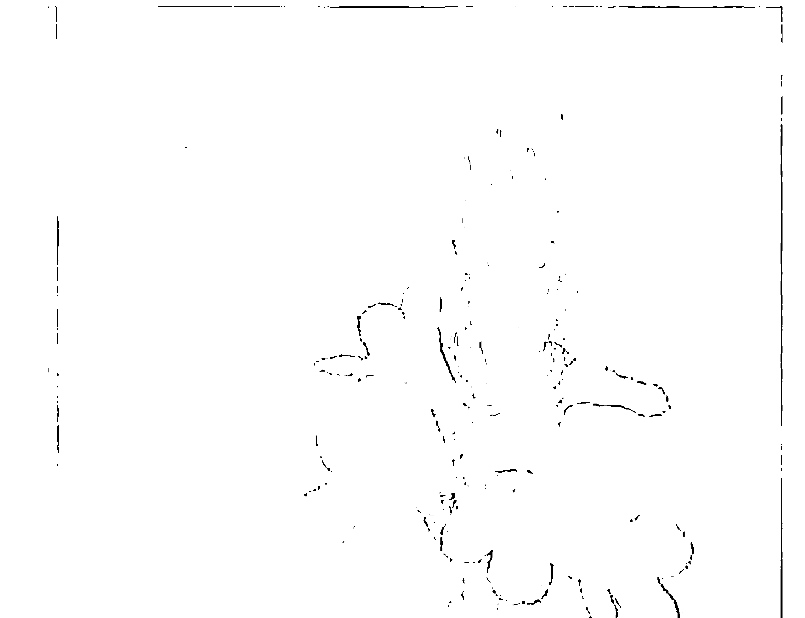

##### 李醫師診間案例探討

黃小姐，54歲，2007/10/5來診，主訴左肓肓穴處疼痛，近二週來肩膀處痠痛，連低頭時都感覺到背部緊繃感，患者之前也曾因腰背痛來診，其左肓肓穴曾在數年前被休旅車碰撞過，在運用花精貼敷及AMCT骨骼調整後，有好一陣子未曾發作。由於黃小姐在迪化街經營紅豆餡、綠茶餡的批發，中秋節時因生意忙碌，左肓肓穴處便開始隱痛，一直撐到今日受不了才來診。

我幫黃小姐檢查發現其左側菱形肌（剛好在穴道肓肓穴處）相當緊繃，對於肌肉緊繃，除了用花精貼敷外，近來我常加用河洛神針點刺，河洛神針是一種不侵入人體的針灸術，依據個案的患處情形施以不同的數目點刺，所謂點刺是指用針尖碰到皮膚而已，並不會刺入皮膚，因此不痛也相當安全。在開立常規中藥後，我為黃小姐做河洛神針點刺，並選用聖星百合、馬鞭草外敷於患處。

花精療法外敷對於因情緒引起的疼痛一向有不錯的效果，但花精外敷法唯一的缺點是，當外敷的棉片乾掉後，效果便消失，所以一般貼敷約四個小時即失效，必須再次貼敷或用花精內服法來鞏固療效。而河洛神針對於肌肉緊繃釋放效果不錯，且療效持久，再加上花精調整情緒，一次施治即可讓個案擁有一陣子的健康身體。複合療法是花精療效快速與否的關鍵，如搭配彩光針灸療法，將使花精療程縮短一半以上的時間，並有1+1>2的效果。因此門診時我常依個案的情形搭配使用AMCT、彩光針灸、耳針、河洛神針、河洛神針等多種方法。

洛開穴法等，也會提供飲食建議，就是要讓個案快速回復健康自在的狀態。運用這樣的治療模式，這些日子來已成功幫助不少小朋友擺脫注意力不集中、過動的狀態，療效甚至比服用「專斯達」（一種幫助小朋友注意力集中的西藥）好，短短約四週的花精療程即讓家長感受到家中子女的進步。療程告一段落時，看到父母愉悅的心情，我也感同身受，醫者父母心，也期待更多人能深入推廣這個美麗的治療藝術，共同為淑世盡一份心力。

#### 花精解析

運用聖星百合是因為患者該處曾被車撞過，故用此花精可幫助其釋放之前的創傷。而馬鞭草則是因為疼痛處剛好是身體地圖中馬鞭草的對應區，加上個案因中秋節忙碌，這種因重要節日廢寢忘食的忙碌，可算是馬鞭草的適應症，因此我沒有用到橡樹花精。治療後，我請黃小姐再活動看看，背部緊繃感已完全釋放，頭部俯仰也舒服許多，短短不到五分鐘的治療，已把她困擾二個多星期的問題消除。

四週花精療程中，是每週治療一次。我不開立一次一個月的花精，因為會有能量遞減的關係。只要花精一用水稀釋，一個星期後花精能量即會失效，因此現在許多新出的花精體系都建議不稀釋，直接飲用純液。若要用水稀釋，則務必在一個星期內用完，我即是採用這個方式。

##### 相似花精區辨及補充說明

馬鞭草狀態的人有想要改變別人的渴望。

| | 馬鞭草 | 大愛 |
|---|---|---|
| | 菊苣 | 自私的愛 |
| 馬鞭草 | 1. 馬鞭草以別人的福祉（如社會公益，公平正義，希望社會完美）與成長（所以會去像傳教士般一直講，希望大家都能完美）為主
2. 會遊說別人，與人互動，要別人接受他的信念
3. 會為了完成使命而廢寢忘食，耗盡心力 |
| 完美主義 | 岩水 | 1. 岩水會獨善其身，律己甚嚴，把自己塑造成別人的偶像。嚴格地要求自己，並且不管別人，且不會干涉別人的生活。如怕吃到垃圾食物而影響身體健康，便不吃垃圾食物。怕影響讀書進度，便不去玩樂
2. 出於自利動機，只管自己修行，以身作則
3. 為了保護自己而不會廢寢忘食 |
| | 山毛櫸 | 1. 山毛櫸認為自己做事方式是最對、最好的。如果別人不是照他的方式，就會覺得別人蠢笨，而感到生氣
2. 會批評挑剔別人
3. 不會廢寢忘食，但有可能氣到影響睡眠 |
| 馬鞭草 | 因為太熱衷於完成計畫，過度緊繃 |
| 睡不好 | 白楊 | 因為怕黑或靈異困擾 |
| | 紅栗 | 因為太擔心親愛的人 |
| | 白栗 | 因為腦海一直反覆想事情 |
| | 急救花精 | 因為情緒亢奮 |

| 特质 | 花精 | 表现 |
| :--- | :--- | :--- |
| 性急 | 馬鞭草 | 喜歡集體行動，希望大家都能依照他的看法去做事，並希望能如期完成，做事常過度努力 |
| 性急 | 鳳仙花 | 每件事都很急，作事情相當有效率，同時間可以做很多事，也做的相當完美。但他們常嫌別人動作太慢，故喜歡單獨工作 |
| 硬撐 | 馬鞭草 | 因壓力、緊繃及過度努力而消耗所有精力，且會因意志力而做出超出體力的事情。會容易焦慮，終生與焦慮相伴。由於一直處在緊繃及焦慮的狀態，所以睡眠品質不佳。硬撐度>橡樹 |
| 硬撐 | 橡樹 | 單純硬撐 |
| 固執 | 馬鞭草 | 認為自己的「理念」是最正確，而想說服別人 |
| 固執 | 山毛櫸 | 認為自己的「做法」是最正確，而批評別人 |
| 固執 | 岩水 | 律己嚴格，要求自己完美。默默希望別人效法 |
| 固執 | 葡萄 | 固執己見，而命令別人 |
| 強過別人 | 馬鞭草 | 說服為主，希望別人人心服口服 |
| 強過別人 | 葡萄 | 直接命令，不管別人是否心服 |

##### 與馬鞭草花精相似的新一代花精

+   1. 喉輪花精（Crystal Herbs脈輪花精）
2. 野薔尾花花精（Crystal Herbs業力花精）
3. 上癮花精（Crystal Herbs內在小孩花精）

##### 馬鞭草花精功用圖像記憶

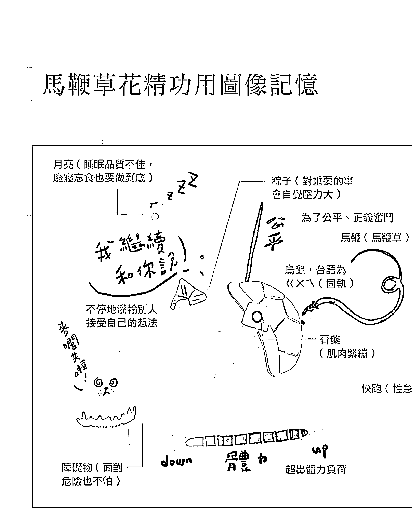

#### 葡萄

+   - 拉丁學名: Vitis vinifera
- 別名: 葡萄樹、葡萄藤
- 七大分類: 對他人的安康過度關心類
- 製作法: 日照
- 關鍵字: 獨裁專制
- 正面特質: 智慧領導

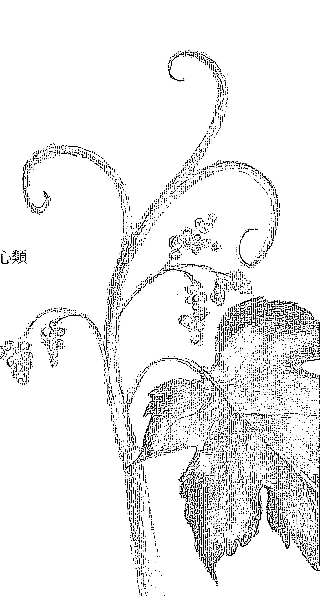

##### 巴赫醫師的敘述

非常能幹的人，很肯定自己的能力，有信心獲得成功。因為如此確信，所以他們覺得如果別人能被說服來跟自己做一樣的事，或他們認為是正確的事，就是對別人好。即使生病了，他們也會指揮照顧他們的人。在遭遇緊急情況時，他們可能非常有用。

> ——出自《 The Twelve Healers and Other Remedies 》

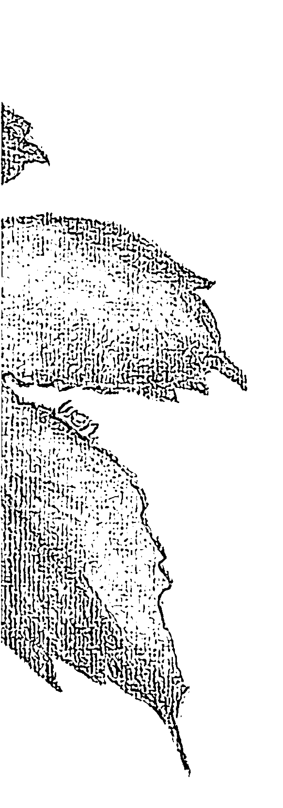

##### 葡萄VS中醫觀點

看過電視連續劇《雍正王朝》的朋友，一定會對劇中的年羹堯印象深刻。這位顯赫一時的撫遠大將軍屢立戰功、威鎮西陲，也獲得了雍正皇帝的特殊恩寵，但最後卻被雍正皇帝賜自盡而亡。年羹堯會遭逢如此際遇，史料記載有不同的原因，但其中最大的主因是犯了為人臣的大忌：「功高震主」。

古人云：「柔弱生之徒，老氏誠剛強」，年羹堯對於下屬採取強勢領導，部屬必須完全遵從，否則軍法嚴辦，如對於派出去刺探敵情的情報員，若未收集到足夠的情報，就會被認為是辦事不利的米蟲而斬首。他對於自己的戰功，絲毫不加以掩飾，充滿傲氣，也因此引來朝中大臣們的圍剿。這種不會體恤弱者、自大而又強勢領導的作風，正是葡萄花精人格的具體表現。這種剛硬的特性，不但與古代養生理念不合，也容易讓人陷入木強易折的毀滅境遇。巴赫花精中的葡萄花精，除了可以讓我們保持柔軟身段，趨吉避凶外，也適用於下列各條件的人：

+   - 愛命令別人，不顧別人的想法，要求無條件服從。
- 太自信自傲，認為自己很優秀，智慧高人一等。
- 身體容易緊繃、僵硬痠痛。
- 臉上紅疹或潮紅。
- 嚴格控制體重。
- 欺負弱者。

##### 葡萄 × 情緒與思緒

葡萄狀態的人，作風很強勢，不允許別人懷疑他的能力，不過一般人不太會承認自己有這種特性，但許多人或多或少都有這樣的性格，從下列兩個列子可做一說明：

+   1. 王小妹新買了電子產品，請教哥哥該如何操作，哥哥示範了兩次，王小妹仍是不解，哥哥便不悅的回答：「為什麼怎麼教都不會？只要照著我的步驟做就好了，不要去想為什麼！」

+   2. 陳先生透過網路買蜂王乳，其母親好心告訴他，網路購物雖較便宜，但會不會買到假貨？除先生聽到後便生氣的回答：「我相信我的選擇，我所購買的東西絕對是真的，我最討厭別人懷疑我」。

葡萄狀態的人，相當專制強橫，要求別人唯我是從，即使是生病到醫院就診時，也喜歡指揮醫護人員，如「護士小姐，幫我量血壓一下；醫生，我覺得我的病應該要針這個穴道才對」。他們自信滿滿，思想不太容易受人左右，總認為自己比別人優秀，必須遵從他的做法才是最好的，因此常會強迫別人按照他們的想法來做事。這種高傲的特性，使得他們不自覺中視弱者如螻蟻，完全無任何同情心，二次大戰時，日軍及德軍殘忍的處置戰俘，並衍生出種族屠殺，就是負向葡萄人格的顯現。學齡兒童中，有葡萄個性的也不少，他們在同儕團體中算是孩子王，也會欺負較溫柔與軟弱的人，如卡通哆啦A夢裡的胖虎，常會命令或欺負其他同學。不過在成人世界裡，老闆比較希望他下面的主管們能有這樣的葡萄特性，因為這樣的人辦事效率高，有野心，腦筋動得快，善於支配及命令別人。這樣的主管充滿著自信與肯定，才有企圖心衝業績，這也是當初雍正皇帝喜歡年羹堯的原因。好玩的是，葡萄狀態的人當發現別人無法服從他的命令時，他便會把這個人當做隱形人，或是把他除掉，如年羹堯把不合的下屬斬首。

巴赫醫師發現，喜歡命令別人、無法體恤別人的個案，容易神經緊張、肌肉繃緊，因此這類型的人就和馬鞭草狀態的人一樣，常有疼痛性疾病、頸項僵、血壓高等問題。這是因為葡萄特性的人想強勢領導，易經上云：「雲從龍，風從虎，陰陽之道，同氣相求」，強者僵也，太過強勢會造成體內各組織開始緊繃，因而引發肌筋膜疼痛症候群MFP、動脈硬化、高血壓等疾病。花精中治療肌肉緊繃的植物有很多，如橡樹、鳳仙花、馬鞭草、岩水等，治療師必須分辨清楚，對症下花精，同一種症狀，患者的心理出發點不同，選用的花精便有所差異，這就是中醫強調「同病異治」的道理。另外在美容方面，有些人臉上起紅疹或潮紅，亦可視為剛強顯現的葡萄特性，用葡萄花精亦可收效，可輔助野酸蘋果使用。

巴赫醫師把葡萄花精歸類在對他人過度關心類花精族群中，由於他們認為自己的想法與指針才是正確的，世人愚昧，信他方得永生，故處處命令別人照他的模子做事。但做過頭，常因這樣而限制了別人的自由，原想施恩惠予人，最後竟變成了獨裁、專制。二次大戰時日本要建立大東亞共榮圈，便開始侵略亞洲各國，但卻造成許多人流離失所，就是這個權力花精濫用所致。

其實葡萄狀態的人不光只是命令別人，當他們的特性發展到極致時，也會極端的要求自己。有些名模為了在伸展台上有姣好體態，便嚴格控制體重，強勢命令自己的細胞不准發胖、不准吃太多，因而形成厭食症，嚴重的就造成像國外一些名模猝死的例子。在能量治療界，有些治療師也會有這種葡萄人格特質，但這就不能以太過自信來解釋，可以解釋的說法是他們想成為這方面的領導者，故心中充滿著強大的企圖心與野心。如電影笑傲江湖中，日月神教教主

為了要練成葵花寶典，不惜自宮。在這種若要成功，必先自宮的錯誤觀念引導下，許多能量界的治療師便對自己嚴格，捨棄許多的娛樂和需求（岩水情緒），努力修行，連家人、親友的情感也棄之不顧，為達目的，不擇手段，因而產生親人間的心理創傷（聖星百合情緒），德國花精治療師Mechthild Scheffer所提出的葡萄、岩水、聖星百合三個一體的惡性循環，就屬於這種三聯情緒的結合。

臨床上，常可發現兩種極端相對的能量會共同存在，自信心不足（落葉松）與太過自信（葡萄）是有可能出現在同一個人身上。武俠小說中即使是武功高強的人，在他的身上都可能有罩門。有人在事業、社交方面都相當強勢，但一回到家中，遇到太座便一句話都不敢說，像隻鵪鶉；或是在做某件事時便完全使不上力，沒有信心，這個時候就要葡萄與落葉松兩個花精一起使用，才能達到各取所需的效果。運用葡萄花精，將可幫助非常強勢與具主導性的人，更加地謙遜、虛懷若谷，並能以愛心與諒解的心情去帶領周遭的人，呈現仁君「王者天下」之風。

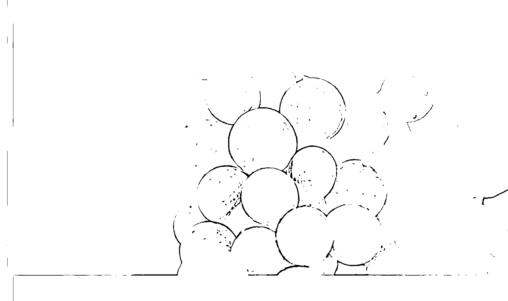

##### 相似花精區辨及補充說明

面相學上，顴骨較高的人較容易有葡萄特性。

| 指導別人 | 葡萄 | 愛命令別人，太過自信自傲。認為別人沒有什麼智慧，只要照著他的命令做即可。當別人不理会他時，則會把那個人當成隱形人 |
| --- | --- | --- |
| | 菊苣 | 指導所喜歡的人，若別人不理會則會自憐自艾的流淚 |
| | 馬鞭草 | 灌輸別人自己的哲學，希望能改變別人的想法 |

# 老子道德經第七十六章

> 人之生也柔弱，其死也堅強
草木之生也柔脆，其死也枯槁
故堅強者死之徒，柔弱者生之徒
是以兵強則滅，木強則折
強大處下，柔弱處上

##### 與葡萄花精相似的新一代花精

+   1. 喉輪花精（ Crystal Herbs脈輪花精）
2. 野薔尾花花精（ Crystal Herbs業力花精）
3. 白玫瑰花精（ 蘇格蘭芬活花精）

##### 葡萄花精功用圖像記憶

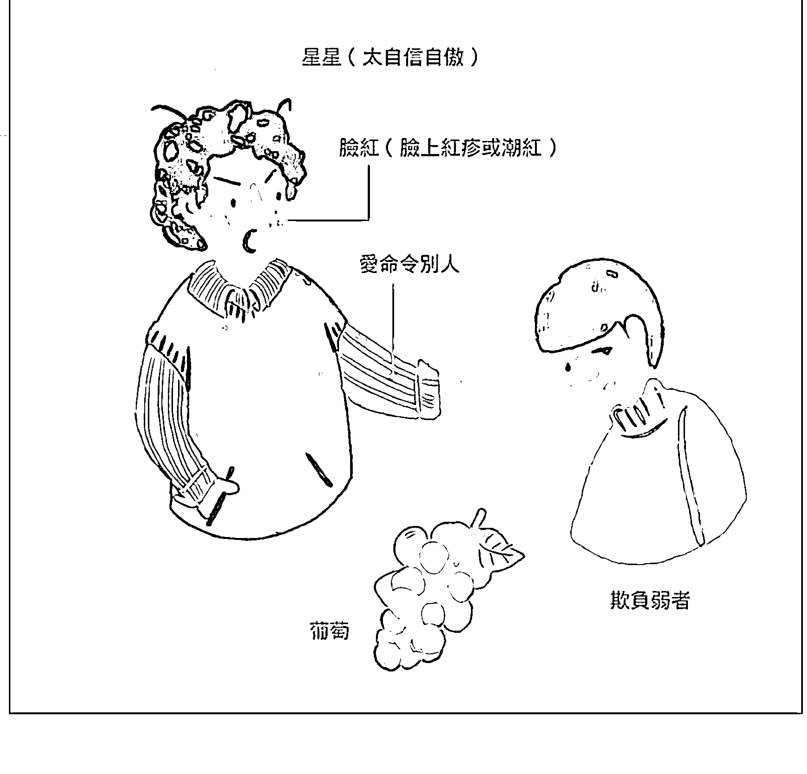

#### 胡桃

花精檔案

拉丁學名 | Juglans regia

別名 | 核桃

七大分類 | 對外界及他人想法過於敏感類

製作法 | 煮沸

關鍵字 | 適應不良、受外界影響

正面特質 | 適應與保護

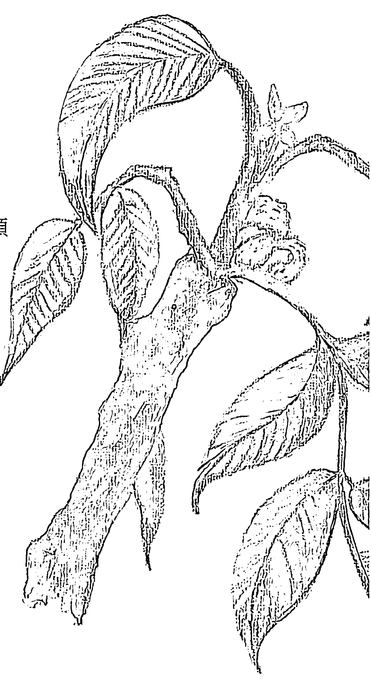

##### 巴赫醫師的敘述

給有既定理想和企圖心且正在實踐中的人，但偶爾容易被旁人的強烈意見所影響，而偏離了自己的想法、目標和手邊的工作。這支花精保護我們免受外界影響，堅定不移。

> > ——出自《The Twelve Healers and Other Remedies》

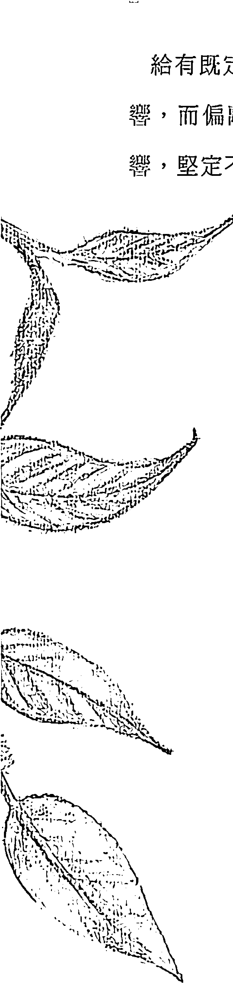

##### 胡桃VS.中醫觀點

在軍中的時候，由於課程的安排，曾到空軍機場實習。到了維修雷達的部門時，老士官長們都會問我們說生小孩沒？對於他們這樣問我有點不解？後來才知道，因為單位裡頭有不少同仁，長期做雷達保養，結果夫妻間不是生不出小孩，就是只生女孩。不知不覺便流傳說雷達照久了就會這樣，好險我只是去實習幾天而已，不然的話或許以後結婚也會……

環境是會影響一個人的身心靈，在醫院中的放射線室，都有厚厚的鉛板來隔絕放射線，物質的防護有需要，而情緒的防護亦不容忽視。負面情緒的穿透性更強，時常影響著身心靈，而人的情緒也常受到外界環境的影響，尤其是人生歷程的變化。胡桃花精，可說是情緒的防護罩，可以讓我們安然的過渡人生階段的轉變，並擁有堅定的信念。

應用條件：

+   - 雖有清晰的人生目標，但意志力薄弱，易受別人影響。
- 無法適應人生新階段及新的生活模式。
- 保護花精。
- 青春痘。

##### 胡桃×情緒與思緒

胡桃是我們常會用到的食材，不論其木頭、果實，都有堅硬的特性，因此胡桃花精可說是提供我們堅硬保護的花精，就好像防護罩一樣，可以屏蔽外界環境對我們的影響，讓人們可以習慣生活及生理上的轉變，因此有治療師對此下了一個很好的詮釋：「這是為了變化而設計的處方」。那人生歷程的變化究竟有那些，我將其分為自我與外在環境兩大類。

### 自我身心變化

+   - 懷孕、生產、長牙、青春期、更年期、大病初癒、臨終、靈修過程中新的體會、與外界社會不同的新見解（如巴赫醫師發明巴赫花精）。

### 環境變化

+   - 求學、搬家、換床、換工作、新兵入伍、有了男女朋友、失戀、結婚、離婚、家裡新裝潢、新政黨輪替。

在變化的過程中，由於和之前習慣的情感模式產生落差，臨時性的適應不良便由然而生，就好像時差一樣。許多人雖然身體產生變化，但心智部份卻未跟著成長，內在的衝突便形成疾病，如更年期潮熱、青春期的痘痘、懷孕時的孕吐等，這些都是因為身心發展不一致，無法適應內在的成長改變所致。有些人對於環境特別敏感，像是很會認床的人，一出差或搬家便失眠。在軍中，也有許多新兵入伍後嚴重不適應，產生憂鬱現象，這些都可以用胡桃花精來幫助我們順利蛻變，邁向新的階段。

在能量治療或美容領域裡，胡桃花精常用於磁場保護、防止病氣入侵，不過最主要的還是自己的能量提升，氣功、唸經、良好的生活作息，對於病氣的防護會有更大的成效。這個花精除了是保護花精外，也可幫助成長，讓我們更堅定自己的人生目標，幫助擺脫外來因素干擾（如習慣、人情或單純他人的意見），堅持走自己的路，即使是在環境變動後也可提供個案相當不錯的安定感。如想讀書卻又被電視吸引，可幫助抵抗外來的影響，用功讀書，因此在幫助小朋友專心的處方，除了栗樹芽苞、鐵線蓮外，胡桃花精也是常用配方。

隨著人生閱歷不停地增長，我們的靈性智慧亦會跟著精進，在擁有新見解時，有時卻也難以見容於當代社會，唯有像胡桃堅毅的信念，才能讓我們靈性成長往上躍遷。巴赫醫師當初就是勇於打破過去傳統醫學的診療模式，創立花精療法，不管當時各方人馬如何反對，他也依然全力以赴，朝著自己的想法與目標邁進，完全不受他人熱心的說服與強烈意見所影響。因此巴赫醫師稱這個花精為「解開魔咒的花藥」，幫助我們打破傳統束縛，激發靈魂的內在潛能，擁有清晰的人生目標。

以目前華人地區出版的巴赫花精叢書中，絕大多數都是翻譯的，鮮少有華人自行著作的書籍，當初決定出版圖像記憶的《巴赫花精手冊》也是衝破不少的阻礙。在Deborah Craydon與Warren Bellows 合著的《Floral Acupuncture》中，將花精與中醫針灸穴道相結合，讓花精的運用有別於傳統的內服法，以及Dietmar Kramer所提出的人體花精反應區貼敷。但Deborah Craydon與Warren Bellows整理的穴道真的適合我們東方人使用嗎？他們又是如何找出這些穴道的呢？令我覺得惋惜的是，在中醫的大本營，中國及台灣，卻從未有人將花精與穴道做整合。

在《Floral Acupuncture》一書中，胡桃花精與手太陽小腸經的天窗穴相對應，可是我運用能量測試（LET，Life Energy Test）做檢測時，發現貼敷天窗穴幫助雖到＋3，但貼敷同樣是小腸經的天容穴幫助卻更高，達到＋4，效果為天窗穴的2倍。或許胡桃花精提醒我，不要受到外界環境的影響，結合中醫理論、能量測試與花精療法，開發出適合我們使用的花精穴道，才是我現階段的人生目標。

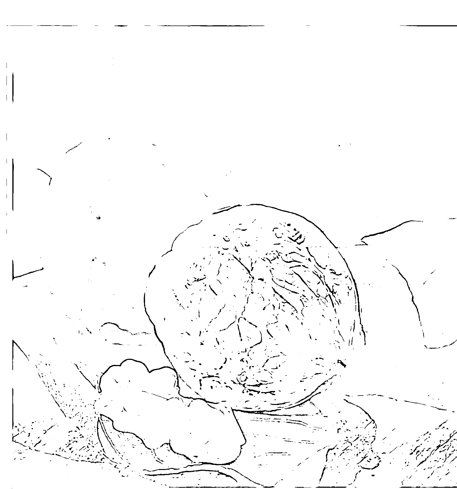

##### 李醫師診間案例探討

佐藤小姐，36歲，懷孕八個月，患者平時失眠用花精調養效果不錯，本日來時略有愁容，細問之下原來其胎兒胎位不正（頭上腳下，正常胎位為頭下腳上），不知如何是好！

「現在醫學這麼進步，若自然產不行，還可以剖腹生產啊。」我這樣安慰她，並建議她用艾條灸至陰穴，因為醫書有記載這樣可以幫助胎位轉正，加上華盛頓郵報亦有報導這樣的新聞，患者表示可以接受這樣的治療，問我說可否在診所裡做？

由於診所內平時艾灸的業務較少，於是我請她自行購買艾條，每天燻足太陽經的至陰穴5～10分鐘，並畫上穴位圖給她參考。由於其肩膀有僵緊的情形，因此另用花精外貼肩井穴，處方：橄欖、胡桃、馬鞭草、白栗。三週後患者回診，告知胎位已轉正，相當高興，而且還帶日籍友人一同來看病。後來佐藤小姐順利生產，還帶可愛的小baby一起來診所，真是恭喜她。

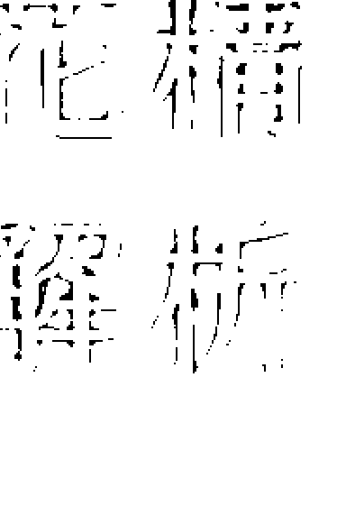

#### 橄欖

平素肩膀僵緊，容易疲倦，這個地方也是Dietmar Kramer身體地圖橄欖花精的反射區。

#### 胡桃

讓她適應即將當媽媽的過渡期，我曾用此花精幫助佐藤小姐克服失眠。

#### 白栗

針對胡思亂想的情緒，因為佐藤小姐一直想著胎位不正的事，故用此協助她心情放鬆。

#### 馬鞭草

平素容易緊張患者可用，消除肌肉緊繃。

##### 相似花精區辨及補充說明

+   1. 對外界的意見、環境及影響過於敏感，可用胡桃防護，治療師亦可用此來抵擋病氣。不過早睡、唸經、練氣功才是充足的元氣來源。
2. 若A覺得是某人或某事對他造成今天的影響，可用胡桃來阻擋它們對A的影響。
3. 分離焦慮症：可依個案的情形選用胡桃、溝酸漿、菊苣這三個花精。

##### 與胡桃花精相似的新一代花精

適應改變取向

+   1. 新開始向前行花精（Crystal Herbs神聖和諧花精）
2. 順著流走花精、姬星美人花精、雪花蓮花精（蘇格蘭芬活花精）

保護取向

+   1. 白風鈴草花精（Crystal Herbs業力花精）
2. 保護氣場花精（Crystal Herbs神聖和諧花精）更年期专用

优雅改变花精（Crystal Herbs神圣和谐花精）

生产专用

平安顺产花精、产后支持花精（苏格兰芬活花精）

青少年专用

青少年花精（苏格兰芬活花精）

差旅专用

一路顺风花精（苏格兰芬活花精）

胡桃花精功用图像记忆

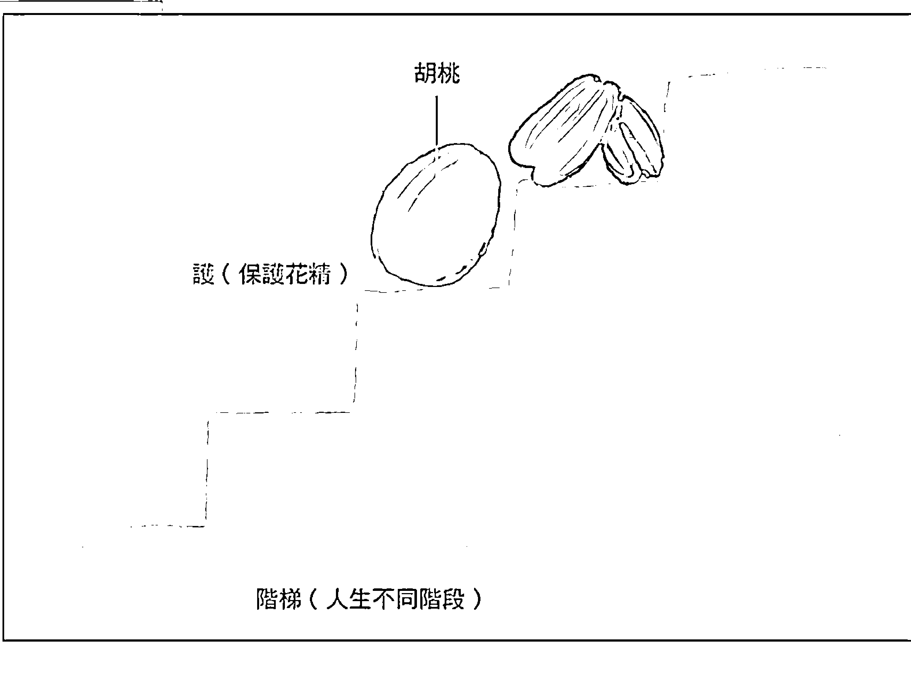

花精档案

- 拉丁学名 | Hottonia palustris
- 别名 | 水堇、美洲赫顿草
- 七大分类 | 孤独类
- 制作法 | 日照
- 关键字 | 忧伤、孤傲
- 正面特质 | 合群


Water Violet

## 巴赫医师的叙述

给无论健康或疾病，都喜欢独处的人。他们非常安静，来去无声，轻声寡语。非常独立自主、有能力。几乎不受他人意见影响。他们孤傲不群，是不与人来往的独行侠。通常很聪颖、有才华。他们的平和冷静，对身边的人是种祝福。

> > ——出自《The Twelve Healers and Other Remedies》

- 弱点：忧伤
- 美德：喜悦

你是勇敢且不抱怨的伟大灵魂，仍然努力想服务他人，冷静顺从地忍受痛苦，不让自己的忧伤影响日常工作吗？你是否有真正的伤心和失落，但还是安静地继续过日子？若是如此，这美丽的水堇，如此自由地漂浮在最纯净的溪流上，会帮助你理解自己正在透过悲伤而获得净化与大幅提昇，以学到在自己烦恼时也能服务他人。你正学习在尘世中游世独立，因这全然自由而喜悦万分，进而能完美地服务人类。当此事实现之后，无论外境如何，你都不会再认为这是牺牲，而是狂喜。而且，这小小的植物还会帮助你理解，你以为生命中发生那么多残酷悲伤的事，其实都是为了那些你觉得可怜的人的更高善。

> > ——出自《Free Thyself》

台北市立联合医院近来到院区进行婚后孕前健康检查的夫妻当中，每十对夫妻就有一对有不孕的问题。男女不孕原因各不同，男性主要是和精虫数量不足或活动力不够有关，而研究也显示，高学历男性，容易因工作压力大，导致精虫活动力不足而不孕。

不孕的因素很多，早期的医学报告普遍认为是环境因素所造成，如水源污染、保丽龙容器毒素等，但最新的研究则显示，压力与情绪可能是导致不孕的元凶。在分析花精的深层涵意中，可发现不孕症要特别注意的三个花精：水堇、忍冬和野玫瑰。这在我接触家族排列后，得到一个更可以理解的说法，照家族排列的说法，胎儿的灵魂一直环绕在父母亲身边，待父母亲准备好要受孕时就会投胎，若父母亲不太喜欢受到别人打扰（水堇情绪），胎儿自己会感觉到，会怀疑自己是否找对落脚处，也就不愿意投胎。许多工作压力大的男性，已经被事业压得喘不过气来，心里头根本不希望有小孩出生，造成他额外的负担。就这样，父母的情绪造就不孕的产生，也使得出生率直线下降。水堇花精，对于喜欢独来独往的情绪可做适当的转化，当然就灵魂学的角度来说，对于助孕也会有不错的效果，如果您觉得自己像个独行侠，不妨试试这个花精。

## 应用条件：

- 总是静静地在一旁工作、读书。
- 独来独往，即使生病也爱独处。
- 自恋、孤僻，不喜欢别人干涉。
- 颈项僵，大多颈椎有问题。
- 喜欢洁净的环境。
- 外观高雅。

##### 水堇×情绪与思绪

水堇状态的人，有点高傲的特质，学龄期的孩童中，资优生这种表现更为明显。这种优越情结总是让他们和人保持一段距离，个性冷漠的他们，喜欢独处，可说是完完全全的个人主义者，行事作风相当内敛且独立。光从外观来看，他们的打扮也相当高雅，宛如贵族一般高挺，电影中，常可看到海权时代的英国贵族，当他们到第三世界时，总是穿着时尚，掩着鼻子以轻蔑、高傲、故作谦逊的口吻对着原住民说话，就是水堇的表征。

和萤火虫的幼虫一样，原生植物的水堇只生长在洁净的水中，因此水堇状态的人也有此特性，喜欢安静与洁净的环境，只要有一点吵杂与脏乱就会受不了而迅速跑开，像烟雾迷漫的pub是很少看到他们的足迹。我们可由环境延伸到思维逻辑，若别人和他们的理念不合，就和脏乱的环境令他们受不了一样，他们心中会兴起「道不同，不相为谋」的想法，而与对方渐行渐远。对于那些不同格调的人，他们会打从心底不愿意交往或提供任何协助，因此他们不会主动去帮助别人，宁可独自活在自己的象牙塔中。

##### 花精运用

喜欢安静的特质使得他们处事很低调，不太爱说话，也不想去和别人争论什么，总是静静地在一旁工作、读书，或做幕后的推手。水堇状态的人很少参加团体活动，因此不喜欢像棒球、篮球、橄榄球等团体性比赛，宁可选择参加个人游泳比赛或3000公尺赛跑等，即使是和同伴在一起，他们也仅跟一些仔细挑选过的朋友或自认够水准的人互动。在社区里头，水堇特质的邻居很重视自己的隐私，也不想侵犯别人的隐私，所以不太喜欢有客人来家里哈啦，当然更不喜欢去别人家拜访，因此很容易分辨出邻居是否有这样的特性。

事实上水堇状态的人相当聪明而有才华，意志力也很坚定。香港的花精治疗师利国栋用一句话来形容水堇：「因为先天或后天有过人之处而感到与别人有距离」。这也诠释了他们认为别人是较低层次的观念，因此在喜宴聚会时很难和水堇状态的人聊上话题，而他们也不晓得要说些什么话才好。即使是在遇到困难或生病时，他们只是保持沉默，并变得更加地冷淡，心中也会认为别人根本帮不上忙，而选择独自处理。倘若别人热心地提供建议（如马鞭草的人），他们也仅听听而已，心中的结论还是「你讲你的，我用我的方法」，坚持用自己的方式行事。

根据Dietmar Kramer的身体地图资料，颈椎对应到水堇，因此水堇特质的人，大多颈椎有问题，容易颈项僵。在脊椎矫正里头强调椎骨会上下对应，即颈椎与腰椎对应，因此颈椎僵紧的人腰椎也会跟着硬起来，故身体容易出现紧绷僵直的状态，造成弯腰、头向前后俯仰的动作明显吃力。巴赫医师曾提出「高傲的人通常不愿意低头」，因此当身体僵紧与不灵活时，颈椎也就成了第一个受害者。

了，或许水堇花精可以带给人们长久的柔软与舒缓，对于脊骨的问题，相信有不少帮助。

水堇类型的人会让别人以敬而远之，认为他们高傲或假清高。俗话说：「巧妇难为无米之炊」。人类社会是分工合作的群体社会，任何人都无法独立于外，即使才能再高，在这个强调策略联盟的社会里，还是需要互动的。只有放下自己的身段，融入于群体之中，才能完美的服务人类，并得到真正的喜乐。运用水堇花精这个处方，将可帮助人们与别人相处时更加放松，距离感也不会让人觉得那么遥远了。

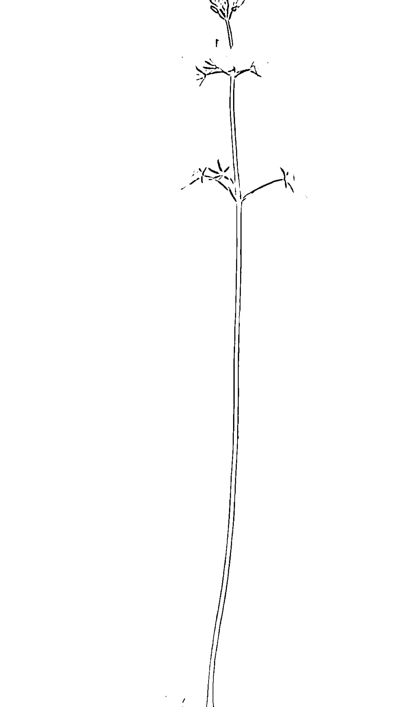

##### 李医师诊间案例探讨

黄先生，左眼青光眼，并有视网膜剥离，右眼于一两个月前曾做视网膜剥离手术，但术后眼压仍高，眼压一度高至59mmHg，眼科开立眼药水滴用仍无法将眼压降下。除了有这些症状外，问诊中黄先生亦告称有磨牙、嗜睡的情形，家人反应患者平素在家里不爱说话、容易生气，因西医治疗已有一阵子眼压仍高，因此想试试中药及花精疗法。

针对个案的情形，除了开立常规中药给予服用外，并使用龙芽草、圣星百合、水堇、栗树芽苞、白栗花精贴敷于神门穴，每周治疗一次，持续治疗，个案于两个多月后至眼科检查，眼压已降至28mmHg，而且眼睛血丝减少许多，在家话语渐多，个性也较为开朗。

图解巴赫花精
408

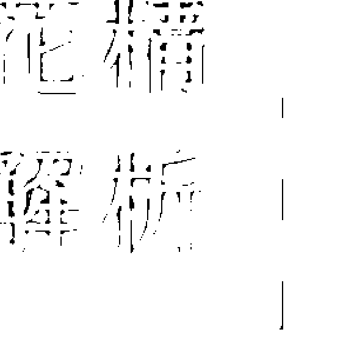

## 龙芽草

针对会磨牙，内心沉闷，不太爱讲话者。当内心沉闷时，容易有压力，造成夜间磨牙，而压力累积久也容易发脾气。

## 圣星百合

黄先生眼睛曾做视网膜剥离手术，可视为眼球的创伤，用此花精抚平，这是开刀后必用的花精。

#### 水堇

个案不太爱讲话，不喜欢和人互动，用此花精可协助与人互动。

## 栗树芽苞

重蹈覆辙，眼压一直居高不下即可视为重蹈覆辙的现象。

#### 白栗

容易东想西想，由于后脑枕叶掌管视觉，想久会造成枕叶过度活化，这会与眼压升高、后脑胀痛的情形有关。

##### 相似花精区辨及补充说明

1.  不孕症要注意水堇、忍冬和野玫瑰三种花精。
2.  水堇⊕野玫瑰会让环境更加地冷寂，若是女生将会是冰山美人型。
3.  岩水希望别人注意他，水堇不希望别人注意他。

| 高傲 | 水堇 | 总是静静地在一旁工作、读书 |
| --- | --- | --- |
|      | 葡萄 | 爱命令别人，不顾别人的想法，要求无条件服从 |

##### 与水堇花精相似的新一代花精

1.  莲莲花精（Crystal Herbs业力花精）
2.  谦和花精（Crystal Herbs内在小孩花精）
3.  神圣荆棘花精（苏格兰芬活花精）
4.  我们都是相连的·黄莲花花精（晶荷日光花精）

##### 水堇花精功用图像记忆

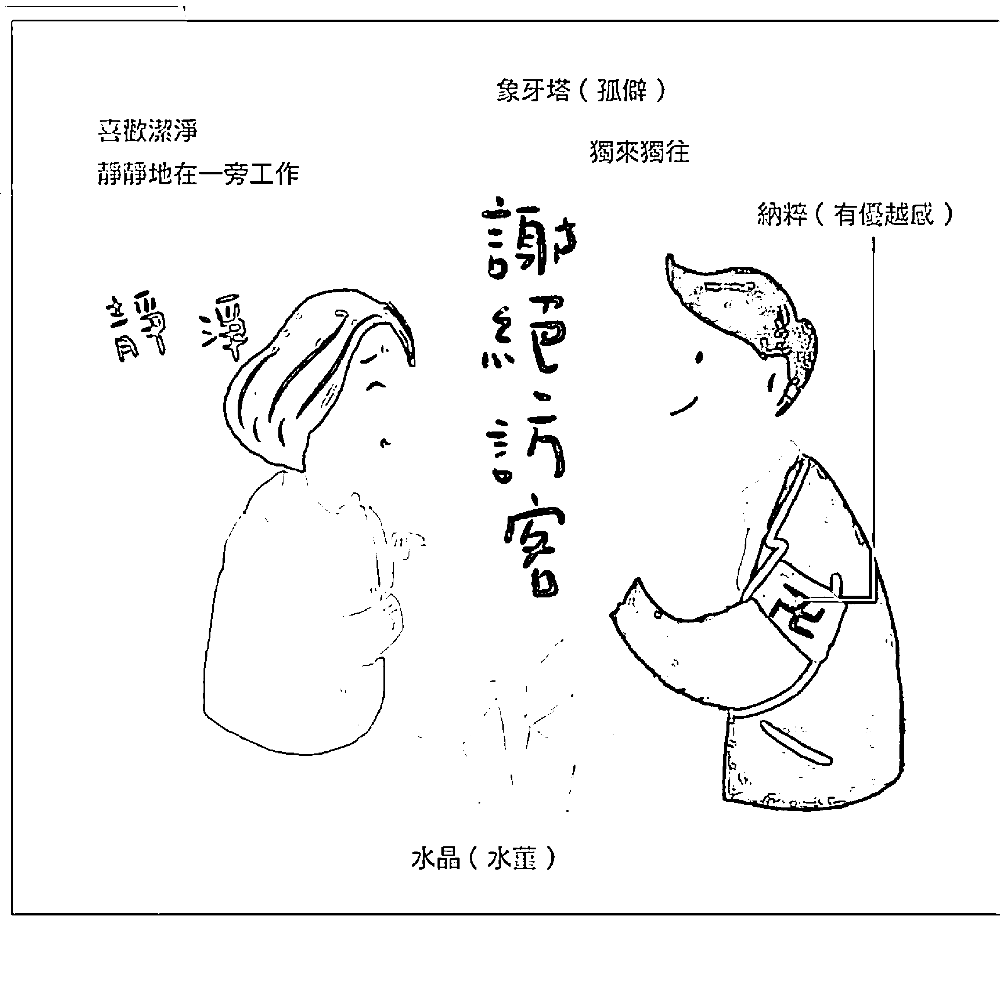

#### 白栗

- 拉丁学名 | Aesculus hippocastanum
- 别名 | 白栗子、白栗花
- 七大分类 | 对现实兴趣缺缺类
- 制作法 | 日照
- 关键字 | 反复不断的思绪
- 正面特质 | 思绪宁静

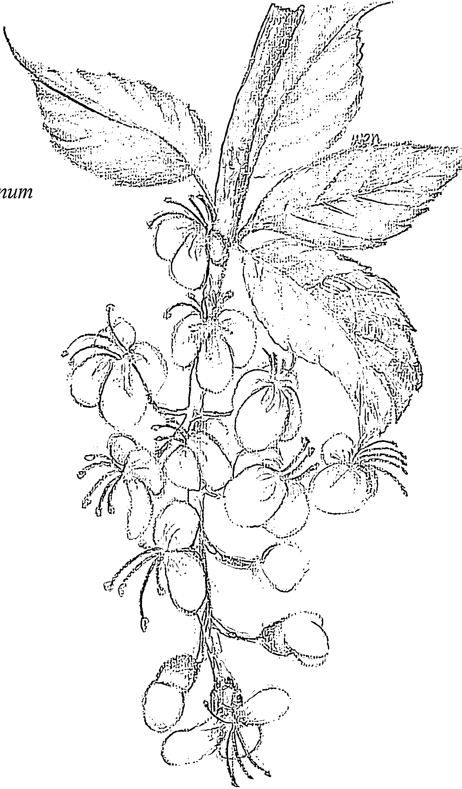

White Chestnut

## 巴赫医师的叙述

给没办法阻挡思绪、想法和内在争论的人。他们不想要这些思绪进入脑袋。通常是发生在对当下的兴趣不足以使心神感到充实时。这些担忧的念头，就算暂时逐出脑袋，也还是会回来。这些思绪好像无限回圈，导致精神折磨。因为这些不愉快的想法，逐出了平静，干扰了他们的工作专注力，无法享受日常生活的乐趣。

> ——出自《The Twelve Healers and Other Remedies》

##### 白栗VS. 中医观点

六祖坛经：「菩提本无树，明镜亦非台，本来无一物，何处惹尘埃。」这是六祖慧能大师，给予后代修子们的禅示真机。但红尘俗世，杂念众多，能做到这点的人毕竟少之又少。

神秀大师的「身似菩提树，心如明镜台，时时勤拂拭，勿使惹尘埃」，后世之人虽谓道行略逊于六祖，但他的思想离我们凡人较近，也比较容易达成。修行路上，除了禅定、持咒外，禅修的三个花精：忍冬、白栗、铁线莲也都能让我们智慧提升，进而体会但念无常，慎勿放逸的虚空境界。这三者都是教导我们要活在当下，不要执着在幻想里，只是白栗花精的特长在于移除不由自主地胡思乱想，让我们头脑清静、更加地安适。

### 应用条件：

- 反复不停的思绪，想停又停下来。
- 不易入眠或常在清晨四点多清醒。
- 脑中被烦恼或焦虑占满。
- 眼睛或头部胀痛。
- 读书不能专心。

##### 白栗 X 情绪与思绪

在中医诊断里，强调四诊合参：望、闻、问、切。望诊是藉由观察患者的体态、掌纹、舌头、气色变化，做为诊断的参考依据，其中掌纹方面，我常用来做为使用白栗花精的依据。临床上，凡掌纹乱且有许多细线的人，比较会胡思乱想，此时除了用补心气的药如天王补心丹、柏子仁、茯神等药外，我也会加用白栗花精，对于主诉会东想西想的患者帮助很大。

白栗状态的人脑海中总是不断涌现相同的担忧或对话，难以放松，这些令人厌烦的思绪不停地纠缠他们，却又挥之不去。胡思乱想的结果害他们做事无法集中注意力，也容易恍神。他们想把每一件事情都找出一个可以说服自己接受的理由，所以时常会自问自答，如患者内心想着：

- 刚才闯红灯警察应该没有看到。
- ↓
- 可是警察有把相机拿起来。（1分钟后）
- ↓
- 那应该只是恰巧拿起来。（2分钟后）
- ↓
- 可是他的相机是对我的车，且好像有闪光灯闪一下。（3分钟后）

这种无止境、无时无刻都存在的忧虑、担忧正是白栗特质人常见的内心自我摔角。

##### 花精运用

除此之外，他们所烦恼的事项包括已经发生或可能会发生的事，像上例就是反复在可能会发生的事情中打转。但有更大的比例是已经发生的事，这些令人难过的影像可以横跨不同的年代，如数十年前父亲过世的悲伤往事；或今天上班和主管起争执，争吵的场景不断的浮现于脑海中，即使下班回到家还是被反复不停的影像所困扰，刚和人争吵的个案，大多会有这种白栗情绪。巴赫医师称白栗花精为「留声机式的处方」，因为他们的思绪就像不停播放的唱片，想停又停不下来，让人感觉非常苦恼，又很无力。

有花精治疗师发现，会胡思乱想的人他们较会有头部胀痛、眼压升高及眼睛胀痛的现象。这是因为后脑枕叶为视觉管辖处，当脑中被烦恼或焦虑所占满而东想西想时，会类似做梦时的快速动眼期，所以后头容易发胀，眼睛也会跟着不适。临床上，我发现患者，包括我个人在内，当有白栗现象产生时，确实会让头部发胀，在服用白栗花精后头胀感会自动递减。另外白栗状态的人通常会因想太多而不容易入眠，或者容易在清晨四、五点时醒来，当有患者主诉这种情形时，我总会加问「最近是不是有烦恼什么事呢？」绝大多数的回应是肯定的，而我的花精处方中也会顺势加入白栗花精。

黄帝内经：「正气存内，邪不可干。邪之所凑，其气必虚。」任何一个负面情绪产生，都与内心气场太弱有关，因此容易受到外界事物的干扰，而在自身脑海中产生回流，唯有让体内气场提升，这种胡思乱想的现象才会减少。我常和朋友、患者们建议要早睡早起、多爬山、多练气功、多唸经，让自身能量场提升，便能达到正气存内，邪不可干的境界，也才不会有这么多的俗念困惑着我们。古人常云：「定、静、安、虑、得」，这是古人做事的准则，当心

中无定、无静，充满杂念时，处事效率便不彰。唯天下之至静，方可体会天下之至动，运用白栗花精这个禅定处方，将可帮助被反复不停的思绪所困扰的人，回复内心的平静，除了对学习、精进有帮助外，也能让我们拥有更清澈的心灵。

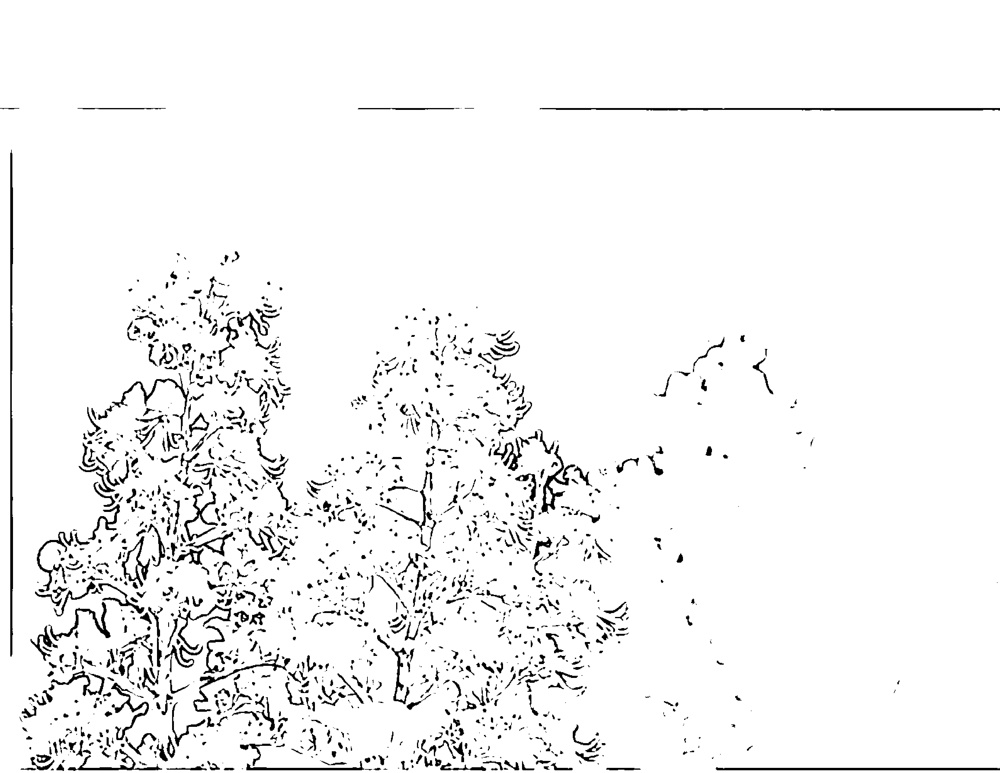

##### 李医师诊间案例探讨

六十多岁吴女士，近来因烦恼小孩的失业问题，而引发睡眠失调，每晚睡睡醒醒，时常睡到半夜清醒后，一想到小孩媳妇一家人现在没工作，脑袋便一直空转而清醒到天亮，导致每天白天精神恍惚。由于患者主诉会想着小孩没工作画面，一直不断地重覆着，想停又停不下来，我选择了白栗花精，针对患者「无止境、无时无刻都在的忧虑及胡思乱想」的部份做治疗。

另因其主要对象是自己的小孩，加选了「过分挂念亲人，镇日为了自己关爱的人担心，害怕不幸的事降临在他们身上」的红栗花精。除此之外，经由LET测试，橡树花精对患者帮助很大，细问之下，原来其时常硬撑，即使很累了，也坚持把事情做完，不懂得自我放松，藉由触诊，在右颈项区紧绷，与德国花精治疗师Dietmar Kramer的《新巴赫花精身体地图》中橡树反应区吻合。数分钟后，患者高兴地说，这段日子来脖子僵终于放松了，如释重负。

##### 花精疗法简析

一般治疗师分析个案的方式，可能透过问卷调查、星盘或能量感应方式，来找出案主最需要的处方，其中的能量感应方式，个人偏好使用LET。

花精疗法众多，除了38种巴赫花精之外，还有日渐流行的49种苏格兰芬活花精、32种台湾晶荷日光花精、108种北美花精、澳洲灌木花精及多达600种的英国Crystal Herbs花精等，其实可以依个人喜好选择适合自己的工具。

最重要的是医者要先把自己调养好，类经上云：「医不病，故为病人平息以调之」。能把自己的身心灵问题调理好，自然可以帮助更多的人。愿在能量治疗的道路上，能有更多的高人与前辈给我指导，好让我畅通能量脉轮、安顿心灵、与身心安适。

##### 相似花精区辨及补充说明

1.  线球草的优柔寡断，很容易变成白栗情绪。
2.  急救花精加白栗，是常见的助眠花精配方，可缓解情绪亢奋及思绪繁绕类型的失眠。

| 类别 | 花精 | 描述 |
| --- | --- | --- |
| 天马行空的思绪 | 铁线莲 | 所想的均是喜欢的事物情境 |
| 天马行空的思绪 | 白栗 | 思绪担忧，他们不喜欢，却又挥之不去 |
| 想太多 | 白栗 | 反复想着最近的事 |
| 想太多 | 忍冬 | 回忆过去 |
| 想太多 | 铁线莲 | 幻想未来 |

##### 与白栗花精相似的新一代花精

1.  眉心轮花精（ Crystal Herbs脉轮花精）
2.  缬草花精（ Crystal Herbs业力花精）
3.  明晰之光花精、金雀花花精（ 苏格兰芬活花精）

##### 白栗花精功用图像记忆

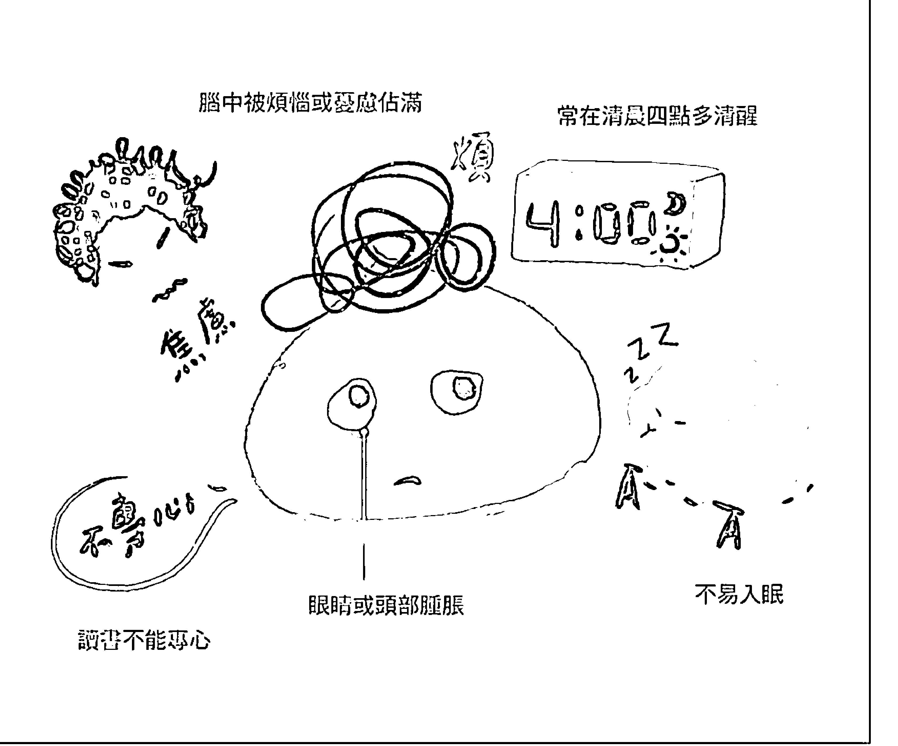

#### 野燕麦

> > 花精 情案

- 拉丁学名: Bromus ramosus
- 别名: 野生燕麦
- 七大分类: 不确定类
- 制作法: 日照
- 关键字: 找不到人生方向
- 正面特质: 找到人生方向

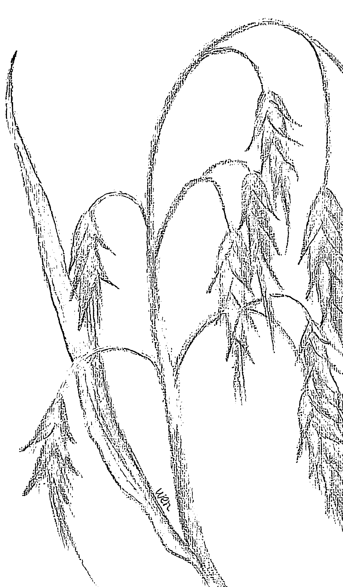

Wild Oat

## 巴赫医师的叙述

有企图心想要做大事的人。他们想要有丰富的体验，享受人生所有的可能性，活出最高潜能。他们的困难在于决定职业方向，因为虽然他们企图心很强，却找不到明确的目标。这可能导致拖延和不满足。

> ——出自《The Twelve Healers and Other Remedies》

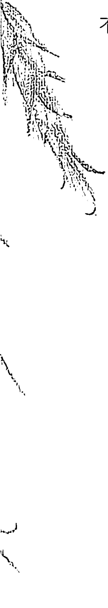

##### 野燕麦 VS 中医观点

### 图解巴赫花精

香港的花精治疗师黄伟德在他的《因为花药，我学会了爱》一书自序中曾提到，有几年的时间，他对学医有兴趣，工作虽和健康产业有关，但始终有种不踏实感，直到他在马来西亚沙巴的热带雨林自助旅行时，才下定决心读医学院，因而成为善用花精的自然疗法师。人生至少要有一次壮游，选定目标就勇敢走下去，如何选择人生的目标，除了机缘与勇气外，野燕麦花精也可帮得上忙。

看到黄伟德医师的经历，也让我想起这些年来的自然疗法路程。大一时我开始接触野外求生，由于研读许多药草及野菜的关系，朋友建议我不妨读中医，反正都是花花草草，跟着同学尬了一脚，这才发现原来中医哲理这么丰富、疗效如此广，我也从中获益许多。虽说中医是我的志业，但在习医的十数年光景里，却常于不同的技术间游走，每因同学或朋友的提议后便一股脑跑去学习：把脉、正骨手法、AMCT、针灸、内科诊治、耳诊、手诊等，这些虽和中医习习相关，但心中的感觉，就和黄伟德医师当初一样，总感不惬意，没有找到自己内心想要的。直到有一次我去我的能量医学老师陈德昌老师处，服用了花精后，仿佛有一条线牵引着我走这条能量疗法道路。读佛经时，常读到用无虫水配合咒语，可以治病，如大悲水、药师咒水等，却苦无实际应用的范例。不过在周遭亲友因情绪问题服用花精后奇迹似地好转，让我对能量疗法，尤其是情绪治疗产生浓厚的兴趣。中医强调五脏与情志相关，情绪疗法早已存在黄帝内经一书中，也是中医诊治理论里的一个重要环节，而气功养生、静坐、五音调摄（角、徵、宫、商、羽五音）等情志疗法也历经千年，且业经研究证实对自律神经及情绪有相当好的稳定作用。虽然医界（包括中医界）对这方面的疗法尚持保留态度，但我深信这是未来医疗上的明日之星，也是帮助日渐增多的身心症候群患者的利器。《易经·系辞上传》：「形而上者谓之道，形而下者谓之## 野燕麦 × 情绪与思绪

> “器，化而裁之谓之变”，感谢上苍慈悲，让我能在而立之年找寻到医学上的方向：情绪治疗与能量疗法，这个形而上的整合性疗法。愿这些救人的法门，能给世人多一个疗愈身心的方向，对于尚未找到人生目标的朋友们，我会向他们建议，试试野燕麦吧！

应用条件：

- 才艺多，但只有广度，没有深度，容易一事无成。
- 拥有雄心壮志和才能，但没有明确的目标。
- 点餐时会点很多，但常吃不完。
- 巴赫医师的基础花精。
- 急性腰扭伤（L5）。
- 多重性格。

野燕麦状态的人，具有雄心壮志及才能，他们觉得有很多方向可以发展，但内心又不晓得自己要的到底是什么，做什么都感觉不太对劲，脑海中便一直希望能找出真正适合自己投入的工作。随着时光流逝，他们这样的犹豫却使得他们逐渐失去勇气，并对现状开始感到不满，而怀疑自己的人生能否找到真正适合的道路，因此被巴赫医师归类在「不确定类」花精族群中。

野燕麦状态的人会接纳周遭朋友的建议，前往尝试不同的东西，但往往做到一半便觉得不合己意，而有种「千里马未遇伯乐」的感慨。因此处事时常半途而废，总给人才艺虽多，但却没有深度，有头无尾的负面评价。在男女朋友的交往中，最怕碰到这样的对象，用「骑驴找马」来形容他们是最恰当不过了，他们会先试着交往，但往往在认识一段时间后，才惊觉对方并非自己心目中的 Mr. Right，而草草分手，造成对方的心理创伤。

##### 花精运用

日常生活中，我们可以观察到野燕麦个性者在用餐时会展露无遗，去吃自助餐时，常点了一大堆看似喜欢的菜，但尝没几口就觉得不合口味，而弃置在一旁。工作时也常有入错行的感觉，感到学非所用，因此经常换工作。另外在心态上，不知何去何从的特性也使得他们不晓得自己的性情到底是哪一种，而展现出多重性格，这种特性当然也会妨碍到治疗师的诊断，因为野燕麦状态的人自己也不晓得到底要先处理哪一个负面情绪，看似需要很多花精，但又不知要从何处下手。所以巴赫医师才说，当治疗师遇到这样的患者，可以先给他野燕麦，后续的治疗才能有成效，而这也就是野燕麦列为基楚花精的由来，巴赫医师并提出他个人对这个花精的特殊用法：

- 1. 野燕麦花精必须使用一周以上的时间，待个案整出自己要校正的思绪时再考虑更换新的花精处方。
- 2. 一个人看似需要许多花精，而他们的个性属于温和柔顺者，可先考虑使用野燕麦花精；若个性是属于活泼躁动者，则可考虑使用冬青花精。

根据 Dietmar Kramer 的身体地图资料，第五腰椎（L5）对应到野燕麦花精，李颖哲医师也提到有些急性腰扭伤的个案，若是属于 L5 的病症，可搭配使用这个花精的内服、局部外敷法，以辅助正骨手法的疗效。针对脊椎的问题，运用花精如水堇、马鞭草、橡树、荆豆、沟酸浆、圣星百合、野玫瑰、松树花精等都会有效，就要看病变位置是投落在脊椎的哪一个区段，并搭配身体地图使用，但最主要的是情绪要吻合，否则的话运用花精是无效的。由于脊椎牵涉到整个自律神经，任一椎的异常都会和自律神经失调有关，因此在临床诊疗上，我常会以花精搭配 AMCT、易筋正骨手法让脊椎回位，如此的整合性治疗效果会更佳，也比较能让患者早日脱离失衡的状态。

现今的年轻人，在升学与就业的选择上，常有不少迷惘，但仍有不少人创业成功，靠着网络创造财富，也找到自己人生奋斗的方向。这些成功的例子其实都是属于正向的野燕麦特质，他们知道自己要的是什么，人生目标确定，才能像苍鹰一样，翱翔天空。巴赫医师认为，任何人都需要这个花精，它就犹如方向的指引者，可以让我们直觉提升，找到自己生命的定位与人生方向。运用野燕麦花精，除了可以给我们更清晰且坚定的人生目标外，也可以让我们同时进行多项事务而不互相违背，依序完成人生的使命。

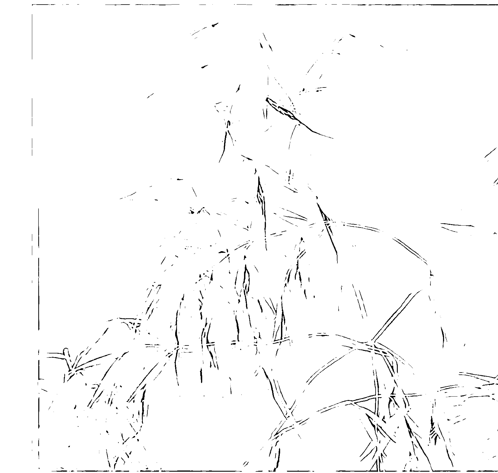

##### 李医师诊间案例探讨

谭小姐，单身，退休后自己一个人住在汐止的山上，来诊时头晕，无法入眠，白带，容易畏寒，心中充满着恐惧，担心自己随时会死掉。在问诊时发现个案体质相当敏感，只要一吃到汆烫青菜便畏寒，而且遇到燥热的食材时，便容易上火，连一般人都不会有副作用的彩光针灸，谭小姐于别处治疗都还有上火的情形发生，因此经由我的同学介绍，转诊来到这里。

面对个案棘手问题，只能由情绪生理面一个一个来解，尤其是个案对死亡的恐惧，是最先要治疗的。由于谭小姐的情绪多面，自己也不太晓得主因在何处，加上体质容易敏感，因此我采用「病重药轻」的治疗原则，不论是花精处方或是其他辅助治疗，均用轻剂量。

花精处方：野酸苹果、岩玫瑰、满酸浆、白杨、野玫瑰、野燕麦。

数天后，谭小姐再度来诊，心中对死亡的恐惧仍强烈，因此我于前次的花精处方里加入落叶松花精，并建议个案有空多运动。谭小姐下次回诊时，对于死亡的恐惧感开始下降，继续接受花精疗法。

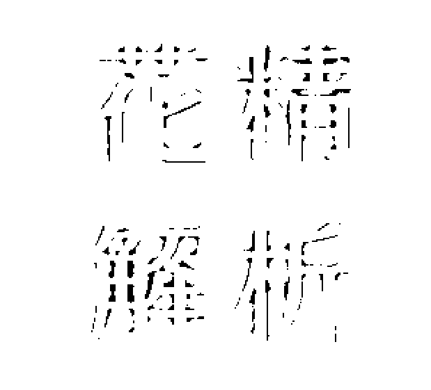

#### 野燕麦

不晓得自己的性情到底是哪一种，而展现出多重性格。巴赫医师认为一个人看似需要许多花精，而他们的个性属于温和柔顺者，就可先考虑使用野燕麦花精。

## 野酸苹果

个案有白带，且患者对于疾病充满着焦虑，不把疾病清除就浑身不适，此为野酸苹果的情绪。

## 岩玫瑰、沟酸浆、白杨

针对个案对死亡的恐惧，可以用此三联一体，对恐惧消除有加强作用。

#### 野玫瑰

个案闷闷不乐时使用。

##### 相似花精区辨及补充说明

| 类别 | 花精 | 说明 |
|------|------|------|
| 选择 | 水蕨 | 知道自己要的事业是什么（如知道自己的志业是做中医师），只是对自已的决定信心不足 |
| 选择 | 线球草 | 所有的选择都难以下决定 |
| 选择 | 野燕麦 | 野燕麦对小事决定快，只是人生目标不清楚 |
| 学习 | 水蕨 | 因无安全感而东学西学，造成内心紊luan |
| 学习 | 野燕麦 | 本身学很多，但深度不够，容易一事无成 |

##### 与野燕麦花精相似的新一代花精

- 1. 野蔷薇花精（Crystal Herbs 业力花精）
- 2. 苹果花精、古红豆杉花精（苏格兰芬活花精）
- 3. 坚定心方向、大花咸丰草花精（晶荷日光花精）

##### 野燕麦花精功用图像记忆

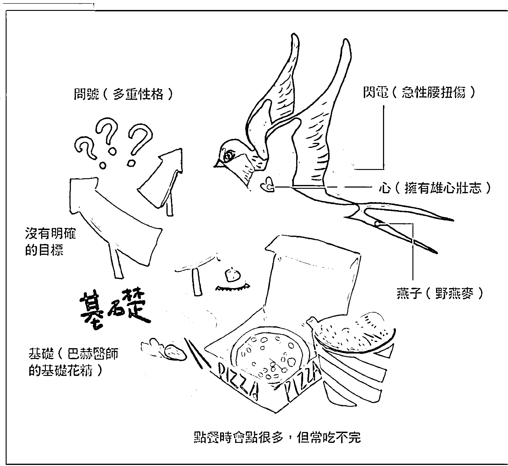

#### 野玫瑰

花精 精华

- 拉丁学名: *Rosa canina*
- 别名: 野蔷薇
- 七大分类: 对现实兴趣缺缺类
- 制作法: 日照煮沸
- 关键字: 听天由命、冷淡死寂
- 正面特质: 热忱

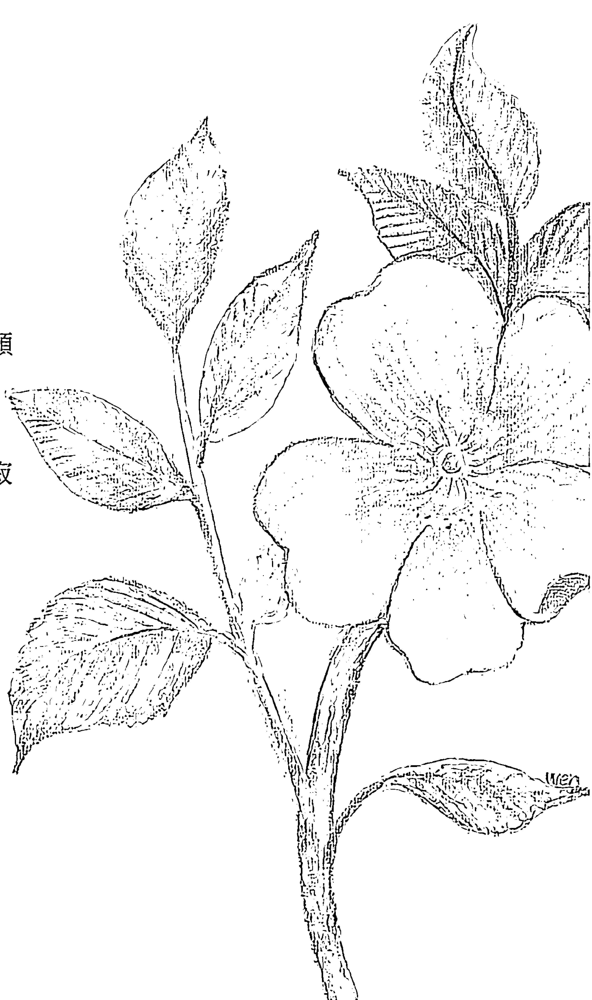

## Wild Rose

## 巴赫医师的叙述

没有明确充分的原因，听天由命，随波逐流，彻底认命，完全没有想要付出努力来改变，或找到快乐。他们已对生活中的挑战投降了，毫不抱怨。

> ——出自《The Twelve Healers and Other Remedies》

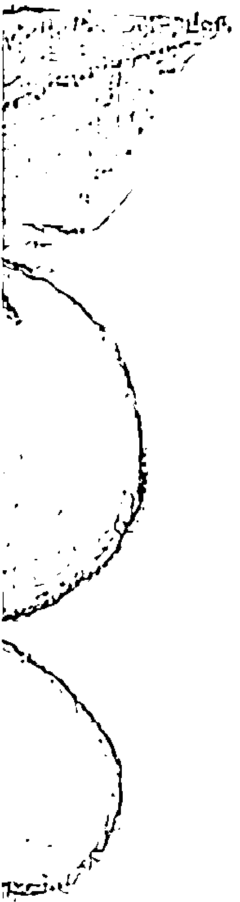

##### 野玫瑰 VS 中医观点

记得在多年前上彩光针灸课时，德国讲师曾说：二次大战时，由于许多人战死在沙场，让德国的许多村落变成寡妇村。数年后，这些寡妇们的颈部（在第六颈椎与第二胸椎间）常有肌肉隆起，外形很像丘陵，德国人就把这块隆起的肌肉称为「寡妇的山丘」，彷佛用这无言的山丘泣诉着妇女们的认命与无奈。

巴赫医师说：「放弃、屈服会让一个人成为生命旅途中不被注目的过客。」许多人在不顺遂时，会产生不同的反应，有些人会奋力一搏，有些人会完全放弃，野玫瑰的人，就是会放弃的这种。造化弄人，人处天地之间，都有不同的宿命，也给人们带来不同的折磨与历练。但无论如何，命运的安排总有其特定的意义，我们所能做的，就是把握眼前、珍惜现在，而野玫瑰花精，就如同英国诗人布莱克的诗句般，将带给我们朵朵的生命乐趣。

> 从一粒细砂观看世界，从一朵野花想见天堂。
> 在你手中把握无限，在一瞬间抓住永恒………

## 应用条件：

- 默默忍受疾病或不喜爱的环境，以无止境的工作来掩饰内心的干涸。
- 凡事提不起兴趣，逛街犹如行尸走肉。
- 对于一切认命，且不会想去改变它。
- 两眼空洞无神，呈呆滞现象。
- C6-T2 隆起（寡妇的山丘）。
- 长期忧郁，什么都不想说。
- 常感到疲劳，没有活力。
- 会肢体麻木。
- 难产的小孩。

##### 野玫瑰 × 情绪与思绪

野玫瑰特质的人生，是一种情绪死寂的状态，热情与活力在他们身上几乎找不到，这种消极的人生观，让他们打从心底放弃了自己，也不想多作努力改善自己的人生，只会随波逐流，默默地对周遭的一切认命。

听天由命的个性使得野玫瑰状态的人对于生活中的一切都提不起兴趣，即使是逛街也犹如行尸走肉般，两眼空洞无神，一幅呆滞模样。七情六欲在他们身上几乎找不到，即使知道得了绝症也不会有半句怨言，认为这一切都是命；职场上，这样特性的人即使被解雇也无所谓、事情不如意也不会觉得很烦恼。久之，这种冷寂的负面情绪便慢慢地影响了我们的健康，让身体也跟着冷寂，许多疾病如肢体麻木、低血压、容易手脚冰冷等情况便一个一个浮现。

有一点要注意的是，现代人常见的头痛问题，也会和野玫瑰情绪有关，有些治疗师发现野玫瑰状态的人其颈项肌肉严重僵硬，尤其是左边颈部触诊更加明显，医学上当颈部肌肉紧绷容易造颈源性头痛，这是解剖学上的肌筋膜疼痛症候群（MFP），唯有把颈部肌肉放松，头痛才能缓解。根据 Dietmar Kramer 的身体地图资料，左颈对应到荆豆，因此临床上常以荆豆⊕野玫瑰花精合用，对于消除这一类的头痛效果还算不错，不过重点还是在情绪辨证，才能对使用的花精有所加减，而获得更高的疗效。

##### 花精运用

国外的花精治疗师曾提出难产或早产的小孩，容易有野玫瑰思绪，为何会这样呢？因为他们在接触人世的第一时刻便遇到这样 trouble 的事情，让他们心灵有些后悔转世为人，但在小孩生出来又塞不回去的情况下，只能听天由命地继续走完他的人生旅途。这种认命的心态会跟着个案一辈子，无形中造成一些疾病的产生，有些群医束手无策的人在做催眠或家族排列时可能会发现这个病因，只是绝大多数人对这样的致病机转浑然不知，完全不晓得现在的疾患竟是和出生时的际遇有关。在彩光针灸疗法中，子宫期疗法及中阴身疗法，就是治疗这一方面的创伤。除了彩光疗法外，花精中的野玫瑰花精和子宫期疗法相似，治疗师可用彩光针灸的子宫期或中阴身疗法来加强野玫瑰花精的功效。

我们要探讨的是，为什么当事人会产生这种野玫瑰的状态呢？主要原因在于他们不喜欢目前的处境，想跑也跑不开，只能默默忍受，故以消极的态度来面对眼前的一切，如坐牢、贫穷、慢性病、亲子关系不良、婚姻不幸、不喜欢的工作环境、当兵等，其中以婚姻问题最容易引起野玫瑰情绪。新婚家庭中，倘若其中一方不喜欢对方家庭，常会衍生出这种情绪，如媳妇与公婆住在一起，心里头不喜欢却又无法躲避，当全家一起吃饭时媳妇也总是闷闷不乐，家人讲话也有一搭没一搭的，即使公公讲笑话媳妇也笑不太出来。冷寂的个性，除了会让周遭相处的人感到无聊外，全家也会笼罩在一片低气压中，这都算是这种过一天算一天的野玫瑰情绪。

除了不好的环境外，近来在花精门诊中亦发现过于安逸的个案也会有野玫瑰情绪。以前台湾社会物质环境尚不富裕时，只有在过年过节才吃得到肉、有新衣穿，许多大人、小朋友都渴望着年节到来，当然有渴望就有快乐，那种感觉或许可用久旱甘霖来形容。近来由于环境富裕，生活品质提升，尤其是许多高科技新贵或土财主家庭，父母无限的供应子女，吃好的、穿名牌、住得舒服、去美国游学，日子过得太惬意反而把这一切都认为是理所当然，便渐渐不满足。其实这样的物质世界提升反而让心灵逐渐空虚，心中的渴望也不复在，也找不到什么事情可以让他快乐，而陷入野玫瑰情绪。

> 古人说：「冰冻三尺，非一日之寒。」

许多野玫瑰花精的个案，都曾遭遇过挫折或创伤，如丧亲之痛、感情不遂等，经过多年后虽心境平稳，但快乐的心境却一步一步的消失，因此治疗师必须找出病人会产生放弃生命念头的主要原因，这样配合野玫瑰花精才有效，也就是说，要把当初造成野玫瑰情绪的主因消除，这样搭配起来才能收效。不过这种野玫瑰情绪就和杨柳花精一样，必须长期服用，否则个案将会被再度拉回放弃生命的黑洞里。在 Dietmar Kramer 的花精情绪路径中，金牛座的情绪路径：龙胆→杨柳→野玫瑰是较难治疗的，因为他们悲观且消极，除非靠着长期服用花精来松动他们永远无法痊愈的念头，否则很难有机会迈向疗愈之路。运用这个处方，将可以帮助患者对外界更加积极，更有兴趣，让人重燃生命的热情，带来更多的欢乐与喜悦。所以当有人问我说快乐花精是什么时？我总会回答说，试试野玫瑰吧。


##### 李医师诊间案例探讨

郑先生于七个月前开始有莫名的恐慌，并长期服用镇定剂，或许是受到药物影响的关系，时常身有晕沉感，主诉胸闷、咽中有东西哽塞。郑先生于五年前因服用药物发烧后，即闷闷不乐，许多原本有兴趣的事，在此之后均提不起劲来，自觉人生都没什么快感。针对个案的叙述，我开立了下列处方：

- 花精处方：铁线莲、橄榄、白杨、野玫瑰、荆豆，贴敷于神门穴。

隔天，患者又来诊所要求贴敷，述说自从昨天来做贴敷及服用中药后，咽中有异物哽塞感的情形减少，而且心中有一种很 high 的感觉，似乎找回失落已久的快感，不晓得是花精的关系还是中药的关系？其实，中药是会有效，不过在情绪调整上，花精能提供更快速的治疗途径，复合使用可让疗效提高不少，我快乐地帮郑先生做花精贴敷，让他找回那消失已久的自在本性。

#### 花精解析

## 铁线莲

五年前服用药物后发烧引发诸多状况，及现今服用镇定剂后的昏沉情形，均为铁线莲的适应症。

## 橄榄

长期服用镇定剂的乏力，可当做是橄榄的精疲力尽。

## 白杨

有莫名的恐慌使用。

#### 野玫瑰

个案没有快乐的感觉，郑先生家境相当好，因此物质生活不虞匮乏，家中大小事均有人打点，因此这种闷闷不乐可用此花精调控。

#### 荆豆

病久个案可用。

##### 相似花精区辨及补充说明

- 1. 野玫瑰、杨柳、落叶松、圣星百合花精，都必须要长期服用。
- 2. 多晒太阳、多踩泥土，可帮助热情提升，带来快乐。
- 3. 野玫瑰会消极的认为自己永远无法痊愈，永远无法从疾病阴影中脱离。一直屈服在自己负面的想法，不试着去补本身的不足，只是一味的放弃，所以和荆豆的沮丧不同。
- 4. Crystal Herbs 神圣和谐花精中的行动力花精（Motivation），组成为蓝宝石、虎眼石、浅色蛋白石、酢浆草、莱姆，可温和释放停滞欠缺动力的感觉，激发积极进取的精神，与野玫瑰功能相似。

| 类别 | 花精 | 描述 |
|------|------|------|
| 胡桃 | 保护花精 | |
| 野酸苹果 | 净化花精 | |
| 野玫瑰 | 快乐花精 | |
| 郁闷不乐 | 野玫瑰 | 对别人言行不会敏感，一切随缘，已经放弃生命的奋斗而没有任何的抱怨 |
| 郁闷不乐 | 冬青 | 对别人言行会反击，可用脸上的冬青反应区检查是否有黑斑 |
| 欠缺活力 | 野玫瑰 | 彻底放弃生命，随波逐流 |
| 欠缺活力 | 鹅耳枥 | 只是对需要执行的计划提不起劲儿，并未放弃人生 |
| 欠缺活力 | 橄榄 | 是身心疲累到已经没力气了 |
| 欠缺活力 | 荆豆 | 因为对目前的困境感到忧郁绝望 |
| 欠缺活力 | 铁线莲 | 因为沉迷在幻想世界与白日梦，心不在焉 |

##### 与野玫瑰花精相似的新一代花精

- 1. 缬草花精（Crystal Herbs 业力花精）
- 2. 行动力花精（Crystal Herbs 神圣和谐花精）
- 3. 雪花莲花精、缬草花精（苏格兰芬活花精）

##### 野玫瑰花精功用图像记忆

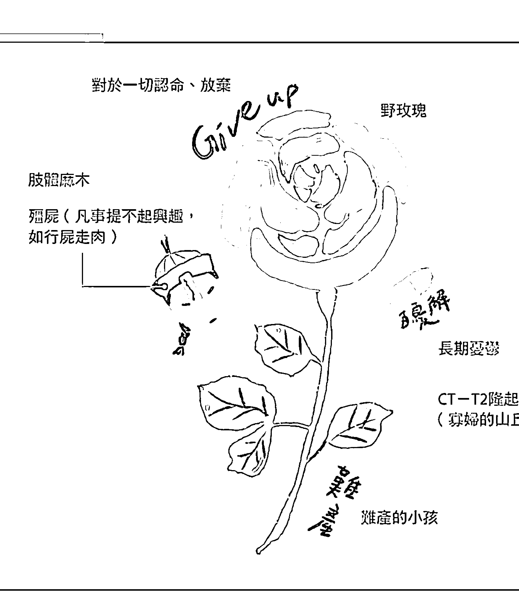

## 杨柳

花精
精华

拉丁学名 | *Salix vitellina*
---|---
别名 | 柳树
七大分类 | 沮丧绝望类
制作法 | 煮沸
关键字 | 自怜怨尤
正面特质 | 原谅

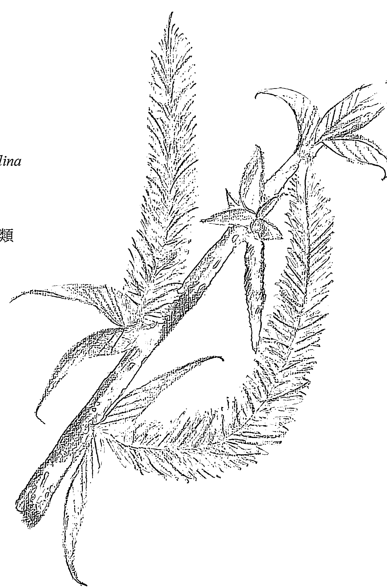

## 巴赫医师的叙述

给遭遇不幸，而难以接受的人。他们很难不怨天尤人，因为他们多以成功来衡量人生。他们觉得自己不该承受这些磨难，这太不公平，于是产生怨苦。在生活中，他们对从前喜爱的活动也变得比较没有兴趣，较少参与了。

——出自《The Twelve Healers and Other Remedies》

## 杨柳 VS. 中医观点

## 图解巴赫花精

广告说：「花东的海岸，是夏天的啤酒泡沫。」湛蓝的海水，确实吸引不少观光客，同学们也曾找我去几次。花东泡沫虽美，但在我心中，却有一个地方，更具有吸引力，一个名叫盐寮的东北角小沙滩。

「这里很美，夏天您们应该来走走。」我这样和朋友说。

记忆中的盐寮，离我位于澳底的老家不远，若是步行的话，约二十分钟即可抵达，我喜欢夏天的傍晚，漫步在金黄色沙滩上的感觉，柔软又凉适，不过这种闲情，却只有国小时才能享受到。搬到桃园后，忙碌事情也多，许久才开车回老家一躺，这里人口外移严重，年轻人大都到台北发展。回到这里，除了和邻居阿嬷闲聊外，有时也会到附近的风景区走走，而九份，也就是我常顺道「路过」的地方。

九份雾气重，这和地下大量的金属矿产有关，悲情城市在这里拍摄，也让这个地方多些日本时代的气息。对我而言，在这里，除了甜甜的芋圆、卖小饰品的商店外，倒也感受不了什么悲情，会让我想到悲情的，却是巴赫花精中的杨柳。

杨柳花精，是巴赫医师用来对治自怨自艾的花精，它可以融化带给人们沮丧的强大怨恨力。翻开诗词大全，有关杨柳的篇幅不少，在中国古代的诗词中，杨柳树常和意境中的怨恨相关，而巴赫医师的理念也恰巧与此相同，或许东西方对于杨柳的诠释，都有着共同的意义。

## 出塞 唐朝 王之涣

> 黄河远上白云间，一片孤城万仞山。
> 羌笛何须怨杨柳，春风不度玉门关。

王之涣以凉州城的戍边堡垒，搭配羌笛奏着《折杨柳》的曲调，勾起征夫离愁，及心中「征战无期」、「归家无望」的怨恨。

## 送别诗 隋朝 无名氏

> 杨柳青青著地垂，杨花漫漫搅天飞。
> 柳条折尽花飞尽，借问行人归不归。

这首诗用暮春杨柳的景色，勾起游子的怨恨。

## 蝶恋花 宋朝 欧阳修

> 庭院深深深几许？杨柳堆烟，帘幕无重数。
> 玉勒雕鞍游冶处，楼高不见章台路。
> 雨横风狂三月暮，门掩黄昏，无计留春住。
> 泪眼问花花不语，乱红飞过秋千去。

欧阳修以浓密的杨柳描写暮春闺怨，及生活上的寂寥空虚之感。

## 应用条件：

- 会生闷气，觉得生命是不公平的，自己老是受害者。
- 喜欢泼别人冷水，带给别人黑暗与绝望。
- 会将负面能量投射在不满的对象。
- 失去生活的乐趣，消极的人生。
- 将不幸与错误归咎于别人。

##### 楊柳 × 情緒與思緒

楊柳狀態的人，在遇到困境或挫折時，不會表達內心的不滿，而是會將困苦往肚裡吞，讓心中的高牆漸漸築起，不知不覺中便將自己心靈封鎖起來，而高牆裡頭，則是數不盡的憤怒與怨恨。俗語說：「冰凍三尺，非一日之寒。」這種積怨的力量，會讓他們一直陷在過往不幸的記憶中，無法釋懷。日子一久，情緒便開始質化，認為命運不公平，為何總是自己受到不好的待遇，並開始怨天尤人。這種現象在軍中特別明顯，軍中常須出公差，被長官叫到的人由於不能抗命，怒氣只能往內吞，覺得自己很倒楣，為何別人在睡午覺，我要去打掃……

這種人是典型的「受害者情緒」，像喜歡悲春傷秋的林黛玉，或《後宮甄嬛傳》裡哀嘆自己身似蒲柳的安陵容一樣。怨天尤人的情緒，是一種強大的負面能量，不但會讓生活缺乏喜樂，還會產生憎恨、自憐的心理。他們說話很消沉，而且對別人的成功特別眼紅，常會嫉妒別人的成功，並在背後說這些人的壞話，怨恨上蒼為何讓別人成功？為何勝利的不是我？楊柳狀態的人，因為心中充滿著黑色的能量，所以會和龍膽狀態的人一樣有著悲觀的想法，也因此他們喜歡潑別人冷水，讓別人也享有同樣的黑暗與絕望。每當事情發展不如預期時，他們往往只會看到黑暗的一面，而不去思索事情背後到底給我們什麼樣的啟發，並且會把自己的失敗、運氣不佳歸咎在別人身上，甚至怪罪老天爺是故意跟他們作對。

## Chapter 4

##### 花精運用

羨慕、嫉妒、怨恨、吝嗇是楊柳狀態人常有的情緒狀態，但他們的羨慕嫉妒通常會伴隨著怨恨，臨床上這樣的患者常會令治療師灰心，因為他們不知足的特性，即使治療已有相當的進步，也會悲觀的認為「病情還未有起色」。同時，他們還會嫉妒和他生同樣的病的人好那麼快，除了怨恨自己的命運不好外，還把責任歸咎在醫師身上，認為醫師對他不用心，所以楊柳狀態的患者會經常換醫生。不過他們的這種怨恨嫉妒心，並不會隨著念頭興起而消失，而是再把它強壓回內心裡頭，造成更大的咒怨，久了這股怨恨便開始往外投射到她不滿的人身上，或是詛咒別人去死。根據Dietmar Kramer的身體地圖資料，左頸部對應到楊柳花精，由此可反推當某人常會詛咒別人時，其左頸項常會僵緊，若是有伴隨荊豆情緒的話，那頸部緊繃的程度將更大。

古人云：「知足常樂。」楊柳狀態的人，普遍不知足，即使環境已相當好，他們也不會認為這樣已經可以。永遠不滿足的心態使他們一直無法達到自己對人生的要求，也造成他們會羨慕、忌妒那些生活比他們快樂的人，這也是為什麼巴赫醫師認為，處於負向楊柳情緒的人，會藉由成就的多寡來評論生命的價值。有人一個月五萬塊的收入便覺得很滿足，但有人就不會，抱怨著為何別人可以賺十萬元？但等到他賺到這個水準時，他就會忌妒那些一個月賺二十萬元的人。又如有人騎機車跌倒，手部擦傷，楊柳狀態的人會抱怨為何別人不跌，卻跌到他，而知足的人則會慶幸，好險其他地方沒有受傷。倘若我們能活在知足常樂的氛圍中，將不會再認為自己的命運是悲慘而艱辛了。

由於楊柳情緒是長期累積的怨恨，因此他們身上也常會有慢性的疾病，使用花精的時間必須較長，這樣不僅可以緩解他們身體的痛苦，也可以帶領他們揮別苦旦的角色，開始走向療癒之路。運用這個花精，將可以幫助我們掌握自己的命運，不再抱怨，並使個案對別人能更加地慷慨，而生命也會因此而積極有意義。

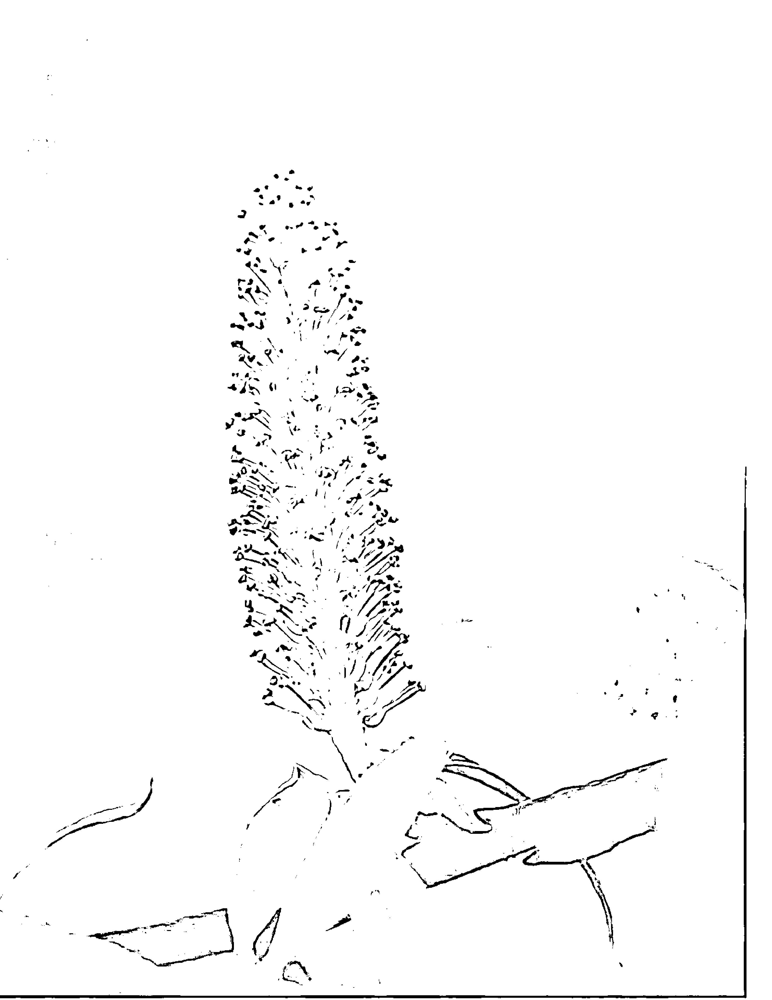

##### 李醫師診間案例探討

蔣小姐，主訴後頭痛，個案還描述自己的頭頂處好像有東西罩住的感覺。我問她這情形多久了，蔣小姐回答我說約在兩個月前騎機車時，被後車追撞跌倒後，便開始有左後側疼痛及頭頂罩住感，頸部在轉動時異常痠痛，但經過馬偕醫院X光檢查均正常。馬偕的醫生只好開立止痛藥等藥物讓她服用，服用西藥二個月後，症狀改善不多，便來尋求中醫門診。

我先做頸部觸診，在身體地圖的觸診中，頸部觸診最方便，光這一圈的頸部觸診便可分析出13種花精的負面情緒。幫蔣小姐檢查頸部後，發現其上的楊柳、荊豆區相當僵緊，而這也是她轉動時感到異常不適處。花精處方：楊柳、聖星百合、荊豆，做頸部局部貼敷，並採用耳針，及河圖洛書開穴，施術一分鐘後即活動角度增加，原本轉動時的痠痛感減輕許多。

圖解巴赫花精


#### 楊柳

局部反射區，個案在門診時不經意地提到自己很倒楣，才被車撞，此為楊柳的自怨自艾情形。

#### 聖星百合

消除車禍所造成的心靈創傷。

## 荊豆

頸部局部反射區。

##### 相似花精區辨及補充說明

楊柳狀態的人總是把過錯推給別人，與松樹相反。

| | 楊柳 | 松樹 |
|---|---|---|
| 指責 | 外責型人格。千錯萬錯都是別人的錯 | 內責型人格。千錯萬錯都是我的錯 |

| | 楊柳 | 野玫瑰 |
|---|---|---|
| 失去生活的樂趣 | 會埋怨 | 不會埋怨 |

| 嫉妒表象 | 楊柳 | 冬青 |
|---|---|---|
| | 不滿藏在心中，伴隨著怨恨，不直接表達，但會露出一幅苦瓜臉，或說出迂迴的酸話 | 憤怒直接表達，將內心的怨恨直接罵出來，擊中目標 |

| 受害者情結 | 楊柳 | 矢車菊 |
|---|---|---|
| | 不管真實情況如何，都覺得自己是受害者 | 因為不敢說不，真的成為被別人欺侮踐踏的受害者 |

| 悲觀 | 楊柳 | 淹胎 |
|---|---|---|
| | 在事情發生之後產生悲觀思緒，因為他們對成功的定義太狹隘，認為根本還沒成功達成，而且會認為不能成功都是別人造成的 | 充滿著悲觀思緒，在還沒有做事之前，便開始懷疑事情的成功機率，但他們不會怨天尤人 |

##### 與楊柳花精相似的新一代花精

- 1.接受花精（Crystal Herbs內在小孩花精）
- 2.負責任花精（Crystal Herbs神聖和諧花精花精）
- 3.消除業力花精、萊姆花精、花楸樹花精（蘇格蘭芬活花精）
- 4.心靈大掃除·黃金菊花精（晶荷日光花精）

##### 楊柳花精功用圖像記憶

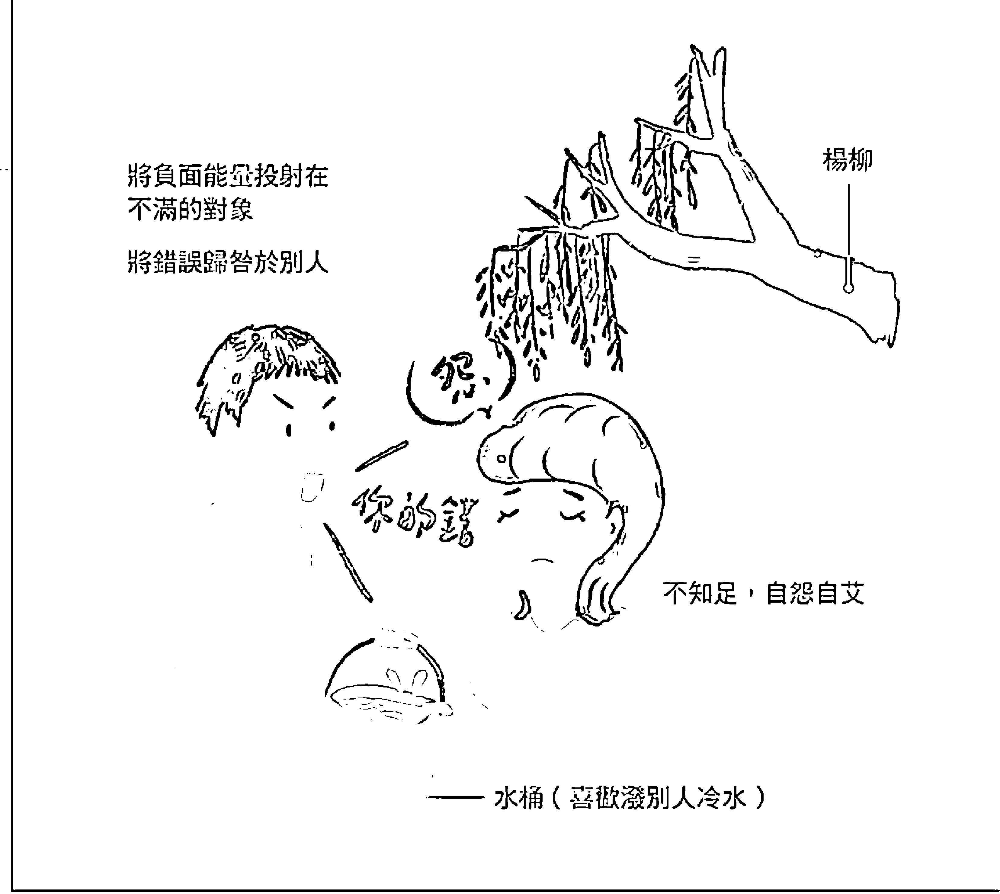

古人說：「萬法唯心」，花精療法是一種情緒療法，同一件事情，當內心的出發點不同時，治療花精也隨之而異。如何快速開立所需的花精呢？除了利用圖像記憶法將三十八種花精熟稔外，也可試著從日常生活或電影中男女主角的言談舉止裡去練習，這樣有助於提高花精的熟練度，日子久了，就能做到直覺反射用花精的境界。民以食為天，在每天的用餐過程中也可看出許多喔！

- 心情很煩，仍裝得很快樂地找三五好友一吃飯：龍芽草
- 看到一群同事在討論去那用餐，懷疑他們會在背後講我壞話：冬青
- 明明不想去聚餐，但不知如何拒絕：矢車菊
- 來餐廳的路上，看到有人車禍死亡，就渾身不舒服：白楊
- 來餐廳的路上，差一點被大貨車撞到，到了餐廳後還在發抖：岩玫瑰
- 不喜歡吵雜又抽菸的餐廳：水堇
- 老是到同一家餐廳用餐：野玫瑰
- 刀叉已很乾淨，但還是會怕上頭有細菌再擦拭一次：野酸蘋果
- 點菜點很多：野燕麥
- 為了點羊排或牛排而猶豫不決：線球草
- 明明對菜單不清楚，也不敢叫服務生：落葉松
- 一直叫服務生拿東西：薊
- 用餐時說話便臉紅，害怕大家把目光集中在他身上：薄酸漿
- 吃飯吃到一半，接到電話說家中出事了，突然間腦袋中一片空白：聖星百合
- 一邊用餐一邊批評別人刀叉不會拿，杯子拿錯方向：山毛櫸
- 對著朋友一直講他的病情，他的生活，別人幾乎無法插嘴：石楠
- 一邊用餐一邊想著年底要去北海道玩：鐵線蓮
- 吃飯吃很快：鳳仙花
- 一邊用餐一邊想著多年前和女友一起去燭光晚餐的情景：忍冬
- 想著家中的父母，現在有無餓著肚子：紅粟
- 菜很難吃卻仍吃光光：橡樹
- 對服務生的態度很不滿，結帳時因一句口角而打架：櫻桃李
- 用餐後大家覺得不好吃，感覺自己的錯，帶錯餐廳：松樹
- 用餐後大家覺得不好吃，把責任推給別人：楊柳

## Chapter 5

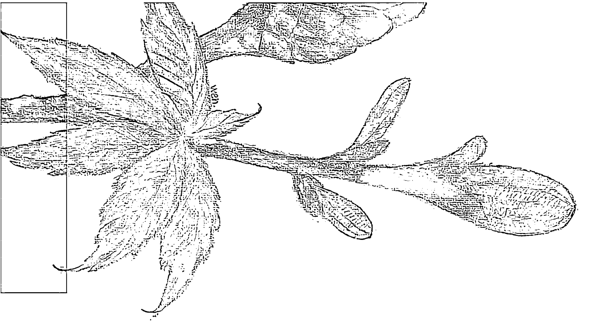

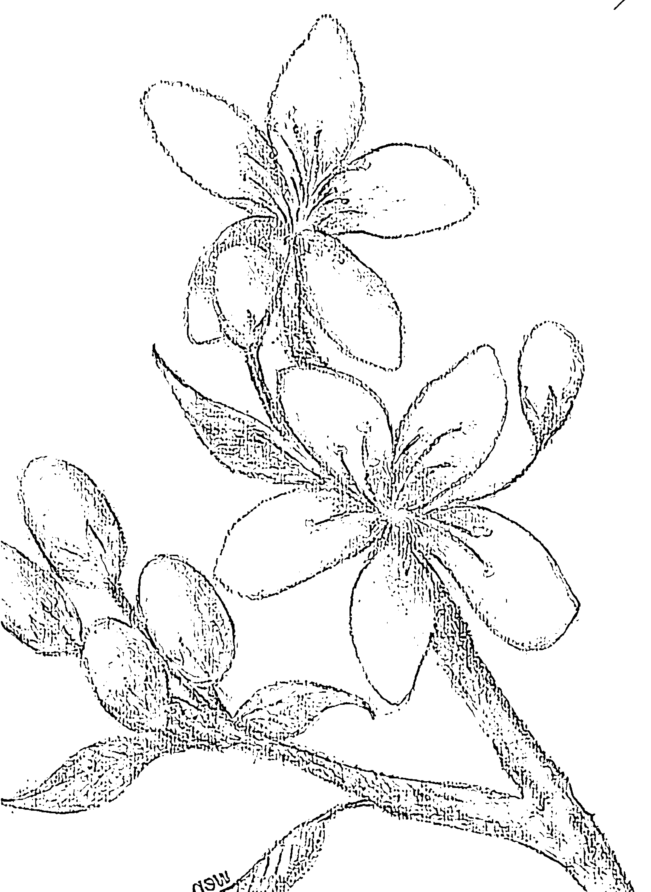

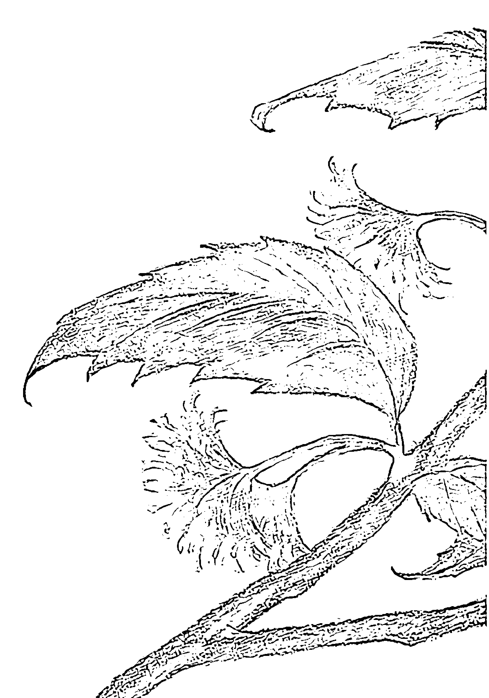

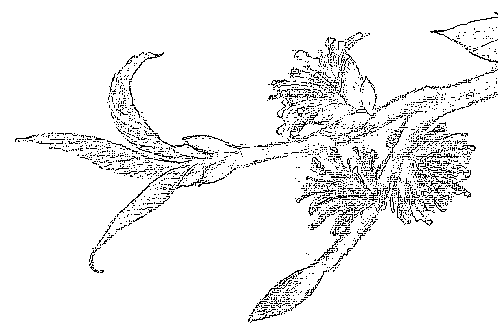

### 急救花精的應用

&

### 寵物花精的調配

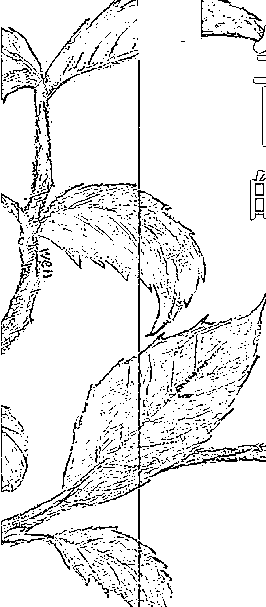

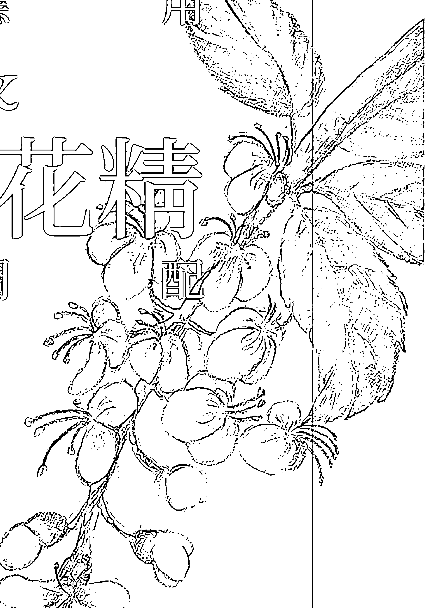

### 神奇的急救花精

第一次使用急救花精輔助治療失眠，是在2005年的中興醫院。那天看診時，來了位大學生，但這位患者（後面簡稱為A同學）並不是專程來找我看病的，而是因為隔壁診的樂醫師臨時請假，A同學來後撲了個空，索性就掛診到我這裡。查了一下電腦病歷，之前處方大都是一些安神助眠、幫助鎮定的中藥，在門診時，A同學顯得有些焦躁不安，並問我說可否照之前樂醫師的處方開呢？照開呀！我不太喜歡患者這樣說，但在把脈問診之後，發現上次的處方依然是可以使用的，我就照開給他。唯一不同的是，因為A同學焦躁的情形相當明顯，於是我便在他手上滴了二滴急救花精。會隨身攜帶這個花精，主要是為了預防針灸時患者的暈針情形（針灸後突然暈倒，並有心悸、想吐的現象，即稱為暈針），但由於平素尚未遇見會暈針的患者，也就在今天給他用上了。

隔週，A同學又來診，隔壁的樂醫師今天又請假了嗎？我這樣問他。A同學回答我說，隔壁樂醫師今天有來，會來您這繼續看診，是因為上週看診回去後，居然有好幾天可以睡得很沈。可是納悶的是，為何以前吃同樣的藥，效果卻沒這麼明顯，來李醫師您這看後突然好很多，是不是那個滴的東西有作用？我笑著，但卻不知該如何回答，對一個未曾接觸過花精的人來說，跟他說急救花精的來龍去脈，肯定霧煞煞，於是換個角度回答他說：「這是一個可以幫助你放鬆的東西。」A同學笑了笑，繼續接受花精治療（也只是在他手心上滴了兩滴急救花精而已）。當他離去後不久，護士送來紙本的病歷黏貼處方箋，翻了下之前病歷，原來A同學小時候目睹母親被父親殺害，陰影籠罩身心，以致於長期失眠，在大學裡雖有神職人員長期相伴，但內心始終被當時的印象所震攝，而急救花精的裡的成份，正好可以撫慰他的傷痛，讓他擁有難得的好眠。

### 急救花精的特色

急救花精是巴赫花精裡唯一的複合花精，用來應付任何的緊急情況。這是一個便宜行事的處方，巴赫醫師當初發明急救花精，主要是為了要方便一般人（對於花精不了解、或一時情急無法找出患病時的負面情緒）所採用的緊急變通方法。這個處方對於一般狀況處置會有不錯的效果，但有時效果卻不那麼顯著，原因在於還有其他的情緒潛伏於內，此時必須依循巴赫醫師的情緒辨症法則（忽略個案當時的生理症狀，完全依照患者發病時的負面情緒，及病人特有的人格與個性）、能量診斷，或搭配身體地圖反射區，來選取最合適的花精進行治療，才能收效迅速。

市面上也有專門用急救花精來治療失眠的產品，配方就是急救花精加白栗，在歐美相當暢銷。這個配方對情緒亢奮或想太多類型的失眠效果不錯。有花精的朋友，可以自行在家調配，提供周遭親友一個失眠的妙方。

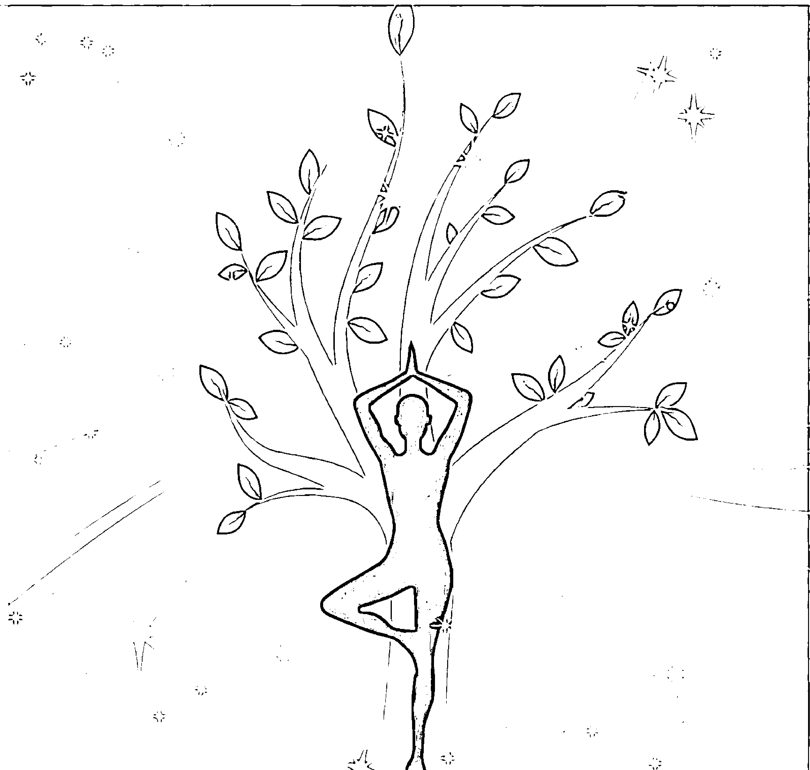

### 急救花精

成份：鐵線蓮、鳳仙花、岩玫瑰、櫻桃李、聖星百合。

#### 花精解析

- 聖星百合：驚嚇、創傷。
- 鐵線蓮：昏迷或臉色蒼白。
- 櫻桃李：害怕失控或已失去控制（如癱瘓、完全乏力）。
- 岩玫瑰：極度恐懼、驚惶失措、不知該如何是好。
- 鳳仙花：急躁、難以忍耐。

#### 急救花精的圖像記憶

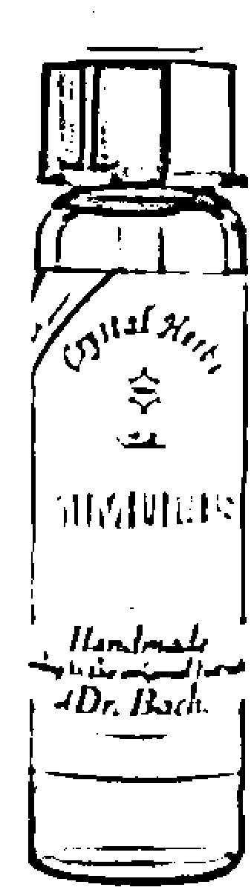

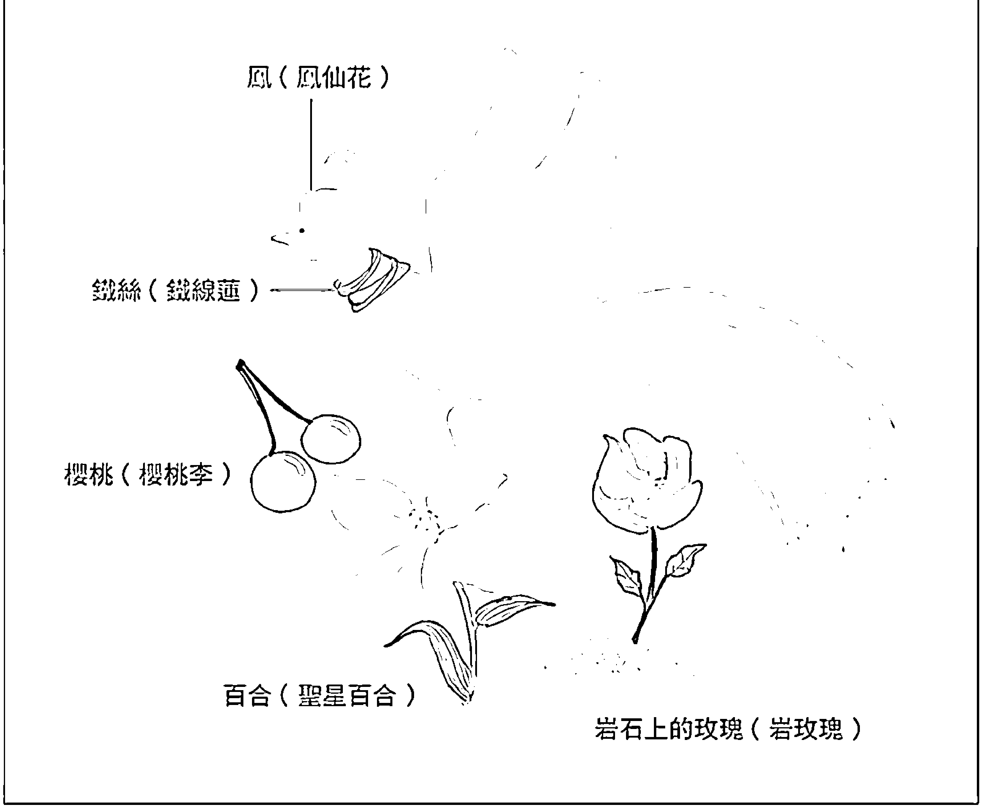

### 急救花精的應用時機

- 1. 應付所有緊急狀況，急難救助時可以在未送達醫院前幫助穩定病情，並可幫助減輕心理的痛苦，促進身體進行自療的功能。
- 2. 緩解緊張情緒，具有鎮靜效果，如搭飛機、看牙醫、第一次約會、考試、或重要面試前的失眠，可降低學子恐慌。
- 3. 情緒亢奮時可用，如吵架後或中了大樂透高興到睡不著的鎮定效果。
- 4. 消除做家族排列後的副作用，如自己情緒莫名的哀傷，好像失戀痛苦般想了斷的感覺。
- 5. 小朋友夜半噩夢驚醒，或是大哭而不醒。
- 6. 可消除冥眩反應。
- 7. 聽到不幸消息後（如親人過世、失戀）的突然驚惶失措、情緒失控或抓狂。
- 8. 遇到壓力時或莫名的感受到強烈驚恐、肌肉抖動、冒冷汗、無法思考、覺得自己快要死掉。
- 9. 暈針可用，昏迷患者，可滴在唇邊、脈搏處急救。
- 10. 愈是劇烈、急性的痛，急救花精效果愈顯著。
- 11. 任何寵物的不適應（許多動物的不適應常和受到驚嚇或恐懼有關）。
- 12. 任何植物的回復生命力處方。
- 13. 使用方法：以內服為主。

### 急救乳霜

急救花精也可以做成外用乳霜的劑型，市面上通常稱為「急救乳霜」。這種乳霜主成分除了急救花精外，還會加入野酸蘋果，幫助肌膚排毒及在心理層面接受外表瑕疵。

急救乳霜主成份：急救花精、野酸蘋果。

各個花精製造廠製作的巴赫急救乳霜成份大抵相同，差異點在於基底，所以味道有些不一樣，但療效均相同。

乳霜基底通常包含三個主要部分：植物油、乳化劑、防腐劑

因為急救乳霜通常訴求天然，不添加香料，所以有些聞起來會有點油臭味，這是植物油的天然氣味。防腐劑通常也僅添加食品級防腐劑，所以保存期限一般只有兩年，某些成分更天然的品牌更只能保存一年，開封後宜儘速用畢。

保存不宜放在陽光直射處。夏天宜放入冰箱，可防止油臭味，但建議裹上錫箔紙或裝到金屬盒內，以避免冰箱電磁波。

### 急救乳霜的應用時機

- 1. 急救乳霜常用於急性或慢性的肌肉骨骼關節系統的損傷、天氣變化就發生酸痛的風濕症，可充當臨床傷科的外敷藥膏。
- 2. 各種原因引起的皮膚疾患（蚊蟲叮咬、燙傷、濕疹、小朋友尿布疹）。
- 3. 皮膚病患者，倘患者曾使用過類固醇製劑，在剛開始使用急救乳霜時，可能會有起紅疹及滲出組織液等排毒反應，不用擔心，可建議患者繼續使用無妨。
- 4. 使用方法：於患處取適量塗抹外用，一日三～四次。

### 寵物花精調配——寶貝您的寵物

看到新聞畫面，一隻非洲鸚鵡因為被主人關在密室，得了憂鬱症而每天拔自己的毛，才幾天的光景便成了禿鷹，志工們唯一能做的便是有空帶著牠到外頭走走，讓牠心情high一點，早日走出藍色大門。

其實，任何生命體都有情緒，當然寵物也會有，如有些小貓會有冬青或菊苣的負面情緒，常會為了爭寵而亂破壞東西，希望引起家人的注意。重蹈覆轍的小狗喜歡翻垃圾桶，怎麼教也學不會，可用栗樹芽苞來幫助學習。常見動物憂鬱症狀包括：情緒低落、睡眠障礙、食慾減退、時常蜷縮、狂吠或低鳴、注意力不集中、活動遲緩、容易生氣、焦躁不安、自殘、具攻擊性、異常脫毛等，一些症狀和人類的憂鬱症狀很相似，也印證古人所說的「萬物有情」。根據台大獸醫系調查發現，國內有百分之六十五的飼主是將貓、狗養在家裡不放出去，而更多的是其他動物，如九官鳥、小山豬、蜥蜴等，幾乎長年關在籠裡，無怪乎寵物憂鬱症的個案愈來愈多。

動物的情緒治療就和人類一樣，都是對證下花精，經過辨證後，可以選擇使用內服法、泡澡法、外用噴霧、或是用急救藥膏外敷等。只不過，牠們的治療方式較為單純，有時光用一個「急救花精」，對於動物與植物的大小毛病而言便是個不錯的通用方，不像人類是萬物之靈，匯聚了所有動物的負面情緒，處理起來分外棘手。國外有出不少動物花精的書籍，不過歸納起來動物與植物的普遍處理模式分述如下：

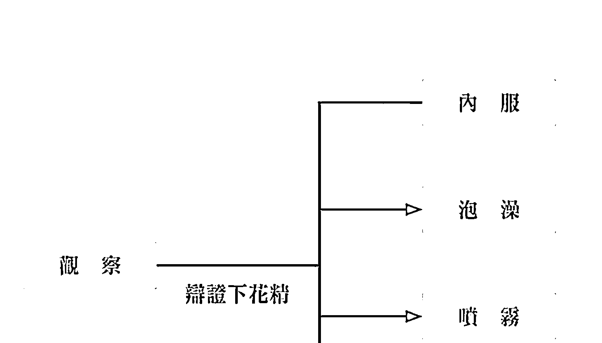

### 動物與植物通用急救花精

用法：

- 1. 動物使用時，可將花精放在水缽裡，即使很多隻寵物養在一起，也可放在同一個水缽讓他們一起飲用，因為其他不需要的寵物吃也不會任何副作用。
- 2. 植物使用時，則把需要的花精加到噴水器中或澆的水中，將全株淋濕，尤其是土壤，一定要淋到。
- 3. 不論動物或植物均可用急救乳霜塗在受傷處，可加速傷口癒合，對於動物皮膚病的恢復有幫助。

### 動物用花精

- 1. 溝酸漿：個性膽小，會躲在角落。神經緊張、睡夢中偶會有哀嚎聲。
- 2. 野酸蘋果：皮膚病必用，可配合泡澡法，亦可用噴霧輕噴在傷口，有淨化作用，且可防止寄生蟲。
- 3. 白楊：給莫名驚恐的寵物，不知道是為了什麼緣故恐懼，或疑似「見鬼」。
- 4. 矢車菊：容易受到同伴欺侮，而默默承受。
- 5. 鳳仙花：給過度急躁的寵物，如主人剛拿出飼料，就急著撲上來。
- 6. 石楠：因為寂寞，過度尋求主人注意。如主人沒有陪牠玩，就不斷吠叫、破壞家具甚至吹狗螺。
- 7. 胡桃：幫助適應新環境、新生活，如新買來的魚，放在魚缸中不適應。
- 8. 菊苣：爭寵後覺委屈，一幅很可憐的模樣，渴望主人的愛，在一旁低鳴。
- 9. 冬青：有新寵物進來牠的生活圈，爭寵後會亂破壞東西以引起主人的注意。
- 10. 水堇：貓較常用到，孤僻的動物可用。
- 11. 聖星百合：曾受過心靈創傷或剖腹生產的動物，加上岩玫瑰可撫平創傷。
- 12. 櫻桃李：聽到風吹草動便亂叫，主人形容牠很容易抓狂。
- 13. 栗樹芽苞：喜歡翻垃圾桶，怎麼教也學不會。
- 14. 芥末：突發性地憂鬱，呆坐在一邊。
- 15. 岩玫瑰：曾被捕狗大隊追捕的狗、或是曾被人欺負的流浪動物。
- 16. 橄欖：適用於生病或手術後身心俱疲、體能耗散的虛弱動物。

### 植物用花精

- 1. 植物移盆：胡桃⊕聖星百合，可以幫助適應。
- 2. 有寄生蟲：使用野酸蘋果外噴。
- 3. 快要枯死：荊豆⊕急救花精。

### 注意事項

- 1. 花精可配合藥物泡澡。
- 2. 動物不可直接用滴管餵食，以免碰觸嘴唇，造成花精原裝瓶污染。如果不小心碰觸到，請以沸水燙過後再把滴管放回瓶內。
- 3. 巴赫花精對於動物的醫治，效果相當顯著。即使是用錯花精，也只是效果不彰而已，並不會有什麼副作用。
- 4. 急救花精對於動物的疾病特別有效，是養寵物者的居家必備良方。

## 第六章 花精的選擇

### 如何選擇花精

古人說：「用藥如用兵」，花精的選擇，必須在熟悉各個花精的特性後，方可選取出最適合個案的處方。但在使用花精時，心中一定要有個觀念，就是：

**引發情緒→自律神經失調及內分泌失調（身心症候群）**

其實選擇的方式有很多，像是談話諮商、占星、能量檢測或肌肉觸診法等，都是一般治療師可以採用的方法。即使是花精初學者，在不懂得如何諮商前，只要使用本章附的情緒檢測表，給個案填寫，依然可以分析出合適的花精。

就個人的經驗而言，對於能量較為敏感者，則建議採用靈擺或LET（生命能量檢測）等能量檢測方法，這種方法的好處是可以遠距檢測，就算個案遠在國外出差亦可測出精確的處方。現今社會裡，許多個案不太願意將心結完整地向治療師敘述，透過能量檢測，即使個案不開口或不曉得當初的情緒狀態如何，也能藉由這種方式取得正確的資訊而開立適合的花精。選擇是一種智慧，端看治療師個人的經驗與專長，選用適合自己的方法：

- 花精的選擇
    - 諮商
        - 談話諮商
        - 觸診法
        - 占星
        - 情緒檢測表
    - 能量診斷
        - 靈擺
        - 花精握持法
        - LET
        - 能量檢測儀
        - 抽花卡

### 談話諮商

#### 流程

1. 詢問個案：「有什麼需要幫您的嗎？」讓個案把問題或心結說出，並記錄下來。

2. 細心地感受個案「最傷痛、最想處理」的地方在哪裡？

3. 抓主證，通常個案第一個說的主訴即為主證。如患者說：「晚上一直想著白天上班的事，做事很急，很想發脾氣。」治療師從敘述裡便可想到白栗、馬鞭草或鳳仙花、櫻桃李花精。
    - 白栗是患者第一個主證花精，因為患者開場白第一句話便是「重複的想」。
    - 做事很急：馬鞭草或鳳仙花均可能，治療師必須再用問題分析出是哪一種。
    - 很想發脾氣：櫻桃李。

4. 分析出適合的對應花精。

5. 不清晰的花精，可用關鍵問題加以確認。

#### 諮詢範例

李醫師：「您好，請問有什麼需要幫您的嗎？」

個案：「我臉上青春痘很多，消不掉。」

（患者第一主訴在青春痘，因此想到和皮膚有關的野酸蘋果為主證花精，由於皮膚問題會影響到自信心，因此落葉松也需考慮。）

李醫師：「青春痘！是什麼時候開始有的？」

個案：「當兵的時候開始冒出來。」

（和人生過渡的時間有關，想到胡桃花精。）

李醫師：「那時候是有什麼特殊的事情嗎？不然怎麼會突然冒出來。」

個案：「也還好，想不太起來。」

（記憶久遠，無法想起，但有可能是隱藏情緒的龍芽草花精。）

李醫師：「最近睡眠如何呢？」

個案：「最近睡睡醒醒，不知何故從我去當兵開始就這樣」。

（亦和人生過渡的時間有關，想到胡桃花精。）

李醫師：「平常個性會很急嗎？」

個案：「急？會啊，我做事還滿急的。」

（急性子會使得皮脂腺分泌加速，造成毛孔堵塞，產生青春痘。但急性子有分兩種，鳳仙花及馬鞭草，須再分辨。）

李醫師：「遇到急的事情，喜歡自己一個人做？還是喜歡找大家一起來做呢？」

個案：「我比較喜歡自己做。」

（獨自的急性子，因此選用鳳仙花，若是喜歡找大家一起把事情做完，便是馬鞭草情緒。）

李醫師：「還有其他問題嗎？」

個案：「我的左手腕這裡常會麻，有時會抖動。」

李醫師：「以前就這樣嗎？」

個案：「大一的時候騎機車跌倒，摔到這裡，就從那時開始麻。」

（個案跌倒傷到左腕，可視為局部創傷的聖星百合現象，患者會抖動持續這麼多年，大多是情緒記憶性所延伸的問題）。

根據上述的諮商，治療師便可選用野酸蘋果⊕落葉松⊕胡桃⊕鳳仙花⊕聖星百合五瓶花精。

談話諮詢是目前中外花精治療師最常使用的方式，也是個案認識自己心靈問題的最佳模式。治療師可以透過剝洋蔥的方式，一層一層地協助人們進入內心世界，在問題分析過程中，個案也可以清楚覺察到問題所在，在搭配適合的花精後，便可協助個案走過每一層心靈關卡。

巴赫醫師當初發明這套療法就是希望每個人都能夠關注到自己的情緒，進而達到「認識自己」與「治療自己」的目的，因此許多花精治療師仍以談話諮商為主，這也是我在診所內常用的諮商法。

### 觸診法

中醫針灸學有所謂的「阿是穴」，所謂阿是穴就是患者自覺痛點的穴道，當人們壓到這個穴位，便有「阿……阿……」的叫聲，因此叫阿是穴。這是一種人體的自我反射，比如說闌尾炎患者，在小腿處的闌尾穴便會有壓痛，中醫師在此處找到壓痛點後，便會在此處針灸進行治療，當闌尾炎好了，這個穴道的壓痛感便會自動消失。

同樣的，心理的情緒也會在身體肌肉上產生阿是穴反應，造成局部疼痛、發麻、活動不利、緊繃感等情形。根據國內醫界調查顯示，有五成以上的憂鬱症患者會出現各式各樣的慢性身體疼痛，在檢驗時，常可發現血清素跟腎上腺素這兩個神經傳導物質異常，而這兩個神經傳導物質異常便和疼痛有很大的關係。

但是身體這麼大，到底情緒是對應到那個部位呢？德國花精治療師Dietmar Kramer的著作《新巴赫花精身體地圖》，就可以提供我們一個按圖索驥的方法。這本書把三十八種巴赫花精與身體區塊做對應，只要個案感覺到那個區塊有疼痛、不適感，或是治療師經由觸診發現肌肉緊繃、有條索狀，便可依據書中的資料找出對應花精來使用。

臨床上常見個案兩個肩膀緊繃疼痛，這些地方是對應到橄欖花精，在貼敷橄欖花精於肩膀後，約有近八成的患者可以成功解除其酸痛感；又如觸診患者頸後部，發現右頸後部僵緊，根據身體地圖這個區塊對應到橡樹花精，代表平常做事都會硬撐，在我臨床應用中個案對於這樣的貼敷法接受度很高。

除了個案自覺痛點外，也可應用觸診法，仔細按壓各處，國內的李穎哲醫師算是觸診法的翹楚。在觸診時，全身觸診均可，但以頸部觸診較為方便，一個小小的頸部繞一圈便可以協助分析十一種不同的花精。因此善用身體地圖將可幫助我們確定該先使用哪些花精，算是調配花精時的一項利器。

### 占星

巴赫醫師重視不同人物的個性，歸納出十二種不同的個性原型，此即為十二種治療者花精，只要有這十二種治療者花精，就可以治療所有的疾病。在1986年時，英國占星師Peter Damian將巴赫醫師的這十二種治療者花精對應於十二種月亮星座，此即為花精與星座結合的開端。後續在德國花精治療師Dietmar Kramer的發展下，將十二星座與38種花精結合，並將巴赫花精分成外花（5種）、內花（32種）和基礎花（1種），而內花的32種就是一般治療師、網路上所說的十二軌跡花精。

軌跡又名情緒路徑，是情緒演變的順序，每一個情緒路徑又對應到三個花精，舉例來說，雙魚座的情緒路徑為岩玫瑰——龍芽草——櫻桃李；雙子座的情緒路徑為水蕨——葡萄——野燕麥，因此當占星到雙魚座時，便代表有岩玫瑰、龍芽草、櫻桃李這三個花精可供選擇。

運用占星學的角度來選擇花精時，要先知道太陽星座代表個性，月亮星座代表一個人的情緒，因此許多歐美的占星學家，常以月亮星座來決定所需購買的花精。而我們在運用時，是採用太陽與月亮星座併用，這樣以患者的情緒及個性來挑選對應花精才能全面且實用。拜科技之賜，由於網路方便，占星按幾下就可找到太陽星座及月亮星座，讀者可上網使用線上星盤程式，或使用英文版占星軟體Astrolog（http://www.astrolog.org/astrolog.htm）。

#### 占星運用方式

1. 進入占星程式。
2. 輸入個案的出生年月日時（國曆）。
3. 找出星象盤中太陽、月亮對應的星座。
4. 依十二星座的情緒路徑求出六個對應花精。
5. 依花精詢問個案吻合度。
6. 保留吻合的花精。
7. 加上情緒輔證的花精，依內服或外用法提供個案治療花精。

#### 占星範例

許小姐，運用占星軟體之星象盤算出其太陽星座為雙子座，月亮星座為雙魚座，根據情緒路徑找出雙魚座的情緒路徑為岩玫瑰——龍芽草——櫻桃李；雙子座的情緒路徑為水蕨——葡萄——野燕麥，故許小姐便有岩玫瑰、龍芽草、櫻桃李、水蕨、葡萄、野燕麥等六種花精可供選擇，再依情緒輔證法去分析這六種花精中有那些是許小姐現在需要的，以利最終花精選擇。

### 情緒檢測表

填寫情緒檢測表是最簡單的花精選擇方式，只要將表格請個案勾選，每一題可選擇0～3分，0分為完全沒有這個情緒，1分為偶爾有這個情緒，2分為時常出現這個情緒，3分為目前最困擾的就是這個情緒。挑出2分以上的花精，若挑出的花精太多，則選擇只是3分的花精進行治療。這種方法即使是花精初學者亦可快速操作。

#### 巴赫花精情緒檢測表

請將您目前最希望改善的情緒狀態描述給花精治療師，或填寫下列的問卷，每一題可選擇0～3分。
- 0分：為完全沒有這個情緒。
- 1分：為偶爾有這個情緒。
- 2分：為時常出現這個情緒。
- 3分：為目前最困擾的就是這個情緒，為您建議所需要的花精。

姓名：                     日期：

| 序号 | 问题内容 | 评分选项 | 对应花精 | 花精类别 | 花精名称（英文） |
| --- | --- | --- | --- | --- | --- |
| 1 | 你會有潔癖嗎？或對於別人用過的東西（如床、桌面）有種不潔的感覺嗎？處事常要求完美，即使是臉上有點小黑斑也會感到焦慮嗎？ | 0，1，2，3 | 野酸蘋果 | 海底輪花精 | 佛甲草 Yellow Rattle |
| 2 | 你很有責任感，覺得目前工作壓力太大，或家庭負擔過重，怕自己應付不來嗎？ | 0，1，2，3 | 榆樹 | 海底輪花精 | 佛甲草 Yellow Rattle |
| 3 | 你覺得自己很沒自信心嗎？是否很怕到KTV唱歌？面對任何挑戰，是否尚未嘗試就已失去勇氣，而提早放棄？ | 0，1，2，3 | 落葉松 | 海底輪花精 | 佛甲草 Yellow Rattle |
| 4 | 你常會把周遭的過錯都歸咎在自己身上嗎？ | 0，1，2，3 | 松樹 | 海底輪花精 | 佛甲草 Yellow Rattle |
| 5 | 你是否已經精疲力盡，仍硬撐著要把事情做完？右側頸項時常會緊繃嗎？ | 0,1,2,3 | 橡樹 | 海底輪花精 | 佛甲草 Yellow Rattle |
| 6 | 你曾有過強烈且難過的創痛（如與愛人分手、喪親之痛），或曾受到驚嚇嗎？ | 0,1,2,3 | 聖星百合 | 海底輪花精 | 佛甲草 Yellow Rattle |
| 7 | 你已經試過很多方法，仍無法達到預期目標，卻又不知下一步該何去何從，被無望或挫折感壓的喘不過氣嗎？ | 0,1,2,3 | 甜栗 | 海底輪花精 | 佛甲草 Yellow Rattle |
| 8 | 你覺得生命中充滿著不公平，為何倒楣的事老是發生在我身上？ | 0,1,2,3 | 楊柳 | 海底輪花精 | 佛甲草 Yellow Rattle |
| 9 | 你常會莫名的心慌、恐懼，偶有心悸的感覺，但卻不清楚到底在擔憂什麼嗎？ | 0,1,2,3 | 白楊 | 臍輪花精 | 粉紅玫瑰 Pink Rose |
| 10 | 你內心有著長久的壓力，一直隱忍，想槌牆壁、想大叫、想朝人丟東西，會擔心自己失去理智而抓狂嗎？ | 0,1,2,3 | 櫻桃李 | 臍輪花精 | 粉紅玫瑰 Pink Rose |
| 11 | 你有特定害怕的事項，如怕黑、怕蜘蛛、或有懼高症呢？你是否個性敏感，內向害羞，很害怕上台說話？ | 0,1,2,3 | 海酸漿 | 臍輪花精 | 粉紅玫瑰 Pink Rose |
| 12 | 你很掛念親人，時常害怕不幸的事會降臨在他們身上嗎（如親人出門買菜，擔心他們過馬路會被車撞）？ | 0,1,2,3 | 紅栗 | 臍輪花精 | 粉紅玫瑰 Pink Rose |
| 13 | 你時常半夜被一點小聲音給驚醒，或過去曾有過生死一瞬間的驚嚇（如被歹徒拿刀挾持、發生火災逃生、溺水、看到車禍的死屍），或時常做惡夢嗎？ | 0,1,2,3 | 岩玫瑰 | 臍輪花精 | 粉紅玫瑰 Pink Rose |
| 14 | 你做決定時不相信自己的直覺，會一直詢問他人的意見嗎？或一直到處上課、買書來填補心中的疑惑？ | 0，1，2，3 | 水蕨 | 太陽神經叢花精 | 野蘭花 Wild Orchid |
| 15 | 你很容易悲觀？任何事均會先往壞處想（如檢驗報告尚未出爐，便認為一定有問題）。面對考驗，即使是遇到小小的挫折，也會產生放棄的念頭嗎？ | 0，1，2，3 | 龍膽 | 太陽神經叢花精 | 野蘭花 Wild Orchid |
| 16 | 你歷經多次痛苦的失戀、家人變故，而導致思緒也漸入灰色，認為人生沒什麼希望，左側頸項時常會緊繃嗎？ | 0，1，2，3 | 荊豆 | 太陽神經叢花精 | 野蘭花 Wild Orchid |
| 17 | 你從事規律的工作，一想到眼前要做的事就感到疲勞、無力？但一來點刺激的東西（如咖啡、電動）便精力充沛嗎？ | 0，1，2，3 | 櫸木 | 太陽神經叢花精 | 野蘭花 Wild Orchid |
| 18 | 你處事優柔寡斷，經常不能在兩件事情之間下決定嗎？且遇到抉擇時只會自己思考，而不想去請教別人嗎？ | 0，1，2，3 | 線球草 | 太陽神經叢花精 | 野蘭花 Wild Orchid |
| 19 | 你充滿著雄心壯志，卻不知人生的目標到底在那？常會到處嘗試，不合己意便放棄，有虎頭蛇尾的感覺嗎？ | 0，1，2，3 | 野燕麥 | 太陽神經叢花精 | 野蘭花 Wild Orchid |
| 20 | 你心裡有心事，即使很高興但在別人面前仍會裝得很快樂嗎？在心情不好的時候喜歡找三五好友一起玩樂嗎？ | 0，1，2，3 | 龍芽草 | 心輪花精 | 白風鈴草 White Bluebell |
| 21 | 你心地善良，不太會拒絕別人，常被別人使喚來做事且默默地忍受？而搞得自己疲憊不堪嗎？ | 0，1，2，3 | 矢車菊 | 心輪花精 | 白風鈴草 White Bluebell |
| 22 | 你曾有過被第三者介入或被惡意欺騙的戀情嗎？是否常悶悶不樂，並有嫉妒、報復、猜忌的心（即使是別人在一起聊天，也會認為別人在說你的壞話）？別人的一些言行刺激到你便會立刻反擊、回罵嗎？ | 0, 1, 2, 3 | 冬青 | 心輪花精 | 白風鈴草 White Bluebell |
| 23 | 在人生或環境變化時常有不適的現象嗎（如一搬家便睡不著，從大學畢業便滿臉青春痘）？或易受別人的意見的影響而動搖的自己的想法，甚至放棄嗎？ | 0, 1, 2, 3 | 胡桃 | 心輪花精 | 白風鈴草 White Bluebell |
| 24 | 你對於很多事情都會看不順眼？尤其是你認為很笨、短視與無知的人，總是難以容忍，且會想去唸他們嗎？ | 0, 1, 2, 3 | 山毛櫸 | 心輪花精 | 白風鈴草 White Bluebell |
| 25 | 你會希望心愛的人能多陪你一些，即使吃飯、看電視也想把他們留在身邊？若遭受些許冷落，就很難過，抱怨自己受到冷落，而想哭嗎？ | 0, 1, 2, 3 | 菊苣 | 心輪花精 | 白風鈴草 White Bluebell |
| 26 | 你對自己要求很嚴格，很自律，就和軍人一樣按表操課嗎？別人找你放鬆一下出去玩，你會認為是在浪費時光嗎？ | 0, 1, 2, 3 | 岩水 | 喉輪花精 | 野鳶尾花 Wild Iris |
| 27 | 你對於社會上不公不義的事情會感到憤怒嗎？覺得是對的事，即使面對危險仍堅持做下去？對於重要的事會廢寢忘食地急著做完，有時還會找別人一起來幫忙完成嗎？ | 0, 1, 2, 3 | 馬鞭草 | 喉輪花精 | 野鳶尾花 Wild Iris |
| 28 | 你總覺得別人沒什麼大腦，照你的想法做才是最好的嗎？或者常會命令別人做東做西呢？ | 0, 1, 2, 3 | 葡萄 | 喉輪花精 | 野鳶尾花 Wild Iris |
| 29 | 你容易受到外界的干擾而無法專心（如讀書時外界一點風吹草動便回頭去看），或常做錯同一件事，常重蹈覆轍，很難從經驗中學習嗎？ | 0，1，2，3 | 栗樹芽苞 | 眉心輪花精 | 纈草 Valerian |
| 30 | 你常會幻想美好的未來但又缺乏行動力嗎？有時常會不知不覺神遊太虛、暈暈欲睡嗎？ | 0，1，2，3 | 鐵線蓮 | 眉心輪花精 | 纈草 Valerian |
| 31 | 您常憶起多年前的往事（如父親往生、和男朋友甜蜜時光、和死黨一起打球），自覺工作時極有效率，做事時總是心不在焉，很容易閃神？ | 0，1，2，3 | 忍冬 | 眉心輪花精 | 纈草 Valerian |
| 32 | 你偶而會有莫名的憂鬱，如同突然間「烏雲罩頂」的感覺嗎？ | 0，1，2，3 | 芥末 | 眉心輪花精 | 纈草 Valerian |
| 33 | 你感覺很累，對許多事都不感興趣，只想睡覺嗎？或你的肩膀常會酸痛無力嗎？ | 0，1，2，3 | 橄欖 | 眉心輪花精 | 纈草 Valerian |
| 34 | 你腦中常胡思亂想，憂慮、擔心的事一直浮現，想停又停不下來嗎？或內心常會自問自答呢？ | 0，1，2，3 | 白栗 | 眉心輪花精 | 纈草 Valerian |
| 35 | 你對於人生已抱著認命的想法？即使生病或遇到惡劣的環境也逆來順受嗎？或身體有時會有發麻的感覺嗎？ | 0，1，2，3 | 野玫瑰 | 眉心輪花精 | 纈草 Valerian |

### 花精握持法

花精握持法為最簡單的直覺感應法，只要用手握住花精，當個案需要這個花精時，由於能量場的影響，身體便會不自覺地晃動、或是原本酸緊不適的地方開始放鬆，有人稱此種神奇的感應能量為「花舞」。

花舞是「自發功」的一種反應，國內有些身心靈機構有在教，如一些動態靜心的課程即屬於此類。初次遇到這種現象的人可能會被現場的動作所撼動，但這並沒有什麼稀奇之處，學過自發功的人都知道，人與外界的氣場會互動，當握持花精時，也有這種互動的能量存在。從前中央大學的林孝宗博士有免費教授自發功，在中央大學的大禮堂後面草地，可以看到不同人的自發功姿態，有打太極拳、醉拳、打坐、抱著大樹等，這些都是每個人體內能量在流動時所自行產生的動作，並無特定套路。記得我第一次去練時，就打了一套醉拳，還在地上打滾了快五十公尺，真是名副其實的「多而滾」。

之後我有帶我媽媽去練過，但就那一次之後，我娘便不敢再去了。Why？原因是我媽媽第一次的自發功體驗，竟是不自覺地倒著跑，想停卻又停不下來，而且在閉著眼睛的情況下居然可以在松樹林中遊走不會撞到樹，真是神奇。不會撞到樹這種情況是很正常的，因為萬物有氣嘛！人會感受到樹氣，自然就會閃躲，但老人家可就不這麼想了，會認為是否為卡到陰，而心生懼怕，就不再去練，有點可惜。不過自發功對於直覺力的提升幫助很大，當然對能量測試的進步（如靈擺、LET）也有不錯的效果。

### 抽花卡

在電視新聞或雜誌介紹，常見美容師將花卡如同撲克牌般攤開，讓個案自行抽取，一些美容機構常用抽取的花卡來決定使用的花精。不過這樣的方法有些盲點，因為一般人對顏色及花朵的形狀有偏好，常會主動去選擇喜歡的花朵，故會有選錯花精的情形產生。這種抽花卡的方式，最好是由個案閉著眼睛抽取、或在自發功模式下抽取，這樣由潛意識選擇較能得到正確的答案。若沒有花卡，也可以直接拿整盒花精給個案抽選，由於心理會影響生理更會影響能量，所以當你以直覺挑選三種花精時，所反映的就是你當下的心理狀態，還蠻準的。

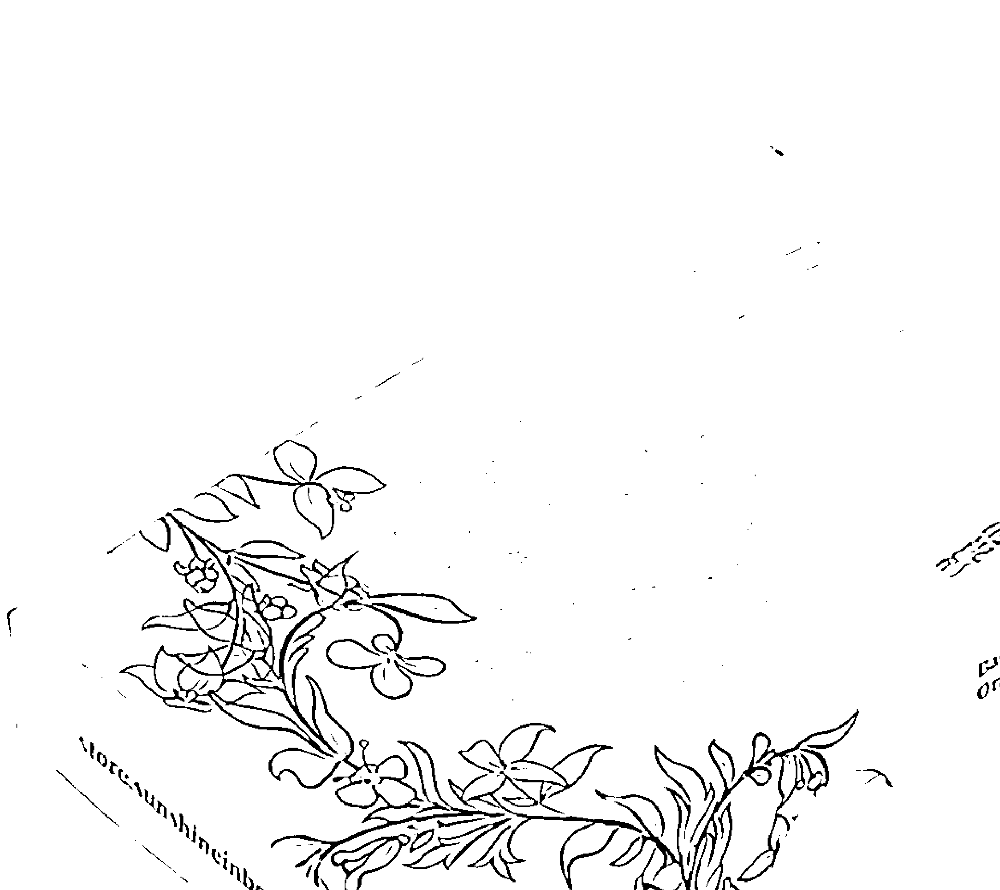

### 能量檢測儀

> E=MC²
——亞伯特·愛因斯坦

人體細胞中的水分子都帶著中性電子，會和地球的磁場產生效應，量子物理學家證實，所有的生命體都會產生某種程度的振動，藉由機器或特殊感應能力的人可覺察到。人類的去氧核糖核酸（DNA）振動的頻率，為五萬二千到七萬八千兆赫，這個藉由人體所發射出的生物波形磁場，就是「能量」，亦稱「生物能」。中國人在數千年前便已發現這個能量可以影響人體本身的生理、心理功能，並在氣功、醫學中大量應用，一般人們所熟知的十二經絡及奇經八脈等就是中醫用來代表體內能量流通的路徑，而針灸更是調氣的重要工具。

古人說：「人爭一口氣，佛爭一柱香。」氣是什麼呢？老祖宗認為「氣」是宇宙間一切的根源。這種理念隨著歷代先人對於醫學的領悟，便成了中醫理論的基石。「氣」這個名詞在中醫學裡，具有一字多異的特點，它可以作為「物質」，可以代表「功能」，亦能作為「氣候」。中醫聖經《黃帝內經》一書裡，提及「氣」的地方就有二千多處，而和氣有關的名稱就將近三百種，如大家常聽到的正氣、真氣、精氣、神氣、水穀之氣、營衛之氣、臟腑之氣、經絡之氣、宗氣、衛氣等，除了描述人體功能的氣外，亦有病理上的邪氣，如六淫之氣、七情之氣等……其中七情之氣（喜、怒、憂、思、悲、恐、驚）就與花精的治療息息相關。氣的名詞如此多，但也不必太去深究這些名稱，畢竟它們僅是因為分布部位、能量、頻率、作用不同，而有的不同稱謂罷了。

花精療法雖是情緒治療，但由於情緒本身是一種波動，也算能量的一種，且許多治療師採用的花精診斷儀器（如崔玖醫師的穴檢儀、何逸暹醫師的量子檢測儀），均屬於能量醫學的一部份，因此對於能量（即中醫的氣）做深入的了解，不僅對花精的選擇有幫助，亦可對後續的自製花精提供一指引明燈。

說到氣，氣功是全世界都知道的「氣之道」，像書中常提到的自發功，即為氣功一種。常練功、靜坐的人比較能夠感應到氣，在花精的選擇中，LET及靈擺就需要很大的氣感，才能得到正確的花精資訊。在崔玖的《花精與花魂》一書裡提到，北美花精協會的負責人派翠西亞·凱明斯姬（Patricia Kaminski）告訴她要靠「修行與修煉」來發現可用的花精材料，而修煉即包含氣功、靜坐在內。氣的感覺存在於您我周遭，有些人一進到空屋，便感受到一股毛骨悚然、寒毛直豎的Feeling，這就是感受到陰氣，這種屋子是不能住人的。只是世人的煩惱太多，沒法靜下來，因此僅有少數敏感的人可以覺察到這些細微的變化。為了讓大家體會「氣」，在此推薦一個最簡單的感應法：把兩手掌平行相對，距離約15公分左右，然後左右手同時向外向內平行地擺動，並將注意力集中在雙手掌上，沒多久時間，便可感受到二手的掌面、手指有麻麻的感覺，那就是氣了。

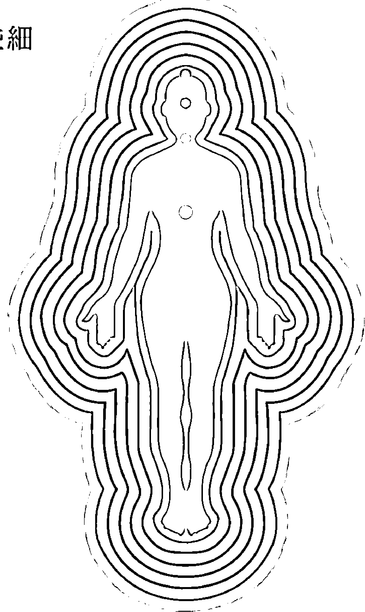

現今醫學研究證實，中醫的氣就是生物電，是可以用儀器度量的。人體的這種電磁特性可以表現在人體的皮膚上，只要使用電壓誘導，即可測出變化的情況，像我們耳熟能詳的心電圖（ECG）、腦電圖（EEG）、肌電圖、核磁共振攝影掃描儀（MRI）等，都是應用人體內電磁分布的原理發展而成的。在能量醫學中，能量儀器隨著科技的發展，而有不同的豐富面貌，從蘇俄的克里安照相術、ARDK、德國的傅爾電針、日本的良導絡、鍾傑與崔玖教授的秦質儀、穴檢儀、王唯工教授的脈診儀、量子檢測儀、生物能量信息檢測儀等，都是可以提供我們量化及看見能量的工具，茲將各儀器分述如下。

### 克里安照相術

從能量醫學的觀點，任何物質都有波動的特性，也就是說，萬事萬物皆有能量，一個物體會同時具有「有形的實體」及「無形的氣場」，但人們對於眼睛無法看清的現象始終有種「信與不信」的搖擺情形。1939年，蘇俄電子工程師克里安利用照相術，將「不可見光譜」的電磁予以顯相，用照相底片來顯現如靈氣等一般人所看不見的景象，印證了所有生物均具有「能量」的事實，此技術稱為Kirlian照相術。即使是一個小硬幣也有一定範圍的氣場，更何況是水晶寶石、花精等高能量的物品，均可由此照相術看到這些無形的能量場。在我以前學彩光針灸時，德國講師曾介紹應用克里安照像術來做為治療的依據，而身體地圖中的許多花精反射區比對，也常應用到這種方式來進行驗證。有關克里安照相的圖片，讀者可在網路上搜尋Kirlian，便可看到各種物體的氣場圖了。

### 良導絡

1950年，日本人中谷義雄利用電阻儀器發現身體有12條主要的良導絡（即為中醫的12正經），驗證了經絡穴道具有低電阻及高導電性，並於此12條良導絡各取手與足各6個良導絡代表測定點，左右共24個測定點，發明了良導絡，於1957年正式於科學期刊上發表「良導絡診療學」，現在許多診所仍有使用這種儀器來檢測患者的經絡是否正常。

### 傅爾電針

1953年，德國人傅爾（Reinhold Voll）利用極低的直流電壓（約1.5伏特）刺激人體的指尖，產生極微弱的電流從穴位循經絡進入臟腑，會引起一連串人體對電刺激的反應，而反應的數據即可做為診斷的參考。這種利用經絡系統傳導的特性，首度將經絡的氣能量轉換成電量加以測量，以診斷病患，並可做為治療的工具，即為1955年所發表的傅爾電針。

傅爾發現，當人體出現病變時，細胞會先發生異常，並開始有不正常的體液變化，此時細胞上的生物電就會有所改變，當這種細胞的電位變化累積到相當程度時，就會反應到經絡系統上，皮膚上穴位的電位也隨之改變，而傅爾電針便可以敏銳的偵測出這改變。隨著科技進步，傅爾電針也在不斷改良，榮總傳統醫學研究中心便將其改良，發展出功能更強大的電腦電針儀，即一般人們熟知的「秦值測量儀」。不過不論是那一種，基本上都是利用微量的直流電，在穴位上誘導出代表器官系統的訊息，並依此作為篩檢藥品及診斷之用。這一類的儀器又稱為「穴位電機能篩檢測試儀」（Electro-Dermal Screening Device），或簡稱ESD「穴診儀」，其運作模式均不脫離下列原則。

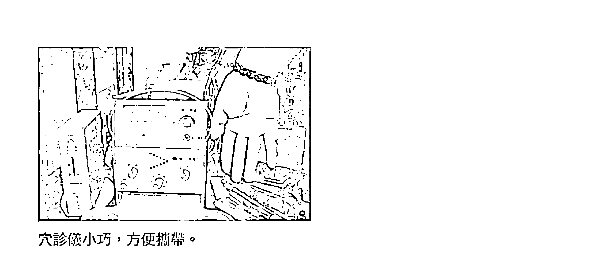

- 探測人體的穴道，凡是有穴道的地方電阻均較低（正常電阻為100kΩ）。
- 臨床量測時，當量測電阻值不為100kΩ時，便可知道那條經絡異常，也代表著情緒有問題。十二經絡中，每個經絡均管一個臟腑，如足厥陰肝經對應肝，肝主怒，因此這條經絡便與怒氣有關。又如足少陰腎經對應腎，腎主恐，因此要查恐懼的指數時，腎經即是要查的穴道。運用經絡及臟腑特性，可檢測出情緒是否處於波動狀態，而我也是應用這種原理找出台灣版的巴赫花精對應穴（參閱新巴赫花精對應穴位章節）。
- 將花精放在檢測盤上或患者身上，再量測一次穴道，若電阻變為100kΩ，即表示這個花精對個案的情緒恢復有幫助，便可開立此花精。

在診斷上，穴診儀除了可以幫助檢測外，亦可協助做花精、藥物的篩選，崔玖教授常應用這樣的方法做花精選擇。由於萬物皆有能量，因此身上所攜帶的藥物與病理試劑，其訊息波會進入人體與器官共振，並會影響從穴位量到的讀數。當藥物或花精置於病人身上時，若對個案是有幫助時，穴檢儀的指針就會回復到平衡的刻度；反之若藥物不能治病或劑量不對時，則指針亦可顯示出異樣來。

在治療上，這種機器亦可提供治療。傅爾醫師是個膀胱癌患者，並留置一條導尿管，據說這條導尿管很少更換，因為他每天都會使用電針來測試自己的身體狀況，並保持體內生物電的平衡，因而不曾引起發炎，而癌症也未曾復發過，並有充沛的體力到世界各地講課，他最後病逝時，並非死於癌症，而是心臟衰竭，享年八十多歲。這樣的機器雖好用，但在臨床應用上卻不普遍，主要原因為：

- 健保不給付，使用者必須自費。
- 檢驗二十個穴道及比對合適的花精需要相當長的時間，以目前醫師的人力，很難達到收支平衡
- 測試探針必須正確的壓在穴道上，且方向、角度、力道都須穩定，倘若操作不熟練，將會有不同的診斷結果，這也是應用此儀器的一個最大關鍵問題。

### ARDK

60年代，美蘇兩大強國為了太空競賽，爭相發展太空科技，即使是太空人身體機能的好壞也成為雙方競賽的內容。在太空失重的條件下，許多在地面的檢驗儀器無法使用，蘇俄科學家便參考中醫經絡及良導絡研究，開發出ARDK，並於1984年第一次在太空中使用。

ARDK是測量中醫傳統經脈理論中所謂的「原穴」，在國內醫師的引進推廣下，許多診所及醫院都有這項儀器，之前我在讀研究所時，實驗室便有做一多穴位的ARDK，可同時量測多個穴位，不用一個穴位一個穴位敲擊。不過ARDK完全是測量「原穴」，與良導絡的經絡測量法有些不同。導絡檢測裡中谷義雄教授經由不斷的反覆驗證後採取客觀的代表測定點不同，且每個人敲擊穴位的力道不同，現在雖有科技公司推出穩定力道的擊鎚可以校正這樣的缺定，但原穴與測定點的問題，仍是ARDK所要考慮的。

### 生物能量信息檢測儀

生物能量信息檢測儀是運用經絡學說、良導絡、傳爾電針的理論基礎，結合了物理、生化、生理、病理、免疫學、毒理學、醫學和臨床統計學等資料庫及知識統合而成，是用來探測非物質性的醫學，即量測無形的氣。近年來，自然醫學，尤其是能量信息醫學普受歐美國家重視，記得多年前，在我學習彩光針灸時，德國講師向我們說：

> > 「德國把發展中醫藥列為國家重大政策，在台灣的中醫界們要多加油。」

聽到老師這麼一說，讓在台灣的我們為之汗顏。

中醫的理論博大精深，但隨著清末國勢走下坡，漸漸不受人們重視，許多西醫、科學界的人士在當時還譏諷為不科學的產物，受到許多人的蔑視。中醫雖有許多寶藏，可是偏偏有許多主政者不信這些，只相信所謂的實驗數據，可笑的是這些數據還是以老鼠當實驗對象，也就是說，中醫是否科學還要這些老鼠大哥們同意才算數，老祖宗數千年的經驗如同敝屣（老鼠實驗有很大的盲點，如中藥中的瀉藥巴豆，老鼠吃後不但不會瀉，反而愈吃愈肥，故巴豆又稱肥鼠丸）。當國內的醫療衛生單位及學術機構還在作實驗證明中醫理論是否為對的時候，歐美各國早已直接擷取中醫氣的觀念及經絡的概念，他們完全相信中醫理論的內容，直接把中醫的古老資料用來發展最先進的能量檢測儀。這種可在數分鐘內檢測上萬種信息的機器，其原理來自中醫，再由國外引進，儀器售價並不便宜，不同的機型，如VEGA、Quantum、CoRe、Oberon等，價格約為60萬到100萬間，但功效強大，就長期醫療市場來說，是很值得推廣的，也望在台灣的中醫師們多努力了。

儀器類檢測法，近來漸漸普及，不過這些儀器所費不貲，治療師在添購前必須多考量。2006年，醫界曾舉行醫師基礎能力測試，測試結果顯示許多醫師忘記了基本問診、觸診的能力，只會閱讀檢驗報告，看電腦斷層，誇張的醫師連CPR也忘了，彷彿只要一停電，醫師就只能兩手一攤，莫可奈何。醫界如此，愈來愈重視檢測儀器的花精治療師們也如此，當機器停擺或停電時，治療師又該如何分析出個案所需的花精呢？這在現今氣候異常、天災人禍不斷的時刻就特別值得重視了，這也是為何一直強調徒手能量診斷（靈擺、LET）的重要性，畢竟一個治療師，必須能在任何時空環境下幫助人，才稱得上是全方位的良醫，也才能隨時濟世救人。

### 靈擺

「這個學員若需要這個花精的話，請順時鐘旋轉。」所有的目光都盯著我手上的靈擺，不一會，答案出來了，需要這個花精。「接下來我們測試所要使用的滴數？」又一次，學員們的目光注射著靈擺如何給我們答案，而每一次的現場測試，總讓同學們驚呼連連，有帶靈擺的同學，也迫不及待地現場來個DIY測試。

靈擺是運用小水晶將直覺顯現的工具，透過靈擺，可以明確告知我們花精的劑量、選擇的種類。一般靈擺訓練約一到三個月便可上手，但在教學的經驗裡，有些同學不到一個小時便可運用自如，習得一項能量診斷技巧，相較於LET須費時數年方可精通，靈擺的學習效率顯得高些，而且小巧的靈擺亦可當做裝飾品。這項技術的訓練方式雖然簡單，但還要經過一個啟動程序，在實際看過別人示範操作過後，對於靈擺的感應能力便可大幅提升，這有點像是「開光」的過程，讓我們能更快通氣。有興趣的人，不妨在家試試下列的靈擺訓練方式：

- 培養感情：每天戴在身上
- 程式化
  - 當我問一個問題，答案為「是」的時候，請順時鐘旋轉。
  - 當我問一個問題，答案為「否」的時候，請逆時鐘旋轉。
  - 若作用愈大，請旋轉愈大。
- 常測試：熟能生巧

#### 靈擺的好處

- 快速、直接而且準確的診斷。
- 可以對症處方，劑量該使用多少？副作用多少？
- 愛美的您，可用以選擇最適當的化妝品、芳香療法所使用的精油，不會因誤用不適膚質或選用含有劣質成份的商品傷害到自己肌膚。現今購物頻道及拍賣資訊眾多，可用這個技術幫忙把關。家人之前看購物頻道某一產品後躍躍欲試，叫我幫忙測試一件塑身衣，但測試的答案是「對塑身沒幫助」，當時大家都很懷疑，那麼多人背書的東西怎麼會有這樣的測試答案？一個星期後，爆發某老師產品事件，新聞播出時才知道這個塑身衣是假的，好險當初沒買。
- 判別食物是否已變質或受污染不可食用，對日常飲食做篩選。
- 選擇適合體質的各種寶石、飾品。
- 旅居國外或野外活動生病時，能應急處理，找尋適合的藥用植物。
- 可為飼養的寵物做診斷及處方（犬貓等寵物不會說話，用這個最好了）。

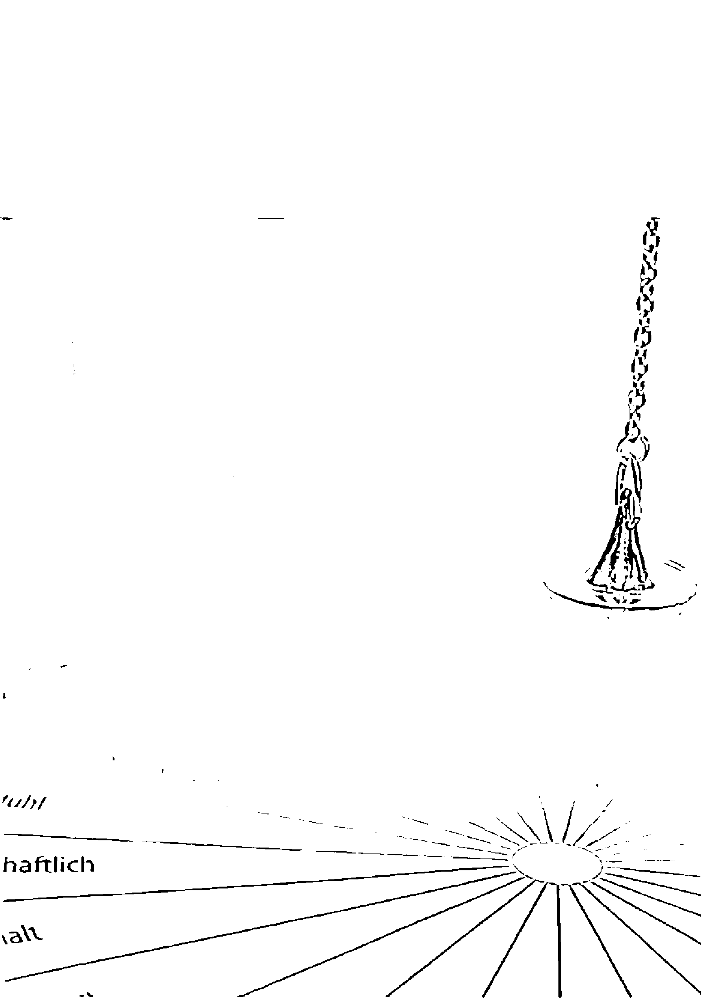

LET（Life Energy Test生命能量檢測）是一種徒手能量檢測，可說是上帝賜給人們可以親眼看到檢驗結果的工具，在清朝吳尚仙所著之《理瀹駢集》醫書中曾有記載。在1970年，由紐約心臟病研究所所長大村惠昭博士證實這種療法，並大力推廣，即為整脊界及醫界常用的O環測試（O-ring test）。

2001年，就讀研究所時，指導教授派我去台中中國醫藥大學談一個嬰兒哭聲的判別研究，這是一個藉由語音訊號分析baby的哭聲，來判斷嬰兒是餓的哭、痛的哭、大便的哭、想媽媽的哭……不過我對這種研究很沒興趣，雖然商機很大，且可能和畢業論文有關，但只把它當成一個差事來做而已。載了一車的大學部學弟和研究所同學，到了美德醫療大樓，拜訪的是張永賢張副院長，這也是嬰兒哭聲的另一個指導教授。和他不是很熟，只聽說是德國留學回來的高材生，頭微禿、有點小鬍子，好像指導教授大多是這樣。禮貌性地哈拉拜會一下，便在他的辦公室裡談研究進度及實驗方法，談著談著，張副院長突然問我：「有沒有辦法做個機器，可以測得手指肌力的變化」？

機器？我腦袋摸不著頭緒，怎會冒出這句話！！原來，不久前，大村惠昭博士曾來中國醫藥大學演講，張副院長帶了一大群醫師去聽。對於O環測試，是有聽過，但到底是真是假，不得而知。測試的最好方法，就是實際找個病人讓大村惠昭做O環測試看看。結果令人吃驚，不用幾分鐘的時間，大村惠昭博士便已將該病患的疾病正確無誤地測出，憑藉的，就是手指肌力變化而已。我可以體會他和那群主治醫師們心中的疑惑，為何需要許多儀器才能診斷出的疾病，居然在拉幾下手指頭就能夠清楚的知道，而且這還是有經過美國著名大學證實過的技術，並有美國特許局的專利，無怪乎張副院長會這麼有興趣。

回到北部，上網查了資料。嗯，有找到這方面的教課資訊，黃河清老師正於創見堂教授LET。其實LET和O環測試大致來說是一樣的，大村惠昭的學生瓜生良介，將O環測試加以改良，並予以推廣，並改名為LET。傳入台灣後，黃河清老師便接下教學的棒子，在北部教授。只不過，我的能量老師：陳德昌老師與淡水的桂枝姐，又將黃河清老師的LET加以改良，開創出單人便可以操作的模式（傳統的LET和O環測試，均需兩人共同操作方能執行檢測），而且診測範圍還大幅擴充，並且納入海靈格家族排列體系，使得新版LET可以測得身、心、靈的各項問題，即使連AMCT的矯治點，用LET亦可快速找出（我的能量老師在多年前的LET診療中，便已使用LET判別長短腳及AMCT的矯治點）。我先後跟隨黃河清老師、陳德昌老師與淡水的桂枝姐學習能量測試技巧。在學過不同門派的LET後，心中略有心得，參考古今中外的資料後，我將能量檢測分為四個等級：

#### 能量測試第一級

雙人對拉LET，需要兩個人才能執行。

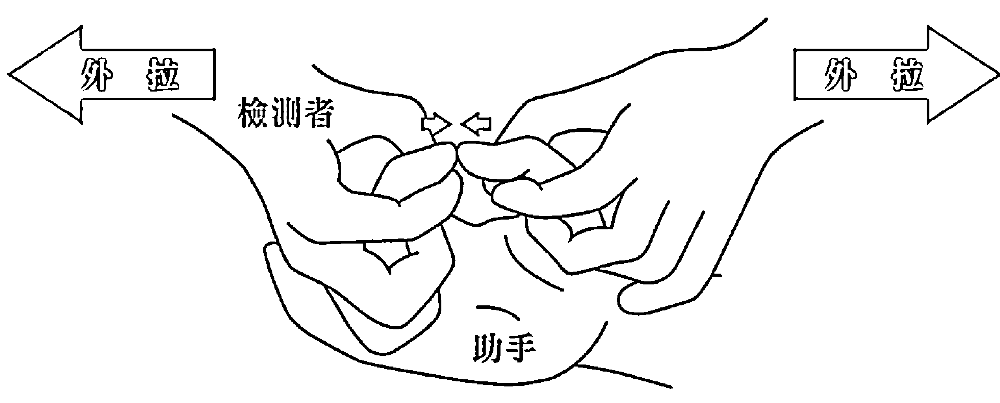

#### 能量测试第二级

单人双手对拉LET，治疗师自己右手拉左手。

#### 能量测试第三级

单人单手LET，治疗师左手或右手的O环会自动打开。

#### 能量测试第四级

直觉，不须用手便可感应到结果。

崔玖教授常提到的马提纳医师，就常利用O环测试来为患者选择适合的花波制剂，不过其所用的检测法为能量测试第一级的双人对拉LET，和台湾版的单人LET不同，但方便性还是以单人LET较胜一筹，而我在临床应用上，便是以单人LET为主。许多患者看到这种检测法，都会觉得超酷的，当然准确度高才是患者愿意尝试的关键。只是LET并非那么好学，一般人约需数年的时间才能掌握，像我就花了三年的时间才出师（仅到第二级而已）。若想快速学会能量测试技巧，我倒是蛮建议使用灵摆的，除了操作方便外，大多数的人在三个月内就能上手运用，这也是为何我在课程中会纳入灵摆的原因。

万事万物皆是能量，善用能量测试，除了可以帮助我们选择适合的花精外，亦可以测出最好的治疗量，传统花精运用是2～4滴，可是运用能量检测时，虽大多数的患者剂量会落在这个区块，但仍有有些人仅用1滴，而我目前测过最高的使用滴数是16滴，其实在比对不同的资料发现，原来滴数的多寡，与目前身、心、灵的问题有着很大的关系。

人脑的脑波，有α（8～12Hz）、β（12～38Hz）、θ（4～8Hz）、δ（2～4Hz）四种频率，当人清醒的时候，是处在β波状态，因为此状态频率较高，所以花精的剂量也较高，才能与β脑波共振。另一方面，花精的剂量愈小，愈能和低频率的δ相应，脑波频率愈低，代表愈入定，愈能开悟。因此在身心灵三者的治疗中，花精滴数多的个案，大多提示要先处理其身体机能问题，而滴数需要少的个案，则告诉我们其偏重在灵觉的治疗。滴数多寡则与稀释度有关，花精用量愈多，则稀释度愈小，同类疗法的制剂稀释有三个层次，分别为X（1：10）、C（1：100）、M（1：1000），现在市面上有些可以帮助开悟的花精，作家胡茵梦有带领这方面的课程，因此若要帮助开悟，必须采用高稀释的花精，如C或M层次，如有些花波制剂或水晶类花精。不过个案所需的剂量并非治疗师高兴用几滴就用多少，而是要用能量测试检测，方能得到最好的花精剂量，有些久病的患者，病虽重，有时会检测出须高稀释的花精，滴数相当的少，这可能和古人说的“病重药轻”有关。

运用能量仪器时，可以检测出所需要的花精，同样的，运用LET亦可。这些年来，随着临床经验的提升，我也发展出一套快速的情绪诊断法，能在短短的数分钟内找出个案所需的花精处方、所需的滴数，个案对于这种技巧很新奇，也很惊讶居然可以将人的情绪测得这么准，临床应用也效果卓著。其实我目前的能量测试新法与老师教的有些许不同，在结合海灵格的家族代表后，检测情绪指数可以更准确，因此我将其更名为CLET（Cosmic Life Energy Test 宇宙生命能量检测）。其实方法如何不重要，重要的是如何掌握气场变化才是个中关键，张三丰武功深不可测，仍要求徒弟们忘掉招式，用心体验周遭环境变化，才能神在剑先，绵绵不绝。进入了能量测试界，才发现一山远比一山高，也感觉到自己的渺小，只能期勉自己更虚心地学习，让我更能精进，衷心地期盼大家都能使用能量测试，将会是选择花精的一个好工具，也很感谢上苍慈悲，赐给我这么好的诊察方法。感恩～

## # 第七章

### 花精的调配及使用

### 花精的使用

- 花精的使用
  - 内服
    - 纯液
    - 水杯
    - 滴瓶20c.c.
    - 矿泉水600c.c.
  - 情绪辩证为主
  - 外用
    - 纯液
    - 外嚼法
    - 花精外敷法
    - 自制花精软膏
    - 泡澡

### 滴瓶的选择与消毒

- 1. 滴瓶的选择以深色系为主，以隔绝阳光照射，一般常用的滴瓶颜色为蓝色及棕色，不过我觉得用蓝色的较好，因为蓝色瓶带点神秘的色彩。
- 2. 一般拿到空瓶后可以先稍加清洗，再用沸水煮过，然后晾干或是用烘碗机烘干就可以使用，建议使用这个方法。
- 3. 另一种方法为将玻璃瓶放进电锅里用蒸汽消毒，滴管则是用酒精消毒。
- 4. 当空瓶在水里煮沸时，滴管有时会起水渍，此时用热开水烫过即可。
- 5. 空瓶可至各地的瓶瓶罐罐店挑选，若在台北市区则在后火车站（延平北路、太原路）有不少专卖店及化工行可以购买，当然上网购买也很方便。
- 6. 若是认为玻璃瓶会沾染负能量，可用一点海盐加入水中浸泡至少2小时来消磁，但我们在使用时并不需要这么麻烦。不论是那一种方法，治疗师都可以依照自己的方便来做，毕竟滴瓶最主要用来保护稀释过的花精，以延长保存期限，因此只要能安全地盛装就能达到最基本的要求了。

### 花精内服法

花精使用方式分为内服与外用两种，外用法一般以贴敷为主，而内服法则是将花精直接滴于舌下，不论国内外，花精使用法仍以内服为主。内服法的应用方式很多，大致有表列数种供临床治疗师使用。我们的诊所及工作室最常使用的是20c.c.滴瓶法，这与一般坊间使用的30c.c.滴瓶有些不同，会这样选择是因为花精的能量递减关系，所以目前还是建议以20c.c.滴瓶为主。兹将常见的内服法表列如次：

| 类别 | 用法 | 备注 |
| :--- | :--- | :--- |
| 纯液 | 用花精各2～4滴，直接滴至舌下 | 紧急使用，效果最强 |
| 水杯 | 1. 将杯子注满水<br>2. 滴入花精各2～4滴<br>以啜饮方式饮用 | 1. 效果强，适合短期使用<br>2. 啜饮时一小口一小口饮用，就和品茶一样，不要牛饮，饮用频率愈多效果愈好，紧急时可以大约3～5分钟喝一次，一直到症状解除 |
| 滴瓶 20c.c. | 1. 将滴瓶注满水<br>2. 滴入花精各2～4滴<br>3. 调配好后，以滴管滴4～6滴于舌下<br>4. 一天服用至少四次 | 1. 若要长期保存，可加入酒精。水与酒精的比例3：1<br>2. 夏天可放入冰箱<br>3. 会有能量递减问题<br>4. 放久容易生霉菌，但于一个星期內服用完毕则较少有这样问题。 |
| 矿泉水 600c.c. | 1. 选用优质矿泉水一瓶<br>2. 滴入花精各4滴<br>3. 一天服用至少四次<br>4. 分数日将矿泉水喝完，也可把它当做养生茶一天就喝完 | 1. 同上<br>2. 对酒精过敏者，建议用此，可不用加入酒精保存 |

图解巴赫花精
506

## # 内服法注意事项

上表的内服法中，以纯液效果最强，水杯次之，矿泉水及滴瓶再次之。

调配好的滴瓶称为“调配瓶”或“治疗瓶”，但不具医师执照者宜避免称作“治疗瓶”，以免触犯药事法。瓶内通常会加入1/4至1/3的酒精作保存剂，酒精浓度越高，保存力越好，因此若要以100%全酒调配亦无不可。容量建议采用20c.c.或甚至10c.c.瓶，每次使用4～6滴。（经实际测试，依滴管头大小的不同，10c.c.约可滴150至200滴，20c.c.约可滴300至350滴。）调配好之后，可使用铝箔纸或含铝箔的纸筒包起来，以隔绝电磁波的干扰。

花精须存放在阴凉干燥处，不要晒太阳，长期保存时须距离高电磁波产品（如电脑、音响、电视机）两米以上。市售原装花精不须放冰箱保存，但调配瓶若酒精度不高较易腐败，可用铝箔纸包覆后放冰箱保存。

内服法一天至少四次，早上起床、睡觉前、午餐前、晚餐前是一定要服用的，也可建议个案增加使用频率，于白天再多两三次服用。

使用滴管时，切记不要碰到舌头、嘴唇或手指，以免污染。若不慎碰到，必须先以热开水烫过滴管后再放回。

花精最好滴在舌头下方，若无法准确做到这点，可先滴在舌头上，再让它慢慢流到舌下即可，并须含在口中约30秒再行吞咽。

使用后，请把握服用后的关键15分钟静心，若时间不允许，至少须静心30秒，疗效才能明显。

花精疗法要起作用，最好配合睡觉，如同电脑灌好软件后重新启动般，因此在刚起床或睡前做能量治疗是最好的。

花精与中、西药没有冲突，但仍建议服用的时间须与饮食、药物、刷牙相隔至少10分钟，以避免饮食能量干扰。不过如果不方便做到，可无需拘泥，花精仍然会有效果。

就疗效来说，未经稀释的花精纯液与刚经稀释后的花精疗效是一样的，只是稀释后的花精有能量递减问题，久了便会失效。而未经稀释的花精纯液，依厂牌的不同，约可保存5～10年。酒精度越高的厂牌，保存年限越长。

花精调配瓶是适用于疾病状况稳定时使用，倘若遇到危急病患，必须依据个案的情绪状况不断地更改花精处方，效果才会显著。那何时需“不断地更改花精处方”呢？我们由巴赫医师下列的这个医案分析可以得到明证。

巴赫医师有一次在Cromer渔村停留，遇到一位八岁的小男孩，左脚大脚趾被刺螫伤，形成脓疡，并于数日后鼠蹊部产生肿痛的腺体，巴赫医师以花精为这个小朋友做治疗。这个案例若在现今，早就被家属送到急诊室去了。

| 时间 | 小男孩病况 | 巴赫医师处置的花精 |
| :--- | :--- | :--- |
| 第一天晚上八点 | 鼠蹊部有一个三英寸大小的肿块、局部皮肤呈棕红色、心跳快、发烧、眼球凹陷。小男孩相当慌张不安，并显得焦躁需要妈妈在旁陪伴，病况危急 | 龙芽草：处理慌张不安、焦躁的情绪<br>菊苣：需要亲人在旁陪伴<br>岩玫瑰：处理危急情况 |
| 第一天晚上十点 | 小男孩开始精神错乱、昏迷 | 龙芽草：处理慌张不安、焦躁的情绪<br>菊苣：需要亲人在旁陪伴<br>岩玫瑰：处理危急情况<br>铁线莲：治疗其精神错乱、昏迷情形 |
| 第二天清晨三点 | 鼠蹊部的肿块按压已较不痛，皮肤颜色也变淡 | 上述四种花精继续服用 |
| 第三天早上 | 鼠蹊部及全身状况明显改善，已脱离危急病况，也不会吵着要妈妈陪伴，但有点虚弱 | 龙芽草：持续治疗慌张不安<br>矢车菊：治疗被病气侵袭后的虚弱状况<br>龙胆草：遭遇挫折而临时意志消沉 |
| 第四天早上 | 症状都消失，仅存些微慌张不安感及虚弱 | 龙芽草：持续治疗慌张不安<br>矢车菊：治疗被病气侵袭后的虚弱状况，恢复元气 |
| 第五天 | 在沙地上放风筝，完全正常 | 不需花精 |

> 医案参考资料《The Medical Discoveries of Edward Bach Physician》，Nora Weeks

#### 内服法常见问题

此次将临床上患者常会问的问题做一整理，以供治疗师们参考。

##### Q：花精要使用多久才能见效？

- 1. 急性问题短短数分钟即可见效，一些情绪激烈起伏的患者有时在使用花精后便有立即缓解的效果，如暴怒的人，在服用樱桃李花精后，会很快气消。
- 2. 一般情绪性的问题约2～4星期。
- 3. 根深蒂固的问题，如个案的心结已有数年的病历，则可能需要花上3个月到半年的时间。
- 4. 治疗师可搭配彩光针灸、持咒或其他能量疗法来加强治疗效果，而花精要使用多久才能见效，这也是大多数人会问的问题。
- 5. 若会能量测试者，可用能量测试看个案需要治疗几次。

##### Q：一次可以使用多少种花精呢？

- 1. 在巴赫医师就诊的案例中，只有两次曾经调配过9种花精。
- 2. 建议每次选用花精最好不要超过7种，也就是说，用的花精愈少愈好，才不会导致治疗目的失焦。因为花精是强调自我疗愈，太多的花精反而导致多头马车而让效果大打折扣。
- 3. 曾有治疗师试过38种花精全用，反而没有任何效果，因此不要以为多就是好。

##### Q：服用花精后，反而有情绪更糟的情形，或产生恐慌感，是什么原因呢？

- 1. 花精是任何人均可服用的，在全世界使用这八十多年的记录里，尚未有任何伤害人体或副作用发生的案例。
- 2. 即使是选错花精，最多也仅是效果不佳而已，并不会产生副作用。倘若治疗后情绪反而变得更糟，或有恐慌感出现，则须注意下列两种可能：
  - 遇到瞑眩反应（代表着个案处在花精服用的第三阶段反应，花精服用共有四阶段反应，如后所列）。
  - 花精并未开始奏效，这大多由于个案有根深蒂固的问题，建议个案持续服用。

##### Q：花精服用后有那些阶段的反应呢？

###### 第一阶段舒缓期：

服用花精后，许多个案会先进入这个层次，如有人服用橄榄花精后，会突然精神提振，但也有人会很想大睡一觉，并且可以连睡好多天；生气的人，在服用樱桃李或冬青花精后，情绪会变得较为平稳，即属于舒缓期。

###### 第二阶段省思期：

个案进入此阶段时，会省思自己为何会这样，并开始思索自己的未来，此时量测HRV（心律变异性；自律神经功能总活性指标）时，指数会开始上升。

###### 第三阶段瞑眩反应期：

瞑眩反应又称治愈危机、反弹现象。

服用花精后，有时花精会先将心中的负面情绪往外清除，就好像堆满灰尘的老房子在打扫时烟雾弥漫，如过去一直受压抑的情绪可能会因此而被引发出（特别是龙芽草、野酸苹果、岩玫瑰），而恐慌的人也会因恐惧情绪浮现而更加重，此时可使用胡桃或急救花精来强化保护自己，一般病况严重者大都会经过这个过程才能达到治愈的效果。

此时量测HRV时，指数会突然下降。

###### 瞑眩反应的处理程序如次：

- 1. 如果无法接受这样的反应，可以先使用急救花精并暂停服用，或减少使用频率至一天一次，一次一滴。同时建议个案多喝点水，并在晚上十一点之前就寝，让元气提升，早日摆脱负面情绪的瞑眩反应。
- 2. 若个案觉得长痛不如短痛，可以忍受瞑眩反应，则可建议个案增加使用频率及剂量（可在白天时每小时服用一次，一次4～6滴），也是一样要在晚上十一点之前就寝，这样会缩短治愈危机的期间。
- 3. 治疗师可加用彩光针灸、持咒、河图洛书按摩法、气功或其他能量疗法来缩短瞑眩反应。

###### 第四阶段蜕变期：

个案完全抛开过去的一切，走出负面情绪的枷锁，迈向全新的人生，面对过去，会以平常心看待，并把它当成人生的一个历程。

上述这四个阶段，并不会照这个顺序依次下来，有人在服用花精后，会直接跳到第三阶段，进入强烈的瞑眩反应，此时就要鼓励个案坚持下去，方能突破疗愈的屏障。不过在我的治疗经验中，大多数人仍会照着这四个阶段依序变化，尤其是有恐慌的人，在恐慌情绪好转时，会突然恶化，呈现极度恐慌的状态。除了个案的自觉症状外，透过HRV，亦可推敲出目前的反应阶段。

右图是一位个案的HRV图，透过此图可看出个案目前处在何阶段。个案因恐慌症来诊，2007/7/5初诊HRV值为25ms，算是偏低的。在治疗后一週后HRV提升至37ms，并感觉情绪有较稳定，也会思索为何自己会这样（第一阶段舒缓期、第二阶段省思期）。但在之后一週却又降至19ms，并产生强烈情绪反应（第三阶段瞑眩反应期），在坚持花精疗法下，隔週HRV又上升至39ms。

##### Q：对酒精过敏者或小朋友、怀孕时可否使用花精？

- 1. 花精是以白兰地作为保存媒介，在全世界使用多年的记录中，尚未有任何伤害人体或副作用发生的案例，原则上任何人都可以使用，当然也包括孕妇及小朋友，若还是不放心，也可建议患者直接使用花精外敷法。
- 2. 调配瓶中的花精，其酒精含量已经微乎其微。但对于酒精较为敏感者，可使用内服法中的“矿泉水600c.c.”法，可以大量稀释酒精；或是将花精加入热水中，先让酒精挥发，也可以降低敏感度。
- 3. 若已有过敏现象产生，如吃了花精之后会有起红疹或是感冒的症状产生，这些症状有时是一种类似排毒的好现象，大都会在3～7天之内结束，个案不需紧张。若有这些情形产生则建议按压耳朵的肾上腺穴，对于抗过敏与加速排毒有很好的作用。

##### Q：何谓能量递减问题？

在刚接触花精时，我的使用方式和大家都一样，都是加入清水、少许的酒精作保存，让人服用一个月。有次和我的能量老师讨论，无意中老师提到花精的递减，在他的经验里，调配后的花精对个案帮助性逐日下降，才特别提醒我说要注意这种情形。在此之后，我的另一位能量导师桂枝姐及其众多门徒，皆在临床中发现，花精只要一经稀释能量就会降低，他们的论述显然在我心中有些冲击，毕竟这和我的原始资讯是相违背的（花精可一直稀释，能量并不会改变）。

我开始思索原始的花精调配法，倘若依其原意，花精稀释能量并不会变，那是否将一瓶巴赫花精倒入石门水库，那饮用水库水的人是否都会得到花精的能量？那倒入太平洋呢？是否有下雨的地方都能雨露均霑地感受到花精的讯息？答案是否定的！

我的数位能量导师，能量测试功力一流，既然他们检测出有此问题，我也顺势跟着运用能量测试法检测，发现花精的讯息真的会与日递减，遂将检测资料做成下表。国内占星塔罗专家李孟浩常使用能量类花精，对于能量递减的现象亦有相同的看法，有上过他的课的学员应该有印象，当然也可上李孟浩的部落格逛逛，相信能找到这方面的讯息。另外提供一些花精的资讯供参：

1.  台湾花精提出不要用水稀释花精，否则将破坏花精的能量。
2.  英国Crystal Herbs的业力花精，在使用说明中亦提及：由于振动频率极高，稀释后会失去45%的能量，因此不可稀释，必须直接从瓶中取用。

目前许多花精治疗师仍以30c.c.滴瓶为主，让个案服用一个月。但有些个案会发现似乎愈喝会愈没效，原因就出在能量递减，可参考下图能量递减曲线。有时个案会发现治疗瓶中有棉絮物，这种棉絮物就是霉菌，虽说加入1/4白兰地可以防止矿泉水在使用完前变质，但由于台湾位于亚热带，放太久的水还是容易产生霉菌。有些个案不晓得，继续服用不但无治疗效果，反而会因霉菌的关系而拉肚子。当然亦有网友在我的部落格中提出服用一个月的调配瓶依旧有效，有关这点应可分为三方面来解释：

1.  动力法则：根据太空物理学，在外太空里，当发射一颗子弹时，若未遇到任何阻力，子弹将会一直前进，直到碰到东西才会停住。行进中的子弹，并未有任何的推力，而能一直持续飞行的动力，仅是当初的发射推力而已。同样的，花精抚平情绪的能力，就好像这般，当喝下第一口有效时，花精能量会一直持续下去，因此第一天喝的那一口，效力是可以持续到10天、20天、一个月，甚至一年，这是花精的动力法则，也是花精能长期疗愈的关键，而您在一个月后服用调配瓶花精有效，或许是第一天第一口的效力延伸。
2.  吸引力法则：看过「秘密」这部电影都知道，「心想事成」是这部电影的核心，当您心中认为这花精有效时，即使他只是一杯水，依旧有效。不是常听说有健康人被医生误诊为绝症，没两下光景就「走」了吗？心念是会影响疗效的，在临床应用上屡试屡验。
3.  调配花精的保存期限和酒精有关，当酒精浓度愈高时，保存愈久，因此加入1/4的酒精与加入1/2的酒精，其能量保存期间是不同的，而纯液由于全是酒精，因此保存期限很长，约为5～10年，只是虽然卫生条件可保存这么久，能量仍然会递减，只是递减得比较慢，毕竟40%酒精里头仍有60%是水，纯液滴入酒中仍然是受到稀释的。

一个学说的形成，一定会经过考验，除了一些经验交流外，花精厂的资料及临床个案的反应效果，均是验证的关键。在我运用这个能量递减资讯做调配依据后，个案给我的回应是正面的。身为一个花精治疗师，最重要的是如何帮个案早日回归常轨、释放心结、抚平创伤，因此高疗效的花精服法显然可以帮得上忙。虽说慢慢服用亦有效，只是在时间上，半年、一年的下去，个案所遭受到的内心折磨是无法用三言两语来形容。古人云：「人之所病，病疾多；医之所病，病道少」，如何让个案心中的阳光早日普照心田，才是我们所要做的，也愿世间能多些医病又医心的大医王，让人们都能远离生理及情绪上的痛苦。经过分析以20c.c.滴瓶装的容量最适当，调配花精时最好每种花精4滴（或大于4滴），并建议个案一天服用4～6次，每次4～6滴，于一个星期内喝完，若是开立30c.c.滴瓶，最好也在一周内饮用，如此才是疗效最高且最没有副作用的完美组合。

### 花精外用法

巴赫花精在世界各国应用已超过八十年，不论是巴赫医师的医案或众多治疗师的经验，花精可以辅助处理身心灵的各项问题，如忧郁、失眠、缓和情绪、提高孩童专注力、消除酸痛等各项身心症候群疾患，亦可在短短的几分钟内平静一个人的情绪。除了内服外，透过巴赫花精与身体地图花精反射区、中医经络与穴道的结合，花精外敷法可提供和口服效果同等快速且安全的治疗模式，给予个案更多元的复合性治疗，进而创造更令人满意的治疗效果。虽然酸痛处理是花精外敷法最常用到的，但身心症候群的调节及情绪释放，才是外敷法的主要诉求。

根据国内医界调查显示，有五成以上的忧郁症患者会出现各式各样的慢性身体疼痛。在检验时，常可发现血清素跟肾上腺素异常，当这两个神经传导物质失调的时候，常会出现疼痛反应，而情绪变化则会引起它们的失调，产生酸痛。花精外敷法可以消除负面情绪，因此可以藉由情绪路径调整到血清素跟肾上腺素这两个神经传导物质，进而消除疼痛。

> 「诸痛痒疮，皆属于心」

任何痛症，在古人的经验里，和「心（情绪）」有绝对的关系，这和现今的医学发现不谋而合，对于古人的智慧与先知卓见，后代子孙只能Orz。

因此花精外敷法对于酸痛疗法而言，可以提供临床医者一个新思维与新选择，而德国自然疗法师Dieter Kramer著《新巴赫花精身体地图》，即是属于疼痛花精反射区这方面的圣经。值得一提的是，花精外敷法虽效果满意，但外敷的有效时间约为四个小时，因为四小时后贴片一干便会失效。当花精外敷法对个案有效时，可建议再配合花精内服法，如此效果才能持久与巩固。

#### 常用的花精外用法

| 类别 | 用法 | 备注 |
|------|------|------|
| 纯液 | 各1～2滴，滴至劳宫穴 | 常用，可紧急使用 |
| 外喷法 | 1. 将喷瓶注满水 2. 滴入花精各4滴至喷瓶 3. 喷于患部 | 1. 大都搭配棉布外贴法 2. 可做全身喷洒，清除负面能量 |
| 绵布外贴法 | 1. 将喷瓶喷至绵布上 2. 贴于穴道或患部 | 1. 效果并不亚于内服法 2. 可参考身体地图做局部贴敷 3. 可贴于花精对应穴，若不想记对应穴，亦可直接贴在通用穴上（神门穴、三阴交穴） |
| 自制花精乳膏 | 1. 将凡士林或急救花精乳膏中加滴入花精各4滴 2. 涂抹于患处 | 可依个人情绪调配花精乳膏，如集中注意力乳膏、皮肤保养乳膏 |
| 随身携带法 | 1. 随身携带 2. 睡时置于枕头边 | 类似随身带着护身符 |
| 泡澡 | 1. 所需花精大人各10滴，小孩各5滴，滴入浴缸 2. 泡澡使用 | 可做全身净化使用 |

#### 应用方法

1.  运用情绪辨证法，找出适合个案的花精，可将多种花精合在同一块棉片上。
2.  贴于神门穴或三阴交穴，仅贴单侧即可。
3.  三阴交穴为肝、脾、肾三经交会，而神门穴为心经的大穴，主管一切情绪。

#### 通用穴花精外敷

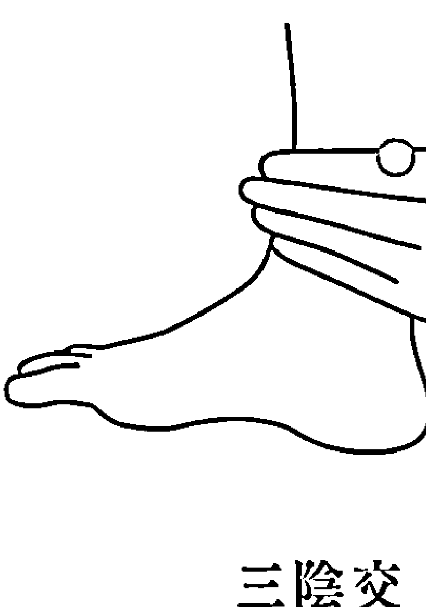

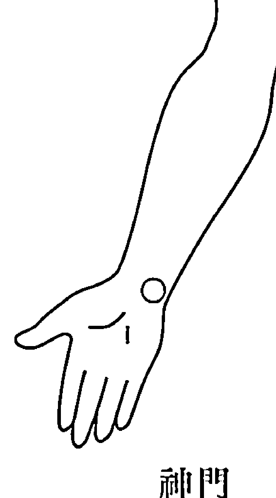

#### 花精局部外敷

花精局部外敷类似中医传统的阿是穴（痛那里针那里）。《新巴赫花精身体地图》一书中即详列了各种花精在人体的反射区，如橄榄花精对应到肩膀，甜栗花精对应到臀部，就可以提供我们一个按图索骥的方法。这本书把38种巴赫花精与身体区块做对应，只要个案感觉到那个区块有疼痛、不适感，或是治疗师经由触诊发现肌肉紧绷，便可依据书中的对应花精来使用。但若要让效果显著，仍须搭配情绪辨证法，方能找出最适合的花精。

### 新巴赫花精对应穴位

国外的花精疗法书籍中，目前有不少和中医相关，在Deborah Craydon与Warren Bellows合著的《Floral Acupuncture》中，将花精与中医针灸穴道相结合，让花精的运用有别于传统的内服法及Dietmar Kramer所提出的人体花精反应区贴敷。欧美人士对于中医经络、穴道的认同与推广，让在台湾的我们相当兴奋，但也有点汗颜，毕竟中医在台湾不太受重视是个事实，心头里也担忧中医教育未来是否会在台湾断根，尤其在现今意识形态作崇的时刻。

中医在国外发扬茁壮，值得喝采，但究竟Deborah Craydon与Warren Bellows他们是如何找出这些穴道的呢？须知中医的穴道与经络、五脏六腑环环相扣，无法独立出来，是自成一个理论体系的，如中医的肾主恐惧，因此肾经上的穴道，对于恐惧就有较好的效果，搭配着恐惧类花精（白杨、满酸浆、樱桃李、红栗、岩玫瑰）效果将会更好，这也是中医经络心理学迷人的地方。

汉朝张仲景在「金匮要略」一书中曾提出：「千般疢难，不越三条」，即是指中医观点里认为导致疾病发生的原因不外乎三种：即内因（七情过激所伤）、外因（六淫侵袭所伤）、不内外因（房室过度、饮食不节、金刃跌扑损伤、中毒、寄生虫等）。这其中的七情包括了喜、怒、忧、思、悲、恐、惊七种情志的变化，任何人在日常生活中，常会因外在事物而出现七情变化，如中奖了很高兴，喜气洋洋；亲人过世很悲哀；碰到无理取闹的人很生气，怒气直冲，这些情绪变化均属于正常的精神活动，一般情况下并不会致病。但若在突然、强烈或长期的情志刺激下，才会影响到人体的正常生理，使脏腑气血功能紊乱，导致疾病产生。中医理论中即有「怒伤肝、喜伤心、思伤脾、忧伤肺、恐伤肾」等情绪致病因素，而经络心理学，即是将负面情绪与五脏六腑、经络做结合，也因此，运用经络心理学与花精结合，将可开拓更高的疗愈效果。

大陆及台湾，是中医的大本营，但却从未有人将花精与穴道做整合。我曾以能量检测发现，《Floral Acupuncture》一书中所提胡桃花精与手太阳小肠经的天窗穴相对应，可是在我运用能量测试（LET，Life Energy Test）做检测时，发现贴敷同样是小肠经的天容穴帮助却更高，因此我根据花精的特性、能量检测方法及中医理论、针灸五输穴原理，依序找出了38个花精的新版对应穴。相较于《Floral Acupuncture》的穴位分布在全身（有些在眼睛的睛明穴，而有些在阴部的会阴穴、长强穴，有些在胸部附近，贴敷较为不便），新版的巴赫花精对应穴位则主要以四肢穴道为主，除了方便贴敷外，也能避免尴尬的情形。

#### 穴位选取依据及贴敷穴位

巴赫花精对应穴位选取依据：

1.  依据中医七情相克与脏象学说。
    a. 肝主怒
    b. 心主喜，心主神明，主所有情绪
    c. 脾主忧思
    d. 肺主悲
    e. 肾主恐
2.  选择以各经络的五输穴为主，因为五输穴均在肘膝以下，这样的穴位方便取用。
3.  穴位以能量检测（灵摆／LET）测试。
4.  临床应用经验。

#### 贴敷穴位

| 巴赫花精名称 | 英文名称 | 十二经络 | 贴敷使用的穴位 |
| :--- | :--- | :--- | :--- |
| 龙芽草 | Agrimony | 手少阴心经 | 灵道 |
| 白杨 | Aspen | 足少阴肾经 | 太溪 |
| 山毛榉 | Beech | 足少阳胆经 | 足临泣 |
| 矢车菊 | Centaury | 足太阴脾经 | 公孙 |
| 水蕨 | Cerato | 手少阴心经 | 少冲 |
| 樱桃李 | Cherry Plum | 足厥阴肝经 | 太冲 |
| 栗树芽苞 | Chestnut Bud | 手少阳三焦经 | 支沟 |
| 菊苣 | Chicory | 手厥阴心包经 | 大陵 |
| 铁线莲 | Clematis | 手少阴心经 | 神门 |
| 野酸苹果 | Crab Apple | 手阳明大肠经 | 三间 |
| 榆树 | Elm | 手少阳三焦经 | 中渚 |
| 龙胆 | Gentian | 足少阴肾经 | 照海 |
| 荆豆 | Gorse | 手厥阴心包经 | 郄门 |
| 石楠 | Heather | 手少阴心经 | 神门 |
| 冬青 | Holly | 足厥阴肝经 | 太冲 |
| 忍冬 | Honeysuckle | 手厥阴心包经 | 劳宫 |
| 鹅耳枥 | Hornbeam | 手太阴肺经 | 尺泽 |
| 凤仙花 | Impatiens | 手厥阴心包经 | 曲泽 |
| 落叶松 | Larch | 足阳明胃经 | 足三里 |
| 沟酸浆 | Mimulus | 足少阴肾经 | 复溜 |
| 芥末 | Mustard | 手太阴肺经 | 鱼际 |
| 橡树 | Oak | 手阳明大肠经 | 手三里 |
| 橄榄 | Olive | 足少阳胆经 | 肩井 |
| 松树 | Pine | 手厥阴心包经 | 劳宫 |
| 红栗 | Red Chestnut | 手少阴心经 | 神门 |
| 岩玫瑰 | Rock Rose | 足少阴肾经 | 太溪 |
| 岩水 | Rock Water | 足少阳胆经 | 阳陵泉 |
| 线球草 | Sclerathus | 手阳明大肠经 | 商阳 |
| 圣星百合 | Star of Bethlehem | 手少阴心经 | 神门 |
| 甜栗 | Sweet Chestnut | 足太阴脾经 | 阴陵泉 |
| 马鞭草 | Vervain | 手阳明大肠经 | 手三里 |
| 葡萄 | Vine | 手厥阴心包经 | 中冲 |
| 水堇 | Water Violet | 足太阳膀胱经 | 委中 |
| 胡桃 | Walnut | 手太阳小肠经 | 天容 |
| 白栗 | White Chestnut | 手少阴心经 | 神门 |
| 野燕麦 | Wild Oat | 足少阳胆经 | 光明 |
| 野玫瑰 | Wild Rose | 手少阴心经 | 少冲 |
| 杨柳 | Willow | 手少阴心经 | 灵道 |

附注：随着后学个人对能量的体会，这是最新的修订版本。由于每个人的能量场不同，本表提供通用性法则，最好还是实测实贴。

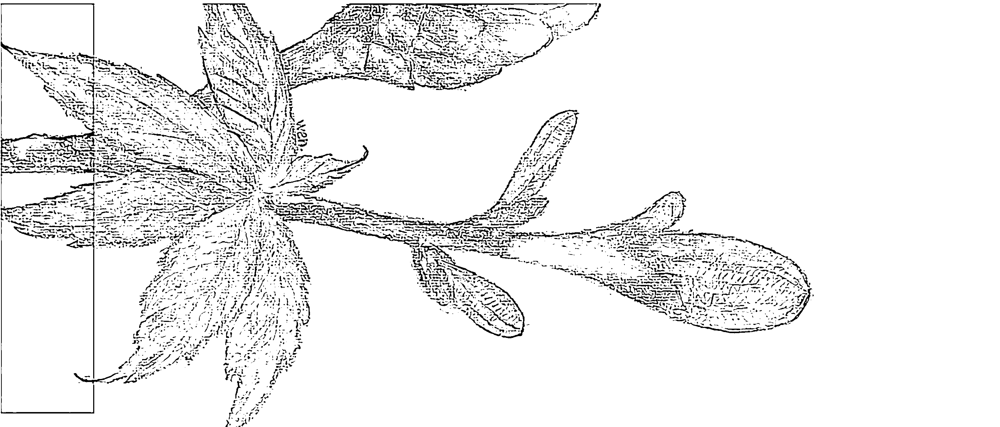

## Chapter 8

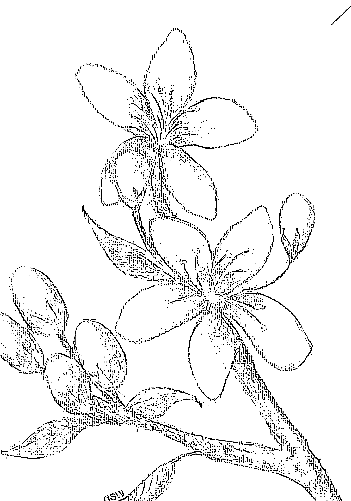

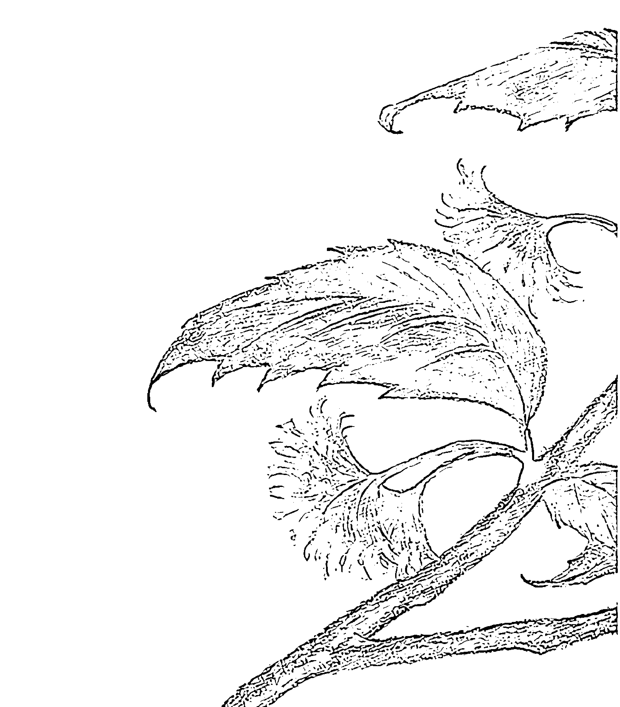

### 如何提高花精疗效

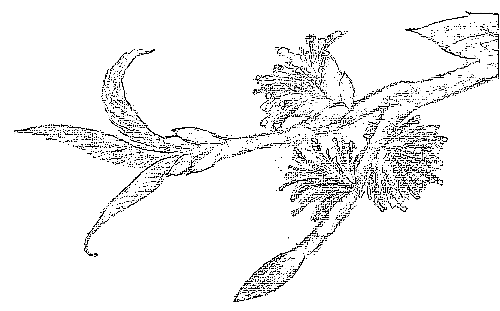

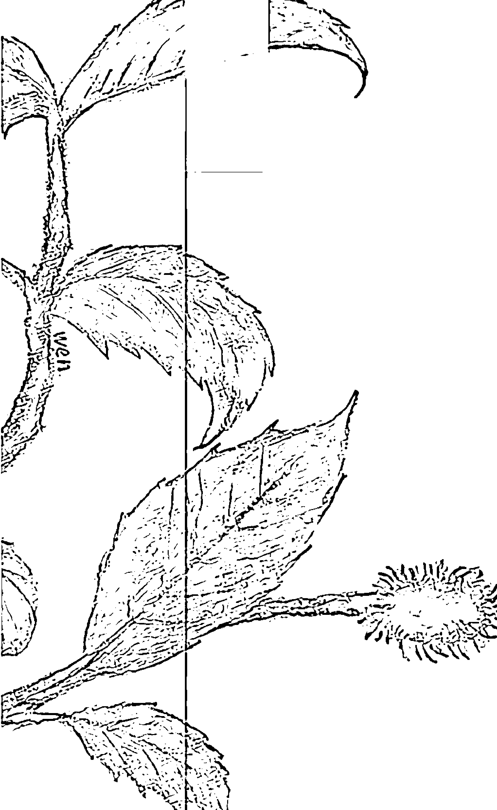

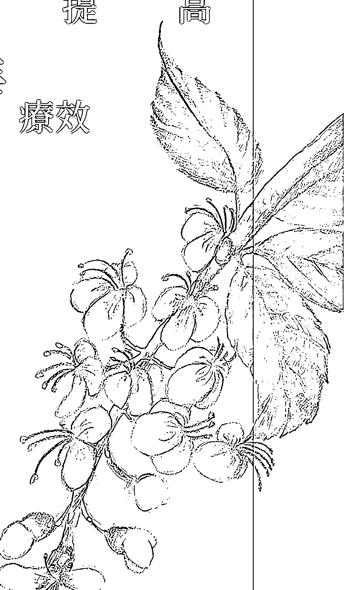

### 造成花精无效的因素

在运用花精的治疗过程中，有时会遇到成效不彰的情形，身为治疗师，必须能够快速地找出问题的核心点，才能让患者的情绪问题早日得到疗愈，因此本章节也将剖析如何提高花精的疗效。在我这些年里的临床经验里，我将花精为何无效的各项因素分析如次：

1.  选错花精。
2.  毒素干扰。
3.  花精的能量递减。
4.  个案本身之能量阻塞。
5.  个案不相信自己会疗愈。
6.  没有配合自我察觉及灵性修行。
7.  没有配合正确的使用方式。

#### 避免选错花精

选错花精是花精无效的第一个因素，不过这在新手治疗师或对花精不熟悉的朋友身上较容易看到。花精的治疗就和输入电脑密码一样，必须完全契合，才能将负面情绪完全解开。如冬青与樱桃李，都有愤怒的情形，但冬青归属于「过度敏感类」花精族群中，因此这一类的患者受到任何一点刺激都会动怒；而樱桃李花精则是「恐惧类」花精的一环，他们会害怕情绪失控波及到别人，所以会隐忍，到了某个程度才会火山爆发而动怒。在看诊时，有些患者会带来她们在别处花精门诊的处方来问我，而冬青与樱桃李就是有些花精治疗师常会用错的地方，当然这就影响到个案的治疗效果。

为防止这种现象产生，治疗师必须深入了解38个花精的异同处。本书中的图像记忆法可以帮助我们熟稔这些花精，增加临床筛选处方的精确性。而书中的医案，有空时建议读者可以多加阅览，临床应用时方能信手拈来，开立最佳的花精处方。这本书和别的花精书籍不一样的地方，就是详加介绍花精的选择方法，书中介绍的谈话谘商、占星方式、能量检测、灵摆、肌肉触诊法，或是最简单的情绪检测表，都能帮助治疗师及个案找出最精确的处方。一般来说，若能采样谘商与能量诊断合并使用，是最四平八稳的诊断法，所以即使是新手治疗师，也建议使用最简单的情绪检测表并搭配灵摆使用，这样比较不会有选错的情事产生。

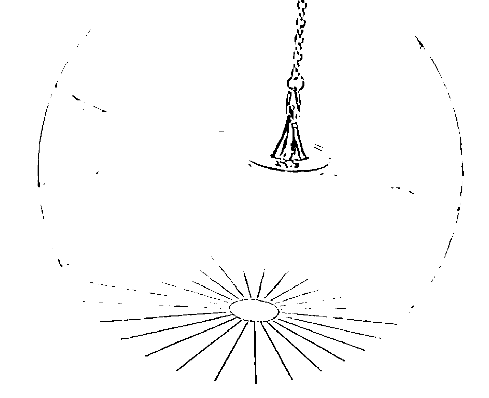

毒素这个名词源于罗杰·卡拉汉（Roger J. Callahan）《敲醒心灵的能量》一书，但这个毒素并不是指会让人中毒的毒物，而是指会干扰我们情绪的能量毒素。在崔玖教授的临床经验里，也发现不少患者的含汞假牙（银粉，一般都是多年前较低价位的假牙）会影响到情绪起伏与身体健康，而这也算是毒素的一种。

情绪治疗的效果（如彩光针灸、TFT、花精）是可以随着时间推移而持续下去的，也许一辈子也不会再复发，但有时外界的一些物品将会破坏这个治疗效果，导致情绪问题浮现，如又再度恐慌、再度莫名的焦虑等，这就是卡拉汉博士所称的「毒素」。而预防之道便是远离这些毒素一到二个月，让人体能量系统得以休养喘息，待能量系统强化修复后，再次碰到毒素也不会产生不良反应，这样情绪才能永保安适状态。一般常见影响情绪的能量毒素可概括分为外毒素与内毒素。

#### 内毒素

大多为饮食毒素，如咖啡、茶、香菸、玉米、糖、小麦、精制糖、沙拉酱、垃圾食物、氢化脂肪等。其中抽烟是最普遍的毒素，一定要拒绝抽烟或二手菸。另外，一般人喜爱吃的饼干、奶油面包等，有些含有氢化脂肪，会干扰到花精疗效，在进食时要多加留意。

#### 外毒素

大多为环境毒素，如臭氧层破洞、紫外线照射、空气污染、重金属农药残留、香水、室内装潢的气味、洗衣精、沐浴乳、洗洁精、除臭剂、各种化学物质、化学合成衣物、假牙（牙齿的银粉填补材料一半是汞）。

中医将病因分为三种：内因、外因、不内外因，内因为喜、怒、忧、思、悲、恐、惊等七情；外因为风、寒、暑、湿、燥、火等六淫邪气；不内外因为饮食不节、房室过度、外伤、寄生虫等，所以上述的外毒素与内毒素其实也可以中医的病因来概括。《素问·上古天真论》：「虚邪贼风，避之有时；恬淡虚无，真气从之，精神内守，病安从来？」因此对于外毒素，我们要顺应自然界变化和避免邪气的侵袭，并要心神宁静，使精气神内守而不失散，便能达到《素问·生气通天论》「清静则肉腠闭拒，虽有大风苛毒，弗之能害」的境界。巴赫医师曾提出了健康的四大要素，其中一项便是纯净的饮食。在巴赫医师那个年代（1886～1936），就已经有许多人工合成的食物，而他也洞悉出这些饮食对于情绪会产生副作用，更何况是现今基因食品、黑心食品及化学添加物盛行的时代。许多不适当的食物会将疗法的益处消除，引起负面情绪复发，因此一个好的治疗师必须要有一份详细的食物清单，帮患者分析（或用能量检测）出那些食物对她而言是有副作用的，并请患者记录每天所吃的食物，随时加以检测，并提供建议。

食物会有副作用，但有些食物倒可以帮助消除这一类的能量毒素，像汉堡对我而言是个毒素，每次吃到汉堡、薯条、油条后便会异常疲倦，但在喝了酵素后这种疲倦感会消退不少，因此善用健康食品对于能量毒素的消除助益颇大。关于饮食与情绪的关系，国外有专书介绍大脑的神经传导物质（血清素，多巴胺）对男女的生理及心理影响，以及如何运用饮食来调控血清素、多巴胺的生成，帮助解除负面情绪，消除能量毒素的副作用。除了有益食物可以多吃。外，運動、爬山、氣功等也可以幫助腦部血流循環提高，讓血清素提高，而活得更快樂，這也是古人重視的養生法門，而最重要的，是一定要拒絕抽菸及二手菸。藥王孫思邈在《千金要方・食治篇》中說：「食能祛邪而安臟腑，悅神，爽志，以資氣血」，吃得對，不僅對於養身有益，對身心靈的正面助益頗大，下列的能量排毒法不妨抽空試試。

> 「食能祛邪而安臟腑，悅神，爽志，以資氣血」

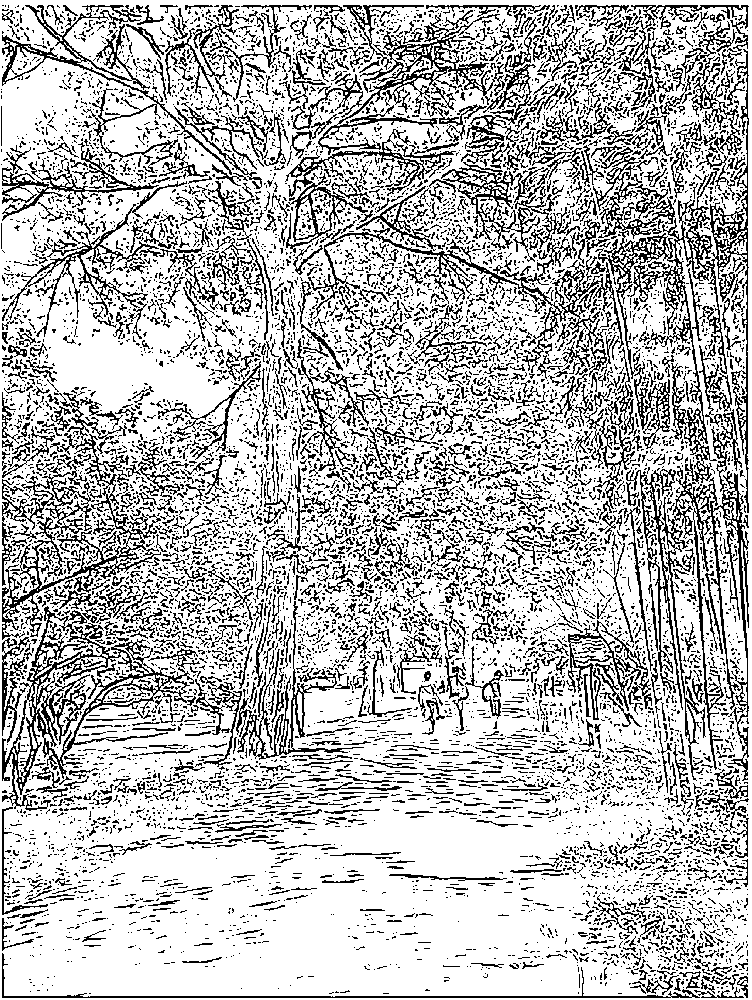

親近大自然是情緒排毒的一種方式

### 體內毒素排除法

| 健康飲食計畫 | 內容 | 備註 |
| :--- | :--- | :--- |
| 健康排毒水 | 1. 半顆檸檬切片泡在冷開水中約10分鐘<br>2. 加入一湯匙蜂蜜或果糖 | 1. 早上5～7點服用效最佳，這個時間是大腸經的循行時間，可協助排毒<br>2. 若覺得這樣麻煩，也可直接飲用一杯鹽開水取代 |
| 植物綜合酵素 | 飲用一杯植物酵素，亦可使用市售的瓶裝酵素、或粉狀酵素 | 胰臟能完全製造新陳代謝酵素 |
| 柔軟操 | 1. 活動10～30分鐘<br>2. 可幫助排毒，活動一小時後再用餐 | 促進胰臟製造新陳代謝酵素 |
| 拍膽經 | 輕敲大腿外側風市、中瀆等膽經穴位 | 1. 促進胰臟製造新陳代謝酵素<br>2. 風市、中瀆穴是膽經的穴道，中醫理論強調「凡十一臟，皆取決於膽」。因此拍膽經可幫助五臟六腑的代謝與全身負面情緒的釋放 |
| 早餐 | 1. 低卡路里（200～300卡）、高營養的營養粉<br>2. 時間來不及吃時，至少要吃啤酒酵母或使用含五穀雜糧的代餐 | 1. 早餐一定要吃，省略早餐會讓身體代謝下降，容易肥胖。同時血清素及多巴胺的原料供給不夠，將會引發更大的情緒問題<br>2. 吃錯早餐會昏沉<br>3. 早晨的陽光可刺激松果腺加速製造血清素 |
| 點心 | 半顆蘋果 | 約40卡路里 |
| 午餐 | 1. 適中，不能吃垃圾食物<br>2. 或使用含五穀雜糧的代餐<br>3. 吃一根香蕉 | 香蕉富含能幫助人腦產生5——羥色胺的物質，可以讓心情愉悅 |
| 點心 | 半顆蘋果 | 約40卡路里 |
| 晚餐 | 1. 低卡路里（200～300卡）、高營養的營養粉<br>2. 或使用含五穀雜糧的代餐<br>3. 吃一根香蕉 |

輕敲膽經（大腿外側風市、中瀆穴）

- 1. 手自然下垂，手掌貼著大腿外側，此處即為風市、中瀆穴
- 2. 用手輕拍此處

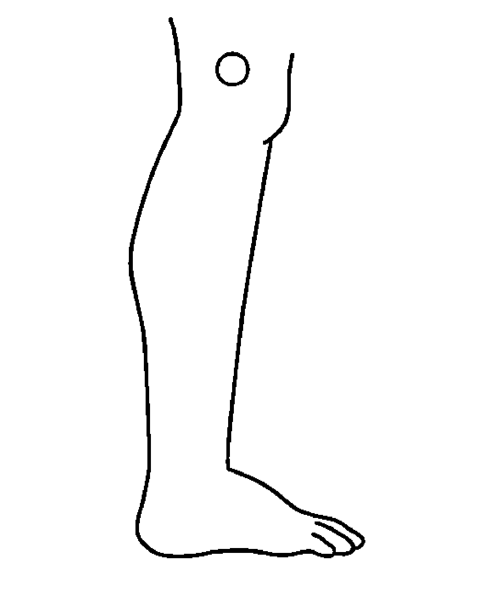

### 每天飲食記錄表（範例）

| 日期 | 日期 | 日期 |
| --- | --- | --- |
| 早餐： | 早餐： | 早餐： |
| 點心： | 點心： | 點心： |
| 午餐： | 午餐： | 午餐： |
| Tea time： | Tea time： | Tea time： |
| 晚餐： | 晚餐： | 晚餐： |
| 宵夜： | 宵夜： | 宵夜： |

備註：隨時記下今天所吃的食物，可由觀察比對找出會讓您情緒起伏或疲倦的食物，亦可使用能量檢測或靈擺，找出負面情緒的誘因。

### 預防花精的能量遞減

花精在經過調配成治療瓶後，花精能量便會與日遞減，超過七天治療能量已大不如前。一般治療師常會開立30ml的治療瓶，給予個案服用一個月，然而由於能量遞減的關係，許多個案也會發現到愈喝效果愈差。這是因為花精是一種治療能量，屬於能量療法的一種，當能量遞減時，便會影響到花精的療效。除此之外，因台灣位於亞熱帶，即使有加入1/4的白蘭地，但有時放久後花精治療瓶內會有黑色的棉絮物，這是因為黴菌滋生所致，若不慎喝到的話將會拉肚子。目前國外的部分花精已有標示不要進行稀釋，直接飲用花精純液，因為只要一稀釋便會造成45%以上的能量損耗，而國內的台灣花精，亦同樣強調飲用純液，主要就是要預防能量遞減。因此一位花精治療師必須要有能量的觀念，若須使用調配治療瓶，我是建議使用20ml的治療瓶進行調配，若一天喝4～6次，每次飲用6滴，應可在一周內將治療瓶喝完，或建議患者直接使用純液，如此才能讓花精運用療效發揮到極致。

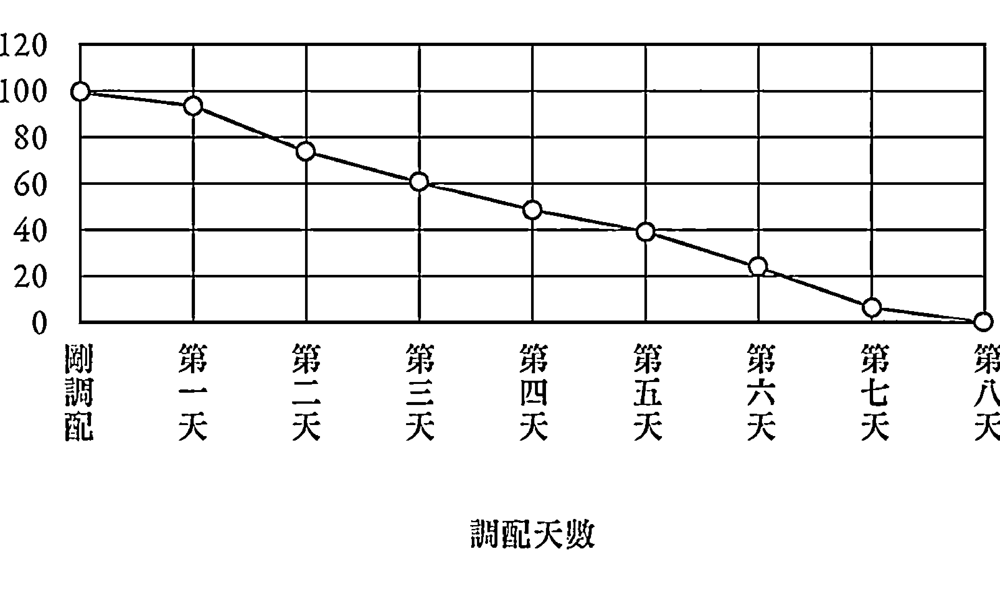

### 清除個案本身之能量阻塞

華人最喜歡進補，即使是上班族，累的時候也會來罐四物雞精補補身子，而冬蟲夏草、人參等高貴補品更是時常端上桌的好禮。補法在中醫裡頭佔有一席之地，不僅可以讓體質調正，對於情緒的調整也有幫助。神農本草經記載：「人參補五臟、安精神、定魂魄、止驚悸、除邪氣、明目、開心益智」，當人在身體虛的時候，民間流傳會看到不好的東西，並且容易受到驚嚇。傳統的中醫師會使用人參、黃耆等補氣類藥物來幫助元氣提升，有時光泡人參茶，對於容易受驚嚇的症狀就有不錯的治療效果。在能量界，許多人士會選擇寶石來強化自身氣場，如琥珀可以強化性器官功能，石榴石可以強化海底輪，青金石對喉輪能量有提升作用，當我們平時接觸這些寶石或配戴時，便可獲得相當好的能量滋養。

如何讓這些外界的能量補充我們的身心靈呢？除了傳統的寶石配戴外，在花精中，亦有類似補藥類的能量花精，可以讓我們元氣提升，英國的Crystal Herbs花精，便有上百種的單方礦石花精提供這方面的作用。因為花精的治療效果，必須搭配個案本身之能量，才能達到1+1＞2的完美境界，但當個案本身的能量阻塞或能量不足時，效果將會大打折扣。此時若配合能量提升類的花精，如脈輪花精、寶石類花精等，幫助個案能量場提升，這樣搭配情緒類的巴赫花精效果才能更加明顯。

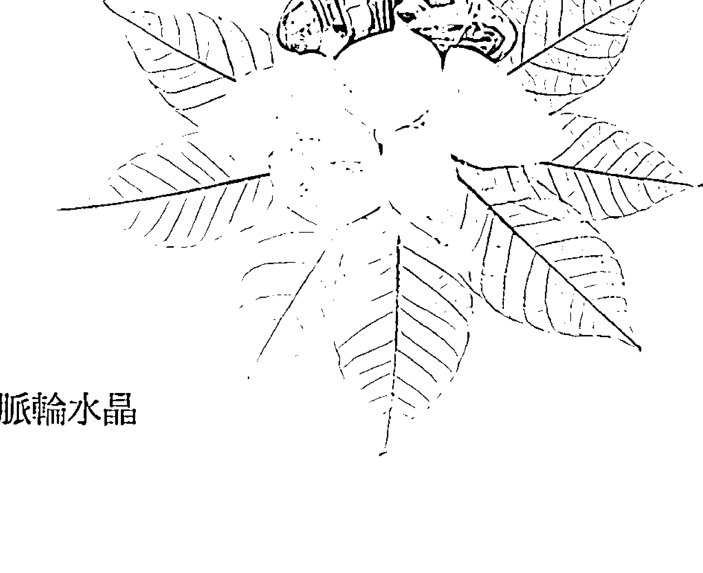

有些患者的身心症在用花精治療後，已獲得改善，但在元氣尚未恢復下，一些情緒性的刺激仍會引起症狀復發。曾有一位住新莊的患者，在使用花精等複合療法治療失眠、焦慮後，獲得好轉。有次隔壁街失火，這位小姐在好奇心趨使下，去看熱鬧，之後便又開始焦慮、失眠，又經過二次的治療才恢復正常。個案的這種情形便是因為能量不足所引發，此時元氣提升對個案來說便很重要，古人說：「正氣存內，邪不可干」，適時地建議患者服用脈輪花精或生活作息調養，尤其是早睡，可讓元氣提升，達到邪不可干的理想狀態。

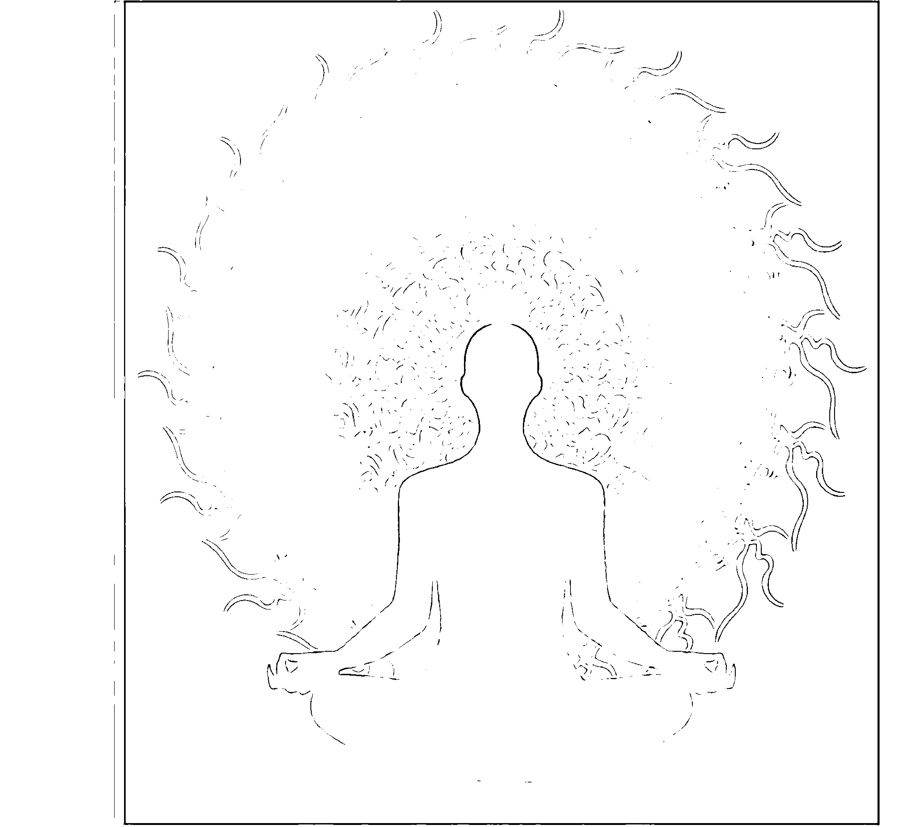

中醫常以十二經絡來描述人體能量的變化，而國外則常以脈輪來做能量的代表。脈輪原記載於古印度傳統醫學「吠陀經」，是全身氣場的能量交會點，七個脈輪會在身體內外形成一共振頻率，並分配能量給人的身體、情緒、心理，可說脈輪就是人體氣場的代名詞。當疾病、情緒驚嚇、或不良的生活習慣時，均會改變人體原來的共振頻率，導致身體虛弱與負面情緒產生。

古人體會到這一點，因此強調「必須扶正，方能卻邪」，如《黃帝內經》上云：「邪之所湊，其氣必虛（意思是說邪氣會來，主要是因為氣虛的關係）」，類經色脈篇亦提到：「諸小者，陰陽形氣俱不足，勿取以鍼，而調以甘藥也（意思是說當把脈把到小脈時，代表體內陰陽二氣都不夠，這時就不可以用針灸等方治療手段，必須先給予補藥調補）」。當我們在服用巴赫花精感到效果不佳時，便可以適時搭配脈輪花精來強化自身氣場，有學員曾半開玩笑的說，這有點像是藥酒的感覺。這些能量類花精是可以和巴赫花精做整合應用的，比如說有人無法順利表達，為喉輪能量低弱，便可搭配下列花精，讓療效更大，而這也是身為一個花精治療師所需為個案做的。

- 矢車菊：不知道該如何拒絕別人，所以不敢說真話，無法真正的表達自己意見。
- 落葉松：因為自信心不足，無法暢所欲言。
- 潟酸漿：害羞靦腆，使得有話不敢講。

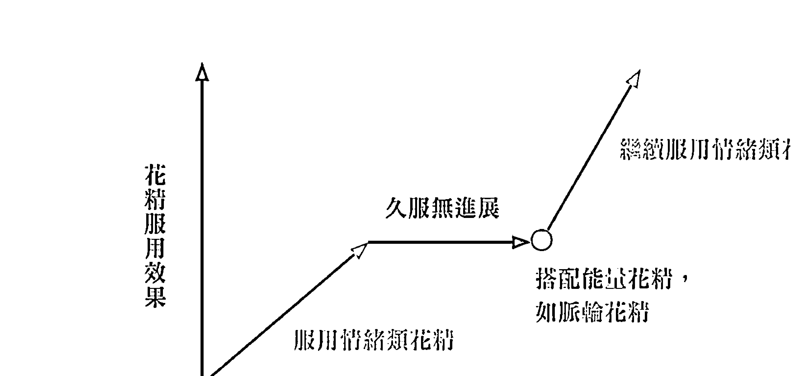

### 能量類花精運用方法

- 1. 依情緒檢測表選擇所用的脈輪花精。
- 2. 或依能量測試（LET、靈擺）測出虛弱的脈輪。
- 3. 可把脈輪花精當成藥酒服用、不用覺察也有效。
- 4. 「久病必虛」：補養元氣，用脈輪花精。
- 5. 「久病必瘀」：掃蕩深沉，用業力花精。當個案的負面情緒太久時，個案會習慣這種負面情緒，如同中醫病久有瘀血，必須使用活血化瘀方劑，而業力花精，就如同情緒的活血化瘀藥，可以把深沉於裏頭的負面情緒拉到表面，此時再用巴赫花精處理效果可更加提升。
- 6. 古人云：「心靜、氣強而靈覺顯用」。用心體會花精，用脈輪補氣，可加速開悟，亦可搭配脈輪音樂使用。
- 7. 有些人在服用海底輪花精後，丹田處會膨脹，有氣功壓丹田的感覺。

## 圖解巴赫花精

| 脈輪 | 位置（對應中醫穴道） | 功用 | 對應顏色 | 與身體器官對應 |
| :--- | :--- | :--- | :--- | :--- |
| 海底輪<br>Bas Chakra | 位於<br>脊椎底部<br>（會陰穴） | 和乙太體連接，可讓<br>人感受到安全、踏實 | 紅色 | 腎臟、腎上腺、<br>骨骼、直腸、血<br>管及免疫系統 |
| 臍輪<br>Sacral Chakra | 在肚臍<br>下方：性輪<br>（關元穴） | 當開啟時，讓人充滿<br>創造力，情緒穩定，<br>性能量獲得平衡 | 橙色 | 生殖系統、膀<br>胱、結腸、盲腸 |
| 太陽<br>神經叢<br>Solar<br>Plexus<br>Chakra | 位於胃部<br>附近<br>（中脘穴） | 當開啟時，能夠做到<br>自我保護，不會被別<br>人所控制，也不會想<br>去控制別人 | 黃色 | 胃、小腸、肝膽<br>系統、神經系統 |
| 心輪<br>Heart<br>Chakra | 在兩乳中心<br>（膻中穴） | 當開啟時，能夠擁有<br>純然的真愛 | 綠色 | 心臟、肺臟、胸<br>腺、血液循環系<br>統 |
| 喉輪<br>Throat<br>Chakra | 喉結處 | 當開啟時，能夠自在<br>的表達內心的感受、<br>情緒，不會畏懼別人<br>的觀感 | 藍色 | 支氣管及發聲器<br>官、食道、甲状<br>腺、頸部、肩膀 |
| 眉心輪<br>Brow<br>Chakra | 兩眉中間：<br>第三眼<br>（印堂穴） | 當開啟時，能完全與<br>直覺進行連結 | 靛色 | 腦下垂體及眼<br>睛、鼻竇 |
| 頂輪<br>Crown<br>Chakra | 頭頂<br>（百會穴） | 當開啟時，能覺知到<br>更高的自我，加速開<br>悟 | 紫色 | 松果體 |

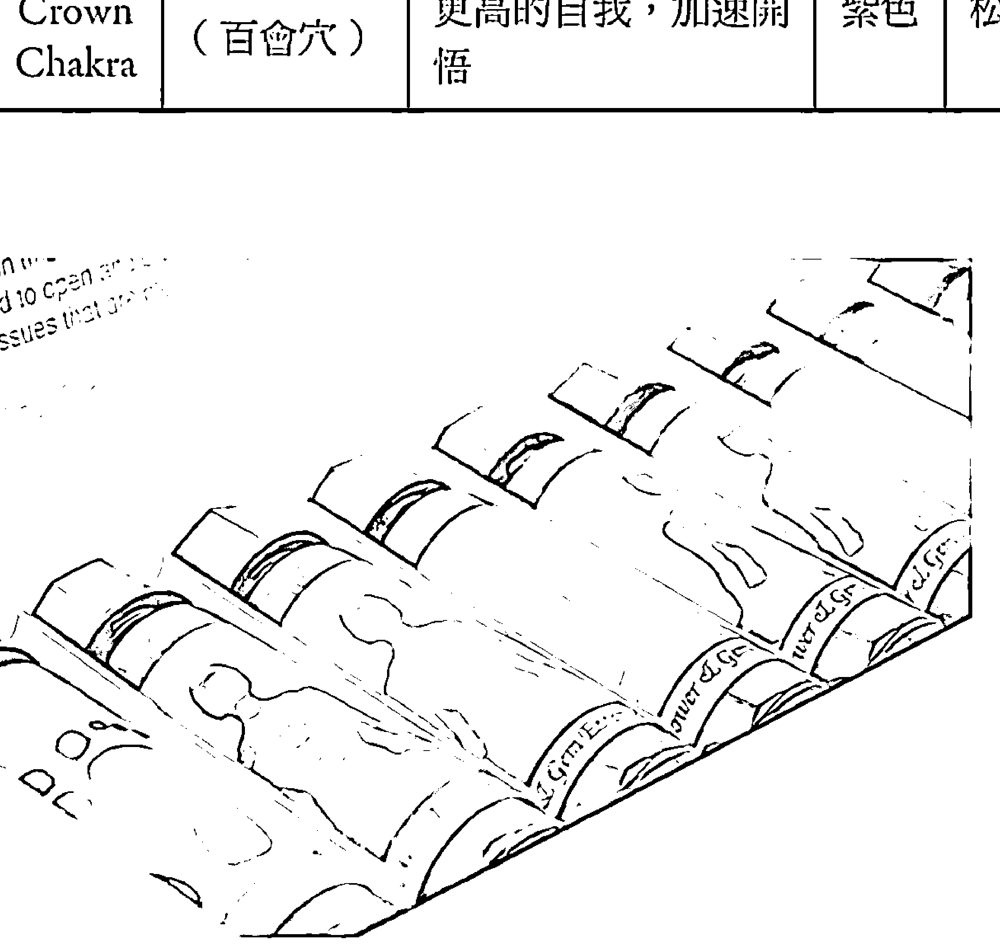

### 如何化解個案不相信自己會療癒

生活中有些人，眼神充滿著無助與焦慮，可是當我們伸出援手，用花精去幫助她時，卻常令人氣餒，因為這樣的個案總是不按時服用花精，甚或間隔好多天才使用。以前我會覺得說是患者的配合度不高，在學習過「思維場療法」及「EFT」後，我才知道，這叫做「心理逆轉」現象。在整合諸多資料後，也幸運地發現，經絡與花精合用，可以讓花精療效提高許多，可加速讓患者跳脫舊有的思維，開啟療癒之路，這也是巴赫醫師一再強調的「自我療癒」。

每一個行為的背後，總有一個動機，選擇陷入負面情緒不肯自拔的人，其動機往往只是為了要向別人證明一些事，證明她目前所受的折難。之前我在中壢的仁心聯醫門診時，有位護士小姐總是向我抱怨她的壓力很大，時常失眠，可是當我要幫她做彩光針灸及花精治療時，卻總是推拖，即使免費送她的花精處方也時常置之一旁。日復一日，每天總以熊貓眼遊走於診間，然後到處抱怨工作壓力大，每天如何為了工作而失眠等。看得出來，這樣的做法只是想讓別人對她敬佩，要周遭的人稱讚她為診所盡心盡力，為了診所而失眠，以從中獲得關心和尊榮。但為了這樣的虛名，卻選擇了負面情緒，傷害的卻是自己的身心。雖然花精對於情緒釋放會有幫助，但這並無法幫助不想要好起來、不願意接受自己心靈深處的人，面對個案自己的選擇，我們也只能尊重她的意願。

如何消除這樣的狀況呢？羅傑·卡拉漢（Roger J. Callahan）博士發現了「心理逆轉」現象，心理逆轉是一種「自我破壞」的思緒，在花精療癒過程中，有許多頑固型的個案，大多會有這樣的情形，因為個案一直不相信自己會療癒，甚或不想讓自己療癒，有時在言談中，可發現患者會說一些如「自己很賤、我是很糟糕的人」等心理上自我排斥的言語。這就好像在療癒的路上擺上一顆大石頭，擋住通往健康的道路，造成負面情緒無法釋放，個案也就一直在錯誤的思維中打轉，因而影響到花精療效，無怪乎屢治無效。

卡拉漢博士在研究「應用人體動力學」（Applied Kinesiology）時發現，有些人在說正向語句或有正面思考時，肌力反而下降，這與一般述說正向語句時肌力會提升的現象完全相反，因為肌力下降代表著體內能量場處於逆流的狀況，個案跳脫不了負面情緒，也已習慣了疾病狀態，這與巴赫花精的七個協助者花精很像，因為七個協助者花精是針對個案已習慣疾病是他的一部份所設立的。但心理逆轉現象比較深層，必須搭配經絡穴道方可拉到正常狀態，有時個案的自殘行為（如到處刺青，打洞），或知道這樣做不對但卻一直重蹈覆轍（酗酒、吸毒、賭癮、抽菸），全為心理逆轉的表徵。紐約大學的研究亦顯示，癌症患者有心理逆轉者約佔96％，可見負面情緒影響我們身心之巨。

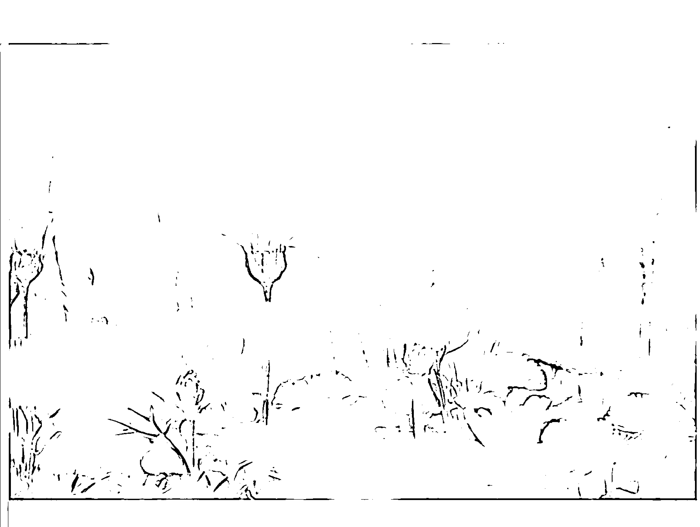

#### 心理逆轉的診斷方式選擇

- 運用能量測試LET或靈擺，測試有無「心理逆轉」。
- 從個案言談中分析，大多會有自我否定的語句。

#### 心理逆轉的治療（消除法）或複合應用

- 運用TFT或EFT。
- 八脈交會穴：「後溪穴」通於督脈，會貼於這個穴道，是因為TFT或EFT均提出敲擊手刀點（後溪穴）可消除心理逆轉現象，因此治療師可將個案所需之花精，外敷於後溪穴。
- 居家護理法：時常在小指側「後溪穴」或「手刀處」按壓，也可按壓胸前的壓痛點，並想著自我內心衝突的心事。
- 對於頑固型個案，可請個案在服用花精前先按壓「後溪穴」或「手刀處」按壓，也可按壓胸前的壓痛點，之後再服用花精。

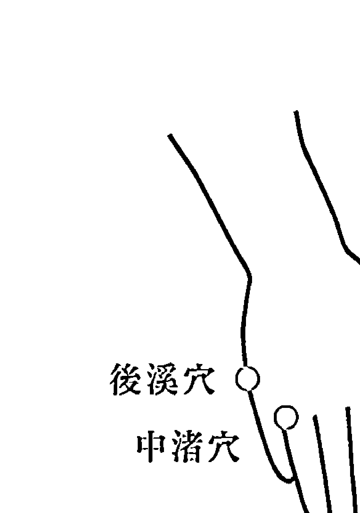

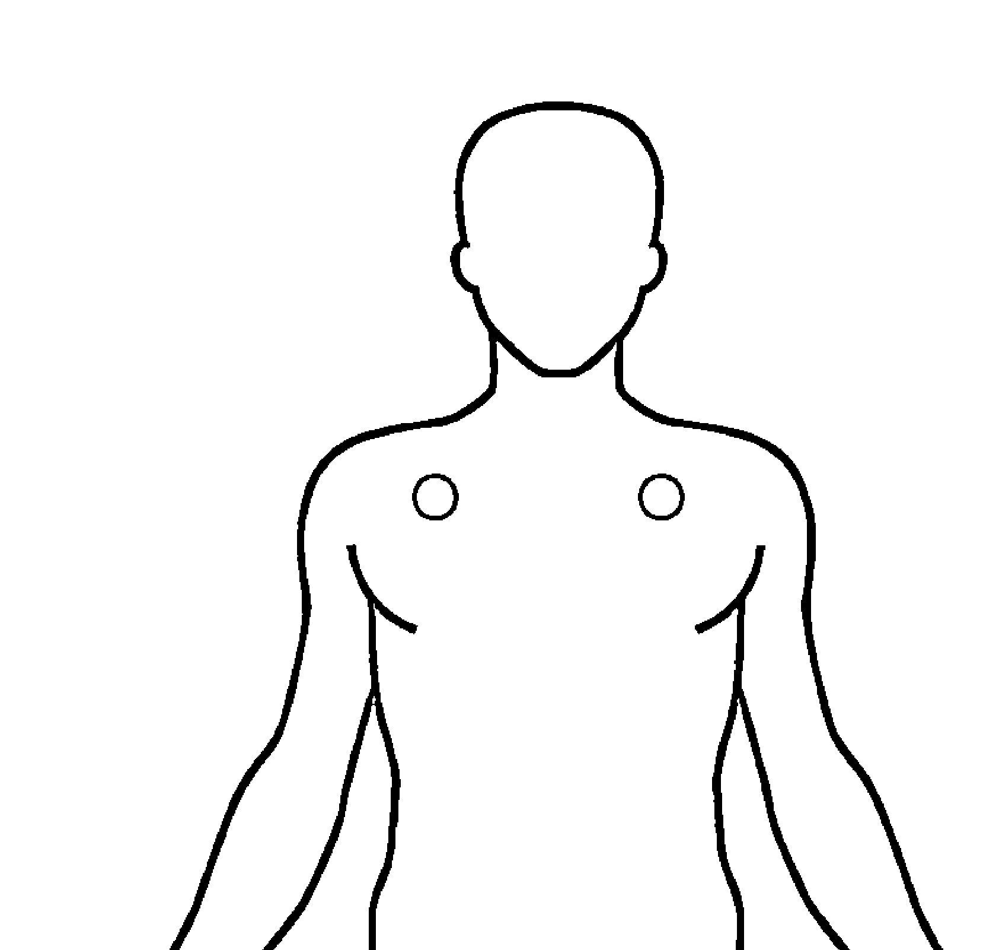

### 配合自我覺察及靈性修行

巴赫醫師希望每個人都能夠關注自己的情緒，進而達到「認識自己」與「治療自己」的目標，因此他很強調自我療癒，認為每個人都必須從疾病中，發現自我的問題或缺點所在，從而治療自己。療癒的第一步便是自我覺察，除了應用花精之外，靜心、修行、爬山、生活作息正常、正向語等也是不錯的方便法門。清代醫學家吳尚說過：「七情之病，看花解悶，聽曲消愁，有勝於服藥者也」，因此我很建議有空多到山裏走走，清晨的山，多了芬多精，漫步於植物散發的寧靜氣場中，將可以幫助我們把負面情緒釋放，這也是我特別喜歡到住家附近的百吉步道爬山的原因。我媽媽很喜歡種花，每次心情不好時，只要種種花，就能把煩惱忘卻，原來多親近植物，也有類似喝花精的作用。類經色脈篇：「醫不病，故為病人平息以調之」，身為一位花精治療師，必須先要有完整的心靈，才能療癒別人，因此花精治療師，必須先自我修行，才能自助助人。

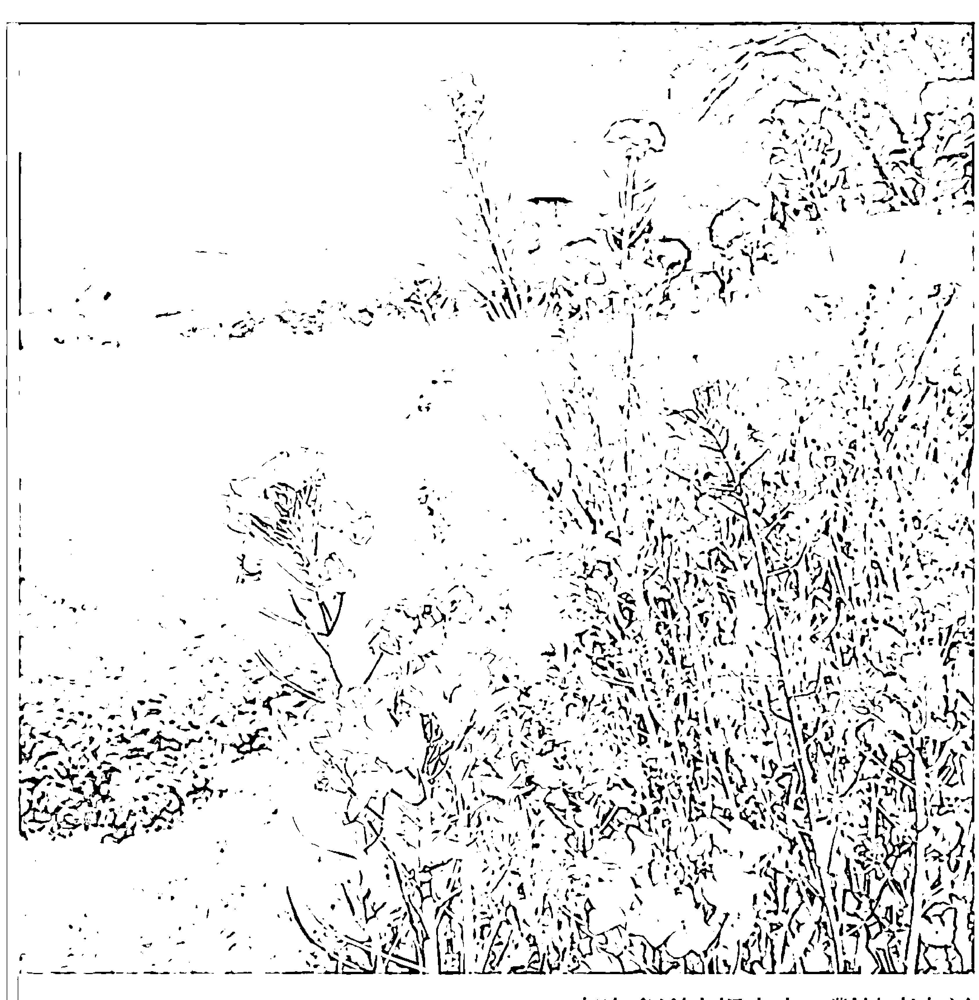

有空多到山裏走走，對健康有益

花精是一種能量療法，也因此，好的信息傳遞便是療癒的基石，語言是一種信息，當我們把花精的功用解釋給患者時，信息治療便開始，而正向語更是一種善的能量。目前社會充滿著對立與意識形態的亂象，但仍要心存感激，多祝福別人，說好話，做好事，存好心，也是幫助負面情緒釋放、改變命運磁場的好方法，下列的自我覺察及靈性修行的方式建議大家使用：

- 1. 服用花精時，按壓情緒穴位中渚穴（又稱處效點），並默念正向語（如下表所列，正向語如同心理覺察，如在服用龍芽草時，邊喝邊唸「我可以真誠地面對自己的問題」）。
- 2. 配合靈性修行，如靜坐、唸經、聽心靈音樂、氣功、爬山等，可協助負面情緒釋放。
- 3. 服用花精後，把握黃金的15分鐘做靜心，可讓心思更協調。

### 配合正確使用方式

有時候花精沒效，純粹只是因為使用方式不正確造成的，尤其是使用頻率特別要緊，每天至少要達四次。

目前學術界對花精的研究，質性研究都確認花精有效，量化研究則有一些認為無效的，其實就是因為那些量化實驗中用了錯誤的配方或使用方式。曾有不明就裏的心理師，引用錯誤實驗造成的錯誤結果，在網上發表巴赫花精無效的言論，其實如果他瞭解花精是需要正確使用方式配合，再深入去看實驗方法，就會明白那些認為花精無效的實驗都是因為沒有正確使用花精，而有配合正確使用的研究，就都確認花精有效了。

#### 38種巴赫花精情緒與正向語

| 花精名稱 | 英文名稱 | 負面情緒 | 正向語 |
| :--- | :--- | :--- | :--- |
| 龍芽草 | Agrimony | 內外不平衡可用 | 我可以真誠地面對自己的問題 |
| 白楊 | Aspen | 莫名的恐懼 | 我永無恐懼 |
| 山毛櫸 | Beech | 事事看不順眼 | 我可以寬容別人的一切 |
| 矢車菊 | Centaury | 意志力薄弱 | 我尊重我的心靈，能夠勇敢地向別人說「不」 |
| 水蕨 | Cerato | 不相信自己的直覺、向外尋求決定 | 我相信我的直覺絕對正確 |
| 櫻桃李 | Cherry Plum | 有抓狂危機 | 我可以永保冷靜與愉悅 |
| 栗樹芽苞 | Chestnut Bud | 不斷重蹈覆轍 | 我會在每件事情中學習到所有的經驗 |
| 菊苣 | Chicory | 自私的愛 | 我發自內心，真誠無私地幫助別人，而且不求回報 |
| 鐵線蓮 | Clematis | 幻想美好未來、健忘 | 我會腳踏實地，讓自己的夢想一步步實現 |
| 野酸蘋果 | Crab Apple | 害怕污穢。過份對身體、物質、細節的太執著 | 我深愛著我自己，身上絕不會有任何污物或不潔 |
| 榆樹 | Elm | 被責任壓得喘不過氣 | 我絕對有能力克服眼前的一切 |
| 龍膽 | Gentian | 遇挫折後缺乏勇氣、意志消沉 | 眼前的挫折只是臨時的，我相信堅持到底，一定會成功 |
| 荊豆 | Gorse | 深沉的沮喪絕望 | 我相信上蒼的安排，一定有他的意義 |
| 石楠 | Heather | 喋喋不休 | 我可以自在愉悅的獨處 |
| 冬青 | Holly | 強烈的負面情緒 | 感恩上蒼慈悲，讓我感受到愛與喜樂 |
| 忍冬 | Honeysuckle | 沉溺過去 | 我可以放下過的一切，把握現在 |
| 鵝耳櫸 | Hornbeam | 星期一症候群、倦怠 | 我永遠充滿著朝氣 |
| 鳳仙花 | Impatiens | 沒耐性、急驚風 | 我可以放慢腳步，過著從容優雅的生活 |
| 落葉松 | Larch | 缺乏自信 | 我超級充滿自信心 |

| 溺酸漿 | Mimulus | 恐懼已知的事物 | 我充滿著勇氣與力量 |
|---|---|---|---|
| 芥末 | Mustard | 突發性憂鬱 | 我被光明所環繞，烏雲一下就不見了 |
| 橡樹 | Oak | 埋頭苦幹 | 我可以悠遊自在的笑傲江湖 |
| 橄欖 | Olive | 過度操勞、身心耗竭 | 我充滿著power |
| 松樹 | Pine | 自責、罪惡感 | 我問心無愧 |
| 紅栗 | Red Chestnut | 為親人或友人擔心 | 我相信上蒼會保佑我所愛的人 |
| 岩玫瑰 | Rock Rose | 極度恐慌 | 我能臨危不亂，永保鎮靜 |
| 岩水 | Rock Water | 嚴以律己 | 我不會被規則綁死，充滿彈性 |
| 線球草 | Scleranthus | 優柔寡斷 | 我知道那一個對我最好 |
| 聖星百合 | Star of Bethlehem | 驚嚇、創傷後遺症 | 我的創痛已經癒合，不會再傷痛了 |
| 甜栗 | Sweet Chestnut | 深陷絕望 | 我相信生命自有安排 |
| 馬鞭草 | Vervain | 身心緊繃、過度熱心 | 我可以體諒別人有不同的想法 |
| 葡萄 | Vine | 強勢領導 | 我會照顧弱者，讓他們自由發揮出獨特的潛能 |
| 胡桃 | Walnut | 無法習慣生活中、生理上的轉變 | 我不會被環境所影響 |
| 水莖 | Water Violet | 高傲、難以融入群眾 | 我喜歡和人們相處 |
| 白栗 | White Chestnut | 不由自主地胡思亂想 | 我的心境平和，不再胡思亂想 |
| 野燕麥 | Wild Oat | 找不到人生的方向與目標 | 我知道我人生要的是什麼 |
| 野玫瑰 | Wild Rose | 被動、認命、懶惰 | 我珍惜眼前的一切，法喜充滿 |
| 楊柳 | Willow | 自怨自艾 | 我能積極創造屬於自己的快樂新世界 |

> 《易經·系辭上傳》云：「形而上者謂之道，形而下者謂之器，化而裁之謂之變」

花精療法相較於現今的主流心理學，是屬於形而上的學說，因為她所應用的原理是宇宙萬物的根本：「氣的律動」。對於氣，感謝我的能量導師，指導我運用能量檢測，讓我對花精能有更一步的體會，也感謝家人給我各方面的支持，讓我能能在看診之餘，撥出時間撰寫本書。對於花精有興趣的朋友，書中已提供花精的應用說明及記憶法則，讓您能快速上手，但學習花精並不是只有知道花的名字、和什麼情緒有關、或是對著花畫一幅畫就可以了，而是要體會這個「氣的律動」，而這也正是本書所要帶您體會的「形而上」學。當您能由能量觀點切入時，你將可以更深入地了解巴赫花精的真實精義，也將有能力和各種訊息療法如易經、意識、時間療法、氣功等做完整結合，將花精療效發揮到淋漓盡致。

身為一位花精療法師，最重要的，是如何用最短的時間來幫助患者療癒，因此整合性治療便顯得格外重要。本書不僅是一本工具書，也是提供能量醫學與花精療法結合的使用說明，當我們善用花精療法這個美麗的治療藝術時，不僅可以平復一個人的情緒，舒緩身心症候群的症狀。更重要的，她將可以帶給我們另一個思考空間，巧妙雕塑人們完美的心靈，期待您我共同努力，讓花精療法更加普及，也更加美麗。

### 完整的花精診察流程

```
mermaid
flowchart LR
    花精選擇 --> 花精調配 --> 提高療效
    花精選擇 --> 諮商
    花精選擇 --> 能量診斷
    花精調配 --> 內服
    花精調配 --> 外用
    提高療效 --> 排毒水 拒絕能量毒素
    提高療效 --> 搭配能量花精
    花精調配 --> 身心症候群介紹
    提高療效 --> 心理逆轉療法
    提高療效 --> 正向語及靜心
```

## 参考资料

- 1. 花精與花魂（2007），崔玖，心靈工坊
- 2. 水晶寶石的靈性功能（2003），徐華震，淳貿
- 3. 因為花藥，我學會了愛（2003），黃偉德，自然風
- 4. 貝曲花藥深入淺出應用手冊（1995），利國棟，明窗
- 5. 植物也有情緒（2006），克里夫·巴克斯特（Cleve Backster），博大
- 6. 康健雜誌（2007），天下
- 7. 敲醒心靈的能量（2003），羅傑·卡拉漢（Roger J. Callahan）&理查.特魯波（Richard Trubo），心靈工坊
- 8. 男女大不同:身心健康對策（2004），約翰·葛瑞博士著（John Gray, Ph.D.），生命潛能
- 9. 秘密（2007），朗達.拜恩（Rhonda Byrne），方智
- 10. 能量醫療（2004），唐娜·伊頓（Donna Eden）&大衛·費恩斯坦（David Feinstein），琉璃光
- 11. 商業週刊
- 12. 慧眼視心靈
- 13. 思考中醫（2004），劉力紅，廣西師範大學出版社
- 14. 扶陽講記（2006），盧崇漢，中國中醫藥出版社
- 15. 高雲氣功（2005），高雲，元氣國際健康有限公司
- 16. how to heal with color（2003），泰德·安德魯斯（Ted Andrews），自然風
- 17. 家庭用藥全書（2005），健康工作室，商周出版
- 18. 肌筋膜疼痛與機能障礙激痛點手冊（2004），Travell & Simons，合記
- 19. 耳穴診斷學（2004），黃麗春，豐聖出版社
- 20. Craydon & Bellows，Floral Acupuncture Applying The Flower Essences Of Dr. Bach To Acupuncture Sites, The Crossing Press 2005
- 21. Peter Damian, The Twelve Healers of the Zodiac, Samuel Weiser, Inc. York Beach
- 22. Dietmar Kramer, New Bach Flower Therapies – Healing the Emotional and Spiritual Causes Illness
- 23. The Medical Discoveries of Edward Bach Physician, Nora Weeks
- 24. Mechthild Scheffer, The Encyclopedia of Bach Flower Therapy ? ?
- 25. http://www.essences.com.hk/
- 26. http://www.animalessence.com/
- 27. Edward Bach, Heal Thyself
- 28. Edward Bach, The Twelve Healers and Other Remedies

## 作者简介

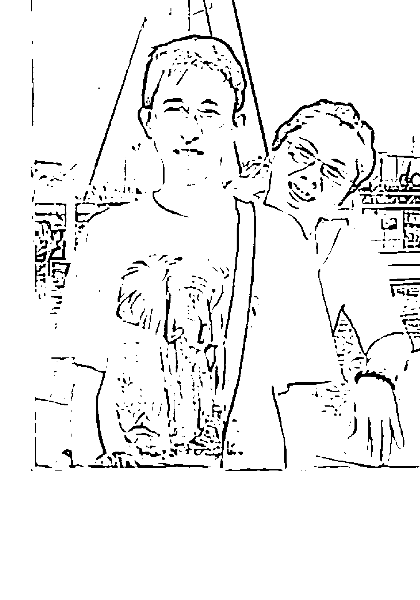

### 李泓斌醫師

從事中醫整合性治療多年，擅長運用所學之氣功療法在看診時為個案輔助療癒，並且是中醫界極少數專長望診的醫師。

自12歲接觸大悲咒後，短短三天就能夠背誦，從此開啟修煉的道路。自幼對各種療法就充滿興趣，也廣泛涉獵各種不同領域的治療方式，臨症多年透過整合性治療已協助眾多個案擺脫各種疑難雜症。

近來過著半隱居的生活，專注丹道之研究。看診之餘，幾乎都在山上練功修煉，也長期跟泰雅族的長老在山區做森林保育。

由於長年在大自然生活，所以對里山生活，及野外求生的各項技能均多所著墨，除了能增進對大自然的體悟之外，也能夠在危急時刻救助自己和他人，尤其在這個動盪的世代。

目前為泓斌中醫診所院長，也是順勢療法醫師。

### 蔡桑妮（Sunny）

Sunny是晶荷花精創辦人。她自童年就體認到身心平衡的重要。為了療癒自己與親愛的人，她試遍各種正統與另類的方法，直到遇見了花精，便深深著迷於花朵對心靈的優異平衡效果，因此她自2005年引進英國Crystal Herbs花精，並陸續創辦瓶裝陽光靈性噴霧、晶荷日光花精與台灣巴哈花精，希望能讓所有需要的人，都能無負擔的取得優質花精。

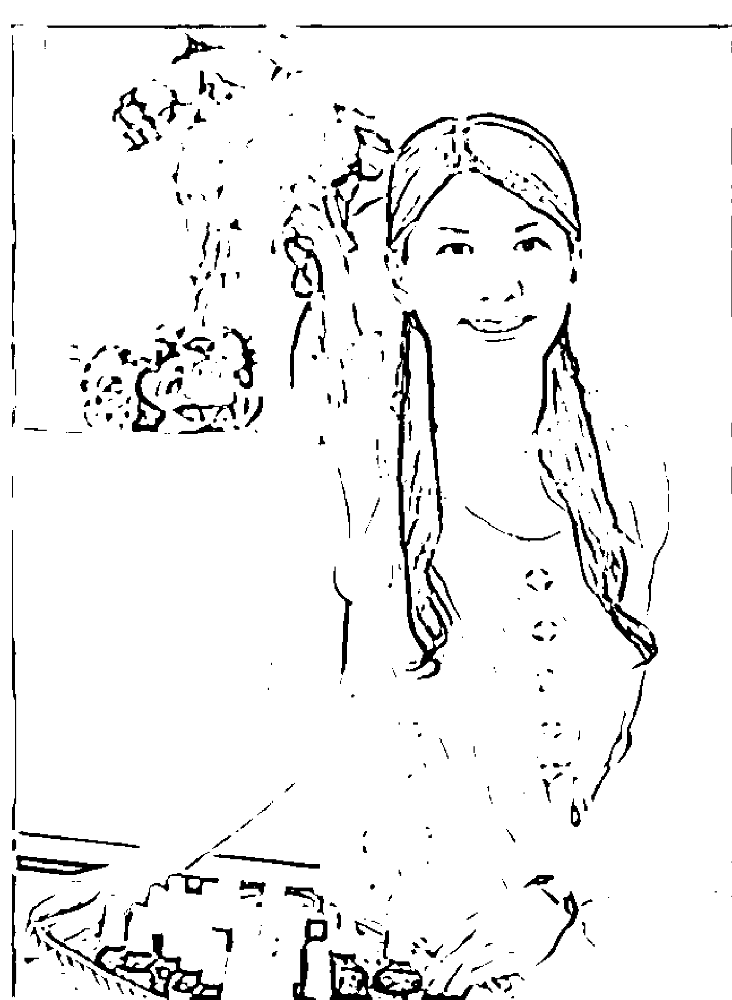

她的其他身分包括塔羅作家向日葵和小說家倪采青。無論在何領域，始終貫徹的信念是「分享」。

- **晶荷花精官網：** store.sunshineinbottles.com
- **臉書：** 晶荷花精愛療癒 facebook.com/crystalherbs.tw
- **其他心靈著作：** 《塔羅葵花寶典》、《手作芳療噴霧魔法書》、《雷諾曼卡寶典》（即將出版）
- **小說著作：** 《變身暢銷小說家：倪采青談小說寫作技巧》、《過稿力：一流出版人告訴你編輯到底想要什麼》、《金匙小姐不矜持》、《潛入婚紗的女人》、《夢遊祕境的女孩》、《再見後，開始香戀》、《加油！Flora小姐》

## 圖解巴赫花精
## The Illustration Guide to Bach Flower Remedies
### 解析創傷、釋放壓力，療癒心靈與情緒的最佳解方

- **作者**：李泓斌、蔡桑妮
- **花精植物繪圖**：許智雯
- **圖像記憶繪圖**：Dinner、yen
- **執行長**：陳君平
- **榮譽發行人**：黃鎮隆
- **協理**：洪琇菁
- **總編輯**：周于殷
- **編輯協力**：Ni Chen
- **美術總監**：沙雲佩
- **封面設計**：陳碧雲
- **內頁排版**：劉淳涔
- **公關宣傳**：楊玉如、洪國瑋、施語宸
- **國際版權**：黃令歆、梁名儀

**出版**：城邦文化事業股份有限公司 尖端出版
臺北市民生東路二段141號10樓
電話：(02)2500-7600 傳真：(02)2500-1971

**發行**：英屬蓋曼群島商家庭傳媒股份有限公司
城邦分公司 尖端出版行銷業務部
臺北市民生東路二段141號10樓
電話：(02)2500-7600(代表號) 傳真：(02)2500-1979
劃撥專線：(03)312-4212
劃撥戶名：英屬蓋曼群島商家庭傳媒(股)公司城邦分公司
劃撥帳號：50003021
※劃撥金額未滿500元，請加付掛號郵資50元

**法律顧問**：王子文律師 元禾法律事務所 臺北市羅斯福路三段37號15樓

- **臺灣地區總經銷**
- **中彰投以北(含宜花東)**：楨彥有限公司
  - 電話：(02)8919-3369 傳真：(02)8914-5524
  - 地址：新北市新店區寶興路45巷6弄7號5樓
  - 物流中心：新北市新店區寶興路45巷6弄12號1樓
- **雲嘉以南**：威信圖書有限公司
  - (嘉義公司)電話：(05)233-3852 傳真：(05)233-3863
  - (高雄公司)電話：(07)373-0079 傳真：(07)373-0087

**馬新地區經銷**：城邦(馬新)出版集團 Cite(M) Sdn.Bhd.(458372U)
電話：(603)9057-8822 傳真：(603)9057-6622

**香港地區總經銷**：城邦(香港)出版集團 Cite(H.K.)Publishing Group Limited
電話：2508-6231 傳真：2578-9337
E-mail：hkcite@biznetvigator.com

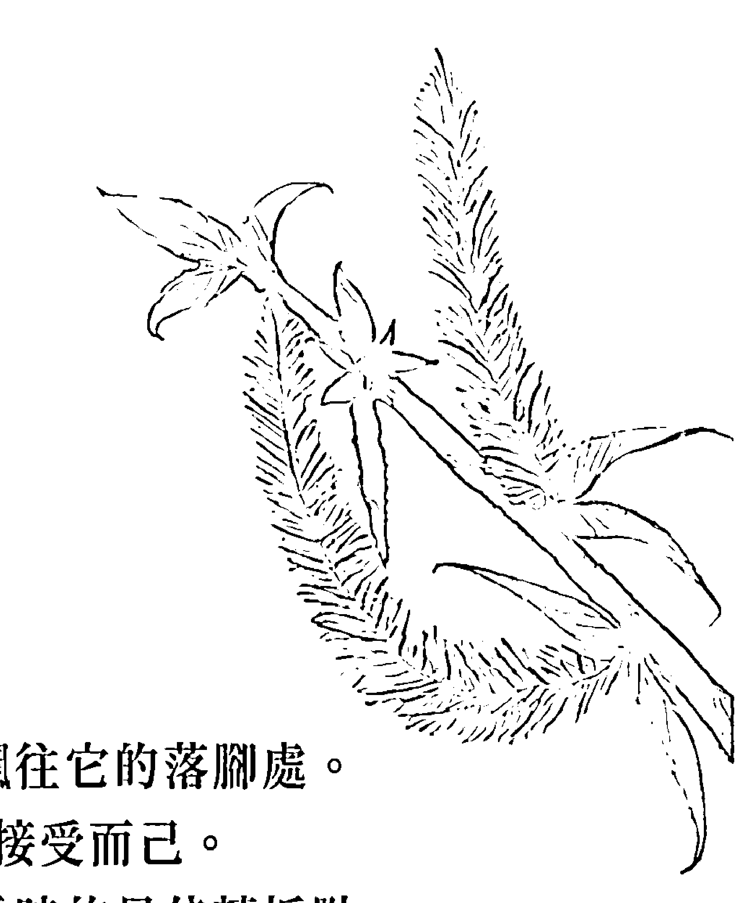

> 人生際遇，宛如花瓣飄落，順著微風流水，飄往它的落腳處。
沒有所謂好與壞，只有心境上接受與不接受而已。
當心境轉不過來時，花精，恰好是您心境不接受時的最佳轉捩點。

> 本書中貫穿著各類花精的整合內容精采而豐富，令人為之驚豔；
不論是花精初學者或是想更進一步探索花精奧妙境界的高手，
本書都是能自癒、癒人的寶典。

## 精采內容

Chapter 1  與花相遇

Chapter 2  花精的治療原理

Chapter 3  圖像記憶與7大類花精

Chapter 4  深入了解38種花精

Chapter 5  急救花精的應用 & 寵物花精的調配

Chapter 6  花精的選擇

Chapter 7  花精的調配及使用

Chapter 8  如何提高花精療效

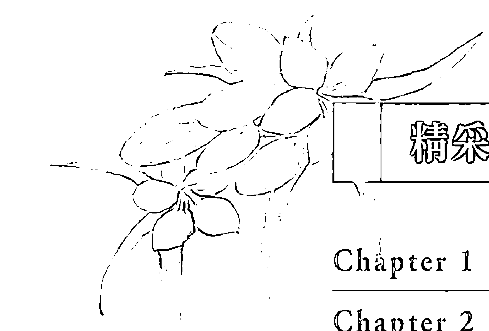

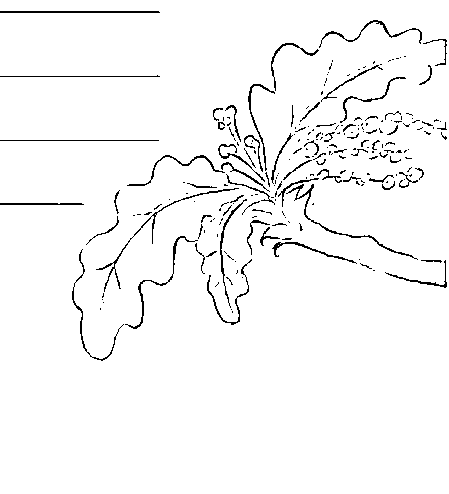