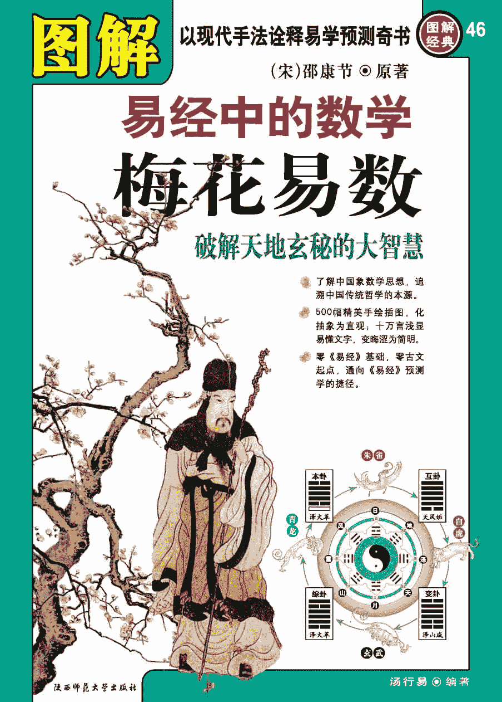

本书将告诉你

《易经》为六经之首，义理丰富而包蕴万千，历来从各个角度来解读它的著述层出不穷。北宋大儒邵康节穷究宇宙万物之数理关系，化繁复为简明，总结出了一套简单易行、灵活多变的易学预测法，俗称“梅花易数”。《梅花易数》一书蕴含了我国丰富的古代数学思想和科学的数学方法，因此也被学者称为“《易经》中的数学”。自宋代以来，这种方法应用范围十分广泛，所以近一千年来它在民间流传甚广。

但是该书内容庞杂，前后重复，有些地方结构混乱，而且是用晦涩的文言文写成的。针对这种情况，我们编写了《图解〈易经〉中的数学·梅花易数》一书，按照严谨的逻辑体系，用全新的图解形式、深入浅出的语言和精美的手绘图，来讲述梅花易数的数理和实用技巧。即使完全没有古文基础和《易经》知识的读者，也可以毫不费力地读完本书。

作者简介

邵康节（1011－1077），又名邵雍，字尧夫，自号安乐先生，是北宋著名哲学家。他精通先天象数之学，并且把象数理论融入到儒学之中，成为宋明理学的主要奠基人之一。他一生未仕，全心治学，所著《皇极经世》《渔樵问对》《伊川击壤集》等书，都是宋代重要的学术著作。

传说他一次在花园里散步，听到梅树上鸟雀鸣叫，循声掐指而悟，因而创立了“梅花易数”。封面图为清代画卷中的古梅和老人。

# 大千世界中的八卦

乾为天，坤为地，坎为水，离为火，震为雷，艮为山，巽为风，兑为泽是八卦的基本属性。但八卦的含义远不限于这些。按照《易经》理论，大千世界中的每种事物都能在八卦中找到相应的卦象。正确判断事物与卦象的对应关系，是梅花易数的第一步。

## 八卦与天时

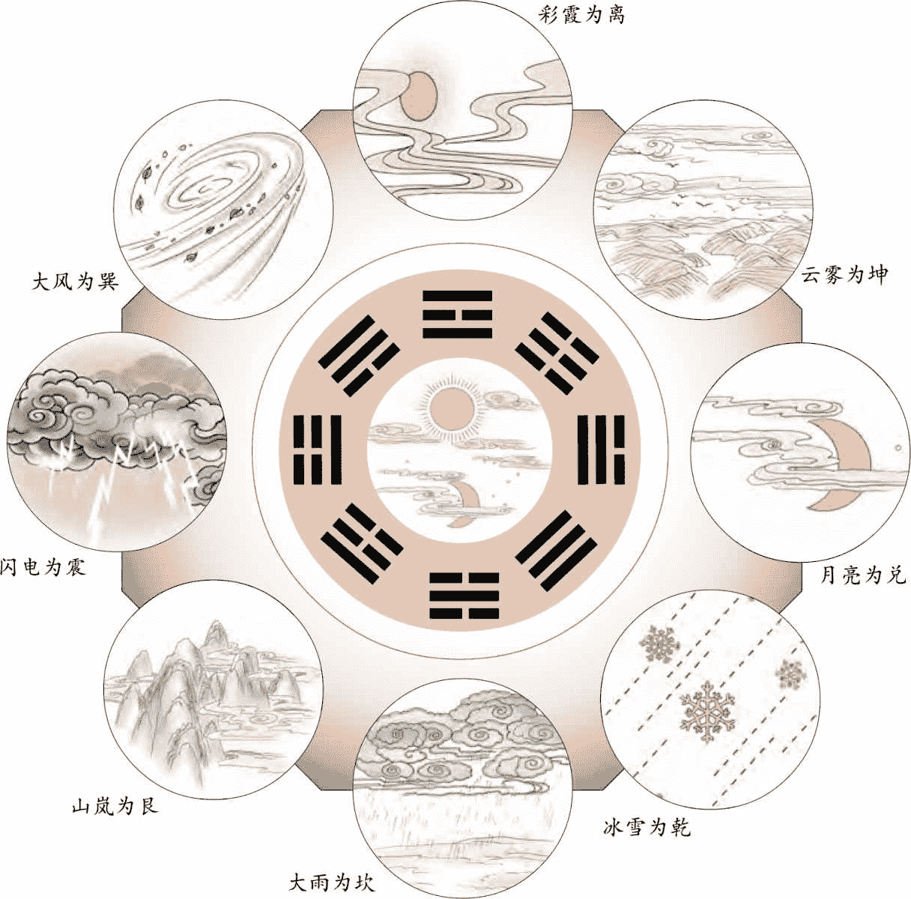

乾 卦性质刚硬，所以雹、霰等事物就属于乾卦。坤 卦表示阴极，昏昏沉沉的天气和朦胧不清的云雾等都属于坤卦。坎 卦原来的意义是水，在天时气象方面就表示雨雪、露水。又表示月亮。离 卦原来的意义是火，在天时气象方面就表示闪电、霓虹、霞光，又表示太阳。艮 为山，表示山中的云雾。兑 卦属金，在天时气象方面表示新月、星辰。震 卦仍然代表雷，巽 卦仍然表示风。

## 八卦与地理

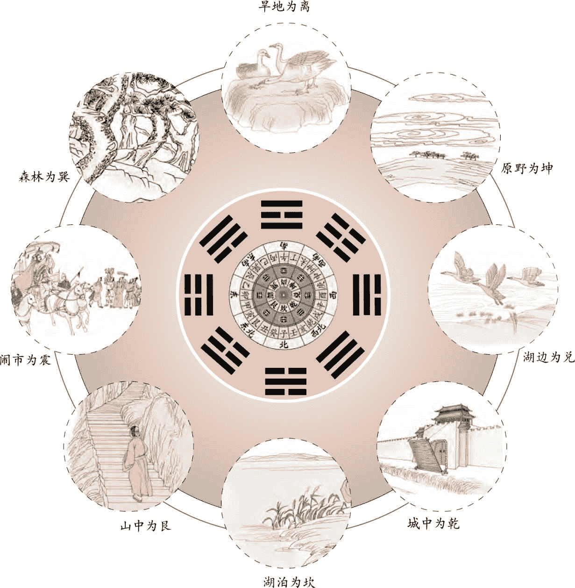

乾 卦表示京都、大的城市、形胜之地，高亢之所。坤 为地、表示野外、乡里、平地。震 具有生发性、五行属木、所以表示森林、竹林、草木茂盛之所，又表示闹市。巽 也是属木，所以表示草原，草木繁茂之所、花园、果园、菜园。坎 五行属水、所以表示大江大河、湖泊沼泽、泉水溪涧、沟渎池沼等与水有关的场所。离 为火，表示干燥之地、窑灶、冶炼场所。艮 为山，所以表示山脉高原、丘陵、山路等与山有关的地方。兑 卦表示河边，山崩地裂之地。

## 八卦与动物

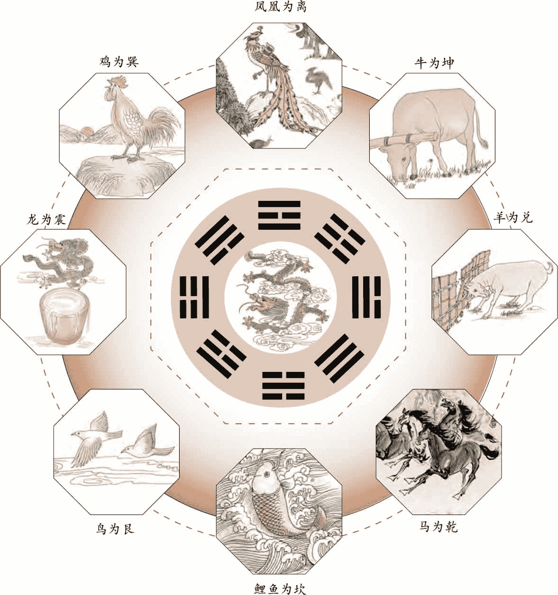

乾 卦刚健，表示奔跑中的马。坤 卦宽厚包容，正像勤勤恳恳工作的老牛。龙像惊雷一般在云间穿行属震。鸡 像巽 一样同属木类。坎 为水，凡是水生动物多属坎卦，例如图中的鲤鱼。离 为火，又为赤色，凡是色彩斑斓的动物多属于离，离又表示龟类。艮 表示鸟类，但不包括色彩鲜艳的锦鸡、鹦鹉等，因为它们属于离卦。兑 象征破损，羊角抵破篱笆是《易经》中的经典象征，所以羊属于兑卦。

## 八卦与静物

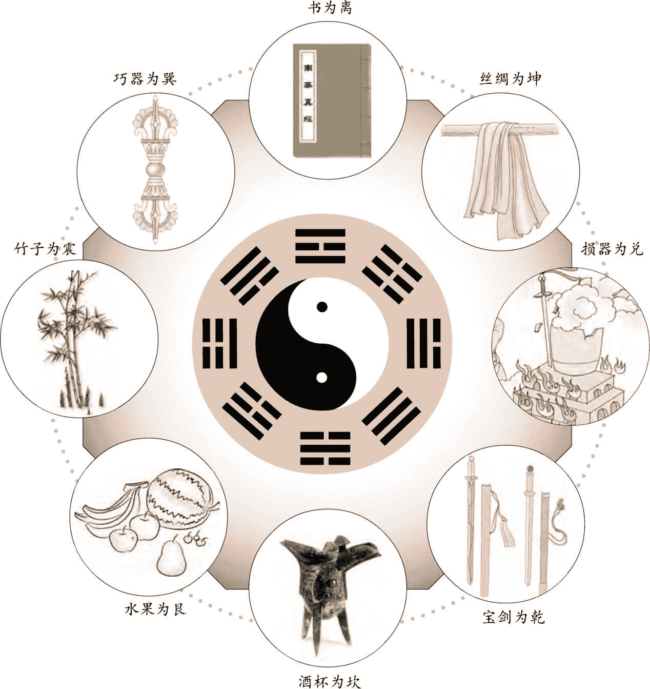

乾 卦表示金玉、宝珠、帽子、镜子、圆形之物、刚性之物。坤 卦表示布帛、丝绵、五谷、瓦器、方形之物、柔性之物。震 卦表示木竹、芦苇、花草、竹木类乐器。巽 卦表示木香、绳子、直物、长物、竹木、工巧之器。坎 卦表示酒器、水具、带核之物、柔软之物。离 卦表示火、书、甲胄、干戈、槁衣、干燥之物、赤色之物。艮 卦表示土石、瓜果、黄物、土中之物。兑 卦表示金刃、金属类乐器、废弃之物、破损之物。

## 八卦与人物

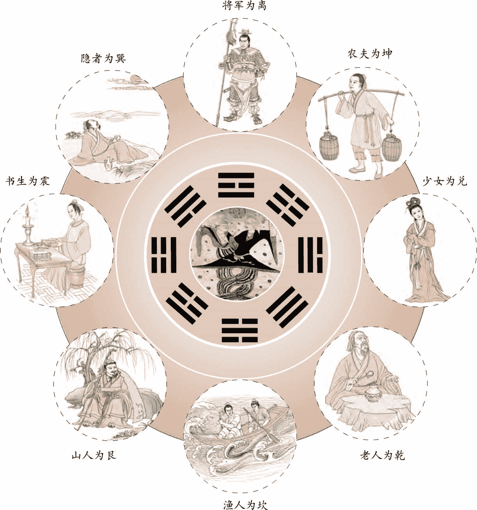

乾 卦表示刚健有力，为君父、官员、大人、老人、长者、宦官、名人。坤 卦表示宽厚包容，为老母、农夫、平民百姓。震 卦表示多动易怒，为好动易怒的将军。巽 卦表示进退不决，为秀才、寡妇、山林中的隐者、仙道之人。坎 卦表示阴险卑下，为渔夫、船夫、盗贼。离 卦表示聪明好学，为文人、士兵。艮 卦表示沉着稳重，为闲人、山中之人。兑 卦表示柔弱活泼，为歌妓、演员、翻译家、巫师。

## 八卦与八仙

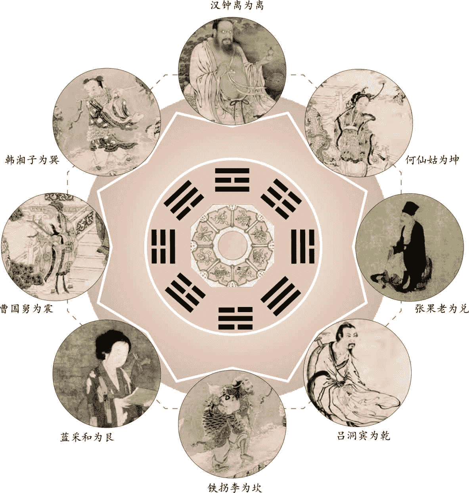

吕洞宾道号纯阳子，表示乾 卦。何仙姑是八仙中唯一的女性，对应着八卦中的坤 卦。震 为雷，曹国舅的两片云板敲击发出的声音正像自然界中的雷声。韩湘子的笛声像春风一样具有使百花开放的功能，韩湘子正是巽 卦的化身。坎 代表的颜色为玄，铁拐李本名玄，代表八卦中的坎卦。汉钟离之“钟离”又“中离”谐音，是“离 中虚”的卦象。艮 为少男，又含阻止之意，正是一脚着靴的蓝采和。张果老曾在水灾中救人，后受供于大泽之上，无疑正是兑 卦的象征。

## 八卦与房宅

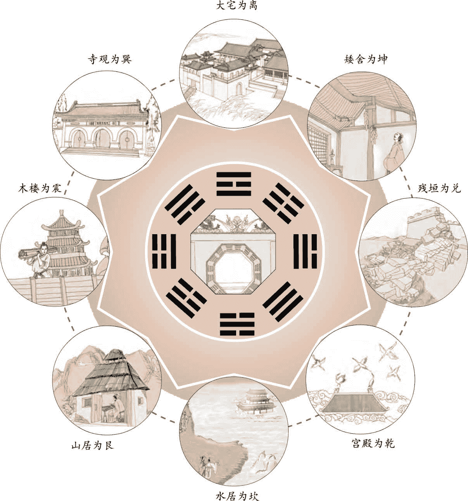

乾 卦表示高大的楼台、厅堂、大厦、驿舍，西北向之居。坤 卦表示村居、矮屋、土屋、仓库，西南向之居。震 卦表示山林中的房子、木质楼阁，东向之居。巽 卦表示佛寺、道观、园林、山林之居，东南向之居。坎 卦表示近水楼台、望江楼、茶馆、酒肆、湿地之居，北向之居、离 卦表示阳明之宅、虚室、明窗之居，南向之居。艮 卦表示山居、近石之宅、近路之宅，东北向之居。兑 卦表示近泽之居、断壁残垣，西向之居。

## 八卦与汉字

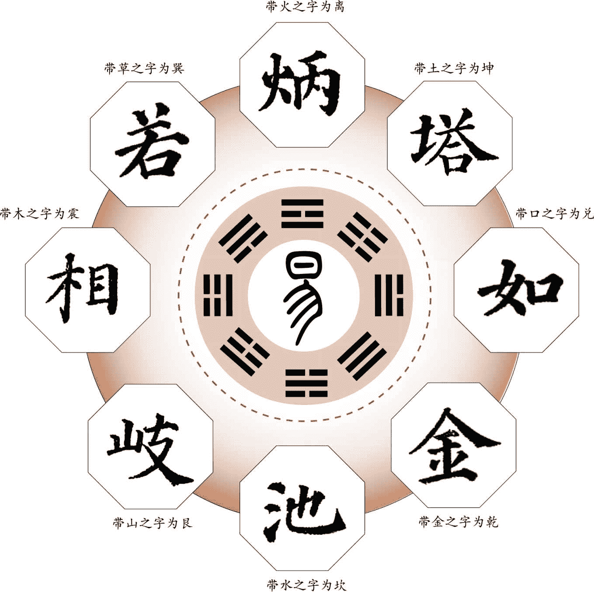

乾 卦五行属金，所以带金字旁的字都属于乾卦。坤 卦表示大地，所以带提土旁的字都属于坤卦。震 五行属木，带木字旁的字都属于震卦，带雨字头的也属震卦。巽 五行属木，但木气弱于震，所以带草字头的字都属于巽卦。坎 为水，在五行中也属于水、所以带三点水的字都属于坎卦。离 为火，在五行中也属于火，所以带“火”的字都属于离卦。艮 为山，带山字旁或石字旁的字属于艮卦。兑 中含“口”字，带“口”的字都属于兑卦。

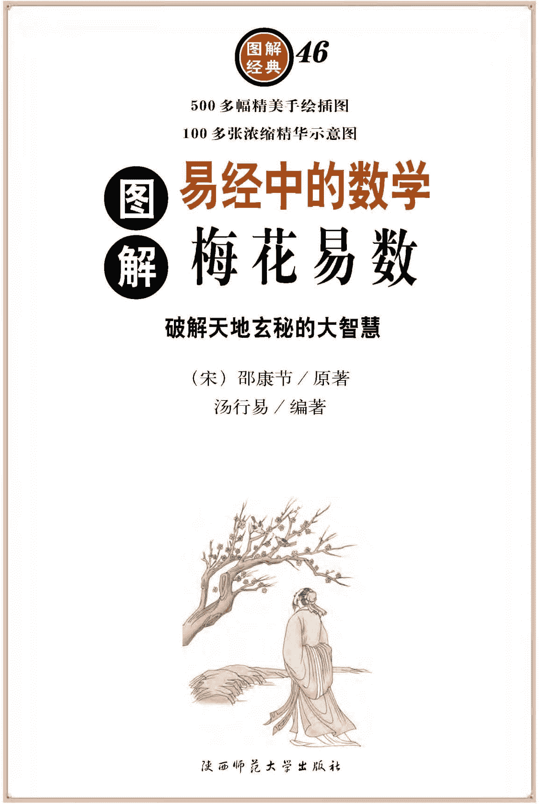

图书在版编目（CIP）数据

图解易经中的数学／（宋）邵康节原著；汤行易编著．－西安：陕西师范大学出版社，2008.11

ISBN 978-7-5613-4157-5

Ⅰ．图…　Ⅱ．①邵…　②汤…　Ⅲ．①周易－图解　②象数之学－图解　Ⅳ．B221.5-64　O112-64

中国版本图书馆 CIP 数据核字（2008）第 168386 号

图书代号：SK8N1030

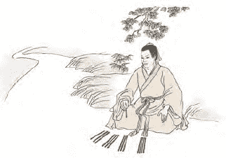

本书著作权、版式和装帧设计受国际版权公约和中华人民共和国著作权法保护。
本书中所有文字、图片、示意图等著作权为北京紫图图书有限公司所有，
未事先获得北京紫图图书有限公司书面许可，
本书的任何部分不得以图表、声像、电子、影印、缩拍、录音或其他任何手段进于复制和转载，
除非在一些重要的评论及文章中作简单的摘引。违者必究。

图解易经中的数学

梅花易数

邵康节／原著　汤行易／编著

责任编辑／周宏

出版发行／陕西师范大学出版社

经销／新华书店

印刷／北京市兆成印刷有限责任公司

版次／2008 年 11 月第 1 版

2008 年 11 月第 1 次印刷

开本／787 毫米×1092 毫米　1/16　20 印张

字数／190 千

书号／ISBN 978-7-5613-4157-5

定价／68.00 元

* * *

如有印装质量问题，请寄回印刷厂调换

# 编者序：《易经》象数的经典之作

《易经》是中华文明的源头，先秦诸子百家几乎都有研究《易经》的经历。孔子在晚年时花了很大精力研读《易经》，并亲自为《易经》作了注。由于孔子的大力提倡，儒家一直以《易经》为根本经典。从汉朝刘歆、班固开始，《周易》被奉为儒家六经之首。《易经》蕴藏了丰富的数学内蕴，往往被古代数理学家们视作解读宇宙万物的哲学本源，当作研究宇宙万物数理关系的智慧之泉。《易经》对道教的影响更是深远，在道教创立的初期，《易经》就是最基本的经典之一。在两千年的发展过程中，《易经》的深刻理论已经渗透到道教的各个方面，从基本信仰、神仙体系、方术仪轨、丹鼎符、戒律道德等角度，我们可以清晰地看出《易经》思想的影响。

先秦时期以来，研究《易经》的人就非常多。一般来说，这些研究者可以分为四大流派：象、数、义、理，而象与数、义与理又可分别归为一类。少年天才王弼从哲学角度研究《易经》的理论，我们称之为“义理学派”；京房等人则从卦象角度研究八卦和六十四卦的应用，我们称之为“象数学派”。

北宋时期，象数之学大兴于天下，华山高道陈抟创制了多个象数图式，把道教和儒家的思想融合在一起，开创了象数学的新局面。经过周敦颐的传承和发展，这种新的象数学思想在北宋大儒邵康节身上达到了辉煌的顶峰。

邵雍（1011-1077）字尧夫，谥康节，自号安乐先生，是北宋著名哲学家。邵康节精通先天象数之学，并且把象数理论融合到儒学之中，成为宋明理学的主要奠基人之一。邵康节一生未仕，全心治学，所著《皇极经世》《渔樵问对》《伊川击壤集》等书，都是宋代重要的学术著作。

《梅花易数》全名《邵康节先生观梅拆字数全书》，是邵康节先生所作的一部奇书。传说一次他在花园里散步，听到梅树上鸟雀鸣叫，循声掐指而悟，因而创立了“梅花易数”。它的基本理论都是由《易经》六十四卦推演而来，将一切天时、地理、声音、人物、颜色、形状等转化为数字，再通过卦象来预测事物的发展趋势。它是一种简单易行、灵活多变的易学预测法，是在穷究宇宙万物之数理关系的基础上，化繁复为简明而总结得出的。因此，其中也蕴含了我国丰富的古代数学思想和科学的数学方法，因此也被学者称为“《易经》中的数学”。自宋代以来，这种方法应用范围十分广泛，所以近一千年来它在民间流传甚广。

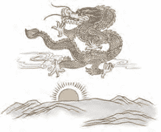

世界是一个有机的整体，万事万物都是互相联系在一起的。当然，这不是邵康节在《梅花易数》中提出的思想，孔子在《易·系辞》里面就曾指出：“《易》与天地准，故能弥纶天地之道。仰以观于天文，俯以察于地理，是故知幽明之故；原始反终，故知死生之说。”并且认为，若能够正确地利用《易经》预知命运，就能够实现“自天佑之，吉无不利”的状态。梅花易数继承并发扬了这种思想，将原来应用范围比较狭窄的方法推广到生活中的各个方面。拆字术是梅花易数的一大亮点，它从字的含义、结构、风骨神韵等角度讨论汉字，从一个字中就能读出写字之人的性格和品味。

《梅花易数》原书的主要缺点在于内容庞杂，前后重复，有些地方结构混乱；更令人望而生畏的是，它是用文言文写成的，这给现代人的阅读带来了极大的不便。为了便于读者迅速掌握本书的精髓，我们特意编写了《图解〈易经〉中的数学·梅花易数》一书。本书选取了原书的精华部分，用浅显易懂的文字，按照清晰的逻辑顺序重新讲述出来。本书最大的优点是，采用了大量的手绘图片来表现《易经》和《梅花易数》的深刻含义，使原来深奥难懂的知识变得轻松而又形象。

本书的开始部分讲述《易经》的基础知识，确保从未接触过《易经》的读者也能毫无障碍地通读全书，迅速成为精通《易经》的高手。在书的附录部分，附有《梅花易数》原文，便于古文功底好的读者查阅。

# 目录

大千世界中的八卦编者序：《易经》象数的经典之作本书内容导航第一章　易学的秘密：乾坤万物有数理 1．感受中国第一经：群经之首，大道之源 2．《易经》初探：太极、两仪与四象 3．《易经》再探：五行与天干地支 4．《易经》三探：从八卦到六十四卦 5．《易经》四探：象数与义理 6．《易经》的应用：占卜法 7．占卜法的意义：政治与道德 8．占卜法总原则：无疑不卜，筮不过三 9．占卜的历史：《易经》占卜的演变 10．三大神数之首：紫微斗数 11．干支与八卦的结合：纳甲法 12．八宫与月相：纳甲法的具体应用 13．草木之中的奥秘：揲蓍成卦法 14．最简单的卜筮法：金钱卦法第二章　认识易数的方便法门：初探梅花易数 1．缘起：从邵雍说起 2．玄意幽远：魏晋玄学中的易理 3．哲理玄奥：宋明理学中的易理 4．梅花易数的基础：《易经》中的象数 5．四时与气候的影响：卦气衰旺论 6．象数中的命运：梅花易数与吉凶祸福 7．掌握梅花易数的第一步：梅花易数的起卦法 8．起卦的数学公式：卦除以八，爻除以六 9．初试梅花易之一：日期与时刻的占法 10．初试梅花易之二：尺寸与方位的占法 11．初试梅花易之三：物数与声音的占法 12．初试梅花易之四：动物与静物的占法 13．测字前的准备：汉字的历史 14．字占概论：字占的基本原理 15．字占详论：从一字到十字 16．察言观色；如何为人占 17．预知未来：如何为自己占第三章　走进易学预测之门：梅花易数的占卜总诀 1．变通之道：梅花易数中的占卜玄机 2．易卦为主：梅花易数的占卜总诀 3．辞中玄机：卦辞的先天后天论 4．占卜总诀之一：梅花易数中的天时占 5．占卜总诀之二：梅花易数中的人事占 6．占卜总诀之三：梅花易数中的家室占 7．占卜总诀之四：梅花易数中的婚姻占 8．占卜总诀之五：梅花易数中的名利占 9．占卜总诀之六：梅花易数中的出行占 10．占卜总诀之七：梅花易数中的失物占 11．占卜总诀之八：梅花易数中的疾病占 12．占卜总诀之九：梅花易数中的风觉占 13．占卜总诀之十：梅花易数中的鸟类占 14．占卜总诀之十一：梅花易数中的声音占第四章　“体用”说：梅花易数的功用理论 1．体用为主：梅花易数中的体用说 2．体用总诀之一：生体之卦与所应之事 3．体用总诀之二：克体之卦与所应之事 4．体用说的补充：衰旺论与内外论 5．生克之诀：体用说与五行生克 6．动静之诀：体用说与动静之理 7．克应之诀：体用说与应验时刻 8．坐端之诀：体用说与方位设置 9．观物洞玄歌：预测住它吉凶的准则第五章　占卦要诀：三要与十应 1．三要：感官中的万物之理 2．十应：出于三要，灵于三要 3．十应之一：天时之应 4．十应之二：地理之应 5．十应之三：人品之应 6．十应之四：行为之应 7．十应之五：方卦之应 8．十应之六：动物之应 9．十应之七：静物之应 10．十应之八：言语之应 11．十应之九：声色之应 12．十应之十：文字之应第六章　观梅术妙用：梅花易数占例 1．年月占例：康节观梅占 2．时刻占例：马踏牡丹占 3．闻声占例：叩门借物占 4．声音占例：今日动静占 5．字画占例：西林寺牌占 6．面色占例：面色忧喜占 7．动物占例：动物哀鸣占 8．植物占例：枯枝坠地占第七章　汉字神算之一：梅花易数测字法总纲 1．汉字的结构：偏旁部首的组合方式 2．六书：汉字的造字法 3．风骨与神韵：中国古代书法名家概览 4．五行体格歌：梅花易数中的笔式分类 5．五行干支辨：梅花易数中的五行干支 6．辨别六神歌：梅花易数中的六神笔法 7．五行六神篇：梅花易数中的测字准则 8．甲子纳音歌：梅花易数中的六十甲子 9．神煞笔法诀：梅花易数中的偏旁部首 10．玄黄笔法歌：梅花易数中的玄黄笔法 11．五言作用歌：梅花测字时的末笔判断 12．七言作用歌：梅花测字时的整体判断第八章　汉字神算之二：梅花易数测字法应用 1．字画经验：部分常见字测法 2．人如其字：推断贫富的要诀 3．字画指迷：各种情况下的测字法 4．字与风格：探玄赋测字法 5．以卦而断：测字时的变通法 6．命中机缘：古人测字故事（一）7．一心做事：古人测字故事（二）8．易理玄微：梅花易数占法总结附录：
邵康节先生观梅拆字数全书

# 本书内容导航

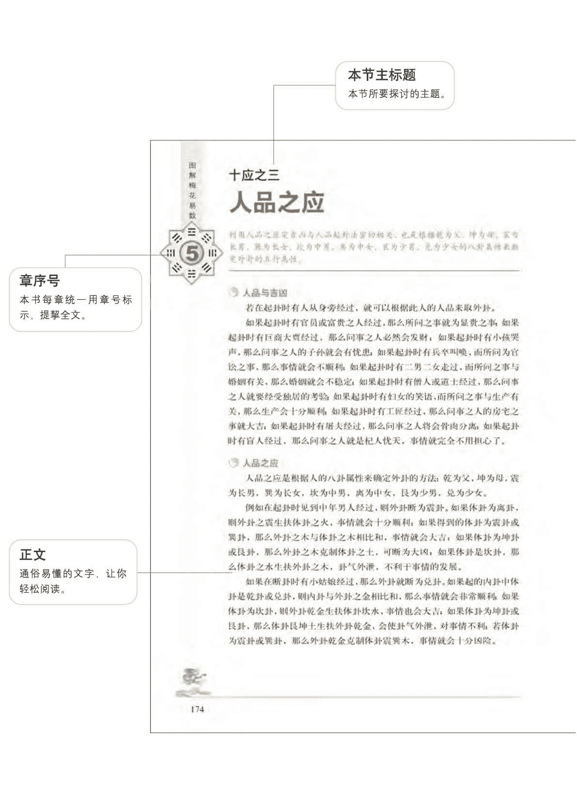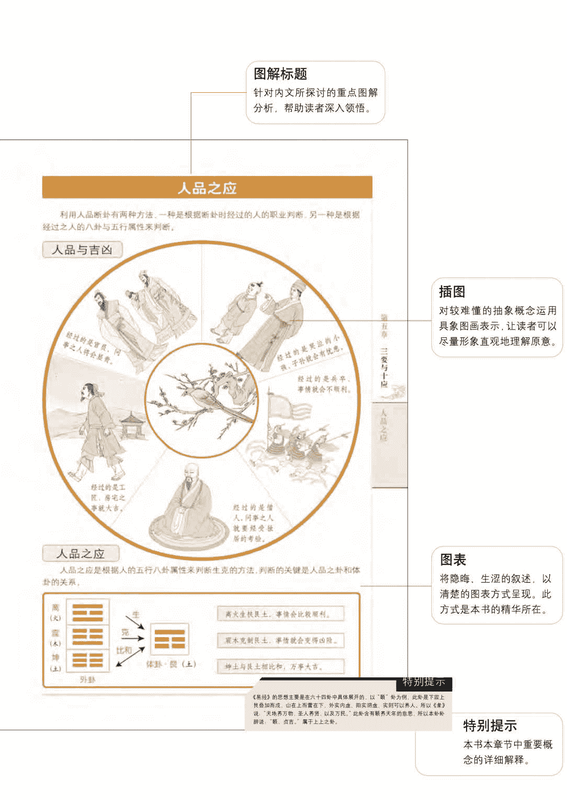

# 第一章　易学的秘密
乾坤万物有数理

《易经》是中华文明之根，儒家把它奉为“六经之首”，道家认为它是“大道之源”，诸子百家或多或少都从《易经》中获其所需。但是在大多数人的眼里，《易经》是一部深奥晦涩的书，针对这种情况，我们采用了图解与文字结合的方式把易理讲述出来，使人人都能读懂《易经》，人人都可研究《易经》。

## 本章图版目录

群经之首——《易经》

《易经》与“三易”

《易经》与道教

从太极到四象

五行生克图

十二地支与十二时辰

八卦象征图

后天八卦与节气

六十四卦

汉朝以来的《易经》研习流派

《易经》占卜法

占卜的意义

卜筮的总原则

形形色色的占卜法（一）

形形色色的占卜法（二）

紫微斗数十二宫

纳甲法的基本原理

纳甲法的应用

揲蓍成卦法详解

揲蓍成卦法与《易经》原理

金钱卦法的步骤

## 1　感受中国第一经
群经之首，大道之源

《易经》是中国古代最重要的一部经典，儒家认为它是“六经之首”，道家认为它是“大道之源”，诸子百家或多或少都从《易经》中获其所需。历代思想家们对《易经》的解释、应用和发展，使得《易经》对中华文明的影响更为深远。

### 群经之首——《易经》

《易经》是中国最古老的哲学著作之一，传说伏羲所画的八卦是中国文字的雏形，由此衍生出了辉煌灿烂的中华文明。

我们的祖先面对变幻莫测的世界，对日出日落、电闪雷鸣等现象感到迷惑不解，后来圣人伏羲氏仰观日月星象、下察山川地理，通过观察鸟兽身上的花纹，在河图、洛书的启示下，画出了八卦图，成为《易经》的核心内容。古人用八卦来与神明沟通，并以此解释各种自然和社会现象。

《易经》上通天文，下通地理，中通人事，以无所不包的最终原理来统摄万物。通过对《易经》的研究，我们不但可以穷究天人之际，通晓古今之变，而且可以得到基本的处世法则，这对指导我们的人生有重大的意义。

纵观整个中华文明史，几乎每一步发展都与《易经》息息相关。先秦诸子百家构成了中国第一个思想高峰，尽管他们的主张各不相同，但他们都有研究《易经》的经历，并且把《易经》原理应用到各自的理论之中。魏晋时期，玄学家们奉《易经》《老子》《庄子》为“三玄”，并把《易经》作为“三玄”之首，围绕着“有”与“无”、“名教”与“自然”的关系展开辩论，构成了中国思想史上第二个高峰。宋明理学是中国思想发展到顶峰的形态，而它的开端正是以周敦颐著《太极图说》为标志。宋明理学的另一开山人物邵雍所著《梅花易数》一书，对《易经》的占算方法作了重大改进，成为占卜的重要依据。

### 群经之首——《易经》

《易经》是对中国文化影响最大的典籍之一，孔子“晚而喜易”，并亲自作《易传》来阐述《易经》的深刻内涵。在孔子的大力推动下，儒家将《易经》奉为六经之首，其他诸子百家无不研究《易经》、吸取《易经》理论为之所用。

#### 六经之首

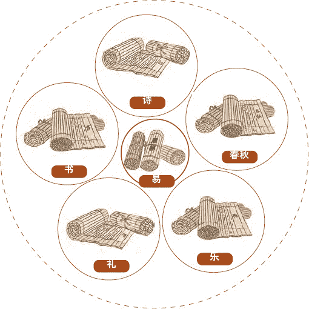

#### 大道之源

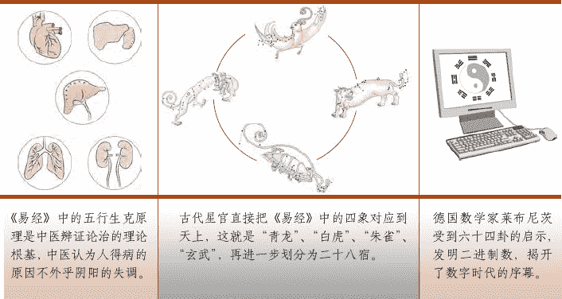

* * *

### 《易经》的早期发展——三易

《易经》的成书有“人更三圣，世历三古”的说法。一般认为它指的是上古时期的伏羲、中古时期的周文王和近古时期的孔子。伏羲根据河图、洛书，制定了先天八卦，是《易经》最早的“作者”；“文王拘而演《周易》”，周文王把伏羲的先天八卦演绎为后天八卦，并进一步推演出八八六十四卦，这是《易经》与八卦的又一次大发展；孔子对《易经》的贡献主要有两点：一是把《易经》列为六经之一，以此教授弟子，从而使得《易经》引起更多人的关注和研究；二是作《易传》来详细解释《易经》。

孔子删定的《周礼》上说：“太卜掌三易之法，一曰《连山》，二曰《归藏》，三曰《周易》。”又说：“筮人掌三《易》，以辨九筮之名：一曰《连山》，二曰《归藏》，三曰《周易》。”可见《易经》的发展经历了三个时期：《连山易》《归藏易》和《周易》，一般称之为“三易”。

关于三易的说法有多种，流传最广的一种是：《连山易》是神农时代的《易经》，《归藏易》是黄帝时代的《易经》，《周易》是周朝的《易经》。但也有人持不同意见，例如汉朝思想家郑玄认为，《连山易》《归藏易》和《周易》分别是夏、商、周三代的《易经》。

可惜的是，在几千年的传承中，《连山易》和《归藏易》都已经失传了。我们今天能看到的《易经》只剩下了《周易》。

### 《易经》与儒家

有人说儒家只关注社会现象和人际关系，而不注重在这些现象背后的哲理，这种说法其实是不全面的，因为在孔子时代，《易经》就作为六经之一而成为孔门弟子必须要研究学习的书。

《史记·孔子世家》云：“孔子晚而喜《易》，序《彖》《系》《象》《说卦》《文言》。读《易》，韦编三绝。”孔子到了老年时喜欢上了《易经》，并亲自为《易经》作了注，这十篇注称为《易经》的“十翼”，其中有注解卦名和卦辞的《彖》上下篇、注解卦名和爻辞的《象》上下篇、作为总纲的《系辞》上下篇、解释八卦卦象的《说卦》篇，进一步解释乾、坤二卦的《文言》篇等。此外，还有《杂卦》和《序卦》两篇，这两篇则着重讲了六十四卦的理论。孔子是如此喜欢《易经》，竟至于把穿竹简用的牛皮翻断了好几次。

由于孔子的提倡，儒家一直奉《易经》为根本经典。从汉朝刘歆、班固开始，《周易》被奉为儒家六经之首。到了宋朝，儒家发展出了一种新的形式，即理学或道学。理学从一开始就是以研究《易经》为契机的，周敦颐作《太极图说》，是理学正式成立的标志；其他代表人物几乎都有关于《易经》的论著，如象数学派的邵雍作《梅花易数》，理学的集大成者朱熹作《周易本义》，说“某不敢教人看《易》，为这物阔大，且不切己”，针对当时社会上流行的对《易经》的误解而为《易经》正名。

### 易经与“三易”

由于《连山易》和《归藏易》都已经失传了，所以人们对于《连山易》、《归藏易》和《周易》产生的时间有很多种不同的说法，对于它们所蕴含的智慧也有不同的见解。不过从先秦典籍的记述中，我们可以知道它们的一些知识。

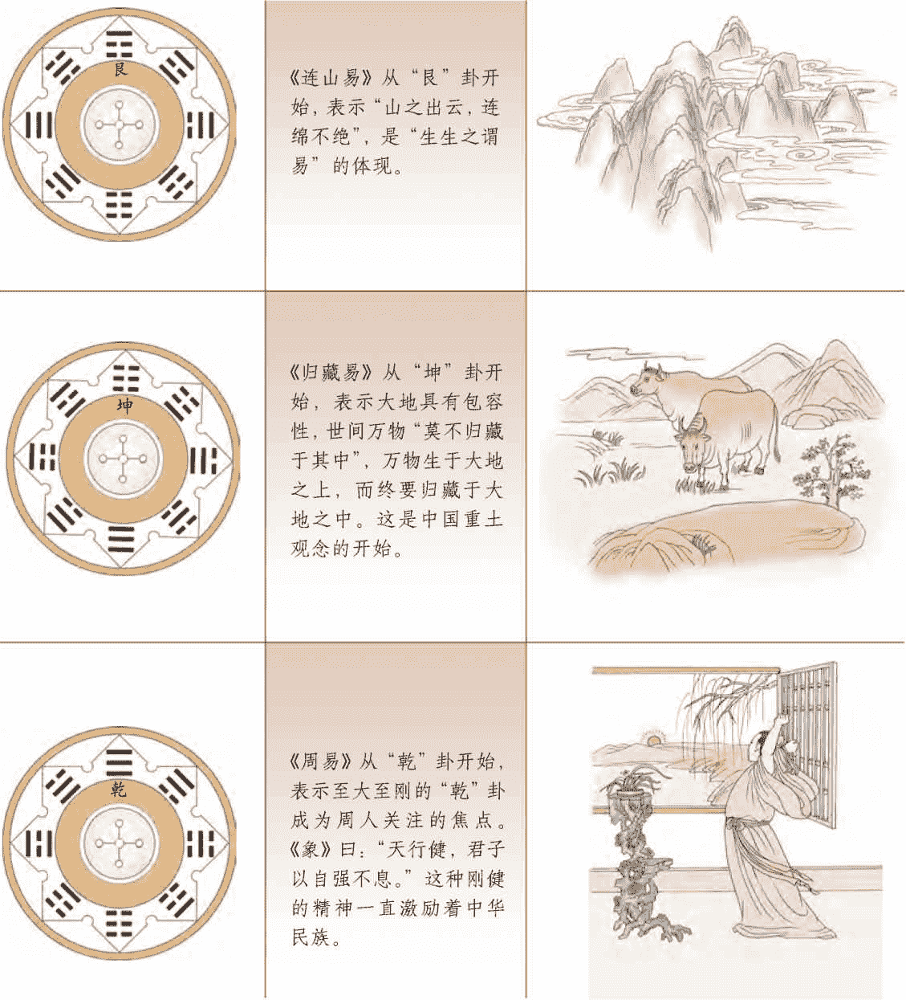

特别提示

无论是哪种《易经》，它们所代表的内涵都是一致的，都不外乎“简易”、“变易”、“不易”三种基本精神。《易传》以及后世由《周易》衍生出来的各种思想，其实大多数可以看成是对三种《易经》共同精神的诠释。

* * *

### 《易经》与道教

道教在创立的初期就把《易经》作为经典，道教徒把《易经》的深刻理论吸收，并使其渗透到道教的基本信仰之中。从道教发展史上看，以易解道是一个重要的现象。在道教看来，《易经》中的理论和《老子》中的“道”本质上是一致的。

北宋初年的华山高道陈抟（陈希夷）对《易经》作出了重要发展。陈抟绘制出“太极图”、“先天方圆图”、“八卦生变图”等一系列《易经》图，成为中国太极文化的创始人。陈抟还提倡用《易经》原理养生，著有《指玄篇》《观空篇》《胎息诀》和《阴真君还丹歌注》等作品。

经过一千多年的发展，《易经》思想已经成为道教不可分割的一部分。今天我们可以看到，无论是道教的神仙体系、方术仪轨、丹鼎符箓，还是戒律道德等方面，到处都充满了《易经》思想的影响。

### 《易经》与其他

《易经》的影响远远不只这些，它还影响到中国的建筑布局、风水堪舆、星象占算等许多方面。而西方数学家莱布尼茨发明二进制，据说也是受到了《易经》八卦的启示。

现代人重新看到了《易经》的神奇性，把《易经》的思想广泛应用于管理、经济、商业等领域，如果应用得当，无疑会成为社会经济发展的巨大的推动力，所以了解一点《易经》知识是非常有必要的。

### 《易经》与道教

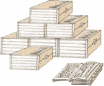

《易经》是道教的基本经典，道教吸收了《易经》的阴阳消长、五行八卦等理论，以此建构起自己的神仙谱系，服饰宫观、丹鼎符箓等体系。道教的健身之术——太极拳更是把《易经》的太极理论与《老子》的以柔克刚理论结合在一起，成为中华武术中的一颗璀璨的明珠。

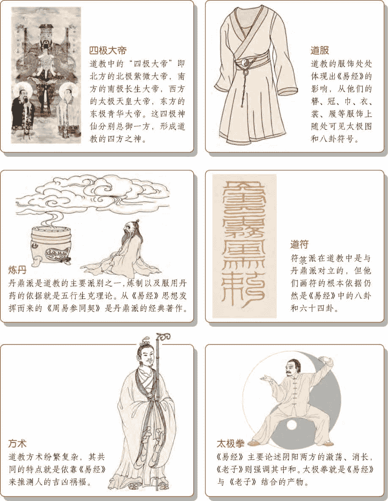

## 2　《易经》初探
太极、两仪与四象

太极、两仪与四象是《易经》中最基本的概念之一。《易传·系辞上》中说：“易有太极，是生两仪，两仪生四象，四象生八卦，八卦定吉凶，吉凶生大业。”因此要了解《易经》与八卦、六十四卦，必须先弄清楚太极、两仪与四象的含义。

### 易有太极

“太”的意思就是至、到、臻于，“极”的意思就是极限，“太极”含有到达最终极真理的意思。太极指的是天地未开、混沌未分阴阳之前的状态。此时没有任何分化和对立，但它却包含一切，是万物的根源，由此可以生出世间万象。

### 太极生两仪

太极是一切矛盾的统一体，两仪则是一切矛盾的展开。我们看到的太极图中的“阴阳鱼”有黑白两面，这就代表了互为矛盾的双方。北宋大儒周敦颐在《太极图说》中说，“分阴分阳，两仪立焉”，可见两仪就是由太极分化而来。

那么两仪究竟是什么呢？在古代易学家的理论中，提到最多的共有七种说法：阴与阳、天与地、奇与偶、刚与柔、玄与黄、乾与坤、春与秋，但其中阴与阳是最常见的说法。

其实两仪并不局限于哪两种具体的事物，一切有对立、有矛盾的事物或事物的属性，都可以作为两仪。比如水与火、寒与暑、“润下”与“炎上”等等。

### 两仪生四象

两仪在运动对立的过程中，会出现阴与阳的消长，这引起了四种新的状态：太阳、少阳、少阴、太阴。其中太阳与太阴分别是阳极与阴极的表现，少阳是阳性逐渐增加而达到阴阳平衡的状态，少阴是阴性逐渐增加而达到阴阳平衡的状态。

四象应用最多的是在天文学中，古代天文学家把星空划分为三垣、四象、二十八宿。在古代星相学中，四象指的是东方青龙、西方白虎、南方朱雀、北方玄武这四种形象，与之对应的则分别是少阳、少阴、太阳、太阴。

此外，关于四象还有多种说法，如东、南、西、北，春、夏、秋、冬，金、木、水、火等等。和两仪相似，四象不仅仅是四种具体的事物，而主要是四种属性。

### 从太极到四象

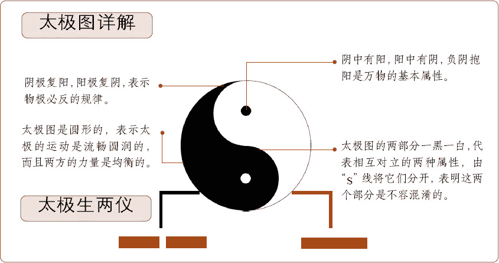

#### 两仪生四象

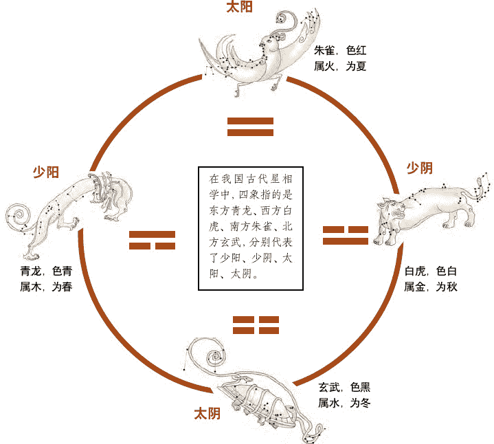

## 3　《易经》再探
五行与天干地支

五行和十天干、十二地支虽然不是直接来源于《易经》，但是它们是《易经》理论的重要基础。五行原来是指金、木、水、火、土五种元素，我国古代朴素唯物主义思想家利用这五种物质来说明世界万物的起源。干支创制于黄帝时期，最早是用来计时的。

### 五行简介

五行指金、木、水，火、土五种物质元素，古人认为世间万物都是由这五种元素构成的，事物的运动、变化、发展都是由这五种元素的性质相互作用的结果。

《尚书·洪范》说：“五行：一曰水，二曰火，三曰木，四曰金，五曰土。水曰润下，火曰炎上，木曰曲直，金曰从革，土爰稼穑。润下作咸，炎上作苦，曲直作酸，从革作辛，稼穑作甘。”可见这五种性质早就被古人掌握了，并由这些性质抽象出这五种基本元素，形成了一个固定的组合。

五行的内在关系在于“相生”与“相克”，即金生水、水生木、木生火、火生土、土生金，金克木、木克土、土克水、水克火、火克金。这样，通过相生与相克，就把五行紧密地联系在了一起，使其形成了一个统一的整体。

### 五行的特征

“金”的性质：“金曰从革”。“从革”的意思是变革，具有肃杀、延展、能柔能刚等作用的人或事物均归属于金。

“木”的性质：“木曰曲直”。曲直就是指树木的生长形态，是对木性柔和的形象描述，一切具有生长、舒展、柔和、仁慈等性质的人或事物均属于木。

“水”的性质：“水曰润下”。水具有滋润和向下的性质。一切具有湿冷、滋润、向下、变化多端的特点的人或事物均归属于水。

“火”的性质：“火曰炎上”。火具有温热和上升的性质。一切具有温热、升腾、性格急躁特点的人或事物均归属于火。

“土”的性质：“土爰稼穑”。土是万物赖以生存的基础。凡是敦实厚重、能生发万物的人或事物都属土。

### 五行生克图

五行相生，指的是金、木、水、火、土各元素之间互相资生、助长的关系，即金生水、水生木、木生火、火生土、土生金。其中任何一种元素都有“生我”和“我生”两种性质，这样循环往复，构成了一个自足的体系。

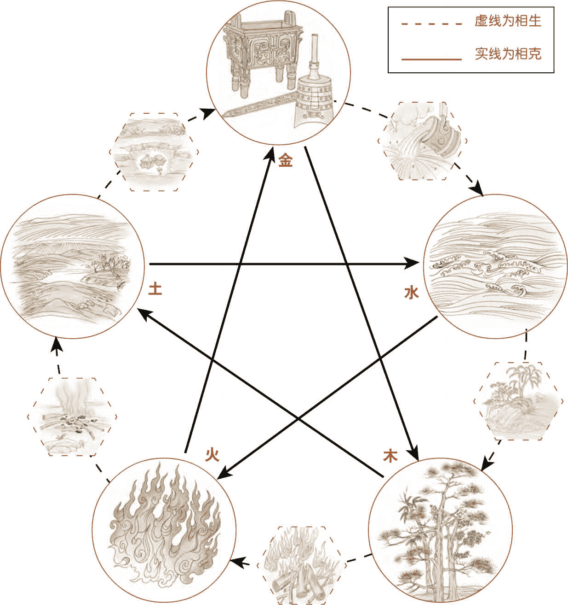

特别提示

五行相克，指的是金、木、水、火、土之间互相克制、互相限制的关系。五行中的每一种元素都有“克我”、“我克”的关系，它们互相牵制，从而使每个元素的性质都不能过于亢进。

* * *

### 干支

干支是十天干和十二地支的简称。传说干支是黄帝命大挠氏创制的，“干”原意是指树干，“支”原意是指树枝，以此计算时日。

### 十天干

甲：比喻草木冲破铠甲而萌发。

乙：草木刚刚萌芽，枝叶柔软屈曲的样子。

丙：即“炳”，如太阳一般的火光，万物皆得光明。

丁：草木成长丁壮，又好比人的成丁。

戊：即“茂”，象征万物茂盛繁荣。

己：即“起”，万物生起，欣欣向荣的样子。

庚：即“更”，时间更替，秋收已毕而待来春。

辛：即“新”，万物肃然更改，秀实新成。

壬：即“妊”，阳气潜伏，万物怀妊。

癸：即“揆”，万物潜藏于地下的样子。

### 十二地支

子：即“孳”，阳气萌发，在地下开始孳生。

丑：即“纽”，草木屈曲着将要冒出地面的意思。

寅：即“演”，指万物开始生长的意思。

卯：即“冒”，万物从地上冒出的样子。

辰：即“伸”，万物得以舒伸。

巳：即“已”，指万物已成的意思。

午：即“仵”，指万物已过极盛之时，阴阳相交的时候。

未：即“眛”，日中则昃，阳气开始减退。

申：即“身”，是万物初具形体的意思。

酉：即“就”，万物已经成熟。

戌：即“灭”，万物即将灭尽。

亥：即“核”，万物收藏，以核的形式藏于地下。

### 十二地支与十二时辰

地支最早的用途是计时，古人把一天划分为十二个时辰，每个时辰用一个地支来命名。后来将十二地支与十天干配合，用来计算年、月、日、时，我国传统的农历至今仍是以这样的方式来计时的。

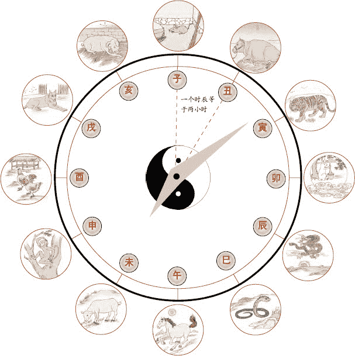

特别提示

天干地支在《易经》占卜中占有非常重要的地位，如常见的纳甲法就是用天干地支和五行、八卦相配合而得到的。五行和八卦主要决定空间方位，而天干地支则与时间次序息息相关。

## 4　《易经》三探
从八卦到六十四卦

八卦和六十四卦是《易经》最核心的内容，伏羲氏根据对立统一创制先天八卦，是八卦最早的形态，后来周文王针对自然界和人类世界的真实情况创制了后天八卦，并将八卦推演为六十四卦。六十四卦是《易经》占卜的基本依据。

### 八卦的基本概念

八卦是几千年前由伏羲氏创制的一套有象征意义的符号，用一条连续的线“—”代表阳，称为阳爻；用中间断开的线“--”代表阴，称为阴爻。然后把三条这样的符号排列在一起，就得到八组线条，这就是八卦。八卦的名称分别为乾、坤、震、艮、离、坎、兑、巽，古人总结出了记忆歌诀；乾三连，坤六断，震仰盂，艮覆碗，离中虚，坎中满，兑上缺，巽下断。

《易经》认为，每一个卦形都有一定的事物相对应，即：乾代表天，坤代表地，坎代表水，离代表火，震代表雷，艮代表山，巽代表风，兑代表泽。这样八卦就有了八种不同的属性，这些属性是后世占卜的依据。

八卦的代表物远远不止这一类，它可以应用到许多方面，例如用在一家之内，则它们又有了新的类象：乾为父，坤为母，震为长男，巽为长女，坎为中男，离为中女，艮为少男，兑为少女；又如用于人体，则有：乾为头，坤为腹，震为足，巽为股，坎为耳，离为目，艮为手，兑为舌。

### 先天八卦

先天八卦又称伏羲八卦，是伏羲氏观物取象而创作的。“太极生两仪”，即阴爻和阳爻；“两仪生四象”，即由阴阳二爻组成太阴、太阳、少阴、少阳等四个卦象；在太阴、太阳、少阴、少阳的基础上再加上阴爻或阳爻，就组成了八卦。如在少阳上加一阳爻，就生成了巽卦，而在上面加一阴爻，就生成了坎卦，依此类推就可得到八卦。

先天八卦对应着先天八卦之数，即乾一、兑二、离三、震四、巽五、坎六、艮七、坤八。太初时刻只有一片混沌，太极无形无象，没有定位，由阴阳消长而生成这八个数，所以叫做“先天”。

从八卦图我们可以看出，先天八卦图从乾到坤形成“天—地”的经线；从坎到离形成“水—火”的纬线，相对的两个卦阴阳爻恰好相反。

先天八卦是矛盾对立与统一的结合体，详述如下：

### 八卦象征图

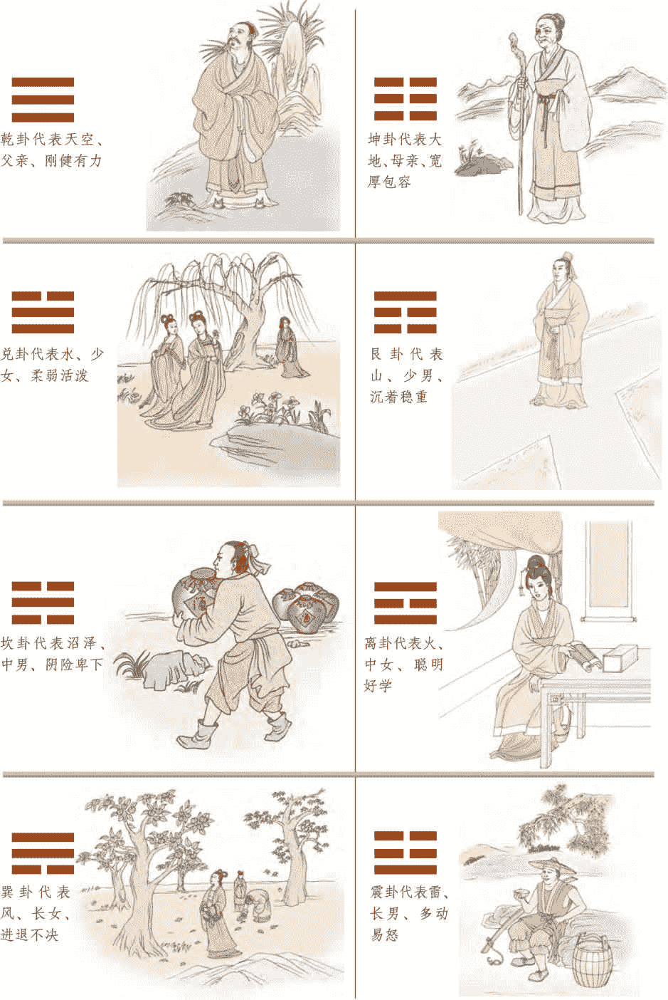

* * *

天地相对：乾卦与坤卦相互对峙，一南一北，一上一下，而乾是纯阳之卦，坤是纯阴之卦。

山泽相通：艮为山，兑为泽；艮居西北，兑居东南。山与泽是相对立的两种事物，象征着中国西北多山地、东南多沼泽。从两卦爻象来看，艮是一阳爻在上，二阴爻在下，而兑卦恰好相反。

风雷相激：巽为风，震为雷；巽居西南，震居东北。在自然界中，风与雷相互作用，共同造成了风雷激荡的状态。从卦象来看，震是二阴爻在上，一阳爻在下，而巽恰好相反。

水火相克：离为日，坎为月；离居东，坎居西。水火不容，故一东一西。从卦象来看，离是上下为阳爻，中间为阴爻，坎恰好相反。

### 后天八卦

后天八卦又称文王八卦，是周文王改进先天八卦而创制的。周文王在研究先天八卦的过程中发现先天八卦与实际应用有很多不相符合的地方，于是周文王改进了八卦的方位，使其顺应自然万物的变化。

在后天八卦中，每个卦也有相应的卦数，即：坎一、坤二、震三、巽四、中五、乾六、兑七、艮八、离九，可见在后天八卦中多出了一个数字九，同时多出了中土的位置。

在实际应用中，要以先天八卦图为体，后天八卦图为用，像天干、地支、五行生克等配置，都以后天八卦图为依据。

在八卦图上可以看出，后天八卦图以震卦为起始点，放于正东方向。然后按顺时针方向，依次为东南巽卦、正南离卦、西南坤卦、正西兑卦、西北乾卦、正北坎卦、东北艮卦。

从震卦开始，八卦分别代表了八个节气，即：震为春分，巽为立夏，离为夏至，坤为立秋，兑为秋分，乾为立冬，坎为冬至，艮为立春。

### 后天八卦与节气

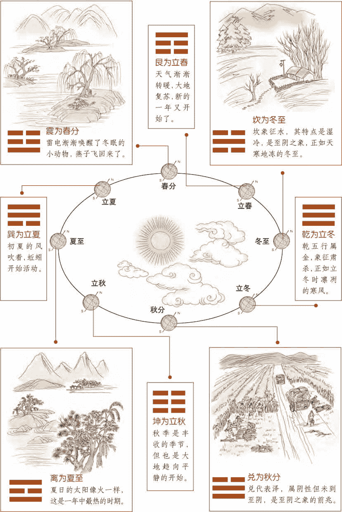

* * *

### 六十四卦

周文王又将八卦互相搭配，得到六十四卦，用来象征各种自然现象和人事现象。《易经》基本上就是来解释这六十四卦的。

宋儒朱熹在《周易本义》中作了《卦名次序歌》，有助于我们记忆《易经》六十四卦：

### 卦名次序歌诀

上经三十卦

乾坤屯蒙需讼师，比小畜兮履泰否；

同人大有谦豫随，蛊临观兮噬嗑贲；

剥复无妄大畜颐，大过坎离三十备。

下经三十四卦

咸恒遁兮及大壮，晋与明夷家人睽；

蹇解损夬姤益萃，升困井革鼎震继；

艮渐归妹丰旅巽，兑涣节兮中孚至；

小过既济兼未济，是为下经三十四。

将六十四卦按照一定的顺序排列起来，就得到“六十四卦方圆图”。按照排列的原则不同，六十四卦方圆图也有先天后天之分。

先天六十四卦方圆图反映了事物的总体变化规律。事物总是从阴到阳，又从阳到阴，这样周而复始不停地变化。事物的阴阳属性既有对立性，又有统一性。后天六十四卦方圆图则反映了事物变化的具体规律，从中我们可以看出阴阳互补、物极必反等规律。

六十四卦是八卦的具体展开，它所反映的规律既蕴含在八卦之中，又不仅仅是八卦所能概括的，两者互为参照、互相影响而形成了《易经》的核心内容。

### 六十四卦

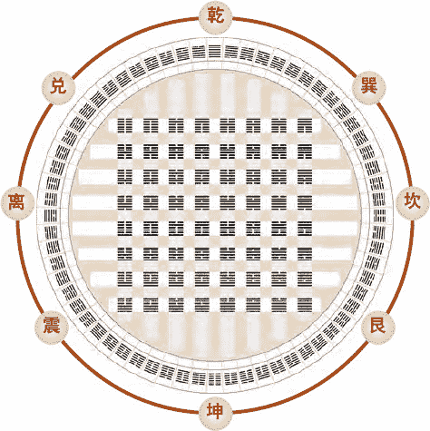

图中的六十四卦方圆图又称为先天六十四卦方圆图，其中外层是圆图，内层是方图。无论内层外层，都是由六十四卦按照一定的次序排列而成的。

外层其实是“放大”了的先天八卦图，因为它是按照“伏羲定位，天南地北，离东坎西”的顺序排列成的，即乾南、坤北、离东、坎西、兑东南、巽西南、震东北、艮西北，这个顺序与伏羲先天八卦图相同。

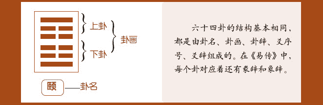

特别提示

《易经》的思想主要是在六十四卦中具体展开的，以“颐”卦为例，此卦是下震上艮叠加而成，山在上而雷在下，外实内虚、阳实阴虚，实则可以养人。所以《彖》说：“天地养万物，圣人养贤，以及万民。”此卦含有颐养天年的意思，所以本卦卦辞说：“颐，贞吉。”属于上上之卦。

## 5　《易经》四探
象数与义理

古人将易象、易数、易义、易理称为“易之四德”。简单来说，“象”是八卦、六十四卦及其所象征的事物的形象，“数”反映易经六十四卦之间数量上的关系，“义”反映《易经》所代表的伦理与道义，“理”是《易经》对事物的规律所做的探讨。

### 研究《易经》的两种思路

由于孔子的大力弘扬，后世研究《易经》的人不计其数，人们从各种角度阐述《易经》的深刻内涵，并在生活中加以应用。大致来说，根据研究思路的不同，研究者共分为四大流派：象、数、义、理，而象与数、义与理又可分别归为一类。

### 象数学派

《易经》中的象有三种含义：一是八卦及六十四卦的形状，二是八卦所象征的事物的形象，三是卦辞和爻辞中提到的具体事物的形象。数也有三种含义：一是表示卦中各爻属性的数，二是表示爻位顺序的数，三是占卜过程中的一种计算方法。

两汉时期，《易经》被尊为儒家五经之首，所以《易经》成为一代显学。以孟喜、京房为代表的两汉易学家认为，《易经》中最重要的是象，一切卦辞和爻辞都是以象为基础的，所以他们从象数角度解释《易经》。

经过一段时间的衰落以后，北宋时期，华山道士陈抟重新振兴了象数学派。陈抟创制了包括太极图在内的各种图式，用以解说《易经》卦象爻辞。陈抟的继承者邵雍则创制“皇极经世图”取代汉朝的天人感应说。

### 义理学派

与象数不同，义理没有具体的形象，但它们蕴含于《易经》爻卦形象之中。汉末儒生以象数解《易经》，过于追求卦辞、爻辞与卦象的一一对应，这使得他们的体系变得纷繁复杂。

义理学派开始于三国时少年天才王弼。王弼针对当时象数学派的弊病，提出了“一爻为主说”、“爻变说”和“适时说”，驳斥汉儒牵强附会的“按文责卦”的方法，主张着重领会和把握《易经》中所包含的根本义理。

南宋王安石等人则从历史角度解《易经》，他们不过于追究卦象本身的意义，而是引用历史事实证明《易经》理论的正确性。

### 汉朝以来的《易经》研习流派

《四库全书提要》把《易经》研习流派分为两大类：象数派和义理派，其中象数派又分占卜、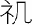 祥、图书三宗，义理派又分老庄、儒理、史事三宗。

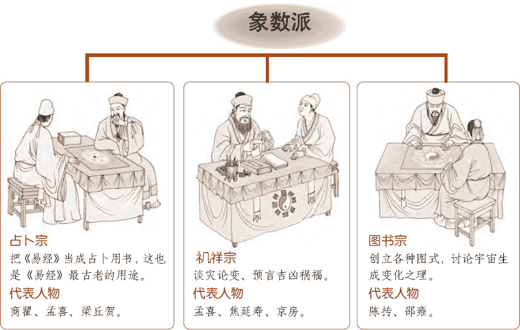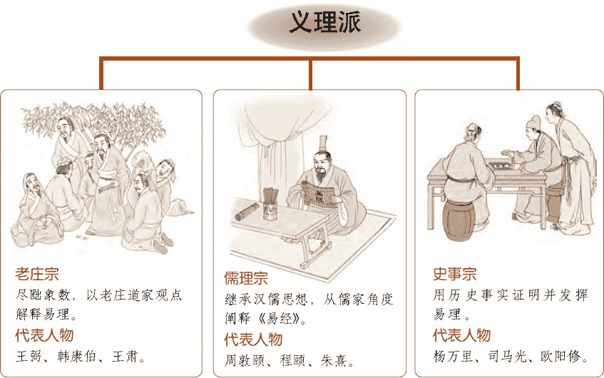

 近人南怀瑾把“两派六宗”说扩充成“两派十宗”说。两派为道家易学和儒家易学，十宗是：一曰占卜、二曰灾祥、三曰谶纬、四曰老庄、五曰儒理、六曰史事、七曰医药、八曰丹道、九曰堪舆、十曰星相。

## 6　《易经》的应用
占卜法

《易经》包罗天地间一切事物的变化法则，一切天理和人道都能在其中找到依据。占卜是《易经》最重要的应用之一，对象数学派来说，《易经》的占卜功用更为突出。其实在很多人看来，《易经》就是一部占卜书。

占卜是《易经》最早也是最重要的作用之一，虽然《易经》早就成了儒家六经之一，但是秦始皇焚书坑儒却唯独把《易经》保留了下来，因为当时的人们把《易经》当成了纯粹的占卜用书，而秦火是不烧占卜书的。

### 什么是占卜

在古代文字中，“占”、“卜”和“筮”是有区别的，我国古代最早的词典《尔雅》疏云：“占者，视兆以知吉凶也。”可见“占”是占卜的整个过程。《周礼·大卜》注云：“问龟曰卜。”可见“卜”是用龟甲占卜的方法，具体来说，就是用火灼烧龟壳，使其产生裂痕，通过观察其裂痕就可以知道吉凶祸福。《礼记·曲礼》云：“龟为卜，蓍为筮。”所以“筮”是用蓍草来占卜的方法。

但在现代语言中，三者的区别已经很不明显，所以，我们用“卜筮”或“占卜”来统称不会引起误解。

### 《易经》与占卜

伏羲创制八卦，文王推演六十四卦，孔子作《易传》，他们的共同目的只有一个，即阐明天道之理，教人性命之旨。《系辞上》曰：“天生神物，圣人则之；天地变化，圣人效之；天垂象，见吉凶，圣人象之；河出图，洛出书，圣人则之。”既然《易经》是圣人参照“天生神物”、“天地变化”、河图洛书而作成的，所以用《易经》占卜就有了充分的依据。若只读《易经》而不学占卜之法，那就很难全面领会《易经》的要旨。占卜还含有道德上的意义，有时候用它可以判定道德标准上的是非对错。

在历史发展过程中，无论经历怎样的社会流变，中国传统占卜学始终都是以《易经》为其理论基础。学《易经》占卜法在古代是官方之学，是政治家、军事家、商人的必修之术。对现代人来说，《易经》也不失为人生的指南，趋利避害的宝典。

### 《易经》占卜法

占卜在中国的历史十分久远，从最古老的典籍中就可以找到关于占卜的记载。有人认为甲骨文中的很多符号就是直接来源于占卜。《易经》出现以后，更是成为占卜的必备之书。

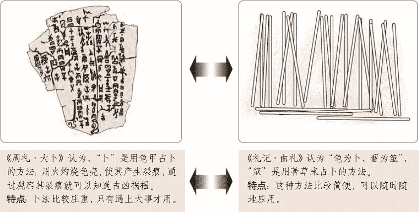

伏羲、文王、孔子等圣人取法天地造化、河图洛书而作《易经》，是为了阐述天地造化之理，所以《易经》就具备了预知天地人世变化的功能。若只读《易经》而不学占卜之法，那就很难全面领会《易经》的要旨。

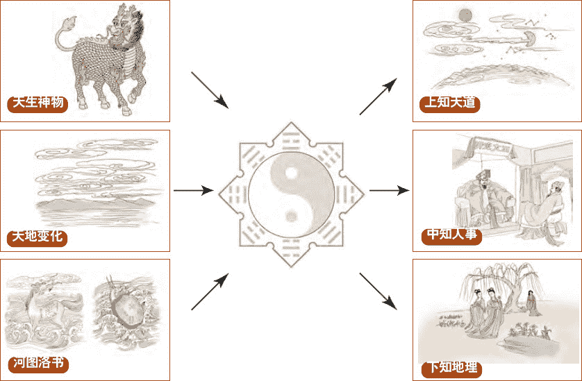

## 7　占卜法的意义
政治与道德

对古人来说，占卜的意义是十分重大的，因为它是在人的正常判断力无法解决的问题上提供启示。在儒家看来，《易经》除了反映自然天道之外，也对伦理道德有重要的指导作用，用《易经》占卜所得到的结果都是合乎世间伦理的，所以占卜从一开始就含有道德意义。

### 占卜本身的意义

占卜是人们遇到问题无法解决时所采用的一种获得启示的方法，当正常的判断力在困难面前力量不足时，占卜成为最常见的选择。

古人在遇到重大事件时，也常常事先求助于占卜，这样就可以预测事情的吉凶。国家若有什么重大举措，首先需要占卜，军队出征前也要占卜，平民百姓的祭祀祖先、婚丧嫁娶等事情往往也要事先占卜。《史记·龟策列传》说：“王者决定诸疑，参以卜筮，断以蓍龟，不易之道也。”

### 占卜的政治意义

《礼记·曲礼》云：“卜筮者，先圣王之所以使民信时日、敬鬼神、畏法令也。”所以占卜也成为统治阶级屈民伸君的一个重要手段。

古代的明君多能从占卜中总结自己统治的经验教训，好的方面需要继续发扬，坏的方面必须改正，以保证国家的长治久安。正是由于这种原因，掌管占卜的官吏往往享有崇高的地位。他们就像今天的中央决策组成员，像两国交战、兴修工程、祭祀大典、立继承人等国家大事都必须参考他们的意见才能决定。

### 占卜的道德意义

占卜所得到的结论并非就是注定了的最终结果，而在一定程度上带有警示的作用。例如占卜得到了吉兆，并不是说可以坐享其成，而是要求人努力进取，以保证吉兆所预言的好处成为现实；若得到了凶兆，就要反思自己究竟错在了哪里。

在儒家看来，《易经》除了反映自然天道之外，也对伦理道德有重要的指导作用。儒家把爻辞中所反映的道德标准称做“义”，用《易经》占卜所得到的结果都是合乎世间伦理的，所以占卜自从一开始就含有道德意义。既然是道德意义，就不仅仅在于卦象的吉与凶，而在于伦理道德标准上的是非对错。

### 占卜的意义

古代的国家大事经常要通过占卜来决定，其中比较重要的有政策导向、两国交战、兴修工程、祭祀大典、异常事件、立继承人等。人们相信，只要得到吉兆，就会有神灵或祖先在暗中保佑，如果得到了凶兆，就要三思而行，反省自己犯了什么过错。

#### 占卜与国家

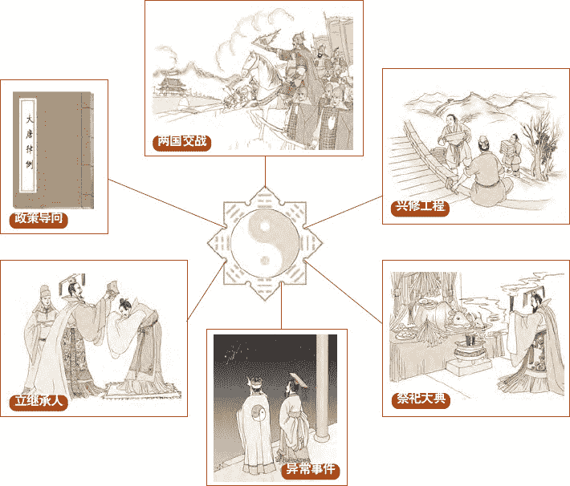

#### 占卜与个人

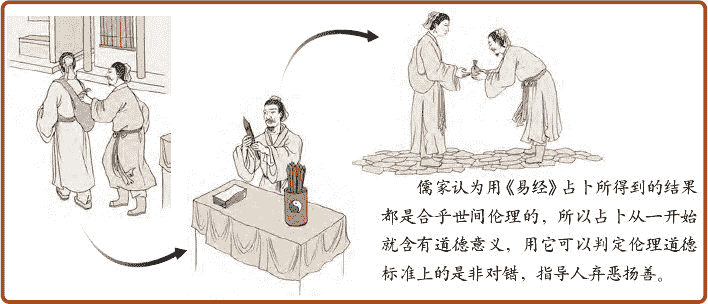

## 8　占卜法总原则
无疑不卜，筮不过三

占卜是利用卜法或筮法得到某些启示的方法，占卜的原则要求人们不能随便占卜，只有在有疑问而又无法用其他方法解决的情况下才能用占卜法。对于同一件事情，占卜的次数限制为不超过三次。在具体的占卜过程中，还有很多要遵守的准则。

### 无疑不卜

古人认为占卜是与天地造化沟通，得到的启示是神灵给予的，所以占卜是十分严肃的事情。占卜法不是随随便便就能使用的，只有那些比较重要的事情，在理智无法解决的情况下，才能使用占卜法。占卜之前，首先要正心诚意，不可以玩笑试之，卜时态度要庄重。对于一些比较重大的占卜活动，还要沐浴焚香，提前一天就要休息好，为次日占卜做好充分准备。

### 先筮后卜

古时候“卜”和“筮”是有区别的，按照《礼记·曲礼》的说法，“龟为卜，蓍为筮”“卜”是用火烧龟壳使其产生裂痕而预测吉凶祸福的方法，“筮”是用蓍草来占卜的方法。

在占卜理论中，龟与象对应，蓍与数对应。根据《易经》的原理，象为本，数为末，所以“卜”与“筮”两种方法的地位也不相同，古人认为“小事则筮，大事则卜”。如果遇上更重大的事情，就要两种方法兼用。又因为象在数之前，所以要先用筮法后用卜法。东汉大儒郑玄认为，如果把筮和卜的顺序用错了，那就是对神灵的亵渎。

如果先用了筮法而得到了凶兆，那么也可以再用卜法以求神灵护佑，这时的最终结果要按照卜法来确定。

### 筮不过三

既然占卜是十分严肃的事情，那就不能无限制地反复进行。一般认为对同一件事连续卜筮不能超过三次，超过三次就是对易理的滥用，是亵渎神明的行为。

在卜卦时，如果第一次得到了凶兆，则必须取消原定的计划，待沐浴熏香、虔诚祷告之后，才能进行下一次卜卦；而用筮法则不受此限制，如揲蓍法可连续进行三次，第一次若得到凶兆，可以马上进行第二次，但最多也不能超过三次，否则揲蓍法就不灵验了。如果三次揲蓍都得不到吉兆，那就只好再等待良辰吉日来重新占卜了。

### 卜筮的总原则

#### 卜与筮

古人认为“龟为象，蓍为数”，象的重要性在数之上，所以用龟来卜比用蓍草来筮更加严肃。

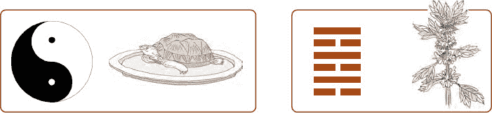

#### 卜筮的具体过程

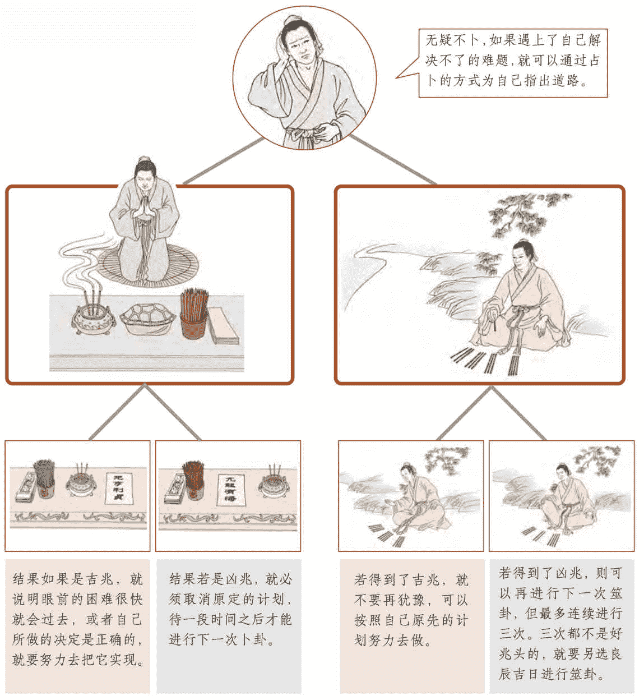

## 9　占卜的历史
《易经》占卜的演变

用《易经》原理来进行占卜，是一种年代非常久远的占卜方式。从先秦开始，每个历史时期都对此有重大的改进。经过先秦、两汉、魏晋南北朝、唐宋等占算家的发展，《易经》占卜术已经成为一门非常成熟的艺术。

利用《易经》进行占卜，不是一朝一代特有的现象。对于占卜的理论和方法，从远古到现代，几乎每个时期都有创造性的进展，其中最重要的时期有先秦、两汉、魏晋南北朝、唐宋、明清等。

### 先秦时期

古代的人们面对大自然中的种种现象而不能理解，于是相信冥冥中有神灵在主宰着这一切，相信神灵和祖先在暗中会保佑自己，所以他们很注重与神灵和祖先的沟通，占卜就是其中的一个重要手段。

传说在三皇五帝时代就有占卜方法流传了，但是没有准确的文字记载。不过在最早的甲骨文中，我们就发现了占卜的描述，事实上有些甲骨上的纹理就是占卜留下的。在《尚书》《左传》等典籍中，已经有了很多卜筮、占星、风水等方面的比较详细的记载。《周易》出现以后，更是极大地促进了占卜术的发展。

### 两汉时期

两汉时出现了相面术、解梦术，由于人们对自身命运的关注，所以占卜更多地运用到个人身上，这不同于先秦时只有天子或诸侯才能占卜的情况。据《汉书·艺文志》记载，两汉时期的术数著作共有 2000 多卷，分为“阴阳”、“天文”、“占星”、“形法”、“蓍龟”、“杂占”等六大类，足以看出当时占卜的发达。

两汉时期的易学家以孟喜、京房为代表，他们重点发展了象数之学，从象数角度解释《易经》，并以此为出发点创造了飞伏说、卦气说、纳甲说、爻辰说等象数学体系，使象数之学成为《易经》研究的主流学说，其中纳甲法是两汉易学家最重要的创造。

### 魏晋南北朝时期

魏晋南北朝是玄学和佛学大盛的时期，又加上社会动荡不安，人们更多地关注起了自我的命运。原来用于立继承人、两国交战、兴修工程、祭祀大典等活动的占卜之术，现在却被应用到了个人命运的预测上。

在这种背景下，出现了一些更为简单易行的占卜方法，如金钱占法。金钱占传说是战国奇人鬼谷子发明的，但在魏晋南北朝时期才得到了广泛的应用。另外，在传统的卜法中，这时的人把龟甲改为一般的兽甲，这就给占卜的人提供了极大的方便。

这个时期新出现的占卜术有“六壬”、“太乙”、“九宫”、“奇门遁甲”等。更值得我们关注的是，这个时期出现了许多探讨《易经》占卜的理论性的著作，如东晋术数大师、游仙诗的祖师郭璞所著的《葬经》，是中华风水学的开山宝典。

### 形形色色的占卜法（一）

占卜的历史源远流长，可以说自从人类开始对自然感到敬畏的那一刻就产生了占卜法。古代出现过无数形形色色的占卜法，但多数都很复杂，有很多已经失传了。但是也有很多占法流传至今。它们共同的特征是都离不开《易经》原理。

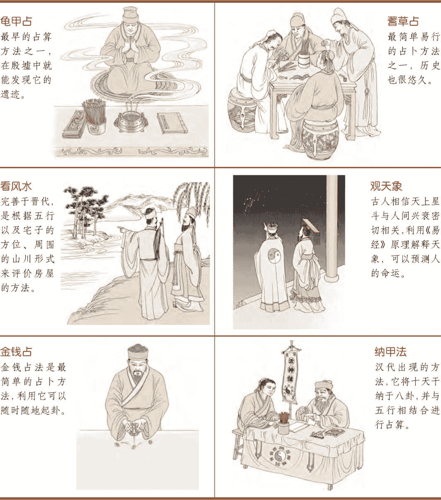

 看风水也属于占卜法吗？

 是的，因为它也是利用《易经》中的五行八卦理论来预知吉凶的方法，古人很注重宅子和坟墓的地形、朝向、布局等等，认为它们与主人的命运息息相关，因此看风水也是占卜方法的一种。

* * *

### 唐宋时期

《易经》是唐朝的九经之首，在唐朝初年，天象学家李淳风和袁天罡就作了用《易经》来推知未来的《推背图》。传说《推背图》曾经准确地预言到了武则天当政的史实，因此名震一时。

北宋时期出现了很多系统化的占卜著作，由于《易经》被广泛地应用到新兴的宋明理学之中，所以这个时期的占卜术理论性非常强。

北宋初期，华山高道扶摇子陈抟创建了“紫微斗数”理论，用星象法进行占卜，成为中国传统命理学的最重要的流派。紫微斗数从《易经》阴阳五行说出发，将一个人出生的年、月、日、时与位于北极中心的紫微垣相对应，并赋予诸星不同的命理意义，借此推知人的命运。

理学大师邵雍发明的“梅花易数”也是一种占卜奇术，它将一切天时、地理、声音、方位、人物、颜色、形状等都转化为数字，通过《易经》六十四卦的卦象来预测事物的发展趋势。邵雍还创作了《皇极经世》、《观物内外篇》等理论性的易学著作。

### 明清时期

明清是中国传统文化最为成熟的时代，传统的学术、技艺、民间文化等都达到了鼎盛时期，《易经》占卜术也不例外。

明清时期的占卜著作最重要的特点是具有集大成性，如刘伯温的《灵棋经注》，袁详的《六壬大全》等等。但美中不足的是，明清占算家只注重总结前人的成就，所以相对地缺乏独创性，但这并不表示占卜的时代已经过去。

### 形形色色的占卜法（二）

民间还流传着许多更加随意、更加灵活的占卜方法，由于它们易于在民间流传，所以获得了强大的生命力。但是无论占卜的具体方法是什么，其基本原理都没有脱离《易经》中的八卦、六十四卦，以及五行理论。

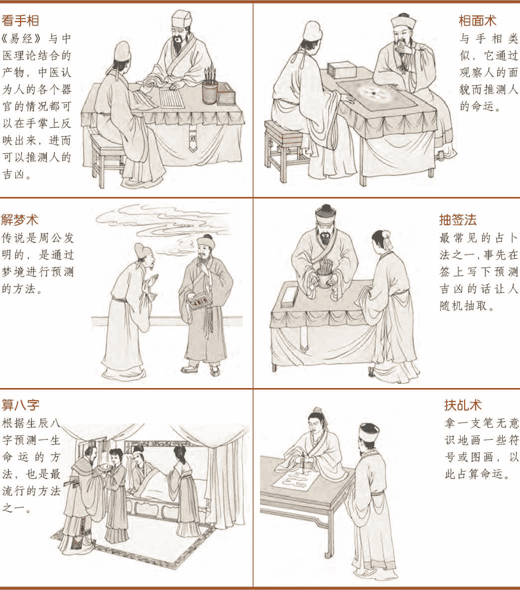

 当今也非常流行根据星座归属确定人的性格和命运的方法。

 那是利用西方天文学中的黄道十二宫来进行预测的，与《易经》理论关系不大。

## 10　三大神数之首
紫微斗数

紫微斗数被誉为铁板神数、紫微斗数、六壬这“三大神数”之首，它的基本原理是按照一个人的出生年、月、日、时来排列十二宫，以此构成“命盘”，利用各个宫位的星系之间的关系来预测一个人命运中的吉凶祸福。

### 古代天文学的分区

我国古代的天文学非常发达，很早就建立了天文分区系统。古人将天空分为三垣、四象、二十八宿。其中三垣就是紫微、太微、天市这三个区域，紫微垣中的紫微星就相当于是天上的帝王，统领天上的星辰。

在紫微斗数理论中，将天空中的全部星星分为北斗、南斗和中天三个系统，“紫微斗数”中的“斗”指的是南斗和北斗。

### 紫微斗数简介

紫微斗数是中国古代《易经》占卜中最有代表性的方法之一，它是由北宋时期道家的一位重要人物陈抟发明的。历史上研究紫微斗数的人较少，留下的著作也很少。它的基本原理就是用星象法进行占卜。紫微斗数从《易经》阴阳五行说出发，将一个人出生的年、月、日、时与位于北极中心的紫微垣相对应，并赋予诸星不同的命理意义，借此推知人的命运。

紫微斗数的派别主要可以分为两派，即三合派和四化派。三合派主要根据星情，以及星群和星系组合来讨论人的命运。四化派主要以四化飞星为主线，依据命盘十二宫的宫干飞出四化，依据六九宫位来推断人的命运。

### 紫微斗数的特点

紫微斗数完全采用中国传统历法中的农历，因此它看重的是月亮对人的影响。应该注意的是，虽然它是用星象来推断命运，但是紫微斗数中的星曜都是虚星，即只有名称没有实体的符号，因此它与一般的占星术完全不同。例如它也采用十二宫的划分法，但是它的十二宫并不是通过观察星体在黄道中的运行得出的分区，而是出于命理的需要作出的划分，所以不能把紫微斗数十二宫与黄道十二宫相混淆。

虽然紫微斗数命理方法异常复杂，但是因为它可对人的命运凶吉作出具体的说明，比其他方法的威力大得多，所以近年来又掀起了研究紫微斗数的热潮。

### 紫微斗数十二宫

紫微斗数是中国古代术数体系中相当重要的一种，是根据一个人出生的年、月、日、时来排出十二宫的位置以构成命盘，并参看各个宫位的星系之间的关系来预测一个人一生的总体运程和吉凶祸福的一种术数。

紫微命盘有十二个宫位，按十二地支顺序排列。紫微斗数十二宫包括：命宫、兄弟宫、夫妻宫、子女宫、财帛宫、疾厄宫、迁移宫、仆役宫、官禄宫、田宅宫、福德宫、父母宫。

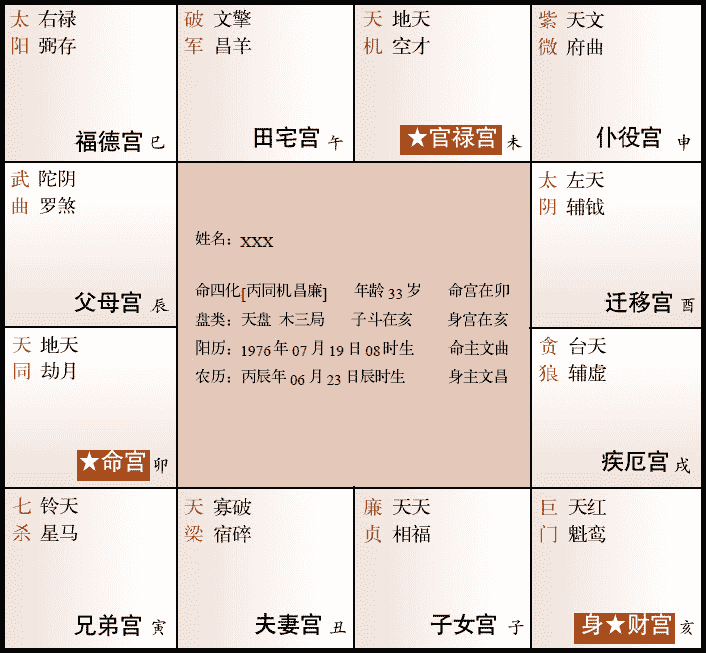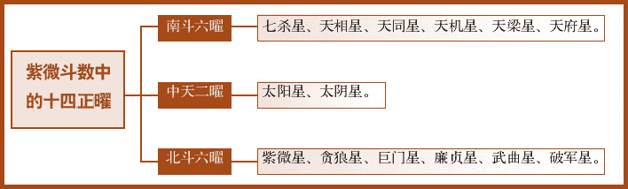

## 11　干支与八卦的结合
纳甲法

纳甲法俗称六爻法，是由西汉易学家京房先生根据《易经》原理创造的卜筮法，此后又出现了虞翻等人的纳甲法。纳甲法对后世的“火珠林法”和《周易参同契》中的内丹修炼法有重要的影响。

### 纳甲法简介

纳甲法最早是西汉易学家京房先生根据易学原理创造的。纳甲法的特点是把八卦乃至六十四卦与五行、天干地支结合，利用它们之间的相生相克的关系进行预测。简而言之，就是在六十四卦的六爻上配以天干、地支、五行、方位，这样每个卦甚至卦中的每个爻就都有了干支和五行属性，根据《易经》原理，五行元素之间具有相生相克的关系，从而卦与爻之间也就有了生克关系，这使得它们之间的联系更加密切。根据同样的道理，天干地支所具有的比阴阳更广泛的属性也转移到了卦与爻上，大大丰富了卦与爻的性质。

在纳甲法中，以乾纳甲，以坤纳乙，甲乙五行为木，在方位中表示东方；依此类推，我们得到如下结果：艮纳丙，兑纳丁，丙丁为火，表示南方；坎纳戊，离纳己，戊己为土，表示中央；震纳庚，巽纳辛，庚辛为金，表示西方；乾纳壬，坤纳癸，壬癸为水，表示北方。

因此所谓“纳甲”其实是“纳”遍全部十天干，只是因为甲为十天干之首，用它来概括其他九个罢了。

### 纳甲法的影响

纳甲法不但是一种流传甚广的占卦方法，而且为后世用于卜筮的“火珠林法”奠定了理论基础。清朝王洪绪在《卜筮正宗》中对火珠林法进行了系统总结，使其成为近代应用最广泛的一种占卦预测的方法。

另一方面，东汉时期的魏伯阳真人把纳甲法引入《周易参同契》，阐述内丹修炼之理，成为道教丹鼎派的理论基础之一，并经由唐代钟离权、吕洞宾的发扬光大，成为流传最广的一种道家修炼方法，也是一种极好的健身之术。

纳甲法的历史从汉代一直延续到现在，除了京房、虞翻、魏伯阳之外，扬雄、葛洪等人也对纳甲法作了重大改进，使此法成为古代最著名的占卜法之一。

### 纳甲法的基本原理

纳甲法就是把五行、天干与八卦结合的占卜法。东方为木：乾纳甲，坤纳乙；南方为火：艮纳丙，兑纳丁；中央为土：坎纳戊，离纳己；西方为金：震纳庚，巽纳辛；北方为水：乾纳壬，坤纳癸。

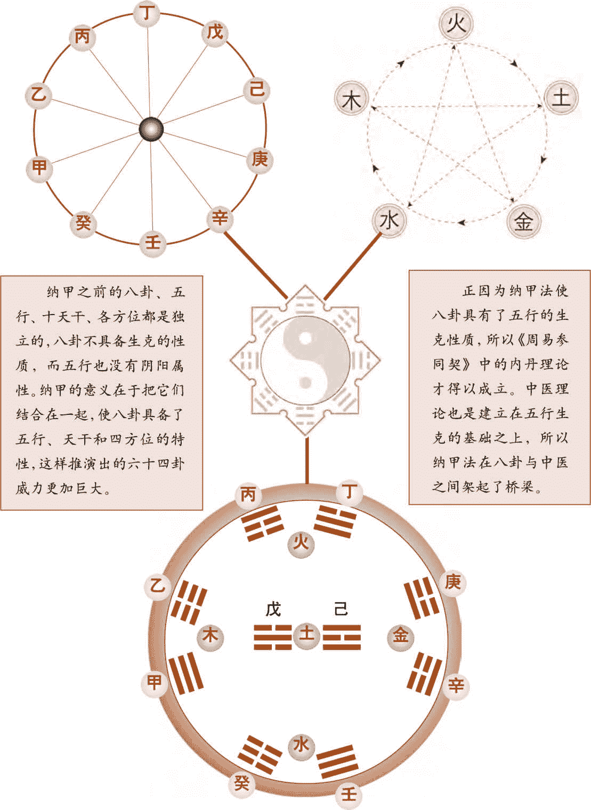

## 12　八宫与月相
纳甲法的具体应用

纳甲法虽然名目繁多，但最主要的只有两派，即京房纳甲法和虞翻纳甲法。京房纳甲法将六十四卦分为八宫，配以五行和天干地支，利用它们的属性推测人的命运。虞翻纳甲法则是根据月亮在一个月之内的圆缺变化来得出纳甲规则。

### 京房纳甲法

在《京氏易传》中，京房将八卦的重卦划分为八宫，按照乾、震、坎、艮、坤、巽、离、兑的顺序进行排列，称之为“八纯”或“上世”。这种排列方式既不同于先天八卦，又不同于后天八卦，但在孔子《易传·说卦》中可以找到依据。它体现了以乾坤为“父母”，各统领三“男”三“女”的卦象。

京房纳甲法以乾、震、坎、艮四卦为阳卦，坤、巽、离、兑四卦为阴卦，每一宫卦统领六十四卦中的八个卦，除了以自己为卦的本卦外，还有“一世”至“五世”等五卦加上“游魂”、“归魂”二卦。这样就把从乾卦到归妹卦的六十四卦都收纳进来了。

六十四卦分宫以后，再与五行相结合，配以天干地支，得出父母、兄弟、子孙、妻财、官鬼和卦身等“六亲”和青龙、白虎、朱雀、玄武、勾陈、腾蛇等“六神”，然后就可以结合六十四卦原理推测人的命运了。

### 虞翻纳甲法

虞翻纳甲法的主要依据是月亮的圆缺变化，《易传·系辞》曰：“法象莫大乎天地；变通莫大乎四时；县象著明莫大乎日月。”又说：“日月相推而明生焉，寒暑相推而岁成焉。”虞翻在注《周易参同契》时提出，根据一月中月相的变化，可以得出纳甲的具体规则，这就是：三日出新月，震卦纳庚；八日见上弦月，兑卦纳丁；十五日见望月，乾卦纳甲；十七日见既望月，巽卦纳辛；二十三日见下弦月，艮卦纳丙；三十日为朔，坤卦纳乙。

月亮的圆缺表示阴与阳两种势力的消长情况，十五时满月代表阳极，是乾卦卦象，初一代表阴极，是坤卦卦象，其余六卦介于其间。

这样就根据月相得出了八卦纳甲的基本规则。然后要做的与京房纳甲法基本相同，就是将五行和天干地支与八卦或六十四卦相对应，从六十四卦的五行属性来推断人的命运。

### 纳甲法的应用

纳甲法中引入了勾陈和腾蛇二神，使古代天又学中的四象又多了二象。

#### 六神方位图

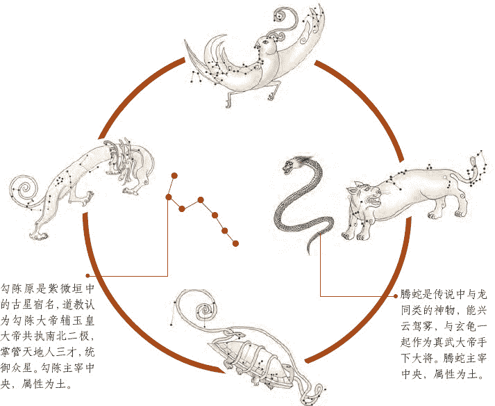

#### 虞翻纳甲图

虞翻纳甲法与京房纳甲法的起卦方法不同，但起卦之后的情况则基本上是一致的。

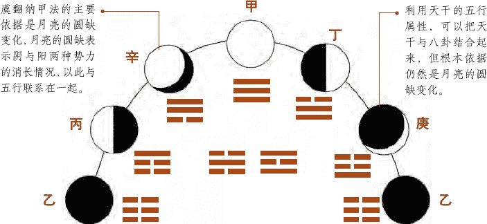

## 13　草木之中的奥秘
揲蓍成卦法

揲蓍成卦法是利用《易经》占卜的最古老的方法之一，它是通过摆弄蓍草而得出卦象的方法。在摆弄蓍草的过程中，处处体现了《易经》原理，最后的预测也是要回到《易经》六十四卦，所以它又是最典型的《易经》占卜法之一。

### 神奇的蓍草

太史公司马迁在《史记·龟策列传》中说：“闻蓍生满百茎者，其下必有神龟守之，其上常有青云覆之。”并认为蓍草与人间的兴衰息息相关，当朝廷清明，天下太平时，蓍草可以长一丈，一丛可以生满百茎。司马迁认为周朝以前的蓍草都能长到这个程度，而到了汉朝就连长八尺、一丛八十茎也难以见到了，所以只好选长六尺、满六十茎以上的来用。实际上蓍草在今天仍然生长在我国的西北地区，不过蓍草难以长那么长、那么多倒是事实。

### 揲蓍成卦法之三变

揲蓍成卦法的具体方法是：准备好 50 根蓍草，要求这些蓍草要长短一致，这不但可以方便使用，而且表示揲蓍的严肃性。在占算之前，先要取出 1 根，只用其余 49 根；然后把这 49 根随意地分成两堆，这叫做“分二”；再从其中一堆中取出 1 根夹在手指间，这叫做“挂一”；然后 4 个一组、4 个一组地数，这叫做“揲四”；最后将每一堆余下的草放在一起，这叫做“归奇”。这四个步骤合称“四营”，至此就完成了“一变”。

接下来是“二变”，首先将在一变中挂一和归奇的蓍草除去，则剩下的蓍草只能是 40 或 44 根，然后再把前面的步骤重复一遍，这就称为“二变”。完成第二变之后，剩下的蓍草数量可能有三种情况：40、36 或 32。

第二变完成之后，再继续第三变。按照同样的方法，结果剩下的蓍草数量可能是 36、32、28、24 等四种情况。

### 揲蓍成卦法之画爻

我们看到，36、32、28、24 这 4 个数都是 4 的倍数，这时用 4 去除这 4 个数，又得到 4 个数：9、8、7、6，然后就可以画爻了。

如果商是 9 或 7，就画出阳爻“—”，因为 9、7 都是阳数；如果商是 8 或 6，就画出阴爻“--”，因为 8、6 都是阴数。通过这些过程，经过三变之后，我们就得出了一爻。

### 揲蓍成卦法详解

揲蓍成卦法虽然并不深奥，却十分复杂，在占算过程中必须严格按照规则办，否则再灵验的占卜法也会失去效力。无论用哪种占卜法，一定要遵循无疑不卜、筮不过三、心诚则灵的总原则。

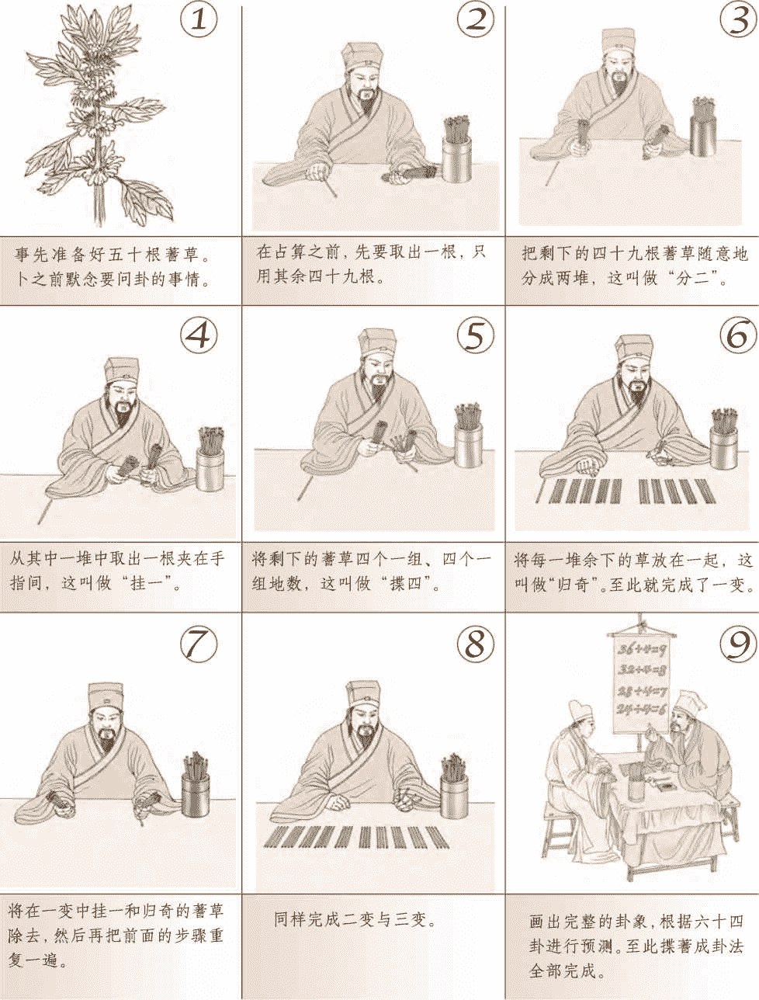

* * *

因为六十四卦中每卦都是六个爻，每个爻要经过三变才能得出，所以要得出一个完整的卦象，就要“十有八变而成卦”，即要经过十八变才行。

画出完整的六爻之后，就可以对应《易经》六十四卦以及《易传》中的解释来预知人的命运了。

### 揲蓍过程中的易理

揲蓍成卦法的基本方法是用手数蓍草，根据所数的结果画出卦来。揲蓍成卦法的依据出自《易传·系辞上》中《大衍之数》这一章：“大衍之数五十，其用四十有九。分而为二以象两，挂一以象三，揲之以四以象四时，归奇于扐以象闰……是故四营而成《易》，十有八变而成卦，八卦而小成。”也就是说，要经过十八次“变”才能得出最后的卦象，可见这种方法并不十分简单。

在开始占算之前，先要取出一根蓍草，取出的一根象征着太极，太极是体而不是用，所以它不参与后面的过程；然后把四十九根草随意地分成两堆，则象征着“太极生两仪”，两堆草的数目是不确定的，因为一开始阴阳的对比尚未确定；再从其中一堆中取出一根夹在手指间，取出的这一根与剩下的两堆形成了天、地、人“三才”之象，而人与天地不在同一个层次，所以要把象征人的草取出；然后“揲四”的过程象征着“两仪生四象”，或者说是四季；最后将余下的草放在一起，即“归奇”的过程象征着积累余日而得到闰月。在某些揲蓍派别中，用这种方法可以得到“五岁再闰”即五年中有两个闰年的置闰法，这虽然不是很精确，但与中国传统农历中“十九年七闰”的置闰法十分接近。

在揲蓍成卦法的具体过程中处处体现了《易经》原理，而揲蓍的最后也要回到《易经》六十四卦中寻找解释，所以说揲蓍成卦法不愧为最典型的《易经》占算法之一。正因为这样，它在历史上才得以长盛不衰，一直流传到现在。

### 揲蓍成卦法与《易经》原理

揲蓍成卦法堪称是最典型的《易经》占算法之一，这不仅仅因为它要从《易经》六十四卦中寻找依据，更因为在揲蓍成卦法的具体过程中处处体现了《易经》原理，太极、两仪、四象、八卦，乃至三才、闰月原理都体现在成卦的具体步骤中。

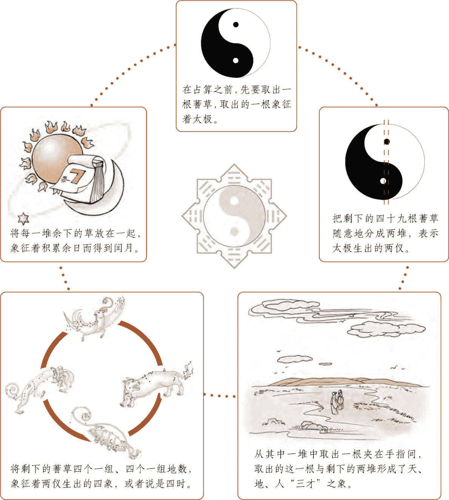

 揲蓍成卦法在《易传·系辞上》中有原文作为依据：“大衍之数五十，其用四十有九。分而为二以象两，挂一以象三，揲之以四以象四时，归奇于扐以象闰。”

## 14　最简单的卜筮法
金钱卦法

金钱卦法据传是战国奇人鬼谷子发明的，它的最吸引人之处在于简便性，整个起卦过程只用几分钟，而且工具也不像蓍草那样难以找到。由于这些原因，它成为最常用的也是流传最广的占卜法之一。

### 金钱卦的优势

揲蓍成卦法的最大弊端是极为烦琐，而且蓍草并不是随处都可以找到的，这一点相对于金钱卦来说特别突出，因为金钱卦正是以简单易行而著称的。金钱卦法据传是战国奇人鬼谷子发明的，它所使用的工具只是三枚相同的铜钱。

### 占卜之前的准备

首先要准备好三枚相同的铜钱，最好是“乾隆通宝”，因为它的正面就出现了“乾”字；如果方便的话还可以准备一个竹筒。然后确定铜钱的正反两面，象征着阴阳两仪。

### 起卦

起卦之前要默念自己要问的事情，念完之后就可以把三枚铜钱合在手心里，或放入竹筒中。晃动手掌或竹筒，将铜钱丢在桌子上，观察铜钱的正反。

这时会出现四种情况：

第一种是三枚铜钱都是正面向上，这是老阳之象，记做“O”；

第二种是三枚铜钱都是反面向上，这是老阴之象，记做“×”；

第三种是三枚铜钱中有两枚正面向上，这是少阳之象，记做“—”；

第四种是三枚铜钱中只有一枚正面向上，这是少阴之象，记做“--”。

### 画爻

画爻时要按照从初爻到上爻，即从下到上的顺序。根据“阳极变阴，阴极变阳”的原则，老阳要变成阴，老阴要变成阳，少阴和少阳则分别记成阴和阳。这样就只剩下了两种爻，即阴爻和阳爻，由它们就可以组成一个完整的卦象。按照上面的顺序就得到了一爻，如此连续六次就得到了六爻，即成了一个完整的卦象。

得到完整卦象之后，就可以对照《易经》六十四卦进行预测了。

### 金钱卦法的步骤

金钱卦法的最大优势在于它的简便易行，只要手中有三枚铜钱，随时随地都可以起卦。

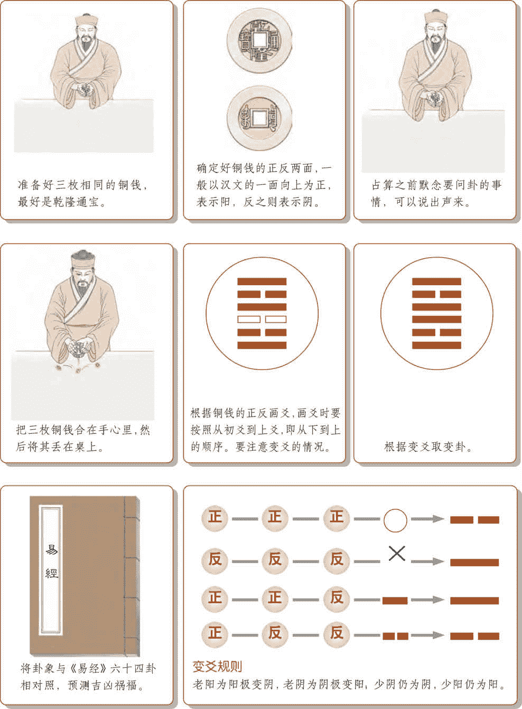

# 第二章　认识易数的方便法门
初探梅花易数

《易经》卜筮法由来已久，孔子在《易传》里面就提到了蓍草卜筮法，也就是“揲蓍成卦法”。孔子之后出现了几十种甚至上百种卜筮法，其中以北宋大儒邵康节先生创立的“梅花易数”应用最为广泛。在本章中我们就可以初步领略到梅花易数的独特魅力。

## 本章图版目录

北宋大儒邵康节

竹林中的易理

宋明理学中的《易经》

《易经》中的象与数

卦气与四时

象数中的命运

无处不在的象数

数字与变卦

梅花易数与时间

尺寸占法的应用

物数起卦法的应用

动物和静物起卦法

汉字的历史

字占的基本规则

一至四个字的起卦法

五至六个字的起卦法

更多字的起卦法

为人占的综合分析

为人占的各种情况

为自己占的基本原则

## 1　缘起
从邵雍说起

邵雍是北宋著名哲学家，以先天象数之学闻名于世。他和周敦颐、张载、程颢、程颐并称“北宋五子”，是宋明理学的代表人物。邵雍所开创的梅花易数是关于《易经》占卜的重要理论。

### 邵雍生平简介

邵雍（1011～1077）字尧夫，谥康节，自号安乐先生，是北宋著名哲学家，创立北宋象数先天之学，成为宋明理学的主要奠基人物之一。其祖籍是范阳（今河北涿州），幼时随父亲南迁到共城（今河南辉县），隐居在苏门山百源之上，故又称百源先生。

邵雍虽然博学多识，但一生未出仕，屡受朝廷征召而不赴。晚年时在洛阳定居，以教授生徒为生。与司马光、程颐、程颢等一时名流交往甚密，著有《皇极经世》《渔樵问对》《伊川击壤集》等，《宋史》卷四二七有传。

### 邵雍的哲学思想

邵雍和周敦颐、张载、程颢、程颐并称“北宋五子”，是宋明理学的重要代表人物。邵雍的哲学思想大致属于客观唯心主义，他认为太极是宇宙万物的本原，太极的动与静分别生出天和地，由天之动生出阴阳，地之静生出刚柔。不过他又认为阴阳“本一气也，生则为阳，消则为阴”，阴阳之间发生作用形成日月星辰；刚柔之间发生作用形成水火土石。

在共城时，邵雍深入探索《易经》象数之学。结合《易经》中对于八卦形成的解释，邵雍提出宇宙构造图式和学说体系，这就是他的象数之学，也叫先天象数学。他认为“太极不动，性也；发则神，神则数，数则象，象则器，器之变，复归于神也”，即数、象、器都是由太极生出的：太极为一，一生二，二就是神，由神生数，由数生象，由象生器，这样就生出了天地间的万事万物。

邵雍在政治上十分保守，激烈反对王安石变法。在《皇极经世·观物内篇》中邵雍提出，人类历史是按照道→德→功→力四个阶段逐步退化的过程：“三皇之世，以道化民；五帝之世，以德教民；三王之世，以功劝民；五霸之世，以力率民。”这就陷入了神秘主义的宿命论。

### 北宋大儒邵康节

邵雍是扶摇子陈抟的三弟子，他从陈抟那里得到象数学先天图之后，潜心研究易学，把易学理论融合到儒学之中，成为宋阴理学的奠基人物之一。南宋儒家集大成者朱熹的象数学理论也是得自邵雍。邵雍创立的梅花易数是利用《易经》占卜的典型万法。

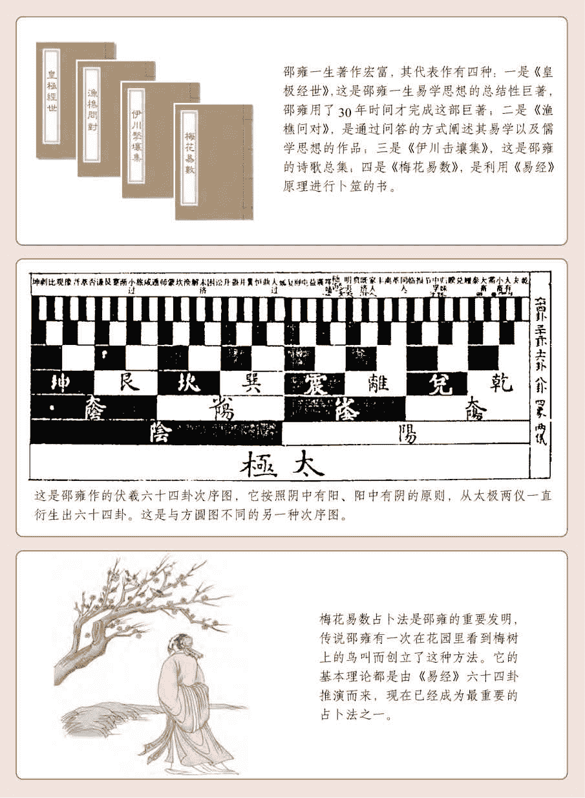

## 2　玄意幽远
魏晋玄学中的易理

魏晋玄学是汉末到东晋时期儒学的一种新形态，它的突出特点就是以“三玄”解释儒家理论，“三玄”中最重要的要属《易经》。《易经》原来是儒门六经之一，但是在两汉黄老思想和魏晋玄学的影响下，它和道家思想逐渐合流。

### 魏晋玄学概况

儒家在汉朝处于“独尊”的地位，但是到了魏晋南北朝时期却面临着严重的挑战，主要原因有两点：一是佛教和道教势力的扩大，无论在民间还是官方，这两支宗教力量都对儒家造成了威胁；二是儒学本身的理论根基不够深，儒家虽然也有孟子、荀子从人性角度的论证，以及董仲舒从谶纬神学方面的论证，但在深度上不足以与佛道二家相抗衡。

魏晋玄学的代表人物王弼和郭象力图挽救儒家名教的危机，他们采用的武器是《易经》《老子》《庄子》这“三玄”，主张“以无为本”，把儒家的“名教”和三玄中的“自然”等同起来，或者认为后者是前者的本源。这样不但调和了两者的矛盾，而且为儒家学说找到了更加坚实的基础。

但是儒家和道家毕竟是截然对立的两种思想体系，有为与无为，入世与出世，无论怎样调和，它们的矛盾始终存在。应该说正是它们之间的矛盾才造成了中华文明的丰富多彩。

### 魏晋玄学与《易经》

汉朝以来，研究《易经》的派别主要有三个：一是以东汉术士管辂为代表的术数派，二是汉代占正统地位的象数派，二是从理论上注解经和卦的义理派。其中第三个派别是从魏晋玄学的代表人物王弼开始的，并且成为魏晋玄学的正宗。以王弼为例，他曾著有《周易注》《周易略例》《周易大衍论》《周易究微》《易辨》和《易传纂图》，可见《易经》思想对他们影响之深。

《易经》原来是儒门六经之一，但是在两汉黄老思想的影响下，它和道家思想逐渐合流。王弼注《周易》和《老子》，以易学理论解老子思想，更是加快了易与道的融合。玄学家把易理化之后的老庄注入儒学体系中，从而形成了中国学术的第一次大综合。

### 竹林中的易理

魏晋玄学是中国思想史上一个重要的阶段它是儒家思想与道家思想合流的开始在这个合流的过程中《易经》起到了桥梁的作用。

#### 《易经》与魏晋学的四个阶段

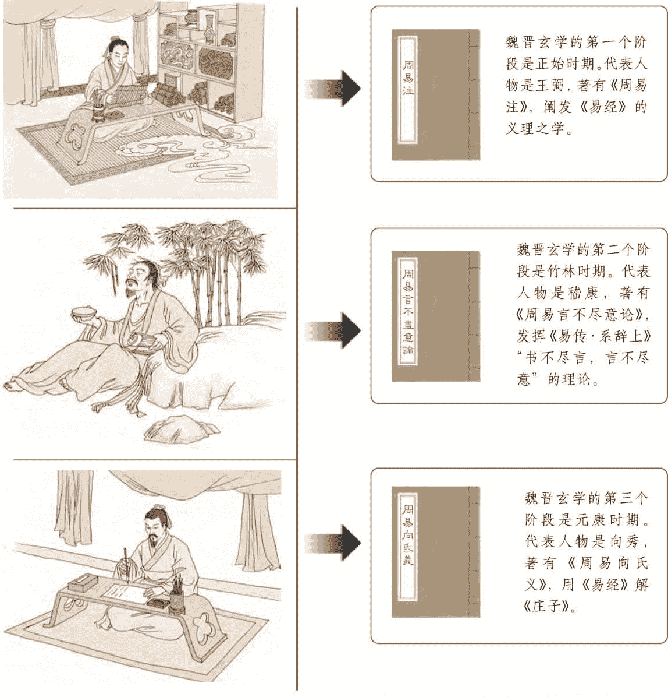

#### 读《易》与谈玄

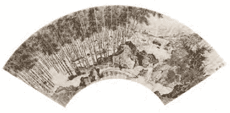

魏晋时期，手执《易经》在竹林里清谈是常见的场面。玄学家们谈论的中心是“名教”与“自然”的关系，其理论根据主要来自“三玄”，即《易经》《老子》和《庄子》。

## 3　哲理玄奥
宋明理学中的易理

宋明理学亦称“道学”或“新儒学”，是中国传统学术的最高峰，它不但是传统学术中儒、释、道三家的共同产物，而且与《易经》有密不可分的关系，可以说宋明理学是《易经》思想的又一次复兴。

### 宋明理学的兴起

隋唐虽然是中国历史上的兴盛时期，但是汉朝以来“独尊儒术”的政策在隋唐时却连连受到冲击。唐朝统治者一直尊崇道教，武则天在位时又独尊佛教，这使得儒家的特殊地位发生了动摇。这种状况促使人们为儒家思想注入一些新的东西。在禅宗的影响下，唐末出现了儒、释、道“三教合一”的趋势，这个趋势一直延续到北宋时期，终于收获了丰硕的果实，这就是宋明理学的出现。

### 宋明理学大意

北宋至明朝时期，中国传统学术迎来了又一次高峰，这就是宋明理学，它是北宋至明朝时期的儒家思想的一种新的形态，从某种意义上来说，它是传统学术中儒、释、道三家的共同产物。

宋明理学有狭义和广义之分。狭义的理学仅仅是指以北宋程颐、程颢兄弟、邵雍、南宋朱熹等人为代表的程朱学派的思想，它以洛学为主干，在宋朝学术上占有统治地位。广义的理学还包括以南宋陆九渊、明朝王守仁为代表的“心学”一派，这是在明代中后期占主导地位的以“心”为最高范畴的思想体系。

### 宋明理学与《易经》

宋明理学的开端是以周敦颐作《太极图说》为标志的。周敦颐认为“万物生而变化无穷焉，惟人也得其秀而最灵”，圣人仿照太极建立起了“人极”，也就是“诚”，这种至善之诚是道德的最高境界，凡人要通过主静、无欲等修行逐渐达到这一境界。周敦颐提出了很多哲学范畴：无极、动静、性命、善恶等，成为后世理学研究的课题，也是宋明理学与《易经》哲学结合的充分体现。

宋明理学的另一个开山人物程颐著有《易程传》将元、亨、利、贞等易经思想纳入理学的哲学范畴之内。而朱熹则用“道”来解释《易经》太极理论，并把它与人的心性联系在一起，成为南宋时期的官方理论。

### 宋明理学中的《易经》

根据思想主张的不同，宋明理学可分为三个派别，即认为“道”是万物之本的道学，认为“心”是万物之本的心学，认为“气”是万物之本的气学。无论持有什么主张，《易经》对他们的影响都是不可忽视的。

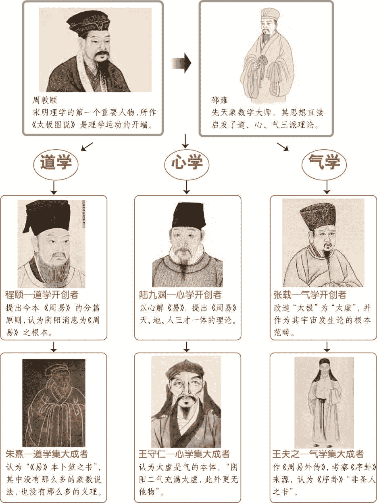

## 4　梅花易数的基础
《易经》中的象数

《易经》的研究流派主要分为义理和象数两派，义理派主要关注它的哲学理论，象数派更注重爻卦中象与数的应用。在梅花易数中，象与数就是起卦过程中的基本工具，所以要了解梅花易数占卜法必须先弄清楚《易经》中的象与数。

古人认为《易经》有四种德行，这就是易象、易数、易义、易理，其中易象与易数经常连在一起称为“象数”。一般来说，“象”是八卦、六十四卦及其所象征的事物的形象，“数”反映易经六十四卦之间数量上的关系。

### 《易经》中的象

正如人有相貌的不同，爻与卦也都有着各自独特的形象，例如阳爻是一根连续的线，而阴爻是一根断开的线，或者说是两根不连续的线。八卦之间也是各不相同，人们根据其形象而编了记忆歌诀：乾三连，坤六断；震仰盂，艮覆碗；离中虚，坎中满；兑上缺，巽下断。同样的，六十四卦的形象也各不相同。

易象还有一种含义，就是指二爻、八卦和六十四卦所象征的事物的形象。例如乾卦象征天，坎卦象征着水，这天和水的形象也可以称做易象。

易象的第三种含义是卦辞和爻辞中提到的具体事物的形象。例如乾卦爻辞中说“九五，飞龙在天”，一条腾飞的巨龙也是易象。

值得注意的是卦象所象征的事物并不是已经确定好了的具体形象，如兑卦除了泽之外，还象征着口、羊、西方、秋季等等。如果熟练掌握了《易经》占卜法，那么生活中到处充满了卦象，万事万物没有不能化为卦象的。

### 《易经》中的数

《易经》中的数也有三种作用：一是用来表示卦中各爻的属性，二是用来表示爻位的顺序，三是在占卜过程中用来计算。

八卦中爻的属性，指的是老阴、老阳、少阴、少阳，它们分别与六、九、八、七这四个数字相联系。

计算爻位顺序时要从下往上数，最下面的叫做初爻，上面依次二爻、三爻、四爻、五爻，最上面的叫做上爻。

占卜过程中的数字则较为复杂，因为每种占卜法里面的数字应用都不尽相同，这要根据具体的占卜法来确定。

### 《易经》中的象与数

象与数是占卜的基本根据，一切事物都可以转化为象或数，再由象数得到六十四卦，通过卦象就可以得知吉凶祸福了。

#### 八卦形象歌诀

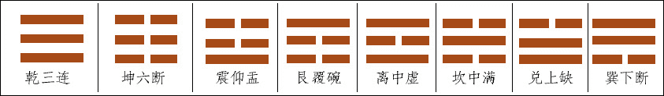

#### 《易经》中的象

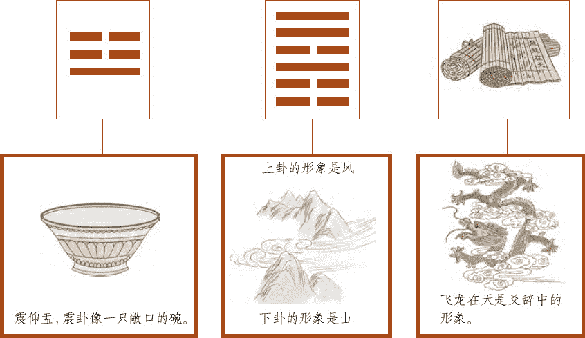

#### 《易经》中的数

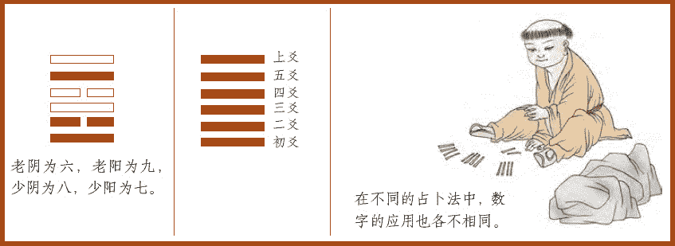

## 5　四时与气候的影响
卦气衰旺论

卦气学说是象数学派孟喜和京房创立的。《梅花易数》卦气说用八卦与四季气候相对应，并用五行生克理论解释季节对卦气的衰败与旺盛的影响。与五行生克一样，卦气的衰败与旺盛是一个互相影响、此消彼长的过程。

### 什么是卦气

在《易经》里面，“气”就是指卦所代表的两种对立的属性，也就是“阴”与“阳”。用八卦来表示事物的阴阳对立的属性就是“卦气”。《易经》描述事物阴阳属性用的是卦辞和爻辞，但是卦辞和爻辞不过是在解释卦象所表示的意义，卦气的本源还要从卦象中寻找。

### 五行与四时

春天是草木开始生长的季节，所以春天属木；夏天天气炎热，骄阳似火，所以夏天属火；金秋季节阳气收敛，草木枯黄，所以秋天属金；冬天万物潜藏，滴水成冰，所以冬天属水；古人认为“土旺四季”，这里的“四季”并不是指春、夏、秋、冬，而是指每一季度的最后一个月，即三、六、九、十二月，若用十二地支来表示，就是辰、戌、丑、未月。

### 卦气旺

《梅花易数》提出，“震、巽木旺于春；离火旺于夏；乾、兑金旺于秋；坎水旺于冬；坤、艮土旺于辰、戌、丑、未月。”

春天雷声震震，东风送暖，所以春天时震、巽卦气旺；夏天与五行之火相对应，而离卦与火相对应，所以夏天离卦的卦气旺；乾、兑属金，金与秋天对应，所以乾、兑在秋天卦气旺；冬天与坎都属于五行之水，所以坎卦在冬天卦气旺；坤、艮属土，所以旺于辰、戌、丑、未这四个月。

### 卦气衰

卦气衰的规律是：“春坤、艮；夏乾、兑；秋震、巽；冬离；辰、戌、丑、未，坎。”

卦气衰的季节可以从卦气旺的季节出发，结合五行相克原理来推出。木克土，所以土代表的坤、艮二卦在春天卦气衰；火克金，所以金所代表的乾、兑二卦在夏天卦气衰；金克木，所以木所代表的震、巽在秋天卦气衰；水克火，所以火所代表的离卦在冬天卦气衰；土克水，所以水所代表的坎卦在辰、戌、丑、未这四个月卦气衰。

### 卦气与四时

与五行生克一样，卦气的衰败与旺盛也是一个互相影响、此消彼长的过程。没有哪个卦可以永远衰败，也没有哪个卦可以永远旺盛，各卦之间也存在着类似五行生克的关系。

#### 文王十二月卦气图

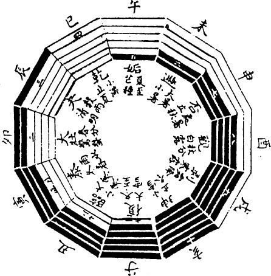

文王十二月卦气图托名周文王所作，它简单明了地画出了一年十二个月与十二地支、二十四节气的关系，并且与六十四卦对应起来。自复卦一阳生，至乾卦达到极盛，因而生出阴性，又至坤卦达到极盛。

#### 卦气衰旺与四时

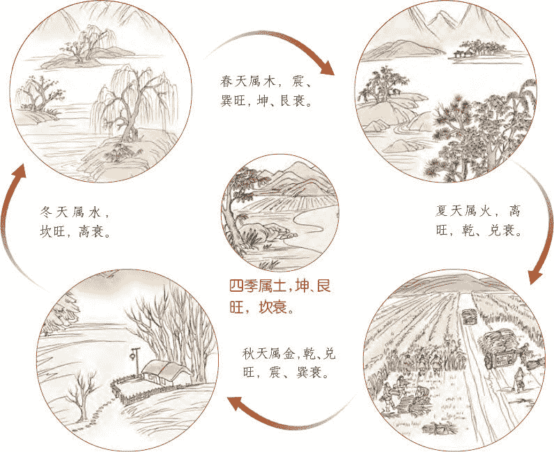

## 6　象数中的命运
梅花易数与吉凶祸福

《梅花易数》中所有的理论都离不开《易经》象数，象数理论贯通了天地万物之中的所有道理，正因为“万物皆备于我”，所以我们才能够用这种方法来预测命运的吉凶祸福。梅花易数理论已经十分成熟，至于预测的准确程度就要取决于个人的修行了。

### 《易经》卦象的秘密

梅花易数理论认为《易经》已经穷尽了天地间所有的秘密，但是创造天地万物的机密暗藏在卦象中，让人捉摸不透。梅花易数就是要解开这些秘密的。

邵康节在《玩法诗》中说：

一物从来有一身，一身还有一乾坤。

能知百事备于我，肯把三才别立根。

每一个物体都有自己完整的内部规律，万事万物都好像一个小宇宙、小天地，所以大千世界种种现象都能在自身中找到对应，这就是《孟子·尽心上》说的“万物皆备于我”，天地万物具有的“我”都能具有，通过“我”自身就可以贯通天、地、人三界。这正是梅花占法的基本依据。

### 神奇的数字

在古人看来，数字绝不是只用来表示物体的数量，人们赋予数字许多含义，认为它们暗含着天地万物之理，而且与人的命运息息相关。在《易经》理论中，一、三、五、七、九被称为天数，二、四、六、八、十被称为地数，它们分别与阳、阴相对应，天数和地数除了具有数字含义之外，还具有阳性与阴性的所有性质。

其实《梅花易数》一书主要就是利用普通但又“神奇”的数字来预测的，邵康节把天数、地数附在各种现象上，认为通过这些数字可以贯通天、地、人三界，万事万物没有不能用数字来描述的。

但是这种预测究竟有多大的效力？邵康节说得好：

天向一中分造化，人于心上起经纶。

仙人亦有两般话，道不虚传只在人。

天地万物都是由太极这个“一”分化而来，但是人只能在自己的心中产生种种观念。即使同是出世的神仙，也会有神通高下之分，何况是凡人呢？《梅花易数》中讲的都是真实无误的道理，但是一个人能否得到《梅花易数》的真传，全在于本人的修行了。

### 象数中的命运

《易经》用易象与易数囊括了天地间所有的规律，而每一个人或物也都好像一个小天地，这个小天地里蕴含着与大天地同样的规律，这就是梅花易数对孟子所说的“万物皆备于我”的解释，也正是梅花占法的基本依据。

#### 河图中的奥秘

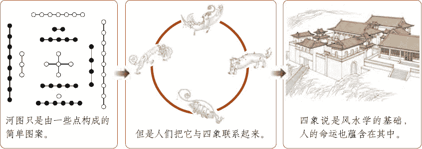

特别提示

河图所传达的本来只是用符号表示的两组数字，但是历来的《易经》研究者都认为它暗含了先天的天地万物之理。

#### 洛书中的奥秘

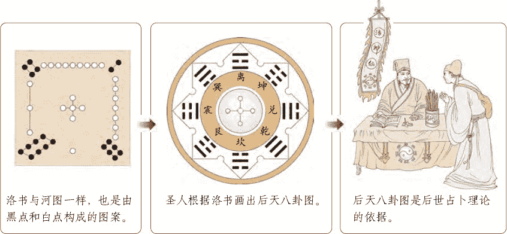

特别提示

洛书最大的作用是导致了后天八卦的产生，后天八卦比先天八卦更符合自然万物之理，所以成了占卜理论最常用的八卦图。

## 7　掌握梅花易数的第一步
梅花易数的起卦法

梅花易数以起卦方式灵活多样而著称，但大致可以分为两种，一种是“先算数，后起卦”，如时间起卦法等；另一种是“先起卦，后算数”，如动物起卦法等。多种多样的起卦法是梅花易数得到广泛应用的保证。

### 梅花易数的起卦依据

《周易·系辞上》说：“君子所居而安者，《易》之序也；所乐而玩者，爻之辞也。是故君子居则观其象而玩其辞，动则观其变而玩其占，是以自天佑之，吉无不利。”意思是一个人平时可以观察易象并且思考品味它的文辞，一旦有什么行动，就可以观察《易经》的变化而推知祸福吉凶，有了取法于《易经》的准则，行动起来就不会有大的失误。

梅花易数正是对这种思想的具体应用，无论是动还是静，无论是时间还是方位，大千世界万事万物无不可以转化为《易经》象数，通过梅花易数的各种起卦法，我们就可以得到“自天佑之，吉无不利”的自由。

### 梅花易数起卦法综述

相对于其他占法起卦法的单调而言，梅花易数以起卦方式灵活而著称。但是无论哪种起卦法都离不开数字的应用。其基本根据就是八卦象数的神秘能力，这些象数体现在大千世界几乎一切事物上，就连日期、时刻等都是象数学所研究的内容。

梅花易数起卦方式大体上分为两种，一种是“先算数，后起卦”，如时间起卦法、尺寸起卦法、物数起卦法、可数之声起卦法等；另一种是“先起卦，后算数”，如动物起卦法、静物起卦法、对人的各种起卦法等。

“先算数，后起卦”的道理是根据数起卦，数字的来源多种多样，如从日期、时刻、物体的尺寸数、物体的个数等都可以得到相应的数字。起卦时需要遵循的原则就是“卦以八除”和“爻以六除”。“先起卦，后算数”是说先根据事物的某些现象得到卦，再从卦得到数字。

无论采用哪种方法，有一点是不变的，那就是数字和卦象的对应关系，在同一件事情中，用一个数字只能得到同一种卦象，而同一种卦象也只能得出同一个数字。

### 无处不在的象数

梅花易数主要是通过数字与大千世界万事万物联系在一起的，世界上没有什么现象不能转化为数字，所以梅花易数的应用极为广泛。

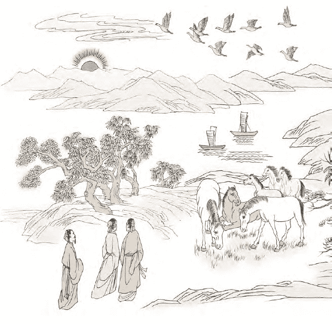

特别提示

传说中的武林高手是不需要带武器的，因为在他们眼里飞花摘叶皆是武器。熟悉了梅花易数之后也是这样，眼睛看到的、耳朵听到的，没有不能用来起卦的。远处的山近处的水，就是山水蒙卦；河水从地上流过，就是水地比卦；马为乾卦九只大雁为乾卦……

## 8　起卦的数学公式
卦除以八，爻除以六

根据数字得到卦象是梅花易数占法的第一步，邵康节制定了把一切数字化为卦象的通用方法。用这种方法还可以求出动爻，从而求出原卦的变卦。另外，取互卦也是必不可少的一步，《易经》占法的奥秘就蕴含在变卦之中。

### 卦与爻的取法

顾名思义，梅花易数是通过数字来与《易经》中的卦联系在一起的。在梅花易数理论中，采用的是伏羲先天八卦图中的对应关系。卦与数字的对应是：一为乾卦、二为兑卦、三为离卦、四为震卦、五为巽卦、六为坎卦、七为艮卦、八为坤卦。

起卦时要用数字除以八，所得到的余数作为卦，如果正好能除尽了，就用八坤为卦。如果一开始得到的数字小于八，那么就可以直接用这个数字起卦。

求得卦之后还要求原来卦的变卦，为此首先要求动爻。以求重卦上下卦的总数之和除以六，用所得到的余数取动爻。如数不满六，就直接用这个数取动爻。取到动爻之后，再看这一爻的阴阳属性，是阴爻的就变为阳爻，是阳爻的就变为阴爻，以得到新的卦象。需要特别注意的是，取动爻之前还应考虑当时的时辰，即用求得重卦上下卦的总数之和再加上时辰数。

### 互卦的取法

互卦又叫交互卦，是变卦的一种，它的取法比较复杂：将原来的重卦去掉初爻和上爻，用原来卦的二爻、三爻、四爻组合成一个新的三爻卦，作为新重卦的下卦，这个过程叫做“互”；将原来卦的三爻、四爻、五爻组合成一个新的三爻卦，作为新重卦的上卦，这个过程叫做“交”。新重卦就是原来重卦的互卦。

乾坤二卦比较特殊，因为它们的互卦仍然与本身相同，所以对这两个卦不直接取互卦，而是用它们的变卦来取互卦。

重卦的互卦不必用六十四卦的名称，只用八卦的名称即可。将互卦去掉初爻和上爻，再把中间四爻分作两卦，看得到什么卦。

除了互卦之外，还有错卦、综卦等多种变卦法。变卦是用变化的眼光看事物，蕴含着事物处在运动变化之中的道理，也是《易经》的奥妙所在。

### 数字与变卦

梅花易数通过八卦与数字的对应关系把数字与卦象联系在一起，并通过取动爻的方法引出重卦的变卦，数字与变卦是梅花易数的两大重要武器。

#### 八卦所对应的数字

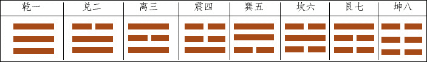

在梅花易数中，采用先天八卦图把卦象与数字联系在一起，即：一为乾卦、二为兑卦、三为离卦、四为震卦、五为巽卦、六为坎卦、七为艮卦、八为坤卦。

#### 卦与爻的取法

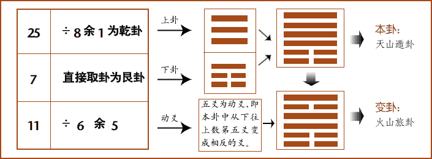

#### 互卦

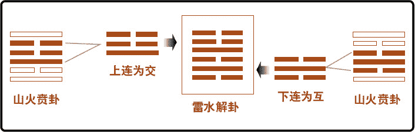

## 9　初试梅花易之一
日期与时刻的占法

在梅花易数的各种占法中，时日占法是比较简单的一种，因为它的数字有着十分明确的取法，即使初学者也很容易弄懂。所以要学梅花易数，须从时日占法学起。

### 古代的计时法

古人计时不用数字，从先秦时期开始，我们国家就用干支法来计算时间，这个传统一直保持到清末。计时的具体方法是用十天干与十二地支搭配，得到六十组不同的搭配方式，即甲子、乙丑、丙寅、丁卯……如此一直排到壬戌、癸亥，然后再次从甲子算起。

在占卜法中有一种叫做测生辰八字的，俗称“批八字”，这里的八字就是指出生时刻对应的干支。

### 时间与数字的具体对应关系

在梅花易数中计算年份的数字时不考虑天干，而只看地支就可以了，具体的对应关系是：子年为数 1、丑年为数 2、寅年为数 3、卯年为数 4、辰年为数 5、巳年为数 6、午年为数 7、未年为数 8、申年为数 9、酉年为数 10、戌年为数 11、亥年为数 12。

而月份与数字的关系就比较简单，即：几月就对应数字几，正月为数一，腊月为数十二。日期与数字的关系也是这样，例如初一为数一，月半十五为数十五。一个月的最后一天是数字几，要看这个月是大小月而定。

时辰的计算比较复杂，具体为；23～1 点为子时，对应数字一；1～3 点为丑时，对应数字二；3～5 点为寅时，对应数字三；5～7 点为卯时，对应数字四；7～9 点为辰时，对应数字五；9～11 点为巳时，对应数字六；11～13 点为午时，对应数字七；13～15 点为未时，对应数字八；15～17 点为申时，对应数字九；17～19 点为酉时，对应数字十；19～21 点为戌时，对应数字十一；21～23 点为亥时，对应数字十二。

### 卦与爻的取法

当需要起卦时，先必须查得当时的年、月、日、时，具体的取卦和取爻的方法，就是“卦除以八，爻除以六”：以年、月、日对应的数字之和除以 8，取为上卦；以年、月、日数再加上时辰数之和除以 8，取为下卦；以年、月、日数再加上时辰数之和除以 6，取为动爻。

### 时日占法之例

时间起卦法可以说是梅花易数的“入门课程”，到后面还有许多起卦法也离不开时间起卦法。日期和时辰通过十支与数字联系在一起，再通过数字与相应的卦象相对应。

#### 干支纪年与数字

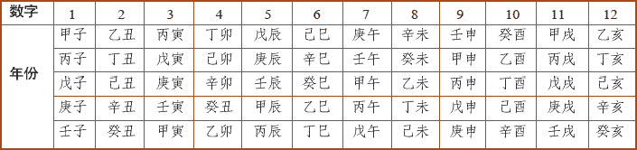

由于我们国家现在通用公历纪年，所以要知道一年的干支顺序就需要查万年历，在上面我们列出了干支顺序与梅花易数中数字的对应关系。

#### 干支与时辰

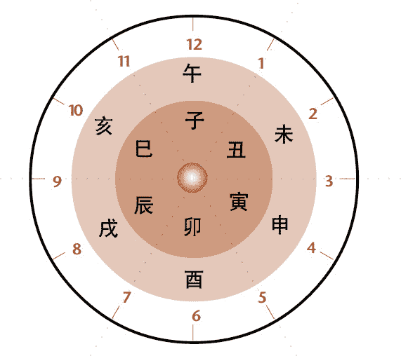

 特别注意：年、月、日都要以农历为准！

 外圈地支对应的时辰要在表盘数字上加 12！

#### 举例

如某人生于农历 1965 年 10 月 12 日晚上 8 点，经查农历 1965 年为乙巳年为 6，农历 10 月为 10，12 日为 12，生时 8 点为辰时，对应数字为 5。

起封：年月日对应的数字之和：6＋10＋12＝28，28÷8 余 4 为震卦

下卦年月日时之和：28＋5＝33，33÷8 余 1 为乾卦

动爻及变封：33÷6 余 3，即本卦 的 3 爻为变爻得变封

## 10　初试梅花易之二
尺寸与方位的占法

尺寸与方位起卦法也是最经常应用的占法之一。日期与时刻起卦法是从时间角度入手，而尺寸与方位起卦法是从空间角度入手，两者结合就可以更加详细地讨论事情发生时的状态，其中方位起卦法比时日法和尺寸法更加灵活。

### 尺寸占法

尺寸占法是根据物体的大小、长度等起卦的方法，物体的大小与它们的空间属性有着密切的关系。

要对一个物体施行尺寸占法，需要先测量它的长度。事先要估计它的长度是不是够一丈，如果够一丈，就测量它为几丈零几尺，以丈数除以 8，将其余数取为上卦；以尺数除以 8，将其余数取为下卦。取动爻时，要以丈数与尺数之和除以 6 取为动爻。

假如物体的长度不满一丈，就要测量它为几尺零几寸，以尺数除以 8，将其余数取为上卦；以寸数除以 8，将其余数取为下卦。取动爻时仍然与上面类似，以尺数与寸数之和除以 6 取为动爻。

以上是邵康节发明的尺度占法，但是后人在应用的过程中有时候采用另一种占法。即以丈数（或尺数）为上卦，以尺数（或寸数）为下卦，以丈尺（或尺寸）之和加上起卦时的时辰数除以 6 取为动爻。它与上面的区别在于考虑了时间因素。

无论以哪种取法，在起卦时一定要注意的一点是，必须以市制单位中的丈、尺、寸为测量单位。

### 方位占法

方位起卦法的基本依据是文王后天八卦图。先天八卦图更注重万事万物之间的对峙关系，而后天八卦图是从四时的推移，万物春生、夏长、秋收、冬藏而得出的规律，它更强调万事万物的循环与流动，更符合世界的真实面貌，所以在占卜时多用后天八卦图。

在后天八卦图中，八卦与方位的关系是：震位于东方，离位于南方，兑位于西方，坎位于北方；乾位于西北，坤位于西南，艮位于东北，巽位于东南。后天八卦方位的平面表现为：上南下北、左东右西。

起卦时可以根据具体情况来确定方位的选择，比如在东南方向飞来一只鸟，则取东南巽的卦象。不过在实际应用中情况要复杂得多，要充分考虑当时的时辰、地势、周围环境等各种因素。

### 尺寸占法的应用

尺寸起卦法考察物体的空间属性，进行尺寸起卦之前要先观察被测物体的大致尺度，以选择合适的尺子进行测量。

#### 尺寸的测量

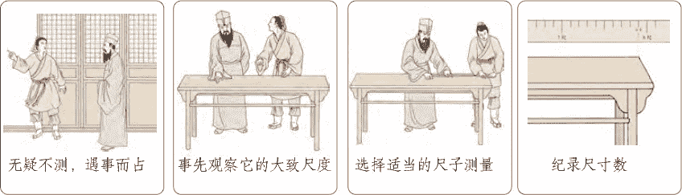

#### 本卦与变卦

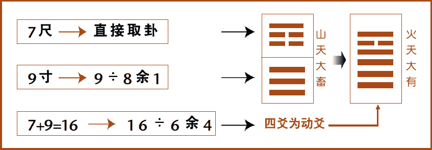

#### 另一种变卦法

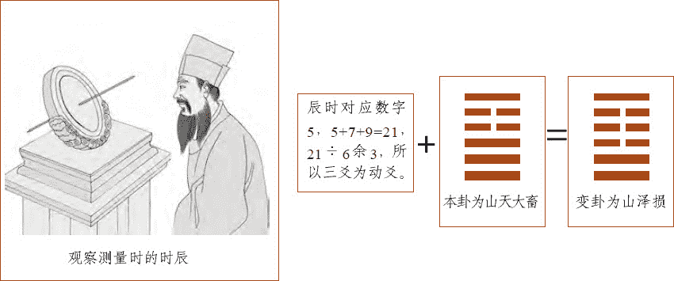

## 11　初试梅花易之三
物数与声音的占法

物数起卦法是根据可数的事物得到卦象的方法，声音起卦法是根据可以计数的声音得到卦象的方法。与其他起卦法相同，它们也遵从“卦除以八，爻除以六”的起卦法则。物数起卦法的扩展起卦法也是十分有效的起卦方法。

### 物数起卦法

大千世界无处没有数字的存在，一些行人、几个物体、一群大雁，都可以转化为数字，只要得到了数字也就能用“卦除以 8，爻除以六”的起卦法则把它转化为六十四卦。所以物数起卦法的应用极为广泛。

物数起卦法具体的应用为：将物体的数量除以 8，以其余数为上卦；以当时的时辰数除以 8，以其余数为下卦；将物体的数量加上当时的时辰数，以它们的和除以 6 得到动爻。例如：上午 10 点时看到天上飞过一群大雁，大雁总数共有 12 只。因为 12÷8 余 4，所以取四震为上卦；上午 10 点对应着巳时，对应数字为 6，所以取六坎为下卦；总的卦象就是雷水解卦。然后取动爻：12＋6＝18，18 是 6 的整数倍，所以上爻取为动爻。

### 物数起卦法的扩展

当今社会中处处离不开数字，比如我们的电话号码、身份证号码、居住地的门牌号与楼层编号、每个人的年龄生日等等，这些虽然不是什么可数之物，但是它们都是数字，或者可以很方便地转化为数字。在梅花易数理论中，只要有数字也就意味着有卦象存在，这是其他占算方法难以做到的，也是梅花易数强大威力的充分体现。

作为对物数起卦法的扩展，这些不可数之物也可以用同样的方法进行起卦。例如以手机号 15927582430 为例，取后 4 位数 2430，2＋4＝6，得上卦坎，3＋0＝3 得下卦离，本卦为上坎下离，此即水火既济卦；2＋4＋3＋0＝9，9÷6 余数为 3，得三爻为动爻，求得变卦为上兑下离，此即泽火革卦。

### 声音起卦法

我们每天都会听到各式各样的声音，如果其中有些声音比较特殊或比较响亮，那么就可以根据它们来起卦。

声音起卦法的具体方法是根据听到声音的次数得到上卦，根据听到声音的时辰得到下卦。例如下午 4 点听到 3 声鸟叫，则上卦就取为三离；4 点即申时，对应数字 9，所以下卦就是一乾卦，总的卦象就是火天大有卦。

### 物数起卦法的应用

进行物数法起卦时要选择好可数的事物，同时要想办法知道当时的时辰，因为大千世界无处没有数字的存在，有数字的地方就可以转化为六十四卦，所以物数起卦法的应用十分广泛。

#### 物数占法的起卦

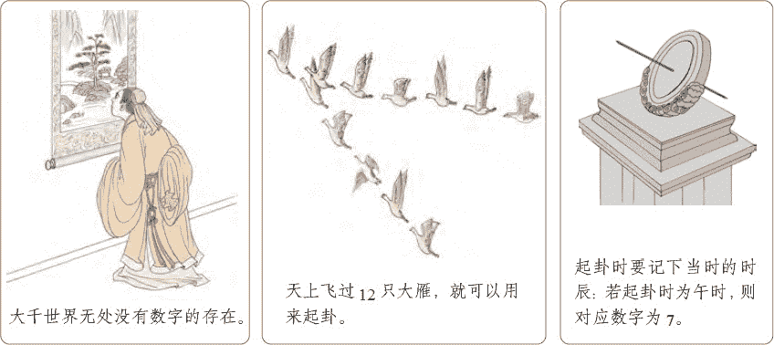

#### 本卦与变卦

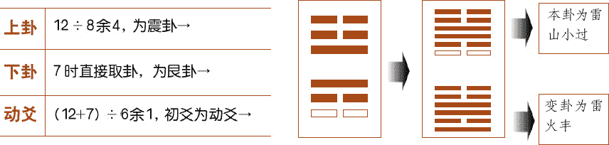

#### 无处不在的数字起卦

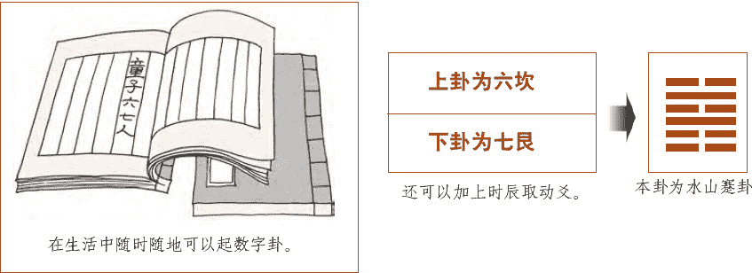

## 12　初试梅花易之四
动物与静物的占法

动物起卦法是一种比较综合的起卦法，它的卦象不但取决于动物本身，还往往与时间和方位联系在一起。静物起卦法是利用静物的时间属性来起卦的方法，其实它也可以看成是时间起卦法的一种。

### 动物与方位起卦法

动物占就是根据动物来起卦的占法，在以动物起卦时，要注意必须选单个动物，如果是一群动物就不能以此来起卦。

由于动物的习性各不相同，所以它们与八卦之间有着不同的对应关系。一些常见的动物与八卦的对应为：马为乾一、羊为兑二、龟为离三、蛇为震四、鸡为巽五、鱼为坎六、狗为艮七、牛为坤八。

如果需要以动物起卦，就根据这种动物的八卦属性确定出上卦，以动物来的方位或当时所处的方位为下卦；确定动爻时仍然要考虑时间，即以上下二卦的和加上时辰数，以其总和除以 6 取动爻。可见这种起卦法除了动物本身之外，还把时间、空间全都考虑进来了。

例如：下午 2 点时从西南方走来一匹马，马属于乾卦，所以上卦就是乾一卦，西南方向对应着坤卦，所以下卦就是坤八卦，总的本卦卦象就是天地否卦；而下午 2 点是未时，对应数字 8，（1＋8＋8）÷6 余 5，所以五爻就取为动爻。

### 动物起卦法的其他形式

动物起卦法除了上面的方式之外，还有两种：

一是以动物的叫声起卦，即以动物属性得到上卦，以动物的叫声得到下卦，以两卦之和再加上时辰数取动爻；二是以动物刚出生的时间，或买回家的时间起卦，这其实转化成了时间起卦法。

### 静物的起卦

用这种方法起卦时，所选的静物不能是江、河、山、石等自然界中的静物，而只能是人工制造或种植的静物，如树木、桌椅、桥梁、房屋等等。由于人工制造或种植的静物都有一个做成、竣工或种植的时间，所以很容易用日期和时刻起卦法进行起卦。

应用静物起卦法也要注意“无疑不卜，无故不占”的原则，不能见到什么东西都随便起卦。

### 动物和静物起卦法

动物起卦法主要是利用了动物的八卦属性，每种动物都可以在八卦中找到自己的归属，静物起卦法则是利用了人工静物的时间属性。动物和静物起卦法都与时间起卦法联系在一起。

#### 动物与八卦的对应关系

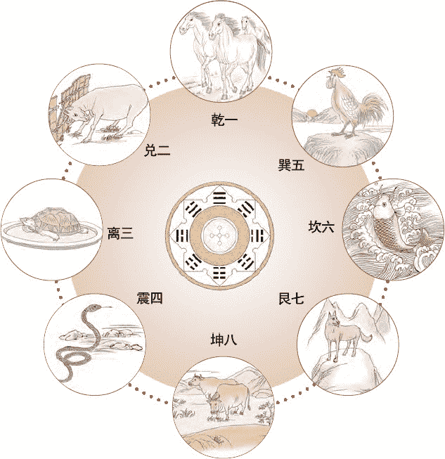

#### 动物和静物起卦法

利用动物或静物起卦时要注意：一群动物是不能以此来起卦的，非人工制造或种植的静物也不能以此来起卦。

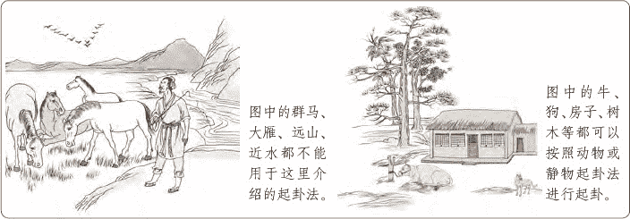

## 13　测字前的准备
汉字的历史

测字是梅花易数的核心内容之一，在学习用梅花易数测字之前，了解汉字的发展史是很有必要的。对大部分年轻人来说，繁体字是已经失去生命力的古老文化现象，而了解繁体字和简体字的关系也是一个不可忽略的问题。

### 汉字发展史

从甲骨文至今，汉字经过了几千年的传承发展。在这几千年中，字体的演变纷繁复杂，但大体来说，汉字字体的演变可以分为三个阶段：一是从甲骨文变成小篆，这发生在商周时期；二是从小篆变为隶书，这发生在战国末期；三是从隶书变为楷书，这发生在东汉至魏晋时期。其中从小篆变为隶书是汉字史上最大的一次变化，它标志着汉字由古文字阶段进入了今文字阶段。

具体来讲，汉字的发展顺序是：甲骨文、金文、篆书、隶书、草书、楷书、行书。其中甲骨文是最早出现的汉字，它基本上都是象形文字。金文流行于商周时期，因为它是刻在青铜器上，所以又叫做铭文或钟鼎文。篆书又分为大篆、小篆，其中小篆就是秦朝统一之后“书同文”的字体，也是中国最早的全国统一的字体。隶书取代篆书发生在汉朝，从此汉字进入了今文字阶段。草书又分为章草、今草、狂草、行草等，是出现于东汉的一种笔画连续的字体。楷书的特点是横竖分明，足以成为写字的“楷模”。行书是介于草书和楷书之间的一种字体。

### 简体字问题

现在我们通用的汉字，是建国以后由国家语言文字工作委员会颁布使用的，简体字与繁体字的区别主要在于繁简性，因为有很多汉字原来的结构是十分复杂的，简化以后就变得简单了许多。简体字在中国内地已经成为规范汉字，也是联合国官方应用的汉字。

与繁体字相比，简体字虽然有书写简单等很多优点，但它的缺点也是很严重的，这就是它在一定程度上割裂了传统文化的延续，汉字六书（象形、形声、会意、指示、假借、转注）中隐含着的许多文化信息被丢掉了；更严重的是，大部分年轻人已经失去了阅读繁体典籍的能力。

### 汉字的历史

用梅花易数测字是十分广泛的用法，在学习用梅花易数测字之前，了解汉字的发展史是很有必要的。

#### 汉字发展史

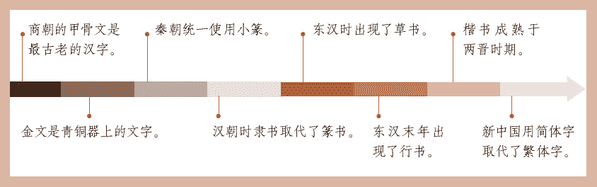

#### 简体字的简化规则

汉字的简化规则是 1922 年由钱玄同提出来的，共有 7 种：

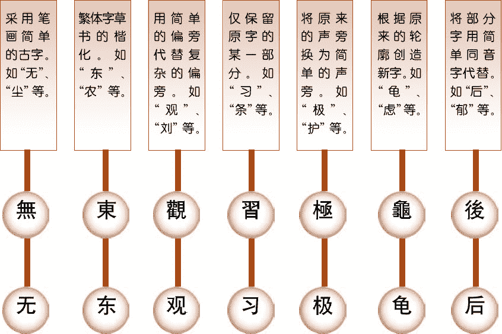

## 14　字占概论
字占的基本原理

梅花易数中的字占可分为三种形式，一是按照字数起卦，二是按照单个字的笔画起卦，三是按照字的声调起卦。无论要测的有多少字、字的结构和声调如何，都可以用这三种方法分别讨论。

在梅花易数中，根据字来起卦的方法具体有 3 种，在实际应用时究竟选择哪一种，还需要根据实际的情况进行判断。比如在字很多时，就不宜使用笔画起卦法，而要选用比较简单的断字起卦法。

### 梅花易数中的断字起卦法

断字起卦法适用于多个字的情况，如果遇上了两个或两个以上的字，就需要用断字法分别取上卦和下卦。具体方法是：如果是偶数个字，就把它们平均分成两半，一半取为上卦，一半取为下卦；如果是奇数个字，就用少一个字的取上卦，用多一个字的取下卦，其根据就是天轻而且清位于上，地重而且浊位于下。

### 梅花易数中的笔画起卦法

拆字法针对的是单个字的情况。我们选取的字必须是楷书，因为像篆书难以数清笔画，而草书又难以区分结构，所以在起卦之前需要把它们转化为相应的楷书；第二个要注意的是，测的字必须是繁体字，如果遇上了简体字则先要把它转化为相应的繁体字，而且最好以《康熙字典》中的笔画为准。

### 梅花易数中的声调起卦法

与汉字的字形变化相比，汉字的音调变化更要复杂得多，且不说历史上语音的变化，仅就现在来说，方言就有成百上千种，所以用声调起卦法之前先必须规定一种声调。

在梅花易数中采用的是古的声调，古中州韵的声调分为平、上、去、入 4 种，四声与数字的对应关系是：平声为 1、上声为 2、去声为 3、入声为 4。这与现代普通话中的阴平、阳平、上声、去声或一声、二声、三声、四声不同。一般来说，古中州韵中的平声相对于现代普通话中的一声和二声，古中州韵中的上声相对于现代普通话中的三声，古中州韵中的去声相对于普通话中的四声，但是古中州韵中的入声却不能简单地对应哪种普通话声调，如果需要就必须查找相关资料，以保证起卦的严谨性。

### 字占的基本规则

用梅花易数进行字占，首先要看是一个字还是多个字，如果是多个字，就需要先用断字规则断为上下卦，再用笔画法或四声法起卦。

#### 断字法以及字数起卦法

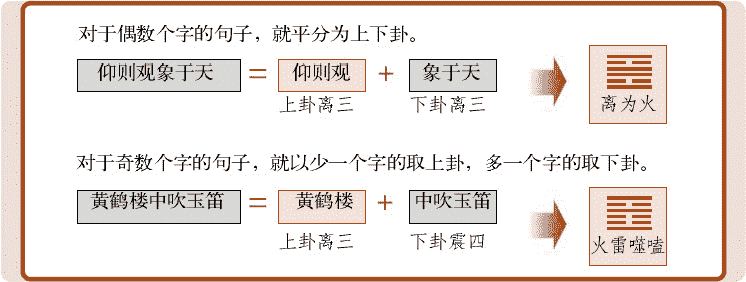

#### 数笔画

数笔画之前，要把字转化为繁体楷书。

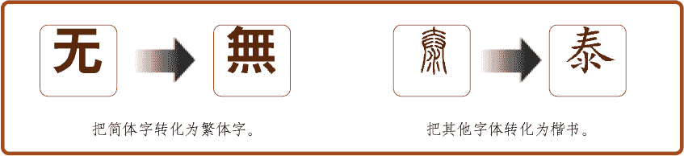

#### 辨四声

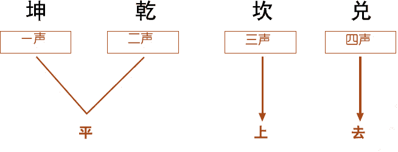

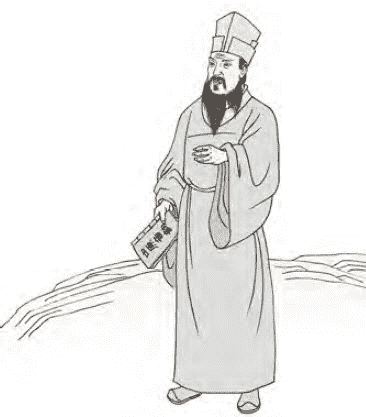 但是入声就没有这么简单的对应规则了！

## 15　字占详论
从一字到十字

字占的基本原则是断字法，断开以后就可以按照上卦、下卦、动爻的顺序进行起卦。起卦法主要有两种，就是笔画起卦法和声调起卦法。在字占理论中比较特殊的是单字的起卦，它需要考察这个字的具体结构，而多字起卦法则则不需要。

### 一字占法

一个字为太极未分之相。对于一个字，无论原来是什么情况，都要先把它转化为繁体楷书，原因在于楷书有着分明的结构，如“对”为左右结构，“资”为上下结构等等。

以“对”字为例，它的繁体写法是“對”，仍然是左右结构。然后以其左边偏旁为“阳画”，取上卦；右边偏旁为“阴画”，取下卦；动爻则根据整个字的笔画数来确定。阳画的笔画数为 11，以此除以 8 得到余数 3，则上卦为三离，阴画的笔画数是 3，直接取下卦为三离，总的本卦卦象就是离卦；整个字的笔画数是 14，以此除以 6 得到余数 2，所以二爻取为动爻，得到的变卦就是火天大有卦。

### 二字占法

两个字为两仪之相。阴阳两仪互相消长，但总而言之，它们的力量是均衡的。所以在取卦时就要按照“卦除以八，爻除以六”的规则，以前一个字的笔画数取为上卦，后一个字的笔画数取为下卦，以两个字的笔画数之和取动爻。

### 三字占法

3 个字为天地人三才之相。按照断字起卦法和“卦除以八，爻除以六”的规则，以前一个字的笔画数取为上卦，后两个字的笔画数之和取为下卦，以 3 个字的笔画数之和取为动爻。

### 四字占法

4 个字为四象之相。可以平分为上下两卦，以前两个字的笔画数之和除 8 取为上卦，后两个字的笔画数之除 8 取为下卦，以 4 个字的笔画数之和除 6 取为动爻。

### 1 至 4 个字的起卦法

1 至 4 个字的起卦法中，单字的起卦比较特殊，因为它要根据字的结构断出上下卦，而多个字的起卦只需要知道字的个数即可。

#### 单字的拆字法

对于单个字，就要用拆字法把它拆为上下二卦，其基本规则是：左右结构的字，左上右下；上下结构的字，上上下下；包围结构的字，外上内下。

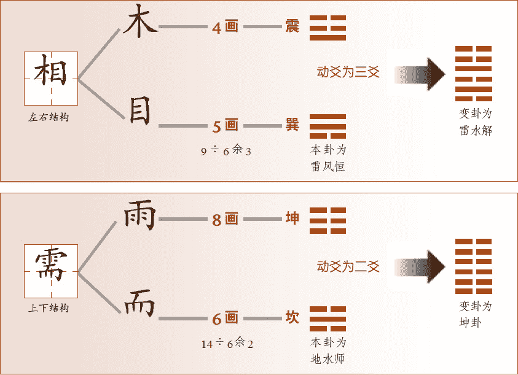

#### 二至四个字的断字法

二至四个字的占法与单字的不同，它不需要辨别字的结构，但要先断字。

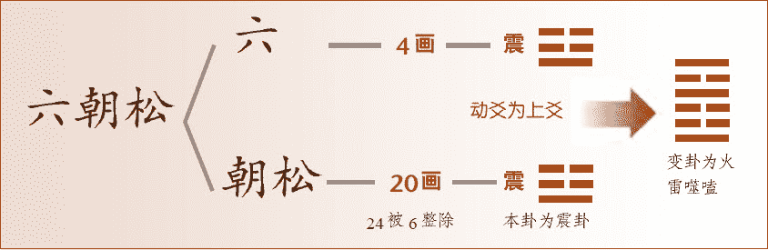

* * *

### 五字占法

5 个字为五行之相。按照断字起卦法和“卦除以八，爻除以六”的规则，以前两个字的笔画数之和取为上卦，后 3 个字的笔画数之和取为下卦，以 5 个字的笔画数之和取为动爻。

在 4 个字以上的占法中，还有另一种起卦方式，即声调起卦法。即不用再去数每个字的笔画数，而只需弄清楚每个字的声调，按照平声为 1、上声为 2、去声为 3、入声为 4 的规则对应数字即可。应该注意的是，用声调起卦法时的断字方式仍和以前一样：偶数字的则平分，奇数字的则上少一字、下多一字，以和天轻地重相呼应。

以李白的诗句“笑别庐山远”为例，先用笔画起卦法：其繁体字为“笑别廬山遠”，5 个字的笔画数分别为：10、7、19、3、14，前两个字数字之和为 17，除以 8 得到余数 1，所以取一乾为上卦；后 3 个字的数字之和为 36，除以 8 得到余数 4，所以取四震为下卦；总数为 53，除以 6 得到余数 5，所以五爻取为动爻。综上所述，本卦为天雷无妄，变卦为火雷噬嗑。

有些字的笔画数十分难以数清，而且很容易数错，若以声调法来起卦就简单得多。上面 5 个字的声调分别是“去入平平上”，与它们对应的数字是“3、4、1、1、2”。前两个字数字之和为 7，所以取七艮为上卦；后 3 个字数字之和为 4，所以取四震为下卦；总数为 11，除以 6 得到余数 5，所以五爻取为动爻。综上所述，本卦为山雷颐，变卦为风雷益。

### 六字占法

6 个字为六爻之相。不过不需要一字一爻地对应，只需要和上面一样平分为上下两卦，以前 3 个字的笔画数之和取为上卦，后 3 个字的笔画数之和取为下卦，以 6 个字的笔画数之和取为动爻。

### 七字占法

7 个字为七政之相。古人把春、夏、秋、冬、天文、地理、人道合称为七政，在兵法上又把人、正、辞、巧、火、水、兵称为七政，而天文上又把金、木、水、火、土加上日、月称为七政。

7 个字的占法与 5 个字的类似，最好都用声调起卦法。按照断字法和“卦除以八，爻除以六”的规则，以前 3 个字的笔画数之和取为上卦，后 4 个字的笔画数之和取为下卦，以 7 个字的笔画数之和取为动爻。

### 5 至 6 个字的起卦法

在 4 个字以上的起卦法中，邵康节提出了新的方法，即根据字的声调来取上下卦，这就省去了数笔画的烦琐步骤。

#### 声调起卦法

声调起卦法的特别之处是，利用它得到的上下卦只能是一乾、二兑、三离、四震之一，这样搭配出来的本卦只能是六十四卦中的 16 种卦。

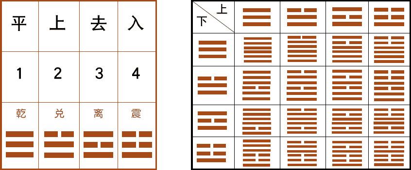

#### 两种起卦法的比较

对于 4 个字以上的句子，采用声调起卦法就比较简单。下面是两种起卦法的比较。

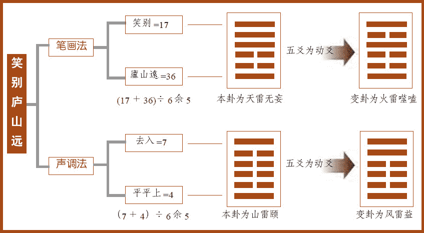

* * *

### 八字占法

8 个字为八卦之相。八个字的起卦法也是先平分为上下两卦，以前 4 个字的笔画数之和取为上卦，后 4 个字的笔画数之和取为下卦，以 8 个字的笔画数之和取为动爻。

### 九字占法

9 个字为九畴之相。《尚书·洪范》提出了九畴的理论：“初一曰五行，次二曰敬用五事，次三曰农用八政，次四曰协用五纪，次五曰建用皇极，次六曰又用三德，次七曰明用稽疑，次八曰念用庶征，次九曰向用五福，威用六极。”

9 个字的占法与 5 个字的类似，最好也用声调起卦法。如果按照断字法和“卦除以八，爻除以六”的规则，则以前 4 个字的笔画数之和取为上卦，后 5 个字的笔画数之和取为下卦，以 9 个字的笔画数之和取为动爻。

### 十字占法

10 个字为成数之相。与 6 字、8 字的类似，10 个字的起卦法也是先平分为上下两卦，以前 5 个字的笔画数之和取为上卦，后 5 个字的笔画数之和取为下卦，以 10 个字的笔画数之和取为动爻。

### 十字以上占法

10 个字以上的占法又有新的形式，它既不用数每个字的笔画，又不用管每个字的声调，而只是简单地数一下字数，按照断字规则把句子断成上下二段，取上段的字数为上卦，下段的字数为下卦，以整句话的字数取动爻。

以李白的诗《黄鹤楼送孟浩然之广陵》为例，诗的内容是：故人西辞黄鹤楼，烟花三月下扬州。孤帆远影碧空尽，唯见长江天际流。全文共有 28 个字，则分成上 14 下 14，以 14 除以 8 得余数 6，所以本卦为坎卦；以 28 除以 6 得余数 4，所以取四爻为动爻，得到变卦为泽水困。

从 10 个字到几十个字、乃至上百字都可以用这种方法来起卦，但当字数再增加时，就不适合用字占法来起卦了。

### 更多字的起卦法

#### 十字以上的起卦法

对于 10 个字以上的情况，既不能采用笔画起卦法，又不能采用声调起卦法，因为它们都过于烦琐，而且笔画很容易数错，声调也往往会弄错。邵康节提供了另一种起卦法，就是通过数字数起卦。

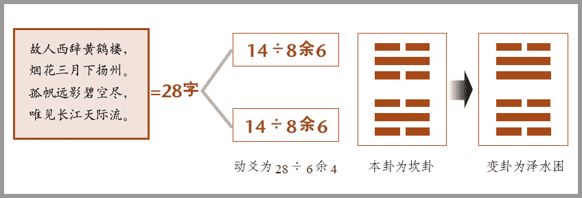

#### 字占法总结

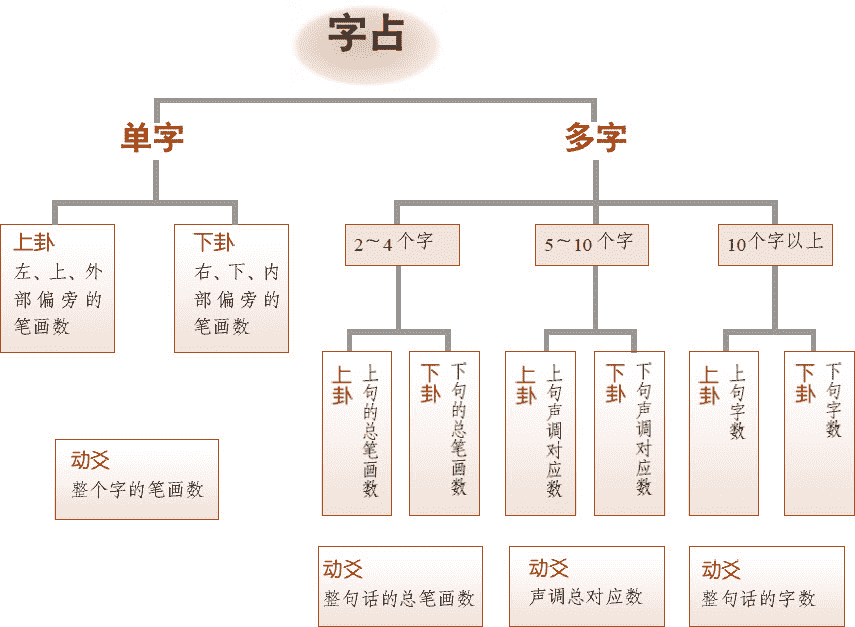

注：5～10 个字也可使用断字法加笔画数起卦。

## 16　察言观色　如何为人占

邵康节为我们提供了 6 种为人占的起卦法，即根据来人的人品、身体、持物、服色、言语，以及来人问事时的外应起卦。另外，前面介绍的时间、文字、方位、声音等起卦法在这里也适用。

我们在生活中的大部分占筮都是为别人占，所以为别人占是极为重要的占法。为别人占的关键就在于学会察言观色，像中医给人看病一样。但是观察的对象又不限于人本身，像人拿的东西、穿的衣服等也是观察的对象之一。

### 人品起卦法

在一家之中，不同身份的人在八卦中均有对应，即：乾为父，坤为母，震为长男，巽为长女，坎为中男，离为中女，艮为少男，兑为少女。

利用人的身份起卦，在梅花易数中叫做“人品起卦法”，在起卦时，以人的人品做上卦，以来人问的事情为下卦，上下卦对应数字加上时辰数之和除以 6 取为动爻。

### 持物起卦法

所谓持物，不一定是拿在手中的东西，比如耳朵上挂的耳环、手上戴的镯子、头上戴的发卡等也都是持物起卦法的适用范围。金属物品对应乾卦，木制品对应震卦，与水有关的属于坎卦，与火有关的属于离卦，与土有关的属于坤卦，与石有关的属于艮卦。

具体的起卦方法为：以来人人品为上卦，以来人持物为下卦，两者之和再加上时辰为动爻；或者以来人持物为上卦，以问的事情为下卦，两者之和再加上时辰为动爻。

### 服色起卦法

服色起卦法是根据来人衣服的颜色来起卦的一种方法。八卦所属的颜色为：乾一为金色、兑二为白色、离三为红色、震四为青色、巽五为碧色、坎六为黑色、艮七为棕色、坤八为黄色。具体的起卦法为：以上衣颜色为上卦，下衣颜色为下卦，两者之和加上时辰为动爻。例如来人上身穿着红衬衫，下身穿着白裙子，那么上卦就是离卦，下卦就是兑卦，重卦就是火泽睽卦。

### 为人占的综合分析

要熟练掌握为人占的方法，就必须熟悉周围各种事物的八卦属性，做到触目皆是卦。把万事万物都归结为八卦并不是简单化的倾向，而是在认证考察了事物的性质之后得出的结论。

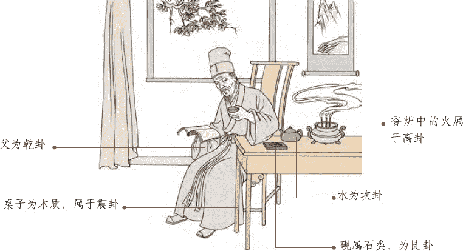

* * *

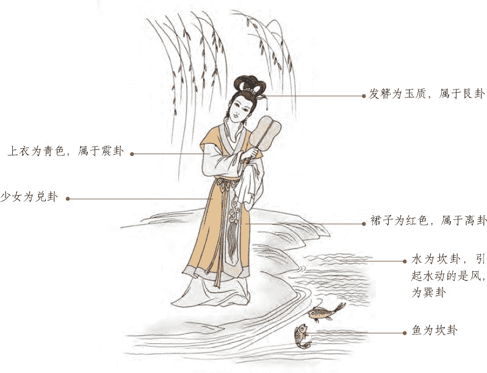

* * *

### 身体起卦法

人的身体与八卦也有对应关系：乾一为头、兑二为舌、离三为目、震四为足、巽五为股、坎六为耳、艮七为手、坤八为腹。《易经·系辞下》说，伏羲作八卦时“近取诸身，远取诸物，于是始作八卦”。所以我们可以利用身体结构来起卦。起卦时仍然要遵守“无疑不测”或“不动不占”的原则，例如，对方摸了一下耳朵，就意味着是坎卦；对方跺了一下脚，就可以用震来起卦。

具体起卦方式是：以身体部位为上卦，以问的事情为下卦，以上下卦对应数字再加上时辰数之和除以 6 为动爻；或者以人品为上卦，以身体部位为下卦，以上下卦对应数字再加上时辰数之和除以 6 为动爻。

### 言语起卦法

这是根据来人说的话起卦的方法，具体方法是：如果来人只说了一句话，就按照前面介绍的断字法来断字取卦；如果来人说了两句话，就以第一句的字数取为上卦，第二句的字数为下卦，两句的字数之和为动爻；如果来人说了两句以上的话，就以第一句为上卦，最后一句为下卦，两句之和为动爻，其余的话忽略不计。

### 外应起卦法

外应起卦法是根据来人周围的环境而起卦的方法。外应就是来人问事时周围环境中有什么动静，例如来人问事时正好有树叶飘落，树叶属于五行之木，则配以震或巽卦；又如来人问事时正好有雷电发生，那么就配以震卦。

具体起卦方式是以所见的外应为上卦，以此外应加上时辰数之和除以 8 为下卦，以此外应加时辰数之和除以 6 取动爻。

### 其他的起卦法

除了上面的起卦法之外，还有很多其他的起卦法，有些起卦法我们在前面已经有了论述，主要有以下几种：

时间起卦法：时间起卦法就是按照来人问事的时间来起卦。

文字起卦法：如果来人在问事时带了书本、字纸或写了字，那么就可以按照文字起卦法来起卦。

方位起卦法：方位起卦法是按照来人的方位起卦的方法。

声音起卦法：如果来人发出除了说话之外的特别的声音，就可以按照前面介绍的声音起卦法来起卦。

以上四种起卦法在前面已经有了具体介绍，它们既可以用于给人占，又可以用来给自己占，是几种普遍适用的方法。

### 为人占的各种情况

为人占的情况比较复杂，起卦时必须综合分析各种因素，最终选择一种起卦法。每个人都有自己的人品属性，所以利用人品起卦是常见的方式之一。

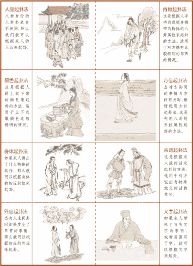

## 17　预知未来
如何为自己占

为自己占的具体方法与为人占基本相同，不外乎时间、方位、声音、持物、外应等几种方式。但是两者又有不同，为人占是要观察对方的言行举止，而为自己占时就有许多自己的体验在里面。

### 起卦的原则

在为自己占时要特别注意“无疑不测，遇事而占”的基本原则，只有遇到了特别的事情，出现了异常的现象，才能为自己起卦，否则即使起卦也不会有好的效果。

另外还应该注意的是“一事一占”，对于一件事情，不能重复几次占算，假如对一件事情一天起卦好几次，那么也不会得到准确的结果。

再就是不能时时刻刻都想着起卦，而误了正常的事情。假如什么时候都对起卦念念不忘，那么即使得到了好的预兆也会把事情耽误掉。

### 起卦法的选择

我们已经介绍了 10 种左右的梅花易数起卦法，那么在为自己占的时候到底以什么为准呢？在这里不能一概而论，要根据实际发生的事情来推断。

起卦时要先弄清楚事情的最重要的要素，例如：要测算的事情主要与方位有关，就要用方位起卦法起卦；出现了异常的现象，就要利用异常的现象的外应来起卦；假如想测一下什么时候做一件事情有利，那就用时间起卦法来起卦。总之，凡事不能一概而论，而要根据情况具体分析。

例如：自己想要外出旅游，但是有两个疑问，一是什么时候出去，二是去哪里旅游。这时就可以分开考虑，先用时间起卦法推算最佳的外出时间，再用方位起卦法推算出最佳方向，然后就可以根据方向而选好景点择日出游了。

掌握了各种起卦法以及起卦原则之后，在生活中就可以按照规则经常为自己起卦，然后根据结果与现实的关系随时调整占法，从而达到运用自如的目的。小说中的武林高手飞花摘叶皆可以用作武器，在我们熟练掌握了各种占法之后，也可以达到这种效果。梅花易数高手中的眼里无处不是数字，有数字就有卦象，有卦象就有吉凶祸福。从而“万物皆备于我”，最终达到“自天佑之，吉无不利”的境界。

### 为自己占的基本原则

为自己占的优点在于可以随时随地起卦，而不需要别人的干预。但这并不是说为自己占就可以毫无节制地乱占，因为任何占筮法都有自己的规则。

#### 起卦的种种误区

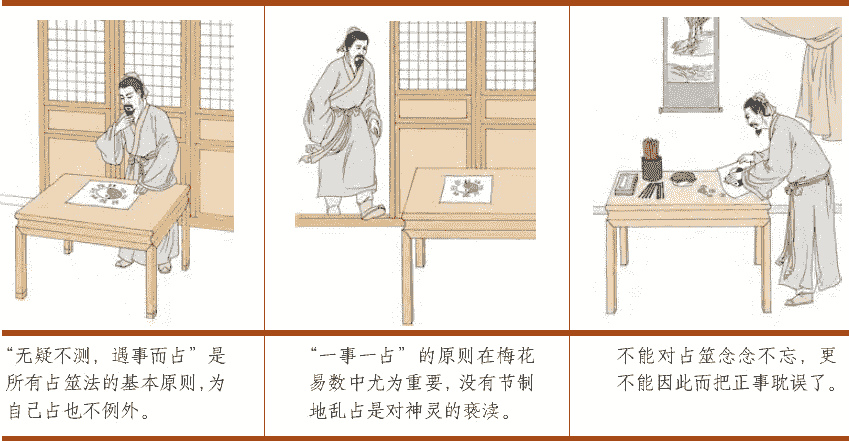

#### 为自己占的应用

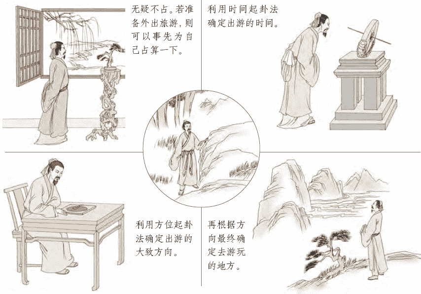

# 第三章　走进易学预测之门
梅花易数的占卜总诀

梅花易数起卦、断卦法是一种具有严谨体系的占卜法，起卦的灵活性是它的一大优势。本章从十一个方面介绍了在梅花易数中如何起卦，并且介绍了各种断卦方法。掌握了这两种方法后，就可以进行实际运用了。

## 本章图版目录

八卦的变易性

卦象之间的关系

断卦的顺序

先天卦与后天卦

八卦与天气

重卦与天气

体用生克关系

家室占的断卦法

婚姻占的断卦法

名利占的断卦法

出行占的断卦法

失物占的断卦法

疾病占的断卦法

风觉占的断卦法

鸟占的起卦法

声音占的起卦法

## 1　变通之道
梅花易数中的占卜玄机

《易经》的奥妙在于它的变通之道，八卦虽然简单，但是已经穷尽了含在万事万物之中的一切复杂的真理，从简单到复杂的关键就在于“变通”二字。明白了这种变通之道，就能领会《易经》与八卦的奥妙玄机了。

### 八卦中的万物之理

任何事情都有吉凶的差别，万事万物也都有自己运行的规律，但是这种规律往往不会自己显露出来。古人为了弄清楚其中的规律，就发明了各种占筮法，希望能通过各种占筮方法明了其中的难以捉摸的道理。

《易经》和八卦之理便是许多占筮法所依据的基本理论，它能体现出世间所有事物的奥秘。例如，马是刚健有力的象征，而八卦中的乾卦也是象征着同样的道理；火是温热向上的，而八卦中的离卦也能反映出火的这种性质。简而言之，一切事物无论其特征多么奇怪，在八卦中总是能找到与之相应的卦象。所以用占卜的方法就可以预知未来，只要起卦、断卦、解卦等步骤没有出现错误，就一定能够在卦象中看到事情的吉凶祸福的变化趋势。

### 占卜中的玄机

古人将《易经》命名为“易”，是从三个角度出发的，即“简易”、“不易”、“变易”。

八卦确实非常简易，只有阴爻和阳爻两种基本元素，可以说再也无法比这种情况更加简易了；八卦的形象甚至六十四卦的形象也都是十分简易的。既然卦象这么简易，那为什么它们能反映出千古不易的真理呢？其原因就在于它的变易性。万事万物都在变化，八卦和六十四卦之中也有无穷的变化。

邵康节观梅得到了泽火革卦，预知将有女子来折花，结果十分准确；假如我们今天观梅也得到了泽火革卦，那么是不是也一定有女子来折花呢？当然不是的，因为兑或泽虽然有少女之意，但却不是仅仅代表少女，它的象征物是很多的。

占卜的关键，在于推断出事物发展的必然趋势，这就要依据卦象与被占事物之间的联系，这种联系并不是绝对的。时间在变化，世界在变化，利用《易经》占卜也要懂得变通之道。正如邵康节所说：“占卜之道，要在变通。得变通之道者，在乎心易之妙耳！”

### 八卦的变易性

八卦的形象虽然简单，但是它们所象征的事物却包罗万象。这主要在于八卦的变易性，同样一个卦象，能从不同角度反映事物的性质。而占卜之道，也正是在于懂得这种变易性。

#### 单挂的象征

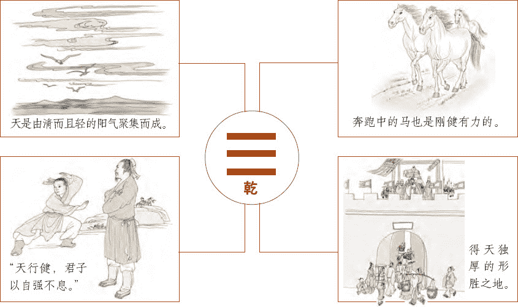

无论是单挂还是重卦，其象征意义都不会是单一的，在具体的情况下都会有不同的对应事物。以乾卦和泽火革卦为例，天或少女折花只是他们诸多象征中的一个。

#### 重卦的象征

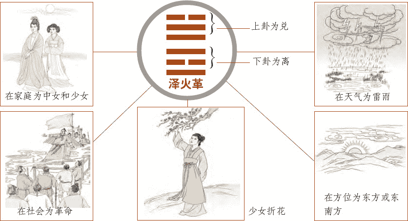

## 2　易卦为主
梅花易数的占卜总诀

《易经》卦辞和爻辞是梅花易数断卦的主要依据，但绝不是唯一的依据。在断卦时还要充分考虑到卦之间的各种关系，以及外界的各种突发情形。另外，在断卦时不仅仅要依靠象数理论，还要考虑现实中的事理，懂得圆融变通之理对占卜的成败具有决定性作用。

占卜的最终目的是预知一件事的吉凶祸福，所以在通过各种起卦法得到卦象之后，还要对卦象加以解释。梅花易数成卦之后的断卦方法主要是对照爻辞解释卦象，并参看卦的体用关系、看卦的克应关系、参考自身动静等四步。对于初学者来说，熟练掌握这些步骤是断卦成败的关键。但是凡事要懂得圆融变通之理，不能一味拘泥于这些步骤。

### 成卦后的第一步：对照《易经》爻辞

用梅花易数占卜时有一定的程序，一般来说，当我们通过起卦法得到本卦、互卦、变卦之后，就可以根据《易经》中的卦辞和爻辞推断吉凶祸福。例如，见到乾卦的初爻爻辞“初九，潜龙勿用”，就说明此时不宜开始做事，而应当潜伏隐忍、等待时机；如果占得乾卦，并且九二是动爻，则爻辞是“见龙在田，利见大人”，说明此时适合谒见贵人。其余卦象依此类推即可。

### 成卦后的第二步：看卦之体用关系

在明白爻辞的意思之后，还需要做的是看卦的体用关系，并根据五行的生克、比和等关系来推断吉凶祸福。体用说也就是卦的动静之说，凡事以体为主，以用为次；体卦代表自己，用卦代表所占的事情，或来占卦的人。假如用卦生出了体卦，或者体用二卦相比和，那么结果就比较吉利；而若是体卦生出了用卦，或者体用二卦相克，那么所占之事就不吉利。

### 成卦后的第三步：看卦之克应关系

弄清楚了卦的体用关系之后，需要看成卦时的克应关系。

卦的克应关系就是在起卦时意外发生的种种现象，这些现象虽然十分细微，但是它们的突然发生就预示了一种变化趋势，可能使凶者变吉、吉者变凶。在起卦时见到了吉兆、听到了吉利的话等，卦的结果就会吉；假如出现了凶兆，听到了不吉的声音，那么结果就凶。突然出现了圆形的物体，就意味着事情会圆满成功；如果意外见到了残缺不全的物体，则事情很可能难以成功。

注：关于体用关系和克应关系，本书将在第四章细述。

### 卦象之间的关系

本卦表示现在的状况，如果本卦卦象与当前的状况不相符，那么就说明卜卦失败了；互卦表示事情在不同时间内的发展情况，它是一个中间过程；变卦表示事情的最终状态，是确定吉凶祸福的最终依据。

#### 本卦、互卦与变卦

以一个落魄书生逐渐成功的故事为例，我们可以清楚地看到本卦、互卦与变卦的关系。

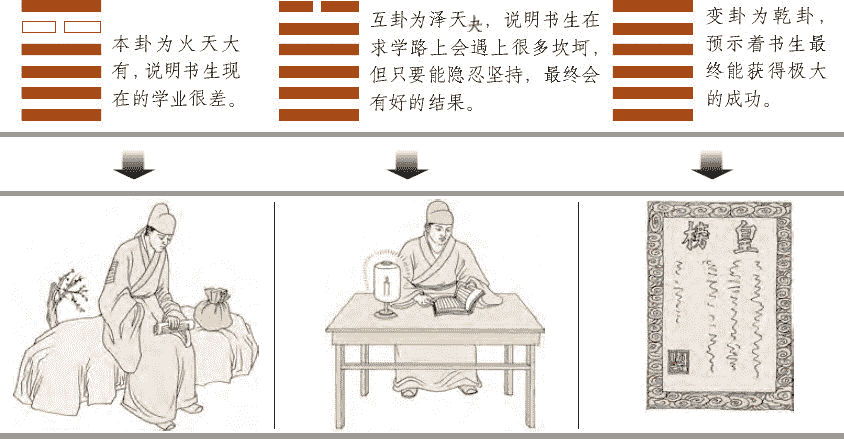

#### 重卦的比和

所谓卦之间的比和关系，是指重卦中上下两卦的五行属性相同。如果一个重卦中的两个单卦之间存在比和关系，那么对问卦者来说就是有利的。

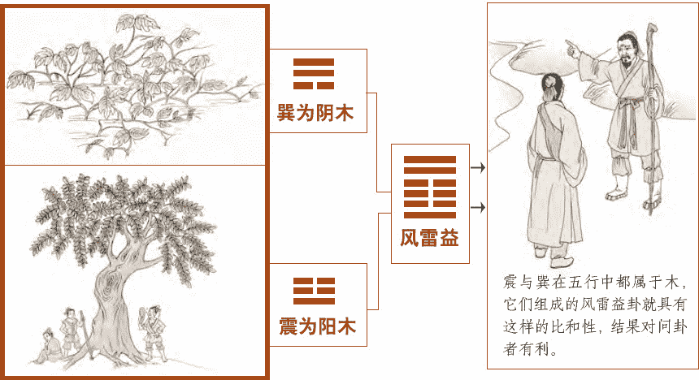

* * *

### 成卦后的第四步：参考自身动静

参考自身动静，也就是看一下自己在占卜时的各种情况，如姿势、心情、动作等。

如果在起卦时自己姿势是坐着，则预示着事物的成功将会迟缓；在起卦时自己的动作是走路，预示着事情的成功会十分迅速；假如是在跑步中成卦，则事情将以更快的速度走向成功；假如自己是躺在床上成卦，那么事情的成功将最为迟缓。

### 易卦为主

只要能严格按照以上步骤操作，就会很容易掌握梅花易数占卜法。要注意在占断的过程中必须以易卦为主，以克应关系为次。假如易卦和克应关系都显示吉利，那么结果一定会大吉大利；假如易卦和克应关系都显示凶险，那么结果一定会十分险恶。更多的情况是两者一吉一凶，这时就要遵循以《易经》卦辞和爻辞为主的原则，综合考虑体用、外应、自身情况等各种因素，最后确定结论。懂得圆融变通之理，是用梅花易数占卜的关键所在。

### 占卜中的事理

此前我们介绍的都是严格依照象数来推断事情的结果，但是象数固然准确，却也不能完全摆脱事理。义理与象数相结合，才会得到真正完备的结果。假如只论数而不论理，那么就犯了纸上谈兵、偏执一端的错误。

例如，同样是震卦，在不同的场合就有不同的解释。我们在酒席宴上占卜得到震卦，按照象数理论，震对应的动物是龙，但是在宴会上哪里来的龙呢？这时就需要从事理的角度看问题，而用鲤鱼代替龙。假如我们在冬天占天气得到震卦，震卦在天气中当然是雷的象征，但是在现实世界中冬天不会有雷电发生，这时我们就要摆脱象数，而从义理的角度，把震卦之象理解为狂风呼啸、撼动万物等情况。

占卜本来就不是什么高深莫测的事情，在了解了上面的几条占卜原则之后，对占卜之道也就一览无余了。

### 断卦的顺序

起卦只是占卜的第一步，在得到了卦象之后还要断卦，以解释卦象中的玄机。了解了断卦的顺序，我们就可以完整地为自己占卜了。

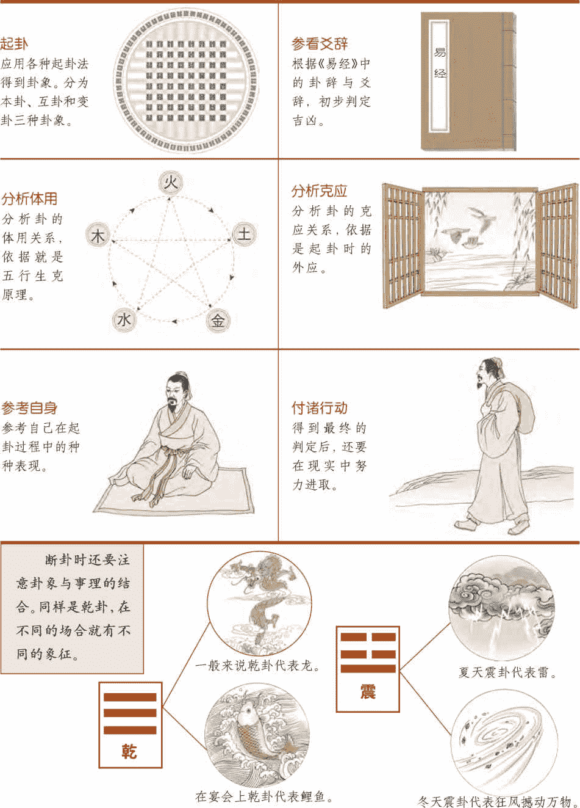

## 3　辞中玄机
卦辞的先天后天论

先天八卦与后天八卦都可以用来起卦，但是它们的起卦法并不相同，其原因在于伏羲作先天八卦时并没有写卦辞和爻辞，而文王在作后天八卦的同时也写出了用于断卦的卦辞和爻辞。所以用后天八卦起卦时需要依据《周易》中的卦辞和爻辞。

### 先天卦与后天卦

八卦有先天后天之分，先天八卦又称伏羲八卦，是伏羲氏根据河图洛书，通过观物取象而创作的。先天八卦对应着先天八卦之数，即乾一、兑二、离三、震四、巽五、坎六、艮七、坤八。

后天八卦又称文王八卦，是周文王在先天八卦的基础上改进的，后天八卦更加顺应自然万物的变化。在后天八卦中，每个卦也有相应的卦数，即：坎一、坤二、震三、巽四、中五、乾六、兑七、艮八、离九，与先天八卦相比，在后天八卦中多出了一个数字九，同时多出了中土的位置。

根据两种八卦的特点，也产生了两种起卦法，即先天起卦法和后天起卦法。这两种起卦法一个重要的区别，那就是先天起卦法不依据爻辞，只根据卦象之间的生克比和来推断吉凶；而后天起卦法必须依据爻辞和卦辞来推断吉凶。

先天起卦法认为，象数易理的规律存在于《周易》成书之前，易数也存在于成卦之前，所以断卦不必依据《周易》中的爻辞，只需要分析卦象之间的关系就可以了。而后天起卦法产生于文王作《周易》以后，依据的是后天之数，所以用后天起卦法时必须要用爻辞和卦辞。

另外，在取应期的时候，先天起卦法不必加上时辰数，而后天起卦法则必须加上时辰数。

### 应期的确定

如果用先天起卦法确定事情的克应日期，只需要看卦气的衰旺就可以了。例如：乾、兑二卦五行属金，则用这两个卦得到的克应日期就是庚日、辛日或其他五行属金的日子。也可以把乾卦的应期定在戌日、亥日等，因为乾卦所属方位是西北，戌日、亥日的方位也是西北；按照这种方法，兑卦的应期就定在酉日。又比如震卦、巽卦的应期应该分别定于甲日、乙日、寅日、卯日等，因为它们在五行中同属木。

### 先天卦与后天卦

在占卜时先要区分先天八卦与后天八卦，因为依据两种八卦来占卜时的步骤不同，如果把两者混淆，就会得出错误的结论。

#### 两种占卜法的比较

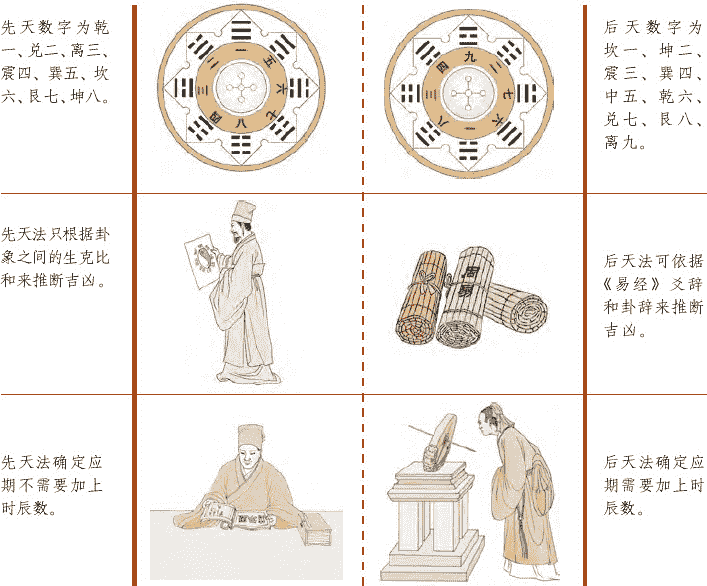

#### 先天八卦与五行、天干

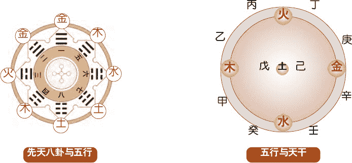

## 4　占卜总诀之一
梅花易数中的天时占

用八卦或六十四卦来推断天气情况，需要紧扣五行生克原理。但是在具体推断时需要圆融变通，例如乾卦既可以表示晴朗，又可以表示冰雪；同样是天泽履卦，若在秋季就会天气晴朗，若在冬季就会大雪纷飞。

### 八卦与天气现象

梅花易数中的天时占，主要是用梅花易数推断天气情况。这时不需要区分体卦和用卦，只需要从整个卦象分析，利用五行生克原理来推断即可。

八卦与天气之间有着十分明确的对应关系。离卦预示着晴天，坎卦意味着要下雨；乾卦是晴明的先兆，而坤卦则主阴晦多云；卦中的震象多则主春夏二季雷电交加，卦中的巽象多则主四季风力强大，卦中的艮象多则说明久雨欲晴，卦中的兑象多则说明即使不下雨也要阴天。如果夏天占卦得到的是离多而无坎，意味着这将是一个炎热干燥的炎夏；冬天占卦得到的是坎多而无离，则说明整个冬天将雪花飘飘。

断卦时要全观诸卦，也就是说要综合本卦、互卦、变卦来分析，其推断的基本依据是八卦的五行属性。离卦属于五行之火，在天气上主晴朗；坎卦属于五行之水，在天气上主雨水；坤卦属于地，在天气上主阴晦；乾卦属于天，在天气上主晴和；震在天气上主雷，秋冬季节本来是不会有雷电发生的，但是遇到震卦很多的情况，也可能有不寻常的雷声出现；巽在天气上主风，震与巽同时出现对应着雷电交加、狂风大作的情况。

在天气上艮卦主山云之气，又含有停止、阻止的意思，如果久雨不晴时遇上了艮卦，就预示着天气要转为晴好。从五行上说，艮为土，艮卦的出现起到以土克水之效果。而兑为泽，在天气上主阴雨，所以兑卦出现后即使不下雨也要阴天。

### 重卦与五行的关系

重卦时要考虑到上下卦之间的关系，如果上下卦都是坤卦，则会先下大雨，等坤卦之阴气耗散尽了，天气又会转晴。坎卦为水，主阴雨；离卦为火，主晴明。但是若遇上两个坎卦或两个离卦，也会出现时晴时雨的现象。

考虑了两卦之间的关系之后，情况比单卦时复杂得多。例如乾卦和兑卦五行都属金，但是乾卦象征着天，可以表示天气晴朗；但是乾卦五行属金，是肃杀的象征，所以乾卦又可以表示冰雪。同样是占得天泽履卦，若在秋季就会天气晴朗，若在冬季就会大雪纷飞。

但是也有些重卦在四季都会产生同样的效果。《易经》在解释乾卦时说，“云从龙，风从虎”，又因为“艮为山，山出云；巽为风，风四起”，所以若遇到上艮下巽的山风蛊卦，就会出现风云相激、遮天蔽日的情况，并且无论春夏秋冬都一样。如果遇到坎在艮上的水山蹇卦，将会出现水汽蒸腾、云雾缭绕的天气；如果遇到坎在兑上的水泽节卦，就会冰霜凝结、雪花飞舞。乾卦和兑卦五行属金，在天气上表示冰、霜、雪、雹等；离卦五行属火，在天气上表示太阳、霓虹、闪电等。

### 八卦与天气

一般来说，八卦与天气现象有着明确的对应关系，但在实际应用中需要灵活变通，不能拘泥于既定的结论。

#### 八卦与天气的对应

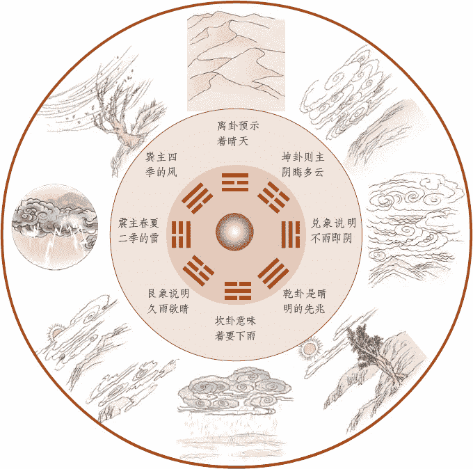

#### 变通的情况

以乾卦为例，乾一般情况下代表晴和的天气，但乾卦五行属金，余的肃杀性象征着冰雪，所以在特定的情况下乾卦也表示冰雪。

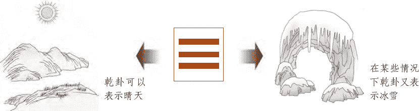

* * *

### 重卦的具体情况

震卦主雷，离卦主电，如果两卦遇到一起，成为雷火丰卦或火雷噬嗑卦，就必然出现雷电交加的天气；坎卦主水，巽卦主风，如果两卦遇到一起，成为水风井卦或风水涣卦，就必然出现狂风暴雨的天气。两个震卦遇到一起，就会雷惊百里；两个坎卦遇到一起，就会大雨滂沱。

地天泰卦、水天需卦，都是在天之上加以阴卦，所以两者都是昏暗不明的预兆；天地否卦、水地比卦，都是黑暗的象征。纯离卦表示天气晴朗，如果在夏天则表示赤日炎炎；纯坎卦表示久雨不晴，在冬天则表示大雪封山。

无论什么季节，如果得到了山水蒙卦、水山蹇卦，就一定表示大雨将至；如果得到了地风升卦、风地观卦，那么一年四季都干旱，水中难以行船。离卦在艮卦之上形成火山旅卦，就会早上晴天而晚上下雨。

预测天气时需要根据一年四季不同的情况，切忌执著于卦象、拘泥于定式。震为雷，离为电，只有在夏天才能出现；乾和兑表示冰雪，只有在冬天才能出现，如果把雷电断在冬天，把冰雪断在夏天，那就有悖于常理了。

### 重卦与天气

#### 重卦与天气的具体例子

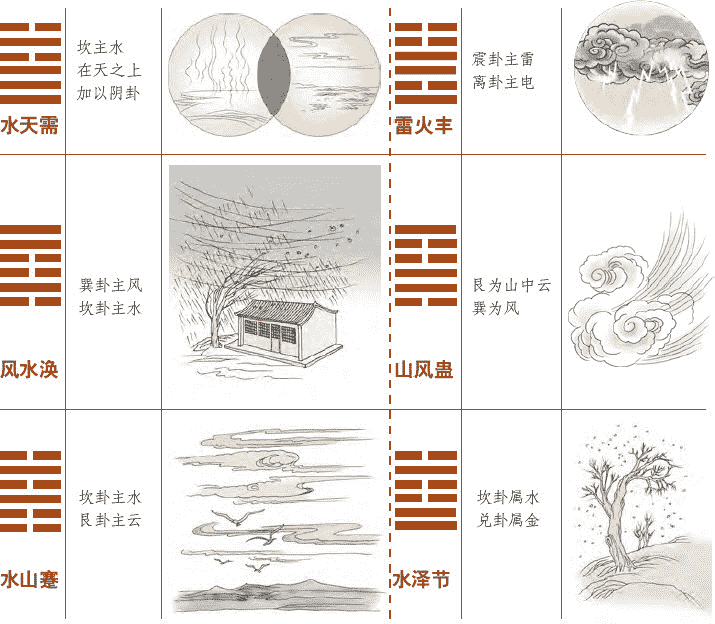

#### 变通的情况

重卦的变通性比八卦的单卦更要灵活，但基本原理是一致的。例如同样是占得天泽履卦，若在春季就会天气晴朗，若在冬季就会大雪纷飞。

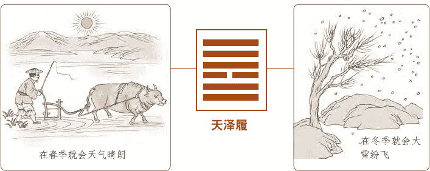

## 5　占卜总诀之二
梅花易数中的人事占

所谓人事占，也就是占算人事变化发展情况的占法。在占算人事时要注意观察体卦与用卦、互卦与变卦之间的关系。其起卦法与前面介绍的时间起卦法、方位起卦法、物数起卦法、尺寸起卦法等基本相同。

### 体卦与用卦

占算人事的变化发展情况，应该详细观察体卦和用卦的变化。在断卦时要以体卦为主方，以用卦为宾方，根据宾主关系来判断。体卦和用卦之间的关系包括生、克、比和等情况。

如果用卦克制体卦，就是不利的征兆，想要做的事情就要暂时停下来；如果体卦克制用卦，就表示能够顺利掌握局面，属于吉利的先兆。如果用卦生出体卦，就有获取利益的喜庆发生；如果体卦生出用卦，就会有破损、消耗之忧。如果体卦和用卦之间属于相互比和的关系，就是大吉之卦，所占事情定会取得成功。

### 互卦与变卦

另外，本卦、互卦与变卦的关系也是断定吉凶祸福的决定性因素之一。要详细考察本卦、互卦、变卦之间的关系来综合判断事情的最终卦象。体卦和用卦的卦气也是不可忽略的因素，卦气衰，则对事情不利；卦气旺，则对事情有利。要判断卦气的衰旺，需要分析各卦的五行属性。如果体卦与用卦五行属性相同，那么所占的事情就会一帆风顺；反之如果体卦与用卦的五行属性相互克制，那么所占的事情就会很不顺利。但需要注意的是，有时候两卦之间的生克关系并不那么明显。

### 占算人事时的起卦法

占算人事的具体起卦、断卦等方法在前面已有讲述，起卦法不外乎时间起卦法、方位起卦法、物数起卦法、尺寸起卦法、外应起卦法、持物起卦法等等。与其他事情不同的是，占算人事时需要对生体之卦和克体之卦特别关注。如果在卦中有生体之卦，就要看此时的生体之卦有什么益处；如果是克体之卦，就要看此时的生体之卦有什么凶险之处，并且如何能寻找破解的方法。如果在卦中没有生与克的变化，那就可以只根据本卦的卦象来推断吉凶祸福。

### 体用生克关系

在一个确定了动爻的重卦中，有体卦和用卦之分。如果动爻在上卦中，那么上卦就是用卦，下卦就是体卦；如果动爻在下卦中，那么上卦就是体卦，下卦就是用卦。

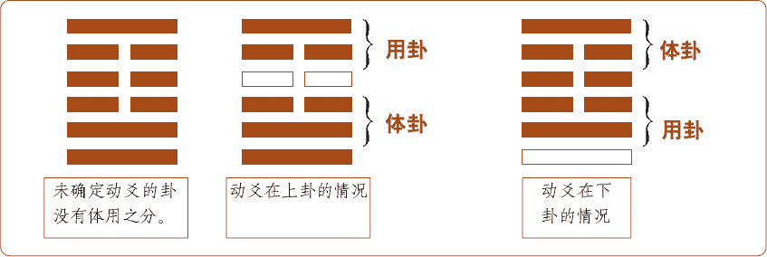

#### 两卦之间的生与克

占算人事时，需要根据体用两卦的生克比和关系来推断，正确地断定它们的关系是占卜成功的关键。

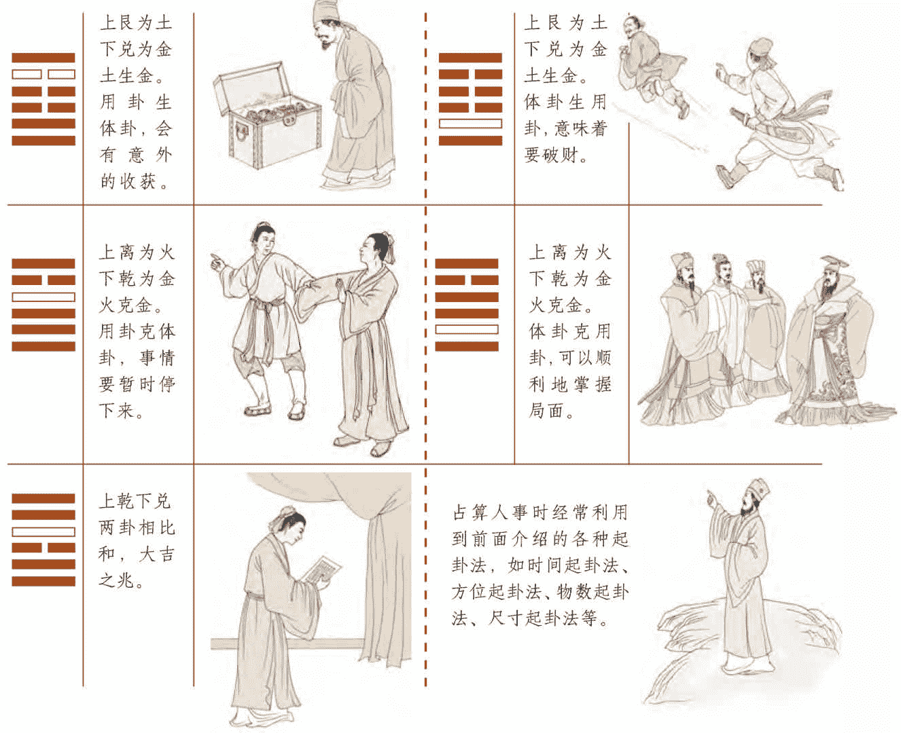

## 6　占卜总诀之三
梅花易数中的家室占

家室占包括家宅占和屋舍占两类，其实两类占法基本相同，都是考察体卦和用卦之间的生克比和情况。不过其起卦法的选择比较特殊，最宜使用方位起卦法和尺度起卦法，而不宜使用时间起卦法。

家宅和屋舍历来是风水师所关注的对象，但是用梅花易数也可以大体预知家宅和屋舍的吉凶情况。其占法仍然是区分体卦和用卦，并且观察体卦和用卦之间的生克比和情况，根据它们的关系推断吉凶祸福。

### 对家宅的占法

家宅占的关键是区分体卦和用卦，并且观察体卦和用卦之间的生克比和情况。

凡是占算家宅的吉凶，就要以体卦为主，以用卦代表家宅。若是体卦克制用卦，在家宅中居住就吉，家里发生吉利的事情就多；若是用卦克制体卦，在家宅中居住就不吉，家宅中凶险的事情就多。如果体卦生出用卦，则家中耗财损物的事情就多，主人需要做好这方面的防范措施；若是用卦生出体卦，就会有收益之喜发生。如果体卦与用卦相比和，家宅即使在动乱中也会安然无恙。

### 对屋舍的占法

屋舍占与家宅占的占法差不多，关键也是区分体卦和用卦，并且观察体卦和用卦之间的生克比和情况。

凡是占算屋舍的吉凶，就要以体卦为主，以用卦代表屋舍。若是体卦克制用卦，在屋舍中居住就大吉，家里就会经常发生对主人有利的事情；若是用卦克制体卦，在屋舍中居住就不吉，这时就需要找出原因，想办法把问题解决掉。如果体卦生出用卦，则主人的财物就容易损失；若是用卦生出体卦，主人就会家丁兴旺、财源广进。如果体卦与用卦相比和，那么主人自然就会有稳定的生活。

### 起卦法的选择

要占算家宅或屋舍，最适宜的起卦法是方位起卦法和尺度起卦法，因为宅院的地形、朝向等因素与宅院的吉凶息息相关，房子的位置、长与宽也关系到主人的生活情况。像家宅、屋舍等占法不适宜使用时间起卦法，因为它们都不是短时间的存在物，与它们相关联的吉凶祸福往往能影响主人一辈子。

### 家室占的断卦法

家室占包括家宅占和屋舍占两类，两类占法的起卦与断卦方法基本相同，都是考察体卦和用卦之间的生克比和情况。

#### 体用生克关系

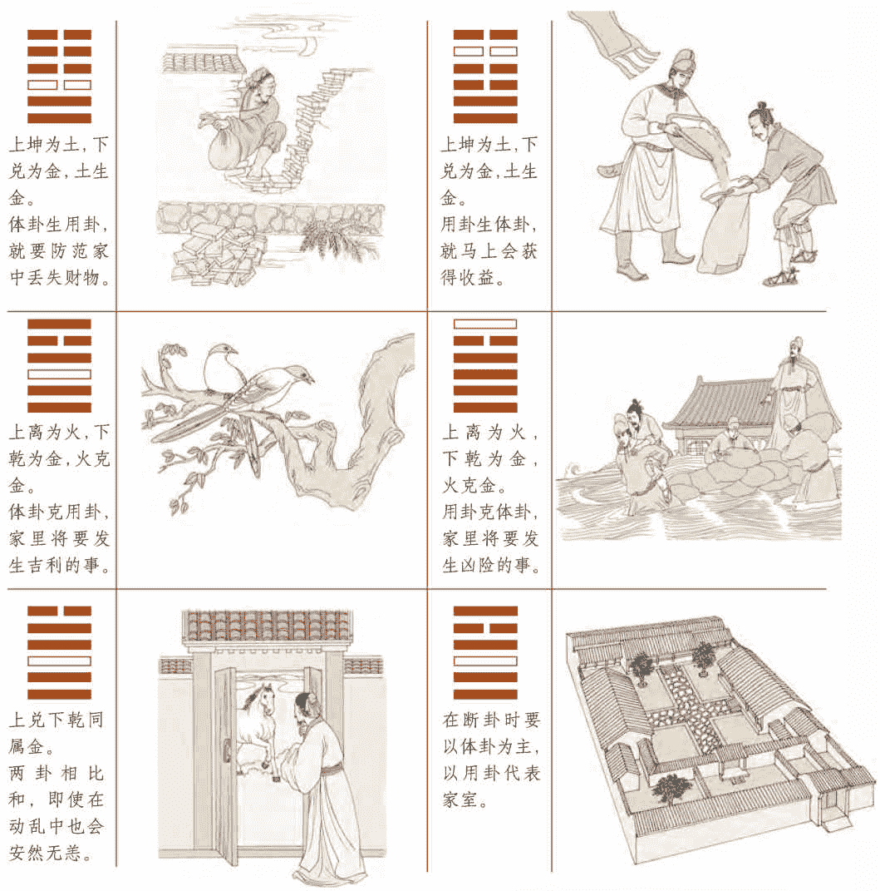

 为什么起卦时都是用方位起卦法和尺寸起卦法？时间起卦法不也很方便吗？

 因为宅院和房子都是主人长期居住的地方，而它的方位性又特别强，所以最好选用方位起卦法和尺寸起卦法。

## 7　占卜总诀之四
梅花易数中的婚姻占

用梅花易数占婚姻时，以体卦为主，以用卦代表婚姻，体卦与用卦之间的关系是占卜婚姻状况的决定性因素。梅花易数不但能推算出婚姻美满与否，而且可以推知婚姻中对方的相貌、品行、肤色、身材等情况。

对婚姻的预测在《易经》中就有许多论述，例如雷泽归妹卦就是讨论婚姻的卦象，在天风姤卦中说“女壮，勿用取女”，风天小畜等卦则论及了婚姻中的“夫妻反目”等情况。用梅花易数预测婚姻也是一项重要的功用。

### 体卦与用卦的关系

占算婚姻时，以体卦为主，以用卦代表婚姻，体卦与用卦之间的关系是婚姻情况的决定性因素。若用卦生体卦，则婚姻容易成功，或能由本次婚姻而得到好处；若体卦生用卦，则婚姻难成，或因本次婚姻有所损失。若用卦克制体卦，最好放弃此次婚姻，否则即使结婚了也会对本人有所危害；若体卦与用卦相比和，则婚姻就会大吉大利。

如果占算婚姻中双方的关系，就以体卦为问占的一方，以用卦为婚约的另一方。若体卦的卦气旺于用卦，则问占之家的门第就高于对方；反之则问占之家的门第就低于对方。若是用卦生出体卦，那么就会因婚姻而得到财产；若是体卦生出用卦，那么婚姻就会不顺利，问占的一方必须前去求婚才能保证婚姻的和谐。最好的情况是体卦和用卦相比和，那意味着双方情投意合、门当户对，必然是完美的婚姻了。

### 八卦与对方的相貌

梅花易数不但能推算出婚姻是否美满，而且根据得到的八卦卦象，还可以推知婚姻中对方的相貌、品行、肤色、身材等情况。

八卦与外貌的对应关系是：乾卦象征相貌端正、身材修长、一表人才；坎卦象征皮肤黝黑、天性嫉妒、挥霍无度；艮卦象征皮肤黄色、狡猾多端；震卦象征貌美如花，但冷漠而令人难以接近；巽卦象征头发稀少、相貌丑陋、贪得无厌；离卦象征身材矮小、皮肤发红、性格怪异；坤卦象征面貌丑陋、大腹便便、皮肤微黄；兑卦象征身材修长苗条、言谈举止大方而招人喜欢、皮肤洁白。

### 婚姻占的断卦法

占算婚姻时以体卦为主，以用卦代表婚姻，体卦与用卦之间的关系是占卜婚姻状况的决定性因素。另外根据得到的八卦卦象我们还可以推知婚姻中对方的相貌、品行、肤色身材等情况。

#### 从八卦推断人的相貌

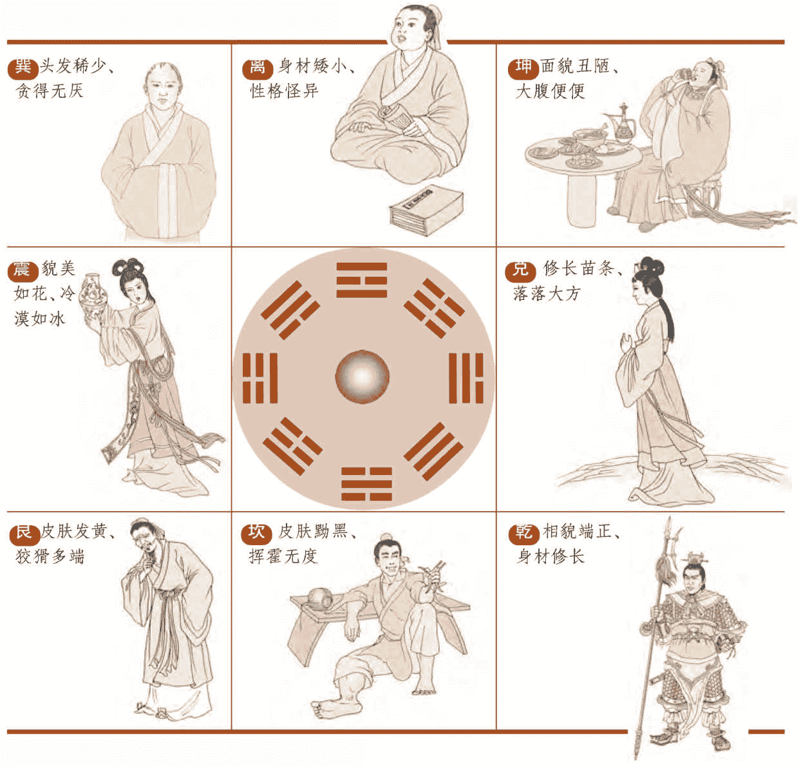

#### 从卦象推断对方的门第

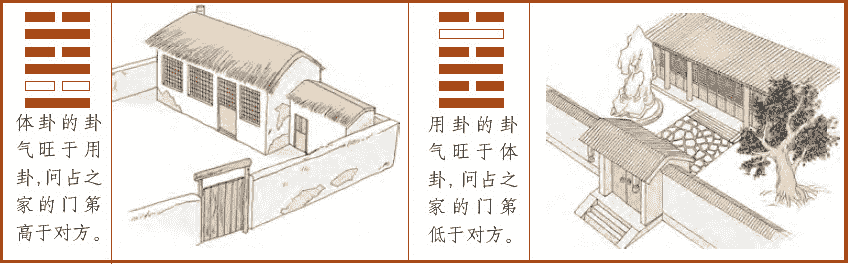

## 8　占卜总诀之五
梅花易数中的名利占

名利占包括求功名和求财富两个方面，这是人们最感兴趣的占卜领域之一，因为它能预测人们的功名利禄发展的情况，以及升迁、发财的时间。

### 求名占

占算功名时，以体卦为主，以用卦代表功名。如果体卦克制用卦，那么功名可以得到，但是成功来得不易，而且会“姗姗来迟”；如果用卦克制体卦，那么功名就永远也不会来了。如果体卦生用卦，功名可成，但是在求取功名的过程中要付出代价；最好的情况是用卦生体卦，那不但可以得到功名，而且功名来得很容易，有时候在功名之外还会出现其他的好处。体卦用卦互相比和，那么求取功名的过程会称心如意，最终也能得到功名。

那么什么时候才能功成名就呢？这可根据生体之卦卦气旺盛的时间来推断；进一步想知道在什么地方任职，可根据变卦所属的方位来判断。如果没有克制体卦的卦，就容易功成名就。而如果在任职期间占算，出现克体之卦就是大忌，因为那意味着降职、受罚等情况。至于具体的应验时间，还需要根据卦象的衰旺来确定。

### 求利占

要占算财源情况，需以体卦为主，以用卦代表求财。如果体卦克制用卦，就会财源广进；如果用卦克制体卦，那就没有财路了。如果体卦生用卦，那就不但得不到财富，反而会出现失财的伤心事；如果用卦生体卦，就会有得到钱财的高兴事。最好的情况是体卦与用卦相比和，那时来财最为顺利，而且得到的钱财最多。

若要提前知道获得财富的确切日期，可根据生体之卦的卦气衰旺时间来推断；若要得知破财的确切日期，可根据克体之卦的卦气衰旺时间来推断。

若是卦中出现体卦克制用卦的情况，就会获得财富；若是卦中有生出体卦的用卦、互卦出现，也会获得财富，而且卦气旺的时间就是获得财富的时间。如果卦中有克制体卦的用卦、互卦、变卦出现，就会遇上破财的事；如果体卦生用卦，也会出现破财的情况，而且卦气旺的时间也就是破财的时间。

### 名利占的断卦法

名利占包括求功名和求财富两个方面，两者的断卦法基本相同。其中事情发生的具体时间要根据卦气衰旺的时间来确定。

#### 求名占的断卦法

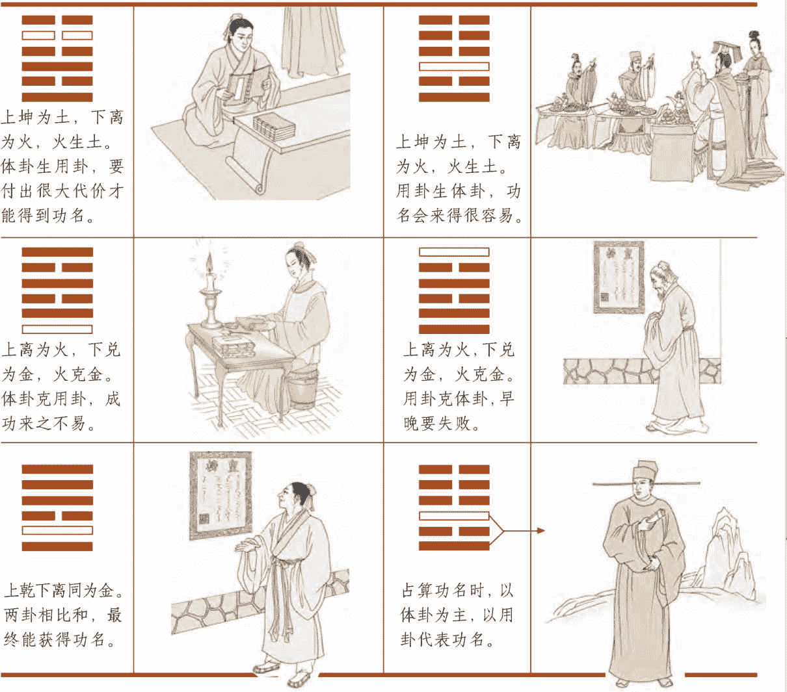

#### 求利占的时间问题

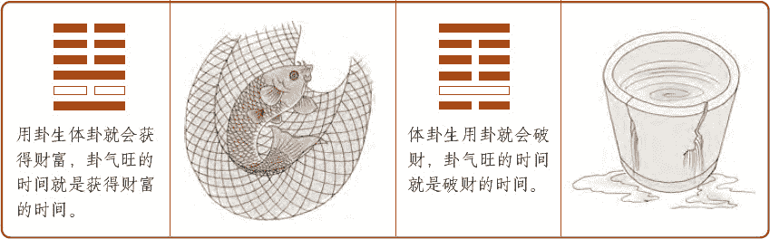

## 9　占卜总诀之六
梅花易数中的出行占

出行之前占一卦是最常见的占卦实例之一，这种做法不但能预知出行的利与弊，以做好防范措施，还能推测出行的最佳时机。另外，对已经出门在外的人也可以推知他们当前的状况。

### 出行前的占卜

占卜出行的情况，以体卦为主，以用卦为出行时路上的情况。如果体卦克制用卦，就说明利于出行，而且路上一定会十分满意。如果用卦克制体卦，就最好不要外出，一旦上路就难保发生祸端。如果体卦生用卦，出行时就会有破财的事情发生；如果用卦生体卦，出行时会就可能得到意外的收获，多是意外之财。如果体卦与用卦比和，那就要赶快出门了，因为旅途一定会顺畅平安，等错过了最佳出门时机就要后悔了。

对于外出谒见别人的情况，只需把用卦换成要见之人即可。按照上面的方法，只要适于出行的，都适于去见别人，否则还是另选时机为好。

### 八卦与出行

出门前要考察体卦的卦象，因为体卦卦象能决定出行的最佳方式和路上的一些遭遇。

如果体卦为乾卦或震卦，那说明可以外出远游；如果体卦为坤卦或艮卦，那最好先安心在家，等待良辰吉日再出行；如果体卦为巽卦，因为巽为风，所以宜于乘船出行，会有一帆风顺的效果；如果体卦为离卦，则宜于采用陆路出行；如果体卦为坎卦，路上就可能不太顺利，要对丢失财物等意外做好防范措施；如果体卦为兑卦，那么在路上很可能会与人发生争端。

### 路上的情况

在行人已经出行了的情况下，我们仍然可以用梅花易数推测出他在外面的情况。与出门之前不同的是，占算行人在路上的情况时要看用卦，因为表示行人的是用卦而不是体卦。

如果用卦为震卦，震表示不宁，说明行人在外四处奔波、不得安宁；如果用卦为艮卦，艮表示阻止，说明行人在外四处碰壁、诸事不顺；如果用卦为坎卦，坎为危险，说明行人在外遇上了危险的事情；如果用卦为兑卦，兑象征口舌，说明行人在外与人发生了争执。

### 出行占的断卦法

在出行之前和旅行者已经外出的情况下，都可以利用梅花易数进行占算。不同的是出行之前要看体卦，而行人在外时要看用卦。

#### 出行前的占算

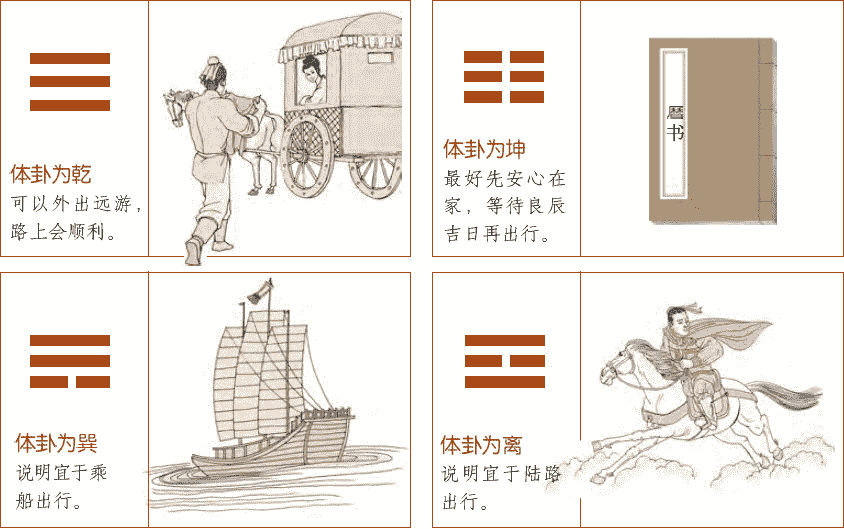

#### 对在外旅游者的占算

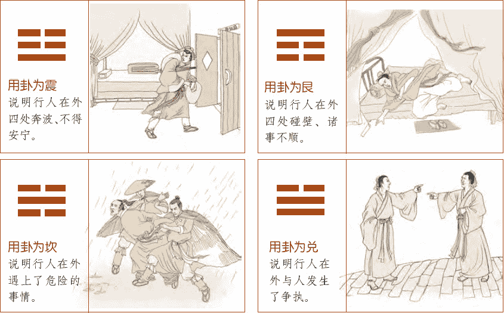

## 10　占卜总诀之七
梅花易数中的失物占

利用失物占法可以判断失物能否找回，以及若能够找回时要向什么地方去寻找。其基本依据就是八卦的属性和后天八卦的方位。

### 失物占的一般规则

假如丢失了东西，起卦时要以体卦为主，以用卦代表失物。如果体卦克制用卦，丢失之物就还能找回，但是找回的时间较晚；用卦克制体卦，失物就永远丢失了。若体卦生用卦，失物有可能找回，但是希望不是很大；若用卦生体卦，失物就能找回，而且十分容易。如果体卦与用卦相比和，失物便会很顺利地回到身边。

起卦后如果是找不回的情况，就不需要再找了，否则只是白白浪费时间；假如是可以找回的情况，那么要根据变卦的卦象来寻找。

### 后天八卦与失物

根据变卦能确定失物所在的方位、地点和环境情况，其中八卦的方位是按后天八卦顺序。具体如下：

变卦为乾，就向西北方寻找失物。失物或在楼台亭阁中，或在金属或乱石旁边；或在圆形器物之中，或在高而且干燥的地方。

变卦为坤，就向西南方寻找失物。失物或在田野里，或在仓库旁；或在农民耕种的场所，或在土窖洞穴之中；或在泥瓦器具之中，或在方形器物中。

变卦为震，就向东方寻找失物。失物或丢在山中森林里，或藏在灌木草丛中，或在乐器旁边，或在闹市大街上。

变卦为巽，就向东南方寻找失物。失物或在山林中，或在佛寺道观里，或藏于菜地果园里，或丢在车船上，或在竹木制的器物中。

变卦为坎，就向北方寻找失物。失物或丢在水边，或在小溪、水井、沟渠里，或在有酒、有醋的地方，或在有鱼、有盐的湖水里。

变卦为离，就向南方寻找失物。失物或在厨房里，或在炉火旁，或在窗明几净的地方，或在空的库房里，或在书架里，或在冒烟点火的地方。

变卦为艮，就向东北方向寻找失物。失物或在山林间，或在道路旁，或在石头旁边，或丢在土穴里。

变卦为兑，就向西方寻找失物。失物或在沼泽旁，或在残垣断壁中间，或藏于废弃的水井池沼里。

### 失物占的断卦法

利用失物占法可以判断失物能否找回。如果是找不回的情况，就不需要再找了；假如是可以找回的情况，那么要根据变卦的卦象来寻找。

#### 失物能否找回的判断法

失物能找回的情况：

体卦生用卦，如卦 1 金生水；体卦克用卦，如卦 2 金克木。

失物找不回的情况：

用卦生体卦，如卦 3 金生水；用卦克体卦，如卦 4 金克木。

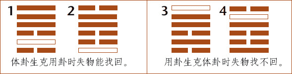

#### 八卦与失物的寻找

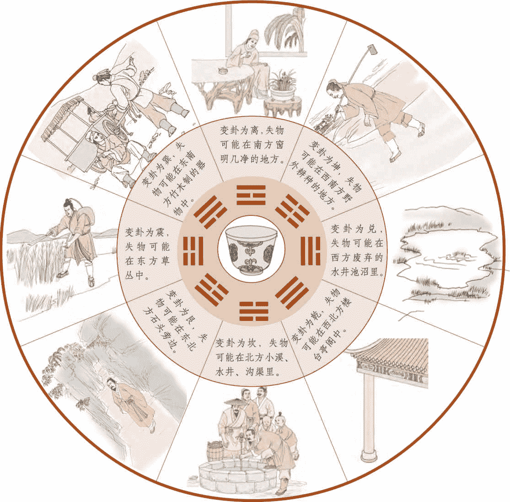

## 11　占卜总诀之八
梅花易数中的疾病占

在疾病占中，体卦和用卦的选择比较特殊，不再以用卦代表人，而是以体卦代表病人，初学者一定要注意这一点。此外对动爻的判断也足十分关键的步骤。卦只是个参考，有病还是要求医。

### 疾病占的一般原则

如果要占卜疾病，就以体卦表示病人，以用卦表示疾病的症状。对病人来说，体卦和用卦之间的生克关系就决定了疾病的发展状况。体卦宜于处在旺相状态，而不宜处于衰竭状态；用卦宜于生扶体卦，而不宜克制体卦。

在实际占算中，若体卦克制用卦，即使不吃药，病人也有可能康复；若用卦克制体卦，即使服再好的药也难以起到效果。若体卦生扶用卦，疾病便难以最终痊愈；若用卦生扶体卦，病人就会很快恢复健康。

从卦气上来看，若是用卦克制体卦，而体卦卦气旺盛，病人就会转危为安；如果体卦本来就卦气衰弱，再被用卦克制的话，卦气就会更加衰颓，病人这时就危险了。

还可以根据八卦卦象来推断宜食药物的寒热温燥属性。如遇上离卦为生体之卦时，表示病症属于温热性，最好服用凉药；若遇上艮卦为生体之卦时，则宜于温补；若是乾卦、兑卦为生体之卦时，那就最好服用凉性药。

### 动爻的不同情况

以天地否卦为例，在得到了天地否卦之后，还要看动爻的位置。

若是初六爻动（初爻），则上卦乾为体，下卦坤为用。坤土生乾金，所以是用卦生体卦。初爻动时，变卦的下卦为震木，互卦为上巽下艮，本卦与互卦的下卦都为土，都可以生体卦，对病人的康复十分有利。在变卦中，体卦乾金克震木，所以病人很快便会痊愈。

若是九四爻动（四爻），则上卦乾为用，下卦坤为体，体卦生用卦，所以疾病便难以痊愈。变卦为上巽下坤，巽木克坤土，也就是体卦被克，说明对病体十分有害。即使互卦的下卦为坤卦，两土相比和，也已经是于事无补。再说巽木有扛尸出殡的意思，乾金表示用砖块砌的坟墓。这时只能为病人准备后事了。

其他爻动的情况，可依照上面的方法进行推断，占卜时除了要严格遵守梅花易数的变化规律之外，还要懂得适当变通之理。

### 疾病占的断卦法

古人常用梅花易数占算疾病，如预测病人的康复情况，判断病人应该服用什么类型的药物等。在疾病占中动爻的选择是至关重要的。

#### 药性的判断

药物的寒热温燥属性，主要依据八卦的属性来确定。

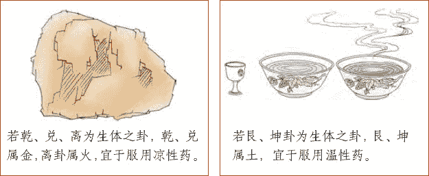

#### 根据动爻确定病况

以天地否卦为例，探讨如何根据动爻的位置确定病况。

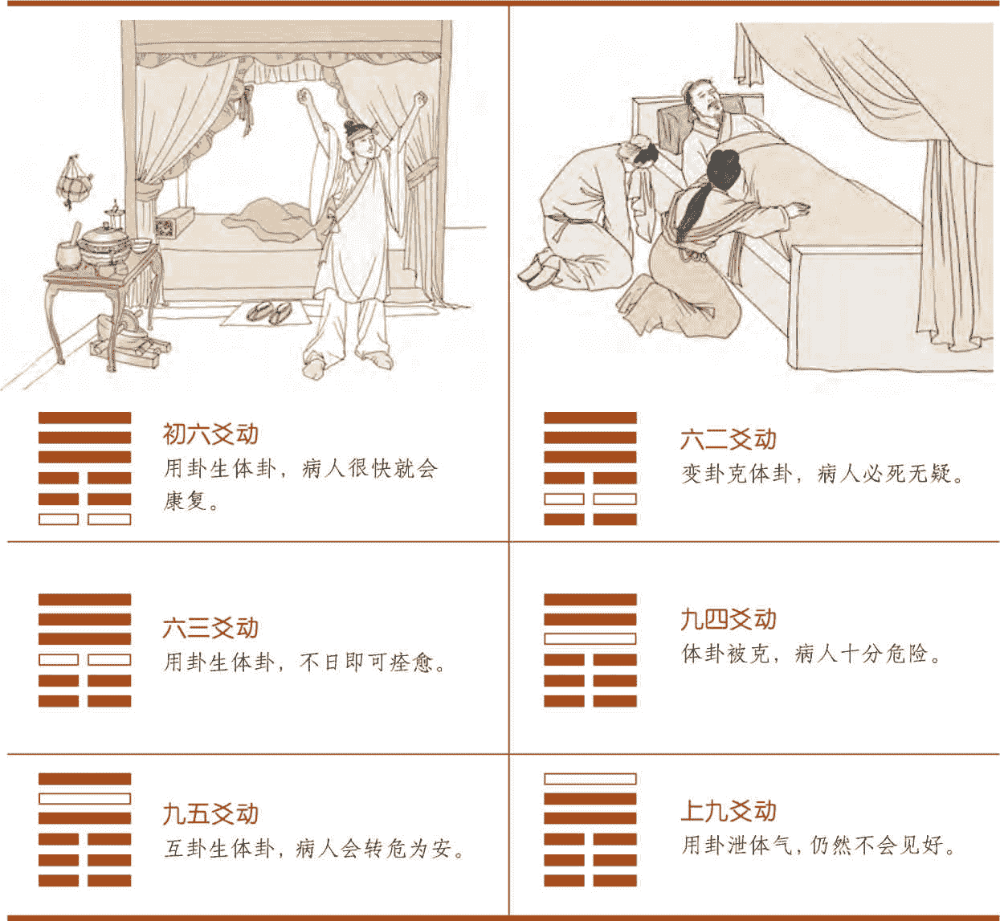

## 12　占卜总诀之九
梅花易数中的风觉占

所谓“风觉占”，就是看见风而有所感悟的占法。如果看见风吹起来而产生了特别的想法，就可以用风觉占法。风觉占有四个依据：风吹来的方位、起风时的季节、风中尘埃的颜色、风吹来时的声势。

看到风吹起时，就要观察风是从哪个方向吹来的，以此得到一个重卦；还可以根据风吹来的声势起卦，同时还必须考虑风吹起的时间和季节因素，以及当时云的颜色和风吹起的尘土的颜色。只有根据这些情况综合判断，才能得到正确的结果。

### 风觉占中的方位起卦法

根据风吹来的方向可以得到一个重卦，规则是用巽卦为上卦，用风吹来的方向为下卦。例如风从东方吹来，则用巽卦作为上卦，东方震卦作为下卦，得到的重卦就是风雷益卦；如果风从南方来，就用巽卦作为上卦，南方离卦作为下卦，得到的重卦就是风火家人卦。其余六个方向吹来的风可依此类推。

### 四时之风的特点

其次就是根据季节判断风的性质：春天的风为和畅之风，可以吹醒万物；夏天的风为养育之风，可以使万物长得茂盛；秋天的风为横扫落叶的肃杀之风；冬天的风为冰封大地的凛冽之风。

### 辨色论吉凶

起风时吹起的尘埃、烟雾、云气等也可以作为起卦的依据。主要是根据它们的颜色来判断：黄色的风是祥瑞的预兆；青色的风则半吉半凶；白色的风是肃杀之气；黑而昏暗的风是大凶之兆；红色的风预示着将会有灾难来临；红紫色的风预示着吉祥如意。

### 风势定吉凶

还可以根据风吹来时的声势来判断吉凶。如果风声像万马奔腾，就会有战争发生；如果风声像惊涛拍岸，就会发生惊险之事；如果风声像人在哭泣，就会发生忧愁之事；如果风声像演奏音乐，就会有喜事来临；如果风声像人在喧哗，就会有闹哄之事；如果风声像烈焰一样毕毕剥剥，主有火灾之事；如果风声洋洋洒洒而来，缓步而去，就是吉利的征兆，将有喜庆之事发生。

### 风觉占的断卦法

风觉占的起卦法比较灵活，最常用也是最简单的就是风向起卦法，即根据风吹来的万向可以得到一个重卦，规则是用巽卦为上卦，用风吹来的万向为下卦。此外还可以根据风势、颜色等起卦。

#### 风向起卦法

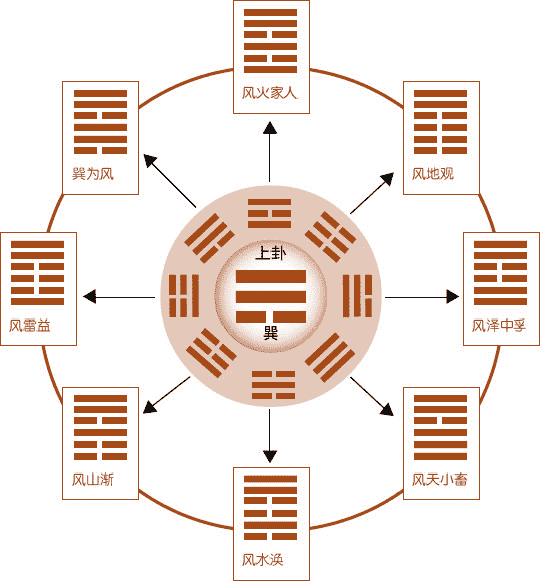

#### 四时之风

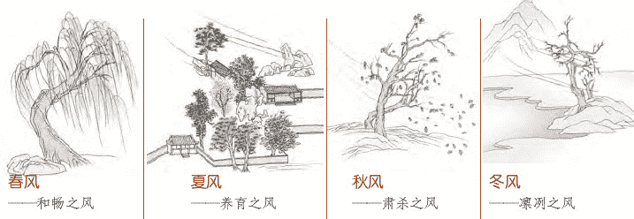

## 13　占卜总诀之十
梅花易数中的鸟类占

鸟占就是根据鸟来起卦的方法，鸟占中的起卦要素有鸟的数量、所处的位置、鸟的叫声、鸟的羽毛的颜色、鸟的名称等等。

### 鸟占与风觉鸟占

鸟占和风觉占经常是联系在一起的，但是“鸟占”与“风觉鸟占”不同，用“风觉鸟占”起卦时不能见到风和鸟就随便起卦，而应该看到了风能有所感觉，又见到了鸟时才起卦。

但是用鸟占起卦时只要看见鸟就能随时起卦占算。鸟占中的起卦要素有鸟的数量、所处的位置、鸟的叫声、鸟的羽毛的颜色、鸟的名称等等。

### 根据数量起卦

看到了一只或一群鸟，首先要数清楚鸟的具体数量，根据数量起卦。当鸟的数量超过 8 只时，就要用这个数字除以 8 取余数，按照乾一、兑二、离三、震四、巽五、坎六、艮七的规则确定卦象，若能正好除尽，则取为坤卦。

### 根据方位起卦

其次要看鸟所处的方位，按照后天八卦的方位图来判断卦象。即东方为震卦、东南为巽卦、正南为离卦、西南为坤卦、正西为兑卦、西北为乾卦、正北为坎卦、东北为艮卦。

### 根据声音起卦

利用鸟的声音有两种起卦法，一是数鸟叫的声音数，根据数字起卦法来得到卦象二是听鸟叫声音的声调，如果鸟的叫声像人的喧哗嘈杂，预示着将有口舌之争；鸟叫声像人的哭泣，预示着有忧愁之事发生；鸟叫声嘹亮清脆，预示着将有吉庆之事发生。

另外还可以根据鸟的种类起卦，例如乌鸦鸣叫是报灾，喜鹊鸣叫是报喜；鸾鹤鸣叫是吉祥如意的象征，猫头鹰鸣叫就是不祥的征兆。

### 根据鸟的颜色起卦

鸟的羽毛一般是十分漂亮的，我们可以根据鸟的羽毛的颜色来起卦。具体关系为：乾一为金色、兑二为白色、离三为红色、震四为青色、巽五为碧色、坎六为黑色、艮七为棕色、坤八为黄色。

### 鸟占的起卦法

鸟占的起卦法也是非常灵活的了，我们可以把鸟占起卦法转化为前面介绍过的数量、声音、方位、颜色等各种起卦法。应用时要根据具体情况选择最简单的一种。

#### 鸟占的起卦法

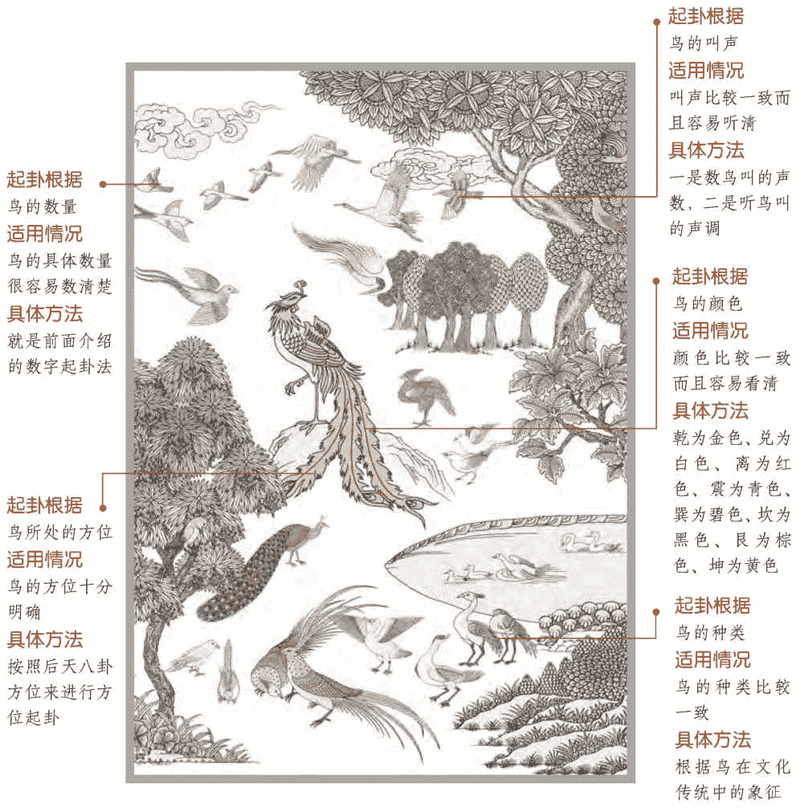

#### 根据鸟的种类起卦

许多鸟在生活传统中有着明确的象征意义，这时我们可以直接把它当成起卦时的外应。

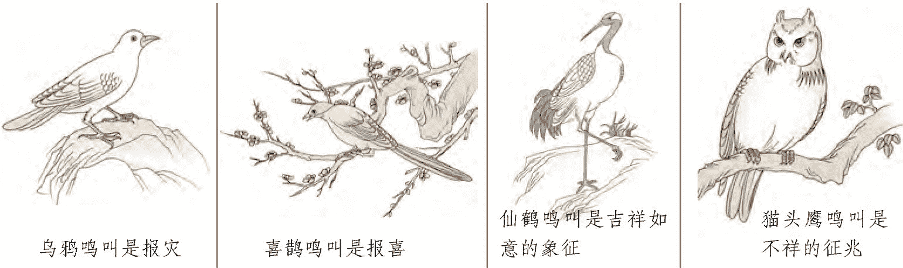

## 14　占卜总诀之十一
梅花易数中的声音占

所谓声音占，就是按照听到的声音来起卦的方法。声音占在特定情况下是非常有效的占法，例如在晚上什么都看不见的时候，就可以利用听到的声音进行占算。占算声音时既可以把它转化为数字占或方位占，又可以根据声音本身的特点来起卦。

### 数字和方位起卦法

对具有明显的间断性的响声，可以把声音占转化为数字起卦法。例如：听到一声响，就按乾卦起卦；听到两声响，就按兑卦起卦；即按照先天八卦与数字的对应关系乾一、兑二、离三、震四、巽五、坎六、艮七、坤八来起卦，声音数更大的就要除以 8，利用余数起卦。

有时候声音是连续的，或者不容易数清数量的，那就转化为方位起卦法。首先仔细判断声音传来的方向，按照后天八卦方位来起卦。比如声音从东方传来，就以乾卦起卦；声音从南方传来，就以离卦起卦；其余方位为东南为巽、西南为坤、正西为兑、西北为乾、正北为坎、东北为艮。

### 声音特征起卦法

当声音数和传来的方位都不容易判断的时候，可以根据声音的特征来起卦。

凡是人说话的声音、动物鸣叫的声音，都是兑卦，因为这些声音是从口中发出来的；由静物叩击产生的声音，如擂鼓、木槌敲击木板的声音等都按震卦起卦；金属物体撞击发出的声音就按乾卦起卦，例如钟磬铙钹的声音等；与火有关的声音都按离卦起卦，如烈火燃烧的声音、烧裂的竹木发出的声音等；与土有关的声音都按坤卦起卦，如打地基、砸土墙的声音等；一切与山石有关的声音都按照艮卦起卦，如山体滑坡、山体崩塌等声音等；一切由风吹发出的声音都按照巽卦起卦，如风吹草动的声音、狂风呼啸的声音等；由水发出的声音要按照坎卦起卦，如雨声、洗衣服的声音等。

另外，人说话时的心情也是断卦的依据。人们在说话时心情愉悦，又说出吉利的话，就是吉兆的象征；如果在说话时伴随着哭泣声、叹息声，或说出不吉利的话，那就是不祥之兆了。

### 声音占的起卦法

占算声音时除了把它转化为数字或方位占以外，还有一种独特的占法，即根据声音的特征来起卦。对于人的说话声，还可以根据人说话时的心情来判断。

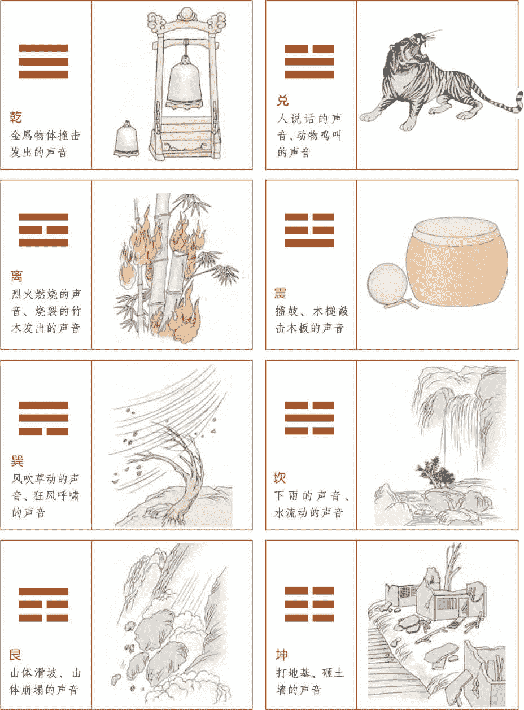

# 第四章　“体用”说
梅花易数的功用理论

体用说是梅花易数的核心理论，在通过起卦法得到卦象之后，要找出它们的体用关系，再联系五行生克原理进行综合判断。衰旺论与内外论是体用说的有益补充，它们从辩证的观点出发重新定位八卦的性质，使八卦有了新的意义。《观物洞玄歌》是这几种理论具体应用的范例。

## 本章图版目录

成卦之间的关系

生体之卦与所应之事

克体之卦与所应之事

衰旺论与内外论

真实的五行与形色的五行

事物的动与静

事情的应验时刻

凶险的宅院

吉凶悔吝有其机

住宅中的外应

## 1　体用为主
梅花易数中的体用说

顾名思义，“体”就是本体，指事物本来的面目；“用”就是功用，指事物在我们所做的事情中所起的作用。在《易经》中，八卦蕴含了易道和易理，这就是八卦的“体”；另一方面，八卦又可以作为占卜的工具，这就是八卦的“用”。

起卦后首先得到了本卦，本卦取互得到互卦，再根据动爻得到变卦。在本卦中又分为上卦和下卦，梅花易数中的动爻只能有一个，所以可以根据动爻所在的位置分本卦为体卦和用卦，即动爻所在的单卦为用卦，另一单卦就是体卦。

在梅花易数中，以体卦作为主体或自己，以用卦为所占之事或他人；互卦表示所占之事发展过程中出现的事物；变卦表示事情发展的最后状态，它暗含着所占之人的最终命运。

### 体卦与用卦的生克与比和

卦的生扶和克制都是根据八卦的五行属性来确定的：乾兑属金，震巽属木，坎卦属水，离卦属火，艮坤属土。这样八卦就有了五行的生克关系，例如坎卦生扶震卦，乾卦克制震卦等。

所谓卦的比和就是指上下两卦的五行属性相同，例如震下巽上的风雷益卦，上下两卦的五行属性都是木。在六十四卦中，成比和之象的卦共有十四个，它们是：乾、兑、离、震、巽、坎、艮、坤、益、恒、履、夬（guài），剥、谦。

### 梅花易数中的体用说

在起卦后得到的卦象中，体卦宜于得到用卦、互卦和变卦的生扶，而不宜受到它们的克制。体卦和用卦之间相比和，则事情就会十分顺利，是大吉之兆。从卦气方面看，若体卦气盛，则事情顺利；若体卦气衰，则事情凶险。

卦气的判断除了前面介绍的卦气说外，还要根据卦的同类数量来判断。同类越多，卦的气势就越旺盛。例如在一个卦中体卦属土，若互卦和变卦中都出现土，那么体卦的同类就多，体卦的卦气就旺盛。

事情的发展要看用卦的情况，若用卦由吉变凶，则事情就会先顺后难，其余情况可依此类推。一般来说，体卦生扶用卦，体卦的卦气就容易泄露，会有丢失财物的事情发生；用卦生扶体卦，体卦的卦气就增强，就会有获得利益的事情发生。

### 成卦之间的关系

通过起卦法得到了本卦之后，立即可以得到本卦的互卦，由本卦的二、三、四爻为下卦，三、四、五爻为上卦，组成新的重卦叫做互卦。互卦表示所占之事发展过程中出现的事物；再通过取动爻可以得到本卦的变卦，变卦表示事情发展的最后状态。这样的一组卦就完整地描述了事情的现状、发展过程和最终结局。

#### 体卦与用卦

体卦就是本卦中没有动爻的那个单卦。用卦就是本卦中有动爻的那个单卦。

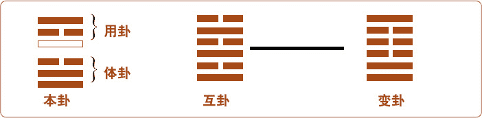

#### 六十四卦中的比和之卦

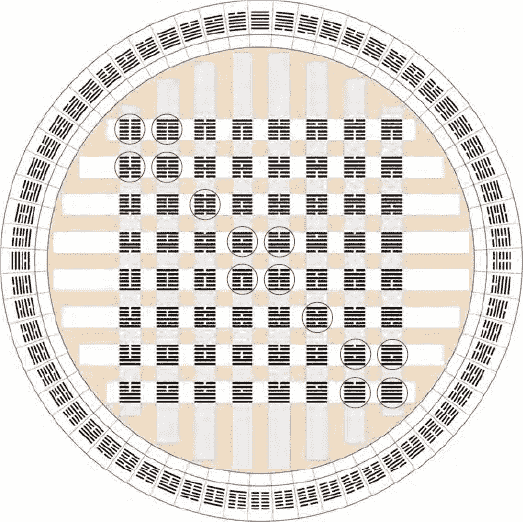

所谓比和之卦就是上卦与下卦的五行属性相同，在六十四卦中共有十四个这样的卦，它们是乾、兑、离、震、巽、坎、艮、坤、益、恒、履、夬、剥、谦。

## 2　体用总诀之一
生体之卦与所应之事

在起卦后得到的一组重卦中，生体之卦越多，则事情就越吉利。根据生体之卦的不同，所应之事也不尽相同。生体之卦与所应之事之间的关系在断卦时经常用到。

在本卦的用卦、互卦、变卦中，如果有单卦能生体卦，则这个单卦就是生体之卦。

生体之卦为乾卦：将要得到来自西北方的钱财；家里将有喜事临门；在功名方面有欣喜之事；因晋升职务或谒见官员而得到财富；在诉讼中取得胜诉，或因此而得到更多收益；家中老人发了大财；尊贵的长辈或有地位的人赠送财物；因升官而社会地位更加尊贵。

生体之卦为兑卦：得到来自西方的财物；得到食物、珍宝、货物等意外之利；与口齿伶俐的人、行走江湖能说会道的人欣然相逢；有宴酣之乐；与朋友在一起讨论问题而十分开心。

生体之卦为离卦：得到来自南方的财物；有得到公文、征召之喜；有从矿山或冶炼厂得到财富的欣喜；因姓中有“火”字而获得财物。

生体之卦为震卦：将要得到来自东方的钱财；在山林、树木方面得到好处；有乔迁之喜；有调动高升之喜；从木材、木器等交易中获得大利益；因姓名中有“草字头”、“木字旁”而称心如意。

生体之卦为巽卦：将要得到来自东南方的钱财；会从山林、树木方面得到好处；因山林产出得到钱财；因姓名中有“草字头”、“木字旁”而称心如意；在茶叶、水果、蔬菜之类的交易中获得利益；得到茶叶、水果、蔬菜的馈送之喜。

生体之卦为坎卦：将要得到来自北方的钱财；遇上来自北方的好友；因住在江、河、湖、海、水库、沟渠旁边而得到好处；因姓中有“两点水”、“三点水”而称心如意；在鱼、盐、酒、杂货及古董交易中获得利益。

生体之卦为艮卦：将要得到来自东北方的钱财，有山林、土地方面的收益，因山林土地的出产而获得财富；得到姓氏发“宫”音或姓氏中带“土旁”之人的馈赠；做事情会十分安稳，有始有终。

生体之卦为坤卦：将要得到来自西南方的钱财；在土地方面将会获得欣喜；因土地的变更发了财；得到种地人的好处；得到老乡的好处；有水果、五谷杂粮、布匹绸缎方面的进益。

### 生体之卦与所应之事

当卦中出现了生体之卦时，会出现相应的吉兆，根据生体之卦的不同，吉兆的类型有不同。

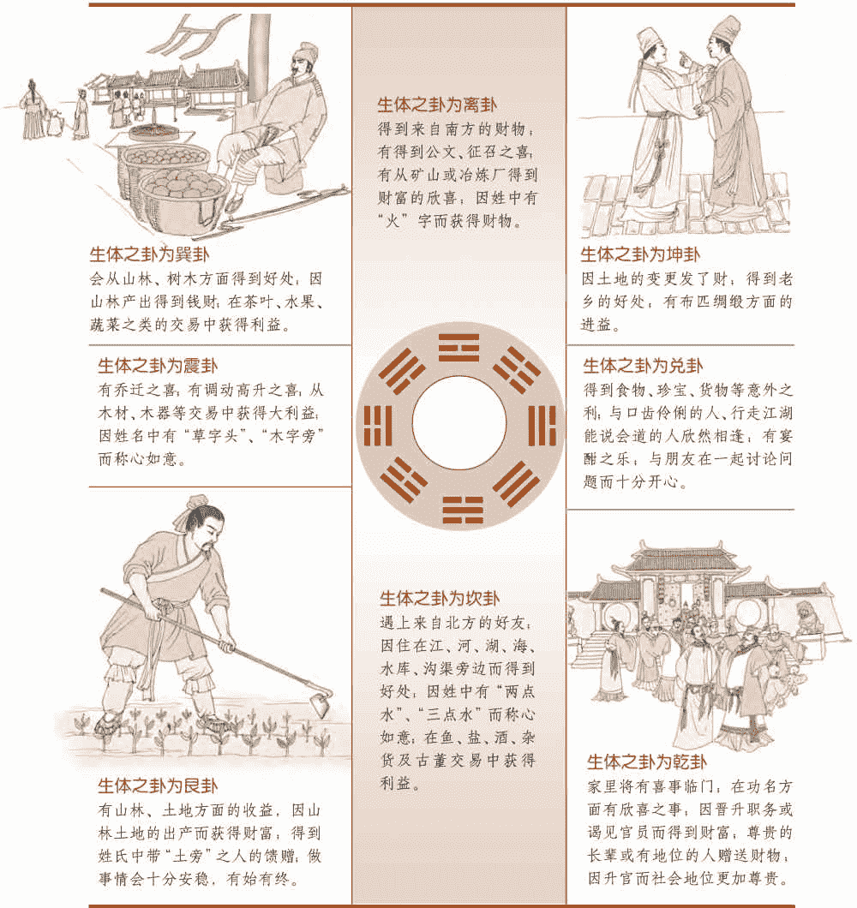

一旦根据外应得到了启示，就要迅速行动，将吉利的启示变成现实，否则错过了克应时间就会与好运失之交臂。

## 3　体用总诀之二
克体之卦与所应之事

当卦中出现克体之卦时，就会有种种麻烦或损失出现。根据克体之卦的不同，所应之事也各有不同。但基本根据仍然是八卦的象征事物和五行属性。

在本卦的用卦、互卦和变卦中，如果有单卦能克体卦，则这个单卦就是克体之卦。

克体之卦为乾卦：因为公事而惹来麻烦；有家事的困扰；损失财产，损失金银或粮食；惹怒尊贵的长辈；得罪富贵之人；有来自西北方的不利因素；向西北方出游会遭受损失。

克体之卦为兑卦：在西方有不利的事情出现；与人发生口舌上的纷争；因为事物的毁坏残缺而困扰；在饮食方面有困扰；受到姓名中带“口”之人的祸害；向西方出游会遭受损失。

克体之卦为离卦：有来自南方的忧患；遇上与文章、书籍有关的麻烦事；受到火灾的惊吓；向南方出游会遭受损失。

克体之卦为震卦：常闹虚惊，发生恐惧之事；身心得不到安养；在住宅内出现妖孽怪异之象；受到姓名中有“草字头”、“木字旁”之人的加害；或在山林、树木方面的利益有损失；有来自东方的不利因素；向东方出游会遭受损失。

克体之卦为巽卦：受到姓名中有“草字头”、“木字旁”之人的加害；受到山林、树木方面的困扰；在山林出产方面有损失；有来自东南方的不利因素；向东南方出游会遭受损失。

克体之卦为坎卦：有凶险的事；遭受诬陷；有盗贼的忧患；与生活在水边的人在一起做事不顺利；酒醉之后出现灾祸；被姓名中带“两点水”、“三点水”的人祸害；有来自北方的不利因素；向北方出游会遭受损失。

克体之卦为艮卦：许多事情就会牵连在一起，各种计划都受阻；有山林、土地、房屋方面财产的损失；受到姓名中带“土”之人的欺负；有来自东北的祸害；有坟墓不安稳的忧患；向东北方出游会遭受损失。

克体之卦为坤卦：会有土地、房屋方面的争扰；在土地、房屋方面有损失；遭受阴险小人的祸害；损失布匹绸缎；失去五谷杂粮方面的利益；有来自西南方的不利因素；向西南方出游会遭受损失。

### 克体之卦与所应之事

当卦中出现克体之卦时，就会出现相应的凶兆，根据克体之卦的不同，相应的凶兆也各不相同。五行与方位是决定凶险情况的主要因素。

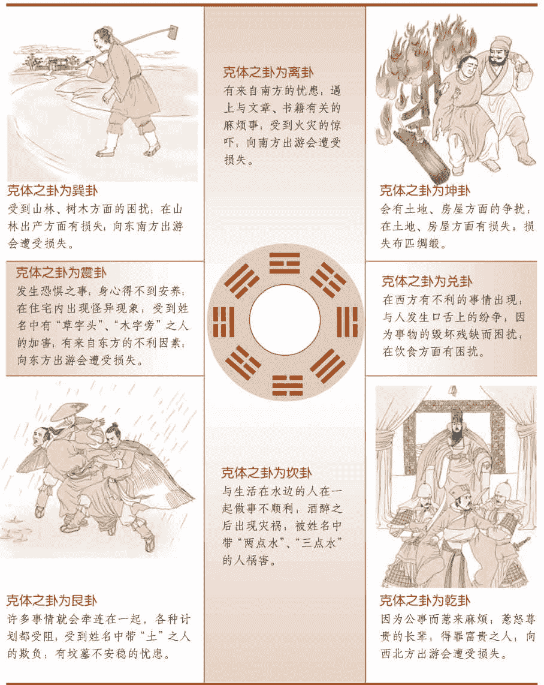

当得到相应的凶兆之后，就要调整自己的行动，尽量避开克应的时间，尽量保证不向相应的方向出行。只要克应时间没到，总会有办法避开凶险之事的。

## 4　体用说的补充
衰旺论与内外论

衰旺论是关于卦气衰弱与旺盛的理论，它认为八卦在一年不同季节的卦气各有不同，提供了判断卦气衰旺的方法。内外论是将内卦与外卦相结合的断卦方法，它认为在断卦时要综合各种因素来分析。

### 衰旺论

在弄清楚了体卦用卦之间的生克关系之后，还要看卦气的衰旺。一般来说，体卦的卦气宜于旺盛，用卦的卦气宜于衰弱。当体卦卦气旺盛，又有用卦、互卦、变卦生扶体卦时，结果就比较吉利；当体卦卦气衰弱，又有用卦、互卦、变卦克制体卦时，结果就比较凶险；而当体卦卦气衰弱，但有他卦生扶体卦时，不利的形式就会有所缓解。

卦气的衰旺与时令和季节密切相关。春天时震、巽二卦卦气旺，坤、艮二卦卦气衰；夏天时离卦卦气旺，乾、兑二卦卦气衰；秋天时乾、兑二卦卦气旺，震、巽二卦卦气衰；冬天时坎卦卦气旺，离卦卦气衰；在一年的辰、戌、丑、未这四个月，坤、艮二卦卦气旺，坎卦卦气衰。

### 内外论

在梅花易数占法中，把本卦、互卦、变卦等统称为“内卦”，把外部征兆都称为外卦。其实这也是大多数占法的通用区分法。所有外部征兆之类的应卦和耳、目、心这“三要”应卦都要和内卦联系在一起来断卦。如果把它们割裂开来看，则占卜的结果往往不能应验。

“三要”与“十应”有时候看似有矛盾，例如金银是世人眼里的珍宝，在“三要”中也属于吉利的象征，但是在“十应”看来却不是这样。如果遇上震卦或巽卦为体卦的情况，那么金银等五行属金的事物会克制体卦，金银反而成了不吉利的象征。再如兵器在世人看来是凶兆，在“三要”中也是凶兆，但在“十应”看来，假如坎卦为体，兵器之金属会生扶坎水，反而又成了大吉之兆。又如在预测疾病时如果见到了棺材，一般认为是大凶的象征，但是“十应”说却认为，假如此时离卦为体，那么棺材之木反而生扶体卦之火，成了大吉的前兆。

所以在断卦时不能仅仅依据卦象，也不能仅仅依据事物在日常生活中的意义，而应该将内卦与外卦综合起来判断。

注“三要”与“十应”将在第五章详述。

### 衰旺论与内外论

衰旺论与内外论都是体用说的有益补充。衰旺论考察的是卦气随时间的变化，内外论把各种外应也当成外卦，分析外卦与内卦的关系，并提出“三要”与“十应”的理论。

#### 卦气衰旺表

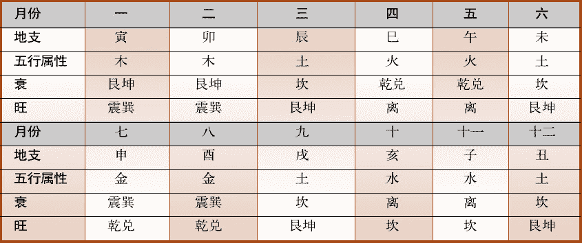

#### 三要与十应

三要与十应有时候看似有矛盾，三要是利用耳、目、心所得到的外部征兆根据日常经验判断吉凶，十应是严格按照五行生克原理判断吉凶。

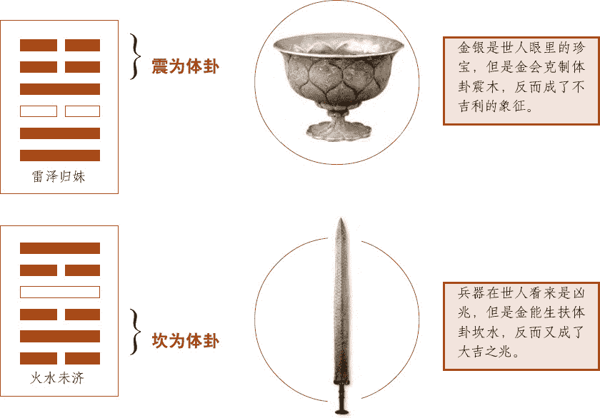

## 5　生克之诀
体用说与五行生克

这里的生克理论与前面介绍的稍有不同，因为对外卦来说，其在五行中的性质有强烈与缓和之分，它们对体卦的生扶和克制能力也有轻重之别。

### 一般意义上的五行生克理论

在断卦时，很大一部分工作就是把成卦分成体卦、用卦、互卦、变卦，然后再根据各卦的五行属性推断其生克之理。内卦之间的生克容易判断，即金生水、水生木、木生火、火生土、土生金；金克木、木克土、土克水、水克火、火克金。但是外卦之间的生克关系就没有这么容易判断了，还需要明辨五行之间的真生真克关系。

### 外卦的五行属性

如当乾卦或对卦为体卦时，火就有了克体的功能。但克体之火有“真火”与“行色之火”的区别，如炉火、熊熊烈火都是真火，而枯枝之火、灯烛之火就是形色之火。真火足以克金，行色之火不能克金。乾金或兑金遇到真火就很不吉利，而当遇到了形色之火时虽然也不顺畅，但对断卦的结果影响不大。又如大刀阔斧都是真金，对震巽之木的克制力量就很强；而金钗、钥匙、银两、金属杯子等等只是形色之金，它们虽然也是金属，但对震巽之木并没有多大伤害。土可以克水，像大山、丘陵之土，对水的克制能力十分强大；而陶罐虽然也属于土，但它对水的克制微乎其微，在断卦时几乎可以不考虑它的影响。

对于相生扶的情况也是类似，如木可生火，像树木、薪柴等都是木类，这种木生火十分迅速，属于真木；而生长之中的灌木、水草等虽然也是木类，但是它们生起火来就慢得多，所以它们对离火的生扶就没有那么强。又如当体卦为震巽之木时，坎水就是生体之卦。湖泊、瀑布、江河之水生扶木的能力就很强；而泪水、墨水等对木的生扶能力就差得多，在断卦时也可以忽略。

总之，对于外卦的五行属性，我们一定要区分清楚虚实轻重，判断清楚它们生扶或者克制体卦的能力，在断卦时对于形色之物只能作为参考因素，而不能作为决定性因素。

### 真实的五行与形色的五行

万事万物都可以在五行中找到自己的归属，所以都具有一定的生克属性。不过它们的生克能力不尽相同。根据生克能力的强弱，可以把它们分为“真实”的五行与“形色”的五行。要注意这里的“真实与平时说的真假之”“真”意义不同。

#### 水的不同形态

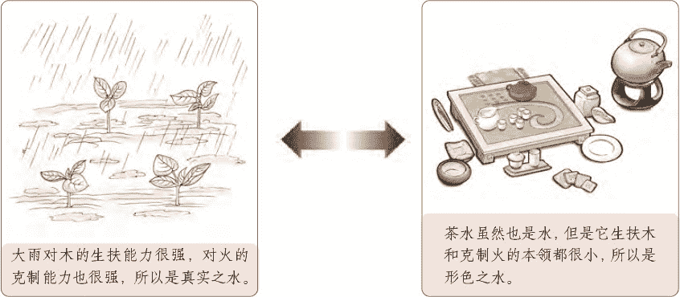

### 五行的具体情况

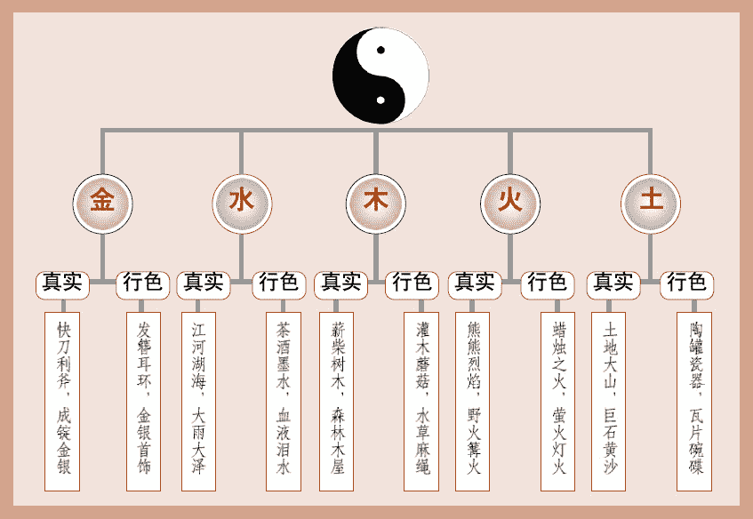

## 6　动静之诀
体用说与动静之理

在起卦时要善于发现运动的外应，有时候外应的变化并不是那么容易发现的。如在邵康节见枯枝坠地占中，一般人对树上掉下树枝的情况司空见惯，而邵康节却在枯枝身上发现了很多常人不注意的现象。

在体卦、用卦、互卦、变卦等都已经得出后，就要根据内卦与外卦来考察所占事物的动静情况。《易经》认为，事物的吉凶祸福都蕴含于事物的运动之中，所以如果事物没有运动，就不能起卦；只有当事物发生运动或变化时，我们才能根据运动变化情况来起卦占算。

在体卦、用卦、互卦、变卦这四种卦象中，体卦和互卦代表事物静止的状态，用卦和变卦则代表事物的运动变化情况。这里我们所说的都是内卦的静止或运动。

在占算的时候，要观察事物的变化发展情况。如果事物的发展有凶险的预兆，就预示着所占的事情向不利的情况发展；如果事物的运动有吉利的预兆，就预示着所占的事情向有利的情况发展。对外卦来说，以天时、地理因素作为外应的卦，都代表了事物静止的状态；以人事、器物等为外应的，则有运动的情况。器物本身可能静止的，但当人手持器物行走时，器物也就相当于在运动之中了。同样的道理，沼泽中的水、山上的岩石等都是静止不动的，但是当有人挑水前行时水就是运动的了，有人拿起石块扔到远处时石块也就是运动的了。而乾卦象征的马、坤卦象征的牛等都属于运动变化的因素，因为它们都是动物，自己完全可以运动，并且时时刻刻处在生长之中。

要根据外卦预测吉凶祸福，就必须分清它的运动情况。处于运动之中的外卦若主吉祥，则事情很快就会迎来吉利的结果；处于运动之中的外卦若主凶险，则事情很快就会迎来凶险的结果。当外卦还处在静止状态的时候，吉凶的发展趋势就难以确定。

在起卦的时候，如果占者在行走之中，克应就会来得快；如果占者保持坐姿，则克应时间就会变得很长；若占者处于站立状态，则克应时间就介于两者之间。

### 事物的动与静

在体卦、用卦、互卦、变卦等都已经得出后，要根据外卦预测吉凶祸福，就需要根据内卦与外卦来考察所占事物的动静情况。外应的运动情况能反映事情的发展趋势。

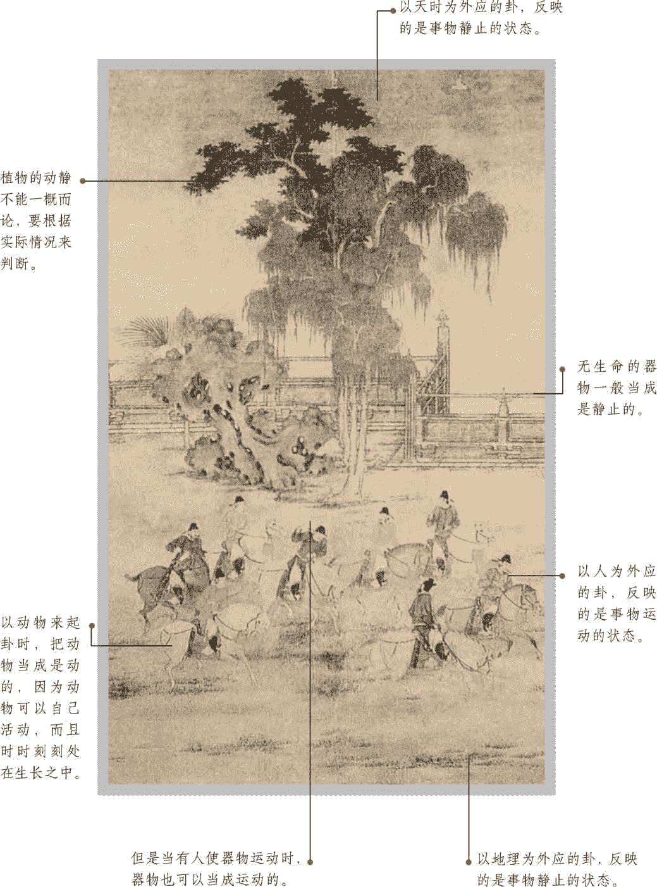

## 7　克应之诀
体用说与应验时刻

断卦时对应验时间的确定是十分重要的，若不知道应验时间，即使知道了事情的发展趋势也难以作为对我们行动的指导。对应期的确定十分复杂，通常有根据卦数确定和根据事理确定两种方法，但更多数情况下要结合两者来确定。

所谓“克应”，就是“克期应验”的意思，也就是对应验时间的确定。如果只预测了事情的发展趋势却不知道什么时候应验，那么这次占卜就算没有完成，行动起来仍然是一片茫然。对应验日期的推断十分不容易，有时候要以卦数来确定，有时候则要以事理来确定，当然，最精确的是两种方法的有机结合。

例如：测算新建的房屋、新婚的夫妇、准备下葬的坟墓、刚刚添购的家具等，都可以按照年、月、日、时，再加上事物本身的卦数来起卦，等成卦后，在体卦、用卦、互卦、变卦中，以各自卦数之和作为所占之事的应验日期。

房子是长期存在的东西，所以起卦时以全卦的总和来确定房子最终毁坏的日期；而坟墓虽然也有毁坏的一天，但是在占测时往往不考虑它毁坏的日期，只需要判断其吉凶悔吝就可以了。

如果是预测婚姻，因为婚事最多不过数年就能办成，可以用全卦的总卦数就可以决断其应验日期。在预测婚姻时一般只预测其开始的日期，不预测其结束的日期。

对器物来说，若器物为金属质地，寿命就比较长；若器物是木质，寿命就比较短。寿命长的如桌子、大钟等要以成卦之数按年来计算克应日期，短的如笔墨等则按月计算，更短的如花草等就按日计算。具体用什么作为单位，还要根据实际情况来确定。

预测吉凶时还要考虑卦气的影响，以生体卦气旺盛的时间作为吉祥之事的克应日期；而以克体卦气旺盛的时间作为凶险之事的克应日期。例如对于功名之类的预测，如果遇上乾金为体，就看卦中有没有坤土，如果有，则把辰、戌、丑、未等五行属土的月份作为应验日期。如果预测出门在外的人什么时候回来，就要以生体的卦气最旺盛的日子为归期。如果卦中没有生体或比和之卦，那么行人一定迟迟不能回来。

### 事情的应验时刻

事情的应验时刻要根据事物本身的性质和卦气衰旺来确定。对器物来说，金属器物就要以年为单位，花草就要以月或日为单位，但在规矩之中还有变通。

#### 如何断应期

断应期就是推断事情的应验时期，这是梅花易数最常见的占卜内容。

如 2008 年 6 月 6 日下午 5 点（戊子年 05 月 03 日酉时），与友人约好见面，但一直不见人来，故起卦预测人何时来？

* * *

起卦： 以年之干支、月日之数相加之和再除以 8 得到的余数作为上卦，以年之干支、月日之数及时之地支数相加之和再除以 8 得到的余数作为下卦。干支为戊子，对应数是 1，月对应数 5，日对应数 3，

上卦： 1＋5＋3＝9，9÷8 余 1，得上卦为乾卦

下卦： 酉时对应数为 10，1＋5＋3＋10＝19，19÷8 余 3，得下卦为离卦

本卦： 为乾上离下　天火同人卦

动爻： 以年之干支、月日之数及时之地支数相加之和再除以 6 得到的余数为动爻

即： 19÷6 余 1，初爻为动爻，得变卦天山遁卦

断卦： 体卦为乾金，用卦为离火，用卦克体卦，朋友肯定是不会准时来了。那什么时候来呢？就用年之干支、月、日之数及时之地支数相加之和就是时间，和为 19，那就意味着晚上 7 点才会来。后来朋友果然 7 点才到。

#### 卦气的衰旺

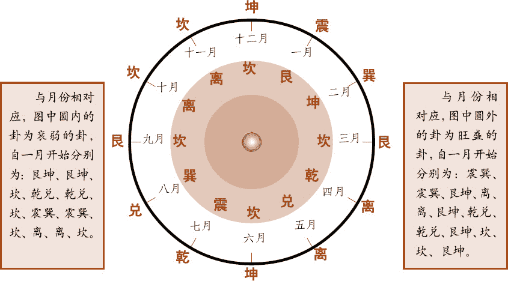

## 8　坐端之诀
体用说与方位设置

“坐端”就是以占者为中心，把八卦分配于八个方位以决断吉凶的方法。使用这种方法时，必须停止一切思虑，静心等待外来征兆的出现，将其作为占断的参考因素。坐端理论的基本依据是五行生克原理。

### 八方征兆与家人的关系

按照后天八卦顺序，自南方开始顺时针依次为：离，坤，兑，乾，坎，艮，震，巽；其五行属性为：乾兑为金，震巽为木，艮坤为土，坎为水，离为火。

有了这样的对应关系，再判断八个方位的外应与家人的命运就方便了。大体来说，当某个方位上出现了生扶或比和方位卦的事物时，对此卦对应的人就有利，反之就不利。

例如，乾卦方位是西北，对应人品是家中的尊长，而乾卦五行属金，假如西北方忽然出现了火灾，由于火克金，所以家中的尊长老人就会有凶险的事情发生。同样是火的出现，对于别的方向却有可能是吉利的，例如离卦所代表的南方五行属火，如果南方出现了与火有关的事情，或其他吉利的事情，则家中的次女就会有喜庆之事发生，原因在于两火相比和；又如坤卦所代表的西南方五行属土，宜于得到火的生扶，如果西南方出现了与火有关的或其他吉利的事情，则家中的老母亲就会有喜庆之事发生，原因在于火生扶土。

根据这个原理就可以推出八个方位所宜于出现的事物，比如北方属水，宜于出现与水或金有关的事物；东方属木，宜于出现与水或木有关的事物。其他方位都可以类推。

### 方位与人体

八卦与人体结构的对应是：乾为头，坤为腹，震为足，巽为股，坎为耳，离为目，艮为手，兑为舌。所以如果乾卦受克制，头部就会得病；如果坤卦受克制，腹部就会得病。其余卦象与人体部位的关系以此类推。此外，八卦与人体的关系还可以通过坐端理论与方位联系起来，即：西北为头，西南为腹，东方为足，东南为股，北方为耳，南方为目，东北为手，西方为舌。根据每个方位出现的外应可以推测身体部位的健康与否。

### 凶险的宅院

根据八卦的后天方位以及五行生克关系在布置宅院时需要有讲究。这里我们大体上提供了理想的和凶险的宅院内景图。

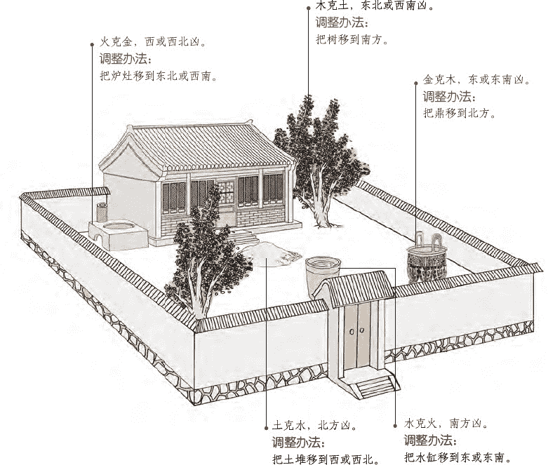

 区区一个院子还要设计得这么复杂？很多院子没有按照这样布置，主人不也好好的吗？

 这只是说一般情况下的院内布置，并不需要完全这样做，有时候还要根据实际情况调整。

## 9　观物洞玄歌
预测住它吉凶的准则

一般来说，住宅的预测是十分困难的，因为它要考虑各种外应的影响。《观物洞玄歌》是邵康节先生针对住宅占测总结出来的一套歌诀，歌诀为我们提供了几十种关于住宅的外应及其对应的具体吉凶情况。

### 《观物洞玄歌》的总纲

《观物洞玄歌》以歌诀的形式告诉我们如何根据住宅中的外应断定吉凶，它的理论根据就是歌诀的前几句话：

世间万事无非数，理在其中遇。

吉凶悔吝有其机，祸福可先知。

五行金木水火土，生克先为主。

青黄赤白黑五形，辩察要分明。

人家吉凶何堪见？只向玄中判。

入门辨察见闻时，于此察兴衰。

### 世间万事无非数，理在其中遇

《观物洞玄歌》主要强调了数和五行的应用。在梅花易数中，万事万物都可以根据一套有序的规则转化成数字，通过乾一、兑二、离三、震四、巽五、坎六、艮七、坤八和“卦除以八，爻除以六”来与六十四卦对应。在建立了这套规则之后，卦就是数，数就是卦，万物皆数，万物皆卦。

### 五行金木水火土，生克先为主

住宅预测的准则还是要以五行生克为主的。因为住宅的方位性都很强，所以很容易使八卦、五行与方位联系在一起。八卦有了生克的性质，就可以像五行一样利用生克关系推测人的吉凶祸福。根据颜色定五行也是一种常用的判别法，金为白色，木为青色，水为黑色，火为红色，土为黄色。

### 吉凶悔吝有其机，祸福可先知

任何吉凶悔吝都会事先显示出一些预兆，在住宅的周围时刻都会发生各种外应，它们是住宅预测的基本依据。

“男妆女饰皆整齐”，是一种门风严谨的表现，长此以往，一定会使门庭兴旺起来，所以说它预示着“此去门风盛”。

“门前墙壁如有缺”，反映的就是对住宅的主人不利的信息，引起的结果是“家道中消歇”，即本来富裕的家庭也会不可避免地走向衰落。

“井边倘种高梨树”就会“长有离乡土”。“梨”谐音“离”，井边种梨树，含有“背井离乡”的意思，所以要避免这种情况的出现。

### 吉凶悔吝有其机

凡事都有吉凶悔吝的差别，这些差别在日常生活中经常能反映出来。梅花易数观测这些先机的基本依据是万物皆数的观点。

#### 河图与洛书中的玄机

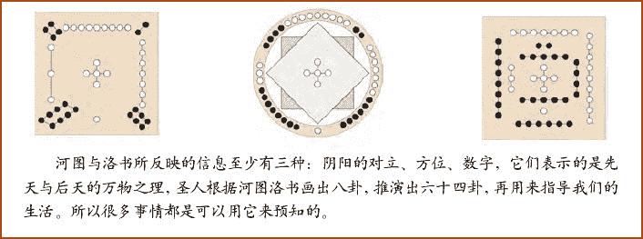

#### 吉凶悔吝有其机

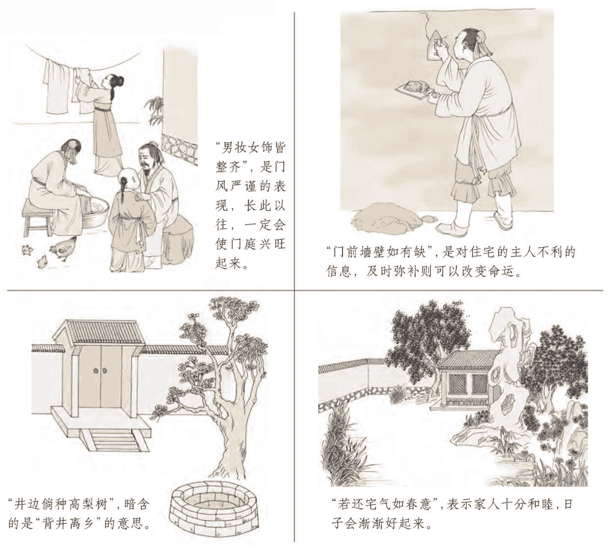

### 住宅中静物的外应

如果屋顶上忽然生出奇花异草，那么这户人家一定能越过越好；如果家里门外幽静清爽，没有满天乱飞的尘埃，那么这户人家将要出现一个具有非凡才能的人；如果房前屋后种着高高的桐树，那么住宅的主人一定是常年出门在外的；如果祠堂里的灯烛无缘无故地点燃了，那么就要小心提防火灾的发生；如果屋檐上的瓦片莫名其妙落到了门前，那么这户人家就会诸事不顺，一筹莫展；如果大白天把灯放在了地上，那么这户人家将会遇上十分凶险之事。

如果把船放在平地上，做事就会十分稳妥，但往往滞留拖沓；如果邻居家的树阴伸到自己院子里来，多半也会有横财到家里来；如果门前的石阶残破不全，那么这户人家办事就会不成；如果每日三餐时炊烟比别人家的早，说明这户人家能够勤俭持家，家境会逐渐好转。

### 住宅中动物的外应

如果白天有老鼠跑到阳光下，那么这户人家很快就会耗尽家财；如果有母鸡早晚鸣叫，就说明这户人家阴气太盛，家道会逐渐衰落；如果狗像人一样在中堂乱叫，那么家属就会遇到灾难；如果早上门前树上喜鹊叫个不停，那么出门在外的人就会马上回家；如果有蟒蛇闯入了家里，说明家中会有人生病；如果有鸟雀在门前叽叽喳喳地叫，那么家中一定会出现口舌纷争；若是猫头鹰在门前叫，就不是口舌纷争那么简单了，那样的话这户人家还会遇上更大的灾祸。

牢记《观物洞玄歌》，可以使我们在占测住宅的时候更加得心应手，再经过长期的锻炼，就可以熟练地进行住宅占了。

### 住宅中的外应

《观物洞玄歌》为我们提供了几十种利用外应推测事情吉凶的方法，主要可以分为静物的外应和动物的外应两个方面，其中静物的外应也包括植物的外应在内。

#### 静物的外应

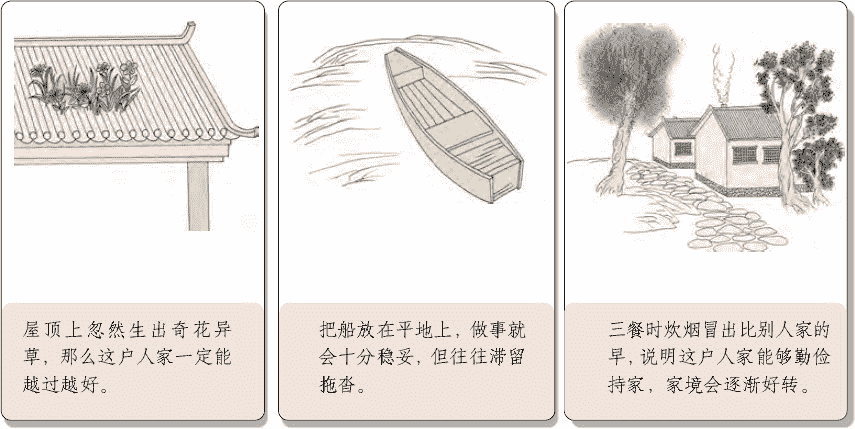

#### 动物的外应

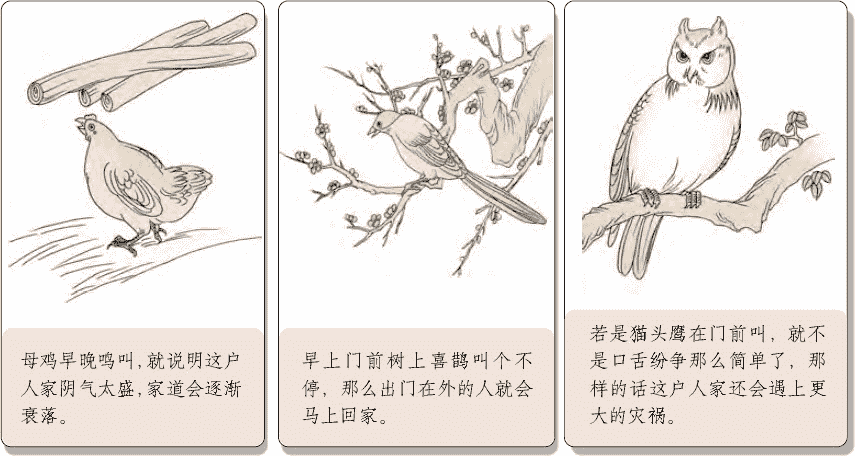

# 第五章　占卦要诀
三要与十应

本章阐述了“三要”和“十应”理论。三要理论讲的是感官在起卦时发挥的作用，十应看似与三要相矛盾，但是它的玄妙之处远非三要可及。在十应中引入了“外卦”的概念，它把外界环境中发生的一切现象都当成一种卦，大大丰富了八卦和六十四卦的内涵，这也是梅花易数强大威力的保证。

## 本章图版目录

感官中的万物之理

断卦时的“望闻问切”

十应概论

天时之应

地理之应

人品之应

行为之应

方卦之应

动物之应

静物之应

言语之应

声色之应

文字之应

## 1　三要
感官中的万物之理

所谓三要就是指耳、目、心三个器官，也可以理解为耳之聪、目之明、心之思的特有功能。耳朵和眼睛是人们最主要的接受外部信息的器官，在实际占测中，绝大多数信息是通过听和看得来的。

《周易》是关于性命理气的一门学问，性命理气存在于人们的心中，但是并非随时显现。当一个人的心里皎洁澄澈，没有牵挂的时候，性命理气就在心中弥漫开来，易理也随之出现了，这种易理是先天之易。当思想开始运作时，世俗中的各种繁杂事务就会出现在眼前，好像乌云遮蔽住长空，灰尘覆盖了镜面。原本澄澈的心灵被淹没，眼前一片茫然，刚刚在心中显现的先天之易也就无影无踪了。所以“三要”的奥妙就在于正确地运用耳、目、心来感应万物万事。

### 吉凶悔吝，皆有定数

事物的根源只在于一心，一心就可以囊括大千世界。事情的吉凶悔吝自有定数，但是在事情萌发之前，即使是鬼神也不能探测端倪；而事情一旦萌发，就会显示出各种先兆，任何占卜法都是利用这种前兆来推断事情的发展情况。

在起卦和断卦的时候，要澄清我们的思维，静观万物的变化，通过这些变化推断事情发展的趋势。这种取外应的方法非常巧妙，所以很多先贤都使用这种方法。精通此道的人物有：战国时的鬼谷子，汉朝的严君平、东方朔、诸葛亮，魏晋时的郭璞、管辂，唐朝的李淳风、袁天是，宋朝的皇甫真人、麻衣仙、陈抟等。诸葛亮善于八阵图，皇甫真人善于坐端法，袁天罡作出了推背图，李淳风则精通鸟觉术。他们所用的占法各不相同，但是又有相同之处，其依据的道理是完全一致的。

以汉朝的“智圣”东方朔为例，他不但诙谐幽默，擅长辞赋，而且精通射覆之术。射覆就是让别人把物品放在一个罩子里，自己根据外应得到卦象，从卦象推断罩子下面是什么东西。精通射覆的人必然善于观察外应。这虽然是一种游戏，但是游戏中含有占卦所需要的一切元素。

### 感官中的万物之理

“三要”的奥妙就在于正确地运用耳、目、心来感应万物万事。古人有善于各种占法的，如“智圣”东方朔的射覆之术，李淳风的鸟觉之术等等。无论那种方法，都离不开对“三要”的正确运用。

#### “三要”与断卦

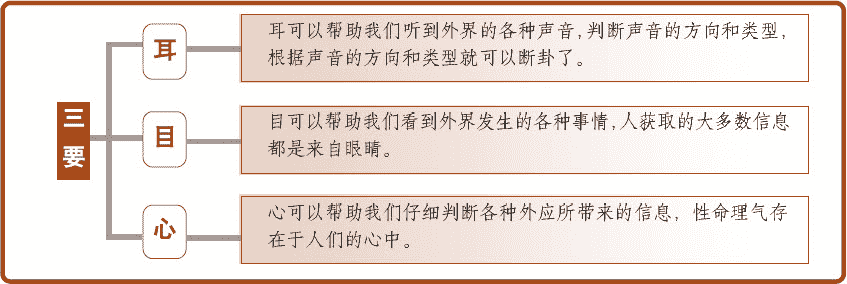

#### 先贤对易理的各种运用

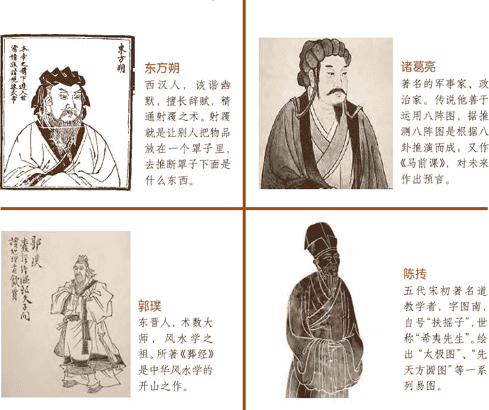

* * *

### 断卦时的外应

在断卦的时候，凡是出现吉兆或者外应显示顺利的，就断为吉；凡是遇到凶兆或是外应不顺的，就断为凶。凡是见到圆形的物品，则所断的事情就容易成功。

《易经》中说圣人画八卦时“近则取象于人身”，在我们断卦时也是这样。凡是断卦时自己心里存在忧虑的，则来人所问之事也会带上使人忧虑的影子；断卦时自己心里充满喜悦，则来人所问之事也会让人感到喜悦；若断卦时自己十分悠闲，则来人所问的事也会从容不迫；若断卦时自己匆匆忙忙，则来人所问之事也会十分紧急。

断卦之道就在于卦象与外应的结合，如果卦象显示大吉，而外应也显示大吉，那么就断为吉卦；如果卦象显示大凶，而外应也显示大凶，那么就断为凶卦；如果卦象与外应一吉一凶，那就要看卦的生克比和，观察外应的发展趋势。在断卦时从来没有定式，要结合卦象与外应来综合判断。懂得变通之道才能准确地预知未来。

### 三要的奥妙

邵康节先生提出三要之理，就是要告诉人们在起卦断卦时要注意对各种外应的综合应用。要根据外应推断事情的发展，就好像大夫利用病人的现状推测病情的发展趋势。

耳要就是仔细听声音，这好比大夫在行医时采取的“闻”法，不过在这里不但要听人的声息，而且要听周围环境中的各种声音。

目要就相当于四诊中的“望”，不但要观察来人的面色、眼色，而且更重要的是仔细观察环境中的各种变化，以给事情的未来发展作出“诊断”。

心要就是用思想把耳朵和眼睛收集来的资料进行综合处理。思想可以分析出哪些外应是有效的，以及它们提供的信息反映了事情的什么发展方向。

三要是梅花易数中起卦与断卦的根本，在古代是不能轻易传授于外人的。但是它又是研习梅花易数所不可缺少的。方法其实很简单，关键还在于在实际应用中灵活处理。活学活用是占卜的基本原则。

### 断卦时的“望闻问切”

起卦断卦就像大夫诊断病情一样，通过仔细观察“病人”即周围环境的状况进行推断，所以也有相应的“望闻问切”这“四诊法”。

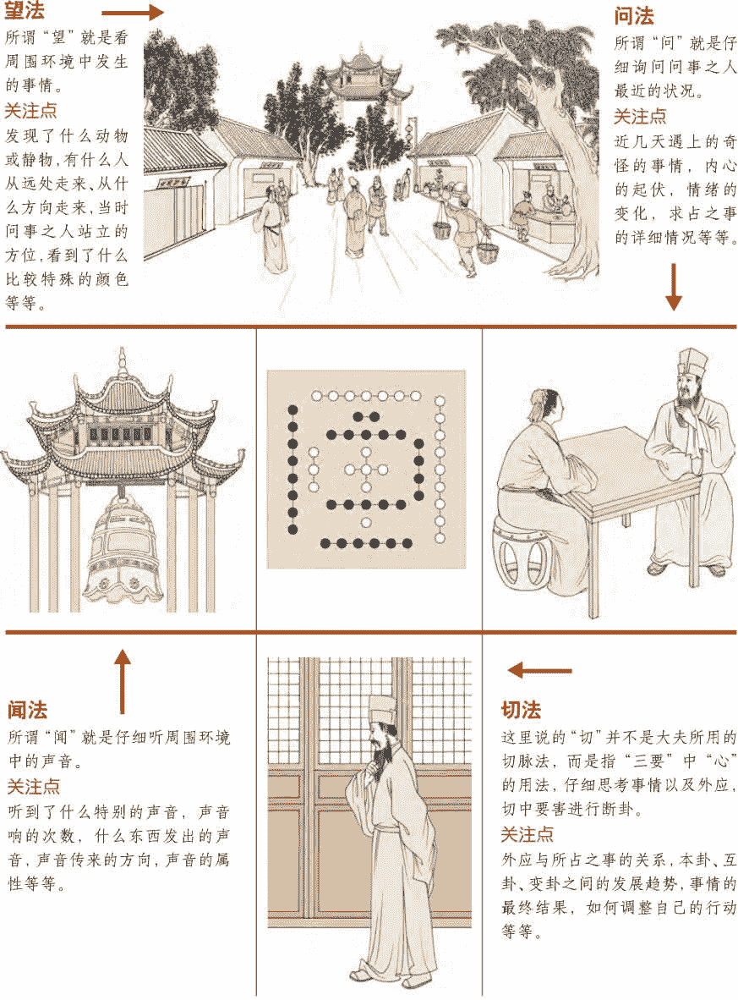

## 2　十应
出于三要，灵于三要

十应从三要中得来，而又比三要更加玄妙精确。两者有时候看起来会有矛盾但是仔细分析一下，就会发现两者说的其实是一回事，没有什么矛盾存在。

### 十应与三要

三要是根据日常生活中事物的象征来推断吉凶的，它利用的是耳听、目视、心思，这样得出来的外应一般比较接近日常生活，也就是见吉兆则断为吉，见凶兆则断为凶。例如黄金白银是吉祥之兆，尖利的刀刃是凶险之兆，病人见到棺材是死亡的象征等等。但是从五行生克的角度来看，它就会产生很多不足之处，有的时候会难以应验。例如当病人的病情五行属土，需要木来克制时，棺材之木就成了生命的象征。当然这种见吉兆而成凶事，见凶兆而成吉事的情况比较少。

### 十应的断卦

十应出于三要，但是其玄妙之处比三要还要灵验。十应的方法是，以体卦为主，以用卦、互卦、变卦为用。又把体卦、用卦、互卦、变卦称为内卦，而把外部环境中的种种征兆称为外卦，结合内卦和外卦来推断。值得注意的是外卦不是普通意义上的八卦或六十四卦，并没有什么卦象，而是起卦时的外部征兆，因为它们具有卦的某些性质而称之为卦。

在断卦时，若内卦、外卦都是吉利的卦，那结果当然是吉利的；但是若内卦显示不吉利，而外卦却显示吉利，那么外卦的吉利就可以缓解内卦不吉利的程度；若是内卦显示吉利，而外卦却显示不吉利，则内卦的吉利就会被破坏。

凶险的情况也类似。如果内卦、外卦都是凶险之兆，那结果一定是凶险的；若是内外两卦吉凶情况相反时，则要详细推断卦象和外应的具体情况。在断卦时决不能拘泥于定式、墨守成规。灵活处理内外卦的关系，是断卦成功的关键所在。

具体来说，十应分为十大类：天时之应、地理之应，人品之应、行为之应、方卦之应、生物之应、器物之应、言语之应、声色之应、文字之应。它们都是以体卦为主，参考外部环境中的各种预兆，内外结合进行断卦。

### 十应概论

十应是“出于三要，灵于三要”的断卦方法，它以体卦为主，以用卦、互卦、变卦为用而把外部环境中的种种征兆称为外卦，结合内卦和外卦来推断。

#### 内卦与外卦的关系

|  | 内卦吉利 | 内卦中性 | 内卦凶险 |
| 外卦吉利 | 大吉 | 事情会变得比较顺利 | 外卦的吉利就可以缓解内卦不吉利的程度 |
| 外卦中性 | 过程一般，结果较好 | 要根据具体情况判断 | 虽然没有大的挫折，但结果也不是很好 |
| 外卦凶险 | 内卦的吉利就会被破坏，事情变凶 | 事情会遇上很多挫折 | 大凶 |

#### 十应的分类

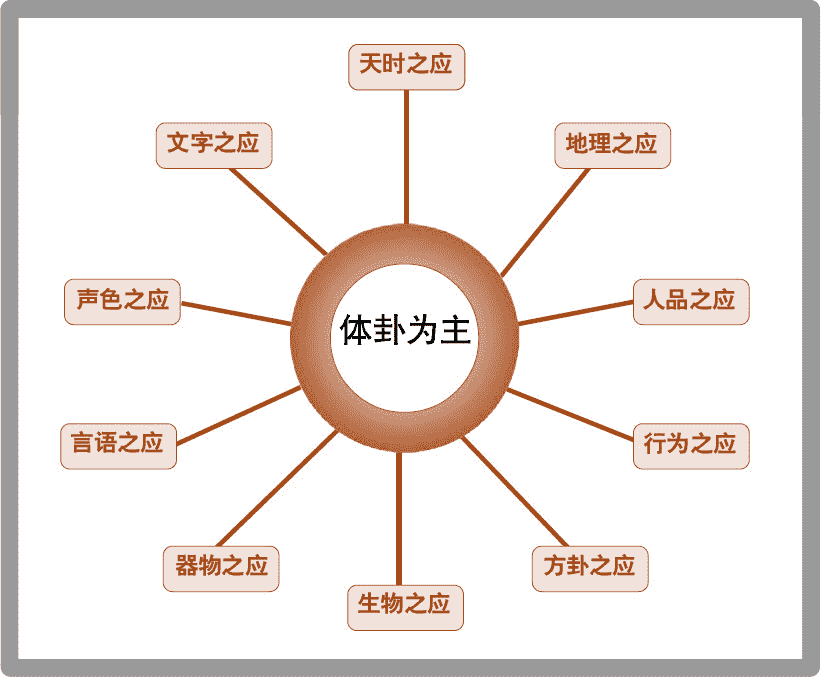

## 3　十应之一
天时之应

天气与要占算的事情有着直接的联系，例如晴天表示事情的发展会很顺利。但是在十应看来，这种情况会有新的变化。

### 天气与吉凶

在起卦时，天气情况与事情的吉凶有密切的联系。例如天气晴朗就预示着所问之事能顺利发展，而阴沉沉的天气则对所问的事情不利，大雾天气表示前途迷茫不知所措，下雨是事情失败的前兆。

起卦时若有风吹过，则事情往往是虎头蛇尾，善始不善终；若起卦时有雷声，则所问之事会有惊无险；若在晚上起卦，而且月光照在脸上，那么事情很快就有眉目；若起卦时下着雨，而且有雨淋在了衣服上，那么事情不顺利，但是会有贵人相助。

### 天时之应

上面介绍的是天气与事情发展的一般情况，在十应看来，根据内卦的不同，上面的情况会出现变化。

如果在断卦时天气晴朗，万里无云，则天气的卦象定为乾卦，也就是说外卦为乾卦。如果起的内卦中体卦是乾卦或兑卦，则内卦与外卦相比和，所占算的事情就会非常顺利；如果体卦为坎卦，也一定会万事大吉，因为外卦乾金生扶体卦坎水；如果体卦为坤卦或艮卦，那么体卦艮坤土生扶外卦乾金，会使卦气外泄，对事情不利；若体卦为震卦或巽卦，那么外卦乾金克制体卦震巽木，事情就会十分凶险。

如果断卦时正值中午，而且天气晴朗，太阳升到最高时，外卦就断为离卦。这时若体卦也是离卦，那么内卦与外卦相比和，事情就会非常顺利；如果体卦为艮卦或坤卦，外卦离火就会生扶体卦艮坤土；如果体卦为震卦或巽卦，那么体卦震巽木就生扶外卦离火，卦气外泄，对事情不利；若体卦为乾卦或兑卦，那么外卦离火就克制体卦乾兑金，可直接断为凶兆。

如果在断卦时遇上大风或雷电天气，那么外卦就断为巽或震，仍然是按照上面的推理，当外卦生扶体卦或与体卦相比和时，对占算的事情就有利，可断为大吉；当外卦克制体卦时，事情就会受阻，可断为大凶；当体卦生扶外卦时，卦气外泄，就会对事情大为不利。

### 天时之应

天气与吉凶的关系有两种，一种是直接的对应，如天气晴朗就预示着所问之事能顺利发展；另一种是根据五行生克推断，这时得出的结论可能和前一种有区别。

#### 天气与吉凶

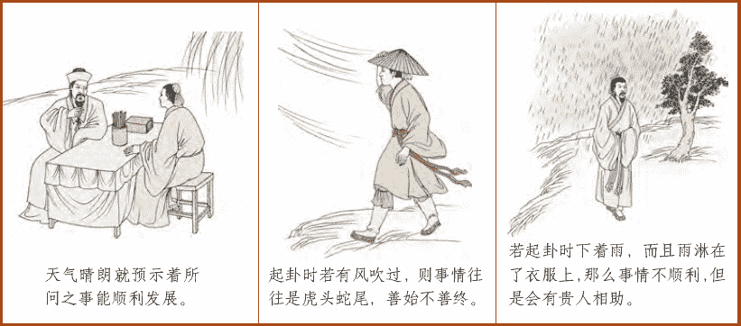

#### 天时之应

应用天时之应时，把天气当成外卦。外卦与体卦的关系一般有四种：外卦生扶体卦，外卦克制体卦，体卦生扶外卦，体卦与外卦相比和。

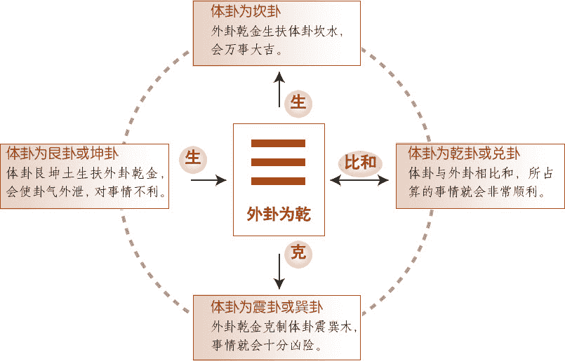

## 4　十应之二
地理之应

地理之应是根据断卦时所处的环境来确定外卦，利用外卦与体卦的生克比和关系确定事情的吉凶祸福。利用地理情况得到的外卦一般为震卦、坎卦和艮卦。

### 地理与吉凶

在起卦时要仔细观察所处的环境，当起卦时是在山中，或见到了连绵的山，那么所占的事情就会遇到阻力；如果遇到了河流或溪水，那么所问之事就会顺畅亨通；如果见到了土堆丘陵，那么做事就会停滞或缓慢；如果见到了顽石，那么做事需要坚定的信念才能保证成功；若见到波涛汹涌，那么所问之事有惊有险；如果见到了山坡崩塌，那就会有土地的损失；如果是在干旱的沼泽旁起卦，那么所问之事会使人心力交瘁从而事情难成；如果是在枯木之下起卦，那么事情之难会使人伤心欲绝。

### 地理之应

在断卦时，如果是在茂密的树林或竹林里，或者周围有花草树木，则外卦断为震卦。如果体卦为离卦，则外卦震木生扶体卦，事情就会十分顺利；如果得到的体卦为震卦或巽卦，那么外卦震巽木与体卦震木相比和，事情定然会大吉；如果体卦为坤卦或艮卦，那么外卦之木克制体卦之土，可断为大凶；如果体卦是坎卦，那么体卦之水生扶外卦之木，卦气外泄，对事情显然不利。

如果断卦时是在江河、湖泊、泉水、溪流等水流的旁边，外卦就可定为坎卦。如果我们得到的体卦是震卦或巽卦，那么体卦之木就得到了外卦之水的生扶，事情大吉；如果体卦是坎卦，那么两卦相比和，事情也会十分顺利；如果得到的体卦是乾卦或兑卦，那么体卦之金生扶外卦之水，卦气外泄，对事情不利；如果得到的体卦是离卦，那么外卦之水克制体卦之火，事情可断为大凶。

同样道理，若是在山上断卦，则外卦为艮，遇上体卦为坤卦、艮卦、乾卦、兑卦的情况，事情的发展就会顺利，结果就会令人满意；遇上体卦为离卦的情况，事情就会坎坷不顺，但最终会成功；若遇上体卦为坎卦的情况，那么体卦被外卦克制，事情就十分凶险了。

### 地理之应

根据地理因素断卦有两种形式，一是利用断卦时所在位置的实际情况，二是利用断卦时由地理环境得到的外卦，判断外卦与体卦的生克关系。

#### 地理与吉凶

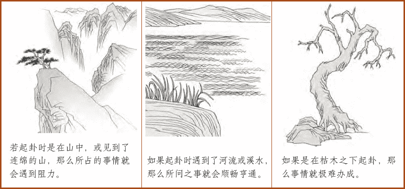

#### 地理之应

应用地理之应就需要准确地取定外卦，如在树林里则外卦断为震卦，在水边则外卦断为坎卦，在山上则外卦断为艮卦等。

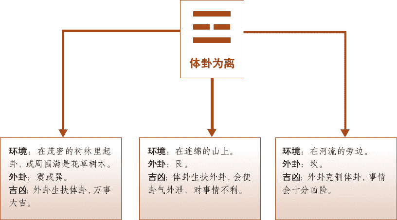

## 5　十应之三
人品之应

利用人品之应定吉凶与人品起卦法密切相关，也是根据乾为父，坤为母，震为长男，巽为长女，坎为中男，离为中女，艮为少男，兑为少女的八卦属性来断定外卦的五行属性。

### 人品与吉凶

若在起卦时有人从身旁经过，就可以根据此人的人品来取外卦。

如果起卦时有官员或富贵之人经过，那么所问之事就为显贵之事；如果起卦时有巨商大贾经过，那么问事之人必然会发财；如果起卦时有小孩哭声，那么问事之人的子孙就会有忧患；如果起卦时有兵卒叫唤，而所问为官讼之事，那么事情就会不顺利；如果起卦时有二男二女走过，而所问之事与婚姻有关，那么婚姻就会不稳定；如果起卦时有僧人或道士经过，那么问事之人就要经受独居的考验；如果起卦时有妇女的笑语，而所问之事与生产有关，那么生产会十分顺利；如果起卦时有工匠经过，那么问事之人的房宅之事就大吉；如果起卦时有屠夫经过，那么问事之人将会骨肉分离；如果起卦时有盲人经过，那么问事之人就是杞人忧天，事情就完全不用担心了。

### 人品之应

人品之应是根据人的八卦属性来确定外卦的方法：乾为父，坤为母，震为长男，巽为长女，坎为中男，离为中女，艮为少男，兑为少女。

例如在起卦时见到中年男人经过，则外卦断为震卦。如果体卦为离卦，则外卦之震生扶体卦之火，事情就会十分顺利；如果得到的体卦为震卦或巽卦，那么外卦之木与体卦之木相比和，事情就会大吉；如果体卦为坤卦或艮卦，那么外卦之木克制体卦之土，可断为大凶；如果体卦是坎卦，那么体卦之水生扶外卦之木，卦气外泄，不利于事情的发展。

如果在断卦时有小姑娘经过，那么外卦就断为兑卦。如果起的内卦中体卦是乾卦或兑卦，则内卦与外卦之金相比和，那么事情就会非常顺利；如果体卦为坎卦，则外卦乾金生扶体卦坎水，事情也会大吉；如果体卦为坤卦或艮卦，那么体卦艮坤土生扶外卦乾金，会使卦气外泄，对事情不利；若体卦为震卦或巽卦，那么外卦乾金克制体卦震巽木，事情就会十分凶险。

### 人品之应

利用人品断卦有两种方法，一种是根据断卦时经过的人的职业判断，另一种是根据经过之人的八卦与五行属性来判断。

#### 人品与吉凶

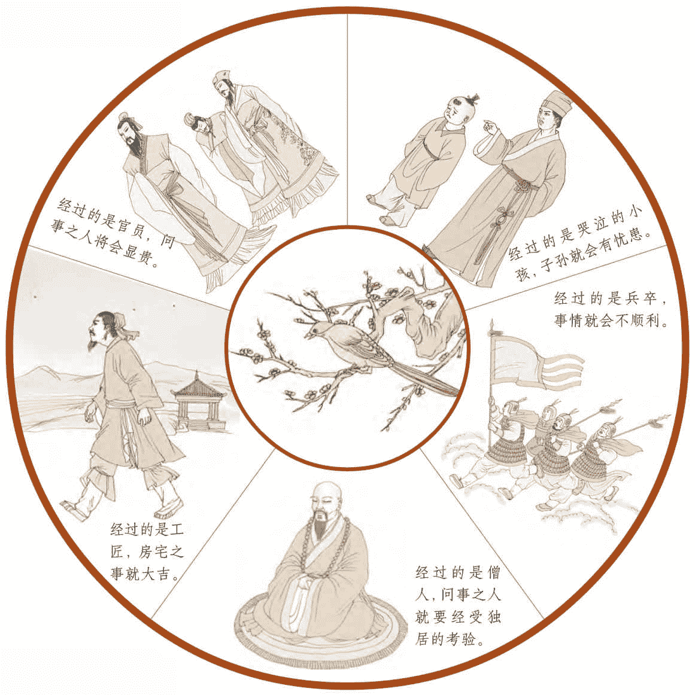

#### 人品之应

人品之应是根据人的五行八卦属性来判断生克的方法，判断的关键是人品之卦和体卦的关系。

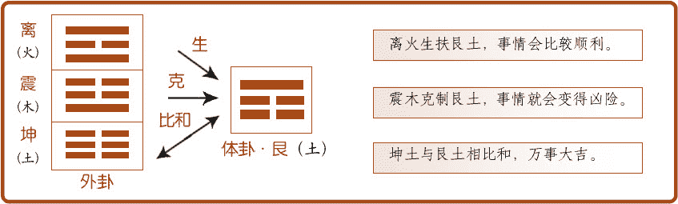

## 6　十应之四
行为之应

行为之应考察的不但是周围之人的行为，而且还包括问事之人本身的行为，尤其是后者对事情的最终结果影响更大。

### 行为与吉凶

在断卦时，周围人的行为对卦的结果有十分明显的影响，所以在断卦时要注意观察周围人的言语、行为、忧喜等。例如，在断卦时看到一群人有说有笑、十分开心，那么事情的结果也会令人开心；若在断卦时看到恶人，那么事情也将十分凶险。

另外还有一些具体行为，它们与来人所问的事情有关。

看到小孩读书，就说明所问之事与官司有关；看到有人讲经论史讨论学问，就说明所问之事最终会流于空谈而没有实际行动；见到人在唱歌奏乐，就说明所问之事容易成功，十分顺遂人心；如果见到有人赌博，则问事之人将会为财产而与人争斗；见到书卷字画，则所问之事与公文书信有关；见到有人手挽手走过，则说明问事之人被烦恼之事牵连；见到有人在撒网捕鱼，那么所问的事情将会不顺利，问事之人一无所得；若见到有人拿斧头、刀锯之类工具，那么事情将会十分凶险，问事之人将有损；见到有人在砍柴，那么问事之人将会有财产的损失，因为“柴”与“财”谐音。

### 行为之应

在断卦时，问事之人的行为与事情的吉凶祸福也有关系。

若问卦的人无意中摆手，那么所问之事最终失败；若问事之人无意中回头，那么事情会因问事之人的放弃而不成功；若问事之人无意中擦眼睛，那么所问之事是悲哀之事；若问事之人弹衣服上的污垢，则所问之事就会充满忧患；若问事之人的腿脚不停地动，那么所问之事与远行有关；若问事之人弯胳膊伸腿，那么所问之事会出现停滞不前的状况；若问事之人无意中发出嘘声，那么所问之事为忧愁之事；若问事之人偶然俯身，那么对事情的结果只能委曲求全；若问事之人偶然照镜子，那么所问之事关系到他的升迁问题；若问事之人怀抱贵重物品，那么事情的发展会十分顺利，问事之人会大展宏图。

### 行为之应

行为之应包括断卦时从身旁经过的人的行为和问事之人的行为，两种行为都能影响到断卦的结果，尤其是问事之人的行为对结果的影响更为明显。

#### 外人的行为与事情的吉凶

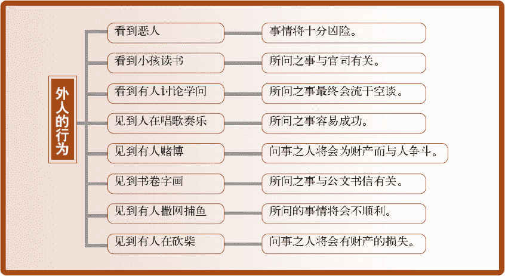

#### 问事之人的行为与事情的吉凶

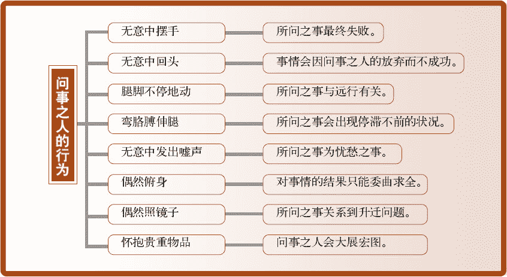

## 7　十应之五
方卦之应

方卦之应与天时、地理、人品之应不太一样，它不但看体卦与方位之卦的关系，而且要看用卦与方位之卦的关系。其中方位之卦的确定取决于问事之人站立的方位。

方卦之应就是由方位而得到的外应。在前面介绍的天时之应、地理之应、人品之应中，都是利用外卦和体卦的生克比和关系来定吉凶的，但方卦之应看的不仅仅是体卦，还包括用卦。

### 用卦与方位

方位定吉凶的规则是，当用卦生扶方位卦，或与方位卦相比和时，对问事之人就是大吉之象；当方位卦生扶用卦时，卦气外泄，对事情就不利；如果用卦克制方位卦，那么就是大凶之象。

例如得到的用卦为坎卦，当问事之人站在北方时，方位卦是坎水，与用卦相比和，事情就会十分顺利；当问事之人站在东方时，用卦之水生方位卦之木，事情也会大吉；当问事之人站在东南方时，用卦之水生方位卦之木，事情也会一帆风顺；当问事之人站在西方或西北方时，方位卦之金生扶用卦之水，卦气外泄，对事情的发展不利；当问事之人站在南方时，用卦之水克制方位卦之火，是大凶的前兆；当问事之人站在东北或西南方时，方位卦五行属土，克制用卦之水，比较吉利。

### 体卦与方位

上面是比较用卦与方位卦的关系，其中用卦指的是本卦中的用卦，而不是指广义的用卦。另外，体卦与方位卦之间也存在着生克比和关系，它们同样对事情的结果有着影响。

但是体卦与用卦不同，用卦宜于生扶或比和方位卦，体卦却宜于得到方位卦的生扶或比和。若用卦克制方位卦，则事情可断为大凶；若体卦克制方位卦，事情却没有那么凶险，只不过不太顺利罢了。方位卦克制用卦，事情仅仅是不顺利而已；若是方位卦克制体卦，那事情就十分凶险了。

同样以坎卦为例，当体卦为坎卦时，问事之人宜于站在西方、北方和西北方，因为方位之金或水生扶或比和体卦；问事之人也宜于站在南方，因为这样体卦之水克制方位卦之火；问事之人不宜站在东方或东南方，因为这样方位卦得到体卦的生扶，使卦气外泄；问事之人一定不能站在东北或西南方，因为这样会克制体卦，导致事情最终失败。

### 方卦之应

方位卦的确定取决于问事之人站立的方位。方位卦与用卦和体卦都有密切关系，一般来说，用卦宜于生扶方位卦，方位卦宜于生扶体卦。

#### 用卦与方位

当用卦生扶方位卦时事情就吉利，当用卦克制方位卦时事情就凶险。

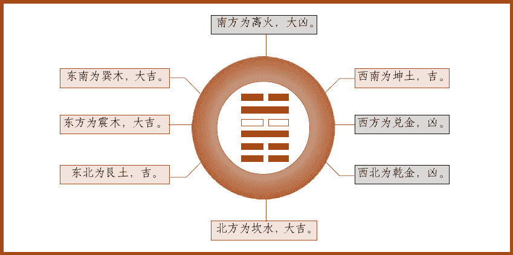

#### 体卦与方位

当方位卦生扶体卦时事情就吉利，当方位卦克制体卦时事情就凶险。

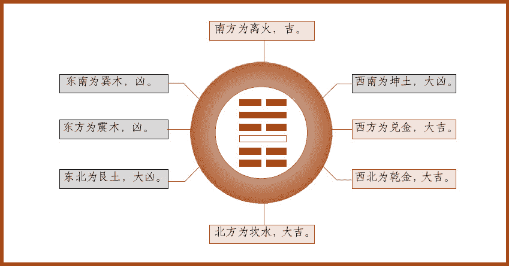

## 8　十应之六
动物之应

利用动物定吉凶有两种方法，一是根据动物在我们日常生活中的象征；二是根据动物的八卦属性。两者有时候不一致，如天鹅是吉利的动物，但在体卦为震时它又成了凶险的象征。

### 动物与吉凶

有些动物在我们的日常生活中有着明确的象征，在断卦时如果见到了这些动物，就可以直接作为断定事情吉凶的依据。

乌鸦是不祥之鸟，若在断卦时见到乌鸦或听到乌鸦鸣叫，则事情将会十分凶险；喜鹊是最典型的吉祥之鸟，在断卦时见到喜鹊或听到喜鹊鸣叫，就是事情顺利发展的象征；大雁秋天向南飞，春天向北飞，是十分守信用的，所以若断卦时见到了大雁则所问之事为朋友信用问题；见到蛇则要防止被谋害；见到老鼠意味着夫妻争吵；听到麻雀叽叽喳喳，就会有远行之事；见到两只狗撕咬则要做好防范盗贼的准备；见到有人骑马，则宜于出门远行。

### 动物之应

以上是根据动物在生活或文化传统中的象征来断卦的，除此之外还可以利用动物的八卦属性来确定吉凶。

八卦与一些动物的对应关系最好要记牢。乾卦代表动物：马、天鹅、狮子、大象；兑卦代表动物：羊、泽中之物；离卦代表动物：野山鸡、龟、鳖、蟹、螺、蚌；震卦代表动物：龙、蛇；巽卦代表动物：鸡、其他禽类；坎卦代表动物：猪、鱼、水中的其他动物；艮卦代表动物：虎、狗；坤卦代表动物：牛、在地下生活的动物。注意有些动物的八卦归属不是唯一的，如有些兽类可以归属为乾卦，也可以归属为艮卦，要根据实际情况来确定。

在知道了动物的八卦属性之后，断卦时就可以利用动物之应来定吉凶了。例如当体卦为震时，见到龙、蛇和各种禽类就吉利，因为它们的五行归属都是木，与体卦相互比和；见到马或天鹅就十分凶险，因为它们五行属金，能克制体卦之木。蛇一般看来是不吉祥的动物，马和天鹅是吉祥的动物，但是在这里它们的性质却完全相反。当出现这种情况时就要以动物的八卦属性为准。

### 动物之应

许多动物在传统文化中有明确的含义，例如喜鹊代表喜事降临，乌鸦代表将有灾难等。根据这些就可以利用动物进行断卦。

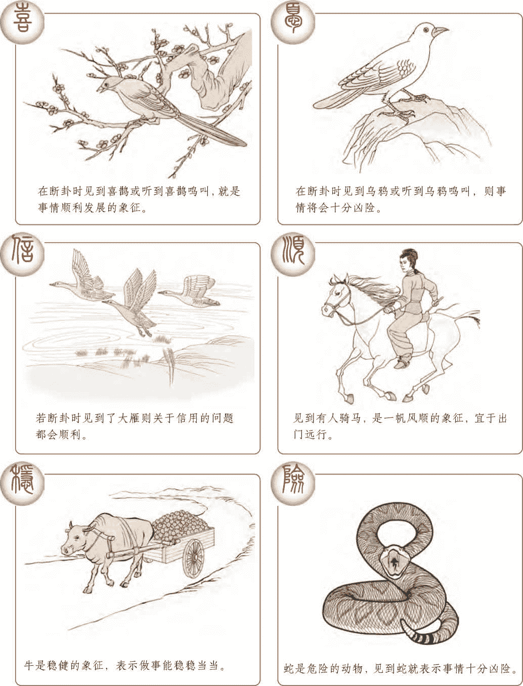

## 9　十应之七
静物之应

梅花易数中所说的静物包括植物和各种无生命的器物。静物之应也分为两种情况，一种是利用静物在日常生活或文化传统中的象征，另一种是利用静物的八卦属性。在断卦时要把静物之应断为外卦。

### 静物与吉凶

要利用静物断吉凶，就要首先弄清楚它们在日常生活或文化传统中的象征。如松柏是长寿的象征，所以若在断卦时见到松柏，则预示着问事之人可以长寿；兰花是君子的象征，所以问事之人遇上的合作者是诚实可信的；牡丹是富贵的象征，所以问事之人将会财运亨通；菊花是花中的隐士，所以问事之人若放下名利之心则会大吉；若在断卦时见到灵芝、雪莲等珍贵的植物，那么问事之人就会取得非凡的成就。

若是占算寿辰，则除了松柏之外，还宜于见到香椿和桧树，因为它们都是传说中的长寿之木；若是预测生产，则不宜见到独苗，因为它是门庭冷落的象征；若是预测病人康复情况，则不宜见到落叶，因为它意味着生命即将终结；若是预测事情的结果，则宜于见到大的果子，因为它象征着结果的圆满。

在断卦时若见到破了的酒杯，则预示着要乐极生悲；若夏天见到棉被，冬天见到草席，则问事之人将守着资源而无法利用；若在晴天见到雨伞，则问事之人将无事可做；若见到肥皂泡，则事情只能是一场空。

### 静物之应

要利用静物之应断卦，就必须了解八卦与静物的对应关系。乾卦代表的静物：金银珠宝、圆物、刚物、帽子、镜子；兑卦代表的静物：金刃、乐器、废物、缺器；离卦代表的静物：火、书、甲胄、干戈、干燥之物、赤色之物；震卦代表的静物：竹木、萑苇、竹木类乐器；巽卦代表的静物：木香、绳子、长直之物、竹木、工巧之器；坎卦代表的静物：水、带籽带核之物、酒器；艮卦代表的静物：土石、瓜果、土中之物；坤卦代表的静物：方物、柔物、布帛、丝绵、五谷、瓦器。

静物之应与天时、地理等类似，都是把静物之应断为外卦，考察它们与体卦的生克比和关系。

### 静物之应

静物断卦法与动物断卦法差不多，也是分两种情况，一是根据静物的传统意义，二是根据静物的八卦五行属性。断卦时以静物之应为外卦。

#### 一些植物的象征意义

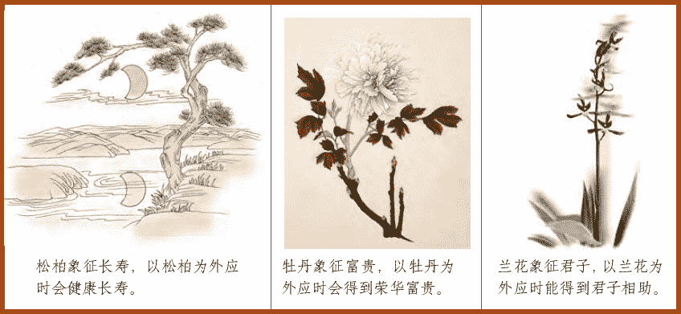

#### 八卦代表的静物

八卦各有其代表的事物，如震卦属木，所以震卦代表竹木类物体；艮卦属土，所以艮卦代表与土石有关的一些事物等。

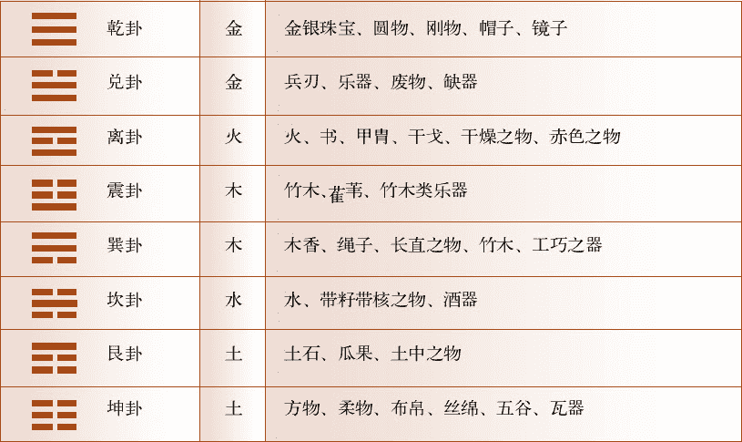

## 10　十应之八
言语之应

言语之应，一般不与八卦卦象相联系，而主要是利用了文字的谐音。在断卦时说话人的语气、表情，以及说话的内容也与事情的发展趋势有关。

### 谐音与吉凶

利用谐音断卦时不一定是根据人说出的声音，也可以根据观察到的各种现象。因为一定要读出来才能听出是否谐音，所以仍然可以把这种方法归为言语之列。

如果在断卦时见到了鹿，“鹿”与“禄”谐音，问事之人必定能官运亨通；见到了梨则问事之人会有骨肉分离之忧，因为“梨”与“离”谐音；见到了帽子则问事之人要升官，因为“冠”与“官”谐音；见到蜜蜂则说明问事之人将要有封官之喜，因为“蜂”与“封”谐音；见到桃子则说明问事之人犯了法要逃走，因为“桃”与“逃”谐音；见到李子则说明问事之人在诉讼中有理，因为“李”与“理”谐音；见到盒子或者鞋则预示着问事之人百事和谐，因为“盒”与“和”、“鞋”与“协”谐音。

### 言语之应

凡是来人说话带有惭愧的样子，就可以断定他做了与所问之事有关的亏心事；如果他说话支支吾吾，那么就可以断定他心里充满了疑虑；如果来人说话实在，但是话不多，那么就可断定他为诚实之人；如果来人说话又多又快，那么就可断定他是脾气暴躁之人；如果来人说话时油腔滑调，那么就可断定他是经常诬陷好人的人；如果见来人说话时充满委屈，那么就可断定他是理亏之人。

另外，在断卦时若听到别人讲吉利的话，就意味着事情将会大吉；听到有人讲不吉利的话，则问事之人将会遭遇凶险；如果很多人讲话，那么所问之事将理不清头绪；如果人在窃窃私语，则事情很快就能理清头绪；如果旁边的人讨论国家大事，那么问事之人求功名就可以得到；如果听到别人讨论喜庆之事，那么对问事之人来说就会有喜事降临。

在利用言语断卦时一定要听清楚所讲的话，如果是在闹市中，虽然讲话的人很多，但是一句话也听不清楚，那么就不要根据言语断卦。

### 言语之应

利用言语断卦有两种方式，一是根据看到的东西的谐音，如“桃”与“逃”等；二是利用人在说话时的情绪和所说的内容。

#### 谐音的妙用

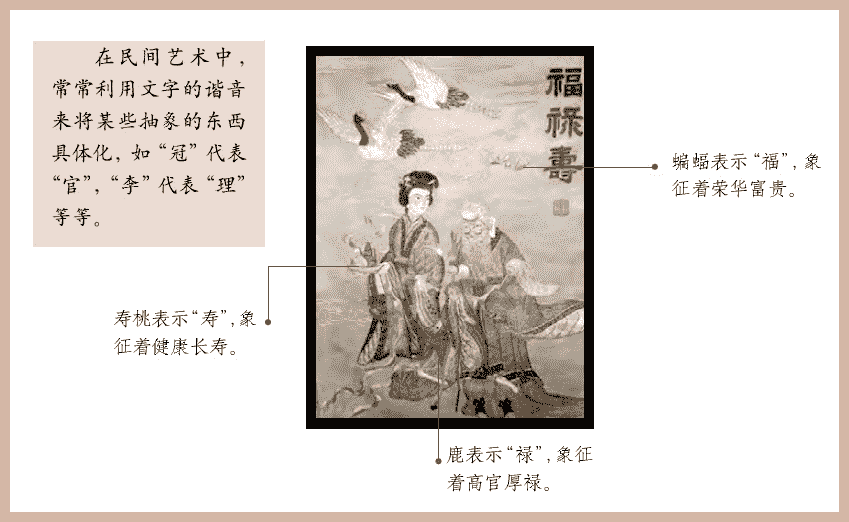

#### 言语之应

在断卦时，可以根据问事之人说话时的语气或神态来取外卦。

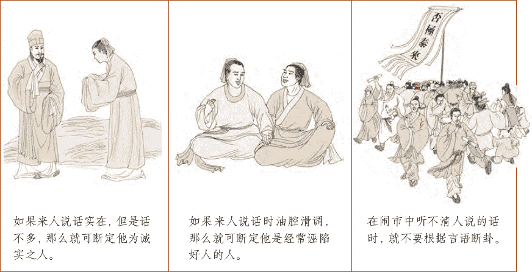

## 11　十应之九
声色之应

声色之应分为声音之应和颜色之应，是利用听到的声音和看到的颜色取外卦的方法。当取到外卦之后，要看它与体卦的生克比和关系，以断定吉凶祸福。

### 声音之应

利用声音之应断卦有两种方法，一种是根据声音的本身的感情色彩来判断。听到欢声笑语，则主有喜事；听到悲伤叹息，则主有忧虑之事；听到乌鸦叫，则主有灾难；听到怒吼声，则主有争吵之事；听见鸿雁鸣，则问事之人将要收到寄自远方的书信；听见鸡和鸟鸣叫，则问事之人将会遇上欣喜之事。

另一种方法是根据声音的八卦属性来确定外卦，判断外卦与体卦的生克比和关系。八卦与声音种类的对应如下：乾卦对应金属物体撞击发出的声音；兑卦对应人说话的声音、动物鸣叫的声音；离卦对应烈火燃烧的声音、烧裂的竹木发出的声音；震卦对应擂鼓、木槌敲击木板的声音；巽卦对应风吹草动的声音、狂风呼啸的声音；坎卦对应下雨的声音、水流动的声音；艮卦对应山体滑坡、山体崩塌的声音；坤卦对应打地基、砸土墙的声音。

### 颜色之应

颜色之应是利用断卦时所见到的颜色确定外卦的方法。颜色与五行的对应关系为：金为白色，木为青色、绿色，水为黑色，火为红色，土为黄色。这样就直接把颜色和五行联系在一起，不需要经过八卦这个中介。

例如起卦得到体卦为离，其五行属性为火，这时就宜于听到烈火燃烧的声音，看到火红的颜色，因为这样外卦就和体卦相比和，万事顺遂人愿；也宜于听到擂鼓声、敲击木板声、风吹草动声、狂风呼啸声等声音，见到青绿色，因为这样外卦之木生扶体卦之火，万事大吉；不宜听到山体滑坡、山体崩塌、打地基、砸土墙的声音，也不宜见到黄颜色的东西，因为这样体卦之火就会生扶外卦之土，从而泄露卦气，使事情变得不利；尤其不能听到的声音是下雨声、流水声，尤其不能看到的颜色是黑色，因为这样外卦之水克制体卦之火，事情将会十分凶险。

### 声色之应

声色之应是利用声音和颜色的八卦及五行属性确定外卦的方法。更进一步来说，它是寻找声音和颜色来源的一种方法。

#### 声音的八卦属性

对于声音来说，取外卦时要先找到其八卦归属，通过八卦这个中介联系到五行。

|  |  |
| 乾卦： 金属物体撞击发出的声音。 | 兑卦： 人说话的声音、动物鸣叫的声音。 |
|  |  |
| 离卦： 烈火燃烧的声音、烧裂的竹木发出的声音。 | 震卦： 擂鼓、木槌敲击木板的声音。 |
|  |  |
| 巽卦： 风吹草动的声音、狂风呼啸的声音。 | 坎卦： 下雨的声音、水流动的声音。 |
| 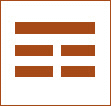 | 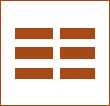 |
| 艮卦： 山体滑坡、山体崩塌的声音。 | 坤卦： 打地基、砸土墙的声音。 |

#### 声色之应

在利用声音和颜色断卦时，以声音或颜色为外卦，外卦宜于生扶体卦，而不宜克制体卦。

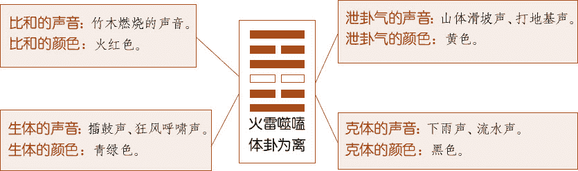

## 12　十应之十
文字之应

利用文字定吉凶也有两种方法，一种是拆字法，一种是定五行法。拆字法需要断卦者从外界环境中自己去发现字，定五行法需要断卦者判断字的五行属性，再根据体卦的五行属性断定吉凶祸福。

### 文字与吉凶

以文字定吉凶的一种方法是拆字法，但并不是拆开现成的字，而是从外应中去发现字。例如在断卦时见到有人在树的旁边，就是“人”加“木”，也就是一个“休”字，说明事情不成功；若石头的旁边放着皮衣，就是“石”加“皮”，组成一个“破”字，说明问事之人将要破财；如果有人站在河边，那就是“水”加“立”，组成一个“泣”字，说明问事之人将会遇上伤心之事；如果在树林中见到火光，那就是“林”加“火”，组成一个“焚”字，说明问事之人要小心火灾；如果有人站在门里，那就是“门”加“人”，组成一个“闪”字，说明问事之人在办事时会有闪失。

### 文字之应

文字之应是利用文字的五行属性来定吉凶的方法，应用这种方法时首先要根据文字取定外卦，再看外卦与体卦的生克比和关系。这种方法也不需要八卦做中介，而直接把文字在五行中归类。

金、木、水、火、土都可以作为汉字的偏旁部首，所以含有这些偏旁部首的汉字都可直接找到五行归属。例如“铁”、“铝”等属金，“没”、“流”等属水等等。

另外，还有一些不含有上述偏旁的字，那就找其他的分类标准。例如“唱”、“只”、“啊”等含“口”的字属于兑卦，五行属金；“岭”、“岗”、“岫”等含“山”的属于艮卦，五行属土；“苍”、“苇”、“芸”等含草字头的五行属木；“筏”、“符”、“笠”等含竹字头的五行属木。

假如取到的体卦为震，那么就宜于见到“枝”、“艺”、“笼”等五行属木的字，因为这些字所对应的外卦与体卦相比和，对事情有利；而不宜见到“钞”、“吩”等五行属金的字，以防体卦被外卦克制；如果遇上了“燃”、“炊”等字，虽然不是大凶，但是体卦的卦气外泄，对事情的发展就有所牵制。

### 文字之应

处理各种文字是梅花易数的核心内容之一，和自然界中的万事万物一样，文字也有着八卦和五行属性，所以也可以用来断卦。

#### 拆字法

我们所说拆字法并不是拆开现成的字，而是从外部世界的各种现象中去发现字。这利用了汉字的象形、会意等特点。

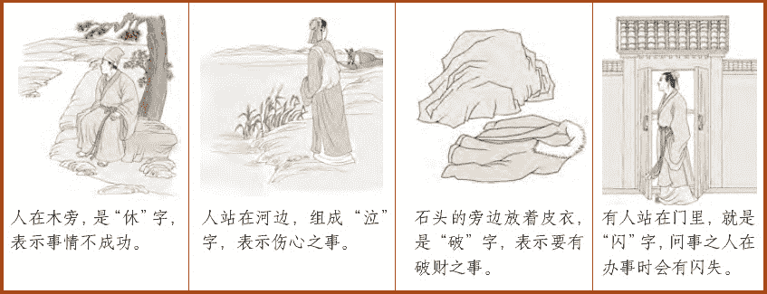

#### 字的五行属性

金、木、水、火、土都可以作为汉字的偏旁部首，所以含有这些偏旁部首的汉字都可直接找到其五行归属。

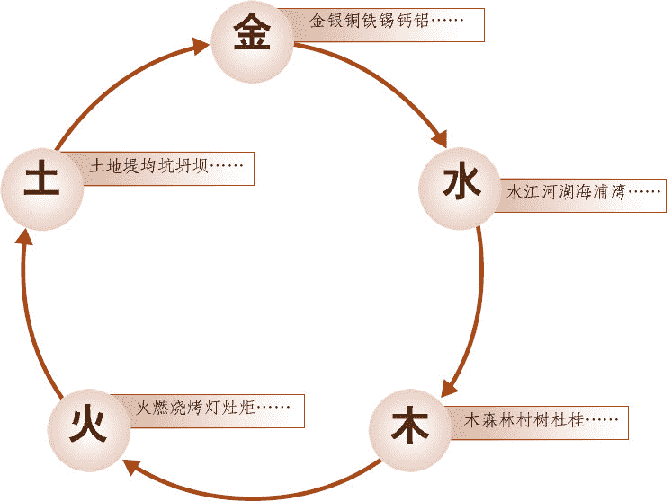

# 第六章　观梅术妙用
梅花易数占例

学习梅花易数的最终目的是为了应用，从理论到应用的最佳途径就是多看占例。本章选取了八个梅花易数经典占例，从年月、时刻、闻声、声音、字画、面色、动物、植物等八个角度全面讲述了梅花易数起卦及断卦法的具体应用。在读故事学起卦法的同时，又能让我们学到许多处事为人的道理。

## 本章图版目录

观梅占例

牡丹占例

借物占例

动静占例

牌额占例

老人有忧色占

少年有喜色占

动物哀鸣占例

植物占例

## 1　年月占例
康节观梅占

观梅占向我们充分展示了年月占的具体应用方法。它是邵康节对梅花占法最初的应用范例，也是最经典的占例之一，相传邵康节先生正是通过这件事而创立了梅花易数。

### 观梅占的起卦

那是辰年的十二月十七日申时，邵康节先生偶然来到梅花树下，忽然看见有两只麻雀在梅花树上争斗，其中一只不慎掉落地上而受伤。邵康节先生感到十分奇怪，心想：“占算的规则是不动不占、无事不占，今有二雀争枝坠地，是一件值得注意的事情。”于是利用当时的年月日时占了一卦。

辰年对应数字 5，十二月对应数字 12，十七日对应数字 17，其和为 34，用 34 除以 8，得余数 2，2 对应的卦为兑卦，所以上卦就是兑卦；申时对应数字 9，34 加上 9 得 43，用 43 除以 8，得余数 3，3 对应的卦为离卦，所以下卦就是离卦，本卦为泽火革卦。再将总数 43 除以 6，得余数 1，所以初爻为动爻。初爻动时得到变卦为泽山咸卦，而本卦的互卦为上乾下巽，也就是天风姤卦。

### 观梅占的断卦

邵康节先生分析得到的卦象，在泽火革卦中，上卦兑为体卦，下卦离为用卦，火克金，所以用卦克制体卦；而互卦中的巽木生起离火，火势十分猛烈，这样一来克体的卦气就过于旺盛了，导致体卦兑受伤。兑对应的形象是少女，所以邵康节先生推断会有少女因此受到伤害。再看互卦中的巽木，因为本卦和互卦的上卦分别是兑金和乾金，所以巽木就被克制。巽卦若应在少女身上则为大腿，邵康节先生据此推断应该有少女被伤着了大腿。进一步推断。因为变卦的下卦为艮卦，兑金得到了艮土的生扶，故可推知少女的伤势并不重。

邵康节先生是一个仁慈的长者，赶忙告诉家人，说假如有少女来攀折梅花，千万不要阻拦或吓唬她，任凭她折梅花。但是到了第二天的晚上，预料中的事情还是发生了，原因是家里有个工匠昨天外出没有听见邵康节先生的话。卦象中显示的事情是不可避免的，由此可见一斑。

### 观梅占例

观梅占是梅花易数中最经典的占例之一，它向我们展示了年月起卦法的应用方法，以及如何根据卦象来断卦。本卦充分说明万事皆卦的道理。

#### 观梅占的起卦与断卦

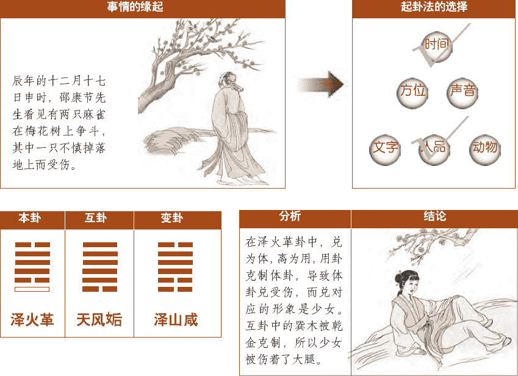

#### 观梅占的启示

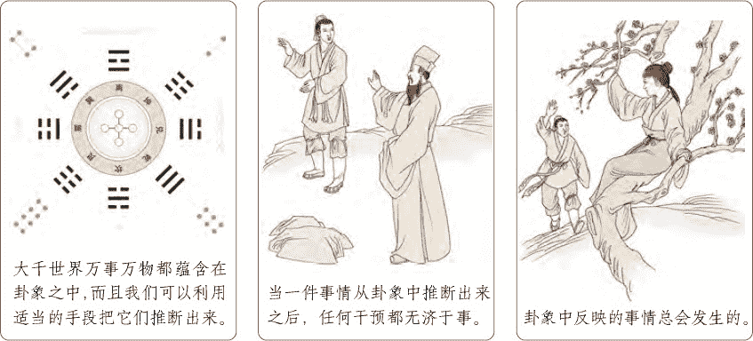

## 2　时刻占例
马踏牡丹占

马踏牡丹占让人见识到了梅花易数的玄机之深奥，它给我们的启示是万事万物中莫不有定数存在。发现这个定数的方法有多种，而梅花易数就是其中的佼佼者，只要掌握了梅花易数，一切都将把握在手中。

### 牡丹占的起卦

邵康节先生刚刚创立梅花易数时，这种奥妙无穷的占断方法并没有得到很多人的认可，但是当大家见识到邵康节马踏牡丹占之后，再也不对梅花易数怀有成见了。

那是巳年的三月十六日，时间为卯时，相当于早上 5 点到 7 点间，邵康节先生与客人前往司马光家去观赏牡丹。洛阳牡丹甲天下，当时又正是牡丹花盛开的季节，所以大家都对各种颜色的牡丹花赞赏不已。有客人问道：“如此美好的牡丹花，也受到定数的制约吗？”意思是想考验一下梅花占法。先生回答说：“万物皆有定数，而且只要你一问，就可以立即起卦。”于是就为盛开的牡丹花起卦占算。

巳年对应着数字 6，三月对应着数字 3，十六日对应着数字 16，其和为 25 数，用 25 除以 8，得余数 1，所以上卦取为乾卦；卯时对应着数字 4，25 加上 4 得 29，用 29 除以 8，得到余数 5，所以下卦就是巽卦，这样得到的本卦为上乾下巽的天风姤卦。

下面再取动爻，用 29 除以 6，得余数为 5，所以天风姤的九五爻为动爻。这样就得到了变卦火风鼎卦，而本卦的互卦为上乾下乾卦。

### 牡丹占的断卦

这样的卦象能得出什么结论呢？在本卦中，上乾为用卦，下巽为体卦，金克木，所以用卦克制体卦，对体卦不利；而互卦中又出现两个乾卦，更是增加了巽卦的危险性。在本占例中巽木也就是牡丹花，所以可知牡丹肯定要被毁坏。而乾代表的动物是马，所以是两匹马把牡丹花毁掉了。

于是邵康节先生说：“可惜啊，如此娇艳的牡丹花明天只能再观赏半天了，明天午时会有两匹马把牡丹花践踏坏了。”客人闻言并不相信。

果然，到了第二天，有位高官来观赏牡丹，他的两匹马互相撕咬，把娇艳的牡丹花全都踏毁了。

### 牡丹占例

马踏牡丹占告诉我们万事万物中莫不有数存在，利用梅花易数就可以发现事物中蕴含的玄机。有时候从卦象可以得出匪夷所思的结论，但是只要灵活变通，一切都可以把握。

#### 牡丹占的起卦与断卦

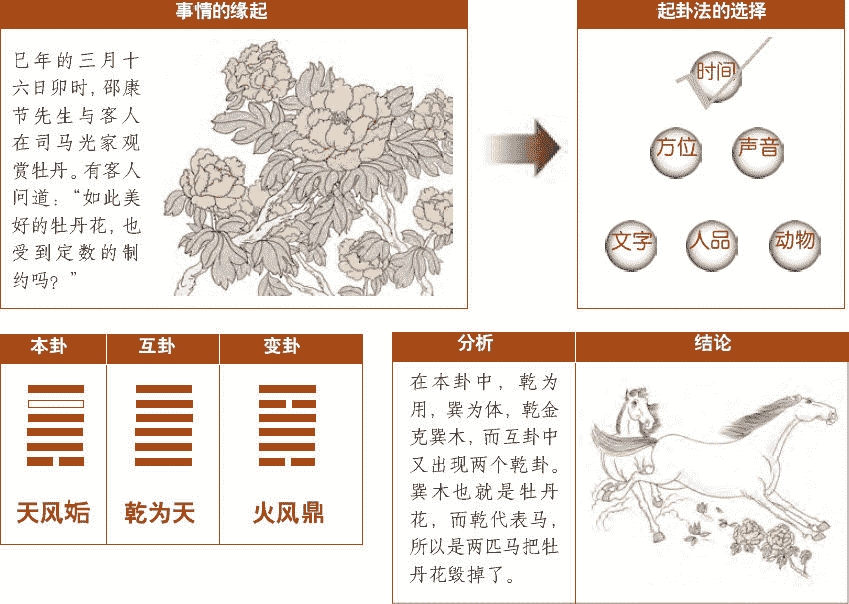

#### 牡丹占的启示

牡丹占例告诉我们，万事万物中都有数的存在，只要能看出事物中的数字，就可以立即转化为卦象。

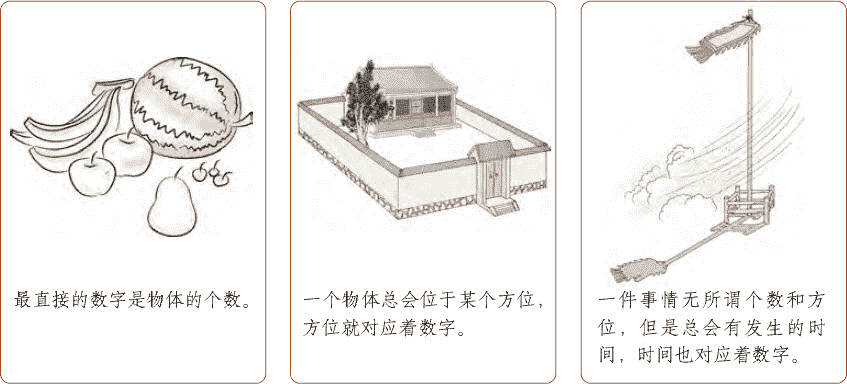

## 3　闻声占例
叩门借物占

本占例是根据声音数来起卦的，起卦后的卦象所指事物并不十分明确，在这种情况下就要根据事理来断卦。任何理论都不能脱离实际，梅花易数断卦法也不例外。只有把卦象和事理相结合，才是断卦成功的关健所在。

### 借物占的起卦与断卦

在一个冬天的傍晚，外面下着大雪，邵康节先生刚刚在房间里生起炉火，就听到外面响起了敲门声，但又不是连续敲门，而是只敲了一下就停下来了；过了一会儿又敲，这次是连续敲了 5 下，而且说要借东西。开门让客人进来后，邵康节先生先不让他说出要借的东西，而是让儿子占算一下客人到底借什么。当时的时间是酉时，也就是现在的下午 5 点到 7 点间。

这是典型的利用声音数占算的例子，以开始的一下为上卦，后来的 5 下为下卦，得到上乾下巽的天风姤卦。两数之和为 6，时辰酉时对应的数字为 10，相加得 16，16 除以 6 得到余数 4，所以取九四为动爻。九四爻变为六四，这样变卦就是上巽下巽卦，而本卦的互卦是上乾下乾卦。于是本卦、变卦和互卦中一共出现了三个乾卦和两个巽卦，乾卦属金，巽卦属木，可推知客人所借的东西为金属和木料制造的工具。又因为在本卦中乾卦为用卦，巽卦为体卦，所以金短而木长。

### 断卦的误区

根据上面的推断，邵康节的儿子说，金短木长的工具，那一定就是锄头了。而邵康节先生却说客人借的是斧子。一问来的人，果然要借的是斧子。儿子对此疑惑不解，因为从卦象来看，锄头和斧子都符合，但是为什么邵康节很坚决地断定为斧子呢？邵康节先生解释说，在这里没有什么奇怪的，冬天不是耕种的时节，当然不会有人来借锄头；而冬天的傍晚还下着雪，那一定是要借斧子来劈柴生火了。

这件事给我们的启示是，任何理论都不能脱离实际、闭门造车，梅花易数占算法也不例外。断卦时不能仅仅根据卦象来推测，更重要的是联系生活中的实际情况。只有把象数和事理结合起来，才能得到正确的结论。

### 借物占例

本占例的重点不在于起卦的过程，而在于如何来断卦。在卦象所指事物并不十分明确的情况下就要根据事理来断卦。把卦象和事理相结合，是断卦成功的关键所在。

#### 借物占的起卦与断卦

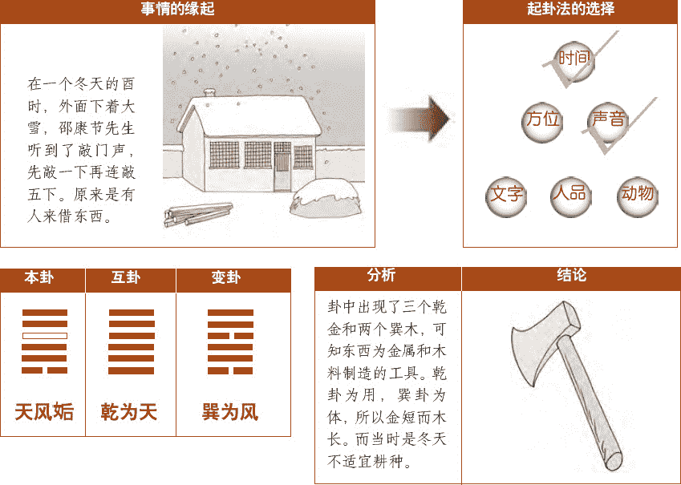

#### 借物占的启示

断卦时不能仅仅根据卦象来推测，更重要的是联系生活中的实际情况。只有把象数和事理结合起来，才能得到正确的结论。

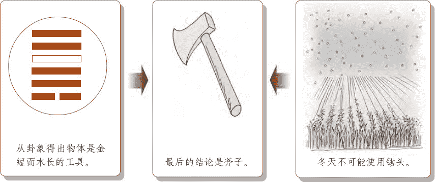

## 4　声音占例
今日动静占

在生活中无时无处不可以起卦，一些看似平常的现象，其实蕴含着很丰富的预兆，本例就是利用平常事起卦的典范。本例属于根据文字起卦的占例，是利用客人随意说出的一句话推断晚上发生的事情。

### 动静占的起卦

有人曾经问邵康节先生：“今日动静如何？”先生于是用这 6 个字起卦。

按照我们在前面介绍的断字法，把“今日动静如何”两个字平分成两段，以“今日动”为上句，“静如何”为下句，然后按照声调起卦法来起卦。

在中原古韵中，“今”为平声，对应数字为 1；“日”为入声，对应数字为 4；“动”为去声，对应数字为 3。上句的总数为 8，对应的上卦为坤卦。“静”为去声，对应数字为 3；“如”为平声，对应数字为 1；“何”为平声，对应数字为 1。下句的总数为 5，对应的下卦为巽卦。这样就得到了本卦为上坤下巽的地风升卦。

下面再取动爻，上下句对应数字的总和为 13，13 除以 6 得到余数 1，所以地风升卦中初六为动爻。初爻由阴爻变为阳爻，变卦的下卦成为乾卦，于是得到变卦为地天泰卦，而本卦的互卦为山泽损卦。

### 动静占的断卦

现在就可以根据卦象断卦了。本卦为地风升卦，“升”字具有登阶的意思。互卦为上震下兑，震居东方，兑居西方，两卦同时出现就是东席、西席的象征，在古代东席表示主人，西席表示客人；而兑象征着口，坤象征着腹，两卦遇到一起，就可以断定会有人请客有人赴宴。又因为坤土独立存在，既没有与它相比和的卦，也没有与它相生扶的卦，所以说客人不会多；而卦中没有象征酒水的坎卦出现，所以即使喝酒也不会喝醉；另外坤卦象征着五谷杂粮，所以推断宴会上食物并不十分丰盛。

综合以上推断，邵康节先生对客人说：“今天晚上会有人请你赴宴，同去的客人不多，你在酒席上没有喝醉，主人招待的饭菜也一般。”

客人高兴而去，到了晚上果然像邵康节说的那样应邀去赴宴了。

### 动静占例

本例属于根据又字起卦的占例。根据客人随意说出的一句话就可以推断晚上发生的事情，甚至连细节也不遗漏，可见梅花易数应用范围之广。

#### 动静占的起卦与断卦

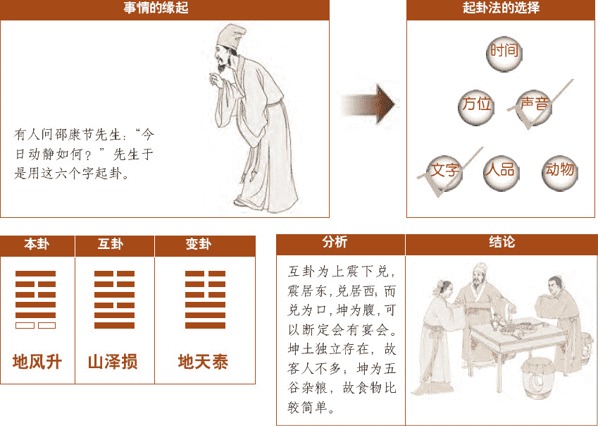

#### 动静占的启示

事无大小，任何事情都能够用梅花易数来起卦。就连随意说出的一句话都可以成为起卦断卦的依据。有时候小事可以预示着大事的发生。

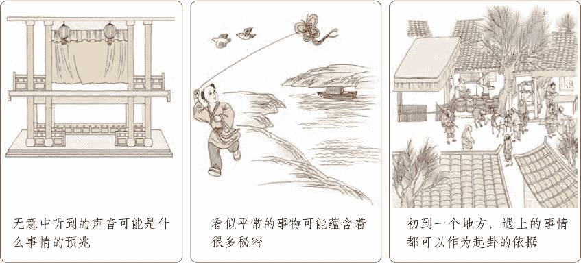

## 5　字画占例
西林寺牌占

本占例是利用字来起卦的一个小故事，邵康节先生发现西林寺牌额上的字不太协调，于是起卦断卦，从而避免了寺里的许多祸害。善于观察，在常人司空见惯的地方发现玄机，是精通梅花易数的重要保证。

### 牌额占的起卦

邵康节先生曾经到佛寺西林寺参禅，偶然看见西林寺的牌额，发现“西林寺”三字中的“林”字没有两勾，平常人看惯了这个字，不会对这两个勾产生其他的想法，但是邵康节先生却认为它与另外两个字不协调，于是用“西林”这两个字来占卦。

按照前面介绍的断字法，以“西”字为上卦，“林”字为下卦。由于字数不多，可以很方便地数清楚笔画数，所以宜于使用笔画起卦法起卦。

“西”字共 6 画，但是西林寺牌额上的“西”字书写笔迹中间有断笔，因此计为 7 画，7 对应的卦为艮，所以上卦取为艮卦；“林”字共 8 画，8 对应的卦为坤，所以下卦取为坤卦；本卦就是上艮下坤的山地剥卦。上下两卦对应数字之和为 15，15 除以 6 得到余数 3，六三爻取为动爻。山地剥卦的第三爻由阴变阳，剥卦变为艮卦，所以变卦为艮上艮下卦，而山地剥卦的互卦是坤上坤下卦。

### 牌额占的断卦

邵康节先生断卦说：西林寺是男僧众居住修行的地方，应该是纯阳所在。但是得到的是山地剥卦，属于重阴之卦，而互卦与变卦也都是阴气甚重，将不利于男众的修行。

寺里人问有没有什么办法改变这种状况，邵康节先生说，只需要在“林”字的下面添上两勾即可。

如果在“林”字上另加两勾，这个字便成了 10 画，10 除以 8，余数为 2，2 所对应的卦为兑卦。上卦为艮，下卦为兑，本卦变为山泽损卦。两个字的总笔画数为 17，除以 6 得到余数 5。山泽损卦的第五爻由阴变阳，便得到了变卦风泽中孚卦。本卦的互卦为地雷复卦。

损是益的开始，本卦的用卦为艮，五行属土，互卦中坤卦也属土，也就是用卦和互卦都为土，土生金，所以用卦和互卦都生扶体卦，这样一来寺里就平安无事了。

### 牌额占例

本占例是利用字来起卦的一个例子。但是本卦的重点既不在于起卦，又不在于断卦，而在于占卦的实际用途。根据占卦的结果调整周围的事物或自己的行动，是趋利避害的有效途径。

#### 牌额占的起卦与断卦

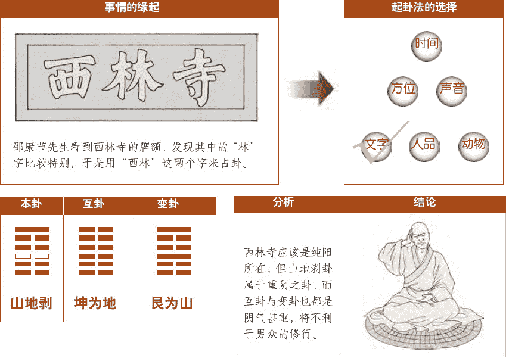

#### 牌额占的启示

根据占卦的结果调整周围的事物或自己的行动，是趋利避害的有效途径。但前提是自己的改变必须对卦象产生影响。

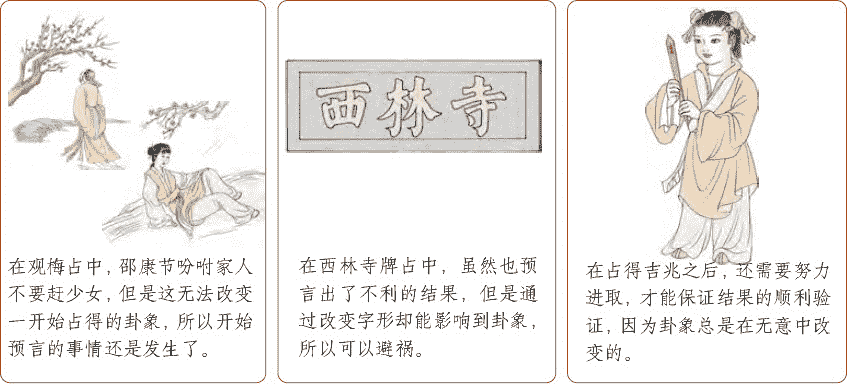

## 6　面色占例
面色忧喜占

这两个卦例是都是面色占，不同之处在于一喜一忧。但无论是喜还是忧，其起卦和断卦方式都是一样的。面色占在断卦时一般要用到《易经》卦辞与爻辞，尤其是动爻的爻辞。应验时间的确定是面色占中的重点之一，确定应验时间时要会灵活变通。

### 老人有忧色占

有一天，邵康节先生在路上行走，看见一位老人从东南方向走来，老人面带忧愁，引起了邵康节先生的奇怪。先生就问老人发生了什么事，老人却说没有什么事。先生更加感到奇怪，于是就起了一卦。

老人对应的卦象为乾，所以上卦取为乾卦；老人来的方向是东南方，对应的卦象为巽卦，所以下卦取为巽，总的卦象就是天风姤卦。当时的时间是己丑日的卯时，卯时相当于早上的 5 点至 7 点，对应的数字为 4；乾卦数 1，巽卦数 5，卯时数 4，三者加起来得到 10，10 除以 6 得到余数 4，天风姤卦九四爻动。

起卦之后就可以断卦了，《易经》天风姤卦的九四爻辞说：“包无鱼，起凶。”说明动爻爻辞很不吉利。再从卦象上来分析，在天风姤卦中巽为体卦，乾为用卦，因为金克木，所以用卦克制体卦；而天风姤卦的互卦是两个乾卦，现在有了三个克体的卦象，同时又没有什么卦来生扶体卦，这一切都是大凶之象。

再考虑应验的时间，因为起卦时占者和被占者都在路上行走，所以应验的时间是很快的。成卦的数为 10，取其一半为 5，于是邵康节先生对老人说“在 5 天之内你恐怕会遇到比较大的灾祸，一定要小心谨慎，尤其小心鱼类。”

老人小心翼翼地度过了 5 天，结果就在第五天的时候老人去赴宴，在宴席上被鱼骨鲠喉而死。

### 少年有喜色占

壬申日的午时，邵康节先生在路上行走，看见一位少年从正南方向走来，少年高高兴兴满脸笑容。邵康节先生素来观察十分仔细，就问少年有什么喜事值得这样高兴的，少年却回答说：“没有什么喜事。”先生见此事又与常情不符，于是就为少年起了一卦。

少年的八卦属性为艮，所以上卦取为艮卦；少年来的方向是正南方，对应的卦象为离卦，所以下卦取为离，总的卦象就是山火贲卦。当时的时间是壬申日的午时，午时相当于一天的上午 11 点至下午 1 点，对应的数字为 7；艮卦数 7，离卦数 3，午时数 7，三者加起来得到 17，17 除以 6 得到余数 5，山火贲卦六五爻动。

下面再根据卦象断卦。《易经》山火贲卦的爻辞说：“六五，贲于丘园，束帛戋戋，吝，终吉。”小象辞解释道：“六五之吉，有喜也。”可见此卦是十分吉利的。

从卦象上来看，山火贲卦的六五爻动后变为风火家人卦，互卦中又有震卦和坎卦，而以离卦为体。体卦克制用卦，而又得到了互卦的生扶，完全是大吉之兆。本卦、互卦、变卦都是充满生气的卦象。

邵康节先生见少年走走停停，所以推知事情的应验不会很快，但也不会很慢，于是利用成卦的 17 之数作为应验日期。

断卦的结果就十分明确了，邵康节先生告诉少年：“你在 17 天之内必有大喜之事，多半是要定亲了。”果然不出所料，到了第 17 天，那位少年果然定亲了。

### 老人有忧色占

面色占是根据人的喜忧来决定是否起卦的，但无论是喜还是忧，其起卦和断卦方式都是一样的。另外，面色占中应验时间的确定十分关键。

#### 忧色占的起卦与断卦

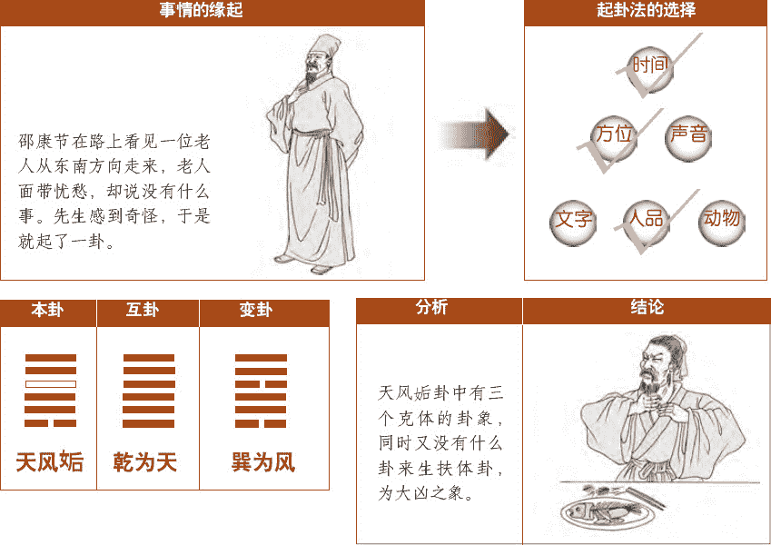

#### 面色占中的注意事项

面色占与其他占法有相同之处，但是也存在很多不同。要善于利用面色占的不同。

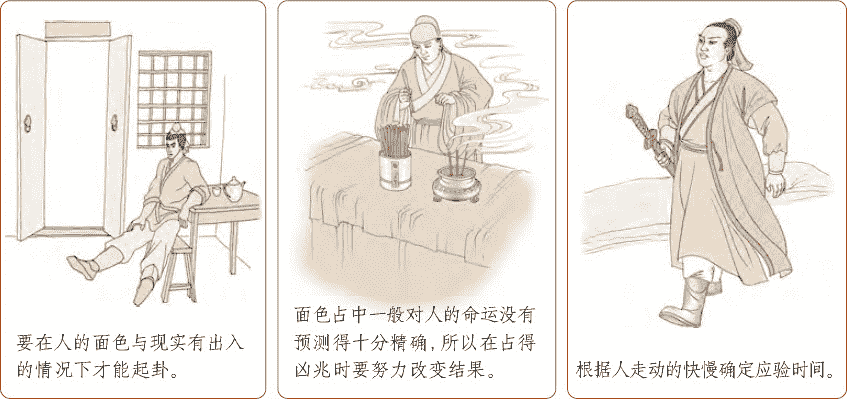

* * *

### 应验时间的确定

对于已经确定的断卦结果，一定会应验的，只是应验的时间有早有晚。具体什么时间应验，还要根据起卦时的动与静来决断。

一般来说，行走中的人，应验时间就很短，这时要用成卦的数除以二，以其半数作为应验的日期；坐着的人应验时间就很长，要用成卦的数乘以二，以其两倍作为应验的日期；而站立的人应验起来不快不慢，直接用成卦的数字作为应验的日期。

当然，根据实际情况灵活变通是重要的，例如在前面介绍的观梅占以及牡丹占中，两种花也许在朝夕之间就可能谢去，那就不必用成卦之数那么长的时间来作为应验日期了。

### 少年有喜色占

本占例与老人有忧色占类似，也是利用人品和方位起卦，利用时辰取动爻，在断卦时也要依据《易经》的爻辞。

#### 喜色占的起卦与断卦

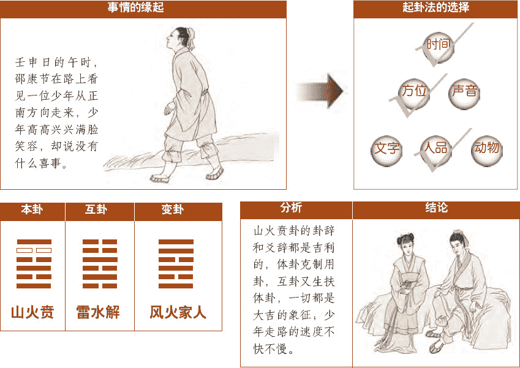

#### 面色占的独特之处

面色占在起卦与断卦的过程中要特别注意几点，这几点都是其他占法所不具备的。

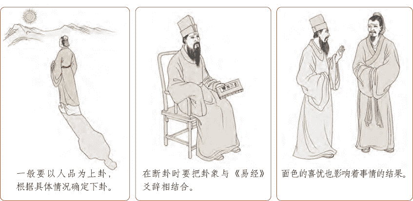

## 7　动物占例
动物哀鸣占

动物发出特别的鸣叫声时，就可以利用动物的属性和所处的方位来起卦，根据《易经》爻辞来断卦。另外，动物鸣叫的声音状况也是断卦的一个依据。应验时间的选择一般直接取成卦之数。

### 牛哀鸣占

一天，邵康节先生走在路上，忽然听到一头牛在鸣叫，叫声凄惨悲凉，先生心想要有什么事情了，于是根据叫声占了一卦。

当时的时间是癸卯日的午时，相当于现在的上午 11 点至下午 1 点，对应的数字为 7；牛的八卦属性为坤，所以用坤为上卦；而牛所在的方位为正北方，北方对应坎卦，所以下卦取为坎，总的卦象就是地水师卦。坎卦数 6，坤卦数 8，午时数 7，三者相加得 21，21 除以 6 得 3 余 3，地水师卦中六三爻动。

《易经》师卦六三爻辞说：“师或舆尸，凶。”地水师卦的上互卦为坤，下互卦为震。师卦以坤卦为体，互卦，变卦都是克体之卦，又加上牛的鸣声十分悲惨，所以必定是大凶无疑。应验的时间就选择成卦之数 21。

据此邵康节先生断卦说：“在 21 天之内，这头牛必有灾难。”到了第 20 天，果然有人把牛买去杀了。

### 鸡哀鸣占

甲申日那天，邵康节先生忽然听到鸡在鸣叫，声音十分悲惨，于是起了一卦。

鸡在八卦中的卦象为巽，所以用巽为上卦；鸡所在的方位为西北方，西北方对应的卦象为乾，所以乾为下卦；总的卦象就是风天小畜卦。巽卦数 5，乾卦数 1，卯时的数 4，相加得 10，10 除以 6 余 4，风天小畜卦六四爻动，变为乾卦。

《易经》小畜卦六四爻辞说：“有孚，血去，惕出无咎。”“血去”就意味着要杀鸡出血，小畜卦变卦为乾卦，互卦中又有离卦，乾卦为体，而离火克乾金，于体卦极为不利。卦中又出现了巽木和离火，木可生火，这是点火烹饪之象。显然，卦象预示了这只鸡被杀死吃掉的命运。而应验时间就取为成卦的 10 数。

邵康节先生断卦说：“这只鸡 10 天内当被宰杀吃掉。”果然，到了第 10 天鸡的主人家来了客人，主人杀了这只鸡招待客人。

### 动物哀鸣占例

只有当动物发出特别的鸣叫声时，才可以起卦，一般是利用动物的属性和所处的方位来起卦，根据《易经》爻辞来断卦。

#### 牛哀鸣占的起卦与断卦

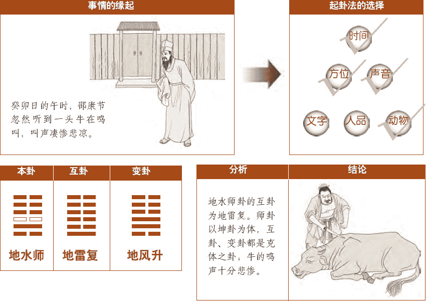

#### 动物声音占的一般顺序

对于动物声音占，有着一般的规律可遵循。掌握了这些步骤，对动物声音占法就算是掌握了。

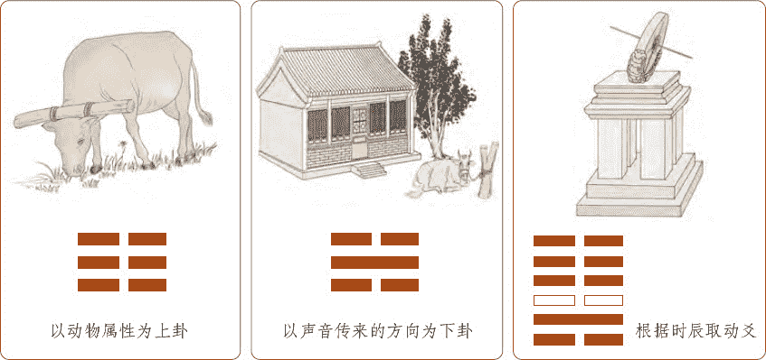

## 8　植物占例
枯枝坠地占

本占例和以上的几种占例一样，都是先起卦再得数的例子。这叫做“以卦起数”，即所谓后天之数的方法。在本例中邵康节先生连砍树人的名字都能推算出来，充分体现了梅花易数无所不在的强大力量。

### 枯枝占的起卦

邵康节先生晚年在洛阳定居，经常同当时名流司马光等交游。有一天正是戊子日，先生在去拜访司马光的路上，坐在一棵茂盛的大树下休息。当时天气十分炎热，没有一丝风。忽然树上落下一段枯枝，先生抬头一看，树上并没有什么鸟儿，树枝就这样无缘无故地掉在了地上。于是先生利用这件事情起了一卦。

枯木的八卦卦象是离，所以用离卦为上卦；枯枝掉落在先生的西方，西方对应着兑卦，所以下卦为兑卦，总的卦象就是火泽睽卦。其互卦为水火既济卦。

兑卦的卦数为 2，离卦的卦数为 3，当时的时辰是辰时，也就是上午的 7 点至 9 点间，辰时对应数字为 5，三者相加得到总数为 10，10 除以 6 余数为 4，所以四爻取为动爻。火泽睽卦的九四爻动，便得到变卦山泽损卦。

### 枯枝占的断卦

下面就可以断卦了，《易经》爻辞说：“九四，睽孤遇元夫，交孚，厉，无咎。”从卦象来看，本卦火泽睽卦变为山泽损卦，而本卦的互卦为水火既济卦，互卦中含有坎卦和离卦，本卦中体卦为兑，兑在五行属金，离火克制兑金，对体卦不利。又加上火泽睽卦和山泽损卦的卦名含有伤残的意思，《易经·序卦》说“睽者乖也”，也就是背离、分离的意思；而损更是损伤的意思，于大树更为不利。

所以邵康节先生推断说大树将要被砍掉，树为静物，无所谓走得快与慢，所以直接用成卦之数 10 作为应验的日期。

来到司马光家里，邵康节先生对司马光说：“那棵大树将要被砍掉，而且不超过 10 天。”甚至连砍树人的名字都能推断出来，正是“睽孤遇元夫”的“元夫”。

结果到了第 10 天，当地有人家要建房子，把那棵树买下砍掉了，更神奇的是，砍树人的名字正好是《易经》爻辞中提到的“元夫”。

### 植物占例

植物占的起卦法最终要转化为时间或方位等起卦法，起卦的依据是植物自身的特殊现象，例如在此例中无缘无故落下的树枝就是起卦的缘起。在取应验时间时，应验日期就是成卦之数。

#### 枯枝占的起卦与断卦

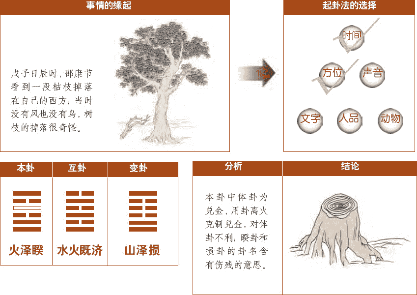

#### 应验时间的确定

应验时间的确定，要看起卦时事物行动的快慢，行动越快应验越快。

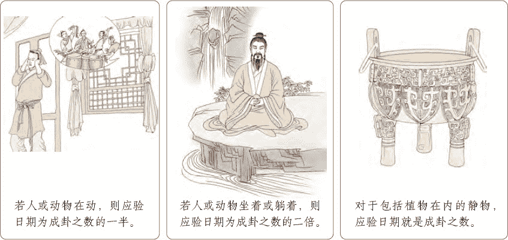

# 第七章　汉字神算之一
梅花易数测字法总纲

以字断卦是梅花易数最重要的作用之一，以至于很多人认为梅花易数就是用来测字的。本章从汉字历史、书法艺术讲起，使读者先全面了解汉字本身，然后再从汉字的结构、偏旁部首、风骨神韵等方面详细讲述测字法的基本原理。

## 本章图版目录

汉字的结构

汉字中的图画

古代书法家

书法作品欣赏

文字中的五行（一）

文字中的五行（二）

字的干支与五行属性

文字中的地支

六神

六神笔法

六神与五行的宜忌

六十甲子与五行衰旺（一）

六十甲子与五行衰旺（二）

神煞的吉与凶

六亲与禄神

玄黄笔法

五行生克的特殊情况

六神与末笔笔法

民间传统中吉祥的字

字的风格与人的精神风貌

## 1　汉字的结构　偏旁部首的组合方式

每个汉字都有自己的结构，在测字时，每个位置的偏旁都有不同的含义，如最上面的偏旁和最下面的偏旁在断卦时就有不同的功能。

### 独体字

独体字是以笔画为直接单位构成的汉字，如“手”、“毛”、“土”、“本”、“甘”等字就是独体字。

独体字虽然是浑然一体不能拆分的字，但是各部件之间仍然存在一些关系。即离散关系、连接关系、交叉关系和综合关系等。离散关系是笔画与笔画之间有一定的间距，互不接触，如“川”、“心”就是此类；连接关系就是笔画与笔画互相连接，如“人”、“口”、“上”、“下”等；交叉关系就是笔画与笔画之间互相交叉，如“十”、“力”等字；综合关系就是以上几种关系的综合运用，如“长”既有接触关系又有交叉关系，“叉”既有离散关系又有交叉关系。

### 上下与上中下结构

这两种结构都是合体字的构成方式，在上下结构中，上下两部分各自是一个独立的偏旁。如“崇”的上面是“山”，下面是“宗”；“想”字上面是“相”，下面是“心”。

上中下结构与上下结构类似，区别在于上中下结构多出了中间的部分。如“意”字上面是“立”，下面是“心”，中间是“日”，三者都是独立的汉字偏旁。类似的字还有“草”、“竟”等。

### 左右与左中右结构

左右结构就是左右两边分别是一个独立的偏旁的汉字结构，在形声字中多数是左右结构的字。如“结”、“构”二字就是左右结构的字，它们的左右两边都是分别独立的偏旁。

左中右结构就是在左右结构的中间还有独立部分的结构，如“树”字的左边是“木”，右边是“寸”，中间的“又”既不属于左边又不属于右边。

### 内外结构

内外结构就是包围结构，又分为半包围和全包围两种。“区”、“包”等字是半包围结构，“围”、“困”等字就是全包围结构。

### 汉字的结构

每个汉字都是平面上的一幅图画，与一般图画的区别是汉字仅仅是由线条组成的，它们的结构都可以大体上归为独体、上下、左右、内外等几类。

#### 独体字与合体字

| 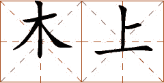 | 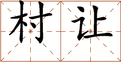 |
| 独体字就是以笔画为直接单位构成的汉字。独体字各部分之间不能拆分。 | 合体字就是由两个或两个以上的单字或偏旁组成的汉字。合体字占了汉字的绝大多数。 |

#### 合体字的结构

合体字的结构是写字时尤其应该注意的，写字时的笔法、布局等都将影响到占测的结果。合体字的结构大致分为上下、左右、半包围、全包围等几类。

| 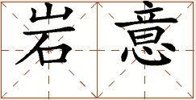 | 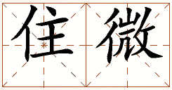 |
| “岩”字为上下结构，“意”字为上中下结构。 | “住”字为左右结构，“微”字为左中右结构。 |
| 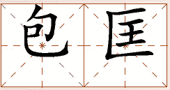 | 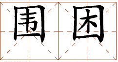 |
| “包”、“匡”为半包围结构。 | “围”、“困”为全包围结构。 |

## 2　六书
汉字的造字法

汉字是形、音、义的结合体。六书是指象形、指事、会意、形声、转注、假借等六种造字法。

### 象形

每个汉字都是一幅图画，这主要是针对象形字来说的。最古老的汉字是象形字，它们是古人根据大自然中万物的形状画的画。今天的汉字中有很多是象形字，如“日”、“月”、“水”、“火”等字，这些字的特点是在自然界中有具体的事物与之相对应。

### 指事

指事字是在象形字的基础上加笔画的造字法，有些事物没有明确的形象，这时就需要指事字了。典型的指事字如“上”、“下”、“本”、“末”等，“上”字就是在上面加一横，“本”字就是在“木”字的下面加一短横。

### 会意

会意字是用两个或两个以上的独体字合成的字，并且这两个独体字之间存在某种意义上的关联。如“森”、“林”二字，从意思上来说，两个字代表的事物都是由很多树木组成的，而字面上也巧妙地蕴含了这个意思。

### 形声

这是应用最广泛的造字法，在所有汉字中形声字占了大多数。这种字一般可以分为声旁和形旁两部分，声旁表示整个合体字的读音，形旁一般可以表示出整个合体字的意义。

具体来看，形声字又分为左形右声、右形左声、上形下声、下形上声、外形内声、内形外声等六种结构。举例来说，“故”、“姑”、“估”三个字都是形声字，“古”字是它们共同的声旁，所以它们的发音都与“古”字相近。

### 转注

转注就是几个字互相注释的方法，例如“考”字和“老”字，在古代的意义相近，所以可以用它们互相注释。

### 假借

假借是一种借字表音的方法，即借用一个已经存在的字来表示与其声音相近的字，这种被借来表示另外意义的字叫假借字。

### 汉字中的图画

严格来说，这六种造字法并不是造字的依据，而是后人根据汉字的结构归纳出的六种规则，并且转注和假借都是用字法，而不是造字法。

#### 象形

象形字就是一幅画，用简单的线条勾勒出物体的外形。

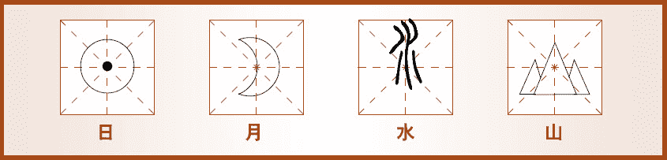

#### 指事

指事字一般是在象形字的基础上加以简单的笔画，表示这个字要强调的是特意点出的意义。

| 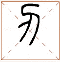 | 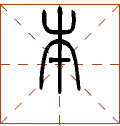 |
| “刃”字在“刀”上加一点，表示这个字强调的不是整个“刀”，而是刀的刃。 | “本”字在“木”字下面加一横，表示树的根部。 |

#### 会意

会意字从字的各部分的关系来推测整个字的意思。

| 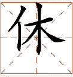 | 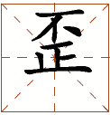 | 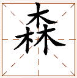 |
| 人倚在木的旁边，表示人在休息。 | 不正也就是歪斜。 | 森林是由很多树木构成的。 |

## 3　风骨与神韵
中国古代书法名家概览

书法是中国特有的一种艺术形式。一般来说，书法就是用笔书写汉字的方法和规律，包括运笔、点画、布局、气韵等多方面内容。从汉朝以来，历朝历代都出过很多书法名家。楷书的兴盛主要是在唐朝以后。

钟繇（151-230），三国魏人，世称“钟太傅”。钟繇在书法史上的最大贡献是创制了真书，也就是我们所称的楷书。钟繇自己在书法上的艺术成就也很高，他博采众长，自成一家，尤精隶书和楷书。钟繇楷书的特点是势巧形密，自然古雅。宋《宣和书谱》说他的书法“各尽法度，为正书之祖”。清《书法正传》说：“钟繇书法，高古纯朴，超妙入神。”钟繇与书法大家张芝、王羲之齐名，并称“钟张”、“钟王”。钟繇真迹不传，后人摹本有《宣示表》、《贺捷表》、《荐季直表》等。

王羲之（303-361，一作 321-379），字逸少，是东晋最著名的书法家，也是历史上最著名的书法家之一，被后人尊为“书圣”。王羲之的传世之作《兰亭序》被誉为“天下第一行书”；另外有《快雪时晴帖》《丧乱帖》等。他的书法有“飘若浮云，矫若惊龙”之称，在隶、草、楷、行各体上都有所突破。尤其是他的行书和楷书，在汉魏笔风基础上，自成一家。王羲之楷书的特点是骨格清秀，结构严谨。

欧阳询（557-641），是唐初书法四大家之一，另三者是虞世南、褚遂良和薛稷。他的楷书骨气劲峭，“劲险刻厉”（苏轼评语）。代表作为《九成宫醴泉铭》。

颜真卿（709-785），世称颜鲁公，是盛唐书法第一名家，也是继王羲之之后影响最大的书法家。他初学褚遂良，后学张旭，改造篆隶和北魏笔法，形成了自己独特的风格——“颜体”。颜真卿的书法和他的为人是一致的，他一生富有正义感，性情正直，笃实纯厚，从不媚上欺下，还曾在镇压安史之乱的战争中立下汗马功劳。书如其人，他的书法气势恢宏，骨力遒劲，横轻竖重，庄严雄浑。唐人评论其书法如“荆卿按剑，樊哙拥盾，金刚瞋目，力士挥拳”；欧阳修评论说：“颜公书如忠臣烈士道德君子。”颜真卿的传世名作有楷书《多宝塔碑》《麻姑仙坛记》，行草书有《祭侄文稿》《争座位帖》等，其中《祭侄文稿》被誉为“天下第二行书”。

### 古代书法家

在我国古代出现了许多书法家，其中以两晋和唐朝最为突出。楷书兴盛于唐朝，楷书四大家中有三人是唐朝的。

#### 晋唐书法家

汉晋是书法艺术的形成期，但是这个时代也出现了书法中的巅峰作品；唐朝是书法的成熟期，尤其是楷书的鼎盛时期。

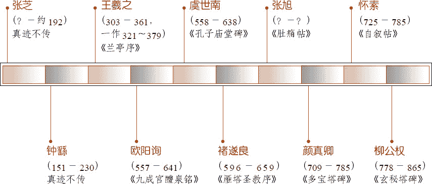

#### 宋朝以后的书法家

唐朝的书法和唐朝的诗歌一样，都已经达到了它们的最高水平，但是宋朝书法家和宋朝的诗人一样，开辟出了新的天地。

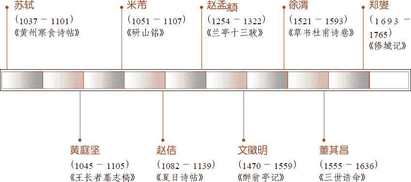

* * *

柳公权（778－865）是唐朝与颜真卿齐名的书法家，但是他们两人的书法各成一家，颜体方正敦厚，柳体体势劲媚，柳体比颜体略显瘦硬，而骨力更为遒劲。两人一向并称为“颜柳”，又有“颜筋柳骨”的说法。柳公权也是以人品写字的代表，唐穆宗曾经问柳公权书法之道，柳公权回答说：“用笔在心，心正则笔正。”柳公权的楷书代表作有《金刚经刻石》《玄秘塔碑》、《神策军碑》等。

苏轼（1037－1101），字子瞻，是北宋时期的一位天才人物，他在诗词、文章、书法、绘画、音乐等方面无一不精。在书法上，苏轼是宋朝苏黄米蔡四大家之一，其笔法肉丰骨劲，跌宕自然，用笔多取侧势，结体扁平稍肥。苏轼的代表作品有《黄州寒食诗帖》《赤壁赋》《答谢民师论文帖》等。其中《黄州寒食诗帖》是苏轼谪贬黄州之后在惆怅孤独中写下的作品，通篇气势奔放，被称为“天下第三行书”。

赵佶（1082－1139），即宋徽宗，在政治上昏庸无能，在书画艺术上却是独树一帜，自成一家。在书法上，赵佶独创了极有特色的“瘦金体”，这种书体瘦直挺拔，以韵趣见长。后人认为其侧锋如兰似竹，“如屈铁断金”，“天骨遒美，逸趣霭然”，将宋代文人的审美趣味推向了极致。

赵孟 （1254－1322），是宋元之际的书法家，兼工绘画、金石、音律等多个方面。赵孟 的书法遒媚秀逸，笔法圆熟，世称“赵体”。赵孟 的书法代表作有《千字文》《胆巴碑》《兰亭十三跋》等。

董其昌（1555－1636），明朝著名书画家，他的字体飘逸空灵而又平淡古朴，在晚明和清初的书法界，董其昌是影响最大的一家。董其昌还是书法评论家，在他大量的题跋中多次提到关于书法的理论。其代表作有《三世诰命》《草书诗册》等。

### 书法作品欣赏

每个书法家都有与众不同的风格，行笔运笔都有各自的独特之处。其实“字如其人”，书法和人的性格品味是分不开的。不但书法家是这样，而且每个人写的字都有自己的独特之处。

| 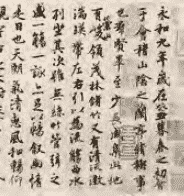 | 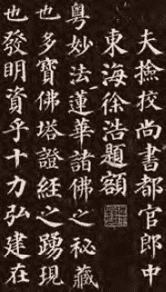 |
| 王羲之 飘若浮云，矫若惊龙 | 颜真卿 气势恢宏，庄严雄浑 |
| 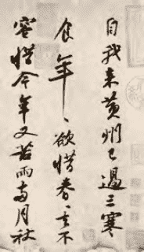 | 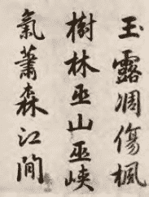 |
| 苏轼 肉丰骨劲，跌宕自然 | 赵孟 遒媚秀逸，笔法圆熟 |
| 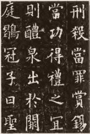 | 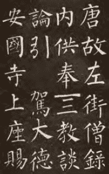 |
| 欧阳询 骨气劲峭，劲险刻厉 | 柳公权 体势劲媚，骨力遒劲 |
| 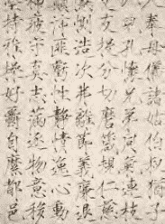 | 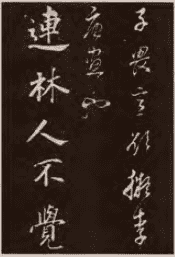 |
| 赵佶 天骨遒美，逸趣霭然 | 董其昌 飘逸空灵，平淡古朴 |

## 4　五行体格歌
梅花易数中的笔式分类

《五行体格歌》是用来辨别各种笔画的五行属性的。在取文字作为外卦时，必须辨明文字的五行属性，但是汉字字形各异，要把每个字的每个笔画都归类是一件非常困难的事，所以最好熟记《五行体格歌》。

### 金式笔法

一挑一捺俱为金：凡是字中带挑和捺的笔画，都属于金笔，如“冷”中的提和“公”中的捺就是金笔。但是“踢起无尖不是金”，像“地”、“坊”等字的第三笔，虽然也是挑，但是它们没有尖，所以不能算是金笔；“捺要下垂始为金”，像“廷”中的末笔虽然也是捺，但是它没有下垂，所以不是金笔，而是水笔。

口小金方莫错谈：字中有小“口”的也是金笔，如“同”、“咒”等；但是“园”，“困”等比较大的口字框却不是金笔。

空云独作寒金断：指的是像“几”这种情况，字例有“凯”、“凫”等。

腹中横短化囊金：“目”字框中的两横是囊金之象，但是若把两横写为两点，那么这个字又成了水式。

穿心撇捺火陶金：“义”字的撇与捺穿心而过，也属于金笔。

### 木式笔法

有直不斜方是木：一直到底型的笔画都属于木，“木”字本身正是它的最好代表，而“水”中间的直笔带勾，不属于木类。

孤直无依为冷木：“情”中的竖心旁之直笔就是冷木之象。

三横两短又无勾，乃为湿木水中流：说的是“三”这种笔画，字例有“春”、“律”等，它们都是湿木之笔。要注意横不要带勾。

好己心勾比木舟：像“心”字的下面一笔，这种笔式是舟船之木。又如“乙”、“己”等也属于舟船之木。像“勾”字的第二笔在占测交通工具时看成是舟船之木，在占测其他事情时又可看成是勾陈笔法。

### 水式笔法

有点笔清皆作水：一般来说，看上去干脆利落的点都看成是水笔，字例有“义”、“章”等。

一点当头作水称：指的是第一笔是一个孤立的点的情况，字例有“主”、“文”等，属于雨露之水。

三直相连化水名：“川”字是三直相连，看成是水笔，因为川的本义含有水的意思。字例有“训”等。

围中横满无源水：若框中的横很长，一直连到左右两竖笔，那么这个字就是无源之水，字例有“国”、“曰”等。

走之平稳水溶溶：像“过”字的走之，运笔平稳，是水溶溶之象，捺笔平平稳稳则为水，下垂则为金。

数点笔连休作火，奇奇偶偶水源清：“热”字的下面四笔如果相连，就是河水清澈之象，不能当成火式，而应该作为水式。

### 文字中的五行（一）

在判断文字中的五行笔法时，要注意区别字与笔画的关系，字的各个部分可以有着不同的五行属性，而字本身又有自己的五行属性。

#### 金式笔法

| 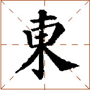 |  | 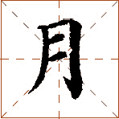 |
| 捺要下垂始为金 “东”字末笔的捺呈下垂之象，所以是金笔。 | 口小金方莫错谈 “尚”字含口，而且是小口，所以是金笔，而大口不为金笔。 | 腹中横短化囊金 “月”中的短横是囊金之笔，但要写成点就不算金笔了。 |

#### 木式笔法

| 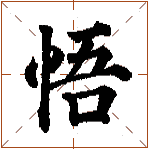 | 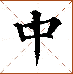 | 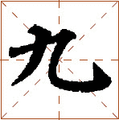 |
| 孤直无依为冷木 “悟”字左边的一竖孤直无依，没有与它相邻的笔画，所以是冷木之笔。 | 有直不斜方是木 “中”的中间一竖贯通上下，没有倾斜，是木笔。 | 好己心勾比木舟 “九”的末笔和心勾一样，属于舟船之木。 |

* * *

### 火式笔法

撇长撇短皆为火：所有的撇无论长短都属于火式，如“外”、“休”中的撇都是火式笔法。

点边得撇为炎火：点的旁边若有撇，是炎热之火的笔式，字例有“州”“灯”等。这种笔式要求点与撇紧紧相邻。

八字相须火可求：这里说的是余火，像“八”、“谷”等字就是此类。其中的撇是火笔，而捺是金笔。

四点不连真化火：如果“热”字下面四笔的笔画不相连，那么它就是火式笔法，而不是水式笔法。

### 土式笔法

横画连勾作土称：横的末端带勾的算土式，像“蛋”、“买”等字的第一笔就是此类笔式。如果只是一横而没有勾，那么它就是寒土化水的笔式，如“二”、“亏”等字的第一笔就是此类。

横直交加土最深：有横有竖，而且横竖连在一起的笔式属于土，像“丁”、“严”等字的第一笔虽然没有勾，但是不能看成寒土化水的笔式，而应该当成土笔来看，属于“无勾之画土稍寒”的情况。

一点悬空土逆尘：当点在一个字的最末一笔时，就是“一点悬空土逆尘”的笔式，称为“沙尘土”，如“求”、“戈”等字就是此类。

### 文字中的五行（二）

和现在的标准字体不同，古代一个字的写法往往有多种形式，不能听到一个字就说它是什么笔法，还要看写字之人的写字习惯，同一个笔画，不同的人能写出不同的五行属性。

#### 水式笔法

| 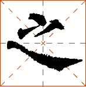 | 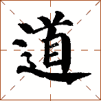 |
| 一点当头作水称 “之”的第一笔是一个孤立的点，属于雨露之水。 | 走之平稳水溶溶 “道”字的走之运笔平稳，是水溶溶之象。 |

#### 火式笔法

|  | 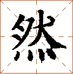 |
| 撇长撇短皆为火 “多”字的撇属于火式笔法。 | 四点不连真化火 “然”字下面四笔的笔画不相连，是火式笔法，若相连就是水式笔法。 |

#### 土式笔法

|  |  |
| 横直交加土最深 “十”字有横有竖，而且横竖连在一起，属于土式笔法。 | 一点悬空土逆尘 “甫”字的点在最末一笔，属于沙尘之土。 |

## 5　五行干支辨
梅花易数中的五行干支

在梅花易数中需要讨论五行笔式的干支属性，有些笔式有着明确的干支属性，但是也有些笔式没有干支归属。一般来说，端庄简明的笔画有干支归属，杂乱无章的笔画没有干支归属。但有些具体笔式难以找到统一的规律。

### 金式

“口字为庚亦作申，挑从酉用捺从辛。空头顽钝囊金炒，不在干支数内寻。”

“口”字属于庚或申，挑笔或提笔属于酉，捺笔属于辛；像“几”等空头的部首和“目”等囊金笔形都属于例外项，不给它们分配干支属性。

例如“喜”字上下各有一个“口”字，因“口”字字形方正端庄，与阳性干支性质类似，故属于阳性干支庚和申。“扒”字第三笔是一挑笔，最未一笔是捺笔，形象偏斜狭隘，与阴性干支的性质类似，故挑笔属于阴支之酉，捺笔属于阴干之辛。

### 木式

“直长为甲亦为寅，细短均为乙卯身。孤直心勾兼湿木，干支无位不须论。”

木式笔形中长竖属于天干之甲，或者地支之寅，例如竖心旁中的竖即为此类；而又细又短的笔画属于天干之乙，或属于地支之卯，如“幸”字即为此类；孤立没有依靠的竖和“心”字之勾都称做“湿木”笔画，没有干支属性。

“丰”字中间的一竖画贯通天地，强健无损，属阳性，所以属于甲木或寅木。“幸”字的上面和下面都有一竖，但是这两个竖较短弱，属阴性，只能算做属阴性的天干之乙、地支之卯。“心”字之勾、“乙”等舟船之木以及“春”等三横两短的木笔十分不正当，所以没有干支属性。

### 水式

“点在当头作癸称，腹中为子要分明。点足为壬腰在亥，余皆野水不同群。”

在水式的笔形中，开头的点属于天干之癸，位于一个字内部的点属于地支之子，位于一个字中间的点属于地支之亥，位于下部的点属于天干之壬，三者分别称为癸水、子水、亥水、壬水。其余的点就是野水，不分配干支属性。

“文”字以一点开头，这个点就是癸水。因为这一点位于字的最顶部，所以它象征着雨露的源泉。同类的例子还有“主”、“意”等。

“月”字内部的两横也可以写成两点，这是子水，因为这个点居于腹部的缘故。此外，“勺”、“目”等字中的点也属于子水。

“景”字中间一点，称做亥水，因为它位于字的腰部。

“恭”字下部两点称做壬水，因为它位于字的足部。

### 字的干支与五行属性

根据笔画的不同，可以把它们归入到十天干、十二地支和五行中，字的这种归类法是梅花易数测字的基础。

#### 阴阳、五行与干支

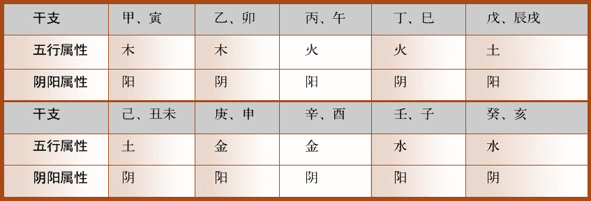

#### 天干字例

| 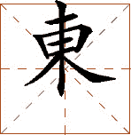 | 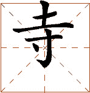 | 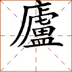 |
| 甲 中间一竖为甲木笔。 | 乙 上面的短竖为乙木笔。 | 丙 长的撇属于阳火丙。 |
| 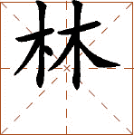 | 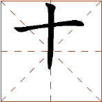 | 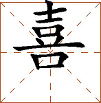 |
| 丁 林字两撇分别属于丙和丁。 | 戊己 十字交叉的属于中央土。 | 庚 上下两个口字都是金笔。 |
| 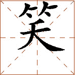 | 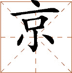 | 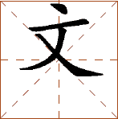 |
| 辛 笑字捺笔为金笔。 | 壬 最末一点是壬水。 | 癸 当头一点属于癸水。 |

* * *

### 火式

“撇长丙巳短为丁，午火同居短撇中。八字腾蛇兼四点，天下不合地支冲。”

在火式的笔形中，很长的撇属于丙和巳，较短的撇属于丁。短的捺笔属于午火，“八”字属于余火，余火与四点的火都没有干支属性。

“庐”字的两撇都比较长，属于天干中的丙和地支中的巳，因为长的撇属于阳性，丙在天干中属于阳干。

“须”字撇多而短，属于天干之丁。

“八”与“热”等火式笔形都没有干支属性。

### 土式

“横中有直戊居中，画短横轻作己身。末点勾陈皆丑未，长而粗者戌辰同。”

横画与竖画交叉成十字的土笔属于中央戊，但是笔画轻而短的却属于中央己。一个字的最后一笔如果是勾陈式，那么它属于丑未阴土，但是若它写得又长又粗就属于辰戌阳土。

“聿”字的第二画比较长，最后一画最长，其余各画都比较短，所以第二画和最后一画属于阳土中的戌或辰，其余横画属于阴土中的丑或未。

“求”字的最后一点可以看成是己土、丑土或未土，但是这个字整体上横、竖、撇、捺、点、勾、十字交叉等各种笔形都具备，是没有干支属性的无名之土。

### 文字中的地支

多数笔画能在天干地支中找到自己的归属，但是有些笔画比较特殊，在梅花易数中不给它们分配干支属性，这叫“野笔”。

#### 文字与地支

一个字少则有几画，多则有几十画，难以一一说明它们的干支属性，但通过几个字例我们可以掌握一种方法。下图为十二地支与部分字例。

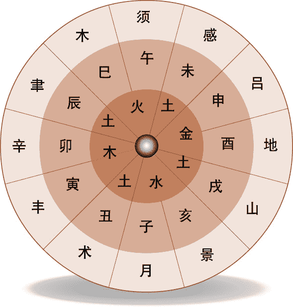

#### 野笔

| 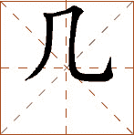 | 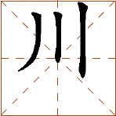 |
| 空头 “几”字是空头，属于没有干支属性的金笔；“目”等囊金笔形也属于野金。 | 湿木 孤立无依的竖属于湿木，湿木是野木，没有干支属性。 |
| 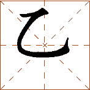 | 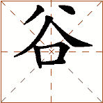 |
| 舟船木 “乙”为舟船之木，舟船木与“心”字之勾，“春”字的三横两短都是野木。 | 余火 “谷”字上面的两笔属于余火，余火和四点之火都是野火。 |

## 6　辨别六神歌
梅花易数中的六神笔法

在古代的天文学中，东方青龙、西方白虎、南方朱雀、北方玄武这四象是星空的四个分区。在梅花易数中用它们加上勾陈和腾蛇来代表六种汉字字形，称为“六神笔法”。六神笔法与人的命运和事情的吉凶有密切的关系。

### 六神笔法

在梅花易数中，根据笔式的不同，把它们划分为六种类型，这六种类型分别用“青龙”、“白虎”、“朱雀”、“玄武”、“勾陈”、“腾蛇”来命名。

六神分类法的基本规律是《辨别六神歌》：蚕头燕额是青龙，尖短交加朱雀神。弯弓斜月勾陈象，腾蛇长曲势如行。尾尖口阔为白虎，体态方尖玄武形。此即六神真妙诀，断事详占要认真。

有些具体的偏旁与六神有明确的对应关系：“八”为青龙木，“几”为白虎金，“ ”为朱雀火，“厶”为玄武水，“勹”为勾陈土，“廴”为腾蛇，腾蛇没有确定的五行属性。

一般来说，东方青龙主大喜之事，西方白虎主灾丧之事，南方朱雀主官司争讼之事，北方玄武主失财被盗之事；勾陈主在外阻滞流连，腾蛇主怪异之事。当六神都处于潜伏状态时则万物安宁，万事顺心，若六神一出动，很多事情就会被扰乱，这时需要小心谨慎行事。

### 青龙形式

“蚕头燕额是青龙”，只要是撇捺很长，看起来像有头有角的字就属于青龙式。但是撇捺很短时就不能构成青龙式，因为这样的字没有龙须和龙角。“乙”、“丿”等笔式属于青龙式。

这种笔式比较流畅，给人以飞动的样子，可以使万事顺心，事业亨通，又表示添财增福，所以是大喜之兆。歌诀是“青龙笔动喜还生，谋用营求事事通。人口增添财禄厚，主人日下尽亨通。”

### 白虎形式

“尾尖口阔为白虎”，没有开口的不算白虎式，化作金用。如“几”等笔式属于白虎式。

白虎式主有疾病之灾，有怪异之事，招惹口舌是非，会有牢狱之灾等，所以是大凶之兆。歌诀是“白虎逢之灾孝来，出门凡事不和谐。便防失脱家财损，足疾忧人家事乖。”

### 六神

六神是在青龙、白虎、朱雀、玄武这四象的基础上加上勾陈和腾蛇这二神。勾陈原是紫微垣中的古星宿名，腾蛇是传说中与龙同类的神物。勾陈和腾蛇共同主宰中央，属性为土。

#### 起六神卦诀

《起六神卦诀》内容是：甲乙起青龙，丙丁起朱雀。戊日起勾陈，己日起腾蛇。庚辛起白虎，壬癸起玄武。这是判断日期与六神的关系的歌诀，用它可以迅速知道某一天起卦后的六爻属性。例如在甲子日起卦，初爻就是青龙，二爻就是朱雀，三爻至上爻依次为勾陈、腾蛇、白虎、玄武。

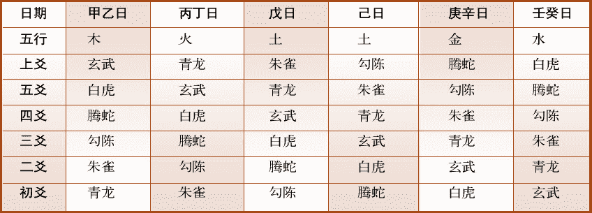

#### 勾陈

勾陈起源于我国古代星辰崇拜。在六神中勾陈是比较特殊的一个，因为它在古代天文学中表示紫微垣中的一组星，共有六颗，被认为是天上的后宫。在道教中，勾陈天皇大帝辅佐玉皇大帝共执南北二极，掌管天地人三才，统御众星。

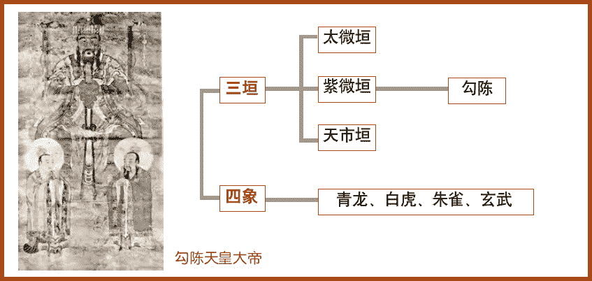

* * *

### 朱雀形式

“尖短交加朱雀神”，凡是撇短而呈现出尖嘴之形的笔式都属于朱雀式。朱雀式的特点是笔画交叉，象征多口舌之争，家人不和睦等。朱雀属于南方之火，所以水命的人写出朱雀式的字就不用担心什么，因为水克制朱雀之火。

“ ”这种笔形象征朱雀降临，需要动用案卷公文，预示着有口舌之争，有失财之患等。要小心提防招惹是非生出不测，防止惊恐、忧伤之事。歌诀是“朱雀交加口舌多，令人家内不安和。若逢水命方无怪，他命逢时有怨疴。”

### 玄武形式

“体态方尖玄武形”，笔形方尖的属于玄武式。如“厶”、“么”、“纟”、“云”等都属于玄武式。

“厶”这类玄武笔形象征贵人的华盖，预示着将要丢失财物，而且难以找回。玄武出现时要防止丢失财物，防止家人离散，小心小人的危害。歌诀是“玄武动时主失脱，家宅流离慎方活。更防阴人有灾危，又至小人生拮括。”

### 勾陈形式

“弯弓斜月勾陈象”，凡是带勾和弯笔的属于勾陈笔式，如“勹”、“乙”、等。

遇上了勾陈就会憾事连连，干什么事情都难以成功，而且多官司缠身，常与人发生口舌之争。歌诀是“勾陈逢者事交加，谋事中间事事差。田宅官司多拮括，是非门内有喧哗。”

### 腾蛇形式

“腾蛇长曲势如行”，腾蛇式笔画曲折，好像蛇在爬行一样，如“廴”等。

遇上了腾蛇笔式就会常有虚惊，家中混乱，内外各种事务都不顺心，又象征出行时不顺利，所以要深居简出，谨慎出行。歌诀是“腾蛇遇者主惊虚，家宅逢之尽不宁。出入官谋宜慎取，免教仆马有灾形。”

### 六神笔法

判断六神笔法时要充分利用几个典型的部首，如“勹”代表勾陈等。判断出六神笔法后，再根据歌诀确定吉凶祸福。

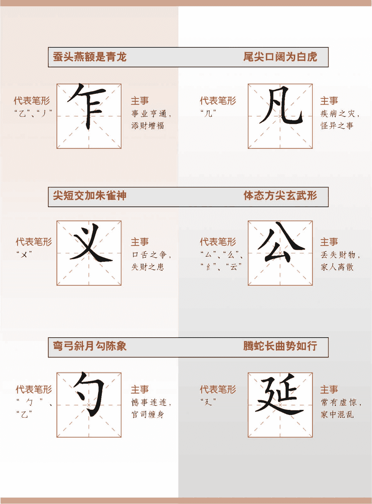

## 7　五行六神篇
梅花易数中的测字准则

用梅花易数测字与十应法则类似，不能见到平时认为吉利的字就说好，见到平时认为不祥的字就说不好，正确的方法是根据字与人的五行生克来判断。

在用梅花易数给人测字时，先要弄清楚问事之人的五行，然后让他写字，观察他的字迹属于六神中的哪一类，根据五行与六神之间的关系确定吉凶祸福。

假如青龙与白虎同时出现在笔式之中，说明问事之人宜于求取功名。但如果是没有文化的普通百姓写出了这样的字，反而会有相互争斗之事发生。勾陈笔式最忌五行中的金，一旦遇到金就会不停地招惹是非。若是朱雀遇到五行中的水，就应该严防灾祸的纠缠。

如果问事之人的五行都不冲犯六神中的凶神，则可认为是德行圆满了，这时若六神一行动，就是锦上添花，吉上加吉。此时问事之人要做什么事都能顺利成功。如果朱雀与腾蛇双双出现，那么破落的家业会重新振兴起来；若金与土同时出现，就像用微火熔化金属一般，难以做成事；如果金很柔弱，那就不但不能克木，反而伤及自身。如果请求别人帮忙做事，就要看水与火是否会合，若水火会合则有人帮助，反之则没人帮助。

若出现了玄武笔式，同时又有青龙得水，就预示着问事之人可以在考试中取胜；若在白虎之后又出现了朱雀，同时朱雀又遇见了金，则问事之人必做高官。若玄武遇到水，就会事事得意；若青龙遇上了火，问事之人就会步步高升。五行之水一定要配白色，否则就成了无源之水；金必须出现在秋季，否则就失去了力量。

勾陈表示文章难成，朱雀表示官司缠身；玄武位于中央，预示着外出不宜走陆路；若青龙出现两次，就免不了会有麻烦事；水与土同时出现，又有了青龙笔式，就不用担心得不到功名；金与木同时出现，又有了白虎笔式，必定要遇上灾难。

总之，在测字的时候一定要看五行的衰旺情况。命相里五行俱全的，无论求什么事都能成功；六神潜伏不动的，无论做什么事情都会一帆风顺。

### 六神与五行的宜忌

六神与五行的宜忌，指的是六神和五行相遇时的一些吉凶情况。对于宜的情况就可以继续发扬，对于忌的情况就要尽力避免。

#### 问六神的步骤

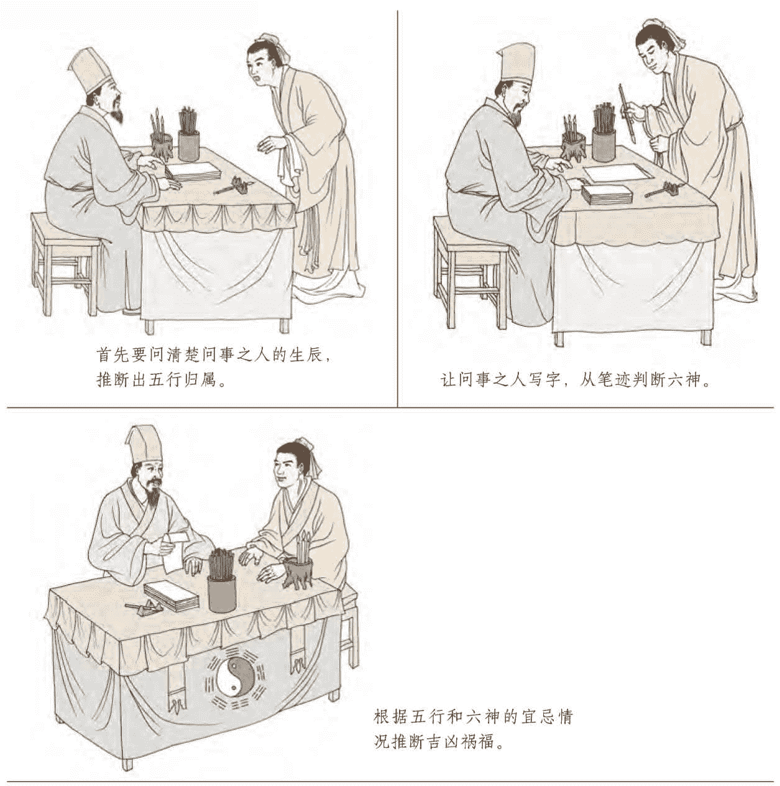

#### 宜忌情况

| 青龙 | 火 | 宜 | 步步高升 |
| 玄武 | 水 | 宜 | 事事得意 |
| 朱雀 | 水 | 忌 | 灾祸缠身 |
| 勾陈 | 金 | 忌 | 招惹是非 |

#### 更复杂的情况

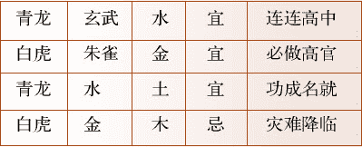

## 8　甲子纳音歌
梅花易数中的六十甲子

《六十甲子纳音歌》归纳了六十个干支时刻的五行衰旺情况，并用形象的比喻代表这些时刻。

### 六十甲子纳音歌

甲子乙丑海中金：“海中金”是水大而淹没了金的意思。

丙寅丁卯炉中火：火得到寅卯之木的生扶，火势旺盛，如炉中之火。

戊辰己巳大林木：“大林木”是林木繁茂之象。

庚午辛未路旁土：未土生木，木生火，火旺则土衰。

壬申癸酉剑锋金：“剑锋金”是说金气极盛，犹如剑锋一般。

甲戌乙亥山头火：甲乙木生火，火势很大，好像在山头一样。

丙子丁丑涧下水：丑时水衰，好像涧中的水一样，难以形成大河。

戊寅己卯城头土：寅为山，积土成山，好像城头之土。

庚辰辛巳白蜡金：是说金不够强，韧性超过刚性。

壬午癸未杨柳木：表示木像杨柳一样柔弱。

甲申乙酉井泉水：井泉之水虽清但水势毕竟不大。

丙戌丁亥屋上土：火势较大，火生之土在上面。

戊子己丑霹雳火：极强极烈的火，像霹雳一样。

庚寅辛卯松柏木：松柏之木是上等木料，木气正旺。

壬辰癸巳长流水：有水有金，金可生水，所以水长流不断。

甲午乙未沙中金：土虽然生金，但火气正足，所以金只能处于沙中。

丙申丁酉山下火：酉为日落处，火至此潜伏，故说“山下火”。

戊戌己亥平地木：亥为生木之地，木已成林，所以叫“平地木”。

庚子辛丑壁上土：有水有土，好像泥一般，所以为“壁上土”。

壬寅癸卯金箔金：金气不足，像金箔一样柔弱。

甲辰乙巳覆灯火：表示辰巳之时日光不是很强。

丙午丁未天河水：是水火共处的样子，只有天河才能这样。

戊申己酉大驿土：土气很旺，不同寻常，像大驿之土。

庚戌辛亥钗钏金：戌亥之时金已经衰弱，故叫“钗钏金”。

壬子癸丑桑柘木：形容金克木而木存在时间很短。

甲寅乙卯大溪水：寅卯为东方，水如大溪一般流向东方。

丙辰丁巳沙中土：火生土，但土气旺于火。

戊午己未天上火：午时火旺，未木又生火，此时火势最强。

庚申辛酉石榴木：申酉为秋天，木气将衰。

壬戌癸亥大海水：此是水气最旺盛的时刻，如大海一般。

### 六十甲子与五行衰旺（一）

六十甲子分别有自己的五行归属，而且五行的强弱并不相同，例如属于金的壬申年金性极强，同属金的庚戌年金性就很弱，下表列出了最近六十年的五行属性。

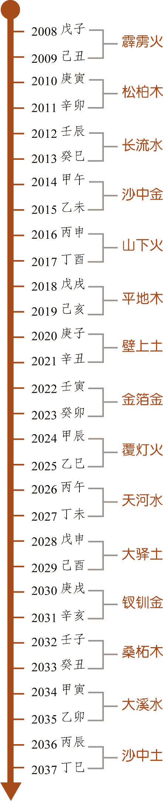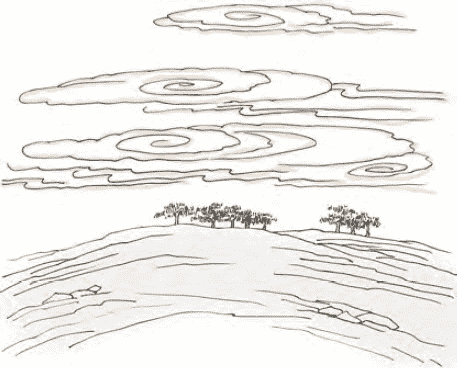

戊戌己亥平地木
戊象征着原野，大树生于原野之上，所以是平地之木。

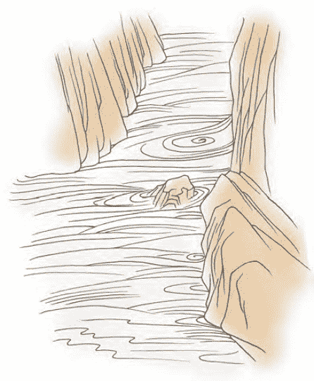

甲寅乙卯大溪水
寅卯为东方，溪中的水流向东方，水势越来越大，所以是大溪之水。

* * *

### 五行气势最旺盛的时刻

两个年份虽然可以同有一种五行属性，但是它们的气势是有区别的，例如壬申年和庚戌年同属金，但前者为剑锋之金，后者为钗钏之金，金气自然不同。

金：金气最旺盛的年份要属壬申和癸酉，因为申、酉是金之正位。金的性质像八卦之乾，在于至刚，而天下至刚之物莫过于宝剑的剑锋，所以壬申年和癸酉年是剑锋之金。

木：地支之辰象征原野，巳象征六阳，树木到了六阳时刻必定是枝叶繁茂，所以戊辰和己巳像原野上的大树一样，这是木气最旺的时刻。

水：水势之大当属大海，天河水势固然也大，但天河水是水火并存之象，若单论水反而不如大海之水。

火：一天中火势最旺的时刻当属正午，未时火势继续，所以戊午和己未是火势极盛的两个年份。

土：申的八卦属性为坤，代表大地，戊己在五行为中央土，两土遇到一起，可见不是普通的土，只有通达的大驿之土才可相比。

五行的循环

从大的范围来看，每隔 60 年五行分配就循环一次，例如 2008 年是戊子年霹雳火，60 年后的 2068 年也是戊子年霹雳火。这其实是由六十甲子决定的，因为天干和地支搭配后有 30 种可能性，而每种五行都是连续出现两年。

从小的时间尺度来看，每种五行出现的年份也是有规律的，即按照 8 年、8 年、14 年的间隔依次循环。仍然以 2008 戊子火年为例，8 年后的 2016 丙申年为火年，又 8 年后的 2024 甲辰年也属火，又 14 年后的 2038 戊午年仍然属火，如此可以一直类推下去。

虽然五行不是严格按照相等的间隔出现，但是从长远来看，它们出现的概率其实是相等的，其中起作用的是五行之间的生克关系。

### 六十甲子与五行衰旺（二）

五行的各种形式也在循环之中，正因为有了这种循环，才使得强弱不同的五行能够保持平衡，没有哪一个五行比其他的更占优势。

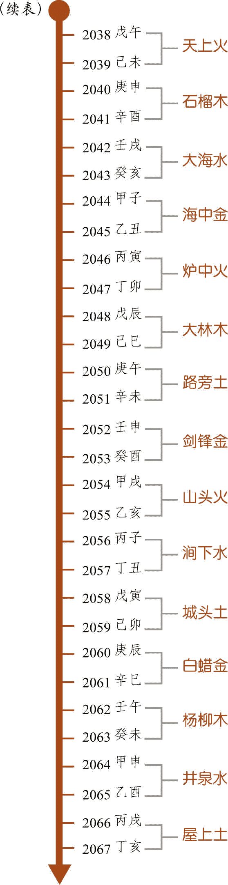

壬戌癸亥大海水
壬戌和癸亥时刻水势最为强大，只有大海之水才能有这样的力量。

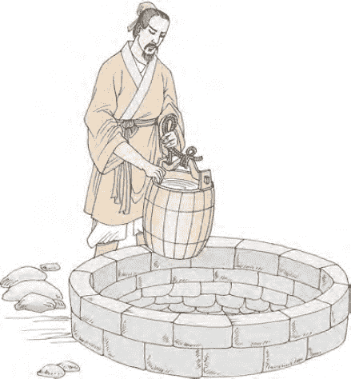

甲申乙酉井泉水
金生水，水势在壮大，但是水刚生出，一下还不能十分壮大，像井泉之水。

## 9　神煞笔法诀
梅花易数中的偏旁部首

古人认为神煞主宰着人的命运，一般来说吉者为神，凶者为煞。在汉字中也存在与各种神煞相对应的字形，它能决定人的命运和事情的吉凶。

### 字形与神煞

贵神：若问事之人写下贵神类的字，就会有神护佑，做事就十分顺利。贵神类的字或偏旁有“中”、“上”、“贝”、“日”、“月”、“大”、“人”等。

喜神；若问事之人写下喜神类的字，就会有喜事发生。此类字或偏旁有“士”、“口”、“言”、“鸟”等。

文星：若问事之人写下文星类的字，在文章方面就会取得很大的进步。属于此类的字或者偏旁有“二”、“日”、“子”等。

生神：是滋生世间万物的吉祥之神。属于此类的字或者偏旁有“一”、“元”、“甲”、“子”、“初”等，因为它们都含有第一、为首、开始的意思。

亡神：这是主宰死亡的一种神，若问事之人写下这一类的字，就会有灾难降临。属于此类的字或者偏旁有“十”、“千”、“百”、“万”、“贞”、“亥”、“癸”等。原因在于：“十”、“千”、“百”、“万”等都是数之终点，贞乃“元、亨、利、贞”之末尾，“癸”是天干之末，“亥”是地支之末。

家神：若问事之人写下这一类的字，家中就会得到神的保佑，平平安安，没有灾难。属于此类的字或者偏旁有“宀”、“乇”、“火”、“土”、“堂”、“水”等。原因在于：“宀”为家字之头，“乇”为“宅”字之末，“火”是“灶”的偏旁，“土”表示土地之神，“堂”为厅堂，“水”为水井，都是家中必不可少的组成部分。

灾煞：是灾难来临的象征，属于此类的字或者偏旁有“巛”，“宀”、“火”、“广”、“丙”、“矢”等。原因在于：“宀”、“火，”是灾字的偏旁，“疒”、“丙”、“矢”是“疾”与“病”的偏旁。若问事之人写下这一类的字，就要小心自己的行动了。

丧门：顾名思义，这是一种灾星，属于此类的字或者偏旁有“白”、“来”、“氏”、“兄”等。

官符；若问事之人写下这一类的字，就会官运亨通。属于此类的字或者偏旁有“宀”、“付”、“吕”等。原因在于：“宀”是“官”字之首，“付”为“符”字之末，“吕”为“官”字之尾。

文书：属于此类的字或者偏旁有“二”、“丿”、“乙”等，因为它们都属于朱雀、腾蛇类笔形。若问事之人写下这一类的字，就会有文书降临。

印信：印信是对人有保护作用的神，若问事之人写下这一类的字，即使在危险之中也能平安无事。属于此类的字或者偏旁有“卩”、“口”、“子”等。

马星：是一种亦吉亦凶的神。属于此类的字或者偏旁有“灬”、“辶”、“走”等。

会神：是一种吉祥之神，属于此类的字或者偏旁有“日”、“云”、“禺”等。

### 神煞的吉与凶

“神煞”作为一个统称时不区别吉凶，但要分开来讲时，则吉者为“神”，凶者为“煞”。在汉字的偏旁部首中，蕴含着各种神与煞。

#### 吉神

吉神多从吉利的文字中取偏旁得来，如贵神中的“中”和“贝”都是从“贵”字中得来。

| 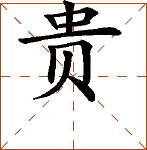 | 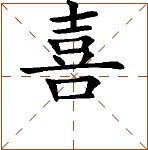 |
| “中”和“贝”都是“贵”字的一部分，所以它们主富贵。 | “士”、“口”是“喜”字的一部分，所以它们主有喜事发生。 |

有些吉神还可以从意义上推断。

| 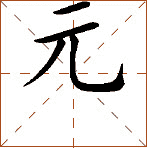 | 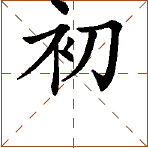 |
| “元”是“元亨利贞”的第一个字，所以含有为首的意思。 | “初”含有开始的意思，所以是生神。 |

#### 凶煞

凶煞可以从凶险的文字中取偏旁得来，如灾煞中的“宀”和“火”都是“灾”字的一部分。

| 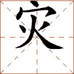 | 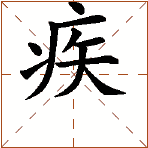 |
| “宀”和“火”是“灾”字的一部分，所以是灾煞。 | “疒”、“矢”是“疾”的偏旁，所以也属于灾煞。 |

另外还可以从文字的含义中得到凶煞。

| 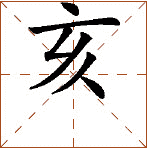 | 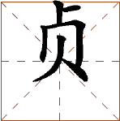 |
| “亥”是地支之末，含有终结的意思，故是亡神。 | “贞”字看上去很吉利，但它是“元亨利贞”之尾，也属于亡神。 |

* * *

### 神煞的其他情况

禄神：求禄神的方法比较复杂，首先要弄清楚问事之人的五行命相属性，再对照他写的字来判断。具体是：“甲禄在寅，乙禄在卯，丙戊禄在巳，丁己禄在午，庚禄在申，辛禄在酉，壬禄在亥，癸禄在子。”例如问事之人命相属甲木，根据“甲禄在寅”的原则，当写出属于寅木的字形时就说明他在仕途上前程远大。

空亡：其口诀为：甲子旬戌亥空，甲戌旬申酉空，甲申旬午未空，甲午旬辰巳空，甲辰旬寅卯空，甲寅旬子丑空。

### 宜神与忌神

在了解宜神与忌神之前，先要弄清楚“六亲”关系。所谓“六亲”就是父母、兄弟、妻财、官鬼、子孙这五种关系再加上卦本身。确定六亲的原则是：生我者为父母，我生者为子孙，克我者为官鬼，我克者为妻财，比和者为兄弟。

“六亲”之间的生克关系为：子孙为妻财之宜神，官鬼为父母之宜神，兄弟为子孙之宜神，妻财为官鬼之宜神，父母为兄弟之宜神；子孙为官鬼之忌神，官鬼为兄弟之忌神，兄弟为妻财之忌神，妻财为父母之忌神，父母为子孙之忌神。例如，子孙动生妻财，所以子孙为妻财的宜神；子孙动克官鬼，所以子孙为官鬼的忌神。其余生克关系可依此类推。

在占算时根据内容的不同而选择六亲。假如占算功名，则用官鬼；占算生意，则用妻财等等。取用神时只以一笔为主，多了就不灵了。

### 六亲与禄神

六亲就是父母、兄弟、子孙、妻财、官鬼这五种神煞加上卦的本身。禄神是吉神中的一种，主功名之事，取禄神时要与五行相结合。

#### 六亲生克

六亲和五行一样，也存在类似的生克关系。

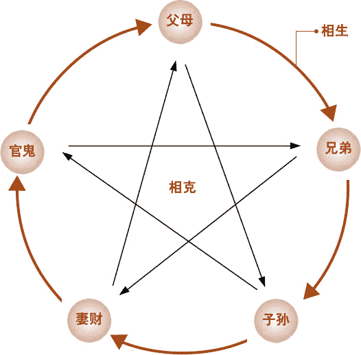

在人伦关系中，六亲有不同的含义，一种说法是父、母、兄、弟、妻、子为六亲，还有人认为父子、兄弟、从父兄弟、从祖兄弟、从曾祖兄弟、同族兄弟为六亲。总之我们这里讲的六亲与人伦中的六亲要区别开来。

#### 禄神

求禄神时，需要先弄清楚问事之人的五行命相属性，再对照他写的字来判断。下表中列出了求禄神时天干地支的对应关系。

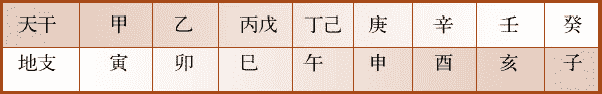

## 10　玄黄笔法歌
梅花易数中的玄黄笔法

玄黄笔法是根据一些偏旁的字形来推断吉凶祸福的方法。其主要依据不是字的五行或六神属性，而是字的外形。如“反旁无一好，十个十重灾”，又如“礻”是“礼”字的偏旁，所以是财富即将来临的象征。

厂、反：像这种“反旁”的字都是大凶之象，写下这些字的人会有灾难来临，所以说“反旁无一好，十个十重灾”。

廴、走：这种字表示问事之人将不得安稳，若是问疾病就更为凶险。

孑、系：写下这些字的人容易被繁冗的事务束缚住手脚无法脱身，但也非大凶，假如一旦想开，即可跳出这些束缚。

灬：这属于火式笔法，适宜在寅时做事。错过时机就会好事成空。

亻、彳：这是有贵人相助的情况，若是问病情就是大吉了，病危的人也会苏醒过来。

之、辶：写下带有这些偏旁的字就会流离失所，漂泊不定。

人、冫：这种字形难定吉凶，需要参考外应才能决定。

吕、叩：两“口”相排在一起，是痛哭之象，问事之人将有祸事。

户、尸：这类字属于吉祥之类，但是有例外，就是问病况时为大凶，因为里面有“尸”字。

衤、礻：大吉笔法，“礼”字的偏旁，说明将有财富来临。

月、骨：大凶笔法，问事之人必有灾难。因为“骨”为“骸”的偏旁，“月”与“脏”、“腑”等人体部位有关。

自：这是不全的“身”字，主大凶，问事之人必有灾难，又预示亲人之间离散。

禾：若是春天写出这种字，就会有祸事来临，但在夏天却会遇上喜事。

耳：说明问事之人需要多听取别人的意见，能听取好的意见就主大吉，固执己见就主大凶。

### 玄黄笔法

玄黄笔法是根据汉字的偏旁部首断卦的方法，它从字的意义、字的外形和拆字组字法三个角度来分析汉字。

#### 字义

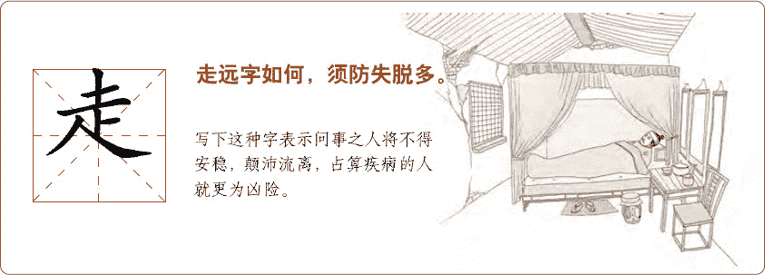

#### 字形

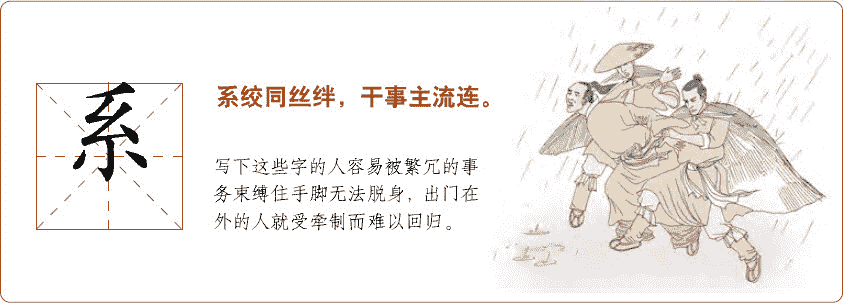

#### 拆字法

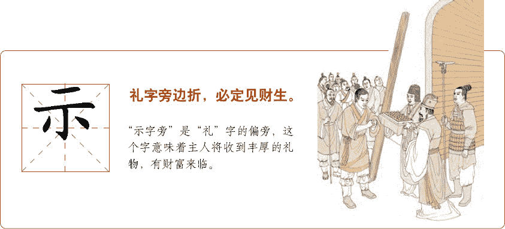

## 11　五言作用歌
梅花测字时的末笔判断

梅花易数测字法是一种综合的判断法，在断卦时不但要根据字的整体情况，还要根据每一个细节。比如末笔的六神笔法就是一项重要的判断依据，它是根据末笔的六神与五行属性进行判断的。

在利用笔迹推断命运时最重要的是学会变通，万不可拘泥于定式。先贤在创造测字法时将许多道理蕴涵于其中，这些道理之间的差别往往是十分微妙的。同样是一个字，十个人去写就可以讲出十种道理来，因为他们写字的笔法各不相同，实际上也没有哪两个人写的字能够完全相同。哪怕是同一个人写的同一个字，在占算不同的事情的时候，也会有吉凶祸福的差别。

### 五行衰旺论

根据五行判断吉凶时，要注意五行的衰旺时刻。草木的衰荣要根据季节而变化，五行的衰旺也随着季节的变化而变化，不能看到木就认为它一定能克土，或者一定怕金的克制。只有在春天时木气才最旺盛，到了秋天树木落了叶子，木气就大大减弱，这是木受金克制的缘故，在春天时金克木的能力就很弱。火旺于盛夏，而金衰弱；金旺于秋天，而木衰弱；冬天是水最旺盛的季节，也是火最衰弱的季节；每一季节的最后一个月时土最旺盛，而水最衰弱。总之，不能仅仅从五行生克来推断命运，离开了衰旺理论，五行生克的力量就大打折扣。

例如在占算人丁情况时，若写的字中出现了“子”、“孙”等字，那么问事之人子孙一定多，人丁一定兴旺；再根据每个子孙的五行衰旺，就能推知它们的贤与不肖的情况。在得到的生克情况中，“我克”的情况不宜太多，否则就会出现夫妻不能长久的后果；若“我克”不多，“克我”的情况也不多，这样就能保证夫妻的白头偕老。

### 用神与六神

一般来说，最宜于出现的用神是青龙和朱雀。当青龙为用神时，万事都可成功。但是当五行缺水时，事情的成功就不那么顺利了，需要经过一些坎坷才能最终实现自己的愿望。朱雀为用神时说明问事之人在功名方面会有大成就，在官场上能一路高升，但是也要小心提防小人的口舌，以防遭到谗言祸害。白虎为用神时是最凶险的，原本吉利的事情也会变成大凶之事，尤其在仕途和疾病两方面不利。当用神为腾蛇时，一开始在功名上十分顺利，但不可贪恋，因为一切功名只不过是大梦一场，到头来还是一场空。

### 五行生克的特殊情况

梅花易数断卦的奥秘在于变通二字，凡事不能一概而论。八卦与六十四卦虽然简单，但是它们能包罗万象；五行生克也并不复杂，但是它们概况了世间万物的一切关系，这都是因为有变通之法。

#### 五行的反克

金克木、木克土、土克水、水克火、火克金是我们已经熟知的克制关系，但是这种关系并非绝对的。在特定的条件下，会出现相反的情况，例如当木气过盛而金气衰弱时，木就会反克金。

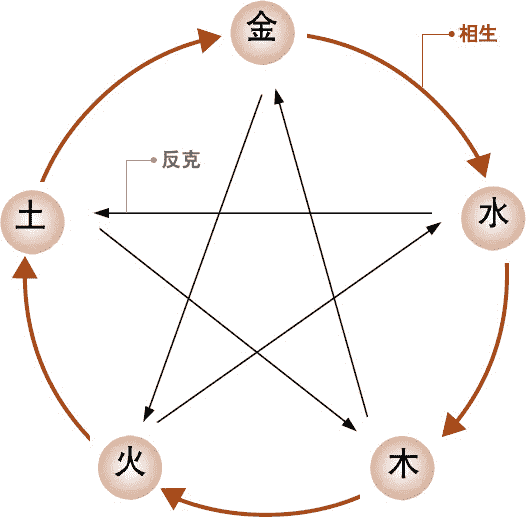

#### 反克的条件

反克的出现与卦气的衰旺、方向等有关系，特别是当两者同时具备时更容易出现这种情况。下表是被克五行容易出现反克情况的条件。

| 五行 | 月份 | 方向 |
| 金 | 七月、八月 | 西、西北 |
| 木 | 一月、二月 | 东、东南 |
| 水 | 十月、十一月 | 北 |
| 火 | 四月、五月 | 南 |
| 土 | 三、六、九、十二月 | 西南、东北 |

* * *

### 六神与末笔笔法

梅花易数测字法是一种综合的判断法，在断卦时不但要根据字的整体情况，还要根据每一个细节。比如末笔的六神笔法就是一项重要的判断依据。

当末笔是青龙笔法时，万事顺遂，求名求利都可以得到。但决不能在得到了青龙笔法后就坐等事情自己成功，而应该努力去追求，没有后面的努力，再好的笔法也是没用的。

当末笔是朱雀笔法时，对于公事是大吉之象，但对于自己的事情却不太好，尤其是在嫁娶、婚姻方面很不顺利。

勾陈是滞留的象征，若是末笔写成了勾陈笔法，那么就免不了在异地停滞难行。不但回家不易实现，而且在外面会遇上官讼之事。

腾蛇笔法则意味着有远道而来的客人来家里，另外还预示着在一些事情上难以选择，往往会引出官讼之事。

白虎笔法是大凶之兆。假如末笔是白虎笔法，则会疾病缠身，多忧愁苦闷之事，又容易沾惹上官司，外出远行时也很不顺利。

当末笔是玄武笔法时，就要防备盗贼的拜访，尤其是在外面时，要看好自己随身携带的行李物品，不过在水土之日出行时就很顺利。玄武笔法还是家中六畜兴旺的象征。

总而言之，在判断末笔笔法时，要先把末笔在六神笔法中归类，再判断其五行属性，利用五行和六神的关系来综合推断吉凶祸福。

### 六神与末笔笔法

在判断末笔笔法时，要先把末笔在六神笔法中归类，再判断其五行属性，利用五行和六神的关系来综合推断吉凶祸福。

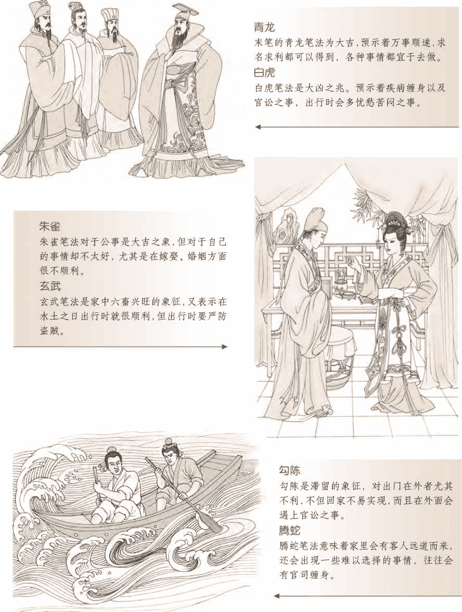

## 12　七言作用歌
梅花测字时的整体判断

对字的整体判断，包括字的结构和风格两个方面。字的结构就是看字里面含有哪些偏旁部首，讨论这些偏旁部首的五行属性；字的风格就是看字的“精神风貌”，是从书法角度进行判断。

### 字的结构

判断字的结构主要看字里面包含哪些偏旁部首，并且要判断这些偏旁部首的五行属性。

“金”、“木”、“水”、“火”、“土”等字都是宜用的，当写出这些字的时候，百事顺心，做什么事情都容易成功。哪怕是遇上疾病、官讼、口舌之争，也会逢凶化吉。

“年”、“午”、“未”、“斗”等字都是求取功名时最宜于出现的字，当问事之人写出了这几个字，再加上官鬼文书动，那么功名一定马到成功，若是没有上面几个因素的出现，那么功名就难以得到了。

若问事之人写出了“土”或“士”开头的字，以及以“口”为体的字，那么在嫁娶婚姻方面就万事大吉，即使原来不顺心的事情，此时也能迅速办理好。原因在于，“喜”字就是以“土”或“士”作为开头的字，而以“口”为体。但是“土”或“士”五行属土，最怕木的克制，因此以“土”或“士”开头的字不宜和木字旁的字同时出现。同样的道理，“口”属于兑卦，在五行属金，最怕火的克制，因此以“口”开头的字不宜和木字旁的字同时出现。土可以生扶金，所以像“喜”这样土金兼备的字属于吉利的字。

### 字的风格

判断字的风格要从书法角度来看，如雄浑还是纤细，端庄还是流畅等等。

若写出的字笔清墨秀，毫无生涩之感，或者端端正正，不偏不倚，那么问事之人必定能在仕途上有所作为，可以很容易晋升到比较高的职位。若运笔再如龙游蛇行般挥洒自如，那么问事之人甚至能位列三公。

如果字很有遒劲之美，看上去精神矍铄，笔力浑厚，或者字里同时出现了金与火，那就说明问事之人是位饱学之士，在诗书方面功夫很深。

若金与木同时出现，那就是贵神现身的象征；如果字是宝盖头，而且下面的部分一直冲到宝盖头上，也是贵神出现的象征，说明问事之人要迎来荣华富贵，家境一天天变好。

如果问事之人是个年轻人，而且写的字方圆端正，那么他极有希望在年少之时就登科入翰林。但是最怕出现强金克弱木的情形，因为这样就会导致疾病缠身，即使才学高也无可奈何。

写下五行属木的字，并且字很有精神，就可飞黄腾达，光耀门庭；但是木怕火的克制，所以木遇上了火就会年纪轻轻而心浮气躁；水可以生扶木，所以当遇上了水时，问事之人就会处事冷静清醒。

若写下的字有一直笔居于中间而贯通上下，则问事之人日后会取得功名，但不能坐等成功，而应该多多勉励自己努力进取。如果末笔再遇上了金笔或土笔，更是会得到高官厚禄，而且能保持廉洁奉公的高尚品格。

如果笔端过于拘谨，就预示着一事无成；如果笔端非常粗俗，那么做事时就不会精细。若起笔和末笔像黄莺的尖嘴一样，那么这人一定是尖酸刻薄，而且诡计多端。如果写字时一气呵成，没有间断，那么问事之人家中一定能获得荣耀，而且年年有余。

若写字时看上去战战兢兢，如在深渊的边上一样小心翼翼，那么此人会谨慎处世，安心修持，能够安度晚年。若写字时十分果敢，毫不犹豫，那么此人总有一天会金榜题名。

若写的字呈日月当头之象，而且精神矍铄，风格强健，那么此人一定会是国家的栋梁之材，而且会有保家卫国、富国强民的谋略。

落笔精神高昂的人，必定有雄心大志；写的字尖头秃尾的人，必定只有小聪明而没有大智慧，一生只能碌碌无为。

若在写字时匆匆忙忙，连写个完整的字都不耐烦，那么他在做事时必然是虎头蛇尾，甚至是有头无尾；即使勉强做完事情，也是仓促草率，出现很多差错。如果写的字毫无精神和风骨，那么他会体弱多病，即使努力也难以成就大的事业。

### 民间传统中吉祥的字

在人们看来，吉祥的字和吉祥的事情是联系在一起的，所以像“福禄寿禧”等字深为人们所喜爱。在梅花易数中，这些字也往往是吉祥的先兆。

#### 对联中的吉祥字

对联是中国特有的一种艺术形式，它用两句对仗的话写出了人们的美好愿望，具有简明、工整的特点。在对联中吉祥的字比比皆是。

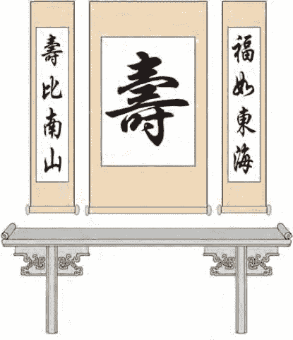

#### 吉祥字与艺术

在传统的书法、剪纸等艺术形式中也经常出现吉祥的字，“百寿图”、“百福图”等是很多书法家喜欢创作的作品。

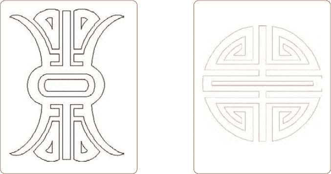

* * *

### 字的风格与人的精神风貌

汉字的风格与字的结构无关，它是根据字的整体外观来判断的。我们平常说的某个书法家的风格就是指的此类。

#### 字的风格

字如其人，字的风格不仅仅是练出来的，而且更是写字之人品行的反映。

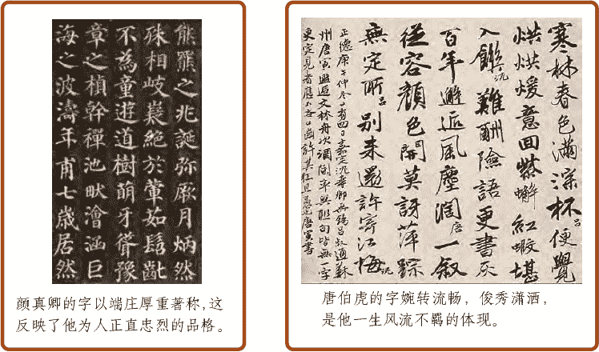

#### 写字与吉凶

与吉凶有关的不仅是字本身，写字时的表现也是断定吉凶的一个重要因素。

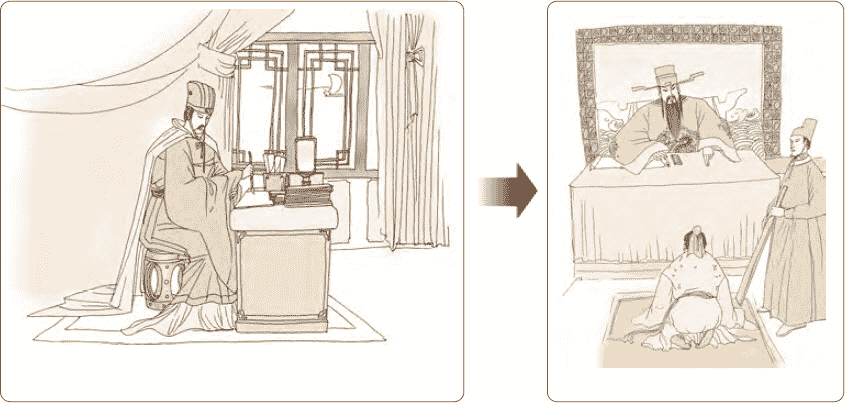

写字时若坐姿端正，心态平和，没有私心杂念，那么就会在以后的仕途上进展顺利，而且能够做到刚正不阿，秉公执法。

# 第八章　汉字神算之二
梅花易数测字法应用

测字法的应用是一个难点，主要在于汉字数量多、结构复杂、含义丰富，而且每个人在写字时风格各不相同。如何合理运用这些影响断卦的因素，将是本章重点阐述的问题。另外，本章还对全部起卦法和断卦法进行了总结，使读者对复杂的梅花易数占法一目了然。

## 本章图版目录

常见字的测法

吉字不吉的情况

笔画与命运

写字时的外应与方位

笔画中的吉凶

字的八卦方位

字与人的身份

字与命运

测字时的变通法

影响测字的各种因素

卦与命运

断卦之后

占法总结

## 1　字画经验
部分常见字测法

在测字时，一些常见字的拆法和测法需要认真掌握，因为这些字是写字之人经常写的，而且经过了古人的反复验证，其灵验性非常高。

### 常见字测法

测字的基本方法是从字中寻找具有特殊意义的偏旁部首，利用这些偏旁部首的外形、含义等推断。

“敷”字：“甫”是“十”加“日”，剩下的部分组成一个“放”字，表示写字之人在十天之内将要离任，而且是被迫的。

“荆”字：“草字头”字加“刑”字，对违法乱纪的小人来说十分凶险，对执掌刑法的人来说是大吉。

“典”字：上面是个“曲”字，象征事情不顺，曲折多多，但社会地位比较高的人写了这个字将会高升一步。

“果”字：像一个落发出家的僧人，但若没有出家就是人丁兴旺的象征，因为字中有四个小“口”字。

“马”字：繁体字的下面一横应是四个点，若写成了一横，就表示马足被束缚，从而不能奔跑，预示着事情将做不成。

“来”字：繁体字中含有三个“人”字，象征三人同时到来；此字又形似“午”和“未”，主在午未年不会有增财添富。

“葵”字：“癸”字上面生出了草，象征在癸年发财；若是预测疾病则为凶，每逢廿日有惊恐之事发生。

“但”字：是太阳刚刚升起的形象，一般人写了这个字就主孤独，事情不顺，只有每逢十日才能顺遂。

“奇”字：在预测婚姻时，此字象征婚姻不美满，门不当户不对，兄弟之间的关系也会变坏。

“每”字：上面是“人”，下面是“母”，他日必然为人之母。

“池”字：把三点水换为“虫”就是“蛇”字，象征事情拖沓难以完成；若逢“地”字就会得利。

“一”字：“土”加“一”就是“王”，所以一逢土就主大吉。

“城”字：此字若逢丁戊日则六神冲动，凶，象征财产和土地不足。

### 常见字的测法

这里列出的常见字不一定是日常生活中最常用的字，却都是测字时最常见到的字。对它们的分析可以帮助我们提高以字断卦的水平。

#### 拆字法

拆字法是将字拆分成几个偏旁，判断偏旁间的关系的方法。

| 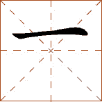 | 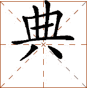 |
| “一”加“土”就是“王”，所以一逢土就主大吉。 | “典”字上面是个“曲”字，象征事情不顺，曲折多多。 |
| 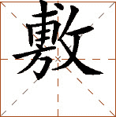 | 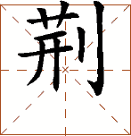 |
| “敷”字可以拆分成“十”、“日”、“放”三个字，表示写字之人在十天之内将要离任。 | “荆”字是“草”加“刑”，对违法乱纪的人来说十分凶险，对执掌刑法的人来说是大吉。 |

#### 形象法

形象法是根据汉字的形象来判断吉凶祸福的方法，其主要依据是汉字的笔画。

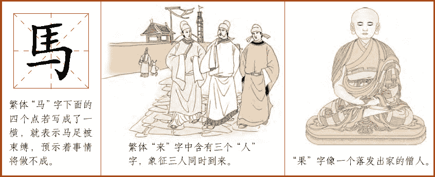

* * *

### 与字义的矛盾

有些字从字面意思上来看是好的，但是在测字时依据的不仅仅是字面意思，更为重要的是从字的结构里判断出的吉凶。

“家”字：“空”字在上，“豕”字在下，象征亥月发生不吉之事。“豕”即猪，五行属水，八卦属坎，象征家宅不安宁。

“益”字：此字的本义是吉利的，但上面是“二十八”，下面是“血”，表示在廿八日有血光之灾。

“亨”字：似乎也是亨通畅达之意，却“高”不像“高”，“了”不像“了”，不吉。写字之人需要防范小人，会遇到不祥之事。

“达”字：意为到达，而实际上不能到达，至少在二十日内不能到达，在写字的当天也不吉，忧愁之事多于欣喜之事。

“俊”字：与朋友的关系将会搞坏，父母兄弟之间的关系也会发生变化，凶。

“常”字：上面是“堂”字头，下面是“哭”字头，若占算疾病则表示堂上的人有灾，凶。

“谦”字：此字本来的意义是不错的，但是它表示写字之人没有廉耻，招惹很多是非，所以会让故人嫌弃。

### 吉字不吉的情况

有些字从本身的意思上来看是十分吉利的，但是在断卦时却会得到相反的结果。遇上这类字时一定要严格遵守测字准则，否则很容易错断命运。

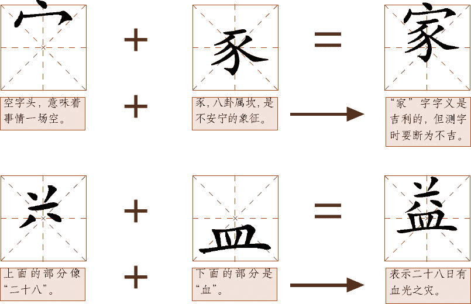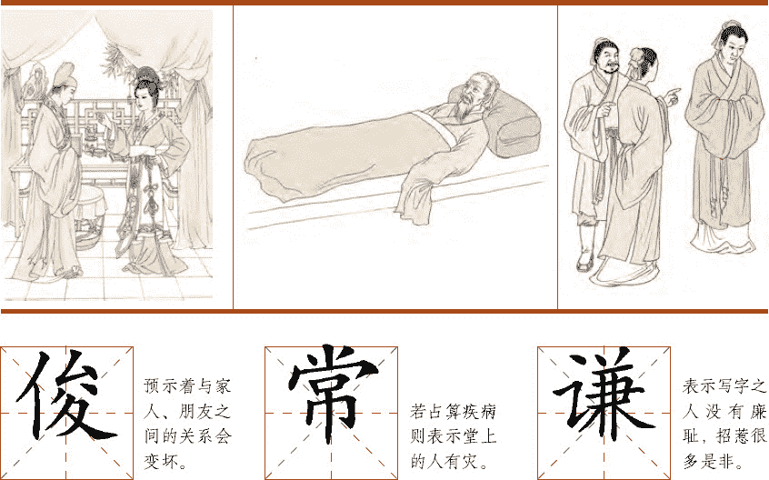

## 2　人如其字
推断贫富的要诀

要根据测字法推断一个人的命运如何，不但要看他写的字结构和风格，还要看他写字时的外应，比如有什么事情发生、在哪里写字等等。

### 字的笔画

字的笔画虽然是固定的，但是每个人在写字的时候都会有自己的风格，有人写字喜欢把横拉长，有人写字喜欢把竖缩短，有人写字时喜欢稍微倾斜，有人写字时喜欢增减笔画……这一切都可以作为判断吉凶祸福的依据。

若写的字中多了一横、一撇、一捺，就预示此人要大发横财，功成名就，或者要遇到贵人；若字中少了一横、一撇、一捺，则预示此人将要家财耗尽。

若字中短的笔画却写得很长，就说明写字之人慷慨大方；若字中笔画应该长的却写得较短，则说明写字之人吝啬狡猾，不肯多花一分钱。

若写的字中有直落到底的竖笔，就说明写字之人亲人会有危险；横画两头尖的，有伤妻之险；竖画两头尖的，有伤子之险；若“十”字笔画横竖都尖的，则妻儿兄弟都会有危险。

字中笔画不紧凑，写得十分松散的，写字之人就会孤单无助，或者将要出家；字中点比较多的，说明写字之人贪恋女色，居无定所。

字中的点比较重的，说明写字之人在商业方面会大发横财，或在远离家乡的地方成为杰出人物；若字的点画较轻，说明写字之人会遇上水灾而不得善终。

字中直落的竖笔较多的，说明写字之人聪明伶俐，手艺精湛，可以顺利地干成事业；字中含“口”字较多的，说明写字之人将有口舌之事，或者有破财之忧，而且很快就会发生。字中有“士”字头或“文”字脚的，说明写字之人在文学方面有才华。

凡是字中有金笔的，或者出现“干”、“戈”等字的，说明写字之人是习武之人。

字中带有三点的，说明写字之人心不安分，会惹出事来；若是不注意将字写出了头，就说明做事不顺利，十分难以成功。

### 笔画与命运

经过几千年的发展，汉字的笔画至今已经固定下来了，写字时笔画的情况可以作为判断吉凶祸福的依据。

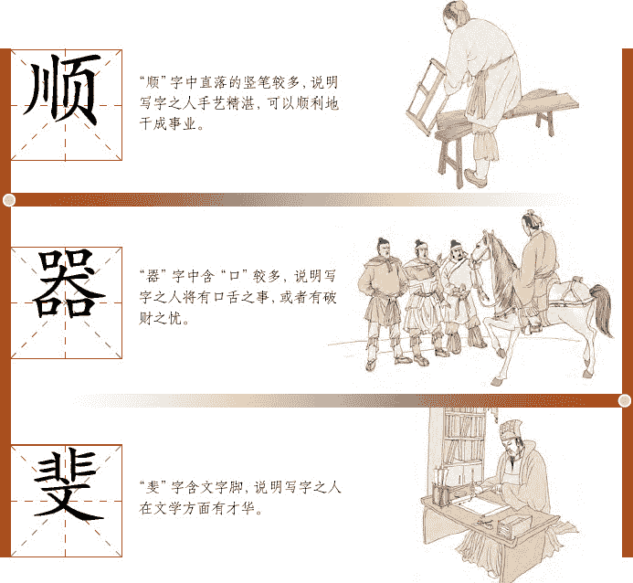

虽然汉字的笔画至今已经固定下来了，但是每个人在写字的时候都会有自己的风格，有时候会出现错别字，错别字也可以用来判断命运。

| 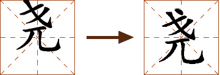 | 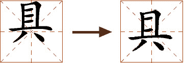 |
| “尧”字多了一点，写字之人要大发横财，功成名就，或者要遇到贵人。 | “具”字少了一横，写字之人将要家财耗尽。 |

* * *

### 写字时的外应

写字时的外应是指写字所在的地方、笔墨纸砚的情况、周围环境中的声音等等。这也是判断吉凶的依据之一。

写字时若是在火的旁边，就说明写字之人心神不宁；写字时是在楼上的，说明写字之人会有双重喜事发生；写字时是在船上的，就说明写字之人有虚惊之事发生。

写字时用破损的器具给砚台加水，则写字之人会家破人亡；写字时把纸写破了，则写字之人将有口舌之争。

写字的时候有狗在旁边叫个不停，说明做事不顺利。写字时有猫在旁边叫，则写字之人会有添丁进口之喜。

把字写在扇子上来问占的，说明写字之人夏天大吉，冬天有凶险之事发生。

### 在房间中写字

在房间中写字时要注意写字之人在房间里的位置，按照后天八卦的方位给他一个八卦归属；然后判断他写的字中什么笔式最多，再根据人的八卦和字的五行之间的生克比和关系来判断吉凶。

如人在房间的正西部写字，那么他的八卦属性就是兑，五行属金，这时他就宜于写出五行属金的字；也宜于写出五行属土的字，因为土可以生扶金；但不宜写出五行属水的字，因为金生水，卦气外泄；更忌讳写出五行属火的字，因为火可以克制金，对人是大凶之象。

### 综合判断

总之，在测字时要根据具体情况综合判断，不能仅仅根据一个现象就断定是吉是凶。有时候用两种方法得到的结论会有矛盾，这时就需要仔细思考在这件事中占主导地位的因素，以此作为最终判断的依据。

### 写字时的外应与方位

写字时的外应是指写字所在的地方、笔墨纸砚的情况、周围环境中的声音等等。这也是判断吉凶的依据之一。

#### 写字时的外应

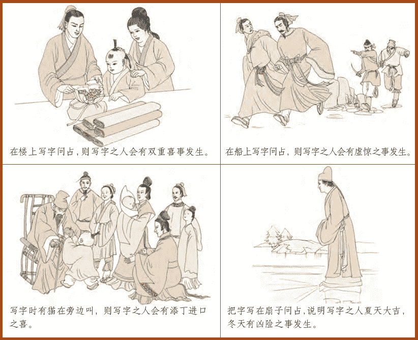

#### 写字时的方位

在一个方正的房间里写字时，所在的方位对应着后天卦象，这也是起卦的依据之一。

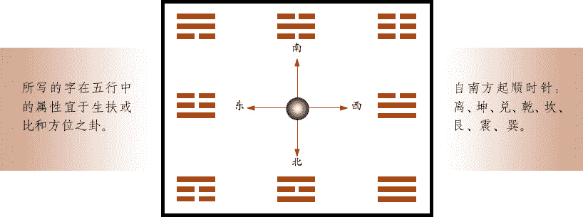

## 3　字画指迷
各种情况下的测字法

在用梅花易数测字时，针对不同的事情有不同的断卦方式。这些事情多为婚姻、疾病、生产、求谋、行人、失物等。在这里我们列出了与各种事情相应的占算方法。

### 问婚姻

当占算婚姻时，凡是字写得紧凑的，婚姻之事就能成；凡是字的竖笔成双成对的，婚姻之事就十分顺利；而字写得宽松、横笔成双成对、笔画长短不齐的，婚姻之事就难以成功。

凡是字的下面像“就”字这样均匀整齐的，或像“吉”字一样四个角都均匀整齐的，婚姻就容易成功；而字的上面短下面长的，就表示婚姻之事要经过一段时间才能成功。

凡是字的乾位笔画有破损的，表示对方的父亲不同意婚事；字的坤位笔画有破损的，表示对方的母亲不同意婚事。如果字左边的笔画长，就说明男方父母同意婚事，女方父母却反对婚事；字右边的笔画长的，就说明女方父母同意婚事，男方父母却反对婚事。

### 问疾病

金笔多：金表示肺，当金笔多时就会有肺疾，脏腑也可能有疾。

木笔多：表示心气有疾，或患手足类病。

水笔多：水笔主泻痢、呕吐等病症。

火笔多：代表潮热，伤寒，四肢疼痛，但病不至死。

土笔多：代表脾胃类疾病，疼痛之疾。大凶。

### 问生产

在问生产时，凡是字中有“喜”字或“吉”字的，都表示生产顺利；字中若带有白虎类笔式，就会发生难产之事；字中有腾蛇笔式的，主有虚惊之事发生。字与字之间排列紧密的，就表示生产顺利；字中笔画不连续的，是凶险之兆。字中竖笔笔画成双的，女子就会有喜事；字中竖笔笔画不成双的，男子就会有喜事。

### 笔画中的吉凶

针对各种问占的情况，梅花易数提供了一套判断笔画吉凶的方法。下面列举出的主要有婚姻、行人、失物等几种情况。

#### 问婚姻

| 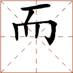 | 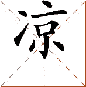 |
| “而”字的竖笔成双成对，婚姻之事会十分顺利。 | “凉”字左右偏旁长短不同，婚姻不顺利。 |

#### 问行人

| 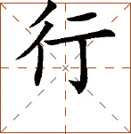 | 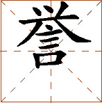 |
| “行”字若写得下面很整齐，行人就会很快回来。 | “誉”字下面是个“言”字，说明行人没回但有书信来到。 |

#### 问失物

| 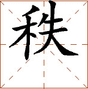 | 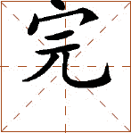 |
| “秩”字中含有“失”字，丟失的东西难以找回。 | “完”字坤位上有一勾，说明东西找不回来了。 |

* * *

### 求谋

在求谋时，如果把字写得中间宽阔，那么写字之人谋划的事情就不会成功；如果字写得十分紧凑，那么此人谋划的事情就能够成功。

### 问行人

在写“行”字时若写得下面很整齐，行人就会很快回来；字脚如果不整齐，行人就不能回来。写的字如果笔画繁复，就说明行人陷入了麻烦；如果字笔画简单，行人在外就很顺利。

如果写字之人写了“人”字，而且十分潦草，就说明行人还没有动身；如果写的“人”字十分挺拔，那么行人已经行动。

写“来”字来问占，说明行人还没有到，还需要等待；写“誉”字来问占，说明行人还没有到，但是会有信来到。

### 问寿

若字中笔画写得很长而且很细，则写字之人就能长寿；若字中笔画写得又短又粗，那么写字之人不会长寿。

### 问失物

如果东西丢失了，写的字中又含有“失”字，那么丢失的东西就难以找回。

若字中金笔较多，艮位又有破损，而且丢的是金属类物品，就应该马上寻找，多数情况下都能找回。

若字中土笔较多，坎位有破损，就表示丢失的东西在北方的古井中，或在窑坑沟坎中，或在瓦器下，一般来说在五天之内就可以找回。

若字的坤位上有一勾，那么丢失的东西是被奴婢偷去的，而且已经要不回来了；若字中兑位上破损，则东西是被命相属金的人拿去；若字中离位上有一画不完整，就是南方之人拿去了，但是丢失之物还能找回。

### 字的八卦方位

梅花易数拆字法将汉字的四边与四角分别与后天八卦万位相联系，使部分汉字的结构有了八卦属性。

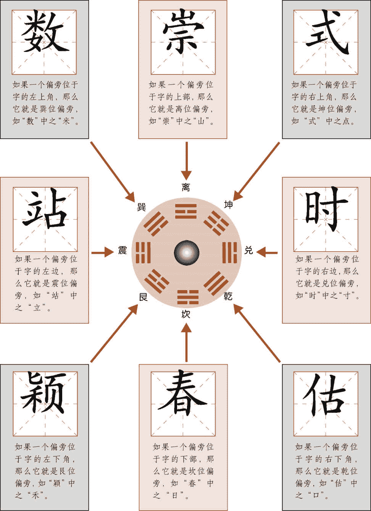

## 4　字与风格
探玄赋测字法

《探玄赋》是推断字与事情的吉凶的一篇赋，它从字的本来含义和字的风格两个方面提出了根据字推断人的基本方法。

### 字与事的关系

这是根据字的本意来推测人的身份或事情吉凶的一种方法，这种方法简明直接，不需要推八卦等烦琐的中间步骤。

“天”字象征刚健有力的乾卦，君子写出这个字就是吉利的；“地”字是柔顺的象征，普通老百姓写这个字是合适的。若君子写出了“地”字，就是裹足不前的象征，事情就会不顺利；若老百姓写出了“天”字，就是好高骛远，早晚要失败。

春天写“花”字，夏天写“木”字，都是合适的，因为这是兴旺繁荣的象征；同样的道理，秋天写“菊”字，冬天写“梅”字都是吉利的。但是若反季节写字，那么写字之人就会陷入困顿。

正午时宜于写“日”字，月亮将圆未圆时宜于写“月”字，刮风下雨时适于写“风”、“雨”等字，这都是与自然时令相比和的，都是吉利的象征。若是在炎热的夏天写出了“雪”、“霜”等字就不吉利。“灯”、“烛”在夜晚写就会有荣耀之事，“月”、“星”在中午写才华就会被埋没。

“牡丹”、“芍药”等字表示写字之人爱慕虚荣，有名无实；“野杏”、“山桃”等字表示写字之人注重实用，所谋之事将会有好的结果。“松柏”为长青之树，预示着写字之人终成栋梁之材；“蓬蒿”虽然也郁郁葱葱，但不能用来做木材，表示写字之人难成大器。

“风”、“竹”等字象征写字之人高雅脱俗；“桑”、“蚕”等字象征写字之人衣食无忧；“波”、“船”表示写字之人飘摇不定，颠沛流离；“鱼”、“龙”表示写字之人将要飞黄腾达。

“泉”、“石”、“烟”、“霞”等字表示写字之人将安守清贫，“江”、“山”、“海”、“河”等字表示写字之人胸怀宽广，目光远大。写“芝”、“兰”的不会是平常之人，写“禾”、“麦”的不会是显达之士。

“黄”、“绿”、“白”、“青”、“红”等字是有艳遇的先兆，“宫”、“商”、“角”、“徵”、“羽”是遇上知音的先兆。写“刀”、“枪”、“剑”、“戟”者必是武士，写“笔”、“墨”、“纸”、“砚”者定是书生。

写“钱”与“贫”者有自谦之德，写“富”与“贵”者有贪恋之心。写“金”、“玉”、“珍”、“珠”者是守财奴，写“酒”、“浆”、“脍”、“炙”者是酒鬼。写“荣”、“华”、“显”、“达”者将要中举，写“福”、“寿”、“康”、“宁”者享有高寿。

### 字与人的身份

在写字时，不同身份的人分别有不同身份的字与之相对应，如果一味追求吉利的字而不顾自己的身份，那也不会有好的结果。

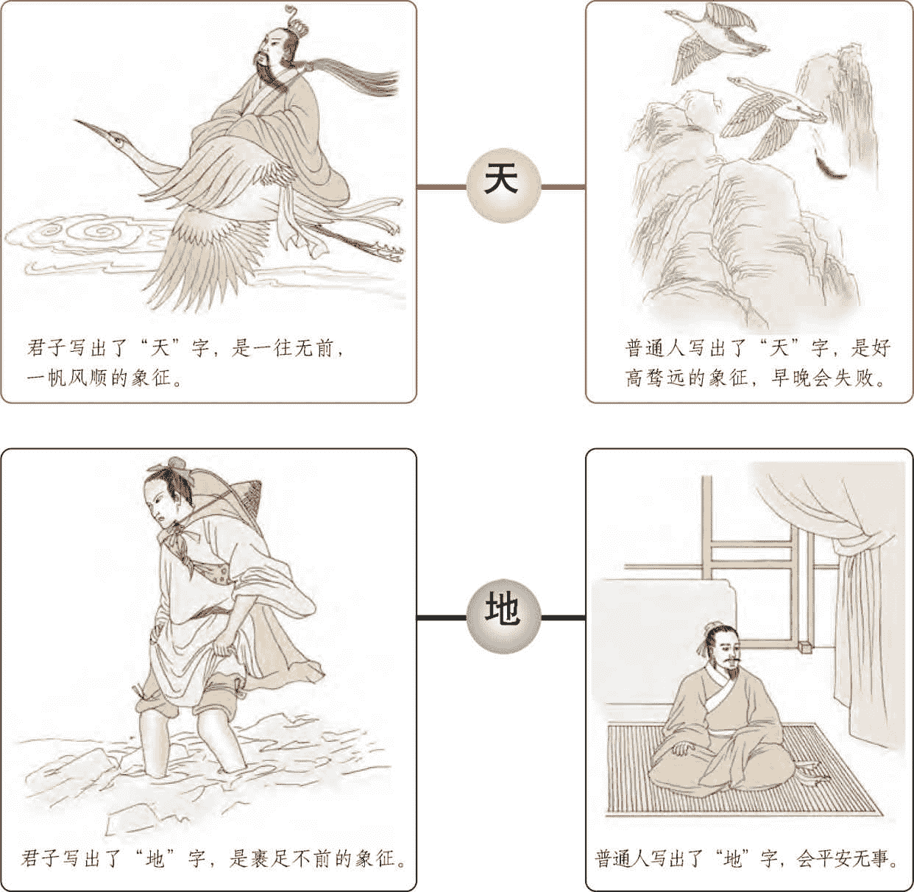

#### 字与时节

写字时也要看当时的时节，春天不宜写“冰”、“雪”等字，冬天不宜写“花”、“鸟”等字。

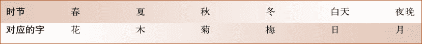

* * *

### 字的风格

若字写得如虎踞龙盘，十分稳固，则写字之人具有坚毅的品格，早晚会有显达的时候；若字写得如飞鸟翱翔，则写字之人最终会飞黄腾达；若字像白鹭一样伫立，则写字之人一定是贫穷而孤独之人；若字写得像乌鸦乱飞，则写字之人一定是喜欢搬弄口舌是非之人。

若字像受惊的蛇一般乱行找不到出路，那么写字之人就会是无家可归者；若字写得像仙鹤飞舞，则写字之人一定有雄心大志；若字写得像鹅一样步伐稳健舒缓，就说明写字之人做事十分稳重；若字写得像行云流水一样飘摇，就预示着写字之人家道将要萧条。

写字时横画最忌笔墨中断，这是荣华富贵不能持久的象征；竖画最忌墨迹干枯，这是不能长寿的象征。钩写得像新月一样优美，预示着事情顺利成功；点写得像火花四射，预示着写字之人将要滞留他乡。

墨迹浓淡不均，意味着做事多遭挫折；字东倒西歪，意味着生活艰难。字写得太短，写字之人就难以显贵；字写得太长，则写字之人潦倒终生，一事无成。

若把字写得俯仰生姿，对老百姓来说是生活不安定的象征，对品德高尚的君子来说就是飞黄腾达的预兆。若字写得太拘谨，对老百姓来说就是刻苦勤劳的象征，对君子来说就是牢狱之灾的前兆。

### 字与命运

字与命运的联系方式有多种，在这里是根据字的意义和字的气势来判断的。

#### 字的意义

有些字本身就含有特定的意义，根据字面的意思就可以断定写字之人将要迎来的事情。

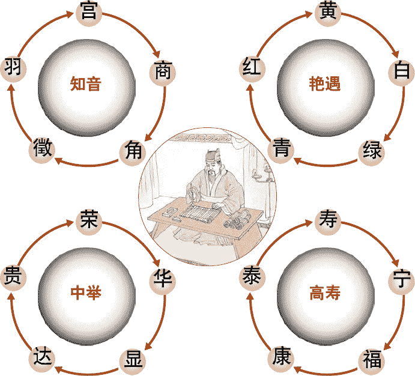

#### 墨迹中的命运

| 墨迹 | 命运 |
| 笔墨中断 | 荣华富贵不能持久 |
| 墨迹干枯 | 不能长寿的象征 |
| 墨迹不均 | 做事多遭挫折 |
| 钩如新月 | 事情能顺利成功 |
| 点似火花 | 写字之人将要滞留他乡 |

## 5　以卦而断
测字时的变通法

在测字时不能仅仅根据字的意义或笔画判断，在意义和笔画之外还有许多其他因素制约着事情的吉凶祸福，如写字之人的身份，写字时的季节，写字时听到的声音等等。

### 画有阴阳

笔画也有阴阳之分，一般来说，长而粗者为阳，短而细者为阴；长中有短为阳中阴，短中有长为阴中阳。阳中有阴则吉利，阴中有阳则凶险。

### 因人而断

在断字时不能一概而论，不同身份的人写出同一个字，其吉凶祸福也不会相同。同是写了一个“未”字，对秀才、官员、平民百姓、打官司者来说就有不同的后果。

对秀才来说，今年就会不顺利，暂时不能考取，但是来年就一定会榜上有名；对于官员的升迁问题，就表示今年暂时无法升迁，若能勤于政事，为民多办好事，那么来年就一定能顺利升迁；对平民百姓来说，预示着他要生病，并且此病只能用巫术才能医好；对打官司者来说表示官司难以打赢。

### 以卦而断

在写八卦卦名时，要根据卦象和卦气衰旺来判断。一般来说，季节时令宜于生扶所写之字的卦象，不宜克制所写之字的卦象。如写字之人写下了“震”字，在属震的春天则为大吉，在冬天则是没有生气的象征。在炎炎夏日写“离”字则大吉，在寒冷的冬天写“离”字则大凶。

### 笔画变通

有些汉字的笔画有几种写法，写字之人通常都有自己的写字习惯，如在写“吉”字时，有人把上面的部分写作“土”字，虽然在现代的汉字规范中这是错误的写法，但是在书法艺术中这是完全可以的。此人在问疾病时就会经久不愈，其实“吉”字本身是个吉利的字，上面的“士”字预示着此人将要成为士人，是高升的象征。可见一笔之差就能左右命运吉凶。

又如“常”字，如果把上面的部分写成“小”字，那么此人家内小口会有灾难，但这灾害不会很大。

### 测字时的变通法

测字最忌拘泥于定式，因为这样完全忽视了易之“变易”的一面，把事情看成是完全机械的，而实际上没有什么事情是完全注定的。

#### 以卦而断

在写八卦卦名时，要根据卦象和卦气衰旺来判断。季节时令宜于生扶所写之字的卦象，不宜克制所写之字的卦象。

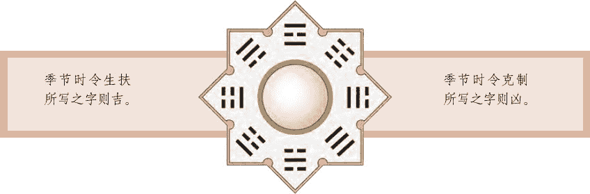

#### “未”字的不同命运

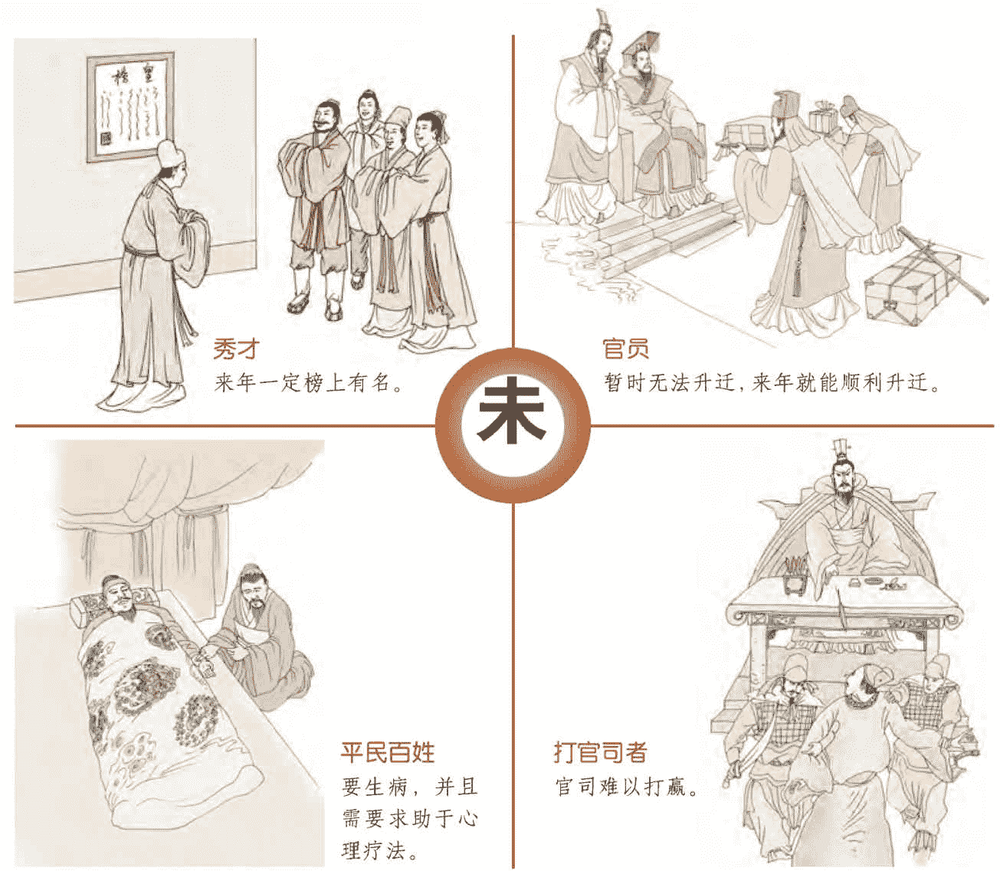

* * *

### 时间因素

有一些字的季节因素很强，即使写字时的外应、写字之人的身份、字的笔式等完全相同，在不同的季节写出来也会引起不同的命运。

“草”、“木”等字宜于在春夏两季写出，秋冬则不宜；“雪”、“冰”等字则恰好相反。

另外还有一些很不明显的情况，如“牛”字，似乎与季节无关，但是牛这种动物主要是为人耕地的，春夏两季牛很辛苦，秋冬两季就十分安逸。这里牛的命运与人的命运存在相关性。

### 笔画增减

若求仕之人写出了“尹”字，那么他将不能成功，虽然“尹”字含有官员的意思，但是“尹”字是没有口的“君”字，所以对求仕的人来说是不吉的。

若是写出了“君”字，就能在仕途上比较顺利，“君”是“郡”字的偏旁，预示着此人可做郡守之类的官。

### 所闻与所见

在写字占算病情时，就不宜听到哭泣的声音；占算财运时，就不宜听到东西破碎的声音。这些声音本身是没有吉凶含义的，但在特定的占算情况中就有了特殊的含义。

写“立”字时忌听到水声或见到下雨，因为“水”加“立”就成了“泣”字；写“言”字时忌听到狗的叫声或见到狗，因为“言”和“犬”就组成了“狱”字。

问财时，宜于写出“金”、“宝”、“禾”、“斗”等偏旁；问病时，不宜写出“土”、“木”、“血”、“井”等字。

总之，在测字时需要考虑内部的和外部的各种情况，进行综合判断。

### 影响测字的各种因素

影响测字的因素有很多，字的表面意思只是其中的一种，万不可仅仅根据字面吉凶而断定事情的吉凶。

#### 笔画中的阴阳

笔画也有阴阳之分，一般来说，长而粗者为阳，短而细者为阴；长中有短为阳中阴，短中有长为阴中阳。

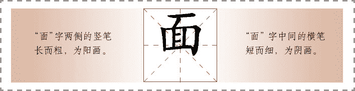

#### 影响测字的各种因素

影响测字的因素主要有：人品、笔画、字义、笔式、偏旁、见闻、时间、方位等，在具体测字时需要灵活运用各种方法。

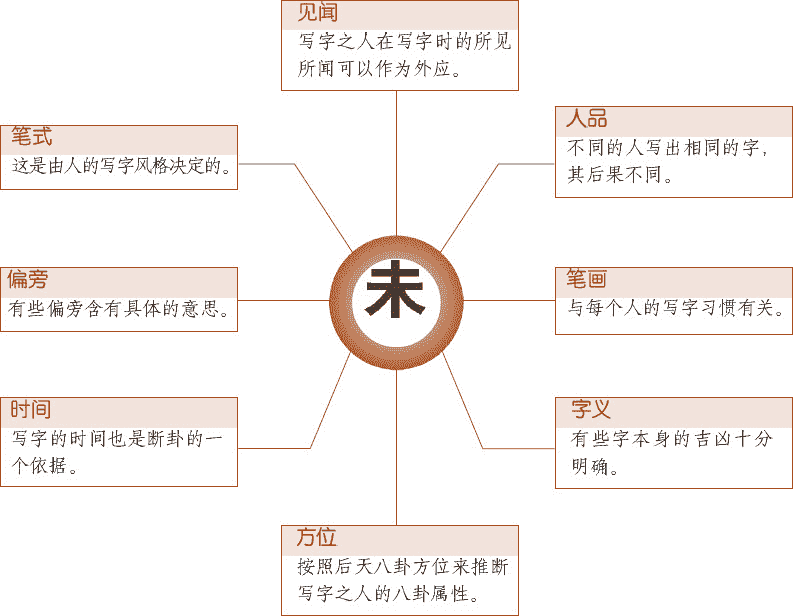

## 6　命中机缘
古人测字故事（一）

梅花易数中的易理是玄妙的，但是它只能预知某些事情，而不能改变已经确定了的命运。平日里积德行善，多做好事，要比利用占算法投机取巧好得多。

南宋时有个叫谢石的人精通梅花易数测字法，有一天宋高宗微服出游时遇到了谢石，想试试他的测字法究竟有多灵验，就在泥土中写了一个“一”字。谢石想，“一”字加“土”字就是“王”字，所以知道来人一定不是普通人。这时宋高宗又写了个“問”字，谢石见这个“問”字左看是个“君”字，右看也是个“君”字，来人一定是当今皇上了，所以赶紧下拜。宋高宗怕暴露身份，连说：“不要多说什么了。”

于是谢石被宋高宗召入宫里，做了大官。后来宋高宗写了个“春”字，让谢石占算，谢石说：“我看‘春’字上面是‘秦’字头，下面是‘日’字，‘秦’字头太重，压得太阳无光了。”大臣都知道这说的是秦桧专权之事。当时奸相秦桧正在旁边，因为此事而深恨谢石，后来终于找了个借口把谢石贬往边远之地。

在去边远之地的途中，谢石遇上了一位奇女子，女子声称自己测字天下第一，谢石听了很不服气，于是和女子较量。

谢石先写了自己的姓“谢”字请女子占算，女子说，“谢”字是在寸言之间立身的象征，说明谢石的成败遭遇都是由于几句话引起的。谢石大为佩服，又写了个“皮”字让女子算，女子说，“石”逢“皮”而“破”，说明押送谢石的人姓皮。谢石一听惊叹不已，于是让女子写个字，女子说：“我站在这里就是个字。”当时女子正在一座山的旁边，谢石说：“山的旁边站着一个人，就是‘仙’字，你大概是个神仙吧！”女子听了笑了一下就消失了。

谢石到了边境之后，一直待在那里，再也没有返回中原。因为他知道自己虽然有测字的神奇功夫，但是命运是不能改变的。用这种方法只能预知某些事情，但无法改变什么。想靠这种方法来投机取巧的人，只能是自食其果，还不如平日里积德行善，多做好事。

### 卦与命运

在掌握了足够的外应之后，梅花易数可以准确地预知人的命运。但是任何一种占法都无法改变人的命运，想靠各种占卜法来投机取巧的人，只能自食其果。

#### 三种取字法

在测字时不一定需要写在纸上的字，从很多现象中我们就可以读出字来。

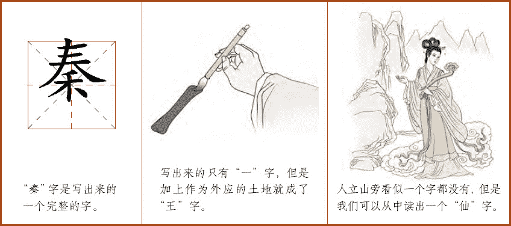

#### 卦与人的命运

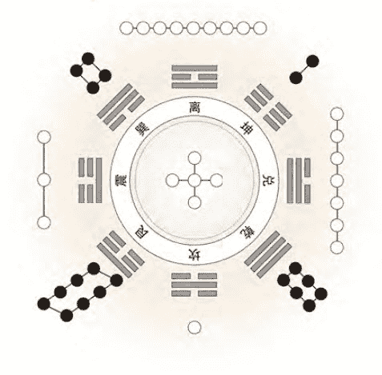

八卦是先哲上观天文、下察人事而创造的，它揭示了自然万物变化的趋势。大的发展趋势总是在一并始就显露出小的预兆，万事万物都跳不出自然这个包罗万象的系统。人的命运也总是与自然的变化联系在一起的，所以从八卦或六十四卦中就能看到事情变化的端倪。只要把握住了外界环境中的各种征兆，命运就掌握在手中了。

## 7　一心做事
古人测字故事（二）

在占算得到了好的预兆之后，不能坐等好事自己发生，还需要努力去做，只有好的预兆而没有自己的努力也是不行的。

张乘槎是相字预测的高手。浙江某地有一座楼名叫“拱北楼”，有一位官员被派到浙江为官，为了显示自己能为本地带来丰厚的收益，官员将“拱北楼”改为“来豐楼”（“豐”为“丰”的繁体字）。在揭匾额之前，官员请张乘槎占测一下吉凶，不料张乘槎说：“糟透了，还有什么好占测的呢！”官员却不信他的话。然而就在当晚，官员就死了。有人问这是因为什么，张乘槎说：“‘豐’字的上面是座‘山’，是坟墓所在之处；两个‘丰’字就是坟墓上的树木；下面的‘豆’是祭祀时用的东西，有了这样的征兆，不死还能怎么样呢？”

一位姓刘的人有事要张乘槎占算，等张乘槎来了，那人又不说是什么事，而让张乘槎玩射覆游戏，以此来考察张乘槎的本领。这时正好有个小学生在旁边写字，正好写到了《千字文》中的“德建名立”一句，刘指着“德”字请张乘槎进行占测。张乘槎十分肯定地说：“你想问的是行人之事。”刘说：“对，我想知道行人什么时候能回来。”张乘槎说：“十四天之内就能回来。”刘说：“他要办的事情很棘手，恐怕回来不了。”张乘槎说：“不，十四天之内一定能回来。”刘问为什么是这样的情况，张乘槎说：“‘德’字左边是行人，右边是‘十四’和‘一心’，说明行人在十四天之内一定回来；即使有事情纠缠，他也一心要回来。”后来事情果然验证了张乘槎的说法。

在这件事情中，行人能回来的关键在于“一心”二字，因为要办的事情十分复杂，即使得到了吉利的预兆，行人也不一定能顺利回来，还需要他的认真努力，即“一心”去做事。

### 断卦之后

占卦是检验自己行为的一种好方法，卦的吉凶意味着行为的正误。所以在断卦之后要根据结果调整自己的行为。

#### 错误的做法

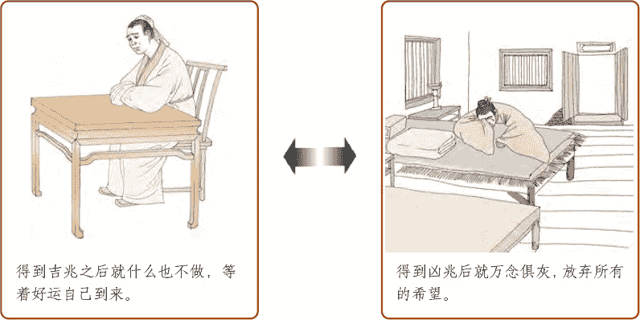

#### 正确的做法

要用平等之心对待断卦的结果，得到吉兆不要过于兴奋，得到凶兆不要过于悲伤。算卦只是预知命运的手段，而不是决定命运的工具。在得到断卦结果之后还应该认真思考自己的所作所为，是吉兆的就继续发扬，是凶兆的就迅速改变一些行为，这样才能趋利避害，将命运调整到最佳状态。

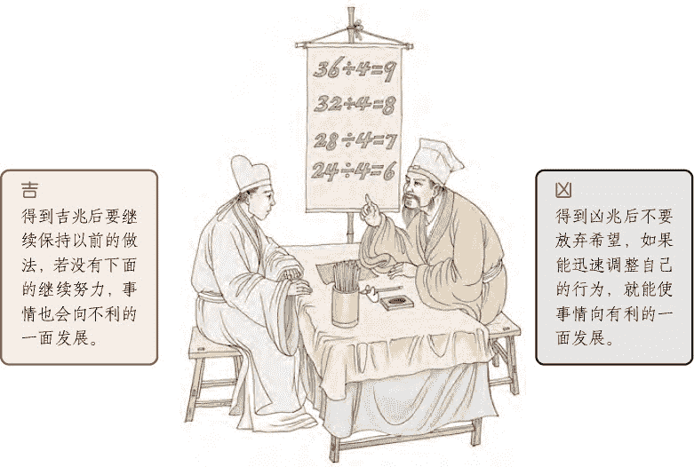

## 8　易理玄微
梅花易数占法总结

在掌握了各种起卦断卦法之后，具体方法的选择成为一个重要的步骤。若选用的方法合理，那么占算的结果就准确，反之就会既费劲又得不到正确的预兆。

梅花易数自从邵康节创立以来，受到了无数人的欢迎，其主要原因是它的应用十分广泛。人们在日常生活中遇到的事情，如择日、升迁、婚丧嫁娶、修建房屋、做生意、失物、患病、出游等都可以用梅花易数进行占算。

在梅花易数中，起卦法的选择灵活多样，由于万事万物都处在一定的时间中，所以实际上没有什么不能用梅花易数来起卦的。此外，方位、尺寸、人品、声音、颜色、文字、动物、静物等都可以作为起卦的依据。

在实际起卦时，一定要遵守“无疑不卜，筮不过三”的基本原则，不能没有事乱卜乱占，也不能把起卦当成一件供人消遣的事情。

当看到事情发生而决定起卦后，就需要仔细选择一种合适的起卦法。若事情是问时间，那么最好用时间起卦法；若事情的空间性比较强，那么就选用方位起卦法，其他方法可类推。

得到卦象之后，下面的步骤是断卦。断卦时不能仅仅依据卦象和卦辞，还要充分考虑外应。这些外应主要有天时之应、地理之应、人品之应、行为之应、方卦之应、动物之应、静物之应、声音之应、颜色之应等。选取外应的原则和起卦法差不多。

测字法是梅花易数中的一大类占算方法，它充分考虑到了字的结构、风骨、含义等各个方面，从一个全新的角度预知命运。这里的字不仅仅是明显写出来的字，还包括暗含在周围环境中的字，能否发现这些字，就要看占算者的观察本领了。

在掌握了这些方法之后，多用多练是提高占算水平的重要途径。虽然不能毫无节制地乱占，但在日常生活中还是有很多机会进行锻炼的。

梅花易数所预测的只是事情的发展趋势，它与善恶报应并不矛盾，诸恶莫作，众善奉行，命运自然就能好起来。

### 占法总结

梅花易数起卦断卦法是一套严谨的体系，在日常生活中遇上的事情都可以用梅花易数问占。常见的事情有择日、升迁、科举、婚姻、家室、财富、失物、疾病等，在实际应用中要仔细选择一种适合的方式进行占算。

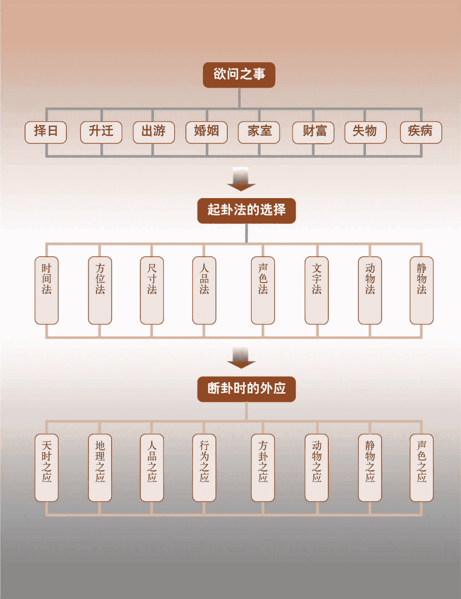

# 附录
邵康节先生观梅拆字数全书

## 卷之一

### ◆周易卦数

乾一，兑二，离三，震四，巽五，坎六，艮七，坤八。

### ◆五行生克

金生水，水生木，木生火，火生土，土生金。
金克木，木克土，土克水，水克火，火克金。

### ◆八宫所属五行

乾兑金，坤艮土，震巽木，坎水，离火。

### ◆卦气旺

震巽木旺于春；离火旺于夏；乾兑金旺于秋；坎水旺于冬；坤艮土旺于辰戌丑未月。

### ◆卦气衰

春，坤艮；夏，乾兑；秋，震巽；冬，离；辰戌丑未，坎。

### ◆十天干

甲乙，东方木。丙丁，南方火。戊己，中央土。庚辛，西方金。壬癸，北方水。

### ◆十二地支

子水鼠，丑土牛，寅木虎，卯木兔，辰土龙，巳火蛇，
火马，未土羊，申金猴，酉金鸡，戌土犬，亥水猪。

### ◆八卦象例

乾三连，坤六断。震仰盂，艮覆碗。
离中虚，坎中满。兑上缺，巽下断。

### ◆占法

易中秘密穷天地，造化天机泄未然。
中有神明司祸福，从来切莫教轻传。

### ◆玩法

一物从来有一身，一身还有一乾坤。
能知百事备于我，肯把三才别立根。
天向一中分造化，人于心上起经纶。
仙人亦有两般话，道不虚传只在人。

### ◆卦数起例

卦以八除，凡起卦不问数多少即以八作卦；数超过八数即以八数递除，以余数作上卦。如一八除不尽，再除二八，三八，直至除尽八数，以零数作卦，如得八整除，即坤卦，便不必除也。

爻以六除，凡取动爻，以重卦总数除六，以零数作动爻。如不满六，则用次数为动爻，不必再除。如过六数，则除之，一六不尽，再除二六，三六，直至除尽，以零数作动爻。若一爻动，则看此一爻之阴阳，是阳爻则变阴爻，是阴爻则变阳爻。取爻当以时加之。

### ◆互卦起例

互卦只用八卦，不必取六十四卦名。互卦以重卦去了初爻及第六爻，以中间四爻分作上下两卦，看得何卦。又云：乾坤无互，互其变卦。

### ◆年月日时起卦

年月日为上卦，年月日加时总数为下卦。又以年月日时总数取爻。如子年一数，丑年二数，直至亥年十二数。月如正月一数，直至十二月亦作十二数。日如初一，一数，直至三十日为三十数。以上年月日共计几数，以八除之，以零数作上卦，时如子时一数直至亥时十二数，就将年月日数加时之数，总计几数，以八除之，零数作下卦，就以六除之，作动爻。

### ◆物数占

凡见有可数之物，即以此数起作上卦，以时数配作下卦，即以卦数并时数总除六，取动爻。

### ◆声音占

凡闻声音，数得几数，起作上卦，加时数配作下卦。又以声音，如闻动物鸣叫之声，或闻他人敲击之声，皆可作数起卦。

### ◆字占

凡见字数，如停匀，即平分一半为上卦，一半为下卦。如字数不均，即少一字为上卦，取天轻清之义，以多一字为下卦，取地重浊之义。

一字占：一字为太极未判。如草混沌不明，不可得卦。如楷书，则取其字画，以左为阳画，右为阴画。居左者看几数，取为上卦；居右者看几数，取为下卦。又以一字之阴阳，全画取爻。

二字占：二字为两仪平分。以一字为上卦，以一字为下卦。

三字占：三字为三才。以一字为上卦，二字为下卦。

四字占：四字为四象。平分上下为卦。又四字以上，不必数笔画，只以平仄声音调之。平声为一数，上声为二数，去声为三数，入声为四数。

五字占：五字为五行。以二字为上卦，三字为下卦。

六字占：六字为六爻之象。平分上下为卦。

七字占：七字为数齐七政。以三字为上卦，四字为下卦。

八字占：八字为八卦定位。平分上下为卦。

九字占：九字为九畴之意。以四字为上卦，以五字为下卦。

十字占：十字为成数。平分上下为卦。

十一字占：十一字以上至于百余字，皆可起卦。但十一字以上，又不用平仄声音调之，只用字数。如字数均平，则以半为上卦，以半为下卦，又合两卦总数取爻。

### ◆丈尺占

丈尺之物，以丈数为上卦，尺数为下卦。合丈尺之数取爻，寸数不取。

### ◆尺寸占

以尺数为上卦，寸数为下卦。合尺寸之数，加时取爻。分数不用。

### ◆为人占

凡为人占，其例不一。或听语声，或观其人品，或取诸身，或取诸物，或观其服色，触其外物，或以年月日时，或以书写来意。又听其语声者，如或一句，即以其字数分之起卦，如说两句，即用先一句为上卦，以后一句为下卦。语多，则只用初听一句，或后闻一语。余句不用。

观其人品者，如老人为乾，少女为兑之类。

取诸其身者，如头动为乾，足动为震，目动为离之类。

取其诸物者，如人手中偶有何物，如金玉及圆物之类为乾，土瓦及方物之属为坤之类。

观其服色者，如其人青衣为震，赤衣为离之类。

触其外物者，起卦之时见水为坎卦，见火为离卦之类。

年月日时，以望梅之类推之。

书写来意者。其人来占，或写来意，则以其字占之。

### ◆自己占

凡自己欲占，以年月日时或听闻有声音，或观当时所触之外物，皆可起卦。以上三例，与前章为人占法同。

### ◆占动物

凡占群物之动，不可起卦。如见一物，则就以此物为上卦，物来之方为下卦。合物卦数与方位卦数，加时数取爻，以此卦数总断其物，如后天占牛鸣鸡叫之类。又凡牛马犬之类，初生，则以初生年月日时占之。又或置买此物，亦可以初置买之时推之。

### ◆占静物

凡占静物，有如江河山石，不可起卦。若至屋宅树木之类，则以屋宅初创之时，树木初置之时，皆可起卦。至于器物，则置成之时可占，如枕椅类是矣。余则无故不占。若观梅，则见雀争枝坠地而占。牡丹，则自有问而占。茂树，则枝枯自坠而后占也。

### ◆物卦起例（端法后天起卦）

后天端法：以物为上卦，方位为下卦，合物卦之数与方卦之数，加时数以取动爻。

### ◆八卦万物属类（并为上卦）

乾卦：天，父，老人，官贵，头，骨，马，金，珠宝，玉，木果，圆物，冠，镜，刚物，大赤色，水寨。

坤卦：地，母，老妇，土，牛，釜，布帛，文章，舆，辇，方物，柄，黄色，瓦器，腹，裳，黑色，黍稷，书，米，谷。

震卦：雷，长男，足，发，龙，百虫，蹄，竹，雀，萑苇，马鸣，乐器之类，草木，青碧，绿色，树，木核，柴，蛇。

巽卦：风，长女，僧尼，鸡，股，百禽，百草，臼，香气，臭，绳，眼，羽毛，帆，扇，枝叶之类，仙道，工匠，直物，工巧之器。

坎卦：水，雨雪，工，豕，中男，沟渎，弓轮，耳，血，月，盗，宫律，栋，丛棘，狐，蒺蔾，桎梏，水族，鱼，盐，酒醢，有核之物，黑色。

离卦：火，雉，日，目，电，霓，霞，中女，甲胄，戈兵，文书，槁木，炉，兽，鳄龟，蟹蚌，凡有壳之物，红赤紫色，花，文人，干燥物。

艮卦：山，土，少男，童子，狗，手，指，径路，门阙，果，瓜，阍寺，鼠，虎，狐，黔喙之属，木生之物，藤生之瓜，鼻。

兑卦：泽，少女，巫，舌，妾，肺，羊，毁折之物，带口之器，属金者，废缺之物，奴仆，婢。

## 卷之二

### ◆心易占卜玄机

天下之事有凶吉，托占以明其机；天下之理无形迹，假象以显其义。故乾有健之理，于马之类见之；故占卜寓吉凶之理，于卦象内见之。然卦象一定不易之理，而无变通之道，不可也。易者，变易而已矣。至如今日观梅复得革兆，有女子折花，异日果有女子折花，可乎？今日算牡丹，得兑兆，断为马所践，异日果为马所践踏，可乎？且兑之属，非正女子；乾之属，非止马。谓他人折花有毁，皆有切验之真，是必有属矣。嗟呼！占卜之道在变通。得变通之道者，在乎心易之妙耳！

### ◆占卜总诀

大抵占卜之法，成卦之后，先看《周易》爻辞，以断吉凶。如乾卦初九“潜龙勿用”，则诸事未可为，宜潜伏之类；九二“见龙在田，利见大人”，则宜谒见贵人之类，余皆可仿此。次看卦之体用，以论五行生克，体用即动静之说。体为主，用为事应。用生体及比和，则吉；体生用或克体，则不吉。又次看克应。如闻吉说见吉兆，则吉；闻凶说见凶兆，则凶。见圆物，事易成；见缺物，事终毁之类。

复验己身之动静。坐则事应迟，行则事应速，走则愈速，卧则愈迟之类。数者既备，可尽占卜之道，必须以易卦为主，克应次之。俱吉则大吉，俱凶则大凶，有凶有吉，则详审卦辞，及克用体应之类，以断吉凶也。要在圆机，不可执。

### ◆占卜论理诀

数说当也，必以理论之而后备。苟论数而不论理，则拘其一见而不验矣。且如饮食得震，则震为龙。以理论之，龙非可取，当取鲤鱼之类代之。又以天时之得震，当有雷声，若冬月占卦得震，以理论之，冬月岂有雷声？当有风撼震动之类。既知以上数条之诀，复明乎理，则占卜之道无余蕴矣。

### ◆先天后天论

先天断卦吉凶，止以卦论，不甚用《易》之爻辞。后天则用爻辞，兼用卦辞，何也？盖先天者未得卦，先得数，是未有《易》书，先有《易》理，辞前之《易》也，故不必用《易》书之辞，专以卦断。后天则以先得卦，必用卦画，辞后之《易》也。故用爻之辞，兼《易》卦辞以断之也。

后天起卦，与先天不同，其数不一。今人多以坎一，坤二，震三，巽四，中五，乾六，兑七，艮八，离九之数为用。盖圣人作《易》画卦，始以太极，两仪，四象，八卦加一倍，数自成乾一，兑二，离三，震四，巽五，坎六，艮七，坤八，故占卜起卦，合以此数为用。又今人起后天卦，多不加时数，得此一卦，止此一动，更无移易变通之道。故后天起卦定爻，必加时而后可。

又先天之卦，定事应之期，则取之卦气，如乾兑应于庚辛及申酉之日，或坤为戌亥之日时，兑为酉日时。如震巽当应于甲乙及木支之日，或震取卯，巽取辰之类。后天则以卦数加时数，总之而分行、卧、坐、立之迟速，以为事应之期。卦数时类，应近而不能决诸远者，必合先后之卦数取决可也。又凡占卦中决断吉凶，其理洞见，止于全卦体用生克之理，及参《易》辞，斯可矣。今日以后天卦，却于六十甲子之日，取其时方之魁、破、败、亡、灭迹等，以助断决。盖历象选时，并于《周易》不相干涉，不可用也。

### ◆卦断遗论

凡占卜决断，固以体用为主，然有不拘体用者，如起例中“西林寺额”，得山地剥，体用互变俱比和，则为吉，但仍不吉，何也？盖寺者，纯阳人居之地，而纯阴爻象，则群阴剥阳之义显然也。此理甚明，不必拘体用也。二又若有人问“今日动静如何”得地风升，初爻动，用克体卦，俱无饮食矣，而亦有人相请，虽饮食不丰而终有请，何也？此人当时，必有当日之应。又有“如何”二字带口，为重兑之义也。又有用不生体，互变生之而吉者，若“少年有喜色”，占得山火贲是也。又有用不生体，互变俱克之而凶者，如“牛悲鸣”，占得地水师是也。盖少年有喜色，占则略知其有喜。而《易》辞又有“束帛戋戋”之吉，是二者俱吉，互变俱生，愈见其吉矣。虽用不生体不吉，不为其害也。牛鸣之哀，则略知其凶，而《易》爻复有“舆尸”之凶，互变俱克，愈见其凶，虽用爻不克，不能掩其凶也。盖用《易》断卦，当用理胜处验之，不可执拘于一也。

### ◆八卦心易体用诀

心易之数，得之者众；体用之诀，有之者罕。余幼读《易》书，长参数学，始得心易卦数，初见起例，仅知占其吉凶，如以蠡测海，茫然无涯。后得智人见授体用心得之诀，而后占事之诀，疑始有定。据验则验，如由基射箭，百发百中。其要在于分体用之卦，察其五行生克比和之理，而明乎吉凶悔吝之机也。于是《易》数之妙始见，而《易》道之卦义备矣，乃世有真实，人罕遇之耳。得此者，幸深秘之。

### ◆体用总诀

体用云者，如易卦具占筮之道，则易卦为体，以卜筮用之。此所谓体用者，借体用二字以寓动静之卦，以分主客之兆，以为占例之准则也。大抵体用之说，体卦为主，用卦为事，互卦为事之中间，克应变卦为事之终。

应体之卦气宜盛不宜衰。盛者，如春震巽，秋乾兑，夏离，冬坎，四季之月坤艮是也；衰者，春坤艮，秋震，夏乾兑，冬离，四季之月坎是也。

宜受他卦之生，不宜受他卦之克。他卦者，谓用互变也。生者，如乾兑金体，坤艮生之。坤艮土体，离火生之。离火体，震巽木生之。余皆仿此。克者，如金体火克，火体水克之类。体用之说，动静之机，八卦主宾，五行生克，体为己身之兆，用为应事之端。体宜受用卦之生，用宜见卦体之克，体盛则吉，体衰则凶。用克体固不宜，体生用亦非利。体党多而体势盛；用党多而体势衰。如卦体是金，而互变皆金，则是体之党多。体生用，为之泄气，如夏火逢土，亦泄气。

体用之间，比和则吉，互乃中间之应，变乃末后之期。故用吉变凶者，先吉后凶；用凶变吉者，先凶后吉。体克用，诸事吉；用克体，诸事凶。体生用，有耗失之患；用生体，有进益之喜。体用比和，则百事顺遂。

又卦中有生体之卦，看是何卦。

乾卦生体，则主公门中有喜益，或功名上有喜，或因官有财，或问讼得理，或有金宝之利，或有老人进财，或尊长惠送，或有官贵之喜。

坤卦生体，主有田土之喜，或于田土进财，或得乡人之益，或得阴人之利，或有谷果之进，或有布帛之喜。

震卦生体，则主有山林之益，或因山林得财，或进东方之财，或动中有喜，或有林货交易之利，或以茶果得利，或因草木姓氏人称心。

巽卦生体，亦主山林之益，或因山林得财，或于东南得财，或因草木姓人而得利，或以茶果得利，或有茶果菜蔬之喜。

坎卦生体，有北方之喜，或受北方之财，或因水边人进利，或因点水人称心，或有因鱼盐、酒货、文书交易之利，或有馈送鱼盐酒之喜。

离卦生体，主有南方之财，或有文书之喜，或有炉冶场之利，或因火姓人而得财。

艮卦生体，主有东北方之财，或山田之喜，或因山林田土获财，或得宫音带土姓人之财，物当安稳，事有始终。

兑卦生体，有四方之财，或喜悦事，或有食物玉金货利之源，或商音之人或市口之人欣逢，或主宾之乐，或朋友讲习之事。

又看卦中有克体之卦者，看是何卦。

如乾卦克体，主有公事之忧，或门户之忧，或有财宝之失，或于金谷有损，或有怒于尊长，或得罪于贵人。

坤卦克体，主有田土之忧，或于田土有损，或有阴人之侵，或有小人之害，或失布帛之财，或丧谷果之利。

震卦克体，主有惊虚，常多恐惧，或身心不能安静，或家宅见妖灾，或草木姓氏之人相侵，或于山林有所失。

巽卦克体，亦有草木姓人相害，或于山林上生忧。谋事，乃东南方之人；处家，忌阴人小口之厄。

坎卦克体，主有险陷之事，或寇盔之忧，或失意于水边人，或生灾于酒后，或点水人相害，或北方人见灾。

离卦克体，主文书之忧，或失火之惊，或有南方之忧，或火姓人相害。

艮卦克体，诸事多违，百谋中阻。或有山林田土之失，或带土娃人相侵，防东北方之祸害，或忧坟墓不当。

兑卦克体，不利西方，主口舌事之纷争。或带口人侵欺，或有毁折之患，或因饮食而生忧。生克不逢，则止以本卦而论之。

### ◆天时占第一

凡占天时，不分体用，全观诸卦，详推五行。离多主晴，坎多主雨，坤乃阴晦，乾主晴明。震多则春夏雷轰，巽多则四时风烈，良多则久雨必晴，兑多则不雨亦阴。夏占离多而无坎，则亢旱炎炎；冬占坎多而无离，则雨雪飘飘。

全观诸卦者，谓互变卦。五行谓离属火，主晴；坎为水，主雨；坤为地气，主阴；乾为天，主晴；震为雷，巽为风。秋冬震多无制，亦有非常之雷；有巽佐之，则为风撼震动之应；艮为山云之气，若雨久，得艮则当止。艮者，止也，亦土克水之义。兑为泽，故不雨亦阴。

夫以造化之辨固难测，理数之妙亦可凭，是以乾象乎天，四时晴朗；坤体乎地，一气惨然。乾坤两同，晴雨时变。坤艮两并，阴晦不常。卜数有阳有阴，卦象有奇有偶。阴雨阳晴，奇偶暗重。坤为老阴之极，久晴必雨；乾为老阳之极，久雨必晴。若逢重坎重离，亦曰时晴时雨。坎为水，必雨；离为火，必晴。乾兑之金，秋高明晴；坎之水，冬雪凛冽。坤艮之土，春雨泽；离之火，夏火炎蒸。《易》曰：“云从龙，风从虎。”又曰：“艮为云，巽为风。”艮巽重逢，风云际会，飞沙走石，蔽日藏山，不以四时，不必二用。坎在艮上，布雾兴云；若在兑上，凝霜作雪。乾兑为霜雪霰雹，离火为日电虹霓。离为电，震为雷，重会而雷电俱作；坎为雨，巽为风，相逢则风雨骤兴。震卦重逢，雷惊百里；坎爻叠见，润泽九垓。故卦体之两逢，亦爻象之总断。

地天泰，水天需，昏蒙之象；天地否，水地比，黑暗之形。爻纯离，夏必旱，四季皆晴；爻纯坎，冬必寒，四时必雨。久雨不晴，逢艮必止。久晴不雨，得此亦然。又若水火既济，火水未济，四时不测风云。风泽中孚，泽风大过，三冬必然有雪。水山蹇，山水蒙，百步必须执盖；地风升，风地观，四时不可行船。离在艮上，暮雨朝晴。离互艮宫，暮晴朝雨。巽坎互见，虹霓乃见；巽离互见，造化亦同。又须推测四时，有可执迷一理。震离为电，为雷，应在夏天；乾兑为霜，为雪，验于冬月。天地之理大失哉！得斯文者，当敬宝之。

### ◆人事占第二

人事之占，详观体用。体卦为主，用卦为宾。用克体不宜，体克用则吉。用生体，有进益之喜；体生用，有损耗之忧。体用比和，谋为吉利。更详观互卦，变卦，以推断吉凶；复究盛衰，以明休咎。

人事之占，则以全体用总章，同决吉凶。若有生体之卦，即看前章八卦中，生体之卦有何吉，又看克体之卦有何凶，即看前章克体之卦，卦中无生克，只断本卦。

### ◆家室占第三

凡占家室，以体为主，用为家宅。体克用，则家宅多吉；用可体，则家宅多凶。体生用，多损耗。或有失盔之忧；用生体，多进益，或有馈送之喜。体用比和，家宅安稳。如有生体之卦，即以前章人事占断之。

### ◆屋舍占第四

凡占屋舍，以体为主，用为屋舍。体克用，屋之吉；用克体，居之凶。体生用，主资材冷退；用生体，主门户兴隆。体用比和，自然安稳。

### ◆婚姻占第五

占婚姻以体卦为主，用为婚姻。用生体，婚易成，或婚姻有得；体生用，婚难成，或婚姻有失。体克用，可成，但成之迟；用克体，不可成，成亦有害。体用比和，婚姻吉利。

占婚姻，体为所占之家，用为所婚之家。体卦旺，则此家门户盛；用卦旺，则彼家财资盛。生体，则得婚姻之财，或彼此有相就之意；体生用，则无嫁妆之资，或此去求婚方谐。若体用比和，则彼此相就，良配无疑。

乾：端正而长。坎：邪淫，黑色，嫉妒，奢侈。艮：色黄多巧。震：美貌难犯。巽：发少稀疏，丑陋心贪。离：短赤色，性不常。坤：貌丑，大腹而黄。兑：高长，语话喜悦，白色。

### ◆生产占第六

占生产，以体为母，用为生。体用俱宜乘旺，不宜乘衰；宜相生，不宜相克。体克用，不利于子；用克体，不利于母。体克用而用卦衰，则子难完；用克体而体卦衰，则母难保。用生体，利于母；体生用，利于子。体用比和，生育顺快。

若欲辨其男女，当于前卦审之：阳卦阳爻多者则生男，阴卦阴爻多者则生女。阴阳卦爻相杂，则观察所占左右人之奇偶以佐之。如欲决其日辰，则以用卦之气数参决之。所谓卦之气数者，即看何为用卦，于八卦时序之类决之。

### ◆饮食占第七

凡占饮食，以体为主，用为饮食。用生体，饮食必丰；体生用，饮食难就。体克用，则饮食有阻；用克体，则饮食必无。体用比和，饮食丰足。又卦中有坎则有酒，有兑则有食，无坎无兑，则皆无。兑坎生体，酒肉醉饱。欲知所食何物，以饮食推之；欲知席上人，以互卦人事推之。

### ◆求谋占第八

占求谋，以体为主，用为所谋之事。体克用。谋虽可成，但迟；用克体，谋求不成，谋亦有害。用生体，不谋而成；体生用，则多谋少遂。体用比和，求谋称意。

### ◆求名占第九

凡占求名，以体为主，用为名。体克用，名可成，但成迟；用克体，名不可成。体生用，名不可就，或因名而丧；用生体，名易成，或因名而得。体用比和，功名称意。

欲知名成之日，生体之卦气详之；欲知职任之处，变卦之方道决之。若无克体之卦。则名易就，只看卦体时序之类，以定日期。若在任占卜，最忌见克体之卦，如卦有克体者，即居官见祸，轻则上司责罚，重则削官退职。其日期，看克体之卦气者，于八卦所属时序中断之。

### ◆求财占第十

占求财，以体为主，以用为财。体克用，有财；用克体，无财。体生用，财有耗损之忧；用生体，财有进益之喜。体用比和，财利快意。欲知得财之日，生体之卦气定之。欲知破财之日，克体卦气定之。

又若卦中有体克用之卦，及生体之卦，则有财，此卦气旺相即见财之日。若卦中有克体之卦，及体生用之卦，即破财，此卦气旺相即破财之日。

### ◆交易占第十一

占交易，以体为主，用为财。体克用有财；用克体，不成。体生用，难成，或因交易而失；用生体，即成，成必有财。体用比和，易成。

### ◆出行占第十二

占卜出行，以体卦为主，用为所行之应。体克用，可行，所至多得意；用克体，出则有祸。体生用，出行有破损之失；用生体，有意外之财。体用比和，出行顺利。

又凡出行，体宜乘旺，诸卦宜生体。体卦乾震多，主动；坤艮多，不动。巽宜舟行，离宜陆行，坎防失脱，兑主纷争之应也。

### ◆行人占第十三

占行人，以体为主，用为行人。体克用，行人归迟；用克体，行人不归。体生用，行人未归；用生体，行人即归。体用比和，归期不日矣。

又以用卦看行人在外面情况。逢生，在外顺快；逢衰，受克，在外灾殃。震多不宁，艮多有阻，坎有险难，兑主纷争。

### ◆谒见占第十四

占谒见，以体为主，用为所见之人。体克用，可见；用克体，不可见。体生用，难见，见之而无益；用生体，可见，且见之有得。体用比和，欢然相见。

### ◆失物占第十五

占失物，以体为主，用为失物。体克用，可寻，迟得；用克体，不可寻。体生用，物难见；用生体，物易寻。体用比和，物不失矣。

又以变卦为事物之所在。如变是乾，则觅于西北，或公榭楼阁之所，或金石旁，或圆物之中，或高亢之地。变卦是坤，则觅于西南方，或田野之所，或仓廪之处，或稼穑之处，或土窑穴藏之所，或瓦器方器之中。震则寻于东方，或山林之所，或丛棘之内、钟鼓之旁，或闹市之地，或大途之所。巽则寻于东南方，或山林之所，或寺观之地，或菜蔬之园，或舟车之间，或木器之内。坎则寻于北方，多藏于水边，或渠井沟溪之处，或酒醋之边，或鱼盐之地。离则寻于南方，或庖厨之间，或炉冶之旁，或在明窗，或遗虚室，或在文书之旁侧，或在烟火之地。艮则寻于东北方，或山林之内，或近路旁边，或岩石旁，或藏土穴内。兑则寻于西方，或居泽畔，或败垣破壁之内，或废井缺沼之中。

### ◆疾病占十六

凡占疾病，以体为病人，用为病症，体卦宜旺不宜衰。体宜逢生，不宜见克；用宜生体，不宜克体。体克用，病易安；体生用，病难愈。体克用者，勿药有喜；用克体者，虽药无功。若体逢克而乘旺，尤为庶几。体遇克而更衰，断无存日。欲知凶中有救，生体之气存焉。体生用者，迁延难好；用生体者，即愈。体用比和，疾病易安。若究和平之日，生体之卦决之；若详危厄之期，克体之卦定之。若论医药之属，当看生体之卦。如离卦生体，宜服热药；坎卦生体，宜服冷药。如艮生体，宜温补，乾兑凉药是也。

又有信鬼神之说，虽非《易》道，然不可谓《易》道之不该。姑以理推之。如卦有克体者，即可则其鬼神。乾卦克体，主有西北方之神，或兵刃之鬼，或天行时气，或乘正之邪神。坤则西南之神，或旷野之鬼，或连亲之鬼，或水土里社之神，或犯方隅，或无主之崇。震则东方之神，或木下之神，或妖怪百端，或影响时见。巽则东南之神，或自隘戕生，或枷锁致命。坎则北方之鬼，或水旁之神，或没溺而亡，或血疾之鬼。离则南方之鬼，或勇猛之神，或犯灶司，或衍于香火，或焚烧之鬼，或遇热病而亡。艮则东北之神，或是山林之崇，或山魈木客，或土怪石精。兑则西方之神，或阵亡之鬼，或废疾之鬼，或刎颈戕生之鬼。卦中无克体之卦者，不必论之。

又问；“乾上坤下，占病如何断？”

先生曰；“乾上坤下，第一爻动，便是生体之义。变为震木，互见巽艮，俱是生成之义，是谓不灾，逢生之日即愈。”

又曰：“第二爻动如何？”曰：“是变为坎水，乃泄体败金之义。金入水乡，互见巽离，乃为风火扇炉，俱为克体之义。更看占时外应如何，即为焚尸之象，断之必死无疑矣。以春夏秋冬四时断之，更见详理。”

又曰：“第三爻动，坤变艮上，俱在生体之义，不问互卦，亦断其吉无疑。”

又曰：“第四爻动，乾变巽木，金体俱有克体之义，互吉亦凶。”

又曰：“第五爻动，乾变离，反能生体，互变俱生体，是其吉无疑。更有吉兆则愈吉，其断明矣。”

又曰：“第六爻动，乾变兑，则能泄体，互见巽艮，一凶一吉，其病非死必危。亦宜看兆吉凶，吉则言吉，凶则言凶。此断甚明。”

余卦皆仿此断，则心易无不验矣。

### ◆官讼占第十七

占官讼，以体为主，用为对辞之人与官讼之应。体卦宜旺，用卦宜衰。体宜用生，不宜生用；用宜生体，不宜克体，是故体克用者，己胜人；用克体者，人胜己。体生用，非为理失，或因官有所丧；用生体，不止得理，或因讼有所得。体用比和，官讼最吉。非但扶持之力，必有主和之义。

### ◆坟墓占第十八

测坟墓以体为主，用为坟墓。体克用，葬之吉；用克体，葬之凶。体生用，葬之主冷退。用生体，葬之主兴隆，又荫益后嗣。体用比和，乃为吉地，大宜安葬，葬之吉昌。

### ◆《三要灵验篇》序

夫《易》者，性理之学也。性理，具于人心者也。当其分寸湛然，灵台皎洁，无一毫之干，无一尘之类。斯时也，性理具在而《易》存吾心，浑然是《易》也，其先天之《易》也。

及夫虑端一起，事根忽萌，物之著心，如云之蔽空，如尘之蒙镜，斯时也，汩没茫昧，而向之《易》存吾心者，泯焉尔。故三要之妙，在于运耳，目，心三者之虚灵，俾应于事物也。耳之聪，目之明，吾心实总乎聪明。盖事根于心，心该乎事，然事之未萌也，虽鬼神莫则其端，而吉凶祸福，无门可入。故先师曰：“思虑未动，鬼神不知，不由乎我，更由乎谁？”

若夫事萌于心，鬼神知之矣。吉凶悔吝有其数，然吾预知之，何道欤？必曰：求诸吾“心易”之妙而已矣。于是肃然不动，静虑诚存，观变玩占，运乎三要；必使视之不见者，吾见之；听之不闻者，吾闻之；如形之见示，如音之见告，吾之了然鉴之，则《易》之为卜筮之道，而《易》在吾心矣。三要三虚，而灵验之妙斯得也。是道也，寓至精至神之理，百姓日用而不知。安得圆通三昧者与之论欤！此先师刘先生，江夏人，号湛然子，得之王屋山人高处士云岩。

宝庆四年，仲夏既望，清灵子朱虚拜首序。

### ◆三要灵验篇

三要者，运耳、目、心三者之要也。灵验者，灵妙而应验也。夫耳之于听，目之于视，心之于思，三者为人一身之要，而万物之理不出于视听之外。占决之际，寂闻澄虑，静观万物。听其音，知吉凶；见其形，知善恶；察其理，知祸福，皆可为占卜之验，如谷之应声，如影之随影，灼然可见也。其理出于《周易》“远取诸物，近取诸身”之法。是编则出于先贤先师，采世俗之语为之例。用之者：鬼谷子、严君平、东方朔、诸葛孔明、郭璞、管辂、李淳风、袁天罡、黄甫真人、麻衣仙、陈希夷；继而得者：邵康节、邵伯温、刘伯温、牛思晦、牛思继、高处士、刘湛然、富寿子、朱清灵子。其年代相传不一，而不知其姓名者不与焉。

### ◆十应奥论

“十应”固出于“三要”，而妙乎“三要”。但以耳目所得，如见吉兆，而终须吉；若逢凶谶，不免乎凶，理之自然也。然以此而遇吉凶，亦有未然者也。黄金白银，为世之宝，“三要”得之，必以为祥，“十应”之诀，遇金有不吉者；利刃锐兵，世谓凶器，“三要”得之，亦以为凶，“十应”之说，遇兵刃反有吉者。又若占产见“少男”，“三要”得之，为生子之喜；“十应”见少男则凶。占病遇棺“三要”占之必死，“十应”以为有生意。例多若此，是占卜物者，不可无失应也。

### ◆十应目论

“十应”并以体卦为主，诸用卦为用。每以分内外体，用卦参看为妙。内卦不吉而外卦又吉，可以解其不吉；内卦吉而外卦不吉，反破其吉。若内外卦全吉，则断然吉，全凶则断然凶。其内吉外凶，内凶外吉，又须详理以断吉凶慎不可胶柱鼓瑟也。外卦“十应”之目，则有“天时”、“地理”及“写字”等，其十一类之应，并以体卦为主，而随其所应以为用也。

### ◆复明天时之应

如天无云翳，明朗之际，为乾之时。乾兑为体，则比和而吉；坎为体，则逢生而大吉。坤艮为体，则泄气。震巽为体，则见克而不吉矣。晴霁日中为离之时，坤艮为体则吉；雨雪为坎之时，震巽为体则吉，离为体则不吉；雷风为震巽之时，离为体则吉，坤艮为体则不吉。此天时之应也。

### ◆复明地理之应

茂树秀竹，为震之地，离与震巽为体则吉，坤艮为体则凶。江湖、河地、川泽、溪涧，为坎之地，震巽与坎则吉，而离为体则不吉。窑灶之地为离，坤艮并离为体则吉，而乾兑为体则不吉。岩穴之地为艮，乾兑与艮为体则吉，坎为体则不吉。此地理之应也。

### ◆复明人事之应

人事有论卦象五行者，有不论卦象五行者。论卦象，则老人属乾，老妇属坤，艮为少男，兑为少女之类。五行生克，比和之理，与前天时、地理之卦同断。其不分卦象五行者，则以人事之纷，了见杂出，有吉有凶，此应则随其吉凶而为之兆也。又观其事，则亦为其人。此人事之应也。

### ◆复明时令之应

时令不必论卦象，但详其令，月日值之。五行衰旺之气，旺者，如寅卯之月日则木旺，巳午之月日火旺，申酉之月日金旺，亥子之月日水旺，辰戌丑未之月日土旺。衰者，如木旺则土衰，土旺则水衰，水旺则火衰，火旺则金衰，金旺则木衰。是故生体之卦气，宜值时之旺气，不宜衰气；如克体卦气，则宜乘衰。此时令之应也。

### ◆复明方卦之应

即分方之卦。如离南、坎北、震东、兑西、巽东南、乾西北、艮东北、坤西南类也。论吉凶者，看来占之人在何方位，而以用卦参详。如坎为用卦，宜在坎与震巽之位，在离则不吉；离为用卦，宜在离与坤艮之位，在乾兑二位则不吉矣。盖宜在本卦之方，为用卦生之方，不宜受用卦克也。若夫气在之卦所在之方，又当审之。如水从坎方来，为坎卦气旺；水从坤艮来，则坎之卦气衰。火从南来，为离卦气旺，如从北方来，则离卦之气衰。余皆仿此。大抵本卦之方，生为旺，受克为衰，宜以本卦参之。生扶卦气，宜受旺方，克体卦气，宜受克方，此方卦之应也。又震巽之方不论坤艮，坤艮之方不论坎，坎方不论离，离方不论乾，乾兑之方不论震巽。以其寓卦受方卦之克也。

### ◆复明动物之应

动物有论卦象者，乾为马，坤为牛，震为龙，巽为鸡，坎为豕，离为雉，艮为狗，兑为羊。又螺蚌龟鳖，为离之象，鱼类为坎之属，此动物之卦，与体卦与。又不论卦象五行者，如乌鸦报灾，灵鹊报喜，鸿雁主有书信，蛇虫防有毒害，鸡唱为家音，马嘶为动意。此动物之应也。

### ◆复明静物之应

器物之类，有论卦象者。如水属坎，火属离，水之气属震巽，金之气属乾兑，土之气属坤艮，其体卦要参详。其不分卦象者，但观其器物之兆，如物之圆者，事成；器之缺者，事败。又详其器物是何物，如笔观主文书之事，袍笏主官职之事；樽俎之具有宴集，枷锁之具防官灾。百端不一，审其物器。此静物之应也。

### ◆复明言语之应

闻人言语，不论卦象，但详其所言之事绪而占卜之。应闻吉语则吉，闻凶语则凶。若闻闹市丛言语喧集，难以决断。若定人少之处，或言语可辨其事绪，则审其所言何事，心领而意会之。如说朝廷迁选，可以求名；论江湖州郡，主出行；言争讼之事，主官司；言喜庆之事，利婚姻。事绪不一，随所问而依之。此言语之应也。

### ◆复明声音之应

耳所闻之声音而论卦象，则雷为震，风声为巽，水声为坎，鼓拍槌柝之声出于木者，皆属震巽；钟磐铃铙之声出于金者，皆属于乾兑。此声音之论卦象。若为体，参详决之，如闻声有欢笑之声，主有喜；悲愁之声，主有忧；歌唱之声，主快乐；怒号之声，主争喧。至若物声，则乌鸦报喜，鹊声传喜，鸿雁之声主远信，鸡凫之声为佳音。此类推声音之应也。

### ◆复明五色之应

五色不论卦象，但以所见之色推五行。青碧绿色属木，红紫赤色属火，白属金，黑属水，黄属土。外应之五行，详于内卦。体用生克比和，吉凶可见。此五色之应也。

### ◆复明写字之应

淡中浓墨名为淬，浓墨中间薄似云。点画误书名鬼笔，定知贼在暗中缠。涕为流泪防丧服，定主忧惊梦里眠。鬼笔误书防盗窃，定知方位与通传。此写字之应也。

### ◆遗论

万物卦数，本由于《易》，今观此书，止用五行生克之理，十应三要之诀，例不同《易》，何也？盖未有《易》书，先有《易》理。《易》书作于“四圣”之后，《易》理著于“四圣”之先。人心皆有《易》理，则于《易》也，占卜无非用卦，卦即《易》也。若得《易》卦爻，观其爻辞，以断吉凶悔吝，更为妙也，未尝不用《易》。又观寓物卦数，起例之篇，止用内卦，不用外卦，何也？盖泛泛起卦之诀，“十应”为传授之诀。若观梅例曰：“今日观梅得革，知女折花，有伤股。明日观梅得革，亦谓女子折花，可乎？”占牡丹例曰：“今日算牡丹为马残毁，异日算牡丹亦为马残，可乎？”是必明其理。又于地风升卦，无饮食之兆，而知有人相请。此要外应决之。

### ◆体用

凡占卜成卦，即画成三重：本卦、互卦、变卦也。使于变卦分体用，此一体一用也。以卦五行明生克比和之理，此一用卦最切。看画卦变卦，互变亦用也，此内之体用也。又次看应卦，亦用也，此合内外之体用也。然则不止一体一用，所谓一体百用也。生克即分体用，则论生克。生体则吉，克体则凶，比和则吉，不必论矣。生体多者则愈吉，克体多者则愈凶。然此卦生体，诸卦有克此卦者，彼灭其吉。此卦克体，诸卦又有克此卦者，稍解其穷。有生此卦者吉，有克此卦者凶。此体用之生克。然卦之生克，有不论体用者。如占天时，有震则有雷，有巽则有风，逢坎则有雨，逢离则有晴。此一定之理。又有不然者，如论卦中乾兑多，则震无雷，巽亦无风，又必有此诀也，皆隐然外卦之意。如观梅有女折花，算牡丹有马践毁，地风升有饮食兆。此又非外应之兆，不能决也。

### ◆体用论

心易寓物之用，以体卦为主。然人知一体一用之常，不知一体百用之变。并体之变，全卦为内，卦内亦不知一用，而互变皆用也。“三要”、“十应”之卦，外卦也。外亦不一，无非用也。学寓物者，得体用以为至术，“十应”则罕有之，后则“三要”以为全术。且谓体用自体用，“三要”自“三要”，遂以体用决吉凶。以“三要”为吉凶之兆。孰知“三要”、“十应”、体用之致？呜呼！体用不可无“三要”，“十应”不可无体用。体用、“三要”、“十应”，理无间然也。如此者，是谓心易之全术，而可以尽占卜之道也。

又如乾兑多，则巽无风；坤艮多，则坎无雨；坎多，则离不晴。盖以乾兑之金，克震巽之木；坤艮之土，克坎水；坎水克离火也。此又须通过变而推验之。又若占饮食，有坎则有酒，有兑则有食。如遇坤艮，则坎亦无酒，离值则兑无食。余皆可以类推。故举此二类，为心易生克之例耳。

### ◆衰旺论

既明生克，当看旺衰。旺者，如春震巽木，夏离火，秋乾兑金，冬坎水，四季之月坤艮土是也。衰者，如春坤艮，夏乾兑，秋震巽，冬离，四季之月坎是也。凡占卜，体卦宜旺盛。气旺而又逢生则吉，重遇克则凶。若体卦衰而逢克，则其凶甚矣。体衰而有生体之卦，则衰稍解。大抵体之卦宜旺，生体之卦气亦宜旺，克体之卦气宜衰。此心易论衰旺之诀也。

### ◆内外论

凡占卜，体用为内，诸应卦为外卦，此占卜之例也。诸应卦与“三要”之应，与“十应”之应，必合内外卦而断之也。苟不知内外卦为断，谓体用自体用，“三要”、“十应”自“三要”、“十应”，如此则鲜见其有验者。然“十应”罕有知者，如前“奥论”云：金银为世宝，三要为吉者，若震巽为体，则金克木，反为不吉。兵刃为世凶，三要为凶者，若坎为体，则金生水，反为不凶。占产见男子，谓有生子兆，设坎为体，少男为艮上，土克水，产反不吉。占病见棺必死，若遇离体，则木生火而反吉。似此之类，则内卦不可无外卦，外卦不可无内卦。占卜之精者，无非合内外之道也。

### ◆观物洞玄歌

洞玄歌者，洞达玄妙之说也。此歌多为占宅气而发。昔牛思晦尝入人家，知其吉凶先兆，盖此术云。是故家之兴衰，必有祯祥妖孽之谶，识者鉴之，不识者昧之，故此歌发其蕴奥，皆理之必然者，切勿以浅近目之也。

世间万事无非数，理在其中遇。
吉凶悔吝有其机，祸福可先知。
五行金木水火土，生克先为主。
青黄赤白黑五形，辨察要分明。
人家吉凶何堪见？只向玄中判。
入门辨察见闻时，于此察兴衰。
若还宅气如春意，家室主和气。
若然冷落似秋时，从此渐衰微。
自然馨香如兰室，福至无虚日。
鸡豚猫犬秽熏腥，贫病至相侵。
男妆女饰皆整齐，此去门风盛。
家人垢面与蓬头，定见有悲忧。
鬼啼妇叹情怀俏，祸害道阴小。
老人无故泣双垂，不日见愁悲。
门前墙壁如有缺，家道中消歇。
溜漕水势向门流，财帛永难收。
忽然屋上生奇草，益萌人家好。
门户幽爽绝沉埃，定必出高才。
偶悬破履当门户，必有奴欺主。
长长破碎在边门，断不利家君。
遮门临井桃花艳，内有风情染。
屋前屋后有高桐，离别主人翁。
井边倘种高梨树，长有离乡土。
祠堂神主忽焚香，火厄恐相招。
檐前瓦片当门坠，诸事愁崩破。
若施破碗厕坑中，从此见贫穷。
白昼不宜灯在地，死者还相继。
公然鼠向日中来，不日耗资材。
牝鸡司晨鸣伊喔，阴盛家消索。
中堂犬吠立而啼，人眷有灾厄。
清晨鹊噪连声继，远行人将至。
蟒蛇偶尔入人家，人病见妖邪。
雀群争逐当门盛，口舌纷纷定。
偶尔鹏鸟叫当门，人口有灾逢。
入门若见有群羊，家主病瘟黄。
舟船若安在平地，虽稳成淹滞。
他家树荫过墙来，多得横来财。
阶前石砌多残折，成事多衰灭。
入门茶果应声来，中馈主家财。
三餐时候炊烟早，家道渐变好。
连宵宿火不成时，人散与财离。
千门万户难详备，理在吾心地。
斯文引路发先天，深奥入玄玄。

上《洞玄歌》与“灵验”，同出而小异。彼篇多为占卜而决，盖占卜之际，随所出所见，以为克应之兆。此歌则不特为占卜之事，一时而入人家，有此事，必有此理。盖多寓观察之术也。然有数端，人家可得儆戒而趋避之，或可转祸为福。偶不知所因而宥于数中，俾吾见之，则善恶不逃乎明鉴矣。

### ◆起卦加数例

寅年十二月初一午时，有数家起造，俱在邻市之间，有三家以此年月日时，求占于先生，若同一卦，则吉凶莫辨矣。先生以各姓而加数，遂断之而皆验。

盖三家同占，有田姓者，有王姓者，有韩姓者。若寅年三数，十二与一，共十六，加王姓四笔，得二十数，去二八一十六，得四，震为上卦；又加午时七数，总二十七数，去三八二十四，得三，离为下卦；二十七中去四六二十四，余三，为动爻，得丰，变震，互见兑巽。其田姓加以田字六笔，得水风井，变升，互见离兑。其韩姓人加入二十一画之数，得益，变中孚，互见艮坤。乃以各家之姓起卦也，随各家之卦断之也。不特起屋之年月日时加姓也，凡冠婚及丧事，皆虚加一姓可矣。然冠葬则加一姓可矣，若婚姻，则男女大事，必加二姓方可也。极北之人无姓，亦必有名，不辨其字，则数声音。又无名，则随所寓也。

### ◆屋宅之占诀

寅年十二月初一午时起屋者，其家田姓，其占水风井，变地风升，互见离兑，巽木为体，用卦坎水生之，虽兑金克木，然得离火，火虽无气，终是制金。然有兑金，酉年月日，亦当有损失之忧。亥子水年月日，当有进益，或得水边之财，坎生体用也。寅卯年当大快意，比和之气也。但家中必多口舌之聒，亦为兑也。木体近春，喜逢坎水，此居必然发旺。二十九年后，此居当毁。盖二十九年者，全卦之成数也。若非有兑在中，虽再见二十九年，屋当无恙也。

同时王姓之家起造，得雷火丰，变震，互见兑巽。震木为体，离为用卦。兑金为体之互，克体亦切。虽得离火制兑金，亦不纯美。用火泄体之气，破耗资财。每遇火年月日，主见此事，或因妇人而有损失。家中亦多女子是非。亥子寅卯之年月，却主进益钱财。盖震木为体，虽不见坎，终是利水年。生体之气，不见震巽，亦逢寅卯，为体卦得局之时也。凡有震有巽，寅卯与木之气运年月，此居必大得意。亦主得长子之力，变重震也。二十二年后，复为火所焚。

韩姓之居，得益变中孚。巽体，互见艮坤，变兑克体，此居必有官讼，见于酉年月日。申酉年连见病患，所喜用卦，其震与巽体比和，当见于寅卯年月日，申酉年后大凶。三十一年之后，遇申酉年，此居当毁。若非有兑，或有一坎，再见三十一年，此居亦无恙也。

## 卷之三

### ◆观梅数诀

嗟乎！《易》岂易言哉！盖《易》之为书，至精微，至玄妙。然数者，不外乎易理也。有先天后天之殊，有谐音取音之辨，明忧虞得失之机，取互变迟速之应。数有前定，祸福难测，易理灼然可察。予求得先天、玄黄、灵验诸篇，外采《易》辞曰：观梅数诀，列图明五行生克旺衰之理，分例指示避凶趋吉之道。后学君子幸鉴焉。

《易》辞曰：易有大极，是分两仪，两仪生四象，四象生八卦，八卦生万物。邵子曰：“一分为二，二分为四，四分为八。”《说卦传》曰：“易逆数也。”邵子曰：“乾一，兑二，离三，震四，巽五，坎六，艮七，坤八，自乾至坤，皆得未生之卦，若逆推四时之比也。后天六十四卦仿此。”

### ◆占卦诀

又如占卦而问吉事，则看卦中有生体之卦，则吉事应之必速。便看生体之卦，于八卦时序类决其日时。如生体是用卦，则事即成；生体是互卦，则渐渐成；生体是变卦，则稍迟耳。若有生体之卦，又有克体之卦，则事有阻节，好中不足。再看克体卦气阻于几日，若乾克体，阻一日，兑克体，阻二日之类推之。如占吉事，无生体之卦，有克体之卦，则事不谐矣。无克体之卦，则吉事必可成就矣。

又如占不吉之事，卦中有生体之卦，则有救而无害；如无生体之卦，事必不吉矣。若以日期而论，看卦中有生体之卦，则事应于生体卦气之日；有克体之卦，则事败于克体卦气之日。要在活法取用也。

### ◆体用互变之诀

大凡占卜，以体为其主，互用变皆为应卦。用最紧，互次之，变卦又次之。故曰：用为占之即应，互为中间之应，变为事占之终应。然互卦则分其有体之互、有用之互。如体在上，则上互为体之互，下互为用之互，体卦在下，则下互为体之互，上互为用之互。体互最紧，用互次之。

例如：观梅恒卦，互兑乾，兑为体互，见女子折花。若乾为体互，则见老人折花矣。盖兑乾皆克体，但取兑而不取乾，此体互用之分。大凡占卦，变卦克体，事于末后，必有不吉。变生体及比和，则事事临终有吉利。此体用互变之诀也。

### ◆体用生克之诀

占卦即以卦分体用互变，即以五行之理断其吉凶。然生克之理，于内卦体用互变一定之生克。若外卦，则需明察其真生真克之五行，以分轻重，则祸福立应。何也？假如乾兑金之体，见火则克，然有真火之体，有火之形色。真火能克金，形色之火则不能克。能克则不吉，不能克则不顺而已。盖见炉中火，窑灶之火，真火也；烈焰巨炬，真火也；乾兑为体，遇之则不吉。若色之红紫，形之中虚，槁木之离，日火之火，则灶之形色，非真火也，乾兑之体，不为深忌。又若一盏之灯，一炬之烛，虽曰真火，细微而轻，小不利耳。又若震巽之木体，遇金则克。然钗钏之金，金铂之金，成锭之银，杯盘之银，与器之锡，琐屑之铜铁，皆金也。此等之金，岂能克木？木之所忌者，快刀锐刃，巨斧大锯。震巽之体，值之必有不吉。

又若离火为体，见真水能克。然但见色之黑者，见体之湿者，与夫血之类，皆坎之属，终忌之而不深害也。余卦为体，所值外应，克者皆以轻重断之，若夫生体之卦，亦当分辨。土与瓦器皆属坤卦，金遇之，土能生金，瓦不能生也。树木柴薪，皆木也，离火值之，柴薪生火之捷，树木之未伐者，生火之迟也。木为体，真水生木之福重，如豕如血，虽坎之属，生木之轻也。其余五行生克，并以类而推之。

### ◆体用衰旺之诀

凡体卦宜旺，克体之卦宜衰。盖体卦之气，如春木、夏火、秋金、冬水、四季之月土，此得令之卦，乘旺之气，虽有他卦克之，亦无大害。用互变卦，乘旺皆吉，但不要克体之卦气旺。而体卦气衰是不吉之占，占者有此，若问病必死，问讼必败。若非问病与讼而常占，则防有官病之事。未临其期，在于克体卦气之月日也。若卦体旺而复有生体之卦，吉事之来，可克期而至矣。若内卦外卦有生扶体者，体卦虽衰，亦无大碍也。内卦并无生体，虽体之卦党多，皆是衰卦，终不吉也。故体用之卦，必须详其盛衰也。

### ◆体用动静之诀

占卦体用互变既分，必以内卦之卦察其动不动。不动不占，亦不断。其吉凶悔吝，生乎动也。以体卦为静，互卦为静，用卦变卦则动也，此内卦之动静也。以外卦言之，方应之卦、天时地理之卦，应皆静。若人事之应，器物之类，则有动者矣。器物本静，人持其器物而来，则动矣。若乾马、坤牛，皆动者也，盖水之井沼，土之山岩，皆静也，人汲水担水而前，水之动也；又有人持石负土而前，土之动也。与外卦之应，观其动静而审其吉凶。动而吉者，应吉之速；动而凶者，应凶之速；不动而应者，吉凶未见也。此则外应体用之动静也。

若夫起卦之动静，亦以我之静而观其动者而占之。如雀之争坠，如牛鸡之哀鸣，如枯木之坠，皆物之动者，我以静而占之也。又若我坐则事应之迟，我行而事应之速，我立则半迟半速，此皆动静之理也。

### ◆占卜坐端之诀

坐端者，以我之所坐为中，八位列于八方，占卦决断之。须虚心待应，坐而端之，察其八卦八方应兆，以为占卜事端之应。随其八卦有生克之应者，以定所占之家吉凶也。

如乾上有土生之，或乾宫有诸吉兆，则尊长老人分上，见吉庆之事。若乾上有火克之，或有凶兆，则主长上老人有忧。

坤上有火生之，或坤上有吉兆，则主母亲分上，或主阴人有吉利之喜。坤宫见克，或有凶兆，则主老母阴人有灾厄。

震宫有水生之，见东方震宫有吉兆，则喜在长子长孙，见克或见凶，则长子长孙不利。

坎宫宜见五金，及有吉利之兆，则喜在中男之位，若土克，若见凶，则忧在中男矣。

离宫喜木生之，或有可喜之应，则中女有喜；若见克，或见凶，则中女有厄矣。

艮位少男之位，宜火生之，见吉则少男之喜。若见克，或见凶，则灾及少男。问产，必有不育。

兑为少女，土宜生之，见吉则少女有喜，或有欢愉之事。

若问病，如乾卦受克，病在头。坤宫见克，病在腹，推之震足、巽股、离目、坎耳及血、艮手指、兑口齿，于其克者，定见其病。

至于八端之中，有奇占巧卜者，则在乎人。此引其端为之例也。

### ◆占卜克应之诀

克应者，所谓克期应验也。占卜之道无此诀，则吉凶成败之事，不知应于何时。故克应为卦之切要也。然克则最难，有以数而克之者，有以理而克之者，皆要论也。以数而克期，必详其理。

如算屋宅之初创，男女之始婚，坟墓之方葬，器物之新置，俱以年月日时加事物之数而起卦。卦成，则于体互用变之中，视全卦之数，以为约定之期，审其事端之迟速而刻之，如屋宅坟墓，永久者也，屋宅则以全卦之数克其期。如屋宅之终应，盖屋宅有朽坏之期也。坟墓亦有损坏，然占墓但占吉凶，不计成败也。

男女之婚，远亦不过数年。年内之事，全卦之数可决，又不如屋宅之久也。然婚姻不过占其吉凶，不必刻其期也。若吉凶之期，但以生体比和之年月为吉期，克体之年月为不吉之期也。器物之占，则金石之质终远，草木之质终不久也。远者，以全卦之数为年期；近者，以全卦之数为月期；又近者，以全卦之数为日期也。如置砚，则全卦之数为岁。计笔墨亦可以全卦为岁乎？笔墨之小者，以日卦之数可也。此器物克期之占也。

如先天观梅与牡丹二占，俱旦夕之事，故以卦理推，则不必决其远日也。如后天老年、少年、鸡、牛之占，以方卦物卦之数，合而计之。老少、鸡牛之占，亦只可以日计之。若永久之占，则以日为月，以月为年矣。占者详吉，必又寻常之占事克期，则于全卦中细观生体之卦为吉，克体之卦为凶。应之期远，则以年，近则以月，又近则以日也。

如问求名，则乾为体，看卦中有坤艮，则断其辰、戌、丑、未之土月日。盖乾兑金体也，此为吉事生体之应。若问病，乾卦为体，则看卦中有离，又看卦中无坤艮，及有凶犯，则断其死于巳午火日，此克体为凶事之期也。又若问行人，以生体之日为归期，无生体比和之卦，则归必迟。若此例者，具难尽载，学者审焉。

### ◆万物赋

人禀阴阳，卦分先后。达时务者，近取诸身，远取诸物。观物理者，静则乎地，动则乎天。原夫万物有数，易数无穷。动静可知，不出于玄天之外。吉凶必见，莫逃乎爻象之中。未成卦之前，必虚心而求应；既成卦以后，复观克应以为断。声音言语，旁人谶兆，当遇行影往来，我心指实皆是，及其六爻以定，三天既生，始寻卦象之端，终测克应之理，必须凭我耳目之闻见。

未成卦而闻见之，乃已生之事，既定卦而观察之，乃未来之机。或闻何处喧闹，主有斗争；或听此间笑语，必逢吉庆。见妇啼叹，其家阴小有灾；东至军来，必有官司词讼。或逢枷锁，而枷锁临身；倘遇鞭杖，而鞭杖必至。若屠而负肉，此为骨肉有灾；倘逢血光，而又恐灾于兹畜，师巫药饵，病患临门。见诐则有犯家先，逢酒则欠神愿。阴人至则女子有厄，阳人至则男子当灾。

又须八卦中分，不可一例而论。卦吉而爻象又吉，祸害终无；卦凶而爻兆亦凶，祸害难免。披麻戴孝，必然孝服临头；持杖而号，定主号泣满室。其人忧，终是为忧；其人喜，终是为喜。故当观色察行，以为决意断心。其或鼓乐声喧，又见酒杯器皿，若不迎婚娶嫁，定须会客宴酣。

欲知应于何日，须观爻象值数，巽五日而坤八日，离三朝而坎六朝。应远，则全卦相同；应近，则各时各断，假如天地否卦，上天一而下地八，设若泽火革卦，上兑二而下离三，依此类推，万无一失。此人物之兆，察之可推也。及其鸟兽之应，仍验之有准，雀噪而喜色已动，鸦鸣而祸事将来。牛羊猪犬之类，日晨不见，金日遇之，六畜有损。木日见猪，养猪必成，庚日见鸡鸣，丁日见羊过，此乃凶刃之杀。巳日值马来，壬日有猪过，此皆食禄之兆。

见吉兆而百事亨通，逢凶谶而诸事阻滞。或若求财问利，须凭克应。以言柜箱为藏财之用，绳索为穿钱之物。逢金帛宝货之类，理必有成，遇刀刃剑具之器，损则无益，又看原卦，不可执一。逢财而有财，无财亦无益。凡物成器，方系得全，缺损破碎，有之不足。或问婚姻，理亦相似。物团圆，指日而成；物破损，中途阻折。此又是一家。闻奥斯理明，万事昭然。

逢紫炭主忧，折麦主悲。米必奇，豆必伤。末与鞋，万事和谐；期与药，与人期约。斧锯必有修造，粮储必有远行。闻禽鸣，谋事虚说；听鼓声，交易空虚。拭目润睫，内有哭泣之事；持刀见血，外有蛊毒之谋。

克应既明，饮食同断。见水为饮食酒汤，遇火为煎炮烤炙。见米为一饭之得，提壶为酌杯之礼。水乃鱼虾水中物味，土乃牛羊土内菜蔬。姜面为辛味辣羹，刀砧乃薰腥美味。此三天之克应，万物之枢机。能达此者，尚其秘之。

### ◆饮食篇

夫乾之为象也，圆坚而味辛，取象乎首，为马为猪，秋得之食禄盛，夏得之而食禄衰。春为时新之物。水果蔬菜之属；冬为冷物，隔宿之食。有坎乃江湖海味，有水而蔬果珍馐。

艮为土物同烹，离乃火傍煎炙，秋为蟹，春为马。凡内必多肉，其味必辛，盛有瓦器，伴有金樽。其于菜也为芹，其于物也带羽。克出生回，食必鹅鸭。生出克入，野菜无名。

坤其于坤也，远客至，故人来，所用必瓦器，所食米果之味。静则梨枣茄芋，动则鱼虾鲜羊。无骨肉脯，杀亦为腌藏，藏亦为肚肠，遇客必妇人，克此必主口舌。克出生回，乃牲之味；克入生物，乃杂物之烹。见乾兑，细节薄披；见震巽，而新生旧煮，其色黑黄，其味甘甜，水火并之，蒸饮而已。四时皆为米麦之味，必带麻姜。仔细推详，必有验也。

巽之为卦，主文书柬约之间，讲论之际，外客婚姻，故人旧交。或主原信近期，其色白青，其性曲直，其味酸，其象长。桃李木瓜，斋辣素食，为鱼为鸡，其豆其面，非济挚而得之。有乾兑，食之而至病，有坤，得之非难。坎为炒菜蔬，离为炒菜，带坎于中，酒汤其食。其无生，半斋半荤。其在艮也，会邻里，有贵人。食物不多，适口而已。其橘柚菜果蔬，斫伐于山林带节，虎狗兔鹿，渔捕网罗，米麻面麦，克入素食，克出羊肉，克入口舌，是非阴灾，极不可食。其味甘甜，其色玄黄。

坎为水象也，水近信至海内，味香有细鳞，或四足，凡曰水族，必可饮食也，或闻箫鼓之声，或在礼乐之所，其色黑，其味咸。克出饮酒，生回食鱼。为豕为目，为耳为血。羹汤物味，酒食水酱。遇离而说文书，逢乾而为海味。

震之为卦，木属也。酒友疏狂，虚轻怪异。大树之果，园林之蔬，其色青而酸，其数多，会客少。或有膻臭之气，或有异香之肴。同离多，主盐茶；见坎或为盐腊。

离则文书交易，亲戚师儒，坐中多礼貌之人，筵上总英才之士。其物乃煎烤炙烧，其间或盐茶。白日之夕，照之以烛。春夏之际，凡物带花。老人莫食，心事不宁。少者宜之，宜讲论，即有益。为鸡为雉，为蟹为蛇。色赤味苦，性热而气香。逢坎而酒有争，逢巽则炒菜而已。

兑之为卦，其属白金，其味辛而色白。或远客暴至，或近交争来。凡动物刀砧，凡味必有辛辣，凡包裹腌藏。其于食也，为芹，为菱；其于菜也，为葱为韭。盛而有腥臭，旺而有羊鹅。坐间有僭越之人，或有歌妓之女，单则必然口舌，重则必然欢喜。生出多食，克出好事。

夫算其饮食，必须察其动静。故动则有，静则无。以体卦下卦为己卦，上为人卦。下为变为客，互之上为酒，下为食物。取象体之下为食何物，变为客体，下食之不终，生体下吉。互客体之不得食。他人克应亦难食。他人生，他人请，己生体生下，己请人。互受生后不计杯杓。上体受生客不计其数。变生互，客有后至者；互生克，有先去者。取其日时，以互卦用矣。

### ◆观物玄妙歌

观物戏验者，虽云无益于世，学者以此验数，而知圣人作《易》之灵耳。物之于世，必有数焉。故天圆地方，物之形也；天玄地黄，物之色也；天动地静，物之性也；天上地下，物之位也；乾刚坤柔，物之体也。故乾之为卦，刚而圆，贵而坚，为金为玉，为赤为圆，为大为首，为上之果物。见兑为毁拆，逢坎而沉弱，见离为锻炼之金，震为有动之物，巽为木果为圆。坤艮土中之石，得火而成器。兑为剑锋之锐，秋得而价高，夏得之而衰矣。

坤之为卦，其形直而方，其色黑而黄。为文为布，为舆为釜，其物象牛，其性恶动。得乾乃圆可方，可贵可贱。震巽为长器，离为文章，兑为土中出之金，艮为带刚之土石也。

震之为卦，其色玄黄而多青，为木为声，为竹为萑苇，为蕃鲜及生形。上柔下刚，是性震动而可惊。得乾乃为声价之物，得兑为无用之木，见艮山林间之石，见坎有气之类，巽为有枝叶，见离为带花。

巽之为卦，其色白，其气香。为草木，为刚为柔。见离为文书，见兑乾为不用，乃遇金刀之物。坤艮为草木之类，坎兑为可食之物。为长为直，并震而春生夏长，草木之果蔬。

坎之为卦，其色黑，亦可圆可方物。为柔为腐，内则刚物。得之卑湿之所，多为水中之物。见乾亦圆，见兑亦毁。又乃污湿，得震巽而可食；离水火既济，假水而出，假火而成。又为滞于物，兑为带口也。震巽为带枝叶，为带花也。

艮之为卦也，其色黄而青，体燥，其性则上刚下柔。为山石之物，土瓦之类，小石与大山，为门途之处。为物见乾而刚，兑而毁折，坤而土块。巽为草之物，而震为木物类也。坎并为河岸之物，离并为瓦器，震巽并见，篱壁之物。

兑之为卦，其色白，其性少柔而多刚。为毁折而不全，带口而圆。见乾先圆后缺，见艮则金石废器，见震巽为剥削之物，见坎为水之类。得乾而多刚，得坤而多柔，长于西泽之内。于水中之类，得柔而成器也。

### ◆诸物响应歌

混沌开辟立人极，吉凶响应尤难避。
先贤遗下预知音，皇极观梅出周易。
玄微浩瀚总无涯，各述繁言人莫记。
大抵体宜用卦生，旺相谋为终有益。
比和为吉克为凶，生用亦为凶兆矣。
问雨天晴无坎兑，亢旱言之终则是。
天时连雨问晴明，艮离贲卦响应耳。
乾明坤晦巽多风，震主雷霆定莫疑。
凡占人事体克用，诸事亨通须有幸。
比和为妙克为凶，又看其中何卦证。
乾主公门是老人，坤遇阴人曰土应。
震为东方或山林，巽亦山林蔬果品。
坎为北方并水姓，酒货鱼盐财取定。
离言文书炉冶利，兑曰西方喜悦事。
生体克用亦同方，编记以为诸事应。
凡问家宅体为主，旺相须知进田土。
生用须云耗散财，比和家世安居处。
克体为凶决断之，生产以体为其母。
两宜生旺不宜衰，奇偶之中察男女。
乾卦为阳坤为阴，又有来人爻内取。
阴多生女阳生男，此数分明具易理。
婚姻生用必难成，比和克用大吉利。
若问饮食和生体，必知肴馔丰厚喜。
生用克体饮食难，克用必无比和美。
坎兑为酒震为鱼，八卦推求衰旺取。
求谋称意是比和，克用谋为追可已。
求名克用名可求，生体比和具可取。
求财克用曰有财，生体比和具称意。
交易生体及比和，有利必成无后虑。
出行克用用生体，所至其方多得意。
坎则乘舟离旱途，乾震动则坤艮止。
行人克用必来迟，生体比和人即至。
咸远恒迟升不回，艮阻坎险君须记。
若去谒人体克用，速可追寻依卦断。
相生比和终可寻，兑临残缺并井畔。
离为冶所并南方，坤主方器凭推看。
疾病最宜体旺相，克用易安药有效。
比和凶则有救星，体卦受克为凶兆。
离宜热服坎冷服，卦见坤土温补亨。
亦把鬼神卦象推，震主娇怪为状貌。
巽为自缢井锁枷，坤艮落水及血刃。
凡占会讼用宜克，体卦旺相终得理。
比和助解最为奇，非止全仗他人力。
若问墓穴在何地，坤则平阳巽林里。
乾宜高葬艮临山，离近人烟兑兴废。
比和生体宜葬之，克用尤为大吉利。
若人临问听傍言，笑语鸡鸣亦吉美。
美物是为祥瑞推，略举片言通万类。

### ◆诸卦反对性情

乾刚坤柔反其义，比卦欢欣困忧虑。
临逢百物观求之，蒙卦难明屯不失。
大畜其卦福生之，无妄若遇祸之始。
升者去而不复回，萃者聚而终不去。
谦卦自尊豫怠人，震则动而艮则止。
兑主外遇祸之藏，随前坎后偷安矣。
剥体消烂复自生，蛊改前非而已矣。
明夷内朗又逢伤，晋主外明并通理。
益拟茂盛损象衰，咸速恒迟涣远遁。
同人内亲睽外疏，解卦从容蹇难启。
离文美丽艮光明，遯退回身姤相遇。
大有曰众丰曰多，坎卦履险震卦起。
需不进兮讼不宁，既济一定无后虑。
未济之卦男之终，归妹之辞妇之始。
否遭大往而小来，泰卦大来而小去。
革去旧故鼎从新，小畜曰寡噬嗑食。
旅羁其外大过颠，夬卦分明言快利。
要将字字考精详，杂卦性情反对是。

### ◆占物类例

凡看物数，看其成卦，观其爻辞如得乾，曰“潜龙勿用”，乃曰“不可用之物”；“见龙在田”，乃曰“田中之物”；“或跃在渊”，乃曰“水中之物”；“亢龙有悔”，乃废物也。如坤之“直、方、大”，乃曰“直而方大之器物”；“括囊无咎”，乃曰“包囊之物”；“黄裳元吉”，乃曰“黄色衣服之物”；“其色玄黄”，“困于石”，乃曰“石物”，或“逢石而破”；“困于株林”，乃曰木物。又言爻辞，不言物类，而不能决者，须以八卦所属之象察之。

### ◆物数为体诀

凡算物数者，不但以体卦为体，凡卦之多者，皆可为体。如乾金多，而金为体，则多刚。坤多，以土为体，多柔。乾卦，体卦乾，而互又是乾。固曰：金为体而刚矣，便是圆健刚硬之物。非金非石，此为体矣。观物有体互变卦，并无生旺之气者，为不入五行之物。观物须观爻，如八卦中阳爻多，乃多刚之物；阴爻多，乃多柔之物。

又诀：观物变在五六爻，多是能飞动之物。

### ◆观物看变爻为主

凡观物，以变爻为主应，用之应验也。如得乾初爻变为巽，乃金刀削过之木器；二爻动变为离，乃火中锻炼之金；三爻动，变为兑，乃毁折五金之器，虽圆而破处多也。

### ◆观物克应法

凡算物之成败，又看体卦克应如何。成卦未决之际，有见圆形之物相遇，即断为圆物；见有负土者过，即断为土中之物；见刚健之物，即言是刚健之物；见有柔腐之物，即言柔腐之物。

### ◆观物趣时诀

凡算物，趣时察理，无有不验。以春得震离为花，夏得震为有声之物，秋得兑为毁折成器之物，冬得坤为无用土物也。

### ◆观物用易诀

有人以笼盛物者，算得地天泰之初爻变升，互见震兑，曰：“此必草木类而生土中也。色青根黄，当连根之草木也。盖爻辞曰：拔茅茄，以其汇。”乃曰：此乃乾根之草木也。视之乃草木连根，新采于土中也，互震为青色，兑为黄根也。

又有以金钟覆物者，令占之，得火风鼎之雷风恒卦。乃曰：此有身价气势之物，虽圆而今毁缺矣。其色白而可用。盖其辞曰：“鼎玉铉，大吉。”互见乾兑，虽圆而毁也。开视之，乃玉绦环，果破矣。

### ◆万物戏验

凡猜手中之物，乾金为圆白之物，其色白，其性刚，为宝货之物，有气为无价物。坎为黑色，性柔，近水之物。又艮为土中之物，瓦石之类，有气为成器之物。其色黄，逢兑克柔，无气，折伤之物。又巽震为竹木。有气为有用之物，为可食之物；无气为竹木之属。遇兑之属可食，当时之果物，色青。有气柔，无气刚。震巽遇坎为污湿物，或有气；如无气，为烂朽之木。离色赤，性柔。有水有木，而火焚之，必炭之类。有气，为价值可货之物。坤为土中之物，色黄而性温。兑可为毁折之物，带口。

凡占物，以春震巽、夏离、秋乾兑、冬坎，皆为可用之物，成器之物。否则，为无用之物。值六虚坤破，则必无物而空手矣。

### ◆占卜十应诀

凡占卜，以体卦为主，用为事应，固然矣。但体卦既为主，用互变卦相应，参看祸福。然今日得此一卦，体用互变中决之如此；明日复得此卦，体用一般，岂可又复以此决之？然则，若何而可？必得“十应”之说而后可也。盖“十应”之说，有正应、互应、变应、方应、日应、刻应、外应、天时应、地理应、人事应，所谓十应也。

夫正应者，正卦之应也；互应，互卦之应也；变应者，变卦之应也。此二卦之诀也，占者俱用之，以断吉凶矣。至于诸应之理，人有不知者，故必得诸用之诀，卦无不验。不得其诀而占卜吉凶，或验或不验矣，得此诀者，宜秘之。

## 卷之四

### ◆序

夫先天者，已露天机；后天者，未成之兆也。先天，则有事，始占一事之吉凶；后天，则有所未知，而出仓促之顷，而休咎验焉。故先天为易测，后天为难测也。先天，则有执著而成卦；后天，触物即有卦。此全在人心神之所用也。其能推测之精，所用之活，则一事一物莫逃之数矣。其居者为中，现于前者为离，现于后者为坎，出于左者为震，出于右者为兑，在我左角者为艮，在我右角者为乾，在我左上角者为巽，在我右上角者为坤。此八卦位。

八方而定吉凶，立八卦而定克应；取日时而定吉凶，观变爻而定体用。故我坐，则其祸福应二卦成数之间；我立，则其祸福应于中分二卦之间。大抵坐则静，行则动，立则半动半静。静则应迟，动则应速。凡有触于我而有意，以为我之吉凶，则吉凶在我，应验在人意者何如？盖八卦之画既定，六爻之断既明，仍推之生克之理，究以刑冲之蕴，万无一失矣。近取诸身，远取诸物，仍当以心求，不可以迹求，不可拘泥于物圆为天卦，物方为地卦。是为序。

### ◆指迷赋

尝闻相字乃前贤妙术，古今秘文，为后学之成规辨吉凶之易见。相人不如相字。相字即相其人，变化如神，精微入圣。自古结绳为政，如今画押成数。言，心声也；字，心书也。心形如笔，笔画一成，分八卦之休囚，定五行之贵贱，决平生之祸福，知目前之吉凶。富贵贫贱，荣枯得失，皆于笔画见之。或将吉为凶，或指凶为吉，先问人之五行，次看人之笔画。相生相旺为吉，相克相泄则凶。如此观之，万无一失。

为官则笔满金鱼，致富则笔如宝库。一生孤独，见于字画之欹斜；半世贫穷，乃是笔端之愚浊。非夭即贱，三山削出，皆是显达之人；四大其亡，尽是寂寥之辈。父母具存兮，乾坤笔肥；母早亡兮，坤笔乃破；父先逝兮，乾笔乃亏。坎是田园并祖宅，稳重加官；艮为男女及兄弟，不宜损折。兑土主妻宫之巧拙；离宫主官禄之枯荣。震为长男，巽为驿马，乾主囚走，离主竞争。震若勾尖，常招是非，妻定须离。若是圆净，禄官亦要清明。离位昏蒙，乃是剥官之杀。兑官破碎，宜婚硬命之妻。

金命相逢火笔，克陷妻儿。木命亦怕逢金，破财常有。水命不宜土笔，不见男儿。火命若见水笔，定生口舌。土命若见木笔，祖产自消。相生相旺皆吉，相克相刑定凶，举一隅自反，遇五行而相之。略说根源，以示后学。

### ◆玄黄克应歌

玄者天也；黄者地也。应者，克应之期也；天地造化，克应之谓也。其歌曰：

凡是挥毫落楮时，便将吉凶此中推。
忽听傍语如何说，便把斯言究隐微。
倘是欢语多吉庆，若闻愁语见伤悲。
听得鹊声云有喜，偶逢鸣叫祸无疑。
带花带酒忧还退，遇醢逢醯事转迷。
更看来人何服色，五行深说处根基。
有人抱得婴儿至，好把阴阳两字推。
男人抱子占儿女，妇人抱子问熊罴。
一女一子成好事，群阴相挽乃是非。
若见女人携女子，阴私连累主官非。
忽然写字宽衣带，诸事从今可解围。
跛子瞽人持杖至，所谋蹇滞不能为。
竹杖麻鞋防孝服，权衡柄印主操持。
见花断之能结果，逢衣须说问良医。
若见丹青神鬼像，断他神鬼事相随。
若画翎毛花果类，必然妆点事须知。
有时击磐敲棰响，定有佳音早晚期。
寺观铃铙钟鼓类，要知仙佛与禳祈。
倘是携来鱼雁物，有朋音信写相思。
逢梅可说娣媒动，见李公私理不亏。
见肉定须忧骨肉，见梨只怕要分离。
仕宦官员俄顷至，贵人相遇不移时。
出笔拔毫通远信，笔头落地事皆迟。
墨断须防田土散，财空写观忽干池。
犬吠如号忧哭泣，猫呼哀绝有人欺。
贼盔将临休见鼠，喜人摧动爱闻鸡。
马嘶必定有人至，鹊噪还应远客归。
字是朱书忧血疾，不然火厄有忧危。
楼上不宜书写字，木边古书有枯枝。
原书更向炉边写，荧惑为灾信有之。
破器偶来添砚水，切忧财耗物空虚。
笔下忽然来喜字，分明吉庆喜无疑。
若在右边须弄瓦，左边必定产男儿。
叶上写来多怨望，花间书字色情迷。
果树边旁能结果，竹间阻节事迟疑。
晴宜书日雨宜水，夏火秋金总是时。
更审事情分向背，玄黄克应细详推。

### ◆玄黄叙

龟形未判，此为太古之淳风；鸟迹既分，爰识当时之制字。虽俱存于简牍，当深究其源流。成其始者，信不徒然。即其终之，岂无奥义！宝田曰“富”、分贝为“贫”；两“木”相并以成“林”，“每水”东归是为“海”。虽纷纷而莫述，即一一而可知。不惟徒羡于简编，亦可预占乎休咎。春蛇秋蚓，无非归笔下之功。白虎青龙，皆不离毫端之运。今生好癖，博学博闻。少年与笔砚，相亲半世与诗书为侣。识鱼鲁之外，穷亥豕之谬。别贤愚之字，昭然与毫端；察祸福之机，了然于心目。鲜而当理，敢学说字之荆公；挟以动人，未逊后来之谢石。得失何劳于龟卜，依违须决于狐疑。岂徒笔下以推尊，亦至梦中而讲究。刀悬梁上，后操刺史之权；松出腹间，果至三公之位。皆前人之已验，非后学之私言。洞察其阴阳，深明乎爻象，则吉凶悔吝可知矣。

### ◆玄黄歌

大抵画乃由心出，以诚剖决要分明。
出笔发毫逢定位，笔头若出干无成。
墨断定知田土散，纸破须防不正人。
犬吠一声防哭泣，鼠来又忌贼来侵。
赤朱写字血光动，叶上书来有怨盟。
忽见鸡鸣知可喜，人惊梦觉事灵通。
马嘶必有行人至，猫过须防不正人。
船上不宜书火字，楼头亦忌有官刑。
有时戏在炉中写，遇火焚烧忽不宁。
破器莫教添砚水，定知财散更伶仃。
笔下偶然绳嘻至，分明六甲动阴人。
在左定生男子兆，右至当为添女人。
曾见人家轻薄辈，口中含饭问灾异。
直饶目下千般喜，也问刑徒法里寻。
花下写来为色欲，女人情意喜相亲。
花开花落寻灾福，刻应之时勿目盲。
麒麟凤凰为吉兆，猪羊牛马是凡形。
此际真搜玄妙理，其中然后有分明。
应验只须勤记取，灾祥议论觉风生。

### ◆花押赋

夫押字者，人之心印也。古人以结绳为证，今人以押字为名。大凡穷通之理，皆与阴阳相应。先观五行之衰旺，次察六神之强胜。五行者，立木、卧土、勾金、点火、曲水之象。六神者，青龙、朱雀、腾蛇、玄武、勾陈、白虎之形。上大阔方，火乃发用；坚瘦兮，木乃生荣。金要方，水要圆，土要肥而木要正。故曰：炎炎火旺，玉堂拜相；洋洋水秀，金阙朝元。木盛兮，仁全义广；金旺兮，性急心刚；土薄而离巢破祖，土厚而福禄绵绵。故曰：土少木多，根根所挫；金少火多，两窟三窝。金斜而定然子少，木曲而中不财丰。盖画长兮，象天居上；土卧厚兮，象地居下；内木停兮，象人在于中央。三才全兮，如身居其大厦。无天有地，父早刑；有天无地，母先化。有孤木兮，昆弟难倚；天失兮，故基已罢。内实外虚兮，虽才高无成；外实内虚兮，终富贵显赫。龙蟠古字，必有将相之权；不正偏斜，定是孤穷之客。腾蛇缠体，漂流万里之程；玄武克身，妨妻碍子。身之土透天，常违父母之言，而有失兄弟之理。只将正印按五行，仔细详推。大小吉凶，搜六神而无不验矣。

### ◆探玄赋

且夫天字者，乃乾健也，君子体之；地字者，乃坤顺也，庶人宜之。君子书天，得其理也；庶人书地，亦合宜也。夏木春花，此乃敷荣之日；冬梅秋菊，正是开发之时。一有背违，宁无困顿？日字要看停午，月来须问上弦。假如风雨，更逢长旺之时；若是雪霜，莫写炎蒸之候。牡丹芍药，只是虚花；野杏山桃，皆为结实。森森松柏，终为栋梁之材；郁郁蓬蒿，不过园篱之物。书来风竹，判以清虚；写到桑蚕，归于饱暖。锣鸣炮响，可言声势之家；波滚船行，俱作漂流之士。鱼龙上达，犬豕下流。泉石烟霞，自是清贫之士；轩窗台榭，难言暗昧之徒。江海河山，所为广大；涧溪沼沚，做事卑微。灯烛书于夜间，自然耀彩；月星写于日午，定是埋光。椒桂芝兰，岂出常人之口；桑麻禾麦，决非上达之人。黄白绿青红，许以相逢艳冶；宫商角徵羽，言他会遇知音。剑戟戈矛，终归武士；琴书笔砚，乃是文人。

问钱与贫，因见自谦之德；书富乃贵，已萌妄想之心。金玉珍珠，不过守财之辈；荣华显达，宜寻及第之方。恩情欢爱，既出笔端；淫荡痴迷，常眠花下。酒浆脍炙，哺啜者必常书之；福寿康宁，老大者多应写此。且如龙蟠虎踞，必无变化之时；凤翥鸾翔，终有飞腾之日。体如鹭立，孤贫之士无疑；势如鸦飞，饶舌之徒可测。惊蛇失道，只寻入穴之谋；舞鹤离巢。自有冲宵之志。急如鹊跳，是子轻浮；缓似鹅行，斯人稳重。如篁翁郁，休言豁达心怀；似水漂流，未免萧条家道。或若炎炎之火，或如点点之云，一生喜怒无常，终生成败不保。风摇嫩竹，早年卓立难成；雨洗桃花，晚年羁栖无倚。为人潇洒，乃如千树之江海；赋性温柔，何异数株之岩柳。烟萝系树，卓立全倚他人；霜叶离柯，飘零不由自己。画似棱棱之枯木，孤苦伶仃；形如泛泛之浮萍，贫穷漂泊。无异 岩之怪石，艰险营生；有如耸拔之奇峰，孤高处世。金绳铁索，此非岩谷之幽人；玉树瑶琴，定是邦家之良佐。乱丝缠结，定知公事牵连；利刃交加，即是私家格角。撇如罗带，除遇阴人；捺似拖钩，刑伤及己。勾似锦靴，遭逢官贵；画成横枕，疾病临身。切忌横冲半断，不保荣身；仍嫌直落中枯，难言高寿。剔成新月，出门便见光辉；点作星飞，守旧必无晦滞。

至若挥毫带煞，秉生死之重权；落纸无成，作奔趋之贱役。起腾腾之秀气，主有文章；生凛凛之寒光，必无声价。半浓半淡，做事多乖；倚东倚西，撑持不暇，字短则沉沦不显，字长则潦倒无成。拾后拈前，所为险阻；忘前顿后，举动趔趄。且如偃仰，遇庶人则成号泣；若是拘挛，逢君子乃是刑囚。君子必定飞腾，庶人必能勤劳。造其理也，即此推之。

余向遇异人，曾授玄黄诸篇，今遇异翁授此，赋毕，问之曰：“愿得公之名姓。”公不答而去。

### ◆齐景至理论

天下之妙，无过一理。理既能明，在乎明学。学者穷究，莫难乎性。性既明达，其理昭然。且仓颉始制之时，观迹成象，以之运用，应变随机。且释老焚经，王勃佛记，迨乎今，飞轮宝藏之内，既深且宁，非高士莫得而闻。何由睹之？其汉高有荥阳之围，以木生火，终不能灭。有人梦腹上生松，丝悬山下，后为幽州刺史。“松”为十八公，不十为“卒”。《春秋》说：“十四心为德”，《三国志》云“口在天为吴”，《晋书》：“黄头小人为‘恭’，以人负吉为‘造’。八女之解安乐山，两角女子绿衣裳。端坐太行邀君主，一正之月能灭亡。”正月也。郭璞云：“永昌有昌之象。”其后昌隆。罗，四维也。其偶如此。且人禀阴阳造化，凭五行妙思，一言一语，一动一静，然后挥笔落楮，点画勾拔，岂不从于善恶？得之于心，悬之于手，心正则笔正，心乱则笔乱。笔正则万物咸安，笔乱则千灾竟起，由是考之，其来有自。达者，以理晓；昧者，以字拘。难莫难于立意，贵于言辞。立意须在一门，言词务在心中。余幼亲师友，温故知新，志在进取场屋。为祖宗之光，遂乃屈身假道，每以诗酒自娱，渡江乘兴，偶信卜于岩谷，观溪山之清流，闻禽鸟之好音，殆非人世。忽见一人道貌古怪，披头跣足，踞坐磐石之上。余由是坐之于侧，良久交谈之际，询余曰：“子非齐景乎？”予惊讶其预知姓名，疑其必异人也，遂答曰：“然。”异人曰：“混沌既判，仓颉制字者，余也。自传书契于天下，天下大定。后登天为东华帝君，今居于此，乃东华洞天。余曾有奇篇，昔付谢石，今当付汝。今子之来，可熟记速去。不然，尘世更矣。”于是拜而受之，退而观其奥妙，乃《玄黄妙诀神机》。解字之文，得其方妙，如谷之应声，善恶悉见，祸福显然，定生死于先知，决狐疑于预见。后之学者幸珍重之。

### ◆字体诗诀

天字及二人，做事必有因。一天能庇盖，初主好安身。
地字如多理，从此出他乡。心如蛇口毒，去就尽无妨。
人字无凶祸，文书有人来。主人自卓立，凡事保和谐。
金字得人力，屋下多有财。小人多不足，凡事要安排。
木字人未到，初生六害临。未年财禄好，切莫要休心。
水字可求望，中妨有是非。文书中有救，出入总相宜。
火字小人相，中人发大财。灾忧相见遇，日下有人来。
土字日下旺，田财尽见之。穿心多不足，骨肉主分离。
东字正好动，凡事早求人。牵连须有事，财禄懒栖身。
南字穿心重，还教骨肉轻。凡事却有幸，田土不安宁。
比字本比和，不宜分彼此。欲休尚未休，问病必见死。
身字主己事，侧伴更添弓。常借人举荐，仍欣财禄丰。
心字无非大，秋初阴小灾。小人多不足，夏见必灾来。
头来须鄙衰，发可却近贵。要过子丑前，凡事皆顺利。
病来如何疾，本命最非宜。过了丙丁日，方知定不危。
言字如何拆？人来有信音。平生多计较，喜吉事应临。
行字问出入，须知未可行。不如姑少待，方免有灾惊。
到字若来推，出入尚颠倒。虽然吉未成，却于财上好。
得来间日下，宁免带勾陈。凡事未分付，行人信不真。
开字无分付，营谋尚未安。欲开开不得，进退皆两难。
附字见行人，行人犹在路。为事却无凶，更喜有分付。
事字事难了，更又带勾陈。手脚仍多犯，月中方可人。
卜字求测事，停笔好推详。上下俱不足，所为宜不祥。
望字逢寅日，所谋应可成。主须不正当，却喜有功名。
福字来求测，须防不足来。相连祸逼迫，一口又兴灾。
禄字无祖产，当知有五成。小人生不足，小口有灾惊。
贵字多近贵，六六发田财。出入须无阻，宜防失落灾。
用字主财用，有事必经州。谁识阴人事，姓王并姓周。
康字未康泰，宜防阴小灾。所为多不逮，财禄亦难来。
宁字占家宅，家和人口增。财于中主发，目下尚伶仃。
吉字来占问，反教吉又凶。因缘犹未就，做事每无终。
宜字事且且，须知在目前。官非便了当，家下亦安然。
似字众人事，所为应不成。独嫌人力短，从众则堪行。
多字宜迁动，死中还得生。事成人侈靡。两日过方明。
古字多还吉，难逃刑克灾。虽然似喜吉，口舌却终来。
洪宜人共活，火命根基别。事还牵制多，应是离祖业。
香字忌暗箭，木上是非来。十八二十八，好看音信回。
清字贵人顺，财来蓄积盈。阴人是非事，不净更多年。
虚惟头似虎，未免有虚惊。凡事亦可虑，仍防家不宁。
远字事多达，行人有信音。为事既皆顺，喜吉又来临。
同字如难测，商量亦未然。两旬事方足，尚恐不周圆。
众字人共事，亦多生是非。所为应不敛，小口有灾危。
飞字须可喜，反复亦多非。意有飞腾象，求名事即宜。
秀字多不实，无事亦孤刑。五五加一岁，还生事不宁。
风字事不宁，逢秋愈不吉。疾多风癣攻，更防辰戌日。
天字已成天，亦多吞噬心，事皆蒙庇盖，行主二人临。
元字二十日，所为应有成。平生刑克重，兀兀不安宁。
秋字秋方吉，小人多是非。须知和气散，目下不为宜。
申字是非长，道理亦有破。终然屈不伸，谋事难为祸。
甲字利姓黄，求名黄甲宜。只愁田土上，还惹是和非。
钟字如来问，当知有重灾。仍防三十日，不足事还来。
墟字若问事，虎头蛇尾惊。有人为遮盖，田土不安宁。
辰字如写成，主有变化象。进退虽两难，功名却可望。
青字事未遂，须知不静多。贵人仍不足，日久始安和。
三字多迁改，为事亦无主。当知二生三，本申一生二。
入如来问测，分字亦安让。凡事多费解，仍防公扰忧。
字须有学识，初主似空虚。家下不了事，名因女子中。
士为大夫礼，未免犯穿心。括括是非散，番多吉事临。

### ◆八卦断

乾宫笔法如鸡脚，父母初年早见伤。
若不早年离侍下，也须抱疾及为凶。
坤宫属母着荣华，切忌勾陈杀带斜。
一点定分荣禄位，平生富贵最堪夸。
艮位排来兄弟宫，勾陈位笔性他凶。
纵然不克并州破，也主参商吴楚中。
巽宫带口子难逢，见子须知有克刑。
饶君五个与三个，未免难为一个成。
震位东方一位间，要他笔正莫凋残。
若逢枯断须沾疾，腰脚叫他不得安。
离是南方火位居，看他一点定荣枯。
若还圆净荣官禄，燥火炎炎定不愚。
坎为财帛定卦位，水星笔横占他方。
若见笔尖无大小，根甚至老主荣昌。
兑未西方太白间，只宜正直莫凋残。
若然坑陷并尖缺，妻子骄奢保宁难。

### ◆笔画筌蹄

凡书字法，有浓淡、肥瘦、长短、反复、阔狭、顺逆、曲直、高低、大小、软硬、开合、清浊、虚实、凸凹、平正、斜侧、圆满、直牵、明白、轻快、稳重、跳跃、骨力内敛、勾挽、枯槁、尖削、倒乱、鹘突、孤露交加、肥满、尖瘦、刚健、精神、艳冶、气势、衰弱、小巧、软满、老硬、骨棱、草率、开阖之分，各有一体，难以尽述。学者变化，知机其神。

歌曰：

笔画稳重，衣食丰隆。笔画平直，丰衣足食。
笔画端正，衣禄铁定。笔画分明，决定前程。
笔画圆净，富贵双并。笔画肥浓，富贵无穷。
笔画刚健，力量识见。笔画精神，必有声名。
笔画发光，荣显通达。笔画气势，慷慨意志。
笔画宽洪，逞英逞雄。笔画尖小，其人必了。
笔画如线，有识有见。笔画似绳，一世平宁。
笔画挑剔，好巧衣食。笔画乌梅，面相恢恢。
笔画懒淡，兄弟离散。笔画分扫，破家必早。
笔画弯曲，奸巧百出。笔画跌宕，一生浮浪。
笔画枯槁，财物虚耗。笔画糊涂，愚蠢无谋。
笔画黏滞，是非招怪。笔画大小，有歉有好。
笔画高低，说是说非。笔画淡泊，疮痍克剥。
笔画反复，心常不足。笔画破淬，家事常退。
笔画欹斜，漂泊生涯。笔画恶浊，无知无学。
笔画如蛇，常不在宅。笔画偏侧，衣食断隔。
笔画鼓槌，至老寒微。笔势如针，此人毒心。
笔势匀斜，官事交加。笔势如钩，害人不休。
笔势散乱，财谷绝断。笔格常奇，诀以别之。

### ◆六神笔法

蚕头燕额是青龙，两笔交加朱雀凶。
玄武怕他枯笔断，勾陈回笔怕乾宫。
腾蛇草笔重重带，白虎原来坤位逢。
此是六神真数诀，前将断语未流通。

### ◆六神主事

青龙主喜事，白虎主丧灾，朱雀主官事，勾陈主留连，腾蛇主妖怪，玄武主盗贼。

六神都静，万物咸安。莫交一动之时，家长须忧不测。若非财散，必主刑囚狱讼。

### ◆玄黄笔法歌

反旁无一好，十个十重灾。旁里推详看，临机数上排。
走远字如何。须防失脱多。若还来问病，死兆不安和。
系绞同丝绊。干事主流连。却喜财公问，旁看日数言。
附邑旁边事，当从左右推。兑宫知事定，震位事重位。
四点皆为火，逢寅过于通。若还书一画，百岁尽成空。
卓立人傍字，谋为倚傍成。若还来问病，死去又复生。
之绕身必动，看其内必凶。问病也须忌，其余却少通。
弓件休乾用，反处日难凭。先自无弦弓，如何得箭行。
穴下灾祸字，占家便问官，更推从来用，凶吉就中看。
两点傍边字，还知凝滞攒。要问端的处，傍取吉凶看。
双口相排立，因知恸哭声。各逢干戈日，亦主泪如倾。
户下尸不动，休来占病看。其余皆是吉，即断亦平安。
阜邑旁边字，当为仔细推。兑宫知事息，震位又重为。
礼字旁边折。必定见财生。示字如逢见，须从人正来。
骨傍人有祸，囚狱一重来。门内生荆棘，施设不和谐。
自家身傍限，分明身不全。有谋难得遂，即日是多煎。
定绕字来看，身必有所动。吉凶意如何，相里临时用。
山下灾祥字，占用宜用官。更推从西用，凶吉数中安。
欠字从西体，须知望用难。吹嘘无首尾，不用滞眉看。
禾边山则刑，春季则为殃。夏日宜更改，人中好举扬。
耳畔虽有纪，轻则是虚声。旺事宜重用，取谋合有成。

### ◆五行体格歌

水笔式：

水圆多性巧，浊者定昏迷。水泛为不定，水走必东西。

火笔式：

火重性不常，火燥见灾殃。火多攻心腹，火轻足衣粮。

土笔式：

土重根基好。土轻离祖居。土滞破田宅，土定无虚图。

金笔式：

金方利身主。金重性多刚。金走为神动，慷慨及门墙。

木笔式：

木长性聪明，木短定功名。木多才学敏，木斜废支撑。

### ◆时辰断

看字先须看时辰，时辰克应不相亲。
时辰若遇生其用，做事何忧不称心。

### ◆起六神卦诀

甲乙起青龙，丙丁起朱雀。
戊日起勾陈，己日起腾蛇。
庚辛起白虎，壬癸起玄武。

### ◆辨别五行歌

一

一点当头作水称，一挑一捺俱为金。
撇长撇短皆为火，横直交加土最深。
有直不斜方是木，学者方明正五行。

二

一点悬空土进尘，三有相连化水名。
孤直无衣为冷木，腹中横短化囊金。
点边得撇为炎火，五行变化在其中。

三

三横两短若无钩，乃为湿木水中流。
两点如挑金在水，八字相须火可求。
空云独作寒金断，好己心钩比木舟。

四

无勾之画土稍寒，直非端正木休参。
围中横满无源水，口小金方莫错谈。
四匡无风全五事，用心辨别莫疑难。

五

穿心撇捺火陶金，走之平稳水溶溶。
直中一捺金伤木，踢起无尖不是金。
数点笔连休作火，奇奇偶偶水源清。

六

无直无钩独有横，水因土化复何云。
点挑撇捺同相聚，共总将来化土音。
四点不连真化火，孤行一笔五行同。

### ◆辨别六神歌

蚕头燕额是青龙，尖短交加朱雀神。
弯弓斜月勾陈象，腾蛇长曲势如行。
尾尖口阔为白虎，体态方尖玄武形。
此即六神真妙诀，断事详占要认真。

### ◆五行并歌式

木瘦金方水主肥，土行敦厚背如龟。
上尖下阔名为火，字像人行一样推。

## 卷之五

### ◆七言作用歌

用神加直五行真，谋望营为百事成。
疾病官非兼口舌，纵逢凶处不成空。

年午所属是科名，未斗皆为首占星。
有此求名皆遂意，如无考试定成空。

求名之数禄神临，始断今科考事兴。
若遇科名同在数，自然高荐遂平生。

有田有日会神兴，见客逢人不必寻。
马星原是弯弓脚，四点原来用亦同。

士头口体喜神俱，嫁娶婚姻百事宜。
只怕重重见火土，许多克伐反非奇。

笔清墨秀琢磨深，方正无偏必缙绅。
足疾龙蛇心志远，行藏慷慨位三公。

字兼骨格有精神，脚下工夫用得深。
笔迹丰肥金见火，诗书队里久陶熏。

金木重重见贵神，笔挥清楚主聪明。
耸直一行冲宝盖，富贵荣华日日新。

方圆端正笔无尘，年少登科入翰林。
只恐弱木逢金克，缠身病疾不明因。

木形之字有精神，可云发达耀门庭。
火多年少心多燥，水盛为人智必清。

一直居中勇更明，少年规勉得功名。
末笔再逢金土厚，为官享禄更廉明。

笔端势小事无成，粗俗须知业不精。
起头落尾如莺嘴，心里奸谋刻薄人。

土行之字活而圆，用神清楚是英贤。
笔头到底无间断，一家荣耀有余钱。

字贬无绅笔更联，公门吏卒度余年。
勉强操觚无实学，欺人长者被人嫌。

战兢惕厉若临渊，静里修持反有年。
写笔果然无俗气，终须榜上有名填。

日月当头笔迹强，精神骨格字无伤。
国家梁柱何消息，更有奇衷佐圣疆。

衣食身傍黑带浓，最嫌软弱与无神。
字中人口如枯暗，莫待长年主恶终。

下笔头高志必雄，落头不是正经人。
尖头秃尾人无智，老死衙门不得名。

一字忙忙写未完，有头无尾不须言。
做事率然多失错，琢磨早失在当年。

字无骨骼少精神，一生多耗病沉沉。
问名带草牵连就，满腹文章亦落空。

草写香花定主贫，软弱干枯受苦辛。
于中若是为官客，几日新鲜一旦倾。

### ◆比例歌

一

斗日来占事不差，无心书鬼状元家。
功名第二推为政，舜字登科作探花。

二

辰时执笔若书才，大振声名事必来。
正午书言真是许，水旁写半见泮开。

三

逢三书八士能成，照例推之理便通。
申车不乱推联捷，数逢三一始为真。

四

二人同到读书余，一定其间事必徐。
间失执金知是铁，始为一举反三隅。

此例之类，不过详其理也，暂录四首，为后学之门，余仿此。

### ◆西江月

要见卦爻衰旺，端详其内章图。
欲知事物识天机，细把玄黄篇记。
临占观形察物，谐音即义断之。
若逢王者世为奇，君免猜疑直示。

### ◆断富贵贫贱要诀

凡字写得健壮，其人必发大财，有田上好产。二画一点者，多贵为官食禄，不然亦近贵。才字中或多了一画、一撇、一捺，亦主横发财禄，多遇异贵，得成名利。或少了一画、一撇、一捺，其人破落弃祖，自立成败。

如“名”、“目”字，写得如法，正当无缺折者，其人有名分。笔多清贵虚名。上笔多，富而贵。字中有画，当短而长，其人慷慨，会使钱近贵。字画直长而短，其人鄙吝，一钱不使。字有悬针，或直落尖，皆刑六亲，伤害妻子。横画两头尖者，伤妻。字捩画少者，孤；零画不沾，亦孤，为僧或九流。如十字两头尖者，穿心亦害，利妻子兄弟，骨肉皆空。

字中点多者，主人淫滥飘荡，贪花好色，居止不定。十字下面脚不失者，晚得子力。如见上一画重者，平头杀，亦难为六亲；脚轻者初年不足，中末如意。或点重者，为商旅发财，离乡失井，出外卓立。若水命、金命间点画轻者，或早年有水灾，捩者无安身之所，做事成败，主恶死不善终。直落多者，聪明机巧，为手艺之人，白手求财。画多者，必有心肠、脾胃之疾。木多有心气之疾，晚年见之。

写“口”字或四周有口开者，有口舌，旬日见之，或破财不足。发字头见者，末主发财。一字分作三截，上中下三主断之。“士”头“文”脚，主有文学。金笔灵，或见于干戈字脚者，必是用武之士。凡妇人写来字画不正者、必是偏室；或带三点，必有动意。

凡写字之人偶出笔头，此事破而无成。或近火边写字，必心下不宁。或写字用破器添砚水，家破人亡。或写字时，犬左右吠，不吉。或取纸来写破碎者，主有口舌。或写字时猫叫，此人有添丁之喜。或在楼上写来问者，主有重叠之事。或在船上写来问者，主有虚惊。或扇上写来问者，夏吉冬不吉。如本命属金，金笔多者贵，土笔多者富。五行生克亦然。余仿此。

### ◆五行相生地支

木生在亥，火生在寅，金生在己，火土生在申。

### ◆天干地支所属五行

甲乙寅卯属木，丙丁巳午属火，戊己辰戌丑未属土，庚辛申酉属金，壬癸亥子属水。

### ◆论八卦性情

乾健也，坤顺也，震起也，艮止也，
坎陷也，离丽也，兑说也，巽入也。

### ◆八卦取象

乾为天，坤为地，震为雷，巽为风，
坎为水，离为火，艮为山，兑为泽。

### ◆六十甲子纳音歌

甲子乙丑海中金，丙寅丁卯炉中火。戊辰己巳大林木，庚午辛未路旁土。
壬申癸酉剑锋金，甲戌乙亥山头火。丙子丁丑涧下水，戊寅己卯城头土。
庚辰辛巳白蜡金，壬午癸未杨柳木。甲申乙酉井泉水，丙戌丁亥屋上土。
戊子己丑霹雳火，庚寅辛卯松柏木。壬辰癸巳长流水，甲午乙未沙中金。
丙申丁酉山下火，戊戌己亥平地木。庚子辛丑壁上土，壬寅癸卯金箔金。
甲辰乙巳覆火灯，丙午丁未天河水。戊申己酉大驿土，庚戌辛亥钗钏金。
壬子癸丑桑柘木，甲寅乙卯大溪水。丙辰丁巳沙中土，戊午己未天上火。
庚申辛酉石榴木，壬戌癸亥大海水。

### ◆《系辞》八卦类象歌

乾为君兮首与马，卦属老阳体至刚。坎虽为耳又为豕，艮为手狗男之详。
震卦但为龙与足，三卦皆名曰少阳。阳刚终极资阴济，造化因知不易量。
坤为臣兮腹与牛，卦属老阴体至柔。离虽为目又为雉，兑为口羊女之流。
离卦但为鸡与股，少阴三卦皆相眸。阴柔终极资阳济，万象搜罗靡不周。

### ◆浑天甲子定局

乾

壬戌土，壬申金，壬午火。（上卦）
甲辰土，甲寅木，甲子水。（下卦）

坎

戊子水，戊戌土，戊申金。（上卦）
戊午火，戊辰土，戊寅木。（下卦）

艮

丙寅木，丙子水，丙戌土。（上卦）
丙申金，丙午火，丙辰土。（下卦）

震

庚戌土，庚申金，庚午火。（上卦）
庚辰土，庚寅木，庚子水。（下卦）

（以土四宫属阳，皆从顺数）

巽

辛卯木，辛巳火，辛未土。（上卦）
辛酉金，辛亥水、辛丑土。（下卦）

离

己巳火，己未土，己酉金。（上卦）
己亥水，己丑土，己卯木。（下卦）

坤

癸酉金，癸亥水，癸丑土。（上卦）
乙卯木，乙巳火，乙未土。（下卦）

兑

丁未土，丁酉金，丁亥水。（上卦）
丁丑土，丁卯木，丁巳火。（下卦）

（以上四宫皆属阴，皆从逆数）

此诀从下念土，一如点画卦爻法。学者皆宜熟读之。

### ◆后天时方

甲子

子丑寅卯辰巳午未申酉戌亥
罡墓吉灭败吉破绝吉祸孤空

乙丑

子丑寅卯辰巳午未申酉戌亥
吉罡败吉祸败吉破凶吉灭空

丙寅

子丑寅卯辰巳午未申酉戌亥
孤吉罡败祸灭破吉破败灭空

丁卯

子丑寅卯辰巳午未申酉戌亥
灭孤祸罡凶吉祸败凶破空吉

戊辰

子丑寅卯辰巳午未申酉戌亥
灭孤凶吉败败凶灭凶吉败空

己巳

子丑寅卯辰巳午未申酉戌亥
吉吉凶孤罡罡吉凶灭败凶破

庚午

子丑寅卯辰巳午未申酉戌亥
破吉吉吉灭吉罡吉凶吉凶败

辛未

子丑寅卯辰巳午未申酉戌亥
凶破吉吉祸凶吉罡吉吉灭凶

壬申

子丑寅卯辰巳午未申酉戌亥
吉墓破凶吉祸吉罡吉吉灭空

癸酉

子丑寅卯辰巳午未申酉戌亥
祸墓吉破吉吉灭孤吉孤空破

甲戌

子丑寅卯辰巳午未申酉戌亥
败灭败害破吉凶害凶空罡吉

乙亥

子丑寅卯辰巳午未申酉戌亥
吉凶祸破孤破吉败害吉孤罡

丙子

子丑寅卯辰巳午未申酉戌亥
凶吉败祸害破凶吉空破孤凶

丁丑

子丑寅卯辰巳午未申酉戌亥
孤罡吉害害败凶破空杀灭孤

戊寅

子丑寅卯辰巳午未申酉戌亥
孤破罡吉凶灭败凶破空凶破

己卯

子丑寅卯辰巳午未申酉戌亥
灭孤吉罡吉凶祸败杀破害凶

庚辰

子丑寅卯辰巳午未申酉戌亥
罡祸孤凶罡凶吉灭败凶破凶

辛巳

子丑寅卯辰巳午未申酉戌亥
凶墓灭孤吉罡凶凶害败吉破

壬午

子丑寅卯辰巳午未申酉戌亥
破孤吉害凶吉罡凶空灭散散

癸未

子丑寅卯辰巳午未申酉戌亥
吉破吉吉祸孤吉罡空吉灭散

甲申

子丑寅卯辰巳午未申酉戌亥
败吉败吉吉祸孤空罡败吉灭

乙酉

子丑寅卯辰巳午未申酉戌亥
祸散吉破凶吉灭空吉罡凶吉

丙戌

子丑寅卯辰巳午未申酉戌亥
吉灭败吉破吉空祸孤吉罡吉

丁亥

子丑寅卯辰巳午未申酉戌亥
败吉祸败吉破空散灭孤吉罡

戊子

子丑寅卯辰巳午未申酉戌亥
罡凶吉灭败吉破空吉害孤吉

己丑

子丑寅卯辰巳午未申酉戌亥
吉罡吉凶孤败空败吉凶灭孤

庚寅

子丑寅卯辰巳午未申酉戌亥
吉凶罡吉祸灭败空破害灭孤

辛卯

子丑寅卯辰巳午未申酉戌亥
祸败孤罡吉孤灭败害败吉凶

壬辰

子丑寅卯辰巳午未申酉戌亥
凶害孤害罡吉凶灭破凶破吉

癸巳

子丑寅卯辰巳午未申酉戌亥
吉凶灭孤破罡亡散害吉害凶

甲午

子丑寅卯辰巳午未申酉戌亥
破凶吉祸孤空罡吉害灭败吉

乙未

子丑寅卯辰巳午未申酉戌亥
吉破凶吉灭孤吉罡败吉害散

丙申

子丑寅卯辰巳午未申酉戌亥
败吉破凶空祸孤吉罡败孤灭

丁酉

子丑寅卯辰巳午未申酉戌亥
吉败凶破罡祸孤吉罡罡凶吉

戊戌

子丑寅卯辰巳午未申酉戌亥
凶败散吉破空凶败孤吉罡祸

己亥

子五寅卯辰巳午未申酉戌亥
吉凶祸散空破吉凶吉亥孤罡

庚子

子丑寅卯辰巳午未申酉戌亥
罡吉吉灭败罡破吉吉祸孤吉

辛丑

子丑寅卯辰巳午未申酉戌亥
吉罡吉吉败败吉破吉吉灭孤

壬寅

子丑寅卯辰巳午未申酉戌亥
孤凶罡凶凶灭败吉破凶吉凶

癸卯

子丑寅卯辰巳午未申酉戌亥
灭孤吉罡空破吉败吉败吉吉

甲辰

子丑寅卯辰巳午未申酉戌亥
凶祸孤祸罡吉凶灭败散破吉

乙巳

子丑寅卯辰巳午未申酉戌亥
吉凶灭刑凶空吉散害灭空破

丙午

子丑寅卯辰巳午未申酉戌亥
破吉亡害孤凶罡吉凶灭败凶

丁未

子丑寅卯辰巳午未申酉戌亥
死破空散灭孤祸罡吉凶害败

戊申

子丑寅卯辰巳午未申酉戌亥
败凶破空祸福孤凶罡吉墓灭

己酉

子丑寅卯辰巳午未申酉戌亥
祸败空败墓凶灭孤吉罡凶凶

庚戌

子丑寅卯辰巳午未申酉戌亥
吉灭败空破凶吉祸孤凶凶散

辛亥

子丑寅卯辰巳午未申酉戌亥
福墓空灭败凶凶墓祸孤吉罡

壬子

子丑寅卯辰巳午未申酉戌亥
罡墓空灭败凶破孤吉祸孤散

癸丑

子丑寅卯辰巳午未申酉戌亥
吉罡空散灭败吉破凶凶害孤

甲寅

子丑寅卯辰巳午未申酉戌亥
孤空罡吉墓破败吉破墓吉祸

乙卯

子丑寅卯辰巳午未申酉戌亥
凶空吉罡墓吉败灭吉破灭吉

丙辰

子丑寅卯辰巳午未申酉戌亥
空祸孤吉罡吉吉灭败吉破吉

丁巳

子丑寅卯辰巳午未申酉戌亥
空散灭孤吉罡凶吉祸败吉破

戊午

子丑寅卯辰巳午未申酉戌亥
败空吉祸孤吉罡吉吉灭败吉

己未

子丑寅卯辰巳午未申酉戌亥
空空破祸灭孤吉罡吉凶祸败

庚申

子丑寅卯辰巳午未申酉戌亥
败空破吉凶祸孤吉罡吉凶灭

辛酉

子丑寅卯辰巳午未申酉戌亥
害吉凶败吉凶灭孤罡凶吉凶

戊午

子丑寅卯辰巳午未申酉戌亥
败空吉祸孤吉罡吉吉灭败吉

壬戌

子丑寅卯辰巳午未申酉戌亥
空凶败凶破吉凶凶孤凶罡吉

癸亥

子丑寅卯辰巳午未申酉戌亥
空败害败死破吉凶灭孤墓吉

### ◆八反格

问喜何曾喜，问忧未必忧。
问乐何曾乐，问愁何曾愁。
问死何曾死，问生不曾生。
问官官不谐，问财财不成。

### ◆四言独步

看字之法，毫不可差。下笔是我，其余是他。
子孙父母，官鬼妻财。兄弟之类，次叙安排。
详占一事，先看用神。或强或弱，详断吉凶。
用神健旺，事所必宜。用神衰弱，必失先机。
字无用神，如推末笔，末笔参差，诸事不立。
土头中贝，日月大人。字中有豫，必是贵人。
贵人在爻，祸事必消。逢险可救，财利必招。
左右有人，功名可许。笔法轩昂，上人荐举。
求财取债，金忌火多。再逢夏月，本利消磨。
五行俱全，人事宜然。用神清楚，妙不可言。
相争词讼，字详结尾，两笔分明，胜负立剖。
宁可平分，讼不成凶。人居圈内，缧线之中。
青龙在数，求谋不误。若无水来，反为无助。
玄武自来，水上生财。白虎同至，若祸招灾。
朱雀临头，文书已动。事在公门，不与人共。
末勾叠叠，口舌重重。若无救助，毕竟成凶。
水冷金寒，亲戚无缘。求谋未遂，做事迁延。
五行正旺，财利可求。吉神相助，万事无忧。
土内理金，功名未遂。或者水多，前行可贵。
人病在床，木被金伤。六神不动，毕竟不妨。
字不出头，蹭蹬乖蹇。五行有救，渐渐可展。
字无匀踢，人必平安。凶神乱动，好处成难。
末后一笔，一身之原。如无破绽，福寿绵绵。
一字联络，骨肉同门。孤悬一字，游子飘蓬。
金得炉炼，方成器皿。木无金制，可曰愚农。
木从土出，受人培植。水中浮木，波浪成风。
落笔小心，做事斟酌。小心太过，为人刻薄。
写来粗草，放荡之人。笔端熟溜，书记佣工。
字法龙蛇，仕途已往。秀而不俗，文章自广。
风流笔法，好逞聪明。写来透古，腹内不空。
墨迹滞涩，学问难夸。一笔无停，定是大家。
灯前窗下，岁月蹉跎。禾麻菽麦，俱已发科。
字无倚靠，不利六亲。字无筋节，事可让人。
直仰两足，奔波劳碌。摆尾摇头，心满意足。
字问日期，切勿妄许。有丁有日，方可说与。
山川划木，咸不宜冬。星辰日月，乃怕朦胧。
真正五行，不怕相克。直如用神，求谋易得。
笔法未全，做事多难。行人不至，音信杳然。
水火多源，木枯无枝。子孙宗派，于此可思。
终身事业，我即用神。生我者吉，克我者凶。
字只两笔，寿年不一。有撇七二，无撇六一。
字如三笔，亦各有数。常为十六，变为念五。
无勾为变，有勾为常。依斯立法，仔细推详。
字不出头，寿增五岁。当头一点，需减三年。
字若无勾，添九可求。字如无直，寿当增十。
笔画过半，须知减点。一点三年，岁数可免。
耳畔成三，口头除四。明彻斯传，始精相字。
此诀无多，功非一日。仔细详占，万无一失。

### ◆五言作用歌

断事不可泥，变通方是道。细细察根源，始识先贤奥。
十人写一字，笔法各不同。一字占十事，情理自然别。
六神无变乱，五行有真假。草木看时节，日月察晦明。
字中有子孙，子孙必不少。详其盛与衰，便知贤不肖。
我克不宜多，多必妻重娶。克我一般多，偕老又可许。
青龙值用神，万事皆无阻。若是无水泽，尤为受用苦。
白虎值用神，吉事反成凶。官事必受害，疾病重沉沉。
用神见朱雀，利于公门中。君子功名吉，小人口舌凶。
用神见腾蛇，俱是文书动。功名眼下宜，富贵如春梦。
末笔是青龙，万事不成凶。名利皆如意，行人在路中。
末笔是朱雀，公事有着落。只恐闺门中，有病无良药。
末笔是匀陈，淹留费苦心。行人音信杳，官讼混如尘。
末笔是腾蛇，远客即来家。忧疑终不免，官讼苦嗟吁。
末笔是白虎，疾病须忧苦。狱讼必牵连，出往多拦阻。
末笔是玄武，盗贼须提防。水土行人利，家中六畜康。
末笔看五行，所用看六神。先定吉凶主，然后字中寻。

### ◆别理篇

字义浑沦，辨别之篇须下学；理研变化，至诚之道可前知。字同事不同，不宜此而宜彼。事同字亦同，倏变吉而变凶。设若中也者，天下之大本。问终身与昆仲无缘，信乎哉！人间之最要，欲要之于朋友更切。再如地天为泰，不遇阳间犹是否。雷火为丰如逢阴，即可云临。既虚矣，复反而为盈；既危矣，复还而为安。旺盛必衰，天地不逾其数；治极而乱，圣人能预为防。先则看其笔端，然后察其字义。须知字义古怪，学问宜深。笔走龙蛇，峥嵘已过。龙身草草，非正途显远之官；豹字昂昂，是执戟荷戈之职。志无心，定是飘蓬下士；斌不乱，始称文武全才。贝边月下定归期，足畔口头人必促。团团宝盖，多生富贵之家；济济冠裳，定是风云之客。

无事生非因北字，有钱不享是亨来。合则婚事难成，力乃功名未妥。以他人问子，男女皆空；书本姓求官，声名远播。书先觅物终须失，写望造人定是亡。马字偏斜，惟恐落人之局；口头阔大，定招闲事之非。青字有人求作主，事可全于月；妙字一女欲于归，少亦可出闺门。天字相连，一对良缘先注定。好字相属，百年美眷预生成。丁寸等字，皆才不足之形；占吉之类，皆告不成之象。香开晨昏扬誉远，花占百事一番新。小为本分之人，大是虚名之士。赤子依亲，是每一例可推；大人盖小，因余仿斯可断。

具左一生多享福，空头半世受孤寒。东西南北，欲就其方；左右中前，乃择其地。一人旁立，求名是佐二之官；一直居中，占身乃正途之士。草木逢春旺，鱼龙得水舒。边字走长人未到，动旁撇断去忧迟。赤子儿曹之类，必利见大人；公祖父师之称，则相逢贵人。字则立身无寸地，永如立志有衣冠。操为一品之才，饮定大人之食。之非出往必求财，者不呼虚定六畜。奇欲立而不可，用非走而不通。口居中，俨然一颗方印；元落后，前程可定魁名。

体用昂昂，功名之客。性情亟亟，荼苦之儒。朔邦还未入朝廊，田里多应在乡党。活泼泼鸢鱼，是飞腾之象；乐滔滔凫鸟，为流荡之徒。川上皆圣贤游乐之余，周行是任途经由之道。崔巍远人犹在望，平安近事不能成。日小见天长，心粗知胆大。归则归兮归则止，笑如笑兮笑成悲。国字谓何？一口操戈在内；尔来何故？五人合伙同居。火字乃人在中央，一遇羊头为尽美；天字是人居其内，出头一日始逢春。以余字问，必有；以有字问，反无。

龙虽在天在田，看笔迹如何布置；师既容民畜众，察精神始识兴衰。盖载有人，终享皇家福；伞带全备，定是极品官。有撇断为兄弟，无点莫问儿孙。女子并肩生意好，色丝同处病将亡。理中变化深长，此乃规矩方圆之至；字里机关悠远，须认精粗化造之原。

### ◆六言剖断歌

事从天地之义，字乃圣贤之心。静里功夫细阅，其中奥理无穷。
圆融莫测其辨，来去无阻其通。笔法先详衰旺，得意始定吉凶。
干枯软小为衰，清秀坚昂为旺。详其用神何如，吉凶自然得当。
寿夭定于笔画，取其多寡为占。字如十笔以上，一笔管之六年。
字如十笔以下，一笔定其九岁。若在五笔之间，一笔管十六年。
笔画过之十五，两笔折作一笔。带草一笔相连，问寿只在目前。
笔迹清而拘束，必然游庠在学。笔端浊而放荡，功名必无着落。
写来笔法圆活，为人处世谦和。笔底停而又写，为人性慢心多。
举笔茫无所措，胸中学问不大。若无写罢复描，行事可为斟酌。
富贵出于精神，英雄定于骨格。末后一笔丰隆，到老人称有德。
占妻先看其妻，占子先看其子。妻子察其旺衰，据理定其生死。
父兄官灾狱讼，父兄要值空亡。如若父兄在数，父兄反见灾殃。
一切谋望营求，字要察其虚实。有声无物为虚，有物可见为实。
书出眼前之物，察其司重司轻。司重断为有用，司轻大事无成。
采纳于归等事，更要加意推详。笔画计其单双，字义察其阴阳。
假如子字求子，须防日建逢女。子日如书女字，婚姻百事皆订。
一字笔书未全，万事不必开言。字中若无余笔，必须用意详占。
先用五行功夫，后用增减字理。影响毫发无差，谬则难寻千里。
学者变化细推，断事无不灵验。

### ◆格物章

物格而后知至，本末须详；事来必先见诚，始终可断。细而长者，以一尺为百年，计寸分而知寿算；方而圆者，以千金比一两，度轻重以定荣枯。落手银圈，放荡终不改；出囊珠石，峥嵘自有时。石土不逢时，谓之无用；木金全失气，枉自徒劳。执墨问功名，研究之夕，日见不足；端鼎比身命，近贵之体，一世非轻。腰下配锥，所求皆遂；道旁弃核，百事无成。取草问应谋，逢春须茂盛；将银问财帛有本恐消磨。素纨无诗，当推结识疏。牙签托人，毕竟不顾我。数珠团圆到底，夫妻儿女皆宜。木鱼振作不常，父母兄弟难合。

力下行人来得快，笔占远近有施为。求子息，圆者不宜空。占买卖，长者终须折。衣衫则包藏骨肉，藏祭之事宜然；涤带必紧系扇躯，牵缠之事未免。舟车骡马，用之则行；婢仆鸡鸢，呼之便至。金扇之类，收有复展之期；烹调之物，死无在生之理。瓜果问事，破不重圆；棋子求占，散而又聚。荡尘理乱，无全金篦牙签；释罪洗冤，俱是何章刀笔。壶是主人之礼，觞择空而满，满而复空；锁为君子之防，匙则去而来，来而复去。

文章书籍，非小人用之；筐筥犁耙，岂君子用之。贯执鞭，所忻慕焉，富而必可求也；能弹琴，复长啸尔，乐亦在其中乎？娱指悬匏，功名少待。折来垂柳，意兴多狂。竹张龙头，节义一生无愧怍；木槌莺嘴，钻眉万物有刚强。手不释正叶经书，自知道德修诸己；问不离九流艺术，意在干戈省厥躬。指庭前向日之花，倏忽坐问移影；点槛外敲风之竹，晨昏静里闻音。君子执笙簧，陶陶其乐，舌鼓终须不免；女人拈针线，刺刺不休，心牵毕竟难触。出匣图书行欲方，眼下可分玉石；执来宝剑心从利，手中立剖疑难。

羽扇纶巾，须知人自山中去；奇珍异宝，可断人从海上来。百草可活人，不识着不可妄用；六经能补世，未精者焉敢施为？指盂中之水，久不耗而则倾；顾冶内之金，须知积而有用。事非容易，一首词两下欣逢；学识源渊，几勾话三生有幸。执金学道，借服如聚物之囊；割爱延师，重身如无价之宝。明心受业，既行束上之修；寄柬传言，莫废师尊之礼。斯其人也，断其义也。可以为之，非其重焉，非其道焉，孰轻与耳？

### ◆物理论

三才始判，八卦攸分，万物不离于五行，群生皆囿于二气。羲皇为文字之祖，仓颉肇书篆之端。鸟迹成章，不过象形会意；云龙结篆，传来竹简添书。秦汉而返，篆隶迭易；钟王既出，真草各名。其文则见于今，其义犹法于古。人备万物之一数，物物相通；字泄万人之寸心，人人各异。欲穷吉凶之征兆，先格物以致知。且云天为极大，能望而不能亲，毕竟虚空为体；海是最深，可观而不可测，由来消长有时。移山拔树莫如风，片纸遮窗可避；变谷迁陵惟是水，尺筒无底难充。小弹大盘，日之远近不辨；白云苍狗，云之变化非常。雨本滋长禾苗，不及时，人皆蹙额。雪能冻压草木，如适中，人喜丰年。

月行急疾映于江，莫向水中捞捉；星布循环周八极，谁从天上推移？露可比恩，压浥行人多畏；霞虽似锦，膏盲隐士方宜。皓皓秋阳，炎火再逢为坑害；娟娟冬日，寒水重见愈凄凉。顽金不畏洪炉，潦草须当堤岸。雾气空蒙推障碍，电光倏忽喻浮生。月下美人来，只恐到头梦；雪中寻客去，犹防中道而归。白露可以寄思，迅雷闻而必变。履霜为忧虑之渐，当慎始焉；临渊有战惕之心，保厥终矣。蝃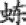 莫指，闺门之事不宜；霖雨既零，稼穑之家有望。阳春白雪，只属孤音；流水高山，难逢知己。至于岩岩山石，生民具瞻；滚滚源泉，圣贤所乐。瀑布奔冲难收拾，溪流湍急不平宁。风水所以行舟，水涌风狂舟必破；雨露虽能长物，雨零霜结物遭伤。

社稷自有人求，关津诚为客阻。烟雾迷林中有见，江河出峡去无回。桃夭取妇相宜，未利于买童置畜；杨柳送行可折，尤喜于赴试求名。松柏可问寿年，拟声名则飘香挺秀；丝萝可结姻好，比人品则倚势扳援。荷方出水，渐见舒张；梅可调羹，未免酸涩。李有道傍之苦，榄余齿末之甘。笔墨驱使，时日不长；盆盂装载，团圆不久。绠短汲深求未得，戈长力弱荷难成。屠刀割肉利为官，若问六亲多刑损；利刀剖瓜休做事，如占六甲即生男。无人棺椁必添丁，有印书函终见折。厘等则骨贮匣中，纵有出时还须人；算盘则子盈目下，任凭拨乱却成行。瓦口虑其难全，怀亦防其有缺。席可卷虚，终归人下；伞能开合，定出人头。钓乃小去大来，樵则任重道远。素珠团圆，可串而成；蜡烛风流，不能久固。针线若还逢既合，锄头如用必然翻。凿则损而为利，亦当有关；锯乃断而成器，岂谓无长。又若飞走之升沉，亦关人事之休咎。猢狲被系，还家终是无期；鹦鹉在囚，受用只因长舌。鹄乃随人饮啄，纵之仍入樊笼；马虽无须驰驱，用之不离僵锁。鲤失江湖难变化，燕束堂屋转疑难。诉理申冤，逢鸦不白；占身问寿，遇鹤修龄。

万物纷纭，理则难尽；诸人愿欲，志各不同。若执一端以断人，是犹胶柱鼓瑟；能反三隅而悟理，方称活法圆机。心同金鉴之悬空，妍媸自别；智若玉川之入海，活泼自如。鬼谷子曰：“人动我静，人言我听。”旨哉斯言！胡可忽诸？

### ◆五行六神辨别篇

先以五行为主，次向字中详祸福；既将六神作用，方观笔迹察原因。生克不容情，莫以字音称独美；宜忌须着意，休将文义恃能言。勿以吉字言吉，当认吉中多忌煞；漫将凶字言凶，须详凶处有元神。

假如青龙与白虎同行，求功名大得其宜，如庶人得之，反不免相争之咎。父母与妻财聚面，则赴选难从其志。若游子占之，又可触思远之忧。勾陈最忌小金连，惟恐事无间断。朱雀若逢傍水克，须防祸患有牵缠。水在木中流，替人濯垢；木从水中出，脱体犹难。五行全不犯凶神，问自身德建名立。六神动，再加吉利，将若求官，体贵身荣，旧事从新。朱雀、腾蛇双发动，倾家复创；金土两重临，微火熔金，难成器皿。弱金克木，反自损伤。求济于人，要看水火会合；营谋于众，还期土木齐登。金多子多，非土不得；土厚财厚，无火不生。水冷木孤，弟兄难靠；金寒土薄，祖业凋零。

玄武形青龙得水，连登两榜；白虎尾朱雀衔金，位列三公。玄武临渊，时中之雨化；青龙捧日，阙下之云腾。水非白而无源，金不秋而失气。有勾陈，难结案头文；见朱雀，想量堂上语。田下土溪，思还故里；月边水盛，意在归湖。玄武居中，出外不宜行陆路；勾陈定位，居官虽在受皇恩。白虎重重，不敢保今年无事；青龙两现，定不是今日燕居。字中见“母”母无忧，笔下从“兄”兄定位。水土形青龙翘首，何忧不得功名；木金相白虎当头，毕竟难逃灾害。重重金火不逢时，百事徒劳；叠叠青黄非见日，几番隆替。贵显招土木，万福皆隆；方体隐龙蛇，千祥并集。朱、勾相合，唇舌干戈之事；龙、虎同行，风云际会之荣。玄武不遇火，阴中不美；腾蛇无水渡，郊外生悲。

纯土自能生官，福从天至；寒土不但无禄，灾自幽来。天贵专权，问功名必登黄甲；文书不动，赴场闱定值空亡。问子须求子在爻，占妻定要妻入数。笔迹孤寒金带水，六亲一个难招；字形丰满土生金，百岁百年易盛。

看五行之旺弱切记，卜词讼以官鬼为先；定六亲之机微须知，占家宅以本命为主。五行俱在，凡谋皆遂；六神不动，万事咸宁。细玩辞占影响，无差毫发；密搜奥义规绳，不爽纤微。

### ◆金声章

混沌未开，一元含于太极无形之始；乾坤既判，万物成于文章著见之中。故未有其事，而先有象，可预得其体而兆其来。所以仓颉造字，接云霞蝌蚪之文；圣贤著书，采随宜义理而用。一字之善，千古流传；半点之疵，万年不泯。君子哉，非挥毫而莫辨；小人焉，一执笔而即知。是以消长盛衰，困极而知变；吉凶祸福，至诚而见神。

写来江汉秋阳，皓皓乎不可尚已；意在螽斯洗羽，绳绳兮与其宜焉。惟存好利喜施，则落笔终须各别；必欲离尘脱俗，而开首自是不同。

若夫烟雾云霞，则聚散去来神变化；风雷日月，其盈虚消息妙裁成。鹦鹉等禽，人皆云其舌巧；虎豹之类，谁不惧其张威。生溪息蕃盛者，乃稼穑禾苗；与物浮沉者，是江河湖海。渊中鱼跃，水向东流何沮止；天上鸢飞，日从西落四时同。

百兽俱胎孕之生，独报麟祥之喜；诸禽皆飞腾之物，只言凤德之衰。禽之鸣也，噪也，有形小体大之分；兽之利也，钝也，有轻清重浊之辨。香花灯烛，偏宜于朔望之时；铃铎鼓钟，独可于晨昏之际。点点滴滴，万里征衫游子泪；层层叠叠，九行迷线老人心。至于犬豕牛羊，叱之即便去；鸡鱼鹅鸭，欲用则不生。狐貉羔裘，无济于夏；红炉黑炭，偏喜于冬。幽林深圃夜无人，情不诬也；楼阁厅堂时有位，理之必然。琴书剑箱，可断儒生负腋；戏裘肥马，当推志士同袍。墨有渐减之虞，笔有久坚之弱。书成笔架，几上悯山。写到砚池，寓中闷海。如在其上，秋到一天皆皎月；知在其下，春临遍地产黄金。挥出琵琶，到底是写怨之具；描写箫管，终须为耗气之端。假如云雨雾，皆能蔽日之光，天正阴时原是吉；又若精气神，本是扶身之主，人来问病反为凶。水急流清，意偕游鱼岁岁；烟飞篆渺，心从云树茫茫。农家落笔，草盛田禾宝不足；商家书笺，丝多交易乱如麻。紫绶金章，无者不必写出；蜗名蝇利，有者即便书成。锁匙金汤，必任国家之重任；羽毛干戚，是祈海甸以清宁。挂锦扬帆，风顺之方必利；舒衾酒帐，雨到之候成欢。礼乐射御书数，如求一艺可执；孝友睦娴任恤，定其万事皆宜。草木逢雨，时生而旺，要详春秋气候；轿马行际，日近而远，亦揆寒暑光阴。试看画饼望梅，何止饥渴；镜花水月，竟是空虚。欲造字相之微，请明章中之理。

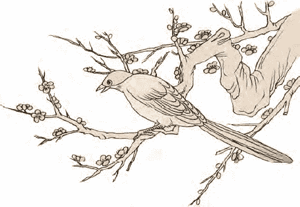

责任编辑／周宏

装帧设计／