# 图解果老星宗下
### 下部 七政四余

-   唯一通行世界的占算学说，博大精深，包罗万象，解读掩藏在星象中的人生命运
- 权威版本精心点校，经典古籍全新解读，教你仰观天文，近知人事的绝学
- 100幅珍贵古籍插图，200幅示意图表，100个图解展示，值得收藏的星学秘本

## 划分星空的二十八宿

古人观察天象，以星辰运行来指导人事，天空中诸多美丽星曜在星命学中被赋予特殊的含义。七政四余、二十八宿便是最有名、最重要的星象。古人将全天星空划分为三垣，二十八宿分处其间，沿黄道顺序排列。七政四余在星空中运行，与二十八宿分分合合，它们的相遇和分离便成为星命学推测命运的重要依据。

二十八宿按照其在星空的方位分类，可分为东方青龙七宿、北方玄武七宿、西方白虎七宿、南方朱雀七宿。每个星宿都有特殊的属性，并有相应的神格化形象。这里就将他们列出，供读者鉴赏和参考。

### 东方青龙七宿

### 角木蛟星君

角宿属木，为东方七宿之首，遇火星、月孛、计都则凶，遇其他八曜则吉。

### 北方玄武七宿

### 斗木獬星君

斗宿属木，为北方第一宿，忌见紫气，不忌金星、火星、罗睺。

### 亢金龙星君

亢宿属金，为东方第二宿，遇火星、月孛、计都则凶，遇其他八曜则吉。

### 氐土貉星君

氐宿属土，为东方第三宿，喜见火星、罗睺；忌见木星、紫气。

### 牛金牛星君

牛宿属金，为北方第二宿，喜见火星、罗睺；忌见木星、紫气。

### 女土蝠星君

女宿属土，为北方第三宿，喜见火星、罗睺；忌见木星、紫气。

### 房日兔星君

房宿属日，为东方第四宿，喜见木星、紫气，忌见水星、月孛。

### 心月狐星君

心宿属月，为东方第五宿，喜见金星、火星，忌见土星、计都。

### 虚日鼠星君

虚宿属日，为北方第四宿，喜见火星、罗睺；忌见水星、紫气、木星。

### 危月燕星君

危宿属月，为北方第五宿，喜见火星、罗睺、金星，忌见土星、计都及火罗同现。

## 划分星空的二十八宿

尾宿属火，为东方第六宿，喜见木星、紫气，忌见水星、月孛。

箕宿属水，为东方第七宿，喜见金星，忌见土星、计都、月孛。

室宿属火，为北方第六宿，喜见水星、月孛，忌见火星、罗睺；金星。

壁宿属水，为北方第七宿，喜见水星、木星，忌见土计同行、火罗同行。

### 西方白虎七宿

### 奎木狼星君

奎宿属木，为西方七宿之首，喜见木星，忌见火星、罗睺；金星。

### 娄金狗星君

娄宿属金，...气，忌见水星、...

### 南方朱雀七宿

### 井木犴星君

井宿属木，为南方七宿之首，喜见木星、水星，忌见金星、火星、罗睺；见紫气最凶。

### 鬼金羊星君

鬼宿属...星，忌见土星...

### 胃...

为西方第二宿，喜见木星、紫...同孛、罗•。

### 胃土雉星君

胃宿属土，为西方第三宿，喜见火星、罗•；忌见木星、紫气。

### 君

金，为南方第二宿，喜见金星、火星、计都。

### 柳土獐星君

柳宿属土，为南方第三宿，喜见火星、罗•；忌见木星、紫气。

## 划分星空的二十八宿

### 觜火猴星君

觜宿属火，为西方第六宿，喜见金星、水星，忌见土星、计都、月孛。

### 参水猿星君

参宿属水，为西方第七宿，喜见金星、水星，忌见土星、计都、月孛。

### 翼火蛇星君

翼宿属火，为南方第六宿，喜见金星、水星，前三度忌见水孛，其余忌土计孛。

### 轸水蚓星君

轸宿属水，为南方第七宿，喜见金星，忌见土星、计都、月孛。

## 作者简介

张果

《果老星宗》传说是由唐代的星命大师张果所著，书名也因此而来。说到张果这个人，中国人一般都不会感到陌生，民间传说“八仙过海”中，就有一仙叫“张果老”。开元年间，李憕向张果求教星命学，二人的问答被记录下来，流传后世，即《果老星宗》中收录的《果憕问答》，成为后世星命学预测的基础。

## 封面故事

从上古时代开始，人类就开始观察天象的变化，从而指导农业生产，安排日常生活。天空中诸星辰的变化不仅与季节、气候等息息相关，而且与古代命理学说联系起来，成为星命学推测的重要依据。这些星宿还被赋予人格化的形象和属性。对于星命学来说，最重要的星宿就是七政四余和二十八宿。封面上所列的便是其中的六位星神。

图解经典 173

### 古今图书集成白话图解・星命

### 图解 古代星象学

# 果老星宗

中国传统星命学大全

### 下部 七政四余

(唐) 张果 / 原著
欧阳彦 / 著

陕西师范大学出版社

### 《古今图书集成白话图解》丛书

### 总序

《古今图书集成》是中国现存规模最大、资料最丰富的类书，共设立汇编、典、部三级类目，其特点在于彻底贯彻“以类聚事”的原则，收录了从上古到明末清初的古代文献资料，内容涵盖了我国一万五千多卷经史子集的典籍，保存了几乎所有学科的源头和血脉。《古今图书集成》是中华传统文化最丰富、最完备的集大成之作，具有无与伦比的文献价值、史料价值、文物价值与版本价值。

这套丛书由康熙时期陈梦雷（1650 ~ 1741）所编辑，历时二十八年方才完成。康熙三十七年（1698）陈梦雷根据协一堂藏书和家藏一万五千多卷经、史、子、集的典籍编纂《图书汇编》一书，康熙四十五年四月完成初稿。康熙御览后认为尚需修订增益，改赐书名《古今图书集成》。康熙逝世，雍正下令经延讲官、户部尚书蒋廷锡重新编校《古今图书集成》。雍正称赞：张廷玉评价说：

> > 贯穿古今，汇合经史，天文地理，皆有图记。下至山川草木，百工制造，海西秘法，靡不具备。洵为典籍之大观。

> > 自有书契以来，以一书贯串古今，包罗万有，未有如我朝《古今图书集成》者。

本丛书编成后，于雍正四至六年（1726 ~ 1728）由清内府用铜活字排印成六十四部，称“铜字版”，至今仅存十余部，在国家图书馆与台湾故宫博物馆皆有藏。原书分为：

-   乾象典 天地、日月、星辰、风
- 岁功典 春、夏、秋、冬
- 历法典 历法、漏刻
- 庶征典 旱灾、水灾
- 昆舆典 土、泥、石、水、泉、井
- 职方典 京畿、清代各府建置沿革等二百二十二部
- 山川典 山、湖、海等四百零一部
- 边裔典 朝鲜、日本、于阗、天竺、琉球等五百四十二部
- 皇极典 君臣、帝纪、用人、听言等三十一部
- 宫闱典 后妃、官女、公主、驸马等十五部
- 官常典 翰林院、宗人府、将帅、节使等六十五部
- 家范典 祖孙、父母、兄弟、姐妹等三十一部
- 交谊典 师友、师弟、朋友等三十七部

时至今日，《古今图书集成》的历史与真正面目已经鲜有人能真正明晓。现代社会越来越快的生活节奏与典籍本身的古奥气质阻隔了人们对于传统文化典籍的探寻，传统文化所蕴涵的独特精神气质也往往被误读与忽略。而在典籍失语的同时，文化传承本身又借着其根深蒂固的传统与衰荣再生的能力占据着广大的群众市场，深入人们的生活，在现实生活中以各种形式众声喧哗着。

在这种矛盾状态下，对于古代典籍的认识芜菁共生，而随着社会文化的日益多元化，人们对于古代文化的了解渴求日益上升。基于上述认识，《古今图书集成白话图解》丛书系列将原《古今图书集成》按不同类属单列成卷，对原文进行了如下处理：

1.  对比了各种校点与评注版本，在尊重原文的基础上对之进行了校点、评译、注释，将古奥的文言变成了通俗易懂的白话，清除了读者在阅读时的各种文字障碍。
2.  按照逻辑联系对原文内容进行了层次的划分，添加了简短精练的小标题，方便了读者的阅读理解与信息查阅。对于已经完全不适应现代科学文明的陈旧理论和思想作了简要评注，帮助读者辨析传统文化中的糟粕与精华，以利于读者更好地认识博大精深的中华传统文化。
3.  以独特的现代图解手法对原文中的古奥语义进行诠释与解读，添加了一些相关的基础知识与信息点，配备了大量的图片资料，并以优美的版式将这些内容呈现出来，希望读者能够在轻松愉悦的阅读中获取更多的知识。

凡此种种，将见于陆续推出的《图解古今图书集成》所收录的古籍，希望能够以不一样的形式向读者呈现《古今图书集成》所录典籍的文化内蕴，为读者打开一道传统文化之门。《古今图书集成白话图解》丛书经过数年的精心校勘、白话评注、生动图解编撰而成。该丛书简体横排，体例完备，通俗易懂；此外，还辑录了大量古代珍贵图版，精心绘制了手绘图、表格、图表，用现代编辑手法大大增强了其可读性，同时兼具较大的文献价值、版本价值和收藏价值。该丛书的出版，是对中华五千年传统文化一个层面的全新梳理，也为中国传统文化的研究和普及作出了一定的贡献。

当然，由于编者水平有限，加之本套丛书体系宏大，内容深奥庞杂，无论是点校还是图解都难免存在不足之处，祈望广大读者谅解并指正！

### 《古今图书集成白话图解》丛书总序

### 编者序

### 教你仰观天象，测知命运吉凶

### 古今图书集成白话图解・星命

《三国演义》中有这样一段故事：诸葛亮兵出五丈原，旧病复发，他仰观天文，见“三台星中，客星倍明，主星幽隐，相辅列曜，其光昏暗”，由此推算自己命在旦夕，并希望用祈禳之法来为自己增寿。他在兵帐中布下北斗灯阵，只要阵中主灯七天不灭，孔明便可再活12年。到了第六天，正当诸葛亮“披发仗剑，踏罡步斗，压镇将星”之时，魏兵来袭，大将魏延飞步入帐，竟将主灯扑灭。诸葛亮因此殒命，这才有了“五丈原诸葛禳星，见木像魏都督丧胆”的千古佳话。

在许多古典小说、传奇中，仰观天象，推测军国大事、人生命运的情节并不鲜见，历史上有名的政治、军事家大都像诸葛亮一样，被传为掌握着高超占星术的能士。记录古代星象学的著作也被代代流传下来，收录于《古今图书集成》中的《果老星宗》便是最有代表性的星命著作之一。

追溯中国古代星象学的历史，一直可至上古时代，《尚书·尧典》中便有尧帝派遣羲氏与和氏观察天象、制订历法的记载。在几千年的发展过程中，星象学逐渐与易经理论、阴阳五行学说等结合起来，再与四柱命理学说相融合，形成了一门体系庞杂、包罗万象的学说。如《果老星宗》记载、阐述的星命学方法是这样的：先排定人的生辰八字，然后将其与十二辰、二十八宿、十二分野、五行、太阳和月亮的运行、各星曜的运行等搭配组成一个星命图，求出个人的命宫、命度等，根据这些数据便可对命运吉凶进行分析。

《果老星宗》的作者托唐代星学大师张果之名。张果是一个颇具传奇色彩的人物，它被推崇为星命学的祖师，在传说中，这位奇人生于上古尧时，一直活到唐代。他精通神妙之术，曾在唐玄宗面前演示他的神术。张果将其星命之学传给李憕；两人之间的问答流传后世，其中包含了先天口诀、后天口诀、至宝论等著名星命论述。

### 编者序 教你仰观天象 测知命运吉凶

这些记载合称为《果憕问答》，载于《果老星宗》一书中，被后世星命学家奉为圭臬。

星命学自唐开始逐渐兴盛，这与中国古代社会、文化等密切相关。一方面，星命学所倡导的天命思想维护了统治阶级生而为王的封建理论；另一方面，星命学的诞生和发展也源于人们对未知现象的好奇，在科技上还未能达到真正认识星象本质的高度，在思想上则不能摆脱唯心主义的束缚。当然，古代星象学并非一无是处，它不仅为保存了关于古代探索天文的宝贵资料，更是中华传统文化一个不可或缺的组成部分。我们整理、编辑、出版这些古籍著作，目的便是启发读者去粗取精，去伪存真，以理性的态度汲取传统文化中的智慧和涵养，以保存我们祖国古代灿烂的文化遗产。

在本书编辑体例上，我们并没有完全以艰涩的古文形式进行展现，而是运用现代化的编辑手法对原书进行了全新加工，具体如下：

-   【原文】对古籍进行精心点校编辑。并根据原文内容进行适当的分段分节整理，力求在完全尊重原书内容的基础上，更方便读者阅读。
-   【白话提要】以现代白话文对原书部分内容进行简单的翻译与解释，以方便读者更好地理解原文。
-   【白话图解】本书采用了图解这种现代化的编辑方法，以数百个图解、表格将一些重要概念和难以理解的文字进行了生动易懂的图解分析，带给读者一种全新的古文阅读体验。
-   【插图】本书保留了原版本书中的插图，并标注“原图”来区分。还从明代《三才图会》、清代《钦定四库全书图鉴》等古籍中，选入众多珍贵的插图，并配以生动、详细的图说，进一步扩展本书的阅读内容。

《果老星宗》收录历代众多星命学经典作品，卷帙浩繁、内容博杂艰深，由于编者能力学识之限，本书难免有疏漏、错误之处，在此向读者表示歉意，书中提要、图解仅作为阅读参考，若其中注解有错误之处，还望读者予以指正。

编者谨识
2010年8月

## 目录

-   划分星空的二十八宿 … I-8
-   《古今图书集成白话图解》丛书总序 … IO
-   编者序 教你仰观天象，测知命运吉凶 … I2
-   本书内容导航 … 24

## 卷六 星曜运行：认识七政四余

# 第一章 诸星宫度：星曜运行的判断

-   1. 宫度主论：宫主与度主的强弱与吉凶 … 28
-   2. 生杀星论：生克以论吉凶 … 29
-   3. 纬克经论：七政四余克二十八宿 … 30
-   4. 经克纬论：二十八宿克七政四余 … 31
-   5. 诸星统论：星曜的运行态势 … 32

# 第二章 十二命宫的论断：星曜对人的命运的影响

-   1. 身度主论：星命中最重要的是身命 … 34
-   2. 身命主论：身宫、命宫的利害关系 … 35
-   3. 财帛主论：论金钱财富 … 35
-   4. 兄弟主论：论同辈亲属 … 37
-   5. 田宅主论：论家产田宅 … 37
-   6. 男女主论：论子女吉凶 … 38
-   7. 奴仆主论：论有无救助 … 40
-   8. 妻妾主论：论夫妻关系 … 40
-   9. 疾厄主论：论疾病 … 40
-   10. 迁移主论：论搬迁升职 … 41
-   11. 官禄主论：论官运 … 42
-   12. 福德主论：论福运 … 43
-   13. 相貌主论：论面容美丑 … 44

### 第三章 七政四时论：诸星曜在四季中的动态

-   1. 论木：五行中的木及木星 … 45
-   2. 论火：五行中的火及火星 … 47
-   3. 论土：五行中的土及土星 … 48
-   4. 论金：五行中的金及金星 … 49
-   5. 论水：五行中的水及水星 … 51
-   6. 论日：太阳在四季的运行特点 … 52
-   7. 论月：月亮在四季的运行特点 … 53
-   8. 阴阳并明说：太阳与太阴的作用 … 54

# 第四章 太阴星论：太阴星曜之运行

-   1. 太阴黄道论：月亮的运行轨迹 … 56
-   2. 太阴九行例：解说月亮在四季的运行 … 56
-   3. 四时太阴所经之度：太阴在四季运行时的动态 … 58
-   4. 太阴九道断：用太阴的位置形态决定人的命运 … 58
-   5. 太阴度主说：太阴度诸宿的五行吉凶 … 59
-   6. 太阴引从夹拱说：诸星曜与太阴的形势吉凶 … 61
-   7. 太阴犯殿伤宿说：克命伤身 … 61

### 第五章 五星的生克关系：五星喜忌分析

-   1. 论五星相生：生曜的宜忌 …………………………………………………………………………… 77
-   2. 论五星相克：克曜的宜忌 …………………………………………………………………………… 77

### 第六章 星曜守命：天上的星星与人的命运

-   1. 论吉星守命：吉星照本命的判断 ………………………………………………………………………… 79
-   2. 论杀星守命：灾星恶煞总集 …………………………………………………………………………… 81

### 第七章 杂论：星命论述杂汇

-   1. 性情论：七政四余论性格 ………………………………………………………………………………… 85
-   2. 论七政四余躔次喜忌：十一曜在十二宫的吉凶 …………………………………………………………… 90
-   3. 续论“七政四余分布宜忌及入格真伪”：再论星曜入宫吉凶 ……………………………………………… 96
-   4. 星盘或问：星占要义的答疑 …………………………………………………………………………… 100
-   5. 分野列宿：星宿所对应的九州辖区 …………………………………………………………………… 108

# 卷七 三辰通载（上）：五星论断篇

### 第八章 三辰通载·岁星：木星吉凶断

-   1. 岁星算法木星篇：木星的定度法 …………………………………………………………………… 114
-   2. 岁星总论：木星的运行规律 …………………………………………………………………… 115
-   3. 岁星歌断 源髓歌：木星星曜属性 …………………………………………………………………… 118
-   4. 岁星交会 肄斯经：木星与诸星相遇的吉凶 ………………………………………………………… 118
-   5. 岁星入宫 枢要歌：木星在十二宫的吉凶 ………………………………………………………… 120
-   6. 岁星躔度 玉阙歌：木星在二十八宿的吉凶 ………………………………………………………… 122
-   7. 岁星照宫 琅玕经：木星照临十二宫 …………………………………………………………………… 127

# 第九章 三辰通载·荧惑：火星吉凶断

-   1. 荧惑算法 火星篇：火星的定度法 …………………………………………………………………… 130
-   2. 荧惑总论：概述火星之运行规律 …………………………………………………………………… 131
-   3. 荧惑歌断 源髓歌：火星星曜属性 …………………………………………………………………… 131
-   4. 荧惑交会 肄斯经：火星与诸星相遇的吉凶 ………………………………………………………… 133
-   5. 荧惑入宫 枢要歌：火星在十二宫中的吉凶 ………………………………………………………… 134
-   6. 荧惑躔度 玉关歌：火星在二十八宿的吉凶 ………………………………………………………… 136
-   7. 荧惑照宫 琅玕经：火星照临十二宫 …………………………………………………………………… 140

### 第十章 三辰通载·镇星：土星吉凶断

-   1. 镇星算法 土星篇：土星的定度法 …………………………………………………………………… 143
-   2. 镇星总论：概述土星之运行规律 …………………………………………………………………… 144
-   3. 镇星歌断 源髓歌：土星星曜属性 …………………………………………………………………… 144
-   4. 镇星交会 肄斯经：土星与诸星相遇的吉凶 ………………………………………………………… 146
-   5. 镇星入宫 枢要歌：土星在十二宫中的吉凶 ………………………………………………………… 147
-   6. 镇星躔度 玉关歌：土星在二十八宿的吉凶 ………………………………………………………… 149
-   7. 镇星照宫 琅玕经：土星照临十二宫 …………………………………………………………………… 153

# 第十一章 三辰通载·太白星：金星吉凶断

-   1. 太白算法 金星篇：金星的定度法 …………………………………………………………………… 156

# 第十二章 三辰通载·辰星：水星吉凶断

-   1. 辰星算法 水星篇：水星的定度法 …………………………………………………………………… 169
-   2. 辰星总论：概述水星之运行规律 …………………………………………………………………… 170
-   3. 辰星歌断 源髓歌：水星星曜属性 …………………………………………………………………… 170
-   4. 辰星交会 隶属经：水星与诸星相遇的吉凶 ………………………………………………………… 172
-   5. 辰星入宫枢要歌：水星在十二宫中的吉凶 ………………………………………………………… 172
-   6. 辰星躔度玉关歌：水星在二十八宿的吉凶 ………………………………………………………… 174
-   7. 辰星照宫琅玕经：水星照临十二宫 …………………………………………………………………… 178

# 第十三章 拦驾经：十二宫星曜所临吉凶断

-   1. 命宫天柱星：七政四余坐照命宫吉凶 ………………………………………………………… 181
-   2. 财帛宫天宝星：星曜守照财帛宫的吉凶态势 …………………………………………………… 183
-   3. 兄弟宫天玉星：星曜守照兄弟宫吉凶 …………………………………………………………… 184
-   4. 田宅宫天富星：星曜守照田宅宫的吉凶态势 …………………………………………………… 184
-   5. 男女宫天孤星：星曜守照男女宫吉凶 …………………………………………………………… 185
-   6. 奴仆宫仆马星：星曜守照奴仆宫吉凶 …………………………………………………………… 186
-   7. 妻妾宫天对星：星曜守照妻妾宫吉凶 …………………………………………………………… 187
-   8. 疾厄宫杀难星：星曜守照疾厄宫吉凶 …………………………………………………………… 188
-   9. 迁移宫地驿星：星曜守照迁移宫的吉凶态势 …………………………………………………… 188
-   10. 官禄宫天福星：星曜守照官禄宫吉凶 ………………………………………………………… 189
-   11. 福德宫福寿星：星曜守照福德宫吉凶 ………………………………………………………… 189
-   12. 相貌宫：星曜守照相貌宫吉凶 …………………………………………………………………… 190
-   13. 日月：太阳、月亮照临诸宫 ……………………………………………………………………… 191
-   14. 金木：金星、木星照临诸宫 ……………………………………………………………………… 192
-   15. 夜火昏土：夜生火星人与昼生土星人 …………………………………………………………… 192
-   16. 昏火夜土：昼生火星人与夜生土星人 …………………………………………………………… 193
-   17. 孛罗计：月孛、罗睺、计都三凶曜照临诸宫 ………………………………………………… 193
-   18. 水星：水星照临诸宫 ……………………………………………………………………………… 194
-   19. 气星：紫气照临诸宫 ……………………………………………………………………………… 195
-   20. 罗计：罗睺、计都照临诸宫 …………………………………………………………………… 195

### 第十四章 轮宫赋：七政居十二宫的吉凶

-   1. 轮宫赋：详解日月五星十二宫 …………………………………………………………………… 196

# 卷八 三辰通载（二）：六曜论断篇

### 第十五章 三辰通载·太阳星：太阳吉凶断

-   1. 太阳算法 日篇：太阳的定度法 …………………………………………………………………… 204
-   2. 太阳总论：概述太阳之运行规律 ………………………………………………………………… 206
-   3. 太阳歌断 源髓歌：太阳判断歌诀 ………………………………………………………………… 206
-   4. 太阳交会 聿斯经：太阳与诸星相遇的吉凶 ……………………………………………………… 208
-   5. 太阳入宫 枢要歌：太阳在十二宫中的吉凶 ……………………………………………………… 210
-   6. 太阳躔度 玉关歌：太阳在二十八宿的吉凶 ……………………………………………………… 212
-   7. 太阳照宫 琅玕经：太阳照临十二宫 ……………………………………………………………… 216

# 第十六章 三辰通载·太阴星：月亮吉凶断

-   1. 太阴算法 月篇：月亮的定度法 …………………………………………………………………… 219
-   2. 太阴总论：太阴运行规律 ………………………………………………………………………… 220
-   3. 太阴歌断 源髓歌：月亮判断歌诀 ………………………………………………………………… 220
-   4. 太阴交会 隶属经：月亮与诸星相遇的吉凶 ……………………………………………………… 222
-   5. 太阴入宫 枢要歌：月亮在十二宫中的吉凶 ……………………………………………………… 223
-   6. 太阴躔度 玉关歌：月亮在二十八宿的吉凶 ……………………………………………………… 225
-   7. 太阴照宫 琅玕经：月亮照临十二宫 ……………………………………………………………… 229

# 第十七章 三辰通载·紫气：紫气吉凶断

-   1. 紫气算法 气星篇：紫气的定度法 ………………………………………………………………… 232
-   2. 紫气总论：概述紫气之运行规律 ………………………………………………………………… 232
-   3. 紫气歌断 源髓歌：紫气判断歌诀 ………………………………………………………………… 233
-   4. 紫气交会 隶属经：紫气与月孛、罗睺、计都相遇的吉凶 ……………………………………… 233
-   5. 紫气入宫 枢要歌：紫气在十二宫中的吉凶 ……………………………………………………… 235
-   6. 紫气躔度 玉关歌：紫气在二十八宿的吉凶 ……………………………………………………… 236
-   7. 紫气照宫 琅玕经：紫气照临十二宫 ……………………………………………………………… 240

# 第十八章 三辰通载·月孛：月孛吉凶断

-   1. 月孛算法 孛星篇：月孛的定度法 ………………………………………………………………… 243
-   2. 月孛总论：月孛运行规律 ………………………………………………………………………… 243
-   3. 月孛歌断 源髓歌：月孛推断歌诀 ………………………………………………………………… 244
-   4. 月孛交会 隶属经：月孛与罗睺、计都相邻的吉凶 ……………………………………………… 244
-   5. 月孛入宫 枢要歌：月孛在十二宫的吉凶 ………………………………………………………… 247
-   6. 月孛躔度 玉关歌：月孛在二十八宿的吉凶 ……………………………………………………… 248
-   7. 月孛照宫 琅玕经：月孛照临十二宫 ……………………………………………………………… 252

### 第十九章 三辰通载·罗睺：罗睺吉凶断

-   1. 罗睺算法 罗星篇：罗睺的定度法
-   2. 罗睺总论：概述罗睺之运行规律
-   3. 罗睺歌断 源髓歌：罗睺星的命运
-   4. 罗睺入宫 枢要歌：罗睺在十二宫的吉凶
-   5. 罗睺躔宿 玉关歌：罗睺在二十八宿的吉凶
-   6. 罗睺照宫 琅玕经：罗睺照临十二宫

# 第二十章 三辰通载·计都：计都吉凶断

-   1. 计都算法 计星篇：计都的定度法
-   2. 计都总论：计都之运行规律
-   3. 计都歌断 源髓歌：计都星曜属性
-   4. 计都入宫 枢要歌：计都入十二宫判断
-   5. 计都躔宿 玉关歌：计都在二十八宿的吉凶
-   6. 计都照宫 琅玕经：计都照临十二宫

### 第二十一章 星曜诸歌：星命学歌诀总汇

-   1. 星辰妙度歌：宿与曜的绝配
-   2. 喜宫歌：给星曜带来喜庆吉祥之宫
-   3. 忌躔歌：七政四余所不得入之星宿

# 卷九 总论行限：人生轨迹探寻

# 第二十二章 行限初识：行限的基本概念

-   1. 洞微百六限说：河洛之数知限数 …………………………………………………………… 288
-   2. 限步之说：百六限的详解 …………………………………………………………………… 290
-   3. 洞微中五百六相乘数：运用乘法得出百六限 ……………………………………………… 290
-   4. 限度主论：限宫之主语限度之主 ………………………………………………………… 291
-   5. 行度假如：对于行度的假设条件 ………………………………………………………… 291
-   6. 捷见限论 倒限直指篇：逢生者吉，值克者凶 …………………………………………… 293
-   7. 余奴伤主论：余气刑伤命主 ………………………………………………………………… 303
-   8. 节要玄文：关于限的摘要 …………………………………………………………………… 304

### 第二十三章 限度宜忌：二十八宿五行宜忌

-   1. 四日度论：四日宿的宜忌 …………………………………………………………………… 308
-   2. 四月度论：四月宿的宜忌 …………………………………………………………………… 308
-   3. 四木度论：四木宿的宜忌 …………………………………………………………………… 309
-   4. 四火度论：四火宿的宜忌 …………………………………………………………………… 309
-   5. 四土度论：四土宿的宜忌 …………………………………………………………………… 309
-   6. 四金度论：四金宿的宜忌 …………………………………………………………………… 310
-   7. 四水度论：四水宿的宜忌 …………………………………………………………………… 310

### 第二十四章 倒限：星命中的倒限

-   1. 倒限详论：生死，凶灾的解疑 ………………………………………………………………… 313
-   2. 倒限拾遗：倒限的补充说明 ………………………………………………………………… 316
-   3. 倒限总诀：判断行限吉凶宜忌之法 ……………………………………………………… 317
-   4. 划度元奥经：本星受创的化解之法 ……………………………………………………… 320

### 第二十五章 星曜的凶格：神煞吉凶断

- 1. 诸煞秘要赋：各种神煞的吉凶
- 2. 统论倒限：总结星学中的行限
- 3. 诸煞倒限：神煞中凶煞的凶格
- 4. 杂论倒限：化吉为福，化凶亦凶
- 5. 倒限要诀：凶煞星格的关键
- 6. 论倒限歌：忌星，夺星二煞的凶死之祸
- 7. 太岁歌：木星的凶格
- 8. 论限附余：关于限论的补充

### 第二十六章 流年杂论：决定命主一生的命运

- 1. 流年论：命主行年的祸福
- 2. 流年都天賦：命主立命之法则

# 第二十七章 行限歌赋：总结行限的要领

- 1. 临行歌附余：星格吉凶与人的命运
- 2. 乔庙歌：星曜逢见的吉凶格
- 3. 一寸金总诀：行限之法实战
- 4. 碎金诀：主死亡之煞

附录一 郑氏星案
附录二 杜氏星案

# 本书内容导航

本章主标题
本章所要探讨的主题。

# 第一章 诸星宫度：星曜运行的判断

正文小标题
概括本页内可分为小节的内容。

## 1. 宫度主论：宫主与度主的强弱与吉凶

【原文】
宫之所属是宫主也，宿之所属即度主，也凡安命处有命宫之主，有命度之主，名虽有二其论则一。如宫强而度弱者不美，或度高而宫衰者不善，必须要宫度二主皆强，斯为尽美而尽善矣。且如子宫坐命躔虚日度土为宫主，起在四土升殿或居子丑，本垣日为度主，起居四日升殿或在午，宫本位又生于昼，此所谓宫度皆强也。
倘土星起寅亥，二宫或次四木度下又逢木，气照克兼太阳西沉失明或昼逢木气所蔽又带刃，劫廉雄等煞，此所谓宫度皆弱也。如宫度皆强者不贵即富，或宫度皆弱者非天即贫，倘宫主度主一强一弱，则知得失于其中矣。
此论虽然如是更看太阴身星为重，盖月者一日行十三度关系，祸福最紧。故云：要知荣枯惟看月，经云宫身度主喜。朝阳三主高强福寿昌恩援，不须来辅助也。应富贵始终良，然此三主者第一重身主，第二重度主，第三看宫主。
又云：昼生看命度，主夜生看身度，主斯论亦当宫者十二宫也。度者二十八宿也，此举一宫一度者言之，余皆可以例推廉谓飞廉雄谓天雄也。身主尤为切要宫身度，名曰三主兼身度主，又有四主之论，学者详之。

【白话提要】
黄道十二宫，每一宫的主星是宫主；黄道二十八宿，每一宿的主星是度主。所以，人安命的宫中，既有宫主，也有度主。虽然命宫有这两个主星存在，但推论命宫好坏只有一条，那就是宫主与度主皆要强旺。如果宫主强而度主弱，或者是宫主弱而度主强，亦或者是宫主与度主皆弱，则不吉。

# 宫主与度主

宫主与度主都是星命学的重要名词。在星占中，十二支宫各有其主，反映着日月五星与十二宫的特殊关系，宫主就是主宰该宫的星曜。与十二宫一样，二十八宿也有各自的度主，反映了日月五星与二十八宿的关系。宫主、度主在星命推断中都有着重要意义。

# 各宫宫主

| 宫位 | 子丑 | 寅亥 | 卯戌 | 辰酉 | 巳申 | 午 | 未 |
| :--- | :--- | :--- | :--- | :--- | :--- | :--- | :--- |
| 宫主 | 土星 | 木星 | 火星 | 金星 | 水星 | 太阳 | 月亮 |

# 各宿度主

| 度主 | 星宿 |
| :--- | :--- |
| 以木星为度主的星宿 | 角宿、斗宿、奎宿、井宿 |
| 以金星为度主的星宿 | 亢宿、牛宿、娄宿、鬼宿 |
| 以土星为度主的星宿 | 氐宿、女宿、胃宿、柳宿 |
| 以太阳为度主的星宿 | 房宿、虚宿、昴宿、星宿 |
| 以月亮为度主的星宿 | 心宿、危宿、壁宿、张宿 |
| 以火星为度主的星宿 | 尾宿、室宿、觜宿、翼宿 |
| 以水星为度主的星宿 | 箕宿、壁宿、参宿、轸宿 |

## 2. 生杀星论：生克以论吉凶

【原文】
生我者为恩星为母曜，克我者为难星为杀星，果老谓生杀作吉凶之根，如木为主用，见金克为凶，遇水生为吉，其理固然如是。但于中生之者而无益克之者，亦无妨，假如冬月水木相生，夏季火土相资，此所谓生之者无益也。故云：三冬之木遇水而寒，九夏之土逢火而燥。
又如春季金木相克，夏令水火交战，此所谓克之者无妨也。故云：金木共踵春有利名，秋必折水荧同步，冬须破落，夏能成观。此生克之理兼四时而论之可矣，然谈星者要活泼融通，始得其妙所谓智者，如盘中之走珠，愚者按图而索骥，如若执恩星以言福拘难星以决祸，此所谓胶柱鼓瑟，刻舟求剑，此等之学未足与议也。
生杀者即恩难星也，生中不生如水生木，水被土伤，则水不能生木矣。克中不克如火克金，火被水制，则火不能克金矣。此二条乃发明生克之意，其余可以例推。

【白话提要】
生助“我”的星曜，为恩星，也称为母曜；克制“我”的星曜，为难星，也称为杀星。张果认为生与克，正是星命吉凶的根源。但生克之间，也存在生助无益、克制无妨的情况。皆须根据具体情况仔细推论。

## 3. 纬克经论：七政四余克二十八宿

【原文】
五星本自得经用之，当有力或被所忌之。星凌犯于本殿本垣之内，亦受制于彼力，不可得胜也。或已失经尤不宜矣，木星有用，忌金星侵犯，斗、角、井、奎之木殿及寅亥之木垣。火星有用，忌水孛月侵犯尾、翼，觜、室之火殿及卯戌之火垣。土星有用，忌木气，侵犯女、氐、柳、胃之土殿及子丑之土垣。金星有用，忌火罗侵犯，牛、亢、鬼、娄之金殿及辰酉之金垣。水星有用，忌土计侵犯，箕、轸、参、壁之水殿及巳申之水垣。太阳有用，忌木气罗侵犯，于虚、房、星、昴，太阳之殿及午宫太阳之正垣。太阴有用，忌土计侵犯于危、心、张、毕，太阴之殿及未宫太阴之正垣。
凡所忌之星就之，值此者须求援救，使其无救则必然凶矣。若忌星坐垣殿之上而有强星凌制者反以为幸，谓彼既遭伤则不能奋其害人之势矣。大抵用一星有一忌详其用而决之可也。纬者十一曜也，经者二十八宿也，此言星主得所而度数受克。

【白话提要】
经，指的是二十八宿；纬，指的是七政四余，也称十一曜。度主受十一曜克制，则叫做纬克经。比如，木星有用时，则忌金星出现于斗、角、井、奎四宿与寅、亥二宫，因为此四宿的度主与此二宫的宫主为木星。其余，皆可依此而类推。

## 4. 经克纬论：二十八宿克七政四余

【原文】
夫经克纬者五星躔于受克之，垣殿在天则或色不正或隐不明，犹身自救不及奚暇与人为福，虽有用之力不及矣。若木、气纬于牛、亢、鬼、娄之金殿辰、酉之金垣。火、罗躔于箕、壁、参、轸之水殿，危、心、张、毕之月殿，及巳申未之水月垣。土、计纬于斗、角、井、奎之木殿及寅亥之木垣，金星纬于尾、室、翼、觜之火殿及卯戌火垣之内，水孛纬于女、氐、柳、胃之土度及子丑土垣之内俱为受制。
若所用之星而纬于受制之度力，固不及或加凌克从而欺之辱尤甚也。或生我之星复仇本殿本垣之中者谓之表，里遭伤其害重矣。当求救援之星乃危处求生之，象功归于救之星也或救援之星，又居受制之度或遭凌犯，彼既已危何暇援人，又须求星救彼然后假力以救此也。
若为害之星纬于受制之度反以为幸，谓彼既受辱而无复有凌人之势也。切忌反有星以救彼危，有所恃其势再苏为害益甚矣。此言星主受度数之克垣者，指宫分言殿者指度数言。

【白话提要】
二十八宿的度主克制十一曜，则叫做经克纬。被克制的星曜，在天上会出现颜色不正或隐伏不明亮的现象，就如人没有自救的能力，虽然想帮助他人却更是力不从心。比如，木星、紫气泊于牛、亢、鬼、娄四宿或辰酉二宫，由于此四宿的度主与此二宫的宫主为金星，所以木星至此会遭受克制而不吉。其余，可依此类推。

# 纬克经与经克纬

纬是横向的线，经是纵向的线。在星学领域中，纬即七政四余十一曜，而经即二十八宿，纬克经与经克纬就是七政四余与二十八宿之间侵入对方宫位的忌讳。

- **纬克经：** 星主得所而度主受克
  **判断：**
  1. 度主受克，而无援救，必然凶险。
  2. 忌星坐垣殿之上，受到克制，反而为吉。

- **经克纬：** 星主被度主所克
  **判断：**
  1. 用星受克，必被欺辱。
  2. 如果再有生我之星伤殿垣之中，则凶祸更甚。
  3. 如果害星受制，反而为吉。

## 5. 诸星统论：星曜的运行态势

【原文】
天道左旋，七政右转，其相生相克之情有君臣、父子、夫妇、兄弟、朋友之伦焉，其伏见疾迟留退之行有降伏，有凌犯，有战斗，有攻击，有救援，有护卫之事焉有昭然在于其上者，有隐然在于其下者，有攻彼而害，此者有损此而益彼者。有弱中之强者，有强中之弱者，彼此隐见强弱之中其机元微当随机探索。
顾其彼此察其本末，审其明晦，辨其强弱，搜其救援，求其资助以决其胜负，如土之受伤法当助金制木以救其土，所谓虚则补母实则泻子扶弱抑强，此其法也。随其立用而依法断之则吉凶，得失贵贱荣枯昭然判矣。观此统论数款，深有义理宜细详之。

【白话提要】
天体向左运行，日月五星向右运行。日月五星之间的相生相克，就像人间君臣、父子、夫妇、兄弟、朋友之间的关系；星曜运行的伏见、疾迟、留退等状态，就像人间的降伏、凌犯、战斗、攻击、救援与护卫等事情。以星曜推断人的命运，亦不过五行生克之理。

# 子宫神将

子宫对应玄枵之次，对应宝瓶宫。子宫属土，以土星为宫主。子宫包含女、虚、危三宿，即以虚日鼠为自己的属相，因此子宫神将面目似鼠。

- **子宫包含女、虚、危三宿（从女宿三度至危宿十一度）**
  - 危宿
  - 虚宿
  - 女宿

- **子宫以土星为宫主**
  - 土星

# 立命于子宫的喜忌

**关系密切的宫位**
| 宫位类型 | 宫位 |
|----------|------|
| 三方宫 | 申宫（男女） |
| | 辰宫（迁移） |
| 四正宫 | 午宫（妻妾） |
| | 卯宫（官禄） |
| | 酉宫（田宅） |

# 第二章 十二命宫的论断：星曜对人的命运的影响

## 1. 身度主论：星命中最重要的是身命

【原文】人之生也有命，斯有身命。主既本于太阳则身主当系于太阴，故以月离之度为身度主矣。盖吾身之生得身度主星之元气，故始诞之时月纬之度最为要紧，是以身主切于命主而身度主，尤切于身主也假如有同年同月隔日，同时有同年同月同日，异时者本日之星，其度则一推日时之异，月纬之度不同，即身寓之度不同也。
或有同宿而异度者固无不同移时之间同，过其宿则不同者必矣。况一日有十三度之移，因此知身度当为尤重也。身度之宫自有贵贱，可分身宫所寓之度亦有贤愚之判，凡身度居身命财田官福妻妾迁移之宫者上也。如身度居兄弟子息奴仆疾厄相貌之，宫者次之，谓宫有高低之列于是乎有贵贱之分，身度之主若升殿入垣不值侵凌之曜，更为救援资助星之势。
盛者必主光明正直，身有荣贵之象，若身主受制惟有余气代之，更有援星救之者犹可望其荣贵，或身主失度退留迟弱。又值凌犯之曜救之者怯必因之而流于下愚，福田由是而亏矣。若身主受制退留或遭凌犯，余气又弱略有星救者尚不与议损中求益也，大抵膺爵禄享荣华则在于身，故田财官福虽好身星落陷将何以承其福禄，使若得之亦不能长久矣。
此专论身度主也，此谓太阴为身之度，主余气代之者如水为身度，主失陷得孛星高强者亦可代之援者救援也。

人一出生，便拥有生命（灵性的存在）的同时，也拥有一个血肉之身体。命宫主星取决于太阳所居的宫位，身宫主星则取决于月亮所居的宫位。确切地说，我们所拥有的身体，最初源自于身宫的度主星的元气，所以，推算星命，则度主重于身主，身主重于命主。

## 2. 身命主论：身宫、命宫的利害关系

身命之主能救助科星、寿元、官福、田财诸用星者，为有益之主也。若欺凌科星、寿元、官福、田财诸用星者，无益主也。
身命之主侵犯诸用星之宫殿，或诸所用之星自失躔于身命主星宫殿之中，亦受害于身命之主矣。其间有益此而损彼者，有损此而益彼者。损益之中，造化深长，然有因之而损财。益寿益官者，有因之而难进取者、破败飘荡者、招绵绵之讼者，有因之而孤伤离别者、伤残肢体者、遭刑戮之惨者、伤官退职者、置身荆棘之地者、不终天数者，此皆无益之主所致也。
凡身命二主自相克者，则不为忌，盖身主不克命主也。如命在巳申月在子丑若水星与土星，同行则不忌其克。凡宫身与元守岁驾相冲，多主离祖孤克，凡命与身坐隔界及诸星宿初末度或身命入奴宫，奴星入命，又如奴星拱夹身命俱偏生庶出也。此言身命二主，兼看富贵、贫贱、寿夭、贤愚、祸福、疾病，皆见身命度之所关系也。

身命二主星，如果救助科星、寿元、官禄、福德、田宅、妻财等有用之星，则对身命有益处；如果欺凌这些有用之星，则对身命无益而有害。身命二主星侵犯这些有用之星的宫殿，或者这些有用之星离开太阳、月亮所在的宿度，也对身命有害。而命宫主星与身宫主星互相克制，则没有妨碍。

## 3. 财帛主论：论金钱财富

财帛主星升殿入垣或守本宫或明盛，当天或救助之星势盛照临者可言其富，若财受制被克有救代者虽退，破之余尤可与其再蕃。若财星益田主必多储积增置，财星反克田宅者必因而破家也。财星救助官星者富益厚贵益隆，财星反犯官星者，必因之而伤官禄，或因之而起讼。

# 中国古代星象图

星象学在中国源远流长。早在殷商甲骨中就有关于日月食的记载，到春秋时二十八宿体系创立，星象学已经十分成熟。随着汉代浑天仪的发明、元代郭守敬天文台的修建，对星象的观摩与研究日渐深入，形成了以三垣、二十八宿为核心概念的古代星象学体系。图中所展示的即为宋代所绘制的二十八宿天文图拓片。

**三垣** 古人把天空的恒星分成“三垣”和“四象”七大星区。三垣环绕着北极星，分别为：紫微垣，象征皇宫；太微垣，象征行政机构；天市垣，象征繁华街市。

**四象** 在“三垣”外围分布着“四象”，即东苍龙、西白虎、南朱雀、北玄武，分别代表各方星象的形象，“四象”又叫“四灵”。

**二十八宿** 古代天文学家把天空中可见的星分成二十八组，叫二十八宿，东南西北四方各七宿。如西方白虎七宿是奎、娄、胃、昴、毕、觜、参。

**十二分野** 古代星象学家认为：地上各州郡邦国和天上一定的区域相对应，在该天区发生的天象预兆着各对应地方的吉凶。分野大约起源于春秋战国。

财星犯寿元，虽富足而不享天年，财元退留受制无救者，其来有限所费无厌，更值犯者强盛，恐无隔宿之留矣。有救代者尚可以望温润之象也。此专论财星财帛乃高强之宫喜，主星旺则生财矣。主星弱而受制者亦不生财矣。

【白话提要】
财帛宫为高强之宫，所以喜欢升殿、入垣、明亮、旺盛。如果财帛宫主星受到克制，却没有解救之星出现，并且财帛宫主星很衰弱、晦暗，则主其人没有财运。

## 4. 兄弟主论：论同辈亲属

【原文】
兄弟主升殿入垣或守本宫，无干犯之曜有救助之星者，棣萼联芳使宫主退留失躔或遭忌，星所破则只影高飞有代之者，或异胞也有救之者，当可聚也兄弟之主益官益财益宅者，必因同气之力而致富而致贵。
若兄弟之主侵官侵财侵田宅者必因之以起争端，或兄弟之主伤寿元者或因之而伤寿矣。兄弟之宫主星与各宫主不相克者主兄弟相和，如唐元宗与五王长枕大衾而共宿，建花萼相辉之楼而共乐怡怡如也。

【白话提要】
兄弟宫的主星升殿、入垣，或者居于本宫，并且与其他宫主不相克制，则主兄弟之间关系和睦。如果兄弟宫主星侵犯他宫主星，则兄弟之间必会有种种争斗。

## 5. 田宅主论：论家产田宅

【原文】
田宅主升殿入垣强旺或守，本宫或明盛照临有救助者必见成基业，丰厚或退留失度受克。虽广有田宅亦必破而后已有救，有代者当可复也。受制之余无救无代者岂，惟离祖破败更无兴复之，时其间又有生于异室或移根换叶者亦由此以致之也。
若田宅之主反侵宫主者必因之而招讼，凡侵他宫之主随其以断之或流年宫主受制，或忌星侵犯宫殿之所亦必有伤离之咎，或服制之凶也。田宅为父母之宫，日月为父母之象，故论父母须合田宅日月而论之，如罗火犯太阳或难星克日及带剑锋主先克父，如土侵太阴或难星克月及月带剑锋主克母，或日生以太阳落阴宫阴度父先亡，夜生以太阴落阳宫阳度母先亡，又田宅宫主受克日生先克母，夜生先克父，此阴阳反背之义，背日伤父背月伤母也。以田宅为祖基，故以父母论之，且祖业乃父母之所授也。

## 【白话提要】

田宅宫主星升殿入垣强旺，或者居守于本宫，或者明亮旺盛临照救助之星，则其人必定田宅宽广，财产丰厚，可继承祖业。如果田宅宫主星退行、停留、失度、受克，则其人必是败家之命。

田宅宫也是父母宫，所以推断父母时，田宅宫主星与日月都应当进行仔细推论。如果田宅宫主星衰弱受克，则白天出生的人克母，夜间出生的人克父。

## 6. 男女主论：论子女吉凶

## 【原文】

男女主星升殿入垣无干犯之曜，有救助之星多育聪明荣贵之子，若余气明盛力胜子之主者又当育庶生之贵子也，或子星受制凌犯者盛，若有星救援尚可有之。以余气代之者异胞之子可也，子星留退受制无救代者，但望正室之生难矣。子星退留不及其数受制遭伤或只生女而已子息之主救助，官星者因之而荣贵救助，田财者因之而起家而至富救助福寿元者因之而益福益寿救助，身命主星者必敬顺之义。

凡救助诸用星者为有益之子也，若子息之主侵凌田财者因之而破家，退耗侵凌官星者因而招讼伤官侵凌，身命寿元者有悖上之患及反噬之虞，值此者不仁不义不忠不孝于此见矣。凡双生者男女宫及主星如在双鱼双女人马阴阳，四宫皆含双意必主双生或在双生，立命亦在此四宫也。凡问男女之数只以水一火二木三金四土五取之，凡取只以寅申巳亥上取之。

## 【白话提要】

男女宫又可称为子女宫，可推断子女的各种吉凶。男女宫主星升殿入垣，没有其他星曜侵犯，并且有救助之星出现，则其人的子女聪明而富贵。如果余气之星明亮有力，胜过男女宫的主星，则其人的次子或小妾所生的子女必定富贵。

## 敦煌星图（局部）

敦煌星图是发现于敦煌唐代石窟，属难得一见的古代全天星图的绝世珍品。它绘制于公元8世纪初，图上面按照星次顺序绘制了三垣与二十八宿的星图，记录恒星达1350颗之多。此图为星图局部室宿至于柳宿的星象。

## 7. 奴仆主论：论有无救助

【原文】
奴仆主升殿入垣有救助者必多仆从，或主星或援星守宫得为力，若主星失度退留沉溺者，虽仆不可留也。宫主伤克身命及侵犯，财官之主非但不能听，其驱策，又恐反有疾视之虞，或因之而伤官破财致祸，若侵妻妾主者又有难言之害也。

【白话提要】
奴仆宫主星升殿入垣，并且有救助之星出现，则主其人奴仆众多。如果奴仆宫主星侵犯其他宫，则必因奴仆而带来各种灾害。

## 8. 妻妾主论：论夫妻关系

【原文】
妻妾主星升殿入垣，有救助之星照临者，必得贞顺偕和之妻，余气盛者有美丽之妾也。妻星益助官星者必因之而贵，反犯官星者必因之而讼。妻星援助田宅者必因之而起家，反侵田宅者无益邻宫主者，贵妻星受制退留者或被忌星，凌宫殿之上者多主刑克，彼此相敌庶可偕老。余气力胜代之必主再婚无力代之，或媚或妾或再醮之妇继之也，若无救代之星终于不娶而已矣。
此宫得吉星又得扶救之星，而宫主得其正垣无克犯者，主夫妻如琴瑟之和，贤如孟光者。

【白话提要】
妻妾宫的主星升殿入垣，并且有救助之星照临，则其人的妻子必定贞洁柔顺，与丈夫的关系很和美。如果妻妾宫主星的余气旺盛，则其人定有非常漂亮的小妾。妻妾宫主星生助有用之星，则主其人会因妻子而得到许多益处。

## 9. 疾厄主论：论疾病

【原文】
疾厄主星明盛则主无疾，若受制退留或遭凌犯则主多病其疾病类，随煞所主，如木气属肝胆及头目筋脉逢金克，则主肝气风邪目疾或因木伤如火罗，属心与小肠及诸血逢水孛，则主寒热、心痛、舌病、酒痔、失血、无发，或因火焚土计属脾胃及四肢逢木气，则主胃弱脾伤皮肿唇烈或因痰死。金属肺与大肠及胃气逢火罗，则主瘵痨肺热咳嗽鼻塞，或因刃死水孛属腰肾膀胱及下部，逢土计则主肾虚血浊耳聋，或因溺死日月主眼目，或日月逢蚀，或煞犯日月皆主失明。

若疾厄主星所临与的刃煞居之，主带疾破相有救援者轻无救援者，重或疾厄之主侵凌，身命者必犯刑宪侵制；寿元者，必因疾以尽天年。此论俱与八十一难经意义相同，但日月木火土金水与人之五脏，相符合主病症亦如是也。

## 【白话提要】

疾厄宫主星明亮旺盛，则主其人没有疾病。如果疾厄宫主星受到克制，或者处于退行、停留的运行状态，或者遭到其他星曜的侵犯，则主其人一生多病。

## 10. 迁移主论：论搬迁升职

## 【原文】

迁移主得度无凌又救援力盛者必膺顺动之荣，或宫主受制退留迟弱行有趑趄难求，利达或身命主居迁移或迁移，遇身命主或身命被迁移驿马照破及驿马入迁移之，位必主平生作事进退非出祖过房必移根，换叶或为萍梗之客。凡看迁移主星近君位则主在京畿，或东或西或南或北或远或近随禄马所向之宫断之。

## 【白话提要】

迁移宫主星居于有利的宿度，不受其他星曜的欺凌，并且还有强旺的救援之星出现，则其人必会因迁居而享受荣华。如果迁移宫主星受克，或处于退行、停留、迟行的运行状态，则一生居处不定，难享荣华。

## 11. 官禄主论：论官运

【原文】

官禄主星升殿入垣明盛，当天有救护而无于犯。余曜并强者必获穹窿之贵也。援星明者着威盛者秉节钺威严之权援星，依日月之光者有班禁侍之荣，察官主余气之力审援星表里之势，以定品位之高下也。

若援星之上更有援星尤佳，使官主失度退留又遭凌犯却得援星，重重并力救之及有余气代者当于援星。得志之地大见荣显，若救援之星亦自亏损又无外护之曜，则难求荣进或援星宛转救之尚可，如又无代用之星更凌犯之曜，有党虽于荣地不免履冰之凶矣。

盖官星力盛则贵不盛，则贱更详日月强盛以断之。凡官星如损所用之星则为不吉，若克田财必由此以破家伤财，克科星反因此以难第克子息主必因之而绝后。克兄弟主必因之而伤手足，伤福元必因之而亏福制寿元，反因之而伤天年也。

如益所用之星方为吉论救助，科名必因之而正奏救助，田财必因之而置产储蓄救助，福寿必因之而享福益算救助，子息及兄弟者必因之而益后裔益祖气也，损益之中其理得矣。官禄本高强之宫宜福禄寿元居之，则为显官如受克制，则居下品恶煞克之主遭刑不善。

春季夏季中星图
星占推命的一个重要基础就是观星，夜空中的星宿均以北极星作为中心在其四周分布。每天黄昏时的天顶与午夜时的天顶最为重要，古人常以其确定季节变化。此图记录了春、夏两季每个月的三个主要星宿。

## 【白话提要】

官禄宫主星升殿入垣，光明旺盛，并且有恩星救护而不受他星侵犯，如果余气也很强旺，则其人必是天下第一等的贵命。如果官禄宫主星遭受克制，则其人必是官居下品。如果克制官星的是恶煞，则其人会有刑罚之灾，难有善终。

## 12. 福德主论：论福运

## 【原文】

福德主星盛者福厚，弱者福浅，身居上而无福者有之有福，而居下者未之有也。福元升殿入垣救助之星明盛守照必膺，莫大之福。如福元失度退留或遭忌凌犯，则无纯粹之福矣。或身为贵人，因此不享朦胧之福者有之，如人居帘幕高堂之内，因此不享安恬之福者亦有之，有星救代者，尚可言福若官福身命之主俱亏，又无救代之星不惟难言，其福又恐因此而流下矣。德者福之基也，福者人之德也，犹人心之所生。苟若不行善不积德，虽有福而无福，诚使行善而修德，虽无福而有福也，故云福德。

秋冬季中星图
这幅图记录的是秋季和冬季每月的黄昏、午夜、日间的三大星宿。如在九月，黄昏虚宿位于天顶，午夜柳宿位于天顶，太阳位置在房宿。古人就凭借这些星宿方位来确定季节月令，而这也是星士们必须掌握的基本知识。

# 十二命宫的论断：星曜对人的命运的影响

## 【白话提要】

福德宫主星旺盛，则福气深厚；主星衰弱，则福气浅薄。一个人的福气深浅，往往与积德行善有关。如果不积德行善，则命中有福也不会享有真正的福气。

## 13. 相貌主论：论面容美丑

## 【原文】

相貌宫分居诸宫之末，以天宫论之反为诸宫之首也。宫主得度明盛有救助之星，必赋清秀之质，若宫主受制退留凌犯强盛又无救援之星者，容仪必不美也。已上十二宫星辰并皆要，吊起飞来横冲直撞挨宫，查度逐宫认论。
故曰：明见不如暗见，明拱不如暗拱是也。十二宫之论皆以宫主度主而论吉，曜则吉凶，曜则凶但以生者助者为吉，救援者次之，其于克者并空的亡劫者皆凶也。

## 【白话提要】

相貌宫位于十二宫的最后，在天宫上则属于十二宫之首。相貌宫主星居于有利的宿度，并且明亮旺盛，有救助之星出现，则其人必定面目清秀，相貌出众。反之，则必定相貌丑陋。
以上十二宫的吉凶推论，皆是以宫主、度主为准，主星吉则命吉，主星凶则命凶。

# 第三章

# 七政四时论：诸星曜在四季中的动态

## 1. 论木：五行中的木及木星

【原文】

夫木者，东方青帝之神，庖羲氏执规司事。故曰：木为仁，仁者生，生者圆所谓规行生泰之权，持华秀丽之令。万物非时不生，观星非时不验，因其时令察其盛，衰则祸福轻重自有称量于其间矣。

春令之木渐有生长之象，孟春之时犹有微寒未退，借火罗以温其枝，则木无盘屈之拘当有舒泰之美。如木与太阳同宫名为向阳花木，必然早占鳌头富贵之人也。设使水孛相逢则根损，枝枯不能华茂。春末夏初之木有枝有蔓有条有干，多见金而发福，金能琢削其木有栋梁之材。经曰：木繁而无金。琢削纵荣华而末岁孤穷。

夏令之木根燥叶干盘而且直屈而已，伸喜水孛济润而无枯槁，苏醒欣欣生意荣华之人。凡草木皆托春生而夏长也，当此之时物皆茂盛而华也，虽乘火令而行水度则有生，生不绝而化，化无穷矣，必要消详强弱以断之。

夏末秋初之木斯时气脉虚矣，昼生忌躔四火之度。又不宜与太阳交互，盖是日烈木焦不足论也。昼生木躔四水之度而与太阳交光，此是上下济润，不可以木焦日烈而论，乃水之秀丽，枝叶繁茂，精神富贵，九月寒露之边遇火罗助自能变化。

冬令之木斯时万物萧疏，如昼生与太阳交光，谓之日边红杏，布占先魁，遇此造化，岂不美哉。兼能有干文才清高如日生，遇火罗谓之寒谷回春，富贵双全。如无太阳火罗同宫，得生巳午未之时，借日光霁冰霜冻解，犹可舒畅。或木躔四火之度，又与太阳交辉，可作十全之福也。如遇夜生木躔四土之度，又逢水孛冻折穷之极矣。

### 四季之木宜忌

木为东方青帝之神，持华秀丽之令，木生火，克土，又被金克，四季宜忌各有区别，分别如下：

| 季节 | 宜忌 |
|------|------|
| 春 | 生长之象，有舒泰之美。木星与太阳同宫，主少年登科，富贵之人。木星与水星、月孛相逢，枝枯木凋，为凶。春末夏初，见金发福，无金孤穷。 |
| 夏 | 根燥叶干，喜水济润。遇水星、月孛，生意兴隆，荣华富饶。昼生忌躔火度，不宜与太阳交互。如果躔水度，则为富贵象。 |
| 秋 | （原文描述见上，此处为总结）宜见金星，见金则发福，为栋梁之材。 |
| 冬 | 万物萧疏。昼生与太阳交光，大吉之象。遇火星、罗睺，富贵双全。生于巳、午、未时，亦可富贵。躔火度，与太阳交辉，为十全之福。夜生，躔土度，遇水星、月孛，穷困之极。 |

## 【白话提要】

木星是东方青帝之神，其神像是伏羲手拿圆规治理天下的形象。木具有仁的品德，仁的内涵便是生长，生长是天道圆满的体现，所以说天道如圆规画圆一样周而复始，于三阳开泰的春天行使生长之权柄，主持使万物华美秀丽的时令。因此，时令对于准确推断星命有着重要作用。

孟春时令的木星，喜遇见太阳、火星与罗睺；忌见水星与月孛；春末夏初时的木星，喜见金星；夏令时的木星，喜见水星与月孛；夏末秋初的木星，白天出生者不宜居于四火度中，并且忌见太阳；九月寒露时的木星，喜见火星与罗睺；冬天的木星，喜见太阳、火星与罗睺。

## 2. 论火：五行中的火及火星

【原文】夫火者南方赤帝之神，神农氏执衡司事。故曰：火为礼，礼者齐齐者平也。所谓衡行炎阳之令，主成齐之权。

春令之火，正二月之时寒气未消，最喜火罗木气互度见太阴，夜生光彩，文武富贵。火本酷烈，逢木慈仁以善化恶，以刚制柔，刚柔相济贵而能决，威福权衡。

春末夏初之际，火入水宫，水入火地，名为桃花滚浪，水暖花红名利双清，但火不宜与水孛同行谓之，受克逢土有救，能破水孛之气，名曰子来救母，禄自丰盈。见金为党，鬼独火之气脉虚也。

夏末秋初之火，斯时秋阳杲杲，借水以济其盛，乃刚柔变化，最不宜与木气同照。火罗朝拱太阳，无水济润，迎照度限，万物摧枯，一陷千丈，如有一水贯日，一孛济火为之淋漓，普济苍生，万物苏茂，精神宛转富贵。经云：火燄而无水淘溶纵发，而早年夭折，又有先见火日，后见水孛，此谓之久旱干焦搞苗得雨，先主艰难而后快活。又有先见水孛后见火日，谓之久雨逢晴先主快活而后艰辛。

冬令之火，斯时黑帝司权，水德用事，而火失时，最喜木气相扶。若夜火贯日，加以禄印爵贵佐之，反能富贵，名扬天下之人也。其火最忌水孛土计罗交互，火之气脉虚矣。如有一木飞来泄水之气，助火出色，所谓水生木、木生火，命脉健矣。此乃精神转运，合为贵论。

### 四季之火宜忌

| 季节 | 宜忌 |
|------|------|
| 春 | 喜火罗木气互度，夜生则主文武富贵。 |
| 春末夏初 | 火入水宫，水入火地，此时生人主名利双清，但不宜与水孛同行，否则逢土才有救。 |
| 夏末秋初 | 不宜与木气同照，如果火罗朝拱太阳，无水则为凶。如有一水贯日，或一孛济火则主富贵。 |
| 冬 | 火失其时，喜见木星和紫气。如果夜生，又有禄印等相佐，反能富贵，名扬天下。 |

## 【白话提要】

火星为南方赤帝之神，其神像是手拿衡器的神农氏。火具有礼的品德，礼的作用就是向好的方向看齐，向好的方向看齐才能真正公平合理。所以说衡器可以执行炎热阳气的时令，拥有使万物长大齐整的权柄。

正月、二月的火星，喜见罗睺与木星；春末夏初的火星，喜欢进入水宫，不宜与水星、月孛同行；夏末秋初的火星，喜见水星，而不宜与木星、紫气同照；冬天的火星，喜见木星，忌见水星、月孛、土星、计都、罗睺。

## 3. 论土：五行中的土及土星

## 【原文】

夫土者中央黄帝之神，轩辕氏执绳司事。故曰：土为信信者、诚诚者直所谓绳，居五行之中，负载养育之权。

春令之土，昼生与太阳交会，盖是阳和一点，天地皆春，若有官令禄印爵魁佐之，主守成富贵。夜生最喜火照土德，朝拱太阳，盖火土俱名精彩，代日行权，用事北方，生者一人之下，万人之上，忠臣良将。土有生万物之功，其德至大，故得阳数五三才，五行皆不可失。春初生者，土计不宜与水孛交会，谓之泥逢泛滑。如土躔四水之度，又逢水孛。春末夏初生者，谓之土陷山崩，皆非好格。盖四五月间洪水滔天，斯时土之气脉虚矣。

夏令之土最喜水孛，若得同宫以润土之精神，斯时也万物长养结实。遇水发生清源，可爱富贵无言。夏末初秋之土，不宜与罗火交会，谓之火燥，土烈无水孛济润，万物摧枯，一落千丈。昼生土与太阳交辉，亦为日烈土焦，如逢水孛，此谓上生下润土之精彩，万物秀丽大降吉祥。

冬令之土最喜日温，自能变化。夜生木气火罗佐助土之精神，光彩朝拱太阳，皆主文武富贵，倘与水孛同躔极主贫寒，若得一木飞来泄水之气，而又遇火飞来合度，此谓精神展转为妙。

## 【白话提要】

土星为中央黄帝之神，其神像是手拿准绳的轩辕氏。所以说，土星代表诚信，诚信的内涵是心诚，心诚就是正直，正直的判断需要准绳，所以土星居于五行的中央，拥有养育万物的权柄。

春天的土星，白天出生者喜见太阳，夜间出生者喜见火星，并且孟春出生者命中土星与计都星不宜见到水星与月孛；春末夏初出生的土命人，命运不好；夏天的土星，喜见水星与月孛；夏末秋初的土星，忌见罗计与火星；冬天的土星，最好能够朝拱太阳，忌与水星、月孛同宿。

### 四季之土宜忌

土为中央黄帝之神，载养育之权，土生金，克水，又被木克，其四季宜忌如下：

| 季节 | 宜忌 |
|------|------|
| 春 | 昼生与太阳交会，有官令禄印等相佐，则主守成富贵。夜生喜火照，朝拱太阳，用事北方，则为忠臣良将。初春生的人，不宜与水星、月孛交会。晚春之土，不吉。 |
| 夏秋 | 喜见水星、月孛，主富贵。夏末秋初之土，不宜与罗计；火星交会，否则为凶。昼生如遇太阳，则凶，如遇水星、月孛则吉。 |
| 冬 | 喜见太阳，夜生如见木星、紫气、火星、罗计；朝拱太阳，则为文武富贵之命。若与水星、月孛同躔，则一生贫寒，再遇木星、火星，方可转吉。 |

## 4. 论金：五行中的金及金星

【原文】

夫金者，西方白帝之神，金天氏执矩司令。故曰：金为义，义者成，成者方所谓矩行收敛之，令主肃杀之权。

春令之金，不怕火罗，借火罗以温助，谓之炼金成器，变化气质。不宜与水孛同行，春初生者凝互寒冻未退，无火日温之极，主贫寒。春月之金性柔体弱。

夏令之金，不宜生水，就赖水以制其刚，烁石逢源，主利名显达。夏令罗火何以相逢，冬月如斯，自能发福。

秋令之金，乃白帝司权，金神用事，不怕火罗而克，不喜土计而生，借水映色正此谓也。金白水清最喜秋，生者贵。若金水朝拱太阳，最为奇特。经曰：金坚而无火，锻炼终见凶顽。盖火尚杀伐，水尚澄清，文武皆沾，刚柔相济，名扬四海。用金之论木盛，则金钝而费力，土盛则金埋，而少光辉，水盛则体寒，火盛则体镕，金盛则太刚而折，只以四时论之，得中和为贵。

冬令之金，斯时寒凝冻结，昼喜日光而温之，夜喜火罗而照之，定主文职蒙恩。不宜与水孛交互，极主贫寒，水冷故也，最妙昼土逢阳以温其土，可助其金，主威武之职，又逢火罗，拱互降祥，正所谓金罗相会阃外司权。

### 四季之金宜忌

金为西方白帝之神，主肃杀之权，金生水，克木，又被火克。四季之金宜忌如下：

| 季节 | 宜忌 |
|------|------|
| 春 | 宜见火星、罗睺；忌见水星、月孛。 |
| 夏 | 宜见水星，主利名显达。不宜见火星、罗睺。 |
| 秋 | 见火星、罗睺无妨，不喜土星、计都，最宜见水星，如果为金水朝拱太阳更好。 |
| 冬 | 昼生喜见太阳，夜生喜见火星、罗睺；主为文官显达。不宜见水星、月孛，否则主贫寒。昼生，见土星、太阳，主武职显达。昼生，见火星、罗睺；主阃外司权。 |

## 【白话提要】

金星是西方白帝之神，其神像是手拿矩尺的金天氏。所以说，金星代表正义，正义的内涵是成就，成就的结果是方正，所以矩尺得到收敛的命令，可以行使肃杀之权柄。

春天的金星，不怕遇到火星、罗睺的克制，不宜与水星、月孛同行；夏天的金星，宜遇见水星；秋天的金星，不怕火星、罗睺的克制，忌见土星与计都星；冬天的金星，白天喜见太阳，夜间喜见火星，不宜与水星、月孛相交或者互宫。

## 5. 论水：五行中的水及水星

【原文】

夫水者北方黑帝之神，高阳氏执权司事。故曰：水为智，智者谋，谋者重，所谓权行严凝之令，主杀物之权，执性不定，决诸东则东流，决诸西则西流，遇冬则结，遇夏则散。夫水之为能长养万物者，为天地之血脉，贯通无滞，赖土以发生为万民之粒食也。

春令之水，斯时冰霜冷冻，借木气火罗温之，自能变化，昼生水孛太阳同行，名曰光霁澄彻，谓之冰霜冻解心宇清，吉作事整肃政令威仪，当主台省扬名。所忌金星交互，昼生为妙，夜生贫寒。二三月间，天气畅和，遇水济润，发生万物，作事超群，但四五月间泛滥无定，必无福矣。

夏令之水，及洪水滔天，得土堤防，最为奇妙。经云：水盛而无土，堤防遂归愚浊。若有土旺，不以为倒限论，反主名利发达。惟六月之水最怕火日罗，枯涸遇土计则受克。

秋令之水，七八月间既济万物，不宜受克，既能借土堤防，而不泛滥，又能润土结实，万物清源，可爱富贵荣华，若水受克泄者，皆水之气脉虚矣，却不为福。

### 四季之水宜忌

水为北方黑帝之神，为智。水克火，生木，又被土克。四季之水宜忌不同，具体如下：

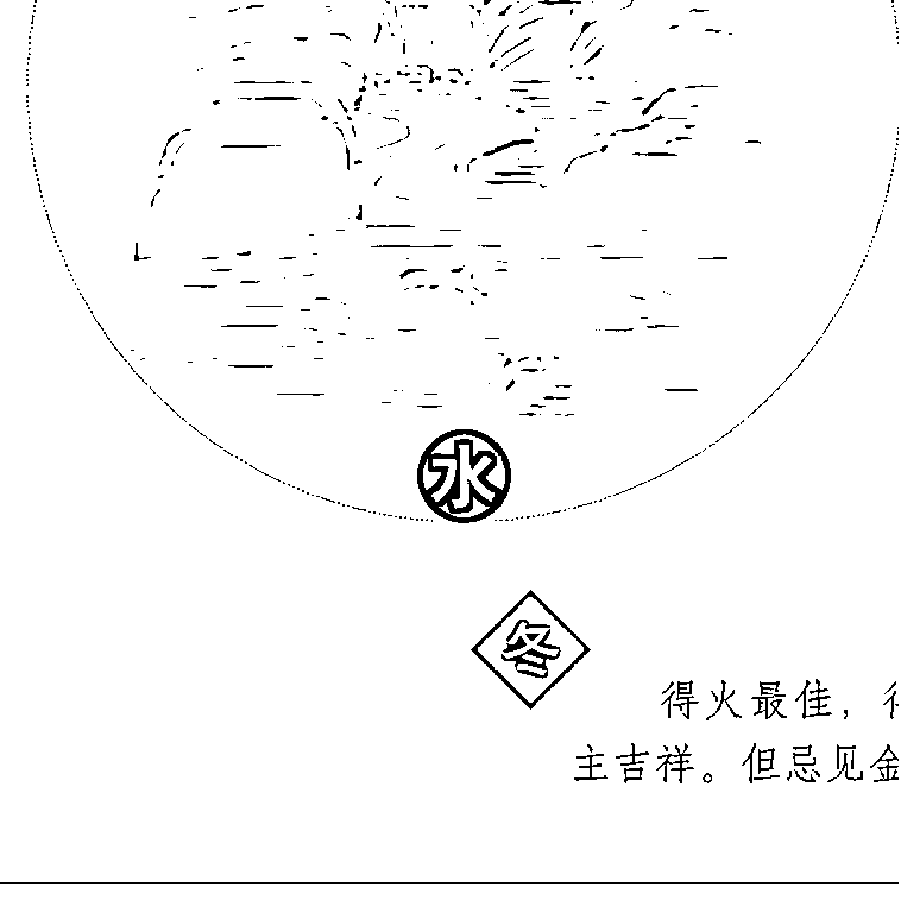

- **春**：遇木星、紫气、罗睺、火星为吉，昼生遇水星、月孛、太阳同行，可扬名立万。但忌与金星交互，昼生为吉，夜生为凶。
- **夏**：遇土星为吉，土旺则主名利发达。六月水忌见火星、太阳、罗睺。
- **秋**：秋水不宜受克，如能借土之力，可富贵荣华。如被克泄，则不为福。
- **冬**：得火最佳，得土次之，得太阳亦可，主吉祥。但忌见金星，否则为凶。

冬令之水，秉令行权，虽曰水神用事，能非令也。斯时点水成冰冻结寒，滞不能变化，得火为上令，得土为次令，得太阳佐之，方可言令也。江河之水缘何有冻，井内之水缘何无冻。盖土多则水暖。而清江河之水凝寒成冻不能变化，喜日光霁火土温之，天降吉祥。然冬水自得其时，不用金生，使之见金，反为无义，乃曰：道义相忘，唯喜在于火木也。

## 【白话提要】

水星是北方黑帝之神，其神像是手拿权器（由木头做的秤杆）的高阳氏。所以说，水星代表智慧，智慧体现在谋略，谋略体现在能趋重避轻，所以秤杆可以行使严肃、凝聚的时令，拥有杀伐万物的权柄。

春天的水星，喜见木星、紫气、火星、罗睺与太阳；夏天的水星，最好与土星同宫；秋天的水星，忌受强旺的土星、计都克制；冬天的水星，喜与火星、土星和太阳同照。

## 6. 论日：太阳在四季的运行特点

【原文】

春天之日，秀丽万物，得宜最妙。三台引护，水金佐之，谓向阳花红，当春最不宜云雨之星，与日交会，枝叶繁茂，掩日光辉，不能变化。木火气罗交会朝拱，太阳代日行权用事，火日俱名有气人皆喜之，天降吉祥。殊不知火罗能化木气之权，以为吉言。云雨星者，即水孛土计金是也。

夏天之日，火烈阳刚，人皆可畏。最喜水孛同行，济润变化，乃是晴霁兼行，万物精彩，富贵自然。最怕木气火罗朝拱太阳，万物摧枯，一陷千丈。孟夏之月，日在毕宿，曹植赋云：帝炎掌节祝融司，方维扶桑之高，烁炽九日之重光。

秋天之日，方而不圆，六亲早离。最喜金水辅日而行方，是淋雨济润，万物苏茂，精神可爱，富贵荣华。如见火日迎照，无水济润，乃火炎威未退，为祸最惨。诗曰：秋日凄凄百卉具腓。

冬天之日，温暖熙熙，人皆可爱。午时为福之大也，夜生喜木金火罗朝日，火日皆有光霁，文武双全。不宜夜生，又见水孛、土计为云雨之星，掩日光彩，限行遇之，为祸最重。若水日同行，得木飞来泄水之气，遇火飞来合度，取火出色，乃太阳光霁，此谓雷下天时，人皆富贵。或有行限先见水孛，后见火日，谓之久雨逢晴，先主艰难而后容易。又有先行火日，后见水孛，此谓之久晴逢雨，先主容易而后艰难。

## 【白话提要】

春天的太阳，喜有水星与金星辅佐，不宜见到会引发乌云密布、大雨滂沱的星曜；夏天的太阳，喜与水星、月孛同行，忌见木星、紫气、火星与罗睺；秋天的太阳，喜与金星、水星同行；冬天的太阳，以中午时刻为大福大贵，忌见会引发乌云密布、大雨滂沱的星曜。

## 7. 论月：月亮在四季的运行特点

> 【原文】

春天之月，照耀山林，虽花雨风流而晦月，亦当不美。最喜太阳逢时，阳辉明暖，丰盈财福。夜月见木，则万木清清，文章秀发。夜月见火，为火月交辉，人生富贵。

如夜月见木，更带桃花之星，生于二月之时，为花月争辉，皆风流潇洒，精神光彩。斯时之月，不宜与土计交会，谓之云掩月华，不足论也。又不宜孛宠之星随月而行，掩太阴之光，为祸甚重。春月要有光明之象，物物皆亨，本阴精之气而受光于日者，但与土计之余气，则不为美也。

夏天之月，扬辉布暖，春风和气，温煦可人。水孛润之而不寒，罗火照之而不燥。斯时之月，喜木气以相扶，忌土计以掩蚀。金虽力薄，夜诞而喜月同行，月本无光昼，假太阳而有辉。

秋天之月，光辉朗耀，普照乾坤，出人头地，逢水相涵，如碧潭之皎洁，得金为助，则精神而倍佳。弦望之际，岂宜罗火以争光，晦朔之期那堪土计而相迎，见孛者为太乙抱蟾，而食禄非凡。会气者乃祥云捧月，必清高而显贵。四时之月，惟秋月独明，谓秋气清爽，金乘令旺，所以人禀之则贵。

冬天之月，严凝可畏，发辉旦旦，孤洁有余。虽清光遍于河海，而寒月亦当欠舒，所忌者水孛相逢，最嫌者土计关照。金星伴之，以无情木气扶之，安有益？生于昼者，借日光而布暖；诞于夜者，伏火罗以助辉。善观星者，勿论生克，先明四时，须分昼夜，于斯消详可为至矣。冬气闭塞，寒气朦胧，蔽月色之光华，藏蟾光之皓魄，虽富贵而无风月也。

> 【白话提要】

春天的月亮，喜与太阳同度，夜间月亮与木星、火星相见也很吉祥，却不宜遇见土星与计都；夏天的月亮，喜欢木星、紫气的辅佐，忌见土星与计都；秋天的月亮，喜见水星与金星，不宜见罗睺与火星，并且晦朔时忌见土星与计都星；冬天的月亮，忌见水星与月孛，又最怕土星与计都出现，白天喜见太阳，夜里则喜见火星与罗睺。

## 日月风云气色图

明代 《三才图会》

观察日月风云以预测吉凶是古代占星术的重要方面，占星家可据此预测国运盛衰。图为古人对这些吉凶祸福的描绘，同时还给出了相应的解释。如日志上下有黄、红云则为吉，有青、黑云则为凶；月之旁有人形流云的会有可悲的事发生。

## 8. 阴阳并明说：太阳与太阴的作用

> 【原文】

夫以太阳安命，以明其体，以太阴为身，以明其用。论命则人之所可同身，则人所不可同。如命宫，诸富贵贫贱格与此身无相涉，皆所不论，必须与身有干系深重者方是。

阴阳者，即日月：太阳、太阴也。人以身命系之，日之与月，其次舍在天相近，故在子午卯酉四正。子为端门，午为帝座，卯为明堂，皆日月所居。酉为西没之所，人生身命在此四宫，皆富贵之人。

安命在午日、在巳月、在未为阴阳夹命。日月在男女、迁移夹拱有力，必有权柄能卓立。日午月子、日卯月酉皆富贵命也。月卯日酉皆残坏命也，日居月度，月居日度，亦反背也，其人必庶出二母。日生忌火，夜生忌土，亦当活法论。诗曰：十二宫中不言主强云，昼火夜忌土，何以不忌。

水木金是致五星，皆莽卤行限，若是见日月，妙不可言。或限中日月夹拱，皆能致福。火罗犯日，土计犯月，皆损害六亲。朔、日蚀、望、月蚀，命在日月度，不夭即盲哑之人。日月同在命宫，其人多贵。巳为阳极月，不宜居亥。为阴极日，不宜居月。巳妨母日，亥妨父日，月拱命拱主皆贵，拱田财必发，拱迁移必外发，拱妻子必得贤妻子，拱疾厄必少疾病，以类言之，百无一失。日为主，躔木度，月为主，躔土度，皆失次也。次舍者，指宫分度数而言。月卯日酉，谓阴阳反背也，盲者目不能见，哑者口不能言。

## 【白话提要】

此小节所论，是关于太阳与月亮在星命中的重要作用。太阳所居之宫，为人的命宫；月亮所居之宫，为人的身宫。在古代天文学中，认为太阳运行于黄道，月亮运行于白道，由于黄白道的轨道较为接近，所以太阳与月亮有时会居于同一宫宿中。

# 七政四时论：诸星曜在四季中的动态

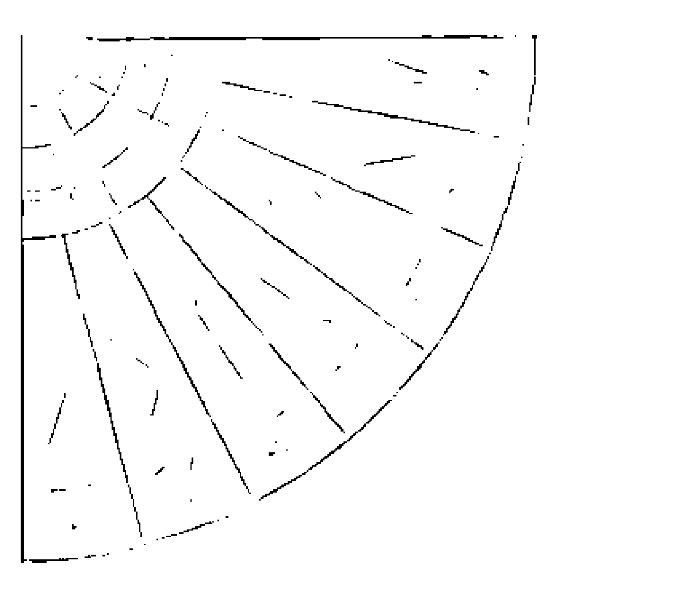

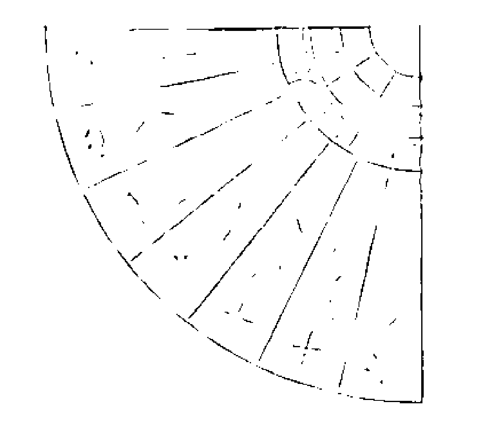

# 第四章

# 太阴星论：太阴星曜之运行

## 1. 太阴黄道论：月亮的运行轨迹

> 【原文】
月有九行，以黄道为经纬之主，青道二出黄道东，赤道二出黄道南，白道二出黄道西，黑道二出黄道北。四时更可随黄道而变迁。春黄道始于东夏，黄道始于南秋，黄道始于西冬，黄道始于北其日，南陆北陆又是天道而旋也，以九道捷法推之。
谈星者多不知九道之行，盖九道者，非为他而设，特为太阴而论。太阴者，身之主也，以太阴分为四时，行度以定黄道、青道、白道、赤道、黑道也。

> 【白话提要】
古人通过实际星象观察，发现月亮并非全部运行在黄道上，也并非全部运行在白道上，而是有九条轨道。即在黄道东方有两条青道，黄道南方有两条赤道，黄道西方有两条白道，黄道北方有两条黑道，加上黄道，一共是九道。

## 2. 太阴九行例：解说月亮在四季的运行

> 【原文】
日行黄道，月行九道。黄道者，中道也。九道者，九行也。何谓九行？盖黄道者一也，青道者二也，白道者二也，赤道者二也，黑道者二也，故名九行。
且如春今生，月躔角斗奎井木度，谓月行黄道；月躔尾室觜翼度房虚昴星火度，谓月行青道。如月躔箕壁参轸心危毕张度，谓月行白道。月躔亢牛娄鬼金度，谓月行赤道。月躔氐女胃柳土度，谓月行黑道。

# 第四章 太阴星论：太阴星曜之运行

## 日月冬夏九道之图

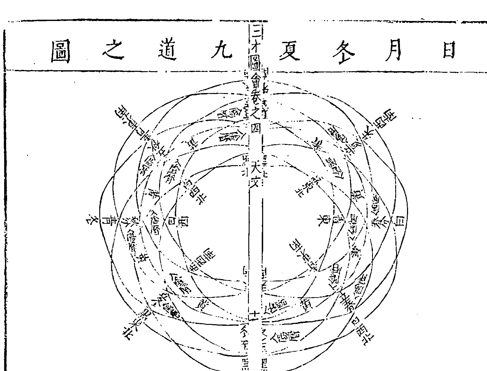

## 明代 《三才图会》

月球的运行轨迹并不严格按照黄道运行，而是在黄道两侧来回晃动，古人将其总结为“九道”，即青赤白黑各两道，再加黄道，一共九道，月亮在不同的季节，将走不同的轨道。星命家认为，运行在不同轨道上的月亮兆示着不同的吉凶。

其论以当时者为黄道，我生者为青道，生我者为白道，克我者为赤道，我克者为黑道。又如旺者为黄道，相者为青道，休者为白道，囚者为赤道，死者为黑道。
又如夏生，月躔尾室觜翼房虚昴星火度，谓月行黄道。月躔氐女胃柳土度，谓月行青道。月躔角斗奎井木度，谓月行白道。月躔箕壁参轸度心张危毕水度，谓月行赤道。月躔亢牛娄鬼金度，谓之月行黑道。
又如秋生，月躔亢牛娄鬼金度，谓月行黄道。月躔箕壁参轸心危毕张水度，谓月行青道。月躔氐女胃柳土度，谓月行白道。月躔尾室觜翼房虚昴星火度，谓月行赤道。月躔角斗奎井木度，谓月行黑道。
又如冬生，月躔箕壁参轸心危毕张水度，谓月行黄道。如月躔角斗奎井木度，谓月行青道。月躔亢牛娄鬼金度，谓月行白道。月躔氐女胃柳土度，谓月行赤道。月躔尾室觜翼房虚昴星火度，谓月行黑道。

## 3. 四时太阴所经之度：太阴在四季运行时的动态

> 【原文】
横取：黄道、一即中道，青道二，白道二，赤道二，黑道二。
立春：木、四木度，火、四火度，水、四水度，金、四金度，土、四土度。
立夏：火、四火度，土、四土度，木、四木度，水、四水度，金、四金度。
立秋：金、四金度，水、四水度，土、四土度，火、四火度，木、四木度。
立冬：水、四水度，木、四木度，金、四金度，土、四土度，火、四火度。
已上五行系月所经，由之度以此推之可知九道之行如行日，度则从火月度则从水论。角斗奎井即四木度也，尾室觜翼即四火度也，亢牛鬼娄即四金度也，箕壁参轸即四水度也，氐女胃柳即四土度也，房虚昴星即四日度也，心危毕张即四月度也。

## 【白话提要】

二十八宿中，角斗奎井为四个木度，尾室觜翼为四个火度，亢牛鬼娄为四个金度，箕壁参轸为四个水度，氐女胃柳为四个土度，房虚昴星为四个日度，心危毕张为四个月度，将日度算为火度，将月度算为水度，于是，便可根据五行生克关系确定出月亮运行的九道了。

## 4. 太阴九道断：用太阴的位置形态决定人的命运

> 【原文】
论命以日月为身所系，考九道晦明，如人身生世，而禀赋厚薄，道行所属而为吉凶。
黄道得五星之吉为福，土计孛罗为减力。盖四余暗道之曜，非黄道所可见也。见则必掩晦黑道，正四余得志之所，又非五星所可从也。黄道为人聪明清和，粹美春风和气，洒落通变。黄道虽弱亦可为吉，但怕黄道遇掩晦，是月行于天，而片云蔽之甚，以其昏晦也。
青道多清洁，有风节廉操，进退以礼。青白道为孤高之所，若更命局与当生孤刑煞局，无禄贵驾殿者，必孤克，更空亡、刃、破交横，必是僧道。有吉局亦为贵中孤命。

赤道太阳光辉之所，为人多权略，任势敢为。

黑道愚而好自用，贱而好自专，心高无实，志大无成之人。黑道虽富贵，入诸吉局，亦必自艰难中起。凡太阴专紧于九道之内，次参得何星之用，如妻星主内助而起，亦由内亲而成功名，田宅主得父母力，财得财官主贵，更参诸局无失矣。

## 【白话提要】

根据月亮运行于九道的位置，可以大致判断出一个人的性情特点。一般月行黄道，主人聪明，温和善良；月行青道，主人内心清洁，高风亮节，遵守礼法；月行白道，主人孤独高傲；月行赤道，主人权谋出众，并且胆子大；月行黑道，则主人刚愎自用、心高气盛，志向远大却难以成功。

## 5. 太阴度主说：太阴度诸宿的五行吉凶

## 【原文】

如太阴度娄，娄金也，当以金星论。如金星得垣，占高强，有夹拱，与禄贵驾殿相系，更见土来生之，吉。立命巳，人必贵。如金星失躔，为他星所断，或截其脉，不与禄贵驾殿相系，却与阳刃、的杀相干，此又下贱矣。

如金星失道，太阴得夹拱或见黄道，所喜之星禄马殿驾贵人相涉，亦为吉星。如金星在辰升殿，当官禄或火在申子辰当令，或难值此，不可以身主居宫断也。盖受火之欺，为令所役，为官所驱，何福之有。若更有土与火之脉相贯穿，此又转凶为吉之道。盖火欲伤金，见土则火生土，土又生金矣，挽回一团福气。

金在上宫却看土星是何宫。主要得妻妾，力男得男女，力官则贵福，则富，乃土为持重之星，有培植之功，为人亦有持久之福。若为火所燥，无土挽回凶焰，为人多受漂忽震荡之祸，得吉尤凶也。

若金见水，却看水是何宫主。田妻男吉，官福尤高，是身得此福，若生无用之星，奴仆兄弟无益于我，精神气脉为彼所窃，平生为人无力，以小失大。

如金见木，为财看是何宫主。妻得妻财，奴得奴用，之类活法推之，无不中矣。太阴即身之度主也，的煞、羊刃二者为祸甚速，所谓生生不已，化化无穷之妙，于此可见。

## 【白话提要】

太阴为身宫的度主，而实际上，身主的吉凶情况，是根据月亮所在宿度的度主来推算的。比如月亮居于娄宿，娄宿为二十八宿中四个金宿之一，所以应当根据金星的吉凶情况来推算命运的好坏。

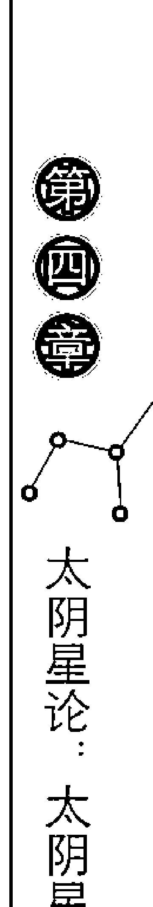

# 月行九道的吉凶

星命学家将月亮视为身宫之所系，通过考察它在九道上的晦明情况，就可以知道其人的禀赋厚薄，从而推断其吉凶祸福。

# 青道

青道两条位于黄道之东。月逢青道，主其人清白好洁，有风节廉操，进退守礼。但其人大多清高孤傲，如逢空亡阳刃，则其人为僧道。

# 黄道

黄道一条，为经纬之主。吉星位于黄道，主其人聪明纯粹、待人洒脱。凶星位于黄道，则福泽减力。

# 赤道

赤道两条位于黄道之南。赤道是光辉最强的地方，如果在此逢着吉星，多主其人有权谋，敢作敢为。

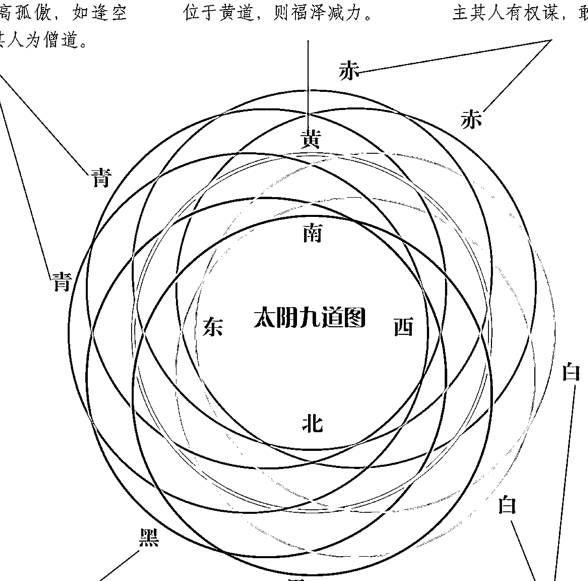

# 黑道

黑道两条位于黄道之北。月逢黑道，多主其人愚蠢刚愎、志大才疏。如逢吉星或拥有各种吉局，也主其人艰苦努力之后才能富贵。

# 白道

白道两条位于黄道之西。白道性质与青道相仿，也主其人高风亮节、清高自守。但逢阳刃空亡等凶煞，则为僧道之命。

# 不同季节的月亮轨迹

月亮在黄道上下6度的范围内运行，“九道”也在这个范围之中。在不同的季节，月亮所经行的轨迹也有所不同，具体如下：

| 春季 | 夏季 | 秋季 | 冬季 | 四季月 |
| :--- | :--- | :--- | :--- | :--- |
| 青道 | 赤道 | 白道 | 黑道 | 黄道 |

## 6. 太阴引从夹拱说：诸星曜与太阴的形势吉凶

【原文】
引从夹拱，当辨其孰吉孰凶，如月度娄前三十度，内有吉星为引，后三十度内有吉星为从，引宜远者为吉，从宜近者为是。前后夹拱匀停，不论何星多寡，皆为引从夹拱。但看叶和争斗如何耳。
前引后从，又要求太阴之前，不以多少。近前一星，以之为主，若前面之星与所主之星皆相生，无战克，非贵则富。有战克不纯粹矣。月前所主之星，与日月有伤，此为下贱。若月与官禄贵殿驾，无非富贵，前后拥从匀停，所主之星与月相得，前面诸星相战争，只要不伤月前主星，不碍其名利，若三合钓来亦如此论。但当明剖合道望道之说，在月前为紧，富贵皆特力为之，不藉他人合道望道，必因人而成，此二项望衙尚可成功，合衙非仰他人，则不可贵格，亦是荫官拱夹中，亦有福有祸。如夹吉则吉，拱凶则凶，又在详推之也。望衙合衙即望道合道也，望道指对照言合道指合照言。

## 【白话提要】

月亮所居之宿的前三十度内有吉星，为引；后三十度内有吉星，为从；星曜位于月亮两旁，为夹；星曜旺三合状态，为拱。望衙，即望道，是指于对宫中进行对照；合衙，即合道，是指于同宫中合照。

## 7. 太阴犯殿伤宿说：克命伤身

【原文】
犯殿者如主弱，下凌恃其权而犯殿，如太阴度胃而罗计占昴毕二宿，昴毕日月也。天之日月人之君后罗乃黑道狂暴之星，犯其日月身前有此凶星安得不凶。犯殿者即罗计土火占四日，四月之度是也。
伤宿者上刚下暴各恃其力，如太阴在胃立命在子丑木星在月前，身命皆系乎土木将来伤之退度。尤凶主为人犷狠愚，执吏当阳刃劫杀之，类必是凶恶之徒当受刑法，否则天折又有此格而富贵者。乃坐禄马贵垣殿驾庙，旺日月联格有以伏凶星之势，犯殿不妨也，推者宜加详察不可以一概而论之也。伤宿者即克命克身之星，在太阴之前。

## 【白话提要】

犯殿，是指罗睺、计都、土星、火星侵占二十八宿中的四个日度或四个月度。
伤宿，是指克制身命二主的星曜居于月亮的前面。

# 第四章 太阴星论：太阴星曜之运行

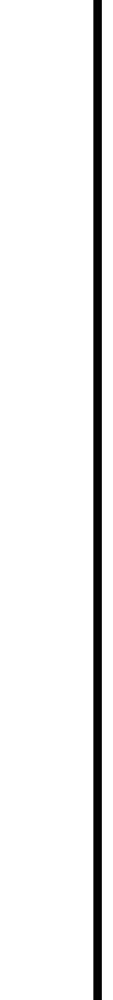

## 8. 太阴让殿说：让吉则吉，让凶则凶

【原文】
让殿者，如人不临正室而避别处，所让之殿有吉则福，有凶则祸。如太阴度柳星二度之间，诸星在翼轸之类，独让张宿在中。或月度翼轸，诸星在柳星，亦是前为紧，后为缓，当禄贵殿驾为富贵，中间更有金水各一星在张宿，谓之一星朝后，谓之留守护垣，此更吉也。若让殿有土计罗孛之类，不谓朝后，谓让殿，受欺此凶格也。让者逊也，让吉则吉，让凶则凶。

## 【白话提要】

太阳让殿，是指月亮没有居于二十八宿中的月度，而其他星曜也没有居于这个月度中，星曜与月亮之间，空出了这一个宿度。

## 9. 太阴出垣说：月亮运行在罗计之外

【原文】
罗计界出太阴，若登殿驾禄贵者吉，居杀者凶。月乃柔星，有晦朔弦望，全藉诸星辅之，日生宜木水气，夜生宜金孛火罗，宜在太阴之前后，最怕阴阳反背，诸星失志。太阴前有吉星，相近禄贵，后有恶曜，赶趁尤急。出垣者，太阴在计罗之外也。

## 【白话提要】

太阴出垣，是指月亮居于计都与罗睺界线的外面。其吉凶判断，以居吉宿则吉，居凶宿则凶。

## 10. 太阴晦朔弦望说：月亮的向背与月相的圆缺

【原文】
晦者月大三十日，月小二十九日。朔者初一日也，上弦初七初八，下弦二十二三，望者十五十六，盖太阴分九道之行，有晦朔弦望之论。
月本无光，借日为明，凡生晦朔日前后，则月无光矣。昼生倚太阳之光，夜生仗火罗助辉，遇金水亦可上弦，下弦亦有二论。上弦生者，月渐着明，谓之进气。下弦生者，月渐减明，谓之退气。进气者有余，退气者不足。
又云上弦之月喜生申酉戌亥之时，下弦之月喜生亥子丑寅之时，于斯之月，俱爱火罗侍卫，亦宜金水相助。望前望后，月正光辉之际，又不宜火罗同宫，或合拱# 月朔望上下弦图

清代《钦定四库全书·御定月令辑要》
这是清朝人绘制的月朔望弦图，十分形象地揭示了月相不断变化的原因。当月球运行至日地之间时，月球无光，称为晦；当月球位置与太阳相对时，形成满月，称为望。月相的弦望晦朔对命运吉凶也有影响，如井宿度人，就喜秋生，但忌晦朔之日。

对照，皆不言美，名为火月争光。或火罗掌刃、雄、廉、锋煞者，非早失慈亲，主自己目疾于中。金月交辉，水涵蟾魄，太乙抱蟾，生逢冬令，或居水土木宫，或躔水土木度，皆为失所。纵使荣达亦先难后易，或起自贫寒。设使贵显，亦主孤。

论凡日月交蚀，必竟日蚀，在初一日月，蚀在十五十六，如日犯罗计，昼生必蚀，如月犯罗计，夜生主蚀。晦朔月之无光，弦望月之有辉，孤月独明，惟初八以后，至二十三以前，夜生者为妙，其它日不取。惟冬天孤月独明，反不为美，又嫌金孛水木气相伴，极喜火罗之助为上。

【白话提要】
农历每月的初一，为朔；农历的三十（小月为二十九），为晦；初七初八为上弦，二十二、二十三日为下弦；十五日、十六日，为望。

# 11. 太阴论：月亮在星空中的运行

浙温周若水著

太阴乃水之精也，人之身也。一日行十三度为准，人生以十二时所属，何度盈亏。明晦即管人之祸福，今术者多不识晨昏度，只论琴堂虚实以故不精不验。

朔后为昏度，望后为晨度。

# 太阴总论

【原文】
太阳元火之气为诸曜之主，不变不化月与金木水火土，气孛罗计皆变化不常，故曰为君月为臣五行为人民。月借日之光，五行借月之光，所以用月美者富贵多，凡四余作权柄又为干戈与七政，共格为文武同行必镇守边疆之命。
性理云月本黑色如漆，盘则受日之光先儒之理明矣。

【白话提要】
月亮为水之精，一日行十三度。人的出生，则根据十二时辰来判断身主的宫度。但由于不知正确推算月度的方法，所以推算星命难以准确。推算月度正确的方法是，初一至十五，以黄昏时月亮的方位作为月度；十五至三十，则以清晨时月亮的方位作为月度。
太阳、月亮与五星的关系是，太阳为君，月亮为臣，五星为民。月亮得日光而明，五星得月光而明，所以太阳为体，月亮为用，月亮的格局完美的，大多为富贵之命。四余奴则代表权柄与战争，与日月五星组成好的命格，则其人必定是镇守边疆的命。

# 太阴格局判断一

【原文】
未为太阴宫何也。盖午后阴生为水之精而亥卯。未合木局惟未宫井，度最长所赖水垣得子母相顾以成太阴之象，土不能伤月故也。午为太阳午与未合，臣借君光月借日光故耳。
太阴在天有三府奎壁斗也，最是文明之宫。凡月在斗生于有光之际就斗牛泊命行氐，土度中进士状元，若晦冥之际亦斗泊命只得妻财子力，行氐角限发财福而已。
月居斗而命安奎乃月明，官禄行丑限为御史，若角住命月在斗为富格也。
月在井诸星不杂又安命于鬼，井卯地有星拱起乃是天官，大夫毕度高中。
月在奎宿为太阴，朝天酉宫安命行限见月中，举壁水度中进士。
月在壁者以毕月安，命生光辉之际，行奎壁度联科作布政官，若生上下弦之际只纳粟奏名。
月在奎气星同行酉宫，立命生于亥子时乃祥云捧月之象，限见月即高科子限为太守，行斗度死于路。
月最不宜坐箕参尾女，四度反复成败之人。
月躔心者金星相伴，巳宫立命行未限发科或木星伴必雕巧妆花之人，月在毕命
在午宫为御史。
月挂柳梢五度之外不取，又未宫安命毕度中魁有火，在四土度行胃土度即死，四土度无火行娄奎度作翰林官。
柳度在未乃月之本宫，至柳四柳五过午宫，故不取。

## 【白话提要】

由于午後一阴生，阴为水之精，并且亥卯未合成的木局，只有未宫井度最长，所以月亮的正宫，是午宫後面的未宫。地支午未相合，也含有君臣相合、臣借君光的含义。
月亮除了正宫，在天上还有奎壁斗三个府邸。人出生时，如果月亮正好居于这三个府邸中，则一般会有较好的命运。
月亮最不宜坐守于箕参尾女四宿中，主其人做事反复，成败无常。月亮居于心宿，有金星伴随，并且安命于已宫，则行未限时会因科举而发达起来；如果有木星相伴，则其人必定是个雕花匠的命；如果月亮居于毕宿，安命于午宫，则其人可官
至御史。
月亮居于柳宿五度，则属于午宫，不属于月居正宫。如果安命于未宫，毕度中有魁星，并且火星出现于四土度中，则行胃土度时，其人会死亡；如果四土度中没有火星出现，则行娄奎度时，其人可以官至太守。

# 太阴格局判断二

【原文】
月喜漏罗计之外以月为身，命官福田财方为得体，若月为迁移八煞闲极奴仆相貌之主纵有光，亦弄巧成拙，先荣后辱或流落江湖者多。
月居闲极止有三所，命在酉月在未，命在丑月在亥，命在巳月在卯，虽得格无大贵。若以他宫为闲极论乃僧道贫薄之命，经云月居闲极反为祥更喜临于华盖。
月乃身主，居兄弟之宫，主清闲富贵。

【白话提要】
月亮喜欢居于罗·与计都的界线之外。以月亮作为身命主，或者是官禄主、福德主、田宅主、财帛主，才属于得体的吉格。如果月亮为迁移主、八煞主、闲极主、奴仆主、相貌主，则必主其人先荣后辱，最终流落江湖。

# 太阴格局判断三

【原文】
太阴最宜临财帛加财星高起，必享千钟之禄，若月被蚀掩因祖财成败。
月与妻星同宫，因妻致富或因亲致亲，若财星原陷必自成自立致富，又怕白虎飞廉的煞大小耗沓之财，虽发未免先成后败。
日月同入财宫必招横财，昼生以财求名，夜生先贫后富加罗计发骤。
月孛同入则宫，若财宫属金必因酒色坏财，或因酒色丧身。
孛乃月之余好酒好色，若同财会金必主是事。

【白话提要】
月亮最好临照于财帛宫，并且有财星高照，主其人会享有千钟的食禄；如果月亮出现了月食，则主其人会败散掉祖上的财产。
月亮与妻妾宫主星同宫，则其人会因妻致富，或者是婚姻属于亲上加亲。如果财帛宫主星陷弱，则其人必是自立成家致富。如果又有白虎煞、飞廉煞、的煞、大耗、小耗纷纷出现，则虽然有财星高照，其人也会先成后败。
太阳与月亮同居于财帛宫，则主其人必定会大发横财。如果其人为白天出生，则会以财求名；夜间出生，则是先贫后富；如果又加临罗·与计都，则更是发财
迅速。

月亮与月孛同居于财帛宫，如果财宫主星为金星，则其人会因贪酒好色而败坏财富，或者是因酒色而丢掉性命。

# 太阴格局判断四

【原文】
月同金入财宫必得母财发达，惟在寅宫谓金骑人马必败母之财，废母之业。
月在星以午为财帛者，复带金刃必盗，父之财兼本身庶出，以月为身在午不光故也。
兄弟属土属木带杀，克太阴于财，宫必主兄弟争夺不和。
申宫安命，太阴在未及酉宫毕月度，立命太阴不离于申宫之毕，皆是做官方面致富钱粮之官。
太阴喜居官禄务要有光为贵格，若在辰戌丑未宫只为纳粟奏名之士。
月在寅亥宫为官禄者最怕落木，寒蟾必是寒儒。
月在子午卯酉为官禄者酉宫，主风宪余三宫皆杂流及五六品之阶。
酉宫乃月之所出之宫。

【白话提要】
月亮与金星一同进入财帛宫，则主其人必因继承母亲的财产而发达；可是，如果财帛宫为寅宫，则叫做金骑人马，主其人必定会败散掉母亲的财产与家业。
月亮居于星宿，并且以午宫作为财帛宫，并且又带有金刃，则其人必是次子或者是小妾所生，并且还会盗走父亲的财产。
兄弟宫主星属土、属木带煞，于财帛宫处克制月亮，则主兄弟之间会有争斗。
安命于申宫，月亮居于未宫，或者是安命于酉宫毕月度，月亮居于申宫的毕度，皆主其人做官正直而富有，并且是个主管钱粮的官。
月亮最好居于官禄宫，并且要月光明亮，才属于贵人命。如果月亮居于辰、戌、丑、未宫，则其人只是个靠捐粮捐钱换来的官。
月亮居于官禄宫，如果官禄宫为寅宫或亥宫，则最怕有木星出现，主其人必是一介寒儒，虽然苦读一世，却难有功名。
月亮居于官禄宫，如果官禄宫为子、午、卯、酉宫，则居于酉宫主其人是个主管风纪法律的官员；其余三宫，则属于杂官，官级也就五六品。

# 太阴格局判断五

【原文】
月掌财星入官禄以财夺名，亦纳粟之官。
月兼奴入官宫乃吏员之命。
月喜孤居，官禄则清有星混之，则浊或生上弦纵昼月亦清生，下弦昼生乃秀而不实，又看官禄主如何。
假如日在申月在寅命在亥，合大富贵子亦秀气合格也。
如月在寅以寅为官，宫金同行必谪降仕路加飞廉天雄必犯御刑。
月生残晦之际带迁移，主入官宫又带刃雄等，煞必因名得罪徙流千里，及与为官人争告。
月带八煞入官禄金木为飞，廉白虎剑锋侵战行，此限加四余流来，必死乱兵之下。
月乃母后之象，性本善慈，人依之为母。何况遇此凶煞则杀身而殒命者岂能免乎。

## 【白话提要】

月亮与财星进入官禄宫，则其人必是靠散财得来的名声，或者是靠花钱买来的官位。
月亮与奴仆宫主星进入官禄宫，则其人必是小官吏的命。
月亮喜欢独居于官禄宫，此为清纯之格，如果混有其他星曜，则为浊杂之格。如果其人为上弦月时出生，那么即使是白天出生，也会命格清贵；如果是下弦月时出生，则往往是虽然优秀却没有好结局。具体如何，还要参看官禄宫主星的吉凶情况。
如果太阳居于申宫，月亮居于寅宫，安命于亥宫，则其人不但大富大贵，他的儿子也会很优秀。
如果月亮居于寅宫，寅宫为官禄宫，宫主与金星同行，则其人必有谪降之灾。如果又有飞廉煞、天雄星出现，则其人还会受到国家刑罚的制裁。
如果出生于残月或晦月之时，月亮带迁移宫主星进入官禄宫，并且又带有刃煞、天雄等凶煞，则其人必因名声获罪，会被流放到千里之外；或者是其人总是与官员争斗，从而使自己灾祸不断。
月亮带八煞宫主星进入官禄宫，金星、木星被飞廉、白虎、剑锋侵犯，如果行此限时又有四余奴出现，则其人必定会死于暴乱。

# 太阴格局判断六

## 【原文】

火助月于官禄主权贵，一扫千兵之命，惟月带刃不喜近于火罗。
月入官禄而贫盖因寒孛拱之，及金水严凝侵之而宫空亡耗难当之，及月躔初末度并受制之度故也。
有望月居官禄而不显者，盖夜生论身度为要看本度所属何星，若是月三方掩映
争光罗计亲之为武臣，惟秋夜望月主秀气。
春月居官见金水者，王府训导之命也。
月与金水皆聚阴之象，柔弱之身当任此职。

## 【白话提要】

火星生助月亮居于官禄宫，主其人因权而贵，握有重兵之权。只是月亮如果带刃煞，则不宜接近火星与罗·。
月亮进入官禄宫，又有月孛朝拱；或者受到金星、水星侵犯，并且官禄宫主星遇空亡、耗煞与难星等；或者月亮居于初度或末度，并且宿度又受他星克制，皆主其人一生贫贱。
有满月居于官禄宫，其人却不显达，这是因为夜间出生的人以身度为主，要仔细察看身主属于何星，如果是三方掩映遮蔽月光，罗·与计都接近月亮，则其人必是武臣；只有秋天夜里的满月，才主其人有优秀的气质。
春天，月亮居于官禄宫，又遇见金星与水星，则其人只是王府中的训导官。

# 太阴格局判断七

## 【原文】

人月坐箕风生于望，夜因木在箕而生风，纵光明为狂妄之士也。
人月生望夜坐翼巳为奇妙，然居巳为阳极阴不可居而月化禄金掌八煞，复居难地少年高科，行官宫为哺艮革前程。
有申宫坐命月在亥，生于望夜前以财入官禄，主享祖财纳粟。因月带刃行于室火，火罗三方迫之，又木在巳，生风之地而限又弱行，此限失火官司刑克。
巳属巽卦，象取巽为风。

## 【白话提要】

满月居于箕宿，如果又遇见木星同度，则其人必是狂妄的人。
人在满月的夜里出生，月亮居于翼宿，则属于奇妙的命格。然而巳宫为阳极，阴星不宜居留，可是月亮化为禄星，金星又成为八煞宫主星，虽然居于难地，则其人少年便科举高中，及运限行至官禄宫，则会遭到前程尽弃的处罚。
有人安命于申宫，月亮居于亥宫，并且在是满月的夜里出生，财帛宫主星进入官禄宫，主其人可享有祖上的财产，并且用钱买个官做。可是，由于月亮带刃煞行于室火度，火星、罗·三方克迫命主，又有木星居于巳宫，运限又属于弱行，则行此运限时，其人因失火遭到官司并受到惩罚。

# 第四章

# 太阴星论：太阴星曜之运行

# # 太阴格局判断八

# ## 【原文】

有翼火住命月生望，夜在参水猿，又谓福居禄位乃一清寒之人何也。盖水为的劫廉雄水月为鬼克，故不能发也。

有六月十二日月亦在房命在虚为教读之人，养子为盗无结果何也。盖因盛夏之际以阳气胜阴，复在火宫太阳傍照月带煞，复有劫刃两傍得文昌在焉，颇知文墨其实火日盛，窃亥木之财而贫也。

人心月住命月坐星，生于望夜木同行于张为道官何也。盖阴占极阳之地主出祖，过房木气掌孤劫，所以为斯文道官。

月在戌奎生在望，夜以未垣安命六已生人何以至贫而孤？戊寅生人何以至富而贵？郑先生云：已人带刃，所以贫孤。戊人带贵，所以富贵。

未垣安命已生人刃在未戌，生人贵人在未，所以有贵贱之分，宜细推之可见。

# ## 【白话提要】

安命于翼火宿，满月居于参水猿宿，其人又为夜间出生，属于禄居禄位的命格，怎么会一生清贫呢？这是因为水星为的煞、劫财、飞廉、天雄，水月被鬼宿克制，所以不能发达。

有六月二十日出生的人，月亮居于房宿，安命于虚宿，本是个教书先生，但他的儿子却是个盗贼，一生没有好的结果，这是为什么呢？这是因为这个人出生于盛夏之时，阳气胜于阴气，又安命于火宫太阳的旁边，照月带煞，又有劫煞、刃煞相伴，因有文昌星出现，所以其人比较有文化，但火气过盛，窃走亥木之财，所以一生清贫。

有人安命于心宿，月亮居于星宿，出生于月圆的夜里，有木星同行于张宿，为什么会成为管理道教的小官呢？这是因为阴（月亮）占极阳之地（星宿），主其人不能继承祖业，木星、紫气为孤辰、劫煞，所以此人为道教小官的命。

月亮居于戌宫奎度，其人出生于圆月的夜里，安命于未宫，又是六己日出生的人，为什么一生又贫贱又孤独呢？如果是戊寅生人，为什么就会富贵呢？郑先生说，这是因为己日出生的人，刃煞在未，所以又贫又孤；戊日出生的人，天乙贵人在未，所以富贵。

# # 太阴格局判断九

# ## 【原文】

月居奴仆而庶生者贵，盖月为母为庶。今月起奴宫，高照三方，与财帛官禄有情，所以富贵设，若月居奴仆带煞无光，而奴元复起高照，即皂隶之徒。月坐奴遇贵人，为刀笔之吏，次则书手成家。

身主入八煞务要入天门，方合格，煞主背太阴为贱格。
月望入迁移反富贵何也。曰：看三方局主何如，殊不知斯命在卯月，为身在未
孛在亥天关也。又玉兔腾空之象，所以为富贵也。
孛在十二宫皆裸形至于亥乃天门也，必着朱衣而过之，所以不为祸而为福。

## 【白话提要】

月亮居于奴仆宫，则次子或小妾的孩子可以富贵，这是因为月亮代表母亲、代表庶出。现在月亮居于奴仆宫，高照三方，与财帛、官禄有关，所以庶出的孩子会富贵。如果月亮居于奴仆宫，带有煞星并且暗淡无光，而奴仆宫主星高照，则其人是衙役公差的命。月亮居于奴仆宫，又遇到天乙贵人，则其人为刀笔吏的命，或者是替人写状子的人。
身主居于八煞宫，一定要位于天门处，才属于贵格的命。八煞宫主星如果与太阴相背，则属于贱格的命。
圆月进入迁移宫，反而会富贵，这是为什么呢？这是因为，要察看三方主的具体情况，其安命于卯宫，月亮为身主居于未宫，月孛居于亥宫为天关，有玉兔腾空飞起之象，所以会是富贵命。

# # 太阴格局判断十

## 【原文】

孟子命在亥月在卯李在未，纵漏关格，所以三迁之教，大抵月在迁移者多，因事业反复处见成就。
有未望之月在张而命在辰，岂非禄居福位多主大贵，见月即当中。所以身入福亦是碧玉大格。
如用太阴者不拘所在何宫，随日变化之忌，喜怒之曜相参无有不准。
刘国师命坐亥月占斗柄而诸星灿灿，拱南木又踵毕，所以为君师。经云：月为人之母即有生化之气，故为用神切也。
太阴最嫌斗煞或土去计来或火去，罗来其水李木气皆顺行，不妨怕斗斗者死，顺者灾若月被斗在难地则乱兵而亡。若斗在生地因祸中得福，又如四月度犯斗亦不好。
太阴本沉静之星喜居阴宫，宜逢吉宿及同宵之辰，所以为福。况逢战斗之煞安有不为祸乎。天星有如此况人民乎。

## 【白话提要】

孟子，安命于亥宫，月亮居于卯宫，月李居于未宫，属于漏关格，所以孟母三迁，才使他成才。这是因为，一般月亮居于迁移宫，主其人事业反复失败后，才能最终成功。
有人出生时，圆月居于未宫的张宿，安命于辰宫，此格虽然不是禄居福位，但却是大贵之命。因为月亮居于正宫的中央，为身入福宫，所以为大贵之命。
如果以月亮作为有用之星，则不论月亮居于何宫，只看其与太阳的变化关系，忌喜星与怒星掺杂，如此推断，没有不准确的。
刘国师的星命是，安命于亥宫，月亮居于斗柄所指之宫，而诸星曜明亮皆朝拱南方，木星又居于毕宿，所以其人成为君王的老师。
月亮本为沉静的星曜，喜居于阴宫，最怕遇到争斗与恶煞。如果土星飞去计都飞来，火星飞去罗• •飞来，水星、月李与木星、紫气皆顺行，则不怕争斗。争斗主死亡，顺行也会有灾。如果月亮被争斗于难地，则其人会因兵乱而死；如果争斗于生旺之地，则其人会因祸得福；如果争斗于四个月度中，也为不吉。

# # 太阴格局判断十一

## 【原文】

宁王命万水朝宗格，木月夹命于亥地，因土计罗刃于卯死后凶危。
如小儿命看太阴三日宫所躔何如。又太阴一时过一度交接，初刻末刻仔细消详上四刻下四刻，验之所屑方知奥妙。
月居火地最怕水孛迫之，必溺水误医之厄。
木近月为煞者，必脾胃疟疾。
金近月于木度，必喘嗽及克妻。
罗近月于四金者，必有足目之疾，一孛月向坐四金者主酒色病祸。
水月同坐四木度，主行医九流之人。
气月同坐四木度，主僧道之人。
金月同坐心月狐，主巧艺之匠。
论太阴何以为福。早为福迟即看度深度浅是也。
凡太阴有贵格者有太乙抱蟾身居闲，极日月守照一星伴月，火月同宫，日月趋朝，金助月华，母依日月祥云捧月，日月同宫日月互垣，火金逢月木月清贵之类皆作贵命而推之也。

## 【白话提要】

宁王的星命是万水朝宗格，木星与月亮夹命主于亥宫，因为土星、计都、罗·煞出现于卯宫，所以死后结局很悲惨。

如果推断儿童时期的命运情况，则看月亮与三日宫的个体情况。月亮一个时辰行一个宿度，在初刻与末刻的交界处，要仔细分清是属于上四刻还是下四刻，明白一时八刻的宿度所属，才算掌握了星命推算的奥妙。

月亮居于火宿，最忌遇到水星与月孛，主其人会因溺水而死，或者是因误诊而亡。

木星接近月亮并且为煞星，主其人脾胃有病，会患有疟疾。

金星接近月亮于四个木度中，主其人会有咳嗽的疾病，并且妨克妻子。

罗·接近月亮于四金度中，主其人的双足或双眼会患有疾病。

月孛与月亮居于四金度，主其人会因酒色过度而致病。

水星与月亮同居于四木度，主其人为下九流的江湖医生。

紫气与月亮同居于四木度，主其人为出家的命。

金星与月亮同居于心宿，主其人是个手艺高超的匠人。

推断月亮带来的福气是早到还是晚到，则看月亮入宿度的深与浅，便可以知道。

# 太阴格局判断十二

## 【原文】

月在限即论月在四正三方，亦论月不见月方看他星。
晚年行月星其限不好，即不善终见月好即能享福。

## 月食图

明代《三才图会》

古人认为，对日之冲，其大如日，日光不照，就称为暗虚，暗虚逢月，则发生月食。现在我们知道，月食是因为地球运行到太阳和月亮中间，月球被地球遮挡了太阳光所引起的。星命家认为，生逢月食，也属不吉。

用神格局俱好只有财星混于官恩，星远乎驾方面之官。
格局高内有所破，此外任四五品之官。
文魁星高太阴作科道等官。
余气用神健必掌兵。
罗为官魁或向驾，亦在京得宠。
用外盘格局及七政混杂乃杂流之职，财禄交驰财马互换，及禄到财宫乃纳粟监生命也。
有不入泮门而白衣做官者此可论斗杓卦气禄马元、天经地纬、唐符国印贵人三元为要。次看内盘恩星提携必身主微宫，主度主弱只是限好，因聪明文笔得京官，若身度健太阳高强有夹拱，此得父荫原格无破亦渐升，至京堂原有破只升外任。
斗杓卦气天经地纬唐符国印诸吉星皆详起，例此张果通元之秘星。

## 【白话提要】

月亮出现于运限中，或居于四正宫或三方宫，则主要根据月亮推断星命好坏。如果没有月亮出现，才根据其他星曜推断星命。
晚年运限星月不好，则主其人不能善终；月亮吉祥，则晚年会享福。

月亮喜欢居于太阳之前的宫度，不喜居于太阳之后的宫度，叫做背君。
- 推算官品高低，需要看官禄宫主星所居的宿度与格局，以及用神居于何宫度。如果官星于宿度中受困，则要看用神的宫度情况。如果格局、用神皆居吉位，则其人定是官居京堂。
- 用神与格局皆好，只有财星混杂于官星与恩星，则其人必是远离京都的地方官。
- 星命的格局高，宫内如果有冲破，则其人为京都之外的四五品官。
- 文魁星高照月亮，则其人为科道之官。
- 余气为用神，并且强健，则其人必掌兵权。
- 罗睺为官魁星，或者朝向太阳，则其人必在京都坐官，深得帝王宠爱。
- 用外盘形成格局，以及日月五星混杂，则其人只是杂役小职；财星与禄星相交，财星与驿马互宫，以及禄星进入财帛宫，则其人是花钱买了个监生的名号。
- 星命中有斗杓卦气、天经地纬和唐符国印等吉星，可以从平民身份晋升为官员。

## 太阴格局判断十三

## 【原文】

论王侯驸伯命盖侯伯要禄马，逢空休囚爵恩星到早而诸星皆会高强。用神亦在驾前只论身星，财帛为要身星好有才志，财星好享厚福，身星晦财星疲无才能而且穷也。

指挥千百户命与杂流同论亦宜官恩好行，限好方许高升与前侯伯命兼看为是。总兵参将与都堂命同只是武官文星欠，高身星欠清终不能近君也。当以权、印、刃、劫等煞同论，方有助威权之用也。

## 【白话提要】

推断王侯、驸马、公伯的命运，则侯伯最好是禄星、驿马逢空休囚，爵恩星及早出现，诸吉星相会于高强之宫位，用神出现于太阳之前。身主与财帛宫主星很重要，身宫主星好，则其人有才有志气；财星好，则可以享有厚福。身星晦暗，财星低弱，则其人既没有才能，又非常穷困。

指挥千百户的官命，与杂流命同论。也是应当官星、恩星好，行限要好，才能高升。其他与侯伯命相同。

总兵参将的命，与都堂属于同一类星命。只是身为武官，他的文星不高照，身主也不清纯，一生不能近侍君王。

## 太阴格局判断十四

## 【原文】

太监命与僧道同只是身福田，财星好享福有权柄也。

有极贵而无子者，盖未垣安命以火为子为官火，至酉而发，故得极贵而无子，若丑安命以金为子为官。金至酉而囚，故得子而不发贵，看本星所泊何处高照何方。若有福星弱官星高得贵而不得子宫，星高福星健主福与子俱好。经云：福德男女同一局也，若男女主好福德弱，虽有子不得尽终。

有僧道尼姑后还俗，生子者皆因原恩福官，度休囚煞神孤寡切照，后限遇夫妻星动驿马桃花星照，孤寡皆去故生子也。

## 【白话提要】

太监的命，与和尚、道士属于同一类星命。只要身主福德宫主星、田宅宫主星、财帛宫主星皆好，则会有福而又有权柄。

有人极其富贵，却没有子女，这是因为安命于未宫，以火星为子孙为官禄，火星至西方而发旺，所以其人极贵极富却没有子女。如果安命于丑宫，以金星为子孙、为官禄，金至西而囚禁，所以会有子女却不能发达。富贵与否，要看本命星泊居的宫位，高照于何处，如果有福星陷弱，官星高照，则其人富贵却没有子女；如果官星高照，福星健旺，才会既富贵又有子女。经书上说，福德宫主星与男女宫主星进入同一局中，如果男女宫主星好，福德宫主星弱，则虽然有子女也不能晚年进孝。

有些僧道尼姑，后来还俗生了孩子，全是因为原来恩星、福星、官星的宿度休囚，并且有煞神、孤辰、寡宿临照，后来运限中遇到了夫妻宫主星发动，又有驿马、桃花星临照，使孤辰寡宿飞去，所以会生有子女。

## 上弦图

明代 《三才图会》
这是古人所绘的上弦月图。弦月之日，太阳照到月球侧面，所以地球上的人能看到月亮的亮半面。上弦月大概发生在每月的初八左右，此后月亮逐渐丰满，成为凸月，满月过后，月相渐亏，农历二十二日前后，产生下弦月，此后月亮逐渐消瘦，最终成为残月。月相的变化也是星占推命的重要参考。

> 之一是遠是半觀照弦
上半月三為明其其之
弦如盈上近半旁側曰
也弓及弦一麵故人日

# 第五章

# 五星的生克关系：五星喜忌分析

## 1. 论五星相生：生曜的宜忌

> > 【原文】
火宜独居生星，不宜重见，如木生，更不宜见气。
木喜相生，须要得时，如秋木落陷，水孛同生，则木浮矣。限行煞地加浮沉，主水厄。
土主罗火，夹生根本，虽固失之太骤，若守命，主其非疾似疾，加煞则疾。
金喜土计，夹生根本，固但发迟，遇生旺则高。
水宜金生，但秀而欠实，凡金水皆秀星，不若木土火罗之盛。

【白话提要】
火星独居，有木星生助，则不宜再见紫气。
木星喜有水星相生，但失时的秋天却不喜见水星与月孛。
土星喜火星生助，但火星与罗睺同时生助，则不吉。
金星喜土星与计都相夹生助，但根本虽然坚固，发达却较迟缓，只有金星生旺时才会发达。
水星喜金星生助，如果金星与水星皆旺盛，则最好有泄克水星的星曜出现。

## 2. 论五星相克：克曜的宜忌

> > 【原文】
金遇火罗，克最凶，加重煞则伤残，盖飞廉、阳刃为重也。金不宜为飞廉、阳刃，罗火不宜为天雄、地雌。
木不宜金克，若金为飞廉、阳刃，最凶，他煞稍轻。
水不宜土克，强遇则水不顺流，加计则水渴矣，或主气滞，女人主月经不通。
火忌水克，加孛则凶。
土忌木克，加气则重，主疾限遇之难疗或疟疾，加煞则经年不愈。此以物理理论之诚然矣，以及人身五脏禀天之五行论之，其疾病各有所属，信不误也，惟有土星为害则久。

## 【白话提要】

金木水火土五星相生则吉，但不可生助太过。五星相克，则被克者必凶。不同的受克之星，主其人会有不同的灾难与病痛。

## 神化的五星

独特的天文星象体系是我国传统文化的标志之一，五星即金木水火土五大行星。在星命学中，包括五星在内的十一曜在二十八宿之间的位置变化，均指向不同的吉凶，星命家就据此来推命。五星二十八宿早已被中国人所神化，以上便是木、火、土、金、水五星神。

# 第六章

# 星曜守命：天上的星星与人的命运

## 1. 论吉星守命：吉星照本命的判断

### 日月五星守命宜忌

> > 【原文】
木主慈清修近文，加水则文章盖世，安于巳或未或奎为最。
金性刚烈，主燥不藏事，得所则好义。遇水则淫，孛次之，见气孤硬。
水星多智巧无善星，三方对照则性流无定，遇孛则泛滥矣。遇土同躔，如水命人及坐命于水，则沉晦如主为奴。原无生旺禄贵宫，而为大小耗、天地耗并，则为潜偷之人，终身晦滞无能为。
土主厚重，得局守信，如在巳，虽破局，或土命人，则星照本家或长生禄马贵人加临，皆作好论。如壬寅壬申生人，长生贵人在巳是也。火罗助之，其性不甚响快，貌亦不扬。土计同宫，其人执拗，自是窒塞不通。
火得局好礼化耗，反主耗财虚花使用。若不得地，则弄巧成拙，加煞急燥，主身常生疮痍，或至于癆而寿不远。
日喜金水同宫，则人材美貌，或能言。日忌与罗同守命，非足疾则目疾。日遇孛在前后者，皆不吉，但后重于前，亦主有疾，或瞽或目疾或主伤，亲火尤甚。但火主上，孛或上或下。
月喜望夜或上下弦，宜金火助之，孛在后则好，在前则不吉。月遇计则主目疾，月与土同躔，亦与火日同论。

## 【白话提要】

日月五星守于命宫，则遇吉星更吉，遇凶星必凶。月亮则喜月圆光明，忌晦朔无光。

## 日月五星昼夜宜忌

## 【原文】

> 凡日宜昼，月宜夜。昼月守命，或遇火罗则晦，亦主人貌黑。
土计宜昼，不宜夜，气木亦然。凡紫气守命，皆主多须。躔水土度者多，金度者少。又夜火好礼，昼土持重，矮肥。
木主慈爱，人必清秀。金性刚，不藏事，遇火则淫乱，在妻宫加煞，则妻淫。水木主清秀，如会文昌星，或巳亥学堂，或奎井亥宫，皆为文章之士。夜火奎壁，火命亦然。奎木伶俐，三方咸池，咸池或遇金。孛主风流，奴主高则为乐人。水土守命晦甚。昼火坐命夜，土切照亦然，昼火暴怒，夜土顽愚。

## 【白话提要】

太阳守守照命宫，其人最好是白天出生；月亮守照命宫，其人最好是夜间出生。土星、计都、木星守照命宫，则其人最好是白天出生；紫气守照命宫，主其人胡须多。

## 日月五星贵命贵格

## 【原文】

> 天经地纬拱身拱命皆为上，只不喜遇斗标指破斗标居官，官不起亦贵格。
五曜联珠四余，不杂为贵，但不宜背命。
五星聚天门，命坐其间大贵，亦不宜余气间之。
四余七政皆欲得所，宜向东南，不宜西没，虽居离明又不宜背命。或五曜联珠，命坐其间亦富贵。如命在卯，七政在南，趋从必贵，位至八座，凡观星皆宜，拱命不宜背命。
格高命高主富贵，虽居暗地，不可作下论。或巳亥有星，其余皆无星。亥巳安命主贵，大抵巳上安命，不如亥上为妙。
大抵五星及四余守人身命，皆从其星象之性情、形貌、性质，以比人之赋异者，各有所禀。

## 【白话提要】

天经地纬拱朝身命二主，皆为上格之命；身命主不喜被斗标指破，斗标居于官禄宫，官禄宫主星不飞起，也属于贵命。

# 日月五星宜忌总结

在星命学理论中，日月及五星守命，对同宫星曜有所喜忌，而人出生在昼夜不同，吉凶也不一样。

五星联珠，四余奴不混杂，也属于贵命，但不可与太阳相背。
总之五星与四余守命守身，皆可从中推断出不同的性情、形象以及富贵与贫贱。

## 2. 论杀星守命：灾星恶煞总集

### 诸恶煞推断集锦

> **【原文】**
刃并天雄，劫加地雌，守星善则险处获财，限路危则亡生丧魄。
飞廉阳刃，忌见罗计。
官符、病符、月符不宜重见，见则有囹圄之患。
天马、地驿会木孛，一生招是惹非。
天耗、地耗守田财，终身贫穷偃蹇。若大小耗并劫盗辱身，劫刃、地雌遇妻星，扬鞭再醮。
天雄、白虎入官宫，多招横祸。
阳刃在命性必横，劫煞在命性必孤。又云，天雄在命性必雄，阳刃在命必有疾，加天雄必破相。气罗相会亦主孤。
大小限见月符，又须伤上损下。
孤辰、寡宿会劫刃、华盖，则为泉石间人。
天耗会的劫、刃亡，非雷伤则当虎噬。度健限强亦主身亡，不知暗煞杀加临，三方切照。
财福失经，命元虽弱，而又荣华，盖缘夹拱有力。
日月目之象，亦亲之象，计罗近之，则目有疾。阳刃极重，天雄、地雌、劫煞、飞廉次之，父母忌之亦然。日月犯刃，火罗带煞守命，必伤亲或目疾；日月逢蚀，非眼盲则足跛。
金火不宜同途，罗孛次之。如乙亥生人，又是正月，此水孛为劫主，又是飞廉。或五月十月是耗主，况乙亥火命人，水孛为煞太重，女人则主夭，男人尤重。
如壬午癸未生人，得孛在卯，贵旺同临，此人必发。
生旺皆不重见，或生地坐命，不宜行旺限。老人遇之则死，否则衰败迁移，主冲，主徒流，若限主前，煞主后，亦有此患。

## 【白话提要】

煞星守照命宫，则多为大凶之兆，不是贫贱，便是疾病缠身，甚至是夭折死亡。只是如果有善星相守，得以解救，则主其人可以险入得财。

大概财主官主，要与命会则吉。但朝阳之星，喜官星命主度主，其余不可概论。如行限再见此度中决然利遂。如煞星朝阳，则势张恶为扶阳势命，限犯之则凶。八煞主不喜朝阳，亦不宜克命，不宜克官。假如酉宫命限行子宫遇木此为煞克官也。祸害缠绵若胃土安命为祸尤重。或克纳音之星，若朝阳再行此度，轻则出百端之祸。重则决死断之。但论诸煞守命，要命度主身主三者无相克犯，又在强宫，诸煞临之则无害也。

## 十二宫生克推断

## 【原文】

迁移克破田财，度主衰弱，主破家荡产。或我生他，主晦限亦然，为其泄气故也。
身命二主怕逢奴元，奴仆之主不宜守命，主劳碌。凡用星皆不宜见奴元。
官禄宫主，忌见天雄。但官主不喜克命，若福德主克命乃为上格。财元则可，田宅次之须加贵人生旺禄马之属为美。

囹圄古之拘罪人之室，今之牢狱也。扬鞭古之结亲招婿以丝鞭为信再醮，凡女临嫁母酌酒以醮之，曰：必敬必恭，相尔夫子。此言扬鞭再醮者再适其夫也。壬癸生人，贵人在卯，孛能助之，故发。凡人之命，坐主高强，有吉星扶之，主贵。凶煞临之，主贱。此天时人事之常情也。只是吉神、恶煞颠倒，错乱交互，则为主疾厄而伤寿也。

## 【白话提要】

一般财帛宫主星、官禄宫主星，与命主相会则吉。但是朝拱太阳的星曜，最好是官禄宫主星、命主或者是度主，其余星曜则不可一概而论。如果煞星朝拱太阳，会增长恶人的势力，则命限遇之必凶。八煞宫主星不宜朝拱太阳，也不宜于克制命主与官禄宫主星。

# 第七章

# 杂论：星命论述杂汇

## 1. 性情论：七政四余论性格

### 至尊至贵的太阳星

> **【原文】**
日之为性，宽缓慈心，有大人之气量，习君子之威仪。出入端庄，言语真实，肯怜贫念老，抚幼恤孤。火罗同度，足将进而趦趄，口将言而嗫嚅。木气同度，孤克有余。水孛同宫，刚柔相济。春日迟丽，温•可人；夏日刚烈，刑克六亲；秋日干晒，方而不圆；冬日可爱，人皆曝之。
日乃人君之象至尊至贵，非诸星可比伦者也。

**【白话提要】**
太阳主人的性情宽宏大量，和缓慈爱，有大人的胸怀，有君子的风范。在家里与在外面皆会端庄威严，说话诚实，经常做尊老爱幼、抚幼恤孤的事情。

### 性不自专的太阴星

> **【原文】**
月之为宿，虽性聪敏，终受问于人。盖月禀阳精，妻顺于夫，性不自专，谋事多密，至于孤克之曜也。与土蚀晦，口纳言而心等计，但春月美丽，照耀山林，夏月可爱，春风和气，秋月朗俊，出人头地，冬月虽清，严凝可畏，发挥旦旦，孤洁有余，自爱自好之性，人所未之知也。

月乃后母之象，与日配至尊贵亦不可与诸星比伦者也。

【白话提要】
月亮主人聪明智慧，思维敏捷，因学识渊博而常得到他人的救教。

### 敢作敢为的金星

【原文】
金于五行主义，为性刚直，方多员少，带咸池则淫荡·；带阳刃则刚方，多义气之人，乃始终之士。但骨肉无情，恩中生怨，然可喜者，作事敢为，肯任劳苦。
赋云：雪浪琼瑰，云间珠玉，孕神光于日月，见精彩之风雷，成室自多，常灿飞霞之色，人间如得，全资烈火之功。

【白话提要】
金星主人正直刚强，行侠仗义，吃苦耐劳，为善于圆滑处事。不足之处是与骨肉无情，命带桃花则极其淫荡。

### 刚柔相济的木星

【原文】
木于五行主仁，为性从直，有柔有刚，挽之则前，舍之则往。所谓道合则从，不合则去，不肯以私灭公徇情，说众不失，背则负艺，诸般聪明伶俐，事不惮烦，心怀恻隐。
木有摇壑昂霄之德，凌云蔽日之功。

【白话提要】
木星主人仁慈正直，刚柔相济，能屈能伸，多才多艺，聪明伶俐。

### 有始无终的水星

【原文】
水于五行主智，为性员变，喜怒无常，激之则扬，抵之则怒，顺之则喜，终智巧之人，多能之士。人物和气，骨肉无情，能施恩布惠，能逐波随流，只是于事多般勤始而怠终，东西无定。
雷飞瀑布相连南北之流，练挂烟霞对峙东西之浪。

【白话提要】
水星主人智慧极高，喜怒无常，善于以柔克刚，才能出众，可做到施恩布惠。不足之处是容易随波逐流，做事不能持之以恒，并且骨肉无情。

### 性情刚烈的火星

【原文】
火于五行主礼，为性暴燥，有喜有怒，触之则气奋斗牛，悦之则顺如风草。终是有头无尾，有口无心，但观其性者，如苛虐之为，然察其由者，实隘狭之。故若受水之制，温恭有礼，辞逊谦让，勇而后悔。
腾光辉于宇宙，布烜赤于乾坤。

【白话提要】
火星主其人崇尚礼仪，性情暴躁，时喜时怒，有口无心，虽然心直口快，但有时却是心胸狭窄。如果得水星克制，方可温文尔雅，谦让懂礼。

### 城府颇深的土星

【原文】
土于五行主信，为性机变，有方有员。触之则怒恨于心，悦之则喜无不信。但心难测隐，事要密为，虽言语默而暗计有余，纵于事紧而反宽反缓，不宽急之心性不忙煞之触人。
气能成物，功以育物，发乎根•；杜乎萼蕊，火燥反成其殃，土养木疏，必成其器。

【白话提要】
土星主其人讲诚信，守信用，做事情能方能圆，受到触犯就会记恨于心，心中喜悦则会说到做到，城府很深。

### 性情孤高的紫气

【原文】
气乃木余，仁之小者，所知者百子之书，所能者九流之技。烦心好静，事能多晓。到七宫妻主无男，到五宫儿多僧道，若居财帛不取无义之财，若入命宫妨妻害子实，其性之孤高，为南方之强也。若会计都，巧言花语，又非前论。
气孛罗计为四余，喜独行为吉命，身主遇之相生则吉，反克则凶。

【白话提要】
紫气为木星的余气，主其人有小小的仁慈，能够读懂诸子百家的书籍，能够从事一般各种职业。

# 寅宫神将

寅宫对应析木之次，对应人马宫。寅宫属木，以木星为宫主。寅宫包含尾、箕二宿，即以尾火虎为自己的属相，因此寅宫神将面目似虎。

### 寅宫包含尾、箕二宿
（从尾宿三度至斗宿三度）
![箕宿、尾宿星座示意图]

取尾火虎为自己的属相。

### 寅宫以木星为宫主
![木星符号]

## 立命于寅宫的喜忌

| 命宫 | 喜 | 忌 |
| ---- | ---- | ---- |
| 寅 | 火星、木星、紫气。 | 金星。 |

### 关系密切的宫位
**三方宫：** 午宫（迁移）、戌宫（男女）
**四马宫：** 巳宫（官禄）、亥宫（田宅）、申宫（妻妾）

## 性情孤高的月孛

孛乃水余，智之小者，所知者功利之私，所能者眼前之巧，夸多斗靡，矜己忽人。喜从谀不喜箴规，爱人情不爱清致，泊阳刃、咸池则赌博为生，逢计都、罗睺则巧言令色。与紫气同会，反为柔弱之人，只是内藏奸计。到天门乃着朱衣之所，外貌有余，爱声名，喜功利。到狮子则狠而无礼，饕而有余。到摩羯则暗计难量，外假尊重，内实娇淫，为妨夫克子之星，为鼓盆绝弦之曜。此星十二宫皆脱裸却来亥上，着朱衣，庄子妻死不哭，鼓盆而歌，故有此杀之论。

【白话提要】月孛为水星的余气，主其人有小小的智慧，功利之心较重，总是爱做些投机取巧的事情，总是爱听人的奉承而不喜欢忠告。

## 性情暴躁的罗睺

罗乃火余，礼之小者，性至于燥，燥必厌烦，烦必怒生，且勇敢。盖火余而易灭，一怒而易消，事曾为而后悔，心刚劲而胆寒，居十二宫则面斑有麻，到八煞宫则为酒痔、气疾或主损目，女常血挠。如居官禄，惹是招非，若在七宫，妻多反目。此星在天逆行，号为天首。

【白话提要】罗睺为火星的余气，主其人略懂礼节，性情暴躁，经常烦躁不安而发怒，并且非常勇敢。

## 投机取巧的计都

计乃土余，信之小者，机巧有余，能言之士，内外异态，二三其心，所作匪常，所谋不一，到中年方保可安，安之则刑，六亲孝服常见。此星在天逆行为天尾，与罗星相对。

【白话提要】计都为土星的余气，主其人有小小的诚信，投机取巧的能力很高，并且能言善辩。

# 七政四余论性情

人的性情可通过命主来进行判断，七政四余所主各有不同，读者可从下表中查找不同人的不同性情判断。

- 太阳：至尊至贵，有大人之气量，君子之威仪，行为端庄，言语诚实，能怜贫念老，抚幼恤孤。
- 太阴：性情聪敏，但性不专一，多有心计，孤洁白爱，比太阳稍逊一筹。
- 金星：为人刚直，不知变通，敢作敢为，任劳任怨，有始有终。但恐成无情之人。
- 木星：刚柔相济，能屈能伸，不徇私灭公，聪明伶俐，有恻隐之心。
- 水星：性格善变，喜怒无常，容易激动，但多智巧，多有才能，能施恩布惠，随波逐流。
- 火星：性情暴躁，容易发怒，做事有头无尾，有口无心，心地终究有些狭隘。
- 土星：懂得变通，虽然默默无闻，但心中暗藏计量，做事不慌不忙，节奏较慢。
- 紫气：能读书，多技巧，百事通。
- 月孛：好功利，喜被人奉承，爱人情世故，不爱清静致远，眼光较短。
- 罗睺：性情急躁，对事多为厌烦，易怒易消，多做后悔之事，刚烈又无主见。
- 计都：机巧有余，诚信不足，能言善辩，但易口是心非，不能定心一处。

# 2. 论七政四余躔次喜忌：十一曜在十二宫的吉凶

## 太阳断父之吉凶

【原文】

太阳为父，在强宫，金水引从，与吉星会，主父富贵；在命宫吉；在财帛，则父有财；在兄弟，则父失力；在田宅，则父富；在男女，则父平安得子力；在奴仆，则父劳碌或为奴；在妻宫，则主有好妻；在疾厄，则主有疾；在迁移，则父出外为商；在官禄，则父有荣，加吉星方可；在福德，主父有福；在相貌，则父平平有貌。

巳上宫分太阳，加临金水拱夹得用，日生则父大吉，喜金相见，大妙，土计亦可。火入垣，则可犯阳不可忌木。气掩光罗，主克剥，夜生人则轻。故曰：日从阳为吉，太阳无辅，名曰：孤君男子不得祖业，女人外家必零落。临生之时，父不在家见养，金水在宫及拱夹者吉，三方得吉星方可。太阳而作煞，主单行。三方四正无冲激，则作吉。如太阳既是煞，又会煞引从作党，极凶。

凡太阳，忌煞夹，若在一边则好，日月皆论中气，次以月为母，如上下弦是煞，论日月非中气，则看田宅宫论父母。

太阳在子宫化天宜，主无成，夜吉；在丑宫化天幽，主清闲；在寅宫化天桑星，大吉；在卯宫化天乌，主聪明；在辰宫化天爽，主显达；在巳宫化幽微，主乘旺；在午宫化少微，乐宫；在未宫化天耀，官迁；在申宫化天暗星，作事更改；在酉宫化九空星，无成；在戌宫化天枢，入庙旺；在亥宫化玉玺星，主聪明。

【白话提要】

此处所论，是太阳居于诸宫度的吉凶情况。太阳代表父亲，所以太阳所居宫度的吉凶，可反映出父亲的贫富与健康情况。

## 太阴断母之吉凶

【原文】

太阴为母，入强宫，得经得所，与吉星相会，则母有力，失经失所，凶星会，则克母。入命宫吉；入财帛有财入；兄弟有情吉；入田宅，则主母家有田宅；入男女，先女后男吉；入奴仆，主劳碌起家，必庶母生，不然末胎；入妻宫，主因亲得妻；入疾厄，有权有疾，母灾多病；入迁移，则平平，主过房出祖；入官禄，则贵益盛；入福德，则平生有福；入相貌，则母貌美。

坐咸池则母淫，主有外心煞，并凶忌。见土计最凶，火罗稍凶，夜生犹可。金水木相随则吉，夜生人最佳，月向中旬生者有力，下旬生者无力。凡男女命，太阴皆爱清贵及落在吉宫者妙。

# 太阳断父，太阴断母

星命学以太阳入宫来判断命主父亲的命运，以太阴入宫来判断命主母亲的命运，具体如下：

| 命宫 | 吉 |
| :--- | :--- |
| 财帛宫 | 父亲有财富 |
| 兄弟宫 | 父亲无助力 |
| 田宅宫 | 父亲富有 |
| 男女宫 | 父亲平安一生，子女赡养 |
| 奴仆宫 | 父亲劳碌一生，或作他人的奴仆 |
| 妻妾宫 | 父亲娶得好妻子 |
| 疾厄宫 | 父亲患病 |
| 迁移宫 | 父亲出外为商 |
| 官禄宫 | 父亲为官，但需有吉星 |
| 福德宫 | 父亲有福 |
| 相貌宫 | 父亲相貌平平 |

| 命宫 | 吉 |
| :--- | :--- |
| 财帛宫 | 得财物 |
| 兄弟宫 | 吉 |
| 田宅宫 | 母家有田宅 |
| 男女宫 | 先生女，后生男，吉 |
| 奴仆宫 | 劳碌起家，母亲为妾，或为末胎 |
| 妻妾宫 | 娶有亲戚关系的女子为妻 |
| 疾厄宫 | 母亲多灾多病 |
| 迁移宫 | 过房给他人 |
| 官禄宫 | 富贵兴盛 |
| 福德宫 | 一生有福 |
| 相貌宫 | 母亲貌美 |

太阴在子化天姬，夜吉；在丑化天机，荣贵；在寅化天昧，祸害；在卯化天琮，喜宫；在辰化天璇，官显；在巳化玉鹿，显达；在午化天衣，享福；在未化天圭，旺喜；在申化天潢，主富贵；在酉化天柱；在戌化天辅；在亥化天晔。

## 【白话提要】

此处所论，是月亮居于诸宫度的吉凶情况。月亮代表母亲，因此从月亮所居宫度的吉凶，可以推断出母亲的贫富与健康情况。

## 木星入宫喜忌

【原文】

木星喜春令，宜见水孛生之，寅亥二宫吉，未宫亦吉也。巳申二宫受生吉，为人清秀。善恶考之，凡木在卯宫多利，忌见金火，秋冬皆失令，加诸煞即凶，与太阳交会吉，必克父。卯戌二宫泄气平平，见土计子丑二宫，怒见气，则杀奴犯主反孤。

木星居丑化天荫，寅化天渊，卯化太微，辰化玉龙，巳化天福，午化天德，未化玉班，申化天鸾，亥化中台，俱吉。

【白话提要】木星喜欢出现于春天，并且有水星与月孛生助。一般木星居于丑宫、寅宫、卯宫、辰宫、巳宫、午宫、未宫、申宫、亥宫，皆吉。

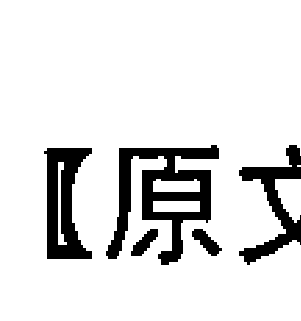

## 火星入宫喜忌

【原文】

火星喜见木气相生，又不喜重见，从阴则喜，犯阳则凶。夏令吉，独行有权。卯戌二宫吉，申巳宫乐，寅宫吉。巳宫躔轸则受制，躔翼则朱雀乘风，夜生反吉。有光明，忌见水孛凶。冬令不吉，加罗大凶，日生忌犯阳，夜生则可躔辰酉。火入金乡，则早抛兄弟。子丑宫泄气，见金则怒。
火星丑化黄道，寅化天升，卯化天乙，午化天赫，申化喜神，戌化天轨，亥化天轰，俱吉，余宫凶。

【白话提要】火星宜有木星或紫气临照，但不喜木星与紫气同时出现。一般火星居于丑宫、寅宫、卯宫、午宫、申宫、戌宫、亥宫，皆吉。

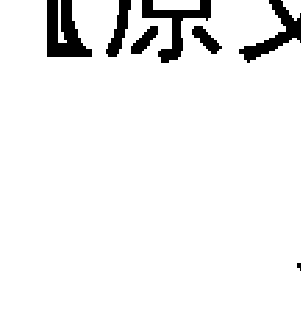

## 土星入宫喜忌

【原文】

土星喜火罗相生，亦不宜重见，重见则太骤一发，反见祸。子丑二宫吉，卯戌二宫吉，辰戌丑未月得令，从太阳少吉，日生更吉，忌见木气相克，加计则凶忌。与太阴相见，入寅申巳亥宫，凶。辰酉宫脱气，未宫曰：三·见水则怒。
土星居子化天冗，寅化贵人，卯化天冲，辰化太极，午化天道，未化四镇，申化福生，戌化天关，俱吉，余不利。

【白话提要】土星宜有火星或罗睺临照，但不喜火星与罗睺同时出现。一般土星居于子宫、寅宫、卯宫、辰宫、午宫、未宫、申宫、戌宫，皆吉。

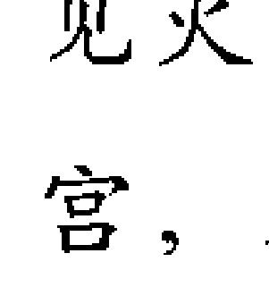

## 金星入宫喜忌

【原文】

金星喜土计生之，从阴阳皆吉。秋得令，辰酉宫吉，未宫亦吉，子丑宫受生，见火罗凶。卯戌午三宫凶，又金乘火位，其人少失尊亲。巳申宫泄气平平，见孛同宫，则为花酒之客。夏令无力，寅亥宫及见木气，则怒矣。
金在子化玉铭，丑化天库，辰化太常，巳化天禄，午化天旸，未化天仓，申化玉堂，酉化天印，亥化天寿，俱吉。

【白话提要】

金星宜有土星或计都临照，一般金星居于子宫、丑宫、辰宫、巳宫、午宫、未宫、申宫、酉宫、亥宫，皆吉。

## 水星入宫喜忌

【原文】

水星喜金相生，巳申宫吉。冬令吉，从日月吉，未子宫吉，亥宫稍吉，土计凶。见孛则余奴犯主，加煞非夭则刑。丑宫少凶，卯戌上怒见阳，不妨寅宫脱气。

# 五星入宫喜忌

根据五行生克及四季生旺等理论，五星入宫遇其他星曜，喜忌吉凶各有不同，下面将其总结出来，以供读者参考。

| 星曜 | 喜 | 忌 |
| :--- | :--- | :--- |
| 木星 | 喜见水星、月孛，入寅、亥、未、巳、申、卯宫为吉，与太阳交会为吉，春天为吉。 | 忌见金星、火星、土星、计都，入子、丑、戌宫为凶，遇诸煞皆凶。 |
| 火星 | 喜见木星、紫气，但不宜一起见到。入卯、戌、申、巳、寅宫吉，夏天为吉。 | 忌见水星、月孛、罗睺、金星，入子、丑宫不吉，冬天为凶。 |
| 土星 | 喜见火星、罗睺，不宜一起见到。入子、丑、卯、戌、辰、未宫吉，见太阳小吉。 | 忌见木星、紫气、计都，入寅、申、巳、亥宫凶。 |
| 金星 | 喜见土星、计都，入辰、酉、未、子、丑宫吉，秋天为吉。 | 忌见火星、罗睺，入卯、戌、午宫凶，夏季为凶。 |
| 水星 | 喜见金星，入巳、申、子、未宫为吉，亥宫小吉，冬天为吉。 | 忌见土星、计都、月孛，入丑宫小凶，入卯、戌宫凶。 |

## 水星入宫喜忌（续）

水星居子化玉池，丑化晨门，寅化天悫，辰化琴堂，巳化荣星，午化天温，未化天乙，申化显星，亥化天绶，吉。

【白话提要】水星宜有金星临照生助，一般水星居于子宫、丑宫、寅宫、辰宫、巳宫、午宫、未宫、申宫、亥宫，皆吉。

## 紫气入宫喜忌

【原文】

气星主慈善，出家好道。坐命及三方对冲，见之必孤妻子，难为行限。及三方对照见之，此限必好慈善，出家清修，过此又改矣。犯太阴为人晦滞，近太阳则掩光，遇剑锋恐受伤，如对照先须有妻，年老亦孤居。子丑则怒，寅亥为奴，犯主不吉。卯戌则有生成之意。居辰酉则衰，居巳申受生吉，居午凶，加煞克命度，大凶。紫气居子化玉清，丑化天元，寅化天饬，辰化华盖，巳化天相，午化玉肌，未化天廪，申化紫微，酉化凤凰，戌化玉贯，亥化天贵，俱吉。

【白话提要】紫气主其人心地慈善，好清静，喜欢出家修道。一般紫气居于子宫、丑宫、寅宫、辰宫、巳宫、午宫、未宫、申宫、酉宫、戌宫，皆吉。

## 月孛入宫喜忌

【原文】

孛星居命，诡怪万端，权谋百变，有克剥，无礼制。居子少吉，居丑凶，加煞克命度，大凶。居寅尾火凶，居亥朝天，居卯未皆吉，居午大凶，居戌凶，主流落。奎度反吉，辰酉平平。巳申为奴犯主女，命遇孛当头，克夫害子，孤淫是非，单行生度吉，剥杂克度主凶。孛星居丑化天柔，居寅化天后，卯化玉垣，午化玉气，未化太乙，亥化天聪，主吉，余宫不利。

【白话提要】月孛守照命宫，主其人诡计多端，权谋出众。一般月孛居于卯宫、未宫，皆吉。

## 罗睺入宫喜忌

【原文】

罗星守命，为人性急燥暴。居子午曰中分吉，居巳申受制，小吉。居子丑为生本宫，土命遇之为余气生，命忌克牛金，凶败。夜生得用，辰酉宫则怒。居未主克剥，生灾官事。卯戌为奴犯主位，立命于此，不吉。行限遇恶星相生，则为富不仁，相克则凶。会金加飞廉，则犯干戈及暴死，会剑锋，非恶死而伤残矣。

罗在丑化赤道，卯化天权，酉化天文，亥化文昌，俱吉。

【白话提要】罗睺星守照命宫，主其人性情急躁粗暴。一般罗睺居于丑宫、卯宫、巳宫、午宫、酉宫、亥宫，皆吉。

## 计都入宫喜忌

【原文】

计星居丑，躔斗名曰朝斗，必贵，只宜独行。居子为顽土，须用木气制之方可，或相冲照，或三方相制亦可。入寅遇金，则吉。入亥平平，卯戌独行吉，巳申则怒，未上凶，午上平吉，会剑锋必伤残及恶血死。

计星居丑化四喜，寅化天渊，卯化玉柄，巳化天水，午化天荫，亥化天武，俱吉，别宫不利。

【白话提要】一般计都星居于丑宫、寅宫、卯宫、巳宫、午宫、亥宫，皆吉。

# 四余入宫喜忌

根据五行生克及四季生旺等理论，四余入宫遇其他星曜，喜忌吉凶各有不同，下面将其总结出来，以供读者参考。

| 四余 | 喜忌 | 说明 |
| :--- | :--- | :--- |
| 紫气 | 喜 | 入卯、戌、巳、申宫吉。 |
| 紫气 | 忌 | 坐命及三方对冲，犯太阴、近太阳皆凶，入子丑寅亥午宫凶，加煞克命主、度主大凶。 |
| 月孛 | 喜 | 居子宫小吉，居卯、未宫吉。 |
| 月孛 | 忌 | 居丑、寅、午、戌、巳、申宫皆凶。遇月孛凶。 |
| 罗睺 | 喜 | 居子、午宫吉，居巳、申宫小吉 |
| 罗睺 | 忌 | 忌见金星，居未、卯、戌宫不吉，遇恶星凶。 |
| 计都 | 喜 | 居丑必贵，入寅遇金，卯戌独行为吉，居午为吉。 |
| 计都 | 忌 | 居巳、申、未上凶，见剑锋煞为凶。 |

# 3. 续论“七政四余分布宜忌及入格真伪”：再论星曜入宫吉凶

## 太乙抱蟾

【原文】
太乙抱蟾，常人见孛，与月同行，便谓之太乙抱蟾，其义非也。须是上弦及望前，既望下弦，在未上见之，及生于戌亥子丑时者，方合此格。如非其地，又非其时，名为抱鬼。若值残晦之月，则为抱死鬼，却不能为福矣。既望尽也，巳也。
太乙孛星也，蟾月也，月与孛同宫，在未酉，入秦鬼尤贵。

【白话提要】
月孛为太乙，蟾便是月亮。太乙抱蟾的命格，并非是月孛与月亮同行，便算此格。而是指其人为戌、亥、子、丑时出生，当时月亮为上弦月，或望月，或既望（十六的月亮），或下弦月，有月孛与月亮同行，才叫做太乙抱蟾。

太乙即月孛，蟾即月亮，太乙抱蟾是难得的贵格，一般星士一看到月亮与月孛同行就认为是太乙抱蟾，其实并非如此，要构成太乙抱蟾，还需要满足多种条件。

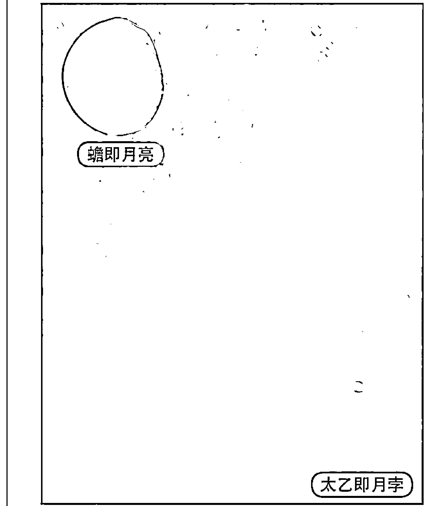

构成太乙抱蟾的四个条件

1.  月相处於上弦至满月或满月至下弦，即初八至十三、十七至廿二，月相为凸月的时候。
2.  月亮与月孛运行至同一宫位。
3.  二者同见的宫位为未宫。
4.  其人生于戌、亥、子、丑之时。

如果月亮不是凸月，而是满月或弯月，则称为太乙抱鬼，如果命在辰亥戌子丑宫，又逢廿二至月底的，为抱死鬼，均不是福相。

## 木罗会舍

【原文】
木罗会舍，必在寅上为吉，盖木喜于寅罗，乐于寅，二星相得方为会，舍在他宫则不合格。
谓相生得火局之贵。

【白话提要】
木罗会舍的命格，必须是同照于寅宫，则属于此命格。

## 火气、木孛等

【原文】
火气为职权，在寅卯为大吉。盖火生于寅，庙于卯。寅为气乐之垣，卯为气旺之地，二星相得，故为职权，不以昼夜为忌。
木孛为符印，在未为得局，盖木升殿于未，孛入庙于未，二星得所，为贵，他宫其福减半。
火罗计孛乃四凶曜，化凶化吉并宜，独行则主重权。
紫气为灾，比土犹缓。
土星为灾，至缓，主病淹滞难痊，使人晦懒，作事有头无尾，或出一月方发。
土星行最迟二十九年一周天，故主疾淹滞。
金星不要在阳刃、的煞、劫煞之上，盖金主煞，遇煞则煞气辉腾，故为煞至重。

【白话提要】
火气为职权的命格，必须是火星与紫气出现于寅宫或卯宫，才属于此命格。
木孛为符印，是指出现于未宫，才属于得局。
火星、罗睺、计都与月孛，本为四个凶曜，化为吉星，并且独行，才主重权在握。
紫气带来的灾害，比土星为灾星时，带来的灾害要迟缓。
土星为灾星，灾害出现比较迟缓，主要表现在其人有病难以治愈。
金星不可出现于阳刃、的煞、劫煞的上面，因为金主煞气，使煞气更重。

## 罗计拦截、断截等格

【原文】
罗计拦截之格，不宜太阳跳出，犯此名曰孤君无辅，极不为美。盖太阳乃君象，只欲五星辅佐共行，或拱夹方为吉。论若孤立于外，主人一生奔波劳碌，少得人力，我虽亲附，人人多远之。

罗计截断，半天星，此格有凶有吉。或截在左，行限在右，或截在右，行限在左，名曰反背。为限不与诸星会遇，故也。又有升沉之不同，或日生而诸曜，截在卯辰巳午未申，行限酉戌亥子丑寅，位而无星者，不得体；或夜生诸星，截在酉戌亥子丑寅位，行限卯辰巳午未申位，无星之地，皆谓升沉不同，并不合格者也。

计罗截断漏出有用星辰昼东南而夜西北皆主大贵。

太阴随日干，而化金木水火土，若太阴属水则不喜土，月同躔，太阴属木，则不许金月同躔。余可类推，犯之者皆带疾，防克如更在空亡、亡神、劫煞之上者，决主其人乱说是非，言语不定。

【白话提要】

罗计拦截的命格，不宜太阳独自跳出拦截之外，会有孤君无辅之象；如果跳出有用之星，则为大贵的命格。

月亮随日干化成金木水火土，如果月亮化为水，则不喜与土星同居；如果月亮化为木，则不喜与金星同居，其余依此类推。

## 罗睺、计都截断半天星斗

罗睺和计都是黄道与月球运行于白道的两个交点，是发生日食月食的地方，二者位置相对，正好将黄道截为两部分。其中罗睺到计都的部分为内，计都到罗睺的部分为外，即跳出部分。讨论吉凶时，重点讨论跳出之星。

**罗睺、计都截断星斗的示意图**

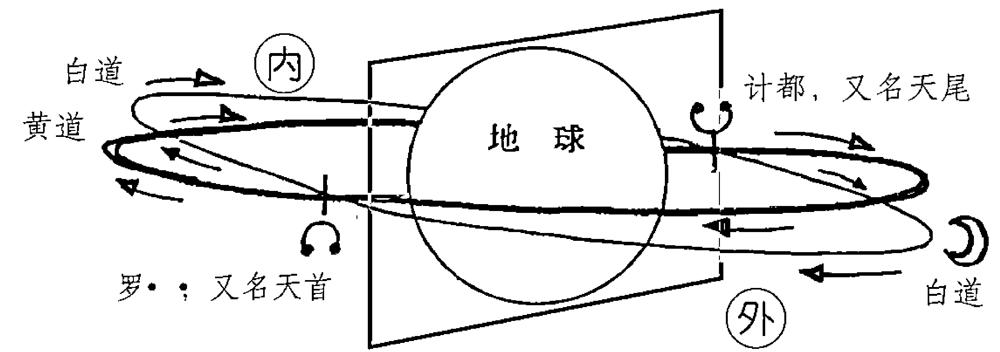

## 跳出部分

-   若行限区域与诸星所在位置正好被罗睺、计都分开，为得体，不吉。
-   若只跳出一星，如果此星为吉星则为得格，有富贵；如果是凶星则一生坎坷，一事无成。
-   跳出之星若只有太阳，则为“孤君”，主其人一生得不到帮扶提携，一生劳苦。

## 令星拱日、诸星聚会等格

【原文】

令星在太阳之前，名曰旺进，若为命主在前，曰特进，名曰令星拱日，又曰令星当衡，皆主权贵。若命主及令星在太阳之后者，名曰后进，其福减半。
金水二星护太阳而行则不离三宫。
诸星并行，有前有后，凡煞星则欲其前行，主星则欲其后至，假如水火同行，水克火为煞，水在火前，则为不克，火在水前，其煞逼身，最为大害，不可不审。经云：煞前主后，当膺藩辅之权，煞后主前，必有徒流之患，此之谓也。
藩辅布政之职。
诸星聚会，有吉会，有凶会。吉会者，如命主、度主、身主官魁福禄化贵荫权印，则为吉会。虽是火罗计孛，若作吉，亦为吉会，若为阳刃、劫煞及化刑囚、暗耗，皆凶会，主祸。
诸星并要分行，善恶不宜混杂，故善者专为吉，恶者专为凶，福禄单行为吉。若福刑相会，禄耗并行，吉凶混杂，皆主利名有成，有败，处世无成。

【白话提要】

执令之星，如果出现在太阳的前面，则叫做旺进；如果为命主，出现在太阳前面，则叫做特进，也称为令星拱日、令星当衡，皆主其人有权而富贵。如果命主或令星出现在太阳的后面，则叫做后进，福气会减去一半。
金星与水星保护太阳一起运行，其宫度不会超过三宫。
诸星曜一同运行，煞星运行于主星之前则吉，煞星运行于主星之后则凶。
诸星会聚，如果会于命主、度主、身主、官魁、福禄，化为贵荫、权印，则为吉；若化为刑星、囚星、暗星、耗星，则为凶。
诸星并肩运行，善星与恶星不宜混杂。善星独行则吉，善星与恶星并行，则吉凶各半。

## 五星退行等格

【原文】

五星退行，有退而有力者，有退而无力者。且如火金同行，金在前，火在后而退，此煞星不敢进前以克金，谓之退而有力。若金星退遇火星，顺行反克金星，是谓退而无力。余可类推。有退而升殿入垣，逢生皆谓有情，反作吉论。或退而失度逢杀，及入弱宫，皆谓无情，决作凶论。
退星为福、为祸尤甚，盖行迟故也。经云：星躔退度，善恶分外有情，术者审之。
诸星坐命，皆为所属，既能为吉，亦能为凶，其论已有灵验。

诸星在人盘，不但原守为紧，而流星及诸神杀尤为紧关，亦如前例，同看知星者鉴之。

【白话提要】

金木水火土五星退行，有吉有凶。如火星与金星同行，金星在前，火星在后退行，则叫做退而有力，为吉；如果金星退行，遇火星顺行，使火星克制金星，则叫做退而无力，为凶。总之，五星退行升殿入垣，或逢生，则吉；退行逢杀遇克，或者进入陷弱宫，则为凶。

五星退行，所主之福祸极其明显。凶则特别凶，吉则特别吉。

诸星坐于命宫，有吉有凶，其理论已记载于《玄妙集》中，应当仔细领会。

诸星在人盘上，不但要仔细看原守星的吉凶情况，还要细推流星与诸神煞的关系。

## 4. 星盘或问：星占要义的答疑

## 星命学的道理所在

## 【原文】

> 斗南子方裒集删定果老星命之说，以广厥传。忽有客坐而问曰：“五星丽于天者也，凡民丽于地者也，天地邈不相及胡术家者流，以五星而推人禄命，其说亦有理与？”

> 余应之曰：“天地不外阴阳，阴阳不外五行，人不能外五行以生，五星乃五行之精，凝结成象，天垂以示人者也。人之生也，禀天地之精英，萃阴阳之造化，天星运于上，而适厥期人命钟于下，而感于天通，是故长庚入梦而太白生，岁德下临而曼倩降，郎官应宿，庶民惟星，以五星而推人禄命，其理至著，其道至微，但术者未尽知耳。”

即金木水火土之精悬象于天，布列森然，变化无端，以应凶吉，李白母梦长庚入怀而生，故名曰白，字太白，岁德星降，乃东方朔也，号名曼倩子。

【白话提要】

斗南子方裒收集删定了张果老的星命学说，以使其广泛流传。这一天忽然有客人来，坐下问：“五星运行于天上，凡间的民众皆生活在地上，天与地的距离如此遥远，互相难有往来，而有些命理学家，却以五星来推算人的福禄命运，这种说法真有道理吗？”

我回答说：“天地不会超出阴阳的范畴，阴阳则不会超出五行的范畴，所有的人皆不能超出五行之外而降生。五星为五行的精气，凝结而成的形象，这就是天垂象以示人的充分体现。人的出生，秉承着天地之精气，会聚着阴阳交合的造化，天上某一星曜运行至上空时，正好人命降生于地上，人命即是此星之气所化，人心与星曜存在着感应，所以李白的母亲梦见长庚星进入怀中而生下李太白（取名太白，即太白金星的意思），东方朔为木星下凡，所以他号名为曼倩子。郎官与天上的宿主星相应，普通百姓则与一般的星曜相应。以五星来推算人的福禄命运，其中的道理非常明显，而其最精妙的原理却难以全部掌握，即使是推算星命的大师，也不能全部掌握。”

## 创业命星盘

清代 《古今图书集成·艺术典》

上图就是一个排出的星盘，此人的生辰八字是癸未、丁巳、庚午、丙子，依照其出生时七政四余的位置与干支宫位的关系即可推出其星盘，依照星盘上官位、星宿、干支等元素的相互联系，即可得出其中所包含的神煞，也就可以据此来推断此人命运了。

## 十二宫的排法

> > 客曰：“星命之说，固云有理。然所以推星与命者，则吾未之喻也。敢问何以先排十二宫？一命宫、二财帛、三兄弟、四田宅、五男女、六奴仆、七妻妾、八疾厄、九迁移、十官禄、十一福德、十二相貌，其名次序无乃牵强也？”
> 余答曰：“人之生也，以身命为主，故曰命宫为第一，财为养命之源，故次二，分我之财者独兄弟故次三，田宅所以安命藏财而居兄弟故次四，既有财帛兄弟田宅，而男女所以承田与财者也故次五，奴婢所以辅男女故次六，妻妾敌体与命宫对冲故次七，夫自命宫而至妻宫，其叙自不乱。疾厄人命之所不能无者故次八，迁移人之所不能免者故次九，官禄天之所予系于命而最要故次十，福德人之所享系于天而难得故次十一，相貌所以成身故次十二。

“自疾厄而至相貌，其叙却乃倒言，何也？十二宫之中，命与妻相对，相貌、福德、官禄出天上，故列在身前。财帛、兄弟、田宅隐地下，故叙在身后。迁移、疾厄、妻妾限数最紧，皆太阳过午而行促。有相貌而后见福德，有福德而后居官禄，有官禄而后历迁移，有迁移而后见疾厄。自相貌而至于疾厄，皆日月之喜升而恶沉，有财帛而后见兄弟，有兄弟而后分田宅，有田宅而后归男女，有男女而后居奴仆，自财而至奴仆皆日月之右转而分布。人之所以为人，不过如此，故十二宫之名，足以尽人之生也。男女身命所生迁移，父子所专，兄弟和乐，妻孥雍睦，人之福德，此二者最难。财与官禄相连，奴婢所以服官营财也。貌为疾厄所苦，田宅所以安身而养疾也，故皆三合。此十二宫流行之叙，对代之体，错综之用，有如此子殆未之思乎。”

星盘问答之说，此篇至妙而至精也。

【白话提要】

客问：“星命的学说是有道理，那么十二宫的先后顺序有什么根据呢？就不存在牵强的地方吗？”

我答：“人刚刚降生，以拥有身命作为标志，所以命宫排列在第一位；钱财为身命存活的基础，所以排在第二位；与我分财产的是兄弟，所以兄弟宫排在第三位；田宅可以安命藏财而使兄弟们有了住处，所以田宅宫排在第四位；有了钱财、兄弟、田宅后，随着长大，就要结婚生子，所以男女宫排在第五位；奴仆可以扶养子女，所以奴仆宫排在第六位；夫妻本是阴阳对冲的关系，所以命宫的对宫为妻妾宫，其排在第七位；人类的生活不会永远幸福安乐，疾病与灾难是永远存在的，所以第八位是疾厄宫（译者注：疾厄宫与财帛宫为对宫，又暗示人求财心切必患疾或招灾）；人类永远无法避免迁移到别处去谋生，所以第九位是迁移宫（译者注：迁移宫与兄弟宫为对宫，暗示人类迁移与兄弟分家及争财有关）；官禄为上天所赐予，对生命很重要，所以官禄宫排在第十位（译者注：官禄宫与田宅宫为对宫，表示官位的大小与俸禄的多少，决定了住宅的级别与田地的多寡）；人们拥有多少福德与天命有关，所以福德宫排在第十一位（译者注：福德宫与男女宫为对宫，表示一个人的福德多寡与子女的多少、孝顺与否及是否富贵等，密切相关）；相貌成就人身体的特征，所以相貌宫排在第十二位（译者注：相貌宫与奴仆宫为对宫，表示人的相貌仪容与奴仆多寡密切相关）。

“自疾厄宫至相貌宫的顺序，为什么属于逆序呢？这是因为，十二宫中命宫与妻妾宫为对宫，相貌、福德、官禄皆源自于天命，所以排列在身宫之前；财帛、兄弟、田宅隐于地下，所以排列在身后。迁移宫、疾厄宫、妻妾宫的吉凶，以运限上最为重要，皆是太阳过午宫后运行急促，有相貌然后才有福德，有福德然后才有官禄，有官禄然后才有迁移，有迁移然后才有疾厄，从相貌宫至疾厄宫，皆是体现出了太阳与月亮喜升殿入垣而厌恶陷于恶弱宫的吉凶规律。有财帛然后才有兄弟，有兄弟然后才有分田宅的事情，有田宅然后才有男女，有男女然后才有奴仆，从财帛宫至奴仆宫，皆是根据太阳与月亮右转的动行规律而排列。人之所以能够成为人，不过是这些生活因素的组合。所以，十二宫的名称，体现了人生的全部内涵。男女，为身命所生出；迁移，为父子之间的传承；兄弟之间快乐和气，妻妾子女和睦相处，人的福德享受，只有这两条最难做到。财帛宫与官禄宫紧密关联，奴仆因官、财而听从主人的命令；相貌为因疾厄而变得痛苦，田宅可以安身养病，所以此三者相合。这十二宫的排列顺序，错综对宫的排列，有这些内涵，难道你没有仔细思考过吗？"

## 十二宫次序

在星命排盘时，首先确定命宫位置，然后以逆时针方向排列十二宫，在排列过程中，十二宫的次序是固定的，不能颠倒。

## 十二宫次序

| 序列号 | 1 | 2 | 3 | 4 | 5 | 6 | 7 | 8 | 9 | 10 | 11 | 12 |
|--------|---|---|---|---|---|---|---|---|---|----|----|----|
| 十二宫 | 命宫 | 财帛宫 | 兄弟宫 | 田宅宫 | 男女宫 | 奴仆宫 | 妻妾宫 | 疾厄宫 | 迁移宫 | 官禄宫 | 福德宫 | 相貌宫 |

## 命盘十二宫示例（以立命在巳者为例）

> 身命为人的生存之本，故将命宫排在第一位。

> 相貌构成人的身体表面，所以排第十二。

> 福德也是天命注定而且难得，所以排第十一。

> 官禄是天命注定，也是人生中最贵重的，所以排第十。

> 相貌、福德、官禄出自天上，均为先天注定，所以列在身命之前。

> 财帛是养命糊口之源泉，人有财帛才能生存，所以财帛宫排第二。

> 能够分你财帛的，只有兄弟，故将兄弟宫排第三。

> 田宅是养命生存、收藏财帛，敦兄睦弟之所，所以排第四。

> 人生中的迁移走动也是不可避免的，所以排第九。

> 疾病灾厄都是人生不可回避的，所以排第八。

> 家里已经有了财帛、田宅，而男女就是继承田宅、财帛的，所以排第五。

> 奴仆是辅佐男女的，故排第六。

> 妾可能损伤身体，所以与命宫位置相对，排第七。

> 财帛、兄弟、田宅隐于地下，均为后天所得，所以放在身命之后。

## 十二宫与星曜相配

## 【原文】

客曰：“星盘十二宫既闻命矣，然何以午未属天。子丑属地，寅亥属木，卯戌属火，辰酉属金，巳申属水，与五行地支十二之理不同，又何说与？”

余曰：“五行以寅卯为木，巳午为火，申酉为金，亥子为水，辰戌丑未为土，乃地支十二维也。午与未合居于上而属乾，故以为天；子与丑合居于下而属坤，故以为地；上天下地一定之体也。亥与寅合属春，故以为木；卯与戌合属夏，故以为火；辰与酉合属秋，故以为金；巳与申合属冬，故以为水。春夏秋冬四时之序也，日月丽天水金辅之，故喜金水土石丽地木火生之，故喜木火，此虽与地支十二维分布不同而其道理则相贯也。”

此乃颠倒五星之论，此篇神妙之论，凡人之所不知者也。

【白话提要】

客问：“星盘十二宫的排列原理，与身命关系重大。那么为什么午未二宫属于天，子丑二宫属于地，寅亥二宫属于木，卯戌二宫属于火，辰酉二宫属于金，巳申二宫属于水，与十二地支配五行不一样呢？这又怎么解释呢？”

我答：“十二地支配五行，以寅卯为木，巳午为火，申酉为金，亥子为水，辰戌丑未为土，为地支的十二个纬度。午与未相合，位于上方，属于先天八卦方位图的乾方，所以午未二宫属于天；子与丑相合，位于下方，属于先天八卦方位图中的坤方，所以子丑二宫属于地；天在上，地在下，这是不容更改的体例。亥与寅合，属于春天，所以五行属木；卯与戌合，属于夏天，所以五行属火；辰与酉合，属于秋天，所以五行属金；巳与申合，属于冬天，所以五行属水。春夏秋冬，为四季的时序。太阳与月亮运行于天上，有水星与金星辅佐，所以太阳与月亮喜见金星与水星。泥土与石块依附于大地，所以地上喜有木星与土星临照。此种五行，虽然与十二支代表纬度的五行不同，但其道理，则是相互贯通的。”（译者注：此处所言为十二支化合五行的原理。）

## 十二宫配七曜

十二宫和七曜的相配关系与支元六合及其属性的配对关系相似。

午未相合为太阴太阳，配于天，午以日为宫主，未以月为宫主。

辰酉合金，以金星为宫主。

巳申合水，以水星为宫主。

寅亥合木，以木星为宫主。

卯戌合火，以火星为宫主。

子丑合土，配于地，以土星为宫主。

## 太阳为命，太阴为身

【原文】

客又曰：“人一日之生不啻亿万，何以从太阳为命，太阴为身，遂据此断吉凶祸福，仆未深信，敢问其故何也？”
余曰：“善哉。问我明告子，天形如卵而左旋，日月代明右转，天体日周东方常抽惟其东，抽是以西沉一沉一，抽无停留也。太阳之升出在东方，太阴之没入在西方，一升一没无差忒也。人之出乎胎中，即天转乎地上，若是卯时而生天日俱出东厢，惟卯时以后，天体无形，以日为准故。因日而数至卯，即卯地而出苍穹。太阴日之配身之所，自出也。故以太阳立命，太阴安身。身命人之所最重，故先求此二宫。天体度数各有对度，是以日月同其好恶，身命同其祸福。东出父命，西没娘身。东出太阳，西没太阴。东出亢金，西没娄金。故云身命一般之说，盖为此也。”

## 太阳为命，太阴为身

星占推命中，命宫、身宫是两个十分重要的概念，确定身命所在是推命的前提。但命宫、身宫究竟从何而来，尤其是身宫的来历，尚有许多争议。

### 以太阳为命，太阴为身的说法

每日卯时，太阳从东方升起，因此从出生当日太阳所在宫位起生时，顺数至卯，即是命宫。

每日酉时太阳落山，太阴主宰天空。因此从太阴所在宫位起生时，顺数至酉，即是身宫。

古人认为，命得自父亲，父属阳，所以以太阳位置来确定命宫。

身得自母亲，母属阴，所以以太阴位置来确定身宫。

【白话提要】

客问：“每天出生的人，不少于亿万之众，为什么根据太阳确定命主，根据月亮确定身主呢？根据这个判断吉凶，能准吗？”
我答：“这个问题问得好。我告诉你，天的形状像鸡蛋一样而不停地左旋，日月更替起到照明的作用而不停右转。天体每日一周而不停地移动，东方的宿度每日移动一度，这样东升西降，不停循环。太阳升起于东方，月亮降落于西方。一升一降，永远不会有差错。婴儿的降生，就如同天体转到了地上。如果婴儿卯时出生，正好与天体、太阳出现于东方相般配。只是卯时以后，天体隐藏了形体，而以太阳为准，所以要从太阳所居之宫数卯宫，从而推出命宫，因为天体诞生于卯地。月亮为太阳的配偶，身体自动出现，或升或降，所以星命以太阳立命，以月亮安身。身体与生命，是人最重要的组成部分，所以要先推出这两宫。天体的宿度，皆有相对的宿度。所以太阳与月亮有着同样的喜星与忌星，人的身主与命主的祸福也紧密互相关联。东方日出处为父命，则西方月落处为娘身。东方出现太阳，则西方降落月亮；东方出现亢金宿，则西方降落娄金宿。所以身命的原理，简单来说就是这些。”

## 星命古今之说的差异

【原文】

客又曰：“星家源流其理既同，然何以有准于古而差于今，验于今而谬于古，其故又何，仆也惑，敢问？”
余曰：“此天道自然之运也。天之运也积气日月，五星积气之光曜者也。其循行次舍七十年而差一度，天道且然而况于人乎。世有升降，国有隆污皆囿于天道，自然之运。人乃积气中之动物，身之用舍道之行藏，又囿于国家一时之运，此古今人命之所以不同而星家准与不准之辨，咸在此矣。”
客恍然而悟醒。

【白话提要】

客问：“既然星家们的原理全都相同，那为什么古时应验的案例今天推算却不准，应验于今天的星命却与古时的理论相违背呢？”
我答：“这是天道自然运行的结果。天体不断运行，便不断积累精气与能量。日月五行积聚到一定的精气与能量，就会成为发光的星曜。日月五星于二十八宿上依次运行，每七十年就会有一度的误差。天道有此误差，人的星命自然也会有误差。世道有好坏之时，国家有强弱之分，皆与天道的自然运行有关联。人为天气积累精气形成的动物，命运好坏，又与国家的命运相关联。古今人命的好坏不同，与星家推断不准的原因，全与这些有关。”
客人听后，恍然醒悟，心中不再有疑惑。

## 5. 分野列宿：星宿所对应的九州辖区

【原文】

-   斗宿分野 南直隶: 应天、凤阳、太平、安庆、苏州、松江、常州、镇江、徽州、宁国、池州十一府，广德州、和州；浙江：杭州、嘉兴、处州三府；江西：南昌、南康、九江、饶州、广信、抚州、建昌、临江、瑞州、袁州、吉安、赣州、南安十三府。
-   牛斗分野 南直: 淮安、扬州二府；浙江：湖州、温州二府；江西：九江。
-   牛女分野 浙江：宁波、绍兴、台州、金华、衢州、严州六府；福建：福州、兴化、漳州、泉州、延平、邵武、汀州、建宁八府；广东：广州、惠州、潮州、南雄、韶州、肇庆、高州、雷州、琼州九府。
-   虚危分野 山东：青州府。
-   危宿分野 山东：济南、登州、莱州三府。
-   室壁分野 北直隶：大名府；河南：卫辉、怀庆、彰德三府。
-   奎娄分野 山东：兖州府。
-   胃宿分野 山东：东昌府。
-   昴毕分野 北直真定府；山西大同府。
-   觜参分野 山西：平阳府、泽州；四川松潘等处军民使司迭千户所。
-   参宿分野 山西：汾州；四川：东川、军民。
-   参井分野 山西：太原、潞安二府。辽州、四川、顺庆；贵州宣慰司：思州、思南、镇远、石阡四府。
-   井鬼分野 陕西：西安、凤翔、庆阳、延安、平凉、临洮、巩昌七府；宁夏卫、洮州卫；文县、岷州卫、陕西行都司、永宁宣抚司、招讨司、天全六番；四川：成都、保宁、重庆、叙州四府；漳州、嘉定、泸州、眉州、黎州、安抚司、四川行都司；云南：楚云、雄武、定州；广西：曲靖、澄、大理、临安四府；贵州、普安州。
-   井鬼入参一度分野 乌蒙军民府、乌撒军民府、播州宣慰司、龙山宣抚司。
-   鬼宿分野 四川：马湖府。
-   柳宿分野 贵州：同仁府。
-   张宿分野 河南：南阳府。
-   翼宿分野 四川：夔州府；湖广：武昌、汉阳、襄阳、常德、郧阳、长沙、岳州、衡州、永州、郴州、荆州、黄州十二府；沔阳州；永顺宣慰司；保靖州；军民宣慰司；广西：桂林、平乐、柳州、南宁、浔州、太平、庆远、梧州八府；广东：广州府。
-   轸宿分野 湖广：宝庆府、靖州；四川平茶洞长官司。
-   井鬼翼轸分野 陕西汉中府。翼轸之余 贵州：黎平府。
-   角亢分野 河南、开封府、归德、德州。
-   角亢氏分野 河南、汝宁府。
-   房心分野 南直隶、庐州府。
-   尾箕分野 北直隶、顺天、河间二府；辽东都司。
-   尾箕兼昴毕宿分野 北直隶：保定府。

【白话提要】

分野，就是把天上的星宿分别与地上的国、州、县联系起来，也就是根据天上的星宿来划分地上的区域。分野有十二星次分野与二十八宿分野两种。此处的“分野列宿”，是将地上的州府与天上的二十八宿相配合，由于历代国土疆域的不同，随着年代的积累，每一宿所代表的州府往往越来越多，地域也不断在扩大。

## 二十八宿分野之图

> 明代 《三才图会》

古人认为天人感应，天上的二十八宿对应着地上的十二州，也就是战国时期的各诸侯国地域，这就是所谓的二十八宿分野。这幅图对应的就是二十八宿与十二次和各诸侯国的分野。

# 杂论：星命论述杂汇

## 卯宫神将

卯宫对应大火之次，对应天蝎宫。卯宫属火，以火星为宫主。卯宫包含氐、房、心三宿，即以房日兔为自己的属相，因此卯宫神将面目似兔。

| 卯宫包含氐、房、心三宿 |
| :--- |
| （从氐宿一度至斗宿三度） |
|    |
| 心宿 | 房宿 | 氐宿 |

> > 取房日兔为自己的属相。

| 卯宫以火星为宫主 |
| :--- |
|  |
| 火星 |

### 立命于卯宫的喜忌

#### 喜
- 火星、太阳、木星、紫气。

#### 忌
- 水星、月孛。

| 关系密切的宫位 |
| :--- |
| 三方宫： | 未宫（迁移） |
|  | 亥宫（男女） |
| 四马宫： | 午宫（官禄） |
|  | 子宫（田宅） |
|  | 酉宫（妻妾） |## 辰宫神将

辰宫对应寿星之次，对应天秤宫。辰宫属金，以金星为宫主。辰宫包含角、亢二宿，即以亢金龙为自己的属相，因此辰宫神将面目似龙。

辰宫包含角、亢二宿 (从轸宿十度至氐宿初度)

亢宿 角宿

取亢金龙为自己的属相。

辰宫以金星为宫主

金星

## 立命于辰宫的喜忌

-   命宫 辰
-   喜：土星、计都。
-   忌：火星、罗睺。

### 关系密切的宫位

-   三方宫：申宫（迁移）、子宫（男女）
-   四库宫：子宫（官禄）、丑宫（田宅）、戌宫（妻妾）

# 卷七 三辰通载（上）：五星论断篇

《三辰通载》一书内容广博，详尽地记载了七政四余诸星运行躔度的吉凶福祸，堪称星命学家的术法指南。此书不仅载于《果老星宗》中，另一部星命巨著《星学大成》也将它收录其中。

## 本章内容提要

-   1. 第八章 三辰通载·岁星：木星吉凶断
-   2. 第九章 三辰通载·荧惑：火星吉凶断
-   3. 第十章 三辰通载·镇星：土星吉凶断
-   4. 第十一章 三辰通载·太白星：金星吉凶断
-   5. 第十二章 三辰通载·辰星：水星吉凶断
-   6. 第十三章 拦驾经：十二宫星曜所临吉凶断
-   7. 第十四章 轮宫赋：七政居十二宫的吉凶

# 第八章

# 三辰通载·岁星：木星吉凶断

【原文】
夫三辰通载者，以十一曜为一辰，以十二宫为一辰，以二十八宿为一辰，故名三辰通载。于五星六曜，分为两卷，前卷五星，后卷六曜。五星者，即岁星荧惑镇星太白辰星。六曜者，谓太阳太阴紫气月孛罗睺计都是也。观其各卷经义，乃入门浅近之书，于果老有发明处，学者须融会贯通，不可执泥一端，斯得之矣。
五星者，木火土金水之精，在天为五星，在地为五岳，在道为五常，在人为五脏，于人禀之，亦与天之祸福相应，且人之禀天之所赋界者，故禀天之所授也。

【白话提要】
三辰，指的是以十一曜为一辰，十二宫为一辰，二十八宿为一辰。《三辰通载》分为两卷，前卷专讲五星，后卷专讲六曜。五星，即金木水火土五星；六曜，即太阳、月亮、紫气、月孛、罗睺与计都。

## 1. 岁星算法 木星篇：木星的定度法

【原文】
置积日减七十四，以周天数三百九十八日八十八分六十一秒去之，看余日多少入在何段下，太阳中定星度，又以余日数去之，不满者为定度。
晨伏：十七日行四度去日十三度，五十分晨见东方。
顺：二百十三日行十七度七十六分。
留：二百十三日行十七度十六分。
晨逆：四千六百九十四分一十秒行四度九十一分八十五秒。
夕退同上。留同上。顺同上。
夕伏：十七日行四度须与日月同度。

## 【白话提要】

此处是对木星定度的计算。“积日”，属于星算学中的太初元历起始至作者著书的年数；“减七十四”，则是一个调整误差的常数；“周天三百九十八日八十八分六十一秒”，则是指木星冲日的周期。当地球位于木星与太阳的中间时，木星最为明亮，此时就叫木星冲日。虽然木星的公转周期比地球长很多，但地球在木星冲日一次后，运行一圈多一点的时间就可以再次运行到木星和太阳中间，再次形成木星冲日。因此木星冲日的周期是一年多一点，一般十二年中会出现十一次木星冲日。古人观测星象，认为这一年多一点的时间，便是木星的“周天”。
接下来则详细说明了木星伏、见、行、留、逆、退等运行状态的具体时间。

## 2. 岁星总论：木星的运行规律

## 【原文】

> 木星东方岁星君子之象，行度有晨夕，伏退留顺迟疾。自井二十九至三十度为向旺，自鬼宿初至三度为正旺，至柳宿三度为次旺，躔斗角奎井四宿为升殿。人马箕宿为乐，若人身命与七强宫值之、紫绶金章，官职高贵，其性仁慈，好道德、温良恭俭，善解孛罗之难，能免火土之厄，纵在闲弱宫，有吉星而无凶与刑星会，亦主近贵，又为人之寿星。子上不得地、亦看躔在何宿，若在虚度中寿人也。六戊人为囚星，然其星性本善不可便以囚论，六丙人为禄主星。

> 为岁之首，主苍龙之象，顺行则吉，留段号长丧星，藏福入逆号灾状星为凶，入伏号阙干星善恶都不，管十二年行一周天。

## 【白话提要】

木星绕太阳公转的周期为4332.589天，约合11.86年；木星在黄道十二宫每年前行一宫，古人以木星所在之宫纪年，所以古人将木星称为“岁星”；木星周行黄道十二宫，正如同古代天子每年的巡游，所以说有君子之象。木星在运行当中，处于留、伏、逆的状态时，皆主不吉。

## 五大行星的顺留伏逆（一）

由于地球和五大行星的轨道位置和运行速度的差异，导致从地球上看，五大行星的运行轨迹并不是平直的一条线，而会有顺留伏逆等情况出现，古人对此并不理解，反而认为其中兆示着吉凶。

## 行星的相对位置

## 外行星（火、木、土）的运行轨迹

合即合日，此时行星逐渐运行到太阳附近，隐曜不见，合之前的一段即为伏。

留，行星由顺行转逆行或逆行转顺行时，运行缓慢，即称为留。

冲，行星运行到隔地球与太阳相对的位置，此时行星亮度最大。

逆行段，行星逐渐被地球赶上并超越。

> 一个会合周期内外行星在星宿间的移动情形（之字形）

## 五大行星的顺留伏逆（二）

## 内行星（水、金）的运行轨迹

上合、下合之时，行星运行至太阳附近，隐曜不见，逐渐接近太阳时即为伏。

留，行星由顺行转逆行或逆行转顺行时，运行缓慢。

东大距和西大距是地球上看到的行星距离太阳最远的时候，此时行星最亮。

一个会合周期内，内行星在星宿间的移动情形（柳叶形）

## 顺留伏逆的成因

顺留伏逆并不是太空中行星的真实轨道，而是地球和行星的运行导致相对位置不断变化的结果，下图就反映了一颗外行星顺留伏逆的成因。

-   1 ～ 3 为顺行阶段
-   3、5 为留
-   3 ～ 5 为逆行阶段
-   4 为冲日位置
-   5 ～ 8 以后为顺行阶段

外行星真位置与视位置示意图

## 3. 岁星歌断 源髓歌：木星星曜属性

> 【原文】
木星守命好容仪，眉目分明世所希。文学聪明多艺术，常怀仁义有尊卑。
心少毒，貌怡怡，言谈有德好珍奇。少病利官无险难，寿年长是及期颐。
逢庙乐，好官资，紫气同宫笔吏司。三合遇之为福厚，对宫犹是好镃基。
太阳会合文章贵，女后同宫贵位推。夜火会，主兵机，更逢土宿主旌旗。
忌星若来须减力，金同文武佐明时。惟有水星科甲贵，性慵太乙懒施为。
尾添恶，首助威，孛同何以独居之。财帛横添须守得，闲极三人手足随。
田宅富豪高大厦，五宫偏见贵男儿。第六陷宫奴得力，那堪第七美颜妻。
还居第八无灾疾，第九他乡得意归。十位官资须显赫，福宫寿老亦庞眉。
十二位中为相貌，岁星躔此貌偏奇。前言叙尽神仙术，后学尤宜仔细推。
女后太阴也，太乙孛星也，尾为计都星、首为罗睺星。

【白话提要】
岁星歌断，也称为源髓歌，其简洁地以诗歌的形式，描述了木星居于十二宫及诸宿度的吉凶情况。诗中的太乙，指的是月孛星；尾，指的是计都星；首，指的是罗睺星。

## 4. 岁星交会 辇斯经：木星与诸星相遇的吉凶

-   **【原文】**

**木火：**
木星会火喜偏饶，值此官尊福寿超，百六会时家国泰，忠臣孝子满皇朝。
火乃文明之象，与木同度，谓之木火通明。

**木土：**
木星宜与土同宫，百六逢之稼穑丰，会此乘轩并衣锦，记名青史着奇功。
木会土有培养之功，所以主贵。

**木金：**
木星最喜遇金星，喜曜如逢百福兴，百六会时多吉庆，人生指日到公卿。
百六谓一百零六月之限度，方周一十二宫之数。

**木水：**
天命之宫木水星，一生聪俊播芳声，三方更在高强位，金榜须排第一名。
木水有资生之义。

**木气：**
木星紫气福偏隆，百六逢之庆不穷，更在庙宫阴德重，官居将帅伯侯同。
气乃本之余，有主仆之义，且气多能也。

## 木孛：

木星若也会孛，总有惊忧变吉祥，巨蟹宫中如会遇，少年荣折桂枝香。
若在未宫相会，谓之木孛同泰。

## 木罗：

木与罗睺同一舍，喜在阳宫分昼夜，昼则堂堂韩魏公，夜则魁梧吕仆射。
宋韩琦封魏公吕端为仆射，皆正直之臣。

## 木计：

木星计若也相逢，反祸为祥千福集，百六当之福自添，如历巨川舟楫至。

## 【白话提要】

木星与火星同宫，主其人生性麻利，做事忠于职守，擅长写文章。如果木星为命主且其人为白天出生，或者火星为命主且其人为夜间出生，又皆乘旺气，则其人必定是文武全才而有权，并且名播天下。

木星与土星同宫，则其人擅长写文章，并会得到君王的重用。作为命主且其人为白天出生，则会有宰相的权力；夜间出生，会有给谏的权力。

木星与金星同宫，并且皆属于顺行状态，则其人必定文艺才能出众，很早便有官位、有名声。入度浅，则其人必是两府总督之命。

木星与水星同宫，则其人必定是聪明英俊而有文才，如果三方主居于高强之位，则其人必定会考中状元。

木星与紫气同宫，主其人少年时即会荣华显达，如果入庙并且有阴德星出现，则必是将帅伯侯之命。

木星与月孛同宫，主其人一生多受惊、多忧虑，但总会化险为夷；如果交会于巨蟹宫，则其人少年便可科举高中。

木星与罗睺同宫，如果在阳宫，则其人福厚有官位；如果在阴宫，则其人必定不得好死。

木星与计都星同宫，主其人一生进退不定。

## 5. 岁星入宫 枢要歌：木星在十二宫的吉凶

## 【原文】

## 木子：

地劫为名最不情，木星到此打齐瓶。化为吉曜犹无害，若变凶星不得生。
木到子宫谓之木打宝瓶。

## 木丑：

木德之星拱北斗，名为天荫最优游。功名年少须成就，利禄何须用力求。
斗木獬升殿。

## 木寅：

木星寅位曰天渊，偏爱逢生乐自然。甲丙生人如值此，尽教福禄庆双全。
寅乃木之禄位。

## 木卯：

木入幽州号太微，背中反旺却为奇。最防变作刑囚曜，命若逢之大不宜。
卯乃乘旺之宫。

## 木辰：

木到辰宫号玉龙，与金同位最亨通。丙干之命如逢此，名显官高禄更丰。
木金辰宫谓之金木逢龙。

# 木星入宫的推断

| 巳宫天福 | 午宫天德 | 未宫玉班 | 申宫天鸾 |
|---|---|---|---|
| 见水星则可富足，八字日干为丙、庚，则年少时文章鸣世。 | 一生清闲，没有坎坷，与太阳相会，则家财万贯，堆金砌玉。 | 一生平安享福，富贵长寿，一定会在当朝做高官。 | 不是寻常俗人，男子可做高官，女子则能嫁入高官之族。 |
| 辰宫玉龙  金星同宫则大吉，八字日干为丙，则可高官厚禄，扬名天下。 |  |  | 酉宫天囚  被流放远方，如果遇到火星，则少年时性命难保。 |
| 卯宫太微  为逆中求胜之局，但要防止变作凶星，否则会有大不吉。 |  |  | 戌宫鼓舞  少年丧亲，男克妻，女克夫，虽有才，但漂泊四海。 |
| 寅宫天渊  喜见生乐之星，如果八字日干为甲、丙，则可福禄双全。 | 丑宫天萌  拱卫北斗，年少时功成名就，高官厚禄很容易就可获得。 | 子宫地劫  遇吉曜则己，如果遇凶星则大凶。 | 亥宫中台  满腹经纶，少年登科，状元之才，可为官得福。 |

## 木巳：

木居巳上名天福，与水相逢须富足。丙庚之人如遇此，文章年少观场屋。
木化天福星、主富贵。

## 木午：

岁星午上号天德，一世优游无否塞。更得太阳相会行，家财倍万珍珠积。
天德星主清闲。

## 木未：

木入秦州号玉班，一生享福更平安。寿高福厚多荣贵，决入朝中作显官。
木化玉班星、主入朝班之贵。

## 木申：

木居申上号天鸾，莫作寻常俗命看。男子逢之应紫绶，女人遇此带金冠。
天鸾星主人功名富贵。

## 木酉：

木居酉上号天囚，徒配刑流出远州。若遇火星同到此，少年暴卒命难留。
酉宫属金木被伤。

## 木戌：

木为鼓舞少年孤，男克妻兮女克夫。广览诗书并艺术，飘蓬四海作生图。
化此星主克陷。

## 木亥：

木临亥上号中台，满腹当为翰苑才。若是为官并福曜，少年登第作元魁。
亥乃木之长生庙乐旺之地。

## 【白话提要】

此处歌诀，描述的是木星居于十二宫的吉凶状况。一般木星居于丑宫、寅宫、辰宫、巳宫、午宫、未宫、申宫、亥宫，皆吉。

## 6. 岁星躔度 玉阙歌：木星在二十八宿的吉凶

## 木星躔青龙七宿

## 【原文】

## 木角：

木躔角宿号天贵，诗礼传家居职位。更能艺术近公卿，财禄丰盈名早遂。
角属木、木乃青龙之象，得其本度。

## 木亢：

木躔亢宿号天城，财禄荣华显大声。学问操修君委用，岩廊辅赞一豪英。
木氐：
木躔氐宿号天穷，命若逢之灾祸凶。克子害妻孤悖早，安身衣禄必难逢。
氐土貉凶辰也、主孤穷。

木氐：
木躔氐宿天臧，进禄荣身侍圣王。白日生人尤大富，定应官职佐岩廊。
房日兔太阳升殿木会之主贵。

木心：
木躔心宿号天喜，少年荣贵妻双美。多男多女富金珠，国家库藏君王委。
心月狐度木躔之则喜，主夫妻荣美。

木尾：
木躔尾宿号天和，官禄荣迁福更多。三进又须三退位，年来三七定干戈。
尾火虎木垣木之禄位故贵。

木箕：
木躔箕宿号天祥，官职须登佐庙廊。才学经邦当大用，一身荣贵坐槐堂。
宫箕水豹之殿、木又相生之度。

## 木星躔青龙七宿的推论

木星躔二十八宿各有所主，躔青龙七宿的推断如下：

| 躔宿 | 推论 |
|------|------|
| 角 | 书香门第，位及公卿。 |
| 亢 | 才高禄显，声名远播。 |
| 氐 | 灾难凶祸，克妻害子。 |
| 房 | 侍奉君王，日生更吉。 |
| 心 | 少年荣贵，子女颇多。 |
| 尾 | 官禄荣迁，三进三退。 |
| 箕 | 才学经邦，位极人臣。 |

## 金木逢龙之义。

## 木星躔玄武七宿

> 【原文】

## 木斗：

木躔斗宿号天程，才智全兼早贵名。柱石邦家须大用，必为廊庙福苍生。
斗木獬升殿木之本度。

木牛：
木躔牛宿号天犁，贫苦初年晚见妻。只恐是非君莫怨，家财破尽化为泥。
牛金星升殿木躔之主，辛苦少成。

木女：
木躔女宿号天机，艺术聪明事事为。内富外贫财库足，只忧妻子见分离。
女士蝠度、下夜生人主吉。

木虚：
木躔虚宿不曾安，天阵之星百事难。内外不和家稍进，离乡应是保身安。
虚日鼠太阳升殿、木掩其光，主少吉。

木危：
木躔危宿号天然，骨肉从来在外边。衣食平平庄产置，到头终是不安全。
危月燕太阴升殿。

木室：
木躔室宿号天材，俊逸文幸福大来。柱石标名官爵厚，公卿端许到三槐。
室火猪度木相生长，生之位，故主贵。

木壁：
木躔壁宿号天勋，金石丰登定贵荣。若是夜生身不足，日生终是富超群。
壁水俞水星升殿，木躔之主富荣。

## 木星躔玄武七宿的推论

木星躔二十八宿各有所主，躔玄武七宿的推断如下：

| 躔宿 | 推论 | 躔宿 | 推论 |
|---|---|---|---|
| 斗 | 才智双全，国家栋梁。 | 危 | 衣食平平，终是不安。 |
| 牛 | 早年贫苦，家财散尽。 | 室 | 俊逸文采，位列公卿。 |
| 女 | 艺术聪明，妻子分离。 | 壁 | 夜生不足，日生平安。 |
| 虚 | 一生难安，百事多难。 |  |  |

## 木星躔白虎七宿

## 【原文】

木奎：
木躔奎宿号天耘，灾厄虽多讼狱频。年少有灾妻子克，老来方始得安宁。
奎木狼升殿木星本度。

木娄：
木躔娄宿号天英，天马如逢太不平。富贵有期多患害，生来孤独却安宁。
娄金狗金星升殿，金旺木衰之故。

木胃：
木躔胃宿号天耆，举措施为百事宜。性善心慈衣食旺，一生应不见凶危。
酉宫胃土雉土星升殿，木以之为财度。

木昴：
木躔昴宿号天祥，大体为人性格良。妻子安和家道盛，到头终是足衣粮。

木毕：
木躔毕宿号天蒙，身命安康福禄崇。不见凶危终是吉，斯人才貌更丰隆。
毕月乌太阴升殿。

木觜：
木躔觜宿号天灵，禀性聪明擅大名。作事机关人莫测，要知财福少年成。
觜火猴火星升殿。

木参：
木躔参宿号天聪，性直文章六艺通。户口拜畿堪立任，位登台省必高崇。
参水猿水星升殿。

## 木星躔白虎七宿的推论

木星躔二十八宿各有所主，躔白虎七宿的推断如下：

| 躔宿 | 推论 | 躔宿 | 推论 |
| :---: | :---: | :---: | :---: |
| 奎 | 少年多灾，老来安宁。 | 毕 | 一生安康，福禄俱全。 |
| 娄 | 少富则凶，孤独则宁。 | 觜 | 聪明智慧，财福丰荣。 |
| 胃 | 百事皆宜，性善心慈。 | 参 | 文章六艺，无不精通。 |
| 昴 | 为人豁达，禀性忠良。 |  |  |

## 🐉 木星躔朱雀七宿

## 【原文】

**木井：**
木躔井宿号天吏，遇此之人贵气郎。年少尊崇登要路，须知官职在京堂。
井木犴木星升殿木之本度。

**木鬼：**
木躔鬼宿号天精，衣紫腰金极贵名。将相居朝三十载，明君辅赞四方清。
鬼金羊金星升殿。

**木柳：**
木躔柳宿号天庭，佐国安邦保太平。若不官居廊庙位，定然朱紫至公卿。
柳土獐土星升殿。

**木星：**
木躔星宿号端门，宏远声名位亦尊。贵禄丰荣官职显，庙堂应是展经纶。
星日马太阳升殿。

**木张：**
木躔张宿号天裕，福寿康宁人罕遇。家藏金玉旺儿孙，生产资财能积聚。
张月鹿太阴升殿。

**木翼：**
木躔翼宿号天才，金玉丰登似土堆。进益生财家道盛，满堂金玉自天来。
翼火蛇火星升殿。

**木轸：**
木躔轸宿号天柱，财帛豪强定富荣。腾达声名人仰美，只恐多灾疾病增。
轸水蚓升殿。

## 木星躔朱雀七宿的推论

木星躔二十八宿各有所主，躔朱雀七宿的推断如下：

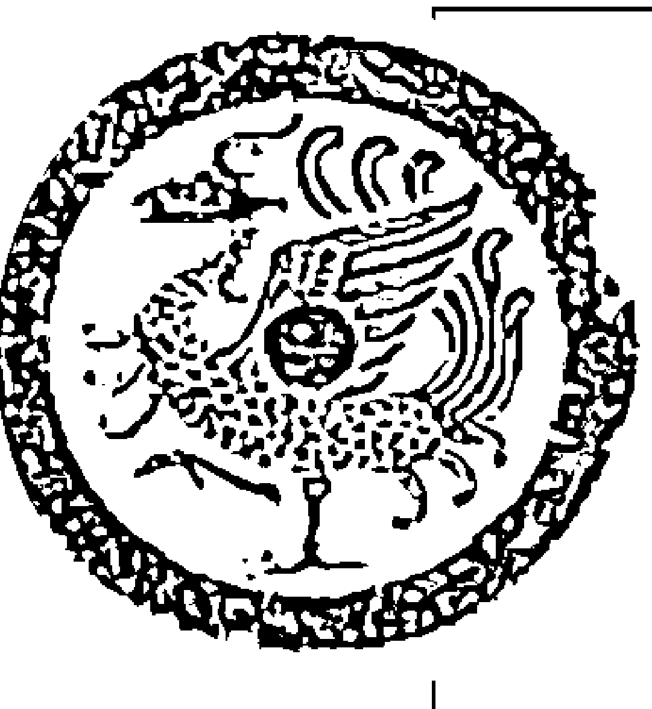

| 躔宿 | 推论 | 躔宿 | 推论 |
| :--- | :--- | :--- | :--- |
| 井 | 少年登科，一生荣贵。 | 张 | 福寿康宁，儿孙兴旺。 |
| 鬼 | 官居将相，辅佐明君。 | 翼 | 家道昌盛，金玉满堂。 |
| 柳 | 度十三宜，度十四凶。 | 轸 | 财多名显，唯恐灾病。 |
| 星 | 声名远播，官禄亨通。 | | |

## 【白话提要】

此处歌诀所描述的是木星居于二十八宿的吉凶情况，一般木星居于氐宿、牛宿、虚宿、危宿、奎宿、娄宿、轸宿，皆凶，居于其余宿度则吉。

## 7. 岁星照宫 琅玕经：木星照临十二宫

## 【原文】

### 木命宫

木照人聪敏，艺术及文才，利官俱有益，春遇至恩该，行事人难损，逢危自脱灾，声名终有遇，衣禄晚年来。又曰：木星入命最为奇，问世文章众所知，三主官星俱不背，他时身到凤凰池。木乃慈惠仁德，命宫逢之必贵。

### 木财帛：

木星好庙更临财，一世荣华少有灾。更得善星居上下，虽然运蹇福还来。若与财帛主相生，主大富更招外财。

### 木兄弟：

兄弟宫中木照时，吉星遇着甚相宜。假饶雁序恩情断，只恐中间恶曜随。有吉星和顺凶星主分散。

### 木田宅：

木星得入四宫中，可见无灾喜庆重。田宅昌荣须守祖，不逢破败福丰隆。逢破败劫杀减半。

### 木男女：

木星子位主三人，吉宿同宫产俊英。凶曜若来相克陷，恐忧初子损其身。若木为男女，主忌金煞相逢。

### 木奴仆：

第六宫中如见木，决主一生无寸禄。只因吉曜在闲宫，总有衣食妻无福。吉星不宜在奴宫。

### 木妻妾：

第七宫中木宿游，聪明典雅备祥休。更饶娶得高贤妇，偕老同心到白头。木主仁故主妻贤。

### 木疾厄：

木星解散照其宫，且免平生患难凶。财禄更招多润泽，堂堂人品赛终童。

### 木迁移：

木星得地九宫存，三方傍照命宫门。更得高高明健处，荣迁真得贵人尊。

# 木星照临身命十二宫

身命十二宫代表着一个人命运的各个方面，也是星命学占断的一个基本条件。五星照临十二宫各有所主，有着不同的命运推测。其中木星照临十二宫推断如下表所示：

| 木星照临命宫 | |
| :--- | :--- |
| **形貌** | 好容貌，柔和白净，身材清瘦。 |
| **才华** | 聪明，有文采或有艺术才华。 |
| **性情** | 仁慈，有品德，温良恭俭，识大体。 |
| **官运** | 官居五品，如与金星同宫，自然显达。 |
| **财运** | 衣食丰足。木星顺旺则富贵，逆留则财薄，如与日月同宫，足禄多财；入土宫则能广置田园。 |
| **寿命** | 长寿。但如遇火星，则短寿。 |
| **灾厄** | 一生无凶灾，均可化险为夷。 |

| 财帛宫 | 命宫 | 相貌宫 | 福德宫 |
| :--- | :--- | :--- | :--- |
| 一生财帛丰足，财物积聚，堪称至贵。 | 才貌双全，财官两旺，长寿无灾。 | 相貌堂堂，大腹便便，有道德，好交友。 | 一生没有阻滞，贵人相助，安康丰泰。 |
| 兄弟宫 | | 官禄宫 |
| 兄弟三人，上下和睦，但如伏逆留，则无兄弟。 | | 少年登科，一生禄高官显，衣食丰足。 |
| 田宅宫 | 迁移宫 |
| 谨守祖业，广置田宅，父母均吉。 | 凡有所谋，吉无不利。 |
| 男女宫 | 奴仆宫 | 妻妾宫 | 疾厄宫 |
| 子孙男少女多，男子聪明，女子有德。 | 本身命运不好，但能得子孙、奴仆的帮助。 | 妻子容貌姣好，夫妻百年偕老。 | 一生无疾病之忧，无不测之灾祸。 |

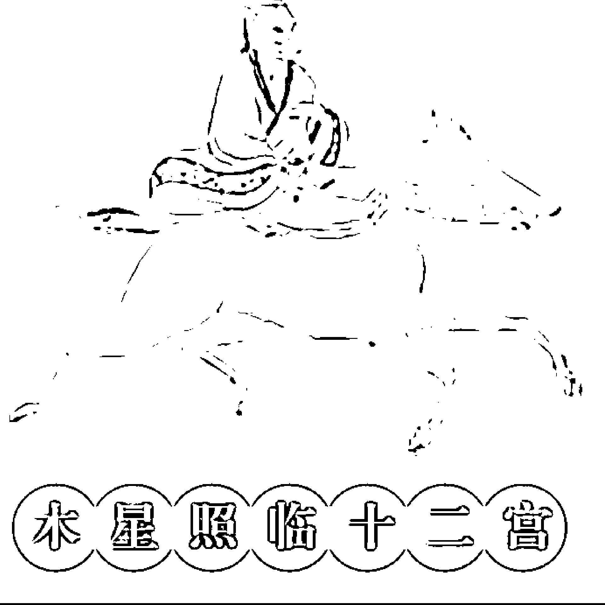

旺相之地主如是也。

### 木官禄：

第十宫中见木星，平生衣禄享生成。文章华丽人皆仰，甲第高登位九卿。
官禄高强之宫，主有大文手段。

### 木福德：

木星一曜最尊崇，下照当生福德宫。经史优游多博学，不劳跬步至三公。
木星居诸星之首，主清秀多文。

### 木相貌：

木宿如临相貌宫，清奇古怪好相逢。闻诗闻礼多贤雅，不作郎官作相公。
主人身长秀丽。

## 【白话提要】

一般木星居于命宫、财帛宫、妻妾宫、疾厄宫、官禄宫、福德宫、相貌宫，皆吉；木星居于兄弟宫逢吉星则吉，遇凶煞则凶；木星居于田宅宫，逢破败、劫煞则福力减半；木星居于男女宫，忌与金煞相逢。木星居于奴仆宫，则必凶。

# 第九章

# 三辰通载·荧惑：火星吉凶断

## 1. 荧惑算法 火星篇：火星的定度法

> 【原文】

置积日数加二百二十二日，以七百六十九日九十二分九十六秒为伏见留，退一终之数除之，不满者为余日，看有多少下，太阳中定星加以周天，以余日数去之，看在何段便知定度所在。约二年行一小周天。

- 晨伏：七十一日行，五十一度去日二十度，晨见东方。
- 顺：三百八十日行，六百十四度九十分。
- 留：八日不行。
- 晨逆：三十日九十八分四十八秒行，八度五十五分六十八秒。
- 夕逆：三十日。
- 顺：二百八十日
- 夕伏：七十一日行度并同前。

> 【白话提要】

此处是对火星定度的计算。“积日数”，即星算学中的太初元历起始至作者著书的年数；“加二百二十二日”，则是一个调整误差的常数；“七百六十九日九十二分九十六秒”，则是指火星伏、见、留、退的运行周期。

自“晨伏七十一日”以后的内容，则详细说明了火星伏、见、行、留、退的具体时间。

## 2. 荧惑总论：概述火星之运行规律

【原文】
火星南方执法之象，行度有晨夕，伏退留顺迟疾，天蝎卯上为本宫。自心宿二度至三度为正庙，至房宿四度为偏庙，自斗宿十八度至牛宿初度为正旺，生时遇之主有重权，躔尾室觜翼四宿为升殿，白羊戌上奎宿为乐。
若人身命及七强宫值之，更遇庙旺则为福，德生人为忌星。夜生人为喜曜不可执为凶，星如夜生人更庙旺或为禄，主当有聪明，特达显宦。
忌西没酉宫，与罗计孛同宫，主人凶暴，天促与木气。同宫则吉，女人为夫星，六丙人为囚星，六甲生人为天禄。此星顺行而明为福，入留号天虹星招火灾，入逆号天坎星主瘟疫，入伏号走曜主暴灾厄。

【白话提要】
火星主礼，居于南方，有执法的形象。火星的行度有晨夕伏退留顺迟疾等运行状态，天蝎座卯宫为火星的本宫。自心宿二度至三度，属于火星的正庙；心宿三度至房宿四度属于偏庙，自斗宿十八度至牛宿初度为正旺。火星居于尾室觜翼四宿，为升殿；白羊座戌宫奎宿为火星的乐宫。

## 3. 荧惑歌断 源髓歌：火星星曜属性

【原文】
荧惑之星本日余，须分昼夜别贤愚。夜生阴位兼逢庙，面见微黄眉又疏。
有武艺，会兵书，言辞快猛气豪粗。形神上小下须大，只好一身系武居。
权握重，掌兵机，生来财物又居储。惟怕昼生阳宫分，面生权骨恶肌肤。
眼大性刚多燥暴，常怀气概立身躯。不招祖业资财散，博弄经纪及宰屠。
逢日月，事何如，爹娘早死莫嗟吁。木来俱备文兼武，土主英雄乱世徒。
若会金星淫更佚，招妻产难定呜呼。同水孛，好穿窬，若逢计宿更遭诛。
天首武臣高贵位，如临紫气号师巫。居财帛，财帛虚，三宫兄弟主流徒。
四位祖居多破荡，六宫失火是家奴。五位男女须恶死，七宫妻妾亦先殂。
疾厄瘟黄腰背曲，迁移商贾外州居。官禄位，好忧虞，血光刑狱事区区。
福德宫中人促寿，貌宫十相不全俱。微妙经书无价宝，珍藏待价莫轻诸。
天首谓罗睺星也。

【白话提要】
火星为太阳的余气，应当根据其人是白天出生还是夜间出生来判断贤良与愚钝。如果其人为夜间出生，并且火星居于阴位又逢庙旺，则其人武艺高强，握有兵权，属于富贵命。如果其人为白天出生，火星居于阳宫，则为不吉。

## 4. 荧惑交会 率斯经 ：火星与诸星相遇的吉凶

## 【原文】

**火土：**
火土同宫主性凶，夜荧昼土福偏隆。强宫得地兼行顺，万户侯封食万钟。
火土相会有相生之义，故主富贵。

**火金：**
从来荧惑怕伤金，共照阴阳必主淫。更有恶星刑战着，不过强仕即悲吟。
金忌火伤，火旺金衰，金必受制，故不利。

**火水：**
火星逢水自相刑，怕在阳宫与昼生。不满三旬防横死，若能知命学修行。
火与水本相克火，岂能胜之。有土则解。

**火气：**
火星紫气最廉平，百六逢之处福龄。逢生必是人间瑞，龙凤丛中第一人。
火主文明，气主清高，必能富贵。

**火孛：**
荧惑最能诛孛彗，除扫欃枪为庆瑞。官荣上爵秉威权，百六逢之为富贵。
欃枪，孛之异名最能为祸，除之则太平。

**火罗：**
火星最忌见罗睺；害义伤廉大可愁。兵火焚烧遭劫掠，金珠丰粟总无留。
火与罗睺一气之星遇之，如二虎岂得福乎。

**火计：**
火星最忌会计都，令人风疾怪形躯。如逢百六多才学，不向封侯也被诛。
计乃天尾星与罗睺相对。

## 【白话提要】

火星与土星同宫，主其人生性凶残，喜好杀人害人。土星作为命主，并且其人白天出生；或者火星是命主，其人为夜间出生，则其人福气深厚。如果又是顺行本位，并且居于高强之宫，则其人可以成为万户侯。

火星与金星同宫，主其人淫荡。如果又有恶星刑克，则其人必定一生悲惨。

火星与水星同宫，最怕出现在阳宫，并且其人为白天出生，主其人不到三十岁便会夭折，只有苦修佛道才能保住性命。

火星与紫气同宫，主其人有福而且长寿。如果又遇生助之吉星，则其人必是人间之龙凤。

火星与月孛同宫，主其人必为富贵之命。

火星与罗睺同宫，主其人一生灾祸不断。

火星与计都同宫，主其人会患有风疾。如果才学出众，逢厄运则会有被诛杀的危险。

## 5. 荧惑入宫 枢要歌：火星在十二宫中的吉凶

【原文】

- **火子：**
天坎之星到宝瓶，元来是火化为名。万般施计皆沉滞，多难多灾大不情。
子宫火化为天坎星，极主迟滞。

- **火丑：**
火星牛斗名黄道，为福为祥诚是好。那更土星相会行，夫妻保守期偕老。
丑宫火化为黄道。

- **火寅：**
火居人马号天升，起处逢生福倍增。更得木星同会此，多才多艺又多能。
寅为人马，火化天升星。

- **火卯：**
火到卯宫名天乙，货财充足库箱实。若还满用入垣宫，年少成名登桂籍。
如一星有三用谓之满用。

- **火辰：**
天滞居辰是火星，一生用事百无成。若还金宿来相会，不夭须当犯国刑。
火化天滞星，主作事不成。

- **火巳：**
火居双女曰天刑，与水同行最不宁。若变刑囚千里外，不然一世苦伶仃。
巳宫属水，故火受克，主人奔荡。

- **火午：**
火居午位名天赫，此位朝君无战克。不为利禄自充盈，必定为官居显职。
午为君位，火朝君化天赫，主人丰显。

- **火未：**
天废火星居巨蟹，只愁夭丧深为害。不然多难又多灾，纵有资财多破坏。
此宫主破财灾害。

- **火申：**
火到申宫曰喜神，中年未免事无成。须教末主方宁贴，到老应知福寿身。
申乃火之喜宫，故曰喜神。

- **火酉：**
火在酉宫名黑道，纵云夜诞非为好。恶星不照吉星临，方可荣华并寿考。
酉宫火不得地。

- **火戌：**
天轨火星守白羊，一生享福吉非常。财丰禄厚无虚耗，中主荣华晚更昌。
戌为白羊火化天轨星，乃火之本宫。

- **火亥：**
火居亥上是吉星，天麽知为变曜名。不论官宫并昼夜，也须备福主丰亨。
火到此宫主人丰富，缘木有相生之理。

## 【白话提要】

此处歌诀，描述的是火星居于十二宫的吉凶状况。一般火星居于丑宫、寅宫、卯宫、午宫、戌宫、亥宫，皆吉。

# 木星入宫的推断

| 巳宫天刑 | 午宫天禄 | 未宫天废 | 申宫喜神 |
| :--- | :--- | :--- | :--- |
| 遇水星最凶，如果遭刑，则被流放千里，或者一世孤苦。 | 虽不求利禄，却自能充盈，必是官居显职之人。 | 多灾多难，即使有些家财，也会被耗尽。 | 到中年一事无成，到晚年才好，能享晚年之福。 |
| 辰宫火星 | | | 酉宫黑道 |
| 一生做事不成，如果遇金星，不是天折，就是犯罪之人。 | | | 不吉，但如有吉星照临，才能有荣华和寿命。 |
| 卯宫天乙 | | | 戌宫天轨 |
| 财物充足，如果入垣，则主年少成名，得功名。 | | | 一生享福，吉利非凡，财丰禄厚，中年荣华，晚年更昌盛。 |
| 寅宫天升 | 丑宫黄道 | 子宫火化 | 亥宫天麽 |
| 起处逢生星，则福气倍增。如与木星相会，则为多才艺之人。 | 福气吉祥，如果与土星相会，则主夫妻白头偕老。 | 事情虽经过万般计量和谋划，但仍被搁置。多灾多难。 | 吉利，一生享福，丰财亨通。 |

# 第九章 三辰通载·荧惑：火星吉凶断

## 6. 荧惑躔度 玉关歌：火星在二十八宿的吉凶

# 火星躔青龙七宿

## 【原文】

**火角：**
火躔角宿号天娼，衣食随时不善良。害子克妻婚难合，免教衣食见恓惶。
角十度、十一度、十二度凶，已前不妨。

**火亢：**
火躔亢宿号天戈，妻妾宫中有折磨。好色损妻心不定，此人衣食必奔波。
划度云亢一二三度，见火不利。

**火氐：**
火躔氐宿号天轻，衣食生来不称情。心性轻狂多胆志，晚来方可得安宁。

**火房：**
火躔房宿号天梁，官职超迁辅弼良。将相公侯名必贵，此身佩紫与金章。
房日兔之度，太阳之位，火乃太阳精必显。

**火心：**
火躔心宿号天相，统领兵机为上将。更兼枢府四十年，富贵功名彻天上。
心月狐之度卯为火位，火明天蝎。

**火尾：**
火躔尾宿号天穆，此人必定荣衣禄。安然纳福不奔驰，超腾晚景最多福。

# 火星躔青龙七宿的推论

火星躔二十八宿各有所主，躔青龙七宿推断如下：

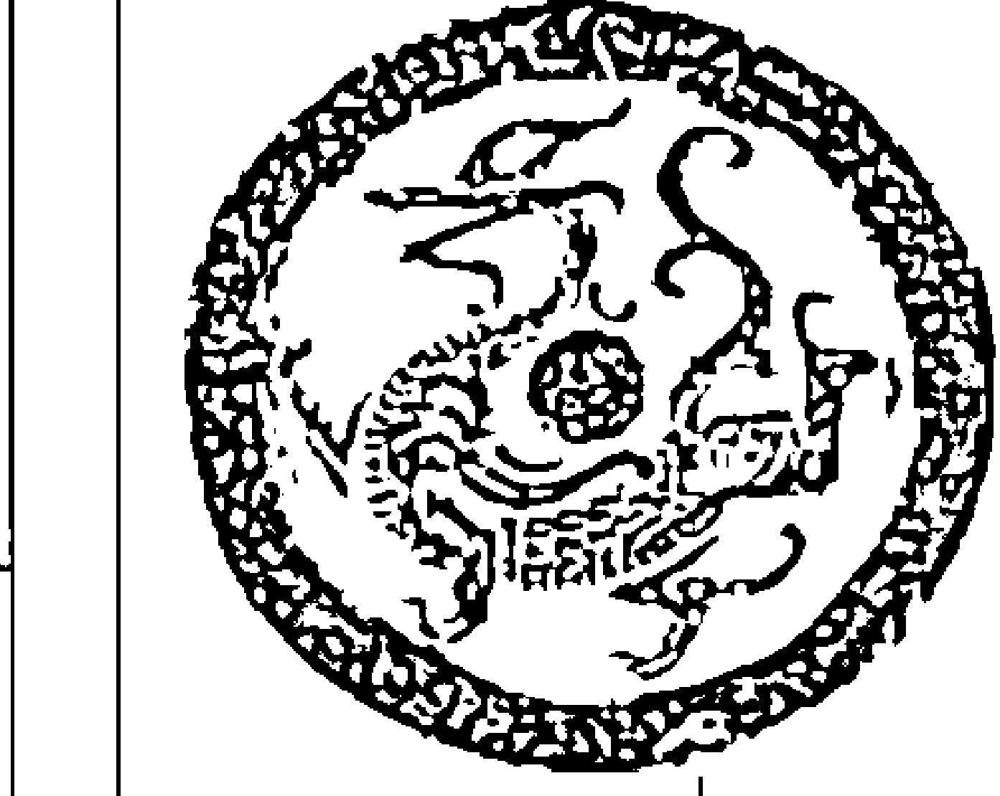

| 躔宿 | 推论 | 躔宿 | 推论 |
| :--- | :--- | :--- | :--- |
| 角 | 性情不善，克妻克子。 | 心 | 统领兵机，居功至伟。 |
| 亢 | 好色损妻，一生奔波。 | 尾 | 衣禄无忧，晚年多福。 |
| 氐 | 心性轻狂，衣食有忧。 | 箕 | 做事机灵，担当大任。 |
| 房 | 官至辅宰，雄才大略。 | | |

尾火虎火之本度。

**火箕：**
火躔箕宿号天明，作事机权性最灵。为官必得君王宠，大任终当领万兵。
箕水度本与火不合，寅木生火故荣。

# 火星躔玄武七宿

## 【原文】

- **火斗：** 火躔斗宿号天征，生杀之权有大声。禄旺中年主富贵，三公位至播芳名。
  斗木獬度，木乘火旺，则有施为。
- **火牛：** 火躔牛宿号天朽，先代家资尽灭亡。形貌魁梧多智勇，此生终美少年郎。
  牛金牛之度，火与金有相害，故少吉。
- **火女：** 火躔女宿号天暗，多成多败心狂乱。若非木旺在宫扶，六亲害尽资财散。
  女土蝠将近坎位，火亦不明。
- **火虚：** 火躔虚宿号天磨，贫困初年财不多。心爱是非耽女色，更添女子不相和。
- **火危：** 火躔危宿号天淋，好色贪花智勇深。破祖离家自成立，施恩终是福重兴。
  危月燕太阴之度，故有好色贪花句。
- **火室：** 火躔室宿号天强，勇智操持武职良。更得木星来资助，定须学馆作文章。

# 火星躔玄武七宿的推论

火星躔二十八宿各有所主，躔玄武七宿推断如下：

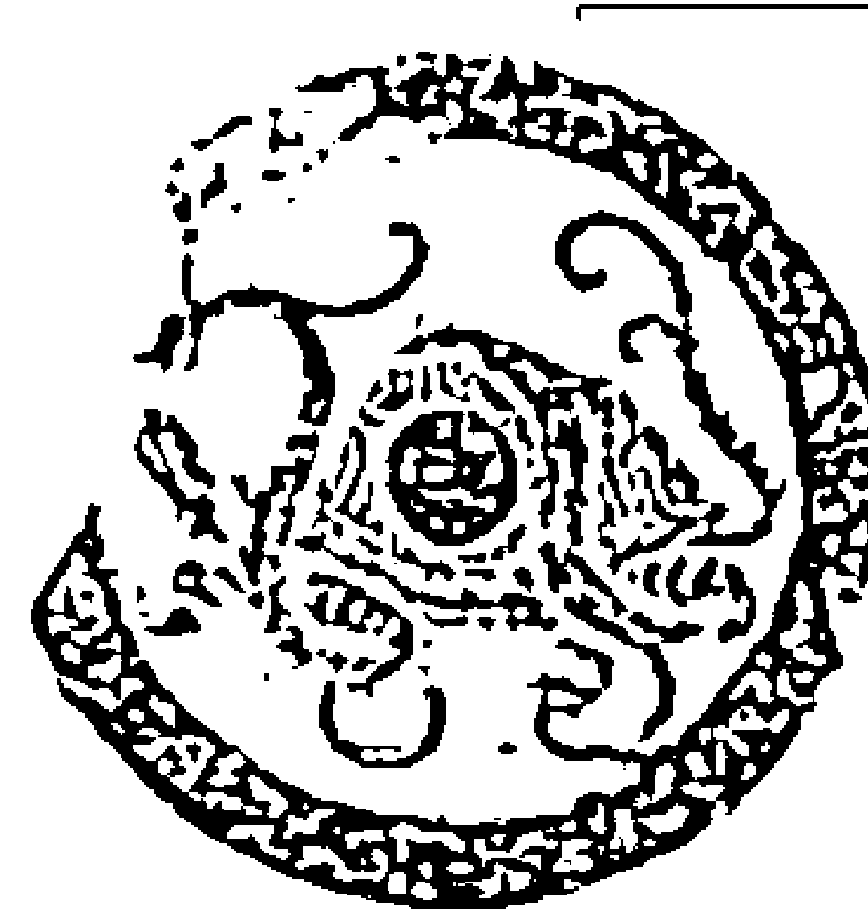

| 躔宿 | 推论 | 躔宿 | 推论 |
| :--- | :--- | :--- | :--- |
| 斗 | 中年富贵，三公九卿。 | 危 | 智勇好色，自己创业。 |
| 牛 | 形貌魁梧，祖业败落。 | 室 | 智勇双全，担任武职。 |
| 女 | 心性狂乱，家散财失。 | 壁 | 孤苦伶仃，晚年稍安。 |
| 虚 | 早年贫困，耽于女色。 | | |

室火猪度，遇木有相资之义。

**火壁：**
火躔壁宿号天灭，兄弟儿孙道路绝。伶仃孤苦万千般，晚景稍可身安悦。壁水蝓度水火本不合，安得有荣乎。

# 火星躔白虎七宿

> 【原文】

**火奎：**
火躔奎宿号天厨，衣禄生来自有余。勇义智高才学美，威名应许达皇都。
奎木狼度，能助火之威。

**火娄：**
火躔娄宿号天旸，命里逢之出外襄。恩德又施兼有道，渊源学向翰林场。
娄金狗度，火之本宫，故不克主吉。

**火胃：**
火躔胃宿号天没，定是终身无子息。中间困苦又艰难，奔走东西漫劳役。
胃土雉度，火旺于戌，胃四度至酉皆不利，惟火罗吉。

**火昴：**
火躔昴宿号天镂，身寒身孤性又愚。贪酒多淫心不足，到头衣食亦无余。
昴日鸡太阳之度，酉乃金旺、火必有损。

**火毕：**
火躔毕宿号天危，身见灾厄必损妻。破荡家赀游冶客，赀财耗尽走东西。
毕月乌之度为天危，毕星好雨则伤火。

**火觜：**
火躔觜宿号天淫，风花雪月四时行。浮泛自然家业破，奔驰晚岁始身荣。

# 火星躔白虎七宿的推论

火星躔二十八宿各有所主，躔白虎七宿推断如下：

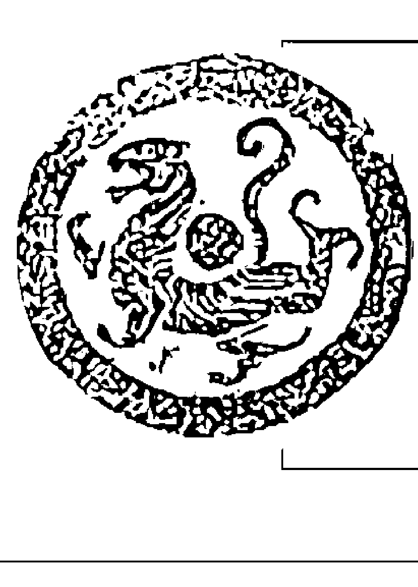

| 躔宿 | 推论 |
| :--- | :--- |
| 奎 | 才艺高超，名传京师。 |
| 娄 | 学问渊博，列于翰林。 |
| 胃 | 没有子息，奔走东西。 |
| 昴 | 性情孤僻，贪恋酒色。 |
| 毕 | 妻子有损，家业破败。 |
| 觜 | 家业败落，晚年始吉。 |
| 参 | 性情暴躁，心灵手巧。 |

# 火星躔朱雀七宿

火参：
火躔参宿号天枢，火性颠狂好损身。工巧细心兼有志，做些阴骘与儿孙。
参乃申宫水主之，火不能胜之。

火井：
火躔井宿号天枢，智慧威严胆气雄。衣食平平人命寒，晚年方始见亨通。

火鬼：
火躔鬼宿号天祥，家富因何乏子郎。只怨天年多夭折，不然恶死没家乡。
鬼金羊之度，因火克之。

火柳：
火躔柳宿号天池，多虑多疑多是非。克子克妻兄弟绝，平生衣食却随时。

火星：
火躔星宿号天荣，必定前程有大声。更得十宫星得力，为官稳稳到公卿。
星日马太阳之度，火到此度，定主荣华。

火张：
火躔张宿号天颉，汨没平生难共说。若非寿夭二亲亡，克子伤妻兄弟缺。

火翼：
火躔翼宿号天怜，心性猖狂学有成。智术多端加嗜欲，生平衣食主多情。
翼火蛇火之本度，谓之性恶。

火轸：
火躔轸宿号天暴，手足风狂多颠倒。晚年衣食稍平安，只恐妻儿命难保。
轸属水火化暴星，其性急而多凶。

# 火星躔朱雀七宿的推论

| 躔宿 | 推论 | 躔宿 | 推论 |
|------|------|------|------|
| 井 ▷▷ | 智慧威严，平凡一生。 | 张 ▷▷ | 冲克家人，或多夭折。 |
| 鬼 ▷▷ | 家富少子，恐多夭折。 | 翼 ▷▷ | 心性猖狂，衣食无忧。 |
| 柳 ▷▷ | 性情多疑，冲克家人。 | 轸 ▷▷ | 少年轻狂，晚年稍安。 |
| 星 ▷▷ | 前程远大，可至公卿。 |  |  |

## 【白话提要】

此处歌诀所描述的是火星居于二十八宿的吉凶情况。一般火星不宜躔于角宿、亢宿、氐宿、牛宿、女宿、虚宿、壁宿、胃宿、昴宿、毕宿、参宿、鬼宿、柳宿、张宿、翼宿、轸宿，其余皆吉。

## 7. 荧惑照宫 琅玕经 ：火星照临十二宫

## 【原文】

火命宫：
火照命宫中，心明气量洪，倚公成附势，烦剧立身躬。
财利初年散，成家未及终，若能行顺旺，权重禄财丰。
火在命宫，主人躁急，限到。
又曰：
身命宫中遇火星，此人躁急性聪明，平生喜怒真难测，凡事须教立便成。

火财帛：
火居财帛旺初年，中主交时恐不坚。若得善星同到此，末年退后又团圆。
有吉扶限平稳。

火兄弟：
火临兄弟事如何，争竞纷纷惹祸多。亲戚有恩还反目，自然手足不相和。
主兄弟凶狠。

火田宅：
火宿加临第四宫，祖基破尽受贫穷。若是庙方当发福，不然孤苦一生中。
不受祖业火性炎上之势、久成灰烬。

火男女：
火若来临第五宫，此星刑克最为凶。假饶嗣主居庙旺，必产奇男一二龙。
火在男女宫，火数二、主生二子。

火奴仆：
六位如逢火宿来，害刑牛马定多灾。屯殃变异起奴仆，得地专权自剧裁。
主奴仆性高，则有欺主之故。

火妻妾：
火入妻宫定克妻，高强非忌作珍奇。女人以火为夫位，祸福同源一例推。
男以金为妻，女以火为夫。

火疾厄：
火星八位忧血难，灾来非命祸难禁。腰驼背曲缺唇齿，恶杀不临厄减轻。
若无煞星同宫，其祸略可。

# 火星照临身命十二宫

五星照临十二宫各有所主，其中，火星照临十二宫推断如下表所示：

### 火星照临命宫

- **形貌**：有枕骨，先瘦后肥。
- **才华**：多学少成，善于医卜。
- **性情**：性情耿直，急躁好胜，好大喜功，得志时能宽宏大量，失志时则偏执急躁。
- **官运**：有胆识，能掌权，但遇顺境则喜，遇逆境则性情躁怒。
- **财运**：早年散尽家财，如行顺旺，遇财禄，则可富足。

### 火星照临十二宫

| 宫位 | 解释 | 宫位 | 解释 |
|---|---|---|---|
| **财帛宫** | 初年兴旺，中年衰败，遇吉星方吉。 | **命宫** | 急躁聪明，喜怒无常，不爱拘束。 |
| **相貌宫** | 身材瘦小，面貌丑陋。 | **福德宫** | 衣食丰足，但易招人陷害。 |
| **兄弟宫** | 兄弟虽多，但多纷争，不得助力。 | **官禄宫** | 受人连累，做官而有刑狱之灾。 |
| **田宅宫** | 难以倚靠祖业，需自力更生。 | **迁移宫** | 居处不定，不宜守居祖业。 |
| **男女宫** | 主生双胞子，并得二子赡养。 | **奴仆宫** | 变起奴仆，擅自专权。 |
| **妻妾宫** | 夫妻生离远别，男克妻，女克夫。 | **疾厄宫** | 有疮疥之疾，需谨防遭受火灾。 |

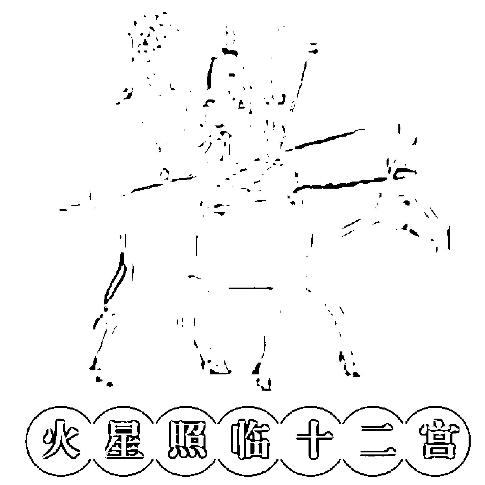

## 古今图书集成白话图解·星命 卷七 三辰通载（上）：五星论断篇

火星迁移：
火星照位入迁移，迁变东西土产移。家舍亦须防火厄，末年有屋可安居。
主不安，谓火旺动摇。

火星官禄：
火星凶焰入官宫，仕列铨曹少始终。若是变为官禄主，会看附凤与扳龙。
官禄为强宫，故火附其势。

火星福德：
荧惑来临福德宫，夜生庙旺福丰隆。若值昼生逢水克，定须破败受贫穷。
火夜则明，惟夜生人主福。

火星相貌：
火居相貌性刚强，惹祸兴灾果异常。若得吉神为救助，逢人礼貌把名彰。
主人形上尖下阔，以礼待人。

## 【白话提要】

一般火星守照命宫、财帛宫、福德宫，皆吉。火星守照田宅宫，如果为庙旺之地，则发达有福气；火星守照男女宫，如果没有刑克之星出现，并且命主居于庙旺之地，则必得贵子；火星守照妻妾宫，如果居于高强之位，则不会克妻，反而会极其和美；火星守照官禄宫，如果成为官禄宫的主星，则必有攀龙附凤的贵命；火星守照福德宫，如果居于庙旺之地，并且其人为夜间出生，则必定会福气深厚；火星守照相貌宫，如果有吉星救助，则主其人守礼而有好名声。

# 第十章

# 三辰通载·镇星：土星吉凶断

## 1. 镇星算法 土星篇：土星的定度法

【原文】
置积日减二百六十四，以三百七十八日九分二十三秒为伏见，留退一终之数除之，又下太阳中定星内加一周天，以余日数去之。

- **晨伏**：二十一日七十五分。
- **顺**：八十三日行七度十一分。
- **留**：二十三日不行。
- **晨退**：五十一日二十九分六十一秒半行三度四十二分五十四秒半。
- **夕退留**：三十日不行。
- **顺行**：八十三日。
- **夕伏**：二十二日七十五分又与日合。

【白话提要】
此处是对土星定度的计算。“积日数”，即星算学中的太初元历起始至作者著书的年数；“减二百六十四日”，则是一个调整误差的常数；“三百七十八日九分二十三秒”，则是指土星伏、见、留、退的运行周期。
自“晨伏二十一日”以后的内容，则详细说明了土星伏、见、留、退的具体时间。

## 2. 镇星总论：概述土星之运行规律

## 古今图书集成白话图解·星命 卷七 三辰通载（上）：五星论断篇

【原文】
土星中央镇星，女星之象，行度有晨夕，伏退留顺疾迟在摩羯为本宫。自斗宿十度至二十一度为正庙，躔氐女胃柳四宿为升殿，宝瓶宫危宿为乐天，秤宫亢宿四度至七度为旺，生时遇之，主有重权。
若日生人，身命二宫值之，更在阳宫，主性厚重，为贤德君子，职清品贵，七宫遇之尤吉。忌计罗火孛同宫。夜生人为忌曜，六庚生人为囚星，六戊生人为天禄。此星又名地罗·；入伏为瘟星，入逆为破家星，在土宫为奸星，其行最迟二十八年一周天。

【白话提要】
土星居于中央，有坐镇与女性的形象。土星行度有晨夕伏退留顺疾迟等运行状态，土星居于摩羯宫为进入本宫。自斗宿十度至二十一度，属于正庙；居于氐女胃柳四宿，属于升殿；宝瓶宫危宿为乐宫；天秤宫亢宿四度至七度为旺宫。生时土星居于本宫、庙乐旺等地，主其人手中握有重权。

### 3. 镇星歌断 源髓歌：土星星曜属性

【原文】
镇宿本生成己位，安静为尊象厚地。昼生惟爱在阳宫，相貌之宫主大鼻。
少言语，多悭细，硬直心肠有胆气。顺行度分庙宫中，土地旌旗必雄贵。
掌握资财有福人，只怕夜生反为忌。留与逆，尤可畏，刑克阴宫身更瘁。
不招祖业与资财，四体多从苦憔悴。居官恶处立其身，博弄操刀能干利。
夜生人，与日会，克了尊尊难躲避。太阴母位不坚牢，若在下弦目障翳。
木来必定主文章，火会远行千里余。金若来，妻早弃，水星忌与刑同类。
若逢紫气懒慵人。孛对双盲难看视，首同阴位法场终，尾会腰驼并背曲。
临财应有外乡财，三位徒流为昆季，田宅宫，家易退，子息虽多不成器。
居奴仆引盗来偷，西没主妻先作祟，疾厄宫，伤脾胃，痛疡风邪堪惊悸。
迁移作客盗贼侵，官禄重重主官事。福宫昼见相貌位，自是英雄多胆志。
须知此诀不寻常，后学得之莫道易。
尾谓罗星，首谓计星，西没者妻宫也。

【白话提要】
土星本出现于戊己中央之位，性情安定，是除了天以外最尊贵的形象——肥沃深厚的大地。白天出生的人，土星最好居于阳宫。土星居于相貌宫，主其人鼻子高大，平时不爱多说话，小心细致，心直性硬，有胆量。土星顺行并且居于庙旺宫度，则其人必定富贵，只是其人如果夜间出生，则反而不吉。土星忌怕出现留滞与逆行的运行状态，或者遭遇刑克也会不吉。

### 4. 镇星交会 辜斯经 ：土星与诸星相遇的吉凶

## 【原文】

- **土金：**
  土星若也会金星，妻妾荣华福禄真。一跃龙门能变化，九州人物更多能。
  土与金会能生金，男以金为妻，故云妻妾之荣。
- **土水：**
  土星若与水星同，举世孤高胆志雄。秉节挥戈文武备，福临百六庆无穷。
  有止水之功。
- **土气：**
  土星紫气喜相依，冠冕荣身职位巍。丹赤忠心刚且毅，德施万里足光辉。
- **土孛：**
  镇星不要会孛抢，百六逢之祸害长。僻疾怪形须至孽，慵奴群小疾生殃。
- **土罗：**
  土星专恶会罗•；百六天灾大可愁。人遇一生多困苦，瘟疫病染坐亡囚。
- **土计：**
  土宿计都不可逢，人生浅薄更颛蒙。诛徙溺水兼痛患，百六天灾万种凶。

## 【白话提要】

土星与金星同宫，主其人福禄深厚，妻妾皆可享受到荣华富贵，有成为极贵之命的可能。
土星与水星同宫，主其人卓然独立，志高胆大，文武双全。
土星与紫气同宫，主其人拥有高官厚禄，并且赤胆忠心，刚毅正直。
土星与月孛同宫，主其人会灾祸不断，形象丑陋，最终会因病而亡。
土星与罗•同宫，主其人常逢厄运，一生穷苦。如果坐于休囚之宫，则会身染瘟疫而亡。
土星与计都同宫，主其人福德浅薄，生性愚昧，不是溺水而亡，就是身患痛病，或者是受诛杀，或者是遭受流放之刑。

### 5. 镇星入宫 枢要歌：土星在十二宫中的吉凶

【原文】

- **土子：**
  土居齐分号天元，寿算绵长福禄全。第七宫中如值此，荣妻益子福绵绵。
  子宫土之乐。

- **土丑：**
  土到丑宫名印绶，珍珠财宝多般有。此宫庙旺最为佳，纵是夜生为福寿。
  土之本位得为满、用岂不福。

- **土寅：**
  土入寅宫曰贵人，此宫不喜木相亲。只愁变作刑囚耗，晚主多灾更滞•：
  化为贵人，星主先贫后富。

- **土卯：**
  土居卯位号天冲，与火相逢亦庆隆。只恐六壬人值此，遭刑受害命须终。
  冲者涌摇之象。

- **土辰：**
  土曜居辰名太极，喜在亢宫依郑国。此为入庙最荣华，日诞夜生俱有益。
  辰乃土之乐旺、主荣华。

- **土巳：**
  土居双女非为吉，本主逢之怎奈何。更逢吉宿也多灾，若不遭刑须夭折。
  巳宫化天魔星，主人夭折。

- **土午：**
  天道元来是土星，太阴会此倍精神。纵云夜诞仍为福，日里生人大贵荣。
  化天道星主喜。

- **土未：**
  土入未宫名四镇，福多禄厚家丰盛。太阴若也与同行，不是望宵终有庆。

- **土申：**
  申宫土号福生星，本主同乡禄自成。更有官星相会聚，名彰声显贵还荣。
  申乃长生之位。

- **土酉：**
  土居酉位号天沐，虽是败宫须享福。不宜火曜共同行，少年不享人间禄。
  土败于酉故云寿短。

- **土戌：**
  土居戌位号天关，一世优游得自闲。只恐水星相会遇，终身不免受艰难。
- **土亥：**
  黑符亥上不为荣，实号俱无只有名。不是外居并外发，也须先败后方成。
  主先凶后吉。

### 土星入宫的推断

| 巳宫天库 | 午宫天道 | 未宫四镇 | 申宫福生 |
|----------|----------|----------|----------|
| 不吉，即使遇吉星也多灾，遇凶星则会夭折。 | 与太阴相会，则更为吉。即使是夜生也是福，昼生人则大贵。 | 福多禄厚，家资丰盛，与月亮同行，则终有吉庆。 | 不愁官禄，如遇官星，则声名彰显，富贵还家。 |
| **辰宫太极** 荣华之至，昼生夜生都可享福。 |  |  | **酉宫天沐** 能享福，但不宜与火星同行，否则少年难享人间之福。 |
| **卯宫天冲** 吉象，与火相逢也为吉象。 |  |  | **戌宫天关** 一世清闲自得，但如遇水星，则不免受灾难。 |
| **寅宫贵人** 不喜木星，晚年多灾。 | **丑宫印绶** 富贵无比，即使夜生也如此。 | **子宫天元** 寿命绵长，福禄双全，妻荣子贵，福气绵绵。 | **亥宫黑符** 有名无实，不是在外流转发达，便是先败后成。 |

## 【白话提要】

此处歌诀，描述的是土星居于十二宫的吉凶状况。一般土星居于子宫、丑宫、辰宫、午宫、未宫、申宫，皆吉。

### 6. 镇星躔度 玉关歌：土星在二十八宿的吉凶

# 土星躔青龙七宿

【原文】

土角：
土躔角宿名天寿，盖世文章冠魁首。经纶事业富胸襟，不是公卿主富有。
角属木土有资培之功，故曰寿。

土亢：
土躔亢宿号天仁，博厚文章达帝京。廊庙之中官极贵，蛮夷安镇得清平。
亢乃金度土遇之，有生养之义。

土氐：
土躔氐宿号天牢，命限逢之孤且高。年少定应伤骨肉，中年荣贵免煎熬。
氐土貉土之本殿。

土房：
土躔房宿号天信，少年作事苦劳神。语言诚实行人多厚，男女难招食贵人。

土心：
土躔心宿号天忌，情性迟疑最有灵。疾病缠身虽天寿，全无义气性慵平。
主人性懒心慵、多病痴愚。

土尾：
土躔尾宿号天奇，百六逢之必有依。若是忌星须促寿，又须参考本根基。
尾火也火土有相依之象。

土箕：
土躔箕宿号天彬，衣食丰隆却称情。官位若逢贵星照，国家掌判有声名。

# 土星躔青龙七宿的推论

土星躔二十八宿各有所主，躔青龙七宿推论如下：

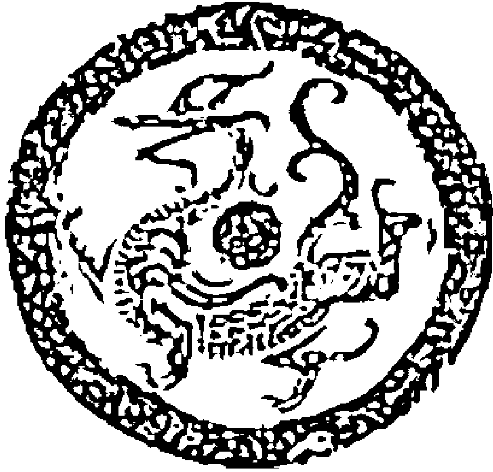

| 躔宿 | 推论 | 躔宿 | 推论 |
| :--- | :--- | :--- | :--- |
| 角 | 文章盖世，满腹经纶。 | 心 | 性情迟钝，多灾多病。 |
| 亢 | 官位极高，安镇四海。 | 尾 | 百六有依，忌星夭寿。 |
| 氐 | 性情孤高，少伤亲人。 | 箕 | 衣食丰足，逢贵得官。 |
| 房 | 少年劳苦，说话诚信。 | | |

# 土星躔玄武七宿

## 【原文】

- **土斗：** 土躔斗宿号天枢，事业文章富有余。台鼎任中朱紫贵，定须象简与金鱼。
- **土牛：** 土躔牛宿号天侗，心性温和衣禄丰。若是夜生多寒滞，身多下贱处贫穷。牛，金牛，土能生之，昼生人多吉。
- **土女：** 土躔女宿号天常，柔顺机谋足食粮。劳力经营心有虑，生来只恐父先亡。
- **土虚：** 土躔虚宿号天冠，好乐之宫出贵官。四九度中登宰辅，重金重紫列朝班。土乐之宫，更虚日度，得朝阳也。
- **土危：** 土躔危宿庙堂窠，禄厚财丰事不讹。举措施为多利便，言柔语顺性温和。
- **土室：** 土躔室宿名天伏，福厚财丰衣禄足。多男多女有资财，家道安然富金谷。金谷晋石崇之园名，其中花草珍奇异物，皆富有也。
- **土壁：** 土躔壁宿号天异，禄马丰盈有权位。身名远播定安荣，官禄吉星宜大贵。

# 土星躔玄武七宿的推论

土星躔二十八宿各有所主，躔玄武七宿推论断如下：

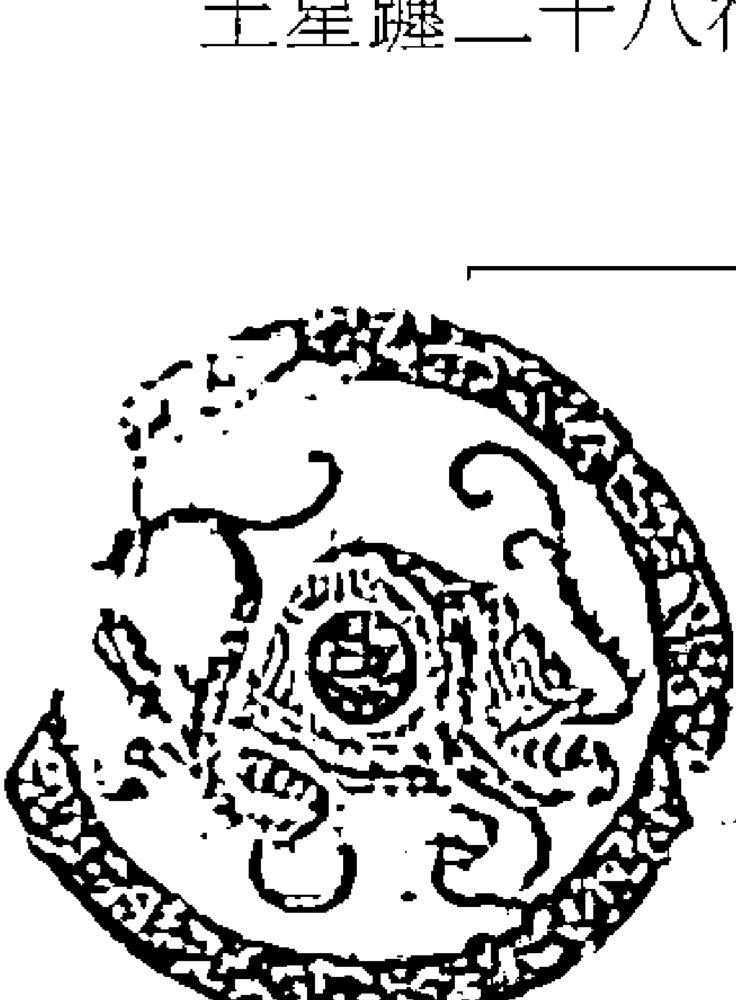

| 躔宿 | 推论 | 躔宿 | 推论 |
|------|------|------|------|
| 斗 | 文采有余，地位高显。 | 危 | 禄厚财兴，凡事皆成。 |
| 牛 | 心性温和，衣禄丰足。 | 室 | 福厚财丰，家道富足。 |
| 女 | 劳心劳力，父亲早亡。 | 壁 | 声名远播，一生平安。 |
| 虚 | 官至辅宰，位列朝班。 |    |    |

# 土星躔白虎七宿

【原文】
土奎：
土躔奎宿号天津，贫贱奔波损父娘。若是中年贫苦至，晚年方可足衣粮。

土娄：
土躔娄宿号天骋，土娄须要木相逢。娄木虽高非土壮，刀枪之下走西东。

土胃：
土躔胃宿号天磨，财物充盈满仓库。难婚终是少男儿，不贵仍须还大富。
胃土雉度土之类，主有积也。

土昴：
土躔昴宿名天伏，平生须食贵人禄。多因胥吏得荣名，将相声名人畏服。
昴日度太阳也，伏者潜藏之象。

土毕：
土躔毕宿号天回，能通经术足钱财。中年便得文章力，必主儿孙擅大才。

土觜：
土躔觜宿号天模，父母先亡身早孤。衣食平平身泪没，此身应懒读诗书。
觜火猴度，主人性急身懒。

土参：
土躔参宿号天津，立世经营世未兴。男女尤为行路客，贵人得禄一番新。
参水猿度，主人蹇涩不通。

# 土星躔白虎七宿的推论

土星躔二十八宿各有所主，躔白虎七宿推断如下：

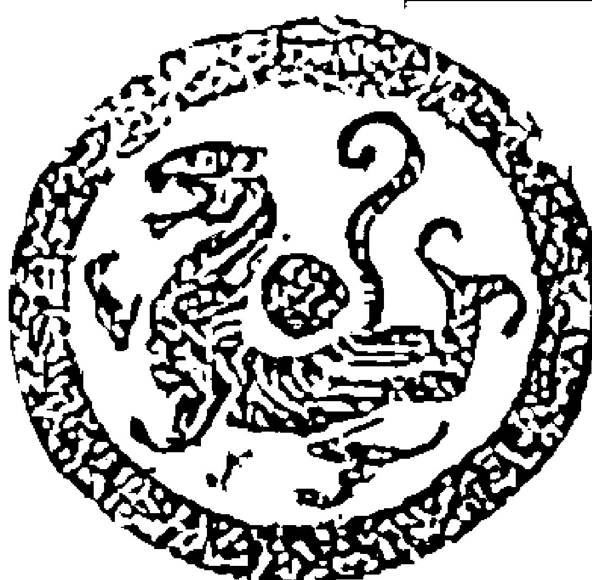

| 踰宿 | 推论 | 踰宿 | 推论 |
| :--- | :--- | :--- | :--- |
| 奎 | 中年贫苦，晚年稍安。 | 毕 | 精通经术，儿孙通达。 |
| 娄 | 刀枪之下，奔走东西。 | 觜 | 父母早亡，懒读诗书。 |
| 胃 | 财物充盈，婚姻难成。 | 参 | 经营安世，家业不昌。 |
| 昴 | 倚靠贵人，获得荣名。 |  |  |

# 土星躔朱雀七宿

【原文】

- 土井：土躔井宿号天驷，若习文章应费力，此生衣食也微微。井木犴度、下土星相会木必伤之。
- 土鬼：土躔鬼宿号天文，纵有资财化作尘。男主须防无上下，一生不足历艰辛。鬼金羊度下，主性狠不足。
- 土柳：土躔柳宿号天稻，无禄无财又损妻。若是日生衣食足，晚年终是色沉迷。夜生行此度平薄克陷，昼生者可也。
- 土星：土躔星宿号天途，父贵儿荣事不虚。只恐夜生脾疾苦，日生应可足金珠。星日马太阳之度，土主昼生人富贵。
- 土张：土躔张宿号天娥，信行为人事不讹。年少淹滞中主贵，形神肥厚足田禾。张月鹿太阴之度，主先凶而后吉。
- 土翼：土躔翼宿号天然，经术虽通性不坚。会有文章身不贵，声名远播足威权。翼火蛇度有变化之机。
- 土轸：土躔轸宿号天笺，才艺皆通至老年。未得文章求发迹，只将经术保身全。轸水蚓土制之，所以不为富贵。

# 土星躔朱雀七宿的推论

土星躔二十八宿各有所主，躔朱雀七宿推断如下：

| 躔宿 | 推论 | 躔宿 | 推论 |
|------|------|------|------|
| 井 | 习文费力，衣食微足。 | 张 | 为人守信，形神肥厚。 |
| 鬼 | 资财化尽，一生艰辛。 | 翼 | 虽通经术，性情软弱。 |
| 柳 | 无禄无财，有损妻子。 | 轸 | 文才缺乏，经术安身。 |
| 星 | 子因父贵，夜生为凶。 | | |

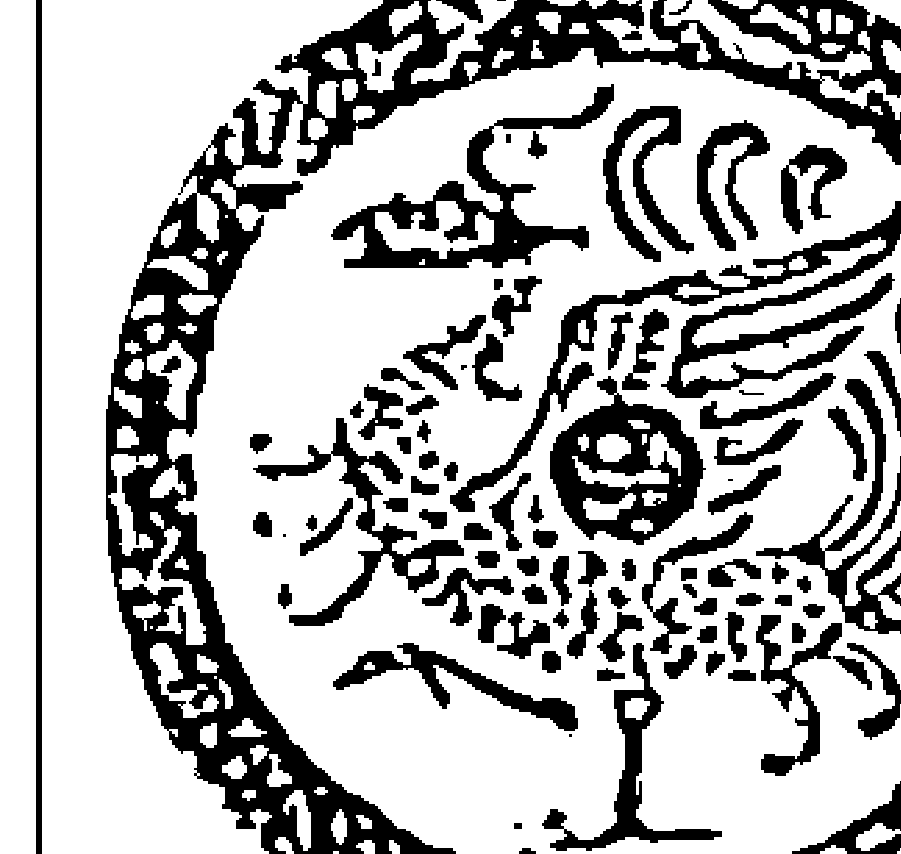

## 【白话提要】

此处歌诀所描述的是土星居于二十八宿的吉凶情况。一般土星不宜躔于氐宿、房宿、心宿、半宿、女宿、奎宿、觜宿、参宿、井宿、鬼宿、柳宿、轸宿，其余皆吉。

# 7. 镇星照宫 琅玕经：土星照临十二宫

## 【原文】

# 土命宫：

土照人命孤，忧劳又有余，初年多碌碌，祖业有如无，
附依终为有，成家晚不虚，如其为禄主，昼遇贵豪宅。
又曰：
土星居命主心痴，若有文章发更迟。更会木星井水宿，此生衣食欠精微。
土在命宫，主人肥大，敦厚而重实，背隆而腰厚，必有信义，遇克主瘦弱，面色矮黄。

# 土财帛：

土星财帛最堪嘉，水曜同临反破家。身命吉星须细•；阳宫日月问荣华。
水能化土为泥，故有破家之说。

# 土兄弟：

土临兄弟五人同，得他之力祸重重。恐招异姓为兄弟，四海相逢也是空。
土之数五，在兄弟宫，故主五人。

# 土田宅：

土星尊位为阳德，高占强宫为福泽。或在当生四杀中，起祸生灾岂能灭。
土正为田宅之用，故吉。

# 土男女：

土星五位在阳宫，五个男儿尽送终。孛气忽来相犯着，男孙疾患半成空。

# 土奴仆：

奴仆宫中见土星，万般谋运一无成。不如释道归林教，高卧云中有大名。

# 土妻妾：

土宿夜生不可逢，加临切忌七宫中。坎宫此地居明健，寿考雍容福不穷。

# 土疾厄：

土德来临疾厄时，凶星焰焰定灾危。多因聋哑双睛翳，不是驼腰必病脾。
土主脾胃，故病生于脾。

# 土迁移：

土德当生在九宫，命星合照莫相逢。男人漂荡他乡里，女子淫奔外姓中。

# 土官禄：

土星官禄占高强，凶恶威严不可当。若在庙方为禄主，桓圭端冕侍君王。官禄高强之位，土喜居之。

# 土福德：

土星福德照临时，若处生方始见奇。沙漠扬威名国辅，英声传播镇华夷。主福厚。

# 土相貌：

土星凶炽不堪闻，限弱身衰主祸迍。不是年来罗盖网，须愁狂疾不完身。

## 【白话提要】

土星居于福德宫，最为吉祥。土星居于命宫，则白天出生的人，并且遇天乙贵人，则富贵；其他诸宫，也是逢吉星则吉，遇凶星则凶。

# 土星照临身命十二宫

五星照临十二宫各有所主，其中，土星照临十二宫推断如下表所示：

# ## 土星照临命宫

| 属性 | 描述 |
| --- | --- |
| 形貌 | 神色刚强，形貌厚实，体形肥壮。 |
| 才华 | 临子丑，则聪明无比。 |
| 性情 | 性情纯厚，忠直守信，谨慎务实，口不乱言，攀附权贵。 |
| 官运 | 土星在庙宫，官至员外郎，如又是主星，则可受到重用。 |
| 财运 | 白天生人土星在庙旺宫，财禄丰足。 |

| 财帛宫 | 命宫 | 相貌宫 | 福德宫 |
| --- | --- | --- | --- |
| 多有不义之财，因财而破家。 | 性情纯厚，谨言慎行，忠直守信。 | 天庭高阔，面形方满，老年患眼病。 | 一生快活，衣食无忧。 |

# ## 土星照临十二宫

| 兄弟宫 | 官禄宫 |
| --- | --- |
| 兄弟五人，但彼此不和。 | 虽然事情不顺畅，但终能富贵双全。 |

| 田宅宫 | 迁移宫 |
| --- | --- |
| 祖业难保，冲克父母，宜自己创业。 | 不宜远行，无论水陆，都会失脱财物。 |

| 男女宫 | 奴仆宫 | 妻妾宫 | 疾厄宫 |
| --- | --- | --- | --- |
| 只宜有一子，多则身体有残缺。 | 奴婢众多，多有走失，万事不成。 | 妻子貌丑，难以偕老，冲克第一任妻子。 | 多患四肢、脾脏疾病，忌食四足之物。 |

# 第十一章 三辰通载·太白星：金星吉凶断

古今图书集成白话图解·星命 卷七 三辰通载（上）：五星论断篇

## 1. 太白算法 金星篇：金星的定度法

【原文】
置积日加三百七十六，以五百八十三日九十分二十七秒为伏见，留退一终之数除之，不满者为余日下太阳中，定以余日数去看，在何段积计成度便知定度。

- 夕伏：三十九日行四十九度五十分去日十度半而夕见西方。
- 顺行：二百三十三日行二百五十一度十二分。
- 留：五日不行。
- 退：十日行四度十二分。
- 晨退：十日。
- 留：五日不行。
- 顺行：三百三十三日。
- 晨伏：三十九日行四十九度五十分。

【白话提要】
此处是对金星定度的计算。“积日”，为星算学中的太初元历起始至作者著书的年数；“加三百七十六日”，则是一个调整误差的常数；“五百八十三日九十分二十七秒”，则是指金星伏、见、留、退的运行周期。以后的内容，则详细说明了金星伏、见、行、留、退的具体时间。

## 2. 太白总论：金星运行规律

【原文】

金星西方太白将军之象，行度有晨夕，伏见天秤为本宫，自亢宿五度至九度正庙，双鱼宫室宿七度至十三度为正旺，金牛宫胃宿为乐宫，躔牛鬼亢娄四宿为升殿。

若人身命二宫值之，更在庙旺之宫，主文章秀丽、聪明特达、雄武绝伦。男则美丽堂堂，女则轻盈娇媚，在七强则福禄称情，男子以金星为妻星，与水木相会大主吉庆。

值火土计孛则曰：并刑，反主阻滞，亦怕陷没恶弱，在亥上主寿、寅上不得地，六巳人为囚星、六丁人为禄星。若出入顺轨伏见，以时则为福，若失度而经天则为祸，其行一年一周天。

【白话提要】

金星常出现于西方，也称太白金星，有将军之象。金星行度有晨夕伏见等运行状态。天秤宫是金星的本宫，从亢宿五度至九度为金星的正庙；从双鱼宫室宿七度至十三度为金星的正旺，金牛宫胃宿为金星的乐宫。金星居于牛宿、鬼宿、亢宿、娄宿为升殿。如果人的身命二宫属于土星升殿，并且又处于庙旺之地，则主其人文章秀丽，聪明异常，武功盖世，是个不可多得的文武全才。

## 3. 太白歌断 源髓歌：金星星曜属性

【原文】

金星洁静好颜容，秀目疏眉白又红。身短不长声响亮；好耽音律习商宫。

多淫欲，美情意；结交朋友久而恭。不奈是非长悯念，更于金铁巧治工。

临身自有将军势，照命兵权越是雄。妻财有，世财同，因妻荣达不曾空。

太阳遇贵人提携，女主如逢母外通。水会之星淫更甚；火逢因色起灾凶。

日生木宿为豪贵，夜镇令妻貌不中。天乙贵，好相逢，游商出贾走西东。

妻妾爱陪僧与道，孛来同枕患残瘗。天首若临居武位，尾同至老是鳏翁。

居财帛，财帛丰，三宫兄妹是同宗。田宅阴人成卓立，五宫见女定重重。

第六主妻多下贱，七宫妻妾送临终。第八病时休针灸，迁移客女作家风。

官禄妻宫有官荫，福宫白发福无穷。第十二宫逢吉曜，其人定主美颜容。

此是前贤微妙诀，后人仔细去研究。

【白话提要】

金星主人洁静并且容颜美丽，双目清澈有神，双眉疏朗，肤色白里透红，身材较短但声音洪亮；其人喜欢音乐，并且淫欲较盛，结交朋友很讲义气，并且不挑拨是非。此外，其人还精通冶炼技术。金星临照身宫，则其人会有将军的威风；金星守照于命宫，则必掌兵权。金星居于其他宫，则各有吉凶。

# 五星之太白

太白即金星，又称为那颉星，色白，性义，将军之象。金星的运动规律与太阳相仿，约一月行一宫，一年运行一周天。

中国古代称金星为长庚、启明、太白或太白金星，黎明前出现在东方，称为“启明”；黄昏后出现在西方，称为“长庚”。

金星按时出现，则预示国泰民安。时隐时现，则预示着将会发生暴动，政权将会更替。

# 土星的庙乐旺

| 星格 | 名称 | 入宫 | 分野 | 推断 |
| :--- | :--- | :--- | :--- | :--- |
| 庙旺 | 天角天曙星 | 天秤辰上 | 淮南 | 身命遇之，八煞、官禄宫有星 -> 极贵之命 不在本命分野，但八煞、官禄有星 -> 官至三台、两府 |
| 乐 | 天旭华盖星 | 金牛酉上 | 梓州、台州、四川 | 身命遇之，与吉星相应，有禄马，庙乐 -> 左右金吾将军 身命遇之，不带煞 -> 三品文官 |

## 4. 太白交会 李斯经 ：金星与诸星相遇的吉凶

- 金水：
  金水二星若相会，俯取官荣如拾芥。大凡遇此喜非常，百六逢之多吉泰。
  金水二星，主清白廉洁。
- 金气：
  太白相逢紫气星，彤庭光耀化鲲鲸。威加夷狄为真将，燮理阴阳佐帝庭。
- 金孛：
  金星与孛若纵横，百六逢之大吉亨。人产遇时须饱暖，家多金帛保康宁。
  金与孛皆女人之象，皆得其类。
- 金罗：
  金星不喜会天首，狼戾奸凶为契友。富豪苗裔也卑微，百六当之殃不少。
  金与罗有相害。
- 金计：
  金星设若逢天尾，奸计平生愚且诡。百六当之大不祥，财破人亡灾病起。
  计性恶少，有相和之义。

【白话提要】
金星与水星同宫，主其人轻易即可获得官禄，并享受荣华富贵的生活。
金星与紫气同宫，主其人是威震边疆的大将。
金星与月孛同宫，主其人必定一生富足。
金星与罗睺同宫，则主其人生性凶狠残忍，一生难有好的发展。
金星与计都同宫，则其人既愚蠢，又很爱用诡计害人，结局会很悲惨。

## 5. 太白入宫 枢要歌 ：金星在十二宫中的吉凶

- 金子：
  太白之星到宝瓶，名为玉辂福非轻。丙丁之命如逢此，不特长生更富英。
  玉辂星主人富厚，辂者殷之车名。
- 金丑：
  金来丑上名天库，多玉多金难计数。少年锐志在功名，声誉播扬人所慕。
  天库星主福、丑乃金之库。
- 金寅：
  金星人马号毛头，破荡家财往外州。须是强宫多吉宿，方能救助不为忧。
  寅宫金不得地。
- 金卯：
  金星卯上名天败，起处逢伤人不奈。年少应须克六亲，奔波飘荡多灾害。
  金至此主克陷。
- 金辰：
  金到辰宫曰太常，庶人见此始为良。少年科甲名天下，品秩荣迁辅圣王。
  辰乃金之庙旺。
- 金巳：
  巳金天禄本长生，变曜名为天禄星。与水同宫最奇特，官高禄厚佐王庭。
  金会蛇则喜。
- 金午：
  金星变曜曰天旸，入到离宫大吉祥。为子孝廉臣尽节，直须簪冕佐君王。
  金星乘旺。
- 金未：
  金居巨蟹曰天仓，与水同宫福禄昌。若是丙丁人值此，多高位显寿延长。
  天仓者贮积之星，主富贵。
- 金申：
  太白临申号玉堂，庚辛人见旺金乡。若无罗火同居此，须信生平福炽昌。
- 金酉：
  金居酉位名天印，管取生来常吉庆。火宿若还相会时，刑囚破碎多灾病。
  怕火同宫。
- 金戌：
  鲁分金名天吊星，不宜火宿与相邻。纵然不夭终非美，襁褓须当克六亲。
  主天害。
- 金亥：
  金临亥位号天寿，但管一生长富有。天算绵延无绝期，怕逢荧惑反为咎。
  亥宫金星乘旺。

## 【白话提要】

此处歌诀，描述的是金星居于十二宫的吉凶状况。一般金星居于子宫、丑宫、辰宫、巳宫、午宫、未宫，皆吉。金星居于申宫，如果没有罗睺与火星出现，并且其人为庚申命，则必定福禄深厚。

# 金星入宫的推断

| 巳宫天禄 | 午宫天赐 | 未宫天仓 | 申宫玉堂 |
|----------|----------|----------|----------|
| 长寿，与水星同宫更好，主高官厚禄，辅佐王室。 | 入离宫大吉，孝顺忠诚，直谏君王。 | 与水星同宫，福禄昌兴，如为丙、丁，高官寿长。 | 无罗睺、火星同居，一生福气昌盛。 |
| 辰宫天常 |  |  | 酉宫天印 |
| 平常人遇此为吉，少年登科，名满天下，做大官。 |  |  | 一生常有吉庆，遇火宿，则多灾病。 |
| 卯宫天败 |  |  | 戌宫天吊 |
| 年少时冲克六亲，奔波劳碌，四处漂泊，多灾多难。 |  |  | 不宜与火星为邻，否则不是夭折也会儿时就克害六亲。 |
| 寅宫毛头 | 丑宫天库 | 子宫玉格 | 亥宫天寿 |
| 家财破散，流亡外乡。需要强有力的吉星，才能有救。 | 堆金砌玉，少年便有志向，得功名，声名远播，为人称羡。 | 福分不轻，八字日干为丙、丁，不是长寿也是富贵英豪。 | 一生富有，但遇火星不吉。 |

## 6. 太白躔度 玉关歌：金星在二十八宿的吉凶

# 金星躔青龙七宿

> 【原文】
金角：
金星躔角号天清，年少登科擅大名。衣禄生平丰且厚，为官清贵佐朝廷。
角木蛟度金，本制之所，以其本宫。

金亢：
金躔亢宿号天昌，挺出英才姓字香。文武兼全为宰辅，定应旌节受恩光。
亢金龙度，主比和为福。

金氐：
金躔氐宿号天将，少失尊亲性自刚。衣禄文章全自得，莫教贪欲损爹娘。
氐土貉有生金之理。

金房：
金躔房宿名天角，衣禄生来殊不薄。为人多义更方圆，形貌端庄又多学。
房日兔度，金藉阳光，主荣显。

金心：
金躔心宿号天孚，襁褓之时身亦孤。处已温良心好欲，文章腹内一些无。
心月狐度主，性灵多欲媚人。

金尾：
金躔尾宿号天殃，骨肉资财定见伤。若不修仙并积德，定须夭寿见恓惶。
尾火虎性狠主伤克。

金箕：
金躔箕宿号天彤，妻子乖离吉见凶。家计纵然饶富足，老年不免又贫穷。
箕水豹度金，乃不得地之宫又能耗气。

# 金星躔玄武七宿

【原文】

金斗：
金躔斗宿号天铨，贪色贪财行不贤。男女虽多终是克，更无衣食少安全。
斗木獬度金，本克之故云贪财。

金牛：
金躔牛宿号天绳，色欲多贪命里淫。衣食生来自丰足，晚年优裕享安宁。
牛金牛度金得满用。

金女：
金躔女宿号天奸，多女多男自少闲。若是十宫星得力，何愁此地不为官。

金虚：
金躔虚宿号天编，美貌丰容福寿绵。灾害不侵黄耉老，随时衣禄自然全。

金危：
金躔危宿号天蔬，温俭忠良性自清。文学定须因女富，文星入命出官身。
危月燕度金，月有光辉之依，主吉。

金室：
金躔室宿号天勋，必主迁官近帝君。声振四方持节钺，位登枢密大尊荣。
室火猪度金，得锻炼而为大器。

金壁：
金躔壁宿号天光，彭祖年时寿命长。若是女人财喜旺，丰容美貌嫁才郎。
壁水㺄度主，金白水清。

# 金星躔玄武七宿的推论

金星躔二十八宿各有所主，躔玄武七宿的推论详列如下：

| 躔宿 | 推论 | 躔宿 | 推论 |
| :--- | :--- | :--- | :--- |
| 斗 | 贪财好色，并非好人。 | 危 | 禀性忠良，因女而富。 |
| 牛 | 贪财好色，一生富足。 | 室 | 官位高迁，声振四方。 |
| 女 | 子女众多，一生奔波。 | 壁 | 长寿财旺，姿容丰美。 |
| 虚 | 容貌丰美，长寿少灾。 | | |

# 金星躔白虎七宿

## 【原文】

金奎：
金躔奎宿名天庆，未遂功名身不贱。为人温厚更宽容，性识孤高多有见。

金娄：
金躔娄宿号天蕊，必定为人少失亲。酒色是非应不免，晚年富贵乐平生。
娄金狗金之同度。

金胄：
金躔胄宿号天端，命若逢之五品官。任是兵刑兼法令，定须出入侍金銮。
胃土雉度土，有生金之功。

金昴：
金躔昴宿号天璋，为官进速任关梁。卿监位中名早得，也须腰紫佩金章。
昴日鸡太阳度也，金水有护太阳之力。

金毕：
金躔毕宿号天联，赫奕功名近帝前。不作外台观察使，须登廊庙职升迁。
毕月鸟度下，正得清辉之象。

金觜：
金躔觜宿号天营，冠世文章出众群。翰苑声名词藻丽，也须上国立功勋。
觜火猴度金之得禄之所，应主大贵。

金参：
金躔参宿号天晶，学问词锋冠世英。若是官宫星得力，定须贵籍早标名。
金水之清在此，宫此度见之。

# 金星躔白虎七宿的推论

金星躔二十八宿各有所主，躔白虎七宿的推论详列如下：

| 躔宿 | 推论 |
| --- | --- |
| 金奎 | 性情孤高，难得功名。 |
| 金娄 | 少年丧亲，晚年富贵。 |
| 金胃 | 官居五品，兵刑法令。 |
| 金昴 | 早年得名，关梁守将。 |
| 金毕 | 功名赫赫，秉持重权。 |
| 金觜 | 文章冠世，位列朝班。 |
| 金参 | 学问冠世，青史留名。 |

# 金星躔朱雀七宿

【原文】

金井：
金躔井宿是吉宫，高才博学福丰隆。为官定是居廊庙，福及苍生禄万钟。井木犴犴兽也，主英勇掌牢狱之星有威权。

金鬼：
金躔鬼宿号天淫，妇女逢之有外心。戒行不循迷酒色，平生衣食自来临。鬼金羊金之同度。

金柳：
金躔柳宿号天关，快乐平生衣食闲。男女更多人贵重，丰盈财物性尤宽。柳土獐度下，土能生金之度亦无患。

金星：
金躔星宿号天荧，理义精通学冠群。更若火星来会此，是非酒色不堪闻。

金张：
金躔张宿号天旸，财物多贪行不良。若是妻迟难得子，平平衣食寿延长。张月鹿度与金度皆女人之象。

金翼：
金躔翼宿号天英，学问文章显大名。经术更能修显著，此身荣贵乐平生。翼火蛇度金水逢蛇则吉。

金轸：
金躔轸宿号天程，口舌轻狂凶害生。言语不真心泛滥，多端非礼有奸名。轸水蚓度与金无害。

# 金星躔朱雀七宿的推论

金星躔二十八宿各有所主，躔朱雀七宿的推论详列如下：

| 躔宿 | 推论 | 躔宿 | 推论 |
|------|------|------|------|
| 井 | 博学高才，福及百姓。 | 张 | 禀性贪婪，品行不良。 |
| 鬼 | 迷恋酒色，衣食无忧。 | 翼 | 文名颇盛，学问修身。 |
| 柳 | 一生快乐，子女颇多。 | 轸 | 口舌轻狂，多有奸淫。 |
| 星 | 精通理义，深研学问。 |  |  |

## 【白话提要】

此处歌诀所描述的是金星居于二十八宿的吉凶情况。一般金星不宜躔于氐宿、心宿、尾宿、箕宿、斗宿、牛宿、娄宿、鬼宿、张宿、轸宿。金星躔于张宿时，如果娶妻生子皆很晚，则会拥有较长的寿命。

## 7. 太白照宫 琅玕经：金星照临十二宫

【原文】
金命宫：
金主人多义，心明志自豪，倚公成附势，权用自能高，
妻娶如无赘，男儿晚岁牢，初年多偃蹇，成败屡经遭。
又曰：
金星吉曜最为佳，华丽文章世所夸。莫使当年凶忌犯，婚姻贵族福无涯。
为人清秀平正，遇土则肥，逢克破相。

金财帛：
金居财帛喜为深，女禄多招众所钦。火孛只忧来克犯，中年惟恐早灰心。
金居财帛人之所喜也。

金兄弟：
第三宫内见金星，义断分金手足情。虽是雁行同气者，反成背面不相亲。

金田宅：
金星吉曜成奇局，田宅逢之主厚福。上下加临不见刑，一世安荣自丰足。
田宅之宫金为极富。

金男女：
金星第五别为奇，子息当推有四儿。莫使同宫逢火克，荣宗耀祖不须疑。
金数四主有四子。

金奴仆：
金星奴仆限宫时，年少还须克少妻。又主交朋与亲戚，直饶面是背成非。
金主义故曰交朋。

金妻妾：
金星本是号妻星，要在高强庙旺行。夫妇共荣多福兆，若逢火克又遭刑。
男以金为妻，正得其宜。

金疾厄：
疾厄金临本是良，英雄气概少灾殃。若教火孛来交会，骨折根伤不可当。
忌刑克恶杀临。

# 第十二章 三辰通载·辰星：水星吉凶断

## 1. 辰星算法 水星篇：水星的定度法

【原文】

置积日加八十一，以一百十五日八十七分六十一秒为伏见，留退一终之数除之，不满者为余日一下中定星，以余日数去之，看在何段又看入何段，得几日十七度便是水星定度。

夕伏：十八日行三十四度五十分去日十六度五十分而反见于西方。

顺行：十七日。

顺迟：十日共行三十一度五十分。

夕留：二日不行。

晨退：十日九十二分八十秒半行八度六分十九秒半。

晨留：二日。

晨迟：十日。

晨伏：十八日行度并与上同。

【白话提要】

此处是对水星定度的计算。“积日”，是星算学中的太初元历起始至作者著书的年数；“加八十一”，则是一个调整误差的常数；“一百十五日八十七分六十一秒”，则是指水星伏、见、留、退的运行周期。

自“夕伏十八日”以后的内容，则详细说明了水星伏、见、留、退的具体时间。

## 2. 辰星总论：概述水星之运行规律

【原文】

水星北方辰星、廷尉之象，双女为本宫。自翼宿八度至十三度为正庙，阴阳宫参宿为乐，躔箕参壁轸四宿为升殿。若人身命二宫值之，更在庙旺宫，主机谋深远，智量广大，文章杰出，其性无定，遇善则善，遇恶则恶。近阳附阳为吉曜，近阴附阴为善庆。
与日同宫主文章，会金与木多誉美，大忌火土罗计出没、反成迍蹇。六壬生人为囚星，六庚生人为天禄。一名龟星，四时皆见伏出入，依期光明润泽，性无定度。附于日，一年行一小周天。

【白话提要】

水星常出现于北方，也叫做辰星，有廷尉（主管司法的最高官员）之象。双女宫为水星的本宫；从翼宿八度至十三度，为水星的正庙；阴阳宫参宿为水星的乐宫；水星躔于箕参壁轸四宿，则为升殿。如果人的身命二宫属于水星升殿，并且又属于庙旺之地，则其人机谋深远，文章出众，并且心性不定，遇善则善，遇恶则恶。

## 3. 辰星歌断 源髓歌：水星星曜属性

【原文】

> 辰星快利有文章，形色清严色润光。智慧聪明多妙巧，出群学问不寻常。
情不定，性温良，遇圆则圆方则方。乐庙若居申巳贵，他宫笔吏好心肠。
日会父筵多酒食，相逢二母莫思量。木月见，吉仍昌，李杜文章万丈长。
昼火若同贫且贱，刑克尤防上法场。夜土会，主瘫伤，金妻爱入别人房。
天乙更贪修养术，彗来劫盗恶声扬。首尾气豪多勇毅，居财一似雪和汤。
兄弟犯，隔他乡，田宫祖业破郎当。子息女多男巧妙，仆宫偷走急忙忙。
妻位夫妻多外染，厄宫腰肾也羸弱。迁移处，好游商，官宫早岁甲科昂。
福德自然多福寿，貌宫俨雅性温良，从头说尽人间事，后学须教仔细详。

【白话提要】

水星主人性情麻利，擅长写文章，形色清爽而严肃，肤色润泽有光，聪明智慧，心机灵巧，学问出众，性情温和善良，处事圆滑。如果水星居于乐宫、正庙，并且是申宫或巳宫，则必定富贵。

## 4. 辰星交会 韦斯经：水星与诸星相遇的吉凶

### 水气：

【原文】

水星紫气喜相当，天产斯文福势昌。官爵显荣家又富，千斯仓与万斯箱。气乃木之余，有资生之力。

### 水孛：

辰星不欲相交彗，男则为奴女为婢。邪淫浊滥主贫寒，百计千谋无一遂。孛乃月之奴，主有如是。

### 水罗：

水星最忌与罗同，值此须教一世穷。不孝不忠多暴虐，不然喑哑与盲聋。水罗有不合之意。

### 水计：

水与计都相照会，缺唇跛足并驼背。或生癣疾女多淫，不入法场也徒配。计乃狠恶之星主人疾厄。

【白话提要】

水星与紫气同宫，则必定为官显达，极其的富贵。水星与月孛同宫，则男为奴隶，女为婢女，一生贫寒。水星与罗睺同宫，则其人不忠不孝，一世贫穷。水星与计都同宫，则其人会有兔唇、跛脚、驼背等残疾，如果是女孩则十分淫荡，最终会遭到严厉的刑罚。

## 5. 辰星入宫枢要歌：水星在十二宫中的吉凶

### 水子：

【原文】

水到齐瓶号玉池，亨衢快步莫迟疑。此为学馆科名地，轩冕荣华佐圣时。朝北又旺。

### 水丑：

水居丑位号晨门，朝斗分明主势尊。若不变为刑暗耗，少年及第第六殊勋。

### 水寅：

水临寅上名天懿，管取一生无阻滞。设若木星会合时，不惟利禄名兼遂。

### 水卯：

水流卯地名困苦，只怕此星伤本主。奔波役役受艰辛，才得清闲飘荡去。

水至卯而伤。

### 水辰：

辰宫得水号琴堂，太白同行福倍昌。人命逢之多吉泰，少年显达把名扬。

### 水巳：

水来巳上号荣名，乐庙之宫万事亨。若得金星同会此，黑头早着翰林声。金水会蛇。

### 水午：

水临狮子曰天温，与日同行倍有文。设若变为官禄主，名高位显众人尊。水阳相会。

### 水未：

未逢水曜名天乙，与月同宫方入格。纵然恶曜相会行，也须显达荣家宅。

### 水申：

水居申位名荣显，此是本垣无否塞。庚与壬人若见之，修文方中青钱迟。此为长生之位。

### 水酉：

绝禄元来是水星，嫌居酉位不安宁。生来用事多迍滞，纵有家财也替凌。此为败地。

### 水戌：

水在白羊号伏尸，一生迍滞主灾危。虽逢吉曜相扶助，便得成名且亦迟。落胎刑相不完。

### 水亥：

亥宫天绶水之精，掌握兵机挫虏人。官禄迁移身命值，何愁方外不扬名。此为得禄之地主贵。

【白话提要】
此处歌诀，描述的是水星居于十二宫的吉凶状况。一般水星居于子宫、丑宫、寅宫、辰宫、巳宫、午宫、未宫、申宫、亥宫，皆吉。

### 水星入宫的推断

| 巳宫荣名：如遇金星，青年之时便可名传朝野。 | 午宫天温：很有文采，名高位显，众人尊敬。 | 未宫天乙：与月亮同宫为妙。即使有恶星，也会荣贵显达。 | 申宫荣显：一生无坎坷，日干为庚、壬，则有文才及财富。 |
| 辰宫琴堂：与金星同行，福分加倍。少年显达，声名远扬。 | | | 酉宫绝禄：不得安宁，事情多阻碍，纵有家财也被耗散。 |
| 卯宫困苦：奔波艰辛，晚年清闲。 | | | 戌宫伏尸：一生多坎坷，有灾难。纵有吉星相助，成名也较晚。 |
| 寅宫天懿：一生无坎坷，与木星相会，功名利禄全能遂心。 | 丑宫辰门：权势之人，少年及第，立下功勋。 | 子宫玉池：官路上不要迟疑，必有前途。 | 亥宫天绶：掌握兵权，官禄、迁移、身命宫至此，不愁扬名在外。 |

## 6. 辰星躔度玉关歌：水星在二十八宿的吉凶

### 水星躔青龙七宿

【原文】

**水角：** 水躔角宿号天成，清秀文章学术明。喜怒无常心不定，平生衣禄自丰盈。角木蛟度水能生之。

**水亢：** 水躔亢宿号天津，容貌清奇通道术。心清闲暇作文章，多智多能善音律。亢金度为水润金明。

**水氐：** 水躔氐宿号天旨，言语聪明知道体。人情好恶性能通，遇吉终须文学贵。

**水房：** 水躔房宿号天淫，智识聪明太古心。衣禄自然情泛滥，文章学术有人钦。房日兔度主文业吉利。

**水心：** 水躔心宿号天凌，清洁为人快性情。巧计多修文业事，聪明才艺两三分。心月狐度主人惟灵。

**水尾：** 水躔尾宿号天澄，理义该通学术明。资财耗散多灾否，惟恐风狂疾染身。尾火虎度水火木不相合。

**水箕：** 水躔箕宿号天淫，快乐心闲乐自真。衣食平生财亦足，文词道艺细评论。箕水豹度水同其类。

### 水星躔青龙七宿推论

| 躔宿 | 推论 |
| :--- | :--- |
| 角 | 文采清俊，喜怒无常。 |
| 亢 | 容貌清奇，学识渊博。 |
| 氐 | 口才极好，善察人情。 |
| 房 | 智慧过人，堪比先贤。 |
| 心 | 性情爽直，巧智多谋。 |
| 尾 | 精通学术，多有灾厄。 |
| 箕 | 天真快乐，衣食丰足。 |

### 水星躔玄武七宿

【原文】

**水斗：** 水躔斗宿名天德，俊誉文章心耿直。荣贵子孙和且乐，丰衣足食语言涩。斗木獬度水能生之。

**水牛：** 水躔牛宿号天甄，和气交朋益子孙。机密谋为人不识，多财应得外人屯。牛金牛度金水相生，故有益。

**水女：** 水躔女宿号天驿，眼疾朦朣是贵人。好学贪财多议论，平生衣食也艰辛。女土蝠度土实水虚。

**水虚：** 水躔虚宿号天驯，清洁为人财亦匀。多技多能心亦善，弟兄孝顺乐天伦。虚日鼠度水易相护。

**水危：** 水躔危宿号天中，语涩心难眼半胧。中末之年方得力，外人财物稍宽容。危月燕度下水月相映。

**水室：** 水躔室宿号天攸，文学聪明智慧优。历事未能心预测，筹筹多计乐闲幽。

**水壁：** 水躔壁宿号天池，智慧多能有志机。元象天文多洞达，平生衣食不相亏。壁水貐与水同度得比和。

### 水星躔玄武七宿推论

| 躔宿 | 推论 | 躔宿 | 推论 |
| :--- | :--- | :--- | :--- |
| 斗 | 性格耿直，子孙荣贵。 | 危 | 中晚年，得人相助。 |
| 牛 | 交友极广，机智过人。 | 室 | 聪明过人，性情闲散。 |
| 女 | 多患眼疾，贪财好学。 | 壁 | 足智多谋，衣食丰足。 |
| 虚 | 多才多艺，心地善良。 | | |

### 水星躔白虎七宿

【原文】

**水奎：** 水躔奎宿号天凌，忠直为人急性情。财禄自然多积聚，平生多事不安宁。

**水娄：** 水躔娄宿号天斯，耿直为人不受欺。衣禄丰盈多称意，一生快活少凶危。

**水胃：** 水躔胃宿号天泓，耿介为人记事明。忠孝存心多执拗，为人衣禄未安宁。

**水昴：** 水躔昴宿号天街；容貌清奇识五音。心谋巧计事沉静，衣禄平平祸不侵。昴日鸡度下平等无伤。

**水毕：** 水躔毕宿号天淋，历事三思性又钦。容貌清奇衣食厚，文才学问满胸襟。水月主好相而清洁。

**水觜：** 水躔觜宿号天枢，清白为人好读书。多艺多才多智巧，平生欢乐远行居。

**水参：** 水躔参宿正庙居，文星入庙要因扶。水宿聪明多好动，囚能自执不凶虞。参度至申水之庙旺。

### 水星躔白虎七宿推论

| 躔宿 | 推论 | 躔宿 | 推论 |
| :--- | :--- | :--- | :--- |
| 奎 | 为人忠直，财禄自足。 | 毕 | 做事谨慎，满腹学问。 |
| 娄 | 为人耿直，衣禄丰隆。 | 觜 | 足智多谋，多才多艺。 |
| 胃 | 斤斤计较，忠孝双全。 | 参 | 无忧无虑，丰衣足食。 |
| 昴 | 容貌清奇，心巧多谋。 | | |

### 水星躔朱雀七宿

【原文】

**水井：** 水躔井宿号天浔，心好清闲智量深。筹策文章人荐用，声名远播在儒林。

**水鬼：** 水躔鬼宿号天洪，好静为人更美容。心内洞明兼道释，众人钦敬乐无穷。

**水柳：** 水躔柳宿号天注，柔善为人处世当。能作文章心巧计，声名闾里有称扬。

**水星：** 水躔星宿号天清，伏见皆能官职增。与日同宫须大用，定为喉舌玉街行。水阳相会大利。

**水张：** 水躔张宿号天荣，富贵双全性又灵。文武相兼皆并用，贤能兄弟佐朝廷。

**水翼：** 水躔翼宿号天异，年少登科文学济。清华要路骤迁荣，与日同行须大贵。

**水轸：** 水躔轸宿号天岑，文学之官众所钦。谋略聪明人倚重，才华藻思入儒林。水之庙旺。

### 水星躔朱雀七宿推论

| 躔宿 | 推论 | 躔宿 | 推论 |
| :--- | :--- | :--- | :--- |
| 井 | 性情清闲，闻名远播。 | 张 | 富贵双全，文才武略。 |
| 鬼 | 容貌美丽，学通僧道。 | 翼 | 年少登科，一路升迁。 |
| 柳 | 为人柔善，巧计多谋。 | 轸 | 聪明过人，选入翰林。 |
| 星 | 颇有官运，得到重用。 | | |

【白话提要】此处歌诀所描述的是水星居于二十八宿的吉凶情况。一般水星不宜躔于尾宿、女宿、危宿、胃宿，躔于其他宿度皆较为吉祥。

## 7. 辰星照宫琅玕经：水星照临十二宫

【原文】

**水命宫：** 命见水星临，文术多智能，外财应有遇，引荐人相承，庙旺迁官职，余宫道合僧，相貌同豪贵，资财晚岁兴。又曰：水德星辰在命宫，得逢旺处便攀龙。聪明智识多机变，生在荣华富贵中。水主智动而能变、主人清俊。

**水财帛：** 水星乘旺莫临财，进退难逃反起灾。手艺一生方可用，凡人财散亦难来。水能进退之物故忌之。

**水兄弟：** 水星吉曜遇还稀，来临三宫便不宜。上有亲兄下有弟，两头无义便侵欺。水性无定，决之东则东流、决之西则西流。

**水田宅：** 善星一曜是辰星，得入强宫福转精。不见当年刑忌照，便须万顷与千仓。

**水男女：** 水星高照子孙位，俊迈文章为国瑞。水数推来只一男，振起家风日荣贵。水主子少土克之则无。

**水奴仆：** 辰星莫入六宫中，冠世文章用处空。纵使南宫高甲过，栖迟薄禄走西东。水性主流。

**水妻妾：** 水到妻宫对照命，富贵贞贤人难并。忽然恶杀又相侵，心滥情淫性无定。水主清洁多智。

**水疾厄：** 第八宫中水德临，温柔情性足人钦。忌星凶曜来侵犯，沉溺波涛坠井深。水主肾疾。

**水迁移：** 水星合照最为珍，更看当生命位星。宾主和同无恶犯，迁移出处总欢宁。

**水官禄：** 水星偏喜照官宫，出类超群福自隆。委任股肱扶宝祚，官居高品贵尊崇。主为官清白。

**水福德：** 十一宫中水德来，汪洋智识仰贤才。公严德厚人钦重，泽被生民遍九垓。福德人之所仰，有吉星多福。

**水相貌：** 水星相貌最为强，凛凛清风在庙廊。若遇吉星无恶曜，容颜端正动君王。

### 水星照临身命十二宫

五星照临十二宫各有所主，其中，水星照临十二宫推断如下表所示：

| 宫位 | 推断 |
| :--- | :--- |
| 命宫 | 文章盖世，多学多智，柔中带刚。 |
| 财帛宫 | 年少时难聚财帛，到中年衣食有忧。 |
| 兄弟宫 | 兄妹较多，但居于外乡，或关系不好。 |
| 田宅宫 | 先破后立，自力更生，成家立业。 |
| 男女宫 | 生得聪明俊秀的儿子，多名子女只此一人有出息。 |
| 奴仆宫 | 奴婢、六畜等多会有灾难。 |
| 妻妾宫 | 妻子性情不定，多有外情或奸盗之事。 |
| 疾厄宫 | 应防水灾或疾病。 |
| 迁移宫 | 最好的格局若无凶星，则主欢乐和宁。 |
| 官禄宫 | 官职突然升迁。 |
| 福德宫 | 颇有声名，得贵人倚重，但不宜与女子多交往。 |
| 相貌宫 | 相貌最好，姿容丰美，女子得此更好。 |

【白话提要】

此处为水星居于十二宫的吉凶情况。一般水星居于命宫、田宅宫、迁移宫、官禄宫、福德宫、相貌宫，皆吉。

# 第十三章
# 拦驾经：十二宫星曜所临吉凶断

## 1. 命宫天柱星：七政四余坐照命宫吉凶

【原文】
金星守命夜生吉，白日生人减半力。木星照命有多般，白日逢之必作官。夜生若有暗曜杂，反为凶祸主忧煎，水星在命合入庙，夜里生人太阴照，或居双女与阴阳，决定少年居显要，火星入命不堪详。白日生人主祸殃，更被孛罗三合照，定知哑吃与人伤，患劳枉死人孤寡，夜生又宜却无妨，土星入命主顽钝，夜里生人不可论，水命定知须哑吃，黄肿气疾命难存。太阳坐命如逢木，罗气同宫须食禄。火星不照定封侯，月孛临之患心腹。太阴在命生逢夜，水宿同宫为仆体。土星入命孛星来，有禄定知非久谢，紫气印星号天乙，凡在命宫皆有益。生时不被恶星临，善宿合兮多子息。木月见气入夜宫，夜里生人为辅弼，若是土星三合照，虽则高强终是疾。罗睺入命许谋多，木气同宫主豪富，金木太阳三合照，此人慷慨更英豪，女命夜生罗照着，自缢劳刑贫又薄。气火水计入命时，此人定作般般恶，计都入命忧火命，此则十杀恶无定，贵人遇者以无权，白日生人宜修进，木星紫气如临照。主命居强为福庆，孛星入命人廉洁。目快心清为性别，气木日金若合时，所作高强皆有节，日生火孛主星微，决定刑伤蛇虎食。掩口不开气冲人，直得为官须歇灭。金属阴，故喜夜生，木属阳，故喜昼生，双女巳宫阴阳申，宫土喜昼生。夜生人不吉，天乙为紫气主吉，土为瘟星故主人多疾。

【白话提要】
此处所论，是日月五星与四余坐照命宫时的吉凶情况，命宫的主星，也称为天柱星。其大致意思是：命宫里见到金星临照，又是夜生之人，则吉；但若是白天出生之人，则只有半吉。

命宫中若见木星临照，并且是白日出生之人，则可当官；若为夜生之人，又有暗曜杂照，为凶，其人会受贫困、忧愁、疾苦煎熬。水星临照命宫，且入庙旺得地，若是夜生之人，且有太阴照临，或者于双女宫处有阴或阳临照，则其人必然少年得志，功到名显。若是火星照临命宫，为白日出生之人，则会有祸殃，若又与月孛、罗睺三合，那么其人必定是哑巴，或者有其他残伤，或者患病愁劳而死，或者一生孤寡。但是若为夜生之人，则不会有凶。土星临照命宫，其人必然性格顽固。水星坐于命宫，其人必哑巴或口吃，并有黄肿气疾之病，寿命亦会受到影响。太阳坐于命宫，且又有木星、紫气、罗睺临照，则其人必有食禄。若火星不来临照命宫，则其人必定被封王侯。若月亮、月孛二星照临命宫，则其人必有心腹之疾患。太阴临照命宫，又有水星临照，若是夜生之人，则其为官必是仆射之官。若土星、月孛二星临照命宫，则其人有禄，只是并不持久。

有紫气、印星又称为天乙，若在命宫中有此吉星临照，必吉。若命宫没有恶星来侵犯，而有善星临照，则其人必然多子多女。若紫气星照临命宫，且又是未月夜间出生之人，则其人为官，必高居为辅弼即宰相等大臣。但若此时有土星飞来形成三合照，则虽然处于高强之位也是祸患，其人必有疾难。罗睺星临照命宫，则其人性格狡猾，多计谋。木星、紫气二星照临命宫，则其人必有财富，为富豪之人。

在命宫若有金星、木星、太阳三合照，则此人必定慷慨大方，性格豪放，可成为英雄。若是夜间出生的女人，正逢罗睺星照临命宫，则必有凶祸，不是自缢而亡，便是遭受劳苦刑伤，一生贫困命薄；若是紫气、火星、水星、计都同照命宫，也同样会有凶祸。命宫主星为火星，并且又有计都临照，必为灾祸；若为贵人，则会失去权柄；若是白日出生之人，则宜修业奉上。

若木星、紫气、太阳照临命宫，则其人命强有福。月孛星照临命宫，则其人一生清廉，心清眼快，性情高雅。若紫气、木星、太阳、金星合照于命宫，为白天出生之人，且又遇火星、月孛二星，则其人有祸，必然遭受刑伤或者不得好死，暴尸户外为蛇虎所食；或者其人闭口少言，冷对世事，可一旦做官就会丧命。

### 七政四余守命的大致吉凶

如出生时七政四余中的某颗星曜运行至命宫，即为守命。星曜守命，有吉有凶，大致上是见金、水、日、月等吉星则吉，见火、罗、计、孛等凶曜则凶。

- **土星守命**
夜生吉，昼生吉力减半。
- **计都（土之余）守命**
大凶之局，如有木、气临照，主命强为福庆。
- **日月合朔守命**
主其人昏聩不明，受人蒙蔽。
- **月亮守命**
主其人性格正直，光明磊落。
- **火星守命**
昼生有灾祸，夜生却无妨。
- **金星守命**
主其人重义轻财，受人尊敬。
- **罗睺（火之余）守命**
多谋略，见木、气为富豪。
- **太阳守命**
逢木、罗、气则食禄，遇土则封侯。
- **木星守命**
昼生必做官，夜生有暗曜反为祸。
- **紫气（木之余）守命**
在命宫则吉，生时遇善星，多子息。
- **水星守命**
夜生见太阴，少年官居显位。
- **月孛（水之余）守命**
为人廉洁，心性清快。

## 2. 财帛宫天宝星：星曜守照财帛宫的吉凶态势

【原文】
金临财帛足随时，夜里生人皆进镪。木临财帛必丰隆，日中生者最难逢。水临财帛财帛散，更被孛来不足看。火居财帛与前同，土居财帛皆丰亨。太阳居此足钱财，质库常开待物来。月居财帛多财帛，只怕土星三合克。气入二宫亦忌之，遇日本木扶还又得。罗计孛入损资财，终身不得资财力。

水性就下，其形漂流而不息，主不住财，火性炎势，虽高而不耐久。

此处所论，是星曜守照财帛宫的吉凶情况。财帛宫的主星，也称为天宝星。歌诀大意是，金星临照财帛宫，则其随时有财有帛，若是夜晚出生之人，则有财进贡，有财滋荫。木星临照财帛宫，其财丰足隆厚。但是，白天出生之人都难逢木星临照财帛宫。水星临照财帛宫，则其财帛散耗，若又有月孛星临照，那财散得更快。火星临照财帛宫，也和水星、月孛二星的情况一样，于财不利。土星临照财帛宫，则其财丰可亨。太阳临照财帛宫，则其钱财充足，还经常有财进聚。月亮临照财帛宫，其必多财多帛；但是如土星与月宫主星三合就必克财，于财不利。紫气星临照财帛宫，也于财不利，若有日、木星二星来扶持，那么又可利于聚财。若罗睺、计都、月孛三星临照财帛宫，则其资财受损，并且终日都缺资少财。

## 3. 兄弟宫天玉星：星曜守照兄弟宫吉凶

- 木金兄弟主英雄，水星和乐旺门风，火在此宫定孤寡，夜生不与孤寡同。土临兄弟终和睦，日居未可同言语，生时父母决相背，木计合宫主贫苦。太阴若得主星来，辅弼荣华由此胎。气临第三兄弟少，计星遇此渐生灾。月孛来时损兄弟，古人传说难躲避。木星主仁、金星主义、水星主智故吉。

兄弟宫主星叫做天玉星。木星、金星照临兄弟宫，则其人的兄弟能干并且多为英雄。水星临照兄弟宫，则其人兄弟之间相处和睦，家风暖融。但是若火星出现在兄弟宫，则其人兄弟稀少，家门孤寡。若是夜生之人，则不在此论。土星出现在兄弟宫，兄弟也能和睦相处，但是若为白天出生之人，则不同此论，即白天出生之人，则主父母离异。木星、计都二星合照兄弟宫，则其人一生贫苦。但是若太阴为兄弟宫的主星，则其人所生之子，必可做大官，并因此而享受荣华富贵。紫气星临照兄弟宫，则其缺兄少弟。若计都星临照于兄弟宫，则必有灾。月亮、月孛二星同照兄弟宫，则兄弟有损。

## 4. 田宅宫天富星：星曜守照田宅宫的吉凶态势

金居田宅父母宫，白日生人主困穷，如逢夜里最为吉，产业自荣迈祖宗。木临田宅兴父母，自然福寿世难同。水居第四旺田庄，更有双亲寿命长。火星临此不堪说，土星踵入有房廊，白日生人为最吉，夜生父母早年亡，日居田宅足田园，木到双亲福寿全。火孛不照多产业，水金合会常堪怜，月临虽称旺田宅，白日生人反作累，紫气居之多壮丽，父母一时居富贵。木星入位必有官，水月合兮居显位，罗居田宅不堪猜，十般死恶反破财。计都侵之忧父母，田庄牛马化成灰，月孛居安亦如之，夜生亦可减毫厘，昼生又忌火来克，父母早亡主孤。田宅土也，水有资助之力，火能害物故少利，日木土主昼生，火月金水主夜生，反之不吉。

## 【白话提要】
田宅宫主星叫做天富星。金星居泊于田宅、父母宫，若是白日出生之人，则其必然穷困。但是若为夜生之人，则吉，其人会不但有自营之产业，并且还会有祖宗的产业可以滋荫。木星临照于田宅宫，则其人的父母有福寿，这是一般人所不能有的。水星临照于田宅宫，则其人田宅兴旺，并且父母双亲寿命长。火星进入田宅宫，则定然不吉。但是土星进入田宅宫，则吉，其人必有房廊。但若是夜间出生之人，则其父母会早亡。日照田宅宫，则其人田宅必多；水星、金星合照田宅宫，则其人一世可怜，不吉。月照田宅宫，则其人田地兴旺；若是白天出生之人，反而会因田地所累。紫气临照于田宅宫，则宅必壮伟、田必宏广，父母亦很富贵；若又有木星合照，则其人必有官位。水星、月亮合照于田宅宫，则其人必居于显位；罗睺临照于田宅宫，则会有灾祸，其人的田宅牛马亦会因此全部化为乌有。月亮、月孛合照的情况与罗睺星是一样，均为不吉，但若是夜生之人，则可稍减祸患。若是昼生之人，并且又有火星临照，则其人必然父母被克而早逝，其人必一生孤苦伶仃。

## 5. 男女宫天孤星：星曜守照男女宫吉凶

【原文】
金星若在男女宫，四男聪俊各英雄。火在此宫不得地，遇着来时定主穷。土临第五迟迟有，夜生决定主孤踪。太阳若照男女宫，必主贵子显门风，太阴到此亦如之，三男富贵夜为功。紫气当生照男女，不被恶星并火土，三合水月同聪俊，男女荣华定文武。罗照男女主夭亡，计都临照亦灾苦，孛星倘若居此宫，十生九死空费乳，为人性恶心肠，此乃依经与君语。金数四，主有四子，太阳太阴，本人之父母也，日生太阳吉、夜生太阴吉，反背者无力。

【白话提要】
男女宫主星，叫做天孤星。若金星临照于男女宫，则其人必有四个儿子，并且个个聪明俊秀，会成为英雄。火星照临男女宫不得地，则其人恐怕会变穷困。土星临照于男女宫，则其人很晚才会有子女；若是夜生之人，则其没有子息，注定一生孤独。太阳临照于男女宫，则其人必生贵子，门风显赫。太阴临照于男女宫，若是夜生之人，则其人有三个贵子，并且必是富贵之家。紫气星临照于男女宫，若没有恶星即火星、土星并照，而有水星、月亮三星合照，那么其人所生子女必定聪明俊秀，荣华富贵，能文能武。罗睺星照临于男女宫，则其人必定夭折早逝。计都星临照于男女宫，则其人会有灾苦。若月孛星照临于男女宫，则其人所生之子女，十个会有九个夭折早逝，白白养育，并且其人为人亦心肠狠毒。

## 6. 奴仆宫仆马星：星曜守照奴仆宫吉凶

【原文】
金木星居足奴仆，土若加之夜为毒，火在此宫必少力，太阴值此多悲哭，非惟辛苦有多般，决定生时非正屋。月居此位被日土，一世多迤更贫苦。第六宫中见太乙，男女顽愚多忌疾，不然迟忌亦寡微。此乃皆言多不利，计罗居此有灾殃，孛若临之号凶极。奴仆不宜高于命主星也，若高于命主则奴欺主也。

### 身宫
也就是“本命”，指生日的干支。苏轼《东坡志林》引韩愈《三星行》诗：“我生之辰，月宿直斗”，谓“乃知退之（韩愈之字）摩羯为身宫”。前蜀杜光庭《周常侍序周天醮词》：“又今年五鬼在于妻宫，天符入于财位。小运则丙禄值墓，大运则子水向衰。金火行于身宫，网星加于驿马，皆为厄会。”

【白话提要】
奴仆宫主星，叫做仆马星。金星、木星临照于奴仆宫，则其人必然会有很多奴仆，但是若又与土星合照，且是夜生之人，则其人的奴仆心肠狠毒，并且不久即会走失。火星临照于奴仆宫，则其人的奴仆不得力。若太阴临照于奴仆宫，则其人可悲，出身低微下贱，往往为偏房所生；若又见太阳、土星合照，则其人一生不会顺利，受尽贫苦交加之难。若于奴仆宫遇见紫气星，则其人所生子女多是顽愚之人，并多会患有杂病；否则，其人就是迟迟没有生育，甚至无子息而孤寡一生，总之是极其不吉。若计都、罗睺二星临照奴仆宫，其人必有灾殃。若月孛星临照于奴仆宫，亦必有凶祸。

## 7. 妾宫天对星：星曜守照妾宫吉凶

【原文】
金在妻宫妻妾好，木星昼会喜相逢，其妻非但能廉洁，貌白容妍世孰同。水在妻宫多妖冶，火则伤残莫论容，夜生尤自主分离，何况生逢在日中。土入妻宫无貌娘，妻妾命如日里霜，太阳美貌火孛丑，太阴见水美容妆。紫气木星太阴吉，罗睺白缢检尸伤，计入妻宫劳患死，不然毒药溺江亡。妻妾宫中见孛星，计都水火自相刑，兼主蛇伤并自吊，不然产难堕胎生。火孛瘟疫死暴哀，落水悬梁产难灾，木气二星多美丽，姿容可与贵妃齐，罗计二星产难别，暴丧逃亡自带来，气孛水金淫欲甚，交情奴仆老心灰。金乃为男之妻，火乃为妻之夫也，且妻妾宫遇金星，得其正也。

【白话提要】
妻妾宫主星，叫做天对星。若金星照临于妻妾宫，则其人的妻妾较好。若木星与太阳于妻妾宫相逢，则其人的妻子不但可廉洁持家，并且容貌白净，美丽出众。水星临照于妻妾宫，则其人的妻子多妖冶。但若是火星临照于妻妾宫，则其人的妻子定有伤残，容貌较差；若是夜生之人，则定会夫妻离异。若土星临照于妻妾宫，则其人的妻子无貌可言，并且妻妾命薄。一般而言，太阳临照于妻妾宫，则妻妾容貌美丽。但若火星、月孛二星临照，则其人的妻妾容貌丑陋。若是太阴与水星临照于妻妾宫，则其人的妻子端庄美丽。紫气、木星和太阳临照，也主吉。但如是罗睺星临照妻妾宫，则定会有凶祸，其人的妻子会自缢而亡。计都星临照于妻妾宫，则其人的妻妾不是因劳患而死，便是被毒药毒死，或者在江河中溺死。妻妾宫中遇见月孛星、计都星、水星、火星，则其人的妻妾会自相刑害，或者被毒蛇咬伤，或者上吊，或者难产流产，总之，极为不吉。若火星、月孛星同照妻妾宫，则其人的妻妾会患瘟病、黄病而暴死，或者不幸失足落水，或者失足于悬崖，或者难产，亦极不吉。金星与太阳同照于妻妾宫，则其人会有好运，妻妾成群，并且能招来女方家的财物。火星、土星照临于妻妾宫，则其人必有亲人离别之苦，并且会有病患之灾，还会妻死三个，只好另请良媒。木星、紫气二星照临于妻妾宫，则其人的妻子必定容貌美丽，可与皇帝的妃子比美。罗睺、计都二星照临于妻妾宫，其人会有二位妻妾不是死于难产，就是暴丧或者逃亡。紫气、月孛、水星、金星合照于妻妾宫，则其人的妻子注定水性杨花，淫欲强烈，无人与之交往便会与奴仆偷情，到老则心灰意冷。

## 8. 疾厄宫杀难星：星曜守照疾厄宫吉凶

【原文】
金临疾厄永无疾，木居富贵常安逸。水在此宫遇孛计，必定腰驼并背曲，白日生人火曜冲，必定风痰吐血终，荧惑疾厄须惊悸，土临八位主瘟凶。太阳遇计火土孛，风劳血病不久殁，如见本月独照之，一世优游无消歇。此宫若见紫气临，定是安荣居要津，罗照此宫应笃疾，计会孛来定凶侵。非惟痨瘵又瘟疫，抑且吐血卧床亡。疾厄之宫惟金木，主仁义则无灾厄也，本月次之，其余计都罗睺孛水之星，皆主不安，火土更甚，紫气又能解人之厄。

【白话提要】
疾厄宫主星，叫做杀难星。若金星临照于疾厄宫，则其人永无疾病。若是木星临照疾厄宫，则其人不但无疾，而且富贵安逸。若水星、计都、月孛三星合照于疾厄宫，则其人必定背弯腰驼。若是白天出生之人，其疾厄宫有火星冲照，则其人必有风疾，会最终吐血而死。若是土星临照于疾厄宫，则其人会患瘟病。太阳、计都星、火星、土星、月孛星合照于疾厄宫，则其人会患有风痨血病，不久即将死亡。若木星或太阴独照于疾厄宫，则其人一世优游无消歇。若紫气星临照于疾厄宫，则其人必定一生无病疾，并且会安乐荣华，官居高位。罗睺星临照于疾厄宫，则其人会有重病。若计都、月孛二星同照，则必定为凶，其人不是患痨病就会患瘟病、黄病，或者是吐血，重病卧床，不治而死。

## 9. 迁移宫地驿星：星曜守照迁移宫的吉凶态势

【原文】
木金之宿入迁移，定主迁移福禄齐。水星却主远行吉，金木合照封侯印。土星阻滞难远行，太阳昼生反为益。金水会月夜生奇，命度相逢喜见之。此宫见气主为官，太阴合照为瑞端，罗在游行必见别，家中当见检尸灵，计都若会孛星入，决定蛇伤并虎擒。切闻月孛入迁移，损田损宅损妻儿。在僧道为游行。

【白话提要】
迁移宫主星，叫做地驿星。木星或金星进入迁移宫，主其人因迁移而得福禄。水星进入迁移宫，主其人远行吉利。金星与木星合照迁移宫，则其人有被封为侯王的命。土星进入迁移宫，主其人受阻滞而难以远行。太阳进入迁移宫，则白天出生的人吉祥。金星与水星交会于迁移宫，则夜间出生的人命好，如果在命宫逢之则更吉。紫气星临照于迁移宫，则其人定有官位。若紫气星与太阴合照，则为祥瑞之开始。罗睺与刑囚相会于迁移宫，则主有凶祸，家中会常有死人。计都、月孛临照于迁移宫，则其人不是被蛇咬伤，就会是被老虎吃掉。若月孛星进入迁移宫，则其人会田宅受损，妻儿亦会死于灾难。

## 10. 官禄宫天福星：星曜守照官禄宫吉凶

【原文】
太白金星入官禄，一世为官居显轴，天上之宫会水星，太阳合照作公卿，水居好乐合于月，官居位显职非轻。火在十宫夜入庙，朝端定列仍年少，罗星计孛本为凶，官禄之宫不可容。土星尊重多丰禄，紫气添成衣食足，只宜兴旺不宜衰，为人慷慨多荣富。官禄之宫正，乃人之壮而行之之位，宜吉星则大有为，士君子立于朝，庶人兴于家，商贾发于市，苟若凶星会照，诚为一匹夫辈也。

【白话提要】
官禄宫主星，叫做天福星。太白金星临照于官禄宫，则其人一生官居要位。水星、太阳会照于官禄宫，则其人必为公卿。水星，月亮合照于官禄宫，则其人官居显位，职位很高。火星临照于官禄宫，夜生之人，且处于庙旺得地，则其人年少就会入朝做官，并且官位显赫。罗睺；计都与月孛等凶星，不宜出现在官禄宫。土星居于官禄宫，主其人福禄丰厚。紫气出现于官禄宫，则主其人衣食不缺。官禄宫宜兴旺，不宜衰弱，兴旺则主其人富有而慷慨。

## 11. 福德宫福寿星：星曜守照福德宫吉凶

【原文】
福德宫中或见金，夜生一世福神钦。木会太阳居十一，禄厚福优居显秩。水会月吉火浅薄，金土同照主食邑，十一宫中罗最吉，太阳木气三合值，生则须封万户侯，死则定知当庙食。庙食，谓列忠臣庙而受祭。

【白话提要】
福德宫主星，叫做福寿星。金星临照于福德宫，夜生之人，则会一生都有福。太阳与木星相会于福德宫，则其人有福有禄，并且官居显位。水星与月亮相会于福德宫，亦吉。若是火星临照福德宫，则定是福德浅薄之人。若是金星、土星同照，则其人可成为卿大夫，靠所封赏的采邑中收取赋税而食。罗睺星照于福德宫，最吉。若又有太阳、木星、紫气星三合照，则其人刚生下来便可以封万户侯，死后名登神籍，有人奉拜。

## 12. 相貌宫：星曜守照相貌宫吉凶

【原文】
土星相貌却乌黄，木宿元来瘦且长。金白不惟多嗜欲，水星行动受趋跄，罗睺薄艺随身有，月孛为人带黑丑，荧惑一星多性恶，水星最是双眉好，计都巧计爱谈论，罗火东西打杀人，水火相随多杂艺，太阳为性却逡巡，月孛一生多嘴舌，水星伶俐木都美，土星顽钝言语涩，罗火为人贪可鄙。十一曜一星主一相，凡人之美恶、凶狠、温和、古怪、俊逸皆由各星形状所禀生之初者也，非一而论之。

【白话提要】
土星临照于相貌宫，则其人头发乌黑肤色发黄。木星临照于相貌宫，则其人身材瘦长。金星临照于相貌宫，则其人生性嗜贪好多，欲望无穷。而水星临照于相貌宫，则其人行动跄踉莽撞。罗睺临照于相貌宫，则其人会有些手艺。月亮、月孛合照于相貌宫，则其人长相又黑又丑。相貌宫中见火星，则其人性情凶恶；而水星临照于相貌宫，则其人长相美丽，双眉漂亮。相貌宫中见计都星，则其人为人奸巧，小有谋略。若罗睺；火星合照于相貌宫，则其人凶狠，到处打人杀人。水星、火星合照于相貌宫，则其人多才多艺。若是太阳临照于相貌宫，则其人性格多疑，做事情总是顾虑重重，徘徊不进。月亮、月孛二星合照于相貌宫，则其人一生口舌多，爱传播是非。水星临照于相貌宫，则其人聪明伶俐。木星、计都星临照于相貌宫，则其人貌美动人。土星临照于相貌宫，则其人性情顽钝，言语粗涩。罗睺；火星二星合照，则其人为人贪心可鄙。

命宫即为立命之宫。推命宫为术者推命的第一步骤。《张果星宗》卷一《安命度法》认为，以本人生时加太阳宫，顺其数遇卯即为命宫。如太阳在子宫，生于酉时，即以酉时加于子宫，顺数到午遇卯，即午为其人之命宫。命宫可用掌诀确定，即以无名指末节为子位，中指末节为丑位，食指末节为寅位等，共十二位，为地支之数，顺时针相推。推出命宫之地支后，再按步骤推出命宫天干，即得出本人安命之宫，方便快捷。

以太阳宫为子，生于酉时者为例：

数至卯，对应地支为午，午即为其人命宫。

太阳宫为子，将酉加于子位开始顺数。

# 第十三章 拦驾经：十二宫星曜所临吉凶断

## 13. 日月：太阳、月亮照临诸宫

> 【原文】

太阳太阴单守命，世间英贤谁可并，忠直廉平性任真，覆庇生民朝野迥，若临财帛金满；倏忽翔威万里程。临在兄弟多生一，若居父母保年龄，子息一子真；奴仆一呼须百诺。临妻贤敏必兴家，照疾一生无患恶，迁宫务重多功绩，官禄超荣兼重职，福德应知恒与升，相貌巍然美颜色，天福来临期百六，满用庙方魁福禄，官资荣显至中书，士庶逢之发金谷。日月乃为人之父母，十二宫皆吉，只恐凶星相犯而欺之者，则不能为吉。

> 【白话提要】

太阳或月亮单独守照命宫，则其人必是世间少有的贤良。
太阳或月亮临照财帛宫，则其人必定金钱无数，鹏程万里。
太阳或月亮临照兄弟宫，则其人最多只有一个儿子；临照父母宫，则主其人长寿。

太阳或月亮临照男女宫，则其人只有一子。太阳或月亮临照奴仆宫，则其人奴仆一呼百应。

太阳或月亮临照妻妾宫，则主其人可有贤妻助夫；临照疾厄宫，则其人一生没有凶恶。

太阳或月亮临照迁移宫，则其人一生任务颇重，多建功绩。
太阳或月亮临照官禄宫，则其人官荣职重。
太阳或月亮临照福德宫，则其人做官会一直晋升；临照相貌宫，则其人必定相貌俊美。

## 14. 金木：金星、木星照临诸宫

【原文】

金星守命福昌炽，木性宽仁金礼义，若临财帛粟麦丰，敏慧虹为胆气。
兄弟金四木须三，父母长年福禄深，子息木三金主四，如临奴仆盛车轸。
临妻员敏期偕老，照疾多康灾害少，迁宫之位任重权，官禄当之权永久。
福德加临福禄盈，貌宫应喜好颜容，若期百六添官爵。凡庶当之福势隆。
金木者，仁义之星也，凡在十二宫多为福，只怕恶星同宫、则不能自任其用，而从恶宿为凶者有之。

【白话提要】

金星守照命宫，主其人福气昌隆；木星主其人心地宽厚仁慈，金星主其人守礼明义。

金星或木星临照财帛宫，主其人食禄丰厚，聪明而有胆量。

金星临照兄弟宫，主其人有四个兄弟；木星临照则有三个兄弟；金星与木星临照父母宫，主其人福禄寿皆很深厚。

金星或木星临照妻妾宫，主夫妻可以白头到老；临照疾厄宫，主身体健康，没有灾害。

金星或木星照临迁移宫，主其人握有重权；照临官禄宫，主其人会永远拥有权力。

金星或木星照临福德宫，则其人福禄丰厚；照临相貌宫，主其人容颜美好。

## 15. 夜火昼土：夜生火星人与昼生土星人

【原文】

火星威焰恃贤亲，土宿敦恭信且诚，临照财宫多积聚，文章锦绣作公卿，
兄弟火二土须五，田宅康宁期百六，子宫土五火主二，临照奴牛须得取，

【白话提要】

此处所论，是夜间出生者，火星居于十二宫的吉凶状况，以及白天出生者，土星居于十二宫的吉凶状况。

## 16. 昼火夜土：昼生火星人与夜生土星人

【原文】

> 莫教昼火夜兼土，命遇危亡即哀苦，若临财帛饕餮倾，悖礼乖诚多莽卤，
兄弟只应多自处，田宅当之重父母，子宫绝嗣俱螟蛉，奴仆当之奴反主，
若在七宫三五妻，土主恶死火分离，如当满用来居嫡，妻忌刑夫亦不宜。
八宫恶疾夭天年，自缢风劳日火躔，腰肾干焦湿与肿，必当夜土恶；
官禄之宫不可逢，迁移官厄系囚中，若临福德贫穷辈，相貌破形或性凶，
忌星若也临百六，命入荒郊定哀哭，满中救援是三方，不在相中发衣禄。
火本夜、土本昼，今而昼火、夜土则相背逆而不向时，每事主人不利。

【白话提要】

此处所论，是白天出生者，火星居于十二宫的吉凶状况，以及夜间出生者，土星居于十二宫的吉凶状况。

## 17. 孛罗计：月孛、罗睺、计都三凶曜照临诸宫

【原文】

> 罗计孛临本命宫，刚强暴虐足威风，临财主执多权概，势力过人胆气雄，
兄弟合胎皆异姓，若临父母二三重，临子一如兄弟应，或是螟蛉随母聘，
临在妻宫主换妻，妻临一例断裁之，倘逢满用当居庙，免见刑伤主别离，
满用依然见恶星，依前刑克滥无情，如临奴仆奴牛盛，疾厄当之怪疾刑，
迁宫任重足威权，官禄宫中事亦然。福德若临皆满用，貌宫威號能前。
三星临宫，若得庙旺有吉星押之则不为祸，有凶曜攻之为害甚速。

【白话提要】

此处所论，是月孛、罗睺与计都出现于十二宫的吉凶论断。如果此三个凶曜同宫，并且居于庙旺之地，又有吉星解救，则不会有祸害。

# 星曜同照命宫的吉凶

所谓“同照”，也就是命宫这一宫之中，有两颗或两颗以上的星曜照临。不同的星曜同照命宫，将预示不同的吉凶。

# 星曜同照命宫的吉凶总结

吉表：
| 同宫星曜 | 意义 |
| --- | --- |
| 金、木、水 | 聪明智慧，文章秀丽 |
| 金、土、气、日、月 | 荫润福禄，性格宽厚 |
| 金、火、罗 | 得地方贵，陷没遭刑 |

凶表：
| 同宫星曜 | 意义 |
| --- | --- |
| 金、火、水、孛、日 | 克父克妻，平生多蹇 |
| 火、土、计、孛 | 陷没则凶，非兵即祸 |
| 金、木、火、计、孛 | 福中反祸，蹇蹇招刑 |
| 日、月、罗、计 | 克损父母，出生低贱 |
| 土、孛、计 | 夜生陷没，卑微夭亡 |
| 火、土 | 若逢陷没，蹇蹇破败 |
| 孛、计、金、水 | 生性奸雄，喜好酒色 |

## 18. 水星：水星照临诸宫

【原文】

水星和顺多能智，喜会日月木金气，怕逢忌宿孛计罗，男可为奴女为妓。临财财帛足昌荣，博览诗书通六经，若临兄弟宜一二，若同父母足年龄，在子一人为后裔，临妻妻位皆吉利。若临奴仆在牺牲，疾厄宫中无疾病，迁宫出处总荣欢，官禄当之掌大权，福德当之丰福寿，如居相貌性温然，若期百六限无忧，更逢满用足祯休，庙宫会遇升腾处，百里光华遍地流，水主智，好动之星多则喜，吉星辅之。

【白话提要】

水星主其人性情随和，多才多艺，并且智慧出众；水星喜欢与太阳、月亮、木星、金星和紫气交会，忌见月孛、计都、罗睺等忌宿。

## 19. 气星：紫气照临诸宫

【原文】
景星尊大最廉平，志气孤高又敏明，临在财宫多粟帛，文章掷地作金声。
兄弟子位三五人，僧家或说是孤辰，父母妻宫长福寿，第四宫中田宅盈，
奴生逢会多奴婢，疾厄当之斥祸灾，若是迁宫俱显职，正临官禄上金阶，
福德当之福势隆，貌宫喜主美颜容，如逢百六朝宸陛，庶位当之粟帛丰。
气好清闲主九流，艺术得地主清贵，逢空陷为僧道，有寿，能解人之灾厄。

【白话提要】
紫气星，也称为景星，居于命宫则主其人尊敬长辈，廉洁奉公，聪明而有志气，只是性格孤傲。紫气居于其他十二宫，则有吉有凶。

## 20. 罗计：罗睺、计都照临诸宫

【原文】
大抵罗计本相对，莫把对宫推祸福，罗计权高日月星，直入火土乃为英，
官高杀伐威名振，谏诤趋庭叩上清，值者多为天眷属，不然将相是宗亲，
庙宫满用人人好，群小当之破损身。
罗星在天，号曰天首，计星号天尾，诸星逆行，惟罗计顺行，逢日月则蚀。

【白话提要】
罗睺与计都，是黄道与白道的上下交点，是太阳与月亮发生日月食的处所。古时称罗睺为天首，称计都为天尾。罗睺与计都喜入火宿或土宿，如果罗睺或计都出现于官禄宫，并且又是高强之位，则主其人官高有重权。

## # 第十四章

# ## 轮宫赋：七政居十二宫的吉凶

## ### 1. 轮宫赋：详解日月五星十二宫

### #### 七政居命宫

> 【原文】
天命为最己身欲强，值吉星以守照获厚福以无疆，倘入庙以清奇更须高位，若陷囚而喜旺又且何妨。太阳临位而荣贵无灾，月后入宫而清慈有福，美容貌而且秀，处人事而最足。切防忌宿照临而减算，除年大紧凶星对照而兴灾失禄。
金洁体而立性多刚，水鼠眸而为人不一，非言辞之无准，惟处世之多失。木须清秀体长，而好学文章，气必宽慈，经史而博览广识，或云孤宿亦号官星。云寡宿者为僧为道，道官星者有职有权，孛星身瘦小，而人前好说家风。罗计粗雄，而胆大性多鄙吝，喜独居于一位，忌相会于诸星。恶曜而多白不安，凶星而遂成殃衅，火星赤黑烦躁暴以难瞒，土星矮肥最寡言而多虑，各分昼夜切论晨昏，若为忌宿之临，深作殃危之急。

【白话提要】
此处所论，是日月五星居于命宫的各种吉凶情况。

### #### 七政居财帛宫

> 【原文】
财帛宫位吉凶可知，遇木星而守照，无凶曜以为奇，资财必获于昌荣，金库盈满于囊箧，平生空乏。水土难欺，金气归垣，与木曜以颇同，日月同宫主人财而犹旺，火孛两曜须破败以无成，罗计二星主离祖而有望。吉凶混杂前后须知多寡，宜详高低无妄。

【白话提要】此处所论，是日月五星居于财帛宫的各种吉凶情况。

## ## 七政居兄弟宫

【原文】兄弟宫数要知多寡之分，星宿推迁须识吉凶之佐。值太阳者先损其父，遇太阴者却无其母，土星生昼兄弟而五人，金星夜值雁行之四个，计罗二三木气还多水土两娘，而生火星尔我而已。

【白话提要】此处所论，是日月五星居于兄弟宫的各种吉凶情况，以及判断兄弟多少的方法。

## ## 七政居田宅宫

【原文】田宅宫分惟日月之最吉，父母重兮喜金之极强，孛计若临而损破，火罗土照以难堪大，欣紫气加临田园丰盛，最喜木星守照财产俱昌。

【白话提要】此处所论，是日月五星居于田宅宫的各种吉凶情况。

## ## 七政居男女宫

【原文】男女宫内得火者一双，子孙位中遇木星而三个，太阳得位一二而有可成。月曜入宫二三子一双无祸，水星一子须聪明，彗孛无男常坎坷，计罗有克火星难保于初，前太乙多伤，紫气头儿决克破。

【白话提要】此处所论，是日月五星居于男女宫的各种吉凶情况。

## ## 七政居奴仆宫

【原文】奴为恶曜吉凶不殊，日守则防父没。月照则当母除，若遇恶星而入此，定系蓬革以安身，倘逢吉曜而加临，须知仆马以昌盛。

【白话提要】此处所论，是日月五星居于奴仆宫的各种吉凶情况。

# 七政居夫妻宫

【原文】
夫宫无异妻位且同，最喜金气而相照，惟嫌日月以难逢，火星土宿而非忌，咸安木宿端正，彗孛计罗而二三，多厄水宿孤穷，若恶星以相临，于鼓盆而难逃。

【白话提要】
此处所论，是日月五星居于妻妾宫的各种吉凶情况。

# 七政居疾厄宫

【原文】
疾厄之位兮知吉知凶，祸患之宫兮理优理正。太阳临位百祸俱消，月曜入宫而一身遭衅，水主蹇厄孛守而喉腹生灾，火主眼腰土临而心胸疾，定木金救解灾，病不致侵凌，罗计为忧手足安能于驰骋，宜当仔细推详，庶无一毫差谬。

【白话提要】
此处所论，是日月五星居于疾厄宫的各种吉凶情况。

# 七政居迁移宫

【原文】
迁移之位逢火孛，切忌远行。合照之方遇罗睺必须破宅，太阳嫌晦怕囚，木金多乐于风流，水气却丰于财帛。

【白话提要】
此处所论，是日月五星居于迁移宫的各种吉凶情况。

# 七政居官禄宫

【原文】
官禄吉曜职权自昌，日月相逢之最贵，罗计入庙以为强，孛星守而刑狱难逃，木气临而资财丰盛。

【白话提要】
此处所论，是日月五星居于官禄宫的各种吉凶情况。

# 七政居福德宫

**【原文】**

福德宫神最宜明，净此一宫之强盛，获百福以来临，倘逢凶曜之加，寿龄何保，纵有吉星之助，财产须倾。

**【白话提要】**

此处所论，是日月五星居于福德宫的各种吉凶情况。

# 七政居相貌宫

**【原文】**

且闻相貌之宫，须识凶吉，详推全籍身命之宫，始知祸福堪凭，所以星辰五六荣枯贵贱以安排，宫分四三否泰穷富而列定，宜详宜究愈审愈精。

**【白话提要】**

此处所论，是日月五星居于相貌宫的各种吉凶情况。

# 卷八 三辰通载（二）：六曜论断篇

本卷为《三辰通载》的第二部分，延续上一卷的内容，继续介绍七政四余的各种信息。上卷介绍的主要是五星，本卷则主要介绍六曜，即太阳、太阴及紫气、月孛、罗睺、计都。

## 本章内容提要

- 第十五章 三辰通载·太阳星：太阳吉凶断
- 第十六章 三辰通载·太阴星：月亮吉凶断
- 第十七章 三辰通载·紫气：紫气吉凶断
- 第十八章 三辰通载·月孛：月孛吉凶断
- 第十九章 三辰通载·罗睺：罗睺吉凶断
- 第二十章 三辰通载·计都：计都吉凶断
- 第二十一章 星曜诸歌：星命学歌诀总汇

## # 第十五章

# ## 三辰通载·太阳星：太阳吉凶断

## ### 1. 太阳算法 日篇：太阳的定度法

**【原文】**

置积日减一算以三百六十五日二十五分五十秒为一周天之数除之。冬至行盈度，夏至行缩度，渐盈渐缩不可概论，今以盈缩中间率行一度算之。
十一曜为一辰，十二宫为一辰，二十八宿为一辰，谓之三辰。一度百分也，在天行一度，经地二千九百三十里二十步。
冬至：日行一度五分、时行八分七十四秒。
十一月节月令，律中黄钟。
小寒：日行一度四分、时行八分七十六秒。
大寒：日行一度三分、时行八分四十八秒。
十二月节月令，律中大吕。
立春：日行一度二分、时行八分四十九秒。
雨水：日行一分、时行八分四十一秒。
正月节月令，律中太簇。
惊蛰：日行一分、时行八分二十三秒。
春分：日行一度、时行八分
二月节月令，律中夹钟。
清明：日行九十九分、时行八分二十四秒。
谷雨：日行九十八分、时行八分十八秒。
三月节月令，律中姑洗。
立夏：日行九十七分、时行八分八秒。
小满：日行九十六分、时行八分。
四月节月令，律中中吕。
芒种：日行九十五分、时行七分九十六秒。
夏至：日行九十五分、时行七分九十六秒。
五月节月令，律中蕤宾。
小暑：日行九十六分、时行八分。
大暑：日行九十七分、时行八分。
六月节月令，律中林钟。
立秋：日行九十八分、谷雨同。
处暑：日行九十九分、清明同。
七月节月令，律中夷则。
白露：日行一度、惊蛰同。
秋分：日行一度、春分同。
八月节月令，律中南吕。
寒露：日行一度一分、雨水同。
霜降：日行一度二分、立春同。
九月节月令，律中无射。
立冬：日行一度三分、大寒同。
小雪：日行一度四分、小寒同。
十月节月令，律中应钟。
大雪：日行一度五分、冬至同。
十一月节月令律中黄钟。

**【白话提要】**

此处是对太阳定度的计算。“积日”，是星算学中的太初元历起始至作者著书的年数；“减一”，则是一个调整误差的常数；“三百六十五日二十五分五十秒”，则是太阳的周天数。其实，这是地球运行黄道十二宫循环一周的周期，由于古天文学属于地心说，所以认为是太阳的周天数。“冬至行盈度，夏至行缩度”，则是说冬至以后开始夜渐短昼渐长，太阳运行速度渐快（实际上是地球），行进盈满宫度；夏至以后开始昼渐短夜渐长，太阳运行速度渐慢（实际上是地球），行进不足宫度。“今以盈缩中间，率行一度算之”，则是说不计具体盈缩度数，只取平均值计算太阳的行度。接下来的内容，便是以平均值推算太阳在黄道十二宫行进的具体度数（实际为地球在十二宫上的行进度数）。由于十二宫代表十二月，每一节一气，所以以二十四节气为单位，来计算太阳的定度。

## ### 2. 太阳总论：概述太阳之运行规律

【原文】
太阳乃火之精，为人君之象，父之配。行度有盈缩，故明历者，以七十余年立岁差之法，以追日度之真。太阳过宫不同，推人命宫未免有异，术者不可不审。自奎宿八度至十三度为正庙，自娄宿八度至十三度为正旺，自胃宿一度至七度为次旺。躔虚房星昴四宿为升殿，狮子午上为本宫，乃中天离明之地。
天光所照无私，会金水二星于身命二宫，皆主利名文章贵，品清职忌蚀怒，火土同宫则有害，夜生为背，宿昼生为向明。

【白话提要】
太阳为火气的精气，有君王之象，又相当于家庭中的父亲。太阳的行度有盈缩的误差，所以真正懂得历法的人，往往在推算星命时要调整岁差。从奎宿八度至十三度，为太阳的正庙；从娄宿八度至十三度，为太阳的正旺宫；从胃宿一度至七度，为次旺宫；太阳躔于虚房星昴四宿为升殿；狮子座午宫为太阳的本宫。

## ### 3. 太阳歌断 源髓歌：太阳判断歌诀

**【原文】**
七政昭回日最尊，配人父道象人君。晨朝杲杲从东出，万国葵倾暖似春。
照人命，守人身，员满形容性又温。言语殊常人仰重，处心无党亦无嗔。
或与水木相会合。文章卓荦动乾坤。金星同位好婚姻，财家财物送来频。
夜见土星昼见火，须防病惠及尊亲。首尾更来须恶死，紫气缗流及道门。
忽有孛星相邂逅，瘰疬说出病根源。临财帛，聚金银，田宅多招好佃宾。
闲极位中兄弟贵，子宫逢着只一人。六宫陷弱主克父，八宫一世没灾迍。
西没美妻颜似玉，九位逢之好远行。官禄有官兼有禄，福宫一世自安宁。
相貌之宫美颜色，细将星宿好推评。

**【白话提要】**
古星命家认为，太阳是七政之尊，相当于家庭中的父亲，相当于国家的君王。太阳早晨从东方升起，使万国开始温暖如春。太阳照命宫或照身宫，皆主富贵吉祥。

# 六曜之太阳

太阳在古代又称为日宿、密星，色为红赤，性宽厚，象征人君、父亲。太阳一月行一宫，一年运行一周天，出于卯门，入于酉门。

太阳只有在守照本宫的时候，才拥有君王般的专权，诸星皆成为它的辅佐。

太阳与其他星曜不同，一般不会作为恶曜出现。

# 入垣星格

入垣星格指的是各星居其本宫，为吉格。后天十二宫中命宫、官禄宫、福德宫、田宅宫、财帛宫、妻妾宫、男女宫为入垣格，便对命、身、官、福等事有利。七政入垣的格局如下表：

| 七政 | 太阳 | 太阴 | 金星 | 木星 | 水星 | 火星 | 土星 |
| :--- | :--- | :--- | :--- | :--- | :--- | :--- | :--- |
| 入垣宫 | 午 | 未 | 巳、申 | 辰、酉 | 卯、戌 | 寅、亥 | 子、丑 |

## 4. 太阳交会 韦斯经：太阳与诸星相遇的吉凶

## 【原文】

-   日月：日月同宫主旧声，文章富贵有科名。昼夜分司兼旺庙，始知明主秉钧衡。
-   日木：日木同宫贵显臣，平生多福少灾迍。木星是主兼乘旺，必作当朝上贵人。
-   日火：日火同宫失火炎，祸盈百六莫逃潜。天灾遇此民遭厄，天丧生民害义廉。
-   日土：日土相逢庆瑞饶，天产人龙佐圣朝。星临百六邦家泰，万福攸同百祸消。
-   日金：日金相遇福生民，必产奇材异世伦。百六会时天福炽，当知庆瑞在今辰。
-   日水：日水相逢庆瑞盈，欣逢水日贺升平。人生值此人中瑞，间世奇才播大名。
-   日气：太阳紫气喜相逢，润泽生民稼穑丰。百六会时祥瑞应，人生会此必三公。
-   日孛：日孛同宫最不嘉，只宜为旅不宜家。生逢白昼多灾疾，夜则康宁无叹嗟。
-   日罗：太阳正照被罗侵，父死他乡儿没亲。先代家财多破尽，奔波衣食不如人。
-   日计：日计相逢景福昌，官尊直谏佐明王。怕逢朔旦生奸伪，百六如逢大不祥。

## 【白话提要】

日月同宫，主其人文章出众，可因科举入仕而富贵。如果又居于旺庙之位，则其人会有明君的命。

太阳与木星同宫，主其人必会成为高贵的显臣，一生福多而灾少。如果木星又是命主并且旺盛，则其人必是朝廷中的大权贵。

太阳与火星同宫，则会发生火灾，无论出现于十二宫的哪一宫，都不能幸免。如果发生这种天灾，则百姓都要受苦。

太阳与土星同宫，则主天降贤臣辅佐君王，百姓都会因此受到益处。

太阳与金星同宫，则百姓皆可受到福佑，因为会天降奇才为世人带来幸福。

太阳与水星同宫，则天下太平，歌舞升平，人命逢此则会成为世间奇才，名声远扬。

太阳与紫气同宫，则天下农业会大丰收，人若逢此则可有位至三公的贵命。

# 太阳同宫的推断

### 太阳入七宫的推断

| 人宫 | 推断 |
|------|------|
| 同宫 | 明白事理，才智颇高，修身养性，有独特的才艺。 |
| 月宫 | 能得父母之力，性情缜密，做事严谨，与人交往没有始终。 |
| 木宫 | 有为人处事的智慧，做事果断，心机颇多，善于理财。 |
| 火宫 | 性情稍有急躁，明白事理，多有才智，财物丰足，父亲、子女多有疾病。 |
| 土宫 | 为人沉稳，有威严，善于经营，财物丰足。 |
| 金宫 | 贤德之人，善于计谋，性格好战，妻子、子女均佳，因女子而见喜，福气非常。 |
| 水宫 | 聪明伶俐，有文采，行事轻浮，常患疾病。 |

### 太阳与七政四余同宫的推断

| 同宫之星 | 推断 |
|----------|------|
| 太阴 | 多有声名，颇有文采，富贵，有功名。 |
| 木星 | 一生少灾难，多福贵，财物丰足，多子多孙。 |
| 火星 | 为人有诚信，做事有分寸，有文采，财物丰足。 |
| 土星 | 聪明有才智，能做好文章。 |
| 金星 | 贪恋色欲，娶得贤妻，并因妻子而得财。 |
| 水星 | 有处世智慧，聪明机巧。 |
| 罗睺 | 寿命不长，身处贵人之侧。 |
| 计都 | 多有腹肚方面的疾病，失脱财物。 |
| 紫气 | 多有技艺，官至三品，父亲被克害。 |
| 月孛 | 不宜在家，宜出外谋生，白天生人多灾难。 |

太阳与月孛同宫，则其人一生只能过流浪的生活，白天出生的人一生多灾多难多疾病，夜里出生的人才能享有平安生活。

太阳与罗睺同宫，则其人的父亲会死亡他乡，祖上的财产全都破散掉，其人一生劳碌却衣食难保。

太阳与计都同宫，则其人必会成为敢于直谏的贤臣。如果其人为初一早晨出生，则会成为虚伪的奸臣，一生都不会吉祥。

## 5. 太阳入宫 枢要歌：太阳在十二宫中的吉凶

## 【原文】

-   日子
天宜本是太阳星，遇夜生人却有情。若在日生光太昧，禄高到底总无成。
夜生人主吉，日生人无成。
-   日丑
太阳居丑号天幽，此位原来属斗牛。若是照临官禄地，管教一世尽优游。
丑宫阴静主人清闲之象。
-   日寅
日居人马号天桑，光照东升遍万方。禄厚福高名必显，也应补衮坐朝堂。
有日出扶桑之象，日之喜宫也。
-   日卯
太阳出卯曰天乌，禀性英明大丈夫。多艺多才非俗士，一生荣显禄盈余。
卯乃日出之门户，主人俊伟。
-   日辰
日出龙门角亢方，变名天爽最辉光。修文必定登科甲，管取声名达庙堂。
日到辰宫有光明，显达之象。
-   日巳
日临双女号幽微，禄厚权高势位巍。年少功名即显达，蓝衣换取绿袍归。
日乘旺于巳，故得显达。
-   日午
日到离明曰少微，此为君位众星依。纵逢恶曜同宫分，也要还他着锦衣。
午为人君日之正位，故诸星不敢犯。
-   日未
太阳临未号天辉，日月交光世所希。设若太阴无落陷，君臣庆会管枢机。
未乃月之正位日到，此日月相会主吉。
-   日申
天暗元来属在申，太阳到此晦光明。若还诞昼逢斯曜，作事须教百不成。
申属阴日已西沉。
-   日酉
阳到金牛号九空，夜生虽夭却亨通。日生用事俱无力，若变刑囚不善终。
酉为金牛，日到此无光，作事不成。
-   日戌
日临戌位曰天枢，此地元来是旺居。更得太阴相会照，一生荣贵福盈余。
日入庙旺之地主荣贵。
-   日亥
太阳光照烁天门，玉玺为名象属君。倘若化为官禄曜，少年平步立功勋。
亥为天门日朝天矣，主人聪明英杰。

# 太阳入宫的推断

| 宫位 | 描述 |
|---|---|
| **巳宫-幽微** | 权高住重，年少成名，功名赫赫。 |
| **午宫-少微** | 吉，即使同宫有恶曜，也可衣锦还乡。 |
| **未宫-天辉** | 日到此日月相会，为吉。 |
| **申宫-天暗** | 往往一事无成。 |
| **辰宫-天爽** | 修文必能显达，声名远播。 |
| **酉宫-九空** | 夜生寿命短却可亨通，昼生则做任何事都不成功。 |
| **卯宫-天乌** | 英明磊落，多才多艺，不是一般俗人，荣华厚禄。 |
| **戌宫-天枢** | 有荣华富贵之象。 |
| **寅宫-天桑** | 高官厚禄，声名远扬。 |
| **丑宫-天幽** | 如照临官禄之地，一生优游。 |
| **子宫-天宜** | 夜生人吉，昼生则不吉，即使有高官厚禄，最终会一事无成。 |
| **亥宫-玉玺** | 聪慧颖悟，少年时便可建立功勋，平步青云。 |

## 【白话提要】

此处歌诀，描述的是太阳居于十二宫的吉凶状况。一般太阳居于丑宫、寅宫、卯宫、辰宫、巳宫、午宫、未宫、戌宫、亥宫，皆吉。太阳居于子宫，夜生者吉；太阳居于酉宫，其人夜生虽会夭折，但命运会亨通。

## 6. 太阳躔度 玉关歌：太阳在二十八宿的吉凶

### 太阳躔青龙七宿

## 【原文】

-   日角
日躔角宿号天成，晚岁丰亨少亦贫。胆大心高超众庶，前程端拟大声名。
角属木得十二度。
-   日亢
日躔亢宿号天柱，学问文章有今古。为人欢乐最贤豪，性识孤高名未遇。
亢属金得九度。
-   日氐
日躔氐宿号天符，美貌堂堂出众徒。性快心高多自耐，江湖漂泊少年孤。
氐属土得十六度。
-   日房
日躔房宿号天禄，洁静为人享清福。高才富学有声名，耿介超群还不俗。
房乃太阳之位得五度。

### 太阳躔青龙七宿的推论

太阳躔二十八宿各有所主，躔青龙七宿推论详列如下：

| 躔宿 | 推论 | 躔宿 | 推论 |
| :---: | :--- | :---: | :--- |
| 角 | 少年清贫，晚年富贵。 | 房 | 人福寿康，一生享福。 |
| 亢 | 学贯古今，为人豪爽。 | 心 | 日生高才，夜生鄙俗。 |
| 氐 | 相貌堂堂，漂泊江湖。 | 尾 | 位列三公，才学出众。 |
|  |  | 箕 | 高才富学，乐享清福。 |

-   日心
日躔心宿号天昌，白日生人福寿康。若至晚年尤享福，一生终是足衣粮。心乃太阴之位亦得六度。
-   日尾
日躔尾宿号天楞，白日生人富益饶。性急多才人莫敌，夜生鄙俗事烦骚。尾属火得一十八度。
-   日箕
日躔箕宿号天魁，俊义文章有大才。父母必须生贵子，官高位显列三台。箕属水得九度。

### 太阳躔玄武七宿

## 【原文】

-   日斗
日躔斗宿号天明，刚勇方为胆气英。产业经营辛苦置，老年丰富享安平。斗属木得二十四度。
-   日牛
日躔牛宿号天机，机变尤长文藻驰。更得木生来赞助，荣贵声名天下知。牛属金得六度。
-   日女
日躔女宿号天德，清秀聪明多智识。天文元象性孤奇，白日生人最为吉。女属土得一十度。
-   日虚
日躔虚宿号天司，耿直聪明胆气兼。白日生人多富盛，夜生逢此足迍邅。虚日鼠太阳之位得九度。

### 太阳躔玄武七宿的推论

太阳躔二十八宿各有所主，躔玄武七宿推论详列如下：

| 躔宿 | 推论 | 躔宿 | 推论 |
| :--- | :--- | :--- | :--- |
| 斗 | 性情刚勇，辛苦创业。 | 危 | 学问丰实，难蓄财富。 |
| 牛 | 聪明机变，声名大显。 | 室 | 颇有胆识，欲求权谋。 |
| 女 | 聪明清秀，性情孤奇。 | 壁 | 富贵双全，儿女众多。 |
| 虚 | 日生富贵，夜生迍邅。 |  |  |

-   日危
日躔危宿号天隆，性直文章学问丰。营运资财难积蓄，老年方见免灾凶。
危月燕乃太阴之殿，得一十五度。
-   日室
日躔室宿号天福，胆气权谋性多欲。平生安乐少灾迍，父母康健延金谷。
室火猪得一十七度。
-   日壁
日躔壁宿水金连，皓魄相同福自绵。禄马更来相会聚，果然折得桂花鲜。
壁水输得九度。

### 太阳躔白虎七宿

## 【原文】

-   日奎
日躔奎宿号端守，富贵荣华年寿久。文章高贵众难加，白日生人福自有。
奎木狼得一十八度。
-   日娄
日躔娄宿号天宫，大尹公卿将相逢。年少便膺居鼎鼐，生时值此必兴隆。
娄金狗得一十二度。
-   日胃
日躔胃宿号天解，令德性贤位安泰。脾疾冷涎身有寿，日生却得年高迈。
胃土雉得一十五度。
-   日昴
日躔昴宿号天房，耐事经营足食粮。才略机谋多智策，称为当世一贤良。
昴日鸡乃太阳之位，得一十度。

### 太阳躔白虎七宿的推论

太阳躔二十八宿各有所主，躔白虎七宿推论详列如下：

| 躔宿 | 推论 |
|------|------|
| 奎 | 富贵荣华，才高长寿。 |
| 娄 | 少年官高，一生兴隆。 |
| 胃 | 机谋才略，德贤安泰。 |
| 昴 | 耐心经营，苦谋生计。 |
| 毕 | 德才双齐，万事恒昌。 |
| 觜 | 学问渊博，名达朝廷。 |
| 参 | 富有才学，官禄高贵。 |

-   日毕
日躔毕宿号天强，贤德才高万事昌。音律善通忧虑少，心多嗜欲行无良。
毕月乌乃太阴之位得一十六度。
-   日觜
日躔觜宿号天钧，足禄多能享世荣。学问渊源才挺出，此人名必播朝廷。
火猴借得一度。
-   日参
日躔参宿号天水，冷淡持身欲不累。多才多学富声名，官宫有禄终须贵。
参水猿得十度。

### 太阳躔朱雀七宿

## 【原文】

-   日井
日躔井宿号天弼，冠世文章增福力。公侯卿监世间荣，福禄恩波传子息。
井木犴得三十一度。
-   日鬼
日躔鬼宿号天流，先代资财用不休。巧计机关人莫测，心闲多事出阴谋。
鬼金羊得二度。
-   日柳
日躔柳宿号天梁，仕宦须令仕本乡。金帛丰盈多积蓄，晚年须见禄荣昌。
柳土獐得一十二度。
-   日星
日躔星宿号流泽，卿相当朝须得力。三方主曜旺高强，富贵柴华声赫赫。
星日马太阳之位，得六度。
-   日张
日躔张宿号天正，才智聪明文武并。官星得力善星居，禄贵兼全增吉庆。
张月鹿乃太阴之位，得一十六度。
-   日翼
日躔翼宿号天娄，贤德文才出智谋。若得木星同位此，定应官职守清幽。
翼火蛇得一十九度。
-   日轸
日躔轸宿号天阶，年少功名自鼎来。端洁为人须大量，定须九棘与三槐。
轸水蚓得一十七度。

## 【白话提要】

此处歌诀所描述的是太阳居于二十八宿的吉凶情况。一般太阳居于二十八宿中的任何一宿皆会吉祥。只是太阳躔于毕宿时，其人会有嗜欲太多的不良行为；太阳躔于危宿时，其人难以积蓄钱财。

### 太阳躔朱雀七宿的推论

太阳躔二十八宿各有所主，躔朱雀七宿推论详列如下：

| 躔宿 | 推论 | 躔宿 | 推论 |
|------|------|------|------|
| 井 | 文章冠世，荫庇子孙。 | 张 | 文武双全，聪明才智。 |
| 鬼 | 日生则凶，夜生方吉。 | 翼 | 德才兼备，为官清高。 |
| 柳 | 本乡为官，积蓄财富。 | 轸 | 少年功名，需有大量。 |
| 星 | 荣华富贵，官至卿相。 |  |  |

## 7. 太阳照宫 琅玕经：太阳照临十二宫

## 【原文】

-   日命宫
太阳临命照，情重性能和，衣禄坚长久，灾疾自消磨，西沉无大福，东出福尤多，寿永临中末，初年劳碌过。
又曰：
太阳原是火之精，躔度偏宜金水星。若在命宫官禄上，一生天下有才名。
此以太阳在命宫，主人通达性刚健。
-   日财帛
日居财帛要阳宫，昼生为福夜为凶。只忧计孛来相克，财帛尤闲寿不中。
-   日兄弟
弟兄有若雁同行，岂使三宫陷太阳。虽是同胞如手足，分张各自置田庄。
-   日田宅
田宅宫中有太阳，须知安位最高强。膏腴万顷连阡陌，荣祖荣宗福禄昌。
-   日男女
太阳独行子难当，破损头男儿受殃。若有吉星来辅佐，二男异日贵非常。
太阳此宫主孤克无子，吉星相扶子贵。
-   日奴仆
奴仆之宫号陷方，照临君父岂为良。纵饶父体常清健，亦恐身年寿早伤。
奴仆弱陷之宫，太阳不宜居之。
-   日妻妾
太阳临照在妻宫，在望尊严德贵崇。莫使忌星兴悖逆，婚姻皇族也平中。
相生和睦相克反目。
-   日疾厄
太阳来到八宫停，身体康荣福自生。设使忌星多犯克，反伤眼目不光明。
日为天之目犯克则伤目。
-   日迁移
第九宫中遇太阳，更无凶曜在其傍。好将平日胸中学，对策天庭谒帝王。
若有天马贵人极好。
-   日官福
太阳若在十宫居，抱负宏才仰大儒。或有水金相辅佐，官高职重掌机枢。
官福乃高强之位，有吉星助之大贵。
-   日福禄
太阳临福遇吉星，更添命主必官清。若有吉星来辅卫，必然享福寿遐龄。
福德主星相生有好星夹辅主福。
-   日相貌
相貌宫中名恶弱，吉星拱临合虚着。惟怕罗睺月孛星，喜与太阳相倚约。

# 太阳照临身命十二宫

六曜照临十二宫各有所主，其中，太阳照临十二宫推断如下表所示：

-   **形貌**：面形方正，面色红白。
-   **才华**：文才出众，聪明好学。
-   **性情**：性格爽利务实，机敏果断，没有妄念，没有贪婪之心。
-   **财运**：财禄旺于中年和晚年，福禄双全，受贵人资助，不受贫困之苦。
-   **灾厄**：虽有灾难但并不妨事，长寿，一生有福庆。

| 财帛宫 | 命宫 | 相貌宫 | 福德宫 |
|--------|------|--------|--------|
| 少年破财，中晚年方吉，一生得贵人相助。 | 性情爽利，聪明好学，一生福庆。 | 为人聪明，少有贵相。 | 遇吉星，逢命主为清官，如有吉星辅卫，则可长寿享福。 |
| 兄弟宫 |  | 官禄宫 |  |
| 兄弟和睦，但各自置家添产。 |  | 主得官职，如因官得灾，常会大事化小，遇到恩赦。 |  |
| 田宅宫 |  | 迁移宫 |  |
| 继承祖业，先破后立，大置田宅，晚年才可兴旺。 |  | 若无凶星，则可做高官，施展才学抱负。 |  |
| 男女宫 | 奴仆宫 | 妻妾宫 | 疾厄宫 |
| 儿孙不利，长子遭殃，如果遇吉星，则次子富贵。 | 奴婢不得力，克父。 | 妻子貌美，有贵人之相，妻家有财。 | 少有疾病，长寿，犯克，则伤目。 |

## 【白话提要】

此处为太阳居于十二宫的吉凶情况。一般太阳居于命宫、田宅宫、妻妾宫、疾厄宫、迁移宫、官禄宫、福德宫，皆吉。太阳居于财帛宫，则白天出生的人有福，夜间出生的人凶险。

## # 第十六章 三辰通载·太阴星：月亮吉凶断

## 1. 太阴算法 月篇：月亮的定度法

## 【原文】

置积日减二，算以三千二百二十四，一之为顺行减积日，行余不满顺行数者以九因之，以中数二百四十八数除之，除不尽者为残，分在一百二十四以下，入疾历二百二十四以上入迟历。

-   疾行：一日行十四度半强。
-   平行：一日行十三度半强。
-   迟行：一日行十二度半强。

二十七日有奇行，一周天更行，二日与日合朔。大抵要每月一周天，与太阳合朔。

## 【白话提要】

此处是对月亮定度的计算。“积日”，是星算学中的太初元历起始至作者著书的年数；“减二”，则是一个调整误差的常数；“三千二百二十四”，是月亮顺行的周期。疾历，指的便是月亮疾行的时段；迟历，则是月亮迟行的时段。月亮轨道是椭圆形，当接近地球时，速度会加快，这便是“疾行”；当远离地球时，速度会减慢，这就是“迟行”。在迟行与疾行之间，则是平行。月亮在疾行时，一个太阳日行进十四度半多点；平行时，一个太阳日行进十三度半多一点；迟行时，一个太阳日行十二度。月亮的盈朔周期，正好是二十七个太阳日多一点，这就是月亮的周天数。月亮在晦朔两日看不见，与太阳相合，所以说“更行二日，与日合朔”。

## 2. 太阴总论：太阴运行规律

## 【原文】

太阴水精，为人臣之象、母之所配，行度有平迟疾，已具于前，自娄宿八度至十三度为正庙，有一家以毕初度至九度为正庙。自胃宿七度至十三度为次旺，躔危心张毕四宿为升殿、巨蟹为本宫。

若夜生人值在圆望，皆为福德。如会金木水星临于身命二宫，或为堂禄星，更在庙旺宫，主贵。如值残晦则减力，忌火土罗计同宫，为蚀神。日生人为背宿，夜生人为向明。

## 【白话提要】

月亮为水之精气形成，有人臣之象，相对于家宅而言就相当于母亲。月亮的行度有平行、迟行与疾行等运行状态，从娄宿八度至十三度为正庙，也有星员认为从毕宿初度至九度为正庙；从胃宿七度至十三度为次旺；月亮躔于危心张毕四宿属于升殿。巨蟹座是月亮的本宫，如果其人为夜间出生，又是月圆的时候，则必有福有德。

## 3. 太阴歌断 源髓歌：月亮判断歌诀

## 【原文】

太阴乃是水之精，才出中天万国明。初夜一轮光皓洁，人皆瞻仰快人情。
配母道，身从生，温柔丰美好仪形。水日两曜相交换，贵位居宜始见荣。
岁德同宫贤圣善，外家送物不曾停。夜火会，得延龄，昼生风瘫母须刑。
土星言语多迟讷，计罗眼目更无晶。金好色，妻必淫，不贤内正非礼迎。
太乙若逢须庶出，紫气阿母会通僧。居财帛，阴贵成，第三闲极母康宁。
自身一世多闲逸，棠棣虽疏好弟兄。田宅位，好檐楹。子息宫中是女星。
奴仆出身多下贱，七宫妻妾貌娉婷。疾厄无刑少灾疾，迁移偏是好游行。
若居官禄并福德，有官有福不虚称。此宿若躔相貌宫，堂堂俊丽好仪容。

## 【白话提要】

太阴为天地阴气之至精，其代表便是月亮。月亮夜间升起，照耀万国，其不晦不朔不残，则主富贵；月亮居于相貌宫，则相貌整洁漂亮，性情温柔。月亮照命或照身，皆主富贵。

# 六曜之太阴

太阴即月亮，又称为莫星，色青白，性仁慈，为人臣之象。月亮运行一周天的时间约为一个月。

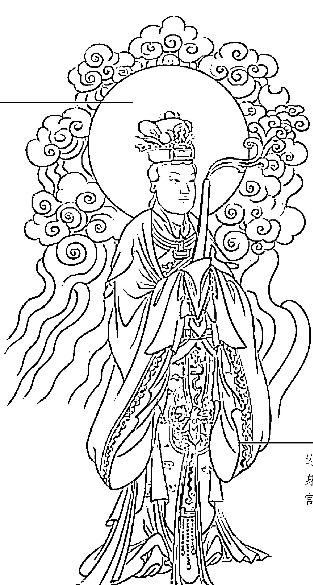

太阴即月亮，每个人四柱八字中的日干不同，则月亮对其的吉凶作用也不同。

人出生时月亮所处的宫位，便是该人的安身之处。如果安身于旺宫、乐宫，则吉祥。

## 相关链接

# 升殿星格

升殿即各星度其所掌星宿，为吉格。命宫、官禄宫等遇到此格为有利。

| 七政 | 太阳 | 太阴 | 金星 | 木星 | 水星 | 火星 | 土星 |
| --- | --- | --- | --- | --- | --- | --- | --- |
| 升殿星宿 | 星、昴、虚、房 | 张、毕、危、心 | 鬼、娄、牛、亢 | 井、奎、斗、角 | 参、壁、箕、轸 | 觜、室、尾、翼 | 柳、胃、女、氐 |

古今图书集成白话图解·星命
卷八 三辰通载（二）：六曜论断篇

## 4. 太阴交会 辜斯经 ：月亮与诸星相遇的吉凶

## 【原文】

- **月木：** 月木同宫瑞世儿，文章更得贵人知。如当百六真祥瑞，男主封侯女作妃。
- **月火：** 月火同宫最不宜，平生好惹是非。却因继母生灾厄，寿至中年七十希。此为水火相克则少吉。
- **月土：** 月土会遇大为灾，偏产顽愚怪质骸。父母两重人夭寿，忠臣失职窜天涯。此为土掩月之光，晦昧如此。
- **月金：** 月金二宿喜相交，百六逢之庆瑞包。天产奇人扶社稷，官尊裂土与分茅。
- **月水：** 月水相逢是福媒，人生遇此赋天才。温纯德厚荣尊爵，百六当之瑞庆来。月金月水本同一体，主人好貌聪明福贵。
- **月气：** 月气相逢大吉祥，少年满腹尽文章。若逢百六官高贵，福庇生民庆且昌。气月同宫乃谓之祥云捧月。
- **月孛：** 月孛元来喜太阴，逢之必定长精神。如逢百六加祥瑞，为官必定主权人。
- **月罗：** 太阴天首喜相遇，智将鹰扬塞外威。只恐望宵主叛逆，祸临百六主伤悲。天首罗星也。
- **月计：** 太阴天尾望宵同，爰产奸凶不孝忠。不在望时终有怪，投河毒药或瘟逢。计为天尾星。

## 【白话提要】

月亮与木星同宫，主其人必是人中之瑞，并且文章出众。如果是男人，有封侯之命；如果是女子，则有做贵妃的命。

月亮与火星同宫，则主其人一生多灾难，并且寿命不长。

月亮与土星同宫，主其人会有大的灾难，并且生性愚顽，相貌丑陋。并且其人有两重父母（即父母会离异再娶），其人虽然忠心，却仍然会丢掉官职四处流浪。

月亮与金星同宫，则主其人必是辅佐君王的奇才。

月亮与水星同宫，则其人天赋很高，性情温和宽厚，并且官位很高，受人尊敬。

# 太阴与七政四余同宫的推断

太阴即月亮，又称为莫星，色青白，性仁慈，为人臣之象。月亮运行一周天的时间约为一个月。

| 同宫之星 | 推断 |
|---|---|
| 木星 | 文采出众，又能得到大贵之人的赏识。 |
| 火星 | 性情急躁，无故招惹是非。 |
| 土星 | 性情愚钝，父母早丧，忠臣流放。 |
| 金星 | 多与女子结交，常被女子所诱惑。 |
| 水星 | 性格温厚，和睦持重。 |
| 罗睺 | 文韬武略，扬名塞外。 |
| 计都 | 夜间生人有狱讼之灾，白天生人尚可，对母亲不利。 |
| 紫气 | 衣食无忧，医术高超，传名天下。 |

月亮与紫气同宫，则其人一生极其吉祥，少年时便是个文章奇才，长大后更是官高禄厚。月亮与月孛同宫，则主其人精神抖擞，做官会有权柄。月亮与罗睺同宫，则其人必是个智慧超群的边关大将。月亮与计都同宫，则其人不忠不孝，内心奸恶。

## 5. 太阴入宫枢要歌：月亮在十二宫中的吉凶

## 【原文】

> **月子：**
月居子上号天姬，女贵男荣百事宜。若是夜生深有庆，日生还恐福倾危。
月在子宫化为天姬，星夜生人主贵。

> **月丑：**
太阴居丑曰天机，挂影扶疏耀素辉。巳癸出人如得此，官高禄厚更荣闾。
天机星主人荣贵。

> **月寅：**
太阴寅上名天昧，白日生人光太晦。在望如逢计火侵，为人秽浊还多退。
天昧星主人有祸害。

> **月卯：**
月临卯上号天琮，与日相逢最吉通。嫌怕计都同此地，夜生反吉变为凶。
天琮星主吉卯为月之喜宫。

> **月辰：**
太阴辰位曰天璇，金若同宫瑞自然。更得孛星相会照，为官为福又长年。
天璇星主官显。

> **月巳：**
数当阳极渐阴生，玉鹿天星月化成。珠玉不特多蓄积，更兼官显有声名。
玉鹿星主显达。

> **月午：**
离宫逢月号天衣，此位朝居倍有辉。设若太阳同此位，身荣衣锦故乡归。
太阳太阴同此，宫主享福。

> **月未：**
太阴在未号天圭，千载欣逢明圣时。月孛更来同会照，蟾宫折取最高枝。
未乃月之乐宫，化天圭主大贵。

> **月申：**
太阴晋分曰天潢，与水同居福禄昌。纵有孛星相照破，也须荣贵富而康。
月化天潢主大富贵。

> **月酉：**
天柱之星属太阴，喜居酉位福原深。夜生管取多祥泰，一世优游祸不侵。
酉乃月之乘旺，化天柱星主人富厚。

> **月戌：**
月临戌上名天辅，喜到奎娄为妙度。玉兔扬辉倍有情，禹门快跃朝天步。
戌乃月入庙又化天辅星，主大贵。

> **月亥：**
天晔变化太阴星，散彩中宵分外明。吉宿同宫宜贵显，少年及第播清名。
月到亥宫化为天晔星，主少年科第大显。

## 【白话提要】

此处歌诀，描述的是月亮居于十二宫的吉凶状况。一般月亮居于子宫、丑宫、辰宫、巳宫、午宫、未宫、申宫、酉宫、戌宫、亥宫，皆吉。

## 6. 太阴躔度 玉关歌：月亮在二十八宿的吉凶

### 太阳躔青龙七宿

## 【原文】

> **月角：**
月躔角宿号天贵，学问渊源须大智。多才慈惠更温良，夜里生人最为利。

> **月亢：**
月躔亢宿号天玑，富贵荣华人好异。平生安乐足丰荣，妻妾容颜更奇美。
亢属金与月会则金月皆有貌主吉。

> **月氐：**
月躔氐宿名天劫，性急多嗔又乖劣。日生兵火须逢难，若是夜生衣禄绝。

> **月房：**
月躔房宿号天祥，文昌学问更蕃昌。出众机谋多计巧，平生衣禄寿须长。

> **月心：**
月躔心宿号天辕，运用机谋智未全。少年未脱生涯计，如临晚景始安然。
心乃月之本位主平等。

> **月尾：**
月躔尾宿号天宗，勇智多谋胆气雄。穿窬剽掠心常有，见木方教免祸凶。

> **月箕：**
月躔箕宿号天财，冠古穷今学问该。但得对宫逢吉曜，文星得地应儒魁。

### 太阴躔青龙七宿的推论

太阴躔二十八宿各有所主，躔青龙七宿的推论详列如下：

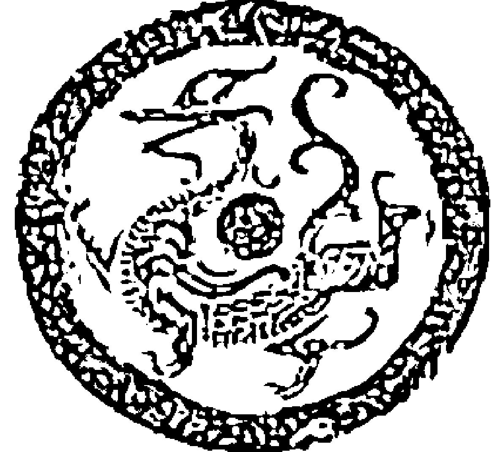

| 躔宿 | 推论 | 躔宿 | 推论 |
|---|---|---|---|
| 角 | 学问渊博，温良慈惠。 | 心 | 少苦谋生，老来安然。 |
| 亢 | 富贵荣华，一生丰足。 | 尾 | 勇智多谋，胆识过人。 |
| 氐 | 急躁易怒，性情乖劣。 | 箕 | 对宫吉曜，学贯古今。 |
| 房 | 机智多谋，富足长寿。 | | |

### 太阴躔玄武七宿

## 【原文】

> **月斗：**
月躔斗宿号天封，伟望威名学问通。君子逢之须得禄，小人遇此走西东。
此为木月清贵之格。

> **月牛：**
月躔牛宿号天荫，作事施为要沉审。性直温良少苦辛，才过中年便安稳。
牛金牛会月，有相生之义。

> **月女：**
月躔女宿号天宝，学问聪明多智巧。文章冠世早登荣，迁官必定居廊庙。

> **月虚：**
月躔虚宿号天常，有貌多才更善良。衣食丰盈仓库实，声名闾里自揄扬。

> **月危：**
月躔危宿号天文，磊落襟怀少比伦。为人玷污多奸巧，图画机关行不真。
月在危化天文星，主人巧智多奸。

> **月室：**
月躔室宿号天鸾，形貌清奇富且安。更得木星同位立，直须奏对近天颜。

> **月壁：**
月躔壁宿号天华，语言蹇滞事沉思。若遇蚀神兼月孛，主须生长在寒微。

### 太阴躔玄武七宿的推论

太阴躔二十八宿各有所主，躔玄武七宿的推论详列如下：

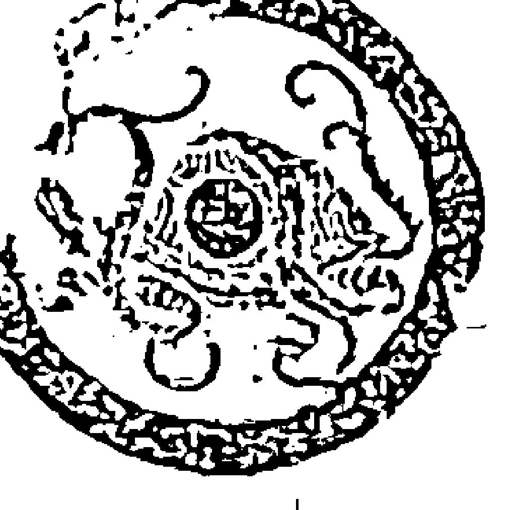

| 躔宿 | 推论 | 躔宿 | 推论 |
| :--- | :--- | :--- | :--- |
| 斗 | 君子得禄，颇有威望。 | 危 | 胸襟磊落，满腹经纶。 |
| 牛 | 事须慎重，少年困苦。 | 室 | 形貌清奇，富贵双全。 |
| 女 | 学识聪明，文章冠世。 | 壁 | 说话吞吐，做事谨慎。 |
| 虚 | 才貌双全，衣食丰盈。 | | |

### 太阳躔白虎七宿

## 【原文】

> **月奎：**
月躔奎宿铭肝肠，不劳余力至员郎。要得吉神居十位，定应台辅佐君王。
月水相生主此。

> **月娄：**
月躔娄宿号天垣，旺庙之中福禄全。君子迁官居禄显，小人衣食旺庄田。
月金会度主此。

> **月胃：**
月躔胃宿号天印，十度之中贵无并。更兼金木又同行，金榜题名官一品。
月土会度主此。

> **月昴：**
月躔昴宿号天光，平生官禄不寻常。聪明才貌超今古，异日须为给谏郎。

> **月毕：**
月躔毕宿号天明，峻宇雕墙乐太平。更得金星来照助，少年及第占魁名。
毕月乌月之本度所以为吉。

> **月觜：**
月躔觜宿号天女，富足之人更有官。贤淑生来形貌美，此身自在不胜欢。
觜火猴度下火升殿主吉。

> **月参：**
月躔参宿号天官，俊义宏才学问宽。富足慈仁心好善，贵人和色对天颜。
水月同度，主人多智有才貌。

### 太阳躔朱雀七宿

## 【原文】

> **月井：**
月躔井宿号天充，夜生轻巧性奸雄。爱说是非心不定，文章必定是虚空。

> **月鬼：**
月躔鬼宿号天鸾，好乐之宫每事安。得力相生官位吉，公卿要路上金銮。
鬼金羊度月之本宫。

> **月柳：**
月躔柳宿号天觚，德行清高爱读书。聪俊文词人最重，声名扬赫帝王都。
月行柳度二三度为月挂柳梢，五度之外非是。

> **月星：**
月躔星宿号天节，欢乐虽多病磨折。贪悭财物行无良，性急多嗔有灾厄。

> **月张：**
月躔张宿号天曹，才力经营志气高。形貌端方荣贵早，晚年又见福坚牢。张月鹿月之本度。

> **月翼：**
月躔翼宿号天迤，虽然禄位也艰辛。骨肉分离难保守，又知寿夭是元因。

> **月轸：**
月躔轸宿号天理，勇智多端文学取。少年辛苦老丰隆，赫奕声名传万里。

## 【白话提要】

此处歌诀所描述的，是月亮居于二十八宿的吉凶情况。一般月亮居于二十八宿中，除氐宿外，各宿皆会吉祥。此外，月亮躔于井宿时，其人如果是夜间出生，则会是个投机取巧的奸雄。

### 太阴躔白虎七宿、朱雀七宿的推论

太阴躔二十八宿各有所主，躔白虎七宿、朱雀七宿的推论详列如下：

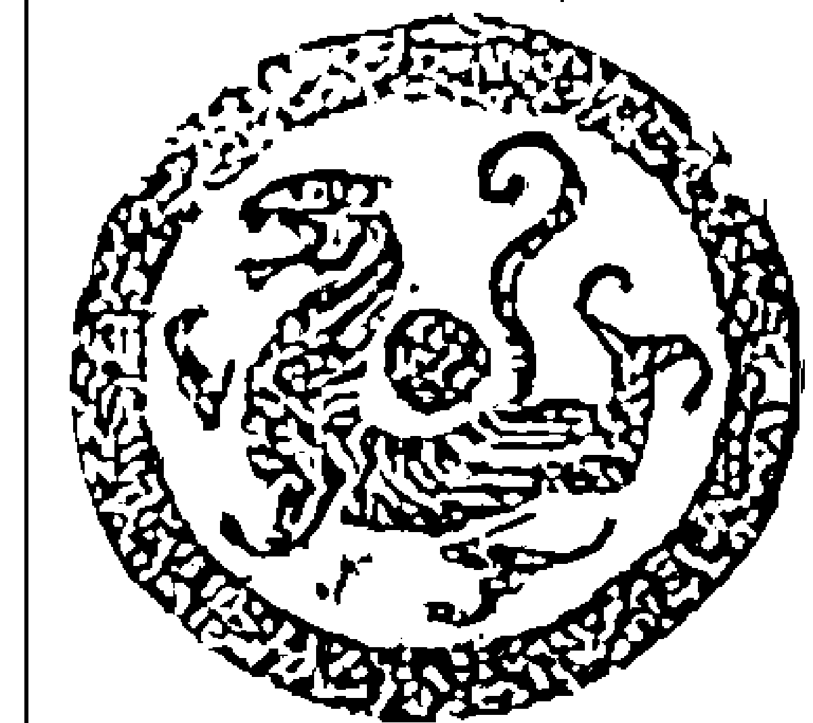

| 躔宿 | 推论 | 躔宿 | 推论 |
|------|------|------|------|
| 奎 | 不劳余力，官至员郎。 | 毕 | 相貌堂堂，健康长寿。 |
| 娄 | 行旺庙宫，福禄双全。 | 觜 | 容貌俊美，富足有官。 |
| 胃 | 十度之双，富贵无双。 | 参 | 貌美才高，富足心善。 |
| 昴 | 高官厚禄，异于常人。 |   |   |

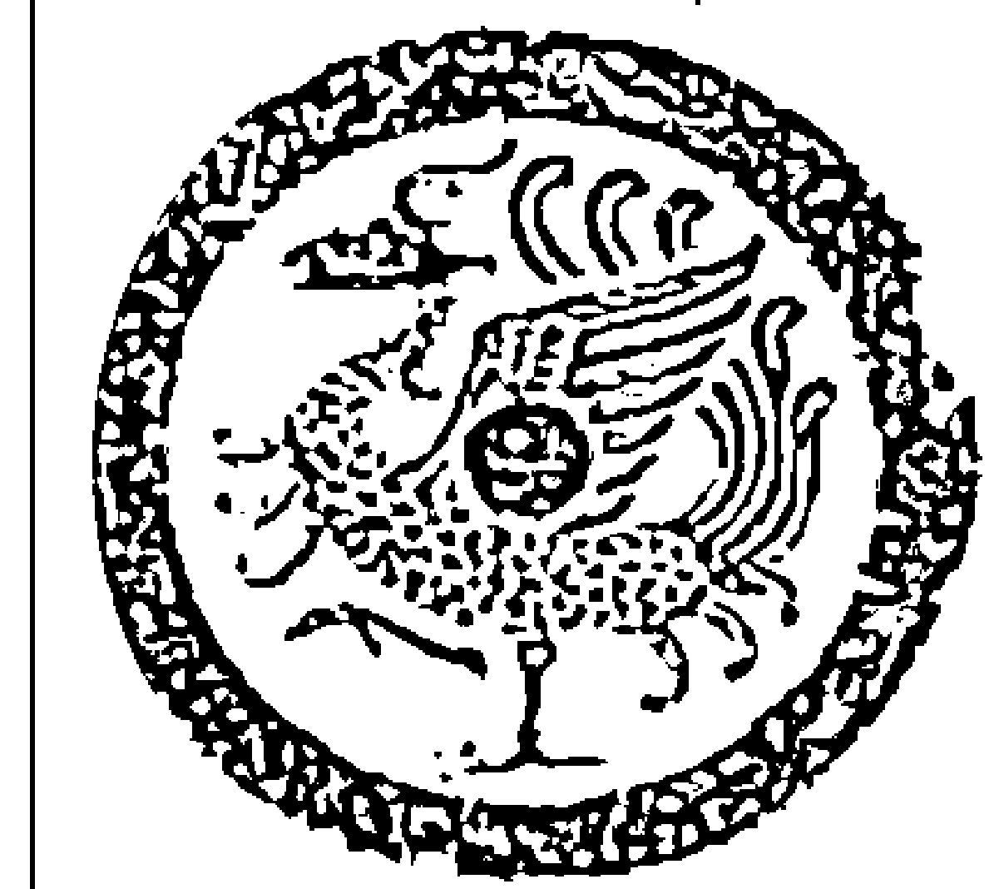

| 躔宿 | 推论 | 躔宿 | 推论 |
|------|------|------|------|
| 井 | 夜生奸雄，爱说是非。 | 张 | 志气高远，善于经营。 |
| 鬼 | 平安喜乐，官至公卿。 | 翼 | 骨肉分离，性命夭折。 |
| 柳 | 好读诗书，名达京都。 | 轸 | 少年辛苦，老来丰隆。 |
| 星 | 欢乐虽多，疾病缠身。 |   |   |

## 7. 太阴照宫 琅纡经：月亮照临十二宫

## 【原文】

> **月命宫：**
月照人无俗孤，多自有成掌财宜，市贾托贵有权名，性急招言妒妻良。赘可膺若能员，夜照则禄自兴荣。
又曰：
照命分明有太阴，生来财禄不劳寻。凶神若也来相犯，到老无成枉用心。太阴喜独行则吉，凶神相犯变吉为凶。

> **月财帛：**
月居财帛福为深，更加庙旺足珠金。食神若也相兼照，纵有家赀祸更侵。食神食月之神月，遇之则食。

> **月兄弟：**
兄弟亲疏如手足，若值太阴大为福。只恐女多并异胞，南北分居难并屋。太阴女主之象以多女论。

> **月田宅：**
太阴田宅若相逢，自立荣华万事通。阴贵又增招满益，迁移三处振家风。田宅宫无凶星相犯主吉。

> **月男女：**
阴偶临宫识者稀，女先男后始为奇。不惟英俊无刑克，更见高高折桂枝。月乃为人之母故吉。

> **月奴仆：**
六位名为奴仆宫，为官须有吉星逢。月守是宫先克父，昼生夜照母先凶。夜生人吉，昼生人反之。

> **月妻妾：**
太阴西没最为佳，明静之宫无点瑕。更若尊星相对望，必生贵子佐皇家。主妻美丽清洁。

> **月疾厄：**
太阴临照八宫存，毕世灾危杳不闻。忌曜莫教同此位，双眸浑似月遮云。日月为天眼，月在疾厄以目论。

> **月迁移：**
太阴得在九宫中，三合加临照命同。偏利迁移商贾客，必因阴贵得财丰。

> **月官禄：**
太阴官禄作身宫，朗朗光华福倍隆。更在庙方功愈重，贵因皇戚得侯封。要在庙旺之官方有此贵。

# 太阴照临身命十二宫

六曜照临十二宫各有所主，其中，太阴照临十二宫推断如下表所示：

**太阴照临命宫**

| 属性 | 描述 |
|------|------|
| 形貌 | 形貌清奇古朴，身材不肥胖，面为方形，颇为有神，骨相、面色清奇。 |
| 性情 | 性情急躁，能借亲戚之力而成力，做事勤奋，思虑深得。 |
| 财运 | 最宜行商，财产失而复得，能担重事，即使在穷苦之中也能成就事业。夜间生人更吉，是财禄丰足之命。 |

| 财帛宫 得贵人之力，成就财富事业。 | 命宫 形貌清古，忧勤不倦，最宜为商。 | 相貌宫 形相俊秀，多被小人轻视，不可做低下的营生。 | 福德宫 得遇有福之人的提携，因此福气高于常人。 |
| --- | --- | --- | --- |
| 兄弟宫 兄弟和睦，只是姐妹较多，分散两地。 |  |  | 官禄宫 宜做大官，如果有官灾，则可获得恩赦。 |
| 田宅宫 广置田宅，开拓产业，高贵之命。 |  |  | 迁移宫 一生好远游，经常出行到其他地方。 |
| 男女宫 亲近贵人，一子有成就，多生女儿。 | 奴仆宫 主招鞍马之仆，有得力的女仆。 | 妻妾宫 妻子有贵相，因妻子家而兴旺发达。 | 疾厄宫 一生少有疾病，长寿，不遇天灾。 |

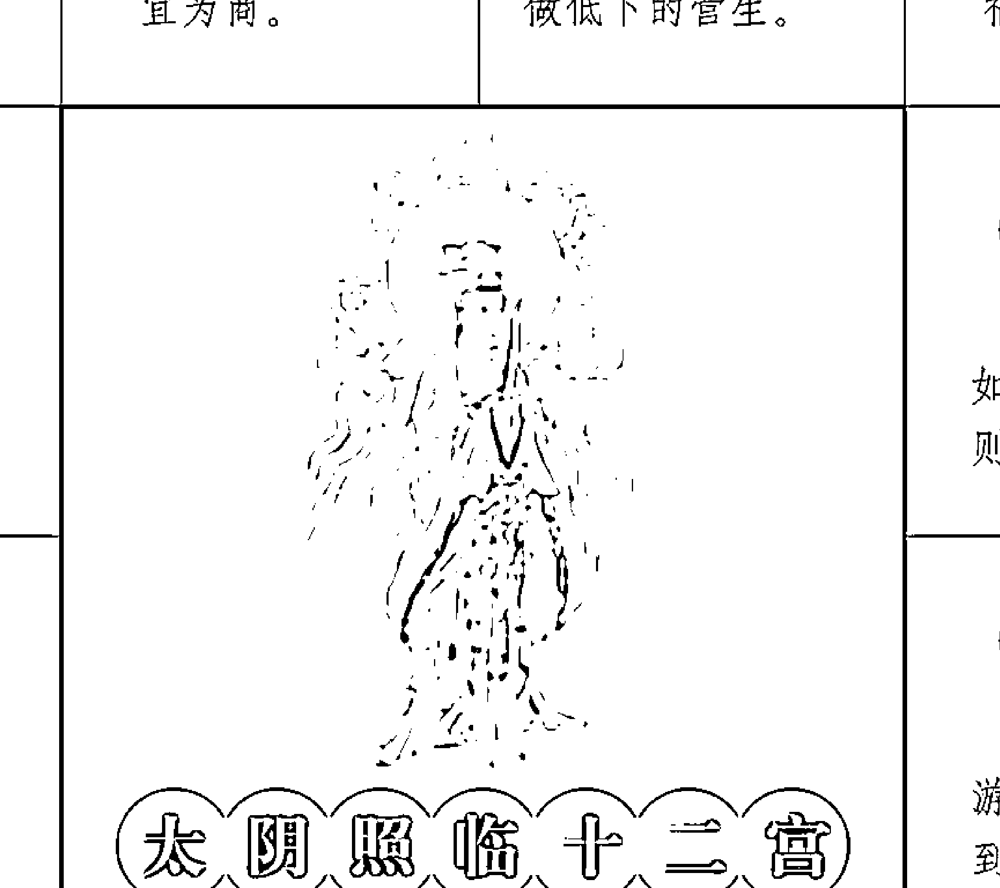

> **月福德：**
阴耦来临福德宫，雍容道德贵尊崇。更有吉星来本位，为官须坐玉堂中。吉星同度主有大福。

> **月相貌：**
相貌宫中有太阴，命中吉曜喜相侵。忽然忌曜来相犯，甘旨空持养母心。有吉星主吉，有凶杀则凶。

## 【白话提要】

此处为月亮居于十二宫的吉凶情况。一般月亮居于命宫、财帛宫、兄弟宫、田宅宫、男女宫、妻妾宫、迁移宫、官禄宫、福德宫、相貌宫，皆吉。月亮居于疾厄宫，主其人一世没有灾害，但是如果有忌曜与月亮同位，则其人会患有眼疾。

# 第十七章 三辰通载·紫气：紫气吉凶断

## 1. 紫气算法 气星篇：紫气的定度法

## 【原文】
置积日减一千二百八十八，以一万二百二十八大数除之不尽为残，分转一当十以二百八十为一度，二十八为一分，次下除为秒。
平行：一日行三分五十七秒。

## 【白话提要】
此处是对紫气星定度的计算。“积日”，是星算学中的太初元历起始至作者著书的年数；“减一千二百八十八”，则是一个调整误差的常数；“一万二百二十八”，则是指紫气星的运行大周期。总之，经过复杂的计算之后，可以得出紫气平行速度是，一个太阳日运行三分五十七秒。

## 2. 紫气总论：概述紫气之运行规律

## 【原文】
天乙紫气续木之余，在天无象，以木德最厚，立此名以追步，其余光用之效久不废，其行度无伏见迟疾退留。自奎宿十一度至十五度为正庙，或言觜宿庙，又言牛宿庙。躔室牛为旺，尾箕为乐。
若人身命宫值之，更在庙旺，无凶照破，处世富贵，福寿双全，仁慈道德，好善乐贤，能解计孛火土之难。若临陷没，亦九流僧道，其星为孤星，主人心孤身寡，一生好静，为人之寿星，又为文人解宿，但守身命，为人豁达之操，对照则为福德，但癸人见之减力，六辛人为天禄，情性清慈。吉祥之曜，主道艺之流。若人生时临照、主富贵长寿，遇凶而不成灾，凡二十九年行一周天。

## 【白话提要】
紫气也称为天乙星，为木星的余气，在天上没有具体的形象，其秉承着木星之德，永远不会被废弃。紫气星的行度没有伏见迟疾退留等变化。从奎宿十一度至十五度为紫气的正庙，也有人认为觜宿或牛宿为正庙；室宿与牛宿为旺宫；箕宿为乐宫。

## 3. 紫气歌断 源髓歌：紫气判断歌诀

## 【原文】
紫气众星中最善，形相分明人仰美。心怀仁义性温柔，作事与人为方便。
无妒毒，多谨愿，少病利官长寿算。好耽僧道立身孤，举措施为慵更懒。
太阳近贵作闲人，月会母亲先化幻。夜火同时医与巫，土木更来尤懒慢。
金同妻妾是娼尼，水会智能称俊彦。彗星分得贱人财。天首僧尼讼争战。
天尾星同有机变。财位横来财宝现。三宫姊妹或为僧，田宅高田主巨富。
奴仆门下出缁流，子息须知女先见。西没宫中妻密情，更与别人情似线。
八宫终不染时灾，官位不曾见州县。九宫游贾福宫闲，相貌为人性良善。
彗星即月孛也，能盗人财物，天尾星计都也。

## 【白话提要】
紫气星是众星曜中最善的一颗星，主其人相貌出众，心地善良，常怀仁义，性情温和，做事情总会处处给别人方便，并且没有妒忌心，一生少病，寿命很长。紫气居于十二宫中，则大多为吉星。

## 4. 紫气交会 聿斯经：紫气与月孛、罗睺、计都相遇的吉凶

## 【原文】
> **气孛：**
紫气挨抢两会期，庆来百福尽相宜。官居柱石人间瑞，泽及生民万汇依。

> **气罗：**
紫气罗·喜会同，人生刚毅足英雄。挥戈却自平奸虏，笑取功勋反掌中。

> **气计：**
气曜还同见计都，家多财帛富庄租。此宫人产天然福，百六逢之万祸祛。

## 【白话提要】
紫气与月孛同宫，则会有百福临身，并且其人还会成为一个给民众带来幸福的好官。
紫气与罗·同宫，主其人极其刚毅，是个大英雄，会成为著名的将领。
紫气与计都同宫，主其人财富很多，会有天赐之福。

## 5. 紫气入宫 枢要歌 ：紫气在十二宫中的吉凶

## 【原文】

- **气子：** 紫气齐瓶号玉清，只宜恬淡养精神。命宫遇者伤妻子，散诞清闲僧道人。气在子宫化为玉清星，主修道清高。
- **气丑：** 气星在丑曰天元，生世无灾福庆全。更得吉星相会照，前遮后拥是神仙。丑宫化为天元星主吉。
- **气寅：** 气居寅上名天饬，独享清闲人不识。容貌端严冠众伦，落纸烟云挥彩笔。化天饬星主有文章。
- **气卯：** 气星在卯号天空，克害妻儿年少终。不是僧尼井艺术，一生孤独更飘蓬。化为空主，孤独无积。
- **气辰：** 华盖从知气在辰，此星虽独却堪亲。优游享用无灾咎，啖柏餐松物外人。化华盖主清庙。
- **气巳：** 气居双女号天相，家积珠珍主富藏。福厚清闲并寿永，只愁妻子见刑伤。主富而刑妻。
- **气午：** 紫气临周号玉肌，人生逢此诚为美。太阳设若同宫分，富贵荣华世无比。化玉肌主子孙荣贵。
- **气未：** 气居未位名天廪，润色文章铺秀锦。更得主星在高强，家多珍玉丰腴甚。化天廪主富足。

# 六曜之紫气

紫气星又称为景星、道德之星，为吉祥星曜。紫气行宫度一日行3分57秒，一宫住28个月，28年运行一周天。

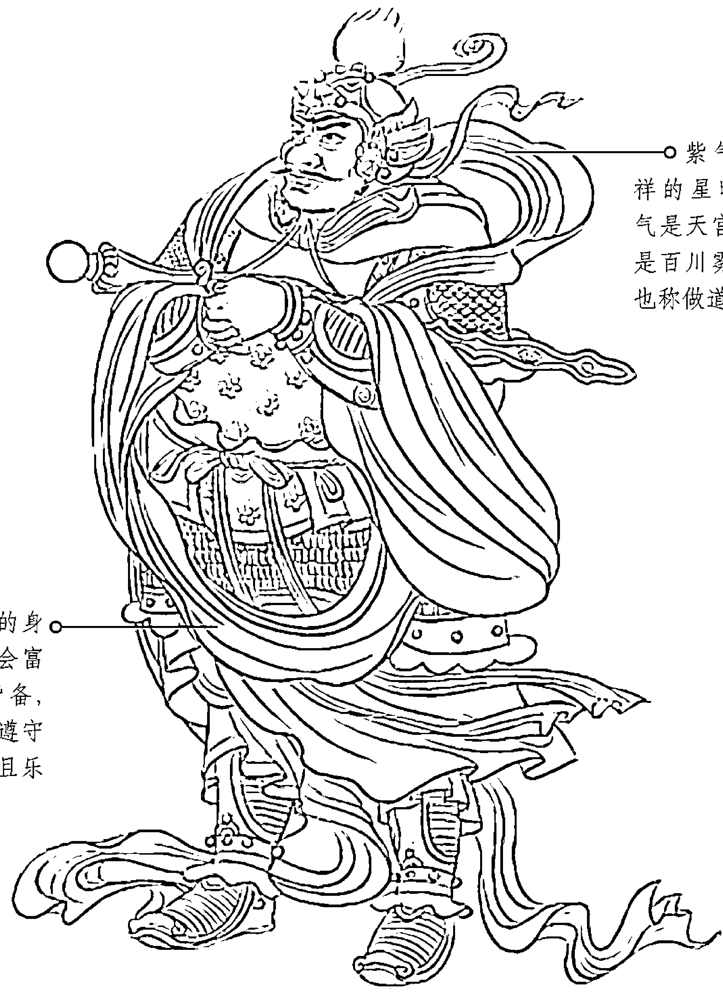

# 紫气临喜怒宫

| 标志 | 名称与入宫 | 推断 |
| :--- | :--- | :--- |
| 喜 | **名称** 太极紫微文凤清福星 **入宫** 庙丑，旺亥，好寅，乐申，安午戌 | **照身命宫**<br▷▷ 性格清洁，为人温厚 **照官禄宫，会吉星**<br▷▷ 官至六品 **临官禄宫，无禄马**<br▷▷ 中等福气的人 |
| 怒 | **名称** 天女天虞星、天会天匪星 **入宫** 未 | **照身命宫，无救星**<br▷▷ 出家为僧道 **平常人，在陷宫见之**<br▷▷ 冲克妻子，颜色乌黑 **照身命宫，有救星**<br▷▷ 清贵之人 |

紫气：
紫气在申宫曰天贵，此宫庙旺最为奇。一生独享清闲福，作事临危又不危。
化紫微清高受福。

紫气在酉宫：
紫气金牛号凤凰，一生享福最安康。文章锦绣闻天下，若占高强入庙堂。
酉为金牛，化凤凰主富贵。

紫气在戌宫：
紫气在白羊名玉贯，空房独守谁为伴。同宫最怕火罗侵，破败家财心绪乱。
戌为白羊化玉贯，忌火罗。

紫气在亥宫：
亥宫紫气名天贵，禀性清闲无所累。木土那堪会舍行，少年显达功名遂。
化为天贵主享福。

## 【白话提要】
此处歌诀，描述的是紫气居于十二宫的吉凶状况。一般紫气居于子宫、丑宫、寅宫、辰宫、巳宫、午宫、未宫、申宫、酉宫、亥宫，皆吉。只是紫气居于子宫、巳宫，会克伤妻子。

## 6. 紫气躔度 玉关歌：紫气在二十八宿的吉凶

## 🐉 紫气躔青龙七宿

## 【原文】
- 气角：
气躔角宿号天休，机智清闲艺术优。僧道逢人多吉庆，庶人不系若虚舟。
- 气亢：
气躔亢宿号天僮，性善文章艺术通。不独为官并富旺，神仙快乐福无穷。
- 气氐：
气躔氐宿号天环，云水留心自得闲。耿介孤高人自傲，只宜仙道坐山间。
心留云水性染烟霞。
- 气房：
气躔房宿号天冲，清福平生孰与同。道释白衣消息好，资财衣禄却丰隆。
处世优游丰衣足食。
- 气心：
气躔心宿号天德，元象天文须会德。儒门释典自能通，子孙虽有终须克。
物外消遥闲中风月。
- 气尾：
气躔尾宿号天渊，心性豪强克陷缠。谋略威权人莫测，声名忠义史书传。
胆壮心雄威名赫赫。
- 气箕：
气躔箕宿号天循，智识机谋果毅深。性直文章声远播，贵人相遇有知音。
心性刚果文思深长。

### 紫气躔青龙七宿的推论
紫气躔二十八宿各有所主，躔青龙七宿推论详列如下：

| 躔宿 | 推论 |
|------|------|
| 角 | 机智清闲，多才多艺。 |
| 亢 | 善做文章，精通艺术。 |
| 氐 | 耿介高人，如同仙家。 |
| 房 | 得享清福，衣禄丰足。 |
| 心 | 能通儒释，能观天文。 |
| 尾 | 豪强之人，克害子孙。 |
| 箕 | 机智果敢，声名远播。 |

# 紫气躔玄武七宿

## 【原文】
- 气斗：
气躔斗宿号天斛，飘然孤洁为清福。文章忠直外安闲，朋友柔和衣食足。
心逸身安，清名林下。
- 气牛：
气躔牛宿号天轮，尊重清高害六亲。金火逢之官显赫，如逢木月富豪人。
闲中风月，个里乾坤。
- 气女：
气躔女宿号天瑞，耿介孤高性独明。但得吉星居十位，必为廊庙福苍生。
秉直敦素，独显清朝。
- 气虚：
气躔虚宿号天文，清秀为人近至尊。骨肉难为自孤洁，达人僧道乐衡门。
优游岁月，洞达风流。
- 气危：
气躔危宿号天侗，章服平生与贵同。说地谈天心晓悟，逍遥乐道在崆峒。
- 气室：
气躔室宿号天元，道释儒流性自然。经术从来胸臆悟，文才洞彻事神仙。
闲中乐道，性里谈元。
- 气壁：
气躔壁宿号天觉，机智文章更多学。更能筹悟天机，举错能为应不错。
多学多文，能谋能干。

### 紫气躔玄武七宿的推论
紫气躔二十八宿各有所主，躔玄武七宿推论详列如下：

| 躔宿 | 推论 |
|------|------|
| 斗 | 禀性孤洁，一生安闲。 |
| 牛 | 尊重清高，克害六亲。 |
| 女 | 性情孤高，耿介之人。 |
| 虚 | 骨肉分离，僧道之人。 |
| 危 | 谈天论地，一生逍遥。 |
| 室 | 道释儒流，品性自然。 |
| 壁 | 机智多学，得悟天机。 |

身居隐逸，笑傲烟霞。

# 紫气躔白虎七宿

## 【原文】
- 气奎：
气躔奎宿号天乙，性直忠良又烦急。平生多是不安闲，不受人欺财聚积。
心直而性急，忙里且生财。
- 气娄：
气躔娄宿号天虚，骨肉无缘克害疏。自是缁黄遮体服，清闲衣食乐虚无。
空门而守静，禅榻以安闲。
- 气胃：
气躔胃宿号天音，衣禄生来必称心。妻子宫中难聚会，四方交友自同襟。
非术士之客，亦九流之士。
- 气昴：
气躔昴宿号天端，重厚为人命亦寒。耿介性情难得犯，家门忠孝百行安。
声名颇重，仁义同和。

# 紫气躔朱雀七宿

## 【原文】
- 气毕：
气躔毕宿号天吉，天乙居中加福力。为人清秀善为文，官禄星扶进爵秩。
貌俊神清，文而且贵。
- 气觜：
气躔觜宿号天福，衣食安然百事足。金珠财宝自天来，妻子难为带孤独。
足食而优游，鳏寡且孤独。
- 气参：
气躔参宿号天琼，终是为官贵且荣。性直忠良参相位，文章事业四方闻。
振声名于天下，扶日月于枫宸。
- 气井：
气躔井宿号天令，文武双全才更敏。参枢给谏尽功名，官职崇高年寿永。
怀文武之全才，包机谋之大略。
- 气鬼：
气躔鬼宿号天荣，积善之家有此人。富贵崇高声远振，官途起越旺门庭。
乐富贵以安然，在官家而度日。
- 气柳：
气躔柳宿号天平，好静温良免祸生。衣食平平无破败，子孙终是不相亲。
禀性孤高，生平淡薄。
- 气星：
气躔星宿号天强，命中若遇定孤孀。财旺家门自兴盛，若为僧道寿延长。
宿梅花之纸帐，坐禅榻之风光。
- 气张：
气躔张宿号天芒，克害妻儿命里当。纵有高才心又急，晚年方可免恓惶。
一生孤寂寞，半世且郎当。
- 气翼：
气躔翼宿号天牢，命宫若值定孤高。生计为谋多费力，若为僧道自逍遥。
邀山间之明月，乐林下之清风。
- 气轸：
气躔轸宿号天嗟，孙子丰隆后必乖。命若逢之身独喜，此人衣食稍宽怀。

## 【白话提要】
此处歌诀所描述的是紫气居于二十八宿的吉凶情况。一般紫气居于二十八宿中的各宿皆会吉祥，只是大多会不利于妻子，因为命逢紫气之人，常常有信佛向道的倾向。紫气居于娄宿、昴宿为次吉；居于张宿、翼宿、轸宿最差。

### 紫气躔白虎七宿及朱雀七宿的推论
紫气躔二十八宿各有所主，躔白虎七宿、朱雀七宿的推论详列如下：

- **奎**：禀性忠直，不受人欺。
- **娄**：性情孤僻，疏远亲朋。
- **胃**：衣食称心，难有妻子。
- **昴**：性情耿介，家风忠孝。
- **毕**：为人善良，官禄颇高。
- **觜**：衣食无忧，财物自来。
- **参**：官高身贵，耿直忠良。
- **井**：文武双全，给谏功臣。
- **鬼**：出身富贵，兴旺门庭。
- **柳**：温良娴静，衣禄平平。
- **星**：孤孀之命，家门财旺。
- **张**：克害妻儿，沧海遗珠。
- **翼**：性情孤高，苦谋生计。
- **轸**：忧于衣食，一生孤独。

## 7. 紫气照宫 琅玕经：紫气照临十二宫

## 【原文】
- 气命宫：
气星临命照，游艺最相宜，任重防倾阻，名高财业微，初年多费力，聚散六亲离，最好中年后，兴荣向老时。
又曰：
紫气临宫学冠伦，如为忌曜号孤神，虽然不是天庭客，也作禅门第一人。
紫气主孤，虽贵而无子，逢空主为僧道。
- 气财帛：
紫气木星虽吉曜，第二宫中不为。妙克已待人是此，星宫主强时财可穀。
主财虚耗散，专为别人求。
- 气兄弟：
紫气来临兄弟时，孤星却主两分离。虽然暂且同相聚，反目无情各所之。
无则自立，有则各分离。
- 气田宅：
当生紫气四宫行，福荫双亲保寿龄。看取耆年精力健，都缘强位老人星。
田园乐逸黄耇无疆。
- 气男女：
气星来照子孙宫，颖悟聪明更美容。迈祖超宗荣贵显，家门昌盛福无穷。
秋水精神儿女貌，冰清玉洁子孙容。
- 气奴仆：
仆宫紫气两同行，落陷孤高总欠情。奴仆成行难保住，自家炊爨自家亲。
独行独坐无人伴，自炊自煮乏亲临。
- 气妻妾：
七宫妻妾气相逢，必主当年有克凶。若在命中及官禄，方袍员顶或孤从。
玉笙金磬长相守，纸帐梅花独自眠。
- 气疾厄：
解灾脱难最高强，紫气生平免祸殃。道德日彰君子泰，超群发秀寿延长。
添君子之志，解小人之灾。
- 气迁移：
第九宫中有寿星，堂堂眉宇美精神。岂知天上清高秀，下照尘寰有道人。
在天上神仙之府，主人间道德之人。
- 气官禄：
紫衣师道九流人，官禄宫中紫气辰。若是孤高兄弟散，任他清贵作高真。
受天帝之玉牒，作紫府之元君。
- 气福德：
俊雅超群紫气星，来居福德福频频。必然显达应三主，若是为官在大臣。
立鸳鸯之班，居凤凰之池。
- 气相貌：
相貌宫中紫气临，精神潇洒福原深。如何晚景身康健，寿宿当年在此任。
福如东海之深，寿比南山之盛。

## 【白话提要】
此处为紫气居于十二宫的吉凶情况。一般紫气居于命宫、田宅宫、迁移宫、官禄宫、福德宫、相貌宫，皆吉。

### 紫气照临身命十二宫
六曜照临十二宫各有所主，其中，紫气照临十二宫推断如下表所示：

**紫气照临命宫**
- 形貌：容颜尊贵，体形不肥胖，骨节柔长。
- 才华：见水星、太阴，主好奇异书画。
- 性情：机敏通变，遇事有决断，性情善良，喜好清静，僧道之人大利。
- 官运：见金木火月，为极贵之人。见金火，主官居显赫。

| 宫位 | 推断 |
|------|------|
| **财帛宫** | 财物先破后立，比之前更加丰隆。 |
| **兄弟宫** | 兄弟有贵人之相，但通常反目成仇。 |
| **田宅宫** | 父母长寿，一生增进，父因子孙而得荣耀。 |
| **男女宫** | 生子较晚，早年生子则易被克害。生女则为贵相。 |
| **奴仆宫** | 大招奴马，因奴仆而发迹。 |
| **妻妾宫** | 当年有凶灾。 |
| **疾厄宫** | 一生少有疾病。 |
| **迁移宫** | 相貌堂堂，精神奕奕，为有道之人。 |
| **官禄宫** | 一生没有刑害，即使有官灾，也能解脱。 |
| **福德宫** | 福德均高，大富之人。 |
| **相貌宫** | 福如东海，寿比南山。 |
| **命宫** | 性情慈善，一生好静，利于僧道。 |

# 第十八章 三辰通载·月孛：月孛吉凶断

## 1. 月孛算法 孛星篇：月孛的定度法
【原文】
置积日加一千二百三十五，以三千二百二十五大数除之，商数一千五十列上位，其余不尽者为残分，用七因之，上位商数以二十一因之，加八下位以六十二为一度，不满者不入分秒，平行一日行十一分二十九秒。

【白话提要】
月孛星定度的计算。“置积日数”，属于星算学中的太初元历起始至作者著书的年数；“加一千二百三十五”，则是一个调整误差的常数；“三千二百二十五”，则是指月孛星的运行大周期。总之，经过复杂的计算之后，可以得出月孛星平行速度是，一个太阳日运行十一分二十九秒。

## 2. 月孛总论：月孛运行规律
【原文】
太乙月孛，乃水之余，在天无象，古人以水星在天，其行最疾为福为祸最多，立此名以推步，其余光用之有验，久而不差。其行度无伏见迟疾。自井宿十九度至二十一度为庙，踵柳宿初度至六度为偏庙，虚危参为乐，踵胃为旺。
若人身命值之更在庙旺宫，皆为禄主，果断雄武，亦大贵人。喜行阴宫。夜生忌于他星同、只宜独行、为灾为福力大。如遇火土罗计同宫、变福为祸，君子遇之时有不仁，女人见之淫荡无禁，在疾厄宫主隐僻之疾，六丁人为囚星，六乙人为天禄。此星多暗昧不明，兴危亡之灾。主头风之疾，遇凶则助凶，遇吉则助吉，大约九年行一周天。

【白话提要】
太乙月孛是水星的余气，在天上没有具体的形象，古人根据水星来判断月孛的运行位置。月孛星在天上运行速度最快，其为吉星时，带来的福气最多；为凶星时，带来的祸害也最多。月孛的运行没有伏见迟疾等运行状态，从井宿十九度至二十一度为正庙；柳宿初度至六度为偏旺宫；虚危参为乐宫；胃为旺宫。

## 3. 月孛歌断 源髓歌：月孛推断歌诀
【原文】
彗星威烈形似黑，眉目精神光灼烁。神威镇猛少言词，胆气雄心性恶。
能运谋，多礼乐，最有心机难测度。财多聚散一身孤，父母家财多索寞。
金牛巨蟹及双鱼，宝瓶宫中好安着。堂堂容貌有威权，富贵峥嵘人惊愕。
日月会，事安着，父母凶狂先盖椁。木来必定助威权，金会贪淫妻爱谑。
男为巫术女为尼，水到穿窬入楼阁。土火乱世号英雄，紫气更能修合药。
天首会，好劫掠，天尾法场世抛却。居财临宅破家赀，兄弟奴宫难检约。
疾厄肠风内主灾，西没五位都丧却。官宫凌辱夭天年，十一宫中偏福薄。
九宫飘泊相不全，依此推之终不错。
彗扫帚星也。罗星为天首，计星为天尾。

【白话提要】
月孛也叫做彗星，性质威烈形似一团黑气，也称为扫帚星。月孛星主人眉目有神彩，精神充沛，威风凛凛，平时不爱说话，内心富于谋略，外表守礼节，是个城府很深的人。月孛居于十二宫，则各有吉凶。

## 4. 月孛交会 卑斯经：月孛与罗睺、计都相邻的吉凶
【原文】
- 孛罗：
孛星若会罗宫，勒石燕然纪大功。常人遇此必多灾，百六逢之定主凶。
- 孛计：
月孛计都不可逢，人生淡泊主贫穷。偏招宿疾风痨厄，百六逢之不善终。

# 六曜之月孛
月孛又称为彗星、妖星、天哭毛头星等，此星的出现能使众星曜都黯然失色，所主分野内出现天灾人祸。月孛行宫度一日为11分29秒，一宫住9个月，9年运行一周天。

# 月孛临喜怒宫
| 名称与入宫 | 推断 |
|------------|------|
| **喜** 名称：天枢天曲天璇星 入宫：庙未、旺寅、好巳、乐酉、喜申、顺子 | 身命遇之 ▷▷ 性情凶险，做事激烈 与五星同在身命，八煞官禄 ▷▷ 有清贵之职 平常人遇此星格 ▷▷ 多有灾厄，对妻儿不利，具体推断看所居宫位 |
| **怒** 名称：丧车鬼灾天彗星 入宫：戌 | 身命遇之 ▷▷ 多惹是非，贪恋酒色 身命遇之，又犯煞星 ▷▷ 徒配远方 官禄宫遇之 ▷▷ 有不测之灾，为贪婪下贱之人，不得好死 |

# 月孛入宫与同宫的推断

### 月孛入七宫的推断
| 月孛入宫 | 推断 |
| :--- | :--- |
| 日宫、木宫 | 为人稳重，心性耿直。三方都在强宫，则少年荣达；不在强宫，则主少年时虽有贵人看重，但诸事不成。 |
| 火宫 | 性情爽快，口无遮拦，一生招惹是非，应防女子或小人的暗算。 |
| 土宫、金宫、水宫、月宫 | 性情刚烈，做事忠直，有计谋，好杀害。 |

### 月孛与七政四余同宫的推断
| 月孛同宫之星 | 推断 |
| :--- | :--- |
| 金星 | 夫妻行为不良。男为巫师，女为巫婆。 |
| 水星 | 因文采、学问而致灾祸，多为虚诈之人。 |
| 火星 | 心地善良，但诸事难以成为现实，或有痈疽脓血之症。 |
| 木星 | 宜于做官，不宜学习才艺，夭寿，多为悖逆之人。 |
| 土星 | 夜间生人折损寿命，或伤财、遭刑害，或有喑哑之疾。 |
| 罗睺 | 如各居庙旺之地，便主有威权。 |
| 计都 | 奸淫之人，为人不廉洁，多有损破之事。 |
| 紫气 | 心灵手巧，多才多艺，衣禄、文采丰足，把握权柄。 |
| 太阳、太阴 | 对父母不利，做官则掌生杀大权。白天生人好斗，夜间生人好酒嗜赌。 |

## 【白话提要】
月孛与罗睺同宫，则军人可以建立大的功勋。平常百姓逢此，则必定多灾多难。
月孛与计都同宫，则其人一生淡泊贫穷，并且还会有重病缠身，不能善终。

## 5. 月孛入宫 枢要歌：月孛在十二宫的吉凶
## 【原文】
- 孛子：
孛星在子名天酷，禀性凶顽还有福。遇者妻儿有克伤，权谋机变般般足。
孛在子宫化为天酷星。
- 孛丑：
孛居丑位曰天柔，钦任雍容拱斗牛。化作刑囚终祸害，若为福禄备加休。
孛在丑化为天柔。
- 孛寅：
孛临人马名天后，癸乙生人多主寿。若为官禄富文才，一举登科金印绶。
孛在寅化为天后。
- 孛卯：
孛星变曜玉垣星，卯位朝君福非轻。那更化为官禄曜，少年金榜定标名。
孛在卯化为玉垣星。
- 孛辰：
辰宫月孛名天惨，太白同宫应福减。若遇水星相逐行，生来必主多刑陷。
化为天惨星。
- 孛巳：
孛居巳上号孤鸾，男女逢之必寡鳏。忌曜若临须减力，吉星来照也艰难。
化为孤鸾星。
- 孛午：
孛星临午名玉气，此地朝君长富贵。变为禄贵与官魁，名显身彰应品位。
化为玉气星。
- 孛未：
孛入秦州名太乙，稳步蟾宫名第一。一生荣显少灾迍，俊迈聪明超众职。
在未化为太乙星。
- 孛申：
孛星申位名天毒，禀性顽愚常碌碌。恋酒迷花无了期，也教卖尽黄金屋。
在申化为天毒星。
- 孛酉：
孛到酉宫名活曜，不常喜怒性情拗。太阴到此与同行，灾祸消兮居显要。
在酉化为天曜星。
- 孛戌：
孛星到戌名死气，至老孤贫苦未休。身命七强如落陷，牵连官事作冤仇。
到戌化为死气星。
- 孛亥：
孛星临亥曰天聪，此位朝天入帝宫。虽有灾殃终不害，若为官禄亦亨通。
孛在亥化为天聪星。

## 【白话提要】
此处歌诀，描述的是月孛居于十二宫的吉凶状况。一般月孛居于寅宫、卯宫、午宫、未宫、亥宫，皆吉。月孛居于子宫，虽然有福气，但却会克害妻子儿女；月孛居于丑宫，如果不化为刑星、囚星，则吉。

## 6. 月孛躔度 玉关歌：月孛在二十八宿的吉凶

#### 月孛躔青龙七宿
## 【原文】
- 孛角：
孛躔角宿号天垒，情性聪明丰貌美。贪淫好酒心不贤，杀害伤妻须克子。
丰姿飘逸人聪巧乐，酒眠花性更奢。
- 孛亢：
孛躔亢宿号天微，心毒如蛇事事危。易喜易嗔心不定，此生定是损妻儿。
作恶如狼虎，行藏似鼠蛇。
- 孛氐：
孛躔氐宿号天金，凡事施为细且纤。更得官星来救助，朱衣紫绶万人瞻。
处世俗而且细，成功业得安然。
- 孛房：
孛躔房宿号天瞻，身命逢之乐自然。武略文韬居显宦，功名更立主威权。
- 孛心：
孛躔心宿号天祗，官职荣迁禄位宜。百里郎官名位着，参谋半刺着绯衣。
立纲常而有理，施国法且多为。
- 孛尾：
孛躔尾宿号天该，家道兴隆庆自来。身命逢之官禄至，将军公辅蕴三才。
- 孛箕：
孛躔箕宿号天华，燕国相逢定性奢。官禄连迁趋贵显，金珠财物富豪家。
情性奢华官尊而富。

##### 月孛躔青龙七宿的推论
月孛躔二十八宿各有所主，躔青龙七宿的推论详列如下：

| 躔宿 | 推论 |
|------|------|
| 角 | 聪明貌美，酒色之徒。 |
| 亢 | 心如毒蛇，易喜易嗔。 |
| 氐 | 万事安泰，位列朝班。 |
| 房 | 文韬武略，官居重位。 |
| 心 | 官禄荣华，百里郎官。 |
| 尾 | 家道兴隆，大有喜庆。 |
| 箕 | 官居高位，富甲一方。 |

修德以兴家，蓄威而镇国。

#### 月孛躔玄武七宿
## 【原文】
- **孛斗：** 孛躔斗宿号天磊，面上波涛口讷调。不是过房须有克，贪花爱酒赌钱消。
面起风波而口中和美。
- **孛牛：** 孛躔牛宿号天风，孤寡徒刑性更凶。若教疾病缠身上，免得生离不善终。
孤陋寡闻而多生疾厄。
- **孛女：** 孛躔女度名暗星，毒害颠狂损六亲。柳陌花街游冶客，只愁老后更伶仃。
心怀狠毒而好贪淫，到老而孤。
- **孛虚：** 孛躔虚宿号天智，万事施为皆遂意。宫班富贵旺门庭，只恐六亲无一二。
有兴家创业之能，遂利求名之志。
- **孛危：** 孛躔危宿号天娇，命若逢之旺一家。不是官荣须富盛，妻宫子位不吁嗟。
旺门庭而有福，居富室乐妻孥。

# 月孛躔玄武七宿的推论

月孛躔二十八宿各有所主，躔玄武七宿的推论详列如下：

| 躔宿 | 推论 |
|---|---|
| 斗 | 贪好酒色，嗜好赌钱。 |
| 牛 | 孤寡之命，患病而终。 |
| 女 | 寻花问柳，老来伶仃。 |
| 虚 | 万事遂意，但少儿孙。 |
| 危 | 一家兴旺，非官即富。 |
| 室 | 富贵荣华，官至公卿。 |
| 壁 | 徒得虚名，终不免事。 |

孛室：

孛躔室宿号天杖，及到双鱼为正旺。逢之富贵必超荣，定作朝廷公与相。着朱衣而过天门，主富贵而增荣显。

孛壁：

孛躔壁宿号天巴，旺地逢之到一家。身命逢之徒说好，到头不免事如麻。一生平淡而一世凄惶。

# 月孛躔白虎七宿

## 【原文】

孛奎：

孛躔奎宿号天使，卖尽田园赌尽钱。不是酒兮须博奕，贪花浮浪苦忧煎。主穷困而少达，酒色以忘身。

孛娄：

孛躔娄宿号天邪，年少浮游浪里花。宽缓性情心不定，平生终少病灾加。主虚浮而度日。

孛胃：

孛躔胃宿号天翰，性急情宽事少闲。只恐为官年不永，若居贫困寿如山。贫而有寿而身劳碌。

孛昴：

孛躔昴宿号天喜，命若逢之姿貌美。妻宫损克两三重，禄位须逢升玉陛。主人清秀而风流，若至迁官并进职。

孛毕：

孛躔毕宿号天说，富贵生平主有声。超越仕途云路早，朱衣紫绶相儒名。生平多富贵，一路显芳名。

# 月孛躔白虎七宿的推论

月孛躔二十八宿各有所主，躔白虎七宿的推论详列如下：

| 躔宿 | 推论 | 躔宿 | 推论 |
| :--- | :--- | :--- | :--- |
| 奎 | 赌尽钱财，败尽田宅。 | 毕 | 出身富贵，位列朝班。 |
| 娄 | 少年浮浪，一生无灾。 | 觜 | 年少登科，平步青云。 |
| 胃 | 为官不长，贫则长寿。 | 参 | 易得官位，寿命绵长。 |
| 昴 | 姿容丰美，禄位高迁。 | | |

孛觜：

孛躔觜宿号天真，秀气文章自立身。年少登科官进早，性情容易便生嗔。英俊聪明而少年发达。

孛参：

孛躔参宿号天铨，官禄须逢抵不难。妻子宫中须有克，更兼夭寿在苍颜。主克妻而寿夭。

# 月孛躔朱雀七宿

## 【原文】

孛井：

孛躔井宿号天诳，衣禄生来须大旺。资财恐是别人收，有子终须还破荡。贫而且蹇，与人少睦。

孛鬼：

孛躔鬼宿号天咤，巨富官荣两无价。为人毒害更英雄，先有声名大权伯。主有贵、有权。

孛柳：

孛躔柳宿号天冲，将相功勋禄万钟。威望从来台宪任，蜚声腾达显英雄。名荣爵显，位尊德重。

孛星：

孛躔星宿号天戎，定断妻儿三两重。执拗为人心猛勇，生来衣食老无终。一生贫苦，老后无终。

孛张：

孛躔张宿号天权，妻子宫中未保全。衣食生来自丰足，性情高尚作忠良。平生耿介，处世优游。

# 月孛躔朱雀七宿的推论

月孛躔二十八宿各有所主，躔朱雀七宿的推论详列如下：

| 躔宿 | 推论 | 躔宿 | 推论 |
|------|------|------|------|
| 张 | 衣食丰足，品行高尚。 | 井 | 衣禄无忧，子孙败家。 |
| 翼 | 喜怒无常，心毒如蛇。 | 鬼 | 富贵无双，为人凶险。 |
| 轸 | 贪恋酒色，败尽家财。 | 柳 | 功勋巨大，蜚声远播。 |
| | | 星 | 为人执拗，衣食有忧。 |

**孛翼：**

孛躔翼宿号天哗，此是星辰到本家。喜怒不常多色欲，心如狼虎毒如蛇。主凶狠。

**孛轸：**

孛躔轸宿号天忒，恋酒贪花好游奕。家财破尽好行偷，若不投军须有克。非戎贝之客，即穿窬之人。

> > 【白话提要】
> 此处歌诀所描述的，是月孛居于二十八宿的吉凶情况。一般月孛居于二十八宿中的氐宿、房宿、心宿、尾宿、箕宿、虚宿、危宿、室宿、昴宿、毕宿、觜宿、柳宿，则吉。月孛躔于其他宿度，或者半吉半凶，或者尽凶。

## 7. 月孛照宫 琅玕经：月孛照临十二宫

> > 【原文】
> **孛命宫：**
> 月孛照人命，初年灾破频，机术心自有，权谋术数精，
> 早年防反复，中岁立方成，夜生阴位照，财禄有声名。
> 夜生人遇之主吉。
> 又曰：
> 月孛须知是恶星，逢之祸患卒难行。若还入庙宫中者，必定前程有大成。
> 与太阴同宫主贵。
> **孛财帛：**
> 孛照财宫真可畏，须防人赖暗为灾。限逢恶曜君须忌，吉宿临宫主横财。

## 月孛照临身命十二宫

六曜照临十二宫各有所主，其中，月孛照临十二宫推断如下表所示：

| 类别 | 描述 |
| :--- | :--- |
| 形貌 | 眉清目秀，相貌堂堂。 |
| 性情 | 喜怒无常，性情凶恶，喜好毒害他人，为奸雄之人。 |
| 财运 | 即便为富贵之人，也是劳碌奔波之命，一生不得闲暇。 |
| 官运 | 夜间生人照命宫，名声亨达。 |

**财帛宫**
财物破散，应防备有人暗算。

**命宫**
性情凶恶，心机颇得，爱耍机谋。

**相貌宫**
为人胆大，不信阴阳之事，做事不慎重。

**福德宫**
眼前便有困顿之事。

**兄弟宫**
兄弟交恶，如同水火，反而不如外人。

**官禄宫**
多因暗昧之事而有灾，不可结交女子。

**田宅宫**
一生破散，居无定所，祖业被败尽。

**迁移宫**
不利远行，在外被小人暗算。

**男女宫**
子孙不利，即使是富贵之家，也会出不肖子孙。

**奴仆宫**
不可托付奴仆做事，以防走失。

**妻妾宫**
妻子尊贵慈善，无子息。

**疾厄宫**
自小多病，被犬马所伤或有脓血之灾，不可用针灸。

在此宫主失财耗散。

**孛兄弟：**

兄弟不宜见孛星，大小无分手足情。若有三人三路去，四人亦作四方行。主不和。

**孛田宅：**

第四宫中月孛临，定遭疫疠气相侵。忧煎失业田庄尽，到老仓箱乏寸金。主虚乏耗散。

**孛男女：**

子孙宫里孛星攻，状类根甘蒂苦同。假似门庭当旺盛，也须不肖辱先宗。主儿女不肖。

**孛奴仆：**

奴仆惟推最弱宫，孛星照临愈为凶。当生禄主如全陷，衣食奔波守困穷。主走失不吉。

**孛妻妾：**

望门克妇家贫，月孛如何更绝情。亥戌丑申未酉位，夫妻和顺定无因。主妻无义。

**孛疾厄：**

疾厄宫中月孛来，少年伏剑染非灾。喜事不闻年岁久，近来常听哭声哀。主多疾连延。

**孛迁移：**

孛到迁移为恶宿，口舌阴谋被辱凌。厄败家他处死，路横尸首不能兴。主妒害破败。

**孛官禄：**

月孛光芒号彗星，众星一见敛威名。庙方若作天元主，贵拥貔貅百万兵。主有权柄。

**孛福德：**

福德宫中要好星，如何孛照有和平。光威自觉年来减，困顿须知目下生。无益于人有损于己。

**孛相貌：**

十二宫中有孛星，形容丑俱知闻。性情不定如狂妄，举止无凭似少神。

## 【白话提要】

此处为月孛居于十二宫的吉凶情况。一般月孛居于诸宫皆不吉祥，只有居于官禄宫时，主其人有威名，可以成为拥有兵权的著名大将；月孛居于命宫，则夜间出生的人吉祥。

# 第十九章

# 三辰通载·罗睺：罗睺吉凶断

## 1. 罗睺算法 罗星篇：罗睺的定度法

> 【原文】
置积日加五百六十，以六千七百九十四逆游数除之，逆游数别列上位记之，其余不尽者为残分，以五因之却加入上位，逆数二以九十三为一度，又不满者入分秒。
平行：日行五分三十七秒。

【白话提要】
此处是对罗睺星定度的计算。“积日”，是星算学中的太初元历起始至作者著书的年数；“加五百六十”，则是一个调整误差的常数；“六千七百九十四”，则是指罗睺星逆行的大周期。总之，经过复杂的计算之后，可以得出罗睺星平行速度是，一个太阳日运行五分三十七秒。

## 2. 罗睺总论：概述罗睺之运行规律

> 【原文】
天首罗睺续火之余，乃历家之交，初故曰罗睺。对照则曰计都，交初交终乃日交会之次，交深则有蚀。古人以日月交蚀国家，见之尚有祸福，凡人命限见之，岂无休咎？在天无象，其行度无伏顺留逆。罗睺阳曜，利于昼。在午宫星宿三度至五度为正庙，其宿为乐，在双女阴阳宫为正庙，轸宿十二度至十五度为正旺，昴心二宿亦为次旺。

# 六曜之罗睺

罗睺即天首星，又称为蚀神，为黄幡黄道之宿。罗睺运行一宫为1年半，18年运行一周天。

罗睺是一个像黄幡一样可以遮蔽黄道的星宿，也称做蚀神，以隐蔽的形式运行于天际的轨道，其实就是黄白道的北方交点。

罗睺在月亮晦、逆、弦、望之时出现，则可以遮挡太阳与月亮的光芒，就是所谓的日、月食。

# 罗睺临喜怒宫

| | 名称
入宫 | 推断 |
|---|---|---|
| 喜 | 天权天统星
庙午、乐卯、旺辰、好酉、喜戌 | 身命遇之 ▷▷ 形神瘦薄，通达慷慨，利君子不利小人
-------
值木金土，又见禄马 ▷▷ 手握重权，官职清烈
-------
身命遇之，无禄马救星 ▷▷ 主患有各种疾病 |
| 怒 | 天伤灾纲星
申 | 身命遇之 ▷▷ 一生禀性愚昧，只可为僧，宜在宫门，为人孤独，多有不测之灾
-------
在命宫及八煞官禄宫 ▷▷ 公卿员郎方吉，常人有牢狱之灾，一生贫穷不堪 |

古今图书集成白话图解·星命 卷八 三辰通载（二）：六曜论断篇

若人身命二宫值之，更在庙旺之宫，可为雄锐贵品之格，主人特达慷慨，性不受触。若陷没与火土孛同宫，多主为刑暴屠沽之流，贵命见之，则有武断之威，小人不宜见之、六乙人为囚星，六癸人为天禄。此星性急宿怨、交仇不能兴义，能作妖孽，主血光斩截，招寒热瘴气，不逢忌曜，贵而有横，逆行隐而不见，十八年行一周天。

## 【白话提要】

罗睺星又称为天首星，为火星的余气，为星历交会的初始，所以称为罗睺；罗睺的对照星是计都星。交初与交终，皆是与太阳的交会处，如果交会过深，则会出现日月食。其实，罗睺与计都，也就是黄道与白道的上下交点。古人认为出现日月食，国家就会有祸福吉凶的事情发生，相对于人命，也是这样。

## 3. 罗睺歌断 源髓歌：罗睺星的命运

## 【原文】

> 罗睺性格最为高，形相狰狞胆气豪。不奈是非无妒毒，日生阳位始坚牢。逢庙地，有持操，荣加旌节有旗旌。富贵只宜阳位立，阴宫私合苦煎熬。日月会时人见蚀，须忧父母死难逃。金会助权好兵武，更防因色病成痨。水到财多逢贼盗，木来才调好风骚。土逆四支不是足，火持好杀弄枪刀。兄弟不宜财破荡，四宫卖却祖东皋。子息位，苦啼号，六宫妾本名春桃。妻位妻权中主克，九宫回禄厄难逃。官禄遇刑福德绝，相貌为军破疾遭。

【白话提要】
罗睺星入命，主其人性格高傲，面目狰狞，浑身是胆，豪气满怀，并且从来不惹是非，也不会妒忌他人。如果其人为白天出生，并且罗睺星居于阳宫，则其人必是福禄牢固；如果又逢庙宫，则其人必是大贵之人。罗睺星守照于官禄宫，则必是大富大贵之命。罗睺星最怕居于阴宫，主其人一生受苦，备受煎熬。

## 4. 罗睺入宫 枢要歌：罗睺在十二宫的吉凶

## 【原文】

- **罗子**：罗睺子上名天暴，禀性刚强心太躁。同舍如还见木星，德及边方弭贼盗。性急而心躁，边鄙以施能。
- **罗丑**：赤道之星本是罗，此星居丑竟如何。若为官禄无凶宿，官职高兮禄亦多。威而有仁、品级高迁。
- **罗寅**：罗居寅上号天威，掌握兵戎拥帝畿。光耀朝廷羌虏服，功成齐奏凯歌归。领百万之兵、为北门锁钥。
- **罗卯**：罗星在卯号天权，雄镇边陲势独专。入庙奇星威望重，坐令羌虏翕然安。
- **罗辰**：罗入辰宫名八败，火金会合多灾怪。伤妻克子陷双亲，不夭也须刑与害。
- **罗巳**：巳上罗睺为地隔，八煞宫中成水厄。虽然吉曜与同流，性格轻盈招盗贼。
- **罗午**：午上龙宫罗可美，名至朝参登玉殿。驰名方面掌藩垣，威镇四夷能制乱。
- **罗未**：罗睺在未名天厄，与月同宫为病贼。最喜木星相会行，家中金玉多财帛。
- **罗申**：罗入申宫为伏断，独守空房无侣伴。会照如逢月孛星，耽迷酒色心情乱。
- **罗酉**：罗居酉位号天文，掌握兵机立大勋。甲癸生人逢此曜，文章显赫佐明君。
- **罗戌**：戌宫天卫是罗睺；骨肉多伤大可愁。设若同宫逢水宿，少年必定主刑流。
- **罗亥**：罗居亥上号文昌，年少多才特异常。天首元来居帝阙，官尊爵大令名彰。

## 【白话提要】

此处歌诀，描述的是罗睺居于十二宫的吉凶状况。一般罗睺居于寅宫、卯宫、午宫、酉宫、亥宫，皆吉。罗睺居于丑宫，如果为官禄宫主星，则必是官高禄厚；罗睺居于未宫，如果又与木星相会，则家中金玉满箱。

## 5. 罗睺躔宿 玉关歌：罗睺在二十八宿的吉凶

# 罗睺躔青龙七宿

## 【原文】

**罗角**：
罗躔角宿号天模，性直机谋出众徒。家道自如心莫妄，限扶终久是良图。谋略深远，每事如心。

# 罗睺躔青龙七宿的推论

罗睺躔青龙七宿各有所主，其推论详列如下：

**罗亢**：
罗躔亢宿号天般，藏物心怀亦且宽。特达机谋人仰羡，晚年衣食恐难安。少年颖异，老后无终。

**罗氐**：
罗躔氐宿号天携，命若逢之必损妻。头女长男须要克，资财却免散东西。主虚花刑克。

**罗房**：
罗躔房宿号天从，大富资财胆气雄。文武兼全官五品，兵刑之任福偏浓。富而且贵。

**罗心**：
罗躔心宿号天辰，巨禄高才出众人。巧计多知刚果毅，威名远服四夷宾。威镇四夷。

**罗尾**：
罗躔尾宿号天哎，命里逢之有重权。上将论功心好杀，何愁此地不为官。

**罗箕**：
罗躔箕宿号天聪，庙旺之宫禄早逢。百万兵师归统御，金吾卫上及三公。主兵权。

# 罗睺躔玄武七宿

## 【原文】

**罗斗**：
罗躔斗宿号天磨，命若逢之福亦多。智慧机谋能出众，也须财利带奔波。心性虚灵、平生劳碌。

# 罗睺躔玄武七宿的推论

罗睺躔玄武七宿各有所主，其推论详列如下：

| 躔宿 | 推论 |
|------|------|
| 斗 | 机智出众，为财奔波。 |
| 牛 | 刚毅能为，把握重权。 |
| 女 | 官居高位，衣食平常。 |
| 虚 | 衣食丰隆，老来清幽。 |
| 危 | 暗藏心机，自力更生。 |
| 室 | 把握威权，心性耿直。 |
| 壁 | 机智出众，长寿名扬。 |

**罗牛**：
罗睺牛宿号天羁，刚毅能为主重权。相貌丰隆髭满面，妻儿先损谩机圆。有官有职、克子克妻。

**罗女**：
罗睺女宿号天巡，午亥生人立大勋。廊庙之中须大任，其他衣食且平平。

**罗虚**：
罗睺虚宿号天锣，甲命生人位列侯。身命若逢衣食旺，到头终是喜清幽。先贵而后隐。

**罗危**：
罗睺危宿号天桴，肥厚身材更有须。藏事心机财亦旺，自成自立免忧虞。克苦成家、先难后易。

**罗室**：
罗睺室宿号天躔，出众超群有大权。作事操持心耿直，若逢酉命是高贤。尚志好礼、异于土俗。

**罗壁**：
罗睺壁宿号天持，机智文章计出奇。通达天文荣且贵，多能多寿誉名驰。名誉文章、且富贵芳声。

# 罗睺躔白虎七宿

> 【原文】

**罗奎**：
罗睺奎宿号天威，情性焦烦不受欺。猛烈为人心耿直，狠贪婪妒食衣肥。直而贪滥。

# 罗睺躔白虎七宿的推论

罗睺躔白虎七宿各有所主，其推论详列如下：

| 躔宿 | 推论 | 躔宿 | 推论 |
| :--- | :--- | :--- | :--- |
| 奎 | 性情急躁，禀性贪婪。 | 毕 | 言语猖狂，克害妻儿。 |
| 娄 | 多招是非，衣食不遂。 | 觜 | 家道兴隆，金玉满堂。 |
| 胃 | 小人威权，君子进职。 | 参 | 禀性清闲，心性洞明。 |
| 昴 | 少年破败，老来成就。 | | |

**罗娄**：罗睺娄宿号天志，抗直伤人兼有义。多招闲是与闲非，衣食生来心未遂。一生平淡。

**罗胃**：罗睺胃宿号天怿，记问渊源性刚直。小人此位亦威权，君子逢之进官职。文武兼通、终能富贵。

**罗昴**：罗睺昴宿号天蜻，出众机权多好胜。初年须破晚方成，果毅操持有权柄。先主凶而后主吉。

**罗毕**：罗睺毕宿号天危，言语猖狂惹是非。克害妻儿君莫怨，平生衣食也随时。

**罗觜**：罗睺觜宿号天申，亥命逢之是喜神。家道兴隆金玉富，为官应许侍枫宸。

**罗参**：罗睺参宿号天津，禀性清闲心洞明。筹策自能知道释，众人钦仰振威名。胸中蕴藉、方外声名。

# 罗睺躔朱雀七宿

## 【原文】

**罗井**：罗睺井宿号天空，怒地平生运不通。若得木星同在度，木罗相爱却无凶。先难而后易，始贫而终安。

**罗鬼**：
罗躔鬼宿号天昌，机变文章志气扬。形貌魁崇腰且厚，子孙应是保安康。足富贵而优游。

**罗柳**：
罗躔柳宿号天螺，爱乐林泉智在山。胸次文章才广博，犹如僧道喜清闲。隐逸之士。

**罗星**：
罗躔星宿号天圆，命若逢之权自专。法令兵刑堪任重，文韬武略两皆全。智能之士。

**罗张**：
罗躔张宿号天目，命若相逢多发福。成名远播镇边疆，帅相居朝荣贵禄。文出而武归。

**罗翼**：
罗躔翼宿号天愚，心毒藏机语不虚。巧妙性情容貌美，贵人亲近得安居。主人伶俐近贵。

**罗轸**：
罗躔轸宿号天神，武职之官此位逢。生杀之权心自纵，金吾节度两班同。怀报国之心而居大位。

## 【白话提要】

此处歌诀所描述的是罗睺居于二十八宿的吉凶情况。一般罗睺居于二十八宿中的角宿、房宿、心宿、尾宿、箕宿、斗宿、女宿、虚宿、危宿、室宿、壁宿、胃宿、昴宿、觜宿、参宿、鬼宿、星宿、张宿、轸宿，皆吉。罗睺居于牛宿，则虽有高官之位，却不利于妻子儿女；罗睺居于柳宿，则必为山林隐士的命。其余，则皆凶。

# 罗睺躔朱雀七宿的推论

罗睺躔朱雀七宿各有所主，其推论详列如下：

| 躔宿 | 推论 | 躔宿 | 推论 |
|------|------|------|------|
| 井 | 如在怒地，运气不通。 | 张 | 威名远播，官为帅相。 |
| 鬼 | 心志高远，子孙安康。 | 翼 | 容貌俊美，暗藏心机。 |
| 柳 | 胸怀锦绣，隐于山林。 | 轸 | 武官之职，掌生杀大权。 |
| 星 | 武选文阶，官居两位。 | | |

## 6. 罗睺照宫 琅孖经：罗睺照临十二宫

## 【原文】

**罗命宫**：
罗睺临命位，权势自能高。少达中有滞，财名晚岁牢。
若然入怒地，成败屡经遭。昼遇限宫见，迎思见贵家。
又曰：
罗睺在命若何看，文武兼贪信不难。但得一星金与木，若非禀笔即登坛。
此星得地，主大吉高贵，克吉凶不可言。

**罗财帛**：
财帛之上是罗睺；己财须得即方休。更若狂图多富积，如何不破被奸偷。主平等亦主虚耗。

**罗兄弟**：
第三宫内有罗睺；悖逆乖违可自忧。宗派同源恩义等，只因凶曜一时休。须有不如无，有则多凶恶。

**罗田宅**：
罗睺天首最凶残，祖业虽多守则难。可惜田园千万顷，都因凶曜见阑珊。主无祖业，有则多败。

**罗男女**：
罗睺临照子宫时，戏彩盈门岂所宜。恰似花繁红艳盛，寂然少有一留枝。

**罗奴仆**：
罗睺难与善星交，奴仆之宫愈怒号。假使尊严崇道德，反居陋巷自箪瓢。主奴仆不安。

**罗妻妾**：
罗睺凶宿名天首，不占高强对宫守。是惟一世有灾；孤寡难婚更丑。主要妻妾灾疾。

**罗疾厄**：
天首罗睺第八宫，世间何事比其凶。直饶食禄重重贵，面首须防有病攻。主多疾而有损。

**罗迁移**：
罗睺凶曜号权星，临照迁移回禄惊。得在旺宫为禄主，必因提荐贵身荣。回禄乃火星也。

## 罗睺照临身命十二宫

六曜照临十二宫各有所主，其中，罗睺照临十二宫推断如下表所示：

### 罗睺照临命宫

| 形貌 | 形质端厚，相貌古朴，眼圆而有神，色重而骨坚，声音洪大。 |
| :--- | :--- |
| 性情 | 秉性刚烈，遇事有决断，义直待人，慷慨豁达，小事不敏，大事有决断。 |
| 财运 | 如有五星相扶，便可持握得权，官居高位。 |
| 官运 | 少年经事，福禄都不长远，易有灾难。晚年方能立身置业。 |

| 财帛宫 | 命宫 | 相貌宫 | 福德宫 |
| :--- | :--- | :--- | :--- |
| 得众人之力而致财物，但太盛则恐会破财。 | 遇事有断，慷慨豁达，老来立身。 | 言语不定，招人厌恶。 | 行事乖张，超群出众，多有疾病。 |
| 兄弟宫 | | | 官禄宫 |
| 兄弟三人，各自异姓。如在怒宫，则无兄弟。 | | | 管理四方的领导人物，官居相位。 |
| 田宅宫 | | | 迁移宫 |
| 命中可置田宅，先破后成，但无祖业。 | | | 不宜出入，防在道路上有不好之事发生。 |
| 男女宫 | 奴仆宫 | 妻妾宫 | 疾厄宫 |
| 亲生子女不得力，宜求外姓之人来赡养。 | 一生受奴婢牵累，事情拖沓不成，不宜有奴仆。 | 一世多灾多难，孤寡难有伴侣。 | 生不常见的小病，如果胃肋下有痣则吉，防登高失足。 |

# 罗官禄：

罗睺是贵权星，四正居强最吉宁。运限逢之多吉庆，更延寿算享遐龄。此宫主贵而寿。

# 罗福德：

天首罗睺为福德，超群出众事乖张。合主瘟瘟兼盗贼，财空贫贱少年亡。主人物异常多疾而夭。

# 罗相貌：

天首罗睺相貌方，别为阴德解其殃。更兼忌曜纵横见，若不相残即系梁。主破相凶狠。

## 【白话提要】

此处为罗睺居于十二宫的吉凶情况。一般罗睺居于迁移宫、官禄宫，则吉。居于命宫，主有权势而大贵之命，但必须此星得地，或者有金星与木星同照，如果受他星克制，则大凶。

# 第二十章

# 三辰通载·计都：计都吉凶断

## 1. 计都算法 计星篇：计都的定度法

**【原文】**
将罗睺定度加半周天数。

**【白话提要】**
将罗睺的定度再加上半周天数，那么便是天尾计都星的定度。

## 2. 计都总论：计都之运行规律

**【原文】**
天尾计都，续土之余，乃历家之交终。故计都对时则罗睺交，初交终计都阴曜利于夜，在双女宫轸宿十三度至十六度为正庙，双鱼宫壁宿四度至十度亦为庙，昴心二宿为乐，尾娄二宿为旺。
六甲人为囚星，六壬人为天禄。计都常与罗睺相对，号天尾，含蓄毒恶，主风痨血气灾咎，逆行于天逄，日月则蚀，一十八年一周天罗睺过宫，计都亦过宫。

**【白话提要】**
计都星也称为天尾星，为土星的余气，为交终之处。也就是黄白道的下交点。无论交初还是交终，计都星由于是阴曜，所以利于出现在夜里。

# 六曜之计都

计都即天尾星，为凶曜，与罗睺相对逆行天道。

计都星是豹尾黑道上的星宿，运行于天际，与罗睺星相对望，皆是逆天道而运行。

每当月亮处于晦朔、闰望之时，计都星的出现便可掩蔽太阳与月亮的光芒。

计都临喜怒宫

| 名称 | 推断 |
| :--- | :--- |
| 红鸾天水天索星 入宫: 庙亥、旺戌、乐寅、未、喜卯巳 | ▶▶身形高大厚实，做事慷慨，心性恶毒 ▶▶临命宫及官禄宫 ▶▶必然做官。临其他宫，则只宜为僧道之人 ▶▶临官命，无吉星相救 ▶▶平常人必有不测之灾，不是被杀，就是夭寿 ▶▶贫贱之人临命宫 ▶▶为不吉，主少年母死，或母亲有疾病等 |
| 毛头贯索星 入宫: 辰 | ▶▶做事没有始终，性格暗昧愚痴 ▶▶临身命宫，无救星，禄马落陷 ▶▶发配千里之外，不得好死。如果是僧道之人，则可减灾。也主夭寿，或女子难产 |

## 3. 计都歌断 源髓歌：计都星曜属性

【原文】
计都本名凶恶曜，双女白羊为好庙，面颜似火胆如神，骨相堂堂粗勇貌，有心机，多巧妙。夜同阴宫宜守照，声名显赫有威风，掌握兵符权最要，在他宫，力半效，聚散资财立身闹，经求博算及屠沽，心胆情怀多执拗，见日月，真好笑，父母无终深可吊。金来妻妾被人伤，土火徒流逐堪料，水来盗贼不良人。木气宫中为吉兆，孛同斩首最为凶，财帛之中多计较，三宫昆仲恶中亡，四位金居曾火燎，子宜外姓及偏生，六位不堪乘马跳，七宫妻克两三人，疾病缠身难治疗，官禄如逢狱里亡，十一宫中福不绍，九宫沉滞相不全，此经妙处真元妙。

【白话提要】
计都星本属于凶恶之曜，其居于双女宫、双鱼宫、白羊宫，则为居于好庙之宫。命逢计都，则主其人面色火红，胆大如神，骨相堂堂，粗硬而勇猛，内心富有心机，心思巧妙；其人适宜夜间出生，并且计都星守照于阴宫，主其人名声显赫，威风凛凛，可掌握兵符之大权。

## 4. 计都入宫 枢要歌：计都入十二宫判断

- 计子：
计都入子号天凶，性毒情贪又且穷。惟有己壬人遇此，又还为福主亨通。在子化天凶。
- 计丑：
丑上计都名四喜，身居牛斗威权起。只愁妻子见刑伤，若是为官在朝里。在丑化四喜星。
- 计寅：
计都寅上号天渊，反祸为祥吉庆全。壬巳生人若逢此，生来享福更延年。在寅化天渊。
- 计卯：
计在氐房名玉柄，人逢此宿多祥庆。虽然值杀及刑囚，但管一生常富盛。在卯化玉柄。
- 计辰：
计入辰宫名暴败，为人凶狠多憎害。若还享福得清闲，只恐天年终不奈。在辰化暴败。
- 计巳：
计都在巳名天水，虽曰为凶亦为瑞。便为恶宿相会行，也须显达身荣贵。在巳化天水。
- 计午：
计都临午曰天崩，此是朝元遇者希。若得太阳同会照，白衣换取绿衣归。在午化天崩。
- 计未：
四鬼由来属计都，只嫌未位不相符。太阴在位同居此，不夭终须主配徒。在未化五鬼。
- 计申：
计居申位名天贼，与水同居多否塞。不夭终须一世贫，伶仃飘荡成孤克。在申化天贼。
- 计酉：
酉宫计化为天悴，惟有丁壬灾自退。金命当之须少亡，不然克陷身难避。在酉化天悴。
- 计戌：
计都戌上名天窖，破荡资财不自量。壬巳生人为禄厚，只愁妻子早年亡。在戌化天窖。
- 计亥：
干宫居计名天武，此位朝天无疾苦。纵是为刑及耗囚，也须官职膺封土。在亥化天武。

## 【白话提要】

此处歌诀，描述的是计都居于十二宫的吉凶状况。一般计都星居于寅宫、卯宫、午宫、亥宫，皆吉。计都星居于丑宫，主其人有威名，并且可以成为朝中的官员，只是会刑克妻子。

## 5. 计都躔宿 玉关歌：计都在二十八宿的吉凶

# 计都躔青龙七宿

【原文】
- 计角：计躔角宿号天冲，五星逢之立见凶。恶性情尤毒烈，猖狂促寿法刑中。凶恶无忌。
- 计亢：
计躔亢宿号天戈，军阵成功福未多。不是兵机军健辈，定须自缢与投河。
先主吉而后主凶。
- 计氐：
计躔氐宿号天通，东出尤宜十度中。若对命宫声远着，更逢吉曜福丰隆。
遇吉而主贵。
- 计房：
计躔房宿号天迯，兄弟难为并子孙。昼日阳宫应且破，随教祸害已临门。
刑害破家。
- 计心：
计躔心宿号天噬，狡猾无凶出贱卑。性急谋高难耐事，须知夭寿少年时。
谋为有计，心险年促。
- 计尾：
计躔尾宿号明星，百计千方巧性灵。若是火同身且贵，自然文学有声名。
此度得吉。
- 计箕：
计躔箕宿号天世，不招祖业自身孤。心怀巧计多奸猾，衣食生平亦少无。

# 计都躔青龙七宿的推论

计都躔青龙七宿各有所主，其推论详列如下：

| 躔宿 | 推论 |
| :--- | :--- |
| (角) | 性情恶暴，心肠狠毒，犯法而死。 |
| (亢) | 不是军兵战死，便是自缢或投河而死。 |
| (氐) | 临命宫则声名远播，遇吉星则福气丰隆。 |
| (房) | 少有兄弟和儿孙。 |
| (心) | 性格狡猾，出身卑微，心高气躁，少年夭折。 |
| (尾) | 心性灵巧，与火星同宫，则主身份高贵。 |
| (箕) | 没有祖业，自身孤独，巧计多谋，性格狡猾。 |

# 计都躔玄武七宿

【原文】
- 计斗：
计躔斗宿号天梁，智慧聪明子息强。会得文章须近贵，佳名端可四方扬。此度主吉。
- 计牛：
计躔牛宿号天常，丰采堂堂性格良。更得善星同在度，垂绅缙笏侍君王。此度牛金牛主大贵。
- 计女：
计躔女宿号天迁，为福须为土地官。躔在度初为大贵，迁官美任定非难。主职近本方。
- 计虚：
计躔虚宿号天流，父母须逢骨肉售。若见孛星同会此，定知处处夜行偷。此度主虚耗。
- 计危：
计躔危宿号天游，衣食艰辛事事忧。克子损妻家破散，平生孤苦不舒愁。主人少乐多劳。
- 计室：
计躔室宿号天真，性烈官高位不轻。若得木星来救助，为官七品至公卿。主清贵。

# 第二十章 三辰通载·计都：计都吉凶断

# 计都躔玄武七宿的推论

计都躔玄武七宿各有所主，其推论详列如下：

| 躔宿 | 推论 |
| :--- | :--- |
| 斗 | 智慧聪明，文学扬名。子孙有出息。 |
| 牛 | 相貌堂堂，性格温良，奉侍君王。 |
| 女 | 做土地之官便有福，躔度初则大贵，官位快速升迁。 |
| 虚 | 父母骨肉反目成仇，如见月孛，则主死亡。 |
| 危 | 烦忧衣食，事事挂心，克子损妻，一生孤苦。 |
| 室 | 性情刚烈，官低位卑，如遇木星，官至公卿。 |
| 壁 | 官位极贵，位列朝班。 |

# 计壁：

计躔壁宿号天鱼，四度之间十度居。正庙之中官极贵，十年之内位金吾。金吾掌天子之禁。

# 计都躔白虎七宿

【原文】
- 计奎：计躔奎宿号天雄，木月逢之近帝宫。火土若逢凶且咎，终为乱世贼臣中。主奸恶。
- 计娄：计躔娄宿号天垣，旺庙之中定主权。体貌堂堂威望重，功勋将相主王公。主威武成功。
- 计胃：计躔胃宿号天刑，日里逢之怕火并。若不雕青文被面，定须犯法必为兵。此度主刑囚。
- 计昴：计躔昴宿要星扶，初限元来懒读书。只可就来刀剑上，将军位列至金吾。主兵职官。
- 计毕：计躔毕宿号天征，天上呼为一典刑。得地逢之终是吉，前程远大有声名。主刑名之职。

# 计都躔白虎七宿的推论

计都躔白虎七宿各有所主，其推论详列如下：

| 躔宿 | 推论 |
| :--- | :--- |
| 奎 | 若遇水月，官位荣贵；若遇火土，乱世英雄。 |
| 娄 | 居旺庙则定主大权在握，居将相之位。 |
| 胃 | 白天生人遇火星，定是犯法遭刑囚，或当兵。 |
| 昴 | 懒读诗书，在刀剑武艺上有成就。 |
| 毕 | 如得地，逢吉星，则前程远大。 |
| 觜 | 僧道之人。如见财星、三合等，则是牙人或贩夫。 |
| 参 | 遇水星为文官，一般人则忌见此格局。 |

# 计觜：

计躔觜宿号天扶，僧道之人定是孤。若见财星三合照，不为牙侩贩商夫。平常少福劳碌孤苦。

# 计参：

计躔参宿号天欢，水宿相逢作美官。庶俗也当回避此，定知毒恶不相安。会水局主贵。

# 计都躔朱雀七宿

【原文】
- 计井：
计躔井宿号天冲，命度逢之立见凶。若在禄宫尤见喜，提兵百万逞英雄。惟官禄旺宫主吉有威。
- 计鬼：
计躔鬼宿号旌旗，威武兵权立见机。君子逢之官品质，小人剥面有凶危。
- 计柳：
计躔柳宿号天灾，命里逢之大见乖。骨肉分离财破散，父南子北不和谐。此度多疾病、又不相和。
- 计星：
计躔星宿号天鞍，命若逢之有禄官。庶俗化为文秀士，凶星一见刃伤残。士人主吉，庶人主凶。

# 计都躔朱雀七宿的推论

计都躔朱雀七宿各有所主，其推论详列如下：

| 踶宿 | 推论 |
| :--- | :--- |
| 井 | 命宫遇之则凶，禄宫则喜，统领百万雄兵。 |
| 鬼 | 患有风涝，如临男女宫或田宅宫，则主家人离散。 |
| 柳 | 逢之主凶，如遇土星、木星，更凶。 |
| 星 | 平常人可为文雅之士，见凶星则主刀剑之伤。 |
| 张 | 一生无妻室，贫穷困苦，患耳目之疾。 |
| 翼 | 心性凶恶，恶事重重，或心性乱淫。 |
| 轸 | 领任兵职，训练士兵，辅佐朝堂。 |

# 计张：

计缠张宿号天狐，病苦贫穷莫叹吁。妻子身边无一个，耳聋眼疾作残夫。主孤苦疾害。

# 计翼：

计缠翼宿号天蛇，性毒心凶身刺花。恶事更兼重复见，不然心乱好淫邪。主心险性恶。

# 计轸：

计缠轸宿号天强，官职须教训练场。节度兵刑须大佐，才猷奋迅佐朝堂。节度即今总兵之官。

## 【白话提要】

此处歌诀所描述的是计都居于二十八宿的吉凶情况。一般计都星居于二十八宿中的氐宿、尾宿、斗宿、牛宿、女宿、室宿、壁宿、娄宿、昴宿、毕宿、轸宿，皆吉。

## 6. 计都照宫 琅玕经 ：计都照临十二宫

【原文】
- 计命宫：
计都临照命，性暴逞才能，背祖身孤立，依高附势行，初年灾祸起，晚岁福宜生，夜逢独位照，家门财业成。又曰：计都暗曜最凶星，日月无光可畏人，得遇之宫加庙旺，雍容台辅股肱臣。
- 计财帛：
财帛之宫见计都，忽然富贵变为虚。莫教恶曜来侵犯，致使家囊扫地无。主财帛不兴。
- 计兄弟：
昆仲宫中有计都，参商义薄有嗟吁。直饶四海皆同气，各自营谋各自居。主兄弟不睦。
- 计田宅：
强宫之上计都侵，福禄消亡祸自深。祖业到头都不管，空劳计较没身心。主不住田宅。
- 计男女：
儿女宫中见计星，多因刑害大无情。虽然亦有二三个，也似枭鹰养不成。主儿女悖逆无成。
- 计奴仆：
计临奴仆不堪言，不走还须损寿元。月孛会时偷盗散，家中消耗破田园。

# 计都照临身命十二宫

六曜照临十二宫各有所主，其中，计都照临十二宫推断如下表所示：

| 项目 | 描述 | 项目 | 描述 |
| :--- | :--- | :--- | :--- |
| **形貌** | 头圆眼急，貌棱心粗，眉小耳大，身形瘦小，毛发较多，先瘦后肥。 | **家业** | 第一任妻子生有儿子，命中儿女双全。 |
| **性情** | 心高性烈，好斗贪婪，做事拾小弃大，固执不变通。爱耍心机，高谈阔论。 | **官运** | 与吉星扶合在庙宫，则得高官，文武双全。 |
| **官运** | 居旺地，则财禄荣发。 | **灾厄** | 白天生人见计都临命宫，一世有灾祸之忧。 |

| 宫位 | 推断 | 宫位 | 推断 |
| :--- | :--- | :--- | :--- |
| **财帛宫** | 求财如缘木求鱼，无法遂心。命中定遇破财之事。 | **命宫** | 最凶的格局，但加庙旺，则可为股肱之臣。 |
| **相貌宫** | 贪恋酒色，四肢残疾。 | **福德宫** | 凶事转吉，转危为安。 |
| **兄弟宫** | 兄弟情薄，即便有情有义，也会各谋生计。 | **官禄宫** | 一般人居此方可，做官的则会有灾。 |
| **田宅宫** | 一生不置田宅，靠子孙才能有容身之地。 | **迁移宫** | 不宜远出，宜守祖业，否则会招致灾祸。 |
| **男女宫** | 儿女不肖，虽然有两三个，但都没有出息。 | **奴仆宫** | 折损寿命，如会月孛，则遇盗贼，家财损耗。 |
| **妻妾宫** | 举止乖张，互不相应。 | **疾厄宫** | 多刑克，如遇吉星，无病也会忧愁衣食。 |

主招贼盗偷财。
- 计妻妾：
计都暗曜莫相逢，何况加临对命宫。举止乖张饶害克，定知造物不相容。
主克妻，主妻不美。
- 计疾厄：
次弱之宫名疾厄，计都守此多刑克。若逢吉曜更加临，无病却为衣食迫。
主多疾贫薄。
- 计迁移：
计都天尾照迁移，利害之端仔细推。出外迎祥因庙旺，不然平照定倾危。
主出入不利。
- 计官禄：
计都之宿最凶残，官禄逢之利害间。若在庙方须贵重，丹墀廷诤逆天颜。
士庶少吉、居官多害。
- 计福德：
天之首尾临福德，平生凶事反为吉。坦然不忍妄加人，患难尤能拯危急。
旺宫招吉。
- 计相貌：
计都加临最不宜，平生恋酒被花迷。忽然更有忌星照，残疾应须损四肢。
此宫主伤残。

## 【白话提要】

此处为计都居于十二宫的吉凶情况。一般计都居于诸宫皆不吉，只有居于福德宫可以化凶为吉。计都居于命宫，则只有居于庙旺之宫，才吉，主其人可以成为朝中的大官。

# 第二十一章

# 星曜诸歌：星命学歌诀总汇

## 1. 星辰妙度歌：宿与曜的绝配

【原文】
- 日房：太阳东出度经房，腰下须悬金印黄，房日兔度。
- 月心：玉兔始生心宿度，桓圭衮冕侍君王，心月狐度。
- 土氏：镇星若也度躔氐，旌表门闾衣锦衣，氐土貉度。
- 火心：荧惑正行心宿度，高牙大纛拥旌旗。
- 罗氏：首曜一星氐宿度，上将封侯十万户。
- 计房：尾星房宿最为嘉，沙漠扬威兼宰辅。
- 水箕：辰星偏好度经箕，丹桂高扳第一枝，寅宫。
- 火尾：荧惑之星躔尾宿，禹门一跃过天池，尾火虎度。
- 孛箕：彗星寅位若躔箕，侍宸献策古今稀。
- 金箕：金星若躔箕宿度，功盖诸侯披锦衣。
- 月牛：太阴最喜度牵牛，极品功勋世罕俦，丑宫。
- 木斗：岁星宿躔南斗会，论功列爵岂能酬，斗木獬度。
- 火斗：火星行度经南斗，间世英雄真国宝。
- 金牛：太白次度到牵牛，朱紫分明应不朽，牛金牛度。
- 土斗：土宿若也居南斗，富贵荣华应寿考。
- 孛斗：太乙如临南斗方，尺璧寸珠未为宝。
- 土女：镇星好度女星居，柱石功成镇帝都，女土蝠度。
- 日虚：日宿正躔虚宿度，官居辅弼掌君枢，虚日鼠度。
- 月危：太阴好处最宜危，男必封侯女后妃，危月燕度。
- 计危：天尾度危偏福厚，保安皇祚不倾危。
- 火木室：荧惑岁星居庙室，福神永镇升平日，室火猪度。
- 水壁：水星度壁福偏浓，突出千群推第一，壁水㺄度。
- 火娄：荧惑当生庙乐娄，官高职重位分茅。
- 计奎：计曜若躔奎宿度，扫除妖戾烈难侔。
- 木奎：木到奎星须列爵，文章锦绣佐王侯，奎木狼度。
- 日奎：太阳旺度奎最便，阃外英声衣锦裘。
- 土胃：镇星庙宫宜度胃，佩玉鸣珂朝紫陛，胃土雉度。
- 日昴：太阳遇昴福偏多，超群必作人间瑞，昴日鸡度。
- 计胃：计都又喜经躔胃，秉钺分符除僭伪。
- 罗昴：罗睺还到昴乡，樊哙霍光真此类。
- 气觜：气星最喜躔在觜，极品官勋世罕如。
- 孛参：月孛到参皆曰庙，贵持节钺若斯须。
- 火觜：火星觜宿福偏洪，龙跃天池气概雄，觜火猴度。
- 水参：水宿正行参宿度，贵居廊庙至三公，参水猿度。
- 月鬼：太阴本庙居秦鬼，累世绯衣居显位。
- 金鬼：金宿经躔于鬼度，决定为官服朱紫，鬼金羊度。
- 木井：木星最好东井宫，官既居高福又隆，井木犴度。
- 罗张：罗睺庙最宜张，出将英声阃外扬。
- 土柳：土宿若躔于柳度，虹霓胆气锦肝肠，柳土獐度。
- 日星：君日周天庙在星，功齐傅说与阿衡，星日马度。
- 月张：太阴又喜张星度，官入中书势望腾，张月鹿度。
- 火翼：火宿最好来躔翼，佐助侯邦权要职，翼火蛇度。
- 水轸：水星到轸是真垣，委任股肱扶玉历，轸水蚓度。
- 金亢：太白之星若躔亢，辅佐皇朝明圣王，亢金龙度。
- 木角：木星顺段躔龙角，为官必定佐岩廊，角木蛟度。
- 罗角：首曜一星度龙角，六印一时都掌握。
- 气角：天乙来归角亢方，万里台星光烁烁。

## 【白话提要】

二十八宿中，每宿皆有适宜居留的星曜；七政四余，也皆有各自喜居的宿度。此首歌诀，描述的正是七政四余与二十八宿的最佳配置。

# 未宫神将

未宫对应鹑首之次，对应巨蟹宫。未宫属月，以月亮为宫主。未宫包含井、鬼二宿，即以鬼金羊为自己的属相，因此未宫神将面目似羊。

未宫包含井、鬼二宿（从井宿八度至柳宿三度）
鬼宿
井宿

取鬼金羊为自己的属相。

未宫以月亮为宫主
月亮

### 立命于未宫的喜忌

| 命宫（未） | 喜 | 金星 |
| --- | --- | --- |
|  | 忌 | 土星、计都 |

| 关系密切的宫位 |  |
| --- | --- |
| 三方宫 | 亥宫（迁移）、卯宫（男女） |
| 四库宫 | 戌宫（官禄）、辰宫（田宅）、丑宫（妻妾） |

## 2. 喜宫歌：给星曜带来喜庆吉祥之宫

## 【原文】

此段论诸星入庙、乘旺、乐宫、喜宫、归垣、升殿等例于后。

星辰本宫为庙堂，生我之宫为乐乡，我生之宫为旺度，福与祸兮堪审详，星克其宫名入制，其星若忌号刑伤，本元星主居其位，贫乏之徒可较量，十二宫中所爱星，此星入限最为亨，细寻交后方为福，强弱宫中别重轻，宫位庙旺并喜乐，士人唾手取功名，忽然落陷兼留伏，镜上尘埃减半明。

如寅亥二宫属木，乃木之庙堂，余例此。

## 【白话提要】

星辰本宫就是庙堂，生我之宫就是乐乡，我生之宫就是旺度，以上三宫都代表着福气。星克之宫就是入制，星忌之宫就是刑伤，本元星主居其位，就代表着灾祸。十二宫中所爱之星如果入限，就最好。十二宫的强弱可以影响福祸的重轻程度。宫位是庙堂旺度，就代表着喜乐，富贵也唾手可得。反过来，如果落陷并且留伏，那么即使有福，程度也会变轻。

# 入庙

## 【原文】

入庙者，乃星辰登于廊庙之中，犹人出仕立于殿陛之间，所以为贵也。

欲识星辰入庙宫，土丑罗寅火卯中，金在辰宫计在巳，

水罗午位总招荣，孛星惟向未宫取，紫气申宫总一同，

日月戌上云入庙，计都木亥尽亨通。

## 【白话提要】

入庙就是指星辰出现在廊庙中，为贵。入庙包括土星出现在丑位，计都出现在巳位，火星出现在卯位，罗睺出现在寅位，金星出现在辰位，水星、罗睺出现在午位，月孛出现在未位，计都、木星出现在亥位，紫气出现在申位，日月出现在戌位。

# 乘旺

## 【原文】

乘旺者，乃星辰居于强旺之地，而得其任用，犹人之身壮。至于三十而立者，可以仕则仕。

更有诸星乘旺方，水子火丑孛寅当，土罗计星卯中旺，

辰宫土宿主荣昌，水日巳宫金到午，木居未上紫申方，

太阴在酉太阳戌，金木之星亥上藏。

## 【白话提要】

乘旺就是指星辰居于强旺之地，并且能够得到命主的任用。乘旺包括土星出现在卯辰位，计都出现在卯位，火星出现在丑位，罗睺出现在卯位，金星出现在午位，水星出现在子巳位，月孛出现在寅位，木星出现在未位，紫气出现在申位，日出现在巳位，月出现在酉位。

# 乐宫

## 【原文】

乐者，星辰居极荣之地，犹人之身闲心安，岂不乐乎？
又看诸星好乐宫，只将主星认取踪，土子丑兮木寅亥，
火居卯戌最亨通，金居辰酉皆为乐，水到巳申总一同，
惟有太阳独居午，太阴未上好相逢。

## 【白话提要】

乐宫就是指七政星辰居于安乐之地。乐宫包括土星出现在子丑位，火星出现在卯戌位，金星出现在辰酉位，水星出现在巳申位，木星出现在寅亥位，太阳独居午位，月亮出现在未位。

# 喜宫

## 【原文】

十二宫中有喜星，日寅月卯水辰清，金居巳上土居午，
木未火申便发荣。

## 【白话提要】

喜宫就是指七政星辰为命主所喜。喜宫包括土星出现在午位，火星出现在申位，金星出现在巳位，水星出现在辰位，木星出现在未位，太阳出现在寅位，月亮出现在卯位。

# 殿垣

## 【原文】

殿垣者，天子居之、五星升殿入垣，犹仕人登天子之殿，近天子之光者。
更得星辰所好局，但得次舍星所属，太阳太阴与土星，
子午卯酉为殿局，木星辰戌及丑未，水火寅申及巳亥，
罗计卯酉福偏奢，孛紫寅申邦国泰。

# 星辰的庙旺喜乐

入庙、乘旺、喜宫、乐乡这四个词较为形象地说明了七政四余在不同宫位的状态，从其字面意思不难得出这些状态都是属吉的。星辰凡是遇到庙、旺、喜、乐，都主其人封侯列爵、名垂史书。下面这些是《张果星宗》中的星辰庙旺喜乐图，更为明了。

辰位土宿再荣昌 土星位于辰宫，即为乘旺，将主其人荣昌发达。

计都木亥尽亨通 木星、计都位于亥宫，即为入庙，将主其人亨通顺利。

火申罗睺便昌荣 火星位于申宫、罗睺位于戊宫，即为入喜宫，也主其人荣昌发达。

土星子丑金辰酉。 金星的乐乡在辰宫、酉宫，而辰宫、酉宫的宫主就是金星。宫主进入本宫之中，即为入乐乡。

罗睺午上计都子，紫来戊上李逢辰 对于四余的乐乡，在图中没有表现。四余不能成为宫主，也没有本宫，其入乐乡的情况较为特殊，要特别注意。

## 【白话提要】

殿垣就是天子居所，五星升殿入垣，荣耀非常。殿垣包括日、月、土星得子午卯酉为殿，木星得辰戌丑未为殿，水星、火星得寅申巳亥为殿，计都罗睺得卯酉为殿，月孛、紫气得寅申为殿。

# 度数

## 【原文】

再识星躔度数传，日躔奎宿月躔牛，水星土亢金胃土，
火星木氐喜邀游，角躔罗宿娄躔计，月孛东井南日气，
星行此地产公侯，列爵功勋题史记。

## 【白话提要】

根据度数，可以判断此人的祸福程度。

# 合格

## 【原文】

七政之星所躔度数亦有好恶喜忌之不同者，喜之者则贵，忌之者则贱。
水土朝北在子方，土荧相会丑中藏，金星助月未兼酉，
金木逢龙角亢强，金水会蛇居楚地，水阳相会午南方，
日金水木皆居亥，水土相会到申乡，土日合照居于戌，
命中相值贵儿郎，五星六曜归躔分，时人须用细推详。

## 【白话提要】

七政所躔的度数也存在喜忌，喜者所代表富贵，忌者多代表贫贱。

## 3. 忌躔歌：七政四余所不得入之星宿

## 【原文】

火烧牛角水漂羊，土埋双女命寻常。木打宝瓶须粉碎，金骑人马实恓惶。
行限之星如值此，终身贫苦走他乡。忽临弱地为灾浅，如占强宫见祸殃。
若居官禄兼福德，伤官破福实难当。或在第五并第七，刑妻害子细推详。
假令命在金牛宫，岁星当占宝瓶中。第一吉星推木德，反遭难打性强凶。
又如命在天秤立，便看巨蟹甚星值。第一凶星推月孛，当生守占反为吉。
吉星为祸凶为福，当从宫分测根源。星在喜宫为吉断，星躔怒地作凶言。
日居朔日遇罗睺；月在计都同望夕。阴阳二星最忌蚀，又怕五星为恶逆。

# 星曜诸歌：星命学歌诀总汇

# 星辰的入垣与升殿

与星辰的庙旺喜乐相似，入垣与升殿也是七政四余与十二宫、二十八宿的关系，如生时逢入垣升殿，也主其人封侯列爵，名垂史书。

# 星辰入垣图

《张果星宗》将各宫宫主位于本宫的情况看做入垣，如火星是卯宫、酉宫的宫主，所以火星在卯宫、酉宫即为入垣。

这是《张果星宗》里的“星辰入垣图”，但此图与本书的描述并不一致，这说明在星命学内部，各家对某些概念的看法并不一致。

# 星辰升殿图

星辰升殿，就好似贵人进入皇宫的殿堂，是富贵之地。入垣主要看宫位，而升殿则要看星曜具体位于哪一宿，要求更高。

日月五星分别为不同星宿的度主，度主位于相应星宿即为升殿。同时，升殿还有文中所提到的太阳在奎、太阴在牛等情况。

前法星分庙怒宫，须知星度在其中。庙星在兮生贤哲，怒在何宫产祸凶。
五星留逆最不祥，善恶之中皆少力。最紧五星明变段，庙旺俱全皆曰吉。
火在酉、水在戌、土在巳、木在子、金在寅，已上五星谓之失陷，如身命、田财、官福、妻嗣、限元等主是此五星者，为失用，俱作凶断之。孛在未入庙，木在子失度，此所谓吉者反凶，凶者反吉，以其宫分言之故也。朔日昼生忌罗计，望月夜生怕计罗。火至酉而水至戌，谓所忌，土至巳亦然。木至子而今逢寅，皆为忌。戌为白羊，酉为金牛，子为宝瓶，巳为双女，寅为人马，辰为天秤，未为巨蟹。

## 【白话提要】

此处的歌诀，描述的是七政四余忌躔的宫度。人命逢此，则必凶。总之，诸星居庙旺，则吉，居于怒宫则凶；五星滞留、逆行则不吉；善星与恶星相混杂，则半吉半凶。

# 卷九 总论行限：人生轨迹探寻

星命学以行限法来判断人的一生运势，也就是计算某人在某年发运还是遭灾。对于行限的方式和方法，星命学各流派互有区别，这一卷便为读者详细地解说了解了古籍中所记载的行限法。

## 本章内容提要

- 第二十二章 行限初识：行限的基本概念
- 第二十三章 限度宜忌：七政的凶格及化解之法
- 第二十四章 倒限：星命中的倒限
- 第二十五章 星曜的凶格：神煞吉凶断
- 第二十六章 流年杂论：决定命主一生的命运
- 第二十七章 行限歌赋：总结行限的要领

# 第二十二章 行限初识：行限的基本概念

## 1. 洞微百六限说：河洛之数知限数

## 【原文】
天地万物，莫逃乎数。二气运行，三辰流转，至于人物之休咎，莫不有不期然而然者，非人力所可为也。河图之数四十有五，洛书之数五十有五，古者圣人测其数以示将来，后世学者循其常而昧其本。大道日讹，诡论蜂起，盖红紫得以乱朱原。
夫洞微限数一百六，布于周天十二宫内。然阔狭不等同异，互陈命与禄数十五，福与妻十有一，田宅子孙各四年半，而奴仆随之，财帛兄弟各五，而相貌独管十年，疾厄迁移退以七八，其所以若此者，实不外乎河洛之定数也。
子午卯酉居阴阳之中位，命禄妻田称为四强，管年四十有五而赢半，岁计日一百八十分，而四强各得四十五日，乃函洛书四十有五之妙也。寅申巳亥，辰戌丑未八宫当阴阳终始之地，管年五十有五而无奇，乃具河图五十有五之妙也。
总十二宫计数百六，自然周流，无秋毫差错，二五之运既不能离河洛之妙，则人禀二五之气以生，又安能舍百六之会哉。古今圣贤推阳九，百六之变，昭布经史，岂虚语耶？每于今之谈论天文者，推以洞微深会，辄臆度而不经，或结舌而莫究，若欲验其祸福，亦难矣。仆因桑榆余暇以异人所授列为图说，将与同契者居易于定数，怡神于妙理，匪敢立异以沽名也。览者无哂焉。
　　　　　　　　　　　　　　　　　　　　　　　　　　　　　　　　　金贽野人元机子蔡绍申书

# 洞微百六限与一般行限的比较

洞微百六限为一宫包括一百年零六个月，因此称为百六。它与另外一种起限方法——大限行限有所不同，两者除了命宫行限岁数的区别外，其他宫位的行限岁数都是一样的。

### 起限岁数的比较

#### 大限
以命度除以3，再加10即为出命宫的起限岁数。

#### 洞微百六限
直接固定命宫行限1~15岁。

#### 百六限行限图
除了起限时间不一样之外，其他宫位的行限长度与大限还是一致的，下图即是百六限行限图，任何人的百六限均照此而不像大限有多变化。

## 【白话提要】

百六限是推断命主行限的一种方法。命宫十五年，官禄宫十五年，福德宫十一年，夫妻宫十一年，财帛宫五年，兄弟宫五年，相貌宫十年，奴仆宫四年半，田宅宫四年半，男女宫四年半，迁移宫八年，疾厄宫七年，共一百年半，即一百年零六个月，简称百六。百六限推断命主行限的主要依据就是十二宫。

## 2. 限步之说：百六限的详解

## 【原文】

命宫以卯为首者，盖帝出乎震，太阳方升从乎昼也，万物于此发生，启蛰为人，共禀五行之积数。且官禄十五配以迁移八年成二十有三，是应坤策二十有四而不完者，渐亏也。
复以疾厄七数定成三十者，是合二四六八十之地，积数三十者，夫妻属于酉宫，酉沉之地。日入于酉，月生于庚，从于夜也。十一者，天五地六中合之数，夫妻之义，阴阳之合也。配于奴仆男女各四年半者。
戌亥之位，正阴之宫。数亏之极，应五行三数不完也。田宅者，子之正位，一阳方生，亦四年半者，阳气未有积也。兄弟、财帛各得五年者，阳气已生，乃得五行之正数也。
自命宫至疾厄宫属乎昼，总六十六年，以应一三如乘五之数，盈一年也。自夫妻至财帛宫属乎夜，总三十四年半，以应七乘五之数，亏半年也。

## 【白话提要】

命宫十五年，是百六限的开端，禀五行之气而为人，似日生于东方。官禄宫十五年，迁移宫八年，疾厄宫七年，于天地间成人，官禄宫渐升至极，迁移宫盛极而亏，疾厄宫渐落，似日过午而落。此为白昼四十五年。夫妻宫十一年，是百六限的中轴线，得阴阳和合之妙，由阳转阴，似日落月升，从此由昼入夜。奴仆宫四年半，男女宫四年半，阴气渐升，阳气渐消，似上半夜。田宅宫四年半，阴盛阳衰，直至孤阴，阴极阳萌，似午夜。财帛宫五年，兄弟宫五年，阳气渐生，阴气渐消，似下半夜，黎明之前。此为黑夜三十四年半。如此白昼黑夜，成一日、一年。

## 3. 洞微中五百六相乘数：运用乘法得出百六限

## 【原文】

一三五七九，一得五乘五，三得五乘十五，七得五乘三十五，九得五乘四十五，五与六合而生六数。

## 【白话提要】

通过相乘数的处理得出百六。

## 4. 限度主论：限宫之主语限度之主

## 【原文】

此篇发明限度之旨，以定行年生死之诀。
夫限度主者，有限宫之主，有限度之主，二主皆要得地，不可失于偏废，如看命宫主，命度主一样，如限宫主受伤而限度主得生者，或限宫主得生而限度主受伤者，如此则知一吉一凶存焉。
或限宫，限度主皆强者有之，或限宫，限度主皆弱者有之，如宫度两强者必主发达，或宫度两伤者定入幽冥。又有宫主受伤而度主得生者亦死，又有宫主得生而度主受伤者亦死，何也。盖有刃星非合于宫，即合于度故也。
经云：无杀刃岂能伤乎。由此推之则吉凶生死如反掌耳，如欲指命宫喜某星为恩，以言福。如欲指命度怕某星为难，以言祸然此则百无一验也，斯乃执滞之学不识变通之理，岂可与语哉。

## 【白话提要】

依照限宫主和限度主的状态，来推断行限的吉凶生死。限宫主和限度主的状态都好，才称吉。限宫主和限度主中只要有一个状态差，就为凶。

## 5. 行度假如：对于行度的假设条件

## 【原文】

仙曰：世人多以宫主论行限，十不应可哂可哂。大凡行限先依量天尺上，按定坐宫之度，次依洞微大限行去，专以生克制化为穷通寿夭之别也。
假如角斗奎井安命以木为主，行四水度或逢水孛大发迹也。贵人得之进爵加官。行四月度上亦好，逢金半吉，逢火发达。若逢土计丧服重重。行四火度上不宜见金，主官灾破财，或作土木造宅。行四日度平平，无灾无祸。行四土度平坦发福，逢水孛骤发，逢金决死。行四金度无救大凶，逢水孛反主大发，决因祸而致福，不宜见金则死矣，此论四木度假如。
又如亢牛娄鬼安命以金为主，行四土度大发。行四日度吉凶相伴，如有大凶得贵人扶也。行四月四水度见木则发，见气主孝服，见火莫登高涉险。行四木度遇火罗决死，有水制之无妨。行四火度见土计大发，见火必死，此论四金度假如。
又如氐柳胃女安命以土为主，行四火四日度发迹，贵则加官，否则纳粟有名。行四月四水度平平逢木气则死，见火主造宅置田。行四金度平平，行四木度大凶，见水必死，此论四土度。

假如又如房虚昴星尾觜室翼安命皆以日火为主。行四木度大发；行四水度见孛星主落水死。行四土度主孝服，见火生男，见金生女。行四金度亦骤发，此论四日四火度假如。

又如心危毕张箕壁参轸安命，皆以月水为主。行四火度见土主跌死；行四木度平平，行四金度大发，行四土度见计必死，见金亦好。行四日度平平，见罗星主酒色之患，或因妇人破财，此论四月四水度假如。

以上星度论其得失，穷通寿天，不过以生克制化而取，此乃举其例而推之，不可一概而论也。如本主倘行本度亦有灾有福，又如水行水度，火行火度，前文不载，惟此二宿观其气候，察其时势，若夫火极明则灭，水极盛则泛，尤要详观有无吉凶，星辰守照兼而断之。诀曰：更将宫度两参详，便是人间奇妙术。所谓宫主得生，度主受伤，有灾不死，又如度主得所，宫主受伤刃星合度亦死，须观倒限篇始得其详矣。

## 【白话提要】

此以量天尺论行限，即参照命与限的生克制化来推断吉凶祸福。角斗奎井安命，亢牛娄鬼安命，氐柳胃女安命，房虚昴星尾觜室翼安命，心危毕张箕壁参轸安命此五命，以五行中的木、金、土、火、水分别赋之于上，根据五行的生克制化，来判断命与限的关系，从而断定吉凶。限占主动，要么凶，要么吉。限克命，则凶；限生限，都是平平。除此之外，还需要考虑命与限的五行状态。五行处于空亡，则凶；五行得地，则吉。两者结合起来，共同推断行限的情况。

## 6. 捷见限论 倒限直指篇：逢生者吉，值克者凶

# 倒限总论

## 【原文】

倒限则一例不同，一例指执法言不同而有异论，不问坐命何宫何度，不以元守坐命某宫怕某星，不以坐度某度喜某曜，但一岁之中，指目今某岁言，只看限行至何度为率，假如今年某岁看限行何度下，如限行土度。如限行氐女胃柳四土度中，则看土起得何经，以土为限度主，看元土起缠某宫某度，或土起逢生，土缠尾室觜翼火度，或土起值克，土缠角斗井奎木度，由此以决吉凶。逢生者吉，值克者凶。

## 【白话提要】

行限的刻度，也可以用来判断行限的吉凶。

# 申宫神将

申宫对应实沈之次，对应阴阳宫（双子宫）。申宫属水，以水星为宫主。申宫包含觜、参二宿，即以觜火猴为自己的属相，因此申宫神将面目似猴。

**申宫包含觜、参二宿**
（从毕宿六度至井宿七度）
参宿 觜宿

取觜火猴为自己的属相。

**申宫以水星为宫主**
水星符号 水星

### 立命于申宫的喜忌

- 喜：金星、月亮、木星、火星。
- 忌：土星、计都。

**关系密切的宫位**
- 三方宫：子宫（迁移） 辰宫（男女）
- 四马宫：亥宫（官禄） 巳宫（田宅） 寅宫（妻妾）

根据限行何度，来推导限度主状态。然后以限度主的状态为依据，判断主人的一年吉凶。比如限度主逢生，则吉，限度主值克，则凶。

# 土躔木，木躔土

【原文】
且如土躔木，土躔角斗井奎木度，木躔土，木躔氐女胃柳土宿，限至土度必死。此谓木土互克，乃限主被克也。若土木二度中有金气计火罗可解，有一星会亦可解。土木度者即土木所躔之二度，若会金解则是土生金，金去制木无害。若会木气同行则是二杀不攻一，或土计同躔则是一杀不攻二，或逢火罗则是泄木而生火助土为吉，或木乘令及生旺之月亦不可解也。

【白话提要】
这就是五行的生克制化在限度主状态中的应用。当限度主为土的时候，列举值克的各种情况。木克土，为土值克。土躔木，木躔土，限至土度，则必死。土木二度，火星罗睺；紫气、计都和金星可解；金星解则无害；火星和罗睺解则反凶为吉；木星和紫气同行则二杀不攻一；土星和计都同躔则一杀不攻二；另外，木逢生旺，则不可解。

# 土躔火，火躔土

【原文】
又如土躔火，土躔尾室觜翼火度；火躔土，火躔氐女胃柳土宿，限至土度必发。此言火土互生乃限元受资也。倘土火二度中犯水孛，金计减力，土火度者即土火所躔之二度，火遇水孛受克，土遇水孛则相敌，火金战争土金泄气，土遇计为主奴同舍，火会木气则福厚，火罗同度夏月生人，乃谓火炎土燥失之大骤，又云二母争权也。

【白话提要】
当限度主为土的时候，列举逢生的各种情况。火生土，为土逢生。土躔火，火躔土，限至土度，则必发。火土二度，遇水星、月孛、金星和计都，则小发；火星遇木星和紫气，则福厚；土星遇计都，则主奴同舍；火星与罗睺同度，则二母争权。

# 木躔金，金躔木

【原文】
且如木躔金，木躔亢牛娄鬼金度；金躔木，金躔角斗奎井木度，限至木度必死。此谓金木互克乃限主被伤也。若有火罗水孛气星在金木二度中可解。金木度者即金木所躔之度也。若火罗与木同躔或单躔木殿，则是木生火谓之灰飞烟灭，行木度亦死，若得冬令亦可解，但得夏月火罗犯金度可解，水孛解则金生水水生木，气解则是一杀不攻二。

【白话提要】
当限度主为木的时候，列举值克的各种情况。金克木，为木值克。木躔金，金躔木，限至木度，则必死。金木二度，水星、月孛、火星、罗睺和紫气可解；紫气解则一杀不攻二。另外，火星、罗睺；木星同躔，行木度，则死，冬令可解，夏月火星罗睺犯金星可解。

# 木躔水，水躔木

【原文】
又如木躔水，木躔箕壁参轸水度；水躔木，水躔角斗奎井木宿，限至木度必发。此言水木互生乃限元受资也。倘水木二度中，犯土计火罗气孛者减力，如木会土计则相敌，如水遇土计乃相克，如木会火罗为泄气，如水遇火罗则相战，如木见气谓主奴同舍，水孛同躔乃二母争权更值冬生名曰雪压寒梅，非但冬月，春生亦不宜矣。得水金相生，其福倍增。

【白话提要】
当限度主为木的时候，列举逢生的各种情况。水生木，为木逢生。木躔水，水躔木，限至木度，则必发。水木二度，遇土星、计都、火星、罗睺；紫气和月孛，则小发；遇金星，则增福；木星见紫气，则主奴同舍；水星和月孛同躔，则二母争权，春月冬月均不宜。

# 金躔火，火躔金

【原文】
且如金躔火，金躔尾室觜翼火度，火躔金，火躔亢牛娄鬼金宿，限至金度必死。此谓金火互克乃限主被伤也。若有土计水孛罗在金火二度中可解，若四五月火罗生旺不可解，土计解则是泄火生金，水孛解则是金生水，水克火，罗解则是二杀不攻一，或罗伤金度亦死，惟丑牛辰亢非夏月，火罗则不可倒限。

【白话提要】
当限度主为金的时候，列举值克的各种情况。火克金，为金值克。金躔火，火躔金，限至金度，则必死。火金二度，土星、计都、水星、月孛、罗睺可解，注意火星罗睺生旺，则不可解；罗睺解则二杀不攻一，罗睺伤金度，亦死。

# 金躔土，土躔金

【原文】
又如金躔土，金躔氐女胃柳土度；土躔金，土躔亢牛娄鬼金度，限至金度必发。此言土金互生乃限元受资也。或金土二度中犯木气水孛计者减力。土金度者即土金所躔之二度也。土见木气则受制，金见木气则抗敌，金见水孛乃泄气，土见水孛为战争，如金见计土同行谓二母争权，乃姑息太过，金见土计单行则福力尤佳，但秋冬亢牛二金遇土又谓金埋土晦，反为无益矣。

【白话提要】
当限度主为金的时候，列举逢生的各种情况。土生金，为金逢生。金躔土，土躔金，限至金度，则必发。注意秋月冬月，反无益。土金二度，遇木星、紫气、水星、月孛和计都，则小发；土星和计都同行，则二母争权；土星或计都单行，则增福。

# 火躔水，水躔火

【原文】
且如火躔水，火躔箕壁参轸水度；水躔火，水躔尾室觜翼火度，限至火度必死。此谓火水互克乃限主被伤也。孛犯火度亦死，有木气孛罗土计在火水二度中可解。火水度者即火水所躔之二度也。七八月及冬令亦不可解。七八月水孛掌值难冬令水旺故也。木气解则是泄水生火，孛解则二杀不攻一，罗解则是一杀不攻二，土计解则是土克水。

【白话提要】
当限度主为火的时候，列举值克的各种情况。水克火，为火值克。火躔水，水躔火，限至火度，则必死。水火二度，土星、计都、木星、紫气、月孛和罗睺可解，注意夏令、冬令均不可解；月孛解则二杀不攻一；罗睺解则一杀不攻二。

# 火躔木，木躔火

【原文】
又如火躔木，火躔角斗奎井木度；木躔火，木躔尾室觜翼火宿，限至火度必发。此言火木互生乃限元受资也。有土计金罗气在火水二度者则减力，如火见土计为泄气，木见土计则战争。火会金而相克，木会金则受制。木遇气则二恩不为恩，火遇罗则谓主奴同舍，如夏令火炎木气太盛反不为美，如遇水孛展转相生其福最厚。

【白话提要】
当限度主为火的时候，列举逢生的各种情况。木生火，为火逢生。火躔木，木躔火，限至火度，则必发。木火二度，遇土星、计都、金星和罗睺；则小发；遇水星和月孛，则福厚；火星遇罗睺；则主奴同舍，注意木生旺，反不宜；木星遇紫气，则二恩不为恩。

# 水躔土，土躔水

【原文】
且如水躔土，水躔氐女胃柳土度；土躔水，土躔箕壁参轸水宿，限至水度必死。此谓土水互克乃限主被伤也。有金孛木气计在水土二度中可解。水土度者即水土所躔之二度，若土得令生助亦不可解。土旺辰戌丑未更火罗生土，惟五月不忌，反以水孛伤土则限至，子午土度凶。五月生人水土互躔，限至午柳子女士土度凶，金解泄土生水孛，解一杀不攻二，木气解则是水生木木克土。谓曰：疏土纵水。计解二杀不攻一。

【白话提要】
当限度主为水的时候，列举值克的各种情况。土克水，为水值克。水躔土，土躔水，限至水度，则必死。水土二度，金星、木星、紫气、计都和月孛可解。注意，土生旺，则不可解；子午土度凶，也不可解。

# 水躔金，金躔水

【原文】
又如水躔金，水躔亢牛娄鬼金度；金躔水，金躔箕壁参轸水宿，限至水度必发。此言水金互生乃限元受资也。有火罗木气孛在水金二度者减力，水会火罗则相敌金会火罗而相战，水见木气乃泄气金见木气为仇怒，水会孛谓主奴同舍，水金会土计获福无量，冬月水冷金寒纵相生而无益。

【白话提要】
当限度主为水的时候，列举逢生的各种情况。金生水，为水逢生。水躔金，金躔水，限至水度，则必发。注意，冬月则无益。金水二度，遇木星、紫气、火星、罗睺和月孛，则小发；遇土星和计都，则增福；水星遇月孛，则主奴同舍。

# 第二十七章 行限初识：行限的基本概念

# 酉宫神将

酉宫对应大梁之次，对应金牛宫。酉宫属金，以金星为宫主。酉宫包含胃、昴、毕三宿，即以昴日鸡为自己的属相，因此酉宫神将面目似鸡。

酉宫包含胃、昴、毕三宿（从胃宿三度至毕宿五度）
- 毕宿
- 昴宿
- 胃宿

取昴日鸡为自己的属相。

酉宫以金星为宫主

立命于酉宫的喜忌
- 喜：土星、计都。
- 忌：火星、罗睺。

关系密切的宫位
- 三方宫：丑宫（迁移）、巳宫（男女）
- 四正宫：子宫（官禄）、午宫（田宅）、卯宫（妻妾）

# 戌宫神将

戌宫对应降娄之次，对应白羊宫。戌宫属火，以火星为宫主。戌宫包含奎、娄二宿，即以娄金狗为自己的属相，因此戌宫神将面目似狗。

**戌宫以火星为宫主**

### 立命于戌宫的喜忌
- **喜**：火星、木星、紫气。
- **忌**：水星、月孛。

### 关系密切的宫位
- **三方宫**：寅宫（迁移）、午宫（男女）
- **四正宫**：丑宫（官禄）、未宫（田宅）、辰宫（妻妾）

# 日躔木，木躔日

【原文】
且如日躔木，日躔角斗奎井木度；木躔日，木躔房虚昴星日度，或气日同在木土度，限至星虚二度必死。此谓日木互垣乃限主被伤也。有火罗同度可解，则是泄木生火助虚日，虚日子宫正垣之土故喜火罗，春夏星度见之倒限，星日午宫太阳之正垣，又忌火罗也。惟宜金星可解。金能制木四季亦可解。又如日躔木，木躔日，或气日同躔，限至房度必发。房日乃卯宫正垣火，若木日度中有金罗则减力以金克木，以罗泄木。

【白话提要】
以上为五行逢生或值克的情况，现在加上日和月，合为七政的情况。当限度主为日的时候，列举日木限度的各种情况。日躔木，木躔日，日木互垣，紫气、日、木星和火星度限，限至星虚二度，必死。火星和罗睺 同度，可解。春夏星度，倒限，只有金星可解。日木二度，紫气和日同躔，限至房度，必发。遇金星和罗睺 ；则小发。

# 日躔火，火躔日

【原文】
且如日躔火，日躔尾室觜翼火度；火躔日，火躔房虚昴星日度，或罗日同躔木，日度限至昴度必死。此谓火日互躔乃限主被伤也。有土计水孛可解土，计解则是泄火，生昴日金水孛解，则是克火护昴日金。昴日乃酉宫正垣之金也。又如日躔火，火躔日，或罗日同宫限至虚度必发。虚日乃子宫正垣之土，若日火度中有水孛则减力。盖水孛能伤火罗也。

【白话提要】
当限度主为日的时候，列举日火限度的各种情况。日躔火，火躔日，罗睺 和日同躔，木星和日度限，限至昴度，必死；土星、计都、水星和月孛可解。日躔火，火躔日，罗睺 和日同宫，限至虚度，必发；遇水星月孛，则小发。

# 日躔水，水躔日

【原文】
且如日躔水，日躔箕壁参轸水度；水躔日，水躔房虚昴星水宿，或孛日同躔日月水火度限至房度必死。此谓日水互垣乃限元被伤也，房日乃卯宫正垣之火，有木气可解，木气解则是泄水生房，日火木解较轻，气解尤切。

【白话提要】
当限度主为日的时候，列举日水限度的各种情况。日躔水，水躔日，月孛和日同躔，日月水火度限，限至房度，必死；木星和紫气可解，紫气解胜木星解。

【原文】
又如日躔水，水躔日，或孛日同躔限至星昴度必发。星乃午宫正垣之位，日昴为酉宫正垣之金，若日水度中有土计火罗减力。盖土计伤水而火罗燥水。

【白话提要】
日躔水，水躔日，月孛和日同躔，限至星昴度，必发；遇火星、罗睺、土星和计都，则小发。

# 月躔土，土躔月

【原文】
且如月躔土，月躔氐女胃柳土度；土躔月，土躔心危毕张月宿，或计月同躔限至四月度皆死。此谓土月互躔乃限主被伤也。有金木水孛在土月二度中可解，土月度者即土月所躔之度者也。金解则是泄土生月水，木解则是疏土助月水，水孛解则是抗土助月水，大凡夏末秋初金令祸轻，惟毕月度怕火罗气犯之即死，若秋令尤重。毕月度兼酉金看秋令生有月光，故主死。

【白话提要】
当限度主为月的时候，列举月土限度的各种情况。月躔土，土躔月，计都和月同躔，限至四月度，则死；金星、木星、水星和月孛在土月二度，则可解，金当令则祸轻；火星和罗睺犯毕月度，必死。

# 月躔金，金躔月

【原文】
又如月躔金，月躔亢牛娄鬼金度，金躔月，金躔心危毕张月宿，或金月同躔至月度必发。此言金月互生乃限元受资也。若金月二度中有火罗土计减力，金见火罗则金受制月见土，计则月受伤，如金见土计则泄土生金，金能助月。倘冬生月寒金冷又非所宜也。

【白话提要】
当限度主为月的时候，列举月金限度的各种情况。月躔金，金躔月，金星和月同躔，限至四月度，必发；火星、罗睺；土星和计都在金月二度，则小发。注意，冬月不宜。

# 疏远双亲之命

| 男命 | 辛未 | 甲午 | 癸酉 | 壬戌 |
|---|---|---|---|---|

# 格局
火土相助，罗睺；计都单行。火为福为宅，土为官为财，全都能充分使用。木垣而退，金水伴月。

# 功名
积极向上，喜欢计都会成双成对出现。

# 家人
与父母关系疏远，与兄弟也很难相处。

# 流年
- 5岁 父母双亡。
- 7~8岁 有哭泣之灾。
- 51岁 贫苦远走他乡，但不至于伤官破福。
- 48~52岁 官位升降不定。

# 限论总结

【原文】
以上所论者乃限主互躔逢生，限主互躔值克，前已定矣。又有限主互躔克彼，限主互躔生他克彼者则为力损。生他者则曰泄气，凡限行至此，二度皆无益于我，如行限主入垣升殿，则又无所不利矣。

【白话提要】
限度主七曜互躔时，限度主逢生为吉，值克为凶；主动生克，必然损力，不为吉；入垣升殿，必吉。

# 8. 余奴伤主论：余气刑伤命主

【原文】
如气伤木，气躔角斗奎井木度，或木气同躔限至木度决死，谓之余奴犯主，有水孛金在木度可解，四木度也。水孛则能生木，见金则能制气。又如秋月斗角井度最忌，奎度可解余月亦同。
此论气犯限主及行四木度也。
如孛伤水，孛躔箕壁参轸水度，或水孛同躔限至水度决死，谓之余奴犯主，惟参壁箕度忌之尤甚。犯轸祸轻当水败失经背令不忌，有木气土计在水度可解，四水度也。木气能泄孛土，计能制孛。
此论孛犯限主及行四水度也。
如罗伤火，罗躔尾室觜翼火度，或罗火同躔限至火度决死，谓之余奴伤主，惟尾室二度极怕遇之，翼度祸轻惟正三四六八九十月忌之为切，有水孛木气在火度可解，四火度也。水孛克罗木气生火。
此论罗犯限主及行四火度也。
如计伤土，计躔氐女胃柳土度，或计土同躔限至土度决死，谓之余奴伤主，有火罗木气在土度可解，四土度也。火罗生土木气制计。
此论计犯限主及行四土度也。

【白话提要】
紫气为木星的余气。紫气伤木星，木星和紫气同躔，限至木度，必死。这就是余奴犯主。金星、水星和月孛在木度可解：春月角度，秋月奎度，夏月斗度，冬月井度可解。

月孛为水星的余气。月孛伤水星，水星和月孛同躔，限至水度，必死；犯轸度，较轻。木星、紫气、土星和计都在水度可解。注意，水衰弱，则无害。

罗睺为火星的余气。罗睺伤火星，火星和罗睺同躔，限至火度，必死；犯翼度，较轻。水星、月孛、木星和紫气在火度可解。

计都为土星的余气。计都伤土星，计都和土星同躔，限至土度，必死。木星紫气、火星和罗睺在土度可解。

【原文】
划度者余奴伤主也，伤要伤正度并无诸星相犯，或见流年奴星犯，度必主倒限。假如限行木度木登木殿之中并无火，罗金杀犯度遇流年，紫气躔度太岁，阳刃，飞刃，劫杀，的杀，天雄，地雌至其宫者必死。余仿此推，百发百中。
凡诸星当令怕死，不怕克，只怕泄，如水生木，木生火，我去生他是也。凡一星为祸，诸星皆助定倒限。如金木，木为限主被伤，土计党杀兼金掌刃的锋值难，凡日度单罗计木气犯者，皆当倒限，星虚房昴日度，凡行限度主受伤，宫主亦受伤，逢之倒限。限度主与限宫主俱怕受克，若宫主受伤，度主平静，但逢刃星合度亦当倒限。无刃不死，若度主受伤，宫主得生但灾不死，有刃合宫亦死。重在刃上，且如倒限然须刃星合度，或行刃度皆凶，用事宜详轻重。有刃则重，无刃则轻。
凡看命如五星得生，必有划度。如限行木火土金水度，俱无一度受伤，或有余奴伤主度也。如无划度只将令星克他星度方可倒限。又无余奴伤主之度，只看令星克某度者行顶度处亦可言死，且如二十八宿皆要仔细逐一考察，若有一星失陷定见灾危。如四木，四金，四土，四日，四月，四火，四水等度倘有一度受伤，一星受克，限至本度非灾即危。假如金躔翼火，火躔亢金谓之金强火弱，有灾不死。翼是水中之火故弱，亢为金宫之金乃强。又如金躔室火，火躔娄金倒限无疑。室为木宫之火故强，娄乃火中之金乃弱，余依此例。

【白话提要】
诸星当令，怕死怕泄不怕克。一星为祸，诸星都来助，则倒限。限度主和限宫主都受伤，一旦相逢，就为倒限。限度主和限宫主中有一个受伤，出现刃合，则必死。倒限中有刃则重，无刃则轻。一度受伤，一星受克，则生灾危。

# 9. 节要玄文：关于限的摘要

【原文】
水克火，水火同，火躔金，金星金度，凶祸不测，火会土宿祸轻，土星土度，火会木度不妨。木星木度，此论火为限主也。
金克木，金木同，木会土，土星土度，反主凶灾，木与火同祸轻，火星火度，木躔水宿不妨。水星水度，此论木为限主也。
土克水，土水同，水会火，火星火度，凶灾迭见，水居木度祸轻，木星木度，水入金垣不妨。金星金度，此论水为限主也。

【白话提要】
这是限主为土金水时，行限的生克情况。限主值克，或者出现相克互躔，相克相会，必凶。限主与其生者相会，则祸轻。限主与生其者相会，必无碍。

【原文】
火克金，火金同，金会木，木星木度，凶灾迭见，金居水源无妨，水星水度，金居土位不妨。土星土度，此论金为限主也。
木克土，木土同，土泊水，水星水度，凶祸尤深，土居金度祸轻，金星金度，土居火宿不妨。火星火度，此论土为限主也。

【白话提要】
这是限主为木星、火星时，行限的生克情况。限主值克，或者出现相克互躔，相克相会，必大凶。限主与其生者相会，则祸轻无碍。限主与生其者相会，必无碍。

【原文】
又曰：金躔火，四火度，火躔金，四金度，或金火同躔木火度。四木度四火度，皆主金度死，四金度，若金火同躔水土度，四水度四土度，见祸不死。水能制火土能化火又能生金。此论金为限主也。
木躔金，四金度，金躔木，四木度，或木金同躔土金度，四土度四金度，皆主木度死。四木度，若木金同躔水火度，四水度四火度，见祸不死。火能制金水能化金又能生木，此论木为限主也。
土躔木，四木度，木躔土，四土度，或土木同躔水木度，四水度四木度，皆主土度死。四土度，若土木同躔金火度，四金度四火度，见祸不死。金能制木火能化木又能生土，此论土为限主也。

【白话提要】
这是限主为土金木，互躔或同躔时，行限的生克情况。限主与克其者互躔或同躔，则限主度死；遇限主生者为度可解，则见祸不死。

【原文】
水躔土，四土度，土躔水，四水度，或水土同躔火土度，四火度四土度，皆主水度死。四水度，若水土同躔金木度，四金度四木度，见祸不死。木能制土金能化土又能生水，此论水为限主也。
火躔水，四水度，水躔火，四火度，或火水同躔金水度，四金度四水度，皆主火度死。四火度，若火水同躔木土度，四木度四土度，见祸不死。土能制水木能化水又能生火，此论火为限主也。

【白话提要】
这是限主为水火，互躔或同躔时，行限的生克情况。限主与克其者互躔或同躔，则限主度死；遇限主生者为度可解，则见祸不死。

## 长久无妻室之命

男命 辛巳 庚寅 丙戌 壬辰

**格局**
木为命，飞入妻官升殿。土为禄为福，依火而生。月为身，金为财，位于牛宿和斗宿中。

| 格星忌所 | 命卑官 | 格星所 |
| --- | --- | --- |
| 土绕斗木 | 壬辰 | 身命升殿 |
| 承日同宫 | 丙戌 | 官福受生 |
| 子岁犯月 | 庚寅 | 田财得经 |
| （无） | 辛巳 | （无） |

**家人**
母亲长寿，妻子与母亲可同住，兄弟有三四个。无妻无子。

- 5~19岁 之前已经娶妻生子。
- 30~33岁 官职保全，但妻子已经死去。
- 34~43岁 仍然没有妻室。
- 44岁 将会娶妻成家。

## 【白话提要】

这是限主为水火，互躔或同躔时，行限的生克情况。限主与克其者互躔或同躔，则限主度死；遇限主生者为度可解，则见祸不死。

以上都是限主值克，被泄的情况。注意，限主当令，不会被泄，因此，限主当令，不可解。

# 第二十三章

# 限度宜忌：二十八宿五行宜忌

## 1. 四日度论：四日宿的宜忌

虚日忌木气犯度，若木火互之可解，冬忌水孛。
房日忌水孛犯度，若水气互之可解。
星日忌木气犯度，又春忌火罗计，夏忌水孛罗。
昴日忌火罗犯度，若火土互之可解。

虚日，属北方，忌泄正余。房日属东方，忌生正余。星日属南方，忌生正余。昴日属西方，忌克正余。

## 2. 四月度论：四月宿的宜忌

危月忌计气犯度，有金水互之可解。
心月忌计孛犯度，有木气互之可解。
张月忌计罗犯度，春夏怕木气，有金水互之可解。
毕月忌计罗犯度，夏令怕火，有金互之可解。

危月属北方，忌克泄余气。心月属东方，忌生助余气。张月属南方，忌生助余气。毕月属西方，忌相克余气。

## 3. 四木度论：四木宿的宜忌

角木忌金气犯度，夏怕火罗会水孛可解。
斗木忌金气犯度，会水孛可解。
奎木忌金气犯度，春怕水孛。
井木忌金气犯度，夏秋怕金，季月怕土。

金克木。紫气为木星的余气。四木都忌金气犯度。

## 4. 四火度论：四火宿的宜忌

尾火忌罗睺水夏忌土计，卯尾怕水孛罗睺。
室火忌金罗土计，惟秋冬怕水孛，有木气互之可解。
觜火忌土计孛，夏怕水孛，为紧。
翼火忌土计孛，春怕罗睺，冬怕水孛，有木气可解。

水克火，火克金，火生土。罗睺为火星的余气。

尾火属东方，忌罗睺和水星。室火属北方，忌金星、罗睺；土星和计都。觜火属西方，忌土星、计都和月孛。翼火属南方，忌土星、计都和月孛。

## 5. 四土度论：四土宿的宜忌

女土忌木气，见罗计犯度尤凶。氐土忌罗睺气水，犯度倒限。
胃土忌气计犯度，更带刃锋倒限。柳土忌木气犯度，冬忌水孛。

木克土、土克水。计都为土星的余气。

女土属北方，忌木星、紫气、罗睺和计都。氐土属东方，忌罗睺；紫气和水星。胃土属西方，忌紫气计都。柳土属南方，忌木星紫气。

## 6. 四金度论：四金宿的宜忌

【原文】

- 亢金忌火罗犯度，有土计可解。
- 牛金忌气，夏忌水孛，八月忌计，季月忌太阳。
- 娄金忌水孛罗犯度，有木气可解。
- 鬼金忌土计火罗犯度，有气水互之可解。

【白话提要】

火克金，金克木，金生水，土生金。亢金属东方，忌火星、罗睺；牛金属北方，忌紫气。娄金属西方，忌水星、月孛和罗睺；鬼金属南方，忌土星、计都、火星和罗睺；

## 7. 四水度论：四水宿的宜忌

【原文】

- 箕水忌土计孛犯度，有木可解。
- 壁水忌土计孛罗睺金倒限，有木气可解。
- 参水忌土计孛犯度，有金木气可解。
- 轸水忌土计，犯度倒限。

【白话提要】

土克水。月孛为水星的余气。箕水属东方，忌土星、计都和月孛。壁水属北方，忌土星、计都、月孛、罗睺和金星。参水属西方，忌土星、计都和月孛。轸水属南方，忌土星和计都。

## 财福禄官皆通达，后有官司是非之命

# 第二章 三宫 限度宜忌：七政的凶格及化解之法

| 男命 | 甲申 | 辛未 | 辛未 | 丁酉 |
| --- | --- | --- | --- | --- |

坐北朝南，日月五星朝来，余气分至东南，日将至黄昏，月在寅位，母亲早丧，谁近于日，神煞在申位。

| 格星忌所 | 命 名 微 | 格星喜所 |
| --- | --- | --- |
| 日月拱罗 | 丁 辛 辛 甲 | 身居福地 |

父子高贵，妻子不能与己白头偕老，儿子会受重伤，母亲早亡。有喜有忧。

- 20岁: 才华崭露头角，开始做官。
- 22~35岁: 官禄亨通，生意亦兴隆。
- 31岁: 父子皆亡。
- 36岁: 会招来讼狱之灾。

## 官位显达之命

# 男命

丁酉 庚戌 己丑 乙亥

# 格局

月兼身命，一孛在前。

| 所忌星格 | 上达命 | 所喜星格 |
| :--- | :--- | :--- |
| 木打宝瓶 水少交战 月缠土度 | 丁酉 庚戌 己丑 乙亥 | 月孛同躔 阴阳得位 火金居垣 金乌伴日 |

# 家人

父亲官至三品。

# 流年

- ◇ 17岁之前
- ◇ 17岁
- ◇ 19~20岁
- ◇ 33岁
- ◇ 42岁
- ◇ 44~55岁
- ◇ 56岁

- 居无定所，常有迁移之事。
- 有可喜之事临门。
- 结婚生子。
- 父亲死。
- 妻子儿女有灾。
- 做官，官显清贵，成为高贵之人。
- 得病而终。

# 第二十四章

# 倒限：星命中的倒限

## 1. 倒限详论：生死，凶灾的解疑

**凶迎与凶送**

【原文】
倒限一说，尽在捷见限论篇中，然亦有疑难处，有未至其度而死者有之，乃凶在前也，谓之凶迎。或过其度而死者有之，是凶在后也，名为凶送。有当死而不死者有之，有杀无刃，故不死。有不当死而死者有之，有刃无杀，亦主死。须看阴阳二刃为平。
以乙丁己辛癸年为阴刃，以甲丙戊庚壬年为阳刃。更会源流二刃为断。源者本年刃也，流者行年刃也。凡是不死者，无刃杀岂能伤乎。有刃有杀，决死无疑。

【白话提要】
倒限存在必死的凶迎，凶送，也存在很难确定生死的情况。有刃有杀，必死；有刃无杀，不当死者死；有杀无刃，当死者可不死。

**阳刃与阴刃**

【原文】
经云：昼忌阳刃，夜忌阴刃。阴刃昼行，阳刃夜值，或者不死。有双刃迎送者，阳刃飞刃，前迎后送。有二刃夹身夹限者，身指命言，左右二刃夹拱是也。有刃星撞冲，撞冲指对照言，刃星克限尤凶。有身投二刃，或命限主坐二刃宫，或二刃星守命限位。
有宫主受伤，刃星合度，限宫主受克，限度主掌刃亦死。有度主受伤，刃星合宫，限度主受克，限宫有刃亦死。有刃中包杀，杀者克限度星也，又是刃宫刃度。有杀中藏刃同上。有刃中有刃，刃度逢金，金星主杀，故名刃也。强弱平分，限宫主限度主强者生，弱者死。

【白话提要】
杀，就是指限主遇克限主者。刃就是羊刃，可以分为阴刃、阳刃、飞刃、刃宫、刃星、刃度。白天忌阳刃，夜晚忌阴刃。限度主和限宫主在状态不好的时候，千万要避开刃。

**倒限举例**

【原文】
且如丙戊生人。阳刃在午，飞刃在子，大限行星柳虚女是也。午属日，子属土，故以星日，虚日，女土，柳土为刃，度是也。若星柳虚女度内，有木气计，即是刃中藏杀。木气能克土又能蔽日，故谓之杀。或土日度内有金，是谓刃中有刃，对合亦然，四正亦同。
又如甲乙庚辛生人，甲年阳刃在卯，飞刃在酉；乙年阴刃在辰，飞刃在戌；庚年阳刃在酉，飞刃在卯；辛年阴刃在戌，飞刃在辰。行火金二度，盖卯戌属火，辰酉属金，乃刃星是也。又尾、室、觜、翼、亢、牛、娄、鬼，是刃度也。若水孛火罗关摄是谓杀中藏刃，若此者皆忌之。
又如丁己壬癸生人，丁巳年阴刃在未，飞刃在午；壬年阳刃在子，飞刃在午；癸年阴刃在丑，飞刃在未。正是土月为刃，子丑属土未乃太阴。若土月度内，氐女胃柳，土度心危，毕张月度。带木气土计亦谓刃中包杀，十有九死也。

【白话提要】
行限至刃度，并且刃度中存在制刃之星，就是刃中藏杀。刃度中出现金星，就是刃中有刃。行限至刃星，出现克刃之星，就是杀中藏刃。行限至刃度，并且刃度中存在克刃之星，就是刃中包杀。

**具体推断**

【原文】
二刃若然来夹命，阳刃飞刃夹命夹限，强弱宫中夭折定，宫度主强，宫度主弱。还他强者是真机，宫度主强者生，弱者必入黄泉境。宫度主弱者死，宫主受伤刃合度。
宫主受伤刃合度死，度主受伤刃宫死，度主受伤刃合宫死，更嫌刃杀两同来。
宫度主伤遇刃杀死，迎送关中难值取。厄星值难迎送者死。
刃合度兮又合身。限行刃度刃星守命。夹限夹身看首尾。刃星夹命夹限必死。
伤前冲后暗合来。前后俱刃伤限克命，四正互加皆不许。四正刃星互加亦死。
以限宫限度言。

【白话提要】
阳刃飞刃夹命夹限，限宫主和限度主的强弱是决定生死的关键。限行刃度刃星守宫，刃星夹命夹限，均必死。

**太阴倒限**
太阴倒限主要考察其人的行限位置。星命学认为，倒限之凶很大，如果行限碰到，往往会立即死亡。

## 2. 倒限拾遗：倒限的补充说明

【原文】
火罗同木曰飞灰，木泄气，夏月限木死莫疑，顶度死。
木气不宜居土度，土受克，限经土宿有灾危，顶度死。
水孛经躔犯火宿，火受克，限入火躔当损寿，顶度死。
金躔见气火罗同，金受克，限属金躔人莫救，顶度死。
土计同躔水宿看，水受克，数逢水上为凶断，顶度死。
金星乘令木之躔，木受克，限度木躔应住•；顶度死。
水孛同躔水不利，奴犯主死。计土同水又不忌。二杀不攻一。
木气同躔木受殃，奴犯主死。孛水同罗火不畏。一杀不攻二。
土计同躔土受亏，奴犯主死。水孛同火又无疑，二杀不攻一。
火罗同居金神喜，二杀不攻一。水土孛同危解厄。一杀不攻二。
气火罗能损金宿，气木党恶，火罗克我，土计水孛原无咎。土计化杀，水孛制杀。
箕轸壁水木火垣土，计逢之应损寿。受克即危。
参度本嫌孛与气，逢奴遇泄，土重亦能为祸主。受克亦凶。危张心怕土计临，月受伤，气至张危犹可畏。兼宫论。
心张二宿怕罗躔，毕月嫌罗气计穿。申怕计穿，酉嫌气罗。星虚二宿怕木气，兼宫看，夏月之时又不然。火旺化杀。星度昂日火罗忌，火罗犯日，不问四时皆不利。
鬼娄又怕火罗侵，金受伤。夏月亢牛同一例，同上断。
四金奴气皆伤我，两相敌，水孛逢娄数难躲，兼火宫。
角井奎度忌火罗，木泄气，又以奴气为恶果，奴犯主。
斗中金气不堪言，木受克，奴犯主，秋月忌计最堪怜，木遇敌。
室尾秋冬嫌水孛，火受克，又怕奴罗犯木躔，奴犯主。
翼觜水孛祸非小，火受克，更嫌土计来相扰，兼水宫。
亥奎辰角井斗间，四木度，春逢水孛皆刑夭，木旺畏生，大凡二杀不攻一，如水克火又见孛，一杀分明不攻二，如金克木而遇气。
限经失度太岁伤，刃杀纵无亦难度。

【白话提要】
倒限中，限主受克，必有灾厄。此时，如能出现正余两星，两杀不攻一或一杀不攻二，则可解。限主泄气，必有灾厄；限主被奴余犯，必有灾厄；限主顶度，必死。

## 3. 倒限总决：判断行限吉凶宜忌之法

**倒限吉凶判断一**

【原文】
且如倒限一说，根揆度数而推。
倒限即前土躔木，木躔土，限若至土度必死等例。
有杀刃者，遇太岁必伤。
杀者克限度星也，刃者阳刃，阴刃，飞刃。有刃宫，刃星，刃度必须要看流年，太岁会合冲照以决生死。
无杀刃者，总凶不死。
如限宫限度二主受伤，原守与流年无阳刃，阴刃，飞刃，又无太岁相干而不死。
子虚女度，木气真凶。
虚日子宫正垣之土，女土乃偏垣之土，限行此处皆怕木气。
丑宫斗木，金亦为忧。
斗木乃偏垣之木，故限行此处忌金克。
惟有牛金，独气为害。
牛金乃正垣之土，所以遇气为害。
箕水寅宫，木水两取，土当火令，水弱必伤，若逢春令秋冬，却又不能为害。
木为限宫之主，水是限度之元，故曰：水木两取生，当夏令火旺土强，遇土必伤，其余月份，又不待解而自明矣。

【白话提要】
行限遇到杀刃，必死。即使限宫主和限度主都受伤，只要没有遇到杀刃，就不会死。土度怕木星、紫气。限度主为水，土旺必伤。

**倒限吉凶判断二**

【原文】
尾火度内，寅卯两端，寅宫属木，水孛祸轻，卯末尾初，罗水必死。
寅宫尾度乃木正垣，故遇水孛祸轻，卯垣宫度皆火，但逢水孛祸重，若犯罗奴两宫皆死。
心月之躔，最忌土计，土计掩月，房日之宿，怕见水孛。
房日卯宫，正垣之火，故怕水孛。
氐土火垣木弱不克，辰宫末度木气必伤。
卯宫氐度乃火垣之土，虽遇木气内有生意存焉。惟有辰宫氐土者乃是金乡，泄气之土所以一遇木气必伤之也何疑。
亢金坚实，不忌火罗，怕逢夏令。
金宫金度故曰坚实，惟夏生火罗倒限无疑。
角木焦枯，专嫌罗火，金亦为忧。
金宫木度，名曰焦枯，不问四时，皆畏火罗焚折，又忌金克。
轸占辰巳两宫，土计能伤巳宫之水，气星能夺辰宫之轸。
巳宫之轸水宫，水度土计皆凶，辰宫之轸，金宫水度，惟怕气泄。

【白话提要】
二十八宿中除宫主七政属性，还有方位属性。在行限时，这两种属性能够影响限度主的受克泄气程度，从而影响命主的灾厄轻重。

**倒限吉凶判断三**

【原文】
翼火水垣冬嫌土计。
翼火巳宫，正垣之水，故嫌土计倒限。
星日太阳却忌木罗。
星日午宫，太阳正垣，故忌木气火罗争掩。
午宫张月木气土计皆凶，巳宫张宿怕见土计为殃。
午宫张度兼太阳论，故怕木气土计也，巳宫张宿水宫之月惟怕土计。
柳土二宫未柳忌计，午柳忌木。
未柳兼月故忌计，午柳宫度皆怕木。
鬼金正垣，忌计，忌罗。
忌计者兼宫论，忌罗者以度言。
并惧计土又怕金旺。
计土伤宫金旺克度。
参嫌奴孛土亦为忧。
孛为余奴犯主，土是克限之星。
毕觜忌气，又怕土计为灾，不问申酉二宫，最怕计气焦渴。
毕月觜火二度，最怕土计。
昴日胃土见木为凶。
木能蔽日，木能克土。
娄金火殿，又忌水星，设逢夏令，最嗔罗睺。
娄金戌宫正垣之火，故忌水孛。如生夏令又怕罗星伤其度也。
奎中金气，皆是凶神。
金乃克度气为奴星。

**亥宫神将**
亥宫对应娵訾之次，对应双鱼宫。亥宫属木，以木星为宫主。亥宫包含室、壁二宿，即以室火猪为自己的属相，因此亥宫神将面目似猪。

亥宫包含室、壁二宿（从危宿十三度至奎宿初度）

- 壁宿
- 室宿

第二十四章
取室火猪为自己的属相。

倒限：星命中的倒限

| 亥宫以木星为宫主 |
| --- |
| ♃ 木星 |

立命于亥宫的喜忌

| 命宫 | 亥 |
| --- | --- |
| 喜 | 木星、水星、月孛。 |
| 忌 | 金星。 |

| 关系密切的宫位 |
| --- |
| 三方宫：卯宫（迁移）、未宫（男女） |
| 四马宫：寅宫（官禄）、寅宫（田宅）、巳宫（妻妾） |

壁水忌土又怕奴孛。
土为煞星，孛为奴余。
室火木垣，金气罗计皆凶。
金是伤宫之气，罗为奴星犯度。
煞若同行其度，不以为利。
此杀者阴阳二刃的煞，劫煞天雄地雌，飞廉剑锋值难等杀皆是。
更看命在何宫，限主何处，于斯消详，决不失也。

以上所论者不过限行至某度遇某星以定祸福也，更看安命在何宫何度，又观限宫主限度主起躔何如，由斯消详推之，而万无一失。

【白话提要】
正宫凶物，一是受克，二是犯奴星。由此可见，推断祸福，不仅要观察行限的情况，还要了解命宫命度，从而将两者结合起来，共同判断祸福。

## 4. 划度元奥经：本星受创的化解之法

**余奴犯主：正、余星克限度主之论**

【原文】
余奴怕伤主，泄气最为殃。
如限在箕水度，以水为主，水孛同躔一处，或孛前水后，谓之余奴抗主，或水星起于别宫，独孛占其本殿亦谓伤主。虽限行箕水，壁水，轸水，参水，四正之度，皆为相关行对顶度处见祸，却要生于春夏秋季月内是也。若生冬月水星乘令，则谓之奴主相扶反吉论也。木火土星仿此例推之，若主起高强，虽余奴犯度亦不为害。我去生他，挈去我之气脉为泄，五星背令最怕逢之，如金见水孛，木见火罗，水见木气，火见土计，土见金星，四正度相逢亦凶限，至泄星度与本宫宿亦凶。

【白话提要】
本星秉令，余奴伤主，为吉。本星不秉令，主星不强旺，余奴伤主，即为害。背令之时，泄气为祸最重。

【原文】
二杀不攻一，杀忌党其刚。
如木躔氐土，气亦躔女土是也。或气躔胃土柳土亦是谓之二杀；须要顶度亲切亦要二杀两强无生无克，则彼此抗敌不暇攻我，宜仔细看如此者又不死。又一杀受生，一杀受制，则强者便有侵克之祸矣，余仿此论。又如水在尾火，孛亦在室火，如火在牛金，罗亦在娄金，如土在轸水，计亦在参水是也。杀者克限度之星也，如木克土切忌水孛同到，党起木星为祸更紧，限至土度即死。

【白话提要】
如果正星和余星同时克限度主，那么二杀不攻一，无害。但是如果正星和余星，一个受生，一个受制，那么灾祸就会加重。克限度主的杀星，遇到能够生助自身的正星和余星，就是党杀。一旦出现杀星，应该尽量避免党杀，否则为祸更烈。

【原文】
对合亦为害，且要端的详。
对以冲照言，合以三方言，凡有一星伤限又怕党杀，更会刃度合即死，若杀星虽云对合，或自坐受制之宫，当活法断之。

【白话提要】
限度主受伤，除了应该避开上节所说的党杀外，还应该避免出现刃度合。当然这并不代表着一旦出现杀星对合就必死无疑。

**刃度论：必死之兆**

【原文】
须看合何处，凶吉在何方。
凡死者多是刃度方验，如日掌刃则四日度皆刃也。如月掌刃则四月度皆刃也，如土掌刃则四土度皆刃也，如金掌刃则四金度皆刃也，如火掌刃则四火度皆刃也，故交刃杀并踏之限为真关是也，又遇流年杀与当生杀重并合命，冲限伤身者必死之人也。如三合者在三度内方死，如对合者不过一度内而死矣。

【白话提要】
刃度可以致人死亡。如果此人必死，那么四度皆刃外，还需要出现流年杀。三合，就代表着三度内死。对合，就代表着一度内死。

【原文】
关前节后死，关后节前亡。
初交限入宫者为初关也，当此之时必死于本月节之后也。限行满宫者为末关也，当此之时必死于本月节之前也。

【白话提要】
如果在初交限入宫时，那么此人必在本月节后死。如果在限行满宫时，那么此人必在本月节前死。

【原文】
中关节上死，末关节下伤。中关者即刃星合度是也，当此之时其人必死于本月节之日也。末关者即满宫满度是也，凡行此度者看算多少，若近一度一日死，二度二日死，三度三日死，四度即四日死也。

## 【白话提要】

如果在刃星合度时，那么此人必在本月节日死。如果在满宫满度时，限行几度，此人必几日死。

## 【原文】

又怕流年煞，飞来更急忙。
飞来杀即流年阳刃，飞刃，劫煞，的煞怕与当生会合流年煞也，飞来倒限并命伤身必死无疑。

## 【白话提要】

飞来杀就是指流年的阳刃，飞刃，劫煞，的杀。应该尽量避免飞来杀和流年杀会合。

# 四正三方：有杀为险，吉星可救

## 【原文】

四正相关摄，不解三方殃。
四正即子午卯酉虚房昴星度之类，如四正有杀刃为险，须四正之吉星可援。若三方虽有吉星，无救于四险之强也。

## 【白话提要】

四正就是指地支中的子午卯酉和二十八宿中的虚房昴星之类。四正出现杀刃，就只有四正的吉星可解，三方的吉星无用。

## 【原文】

三方有吉星，不救四险强。
三方即申子辰之类，如三方有杀刃为殃，须三方之吉星可解，若四正虽有吉星无救于三方之厄也。

## 【白话提要】

三方就是指地支中的申子辰，或者寅午戌，或者巳酉丑，或者亥卯未。三方出现杀刃，就只有三方的吉星可解，四正的吉星无用。

## 【原文】

四正度有星，仔细辨凶吉。
四正者子午卯酉，寅申巳亥，辰戌丑未，有四月，四日度，四火度，四水度，四土度，四金度，四木度之类，宜仔细检看，如一度处受克，则四度内皆殃矣。

## 【白话提要】

四正包括四日度，四月度，四火度，四水度，四土度，四金度，四木度。四度中有一度受克，那么四度均会出现灾祸。

## 划度及星宿的五行生克

## 【原文】

又怕划度星，遇之并言实。划度者则四余犯本主度也，如孛犯四水度，气犯四木度，罗睺犯四火度，计犯四土度也。

## 【白话提要】

划度，就是指余星犯本星的四度。七政四余，有四个余星。所以划度存在四种情况，孛月犯四水度，紫气犯四木度，罗睺犯四火度，计都犯四土度。

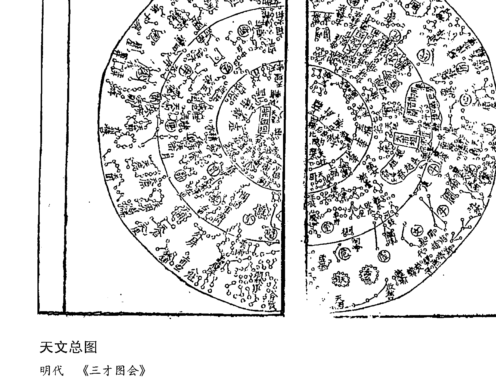

# 天文总图

明代 《三才图会》 这是中国古人所绘的天文图，将全天三垣二十八宿均囊括其中，此图也是星占推命的基础，星士们对此图均了然于胸。在星命理论中，各个宫位、星曜与各个星宿结合，就会兆示不同的吉凶，如男人立命在鬼宿，就兆示其不是篡权就是反叛；女人立命在心宿，则必是淫乱之徒，等等。

# 第二十四章

# 倒限：星命中的倒限

# 平淡无奇之命

| 男命 | 庚午 | 癸未 | 戊申 | 辛酉 |
| :--- | :--- | :--- | :--- | :--- |
| 木困于金刚，失足于亢宿。金在计都之旁。 | | | | |

| 格星忌所 | 命常安 | 格星善所 |
| :--- | :--- | :--- |
| 火入金瓶 孛破火垣 日月无光 诸星沉沦 | 庚午 癸未 戊申 辛酉 | 日月夹金 金计相生 单罗守命 身坐禄马 |
| 天刑水 天囚木 天厄土 天权火 天暗金 天耗木 天囚火 天刑土 天刃金 天马水 地驿木 天马火 | 天禄金 天贵土 天印木 天荫火 天哭金 天官木 天贵水 天伤火 天使水 计都火 月孛水 紫气土 | 文星木 天元火 地元水 人元月 天元土 天元火 地元水 人元金 天元木 地元火 人元水 天元土 |

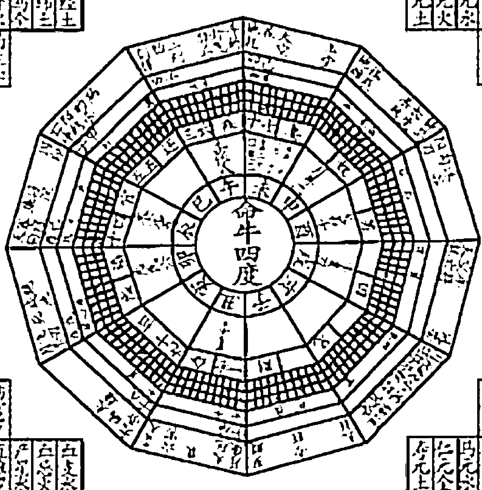

名不入流。

家宅会破，家中常有人死去。

-   ◇ 31~32岁 谈婚论嫁。
-   ◇ 33~39岁 峰回路转，柳暗花明。
-   ◇ 46岁以前 妻子死去。
-   ◇ 49~50岁 会有名利之事。
-   ◇ 53岁 一步更高一步，有添丁之喜。
-   ◇ 57岁 死亡。

【原文】
子虚有土星，三冬人须卒。
子虚有土，人以为土星居垣为吉，殊不知三冬生人，水星得令之时，虚日中有火乃败弱之火，既被水制，又以土星临之，火又生土全为泄气，故主倒限。此论各宫正垣度数喜忌之分。

【白话提要】
正垣的度数也存在喜忌，并不是正星居垣就为吉。以土星为例，土星居垣，一旦水星得令，就会泄气，倒限。

【原文】
女土好齐瓶，九夏水为疾。
女土在子乃本宫则吉，盖夏月水到其上则凶，夏月土旺正受火生之势干燥，若见水到，谓之暴水反能漂土败火，如见水必主死也。

【白话提要】
女土在本宫，为吉。但是女土在本宫，还是夏月，那么必死。

【原文】
丑牛有金星，遇土须当吉。
牛金见土则富贵，见水孛则死也。

【白话提要】
土生金，金生水。牛金受生，则富贵。牛金泄气，则死。

【原文】
尾火怕秋金，冬水伤房日。
尾火何须怕金，盖尾火在寅初生之火本弱，秋金乘肃杀之气至刚至坚，金在其上反伤寅木，减则火败。故谓之倒限，房日之中有火，冬月水到其上，即令星伤日下之火，或水日同躔度，行房日并主倒限。

【白话提要】
火克金，尾火之火弱，遇强金倒限，所以尾火怕秋金。水克火，房日中有火，遇强水受伤，所以冬水伤房日。

【原文】
秋土损亢金，计都又相逼。
亢金秋月至坚至刚，更见土计生之，是物极则反主夭。

【白话提要】
盛极而衰。本星当令受生，必死。

# 古今图书集成白话图解·星命

# 卷九 总论行限：人生轨迹探寻

## 【原文】

又有翼火蛇，遇木三冬灭。
翼火乃巳乡之火，已乃水垣其势本弱，所谓无焰之火也。木虽生火而三冬之木乃为湿木，而加于本弱之火，非惟不能生之，而反足以灭之矣。

## 【白话提要】

此节说的是生我者不一定会生助，也有可能灭我。以木生火为例，翼火是弱火，有木生火，本来可以生助火势，但是如果正当冬月，木中含水，为湿木，那么弱火，未被木生，先被水灭。

## 【原文】

星日与翼同，井鬼土计切。
星日与翼同者，星属午垣乃太阳之殿，人知木掩太阳在他，时犹乘令司权木不能为之掩，独三冬之日为寒日，故惧畏木与翼火同也。井二十九度至鬼二度乃月之正垣，是以怕土计，秋生人决主倒限。

## 【白话提要】

翼火是弱火，星日是寒日，冬月木灭弱火，木掩寒日。所以星日和翼火一样怕木。土克水，井鬼是月的正垣，受土星和计都克，所以怕土星和计都。

## 【原文】

刃月最怕木不死生重疾。设若富贵人见之破屋宅。角木遇之凶，斗木遇之吉，若犯奎井度，十有九人绝。
如六己生人月为刃星，躔在四木度，纵不死亦多灾。斗木遇之吉者，以大月当斗为合格，故云为吉。而角木为金乡之木杀气愈重，奎木为火乡之木见金愈怒，井木为刃乡之木，又不言而可知也。

## 【白话提要】

刃月就是指刃星为月。水生木，刃月遇木，泄气，必不祥。角木是金乡之木，金克木，杀气重重，必凶。奎木为火乡之木，井木为刃乡之木，必大凶。

## 【原文】

昴日忌火罗，参水怕孛泄。
昴日度有金是金垣也，最怕火罗犯其上，若两星同到则抗敌不死，但有重灾。一星到其上，十有九死，日生最重，夜生金火有情不死有之，参乃水之正垣不怕土计，又怕奴孛划度，冬令不忌谓之奴主相扶。

## 【白话提要】

昴日是金垣，火克金，所以应该避开火星和罗睺犯。但是如果火星和罗睺一起犯度，那么必不死，只有重灾。只有火星或者罗睺犯度，很可能会死。参是水的正垣。虽然土克水，但是不怕土计。月孛是水星的余气，所以正垣参最忌讳奴余犯主。如果正当冬令，奴主相扶，则不忌。

## 【原文】

娄金忌水星，孛亦能作孽。
娄金度者乃火殿也，盖水到其上能杀金下之火，谓之水破火垣。冬季至凶，别季别论。若孛到其上亦杀金下之火，如无救，则主倒限也。

## 【白话提要】

娄金度是火的正殿，水克火，所以忌水星，冬月尤其应该避开。月孛是水星的余气，一旦犯度，则倒限，必凶。

## 【原文】

室火木之垣，金罗难说吉。
室火中有木，乃木之垣也，金能克木。罗睺亦能泄气，亦主不吉。

## 【白话提要】

室火是木垣，金克木，遇到金星，则不吉；木生火，遇到罗睺；泄气，同样不吉。

# 行限还需注意的事项

## 【原文】

须看刃煞星，难忌并刑值。
刃者阳刃也。杀者克限度星也，难者八杀宫主也，忌者昼火夜土也，刑者三刑也，值者值难之类也。

## 【白话提要】

刃杀在行限中的作用不可忽视。但是关于刃杀的推断，需要注意受伤的限度和刃杀的喜忌，还需要知道相刑的宫度。

# 长久发福之命

男命 庚寅 乙酉 丙午 戊戌

水近日，月居垣，火伤酉··

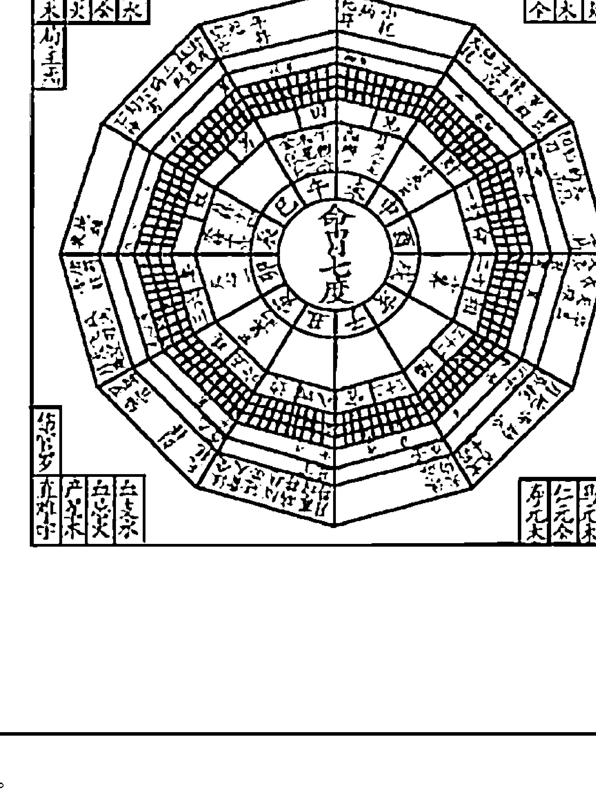

父子相离，婚姻迟滞。

-   ◇ 20~22岁 有吉庆的旺相。
-   ◇ 24~25岁 财富和官位接踵而至。
-   ◇ 27~30岁 正是如日中天之际。
-   ◇ 37~40岁 既有权势，又有威望。
-   ◇ 41~52岁 一直发达显赫。
-   ◇ 56~57岁 又有晚福。

古今图书集成白话图解·星命 卷九 总论行限：人生轨迹探寻

## 【原文】

更落空亡位，遇者寿元折。

空者六甲旬中也，限若遇之凶煞加临则主死矣。或一星而掌数煞者，或两星而齐到者，又忌三合四正冲照的死无疑。

## 【白话提要】

行限的时候还要注意限主的状态，一旦处于空亡，就必死无疑。

## 【原文】

春夏与秋冬，休囚并死绝，吉凶如影响，此是黄金诀。

以上四句须贯通而言之也，凡学者深求玩味细密精微无不中矣。

## 【白话提要】

限主的状态还受四季的影响。限主的生旺死绝会影响到吉凶的程度。

第二十四章

倒限：星命中的倒限

# 第二十五章

# 星曜的凶格：神煞吉凶断

## 1. 诸煞秘要赋：各种神煞的吉凶

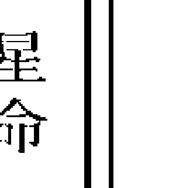

### 阳刃

> 【原文】
> 
> 天之星辰苟求其故，可坐而知。地之神煞，欲究其微，不言而喻。
> 日月木火土金水为天星是也，阳刃，天雄，的煞，劫煞为地煞。
> 阳刃子午卯酉，劫亡寅申巳亥，辰戌丑未四凶煞，巳酉丑上三白衣。
> 子午卯酉四个最强之阳刃杀也，寅申巳亥四个亡神劫煞最是凶也，辰戌丑未独居三杀连三位是也，巳酉丑三的杀又曰白衣，又曰破碎是也。
> 申子辰生怕行巳午未限，寅午戌人忌行亥子丑位，亥卯未之申酉戌，巳酉丑之寅卯辰恶曜险甚薄命难禁。
> 以上皆说三杀是也，人命根基浅薄，限行至此难逃，此大凶也。

> 【白话提要】

七政是天星，阳刃、天雄、的煞、劫煞是地煞，地煞代表着凶。

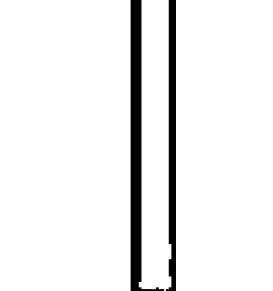

### 子，卯，午宫立命

> 【原文】
> 
> 立命子宫限斗二，且看井七胃二张十四。
> 命立子宫限行斗二，入寅为四角之宫，斗木难度难宫必然不好。若申上井七度，
> 
> 戌上胃二度，午上张十四度，有木星在此数度。或有木星正照斗二度，内重则必死，轻则刑克，在申宫合来必克子。在午宫合来必克兄弟，此一定之理无疑，倘木难逢太阳必克父，近太阴必克母。
> 安命卯位行轸九必观，女一毕五与奎初难星，倏忽来寿算危乎此。
> 又如命坐卯宫二十五行轸九水度乃入巳宫，可看亥上对照奎，初又看丑上女一度，皆不可有水孛来照，对度为难星得地之所，如此者死于二十五岁必矣。
> 午命防未申之井，酉宫畏戌亥之奎。
> 午宫立命未申转角之间行限至此则凶，又井木是难度，若辰上氐初度丑上斗二度，子上危十一度，有木气合吊大凶。
> 酉宫坐命火罗为难，行限在戌难宫出戌交亥二十五年，三合四正难星又来必为凶断，轻则伤刑。

> 【白话提要】

命坐子宫，限行斗二，斗木难度难宫，必不吉。如果木星出现在申上井七度，戌上胃二度，午上张十四度，那么必凶。申宫合，克子；午宫合，克兄弟；太阳，克父；太阴，克母。
命坐卯宫，限行轸九水度，应该避免出现水星和孛月，难星得地，此人必死于二十五岁。
命坐午宫，限行未申之间，必凶。
命坐酉宫，限行戌难宫，出戌遇亥，必凶。

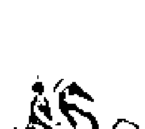

### 四角，四马，劫亡

## 【原文】

> 四角命居雄哉奇伟，中州定位杰出魁罡。
> 四角者寅申巳亥也，主人雄伟敢为。中州者，辰戌丑未也，立命于此，英杰豪气人矣。
> 四个马宫最怕老人不寿，八宫阳刃必然壮岁丧妻。
> 寅申巳亥亡劫之地，老人行此恐伤其寿，少年人行此吉，子丑卯辰午未酉戌乃阳刃之宫，少年人行此必丧妻子，老人限临必死。
> 劫亡出入皆凶，阳刃两头切忌，限行实怕两头，入了何愁中位。
> 劫杀亡神之宫限入限出皆主凶也，阳刃两头刃首刃尾皆凶祸也。

## 【白话提要】

四角，就是寅申巳亥。命坐四角宫，此人必雄伟敢当。中州，就是辰戌丑未。命坐中州宫，此人必是英杰豪雄。
马宫，就是寅申巳亥。老人行限此四宫，寿命必有损伤。八宫阳刃，就是子丑卯辰午未酉戌八个阳刃之宫。壮年男子行限此八宫，必然丧妻。劫杀亡神所在之宫，限入限出，刃首刃尾，都代表着凶。

### 阴刃与阳刃

## 【原文】

甲如入卯尾二氐一定防灾，乙若到辰氐初轸十必为害，丙戊畏午张柳庚怕毕五胃三。
甲生人卯为阳刃入尾，二出氐一必有灾，乙生人辰为阴刃，入氐初出轸十必为灾，丙戊生人午为阳刃入，张十四出柳四必有凶，庚生人酉为阳刃。入毕五出胃三，必刑克疾厄。
妻在孤神寡宿到老丧妻，子居阳刃劫亡晚年无子。
孤神寡宿在妻宫必克妻也，阳刃劫亡临子位必克儿女也。
别夫离妇阳刃杀中逢孛，剥官丧职空亡限内遇计。
孛星逢阳刃同宫合，主夫克妻，妻克夫，生离死别未免也。计都行限更兼空亡，限行至此为官罢职。

## 【白话提要】

甲的卯，就是阳刃，行限至尾二氐，必有灾祸。乙的辰，就是阴刃，行限至氐初轸十，必为害。丙戊的午，为阳刃，行限至张柳之间，必凶。庚的酉，为阳刃，行限至毕五胃三之间，必生疾厄。
妻妾宫出现孤神寡宿和阳刃杀中出现孛月，都克妻。

### 男女之事

## 【原文】

金孛插花女人色欲，土罗持刃男子凶顽。
金孛插桃花，土罗持阳刃合此者女主色欲，男主凶顽。
喽啰诡谲千般花，宫带孛聪敏机关，百变刃上计逢。
孛坐咸池，计逢阳刃合此者男主喽啰诡谲，女主机关百变。
垄断牙行身居天雄，刺胥吏卒命坐破军。
安身立命于天雄上，媒人牙行之辈也。破军即的杀破碎是也，坐命此宫主刺配之凶。

## 【白话提要】

这三句，主讲男女事。桃花、阳刃、咸池、天雄、破军，都是凶物。

古今图书集成白话图解·星命
卷九
总论行限：人生轨迹探寻

### 疾病与富贵

> 【原文】
> 
> 卯刃带金病痨伤寿，亡神逢孛溺水丧身。
> 卯宫属火又是刃宫，金星同位必痨病人也。亡神宫见水孛必溺水而亡也。
> 劫杀在于寅宫金来虎咬，亡神到于巳上土会蛇伤。
> 劫杀在寅宫属虎金，难来必虎咬人也，亡神在巳宫属蛇土，难来主蛇伤也。
> 禄马空亡任是豪家必莩，劫亡带鬼纵他贵显遭刑。
> 禄马空亡限入此地，纵富必莩死也，劫亡上有难星，虽贵人亦恶死也。
> 早岁功名空亡同于劫杀，老年富寿正禄入于旺宫。少年发于帝旺之乡，老景荣于衰库之地。
> 劫杀逢空，禄临旺地，少年行旺，老景行墓，其吉可知矣。
> 精微一理，变化千般，浅薄休传，知音可得，能依此断万无一失。

> 【白话提要】

前两句，主讲伤病事。地支星宿可以代表伤病的源头。后面三句，主讲富贵老少。行限时，少年应旺，老年应衰。

## 2. 统论限说：总结星学中的行限

> 【原文】
> 
> 大凡洞微所急者限主星也，所贵者禄星也，所重者诸曜顺行也，所发者庙宫也，所畏者忌星也，所好者吉神也，所辅者行年也，所助者三方也，所恶者气孛罗计也，如善星陷逆则福慢，顺行则福紧。凶星陷逆则灾紧，顺行则灾慢。如遇吉星顺行即得本宫加数，若遇恶星他宫则其数减半。大凡吉星居七强为福紧，临五弱为福慢，灾星在强宫为灾慢，五弱为灾紧。凡限本宫见星灾福应十分，对照七分，三合，四分，凡限星在终末之度，即灾福之力则微，而不可以定数言也。
> 凡忌星在好乐宫入限，三年内为福。三年后反为灾，大凡限逢忌星不死亦灾，若火在阴宫，土在阳宫，或为三方主虽有厄而不亡。故曰：夜忌土星，昼忌火。三方不是死无疑，此星若是三方主虽有灾侵，命不离火阴土阳，宫尤妙，好乐位中别有奇正此谓也。凡灾忌星生时在伏段限内。灾祸只有三四分力，福星生时在伏段亦只有三四分力，盖被太阳所伏光芒不见，有如臣居君侧包藏光美之象。凡一限中见吉凶星同聚，即以入宫先后及逆顺而断吉凶，故先入宫深者先见，后入宫浅者后逢也。
> 凡遇本限及对照三合并不见一星，名曰空限，主多灾凶，图事不成，若得限主当生有力之位，则反为吉，惟有官禄宫上逢空限最凶，必于四十六七岁死矣。凡当生吉星照身命者，主中年富贵，纵逢灾限不妨。若当生凶星照身命者，中年虽逢福
> 
> 限四旬之后，亦主滞，大都吉凶之应全籍限基当生有禄则吉，限上无禄则难发，是犹无根之木，虽逢春终不葩花而成实也。故经云：若无一曜临身命，自是贤愚别有因。

## 【白话提要】

行限最应该注意的就是限主。禄星主贵，最好七政四余顺行。忌星吉神，均辅行限流年。三方可以提供帮助。紫气、月孛、罗睺和计都四余则为恶。无论吉凶善恶，陷逆则慢，顺行则紧。七强宫则福紧灾慢，五弱宫则福慢灾紧。行限至忌星，必凶。注意黑夜应该避开土星阴刃，白昼应该避开火星阳刃。生时在伏段限内，无论吉祥灾祸都只有三四分力。如果一限中同时出现吉星凶星，那么就需要按照入宫的先后和逆顺来进行推断。吉星照身命，代表的是中年的富贵。凶星照身命，中年之后必有灾厄。

## 3. 诸煞倒限：神煞中凶煞的凶格

## 【原文】

太岁为众煞之主，统众煞行于黑道中，所以为灾不违时刻，看人寿夭穷困终身不吉，皆因身命宫位，日月命主俱落煞乡，更煞神拱夹，又占高强纵或得福，横中得财，然限入煞乡，未免死于非命。或吉为凶神所恼，凶为吉神所临，刑害可知，宜加详审，故有十忌：一忌飞星破禄；二忌马落空亡；三忌太岁当头；四忌坐煞向煞；五忌煞星得志；六忌限入鬼乡；七忌妆成鬼局；八忌二煞夹限；九忌命主受制；十忌母星克令。立命行限犯此十忌为凶至惨，经云：寿元不永定休论，处世多屯常冷淡，若见当生日月命主俱各受制，大限方入煞神之初，或出煞神之末，不见救星未有不凶者，今列诸煞诗例于后。

## 【白话提要】

太岁为君王，所以为众煞之主宰，其统率众煞在黑道中，给人带来灾祸，从来不会违背时刻的约束。有些人寿夭贫困终身不得吉，则皆是由于身命宫位及日月命主皆落入煞乡，如果再被煞神拱夹，并且煞神又占据高强之位，则其人纵使有福，亦不是横中得财。如果行限进入煞乡，则其人必定会死于非命。或者吉星被凶神所恼，凶煞被吉神所临，则可知其人必然会遭受刑害，具体详情则适宜详加审辩。所以星命有十忌：一忌飞星破禄，二忌马荡空亡，三忌太岁当头，四忌坐煞向煞，五忌煞星得志，六忌限入鬼乡，七忌妆成鬼局，八忌二煞夹限，九忌命主受制，十忌母星克令。立命行限，逢此十忌必然为凶至惨。

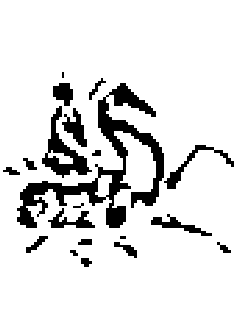

### 劫煞歌断

【原文】
劫煞元来是煞魁，身宫命主不须来。若为鬼局应当死，煞曜临之不必猜。
若是无星居此位，更于三合细推排。天盘加得凶星到，命似风灯不久摧。

【白话提要】
遇见劫煞之时，如果又处于身命空亡，鬼局，煞临凶星等情况，皆主其人寿命不长。

### 三煞歌断

【原文】
要知三煞最为凶，值难同临不善终。三合无星更须忌，煞星切莫又相逢。
若还日月同居此，官禄临之福愈隆。大限相将离煞尾，黄泉之下定行踪。

【白话提要】
三煞星最为凶险，如果又遇见直难星同临，三合无星，煞星相逢，日月同居，官禄临照，皆主其人灾祸惨重，甚至会命丧黄泉。

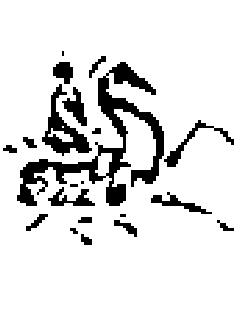

### 阳刃歌断

【原文】
煞中阳刃最无情，身命同临主破刑。大限若交当畏惧，煞星在上恐难行。
若无凶曜尤当忌，局势参详判死生。三合更加神煞拱，离阳刃入幽冥。

【白话提要】
阳刃煞本来已经极其凶险，如果又遇到身命同临，限交，煞星在上，三合煞拱等情况，则其人必死。

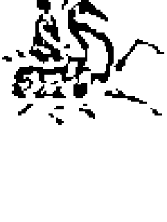

### 亡神歌断

【原文】
皆言七煞是亡神，莫道亡神祸患轻，身命若还居此地，贫穷蹇滞过平生。
凶星恶曜加临此，大限浑如履薄冰，三合更须明审察，煞来夹拱必难行。

【白话提要】
七煞亡神，又遇到命主，凶星加临，煞曜拱夹，皆主凶灾。

# 第二十五章
星曜的凶格：神煞吉凶断## 的煞巳断

## 【原文】
巳中的煞金生处，煞气严凝人畏惧，莫教劫煞又同宫，便主黄泉寻去路。
若为水命土星到，装起煞神真局势。世人莫只忌秋生，四季生人尤可畏。

## 【白话提要】
的煞与劫煞如果同居于巳宫，则其人必死无疑，四季月出生之人更是特别畏忌。

### 的煞酉断

## 【原文】
酉中的煞旺中金，金气秋霜煞气深。阳刃若还同到此，煞星日月不须临。
若非恶死须言夭，大限·交祸更侵。太岁当头又冲动，此身安得不呻吟。

## 【白话提要】
酉宫出现的煞，如果又遇见阳刃及太岁当头，皆主其人恶死或夭折早逝。

### 的煞丑断

## 【原文】
的煞如逢在丑宫，煞神归库不为凶。更加三煞并阳刃，限数存亡顷刻中。
若是亡神煞星到，虽然不死也为凶。若为日月三方拱，祸患忧危更不同。

## 【白话提要】
丑宫出现的煞，如果又遇到三煞，阳刃，亡神煞星，或者三方拱夹，皆主其人祸患凶险，不死亦凶。

### 飞廉歌断

## 【原文】
煞若飞廉凶又凶，莫安身命在其中。欲知鬼局十分重，命主阴阳不可逢。
此煞不须和合看，只将他局究其功。若还行限临其地，煞曜临之不善终。

## 【白话提要】
身宫与命宫的主星不能处于飞廉煞之中，亦不能进入鬼局，如果又有煞星照临，则其人注定不得善终。

### 诸煞总断

## 【原文】
星家倒限有真机，第一先将煞曜推。切莫一途拘泥着，须看命主有无亏。
命星安稳无刑克，此身平善实无疑。若为命主遭他害，任是神仙也皱眉。
劫煞怕头三煞尾，阳刃两头皆要忌。阳刃若在相貌宫，破相毁形端的是。
此煞排归八煞中，太阴飞到为凶比。阳刃劫煞扶两旁，祸起之时难可避。
煞神不可例言凶，煞落空亡迥不同。日月不临命不到，煞星不在命无终。
若还限脱煞星尾，必定为灾福不隆。此是天机真妙处，根基浅薄祸无穷。
煞星难曜分生旺，春夏秋冬仔细推。若是煞星来秉令，也分昼夜论安危。
若为反背须还忌，寿算摧残祸有基。众煞下临人畏惧，此身安有百年期。
若论阎浮死恶人，命身俱各值凶神。煞星入命命入煞，日月临之必害身。
更怕煞神来拱夹，刑囚为煞更相侵。必然死在刀兵下，命似残花满地零。
凡论诸煞宫必有诸煞星，若煞星落空或日月身命不临煞地，或煞星不在本宫又且无害，虽论煞星还分生旺休囚，春夏秋冬与夫昼夜，及其向背何如，设使身命值凶神而煞星入命，命又入煞，兼日月并临，更煞星化刑囚拱夹尤凶。

## 【白话提要】
命宫主星在倒限中如果无亏损，则必吉；如果遭遇煞曜刑克，则必凶。
星命中出现劫煞头，三煞尾，阳刃两头，太阴飞煞，阳刃劫煞拱夹等情形，皆凶。
如果煞星落入空亡，或者日月主不临照，或者煞星不在限中，则煞神不能为灾祸。
煞星，难曜的生旺、季节、当令、昼夜、反背等状态，可反映出不同的吉凶结果。
命身二宫出现凶神，煞星入命或者命星入煞，日月临煞，煞神拱夹，刑囚为煞，皆主其人必遭受刀兵之灾。

### 杂论倒限：化吉为福，化凶亦凶

## 【原文】
限度尤防真照临，如限行土度忌见真木，加以限主宿弱倒限，流年煞星并亦然，三合尤切。限度防战斗，火头孛尾皆为大灾，若计孛凶星一迎一送，决主倒限，本宫三合仔细详之。亦有当生限无星辰，被流年凶星克倒者，凶星战斗者如火孛，水计，计孛，孛罗等战斗者亦倒限，凡命忌星行限十有九凶，日生火，夜生土为煞则灾重，纳音逢夺必有重灾，限行到此度为灾必死，为主之星不论化气，会主之星复论化气，煞星化吉为福大，化凶亦凶照，命限者生克至紧。

## 【白话提要】
限度之中尤其要防范真宿临照，如果遇到真宿临照，又逢限主宿弱，则会导致倒限。
倒限，纵使有流年太岁或得煞星添力亦无法挽回。在行限之中还要防范星曜战斗。火星位于限初，月孛位于限尾，皆主大灾；计都、月孛一迎一送，亦主倒限。当生限没有星辰，并且遭到流年凶星克制，也会导致倒限。如果火星与月孛，水星与计都，计都与月孛，月孛与罗睺等凶星相互战斗，也会导致倒限。忌星行限，则十有九凶；日生人命中遇火，夜生人命中遇土，皆为逢煞，皆主灾重。限行如果遇到纳音逢夺为煞，则其人必死无疑。如果煞星化为吉曜，则有祸亦较轻；若煞星化为凶星，则为祸更重。母星化为吉曜，则必有大福；化为凶星，则为凶亦缓。

### 倒限要诀：凶煞星格的关键

### 日月夹煞

## 【原文】
凡命以日月为紧，但临本年煞地为凶，子午卯酉生人的煞巳宫是也。二曜同居其上或前或后皆为忌，须是落空亡方不为伤，若在强宫尤凶。

## 【白话提要】
日月出现在煞地，必凶。如果处于空亡，则无事。

### 善会日月

## 【原文】
善星会日月本以为吉，人皆知吉善。而不知夫善中有恶，是其恶也，善者恶之胎。若星曜会于生地则吉，倘或临于空亡，阳刃，破碎之乡为灾不可胜言，虽处安静无事之时，而有卒夭暴亡之患，多出于人所不意，大抵凶星居空亡则利，吉星居之则凶，此理之必然也。

## 【白话提要】
善星和日月会合，为吉。如果处于空亡，则凶。

### 忌曜相攻

## 【原文】
且如未上安命，本以夜忌土为煞，若忌星居空亡，则无力矣。或又日生孛忌之类，攻之则忌土，何暇为我害，倘以火助其威，计党其毒，则其势已甚，必至天亡。

## 【白话提要】
忌星处于空亡，则无害。如果有党助，则必凶。

# 晚年得福之命

壬午 丁未 甲寅 壬申

# 格局
木命安于斗宿，木金助水二水对生。

# 家人
兄弟先死，而有贤妻相伴终身，晚景逍遥。父子分离。婚姻迟滞，兄弟分聚不定。

# 流年
- 20~22岁 很有作为。
- 23~25岁 有财有官禄。
- 26~30岁 离开家乡，喜忧参半。
- 37~40岁 有权有名。
- 56~57岁 晚福更多。

### 善星失用

## 【原文】
何为善星，金木水气之类是也，一星居强得用则为我福，或受伤失时限行于此，流煞少有所冲必成险厄，多是无事中暴忽之祸，人所不知也。所谓天星不能制地煞，何谓鬼局金行寅午戌之类是也。

## 【白话提要】
善星，就是指金星、木星、水星、紫气等。善星处于强宫，则有福；处于弱宫受伤，必有灾。

### 将煞就煞

## 【原文】
且如命宫在卯寅申巳亥生人，限行于酉上盘亦是酉字。又如子午卯酉生人行巳限上盘亦是巳字，此谓将煞就煞。

## 【白话提要】
将煞就煞就是指行限和上盘同是命主的刃杀。比如命宫在卯，限行在酉，上盘同样是酉。

### 以煞见煞

## 【原文】
如命卯，丙戊生人，阳刃在午，行午限是此局也。更子午卯酉生人，有上盘之阳刃，下盘之阳刃，上之破碎，下之破碎，巳限是福德，亦为阳刃加的煞，的煞加阳刃皆为以煞见煞，若遇福地则迟见祸，若遇官宫则速祸矣，纵有吉星日月临之，其死尤速。

## 【白话提要】
以煞见煞，就是指行限至阳刃，以及阳刃加上的煞。以煞见煞，遇吉星福德宫，则祸紧；遇福地，则祸慢。

### 出煞入煞

## 【原文】
如人行限前是阳刃，后是破碎。如乙酉生人辰上是三煞阳刃，巳上破碎，天雄。前后俱是煞，限度出入之际，如二十五六，三十六七出限，入限之时更加流年，小有凶并必难保矣。

## 【白话提要】
出煞入煞就是指行限前是阳刃，行限后是破碎。出煞入煞，为凶，一旦流年有凶，必死。

### 寿元失陷

## 【原文】
人命以寿元为紧，何为寿元，纳音星是也。如纳音受克乃木生人，木旺金，金生人，金旺火，倘鬼旺主衰四正三合见之行限至此，值之少年亦主伤残。

## 【白话提要】
纳音星就代表着寿元。如果行限的时候遇到四正三合鬼旺，主衰，那么老年必死，少年必伤。

### 暗气加临

## 【原文】
紫气在天无象，故曰暗气。
且如气星天文无象如盲人，然亦是老人之象。凡入命照命亦主刑克孤独，主人慈祥如命宫三合对照之时或临身，主人当有寿然亦须见。
合照无凶星以破之方好，若老人行限值此，设若流气并当生之气，此年必主倒限。

## 【白话提要】
暗气就是指紫气在天无象。暗气照命，老人之象，代表此人孤独慈祥。暗气三合对照，或者遇到身主，那么此人就能长寿。

### 论倒限歌：忌星，夺星二煞的凶死之祸

## 【原文】
倒限之法夺星为第一，夺星行限逢忌生起。或宫相生或化恶背时，决然倒限。火土名忌乃煞星也。二星相会谓之二煞，同谋最为凶害，此等格局虽有过北斗之资，亦难买无常之厄。如忌夺相会相克谓之二煞，反目十度之外相逢不过见灾而已，虽丧亡亦可救也，如行限遇之，死无疑也。
夺星者如木为限，主怕金夺之，火为限主怕水夺之，余仿此类推。夺者即克也。忌者昼火，夜土名曰忌星，又曰煞星。
限主还元大可忧，五星带夺煞同谋，更兼忌曜来助虐，
此命须登白玉楼。还元者原主升殿入垣，怕带煞受克。

## 【白话提要】
二煞同谋，就是指两个煞星相会。二煞同谋，为凶最烈。二煞反目，就是指忌星夺星相会相克。行限遇到二煞反目，必死；十度外遇到二煞反目，则有灾。愈远祸愈轻。

### 煞星带刃

## 【原文】
火土二曜乃煞星也，况又带夺，其恶尤甚，且又得经得垣加之，太岁月将冲动为祸不可胜言，限行到此。虽有扁鹊之智亦不能救也，若二星更带阳刃破碎决不善终。

> 诗曰：
火土双星带刃来，那堪垣庙两和谐，流年太岁来冲倒，任是公侯也受灾，
带者如火土掌羊刃，天雄的煞剑锋飞廉是也。

## 【白话提要】
煞星就是指火星和土星。煞星带刃，不能善终。

### 凶送凶迎

## 【原文】
凶星如忌如夺固凶星也，金罗计孛火土化恶亦凶。一恶星在后行紧关末关将尽，又有一凶星在初关紧关方来，恶星光芒相射必为薤露人矣，又如刚星得田财战斗，或刚星聚吉战斗得气救解只，恐气之光星一出或忌或夺来，迎皆主大发亦速死无疑矣。

> 诗曰：
凶星行限又将终，更有凶星后限中，凶送凶迎凶铁定，饶君铁汉也成空，
刚星即火罗计孛，柔星即木气也。

## 【白话提要】
忌星夺星都是凶星。如果火星和土星为恶，那么金星、罗睺：计都和月孛也属于凶星。恶星在关末，凶星在关初，必死。

### 木星夺煞

## 【原文】
气木虽善奈为雠星，二星不宜会光景之内。光景指限数言也。木星又带煞，是善以需恶，二星相遇于三十度内，忌计孛，金罗于中间间断，至于会合相逢必登无常之录矣。

> 诗曰：
木星带夺命难延，五福之中寿不坚，若使气星同共到，玉皇来诏祈天年。

## 【白话提要】
木星和紫气都是善星。但是紫气和木星彼此为仇星。木星带杀，不为凶，然而一旦遇到仇星紫气，必死。

### 前关后锁

## 【原文】
日月二曜乃君后也，初不为害于人而关人之寿夭何欤。盖日月命田之主，受伤故也，若日月为身命之星当生，却被罗计于紧关拦截掩其光彩，或关煞来犯或孛火土化恶罗计夹辅穿钓，有如此者，非惟日月受伤，而吾之身命亦受伤矣。至若太阳为身命田之主尤其紧切，盖月是身若是恶星来钓，是坏其所生之主矣，岂不为南柯梦中人也。

> 诗曰：
身命田星日月曜，两个拦星占前后。限到中间进退难，任是神仙也难救。

## 【白话提要】
日月可以影响人的寿命长短。日月受伤，则寿命受损。一旦恶星坏日月所生，则必死。

### 刚星带战

## 【原文】
刚星为寿主命主，当生遇刚星于紧关内，或望合相穿正照皆非吉兆，倘得煞星为命田之主，或带夺受二星之克，或受害之所伤，限数还元，假饶他吉，穿战受制，得志之时必死矣。

> 诗曰：
刚星穿战实难当，田命逢之怕受伤，他恶化雠年寿促，散财散福见阎王。

## 【白话提要】
刚星是寿主命主。刚星出现在关内，或者正照命主，均不吉。

### 异宿相攻

## 【原文】
异宿者即夺星也。

# 星曜的凶格：神煞吉凶断

火星行限怕孛星来克，金星行限忌罗睺炁伤，日月为限元怕罗计伤之，水星为限度忌土星克之。

> 诗曰：
火星行限孛星来，金星行限罗睺炁，日月二宿怕罗计，水星土曜两摧嵬。

## 【白话提要】
四本星在行限的时候怕相克的余星来克。比如水克火，月孛是水星的余气，所以火星行限怕月孛。限度主则应该避开相克的本星，比如水星为限度主，忌土星。

### 聚煞交战

## 【原文】
火，孛，计，罗皆刚星也，孛罗计乃三刚也，金木水火土是五战也。若三刚五战相攻，纵得气木来救光彩，使根基壮亦无益也。
一出，不复解救，又更详其命如何。

> 诗曰：
火计金罗孛一同，更兼忌夺二星攻。假饶木气中间救，光景无从亦主凶。

## 【白话提要】
月孛、计都和罗睺炁是三刚。金星、木星、水星、火星和土星是五战。一旦三刚五战相攻，必凶，即使出现木星紫气也无济于事。

### 众煞反常

## 【原文】
金星带夺于紧关内，正度或锋芒交承之际，或火土两煞星又为主限，而遇金孛罗睺炁兼老人遇于生旺，或少年遇于死绝，此等格局多主死。

> 诗曰：
金星带煞遇罗睺炁；二煞相生奈例评，老幼反常还不利，阎王来召入蓬瀛。

锋芒交承即刚星，交战之际也，反常者老年行限遇生旺，少年行限遇死绝是也。

## 【白话提要】
老年处于生旺，少年处于死绝，都属于反常的情况。一旦金星带杀出现在关内，或者刚星交战之际，要是还遇到反常，那么此人必死。

### 限入空关

## 【原文】
限到当生所在煞上无星，主事两旁三合之星，亦复辽远即为空限，若火罗计孛流战于此限之正度，即为梦蝶之人矣。

> 诗曰：
限入空关多煞神，星辰辽远又无情，流年冲到招凶煞，定作南柯梦里人。

空关者限宫两旁三合无星，惟怕流年火罗计孛战斗于本限度内亦死，须元守有刃的雄雌锋廉等煞方验。

## 【白话提要】
空限就是指行限到当生所在，然而煞上无星，三合之星也相距甚远。火星、罗睺、计都和月孛一旦出现在空限的正度，那么此人必死。

### 太岁歌：木星的凶格

## 【原文】
与命主相生者吉，而相克者凶。
最是凶神为太岁，须把宫辰相正配。相生相顺福之基，相克相刑真可畏。
假如木德是宫神，最怕纳音金克制。一生福气少精神，纵有发挥终进退。
此太岁者，本生年也，与流太岁兼看。纳音所属即是岁星与命主相生者吉，相克者凶。

## 【白话提要】
最凶的神煞就是太岁，所以必须要把宫神相应的对正匹配。若是相生者，则宫神必须是福星，若被太岁克制则是最可畏的。比如，木星作为福德宫的主星，那么都怕出现金星前来克制，这样会使其一生的福气被克掉，即使偶有发挥，亦是福不成福，进退两难。

## 【原文】
岁驾岁勋并岁贵，此星最忌入空亡，马如空马贵空贵，纵有前程不久长，
若是崇勋图此地，不能安享坐高堂，身空宜向门前立，须要年头仔细详。
岁驾，禄勋，贵人，驿马各宫主星怕落空亡。

## 【白话提要】
岁驾，岁勋以及岁贵，此三星最怕进入空亡；比如，官禄之位无驿马星临照，福德之位无岁贵临照，则即使其人福禄并有，但亦不会长久。如果在官，福之位有崇勋坐入，则不能安享福财，官坐高堂。若身宫无星照守，则要看其立命安身之时，此宫有何星临照。

## 【原文】
岁宿当权为恶毒，众星各各俱降伏，他如克我我无权，一生寂寞多孤独。
我克他时他受制，手足伤残并耳目，岁星宫主要比和，同室操戈皆不足。此言岁星与命主相生相克比和之论，他指岁言我指命言。

## 【白话提要】
若岁星当权为恶毒，则与之相关的其他诸星皆会被其降伏。如果岁星克制此星时，则此星必定无权，主其人会一生寂寞孤寡；若岁星被命主克制时，则属于岁星受制，主其人必有手、足、耳、目之类的伤残。若岁星作为宫主星，则前來照临的星曜要与之相和，如果同室操戈，则彼此皆无好处。

## 【原文】
流年太岁怕当头，中度逢之实可忧。口舌破财须迭见，更兼忌克惹闲愁。若还压命兼临限，更值凶神不死休，十二宫中皆可畏，惟有子午得优游。此言太岁冲压命限中度逢之尤凶，兼有忌曜克星主死，惟子午二宫得免。

## 【白话提要】
流年之中怕太岁星前來照临，在中年行限时遇见太岁也要忧愁。如果流年中遇到口舌星神，则其人必会破财；为了避免，口舌星最好与太岁星叠见，并且流年中还怕忌星前來相克，也怕流年星进入闲极宫。若太岁星进入命宫或者临照限度，同时又有凶神前來相会，则其人必有凶难，只是不会致死。十二宫之中除了子宫与午宫，皆忌太岁前來坐落。

## 【原文】
凶神恶煞如何看，须把宫神可参断。如逢旺相必为凶，若遇长生多险难。休囚死绝祸尤迟，纵有灾危应减半。岁星恶党祸难逃，不忧侵命忧侵限。驾为太岁号尊君，命忌居前不足论。奴仆若临终犯上，夫妻如遇夺夫权。兄弟临之多凌辱，疾厄临之貌不全。若是命身如坐驾，一生安享福长年。此言驾宫不宜坐，奴仆夫妻兄弟疾厄之地，又忌驾前泊命。更说岁星元又元，驾星最喜居垣庙。

## 【白话提要】
如何看待流年中遇到的凶神恶煞? 这必须要将其与各宫参照起来。如果凶神恶煞呈现旺相，则必定为凶；如果凶神恶煞遇长生，则必定多有险难；如果凶囚之星没有临照，则不会有祸临头，即使有灾，亦会减半。若岁星与恶煞相会，则其人必有灾难。立命之时不怕遇见凶神恶煞，但流年行限之中最怕遇到凶神恶煞。若太岁临驾，则称为尊君到来。立命之时最怕尊君到来，若太岁照临于奴仆宫，则其人注定没有奴仆使唤；若太岁照临妻妾宫，则必定是妻夺夫权；若太岁临照兄弟宫，则兄弟大多会受到他人凌辱；若太岁照临疾厄宫，则其人必定相貌受损不完全。若太岁君坐守于命宫，则忌行限中遇到凶星侵犯，或者是难星进入限中。若身命二宫出现驿马坐守，则其人定然可以一生尽享安乐之福而福寿年长。

## 【原文】
平生多近贵人财，必有贵人扶左右。不宜破驾有非星，不喜临朝逢客曜。
少年及第取功名，驾中还有官星照。
此言驾主居垣平生近贵获财，不宜以星破驾，客曜临朝，喜官星登驾。

## 【白话提要】
太岁星的玄妙之处是，其临驾时最喜入垣居庙，如果又有贵星临照，则其人必会一生有财而富贵。若太岁星入垣居庙，则不宜有飞星前来破驾，更不喜欢遇见客星。若太岁临驾，并且又有官星临照，则其人必能少年及第，功到名成。

## 【原文】
岁星若是土为区，行限须当怕计都。纵使金神为命主，若逢余曜亦焦枯。
能夺土星又无气，处事无权作懦夫。岁德为尊防泄气，岂知所忌在余奴。
此言纳音属土限行遇计谓之泄气，纵使金为命主不吉。

## 【白话提要】
如果太岁星进入土位，则行限时最忌怕遇到计都星。若以金星作为命宫的主星，又遇见金之余曜，则其命定会枯焦。以木星作为官星，虽然可以克土夺气，但是木星如果不得时令，并且是木无气又照临于土宫，则其人定是处世无权只能当懦夫。若有太岁君临照，则可防止木泄土气，只是最怕同时又有木星的余气紫气出现。

### 论限附余：关于限论的补充

## 【原文】
倒限之法亦难取用，有一般难星而一死一存，须看命躔何度，次论虚实时候。
昼夜旺相休囚死绝，方可判之。如立命辰金为主，所怕者火罗，不死者何。必先问命度。如或躔亢度，前面逢火罗，若是司令昼现必死，背时夜生亦不死，又如立命在辰土计为恩，守于命宫。前面逢火罗，甚者必死，或火罗稍弱，决不可倒限。其余宫分，并依此例，又如限行空亡者死。
此篇以命宫命度所喜所忌而论祸福，学者参看不可执滞。

## 【白话提要】
此节主要介绍的是命宫命度的喜忌对祸福的影响。倒限之法首先需要观察命躔何度，然后需要知道虚实时候的昼夜，以及状态包括旺相休囚死绝，然后才能够进行推断。

## 【原文】
凡行限遇煞星须论金木水火土，分别缓急轻重。如以火为煞，望见生灾。如以水为煞，过后为祸。如以金为煞，对度方凶，以土为煞，则缓而迟。以木为煞，则急而轻。盖火未然而先烟，水既流而后湿，金正遇而后伤人，土之性缓，木之性柔故也。其为灾祸凶难亦以五行类推也，如以内言之火罗则心血燥热痰痢等证，水孛则膀胱令湿白浊遗精等证，金星则肠痈痔漏等证，土计则脾胃噎塞等证，木气则肝胆风眩等证，以外言之水则溺，火则焚，金则刃，土则压，木则扑之类。

## 【白话提要】

行限的时候遇到煞星，首先应该分辨煞星具体是何星，金星、木星，还是水星、火星和土星，然后区分出缓急轻重。如果煞星是火星，那么立刻就会出现灾祸。如果煞星是水星，那么需要过一段时间才会出现灾祸。如果煞星是金星，那么只有对度的时候才会出现凶险。如果煞星是土星，那么就会在很久以后才会出现灾厄。如果煞星是木星，那么很快就会出现灾厄，而且程度还比较轻。至于灾祸的原因也可以利用五行来进行推断。如果是内脏有病，出现火星、罗睺就代表着心血燥热、痰痢等病；出现水星、月孛，就代表着膀胱令湿白浊、遗精等病；出现金星，就代表着肠痈痔漏等病；出现土星计度，就代表着脾胃噎塞等病；出现木星、紫气，就代表着肝胆风眩等病。如果是外因，出现水星就代表溺水，出现火星就代表火灾，出现金星就代表刀伤，出现土星就代表压伤，出现木星就代表扑伤等。

## 【原文】

命坐弱宫，主星又低，行限又微，一见好星在前，却不能胜其任而命即亡，盖素贫贱而行乎贫贱，虽有富贵而不能享也。
命坐高强，主又高强，行限又好，一见凶恶之星在前而不能进，盖素富贵行乎富贵，又遇贫贱则不能处也。
日生人自少至老，一见太阴在前谓之阳极阴生，决主人死，此乃不传之妙，须带刃煞方验。
夜生人一向限行太阴，与阴星之限至老，一见太阳在前谓之阴极阳生，决主人亡。
又如命躔房日，行限至张月度必死，盖有月光而无日光故也。
又如命躔心月行限至星日度必死。盖有日光而无月光故也。须看有无恶星当关，方可以此断之。

## 【白话提要】

命坐弱宫，主星低，行限微，遇好星，反亡。命坐强宫，主高强，行限好，遇凶恶星则死。日生人，行限带刃煞，遇太阴在前，必死。夜生人限行太阳在前，必死。比如命躔房日，行限至张月度必死。命躔心月行限至星日度必死。

## 【原文】

子上危月坐命限，行至卯房度本宫对照皆无星，有忽然死者。盖日月晦明不同。

# 第二十五章
# 星曜的凶格：神煞吉凶断

## 【白话提要】

命好不如限好。身命好行限好，才算是好命。行限好就是指行限向明不背。

## 【原文】

凡大小二限以生日后交神煞禄贵，以冬夏日交命宫行度，从本生命度行起。春月生人命限连有土孛金水太阴气计谓之云雨不解，淋漓花果，触目愁景，主退败可畏。四五月间虽然得雨，然亦不可连接，行限见前项星辰为久霖不晴皆主冷退，愁闷生意萧然。如有此格日火行限谓之久雨逢晴，伸眉舒目人物欣快，必主骤然大发。秋月生人连有风雨星行限，主霖雨伤稼。冬月生人连有此者谓之雨雪载途，皆非好格，冷落寂寞不言可知。所以晴雨之星要有相间，行限得晴雨停匀，生意顺快。凡土孛气计会日皆谓之黑云暗日主大贫寒。五六月生人火日行限却在巳午谓之旱魃南离，生意焦枯，如游年土孛水计到晦掩其光，反主一发。过了游年又主祸依然。是以两限俱是火日亦曰：久晴不雨万物铄落。如忽行一星计孛金水太阴气星，则云兴雨降，物苗苏醒，勃然发达可知。

## 【白话提要】

大小二限如果在生日后交神煞禄，就为贵。按照四季的星辰寒暑喜忌来讨论行限的吉凶。受克泄气，都不算好事。盛极而衰，更不是好事。水火既济最佳。

## 【原文】

凡行风雨星而逢日在戌，或行限在戌，三合对照则云收雨过，落照余晖，遇此格者主晚年发达。冬月水罗会谓之和风解冻，寒林生春，火会土谓之寒谷回春，皆主发越。春木宜火日怕孛计，如木会日可谓蒸烘，如火会日则春入园林，妆缀红紫，孛计到风雨反主贫天。秋天月居水宿见金谓寒潭浸月，大寒节边未免清秀而贫薄。凡七政星为身主命，主寿，主限，主所泊躔宿最怕划破多死，化凶亦然，占煞刃尤甚。在后划破尤轻，在前划破尤重，假如限行木宿怕金同躔行，火宿怕水同躔行，土宿怕木同躔行，金宿怕火同躔行，水宿怕土同躔行，月宿怕罗计行日宿畏木罗计孛。又如限行木宿遇金，春月划脉不断，行火宿遇水，夏生划脉不断。金值火宿秋生无害，行水宿遇土冬月反好，四季之土遇木何妨最须详辩划法至要。

## 【白话提要】

划度多代表凶险。然而强旺时，受克必无大碍。

# 第二十六章
# 流年杂论：决定命主一生的命运

## 1. 流年论：命主行年的祸福

> 【原文】

流年祸福，必从当生祸福为准，以立命宫为定，方判吉凶，且如一般行限，一般流年。星辰到而祸福并不同者何也，必须先看身命限度，当生有无吉凶星守照，方可言之，如立命子，行限寅，当生难守于大限，流年，难星亦到甚者死，轻者病。如有天官符，地官符干涉田财命限则有官刑，轻重一般断之，有丧门，白虎守命限，则有孝服。如当生无难星到，流年有难星到命限者有祸，或者当生有一恩照则吉，余仿此。切不可一例以火罗计孛为凶星，以木气金水土为善星。

> 【白话提要】

推算流年中的祸福，必须要以其当生的祸福为准，以正命宫而确定，才能最终准确判断出吉凶。比如一般的行限，以及一般的流年星曜临照，但他们最终却祸福不同，这是怎么回事呢？其原因则是，判断其祸福，不可仅凭这些要素，而是要先察看其身命的限度，看其当生之年有无吉星或凶星守照，才可推断。如某人在子宫立命，当行至寅限时，其当生之年有难星守照于大限，同时流年的难星也来到，则可推断其命必有灾难，轻者会患病，重者则会死亡。若同时又有天官符、地官符干涉田宅，财帛命限，则其人必会遭受官刑，官刑的轻重则用以往的方法推断。若有丧门，白虎守照命限，则其人家中必有亲人死亡。若其当生之时无难星出现，只在流年处有难星来到命限，则亦主会有灾祸。如果当生之时出现一颗恩星照守，则主吉。其余亦可依此类推，但不可一概将火星、罗睺、计都和月孛视为凶星，将木星、紫气、金星、水星和土星视为善星。

> 【原文】

又如立命于子，木气为难，火罗为恩，若火罗照命限，未可以为凶，乃恩星也，必得意。遇红鸾天喜有喜，并阳刃，亡劫，空亡，太岁亦不降福。如逢流孛，难星到，火罗亦到，是他星反激起火罗之怒，不能降福矣。又如木气是流年，难星到命限，或是对合必主不宁，亦须看当生星得地否。更看流年限到何度，如是限到难度当生难星明健必主重险，如限到恩度当生难柔弱流年难星来而祸轻矣。更可详细分别病讼孝服等事，如逢岁破，大耗，亡劫，天地官符必讼，若流年丧门，白虎，天哭，吊客轻则外孝，重则亲丧，如擎游，病符，死符，披头，血刃有病重，轻生死，依当生限度上定之。但是凶难守照命宫则祸轻，临照限宫则祸重，吉凶亦然。所紧要者太岁有太岁守命限，一年平安而有喜事，有太岁守命限而一年凶灾迭出，或孝服重重，止从纳音生克与命宫限度有情无情冲守，有偏有正，正则必祸，偏则无妨。

更于当生星辰上冲并吉凶以断之，便从太岁上数起。一太岁，二天空，三丧门，四勾神，五官符，六死符，七岁破，八暴败，九白虎，十天德，十一吊客，十二病符，从命限所临之地，流年星辰吉凶以定祸福。火罗头见计孛上主尾见木气同时皆主末关之事，全在太岁神煞上取用。

流年论者乃诸家之论，非果老之义也。姑并存之。亡神即天官符，年符即地官符，星煞躔在正垣为正也。躔在偏垣为偏也，故正者怕太岁冲填，而偏者无妨。

> 【白话提要】

又如，立命同在子宫，则反而以木星、紫气二星作为难星，而以火星、罗睺二星作为恩星，若此时有火星、罗睺星守照于命限，便不为凶，这是因为此时的火星，罗睺已作为恩星，所以必主得意。若干立命之时，遇见红鸾、天喜二星，则主有喜；若遇到阳刃、亡劫、空亡、太岁等煞星，便不会有福泽降临。若流年之中遇到月孛难星光临，火星、罗睺二星亦前来临照，则反而是难星激起火星、罗睺之怒，所以仍然是不会有福泽降临。又如，若木星、紫气二星为流年的难星，当其居于命限之中时，或者当其在对宫合照时，则其人必定会不得安宁。当然，在推算之中最重要的则是太岁星。若立命之时出现太岁星守照命限，则这一年必是平安而有喜事；如果在流年中遇见太岁星守照命限，则这一年内必然会凶灾迭出，或者是死人不断。而流年之凶祸是止是从，则与纳音的生克有关，也与命宫限度主星的有情，无情及冲守的偏正有关。如此主星为难星，对着命宫的限度为正，则必然是祸；若为偏，则无妨。此外，还要看其当生时的星曜坐落的冲克与并合情况，以断凶吉。

这些星曜的重要程度自太岁星数起，则依次是：一是太岁，二是太阳，三是丧门，四是太阴，五是官符，六是死符，七是岁破，八是龙德，九是白虎，十是福德，十一是吊客，十二是病符。察看这些星曜的照守，主要是自命限所临之处一直到流年，一直是根据这些星曜的凶吉状况来确定其人的祸福。如果立命时遇见火星、罗睺；而在流年中又遇见计都、月孛和土星，并且又有木星与紫气二星同照，这些星曜皆主末关之事，其具体是祸是福，都要根据太岁进行取用。

这种流年论为诸星家的理论，并非是张果的理论。暂且存于这里，以备读者研究。

## 2. 流年都天赋：命主立命之法则

> 【原文】

命为本，限为末，定一世之荣枯，星移度，煞移宫，决流年之休咎。

太岁乃诸神之统领，月将为众煞之枢机。月建并煞临身，无吉曜必遭横搅。太岁赶煞入局，遇恶曜定入泉乡。丧门白虎哭声腾，血刃官符公讼起。擎天游奕照身命，则陡顿生灾。豹尾黄幡临限程，则缠绵有病。大耗并计孛火罗于帝座，家破人离。红鸾遇木金气水于限程，则财丰禄厚。

催官星至，须知恩命之荣。食禄星临，乃见文书之喜。添人进口。天喜便遇吉星。足禄多财，三煞不临财位。红鸾乃非吉曜，天喜亦是凶神。须看交并何如，方定灾祥矣。若遇吉则为吉断，逢凶须作凶看，天蛊为血光之神，白虎乃重丧之煞，红鸾照命有喜可消脓血之灾。大煞临身无病必招刑宪之祸。

木气须为吉曜，土命之人则以为灾，水孛本是凶星，木命之人反能招福。水孛主肾部疾嗽失脱破财，火罗主心腹血光是非致讼，欲知阴人龃龉，金孛照命值官符，如逢高赀提携木气临身逢天喜，财逢劫煞须防盗贼之侵。

田值官符未免户争之挠，擎天莫临妻子之位，骨肉相刑官符怕到兄弟之宫，讼庭争理，死符，病符当命限切忌浮灾。大煞，劫煞临田财须防暗损，凶攒煞聚九死一生之年。

煞值星扶二满三平之岁，马到迁移逢紫气千里称心，禄临主限照金星四时进喜，血刃伤财破荡，六害克子防妻，咸池并限闹林中，三煞冲身泉路口。吊客主门庭之孝，血刃主疮疾之灾，黄幡怕与火罗并，囚中致死。豹尾只宜木金救险处生祥，凶星得用进权名，恶煞攻身防险厄弃人间事，岁君赶煞并限入丧门，从地下游岁君攒凶并，命临三煞所喜者左助右救，所忌者后逼前空，更加阑干之凶。必定断幽冥之祸。骤加官职天喜照限福星临，横进资财官禄临身凶曜退，勾绞四时多挠交争不明，劫亡日日为灾，莫免，更忌星躔留退尤防煞反，攻神攒凶须作梦中人，聚恶乃为泉下客，有救则吉，无救则凶，若参较乎灾祥，宜酌量乎轻重，仅见斯文秘之为宝。

## 【白话提要】

立命所在之限，为本限，此限只能推知初生时的祸福，却不能决定中年的发达与衰败。因为星曜不断运动，煞神亦不断在变更，所以只有看流年中的星煞，才可推断中年时的吉凶。

太岁神煞为诸神煞的统领，月亮则是众煞的中枢，月亮明健并且与神煞临照身宫，此时若无吉星临照，则其人必遭横祸。若太岁驱赶八煞入局，并且又与恶星相遇，则其人必死无疑。若流年之中遇见丧门，白虎，哭声及血刃，官符等煞星于命宫中飞腾，则其人必遭诉讼之苦；若流年之中遇见擎天，游奕临照身命二宫，则其人马上会有灾临头。若行限之中有豹尾，黄幡光临，则其必会患病缠绵；若大耗之杀与计都，月孛、火星、罗睺四星同照于地座，则其人定会家破人离；若行限中遇到红鸾与木星、金星、紫气、水星临照，则其人定会财丰禄厚。

流年之中有催官星来到，则其人命中有恩，必定会兴旺发达；若流年中有食禄星临照，则必有文书之喜，并且家中还会添丁。流年中若有天喜来到并且有吉星临照，则其人必定禄足而财多。若三煞临照财位，则红鸾便不属于吉曜。天喜本来属于凶神，但要视其与其他星煞的交并情况而定吉凶。若天喜与吉星相遇，则必主吉；若天喜与凶星相逢，才以凶断。天蛊本为血光之神，白虎本是重丧之煞。若有红鸾照命，则必会有喜，并且还可消去脓血之灾。若有大煞照临身宫，则其人必有凶祸，不是患病便是招来刑害。

木星与紫气虽然为吉星，但于土宫立命之人而言，则主凶灾。土星与月孛本来是凶星，但在木宫立命之人逢之，则反而会招来福泽。在流年中遇见水星、月孛，则其人必患肾部疾病，并且财帛亦会失脱破散。火星与罗睺则主心腹之疾，以及是非致讼。欲要知道妇人有是非争吵，则其人流年必有金星、月孛守照于命宫。如果流年中有官符光临，则其人必可得高贵的提拔；若木星、紫气二星临照身宫，则其人定有天喜到来。

如果财帛之位有劫煞照临，则其人定须防范窃贼来盗钱财。若田宅之位出现官符之神，则其人必有户门争斗之扰。在妻宫最忌擎天星神的到来，主其人会有骨肉相刑的灾。最忌怕兄弟宫有官符之星临照，主其人必有兄弟争执而诉讼公堂。命限最忌死符，病符守照，主其人会有浮动不定之灾。若大煞，劫杀照临于田财宫，则要防备田财暗损。

若在流年中有凶星攒动，煞神聚会，则此年之内其人必是九死一生。若神煞有吉星前来扶助，则这一年其人三命（即受命、遭命、随命）皆会平满。紫气星临照于迁移宫，并且又与驿马星相逢，则此年其人必是走到何处皆会称心如意。若禄星临照禄限并且与金星相会，则其人一年到头皆会有财禄之喜。若遇见血刃神煞，则必会伤财而家业破荡。流年之中遇见六害光临，则其人之子就会被克害，并且还要防备妻妾之淫荡不贞或者难产之厄。若有行限在闰林中有三煞冲克，则其人命中有险，已至死的边缘。流年之中如有吊客神煞守照，则其人近期内会有亲人死去，或者有血毒生疮之灾。

在流年中最怕遇见黄幡星与火星、罗睺星合照，若合照，则其人必监禁中而死。流年之中遇见豹尾星临照，须有木星、金星前来救助，才可险处逢生，化凶为吉。流年之中若凶星临照而得用，则其人必有权名；若有恶煞攻身，则要防止险恶与厄难，不然就会命赴黄泉。若流年之中，有太岁君守照，并且行限之中又遇见丧门神煞，则太岁君便可把丧门之凶破掉，从而化险为夷。若在流年之中，命宫遇到三煞临照，则喜欢左右有吉星救助，而最忌前面无吉星照守，后面却有凶星威逼，若后面所逼之凶星为阑干，则其人必死无疑。若又有官职，天喜临照于行限之内，则属于福星临照，主其人必会资财横进。若官禄星临照于身宫，则凶星就会畏惧而退。若命中四时皆遇勾绞凶煞，则其人必定多惹不明之交锋与争执。

流年之中，只要遇见劫、亡二煞，便难免凶灾，其人会人生处处不如意，事事不得志。在流年之中如果忌星处于留与退的运行状态，则要特别防备神煞反攻攒凶，若有留退与反攻攒凶，则其人便会逢凶遇恶，必死无疑。当然，如果出现吉星前来救助，则主吉；若无吉星前来解救，则必是凶难无疑。若再参照其他星命术理论，则灾祥可以更好酌量。若只是看一般的吉凶轻重，则此文所揭示的奥秘最为宝贵。

# 先妻儿早丧，后得福显贵之命

男命 甲申 庚午 壬寅 庚戌

| 格 星 忌 所 | 命 平 中 | 格 星 喜 所 |
| 阴阳背行 孤月临奴 宇破禄宫 | 庚壬庚甲 | 命五星月田火 土 |
| 更多表格内容... | ... | ... |

五星皆得垣，月出艮。

生子多损胎，只有一男一女留下来。母亲也死了。

- 33～47岁 家破人亡。
- 48～58岁 既有财运又有福运。
- 67～68岁 逝世。

> 星曜的凶格：神煞吉凶断

危月也。至卯日出之所正入阳刚之地，是为有他无我，兼以太阳恶弱倒限无疑。

午上星日坐命限至酉毕度，本宫对照无星有忽然而死者，盖星为日，日至酉，

酉为月出之所，亦有他无我兼太阴，恶弱倒限无疑。

## 【白话提要】

此为子午坐命，阴阳对比倒限。

# 古今图书集成白话图解·星命 卷九 总论行限：人生轨迹探寻

子上危月坐命，限行至卯房度，本宫对照无星，易骤死。午上星日坐命，限行至酉毕度，本宫对照无星，易骤死。

## 【原文】

有人命身好初年行限不佳，未免奔波辛苦无成人，皆以贫贱视之，一旦行限好，平地发迹立名利，故舜起侧微，傅说起于版筑不可不察。

元守之星固好，又恐流年之星为患，如限主恶弱，流年星又凶，则亦能死人。若限主健旺，只是流年为祸，必候星出方好。经云：元守虽然无咎，尤恐流曜为殃。

行限须要限元得援，故经云：得援高强，失援孤弱。限主失躔，莫不卑微。

## 【白话提要】

命身好，行限不佳，则贫贱；行限好，则富贵。

元守之星，流年之星，共同论命。限主恶弱，流年星凶，必死。限主健旺，流年为祸，也凶。

## 【原文】

有人命不好而享用者，不当有妻子而有妻子者何以言之。或有父母在，倚恃父母福荫故安享受用。父母一殁便破败不当，有妻子而不能受妻子之奉，至于死亡而后已，一有妻子在前而命无妻子，未至终身妻子俱亡，伶仃半世，孤寡至老，皆初年限路稍通。因主其一时之荣，及至末年限路一弱，气运不佳皆非所有，世人常有此格善谈星者方能悟于此。

人命合主有疾，而少年未见，乃是未曾遇煞星行限故不发也。一行煞地又见煞星高强，决是重疾痨瘵，有中年患目疾者由此。

## 【白话提要】

命不好而能享用，一般都是父母的荫庇，一旦父母去世，享用之物顿失；或者早年行限好，于是能够享用，然而好行限过后，享用之物就不为所有。

至于命中有疾，行限不遇煞星，必无疾；行限至煞地，必生疾病。

## 【原文】

看生平行限如何，如人一生命好身吉，若行限不好却不能发福，论之盖命好不如限好，如身命好行限又好方是好命，盖命为魂，身为魄，限为血气，三者须要相扶，譬如人之一身。血气稍滞则血不流，故为寒热相攻，疮毒并行，风邪客气，得以侵之，若血气和畅，其身既壮，安得有病也。

行限须要向明不背方吉，何谓向明，夜生人见火金月当限，日生人见日木土火气当限，皆谓之向明发福可期。如日生人不见日木土星又独见火金月照限，兼行的劫刃锋廉耗空亡等煞之上，未可以吉许之也。

# 第三十章
# 流年杂论：决定命主一生的命运

# 婚姻不好，但有贤子之命

女命 甲午 丙子 甲午 甲戌

| 女命 | 甲午 | 丙子 | 甲午 | 甲戌 |
|---|---|---|---|---|

诸星皆有阴霾，只有火星与月孛交相辉映。土星居于申，太阳在斗宿。

丈夫做官得福，但孩子不得跟着享福。

- ◇ 20~21岁  有喜事临门的吉庆。
- ◇ 22~30岁  会遭遇被偷盗和其它忧虑的事。
- ◇ 40~50岁  丈夫开始发达起来。

# 第二十七章 行限歌赋：总结行限的要领

## 1. 临行歌附余：星格吉凶与人的命运

### 命身

> 【原文】
第一命宫要推寻，第二身宫要清切。值难忌囚总非良，殿驾贵勋为贵格。

> 【白话提要】
身命二主星忌见难星、忌星与囚星，喜升殿，入驾或贵人，勋星守照。

### 命度

> 【原文】
歌命度，真要诀，先看太阳何度入。
命宫三十六有奇，阔狭浅深随度立。

> 【白话提要】
看命宫，要先看太阳居于何宿度中。

### 身度

> 【原文】
歌身度，真要诀，命宫更缓身犹急，
二十七日一周天，行度有乎迟与疾。

> 【白话提要】
身度以月亮所居主宫度作为依据，月亮二十七日运行一个周天，行度有迟疾的变化。

### 限度

> 【原文】
歌限度真要诀，当看当生中气节，
限宫迟速有真机，休泥古人貌宫十。

> 【白话提要】
限度应当看当生的中气，限宫的迟地与速行，暗藏有真机。

### 吉曜

> 【原文】
歌吉曜真要诀，如子遇母有成立，
囚星有用不为囚，禄主有伤何所益。

> 【白话提要】
吉曜，就是母星；囚星有用，则不属于囚星；禄主被克伤，则无用。

### 害曜

> 【原文】
歌害曜真要诀，主若逢之如遇贼，
四正纵横不见他，不是官人也富实。

> 【白话提要】
害曜忌命主逢之，逢之则如同遇到了盗贼一样。如果四正宫中没有害曜，则其人不是官员，也会富足。

### 值难

> 【原文】
歌值难真要诀，身命遇之真抑郁，
十二宫中总非良，此其所以为难值。

> 【白话提要】
值难星出现于任何宫中，皆会带来灾难。

### 禄马

> 【原文】
贵者禄马有相得，富者财星入财帛，
贫穷主疾坐天涯，凶贱煞星居疾厄。

> 【白话提要】
禄马星得地得进，或者化为财星，皆吉；如果禄马星坐守于疾厄宫，或化为煞星凶星，则必凶。

### 四余七政

> 【原文】
四星七政各居临，细与诸公说端的，
元守星辰与流年，加合之中细推测。

> 【白话提要】
七政四余如果全部出现，则要在加合之中仔细推断。

### 金垣

> 【原文】
金居辰酉为入垣，浑入火星必焚灭。

> 【白话提要】
金星居于辰酉二宫，属于入垣，如果又有火星出现，则必定会因火灾而亡。

### 火殿

> 【原文】
火星最怕水同行，喜躔室觜兼尾翼。

> 【白话提要】
火星躔于室觜尾翼为火殿，火星最怕与水星同行。

### 水殿

> 【原文】
水又最怕土同行，最喜参箕与轸壁。

> 【白话提要】
水星怕与土星同行，喜欢居于参箕轸壁四宿，为水殿。

### 木殿

> 【原文】
木星亥寅好斗奎，若遇金星必摧折。

> 【白话提要】
木星居于亥寅二宫或斗宿、奎宿，为木殿，怕遇金星同行。

### 土得位

> 【原文】
土得辰戌丑未宫，木星若见难培植。

> 【白话提要】
土星居于辰戌丑未四宫，为得位；土星忌与土星相见。

### 日朔罗

> 【原文】
太阳朔日怕罗睺；不惟人祸日犹蚀，

> 【白话提要】
太阳在初一怕见到罗睺；会发生日食与人祸。

### 月望计

> 【原文】
月望逢计又可知，独爱酉张心危毕。

> 【白话提要】
月亮怕在十五遇到计都，会发生月食与人祸；月亮喜欢居于酉宫及张心危毕四宿。

### 气孛命

> 【原文】
气星入命道家流，孛星守命多机密，

> 【白话提要】
紫气入命，则其人必是道家人；月孛星守照命宫，则其人城府深，可藏机密。

### 罗计命

> 【原文】
罗计若在命中居，为人慷慨真英杰。

> 【白话提要】
罗睺与计都如果出现于命宫，则其人慷慨大方，为真正的大英雄。

## 2. 乔庙歌：星曜逢见的吉凶格

### 木气午酉

> 【原文】
木逢紫气本来凶，若居午酉又难同，
行限逢之人必吉，此是余奴救主翁。

> 【白话提要】
木星遇到紫气，为凶。一旦命坐午酉宫，则吉。

### 金火夜生

> 【原文】
金星为用火同躔，未可言凶一例看，
昼里生人贫且夭，夜生福寿必双全。

> 【白话提要】
金星和火星同躔，并不一定凶。如果出生在白天，就会贫贱短命。如果出现在黑夜，就能有福长寿。

### 令星宜制

> 【原文】
四季司权号令星，若还受克始为亨，
且如木旺逢金克，可许荣华福更深。

> 【白话提要】
令星受克，为吉。木旺受金克，最吉。

### 金水忌冬

> 【原文】
水生冬月与金同，子盛母衰反不忠，
人命若逢申酉限，金星垣庙尽皆凶。

> 【白话提要】
冬月水旺，金水能够生助水势，所以金水应该避开冬月。同样，土金也应该避开秋月。

### 望同忌昼

> 【原文】
中弦之月十分明，垣庙皆言是吉神，
限行至此皆无福，月正扬辉怕昼生。

> 【白话提要】
望月是吉神。但是行限的时候遇到望月，反不吉。尤其是出生在白天的人，最忌讳望月。

### 昼星忌夜 夜星昼见

> 【原文】
昼见星辰夜见时，限逢福作五分推，
阴星垣庙如逢昼，命限相逢大不宜。

> 【白话提要】
白天忌黑夜的星辰，黑夜忌白天的星辰。

### 宜夜

> 【原文】
火罗金月是阴星，遇夜生人最有情，
若为官福并身命，三台八座有声名。

> 【白话提要】
黑夜适合遇到金星、太阴、火星、罗睺这样的阴星。如果出现在官禄宫、福德宫和命宫，那么此人必能成就一番事业。

### 宜昼

> 【原文】
水木土日计属阳，更加气孛一例详，
昼生垣庙临身命，限里相逢福愈昌。

> 【白话提要】
白天适合遇到太阳，水星、木星、土星、计都这样的阳星。如果出现在命宫，那么此人必有厚福。

### 刚柔相济

> 【原文】
火罗计孛果为刚，紫木纯柔也不祥，
若得刚柔相济遇，为权为福定非常。

> 【白话提要】
火星、罗睺、计都、月孛是刚星，紫气、木星是柔星。单单出现刚星或者柔星，都不是好事。但是如果刚星和柔星相遇，刚柔并济，此人必定有福，能够显达。

### 火罗夹金命天

> 【原文】
火罗夹命福滔天，纵犯凶星福亦坚，
金命生人还不足，必然夭死在童年。

> 【白话提要】
火星和罗睺夹命，此人必定有厚福，即使犯凶星，也能够保有福气。如果金星出现在命宫，此人福薄，必定短命。

### 雄星宜守财帛

> 【原文】
火罗计孛四雄星，加临财帛福犹深，
若也财星更明白，其家必定置千金。

> 【白话提要】
火星、罗睺、计都、月孛是四雄星。四雄星出现在财帛宫，那么此人必有厚福。

### 计孛忌守田宅

> 【原文】
计孛名为纸笔星，如居田宅最堪嗔，
破家荡产令人笑，命好除非自立成。

> 【白话提要】
计都和月孛还是纸笔星。纸笔星出现在田宅宫，不是好事，此人必定倾家荡产。

### 得度得时 失位失时

> 【原文】
星辰得时最为良，恶曜相逢也不妨，
得地不须为弱论，失时何必在高强。

> 【白话提要】
得度得时是好事，即使遇到恶星也不会影响。失位失时不一定就是坏事。

### 诸煞克命

> 【原文】
克命忌囚暗耗刑，更兼破劫刃锋星，
逢空有吉皆无祸，太岁相冲又不宁。

> 【白话提要】
诸煞克命，不是好事。但是如果处于空亡，就无害。注意，一旦出现太岁相冲，即使处于空亡，也不能避免灾祸发生。

### 凶空吉 吉空凶

> 【原文】
凶星行限要空亡，吉曜空亡又不祥，
吉曜空亡还减福，凶星空了却无妨。

> 【白话提要】
凶星处于空亡，就是好事。吉星处于空亡，就是坏事。

### 奴犯主有制吉

> 【原文】
土星行限原怕计，只要当生木同制，
限行至此无大祸，他星亦可为前例。

> 【白话提要】
正星忌讳遇到本星的余星，但是本星受克，出现余星，就没有关系。

### 煞星克命限凶

> 【原文】
克命之星真可畏，命宫切忌逢刑至，
若还临限又逢凶，恶死身亡须弃市。

> 【白话提要】
煞星克命，不是好事。命宫还应该避免相刑。一旦遇到凶星，那么此人必死。

### 刃迭凶 主凶甚

> 【原文】
阳刃行限最为凶，莫使凶星在限中，
限吉还须有刑克，限凶终是祸重重。

> 【白话提要】
行限的时候遇到阳刃，是最凶险的事情。如果行限吉，那么出现刑克就是好事；如果行限凶，那么出现刑克就是雪上加霜的坏事。

### 飞刃为害

> 【原文】
飞刃星辰阳刃乡，刃星互换实堪伤，
无破无空如逢此，纵有相生亦少亡。

> 【白话提要】
刃星互换，必凶。如果遇到刃星互换，但是本身既不是处于空亡，也不是处于破碎，那么即使出现相生，此人也很难死亡。

### 破碎限凶

> 【原文】
破碎星辰不出宫，那堪行限在其中，
若非官事并丧服，到此终须百事凶。

> 【白话提要】
行限的时候遇到破碎，那么此人必定会遇到丧事。如果不是官府的丧服，就是自己或者家人的丧服。

### 鬼曜

> 【原文】
鬼曜星辰坐命宫，那堪行限一般同，
无破无空伤限命，可怜挥泪对西风。

> 【白话提要】
命宫中出现鬼星，和出现其他的星辰，必定存在不同。鬼星伤限伤命，如果既不处于空亡，也没有遇到破碎，那么此人必死。

## 3. 一寸金总诀：行限之法实战

### 总决

> 【原文】
五星六曜逐宫移，日月得地要明知，
忽然落陷无迟疾，没处有星仔细推。

> 【白话提要】
推断行限时，需要注意星辰的得地和落陷。

### 日月

> 【原文】
人生日月要分明，恶曜来侵祸不轻。

> 【白话提要】
日和月最好不要相遇。恶星犯日月，必大凶。

### 金水

> 【原文】
金水若还来扶助，不教富贵也聪明。

> 【白话提要】
金星和水星如果能够互相生助扶持，那么此人必定聪明富贵。

### 日子月午

> 【原文】
日在子兮月在午，移干就湿夭而贫。

> 【白话提要】
如果日出现在子宫，月出现在午宫，那么此人必定贫贱短命。

### 日虚月张

> 【原文】
若还日虚月张位，何愁南北与东西。

> 【白话提要】
如果行限至日虚或者月张，那么四时四方，都不会出现凶险。

### 日月

> 【原文】
日月同宫守四正，富贵双全无比并。

> 【白话提要】
如果命宫中同时出现日月合四正，那么此人必定富贵双全。

### 罗计

> 【原文】
若还罗计又交临，必主终身多疾病。

> 【白话提要】
如果罗睺和计都相遇，那么此人必定体弱多病。

### 日月夹拱

> 【原文】
从来日月是尊星，限见无非福禄荣，
夹拱吉星为吉局，惹凶引祸害须生。

> 【白话提要】
日月都代表着尊贵。行限的时候遇到日月，是好事。如果日月夹拱吉星，那么此人必定有福。但是如果日月招惹凶星恶星，则必定有灾祸发生。

### 官福朝阳

> 【原文】
官主朝阳定作贵，福星随月福须攀。

> 【白话提要】
官禄宫代表朝阳，代表着富贵。福德宫代表月，不一定代表着福气。

### 日月陷弱

> 【原文】
太阳落陷人终贱，身主逢刑处世难。

> 【白话提要】
如果日落陷，那么此人必定贫贱。如果命主遇到三刑，那么此人必定生活艰难。

### 太阴在陷

> 【原文】
太阴生来在陷宫，侥幸吏辈又英雄，府县厅前听呼唤，上弦月皎福丰隆。

> 【白话提要】
如果太阴处于陷宫，那么即使出身不高也能显达。如果是上弦月，那么必定福气丰厚。

### 诸星会恶

> 【原文】
诸星会恶为交战，人命逢之祸不轻。

> 【白话提要】
如果命宫中诸星遇到恶星，互相交战，那么此人必有重祸。

### 朝天反吉

> 【原文】
惟独朝天居亥上，反为伏化吉星名。

> 【白话提要】
朝天处于亥上，反而代表着吉祥。

### 众曜同宫

> 【原文】
若有星辰在命多，必看星辰果若何。

> 【白话提要】
如果命宫中出现多个星辰，那么就需要仔细观察星辰的情况。

### 强者为主

> 【原文】
要知须是强星主，若是闲星莫羡他。

> 【白话提要】
星辰是强星，为吉。星辰是闲星，不为吉。

### 各宫一星

> 【原文】
各各宫中只一星，对宫虚拱最为荣。

> 【白话提要】
十二宫中各有一个星，其中对宫虚拱最吉。

### 命喜逢月

> 【原文】
命中极喜相逢月，得地当为世上英。

> 【白话提要】
命宫中最适合出现月亮，如果得地，就更好了。

### 恶曜犯月

> 【原文】
恶曜如逢犯太阴，也应宿疾便来侵，不然母道相刑克，更恐调弦又失音。

> 【白话提要】
恶星犯月，必生疾病。恶星和月相刑相克，易生疾病。

### 恶居妻位

> 【原文】
妻宫若见恶星来，定主其妻见祸灾，
若是姻缘无克战，也教琴瑟不和谐。

> 【白话提要】
恶星出现在妻妾宫，妻子必定发生灾祸，即使不出现克战，夫妻关系也必定不和睦。

### 🌟 罗星守命

> 【原文】
命看妻妾薄姻缘，只恐罗睺是祸冤。

> 【白话提要】
罗睺出现在妻妾宫，此人必定婚姻不幸。

### 🌟 命在午遇罗

> 【原文】
午上独居离火位，反为白首度流年。

> 【白话提要】
罗睺独自出现在午位上，夫妻必定能够白头偕老。

### 🌟 昼月临儿

> 【原文】
男女宫中多窍妙，日生最怕太阴照。

> 【白话提要】
白天出生的人，如果月照命宫，那么婚姻必定不幸。

### 🌟 夜日守子

> 【原文】
夜诞亦忌太阳临，纵然有子无儿叫。

> 【白话提要】
黑夜出生的人，如果日照命宫，那么子嗣必定不好。

### 🌟 限月娶妾

> 【原文】
男人行限见太阴，娶妻招妾每年寻。

> 【白话提要】
男人行限的时候遇到太阴，必定娶妻纳妾。

### 金孛风月

> 【原文】
忽然金孛一齐入，咏月嘲风使万金。

> 【白话提要】
金星、月孛一起出现，那么此人必定风流爱挥霍。

### 四月卯时

> 【原文】
四月生人带卯时，斯人不寿报君知，
若教父没身随后，三十年来父不随。

> 【白话提要】
四月生人出现在卯时，此人必定短寿。

### 十月酉时

> 【原文】
十月酉时月在卯，宜躔房宿始为奇，
若还昼诞行已限，夫妻不死也分离。

> 【白话提要】
十月酉时生人，月在卯位，就适合躔房宿。如果出生在白天，行限至已，那么此人必定夫妻分离。

### 阳刃恶星

> 【原文】
刃星最怕恶星同，行限逢之定主凶，
女命定因遗产厄，男人亦是恶亡终。

> 【白话提要】
刃星最忌讳和恶星一起出现。行限的时候同时遇到刃星和恶星，必凶。如果命主是女人，就会难产；如果命主是男人，就会暴死。

### 自刃

> 【原文】
阳刃最嫌自刃宫，戊午丙午最为凶，
壬子癸丑相逢着，决定危亡不善终。

> 【白话提要】
阳刃最忌讳出现在刃宫。所以戊午、丙午最为凶险，另外壬子、癸丑也凶险非常。

### 五星空亡

> 【原文】
惟有金空空则暗，火空则发土空陷，
木空则折君须记，水空河海能枯竭。

> 【白话提要】
金星处于空亡，必定阴天。火星处于空亡，必定发达。土星处于空亡，必定低落。木星处于空亡，必定夭折。水星处于空亡，必定发生旱灾。

## 4. 碎金诀：主死亡之煞

### 父母早克

> 【原文】
欲知父母少年亡，日月宫中仔细详，
那更三方逢恶曜，定知昼夜见存亡。

> 【白话提要】
如果三方遇到恶星，那么父母必定早逝。

### 父母恶死

> 【原文】
细推父母死何凶，恶煞加临日月宫，
更添水火金同度，卒死危亡不善终。

> 【白话提要】
恶煞出现在日月宫，父母必死。如果水星、火星和金星同度，那么父母必是暴死。

# 小病小灾不断，却又长寿之命

男命：壬子 壬子 庚申 乙酉

木命在井宿，主星在昴宿。

| 格星忌所 |      | 格星喜所 |
| :------- | :--- | :------- |
| 所       | 寿延疾带 | 命       |
| 寅       | 延   | 壬       |
| 丑       | 疾   | 壬       |
| 子       | 带   | 庚       |
| 亥       |      | 乙       |

父亲长寿，兄弟众多。

*   ◇ 40岁 丧偶。
*   ◇ 41~43岁 再娶并生一男孩。
*   ◇ 51岁 有刑狱之祸。
*   ◇ 63~64岁 离家远出。
*   ◇ 68岁 家人不安宁。
*   ◇ 72岁 阴尽阳生，为不吉。
*   ◇ 75岁 去世。

# 年轻时有财有福，老年灾祸连连之命

男命：丁亥 辛亥 丙寅 庚寅

命居于库，身居于艮山。

格 星 忌 所 命 疾 微 婴 身 格 星 喜 所
孤月平行 土月对掩 庚 丙 辛 丁 官福灾分 日月灾捕
寅 寅 亥 亥
（下方为一系列天干地支及星曜名称的复杂排布）

家中无死人和被偷盗的灾祸。家里有一点钱就能糊口，小病缠身。

*   ◇ 13岁前后 童年十分快乐。
*   ◇ 46岁之前 创业不菲，有发财之象。
*   ◇ 49岁 迁徙，但很吉祥。
*   ◇ 51~57岁 连年凶祸，直至死亡。

# 名利双收，且有高寿之命

# 男命

| 丙辰 | 乙未 | 丁酉 | 辛亥 |
| :--- | :--- | :--- | :--- |

# 格局

月在官禄，福田不离本垣。

# 家人

家中无死人和被偷盗的灾祸。家里有一点钱就能糊口，小病缠身。

# 流年

*   ◇ 10岁 入学，渐渐有了成人之志。
*   ◇ 15~16岁 气象渐渐兴旺。
*   ◇ 21岁 有进损人口之象，很难生男孩子。
*   ◇ 24岁 福星高照，吉象濒临，有名有利。
*   ◇ 50岁 疾病少，将会高寿。

# 小病连年，终不成大事之命

男命：丁亥 壬子 丁巳 辛亥

# 格局

太阴为身为命。

# 家人

生活衣食无忧，父亲出名，但却早死。哥哥因为官事而迁往远方。母亲只能借宿他处。自身则是长年小病缠身。

# 流年

*   ◇ 36岁 即使有功名，也不会很开阔。
*   ◇ 60岁 死亡。

| 格星忌所 | 命疾带人常 | 格星真所 |
| :------- | :--------- | :------- |
| 日月背行 | 辛巳       | 田财拱身 |
| 日主失次 | 壬子       | 禄主临田 |
| 计犯太阴 | 丁巳       | 木字字符印 |
| 身命两败 | 丁亥       |          |## 流落凶死

> 【原文】
命主飞来煞位居，孛罗那更守迁移，
此星若化刑囚暗，决配遭刑千里余。

【白话提要】
命主居于杀位，一旦出现月孛、罗睺；就必定离开家乡。如果月孛和罗睺化刑囚暗，那么必定流放远方。

# 刀兵下死

> 【原文】
计都不宜火星投，党起奸雄事事谋，
土孛傍居三限内，手持刀剑取人头。

【白话提要】
计都不适合遇到火星，如果得到党助，那么必定能够成为奸雄。一旦土星和月孛出现在三限内，此人必死。

# 遭刑法死

> 【原文】
从来木气莫同宫，贯索加临不善终，
三方拱合党其恶，须带麻绳死主凶。

【白话提要】
木星和紫气应该尽量避免同宫。木星和紫气一旦同宫，此人很可能会被绞死。如果还有三方拱合得到党助，那么此人必被绞死。

# 落水恶死

> 【原文】
从来计孛号浮沉，大限相逢转不禁，
更若三方遇水土，漂流鱼腹浪波深。
巳申亥子是江湖，最嫌煞命主同途，
计孛罗水三合照，定知溺水是呜呼。

# 第二十七章 行限歌赋：总结行限的要领

# 位卑而几度升迁之命

古今图书集成白话图解·星命 卷九 总论行限：人生轨迹探寻

| 男命 | 壬申 | 己酉 | 壬申 | 甲辰 |
|------|------|------|------|------|

# 格局
木升殿，水居垣。

# 功名
劳而无功，身处卑微而可得到升迁。

# 流年
- 27~40岁 会有几番好的气象。
- 43~44岁 有了自己的孩子。
- 47岁 有升迁的机会。
- 48~56岁 有得有失，有吉有凶。
- 57~63岁 平安无事，有厚福。

# 第二十七章 行限歌赋：总结行限的要领

# 劫掠阵亡
劫亡立命鬼星强，主宿仍前居煞方，
不在途中遭劫掠，必然阵上主身亡。

劫亡立于命宫，鬼星强，主宿出现在煞方，此人要么被抢劫，要么战死沙场。

# 被雷打击
孛前火后水居中，命若庭前烛遇风，
忽然历限居东北，损失人身雷击终。
更有一星人莫穷，火罗逆入命宫中，
卯酉两宫逢水孛，天雷霹雳必遭凶。

水星位于月孛之前火星之后，此人必定有生命危险。一旦行限在东北，此人必被雷击而死。火星和罗睺、计都逆入命宫，此人必定处于穷途末路。水星和月孛出现在卯宫、酉宫，此人一定会被闪电击中而死。

# 雷轰天诛
卯人立命子之虚，罗计凶星丑卯居，
纵有主星临福德，雷轰掩耳怕天诛。

卯生人，立于子虚命，罗睺、计都凶星居于丑位和卯位，即使主星出现在福德宫，此人也会因为雷击而死。

# 蛇伤

**【原文】**

身居的刃煞居强，火孛加临为祸殃，
限到煞宫双女位，同宫水火主蛇伤。

**【白话提要】**

- 命宫出现的刃，煞星居于强宫，如果还出现火星和月孛，那么必生灾厄。
- 行限至煞宫，水星和火星同宫，那么此人必被蛇咬伤。

# 犬咬

**【原文】**

火孛飞来阳刃乡，更兼计孛主膀胱，
流年计煞侵临限，恶犬长蛇暗里伤。

**【白话提要】**

- 火星和月孛出现在阳刃乡，并且计都和月孛代表着膀胱。
- 所以行限的时候一旦计都和紫气犯度，此人必被蛇狗咬伤。

# 发羊癫疾

**【原文】**

火土气孛莫相寻，疾厄宫中病患深，
设若太阳同度位，颠狂心乱病沈吟。
火土孛居亥位躔，命位低微寿不延，
目下流星重作难，其人必定发羊颠。

**【白话提要】**

- 疾厄宫出现火星、土星、紫气和月孛，此人一定病重。
- 一旦出现日同度，那么此人很可能有癫狂心病。
- 如果火星、土星、月孛互躔居于亥位，那么此人一定寿命不长。
- 如果出现流星难宫，那么此人一定有羊癫疯。

# 风疾

**【原文】**

风疾之人胡得然，皆因命里水星躔，
前途限遇刑囚忌，风疾躔身寿不延。

**【白话提要】**

水星躔于命宫，此人必有风疾。行限的时候遇到刑囚忌星，那么此人一定因为风疾而短命。

# 疯癫

**【原文】**

火主心中素可知，不宜室女又逢箕，
木并刑囚同居此，主疾疯癫痛苦悲。

**【白话提要】**

火星不适合遇到室、女和箕宿。如果火星遇到室、女和箕宿，还和处于刑囚的木星同居一宫，那么此人一定有疯癫病。

# 癫疾

**【原文】**

庸人病癫不医方，气孛飞来犯太阳，
同度同躔三位立，也须命里细推详。

**【白话提要】**

如果紫气、月孛犯日，那么此人一定生有癫病。紫气、月孛和太阳同度同躔，也很有可能患有此病。

# 火疮

**【原文】**

木金最怕火罗刚，聚在强中必有殃，
木入火油汤误死，死时必患遍身疮。

**【白话提要】**

木星、金星忌讳遇到火星、罗睺刚星。一旦木星、金星、火星和罗睺同时出现在强宫，那么此人必有灾厄。木星入火星，则此人因为火疮而死。

# 痨疾、咳疾

**【原文】**

痨瘵咳嗽有原因，八煞宫逢水孛星，
更加四孟亡神位，耳病疼聋不会听。

计都火孛两相遭，重色轻身骨髓痨，
那堪更遇流年煞，旦夕归泉怎奈何。

**【白话提要】**

八煞宫中出现水星、月孛，必主其人生有痨瘵咳嗽。水星、月孛出现在四孟亡神位，其人必定生有耳病疼聋。如果计都、火星和月孛两两相遇，那么此人必定因为重色轻身而生有骨髓痨。一旦遇到流年煞，此人必死。

# 常有微疾，晚年有福之命

古今图书集成白话图解・星命 卷九 总论行限：人生轨迹探寻

# 格局
七政顺行拱命，四余则分出，不与七政混杂在一起。

| 女命 | 庚辰 | 庚辰 | 乙酉 | 辛巳 |
|------|------|------|------|------|

| 格星忌所 | 命疾带子无 | 格星喜所 |
|----------|------------|----------|
| 金火刚孤 | 辛乙甲庚   | 福日七四 |
| 月日为煞 | 巳酉申辰   | 禄月政余 |
| 无相天临 |            | 互夫拱独 |
| 光犯狗儿 |            | 坦财命步 |

# 家人
双亲早亡。

# 流年
- 15岁 双亲皆亡。
- 34岁 家中增加了人口。
- 43~44岁 开始发福。
- 48~50岁 家中增加了人口。

### 喘嗽

**【原文】**

> > 金星属肺喜临西，罗火相逢必不宜，
> 若遇八煞星入命，更添水孛喘无疑。

**【白话提要】**

金星代表肺，适合出现在西方。一旦和火星、罗睺相遇，那么肺部必然会出现问题。如果八煞星入命宫，还遇到水星、月孛，那么此人一定患有哮喘病。

### 虚肿

**【原文】**

> > 土星属胃主康强，与木同行内必伤，
> 薄食呕酸并腹闷，孛加虚肿气光黄。

**【白话提要】**

土星代表胃，代表着健康强旺。如果木星和土星同行，那么胃部一定会受到损伤。如果遇到月孛，那么此人一定虚肿。如果遇到紫气，那么此人一定皮肤发黄。

### 黄疸

**【原文】**

> > 黄肿之人何处寻，土计孛同虎兔临，
> 七煞刃星两宫立，大腹如车无两襟。

**【白话提要】**

如果土星、计都、月孛出现在寅位、卯位，那么此人很可能黄肿。一旦七煞刃星立于两宫，此人必定腹肿。

### 🐂 残疾

**【原文】**

身命逢凶更坐刑，火罗来往又伤身，
莫言烧折金牛角，赶起狂牛触杀人。

**【白话提要】**

身命遇到凶险，还遇到相刑，并且火星遇到罗睺；那么此人的身体一定会受到损伤。

### 🐂 六根不足

**【原文】**

计罗居貌不全角，化作凶星更易明，
孛罗三方如照着，六根不足是斯人。

**【白话提要】**

计都罗睺出现在相貌宫，此人必定六根不足。一旦化为凶星，那么表现就更加明显。如果月孛、罗睺照三方，那么此人也一定六根不足。

### 🐂 腰驼足跛

**【原文】**

腰驼足跛那方寻，水到命宫孛计临，
更加八煞逢囚土，六庚产者疾来深。

**【白话提要】**

水星出现在命宫遇到月孛和计都，那么此人很可能腰驼足跛。如果出现在六庚，八煞宫遇到处于囚的土星，那么此人的表现就更加明显。

### 🐂 背屈口斜

**【原文】**

气计相逢不管他，见星刑战酉宫加，
疑是斯人何破相，身背腰驼口斜。

**【白话提要】**

紫气和计都相逢，并且遇到相刑交战的星辰，还出现在酉宫，那么此人必定身背腰驼口斜。

# 双盲

**【原文】**
木为肝脏怕逢金，遇火须知泄气深，
日月忽临天首尾，双盲为别决难寻。

**【白话提要】**
木星代表着肝脏，忌讳遇到金星。如果木星遇到火星，一定泄气很深，此人很可能双目失明。日月忽然出现在首尾，此人的表现就不是很明显。

# 耳聋

**【原文】**
肾水从来怕浸淫，若加孛进祸尤深，
旺中土计相刑克，耳畔打钟不听音。

**【白话提要】**
水星代表着肾脏，忌讳水。水星遇到月孛，肾脏的病情就会加重。土星和计都处于旺盛，并且和水星相刑相克，此人必定耳聋。

# 唇缺

**【原文】**
木计飞来卯酉宫，那堪二八又逢凶，
更来辰巳上安命，唇缺如何验此中。

**【白话提要】**
木星和计都出现在卯宫、酉宫，此人即使还是少年也会遇到灾祸。如果在辰位、巳位上立命，那么此人必定唇缺。

# 颈项瘿瘤

**【原文】**
八煞宫中遇孛罗，主星卑弱煞居高，
无疑项背垂瘿瘤，大若红丛小紫桃。

**【白话提要】**
八煞宫中出现月孛、罗睺；主星卑弱，煞星高，此人必定生有项背瘿瘤。

# 得到上天吉兆，一生显贵之命

女命 癸巳 庚申 丙寅 壬辰

官星、福星都聚集在黎明之地。显现一字连珠。

有官有禄，性格似男子。

父亲死于军中，丈夫心意不定。

- ◇ 25岁 得到荣华和显贵之位。
- ◇ 32岁 有吉兆，事事如意。
- ◇ 34～35岁 吉凶并行，但可随心所欲。
- ◇ 60岁 逝世。

# 年轻时平安有吉，老来危险之命

# 格局
七政之星连珠拱命。日在火位而水高，罗睺在三宫而近于气。

# 家人
父亲死于军中。

# 流年
- ◇ 36~37岁 有平安之福
- ◇ 43~44岁 有贵人注受
- ◇ 58岁 可能会被杀。

女命 癸未 癸亥 乙丑 壬午

| 格星忌所 | 命封受 | 格星喜所 |
|----------|--------|----------|
| 孤劫随日 火入金乡 | 壬午 乙丑 癸亥 癸未 | 身命居福 子星居宫 日月夫相 土金清生 木月济贫 水轴阳光 |

### 音哑

**【原文】**

土计临身少发声，主星泄气语难真，
忽然木火来生鬼，决是终须哑吃人。

### 面斑

**【原文】**
十二呼为相貌宫，气罗不必此宫逢，
化为刑暗些儿害，斑面分明是此依。

**【白话提要】**
紫气和罗睺相遇，并且化为刑暗，那么此人面上必有斑生。

### 毒药丧身

**【原文】**
火罗土计夹身宫，昼夜推详与命宫，
主弱煞强行煞限，必遭毒药丧泉身。

**【白话提要】**
火星、罗睺、土星和计都夹身宫，主星弱，煞星强，行限至煞，此人必因毒药而亡。

### 木石压死

**【原文】**
金木从来怕返盈，鬼星得地祸非轻，
那堪讨孛来关夹，木石伤残致损身。

**【白话提要】**
金星、木星生旺，鬼星得地，必有重祸。如果关夹还出现月孛，那么此人必因木石而受伤，甚至残疾。

### 坠马跌死

**【原文】**
又嫌土木是三灾，刑克临身实可哀。
最怕流年来并夹，莫骑老马入南来。

**【白话提要】**
土星、木星代表三灾，一旦身宫遇到刑克，那么必有灾厄。如果流年出现土星、木星并夹，那么此人很可能坠马身亡。

### 自缢悬梁

**【原文】**
寅申巳亥四溢乡，安身立命实难详，
凶星聚限主逢煞，贯索加临自缢伤。

**【白话提要】**
立命于寅申巳亥，一旦凶星聚于行限，主星遇到煞星，那么此人很可能自缢而死。

### 痢疠残疾

**【原文】**
计气孛星临命宫，罗居疾厄化为凶，
若非风癫并痢疠，必是伤残废疾终。

**【白话提要】**
计都、紫气、月孛出现在命宫，罗睺出现在疾厄宫，此人必凶。不是患有疯癫痢疠病而死亡，就是因为受伤导致残废。

### 六根不足

**【原文】**
火为相貌孛来侵，计气三方又照临，
不足有余知少剩，分明好就此中寻。

**【白话提要】**
火星代表着样貌。一旦出现月孛侵火星，计都、紫气照三方，那么此人很可能六根不足。

### 路亡法终

**【原文】**
水孛第九死他乡，路死横尸不可当，
罗日交迎居子午，法场之位见身亡。

**【白话提要】**
水星、月孛位于申位，必定客死他乡。罗睺和日相交于子午位，必定死于法场。

# 婢妾专权

**【原文】**
妻星陷弱六宫强，禄贵逢之作正房，
须是火金同到此，家权都是侧人当。

**【白话提要】**
妻星陷弱，奴仆宫强旺，出现在官禄宫，那么此人必定能够成为正妻。如果火星和金星同时出现，那么家中的权力就掌握在婢妾手中。

# 小儿汤火

**【原文】**
小儿幼岁甚灾殃，金火飞来命里藏，
更添凶宿为水火，三五之中惊火汤。

**【白话提要】**
金星、火星飞来命宫，那么小儿在幼年一定会遇到重灾。如果凶星是水星、火星，那么小儿一定会遇到火灾或者水灾。

# 盗贼

**【原文】**
第九宫中水火刑，罗居当位是贼名，
三方对照须防忌，定然黑夜教人惊。

**【白话提要】**
迁移宫中水星和火星相刑，罗睺出现在正位上，此人必定是盗贼。三方对照出现忌星，此人必定在夜里偷盗。

# 畜类

**【原文】**
身星命主落空亡，首尾同临命太阳，
阳刃若来迎克主，生来不识着衣裳。

**【白话提要】**
身命处于空亡，刃首刃尾同时出现命主和日，阳刃迎煞星，必是牲畜。

# 安宁且平常，吉凶并行之命

女命 丁酉 己酉 己巳 戊辰

# 格局
金星近于火星，火星经过亢宿，太阴升殿有福。

| 格星忌所 | 命常安 | 格星悉所 |
|----------|--------|----------|
| 木入瓶 | 戊己己丁 | 孤日单行 |
| 辰巳酉酉 | 田身众财 | 官地拱命 |
| 子居曜星 |        |          |

# 官运
家人相继身亡。

# 流年
- ◇ 18岁 月事不调。
- ◇ 19～20岁 出嫁之年。
- ◇ 21岁 有凶灾。
- ◇ 22～24岁 会吉中有凶。
- ◇ 38～39岁 显现贵象。

## 附录一 郑氏星案

命之理微，圣人所罕言也。后世专是以名家者不啻十数，独通元经传自唐之张果，折衷群言，视诸家最中肯綮，厥后得其传者，寥寥无闻。至元时浙温之安固郑希诚氏，曾遇异人授以通元之学，用诸禄命，发多奇中，人因神之，乃拾其批辞，汇而成编，有得之者，秘录珍藏，不啻隋珠卞玉，其所推休咎，纤悉不爽，视之通元，若合符节。予闻穷星象之理，无逾于通元，得通元之传，无逾于郑氏。兹集也。稽象纬以下终身，考限度以知流岁，得失穷通，罔不咸备，凡郑氏之精蕴得诸通元者，此其尽述之矣。善学者玩索而有得焉，则由是以进果老之阃域，将绰绰乎有余裕已。予不私其有，而广其传，故不自揣其芜陋，漫书以序诸首。居士陆位识。

### 1. 三品命：庚寅 己卯 庚子 丙戌

命坐旺乡，身居福地，况火助月之辉而身益力，土遇水之势而水不横流，且土为命，水为福，火为宫，各得其宜，造化尽美又尽善矣。于中月南日西土奎计井，故椿庭已寂，雁影分飞，金乃妻，木乃子，金以煞居垣，木会孛升殿，故婚事重继，必遇能家之偶，子再三损，而生女后之男，然妻亦必重议其姻，而子亦未胎为贵，于本身自少英俊特达，志气过人远矣。以限路推之，才十四五近高贵，获微名，有凌云之志，遇乎十九二旬，出角入轸，以水土交攻，复有喜中之惧，此后数载，忧虑重重，去岁限交翼火，火月相辉，整家业，立功名，则何所不可。尚限水欠高，所以但居是职，未许高升也。更过一二季，翼火深入命土，赖彼以生，成名必高，禄必厚，惟以今岁流年观之，犹恐得中之失，保内外，防是非，调血气，秋末冬初谨之则吉，来岁春夏之间亦然。越三旬三十一二，人张于功名分上，著高一著，然不于近岁得男，于此则必生智慧福德之子矣。四十、五十，皆当荣达，但五十一后，一恙当途，煞木共度，故不可不谨于严墙之下也。其名已登三品之阶，过此更添一旬。

### 2. 三品命：丙子 庚寅 癸丑 壬子

天高西北，无一星不满用而归之，惜乎背命而行，火金皆陷，固未免纯处之病也。然金水朝阳，官福最显。若曰火为命而孛与水旺不宜，又得一土高明则亦足以援矣，但干功名处先难后获，升高自卑，以父母宫论之，然加午位木掩太阴之辉，自少不能具庆。问耦与子，虽长生于申，冠带于戌，又以火气微，水太旺，妻非年低或再娶，则不保其偕老，如前损，或先女而后得男为可。以限路推之，数载之先，龃龉不一，继而后获微名，得处尚不补失，际今三四载，限翼既深，方登品位，参之今岁丙辰，流年天禄在限，非早已添丁，则秋末冬中必有转职，惟流土对冲，犹未免喜中之惧也。此后及来春调和气体，保护家人，其他不足虑矣。大抵明后岁功名分上更高一著。四十六出巽入张，交迭之际，固不可不谨，于转接处慎之则有高升之喜。四十八入午，阳刃大耗在焉，忌非耗之耗、非服之服相萦，过此一二载禄元对照，而假杀为权，其名愈显。如改除武职，知军事，不过五六年而登三品之阶矣。五十六离午韬光隐迹，向水竹幽居，加疾，寿可六十而止。

### 3. 四品命：甲子 丁丑 甲戌 庚午

诸星皆退，惟一火顺而居垣，于戌宫安命，是谓八煞朝天，况火为天禄，又为天禄之元，初非昼生，荣登一品矣。由是观之，于功名处，艰辛万状，转接数番，自是名实相称，富贵两全，其荣不过四品而已。于中月火争光而掩映，辰戌之地，水日相远，而不离乎斗牛之间，且熏到午宫，又## 4. 五品命：壬申 庚戌 壬辰 辛丑

月兼身命，得一火以助其辉，固不是寻常造化，况火为天马，为地元，又为田宅，而皆居于卦气之间，若非生于秋末，与夫夜央之后，人在黄堂之上矣。由是观之，功名处虽历尽烦难，且黜而后陟，然一迁二迁，辄登五品之阶，亦必廉、必慎、必勤，守此三者斯可矣。统论诸宫，父没十四五载先矣，母金命长一二岁可延，昆仲四五人，秀而不实者有之，富而后贫者有之，向道者亦有之，妻非岁长则不和，子必土木为可重。推之限路，十载十五载之先，服耗官符，得意则必失意，三十六、三十九以至四十二，韬光数年，却又见一番春色，但咸池的杀加限，艰辛之甚，去岁复有官，今春胜夏又不如秋，若秋末不改，则来岁春秋，必有转接。四十八入胃土以命安张月，初交不可不谨，得三方一木高明，借此高升有日矣。五十二出服后，累有荣除，届乎六旬，告疾而止，更享十五年清福。

## 5. 五品命：丁卯 己酉 庚辰 丁丑

命居刃地，诸星背行，格局似不可取，而喜生于秋令丑时，故众星朗朗，不如一月扬辉，况又独占斗标之位，初非夜过半，月将斜，其禄更厚。由是观之，于功名处，艰辛万状，转接数番，有五品之权，无五品之禄，职居五品之职则止矣。合诸宫总而论之，计犯阳早，不能具庆，土坐刃，且断续其弦，至于子若不迟有，亦必有损于先，直过四十九，两妻生两子，金土干支者贵，继而有木属者，亦可矣。往限行娄金之时，兵刃既接，几险再生，然非耳目有妨，岂永数于今日，过此八九载，自奎至壁，亦是好景。惟今岁计都在命，天雄阳刃加临，秋末冬中，出入谨省，来岁春秋，亦宜慎之，盖有他迁，必为佳人所恼。五十九见计都，尚有一段生意，于此数年，滔滔纳福，向去危室，二限更高，然大数止于汝矣。

## 6. 黄堂命：乙丑 辛巳 甲午 丁卯

命临官贵，五星皆从，虽日晦于坤方，言无功名则不可，功名处固以方学进身，然非此得遇，则必有友人荐之，盖日为友，水为文，木为禄，是皆不离乎左右也。独一月东行，又逢天禄，岂宜享箕裘，其母随适之资甚厚，惟地雌在焉，故北堂早寂，妻则断继其弦，或先水后金，或先金后水，非此不合。子则两火一金，土命首伤，本身喘急之患，戒酒可免。论限十七岁娶，念二得男，自少至壮，春花秋月，至于四十三四，灾而服，服而耗，却又是花残月缺，逝此四五载，限入贵乡，虽有虚名微利，奈限主受伤于木，既丧其妻，复丧其子，得不补失，过此风霜后，花重开，月再圆，今秋来岁，恐鸾凤不可久栖，然一动必一静矣。但未知来岁流年，比今秋若何耳。更得善曜相扶，不妨展翅，如罗近阳气在午，木在辰，则进不如退，动不如静，莫如更守一二年，避此而出，尽美又尽善矣。于功名分上著高一著，登四品之阶，居五品之职，其中虽明晦升沉，早不减黄堂之下位，而其才固非短于清要，优于有司，但五十五六行女士限禄，木克土为财，则明此而暗彼，五十八九及六旬，历牛金到斗木，一步更高一步，女士有吉有凶，固不如牛斗也。

## 7. 五品命：戊寅 丙辰 甲寅 乙亥

艮方安命，斗标指禄，更喜于三月夜生，盖月正明，木正盛，而木为宅，月为身，各得其所，初非罗入刃宫，水躔胃度，诚为奇特。由是观之，祖业虽微，而能革故鼎新，故自卑升高，自有荣宗气宇，且喜音律，好言词，一致功名，人在红云之上矣。况父母俱存，昆弟无故，妻则断续其弦，子可招一二。以限路推之，往者固不赘，然自三十六至今三四载，轸水度中，火势高，水力乏，见财耗财，得意逆意，丑年既失火，卯年又丧妻，来年尚阴晴未定之间，更当以流年论其动静，明后果有迁除，则以谨身节用为祝，四十岁。如已断弦，又恐虚度熊罴之梦，否则不保双亲暨子弟。至四十三，出轸入翼，步步履春风和气，其时名益高，禄益厚，但一孛对冲，此数年间，事或转接。四十六七、四十八九岁，惟女子与小人慎不可亲。五十之左右，更许高升，至于五十三四皆已近罗，犹有得中之失，保疾防耗，节饮食，慎起居，舍此罗外，从容进业，官登五品之阶。六旬少阻，六十一限行贵地，水金受生，政声愈显。六十三四限遇暮春之木，绿阴幽草胜花时，退步闲居，更享数年乃止。

## 8. 科第命：丙辰 庚寅 丁卯 癸卯

众星会于子，而命居之，造化固不凡矣。况禄元马元皆引从太阳自北而朝天，而罗计子午两居截断。此子将来非独文昌出色，必能润祖荣宗，有状元之气象也。惟嫌刃并天雄，不离命度。果老谓刃在命，必有疾，加天雄必破相。以此推之，疾固免，其他无足虑矣。二亲须差一岁，且居次别为宜，是我亦出于次胎，非女兄不可保，论限煞在本宫，自少极聪慧，但不无一二周五岁之关，七岁登士入学，十三四见水能文，出辔为计小阻，十七八毕姻，念一中举，此数载在斗牛之间，又以金伤于室，木挠于风，虽能振起文风，蜚英泮水，尚尚掀腾。念六七入寅遇驿马，看花于长安道上，无适而非，得意时也。念年步高一步，历此为五旬，登三品之阶，居四品之职足矣。

## 9. 监司命：丙戌 辛卯 丙辰 戊戌

命躔角木，借对宫之水以生成，又飞起朝天注受临官嘉会，亦岂区区名利人物，于中水漂黄白羊木居劫地，日罗相遇，月计同躔，于六亲分上固不免有所妨嫌。孩提之时，遽失其恃，不过六七岁，父母俱没，暨壮非惟未有室家，至于奴仆之辈不得一存也。遇午限许议姻事，继而得男，保之为贵，序则金木为兄，经年而不相见者有之，初非生于末胎，早已亡其兄矣。立身处虽是有出继之名，却又不若自成自立。推限初岁艰辛甚矣，睦近此数载，学文稍从容，去岁一金对冲，动必有喜，虽秀不实，亦春风得意时也。又以刃并天雄，复有喜中之扰，非丧失人口，则疾加于身。但调和饮食，戒慎色欲，出此宫乃可免其疾。参之今岁流年，复遇地雌阳刃，秋之中，冬之初末，暨春夏之间，皆不可不谨也。然来岁限行柳土，木能克土，为财尚亦有利哉，向去三四载内，或居下位而摄重权，或近高贵而获微名，每有转接，直至三十六七，脱午交未，限千室之邑，百乘之家，可使为之宰也。更喜协遂姻息，届乎四旬，又高一步，盖以木近太阳，尚存心于爱物于人，必有所济，大抵四旬至于知命之际，黄堂乌府必升其阶，历至元火，则名利足矣，大数不出于毕宿。

## 10. 府官命：壬辰 癸卯 癸丑 甲寅

命居注受而临官天禄加临，况对宫木助命火，且身在斗杓，日守财帛，岂非名利向上根基，而其所疵者煞到三宫，孛随火后，木不静于风，水失经于胃，未免好处有所折磨也。合诸宫总而论之，三宫为序，日月为亲，水为妻，月为子，盖以日月分明，父母祖父俱全，三宫杀重，长兄次兄暨弟俱丧，姻亦年低，金命者乃可延年，子固双贵，非鼠属不免首伤，其间月起高日，母必长父两三载，又虽火配土则可保其将来也。论限初惟依上人为福，十三四见元金，寒热之虞时复有之，至十九二十娶妻妾，后间一年生男，去岁限入牛金，命火克金，而金又克对宫之计，力甚乏矣，虽是有微名，未中高选，今岁于转接之间又却一步出牛金，念八九岁交过斗、木度，赖水有相生之意，正青云得意时也。于此限中则亦何妨展骥，但土木三方而木挠于巽，土有嫌疑于酉，非内外服制，则家口不宁，犹恐足将进而趑趄，三十六入寅限驿马加临官，步步高举，此数年间，自悬升州，自州升府，则不能安矣。又必于杂流中反复三载，然后为顺也。于中三十七及四十周天，进损人口，此后复有善喜之耗，兴木土预修禳见成外，尚有创新气宇，四十九履尾火，火怒于亢，大数不过五旬。

## 11. 邑州命：壬申 癸卯 癸丑 戊午

七政南北分行，四余寅申截断，格局固不少矣，而况木朝斗，火朝阳，为官为福为命为人元，其初功名分上必处高位，而持重权，又岂一州一邑之长，但奴人宫宫杀临命位，如早已居官，必起于出使，其后或参将或判部，皆有名而未实，继而出师至于转接，居莅民之职则定矣，复以水漂白羊，土埋双女非家破人亡之余，则又不可，故双亲早丧，骨肉分离，宾对出于名门大族，然不少一旬，不许偕老，子息更难为非，犹子惟偏生，于晚景得之可也。否则纵女妨而又妨，念一岁服，念七岁又服，于中二十四五非中武举则姻事毕矣，三十四十戌限以水破火垣，虽曰步步高迁，知他几番艰阻，至四十一，几险再生，若非平昔心地平直，岂永数于今，际此二三载内，固居下位，幸有高贵提携，励而无咎。今者云散月明，却又是一段好景，七月念一日后，木到亢金，念八九火入井，此数日间本身节欲无虑，八月末九月终不宜官事冗烦，亦当调理血气，十月内忧，十二月复有小挠，明年或后岁纳宠，定许添丁，四十九喜中有惧，五十迁官，五十四入子再迁，但阳刃在焉，五十七八保家人，谨官事。届乎六旬名愈显，大数越六旬有四，更添一纪。

## 12. 邑长命：庚申 癸未 丁卯 癸卯

罗近日，土躔奎，宫度皆陷，初非罗日分行，火也相对，加以上下明暗等疾，岂永其数于今日，然水从阳，木升殿，月孛朝天，又乌可以寻常论也。于功名分上起自冷宫，升而治邑，至于暮年以疾不可任矣。问双亲，既冠母亡，父非金命则水命乃寿，兄弟三四人，同胞者兄，各胞者皆弟也。宾对亦当微疾延年，有了一双，木命者长，盖以火侵辰，孛犯月，是以弟兄不和，萱堂早逝。以限推之，往限遇计则服，至于四十或四十一昴末又服，然四十一以至四十三四，出昴入胃土度，而于的杀阳刃场中，见一番虚名虚利，为神杀太重，故秀而不实，劳而无功。四十五岁入戌，不复问功名事矣，际此三四载，居之安平为福。今岁秋之中，冬之初末，限于戌亥交送未定之际，况加流煞往来，固不可不谨慎是非，调血气，保家人，其他不足虑矣。五十九届乎六旬，滔滔履庆，六十二三于月孛左右进损人口，六十四脱室人危，木星暗合，凡事可托芝兰矣。种竹幽居，尚许红花耐晚，大数止于虚。

## 13. 案牍命：己丑 癸酉 壬寅 庚戌

平分灏气，宜于秋夜生人，况土为官，水为财，火为寿，众星朗朗，以助秋月之辉，然月挂天门，土躔奎度，土乃命，月乃身，身清命弱，故必滞于初年，通于中末，而有润祖荣宗之气象矣。以六亲论之，父母俱存，兄弟各胞者损，妻喜迟招，否则再醮，子当先女，否则首妨。问限往限已曾面陈，今不再赘。然近此四五载行亥限，既以限主升殿，又借一月之辉，故能于名利场中创新基址，自此至三十二三皆当发用，功名分上纵升而又升，无过案牍之间而已。今岁流年亦忌闲是非，暨家口不快，保之无咎。三十四三十五六出亥入子，一火对照，天贵加临，更发数年财福，四十六七交女土，赖火气以相生，其福益厚。五十三。入斗木对宫，木计太高，秋木虽衰，不宜迭见。罗虽火余，不宜援救，至于五十九背罗出斗口，不可知进而不知退，知存而不知亡也。

## 14. 武选命：甲辰 丙子 庚午 丁亥

夜将半，月到天门，已喜身官清吉，况金近太阳，是官禄与命主会。果老云：官禄从阳，斯命必贵，以坐命于星则倍佳矣。龙父合兔母而生，已有兄于先，非木命人，则损其一二。妻再醮子宜迟，又以命坐旺乡，地雌飞廉切照，性狠力强，人物劣小而有神通之志。以限路推之，初年惟依二亲为福，至六七岁后乃父高迁，其母尚不得意，以寒月孤居故也。盖月为母，日为父，而日赖一金在傍，月无所赖矣，际此三四年，学文习武，亦有寸进，出辔入贵人限，自此后当有大贵扶持，于是克勤致功，又何患乎不高升也。二十至三十，少登科第，次中武选，后一载添丁，于此数年，三者备矣。向去酉戌二限尤佳，乃见罗孛则止。

## 15. 武听命：辛未 甲午 癸酉 壬戌

火土相助，罗计单行，而火为福为宅，土为官为财，已各满用，又喜计副之，乃功名向上格也。但木垣而退，金水伴月，不宜一孛间于其间，是未免有好处之疵也。若以戌初酉末论之，则双亲不远，昆仲亦难为，不如是亦作戌时正可也。戌时则再醮偕老，否则差年，妾不足论也。双子如龙，过则有损，女不在此数也。推之限路，去岁出角入轸，今岁轸水始定，水受金生，一金满用，此限胜前者多矣。又谓水孛同躔，奴星犯主，况先限角木，木星退行，初非知军事，当以吏升，今既高居品位，则以谨身节用，调理血气，保家口，防失脱，三者为祝，否则来岁春夏之中见之，如有荣除不过旧时品职，过则有所不利，大象出卯入辰，一步更高一步，近此四五年，皆有进退纡回。

## 16. 官卑命：辛巳 庚寅 丙戌 壬辰

木为命而生，二月上旬，飞人妻宫升殿，况土为禄为福，依火受生，月为身，金为财，于牛于毕，无一不得其所矣。但土伤于斗，而月与罗孛同居，故名利处则必自微而起。以六亲论之，母寿，妻母同居，兄弟三四，所防者少妻理家，过于男子之志气，然兄弟哲聚子极相亲，妻则长也。论往限不再书，见限正行官禄虽曰官卑俸薄，于作用尽从容，胜前三四载之先多矣。今岁天雄在限，阳刃地雌在未，且罗计横行其间，夏未秋中及十月十二月不可妄动，只守株为宜，如家人或小口暨老人不安，于已必无害也。或跨马乘舟皆当谨慎，明后牛金未出，犹有喜中之惧。届乎四旬离牛入斗，借一木高居，则蹑青云步步有升高气宇，至于知命之际，身在黄堂之上矣，继之以寅限更高。

## 17. 微名命：甲申 辛未 辛未 丁酉

坐北朝南，日月五星趋拱不背，而平分余气于东南，便是高居造化，况四余单行且荧镇岁星，一笔殿，又岂止一邑之长也。但命水不宜躔土，福木犹畏于金，故气乏力弱，健中之病，好处之磨也。盖不免之。又为日将昏，月在寅，母早丧，水近日，煞居申，父子贵则亡，月为母，日为父，水为嗣故也。妻非低年不偕老，子非先女必首伤。以限路推之，初交寅限三四载，气滞之甚，念八岁入尾出箕，限主升殿，更得禄马扶持，必有一段生意，大率利于亥岁，不利于寅年，今岁秋末冬终，忧喜相继，既当远行，宜调血气，保家口，防失财，守此三者为祝，否则来岁春夏之中见之，如有荣除不过旧时品位，过则必有所不利，大义入辰出卯，一步更高一步，还此四五年，皆有进退纡回。

## 18. 难流命：戊子 壬戌 乙巳 丙戌

木气太盛，土计俱伤，不有一火旺于离明，且恐福高而身不能充也。盖木为福，水为财，火乃身，土乃命，以援在三方而有资于土者焉，于此观之，固不可以贱论也。然秋夜戌时，命居酉，众星朗朗，不如孤月独明，惜乎不生于未望之先，而生于既望之后，名利事不可谓无，但高则危，满则溢，一命之士，百亩之田，至矣足矣。于六亲分上，惟喜萱花耐老，伯仲间非土命虽女弟亦不许，招妻年低者偕老，貌不扬则佳人必昌子，居次者可人。学虽博而禄尚薄。问限往者不必再书，见行壁水，水受金生，岂非进取之时，而其所疵者木羔盛，土气衰，未免好处有所折磨也。明后岁室壁交界之间，灾财并行，忧喜相继，出三旬，室限既深，火乘旺位，际此斯当展骥，继之以危，而秋月扬辉，人口增财用足，生平之愿遂矣。惟女士度中不妨退守，五十一岩墙之下则当慎之，五十二至五十六七此数年间，堂堂公道，坦坦亨衢。

## 19. 功名命：辛未 乙未 甲寅 乙丑

财星入命，而金助其宫，官禄乘旺，而火资其势，格局美矣。奈月兼身命，木计掩其辉，鬼会田宅，日鬼耗侵其境，尽美未尽善也。然日为亲，月为序，火为妻，水为子，则其损益亦必有所加焉。盖双亲苟免早丧于先，而兄弟女兄弟俱不得其死，然婚娶四五重，年低或丑命者谐老，否则亦不能延其年。子先金火命者，最小属水者可人，非此则皆模糊矣。推之限路，十九二十后限入阳刃之场，八九载灾耗难服重重，将近三旬，脱戌入亥，以木入旺宫而喜临官注受嘉会，此去十年，虽一则喜一则惧，然傍高贵取功名，则胜于前者多矣。于中三十七岁又以煞火对冲，倘然一年有子，于此则必丧妻。三十九届乎四旬，是岁流煞继至，可畏之甚，幸限木高无咎，此四五载入危月限，似乎革故鼎新，初非职身劳，又安能居此之位。以今岁流星观之，天雄在限，阳刃地雌对照，固不伤大体，外则官事，内则家口，亦宜慎之，来岁春秋尚有得中之失，于职分上曰清、曰慎、曰勤，守此三者则皆不足虑矣。历四十九至于知命之际，复有荣迁，更出五十五少阻外，千乘之国可使治其赋也。大数遇罗则止。

## 20. 利名图成命：癸卯 庚申 己巳 辛未

罗计截五星二曜于东南，格局过于常人者多矣，果合此格，将来名必显，利必昌，尚有光宗气宇其间。日在张，月在翼，父再醮，兄各胞，妻有才貌，子先损，先女，然乙亥命乃我所生母，自微至贵，而其同胞者盖非我序，性资最美，学问尚浅，每于恩爱慈孝处，端的恩爱慈孝，忽焉执拗自是处，亦必执拗自是。以限路推之，见行尾火之中火失经，得土为援，倚上人为福可也。十七八出寅入卯，煞贵双行，忧喜相继，二十脱耗服更有进作规模，此三十年或兴土木，或进人口，无一不新。念八大限入辰土计夹生金位，春色倍增，但三十七遇计都，则不可不谨于得中之失，向去巳午，两限皆高，更望于权名之中存仁守义，至于五十九、六十二，柳土度止矣。

## 21. 迟贵命：丁卯 己酉 癸巳 壬子

天禄在午，卦气临申，身命各得其所矣，而况斗杓指禄，罗孛单行，岂不是出群人物。但子时中分有昨今之异，虽星宿不异，日则有壬辰癸巳之别，今以前四刻推之，且我非庶出，兄无功名，且寿不堪耐，故我归彼阁，虽再娶而子息难为，非老蚌出珠，则螟蛉可矣，本身亦且微疾延龄，功名处却以儒道进身，奈前限崎岖，不能展骥，数年间仅可与水竹同居，作云水之主而已。际今一二载，限行室火。将中得贵人嘉会，罗计夜明，于荐贤中方登仕籍，又以暗煞加临，尚恐佳人不睦，今岁秋之中，冬之初末，莅事慎省，明后岁大体如常，闲虑不一有之，然于五十五岁间，危室交离之际，转接之处，不患不高升。至于五十五岁限危煞木对冲，忧喜相继，吉凶并行，舍此四五年，堂堂公道，坦坦亨衢，惟六十二限至女士之末，虽谓木能克土为财，而土已陷于井木深也。不可知进而不知退，脱女土后福更高。

## 22. 掾胃命：癸亥 戊午 辛丑 己丑

一土满用生金，而金为命主，岂非名利向上根基，惜乎诸星背命西行，未至南离之地，是未免有所折磨也。故诸事进退重迭，而无一不革故鼎新，姻重议，子迟招，于职分上亦应转接。以限路推之，十载念先转接处，官以掾升，至三十七八及乎四旬，再整家室，重新功业犹未免内外忧虑，更一二年兔生龙子，而近此四五年复生女后之男，大抵此数年间或县或州，虽有迁除，知他几番艰阻，幸尔有援无虞。今为郡位，尚妨木困娄金，况流年暗煞加临，匪伤其人，则妨于职，然有忧则复有喜矣。夏中秋末，保之无虑也。过今冬望来春，别是一番春色光景。五十六七，出丑入寅，于交送之际，固不可不谨，而其名已登三品之上矣。出六十三四外，其寿直抵稀年。

## 23. 贵而带疾命：乙丑 辛巳 甲午 丁卯

日临于命，水近阳光，是谓之元武引驾，不可概以背阳论也。此造化于功名分上，一著高一著，以六亲宫推之，父寿序疏，妻宜年低，子当首损，本身亦宜以微疾延年，往限所历者皆平平，见行柳土将半，一计在前，且喜且惧，或游他方，或居故里，或居下位而摄重权，不一二年间屡有转接，但守勤谨两字，则高升有日矣。然越三旬脱此一计后，方可任胆施为，否则见小失大，欲速不达。三十四出鬼金透井木，屈乎四十左右皆宜进取，但一孤燕在焉，固不免耗服相干，四十四五参水限中无往非福，又况水近朝阳，命限俱力，至于知命之际，官登三品之阶，五十八九遇毒孛对刚金，煞星得援，虽奴主居高，终于胃土数尽。

## 24. 上达命：丁酉 庚戌 己丑 乙亥

月兼身命，一孛在前，人皆谓之太阴抱鬼，而不知秋已残矣，夜将半，太阴不宜独居，况孛又为田宅之主，彼既坐于玉堂之上，而得此水之余，加对宫福火以助其辉，是亦向上之格也。于中金辅日，禄旺离，其父高居品位，早已登三品之阶矣，但离宫罗近水，角亢日近计，木打宝瓶，月为阳刃，未免骨肉难为，兄弟惟一人，姊妹多则一二，姻少二三年，外家失倚，子招木火命，小者为佳。以限路推之，官水失躔，初年惟倚上人为福，而上人亦恐未能善安居，既以早娶，近当得男，又为太阴在前，生男不如生女，念三四出酉入戌，戌火居垣，尽堪展骥，只库墓太早，尚欠任胆施为，念五岁念七岁间以至三十得中，恐有服耗相干，三十一限入奎木璧中，木怒于子而强势，诸事胜前一步，届乎四旬，福德迁移，三方合照，官事转接，则必舍此而居彼矣。

## 25. 创业命：癸未 丁巳 庚午 丙子

土居垣而泄气，木入庙而退行，人皆以得失论之，然月到天心，命居生地，火为度复为财，且受生于奎木，水为田又为妻，得助于原金，自有荣宗气宇，又乌可以得失论也。但双亲俱丧于先，亲兄近丧矣，异姓不可以相聚，久则或失其所依。妻欠理家之能，子迟而庶出可许，今虽有犹子存焉，保其一不保其二。然同气之妻不如妾，盖彼必归于他人矣。十载先艰辛耗服，以后限行斗木，稍逢春意，于此数年，进不甚先，退不止步，至于三十三四入寅，乃曰披云见日，但交送之际，犹有喜中之惧，兴木土，丧人口，或遇贵，或远游。去冬今春，水木得令，国印临官加于大小限中，又况贵在命禄临身，自此才权两显，虽有闲是非，谨之不足为虑。三四月之间暨六月末七月中终，出入保省，大抵此三四载，诸事一新，然其中劫孤对照，自三十六七届乎四句，非有鼓盆之歌，则虚度熊罴之梦，于身别除则有之，如曰他行动而不动者也。向去再醮生男，则别见一番春色。四十九限交房日，日晦于西，加以生逢旺地，固晚年之所不宜，然其家业成矣。五十三后，更许一段晚福，至于六十三四，遇孛则退步修焉。

## 26. 寻常命：癸巳 癸亥 甲寅 甲戌

禄坐斗杓为美，木调天秤为嫌，况与金罗相近，为造化纯处之疵也。箕裘外尽许润色增辉，足衣足食，徐徐发用，欠显焕荣达耳。且木为命为禄，月为身为财，既陷且孤明，故立身或继或赘，浪得继赘之名，依然又是自成自立。

母高父一岁，妻低我一年，昆弟五人，我居中列，男女四子，中有一妨。本身未免有血气或下部之患也。

论限十岁十五岁，遇井木人参水，水孛相逢，便不是初年光景，以后数年皆是滞撼，盖以早岁崎岖，所以学堂分浅，去年出昴毕姻，为日居月位，纵琴瑟和鸣，尚未许安居乐业。

妻家先富盛，后零落，固不可久倚之计，然进亦忧，退亦忧也。今时不若耐守一二年，交过胃土限深，重新基址为可也。目下流年未为尽善，如有他之，则以谨身究用为祝，今冬及来春尚宜调血气，保家人，屈乎三旬，出酉入戌，居之安平为福，但于娄金之中不可不嗅，四十五十，虽亦进退纡回，皆还发用。

## 27. 安常命：庚午 癸未 戊申 辛酉

木困金刚，自是一格，盖木为煞，失躔于亢，金为命，受生于计，初非金带孤，加以禄近残阳，早登天府矣。

由是观之，虽曰文而名，则名不人流，文不甚盛，却又乏不窘，孤不尽，守节义，敬鬼神，温厚人也。

以父母兄弟诸宫论之，二亲非土命难延序，各胞必弟，可招一二，子失恃，惟女可招一二，宾对难为，其或续弦，又不若偏房为愈，不然则兴鼓盆之歌，虚度熊罴之梦矣。

若居若处，如年过三十六，不可以此为拘推之限道，自氐土至亢金，孤燕劫木当道，眠纸帐十余年，今将出亢入角，命金克限，木为财，婚姻事可举，后以木困亢金，犹有数年凝滞，名利事将进而趑趄，四十九届乎五旬，限木既深，则此二者皆有可成之理，五十三入轸水，一步更高一步，担子角彩交迭之床，恶芬藉般榜于，如已见之于蔚，反存矫厂之喜，身轸至舅，厢屈皆清，向去以金遇生，老当益壮，然土障三河，行至张未则止矣。

## 28. 寻常命：壬午 丁未 甲寅 壬申

木命安于斗，木金助水而水对生，格局甚善，其间木坐两歧，土亲昼月，罗破金垣，既已不能具庆，亦必先丧其兄，木命者，妻年高，土属者，亦接亲而未果，子火者首伤，继而得金木者为贵。

推之限路，二十、二十一二交贵人旺乡，勇于有为，已遂成名之志，至于二十四五，财禄拥随，及乎二十七八以至三旬，正及服制重重，际此三载大限至亢金入角木，固不免远游，则以平为福。

今春庆吊相承，夏中秋未合灾财相继，忧喜并行，如有他之，犹恐有家人之患也。于己躬调血气为祝，过今冬更守来岁，三十七八届乎四旬，轸水限中，权名两显，十五年间滔滔发用，惟五十六七，火孛间不可不谨，过此晚福更高于前者多矣。

以大局而论之，兄之室，兄之嗣，及乎女兄之家，虽似不协而亦终不能离此而他居也。俟其必协，则其子以能家称矣。

## 29. 寻常命：庚寅 乙酉 丙午 戊戌

水清月皎，喜于秋夜生人而水近，日月居垣，各得其所，而财有所依，言其无见成则不可，惟煞会酉宫太盛，加以一火对冲，于安处有所未善也。虽计土于两宫夹扶，犹计伤财土，退度细推之，若非有赖于人，终莫能享见成之业，且月为序，火为妻，日为父，而日对迁移，火伤酉宫，月近紫气，是以父子相离，婚姻迟滞，昆仲或分或聚。

以限路推之，往时不必论矣，见行室火稍深，土受生气，而紫气又助火力于二方，况亥于木神生地，岂非发用之时，奈劫耗加临，木秋旺而欠兴时气象也。所以进退纡回，诸事不决。今岁秋冬，流土退行，犹不宜妄动，株守为上，明后年如未有室家，至三十一二议姻，正不如侧，尚恐服重重，以后六七载，方见云开月皎水秀山清。四十二人女士，一步更高，但四十六子丑交接之际，不可不保，大数五十七止矣。

## 30. 中平命：甲申 庚午 壬寅 庚戌

五星皆用，无一不得其所矣，惟有月出艮，身守福德，更会于禄马之间，既以升而且圆，只此一身星便不可以寻常论也。

初非生于五月，而命坐飞廉又孛克，则步履青云之路久矣，由是观之，其名未尽高显，固不负终身之发用，其间火旺离宫，水罗坐杀，故妻年高两三载，亦必因亲至亲，子损四五胎，乃获一男一女，母戊申配金命之父，而母亦已亡矣，序绝无人，有一二则皆女兄弟也。

论之限路，往不再书，自念八九三旬之内，而经今四五载，财服双行，忧喜相继，又以对宫水映蟾光，然于初交寅限之时，亦必有异常之乖也。今将出寅入卯，于交迭之际，惟恐有得中之失，今冬来春不可不谨也。

入卯既深，无非佳境，若曰孛破火垣，既借一火高明，固不可以此为忌也。但于此数年得意处，正反服制重重于中，三十七届乎四旬暨四十三四岁，非有鼓盆之歌，则复虚度熊罴之梦，四十七八入辰，此十年内财福捆随继之，后限更高，遇火则不出矣。

## 31. 名利破相命：丙辰 乙未 丁酉 辛亥

命坐玉堂，注受临官交会，此子固不凡矣，况火为命为财，月为身为母，各得其所，计为权为福，水为宅为姻，不离本垣，则将来非独享见成，尚有光宗气宇，果合此格，木母配火父而生于次胎，且我继母也。

下招弟亦必一损一得，否则各胞者宜之，冠毕姻而且有貌，差一岁宜之，本身则有破相之疾，盖土为天雄而罗日同宫故也。虽然赖此以压五周七岁之关，七岁后入学，渐有成人之志，十五六离亥入子旺相，唐符在焉，干父之蛊，气象日新，只旺相太早，而于初交之际盖亦不可不谨，乘舟跨马，预作关防，则无往非利也。

二十念一，进损人口，念三至四于三旬，一步更高一步，大抵丑寅二限，虽有进退纡回，十四年中，名利两全，又岂止乡里领袖人也。其寿更高。

## 32. 带疾延寿命：壬子 壬子 庚申 乙酉

木命住井，而主星在昴，孰不以木到大梁为咎，况水火同居，月罗相近，而能享见成为长子者，盖福金直对克命，且水火罗夹助太阴之辉，是酉时之所宜也。

会诸星而论之，父寿考，生年必属己丑，昆弟众，同胞出者二三人，然二子俱偏生，尚一远一近乃可保全，若嫡出不能保也。弟仁而寿者有之，恶死者亦有之，妻当再醮，子必各胞，本身则有气噎之患，虽愈久而复作，尚假此以延年，性直不耐事，带几分风月谈谐博戏，访柳寻花，皆少年所未免也。

论往限不再赘，然近四十丧偶，四十二再娶，次岁生男，不久而失，五十二服内添丁，六十三四皆远出。今岁出女士将入牛金限，于交迭之际，盖亦不可不谨，所喜离煞宫入冠带，诸事逢凶向吉。但以流年观之，羊刃在命，天雄在限，又况罗孛守照，兼六月飞廉加限七月加身，十一二月之间乃生辰，左右皆所当谨，省出入，保家人，防耗失，三者有一于斯，其他不足虑矣。过来季交此限，定尚有一段晚成，大抵六十六届乎七旬，出牛金见原守福金，加进人口，恐阴丁或小口不宁，己躬更复调和血气，则许延寿纳福，出七十二至七十五，与父寿同足矣。

## 33. 身婴微疾命：丁亥 辛亥 丙寅 庚寅

命居库地，身近艮山，言其无见成基业不可，只火助煞计于天禄交会之间，土掩月先于昧爽初分之际，盖水命局中不宜有此，然赖一金足以活，但微疾固不免也。

问亲，水母配金父，以序论之，我为长男，其下或木或水又或火金，赘者有之，继者有之，妻宜两敌，否则重议，子利螟蛉，否则首损。

推之限路，自离辰入巳，对宫土破水垣，便不是初年可爱，幸依双亲居阴下，而无耗盗之忧，近此一二载，限行星柳之间，已在火计之尾，故从此以往，非有官事相萦，时复气体不顺，则不如前者多矣。

今之冬，来岁之春，调血气，节饮食，谨房事，守此柳土外余否既除，自然平地发财，进业不薄，直至四十六限行长生，家道益盛，只晚年不喜太旺，然五十五行到此限之末，天数尽矣。

## 34. 常人带疾命：丁亥 壬子 丁巳 辛亥

太阴为命为身，喜夜生，不宜冬令，喜火助，不宜计亲，彼此相加，有益必有损也。则其虚名盖不无之，但安饱衣资徐徐发用，欠显焕荣达耳。

且父成名而早丧，兄以吏而远迁，母假寄居而水与木者贵，本身则微疾延年，人事既以相知，兹不复论。

以限路推之，十载先行柳土过半，父如酉命，于此必亡，更过五六载，兄远出，弟依出，以午未两宫合杀故也。生涯处，得不补失，但守株待时可也。

至明后年，虽限入长生，未离井木得中，犹恐有耗服之干，三十六出井木入金水，金对照更加卦气在焉，亦何求不足，然毕初有计月之嫌，酉未有胃张之忌，故纵有勋名，不甚开阔，掌文书，施案牍，尽可为也。过则不能安之，历止六旬，家道成大亦足。

## 35. 起倒命：壬申 己酉 壬申 甲辰

木升殿，水居垣，财福两星美矣，惟土忌巳，孛近荧，太阳失助于辰金，月不明于昼，恐弗能安享其福也。

于功名处，秀而不实，劳而无功，然必居下位，获乎上有，自卑而升则可矣，性气急直，恶谗好义，虽勇于敢为，必也临事而惧。

以父母妻子论之，金土双亲，已于三四载之先相继亡矣，土金木三子，其女之数亦如之，妻则断续其弦，须少七八岁者乃能偕老，更添侧室，必有可观者焉。

问往限，遇土丧妻，自二十七八届乎三十以至四旬，知他几番好景，反成虚花，其间龃龉不一，四十三四惟喜添丁，此后出星入柳，又是服制重重。

观之今岁流星，夏间则当有喜，奈天雄在限，阳刃亦同，尚恐喜处生忧，出秋冬与来岁，或从师或出使，曰忠、曰慎、曰勤，守此三孛，虽蛮貊之邦行矣。如膺公摄重权，亦奚所不可，恐有家人小恼，保之无虑。四十七遇火，更有荣迁。四十八九历鬼金到井木，未免得中之失。向去六七载，灾财并行，吉凶相继。五十七出此限外，则居之安平为福，至六十二三限到毕，而计都在前，退步闲居，凡事可托芝兰矣。

## 36. 封诰命：癸巳 庚申 丙寅 壬辰

气质火，火近阳，根基已好，况度主、宫主、官星、福星，皆聚于离明之地，既谓之朱雀捧衔，又谓之一字连珠，此上格也。但火日争光，过于男子志气，然主中馈掌家权，且深知妇人之道，夫则今是昨非，年高大者则先损子，则先难后获女，后得者为佳，而夫以木为荣，而子以火土为贵，然女亦土火为耀也。

序不保其往，父终卒于军，问往限不再陈。近此四十载，火日之间吉凶并行，忧喜相继，自去岁至今，将离午入未，革故鼎新，渐入佳境矣。惟以今岁流年观之，阳刃地雌交并，则亦未为善矣，防耗失，调血气，出岁不妨。

念七念八届乎三旬，透鬼金入井木，非特起家有道，有诰自天将紫矣，申酉两限皆高，惟于四十九上，宜保越土入娄，见计乃止其数。

## 37. 受封命：癸未 癸亥 乙丑 壬午

七政连珠拱命，美矣。但一火脱四余之外，于田宅宫居之，而金有所妨。故尽美未尽善也。况日居火位而水高，罗在三宫而气近，木月共度而计孛相逢。

父必卒于军，母性不可近，序难同处，子晚得男。夫则先蹇晦于先，其后可观。

论往限不再书，见行箕水，乃木临冠之地，妇人不宜得之。此数年间，时复气体不顺，三十六七，脱箕入尾，居之安平为福。四十三四交卯，贵人注受。况以水辅日，而夫星又显，有紫诰自天将至矣，迤逦亨嘉。至五十八孛尾，慎之，限主虽受生而傍杀。

## 38. 安常命：丁酉 己酉 己巳 戊辰

金近火，火躔亢，是乃财源克命，固不可不为凶论也。况太阴会福升殿，夫宫夹贵朝天，格局美矣，但巳午为临官旺地，而日与月居之，非妇人所宜，故未出三周五载，双亲相继而亡，夫亦年高偕老，子则先损而后可招，同气皆兄，一益一损，本身亦以微疾延年。

以限路推之，初非金火交界之间，步步龃龉，今出轸入翼，自去岁从夫后，脱暗向明，起家有道，但时下流星未顺，非气体不宁，及月水节滞，过秋末冬中，则又恐来岁虚度熊罴之梦，念三四岁保娠慎服，出此外一路平夷。

念七八张月，虽昼月无光，亦许居之得地，然荫子荣夫则亦何所不可，惟于二十八九水罗交战之中，不可不保，度柳土，透鬼金，入井木其福更高于前者多矣。

## 39. 无子带疾命：庚辰 甲申 乙酉 辛巳

七政顺行拱命，四余皆独立无杂其间，此诚向上格也。惜乎妇人当之，然助夫有理家之能，只终身无子，又为阴阳坐煞，罗入母宫，故自少失恃，父亦不得其死，然果属庚申之木，又有甚焉，女兄早出，先盛后衰，弟故只力，各胞为美，本身非月水节滞，必加微疾以延年。

论限三周五载及暨十五岁，双亲俱亡，念三四出适，三十服，三十四进益人口，际此三四载，居安虑危，以平为福，今年八月大限出张入星，木掩阳光，调理血气为祝，自此至于四旬，恐有得中之失，或小耗，或远服，否则越此见之，四十三四后限交柳土，既深滔滔，助夫发福，又见再新基址，四十八届乎五旬，进益人口，但土命初交井木，家道自昌，于己躬未免有恙，更过五六载，罗睺在前，犹宜慎之，脱此，晚福更胜于前者多矣。

## 40. 中平命：甲午 丙子 甲午 甲戌

诸星皆晦，一火与月交辉，虽曰寡不敌众，而以夜火为胜也。于中火近月，孛逢罗，土居申，日在斗，以此放之亲宫，生我者嫡，同胞者姊，夫稍高，子先女。

推之限路，初限灾而稳，中限在申高则危，要得高不危，满不溢，惟在乎末限而已，见行井木已在坤地，去前年于交迭之际，不因一木稍高，几致一场耗服，又得夫星在前，继之以喜，今岁流星甚驳，夏末秋中不无坎坷，若戒谨小心，则吉无不利，至于秋末冬初，犹宜戒谨，过来年却喜优游纳福，然土旺水伤，有得有损，以此观之，自二十二周天暨二十四六间以至三旬，或门户挠，或堂上忧，或虚度熊罴之梦，论福气则亦无所亏矣，大抵后限俱胜于前，四十五十皆还助夫发用。

## 附录二 杜氏星案

杜全者，浙之括苍人也。早遇神人，授以星术，著名于成化间，尝游永嘉，算多奇验，好事者录其批词，仅二十余章，汇句成集。余窃叹曰：大厦之成，固非一木。然杞梓楩楠材各不同，无非栋梁榱题之具也。况见凤一毛，窥豹一斑，而全体可知矣。位崇谨识。

晓天喜见日初升，收敛群阴万籁清。身命福宫岐界立，魁文金水更多情。比年此子必冠群英，室中情隔角堂上合。商参子先应未果，果又别枝生。

七八岁低，灾厄关津。十四五岁，性快聪明。申限可学，莫尚浮轻。五五之外，半雨半晴。二十八九，花萼凋零。才过六六年后，斯时成利成名。自此见孛，灾厄再评。

水金朝日正当时，首携龙角振羽仪。大限忻逢向明地，棱棱头角拜丹墀。月为官飞登岁驾，日为福光照紫微。此儿他日为奇杰，一跃龙门不用梯。妻子重帏，灾似不知。五六八边防水火，莫教跳躧失高低。

初行限内，灯火观书。福德限里，奋跃天池。运行官禄迁移地，柏府霜清乌鸟啼。六十二三，以疾辞归。传经于子，寿过古稀。

田财得局有源流，明祖传芳孰可俦。立命雷门为天市，一恩独守喜悠悠。福星高起真为福，官禄朝阳贵可求。日月反明，父疾母忧。有时瞻云，使我兴忧。妻小性必刚，子先损两头。梢头有真果，叶下实兼收。

三十二三，入官禄游。喜生吉梦，增名禄流。孛阴奴灾混羞，过此行行来。五七秋风，丹桂带香幽。渐当进履亨衢上，气奋云霄贯斗牛。二十沐恩，见孛淹留。买扁舟自归去，享年罗下西游。

金水福宫相会，生身守命非常。我生全靠此为良，耀我中年气象。底事孤阳失辅，隔离重拜亲房。妻因半道喜中殃，子先多半实。地里有膏粱，三十七后行杀木。琴弦断绝可悲伤。三十九岁，殃带恩光。职居廊庙分，秋容晚节香。

命坐天门最上层，太阳金水喜同行。主居福地应无忝，身入科元亦可登。性敏可将诗礼训，妆台几度暗花菱。子分两样，绿橘黄橙。七九岁时灾出血，十一二岁胃脾惊。过来二七二九后，头角峥嵘气宇生。五五外来而立后，春风霭霭显门庭。五十二五一觖，六十二三伶仃。

命坐端门最上头，神羊独立在南周。计罗截断身飞出，金水扶阳主人游。性如火发冲牛斗，杰然特出异常流。才交弱冠年来后，一跃龙门拜冕旒。

命主当头登驾，福星入命为奇。一轮皎月正扬辉，孛令三方得倚。夫配当家家旧，子招对对英儿。三十二三寅限，正当喜进芳菲。此限十年春色，纵然灾祸，何疑卯宫？又有十年，好子秀夫，佳乐有余。金计冲年，不无风雪。向去之后，将及古稀。

半轮残月正婵娟，对照蟾宫魄尚圆。恩水当头尤可爱，福金与日喜同垣。由此坤造内助职，专夫得偶子成联。只怕先招有气艰，五五一二喜当设，有灾缠奴孛中间。向去后鱼水，相逢花柳鲜。五七戌宫用元火，火明一十五年安。夫儿共庆丰年乐，使婢驱奴享自然。行至亥，亦如然，子限天空孛作冤。八八之边生一疾，出斯七十七年还。

命主幸居官禄，福星相会临官。身居闲极地，生意已堪观。最恨当头罗计，伤妻重觅良缘。梢头山果熟，野菽杂芳兰。四十六七岁，镜尘重揩拭。声欢混彩鸾，老蚌明珠，拾得如蟠。过了七七又重欢，老圃黄花香又蕃。二十年富贵完，火下一灾应不倒，煞罗七十五归山。

水居双女已夸灵，得令当时彻底清。木月喜其当斗府，堂前昼晦未全明。沽酒待价，挫我豪英。妻位双鱼终有似，子宫两曜亦如名。五十限行宫，未遂我妻情。背罗余孽，略有伶仃。五十五六限行酉，恩地承恩贺美称。此八年，金捧日，秋光皎皎快良能。权应任使应无愧，亦在留心自恐矜。六十一二人亥限，重见刑严动不胜。唾面白干犹有忤，除臧大器强怡情。归来老圃秋香净，继世多夸有俊英。子丑限中有余彩，行来寅地渐昏冥。

阴阳最喜夹恩星，登驾当时压俊英。罗守财宫终有业，福居禄地亦多增。此子他日事业重，更妻儿相，招亦防相凌。十一二三岁时，恐有灾惊。二八之外逢恩宿，便见春风喜气生。三七之年与三八，斗口箕风略棘荆。若至三旬八，亦虚利和名。递归辰限，二十五岁，一段春风属老成。五十七九六十二，重把流年仔细评。

主人妻宫是七强，一身最喜贵人帮。恩金美丽居三合，生旺连绵福寿长。妻主半途防有恨，子宫被计主刑伤。六六之岁，大限官乡。家财巨积，五姓蜂房。蓦然一厄，天降灾殃。宛似舟行巨浪，英气却受乖张。财破妻失，自己无妨。黄花香晚节，秋景桂花香。重增新事业，甫整旧门墙。八十一二，雪拥蓝关。

水日福宫相会，木月傍母安身。又加气与火罗亲，事业他年可问。只忌命宫，金孛相刑，不免忧身。妻当阳刃再求婚，子先多未果，其后又诜诜。十八九边，二十一二，须臾鞠害亦无门。过来福地时将至，众能为吉气喜新。交及午宫官禄限，求名求利总能成。五十一二，罗中风雪。出此未限，依旧春晴。

单罗守命岂相宜，化作天元禄主奇。金日同宫身命好，他年事业主迁移。木为福，福不离。土为恩，恩守氐。果知人事亦相宜，妻家早早惭相譬。子息森森，先女儿气。须绍克其实，医师四岁惊嘘。土计援之，六七九三左右。小晦切莫忧疑，冠年年加一岁，合卺喜开眉。三七加二岁，喜后有一悲。四八年来后，种杏满园肥。一联三限吉，坦坦履亨衢。利名双进作，寿数古来稀。

火不离垣礼有常，安身傍母老能祥。官来福地名当著，田入财宫业必昌。对月妨妻应有定，朝天看子必能彰。良相之心，愿勿惭忘。三十九,四十傍，午限分明用太阳。杲杲光辉虽得令，要推和煦效春光。流年太岁，阴小须防。其他年分，橘井泉香。四十三四五，恙患哲人当。此外更无闲事扰，使人种杏满林芳。行来未限气生力，子当贵显沐恩光。

一火当头凶，化身星遇贵堪依。计罗当首尾，妻子利残迟。二十九三旬之一限中，有贵出入东西。熏孛又遇风浪，阴人之辈必用防之。五七左右见原气，不觉睛空有雨飞。过此后来三限好，寿逢原计路方迷。

金木相刑主受亏，幸然有孛解无疑。妻应年少性重火，子息先招未是儿。三十八九交限，如同接木损枝。已后发旺，财喜相宜。一十五年，谋遂心机。卯辰二限，黄菊东篱。已限亦好，龄过古稀。

主居财帛近高强，身入官宫更吉昌。三合有恩生意厚，福星入命计恩良。罗睺亦恐妻重配，仇木先为子息难。三十一二，午限阳光。三十二五之岁，晦月亦要知防。未限月失所，兴荣不久长。刃头一风雪，余载总轩昂。五十二三四，霏霏雪满堂。过来行见火，一疾见阎王。

身命不宜闲极，偶逢一贵提携。金同水日遇光辉，金火福宫相聚。肯使人生虚度，应当案牍羁縻。不堪木气掩月，初年累及母妻。子息先花后果，蔆蔆亦有数枝。念二念三之际，迭逢血刃奚宜。过却念五三八外，度行尾火是思期。步当上进程途远，次第春风入草庐。行限福地时偏好，木下秋霜点步衣。六十二外，来入官禄。春风得意马骄嘶，一派坦途，名利相随。见羔有阻，来书即归。

水火岂宜同位，三方有幸逢恩。凶化吉，吉堪论。安身宜傍母，片月朗东山。妻利重新有庆，子佳终似先难。一过二十外，大道坦然。行半百后，月娟娟，晚节黄花香更繁。带卯又加十五载，子荣孙秀福骈骈。直逢元水，风雪绵绵。

# 图书在版编目（CIP）数据

图解古代星象学/（唐）张果原著；欧阳彦著.
—西安：陕西师范大学出版社，2010.2
ISBN 978-7-5613-5029-4
I. ①图… II. ①张… ②欧… III. ①天文学-中国-古代-通俗读物 IV. ①P1-49
中国版本图书馆CIP数据核字（2010）第023507号
图书代号：SK10N0036B

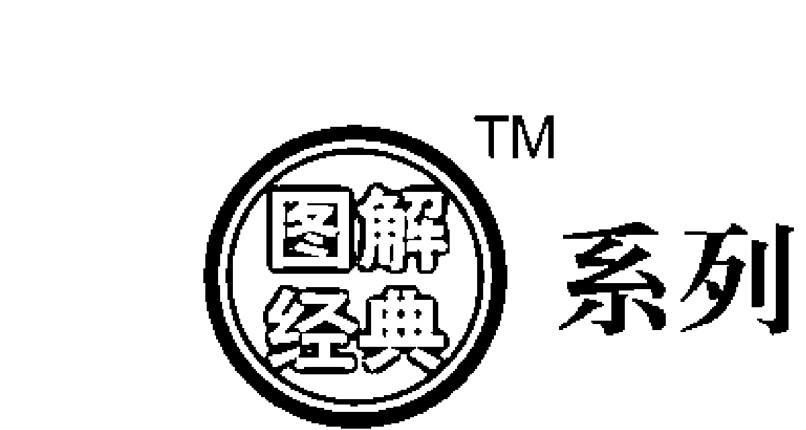

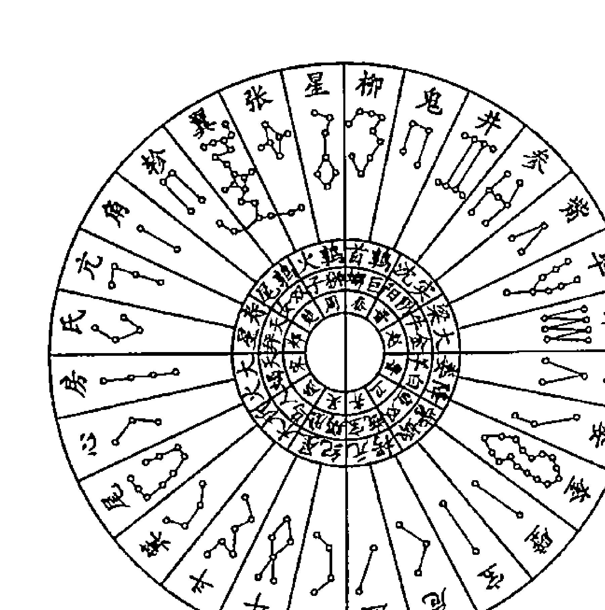

# 图解古代星象学

# 果老星宗

### 下部 七政四余

（唐）张果/原著 欧阳彦/著

责任编辑/周宏
出版发行/陕西师范大学出版社
经销/新华书店
印刷/北京市兆成印刷有限责任公司
版次/2010年9月第1版
2010年9月第1次印刷
开本/787×1092毫米 1/16 51印张
字数/300千字
书号/ISBN 978-7-5613-5029-4
定价/136元(全二册)

如有印装质量问题，请寄回印刷厂调换

# 图解经典 系列
传统经典的现代化革命
像看流程图一样简单明了

# 中国养生
- 图解黄帝内经
- 图解本草纲目
- 图解中国养生术
- 图解黄帝八十一难经
- 图解遵生八笺
- 图解黄帝内经·素问
- 图解彭祖养生经
- 图解黄帝内经·灵枢
- 图解千年导引术
- 图解千金方
- 图解神农本草经
- 图解伤寒论
- 图解金匮要略
- 图解易经养生
- 图解西藏医心术

# 中国古典名著
- 图解西游记
- 图解水浒传
- 图解山海经
- 图解梦溪笔谈
- 图解三国演义
- 图解红楼梦
- 图解史记
- 图解水经注

# 中国传统文化
- 图解易经
- 图解道教
- 图解天工开物
- 图解老子详解
- 图解周易大全
- 图解金刚经
- 图解坛经
- 图解阿含经
- 图解佛教
- 图解五灯会元
- 图解药师经
- 图解100句读懂金刚经
- 图解道教天文历算学·紫微斗数（上下卷）
- 图解易经的智慧·经部
- 图解易经的智慧·传部
- 图解易经中的数学·梅花易数
- 图解六道轮回
- 图解中国古代测绘学·撼龙经
- 图解古代人体五行学·人伦大统赋
- 图解中国古代水文学·水龙经
- 图解中国传统决策学·奇门遁甲大全 全三部
- 图解古代人体使用手册·照胆经
- 图解大藏经
- 图解京氏易传
- 图解西藏睡梦瑜伽
- 图解庄子
- 图解茶经
- 图解孙子兵法
- 图解中国囻俗
- 图解高岛易断
- 图解心经
- 图解华严经
- 图解瑜伽经
- 图解释迦牟尼
- 图解法华经
- 图解佛教生死书
- 图解周易参同契
- 图解楞严经
- 图解藏密财神法
- 图解中国道教生死书
- 图解天龙八部
- 图解曼荼罗
- 图解果老星宗

# 西学经典
- 图解经济学
- 图解基督教
- 图解圣经故事·旧约
- 图解圣经故事·新约
- 图解古代化学故事/炼金术
- 全彩图解源氏物语（1000周年绝美纪念版）
- 图解日本妖怪大全（上·妖卷/下·怪卷）
- 图解古希腊那些事儿
- 图解心理学
- 图解国富论
- 图解古埃及大全
- 图解埃及生死书
- 图解五轮书
- 图解犹太人智慧书

责任编辑/周宏

# ·《古今图书集成白话图解》丛书简介·

《古今图书集成》是中国古代最庞大的一部官修百科丛书，清康熙时至雍正时历时二十八载而成，是现存规模最大、资料最丰富的类书。共设立汇编、典、部三级类目，其特点在于彻底贯彻“以类聚事”的原则，收录了从上古到明末清初的古代文献资料，内容涵盖了我国一万五千多卷经史子集的典籍，保存了几乎所有学科的源头和血脉。

《古今图书集成白话图解》丛书精选《古今图书集成》中收录的中国古代文化典籍，经过数年的精心校勘、白话评注、生动图解编撰而成。该丛书简体横排，体例完备，通俗易懂。此外，还辑录了大量古代珍贵图版，精心绘制了手绘图、表格、图表，用现代编辑手法大大增强了其可读性，同时兼具较大的文献价值、版本价值和收藏价值。该丛书的出版，是对中华五千年传统文化一个侧面的全新梳理，也为中国传统文化的研究和普及做出了一定的贡献。

# 关于本书

《三国演义》中，诸葛亮帅蜀军兵临五丈原，谁知出师未捷，却病倒在军营中。他点亮长明灯祓星祈命不成，三国的故事也就此接近尾声。在中国古典小说中，有许多桥段将星象与人的命运联系在一起，说的就是星命学。它植根于源远流长的中华文明，以“究天人之际，定福祸吉凶”的神通妙用被后世人传为绝学。

作为记录古代星命学说的巅峰之作，《果老星宗》将诸家理论、学说、方法等熔为一炉，其中虽有杂芜的成分，但却是研究古代星象学的必读之作。与上部讲述星命学基础理论与方法不同，下部主要介绍七政四余诸星曜的运行规律及其对人命运的影响。全书以权威原本为基础，白话解读，配以精美的插图和图解，是传统文化爱好者的收藏佳作！

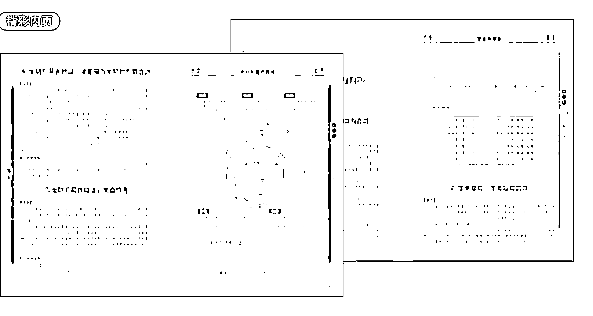