# 圖解 水的神話

Spirits of Water Element & Nymph

萬事萬物的起源，組成生命的元素！
「水」是所有生命的起源，孕育萬物之母。雖然看似溫柔無害，卻也能帶來像洪水這類毀天滅地的巨大災禍，許多傳說與神話都由此而生。
本書從水神、海神、河童、人魚，涵蓋東西方各種「水」的神話和傳說，全本圖解分析，一次通曉水與海洋的相關知識！

# 水精靈與水妖

山北篤 著 王書銘 譯

水精靈與水妖、水的科學、湖中仙女、人魚、躍水龍蛇、海德拉、利維坦、尼斯湖水怪、挪威海妖、河童、水虎、八岐大蛇、水神與海神、奧克安諾斯、波賽頓、阿謝洛奧斯、蒂雅瑪特、赫凱特與克奴姆、大衮、克蘇魯、龍王、玄武、河伯

# 第一本專業收錄水神話與傳說的圖解工具書！
103項水神話傳說
知識全收錄！

宗像三女神、金比羅宮、洪水傳說、亞特蘭提斯、百慕達三角、幽靈船、《金銀島》、水遁之術、奧德修斯、《海底兩萬里》、《兩棲人》

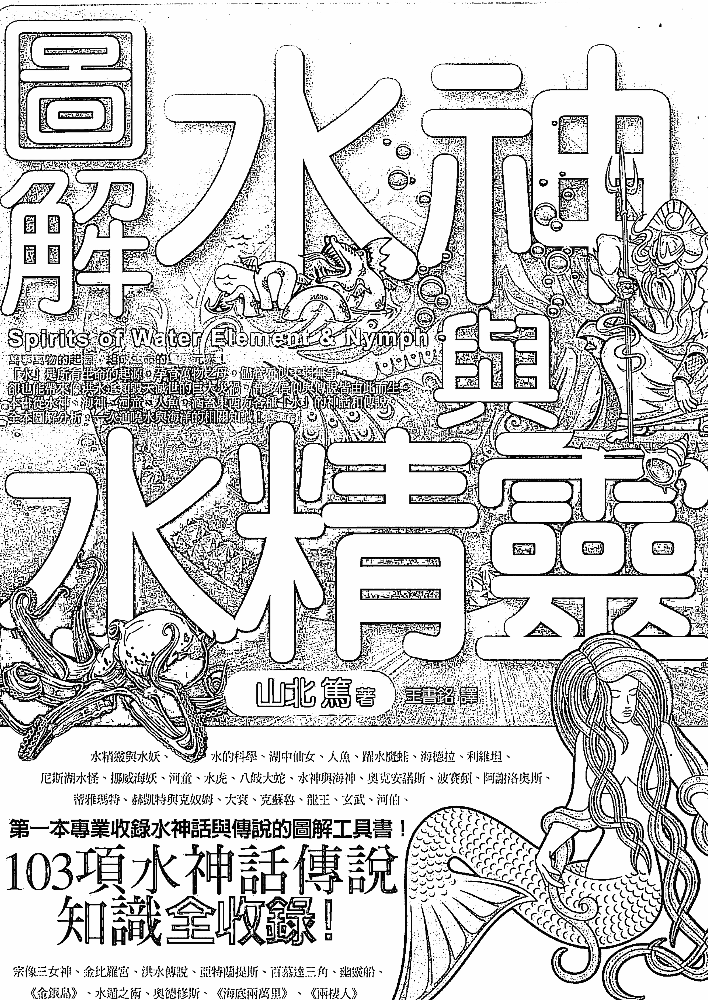

## 圖解水神與水精靈

Spirits of Water Element & Nymph

奇幻基地

# 前 言

水。
水能載舟，亦能覆舟。
追根究底，人體重量有過半都是由水分構成。沒有水，人只有死路一條。人類沒有食物不會立刻死亡，沒有水卻連短短三天都撐不住。

另一方面，水也是毀滅人類的物事。全世界都有神話描述毀滅人類最大的災禍，便是席捲整個地面世界的大洪水。諾亞方舟的神話其實並非基督教的專利，許多神話甚至比諾亞還要更加古老，顯示世界各地的人類都曾經面臨過洪水的毀滅力量。

基本上水的神話比較溫柔，像是愛護人類的精靈、扶持人類的神明等，但也因為它的柔軟，其復仇也就顯得更加恐怖。有人膽敢背叛水，通常都要面臨死的下場。

其固有的柔和性質以及內蘊的憤怒力量，使得水更顯神祕。
既然水隨處可見，其神話自然亦是多采多姿，河川湖泊各有精靈、妖精甚至神明存在。

再說到大海。大海廣大而無垠無際、承載著無數冒險故事，我們的祖先同樣也對海洋懷抱著極大的美夢與幻想。然而出海總是伴隨危險，正因為如此，人類才要信仰海神並且祈求守護。

海神是性情暴躁的神明，人類性命在他的盛怒之下不值一哂，只能無情的消逝，可是只要得到海神的守護，想獲得莫大財寶或力量卻也非毫無可能。

筆者欲藉此書介紹關於水和海的傳奇故事，希望能讓讀者諸君好好體會水神話之樂趣以及恐怖。

山北 篤

# 目 次

## 第一章 水精靈與水妖

- No.001 水的科學 — 8
- No.002 萬物爲水 — 10
- No.003 水精靈 — 12
- No.004 溫蒂妮 — 14
- No.005 藝術作品中的溫蒂妮 — 16
- No.006 涅蕾斯 — 18
- No.007 阿布沙羅絲 — 20
- No.008 女水仙 — 22
- No.009 羅莎卡 — 24
- No.010 否狄阿諾伊 — 26
- No.011 古蕾格・安雯 — 28
- No.012 湖中仙女 — 30
- No.013 格蘭戴爾 — 32
- No.014 海豹少女 — 34
- No.015 涅涅 — 36
- No.016 農摩 — 38
- No.017 凡尼克 — 40
- No.018 冷泉院的水精靈 — 42
- No.019 人魚 — 44
- No.020 人魚（東方） — 46
- No.021 人魚肉 — 48
- No.022 半魚人 — 50
- No.023 水馬 — 52
- No.024 阿凡克 — 54
- No.025 躍水魔蛙 — 56
- No.026 史琪拉 — 58
- No.027 卡里布地斯 — 60
- No.028 賽倫 — 62
- No.029 海德拉 — 64
- No.030 利維坦 — 66
- No.031 挪威海妖 — 68
- No.032 尼斯湖水怪 — 70
- No.033 河童1 — 72
- No.034 河童2 — 74
- No.035 水虎 — 76
- No.036 鼈 — 78
- No.037 九頭龍 — 80
- No.038 八岐大蛇 — 82
- No.039 海坊主 — 84
- No.040 船幽靈 — 86
- No.041 洗豆怪 — 88
- No.042 濕濡女 — 90
- 專欄：水子作祟？ — 92

## 第二章 水神與海神

- No.043 奧克安諾斯 — 94
- No.044 波賽頓 — 96
- No.045 海洋老人 — 98
- No.046 斯提克斯 — 100
- No.047 阿謝洛奧斯 — 102
- No.048 尼爾德 — 104
- No.049 阿戈爾 — 106
- No.050 李爾 — 108
- No.051 馬南南麥克李爾 — 110
- No.052 蒂雅瑪特 — 112
- No.053 巴力 — 114
- No.054 赫凱特與克奴姆 — 116
- No.055 大哀 — 118
- No.056 克蘇魯 — 120
- No.057 阿娜希塔與阿部 — 122
- No.058 薩囉薩伐底 — 124
- No.059 阿帕斯 — 126
- No.060 水天 — 128
- No.061 龍王 — 130
- No.062 玄武 — 132
- No.063 河伯 — 134
- No.064 無支祁 — 136
- No.065 淤加美神與彌都波能賣神 — 138
- No.066 住吉三神 — 140
- No.067 宗像三女神 — 142
- No.068 素盞鳴尊 — 144
- No.069 金比羅宮 — 146
- No.070 船靈樣 — 148
- No.071 特拉洛克 — 150
- No.072 帕裡雅卡卡 — 152
- No.073 伊拉帕 — 154
- No.074 伊希切爾 — 156
- 專欄：DHMO (Dihydrogen Monoxide) — 158

## 第三章 水的故事

- No.075 洪水傳說1 — 160
- No.076 洪水傳說2 — 162
- No.077 亞特蘭提斯 — 164
- No.078 姆大陸 — 166
- No.079 靈藥 — 168
- No.080 奈克塔與蘇摩 — 170
- No.081 楔 — 172
- No.082 聖水 — 174
- No.083 閼伽水 — 176
- No.084 盧爾德 — 178
- No.085 養老乃瀧 — 180
- No.086 三途河 — 182
- No.087 的的喀喀湖 — 184
- No.088 百慕達三角 — 186
- No.089 馬尾藻海 — 188
- No.090 漂泊的荷蘭人 — 190
- No.091 幽靈船 — 192
- No.092 海盜（私掠船） — 194
- No.093 海盜（西印度海盜） — 196
- No.094 《金銀島》 — 198
- No.095 摩西過紅海 — 200
- No.096 海幸山幸 — 202
- No.097 水遁之術 — 204
- No.098 御神渡 — 206
- No.099 奧德修斯 — 208
- No.100 霍雷肖·霍恩布洛爾 — 210
- No.101 《美人魚》 — 212
- No.102 《海底兩萬里》 — 214
- No.103 《兩棲人》 — 216

* 內文譯注請見218頁的注釋附錄

注釋附錄 — 218

中英日名詞對照索引 — 229

參考文獻 — 236

# 第1章
水精靈與水妖

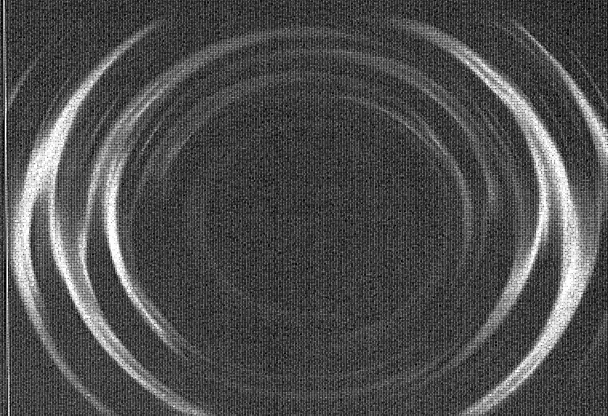

# No.001
水的科學
H₂O

水非但是所有生物身體構造的基本物質，同時也是造就地球今日環境的關鍵物質。

## ●水＝隨處可見的異常物質

水。雖然隨處可見，其實它卻是種極為特殊的物質。
首先，水是種萬能的溶劑，能溶解許多物質的液體。除了一般人熟知的砂糖、鹽巴之外，還能溶解各種物質；若將微量溶解的物質計算在內的話，就算說萬物皆可溶於水也不為過。
談到地球生命的起源，就不能不提到水這種萬能溶劑。正因為地球處於水以液態（水），而非以固態（冰）或氣態（水蒸氣）存在的氣溫之下，才讓生命得以孕育。
作為萬能溶劑，水能夠溶解並且載運地球上生成的物質，並與其他物質反應，從這個角度便不難了解為什麼許多神話將水奉為生命之母。人類的體重有60～70%是水分，甚至嬰兒也有將近80%的體重都是水。
再者，普通物質的密度由大到小依序為固態、液態、氣態（相同質量的物質，密度愈大則體積愈小），可是水從固態變成液態時體積卻會變小（密度變大）。除水以外，僅鎵、矽等極少數物質擁有此一特性。
假如水的固態比液態重，那麼就會先在海底形成發達的冰層，最終就連大海表面也結凍，而太陽光會被海面反射出去、海的溫度將不斷下降。地球之所以如此溫暖，恰恰是因為水是種異常的液體。若非如此異常的液體，就不會有岩石滲水結冰，使其迸裂的風化現象產生，地球的地形地貌也將更加險峻。
今日的地球如此適合居住，全拜水之異常所賜。

### 隨處可見卻是特殊物質

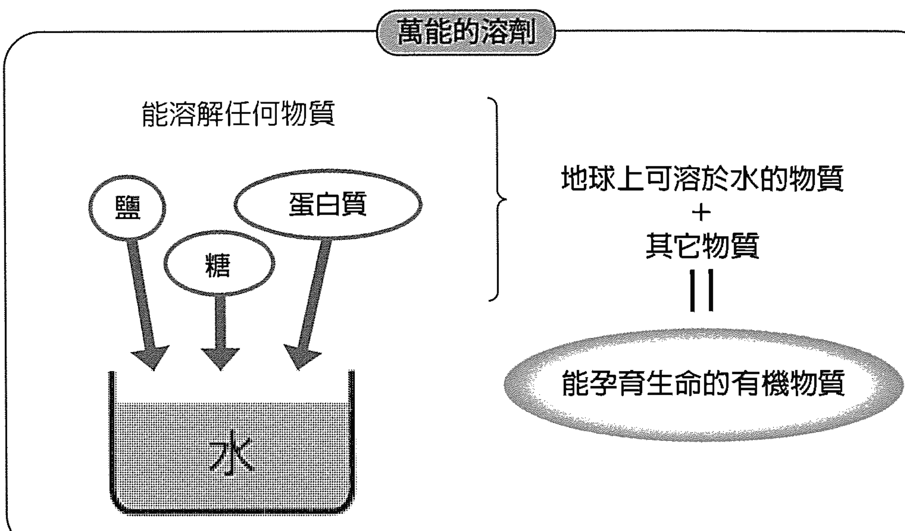

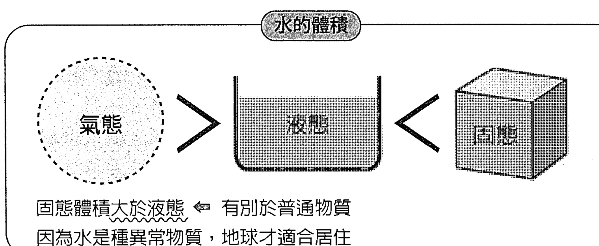

> 缺水的國家：日本

許多人聽到這句話必定是滿腹疑竇，像日本雨量這麼多、水源如此豐富的國家，怎麼會是「缺水」的國家呢？

日本確實是位於多雨地帶，年降雨量有1700mm左右，幾乎是世界平均雨量950mm的兩倍。

可是如果以人口平均計算，每年每個日本人分到的降雨量僅5000m³，不到世界平均人口降雨量2萬7000m³的五分之一，甚至比沙漠地區的國家還少。

所以無論如何，我們都應該更加珍惜水資源，謹慎使用才是。

## No.002
# 萬物為水

Water as a first principle

古希臘曾經就世界的狀態進行哲學性考察，其中有股思想特別著眼於與水的關係，此即萬物為水的概念。

## 水是否足以成為萬事萬物的根源？

古希臘的哲學家曾經就世界的構造從事過形形色色的考察。

西元前五世紀的恩培多克勒*1曾提出物質的根源（Arche）分成地水火風的四大元素理論。這個思想後來得到亞里斯多德推廣（亞里斯多德聲名較盛，使得許多人都誤以為四大元素理論乃是亞里斯多德首創），成為古希臘的主流思想。

此思想對後世造成莫大影響，甚至中世歐洲的魔法和鍊金術也都以此作為物質之基礎，並且進行各種考察。

然而古希臘還有思想更加極端的哲學家。西元前六世紀的哲學家泰利斯*2是歷史記載最早的自然哲學家，他主張唯有水才是萬物的根源。

亞里斯多德於作品《形而上學》中對最早從事哲學的第一批人（也就是他的前輩們）介紹如下：最早從事哲學的人認為事物有某種根本性的物質（謂之根源）存在，它是萬事萬物的構成要素（謂之Stoicheion），而萬事萬物最終都要還原成此種物質。

除此之外，書中還介紹泰利斯是位認為水就是這種根源性物質的哲學家。

泰利斯的說法有其理由。所有作為養分的物質（即人類的食物及植物的土壤等物）都含有水，而熱能之中同樣也有水氣的存在。正因為如此，泰利斯才認為水是根源性的物質，進而展開大地乃浮於水上的哲學觀。

### 與古希臘哲學的關係

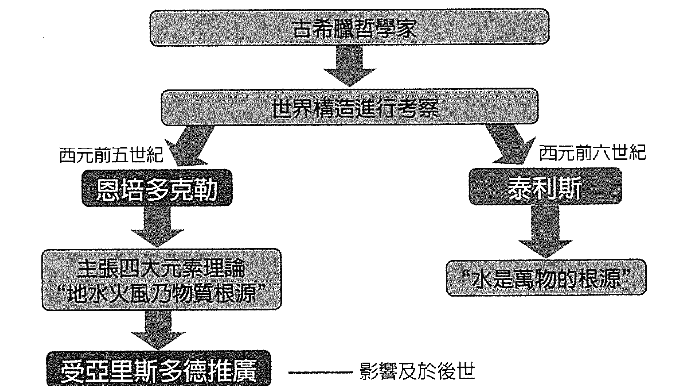

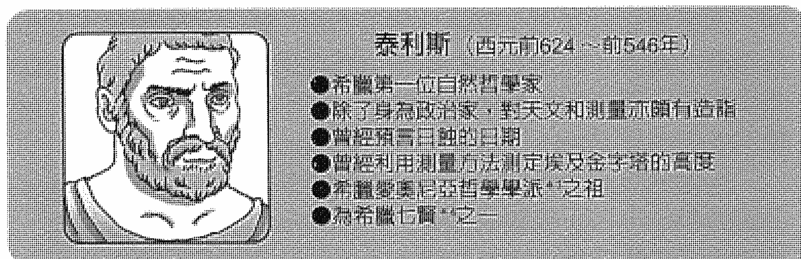

### 泰利斯的主張

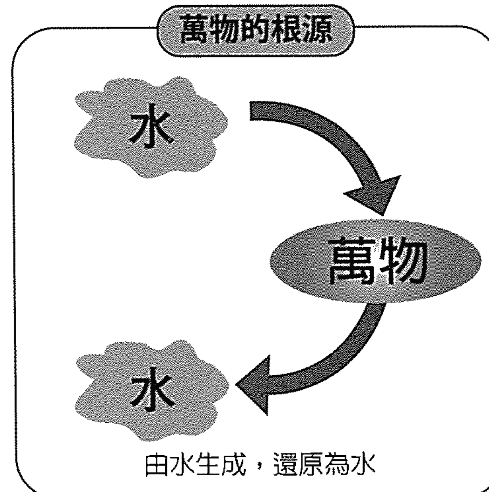

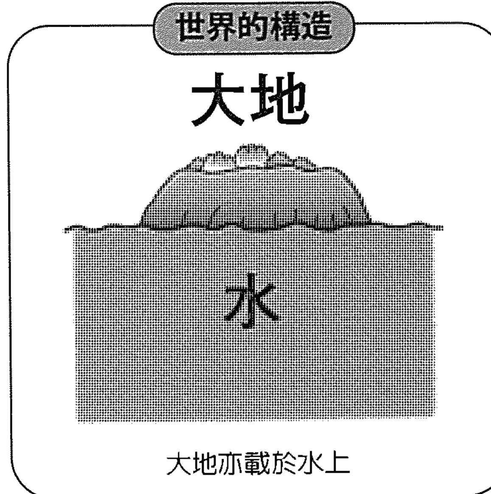

## No.003
# 水精靈
## Water elementals

> 這個世界有許多水精靈棲息，不過我們究竟根據什麼稱呼它們為「水」的精靈呢？

### ◎兩種水精靈

其實水精靈有兩個意思，一是棲息於水中的妖精，一是本質為水的精靈。

古時候水的精靈其實只有一種，那便是棲息於水中的妖精，凡是透過神話或民間傳說所聽聞的水系精靈全都屬於此類。水系精靈雖然大多都是性情溫和的生物，其中卻也不乏相當殘酷的類型。以本書介紹的水精靈為例，**海豹少女與女水仙**屬於前者，**賽倫與水馬**等屬於後者。他們雖然棲息於水中，身體卻並不一定是由水所構成，只是特別適合水的環境而已。

然而到了十六世紀，有位名叫帕拉塞爾蘇斯*1的醫師兼鍊金術師創造出四大精靈的概念，將世間萬物皆分地、水、火、風四大元素的理論應用於精靈身上。帕拉塞爾蘇斯表示，四大精靈是由相對應元素所組成，換句話說，水精靈便是以水這個元素為其本質。

以水構成的新精靈於焉誕生，這個精靈名叫**溫蒂妮**（嚴格來說，溫蒂妮一名以前便已經存在，那時仍是個極為普通的水精靈。不過自從帕拉塞爾蘇斯以後，遂轉變成專指此類的水精靈），因而遭遇到了問題。

火精靈沙羅曼蛇為蜥蜴形象，說他是以火構成的精靈倒還說得過去，可是像溫蒂妮這樣的水精靈卻是從許久以前便經常出現在各地的神話與民間傳說當中，使得帕拉塞爾蘇斯的溫蒂妮也受到這些神話傳說影響，被描繪成樣貌與人類相同，甚至還能與人類結婚生子的妖精，而不是以水構成的生物了。

因為這個緣故，如今才有這種明明是以水構成，卻又能跟人類結婚的不可思議精靈。

### 擁有兩種意涵的水精靈

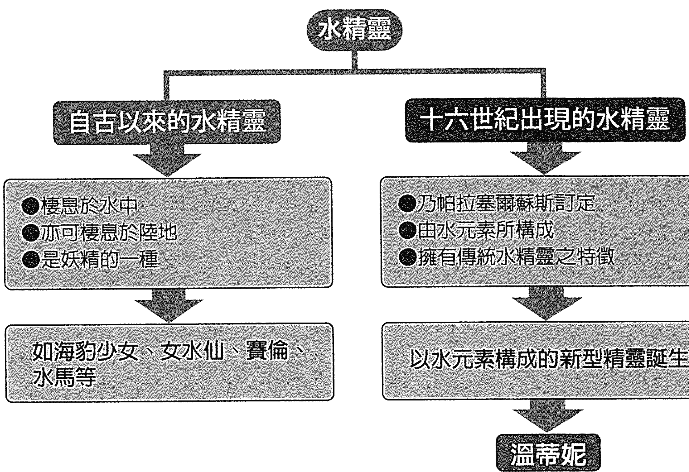

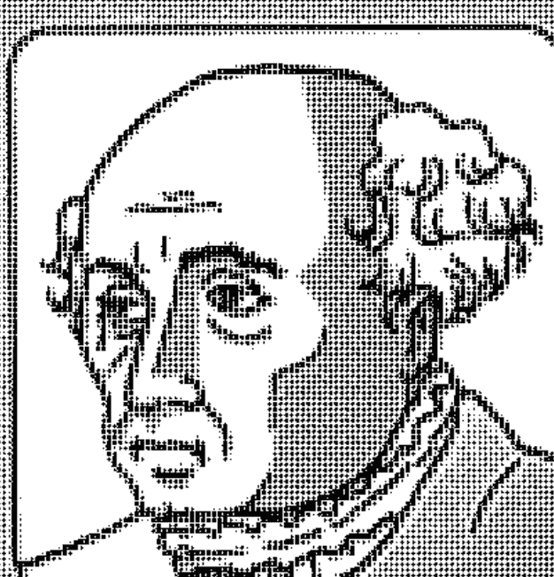

帕拉塞爾蘇斯（約1493～1541）
●中世紀德國的醫師、魔法師、煉金術師
●將四大元素思想應用於精靈概念
●帕拉塞爾蘇斯此名意在超越古代名醫蓋倫蘇斯

> 怪物樣貌的水精靈
近年來的電玩遊戲中，時常可以見到不作人類形體，而作水立方體模樣的水精靈，要是此圖所述水精靈們知道這件事，肯定會很不是滋味的說：「我們才不是那種怪物」吧。

#### 關聯項目

- ●溫蒂妮→No.004
- ●女水仙→No.008
- ●海豹少女→No.014
- ●水馬→No.023
- ●賽倫→No.028

## No.004
# 溫蒂妮*1
## Undine

中世紀鍊金術師帕拉塞爾蘇斯曾經提出四大精靈的說法，水系精靈溫蒂妮便是其中之一。

### ●美麗的女精靈

溫蒂妮是德語，英語讀作安戴茵、法語則讀作翁蒂奴。
大名鼎鼎的鍊金術師帕拉塞爾蘇斯將精靈分成地、水、火、風四個種類，並將水精靈命名爲溫蒂妮。
相傳溫蒂妮的外表是美麗的女性，住在森林中的水池或者瀑布水潭裡面。她們聲音優美，聽起來就像是潺潺的流水聲。
根據帕拉塞爾蘇斯的說法，溫蒂妮沒有靈魂，卻可以透過與人類男性結婚取得，只不過溫蒂妮亦必須受到相當大的制約。

- 其一，如果在水邊受到丈夫責罵，溫蒂妮就必須回到水中。
- 其二，如果丈夫發生外遇，即便溫蒂妮已經回到水中也必須將丈夫殺死。
- 其三，溫蒂妮回到水中以後將會失去靈魂。

在帕拉塞爾蘇斯之前，傳說中的溫蒂妮是種長生不老的妖精。跟人類男性結婚生子的溫蒂妮可以取得靈魂，但她們也會失去長生不老的能力，如同尋常人類般衰弱年老。

從前有則傳說描述溫蒂妮與某位騎士結婚，該騎士曾向她發誓：「我的每個呼吸，都有對妳的愛與忠誠。」一年以後溫蒂妮爲他生下兒子，從此就跟普通人一樣開始漸漸變老，等到溫蒂妮年華老去，騎士卻外遇了。

溫蒂妮發現騎士不忠後詛咒道：「你曾經發誓說每次呼吸都是對我的忠誠，只要你還醒著就可以呼吸，可是只要你一睡著，呼吸就會停止」。據說後來騎士想盡辦法抵抗睡意，終究還是忍不住落入夢中，從此就再也沒有醒來。

### 四大精靈

鍊金術師帕拉塞爾蘇斯將精靈分成地水火風四個種類

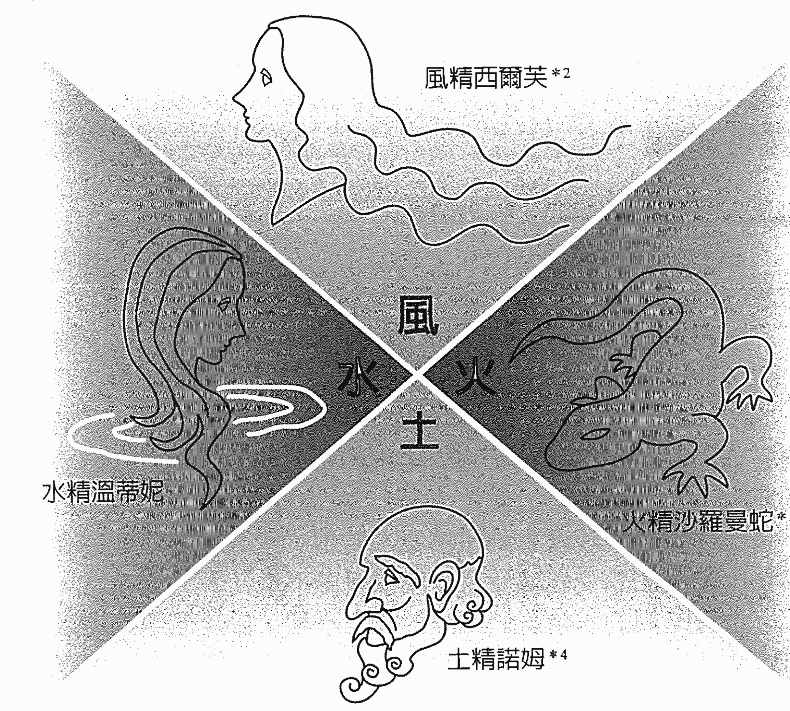

- 溫蒂妮 =
  - 美麗女性的樣貌
  - 住在森林中的水池或瀑布水邊
  - 與人類男性結婚便可獲得靈魂

不過，
- 在水邊受丈夫背叛就必須回到水中
- 丈夫一旦外遇就必須將他殺死

> 溫蒂妮的詛咒
有種先天性睡眠呼吸障礙疾病名叫CCHS*5，患者在睡眠中出現呼吸障害，置之不理就會死亡。據說此疾病有個別名，便是取自溫蒂妮傳說喚作「溫蒂妮的詛咒」。

#### 關聯項目

- ●藝術作品中的溫蒂妮→No.005

## No.005
# 藝術作品中的溫蒂妮
## Undine in arts

自古以來，美麗的水精靈溫蒂妮一直就是眾多藝術家創作的靈感來源。

### ●因獲得靈魂而不幸的溫蒂妮

許多藝術家都曾在創作中描繪溫蒂妮這種擁有美女的姿態容貌，同時卻又受到帕拉塞爾蘇斯制約的水精靈。
德國作家富凱*1於西元1811年的作品《水中仙女》，描述一位因為獲得靈魂而變得善良的溫蒂妮。
故事敘述騎士愛上溫蒂妮的完美無瑕而與其結婚，可是得到靈魂卻使她不再完美，而騎士也漸漸受到原本的未婚妻培兒托達吸引。此時溫蒂妮說道：「靈魂真是沉重的負荷啊。它只不過稍稍靠近，我就看到了擔心、看到了悲傷。儘管輕靈愉快如我，光是去感受靈魂便足以使我變得不幸」。
一旁監視的水精靈們意欲對騎士不利，於是溫蒂妮遂以大石頭堵住中庭的泉水，然後向騎士表明：如果騎士在水邊有無禮的舉動，那麼水精靈一族就會把溫蒂妮帶回水底，而兩人下次見面的時候自己就要殺了他。
儘管如此，當培兒托達沿著河水而下，兩人與她同行的時候，騎士因為水精靈一族奪取了培兒托達的首飾大聲喝斥，連帶教訓了擁有如此族人的溫蒂妮。
騎士違反了約定，溫蒂妮只能回到水底。
事後騎士雖然後悔，卻還是決定與培兒托達結婚。溫蒂妮在夢中告訴他，只要把泉水堵住那麼水精靈就無法出現，可是培兒托達在準備婚禮化妝的時候卻揭開了泉水的封蓋，只見溫蒂妮隨著水柱現身並且往騎士的房間而去，最後發現騎士死於水中，而溫蒂妮說：「我用淚水殺死了他。」
騎士下葬以後，小河不知何時改變了河道、圍繞著他的墓碑流動，眾人都說這是溫蒂妮在擁抱著她的戀人。

### 得到靈魂的水精靈

### 兩個溫蒂妮

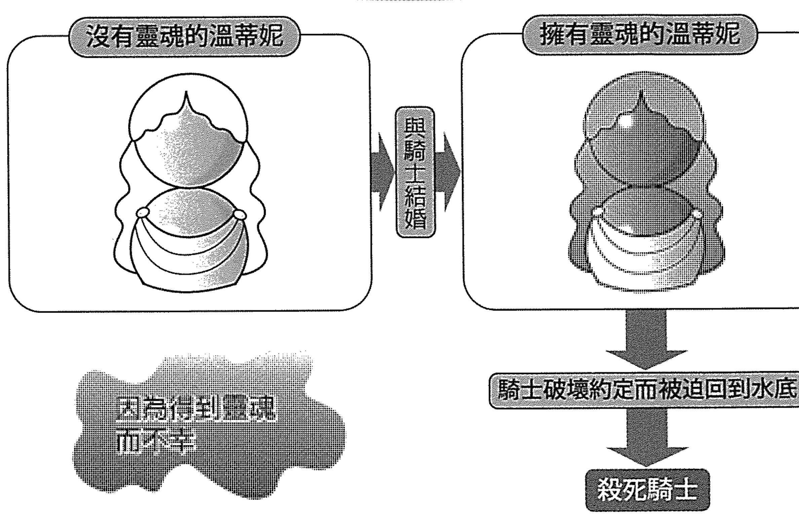

> 季荷杜的《昂丹娜》

西元1939年，季荷杜根據凱的《水中仙女》改編創作成戲劇，故事中的溫蒂妮不僅與前作形象有相當大的差距，結局更是截然不同。

首先，《昂丹娜》當中的溫蒂妮是位不滿現實、不擅辭令的任性少女，即使跟騎士結婚也沒有變化。劇中並未明確交代她是否獲得了靈魂，就算真的獲得了靈魂，其性格也並未改變。

其次，當騎士要迎娶舊愛未婚妻貝兒塔（Bertha）的時候，溫蒂妮則說是自己背叛騎士愛上別人，主動回到水中，用意是在保護騎士免死於難。

後來她的兩位姐姐被水精靈之王看穿，並指出只要她的姊妹們呼喚溫蒂妮的名字一次騎士就會死亡，而溫蒂妮則是會遺忘一切。直到呼喚溫蒂妮名字的聲音傳到耳邊，騎士才真正體認到溫蒂妮身為妻子的事實，可惜為時已晚，故事最後騎士喪命，而溫蒂妮也失去所有記憶，回到水底去了。

#### 關聯項目

- ●溫蒂妮→No.004

## No.006
### 涅蕾斯
Nereis

涅蕾斯是擁有美貌和神祕力量的海之寧芙仙子，許多涅蕾斯都擁有各自的神話。

#### ●平穩海域的海之寧芙仙子，心性也較為穩定溫和

涅蕾斯是住在平靜愛琴海的海之寧芙仙子，其複數形作「Nereids」。

涅蕾斯是海神涅落斯*1與女海神朵利絲所生的孩子，她們清一色全是女性，共有50人（亦有說法指為100人），個個都是貌美的少女、作人魚模樣，但據說她們擁有變身成人類或海洋生物（海豹或海豚等）的能力。

從前有位名叫普撒馬塞的涅蕾斯被人類男子埃阿科斯*2求婚，但是她並不願意。埃阿科斯要牽她的手，涅蕾斯還試圖變身成海豹逃走，孰料男子仍不肯放手，普撒馬塞才終於死心、答應嫁給他為妻。

波賽頓之妻安芙朵琳蒂也是位涅蕾斯。

不過最出名的涅蕾斯當屬忒提斯。忒提斯以其美貌而聞名，就連宙斯和波賽頓都想娶她為妻，可是命運注定她的兒子將來必定比父親更加偉大，所以宙斯只能放棄，讓她嫁給人類珀琉斯。忒提斯的婚禮極為盛大，唯獨不睦的女神厄麗斯沒有受到邀請，但厄麗斯還是不請自來，並留下一顆寫明「送給最美的女神」的蘋果就走了，引來宙斯正妻赫拉、戰爭女神雅典娜和美之女神阿芙柔黛蒂三位女神爭奪這顆蘋果，而這也是後來希臘神話最大戰役——特洛伊戰爭的起因。

忒提斯之子阿基里斯*3便是在這場戰爭中喪命。當初忒提斯曾經設法讓（預言說他將死於特洛伊戰爭）阿基里斯不要受牽連，然而就算是神明也無法違逆命運，阿基里斯終究還是丟了性命。後來忒提斯將其子遺骨收入金缽埋葬。

#### 擁有各種神話的寧芙仙子

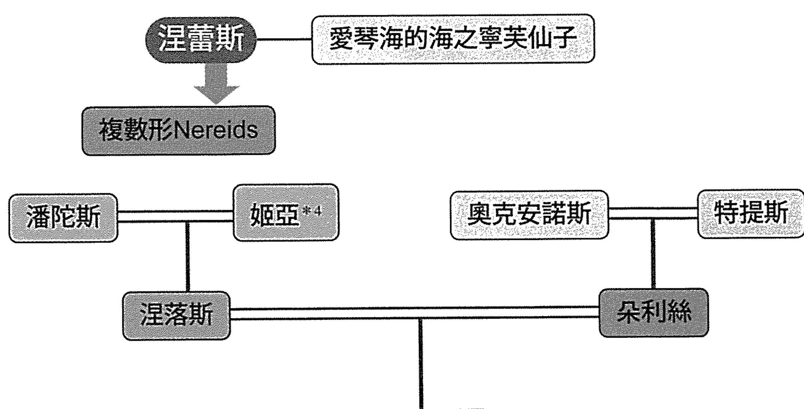

- 全都是美貌少女
- 作人魚模樣
- 能變身成人類或海洋生物（海豹或海豚等）

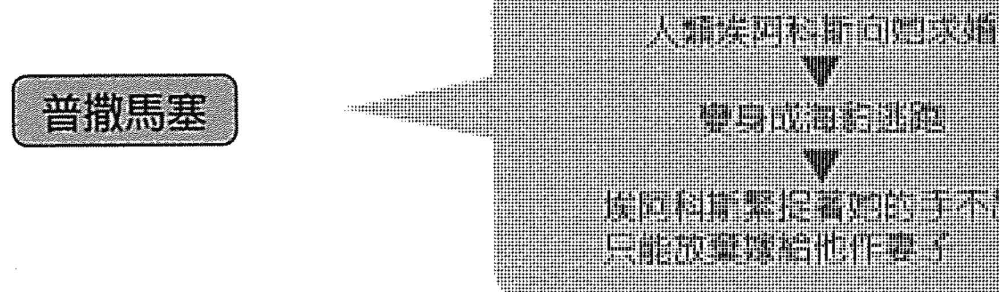

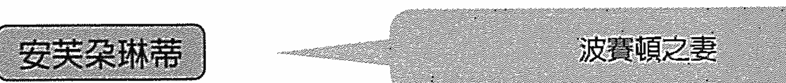

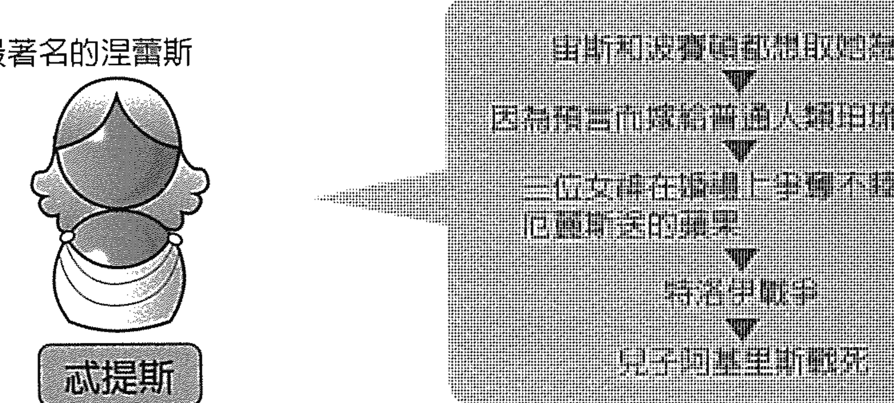

關聯項目
- ●人魚→No.019
- ●波賽頓→No.044

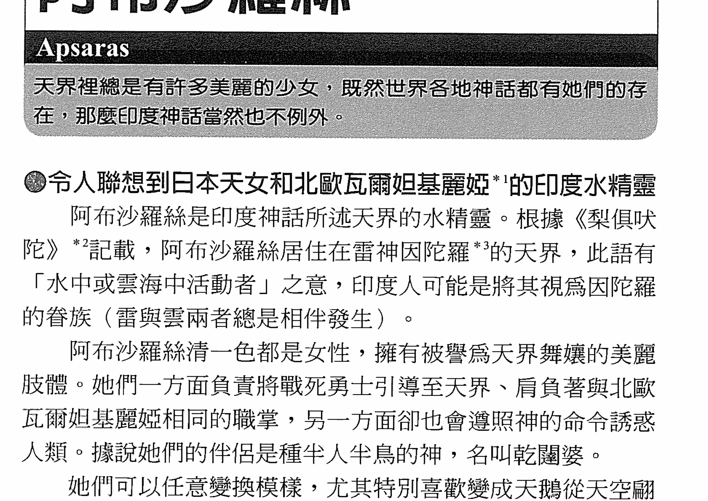

#### 第十七局

主算七不和，主目囚，主大将七宫囚，主参将一宫发；客算不和，客大将七宫囚，客参将一宫发。

此局文昌将囚，主、客大将相关、囚，客关主，中关客，主客俱不利。各宜固守，主闻贼备西南，客闻贼备正西。

#### 天界的美女

阿布沙羅絲 — 印度神話描述的天界水精靈

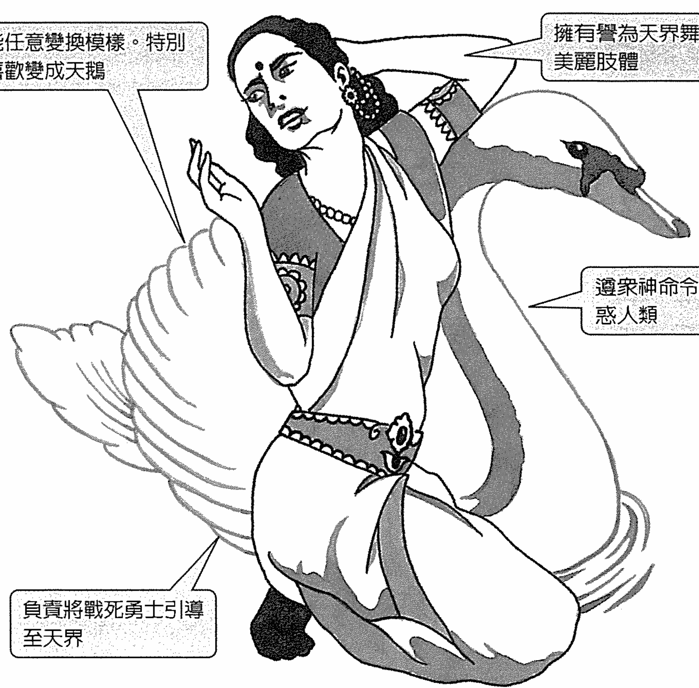

能任意變換模樣。特別喜歡變成天鵝

擁有譽為天界舞孃的美麗肢體

遵眾神命令誘惑人類

負責將戰死勇士引導至天界

#### 著名的阿布沙羅絲

| 烏爾瓦西 | 彌諾 |
|---|---|
| 與凡人布魯羅婆國王間的悲戀而聞名。她與國王相戀卻又被迫分離，最後國王變成乾闥婆始得以與其相隨 | 誘惑聖仙衆友仙人，生下女兒沙恭達羅 |
| 提絡塔瑪 | 秣兔羅 |
| 為使衆神之敵阿修羅*5兄弟失睦而創造的超絕美女 | 因誘惑濕婆神*6而遭其妻帕瓦娣*7詛咒變成青蛙的阿布沙羅絲 |

## No.008
### 女水仙
Nixie

德國同樣也有水精靈棲息，這種水精靈非但因男女而有不同的名稱，就連內容也頗有差別。

#### ●德國傳說中的水精靈

男的水精靈稱作水仙，女的稱作女水仙，水精靈經常悄悄現身於人群中，乍看之下跟普通人類並無分別。
由於水仙有綠色牙齒、頭戴綠帽，看得出來與一般人不同，女水仙卻是金色捲髮的美女，辨別不易，勉強可以靠濕答答的衣服下襬來區分。但若在盛夏時節，女水仙就跟剛去水邊泡腳乘涼的女性沒有什麼兩樣。
據說男水仙還會誘拐綁架人類女性爲妻。
關於水仙還有兩個相互矛盾的傳說。一個傳說指出水仙與人類女性生下的孩子就跟普通人類無異，可是水仙卻會把嬰兒吃掉。附帶一提，水仙和女水仙生下的嬰兒渾身毛茸茸的，很好分辨。
另一則傳說說水仙會綁架接生婆，好讓她們爲妻子接生。水仙對接生婆很有禮貌，甚至還會以謝禮回贈，但如果接生婆太貪心也很可能因此嚐到苦頭。
相傳水仙住在水中的豪華宅邸，就連跟他們成爲朋友的人類也很少受邀前往。
女水仙擁有美麗的容貌和歌聲，她們會以美妙歌聲引誘、或是在水面翩翩起舞，藉歌舞將俊美的年輕人拖進水中，讓這些年輕人溺斃，可見女水仙擁有跟賽倫相同的能力。
據說女水仙的宅邸裡收藏著溺死者靈魂的壺，所以這些溺斃者無法上天堂，會永遠被困於水底。

#### 德國的男女水精靈

男女水仙的名稱不同，其外貌乍看之下與人類並無二致

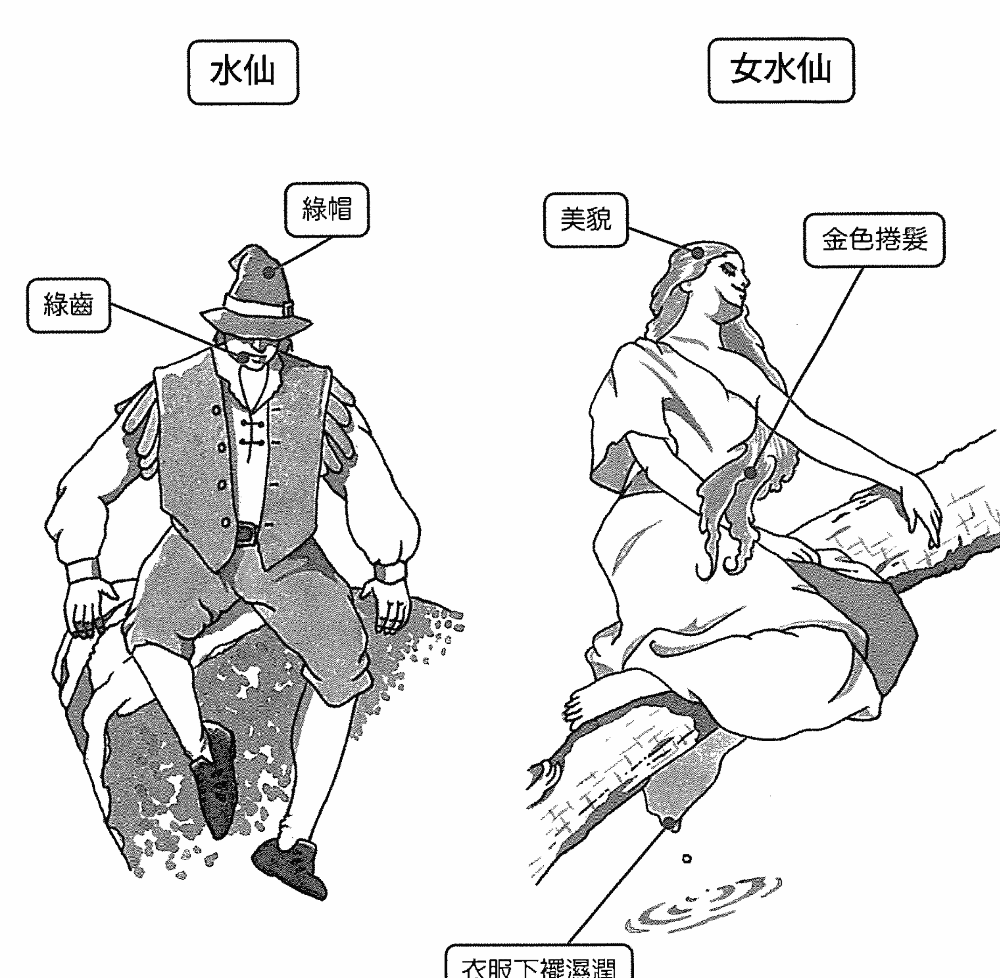

##### 水仙的惡行
- 綁架人類女性為妻
- 把生出來的孩子吃掉

##### 女水仙的惡行
- 利用歌舞引誘年輕男子、拖進水中
- 將溺死者靈魂囚於壺中，使其無法升天

關聯項目
- ●賈倫→No.028

## No.009
### 羅莎卡
Rusalka

是令人不寒而慄的怪物，也是甜美的陷阱。儘管兩個模樣對比如此強烈，羅莎卡身為恐怖妖怪的本質卻從未改變。

#### ●取人性命的可怕女性

羅莎卡是俄羅斯與東歐地區斯拉夫民族神話中的水妖。相傳年輕女性遇難溺死就會變成羅莎卡，這是所有斯拉夫民族共通的說法，只不過南方（多瑙河和聶伯河*1流域）和北方對羅莎卡樣貌的說法卻大相逕庭。

南方的羅莎卡稱作維拉，是美麗富有魅力的女性。她們的皮膚有點蒼白，看起來如月光般清透，並且穿著輕盈的霧裳，生著吸引男性的美妙歌喉。她們會憑著姿態與歌聲魅惑男性、將其拖入水中，讓他們在快樂中死去。

而北方的羅莎卡卻是披散著頭髮、有雙邪惡綠色眼睛的恐怖生物。她們的皮膚就像溺斃者那般蒼白，全身赤裸。如果有人夜裡毫無戒備在水邊走動，她就會伸手硬把那人拖進水中，讓他嚐盡溺水窒息的痛苦而死。

傳說羅莎卡有水中和水上兩種生活。冬天的羅莎卡生活於水中，每到初夏（準確來說應該是羅莎卡週）她們就會移往森林，攀爬並定居於柳樹或白樺樹上。入夜以後，她們有時搖晃樹枝取樂，有時在森林裡的空地來回舞蹈。南方相信羅莎卡曾在上面跳舞的土地非但水草生長豐美，麥子的收成也會比較好。

不過羅莎卡也很喜歡惡作劇，譬如跳到水車上使其停止轉動、打破石臼、破壞堤防、偷布偷線等。除此之外，羅莎卡還擁有能使天空降雨的能力，轉眼間就能使天空降下傾盆大雨。

要讓羅莎卡停止惡作劇其實非常簡單，只要手中握著人稱「詛咒之草」的苦艾*2葉子即可。

#### 兩種羅莎卡

羅莎卡 — 斯拉夫民族神話所述水妖

年輕女性溺斃後就會變成羅莎卡

南北對羅莎卡的形象描述大相逕庭

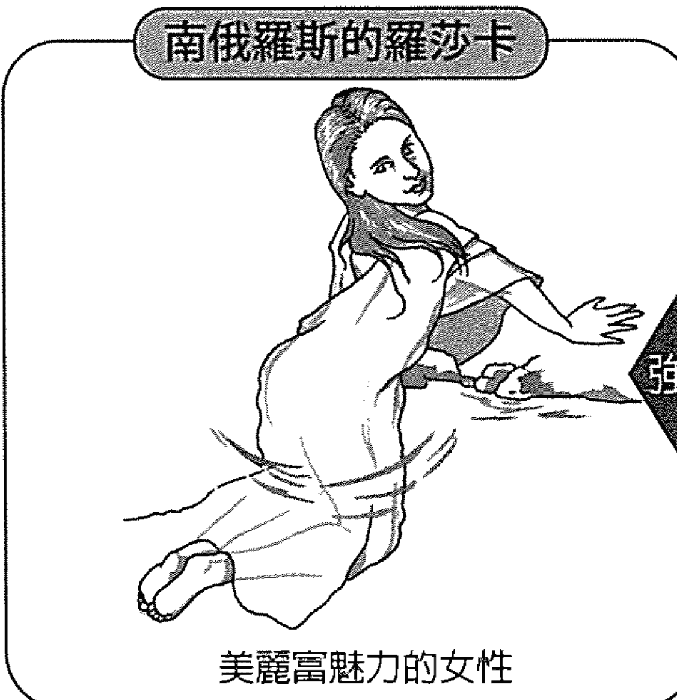

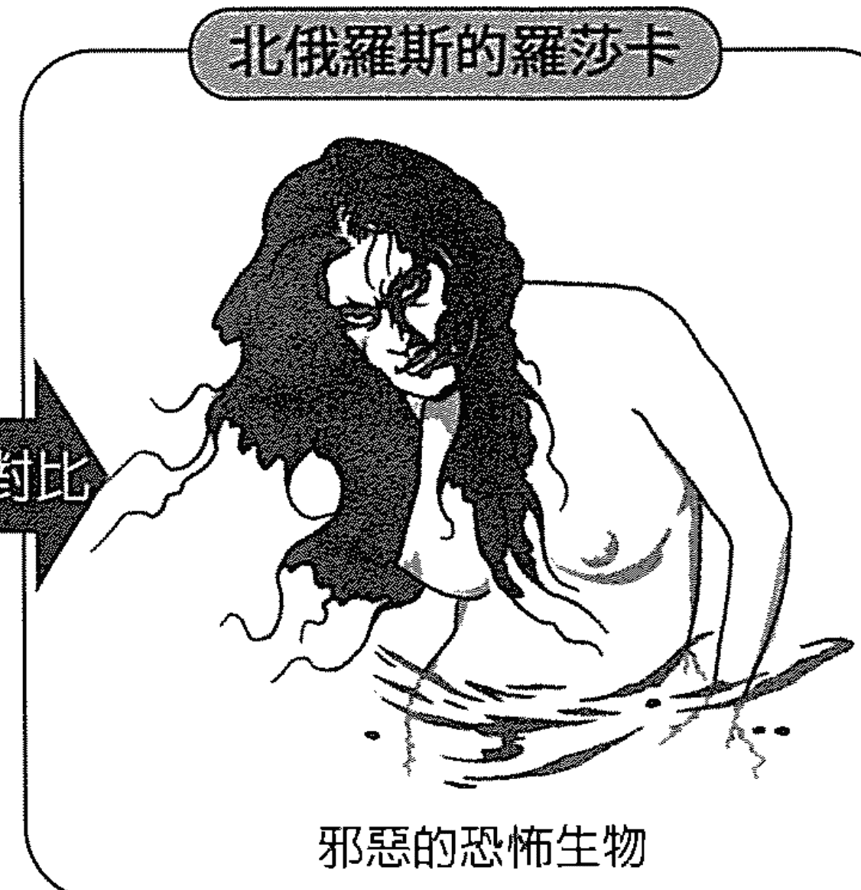

強烈對比

#### 德弗札克的羅莎卡

提到羅莎卡，德弗札克的歌劇《水仙女》也相當有名。這部歌劇雖然情節跟人魚公主相當類似，主題卻截然不同。羅莎卡（在作品中名為水之妖精）愛上了人類的王子，便去向巫婆求助，巫婆便以她的聲音作為交換條件，把羅莎卡變成了人形，同時還警告羅莎卡說萬一男人背叛她的話，兩個人人都要沉入水底。王子被羅莎卡的美貌吸引，將她帶回城裡，後來卻對無法說話的羅莎卡感到厭倦，轉而去向外國的公主示好求婚，而羅莎卡也被水精靈老爺爺帶走。羅莎卡再次來到森林，巫婆將匕首交給羅莎卡，告訴她只要得到王子的鮮血便能變回妖精，仍然愛著王子的羅莎卡卻將匕首丟掉。城堡的守衛人來到巫婆家中，聲稱羅莎卡背叛王子，使得王子驚恐，水精靈卻反指是王子背叛，痛斥守衛人撒謊。夜晚，王子來到森林裡請求羅莎卡原諒，當羅莎卡擁抱王子親吻自己就應酬命，王子驚恐叫了她，而羅莎卡也隨著王子的遺骸雙雙沉入湖底。

#### 關聯項目

- ●否狄阿諾伊→No.010

## No.010
### 否狄阿諾伊
Vodyanoy

否狄阿諾伊是男性的水精靈。既然身為水的精靈，自然也就能任意變化外形模樣。

#### ●不懷好意的精靈

否狄阿諾伊是俄羅斯與東歐地區的水精靈。此名原是俄語，俄語稱水為「вода」（音譯為「否達」），而否狄阿諾伊便是「水精」的意思。

既然傳說指否狄阿諾伊是羅莎卡的丈夫，那麼他們當然全都是男性。相傳這種精靈喜歡住在河川湖泊，尤其是水門和水車附近，還有他們厭惡控制水流的水車，有時候甚至會將水車小屋連同堤防一起破壞掉。

否狄阿諾伊的外形千變萬化，有時會變成手指特別細長、獸足頭角，還長條尾巴的男子，有時是有雙紅色大眼和長鼻子的巨人，有時是個綠髮綠齷齪的老人，有時則會變成長著齷齪的巨大青蛙。照理說否狄阿諾伊是男性，但據說他們也會變身成正在梳頭髮的裸女。除此之外，某些傳說還說他們以全身被青苔覆蓋的大魚出現，甚至是生著一雙小翅膀的樹幹緊貼水面飛行。

否狄阿諾伊可以長生，卻無法不老。他們隨著月亮的盈缺時而衰老時而青春，滿月是他們最年輕、最有活力的時候。

令人遺憾的是，否狄阿諾伊對人類不懷好意。一旦有人鬆懈就會被他們拉進水中，如此溺死者將無法進入天國，只能在否狄阿諾伊的王國裡當奴隸、永遠服侍他。傳說王國裡滿是從沉船中搜刮來的金銀財寶，還有一座以發光魔法石打造成的水晶宮殿。

否狄阿諾伊白天都躲在自己的宮殿裡，直到傍晚才開始在水邊出沒，尋找入夜後還在玩水、不知警戒的人類。相傳從前看守水車的磨坊臼工會將傍晚路過的旅人擲入水中，保護水車小屋免於否狄阿諾伊的破壞。

#### 否狄阿諾伊的各種模樣

否狄阿諾伊 —— 俄羅斯、東歐地區的水精

否狄阿諾伊的外形千變萬化，並無定論

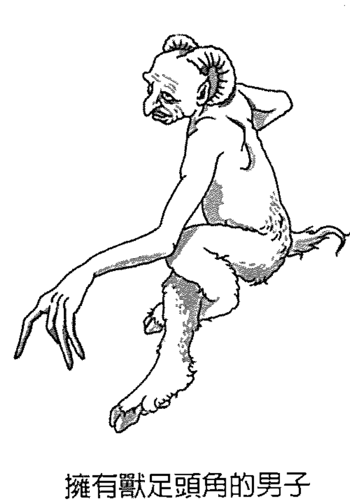

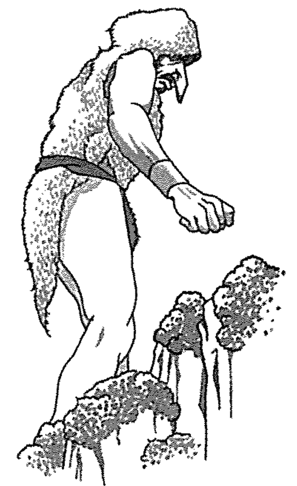

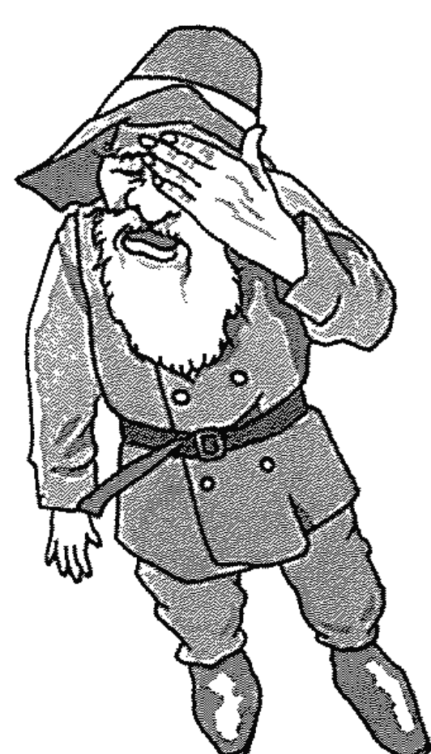

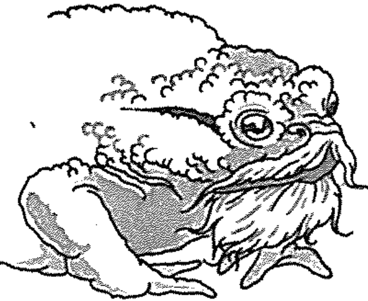

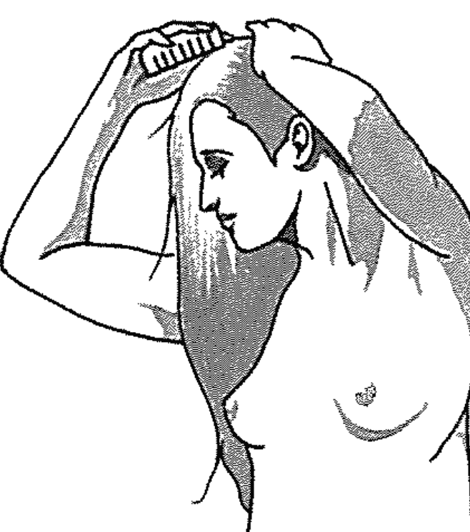

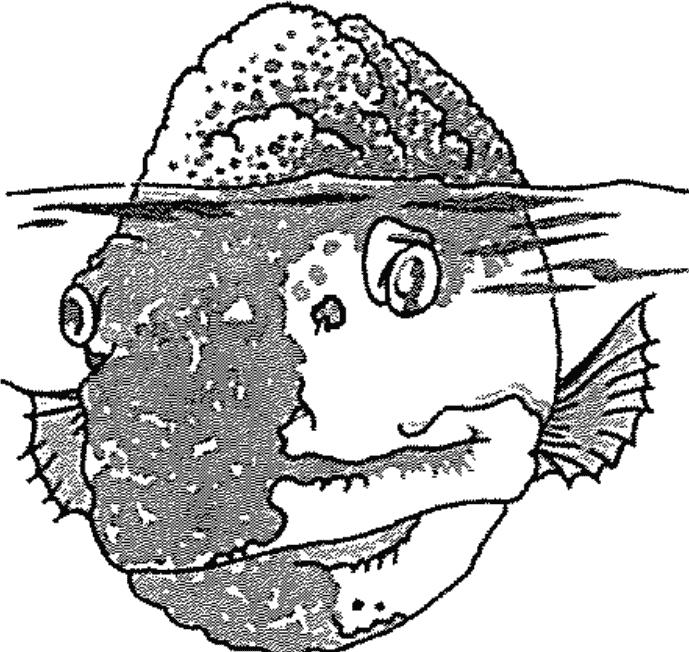

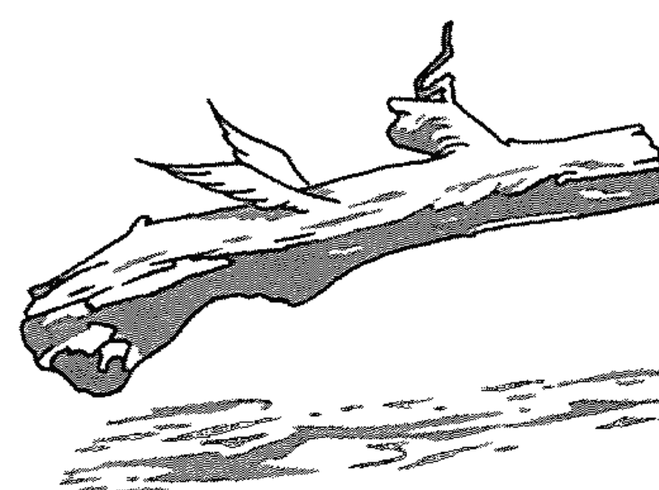

俄軍的水陸兩用車GAZ-3937被命名「否狄阿諾伊」，體大可以搭載一人，平地最高時速達112公里（水上時速則在4～5公里之間），想必是因為它在水中同樣可以活動自如，俄國人才取了這個水精的名字吧。

#### 關聯項目

- ●羅莎卡→No.009

## 古蕾格·安雯
### Gwragedd Annwn

威爾斯的妖精大多醜陋又恐怖，唯獨湖水妖精卻是美麗而溫柔。

#### ●嫁作人妻的妖精

古蕾格·安雯是支傳說棲息於英國威爾斯地區湖泊的妖精種族。威爾斯地區流傳著許多美麗湖水仙女的傳說，也不乏她們跟人類結婚的傳聞。

從前有個寡婦跟獨子住在凡湖附近，兒子每日都到湖畔牧牛。有天他在湖面看見一位金髮美女，立刻就為那名女性而痴迷，也顧不得自己手裡還拿著麵包就向她招手，那美女卻說：「你的麵包烤得太硬了」。說完就消失在水中。隔天，男子帶著沒烤過的麵包來到湖邊，卻被嫌太軟。再隔天，男子帶著稍微烤過的麵包來到相同的地方，卻有位威嚴的老者帶著兩名長得一模一樣的年輕女性從水中現身。

老人告訴男子只要他猜對是向哪個女孩求婚，就把女兒許配給他，可是兩個女孩實在太相像。就在這個時候，其中一名女孩稍微動了動腳，而男子也從腳上涼鞋的帶子認出她，答出正確答案。老人贈送男子很多頭牛當作陪嫁，並警告他說：「你要善待你的妻子。如果毫無理由毆打她，只要三次，妻子和陪嫁的牛都會消失」。

兩人婚後過著幸福的生活，還生了三個兒子。然而妻子畢竟是妖精，不時會做出奇怪的舉動，譬如在大喜的婚禮上突然哭出來，或是在小孩的葬禮上大笑或唱歌；因為這些事情，男子終於在沒有正當理由的情形下打了妻子三次。

於是他的妻子和那些牛憑空消失，就連牛隻生的小牛、甚至已經宰殺吊起來的牛肉也全都消失不見了。不過妖精畢竟無法忘記自己生的三個孩子，經常前來探望，還教導他們各種有關藥草的秘密知識，讓他們都成了當地的名醫。

#### 跟人類結婚的湖泊妖精

古蕾格·安雯

棲息於威爾斯地區湖中的妖精

與人類結婚

世界許多民間傳說均有此情節

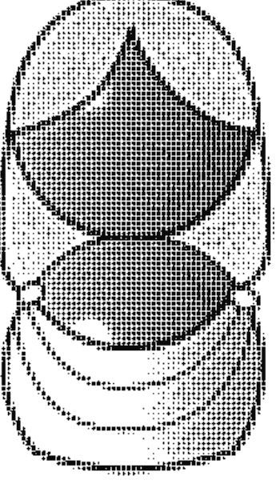

女妖精

嫁給人類男性

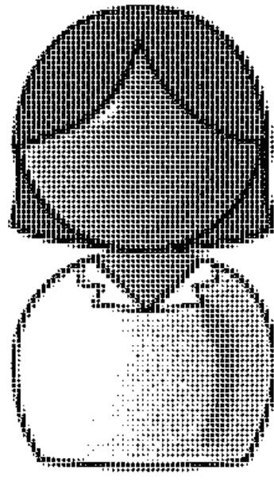

人類男性

發生問題，返回原來的世界

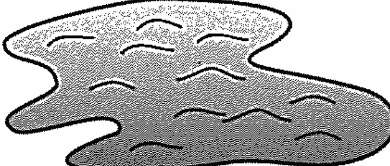

湖

仍然想著兒子並施以恩惠

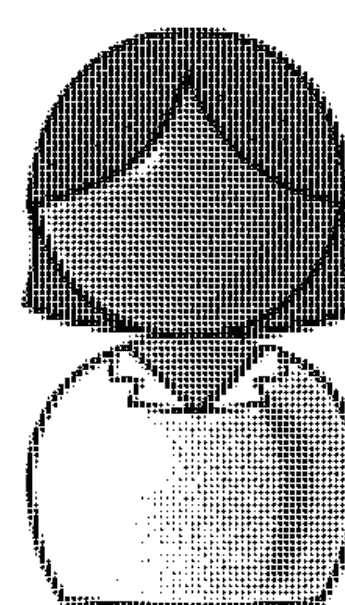

#### 威爾斯地區

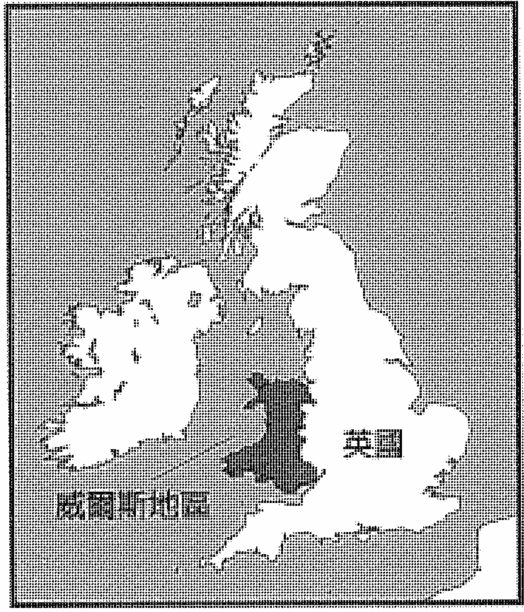

威爾斯跟英國本是兩個不同的國家，語言也不相同，使用的是威爾斯語。直到今日，英國的正式名稱亦作「大不列顛及北愛爾蘭聯合王國」，而威爾斯公國便是這聯合王國當中的一個公國。除了英國的國旗圖徽以外，當地也有固有的國旗與國徽。按照慣例，英國向來都將英國國王的皇太子冊為威爾斯王子（威爾斯親王）。

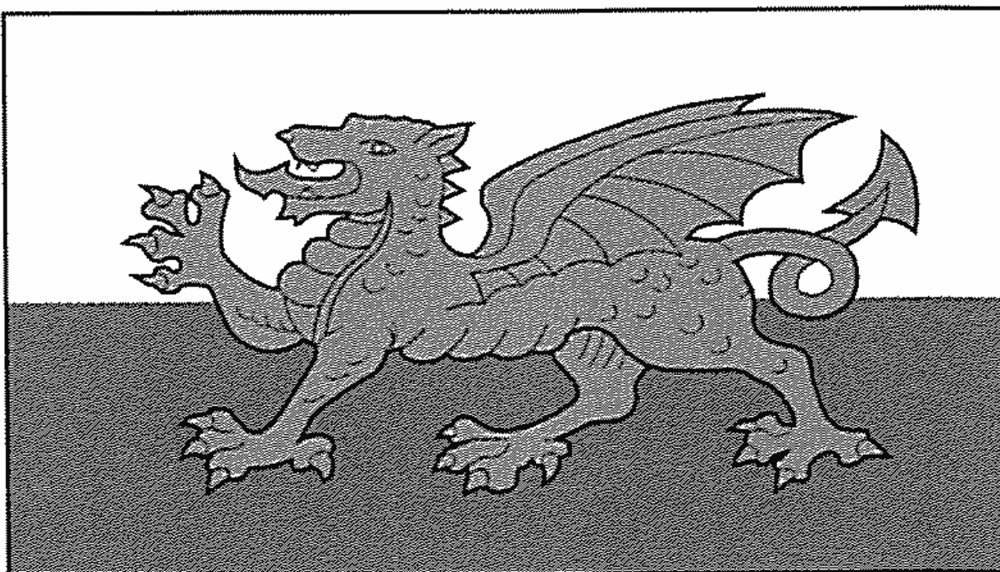

威爾斯的國旗

## No.012
### 湖中仙女
Dame de Lac

湖裡的妖精有薇薇安、艾蓮、妮穆艾等諸多名字，或許湖中仙女其實不只一位也說不定。

#### ●相互矛盾的傳說故事

所謂湖中仙女就是亞瑟王傳說中那名住在湖水裡的妖精。
從前亞瑟拔出石中劍而成爲國王，這把劍叫作卡利班（Caliburn），但有次亞瑟在盛怒之下做出從背後砍人這種違反騎士道的行爲，使得卡利班折斷。
於是魔法師梅林替亞瑟向湖中仙女討來新的寶劍——斷鋼神劍（Excalibur），有一說這把劍是以卡利班重新鍛造而成，故才名爲Ex+Caliburn=Excalibur。
還有，將亞瑟王的圓桌武士蘭斯洛養育成人的也是湖中仙女，所以蘭斯洛亦稱「湖之騎士」。
湖中仙女也是輔佐亞瑟王的魔法師——梅林的情人。當初梅林習得所有魔法奧義的時候，湖中仙女曾經打造空中樓閣將梅林幽禁其中；有人說這是因爲她不願魔法流入他人之手，有人則說是要避免梅林移情別戀。無論如何，此事使得亞瑟王在失去梅林以後力量漸漸削弱。
除此之外，另一位圓桌武士裴禮司的情人也是湖中仙女。裴禮司原本的情人遭到同爲圓桌武士的高文奪愛，悲憤之下出外流浪，而湖中仙女便是在此時愛上了裴禮司。湖中仙女還曾經對他施法以保護他免於受傷，譬如除非跟蘭斯洛同隊，否則就無法抵達騎士比試場地之類的魔法，許多圓桌武士跟隨著亞瑟王非死即傷，唯獨裴禮司依靠湖中仙女的庇蔭而得以善終。
如前所述，湖中仙女頻頻出現在亞瑟王傳說之中，而且各個故事之間互有矛盾。也許湖中仙女並不只有一位，而各是不同的個體也未可知。

#### 擁有許多名字的神秘精靈

何謂湖中仙女？

亞瑟王傳說所述居住在湖水中的妖精

頻繁出現於亞瑟王傳說中，故事間互有矛盾

也許不只一位湖中仙女？

湖中仙女的故事

擁有許多名字與故事

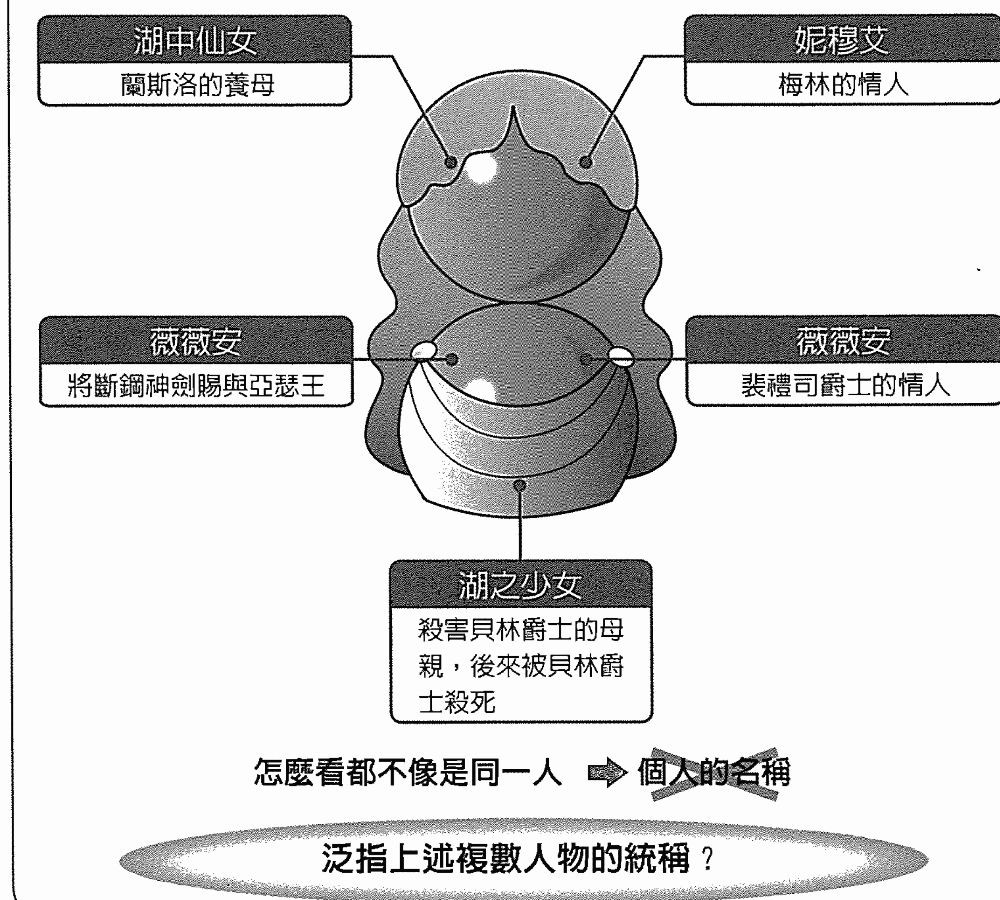

怎麼看都不像是同一人 ⇒ 個人的名稱

泛指上述複數人物的統稱？

## No.013
### 格蘭戴爾*1
Grendel

於中世紀英國受到廣泛傳誦的《貝奧武夫》當中的強敵，便是沼澤怪物格蘭戴爾。

#### ●沼澤裡的怪物

八～九世紀以古英語寫成的英雄敘事詩《貝奧武夫》的分成前篇和後篇。前半部講述青年時期貝奧武夫的活躍事蹟，後半部則是描寫晚年的貝奧武夫，而格蘭戴爾便是以前半部的敵對角色登場，是個住在沼澤裡的怪物。

格蘭戴爾或稱巨人、龍或水妖，然其真面目至今仍無定論。亦有傳說指其為該隱的後裔（《舊約聖經》所述亞當之子，因殺害胞弟而成為第一個殺人的人類；另外上帝問他弟弟在哪裡時該隱撒了謊，亦是第一個說謊的人類）。

從前丹涅（丹麥）國王荷羅斯加*2建造希奧羅特城（公鹿城），由於該棟建築在格蘭戴爾住處附近，夜晚時的饗宴令他覺得城裡很吵雜，遂趁眾人熟睡間從城裡將三十名武士擄回住處，甚至還每晚潛入城中吃人。城中居民雖然害怕卻也束手無策，就這樣過了十二年。

貝奧武夫是國王的姪子，擁有相當於三十個人的力量。他聽說怪物吃人的傳聞，來到叔父的城堡，決定展開警備工作以迎擊格蘭戴爾。豈料格蘭戴爾先是靜聲殺死警備士兵，還趁著貝奧武夫手無寸鐵撲上來。不過貝奧武夫即便空手仍舊相當強大，經過一番格鬥，終於把怪物的一隻手扯落。

格蘭戴爾倉惶逃跑，將戰敗消息告訴母親。格蘭戴爾的母親是個比他更恐怖的怪物，她替兒子去找貝奧武夫報仇卻反遭擊斃，後來追兵直逼格蘭戴爾住處，怪物終於自刎而亡。

#### 沼澤怪物格蘭戴爾

格蘭戴爾 —— 以英雄貝奧武夫敵人身分登場的沼澤怪物

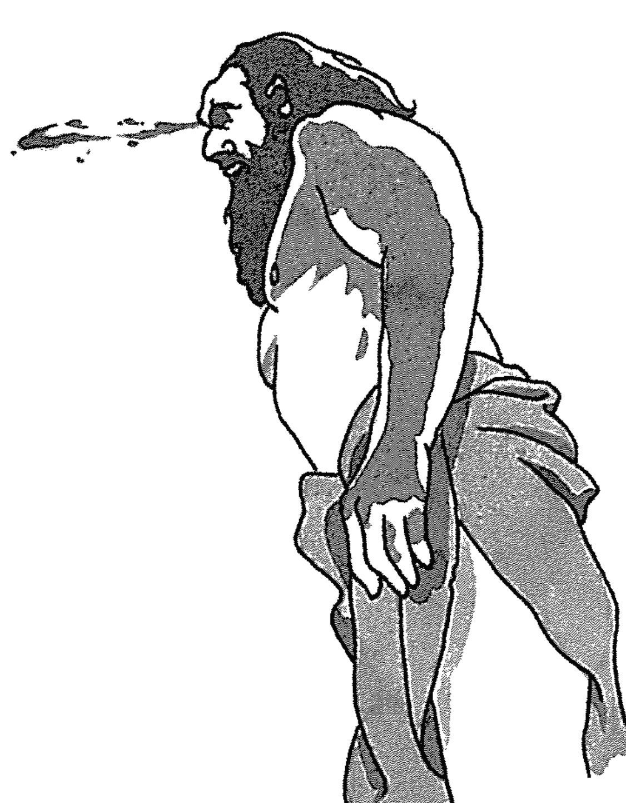

##### 格蘭戴爾的特徵
- 眼睛散發著彷彿火炎般的恐怖光芒
- 擁有堪與貝奧武夫匹敵的巨體
- 任何鋼鐵都無法近身

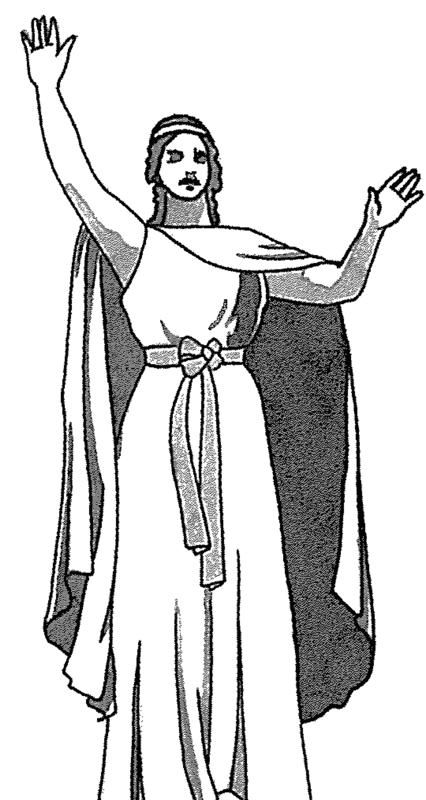

##### 格蘭戴爾之母
- 外表不似格蘭戴爾那般強悍
- 其實力量更在格蘭戴爾之上
- 不過用劍可以造成傷害

> ### 後來的貝奧武夫
後來貝奧武夫成為海怒國王，創造太平治世。
可是他年老以後，卻有噴火龍在他的國土上肆虐，於是貝奧武夫打造巨大的鐵盾防禦巨龍火光，雖然最後玉石俱焚，總算是打倒了巨龍。
貝奧武夫殉命，而故事篇也就在這裡劃下了句點。

## No.014
### 海豹少女
Seal Maidens

英國及周遭地區流傳著海豹人的傳說，說她們都是披著海豹皮的人類。

#### ●英國的海豹人

根據古代歐洲塞爾特民族*傳說，海豹其實就是人類。
她們是住在海中的妖精，平時是海豹的模樣，可是只要褪去海豹皮，就會變身成美麗的少女。海豹少女是支善良的種族，很少會嫁給人類為妻。據說那些指間有角質蹼狀物的家族（有些人的手指會稍微連在一起），便是她們的後代。
對日本人來說，海豹少女的故事亦不陌生。
從前有個漁夫發現許多美麗的少女在海邊跳舞，他悄悄走近後發現岸邊石頭上披著好幾張海豹皮，於是把其中一張海豹皮給藏了起來。
少女們察覺自己被發現後趕緊披上海豹皮、跳回海中，最後只剩下一名少女找不到海豹皮留在原地。少女懇求漁夫將海豹皮還給她，誰知道漁夫不但不答應還要少女嫁給他，海豹少女只能流著眼淚嫁給漁夫為妻。嫁給漁夫的少女持家有方，可是有天當她找到海豹皮以後，立刻就跑到岸邊、回到海裡去了。
沒想到地球的另一端竟然也有跟日本天女羽衣雷同的故事，實在令人覺得不可思議。
海豹少女在蘇格蘭喚作羅恩，她們性情溫和，甚至對捕捉自己的漁夫也毫不記恨。有時候羅恩甚至還會款待捕捉海豹的漁夫，請求他們為那些逃過捕捉的海豹進行治療（傳說傷痕必須由造成傷口者治療才能痊癒）。此時，倘若漁夫答應她們從此不再獵殺海豹，就會獲贈金幣。

#### 海豹少女的故事

海豹少女 —— 塞爾特傳說中住在海裡的妖精

在蘇格蘭的海豹少女喚作 **羅恩**

> ### 費爾基

英國有許多島嶼都流傳著名為費爾基的海豹人傳說。男性費爾基相當好色，經常誘惑人類女性；而人類女性若不對丈夫感到不滿，與費爾基發生關係，甚至生下許多子女的狠角色，於是漸漸形成了擁有費爾基血統的家族，據說這些人的手腳都長著蹼。

## No.015
## 涅涅
Nyene

在非洲漁獵民族博佐族的神話中，記錄了博佐族如何懂得在尼日河捕魚的來龍去脈。

### ●白皮膚的水精靈

博佐族是非洲馬利共和國尼日河*1沿岸的漁獵民族，涅涅是該族神話中的水精靈，是神在造尼日河時創造出來的造物。
他們在水裡過著避人耳目的生活，只要身處水中就不會感到飢餓，也沒有病痛，而且所有棲息於水中的生物都要聽其命令。涅涅雖有男女老幼之別，但據說他們各個皮膚白皙通透、長髮黝黑，樣貌極為美麗。他們鮮少出現在人類面前出現，唯有向人類開示某種預言或智慧的時候才會現身。
基本上涅涅屬於善類，不過他們對外來者抑或觸犯禁忌者亦相當具有威脅性，不時會弄沉船隻，或是驅使河馬、鱷魚加以襲擊。以前定居於尼日河流域的博佐族要捕魚的時候，都必須事先取得涅涅的允許。
傳說過去有名博佐族男子來到尼日河、正要捕魚，涅涅從水中露出頭來質問：「是誰准你來這裡捕魚的？這裡是屬於我的地方，你不可以捉我的魚」。然而經過商談，雙方發現對彼此都沒有不良印象，遂達成分別在尼日河內外生活的協議。
後來又有其他人來這裡主張這條河的所有權，那名博佐族的男子說：「不不不，這河的真正主人在水裡面」。這項爭論還曾上呈國王訴請裁決，而博佐族的主張也獲得了承認。
這名博佐族男子以及其子孫後代就叫作諾醸，而其長老則喚作「水之主」。

#### 博佐族神話中的美神

##### 水之女

涅涅會從水之主中挑出一名女性，成為水之女珊迪。女孩出生以前，水精靈就會出現在她的父母的夢中，預言這孩子將來會成為水之女。等女孩長至少女時期就必須暫時到水中生活一陣子，然後才能回到村子裡，以免墜河。

水之女的工作包括接收來自水精靈的預言、向水精靈詢問各種災害的真正起因等，角色相當於水精靈的巫女。

同時水之女也有行為限制，包括不得離開村子，而且只能跟同族男子結婚。

## No.016

## 農摩

### Nonmo

多貢族*的精靈農摩在唯一神離去以後創造了世界，是我們所處世界的創造者。

#### ●雙胞胎的精靈

農摩是非洲馬利共和國多貢族傳說中的雙胞胎精靈。多貢族認為所有完美的事物都是成雙成對的。

從前唯一神安瑪與大地交合生下了長子尤路古。由於自己是單獨出世，嚮往完美的尤路古遂犯下與母親大地交合的背叛行為、汙染了大地，使得安瑪決定離開。而接續安瑪未完成的創世工作、創造出人類和其他世間萬物的，卻是緊接著尤路古出世的農摩（誕生時即為成對男女）。

農摩上半身是人類模樣，下半身卻是蛇身，生著赤紅色眼睛和蛇一般的舌頭，而且腕部柔軟沒有關節。他們全身通綠光滑，表面還覆蓋著綠色的短毛。水是農摩力量的泉源，他們的力量便是水的力量。大地藉由水來揉合，而維繫生命的血液也是水，從萬物帶有水氣不難得知水的力量可以遍及一切，就連農摩說出來的話也具有蒸氣，蘊含水的力量。

農摩曾經進入並淨化遭汙染的大地母親性器——螞塚，儘管經過他們淨化的大地對安瑪來說仍屬不淨（農摩並不具備如此等級的淨化能力），卻也足以使大地孕育生命了。接著男性農摩就變成男性的性器官，而女性農摩則取代了大地子宮的角色，使得大地的創造工程得以延續。

其實農摩並不光是最初誕生的這兩名男女，後來緊接著誕生的八名人類也都成了農摩。換句話說，所謂農摩乃是指稱多貢族精靈的用語，而非個人，只不過最先誕生的雙胞胎精靈最為年長，要對他們表達特別的敬意而已。

#### 唯一神與大地之子

農摩 — 多貢族雙胞胎精靈，擁有水的力量

##### 世界的創造者 農摩雙胞胎

## # 凡尼克

Vannik

在如俄羅斯寒冷的地方入浴可謂是最大的享受，而其中亦有守護精靈存在。

### ●愛洗澡的老頭

凡尼克是斯拉夫神話的浴槽精靈。
在中世紀的俄羅斯，浴槽都是設置於伊茲巴（木屋）附近的小屋（謂之邦雅）而非住家當中，而凡尼克便是棲息於這種浴室裡的精靈。
據說只要三個人一起進入浴室，就會發現第四個人也跟著進來，那第四個人便是凡尼克。他們鮮少顯露行蹤，只會隔著水蒸氣依稀看見對面有人。凡尼克的真面目是個生著白髮白鬍鬚的小老頭，不過他們經常會變身成家族其他成員的模樣，很難分辨。
俄羅斯人入浴後必須在浴槽裡留些熱水以便凡尼克使用，另外如果能留下肥皂或樅樹枝（代替刷子用來洗刷或拍打身體）之類的就更好了。如此一來，凡尼克就會呼喚森林的精靈和惡魔們一同前來入浴。這個時候千萬不可以前去打擾，如果在凡尼克清洗身體的時候闖進浴槽小屋、惹惱了他，凡尼克就會拿燒熱的洗澡水潑過來，甚至還會掐住闖入者的脖子。
此外，凡尼克還擁有洞知未來的能力。想向凡尼克詢問未來之事，就要在洗澡的時候把入浴小屋的門稍稍留個縫隙，讓外面的凡尼克可以從門縫中看見自己的裸背。
假如凡尼克用手掌輕輕觸碰背部，那人就會有好運臨頭；但若被凡尼克用指甲戳背部的話，就會遭逢不幸。

#### 守護浴室的愛洗澡妖精

凡尼克 — 斯拉夫神話的浴槽精靈

入浴

洗完澡後特意留下

凡尼克 招待 森林裡的精靈和惡魔

打擾凡尼克入浴

熱水當頭潑來

掐住脖子

擁有洞知未來的能力

稍稍將入浴小屋留個門縫 讓外面可以從門縫看見裸背

手掌輕輕觸碰背部

指甲戳背

好運臨頭

遭逢不幸

## No.018
冷泉院的水精靈
Reizen-in no mizunotama

精靈並非西方所獨有，在日本似乎也有類似帕拉塞爾蘇斯所謂的精靈存在。

### ●日本的水精靈

《今昔物語集》*第二十七卷第五話有下面這則故事。
從前有個人睡在上皇曾經住過的西之對（西館），突然有個身長三尺的老人出現，還伸手去摸他的臉。那人雖然覺得奇怪，卻害怕得不敢動。接著老人去到池畔便憑空消失，而那水池已經好幾年沒有打掃、蓬草蔓生，看來分外恐怖。
後來有個勇敢的自願者帶著繩索假裝睡在同個地方，卻在昏沉間不小心睡著了，睡夢中那人感覺臉上一陣冰涼而清醒過來，於是一躍起身、用繩索把那東西緊緊綁住。
綁好以後呼喚眾人過來，原來那東西是個穿著淺黃色正式和服、身高約三尺的小老頭。老頭被綁住後不住眨眼，看起來好像很虛弱，無論別人怎麼問就是閉口不答，過了好一會兒才用蚊子般的細聲說道：「請用盆子汲水來」。
眾人聞言，便取木盆汲水放在老人跟前。老人面向木盆、看著盆中水說道：「我乃水精靈是也」。說完就以五花大綁的姿態直接跳進水盆裡。
之後老人就消失不見了，不過盆裡的水卻增加，還從木盆裡溢出來，而用來捆綁老人的繩索連同繩結也全都泡在水中，彷彿老人化作水一般。
眾人見狀既驚奇又訝異，小心翼翼端著木盆，把水倒回池塘裡。據說從此以後那老人就再也不曾出現過了。
從這則故事我們可以得知水精靈乃以水為本體，雖然身形矮小卻能夠變身成人類模樣，還有他們如果離水太久就會愈來愈虛弱等特點。

#### 日本也有精靈傳說

##### 《今昔物語集》的水精靈

##### 冷泉院

冷泉院乃嵯峨天皇所造離宮，也是後來多位上皇的院御所（上皇居住的宅邸）。初建時名為冷然院，卻屢遭祝融，有人認為「然」通「燃」，遂改稱冷泉院。現二條城遺跡中僅留下冷然院原跡石碑。

## No.019
人魚
Mermaid

若提到海妖，最著名的絕對非人魚莫屬。儘管外型美貌無比，但有關的不祥傳說卻多得出人意料。

### ●海棲者

全世界各地均流傳著半人半魚的人魚傳說。
人魚的英語稱作「Mermaid」，但此語專指女性人魚，男性的人魚喚作「Merman」，卻鮮少被提及。
西方的人魚都是上半人身、下半魚身的美女，不過古代卻也曾將人魚描繪成有兩條尾巴，就像是長了兩隻腳的模樣，譬如希臘神話的屈東*1就是如此。
以前的人相信無論任何地方都有能夠適應環境的人類存在，如同高山有雪人，而棲息於海中的人類即是人魚。人魚的歷史非常悠久，早在西元前1000年的亞述神話中，女神阿塔迦蒂斯*2便經常變作上半人身、下半魚身的人魚模樣。至於最早提及「人魚」的紀錄，則是在《愛爾蘭王國年代記》中上半身是少女、下半身是魚體的梅羅（愛爾蘭的人魚）。此書於十七世紀出版，書本身很新，收錄的卻都是最古老的傳說。
固然有男性的梅羅，但據說男梅羅非常醜陋，而女梅羅則是會將人類男性拖進海中。此外，亦有傳說記載梅羅登上陸地與人類男子結婚的故事。
人魚並非全數都棲息於海洋，譬如著名的羅蕾萊*3。羅蕾萊原本指的是萊茵河大幅轉向處、聳立於河道內側的岩山，那個位置水流湍急，在河底形成許多岩石突出的淺灘，是萊茵河的險要處之一。當地人們紛紛傳說有人魚坐在羅蕾萊岩山歌唱，船員一旦聽得入迷就會操縱失誤，使得許多船隻紛紛沉入河底。
擁有類似傳說的賽倫，或許也可以算是人魚的一種。

#### 傳說遍及世界各地的海妖

人魚 — 半人半魚的水妖

- 羅蕾萊的岩山
- 萊茵河的險灘
- 常常有沉船
- 衍生出人魚將船弄沉的傳說

關聯項目
●賽倫→No.028

## # 人魚(東方)

Ningyo

東方亦有許多樣貌似人的人魚傳說，分布廣泛，可是東方的人魚卻不似西方那般美麗。

### ●被視為怪物的人魚

東方同樣也有人魚的傳說。或者應該說，東方本來就有「人魚」這個用語，只不過在翻譯英語「Mermaid」的時候，選用了概念相近的「人魚」的譯名而已。
那麼，東方的人魚究竟是種什麼樣的生物呢？
中國《山海經》中的「北山經」曾經記載到某種貌視螈螈，並且會以嬰兒聲音哭泣的四腳人魚，其模樣跟西方人魚一點都不像，相傳只要吃下這種人魚就不會痴呆。而同一本書裡的「海內南經」則是介紹有個名叫氐人國的國度，當地居民的上半身是人類、下半身是魚。還有「海內北經」中也有某種長著四肢和人臉的生物，名叫陵魚。
至於日本的《日本書紀》*1中也提到推古天皇時代：「秋七月，攝津國有漁夫，沉網堀江。有物入網。其形如稚兒。非魚，非人，不知何以名之」，據說是日本關於人魚的最早紀錄。
日本並不將人魚視為擁有智慧的種族，而是某種怪物。不過有傳說指出只要吃下人魚肉就能長生不老，亦有人聲稱食用人魚肉便能獲得三千年壽命，而非長生不老。無論何者為真，確實存在人魚肉能讓人變得非常長壽的傳聞。此外，據說只要將人魚的油脂塗滿全身就可以不懼任何酷寒。
古代提到人魚就是指長了顆人頭的魚。在《古今著聞集》*2卷第二十中：「伊勢國別保浦人獲人魚，呈獻前刑部少輔忠盛事」。這裡所提到的人魚是隻頭部像人、滿口細牙的魚，還有張活像猴子的尖嘴巴。據說那是條體型跟人類差不多的大魚。不過時至江戶時期，日本所謂的人魚也已經變成了上半身是人、下半身是魚的西式人魚。

#### 迥異於西方的東方人魚

##### 中國的各種人魚

在建木之西。
人面魚身，無足。
胸上爲人，下則似魚。
或云是氐人國之人。

摘自《今昔百鬼拾遺》

##### 日本的人魚

關聯項目

- ●人魚→No.019
- ●人魚肉→No.021

## # No.021
## 人魚肉
### Meat of mermaid

日本將人魚肉視為長生不老的泉源，至於長生不老者是否能夠得到幸福，那就沒有人知道了。

#### ●吃下人魚肉的少女

包括日本在內的東方世界並不將人魚視為妖精，反而將其視為某種妖怪、異類。關於人魚的大小說法不一，小至日本獼猴、大至人類體型等說法都有，可是人們捉到人魚後卻想要食其肉。為什麼呢？因為據說食用人魚肉可以長生不老。
八百比丘尼傳說便是最著名的例子。
從前，若狹*的眾長者受大海彼方（龍宮？）的長者邀請參加宴會，然而其中一名受邀出席的長者卻不經意看見廚房在料理人魚肉；眾人知情後覺得很恐怖，決定把肉帶回去丟掉。
然而有位名叫高橋權太夫的長者，家中年滿十六歲的女兒卻把父親帶回來的肉給吃下去了。經過許多年以後，其姿色依舊不見半點衰老，甚至在她嫁作人妻、丈夫衰老而死，容貌仍然依舊。這種情形令旁人也覺得愈來愈恐怖，於是女孩便決定離開原本居住的村莊。
後來她出家為尼、到處去幫助窮人，就這樣活了八百年。
相傳這個故事就是從那個活了八百歲的比丘尼口中流傳下來的，而她在八百年後仍然年輕貌美。最後比丘尼看破俗世、消失於洞窟之中，不過或許她只是離開那個地方，而那美麗的女子還活在某個地方也未可知。
八百比丘尼傳說流傳於日本各地，其中最著名的當屬福井縣小浜市空印寺，該地甚至還有比丘尼消失於其中的洞窟遺跡，只不過這洞窟並不像其他傳說所述位在海岸邊，而是在城鎮中央。儘管現在洞窟深度僅五公尺，不過據說早在JR（當時的國鐵）鋪設鐵路以前其實更深。

#### 長生不老究竟是幸或不幸？

##### 日本各地的八百比丘尼傳說

八百比丘尼跟若狹（尤其是小浜）之間究竟有何關聯？

> 里見八犬傳的八百比丘尼
姑且不論傳說的各種版本，這些八百比丘尼都有個共同點，那就是她們會到處種植茶花樹，勸世渡人。
然而曲亭馬琴的《南總里見八犬傳》講的卻是反派角色玉梓的怨靈變成八百比丘尼，被八犬士打倒的故事，讓八百比丘尼成了惡人的罕見例子。

關聯項目
- ●人魚→No.019
- ●人魚（東方）→No.018

## # No.022
## 半魚人
### Gil-man

所謂的半魚人是種襲擊年輕女性，使其產下自己後代的怪物，究竟是如何演變成今日這種形象的呢？

#### ●從異種族變成怪物

半魚人是介於人類與魚類中間的生物，許多傳說和作品都曾提及。他們有時是異種生物，有時是襲擊人類的怪物，有時又是優於人類的高等種族，角色定位不一。

基本上半魚人的外型是全身布滿鱗片的人類，手指與腳趾間生有水蹼，五官跟魚類相似。就這點來說，其形態有別於上半身是人身、下半身是魚體的人魚。

傳說歐洲有種名為海之主教的生物，其樣貌跟半魚人如出一轍，但頭部卻呈三角形，看起來就好像主教的尖帽子，故得其名。有人說南美瓜拉尼族*流傳的伊普皮亞拉也是半魚人，只不過伊普皮亞拉通常被描繪成類似人魚的模樣。

倘若向前追溯至更古老的時代，古代美索不達米亞還有種頭顱到背部是魚、胴體前方則是人類的生物，名叫阿普卡盧。阿普卡盧是世稱七賢聖的古代賢者，相傳人類的智慧便是他們所賜。

然而，今日的半魚人形象主要卻是來自於西元1954年環球電影公司製作的電影《黑湖妖譚》；這部電影非常賣座，後來也有《造物復仇》與《怪物就在我們之間》等續集的問世。電影裡稱半魚人為「Gil-man」，而此語也普及成為指稱半魚人怪物的一般名詞。

儘管跟這部電影毫無關係，後來仍有許多電影、小說和漫畫都使用了設定類似的半魚人。例如日本所有描繪半魚人角色的漫畫，可以說其形象都是來自於這部電影。

#### 出現於諸多傳說與作品之中

半魚人 — 介於人跟人魚中間的生物

- 異種生物
- 襲擊人類的生物
- 優於人類的種族

形形色色

## No.023

## 水馬

### Kelpies, Each Uisge & Each Uisce

歐洲古代有水棲馬的傳說，有人認為是水流引起的波濤讓人聯想到馬鬃所致。

#### ●吃人的馬

古代歐洲塞爾特民族的傳說曾經提及棲息於水中的馬。
英國的蘇格蘭地區有種名叫凱爾派*的水馬，以水草為鬃毛。他們棲息於河川，會變身成全身毛茸茸的男子模樣，一旦發現騎馬者就會緊追在後，加以恫嚇。
生作馬匹模樣的凱爾派之所以恐怖在於他會馱人跳進池塘河川、使人溺死。也有說法認為凱爾派會吃人，不過這應該是後述的厄哈·烏斯吉所為。
傳說凱爾派背部有副魔法馬具，只要取得這副馬具，就能夠施行魔法。相反的，若能在凱爾派身上裝備人類世界的馬具，就能隨心所欲的駕馭他，但一旦把馬具卸下，凱爾派會立刻逃跑。
除了凱爾派以外，蘇格蘭還有種名為厄哈·烏斯吉的凶惡水馬，主要棲息於湖泊與大海之中。厄哈·烏斯吉的外觀是匹毛色美麗的駿馬，要是有人想要捕捉他作為座騎就會為自己引來殺身之禍。因為厄哈·烏斯吉的皮膚帶有黏著性，只要騎上去就下不來，接著騎乘者會被帶到湖泊或大海裡吃掉。不過據說厄哈·烏斯吉討厭吃肝臟，所以岸邊經常發現吃剩的肝臟。
愛爾蘭有種叫作厄哈·伊斯吉的馬與其類似，傳說厄哈·伊斯吉一安上馬具就會成為千里馬，可是只能在內陸地區騎乘。因為他們只要看見大海，立刻就會連人帶馬跳進海中，在海裡把騎乘者吃掉。

#### 古代歐洲傳說中的恐怖馬怪

水馬 —— 在塞爾特民族的傳說中，棲息於水中的馬

##### 凱爾派

- 鬃毛是海藻或水草
- 能變身成低俗的男子
- 也能變成普通的馬
- 喜歡嚇人
- 馱有魔法馬具
- 裝上人間的馬具便能成為名馬

##### 厄哈·烏斯吉

- 毛色美麗的駿馬
- 能變身成年輕人
- 皮膚有黏性，騎上去就動彈不得
- 性情凶惡，會吃人

##### 厄哈·伊斯吉

- 安裝馬具便能成為名馬
- 看見大海會直接跳進去

The request was rejected because it was considered high risk

#### 真面目至今仍然成謎的夢幻海龍

尼斯湖水怪
||
英國蘇格蘭尼斯湖
目擊到貌似太古恐龍
的未確認生物
↓
出現多起目擊案例
↓
尼斯湖水怪的存在可信度？
已嚴重動搖

#### 尼斯湖水怪的照片

尼斯湖水怪的第一張照片。揭露時照片頂端的湖岸被剪掉了，無法判斷水怪的大小，現在這麼一看，就會發現水怪其實非常小。

> ✦ 蛇頸龍其實並非恐龍

當時認為尼斯湖水怪最有可能是蛇頸龍這類的生物。蛇頸龍是海棲爬蟲類中體型最大的一種，是恐龍時代海洋中的霸主。
但嚴格來說蛇頸龍並非恐龍，雖然同屬爬蟲類，但牠們跟恐龍卻是分屬不同系統的生物，據說跟現在的蛇、蜥蜴等爬蟲類比較接近。

## No.033
## 河童1
### Kappa

河童是廣受日本人喜愛的水妖，然而其起源卻鮮為人知。

#### ●關於河童的起源

河童傳說散見於日本各地，亦稱「河太郎」。
據說河童的體型跟小孩差不多，外表貌似人類，頭頂有個喚作「盤子」的平坦無毛部位，背部帶殼（不過也有無殼的河童，或許並非所有河童都有殼）。此外，他們的手足間生著蹼，方便在水裡游動，有的身體表面還長有鱗片。
河童的雙臂在身體中央連接在一起，也就是說他們其實只有一隻手臂，當拉扯其中一隻手臂的時候，另一隻就會縮短，這項特徵讓河童有「通臂」之稱。除此之外，河童有三個肛門，而且放出來的屁極臭無比。
河童遍見於日本全國各地傳說，還可以大致分成西日本河童與東日本河童。西日本的河童來自大陸，是中國的河伯之類的概念傳入日本以後才陸續演變。相傳他們原本住在肥後之國（熊本縣），可是後來數量增加，而且愈來愈粗暴，加藤清正遂從九州各地召集河童的天敵——猴子群起攻之，迫使河童投降。河童發誓不再為惡，遷居到隔壁的筑後之國（福岡縣），在那裡的水天宮擔任宮僕，後來才散播至全國各地。
東日本則說河童是人偶的化身。從前奈良三笠山建造春日神社的時候，建神社的工匠煩惱人手不足，以綁成十字的稻草紮了九十九尊人偶，再灌注靈魂化作人類模樣，終於讓神社的建造工程順利完成。後來那些失去用處的人偶被丟進河裡，可是人偶仍具有生命，從此在河中生活，最後變成了河童。
除此以外，尚有河童乃水神後裔，或者是遭人遺棄河邊的棄嬰等說法。

#### 廣受日本人喜愛的水妖

河童 — 遍見於全日本各地的傳說生物

#### 河童的模樣

鳥山石燕的河童
鳥山石燕是正德二年（1712年）～天明八年（1788年）的畫師，特別喜歡妖怪圖畫
摘自《畫圖百鬼夜行》

#### 河童的起源

+   西日本的河童
    * 源自中國的水虎
    * 起源地在肥後
    * 曾遭到加藤清正降伏
    * 擔任水天宮的宮僕

+   東日本的河童
    * 稻草人所化
    * 故為通臂

#### 關聯項目

●河童2→No.034 ●河伯→No.063

## No.034
## 河童2
### Kappa

河童有何喜好？背後有什麼原因？好河童和壞河童的喜好又有何不同？

#### ●喜好相撲與小黃瓜

若論河童，那就不得不提到相撲。河童非常喜歡相撲，據說他們只要看見人類就會提出跟對方相撲的要求。別看河童的體型像小孩，其力量可是比成年人還要強大，普通人無法勝過他們。不過河童唯有在頭頂盤子濕潤時才能發揮力量，一旦乾涸就會失去力量，最終死亡。

善良的好河童只要能夠跟人相撲便滿足了，不會計較輸贏。然而壞河童在與別人相撲取得勝利時，會拔走對方的尻子玉。所謂尻子玉指的是位於肛門內的一個臟器，一旦被拔走就會變得氣力全無。

尻子玉的外型呈洋蔥狀，河童會拿來吃，或者獻給龍王。

關於尻子玉的傳說，其實是因為人類溺死以後肛門會鬆弛，好像有什麼東西從中脫落，而且溺水時間稍久，死者肛門附近的內臟就會漸漸被魚吃掉，故而有此一說。

另外大家都知道河童最愛吃的食物是小黃瓜。除了小黃瓜以外，他們還喜歡魚類和茄子，不過魚可以自己捕捉，而小黃瓜和茄子就必須從人類手中取得。每到小黃瓜和茄子要收成的季節，河童就會跑到田裡搗亂，讓百姓傷透腦筋。後來民眾索性事先就供奉小黃瓜，祈使河童能不再來破壞。

至於為何嗜食小黃瓜，據說那是因為河童乃是水神的後裔，而小黃瓜是所有作物當中最早收成的產物，經常拿來供奉水神（對祈求豐收者來說，水是非常重要的因素）。

#### 河童的喜好

##### 喜歡相撲與小黃瓜

##### 相撲

河童雖強，頭頂盤子一旦乾涸就會失去力量

##### 好河童

##### 壞河童

摘自十返舍一九著的《河童尻子玉》

+   - 會想一直玩下去，但這樣便能滿足

+   - 取勝後就會從敗者屁股拔走尻子玉

##### 小黃瓜

為什麼喜歡吃小黃瓜？

經常用來供奉水神

因為河童是水神的後裔

小黃瓜是所有作物中最早收成的產物

#### 關聯項目

+   - 河童1→No.033

+   - 龍王→No.061

## No.035
### 水虎
#### Suiko

此怪物可見於日本與中國，然而兩者樣貌頗有出入，日本甚至還將其奉為神明。

##### 河童的優等種族

一般認為水虎是種優於河童的水系妖怪。但日本的水虎和中國的水虎卻大相逕庭。

中國的水虎是十六世紀著名的藥學書籍《本草綱目》所述，棲息在湖北省河川中的水妖，其樣貌類似三、四歲的孩童，全身覆有硬鱗、弓箭無法穿透。這種河童平時棲息於水中，秋天經常跑到岸邊曬太陽。他們性情溫和，平時不會襲擊人類，可是如果故意加以騷擾的話，水虎也是會咬人的。

據說妖怪畫師鳥山石燕筆下的水虎便是這種中國的水虎。其樣貌酷似河童，只不過水虎背上無殼，頭上也沒有盤子。

水虎在日本向來都被認為是高於河童的優等種族。他們的體型比河童大、力量也強，性格凶猛猙獰。他們甚至會襲擊殺害人類，比河童來得恐怖許多。從前人們相信真的有河童存在，江戶時代甚至曾經有位名叫古賀侗庵的人物創作了名為《水虎考略》的河童研究專書。

長崎的水虎會把人拖進水中，吃光他們的鮮血和靈魂，另外青森的水虎則是專門找孩童下手的惡劣妖怪。

倘若誰家有人被水虎害死想要報仇的話，就不要將屍體埋葬或者火葬，而是在田裡蓋間小屋、把屍體放在裡面。目睹屍體一天天開始腐爛也許會使親人覺得很難受，可是為了報仇必須要忍耐，待屍體腐爛以後，水虎吸走的鮮血就會腐壞，水虎也會跟著腐敗壞死。

水虎是龍宮的僕役，據說他們劫掠孩童、殺害人類，都是為了成名；河童之所以偶爾襲擊人類，也是因為水虎的緣故。

##### 日本與中國有別的妖怪

水虎 — 位階高於河童的水系妖怪

##### 日本與中國的水虎大相逕庭

###### 中國的水虎

+   - 約三、四歲的孩童
    - 全身都是鱗片
    - 性情溫和

###### 日本的水虎

+   - 酷似河童
    - 有殼也有盤子
    - 體型比河童大，力量更強
    - 凶惡猙獰，會吃人

###### 身為神明的水虎

+   - 將怪物水虎奉為保護人們免於水難的神明祭祀
    - 模樣與日本的水虎相同

###### 青森縣的水虎

青森縣將水虎奉為避免水難的神明祭祀。相傳這個信仰始於明治初期，當時的僧侶為防止水虎為害，故而想出將水虎奉為神明祭祀的方法，也就是透過祭祀使水虎不再襲擊人類，改變其定位，提升至則須反過來保護人類免於水難的神格地位。

## No.036

## 蜃

### Shin

海洋貝類之中亦有妖怪存在，譬如蜃、蛤女房、蝾螺鬼等妖怪便棲身於許多尋常貝類之中。

#### ●貝類創造出來的虛幻樓閣

蜃是引起蜃氣樓現象的海妖，所謂的蜃這個字其實就是指巨大的蛤蜊，「蜃氣樓」指的是「蜃」呼吸吐出「氣」息，從而形成「樓」閣。

江戶妖怪畫師鳥山石燕在他的畫作當中，對此現象有下述解說：在海中有蜃氣形成樓台的形狀，蜃就是大蛤，會在海面噴氣、創造出樓閣城市，此即蜃氣樓，亦稱海市。

在中國，蛤被視為神秘的生物，據說雀鳥潛入海中就會變成蛤，雉鳥潛入海中則會變成大蛤。除此之外還有關於蛤女房的故事。從前有個男子在打漁的時候捕到一個巨大的蛤蜊，由於蛤蜊過於巨大所以把牠放生，當天夜裡就有個美女前來，要他娶自己為妻。兩人婚後，他的妻子勤奮又能幹，非但紡織布匹幫助家計，還煮得一手極為美味的湯，不過她卻不肯讓他看見自己在烹調料理的樣子。有一天男子趁妻子煮飯的時候偷看，竟然看見她在鍋子裡面小便。

這則傳說至此發生分歧。有一說男子怒斥妻子怎麼可以拿摻小便的湯給他喝，被趕出門的妻子只能哭著回到海中；另一說則是男子見狀後發現妻子乃是蛤蜊的化身，真面目被揭穿的妻子只能哭著回到海中。

除此以外還有蝾螺的妖怪。相傳壽命超過三十年的蝾螺會生出眼珠和手足，化成蝾螺鬼，或是好色的女子被投入海中溺死後就會化身蝾螺，然後再變成蝾螺鬼。相傳若有單身女子在月夜裡前來借宿，便是蝾螺鬼要劫擄該戶主人。也有人說被海盜從海裡救起、加以侵犯的溺水女生，其實便是蝾螺鬼，後來眾海盜的睪丸都被她咬下來，用黃金才跟她換回睪丸。

#### 貝類也有妖怪

蜃 — 引起海市蜃樓的海妖
||
巨大的蛤蜊

#### 蜃氣樓

此名稱的由來
蜃 = 大蛤
呼吸 ▼
氣 吐氣
▼
蜃 形成樓閣

#### 在中國

雀 → 潛入 → 變成蛤
雞 → 潛入 → 變成蛤
海 → 變成大蛤 → 化作女性嫁給人類為妻 → 蛤女房

#### 蝸螺鬼

壽命達三十年的蝸螺
好色女子變成的蝸螺
變化
成為蝸螺鬼

## No.037 九頭龍
### Kuzuryu

比八岐大蛇還多出一顆頭顱的九頭龍有別於大蛇，在日本全國各地均有傳說流傳。

#### ◎日後成為湖泊守護神的惡龍

日本傳說中有九顆頭顱的龍名為九頭龍。
一般人甫聽到九頭龍，或許會直接聯想到福井縣的九頭龍川以及位於該流域的九頭龍水壩，但九頭龍傳說的中心其實是位於箱根的蘆之湖，只不過日本各地均有類似傳說而已。
主要記載了箱根神社創設始末的《筥根山緣起》中亦有下面這則小故事：湖水西岸有隻生著九頭的龍，呼雲翻浪危害周邊居民。萬卷上人為救眾生，遂於湖畔向佛祖祈誓，巨龍隨即變換模樣，捧著寶珠、錫杖、水瓶現身。上人取鐵鎖施咒將其綁縛於大樹之上，眾人稱那樹為栴檀漢羅樹，至今仍在湖中。
據說現在的九頭龍傳說便是源自於這則短短的故事。
從前奈良時代蘆之湖仍然稱作萬字池的時候，有隻名叫九頭龍的毒龍棲息在池中。每年七月會在此地出沒，殺害附近居民、颳起暴風雨破壞田地。眾人為平息九頭龍之禍，每年都會選一名年輕少女活祭奉獻。
聽聞此事的萬卷上人為拯救村人，遂於湖畔搭起祭壇，誠心祈禱三天三夜。待祈禱完畢，只見九頭龍從湖中捧著寶珠、錫杖、水瓶出現，自悔其罪請求原諒，上人以鐵鎖將其鎖縛於逆杉（湖裡的大樹）上。
忽然間，只見那龍突然化作九頭龍神。上人見狀，便在該地祭祀九頭龍明神，以慰龍神之心，並且命人炊煮三斗三升三合三勺的赤飯，以大木盒盛裝後沉入湖底，藉以代替活人獻祭的習俗。據說這便是至今每年7月31日仍要舉行的湖水祭由來。

#### 九頭龍傳說

有九顆頭顱的龍。其傳說以蘆之湖為中心，不過日本各地均流傳著九頭龍傳說

儘管名字相同，卻跟九頭龍傳說並無直接關聯，該流域的水壩也與傳說無關。不過……

此地亦流傳著 九頭龍傳說

每年吃九個人的龍被殺死後變成河川

##### 白山開基的傳說

泰澄（於白山開基立寺的僧人）曾於白山山頂遇過十一面觀音化身的九頭大蛇，因而得悟。據說當時他還讓生在山中的毒蛇前往九頭龍川對抗惡龍，並將惡龍封印於千蛇池

九頭龍＝克蘇魯
克蘇魯神話的創作作品在世界各地均有後繼者存在，當然日本也不例外；而在日本的克蘇魯神話領域中，不少作品都將發源相似的九頭龍指是克蘇魯在日本的化身。當然二者間原本毫無關聯，不過對創作作品來說倒是相當有趣的創意。

## No.038
## 八岐大蛇
### Yamatano-orochi

這隻八頭八尾的超巨大蛇怪，就連日本神話中的英雄素戔嗚尊都難以戰勝。

#### ●日本神話中最強的怪物

八岐大蛇是日本神話的第一怪物，也是素戔嗚尊最大的敵人。他有八顆頭顱，尾巴也有八條，眼睛赤紅，背部則生有蕨類、檜樹和杉樹，腹部滲血皮膚潰爛，是隻巨體足以橫亙八座山谷、八座山峰的巨大蛇怪。

從前素戔嗚尊被逐出高天原、來到出雲國的時候，看見有對老夫婦和一名年輕女孩在那裡哭泣。一問之下，原來每年八岐大蛇都會從古志出現，吃掉他們一個女兒，而今年輪到第八個女兒，也就是老夫婦的最後一名女兒。

素戔嗚尊看見這個情況決定相助，便把那名女孩變成梳子，插在自己的頭髮裡面。然而即便他身為神明，跟八岐大蛇正面衝突也是毫無勝算，於是素戔嗚尊取了八個酒船裝滿酒，等待大蛇到來。八岐大蛇現身時，把八個頭分別伸進酒船裡大飲特飲，喝到爛醉昏睡過去，素戔嗚尊遂取了十拳劍*將大蛇的頭顱砍了下來，使肥河裡流滿了大蛇的鮮血。

接著，素戔嗚尊又去砍大蛇的尾巴，不料卻把劍刃砍壞了。他好奇剖開大蛇尾巴一看，竟然發現一把漂亮的大刀，此即草薙劍。素戔嗚尊從此便定居於出雲國，而他的子孫便是日後的出雲國眾神。

據說這則故事裡的八岐大蛇象徵著肥河的水靈，那名女孩櫛名田比賣則是祭祀侍奉水靈的巫女，至於大蛇的活祭品則是指肥河每年的氾濫災情。若真是如此，則素戔嗚尊討伐八岐大蛇的傳說，其實就是英雄治水、解決河川氾濫災情的故事。另有一說指出當時出雲正在與古志＝越國打仗（福井縣至新潟縣地區），而為出雲擋下攻擊的不是別人，正是素戔嗚尊。

#### 日本神話最強大的怪物

##### 素戔嗚尊最大的敵人

##### 大蛇與酒

日本的大蛇經常因酒談事。
除八岐大蛇以外，日本各地好幾則有無大蛇的傳說，其中有許多都是嗜酒如命的大蛇受酒精而酒醉，遭人征服平定，而八岐大蛇也不例外。
或許我們應該反過來想，就連最古老的八岐大蛇傳說都是玩酒早足，其他各地大蛇的故事只不過是依樣畫葫蘆，這一點也就顯得很正常了。

#### 關聯項目

+   ●素戔嗚尊→No.068

## No.039
## 海坊主
### Umibouzu

夜晚的大海偶爾可以看見巨大的身影出沒，海邊的居民稱之為海坊主，對其頗為畏懼。

#### ●海中的巨人

海坊主是種住在海中的妖怪，另有「海和尚」、「海座頭」、「海法師」、「海入道」等稱謂。
他們是禿頭的巨人，有一說形容其頭顱有五公尺那麼大，全身漆黑，唯有雙眼是赤紅色的，還有張血盆大口。另外也有像紙一樣扁平的海坊主。總而言之，海坊主擁有足以翻覆船隻的怪力，有時甚至還能連人帶船全部都吞進肚子裡。
海坊主不像船幽靈，大多在海象平穩的時候才會出現，不過也有漁民認為海坊主出現是海象惡化的前兆，因此感到畏懼。
海坊主出現的時候千萬不能出聲，而是要裝作若無其事，過一會兒海坊主就會自己消失了，亦存在將船上最貴重的東西丟進海中，海坊主就會離開的說法。不過據說即使看見海坊主的當下得以度過危機，那趟航海旅途中也肯定有人會喪命，還有人說海坊主是漁獲歉收的徵兆，漁夫都不喜歡看見海坊主。
海座頭*則是稍有不同。既然名為座頭（盲眼的按摩師或琵琶法師），自然就是種出沒於海中的盲眼巨人。他會拄著拐杖、背著琵琶於海面上步行。據說海座頭會詢問乘船者「可怕嗎？」，只要老實回答「可怕」，他就會消失。
有人認為海坊主是龍王等海洋統治者式微後化身的妖怪，這也是為何有些地方的漁夫會把捕到的第一批漁獲獻給海神，而怠慢此儀式者就會遭到海坊主襲擊。

#### 深受沿海居民畏懼的巨人

海坊主 — 海中的妖怪
亦稱「海和尚」、「海座頭」、「海法師」、「海入道」

+   - 全身漆黑
    - 巨人
    - 眼睛赤紅
    - 血盆大嘴
    - 從海中露出頭來
    - 狂濤的前兆

+   - 盲眼
    - 巨人
    - 拄著拐杖
    - 背著琵琶
    - 步行於海面

##### 眾說紛紜

能變身成其他模樣
化作美女將人類生吞下肚

龍王等海洋統治者式微
變成的妖怪

##### 海坊主的真面目

根據和尚般的長相，有些人認為海坊主的真面目其實是海豹或海豚等海洋哺乳類，若考慮到他的巨體，則有可能是人類錯把抹香鯨的頭看成海坊主的頭所致。

#### 關聯項目

●船幽靈→No.040

●龍王→No.061

## No.040
## 船幽靈
### Funayuurei

從前人們會特意在船裡準備沒有杓底、無法汲水的長柄木杓，其實便是出自於對船幽靈的恐懼。

#### ●令船隻沉沒的幽靈

日本流傳著船幽靈而非幽靈船的傳說，然而關於船幽靈的樣貌和作為卻是眾說紛紜，其共通點就是他們都是因海難等事故冤死，想把活人拖下水跟自己作伴。
船幽靈大多在新月、滿月之夜，或者雨霧濃重的夜晚出沒，基本上他們會在天候不佳時現身，其中占最多數的，便是取長柄木杓汲水入船、藉此將船弄沉的幽靈。他們會在夜裡把手伸出水中，說道：「借我一柄木杓」，如果真的將木杓借給他，船幽靈就會取杓汲水把船弄沉，但如果不借，船幽靈就會伸手捉住船緣、把船搖沉。
所以從前人們會特別準備一支無底的長柄木杓，那麼船幽靈再怎麼汲水也無法把船弄沉，待氣餒之後自然就會消失了。
有些船幽靈會搭船靠過來，船身上散發著淡淡光亮，即便夜裡也看得很清楚。若人們想要撐船逃跑，那船會以驚人的速度追上來，接著船幽靈的船員就會緊緊捉住船緣，使其無法動彈，然後再強逼人們借他木杓。
有的船幽靈看起來像是沉浮於浪濤間的小小綿布，這塊綿布會漸漸愈變愈大、露出眼睛口鼻變成死者的模樣，然後把其他死者也召集過來。
傳說出沒於瀨戶內海的船幽靈，其實就是從前在壇之浦沉入海中的平家怨靈。壇之浦一帶的船幽靈都穿著鎧甲，他們不會人討柄杓，而是會說：「借我提子」，可見這些船幽靈不是普通船員，而是出身高貴者（提子是從前貴族盛水的用具）。
不過總歸一句話，只要出借船幽靈就會把船給弄沉，所以只能借無底的器皿。

#### 各有不同樣貌與作為的幽靈

**船幽靈** —— 遭遇海難事故而死的幽靈，意欲把活人拖下水與自己作伴

#### 各種船幽靈

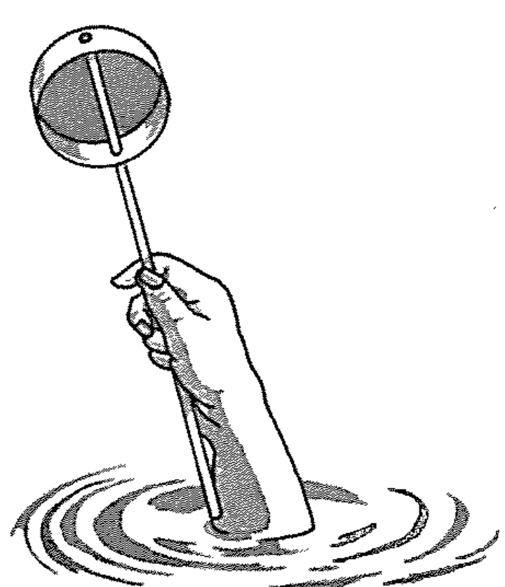

- 只從海中伸出一隻手來借柄杓的船幽靈

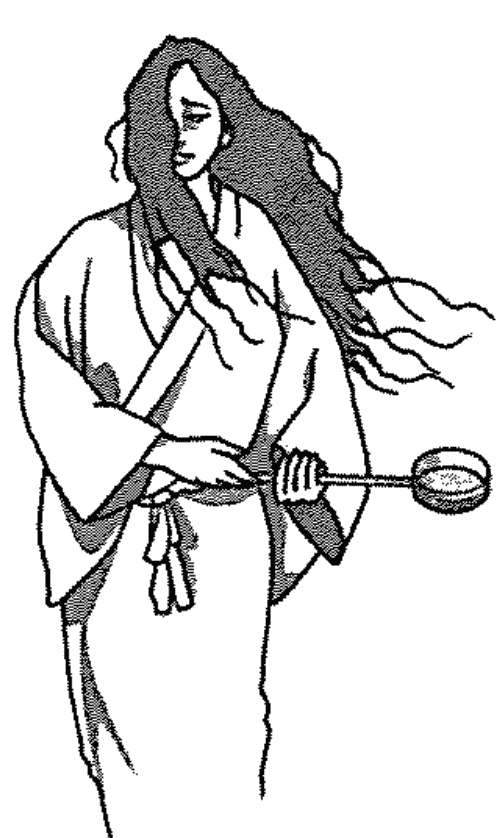

- 從海中現身來借柄杓的船幽靈

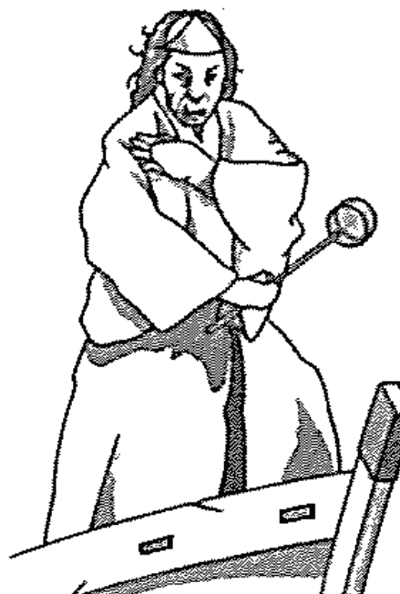

- 乘著船隻來借柄杓的船幽靈

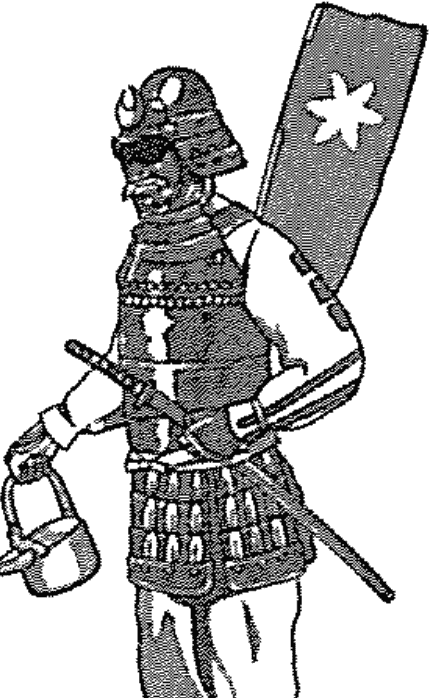

- 穿著鎧甲來借提子的船幽靈

#### 柄杓與提子

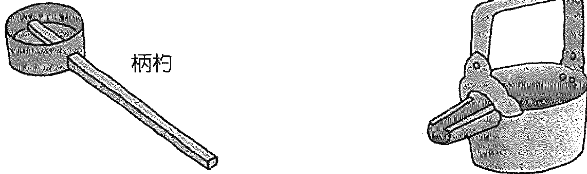

現在的日本人仍然會使用柄杓，對它並不陌生，可是提子幾乎已經無人使用，頂多是新人舉行神前結婚\*1時會拿來倒酒用而已。

提子是平家時代的貴族用來裝酒，再拿它把酒倒在碗裡的器具，用途就跟現在的鋩子\*2相同。所以平家的怨靈才會跟人討借提子，而非柄杓。

## No.041
## 洗豆怪
### Azuki-arai

洗豆怪為什麼要洗紅豆呢？洗紅豆此舉又有什麼目的？儘管理由不得而知，但據說他們是種很恐怖的妖怪。

#### ●發出異響的妖怪

洗豆怪是種遍見於日本全國的妖怪，除了這個名字，亦以「澀豆怪」、「磨豆怪」、「沏豆怪」、「紅豆沙沙怪」等名為人所知。

從來沒有人看過他的模樣，但如果走到河川附近，就會聽洗紅豆沙沙的聲音。正當聽得入神的時候，赫然發現自己被帶到河邊、落入水中。光是這樣倒也無妨，不過有些洗豆怪卻會喃喃說：「要洗豆還是要吃人」，並殺害落水者，最好還是謹慎一點。

因為從來沒有人見過洗豆怪，照理說沒人知道他的模樣，但據說他是個身穿和服的小老頭，還有人說他會打扮成法師（僧侶）的模樣。

江戶時代的奇談集《桃山人夜話》\*說洗豆怪原是越後高田某寺的小僧，雖然他肢體不全，卻很會算數，甚至只要看一眼就能準確猜出一升的紅豆總共有幾粒。不料這名頗受和尚疼愛的小僧，卻被心懷嫉妒的惡僧円海推入水井殺死了。從此以後，小僧的靈魂每天晚上都會朝該寺的雨窗擲紅豆，傍晚則是現身在河邊洗紅豆。後來円海的惡行敗露、被判死罪，之後每天晚上可以聽見小僧與円海靈魂爭執的聲音，夜深時兩個聲音落入水井，就此沒了聲響。由於這間佛寺發生如此不祥之事，再也沒人願意擔任住持，最後終於失火毀壞、中斷香火。

#### 不知其目的卻令人毛骨悚然

洗豆怪：流傳於日本全國的妖怪。亦稱「瀝豆怪」、「磨豆怪」、「淘豆怪」、「紅豆沙沙怪」

#### 洗豆怪的真面目

各地傳說各異，認為洗豆怪實為鼬鼠的說法最多

#### 只有聲音的妖怪

鼬鼠搖尾巴的聲音？ → “沙沙沙”

鼬鼠的叫聲？ → “喳喳喳”

除此以外… 狐狸、蟾蜍、人類的腳步聲

#### 洗豆怪的樣貌

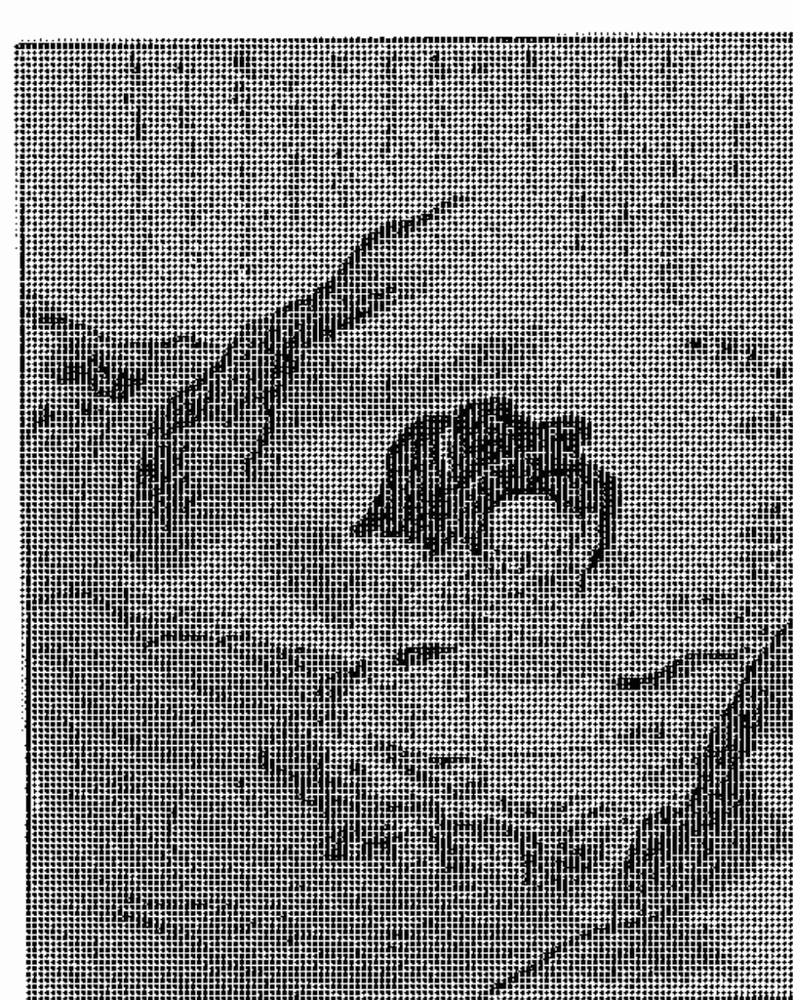

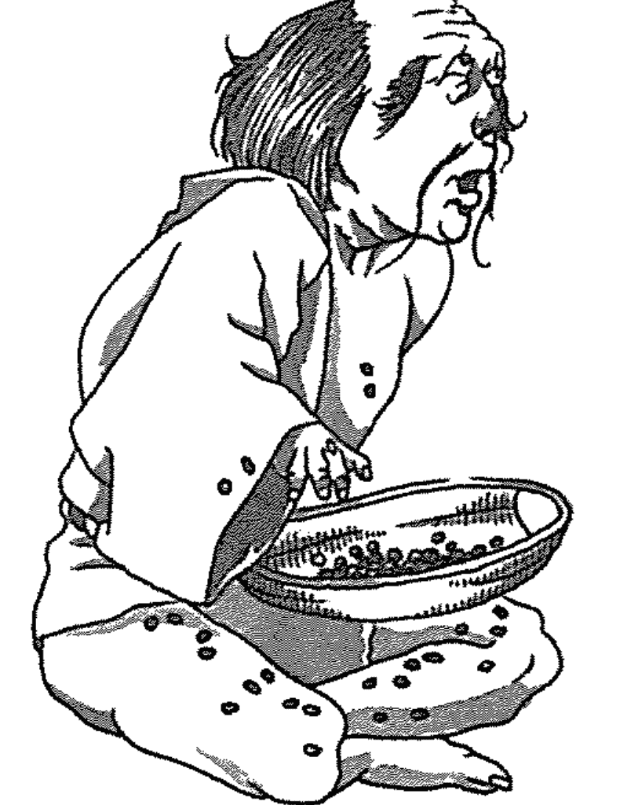

#### 女性的洗豆怪

多摩地方的有關故事說到有位跟婆婆感情不睦的媳婦投河自盡，後來這個媳婦就每天都在河邊洗紅豆，可謂是罕見的女性洗豆怪。

## No.042
## 濡女
### Nureonna

濡女是位全身濕答答的美女。其容貌雖然妖豔，卻總讓人有種異樣、不尋常的感覺。

#### ●來自大海的美女

濡女是會吃人的海妖。妖怪畫師筆下的濡女生作人頭蛇身，不一定有手，但是全都沒有腳。亦有人說她們是海蛇的化身，因為傳濡女的頭髮永遠是濕的，因而得名。

傳說濡女的蛇身有三町長（約330公尺），受其襲擊的人必死無疑。除此之外，濡女也有些其他頗異其趣的傳說。

首先是懷抱嬰兒現身海邊的濡女，有人說她是牛鬼\*之妻，有人則說她是牛鬼的手下，或是牛鬼自己。濡女現身時會把嬰兒讓給那個人抱，自己二話不說跳入海中，牛鬼再從海中現身。因為嬰兒如石頭般沉重，又緊緊黏在手上，於是可憐的犧牲者就這樣成了牛鬼的大餐。

要避免這樣的慘事發生，就要在接過嬰兒的時候先戴上手套，在逃跑的時候就能把嬰兒連同手套丟棄，躲過死劫。

此外有種與濡女相似的女妖怪，名叫磯女。傳說磯女是位絕世美女，下半身有的像幽靈般空無一物，有的則是蛇身。磯女全身濕濡，長髮及地，平時坐在海岸的岩石上眺望著大海。傳說她會呼喚路過的人，待那人靠近再以長髮糾纏、吸食鮮血。

另外還有種叫作濕女子的妖怪會對人微笑，若以笑容回應，就會被她一生跟隨糾纏，即使跑到陸地上她還是會跟在後面，可以算是類似跟蹤狂的妖怪。

#### 妖艷卻散發異樣氛圍的海妖

**濕濡女** — 吃人的海妖。其樣貌外形眾說紛紜，並無定論

#### 海中的濕濡女

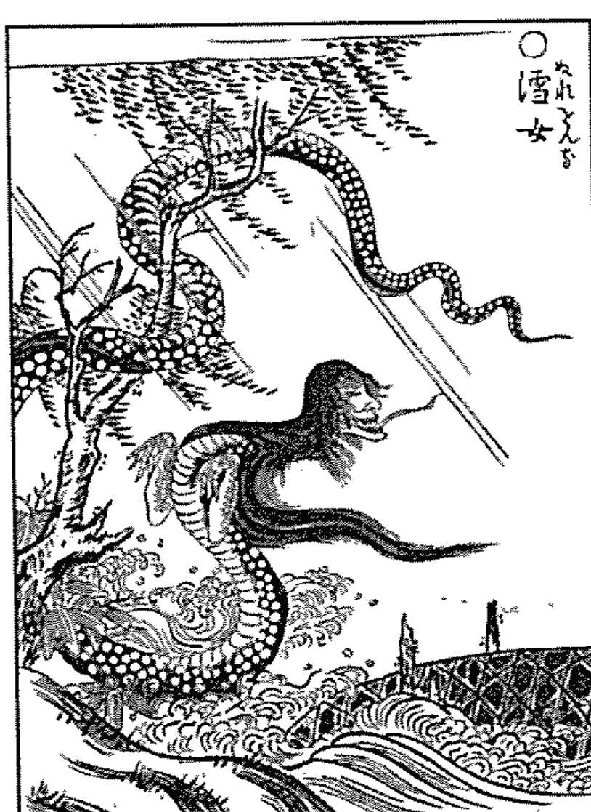

#### 鳥山石燕的濕濡女

- 人頭蛇身
- 長達三町（約330公尺）
- 頭髮永遠是濕的

摘自《畫圖百鬼夜行》

#### 海邊的濕濡女

抱著嬰兒的女子 → 把嬰兒給別人抱 → 牛鬼乘機吃人

#### 磯女

- 上半身是絕世美女
- 全身濕濡
- 呼喚路過者，吮其鮮血

#### 濕女子

- 對人微笑，若微笑回應，一生都會跟隨糾纏
- 即便逃到陸地仍然窮追不捨

> 雨天的計程車

這是現今的怪談。據說雨天會有全身淋濕的女子在路邊招計程車，在她上車以後，司機一回頭卻發現後座濕濕的，而那女子已不知去蹤。

或許這也是衍生自濕濡女的另一版本傳說。

#### 水子作祟？

現代的日本將死胎的胎兒，以及因為流產、墮胎沒能出生的孩子，稱作水子。此語原是佛教的戒名，死胎胎兒記作「○○家之水子」，至於僧人的戒名亦記作「○○水子」，而「水子」二字讀作「すいし」（Suiji）或「すいし」（Suishi）。其實水子原本並不單指未能出世的孩子，而是涵蓋於嬰兒期、幼兒期便夭折孩童的廣泛概念。江戶時代所載「○○水子」的戒名，其中大部分應該都是夭折的嬰幼兒。日本民俗認為七歲以下的孩子都是神的兒子，所以一般認為這些孩子死後不會成佛，而是回到神的身邊，也不會為他們舉行葬禮。這並不代表他們無法成佛，而是沒有成佛的必要，因為這些孩子本身就是神了。

然而，隨著第二次世界大戰以後人工墮胎的情形增加，「水子」演變成專指未能出世的孩子之用語；至於那些出生後夭折的嬰幼兒，戒名也變成男性的「童子」、「幼兒」、「嬰兒」、「孩兒」等，以及女性的「童女」、「幼女」、「嬰女」、「孩女」等名，幾乎無人再使用「水子」。

順帶說到「水子供養」，此儀式雖然已經變得相當普遍，可是按照佛教原本的教義，供養水子並不正常。所謂供養係指向神佛等奉獻供品，或是擴大解釋成向祖先的靈魂奉獻供品祭祀的行為，稱之追善供養。水子通常不以追善供養，而是另行供養祭拜，只因此舉有助於寺院的商業利益，才漸漸變得一般化。

持正道的僧侶並不認為水子之靈會造成靈障，如果有人說什麼「水子作祟」，那人便相當可疑。只不過，供養水子確實能夠使失去孩子的父母得到慰藉，還能促進人們對佛教的信仰，所以許多僧侶都認為供養水子不是件壞事。

那麼，為什麼那些自稱擁有靈能力的詐騙者要拿水子作祟來發揮呢？當然是因為這套說法命中率極高。根據某項統計顯示，20多歲的女性有30%，50歲以上的女性則有高達50%曾經有過墮胎的經驗。換句話說，連同墮胎的本人以及其母親、姊妹等，幾乎沒有一個家庭從未有過墮胎的紀錄，要是再把流產、死胎等情形都給算進來的話，機率更高。

是故，面對認為有不好的事情發生而前來的客人，自稱靈能者只要問道：「有無水子之事」，基本上都會說中；而那些被說中的客人卻將自稱靈能者的話信以為真。

這個世界有許多詐騙他人藉以謀取錢財的惡人，必須小心防範，說不定人間俗世間比陰間冥界還要更加危險呢！

## 第2章
水神與海神

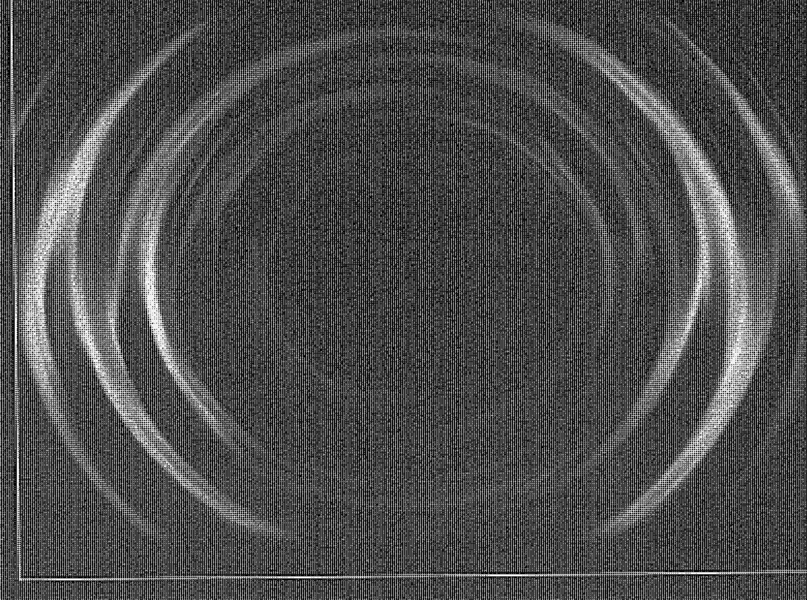

## No.043
## 奧克安諾斯
### Oceanus

奧克安諾斯是希臘神話的大洋之神。其實他原本只是位河神，後來遭到誤解才成為海神。

#### ●環繞整個世界的大河

古希臘人相信世界受到大河環繞，他們將這條圍繞著世界的大河稱作奧克安諾斯，而該河神的名字也叫作奧克安諾斯。

當時的希臘人把大西洋看成是一條大河，他們認為這條大河源自非洲南端，再從亞洲流到歐洲，環流整片大陸一周。

奧克安諾斯的妻子名叫特提斯（不是涅蕾斯的忒提斯），兩人生下了眾多河神以及三千名大洋尼斯（河之女神）。換句話說，全世界的包括江湖河海在內的所有水域都是他們的孩子。

他們也因為養育主神宙斯之妻——婚姻女神赫拉而為人所知。從前泰坦神族與奧林帕斯神族戰爭的時候，他們雖然身為泰坦神族卻保持中立，而且特提斯還保護當時年幼的赫拉，將她扶養長大。所以即便赫拉嫁給宙斯，獲得光榮地位，她仍舊深愛著特提斯，還曾經在特提斯與奧克安諾斯起爭執的時候居中調停仲裁，表現出罕有的纖細情感，有別於她平時對待其他神明與人類的嚴苛態度。

大洋尼斯中最出名的當屬斯提克斯。人稱海洋老人的海神涅落斯，其妻朵利絲也是大洋尼斯，這樣說起來則涅蕾斯算是奧克安諾斯之孫。另外像波賽頓之妻安芙朵琳蒂，有人說她是涅蕾斯，但也有人說她是大洋尼斯。其他像宙斯首任妻子——雅典娜\*1女神之母墨提斯\*2、替太陽神希利歐斯生下費頓的克呂墨涅、愛上奧德修斯卻遭拋棄的卡利普索等，也都是大洋尼斯。

大洋尼斯雖是大洋之女，卻也背負著其他任務，據說跟阿波羅一起培育年輕人便是她們的工作。

#### 全世界所有水域的創造者

奧克安諾斯 — 環繞世界的大河暨河神名

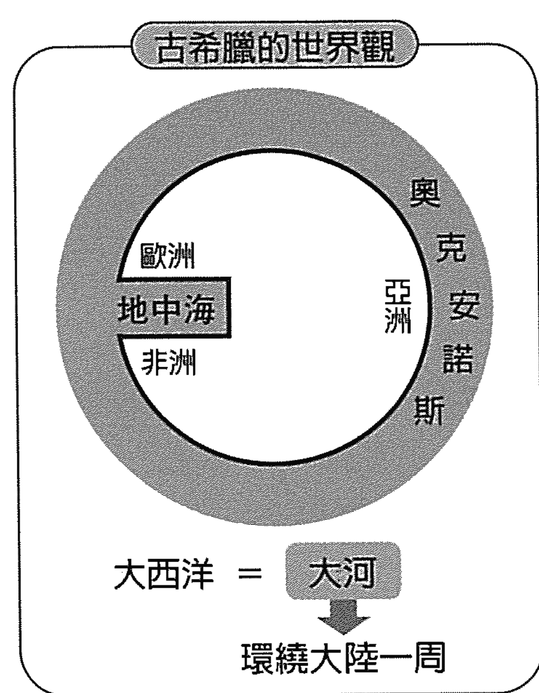

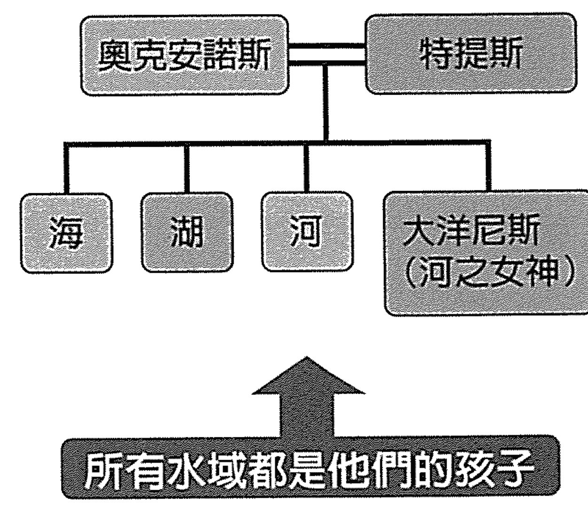

從人格神演變成地理概念

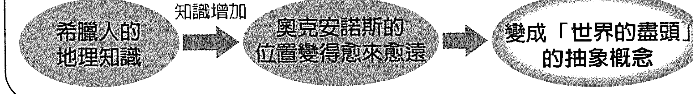

大西洋與太平洋

大西洋的英語稱作「Atlantic Ocean」，太平洋則稱作「Pacific Ocean」。「Ocean」此語便是來自於奧克安諾斯之名。換句話說，希臘人認為大西洋是條大河，所以大河的名字演變成大洋之名。

再說到大西洋的「Atlantic」則是來自於亞特蘭提斯。換言之，所謂大西洋其實就是「亞特蘭提斯所在的奧克安諾斯河」的意思。

#### 關聯項目

- 涅蕾斯→No.006
- 波賽頓→No.044
- 海洋老人→No.045
- 斯提克斯→No.046
- 奧德修斯→No.099

## No.044
## 波賽頓
### Poseidon

希臘神話的海神藉抽籤得到了海洋的統治權，不過波賽頓抽到這個籤似乎不太滿意。

#### ●老是輸胞弟宙斯一截的海神

波賽頓是希臘神話裡的海神，相信許多人都曾經在繪畫中看過他手拿三叉戟的模樣。從前宙斯、波賽頓與黑帝茲三人抽籤決定地上、地下、海洋三個世界統治權歸屬的時候，最好的地上世界統治權由宙斯獲得，最差的地下世界屬於黑帝茲，波賽頓得到是中等的海洋世界，但其實波賽頓似乎原是大地之神，而非海神。

現在的波賽頓不光只是大海，也是地下水（包括從地底噴出的泉水）的統治者。話雖如此，波賽頓自從輸給胞弟宙斯後，經常在各種勝負比試中敗北。

好比從前跟女神雅典娜爭奪希臘雅典市的守護神寶座時，波賽頓便曾以三叉戟擊碎岩石開闢泉水，豈料那泉水竟是鹹的，而雅典娜卻在這裡發出一株橄欖樹，讓大家選擇了較有用處的自己為守護神（所以該城市才取名為雅典）。據說被忽略的波賽頓很生氣，還引起洪水襲擊雅典附近地區。

在阿戈斯\*1跟宙斯之妻赫拉爭奪該城守護神寶座的時候，波賽頓敗下陣來，讓他氣得使阿戈斯的河川乾涸、海水倒灌。他還跟太陽神希利歐斯爭奪過科林斯\*2，結果地勢較高的山丘歸希利歐斯、面海之地歸波賽頓，這次總算是打平了。

波賽頓之妻是另一位海神涅落斯的女兒安芙朵琳蒂，或許海神的權柄正是因此才能和平轉移。不過當初波賽頓求婚的時候，安芙朵琳蒂可是害怕得逃跑，好在後來海豚找到她並加以勸說，總算才促成了這段婚姻。波賽頓為表感謝，遂將海豚放到天空變成星座（海豚座）。

#### 持三叉戟的海洋統治者

波賽頓
希臘神話的海神
抽籤得到海洋的統治權

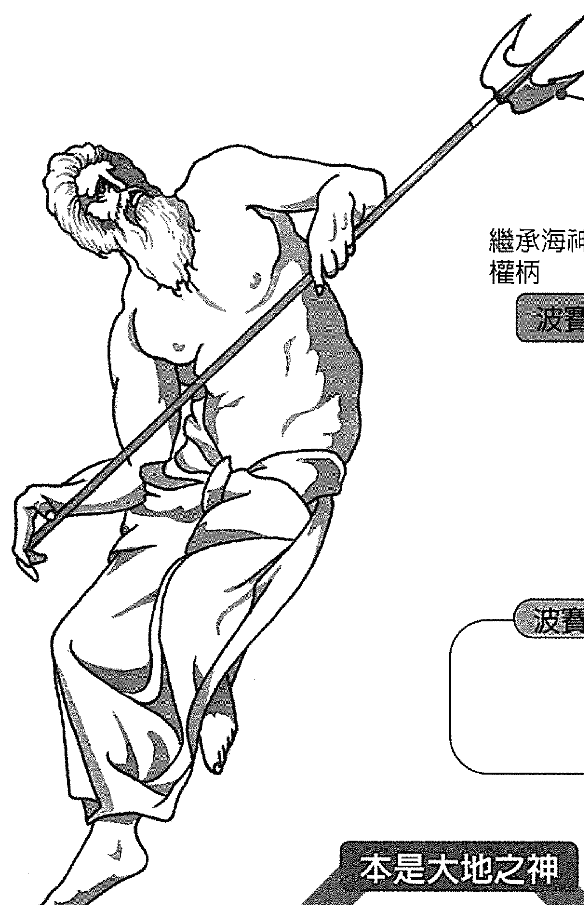

持三叉戟

繼承海神的
權柄

涅落斯

波賽頓

安芙朵琳蒂

波賽頓的統治範圍
- 大海
- 地下水
- 泉水

本是大地之神

馬神

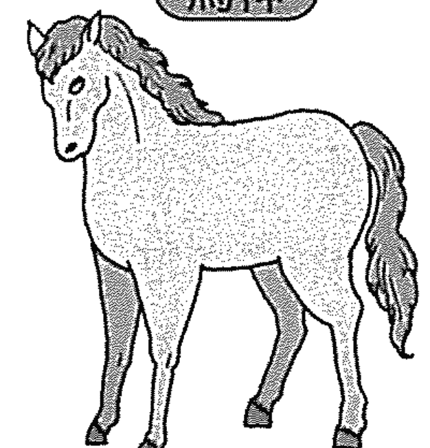

地震之神

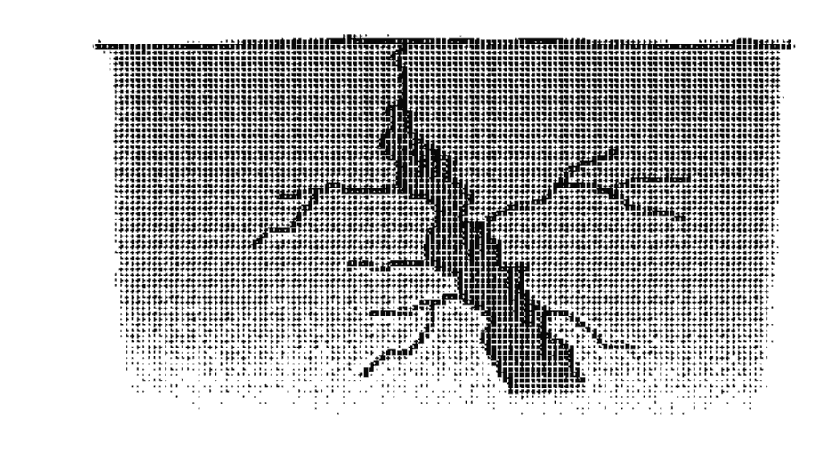

#### 關聯項目

- 海洋老人→No.045

## No.045
## 海洋老人
### The Old Man of the Sea

海洋老人原是希臘神話當中的海神，其地位卻遭到波賽頓取代。

#### 涅落斯、普羅透斯與福耳庫斯

每位海洋老人都是擁有預言與變身能力的神。

涅落斯乃潘陀斯（象徵大海、不具人格的神）與姬亞之子，是位比波賽頓還要古老的海神。他是平靜的內海（愛琴海）之神。

可是後來波賽頓成爲海神的時候，不知是否爲使權柄順利轉移，涅落斯的女兒安芙朵琳蒂嫁了給波賽頓爲妻，讓波賽頓以涅落斯女婿的身分順利繼承了海神的地位。波賽頓也有個兒子叫作涅落斯，不過是拼作「Neleus」，發音不同。

涅落斯生了五十個女兒，也就是所稱的海洋寧芙仙子涅蕾斯。除了波賽頓之妻安芙朵琳蒂，波賽頓和宙斯曾經覬覦其美貌的忒提斯也是涅蕾斯之一。

普羅透斯也是人稱「海洋老人」的海神，卻因爲波賽頓的出現而遭到降級，以波賽頓之子身分成爲司掌海洋生物的神明。普羅透斯還曾經揭露巨人普羅米修斯\*1隱藏的秘密——忒提斯之子必定比父親更加偉大，若宙斯娶忒提斯生子，其地位將遭子奪去（後來宙斯放棄忒提斯，讓她嫁給普通的人類，生下大名鼎鼎的人類英雄阿基里斯）。

有趣的是，有些傳說甚至指出涅落斯跟普羅透斯其實是同一位神明，或許娶兒子的女兒爲妻對神明來說並不算什麼，但這種說法未免牽強\*2。

福耳庫斯本身沒有什麼神話，反倒是以戈耳工\*3、史琪拉、艾奇德娜\*4、拉頓\*5、屈東等水怪的生父爲人所知。

#### 地位遭取代的舊海神

海洋老人 — 擁有預言與變身能力的神明 各個外型頗為類似

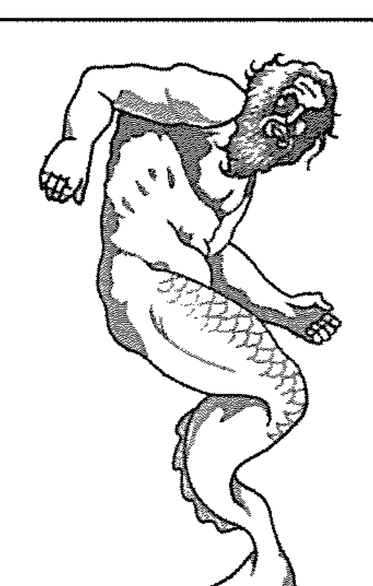

涅落斯
涅蕾斯之父
五十位涅蕾斯
安芙朵琳蒂（波賽頓之妻）
忒提斯 等

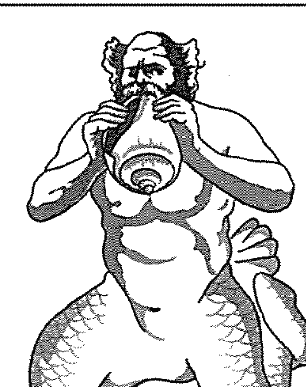

普羅透斯
司掌海洋生物
海狗 等

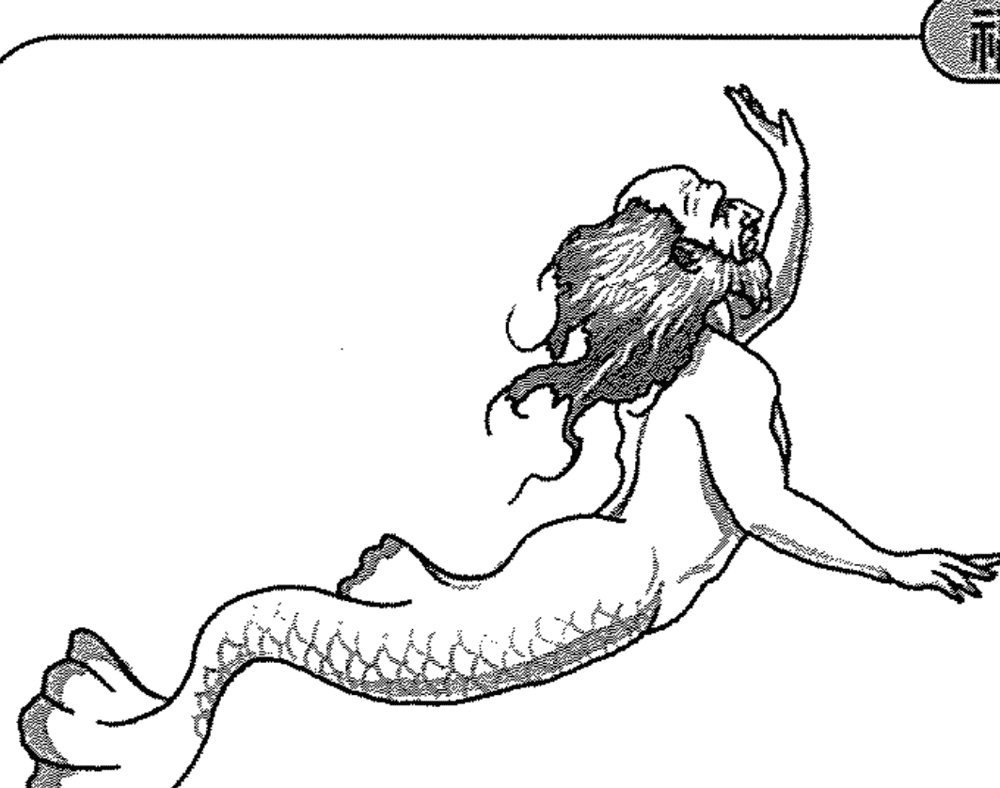

福耳庫斯
水系怪物的生父
戈耳工
史琪拉
艾吉德娜
拉頓
巨東 等

#### 關聯項目

- 涅蕾斯→No.006
- 史琪拉→No.026
- 波賽頓→No.044

## No.046
## 斯提克斯
### Styx

斯提克斯是條環繞冥界外圍的河流，這也使她往往遭誤解為死者的女神，但她其實只是位河之女神而已。

#### ●大洋尼斯的長姐

大洋尼斯（大洋之女）是大洋之神奧克安諾斯與特提斯所生的河川女神，相傳她們總共有三千人之多。其中的長女，便是這位地底河流的女神斯提克斯。斯提克斯河是條重重環繞地底冥界、逡巡九圈的大河，標示著生死兩個世界的交界。其宮殿位於冥界之中，是座使用銀柱建造的壯麗建築物。

她跟丈夫帕拉斯\*1生下許多兒女，如：哲洛斯（光榮之神）、尼姬（勝利女神）、克刺托斯（權力之神）與比亞（腕力女神）。從前眾神之首宙斯與泰坦神族開戰的時候，斯提克斯是第一個帶著眾兒女前來替宙斯助陣的（據說斯提克斯會這麼做是聽了父親奧克安諾斯的建議）；她的兒女在這場戰爭當中奮力作戰，對宙斯的勝利有關鍵性的貢獻。

因為這個緣故，此後其兒女便等同於宙斯的親衛隊，長年駐守於宙斯的住處、為其效力。

此外斯提克斯還擔負起眾神起約立誓的榮譽。眾神立誓的時候，女神伊莉絲\*2會取水瓶汲取斯提克斯河水倒入酒中，將其一飲而盡後立誓。倘若違背誓言，即便身為神明也要昏睡一大年（普通曆法的9年），然後被逐出奧林帕斯九大年（81年）不得返回。

有人說斯提克斯之水帶有劇毒，也有人說它是長生不老的神水。從前涅蕾斯忒提斯捉著自己生下的人類英雄阿基里斯浸泡斯提克斯河水，使其刀槍不入，卻唯獨漏掉當時被她雙手捉著的腳踝部分，成了阿基里斯唯一的弱點，後來阿基里斯便是因為腳踝中箭而亡，這也是著名的阿基里斯腱的由來。

#### 地底河流的女神

斯提克斯
大洋之神奧克安諾斯與特提斯的長女
分隔生死兩個世界的河川女神

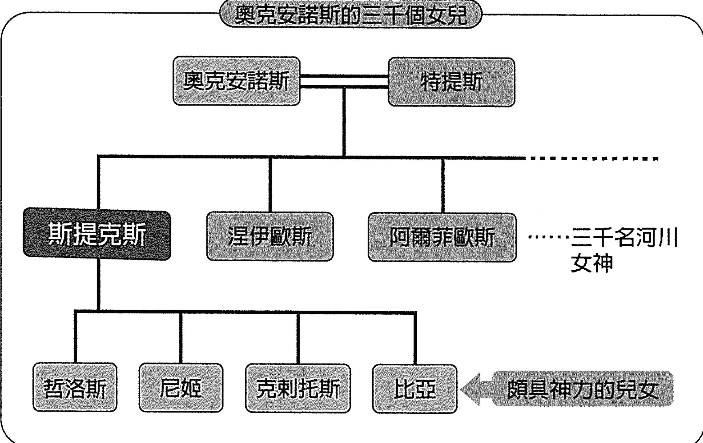

#### 兩條斯提克斯河

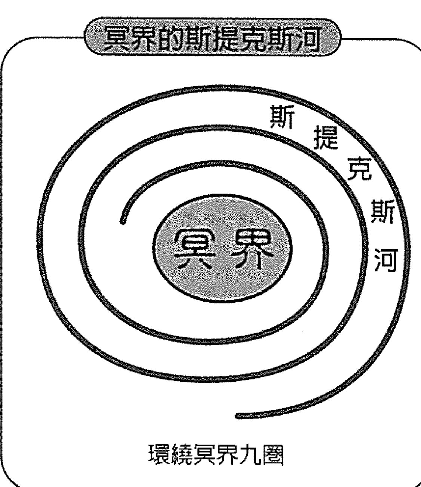

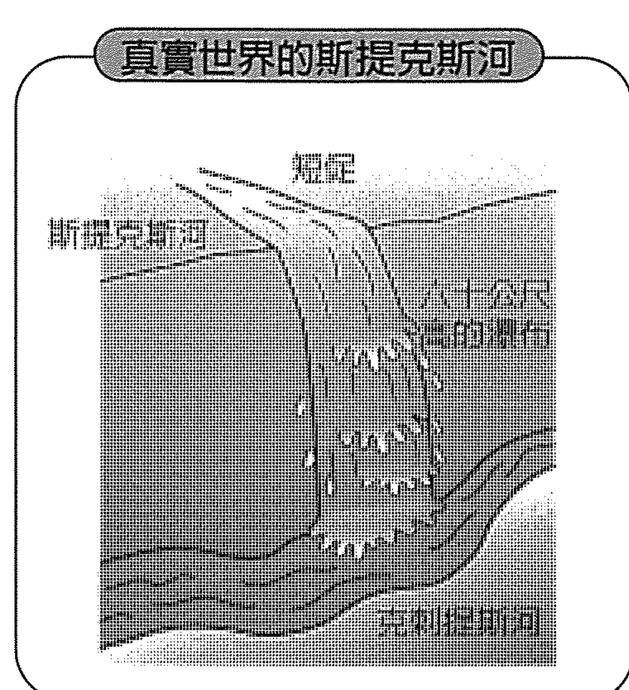

#### 關聯項目

- 涅蕾斯→No.006
- 奧克安諾斯→No.043

## 阿謝洛奧斯
### Achelous

阿謝洛奧斯是曾經跟希臘最偉大英雄搶過女人的河神。儘管他身為神明，阿謝洛奧斯終究還是不敵赫拉克勒斯。

#### ●希臘第一大河之神

阿謝洛奧斯是流經希臘西北部、注入科林斯灣的希臘第一大河——阿謝洛奧斯河的同名神明，相傳他是奧克安諾斯與特提斯眾兒女當中最年長的，但也有傳說認為他是太陽神希利歐斯與大地母神姬亞之子，或海神波賽頓與姬亞之子，實際如何不得而知。

從前英雄赫拉克勒斯前往冥界時，曾經從已經死亡的墨勒阿革洛斯\*1口中聽說其妹十分貌美，並且將妹妹託付給他照顧。赫拉克勒斯接受託付後，便前往卡利敦（墨勒阿革洛斯的故國）迎娶他的妹妹得伊阿尼拉。

可是得伊阿尼拉已經有追求者，那人便是阿謝洛奧斯。

兩人以摔角比試決勝負，阿謝洛奧斯雖然使用變身的能力化作公牛，卻被赫拉克勒斯折斷牛角、敗下陣來。為取回牛角，阿謝洛奧斯以從前曾經替宙斯授乳的山羊阿瑪提亞的羊角（傳說此角能分泌出奈克塔和安珀希雅\*2）為條件，跟赫拉克勒斯換回了自己的牛角。

可是回頭來看，赫拉克勒斯獲勝卻是件不幸的事。赫拉克勒斯的敵人——半人馬族\*3的涅索斯將死之際，曾經教得伊阿尼拉：「倘若丈夫的愛情冷卻，只要拿赫拉克勒斯的內衣浸泡自己的血，再拿給他穿，如此愛情就會回溫」。後來她發現赫拉克勒斯在外面有情人，便依涅索斯所言而行，豈料赫拉克勒斯一穿上內衣便立刻全身著火，活活被燒死，而知道自己殺死丈夫的得伊阿尼拉也跟著自盡。

#### 阿謝洛奧斯與赫拉克勒斯之戰

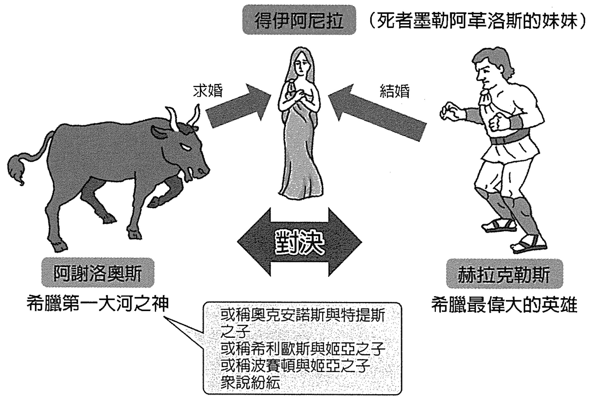

#### 希臘第一大河

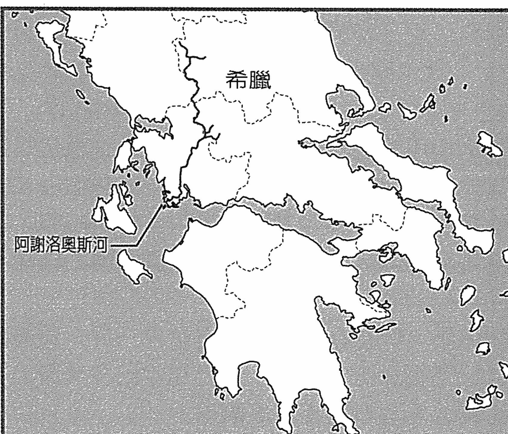

#### 關聯項目

- 奧克安諾斯→No.043
- 奈克塔與蘇摩→No.080
- 波賽頓→No.044

## No.048
## 尼爾德
### Njörðr

尼爾德不單是靠海維生者的守護神，同時也是能使信徒致富的儲蓄之神。

#### ●海洋產業之神

北歐神話有尼爾德與阿戈爾兩位海神。阿戈爾是司掌險惡海洋的自然之神，而尼爾德卻是守護討海人的神明。尼爾德居住的館邸叫作諾歐通，有「船泊處」之意，他乃是船隻、貿易、海盜掠奪、造船、港口、漁業等海洋相關產業的守護神。

尼爾德本是阿薩神族（以奧丁*2爲首的神族）的敵對勢力華納神族之長，不過他在雙方神族和睦相處的期間被送到阿薩神族作爲人質，從此便歸屬於阿薩神族。

他是位俊美的神明，尤其雙腳之美更是冠於諸神。

從前女巨人史卡姬因父親巨人之王夏基遭諸神殺害，前去找諸神報仇；諸神請求史卡姬原諒，並表示希望能加以彌補。當時史卡姬決定從衆神當中挑選夫婿和逗自己笑作爲賠償，而諸神則提出只能看雙腳選婿爲條件，答應這個要求。

逗她笑的任務是由洛奇*3負責完成。洛奇把山羊的鬍鬚綁在自己的陰囊上，稍有動作就會牽得山羊痛苦鳴叫，山羊的動作也會讓洛奇痛得呻吟。史卡姬看到這副窩囊的模樣，不由得笑了出來。

再說到選婿。衆神在史卡姬面前站成一排、只露出雙腳，史卡姬特意挑選腳最漂亮的神，以爲那是巴多（奧丁之子，也是最俊美的神），豈料其實是尼爾德。

兩人成婚The request was rejected because it was considered high risk

## No.056
# 克蘇魯
## Cthulu

克蘇魯是有「偉大的克蘇魯」之稱的強大邪神，其復活將會帶來人類的毀滅。

### ●沉睡於太平洋底的邪神

由美國恐怖作家H.P.洛夫克萊夫特創造的恐怖體系，世稱克蘇魯神話，從此克蘇魯便成爲該神話體系中最負名氣的邪神。

克蘇魯生著章魚頭和帶翅膀的身體，身體表面則是覆蓋不知是鱗或瘤、類似橡膠的東西。他的手有鉤爪，翅膀如同蝠翼。

克蘇魯被稱爲舊日支配者，是太古時代來到地球並且加以支配的某種異形，可是後來卻因地殼變動與星辰變化等因素而無法動彈（並未死亡），從此便沉睡於地球以及附近的宇宙。

克蘇魯有群名爲「深海巨人」的從屬，堪稱爲深海巨人的**大衮**與海德拉也追隨於他。克蘇魯的信徒大多是居住於大海沿岸的居民，以及海洋相關事業的從業者。

克蘇魯藏身於沉入海底的太古都市拉葉城（傳說位於太平洋的海底），呈現半睡半醒的狀態。雖然他自己無法動彈，卻可以透過念力號令屬下。他的信徒相信當星辰來到正確位置的時候，拉葉城就會浮出海面，屆時克蘇魯也將復活。

有人說克蘇魯亦受從前沉沒海底的**姆大陸**信仰崇拜，其影響甚至擴及於中南美洲等地區。

洛夫克萊夫特的弟子奧古斯特·德勒斯曾將舊日支配者按四大元素進行分類，並將克蘇魯分作水元素，與風系舊日支配者赫斯特對立。不過也有人批評說將舊日支配者分類、甚至加以說明，反而使得克蘇魯神話失去了原本的恐怖氛圍。

#### 為人類帶來毀滅的邪神

#### 舊日支配者

以念力號令

部下 大衮・海德拉

從屬 深海巨人

#### 關聯項目

- ●大衮→No.055
- ●姆大陸→No.078

## No.057
# 阿娜希塔與阿部
## Anahita & Ap

瑣羅亞斯德教往往讓人直接聯想到火，但其實並不僅僅如此，水也是該教的重要神格。

### ● 與印度共通的神明

瑣羅亞斯德教亦稱拜火教，是個向火膜拜的宗教，不過他們崇拜水的思想也頗為獨特。該教經典《波斯古經》*1談論祭祀儀式的第一部耶斯那，當中最古老的一篇散文第38章亦將水奉為阿胡拉*2之妻阿胡拉尼斯崇拜。該篇散文說到，水不僅僅是人類必須，更是生命的母親。《波斯古經》第三部維提吠達特也說，阿邦（阿部）是大水匯集處之精髓，就連整個世界都承載其上。從此不難發現，水以各種名稱受到瑣羅亞斯德教崇拜，並且由各種神祇職掌。

瑣羅亞斯德教的中級神祇「Yazata」中有位阿娜希塔，受人奉為水之女神或河川女神。據說這位阿娜希塔其實就等於印度教的薩囉薩伐底，是條環繞整個世界的世界河，角色相當於希臘神話中的奧克安諾斯。

阿娜希塔是安產之神，同時也是使女性分泌母乳的神明，故而特別受到孕婦信仰。她身披散發金黃色光芒的斗篷、頭戴鑲有繁星的黃金皇冠、左手持水瓶，胸前還有石榴花裝飾。

同樣在「Yazata」之中，還有另外一位水之女神阿部。阿部亦作阿邦，是能夠帶來滋潤與繁榮的女神，她與印度神話《梨俱吠陀》中的阿帕斯擁有相同根源。據說此名是從阿維斯陀文（記載《波斯古經》的文字）語意為「水」的「阿帕斯」一語演變而來。

瑣羅亞斯德教的曆法當中，每個月的第十天是屬阿部掌管的水之日，此外阿邦也是每年第八個月份的象徵。因為這個緣故，每年的八月十日是水的節日，同時也是阿娜希塔的節日。

#### 瑣羅亞斯德教的重要神格

- ● 薩囉薩伐底→No.058
- ● 奧克安諾斯→No.043
- ● 阿帕斯→No.059

## No.058
# 薩囉薩伐底
## Sarasvati

薩囉薩伐底是條已消失河流的女神，不知是否因為職掌的河流消失不見的緣故，後來竟然演變成為地位最高的女神。

### ●天界的河流女神

印度神話就屬薩囉薩伐底是眾河神中地位最高。薩囉薩伐底此名有「持水者」之意；在《梨俱吠陀》裡面，相對於那提（河神）僅能與其他神祇共享讚歌，薩囉薩伐底擁有多達三篇的專屬讚歌，而且還被譽為「最高的母親，河流中的最高者，女神中的最高女神」。

諷刺的是，其他河流至今仍然存在，可是薩囉薩伐底河卻成為枯河，往日榮景已不復見。不過後來人們把薩囉薩伐底視為天界的河流、所有河流的根源，權威不減反增。人們甚至還將薩囉薩伐底當成所有事物的泉源，奉其為語言與音樂的女神，進而成為學問與藝術之神。同時她也是眾神中地位最高的婆羅賀摩之妻，在眾神當中的地位相當高。據說婆羅賀摩之所以能夠成為四面神也是拜其所賜。

從前婆羅賀摩用自身發出的光創造出一名女性，也就是薩囉薩伐底，但婆羅賀摩卻為自己所創造的這位女神痴迷。薩囉薩伐底為躲避父親婆羅賀摩的視線向右移動，不料右邊就多了張臉，她往左邊躲左邊就多了張臉，往後面繞則後面又多了張臉。最後她縱身躍入空中，豈料婆羅賀摩又生出一張朝上的面孔。薩囉薩伐底終於不得不放棄，嫁給變成五面神的婆羅賀摩為妻（現在的婆羅賀摩只有四張臉，據說是因為有次他跟濕婆*爭論時被削去了頭頂的那張臉）。

後來薩囉薩伐底亦受到佛教吸收，成為我們相當熟悉的神明，辯財天便是佛教化的薩囉薩伐底。

#### 四臂的美麗女神

| 薩囉薩伐底 | 「持水者」 |
| :--- | :--- |
| 印度神話眾河神中最高位 | 學問、藝術之神 |

> 「最高的母親，河流中的最高者，女神中的最高女神」

受佛教吸收 ➔ **辯財天** = 佛教化的薩囉薩伐底

## No.059
# 阿帕斯
## Apas

水之女神阿帕斯是印度神話當中最古老的神明之一，然而他的存在卻十分薄弱。

### ●人格不定的水神

阿帕斯是印度神話《梨俱吠陀》提到的水之女神。
傳說阿帕斯是水（阿普）的擬人化，掌管天界地界全部的水。她是位慈愛的母親，不光是所有的水和液體，宇宙和芸芸眾生也都是她所孕生，可謂是印度神話中的創造母神。
天界之水不僅僅是水，還包括了神酒蘇摩、甘露、乳汁、蜂蜜、酥油（液態奶油）等滋養眾神的飲料，而源頭正是來自於阿帕斯女神。地上之水均是以天上之水為起源，除了飲用水以外，還涵蓋了大海河川等水系，所以阿帕斯也可以說是所有河神的上級神。
然而其權柄並不僅於此。由於古代醫藥都是採飲料形式，所以阿帕斯亦兼具醫藥之神的身分。《梨俱吠陀》曾寫到：
「阿帕斯啊，請授我醫藥，以為我身體的援護，好使我能長見太陽（以求長生）。」（《梨俱吠陀讚歌》辻直四郎／譯，岩波書店，下同），掌管醫藥與長生。
此外，阿帕斯亦是「付諸流水」一說的體現。「阿帕斯啊，請把它全部帶走，無論是我的何種過失、我所犯下的欺瞞、抑或是不實的誓言。」擁有抹去罪過和謊言的能力。
儘管阿帕斯是位如此優秀的神明，文獻對她的外型和性格卻無任何記述。我們只知道她象徵自然存在的水，不像印度神話的其他神祇擁有人格化的神明型態。
或許是因為這個緣故，除了最古老的吠陀經《梨俱吠陀》，鮮少在別處看見她的身影。阿帕斯在現在的印度教中已經是位遭到遺忘的神明。

#### 所有水的根源

掌管天界地界所有的水

但是
不具實體

#### 關聯項目

- ●奈克塔與蘇摩→No.080

## No.060
# 水天
## Suiten

佛教裡的佛為數眾多，因為從其他宗教吸收了許多神祇，其中亦不乏水神。

### ●受佛教吸收的水神

佛教有許多佛，階級由高而低可分為：「如來部」、「菩薩部」、「明王部」，以及「天部」。其中天部乃是吸收婆羅門教諸神所形成，擔任佛教守護神的角色。
水天便是天部的其中之一。正如其名，水天是水神，據說原是婆羅門教的縛嚕拏。成書於西元前十世紀的《梨俱吠陀》說縛嚕拏是天空神、司法神、水神；他的血統純正，甚至還受到瑣羅亞斯德教吸收、成為該教的最高神祇阿胡拉·馬茲達。但後來他在婆羅門教裡的地位降低，僅僅只是水神而已。
縛嚕拏受到佛教吸收以後，便成為守護佛教的十二天之一、西方的守護神。當然，他仍然保有水神的身分。水天通常描繪成右手持劍、左手持索（拋繩），並且乘坐著烏龜等水生生物的模樣。這條繩索名為龍索，是按照龍的模樣製成。
江戶時代盛行神佛習合（神道與佛教兩者共同祭祀），水天亦改由神社水天宮祭祀。當時水天是與「天之水分神」、「國之水分神」習合，這兩尊神是孩童的守護神，連帶使得水天被奉為安產與育子之神。
由於水天相當於印度的原初神縛嚕拏，明治以後的神佛分離將其解釋為相當於日本神話原初神「天之御中主神」的神佛，水天宮也就變成了祭祀天之御中主神＝水天的神社，使得水天宮徒具其名，跟水天沒有直接關係了。

#### 佛教的司水佛

- 佛教
  - 如來部
  - 菩薩部
  - 明王部
  - 天部
    - 佛教的守護神
    - 水天 = 原是婆羅門教的縛嚕拏

神佛習合

天之水分神
國之水分神
習合

神佛分離

被解釋為相當於
天之御中主神
的神佛

> 安德天皇

從前平家掌握政權的時候，平清盛之孫安德天皇以二歲之齡即位成帝天皇，可是五年後平家源氏以滅，安德天皇與其母投水自盡而亡。

因此安德天皇亦稱水天皇，被視同於水天，使得水天宮也成了祭祀安德天皇，其母建禮門院，以及祖母二位之尼的神社。

## No.061
# 龍王
## Dragon king

無論在東西方都是強大的幻想生物，然而若探究其正邪，兩邊卻是持完全相反的意見。

### ●神秘的東方龍

龍在西方乃是惡的化身，可是在東方卻掌管大海與水的神的使者。東方的龍有四隻腳，沒有翅膀但能騰空飛行，前肢經常握有寶珠。他們住在水中，擁有降雨的能力，據說從地面騰空飛起的時候會刮起龍捲風、升上天際。

佛教有支守護佛教的神族名爲天龍八部，其中排名第二的便是龍。他們是由印度神話的那伽*演變而來，掌管世間的水。法華經有八大龍王，從前釋迦講道時出席的八位龍王分別是難陀、跋難陀、娑伽羅、和修吉、德叉橋、阿那娑達多、摩那斯、優鉢羅。其中尤以跋難陀以曾經在釋迦誕生時使天空降雨而聞名，而娑伽羅亦以龍宮之王爲人所知。

道教有所謂的四龍（四海龍王），是統治中國周圍四海（其實中國只有東邊臨海而已）的龍王。這四龍的名字分別是：東海龍王敖廣（青龍）、西海龍王敖潤（白龍）、南海龍王敖欽（赤龍）、北海龍王敖順（黑龍），其中以東海龍王年紀最長。

他們幾乎從來不曾出現於佛經之中，但在中國的傳奇小說倒是頗爲活躍，只是經常扮演不重要的角色。《西遊記》中，孫悟空從東海龍王手中奪得了如意棒，而西海龍王則是變成了三藏法師的座下白馬。《封神演義》裡，年僅七歲的哪吒太子竟然殺死了東海龍王之子。

或許是因爲龍很強大、龍王非常強大，若能勝過龍王就能彰顯故事主角的力量，使得龍王成了最理想的敵對角色。

#### 東西方恰恰相反的幻想生物

> 有句話說「龍有九似」。據說龍的身體各部位都是模擬實際存在的動物，詳細如下：

> 通常最多只到四爪，五爪是皇帝

#### 四龍（四海龍王）

## No.062
# 玄武
## Genbu

中國有鎮守四方的神獸，名曰四神。其中北方司水者為玄武。

### ●鎮守北方的龜之神獸

日本和中國相信有鎮守四方的靈獸：東青龍、西白虎、南朱雀、北玄武。除了這四神，有時候還會另外加上統治中央的黃帝。

中國星座有所謂的二十八宿，四神分別掌管七宿，而玄武司掌的便是斗宿、牛宿、女宿、虛宿、危宿、室宿、壁宿這北方七宿。其中最有名的當屬斗宿，也就是有名的南斗六星。

玄武的外型呈龜蛇交纏的模樣。他是司掌北方之神，北方象徵黑色故稱玄，堅硬龜殼擁有強大的防禦力謂之武，另外玄武是水的掌管者，同時也是冬天的統治者。不過後世漸漸不再稱其為玄武，改稱真武，並奉真武玄天上帝為鎮守武當山的北方守護神，於宋朝受到廣大信仰，這或許跟宋朝受到北方侵略、失去領土而偏安南宋有關。除此之外，武當山上與少林寺齊名的拳法大宗武當派，至今仍有許多門人，只不過此時的玄武已不作龜蛇模樣，而是以人格神的形象受到信仰。

玄武在《西遊記》裡是名為北方真武君蕩魔天尊的玄武神。孫悟空曾向身為武當山之神的他尋求協助，不料玄武神竟然小覷妖怪、只派遣屬下的龜蛇二將軍與五大神龍前去迎戰，遭到黃眉大王的法寶後天袋子收服，悟空好不容易靠著筋斗雲才逃出來，去別處搬救兵。玄武就落得因小瞧對手而沒能幫上忙的難堪下場。

順帶一提，這位真武君蕩魔天尊在《北遊記》裡面則是成了故事的主角。

#### 司掌鎮守四方的聖獸

四神 — 鎮守四方的靈獸

為配合五行思想，有時也會連同中央合為五獸，此時中央配屬的乃是黃麟（黃色的麒麟）

#### 四神對應表

> 四神相應
風水學中有所謂的四神相應，意思是某塊土地若在每個方位有與四神對應的地貌，則該地就是塊風水祥地。令人感到不可思議的是，在四神相應裡，北方玄武象徵的是山，屬火的朱雀象徵的卻是海。的確北方有海、南方有山之地必有北風吹襲，氣候寒冷不適居住，但如此對應總令人覺得牽強。

## No.063
# 河伯
## Kahaku

只要在中國說到河，指的便是黃河。黃河的河神究竟是何來歷？

### ●黃河河神其實是溺死於該處的男子

河伯是中國黃河的河神，不過中國人也習慣將所有河神統稱為河伯。相傳河伯是位名叫憑夷或冰夷的男子，他溺死於黃河以後，天帝命其擔任黃河之神。道教傳說則說冰夷是在黃河河畔服下仙藥成仙，成為河伯。

據說他長得跟人類沒有兩樣，卻能夠變身為白龍，而河伯之妻是黃河支流洛水的女神洛嬪。儘管如此，河伯仍然要向人類討新娘，也就是傳說中的「河伯娶婦」。

從前魏國有個叫作西門豹的人被派到河南省做縣令，他聽當地的長老說河伯索討新娘，使得眾人生活甚為窮困；不僅官員每年要收取高額稅金作為送嫁費用，巫女還會從各家帶走年輕貌美的女孩。西門豹上任後帶著部下參加那年的娶婦活動，他看了新娘的長相說道：「這女孩長得不怎麼樣。巫婆啊，妳去跟河伯報告一下，告訴他我們晚點會送更漂亮的新娘過去」，就命令部下把巫婆丟進黃河。但由於遲遲不見巫婆浮起來，於是他又對巫婆門下的巫女們說道：「好慢吶，妳們也去看看情形吧」，陸續把她們也丟進河中。那些巫女當然也沒有浮出水面。接著西門豹又說：「那些女人好像沒辦法把話說清楚，那就官員們去吧」，然後開始把官員往河裡丟。

剩下那些官員害怕得直發抖，紛紛向西門豹叩頭饒命。

其實西門豹明知當地官員與巫女勾結、從中牟利。據說從此以後，河伯娶婦的習俗就廢了。河伯也真是倒霉，平白遭到池魚之殃。

#### 原是人類的黃河之神

**河伯**
黃河之神。或為河神之統稱
於黃河溺死的男子被天帝擢為仙人

#### 黃河與洛水

**沙悟淨也是河伯**
在日本，《西遊記》的沙悟淨經常被視作河童，並將其塑造成河童的模樣；不過沙悟淨在中國也是位河伯，長相就跟普通人類沒有兩樣。

## No.064
# 無支邪
## Musiki

河神未必全部都是善神，其中亦不乏興起洪水危害人類的河神。

### ●體型龐大的猿怪

淮水雖然知名度不高，卻是僅次於長江、黃河的中國第三大河。其實這條河流本應叫作淮河，可是自古中國只要提到河幾乎都是指黃河，故多以淮水稱呼。
淮水裡的河神即是無支祁，亦作「無支奇」、「巫支祈」。無支祁是隻高達五丈（9公尺）、貌似巨猿的怪物，全身都是毛茸茸的黑色體毛，雪白的頸項能夠伸縮，最長可達百尺（18公尺）。他生得額寬鼻塌，還有金黃色的雙眼和白森森的牙齒；他的動作極為迅速，卻擁有勝過九頭大象的怪力。此外他還能通人語，深諳河川的深淵淺灘等各處地形。
從前中國古代的皇帝大禹接手父親失敗的治水工作，卻遭到無支祁阻礙。他非但大興洪水，還派出怪物，治水工程只能停滯不前。
於是，大禹便派出部下庚辰去擒拿無支祁。庚辰先是一一打倒無支祁派遣的水精、水怪、山怪、石怪等，最後終於成功捉住了無支祁。大禹以鎖鍊繫住他的脖子、取黃金鈴鐺掛在他的鼻子上，然後將其封印在龜山山麓的水底，讓無支祁再也無法從中破壞，大禹的治水工作終於得以順利開展。
此後庚辰的子孫便會繪製無支祁的圖像，作為防止淮水氾濫成災的護符。
據說後來南北朝時代（西元五～六世紀）龜山山麓又再度有貌似猿猴的巨大怪物出現。這頭猿猴綁著鎖鍊，要數十個人加上數十頭牛才能拉動他，也許這頭猿猴就是無支祁。

#### 危害民眾的巨猿怪物

無支祁
淮水的河神
亦作「無支奇」、「巫支祁」

興洪水危害人間

丈
丈是長度單位，是尺的十倍長。現代日本的1尺＝30.3公分，所以1丈＝10尺＝3.03公尺。不過古代中國的1尺＝18公分，所以1丈＝10尺＝1.8公尺。
我們稱強者為「丈夫」，其實是「身有丈長之夫（男性）」的意思。在從前幽靈不作的年代，有如此體格者被視為丈夫也是很正常的事情。

## No.065
# 淤加美神與彌都波能賣神
## Okaminokami & Mitsuhanomenokami

日本的水之女神始於這兩尊神明，可是如此古老的神明現今只剩下名字，幾乎沒有事跡流傳。

### ●因伊弉冉尊之死而誕生的女神

淤加美神與彌都波能賣神是日本神話的水之女神。從前眾神誕生的時候，迦具土神的誕生間接殺害了伊弉冉尊*1，伊弉諾尊*2盛怒之下斬殺了迦具土神，當時從劍沾染的鮮血中總共生出八位神明，其中從劍柄滴落的鮮血誕生的便是闇淤加美神和闇御津羽神。此處的「闇」指的是溪谷，因此這兩位神明便是掌管溪谷流水的水神。

然而這位神明卻沒有任何活躍事跡。《古事記》*3雖然曾經二度提及淤加美神，不過一次是記載其女日河比賣嫁給素盞嗚尊之孫，其孫是大國主命*4，另一次也僅僅記載其女比那良志毘賣嫁給大國主命、生下多比理岐志麻流美神而已。他是位完全沒有從事與水相關工作的水神。《日本書紀》曾經提及闇龗從劍柄的鮮血中誕生，或者也有一說認為迦具土神被砍成三塊後，其中一塊變成了名叫高龗的神，據說是山頂的水神。

「龗」乃龍的古語，此二者分別是谷之龍神與山之龍神的意思。

那麼另外一位水之女神又是如何呢？彌都波能賣神是從前伊弉冉尊生產迦具土神受苦難時，從他的尿液中誕生的神明，同樣被奉為水神。

「彌都波」三字讀作Mitsuha，關於此讀音有兩個說法，一可寫作「水走」，有引水而來之意（換言之就是灌溉用水之神），或寫作「水旱」則有水湧出之意（即泉水井水等水神）。這位女神僅出現一次，從此再也沒有紀錄了。

不過兩者均是水神，所以儘管並無活躍事跡，卻在各地受到民眾崇拜，甚至還有許多神社加以祭祀，將淤加美神和彌都波能賣神一同祭祀的神社亦不在少數。

雖然她們並非主祭神，不過以相殿神（雖非主祭神卻同受祭祀）身分供奉於神社的例子也很多。

#### 誕生自伊弉冉尊與迦具土神的諸神祇

產道燒傷的伊弉冉尊

| 部位 | 神祇 |
|---|---|
| 嘔吐 | 金山毘古神（礦山之神）、金山毘賣神 |
| 便 | 波邇夜須毘古神（土器之神）、波邇夜須毘賣神 |
| 尿 | 彌都波能賣神（用水女神）、和久產巢日神（農業生產之神） |
| 劍柄的血 | 闇淤加美神（山谷的龍神）、闇御津羽神（山谷的水神） |

頭：正鹿山津見神（以下均為山神）

胸：淤縢山津見神

| 部位 | 神祇 |
|---|---|
| 劍身根部的血 | 響速日神（雷火之神）、槌速日神（同上）、建御雷之男神（雷神） |

| 部位 | 神祇 |
|---|---|
| 左手 | 志藝山津見神 |
| 右手 | 羽山津見神 |
| 腹部 | 奧山津見神 |
| 陰部 | 闇山津見神 |
| 左足 | 原山津見神 |
| 右足 | 戶山津見神 |

| 部位 | 神祇 |
|---|---|
| 劍尖的血 | 石拆神（劍神、雷神）、根折神（同上）、石筒之男神（岩石之神） |

被大卸八塊的迦具土神

盛怒下將其斬殺

伊弉諾尊

#### 關聯項目

- ●素盞嗚尊→No.068

## No.066
## 住吉三神
### Sumiyoshi-sanjin

自古以來受船員奉為航海之神崇拜的住吉三神，亦掌管運載軍艦的神力。

#### ◉航海之神亦是征服海外之神

所謂住吉三神就是指底筒之男命、中筒之男命與上筒之男命三位神明，是日本眾多海神其中之一。
他們是從黃泉之國返回的伊弉諾尊以流水清洗身體時誕生的神明。伊弉諾尊在水底清洗身體時生出底津綿津見神與底筒之男命，於流水中層清洗身體時生出中津綿津見神與中筒之男命，於流水上層清洗身體時則是生出了上津綿津見神與上筒之男命，總共生出了六尊神明。其中，底津綿津見神、中津綿津見神與上津綿津見神合稱為綿津見三神，他們正如綿津見（＝海）此語的意思，乃是職掌大海下層、中層、上層的神明。
那麼底筒之男命、中筒之男命和上筒之男命又是如何呢？所謂的「筒」就是天上的星，這裡的三顆星指的是獵戶座。當時在海上航行必須藉觀星辨別方位，獵戶座的三顆星是觀星辨位的絕佳目標。這三位神明便是因此被人奉為航海之神崇拜。
神功皇后曾被神明附身，傳達神的旨意下令攻打大海彼岸的國家，可是她的丈夫仲哀天皇並未採信。仲哀天皇死後，又有神諭要皇后胎內的孩子統治王國。這雖然是天照大神*的神諭，卻是住吉三神傳達給皇后。
皇后遵照神諭準備船隻與軍隊，在船上祭祀住吉三神，他們的船隻便像被海中的魚群承載著一般越過大海，順利抵達了新羅。那道海浪甚至還打上陸地、波及半個國家，使得新羅與百濟均被征服，史稱神功皇后的三韓征伐。

#### 航海之神

- **綿津見三神**
  - 上津綿津見神 → 掌管大海上層的神明
  - 中津綿津見神 → 掌管大海中層的神明
  - 底津綿津見神 → 掌管大海底層的神明

##### ✦ 三大住吉

全日本共有將近兩千個祭祀住吉三神的神社，其中最有名的便是大阪市的住吉大社、下關市的住吉神社與福岡市的住吉神社，合稱三大住吉。

其中大阪的住吉大社更是日本住吉神社的總本社。

此外，據說福岡的住吉神社是日本第一座住吉神社，有些古籍甚至提到它才是住吉大社。

## No.067
## 宗像三女神
### Munakata-sanjoshin

宗像三女神既然是素盞鳴尊的女兒，自然同樣也是海之女神。

#### ●行船人的守護神

福岡縣宗像市有間名爲宗像大社的神社，祭祀著三位女神，此即宗像三女神。
從前天照大神與素盞鳴尊盟誓的時候，天照大神向素盞鳴尊借十拳劍，將它咬碎生下來的神明，那便是宗像三女神。她們既然生自素盞鳴尊之劍，所以算是素盞鳴尊之女。
宗像三女神按照出生順序叫作多紀理毘賣命、市寸島比賣命、多岐都比賣命，分別祭祀於沖津宮（沖之島）、中津宮（大島）、邊津宮（福岡縣宗像市田島）三個神社，又合稱爲宗像大社。這三座神社呈直線排列，指向朝鮮。對古代的日本來說，與朝鮮和中國的貿易極爲重要，途中卻必須經過以險惡聞名的玄界灘，於是從前的日本人便向宗像三女神祈求能夠順利通過這片海域。相傳從前神功皇后征伐三韓的時候，也曾經在宗像大社祈求航海平安。
宗像三女神至今仍以航海安全守護神，以及各種交通安全之守護神受人信仰，吸引衆多香客參拜。北九州地區只要提到交通安全的護身符，幾乎就是來自宗像大社。其中沖之島這個地方，整座島嶼就是多紀理毘賣命的御神體，至今仍然禁止女人進入，就連男性也必須行禊以後方能登陸，隔離於俗世之外。在經過挖掘調查後，沖之島發現了許多包括像正倉院*這類四～九世紀的祭祀遺跡。另外多紀理毘賣命也是大國主命之妻，生有阿遲鋤高日子根神。
其中邊津宮由於位於九州本土交通便利，香客人數最衆。此外，因爲從前神佛混淆，市寸島比賣命被視同爲辯財天，亦被當作貌美的藝能之神受人崇拜。

#### 保佑玄界灘平安的守護女神

#### 宗像三女神與宗像三社的關係

其實各個文獻對三位女神究竟供奉於何神社說法各異，就連現在神社本身收藏的神社史傳，記載也不盡相同

| | 沖津島 | 中津島 | 邊津島 |
|---|---|---|---|
| 神社 | 田心姬神 | 湍津姬神 | 市杵島姬神 |
| 《古事記》 | 多紀理毘賣命 | 市寸島比賣命 | 多岐都比賣命 |
| 《日本書紀》其中一書 | 市杵嶋姬命 | 田心姬命 | 湍津姬命 |

#### 關聯項目

- ●素盞嗚尊→No.068
- ●禊→No.081

## No.068
## 素盞鳴尊
### Susano-onomikoto

日本神話當中有多位海神，素盞鳴尊是其中身分最高貴，卻也最不像海神的一位。

#### ●不出海的海神

素盞鳴尊是與天照大神、月讀命*1並稱爲三貴子的重要神祇。《古事記》寫到伊弉諾尊從黃泉返回的時候，清洗右眼生下了月讀命、清洗左眼生下了天照大神，清洗鼻子所生下的則是素盞鳴尊。

後來伊弉諾尊命令天照大神統治高天原、月讀命統治夜晚，而素盞鳴尊負責統治海原。既然創世神都這麼決定了，素盞鳴尊當然算是位海神，可是這位海神卻從來不曾出海。

非但如此，他還拒絕海神這個職位，甚至還跑到母親所在的根之國（冥界）哭鬧。但若要深究，素盞鳴尊是伊弉諾尊獨力所生，所以伊弉冉尊其實也不能算是他的母親。據說他在前往根之國以前，還先跑到姐姐統治的高天原，豈料天照竟以爲弟弟前來侵略，全副武裝與他對峙。好不容易雙方盟誓爲約，證明了素盞鳴尊的清白，但他的性情依舊十分粗暴、大鬧高天原，讓天照氣得躲進了天岩戶裡。

素盞鳴尊便是因此被逐出了高天原。

其實素盞鳴尊只要按照原計畫前往根之國就好了，可是此時他又展現出身爲英雄神的一面、拯救世人於水火。討伐八岐大蛇便是其中最著名的一項英雄事蹟，他還從大蛇手中拯救櫛名田比賣、娶其爲妻，成爲出雲諸神的始祖。

在這些事情完結之後，他才終於出發前往根之國。

儘管素盞鳴尊被任命爲海神，卻從來不曾出海，反倒是以陸地的英雄事蹟而受人奉爲英雄神崇拜。將「素盞」解作「荒暴」、視其爲暴風雨之神，是目前最有說服力的一個說法。

#### 不出海的海神

- 皆是與海無關的事
- 計畫前往根之國
- 於高天原與天照盟誓
- 大鬧高天原並遭驅逐
- 前往出雲打倒八岐大蛇
- 成為出雲諸神之祖
- 最後前往根之國

> 素戔嗚尊竟然是個文化人？

他的玉老國再定居出雲的時候，曾經詠唱這首和歌：

八雲立つ 出雲八重垣 笠籠に 八重垣作る その八重垣を

這是世上的第一首和歌。換句話說，素戔嗚尊可是和歌之祖。因此，後世才有以「八雲之池」指稱歌道的說法。

#### 關聯項目

- ●八岐大蛇→No.038

## No.069
## 金比羅宮
### Konpiragu

瀨戶內海自古以來便是日本海上交通的樞紐，其守護神金比羅宮自然也就成為守護全日本海上交通的守護神。

#### ●日本最大的海洋守護神

金比羅宮是日本最重要的海洋守護神，其正式名稱寫作「金刀比羅宮」，坐落於香川縣仲多度群琴平町的象頭山山腹。雖然古代文獻記錄到西元1165年與崇德上皇合祀之事，但金比羅宮的歷史可再往前追溯至何時就不得而知。

金比羅宮為什麼會成為海神呢？此神社祭祀的乃是大物主命，他是位擁有水神與雷神性格的蛇神，不過最關鍵的因素是因為象頭山是航行於瀨戶內海時極為方便的地標（日和山*）。

所謂金比羅指的就是印度神君比拉，他是住在恆河裡的鱷魚神，當然也是位水神。後來他受到佛教吸收，成為十二神將當中的宮毘羅大將，神佛習合時又與大物主命習合、成為金比羅大權現。隨著聲名漸盛，日本各地的日和山等神祇紛紛去請金比羅宮、成為其分社，琴平神社和金刀比羅神社便是如此。

金比羅宮從前有個相當有趣的習俗。經過金比羅宮外海的船隻會將插有「奉納金比羅大權現」旗幟的木桶丟進海中，然後發現木桶的船隻就要替他們把木桶送到金比羅宮。這是代參（請別人代為參拜）的一種，一般相信撿到木桶的人也會有福氣，都會歡歡喜喜的前往參拜。

金比羅宮至今仍廣泛受到船員、漁夫、海上自衛隊員等各行各業的人信仰，海上自衛隊的殉職者慰靈祭也是在此地舉行，甚至是最新的高科技船艦，也會設置金比羅宮的護符或神龕。如果有一天日本打造出載人太空船，就算設置神龕有困難，應該也會貼張金比羅宮的護符。

#### 日本海上交通的守護神

金比羅宮（金刀比羅宮） — 日本最大的海洋守護神

#### 金比羅神社

> 驚人的石階

金比羅宮則以其石階而聞名，畢竟該神社坐落在山中，要前往本殿尾都是階梯，光是走到本宮就必須攀登785階，如果要前往奧宮的神社甚至要爬1368階方能到達。

雖然一般都說是785階，不過上行階梯其實共有786階，而入口有1階僅供下行的階梯，所以扣除1階而稱作785階。

## No.070
## 船靈樣
### Hunadamasama

與其是說是船的守護神，倒不如說是船本身的靈魂更為貼切。船靈樣亦是保佑船員的守護神。

#### ●船的靈魂

日本的泛靈信仰（萬物有靈的思想）流傳已久，即便今日仍舊深植人心。船的靈魂便是所謂的船靈樣，就連古代的《續日本紀》*都曾經提及此語。除此之外，有些地方則是以「船神樣」或「御船樣」加以稱呼。

每艘船隻打造完成時都有個灌注靈魂的儀式，謂之「入御心」或「入御性根」；此儀式能使船隻獲得靈魂、擁有生命，而儀式中所灌注的靈魂正是船靈樣。

一般作法都是在船隻的帆柱底部留一凹洞，將船靈樣的御神體奉納於此。御神體是男女成對的人偶、女性頭髮、銅錢十二枚、骰子兩個，成雙成對設置。除此之外，有時也會使用白粉、口紅等女性化妝品或是五穀等物，視地區而異。無論如何，從奉納的御神體不難發現一般將船靈樣視為女性，所以船上素來就有許多為免女性不高興的禁忌。

首先，只要有女性登船就會招來船靈樣的嫉妒，讓海象變壞。當然也有供海女採收鮑魚的小船，所以並非所有船隻都是如此，不過在那些皆是男性的船隻上，這可是行之已久的習俗。其次，夢見一名女性單獨下船是非常不吉利的事，意謂著船靈樣已經下船了，船一旦失去靈魂很快就會沉沒。

那麼如果已小心祭祀船靈樣，卻遲遲不見漁貨豐收又該如何呢？這時可以請個新的船靈樣，將原先的御神體廢棄、奉納新的御神體後重新出發。這種情形雖然罕見，但確實存在。

#### 保護船員的守護神

船靈樣 = 船本身的靈魂

#### 船靈樣的各種御神體

船靈樣為女性

西方的船首像更是相當於日本船靈樣的概念

## No.071
## 特拉洛克
### Tlaloc

特拉洛克是大地（Tlal）表面物事（Oc）之神。他是生命之神，同時也是破壞之神、雨神。

#### ●為人類帶來果實與破滅的神明

從前中南美洲阿茲特克帝國的雨神，便是特拉洛克。
特拉洛克不僅僅是阿茲特克，同時還受到更早的托爾特克*、甚至更久以前的中南美民眾崇拜，是位極為古老的神明。
他掌管天空的所有降水，換言之不僅是雨水，其他像下雪、冰雹、雲霧雷電等均是他的職掌。如果從久未降雨的角度來看，則旱災亦屬特拉洛克神力管轄。是故，作物是否能豐收全都取決於特拉洛克，因此亦以豐饒神身分受人崇拜。
阿茲特克神話相信世界曾經經歷過數個太陽，現在天空中發光發熱的乃是第五個太陽，而特拉洛克也是掌管其中第三個太陽的神明。
特拉洛克的最大特徵是那支眼鏡。不知何故，特拉洛克的圖像在眼睛部位都繪有眼鏡般的圓框，嘴巴則是畫成玉米芯（吃剩的白色部分）的形狀。
特拉洛克在地上世界有個叫作特拉羅坎的天堂，舉凡溺死者、遭雷殛劈死，還有因麻瘋等傳染病而死的人，都能進入這個天堂。傳說那是個豐裕而充滿快樂的地方，若希望死者進入特拉羅坎，就必須舉行專門的葬禮儀式。普通阿茲特克人是採火葬，但上述的這些人必須連同乾燥的木片一起土葬，這麼一來那些木片就會在特拉羅坎發芽、繁衍茂盛。
特拉洛克有四只黏土製成的壺，分別對應於東、西、南、北四個方位。當他拿起東邊這個壺，壺中就會流出恩惠的雨霖，可是北邊的壺裝的是霜雪，南邊的壺裝的是乾旱，而西邊的壺則是會竄出恐怖的疫病、使人間蒙受苦難。

#### 帶來果實與破滅的古老神明

特拉洛克
大地表面物事之神
生命之神
破滅之神
雨神

掌管整個大地的神明

> 嘉琪德莉卡
嘉琪德莉卡是特拉洛克之妻和妹妹，同時她也是河流、大海和洪水的女神。墨西哥灣是個內海，海象平穩而且航路又短，是很重要的貿易路線，因此當時都將墨西哥灣稱作是「嘉琪德莉卡之水」。

# No.072
## 帕裡雅卡卡
### Pariacaca

帕裡雅卡卡是曾經以水為武器對抗火神瓦留列・卡爾因丘的神明，同時也是雨水、暴風雨、洪水之神。

#### ## 五人組的神明

早在印加帝國出現以前，帕裡雅卡卡便於安地斯地區受人信仰，也是同名高山山頂之神。猙獰的火神瓦留列・卡爾因丘是帕裡雅卡卡的死對頭。

根據神話記載，從前這裡原本是瓦留列・卡爾因丘治下之地，但後來帕裡雅卡卡的山頂突然出現了五顆蛋、孵出五隻老鷹，而這五隻老鷹又變成了人類的模樣，也就是帕裡雅卡卡。當帕裡雅卡卡以英雄身分降世，他會分成五個人誕生。

後來這五個人去向瓦留列・卡爾因丘挑戰，戰前帕裡雅卡卡已預言自己會勝利，但瓦留列・卡爾因丘可不會乖乖挨打。交手時，雙方搬出自己的拿手武器展開攻防，不像敵人用火，帕裡雅卡卡以水作武器，五名帕裡雅卡卡包圍住火神、從五個方向降下雨水試圖撲滅火炎，但敵人卻也化身成巨大的烈焰，要將整片土地燃燒殆盡。

戰事持續了一整天，帕裡雅卡卡的水流進了一個叫作烏拉科查的湖泊裡，可是水量太大溢了出來。於是帕裡雅卡卡當中的略克查・丘拉巴便挪動山脈、造出一個新的湖泊，等到水面比地面高的時候再一口氣撲滅敵人的火炎。

但火神還是不屈服，於是帕裡雅卡卡從五個方向投擲閃電，終於讓瓦留列・卡爾因丘招架不住、朝北方竄逃。

最終帕裡雅卡卡取得了這塊土地的統治權。有人說這段神話其實反映了畜牧民族壓制原先居住此地的農民，並且放逐部分農民的歷史。

#### 分成五人誕生的水神

帕裡雅卡卡 — 早在印加帝國前便存在於安地斯地區的神 雨水、暴風雨、洪水之神

山頂有五顆蛋

孵化成老鷹

老鷹變成人類

水神帕裡雅卡卡

對抗火神瓦留列・卡爾因丘

勝利

獲得土地統治權

> 帕裡雅卡卡與洪水神話
帕裡雅卡卡在洪水神話裡面也佔有一席之地。
傳說帕裡雅卡卡曾來到一個正在舉行祭典的村落，有人請他喝一杯用玉米釀的發酵飲料但他不喝。
當時只有一個姑娘拿酒給帕裡雅卡卡喝，所以帕裡雅卡卡對那個女孩透露五天後將有洪水滅村的消息。
五天後等那名女孩爬上高山後，帕裡雅卡卡便讓天空降下大雨，全村人都被淹死了。

## No.073
## 伊拉帕
### Illapa

雨水在印加帝國同樣也是個非常重大的問題，帶來雨水的神明自然也就極受眾人尊敬。

#### ●南美洲諸位掌管天候的神祇

伊拉帕是印加神話中的天候神。除雨水以外，落雷也是他的職掌。他跟最高創造神維拉科嘉、太陽神印地、月亮女神馬馬・奇札、金星（晨曦之星、宵之明星）之神查斯卡、彩虹之神庫伊丘並列為印加帝國最主要的六大神，受人崇拜。

雨神能左右作物收成，印加人時常向伊拉帕祈禱、奉獻供物，甚至印加帝國的聖域科里坎查亦設有祭祀伊拉帕的神殿。伊拉帕的外型是一手持戰鬥用棍棒、另一手持投石器的戰士裝扮。

他的姐妹會在天空之河（銀河）馬尤用壺汲水，若伊拉帕要降雨，就會以投石器飛石擊破水壺，屆時壺破雨降，而飛石劃破虛空聲音即為風聲、壺破即為雷響，而動作間雨神佩帶飾品閃動的光芒，即為閃電。

有說法認為伊拉帕是以更古老的天候之神圖奴帕為原型所創造出來的神明。圖奴帕亦稱圖奴帕・維拉科嘉，他雖被視為印加創造神維拉科嘉的眾多化身之一，然而二者本是不同的神明。

初期的圖奴帕亦稱「哭泣之神」，是天空暨天候之神，能藉雨水雷電使作物結果，主要受到的的喀喀湖周遭民眾的信仰。而在比印加帝國更加古老的蒂瓦納庫*遺跡，太陽門的中央有副圖奴帕的浮雕，該浮雕還在圖奴帕頭部周圍繪有放射狀排列的線條，一般認為是太陽光線，也就是說圖奴帕非但是位天候神，還衍生獲得了太陽神的地位。

#### 印加神話

#### 印加的六位主要神祇

- 維拉科嘉（最高創造神）
- 印地（太陽神）
- 馬馬・奇札（月亮女神）
- 查斯卡（金星之神）
- 庫伊丘（彩虹之神）
- 伊拉帕（天候之神）

#### 圖奴帕

#### 關聯項目

- ●的的喀喀湖→No.087

## No.074
伊希切爾
Ix Chel

馬雅的水之女神伊希切爾是位擁有多功能的神明，對女性來說，再沒有其他的神比她更加重要了。

### ●擁有諸多形象的女神

伊希切爾是中南美洲馬雅神話中的水之女神，其名是「彩虹婦人」之意，傳說她是太陽神基尼奇·阿郝的妻子。身為善神，她是生命的泉源——雨水的女神；身為惡神，她卻也是淹沒並且帶走一切的洪水女神。

生命泉源之神的身分使她兼具豐饒神神格，同時她也是對女性來說非常重要的懷胎與生產之神，從前猶加敦半島的許多女性都會不辭千里前往位於半島東岸外海的科蘇梅爾島\*1的伊希切爾神殿參拜。據說這座神殿過去藏有無數女神像、幾乎將神殿淹沒，如今卻已經連一尊都不剩了。

伊希切爾亦是月亮女神，同時還被視為藥物與痊癒的守護神，這或許也是來自於象徵生命泉源的身分。除此以外，有人根據名字指其為彩虹女神，還有人說她是紡織、預言與接生婦的守護神，是位功能極多的女神。

伊希切爾擁有兩個形象，第一個形象是手持容器的憤怒老嫗，頭上頂著交纏成團的蛇，身穿繪有白骨十字交錯圖樣的裙子，還有雙美洲豹的眼睛和爪子。老嫗所持容器盛裝著狂暴的威力，稍一傾壺便能為人間帶來暴雨和洪水。馬雅少數僅存的文字紀錄《德勒斯登刻本》\*2中便記載到她的這副形象，只不過該文書卻將女神的名字記載為夏克切爾。伊希切爾的第二個樣貌是持盾牌與長槍的女戰士，周圍有死亡與破壞的符號圍繞。

馬雅曆的1月是從20日開始，而1月的第17個大地之日便是伊希切爾之日。

#### 兩個伊希切爾

伊希切爾 —— 馬雅的水神・多功能

伊希切爾有兩個形象

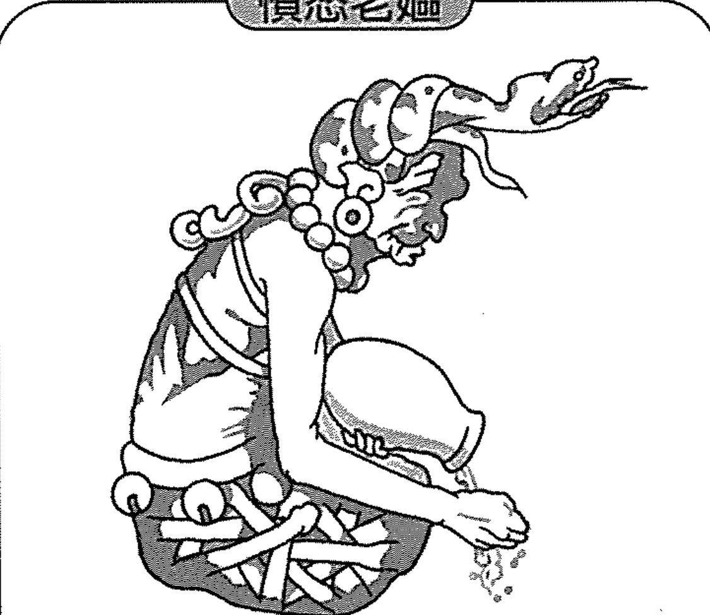

容器➡裝著雨水
蛇➡永恆生命的象徵

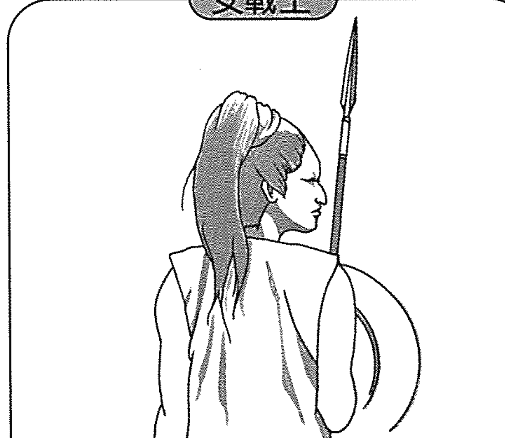

持盾牌長槍
被死亡與破壞的符號圍繞

#### 馬雅

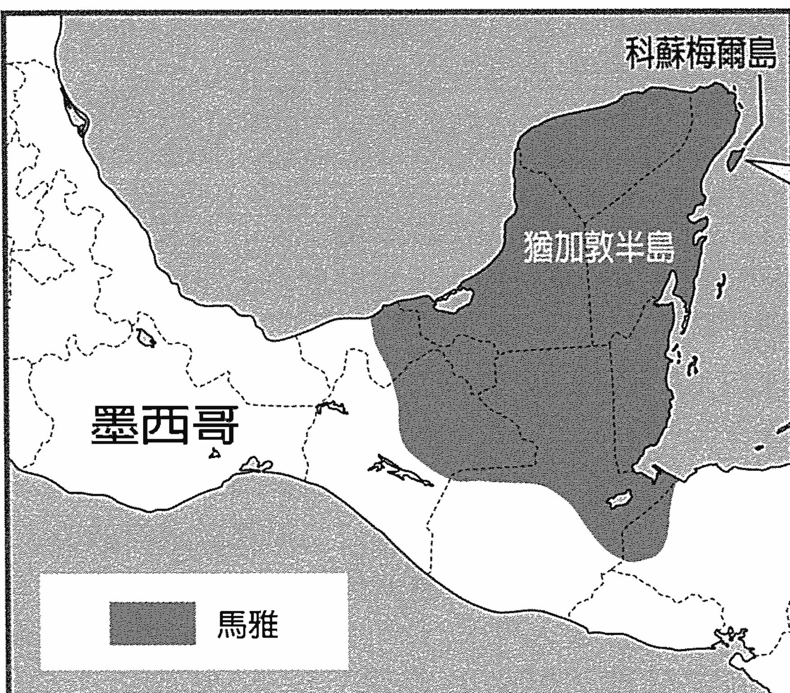

- 伊希切爾神殿坐落於此
- 眾多女性前來參拜
- 據說從前神殿中滿是女神神像

#### DHMO (Dihydrogen Monoxide)

Dihydrogen Monoxide是個極為危險的物質，對此物質知道得愈多，就愈是令人恐懼戰慄。

- 是氫氧的一種，無味無臭，常溫下是液態物質。
- 長期使用於工業生產，使用量隨著大型產業的發展仍在持續增加當中。
- 光是日本，每年就有1萬人以上因為這個物質而死亡。
- 是酸雨的主要成分。
- 分布範圍極廣，不光是都市的居民，就連南極企鵝身上亦檢測出此物質。
- 是地球溫室效應的主要原因。
- 是海岸線侵蝕的主要原因。
- 核能發電廠作為冷媒、石化廠區作為溶劑大量使用。
- 會腐蝕金屬、破壞電子回路。
- DNA等危險實驗也有使用。
- 極受軍事活動領域重視，為有效利用DHMO而投入了大量的研究費用。此外，世界各地的軍事基地內都儲有DHMO。
- 是造成燙傷的主要原因。
- 固態的DHMO接觸到皮膚可能會引起嚴重的發炎。
- 孕婦攝取DHMO，則胎兒也會透過胎盤攝取到DHMO。
- 儘管有上述情形，目前對DHMO仍然沒有任何規範。

曾經有人進行「是否該對此物質加以規範？」的民意調查，結果幾乎所有接受調查者都氣憤說道：「這麼危險的物質，應該要立刻加以規範才是。」

當然，所謂的DHMO其實就是水。

上述說明沒有任何一點有違事實，全部都是事實。

所謂DHMO，其實是用來揶揄流於濫情的環保運動以及飲食安全運動。這個「小小惡作劇」也告訴我們，如果真的要考慮環保或食品安全問題，那就要摒除刻板印象與情緒，改而從事定量式科學討論。

## 第3章
## 水的故事

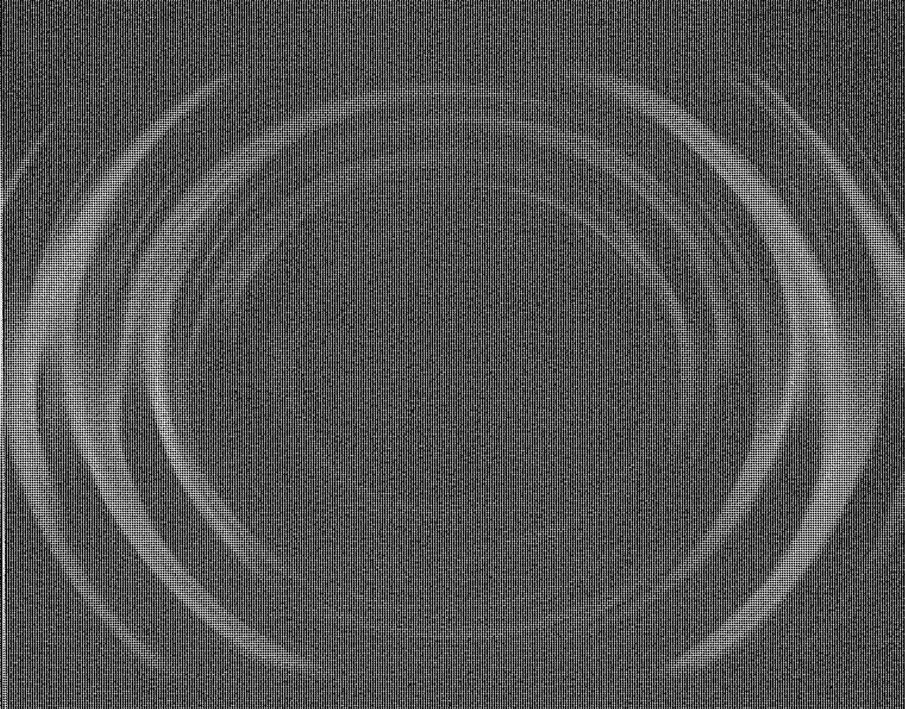

## No.075
洪水傳說1
Flood legend 1

人類遭遇洪水滅亡的傳說中屬諾亞方舟最為有名。究竟諾亞是如何打造方舟的呢？

### ●唯一得到神認可的義人

吞噬地面一切的大洪水會將世界破壞殆盡，使所有生物滅絕。相信所有人都曾經聽說過類似的洪水傳說，如果說其中以諾亞方舟最為著名，應該不會有人持異論。

諾亞方舟是見載於《舊約聖經》創世記的故事。當時亞當的人類子孫在地上逐漸增加，可是人們卻為非作歹，讓神甚為心痛，後悔自己在地上創造了人類。後來神決定連同鳥獸的所有物事從地上一掃而空，但諾亞卻是地上唯一遵從上帝的純潔無瑕的人。

於是神命令諾亞建造方舟。這是艘長300肘、寬50肘、高30肘，有三層構造的船。由於1肘大約等於45公分，所以諾亞的方舟便長135公尺、寬22.5公尺、高13.5公尺，還可搭載各種動物及其需要的食糧。畢竟方舟不像現代船隻需要動力，只求能夠漂浮，不用移動，做成箱型的方舟便已綽綽有餘了。

諾亞將這艘船分成許多小房間，將所有生物成對（不過後來聖經又修正說潔淨的畜類和鳥類都帶了七對）安置於房間內，然後諾亞的家人（他妻子加上三對兒媳）也搭上了方舟。

大家都進入方舟以後，神就讓天空連續降下了四十天大雨，使洪水淹沒大地，而且連續一百五十天都不見消退。諾亞又等了四十天才放出鴿子，可是大地還是汪洋一片，經過七天又七天以後大水終於退了，最後神祝福倖存者：「你們要生養眾多，遍滿了地」。

#### 最著名的洪水傳說

諾亞方舟

人類遭遇洪水滅亡的傳說
神命令諾亞建造的方舟

寬50肘（22.5公尺）

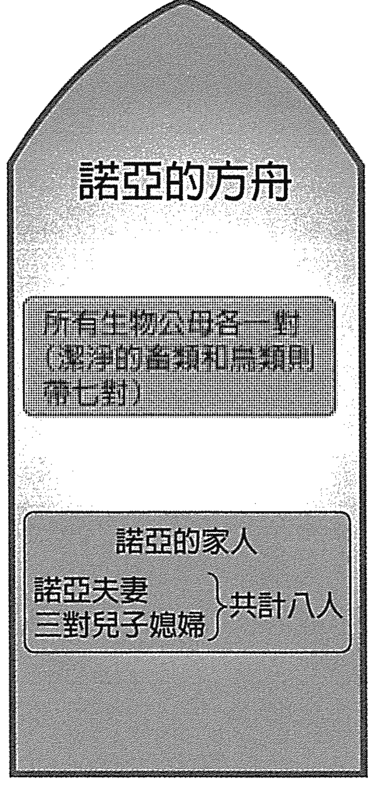

長300肘（135公尺）

大象約45倍
人類約80倍

高30肘（13.5公尺）

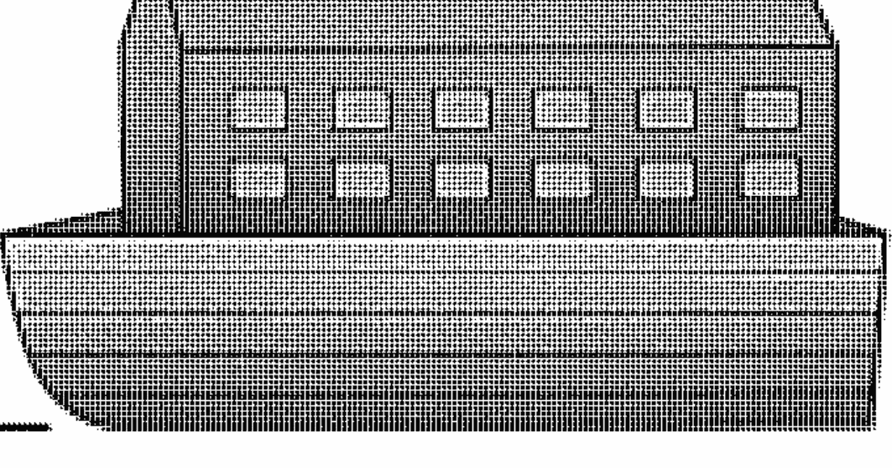

- ● 三層構造
- ● 箱型
- ● 分成許多小房間

所有生物公母各一對
（潔淨的畜類和鳥類則
帶七對）

諾亞的家人
諾亞夫妻
三對兒子媳婦
共計八人

> ※ 肘與腕尺
有些聖經將長度單位「肘」（Amma）譯作「腕尺」（Cubit）。
肘這個字源自於「前臂」，是指從手肘到指尖的長度單位。
不過早期將聖經翻譯成拉丁語的時候，羅馬人卻無法理解希伯來語
的肘，於是便替換成代表相同長度的拉丁語Cubitum，所以日本的
聖經長期以來一直使用腕尺（Cubit）這個譯法。

關聯項目

● 洪水傳說2→No.076

## No.076
洪水傳說2
Flood legend 2

人類果真如此畏懼洪水嗎？若要選出毀滅世界的代表性災難，那必定就是洪水。

### 遍布世界各地的人類毀滅神話

最著名的洪水傳說當然非諾亞方舟莫屬，可是諾亞方舟並非歷史最悠久的傳說。被譽為最古老文明的美索不達米亞（現在的伊拉克）蘇美文明的黏土板，也發現了世界因為大洪水而滅亡的文字記述，這個紀錄可追溯直至西元前3000年以前。
除此之外，洪水傳說遍布全球各地。
非洲馬賽人\*的神話提到神厭倦人類只知道互相爭鬥，興起大洪水的故事。印度則說洪水長達十二年之久，僅一對帶著糧食躲進中空樹幹的孩童男女得以倖存。東南亞傳說兩人逃到最高峰避難，但洪水還是淹到了他們的膝蓋。不僅如此，就連太平洋諸多島嶼都流傳著洪水傳說。或許有人會覺得在這種四處是海的地方怎麼可能會有洪水，但據說當時除了坐在獨木舟裡面的人，其他島民都因為洪水而覆滅了。令人驚訝的是，就連美洲大陸也有洪水傳說。有些神話說僅有一對打造船隻的男女得救，有些神話則說他們因為攀上高山而倖免於難。
神為了在世界毀滅後再度創造世界，都會留下一對男女，有些還會像諾亞方舟那樣每種動物都各留下一對，那些從災禍中倖存的男性就叫作洪水英雄，如諾亞、蘇美文化的西尤蘇德拉、印度的摩奴，而希臘也有丟卡利翁這號人物。
至於像亞特蘭提斯大陸因海嘯而沉入海底的傳說，傳說中沒有任何人生還，自然也沒有洪水英雄，不過這並不代表全世界均告毀滅，人類仍舊是平安無事。
究竟為何世界各地的民族會擁有相同的神話呢？這仍然是個不解之謎。

#### 遍布全世界的洪水傳說

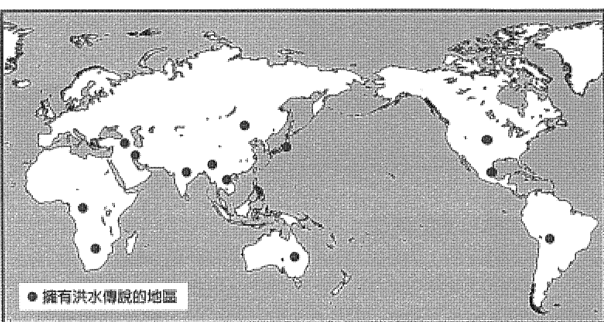

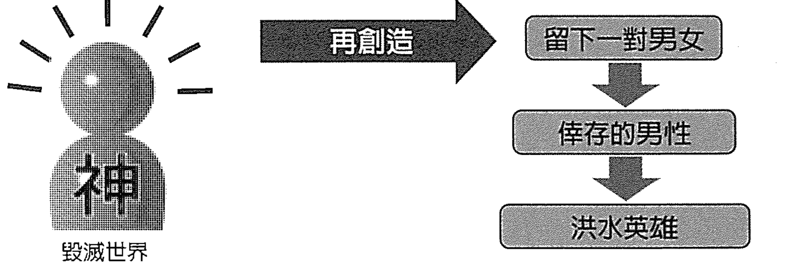

為何世界各地會有相同神話 謎 ??

> ### 海進說

西元前1萬2000年前後，海面比現在還要低一百公尺。
後來海面隨著冰河期的結束而上升，歷經8000年後甚至達到了比現在還要高數公尺的位置。
這次海面的上升使得西伯利亞等一整塊大陸的土地都沉入了海底，尤其是由中國海附近，原是日本列島大的廣闊平地，現在都已經沉入海底了。
因此也有人認為洪水傳說是人們對世界各地發生海進現象的歷史記憶。

關聯項目

- 洪水傳說→No.075
- 亞特蘭提斯→No.077

# 亞特蘭提斯
## Atlantis

亞特蘭提斯是傳說已經沉入大海的傳奇大陸。究竟此地位於何處呢？這些問題令亞特蘭提斯之謎愈加撲朔迷離。

### ●哲學家柏拉圖的遺作

亞特蘭提斯，傳說中坐落於大西洋的神祕大陸。
有關亞特蘭提斯的第一筆、同時也是最重要的記述，便是希臘大哲學家柏拉圖的作品《提瑪友斯》與《柯里西亞斯》。其他像斯特拉博\*1、西塞羅\*2等希臘賢者也都有過記述。
該國度奉海神**波賽頓**為始祖，建設內外共三層護城溝渠的圓形都市，並且擁有高度繁榮的文明和優秀的常備軍力，不過這裡的居民非常愛好和平而且富有理智。可惜後來亞特蘭提斯人不堪慾望引誘，開始向外侵略他國。據柏拉圖記載，亞特蘭提斯揮軍直指希臘而來，希臘諸城邦亦舉全力反擊，才使得亞特蘭提斯的侵略以失敗告終。
據說墮落的亞特蘭提斯遭到前所未有的地震襲擊，大海嘯讓整個大陸在一夜之間便沉沒海中。這是發生在距今約1萬2000年前的事情。
除此以外，許多預言家和神祕學家也都曾經談論亞特蘭提斯，但他們只不過是講述自己的見解，其中亦不乏連柏拉圖都不了解便妄自談論亞特蘭提斯（其言論跟柏拉圖相互矛盾）的傢伙，讓人不禁想要罵道：「好歹把柏拉圖讀一讀吧」。
那麼，這個亞特蘭提斯究竟位於何處呢？
一般認為在大西洋，但又分成亞速群島\*3和比米尼群島\*4兩個說法。這兩處都已經發現類似神祕海底遺跡的痕跡。
除此之外還有愛琴海、巴西等諸多說法，其說法之多遠非日本的邪馬台國可以比擬，亦有人認為亞特蘭提斯是埋沒於南極大陸的冰原之中。

#### 傳說中的大陸究竟位於何處？

亞特蘭提斯 —— 相傳存在於大西洋的神祕大陸

柏拉圖作品《提瑪友斯》與《柯里西亞斯》曾經提及

柏拉圖筆下的亞特蘭提斯

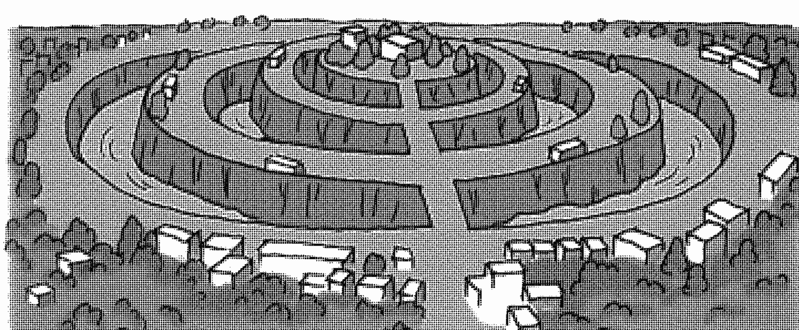

三層護城溝渠環繞的圓形都市

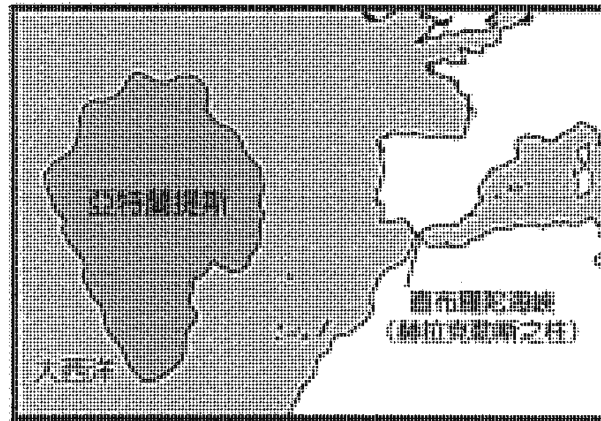

從前直布羅陀海峽外有個面積相當於利比亞與亞細亞（現在的土耳其）相加的島嶼存在

以亞速群島（直布羅陀外海）附近與比米尼群島（佛羅里達外海）附近兩個說法最為可信

亞特蘭提斯傳說的來源

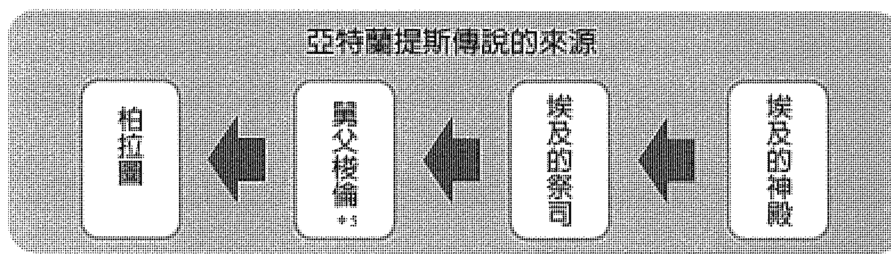

#### 關聯項目

● 波賽頓→No.044

## No.078
姆大陸
Mu

有別於自古希臘時代流傳至今的亞特蘭提斯，姆大陸是進入二十世紀以後才被發現。

### ●亞特蘭提斯的贗品

在詹姆斯·邱吉爾於西元1868年服役於英軍期間、駐紮印度的時候，曾經有某個寺院的僧侶出示上頭繪有圖形文字的黏土板。1880年邱吉爾以陸軍上校除役以後，他成功解讀這塊黏土板，發現上面記載了某塊曾經存在於太平洋大陸的相關紀錄。

這便是姆大陸。

據說姆大陸雖然擁有高度發達的文明，卻於距今約1萬2000年前沉入海底，僅剩極少數倖存者在太平洋諸島嶼存活下來。這個傳說卻跟亞特蘭提斯及其滅亡經過如出一轍，就連沉沒海中的時間也相同，簡直就像是把亞特蘭提斯的故事原封不動的搬到太平洋。

然而邱吉爾的經歷滿是破綻。西元1868年的時候他才十六歲，姑且不論十六歲軍人的可信程度，印度的僧侶是否有可能把寺裡珍藏數千年的祕寶拿出來給一個孩子看？另外他退役的時候是上校官階，那時他二十八歲，可是軍人最快也要四十歲才可能晉升上校，現實中根本沒有二十八歲的上校。事實上，英國陸軍根本從來不曾有過名為邱吉爾的上校，這個傳聞顯然經過了灌水（而且手段還很拙劣）。至於成功解讀圖形文字，邱吉爾終其一生都不曾發表圖形文字的內容，所以也無從確認他的主張。

如前所述，看似造假的內容，以及啟人疑竇的發表形式，使得姆大陸被視為贗品（就連相信亞特蘭提斯的人也是），甚至已經成為公開的謊言了。

#### 進入二十世紀以後方才發現？

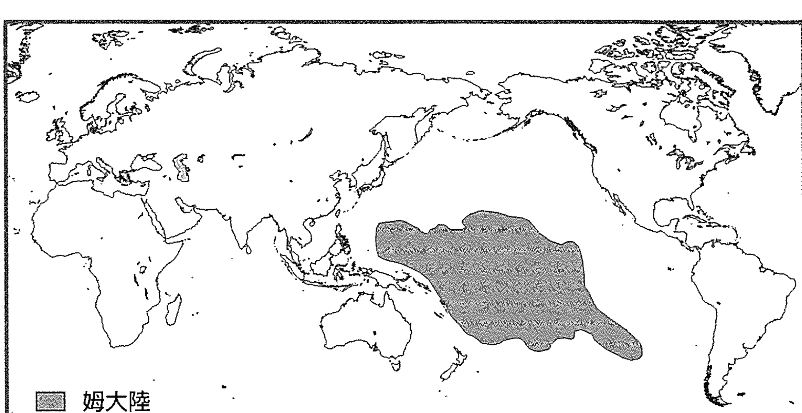

西元1880年發現曾經存在於太平洋大陸的相關紀錄？

有許多不符常理之處 → **姆大陸** ← 亞特蘭提斯的贗品？

> 即便從板塊構造理論來看亦不合理

板塊構造理論（大陸移動說）主張美洲大陸與歐洲大陸在太古時期是整塊的盤古大陸。我們試將這兩塊大陸連結起來，就會發現加勒比海附近仍然缺了一塊，於是亞特蘭提斯論者便主張其實這部分的陸地就是亞特蘭提斯，隨著周圍板塊各自移動，留在原地的亞特蘭提斯最後卻沉入了海中。

至於姆大陸，它以板塊構造理論推論，該處卻是汪洋一片。

> ♣ 復活島

復活島摩艾石像的建造方法起初並不為人知，充滿偏見的西方人根本就不相信技術水準低落、人口稀少的居民能夠建造摩艾像。因此姆大陸的支持者遂主張摩艾像乃源於姆大陸的先進技術所建造。

後來考古證明島民確實擁有足以建造摩艾像的技術，加上現在的復活島人口夠多、足以提供必須人力，建造摩艾像也就沒有那麼不可思議了。

#### 關聯項目

● 亞特蘭提斯 → No.077

## No.079
靈藥
Elixir

靈藥能夠治癒一切疾病，使人成為超人。像這樣的東西真的有可能製造出來嗎？

### 賢者之石的另一型態

靈藥是種藉鍊金術製造的萬能口服藥，據說此語來自於阿拉伯語的「傷藥之粉」（Al-Ikseer）一詞。雖然中期以後的鍊金術書籍均指靈藥為液體，不過初期文獻卻可以發現它是作成藥粉，從這點來看，源自「傷藥之粉」說法的可信度頗高。

也有人說靈藥乃是將賢者之石液化而成，一般認為它是紅色的。那麼，靈藥究竟有何效能呢？

首先，靈藥能夠治癒所有疾病、任何傷口，還能讓服下的死者死而復生。其次，服用者能夠長生不老，老人服用則可重返青春，而且還能強化肉體、使其幾乎不再受疾病或創傷等侵襲。而且靈藥還能將3000倍的賤金屬（鉛、錫等）變成黃金。

有些人相信擁有神奇力量的靈藥其實是賢者之石的另一個型態，是液體的賢者之石，恰好兩者都是紅色的（也有白色的賢者之石，不過力量遜於紅色）。

那麼要如何製作靈藥呢？或許有人會說把賢者之石液化即可，可是製作賢者之石就已經是幾乎不可能的事。傳說必須以祕密比率混合硫磺與水銀（有時要添加鹽），並以名為「哲學之卵」的小型燒瓶加熱。當然加熱的溫度也有訣竅，如果不按照方法進行就無法成功。具體來說要分成四個階段升溫加熱，先是60～70度，接著調高至120度左右，三階段是220～230度，最後到310～320度。製成的賢者之石呈紅色粉末，再將其液化便是靈藥了。

#### 萬能的魔法藥

靈藥 —— 治癒一切疾病，使人成為超人的藥

#### 靈藥的超群效能

- 治癒一切疾病
- 治癒一切創傷
- 使死者復甦
- 可長生不老
- 返老還童
- 肉體不受疾病或創傷侵襲
- 將賤金屬變成黃金

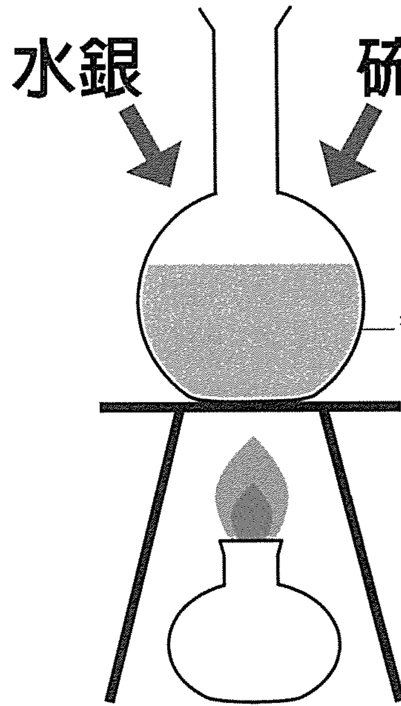

#### 靈藥的製作方法

##### 四個階段升溫加熱

- ① 60 ～ 70度
- ② 120度左右
- ③ 220 ～ 230度
- ④ 310 ～ 320度

##### 鍊金術的口服藥

鍊金術中號稱治癒所有疾病的萬能藥叫做帕納迪，這也可以拿來製造靈藥。除此以外，還有帕拉塞爾蘇斯主張能使所有物體溶化並回復第一原質的萬能溶劑等等。

## No.080
奈克塔與蘇摩
Nectar & Soma

許多神話都有屬於眾神的飲料，那是賦與眾神力量、使其保有不死神性的神秘飲料（酒）。

### ●形形色色的不死飲料

希臘神話中屬於眾神的飲料叫作奈克塔，至於眾神的食物叫作安珀希雅。不過有些文獻會將飲料稱作安珀希雅，因此二者已經混淆會是比較妥當的說法。

奈克塔是種味道比蜂蜜更甜、散發醇香的飲料，能使飲用者長生不老。此外亦可當成藥品，據說傷口塗抹後會立即癒合。

在英雄阿基里斯的傳說中，有人說阿基里斯能長生不死其實是來自於奈克塔和安珀希雅。忒提斯為使阿基里斯不死而替他塗抹安珀希雅，阿基里斯雖然得到了不壞的身體，可是忒提斯漏塗的腳踝卻成了他唯一的弱點。

印度神話的蘇摩（神酒）同樣也是神明的飲料，這也是該飲料神格化以後的名字，而用來製作這種飲料的植物也叫作蘇摩，只不過蘇摩草早在古代便已絕跡，後來便改使用替代品。另外，「甜蜜」（Madra）和「甘露」（Amrita）也經常被視同於蘇摩。

蘇摩能賦與諸神長生不老和力量，能賦與詩人創作詩歌的靈感天啟，甚至還有神明曾經因為無法飲用蘇摩而失去神力。此外傳說從前因陀羅對抗邪龍弗栗多的時候，便是先飲用蘇摩補足力量才投身戰場的。

甘露則是從前眾神跟阿修羅族作戰時疲憊不堪，於是與阿修羅族協力攪拌乳海所創造出來的不死飲料。由於眾神與阿修羅都想將甘露占為己有，最後眾神憑著毗濕奴\*1的機智得到了甘露，阿修羅中唯獨羅睺偷偷喝下甘露、變成不死之身，所以後來頭顱被砍下也沒有死。

#### 賦與眾神力量的神祕飲料

奈克塔、蘇摩 → 神力的泉源

| | 奈克塔 | 蘇摩 | 甘露 (Amrita) | 甘露 | 豪麻 |
|---|---|---|---|---|---|
| 甜味 | ○ | ○ | ○ | ○ | ? |
| 酒 | × | ○ | × | × | ○ |
| 不死之力 | ○ | ○ | ○ | × | ○ |
| 神的飲料 | ○ | ○ | ○ | × | ○ |
| 人的飲料 | × | × | × | ○ | × |
| 藥效 | ○ | × | × | × | × |

> ### 豪麻
瑣羅亞斯德教也有跟相當於蘇摩的神酒豪麻。瑣羅亞斯德教相信酒是屬於惡神艾什瑪\*2管轄，唯獨豪麻是善神阿夏・瓦希塔的神酒，極受尊重。

> ### 甘露
中國的天子若修德修政，天空就會降下甘美的液體，此即甘露。
這甘露並非神的飲料，而是上天賜與人類的飲料。
從前將來自印度的「Amrita」翻譯成中文的時候恰好有甘露這個語詞，
所以「Amrita」也就譯作甘露了。

## No.081

## 禊

### Misogi

日本的神道教最忌諱穢厄，而禊便是消除穢厄的方法。

#### ●水的淨化力

禊是種驅除穢厄的力量，而其中最重要的部分在於水，日本人的心性在儀式中表露無遺。他國神話固然有以水淨化的作法，但禊在日本神話中卻沒有其他儀式可以與其相提並論。

以舉行重大神事爲例，神道教認爲倘若執行儀式者身帶汙穢，則儀式也會無法成功。所有首先就要用水洗淨自身、去除汙穢，然後以潔淨的身體執行儀式。這便是禊的目的。

禊的起源最早可以追溯至伊弉諾尊從黃泉歸來，當時他以清水洗淨被黃泉之國玷汙的身體，用水洗去於黃泉之國沾染的死厄，這便是禊。這次的儀式在日本神話中具有重要意義，因爲最高神祇天照大神、英雄神素盞鳴尊等神祇均是誕生於此。

其他像是寒中冬泳、瀑布修行、潑水祭等，也都可以说是是由禊衍生出來的神事。不僅如此，潑灑甜酒、紅豆飯或溫泉等物的儀式也可以算是禊的另一種版本。此外像佛教和修驗道也有先以冷水沐浴潔淨身心，再行參拜神佛的習俗，喚作水垢離。由於中國沒有類似的儀式，推測是受到神道禊的影響而只在日本流傳。日本的寺院等地總是有手水舍，供人以長柄木杓汲水洗手，其實這正是水垢離的簡略版本。而在石造水盤上放置幾柄木杓、再蓋個屋頂搭成的手水舍，也是獨見於日本寺院的設施。

順帶說明，手水的正確使用方法應該是以右手持長柄木杓汲水先洗左手，換手取杓再洗右手，之後以左手盛水漱口（切不可直接以杓就口），然後再洗一次左手，再用剩下的水清洗柄杓，將其放回原處。

#### 日本人心性盡在其中的儀式

日本神道 → 相信水擁有驅除穢厄的力量

用水清洗穢厄 **禊**

形形色色的禊

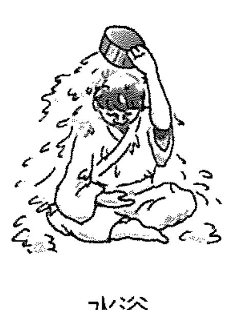

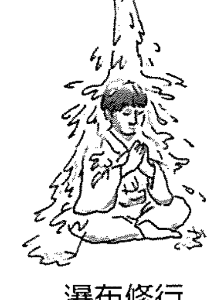

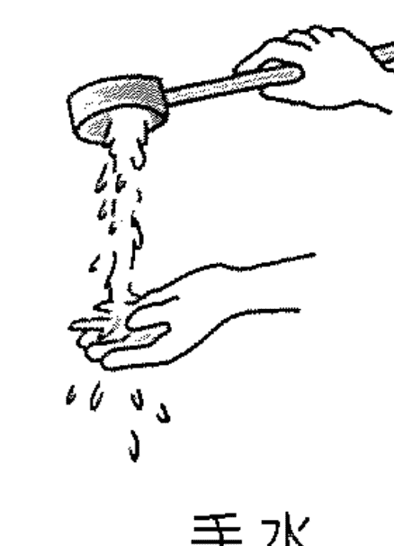

禊與祓的不同

禊 → 接觸到穢厄者 → 除去穢厄 ← 本人並無過錯

祓 → 造成穢厄者（犯下罪行者） → 洗脫穢厄 ← 本人為非作歹

> 政治家的禊

在現代，「禊」這個字也有犯下過錯的政治家暫時洗白，然後若無其事參與選舉之用。如果當選了，那就叫作「行禊完畢」，可以像從前那樣繼續活動。也就是說，政治家把選舉當作是種禊的儀式。

然而從這點來看，這裡用了「禊」來形容是個錯誤的說法。犯下壞事（也就是犯下某種罪）的人要執行的是「祓」，而不是「禊」。這是否代表那些政治家們根本就不是自己不好，而是那些揭發醜聞的人不好，想要消除那些人的影響呢？如果是這樣，那豈不是完全不用反省嗎？

關聯項目
●素盞鳴尊→No.068

## No.082
聖水
Holy water

水能夠洗刷各種汙穢，自古以來便被視為具有神聖的力量。後來這項性質又得到更進一步的發展，便是所謂的聖水。

### ●因神明而變得神聖的水

許多宗教都有所謂的聖水，用來清洗貴重物品或者洗淨人的穢厄，其中尤以基督教最為普遍。

聖水在基督教重要的儀式——洗禮（基督教的入教儀式）中扮演著很重要的角色。其實基督教施行洗禮的時候，本來應該是全身都要浸泡於聖水之中（稱作浸禮），可是如此替大人施洗過於麻煩，於是浸禮頂多是在替嬰兒施洗的時候才會使用，而替大人施洗時大多採經過簡略的洗禮儀式，例如取聖水澆頭（灌水禮），或是雙手塗聖水並做出將受洗者頭部按入手勢（滴禮）。

聖水原本都是普通的水，是透過主教或祭司向神祈禱、行聖別而來。天主教認為只要是經過聖別，即便後來再另外添水也不會失去聖性。也就是說只需直接加水即可。

羅馬天主教在教會入口設置有名為聖水盤的水盆，信徒會先以指頭沾水、畫十字，然後才進入教會，許多用來施洗的房間裡也都設置有聖水盤。東方正教會則是經常會取聖水飲用，信徒早晨祈禱的時候，往往會飲用一小瓶的聖水。

驅除惡魔的時候也會用到聖水。驅魔師先取鹽巴除穢，接著一面揮灑聖水，一面向聖父、聖子與聖靈祈禱，藉此驅逐邪惡。

聖水未必都是來自祭司或牧師的聖別。舉例來說，基督教會公認的奇蹟之地盧爾德之泉湧出的泉水，雖然並未經過祭司或牧師等人的聖別，不過仍然被許多人當作聖水使用。

#### 洗去汙穢的聖物

許多宗教都有聖水

清洗貴重物品

替人除穢

基督教

- 主教或祭司向神祈求以為聖別
- 用於驅魔
- 用於洗禮（入教儀式）

洗禮的方法

- 浸泡全身（浸禮）
- 澆頭（灑水禮）
- 濕潤手掌按頭（滴禮）

#### 各教會聖水的不同

天主教會

- 用於洗禮
- 進入教會時使用
- 即便另外添水仍為聖水

東方正教會

- 用於洗禮
- 拿來飲用
- 每日聖別

#### 關聯項目

●盧爾德→No.084

## No.083
闘伽水
Akasui

佛教也有相當於聖水的概念存在，那便是獻給神佛的水——闘伽水。

### ●供奉佛祖的水

闘伽是梵語「argha」的音譯。此語原是「有價值」的意思，後來轉而指爲「獻給貴人或神佛之水」。這麼一來，闘伽水就變成了「水水」這個奇怪的意思，不過日本與中國一般仍舊稱作闘伽水。若採意譯，則稱「功德水」。

佛教會取加持過的水、從靈泉汲來的水、浸泡香木製成的香水（以檜*浸泡於水中）等供奉於佛前。這便是闘伽水。

闘伽水湧出的水井稱作闘伽井，較著名的有東大寺二月堂的闘伽井（東大寺「取水」法事使用），圓城寺金堂旁的闘伽井等。有時候甚至必須使用經過特殊加持、從特殊場所汲取來的闘伽水，例如「大元帥法」爲提高祈使國家安泰、降伏怨敵等效果，就規定非得使用從秋篠寺取來的闘伽水不可。

舉行儀式的時候，要將取來的闘伽水裝進闘伽桶，闘伽桶會置於闘伽架上，接著再以闘伽杯從闘伽桶中汲水、注入闘伽器。除此之外，也經常會順便取檜的樹葉放進闘伽器、使其漂浮於水面。

修驗道很重視闘伽，認爲闘伽水乃釋迦如來清心之表徵，還要用闘伽水洗淨自身的不淨。他們規定修驗者在從事最重要的修行——入山修行期間，必須每天三次汲取闘伽水獻給佛祖與先達（經驗更深的修驗者），而傳授此作法給他人者便稱作闘伽行者。

#### 相當於西方聖水的水

獻給貴人與神佛的水
亦稱「功德水」

加持過的水、靈泉汲來的水、浸泡香木製成的香水（以檜泡水）等

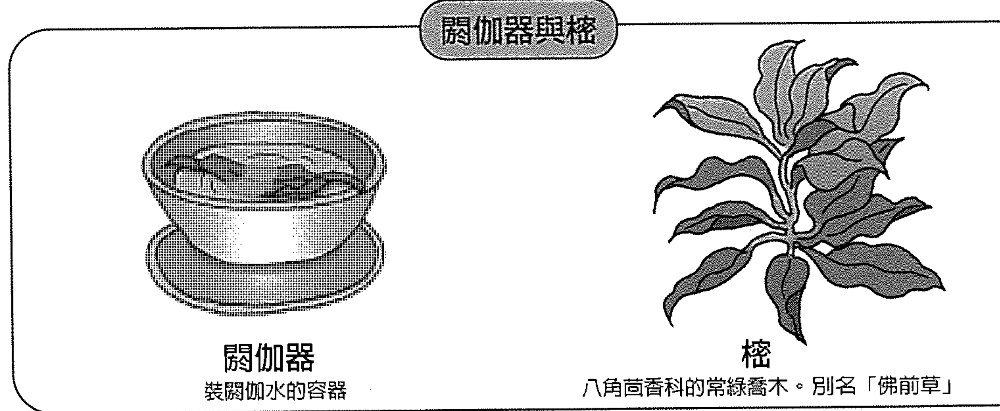

#### 六種供養

包括闍伽在內，密教共有六種重要的供物

- 闍伽→水
- 燒香→香
- 塗香→香
- 飯食→食物
- 華鬘→花圈
- 燈明→燈火

> 闍伽與aqua

有說法認為「argha」這個字傳到西方以後，變成了拉丁語的「aqua」（水）。的確，梵語亦是印歐語族的來源之一，就難得有相同的語源也不足為奇。然而本義究竟如何仍不可知，難以定論。

#### 關聯項目

- 聖水→No.082

## No.084
盧爾德
Lourdes

受天主教教會承認的奇蹟泉水，要從一名看見神聖女性的小女孩開始講起。

### ●使疾病痊癒的奇蹟泉水

從前的盧爾德村是個坐落於法國與西班牙國境附近、人口僅數千的小村落，現在的盧爾德卻是聞名全世界的奇蹟之地，因為這裡是盧爾德之泉所在。

西元1858年2月，三名住在盧爾德的少女出外撿拾薪柴與獸骨，來到一個叫作馬薩貝列的地方（河流與水路合流處的山崖，崖下有個小洞窟）。

這時，名叫白娜戴特的少女看見有位美麗、氣質高貴的女性從洞窟上方的小洞穴裡探出頭來，其他兩個少女卻什麼都沒看到。白娜戴特回家把這件事告訴父母，父母害怕她被惡魔迷惑，禁止她再去馬薩貝列。但白娜戴特實在無法忘懷那名女性的模樣，於是前往教會告解此事，可是就連神父也無法分辨那究竟是聖蹟抑或惡魔所為，並要她去問那女性的名字。

後來那名女性要求白娜戴特每天都到那個洞窟去，這件事傳開來以後，前來造訪的人也愈來愈多，不過所有人都看不到那名女性。

據說那名女性用拉丁語回答白娜戴特說：「我是純潔的受胎」。白娜戴特不懂拉丁語，只能按照發音轉述給神父聽，神父聞言後大為訝異。這句話代表那名女性就是聖母馬利亞。

有天白娜戴特挖掘洞窟的地面，竟有泉水湧出。因為傷到右腕使指頭麻痺的女孩卡多麗奴把手放到泉水中，手指頭竟然就能活動了。據說這便是盧爾德泉水創造的第一個奇蹟。

#### 治療疾病的奇蹟泉水

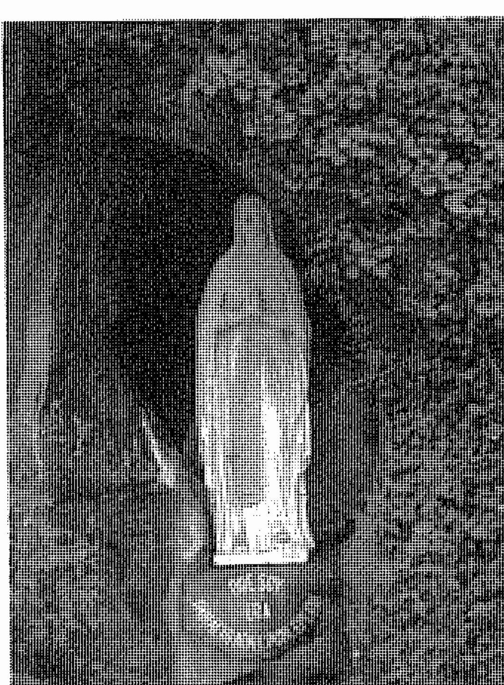

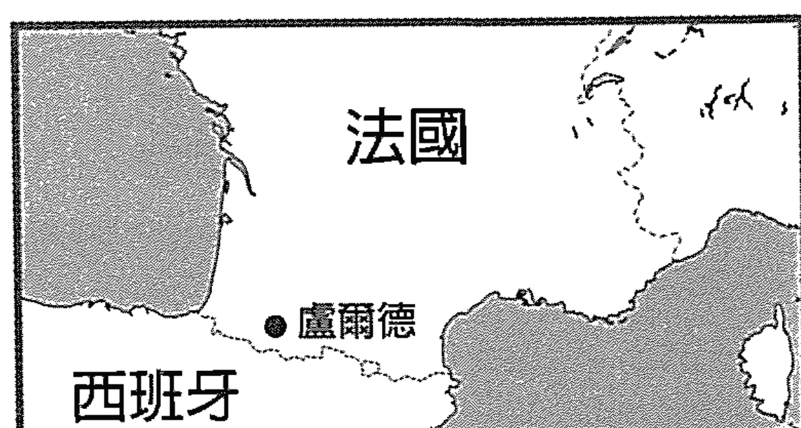

#### 馬利亞像

盧爾德洞窟中的馬利亞像。下方「QUE SOY ERA IMMACULADA COUNCEPSIOU」是拉丁語「我是純潔的受胎」之意，指的是沒有原罪而受胎的馬利亞。

photo by Beyond Forgetting

#### 現在的盧爾德

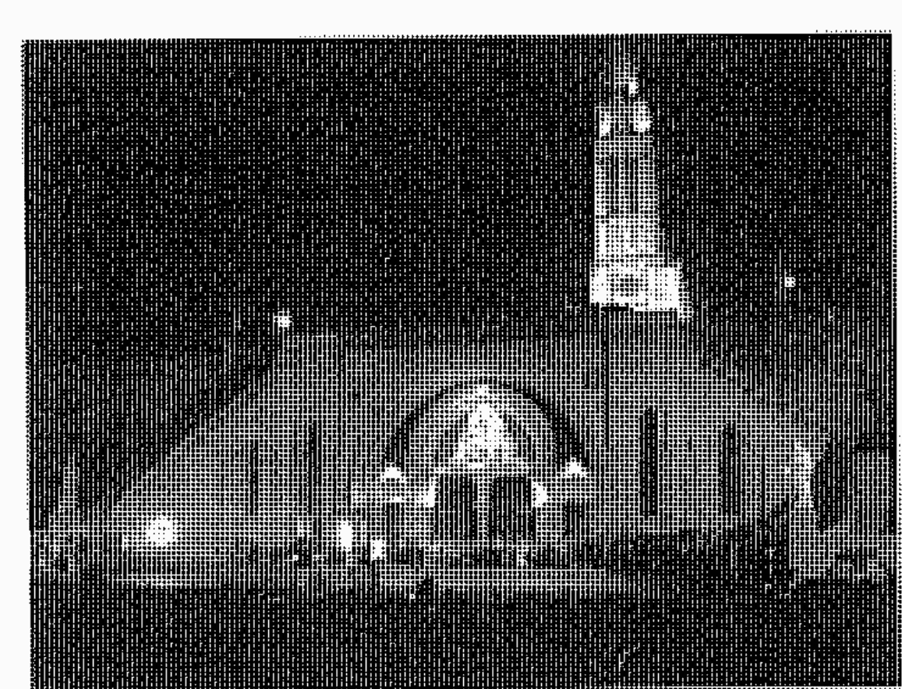

盧爾德之泉的原址後來建起大教堂，吸引大批巡禮者，已經變成一大觀光聖地。

白娜戴特後來進入修道院，西元1879年以35歲芳齡早逝，神奇的是她的遺體竟然不會腐壞，直接收納於玻璃櫃之中。1925年，教宗為她聖別、列為聖人。

> 奇蹟的規則

盧爾德之泉自從已有超過兩億名巡禮者造訪，其中獲得教會承認為奇蹟案件卻不足百件，這項教會對奇蹟的認定相當嚴格自圓，條件如下：

1. 必須是不治之症
2. 未經治療便突然痊癒
3. 不再復發
4. 無法以醫學說明

## No.085
## 養老乃瀧
Yoronotaki

是靈水還是酒呢？養老乃瀧絕非尋常的水，其傳說應該是從靈水衍生而來。

### ●兩個不同的傳說

日本的養老乃瀧傳說大致可以分成兩類——養老水與養老乃瀧。一個是靈水湧出的故事，另一個則是酒湧現的故事。

日本的敕撰史書《續日本紀》記載了靈水湧出的故事。

靈龜三年，元正天皇前往美濃（岐阜縣），聽聞該地有股神奇的靈泉，遂以靈泉滌手洗面，肌膚竟然變得光滑（元正天皇為女帝，肌膚能變漂亮似乎是件大事）。接著又以泉水洗滌疼痛處，結果疼痛立刻消除。此外根據當地人表示，這泉水還有治療疾病、使禿頭生髮，甚至令盲者重見光明的功效。

元正天皇認為對她這樣平凡的天皇來說，這股美泉是種祥瑞的象徵，遂改靈龜三年為養老元年。據說養老此名乃是取自於中國的故事。

鎌倉時代的《十訓抄》則記載了另一則傳說。

元正天皇時代有名貧窮的樵夫，每天都要砍柴到鎮上賣，回程再買酒給年邁的父親喝。有天他砍柴時因為踩到長滿青苔的岩石而滑倒，卻聞到附近傳來酒味。環顧四周後，男子發現從石頭中潺潺流出的泉水，顏色看起來就像是酒一樣，取來一嚐發現竟是味道極佳的美酒，從此終於能讓年邁的老父親喝個痛快了。

天皇聽聞此事後對其孝行大為感動，遂任命其為美濃守，並將這有酒水湧出之地命名為養老乃瀧，而岐阜縣養老郡便以養老乃瀧聞名於世。

#### 擁有兩種不同傳說的瀑布

養老乃瀧傳說

養老水

養老乃瀧

靈水湧出的故事
《續日本紀》

酒水湧出的故事
《十訓抄》

元正天皇聽聞靈泉，以泉洗面
肌膚變光滑，疼痛立消
為紀念此靈泉，改年號為養老

窮樵夫發現從石頭中流出的酒
讓父親可以喝個過癮
有酒湧出的地方被稱作養老乃瀧

位於岐阜縣養老郡的
養老乃瀧因而揚名

養老乃瀧

是個高達32公尺、相當壯觀的瀑布。這裡的水雖然並非靈水或酒，卻也是入選日本名水百選的名水。

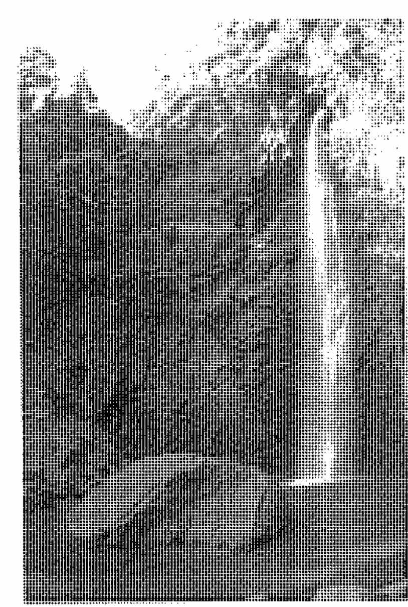

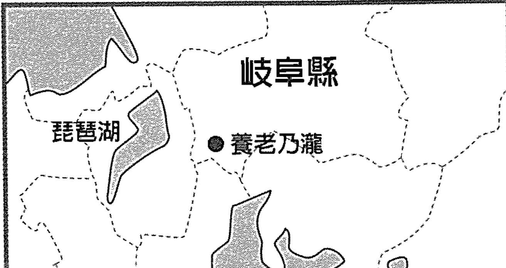

## No.086
三途河
Sanzunokawa

世界各地都有分隔人世與冥界的河流，在日本這條河流就叫作三途河。

## 原有橋樑的河流

三途河是日本傳說中分隔人世與冥世之間的河川。三途河乃是俗稱，此河在原創於中國的佛經《十王經》中名爲「葬頭河」。佛教將河的這邊稱爲此岸，對面則是稱作彼岸。

三途指的是六道輪迴（天道、人道、修羅道、畜生道、餓鬼道、地獄道）中惡人落入的三惡道。換句話說，所謂的三途河似乎是三惡道漂流之河的意思。可是後來三途河卻變成了分隔俗世與冥世的河流，更演變出因爲有三種渡河方法故名三途河的傳言。據說善人可以從綴有金銀七寶的橋樑渡河（或稱橋渡）；罪行較輕者可以從名爲山水瀨（或稱淺水瀨）的淺灘渡河，這個淺灘深度不及膝蓋，勉強可以通過；至於罪衍深重者就必須從強深瀨（或稱江深瀨）渡河，此處水流快速而且波濤洶湧，不僅有岩石從上游滾滾而下，灘底還有大蛇棲息。

然而約莫從平安時代末期開始，所有死者一律改爲乘船渡河，固定收取六文錢的渡船費，所以當時有個一定要在死者棺木裡擺六文錢的習俗。即便今日已經沒有六文錢的幣制，也要用印刷的六文錢代替、放進棺裡。

在三途河對岸有奪衣婆與懸衣翁兩位老人，奪衣婆會向乘船過河的死者收取六文錢的渡船費，但如果死者沒有錢，她就會奪走死者的衣服，而懸衣翁則會把衣服掛在一棵叫作衣領樹的樹上。過河的時候，惡人因爲經過水流湍急湧處衣服會弄濕，樹枝會被壓得低垂下來，而懸衣翁就是憑著樹枝低垂的程度來判斷死者的罪行輕重。如果死者沒穿衣服的話，就會剝下死者的皮掛在樹上來代替。

### 存在於世界各地的河流

三途河 — 日本傳說位於人世與冥世間的河流

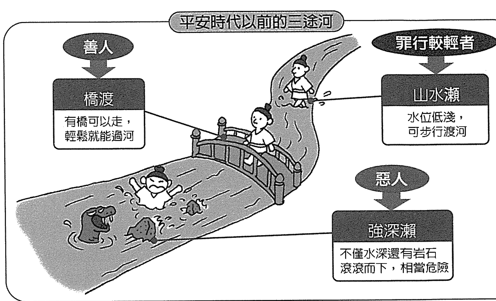

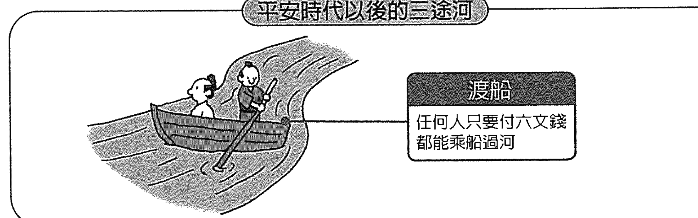

> 贖河原

三途河沿岸稱作贖河原，傳說是比父母早死的兒女因有不孝而受苦的地方。這些死者必須在贖河原堆石成塔以供獻雙親，可是每當石塔快要堆成的時候，小鬼就前來破壞，因此這些死者只能堆個不停。當然他們終究還是會得到地藏菩薩搭救，不過其間免不了受到漫長的折磨苦難，而贖河原也得到「徒勞」與「不得回報的努力」等語彙。

只不過這都是民間的信仰，佛教教義本無這樣的說法。

## No.087
的的喀喀湖
Titicaca

的的喀喀湖是最受南美神話重視的地方，也是古代南美洲的文化政治中心。

### ●世界誕生之地

的的喀喀湖是位於南美洲祕魯與玻利維亞國境的湖泊。此湖在印加神話裡占有極為重要的地位。

在古代的南美洲，位於的的喀喀盆地中心的的的喀喀湖及其湖畔的古代都市蒂瓦納庫就是世界的中心。不光是印加人，附近許多民族也將自身起源求諸於的的喀喀湖。換句話說，這裡是南美諸民族共同的祖先之地。

傳說湖裡的湖水，是印加神話的創造神維拉科嘉（此名本身就有「創造之湖」或「海泡」的意思）看見自己創造的生物受苦而流下的眼淚。

維拉科嘉起初創造出黑暗的世界，再用石頭造出巨人、讓他們住在這裡，可是巨人們卻加以反抗，於是維拉科嘉便興起洪水，把他們變回石頭。

後來維拉科嘉又用黏土創造出現在的人類，但當時世界仍然是一片黑暗，於是維拉科嘉便讓太陽與月亮分別從的的喀喀湖中的兩座島嶼——太陽之島與月亮之島昇上天空，從此太陽和月亮就在維拉科嘉的命令下在天空運行。除此之外，亦有傳說指出太陽、月亮甚至繁星都是從太陽之島昇上天空的。

的的喀喀湖在印加的建國神話中同樣具有極為重要的地位。傳說印加的初代皇帝曼科·卡帕克就是從帕卡里丹普洞窟裡出現，但這故事其實還有前話。維拉科嘉將頭飾與斧頭賜給曼科·卡帕克，並預言印加人將會變成偉大的君王、征服許多國家。得到這個預言後，曼科·卡帕克才從太陽之島潛入地底，再經由地底從帕卡里丹普洞窟中現身。

#### 南美洲神話中不可或缺的存在

的的喀喀湖 —— 在印加神話中扮演重要角色

古代南美的中心要地 —— 南美諸民族共同的祖先之地

#### 湖水乃創造神維拉科嘉流下的眼淚

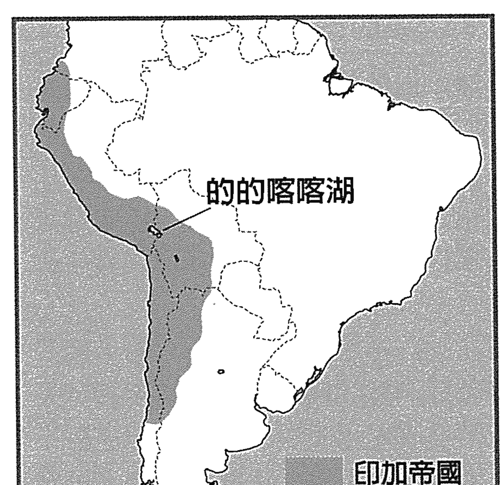

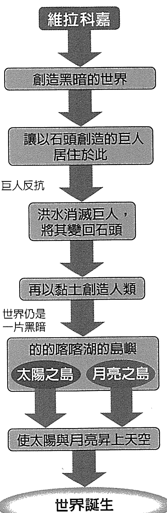

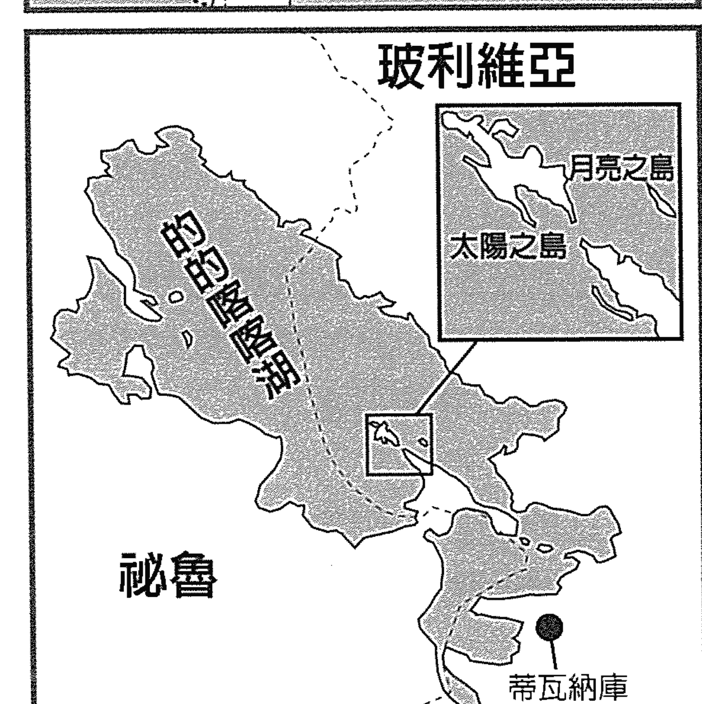

## No.088
百慕達三角
Bermuda Triangle

百慕達三角過去曾經有過無數船隻、飛機在此離奇消失，而被稱作是惡魔的三角海域。

### ●捏造的惡魔海域

百慕達三角指的佛羅里達半島的頂點、波多黎各與百慕達群島三個地方連接起來所形成的大西洋三角形海域，因離奇的船隻與飛機消失事件而聞名於世。

其原因眾說紛紜，其中也有像是遭外星人綁架、被吸進黑洞等奇怪的說法。而在眾多事件當中，就屬西元1881年發生的艾倫奧斯丁號最為有名。

英國籍的艾倫奧斯丁號在大西洋遭遇到一艘無人船，船長派遣水手登船將其回收，卻因為突然間颳起劇風而使兩艘船失散。數日後，艾倫奧斯丁號再度發現那艘船的時候，卻已經不見先前派駐的船員。船長再度派遣手下登船駕駛，此時又再度吹起劇風，只不過這次失散的船隻就再也找不回來了。

儘管發生了這樣的大事，當時的報紙完全沒有報導，就連艾倫奧斯丁號也沒有留下紀錄，照理說這艘船後來應該平安靠岸（否則怎麼會有人流傳這則故事）。

事實上，這片海域的確發生過許多船隻或飛機遇難的案例，而這些事件大多都是發生在颶風或海象特別險惡的時候。那些神秘學書籍的作者故意隱匿惡劣天氣的事實，寫得好像大晴天憑空發生意外一般。

不僅如此，其中不乏憑空捏造的事件。例如西元1969年遊艇玩家比爾·維爾第行蹤不明，其實那時當事者比爾·維爾第根本安然無事。

#### 惡魔的三角海域

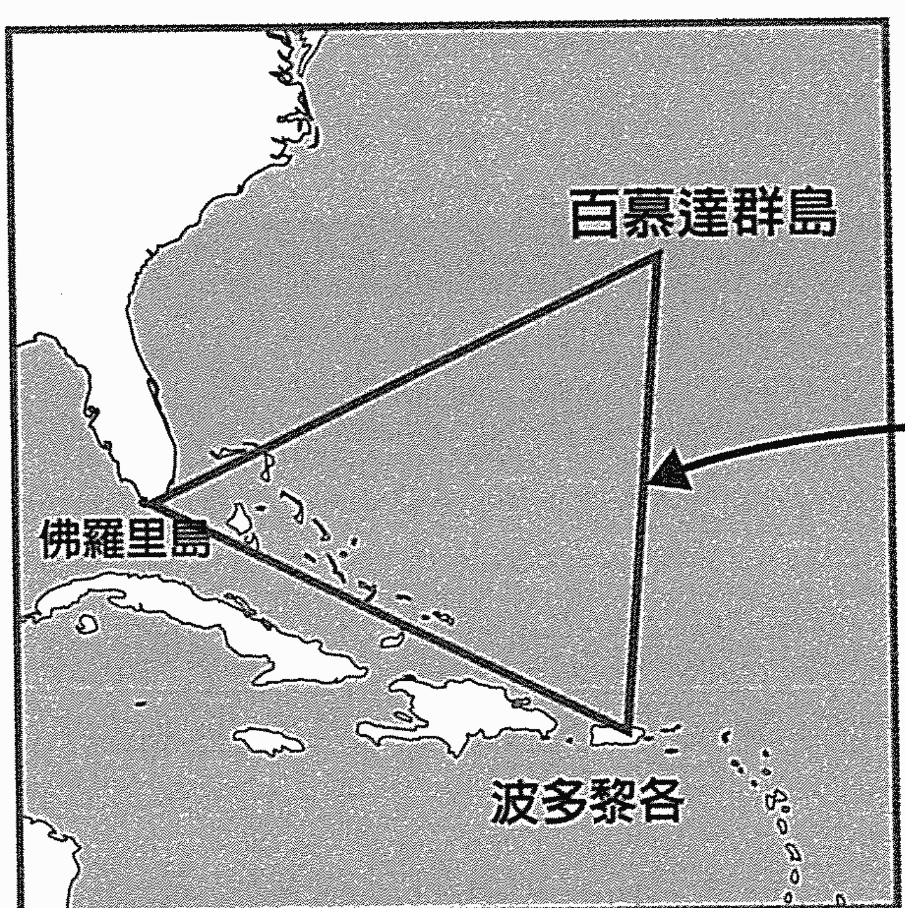

百慕達三角

佛羅里達半島的頂點、波多黎各與百慕達群島三個地方連接起來所形成的大西洋三角形海域

以船隻、飛機離奇消失而聞名

原因 —— 眾說紛紜

遭外星人綁架？

被吸進黑洞？

有許多離奇說法

故意忽略隱匿惡劣天候的事實

捏造編造失蹤事件

> 瑪麗·賈勒斯特號

西元1872年的瑪麗·賈勒斯特號無船員失蹤事件，可謂是百慕達三角最具代表性的案例之一，此案的原因至今仍然不明。

不過將它歸為百慕達三角事件卻是不正確的，因為這艘船的失蹤其實是在航行其他海域的時候消失，並非百慕達三角海域。

## No.089
## 馬尾藻海
### Sargasso Sea

馬尾藻海素有船隻墓場之稱，襲擊船隻的究竟是怎麼樣的威脅力量呢？

#### 帆船的魔鬼海域

馬尾藻海是個部分海域與百慕達三角重疊，相傳同樣會使船隻遇難的海域。此地亦稱船隻墓場，從帆船時代起便令船員聞之喪膽。

或許如此描述會讓人以為馬尾藻海是個非常狹窄的魔鬼海域，但事實並非如此。馬尾藻海指的乃是北大西洋正中央一片相當廣大的海域。

此處因為墨西哥灣海流分歧及不斷回流，使周遭海域的海藻大量集中於此，海水也變得帶有黏度。相信不少人都體驗過夏天水池或水槽裡大量水藻滋生的困擾吧！一旦海藻聚集，就會使得海水中的阻力變大，嚴重妨礙船隻的航行。再加上該處海域恰恰位於亞熱帶的無風地帶，少有堪稱帆船命脈的海風吹動。

任誰都看得出來，這對帆船時代的船隻來講可謂是最惡劣的環境，也讓這片海域得到「馬的緯度」（Horse Latitude）之名，就是因為必須經常宰殺會消耗大量糧食的馬匹、並以馬肉為食的緣故。

其次，因為船隻無法航行前進而糧盡遇難的船隻也不在少數。這些船隻會受到海藻糾纏、逐漸腐爛，最終沉入海底。

直到進入螺旋動力船隻的時代以後，海藻再也不會拖住船隻，即便被困住也有足以扯斷海藻的力量，馬尾藻海再也不是船員的威脅夢魘了。

#### 被稱作船隻墓場的惡海

#### 為何被稱作大海墓場？

1. 馬尾藻海
2. 大量海藻從周邊海域聚集
3. 海水產生黏性、妨礙船隻行進
4. 亞熱帶的無風地帶，少有海風吹動
5. 船隻無法動彈時糧盡遇難
6. 海藻糾纏、腐敗，船隻沉沒

#### 馬尾藻海域

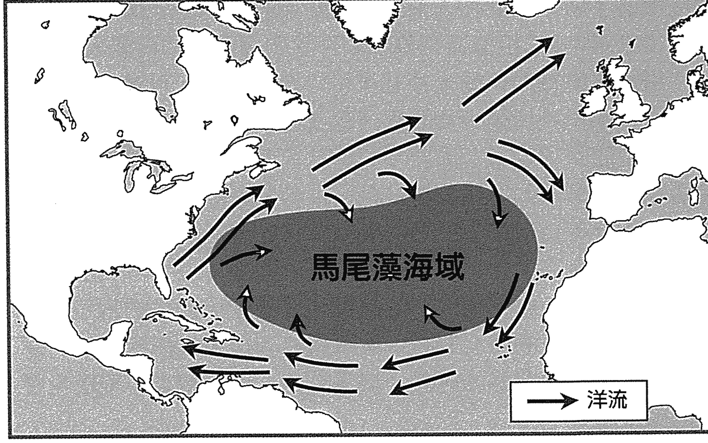

#### 關聯項目

- 百慕達三角→No.088

## No.090
## 漂泊的荷蘭人
### The Flying Dutchman

神之詛咒直到永遠。長生不老竟然變成這副模樣，不是惡夢又是什麼？

#### ●受神詛咒的男子

范德戴肯（Van der Decken）是往來好望角附近的貿易船船長，由於好望角外海終年受暴風雨吹襲，令船長感到厭煩，於是詛咒這片狂暴海域的創造神，觸怒了神明。

船長受到神的詛咒，從此再也無法抵達陸地，必須永遠在狂風暴雨的海上漂泊流浪。直到今日，航經好望角外海的船隻仍然偶爾能夠遠遠望見這名荷蘭人的船。不過此刻千萬不可以靠近，否則不是船隻遭暴風雨打沉，就是會遭到同樣的詛咒。

這是則英國的傳說。當時英國與荷蘭相互爭奪東洋貿易的獨家利益，所以對英國人來說，荷蘭人的船隻是恐怖的敵人。

後來華格納*根據這則傳說創作歌劇《漂泊的荷蘭人》。

這齣歌劇裡的荷蘭人每七年可以登陸一次，可是如果沒能在這個時候得到清純少女的愛，那就必須再度出航漂泊七年。

挪威船長達倫表示願將女兒嫁給荷蘭人以交換財寶，其女珊塔也對荷蘭人的不幸深感同情，欲救其脫離詛咒，父女二人便在陸地上等待荷蘭人船隻的到來。可是深愛著珊塔的青年艾里克卻阻止珊塔前往，荷蘭人以為自己遭到背叛、再次出航。

為了表明心跡，珊塔站到一個可以從船上看見的岩石上，大聲吶喊出自己的真心真意，然後就投海自盡。得到珊塔的愛以後，船隻的詛咒終於解開、沉入海中，而荷蘭人與珊塔也雙雙得到救贖。

#### 永無止盡的神之詛咒

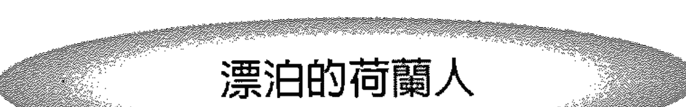

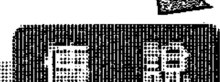

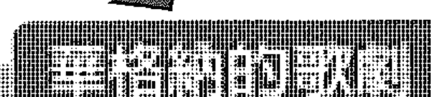

船長范德戴肯遭神詛咒

因為詛咒永遠在海上漂泊

一旦靠近就會被波及
被捲進海中打沉或遭到相同詛咒

每七年有一次機會，只要得到少女的愛便能得到救贖

得到愛情升上天堂

> ♣ 是荷蘭人還是幽靈船？是飛行還是漂泊？

其實「Dutchman」除了「荷蘭人」以外，也有「幽靈船」的意思，讓英國人畏懼不已的也許並非荷蘭人，而是幽靈船。「Flying」本是「飛行」的意思，但也有「漂泊」之意，此處使用的是後者的涵意。

所以說，「Flying Dutchman」除了本節所指以外，還可以作「漂泊的幽靈船」、「飛行的荷蘭人」、「飛行的幽靈船」等稱呼。

西元1969年日本東映動畫公司的電影《飛行的幽靈船》便是以其中一者為題製作的作品。除此之外，「Flying Dutchman」也是荷蘭足球選手約翰·克魯伊夫（Johan Cruijff）和美國大聯盟知名遊艇手華格納（Honus Wagner）的綽號，是取自「飛行的荷蘭人」的意思（華格納是荷裔美國人）。

## No.091
## 幽靈船
### Ghost ship

夜裡漂過來的破爛帆船明明空無一人，為何還能在大海航行？這幽靈船究竟是何物呢？

#### ●船隻化身的幽靈

不論東西方，船員間總流傳著幽靈操縱船隻的傳說；其中大多是帆船，有時候則是蒸汽船，甚至還有軍艦。
所謂的幽靈船，就是指夜裡（也有極少數在濃霧瀰漫的白晝出現的案例）不知從何處漂來上面空無一人、船體破破爛爛的船隻。雖然沒人操控，這艘破船卻還是沒有沉沒，永遠漂浮流浪於汪洋之中。
幽靈船上沒有任何船員，但有時可以看見化作骸骨的船員在幹活，有時則是可以看到變成幽靈的船員。
儘管幽靈船本身不會主動對其他船隻展開攻擊（這並不代表那些故意跳上幽靈船的傢伙能夠平安無事），不過幽靈船乃是最凶惡的惡兆，目睹幽靈船的船隻往往會遇上暴風雨沉沒或觸礁，經常發生不祥之事。
在愛爾蘭，傳說幽靈船即使是帆船的構造，卻依然能夠逆風前進。同樣在愛爾蘭，西元1798年曾有人目擊騰空飛翔的幽靈船。不僅如此，法國的布列塔尼地區甚至還有航行於陸地的幽靈船。
幽靈船的成因有很多，有的是因為疾病等因素使得船員全體覆滅，有的是發生大火時船員全數逃生、燒剩下的殘船，有的則是沒有停泊好、從港口漂出外海的船隻。
舉例來說，西元1775年在格陵蘭近海發現了一艘名叫屋大維亞的船，甲板上一個人也沒有。其他船員登船一看，竟然在甲板下方發現已經結凍成冰的船員屍體。翻閱航行日誌，最後一筆記錄是1762年。換句話說，這艘船已經漂流13年之久。
不過也有人認為這個故事是捏造出來的。

#### 流傳於船員之間的幽靈船

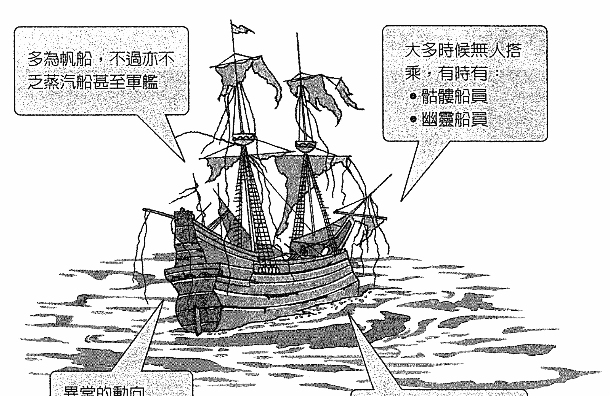

多為帆船，不過亦不乏蒸汽船甚至軍艦

大多時候無人搭乘，有時有：
- 骸體船員
- 幽靈船員

異常的動向
- 朝上風處航行
- 騰空飛行
- 航行陸地

使目擊者發生不幸
- 遭暴風雨打沉
- 觸礁無法動彈

船員全滅的船

大火燒剩的船骸

港口漂出海的船

變成幽靈船

#### 創作作品中的幽靈船

幽靈船頻頻出現於各種作品之中，光是電影，二次大戰期間便已經有黑白片《幽靈船》（The Ghost Ship）；
日本則是有西元1969年的動畫《飛行的幽靈船》，據稱名作，不過作品中的幽靈船其實是超高科技機械；
除此之外，迪士尼的《神鬼奇航》也有幽靈船的場面。

## No.092
## 海盜 (私掠船)
### Privateer

從前在獲得國家許可下從事海盜行為的船員，後來有人當上海軍上將，有人卻落魄變成海盜、遭絞首而死。

#### ●國王的海盜

只要是有海的地方就有海盜。直至現代，仍然有配備半自動機關槍、攻擊貨船的武裝海盜存在，可是我們腦海中的海盜形象卻仍然停留在加勒比海的海盜。
其實這並非海盜的全貌。十六～十八世紀間活躍於歐美海域的海盜存在著不同種類，第一種便是所謂的私掠船海盜，而這種海盜可以稱作是國王的海盜。從前十六世紀英國與西班牙處於戰爭狀態的時候，英國國王曾經對民間船隻發出許可證、允許他們攻擊他國船隻，所得利益與國王對分，而循此途徑襲擊西班牙的船隻則稱作私掠船。
這個協議對雙方都極為有利。
對國王來說，非但毫不費力便獲得破壞敵國貿易路線的戰船，還能得到分贓。對海盜來說，讓國王抽成雖然會受到影響，可是從事海盜行為並不構成犯罪（當然如果被西班牙捉到一定會判環首死刑），而且還有可以放心補給維修的港口。
上述緣故使得私掠船（擁有許可證的海盜）蓬勃發展，其中亦不乏法蘭西斯·德雷克爵士這種完成環繞世界一周的壯舉、最後甚至還當到英國海軍上將的海盜。
除此之外，以基德船長寶藏傳說而聞名的威廉·基德也曾經是私掠船的船長。這位十七世紀的海盜原是私掠船船長，可是由於賺不了什麼錢，所以後來見船就搶。據說他在受縛就刑之前將搶來的財寶藏在某個隱蔽的地方，這則傳說非但成了《金銀島》等作品的靈感來源，找尋這份寶藏的人直到現代仍然絡繹不絕。

#### 有可能功成名的國王海盜

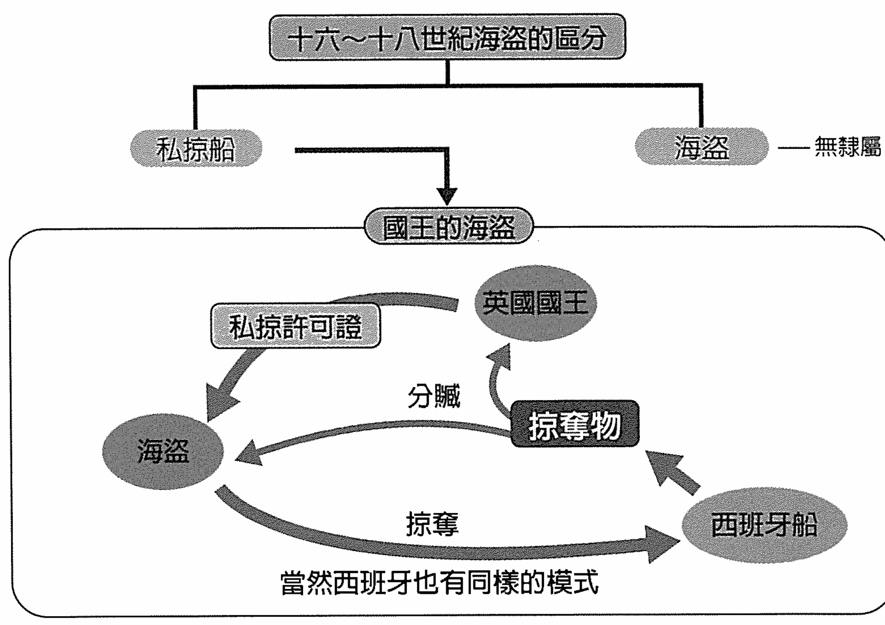

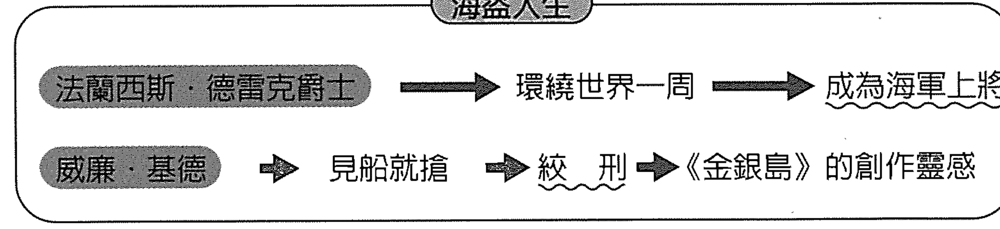

> 弱者的戰略
西班牙當然也曾發行私掠許可證，讓海盜襲擊英國船隻。但這個戰略對海上商船較多的國家較為不利，所以當時英國（英國相當海外的貿易落後西班牙及葡萄牙）才會採取這個戰略。待英國掌握世界海洋霸權以後，這次就輪到英國的敵人使用私掠船戰術了。法國在拿破崙時代就曾組織私掠船，而襲擊英國船隻成了私掠船活動的主流。

#### 關聯項目
- 海盜（西印度海盜）→No.093
- 《金銀島》→No.094

## 海盜 (西印度海盜)

一般人對海盜的想像大多來自於這西印度海盜，而迪士尼影業發行的《神鬼奇航》海盜亦是以此為本。

### ●自由的海盜

講到海盜，想必大多數人想像的都是揭起海盜旗的加勒比海海盜吧！他們在十七、八世紀間擁有相當大的勢力。

在那個時代，加勒比海附近幾乎都是西班牙的領海。不少在英國、荷蘭、法國等地混不下去的無賴之徒紛紛來到這裡成為海盜。據說當時的海盜以西印度群島居民製作的曬肉乾為航海糧食，遂有西印度海盜此名。

西印度海盜有個「不對俘虜來的老人小孩動粗」的規矩，同儕間採取的是某種民主主義的體制，回到根據地則是過著揮金如土的生活。這不僅讓海盜頗受歡迎，船長甚至會被視為某種英雄。此外船隻遭到海盜襲擊時，不少船員甚至認為與其抵抗、被殺害，倒不如加入他們。其中十七世紀的亨利·摩根爵士堪稱西印度海盜的代表性人物。

他精於作戰，曾多次以寡敵眾擊敗西班牙軍隊、奪得大量財寶。在他退休後獲得爵士的封號，甚至還晉升至牙買加（時為英國領地）的代理總督。

至於十八世紀最具代表性的海盜當屬愛德華·蒂奇，就算不知道這個名字，相信許多人也都聽過他的綽號「黑鬍子」。正如他的綽號，愛德華長著滿臉濃密黑色髭鬚、橫肉，而其手段也跟長相同樣兇殘。有次他跟眾部下正在飲酒，突然間沒有原因的拔槍射穿了其中一人的膝蓋。當時他說：「要是不這樣殺一、兩個人，恐怕有人會忘記老子是誰」，光是做他的部下就有性命的危險。

#### 一般人想像中的自由海盗

西印度海盗

有別於私掠船海盜，未獲許可便以海盜行徑掠奪船隻來自英國、荷蘭、法國等地的流亡者

- 有一定的規矩
- 同儕間採民主主義體制
- 在根據地揮金如土

很受歡迎

海盜船長被視為英雄

#### 海盜旗

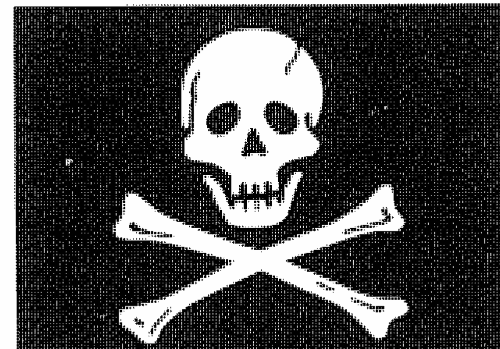

一般人對海盜旗的印象均是這種黑底白骷髏，頭顱骨下方有兩根十字交叉骨頭的旗幟，不過這種海盜旗的歷史並不長久，直到海盜時代結束的十八世紀才首次出現，因此法蘭西斯·德雷克和亨利·摩根都沒有懸掛這種旗，但多有可能在黑鬍子的船上出現過

海上牧者的海盜旗

擁有環保恐怖份子惡名的海上牧者也有海盜旗

#### 關聯項目

- 海盜（私掠船）→No.092

## No.094
## 《金銀島》
### Treasure Island

直到現代仍讓人嚮往不已的海洋冒險小說《金銀島》，非但是講述找尋海盜秘寶的最初期作品，也是此類作品的代表作。

#### ●海盜的寶藏

《金銀島》乃史蒂文生所著，於西元1883年出版的兒童海洋冒險小說。這是部曾經改編成無數電影與動畫的知名作品，可是實際上將其稱作原著的人並不多。

故事敘述一名老海盜死後留下大海盜弗林特的金銀島地圖，看到這幅地圖的少年吉姆・霍金斯連同利夫西醫生、鄉紳特洛尼隊長一起準備船隻前往尋寶，而獨腳廚師約翰・西爾弗也一起同行。

西爾弗原是弗林特的部下。他煽動船員，唆使船長與一行人叛變。好在吉姆無意間偷聽到他們說話、事先離開船隻，並且進入弗林特的舊要塞堅守其中，但後來卻因為他無法忍受整天躲藏離開要塞，還潛入船隻把船奪了回來。

豈料當他回到要塞時，要塞已經陷落成為海盜據點，而吉姆亦遭海盜擒捕。不過吉姆的勇氣與機智卻讓西爾弗感到佩服，甚至決定背叛海盜、給予援助。儘管西爾弗此舉只是為了避免尋寶失利，同時在雙方陣營押寶，但也確實使他在故事的最後，也就是吉姆獲勝時成了贏家。

另一方面，弗林特有個名叫作班・葛恩的部下被流放到金銀島，他早就找到寶藏，還把它藏到了別的地方。葛恩加入以後，吉姆等人終於成功取得寶藏，離開金銀島。

這是趟由三十個人一同出海，最後僅有七人生還的艱辛旅程，但那些成功找到寶藏的人卻從此得到了幸福。至於西爾弗則是拿了些許財寶，在回程停靠的港口消失無蹤。

#### 尋找秘寶的海洋浪漫譚

《金銀島》 西元1883年出版的海洋冒險小說，由史蒂文生所著

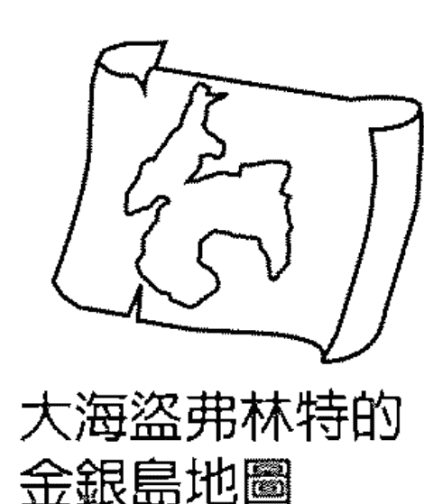

發現地圖

少年吉姆

前往尋寶

搭乘

叛亂

獨腳約翰 (弗林特的部下)

利夫西 醫生

特洛尼 隊長

逃跑

舊要塞

投誠

遭海盜所捕

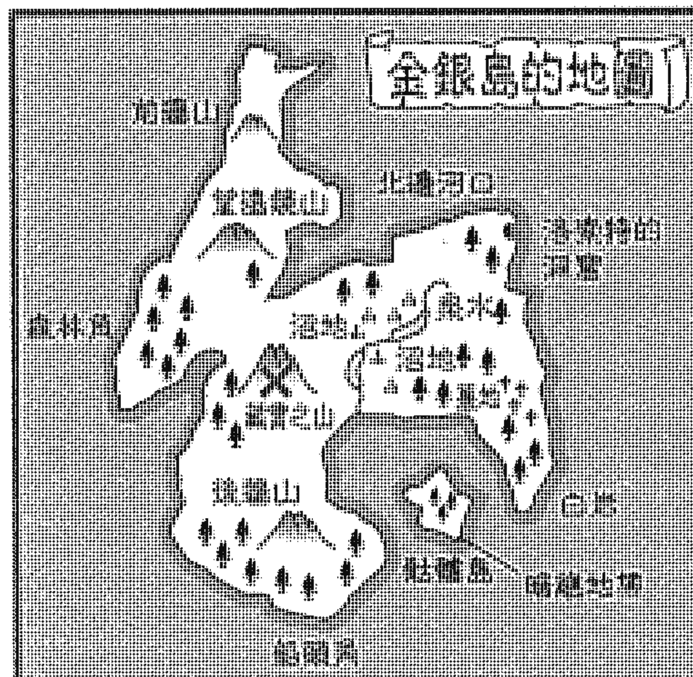

獲勝

加入

班・葛恩 (弗林特的部下)

得到寶藏

離開金銀島

> 映像化的金銀島

或許是激發了眾多作家的想像力，《金銀島》曾經多次翻拍成影視作品。電影和動畫以此為題材，而有迪士尼動畫《金銀島》，日本電視動畫以擬人化動物為主角的《動物金銀島》等作品。

其中由出崎統與杉野昭夫兩人聯手製作的電視動畫評價極高，甚至還輸出海外。而手塚治蟲的《新金銀島》儘管內容不同，卻很明顯是向《金銀島》致敬的作品。

#### 關聯項目
- 海盜（私掠船）→No.092
- 海盜（西印度海盜）→No.093

## No.095
## 摩西過紅海
### Mose

聖經裡記載著許多奇蹟，其中摩西曾經多次引發與水相關的奇蹟。

#### ●《舊約聖經》中最偉大的先知

摩西是《舊約聖經》所提到的重要先知，基督教與伊斯蘭教等宗教均將其視為非常重要的預言者。傳說他是摩西五書*的作者，但是摩西五書也描述到了摩西自身的死亡，應該並非摩西所著。

摩西是住在埃及的猶太人之子，卻被埃及公主收養。摩西成年後有次看見埃及人毆打猶太人，遂殺死該名男子、逃出埃及。可是摩西卻接獲神的命令，要他幫助猶太人逃離埃及。

神為教訓執迷不悟的埃及法老，發動了多起詛咒災難。

首先是血災。當摩西用手杖擊打尼羅河的水時，水會變成血，河裡的魚必死，並且散發腥臭。儘管埃及人厭惡河裡的水，可是埃及的法師也會行使相同的法術，所以埃及法老不信神，神的詛咒並未收到效果。後來經過大量的蝨災、蠅災和蝗災，神又是發動疫病，又是降下冰雹，數度施以詛咒，好不容易才終於使得法老王同意讓猶太人離開埃及。

神不讓猶太人走普通道路，故意讓摩西等人宿於海邊。後來埃及法老改變心意，決定派遣戰車追擊猶太人。當埃及軍隊逼近的時候，神要摩西向海伸出手杖，只見神以劇烈東風推動海面、將海水一分為二露出地面，而以色列人便從中走過，海水在他們的左右形成牆垣。

埃及軍隊緊接著也要渡海，但神卻混亂他們的隊伍，使他們的車輪脫落，難以行走，又叫摩西再度向海伸杖，接著海水便從埃及軍隊頭頂落下，連一個士兵也沒有生還。

#### 引發最多水之奇蹟的先知

摩西 —— 《舊約聖經》中最重要的先知

神的命令

命令摩西幫助猶太人逃離埃及

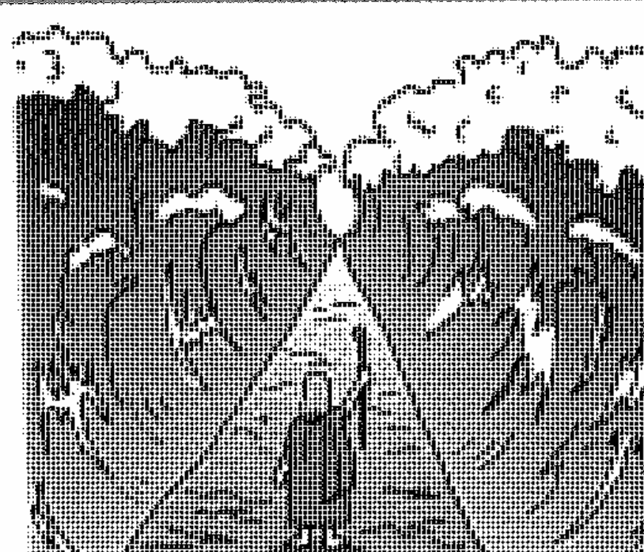

摩西舉手向海伸杖

海水分開露出地面

以色列人渡過紅海

#### 出埃及的各種路徑

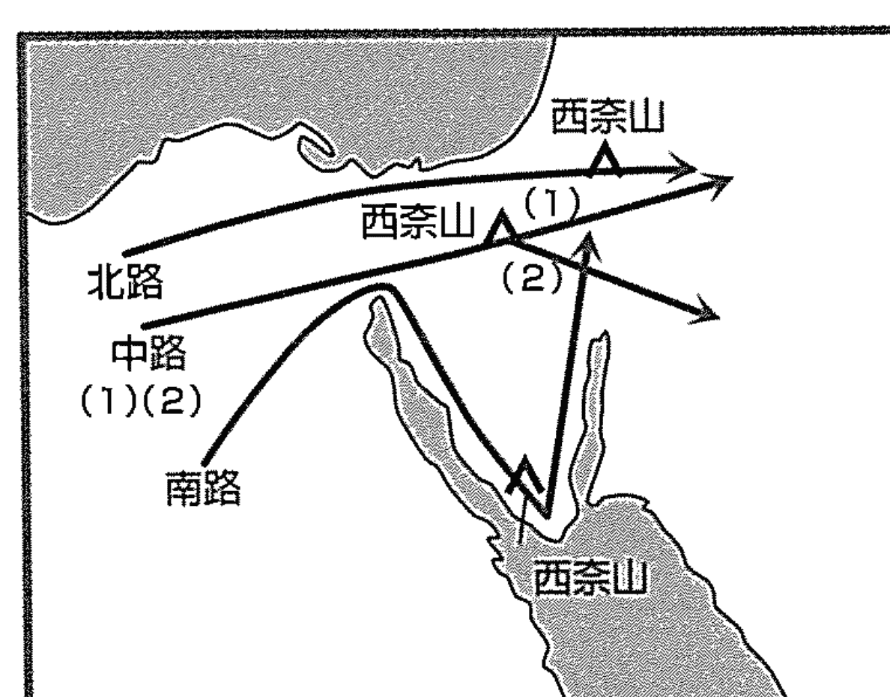

一般認為猶太人出埃及可能有四條路徑，至於何者正確仍不得而知，而西奈山的位置亦隨路徑而有不同說法

> 西奈山便是神賜摩西十誡（以色列人要遵守的十條戒律）石板的地方

#### 摩西之死

後來摩西率猶太人在荒地裡流浪四十年，終於來到迦南地（傳說是神賜給猶太人之地，對猶太人來說是應許之地）。
儘管摩西是如此偉大的先知，卻因為沒有完全信神而敲打米利巴磐石兩次（當時以色列人因不得水源而苦，神說只要敲打一次就會有水流出來，摩西卻敲了兩次），注定無法進入迦南。不過另有預言指出摩西能夠親眼目睹迦南地，所以摩西雖然去到尼斯迦山眺望迦南，卻始終沒能親自抵達，最後死於摩押。

## No.096
## 海幸山幸
### Umisachi & Yamasachi

釣鉤在古代是非常貴重的物品，一旦遺失可是件非常嚴重的大事。

#### ●從遺失釣鉤開始說起的神話

海幸山幸的故事是著名的神話。從前山幸向兄長商借釣鉤去釣魚，卻把釣鉤弄丟了。海幸不肯原諒弟弟，就算山幸要把自己的劍銷毀、重新鑄成千支釣鉤歸還，還是不願輕饒。
正當山幸在海邊不知該如何是好，恰巧遇見海神鹽土神經過此地，借船讓山幸渡海。山幸在海神宮中遇見了豐玉姬，終於取回卡在海神部屬鯛魚喉嚨裡的釣鉤。回到地面後，他還憑藉著海神所贈法寶降服了刁難自己的兄長，將海幸收為手下。
不料豐玉姬竟懷了山幸的孩子，跟著他來到地面，在海岸邊搭建小屋待產不出，還要山幸絕對不可以偷窺，但山幸最後忍不住窺看，卻看見豐玉姬變成鱷魚正要生產的模樣。豐玉姬因此羞愧不已，留下嬰兒就回到海裡去了。
據說當時的那名嬰兒正是日本的首位天皇——神武天皇。

從東南亞到南太平洋地區均流傳著弟弟丟失釣鉤而受兄長責難，之後卻又成功復仇的「釣鉤喪失神話」。印尼版講的則是一對住在天上的兄弟，弟弟歸還釣鉤以後，故意將裝酒的竹筒吊在半島中，然後追著打翻竹筒的哥哥歸還潑灑出來的酒。哥哥試著挖土收集酒水，卻把天空都挖穿了，哥哥就從那個洞降到地面、成為人類的祖先。

帛琉釣鉤神話的主角並非兄弟，而是父子。故事描述神的兒子發現父神一直瞞著自己使用釣鉤，便哭著索討，但兒子在得到釣鉤後卻不慎弄丟了，於是去找母神商量。母神教他讓大海平靜下來後潛入海中，他依言而行，在海中發現一個村落、找到了釣鉤，然後就用這支釣鉤把島嶼釣出了海面。

#### 釣鉤神話

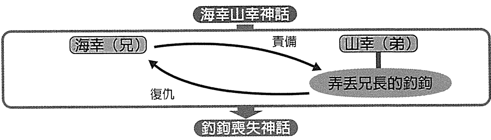

#### 釣鉤喪失神話的分佈地區

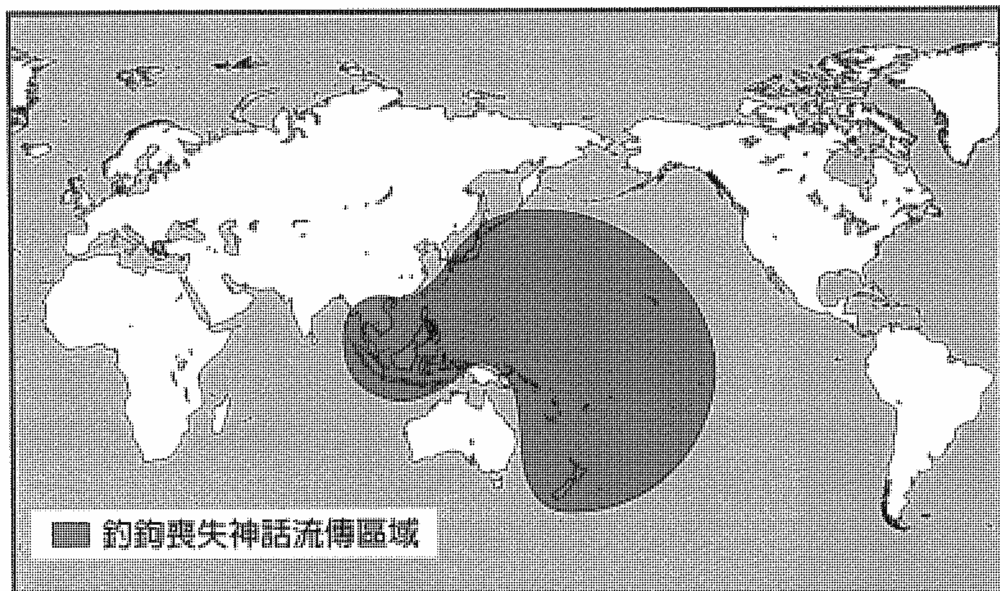

不僅是日本，從東南亞到整個玻里尼西亞的廣大太平洋區域，均有此類型神話分佈流傳。
其中有些神話不以兄弟相爭為主題，而是單純描述釣鉤遺失的故事而已。

> 潮滿珠與潮干珠
潮滿珠與潮干珠是海神所贈法寶，可以控制水的消長。
山幸先是用潮干珠把海幸田裡的水變不見，使土地變得乾爽和
蕭條，後來因此變得貧窮的海幸攻打山幸，山幸又取出潮滿珠水淹
海幸，逼迫其降伏。

## No.097
## 水遁之術
### Suitonnojutsu

木遁、土遁、水遁、金遁、火遁為忍術五遁，其中水遁乃藉水行使之遁法。

#### ●並不一定要潛入水中的遁逃術

水遁之術是忍者用於擺脫敵人的一種隱身術。這種忍術正如其名，乃是利用水來隱匿忍者的身形。由於城堡周圍護城河等處的水不怎麼乾淨，很難看清楚水中的情形，所以只要潛入水中便能不讓敵人發現。

話雖如此，在從前那個沒有水肺等潛水裝備的時代，躲在水裡該如何呼吸呢？漫畫等作品對這個問題雖然偶有描述，可是那些方法卻都不能實際拿來運用。一方面是因為如果用來呼吸的管徑太細，就會使呼吸變得困難，但若從水中伸出竹管的畫面又讓人覺得非常可疑。況且潛在水中無法觀察水面上的情形，也就無從判斷何時可以逃離現場。

據說真正的忍者是直接把臉露出水面呼吸，但是這樣很容易被發現，所以都要在臉上貼樹葉或水藻作為偽裝。如此一來不但呼吸暢通還能張開眼睛觀察四周環境，自然比較容易找到脫身時機。

不過守城者當然知道這些事情，經常會打掃護城河，避免水面有樹葉或水藻漂浮。

最有用處的水遁是假裝已經跳進水中的技術。此法是在脫逃路徑當中，挑選敵人視線暫時看不見的地方準備石頭等重物，一旦受到追擊就將石頭投入水中，讓敵人會誤以為忍者跳了進去，循水路去追，此時就可以從容的朝相反方向逃離。

假如忍者真的跳進水中，上岸以後渾身濕答答的模樣肯定會被當作可疑份子，遠不如假裝跳水逃生來得有效。

#### 真正的忍者如何水遁？

水遁之術 — 忍者隱身術之一

#### 如何呼吸？

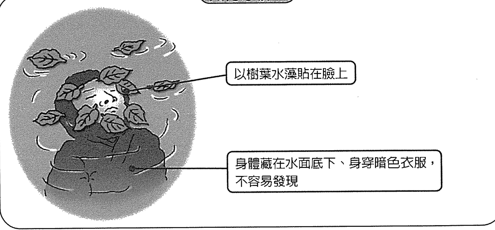

以樹葉水藻貼在臉上

身體藏在水面底下、身穿暗色衣服，不容易發現

#### 假裝跳水逃生

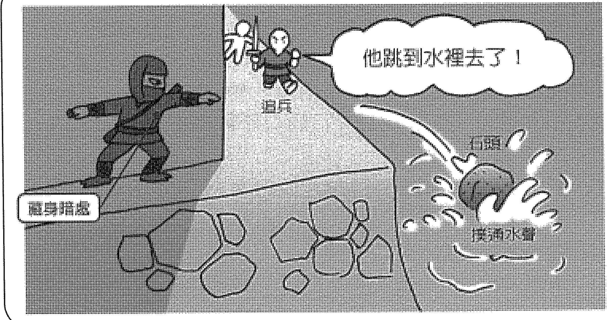

他跳到水裡去了！

追兵

石頭

藏身處

投擲水聲

#### 預防忍者入侵的方法

城堡當然不容忍者藉水遁之術入侵，因此得頻繁清掃護城河。只要做好清潔工作，一旦有樹葉漂浮抑或是蘆葦莖伸出水面，立刻就可以發現情況有異。而且如果護城河打掃後變得清澈，也比較容易發現潛伏於水中的忍者。

# No.098
## 御神渡
### Omiwatari

在御神渡現象的背後，其實有個神明跨越諏訪湖探妻的浪漫傳說。

#### ●大自然的神奇現象

長野縣諏訪市的諏訪湖在冬天會發生不可思議的現象。

諏訪湖每到冬季就會結冰，若那年氣候比較寒冷，冰層甚至厚到足以支撐人的重量而不會裂開。而在湖冰上生成線性裂痕，並且向上隆起的現象，便稱作御神渡。

傳說御神渡乃是坐鎮於諏取大社上社的建御名方命，在前往探訪下社八坂刀賣命所留下的足跡。是故御神渡跟湖岸有兩個接觸點，其中南方靠諏訪市，即建御名方命從湖岸下到諏訪湖這端稱作下座，而北方靠諏訪町，八坂刀賣命所在處（建御名方命從湖面登岸的地方）則稱為上座。除此之外，亦有一說認為御神渡其實是名叫御左口的白蛇神橫渡諏訪湖留下的痕跡。

無論如何，每當此現象發生的時候，八鍬神社的宮司就會舉行占卜今年農作物收成的神事。此神事名為拜觀式，可以從中判斷湖面龜裂是否為御神渡。

那麼，御神渡是如何形成的呢？其成因在於晝夜的溫差。

入夜以後氣溫下降，連冰也會跟著收縮。因此湖面冰層收縮、產生裂痕，然後湖水又滲入裂縫中再度結冰。等到天亮以後氣溫上升，冰塊也會膨脹，此時裂縫裡的冰受到來自兩邊的擠壓，於是破碎並向上隆起。

這就是御神渡現象的真相。

自古以來就規定人類必須在神明通過湖面以後才能踏上湖面冰層，這其實是古代人的智慧，用意是要確保人們在湖面形成足以產生御神渡現象的厚冰以後再上去行走。

#### 孕育出浪漫傳說的神奇現象

**御神渡** — 諏訪湖面冰層發生線性裂痕、向上隆起的現象

傳為建御名方命尋八坂刀賣命相會的足跡

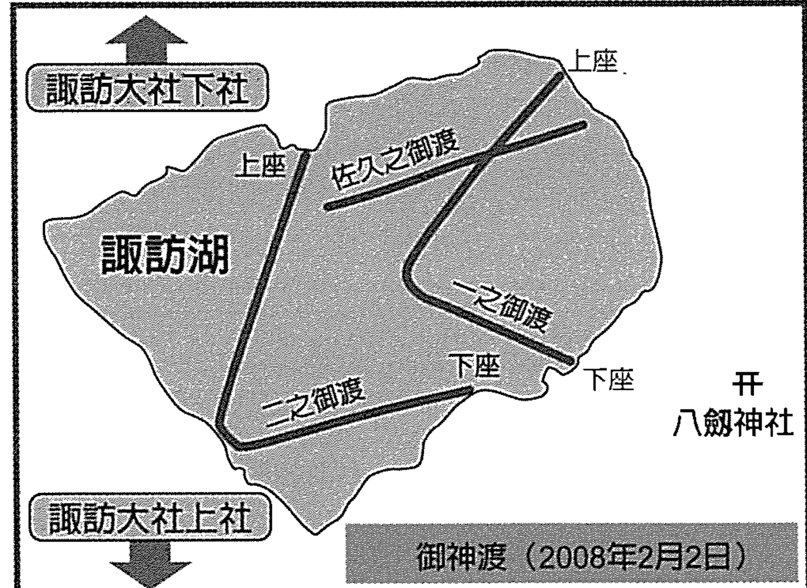

1. 御神渡現象發生
2. 拜觀式
3. 判斷湖面龜裂是否御神渡
4. 舉行占卜農作物收成的神事

#### 御神渡是如何形成？

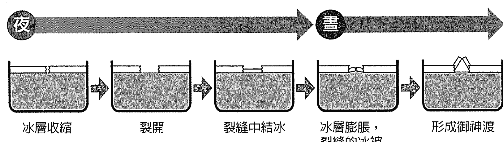

> 世界最早的長期氣象紀錄

從十四世紀開始，諏訪湖的御神渡記錄了每年御神渡何時發生、當年收成如何（御神渡乃卜算收成之依據，其結果自然也都有記錄），此記錄稱作神渡帳。

據說這是全世界歷史最悠久的氣象紀錄。

## No.099
## 奧德修斯
### Odysseus

講到海洋冒險，那就不能不提奧德修斯的航海。他所經歷的冒險旅程實在太過豐富，本書其他章節也多次記載他的足跡。

#### ●觸怒波賽頓的男子

奧德修斯是希臘神話當中名氣最大的人類英雄。

他雖然在特洛伊戰爭（希臘與特洛伊的戰爭）中獲得勝利，卻因為眾神出手干涉而必須耗費長達二十年歲月方能從特洛伊返國（儘管位於土耳其海岸的特洛伊僅離希臘兩百公里）。這二十年間，奧德修斯不斷流浪於地中海各地，他的航海與冒險歷程都記載在荷馬的作品《奧德賽》之中。

這一切起因於他在啟航返國的時候刺瞎了賽克洛斯族*1波呂菲摩斯的眼睛。波呂菲摩斯乃波賽頓之子，這便是為何神決定要阻撓奧德修斯的航海。由於奧德修斯遲遲沒有返回故鄉伊薩基，他的妻子珀涅羅珀*2身邊便出現了許多追求者。

這段期間奧德修斯遭遇到女巫瑟西，他的船員還被女巫變成了豬。好在奧德修斯在赫密斯*3的幫助下成功救出船員，不過他卻也拜倒於瑟西的魅力之下，與其同居了一年。

除此之外，奧德修斯的船隻還航行經過住著賽倫的海域，當時船員們以蜜蠟封住耳朵始得平安通過，至於奧德修斯則是因為想聽賽倫的歌聲，所以命人把自己綁在帆柱上。奧德修斯聽到歌聲以後像是發狂一般愛上賽倫，可是他被綁著什麼都不能做，終於順利通過該片海域。

後來奧德修斯歷經許多磨難，終於回到伊薩基。他的妻子說只要有人能拉得動奧德修斯留下來的弓就嫁給他，可是卻沒有一個人能辦到，唯獨變裝現身的奧德修斯拉開了弓，還把其他求婚者都射死了。

#### 歷經多次冒險的英雄

奧德修斯 —— 希臘神話中名氣最大的人類英雄

受眾神干涉而流浪地中海 → 航海與冒險

事蹟載於荷馬的《奧德賽》

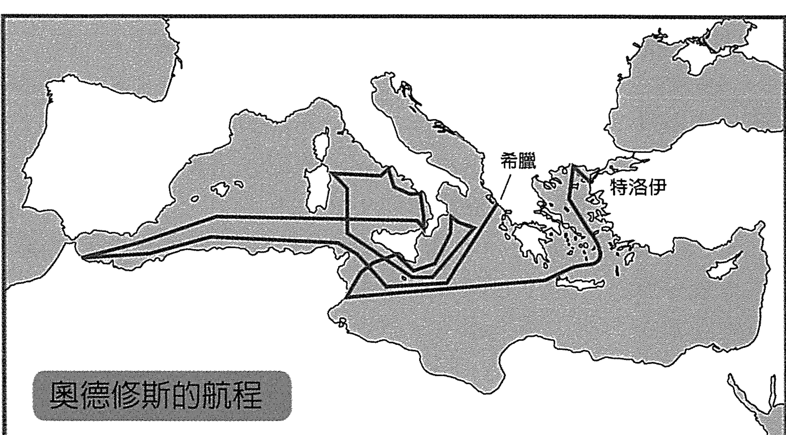

特洛伊戰爭中獲勝 → 刺瞎波呂菲摩斯 → 觸怒其父波賽頓 → 從特洛伊返回希臘

啟航之際

阻撓二十年

> 奧德賽

英語以「Odyssey」指稱漫長的冒險旅程，其語源正是來自奧德修斯的流浪。電影《2001太空漫遊》的原題名為「2001: A Space Odyssey」，指的除了航向木星的漫長旅程以外，或許亦象徵著人類不斷進化的這段漫長旅程。

#### 關聯項目

- 賓倫→No.028
- 波賽頓→No.044

# No.100
## 霍雷肖·霍恩布洛爾
### Horatio Hornblower

海洋冒險小說是英國的國民文學。只要是英國人，肯定會驕傲的認為霍恩布洛爾是此類文學的第一傑作吧！

#### ●大英帝國引以為傲的文學

英國人向來將海洋冒險小說視為該國的國民文學。賽西爾·史考特·福雷斯特創作的「霍恩布洛爾」系列是此類型文學之代表作品。英國上下沒人不知道霍恩布洛爾這號人物，其知名度甚至跟夏洛克·福爾摩斯不相上下。

小說的主角霍雷肖·霍恩布洛爾是隸屬於英國海軍的軍人，故事就從主角十七歲於英國革命正熾那時登船開始，一直寫到他當上海軍上將為止，一共十二冊。霍恩布洛爾一路從法國革命穿越拿破崙時代，直到英國掌握世界海洋霸權。

主角霍恩布洛爾絕非超人。他身為船員卻有暈船的毛病，而且還有懼高症，攀爬船桅對他來說是件苦差事。除此之外他還是個音痴，就連英國國歌都唱不好。

不過，霍恩布洛爾性格冷靜而且頗具數學才能（這對船員來說是必備技能），就算遭到俘虜仍上進的學習外語，不停自我鍛鍊，終於得以戰勝諸多苦難、一路向上晉升。

霍恩布洛爾的人生並非總是如此順遂。他經常被俘，甚至幾度命喪槍口之下，在這些不幸事件背後不是因為他指揮作戰的能力太差，而是儘管與對手戰力懸殊卻又不得不戰，經過全力奮戰拼搏後方才投降。再說，後來他也擺脫了俘虜身分、成功帶著同伴逃脫。

英國若有頗受好評的海洋冒險小說系列新作品問世，都會以「繼霍恩布洛爾……」此類文句加以介紹，由此亦可見「霍恩布洛爾」系列早已經是英國人心中無可撼動的經典了。

#### 見證英國榮耀的海洋冒險小說

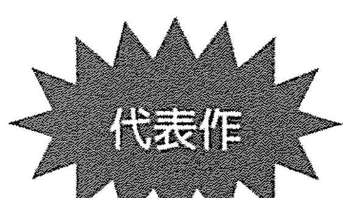

海洋冒險小說

英國的國民文學

寶西爾・史考特・福雷斯特的「霍恩布洛爾」系列作品

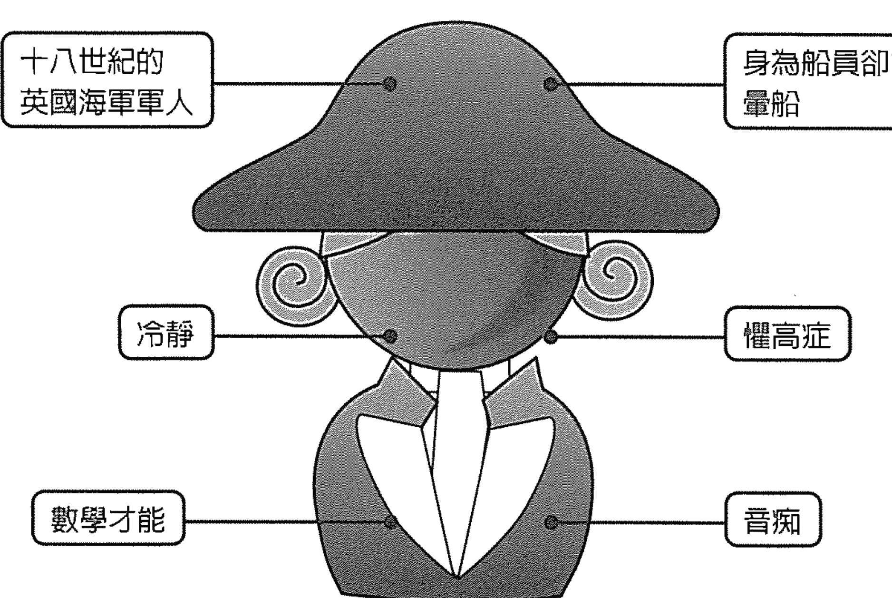

主角霍恩布洛爾

戰勝諸多苦難，一路向上晉升

#### 主角霍恩布洛爾所處年代

| 霍恩布洛爾事紀 | 同時期的歐洲 |
|---|---|
| 1776年7月4日 誕生 | 1776年 美國獨立宣言 |
| 1794年 任海軍預備士官 | 1789年 法國大革命 |
| 1797年 升海軍尉官。以俘虜身分晉升 | 1793年 第一次反法聯盟 |
| 1803年 與馬利亞・艾倫結婚 | |
| 1805年 升任艦長 | |
| 1811年 封爵（巴斯勳爵士） | 1804年 拿破崙就任皇帝 |
| 1813年 以艦長身分兼領戰隊司令官 | 1805年 特拉法加海戰 |
| 1820年 升任海軍上將 | (納爾遜海軍上將死亡) |
| 1848年 升任元帥 | 1815年 法國波旁王朝復辟 |

## No.101
## 《美人魚》
### Den Lille Havfrue

安徒生童話裡的《美人魚》描述美人魚愛上人類王子，是縱使為戀情犧牲仍舊不改其志的純愛物語。

#### ●為愛犧牲的人魚公主

《美人魚》是丹麥引以為傲的童話作家安徒生所創作的童話。雖是童話體裁，但從描寫堅定不移戀情的戀愛小說角度來看，這也是部完成度很高的作品。

故事敘述人魚公主在十五歲的生日那天初次來到海上。她看見船上坐著俊美的王子，對他一見鍾情，但當晚的狂風暴雨使得船隻遇難，王子亦被拋入海中。人魚公主救了王子，可是王子一直昏迷不醒，後來岸上有個年輕姑娘發現王子，並且找人前來幫忙。而留在海裡的人魚公主受相思所苦，希望到陸地與王子相會，便去向女巫求助。

公主雖然變成了人類，但她雙腳踏出的每一步都必須承受有如刀割的痛楚，還有如果她無法得到王子的愛，就會變成海中的泡沫消失不見。女巫甚至還拿走了公主美妙的聲音，作為提供變身藥物的代價。

公主變成人類後的美麗姿態，彷彿踏著空氣般的優美舞蹈，看得眾人無不為之心醉。可是王子卻無法忘記海邊那個救了自己的女孩。那女孩長得跟人魚公主非常相似，卻是服事於修道院的神聖少女、不涉俗世。

後來有人向王子提出與鄰國公主成婚的建議，但是王子還是無法對那個女孩無法忘情，還對人魚公主說，與其跟鄰國公主結婚倒不如娶她為妻。誰知道王子後來發現鄰國公主正是當初海岸邊的那個女孩，人魚公主的戀情因而破滅。

婚禮當晚人魚公主的幾位姐姐出現在她面前，她們把自己的秀髮賣給女巫、換來一柄匕首，只要拿這把匕首殺死王子，公主就能變回人魚。可是公主沒有這麼做，但也沒有變成大海的泡沫，而是化作空氣精靈、獲得了新的生命。

#### 有名的純愛物語

人魚公主 — 童話作家安徒生創作的童話

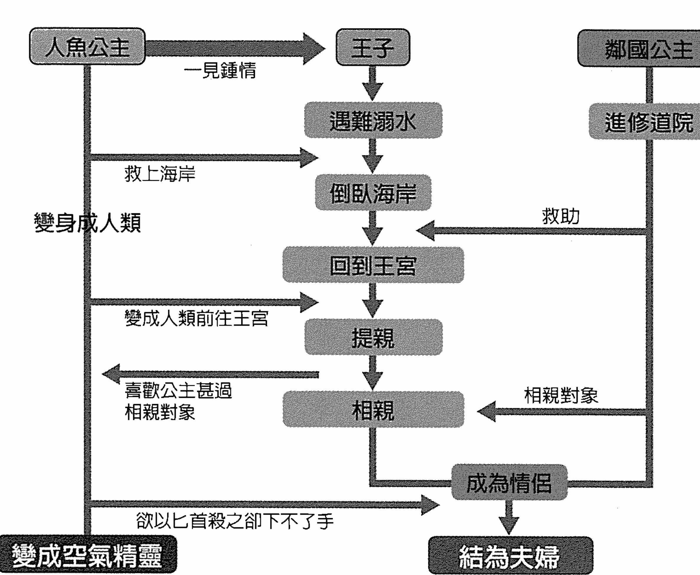

> 美人魚雕像

丹麥哥本哈根的港口有座美人魚雕像，是聞名遐邇的觀光勝地。

此雕像乃西元1909年「嘉士伯啤酒」的卡爾·雅克布森所造，他因為觀賞哥本哈根皇家劇場上演的芭蕾舞劇而深受感動，遂命人按照劇中主角美人魚·芭蕾斯的模樣塑造雕像。

不過這座美人魚雕像不但高1.25公尺，而且孤伶伶設施在亞無一物的湖岸邊（此處雖然是座公園，附近卻是工廠和港灣設施），成為令人失望的觀光勝地。

#### 關聯項目

- 人魚→No.019

# No.102
## 《海底兩萬里》
### Vingt Mille Lieues sous les Mers

儒勒·凡爾納素有科幻小說之父的美譽，而他最著名的作品便是《海底兩萬里》。

#### ●十九世紀便已經想像如此潛艇

《海底兩萬里》乃儒勒·凡爾納所著，是全世界第一部潛艇小說。故事描述法國籍學者阿龍納克斯教授搭上軍艦，前往擊退讓海面變得不平靜的巨大海洋生物，豈料軍艦卻遭該生物反擊而失去動力，教授亦落入海中。

正當教授以為自己會失去性命的時候，鸚鵡螺號尼莫船長（尼莫在拉丁語裡是「誰都不是」的意思，可見船長有意隱瞞姓名）卻把他連同落海的漁夫，以及跟著教授跳入海中的忠僕都救了起來。

然後他們就隨著尼莫船長展開了令人驚奇的海底旅程。

由於主角是位海洋生物學家，海底旅行對他來說可謂是趟夢幻之旅。他們在海中遭遇到的每種魚類、貝類，甚至海草，教授總是一一講出名字並且感動不已，接著又滿腔熱忱的解說該物種的體長、顏色以及特徵。對現代的讀者來說或許會感到冗長無趣，可是對當時的人來說，光是看到如此的內容便足以讓他們感到驚奇。

現代仍有許多海洋學者都是此書的愛好者，他們只要讀到魚類的名字便能想像魚的模樣和牠們周遭的環境，若是讀到不認識的物種想必會更加興奮不已吧。

教授一行人不但發現沉船寶藏，甚至還在大西洋海底發現了亞特蘭提斯的遺跡。他們曾經穿越馬尾藻海，還潛到1萬6000公尺的深海之中，終於抵達了南極極點（當時還不知道南極究竟是大陸還是浮冰，此書採浮冰說法）。

他們苦苦等待機會，最後成功逃離潛艇，同時潛艇也被捲入巨大漩渦不知去向。

#### 「科幻小說之父」的傑作

《海底兩萬里》——儒勒·凡爾納所著世界首部潛艦小說

描述潛水艇鸚鵡螺號

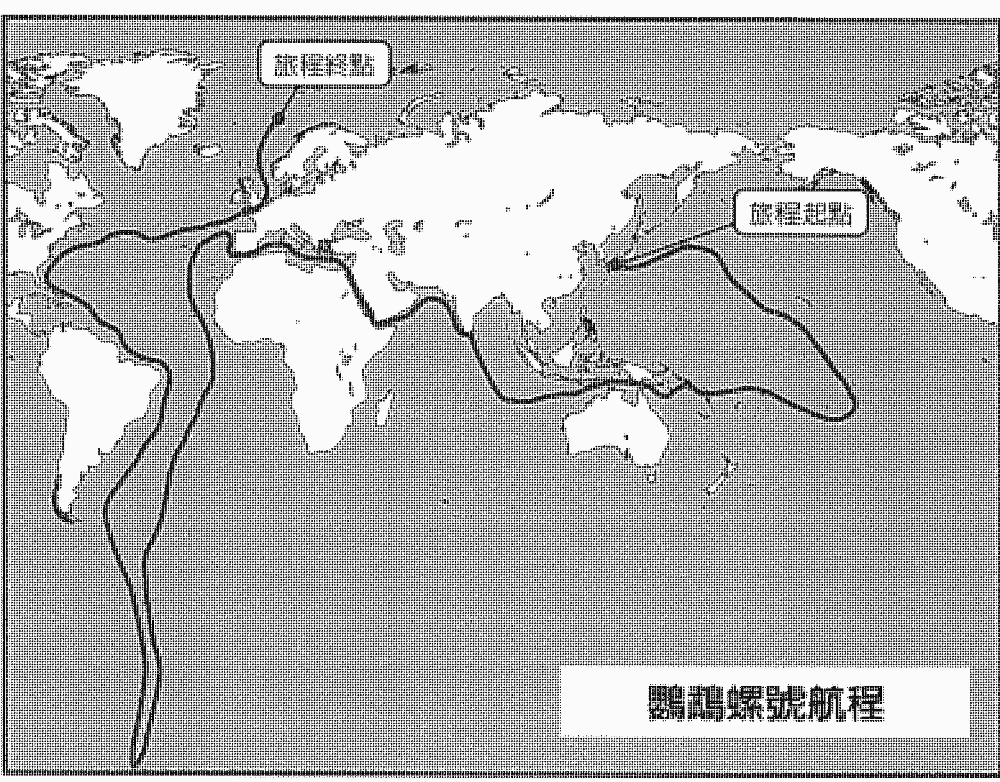

鸚鵡螺號

這艘潛艇的名字其實並非凡爾納原創。西元1801年美國有位技師曾經試圖打造同名的潛艦，此名應該就是來自於此。

順帶一提，美國第一艘核能潛艇也叫作鸚鵡螺號，至於這艘潛艇取名於何者就不得而知了。

兩萬里格

若採直譯，則書名應該譯作「海底兩萬里格」。里格是法國的距離單位，1里格相當於4公里。換句話說，主角們的航海旅程長達8萬公里。

里格跟距離單位「里」相去不遠，故直接將書名譯作兩萬里。

至於那些譯成「海底兩萬哩」的書名，因為1哩等於1.6公里，嚴格說來應該算是錯譯。

## No.103
## 《兩棲人》
### The Amphibian Man

生活於海中純真而孤獨的青年，因為愛上陸地的女孩而失去了所有。與此同時，那些住在陸地上的人們卻也失去了些什麼。

#### ●屈東的後裔、屈東的祖先

《兩棲人》是俄羅斯科幻作家亞雷克桑德·貝烈耶夫的長篇科幻小說，兼具《科學怪人》與《人魚公主》兩種元素。

故事以作者創作當時的阿根廷沿岸為舞台。主角是由天才外科醫師薩魯巴特博士所創造，既是怪物又擁有跟美人魚相同命運，無論在水中或陸地都可以呼吸的兩棲人伊夫基安德魯。

故事就在企圖揭露伊夫基安德魯謀取巨富的茲利達、深信主角就是自己已故孩兒的巴魯塔薩爾、跟伊夫基安德魯兩情相悅的巴魯塔薩爾的養女葛芝艾蕾、葛芝艾蕾的友人歐爾歇恩、巴魯塔薩爾眼中只看得到錢的哥哥庫利斯特，以及認為兩棲人是對神的褻瀆必須將其除去的卡爾西蘭神父等人之間，幾經峰迴路轉。

伊夫基安德魯的創造者薩魯巴特博士建造祕密基地、從事生物改造，他雖然是一個看似瘋狂的科學家，卻能夠從領先時代、海洋開發的角度解釋當時的海洋學。

故事最後，失去呼吸空氣能力的伊夫基安德在薩魯巴特博士和歐爾歇恩的安排下逃入大海、獨自消失在前往太平洋的方向，徒然留下認為自己失去獨子的巴魯塔薩爾。

作者貝烈耶夫曾經多次將儒勒·凡爾納作品翻譯介紹到俄國，因此亦有俄國凡爾納的稱號，從《兩棲人》之中便不難發現凡爾納對他造成的影響。其次，由於薩魯巴特博士的研究所有座騎著海豚的屈東噴泉，可以知道伊夫基安德這個角色是根據希臘神話中半人半魚的神祇屈東所塑造。

除此以外，日本曾經有屈東愛好者指出講談社出版的《兩棲人1號》封面繪圖與手塚治虫《海王子》*之間頗為相似。

#### 受各種媒體影響而形成的科幻作品

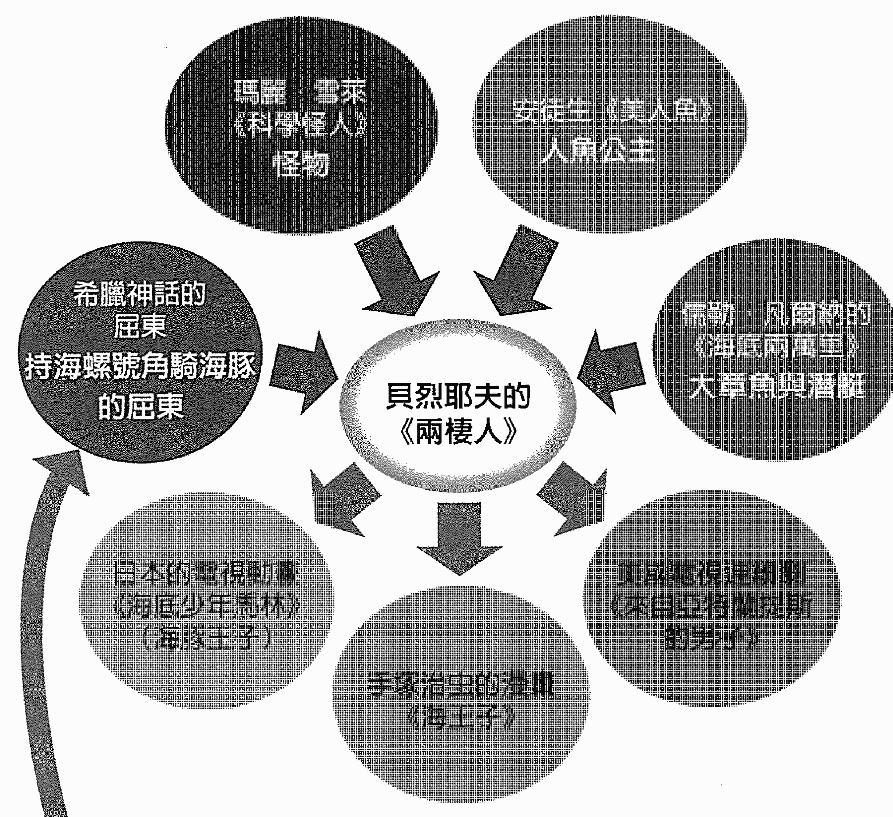

波賽頓之子，是位人身魚尾的神明

擁有一支能夠興風作浪或者平息風浪的魔法海螺號角

#### 俄羅斯的人氣經典作品

在日本，《兩棲人》的知名度雖低，但除了講談社曾經三度的出版以外，其他如偕成社、若樹房等出版社亦有陸續出版。而在母國俄羅斯則將其視為經典，人氣久久不墜，仍不斷有新裝訂版本發行，西元2004年改拍成電視連續劇，2007年更有新聞報導即將動畫化，2008年美國亦有作品電影化的消息。

#### 關聯項目

- 《美人魚》→No.101

# 注釋附錄

## No.002

*1 恩培多克勒（Empedocles，490？～430 B.C.）：希臘哲學家、詩人、政治家、宗教教師和生理學家，他認為一切物質由四種主要成分（火、空氣、水、土）構成，一切事物不生不滅，變化有賴於基本物質間的比例。

*2 泰利斯（Thales 624～546B.C.）：哲學家。以水為萬物本質的宇宙論和預測日蝕而聞名。

*3 愛奧尼亞哲學學派（Ionian School）：西元前六～前五世紀的希臘學派。他們從物質或自然力方面來解釋現象，有別於後來的思想家。

*4 希臘七賢：雅典的梭倫、斯巴達的基隆、米利都的泰利斯、普里恩的比亞斯、林度斯的克萊俄布盧、米蒂利尼的皮塔科斯、科林斯的佩里安德。

## No.003

*1 帕拉塞爾蘇斯（Paracelsus）：對鍊金術造成莫大影響的鍊金術師兼醫師。主張鍊金術的真正目的並非鍊金，而是要製造有益人體健康的醫藥。

*2 塞爾蘇斯（Celsus）：羅馬帝國時期的新柏拉圖主義哲學家。西元177至180年間寫《真道》四卷，指出基督教源自猶太教，而猶太人卻反對它。

## No.004

*1 溫蒂妮：奇幻基地《幻獸事典》譯作「水精」，由於此書所述水精靈眾多，遂採音譯「溫蒂妮」避免混淆。

*2 風精西爾芙（Sylph）：奇幻基地《幻獸事典》譯作「風精」。帕拉塞爾蘇斯以空中飛翔的形象構想出花心且青春永駐的女性精靈。

*3 火精沙羅曼蛇（Salamander）：奇幻基地《幻獸事典》譯作「火精」，是種住在火中貌似蜥蜴的怪物。老普林尼《博物誌》說火精只在雨天出現，但天氣若過於濕冷，火就會熄滅。

*4 土精諾姆（Gnome）：奇幻基地《幻獸事典》譯作「侏儒」，是種住在地底的妖精。身長約12公分，穿著服裝華美，戴紅色的三角帽。

*5 CCHS：即先天性中樞換氣不足症候群（Congenital Central Hypoventilation Syndrome）

## No.005

*1 富凱（Fouque, Friedrich Heinrich Karl de La Motte, Baron，1777～1843）：德國小說家、劇作家，因著名神話《水中仙女》而為人所知，其目的要在拿破崙時代對喚起一種德國傳統感和民族性。

*2 季荷杜（Jean Giraudoux，1882～1944）：法國小說家、隨筆作家、劇作家，他創立了一種幻象主義的戲劇形式，強調對話和風格，而不是寫實。

## No.006

*1 涅落斯（Nereus）：被稱為海洋老人的海神，潘陀斯與姬亞的兒子。

*2 埃阿科斯（Aeacus）：希臘神話中主神宙斯和河神阿索甫斯的女兒埃伊納所生之子。在雅典的傳說中，他與彌諾斯和拉達曼堤斯都是死者的判官。

*3 阿基里斯（Achilles）：希臘神話中珀琉斯和海洋寧芙忒提斯的兒子；在特洛伊戰爭中，他是阿伽門農軍隊中最勇敢、最英俊、最偉大的戰士。

*4 姬亞（Gaia）：由宇宙混沌凱歐斯所生的第一位神明。姬亞先是生下天空之神烏拉諾斯和海神潘陀斯，之後又與自己的兒子烏拉諾斯亂倫生下泰坦神族眾神，以及百手巨人黑卡蒂與獨眼巨人庫克羅普斯。

## No.007

*1 瓦爾妲基麗姬（Valkyrja）：是北歐神話中一群服侍主神奧丁的狄絲，其名字的原意是「選擇戰死的女人」。神話中大多將瓦爾妲基麗姬形容成身穿鎧甲、手持長槍、駕乘飛馬在天空中飛翔的女子。

*2 《梨俱吠陀》：梵文Rgveda的音譯，意譯則是「讚頌明論」。約西元前1300至前1000年左右成書，主要內容是對自然諸神的讚頌。

*3 因陀羅（Indra）：婆羅門教、印度教神名。由雅利安人從古代伊朗帶到印度，後來被佛教吸收，稱為「釋帝桓因」。原為雷雨之神，後發展為戰神。

*4 聖仙（Rsi）：古印度神話中的仙人，通常脾氣頗為暴躁，時常在盛怒之下使用法術，事後卻又後悔莫及。

*5 阿修羅（Asura）：另譯「阿須羅」、「阿須倫」、「阿蘇羅」等，意譯「不端正」、「非天」等。原為古印度神話中的一種惡神，因常與天神戰鬥，後世亦稱戰場為「修羅場」。

*6 濕婆（Siva）：婆羅門教和印度教主神之一，即毀滅之神、苦行之神、舞蹈之神。與梵天、毗濕奴並稱為婆羅門教和印度教三大主神。

*7 帕瓦娣（Parvati）：意譯為「雪山神女」，亦稱「喜馬拉雅山之女」。陀羅派愛神去引誘濕婆愛上帕瓦娣，觸怒了濕婆，被他用第三隻眼睛的神火燒毀，後來帕瓦娣修了千年苦行，終於成為濕婆的妻子。

## No.009

*1 聶伯河（Dnieper River）：歐洲第四大河流。發源於莫斯科以西約241公里瓦爾代丘陵南坡，流經俄羅斯西部、白俄羅斯和烏克蘭而抵達黑海。

*2 苦艾：製作苦艾酒的原料。多生長於山坡、林緣、野果林、草原及灌叢地等，目前尚未引種栽培。

*3 德弗札克（Antonin Leopold Dvorak，1841～1904）：第一位得到世界認同的波希米亞作曲家，以利用民間素材創作浪漫派音樂而著稱。

*4 《水仙女》：大英線上百科全書作《水澤仙女》、維基百科作《鬼新娘》，也有採音譯的《盧莎卡》、《露莎卡》等譯名。

## No.013

*1 格蘭戴爾（Grendel）：此處乃採奇幻基地《幻獸事典》譯名。

*2 荷羅斯加（Hroðgar）：此處乃採維基百科譯名，派拉蒙影業公司出品的電

## 英數字

- The Llamhigyn Y Dwr The Llamhigyn Y Dwr サムヒギン・ア・ドゥル ............56

## 一～五畫

- 九頭龍 Kuzuryu 九頭竜(くずりゅう) ........................................................................................................80
- 人魚 Mermaid マーメイド ....................................................................................................................44
- 人魚 Mermaid 人魚(にんぎょ) ............................................................................................................44,46
- 人魚 Merman マーマン ....................................................................................................................44
- 八大龍王 Badalongwang 八大竜王(はちだいりゅうおう) ............................................................130
- 八百比丘尼 Yaobikuni 八百比丘尼(やおびくに) ............................................................................48
- 八岐大蛇 Yamatano-orochi 八岐大蛇(やまたのおろち) ............................................................82
- 三途河 Sanzunokawa 三途の川(さんずのかわ) ............................................................................182
- 上津綿津見神 Uwatsuwatsuminokami 上津綿津見神(うわつわたつみのかみ) ............................................................140
- 上筒之男命 Uwatsutsuno-onomikoto 上筒之男命(うわつつのおのみこと) .. 140
- 凡尼克 Vannik ヴァンニク ....................................................................................................................40
- 大洋尼底斯 Oceanides オケアニデス ....................................................................................................94
- 大洋尼斯 Oceanis オケアニス ............................................................................................................94
- 大喪 Dagon ダゴン ............................................................................................................................118
- 女水仙 Nixie ニクシー ............................................................................................................................22
- 山水瀨 Sansuise 山水瀬(さんすいせ) ....................................................................................................182
- 山幸 Yamasachi 山幸(やまさち) ............................................................................................................202
- 中津綿津見神 Nakatsuwatsuminokami 中津綿津見神(なかつわたつみのかみ) ............................................................140
- 中筒之男命 Nakatsutsuno-onomikoto 中筒之男命(なかつつのおのみこと) . 140
- 厄哈・伊斯吉 Each Uisce アッハ・イーシュカ ............................................................................52
- 厄哈・烏斯吉 Each Uisge エッヘ・ウーシュカ ............................................................................52
- 天之水分神 Amenomikumari 天之水分神(あめのみくまり) ............................................................128
- 天之御中主神 Amenominakanushinokami 天之御中主神(あめのみなかぬしのかみ) ............................................................128
- 太陽之島 Island of Sun 太陽の島 ............................................................................................................184
- 巴力 B'l バアル ............................................................................................................................114
- 手水舍 Chouzuya 手水舎(ちょうずや) ....................................................................................................172
- 月亮之島 Island of Moon 月の島(つきのしま) ............................................................................184
- 水之主 Lord of the water 水の主(みずのぬし) ............................................................................36
- 水天 Suiten 水天(すいてん) ............................................................................................................128
- 水仙 Nix ニクス ............................................................................................................................22
- 水虎 Suiko 水虎(すいこ) ....................................................................................................................76
- 水垢離 Mizugori 水垢離(みずごり) ....................................................................................................172
- 水馬 Kelpies, Each Uisge & Each Uisce 水棲馬(すいせいば) ............................................................52

影《貝奧武夫》則譯作「赫羅斯加」。

## No.014

- 塞爾特民族（Celt）：指散居於古代歐洲各地的印歐語系民族，其居住地區從愛爾蘭到土耳其，一直延續到俄羅斯平原。

## No.015

- 尼日河（Niger River）：西非主要河流，全長4,200公里，是僅次於尼羅河和剛果河的非洲第三長河。
- 聖別：為某些神聖用途而進行潔淨儀式，與普通世俗的用途加以區別。

## No.016

- 多貢族（Dogon）：西非馬利中部高原地區擴及到布吉納法索邊境的種族。該族沒有中央集權的政府體制，而是由年長男性擔任家長。

## No.018

- 《今昔物語集》：日本最大的說話集。全三十一卷，廣收印度、中國與日本故事。成書於西元1120年以後。

## No.019

- 屈束（Triton）：波賽頓與安芙朵琳蒂的兒子，是位半人半魚的海神。據《神譜》記載，屈束負責掌管深海，住在一座黃金豪宅之中。他的頭部與身體是人，下半身則是魚的尾巴。
- 阿塔迦蒂斯（Atargatis）：敘利亞人所信奉的豐收女神，哈達的妻子。傳說她掉入湖中變成魚類，所以魚類與鳥獸被敘利亞人視為神聖的動物。
- 羅蕾萊（Lorely）：德國傳說中坐在萊茵河岩石上，利用其美貌與動人歌聲誘惑行船人，使船隻沉沒的妖女。

## No.020

- 《日本書紀》：記載古代日本歷史，與《古事記》構成日本神話故事骨幹的書籍。全書三十卷，養老四年（720）由舍人親王負責編纂。
- 《古今著聞集》：橘成季編纂的說話集，成書於西元1254年，共二十卷，規模僅次於《今昔物語集》。

## No.021

- 若狹：日本舊郡國名，屬北陸道，相當於現在的福井縣西南部地區。
- 里見八犬傳：此傳奇小說描述安房里見氏之祖義實的女兒伏姬感應到妖犬八房之氣而產下八塊玉，後來有八犬士為復興里見家而奔走。

## No.022

- 瓜拉尼族（Guarani）：南美印地安人，勇猛好戰，居住在現今的巴拉圭東部，以及巴西和阿根廷各地區。

## No.023

- 凱爾派：此處乃採音譯，奇幻基地《幻獸事典》則譯作「水魔」。

## No.024

- 阿凡克：此處乃採音譯，奇幻基地《幻獸事典》譯作「河狸怪」，另譯作「尋水獸」。

## No.026

- 墨西拿海峽（Strait of Messina）：在西西里島和義大利之間的海峽，內部的暗礁和漩渦在希臘神話中經常視為女魔的化身，令古代水手感到畏懼。海峽上還時常出現海市蜃樓，流傳著恐怖傳說。
- 瑟西（Circe）：亦譯作喀耳刻。希臘傳說中的一個女巫，太陽神希利歐斯和海中仙女普西絲的女兒。她能用藥物和咒語把人變成狼、獅子和豬。
- 奧德修斯（Odysseus）：英語作尤里西斯（Ulysses），拉丁語作烏利克西斯（Ulixes）。荷馬史詩《奧德賽》的主角，西方文學經常描述的一位人物，智慧、口才、機敏、勇氣和耐性過人。
- 埃涅阿斯（Aeneas）：特洛伊和羅馬的神話英雄人物，也是女神阿芙柔黛蒂和特洛伊王安喀塞斯的兒子。他在抵抗希臘人、保衛特洛伊的戰爭中功績卓著，但荷馬敘事詩暗示他不甘居於人下，因此出賣特洛伊。

## No.027

- 赫拉克勒斯（Heracles）：希臘神話最偉大的英雄，名字的原意是「赫拉的光榮」，但是事實上赫拉不斷迫害赫拉克勒斯，因為他是宙斯的私生子。
- 希利歐斯（Helios）：希臘神話中的太陽神，也就是羅馬神話中的索爾。
- 愛倫坡（Edgar Allan Poe，1809～1849）：美國詩人、評論家和短篇小說家，因對偵探小說和恐怖小說的影響而聞名於世。

## No.028

- 奧菲斯（Orpheus）：亦譯俄爾甫斯。古希臘傳說中的英雄，有超人的音樂天賦。傳說他是繆思和色雷斯王俄阿戈斯的兒子，阿波羅把自己第一把七弦豎琴給了他。
- 泊瑟芬（Persephone）：泊瑟芬是希臘神話中的冥界女王，是宙斯與狄蜜特的女兒，後來成為黑帝茲的妻子。
- 黑帝茲（Hades）：宙斯的兄弟，統治冥界的神明。因為「黑帝茲」這個名字不吉利，因此還有像普路托的別名，原意是「富有者」。
- 狄蜜特（Demeter）：奧林帕斯十二大神之一，根據荷馬《狄蜜特讚美詩》記載，她是位手持黃金寶劍的大地母神。
- 阿芙柔黛蒂（Aphrodite）：愛與美的女神。由烏拉諾斯被切斷的生殖器所流出的精子變成海中泡沫而成，即羅馬神話中的維納斯。

## No.029

- 赫拉（Hera）：克羅諾斯和莉亞的女兒，宇宙統治者宙斯的妻子與姐姐。赫拉名字的原意是「貴婦」，負責掌管婚姻與女性的生活，但她同時也是位嫉妒心相當重的女神。
- 伊俄拉俄斯（Iolaus）：此處採《幻獸事典》譯名。

## No.030

- 烏加里特（Ugarit）：古代迦南人的城市，位於敘利亞北部的地中海沿岸。西元1929年，法國一個考古發掘隊首先發現該城遺址。
- 中文和合本聖經作：「論到鱷魚的肢體和其大力，並美好的骨骼，我不能緘默不言」（〈約伯記41：12〉）。日語原文作利維坦，英語版聖經亦作「Leviathan」，僅中文和合本採「鱷魚」此譯。

## No.031

- 卡爾·林奈（Carolus Linnaeus，1707～1778）：瑞典植物學家和探險家，他最先定義自然界生物種屬的原則，並創造出統一的生物命名系統。
- 薩迦（Saga）：挪威語中的「故事」之意，泛指北歐的民間傳說。

## No.038

- 十拳劍：即十握劍，日本神話中經常提及，劍身長達十個拳頭。

## No.039

- 海座頭：奇幻基地《幻獸事典》譯作「海盲客」。

## No.040

- 神前結婚：循日本神道教儀式，於神社舉行的婚禮。
- 銚子：傳統的銚子是種長柄的鍋子，多用在神道教的婚禮儀式中。現代亦將用來溫酒的壺稱作銚子。

## No.041

- 正式題名爲《繪本百物語》，《桃山人夜話》是後世人的稱謂，後來反倒以此名流通。

## No.042

- 牛鬼（Ushioni）：流傳於西日本的妖怪，大多出現於海邊，襲擊海邊散步的人類。其形象爲牛頭鬼身，或者牛頭再加上蜘蛛的身體。

## No.043

- 雅典娜（Athena）：宙斯的女兒，奧林帕斯十二大神之一，也是戰爭與技藝的女神，更是一位處女之神。
- 墨提斯（Metis）：奧克安諾斯和特提斯的女兒，宙斯的第一任妻子。其名原意是「思慮」與「建言」。

## No.044

- 阿戈斯（Argos）：位於伯羅奔尼撒半島東部阿爾戈利斯地區的都市。有時亦可指稱整個阿爾戈利斯地區。
- 科林斯（Corinth）：古希臘都市暨王國，位於連接伯羅奔尼撒半島和維奧蒂亞的地峽附近。希臘神話說此都市是由埃俄羅斯之子西緒福斯所創建，並命名為埃費拉（科林斯古名）。

## No.045

- 普羅米修斯（Prometheus）：原意是「預見」，是位擁有預言能力的男神，同時也保護人類不被眾神敵意傷害。
- 五十名涅蕾斯中的普薩瑪忒（Psamathe）後來嫁給普羅透斯為妻，若涅洛斯與普羅透斯是同一位神明，那便相當於娶自己的女兒為妻。希臘神話中找不到這兩位神祇有孫婿關係的說法，姑且按照作者原文直譯，此說法仍然值得存疑。
- 戈耳工（Gorgon）：亦譯作戈爾貢，希臘神話中的怪物。荷馬只提到一個戈耳工，後來赫西奧德把數目增加到三個：斯塞諾、歐律雅耳和美杜莎。
- 艾奇德娜（Echidna）：此處採《幻獸事典》譯名，《西洋神名事典》譯作「愛姬多娜」。上半身為美女下半身為蛇的怪物，棲身於阿卡迪亞的洞穴內，露出美麗的上半身將過路旅人誘入山洞吞食。
- 拉頓（Ladon）：希臘神話中的百頭怪龍，負責守護海斯佩麗斯的金蘋果園。

## No.046

- 帕拉斯（Pallas）：泰坦神族，克雷伊歐斯和歐律比亞的兒子。娶斯提克斯為妻，成為尼姬等的父親。因為具有超群的智慧而著名。
- 伊莉絲（Iris）：彩虹女神。塔烏瑪斯和厄勒克特拉之女。服侍宙斯，擔任眾神的使者。之後又追隨在赫拉身邊。

## No.047

- 墨勒阿革洛斯（Meleager）：希臘神話中狩獵卡利敦野豬的領袖。荷馬史詩《伊里亞德》敘述他的父親卡利敦國王忘記向阿蒂蜜斯獻祭，使國土遭野豬蹂躪，後來墨勒阿革洛斯集結英雄把野豬趕跑。
- 安珀希雅（Ambrosia）：希臘神話中諸神的食物，食用它可以得到不死的生命，塗在傷口上也會立刻癒合。
- 半人馬族（Centaur）：據希臘神話記載，住在色薩利和阿卡迪亞山中的怪物。在希臘後期，他們經常被描繪成替酒神戴奧奈索斯拉戰車或被愛神厄洛斯束縛並騎乘，以暗示他們酗酒和好色的習性。

## No.048

- 原文的「Nojor」應屬謬誤，《圖解北歐神話》與網路維基百科均作「Njörðr」，故擇此名。
- 奧丁（Odin）：奧丁是北歐神話的主神，也是阿薩神族之王。其父親是原始神明布利的兒子包爾，母親則是巨人族女子貝絲特拉。
- 洛奇（Loki）：洛奇是主神奧丁的表兄弟。他並非北歐人所信奉的神明，而是負責傳承神話的詩人所杜撰的角色。洛奇屬於與眾神敵對的巨人族，但因為他外形俊美而和眾神同住、成為阿薩神族的一員。洛奇的個性奸詐狡猾，擅長謀略算計，變化莫測。
- 福瑞（Freyr）：攸關作物收成且愛好和平的華納神族。他氣質非凡，目光炯炯有神，和巴多同為完美的年輕神明。
- 菲依雅（Freyja）：攸關農作物收成且愛好和平的華納神族，同時也是具備女性善惡的女神。她的外形美麗、個性開放，愛人有人類也有神明，傳說與自己的兄長福瑞也曾發生關係。
- 塔西圖斯（Tacitus）：亦譯塔西佗。主要著作是《歷史》、《編年史》，從西元14年奧古斯都去世、提比略繼位，一直寫到96年圖密善逝世。

## No.050

- 達奴神族：愛爾蘭塞爾特神話中最核心的一支，傳說所有的塞爾特神明都是達奴神族的子孫，所以塞爾特神明又稱為「達奴之子」。
- 德魯伊（Druid）：古代塞爾特民族的神官。在塞爾特語裡面，「daru」指的是橡樹，「vid」則是知識之意，德魯伊就是「橡樹賢者」的意思。

## No.052

- 阿部蘇（Apsu）：巴比倫神話中象徵男性的代表性神明，也是淡水的象徵。阿部蘇是深淵裡的淡水世界，淡水湧出地面後形成了許多泉水和河川。
- 馬爾杜克（Marduk）：巴比倫神話中水神艾阿的兒子，因為領導眾神與海龍蒂雅瑪特對戰，而被視同為眾神之王恩利爾，成為巴比倫神話的主神。

## No.053

- 亞姆納哈爾：《惡魔事典》作「亞姆」，《西洋神名事典》作「雅姆」。

## No.054

- 亞斯文地區（Aswan）：上埃及一省，包括尼羅河氾濫平原及附近一帶，在其南面約11公里建有亞斯文高壩。
- 努比亞（Nubia）：非洲東北部古代地區名，北起尼羅河谷，東至紅海之濱，南達喀土木，西接利比亞沙漠。其南半部一直到尼羅河第二瀑布的南端，在古代埃及第十八王朝法老的統治下稱為庫施（Cush），古代希臘人則稱之為衣索比亞。
- 哈特霍（Hathor）：哈特霍跟伊西斯是埃及民眾最篤信的女神；有時是隻母牛，有時則是位頭頂生著豎琴形牛角與太陽圓盤的女性。哈特霍是古代埃及女性祭拜的歡喜與愛情女神，但另一方面也具有曾使人類瀕臨滅亡的狂暴女神雪克美特神格。
- 布達（Ptah）：以孟菲斯為信仰中心的創造神。布達通常作人類或木乃伊打扮，亦有冥界之神的神格，所以才會和奧賽利斯、蘇卡習合，形成新神格布達·蘇卡·奧賽利斯。
- 蘇卡（Sokar）：孟菲斯居民信仰的冥界之神，頭戴飾有公牛角阿特夫冠，有時作隼鷹形象，有時則是位隼頭人身的男性。他象徵不毛沙漠、死亡、黑暗與衰敗等負面的概念，同時也是司掌礦物等資源的地下之神。

## No.055

- 非利士人（Philistine）：起源於愛琴海的民族。西元前十二世紀在以色列人到達前不久定居於巴勒斯坦南部海岸地帶。
- 馬里遺跡：敘利亞古城，在幼發拉底河右岸。西元1933年開始考古發掘，發現了國王齊姆里利姆的宮殿、大量壁畫和數以萬計的小物件。
- H.P.洛夫克萊夫特（Howard Philips Lovecraft，1890～1937）：美國神怪小說家，創作出至今仍受書迷熱愛的克蘇魯神話。

## No.057

- 《波斯古經》（Avesta）：古代伊朗的宗教經典。最早的版本是在前四世紀阿契美尼德王朝末期時編纂，但在希臘亞歷山大征伐波斯時曾遭焚毀，僅存一卷。三～七世紀薩珊王朝時又重新收集、整理，用東波斯語的古阿維斯陀文寫作，主要記述瑣羅亞斯德的生平和教義。
- 阿胡拉·馬茲達（Ahura Mazda）：又名「歐馬茲特」、「馬茲達·阿胡拉」。根據瑣羅亞斯德教的教義，世界是善神阿胡拉·馬茲達與惡神阿里曼彼此不斷發生對抗的戰場。
- 涅普頓（Neptune）：羅馬人信奉的神明，相當於波賽頓。

## No.058

- 濕婆（Siva）：印度教中與婆羅賀摩、毗濕奴並列三大神。婆羅賀摩創造宇宙，毗濕奴加以維持，濕婆則從事破壞。

## No.061

- 那伽（Naga）：印度教和佛教神話中的精靈，其形半人半蛇。據說他們曾在地上繁衍過多釀成災禍，於是被梵天驅逐到地底，只許他們咬真正的惡人和注定天折的人。

## No.065

- 伊弉冉尊：即伊邪那美命。神代七代的最後一位神明，與丈夫伊邪那岐命一同出現。她在生下火神迦具土神時被烈火燒傷，因而喪命。
- 伊弉諾尊：即伊邪那岐命。神代七代最後一位神明，與妻子伊邪那美命一同出現。從黃泉歸來後，生下三貴子的伊邪那岐命便將高天原交由天照大御神治理，夜食國交由月讀命治理，海原交由須佐之男命治理，把自己的統治權轉讓給三貴子後，自己隱居於淡海（近江）的多賀。
- 《古事記》：日本最古的史書。和銅五年（712）編纂完成，計三卷。上卷為日本神話，中卷記述神武天皇至應神天皇時期的事蹟，下卷則記錄仁德天皇至推古天皇時代的歷史。
- 大國主命：國津神。於日本神話中登場的神明之一，是擁有眾多名稱的國家建設之神，同時也是古代的權貴豪族大三輪氏的祖神。

## No.066

- 天照大神（Amaterasu-omikami）：日本神話的主神。她是太陽女神，同時也是高天原的領導人。天照大神是日本皇室的祖神，奉祀於伊勢神宮。

## No.067

- 正倉院：奈良市東大寺大佛殿西北的寶庫，是日本藏寶最多的寶庫之一。

## No.068

- 月讀命（Tsukuyomi-no-mikoto）：日本神話裡的月神，同時也是農耕神。與天照大神、素戔嗚尊合稱「三貴子」。
- 此和歌是說在出雲這個八雲交疊湧起的國度，雲就像是環繞著八重牆垣般高聳入天，我也在這宮殿裡築起牆垣以納妻子，如同環繞著八重牆垣。

## No.069

- 日和山：江戶時代的船員以港口附近的小山判斷天氣是否適合出航。

## No.070

- 《續日本紀》：平安時代初期天皇敕令撰寫的史書。記載從文武天皇至桓武天皇，亦即西元697～791年此間的編年體史書。

## No.071

- 托爾特克（Tolteca）：托爾特克人曾於十～十二世紀統治現今墨西哥中部地區。「托爾特克」一名包括兩種意義：「城市居民」、「有文化的人」，或根據其字面為「蘆叢民族」，源於他們的中心城市托蘭（Tollan，「蘆葦叢生之地」）。

## No.073

- 蒂瓦納庫（Tiwanaku）：南美洲前哥倫布時期主要文明，以其在玻利維亞的的喀喀湖南岸附近的同名遺址而聞名於世。西元2000年蒂瓦納庫遺址被聯合國教科文組織列為世界遺產保護區。

## No.074

- 科蘇梅爾島（Cozumel）：加勒比海島嶼。距猶加敦半島東岸約16公里，屬墨西哥金塔納羅奧地區，地質構造類似猶加敦半島。
- 《德勒斯登刻本》（Dresden Codex）：與馬德里刻本、巴黎刻本，並稱前哥倫布時期馬雅象形文字的三種古代典範刻本，是歷經西班牙傳教士焚書之劫而僅存於世的珍貴文物。

## No.076

- 馬賽人（Masai）：東非游牧民族。以畜牧爲生的馬賽人是完全的游牧民族，終年成群流動放牧，生活幾乎全部依靠牲群的肉、血和奶。

## No.077

- 斯特拉博（Strabo）：希臘地理學家和歷史學家，所著《地理學》是奧古斯都時期涉及各民族、國家的鉅作。
- 西塞羅（Marcus Tullius Cicero）：羅馬政治家、律師、古典學者、作家，曾在導致羅馬共和國滅亡的內爭中，努力維護共和制度。
- 亞速群島（Azores）：北大西洋中的群島，由九個主要島嶼組成，在葡萄牙大陸以西約1,600公里處。
- 比米尼群島（Bimini）：巴哈馬西北部的一串島嶼。南北長65公里，位於美國佛羅里達海岸以東80公里，巴哈馬首都拿騷以西175公里。
- 梭倫（Solon）：「希臘七賢人」之一。他消除了雅典城邦的極度貧困，並且制定了憲法和法典。梭倫是貴族出身，但家道不富，約西元前594年擔任執政官，二十年後獲得作爲改革家和立法者的充分權力。

## No.080

- 吡濕奴（Visnu）：吡濕奴在吠陀時代原本只是個單純的太陽神，但後來跟土著神合而爲一，變成維護全宇宙的大神。在印度教裡，他是跟梵天、濕婆並列的三大神。
- 艾什瑪（Aēsma）：瑣羅亞斯德教中司掌狂行暴舉的惡魔。遭艾什瑪控制者會虐待有用的家畜，做出難以想像的凶暴行爲。

## No.083

- 檜：即日本莽草（Illicium anisatum），是一種常綠喬木。樹高約十公尺，樹幹爲灰褐色，葉片呈長橢圓形，大多生長在枝條的頂端，冬天時不會掉落。分布區域包括日本本州中部以南、四國、九州及中國。

## No.090

- 華格納（Wilhelm Richard Wagner，1813～1883）：德國戲劇作曲家和理論家，其歌劇與音樂對西方音樂的發展方向有革命性的影響。他對音樂形式本身從不感興趣，只把它作爲情感和心理的表現手段。

## No.095

- 摩西五書：即《舊約聖經》的創世記、出埃及記、利未記、民數記與申命記。

## No.099

- 賽克洛斯族（Cyclops）：希臘傳說和文學中的獨眼巨人。在荷馬的著作中，他們是食人者，住在邊遠地區，過著原始游牧生活。
- 珀涅羅珀（Penelope）：希臘神話中斯巴達人伊卡里俄斯跟仙女珀里波亞的女兒，英雄奧德修斯的妻子。
- 赫密斯（Hermes）：希臘神話中眾神的傳令神兼商業之神，同時也是旅行者的守護神。有時候宙斯也會要他幫忙死者帶路，引領至黑帝茲。

## No.101

- 嘉士伯釀造所：嘉士伯是世界第五大釀酒集團，於西元1847年創立，總部位於丹麥哥本哈根。

## No.103

- 《海王子》：此為台灣譯名，原題名為《海のトリトン》，其中「トリトン」即海神屈東，故亦可譯作《海之屈東》。

## 六～十畫

- 水遁之術 Suitonnojutsu 水遁の術(すいとんのじゅつ) ........................................ 204
- 水精靈 Water elementals 水の精霊(みずのせいれい) ........................................ 12
- 功德水 Arga 功德水(くどくすい) ........................................................................ 176
- 北方真武君蕩魔天尊 Beifangzenwejun-danmotienzuen 北方真武君蕩魔天尊(ほっぽうしんぶくんとうみてんそん) .............................. 132
- 半魚人 Gil-man ギルマン .................................................................................... 50
- 半魚人 Gil-man 半魚人(はんぎょじん) .............................................................. 50
- 卡利普索 Calypso カリュプソ ............................................................................ 94
- 卡里布地斯 Charybdis カリュブディス .............................................................. 60
- 古蕾格·安雯 Gwragedd Annwn グラゲーズ·アンヌーン ................................ 28
- 史琪拉 Scylla スキュラ ...................................................................................... 58
- 四大元素理論 Four Elements Theory 四大元素四大元素説(しだいげんそせつ) ............ 10
- 四大精靈 Four Elementals 四大精霊(しだいせいれい) ...................................... 12
- 四海龍王 Sihailongwang 四海竜王(しかいりゅうおう) .................................... 130
- 四龍 Shilong 四竜(しりゅう) .............................................................................. 130
- 尼斯湖水怪 Nessie ネッシー .............................................................................. 70
- 尼爾德 Njörðr ニョルズ .................................................................................... 104
- 市寸島比賣命 Ichikishimahimenomikoto 市寸島比売命(いちきしまひめのみこと) ........................................................ 142
- 氐人國 Direnguo 氐人国(ていじんこく) ............................................................ 46
- 玄武 Genbu 玄武(げんぶ) .................................................................................. 132
- 甘露 Amrita アムリタ ...................................................................................... 170
- 甘露 Ganlu 甘露(かんろ) .................................................................................. 171
- 丟卡利翁 Deucalion デウカリオン .................................................................... 162
- 伊夫基安德魯 Ichtyandr イフチアンドル .......................................................... 216
- 伊希切爾 Ix Chel イシュ·チェル ...................................................................... 156
- 伊拉帕 Illapa イリャパ ...................................................................................... 154
- 伊普皮亞拉 Ipupiara イプピアラ ...................................................................... 50
- 多岐都比賣命 Tagitsuhimenomikoto 多岐都比売命(たぎつひめのみこと) ... 142
- 多紀理毘賣命 Tagiribimenomikoto 多紀理毘売命(たぎりひめのみこと) ...... 142
- 安芙朵琳蒂 Amphitrite アムピトリテ .............................................................. 18,94,96,98
- 安珀希雅 Ambrosia アムブロシア .................................................................... 170
- 安戴茵 Undine アンダイン ................................................................................ 14
- 朵利絲 Doris ドリス .......................................................................................... 18,94
- 江深瀨 Goushinse 江深瀨(ごうしんせ) ............................................................ 182
- 百慕達三角洲 Bermuda Triangle バミューダ·トライアングル ...................... 186
- 艾奇德娜 Echidna エキドナ .............................................................................. 98
- 艾蓮 Elaine エレイン .......................................................................................... 30
- 西尤蘇德拉 Ziusudra ジウスドラ ...................................................................... 162
- 西印度海盜 Buccaneer バッカニア .................................................................... 196
- 亨利·摩根爵士 Sir Henry Morgan サー·ヘンリー·モーガン ...................... 196
- 住吉三神 Sumiyoshi-sanjin 住吉三神(すみよしさんじん) ............................ 140
- 克奴姆 Khnum クヌム .................................................................................... 116
- 克呂墨涅 Clymene クリュメネ ........................................................................ 94
- 克刺泰伊斯 Crataeis クライタイス .................................................................... 58
- 克蘇魯 Cthulu クトゥルフ .............................................................................. 120
- 冷泉院的水精靈 Reizen-in no mizunotama 冷泉院の水の精(れいぜんいんのみずのせい) .................................................................... 42
- 別西卜 Beelzebub ベルゼブブ ........................................................................ 114
- 利維坦 Leviathan リヴァイアサン .................................................................... 66
- 君比拉 Kunbi-ra クンビーラ ........................................................................ 146
- 否狄阿諾伊 Vodyanoy ヴォジャノーイ ........................................................ 26
- 巫支祁 Musiki 巫支祈(ふしき) ........................................................................ 136
- 忒提斯 Thetis テティス .................................................................................... 18
- 李爾 Lir リル .................................................................................................... 108
- 渦豆怪 Azuki-sogi 小豆そぎ(あずきそぎ) .................................................... 88
- 私掠船 Privateer プライヴェティア ................................................................ 194
- 那伽 Naga ナーガ族 ........................................................................................ 130
- 亞利安・巴力 Aryan Baal アリヤン・バアル .............................................. 114
- 亞姆納哈爾 Yam-nahar ヤム・ナハル .......................................................... 114
- 亞特蘭提斯 Atlantis アトランティス .............................................................. 164
- 《兩棲人》 The Amphibian Man 『両棲人間』(りょうせいにんげん) ............ 216
- 和修吉 Vasuki 和修吉(わしゅきつ) ................................................................ 130
- 奈克塔 Nectar ネクタル .................................................................................. 170
- 妮穆艾 Nimue ニミュエ .................................................................................. 30
- 姆大陸 Mu ムー大陸 ...................................................................................... 166
- 宗像三女神 Munakata-sanjoshin 宗像三女神(むなかたさんじょしん) ........ 142
- 屈東 Triton トリトン ...................................................................................... 44,98
- 帕拉塞爾蘇斯 Paracelsus パラケルスス ........................................................ 12
- 帕納迦 Panacea パナケア .............................................................................. 169
- 帕裡雅卡卡 Pariacaca パリアカカ ................................................................ 152
- 底津綿津見神 Sokowatatsuminokami 底津綿津見神(そこわたつみのかみ) .. 140
- 底筒之男命 Sokotsutsuno-onomikoto 底筒之男命(そこつつのおのみこと) .. 140
- 拉頓 Ladon ラドン .......................................................................................... 98
- 河太郎 Kawatarou 河太郎(かわたろう) ........................................................ 72
- 河伯 Kahaku 河伯(かはく) .............................................................................. 134
- 河童 Kappa 河童(かっぱ) .............................................................................. 72,74
- 法蘭西斯・德雷克爵士 Sir Francis Drake サー・フランシス・ドレーク .. 194
- 波賽頓 Poseidon ポセイドン .......................................................................... 96
- 的的喀喀湖 Titicaca ティティカカ湖 .............................................................. 184
- 金刀比羅宮 Kotohiraguu 金刀比羅宮(ことひらぐう) ................................ 146
- 金比羅大權現 Konnpira-daigongen 金比羅大權現(こんぴらだいごんげん) .. 146
- 金比羅宮 Konpiragu 金比羅宮(こんぴらぐう) .............................................. 146
- 阿凡克 Afanc アーヴァンク .......................................................................... 54
- 阿戈爾 Aegir エーギル .................................................................................. 106
- 阿布沙羅絲 Apsaras アプサラス .................................................................... 20
- 阿那娑達多 Anavatapta 阿那娑達多(あなばだった) ................................ 130
- 阿邦 Aban アバン .......................................................................................... 122
- 阿帕姆・拿帕 Apam Napat アパーム・ナパート ...................................... 123
- 阿帕斯 Apas アーパス .................................................................................... 126

+   阿胡拉尼斯 Ahuranis アフラニス ........................................................................................................ 122
阿娜希塔 Anahita アナーヒター ........................................................................................................ 122
阿部 Ap アープ ........................................................................................................ 122
阿普卡盧 Apkallu アプカル ........................................................................................................ 50
阿塔迦蒂斯 Atargatis アタルガティス ........................................................................................................ 44
阿瑪提亞的角 Amalthea's horn アマルテイアの角 ........................................................................................................ 102
阿謝洛奧斯 Achelous アケロオス ........................................................................................................ 102
哈達德 Hadad ハッド ........................................................................................................ 114
威廉·基德 William Kidd ウィリアム・キッド ........................................................................................................ 194
幽靈船 Ghost ship 幽霊船(ゆうれいせん) ........................................................................................................ 192
洗豆怪 Azuki-arai 小豆洗い(あずきあらい) ........................................................................................................ 88
洛嬪 Luopin 洛嬪(らくひん) ........................................................................................................ 134
洪水英雄 Flood hero 洪水英雄(こうずいえいゆう) ........................................................................................................ 162
洪水傳說 Flood legend 洪水伝説(こうずいでんせつ) ........................................................................................................ 160,162
紅豆沙沙怪 Azuki-sarasara 小豆サラサラ(あずきさらさら) ........................................................................................................ 88
《美人魚》 Den Lille Havfrue 『人魚姫』(にんぎょひめ) ........................................................................................................ 212
范德戴肯 Van der Decken ヴァン・デル・ヴェッケン ........................................................................................................ 190
哭泣之神 Dio de romper 泣き神(なきがみ) ........................................................................................................ 154
娑伽羅 Sagara 娑伽羅(さから) ........................................................................................................ 130
宮比羅大將 Kubirataishou 宮比羅大将(くびらたいしょう) ........................................................................................................ 146
挪威海妖 Kraken クラーケン ........................................................................................................ 68
格勞科斯 Glaucus グラウコス ........................................................................................................ 58
格蘭戴爾 Grendel グレンデル ........................................................................................................ 32
泰利斯 Thales タレス ........................................................................................................ 10
海入道 Uminyudou 海入道(うみにゅうどう) ........................................................................................................ 84
海之主教 Sea Bishop 海の司教(うみのしきょう) ........................................................................................................ 50
海坊主 Umibouzu 海坊主(うみぼうず) ........................................................................................................ 84
海和尚 Umioshou 海和尚(うみおしょう) ........................................................................................................ 84
海幸 Umissachi 海幸(うみさち) ........................................................................................................ 202
《海底兩萬里》 Vingt Mille Lieues sous les Mers
『海底二万里』(かいていにまんり) ........................................................................................................ 214
海法師 Umihoushi 海法師(うみほうし) ........................................................................................................ 84
海洋老人 the Old Man of the Sea 海の老人(うみのろうじん) ........................................................................................................ 98
海座頭 Umizatou 海座頭(うみざとう) ........................................................................................................ 84
海豹少女 Seal Maidens アザラシ乙女 ........................................................................................................ 34
海盜 Pirate 海賊(かいぞく) ........................................................................................................ 194,196
海盜旗 Jolly Roger ジョリー・ロジャー ........................................................................................................ 196
海盜旗 Pirate Flag 海賊旗(かいぞくき) ........................................................................................................ 196
海德拉 Hydra ハイドラ ........................................................................................................ 120
海德拉 Hydra ヒュドラー ........................................................................................................ 64
涅涅 Nyene ニェネ ........................................................................................................ 36
涅洛斯 Nereus ネレウス ........................................................................................................ 18,98
涅蕾斯 Nereids ネレイデス ........................................................................................................ 18
涅蕾斯 Nereis ネレイス ........................................................................................................ 18
烏爾瓦西 Urvashi ウルヴァシー ........................................................................................................ 20
特拉洛克 Tlaloc トラロック ........................................................................................................ 150
特提斯 Tethys テテュス ........................................................................................................ 94
真武 Zhenwu 真武(しんぶ) ........................................................................................................ 132
真武玄天上帝 Zhenwuxuantiangshangdi
    真武玄天上帝(しんぶげんてんじょうてい) ........................................................................................................ 132
素盞嗚尊 Susano-onomikoto 素盞嗚尊(すさのおのみこと) ........................................................................................................ 144
翁蒂奴 Undine オンディーヌ ........................................................................................................ 14
馬尾藻海 Sargasso Sea サルガッソー海 ........................................................................................................ 188
馬的緯度 Horse Latitude ホース・ラティチュード ........................................................................................................ 188
馬南南麥克李爾 Manannan Mac Lir マナナン・マクリル ........................................................................................................ 110

## 十一～十五畫

+   國之水分神 Kuninomikumari 国之水分神(くにのみくまり) ........................................................................................................ 128
基德船長 Captain Kidd キャプテン・キッド ........................................................................................................ 194
強深瀨 Goushinse 強深瀨(ごうしんせ) ........................................................................................................ 182
御神渡 Omiwatari 御神渡り(おみわたり) ........................................................................................................ 206
御船樣 Ohunasama 御船様(おふなさま) ........................................................................................................ 148
敖欽 Aoching 敖欽(ごうきん) ........................................................................................................ 130
敖順 Aoshun 敖順(ごうじゅん) ........................................................................................................ 130
敖廣 Aoguang 敖広(ごうこう) ........................................................................................................ 130
敖潤 Aorun 敖潤(ごうじゅん) ........................................................................................................ 130
梅爾史鐸姆 Maelstrom メイルシュトローム ........................................................................................................ 61
梅爾波曼 Melpomene メルポメネ ........................................................................................................ 62
梅羅 Merrows メロー ........................................................................................................ 44
淺水瀨 Sensuise 浅水瀨(せんすいせ) ........................................................................................................ 182
甜蜜 Madra マドラ ........................................................................................................ 170
略克查・丘拉巴 Llaksha Chulaba リャクサ・チュラバ ........................................................................................................ 152
船幽靈 Funayuurei 舟幽霊(ふなゆうれい) ........................................................................................................ 86
船神樣 Hunagamisama 船神様(ふながみさま) ........................................................................................................ 148
船靈樣 Hunadamasama 船霊様(ふなだまま) ........................................................................................................ 148
陵魚 Lingyu 陵魚(りょうぎょ) ........................................................................................................ 46
凱爾派 Kelpies ケルピー ........................................................................................................ 52
幾米爾 Gymir ギュミル ........................................................................................................ 106
斯提克斯 Styx ステュクス ........................................................................................................ 100
普撒馬塞 Psamathe プサマテ ........................................................................................................ 18
普羅透斯 Proteus プロテウス ........................................................................................................ 98
湖中仙女 Dame de Lac 湖の貴婦人(みずうみのきふじん) ........................................................................................................ 30
湖之騎士 Knight of the Lake 湖の騎士(みずうみのきし) ........................................................................................................ 30
無支奇 Musiki 無支奇(むしき) ........................................................................................................ 136
無支祁 Musiki 無支祁(むしき) ........................................................................................................ 136
跋難陀 Upananda 跋難陀(ばなんだ) ........................................................................................................ 130
《黑湖妖譚》 Creature from the Black Lagoon
    『大アマゾンの半魚人』(だいあまぞんのはんぎょじん) ........................................................................................................ 50
黑鬍子 Blackbeard 黒ひげ ........................................................................................................ 196
奧克安諾斯 Oceanus オケアノス ........................................................................................................ 94
愛德華・蒂奇 Edward Teach エドワード・ティーチ ........................................................................................................ 196
溫蒂妮 Undine ウンディーネ ........................................................................................................ 14

## 十六～二十畫

- 聖水 Holy water 聖水(せいすい) 174
- 萬能溶劑 Alkahest アルカエスト 169
- 葬頭河 Zangtouhe 葬頭河(そうずか) 182
- 蒂雅瑪特 Tiamat ティアマト 112
- 蜃 Shin 蜃(しん) 78
- 農摩 Nonmo ノンモ 38
- 嘉琪德莉卡 Chalchiuhtlicue チャルチウートリクエ 151
- 圖奴帕・維拉科嘉 Tunupa Viracocha トゥヌーパ・ビラコチャ 154
- 圖奴帕 Tunupa トゥヌーパ 154
- 漂泊的荷蘭人 The Flying Dutchman さまよえるオランダ人 190
- 禊 Misogi 禊ぎ(みそぎ) 172
- 福耳庫斯 Phorkys ポルキュス 58, 98
- 維拉 Vila ヴィーラ 24
- 維拉科嘉 Viracocha ビラコチャ 184
- 豪麻 Haoma ハオマ 171
- 赫卡蒂 Hecate ヘカテ 116
- 赫拉克勒斯 Heracles ヘラクレス 62, 70, 102
- 赫凱特 Heqet ヘケト 116
- 墨提斯 Metis メティス 94
- 德叉褥 Taksaka 德叉褥(とくしゃか) 130
- 德頓 Dedun デドゥン 116
- 摩奴 Manu マヌ 162
- 摩那斯 Manasvin 摩那斯(まなす) 130
- 潘陀斯 Pontos ポントス 98
- 潮干珠 Shiohirutama 潮干珠(しひるたま) 203
- 潮滿珠 Shiimitsutama 潮滿珠(しみつたま) 203
- 養老乃濫 Yoronotaki 養老の濫(ようろうのたき) 180
- 養老水 Yorosui 養老水(ようろうすい) 180
- 橋渡 Kyouto 橋渡(きょうと) 182
- 盧爾德 Lourdes ルルド 178
- 磨豆怪 Azuki-togi 小豆とぎ(あずきとぎ) 88
- 縛魯擎 Varuna ヴァルナ 128
- 諾亞方舟 Noah's Ark ノアの箱船 160
- 諾釀 Nonyan ノニャン 36
- 闘伽井 Akai 闘伽井(あかい) 176
- 闘伽水 Akasui 闘伽水(あかすい) 176
- 闘伽行者 Akagyouja 闘伽行者(あかぎょうじゃ) 176
- 龍王 Dragon king 竜王(りゅうおう) 130
- 優鉢羅 Utpalaka 優鉢羅(うばつら) 130
- 彌那迦 Menaka メーナカー 20
- 彌都波能賣神 Mitsuhanomenokami 彌都波能賣神(みつはのめのかみ) 138
- 彌諾 Mena メーナー 20
- 濕濡女 Nureonnna 濡れ女(ぬれおんな) 90
- 薇薇安 Vivian ヴィヴィアン 30
- 賽倫 Siren セイレーン 62
- 賽爾基 Selkies セルキー 35
- 闇御津羽神 Kuramitsuhanokami 闇御津羽神(くらみつはのかみ) 138
- 闇淤伽美神 Kuraokaminokami 闇淤伽美神(くらおかみのかみ) 138
- 薩囉薩伐底 Sarasvati サラスヴァティー 124
- 豐玉姬 Toyotamahime 豐玉姬(とよたまひめ) 202
- 澱豆怪 Azuki-age 小豆あげ(あずきあげ) 88
- 羅恩 Roane ローン 34
- 羅莎卡 Rusalka ルサルカ 24
- 羅蕾萊 Lorely ローレライ 44
- 難陀 Ananda 難陀(なんだ) 130
- 蘇摩 Soma ソーマ 170

## 二十一畫以上

- 躍水魔蛙 Water leaper ウォーター・リーパー 56
- 辯財天 Benzai-ten 弁財天(べんざいてん) 124
- 靈藥 Elixir エリクサ 168
- 鹽土神 Shiotsuchinokami 塩土神(しおつちのかみ) 202

## 参考文献

- 『The Complete Gods and Goddesses of Ancient Egypt』Richard H. Wilkinson 著 Thames & Hudson
- 『アタルヴァ・ヴェーダ讃歌』辻直四郎 訳 岩波書店
- 『異端事典』C.S.クリフトン 著 田中雅志 訳 三交社
- 『インド神話伝説辞典』菅沼晃 著 東京堂出版
- 『ヴィジュアル版世界の神話百科アメリカ編』D.M.ジョーンズ／B.L.モリノー 著 蔵持不三也 監訳 原書房
- 『世界古典文学全集3 ヴェーダ／アヴェスター』辻直四郎 編 筑摩書房
- 『ウガリトと旧約聖書 聖書の研究シリーズ34』P.C.クレイギー 著 津村俊夫ほか 訳 教文館
- 『ウガリト文学と古代世界』C.H.ゴールデン 著 高橋正男 訳 日本基督教団出版局
- 『海の男／ホーンブロワー・シリーズ』セシル・スコット・フォレスター 著 高橋泰邦／菊池光 訳 早川書房
- 『エジプトの神々』J.チェルニー 著 吉成薫／吉成美登里 訳 弥呂久
- 『オカルティズム事典』アンドレ・ナタフ 著 高橋誠ほか 訳 三交社
- 『海底二万里』上下 ジュール・ヴェルヌ 著 朝比奈美知子 訳 岩波書店
- 『ギリシア・ローマ神話事典』マイケル・グラント／ジョン・ヘイゼル 著 西田実ほか 訳 大修館書店
- 『ギリシア・ローマ神話辞典』高津春繁 著 岩波書店
- 『ギリシア神話』アポロドーロス 著 高津春繁 訳 岩波書店
- 『ギルガメシュ叙事詩 付イシュタルの冥界下り』矢島文夫 訳 筑摩書房
- 『形而上学』上下 アリストテレス 著 出隆 訳 岩波書店
- 『「水の精霊」とイスラム』『国立民族学博物館研究報告』13巻4号 収録 竹沢尚一郎 著 国立民族学博物館
- 『日本古典文学大系84 古今著聞集』永積安明／島田勇雄 校注 岩波書店
- 『古事記』倉野憲司 校注 岩波書店
- 『西遊記』1〜9 中野美代子 訳 岩波書店
- 『山海経』高馬三良 訳 平凡社
- 『新編日本古典文学全集51 十訓抄』浅見和彦 校注・訳 小学館
- 『神統記』ヘシオドス 著 廣川洋一 訳 岩波書店
- 『失楽園』ジョン・ミルトン 著 平井正穂 訳 岩波書店
- 『聖書 新共同訳』日本聖書協会
- 『聖書事典』相浦忠雄等 編 日本基督教団出版部
- 『聖書百科全書』ジョン・ボウカー 編著 荒井献／池田裕／井谷嘉男 監訳 三省堂
- 『世界神話辞典』アーサー・コッテル 著 左近司祥子ほか 訳 柏書房
- 『全国神社大要覧』リッチマインド出版事業部
- 『ゾロアスターの神秘思想』岡田明憲 著 講談社
- 『宝島』スティーヴンスン 著 阿部知二 訳 岩波書店
- 『中国妖怪人物事典』実吉達郎 著 講談社
- 『画図百鬼夜行全画集』鳥山石燕 著 角川書店
- 『日本書紀』坂本太郎ほか 校注 岩波書店
- 『日本神社100選』臼田甚五郎 監修 秋田書店
- 『日本神話事典』大林太良／吉田敦彦 監修 大和書房
- 『ベーオウルフ』厨川文夫 訳 岩波書店

『図説マヤ・アステカ神話宗教事典』メアリ・ミラー／カール・タウベ 編 増田義郎 監修 東洋書林

『桃山人夜話 絵本百物語』竹原春泉 画 角川書店

『妖精Who's Who』キャサリン・ブリッグズ 著 井村君江 訳 筑摩書房

『妖精事典』キャサリン・ブリッグズ 編著 平野敬一ほか 訳 富山房

『リグ・ヴェーダ讃歌』辻直四郎 訳 岩波書店

『ロシアの神話』F.ギラン 編 小海永二 訳 青土社

## 譯者參考書目

《The Encyclopedia of Demons and Demonology》 Rosemary Guiley / 2009 / Checkmark Books

《Occultism: Its Theory and Practice》 Sirdar Ikbal Ali Shah / 2003 / Kessinger Publishing, LLC

《兩棲人》 亞雷克桑德・貝烈耶夫著 / 葉振聲譯 / 大眾書局 / 1978年

《萬葉集》 趙樂甡譯 / 譯林出版社 / 2009年

《新譯山海經》 彭錫楊譯注 / 三民書局 / 2004年

《墮天使事典》 真野隆也著 / 沙子芳譯 / 尖端出版社 / 2004年

《宗教辭典》 （上下） 任繼愈主編 / 博遠出版社 / 1989年

《神話學辭典》 葛哈德・貝林格著 / 林宏濤譯 / 商周出版 / 2006年

《召喚師》 高平鳴海監修 / 王書銘譯 / 奇幻基地 / 2005年

《聖劍傳說》 佐藤俊之 F.E.A.R著 / 魏煜奇譯 / 奇幻基地 / 2005年

《惡魔事典》 山北篤・佐藤俊之監修 / 高胤曉・劉子嘉・林哲逸合譯 / 奇幻基地 / 2003

《幻獸事典》 草野巧著 / 林哲逸譯 / 奇幻基地 / 2010年

《魔導具事典》 山北篤監修 / 黃牧仁・林哲逸・魏煜奇合譯 / 奇幻基地 / 2005年

《圖解鍊金術》 草野巧著 / 王書銘譯 / 奇幻基地 / 2007年

《圖解克蘇魯神話》 森瀨緋著 / 王書銘譯 / 奇幻基地 / 2010年

《西洋神名事典》 山北篤監修 / 鄭銘得譯 / 奇幻基地 / 2004年

《東洋神名事典》 山北篤監修 / 高詹燦譯 / 奇幻基地 / 2005年

《埃及神名事典》 池上正太著 / 王書銘譯 / 奇幻基地 / 2008年

《魔法・幻想百科》 山北篤監修 / 王書銘・高胤曉譯 / 奇幻基地 / 2006年

《幻想地名事典》 山北篤監修 / 王書銘譯 / 奇幻基地 / 2011年

## 國家圖書館出版品預行編目資料

圖解水神與水精靈 / 山北 篤著 ; 王書銘譯. -- 初版. --
臺北市 : 奇幻基地出版 : 家庭傳媒城邦分公司發行 ; 2013.12 (民102.12)
面 : 公分. -- (F-Maps : 013)
譯自 : 図解 水の神と精霊
ISBN 978-986-5880-54-5 (平裝)
1. 神學 2. 神 3. 水 4. 日本

283.1

102023297

城邦讀書花園
www.cite.com.tw

## F-Maps 013

## 圖解水神與水精靈

原著書名 / 図解 水の神と精霊
作 者 / 山北 篤
譯 者 / 王書銘

企劃選書人 / 楊秀真
責任編輯 / 李幼婷

行銷企劃 / 周丹蘋
業務企劃 / 虞子嫻
行銷業務經理 / 李振東
總 編 輯 / 楊秀真
發 行 人 / 何飛鵬
法律顧問 / 台英國際商務法律事務所羅明通律師
出 版 / 奇幻基地出版
城邦文化事業股份有限公司
台北市104民生東路2段141號8樓
電話 : (02)25007008 傳真 : (02)25027676
網址 : www.ffoundation.com.tw
e-mail : ffoundation@cite.com.tw

發 行 / 英屬蓋曼群島商家庭傳媒股份有限公司城邦分公司
聯絡地址 : 台北市104民生東路2段141號2樓
書虫客服服務專線 : 02-25007718 ; 25007719
24小時傳真專線 : 02-25001990 ; 25001991
服務時間 : 週一至週五上午09:30-12:00 ; 下午13:30-17:00
劃撥帳號 : 19863813 ; 戶名 : 書虫股份有限公司
讀者服務信箱 : service@readingclub.com.tw
歡迎光臨城邦讀書花園 網址 : www.cite.com.tw

香港發行所 / 城邦（香港）出版集團有限公司
香港灣仔駱克道 193 號東超商業中心 1 樓
電話 : (852) 2508-6231 傳真 : (852) 2578-9337
e-mail : hkcite@biznetvigator.com

馬新發行所 / 城邦（馬新）出版集團 Cite (M) Sdn Bhd
41, Jalan Radin Anum, Bandar Baru Sri Petaling, 57000 Kuala Lumpur, Malaysia.
電話 : 603-90578822 傳真 : 603-90576622
e-mail : cite@cite.com.my

封面設計 / 黃聖文
排 版 / 浩瀚電腦排版股份有限公司
印 刷 / 高典印刷有限公司

2013年（民102）12月3日初版

Printed in Taiwan.

## 售價 / 330元

ZUKAI MIZU NO KAMI TO SEIREI by YAMAKITA Atsushi
Illustrations by SHIBUYA Yuji, SHIBUYA Chizuru
Copyright © 2009 YAMAKITA Atsushi
All rights reserved.
Originally published in Japan by Shinkigensha Co Ltd, Tokyo.
Chinese (in complex character only) translation rights arranged with
Shinkigensha Co Ltd, Japan through THE SAKAI AGENCY.
Complex Chinese translation copyright © 2013 Fantasy Foundation Publication, a division of
Cité Publishing Ltd.

著作權所有・翻印必究
ISBN 978-986-5880-54-5

| 廣告回函 |
| :--- |
| 北區郵政管理登記證 |
| 台北郵字第000791號 |
| 郵資已付，免貼郵票 |

104台北市民生東路二段141號11樓
英屬蓋曼群島商家庭傳媒股份有限公司城邦分公司 收

請沿著虛線撕下，謝謝

每個人都有一本奇幻文字的存摺簿
奇幻基地官網：http://www.ffoundation.com.tw
奇幻基地粉絲團：http://www.facebook.com/ffoundation

書號：1HP013
書名：圖解水神與水精靈

活動期間，購買奇幻基地作品，剪下封底折口的點數券，集到一定數量，寄回本公司，即可依點數多寡兌換獎品。

## 點數兌換獎品說明：

- **5點** 奇幻戰隊好書袋一個
- **10點** 2012年布蘭登·山德森來台紀念T恤一件
  有S&M兩種尺寸，偏大，由奇幻基地自行判斷出貨
- **15點** 【蕭青陽獨家設計】典藏限量精繡帆布書袋
  紅線或銀灰線繡於書袋上，顏色隨機出貨

## 【集點處】
（點數與回函卡皆影印無效）

| 1 | 6 | 11 |
|---|---|----|
| 2 | 7 | 12 |
| 3 | 8 | 13 |
| 4 | 9 | 14 |
| 5 | 10 | 15 |

## 兌換辦法：

2013年2月～2014年1月奇幻基地出版之作品中，剪下回函卡頁上之點數，集滿規定之點數，貼在右邊集點處，即可寄回兌換贈品。
【活動日期】：即日起至2014年1月31日
【兌換日期】：即日起至2014年3月31日（郵戳為憑）

## 其他說明：

- *請以正楷寫明收件人真實姓名、地址、電話與email，以便聯繫。若因字跡潦草，導致無法聯繫，視同棄權
- *兌換之贈品數量有限，若贈送完畢，將不另行通知，直接以其他等值商品代之
- *本活動限臺澎金馬地區讀者

為提供訂購、行銷、客戶管理或其他合於營業登記項目或章程所定業務之目的，英屬蓋曼群島商家庭傳媒(股)公司城邦分公司，於本集團之營運期間及地區內，將以電郵、傳真、電話、簡訊、郵寄或其他公告方式利用您的提供之資料（資料類別：C001、C002、C003、C011等）。利用對象除本集團外，亦可能包括相關服務的協力機構。如您有依個資法第三條或其他需服務之處，得致電本公司客服中心電話(02)25007718請求協助。相關資料如為非必要項目，不提供亦不影響您的權益。

## 個人資料：

姓名：________________________ 性別：□男 □女
地址：________________________________________________________________
電話：________________________ email：________________________
想對奇幻基地說的話：________________________________________________________________

請剪下右側點數，貼於背面的集點處，集滿5點以上，即可寄回兌換抽獎