# 图解象征占星学全书

## 前言 Foreword

在现今命理充斥的环境中，12星座几乎成为共同流行文化。每个人第一次认识的话题，也多半是你是什么星座？仿佛12个星座就可以包含一切，这成了很多反对者的基本论述，难道全世界只有这12种分类吗？真是如此吗？为什么他明明是处女座却这么活泼？为什么书上明明说双鱼跟巨蟹最配，但是我们却争吵不断？电视上说今年金牛走财运，怎么我反而股票被套牢？为什么？因为星座只是一种唬人的游戏吗？？？

当然不是！因为他们只是不了解占星学罢了！

其实12星座只不过是占星学中的一小部分，现在人口中的星座也不过是占星学中的太阳星座而已。除了太阳星座，每个人还有看内在情绪的月亮星座、看你思考模式的水星星座、看你爱情的金星星座……等等不同层面的行星特质，还有纵贯整体命运的上升星座、还有事业运、财运、婚姻运、家庭运……，还有什么时候会走好运？什么时候会走坏运？两个人配起来合不合？这些都是占星学的领域范围。

笔者学习占星很长一段时间，发现到市面上要不就是充斥着肤浅成分居多的12星座学；要不就是整本文字密密麻麻，看起来艰深困难的正统占星学，让很多初学者望而却步，以为占星学是多么难的东西。

其实占星学一点也不难，它非常的专业，但是也非常容易理解。因此基于这一点，笔者决定以自身所学，搭配自己10年的编辑专业，尝试将占星学用最容易理解的说明方式，配合大量的图示，一步步的介绍给读者。这一本书期待让读者完整的了解占星学的基础架构、原理法则，让读者能学会简单的运用占星学来算命的方法。

占星学的好处是非常多的，它可以让你了解自己、分析情势，也可以运用它来了解别人，甚至运用占星学预测股市、国家大事。出版书籍的目的主要在抛砖引玉，让这一门有趣的学问能得以推广。期待能有更多的人能够学会这个好用的工具。笔者并不是算命师，只是试着让大家也能够轻松的进入这个神秘又有趣的空间，透过我的书，能够让更多的人懂得如何了解自己的命运、进而掌握自己的命运！

人人都应该学会算命，只要你愿意，算命根本不须依赖别人，因为天底下最了解自己的不会是别人，就是你自己。而透过本书的学习，你将可以轻松的掌握住占星的诀窍。了解自己的命运轨迹，了解自己的潜在能力，甚至于了解你的对手、你的爱人，轻松掌控自己的命运！

在出版了占星其实很简单系列入门篇与进阶篇后，虽然受到不少鼓励与好评，但是在进行本命盘篇编辑时才发现自己根本没有真正了解占星的根本，因而将已完成八成的编辑丢弃，也停止了入门篇与进阶篇的再版。决定完全放空自己，重新回到最基本的部分，去思考12星座是什么？12宫位是什么？每一颗行星又是什么？去探究占星中各种元素的核心原理，找寻每一个元素最简单的关键象征，在经历八年的慢慢摸索，我终于找到了我所想了解的那个最基本的源头——宇宙的基本原理。这一本书是将占星其实很简单系列的入门篇与进阶篇重新架构合并，并补充了这八年来所理解的心得，从原型象征作为一切的核心，架构出整个占星学的完整体系，相信是所有想一窥占星秘境的初学者，逻辑最清楚也最容易理解的一本必备教材。

## 参考书目：

- 《容格与占星学》，Maggie Hyde 著/赵婉君译，立绪出版。
- 《占星术》，Christine Grenard 著/吴岳添译，联合出版。
- 《占星学》，Maggie Hyde 著/丁致良译，立绪出版。
- 《占星学》上/下，秦瑞生著，于天网路出版。
- 《实用占星学》，秦瑞生著，于天网路出版。
- 《宝瓶世纪全占星》，韩良露著，方智出版。
- 《细说占星学》，王中和著，时报出版。
- 《西洋占星术入门》，黄淑芬编译，益群书店。
- 《西洋占星术进阶》，洪能平著，博扬文化。
- 《占星小百科》，猫头鹰出版社。
- 《占星玩家手册》，Sakoian & Acker 著/李逸民译，方智出版。
- 《紫微随笔》，钟义明著，武陵出版。
- 《太阳系的华尔滋》，马蒂诺 & 希思著/叶伟文译，天下出版。
- 《电脑占星术1、2》，何鼓著，精美出版社。
- 《打开星星密码》，王红旗著，时报出版。
- 《神秘的星象》，刘韶军著，书泉出版社。
- 《占星业力与转化》，Stephen Arroyo著/胡因梦译，心灵工坊。
- 《占星心理学与四元素》，Stephen Arroyo著/胡因梦译，心灵工坊。
- 《当代占星研究》，Sue Tompkins著/胡因梦译，积木文化。
- 《占星十二宫位研究》，Howard Sasportas著/韩沁林译，积木文化。
- 《占星相位研究》，Sue Tompkins著/胡因梦译，积木文化。
- 以及网路上许许多多先进的伟大贡献。

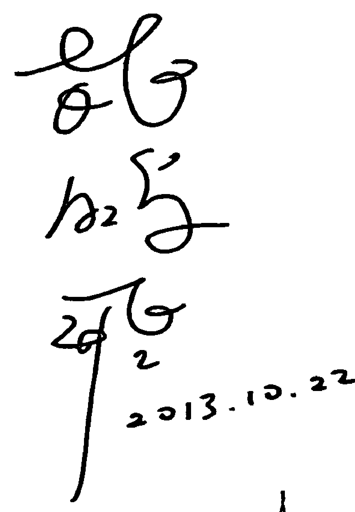

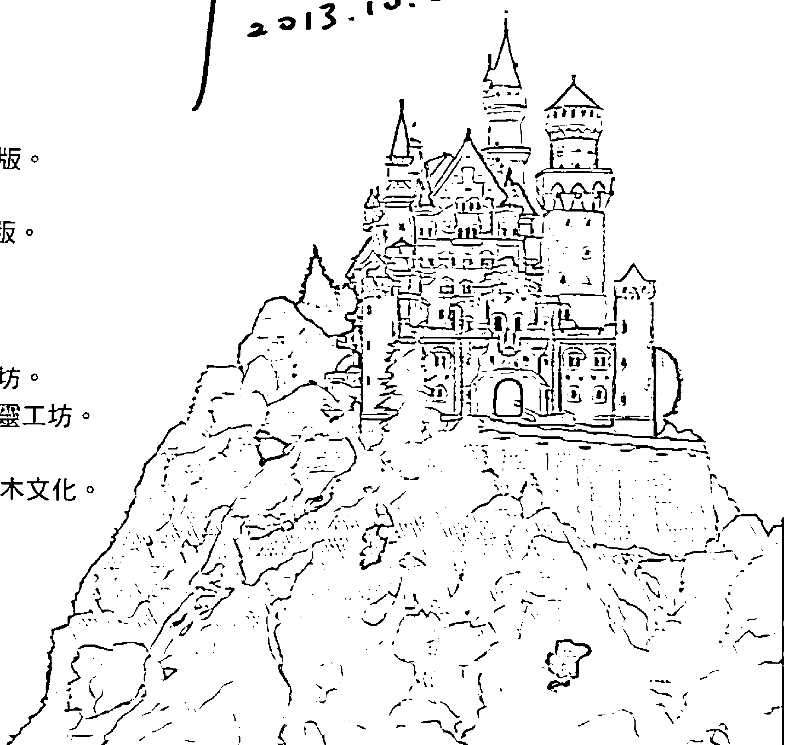

# 第一部
## 认识占星学

- 1-1 占星学是什么？ What is Astrology?
- 1-2 占星学的历史 History
- 1-3 占星与天文学 Astrology & Astronomy
- 1-4 象征与周期 Symbol & Cycle
- 1-5 认识星盘 Birth-Chart
- 1-6 占星学的符号 Symbol

# 1-1
占星学是什么？
What is Astrology?

## ◇星星的密码

占星学是什么呢？这是一个不容易回答的问题，它包含了神话、天文学、数学、哲学、预言与宗教。自古以来人们就发现到人世间的生活事物与天上的日、月、星辰间似乎有着某种特殊的关联。在点点繁星中，他们发现到有几颗星星是特别的，祂们沿着一条特殊的轨道（黄道）前进，有时会后退，有时彼此会合。这些行星的移动好像与我们的人事变化有所对应，经过千年观察，从归纳与想象中发展出的一套学问，这就是占星学。

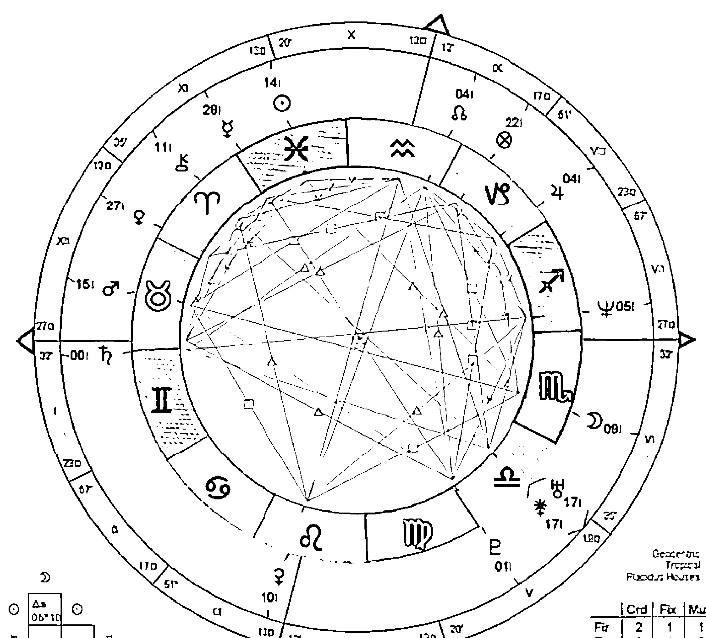

从古至今，天上的星星就像是无数个神秘的眼睛注视着我们，想要传达特别的讯息给我们，这几颗特别的星星就是我们熟悉的太阳、月亮、水星、金星、火星、木星、土星。祂们在不同的文明中都被赋予重要的神话角色。占星师利用这些行星间的位置关系来预测人事，从星盘中行星的分布来看出一个人一生的际遇。占星学可以说是一种解读星星密码的学问！

| Crd | Fix | Mut |
|---|---|---|
| Fir | 2 | 1 | 1 |
| Ear | 2 | 1 | 0 |
| Air | 3 | 1 | 1 |
| Wat | 0 | 1 | 2 |

经过几千几万年的体验，先人渐渐累积了这些眼睛想要表达什么，他们最先认识的就是白天与夜晚出现的两颗大眼睛——太阳与月亮。发现到四季的变化与海水的潮汐跟这两个大眼睛息息相关。这两个大眼睛有时候还会被吃掉，出现日月蚀的现象，这种时刻往往会造成全人类的集体心理恐慌。

除了这两个特别大的眼睛外，天空中还有无数颗明亮的眼睛，祂们像是定位系统般固定的每日在天空中旋转一圈。在东方的中国，先人们最重视的是在北方的尽头有一颗特别的星星，祂永远不动，所有的星星以祂为中心旋转着，像君王般受万民朝拜，这就是北极星。在古埃及，他们特别重视的是天狼星的出现时刻，每年当天狼星在黎明前出现在东方地平线时，就是尼罗河水要泛滥的时候！

相对于看起来都不会动的恒星，先民们发现有五颗特别亮的星星会沿着太阳的轨道运行着，祂们时进时逆，有固定的时间与周期，当祂们出现在天空中特定的位置时，总会有一些类似的事件发生，每颗星好像特别负责某些种类的事件。

除了这些规律的星星以外，天空中偶尔还会出现一些不乖的顽皮分子，当这些彗星、流星出现时，往往会引起世间的骚动。有时天空会突然的出现一颗明亮异常的星星，然后过一阵子又渐渐消失，以现代眼光来看，这是所谓的超新星爆炸的现象。

一直到近代望远镜出现后，透过望远镜，人们发现到更多的眼睛，并且了解到原来我们是住在太阳系里的一个不算大的行星上，那五颗特别的星星是跟我们地球一样，是属于太阳系里的兄弟姊妹，除了这五个兄弟姊妹外，原来还有三个兄弟姊妹被遗漏了，另外还有数以万计的小兄弟（小行星）也一直在我们身边影响着我们！这些大大小小、看得到与看不到的眼睛都像是带着特别的密码般，时时刻刻想告诉我们这个宇宙的讯息！

## ◇星星才是主角

每个人出生时，太阳系中的九大行星、太阳、月亮及介于火星与木星中间的小行星带，从地球的角度来看，祂们当时所处的位置与彼此间的相对关系，会对地球上的我们引发特别的反应，这样的象征会对应于人生的一切现象，对人产生特别的影响，同时赋予当下时刻特别的意义。

二十世纪心理学大师容格（1875～1961），他提出的同时性理论，说明同一时间点上看似不相关的两件事物，却有着相同的意义。同一时间点星体间的对应往往与人间的现实对应拥有相同的象征含意，因而并非行星影响了人，而是彼此具有相同的特殊性关联。

没有一个时间点的行星位置是一样的，也就是说每一个时间都是独一无二的，因此，每一个人的出生图也都是独一无二的，都有它特别的意义。

从地球上来看，所有的行星跟随着太阳在一条特别的环带中运行，这条环带我们将它称为黄道，在这条环带上古人将它分割成同样大小的12个区域，并跟这12个区域内的恒星连结，赋予各自的名称（即12星座），代表着十二种不同的基本原型。这是上帝留给人类的自然密码，每颗行星所影响人的主要特质部分也不相同，而当这些星体运转产生各式各样的变化组合时，我们也就可以看到个人的行为及命运的变化轨迹了。

因此，在占星学中，行星才是一切影响的主因，而一般人熟悉的星座则是行星力量的12种变化型态，我们研究占星学，就是要看行星间互动变化对我们产生的影响，因此，行星才是主角，是学习占星观察的主要依据。

## ◇宇宙法则

自古以来占星学就被视为一种神秘的魔法，与炼金术、塔罗等神秘学有很大的关联性。赫密士秘密教诲是由赫密士·崔思莫吉司特斯（Hermes Trismegistus）发展出来的哲学理念。他一向被视为天文学、数学、占星术、字母和炼金术的鼻祖。赫密士思想涵盖一系列包含占星、炼金术等的神秘知识，他的秘密教诲是由老师以口耳相传的方式传授，一般称之为「卡巴拉密教」（Kybalion），据说这所神秘学院位于现今埃及境内。其教诲中有七个宇宙基本法则，所有一切的原理都奠基在这些宇宙法则之内，占星统合了这一切法则的运用，所以可以说占星学就是让我们可以运用宇宙基本法则的一套最有效的工具。这七大法则就是：

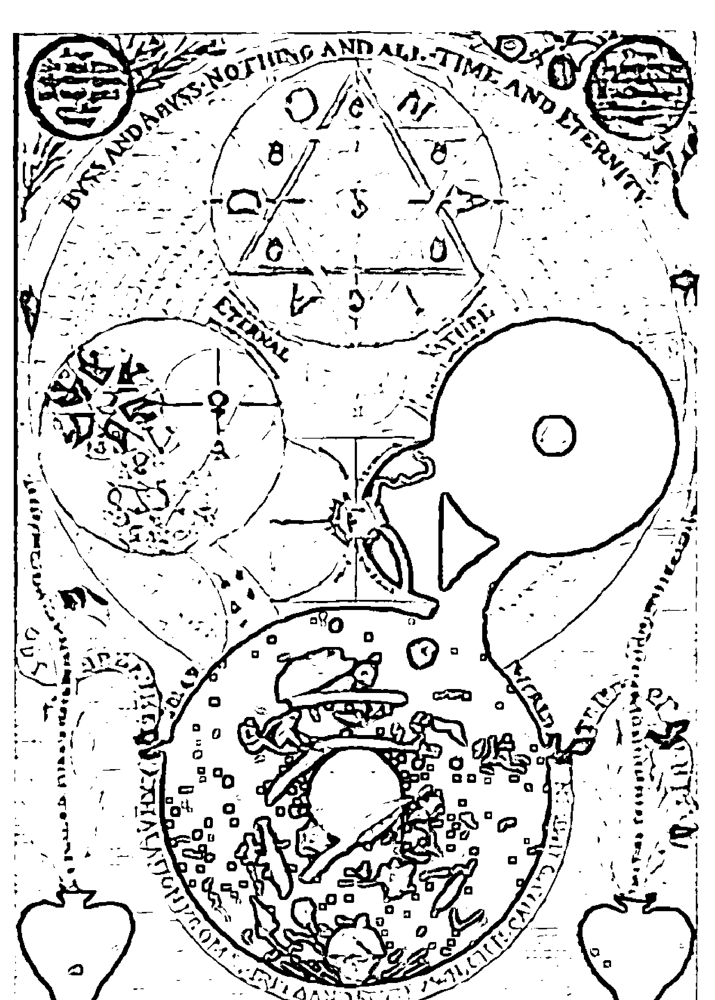

一、唯心法则：这个法则指的是宇宙万物皆为「一切万有」（All That Is）唯心所造。与佛家所说的万物唯心造相同，我们所感觉到所有一切的真实，实际上都是心所营造的幻相。

二、上下一致法则：同时性的对应，大宇宙和小宇宙的概念，天上如是，人间亦然。也可以说内在如何，外在就如何。在物质次元发生的事，源头乃是在心智和灵性次元，身体上的现象往往是源自于内心。

三、能量振动法则：这意味着宇宙中没有任何事物是静止的，万事万物都在不断地变动。一个人不可能两次都踏进同样的河中，所有的事物都在振动，或者说都有其振动频率，改变振动频率就能改变外在现象。

四、二元对立法则：一切事物都有对立的一面，而对立的两面本质上是相同的。上和下、黑暗与光明的概念，事实上根本没有所谓的上，也没有所谓的下，它们是相对性的存在，一切的存在都是一体的两面关系。

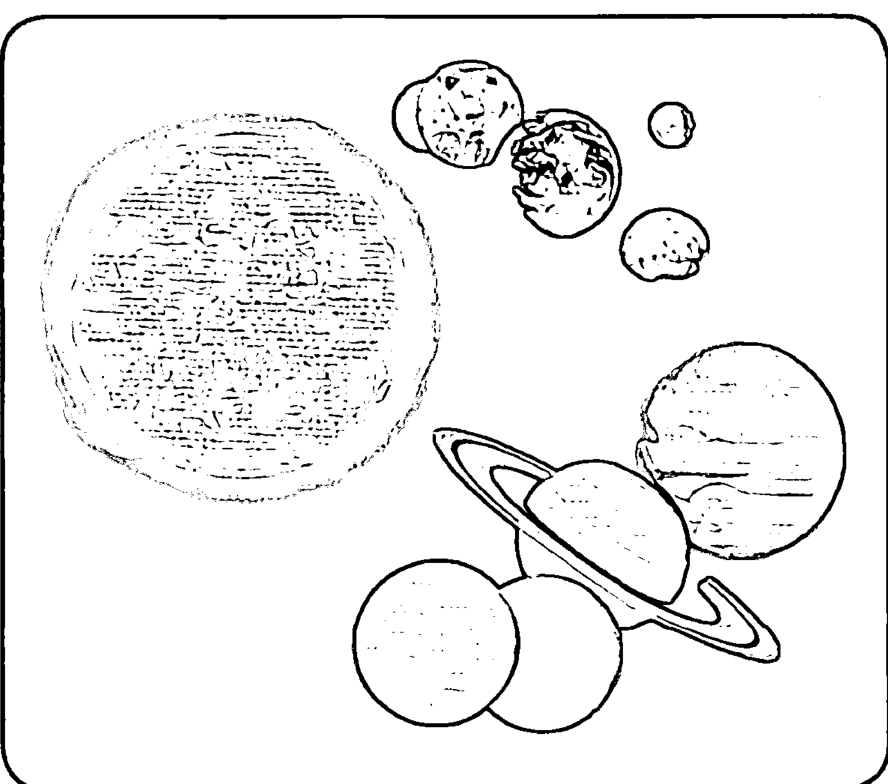

五、周期循环法则：这个法则的意思是，万事万物皆有周期循环，万物皆有出入和升降，也都会经历诞生、成长、毁坏和死亡的循环过程。死亡既可以看成开端，也可以当成结尾。生命的周期循环有数千万种，每一天的变化、每一次的呼吸，都算是一个循环。

六、因果法则：因果法则即是所谓的「业力」（Karma），有因就有果，这个法则指的是每个因都会造成一种果，每个果也都有它的因。万事万物都是按照这个法则运行，因此并没有所谓的「巧合」或「偶然」。即使是一闪而逝的念头，也会促成一些变化的结果，每一个心念，都会投射成外在的结果。

七、阴阳法则：这个法则指的是一切事物都有阴阳两面。阳的这一面是外向的、积极的和煽动性的，阴的这一面则是向内的、消极的与被动的。当其中一面呈现出阳的模式，从另一面看他就是阴的，像一顶帽子，从一面看他是突出的阳，但是从另一面看，他却是内凹的阴。

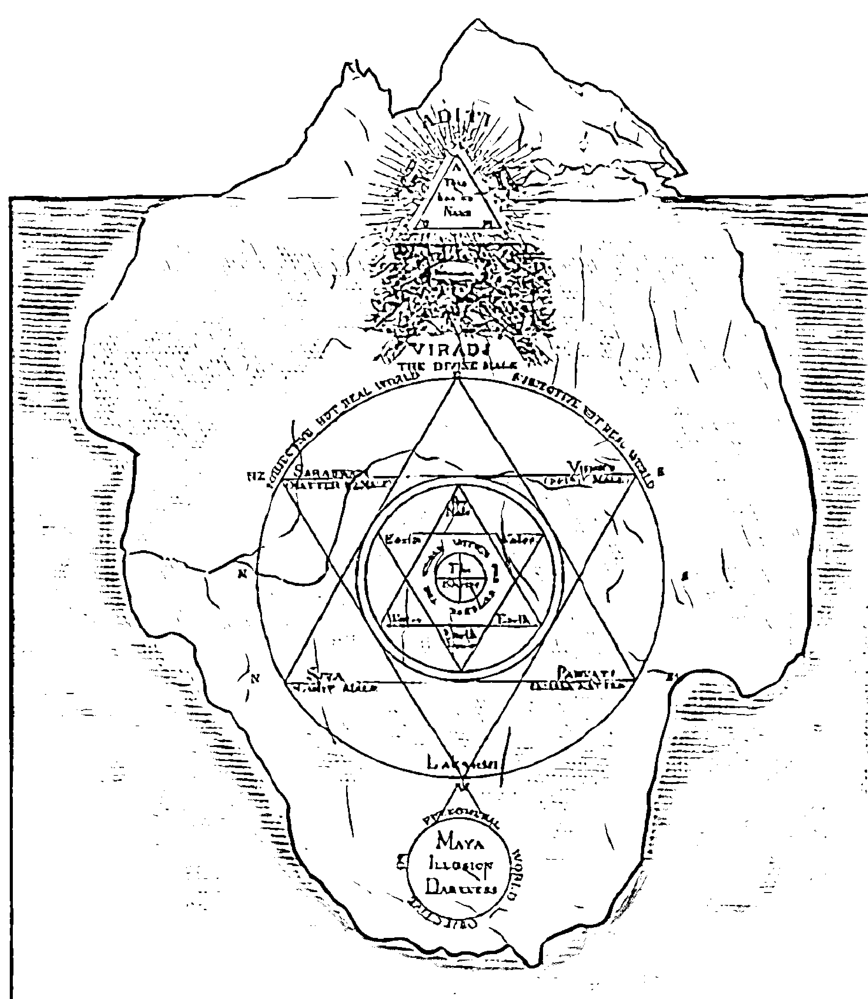

## ○人类的潜能

科学家研究人类使用大脑的功能可能不到还十分之一，就像冰山一样，真正浮出水面的部分其实只有整体的一小部分而已。人的意识显现受到广大潜意识的影响，而运用占星术，我们可以更加了解自己的潜能，了解自己潜意识的倾向。

## ○人生地圖

個人的星盤就好比是一張人生地圖，地圖越詳盡，越能找到我們希望達到的目的地。因此，越能解開星圖中隱含的密碼，就越能了解自己的人生方向，找到人生的目標。

## ◇占星術到底是什麼呢？

從Astrology這個字來說，Astra是星星的意思，而Logos是邏輯，因此簡單的說，占星學就是星星的邏輯法則，進一步來說占星學是：

### 1. 占星學是一套宇宙共通的符號象徵語言：

占星學是一套符號語言，這套符號系統展現宇宙的基本原則，透過地球與宇宙星體間的關係，來對應人世間的一切，而最主要的部分則在希望了解，宇宙的其他星體對地球的關聯影響，進而如何關聯影響到地球上的萬物眾生。

### 2. 占星學是一種分析工具：

占星學是很好的分析工具，運用行星與地球的感應關聯，在各種人事層面上，都可以運用占星學來進行分析，可以分析自己和他人的運勢、個性、動機，分析天象氣候的變遷、人文流行的發展、經濟的趨向、國際之間世界的局勢變化……等等。占星命盤就如同一張人生地圖一般，讓我們可以透過占星學了解自己的潛能，掌握自己的人生方向。

### 3. 占星學是一種思考模式：

占星學是一種最基本的宇宙邏輯，一種全人類共通的象徵思考模式。占星學連結了理性與感性，透過占星學的訓練，可以讓我們找到一種較清楚的方式去掌握到無意識的層面與現實世界的連結，進而透過這一套邏輯形成一種思考方式與哲學態度，讓我們更容易理解到隱藏在冰山下的龐大潛在層面。

## 第一部 1-1 占星學是什麼？

占星學到底有多龐大呢？很多對占星學不明就裡的人往往以坊間12星座將人分為12等分來反駁占星學，說明人只有12種模式的分類太過膚淺，認為占星學毫無科學根據，然而實際上，你知道占星學的體系有多龐大嗎？你知不知道其實許多科學大師都是因為研究占星學而發現了偉大的科學定理嗎？我們可以這樣說，幾乎現今的科學領域都跟占星學有關，我們知道克卜勒的行星定律，哥白尼發現的日心系統，還有牛頓的萬有引力。但是大家卻不知道，這些科學大師其實都是占星師。

天文學原本就是占星學，數學是為了計算星星的時間與位置而發展的，化學根本就是鍊金術演變而來，而鍊金術與占星學有著極為密切的關係！儘管近代科學發展後，占星學成為迷信的象徵，但是不能否定的，占星可以說是最古老的一門科學！它並非是一門發展不完整的學問，相反的，它可能是某個先進古文明中高度發展的科學，但是由於文明的失落，現今我們手中所殘留的只是占星學不完整的斷簡殘篇。

### ○牛頓與占星學

牛頓不僅是一位科學家、物理學家、天文學家，更是一位占星師，對占星有濃厚的興趣。他在一份手稿中，暢談個人神秘冥想的經驗以及占星學及對鍊金術的研究心得。他曾預言在他死後二十三年，在西元一七五○年的頭三個月內，會發生北極光風暴與倫敦大地震，結果一七五○年的二月，真如他所說的發生北極光風暴，接著倫敦大地震，地震加上強烈風暴，造成數千人喪生。而實際上，牛頓是為了占星的研究，為了計算星體關係而發現了萬有引力。

## ◇為什麼要學習占星學？

二十一世紀的今天，占星學更是蓬勃發展，各種門派與新的理論相繼提出，但是我們為什麼要了解占星學呢？它對我們有什麼好處呢？

- 1. 了解自我：占星命盤就像一張人生的地圖，在占星心理學十分發達的今天，我們利用占星學來了解自己的內在，從星盤中看出自己的本質與問題，了解自己的天賦和潛力，讓自己更誠實的面對自己，改正自己的缺點。
- 2. 了解他人：占星學可以了解自己，自然也可以用來了解別人，這就像我們中國人常用的合八字，運用雙人星盤的配對可以看出兩人之間的關係特徵模式，彼此間的問題點、緣分與適合度，透過星盤透露的訊息讓彼此關係更為圓滿。
- 3. 了解未來：利用運行星與本命星盤的配合，可以了解個人未來的運勢發展，知道何時進、何時退，讓自己對自己的未來更有計劃，並且透過對未來情勢的掌握，可以預先佈局，掌控情勢與先機。

## ○人生循環

人的一生從孕育到呱呱墜地，經過青年期成長茁壯，到中年時爬到高點而功成名就，然後開始衰敗，步向老年、死亡的過程，就像是太陽一天的經歷一般。從日出露出曙光，到正午光芒萬丈，直到日落西下，然後再到黑夜，準備迎接第二天的開始，就像是我們人生的整個過程。

## ◇宿命論與自由意志

太陽從日升到日落對應一個人的一生，月亮的陰晴圓缺就像人生的喜怒哀樂，從美麗的金星聯想到美好的事物，跑得快的水星象徵了思想的快速變化，衝動火紅的火星讓人聯想到戰爭……等等，這一切的巧合似乎有著冥冥中的道理存在。

在不同占星類別中，印度占星是偏向宿命論的，而現代的西洋占星則更加的強調了自由意志的選擇。我們的命運究竟是注定的還是可以靠自由意志改變？這個答案很難回答，應該說都對，我們的命運確實是注定的以某種軌跡前進，就像一條河流的分支是確定的，但是你可以靠自由意志在分支的點上決定你的未來，你是黃河裡的水就不會流到長江的出口，但是你這滴水在黃河裡流動，最後是東流入海還是停在某段支流之中，其實你是有一點機會決定的。

人無法勝天，人只能順天，而占星就是教你如何順天的學問，占星就是看行星與人之間如何關聯與如何互相順應的學問。行星在什麼宮位、星座，會對小至個人、大到世界有什麼樣的對應，行星與行星產生了相位的交互作用時，對每個人會產生什麼對應的影響，什麼行星對應人的什麼部分？我的行星與你的行星有了反應時又產生什麼影響？當天上的行星和我們的行星產生了相位反應，又將造成什麼樣的影響？當我們了解了這一切，就能順著天象去趨吉避凶，幫自己的人生選擇出最好的劇情。

## 1-2 占星學的歷史

### ◇占星術起源

占星學的起源為何？因年代久遠已不可考，但從古老的傳說及流傳下來的文獻，可追朔至上古時代。

早在紀元前三千多年前，在幼發拉底河與底格里斯河所沖積出來的美索不達米亞大平原上。當時的古代游牧民族，把對天體的觀察，從日升日落、海的潮汐以及四季變化等等自然觀察中，首先發現到太陽、月亮及五大行星的特殊性。結合了對天體的崇拜，以及人類原始的信仰，漸漸發展出一種占卜的形式，形成為今日占星學的基礎。當時利用觀察天體來預卜天氣、農作物的收成，然後慢慢的擴及大自然和人類的一切人事現象變化。

### ○有趣的新發現

星座的發源似乎更為久遠，它也許是上古文明的迴留物。從人面獅身所代表的獅子座與春分點的移位配合，星座告訴了我們時間，一萬兩千年前，某些人建造了人面獅身像，有趣吧！

一直到了紀元前六百多年前，迦勒底人建立的新巴比倫王朝時，對占星學作有系統的歸納及整理。迦勒底人對於數學及曆法有其獨到的成就，我們現在所使用的曆法就是當時迦勒底人的占星師所創制的。現代西方文化中，結婚典禮之後的蜜月旅行，也是他們首先採行的，這其實是一種占星學的儀式，意義是共同開創幸福之門。

到了紀元前五世紀左右，黃道分成十二個30度的宮位已經確立，目前已知最早的占星圖出現於紀元前409年。後來隨著亞歷山大的東征，占星學也開始融入了希臘文明，希臘人將太陽、月亮及太陽系諸行星對應於古希臘神話中的神祇。這些希臘天神的拉丁文名字遂成為後世占星學所共通採用的名稱。

紀元前三世紀，占星師發展出稱為「迦勒底秩序」的行星序列，占星師根據天文學家提出的宇宙模型，定義了諸行星運行間的相互關係與地球的假想距離。占星師們倡導著天人合一的學說，認為微觀宇宙與宏觀宇宙是合而為一的觀念。小的宇宙對應著大的宇宙，他們將行星、黃道、十二星座與世間萬物……包含顏色、金屬、動植物、人事現象……等一一對應，建立出一個完整的對應關係，於是占星學的應用就愈來愈廣了。柏拉圖提出上帝如何以四大元素——火地風水來創造世界，托勒密（西元100～170）可說是占星歷史中最重要的人物，在其著作《四書》中占星學的架構與原理已經奠定了基礎，他假定星象的效應具有週期性與獨特性，人世間的收割、災荒、瘟疫、地震、洪水，甚至戰爭……等均有一定的週期循環，而這些「成果」早就受孕在一顆特定時間的種子中。

### ○馬雅

馬雅人在星象上的發展極為出色，他們有一套很特別的計算方式，以一個13×20的循環，產生的一個52年的週期。他們依據這個神聖的週期來預言未來，確定重大事件的時間。這不禁令人聯想到中國的天干地支，一個12×10，60年的循環。

### ◇星座的由來

古代人為了方便在航海時辨別方位與觀測天象，於是將散布在天上的星星運用想像力把它們連結起來，由於占星學的發展主要在北半球，因此北半球容易觀測到的48個星座在希臘大天文學家托勒密的時期就已命名了，命名的方式多依照古文明的神話與形狀的附會（包含了美索不達米亞、巴比倫、埃及、希臘的神話與史詩）。另一半在南半球的夜空中的星座多是近代大航海探索時命名的，因此多半使用航海的儀器工具命名。因為地域的不同，東西方連連看的方式也就不太一樣！像中國的北斗七星就是包含在現今的大熊星座中，目前全世界已統一星座圖，將天空劃分為八十八個區域的八十八個星座。

二千多年前希臘的天文學家希巴克斯（Hipparchus，西元前190～120）為標示太陽在黃道上行進的位置，就將黃道帶分成十二個區段，以春分點為0度，自春分點算起，每隔30度為一宮，並以當時各宮內所包含的主要星座來命名，依次為牡羊、金牛、雙子、巨蟹、獅子、處女、天秤、天蠍、人馬、摩羯、水瓶、雙魚等座宮，稱之為黃道十二宮。總計為十二個星群，在行星運轉到每個座宮時所出生的嬰兒，長大後總有若干相似的特徵，包括人格特質、個性行為等。將這些聯想運用豐富的想像和創造力串聯起來，便讓這些星群具象化了，再加入神話的色彩，成為文化的重要部分。這套命理演進、流傳至今至少有五千年的歷史，以這十二個星座為代表，這些星座就成為十二種基本原型的代替象徵。

現今一般大眾所談論的「12星座」其實只是占星學中所指的太陽星座而已，是以地球上的個人為中心，出生當下看到太陽運行到黃道十二座宮上哪一個星座的位置，就說那個人是什麼星座。但是由於春分點的逆行，實際上跟天上的星座已經對應不起來了，12星座成了一種象徵的意義，而非指對應到的天上星群。

### ◇阿拉伯占星學

阿拉伯延續了西方占星術的發展，是由於基督教對占星術的打壓。一談起「阿拉伯占星學」，自然不能不提「阿拉伯點」(Arabic Parts)。現代的占星學上，也常用到幸運點、婚姻點和死亡點等三個很重要的參考點。回教文化源於希臘哲學與科學系統，有「阿拉伯哲學家」稱號的阿肯笛，他將亞里斯多德的學說譯為阿拉伯文，他同時也受到西方鍊金術影響，由於阿拉伯的地理位置容易與歐亞非各地展開交流，也因此在古阿拉伯的文化體系中，大量地吸收了埃及、波斯、印度、古基督教、迦勒底、中國、希臘、古代鍊金術等文化內容，然後熔鑄成獨樹一格的阿拉伯占星文化。而後經由阿拉伯的占星學家將各古老文明的占星學研究心得作了整理，直到近代占星學又重新傳回歐洲。在近代的占星學中，我們經常會看到阿爾布馬扎及他的猶太學生馬夏爾的格言。

### ◇印度占星學

印度占星學雖與歐洲同源，卻發展出不同的體系，與西洋占星比較，印度占星更偏向宿命論，是以論斷事件為主。印度占星學跟數字學息息相關，它熱衷於神祕數字的探討，特別是4與9這兩個數字。自古口耳相傳的《吠陀》勾勒出諸神的故事與占星知識，《吠陀》兩字原意是「神的啟示」。印度占星跟西洋占星最大的不同點在於印度占星採用恆星黃道系統，重視月亮的交點，以及一種二十七宮的分類系統。由於印度保有了許多古老的占星理論，現代西方占星學家因此受到印度占星學的論法啟示，而開闢了新的論法和見解。近代西方的神祕主義研究者，一直熱衷於神祕數字的探討，特別是在廿世紀以後，印度占星學家與西方占星學家不斷地進行交流、切磋，同時也修改了某些古印度占星學的看法。

### ◇中國占星學

中國的占星系統跟西方有所不同，自成一個體系，自古以來，易經是中國所有命理學說的基礎來源，進而推演出陰陽、五行、八卦、天干、地支所形成的一種以60為輪迴單位的體系。中國占星學在春秋戰國時就已經很發達，其最早的應用是用以推演國家主政者吉凶或在戰爭上選擇有利的時機。中國占星術將黃道帶的星區分為28宿，用來觀察日月五星的運行變化，並重視恆星象徵，對於北斗七星及北極星至為推崇。魏晉南北朝時，印度占星東傳入中土，結合了中國陰陽五行、28宿而衍生出了七政四餘占星學。之後另外又由此推演，發展出以虛星為論斷體系的紫微斗數。受到印度與西域傳來的西方占星體系的影響，中國也有12星座的分宮方式，但是中國人普遍習慣使用的是12支的分宮體系，以12種動物（生肖）來作為12宮的象徵，但由於當政者的害怕與禁止，使得占星成為少數人的特權，進而造成中國占星學的沒落。

### ◇現代占星學

中世紀歐洲的文藝復興後，西方開始重新向阿拉伯學習占星學，占星在歐洲又開始蓬勃發展，由於占星術的影響，意外造就了許多近代有名的科學家與天文學家，發現了行星軌道理論的克卜勒，他本身就是個神秘占星師。而因為科學的發展，具有魔法性質的占星術在十七世紀開始由盛轉衰，占星術一度因科學的進展而沒落，

### ○威廉·里力

威廉·里力是時事占星及卜卦法的大師，著有「基督教占星學」，他於1651年出版的曆書中預測倫敦將發生大火，果然於1666年9月應驗。

直到19世紀，占星術又因為結合科學的概念而有了新的技術發展與進步。里歐（Leo）受神通學的啟發對占星學進行修正，將原本偏向事件預測的宿命占星變成近代比較接近心理性格分析的形式，這成為二十世紀後占星的主流推斷方式。進入二十世紀後，新的占星玩法不斷的發展出來，中點理論、泛音盤、合盤，以及結合心理分析都為占星學賦予新的生命。

發展到現代，西洋占星學大致可區分成古典占星與現代占星，現代占星隨著近代心理學的發展，大量的借用了行星與星座的心理特質徵象，造成現代占星出現大量的心理人格特質描述與心理學的名詞，心理化的現代占星更多的強調自由意志的重要性。同時隨著新行星的發現，現代占星加入了更多元素，三王星、小行星陸續被占星師加入論斷的象徵行列，這使得原本古典占星的日月五星主宰體系出現問題，另外，由於電腦的發明，星盤的計算變得更為明確簡單，因而相位的系統也漸漸取代了古典的以星宮關係為論斷依據的系統。

### ○古代的方形星盤

### ◇漢堡學派

中點理論是由德國占星學家 Alfred Witte和Friedrich Sieggrun創立的漢堡學派所提出。它的論斷技巧認為兩個行星的中間點具有其重要性，因此特別強調中點的概念。隨著中點概念的延伸，不只是行星之間的中點有其重要性，漢堡學派又發展到包括了行星與重要點之間的中點關係，以及重要點與重要點之間的中點關係。所謂的「重要點」，包括了春分點、上升、天頂以及南北交點……等。

同時漢堡學派認為行星的凶相位比吉相位來得更為重要，更足以呈現出事件的徵象。凶相位與圓周的2分切割有關，而且這些角度的切割呈現出中點的特性，比如說180度是圓周的一半、90度是圓周的四分之一、135度是圓周的八分之三、22又1/2度是圓周的十六分之一、67又1/2是圓周的十六分三……等，這些都是二的倍數切割，都可以用二分的概念來作解釋。Witte另外創造了90度的占星命盤，這種90度的占星命盤可以比較明顯地看出行星之間的中點關係，除了90度盤，漢堡學派也運用了45度盤，並且強調了牡羊座零度（春分點）的重要性。另外漢堡學派還創設了八顆超海王星系虛星，以及子午線分宮法。

由於中點理論的論斷過於複雜，論斷充滿著太多的考量因素，於是就有占星師進行改良簡化和精鍊了中點的論斷。在這一方面，以Reinhold Ebertin的研究成果最具有可看性，Reinhold Ebertin簡化和精鍊了中點的論斷，將改良後的漢堡學派占星學稱之為宇宙生物學（Cosmobiology）。

漢堡學派最大的貢獻就是行星中點概念，中點的論斷概念也滲透到各種論斷範圍之內，這也成為雙人組合盤的基礎。除了合盤的論斷外，許多的占星學家習慣應用中點來作論斷的參考要素。行星中點概念成為現代占星學的研究趨勢，中點的論斷概念除了合盤的論斷受到重視以外，在職業、健康和錢財，甚至死亡的預測上，也有許多的占星學家應用中點來作論斷，甚至有關股市的預測，更是相當廣泛地應用了中點來作推測。

### ◇其他發展

泛音盤（Harmonics）又稱為數律圖，為英國約翰·愛迪所提出，他從印度占星學的分盤技巧得到啟發，開創出一種新技術，用來更加精細的分析命盤的內在含義。泛音盤的原理來自於音律波形的共鳴，在一根琴弦上的1/2、1/3、1/4，以及2/3、3/4的特殊位置，都可以找到產生共振的點位。由此來延伸，運用數學的分割，可以將星盤一層層的剝開，來看出星盤內藏的訊息。以這種命盤切割方式，呈現出相位對應關係，合相與1的分割有關、對分相與2的分割有關、三分相與3的分割有關……依此類推。他在《占星學的泛音盤理論》（Harmonics in Astrology）一書中，依據大量的統計樣本，對此提出有力的證據。

從這種觀點來看，占星學顯現了複雜的數字原理，這套理論讓相位的意義建立在黃道360度的切割除數上。利用這種技巧，將一張星盤分析成不同的分盤，每一種分盤都具有特別的代表重點，與分割的數字意義相關，例如2通常代表對立與壓力，3則象徵吉祥與順利，泛音盤相對重視的是四分盤、五分盤、七分盤與九分盤。而四分盤基本上與漢堡學派的90度盤是同樣的原理，而在印度占星的十六種主要分盤中，最重視的就是四分盤與九分盤。

容格可以說是現代占星學最重要的一個人，他重視符號與圖騰的象徵，並試圖將占星與心理學做關聯，而他所提出的許多心理學概念，如陰影、原型意象、集體潛意識……等，以及同時性發生的非因果關聯理論，為占星學重新注入活水，也指明出一條現代占星的新發展方向。

依據古老的占星論斷，如果出生的時候某些吉星高懸天頂的話，就是一個很好的兆頭，在此時刻出生的人在今後的職業生涯中將會顯得出類拔萃。因此法國高葛林博士開始研究這種說法的準確性，他的統計研究橫跨23年，從1949年到1973年，研究內容包括職業選擇、遺傳因素以及性格特徵……等。在他著名的「火星效應」實驗中將570位優異的運動選手的火星分布放入星盤中，按理是同等機率，那分布應該趨向圓形，但是結果不然，而是呈十字形，尖端集中在4角附近，這顯示占星確有其可信性。有趣的是，他原先是要破除占星學的，卻反而為占星學打了一劑強心針。從他的研究中證明了占星學的基本前提是正確的，出生時刻行星的位置和人生的命運軌跡確實有關聯性。

## 1-3 占星與天文學
Astrology & Astronomy

### ◇占星學的天文學基礎

占星的理論依據是什麼？我們知道占星研究的是星星跟人的關聯，因此，占星跟天文是息息相關的，自古占星學和天文學就密不可分，我們可以這樣說，五百年前占星學與天文學就是同一件事，彼此是同一家的。古時候觀測天象的人，就是因為占星的需要才去做的，並沒有人專門觀測天象而不占星的。占星學和天文學可說是在同一基礎下、以不同的觀點來研究的不同分支。

科學革命之後，開始有一些科學家視占星學為古代落後的迷信，慢慢的天文學與占星學開始分道揚鑣，有趣的是哥白尼、伽利略、牛頓等有名的科學家都是占星高手。到了現代，占星學家為了更精確的知道星體的位置，大多需要有一點天文的知識作為基礎，所用的資料也都經過精確的天文運算，只可惜現代大多數天文學家已失去了占星的能力。

在古代，要畫出一張精確的星盤是一件繁複的過程，必須做許多複雜的計算，好在電腦發達的今天，只要輸一輸資料就可以得出一張星盤來。雖然如此，但占星學是建立在天文觀測及計算出的行星及交點位置來推命的，而占星的象徵依據也與這些天體的旋繞所形成的自然現象相互對應，所以要學好占星學，一些簡單基本的天文常識是必須具備的，我們必須了解占星學是以什麼樣的天文基礎為架構，來構成推算的依據。

### ◇行星與行星關聯在星座、宮位上

雖然現在大家都已經知道，地球是繞太陽而公轉，但是占星學家所關心的是各個星體與地球的關係，所以占星學的推算都還是以地球為中心的，也就是以事情發生的地點為計算的基準點。星盤圖就是將出生時行星的位置投影在黃道的平面上，由行星間的位置與相對關係解讀出一個人或全世界的命運。

星體為影響力的來源，占星學家假設，天上的星體會影響地球上發生的事物，他們對地球具有特別的關聯作用，當他們處於某種特殊位置時，就會引發特別的事件，而行星與行星間亦會發生交互作用，當彼此處於特殊角度時，彼此的作用便會出現好或壞的變化，進而對個人或世界產生潛移默化的影響。因此星體是影響力的主要來源。

星體會因為處在不同的位置（場）而發生本質的變化，這些位置就是星座與宮位。星座代表12種基本原型象徵，是黃道帶以春分點開始十二等分的區間。宮位則表現人與世間接觸的12種基本場景，是依出生時地平面東升點為起點將黃道帶分割為十二分的區間。行星在黃道帶上運行，因此每一個行星都會落入某一個星座和某一個宮位中。

星體與星體間由地球上看去，之間會相夾一個角度，當彼此出現特別的角度時，會出現某些感應，這就是占星學上所謂的相位。於是我們就依星體所處的星座與宮位以及星體彼此間的相位關係為依據推算命運。

### ○星圖重要點

出生的季節決定了太陽所處的星座（牡羊座一定是春天生的），而從出生的時刻決定了太陽所在的宮位（正午出生的人太陽基本上在10宮），因此，太陽可以說是星盤中最重要的一顆星，代表著生命力，幾乎占整個星盤的三分之一。

從出生時農曆的日子，就可以知道太陽與月亮的角度關係（農曆15日出生的人日月必呈180度角），月亮也是星盤中極重要的一顆星，代表著內在層面與情緒反應。再加上東升點與中天點，這四個重點是解讀星盤最須重視的部分。

### ○地球與太陽的關係

實際上，地球是繞著太陽轉的，因此當地球繞到某個星座時，由地球的觀點來看，太陽就在其相對的星座了，如圖中當地球在天蠍時，這時看到的太陽是在金牛。而當地球在雙魚時，太陽看起來就在處女座了！

### ◇地球 & 太陽系SOLAR SYSTEM

我們所居住的地球是位於太陽系的一顆美麗行星。太陽系是由太陽及其他環繞太陽的星體所組成，這些星體包括對地球潮汐影響深厚的衛星月球、兩個地內行星——水星與金星，三個可見的地外行星——火星、木星與土星，以及三個近代發現的外行星——天王星、海王星與冥王星，再加上行星本身的衛星及無可計數的小行星及彗星。太陽系在太空中就像是個大圓盤一樣，行星的軌道是橢圓形的，行星繞著太陽以相同的方向，不同的速率繞著太陽運行。因此當我們從地球上觀察時，就會看到行星會時而前進、時而後退。我們稱地球環繞太陽的軌道為黃道，同樣的，月亮是地球的衛星，祂繞著地球運轉，我們稱祂的軌道為白道。

### ◇天球、黃道、春分點

當我們以地球為中心來觀察天空時，整個天空像是一個巨大的水晶球，它的表面布滿了點點的繁星，我們假定這個球為天球，將天球上的星星彼此連結，劃分為88個星座。太陽也在這個天球上運行著，祂的軌跡固定的畫成一個圓圈，我們稱為黃道。而因為所有的行星軌道都是幾乎平行的環繞著太陽，因此從地球上來看，這些行星都是在黃道帶上移動著。

由於地軸有23.5度的傾斜，因此有黃道面與赤道面的不同，地球以地軸由西向東的自轉，形成與地軸垂直的橫切面，這些橫切面就是地球的緯度，最大的橫切面稱為赤道。黃道面與赤道面彼此形成23.5度的傾斜，從地球來看，太陽與諸行星以23.5度傾斜於赤道面，在黃道上運行著。想像將赤道圈與黃道圈無限放大，這兩個圈會相交在兩個點上，每年太陽會跟赤道面交會在這兩點上，我們將這兩點定義為春分點與秋分點，所以太陽每年在春分與秋分時交會赤道面二次。

### ◇星座系統

黃道面與赤道面相交於春分點與秋分點，我們將黃道圈上下延伸一些角度寬，便成了天球上的一條環帶，我們將其稱為黃道帶，這條黃道帶正好經過了天球上的12個星座，這12個星座就是所謂的黃道12星座。占星學上以春分點來定義為黃道起點，將黃道圈分為12個30度的等分，如此定義了12個星座，當作宇宙空間方位的代名詞。兩千多年前，定義黃道帶起點時，春分點正好在牡羊座，因此

### ○天球

以地球為球心，向太空無限延伸成一個假想球，稱為天球。天文學將天球上重要恆星串聯成88個星座，將天球面區分出88個區域，作為定位的依據。

### ○黃道

黃道就是指太陽在天球上運行的軌道，地球自轉軸傾斜黃道面約23.5度（亦即黃道與赤道交角約23.5度），因此造成一年當中不同的四季寒暑變化。在占星學中，所有星體的位置均是以黃道的投影面為基準，因為站在觀測者的角度來看，地球是永恆不動的觀測點。

### ○春分點

將赤道向外無限延伸的圓盤，稱為赤道面，同樣的，將黃道延伸的圓盤，稱為黃道面。赤道面與黃道面交會於兩個點，當太陽運行到這兩點時，正好是日夜等長的時候，我們將它定義為春分點與秋分點。

春分點即以牡羊座為開始，然後依次是金牛、雙子……雙魚等12個星座。同樣的秋分點就是牡羊的對宮天秤座的開始。實際在天球上，黃道12星座是大小不一的，並不是剛好均等的分成12等分，因此占星上所稱的12星座其實是借用天文上黃道12星座的名稱而已。

因為歲差的現象，經過兩千多年的現代，春分點早已經不在天文上的牡羊座了，而是接近水瓶座了。但是占星是以春分點為依據，星座名稱是假借的，因此我們還是以春分點為開始，第一個星座是牡羊，第二是金牛……如此將黃道帶定義成12個等分的星座。所以我們習慣所認為的牡羊座人，也就是太陽牡羊的人，他的太陽很可能其實是在天文上的雙魚座了。

以太陽星座來說，當太陽運行到牡羊座時，也就是春分時節的開始。同理當太陽到巨蟹座時正好是夏至的開始，秋分時到天秤座，冬至時到摩羯座。舉例來說每年7月13日太陽運行到巨蟹座，因此出生在這天的人，他的太陽星座就是巨蟹座了。有很多情況是出生在兩星座交接日的人怎麼認定呢？兩個星座一起算嗎？其實不是的。舉例，以春分點為黃道0度，金牛座的起始點是黃道30度，某一年4月20日下午3點26分18秒，太陽運行入黃道30度，所以4月20日下午3點26分17秒出生的人是牡羊座，4月20日下午3點26分19秒出生的人是金牛座。

### ◇將黃道帶的狀態關聯到地上的事物

從地球來看，月亮與行星們跟著太陽在黃道上運行著，同樣的，祂們也會跟太陽一樣停留在不同的位置。假設某人出生時，月亮正好運行到雙魚座的位置，金星運行到水瓶座的位置，那我們就稱這個人的月亮星座為雙魚座，金星星座為水瓶座。其他水星、火星、木星……等星座也是依此類推。

任何一個時間點，行星在黃道上的位置對全世界的每個人都是相同的，這個位置反映出共通性的符號語言。但是同一個時間點對不同地區的人來說他們所看到的行星方位卻不一樣。舉例來說，某一個時間點太陽位於巨蟹座25度，對每一個人來說都是一樣的，但是在台灣看到的太陽可能在南方天頂，但是在澳洲看到的太陽是在北方接近落日的位置，而在美國這時還是半夜，根本看不到太陽。雖然太陽在天球的位置相同，但是不同地區的人看到的感受卻完全不同。

### ◇宮位系統

星座是由春分點所定義的，那麼宮位又是如何呢？

宮位是以觀測者為主，觀察天體間的相對位置，所產生的相對方位關係。當我們將個人出生時所在地的地平面無限延伸後，這個平面會與黃道圈交會於兩點，占星學上，定義這兩點為東升點與西降點。

以出生地為中心，將地平面畫出東西南北四個方位以及地平面上與地平面下，將出生地正上方與正下方延伸會與天球交會於兩個點，這兩點與地平面南、北點形成一個大圈，我們定義為子午圈。子午圈與黃道圈交會於兩點，我們稱這兩點為天頂點與天底點。

因此當一個嬰兒誕生時地平線圈及子午圈會切黃道圈於這四個點，這四個點象徵星盤圖上四個宇宙符號的角（Angles），我們通稱為四角，代表了我們個人與這個世界接觸的四個重點，是人生的最重要點。象徵著我跟我們，向內與向外。

這四個重要點分別是：

### 東升點（ASC，上升星座）

東方地平線與黃道的交點，也就是命宮的起點，表示自己與世界的接觸所在，這是實際上存在的個體的身體特徵及命運。

### 西降點（DES，下降星座）

西方地平線與黃道的交點，與上升相反，也就是夫妻宮的起點，它表示與他人的關聯，因此是伴侶與夥伴的結合位置。

### 中天點（MC，中天星座）

黃道最接近天頂的地方，也就是黃道與子午線在空中的交點。象徵人生最高點，也是事業宮的起點，代表成就、職業、地位及權力。

### 底天點（IC，底天星座）

黃道與子午線在地下的交點，它位於最低點，象徵根源，也就是家庭宮的起點，是家、祖先和一個人的根。

這四點將星圖切為四個象限，將每一象限再分為三份就成了星圖中表示生命中各種不同層面的十二宮（House）。由於四個象限在黃道上投影後會出現大小不等的狀況，雖然占星學者對詮釋星座的看法很接近，但是區分宮位的方法卻有很多不同的方式。這意味著不同的宮位系統會產生不同的宮位位置，這也是占星學上一個頭痛的問題！

對北半球的人來說，大部分時候看到的黃道帶是由東到西，穿越天頂南面一些。所有的行星都依序在黃道帶上運行，因為地球每日自轉一圈，所以看起來像是每天黃道帶像巨型天缸般轉了一圈。

### ◇符號構成的語言

占星學是一種用符號構成的語言，一個人由於存在而讓發生在我們周圍的種種生活變化展現在意識的地平線之上。如果將天空劃分為現實意識中可見的天，以及地面下無意識的不可見天。「宇宙」像是環繞著我們每天從東到西旋轉著，整個天空的變化關聯到地面，也就象徵著人世的種種轉變。

星星、月亮、太陽及黃道帶經過我們的天際，代表著我們經驗的變遷與改變。我們正上方是天頂，它代表著我們將前進的地方及未來，是希望之所在。我們腳下的延伸是天底，這是代表著我們的過去，我們所來之處，也是我們最後回歸的地方。

### ○出生時決定四個重點

如圖，個人出生當刻、當地的地平面東與黃道相交於雙子座，西與黃道相交於射手座。子午圈上與黃道相交於水瓶座，下與黃道相交於獅子座。

是我們的根源。水平線的一方是我，代表這裡，另一邊是你，代表那裡。從這裡到那裡，聯繫了我與我們的關係。這兩條線彼此垂直成十字，代表著我們降生於世上所背負的責任與命運，結合了天空的圓構成了地球的符號，代表著人類最終的目標——新天堂樂園的實現。所以我們知道宮位是我們跟地球所形成的關係象徵，祂代表了我們在地球這個空間所會發生的人生不同議題。也象徵著人生的12種基本層面。

確定了四角與12宮位的切割之後，將黃道帶上的行星在12星座的分布位置與宮位點結合，這就是一張完整的星盤呈現。星座呈現出天意，宮位展現出地象，而行星則呈現出不同的力量，透過行星之間的分布位置，行星與行星形成特殊的角度關係，這些角度關係隱藏著吉凶悔吝，透露出兩個力量的互動影響，這就是相位。而我們的命運就暗藏在這個屬於們自己的特殊行星分布位置的星盤之中。

### ○將天空投影

如圖所示，將行星與宮位的位置投影在黃道面上，就是一張完整的星盤了

### ◇占星學的宮位制

宮位在定義四角上並沒有太多的爭議，但是在如何劃分成12分就存在很大的爭議，因而形成非常多樣的劃分模式，雖然宮位的分法分類繁多，各有各的立論基礎，但是還是有比較受人重視的幾種主要的分宮制。基本上宮位制分為等宮制與不等宮的四分儀宮位制兩大類，現今比較常用的有利用上升點來分割成十二個30度的等宮分法（equal-house system），而最為流行的系統是十七世紀時義大利僧侶普拉西德（Placidus）創立的分宮法，另外Koch分宮制也很受重視。

宮位的分法很多，約有下列幾種：

### 一、等分宮位制（Equal Houses）

- 1. 整宮宮位制（Whole House System）：從上升點落入星座的0度開始第一宮，以整個星座當作宮位，因此宮位和星座是完全重合的。
- 2. 等分宮位制（Equal Houses）：以東升點為起點，將黃道圈等分為12份的分宮法。另外也有以天頂為起點，將黃道圈等分為12份的分宮法。
- 3. 太陽宮位制（Solar House System）：以太陽為起點，將黃道圈等分為12份。

### 二、四分儀宮位制（Quadrant Houses）

- 1. 普拉西德分宮制（Placidus House System）：目前使用最廣的分宮制。以上升點Asc成為天頂MC的時間作為依據，以天球繞地軸轉動，每兩小時劃分一個宮位，每個象限按上升點的運行時間等分。
- 2. 柯赫分宮制（Koch House System）：在美國使用最廣的分宮制。相較於Placidus的非等宮計算方式，柯赫宮位制將天宮圖作等宮的調整，其定義為地平線與天球赤道的交界點起算至子午經圈，再將此弧度距離三等分並投射至黃道。
- 3. 阿卡比特司宮位制（Alchabitus House System）：其劃分法是以上升到中天的赤經距離予以三等分，再投射到黃道上為10、11、12宮，再以上升到天底的赤經距離予以三等分，再投射到黃道上形成1、2、3宮，投射點為赤道南北極。
- 4. 波氏宮位制（Porphyr House System）：將四角形成的象限等分成三份。
- 5. 坎帕那司宮位制（Campanus House System）：等分主垂圈的分宮制。
- 6. 芮吉歐蒙塔那司宮位制（Regiomontanus House System）：等分天球赤道以地平為第一宮。
- 7. 莫氏宮位制（Morinus House System）：等分天球赤道以子午線為第十宮。

### ◇回歸系統——歲差現象PRECESSION

相對於其他恆星，太陽每次交會到春分點時，位置是不同的。每年春分點平均向西逆行50.2弧秒，這就是所謂的「歲差現象」。歲差現象是地球像一顆巨大的陀螺一樣，除了自轉之外，祂的轉軸也在繞圈晃動，如此約經過兩萬六千年春分點會繞完一周。這個現象會造成北極星的改變，五千年前，天龍座右樞星（Thuban）是當時的北極星，現在的極星—北極星（Polaris）與地軸相距1度，再過12000年後，明亮的織女星將成為新的極星。由於地軸的進動，太陽公轉還沒有回到前次的位置，就遇到春分點，因此回歸年較恆星年短，從二千多年前開始制定春分點為牡羊座到今天，現在的春分點已退行將近30度，且已移動到雙魚座，正接近雙魚和水瓶的交界處。這也就是所謂的水瓶世紀將到的原因。

占星學是以春分點開始稱為牡羊座，但由於歲差的原因造成春分點位置的變動，所以你會發現到現在春分點是指向雙魚座。因此，現在大家口中的星座早已不是指現今天上的星座了，隨著時間變化，現在占星術所用十二星座的命盤變成是一種假借的意象，如果你是牡羊座，其實應該說是牡羊宮還比較恰當，它象徵的是太陽一年的12種變化模式，而真正的天文星座只是一種借用來作為原型分類的符號。

### ◇不同的星座系統

其實用另一種觀點來看，你可以在大系統（天文12星座）下另一個屬於地球的中系統（太陽12星宮），在這系統下又依個人出生時產生小系統（12宮位）。大系統是整體性的，中系統是屬於地球全體的（如果一個住在金星上的人，他的中系統就該以金星的春分點來訂吧），小系統則是個人的。因此如果說你是雙魚座，代表的是中系統的分類模式，它跟地球與太陽之間的關係（四季節氣）息息相關。因為歲差現象，造成了現代占星學的二大門派，一派是以中系統為依據，另一派則堅持以大系統為依歸。

- 1. 回歸時星座系統（中系統）：所謂回歸時系統的十二星座，是西方占星學將傳統占星學的星座象徵借用於回歸時系統。回歸時系統是以地球和太陽的相對關係來決定十二星宮，也就是以春分點和秋分點為主，來分類的系統。這種分類的特點是跟四季節氣符合，星座是借用的符號，而非指天文學上真實的星座。
- 2. 恆星時星座系統（大系統）：顧名思義，就是沿用古制以真正的天文星座為劃分依據，這一派以印度占星學為主，清代以前的中國占星學也是使用恆星時系統分類十二星座，並且除了12分法外，還有一種28星宿的分類法，這種分類是以恆星為主的分類，是依據天上恆星來定位的。

## ◇中國的28星宿

所謂的二十八星宿，是古人為了觀測日、月、五星運行而劃分的二十八個星區，用來說明日、月、五星運行的位置。每宿包含若干顆恆星，每一宿都是天空中比較明顯的恆星群，正因為是恆星群，所以可以作為天文觀測的指標。西方將黃道帶分成十二星座，中國則畫成二十八個區域，這只是分法的不同，其實都只是將天上的星星們做位置上的分類罷了！而我們熟悉的12生肖也是從二十八宿配置於十二地支後演變而來。

中國的恆星時系統按戰國時代齊國的甘德，魏國的石申所著的「甘石星經」來推斷，二十八星宿可追溯至西元前四百年的戰國時代。戰國時期曾侯乙墓漆箱，上面首次記錄了完整的二十八宿的名稱，二十八宿最早用於天文，在古代中國天文學史上的地位相當重要。中國古人先將星空區分為四大塊，所謂黃道四象又稱為四獸、四維、四方神，每組各有七個星宿，東方青龍、西方白虎、南方朱雀、北方玄武。再將星空區依據恆星分為二十八個小區塊即構成二十八個星宿：

- 東方青龍七宿：（角、亢、氐、房、心、尾、箕）
- 西方白虎七宿：（奎、婁、胃、昴、畢、觜、參）
- 南方朱雀七宿：（井、鬼、柳、星、張、翼、軫）
- 北方玄武七宿：（斗、牛、女、虛、危、室、壁）

跟西方同樣，根據行星落入的星宿位置變化來推斷人事間的吉凶。

恆星年：地球公轉360度所需時間365.256354平均太陽日
回歸年：地球兩次經過春分點所需時間365.24219平均太陽日
(365.256354-365.24219)×24×60 =20.396分
(365.256354-365.24219)÷365.256354×360×60×60=50.25弧秒每年
從制定黃道十二星座距今已移：50.25秒×2120年/60分/60度=29.59度

## 1-4 象徵與週期
Symbol & Cycle

### ◇占星的理論基礎

畢達哥拉斯相信每一顆恆星、行星、衛星都會在宇宙行進中發射出獨特的頻率，每一顆星星都會發出屬於自己獨一無二的振動。整體群星的振動共同創造出音樂般的宇宙和諧旋律。當你與出生當時的原始音樂振動和諧時，就會是健康的。而當你與這個基本音樂和諧關係中斷時，就會生病。

占星學的理論基礎為何？科學家試圖尋找一個合理化的科學解釋，從科學派的解釋來說，他們相信宇宙中每一個天體都有它獨特的放射能量。會釋放出一種不同的射線來影響我們，在空間中形成特別的「能量場」影響人類的生活。每一個星體都由不同的氣層組織圍繞著，所以就有不同的放射線組合射向地球，各個星體形成了不同磁場傳遞到地球上，從而形成複雜的磁場影響力。

○人體的小宇宙
科學家試圖為占星找到科學根據，他們認為行星的力量以磁波的方式直接影響人體的小宇宙，彼此對應。

一個人出生前，接收母體的先天之氣，在母體中隔離了大部分磁場的影響力。當剪斷臍帶之瞬間，人們的身體開始接收到強烈宇宙磁場的影響，從而形成人們體質的基調。《黃帝內經》記載，人體內有14條經脈，上面分布著354個穴位，貫穿整個身體。這354個穴位，就是我們每個人身上的敏感點。在我們出生的時候，宇宙磁場的力量，通過這些穴位貫穿我們整個身體，建立了自身的小宇宙。人體小宇宙的磁場在整體大宇宙磁場的影響下，發出共振的火花，造成不同層面的影響。受到的影響力有強有弱，從而使得人們形成不同的性格、體質與命運。我們每個人對於不同行星磁場的敏感度各自不同。一個出生在木星磁場顯著時候的人，自然會對木星磁場特別的敏感。

這似乎有些合理，可以解釋一部分現象。但是占星學顯然不止於此。因為占星除了具有因果法則的物理關係外，還隱藏著特別的神秘性，這不是單純的物理定律可以解釋的。

### ◇天、地、人

從占星學的整體架構來說明，占星是探討人與星星關係的一門學問。當行星在不同的位置與宇宙方位時，與人世間的萬物產生對應，這牽涉了三個方面，宇宙、地球、人這三個因素的關聯。也就是天、地、人的交互感應。

12星座是天空中宇宙方位的代名詞，象徵天與人的關係，表現出12種基本原型特質。12宮位也就是地球方位的代名詞，象徵地與人的關係，代表人生活在世上面對的12種基本環境場景。

而行星位置就是人與天地關聯的地方，代表著每個人的基本能力特質，由出生當下瞬間的行星位置來代表一個人的天、地、人的關係。而行星間的相位則表現出個人能力特質間的互動關係，代表行星能量的流通是否順利。

為什麼是以出生時作為一個人的命盤依據呢？這向來存在著爭議，即使是出生過程，也不是一個固定的時間點，到底是頭出現的一刻、開始呼吸時、剪斷臍帶的那一刻，還是呱呱大哭時呢？

占星大師托勒密認為人受精之瞬間才算代表一個人的時刻，可是即使現今科學如此發達，還是很難知道一個人受精的時間。同時如此會出現一個問題，同卵雙胞胎的受精時間完全相同，但是命運卻還是有所不同！因此，這樣來看，是否還是該以出生一刻才算呢？

回到原來的問題，到底應該以哪一個時間為準呢？也許都可以吧！

我們總是認為是星星決定了我們的命運，但是也許剛好相反，是嬰兒自己決定他要的星星分布，也就是說是嬰兒自己決定他要的出生時間，是他自己決定他的命運。每一個小孩、每一個新生命堅持在特定的時刻出生，他要在某個特定的片刻被生下來的。

所以相同來源的雙胞胎各自決定了自己的出生時間，從受精那個點開始，我們就開始在人生中做不同的決定，而每一次的決定都影響著未來的變化！

大家小時候應該都玩過一種走線條的遊戲，在紙上畫著連結線由一個起點漸漸分支出去，分支再分支出去，在最尾端寫上不同的結果，將紙捲起來，只露出起點，然後由玩遊戲的人沿著起點開始走，遇到分支就必須選擇，然後一直到終點，看得到糖果或是懲罰。而人的命運似乎也是如此，出生時刻是第一個選擇，一旦選了一個分支的一端，就不可能到達另一個分支的終點，如此不斷的選擇下去，因此，每一次重要的抉擇點都決定你最後可能的結果，而這些重要的時間點就隱藏在重要的行星回歸或相位上。所以格言說婚姻是你的第二人生，如果你選擇在好的時間點結婚，你的下半輩子的命運將會改變！

### ◇象徵法則

什麼是象徵呢？每當情人節時大部分人會送玫瑰花給對方，為什麼要送玫瑰，因為玫瑰象徵愛情。在東方，如果遇到黑貓或烏鴉，就暗示可能會有不幸的事物將發生；如果摘到四葉幸運草就象徵好運的徵兆。另外，顏色是最基本的象徵，紅色熱情、藍色憂鬱、黑色神祕……等等。

許多人擁有屬於自己獨有的寶貝，可能是一顆石頭、一個器物或是一個布偶，對這個人來說，這些東西可能是他某段時期的記憶象徵，也有可能代表某種特別意義。曾有一個女孩送給她心儀的男孩一株植物，起初他們關係非常好，這株植物也異常茂盛，後來這株植物枯死後，他們也因為感情轉淡而分手，這株植物的成長過程成了他們感情的象徵。常常某些時刻，某些特定類型的事件總是接二連三的同時發生，總是有許許多多的巧合與關聯。

量子學大師波姆認為宇宙是一個不可分割的整體，就像人體一樣，當腳受傷時不只腳會痛，而是全身都會感受到。整個宇宙是一個有機的統合體，如果宇宙的某部分改變了，整個宇宙都會受到影響。這意味著沒有肢體是分開的，每一個部分都相接在一起，如果我的肚子痛，那麼我的大腿同樣會感受到那個痛，這個訊息會傳達到心，使全身都會受到影響。身體也是一個有機的統合體，當碰觸一個單點，整個身體都會感受到這個振動，每一個部位都會受到影響，彼此息息相關，是不可分割的一個整體。所以天的變化人會感受到，人的變化也會讓天有所感覺。

○金星的象徵

金星被認為是愛的象徵，從這個象徵概念推展，金牛、天秤、愛、玫瑰、巧克力，以至於金字塔都被認定為同一個分類，產生連結，表面上這些東西彼此毫不相關，但卻在同一個象徵下發生奇妙性的關聯。

○碎形

碎形圖案是一種特別的結構，不論你怎麼放大或怎麼縮小，都會出現同樣的圖案，而這種特性也與我們的宇宙結構類似。

而占星的基本根源就是象徵，透過象徵性的對應，構成天、地、人間的感應。所有的事物都有象徵性的關聯，上天如是、地下如此，彼此一一對應，天有陰晴風雷，人有喜怒哀樂。古人認為天是大宇宙，而人則是小宇宙，大宇宙的變化會直接對應到小宇宙。宇宙的規律一層一層的包含著，上一層規律綻放在下一層規律中，下一層規律則捲藏在上一層規律裡，整個整體是隱藏的規律，顯現在我們的世界中，包含時間、空間與物質。占星圖是個人命運的捲藏，包含著所有的原型徵象。這些占星圖的內藏含義綻放後就是我們的命運。

我們很容易發現到整個世界具有層次的相同性。因此，從長久的累積中，人們慢慢的將身邊的龐雜諸多事物歸類，而在歸類的過程中，找尋基本的分類依據，而這些分類的依據具有最為基本的特質，是最基本的原型，不論是科學家、社會學家大家都在找尋的就是一種可以將萬物包容進來的原理，而占星學所用來闡述宇宙世界的就是這個萬法歸一的原理。

### ◇一層一層的類似結構

如果把我這個人不斷的分析下去，你會先看到我的身體由器官組成，再放大則發現器官由組織組成，組織由細胞構成，細胞由細胞核、細胞質等細胞內組織構成，再分解下去，這些細胞內組織又由更小的組織構成，然後你會看到構成物質的分子，分子又由電子、中子、質子構成，而這些東西又可以分解成更小的夸克粒子。相反的，不斷的遠離我，你會先看到我家附近，然後看到我住的鄉鎮、我所在的城市、台灣島、整個東南亞到整顆地球，如果再加快遠離的速度，你會看到整個太陽系，太陽由九大行星環繞著，而行星也有他們自己的衛星環繞著，衛星還有護星環繞著，構成一層一層的類似結構，而太陽也同樣環繞著銀河系中某個點。同時銀河系中所有物體都沿著銀河系中心環繞著，整個銀河系又環繞著宇宙中的某個地方，最後所有物體都沿著宇宙中心環繞著。

我們會發現到，所有的事物都具有這樣一層一層的結構特徵，即使是人世間的組織也是一樣，人構成家、家構成村、村構成鄉，如此一層層到國家、世界。這些層次間都具有類似的共同特徵，就像自然界無處不在的碎形圖案一樣，無論你怎麼放大，或是怎麼縮小，都會出現一樣的圖案。都能經由同樣的原型特徵來分類，而同樣的原型也都能在不同層次的組成中發生連結對應，所以心臟在人身體的地位可以類比於一家之主、一村之長、一國之君、整個太陽系的中心——太陽。

經由這樣類比式的推演歸納出的一些基本原型，就是占星中的12星座與宮位、行星的象徵，將宇宙分出12種基本原型透過12星座位置來對應，而人在地球上的各種人事經由12宮位來類比，最後由行星來感應傳達象徵性的能量。

每一個小宇宙都包藏著大宇宙的整體象徵，所以手掌上的手紋、臉上的相貌、身體內的痣也都象徵性的對應到整體，帶著特別的徵象。在中國，老祖先將一切萬物歸納到五種基本特質，也就是五行，以金木水火土五星推演對應到身體的五臟、五種基本情緒、五種味道……等等，占星上則將12星座對應到人體、人事、個性、組織……等等，最後統一歸結到行星上。

究竟是天上的星辰影響人還是人影響天呢？也許都有吧！因為彼此都是相關聯的。事實上，我們也在改變對行星的認識過程中轉化了行星的意義。當人類意識進展到日月五星無法滿足時，天海冥適時出現，填補了快速進展的現代象徵意涵，曾經被隱藏和忽略的祂們開始在世界上有意識地活動。由整體大眾的決定改變了我們認識行星的意義，就像原本作為惡魔象徵的土星意義也因此改變，祂的惡魔的特性被重新分配給了新發現的冥王星。

所以說，是因為新行星的發現使得近代世界發生巨變，而或是人類世界需要巨大發展，因而出現了三王星來作為時代的象徵呢！

> 「天有四時、五行、九解、三百六十日；
人亦有四肢、五臟、九竅、三百六十節」 淮南子

「人有悲歡離合；月有陰晴圓缺」 蘇東坡

「我們每一個人都是運行星。本命盤是根據運行星在我們內心產生共鳴而設置的。我們觀測星象並由此對宇宙產生影響。」 Jeff Jawer

### ◇容格與心理占星學

容格是第一位將心理學與玄學領域包容的科學家，他曾說：占星學是古代心理學知識的總和，因為星盤中包含所有的對立面，主體與客體、陰陽、男女等對立象徵。而容格學說心理發展的目標正是所有對立面的整合。他認為整個世界都聯繫於一根線，這根線便是人類的心靈。

因為容格的詮釋，現代占星找到了科學之外的另一條路——潛意識心理學。他的原型理論讓占星符號得到力量的依據，黃道12星座就是12個宇宙基本原型，也就是12種集體潛意識的表現。1930年，容格提出了「同時性」的概念，用來解釋有意義的巧合，認為任何一瞬間會發生的事件，都有這一瞬間的意義。這似乎解釋了星盤上每一個符號間相互的特殊組合為每一個個人定義了屬於他個人的人生意象。

○曼陀羅象徵

一切的一切都是由中心開始，一層一層的展開，因此將所有展開的一切捲藏起來，最後就會回歸原來的中心。而每一張星盤都是一個曼陀羅，當展開後，就是一個豐富的人生。

占星以行星作為一種心靈象徵，而原型則是人性中的普遍特質，星盤中每個行星都像一位神明，受到我們的崇敬。回歸中心是一種最高的自覺能力，曼陀羅就是這樣的象徵，利用繪製曼陀羅以求凝聚心靈系統的完整。占星命盤就如同一張曼陀羅，站在命盤的中心，我們進入神秘的象徵領域。從一種寬廣的角度來了解命盤，你會看見個人內在驚人的無限。

他認為星象研究的是個人小宇宙與大宇宙的關聯，古老的占星傳統在預知未來中說明了內在與外在世界的接觸，並將心理學中的各種心靈現象與占星關聯，假設原型是意象的表徵，諸如人格面具、陰影、阿尼瑪、阿尼瑪斯、英雄、智慧老人、本我等。原型是先天具有的內在角色，同時具備光明面與黑暗面。而這些基本原型可以對應在12星座、行星、上升等占星學中的基本占星象徵上。

他試圖找出能夠包容科學與神秘學的統一概念，進而提出同時性的概念，用來解釋同時發生的有意義巧合事件。處於同一時間發生的事件未必需要有必然的因果關係，但也許在它們之間有著一種神秘的聯繫。這說明了兩件毫無關聯的事件卻有著同樣的意義，一組元件（天空星象）與另一組元件（客觀事件）被劃上等號。

容格著名的一次實驗中，以傳統占星對婚姻所產生的三種可能組成：太陽對月亮，月亮對月亮、上升對月亮，來證明他的原理。但是奇怪的事情發生了，當做太陽對月亮的統計實驗時，這批資料顯示了太陽對月亮的重要性。但是當做月亮對月亮時，這第二批資料即顯示月亮對月亮的重要性。同樣的當作最後一項實驗時，最後一批資料隨即顯示出上升對月亮的重要性。這是為什麼呢？他發現到觀察者本身的心理意識參與了事件的結果，占星師的心理狀態與被算命者的命運似乎存在著一種「秘密的交感關係」。似乎顯示了占星師本身的心理狀態與現實狀態間存在著某種相連，也就是說意識決定了現實的發展。

在一次做夢中，他夢見了一個長著翠鳥翅膀的奇特生物。他想畫出這個東西的形狀以便於能夠容易的回憶。正在畫時，突然他在自己的花園中發現了一隻翠鳥的屍體，而這種鳥在該地是十分罕見的。這個不尋常的事件恰恰關聯了他夢中所發生的事件。

而占星學正是建立在這種同時性的原則上。行星對我們的影響不存在前後或因果的關係，彼此是同步的。天上的行星與地球上的人事變化互相對應，彼此之間像鏡子一樣相互映照。

佛陀、孔子與希臘先賢在這段時期帶來了思想的大爆炸

○心理的四種類型

容格將四種心理類型與占星做對應，火象是直覺型，是無意識的表現直覺。土象是感官型，重視實際的物理性感官刺激。風象為思維型，以邏輯、理性來推斷事物。而水象是情感型，代表以個人感受與情緒來處理事物。

### ◇大時代：從雙魚時代到水瓶時代

同時，容格是第一個有系統的將春分點在黃道星座上的移位與整個時代關聯的人。大家都知道，寶瓶時代要來了，那麼寶瓶時代是怎麼來呢？這不得不提到歲差現象！由於歲差，太陽每年交會到春分點的位置是不同的。每年春分點向西逆行50.2弧秒（一年相差20.396分鐘），經過兩萬六千年春分點才會繞一週回到原點，這個循環稱為一個「大年」。而春分點經過每一個星座的時間，平均約2000多年，稱為一個「大月」。而我們所說的雙魚時代、水瓶時代，就是這樣的一個「大月」。占星學稱之為一個柏拉圖月，雙魚座時代是「無意識靈性的驅使」的救贖時代，而人類即將進入的寶瓶時代，則是不斷超越、改革、脫離核心，追求自由和人道社會將是新時代的象徵。

春分點每兩千多年跨過一個星座，代表一個大時代的象徵，從兩千多年前春分點進入雙魚開始，人類經歷了代表犧牲與追求心靈的雙魚時代。在雙魚時代，每個人傾向求助於靈性解脫的力量來解答自己的難題。而水瓶時代的降臨，將會使每一個人在超我上的自我覺醒，覺知到每個人都是神的一部分。

耶穌基督顯然代表了雙魚時代的開端，這星座的兩條魚，第一條魚象徵基督，第二條魚象徵反基督，彼此背道而馳。當春分點與構成星座的某一恆星合相時，地球上便會發生重要的大事件。當伯利恆星在天空出現時，耶穌誕生，雙魚時代降臨，基督教產生。當春分點到達第二條魚尾時，世界上開始了法國大革命、科學發展、達爾文、馬克思等人出生，他們的降臨，正是反基督的時代開始。

對於寶瓶時代的開始時間占星學家存在比較大的分歧，大致開始的時間從2000年到2050年這段時期。我們即將面對的，是代表個人與強調新變革的水瓶座所象徵的時代，在這樣的時代中，不斷變化革新與注重每個個體的獨立性是時代的精神，然而，變革後的秩序破壞，與個體化後人性的疏離與冷漠也將是我們所要面臨的問題。

### ◇週期法則

從盤古開天至今，時間就一直不斷前進著，在不同的文明發展中，計算時間與日子的方法雖然不同，但是都有一個共通點，都根據著行星的運行週期來計算。這些週期具有重複性，每一天太陽在東方上升，西方落下，第二天又從東方升起。每一年總是經過春夏秋冬後，又再重新循環一次。除了自然界的重複循環，人世間大大小小的事物也都似乎存在著大大小小、不同的時間週期重複循環著。女人的月經每隔28天會來一次，我們身體的新陳代謝是12天一個週期，動物會在一定的時間產卵、孵育、遷徙、洄游，植物的開花也會在特定的季節綻放。所有的一切事物都像調過鬧鐘一樣，會在正確的時間做該做的事。

The request was rejected because it was considered high risk

## ◇星、宮、座三位一體

前面我們大致介紹了行星主宰星座的對應關係，而這種對應也發生在星座與宮位、行星與宮位的對應上，基本上占星盤就如同一個曼陀羅結構，星座、宮位、行星、相位都是這個曼陀羅展開的不同層次，一層一層的展開，而占星的這三大部分，星座、宮位與行星是一種三位一體的關係。

從核心展開，第一層是代表12基本原型的12星座，第二層則是對應於地球的12種人生環境，也就是12宮位，每一個星座對應一個宮位，例如牡羊是12星座起頭，對應12宮位起頭的第一宮，雙子是從牡羊算起的第三個星座，就對應12宮位的第三宮。然後展開到第三層的行星，展現出12種力量，這12種力量特徵也是跟12星座與12宮位層層對應的，例如獅子座代表光明與熱情，他對應到象徵快樂與戀愛的第五宮，主宰星是展現光明與活力的太陽。所以獅子座－第五宮－太陽是三位一體的關係，彼此相對應，是同質性的原型－人生場景－力量，了解這種對應是學習占星時很重要的觀念。

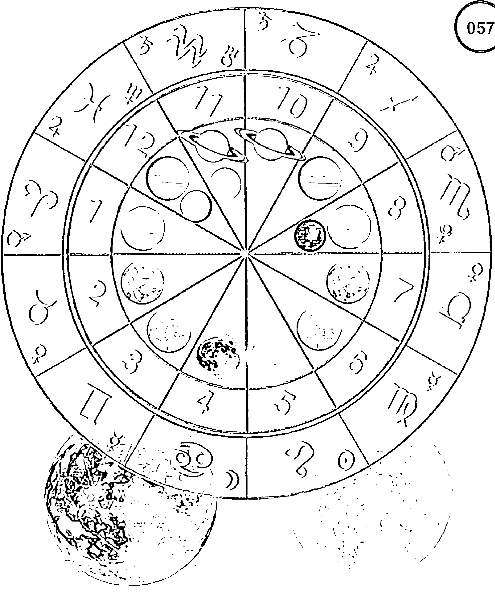

## ◇個人的先天星盤：本命盤

學習占星學，最基礎的解讀便是從個人星盤開始，個人的星座盤是一個嬰兒呱呱墜地那一瞬間行星分佈狀態的凍結，因此從中顯現了一個獨立個體的個性與傾向，他的能量如何反應，對各種事物的偏好，他是一個什麼樣的人，他如何的思考，如何表現他的喜好……等，甚至於他是一個好命的人還是一個壞命的人都可以從個人星盤中解讀出來。個人星盤代表的是個人的宿命設定，就像一顆種子，種子本身是好或壞是早已決定的，不會變的，西瓜的種子結出來的一定是西瓜不會是木瓜。但是同一顆種子種在南部或種在北部、種在台灣或種在美國、種在溼地或種在沙漠卻會有不同結果，是否每天澆水施肥還是任憑它自生自滅也一樣會有不同的結果。所以說，先天命雖然是固定的，但是發展卻會因為後天的選擇而有不同的結果。

## 第一部 1-5 認識星盤

基本上，個人星盤記錄著一個人在人世間這個角色扮演遊戲中，角色的基本設定。至於你要怎麼詮釋這個角色，就看你自己的投入了！這裡牽涉到一個基本的問題——自由意志的選擇。原則上，命並非全然確定的，但它又是已決定的，很難懂？以演戲來形容，同樣是張無忌，梁朝偉跟馬景濤演出來的就是不一樣，如果你大牌一點，你還可以修改劇本，懂我意思嗎？命的設定是決定的，你無法選擇你的父母、兄弟，甚至你的個性，我為什麼會喜歡她，你根本不知道，但是一切又並非完全不能控制，懂嗎？就像一首歌，旋律是確定的，歌詞是確定的，但是蘇慧倫唱的感覺跟徐懷鈺唱的就不會一樣。因為蘇慧倫表現了蘇慧倫的自由意志，徐懷鈺表現了徐懷鈺的自由意志。但是你知道，這是同一首歌。

## ◇個人星盤與運行星：命與運

什麼是「運」？運就是動態的「命」，每一個時間點就是一個命，而這些時間點串聯起時間的流動，

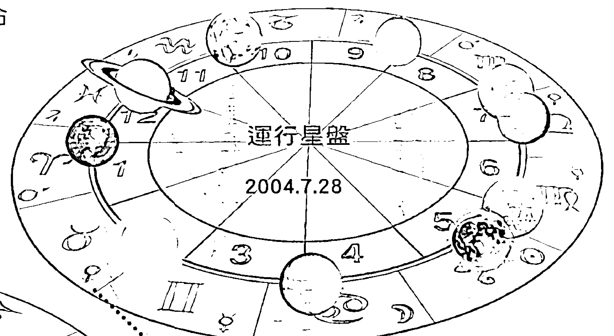

粉紅線為某甲與某乙彼此本命星間的互動

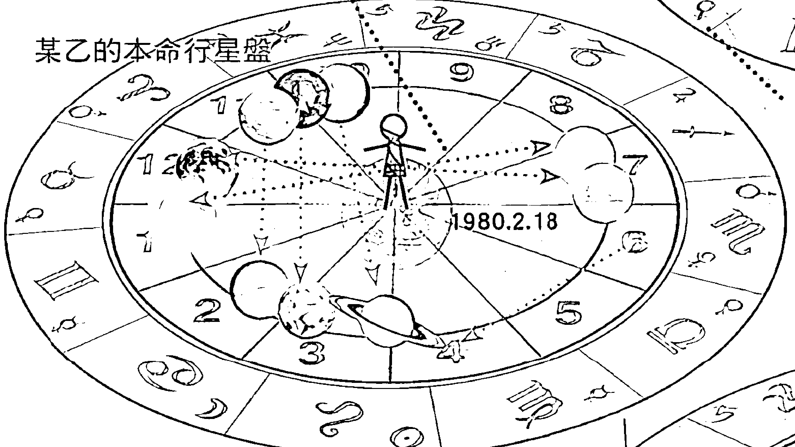

虛線為個人星盤行星間彼此發生的相位關係。淡藍線為2004年7月28日的運行星對某甲本命星的影響，它同樣的會對某乙的行星產生影響。

## ○行星的分別

行星可以分成本命星、他人星與運行星。本命星是屬於個人出生當時那個時間點的星象。他人星則是另一個人出生當時時間點的星象。而運行星就是推命時當時的星象。因此，每一個人都會有一張獨一無二的星象命盤，而對全世界的每個人來說，大家都會在同一時刻分享同一個運行天象。

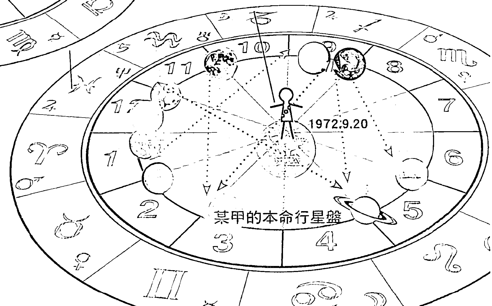

時間流動到1980.7.10某一瞬間時間點的行星分布

這就是運。本命盤占星就是解讀你出生那一瞬間時間點的方法，而運勢占星就是看出生後繼續流動的時間點與你本命時間點之間關係的方法，同樣的配對占星就是看別人的時間點與你的時間點之間關係的方法！

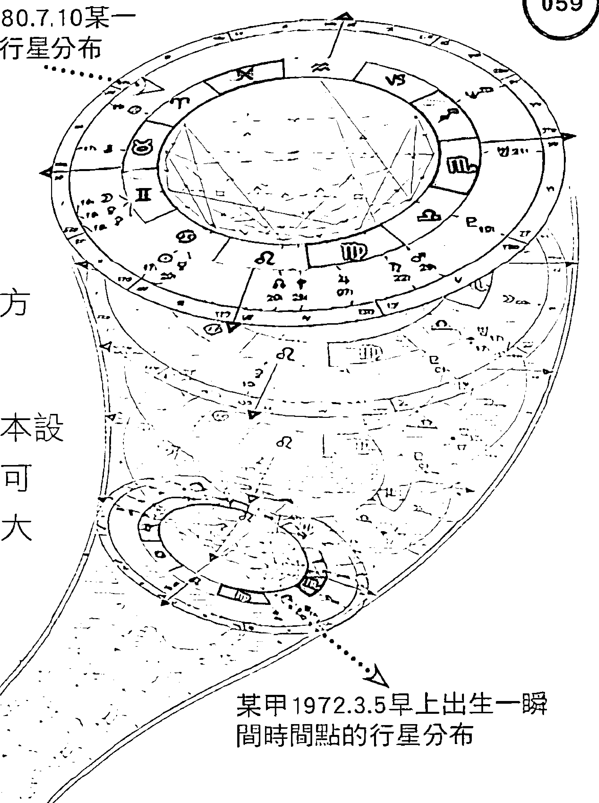

個人星盤詮釋了屬於獨一無二的個體的基本設定，它是不動的，是出生那一瞬間的凝結。可是天上的星星是不斷變動的，它就像一個龐大的命運鐘，不斷的運行，每一個個人的星盤都必須跟著這個大鐘產生反應。這也就是一般所說的運的概念。在不同的時間天上的某顆星引動了個人的某顆星，當天上的星星與個人的星星產生了關係，我們的人生便開始了一個個的段落事件。每一個個人星盤是一個特定時間的點，就像卡通是由一張張靜止的畫面組成一般，將每一個個人星盤集合後，便構成了一個完整連續而不斷運轉的龐大命運鐘。這就是推運的基本概念，利用天上的行星在每一天、每一秒的運行中，與個人星盤產生的連動，而構成了不同的好或壞的命運影響，依據行星的運動週期，來預測出可能發生的好壞運勢。

某甲1972.3.5早上出生一瞬間時間點的行星分布

## ○運就是動態的命

每一個時間點都有屬於該時間點的象徵與意義，基本上，占星學就是一種解釋星星的技術與藝術，我們將每一個時間點凝結成一張星盤，而隨著時間的移動，各個行星持續的移動，每一個時間點呈現出不同的行星分布，都是一張獨一無二的星盤。

## ◇雙人星盤與運行星：配對關係

同樣的，當一個人遇到另一個人，彼此的星星便會產生反應，出現彼此行星間的相位，相位當然有好有壞。所以，這就是為什麼我一看到他就不爽；一遇到她，我就好喜歡她，好想跟她在一起。為什麼呢？因為你們的行星之間發生了關聯，產生了好的或是壞的連動關係。這就是合盤的觀念，兩個獨一無二的星盤放在一起後，從彼此的星與星間所產生的引動，來看出彼此之間的關聯與問題。但是，在共同的命運鐘的影響下，兩個相愛的人卻各分東西，那個討厭的傢伙卻老是在身旁出現。彼此的相位就像是雙人間的緣分密碼，而當運行星啟動後，就會發生一個個屬於彼此的共同事件。所以有相愛基因的兩個人如果沒有運行星來引動，也可能形同陌路，沒有交集。

## 1-6 占星學的符號 Symbol

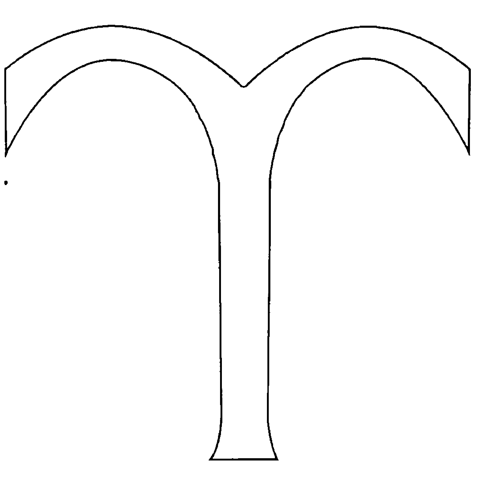

### ◇占星學的符號

要讀懂星盤，自然要對星盤上那些符號有所認識，占星學是人類數千年來共通的一套想像語言，有其特殊的符號而自成一個系統。對於占星學符號的起源，現在已不可考了，但是可以知道的是，至少在八千年前，就已經有一套占星所使用的語言和文字，雖然現在我們所用的占星符號已和八千年前的人們不同，但是有很大一部分，我們可以看到原始創作的痕跡。

解讀星盤像是一種聯想的藝術，在占星學上，我們可以透過這些現成的符號，去了解占星學的內涵。符號包含二大系統：其中的一個系統，就是星座的符號；另一個系統，就是行星的符號。經由這些符號，可以了解星座與行星的特質，這裡面也包含了許多傳統的神話和文化的價值觀。符號本身具有象徵的力量，占星家運用符號的組合來反映某些特定事件的聯想。

除了星座符號與行星符號兩大系統外，星盤上還有相位符號以及一些特殊點的符號，這些都必須先了解它們的含義，才不會霧煞煞，什麼也看不懂！

### ◎12星座符號

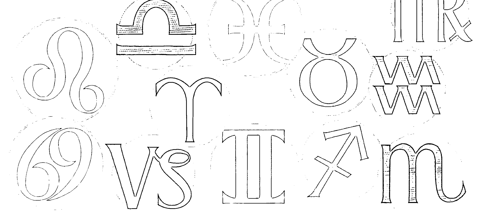

## ◇星座的符號學

占星學所用的各種符號，都有其一定的意義。黃道12星座分別由各自古老的象徵圖形及代表符號來表示，每一個星座都與人世的特質相關，各代表了12種不同的原型象徵，12種宇宙的基本法則。星座的符號基本上是由各星座的形象演化而來，以牡羊座的符號來說，象徵牡羊的羊角，也類似植物的嫩芽，代表著新生。從其他觀點來看，12星座的符號可能並不只是星座的象形特徵這麼簡單，裡面似乎隱藏著一些宇宙的基本原型概念在裡面，像螺旋、圓、平面、銳化、潤化、平行、縮放、空間等等。

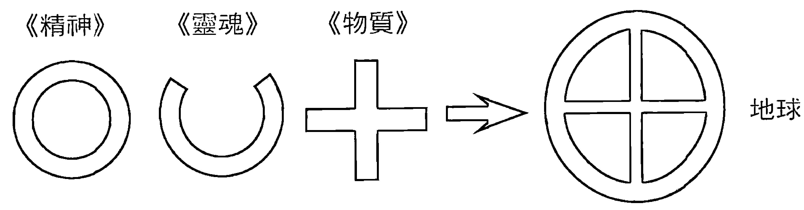

## ◇行星的符號學

行星和星座的特質密不可分，我們也可藉此更了解星座的特質。占星術中，將每一個行星用來象徵每一個人的能量與行為模式，以符號語言來解讀各行星的運動，解釋祂們如何反映地球上的生命。行星的符號是由三種基本圖形組成，☽新月形、✚十字與☉圓形，這些圖形分別代表著靈魂、物質以及精神。行星符號主要由這三大要素彼此組合來表現各行星的意義。將這三要素完整組合，就成為地球的符號了！代表終極的完美，這個符號同時也跟幸運點的符號類似，代表一個人的幸運與福報的所在。

### ☉行星符號

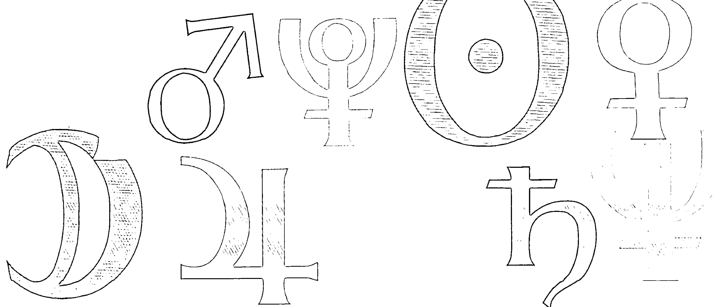

## 1. 牡羊座 Aries

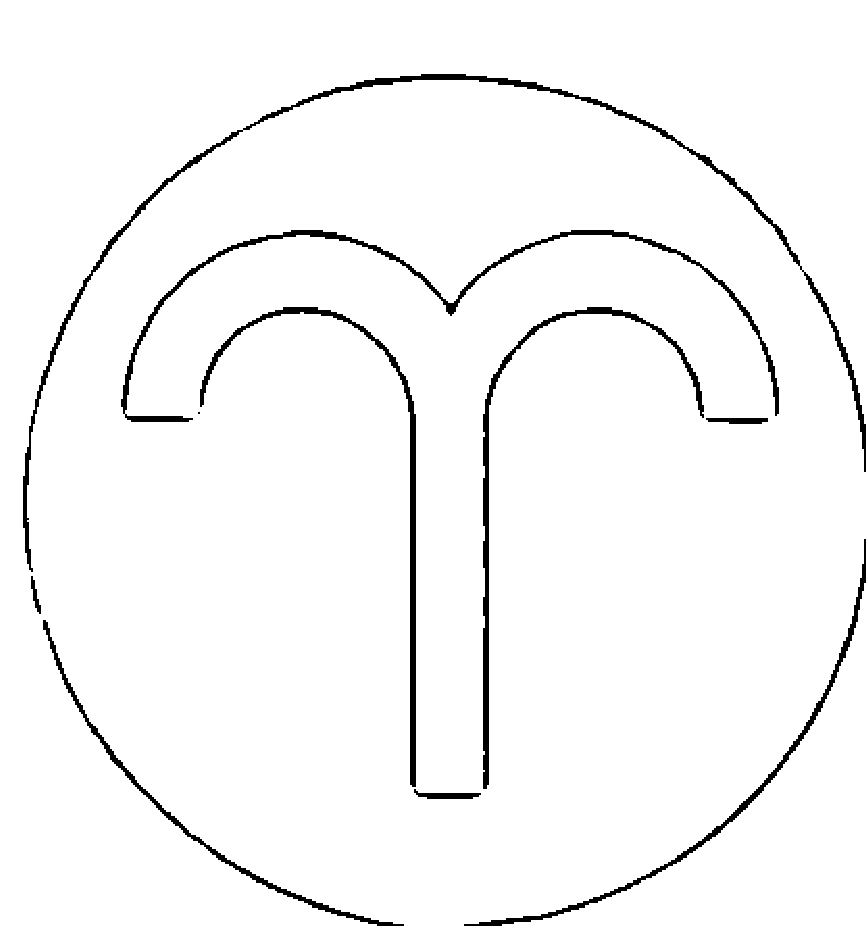

牡羊座的符號是象徵羊的頭，是一種象形的方法，取羊最明顯的羊角和鼻梁部分。另外牡羊座的符號也象徵新生的綠芽，表現出大地新生和初生啟蒙的象徵，另外牡羊的符號也象徵尖銳化的意象，同時也有單一化的特徵。

## 2. 金牛座 Taurus

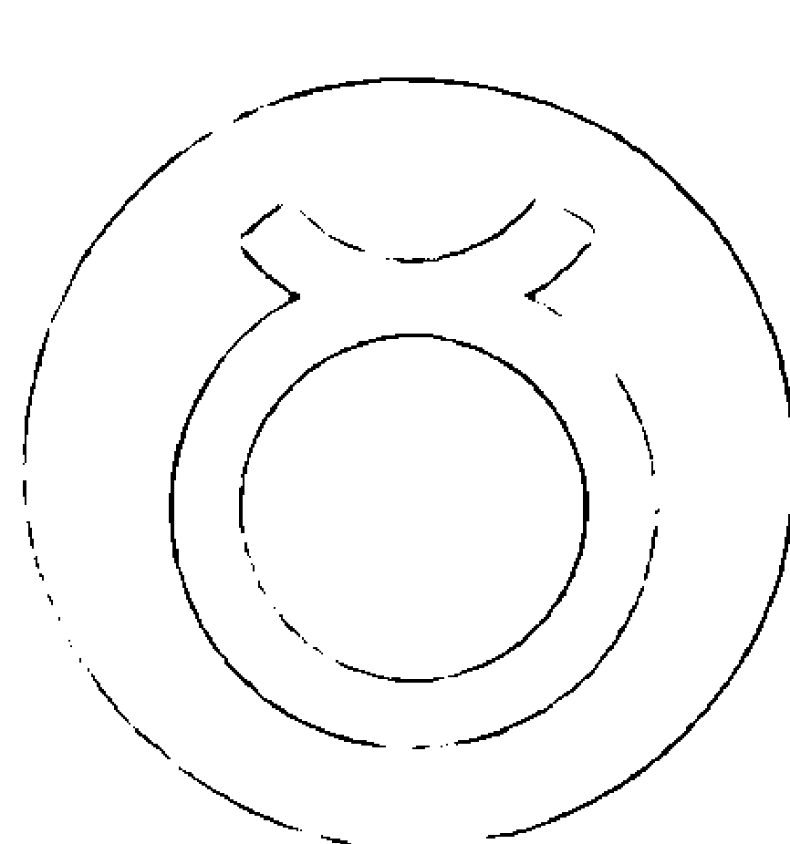

金牛座的符號是代表牛的頭，也是以簡單的線條描繪出牛的形象。金牛符號也像一個8將上面的圓圈切一半，這像是一個上面開口，頸口縮緊的袋子，將一切吸入圓形袋中，像煉丹爐一樣凝聚成實體。由另一面看，圓圈也象徵穩定與完美。

## 3. 雙子座 Gemini

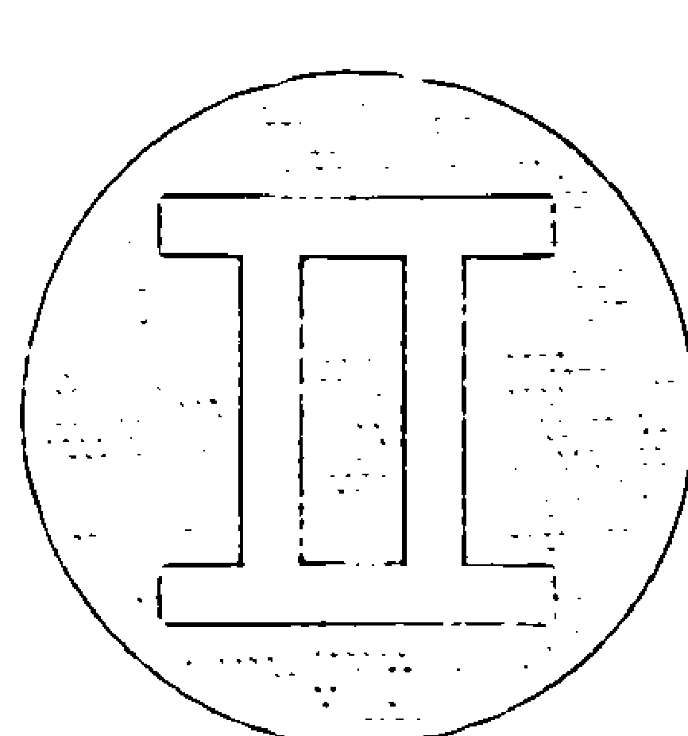

雙子座的符號是Ⅱ，象徵雙胞胎，從同一複製成多元的化身。由雙子座的神話可以知道雙子座的多元性和相對矛盾性。雙子的符號也象徵平行的連結，他顯現出雙子的同層次分化與隨機連結的特徵，因此也象徵出雙子的多樣化卻膚淺的一面。

## 4. 巨蟹座 Cancer

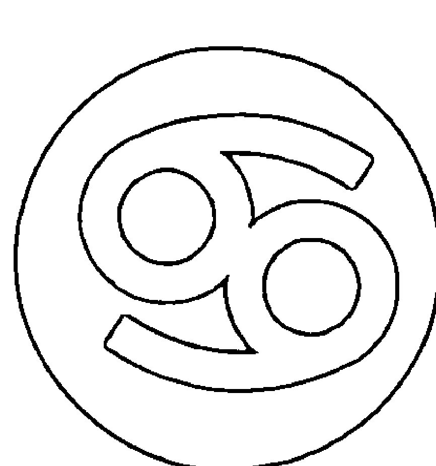

巨蟹座的符號像是平躺的69，外型如同螃蟹的硬殼，也象徵胸部。兩個69像是兩個相反的封閉螺旋，構成一個封閉的空間，由硬殼可看出巨蟹座所具有的保護特質，和封閉迂迴的習慣，而躲在硬殼內的才是真正巨蟹的本體，是柔軟虛弱的。

## 5. 獅子座 Leo

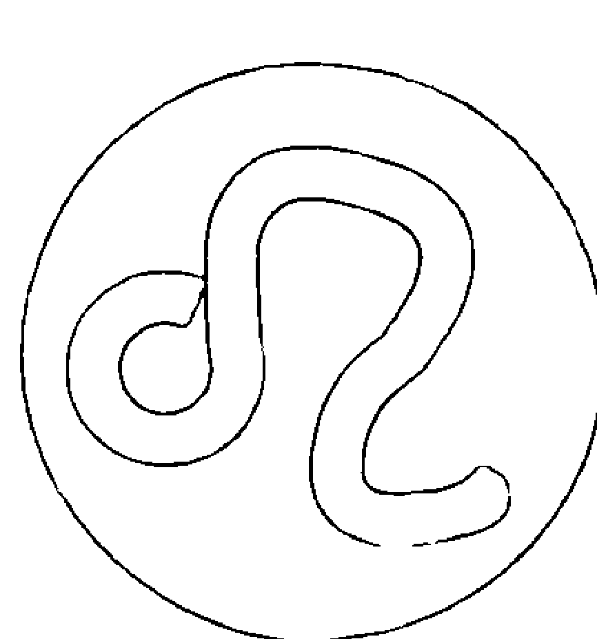

獅子座符號是象徵獅子高高揚起的尾巴，充分顯示了獅子的尊貴驕傲個性。獅子座的符號其實可看成一種向心螺旋的簡化碎型結構，如右圖。由此象徵獅子的向心特性與集中特性。

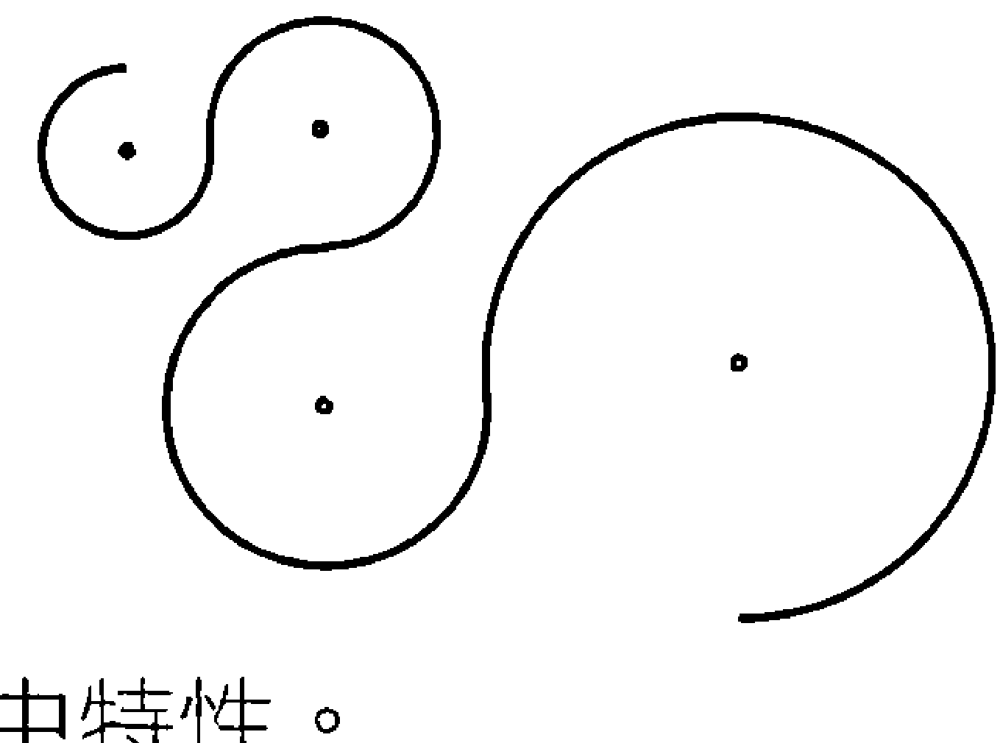

## 6. 處女座 Virgo

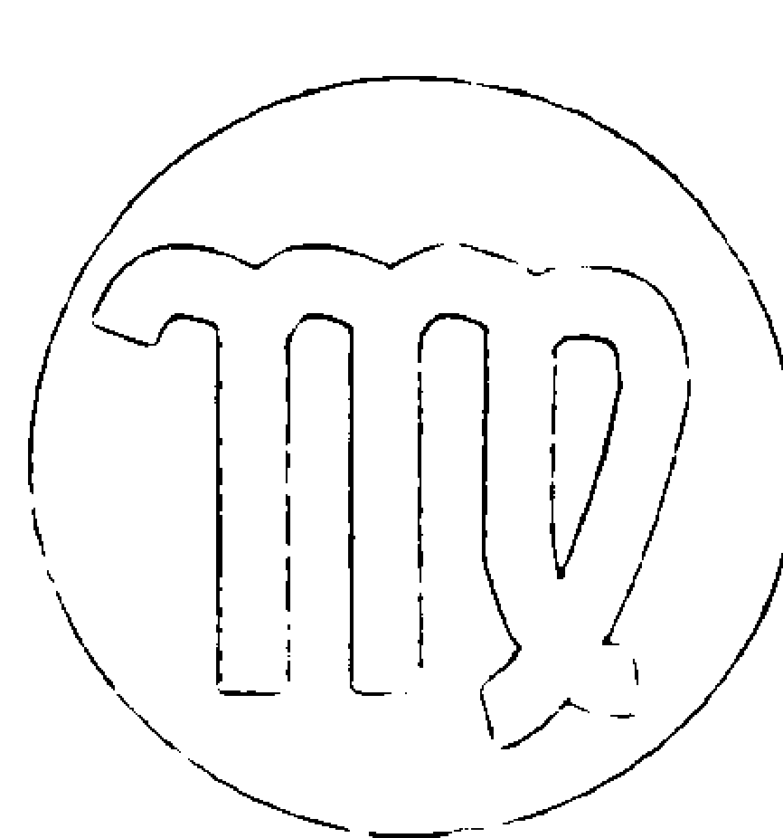

處女座符號左半的m與天蠍左半一樣，應該也是一種螺旋的象徵，符號右半邊其實跟金牛符號倒過來很類似，具有物質化的含義，結合左右兩半，象徵物質的分解與細化。可以聯想出處女小心、謹慎、緊張的特性以及縮小分化的特徵。

## 7. 天秤座 Libra

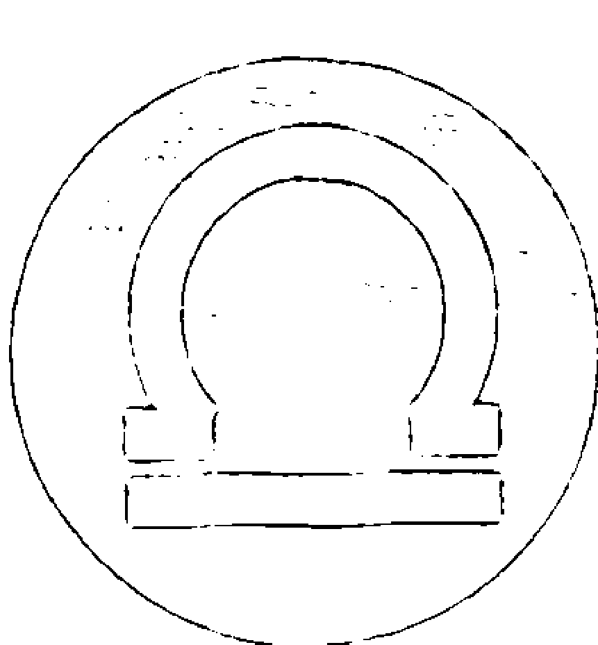

天秤座的符號是象徵一桿秤子，希臘字母Ω代表了衡量，而下面的一橫則代表了衡量的基礎，可以看出天秤座公平的特質，由那一桿秤子，象徵天秤座追求平衡的基本念頭。另外，與牡羊符號的尖銳化相反，天秤的符號則有將事物圓潤化的徵象。

## 8. 天蠍座 Scorpio

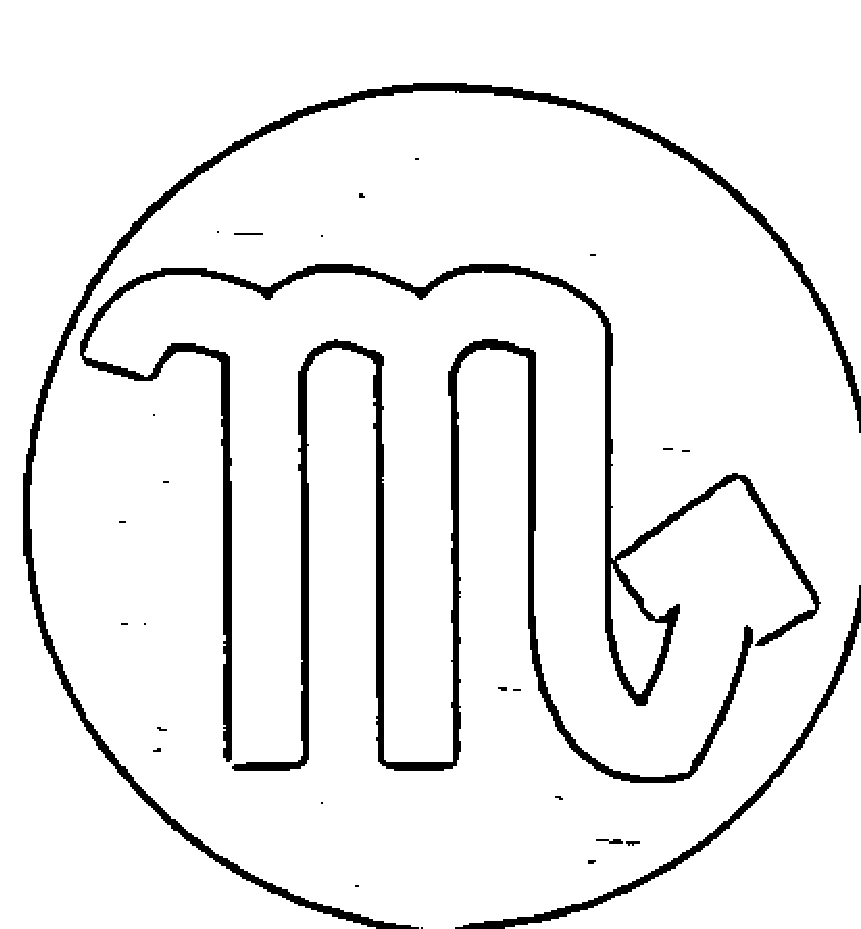

天蠍座的符號是象徵蠍子的甲殼和毒針，和處女座有點像，左半邊的m象徵不斷深化；右邊的倒鉤是蠍子的形象，象徵天蠍座的報復特性。將左右部分結合，代表慾望極度的深化與濃縮，箭頭展現出天蠍的隱藏慾望，經過m的螺旋而造成了扭曲。

## 9. 射手座 Sagittarius

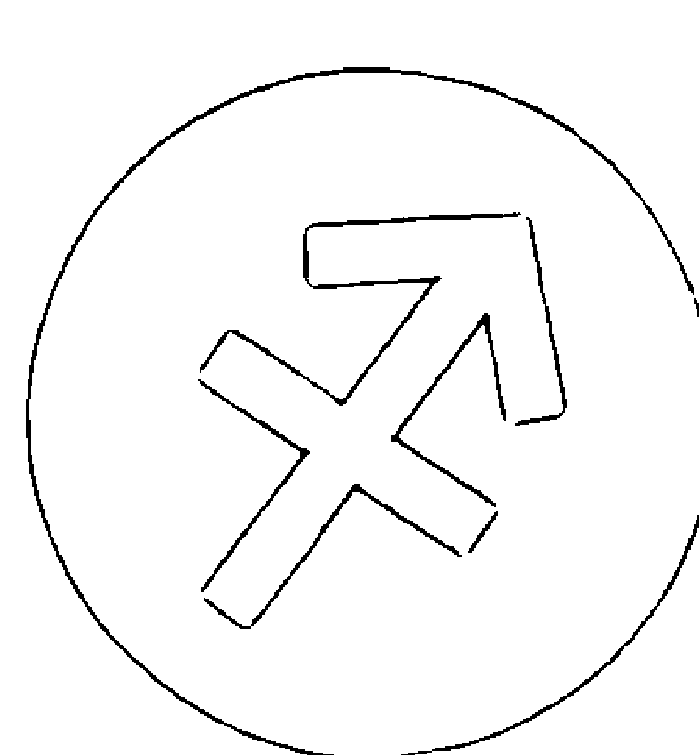

射手座的符號是象徵射手的箭，回到象形的簡單形式。由射手座的神話可以看出射手座的智慧和愛好自由。射手的原型是拿弓箭的人馬，下半身的馬象徵追求絕對自由，上半身的人象徵知識和智慧，射手的符號展現射手向上提升進化的特性。

## 10. 摩羯座 Capricorn

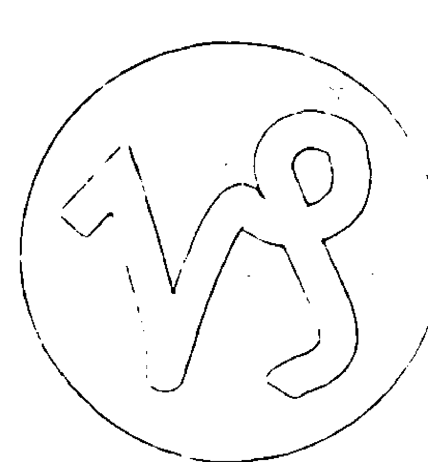

摩羯座的符號是象徵羊身和魚尾，山羊象徵著摩羯往上爬的特性，從魚尾變成山羊身代表摩羯從感情走向現實，展現摩羯的無情。這個符號左邊的v與牡羊符號類似，右半跟處女右半類似，結合兩邊，代表的是物質化的開始，象徵一切物質的根基。

## 11. 水瓶座 Aquarius

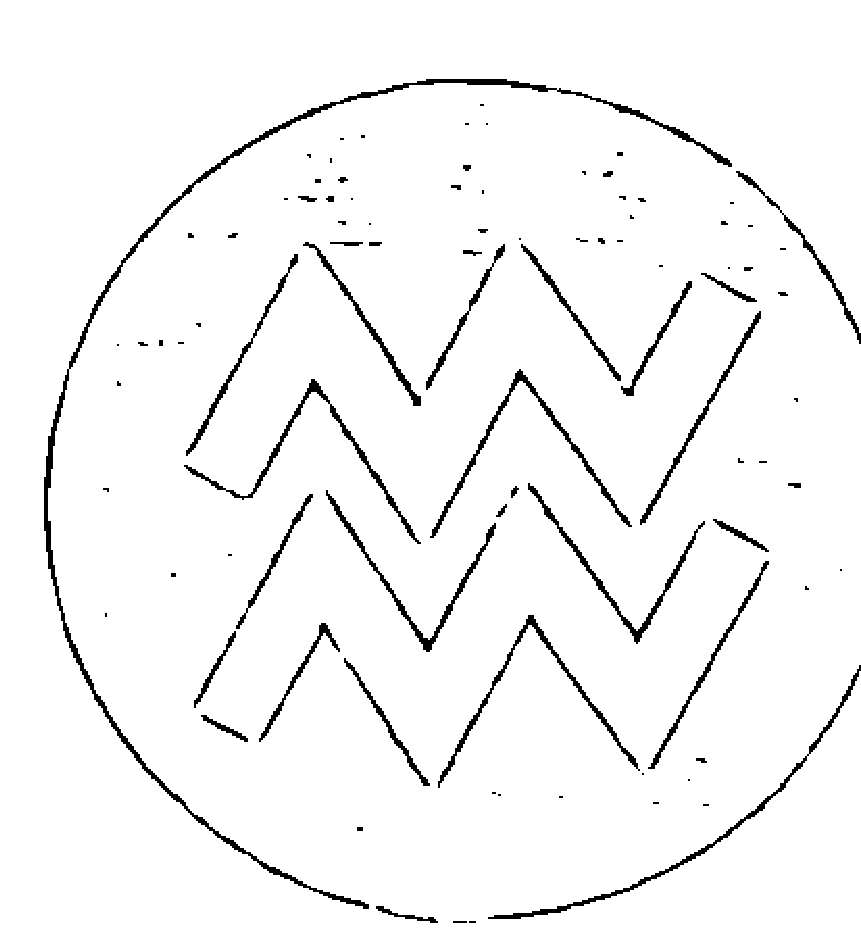

水瓶座的符號是象徵水和空氣的波，是具象但又抽象的。水瓶座的波，是高度知性與自由的代表，由波的特性去思考水瓶座，象徵水瓶的波動性與不可預測的，看似有規律，但又沒有具體的形象，具有分離性，同時又有群聚性的矛盾。

## 12. 雙魚座 Pisces

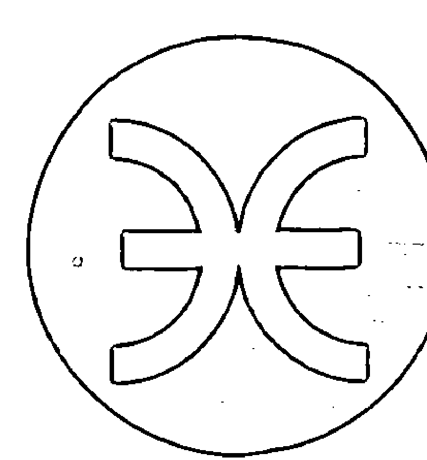

雙魚座的符號是象徵兩條魚，而其中有一條絲帶將牠們聯繫在一起，雙魚座的兩條魚是分別游向兩個方向，象徵了雙魚座內在的矛盾和複雜。兩個半圓象徵月亮的靈魂，代表不同的空間，由一條絲帶連結，展現了雙魚的包容與統合特性。

## 1. 太陽 Sun

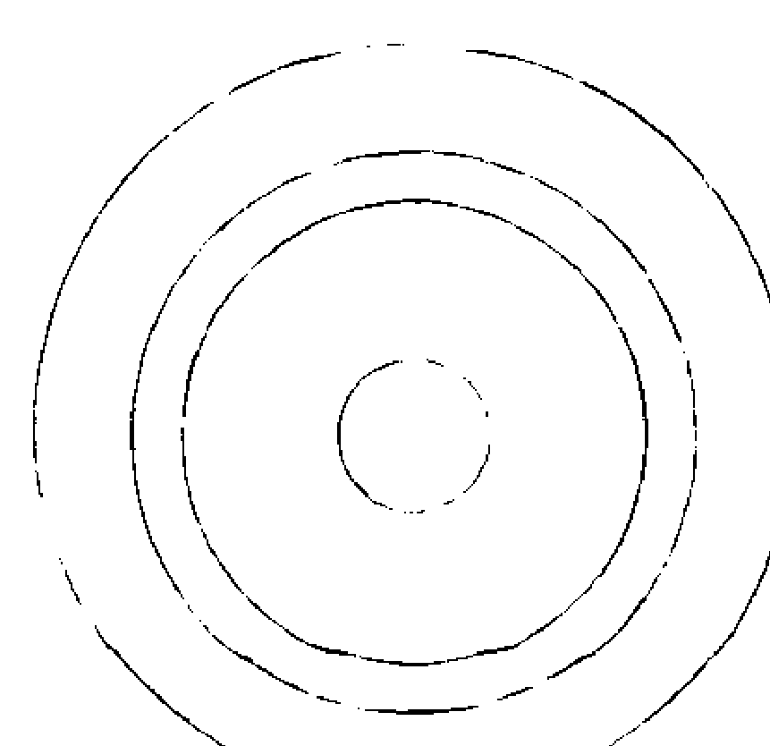

象徵著精神的圓，圓中有一小點，意味著混沌中生命的創生。
太陽的符號代表向心的特徵，將精神意志集中在核心，成為力量，展現出影響力與光。太陽為一切行星光之來源，故影響形象與自我表現，可以發現其愛現和發光特質，核心就如同帝王，這和獅子座的愛面子和王者之風也有關係。

## 2. 月亮 Moon

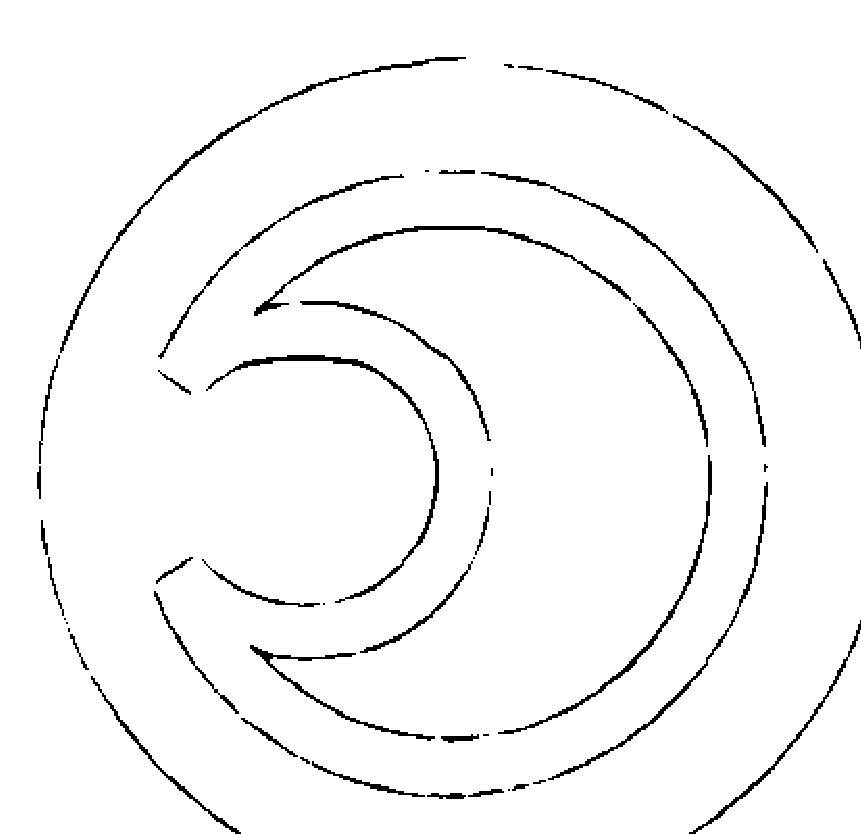

象徵靈魂的新月，代表著與過去或前世的關聯。
月亮的符號是一個有缺口的圓，像是一個內凹的容器，也是一個半封閉的空間，容器內的空間需要填滿情感，滿足靈魂的情感需求，情感被封存在容器中產生情緒起伏，封閉的領域形成一種區隔的保護，也象徵個人的安全領域。

## 3. 水星 Mercury

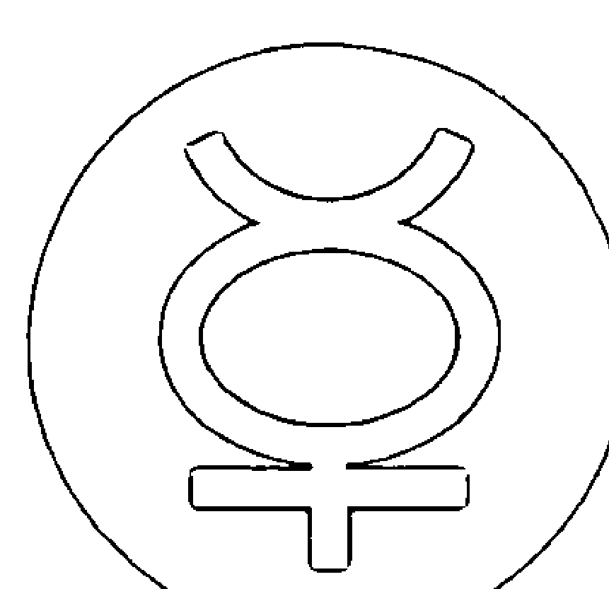

神秘的水星符號，精神連結了物質與靈魂，產生三者的結合。
水星的符號結合了靈魂、精神與物質，用精神意志將靈魂與物質連結在一起，成為之間的媒介，並且在其間溝通交流，形成思維，表現個人的思考傾向及表達能力，形成快速的思考和分析歸納，透過媒介來催化加速事件的進行。

## 4. 金星 Venus

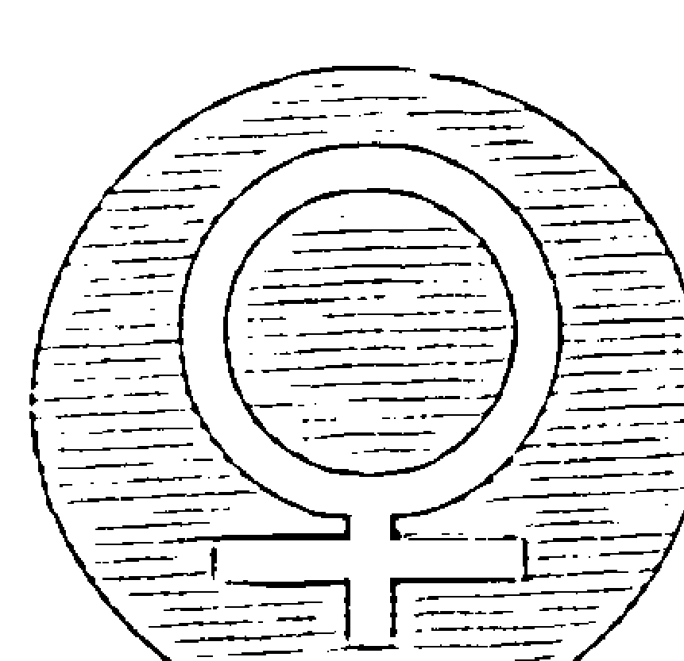

代表從物質的基礎朝向精神的層面，愛與美的追尋。
金星的符號是象徵精神的圓在上，物質的十字在下，因此金星代表以物質為基本，朝向精神的層面去提升。金星的意義是喜好與愛，具有很強的物質特徵，象徵從物質掙脫，朝向精神圓滿，因此金星具有圓潤與美化協調的特性，是美麗的徵象。

## 5. 火星 Mars

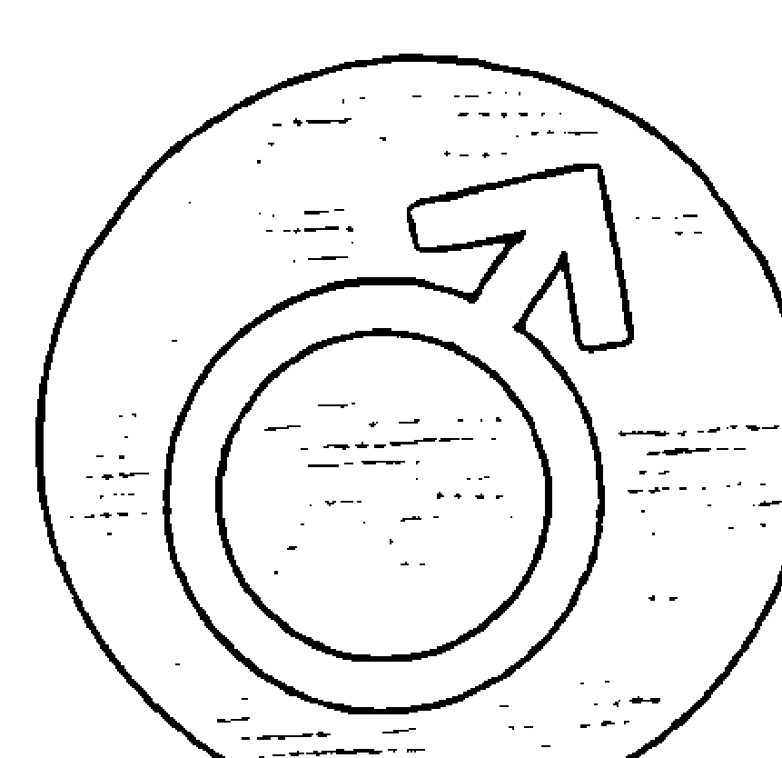

從精神的基礎朝向物質的層面，展現原欲與野性。
火星的符號是象徵精神的圓在下，物質的十字在上，因此火星象徵從精神的原欲出發，朝向物質的實現。火星代表個人的占有欲表現方式。從火星符號的意象，精神受物欲驅使誘惑，將原始的驅動化為行動，以物質的占有來發洩。

## 6. 木星 Jupiter

靈魂在物質之上，代表靈魂支配了物質而提升。

木星的符號是由象徵靈魂的半圓與象徵物質的十字組合，靈魂在物質之上，象徵從物質朝向靈魂的進化，由凝固的物質解脫朝向虛的心靈，因此放大而擴張。木星象徵人的「福氣」，代表靈魂不再受物質的枷鎖禁錮，不斷追求更高領域的提升。

## 7. 土星 Saturn

物質在靈魂之上，靈魂受物質的禁閉而結構化，充滿困難。

土星符號跟木星是一組的，一樣是靈魂跟物質的組合，但是是物質在上，靈魂在下，因此這象徵從虛的靈魂固結為實質物質的層面，因此這象徵著現實化與受到物質禁錮，從虛到實，因而感覺受到限制與框架，壓力阻礙重重。

## 8. 天王星 Uranus

精神上的物質，將靈魂分開，象徵解開過去，邁向未來。

天王星的符號是由於1781年Herschel發現天王星，取其第一個字母大寫「H」字母組成這個符號。可以看成中間的火星將左右兩個月亮區隔，祂象徵著分裂與脫離，精神受物質驅使將靈魂分割，這也展現出天王無情與疏離的一面。

## 9. 海王星 Neptune

靈魂與物質混合，代表模糊與虛化。

海王星的符號是以海神波賽頓的三叉戟為形象所構成，是由一個靈魂符號與一個物質符號組成，靈魂在上與物質混合，靈魂凌駕物質而氾濫，將物質統合包容犧牲，使物質朦朧虛無化。展現包容力和浪漫的特質，象徵夢幻與不切實際。

## 10. 冥王星 Pluto

靈魂在物質與精神之間，象徵質能的巨大轉變。

冥王星符號代表靈魂包覆著精神，將精神與物質連結，物質透過靈魂轉化為精神，在神祕的心靈沉澱積累中隱密重生。物質經過蛻變轉化為強烈的力量，靈魂將精神封閉，精神將靈魂集中濃縮成陰影，展現出強烈的激情與意志力。

## ◇小行星符號

四小行星是以神話中的女神命名，祂們的符號也都跟這些女神相關。凱龍星代表的是神話中的半人半馬怪凱龍，祂是英雄的導師，象徵療傷與不尋常的智慧。

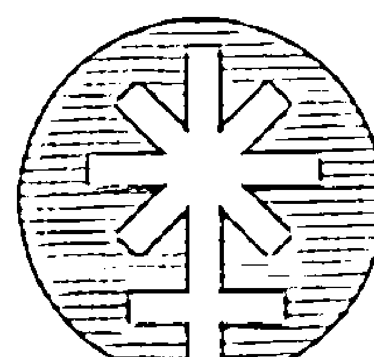

1. 婚神星 Juno
由一個米字與十字符號構成，是孔雀的形象，是朱庇特之妻朱諾的標誌。

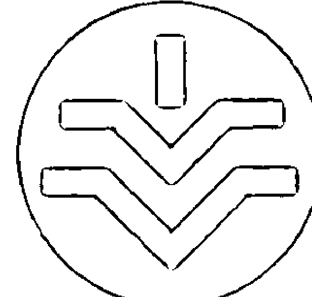

2. 灶神星 Vesta
灶神星的符號是以灶神守護的爐火或祭奠灶神的火祭壇為徵象。

## ◇相位與特殊點符號

除了星座與行星符號外，星盤上還有相位以及一些特殊點的符號。相位有主要相位與次要相位之分，主要相位有五個，合相（0度）、對相（180度）、三分相（120度）、四分相（90度）與六分相（60度）。另外還有四個次相位：十二分相（30度）、補十二分相（150度）、八分相（45度）、補八分相（135度）。

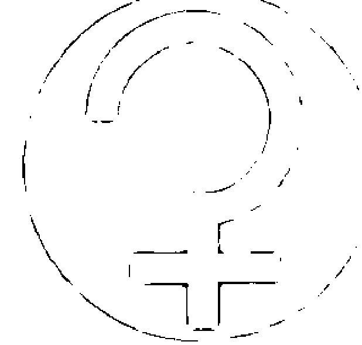

3. 穀神星 Ceres
穀神星的符號像一把柄向下的鐮刀，由上面的月亮與下面的十字構成，因此穀神星具有物質豐滿的徵象。

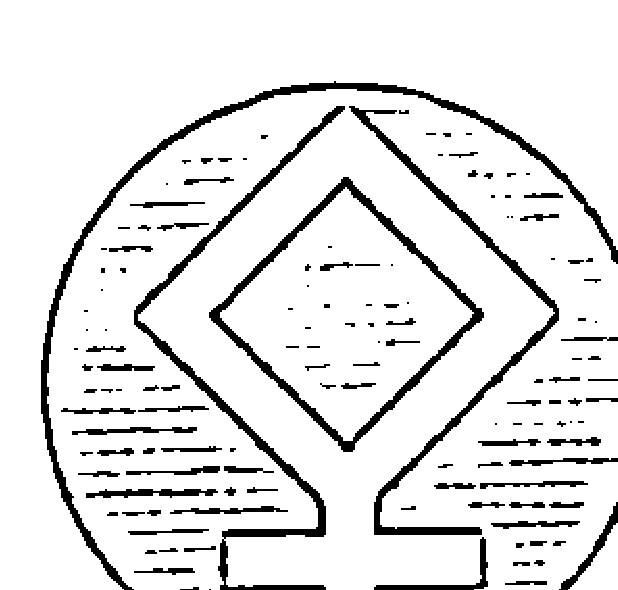

4. 智神星 Pallas
智神星的符號是變形的金星符號，由圓變成方，也象徵雅典娜的盾。

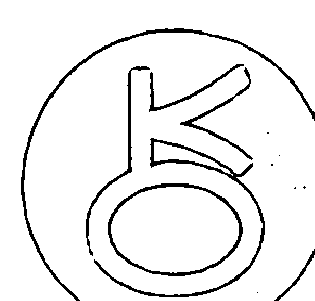

5. 凱龍星 Chiron
凱龍星的符號是一個k加上一個圓，像一把鑰匙，象徵解開問題的關鍵智慧。

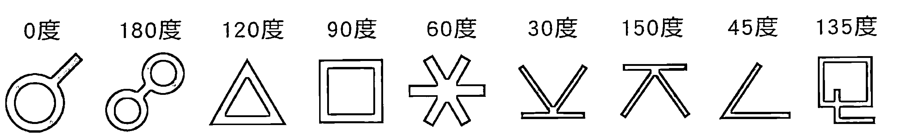

從月亮對地球的關係，還有月交點、月孛等符號，月交點有兩個，是以月亮在白道運行與黃道相交為符號徵象。月交點與靈魂有關，代表潮流的演變，北交點象徵潮流將往的方向，南交點則象徵潮流的過去。除此外還有福點等特殊點的符號，以及後來陸續發現的其他小行星的符號等，除了這些符號外，我們還要認識幾個重要英文簡稱，代表四角的上升（ASC）、天頂（MC）、下降（DSC）、天底（IC），還有漢堡學派的超行星系統符號，這些都是學習占星必須先熟悉的基本符號。

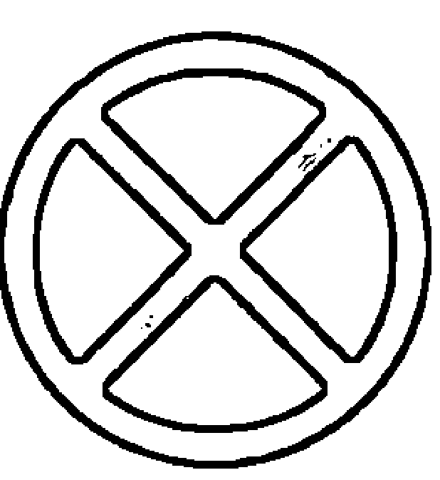

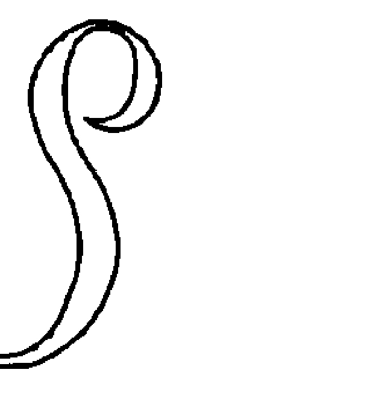

# 第二部

## 12星座原型

### 2-1 占星學的分類法 Classification

陰陽、三特質、四象、六對立

### 2-2 十二星座 12 Signs

- 牡羊座
- 金牛座
- 雙子座
- 巨蟹座
- 獅子座
- 處女座
- 天秤座
- 天蠍座
- 射手座
- 摩羯座
- 水瓶座
- 雙魚座

### 2-3 十二星座進階 12 Signs II level 2

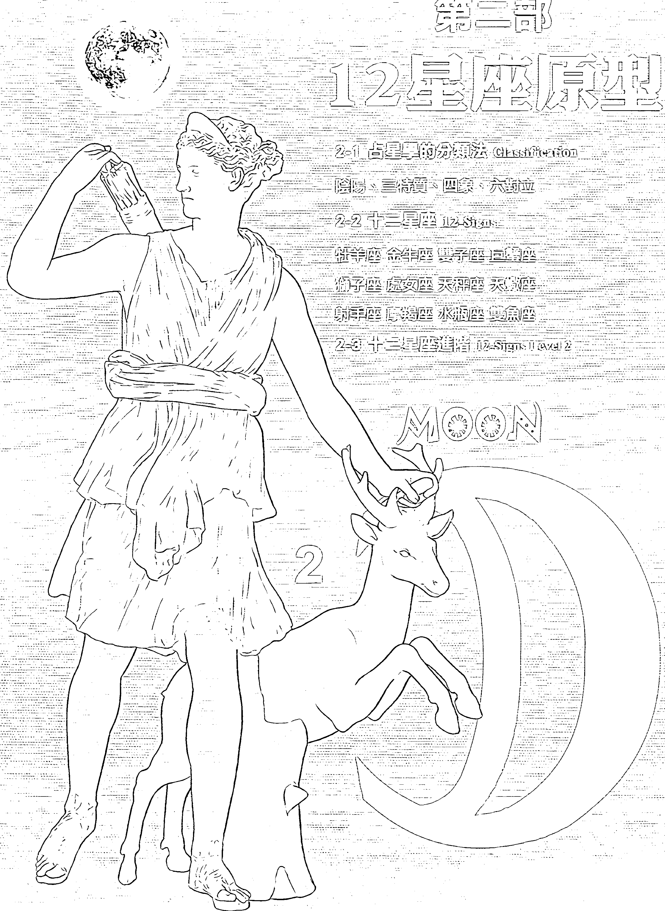

## 2-1 占星學的分類法 Classification

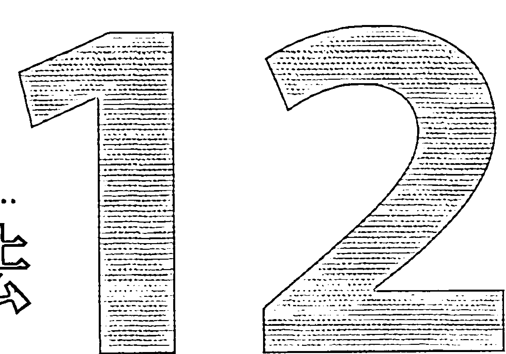

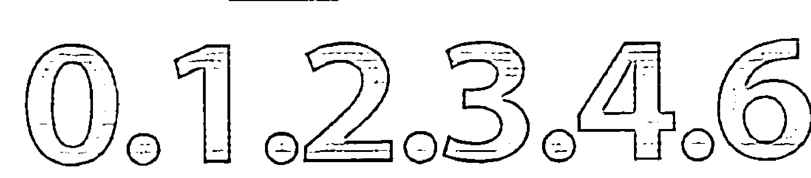

## ◇占星學的分類法

占星學的主精髓就在分類法，可以說分類法是理解占星的竅門，要了解12星座原型的根基來源就必須從分類法下手，占星的分類法看似簡單，因此很容易被忽略，但是卻是最重要的關鍵部分，是必須深入體會的。星座分類法的起源很早，依彼此的特性將同一屬性的星座加以歸納。對一個占星的初學者而言，星座的分類法是記憶與了解星座特質的一個好方法；不但可以將星座的特質作一種邏輯性的記憶，更可以對星座的理論有更進一步的了解，也可以對星座之間的關係有更深一層的認識。

12星座代表12種宇宙基本法則，為什麼是12呢？而不是11、13或是15、17。12這個數字在人類文明中一直是非常重要的數字，12時辰、24小時、60分鐘、孔子72門生、孫悟空72變、36天罡72地煞、108羅漢，這些數字都源於12，都是12的倍數。12是最原始的三質數1、2、3的結構組成，宇宙是0也是1（無極生太極），1分為2（太極生兩儀），2再衍生出3（一生二、二生三、三生萬物），4（2×2）是第一個非質數（兩儀生四象），6（2×3）是第一個兩個不同質數的相乘數，而12是1、2、3、4、6所構成的最小公倍數。所以我們可以將12分成2分、3分、4分與6分，而在星座分類法中主要著重在2分、3分、4分等三種分類法，透過這三種分類，將每一個星座原型定義出其宇宙性的象徵。自古以來，12就具有完整循環的象徵，將星座分成12種，有其特別的意涵，實際上如果加上5這個數字，便會形成更大的完整循環60，而我們平常使用的時間12時辰、60分鐘、60秒，也是在數學上有其完美的含義。

依照這三種分類模式將12星座原型歸納出：2分法——陰陽、3分法——特質與4分法——元素。2分法是宇宙最基本的分別，一體的兩面，從2分中展現了宇宙的相對性。3分法是宇宙螺旋的三種趨向，向前（前進）、向心（自轉）與向上（旋轉）的三種基本態勢。4分法是宇宙的4種基本結構，火代表宇宙點的基本驅動，風代表點與點之間的關係，水代表點與點之間所形成的封閉領域場，土則是宇宙點的結構化。四象中火風同屬於陽，水土同屬於陰，兩兩相對立。每一個特質都各有一個火風水土元素，兩組對立互相交叉成一個大十字的張力結構，彼此對立拉扯，三種特質各自形成三種大十字結構。每一種象都包含三種特質，例如火象的牡羊是基本特質，獅子是固定特質，射手是變動特質，同象的三特質之間彼此調和，形成良性的大三角結構，四象各自形成火風水土四種大三角結構。

這三種宇宙的基本定義構成了12個宇宙的基本原型，在天上以12星座來象徵，這樣的分類也延伸到了宮位，宮位也一樣可以分為陰陽、三特質與四元素，分類法可以讓我們更容易對一個星座或宮位的特性得到了解，因此想了解占星學，哪些星座是屬於哪個元素，是什麼特質，是陽性或陰性是必須清楚的。

## ○12星座分類關係圖

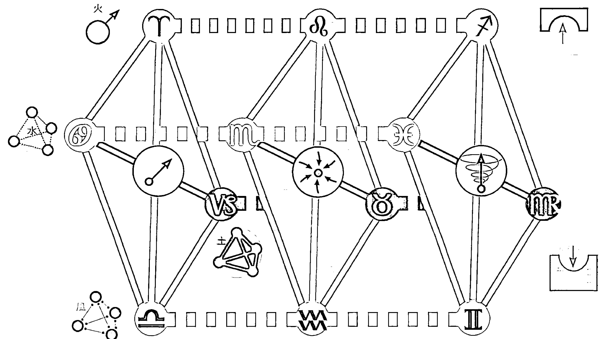

## ◇二分類法——陰與陽

陰、陽二分法是最直接而自然的分類法，將星座由牡羊座起，單數為陽，雙數為陰。依逆時針方向排列陽、陰，陽、陰……，這就是二分類法。陽性積極；陰性消極，陽氣上升；陰氣下降，陽氣清明；陰氣暗濁，陽性象徵著剛強、男性、動態、開放、自由；陰性則象徵柔順、女性、靜態、收斂、制約。

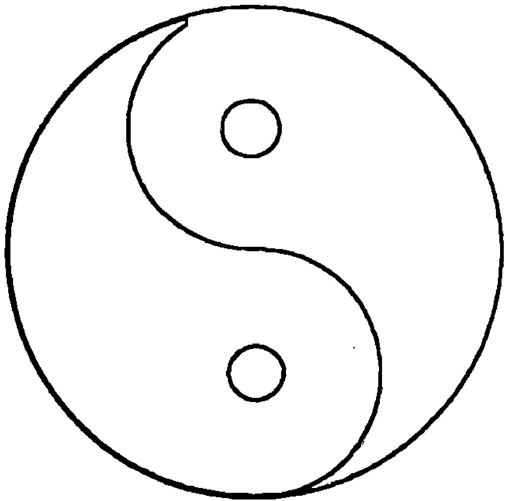

陽性星座中，包含火象星座與風象星座，而土象星座與水象星座則是屬於陰性星座。當行星進入陽性星座時，會增加行星陽性的一面，反之，則會增加陰性的一面，若落在陽性星座的行星多些，通常較為陽剛、外放、男性化，反之落在陰性星座的行星多些則通常較為陰柔、內斂、女性化多些。

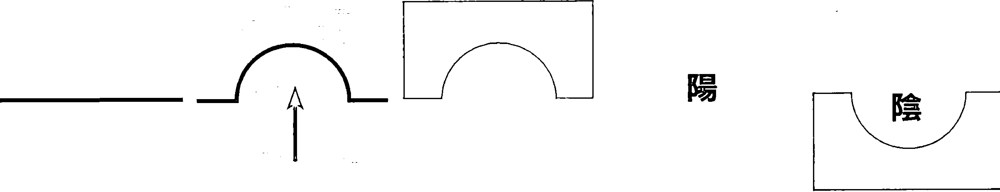

## 陰陽的原理

一開始宇宙是一個平面，然後平面開始扭曲往一個面向隆起，因此宇宙分出了兩面，突出的一面與凹陷的一面，突出的一面就是陽，凹陷的一面就是陰。所以陽是主動的一面，而陰是配合陽而形成的反向面。凸起的是陽、凹入的是陰，陽具有侵略性，陰具有順應性，陽主動、陰被動，陽外放、陰內縮，陽剛強、陰柔順，陽向陰突破，陰將陽包覆。陽以太陽為代表，凝結在獅子座，陰以太陰為代表，凝結在巨蟹座。

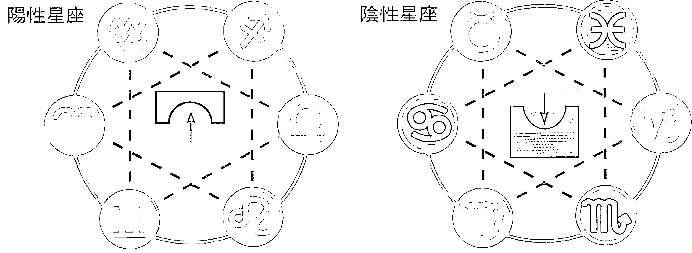

## 1.陽性星座 MASCULINE SIGN

陽性星座包含火象的牡羊座、獅子座、射手座和風象的雙子座、天秤座、水瓶座。陽性星座較為外向、開放、煽動、自由而有彈性。這類星座強勢的人個性較積極、活潑、樂觀、快速、開創性與活動性強。

## 2.陰性星座 FEMININE SIGN

陰性星座包含土象的金牛座、處女座、摩羯座和水象的巨蟹座、天蠍座、雙魚座。陰性星座較為內向、收斂、拘束而有包覆性。這類星座強勢的人個性較消極、閉鎖、悲觀、守成、具有受制性與忍受性。

## ◇三分類法——特質 QUALITY

三分類法是由牡羊座開始，依逆時針方向排列為基本、固定、變動，因此同一特質的星座會是彼此的四角，形成十字形。基本特質象徵向前，是最初原始的本性；固定特質象徵向心，是集中與凝聚；變動特質則象徵向上，具有多層次與全整性。每一種特質都包含火風水土四象各一個星座，基本星座是四象的最基本的狀態，固定星座是四象的核心狀態，而變動星座則是四象的變化狀態。這三特質分別象徵過去－現在－未來，也象徵開始－中間－結尾的過程。

## 三特質的原理

三特質是宇宙螺旋結構變化的三種狀態，宇宙是一個巨大的移動螺旋體系，一個點在螺旋上的移動會構成三種基本的趨向，最原始的趨向是不斷的向前進，這是基本特質。第二個趨向是中心自轉，前進的趨向會形成一個向核心旋轉的中心點，將動能往核心集中。第三種趨向是一圈一圈的向上旋繞，中心的自轉會構成旋繞的力量，從中心的點開始向上旋繞，這一圈圈的旋繞所構成的圓心形成一道向上的移動，構成一個向上的旋繞體系。這個向上的旋繞又會成為驅動直進的力量，如此三種特質之間成為完美的良性循環。

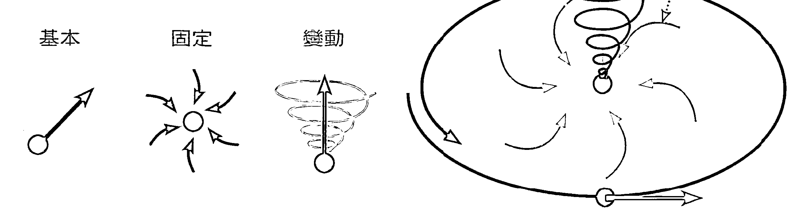

## 第二部 2-1 占星學的分類法

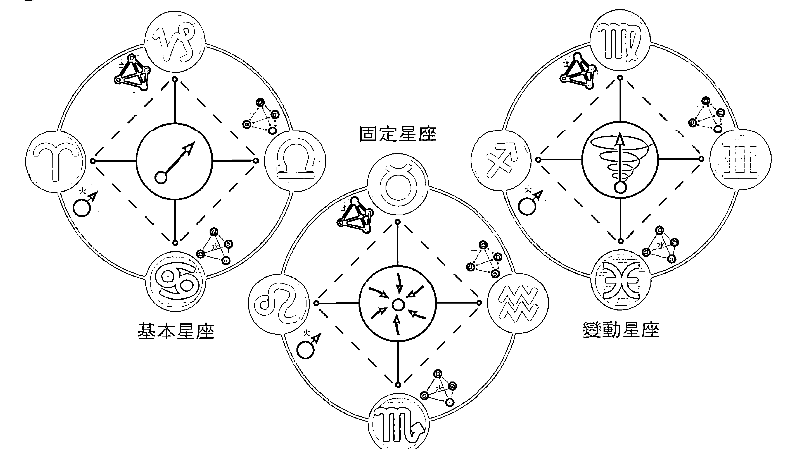

## 1.基本星座 CARDINAL SIGN

基本星座包括：牡羊座、巨蟹座、天秤座和摩羯座。這四個星座處於四季的開始，帶有一種起始的特質。基本特質象徵向前的、開啟的、創造的、原始的、單純的、本質的、純粹的、根本的源頭，是火風水土的初級狀態。這類星座強勢的人具有自發性與開創性，容易受原始天性影響，帶有直接性的目的傾向。

## 2.固定星座 FIXED SIGN

固定星座包括：金牛座、獅子座、天蠍座和水瓶座。這四個星座處於四季的中間，帶有一種核心的特質。固定特質象徵向心的、集中的、主要的、聚集的、執著的、頑固的、專注的、吸入濃縮的核心，是火風水土的核心狀態。這類星座強勢的人專注、穩定，具有主導性與持續性，容易受中心驅使，朝一個核心價值凝聚。

## 3.變動星座 MUTABLE SIGN

變動星座包括：雙子座、處女座、射手座和雙魚座。這四個星座處於每個季節的轉換，帶有一種多層次變換的特質。變動特質象徵向上的、提升的、複雜的、進化的、多元的、循環的、適應的、全整性的發展，是火風水土的進階狀態。這類星座強勢的人善於變通、適應力強，具有多元性，朝著更高的層次發展。

## ◇四分類法——元素 ELEMENT

除了陰陽與三特質外，星座還可以分為四象，由牡羊座起，依逆時針方向排列為火、土、風、水……，稱為四分類法。將十二星座分類為火、土、風、水等四大元素。其中，火象與風象屬於陽性星座，土象與水象則是陰性星座。

火代表能量的驅動主管精神，風代表關聯與流通主管思維，水象徵感覺與靈魂主管情緒，土則是物質與結構主管感官。四象在性格的分析上十分有用，火象代表直覺，是屬於易怒的氣質，如果大部分行星落在火象，容易衝動、直接。土象代表感官，是憂鬱的氣質，土象強勢的人保守穩重。風象代表智慧，屬於快活的氣質，風象強勢的人靈活多變。水象則是感覺，是敏感的氣質，水象強的人感性多情。


## 四象的構成原理

宇宙是0無極，無極生出1太極，宇宙是無也是無限，從最根本的開始宇宙是一個點。火象就是這個點趨向的動態與能量，然後這個點自我分化，由一分成二，如此便產生了相對關係，這個點跟那個點，我們把它定義為a點跟b點，風就是a點跟b點的關係，風一下子是a點，一下子又是b點，搖擺在兩點之間，來回遊蕩。當有了a點跟b點的區分，就自然產生了a點跟b點的中間區域，1生2，2又生3。這兩點封住的中間地帶就是水的概念，水將火的動態能量封藏在這兩點之間，成為一個封閉的區間場。最後土將這整個系統給結構化，讓整個能量場結晶成實質存在，兩個點構成了實線。

同樣的在二維的狀態中，火分化成三個點，風是a、b、c三點的關係，風一下是a，一下子是b，一下子又是c，水是a、b、c所圈出的封閉範圍，土則是a、b、c三點的結構化，形成了面的實相。再進一步變化，火分化為四個點，風還是點跟點的關係，水是這些點所構成的封閉空間，土則是這整個三維狀態的結構化，構成了結晶一般的立體實相。


所以簡單的來說，火象就是合一的驅動，風象是分化後的相對關係，水象是封閉的虛空，而土象是整個系統的實質結構。實際上四象只是同一個東西的不同狀態，火風在合一與分化中變化，水土在虛與實中轉換，而火風與水土之間又是陰陽的變換，其實是一體的兩面。

## 1.火象星座 FIRE SIGN

火象星座包括：牡羊，獅子，射手。火代表「趨向、精神、力量、意志」，火是欲念的驅動，具有自發性與力量，火象是光明的、動態的與外放的，具有獨斷性與主觀性，火象強勢的人擁有力量與意志，勇敢、衝動、直覺，很有自信但卻沒什麼耐性。溫暖、狂熱都算是火象的基本特色，他們擅長煽動與鼓舞，脾氣有一點火爆，是想到說到就要做到的行動派。熱情、果斷、自信、率直而天真，但是也自負、專橫、霸道和激烈。火象是驅動的三種狀態，代表的就是精、氣、神，牡羊是最原始的趨勢動能與精力發洩，獅子是動能的集中形成意志的力量與光，而射手則是力量的昇華成為神聖的信念。


## 2.風象星座 AIR SIGN

風象星座包括：天秤、水瓶、雙子。風代表「關係、連結、相對、思維」，風是相對來回的連結，也就是頻率的跳動，具有流通性與變換性，以思維理智來判斷選擇，具有相對性與客觀性。風象強的人較為理性、冷靜、重視思考，能客觀看待人、事，但是較為冷漠，處理感情問題時格外冷靜。聰明、善於交際是風象的基本特色，也善於傳遞與接收，這類星座的人表達力強、靈活、輕巧，但也容易分散不專，過於理想主義。風象是相對性的三種狀態，天秤是最基本的二元對立關係——是非善惡上下前後。水瓶是相對關係的集中，形成相對的比例——多少疏密冷熱，雙子串聯了天秤的相對性與水瓶的比例性，是多層面化的相對關係，高低、遠近、長短的判斷，形成思維與想法。


## 3.水象星座 WATER SIGN

水象星座包括：雙魚，巨蟹，天蠍。水代表「靈魂、泡沫、場域、感覺」，水是封閉領域的積累，具有融合性與感受力，受情緒感覺渲染，容易傳染與擴散。水象強的人較為感性而且重視情感，浪漫但不切實際。情緒、感覺、想像力是水象星座的基本特色，感受強、敏感、深情而且細膩，易受外界影響，十分的情緒化。水將一切感受累積封存在內在世界中，需要感情滋養也用感情滋潤他人。水象是靈魂的三個層面，巨蟹是靈魂的感覺積累，天蠍是靈魂感覺的集中濃縮成為暗意識陰影，雙魚是靈魂的多層次昇華為無意識靈性。


## 4.土象星座 EARTH SIGN

土象星座包括：摩羯，金牛，處女。土代表「實體、原則、結構、感官」，土是具體成形的建構，具有穩定性與實質性，受邏輯制約，具有維持力。土象強的人較為實際，重視感官，有邏輯觀念，但是固執己見。現實主義是土象的基本特色，他們重視物質條件及感官享受。土象象徵實體化與框架，他們是宇宙的構成者，這類星座的人性格實際、踏實穩重、保守，做事小心謹慎，但也容易笨拙不靈巧，流於官能主義。土象是物質的三個層面，摩羯是物質的基礎結構，代表事物的原理邏輯，身體的骨骼框架，金牛是物質結構的集中凝結，構成質量的實體，人身的肉體，處女是物質的多層次化，由物成器，代表不同功用的器物以及實質的層級，人體的器官。


## ◇分類法衍生——六對立

由陰陽、三特質的關係可以衍生出六個彼此相互對立的星座組，也就是將12星座分成六份。這六條線也各有其意義，象徵六種對立互動型態。彼此互為投射，當一端成為意識的主導，另一端就會被隱藏進入潛意識中，隨時準備浮出，爭奪意識的主導。


六對立可以分成兩種，陽性對立三組與陰性對立三組。陽性對立是火象與風象的對立，火風關係代表的是絕對與相對、單一與多元、主動與互動的對立關係。陰性對立是水象與土象的對立，水土關係代表的是虛與實、唯心與唯物、感覺與感官、相容與分類的對立關係。

## 一、陽性對立：牡羊VS天秤

這條線與自我與他人象徵有關，代表我與非我，主觀與客觀，直進與彎曲、尖銳與圓潤、野蠻與文明、強與弱。牡羊代表的是從平衡兩端的一端脫離，造成一端獨大，因而獨斷、自我、主觀。而天秤則相反，試圖與另一端取得平衡而依附，因而具有協調、客觀、容易妥協的特質。


## 二、陰性對立：金牛VS天蠍：

這條線與形成象徵有關，代表正與負、增加與減損、獲得與失去、穩定與風險、良善與邪惡。金牛代表的是將分散粒子凝聚成一個穩定的狀態，也象徵將能量變成物質，因此溫和、固執、物質主義。天蠍則相反，在穩定的狀態中試圖掙脫，由內部爆裂。也象徵將物質轉換成能量，因而內在不穩定，充滿爆發力而危險。


## 三、陽性對立：雙子VS射手：

這條線與連結接觸跟求知象徵有關，代表低與高、近觀與遠觀、簡易與高深、清楚與抽象、聰明與智慧。雙子是由一個定點往多個方向連結，是一對多的方式，因此善變、矛盾、變通、多而不精。射手則相反，讓多個定點往同一個目標前進，將多元變成單一的大朝向，因此直接、不拐彎抹角、粗略、大智若愚！


## 四、陰性對立：巨蟹VS摩羯：

這條線與框架限制象徵有關，代表陷落與阻礙，感覺與邏輯、情感與現實、柔軟與僵硬、紓壓與抗壓。巨蟹是由內向外形成框框，構成自我的領域，形成向下的陷入而跳不出來，因此具有保護、防衛、排外與內省的特質。摩羯則相反，是由外往內形成框框，構成基礎，而成為突出的高牆障礙，必須要跨越並向上發展，因而保守、謹慎、努力向上！


## 五、陽性對立：獅子VS水瓶：

這條線與焦點象徵有關，代表向心與離心、中心與邊緣、熱與冷、尊貴與平凡、集中與平均、以及主流與非主流。獅子代表是中心的位置，因而尊貴、愛現、熱情付出。水瓶則相反喜歡遠離中心，因此獨立、自由、個人主義但冷漠疏離。


## 六、陰性對立：處女VS雙魚：

這條線與解構象徵有關，代表分解與統合、清晰與模糊、仔細與隨便、緊縮與放鬆、勤勞與懶惰。處女代表解析，是將一個物質分解成無數的細部，因此分析、細緻、注重細節。雙魚剛好相反，代表統合，將無數分散的粒子融合於一，因此包容、模糊、複雜、隨便而散亂。


## 2-2 十二星座 12-Signs

## ◇12星座的基本介紹

在占星學上，黃道12星座是宇宙方位的代名詞。黃道12星座代表了12種基本性格原型，一個人出生時，各星體落入黃道上的位置，說明著一個人的先天性格及天賦。黃道12星座象徵心理層面，反映出一個人行為的表現方式。簡單的說12星座是12種基本的分類，象徵宇宙的12種型態。因此，12星座也跟顏色、金屬、寶石、植物……等等有所對應，至於人體那更是不用說了。所謂天人合一，天上的變化會引發地上與人事的對應，天、地、人彼此是相互感應，息息相關的。


牡羊座：頭部
火象的基本特質，最原始的本能驅動，一切的開始，最初的狀態。

金牛座：喉嚨
土象的固定特質，結構在核心凝結固化，成為物質的實體。

雙子座：手、肺
風象的變動特質，相對關係的多層次發展，形成多元化的隨機轉換，成為心智。

巨蟹座：胸部、胃
水象的基本特質，最原始的空間凹陷，累積的開始，靈魂最初的狀態。

獅子座：心臟
火象的固定特質，動能在核心集中，聚焦出光與熱，發出力量與影響。

天秤座：腎臟
風象的基本特質，最基本的相對關係，一體的兩面，選擇與判斷的開始。

天蠍座：生殖器
水象的固定特質，靈魂空間在核心濃縮崩塌，形成危險的陰影黑洞。

射手座：大腿、臀部
火象的變動特質，力量的多層次發展，提升為神聖的信念，向外膨脹擴張。

摩羯座：膝部、骨骼
土象的基本特質，最基礎的結構，構成現實的邏輯與原理，成為制約與限制。

水瓶座：小腿、循環系統
風象的固定特質，以中心為焦點，相對於核心排斥群集，構成一圈圈的波動。

處女座：腸、消化系統
土象的變動特質，物質的多層次發展，有秩序的解構分類，物分類為有功能的器。

雙魚座：腳、血液
水象的變動特質，靈魂空間的多層次昇華為聖性，包容統合一切於空無混沌。

廟：火星 ☉ 旺：太陽 ☉ 弱：土星 ♄ 陷：金星 ♀

## 〔牡羊座〕ARIES

牡羊座屬於陽性、基本特質、火象，主星是火星，對應宮是第一宮
守護星為熱和乾的火星。積極、勇敢、鬥志高昂，頗有開拓者的野蠻精神，由於正義感強，所以有路見不平拔刀相助之風，善惡分明、嫉惡如仇，主觀偏執。

牡羊座是黃道12星座中的第一個星座，太陽通過此星座約在3/21日至4/20日左右，這段期間就是晝間要開始比夜間長的「春分」時節，各種類的花卉開始綻放開花，萬物開始復甦。星座圖像是代表衝動莽撞的一頭公羊，象徵著直接與向前開拓的特性。它的基本含義是自我主義，新生與開始，爭鬥性與開拓性，有凡事不退讓、爭奪第一的傾向。

受到火星的影響，具有戰鬥力與競爭力。性急、暴躁、好鬥，生命力強，企圖心旺盛，獨斷、自以為是、不聽他人意見，勇敢大膽、不怕困難。

牡羊是初生之犢不畏虎，牡羊座強勢的人勇於開創，凡事爭先的性格，常能成為開路先鋒，是充滿活力而幹勁十足的活躍者。他們做事很有衝勁，勇往直前不怕困難，以爭取天下第一為其職志。不過他們往往過於急躁，而且只有三分鐘熱度，容易令人感到有勇無謀，加上未經世事磨練，缺乏思考而貿然行事，經常功虧一簣而感到後悔。他們好勝、喜愛競爭，容易跟別人產生衝突，由於過於自我，他們經常不顧他人感受、讓人不舒服。牡羊座的人對新鮮的事物都很投入，對新的事物容易興奮且好奇，勇於嘗試，追求速度，像公羊一般做事衝動莽撞。他們容易給人精力旺盛和辦事能力很強的印象，性格剛烈、易怒，是個天生的鬥士，但在意中人面前會流露出純真的一面。

牡羊代表一切的開始，最單純的狀態直進向前，一切的開始始於動。牡羊是最初的新生，原始的本性，象徵原我。牡羊是火，以精力的形式發洩，火是驅動的欲望，競爭好鬥。牡羊是第一個星座，是領頭羊也代表第一，一切以自我為優先。牡羊剛硬，具有獨斷性以及尖銳的特徵。牡羊的基本含義是在平衡的狀態中以競爭的手段，尋求自我的主導，造成單一個體的領先與獨大，脫離平衡的狀態。

牡羊的第一個關鍵字就是動，宇宙在一切混沌的空無中，醞釀出原始的欲求，因為有欲而形成驅使，因而被原欲所驅動，欲就是動機，驅動牡羊的原欲是最單純的直覺天性，最原始的生存本能，也就是天生的野性。牡羊具有主動性與行動力，他們需要不停的動，因為這是牡羊證明自己存在的方式。

因為動，所以一切才有了開始，所以牡羊象徵開頭，善於在混沌的荒地開創與開拓出新局，從無明中掙脫甦醒。每一個開始都是一種全新，所以牡羊象徵新的事物，由此了解到牡羊喜新厭舊的特性。從開頭的象徵可以聯想到種子，最初的新芽，所有的結果都根源於這開頭的種子，最早的雛形，因此牡羊象徵最原始的單純，所以牡羊幼稚而率真。由起頭引伸出頭的概念，所以牡羊掌管頭部。

最原始的動是直進，不斷的朝前方直進，由此衍生出牡羊的另一個象徵～向前。頭與前都是一件事物的最優先，所以牡羊代表第一，牡羊喜歡搶第一，愛爭前頭的位置，成為第一個的優先，這種特性可以引導出牡羊的好爭特質，競爭與好戰，想要得到勝利，以自我為優先征服一切。

火是牡羊的另一個重要象徵，火的燃燒形成動力，因為火點燃了欲而發生行為，也就是精力的發洩，牡羊如火一樣燃燒，從火的意象引伸出乾裂、辛辣與發炎的徵象。因為火的驅使，牡羊勇敢而大膽，性急而躁動、火爆而衝動。

牡羊絕對性的單向直進可以引伸出獨斷與自私，進而過度的偏頗與尖銳，從這可以看出牡羊剛硬與銳利的一面，所以具有切割斷裂功用的刀劍武器也是牡羊的徵象。

### ◇象徵事物

狀態：動的、單向的、直的、快的、頭部的、前面的、開始的、早的、新的、初期的、純粹的、原始的、簡單的、天然的、火熱的、銳利的。

正面：果斷的、競爭的、勇敢的、大膽的、迅速的、直覺的、直接的、領先的、優先的、第一的、頭角崢嶸、突出的、生生不息、初生的、新鮮的、年輕的、單純的、率真的、天真的、赤子的、熱血的、忠誠的、決斷的、直來直往。

負面：急躁的、暴烈的、衝動的、草率的、魯莽的、不服從的、虎頭蛇尾的、蠻橫的、對抗的、飆速的、自私的、主觀的、幼稚的、燥熱的、火辣的、辛辣的、凶悍的、凶狠的、不顧後果、不耐煩、憤怒的、鴨霸的、粗暴的、野蠻的、蠻荒的、專橫霸道、強硬的、逞強的、猛烈的、獨斷的、武斷的、絕對的、偏頗的、偏心的、偏見的、傲慢的、尖銳的。

顏色：紅色、火熱的色調。

人物：戰士、軍人、武士、騎士、鬥士、好打鬥的人、開墾者、拓荒者、鐵匠、愚者、原始人、野人、屠夫、救火隊。

身體：大腦、頭、指頭、鼻子、角、臉、生殖器（男性）

疾病：頭痛、發燒、腦炎、撞傷、割傷、發炎、燒傷。

生物：狗、鬥雞、牡羊、種子、新芽、辣椒。

物品：鐵、刀劍、槍炮、烤箱、武器、矛、刀劍、救火車、獵物、尖銳物。

場所：戰場、競技場、乾燥地、五金行、消防局、荒野。

自然：火、炎、精力、動力、拉力、速度、早期、雛形、動態、災害。

人事：野性、天性、本性、本能、原我、原創、原欲、動機、領頭羊、驅動、鬥志、勝敗、輸贏、軍事、軍隊、戰爭、戰果、拳擊、比賽、消防。

### ◇行為模式

驅動：前進、向前、行動、衝撞、打擊、打敗、拉扯、推動、推行、推進。

開始：開頭、開啟、開端、開創、起始、新生、啟蒙、萌芽、生存、存活、甦醒、覺醒、播種。

領頭：搶先、出頭、領頭、突起、引領。

火炎：點燃、燃燒、發炎、發洩、生氣、衝突。

狩獵：征服、占領、搶占、強迫、侵略、霸凌、爭奪、強取、豪奪、搶奪、獵捕。

爭鬥：爭奪、戰鬥、挑戰、拯救、對抗、挑釁、打架、競賽、競爭、鬥爭。

剛硬：斷裂、切割、決斷、受傷、損傷。

### ◇神話由來

牡羊座是指神話中那隻有金羊毛的公羊。

阿特馬斯國王和王妃涅菲雷生了一對雙胞胎普里克斯和希雷，但卻和特貝的公主依諾娃偷情，將王妃趕出宮，改立依諾娃為新王妃。繼母依諾娃王妃非常討厭這對雙胞胎並且對他們相當殘酷，後來依諾娃王妃生了自己的小孩子，便決定要殺死這對雙胞胎。舊王妃涅菲雷知道後向天神祈禱求救。

天神宙斯非常同情這對雙胞胎，變出了一隻有著金色毛的牡羊送給他們，讓這隻羊帶他們到安全的地方，當牡羊飛過大海時，弟弟希雷一個不留神跌落大海，哥哥傷心的每日以淚洗面。普里克斯安全地到達了在黑海岸的科爾基斯國，為了尋求國王伊特斯的庇護，普里克斯殺了金羊祭祀天神，將金羊毛奉獻給了國王伊特斯，這隻羊的金羊毛後來成了科爾基斯國的鎮國之寶，由一隻永不睡覺的火龍來看守著。後來金羊毛被拋到天空成了星星，便成了天空中的牡羊座。

## 【金牛座】TAURUS

金牛座屬於陰性、固定特質、土象，主星是金星，對應宮是第二宮守護星為象徵美和愛的金星。和平主義者，內向而害羞，喜歡美好有價值的事物，被動固執，慎重小心，一旦下了決定就絕不輕易更改，靜靜等待成果的到來。

金牛座是黃道12星座中第二個星座，太陽通過此星座在4/21日至5/20日期間，正是春花盛開的美麗季節。星座圖像是安靜又溫和的公牛，象徵著務實安定與溫順。它的基本含義是圓滿與自然而為，保守穩固、物質主義、實際的擁有與感官的物慾。

受到金星的關照，金牛強的人多半具有較美好的外表，性格溫文儒雅、溫和、忠誠而且具有耐心耐力。愛美、喜好美食，重視實質價值與物質享受，容易流於現實，有強烈的審美觀，而且熱愛大自然。

金牛座強的人具有美好與調和的精神，更是溫順可親的人，實際、忠誠、有耐心。因為務實的性格，使得他們很懂得營造投資報酬率。他們不做沒意義的事，在意事物的價值。他們雖重視利益，如牛一般勤奮努力，但卻不會忽略享受的重要性，因此他們也喜歡享樂，在沒人鞭策的狀況下，容易懶惰怠慢、放縱自己。他們也具有牛一般的固執脾氣，固執己見，鑽牛角尖且頑固古板。金牛座與偶爾狂野、偶爾安靜的大自然力量有關，他是跟地球最相關的星座。雖然他們平常總是一副溫和的模樣，其實卻很倔強，而且物質慾強，一旦使他們發怒，就會非常強烈，一發不可收拾。他們世故但性格穩重持久、有耐性、實際性，但也缺乏應變能力，因為過於實際，也有貪婪的一面，對金錢比較執著。

金牛代表核心的凝結，將動能停頓成靜態，形成穩定不動的固態核心結構，構成物質的真實與質量。金牛代表真實、善良、美好，能量經過時間慢慢固化形成真實，從虛到實，化為實質的感官體驗，實際的擁有，持久的培養最後得到甜美的果實，生產出利益因而有了價值！金牛的基本含義是將能量固定為物質。將分散的虛無聚合成穩定真實的狀態，因此象徵物質化，能夠圓滿完整、穩定而牢固。

相對牡羊的動，金牛就是靜，平靜不動的狀態，代表著一種停頓的慣性，因而金牛被動具有惰性，容易停滯與怠惰，習慣於自然而然，隨遇而安。因為有慣性的特質，金牛不易動，一旦動了就不容易停，慣性容易造成緩慢拖延的狀態，金牛遲鈍拖延但是持久，恆久就需要等待的耐心，這也是金牛的特性。靜就是維持原狀，讓一切能夠繼續，形成一種穩定與安定的狀態，這引伸出金牛可靠的特質，穩定是一種完美良善的狀態，引伸為美好、乖巧與溫馴。

金牛的徵象就如同一個煉丹爐一般，有一個像我們的頸部一樣的凝縮開口，將一切吸入爐中，慢慢的收集、凝聚、匯集、凝結，最後固化成實體，成為真實有質量的固體，所以金牛象徵物質的形成。真實是金牛重要的象徵，因為充實而厚重，因而金牛重視真誠、踏實與實用，需要實質的感官體驗，容易物化，重視物慾與肉體的觸感。從固化的長久過程可以聯想到金牛的固執與頑固。頸是頭跟身體之間凝縮的重要入口交會處，從頸部的象徵，可以衍生出咽喉與關口的意象，脖子也是所有維持肉體存在的營養通道，供養餵哺與培育供給，都經由這個關口咀嚼品味。金牛也象徵大地，大地的土壤培育萬物的生長，給予萬物養分來茁壯。

「有」是金牛另一個重要象徵，代表實際上的擁有，這可以引伸出得到與收穫，增加了利益，由利益聯想到價值、資源、金錢，進一步延伸到投資、市場、效益、供需與回報。金牛的收穫是透過長期培養供給的生產製造過程，如同農夫種植作物等待果實的收成，所以金牛也跟田園與農牧、農糧原物料相關聯，由果實的意象可以引伸出成果與寶石，以及產品、貨品的意象。

### ◇象徵事物

狀態：靜的、慢的、停頓的、真的、實的、重的、厚的、久的、持續的、恆常的、固化的、增加的、穩定的、厚重的、善的、好的、溫和的。

正面：有耐心的、自然的、官能的、實際的、忠實的、平靜的、寧靜的、自然而然、淡定的、安定的、穩重的、沉重的、穩靠的、可靠的、柔順的、溫馴的、善良的、圓滿的、完美的、真誠的、實用的、實質的、踏實的、充實的、完備的、品味的、甘甜的、品質的、豐收的、乖巧的、美好的、藝術的、有價值的、隨遇而安。

負面：固執的、慢動作的、緩慢的、停滯的、遲鈍的、笨拙的、牛脾氣的、充滿物慾的、物質主義的、懶惰的、貪婪的、不動的、被動的、怠惰的、慵的、慵懶的、頑固的、功利的、市儈的、自我放縱的。

顏色：黃橙色、厚實溫暖的色調。

人物：畜牧者、資本家、園藝家、溫和的人、銀行家、農夫、製造商、聲樂家、藝術家。

身體：後頸骨、頸、咽喉、喉嚨、聲帶、口、舌、上顎、甲狀腺、扁桃體、脖子、肩膀。

疾病：喉頭炎、聲帶炎、頸部問題、甲狀腺疾病、營養問題。

生物：牛、犀牛、核果、桃李、果實。

物品：美食、金錢、飾品、有價物、糧食、寶石、珍珠、寶物、農產、糧食、原物料、商品、產品、貨品。

場所：大自然、農場、牧場、田園、銀行、結點、關口、音樂廳、美術館、商店。

自然：大地、土壤、物質、固體、立體、實體、惰性、觸感、體感、靜態、質感。

人事：美感、美色、滋味、物慾、感官、定性、效益、供需、產能、收入、成果、條件、成本、價值、所有權、藝術、商業、理財、園藝、營養、養分、肉體、資產、資本、本錢、資源、畜牧、農作、資本主義、市場。

### ◇行為模式

靜止：停頓、持續、繼續、跟隨、穩定、維持、穩固、拖延、延緩、等待、等候。

凝固：凝結、凝固、匯聚、匯集、交會、相會、固化、固定。

物化：真實化、實體化、聚合、收集、準備、觸摸、體驗。

供給：灌溉、種植、滋養、供養、養殖、培養、養育、餵哺、供給、給予。

品味：品嚐、咀嚼、食、欣賞、賞析。

擁有：接收、採集、收穫、收取、增值、增加、加入、比價。

生產：經營、投資、製造、增產、回報。

### ◇神話由來

金牛座中的金牛其實是天神宙斯的另一個化身。傳說中腓尼基的公主歐羅巴（就是後來歐洲名稱的由來）非常的美麗，一天歐羅巴和宮女們在近海的牧場上摘草，不久一隻雪白色的公牛出現，溫馴的靠在公主身邊。一開始公主大吃一驚，但是這隻公牛既美麗又溫馴，於是公主走向牛身旁，輕輕的撫摸牠的背，並且放心的騎到牠背上玩耍，忽然間牛奔跑了起來，帶著公主跳進愛琴海，帶她到了克里特島。

其實這隻公牛是素以風流著稱的眾神之王宙斯，祂見到了公主後被其美貌所迷惑，於是把自己化身成一隻有金色牛角的雪白公牛。

當他們進入海中時，海裡的生物都出來向宙斯行禮，美麗的海上女神也都列隊前來，人魚也用海螺吹奏愉悅的歌曲。歐羅巴終於知道公牛其實是宙斯的化身，宙斯表明了身分後並且對公主表達愛慕之意，終於獲得歐羅巴的芳心，娶歐羅巴為妻。宙斯回復原形後，將祂的化身大公牛放置於天上，成為天上的金牛座。

## 第二部 2-2 十二星座

廟：水星 ☿ 陷：木星 ♃

## 〔雙子座〕GEMINI

雙子座屬於陽性、變動特質、風象，主星是水星，對應宮是第三宮
守護神為司掌智慧和辯才的水星。頭腦反應快、理解力好，能舉一反三，收集情報的能力好，適合有改變的環境性質。

雙子座是黃道12星座中第三個星座，太陽通過這星座在5/21日至6/21日期間左右，是春天即將轉為夏天的時刻。星座的圖像是以一對雙胞胎為代表圖案，暗示出他的雙重個性。他的基本含義是雙重與矛盾、多元性的變化，多才多藝與一心多用，反應靈敏、具有變通性。

受到水星的主宰，因此雙子和學習及溝通有關。他們非常聰明，有敏捷靈巧的機智反應，喜歡追求不同的知識與訊息。他們學東西很快，並且能把學到的新東西，很快地傳達出去。善於溝通表達，也很會與人談判及交易。

雙子座強的人大都多才多藝，求新求變的性格驅使下，使他們欠缺耐心，學東西不夠深入，容易流於膚淺，多學不精。當他們覺得所學不夠時，會使他們常有神經緊張的現象。由於對事物缺乏恆心，經常讓人感覺到他們喜新厭舊而善變。他們就像花蝴蝶般穿梭於每個人之間，由於口才很好，因此很愛說話。不但頭腦靈敏多變，而且理解能力優於他人甚多，他們是天生的傳遞者，是人與人間的溝通媒介。他們反應很快，能夠舉一反三，喜歡耍耍小聰明，但容易浮誇不實，有些狡猾與小聰明，經常光說不練。他們看起來機靈而且令人覺得活潑生動，一雙靈巧好奇的眼睛、加上多才多藝，因而容易討異性喜愛，但生性輕浮善變，並有雙重性格，常給人非常花心的印象。

## ◇雙子座

雙子的基本含義是從一個定點以多樣化方式對外連結，象徵多元與多變，因此機靈、善變、矛盾、多面性。雙子代表多層次的關聯，形成多元化的變換，快速跳動游移在不同層次之間，如風一般流通。雙子連結串聯不同層面的點，接觸運轉媒介於不同層次之間，接收、傳遞與溝通，形成訊息的計算，構成思維的理解。雙子多樣性的分散，因而細短輕薄而膚淺，在鄰近周邊短暫隨機的穿梭嘗試。

雙子的象徵就是「易」，變易、容易、簡易、交易。從變易的特性，引伸出雙子的多變與多元性，敏捷、游移不定、猴急的特性，因為變易而產生時機，雙子善於變通與隨機應變，可以隨機暫時性的轉換取代，因而機伶與狡猾取巧，這顯現出雙子的聰明機智與靈活理性。雙子偏向容易與簡易的事物，著重於方便性與便利性，喜歡找尋捷徑與通路。由交易的特性引伸到代替、交換、借取，這形成一種交流媒介，交流就會流通與流動，這就是風。

雙子的另一個重要象徵是連結，在不同層級間跳動，因而形成不同層級之間的串聯與媒介、交流與溝通，並串接成通路，接收、傳遞、傳播，經由判斷構成最便捷的路線選擇，這種模式構成了一種概念的計算理解模式，作為認識與得到解答的訊息，這也就是心智的思維。因此雙子喜歡學習與思考，善於聯想與發問求知。

手是用來連結與抓取，耳朵是用來接收訊息，文字語言是用來溝通的媒介，大腦神經傳遞理解訊息，肺作為空氣的交換成為呼吸，這些都是雙子的象徵。透過媒介加速與催化事件，所以雙子也象徵觸媒，是過程中間接的仲介者，負擔暫時性的任務，引伸出媒體、新聞、通訊、交通的意象。

雙子是層次性的相對關係，代表的是上下、遠近、高低、深淺……等的層級判斷，相對於射手的高遠聖上，雙子則是低近淺薄的象徵，延伸出短暫、輕巧、輕浮與膚淺，以及鄰居、周邊關係。學生也是雙子的重要象徵，代表同類性的複製，每一個連結都是一個投射的化身，以此聯想到朋友、手足、同學同儕的連結，從這裡了解到雙子喜歡交友的特性。

## ◇象徵事物

狀態：多的、多元的、輕的、淡的、淺的、薄的、短的、細長的、鄰近的、周邊的、簡易的、容易的、間接的、暫時性的、流通的、重複的。

正面：機靈的、好奇的、有適應力的、手巧的、健談的、淘氣的、多樣化、多變的、多才多藝、活潑的、敏捷的、趣味的、風趣的、變通的、隨機應變、順便的、機智的、聰明的、靈活的、理性的、伶俐的、方便的、便捷的、便利的、輕巧的、反應快的、舉一反三、能言善道、知性的。

負面：善變的、不專心的、好辯的、見異思遷、矛盾的、膚淺的、多嘴的、多學不專、博雜的、缺乏專注、猴急的、游移不定的、奸詐的、狡猾的、滑頭的、輕浮的、隨便的、取巧的、節外生枝、近視短利、近觀的、八卦的、敷衍的、風流的、二心的。

顏色：黃色、輕淡的色系。

人物：兄弟姊妹、朋友、同學、同儕、鄰居、報馬仔、媒體人、記者、機靈的人、學生子、媒介者、律師、經紀人、順風耳、郵差。

身體：支氣管、上呼吸道、肺、肺上葉、鎖骨、手、臂、肩膀、神經系統、神經、神經元、耳、口。

疾病：支氣管炎、結核病、手疾、臂膀的傷、神經緊張。

生物：猴子、蜜蜂、蝴蝶、鸚鵡、大嘴鳥。

物品：信件、電話、交通工具、雜誌、海報、書信、通訊工具。

場所：學校、馬路、郵局、電台、便利商店、廣播站、車站、捷運站、鄰邊、周邊、窗口。

自然：風、旋風、呼吸、流、觸媒。

人事：學問、知識、通路、語言、文字、手藝、技巧、技藝、訊息、消息、資訊、通訊、交通、新聞、媒體、傳播、廣播、想法、概念、心智、益智、友誼、人脈、八卦、問題、答案、路線。

## ◇行為模式

- 多元：轉換、轉動、運轉、轉彎、取代、跳動、變換、變形、交換、轉向。
- 玩弄：戲弄、偷機、拿取、複製、重複、接觸、嘗試、劈腿。
- 認知：比較、計算、動腦、聯想、學習、理解、認識、了解、解答、蒐集、注意、問。
- 交流：伸縮、流通、流轉、流動、連結、串聯、連通、風化。
- 溝通：表達、討論、談判、辯論、推銷。
- 媒介：加速、快轉、催化、催促、轉手、穿梭。
- 傳導：傳遞、傳達、散布、發布、寄、郵寄、接送、接收。

## ◇神話由來

宙斯化身為天鵝接近祂迷戀的斯巴達王妃麗達，從麗達產下的卵孵化出了一對雙胞胎——波律克斯和卡斯托，其中波律克斯因為流著天神宙斯的血液而成為不死之身。

兩兄弟的感情非常的好，長大後皆成為驍勇冒險的勇士，經歷各種冒險而威名遠播。他們最後一次冒險任務是帶回阿爾卡迪亞的牛群，同行的還有另一對兄弟伊達斯和林克斯。他們抓了很多牛，並準備平分時，貪心的伊達斯和林克斯趁波律克斯和卡斯托兄弟不備時橫加奪取，將牛全部帶回去。為了奪回牛群，卡斯托與伊達斯發生打鬥，結果伊達斯用箭將卡斯托刺死。後來波律克斯殺了林克斯，伊達斯也被宙斯的雷打死。

波律克斯因為卡斯托的死而悲痛不已，便要求天神宙斯用自己的生命來讓哥哥復活。他的悲痛感動了宙斯，由於波律克斯是不死之身，於是宙斯讓他們一天生活在奧林帕斯，一天在陰間生活，每天輪替，並且將兩兄弟放到天空，作為友愛的象徵，成為天上的雙子星座。

## 【巨蟹座】CANCER

巨蟹座屬於陰性、基本特質、水象，主星是月亮，對應宮是第四宮。月亮為其守護神，因此感性而細膩，情緒的起伏很大，親疏好惡感重，具有領域封閉性，重視家庭的和諧，討厭與人起衝突，具有內省特質，感受力特別強。

巨蟹座是黃道12星座中第四個星座，太陽通過此星座的6/22至7/22的期間正好是夏天來臨的時刻，也是日照從最長開始轉短的時期。代表圖像是一隻螃蟹，意味著這個星座的人在受到傷害時會躲進殼中以保護自己。他的基本含義是保護與防衛，安全感與滿足感，敏感的心情感受與情緒波動。

受到月亮的影響，巨蟹座的人具有天生的母性，很會關心照顧別人，他們很重視親情並且喜歡家庭的溫暖，因為在家中會讓他們有安全感，善於打理家裡，能把家事做得不錯，具有豐富的生活能力。

巨蟹座強的人讓人感覺親切、溫馨，情感非常豐富，很容易情緒起伏，他們情緒變化豐富而感性，渴望溫情的撫慰，容易缺乏安全感。他們記性特別好，因此非常念舊，喜歡收集過去的回憶，也容易翻舊帳。因性格敏感害羞而容易有焦慮不安的情緒反應，過於情緒化、自憐自艾、難以取悅。他們的本位主義十分強烈，對於陌生的人、事、物想要進入他們的情感中，不是一件容易的事，對外來的排拒性很強，所以家國觀念非常強烈。憂鬱的天性，眼神充滿感情，給人善解人意的感受。不論男女，巨蟹座的人都具有一種母性特質，會本能的去關懷無助而依賴心重的人。他們遇到問題時總是迂迂迴迴的，不會正面解決，往往使問題更加嚴重。

巨蟹代表最原始的範圍，將動能封閉起來，儲存在安全的領域場中。巨蟹是陰性的凝結，向內凹陷，凹陷形成柔軟的虛空，需要填滿匱乏，空間形成界限，區隔出內外與親疏，保護包覆著敏感的心。巨蟹象徵靈魂，靈魂累積了從古到今的一切記憶與過往的根源，將所有的軌跡封藏在內部，產生感受與情緒。巨蟹的基本含義是在框框內小心的擴張地盤。象徵往內在的發展，因此容易有地域性、累積性與保護性，習慣防衛、排外與內省。

巨蟹是陰性的原型，基本象徵就是凹，陰性引伸出母性、女性特質與柔順軟性，代表女性的乳房與子宮，還有奶水。地平面凹陷形成一種缺空的狀態，因此就需要去補充與滿足凹陷，所以巨蟹內在是空虛的，凹缺會造成陷入與掉落，因此重力是巨蟹主星月亮的徵象，萬有引力將兩個事物拉在一起，在人事上這就是情與緣分，因此巨蟹重視人情。

巨蟹代表的是一個圍起來的範圍，形成一個結界，邊緣是一層膜包覆著這虛空，將這內部給保護著，與外界區隔，同時也成為封閉的狀態，所以巨蟹象徵空間與內在層面。結界形成一種保護，將柔弱內在包覆著，裡面是同屬的自己人，所以巨蟹需要親緣的歸屬感，需要依賴的後靠，會呵護照顧關心自己人。巨蟹同時具有排外性，沉溺在安全無壓的安全領域內自我封閉與內省，因此巨蟹需要安全的空間範圍，總是敏感迂迴的躲在里面去感覺猜測外界。

巨蟹是最基本的空，也就是靈魂，典型的意象就像一個瓶子，如同胃一般，裡面是一個凹缺的空間，因此產生填滿的需求，這種虛空的填滿需求就是感受與情感。巨蟹的情像水一樣將一切溶解同化渲染在瓶子內。天之道，損有餘而補不足，有不足就需要去滿足，因此巨蟹有填滿與積累的需求，需要儲蓄庫存才會安心，得到飽足的幸福感。

累積成為記憶，巨蟹將空間內的所有時間軌跡保存起來，成為歷史的傳承，因此，在巨蟹的空間中收藏著所有遙遠的過去記憶，這些過去都是現在的根源，因此巨蟹也象徵根，這衍生出巨蟹懷舊與容易養成習慣的特性。

## ◇象徵事物

狀態：陰性的、軟的、柔的、溼潤的、凹的、陷的、內的、親的、裡面的、過去的、舊的、滿的、迂迴的。

正面：內省的、保護的、母性的、女人味的、軟性的、舒適的、舒服的、無壓的、幸福的、內斂的、敏感的、同情心的、感情豐富、記憶強的、體貼的、靦腆的、安心的、親切的、熟悉的、溫馨的、依賴的、撫慰的、滿足的、豐富的、念舊的、懷念的、家居生活的、愛國的。

負面：情緒化的、多愁善感的、防衛的、易受傷的、消極的、自憐的、排外的、柔弱的、退縮的、害羞的、陰鬱的、憂鬱的、猜忌的、拐彎抹角、沉默的、懦弱的、侷限的、不安的、本位主義、過敏的、凹缺的、匱乏的、累贅的、牽掛的、陷落的、擔心的。

顏色：灰藍色、柔軟的色調。

人物：母親、奶媽、皇后、廚師、照顧者、情緒化的人、自己人、熟人、親人、家人、祖先。

身體：胸腔、乳房、子宮、卵巢、皮膚、胃。

疾病：胃潰瘍、胃病、消化不良、胸部問題、憂鬱症、情緒問題、過敏、皮膚病。

生物：甲殼動物、蚌、螃蟹、青蛙、甲蟲、瓜類、穀。

物品：土地、房子、烹飪用具、家用器、骨董、門、容器、雨傘。

場所：家裡、內部、餐廳、骨董店、湖、水邊、倉庫、穴、洞、港灣、麵包店。

自然：月亮、陰性、雨、眼淚、內在、內涵、界限、範圍、結界、空間、軌跡、過往、根源、遺傳。

人事：靈魂、緣分、人情、烹飪、安全感、保護膜、後靠、背景、築巢、家庭、家族、家鄉、本土、歸屬感、心情、情緒、感情、表情、包袱、滿足感、需求、庫存、根性、地域性、歷史、習慣、習性、拖累、回憶、生活、環境。

## ◇行為模式

- 內化：關閉、封閉、關門、自閉、隔離、封鎖、躲避、內凹、下陷、陷落、內省、同化、親近、容納。
- 感覺：感受、懷念、感動、流淚、哭泣。
- 保護：防衛、防堵、分別、區隔、箝制、排擠、牽掛、叮嚀、過敏。
- 柔化：滋潤、軟化、安慰、依靠、紓壓、關心、關切。
- 包覆：包含、含、包庇、擁抱、呵護、照顧、安撫、懷孕、孕育。
- 滿足：滿溢、填滿、佈置、收藏、累積、囤積、封存、保存、匯入、蘊藏、沉澱。
- 記憶：傳承、經歷、回溯、痕跡、寄託。

## ◇神話由來

希臘神話中，巨蟹座就是那隻被大力士赫丘力士踩碎的大蟹怪。

好色的天神宙斯有一個充滿忌妒心與報復心的老婆天后希拉。宙斯到處獵豔，跟人間女孩阿克梅妮生了兒子赫丘力士，天后希拉知道後大為震怒，於是下了詛咒。赫丘力士後來和德貝的公主結婚，生了小孩過著美滿生活。可是因為希拉的咒語，赫丘力士竟然親手殺了自己的老婆，當他正欲自殺時，宙斯為了讓他贖罪，乃任命他必須經歷十二個大冒險，其中一項是制伏住在阿米莫涅沼澤中的怪物西多拉。西多拉是一隻有九個頭的巨蛇，躲在沼澤附近的洞窟內，每砍掉牠一個頭便會馬上生出無數個頭。

赫丘力士想到一個用火燒焦蛇頭的辦法，對其投以火炬，激怒的西多拉乃吐毒氣反擊，眼見西多拉苦戰，希拉於是派同住在沼澤裡的大巨蟹跳出來咬赫丘力士的腳，結果大巨蟹被赫丘力士一腳踩死，西多拉也被制伏。希拉因感傷牠們的犧牲，將牠們放置在天上，於是大蟹怪也就成了天空中的巨蟹座。

廟：太陽 ☉ 旺：冥王星 ♇ 弱：水星 ☿ 陷：土星 ♄ 天王星 ♅

## 【獅子座】LEO

獅子座屬於陽性、固定特質、火象，主星是太陽，對應宮是第五宮。太陽為其守護神。熱情開朗、心胸寬闊、獨立心強，喜歡當英雄、領導者、老大去拯救他人。所以在團體中總是最耀眼的中心，經常找機會展現自己的光彩。

獅子座是黃道12星座中第五個星座，太陽在7/23日至8/22日左右通過獅子座，正是盛夏時節。以萬獸之王的獅子為星座的象徵圖形。表現出獅子的尊貴與高高在上，驕傲、忠貞和凶猛。他的基本含義是中心與重心，代表所有事物的焦點，因而期待成為佼佼者，受人注目、如王者般君臨天下。

受到太陽的關照，他們重視榮譽，具有高貴的氣質，光明而熱情。喜好華麗耀眼明亮的事物。他們天生具有父性，像太陽一般照耀四周的人，慷慨大方的付出自己。也喜歡受到注目，愛現而虛榮。

獅子座強的人有領導者的風範，他們天生貴氣，莊重而高貴的態度，具有堅定不移的個性。為人光明磊落，對耍小手段的行徑嗤之以鼻。他們重視名聲，不願意一個人默默無聞，因此常用誇張的舉止表現來引起大家的注意。但是過度的自尊心容易讓他們顯得自大，同時過度地玩樂也要當心不要樂極生悲。出生於陽光閃耀中的獅子座，個性格外的熱情開朗而且活得十分快樂，喜歡熱鬧及耀眼的光芒，深受戲劇或創造性的形式所吸引。因為受到重視可以使他們得到快樂，因此他們會盡力去成為眾人的焦點或是領導者。他們像個愛玩的小孩子，有強烈的創造天賦、不錯的舞蹈及演戲天分。因為天生熱情開朗，因此戀愛對他們的人生格外的重要，他們會對所愛的人有責任感，並且忠貞不貳。

獅子代表向核心的驅動，所有的動能向中心集中，聚焦出燦爛的光芒，誕生出新的生命力。獅子是陽性的凝結，充滿力量與強勢，熱情、快樂、開朗而活旺，追求偉大的崇拜。獅子是王，擁有權力並主宰一切，中心凸顯出尊貴而榮耀，世界以我為焦點，在舞台上驕傲的展現出華麗的表象光彩。獅子的基本含義是位於中心散發光芒，成為眾人的焦點，因此象徵尊貴、熱情、愛表現、好面子、慷慨與虛榮。

相對於巨蟹的陰性，獅子則是陽性的象徵，這顯現出獅子陽剛、父性、男性化與雄偉的特徵。牡羊的動能在核心集中凝結成強勢力量，以光的形式顯化，驅動集中成為意志，所以獅子是力量的象徵，力量構成權力的影響，具有強化的特性，也代表能源。

核心是獅子的主要象徵，心臟是全身的中心，也是力量的來源。由核心引伸出焦點與向心特徵，向心是一種往核心的崇拜，核心的匯集成為精華以及菁英，所以獅子有對偶像、英雄的追求與推崇的向光性。核心也就是主體，掌握了核心就能掌握整體權力，因此獅子也象徵主角、主力與主流，代表主導與統治，引伸為王與權勢，具有領導特質與威望，因而尊貴。從獅子的尊貴特性引伸出華麗與奢華的一面，獅子喜好宏偉氣派與奢侈豪華，容易高傲與優越，展現以自我為中心的霸氣。

光是獅子的另一重要徵象，光明代表正派與正義，因為有光而明朗，受到重視，引伸出光彩、風光、開明、坦白的特性。從發光的特徵聯想到凸顯與顯化，引伸出獅子愛現作秀的特性，所以表演與賣弄，炫耀而誇大。光帶出名，代表名氣與光榮，從光的特徵了解到獅子重視表象與自尊面子的特性，爭取榮耀與寵愛，喜歡受到讚美與吹捧。

力量集中在核心創造出光，這是新生命誕生的徵象，光發出熱，產生了活躍生命力，這是快樂的來源，獅子熱情而活旺，有強烈的號召力，激勵鼓舞他人，能夠鼓動人心。生命力的活旺與生殖相關，所以獅子與小孩有關，並關聯到娛樂遊戲，而舞蹈也是展現生命力的行為。

## ◇象徵事物

狀態：陽性的、父性的、外表的、明顯的、顯性的、中心的、主要的、熱的、亮的、凸顯的、有力的、精華的、流行的、有名的、貴的、稀有的。

正面：創造力的、高貴的、熱情的、雄偉的、雄壯的、豪氣的、男人味的、偉大的、堅強的、威風的、霸氣的、風光的、光明的、光彩的、明亮的、光耀的、開朗的、開明的、坦白的、透明的、正派的、顯赫的、自豪的、熱門的、熱鬧的、興奮的、活旺的、歡樂的、歡迎的、象徵的、尊榮的、榮耀的、光榮的、尊貴的、高尚的、宏偉的、氣派的、華麗的、亮麗的、鮮豔的、豪華的、金光閃閃、富麗堂皇、得意的、優越的、洪亮的、戲劇性的。

負面：虛榮的、孩子氣的、好面子的、權勢的、炫耀的、浪費的、囂張的、強勢的、權威的、愛現的、誇張的、誇大的、吹牛的、任性的、表象的、表面的、奢華的、奢侈的、驕傲的、自傲的、自大的、高傲的、高調的、冠冕堂皇。

顏色：金黃色、華麗光亮的色調。

人物：父親、國王、領導人、英雄、大人物、明星、貴族、舞者、菁英、偶像、主角、老大、小孩、名人、風雲人物、指揮家、主持人。

身體：心臟、背部、背脊。

疾病：心臟病、背痛、脊椎骨問題、高血壓。

生物：獅子、貓科動物、天鵝、向日葵、柳橙。

物品：名牌、寶物、黃金、權杖、皇冠、燈、鼓。

場所：宴會、舞廳、舞台、劇場、總統府、娛樂場、表演場地、政府機關、皇宮、公園。

自然：太陽、陽性、光、晴、能源、力量、核心、焦點、主力、向光性、活力、生命。

人事：娛樂、英雄主義、權勢、主權、主流、主幹、正統、權勢、特權、風采、威望、戲劇、舞台、舞蹈、快樂、遊戲、娛樂、童心、外貌、形象、斑紋、紋路、圖騰、象徵、名聲、名牌、名氣、面子、尊嚴、自尊、榮譽、知名度、貴氣、創意、壯志。

## ◇行為模式

中心：集中、強化、主導、領導、指揮、統治、登基、影響、追星、追求、崇拜、推崇、擁戴、尊貴化。

光亮：點亮、照亮、明朗化、凸出、凸顯、顯化、彰顯、閃耀、打開、坦承、見光、放射。

做秀：表演、愛現、演戲、舞動、賣弄、誇耀、炫耀、誇獎、吹噓、宣揚。

樂活：玩樂、活躍、號召、舞動、鼓動、激勵、加油、鼓舞、鼓掌。

活旺：誕生、生殖、創作、創生、熱忱、熱融。

外表：表象化、出名、讚美、被吹捧、奉承、稱頌、寵愛、撒嬌、寵信、驕縱。

## ◇神話由來

神話中的獅子座是位於希臘尼米亞森林中住著的一隻凶猛的食人獅子。

赫丘力士是宙斯與凡人阿克梅妮的私生子，他天生具有無比的神力，天后希拉在赫丘力士還是嬰兒的時候，就放了兩條巨蛇在搖籃裡，希望咬死赫丘力士，沒想到赫丘力士笑嘻嘻的就捏死了牠們。但是希拉並沒有放棄殺死赫丘力士。

宙斯要赫丘力士執行十二項困難的任務，第一個任務就是制伏在尼米亞森林的不死食人獅，這頭獅子的皮厚得刀槍不入，牠常常出沒在森林附近傷害居民和其他生物，專吃家畜和村人，之前所有來制伏的勇士，都沒有生還過。赫丘力士為了尋找獅子，迷路了好多天才發現獅子的蹤跡。這隻獅子有一般獅子的五倍大，身上沾滿了動物的鮮血，赫丘力士先用箭射牠，再用木棒打牠，但因獅皮太硬而無效，用劍砍劍也彎掉了。最後赫丘力士只好和獅子肉搏，過程十分慘烈，但最後還是用蠻力勒死了獅子。希拉為了紀念這隻獅子奮力而戰的勇氣，便將獅子丟到天上變成了獅子座。

## 【處女座】VIRGO

處女座屬於陰性、變動特質、土象，主星是水星，對應宮是第六宮
守護星為支配智能的水星。觀察力入微，分析能力強，任何事情都能從各種角度切入，在團體中最適合作個智囊人物。

處女座是黃道12星座中第六個星座，太陽通過處女座的8/23至9/22日，是夏天即將轉換成秋天的時節，其象徵圖形是一名手持麥穗，像天使似的少女模樣，這意味著處女座的純真、乾淨與聖潔。其基本含義是極致的完美，條理分明與整齊的秩序，不斷的解構分析與消化。

受到水星的影響，使他們擁有聰明靈巧的心智反應，為人實際，善於分析與批判，溝通表達能力不錯，但與雙子座的口才不同，他們較偏重於文字的表現。拘泥於細節，而且小心翼翼，挑剔而且嘮叨。

處女座強的人非常要求完美且重視細節，往往能注意到枝微末節，在別人眼中常會覺得他們很細心，如果有充裕的時間，他們會把事情做到盡善盡美。行事條理及做事謹慎的態度，使他們有條不紊。但過度挑剔的性格使他們容易忽略大處，往往會有見樹不見林之憾，在時間緊迫的狀況下，工作壓力容易令他們精神緊張。他們一般都非常實際，熱愛工作，喜歡服務他人。處女座的人極度愛乾淨，具有纖細的感受性，身體的健康對他們是非常重要的，因而偏愛健康的飲食與生活方式。他們善於分析、批判，因此容易批評他人，總給人吹毛求疵的感覺。愛好工作，尤其是具有服務性質的，同時專注細節的特性，使得他們往往是專業技術的人才。

處女代表多層次的結構，從底層有秩序的建構到高層，將不同層次有條理的分類清楚，形成有秩序的層級！處女象徵解構的流程，分析、整理、剔除、歸納、品管，將繁雜給簡化，形成有步驟順序的系統，使循環中的每個細部環節發揮效用。處女將整體系統解構成細碎的附件，每個小零件為負責專屬的功能使命辛勤勞累。所以處女的基本含義是將一個物質分解成無數的細部，從細微處著眼，追求完美但是見樹不見林。

金牛的「物」多層面化後構成了處女的「器」，一個物當被賦予了功能就成了器。萬物被分成不同的類別，井然有序的負責各自的任務，發揮自身的功用，以有系統的秩序構成清楚的流程。每一個器物都是整體環節的一部分，萬物皆有其專門的特性與用處，都是宇宙整體不可或缺的一個部分，所以處女象徵萬物的功能與效用，引伸出每個不同的工作職業與義務使命，以及具有不同功用的身體各部器官。相對於射手在階層上屬於大、高、上的層面，同屬變動的土象處女因為物質化的緊縮，則屬於階層的小、底、下的層面，代表卑下與從屬，屬於底層的部分。

處女的基本象徵就是分，從細部緊縮來解離，因為分解而細小，將繁複的整體解析成簡化的基本元素，一層層的分化解構成細小結構，分類成一層層的階級，這跟小腸在身體扮演的功能類比。因為解構成為細碎，因此處女也象徵顆粒、粉末、絲、毛等細碎微小的結構，所以一粒粒排列成的稻穀與麥穗以及一絲絲毛線構成的編織物都是處女的象徵，由此可引伸出處女對瑣碎細節一絲不苟、錙銖必較的完美主義特性。處女善於批判、品管、挑剔，因此處女也有聖潔淨化的象徵，喜歡整潔乾淨，容易形成乾燥、脆化的狀態。

處女代表按照步驟與順序完成使命與功能，如同灶火一樣有效率的調控火候，這顯現出處女節制與拘謹的一面，以及善於治理與辦事的技術。由任務的執行衍生出勞動與服務的象徵，勞動容易造成消耗與疲累，細部環節的耗損會造成弊病，需要維修與保養，引伸出健康與藥物的徵象。從勞動的特性也可以看出處女忙碌與勤奮的一面。

## ◇象徵事物

狀態：微小的、細小的、低的、下的、底部的、細碎的、散狀的、粉的、緊的、乾的、脆的、精簡的、清晰的、專精的、附屬的、忙碌的。

正面：勤勞的、秩序的、講求方法的、善於分析的、小心翼翼、精確的、整潔的、乾淨的、條理分明、謙卑的、恭敬的、微觀的、迷你的、清楚的、簡單俐落、細緻的、仔細的、完美主義、潔淨的、聖潔的、純潔的、廉潔的、簡潔的、極簡風、精細的、精粹的、勤奮的、謹慎的、謙遜的、謙虛的、廉潔的、專心的、專注的、專門的。

負面：好批評的、瑣碎的、吹毛求疵的、潔癖的、挑剔的、錙銖必較、囉嗦的、嘮叨的、碎嘴的、批判的、神經質、緊張的、小題大做、下層的、卑微的、繁瑣的、拘謹的、一絲不苟、龜毛的、勞累的、疲累的、匠氣的、乾枯的、枯燥的、制式的、杞人憂天。

顏色：暗棕色、乾淨的色調。

人物：護士、勞動者、處女、秘書、服務生、部屬、奴僕、助理、勞工、工匠、評審、評論家。

身體：腸、腹部、大小腸、結腸、十二指腸、毛、羽。

疾病：消化不良、腸部問題、結腸不整、便秘、神經質。

生物：螞蟻、駱駝、驢、爬蟲類、微生物、細菌、米、麥、稻穀。

物品：健康食品、清潔用品、寵物、顯微鏡、藥物、寵物、工具、爐灶、器物、藥物、絲、粉、砂、絲線、紡織。

場所：衛生所、工作場所、辦公室、服務機構、廚房、診所。

自然：沙漠、層級、環節、顆粒、細節、碎型、下層、功、效能。

人事：工作、上班、健康、衛生、營養、階級、奴性、小節、順序、步驟、階段、流程、從屬、零件、器官、紡織、貞德、處子、勞力、毛病、弊病、煩惱、功用、功夫、功勞、使命、義務、專業、工作、職業、技術、技能、灶火、火候、瑕疵、工會、步伐、專業技能、作文。

## ◇行為模式

分解：分析、分類、解析、解構、解離、解謎、格物、推理。

服從：服務、服侍、命令、聽命、階級化。

微化：顯微、粉碎、簡化、精簡、緊縮、計較、萃取、節制、節省。

淨化：消化、整理、歸納、檢選、評鑑、品管、辨識、過濾、批評、評估、檢討、淘汰、辨別、除弊。

勞動：耗損、耕耘、收割、操勞、消耗、耗損、剝削、壓榨、奴役。

維修：維護、保養、保健、養身、治理。

功能：處理、辦事、烹調、調理、料理、用功、雕琢、加工。

## ◇神話由來

處女座就是指左手拿著麥穗，管理穀物的農業女神與大地之母迪米特。

迪米特有一個美麗的獨生女帕瑟芬，她是春天的燦爛女神，只要她輕輕踏過的地方，都會開滿嬌豔欲滴的花朵。有一天帕瑟芬在野地摘花時，突然間，她看到一朵銀色的水仙正盛開著，這是一朵她從未見過的美麗花朵，正當她伸手要摘取時，地面突然裂成一個洞，一輛由兩匹黑馬拉著的馬車衝出地面，原來是冥王黑帝斯因愛慕最美的春神帕瑟芬，欲娶她為妻所設下的詭計而擄走了她。

帕瑟芬的呼救聲迴盪在山谷、海洋之間，也傳到了母親迪米特的耳中。為了失蹤的女兒，迪米特悲傷過度因而使得植物枯萎，整個大地一毛不生。宙斯看事態嚴重，乃向黑帝斯說情，可是黑帝斯在帕瑟芬要走時，拿了冥界石榴給她吃，帕瑟芬因為可以離開，高興的吃了四個，結果被迫一年有四個月要留在冥界，這四個月就變成今日萬物不宜耕種的冬天，而當帕瑟芬一回到人間就是春天的來臨。

# 我平衡 (I balance)

庙：金星 旺：土星 弱：太阳 陷：火星

## 〔天秤座〕LIBRA

天秤座屬於陽性、基本特質、風象，主星是金星，對應宮是第七宮代表美與調和的金星為其守護星。應對得體、舉止優雅，公正而不偏不倚，注重關係的和諧與平衡，因此常擔任和事佬。需要互動來反射自己，因而容易妥協，在乎他人。

天秤座是黃道12星座中第七個星座，太陽將通過這星座在9/23～10/23日期間左右，是空氣十分清爽的秋分季節。出生於晝夜均等時期的天秤座人，是具有冷靜、公平批判力與富於理性的和平主義者。天秤座的圖像為正義女神所提的天秤，象徵著公正平衡與正義。基本含義是和諧與調節，客觀的衡量，強調彼此合作關係的平等，具配合與妥協性。

受到金星主宰的天秤人，具有天生的協調美感，喜歡一切優美的事物，儀態優雅而高尚，深具魅力。善於社交活動，渴望獲得他人的認同。

天秤座強勢的人重視公平，注重人際關係，喜歡和諧的氣氛。他們很客觀，看事情的角度為多方面，往往會提出正面及反面意見，他們有時會為了追求公平正義，站在弱勢的一方，但那不代表是他心中真正的想法。他們喜歡藝術及美的事物，有很好的審美觀與設計感，很有文化氣息。因為強烈的正義感，會設身處地為別人著想，具有很高的妥協性。因此多半有不錯的人緣。但是因為重視公平的特質，常會造成欠缺決斷力，使別人覺得他們優柔寡斷，同時因為不願破壞和諧的氣氛，而不將心中的想法表達出來，容易有虛偽的事情發生，使別人覺得他們偽善及鄉愿。他們非常擅於與他人交際，需要與他人互動來確認自己的選擇，因此非常注重跟他人之間的關係是否和諧，所以他們非常注重婚姻關係，也努力於合夥關係的穩定。

天秤代表最基本的關係，從我分出了非我，一體的兩面，二元對立的相對性，透過另一面投射出自我。一分為二，開始有了選擇判斷與互動，二又結合為一，彼此親近合作又互補配合，在同一與差異之間拉鋸協調進退，在對立攻防中潤飾妥協擺盪，求取中間的平衡與公正，帶來了和平文明與倫理。天秤在不對等的狀態中以依附的方式追求整體的平衡。象徵結合的共鳴，具有協調性、客觀但缺乏決斷性。

天秤的最基本象徵就是相對性，由單一產生相對，形成一體兩面——是非、黑白、對錯、善惡、好壞的選擇比較，在相對中來回擺盪，形成相互對應與雙向互動。從一變成二，因此產生選擇與判斷，這形成天秤搖擺與優柔寡斷的特性。相對產生另一面的投射，也就是反向面，因此天秤也象徵背面、後面與對面，代表互補的差異與缺乏的部分。

天秤是牡羊本性的投射，也就是非我，代表他人與對手，人與人的對應構成關係，這種對應關係就是「仁」。天秤需要透過他人的反射看到自己，因而客觀，需要他人的認同與合作，容易展現客氣客套的特性。天秤游移在相對的兩邊，讓兩邊能夠互補結合，從對應中求取對立的平衡點，因此天秤需要伴侶形成親近的共同關係，所以婚姻是天秤重要的象徵。當關係形成後就容易有摩擦，所以需要有公正的契約協議，彼此必須妥協配合。由關係的結合引伸出依附與親密的特性，吸引取悅對方來黏合貼近彼此，從親密中獲得喜悅。因此天秤不爭善守，以防守代替攻擊，所以天秤代表防守的盾與帽子，容易退讓示弱，顯現出鄉愿與懦弱的一面，遇事容易投降打太極。

天秤在關係中求取平衡，所以「中」是天秤的重要象徵，以中庸之道主持公平正義與仲裁訴訟，成為一種平穩整齊和諧的對稱，在槓桿之間衡量，這顯現出天秤愛好和平，善於協調但卻容易猶豫不決的特性。這種彈性調整均衡的律動縮放，引伸出韻律與音樂旋律的和諧共鳴。腰部也是身體的中線，而腎臟就是身體調節水分的器官。由調節引伸出修飾美化與潤滑磨合，由此看出天秤優雅、善於社交公關但虛偽油滑的面相，重視禮儀與倫理，所以天秤也是文明的象徵。

## ◇象徵事物

狀態：相對的、中間的、平的、正的、反面的、後面的、對面的、雙向的、共同的、退的、弱的、彎曲的、彈性的、對稱的、整齊的、依附的。

正面：合作的、協調的、公正的、愛好和平的、愛好藝術的、善於交際的、配合的、客觀的、平衡的、優雅的、互補的、客套的、客氣的、一起的、搭配的、周到的、體貼的、親密的、甜蜜的、喜悅的、討喜的、中庸的、中正的、方正的、平等的、平穩的、平和的、溫和的、和善的、和諧的、祥和的、均衡的、圓潤的、優美的、設計的、文明的、周到的、面面俱到、有默契的。

負面：缺乏主見的、附庸風雅的、妥協的、優柔寡斷、鄉愿的、偽善的、依賴的、搖擺的、猶豫不決的、差異的、缺乏的、騎牆派、油滑的、虛偽的、柔弱的、懦弱的、委屈的。

顏色：淡綠色、平和的色調。

人物：他人、對手、配偶、伴侶、另一半、協調者、斡旋的人、和事佬、外交官、設計師、合夥人、夥伴。

身體：腎臟、腎上腺、副腎、腰部。

疾病：腎病、腰痛、糖尿病、平衡障礙。

生物：鴿子、斑馬、鴛鴦、喜鵲、貓熊、花卉。

物品：藝術品、時尚、化妝品、天秤、樂器、扇子、鏡子、帽子、盾、槓桿、黏膠、油漆。

場所：仲裁所、美術館、禮堂、交際場所、音樂廳。

自然：和風、頻率、太極、二元對立、相對性、反向、另一面、背面、韻律、旋律。

人事：社交、關係、婚姻、契約、合約、協議、平衡感、合夥、公關、和平、是非、黑白、對錯、善惡、好壞、缺點、非我、仁、吻、中道、中庸、正義、人和、音樂、音律、設計、藝術鑑賞、和弦、交際、公關、手腕、禮節、禮儀、倫理、文明、守勢。

## ◇行為模式

相對：來回、進退、交互、對應、互動、投射、反射。

合作：合夥、承諾、妥協、結合、陪、陪伴、配合、被認同、貼合、
聯合、約束、共享、分享、約定、默契、交際。

選擇：抉擇、判斷、評論、擺盪、比較、拿捏。

親密：親近、黏合、接吻、依附、取悅、討好、勾引、吸引、共鳴、交往。

平衡：中和、縮放、衡量、調停、仲裁、訴訟、調整、調節、協調、伴奏、抑揚頓挫。

潤滑：潤飾、磨合、緩衝、修飾、裝飾、化妝、美化、塑形。

防守：預防、弱化、示弱、退讓、退後、禮讓、不爭、打太極、推託、投降。

## ◇神話由來

天秤座是正義女神亞斯托雷斯在為人類做善惡裁判時所用的天秤飛到天上而變成的。

在遠古時代，眾神和人類和平共處於大地上，因為人類壽命有限，因此寂寞的神只有不斷創造人類，可是人類愈來愈聰明，不但學會了建房子、道路，還學會鉤心鬥角、欺騙等等不好的惡習，喜好爭鬥，惡業橫行，使得眾多的天神都受不了，紛紛離開人間，回到天上居住。

天神中只有亞斯托雷斯女神捨不得回去而留在世界上，亞斯托雷斯一隻手持天秤，一隻手握斬除邪惡的劍。為求公正，所以她的眼睛都是蒙著的。不過人類愈來愈變本加厲，開始有了戰爭、彼此殘殺。最後連亞斯托雷斯也放棄人類而回到天上。

但是她對人類並未徹底絕望，依然認為人類有一天會覺悟，會回到過去善良純真的本性。她丟下了那只金色奪目的天秤，作為衡量人們善惡的指標。於是天空就高掛著象徵正義與公正的天秤座了。


## 第二部 2-2 十二星座


我渴望 (I desert)

庙：火星 冥王星 旺：天王星 弱：月亮 陷：金星

## 〔天蝎座〕SCORPIO

天蝎座屬於陰性、固定特質、水象，主星是冥王星與火星，對應宮是第八宮
守護星為具有爆發力、洞察力的冥王星。個性陰沉、讓人捉摸不定，內心深處蘊涵強烈的猜疑心、鬥爭心，談感情很容易走極端。

天蝎座是黃道12星座中第八個星座，太陽是在10/24～11/22日期間左右通過這星座，季節為已接近秋末。星座圖像為蠍子，具有毒性的尾針，象徵這個星座的人就像蠍子一般，當受到威脅時，會給人致命的一擊，極具危險性。基本含義是強烈濃縮的慾望，毀滅與重生的力量，以牙還牙、以眼還眼。


受到火星與冥王星的影響，使得天蠍具有強烈的爆發力與破壞力，深不可測的內在與強旺的主宰慾，充滿了神秘感。冥王星的黑暗特質，對人性黑暗面的透澈，增加他們對環境的洞悉能力。

天蠍座強勢的人有很強的心靈挖掘能力，能夠觀察暗中的變化而有所因應，感應到玄祕的黑暗世界並且看穿別人心中的想法。他們善於謀略且工於心計，能長時間策畫一件事。他們有向禁忌挑戰的決心及勇氣，就算他們已經無路可走時，也會有逆轉性的變化發生。極端的個性，往往使他們喜歡絕對地掌控一切，重情重義的性格使他們有很強的占有欲。但是因為報復心的驅使下，使他們容易作出毀滅性的行為，同時因為在意完全的占有，而造成他們的得失心太強。天蠍座的人當走投無路時，會有自我毀滅及同歸於盡的傾向。他們性格頑固而且極不易妥協，愛恨分明，外表冷漠但內心狂放熱情，容不得背叛、猜忌心重、嫉妒心強。會將情緒隱藏起來，因此給人抑鬱而神秘的印象。


天蠍代表核心內的負空間，朝向負面的無限幽冥，如黑洞一般將一切吸入在 0 的核心之中極度壓縮，形成極度危險的狀態，隨時爆炸與毀滅，蛻變重生。所有的感覺與記憶濃縮在核心成為秘密的陰影禁忌，被禁錮的惡魔隱藏在深邃的黑暗中。深埋在地底下的寶藏，必須戰勝恐懼、執念與貪婪誘惑，在投機風險中挖掘尋獲。因此天蠍的基本含義是在極度壓縮的狀態中，由內部深層爆發，代表物質轉換成能量，象徵強烈危險的爆發力，從深層內在毀滅重生。


天蠍的第一象徵是「黑」，巨蟹的凹陷被濃縮集中崩塌成天蠍的黑洞，將一切吞噬成為負面黑暗的世界，因此天蠍象徵隱藏在最深邃處的陰影黑暗面，也代表幕後潛藏的秘密隱私，這顯露出天蠍深藏不露與隱蔽神秘的一面，非常深沉與高深莫測。天蠍象徵禁忌與禁果，被封鎖在陰暗中的激烈暗慾，帶有危險性，是不能說的秘密，所以需要設下密碼來保密深鎖，所以天蠍非常需要個人的隱私，但也受禁忌驅使，喜歡窺探監控他人，因此天蠍像間諜一樣，具有洞悉偵查的能力，善於心機與謀略布局。


從黑洞的意象聯想出深溝裂縫與深邃孔道，從深層暗面引伸出地底與地獄，地下隱藏著暗利與被埋藏的寶藏與潛能，需要深入危險的幽冥挖掘才會得到。黑洞造成極度扭曲後從內部崩潰爆炸，因此象徵死亡、毀滅與淘汰，經過大破壞後脫胎換骨，在極端中重生蛻變，因此天蠍象徵危險，代表風險危機與威脅，毀滅會形成殘渣，破壞造成殘廢也容易形成虧欠損失，也象徵債務。


黑洞將一切吞噬後完全占有，極度壓縮在核心中被完全的封鎖禁錮，成為濃縮的狀態，因而極端的深濃與激烈，所以天蠍需要濃烈的刺激與性高潮的激情。強烈情感的濃縮成為執念，容易產生仇恨與咒怨，偏執的情義形成懷疑與嫉妒，變質為殘忍與恐懼。極度偏執形成心魔與惡性，容易貪婪投機，惡性製造罪惡，受到魔鬼的陷阱引誘而墮落犯罪，因而後悔與虧心罪咎，被魔鬼主宰操控。負面與惡性的濃縮就是毒，成為病毒與污染，會造成滲透侵蝕與腐敗潰爛，引伸出天蠍容易貪腐惡毒的面相。


## ◇象徵事物

狀態：深的、暗的、黑的、惡的、負的、欠的、滅的、隱密的、濃的、激烈的、極端的、刺激的、徹底的。

正面：洞悉的、洞察力的、謀略的、有決心的、沉穩的、深情的、深奧、深刻的、深邃的、深沉的、高深莫測、愛恨分明的、義氣的、神秘的、深藏不露、潛力的、濃烈的、濃情的、高潮的、激情的、強烈感受、沉著的、魅力的、性感的、重生的、蛻變的、有恩報恩、意志堅定、至死不渝。

負面：報復心的、城府的、報復的、疑心病的、善妒的、威脅的、同歸於盡、危險的、毀滅的、負面的、陰森的、幽冥的、激動的、墮落的、貪婪的、占有慾的、惡劣的、邪惡的、愧疚的、虧心的、虧欠的、衰敗的、巨變的、猛烈的、暴烈的、暴力的、危害的、惡毒的、毒辣的、殘廢的、汙穢的、執著的、偏執的、怨恨的、有仇報仇、不容背叛、嫉妒的、狠心的、殘忍的、恐懼的、害怕的、剃刀邊緣。

顏色：深紅色、黑色、深暗的色調。

人物：間諜、偵察員、犯罪者、心理學家、喪葬業者、陰謀者、間諜。

身體：膀胱、直腸、攝護腺、肛門、生殖器官（女）、再生系統。

疾病：性病、膀胱炎、前列腺、攝護腺疾病、痔瘡、中毒、膿、疑心病、潰爛。

生物：烏生物：烏鴉、蠍子、蜘蛛、貓頭鷹、狐狸、狼、蛇、病毒、有毒生物、仙人掌。

物品：寶藏、石油、秘密檔案、刺、勾、鎖、保險箱。

場所：色情場所、廢墟、汙染地、陰溝、下水道、地下道。

自然：黑洞、生死、陰影、火山爆發、地底、深淵、漩渦、深層、潛能、地獄、裂縫、暗獄、裂縫、暗溝、鴻溝、洞、孔。

人事：保險、遺產、性愛、陰謀、黑暗面、黑道、隱私、幕後、寶藏、潘朵拉的寶盒、暗利、禁錮、禁果、秘密、密碼、策略、魔鬼、魔性、陷阱、枷鎖、罪惡、罪咎、債務、底線、風險、危機、殘渣、廢物、仇恨、執念、情義、恥辱、死穴、巫、魔咒、忌諱、印記、線索、禍患、淫慾、核能、心機、心理學、城府。


## ◇行為模式

黑化：隱形、暗藏、隱藏、潛伏、深鎖、吞噬、扭曲、捲入、完全占有、壟斷、控制、操控、主宰、墮落。

深濃：濃縮、壓縮、深埋、深藏、埋藏、埋葬、鑽、鑽研。

禁忌：保密、封鎖、禁錮、窺探、挖掘、洞悉、洞察、揭穿、偵察、佈局、監控、監視、潛抑、投機、貪。

惡化：犯罪、作惡、誘惑、賄賂、虧損、負債、欠。

毀滅：滅亡、大轉換、爆炸、爆裂、破滅、瓦解、清除、淘汰、崩塌、重生、蛻變。

危害：損害、損失、迫害、威脅、腐敗、潰爛、汙染、滲透、侵蝕、毒害、暗中使壞、破壞、從內部摧毀。

怨恨：念力、詛咒、報復、懷疑、質疑、避險、烙印、糾纏、後悔。


## ◇神話由來

天蠍座是希臘神話中天后希拉派出來的那隻毒蠍子。

神話中，獵戶奧立安是位有名的鬥士，不僅是美少年，又是有強健體魄的男子，所以相當有女人緣。他本身也相當自豪，因為誇口說要殺盡天下所有猛獸，還大言不慚的公告天下，世界上沒有比自己更棒的人。因而引起天后希拉的不悅，於是派遣了一隻毒蠍子躲在暗處，趁奧立安不注意時從陰暗的地底爬出來，溜到毫不知情的奧立安身邊，以其毒針向其後腳跟刺去，奧立安根本來不及有所反應，就毒發倒地，但最後仍打死了毒蠍，同歸於盡而氣絕身亡。


為了彰顯那隻被擊斃的毒蠍子的功績，於是天后希拉將牠放到天空中成為天蠍座，而奧立安也被鍾情他的月之女神放到天上成為獵戶星座。但是奧立安從此就很怕蠍子，於是，從此只要天蠍座一出現，獵戶座就會躲起來，所以天蠍座和獵戶座永遠不會同時在天上出現。

## 【射手座】SAGITTARIUS

射手座屬於陽性、變動特質、火象，主星是木星，對應宮是第九宮
主宰幸運的木星為守護星。樂觀積極、冒險心旺盛，對外開放，喜歡旅行，到外界探索。討厭受束縛，追求一種自由奔放的人生，不斷的開拓視野，讓自我進化提升。

射手座是黃道12星座中的第九個星座，太陽通過射手座在11/23到12/21日左右，是秋天將轉入冬天時。星座意象是代表神話中的半人半馬怪，象徵同時具備人性與獸性的雙重特質，也代表從獸性往人性的進化。神話中人馬是一個精通各種學術的智慧生物，表現出射手座的高層次特質，他的基本含意是追尋與探索，追求自由而隨性，像那隻箭不斷朝著目標前進，不會彎曲與後退。

受到木星眷顧的馬兒，是天生的幸運兒，天生樂觀，坦率而直接，不會拐彎抹角，自信充滿活力，總是靜不下來。同時具有強烈的理想主義與冒險精神，勇於向外面的世界探索。

射手座強的人熱愛自由，喜歡探險、追求知識新挑戰與文化探索。他們喜歡到處去遊歷，「行萬里路，讀萬卷書。」正是他們的最好寫照。喜歡從前人的經驗中體會出智慧，因此他們富有哲理性。狂放不羈的性格使他們酷愛大自然，不喜歡受拘束，而幸運之神也常降臨他們身上，使得他們很有自信。但是瀟灑的個性使他們不願安定，常用行為逃避而遠走他方，使別人覺得他們不負責任，而他們過度的自信心常會有誇大、輕忽的行為表現，這往往是他們失敗的根源。他們多半給人粗枝大葉的印象、豪邁而且愛好運動，性格像是狂風般的快速，又像飛箭似的突飛猛進。常常因不夠圓滑、過於直接的個性而無意中傷人而不自知。


射手代表多層次提升的向上驅動，引導朝向最高的目標，從獸性進化到人性再晉升為神性。射手象徵自我不斷的發展擴張，變得巨大高遠，受到神性的幫助與祝福，往真理信仰的大道上直射，輕鬆飛翔在寬廣的天空中，在一層層循環的跨越中探索開發智慧，對外面的世界開放，豪邁的在遠方奔馳旅行！射手的基本含義是從一個點出發，朝目標不斷的前進，直到到達目標為止，象徵直接不拐彎抹角、樂觀自信、外放寬廣、大智若愚。


射手象徵最高的至上神聖，也就是天，如天空一樣寬廣，代表的是從低層往高層的向上進化提升，跳躍階級的鴻溝，不斷的跨越層次，引伸出橋的意象，代表橋接不同層次的兩邊，在不同文化中翻譯。因為有了層次形成了高低上下，低往高走，下往上升，因此產生了導向與目標，成為方向的引導，往目標朝聖，因此射手象徵高標準與高層次。


這個至高的方向就是信念，具象為神，成為一種信仰寄託與主義，一種相信的樂觀力量，這種力量就是願力，願望與祝福，一種受助與幫助的幸運特質。射手的引導助力是從外面來的，是透過高上的神所賜與，老師就是神的化身，老師用知識開啟我們的智慧，傳授哲理與大道，傳道授業解惑，因此書也是射手的象徵，代表教育與文化。神傳授真理，能夠仲裁一切，引伸為道德、理論與公義。


在層次上射手代表寬大高遠粗的一面，可以延伸出大略抽象的特徵。射手不斷的上升，也就形成不斷的擴張膨脹，因此代表向外的發展與開放，造成高升與向遠方的發展，因為膨脹容易形成巨大與寬闊的特性，射手容易有大而化之與放縱粗略的傾向，不斷擴充造成射手的樂觀積極與豁達豪爽，但也容易形成過度與不知節制，產生浪費與揮霍。因而射手也象徵遠方的事物與外面的異世界以及外來文化，向外擴張衍生出射手遷徙與往遠方探索的特質，代表旅行、遠航與飛行，進一步引伸出流浪冒險以及奔跑，聯想到身體的臀部與大腿，射手也象徵觀察，站在高處遠觀一切，具有遠見與宏觀，能夠接納外界並對外開放，所以射手也代表外交、國際與進出口。


## ◇象徵事物

狀態：高的、大的、粗的、寬的、廣的、鬆的、肥胖的、遠的、上面的、外面的、大概的、抽象的、過度的。

正面：坦率的、真理的、自在的、心胸寬廣的、慷慨的、樂觀的、正義的、開明的、大方的、探索的、上層的、提升的、直達的、直爽的、神聖的、信任的、助他的、智慧的、正義的、公理的、形而上、輕鬆的、幸運的、開心的、廣大的、巨大的、寬廣的、寬闊的、寬敞的、開闊的、空曠的、寬鬆的、廣博的、寬容的、豪邁的、豪爽的、豁達的、遠觀的、遠見的、宏觀的、高大的、高標準、高層次、逍遙的、外向的、外放的、外國的、大智若愚、海派的。

負面：誇大的、浪費的、無責任感、自我放縱、無耐心的、粗枝大葉、隨便的、隨意的、放縱的、輕率的、輕忽的、無節制、眼高手低、過分的、不知節制、大約的、粗略的、不準時、草率的、粗心大意、狂放不羈、疏忽的。

顏色：紫色、神聖的色調。

人物：老師、運動員、冒險家、教育家、哲學家、外國人、旅人、上帝、神、千里眼。

身體：臀部、大腿、坐骨神經、第三眼、尾椎、肝。

疾病：坐骨神經痛、腿疾、腫脹、肥胖、臀部問題。

生物：馬、長頸鹿、大象、葡萄。

物品：弓箭、書籍、地圖、舶來品、運動器具、飛機、望遠鏡、人造衛星、放大鏡、酒。

場所：運動場、異地、法院、大學、機場、港口。

自然：蒼天、神聖、天空、異世界、遠方、浮力、上。

人事：旅行、探險、國外、從獸性到人性到神性、方向、目標、理想、希望、教育、文化、出版、神性、信仰、信念、宗教、願望、願力、福祉、助力、智慧、大道、經典、道理、道德、理論、哲理、哲學、主義、法理、意義、發展、機運、長遠性、外來文化、運輸、觀光、見識。


## ◇行為模式

上升：向上、朝聖、直射、噴射、發射、提高、晉級、進化、跳躍、跨越、橋接、翻譯、轉譯、飛翔、浮、起飛。

引導：教導、教育、解惑、傳授、解釋、閱讀、祈禱、寄託、祝福、慶祝、幫助、指引、渡化、引渡、啟示、保佑。

發展：擴展、擴張、開發、拓展、成長、推廣、發酵。

放鬆：開玩笑、接納、釋放、放下、放大、擴大、寬恕。

高遠：遠行、遠航、觀察、航行、遊歷、探索、冒險、尋找、發現、流浪。

外放：外交、出口、開化、開放、接納、出發、出去、奔馳、奔放、跑、追、追尋。


## ◇神話由來

在遙遠古希臘的大草原中，馳騁著一批半人半獸的族群，具有動物和人類雙重身分。這是一個生性凶猛的族群，被稱為人馬族。

然而在這群殘暴的人馬族中，卻有一個例外，那就是收穫之神克羅那斯的兒子凱龍，他生性善良，對待朋友坦率，是個著名的先知、醫生和學者，不僅懂得音樂、占卜，還是赫丘力士的老師。他奔跑於郊野中的狩獵技術冠於群眾，還有兼通智性學問的醫術而懸壺救世。

有一天赫丘力士和人馬族起衝突，人馬族倉皇的逃至最受尊敬的族人凱龍家中，憤怒的赫丘力士拿著他的神弓奮力追殺人馬族，卻不知老師凱龍也混在其中，拉滿了弓瞬間射出去，竟然射中了凱龍的心臟，善良無辜的凱龍犧牲了自己的生命。

天神宙斯聽見了人馬的嘶喊，於是他雙手托起凱龍的屍體，往天空一擲，瞬間幻化成數顆閃耀的星星，成為天空中的射手座。


庙：土星 ♄ 旺：火星 ♂ 弱：木星 ♃ 海王星 ♆ 陷：月亮 ☽

## 【摩羯座】CAPRICORN

摩羯座屬於陰性、基本特質、土象，主星是土星，對應宮是第十宮。忍耐、抑制的土星為其守護星。努力而踏實，一步一步地慢慢來穩紮穩打，任何事都講求公平合理，嚴以律己也嚴以待人。負責有擔當，重視制度與規範。

摩羯座是黃道12星座中第十個星座，太陽通過這星座在12/22到1/20日期間左右，即是冬至時節，是夜間最長之時。星座象徵圖形被描繪成羊身魚尾的圖像，象徵摩羯的人像山羊攀越高峰一般，追求著人生的高峰，另一半魚尾落於水中，表示摩羯不為人知感性的一面。摩羯的羊頭魚尾也象徵摩羯將情感脫去，朝向現實發展的意象，這表現了摩羯為了現實而無情的一面。它的基本含義是保守與節制、嚴肅謹慎，為了爬到頂點而刻苦努力。

受到土星主宰的摩羯，是先天下之憂而憂的一群，一生充滿著不斷的挑戰與制約，他們穩健踏實而收斂、善於自律，具有強烈的耐力和長期的執著。重視法規與傳統，遵守規則與命令。

摩羯座強的人個性沉穩，重視紀律，在他們心目中，不會有一步登天的想法，總是務實的努力工作。就算他們總是遭遇到困難和挫折，或是別人的冷嘲熱諷，也不以為意。將失敗的痛苦轉換成未來成功的經驗，同時也將這種經驗和別人分享。他們的組織架構能力很好，層次分明、井然有序，他們也遵守秩序，注重公權力及權威，他們自律甚嚴，有堅強的忍耐力。不過踏實的性格，使他們很喜歡向別人說教，讓人覺得嚴肅。堅忍的個性，經常過分壓抑自己，造成自己極大的痛苦，產生悲觀的生活態度。他們看來略顯陰沉，總在自己周圍建立一道高牆，令人有難以親近的印象。他們會不斷的往上爬，絕不允許任何人事阻礙其達到頂端，為求得名利與權位，可以不計代價的辛勞來證明自我的價值。

摩羯代表最基本的結構，構成現實的邏輯與原理，組成萬物的基本框架，有紀律的管理與規範一切。摩羯將動能限制停滯，使封閉的能量場擠壓成具體結晶，在時間的淬鍊下硬化成石、僵固老化。壓力將內陷一步步推擠成高牆，形成阻礙的關卡，在計畫與磨練中，承擔辛苦忍耐的向頂端攀登，得到成就與地位。摩羯的基本含義是從外向內建立框框，並往上擠壓發展，代表壓抑與基礎架構，象徵保守、努力的向上、追求地位形象。

摩羯是一切物質的基礎，代表構成物質的原理與邏輯，代表一切事務的規範與結構，所以象徵世界的框架、政府的管理、人體的骨骼，引伸為制度、法規與教條。從框架可以了解到摩羯所代表架構與結構的部分，樑柱就是摩羯的典型象徵，建設與企劃是摩羯的專長，在乎基礎建設，善於研究規劃，用紀律的建制控管，所以也象徵政府與官僚。

摩羯透過擠壓來穩固結構，所以能夠承擔壓力，習慣自我壓抑因此容易悲觀消極，背負重擔與責任，在壓力下辛苦淬鍊，壓力會形成疼痛與辛苦，因此摩羯具有堅毅的耐力，能夠忍受嚴厲的磨難。不斷的擠壓會造成事物的硬化，使物體變得堅固，成為結晶狀態，因此摩羯代表在高壓淬鍊下形成鑽石，石頭與礦產也屬於摩羯的象徵，具有堅實與牢固的特性，擠壓也會造成隆起成山，所以高山也是摩羯的徵象，代表逆向壓力向頂上攀登，因此也代表克服一切，登頂成就地位，實踐野心，成就會得到尊崇與敬重，成為經典與典範，這是摩羯最在意的。

框架會造成限制與受困，如同高牆一般成為阻隔與障礙，因此摩羯象徵制約受制的關卡困難，制約是一種戒律，讓摩羯容易警戒與憂慮，習慣性的憂愁與嚴肅。時間是一切的制約，因此摩羯象徵停止，容易造成中斷與暫停休止，像竹節一般，形成一節一節的段落，因此容易節制與節儉，摩羯也主宰身體的關節與膝蓋。摩羯經歷長時間的擠壓淬鍊出成就並累積成經驗，因此也代表古老，事物經過時間就會老化僵固，因而具有老派古板與僵化無趣的特性，凡事一板一眼不易改變。

## ◇象徵事物

狀態：老的、老舊的、成熟的、硬化的、瘦的、停止的、結構的、頂峰的、擔的、壓的、苦的。

正面：保守的、嚴謹的、負責的、傳統的、紀律的、實際的、節制的、節約的、節儉的、努力的、邏輯的、骨氣的、堅硬的、嚴格的、嚴厲的、忍耐的、堅毅的、堅固的、自制的、克己的、警惕的、警覺的、一步一腳印、敬老的、敬重的、尊敬的、頂峰的、巔峰的、成功的、刻苦耐勞、老練的。

負面：吝嗇的、現實主義、悲觀的、壓抑的、嚴肅的、不擇手段、官僚的、教條的、削瘦的、權謀的、自卑的、消極的、生硬的、牢固的、辛苦的、痛苦的、悲苦的、苦悶的、悲痛的、悲哀的、限制的、受困的、困苦的、困難的、艱難的、難過的、憂慮的、憂患的、憂愁的、顧慮的、古老的、守舊的、老古板、老派的、死板的、僵化的、無趣的、一板一眼、野心的、目的性的、世俗的、沮喪的、狹隘的。

顏色：暗褐色、灰黑色，沉重的色調。

人物：老人、實業家、政治家、嚴師、警察、師傅、達人、建築師。

身體：膝蓋、膝骨、關節、牙齒、骨骼系統、皮膚。

疾病：關節炎、骨頭疾病、牙齒痛、硬皮病。

生物：山羊、鹿、烏龜、竹、松、茸。

物品：地基、城牆、城堡、堡壘、建築、鐘錶、階梯、樑柱、碑。

場所：監牢、警察局、地下室、高塔、大樓。

自然：高山、懸崖、壓力、時間、結石、疼痛、石頭、礦物。

人事：原理、結構、邏輯、制約、建築、野心、法令、傳統、原則、經驗、規範、準則、軌道、制度、政府、政治、法規、框架、架構、骨架、骨幹、棟梁、企圖、重擔、責任、義務、功課、職責、關卡、高牆、藩籬、障礙、苦難、地位、位子、位階、事業、成就、功業、企業、典範、考古學。

## ◇行為模式

管理：管制、控管、經營、計畫、企劃、規劃、研究、規範、克制、節制。

架構：建構、建制、建立、建造、構築。

壓力：壓縮、壓制、硬化、結晶、老化、僵化、擠壓、承擔、磨練、淬鍊、成熟、練習、扛、措、磨、考古、考驗。

限制：困、卡、框住、阻隔、阻礙、限縮、警戒、考慮、否定、否認。

結束：休止、停止、停滯、暫停、中斷、終止。

巔峰：發達、登頂、攀爬、攀登、實踐、克服、完成、挑戰。

## ◇神話由來

希臘神話中的摩羯座是指漢密斯的兒子野山恩，他掌管著宙斯的牛羊，以牧神身分成為的守護神。潘恩長得十分醜陋，頭上生了兩隻角，上半身為人，下半身為山羊，這樣醜陋的外表，讓牧神潘恩十分難堪與自卑。

潘恩最愛唱歌和跳舞，經常吹奏自己所製的葦笛。一天他在河畔巧遇仙子裘林克絲，一見鍾情下欲跟蹤時，裘林克絲因為他太醜而驚慌逃走。潘恩窮追不捨，被追的裘林克絲乃向神禱告，突然消失蹤影，只見一支蘆葦在風中搖曳。失望的潘恩就摘下蘆葦製成笛子，天天吹奏著思念之歌。

一天眾神們在河邊設宴，天神宙斯知道潘恩吹得一口好笛，便要他為眾神們演奏助興。突然怪物提凡出現，諸神大驚失色，馬上化身為各種動物逃亡。潘恩因為太專注於演奏逃晚了一步，急忙中跳進河中避難，由於過度驚慌失措，只有下半身變成魚形，於是上半身仍是羊身，而下半身則成了魚尾。

# 我改變 (I change)

庙：土星 天王星 旺：水星 弱：冥王星 陷：太陽

## 【水瓶座】AQUARIUS

水瓶座屬於陽性、固定特質、風象，主星是天王星與土星，對應宮是十一宮。司掌改革的天王星為其守護星。富有創造力及博愛精神，十足的理想主義者，所以會有脫離現實，一味追求理念的傾向。

水瓶座是黃道12星座中第十一個星座，太陽在1/21日到2/18日期間左右通過這星座，就是正值冬季的時節。星座象徵圖形是一名拿著水瓶倒水的童子，水流代表波動，代表著資訊的傳遞，同時水也象徵情感，將水倒出的意象也代表將情感倒掉，由此展現水瓶無情的特質。水瓶創新改變、具獨立性與個人自由性、古怪、不合常理。

受到土星與天王星雙重影響的水瓶子，具有土星的冷漠與邏輯性，但卻急於跳脫，以天王星的反叛、改革來破壞舊有制度，標新立異、與眾不同。但也過於執著理念，流於意識形態。同時聰明、具有科學發明、創造新科技的能力。

水瓶座強的人天性喜歡結交朋友但是又重視個人的獨特性。他們像是外星人一樣，想法與一般常人不同。他們喜歡突破傳統束縛，追求特立獨行，是個思想前衛及性格叛逆的人。喜歡創新的性格，使他們的邏輯思考能力很好，能從事科技的發明並且不斷改良及求新求變，同時逾越傳統的思維格局。他們厭惡權威與特權，並且勇於挑戰權威，具有人道主義的精神與社會意識，認為每個人是獨立的個體，不願破壞人我之間的分際。然而過度要求與眾不同而標新立異，常令人有突兀的感覺。對人冷漠加上固執的性格，為追求自我空間而疏離冷漠，容易成為別人排擠的對象而變得與世隔絕。他們對新科技能很快的接受，富有改革精神及高貴的情操，但有缺乏熱情的缺點。

水瓶代表與核心之間的相對關係，以中心為焦點，在向心與離心之間，對應出一圈圈震盪的波形。水瓶象徵從核心解脫分離，反叛分裂排斥中心，將集中凝聚的能量平均分散向疏離冷漠的陌生邊緣，群組成平凡而獨立的同好集體。在不斷的重組與超越突破中發現創新，革新主流突變成怪異特殊瘋狂的另類未知。所以水瓶的基本含義是遠離中心，脫離中心的束縛。象徵獨立自主，愛好自由，不願成為焦點，人道主義、冷靜而冷漠。

水瓶是相對於核心的關係，基本象徵就是波，波是相對於中心脫離的一圈圈疏密，越往外越稀疏。因此水瓶代表離心與排斥核心。從波的意象可以聯想到波動與震盪，引伸為突發與驚嚇，以及癲癇痙攣的不穩定歇斯底里狀態。波動匯聚成地震，產生震撼。從波引伸到電磁，水瓶也象徵邊緣的電子，跟雷關聯，如閃電般反覆無常，無法預料，因此水瓶象徵變數與機率，代表無法預知的變化。

水瓶的排斥造成分裂抽離，反中心引伸出反常與叛逆性，從核心解脫，成為獨立自主，因此水瓶重視自由，善於改革與創新，所以水瓶與發明、實驗、研發相關，也象徵科學與科技。從核心脫離是一種超越，超脫主流，也就是超我，這種狀態類同閹割，因此水瓶也具有同性戀與同志的徵象。水瓶突破界線，時間是最基本的界線，因此水瓶代表未來與未知預兆，可以預感到事物的徵兆，水瓶具有突發的靈感，能夠超越既有的框架，因此水瓶也是天才誕生的位置。水瓶是非主流，習慣對世俗造反，所以象徵特殊與非常態，代表古怪奇異的另類事物，也象徵瘋狂與變態，容易激進亢奮。

核心集中成為熱，而水瓶反核心則平均分散了熱，變成了冷，所以水瓶代表著冰冷，引伸出冷漠疏離與孤僻，也代表冷門的事物。將集中的核心平均分散，重新分配變成均等，成為無差別的大同，脫離中心往邊際，相互排斥又造成同質性的群聚，所以水瓶具有邊緣化與陌生的特性，代表邊緣的太空，相對於太陽的群星，以及平凡大眾與路人。水瓶的群聚性與集體性，容易形成意識形態，與同好結成派系社群，擴大為社會關係，與集體意志關聯。

## ◇象徵事物

狀態：逆的、變的、波動的、怪的、醜的、未來的、群體的、平均的、離心的、普通的、弱的、冷的、便宜的、集體的。

正面：獨立的、創意的、科學的、博愛的、創新的、與眾不同的、自由的、獨特性、革新的、改變的、變革的、超脫的、超限的、極限的、無限的、未知的、希望的、非常的、非凡的、奇特的、特別的、特殊的、平等的、同性的、無差別的、大同的、普遍的、一般的、眾觀的、群體性的、合群的、人道主義、變數邏輯的。

負面：不可預測、不合常理、古怪的、分裂的、激進派、叛逆的、無情的、震動的、震撼的、震怒的、驚訝的、驚嚇的、突發的、突變的、意料之外、違反法則、離異的、分裂的、反中心、反常的、反傳統、非典型、另類的、奇異的、古怪的、平凡的、邊緣的、陌生的、冷漠無情、冷淡的、冷門的、冷感的、疏離的、瘋瘋癲癲、孤僻的、變態的、旁門左道、一時狂熱、狂妄的。

顏色：天空藍、金屬灰，冰冷的色調。

人物：占星家、特異分子、社群朋友、社團同好、天才、外星人、奇人、同志、小人物、路人、素人、邊緣人、陌生人、革命分子、怪喀、發明家、盟友。

身體：腳踝、腿部、小腿、脛骨、經脈。

疾病：腳踝問題、脛骨傷痛、小腿疾、癲癇、痙攣、抽筋、歇斯底里症狀。

生物：大鳥、企鵝、北極熊、鼠類、珍禽異獸、雪蓮。

物品：電腦、網路、冷氣、冰塊、冰箱、冷氣。

場所：公共空間、議會、實驗室、研發處、邊際、邊荒。

自然：極地、雷、電、波、磁、電磁波、震波、閃電、極光、地震、未來、太空、星星、變數、機率。

人事：發明、新科技、人道主義、民主、革命、超自然、非主流、預兆、徵兆、兆頭、科技、科學、方程式、大眾、超我、組織、團體、社團、黨派、派系、群眾、人群、社群、意識形態、群體意識、天文學、搖滾、人權、社會、在野黨、反對派、大同世界。

## ◇行為模式

波動：震動、震盪、斷續、抽搐、抖動、亢奮、悸動、瘋狂、瘋癲、歇斯底里。

疏離：邊緣化、疏遠、冰凍、冰封、冷藏、冷漠。

排斥：解放、解離、脫離、分離、抽離、離開、擺脫束縛、獨立、分裂、裂解、分割、閹割、篡位。

反叛：逆反、叛逆、逆流、逆轉、悖離、顛覆、顛倒、推翻、特殊化。

超越：破界、超越、突破、發明、發現、創新、實驗、研發、領悟、頓悟、預知。

變化：變動、突變、突發、變革、改革、革新、邂逅。

平均：平民化、重分配、重組、群聚、群組、同盟、結盟、結黨。

## ◇神話由來

在特洛伊城中，住著一位俊美的王子干尼梅德。他的俊美容貌，連城中美女都自嘆不如。有一天眾神在奧林匹斯神殿設酒宴，暢飲涅塔爾神酒。負責斟酒的是宙斯和希拉的女兒赫貝。赫貝之美遠近馳名，但到了適婚年齡，因和宙斯之子格拉斯結婚之故，不能再擔任斟酒職務，宙斯便想尋找赫貝公主的接班人。

一天，太陽神阿波羅到特洛伊城看到俊美的王子正在和宮女遊玩。他心想，人間竟然有如此俊美的王子，於是回到神界後報告給宙斯，宙斯看過特洛伊王子之後，每天朝思暮想，希望得到王子干尼梅德，於是化身為大老鷹將王子抓住。宙斯賜與干尼梅德永保年輕，可是卻必須要終身擔任斟酒的職務。

干尼梅德覺得相當光榮，總是勤奮的工作。宙斯深受感動，送給他一個裝滿智慧之水的水瓶，水瓶中經常裝滿著智慧之源的飲料，而且取之不盡，用之不完。從此特洛伊王子變成天上的水瓶座，專門負責給宙斯倒酒。

# 124 第二部 2-2 十二星座

我夢 (I dream)

海綠

庙：木星 4 海王星 旺：金星 陷：水星

## 《雙魚座》PISCES

雙魚座屬於陰性、變動特質、水象，主星是海王星與木星，對應宮是十二宮。守護星為支配第六感、同情心的海王星。與生俱來良好的第六感，頗有藝術家氣息。由於同情心，因此很容易犧牲自己去成全別人。

雙魚座是黃道12星座中最後一個星座，太陽在2/19到3/20日期間左右通過雙魚座，正是冬天即將結束，萬物甦醒之前的冬末時節。星座符號象徵二條連在一起朝不同方向游動的魚，這代表著雙魚座天生的雙重性格。他的基本含義是模糊與包容，虛幻而浪漫不切實際。缺乏意志力，容易隨著環境而變化。

同時受到木星與海王星關照的魚兒，他們天生仁慈寬大、不愛與人爭、得過且過，對世俗功名不在意，容易活在自我營造的虛幻世界中。想像力豐富，具有特別的靈動力，能夠輕易感受到他人的情緒。

雙魚座強的人十分純真而充滿浪漫情懷，性格迷人又有同情心。浪漫的他們大都富有想像力，喜歡做夢、喜歡幻想，常藉著藝術來宣洩自己的情感。他們像魚一樣滑溜而難以捉摸，個性模糊，容易隨波逐流，情感變化快速、莫名其妙。性格隨緣，情感異常氾濫，有很強的感受能力。他們像大海一樣，有著無窮的包容力，能為別人無怨無悔地付出犧牲而不求回報。因為過於虛幻的性格，常使自己沉醉在夢幻中，逃避現實。不夠真實，缺乏人生目標，常把別人對自己的期望，錯認成自己的目標。而過於同情別人，使自己身陷在悲哀的情感糾葛中，加上不善拒絕別人，讓人覺得過於濫情，也容易有欺瞞情事發生，沉淪在自我犧牲的痛苦情結下。

雙魚代表多層次的虛空，包容統合一切於空無混沌，如大海一般消融一切感覺在無意識的靈性中，淹沒於迷幻虛假的浪漫美夢中。雙魚是最後一個星座，象徵一個完整循環累積到終點，在此休養生息後讓因果報應、罪業得罰，使過往的遺忘忽略逃避，得到補救還原與救贖，重新歸零回到原點。雙魚的基本含義是將分散的粒子包融在一起，代表模糊與融合，象徵亂中有序、不切實際、雜亂、不清不楚。

雙魚是多層次的虛空，一圈圈的循環所構成的虛無空間，代表一切的空無。雙魚就如同迴圈，週期性的旋繞，周而復始的回歸原點，雙魚代表整體循環的結尾，最終的審判，引伸出尾巴與最後終點的意象。因此雙魚有因果輪迴的特性，有因必有果，一切最終會復原歸零，因此雙魚是「還」也是「環」，種善得善，種惡得惡，善得福利，惡得業報，引伸出福德、賠償、贖罪、報應與懺悔。

由復原特性聯想到雙魚補救與休養的一面，代表救贖與醫療救濟，如同醫生救治病人般展現慈悲大愛與犧牲奉獻。休息睡眠也是雙魚的象徵，讓身體消除疲勞的恢復模式，引伸為鬆懈放鬆與麻痺而渙散頹廢，放下放空一切，所以雙魚也代表出世解脫，一種了脫退休的狀態，因此雙魚容易逃避放棄，將一切丟棄遺忘在無意識垃圾桶中，也代表被忽略的廢棄事物，所以跟回收環保關聯。

從巨蟹的靈魂進化為靈性，雙魚是無意識的象徵，是空泛虛無的泡沫，無我無私無為而空靈奧妙。所以雙魚象徵虛幻不實的夢境幻象，代表極樂的想像天堂，引伸出童話、電影與影像，都是虛構模擬的假象，浪漫而容易幻滅，所以充滿欺騙、謊言與偽裝。美夢讓人癡迷，雙魚容易迷惑與迷戀上癮，受到催眠暗示，被陷在幻想的迷宮中無法自拔。

雙魚象徵包容、消融與統一，因此具有全整性的統觀。雙魚將不同層次全統合在一起，包含了一切在空無大海中，成為一個完整的體系，所有的一切都融合在這個體系中，容易淹沒氾濫與傳染，因此雙魚容易濫情，具有飄泊的特性。雙魚也代表混沌的狀態，全部都混合在一起，因此容易混淆雜亂、模糊不清與曖昧不明，所以容易造成誤會。

## ◇象徵事物

狀態：虛的、假的、空的、無的、混沌的、模糊的、迷的、幻的、尾部的、最後的、循環的、統一的、複雜的、全整的。

正面：善解人意的、好施捨的、仁慈的、感同身受的、靈性的、包容的、浪漫的、想像力的、夢幻的、慈善的、慈悲的、大愛的、無為的、無我的、無私的、空靈的、奧妙的、極樂的、虛擬的、統觀的、全觀的、了脫的、憐憫的、感情豐富的、混搭的、喜好藝術的。

負面：意志薄弱的、犧牲的、上癮的、不倫的、鬆懈的、渙散的、散漫的、可憐的、無辜的、空泛的、空虛的、虛無的、無明的、無意的、虛幻的、虛假的、迷糊的、糊塗的、不清不楚的、朦的、朦朧的、曖昧的、誤會的、迷惘的、迷失的、迷信的、混亂的、混淆的、混雜的、雜亂的、髒亂的、濫情的、廢棄的、麻的、麻痺的、癡心的、幻滅的、欺騙的、逃避的、飄泊的、忽略的、遺忘的、放棄的、迷戀的、誤解的、不實際的、病態的。

顏色：柔和偏暗的海洋綠、迷濛的色調。

人物：漁夫、藝術家、出家人、靈媒、靈性導師、救贖者、醫生、病人、墮落的人、乞討者、忽略的敵人。

身體：腳、淋巴腺、組織液、松果體、尾巴。

疾病：腳部疾病、夢遊、精神問題、淋巴問題、毒癮。

生物：魚類、鯨豚、海中生物、豬、變色龍、黴菌、菇類、大麻。

物品：電視、投影機、假造物、麻醉物、鴉片、香菸、垃圾桶。

場所：海邊、醫院、精神病院、公益機構、天堂、迷宮、浴室、監獄、休息室、療養院、休息站。

自然：海、海嘯、循環、週期、系統、生態系、泡沫、空無、宇宙虛空、煙霧、雲、最後、終點。

人事：完結篇、救贖、醫療、業報、因果、輪迴、福德、福利、睡眠、休息、退休、無意識、無我、靈性、靈感、靈修、童話、影像、電影、幻象、夢想、催眠術、白日夢、夢境、模仿、詐騙、誤會、補償作用、迷思、詩、症候、環保回收、社福公益、打坐、禪、禪修、瑜伽、佛法、出世、出家。

## ◇行為模式

回歸：歸一、歸零、旋繞、回復、結尾、了結、孵化。

還報：還原、復原、償還、審判、懺悔、贖罪、賠償、享福、孕育、醞釀、報應。

補救：救濟、救治、治療、治癒、醫治、犧牲、奉獻、沐浴、洗滌、休養、休息、睡。

迷癡：暗示、催眠、迷惑、迷戀、上癮、沉淪、沉醉、麻醉、鬆懈。

幻想：空化、虛無化、泡沫化、放空、看空、想像、妄想、做夢、虛構、模擬、模仿、揣摩、謊言、欺騙、欺瞞、偽裝、飄蕩、飄泊。

溶合：消融、溶解、淹沒、氾濫、傳染、包容、混合、混亂、統合、拼貼、編織。

逃棄：丟棄、荒廢、忘記、遺忘、忽略、回收、退休、逃遁、了脫、皈依。

## ◇神話由來

雙魚座就是美神維納斯與其子愛神丘比特化身成的兩條魚。

有一天眾神因為天氣佳之故，於是在河畔設宴。美神維納斯也帶著心愛的兒子愛神丘比特，盛裝打扮去參加這一場豪華的宴會。愛好音樂的眾神們快樂的唱歌和彈奏樂器，氣氛相當熱絡。在整個宴會逐漸進入高潮，大家都陶醉於美味的食物與香濃的美酒中時，突然傳來淒厲的叫聲，原來是肩膀下長著一尾蛇，擁有大羽翼的怪物提凡。這位不速之客，有著非常猙獰的外表，他伸手大肆破壞，推翻擺設食物的桌子，還用可怕的表情，嚇壞了在場的天神。

眾神一看不妙，開始四處亂竄，宙斯化身為大鳥，阿波羅化身為烏鴉，希拉化身為母牛，裘林克絲化身為山羊，眾神皆以動物之姿逃離。愛和美之女神維納斯與其子戀愛之神丘比特也趕緊化身為兩條魚，逃入尤法拉特斯河中。為了母子不被沖散，維納斯便用一條緞帶將兩人尾巴綁在一起，永不分開，就這樣順利從怪物手中逃脫。

## 2-3 十二星座進階
12-Signs Level 2

## ◇其他的星座分類

12星座代表的是12種宇宙方位的代名詞，占星學將整個天球宇宙凝縮在太陽的行進軌道——也就是黃道帶上，以春分點作為基本點，分割黃道為12等分，藉由黃道上的12個星座當作12種象徵的圖像意義。因此，我們知道現在我們口中的12星座並非指的是天上的星座，而是太陽與春分點的相對關係。所以與其說12星座，不如以另一個名詞稱為12星宮更為適當。

這12星座將整個宇宙分成12大類，代表宇宙中12種基本原型，因此12個星座位置也就賦有傳達宇宙能量的意義，當行星進入這12個區域中，就會接收到屬於這12個區域的宇宙能量而產生變化！在西方，黃道被分成12等分，以12種圖像來命名。而在我們中國則將黃道分得更細一些，共分成12氣與12節的24等分，以四季產生的現象來命名。

要深入12星座前我們必須先從四大元素著手。四大元素是由古希臘學者恩培多克勒提出的四根說而來，他認為世界萬物都是由火土風水四種根基構成的，後經由亞里斯多德進一步闡釋，認為四元素中內含四種純質料，也就是冷熱、乾溼兩組對立特性的原初物質。風象內含熱與溼的特質；火象內含熱與乾的特質；土象內含冷與乾的特質；水象內含冷與溼的特質。他認為世界萬物都由不同比例的四大元素所構成。並且提出人體內有四種體液與四大元素對應，這四種體液分別為血液（風象）、黃膽汁（火象）、黑膽汁（土象）與黏液（水象），當體內的體液發生不平衡時，就會產生疾病。四體液說在古典醫療占星學上是非常重要的概念！

12星座與四季也依照本身屬性可以分成火土風水四種特質，因此12星座也就所屬的四象而帶有相同的純質料的特質。這四大元素也與科學上的物質三態及最近加入的輻射態構成對應。物質由固態（土象）變成液態（水象）再化為氣態（風象），最後成為輻射態（火象）。目前自然界發現的一百多種化學元素有固態、液態與氣態三種，也許應該還有輻射態元素的存在也說不定！

將萬物歸類似乎是古人的共通智慧，西方以四大元素代表四極或四個方向，而中國則在這四個因素中加入中間的概念，而成為所謂的五行，並且與金木水火土五星對應。透過分類與歸屬，占星學將萬物做歸類並給予對應的星座、宮位與行星，以如此的互通關係來聯繫萬象之間。因此分類是占星學中極為重要的部分。星座所象徵的12種基本原型雖然各有其主要意涵，然而在彼此的屬性上仍有其共通性，而能夠加以歸類，所以從歸類中，我們可以看到這12種基本原型之間的關聯性。

在先前我們已經探討過12星座的分類，依屬性可以分為陰陽、三特質以及四元素。陰陽類似物理學中的正負極、正電或負電或是磁力學中的陰陽極。三特質則與化學元素的反應力類似，化學元素中有主動反應的元素，被動反應的元素以及鈍性元素（不易反應的元素）。因此同樣特質的星座彼此不易產生反應，不容易發生能量交流，造成能量間的阻隔！而四元素則如上所提，與物質的狀態類比，因此同類星座間容易配合，彼此性質相似、易於交融而容易有正面的互動！

除了特性上的分類，經過數千年的演進與發展，占星師在12星座上發揮創意與想像，由星座的特徵、圖像、季節性、個別性中發展出星座的特別意義而有不同的分類法，形成占星論斷時重要的參考依據。

⊙以天象來分類，可以分成以下三種：

- 1. 長上升與短上升：長上升包括巨蟹、獅子、處女、天秤、天蠍、射手。而短上升則有摩羯、水瓶、雙魚、牡羊、金牛、雙子。
- 2. 分點與至點（始入）：分點與至點是黃道上四個重要點，因此意義特別重要，分點星座是牡羊與天秤，而至點星座為巨蟹與摩羯。
- 3. 北方（命令）與南方（服從）：太陽在北緯時白天比夜間長，陽大於陰，因此具有支配的含義。反之陰大於陽，因此隱含服從配合的意義。北方星座有牡羊、金牛、雙子、巨蟹、獅子、處女。而南方星座有天秤、天蠍、射手、摩羯、水瓶、雙魚。

⊙除此外，還可以形象特徵來分類：

- 1. 人性星座：（雙子、處女、射手、水瓶），獸性星座：（牡羊、金牛、獅子、射手、摩羯），兩棲星座：（摩羯、水瓶）。
- 2. 雙元星座：（雙子、處女、射手、雙魚）這些星座具有兩面特徵，也有多變多層次的特性。
- 3. 沉默星座：（巨蟹、天蠍、雙魚）沉默星座通常不善言語。有聲星座：（雙子、處女、射手、水瓶、牡羊、金牛、獅子）有聲星座多半有口才，尤其是像雙子等有人性特徵的星座。
- 4. 荒地星座：（雙子、獅子、處女），半荒地星座：（牡羊、射手、水瓶），肥沃星座：（巨蟹、天蠍、雙魚）有多產的特性，半肥沃星座：（金牛、天秤、摩羯）。

## 第三部 後天12宮位

### 3-1 十二宮位 12-House

- 第一宮：命運宮
- 第二宮：財運宮
- 第三宮：兄弟宮
- 第四宮：家庭宮
- 第五宮：子女宮
- 第六宮：奴僕宮
- 第七宮：夫妻宮
- 第八宮：疾厄宮
- 第九宮：遷移宮
- 第十宮：事業宮
- 十一宮：福德宮
- 十二宮：相貌宮

### 3-2 十二宮位進階 12-House Level 2

## 3-1 十二宮位
12-House

### ◇占星學上的宮位

12星座是宇宙凝結在黃道的基本象徵，是人與天的對應。而12宮位則是地球萬象在黃道上的凝結，代表著12種人與環境的對應象徵，也就是人與地的關係。所以，12宮位與12星座的關聯就是象徵天與地的關係！

因為地球自轉的變化，出生時，東方地平線與黃道的交點決定了第一宮，地平線決定了宮位的第一宮與第七宮，代表了我與我們的關係。天頂與天底定義了第四宮與第十宮，代表了虛的內在層面與真的現實層面。這四個點構成了十字型的兩條線，12宮位的基本結構就是由ASC—DES與MC—IC這兩條對立線所構成的四個角，將黃道切割成四個象限，由這4象限的延伸，進一步畫分出12個宮位。因此，這4個角宮也就特別重要，如果有行星在這4個交點附近，祂便具有特別的含義。

**第一宮(Asc)：** 稱為命宮或上升星座。上升點位於地平線的東端，是太陽升起之處。

**第七宮(Des)：** 稱為下降星座。位於地平線的西端，是太陽下沉處。

**第十宮(MC)：** 稱為中天星座。位於星盤的頂端或南端（以北半球來說）。

**第四宮(IC)：** 與第十宮相反，稱為底天星座。位於星盤的下端或北端（以北半球來說）。

然後將四個象限再細分成三份，依序分出後天12宮位。每一宮的開始點是宮位最重要的部分，我們稱為宮頭，由宮頭點所落在黃道上的星座位置，便賦予了此宮的特質，例如第二宮宮頭點落在射手座，那就代表財宮（二宮）是射手，就大概可以知道價值觀開放，對物質比較大方，財務使用上比較粗略，大方向的理財……等。

在占星學中，主要的分析是從星體所落入的星座和宮位來判斷，再加上星體間相對位置的分析，就可以大致地分析一個人天生的性格，如果說行星對應星座是人與天的關係，行星對應宮位就是人與地球的關係。黃道12星座是指宇宙的絕對方位，是不變的；而後天12宮位是以觀測者座標所觀測的相對方位，同樣地也是分為12個區域，它們是會隨著地球經緯度的不同而有所變化，同時也因為觀測者的所處緯度不同而造成各宮位範圍不一定一樣大，不像黃道12星座的每一個星座都是30度。後天12宮位代表了後天環境的影響，象徵一個人與世界的接觸與互動，在個人的出生圖中，不同的宮位代表個人不同的生活領域，也同時反映出各個不同的心理面向。

### ◇十二個宮位的個別意義

行星是演員；星座是演員的表現方式；而宮位則是該角色所投入的情景

十二宮代表人生不同的活動領域，而於個別「後天宮」出現的行星則強調了行星力量發揮在這些人生不同層面的意義。由於行星只有十個，所以某些「後天宮」會沒有行星出現。但這不代表那個「後天宮」空洞無用，因其他因素如感應點和月球南北交點等也可能會影響到「後天宮」的顯性意義。同時，宮位所落星座的主宰星，也會影響宮位的表現。

在現代的心理占星學中，不但把傳統占星學的說法重新解釋，更利用了不少新的心理學知識來作為論述。宮位落在黃道12星座的起始位置，說明著一個人某方面人生舞台的表現態度，而在宮內的星體，更說明一個人在該舞台的行為能力。同樣的宮位，也會因為落入的行星的強調，而會有不同的解釋。占星學中以後天12宮位說明著12種人生的舞台，而你會發現這12種人生舞台是和黃道12星座（先天宮）非常類似與相關聯的。

這12個宮位分別是：

**第一宮：命宮**，有關自我的層面，代表個人整體的運勢與人格特質。

**第二宮：財運宮**，有關人生收穫的層面，代表個人的價值觀、理財與物質金錢狀況，生產與消費。

**第三宮：兄弟宮**，有關人生交流認知的層面，代表個人的鄰近周邊關係，手足、朋友、親戚、同儕等重要配角，以及人生學習的狀況。

**第四宮：家庭宮**，有關內在的層面，生活環境與教養，代表個人的安全領域、土地、家庭、根源，人生的保護與後靠。

**第五宮：子女宮**，有關自我發揮展現的層面，人生主舞台，代表個人的快樂、玩樂、榮耀、光彩以及戀愛、求偶、爭寵，自我的創生，包含子女與創作。

**第六宮：奴僕宮**，有關人生流程細節的層面，代表扮演的工作職責，自我的從屬分身：奴僕、寵物、工具以及身體器官，身體的健康與保養。

**第七宮：夫妻宮**，有關他人互動的層面，自我的投射，代表重要的關係：婚姻、合作還有對手，關係中的契約以及人生的互補認同。

**第八宮：疾厄宮**，有關隱私禁忌的層面，代表檯面下不能說的秘密，性、罪惡、劣根性的心魔，自我的恐懼陰影，人生的風險、誘惑與陷阱枷鎖。

**第九宮：遷移宮**，有關自我進化的層面，人生的信仰，代表自我的擴張發展、遷移、出國、遠行與人生探索，以及教育、學業、追求智慧與得道。

**第十宮：事業宮**，有關人生成就的層面，自我的成熟，代表人生的磨練與考驗，事業的建構與自我的野心實踐，得到經驗與地位。

**第十一宮：群體宮**，有關群體互動的層面，自我的改革超越，代表社群、社會與公眾的超我關係，人生的邊緣與未知的部分。

**第十二宮：福德宮**，有關靈性無意識的層面，虛幻的夢想，代表人生的回歸循環與因果救贖，福德與業報，以及自我的復原、休息、睡眠與醫療。

12宮位是靈魂誕生於世間會面對的12種人生領域。個人首先面對的是自己的肉身，你降生的意義與命運的基本設定，這是第一宮的範圍。從動物學角度來看，生物誕生後首先面臨的是活命的基本需求，衍生為物質供應、金錢，這是第二宮。然後必須跟世界接觸，身旁的兄弟姊妹是第一個重要聯繫，這是第三宮。接著要劃分地盤，衍生為家的歸屬，這是第四宮。動物學者發現，遊戲是動物成長過程中極為重要的一部分，這個過程會使動物產生創意性的方式來面臨複雜環境的變化，這是第五宮。成長之後必須學習運用身體與工具來獲取食物，衍生為工作，這是第六宮。然後是與異性接觸，構成關係，這是第七宮。然後交配，共有資產，這是第八宮。完成傳宗接代後開始回歸的過程，許多動物都有例行性的大遷徙，擴張活動領域，這是第九宮。群體的行動需要領導，衍生出社會地位，這是第十宮。當群體發展到一定階段，開始形成分工，發展組織功能，這是十一宮。動物有尋求回歸的本能，而人也不斷追尋著未知的本源，這可以衍生為心靈的寄託，莫名的影響，這是十二宮。

每個宮位之間因彼此的象限分布與對應的關係，可以了解到其宮位的屬性。而每兩個宮與宮之間也有其共通性，如下圖：從a-n 各代表各自兩個宮位之間的分別與含義關係。

## 第一宮：命運宮、自我宮、起始宮

第一宮屬於陽性、基本宮、火象，對應星座：牡羊座 ♈
對應星：火星 ♂ 喜樂星：水星 ☿

命運、人生、自我、人格、角色、身形外貌、早年、起點

第一宮，顯出你的人格型態、外貌氣質、自我認同及個人的獨特性。也代表你的本性、你的體形、容貌、健康以及早年的狀態。第一宮顯示了你跟世界的關係，自我與本我的互動以及人生驅動的模式，如何開始 & 如何前進。

自我：人格特質、自主意識、主觀性、本性、天性、本意、本質、本能、自我優先、自我關照、自我存在意義、做自己。

角色：基本設定、身分、人格面具、身形、肉身特徵。

命運：運氣、人生、人生觀、人生特徵、人生動機、活命、生存本能、命運的驅使、原始驅動、原動力、自我發洩、人生行動、生存競爭、人生重要關聯。

開頭：人生的起點、誕生的狀況、出生的訊息、人生初期經驗。

開啟：生命種子、人生啟動、人生前進、開創命運、自我決定、人生挑戰。

人物：自己

場景：出生、早年、初期、開始、起點、生存環境、早年環境。

層面：自我關係、人生重要關係、主觀層面、啟蒙層面。

### ◇第一宮的意義

第一宮就是所謂的上升星座，是代表觀測者出生時東方地平線第一個升起的星座，因此它和一切的開始有關，上升星座是占星學中出生圖上的起始點，因此地位也相對的格外重要。第一宮的主要影響就是人格與整體命運，和一個人心理人格的形成有關，他可以說是一個人到世間所選擇的扮演角色，代表了和個體生命有關的一切事物。他代表一個人的天性、長相及體形，來到世間的命運基本設定。

第一宮象徵一個人面對世間的表現態度，也就是心理學中所說的「自我」，和「我」有關的事情都是看第一宮，從第一宮可以看出一個人天生命運是否強旺，是一個什麼樣特質的人，生存能力強不強，外貌的特徵、本質心理狀態，以及自我認定的部分，代表個人早期的生活環境。如果許多行星在第一宮，這個人會傾向以追尋自我的存在為人生的重心。

第一宮代表一切屬於「我」的層面，自我的存在，也就是我是誰？「我」的感受、意識、感覺、存在、能力，所有體現出「我」的人生層面，都是第一宮所關聯的事。個人的自我意識與主觀性，人格特質如何呈現？有什麼樣的本性與天性？我在人世中扮演什麼樣的角色與身分？我的人生基本設定都顯示在第一宮。

第一宮也是命宮，它顯示了個人的命運好壞？一個人如何面對命運？面對世界以及自己？有什麼樣的人生觀？人生的動機與命運的驅動是什麼？同時第一宮可以看出自我如何生存在這個世界，個人的生存本能，他如何向人生前進。

第一宮是一切人生循環的開始，是人生的起點，因此從第一宮可以看出一個人的出生訊息，個人的早年狀態與人生初期經驗，自我意志是如何萌芽進而開啟人生的走向。

什麼是「我」？「我」帶著各種人格面具，在不同層面變換人格面具。我是所有人格的總成，每個人都是由各種不同的人格所構成，自我展現出這所有人格的雜燴，每個人會傾向某些特別的人格來主導人生，特別強化某些人格。

### ◇第一宮的星座與宮內行星

第一宮所在的星座象徵命運的特徵模式，人生驅動的方式以及面對命運的模式，容易重視人生的何種面相，以何種方式開創與起頭，還有人生早期的特徵。一宮的星座也代表自我人格的特徵，在人生中扮演何種類型的角色。而命宮主星所在的宮位代表其一生中最為在意的層面，人生的目的。

第一宮內的行星代表影響人格特質的力量，落在第一宮的行星影響力會被強化，尤其是在命宮頭附近的行星，對人生命運具有重要的影響，通常會成為天生具有的特別力量，是面對生存時的重要能力，直接影響人生的驅動。一宮的行星也會影響人生早期與人生的開創，也是自我啟蒙時的重要力量，行星進入一宮會使行星力量變得直接而純粹。

## 第二宮：財運宮、物質宮、資源宮

第二宮屬於陰性、固定宮、土象，對應星座：金牛座
對應星：金星（陰性）

### 擁有資源、收穫、價值觀、理財、感官、肉體、維持

第二宮，代表你的經濟狀況，這一生有沒有錢以及投資運、賺錢及處理錢財的能力。它表示你的現實需要，以及你的價值觀。從財運宮也可以看出你能不能順利取得你所需的資源，達成你的目標。

- 我有：人生擁有、價值觀、資源、本錢、籌碼、所有權、產權、自我身價、實我、肉身價值、自我的實體化、踏實感。
- 維持：養分、食物、滋養、人生維綻、肉體維持、人生支援、維持自我存在。
- 財運：賺錢、收入、收穫、收益、成果、人生的果實、生產、製造、實質凝聚、收集、資源採集、人生獲得。
- 理財：資源分配、自我投資、人生經營、人生準備、資源運用、人生買賣。
- 感官：物慾、供需、消費花用、人生體驗、人生享受、人生品味。
- 人物：供給者、維持者、買家。
- 場景：關口、交會點、收穫環境、獲得供給的地方、賺錢環境。
- 層面：供需關係、買賣關係、人生現實層面、經濟層面、培養層面。

### ◇第二宮的意義

第二宮從第一宮的自我延伸而來，它代表「我的」的含義，也就是所謂的財運宮，和金錢價值及財運有關，代表著一個人的個人價值觀。所以個人對金錢、利益、喜愛的事物……等等都和第二宮有關，第二宮象徵著一個人看待金錢的態度和物質的享受，在社會上生存，金錢滿足我們最基本的生存需求與實質感，是個人活下去的依靠。

第二宮所代表錢財多半是指透過努力而獲取的收入，是我們經由努力培育或投資後所得到的報償。從第二宮可以了解個人獲得物質資源與支配金錢的狀態與意向，天生的財運如何。如果有許多行星在第二宮的話，這個人容易將重心放在物質享受與金錢的追逐，如果行星相位良好的話，也暗示此人在金錢上將有特別的好運道。

第二宮代表我的實質面，自我的實體化，為了維持自我繼續存在的需求，人生中一切屬於自我需求，所有跟自我所能擁有的相關層面，我有什麼？如何有？怎麼有？我在人世中擁有多少籌碼？都是屬於第二宮的範圍。

自我的第一個資源就是肉身，必須持續的供養，肉體獲得食物營養才能繼續存在，所有供應肉體需求的事項，享受、物質慾、感官體驗，也都是屬於二宮的範圍，自我需要不斷的獲取資源來繼續存活，評價資源的物品就是金錢，我的資源籌碼的多寡決定自我身價，個人資產被賦予價值透過販賣換成金錢利益，所以第二宮也是財運宮，象徵個人一生中獲得資源籌碼的狀況。

二宮也代表個人的價值觀與經濟觀，自我如何獲得資源，如何收穫，入財賺錢的方式，對金錢的態度，如何運用分配資源，經營理財投資，花錢消費，運用手頭的資源去體驗與享受物慾……等，都是第二宮關心的範疇。

第二宮也是人生得到成果，享受甜美果實的位置，從生產開始，灌溉滋養自己投資自己，一點一點凝聚自我的身價，慢慢培養長大，最後得到豐碩的寶石，使人生擁有價值！

### ◇第二宮的星座與宮內行星

第二宮所在的星座象徵個人對金錢、利益的處理表現方式，需要培養何種價值觀，如何理財。人生維持需要什麼樣的養分，有什麼樣的籌碼，財運的特徵以及其入財的模式，容易擁有何種類型的利益資源，習慣收穫利益的模式，二宮的星座也象徵個人的物慾特徵，有何種類型的感官需求，以及消費花用的方式。而二宮主星所落的宮位暗示獲得金錢的目的之所在。

第二宮內的行星是影響價值觀以及面對利益時的重要力量，是個人得到價值效益的能力，行星落入二宮會使力量變得實體化，讓能力轉換為價值。二宮的行星也是個人經營人生，讓人生維持的重要力量，容易影響獲利入財的狀況，以及影響到分配資源、投資、理財，還有消費模式，同時二宮內的行星也會對個人的消費與物慾感官造成影響。

## 第三宮：兄弟宮、通路宮、學習宮

第三宮屬於陽性、變動宮、風象，對應星座：雙子座
對應星：水星（陽性） 喜樂星：月亮

交友、兄弟姊妹、同儕、左鄰右舍、轉機、資訊、求知、交通、早期教育、學習環境、短程旅行、人生通路

第三宮，表示你如何與世界接觸，你的兄弟姊妹，鄰居，與同儕間的溝通能力。也代表了短期旅行。同時亦顯示出你的心智交流，語言能力，吸收資訊的狀況及早期所受的教育。

通路：人生的路線、人生接觸、對外連結、人生轉換、轉機、交通。

化身：交往、交友運、友誼、友情、人脈。

交流：人生窗口、人生媒介、溝通、說話、文字、口氣、意見傳達、吸收資訊、想法傳播、交換訊息、寫作。

知識：求知、聽聞、消息、瞭解世界、瞭解人生、自我理解、人生認知。

學習：基礎教育、自我概念形成、思維人生、理解人生訊息。

人物：朋友、手足、同學、鄰居、親戚、媒介者、人生中的重要配角。

場景：周邊、鄰近、窗口、學習環境、溝通環境、語言環境。

層面：人生的周邊關係、同儕關係、好奇的層面、機會層面、求知層面。

### ◇第三宮的意義

有了我的基礎，便開始了對外的接觸。第三宮也就是所謂的兄弟宮，與溝通和學習有關，代表著一個人的思考方式、與人的溝通方式、運用語言和文字的能力。第三宮象徵著與鄰近的外界互通有無，也就是我們開始和別人接觸時所表現的特質，因此第三宮說明著我們小時候與周遭親近人物互動交流的關係，例如兄弟姊妹、小學同學及小時候的玩伴。

此外，第三宮代表吸收外界的訊息並且與別人交流，代表常識性知識的學習，同時也是口耳相傳的傳播方式。另外，一個人早年（小學、中學）的學習也是本宮的範圍。第三宮也主宰交通狀況，主要是指近距離的交通。如果三宮有不好的行星關係落入，則可能必須注意交通問題，或容易有與人溝通不良的情況發生，也可能暗示一個讓你困擾的兄弟姊妹。

第三宮代表人生鄰近關係的串聯與接觸，我連通什麼？我在人世中如何對外連結？人生中一切跟周遭連結相關的事物，以獲得外界的訊息通路。三宮主宰人生的通路，跟通路相關的一切事物，如何通？通什麼？為何通？一切對外溝通的事物都是三宮關切的議題。

第一類的通路是兄弟手足，第二類通路是鄰居、親戚，第三類通路是朋友，第四類通路是同學、同事，個人藉由這些通路獲取對人生有用的資訊與知識，認知是一種訊息接收與傳遞的過程，想知、求知、得知並進而思考，形成想法，將接收的消息處理分析，然後回復訊息將訊息傳播出去。三宮也代表初級的學習，基礎概念思想的形成環境。

訊息由耳朵的聲音接收，再經由嘴巴傳遞，溝通的媒介是文字、語言，因此一個人的口氣、文筆、說話方式也能從三宮得知，三宮也代表交通的模式，短程交通工具用來運輸個人從一地到另一地。人生中的一切媒介也都跟三宮有關，透過媒介使人生快速轉換，加快事件的進行或讓人生得到轉機。

### ◇第三宮的星座與宮內行星

第三宮所在的星座象徵一個人與外界接觸的傾向模式，有什麼樣的路線以及如何的連結接觸世界，用何種模式來轉換人生。三宮星座也象徵溝通交流的方式，容易有何種學習認知環境，對何種訊息感覺興趣。三宮的星座也是個人化身的類型，有何種手足與朋友，個人與朋友兄弟姊妹的相處模式。而三宮主星所在的宮位代表其與兄弟間的重要關聯層面，也代表個人認知的目的所在。

第三宮的行星會影響人生的路線選擇與世界的連結接觸，行星落入三宮力量容易分化轉變，對人生轉換發揮力量，也影響交流以及跟外界的溝通，在手足、交友與同儕關係上發揮力量，在個人的鄰近周圍展現出該行星的能力，三宮行星通常會是人生中重要配角的顯現特徵。三宮的行星也會影響個人的學習環境，容易形成對訊息使用時的影響能力，是個人在學習認知與概念形成的重要力量。

## 第四宮：家庭宮、內在宮、領域宮

第四宮屬於陰性、基本宮、水象，對應星座：巨蟹座 ♋
對應星：月亮 ☽

內在層面、家庭、領域、生活環境、不動產、家世背景、前世、根源、安全需求、生活教養、晚年

第四宮是你的勢力範圍，代表你的家庭，雙親及你的根源。你的遺傳、心理根源及潛意識。它還表示不動產，你的房屋土地，也代表根源與晚年，是你的童年與老年生活，同時顯示童年時家庭對你生活教養的養成。

內在：內在意識、內化自省、心靈慰藉、靈魂需求、自我的內心世界。

領域：靈魂的界線、內外區隔、自我領域、安全空間、自我地盤、領域守護、土地、庫、不動產、房子、窩、小圈圈、自我的底盤。

封閉：自我的門、自我保護、躲避壓力、紓壓、安全感、歸屬感、信賴感。

根源：家庭運、成家、家庭布置、家世背景、人生後靠、靠山、根基、來源、親緣、血緣、遺傳、生活感受、生活教養、家教、族群認同、童年及晚年生活。

習慣：生活習慣、習性養成、人生經歷、回憶、過往、人生包袱、累贅拖累、牽掛。

人物：家人、親人、熟人、祖父母、祖先、自己人、呵護者。

場景：內部、家裡、故鄉、祖厝、年老歸宿、生活環境、抒壓環境。

層面：家庭關係、內部關係、根源關係、內在層面、人生陷落層面、自我封閉層面。

### ◇第四宮的意義

當接觸了鄰近周遭，因此必須為自我畫定範圍，來與他人有所區別，保護自我的安全。第四宮象徵著一個人的領域，也就是所謂的家庭宮，代表受保護的場所，與家息息相關，是個人的居家生活、生活習慣以及家世背景。孩提時的家庭生活對一個人來說，是個遮蔽風雨休憩的場所，它保護我們，滿足我們的安全需求，代表從小父母給我們的呵護，所以一個人的家庭觀，和父母的關係以及在家中的表現都和本宮有關，第四宮代表人生中的呵護者與後靠。

此外，第四宮代表基礎及根本，同時也和家族有關，象徵我們的根源以及家族遺傳，延伸後代表一個人的家國觀念。同時第四宮也可以看出一個人的土地、不動產運勢以及晚年運。如果第四宮有許多的行星落入，這個人的家庭將會對他影響深遠。

四宮是靈魂的宮位，是自我被封閉起來的部分，靈魂是一個模糊的範圍，外顯為家，內顯為心，形成區隔內外的界線，將自我封閉起來，代表人生中屬於內在層面的事，我的安全空間？我的領域範圍？人生中一切跟我領域內相關的，屬於內部的事物都是第四宮主宰的範圍。因此，第四宮可以看出一個人如何分別親疏。

在靈魂形成的自我可以感受到的安全空間裡，自我感覺到舒服、沒有壓力，可以受到保護，第四宮是感覺熟悉舒服的地方，是自我的家，我的地盤，想要什麼樣的家？什麼類型的房子？衍生出家庭關係、家人、親人與自己人的對應模式，基本的生活環境，基本的心靈需求。

靈魂記錄著從前世到來生所有的一切記憶、感受、感覺、情緒、經驗，一切心的變化軌跡。因此第四宮是自我的根源，是祖先、祖父母的宮位，是一個人的家世背景，遺傳特徵，所有的過去經歷累積成習慣而成為回憶，同時也容易成為自我的包袱與拖累。第四宮也是一個人的歸宿所在，也代表晚年的狀況。

### ◇第四宮的星座與宮內行星

第四宮所在的星座象徵有什麼樣的內在層面，一個人區隔內外與自我封閉的模式，四宮星座也代表庫房的類型，個人需要什麼樣的領域空間來累積什麼。四宮星座也象徵一個人與家庭及根源的關係，以及他想要的家庭樣式與生活環境，有何種需求滿足，另外也代表個人容易被何種類型的包袱所拖累。而四宮主星所在的宮位代表其與家庭之間的重要關聯面。

第四宮的行星是影響自我對應內在，容易在內在層面發揮，影響內部關係的重要能力，也是影響地盤內部領域的力量。行星入四宮力量會被封閉起來，形成儲備的狀態，因此力量只能在封閉領域內產生影響，因為四宮行星是傳承累積的力量，所以容易跟一個人的根源與過去關聯。四宮行星會影響到家庭關係以及跟自己人的相處模式，通常是重要家人或保護者的顯現特徵。

## 第五宮：子女宮、戀愛宮、快樂宮

第五宮屬於陽性、固定宮、火象，對應星座：獅子座 ♌
對應星：太陽 ☉ 喜樂星：金星 ♀

戀愛運、求偶、子女、創作、才華、能力表現、玩樂、禮物、賭博、人生主舞台、人生榮耀、追崇、爭寵、寵愛

第五宮代表個人的快樂與創生狀況，因此子女、戀愛、羅曼史、娛樂、假期、遊戲、賭注、興趣和才華都是五宮所管的事。它也代表你求偶時展現羽毛的方式，還有人生中的激勵、生殖、子女以及子女關係。

光明：人生光明面、自我榮耀、光榮自我、榮譽感、自尊、驕傲。

活旺：生命力展現、意志展現、能力發揮、展示羽毛、舞動生命、人生表演、自我凸顯、人生加油站、人生激勵、獲得能量、熱愛、熱情投注。

中心：人生核心、以我為中心、人生主導、人生主戲、我的偶像劇、爭寵、成為主角、人生崇拜、追崇、寵愛。

快樂：戀愛運、求偶、玩樂、遊戲、內在小孩、童心、樂趣、禮物、假期、賭博。

創生：生殖、生育、生命力的延伸、創造新生命、子女運、創作、作品、才華。

人物：戀人、子女、小孩、崇拜者、偶像、人生主角。

場景：中心、主場、主舞台、約會地點、玩樂環境、受鼓舞環境。

層面：核心關係、戀愛關係、親子關係、崇拜層面、發光層面、榮耀層面。

### ◇第五宮的意義

有了安全領域，便可以開始尋求自我的快樂。第五宮也就是所謂的子女宮，與創造和表現自我有關，代表個人純粹的快樂，所以舉凡是戀愛、賭博、浪漫、玩樂……等等都和本宮有關，從第五宮可以看出一個人的創造力及如何遊戲人間。在人生舞台中，我們從不斷地嘗試錯誤的過程中追求樂趣、表現自己，因此第五宮也滿足了我們的被寵愛的需求。

第五宮代表個人的創造力，而小孩是一個人生命的創生與延續，所以從第五宮可以推測一個人的子女運，他跟子女的關係以及他對待小孩的寵愛態度，進而延伸也可以看出他對戀人的寵愛。如果五宮有許多行星，代表此人一生容易沉溺在追逐享樂中度過，如果有不好的星星落入本宮，可能暗示會在戀愛方面或追求快樂上有比較大的困難。

第五宮是快樂宮，將自我集中凝聚後發出光彩的宮位，是生命力與熱情集中投注的人生層面。我要快樂，我的快樂是什麼？我人生中如何享受快樂？人生中一切以自我為中心，展現自我、強調自我、受到重視、以自我為主角的層面。第五宮是自我強旺的領域，一切人生中讓自己感到快樂的人事物，快樂、玩樂、遊戲、爽、戀愛、戀人、熱愛、得寵，都是五宮的領域。

第五宮是人生光明面，是人生中受到眾人注目的主舞台，如何受到重視，展現自我，發揮影響力，我是主角，我的驕傲、一生的榮譽、自尊，都來自第五宮，第五宮是投注熱情與生命力的地方，以自我為中心，對外擴展生命力、光與熱，將自我最好的一面盡情展現與表演，第五宮也是一個人的戀愛求偶層面，如何展現羽毛，舞動生命，爭得寵愛與寵愛他人。

第五宮是旺宮，也是創造生命與生殖的宮位，自我凝聚成強旺後創生出新的生命，讓自我得到增殖，創造出自我生命力的延伸。自我以子女、創作、作品來延伸生命，第五宮也是內在小孩的宮位，是個人的童心，以子女的形象展現。

### ◇第五宮的星座與宮內行星

第五宮所在的星座可以看出一個人以什麼樣的方式追求快樂，追尋什麼樣的榮耀，如何展現光芒，受人注目。五宮星座也代表一個人的求偶跟爭寵的方式，如何戀愛與玩樂，如何投注熱情。五宮星座也是內在小孩的特徵，他是如何對待子女，也代表其某個子女的象徵，也是一個人延伸生命力與創作的模式，容易有何種類型的創作。而五宮主星所在的宮位代表使其快樂的源頭，也是人生追求熱愛的目的所在。

第五宮的行星會影響自我展現光熱的一面，是容易顯化的能力徵象。行星在五宮會被活旺化，容易受到鼓舞，成為展示羽毛與創造力的力量，是讓個人成為主角，得到舞台的能力，也會影響個人投注熱情與得到活力。五宮行星會影響一個人的生命核心，包含求偶行為以及戀愛關係，也是重要戀人的徵象。五宮行星也會影響生育、子女關係與創作，也是重要子女的徵象。

## 第六宮：奴僕宮、工作宮、健康宮

第六宮屬於陰性、變動宮、土象，對應星座：處女座 ♍
對應星：水星（陰性） ☿ 小行星 ☽ 喜樂星：火星 ♂

健康運、工作運、附屬、分身、部屬關係、保養、工具、勞動服務、生病、耗損、底層、瑣事

第六宮代表你如何運用你的資源，工作勞動、部屬關係以及你如何使用你的身體器官與人力資源。同時顯示了你存在的功能性，為他人提供的服務。六宮亦主宰了你的健康與身體器官，以及人生底層與所有流程細節。

小我：分身、我的部分、自我分解、人生的層級、階級性、底層人格、奴性。

環節：人生環節、人生順序安排、歸類整理、瑣事、例行公事、小問題。

任務：工作運、上班、職業、專業、技術、功能、效用、自我精進、自我功用、人生付出、人生耕耘、使命感、人生治理、制服。

零件：我的附屬、勞動力、寵物、家畜、機械、工具、器官、肢體、身體零件。

消耗：健康運、毛病、自我的累傷病、人生耗損、勞動服務、忙碌辛勞、身體保養、自我批判、人生淨化、除弊揪錯、解決問題。

人物：部屬、服務者、下人、僕人、小人。

場景：職場、辦公室、工作環境、工廠、勞動服務環境、底層環境。

層面：附屬關係、階級關係、容易耗損的層面、人生細節層面、附屬運用層面。

## ◇第六宮的意義

創造出的資源要開始運用。第六宮也就是所謂的奴僕宮，它與個人支配自我的附屬資源有關，包含身體的運用與工作人力上的運用。從第六宮可以看出一個人的工作運，一個人的工作態度，個人如何以勞力及心力完成使命，我們使用資源完成任務的模式。反過來第六宮也代表了我們的下屬對我們的服從態度，以及我們跟部屬的關係，從此推演，我們跟寵物的關係也是屬於第六宮的範圍。

另一方面，身體的運用關係到自我的健康情形，因此六宮也和一個人對健康的態度有關，同時也影響一個人的飲食習慣、對身體的保養與維護。如果本宮有許多行星落入，象徵此人對人生細節的過分投入。如果有不好的行星關係落入本宮的話，這暗示著可能會有某些特定的疾病。

第六宮象徵自我與人生的分解，是小我的宮位，代表人生中的細碎層面，自我的細部解構，分解為細小部分的小我，小我附屬於自我，透過歸納整理，形成井然有序的層級，分級負責。小我是我的分身，是細小的自我與部分自我，屬於自我的附屬品，小我構成自我的下層意識，形成階級意識與奴性。

第六宮代表人生金字塔中屬於相對底層的部分，我的附屬奴僕、我的工具、我的家畜寵物、我可以使用的勞動力……等等。第六宮也是工作宮，人生中一切屬於勞動的層面，必須辛苦付出以求得收穫的相關事物，服務、工作、專業、任務與職責。任務的執行必須注重效用，從完成任務中發展出專業的技能與技術。

第六宮也是耗損的宮位，我為什麼忙碌？小我成就自我來完成人生所有環節的任務，所有人生細節中的瑣事與小問題。人生中的辛苦勞動造成的忙、累、辛、勞、病、耗、傷都是第六宮的範圍。第六宮也是健康宮，肉身分解成器官肢體，負責專屬的身體功能，是自我可以使用最基本的勞動用具，在努力耗用下會造成損傷，形成傷病等健康問題，因此必須修復保養。

## ◇第六宮的星座與宮內行星

第六宮上的星座代表分化階級的模式，可以看出一個人如何運用身邊的資源，他是如何對待附屬，管制下屬的方式，以及如何使用身體，對健康的態度。六宮星座代表用什麼方式完成專屬的人生使命，負責何種工作，有什麼技能，完成工作的模式。六宮星座也是人生小環節中容易出問題的類型，容易耗損的部分，也暗示可能的疾病。由其宮主星所落入的宮位可以了解一個人努力付出所求為何。

行星在六宮力量容易耗損在瑣碎事務上，容易發揮在細部，影響底層細節，以及在流程環節中消耗，也象徵容易操累的身體部位，因此是影響身體健康的重要力量象徵。六宮行星會影響階級分化與分類尊卑的方式，影響附屬關係，通常是重要附屬的特徵顯化。六宮行星是達成功效的力量，代表用來完成人生任務的能力，會影響工作與使命達成，代表特別具有的工作能力與工具徵象。

## 第七宮：非我宮、合作宮、夫妻宮

第七宮屬於陽性、基本宮、風象，對應星座：天秤座
對應星：金星（陽性）

婚姻、伴侶、密友、合夥人、股東、人與人之間的關係、公開的敵人、合作、合約、共識、法律、訴訟

第七宮代表我跟你的關係，因此跟配偶、個人對婚姻的態度及婚姻的狀況有關。因為是兩人間的互動，因此牽涉合約、法律訴訟、協議以及跟合夥人的關係。同時代表你的公開敵人及最缺乏，需要互補與修正的部分。

非我：非我的投射、我缺的一角、自我互補、與他人互動、客觀性、非我聯合。
反面：自我對立面、缺乏點、缺角、自我反射、人生回報。
婚姻：同居、關係、結合、擇偶、人生選擇、自我完整、人生依賴、貼近他人、人生共鳴、取悅他人、吸引依附、人生約束。
平衡：合作、社交、契約、約定、承諾、協議、共識、和解、人生平衡點、人生協調、關係仲裁、人生退讓。
修飾：修正自我、自我修飾美化、人生調整、人生磨合、倫理、禮節。
人物：夫妻、伴侶、密友、夥伴、合作者、對手、公開的敵人。
場景：臥房、與非我結合的地方、社交環境、互動環境。
層面：婚姻關係、親密關係、合作關係、對立關係、非我層面、被認同層面。

## ◇第七宮的意義

一個人不可能獨居於世，他必須與人合作。第七宮也就是所謂的夫妻宮，和一個人對「一對一關係」的態度也就是人際關係有關，代表一個人的婚姻生活。可以看出個人的婚姻運、配偶的特徵、喜歡什麼樣的婚姻對象。

第七宮象徵著一個人與別人相處的態度，代表合作對象或是我們的對手。第七宮展現人與人的關係，是合作的宮位，也是自我與非我如何取得平衡的宮位，如何和平？如何發揮中道與中庸？因此他代表的是重要關係人、同伴、重要合作人的位置。為了維持彼此關係的平衡，必須更為客觀，相互妥協，維持平等與公平，所以需要訂定關係的規則，形成契約與法律。在我們自己努力的過程中，慢慢地我們會藉重他人的力量來幫我們完成某件事，因此我們需要與他人合作，而合作關係必須有所妥協，需要有律法來協調摩合，因此就會與他人簽訂合同或契約，而這些就是第七宮所代表的事情。

婚姻生活亦是被看待成與配偶建立合作關係來共度人生的過程，所以第七宮也是代表了婚姻關係的宮位。第七宮代表「我」所缺少的部分——我缺的另一半，因為缺少，所以需要結合，所以第七宮是婚姻的宮位，象徵對婚姻的態度，夫妻關係的相處模式、親密關係、伴侶的特質都可從第七宮看出端倪。自我與非我的結合，彼此互補，形成關係。為了呈現自我的存在，需要被認同的感受，依賴他人也受人依賴。如果七宮有許多行星落入，象徵此人對婚姻的重視。如果有不好的行星關係落入本宮的話，這暗示著婚姻關係的不幸。

同時第七宮也是自我的對立面——非我的宮位，是對手也是公開的敵人，我所不是的是什麼？我和他、她、它所形成的關係，人生中一切屬於非我的層面，自我所缺的那一塊缺角。自我透過與非我的結合，構成完整的「我」，透過另一面非我的反射，來看到自我。第七宮也是自我修飾美化的宮位，透過另一面的投射，自我了解到自己的不足與缺點，來進行修正與調整，讓自我更完整，更能夠吸引非我。也藉由他人的反射來調整人生的前進與決定。

## ◇第七宮的星座與宮內行星

從第七宮的星座可看出一個人透過他人投射的面向，自我所缺乏的一面是什麼樣？需要互補修飾什麼？如何調整人生？以何種方式與人相處，需要何種互動關係。七宮星座也是對手的類型，受哪一型的配偶吸引，他喜歡配偶的樣式，容易建立何種婚姻關係。七宮星座也是得到認同的模式，要如何與他人合作，建立何種合作關係，以及對契約的態度，由七宮主星可看出其與配偶的重要關聯所在。

七宮的行星是自我投射的力量，自我所缺乏，必須妥協、調整修正自我，透過跟他人結合與互動所取得的力量，也是自我得到他人認同的能力象徵。七宮行星是對立面的力量，是與他人結合與平衡關係的能力，七宮行星通常是對手的重要徵象，也是人生伴侶與重要合作對象的徵象，因此會影響婚姻與合作關係。

## 第八宮：偏財宮、疾厄宮、陰影宮

第八宮屬於陰性、固定宮、水象，對應星座：天蠍座 ♏
對應星：冥王星 ♇ 火星 ♂

黑暗面、禁忌、陰影、隱私、潛能、性、死亡、意外、保險、共有的資源、遺產、偏財、他人或配偶的錢

第八宮象徵自我的陰影，隱私、秘密、性慾、貪、恐懼、意外、死亡……等禁忌的神秘深層面。也象徵對他人的吞噬，代表與他人共有資源，容易引發情慾債務的爭奪與自我毀滅的人生風險，同時跟遺產、保險及權謀有關。

陰影：黑暗面、隱私、秘密、無法跨越的鴻溝、自我隱藏、潛能、挖掘探密。

暗慾：性、淫慾、激情、逞慾、自我黑洞、吞噬非我、占有吞噬另一半。

危險：人生的危機、風險、保險、陷阱、自我毀滅、死、蛻變、自我重生。

偏財：貪、暗財、巨利、他人的利益、地下資源、隱藏寶藏、遺產、人生負債、人生虧欠、債務、賭注投機、引誘操控、出賣靈魂。

禁忌：自我枷鎖、內心地獄、深淵、心魔、犯禁、墮落、罪惡感、惡性、過往仇恨、累積毒素、怨、詛咒、心機謀略、忌諱、死穴、烙印、悔恨、虧心。

人物：性伴侶、惡人、壞人、債主、賣家、誘惑者、恐懼者、財閥。

場景：暗處、地下室、密室、害怕恐懼的地方、禁忌環境、隱密環境。

層面：性關係、債務關係、操控關係、人生負面、深層面、人性陰暗層面、隱藏秘密層面、執著偏執層面。

## ◇第八宮的意義

自我透過合作的結合得到互補，但結合也容易引發占有與自我轉變。第八宮也就是所謂的疾厄宮，代表著靈魂最深處，跟個人陰影相關，也象徵死生之事及一個人內心不願被觸及的死穴，也象徵死後重生，個人透過危機產生蛻變的過程。第八宮象徵著一個人占有吞噬他人的慾念，因此是性愛的主宰宮位，代表自己想要掌控的他人利益及共同隱藏的資源，有關投機、負債、稅務的層面，同時代表了財團、遺產、保險以及人性黑暗面。

第八宮掌控了死生之事，和一個人對死亡的態度有關，所以代表了一個人致命的關鍵點。第八宮和非正道的事物有關，因此代表黑道、罪惡。如果本宮有許多行星落入，象徵此人容易陷入引發內在黑暗面的情境當中。但如果本宮有好的行星影響，暗示著對人性慾望的解脫，或者從隱藏面得到極大的利益。

第八宮是陰影的宮位，陰影是感情與記憶的濃縮，隱藏在黑暗的地底下，用一把大鎖鎖著。人生中一切屬於內在黑暗層面的事物，隱藏的能力、可怕的禁忌、不能說的秘密，具有危險性，潛藏在地底深處的巨大潛能、寶藏，一切不能攤在陽光下的的事物，都是屬於八宮的範圍。

第八宮是極致的慾望，自我的極度壓縮，最後爆炸回歸於一，死亡毀滅再蛻變重生，也是完全的吞噬一切，吞噬另一面成為自我的一部分，來得到性的高潮。人生中極度壓抑的暗慾、禁忌、性、罪惡、貪婪、操控慾與主宰慾望，一切容易引發人性黑暗面的事物，會造成恐懼、執著、仇恨、心機鬥爭、危機與風險。

第八宮也是偏財宮，象徵進入黑暗的地底找到寶藏的過程，自我必須損失部分資源，想用最少的利益，來換取最多的慾望實現。第八宮也跟人生的虧欠與負債相關，惡魔設下巨大誘惑的陷阱引誘自我，跟惡魔的交易帶有投機與風險，你可能必須出賣靈魂與生命。

## ◇第八宮的星座與宮內行星

第八宮上的星座可以看出自我隱藏了什麼隱私？將什麼秘密深鎖與暗藏？擁有什麼樣的潛能？以及激發潛能的方式。八宮星座象徵禁忌的類型，有何種陰影恐懼、惡性、負面特質與暗藏的情慾，對性的態度如何？容易受到什麼引誘？有何種危機風險？以及如何面對危機與虧損，他對生死的態度以及處理慾望的模式。八宮星座象徵個人如何與他人共有資源，吞噬他人的模式，有何種偏財？以及如何獲取地下資源。由其宮主星可以看出個人深層慾望的根源所在。

第八宮的行星是影響內在黑暗面與秘密隱私的力量，是內在心魔與陰影的顯化，誘惑者、操控者及性伴侶的徵象，八宮行星是容易偏執化與禁忌面關聯的力量，會影響情慾、貪婪、仇恨、心機、惡性、性觀念與禁忌。行星在八宮力量會被隱藏與濃縮而激化，成為深鎖潛藏的能力，因此八宮行星具有危險性，容易引發人生危機與自我毀滅的力量，也是蛻變自我、脫胎換骨的重生力量，必須面對恐懼陰影才能取得的能力。

## 第九宮：遷移宮、智慧宮、上升宮

第九宮屬於陽性、變動宮、火象，對應星座：射手座 ♐
對應星：木星 ♃ 喜樂星：太陽 ☉

遷移、長途旅行、國外、高等教育、大智慧、哲學、宗教信仰、道德、出版、自我提升、人生引導、高層次

第九宮代表人生視野的拓展，因此跟長途旅行，國外、貿易、冒險探索以及大學有關，它象徵最高等智慧的追尋，出版、哲學、高深學說。同時象徵道德理想，因此宗教信仰、法律正義也是九宮的範圍。

升運：高我、高靈、最高的層次、自我提升、自我進化、人生飛升。

神格：與神性的關聯、信仰、信念、宗教寄託、宗教、真理、大道、主義、道德觀、尋道、傳教、願望、祈願、人生保佑。

指引：人生方向、引導、幫助、助力、人生啟示。

智慧：升學、求學運、考運、自我擴充、通往智慧大道、進修、深造、學歷、見識。

遷移：出國運、遠行旅遊、向外跨越、觀察世界、人生奔馳、人生探索。

人物：老師、教授、智慧老人、外人、異地人、引導者、貴人、信仰者。

場景：聖地、遠方、國外、教堂、廟、進修深造的地方、教育環境。

層面：引導關係、師生關係、遠方關係、樂觀自信面、自我開放層面、關聯外來文化的層面。

## ◇第九宮的意義

能力必須向外擴張發展來更加提升。第九宮也就是所謂的遷移宮，代表一個人向外探索生命的過程，與遠地旅遊及進修、環境的變遷以及國外相關。當我們在社會中生活，發現「自我」有所限制與匱乏，我們便會開始進修深造，所謂「行萬里路，讀萬卷書」，吸收別人的智慧及經驗使自己更加成熟，因此，第九宮和大學跟高深的學術研究有關，代表神聖的高我，自我的神性，反映出一個人的宗教信念、哲學觀點及道德公義相關的事物。

九宮是遷移宮，和增廣見聞的長途旅行，遠方的環境和文化有關，代表異國風土民情與遠方關係，遠行、旅行、出國……等等相關事務，是人生向外跨越的探索，與外來文化的關聯。九宮是讓自我能開放的領域，盡情奔馳在外面寬闊的世界，飛翔在無邊際的天空。從第九宮可以看出個人的遷移運與讀書求學運好壞，如果九宮有許多行星落入，象徵此人對外拓展自我的天性。如果本宮有好的行星影響，暗示人生容易得到引導，會有較好的出國運或是留學深造的機會。

第九宮是神性的宮位，與神性關聯的地方，自我從獸性進化到人性再到最高的神性，通往最高的層次與最高的標準，人生中一切擴大自我、提升自我層次、引導自我往最高層級的事物都屬於九宮的範圍。九宮主管個人的宗教信仰與道德觀，是發展信念與真理，發揮祈願能力，人生希望之所在。所以九宮也是人生中讓自我積極樂觀的領域，是貴人之所在，人生中容易得到幫助，獲得協助與指引的地方，也是自我容易膨脹與擴大的人生層面。

九宮也象徵取經的過程，通往智慧大道，向遠方探索，增廣見聞，跨越不同的層次，找尋人生的方向，讓自我提升進化。自我因為對外開放，朝向更高更寬廣的世界前進。神性透過傳道的引導者來投射，因此九宮也是人生中跟老師相關的宮位，九宮也象徵得到智慧的地方，代表高等教育環境、大學與進修深造，因此跟求學運與讀書運好壞有關。

## ◇第九宮的星座與宮內行星

第九宮上的星座可看出一個人如何提升自我？如何自我擴張與跨越不同世界？向外發展與遷移探索的模式以及對新視野的態度。九宮星座也代表個人神性的特徵，有什麼類型的信仰？人生受到什麼指引？往何種方向追尋真理智慧？以及有什麼樣的教育環境？九宮星座也代表對什麼容易樂觀，得到幫助與幫助他人的模式，由九宮主星所落的宮位可以知道其向外發展的目的所在。

第九宮的行星象徵容易往高層次提升進化的能力，是影響自我向上與擴張的力量，是人生探索的重要能力，影響到遷移、對外開放以及遠方關係。九宮行星是引導人生方向的力量，也是如何得助與幫助他人的重要能力象徵，通常是重要引導者的徵象，九宮行星也是進修的能力，影響教育環境與追尋智慧。行星入九宮會得到進化，增加神聖崇高性，對個人的信仰道德觀具有影響力，是讓自我容易樂觀的能力象徵。

## 第十宮：事業宮、磨練宮、關卡宮

第十宮屬於陽性、基本宮、土象，對應星座：摩羯座 ♑
對應星：土星 ♄

志業、社會地位、成就、名譽、野心、人生的頂點、人生經驗、自我規範、關卡、人生磨練、老闆、權威

第十宮象徵你人生追求的目標與往上爬的頂點，代表事業、名譽、社會地位、你的野心與終生職志。它代表你的成就，對社會的影響力，亦表示了父母的期望，你希望達成的人生頂峰以及人生會遇到的關卡與歷練。

- 成熟：自我成熟、老化人格、經驗、自我的結構規則、邏輯規範、自我僵化。
- 難關：命運關卡、人生困難阻礙、人生制約、限制自囚、人生考驗、克服困境。
- 壓力：人生的責任承擔、忍耐性、自我限縮、局限性、人生努力、抗壓性。
- 磨練：人生修練、自我淬鍊、心志磨練、成為達人、典範、模範。
- 事業：人生企圖、野心、志業、期望、成就、地位、位階、頭銜、實力、人生高峰、成功發達、攀登巔峰、事業實踐、計畫藍圖。
- 人物：老人、長輩、老前輩、師傅、上司、權威、磨練者、障礙者。
- 場景：頂峰、修練場、人生歷練的地方、向上攀登的場景、事業環境。
- 層面：承擔關係、事業關係、制約關係、人生建構層面、管理層面。

## ◇第十宮的意義

向著目標發展，建立個人的地位。第十宮也就是所謂的事業宮，與事業及成就名望有關，代表一個人的人生志業及社會地位。第十宮象徵著建立自我城堡的過程，是個人現實制約的領域。一個人在經過社會磨練而變得成熟穩重時，開始懂得朝向自己的人生目標邁進，因此開始創造出個人在社會的價值及地位，所以第十宮是滿足我們社會認同的需求和一個人的自我實現有關。

第十宮代表一個人突破困難並堅持努力的成果，象徵一個人的成就，同時第十

## 第十宮

宮也代表官祿，代表了官運及受老闆賞識程度。如果本宮有許多行星落入，象徵此人對權力與地位的渴望以及追求人生頂點的野心。如果一個人有不好的星在本宮或是宮中的行星嚴重受剋，可能會在事業上遇到較多困難，另一方面來說，暗示此人的野心不容易得到實踐。

第十宮是自我的限制與制約，是必須經過努力克服的侷限性，是人生中必須面對的磨練與關卡，人生中必須解決的難題與功課。第十宮是自我的修練場，從一次次過關的練習中累積實力，十宮代表磨練者，是人生中給自己出難題的人，藉由磨練者的考驗與鍛鍊，讓自我努力成為達人，受到尊重。

第十宮主管事業運，我想要什麼樣的成就？我想要得到什麼名位？是個人希望建立的城堡與人生志業，想要爬升的社會地位與位階，也是自我的野心之所在。為了攀登人生的頂點高峰，必須經歷重重的壓力與阻礙，才能得到的經驗與人生成就。第十宮也是上司、老闆的象徵，自我希望達成位階目標的對象。

第十宮是自我的成熟過程，代表老化的人格，經過時間的淬鍊形成經驗與邏輯規範，是自我建構的架構與規則，是一個人面對經驗的模式，同時也是個人對秩序規範的態度，從第十宮可以看出一個人對人生責任義務以及壓力的承擔與忍耐度，個人為人生成就規劃建構的模式，以及能否克服困境，實現目標。

## ◇第十宮的星座與宮內行星

第十宮上的星座代表個人經驗成熟的模式，容易形成何種邏輯？如何成就野心攀登高峰？可看出一個人如何努力爬到最高點，他適合發展什麼樣的事業，能夠成就何種地位與如何受人尊敬，以及對上司權威者與長輩的態度。十宮星座也代表人生有何種關卡，要克服何種阻礙，對制約與制度的態度，用何種模式面對困境，有何種壓力責任，必須經歷哪些磨練才能成功。由十宮主星所落的宮位可以知道其追求地位的目的所在。

第十宮的行星是必須經過磨練才能成為經驗的熟練能力，需要管制的力量，會影響人生經驗、邏輯規範，以及自我管理。行星進入十宮會得到淬鍊而成熟，但也容易老化、僵固而自我受限，是需要修練的能力，十宮行星通常是磨練者與上司的徵象，也是人生志業的重要徵象。十宮行星是人生必須克服的力量，在面對人生關卡與壓力責任時需要的能力，會影響個人過關能力與人生承擔，在發展事業與攀登成就上影響深遠。

## 第十一宮：群體宮、超我宮、改革宮

第十一宮屬於陽性、固定宮、風象，對應星座：水瓶座
對應星：天王星 土星 喜樂星：木星

社群朋友、社團、同盟、理想、群體希望、社會意識、未知層面、
志同道合、共同嗜好、超我、自我改革

十一宮象徵你如何與群體分工來改變自我，因此代表跟社群與同好的互動，以及
你的社會關係，也代表群體的理想希望及集體的社會意識，因此跟群體組織、社
團、政黨、派系同盟關聯。同時也象徵人生的未知層面與改革突破。

超我：自我突破、人生的極限、自我超越、人生實驗、發明創新。

改革：自我改革、理想、希望、社會抱負、改變命運、改變現狀、人生變數、人生波動、
變局、脫離原架構、未來預知、人生徵兆。

邊緣：邊緣人格、叛逆人格、非主流、次文化、脫離主舞台、離經叛道。

分裂：自我分裂重組、意識形態分割、人生選邊、自我排斥、自我獨立、自由。

群體：社群、社會、社團、幫派、組織、結盟、群聚、合群性、群體共識、社會趨勢、嗜
好、眾樂、人道主義。

人物：同志、同好、盟友、陌生人、群眾、大眾、普通人、路人甲乙丙丁、改革者、異己
、反對派。

場景：邊緣地帶、未知的地方、社團環境、陌生環境、公眾環境。

層面：社群關係、社會關係、脫離中心的層面、未知層面、改革層面。

## ◇第十一宮的意義

達成志業便可以創造理想，改變世界。十一
宮也就是所謂的群體宮，和一個人對團體的態
度有關，所以舉凡朋友、社團與人群……等都
和本宮有關，代表一個人的社團活動及合群狀
況，同好及社群關係，是非地緣及血緣性的。
是和我們較不熟的朋友或同學、集體社交場合
當中所認識的朋友，雖然可能僅是泛泛之交，
但卻可能成為我們的重要社會資源。

第十一宮也象徵著一個人的理想，透過集體來實現的目標、改變舊有環境、創造新世界，也象徵未知層面，代表未來的變數。十一宮也代表集體分組，每個人在大社會下如何選擇他的同盟與派系，網路社群也跟第十一宮有關。如果本宮有太多行星，可能會太重視社會關係而忽視身旁的人，如果十一宮有不好的星落入或是宮中的星受剋嚴重，則暗示容易對團體不滿或跟社會有疏離感。

十一宮代表超我，自我人生中想超越的部分，自我脫離核心的主我，產生分裂來尋求超越原有侷限，使自我分裂與重組，因此象徵自我的叛逆面與邊緣人格，是反抗中心、反主流、離經叛道的模式。人生中不可預知的突發變化都與第十一宮相關，十一宮是人生中想要突破改變的部分，人生容易分裂的領域，想改變革新的層面，自我為了自由而脫離框架，改革、革新、革命，讓人生發生變化，帶來新希望的領域，也跟自我的創新發明相關。

第十一宮主管人生中的邊緣領域，遠離自我中心的部分，是與最外圍關係的連結，人生中屬於陌生未知的部分。十一宮代表超越現在，進入未來，人生中的徵兆也都由十一宮顯現。十一宮也主管個人與群體的關係，群體透過意識形態來結盟，透過共同的嗜好、共同理想、共同希望拉幫結派，彼此合縱連橫結成眾力，經由集體組織的力量，取代主流中心，獲得權力成為新的中心，來改變現狀。十一宮面對的是一般人群，關心的是社會大眾層面，強調平等與人道主義。

## ◇第十一宮的星座與宮內行星

十一宮上的星座是超我的特徵，代表個人如何超越自我與面對未知，人生改革的模式，如何改變命運？有什麼樣的人生變化？十一宮的星座代表自我分裂重組的模式，如何叛逆脫離？人生邊緣的特徵，如何面對陌生群眾？可看出一個人與社會的關係模式，他的社群狀況，有什麼嗜好？喜歡何種社團？以及容易有何種意識型態。由十一宮主星所落的宮位可以知道他與群體間的重要關係層面。

十一宮的行星是突破自我的力量，是超越自我的能力象徵，代表未知的能力，能夠改變人生，影響未來與未知層面。十一宮的行星力量是必須透過集體關係所獲得的特殊能力，會形成與公眾連結的力量，影響到個人群體關係與意識形態，容易發揮在人生邊緣、公眾、組織與社會上。行星在十一宮力量會被邊緣化與分裂重組並與集體結合，受到集體影響平均化，通常是邊緣人格顯現的徵象，影響個人嗜好、理想抱負、派系同盟、社群關係與自我改革。

## 第十二宮：因果宮、夢想宮、福德宮

第十二宮屬於陰性、變動宮、水象，對應星座：雙魚座 ♓
對應星：海王星 ♆ 木星 ♃ 喜樂星：土星 ♄

無意識、靈性、夢想、人生的回歸、因果、復原、休息、睡眠、退休、犧牲救贖、隱藏的敵人、逃避面、迷宮

第十二宮是人生循環的結尾，是人生中屬於虛幻想像的部分，也是你的無意識層面與忽略丟棄的部分，跟靈性、因果、夢想、遺忘、逃避、退隱以及休息復原有關。也代表心靈寄託、犧牲救贖、福報、償還、慈善服務與人生解脫。

結尾：人生循環終點、懷孕期、重回母體、自我回歸、週期的了結、退休。

無我：無意識、心靈狀態、心理症候、靈性、佛性、慈悲大愛、社福公益、自我與一的融合、統合包容、自我虛化、放空、人生泡沫、自我模糊、自我氾濫、感染。

還原：因果、輪迴、福德業報、積德、犧牲救贖、償還歸零、補償作用、自癒、醫治、自我復原、消毒、消災解厄。

夢想：人生大夢、想像、天堂、極樂世界、睡眠、放鬆、休息休養、人生模擬、人生編織醞釀、人生暗示、迷失迷惘、人生蠱惑、入迷、上癮。

逃避：逃避放棄、自我麻痺、遺忘、忽略的煩惱、出世、了脫、退隱。

人物：萬物眾生、靈性導師、醫生、病人、救贖者、施捨者、償還者、乞討者。

場景：人生終點、浴室、床、迷宮、虛空、虛擬環境、休息環境。

層面：因果關係、救贖關係、醫病關係、非現實層面、無私無我層面。

## ◇第十二宮的意義

最後個人超越意識，進入心靈的層次。十二宮也就是所謂的福德宮，它代表靈性，象徵著夢的世界，與無意識有關，代表是非現實層面，是個人了脫放空，回歸空無的人生層面。十二宮象徵著個人退休、退隱與休息的層面，當我們離開社會舞台後，開始需要自我的解脫，這時我們重視的是靈性的層面，很容易投身於心靈寄託中，希望從其中找到救贖，因此十二宮是個人引發慈悲心與包容性的宮位，和無私的愛及犧牲有關，也代表慈善公益。

從另一個角度來看，第十二宮所呈現的是一種逃避現實的心態，也代表個人遺忘的煩惱及忽略的事情，個人逃避的敵人及假裝看不到的問題。如果有太多星在本宮，一個人可能過度的逃避現實，還可能太容易同情別人而吃虧。如果有不好的星落入，則暗示某種心理上的問題，或是不好的因果關係。

第十二宮代表無我，人生中一切與無意識靈性相關聯的地方，以靈性導師來投射，自我想回歸於一進入混沌的狀態，人生中超越最邊緣的空無，是虛無、空靈、非現實的無意識大海。十二宮是讓一切重新歸零，是因果循環做最後結算的位置，自我的業報、罪罰、福德顯現的位置。十二宮也是人生一切循環的結尾，每一天的終點——睡眠階段，所以十二宮跟夢有關，是人生的虛幻夢想，對極樂世界的渴望，自我對人生的想像與非現實的夢想，整理編織記憶來設計人生劇本的種子。透過想像醞釀未來，也是醞釀人生新起點的地方，象徵懷孕時期。

十二宮也是被遺忘丟棄的部分，人生中自我逃避的領域，逃避現實、遠離世俗，自我放逐，讓自己休息、放空的層面。也是自我容易模糊迷失，容易上癮，容易受到催眠暗示的層面。十二宮包容統合人生一切層面的領域，代表自我的復原與治療，與治療者跟救贖者相關的位置，第十二宮關心的是所有的一切萬物生靈，是自我展現救贖、犧牲、大愛、慈悲、社福的層面。

## ◇第十二宮的星座與宮內行星

第十二宮上的星座可以看出人生循環的模式，有什麼樣的因果？如何面對因果與結尾？如何還原回歸？復原的模式與休息睡眠的狀態。十二宮星座是自我靈性的特徵，一個人的無意識傾向，有什麼樣的夢與渴望？如何包容與統合萬物？如何犧牲救贖？以及容易氾濫的方式。十二宮星座也是個人迷惘的特徵，對什麼沉迷上癮？容易受什麼催眠暗示？如何逃避以及其丟棄問題的形式。由十二宮主星所落的宮位可以知道個人無意識因果的重要關聯層面。

第十二宮的行星是影響人生循環與了脫結尾的力量，對因果了結、退休及人生結尾影響重大。十二宮行星通常是被丟棄逃避的能力，是被忽略遺忘的力量，行星進入十二宮力量會被統合消融在無意識中被虛無化，成為影響無意識層面的重要力量，也是心理病症的象徵，會影響身體復原、休息放鬆與睡眠。這股力量容易氾濫在虛無中，成為夢幻想像的能力，是容易沉迷與上癮的力量象徵，十二宮行星通常是靈性導師的徵象，也經常是救贖治療者的特徵。

## 3-2 十二宮位進階
12-House Level 2

## ◇12宮位的分類與吉凶

12宮位在先天上有其自然對應的星座與主宰行星，每一個宮位都與其自然對應的星座與行星形成類比的象徵關聯。因此同12星座一樣，12宮位間也有相似性而可以加以分類。12宮位可以類似星座三特質的分類法將宮位分為始宮、續宮與果宮。始宮是人生四大基本課題，自我、婚姻、家庭、事業，是四個生存驅動的原始課題。續宮是四大人生的核心追求，快樂、自由、金錢、情慾，是四個主要的人生主題。果宮是人生的四種晉升追尋，得道、求知、使命、了脫，是四個人生層次提升的面相：遠觀、近觀、微觀、統觀。行星在始宮最為有力，接著是續宮、在果宮最弱。除此外，類似四元素的分類法，可以將宮位分為：

### 1.火象宮位（自我）：精神層面

1、5、9宮與自我驅動有關，都是關聯於自我本身的精神趨向。1宮是自我本性，命運的前進驅動，5宮是人生的核心主體，自我凝聚成中心意志，將自我展現與延伸，而9宮則是自我提昇為神性，以向外拓展為人生的提升進化。

### 2.土象宮位（獲取）：現實層面

2、6、10宮代表人生中的實質收穫，是必須努力才能獲得的層面。2宮是人生維持資源的獲取，6宮是以專有技能付出努力來完成使命，10宮則是現實的人生責任，必須經由歷練與克服來成就自我，建立事業地位。

### 3.風象宮位（關係）：投射層面

3、7、11宮是自我的相對面投射，自我透過與他人的交流互動來修正調整自我，3宮是人生的配角，身邊親近的人際關係，7宮是自我的對立面，代表與他人的結合與合作，11宮則脫離自我核心，往邊緣群聚，表現為與社會及群體的關係。

### 4.水象宮位（內在）：心靈層面

4、8、12宮是被自我封閉起來與外在區隔的心靈層面，4宮是內在意識，基本的安全領域，8宮是內在意識深度凝聚成為陰影，是深層的禁忌慾望，埋藏秘密的幽暗地下室。12宮則為內在意識的拓展昇華，成為整體的靈性層面，融合在無意識的迷宮中。

## ◇吉凶宮

古典占星學中，將宮位定義出好宮與壞宮的差別，它的定義原則是以命宮為基準，凡是與命宮形成傳統托勒密相位的宮位為吉宮，反之則為凶宮。古典占星學中一般認為12宮中以四角1、4、7、10宮最重要，5、9次之，11宮是希望之宮，3宮平平，2、12宮較差，6、8宮最差。

行星位於吉宮較能發揮力量，在凶宮則不易顯現。始宮具有開創的意義，行星落始宮容易直接發揮力量，表現自己。行星在續宮會有等待的特徵，需要凝聚才能發揮，行星在果宮力量會有變化，會更有層次，但也較難控制，果宮行星的力量會經過一番發酵才發揮出來。

## ◇衍生宮

12宮位代表了人世間的基本項目，但是人世間事物的繁雜，並非單純12個基本項目可以涵蓋，因此透過宮與宮的重疊，而發展出衍生宮法。衍生宮是以原來的宮位當作基準宮，再分布12宮的方式，如此產生12×12衍生成144種含義。舉例來說，第二宮為財宮，以第二宮為基準，則第三宮就是財宮的第二宮，第四宮就變成財宮的第三宮……，依此類推下去，第一宮就變成是財宮的12宮。如此可以讓原來的宮位除了原本含義外，又增加衍生含義。像五宮原本是子女宮，他同時是第三宮（兄弟宮）的第三宮，因此可以衍生為第二個兄弟，所以第五宮除了原來代表的子女宮外，又可以當作第二個兄弟的宮位。

○以第六宮為主宮時
如上圖，以第六宮為主時，原來的第七宮就變成第六宮的第二宮，衍生為下屬的錢（二宮為金錢）。原來的第八宮就變成第六宮的第三宮，衍生為下屬的兄弟（三宮為兄弟）。其餘依此類推。

## ◇宮位制的爭議與截奪宮

西方占星學發展至今，在基本的占星學理論中，宮位的分宮方法是最有爭議的問題。分宮法不少於十種，同樣對宮位界線的定位也有很多不同意見。目前一般多採不等宮制，採用等宮制的占星家並不多，在西方國家最受歡迎的分宮法是Placidus分宮法。但是不等宮制有個重大的問題，在緯度較高的地點，如果採用不等宮制，容易造成宮位的空間分布相差甚大。

因為不等宮制的使用，因此會產生截奪宮的現象。由於宮位點在黃道上的投影關係，各宮位的大小並不一樣，有時一個宮位橫跨了三個星座，那麼中間的星座就稱為被截奪，因為截奪宮的影響被截奪的星座其特性就會被隱藏住，變得不外顯，所以落入其中的行星，和該宮的宮主星力量就會弱化，這意味著原先的象徵會消失或是隱藏了。

20世紀後英國的一些占星學家是傾向採用等宮制，因為它擺脫了宮位大小出現極端的問題，同時也避免了截奪宮的發生。而在印度占星學上，依據傳統用法，一向是使用等宮制，但是這種等宮制，與一般的等宮制略有不同，是將宮位與星座合為一，亦即是以宮頭所在的星座位置，來概括整個宮位，舉例來說，某人命宮宮頭在巨蟹座20度，一般的等宮制是以巨蟹20度到獅子19度作為此人第一宮的範圍，但是在印度的等宮制則為整個巨蟹座是他第一宮的範圍。不過由於上升與中天不一定是剛好90度，因此中天點在等宮制中的定位就有些不知所措。

如圖中12宮宮頭在牡羊，整個12宮包含了牡羊、金牛與雙子，因此，金牛被整個12宮包住了，這代表金牛被截奪了，而金牛的主宰星金星的象徵就被隱藏了起來。

另一種情況是如圖下方第二宮與第三宮的宮頭都在巨蟹座，因此巨蟹的意義被強調，同時，巨蟹的主宰星月亮的象徵也跟著被加強。

## ○行星的喜樂宮

行星依屬性有其喜好的宮位，稱為喜樂宮。行星在喜樂宮能增強發揮的力量。如圖水星的喜樂宮為第一宮命宮，月亮在第三宮、金星喜歡五宮、火星六宮、太陽九宮、木星十一宮、土星十二宮。

# 第四部

## 行星與重要點

## 4-1 行星系統 Planets system

- 太陽 SUN
- 月亮 MOON
- 水星 MERCURY
- 金星 VENUS
- 火星 MARS
- 木星 JUPITER
- 土星 SATURN
- 天王星 URANUS
- 海王星 NEPTUNE
- 冥王星 PLUTO

## 4-2 小行星與特殊點 Asteroids & Node

四小行星、凱龍星、南北交、黑月、
恆星、中點、阿拉伯點

## 4-3 行星進階 Planets Level 2

## 4-1 行星系統
Planets system

## ◇行星是幹什麼的？

在無垠的太空中，我們居住的地球是在太陽系當中的一顆行星，因此當我們仰望天空時，我們可以看到太陽、月亮及水星、金星、火星、木星、土星等星體，即使更遠的天王星、海王星及冥王星，也透過近代天文科技進步，由天文學家陸續發現。這些星體距離地球近，引力拉力影響大。因此，代表著一個人不同層面的能量，諸如情緒、思想、愛……等。所以在占星學上，星體是主角、演員，星體所在的位置代表著一個人某方面的特質及力量的展現。我們從各星體的特徵、特性及神話故事的傳說來了解，到底這些星體在占星學中，代表著什麼意義，對我們有何影響，要了解占星學，就必須要深入認識星體不可。

星座、宮位與行星是占星術中最重要的三部分，行星又是這三者中最重要的。祂就像占星的靈魂，所有的人生變化都是從行星間的互動所產生。行星是星盤中的主角，當行星進入天（星座）與地（宮位）的場域中，這張盤才有了意義。而首先，我們從行星的特性來說明。

以地球為中心，天上的點點繁星跟世間種種事件發生對應，在這些星星中，古人發現了七顆星體非常的特別，這七顆星體分別是太陽、月亮、水星、金星、火星、木星、土星。他們在天空中最為耀眼，而且會隨著時間的經過規律的移動位置，有時還會逆著跑、有時會停止，有時快、有時慢。在古典占星學中，這七顆星體是主要推命的依據，除這幾顆星體外，天空中明亮的恆星也具有重要的象徵意義。而在近代陸續發現新的行星（天王星、海王星、冥王星）與上萬顆小行星後，占星學也開始出現轉變，將新行星一一納入，而這些新行星的發現時間，便自然的象徵了當時年代的時代意義。

行星是占星最主要的部分，每一顆行星賦予我們不同的能力特質，從行星坐落的宮位與星座，了解某種能力的展現模式以及習慣發揮的情境層面。當星體與星體產生相位上的反應時，便產生某種特別的意義與能量，它可能是好的，也可能是壞的，但這都代表個人生命中的原始記號。天上的行星不斷的運行，當祂與這些記號產生了作用，生命中的事件便被啟動。人生就在這樣的啟動中產生了一段又一段的高潮迭起。而在芸芸眾生中，我們彼此接觸，當我的行星與你的行星產生了關係，於是我和你之間便產生屬於你我的記號。同樣的，當天上的星體啟動這些記號時，我和你之間便出現了一段段的故事。

## ◇每個星星的意義

我們平常流行的12星座其實只是我們的太陽星座，實際上我們還有月亮星座、水星星座、金星星座……冥王星座。真正要分析星盤的話，不能光用太陽星座以偏概全，還必須用各行星所在的星座位置來判斷，這樣才是一個完整的命盤。你出生當時各行星的位置將會影響到你每種不同的能力狀態。

每個人出生的那一刻，便產生了屬於自我獨一無二的星星位置，也因此在不同的行星能量上有屬於自我的特殊能量反應，從而產生個人的特質。同樣的，不同的人，因為出生時間與地點的不同就產生不同的行星分布。天上的行星依舊不斷的運行著，祂們的能量也不斷的影響著我們。所以，研究行星時，除了對行星的基本特質必須認識外，還必須了解自我的行星代表的特質以及天上的運行星所代表的特質在意義界定上的不同。

行星的運轉速度差異很大，有一個月運行一圈經歷完整12個星座的（月亮），也有二百四十多年才運行完整一圈的（冥王星），因此，在影響的意義上，便有著極大的差別。週期越短的行星對個人產生的影響越大，而週期越長的行星所影響的範圍，便傾向於集體的影響，想想冥王星約三年運行四度，因此，要說這三年的人都會產生某個生命事件（如受重傷）是不合理的。再舉一例，如果某甲金星與另一人某乙的冥王合相，如果將它解釋為彼此會產生強烈的吸引力，這一樣是不合理的，因為這樣子某甲將與某乙年紀相差三年範圍內的人都產生吸引力，

這可能嗎？但，換另一個狀況，當天上的冥王星運行到與某甲的金星合相時，就可以解釋為在這三年的期間，某甲容易有情感上的大變化，它代表著一件感情（金星）的重生（冥王星）過程。相反的如果是金星運行到與某甲的冥王星合相，它代表的影響就完全不同，金星的影響只有短短幾天，而同樣的跟某甲年紀相差三年範圍的人都受到影響，所以，這樣的事件對個人的影響並不明顯，是一種整體性的特徵，也許是某個具有世代意義的明星辦了一場告別演唱會，因而造成這個世代的人對這件事感受特別強烈。

因此，我們將行星大致分為內行星系統、外行星系統與三王星系統，內行星代表偏向個人的特質，外行星介於中間，而三王星則偏向時代的集體影響。如果是本命盤或看二個人的關係深厚與否，則內行星是最重要的，外行星為輔，三王星為參考。但是看運行星的影響時，則是越慢的行星影響力越大，影響的時間也越久。外行星與三王星代表一個事件（如一段感情）的發展過程，內行星則代表一個事件的引動徵象（如跟女朋友吵架）。所以在分析星盤時，必須瞭解到行星的週期長短，以及本命星、他人星、運行星之間的個別差異與代表意義。

## ◇行星與宮位的區別

行星是能量的不同型態，而宮位則為人生的各種不同層面，代表不同的心理層次。以一種比喻，行星就像一般所說的三魂七魄，各自主宰特別的個人能力。他們所處的宮位代表強調此種能量發揮的層面。所有的能量交互作用於不同的宮位中，上升星座則是作用後整體的表現。這十顆行星的能量中，日、月、水、金、火的能量是比較自主的能量。其中日、月是發光體，是能量的來源，金星與水星是內行星，附屬於太陽，表現太陽的意志，火星是第一個外行星，代表跟他人整體的首次關聯。而木、土、天、海、冥則是屬於集體的能量，這樣的能量是整體性的，是時代的能力，個人較無法控制。其中木、土代表同年代的能力，個人還有能力掌握，而天、海、冥則代表世代的能力，他們各自代表了不同的集體潛意識的層面。天王星是集體邊緣意識的理想改革，海王星則是集體無意識的夢與想像渴望，而冥王星是集體暗意識的深層大轉變。

廟：獅子 ♌ 旺：牡羊 ♈ 弱：天秤 ♎ 陷：水瓶 ♒

## 〔太陽〕SUN

性質：吉｜熱、乾｜陽性｜白天行星
主宰：獅子座｜第五宮
星期：星期天
逆行：太陽沒有逆行。

○太陽運行星：活力的週期。能量與活力，影響個人表現意志與生命力的人事物。受重視的機會、受注目成為焦點、陽性的能量、生命中的重要陽性。
○公轉週期一年，相位影響約一星期。

太陽星座代表一個人表現自我的個性與意志時是以何種形式來呈現，一個人如何運用他的主要能力。同時可以看出他是一個什麼樣個性的人。他們受到重要陽性什麼樣的影響。而太陽宮位則代表一個人在什麼樣的人生場景中展現自我的能力，表現自己的意志，燃燒自己的生命。

太陽主宰獅子座，是神話中的太陽神阿波羅，象徵一切之中心，代表一個人的形象，或是給別人的印象。太陽影響個人意志與表現方式，主導先天的個性與給予旁人的印象。太陽主貴，代表高貴、明亮與權勢。太陽也代表一切陽性的象徵，父親、英雄、國王與權威。

太陽是核心的力量，代表向心力，是往中央集中的力量，集中後由核心發射出光芒與能量。象徵領導中心、焦點、熱情、活力、表面。太陽的力量是完整的，一方面向心聚集，凝聚力量後向外放射出光熱。

## □太陽12星座強弱表

| 符號 | 星座 | 強弱 | 度數 |
| :---: | :---: | :---: | :---: |
| (廟) | ♈ | (外) | 10°~19° |
| (旺) | ♉ | | |
| | ♊ | (外) | 20°~29° |
| | ♋ | | |
| (廟) | ♌ | | |
| (旺) | ♍ | (外) | 0°~9° |
| (陷) | ♎ | | |
| | ♏ | (外) | 10°~19° |
| (旺) | ♐ | | |
| | ♑ | (外) | 20°~29° |
| (弱) | ♒ | | |
| | ♓ | | |

## ◇太陽基本象徵：

氣、光、個性、形象、陽性、中心、能量、快樂、展現、爸爸、丈夫、榮耀、貴、崇拜

氣質：氣、氣氛、個性、顯性人格、主人格、形象、印象、風格。

陽性：陽、重要陽性、雄壯、雄偉、偉大、健壯。

中心：中央、焦點、核心、主、主權、貴、貴氣、權威、崇拜。

能量：力量、能力、能源、意志、生命。

快樂：樂、娛樂、活動、內在小孩、童心、熱、熱情、舞蹈。

光亮：光明面、色彩、光彩、名聲、榮譽、名譽、自尊、尊嚴、面子。

展現：表、表皮、斑紋、表象、表演、名、名氣、鋒芒、象徵、圖騰。

人物：男人、男生自己、父親、國王、領袖、元首、老闆、英雄、偶像、明星、貴族、丈夫、表演者、小孩、主導者。

身體：心臟、血液循環系統、男性右眼、女性左眼、背部、脊柱。

疾病：心臟病、眼病、血液循環毛病、背痛、脊椎問題。

物品：黃金、黃玉、獅子、公雞、天鵝、孔雀、向日葵、橘子、日光燈、鼓、勳章、權杖、皇冠。

地點：舞台、劇場、首都、政府機關、娛樂場所、皇宮。

## ◇太陽力量象徵：

主要能力、意志力、主導力、向心力、表現力、影響力、生命力、活力、權力

氣力：個性化、形象化、風格化、氣能。

陽性：陽性化、男性化、偉大化。

中心：重要化、效應化、中心化、崇拜化、尊貴化、主流化、主要能力、集中力、向心力、主導力、領導力、權力、核心力。

能量：強化、旺化、活躍化、創造力、生殖力、活力、生命力、意志力。

快樂：玩樂化、遊戲化、使快樂、使加油、熱力、舞動力、鼓動力、號召力、影響力。

光亮：明亮化、明朗化、顯化、重視化、光榮化、使凸顯、使榮耀、使驕傲、使受注目、使點亮、使被看到、使炫耀、彰顯力、光明力。

展現：名氣化、圖騰化、表象化、使出名、使秀出、展示力、表現力。

太陽是星盤中最重要的星體。太陽是太陽系的中心，是光和熱的泉源，是地球上所有生物不可或缺的元素。因此在占星學中，太陽代表著生命力及創造力、活力及權勢。本命盤中太陽所在的位置，代表一個人的外在表現及重視的地方。太陽的光照耀出一切的形象，因此太陽代表著外在表象，從太陽可以看出一個人的個性與給人的第一印象。這是一般人最常掛在嘴邊討論的星座話題，的確，在占星學上太陽的配置，最具權威性與重要性。

太陽星座也影響個人的核心意識與意志，動態活動或自我表達的方式。在神話故事中，祂是太陽神，代表著創造、熱情、光明、正義。基本上若太陽在命盤上凸顯時，你會顯得特別地有活力、積極，擁有自信能力，不畏艱難，往往能在同儕中成為領導者。

太陽的位置在個人出生圖的位置好的話，其正面特徵為：自信，活力，活躍的氣質就會表達出來，通常這樣的人身體都很正常且健壯。太陽掌管人類的視力、背部、血脈和心臟。若你的視力特別好，通常是太陽位置配合得很好。

太陽是陽性的代表，所以女性的星座圖中太陽的位置告訴我們她一生中重要男性的資料；代表父親、男朋友及丈夫等。對男性而言則是父親或自己的象徵，若相位配合良好則表示他容易獲得權威的地位，四周的男性對他是產生助益的，且通常受人注目；在他的一生中極有希望成功，擁有良好的形象。

## ◇本命太陽的意義

太陽是光，代表自我的光明顯性人格的投射，本命太陽可以看出一個人的個性、形象與氣質，是自我最光彩的一張表皮，專門展示給大家看的部分。所以從太陽可以看出個人能否展現自己的光芒，有沒有知名度與名氣，形象好不好。太陽主貴，一個人能否尊貴從太陽可以看出，太陽也跟榮譽有關，個人容易為了面子尊嚴而被影響的部分。

再來祂是個人的陽性象徵投射，是崇拜的英雄形象，所以代表父親、偶像、主導者，男生的自己，女人的丈夫。

本命太陽象徵一個人所擁有的主要能力，也是個人的意志展現，同時也代表掌握主導核心的能耐。太陽也可以看出一個人的生命力強弱，個人的生殖能力以及創造力。太陽也可以看出一個人的影響力，鼓舞號召他人的能力，能否領導集中所有的力量。另外太陽也是內在小孩的投射，與一生能否快樂，喜歡的玩樂有關。

## ◇運行太陽的意義

影響：陽性的影響、一個向心集中的過程。
強化、加油、給予力量、集中力量、向心化、得到權力、被照亮、光明化、明朗化、使凸顯、受重視、得到榮耀、尊貴化、活旺化、快樂化。

運行太陽的影響基本上是吉利的，祂會帶來核心力量的援助與生命力的強化作用，給予鼓舞與加油的力量。運行太陽會使事件光明化、明朗化與凸顯化的曝光效應，太陽也會強化個人意志的展現，造成力量集中化或是得到主導的力量。

運行太陽也代表陽性力量的影響，以生命中的重要陽性或崇拜者來投射，例如爸爸或偶像。太陽也具有使人榮耀與尊貴的特徵，在行運時得到獎勵或是能力表現獲得表揚，另外太陽具有活旺化與快樂化的影響。不過太陽也容易使能量過度集中展現而出現耗盡的現象。

## ◇太陽的影響力

本命太陽被引動會影響：
意志、能力表現、形象、權力、尊嚴、面子、爸爸、丈夫、偶像、中心崇拜、核心。

行星跟太陽產生相位連結會造成：
力量強化、力量集中、力量活化、力量被凸顯。

當有行星跟太陽產生相位時，代表該行星的力量可以透過太陽來強調，躋身為生命中的核心事物，而該行星主宰的事物則會牽動到個人的中心崇拜，對個人的形象、個性、權力、尊嚴、面子等等產生影響，也容易關聯到生命中的重要陽性！

## 第四部 4-1 行星系統

廟：巨蟹 ♋ 旺：金牛 ♉ 弱：天蠍 ♏ 陷：摩羯 ♑

## 〔月亮〕MOON

性質：吉 | 冷、溼 | 陰性 | 夜晚行星
主宰：巨蟹座 | 第四宮
星期：星期一
逆行：月亮沒有逆行。

○月亮運行星：情緒的週期。生活的陰晴圓缺與悲歡離合、引發心情反應的人事物、陰性的能量、某個陰性角色，熟悉的親人或舊識。
○每隔27天運行一圈，相位影響約一天。

月亮星座代表個人如何面對環境。如何感受？如何儲存與運用過往的記憶？以何種方式反應他的情緒，如何滿足心靈上的需求？以及他們跟生活中重要的女性是什麼樣的關係，對他們產生什麼樣的影響。月亮宮位代表個人在什麼樣的人生場景中對他們的情緒產生影響。他們的記憶與過去經驗強烈的影響什麼樣的人生情境，從哪裡得到滿足？

## □月亮12星座強弱表

| 星座 | 狀態 | 度數 |
|---|---|---|
| ♈ | | |
| ♉ | 旺 | 外 10°~19° |
| ♊ | | |
| ♋ | 廟 | 外 20°~29° |
| ♌ | | |
| ♍ | | |
| ♎ | | 外 0°~9° |
| ♏ | 弱 | |
| ♐ | | 外 10°~19° |
| ♑ | 陷 | |
| ♒ | | 外 20°~29° |
| ♓ | | |

月亮主宰巨蟹座，是神話中的月神阿耳提密絲，在占星術上代表了母性，她的陰晴圓缺象徵害羞、善感、易變。主導你潛在的特質及情緒、遇到突發狀況的立即反應及記憶力，也代表母親、妻子或與你關係密切的陰性。

月亮代表的是順著重力的方向陷落，代表萬有引力的影響，構成凹陷的空間，容易造成封閉與內化的狀況。情緒容易受到環境的影響而變化，象徵緣分、親緣的關係、被動反應、具有同類性。同時月亮的力量也是無遠弗屆的，祂代表靈魂的力量，代表從遠古到未來所累積的一切記憶，因此也代表受根性的影響。

## ◇月亮基本象徵：

陰性、靈魂、內心、內在、情緒、感覺、滿足、幸福、富、媽媽、妻子、凹陷、柔軟、包覆、保護、安全感、記憶、根源

靈魂：心、內心、關心、潛意識、隱性人格、感覺、情緒、EQ、心情、感情、人情、脾氣、表情、氣候、潮汐。

陰性：陰、重要陰性、母性、女人味、奶水、滋養。

內在：內部、裡面、土地、地盤、空間、位能、場、庫、領域、界線、封閉性。

包覆：膜、殼、保護、擁抱、包袱、累贅、安全感。

柔軟：柔性、紓壓、舒服感、幸福。

凹陷：缺乏、不安感、需求、滿足感、富、飽足感、儲備、積累、記憶、回憶、習慣、習性、慣性。

根源：根、根性、親緣、血統、緣分、背景、家庭、家居生活、教養、過往、過去、前世。

人物：母親、妻子、奶媽、女人、女生自己、接生婆、祖先、家人、自己人、親人、呵護者。

身體：胃、胸、消化系統、腹部、乳房、子宮、卵巢、月經、男性右眼、女性左眼。

疾病：女性病、消化不良、情緒不穩、貧血、胃病、腹痛、腫瘤。

物品：容器、白銀、月長石、生活用品、袋子、門、蚌、兩棲類、螃蟹、甲殼類、瓜類。

地點：住家、倉庫、小吃攤、田園、水陸交界、湖、港灣、家、穴、洞。

## ◇月亮力量象徵：

內化能力、感受力、保護力、柔性力、儲存力、包覆力、親近力、封閉力、靈力、重力、引力

靈魂：情緒化、感性化、使敏感、使關心、感受力、反應力、靈力。

陰性：陰性化、女性化、使慰藉、養育力、滋養力、關懷力、照顧力。

內在：內化、同化、區隔化、親疏化、使關閉、使封閉、使躲避、內力。

包覆：安全化、安逸化、使保障、使拖累、使牽制、包覆力、保護力、防衛力、守護力。

柔軟：柔化、軟化、溫順化、使舒適、使幸福、紓壓力、柔軟力。

凹陷：陷落化、滿足化、需求化、習慣化、使溢滿、使富足、使容納、重力、引力、收容力、累積力、收藏力、儲存力、記憶力。

根源：根源化、使熟悉、使歸屬、使回溯、根性力、親近力。

月亮是除了太陽以外第二重要的星體。月亮是地球的衛星，離地球最近，對地球的引力最大，運行的速度也最快。所以月亮對我們的影響也最直接。在占星學中，月亮代表情緒反應及生活習慣，也是一個人對習慣的反應及本能情緒模式的表現。本命盤月亮的位置代表一個人的內心情感和關心的事物。

月亮運行得很快，只需二十八天即可經過整個黃道面的十二個星座，相對於太陽的陽剛，月亮較屬陰柔面，祂影響到一個人的潛在特質，屬於潛意識的層面。月亮反射太陽的光芒，所以代表了反應的能力。祂是運轉速度最快的星體，具有陰晴圓缺的變化，所以也象徵感情波動，代表著多變的情緒反應。在神話故事中，祂是月之女神，象徵著母愛、深情及女性本能。

- 母性與多產
自古以來月亮就是母親與富饒多產的象徵。

月亮的位置對男性而言，顯示出他人生中母親的影響、心目中理想太太的模樣。對女性而言，月亮是當她成為妻子時所將扮演的角色，母親對她一生的影響，決定她們的性格傾向。月亮象徵母性，主宰個人與母親的關係。母親是最初照顧我們的人，嬰兒與母親間的關係，直接會影響到日後個人與情人交往的模式。月亮也影響所接觸的陰性關係，同時也掌管胃，乳房和消化系統。

月亮星座與過去的記憶有關，因此祂也與一個人的前世相關，祂有一段時期會表現在外，那就是幼年，像是觸角的作用，幼年及少年階段伸展出來，成為人生初期的反應基礎。月亮星座位置的好壞會影響一般人的情緒反應，位置好的話，有耐心，包容力強，EQ高。若處在不利的位置容易不可靠，排外，心胸狹窄。擁有良好月亮位置的人，夜視力也會不錯，在占星學上，月亮掌管一切感覺，若月亮相位良好，在這方面的感覺是敏銳而正確的。從月亮星座，也可以了解一個人的家庭生活方式，與感情模式，了解了月亮星座，也就掌握了個人的內心世界。

## ◇本命月亮的意義

月亮是靈魂，代表自我的內在隱性人格的投射，本命月亮可以看出一個人的內心世界、情緒與脾氣反應，是在安全領域內對熟人所展現的樣子。從月亮可以看出個人一生能否得到安全的慰藉，獲得照顧與呵護，生活教養好或不好。月亮主富，一個人能否富足從月亮可以看出，月亮象徵內面的影響力，也跟人情親疏有關，個人容易受到心情感覺所影響的部分。

月亮是個人陰性象徵的投射，是給予感情奶水的熟悉對象，所以代表著母親、親人、滋養者，男生的妻子，女生的自己。同時也代表內化與柔軟的力量。本命月亮象徵一個人滿足基本需求的能力，需要得到的安全感與幸福感的源頭，月亮也是封閉保護的能力，將自我與外界區隔的力量。月亮也是個人的記憶累積，從月亮也可以看出一個人的過往與根源的力量，容易受根性影響的部分，所以從月亮也透露出個人祖先、地盤、血緣與前世的相關訊息。

## ◇運行月亮的意義

影響：陰性、根源的影響、滿足內化的過程。
情緒化、柔化、軟化、內化、親近化、熟悉化、習慣化、根源化、敏感化、溢滿、富足化、封閉化、區隔化、形成需求、給予關懷。

運行月亮屬於吉星，主富，祂會使個人產生某種需求，進而填滿需求，使獲得滿足與幸福。運行月亮會帶來感覺的作用，對事件產生內化與記憶累積的效應，進而觸動情緒並形成經歷的記憶。運行月亮也會使事件敏感化與情緒化，月亮也有讓人變得容易親近與讓事物柔軟化的效用，另外月亮容易形成封閉狀態，進而產生保護的作用。

月亮代表陰性力量的影響，會以生命中重要陰性或熟悉親近的人物投射。運行月亮代表過去累積的影響，與過往熟悉的慣性有關，月亮促使一個累積的事件溢滿，進而形成感受。月亮的影響通常是生活中的習慣事件，因為很習慣，多半不容易察覺。

## ◇月亮的影響力

本命月亮被引動會影響：
媽媽、妻子、家人、情緒、內心、領域、地盤、生活需求、記憶、祖先、過往。
行星跟月亮產生相位連結會造成：
力量內化、力量累積、力量柔化、力量被包覆。

當有行星跟月亮產生相位時，月亮會讓該行星形成一個領域場，讓行星的力量內化進來，並進而從內在層面發生影響。月亮也會使形成關係的行星連結到月亮的記憶體，讓行星事件成為記憶，產生感覺，進而牽動到情緒、內心、親人、生活安全需求……等內在層面的事件。

廟：雙子 ♊ 處女 ♍ 旺：水瓶 ♒ 弱：獅子 ♌ 陷：射手 ♐ 雙魚 ♓

## 【水星】Mercury

性質：中 | 中性 | 中間行星
主宰：雙子座 | 第三宮；處女座 | 第六宮
星期：星期三
逆行：每年3-4次，每次約20天。

- 水星運行星：思緒的週期。吸收資訊與溝通的機會、使自己對外接觸的人事物、朋友、資訊的獲得、動腦筋的事。
- 公轉週期88天，相位影響約二天。

水星星座表示出一個人以什麼樣的方式表達他們的思考能力。他們如何與外界溝通，對什麼樣的事物能引起他們的興趣，如何求知以及學習。從水星宮位可以知道個人的思想從何種人生情境中形成。他們花費心思在什麼樣的人生情境。另外，因為水星是溝通的能力，他必須有一個媒介，因此與水星最靠近的行星會對水星有所影響。

## □水星12星座強弱表

| 星座 | 強弱 | 度數 |
|---|---|---|
| ♈ | 界 | 14°-20° |
| ♉ | 外 | 0°-9° |
| ♉ | 界 | 8°-14° |
| ♊ | 廟 | 0°-6° |
| ♋ | 外 | 10°-19° |
| ♋ | 界 | 13°-19° |
| ♌ | 弱 | 6°-12° |
| ♍ | 廟 | 0°-6° |
| ♍ | 外 | 20°-29° |
| ♎ | 界 | 19°-23° |
| ♏ | 界 | 21°-26° |
| ♐ | 外 | 0°-9° |
| ♐ | 界 | 14°-18° |
| ♑ | 界 | 6°-11° |
| ♒ | 旺 | 6°-11° |
| ♒ | 外 | 10°-19° |
| ♓ | 陷 | 13°-20° |

水星主宰雙子座與處女座，是神話中的信差神赫密斯，水星是中性的，代表男與女、意識與無意識、生與死之間的媒介，象徵思考及表達能力。主導個人思考模式，象徵聰明、博學、淘氣，代表你的聰明才智與溝通能力。

水星代表對外的連結，祂是從單體往多個方向分支聯繫，因此水星可以串聯不同的力量，也會造成力量的分散。水星也是觸媒，用來連接不同的層面或能力，加速事件的進行。透過水星的媒介帶來新的轉機，學習到不同的知識與方法。

## ◇水星基本象徵：

思想、心智、連結（線）、溝通、交流、媒介、知、整理、學習、手足、朋友、訊息、方法、轉機

思想：想法、思緒、思路、理性人格、心智、腦筋、意識、觀念、概念、意念、意見、機智性。

學習：知識、解答、方法、手段、聰明、才智、疑問、IQ。

連結：通路、路線、機會、轉機、技藝、技巧、手藝、連坐。

溝通：說話、文字、語言、聲調、符碼、消息、訊息、報導、聽聞、電信、文書、八卦、謠言、辯論、口才。

交流：友情、友誼、交通、運輸、交易、商量、偷竊。

媒介：觸媒、酵素、仲介、傳播、新聞、媒體。

整理：清潔、識判性、歸納性、衛生、鹼性。

人物：手足、好友、鄰居、親戚、同學、同事、作家、商人、發言人、郵差、傳播業者、推銷員、小偷、竊賊。

身體：手、肺部、呼吸系統、耳朵、神經系統、腦、口。

疾病：神經衰弱、呼吸毛病、手疾、耳疾。

物品：水銀、瑪瑙、鹽、肥皂、狐狸、猴子、鸚鵡、蜜蜂、豆類、胡桃類、書信、海報、郵票、筆、紙、交通工具。

地點：商店、學校、郵局、廣播站、車站、捷運站。

## ◇水星力量象徵：

智力、腦力、學習力、分析力、連結力、媒介力、溝通力、接收力、傳播力、流動力、變通力

思想：理智化、概念化、思維化、使合理、使理性、使考量、思考力、見解力、智力。

學習：知識化、疑問化、聰明化、使好奇、使瞭解、使運轉、使轉動、理解力、腦力、分析力、計算力、學習力。

連結：便利化、關聯化、分散化、多元化、使方便、使串聯、使聯絡、使嘗試、使轉換、使變換、使牽連、連接力、連通力、變通力。

溝通：資訊化、符碼化、使傳達、聽力、表達力、溝通力、接收力。

交流：流動化、使交往、使交換、使流轉、鄰近往來、交友力、交涉力、協商力、流通力、竊取力。

媒介：加速化、催化、活潑化、靈活化、使接觸、使流傳、使傳遞、使來回、媒介力、傳導力、傳播力。

整理：淨化、清晰化、簡易化、使檢查、使分類、使歸納、辨別力、清潔力、解析力。

水星是太陽系中最靠近太陽的星體，祂是除了月亮外運行最快的星體。因此在占星學中，水星象徵心智的快速及思維的運作。受太陽的日冕作用，使水星有不規則的振動，所以代表緊張及神經反應的靈敏度，也代表了多變思想。

太陽是自我實現的目的，而水星星座表示心智活動或思考型態，代表為完成目標的手段。水星在十二星座的位置，關係著個人心智的型態，無論是理性或抽象的觀念、分析事物的能力、對日常事務的處理，都屬於水星掌管的領域。祂代表一個人的表達方式和思考方向，同時也支配一個人的理解能力。因此在出生圖上水星被加強的話，則是代表理解力強，屬於聰慧型的人物。水星主控個人思維的模式、導向及溝通能力；並能引導出每個人的創造力，揭露影響個人的判斷力及表達能力。獲得知識和資訊所需要的溝通能力，也在水星的管轄範圍內。

在古希臘時代神話故事中，水星是天上神祇間的傳信者，一切思想來源的守護神，也是人類心智的守護神，因此代表著溝通表達與才智。水星也是商人之神，代表了交流、交易、雄辯。同時也是竊賊的守護神，且被認定是一切口齒伶俐、敏捷機智的代表，擅長商業買賣，手腳靈活。

在本命盤中，水星代表個人思維運作及溝通表達。你的心思運轉得如何？你的智能是否高於一般人的標準？要知道這些，必須參考你的水星位置，必須去了解自己水星的位置在個人的星位圖中的配置。水星掌管人類的心智及語言表達能力，人體的神經系統，手部、手臂和手指。當水星在個人星圖顯得突出時，祂暗示著一種不確定、神經緊張和高度興奮的傾向，以及一種極為敏捷活潑的心理狀態。

## ◇本命水星的意義

水星主管思想，代表自我的想法與心智，是自我理性人格的投射，本命水星是一個人想知的需求，可以看出一個人的思維狀態、思考方式與理解學習模式，以及個人的聰明才智與變通的能力。水星是自我處理訊息的力量，是溝通表達與接收訊息的能力，運用文字與語言的狀況。

水星是個人的同儕象徵，從水星可以看出自我與手足、兄弟、鄰近關係的交流狀況，水星也經常以朋友來投射。水星是觸媒，代表媒介的能力，透過水星的媒介加速事件的進行，自我透過水星與外界的接觸而變換性質，水星也跟交通相關，也代表個人的通路狀況，以及人生發生轉變的機會。

水星會使個人發生想知的念頭，引發好奇與疑問，進而尋求解答的方法，也具有解析與淨化的作用，能夠歸納分類與辨別分析。水星也象徵手，與鄰近周邊連結的能力，運用手的技巧，發展成的技藝。同時水星也跟口、耳相關，是代表透過口耳的溝通與傳播技巧。

## ◇運行水星的意義

影響：心智的影響、一個線路連通的過程
接觸機會、轉機化、多元化、知識化、理性化、訊息化、使變換、使理解、使學習、使媒介、加速、催化、使串聯、使交流、使分析、使清楚、使方便、使簡單、

運行水星會帶來與外界連結與接觸的機會，增加事件的變化與可能性，運行水星會帶來訊息、資訊與疑問，使事件與思維發生關聯，運行水星會形成一個認知過程，具有造成學習的效應，透過資訊的理解分析來學習到事件的解答與技巧。

運行水星也會帶來交流，增加與鄰近周邊手足朋友的溝通，讓事件更多元性，增加接收與傳播的機會，形成更多的通路。水星會以媒介者的投射出現，具有使事件加速催化的能力。另外，運行水星會讓事件帶來轉機，透過不同管道的多元嘗試使事件發生變換的機會。

## ◇水星的影響力

本命水星被引動會影響：
鄰近交流、手足、交友、溝通、學習、觀念、心智想法、交通。
行星跟水星產生相位連結會造成：
力量分散、力量轉換、力量靈活、力量被媒介。

當有行星跟水星產生相位時，水星會讓該行星與心智產生關聯，將行星的力量連結起來，進而牽動到周邊交流、手足朋友、思想認知……等相關事物，增加行星的靈活度與多元性，讓該行星事件學習到方法。水星也會成為形成關係行星的媒介，增加嘗試與接觸的機會，讓行星事件能夠加速進行。

廟：金牛 ♉ 天秤 ♎ 旺：雙魚 ♓ 弱：處女 ♍ 陷：天蠍 ♏ 牡羊 ♈

## 【金星】Venus

性質：吉 | 冷、溼 | 陰性 | 夜晚行星
主宰：金牛座 | 第二宮；天秤座 | 第七宮
星期：星期五
逆行：每1.5年逆行一次，每次約45天。

- 金星逆行星：喜好的週期。桃花運、讓自己喜愛的人事物、異性（偏女性）。享樂的機會、美的饗宴、人緣變佳受歡迎。
- 公轉週期225天，相位影響約五天。

金星星座表現出一個人表達自己喜好的方式，如何吸引來獲得喜愛的事物。他們如何表現愛？有什麼類型的桃花特徵，他們處理價值喜好的模式，以及喜歡營造何種互動關係。而金星的宮位代表了一個人將自己的喜好表現在什麼樣的人生場景。在什麼樣的生活層面中，可以找到我們的愛人，在什麼樣的環境中付出我們的愛。

## □金星12星座強弱表

| 星座 | 狀態 | 範圍 |
| :--- | :--- | :--- |
| ♈ 牡羊 | 陷 | 界 5°~13° |
| | | 外 20°~29° |
| ♉ 金牛 | 廟 | 界 0°~7° |
| | 旺 | |
| ♊ 雙子 | | 界 13°~21° |
| ♋ 巨蟹 | | 外 0°~9° |
| | | 界 19°~26° |
| ♌ 獅子 | | 界 13°~18° |
| ♍ 處女 | 弱 | 界 7°~12° |
| | 旺 | 外 10°~19° |
| ♎ 天秤 | 廟 | 界 6°~10° |
| ♏ 天蠍 | 陷 | 界 14°~20° |
| | | 外 20°~29° |
| ♐ 射手 | | 界 8°~13° |
| ♑ 摩羯 | 旺 | 界 6°~12° |
| ♒ 水瓶 | | 外 0°~9° |
| | | 界 12°~19° |
| ♓ 雙魚 | 旺 | 界 0°~7° |

金星主宰天秤與金牛座，是神話中的愛神阿佛洛狄特，也就是維納斯，祂是愛之星，象徵著和諧、美感、藝術和戀愛。主導你的愛情觀以及愛情運、代表獲得喜好的能力，享受歡愉，美麗、浪漫而且縱慾。金星是吸引的一方，對男性來說代表女朋友。

金星是吸引他人的魅力，代表的是一種吸引的力量，吸引形成凝聚力，能夠使事物穩定，將能量慢慢固定成物質，因此具有安定、和諧、固定的特質。金星因為吸引而內凹，並且產生依附性，另一方面形成圓潤化，能夠讓吸附的兩方調和潤滑，得到修飾調整與美化。

## ◇金星基本象徵：

吸引、愛戀、喜好、美好、真善美、和諧、關係、情人、桃花、凝聚、財、利、收穫、果實、甜蜜

愛戀：愛情、感情、戀情、戀愛、寵愛、愛慕。

吸引：人緣、美色、性感、磁性、雌性象徵、桃花。

喜好：喜愛、喜悅、甜蜜、甜美、享受、歡愉、禮物。

美善：美麗、好、美學、審美、欣賞、品味、藝術、才華、才藝、打扮、設計、時尚、化妝、音樂、歌曲。

關係：合作、交往、社交、互惠、禮儀、斡旋、婚姻、合夥。

財利：價值、資源、財寶、寶貝、果實、利益、效益、經濟、供需、成本、代價、擁有權、恩惠、禮物、金融。

凝聚：真、真實、物質、物慾、感官、成果、永恆。

人物：美人、愛人、情人、戀人、伴侶、藝術家、金融業者、社交名流、美食家、女孩。

身體：喉嚨、腎、腰部、頸部。

疾病：扁桃腺發炎、腎病、甲狀腺病變、桃花病。

物品：銅、琥珀、鴿子、鴛鴦、喜鵲、花、玫瑰、果實、有核的甜果、糖、巧克力、黏膠、鏡子、樂器、藝術品、化妝品、服飾、珠寶、有價值的東西。

地點：美術館、音樂廳、金融機構、花園、約會地點。

## ◇金星力量象徵：

吸引力、磁力、魅力、美化力、誘惑力、凝聚力、黏力、潤滑力、維持力、固化力、真實力

愛戀：親密化、使愛戀、戀愛力、調情力。

吸引：雌性化、使黏合、使挑逗、使討好、磁力、魅力、引誘力、誘惑力、取悅力、吸引力、依附力。

喜好：討喜化、甜蜜化、使愉悅、使享受、使親密、親近力。

美善：美化、平衡化、和諧化、修飾化、和平化、使美好、使善良、使美妙、使和諧、使修潤、使調整、使塑型、鑑賞力、裝飾力、設計力、潤滑力、協調力、調和力、塑造力。

關係：關係化、文明化、使互動、使互惠、使共鳴、結合力、社交力。

財利：價值化、效益化、使交易、使買賣、使得到、使增加、使施予、使分享、經濟力、消費力、收穫力、供給力。

凝聚：固化、實體化、實質化、物化、世故化、使凝結、使匯聚、使穩定、使持續、聚合力、收集力、維持力、真實力、凝聚力。

在太陽系中，金星是最靠近地球的行星，在黃道上運轉比地球要快。金星是太陽系當中運行軌道最穩定持久，最美的一顆星體。因此在占星學中，金星象徵愛與美，是令人喜愛的力量，代表著親密互動關係、帶來與他人和解及調和的力量。

在古希臘的神話故事裡，維納斯是愛之女神，代表了美麗、性感、和諧及藝術。在真實的狀態下，金星象徵著永恆持久的愛情，支配愛情與美麗的事物，祂就像月亮那麼的顯示出女性化，也能像木星一樣的代表利益，婚姻也是金星掌管的一種狀況。

本命盤的金星代表一個人的喜好、個人價值化、審美觀念、人際關係，同時有時也代表金錢，物質享受。金星也代表喜悅與安逸的賜予，人生中歡愉與奢華享受的部分可以從金星在星盤的位置了解。在個人星盤中的金星，意味著社交生活是否受人歡迎，異性間的寵愛好惡，也意味著人生的歡樂態度，暗示著愛與金錢的好運。金星代表著和諧、美感與愛戀，影響一個人的吸引力以及人際適應力強弱。因此，金星強的人會使人有美貌和魅力，但負面可能使人懶惰、沉溺享樂、貪婪、猶豫不決、意志薄弱。

金星是顆女性的、陰性的星，代表我們的愛情觀、愛情運。在男性的星盤圖中，金星表示其心目中理想女性或情人的形象。要知道男性愛慕哪種女性、追求哪種女性，即可從金星星座來推算。對女性而言，金星代表著她在情人或異性面前，所展現出的感情特質。對於他本身的愛情生活感到興趣的成年人，金星是極為重要的一環。愛與被愛的力量來源、經歷與遭遇，亦可藉由金星所在位置得到大概的了解。所以，所有愛與美的形式都是由金星星座來展現。

## ◇本命金星的意義

金星主管愛情，可以看出一個人的桃花狀況，代表一個人的戀愛過程與愛的能力，是自我美善人格的投射，親密對象的特徵，本命金星是一個人想愛的需求，可以看出一個人的吸引力、魅力、人緣，引誘與取悅他人的能力。金星也可以看出一個人對喜好的態度與享受的方式。

金星是每個人內在的小女孩（雌性）投射。金星是美的力量，使事物美化的能力，是個人對美的欣賞品味與藝術才華。金星也具有協調修飾與潤滑的能力，讓事物和諧與平衡。金星也是結合依附的力量，可以看出一個人與他人親密貼近的能力，讓關係互動和諧的能力。

金星主喜與利，也是財星，代表獲得資源與果實的力量，是凝結成真實的能力，也代表個人得到利益與收穫的能力，具有穩定與維持的作用。金星也是個人的物慾展現，與個人實質的感官體驗有關，基本上金星就是個人真善美的力量展現。

## ◇運行金星的意義

影響：雌性的影響、一個吸收凝聚的過程。
美化、潤化、固定化、使修飾、使調整、和諧化、使結合、使吸引、使親密、使喜悅、使真實、使獲利、使穩定、帶來桃花、得到享受、得到好處。

金星主桃花，運行金星會帶來愛與甜蜜的感覺，以及愉悅與享受，容易以誘惑者的模式投射。運行金星會增加吸引力與人緣，造成關係結合的機會，金星具有黏著力，能夠讓兩個事物親密的作用，運行金星也具有美化與修潤的功能，能夠讓事件獲得調整，轉為和諧。

運行金星也會帶來利益，有使事件變成真實的力量，有增加價值的作用，會帶來禮物、好處與果實的收穫。運行金星也會有讓事件凝結的效果，發揮穩定與維持的作用。金星會給予真實的擁有，也會引動物慾，形成實際感官的體驗。

## ◇金星的影響力

本命金星被引動會影響：
愛情、人緣、喜好、親密關係、情人、美感、價值觀、利益、收穫。

行星跟金星產生相位連結會造成：
力量凝結、力量調整、力量實質化、力量維持。

當有行星跟金星產生相位時，金星會讓該行星與喜好產生關聯，將行星的力量結合金星的吸引力進來並實質化，進而牽動到關係的互動、愛戀、美、價值與利益。金星會增加行星的美感與和諧度，讓行星事件更加令人愉悅與圓滿。金星也會使形成關係的行星得到收穫，增加價值與實質體驗的機會，讓行星事件變得更為和諧。

廟：牡羊 ♈ 天蠍 ♏ 旺：摩羯 ♑ 弱：巨蟹 ♋ 陷：天秤 ♎ 金牛 ♉

# 〔火星〕Mars

性質：兇 | 熱、乾 | 陽性 | 夜晚行星
主宰：牡羊座 | 第一宮；天蠍座 | 第八宮
星期：星期二
逆行：每二年逆行一次，每次約二個月。

- ○火星逆行星：行動的週期。衝動、使自己想征服占有的人事物、衝突、競爭者（偏男性）出現、意外傷害、暴力。
- ○每隔2年運行一圈，相位影響約二星期。

火星星座代表一個人受驅動的模式，以何種方式征服他們的原始欲求。他們的脾氣如何展現？以什麼樣的方式與他人競爭？如何發洩他們的精力？以及容易闖出何種意外災禍。火星的宮位表現出一個人對什麼樣的人事產生驅動力。在什麼樣的場景發洩精力，他們的欲求在什麼樣的地方？在什麼人生場景會讓他們衝動，容易與他人爭執。

火星12星座強弱表

| 星座 | 狀態 | 範圍 |
|---|---|---|
| ♈ | 廟 | 外 0°-9° |
| | | 界 21°-25° |
| ♉ | 陷 | 界 26°-29° |
| ♊ | | 外 10°-19° |
| | | 界 26°-29° |
| ♋ | 弱 | 界 0°-5° |
| ♌ | | 外 20°-29° |
| | | 界 25°-29° |
| ♍ | | 界 25°-29° |
| ♎ | 陷 | 界 25°-29° |
| ♏ | 廟 | 界 0°-5° |
| | | 外 0°-9° |
| ♐ | | 界 25°-29° |
| ♑ | 旺 | 外 10°-19° |
| | | 界 19°-24° |
| ♒ | | 界 25°-29° |
| ♓ | | 界 20°-25° |
| | | 外 20°-29° |

火星主宰牡羊與天蠍座，是神話中的戰神阿雷斯，代表個人實現欲求的能力，祂是戰鬥之星。主導你的競爭與對欲求的占有以及你的勇氣。火星好鬥、衝動、易怒，具野性且富侵略性。主宰體格及體能以及性能力，對女子來說，代表男朋友與征服者。

火星與金星相反，代表著掙脫的力量，突破穩定的狀態，在掙脫的過程中釋放能量與精力，因此象徵著衝動與破壞力、分割與裂解、銳利與切斷。火星會使力量變得單純與絕對獨一化，而成為激化的狀態，造成事件的偏頗與決斷，並且容易使事件啟動與點燃，並開始行動前進。

## ◇火星基本象徵：

行動、驅動、本能、野性、原始慾求、性、競爭、精力發洩、獵、剛硬、對手、勇氣、傷害、火、災

行動：驅動、動作、行為、行事、工作、肌肉、開頭、開創。

原始：本能、原我、野性、直覺、嗅覺、氣味。

慾要：原慾、性衝動、性愛、性觀念、精力、刺激、騷味。

火災：怒、生氣、發炎、發燒、煩躁、吵雜、辣、麻、災、火災、意外、危險、傷害、損害、威脅、暴力。

競爭：比賽、打架、戰鬥、武器、糾紛、競賽、贏、勝利、第一、優勝、領先、熱血、血性。

獵獵：狩獵、獵物、侵略性、雄性象徵、體能、體格。

剛硬：開刀、勇氣、魄力、獨斷性、絕對性、主觀面。

人物：對手、戰士、軍人、獵人、鐵匠、屠夫、外科醫師、理髮師、好打鬥的人、猛男。

身體：頭、肌肉、紅血球、泌尿系統、生殖器。

疾病：頭痛、發炎、性病、發燒、出血、刀傷、燙傷、撕裂傷。

物品：鐵、雞血石、鬥犬、野狼、鯊魚、辣椒、刺激性植物、火、烤箱、爐灶、武器、尖銳物、手術刀、刀劍、剪刀。

地點：戰場、屠宰場、競技場、五金行、手術室。

## ◇火星力量象徵：

精力、行動力、戰鬥力、開創力、競爭力、決斷力、直覺力、狩獵力、性能力、掙脫力

行動：主動化、行為化、使做事、使奮鬥、使開始、使起頭、使領頭、行動力、驅動力、實踐力、機動力、肌力、拉力、開創力、開拓力、啟動力。

原始：原始化、野性化、蠻化、生存力、直覺力。

慾要：刺激化、衝動化、使發洩、使勁起、使亢奮、使插入、性能力、精力。

火災：乾燥化、燥化、危機化、使激怒、使燃燒、使點燃、使發炎、使犯錯、火力、損害力、暴力、破壞力。

競爭：衝突化、爭鬥化、使爭取、使挑戰、使不和、對抗力、捍衛力、戰鬥力、競爭力。

獵獵：雄性化、使出擊、使占有、使搶奪、獵獲力、征服力、攻擊力。

剛硬：強硬化、銳利化、尖銳化、絕對化、主觀化、武斷化、偏頗化、勇猛化、使切割、使斷裂、使拯救、決斷力、掙脫力、魄力。

火星是太陽系中第一顆外行星，是一顆紅色的星體，代表戰鬥力及競爭力。火星是最靠近地球外圍的行星。在占星學中，祂代表了炎熱與乾燥的極端特質，包含動能、熱血等意義，是激動與激烈的本性。代表個人行動方式、體格與體能，也代表戰鬥、競爭、開創、前進及流血。表示出個人的驅動力和勇氣。

在神話故事中，火星是戰神，代表強烈的精力。象徵著一個人努力及積極從事的地方，也代表一個人的脾氣以及是否具備完成任務的勇氣。火星的位置對男性尤為重要，祂是支持每個人行動的主要力量，主動或被動，是否具侵略性。

火星是一顆支配肉體力量，使事情完成的行星，同時也是各種慾求和衝動的根源。其星座位置有助了解個人受原始野性影響時所表現的行為模式及表達方式；情感的衝動、個人的野心，都可從火星的位置得到了解。在占星學上是支配人體的頭部和臉部，以及一般肌肉組織，而且特別強調了性器官，尤其是支配男性，因為火星也象徵了生理肉慾的情愛，表示其對於性愛的態度。在女性星盤圖中火星表示容易引誘的男性類型。若彼此的火星關係能配合，通常表示即使對事物的想法和價值觀不同，男女之間仍可能經由肉體，得到超過精神上的契合。

本命盤中的火星代表了一個人的行動力及脾氣好壞。由於火星的行動力很強，如果相位關係不好，會產生無耐性、輕率、好鬥、易惹事端等負面影響，使人有暴躁，殘酷，自私，急躁，猛烈的負面特質。角度位置好的人，則因其明辨是非的意志力，處事知所進退及分寸；具有積極、勇敢、果斷，和不需讓人操心的熱情，具有建設性的力量。當火星在個人星位圖有不利的相位時，祂也暗示著導致發燒的疾病、傷害、火傷或是割傷。

## ◇本命火星的意義

火星主管行動力，代表自我的行為與動作，火星主管嗅覺，代表直覺的能力，是自我野性人格的投射，本命火星是一個人原始的生存本能以及個人主動開創的能力。火星是每個人內在的小男孩（雄性）投射，通常會以征服者或競爭者的角色出現。火星是得逞慾望的力量，是個人性衝動與勇氣的展現，可以看出一個人的基本慾求、精力發洩與受驅動的模式，也跟性能力與肌力有關。

火星是開啟之火，透過火星的點燃開始事件的進行，火星是個人的怒火，容易自私與生氣發怒的能量，個人的暴力傾向。火星也跟災難意外有關，是容易因為衝動與魯莽而造成的犯錯與傷害。

火星也是狩獵的能力，是個人侵略攻擊或對抗他人的力量，也是個人的戰鬥能力與競爭力。火星也代表剛硬與尖銳，是個人堅強勇敢與武斷的部分，一個人的決斷魄力也可以從火星看出。

## ◇運行火星的意義

影響：雄性的影響、一個點燃啟動前進的過程。
驅動、點燃、狩獵、精力發洩、發炎、野蠻化、燥化、危機化、主觀化、尖銳化、獨斷化、使開啟、使行動、使衝動亢奮、使勇敢、使競爭、使對立、使衝突、使攻擊、使燃燒、使憤怒。

運行火星會帶來事件的啟動，會產生行為的驅動而開始事件的進行。火星會點燃原始本能欲望，給予勇氣或引發憤怒，使對事件產生衝動與亢奮的狀態，而需要將精力發洩出去。運行火星也有燃燒、發炎、焦躁、吵鬧與斷裂的作用，同時容易造成意外與災難化。

運行火星也會造成事件的主觀化與激化，激起求勝的意志，帶來對抗與競爭而造成不和與糾紛，火星通常會以狩獵者的投射出現。運行火星也會造成事件過於絕對與獨一，而使事件尖銳化的效應，引發攻擊性與侵略性。

## ◇火星的影響力

本命火星被引動會影響：
本能、直覺、欲求、行動、行為模式、體能、精力發洩、自私層面、性、競爭性。

行星跟火星產生相位連結會造成：
力量尖銳化、力量亢奮、力量原始化、力量被點燃。

當有行星跟火星產生相位時，火星會讓該行星與原始本能產生的力量啟動點燃，進而牽動到原始欲望及自私層面。火星也會成為形成關係行星的驅動力，增加行星的行動力與戰鬥力，給予勇氣與魄力，讓行星事件付諸實踐。火星也會造成獨斷與衝動，讓關聯的行星形成野蠻化與粗俗化，因此也容易造成麻煩與災害。

廟：射手 ♐ 雙魚 ♓ 旺：巨蟹 ♋ 弱：摩羯 ♑ 陷：雙子 ♊ 處女 ♍

# 〔木星〕Jupiter

性質：大吉 | 熱、溼 | 陽性 | 白天行星
主宰：射手座 | 第九宮；雙魚座 | 第十二宮
星期：星期四
逆行：每年逆行一次，每次約四個月。

- ○木星運行星：向外擴張的週期。得到機會、貴人、使自己更能向外發展的人事物、新發展、幸運的事、得到精神寄託。
- ○每隔12年運行一圈，相位影響約二個月。

木星所在的星座具有一個年份的整體象徵意義。代表一個年度集體如何表現出樂觀的一面？向外擴張的模式。他們有什麼集體願望與信仰？擴張的模式，以及如何獲得幸運。木星的宮位代表一個人的信仰在何處？在什麼樣的環境得到幸運與提升，探索什麼類型的人生層面？什麼樣的環境會令他們積極樂觀，得到幫助與幫助他人。

木星主宰射手與雙魚，是神話中的天神宙斯，代表你的幸運與福氣，你容不容易遇到貴人與機會。主導一生的幸運來源、代表向外的擴張，創造機會與增加自信，木星仁慈、寬大、豪邁、樂觀而熱愛自由，象徵自我的發展與成功的所在。

木星代表向外擴張的能力，具有膨脹性與擴大性，象徵巨大而寬廣，積極向外發展，因為增加自信而幸運。木星能夠使力量朝著更高標準進化，使影響的事物提升層次。

## ◇木星基本象徵：

幸運、發、貴人、神聖、老師、智慧、提升、膨脹、保佑、指引、信仰、智慧、願、樂觀、外遠、過度

幸運：機會、樂觀面、自信面、福氣、好運、僥倖、受助、賜予、解厄、保佑、願、祈願、分享。

神聖：神性、天、天空、天道、道、大道、真理、信仰、宗教、主義、公理、公義、意義、朝聖、指引、引導。

智慧：方向、高等教育、大學、深造、出版、哲學、理論。

提升：昇華、進化、高層次、高標準、高級。

膨脹：發、發酵、肥胖、寬廣、巨大。

過度：揮霍、浪費、醉、幽默、笑、開玩笑、抽象。

外遠：外國、新大陸、異世界、異文化、航運、旅行、冒險、遠方、新視野、見識、遠見、橋樑、翻譯。

人物：上帝、聖人、貴人、師、教授、哲學家、引導者、裁判者、法官、探險家、宗教家、旅人、外國人。

身體：肝、臀部、大腿、胰臟、脂肪。

疾病：肝病、肥胖、糖尿病、中風。

物品：錫、紫水晶、大象、長頸鹿、葡萄、酒、橡樹、箭、舶來品、飛機、熱氣球、輪船、書籍、地圖、望遠鏡。

地點：大學、圖書館、法庭、教堂、國外、開放空間、大平原、機場。

## ◇木星力量象徵：

願力、助力、擴張力、提升力、引導力、神聖力、開放力、發展力、外化力、跨越力、浮力

幸運：樂觀化、積極化、富裕化、使順利、使充足、使繁榮、使興盛、使解放、使排毒、使幫助、解厄力、解毒力、助力、願力。

神聖：神聖化、道德化、主義化、使高尚、願力、祈禱力、信仰力。

智慧：智慧化、理論化、使教導、使晉級、引導力、教育力。

提升：高級化、上層化、使進步、使飛翔、使飄浮、使發射、上升力、進階力、升級力、浮力、噴射力。

膨脹：擴大化、寬大化、巨大化、自大化、寬廣化、使發福、使開發、使擴充、使開闊、使輕鬆、發展力、成長力、擴張力、鬆弛力。

過度：過度化、浮誇化、鋪張化、抽象化、使放縱、使浪費、使疏忽、使粗心、使爽快、使豪邁。

外遠：外化、國際化、宏觀化、使開放、外力、跨越力、翻譯力、探索力、遷移力。

木星是太陽系中除了太陽之外，最大的星體。木星有著穩定和明亮的光芒，因此被視為象徵幸運的大吉星。大約十二年繞行黃道宮一周，每一年行一宮；因此，同年齡的人幾乎都有同樣的木星星座。祂象徵「擴展」，代表一個人向外發展的能力。本命盤中的木星代表了一個人的幸運處與感到自信的地方，以及將之轉化為智慧的能力。

在占星學中，祂代表著巨大、擴張、心胸寬大、大方、仁厚及厚實有力。木星是「幸運之星」，想知道何時何處有最佳的運道以及生涯機會，去了解木星在自己星圖中的位置是很重要的。在神話故事中，祂是天神宙斯，因此象徵真理、仁慈、多情及自由。木星是被認為律法的守護神，是真理、公義、公理的保護者，木星和智慧、深造、哲學觀、個人的神性、宗教有關，在基本上是有關於個人的自信來源與哲學思想。顯示出個人的高層次追求，思想意識與道德的發展。

人體受到木星支配的器官有肝臟、靜脈。木星具有樂於助人的性格與樂觀的氣質。其在各星座的位置，指出個人會以何種方式與他人分享既得的利益，是否能以寬容的態度去對待他人，並如何得到他人精神上所給予的回饋及幫助。在你遭受困難時，給你保佑，帶給你力量度過難關，解除厄運，同時賜予你智慧去明瞭你在嘗試過程的經驗中所獲得的真正智慧，是極具保護性的。

木星在占星上是屬於幸運的影響。木星特徵強的人所表現的是：樂觀、忠誠、善良、眼光遠大。負面方面卻是使人：浪費、盲目樂觀與自大。木星代表著機運，假如木星的影響很強烈，可使人在遭遇困難時得到幫助度過難關；要不然，就是會在最不能成功的情況下，給您一種突破性的助力。而往往成功與否就在於是否能以最佳的方式去利用祂所帶來的機會。

## ◇本命木星的意義

木星主管智慧，代表信仰的力量與對真理的追求，是自我神性人格的投射，本命木星是自我提升的能力，是向上的力量。木星是貴人的象徵，是相信與願的力量，可以看出願望實現的狀況，一個人的自信樂觀面、得到幸運順利的機會，也是得到幫助解厄的能力，受到保佑的力量。

木星是神聖的象徵，代表最高的方向，是引導的力量跟教育學識的能力，經常以引導者、老師來投射。木星是發酵昇華事件的力量，使事物發展、膨脹的力量，這種力量容易過度放大，而造成樂極生悲的狀況。木星是進化的力量，透過木星的探索提升事件的層次。木星是浮力，代表膨脹、開發、擴張放大的能力。

木星是外化開放的力量，跨越在不同層次之間的能力，木星也是遷移遠行的能力，自我透過木星打開外面的世界，增加見識與自我的廣度。

## ◇運行木星的意義

影響：神性的影響、一個擴張進化的過程。
樂觀化、進化、信仰化、主義化、外化、放大化、宏觀化、過度化、發酵、跨越層次、帶來智慧、給予助力、使幸運、使順利、使升級、使引導、使擴充、使神聖、使開放。

運行木星會帶來福氣與幸運的機會，增加事件的順利進展，運行木星會帶來貴人、助力與信心，使事件與信仰發生關聯，木星會幫忙使事件指出方向，以老師或引導者投射，協助引導事件往更高層次升級，讓事件發酵，擴大發展事件的規模。

運行木星也會帶來外化的效應，增加對外的開放性，讓自我更為宏觀，對事件形成積極樂觀的態度。木星也會有使事件過度化的特徵，造成過度的發展與太過樂觀的擴充，結果反而形成樂極生悲的狀況。

## ◇木星的影響力

本命木星被引動會影響：
信仰、信念、智慧、老師、方向、主義、道德、樂觀面。

行星跟木星產生相位連結會造成：
力量升級、力量放大、力量順利、力量被引導。

木星被引動時會影響到個人的信仰、信心與方向。當有行星跟木星產生相位時，木星會讓該行星與信仰產生關聯，將行星的力量升級擴大，增加行星的機會與開放性，讓行星事件得到擴充。木星也會成為形成關係行星的引導力量，增加助力與進化的機會，讓行星事件得到保佑順利發展。

廟：摩羯 ♑ 水瓶 ♒ 旺：天秤 ♎ 弱：牡羊 ♈ 陷：巨蟹 ♋ 獅子 ♌

## 〔土星〕Saturn

性質：大凶 | 冷、乾 | 陰性 | 白天行星
主宰：摩羯座 | 第十宮；水瓶座 | 第十一宮
星期：星期六
逆行：每年逆行一次，每次約四個半月。

○土星運行星：向內壓縮的週期。壓力、責任、使自我產生限制的人事物。難關，必須努力克服的事、苦惱與壓抑。
○每隔29年運行一圈，相位影響約四個月。

土星星座具有二個半年份的整體象徵意義，代表了兩年半集體克服難關的模式。他們的壓力是何種類型，他們如何面對挑戰，容易受到何種制約，如何負起責任，建立自己的成就。土星的宮位代表一個人的壓力來自何處，在什麼層面受到制約，他們必須克服什麼樣人生層面的困難，必須努力不懈的磨練，以求得什麼樣人生環境的成就。

### 土星12星座強弱表

| 星座 | 強弱 | 界度 |
|---|---|---|
| ♈ 牡羊 | 弱 | 界 26°-29° |
| ♉ 金牛 | | 界 22°-25°, 外 20°-29° |
| ♊ 雙子 | | 界 21°-24° |
| ♋ 巨蟹 | 陷 | 界 27°-29° |
| ♌ 獅子 | 陷 | 界 0°-6°, 外 0°-9° |
| ♍ 處女 | | 界 18°-23° |
| ♎ 天秤 | 旺 | 界 0°-5°, 外 10°-19° |
| ♏ 天蠍 | | 界 27°-29° |
| ♐ 射手 | | 界 19°-24°, 外 20°-29° |
| ♑ 摩羯 | 廟 | 界 25°-29° |
| ♒ 水瓶 | 廟 | 界 0°-5°, 外 0°-9° |
| ♓ 雙魚 | | 界 26°-29° |

土星主宰水瓶與摩羯座，是神話中的死神克羅諾斯，代表受到的制約、壓力與責任。是你缺乏自信的部分以及個人的受阻礙方式與壓力限制。主導一生厄運的來源、造成厄運的行為模式。土星憂鬱、保守、嚴肅、重紀律，象徵你的弱點以及這一生必須努力克服的難關。

土星代表結構化的狀態，因此受到結構狀態的壓制跟拉扯，形成朝重力反方向前進，因此困難重重，也代表外在的壓力而向內部壓縮，象徵自我的壓抑與面對的責任與挑戰，因而容易造成消極與不幸。

## ◇土星基本象徵：

壓力、制約、關卡、停止、阻礙、麻煩、悲觀面、邏輯、老、成熟、地位、經驗、磨練、責任

- 壓力：責任、重擔、義務、功課、辛苦、悶、痛、焦慮、憂。
- 關卡：難關、困境、高牆、阻礙、困難、難題、麻煩、淬鍊。
- 制約：牢籠、自囚、自卑、自律、疆界、藩籬、戒律、嚴苛。
- 邏輯：定義、制度、原則、框架、骨架、法則、系統、基礎、軌道、標準、規範、企劃。
- 地位：事業、目的、野心、成就、高塔、碑、城堡、高峰、建築、功業、尊崇、典範、攀爬。
- 停止：結束、終點、段落、節、時間、守時。
- 老化：經驗、成熟、舊、考古、衰老、壽、長壽。
- 人物：老人、長輩、官僚、警察、政客、死神、師傅、達人、建築師、管理者、磨練者。
- 身體：關節、骨骼、牙齒、表皮、膝蓋、脾臟。
- 疾病：慢性疾病、皮膚硬化、關節炎、牙疾、結石、骨骼的毛病。
- 物品：石頭、鉛、黑曜石、煤礦、陶器、棺材、磚瓦、化石、烏龜、爬蟲類、禿鷹、蚊子、蟑螂、松、竹、番薯、花生。
- 地點：礦坑、高山、墳地、老舊的場所、工地、牢獄。

## ◇土星力量象徵：

承擔力、抗壓力、壓制力、成熟力、忍耐力、建構力、實踐力、自制力、發達力、管控力

- 壓力：辛苦化、苦悶化、痛苦化、焦慮化、承擔力、使憂愁、使憂慮、使疼痛、使沮喪、使擠壓、壓縮力、收縮力、抗壓力。
- 關卡：障礙化、困難化、使考驗、使努力、使磨練、使鍛鍊、使折磨、使練習、阻力、忍耐力、過關能力。
- 制約：匱乏化、侷限化、使限制、使否定、使囚禁、使困窘、警戒力、約束力、制約力、牽制力。
- 邏輯：邏輯化、結構化、法制化、規範化、標準化、使考量、使考慮、使計畫、管理力、管控力、企劃力。
- 地位：典範化、目的化、使登頂、使成功、使發達、成就力、建設力、建構力、攀登力、實踐力。
- 停止：節制化、階段化、使暫停、使停留、使延遲、使癱瘓。
- 老化：老舊化、純熟化、經驗化、嚴肅化、刻板化、匠氣化、僵化、硬化、使熟練、使削瘦、成熟力。

土星是太陽系當中，人們看得到最遙遠、運行最慢的星體，在土星四周圍，我們常可以看到土星光環。在天王星未被發現以前，天文學家都以為土星是最外圍的一顆行星。在占星學中，土星代表著時間、限制及不可逾越的秩序感，也象徵著艱難挑戰與挫折，是個人最大困難及壓力所在，卻也代表個人突破困難後的成就。

土星是一顆代表束縛限制，困難與延遲的行星，影響到所有人們的限制面，要知道他會遇到多少困境，只要明白他的土星在他的星位圖中位於何種位置。土星會影響人們傾向於一種憂鬱的、沮喪的心情，這種人經常表現出一種孤獨畏縮的感覺。在古希臘的神話裡，土星是死神，在占星學上，土星代表著老年人，所有一切的阻礙與困難，以及一切已經被歲月所毀壞衰微的東西。

土星使人有踏實、節儉、可靠的特點。也使人有冷漠、責任感過重、嚴肅不知變通的性格。克服障礙後往往能建立真正的個性，有些受土星強烈影響下的人，會發展出一種極佳的成熟個性；假如土星是上升星座的守護星，會傾向於勤勞努力而且嚴謹正直，但總是以吃力不討好的方法去行事。土星掌管骨骼與牙齒，所帶來健康問題多半是累積性的長期病痛。

土星在占星學上暗示著命運中的困難或試鍊等不幸，命運中潛藏的困擾。也代表著個人性格上的弱點，造成命運中受困的主因與個性上的缺失。土星的位置也表示出一個人是否能夠好好發展自己的事業。經由土星的位置的表現，可使個人了解應如何擔負起責任，發展其成熟度，並找出化解危機和改善缺點的方法。通常土星在星盤中的宮位，也表示個人最缺乏，並試圖極力磨練的領域。土星是太陽系中衛星最多的星體，因此也代表著多產。

## ◇本命土星的意義

土星主管結構，代表集體的邏輯與規範，是自我成熟人格的投射，本命土星是一個人受制約的限制，可以看出一個人的壓力、經驗、自我限縮與努力達成成就的能力模式，以及個人實現野心的建構能力。

力。土星是承擔磨練的力量，是面對考驗與障礙的力量，運用經驗邏輯與規劃建設的能力。

土星是個人的成熟象徵，從土星可以看出自我對老者、長輩、權威、管理者、磨練者的態度。土星帶來壓力與關卡，代表終止與壓縮的力量，透過土星的淬鍊成就事件的建構，自我透過土星來磨練自己，以獲得解決難題的能力，讓自我成熟發達。土星跟經驗相關，也代表一個兩年半集體性的邏輯法則，以及人生的各種侷限。

土星會擠壓出自我的高牆，形成穩固的結構，磨練出一個人的心志耐力與承擔事物責任的能耐，也具有使目的實踐化的作用，因此土星也代表規劃、組織、建設的力量。土星也象徵長壽，代表歲月的作用，容易造成老化跟僵化，也象徵石頭，使事物硬化、結實、結晶的力量。

## ◇運行土星的意義

影響：制約的影響、一個壓縮淬鍊的過程。
得到經驗、給予壓力、制約化、結構化、現實化、老化、成熟化、硬化、僵化、使限制、使阻礙、使磨練、使努力、使痛苦、使建構、使成功、使暫停、使停止。

運行土星會帶來制約與壓縮的過程，造成事件暫停，帶來壓力與關卡的限制，增加事件的困難與阻礙，通常以磨難者的姿態投射，運行土星會形成對事件練習的機會，使事件透過不斷的磨練與努力，達成實質的成就與成功，完成框架規則的建構。

運行土星也會帶來經驗邏輯的影響，會形成一個成熟過程，讓事件經驗化與結構化，構成穩固的基礎。但也容易造成事件僵化與老化的狀態，也有使事物硬化的效應，造成結石與疼痛。

## ◇土星的影響力

本命土星被引動會影響：
經驗、邏輯、制約、原則、規範、成就、責任感、悲觀層面。
行星跟土星產生相位連結會造成：
力量受制、力量制約、力量成熟、力量被結構化。

土星被引動時會影響到個人的經驗、邏輯與自卑感。當有行星跟土星產生相位時，土星會讓該行星與制約關聯，使行星的力量被土星框架，造成行星力量受限，讓行星事件被迫得到磨練。土星也會使形成關係行星容易成熟老化，增加規範與約束行星的力量，讓行星能力化為實質的經驗成就。

廟：水瓶 ♒ 旺：天蠍 ♏ 弱：金牛 ♉ 陷：獅子 ♌

## 〔天王星〕Uranus

性質：吉凶參半｜冷、乾｜中性｜
主宰：水瓶座｜第十一宮
星期：無
逆行：每年逆行一次，每次約五個月。

○天王星運行星：自我重組的週期。新變局、使自我產生改變的人事物。突發事故、新奇有趣的際遇、新發現。
○每隔84年運行一圈，相位影響約一年。

天王星星座具有世代象徵意義，代表一個七年的整體性變革與未來超越以何種方式表現，這種改變如何進行？也象徵集體的排斥性與非主流，還有集體社群的特徵。天王星的宮位表示了一個人在什麼人生層面展現叛逆性。他們對什麼樣的人生環境想做變化，什麼樣的人生狀況會使他們突破傳統，以及容易與集體社會力量連結的人生層面。

### □天王星12星座強弱表

| 星座 | 強弱 |
| :---: | :---: |
| ♈ | |
| ♉ | 弱 |
| ♊ | |
| ♋ | |
| ♌ | 陷 |
| ♍ | |
| ♎ | |
| ♏ | 旺 |
| ♐ | |
| ♑ | |
| ♒ | 廟 |
| ♓ | |

天王星主宰水瓶座，是神話中天空之神烏拉諾斯，代表突破傳統、創新改變的能力及創意力，他屬於時代的力量，是整體改變的力量，新奇、古怪、叛逆、標新立異。同時象徵科技、革命、未來感與戲劇化的變革。

天王星代表的是離心力，脫離中心的力量。象徵著非主流，也表示突然的脫離整體，具有突發性，是突破主流、改變整體的力量。天王星會造成力量的排斥化，脫離核心往邊緣波動，進而造成力量的分裂，分裂的力量又群聚重組，如此形成不斷分裂重組的不穩定狀態。

## ◇天王星基本象徵：

波動、變數、改革、離心、超、邊緣、未知、群聚、意識形態、群體影響、顛覆、叛逆性、排斥性、非主流、陌生人、怪異性、冷

- 波動：電磁、雷、閃電、變數、機率、意料之外、不確定性、地震、驚嚇、痙攣現象、斷續性。
- 離心：排斥性、自由、民主、獨立、議會、在野黨。
- 改革：革命、理想性、希望、叛逆面、逆變、選舉、閹割。
- 超脫：超我、極限、科技、科學、實驗、研發、發明、未知、未來、預兆、徵兆、前衛性、悟性。
- 奇怪：天才、天賦異稟、變態、畸形、亂倫、非主流、同性戀。
- 邊緣：冷、稀疏、太空、星星、天文、占星、外星生命、移民。
- 群聚：群組、組織、社群、社團、黨派、派系、同盟、社會性、集體性、意識形態、平等性、人道特質、大同。
- 人物：同志、同好、盟友、天才、發明家、科學家、革命分子、大眾、議員、怪人、陌生人、外星人。
- 身體：腳踝、松果體、小腿、經脈、脛骨。
- 疾病：突發病症、小腿與腳踝的毛病、抽筋、神經亢奮、歇斯底里。
- 物品：電子、新科技產品、太空船、電腦、人造衛星、冰箱、群體移動的鳥、企鵝、北極熊、未知生物。
- 地點：極地、冰山、實驗室、群眾聚集地、有未來感的場所、邊陲角落。

## ◇天王星力量象徵：

排斥力、離心力、波動力、超越力、改革力、預知力、發明力、群聚力、眾力、冷凍力

- 波動：波動化、變數化、突變化、激進化、使亢奮、使抽筋、使震動、使驚嚇、使改變、使突發、使變化、震撼力、電磁力。
- 離心：分裂重組、反中心化、自由化、使分離、使離異、使解放、使脫軌、使去勢、使閹割、使排拒、離心力、排斥力、裂解力、解脫力。
- 改革：革新化、使變革、使反叛、使叛逆、使推翻、使叛變、改革力。
- 超脫：超限化、使發現、使突破、超越力、發明力、創新力、預知力。
- 奇怪：反常化、非常態化、古怪化、奇異化、非凡化、畸形化、使瘋狂、使瘋癲、使變態、使特別、顛覆力。
- 邊緣：疏離化、邊緣化、冷裂化、冷漠化、冷酷化、孤獨化、孤僻化、使驅逐、使流放、使冷落、使凍結、使藐視、冷凍力。
- 群聚：大眾化、平民化、使平均、使平等、集體力、群聚力、眾力。

天王星繞行黃道一周約八十四年，停留在各星座的時間大約七年，天王星是位於土星以外第一顆被發現的星體。於1781年時被發現。在太陽系中，天王星的自轉軸心傾斜超過90度（98度），是側繞著黃道運行，因此天王星是一顆奇特的行星。在占星學中，天王星代表改變與特別，逾越傳統及改革思想。本命盤的天王星，代表集體的改革力量，象徵個人尋求與眾不同的地方。代表特立獨行、標新立異及人道主義精神。顯示出一個人對自己的突破，想要改變自我的希望。

天王星的思想前衛，常常不顧四周異樣眼光而有驚人之舉。天王星也象徵著改革思想，是一個人最大的改革點，代表發明與創見。在神話故事中，祂是天空之神，代表科技、未來、進步、改革及天文。也代表突發狀況，任何新奇、特殊、有趣的事物。天王星對一個人的影響是突發性的變革，突破舊有傳統限制的創造力。在好的方面使人較獨立自主有創造力、具有特別的智慧、與眾不同的天賦，厭惡受到限制而且愛好自由，意志堅定。若相位不良則會讓人覺得叛逆性強，古怪，一心只想與眾不同。

天王星在個人星盤中的宮位比星座位置來得重要，從天王星的宮位可看出個人表達其獨特的創新天賦的人生層面，及偏好何種不尋常事物的傾向。天王星在星座中的位置明顯指出了世代的差異，也就是同一時期人類的共同改變。不同的時代，均對個人產生一定的影響。祂的星座位置，有歷史性的時代意義，大於對個人性格與思想的影響。天王星象徵迎接新時代的革命意識，其關鍵字彙是「改變」，即表示對抗陳舊意識的新希望。

## ◇本命天王星的意義

天王星主管改變，代表集體性的超越與突破力量，是自我反叛人格的投射，本命天王星是一個人想超越的需求，可以看出一個七年世代的創新發明能力、改革模式與預知能力，以及個人與群體力量跟超越未知能力的關聯狀況。天王星是改變現狀的力量，是群體聯合與分裂重組的能力，運用意識形態的狀況。

天王星是個人的超我象徵，從天王星可以看出自我與陌生人、群體、未知層面的交流能力，天王星也經常以同好來投射。天王星代表群聚同盟的能力，透過天王星的群體力量來打破限制，改變現狀。天王星也具有預知的力量，透過天王星來突破，是超脫現在跟未來發明、創新。

天王星是波動化的力量，代表震動數，能夠使集中散化為平均，也能使散化的強烈波動！天王星是叛逆的象徵，脫離核心的力量，也代表個人的疏離面與邊緣人格，是使人生發生驚奇突變的力量。的變化，讓事物增加變的波動聚合成集中的斷續性

## ◇運行天王星的意義

影響：超我的影響、波動化分裂重組的過程。
給予變革、波動化、排斥化、離心化、反常化、邊緣化、冷漠化、獨立化、群聚化、平等化、使突變、使創新、使解脫、使分裂重組、使出軌、使特殊、使驚嚇。

運行天王會帶來改變現狀的過程，使事件跳脫現狀，運行天王會使事件脫離原狀，變得無法預測而增加事件的變數。運行天王會形成一個重組過程，先使事件平均化，將原有的集中狀況分散，使原有結構分裂，然後再重新聚合成新的集中，透過分裂重組重新分配的過程，讓事件脫離原狀，進而改變事件原有的軌道。

運行天王也會帶來突破，增加與邊緣非主流或群體關係的聚合，讓事件增加更多可能性與不確定性，透過未知的集合力量革新變化，脫離原有限制，得到自由解放獨立。運行天王會造成突變與驚奇，使事件非常態化，同時也有邊緣化的效應，增加對原有狀況的排斥性。

## ◇天王星的影響力

本命天王星被引動會影響：
超我、叛逆面、意識形態、集體意識、變數、未來、悟性。
行星跟天王星產生相位連結會造成：
力量反常、力量波動化、力量革新、力量被分裂重組。

天王星被引動時會影響到個人的自我超越、叛逆面、集體意識與群聚能力。當有行星跟天王星產生相位時，天王星會讓該行星與改革產生關聯，將該行星的力量分裂重組，使行星力量突變，讓行星事件改變原狀，超越既有限制。天王星也會使形成關係行星波動化，增加行星解脫束縛的力量，讓行星能力得到更自由獨立的創新，但也容易使行星事件邊緣疏離化而無法預測。

廟：雙魚 ♓ 旺：巨蟹 ♋ 弱：摩羯 ♑ 陷：處女 ♍

## 〔海王星〕Neptune

性質：吉中帶凶｜冷、溼｜陰性｜
主宰：雙魚座｜第十二宮
星期：無
逆行：每年逆行一次，每次約五個半月。

○海王星運行星：靈性轉化的週期。迷惑與夢幻、消融的力量、引發自己心靈昇華的人事物、一場騙局、夢想成真、受到蠱惑。
○每隔165年運行一圈，相位影響約二年。

海王星所屬的星座代表一個14年世代的共同夢想以及集體的因果救贖的特徵模式。這樣的集體渴望以何種形式表現出來？營造出什麼樣的世代泡沫？海王星所屬的宮位代表一個人的渴望與夢想在什麼樣的人生環境。他們將在什麼樣的情境中昇華自己，得到因果的了脫與救贖。什麼樣的人事容易使他們與無意識關聯，受到暗示與迷惑。

## □海王星12星座強弱表

| 星座 | 強弱 |
| :--- | :--- |
| ♈ | |
| ♉ | |
| ♊ | |
| (旺) ♋ | |
| ♌ | |
| (陷) ♍ | |
| ♎ | |
| ♏ | |
| ♐ | |
| (弱) ♑ | |
| ♒ | |
| (廟) ♓ | |

海王星主宰雙魚座，是神話中的海神波賽頓，代表想像力與夢想，也是你容易迷惑與癡心的部分，祂是整體的夢想，也是時代性的力量。跟集體因果及無意識有關。浪漫、包容性、模糊曖昧與逃避現實。象徵心靈冥想、夢境、幻想與超現實虛無主義。

海王星象徵不斷的融合一切的力量，具有融化性與超強的包容力，象徵無邊無際與虛幻，代表想像力，容易雜亂、迷惑、空洞而虛浮。海王星會造成力量虛化而擴散氾濫到無邊無際，造成力量變得模糊不清卻又無所不在的潛移默化。

## ◇海王星基本象徵：

靈性、無意識、因果、包容性、回歸、還、救贖、自癒、非現實、空無、夢、迷、癡、丟棄、逃避面、天使

包容：統一性、全整性、包容性、慈悲性、氾濫性、海嘯。

回歸：週期、循環、因果、輪迴、終點、最後。

還原：救贖、犧牲、贖罪、福德、報應、罰、醫療、沐浴。

空無：無明、無我、無限、靈性、靈感、無意識、虛空、泡沫、非現實、煙霧、雲、老莊思想、佛法。

夢幻：夢想、憧憬、幻覺、影像、電影、欺騙、偽裝、誤會、模擬、睡眠、休養、天堂、烏托邦、共產主義。

迷惘：迷戀、痴迷、迷宮、沉溺、催眠、暗示、癮、嗑藥。

丟棄：遺忘、糊塗、出世、退休、退隱、逃避面、環保。

人物：心靈導師、醫生、靈媒、救贖者、造夢者、編劇、照相師、神棍、騙子、病人、吸毒者、佛、天使。

身體：腳、視丘、淋巴系統、組織液、復原系統、尾。

疾病：心理症狀、腳疾、淋巴腺病變、藥物濫用、昏睡、夢遊。

物品：水晶、酒精、菸、迷幻藥、麻藥、藥物、廢棄物、垃圾桶、魚類、海中生物、大麻、黴。

地點：海洋、水族館、電影院、醫院、救濟院、靈修場、垃圾場、浴室。

## ◇海王星力量象徵：

包容力、復原力、治癒力、想像力、靈動力、虛幻力、催眠暗示力、統合力、輪迴力、麻醉力、迷惑力

包容：複雜化、混亂化、雜亂化、使消融、使溶化、使混合、使氾濫、使感染、使淹沒、使悲憫、融合力、包容力、統合力。

回歸：因果化、週期化、使報應、使歸零、使循環、使審判、使結尾、使醞釀、了結力、孕育力、輪迴力。

還原：使還原、使補償、使彌補、使消業、使消毒、使洗滌、使犧牲、使救濟、復原力、救贖力、救治力、治療力、自癒力。

空無：空化、混沌化、虛無化、泡沫化、使無力、使無為、靈動力、

夢幻：夢幻化、虛化、幻化、虛假化、模糊化、朦朧化、使曖昧、使混淆、使誤解、使休息、想像力、虛構力、模仿力。

迷惘：渙散化、茫然化、麻化、麻痺化、墮落化、使迷惘、使沉迷、使迷失、使沉淪、使癡心、使上癮、麻醉力、迷惑力、暗示力。

丟棄：退化、無用化、廢棄化、使放棄、使忘記、使忽略、使逃避、使逃遁、使糊塗、使了脫、使回收、解脫力。

海王星於1846年時被發現，繞行黃道一周約需時一百六十五年，在每個星座約停留十四年左右，為天王星的兩倍，太陽系中，海王星是一顆模糊難辨的行星。在占星學中，海王星代表了夢幻及想像。象徵不切實際及曖昧不明的事物，由於其虛幻的特質，常造成一種混亂的局面。本命盤中的海王星，代表一個人沉溺的地方，象徵無悔的癖好。

海王星為了幻象及假象，常會自我欺騙及自我犧牲，所以海王星代表一個人沉迷的地方。海王星的感受力很好，因此代表了超脫藝術及夢幻的事物，也代表著慈悲心、隨緣及與心靈宗教有關的事物。在神話故事中，祂是海神，代表了無盡、無私、無我、模糊、夢想化、包容力、空想及混亂，掌管著浩瀚的海洋與無邊的夢境。

海王星是夢的主導者。因此海王星特徵明顯的人多半充滿想像力。具有超凡的靈感與心靈狀態，常涉足和虛幻與超脫現實有關的事物，像是影像藝術和電影。不良的海王星影響力是經常自欺、迷惑、不問世事與墮落沉淪，也容易接觸迷幻藥或酒精。過於大意、因相信別人而受騙，或太過於多愁善感。

海王星象徵憧憬或幻想，是影響世代的三顆行星中的其中一顆。因此，海王星落在各星座時，會對某一時代、某一群人造成集體性的影響，對個人的影響較不顯著。海王星所在的星座位置，顯示出一個14年世代出生的人，分享同一種非現實的心靈生活，也是影響靈性最深的無意識力量，產生出不自覺被潛移默化所暗示的觀念及思想。海王星在個人的宮位，顯示出個人追尋夢想的領域，但也是個人傾向於自欺欺人的地方。

## ◇本命海王星的意義

海王星主管無意識，代表讓靈性包容的力量，是無我人格的投射，本命海王星是集體回歸了結的需求，可以看出一個14年世代的復原模式與救贖能力，以及個人的靈動力與催眠暗示的力量。海王星也具有復原力與治療能力，海王跟休息與睡眠有關，是補充還原的力量，也是自我療癒的能力。

海王星是個人的無我象徵，以靈性導師或救贖者來投射，展現出個人的慈悲性。從海王星可以看出自我與無意識靈性、無明、因果的作用，海王代表統合歸一的力量，能夠消融一切，也代表循環的力量，讓一切結尾再重新開始，使因果歸零後再繼續新循環的力量。

海王星是空無的非現實力量，能夠夢想成真，將一切具象模糊消散的能力，是想像、虛擬、假裝、幻化與做夢的能力，透過海王星的夢想編織，醞釀人生的戲碼。海王具有補償作用，也是麻醉與氾濫的力量，容易讓自我沉迷與上癮，形成遺忘與逃避的力量。

## ◇運行海王星的意義

影響：無我的影響、一個消融歸零的過程。
空化、消融化、泡沫化、模糊化、虛化、幻化、夢想化、因果化、使氾濫、使迷失、使癡迷、使還原、使救贖、使犧牲、使彌補、使報應、使歸零、使結尾、使了結、使醞釀、使解脫、使逃避、使遺忘、麻痺化、使休養。

運行海王會帶來因果了結的過程，使事件得到解脫，運行海王會使事件消融，讓一切空無化與虛幻化，營造出一種模糊的情境，使人迷失在非現實的夢想世界中放空自己，得到休養補充的機會，讓一切歸零後，統合想像醞釀編織未來，再重新開始新的循環。

運行海王也會帶來無意識的影響，增加與靈性面的連結，將一切混合在無意識大海裡，使事件變得混亂，讓人感覺到迷惘，想逃避一切現實而麻醉自我。同時運行海王會帶來還原與治療，將這一切的現實問題混雜後完全消融掉，使一切得到解脫，回到「零」的狀態。

## ◇海王星的影響力

本命海王星被引動會影響：
靈性、因果、夢、睡眠、無意識、想像、犧牲奉獻、自癒。
行星跟海王星產生相位連結會造成：
力量虛化、力量氾濫、力量模糊、力量被消融。

海王星被引動時會影響到靈性、犧牲奉獻與復原能力。當有行星跟海王星產生相位時，海王星會讓該行星與無意識產生關聯，將行星的力量虛無化，使行星力量完全消散掉，讓行星事件模糊化變得曖昧不清。海王星也會使形成關係行星具有感染力，造成行星力量的氾濫，使行星能力無限擴散到每一個層面。

廟：天蠍 ♏ 旺：獅子 ♌ 弱：水瓶 ♒ 陷：金牛 ♉

## 〔冥王星〕Pluto

性質：凶中帶吉｜熱、乾｜陽性｜
主宰：天蠍座｜第八宮
星期：無
逆行：每年逆行一次，每次約半年。

- ○冥王星運行星：重生蛻變的週期。大破壞、大轉變、引發自己內在黑暗面與潛能的人事物。脫胎換骨、受到強迫、危機。
- ○每隔248年運行一圈，相位影響約二年半。

冥王星所屬的星座代表一個20年世代的劇烈轉變以何種形式表現，這樣的蛻變可能帶來新生，也可能造成毀滅。祂象徵集體陰影與禁忌的類型，蛻變與重生的模式。冥王星所屬的宮位代表一個人的潛能與恐懼所在，他容易在什麼樣的人生領域面臨集體黑暗面，什麼樣的環境會使他偏執？在何種領域容易陷入風險，毀滅自己而蛻變重生。

## □冥王星12星座強弱表

| 星座 | 強弱 |
| :---: | :---: |
| ♈ | |
| ♉ | 陷 |
| ♊ | |
| ♋ | |
| ♌ | 旺 |
| ♍ | |
| ♎ | |
| ♏ | 廟 |
| ♐ | |
| ♑ | |
| ♒ | 弱 |
| ♓ | |

冥王星主宰天蠍座，是神話中的冥神黑帝斯，代表你的黑暗面與隱藏的神秘部分，潛能與黑暗的力量。他是整個時代蛻變的力量，就像從毀滅中重生。冥王陰沉、孤獨、神秘、權謀、強迫性。象徵危險、死亡、隱藏的豐富資源與核能。

冥王星就像黑洞一樣將力量吞噬進核心，在負面核心中極度濃縮，造成力量的扭曲偏執化，瀕臨崩潰的狀態而爆炸毀滅蛻變。代表將物質轉換成強大的能量，象徵極度的控制與內部強烈的掙脫慾望，這股力量可以造成強大的破壞或重生。

## ◇冥王星基本象徵：

陰影、禁忌、秘密、隱私、黑洞、暗化、暗利、毒、恨、怨、毀滅、惡魔、罪惡、恐懼、危機、劣根性、虧欠、蛻變

暗化：陰影、隱私、秘密、密碼、幕後、潛能、遺產、寶藏、暗利、暗溝、暗意識、鴻溝、裂痕、陷阱。

黑洞：核能、危機、恐懼感、投機性、枷鎖、風險、保險。

毀滅：死亡、蛻變、再生、脫胎換骨。

禁忌：暗慾、高潮、性慾、淫、貪婪、貪汙、出賣靈魂。

罪惡：魔性、負面、劣根性、罪惡、罪咎、愧疚、恥辱、虧心事、負債、黑道、暴力、地獄、綁架、虐待。

毒污：毒性、毒害、髒汙、汙染、腐敗、膿。

恨執：執念、怨、巫、詛咒、仇恨、心機、陰謀、嫉妒。

人物：黑道分子、犯罪者、地下工作者、間諜、恐怖分子、惡魔、壞人。

身體：腺、再生組織、排泄系統、新陳代謝系統、胎記、痣。

疾病：腫瘤、排泄器官疾病、生殖腺病變、白血病、中毒。

物品：石油、地底寶藏、排泄物、廢渣、病毒、蛇類、毒蟲、蜘蛛、烏鴉、火鳳凰、有毒植物、針刺植物。

地點：地底、火山口、下水道、水溝、廁所、核電場、汙染源。

## ◇冥王星力量象徵：

潛能、魔力、內驅力、操控力、破壞力、怨力、念力、再生力、吞噬力、洞察力、侵蝕力、操控力

暗化：黑暗化、神秘化、地下化、秘密化、使隱藏、使藏匿、使布局、偵察力、潛力、洞悉力、挖掘力、覺察力、謀略力。

黑洞：危險化、恐怖化、極端化、使爆裂、使危害、使害怕、使封鎖、使壟斷、使投機、吞噬力、操控力、濃縮力、內驅力。

毀滅：使崩潰、使喪失、使失去、使自滅、使消滅、使殲滅、使淘汰、使埋葬、使重生、毀滅力、爆炸力、破壞力、再生力。

禁忌：禁忌化、慾念化、使出賣靈魂、使墮落、使高潮、誘惑力。

罪惡：魔化、負面化、邪惡化、犯罪化、兇惡化、惡劣化、兇狠化、醜陋化、使侵犯、使強暴、使後悔、使虧欠、魔力、惡力。

毒污：毒化、汙穢化、腐化、殘酷化、殘忍化、使腐敗、使傷殘、使殘殺、使殘害、使殘廢、使自殘、侵蝕力。

恨執：偏執化、陰險化、使強迫、使復仇、使謀殺、使猜忌、使懷疑、詛咒力、怨力、念力。

冥王星發現於1930年，是所有星體中移動最緩慢的一個，大約需要二百四十八年才能在黃道上繞行一周。在太陽系當中，冥王星是距離太陽最遠的行星，是一對小及結實的雙星系統。由於其軌道較異常，停留在每個星座的時間從十二年到三十年不等。在占星學當中，冥王星代表黑暗及神秘，象徵毀滅與再造的力量。也代表一個人絕對在意的地方及狂熱的所在。冥王星與死生之事很有關係，也代表淫慾與暴力。冥王星亦代表一個人洞悉環境的能力，一個人的覺察能力。本命盤中的冥王星代表個人深層的慾念與潛在的能力，也代表個人最激情狂熱的事情。

冥王星具有破壞與重生的強大能量，能夠使一般人覺得絕望的事卻東山再起，另創新局。神話故事中，祂是掌管地獄的冥王，代表神秘、死亡、黑暗及再生。象徵人類將受到壓抑的暗意識予以實體化的力量，一般認為那是與太陽相反的力量。他象徵一個人的黑暗面、同時也是未知潛能的根源，能夠對事物徹底顛覆的能力。負面也代表絕對的掌控慾望，有殘忍，陰險，虐待的一面。還有代表玄秘的事物以及巨大的地下財富資源、礦脈都與祂有關。

冥王星停留的星座意義對某一時代所產生的影響大於對個人的影響。從冥王星所據的星座位置，通常在歷史上具有強烈的重要，祂帶來的是根源性的大變動，並為人類的生活及文明帶來劇烈的大轉變，甚至會影響到集體的道德觀念。祂被壓抑禁制的力量，一旦被釋放，就會徹底改變改變也許會創造新生，也可能造成毀滅。而冥盤中的宮位則代表一個人與集體深層慾望面的以及個人的恐懼所在，但也往往像浴火鳳凰一般，是發潛能的場所。

## ◇本命冥王星的意義

冥王星主管集體陰暗面，代表讓自我毀滅與重生的力量，是自我陰暗人格的投射，本命冥王星是一個20年世代集體想蛻變的需求，可以看出一個人與隱藏的禁忌潛力、秘密隱私、破壞性與神秘能力的關聯，以及個人的執念力與謀略的能力。冥王星是極度濃縮的力量，是操控風險與魔鬼的力量，在極端中激發潛能的狀況。

冥王星是個人的陰影象徵投射，從冥王星可以看出自我如何運用危機、惡性與暗化力量，冥王星也經常以誘惑者來投射。冥王具有挖掘秘密的能力，引爆暗藏的危險力量，透過冥王星的毀滅力量來淘汰過去，得到重生。冥王星是恨的力量，是執著的念力與詛咒的能力，冥王星是從內部崩潰的力量，是一種恐怖的劇烈變化，將力量濃縮後爆發的強大破壞力。

冥王是惡魔的象徵，主宰暗慾的貪念，是犯禁的能力與極度誘惑的力量，自我得到高潮的能力。冥王具有自殘的特性，也是負的力量，讓一切毀滅消失，吞噬進黑洞的恐怖力量，因此冥王的力量非常危險，很容易玩火自焚！

## ◇運行冥王星的意義

影響：陰影的影響、一個毀滅重生的過程。
黑化、暗化、惡化、魔化、毒化、地下化、秘密化、危機化、偏執化、極端化、心機化、使隱藏、使封鎖、使毀滅、使恐懼、使崩潰、使重生、貪婪化、使投機、使墮落、使高潮、使仇恨、使虧欠。

運行冥王會帶來一個毀滅重生的過程，造成事件的完全改變，運行冥王會先製造出巨大的吸引誘惑，引誘當事人上鉤進入陷阱，然後受到惡魔的操控，一步步的暗化，累積毒素，最後從內部崩潰摧毀，在極度危險中激發出潛能，脫胎換骨。

運行冥王也會帶來恐懼與仇恨，容易造成自我毀滅的狀態，引動出內在的黑暗面，形成偏執的咒念，使事件偏激化與罪惡化，因而出賣靈魂，造成悔恨與愧疚。

## ◇冥王星的影響力

本命冥王星被引動會影響：
陰影、暗慾、禁忌面、隱私、秘密、潛能、惡性、仇恨、恐懼面、偏執性。
行星跟冥王星產生相位連結：
力量偏執化、力量濃縮、力量隱藏、力量被吞噬。

冥王被引動時會影響到個人的禁忌面、隱私與潛藏能力。當有行星跟冥王星產生相位關係時，冥王會讓該行星與黑暗面產生關聯，將行星的力量極度濃縮，使行星力量偏執化，讓行星事件產生危機與風險。冥王星也會使形成關係行星黑暗化，破壞行星力量，使行星力量崩潰後激發出行星的新潛能，引出行星事件暗藏的深刻意義。

## 4-2 小行星與特殊點
### Astroids & Node

除了主要行星之外，太陽系中還存在著數以萬計的小行星，他們同樣繞著太陽運行。小行星是直至1800年代才首次被天文學家發現。是太陽系形成時所遺留下來的岩石碎片，主要集中在火星和木星之間，我們稱為小行星帶。小行星的大小不一，大至直徑940公里的穀神星，小的直徑只有幾百公尺。小行星大多以橢圓形的軌道繞太陽公轉，有時會被行星的引力牽引而被拋出小行星帶，因此小行星軌道變化很大。

在現代占星學中，一些占星家開始尋求小行星的象徵意義，這些占星師慢慢發現到小行星對命運也有不同層面的影響，於是開始將小行星納入占星的體系中。

在這些小行星中，體積較大、較早發現和比較重要的有五顆，也就是四小行星以及凱龍星，四小行星是在火星與木星一帶的小行星群中較大的幾個，四小行星都是用古希臘神話中的女神命名，其中以穀神星體積最大，直徑940公里，智神星第二，婚神星第三，而灶神星則是最亮的一顆。凱龍星又稱206號小行星，是軌道介於土星到天王星之間，目前已知最遠的一顆小行星。

近年來歐洲的占星學家開始重視起穀神星的影響，將他的象徵意義定義為理性與分析結合起來的智慧，甚至認為祂才是處女座的主宰行星。水星代表的溝通與連結的媒介比較屬於雙子座的象徵。而穀神星所代表的意義卻更接近處女座的象徵，處女座的象徵是解構為細碎，然後分類為井然有序的層級，這與小行星的天文徵象非常吻合，小行星帶原為一顆行星，後來因為不知名原因而碎裂成一顆顆的小行星。因此可以說所有的小行星都是處女座的主宰星，而整個小行星帶以穀神星最重要，因此用祂作為處女座的主宰星代表，至於智神星、婚神星、灶神星還有其他的小行星，他們的象徵意義基本上都是屬於處女座的不同象徵層面，小行星的影響主要在細節，具有流程與階段性，因為這幾顆星其實是一體的細部組成，這也很符合處女座象徵的不同職業與功能。

四小行星與處女座關聯，因此其象徵都具有職責與功能性，四小行星各自代表

## 火風水土四象的職責與功能

處女座本身是土象，最重要的穀神星也是土象的職責功能，灶神星是火象，婚神星屬於水象，智神星則是風象。四小行星代表春夏秋冬的辛勞過程，婚神星象徵春天灌溉，萬物交配，代表婚姻的使命；灶神星象徵夏天耕耘，代表勞動努力的使命；穀神星象徵秋天收割，代表完成收穫蘊藏的使命；智神星象徵冬天整理收藏，代表品管分類的智慧。另外處女掌管小腸，小腸的功能是消化、吸收、分解成更細微的單位，然後選擇挑剔，將有用的營養分類儲存，沒有用的廢物排出，而這也可以對應到這四小行星各自掌管的功能。婚神星具有吸收的特徵，灶神星代表分解消化的作用，智神星評神星評鑑挑剔，穀神星分類儲備。

凱伯帶是在1992年發現。位於太陽系周圍的一條環帶，有數千萬的小星體，其中包含了半人馬星群。半人馬星群是從冥王星附近的冰狀殘渣誕生的，受到海王星引力拉扯到了太陽系，凱龍就是其中最重要的一顆。在土星和天王星之間的凱龍星也非常受占星師重視，被占星學家看成是一顆代表特殊智慧和傷痕的星體，祂的象徵意義也還沒有得到過仔細認真的論證。這些新星具有其未知性，帶著令人感到神祕的能量。這同樣象徵著新時代意義象徵，因此實際上對這些小行星的象徵描述目前分歧較大，並沒有非常統一的描述。祂們在占星的論斷上目前只有參考意義，但是隨著時間的演進，祂們將會慢慢表現出祂們的個性，發生重要的影響，就像三王星一樣。

## Ceres〔穀神星：收成〕


穀神星象徵秋天穀物成長豐收，是神話中的大地女神，是除了月亮之外，第二個關於母性的行星。此外還代表了懷孕，食物，家庭，勞動收穫及養育。

在四大小行星穀神星(Ceres)、智神星(Pallas)、婚神星(Juno)和灶神星(Vesta)中，穀神星是最大的一顆，是火星與木星之間的小行星帶中，人類發現的第一顆小行星，發現日期在1800年1月1日，祂是最大的一顆小行星，直徑有940公里，約月球直徑的1/4，公轉週期4.6年。剛發現時被列為行星，是月亮以外第二個象徵母親的行星，穀神星象徵的是母性的使命，是土象的大地所具備的功用，階段性的收成、累積與儲備。代表蘊藏收納的責任、培育撫養的功能以及生產收成的任務。所以穀神星跟懷孕有關，是豐富的象徵，同時也象徵對自然環境的影響。實際上穀神星象徵的不完全是母親，而是奶媽會比較貼切，奶媽是具有哺育照顧功能性的人，穀神星強調的是養育的功能性。

神話中穀神星是主管農業和豐收的女神色列斯，象徵著養育人類文明的肥沃土壤，被當作滋養生產的母親來被人們祭拜。穀神星與處女座的神話有關，色列斯就是處女座神話中女兒被冥神綁架的農耕女神迪米特。因此穀神星也被認為是處女座真正的主宰星，代表秋天果實成熟飽滿到收成的過程，祂的重要性其實被低估了。


一般說來，穀神星對女性的影響力，要遠遠大於對男性的影響力。穀神星在女性命盤上與運行星發生相位時，往往是女性的重大人生階段性時刻的來臨。可能表示的是懷孕生子、月經開始的時間、更年期的開始等。穀神星在星盤中代表了早期所接收到的養育與關愛以及我們是如何養育與關愛他人的使命。也主宰我們如何得到溫飽以及完成工作。由穀神星落入的星座表示了我們養育與關愛的方式和我們願意接受的養育與關愛。而從穀神星落入的宮位表示了我們表達和接受養育與關愛的領域。


## Vesta〔灶神星：奉獻〕

灶神星象徵夏天的辛勤耕耘，神話中的維絲塔為了守護聖火而拒絕了追求者的求婚。因此象徵為使命獻身，是工作狂的指標，努力在自己的崗位上勞動奉獻。

灶神星是小行星帶中較大的其中一個。直徑約483公里，在小行星中排名第三，公轉週期3.6年，由於表面的高反射率，因此是小行星中亮度最高的一顆。神話中維絲塔是宙斯的姊姊，掌管萬民的家事。維絲塔是一位貞潔處女神，祂為了守護聖火而拒絕了追求者，將其一生奉獻給神殿。因此祂象徵單身、承諾、專注、服務、獨居與寂寞。灶神星象徵為專業奉獻，代表將火調控成精火來產生效用，因此代表調理、治理的技術，成為個人的專業技能，也象徵個人專精的工具，另外也象徵奴僕以及個人的奴性。

灶神星也代表消化分解的過程，從細部一點點分化，形成勞動運作與精力的消耗，是個人容易疲累與操煩的徵象。在星盤中的位置象徵我們努力獻身以及花費最大精力的地方。同時灶神星也會對我們的性慾管制有影響，有節制控管性慾的傾向。由灶神星落入的星座表示了我們努力獻身的方式。而從灶神星落入的宮位表示了我們專注花費精力的領域。


## Pallas〔智神星：挑剔〕

智神星象徵冬天的整理收藏，是神話中女戰神雅典娜的別名。她也是智慧女神，代表了知識，也代表了分析評鑑的智慧，分類的井然有序，經挑剔過濾為純淨無瑕，也是女權主義的象徵。

智神星是1802年發現的第二個小行星，直徑600公里，公轉週期4.6年。在神話中帕勒絲其實就是戰鬥女神雅典娜，同時也是智慧女神。智神星代表挑剔與品管，剔除一切不乾淨的瑕疵，因此智神星代表乾淨、清潔、純粹，象徵純潔的處女之深，也是女權主義的象徵。智神星表示了我們分析歸納與分類整理的能力，經過品管評鑑、流程規劃、排列組合以及安排組織解決事情，讓一切細節流程順利。智神星也象徵去除瑕疵與維修弊病的藥物。


智神星在星盤中的位置象徵容易看不慣，容易挑剔需要保持乾淨的地方，智神星也象徵以智慧及預先的規劃按照步驟順序解決問題，由智神星落入星座則表示了你更傾向運用哪一種方式品管整理。而由落入的宮位表示你特別計較與善於整理歸納的領域。


## Juno〔婚神星：媒合〕

婚神星象徵春天的媒合催化，是神話中宙斯的老婆希拉，也就是朱諾。希拉被認為是婚姻的守護者，因此代表了婚姻的責任、配偶的功能以及擇偶的條件，象徵結合的使命。

婚神星是在1804年發現的第三個小行星，直徑247公里，公轉週期是4.36年。神話中朱諾是朱庇特的老婆。因此祂掌管婚姻義務、配偶功能，也代表不貞、虐待以及兩性關係中的權力爭奪，同時也代表風流的事與吸引力。婚神星象徵的是吸收附著的作用，透過沾粘結合的媒合催化，認真說婚神星並不是婚姻星，祂象徵的是結合關係的責任使命，是有功能性的結合，透過結合吸收到好處，因此祂象徵的是伴侶的功用以及我們在婚姻關係上該負責的責任使命。婚神星具有媒合的作用，因此實際上祂的功能比較像是紅娘星。

婚神星在我們的星盤中暗示了我們真實需求具備何種用處的婚姻伴侶。是要實際生活在一起在功用上的結合，而不是我們所希望的婚姻伴侶。由婚神星落入的星座表示了真正需要的配偶形式以及面對婚姻關係的方式。而從婚神星落入的宮位表示了我們在婚姻關係中實際關注的領域。

## Chiron〔凱龍星：創傷〕

凱龍星象徵無法治癒的傷痕，一直反覆出現無法根治的問題。在神話中凱龍是個半人半馬怪，擁有良好的醫學能力，因此被認為與心靈的傷痛與治療有關。凱龍是希臘神話中英雄的導師，也意味著知識的整合與不尋常的智慧。凱龍的功用介於水星與木星之間，算是一顆吉星，表示腐壞後的痊癒，也象徵隱藏的精神傷痕。

凱龍是在1977年11月1日所發現的，祂的直徑大約是一般彗星大小的100倍，但又比冥王星類的行星小很多，所以在最初的理解中，凱龍星不能算一顆真正的行星，只是一顆小行星大小的星體。凱龍是屬於凱伯帶上的半人馬星群，他位於距小行星帶很遠的地方，運行軌道跨越了土星軌道，並向天王星延伸，穿越了土星和天王星的軌道，祂的運行軌道不是橢圓形的，而是略呈現出三角形，因此祂通過星座的時間差異很大，在處女座只有兩年左右，而通過雙魚卻長達八年。凱龍星被認為是聯繫時間與空間的橋樑，凱龍跨越了土星的現實制約以及天王星的超越未知，將兩個極端給結合，由此可看出凱龍星象徵不符合任何已有的規則和概念。

凱龍星的運行週期是50.68年。在凱龍星發現之前，就已經有兩位占星學家Dane Rudhyar以及Charles Jayne預言了凱龍星的出現，並且點出了凱龍星的特質。Jayne曾說：「這一顆星體的運行時間是五十年，約有兩年的上下空間，並且祂的運行軌道是搖擺在土星的軌道之上。」


在占星學上，半人馬星群與靈性的發展進化有關，凱龍象徵折磨與醫療傷痛，反映我們生命中的傷痕，代表了靈魂的傷痛處，凱龍星同時也暗示著強大的醫療能力。在個人命盤上的位置，象徵有關個人在幼年時期受到的不可避免的意外創傷，這種傷害會在我們的心中留下無法完全痊癒的心靈傷痕，個人將伴著這個傷痕成長、發展，直到領會了傷痕的正面意義。同時通過與他人分享傷痕來幫助他人醫療內心的傷痛。

神話中，凱龍是隻半人半馬怪，是許多英雄的導師，教導希臘神話中英雄們音樂、戰術、道德和醫術。也是希臘神話中掌管醫藥之神阿斯克勒庇俄斯的老師。其所能發揮指導的能力範圍包括了軍事、醫藥和文化藝術等，具有多才多藝的特質，也點出了凱龍星的主要特性——導師，代表著完整的了解和直接的感覺。從屬性上，凱龍跨越了許多星座的特徵，凱龍的導師形象是射手座的徵象，凱龍的醫療治癒具有雙魚座的特徵，凱龍的傷痛跟處女座關聯，而多才多藝的屬性則跟雙子座相關。

凱龍星的主要特質，可以大致歸納為下列幾項：

- 1. 引導：凱龍星具有導師的特質，擅長於帶領別人進入某一個領域，提供參考意見或是指導方向。凱龍代表在哪些方面可以引導別人更好，但是自己卻常常意識不到自己這方面的不足。
- 2. 治療：凱龍星具有治癒的特質，包括生理上的健康治療和心理上的心靈撫慰，賦予一個人自我調節的能力，能夠自我平撫創傷。
- 3. 游移：從凱龍星運行在土星和天王星之間的徵象，代表祂同時縫合了土星組織壓制和天王星分裂的特質，游移徘徊在這樣的狀態中，形成既結合又分離的平衡狀態。
- 4. 穿梭：凱龍星是不同世界的連接者。一端是天王星奇異的、未知的、創造性的世界；另一端則是土星傳統的、可知的、規範的世界。凱龍星能在現有格局中突破，能在現有的基礎上推陳出新。
- 5. 啟蒙：凱龍星象徵開啟智慧，有助於增長個人的智慧，具有跳躍的領悟特質，能夠洞察事物內在的本能，開啟各種新事物的領域，帶來思想、靈魂上的提升。

從心理學層面講，凱龍星象徵內心中的靈魂導師。從凱龍星的星座與宮位，可以瞭解這位導師要告訴我們什麼，我們將要面對的靈魂考驗、訓練與折磨，以及我們一直存在的傷痕所在，這樣的傷痕包括外傷以及憂傷。必須在靈性上經過折騰考驗，超越自我與瞭解傷痕的意義，才可能獲得痊癒，從瞭解的過程中得到知識並得以幫助別人。凱龍所在的宮位象徵傷痕所在的領域，而凱龍的星座位置，表現了集體在經歷傷痛中會採用什麼樣的方法來痊癒自己，面對傷痛時的基本態度和處理方法。凱龍的位置就像一個包著繃帶的傷口，當運行星影響時就被打開，使我們的心靈造成打擊。


## ◇太陽的不同週期

太陽是影響我們最深最重要的一顆星。他的光亮孕育了所有的生命，造成全球季節的變化。當日蝕出現時，森林中的鳥兒會在二十四小時之前停止歌唱。整個日蝕期間，森林中的動物都變得像受威脅般，充斥著憂慮與不安。鳥兒停止鳴唱，猴子會群聚在一起互相保護。令人驚訝的是這些平常喋喋不休的動物，在日蝕期間卻變得非常安靜，整個地球都突然靜止下來，由此可見太陽的重要性。

太陽並非如我們認為的是一顆靜態的火球，祂是一顆擁有無限活力、熱能的有機體，無時無刻不在改變祂的狀態。當太陽只些微的改變祂的狀態，地球上的生命就會受到影響。從樹木年輪的研究發現，每隔十一年太陽的核能放射最活躍時。這一年，全球所有的樹都形成一個較寬的圈圈，所有的樹都有相似的行為，為保護自己免於強烈的放射線，樹木每十一年會長出較厚的皮。


全球戰爭的發生有著十一年的週期，流行病也有著十或十一年的週期，連革命也跟隨著大約十或十一年的週期。1920年一位蘇俄科學家Chijevsky，在深入研究後發現，太陽每十一年會發生巨大的爆炸，每十一年會有一次核爆。他發現每當太陽出現核爆時，地球就會開始發生戰爭或革命。依照他所說，過去七百年來，當太陽出現這種現象，地球就容易有災難。

這種十一年的週期與太陽黑子的週期是一致的。針對這個週期，日本一位醫生得到驚人的發現。這位醫生二十年來一直在研究女性的血液。他發現女性的血液裡有一種男性缺少的特性。在月經期間，女性的血液會變薄，同時懷孕期也會變薄，但是男人的血液不會變化。他認為這是男女血液之間一個基本的不同。但當太陽出現核爆時，男人的血液也會變薄。當太陽黑子出現並且在太陽上增加時，地球上的疾病就會增加，當太陽黑子減少時，地球上的疾病也會減少。

科學家最近才發現，就像太陽每十一年的黑子週期一樣，每九十年太陽還有另一個類似的週期。在前四十五年太陽是年輕活力的，之後的四十五年開始衰退老化。有四十五年的時間，能量流入太陽中，使太陽處於年輕的巔峰。四十五年之後，就像人類的衰老一般，進入能量的倒退期。前四十五年太陽處於年輕期時，整個太陽系都充滿能量且往上朝向巔峰，是地球上流行病最少的時期。在後面四十五年期間，地球容易遭受地震的打擊，疾病的數目也達到最高點。

## ◇太陽、月亮、地球

在占星學中，認為影響一個人最重要的兩顆星就是太陽與月亮。他們影響人世的層面遠大於其他行星的影響，光這兩顆星就占了50%以上的影響力，因此可以知道祂們對我們的重要性。太陽是太陽系的中心，是地球上所有生命的根源，如果沒有了太陽，那麼一切的生命都不可能存在。因此，太陽象徵生命力與一切事物的中心。

太陽對我們最明顯的影響就是四季的變化，在黃道帶上，太陽分別在春夏秋冬的第一天穿過牡羊座，巨蟹座，天秤座和摩羯座的0度位置這四個基本點。地球上的生命和季節變遷息息相關，因而這些重要點和我們的生活密切關聯，任何一個行星跨越這四個點時，都會釋放出巨大的能量影響。每一年的週期中，生物隨著陽光的變化調整著生命的週期，春天繁殖、夏天旺盛、秋天成熟、冬天蘊藏，周而復始。所以，我們每一年隨著太陽而有著生命力的週期變化。月亮是地球的衛星，因為距離的關係，所以月亮的重力對我們的影響也就特別清楚。地球的潮汐、人體的水分以及女人的經期變化都明顯的跟月亮有關。因此，月亮決定了我們身體內水分一個月週期的循環。


## ◇月亮的月相變化

月亮除了重力對我們的影響外，她同時能夠反射太陽光，由於日月間相對位置的不同，因而產生陰晴圓缺的變化，這樣的變化產生的是光線角度的不同，使我們產生一個日月相位週期的感受力變遷。如果以農曆生日來看，我們就可以很容易看出太陽與月亮的關係，初一出生的人，是太陽與月亮合相的人，這樣的人外在個性與內在情緒一致，因此有很明顯的人格特質。15月圓出生的人，太陽與月亮對相，他們的外在個性與內在情緒剛好相反，因此他們的情緒變化很清楚，狼人就是在月圓時變身的。10日、20日出生的人，太陽與月亮呈現120度和諧相位，因此這些人內外調和，性情穩定。而7日、23日附近出生的人，太陽與月亮呈90度，因此這些人多半內外不調和，性格上容易發生障礙問題。

月亮對女性以及土地相關的事物影響特別明顯，也管到業力、靈魂走向以及心靈發展的趨勢，傳統占星中認為月亮的圓缺狀態（月相）比月亮所在的星座更為重要，月相的產生是由於月亮與太陽的相位狀態所形成，從日月0度開始是新月，然後每經約七天形成上半月、滿月、下半月，再回到新月。從新月開始，月亮光度漸增一直到滿月最亮，然後光度漸減到下一次新月。當月亮增光時，象徵著漸熱，因此較為活潑而且較有生產力。月亮減光時，象徵漸冷，因此傾向消極，生產力降低。月相的這四種基本狀態類似一年的四季，因此占星家就將這四種狀態與四季及四象做對應，並賦予相應的組成純質料。

月相的象徵可以用植物的生長過程來形容，新月期看不到月亮，代表種子被播種與新的開始。月芽期象徵種子已經發芽，需要照顧、滋養，要格外培養照顧。上弦月期代表在生長處爭取地位，把天賦特質表現出來。上凸月期代表已具規模，可以作必要的調整，是發揮生命最好的成果。滿月期代表植物開花結果的時候。下凸月期是果實開始墜落，盛極而衰。下弦月期代表冬天將至，果實已經潰爛。眉月期時循環即將結束，冬天來臨，保存種子等待春天來臨。


○月相的純質料
如圖新月到上弦月屬風象（溼、熱），上弦月到滿月屬火象（乾、熱），滿月到下弦月屬土象（乾、冷），而下弦月到下一次新月則屬水象（溼、冷）。


## ○日月蝕的發生

如圖每年當地球繞行到圖中紅色位置時，地球、太陽與月交點會連成一線，而當月亮也運行到月交點的位置時，就會產生日月蝕的現象。

## ◇日、月蝕

日月由合相到下一次合相構成了一個月相週期，也就是一整個農曆月份，這個太陽與月亮之間形成的週期性圓缺變化是特別有意義的，而在這個週期中，新月和滿月的位置是最關鍵的。這個週期變化中偶爾會形成兩個極為特別的天象，日蝕（大新月）與月蝕（大滿月）現象，日蝕是一種特殊的新月形式，在這個相位上月亮完全擋住了太陽光。而月蝕是一種特殊的滿月形式，此時，月亮完全躲在了地球的後面。因為這樣特別的天象對人事萬物具有特別的感受，因此每一次的日月蝕都具有特別重要的意義。日蝕和月蝕的影響可以稱作「強大的新月」或是「強大的滿月」效應，他們可以產生一種轉變性的力量，深刻影響我們。

日蝕與月蝕通常是危險的，而且影響深遠，影響期限通常是六個月到一年。由於日月蝕的重要性，人們也注意到月亮軌道（白道）與太陽軌道（黃道）相交的兩個月交點——南交與北交。每年太陽運行到月亮南北交點其中一個附近時，日月與交點形成一直線，就是形成日、月蝕的關鍵時刻。當太陽在南北交點附近18度左右時，是日、月蝕容易發生的位置。如果太陽靠近到10～12度內，就會形成日、月全蝕。在12～18度時，通常會形成偏食。太陽每隔大約173天從一個交點移到另一個交點，因此大約每隔173天就可能出現一次日、月蝕。因為太陽每天移動1度，因此十八度的容許度，讓太陽可以在每一個交點的有效範圍長達36天來形成日月蝕。同時由於月亮約30天運行一周，因此當太陽處於這些位置時，會形成1到3次日、月蝕，這個長達一個多月的時期稱為「日、月蝕季」。

## ◇月球交點：南北交點

每一顆行星都有交點，交點是行星的軌道面與黃道相交的兩個點，其中由於月亮對地球的影響巨大，因此月亮的交點也特別重要。月交點有兩個，是月球軌道越過黃道面時的交點，上升的是北交點，下降的是南交點，北交點和南交點的位置永遠是相對的，祂們以逆行的方向每隔18.6年繞黃道一週，在每個星座約停留一年半左右。

當新月或滿月發生在交點附近時，通常是日蝕或月蝕產生的時候。自古以來，日、月蝕一直是受到重視與恐懼的天文現象，而這些現象就跟月交點相關。每當日月運行到與南北交點成一直線時，就會發生日月蝕，太陽象徵的意識層面與月亮象徵的潛意識層面在此交會，因此在心理層面上，南北交象徵太陽、月亮與地球的重要交集關鍵。北交點代表過去的靈魂進入新的意識層面，而南交點則是由意識層面進入過去的靈魂記憶的過程。祂們象徵新與舊的潮流變遷，跟前世、今生、未來的記憶相關。南北交點在靈魂、心靈與神秘占星中具有極重要的地位，他們認為南北交點象徵著一個人靈魂、精神的潛力和通向新境界的橋樑，是個人靈魂在潛意識中的自我設定。代表我們這一生所需要實現的目標，這樣才能讓自己的靈魂得到滿足。

## South Node〔南交點：業〕

南交點也稱為龍尾，在中國稱為計都，代表過去、必須捨棄的點，類似土星的性質，是前世遺留的領域。南交點是過去的變遷代表舊潮流，象徵業。從符號來看，南交象徵不斷的儲存過去，累積過往的記憶。

在靈魂占星學中南交點代表個人前世所有一切的因，是一個人前世的記憶，前世遺留下來的行為習氣、慣性行為和特性等種種的痕跡，代表一個人運用前生的經歷以新的角度處理今生的一切。代表一個人從何處而來，象徵一個人的根源、前世、個人的遺傳基因，與生俱來的能力與天賦，是一個人安身立命的根基，也就是前世的業。他可能是好的，也可能是先天的一種不足，一個阻礙個人發展的包袱。

## North Node (北交點：報)

北交點也稱為龍頭，中國稱為羅喉，代表獲得、增加信心的點，類似木星的性質，是個人追尋的領域。北交是朝向未來的趨向，代表新流行，象徵報。從符號來看，北交像一個倒扣的碗，象徵不斷的拋去過去，去創造新的記憶。

靈魂占星學中北交點是在今生所形成的果報，今生必須面對的靈魂進化課題，北交點代表我們今生靈魂希望達到的方向，也影響著來生。祂代表通往來生的理想與目標，是靈魂想要達成的今生目標，也是靈魂進化的方向。代表拋棄舊有的包袱，往超越自己的方向成長，累積全新的記憶經驗，祂代表著「靈魂要去的方向」。

## ◇黑月（莉莉絲）

跟月亮相關的點除了南北交外，還有黑月，黑月也就是七正四餘中的月孛。月亮繞地球的軌道是橢圓形的，橢圓有兩個焦點，其中一個焦點是地球，另一個焦點稱為黑月或莉莉絲。黑月是月球橢圓軌道除地球外的另一個焦點，因此跟遠地點重合，祂的公轉週期是九年，遠地點和第二個焦點位於橢圓同一個長軸上，所以黑月也是月亮軌道中離地球最遠的那個點，同時也是地球與月球的重心。

月亮在占星中特別重要，由於月亮象徵潛意識層面，因此跟月亮相關的這些點也都與潛意識脫不了關係。

黑月是月亮的陰影，月亮是我們內在意識和本能的反應，而黑月則反映了我們內心深處尚未被我們自身所感知的深層心靈需求。祂是月亮跟地球之間更深一層的聯繫，是屬於看不到的深度潛意識層面，黑月象徵我們無意識中被壓抑的情緒與感情，是不能表現出來，在無意識中受到壓抑的情感，代表著一個人有時會突然消失的功能和性格上的缺陷。

黑月是靈魂隱藏的一面，象徵潛意識的陰影，黑月與冥王都具有陰影的性質，所不同的是冥王是光背後的陰影，而黑月是靈魂的陰影，是內在心靈的盲點。黑月暗示了失敗與挫折，是我們在通往成功道路時的荊棘與歧路，而且經常出現在我們所迫切希望的領域上，經常是我們自己的庸人自擾。透過黑月可以瞭解到我們沒有意識到但又確實存在內心的東西，或是靈魂刻意壓抑的情感慾望。

## ◇星盤上的特別點：宿命點與反宿命點

占星學上除了行星外，還運用了許多的敏感點，除了ASC、MC、DSC、IC等宮位點與月交點外，每個星座的開始也都是重要的敏感點，尤其是二分二至點（牡羊、巨蟹、天秤、摩羯的起點）最為重要。另外與上升、下降點很相近的，還有宿命點（Vertex）與反宿命點（Anti-vertex），這兩點是黃道與主垂圈相交的兩個點，宿命點跟西降點很近，反宿命點跟上升很近。宿命點最先由L. Edward Johndro 命名和研究，宿命點代表著那些命運中注定安排要遇見的人或關係的特徵，也是個體互補完善人格還需要的特質。宿命點是輔助下降的點，表達了想在自己親密的人身上找到的感情和經歷，也代表想施加給他們的特質，也是想要尋找讓自我完整互補的投射。反宿命點扮演著輔助上升的功能，是冥冥中注定安排會影響著人格，自我決定以及人生驅動的人事特徵。

除此之外，還有許多以不同方式得出的敏感點，例如阿拉伯點、映點以及現代漢堡學派所提出的中點。

## ◇中點

中點是由漢堡學派提出的觀念，他們認為兩個行星或重要點的中點關聯這兩顆星的能量，是這兩星能量的合成，這種關係可以視為兩個整體融合成一個新的個體。彼此的分量和重要是平等的，兩個因素被完美均衡地混合而強調於中點。當另一顆星與這個中點合相時，將會引發這兩顆行星的合成力量，激發這個關係的本質。中點在配對盤中被應用得很廣泛，用來作為兩個個體之間形成關聯的特殊敏感位置。

舉例太陽和月亮代表的是陽性與陰性、男與女，因此他們的中點就象徵陰陽關係，男與女的關聯。假如木星成為這個中點位置，那麼木星的吉祥特質會帶給這個關係，他可能象徵陰陽關係的好運。

在占星學中，每兩個行星或重要點都能夠融合成一個新的象徵，因此在解讀中點時是需要一些想像力的。

## ◇映點與反映點

所謂的映點是以夏至點與冬至點的連線作行星的鏡射，而反映點則是映點的對立點，也就是以春分點與秋分點的連線做行星的映射。由於夏至是由至陽轉陰之時，而冬至是由至陰轉陽之時，因此自古以來夏至與冬至象徵著轉捩點。在論斷應用上，映點類似六分相的調和相位，而反映點則類似四分相的衝突相位。

映點在卜卦占星中有其重要性，實際上他有點像中國太歲的概念，大家口中常常會提到「太歲」這個名詞，所謂的「太歲當頭坐，無喜必有禍」。那麼太歲究竟是什麼呢？在占星學上，木星象徵著幸運與擴張，祂平均約12年繞行黃道1週，所以平均每一年會經過一個星座，因此，木星又有歲星的稱號。很多人誤以為木星就是太歲，但是其實不然。

由於木星是以逆時鐘方向運行，這與中國宮位子丑寅卯以順時鐘分布的方式相反。因此，古人便模擬出一顆虛星，以木星為基準，對應於子午線鏡射出一顆跟木星運行速度一樣，但是運行方向相反的星星，將這顆虛星取名為太歲，這就是太歲的由來。

由於太歲與木星是互相鏡射的關係，因此當木星順時鐘轉時，太歲是逆時鐘。相反的，當木星逆時鐘時，太歲反而是順時鐘了。這樣的關係，使得太歲的性質正好逆於木星，木星是幸運的象徵，而太歲反而帶有凶險的意涵。因此，太歲的性質似乎滿合於木星逆行的狀況，有點樂極生悲的意味。所以，反過來說，當木星逆行時，反而是太歲發揮幸運時。進一步來說，如果將這種原理運用在其他行星身上，是否也可以創造出太歲金星、太歲土星……呢？

而這種鏡射的概念跟「映」的相位非常類似，不同的是「映」是以夏至點對冬至點（丑未線）這條線做鏡射，跟中國所用的子午線相差30度。

## ◇阿拉伯點

近代發現的小行星，因為有許多占星大師研究祂們，而愈來愈有分量。而南北交點與日月蝕相關，更是極為重要的部分。除此之外還有所謂的阿拉伯點，在古典占星學中佔有極為重要的地位，也是重要的研究範圍。實際上中點理論就是從阿拉伯點的概念衍生出來的，中點是兩顆星體（或特殊點）間的關聯，而阿拉伯點更為複雜，是三顆星體（或特殊點）之間的關聯。

所謂的阿拉伯點又稱為箭，或者可以稱為命運點，它的最初來源是古希臘，由於阿拉伯人繼承了古希臘人的占星成果，並發揚光大，所以後來就統稱為阿拉伯點。阿拉伯點是屬於較高級的占星技術，這些點是利用行星或重要點以特殊的數學公式加加減減得出來的特別點，有些像中國的神煞。雖然現代占星學中阿拉伯點已經沒落了，但是在現在的卜卦占星學中，幸運點、婚姻點和死亡點等三個阿拉伯點，仍然是論斷時的重要參考依據。

九世紀時，阿拉伯天文學家Albumassar整理了阿拉伯點，列出了九十七個，流傳至今，基本的阿拉伯點有九十七個，另外還有七十三個附加的點，總共是一百七十個阿拉伯點，實際上，阿拉伯點總數不止如此，總數大約有兩百個以上。阿拉伯點的基本原理是由三個重要行星或重要點來得出第四點。簡單的說可以A＋B＝C＋D這個公式來計算，因此每一個阿拉伯點都是由另外三個要素所構成，象徵這三大要素關係之間的重要關鍵點。

舉例：以最廣泛應用的福點來說，祂代表興旺和幸運，任何一顆星與福點呈1度合相，祂的力量都會大大增強，增加行星的幸運度。福點是由上升點、太陽、月亮的位置計算而成，計算公式依據出生時間是白天盤或是夜晚盤而有所不同：

白天人福點計算公式：上升點＋月亮-太陽
夜生人福點計算公式：上升點＋太陽-月亮

## 福點（Part of Fortune）

福點象徵有關自身的每一件事以及貫穿人生課題的事，是富足、名望與恩典。傳統認為，福點在盤中出現的區域就是代表人生中感覺到好運氣的所在，幸運之神對我們微笑的地方。這個「好運氣」可能意味著愛情美滿、財運亨通、家庭幸福、身體健康，又或是事業成功……等等，是屬於個人所認為快樂與滿足的定義，因為福點是由太陽、月亮與上升這三因子所組成，因此，祂是自我（人格）、榮耀（意志）與安全（靈魂）這人生三大要素的關鍵點所在。

## 精神點（Part of Spirit）

精神點與福點幾乎一樣，唯一的不同只在晝夜的區分，都是由上升、太陽與月亮構成的特殊點。也就是說晝生的福點就是夜生的精神點，夜生的福點就是晝生的精神點。精神點代表人生的希望、意志和追求，祂比較強調的是宗教信仰、信心崇拜、意志實現等精神的層面，比較偏向太陽的一面，而福點則比較偏向情感滿足、財富地位等較世俗的層面，比較偏向月亮的一面。

一些重要的阿拉伯點的計算公式：

- （白天）福 點 = 上升 + 月亮 - 太陽
- （夜晚）福 點 = 上升 + 太陽 - 月亮
- （白天）精神點 = 上升 + 太陽 - 月亮
- （夜晚）精神點 = 上升 + 月亮 - 太陽
- （白天）旺 點 = 上升 + 牡羊19 - 太陽
- （夜晚）旺 點 = 上升 + 金牛3 - 月亮
- 基礎點 = 上升 + 福點 - 精神點
- 成就點 = 上升 + 太陽 - 木星
- 運氣點 = 上升 + 月亮 - 木星
- 父親點 = 上升 + 太陽 - 土星
- 母親點 = 上升 + 月亮 - 金星
- 女孩點 = 上升 + 金星 - 月亮
- 男孩點 = 上升 + 木星 - 月亮
- 手足點 = 上升 + 木星 - 土星
- 朋友點 = 上升 + 月亮 - 金星
- 愛情點 = 上升 + 金星 - 太陽
- 婚姻點 = 上升 + 第七宮 - 金星
- 離婚點 = 上升 + 金星 - 第七宮
- 資產點 = 上升 + 月亮 - 土星
- 玩樂點 = 上升 + 金星 - 火星
- 健康點 = 上升 + 火星 - 土星
- 精神點 = 上升 + 太陽 - 月亮
- 生病點 = 上升 + 火星 - 土星
- 爭鬥點 = 上升 + 火星 - 太陽
- 災難點 = 上升 + 土星 - 太陽
- 死亡點 = 上升 + 第八宮 - 月亮

## ◇重要的恆星

占星既然是研究星星的學問，除了日、月、五大行星、三王星外，凡是天上的重要星象，都是占星研究的範圍，在古代，天空中特別明亮的恆星也是很重要的判斷依據，古人對恆星特別重視，恆星的數量雖然很多，但是有幾顆恆星是特別受人關注的，像織女星、牛郎星、天狼星、北極星……等，在許多神話中祂們都是主角。

在現代，我們知道行星在軌道上圍著太陽運轉時，太陽和我們的整個太陽系，也圍著銀河系的中心運轉，所以銀河中心點也特別重要，銀河中心的位置目前是在射手座26度49分，代表著一種超自我的精神力量。除了銀河中心外，另一個重要的點是超銀河中心，目前的位置在天秤座1度47分。了解這些重要點對人的影響就是屬於恆星占星學的領域。

> 占星家威廉·里利曾經說過：「恆星給人帶來天賦，祂甚至能夠給一個貧窮的人帶來無上的財富和名譽，這是七大行星所做不到的。」

近代占星家將恆星影響範圍的允許度限定在1度以內，當行星與恆星在1度內合相時，恆星的力量會透過行星解放，而發揮影響力。尤其以ASC、MC、太陽、月亮與恆星的合相最為重要。以2000年為標準，從牡羊座開始，我們依次列出這些重要的恆星：

- ♈(牡羊座14° 18′)：壁宿二(Alpheratz)，吉，性質：♀ ☉ ♃
  象徵：流行大眾化、名望、獨立性、尊榮、優雅。
- ♉(金牛座07° 40′)：婁宿三(Hamal)，凶，性質：♂ ♄
  象徵：暴力、冷漠、殘忍、頭部傷害、預謀的犯罪，同時也是「治療者」。
- ♉(金牛座14° 14′)：天大將(Almach)，吉，性質：♀ ☉ ♃
  象徵：藝術方面的成功、文學或藝術方面的創作能力或評鑑能力。
- ♉(金牛座26° 10′)：大陵五(Caput Algol)，極凶，性質：♂ ♄ ☽ ♀
  象徵：大陵五被古人稱為「邪惡之星」，代表絞死、斷頭、窒息、頸和喉部的危險，暴力、女性內在激情的能量。
- ♊(雙子座09° 47′)：畢宿五(Aldebaran)，中性，性質：♀♂♃
  象徵：波斯的皇室之星，主雄辯、兇猛勇氣、榮譽聲望、才智，有煽動性的言論及行動的趨向，從他人處獲得財富以及權利，只要清廉正直則大成功，如果同流合汙，則將導致失敗，會有暴力和疾病的危險。
- ♊(雙子座16° 50′)：參宿七(Rigel)，吉，性質：♂♃♄
  象徵：代表法老王的腳，帶來技藝、教育文化、發明創作能力、幽默感、文藝、技術和藝術方面的才賦。
- ♊(雙子座20° 57′)：參宿五(Bellatrix)，吉凶參半，性質：♀♂
  象徵：若歷盡艱辛將帶來大成功、開發大潛能，能獲得巨大的嘉獎。因盲目衝動或墮落而引起意外事件，突發的不名譽、爛桃花、醜聞、多嘴、忌妒。
- ♊(雙子座21° 51′)：五車二(Capella)，吉，性質：♀♂
  象徵：喜歡速度、機警、好學深思、追求知識，特別愛好新奇的東西。有力量決心能迅速採取行動，心胸寬廣、朋友緣佳、真誠的朋友。
- ♊(雙子座28° 45′)：參宿四(Betezeuze)，吉，性質：♀♂♃♄
  象徵：主應天賜之福、成功。抱負遠大有進取心、有教養、魅力迷人。
- ♋(巨蟹座14° 5′)：天狼星(Sirius)，吉，性質：☽♂♃
  象徵：天狼星是天上除了太陽以外最亮的一顆恆星，埃及人稱之為「灼熱者」或「閃亮者」，代表起死回生、創造奇蹟，主野心、名望、財富。但遇火星主凶災，遭野獸咬傷。
- ♋(巨蟹座14° 58′)：老人星(Canopus)，吉，性質：☽♂♃♄
  象徵：太平、吉祥、長壽，發現新路、新方法、新方向、新的未來。
- ♋(巨蟹座20° 15′)：北河二(Castor)，中性，性質：☽♀♂♃♄
  象徵：與北河三為兄弟之星，主意外損失，手足的殘廢。也代表心智敏銳，分辨能力佳，不經考驗，自然而然成功。
- ♋(巨蟹座23° 13′)：北河三(Pollux)，中性，性質：☽♂
  象徵：與北河二為兄弟之星，是一件事中折磨痛苦較多之一面，主投機、魯莽、無禮、敏感狡猾、詭計多端、不加思考的決定。也與毒藥有關，代表殘酷和衝動的本性，喜愛搏鬥、拳擊。
- ♋(巨蟹座25° 47′)：南河三(Procyon)，凶，性質：☽ ☿ ♀ ☉ ♃
  象徵：主有名望但易隕落，崛起迅速也隕落容易。能夠迅速成功，但成功不久，會突然由高處跌落，不得善終。與政治暴力有關，驕傲自大、容易生氣、粗心大意，有暴力傾向、脾氣暴躁，莽撞無禮，為人輕浮，軟弱無能，膽小怯弱。也主被狗咬傷和狂犬病。
- ♌(獅子座07° 21′)：積屍氣(Praesepe)，凶，性質：☿ ☉ ♆
  象徵：巧計、隱遁、盲目、陰謀、謀殺、高深莫測，也主火災、屍體。
- ♌(獅子座29° 50′)：軒轅十四(Regulus)，吉，性質：☉ ♃
  象徵：波斯的皇室之星，古占星家用這顆星占卜帝王的命運，當火星接近時會發生不利於天子之事。代表尊貴、成就野心、寬宏大量、慷慨大方、雄心壯志、崇尚權力、發號施令、英勇無畏，象徵天賜大成功，有高尚的理想和精神力量。但若有報復之念頭，將突然地衰敗、受關押、慘死。
- ♍(處女座21° 37′)：五帝座一(Penebela)，中性，性質：☿ ♀ ☉ ♄
  象徵：幸福轉變成不幸，化喜為怒。主應吹毛求疵、保守固執、控制、缺乏想像力。要注意因違反傳統或脫離常軌而遭迫害之事。也代表自然災害、大災難。
- ♎(天秤座23° 50′)：角宿一(Spica)，大吉，性質：☿ ♀ ☉ ♃
  象徵：天空大星之一，是被豐沃女神所捆綁的麥穗，代表著女神新知識的禮物成就。象徵幸運之子，主順利、勝利、名聲、財富、尊榮、魅力、知識、繁榮。甜美的性格、愛好藝術與科學。
- ♎(天秤座24° 14′)：大角(Arcturus)，大吉，性質：☿ ♀ ☉ ♃
  象徵：自創新局、新的方法，走出前人未走出之路。主財富、榮譽名望、高的名聲、進取心、自我意志堅定。經由旅行而獲利以及航空航海貿易的繁榮。
- ♏(天蠍座19° 22′)：氐宿四(North Scale)，凶，性質：☿ ☉ ♃
  象徵：主被詛咒、不幸、禍從口出、悲劇。
- ♏(天蠍座29° 3′)：南門二(Bangula)，吉，性質：☽ ☿ ☉ ♃
  象徵：神秘的興趣，主玄學和哲學的興趣、自我分析能力。
- ♐(射手座09° 46′)：心宿二(Antares)，凶，性質：☿♂♃♄
  象徵：波斯皇室之星，能帶來大成功，但因太過沉迷而突然的損失。代表不幸的預兆以及注定的災禍、對眼睛的傷害。頑強、好勝、打鬥、有軍事才能但惡毒、有毀滅性、天生鹵莽、貪婪、剛愎，因頑固而害了自己。
- ♑(摩羯座15° 19′)：織女星(Vega)，大吉，性質：☿♀♃♄♆
  象徵：政治上的幸運，有特殊動人之魅力，但也會被獨裁者濫用。代表魅力與魔法的大演說家，仁慈、深沉冷靜、實際、充滿希望、優雅得體，自命不凡但通常好色淫蕩。
- ♒(水瓶座01° 47′)：河鼓二(Altair)，中性，性質：☿♂♃♄
  象徵：又名牛郎星，主有勇略、志氣、行動迅速、大膽、自信、勇敢、堅定。突然而短暫的運氣、突發的橫財但不長久，因衝動、任性被小人暗害。
- ♓(雙魚座03° 52′)：北落師門(Fomalhaut)，中性，性質：☿♀♃♄♆
  象徵：波斯的皇室之星，也是鍊金術之星，非常幸運而且有權勢，代表因高貴理念而成功，如果夢想破滅了，那麼會產生極大的混淆和損失。也代表天生的短處、缺點、人生之陷阱、先天性疾病。容易養成極端的性格，從物質享受昇華成了精神上的追求。亦主信心、信念、夢想、鍊金術。
- ♓(雙魚座05° 20′)：天津四(Deneb Adige)，吉，性質：☿♀
  象徵：聰明有創造力，有強烈的意志與脾氣。主科學、文學、占星、寫作能力。
- ♓(雙魚座15° 19′)：水委一(Achernar)，吉，性質：♂♃
  象徵：主應公職成功、宗教利益、人情味，此星也主冒險，與大火和大水有關，在一個又一個危機中度過。
- ♓(雙魚座23° 29′)：室宿一(Markab)，中性，性質：☿♀♂♃♄
  象徵：傷痛之星、悲傷、情感的傷痕、愛情的悲劇，要特別小心發熱、割傷、喘氣、刺傷。
- ♓(雙魚座29° 22′)：室宿二(Scheat)，凶，性質：☿♂♄♆
  象徵：極其不幸、監禁、束縛、謀殺、暗殺、自殺和溺死。主思想自由，有思考能力，但不切實際。

## 4-3 行星進階
Planets Level 2


## ◇行星的屬性、陰陽、吉凶

與四元素由四種純質料構成一樣，行星也有其純質料特質，且有對應的體液屬性，行星的材質組成可以分類為：火象特質（熱、乾：黃膽汁）：太陽、火星，土象特質（冷、乾：黑膽汁）：土星，風象特質（熱、濕：血液）：木星，水象特質（冷、濕：黏液）：月亮、金星，以及中性特質：水星。


同樣的跟12星座的分類一樣，行星也依照其本身的性質而可以加以分類為陽性、陰性與中性。一般來說，陽性行星較為積極、主動，而中性行星受會合行星影響，陰性行星則消極、被動。行星的陰陽分類主要有：陽性行星有：太陽、火星、木星、土星（陰極變陽）、冥王星，中性行星有：水星、天王星，以及陰性行星有：月亮、金星、海王星，另外冥王星一般被歸類為陽性，但我個人認為應該是陰性。


## ○行星吉凶與相位關係

太陽與月亮是整個占星的重心，從星座的主宰關係圖來看，以太陽與月亮為基本，土星是對相關係，故最凶。木星是三分相關係，故最吉。火星是四分相，所以次凶。金星六分相次吉。至於水星，並未形成傳統相位，所以是中性。不過這些吉凶只是行星的自然屬性，然而實際上行星的好壞必須看行星星座落的星座位置、宮位位置以及與其他星形成的相位來判斷！

行星有吉凶的特性，而其吉凶的原理可由日月主宰星座與其他星座的托勒密相位來了解。基本上，木星為第一吉星，金星次之，水星中性，火星次凶，土星則為第一凶星。太陽與月亮基本上也是吉的，水星則看會合的是吉星或凶星而轉變，至於三王星中，天王為吉凶參半、冥王為凶中藏吉，海王吉中帶凶！


## ◇行星的對應

### 1.星期與時辰

古人認為每一顆行星都有祂掌管的時間區間，因此給傳統七星每一顆掌管一天，如此構成了一週七天的體系，這些行星以固定的順序輪替著，周而復始。同時，行星除了有主宰的日子外，也有主宰的時辰，每一天日出後的第一個小時由當天的主宰行星掌管，接著按照伽勒底秩序往前，一個小時搭配一顆行星。行星的主宰日與主宰時辰在擇日占星與卜卦占星上是很重要的參考依據。


如圖紅色箭頭，以行星速度來看，月亮是最快的，接著是水星、金星、太陽、火星、木星、土星，這樣的循環稱為伽勒底秩序，而在這個循環中，以內圈箭頭的方式，構成的順序就是一週七天順序的由來。

### 2.音樂與行星

自古以來，人們就認為音律的變化與行星是息息相關的，並且將七個音階與傳統七星做對應。1619年德國天文學家克卜勒出版了《宇宙諧和論》，發現行星的運動規律可以用音樂表現出來。直到360年後，美國音樂教授魯天將行星運動數據轉化為人耳可聽到的頻率，發現到水星的聲音像鳥鳴一般，木星深沉而莊嚴，土星像悶雷，火星聲調急促，金星則充滿感傷。


### 3.人體七脈輪

我們的身體是由各種能量、電波、光波等組成。一切形式的能量都來自頻率的振動。這些震動構成幾個能量中心，稱為脈輪（chakras）。每一個脈輪有它獨特的感官特質與獨特的振動頻率。太陽系的星體關係會對應著我們體內的能量中心。

行星中心反映了延伸在人體周圍的無形能量，像分布在人體周圍的光暈。人體的光暈主要有七種階段的波長頻率，這些不同的波反映了我們的健康、精神、思想、心情、行動力等。這些波是不斷變化的，從我們的食物、呼吸的空氣以及我們的經歷會影響光暈的變化。色彩是不同波長的能量在視覺上的呈現，因此波頻的變化會產生不同的色彩。人體內的能量中心與七大行星的能量相互對應，我們可以透過有意識地冥想聯繫行星的能量，把自己的能量中心控制在最佳狀況下。七大能量中心與行星間的關聯如下：

- 頂 輪：與腦中心相關，位於大腦的中心，(紫紅色)，與水星相關。
- 眉心輪：又稱為第三隻眼，位於前額的中央，(藍紫色)，與月亮相關。
- 喉 輪：位於咽喉部位，(藍色)，與金星相關。
- 心 輪：位於心臟後方和上方，(綠色)，與太陽相關。
- 太陽輪：位於胸腔下方的神經網路即為太陽神經叢，(黃色)，與木星相關。
- 生殖輪：位於肚臍的下部，(橘色)，與火星相關。
- 海底輪：位於脊椎的底部，(紅色)，與土星相關。

### 4.人體與行星

在遙遠的古代，先民就知道人類的人事、植物、色彩、行星之間的和諧與疾病息息相關。古代西方認為要成為好的醫生往往要熟悉占星的理論，占星家用預測的方法去確定疾病發生的嚴重程度和持續時間，並通過分析一個人的星盤了解此人身體上的優點與缺點，各種疾病發生的可能性。亞里斯多德確定了四大元素：火、風、水和土，以及它們的組成特質：熱、冷、溼、乾。這四特質關聯了人體內的四種體液，分別是血液、黑膽汁、黃膽汁、黏液。心臟會產生一種稱為固有熱的能量，用來驅使四種體液流動，當這些體液在身體中維持平衡時，身體就是健康的。


身體是非常有效率的自我調整系統，行星落在不同的位置會產生特別的生理機制，雖然現代醫學已經不吃這一套了，但是近期的許多研究慢慢的發現到，行星對病人是有重要影響的，許多醫學報告統計，月圓時不宜開刀，病人容易發生大量出血。精神病患在新月與滿月時病況會變得比較嚴重。古老的占星醫學並非毫無根據，就跟中醫一樣，是有很深的理論與驗證的。

在傳統的西方占星學中，每個星座與行星都主宰著身體的某些個部位。不同的疾病，生理結構、病症，透過星盤上行星的符號而呈現出具體的事實。這些基本對應關係如下：

**太陽：**
太陽在身體之中，主宰著生命中樞——脊椎以及心臟，整合身體所有的器官與系統並給予活力。背部及心臟的問題可以從個人星盤中，太陽所在的位置看出端倪。

**水星：**
水星管轄神經系統、大腦、神經，這些與溝通相關的部分。與神經系統、思考相關的問題可以從個人星盤中的水星位置看出來。

**月亮：**
循環系統跟月亮有相當的關係，例如女性的月經周期。因此，月亮象徵著我們身體的迴圈、消化系統，並且同時影響著我們的情緒。

**金星：**
金星一向主宰喉嚨、腎臟與腰部，主導身體間的平衡。金星的問題通常也反映若水分與再生系統的化學平衡問題。


**木星：**
木星管轄肝臟，人體內最大的器官，其功能是轉換並儲存養分。木星也與臀部及腿部有關聯。成長是木星最主要的負責範圍，常與身體的過度肥胖及成長過盛有關。

**火星：**
在占星學中，火星掌管著血液，肌肉和性腺。肌肉使我們得以行動於這世界，並且受我們的意志主動控制。如果星盤中火星受陷，往往象徵若感染的可能。

**土星：**
在身體中，皮膚是內在身體與外在世界的界限，所以皮膚是土星所管轄。同樣的牙齒、骨骼，這些身體中堅硬的架構也是土星所管。

**天、海、冥：**
外行星對我們身體運作究竟有何影響，至今尚無定論。比較可以確定的是，天王星與神經系統脈衝有關係，海王星與淋巴腺體有關，而冥王星則與內分泌有關。

## ◇行星的強弱

每一顆行星的力量會因為處在黃道帶上不同的位置產生不同的變化，因此會有強弱的位置。而這些強弱也有等級上的分別，基本上，由強到弱，我們可以等級化分為廟、旺、平、弱、陷。

行星會有喜歡的星座與討厭的星座，以廟來說，就是行星進入自己主宰的星座，其相對的陷就是進入主宰星座的對面星座，而旺就是行星進入了最能發揮能力的星座，其相對的弱就是進入旺宮的對面星座。然而除此之外，在古典占星學中，星座除了有專屬的主宰星與旺主星外，還有三分主星、界主星、外觀主星的分類法，當行星進入主宰的三分、界、外觀中時，也會影響其強弱的變化。這五種狀況稱為行星的五種尊貴狀況。

| 星座 | 廟 | 旺 | 三分性 (白天/夜晚) | 界 | 外觀 (0-9/10-19/20-29) | 陷 | 弱 |
|---|---|---|---|---|---|---|---|
| ♈ | ♂ | ☉ | ☉/♃ | ♃ 6, ♀ 14, ☿ 21, ♂ 26, ♄ 30 | ♂, ☉, ♀ | ♀ | ♄ |
| ♉ | ♀ | ☽ | ♀/☽ | ♀ 8, ☿ 15, ♃ 22, ♄ 26, ♂ 30 | ☿, ☽, ♄ | ♂ | ♂ |
| ♊ | ☿ | ☿ | ☿/☿ | ☿ 7, ♃ 14, ♀ 21, ♄ 25, ♂ 30 | ♃, ♂, ☉ | ♃ | ♃ |
| ♋ | ☽ | ♃ | ♂/♂ | ♂ 6, ♃ 13, ☿ 20, ♀ 27, ♄ 30 | ♀, ☿, ☽ | ♄ | ♂ |
| ♌ | ☉ | ☉ | ☉/♃ | ♄ 6, ♀ 13, ☿ 19, ♃ 25, ♂ 30 | ♄, ♃, ♂ | ♄ | ♄ |
| ♍ | ☿ | ☿ | ♀/☽ | ☿ 7, ♀ 13, ♃ 15, ♄ 24, ♂ 30 | ☉, ♀, ☿ | ♃ | ♀ |
| ♎ | ♀ | ♄ | ♄/☿ | ♄ 6, ♀ 11, ♃ 19, ☿ 24, ♂ 30 | ☽, ♄, ♃ | ♂ | ☉ |
| ♏ | ♂ | ♂ | ♂/♂ | ♂ 6, ♃ 14, ♀ 21, ☿ 27, ♄ 30 | ♂, ☉, ♀ | ♀ | ☽ |
| ♐ | ♃ | ☉ | ☉/♃ | ♃ 5, ♀ 14, ☿ 19, ♄ 25, ♂ 30 | ☿, ☽, ♄ | ♀ | ♀ |
| ♑ | ♄ | ♂ | ♀/☽ | ♀ 6, ☿ 12, ♃ 19, ♂ 25, ♄ 30 | ♃, ♂, ☉ | ☽ | ♃ |
| ♒ | ♄ | ♄ | ♄/☿ | ♄ 6, ♀ 12, ☿ 20, ♃ 25, ♂ 30 | ♀, ☿, ☽ | ☉ | ☉ |
| ♓ | ♃ | ♀ | ♂/♂ | ♂ 8, ♃ 14, ♀ 20, ☿ 26, ♄ 30 | ♄, ♃, ♂ | ♀ | ♀ |
| | +5 | +4 | | | | -5 | -4 |

## ○行星強弱表

如圖為行星在各星座與星座區間的強弱表，最下方的分數代表行星在這些位置的強弱，廟最強是+5，旺次強為+4，三分+3，界+2，外觀+1，而相對於旺的弱為-4，最差的是陷為-5。

### 1.廟與陷（強勢與失勢）：+5/-5

我們知道12星座都有各自的主人，這個主人就是行星。因此，當行星回到自己家裡，處於自己的主宰星座時，便容易如魚得水，行星最能表現其特質、發揮力量，這種狀況稱為強勢（廟）。


而當行星進入自己主宰星座對面的星座時，因為相對的兩星座彼此性質差異最大，因此進入跟自己家完全相反的環境時，行星就變得綁手綁腳，無法發揮力量，本身的特性會受到最大的限制。這樣的狀況，稱為失勢（陷）。

## ○行星廟陷圖

如圖中外圈行星分布為行星在廟位（強勢），而黑色內圈中行星分布則為行星在陷位（失勢）。

### 2.旺與弱（曜升與失利）：+4/-4

在強勢（廟）與失勢（陷）的時候，行星主要是本身特質強弱的不同。但是行星真正發揮力量卻不一定是在自己家中，而往往是在曜升星座（旺）時力量才會最強，甚至比主宰星座時力量還強。而在曜升星座對宮時稱為失利（弱），是行星力量虛弱的時候，在失利星座（弱）時甚至比在失勢星座（陷）時還弱。

曜升星座由於屬性的關係，能夠讓行星的力量充分發揮。舉個例來說，太陽雖然主宰獅子座，但是當他在牡羊座時，正是春天開始時，春天的太陽融化了冬天的冰霜，讓萬物開始欣欣向榮，所以這時候的太陽最有朝氣，對萬物最有幫助。而當太陽進入失利的天秤時，秋天的陽光開始催促萬物收成，準備進入冬天，萬物開始蕭條，自然不是太陽發揮力量的時候。


## ○行星旺弱圖

如圖中黃色外圈行星分布為行星在旺位（曜升），而褐色內圈中行星分布則為行星在弱位（失利）。

### 3.三分性：+3

三分性主星是由星座四大元素分類而來，在古典占星學上具有重要的地位，原則上行星在所屬的三分性位置時，代表一種水到渠成的好運。三分性分類具有白天與夜晚的分別，也就是看命主出生於白天還是夜晚，要分別是白天盤還是黑夜盤最簡單的方法就是看太陽在命盤的位置，太陽在ASC-DES連線上方為白天盤，反之為夜間盤。

三分性行星的配置為火象由太陽（白天）與木星（夜晚）支配，土象由金星（白天）與月亮（夜晚）支配，風象由土星（白天）與水星（夜晚）支配，而水象不論白天與黑夜皆由火星支配。


## ○行星三分性圖

如圖中外圈行星分布為白天盤三分性主星，而黑色內圈中行星分布則為夜間盤三分性主星。

### 4.界：+2

界又稱為伽勒底界，是一種星座更細微的切割，界主星代表一種傾向，同樣的星座中，在不同的界主星影響下呈現出不同的細微差異。例如同樣是太陽在金牛座，但是在不同度數受不同的界主星影響會帶有不同的傾向，界主星是木星時個性雖保守卻傾向樂觀的，而界主星是土星時會傾向保守而遲疑的態度。


### 5.外觀：+1

外觀是將每個星座三等分，從牡羊0度配置火星開始按伽勒底秩序，火→日→金→水→月→土→木的順序，周而復始的配置。外觀主星在應用上比較少用到。


## ◇行星逆行 Planets Retrograde

星星會倒著跑嗎？這當然是不可能的，但是，為什麼行星會逆行呢？除了太陽跟月亮外，行星都會有逆行的現象，這是由於地球與行星間彼此運行速度不同而造成的，因為速度的差異，因此相對來說在某些時候我們會覺得看起來行星在後退，這就是「行星逆行」現象。在行星運動從順行轉換為逆行時，他會在黃道上的某一點先停下來。這段停下來的時間稱為停駐點（station）。在停駐這個點，行星留下重要的印記，由此產生一個關鍵位置。無論是逆行起始點，還是順行起始點，都是關鍵的重點，一直到下一個逆行或順行為止，形成一個週期。行星逆行時會使行星的能力產生倒退與阻礙，功能變弱。尤其是在改變方向，從順行到逆行時（SR）或從逆行轉順行時（SD）影響會特別明顯。

由於逆行的關係，行星在運行時有時會在同一個點來來回回經過3次或5次。水星、金星、火星由於與地球接近的關係，逆行現象特別明顯。水星每年約逆行三～四次，當逆行時往往造成思想與溝通上的混亂。金星每一年半約逆行一次，當發生逆行時，往往會出現情愛上的放縱，桃花滿天飛的現象。火星每兩年逆行一次，很特別的，每次會在一個星座出現，經過12次逆行後，剛好每個星座輪一次。當火星逆行時，往往是暴力容易橫行時，衝突變得容易發生，而且往往跟性發生關聯。

木星、土星與三王星約每年逆行一次，當木星逆行時往往是樂極生悲的時候，很多過度的行為都容易在此時發生。土星逆行時常常是制度發生問題的時候，大部分的基礎不穩定經常是這段時間發生的。三王星每年逆行的時間都將近半年，因此，在逆行的意義上較不明確，但是對整體世界來說，意義就很大，當三王逆行時，往往是整個世界集體進化的退潮期。

基本上行星的逆行象徵退縮與反省，有回到原點重新嘗試的含義，當逆行發生時，行星往往會轉性，使行星產生如下的影響：一、產生混亂。二、帶來延遲。三、發生矛盾。四、回復原狀。五、重來一次。六、會失去正常的力量。當一個人命盤具有很多逆行行星時，代表其容易深受潛意識影響。他們透過潛意識來進行與外界世界的聯繫，因此往往具有特別的巨大精神力量。如果一個人的主要行星中逆行超過四顆以上，這表示此人的潛意識可能會凌駕意識的控制，而使得此人無法以意識來主導個人的行為。


## ○行星逆行過程

行星逆行過程可以分為四個階段，從一開始的順行，到停滯在逆行點，然後進入逆行期，再度停滯在順行點，然後又重新順行。這四個階段中，順行期是吉，逆行點是吉轉凶，逆行期不吉，而順行點為凶轉吉。


如圖中所示，像三王星由於逆行期長，因此往往因為逆行的關係會在如圖中虛線所在的位置，同一個點經過5次之多。

## ◇各行星逆行的含義

### 水星逆行：

水星反映的是一個人對世界的理解力與洞察力，以及人們思考、表達、學習和推理的潛力。

一般來說，在一年之間，大概會出現3到4次不等的水星逆行，每隔三到四個月左右水星就會逆行一次，每次大約二十天。在此時，凡是水星所掌管的事物，諸如計算、溝通、思考、交通等都容易受到影響。受到水星逆行影響的人在這段期間容易出現迷糊健忘、丟三落四、與人溝通談事情不順利，許多事老是反覆修正、重做一遍的情況發生。任何的交流與溝通現象，都會變得十分敏感。人與人間因為口舌的誤會層出不窮，個人對事物的判斷力也將會變得遲鈍。在逆行時期，說話做事都要比較謹慎。如果要和人談合作以及簽約，更要特別注意，最好延到水星逆行結束以後再決定。

水星的逆行同樣影響著許多通訊器材設備。所以往往這個時候有關電腦網路、傳真和電話常會有一些混亂的現象。另外，時間的延遲也是常發生的，例如交通工具的誤點、錯過約會、日程安排的混亂、約好的時間一延再延，而無法如期進行等。

### 金星逆行：

金星象徵一個人對於愛與美的追求，祂影響個人的喜好、社交能力與價值觀。

每一年半左右金星會逆行一次，每次逆行的時間，約為一個半月。金星逆行時，我們對於美感的敏銳度會大為降低。因為對於美的敏銳度減低了，因此這段時期，大部分人容易做出錯誤的價值抉擇，在此期間認為美的事物，如新買的衣服、新做的造型、喜歡的對象，往往等到金星逆行結束後，才發現一切並不如想像中美好。

金星逆行使人容易自憐、不善於社交，也不想爭取別人的認同。在人際關係方面，也容易發生摩擦。在這段期間不容易做出正確的價值判斷。原來的價值觀會發生變化，內心真正渴望的事物也變得不太相同。金星的逆行現象，常常意味著雙人關係的一種停滯。這表示應該開始重新檢視感情的時候，重新評估現有感情對自己的價值。另外也暗示舊日戀情或是感情的重新萌發。可能會突然憶起遺忘已久的舊日戀人，甚至突然出現與對方重新接觸的機會。同時這也是重新思考個人財務狀況的時機。

火星逆行：

火星影響著個人的欲望以及支配我們的行動力、勇氣與鬥志，也跟事件的啟動，跟他人的競爭關聯。

火星每二年左右會逆行一次，每次逆行的時間，約二個多月。火星逆行象徵欲求的退行，這段期間要特別注意控制自己的脾氣，因為容易發生情緒失控的狀況，每個人的行為、行動以及精力宣洩的模式，會變得不太一樣，很多人會容易出現衝動、緊張、焦慮、沮喪等情緒反應以及一連串的騷動與混亂。

這段期間因為驅動的停滯而使得已開始的行動失去動力，使精力找不到正確宣洩出口，因此容易因為衝動做出錯事。因此此時適合沉潛，不宜貿然行動，如果有新的啟動計畫，最好在火星逆行結束再執行！

木星逆行：

木星每年都會發生逆行，每次的逆行歷時四個月左右。木星象徵個人的擴張與向外的遷徙，因此在木星逆行的期間，不太適合出國旅行或是遠行。這段時間不適合做向外發展的事，也不該對任何事情過度的樂觀。

木星逆行象徵發展的停滯倒退，做各種層面的擴張時，很容易因為粗心大意、缺乏深思而在往後發現問題，使事情無法完成或者延後完成的時間，容易一開頭太過樂觀，之後發現無法應付而信心潰散，甚至耗費比原先預計更多的時間，造成精力或金錢的浪費！

土星逆行：

土星逆行也是每年都會發生，由於土星屬外行星，行進速度較慢，以致每次逆行的時間約需四個半月左右。土星代表的是責任與負擔，以及自我磨練，土星逆行象徵計畫的拖延與建構的延遲，因而在土星逆行的這段時間中，很多架構的基礎會發生崩解，而必須重新規劃。

無論是個人或大團體，這時往往是容易發生挫折的時候。這段期間也不適合作重大生涯規劃的改變，因此最好讓腳步緩和下來，仔細看看這個架構中是否出現漏洞。由於土星象徵的是困難，因而逆行時往往會發生困難暫時解除的狀況，但是其實這只是錯覺，當逆行解除時，往往是更大挑戰的到來。

天王星逆行：

天王星的逆行每年都會發生，每一次約五個月。當逆行發生時，人們自我改變的渴望容易變成叛逆與失控，過度自由與獨立的行徑，完全不考慮現實狀況而變得沒有規範，只是一味的特立獨行。

海王星逆行：

海王星每年約逆行五個多月，當逆行時，人們的心靈容易混亂，精神面會被過度強化，變得極端夢幻與不切實際。在這段期間感受力會特別敏感，適合拓展內在層面，但是也要避免犧牲、依賴、自我欺騙。

冥王星逆行：

冥王星每年約半年處在逆行狀態，由於冥王星代表內在禁忌性慾望的力量，因此逆行期間，人們變得難以掌控包括憤怒、暗慾、以及自我毀滅的情緒。對於慾望誘惑將缺乏抵抗力，容易表現出黑暗的一面。

## ◇其他有關行星影響

### 1.與太陽的距離

太陽與月亮象徵天空中的國王與皇后，尤其是太陽更是權威的象徵，由於其強烈的光芒，因此當某一個行星和太陽接近時，其本身的光芒會被太陽遮掩而看不見，傳統占星學家把這種情況稱為這個行星被太陽焦傷，這種情況會讓另外一個行星發生痛苦的情況而失去力量，當相位越靠近的時候，這種現象就越明顯。這種現象會在一個人的生命中產生明顯的作用，在解析命盤時必須加以考慮，可能帶來疾病、是非或危害。但是，如果行星與太陽完全接近時卻又另當別論，反而增強力量，大大吉利。

行星與太陽接近，會對太陽產生「染色」的效果。例如命盤中太陽與金星極接近，他的太陽在雙子座，那麼這個人的個性除了有本來雙子的特性外，又增加了金牛與天秤的特性。從行星接近太陽的度數，會有不同的效應，基本上有三種。

一、在太陽光束下：當行星與太陽在8.5度到17度之間，行星受太陽光遮蓋本身光芒，因而減弱能力。

二、焦傷：當行星與太陽接近在8.5度到0度17分時，行星被太陽焦傷，在這種狀況下，行星的能力完全被太陽掩蓋無法彰顯出來。

三、核心：當行星與太陽接近到17分內時，這時行星成為太陽的核心，太陽的能量完全給予行星助力，行星能力大大的增強，是最吉利的狀態。

### 2.東出與西入

傳統占星學中非常重視行星與太陽的關係，從實際天象的觀察中，在太陽將升之時，若在東方有行星比太陽早升起，稱為行星東出。在日落時，若在西方天空看見行星，這些行星跟著太陽之後西落，稱為行星西入。

行星的東出與西入會增加行星的吉凶特質，基本上是以接近太陽來決定吉凶。內行星比太陽快，若東出將接近太陽，凶；反之西入則遠離太陽，吉。外行星比太陽慢，若東出太陽將遠離，故吉；反之西入則與太陽接近，凶。東出與西入對金星與水星影響特別大，因為金星與水星永遠在太陽附近，金星跟太陽不會超過48度，水星跟太陽則不超過28度，因此他們很容易被太陽焦傷而失去力量。由於太陽是明亮的象徵，因此東出也有提早出現徵象的含義，而西入則有延遲出現徵象，事情仍未明朗的含義。

○東出與西入
將太陽作為基準點分割星盤為兩半如上圖所示，行星若在上方就是東出，在下方就是西入。

### 3.水星與金星跟太陽的角度

由於水星與金星在地球內側，因此從地球上看到的金星與水星總是隨著太陽在其兩邊來回運行，金星太陽的角度不會超過48度，水星太陽的角度不會超過28度，而金星與水星之間也不會超過76度。因此，水星跟太陽只會有合相關係，彼此最多相隔兩星座，金星跟太陽只會有合相、八分相跟12分相，彼此最多會相隔三星座，金星與水星只有合相、六分相、八分相以及12分相，彼此最多間隔四星座。

### 4.與重要恆星形成合相

除了太陽系的行星外，自古以來，天空中明亮的恆星一直是占星學家注意的重點，其中尤其以在黃道附近的恆星最受到注意。恆星的影響力是超越世代的影響，當春分點的移動與恆星對應時，就會產生重要的時代象徵意義，古代占星家在為國家預測時，特別重視行星與恆星的交纏。在個人星盤上，如果個人行星與四角跟恆星發生一度差內的合相，那這顆恆星就會具有重要的個人象徵意義。占星家威廉．里利特別重視其中三顆，分別為軒轅十四，角宿一與大陵五，其中軒轅十四與角宿一為吉星，大陵五是凶星。

軒轅十四：目前在獅子座29度50分，是獅子的心臟，象徵權力、榮耀與尊貴，是最吉祥的恆星。強度為+6。

角宿一：目前在天秤座23度50分，是麥穗的樣子，象徵好運、收穫與富有，是吉祥的恆星。強度為+5。

大陵五：目前在金牛座26度10分，是魔女的頭，象徵傷殘、斷頭、咽喉的危險，是天上最凶的恆星。強度為-5。

實際上除了這三顆恆星外，其他明亮的恆星都會對行星造成影響。當行星與明亮恆星形成一度內合相時，就會對行星產生重大影響。

# 第五部

## 相位與飛星

5-1 相位分析 Aspect analyze

星盤分割法、主相位、次相位、出入相、空相位、假相位、出生圖型態、相位格局

5-2 飛星系統 Fly-Planets system

主宰星、定位星、宮位主星、宮相一體、投射作用

# 5-1

## 相位分析
Aspect analyze

### ◇什麼是相位？

相位在目前西方占星學論法中佔有很重要的地位，但在占星學的發展歷史中，相位是屬於較後期的產物。現今占星學中對相位的解釋基本是一致的，可以說行星的相位是占星的關鍵所在。相位是用來了解星盤上行星與行星（包含特殊點）之間的關係特徵，星盤上任兩個星點之間因為相位而構築了特殊的關係，使兩種力量形成特殊的連結，這形成了屬於個人的特殊生命基因一般，顯露出人生中經常出現的劇情模式。

簡單的定義相位，相位是指行星間所形成的特殊角度。以地球為中心來看，任意兩行星之間當他們彼此夾著某些特定的度數時，會產生特別的互動，就像是音樂上的共鳴一樣，這些特殊的度數，便稱之為相位。每個相位有其特別的意義，代表兩行星作用關係的吉或凶，象徵人生劇情的各種高低起伏。行星的相位可以顯示個人星盤上不同能力之間的協調狀態，也可以看出人生不同生命面相之間對應狀態的優劣與否，以及藉由行星的互動所涉及的人生領域之間的關係。

正如同每個星體具有自己的基本含義，每一種相位本身也有自己的基本內涵，代表一種行星間的互動狀態。重要的相位引發的關係，可以很容易從生活的現象中發現其影響力。而一些小相位的關係，則比較不容易表現在現實層面，而潛藏在潛意識中，等待時機爆發。另外，如果一個行星不和其他星體產生傳統的重要相位關係那麼就稱此為空相位。相位有好壞的分別，同時也有強弱的不同。相位經過細分之下，主要有以下三種形式：

- 主要相位：又稱為托勒密相位，包括 0 度合相，二分相 180 度，三分相 120 度，四分相 90 度，六分相 60 度。是最常使用的5種主要相位。
- 次要相位：包括八分相 45 度、135 度，十二分相 30 度、150 度。
- 其他相位：包括五分相 72 度、144 度，七分相，九分相等等。

分析命盤時，通常會認為60、120的和諧相位是吉，90、180的不和諧相位是凶，而0度則要看行星之間的屬性關係來決定吉凶，但這只是概略的情況。其實相位跟行星一樣沒有絕對的吉凶，只有感覺上的好壞，實際上應該都視為中性，吉凶乃是由行星所在的位置來判斷，真正的重點在於行星是否能夠發揮力量來決定。現代占星師漸漸有新的認知，認為凶相位能夠為個人提供衝力與上進心。事實上，這世界上本來就沒有所謂好相位與壞相位之說。任何相位，說白了都是一種潛在的趨勢，全看我們如何去利用它。如何去看待與處理一個相位，將決定著結果的好壞！

### ◇容許度

在早期只有合相，缺乏其他相位，而在印度占星學上，至今仍是以合相和對相為主，幾乎不提及其他相位。在古代占星體系中，行星間的關係是從彼此的星宮關係來論斷，例如中國命理所謂的三方四正，或是印度占星的相映，都是從兩顆星所落的星宮關係來判斷行星彼此關係的吉凶。古代的占星論法中非常重視行星所在的星座，並認為只要是行星落入同一星座，皆視為合相。只要行星不落入同一星座，即使是相距很近，照樣不以合相論之。而目前的西方占星論法考慮的是實際上的相位度數，並把合相設定為容許度在八度範圍內。相位有所謂容許度範圍，有關容許範圍的說法非常多，原則上都以越接近精確的相位產生的效果越明顯。精確的合相是指行星同樣投影到黃道上的完全同一個位置，精確的相刑是行星距離九十度，而精確的三合，則指行星距離一百二十度。而現代占星學的發展趨勢則朝向濃縮容許範圍的方向。

例如：合相是 0 度，當二星在相差 8 度內都稱之為合相。有關容許度的範圍，越重要的相位容許度越大，越重要的行星也是，例如太陽跟月亮甚至可以到12度以上。二星越接近特殊角度的準相位，自然產生的力量便越大。

以合相來說，太陽的容許度是6度，水星容許度3度，所以日水的合相容許度為9度。不過容許度並沒有一定，當然是越少相位力道越強。

如右圖，相位是A=60度，容許度是B=3度，那麼在A+B=63度到A-B=57度的範圍內都屬於60度相位。

### ◇星盤分割法

占星學與數字學是息息相關的，尤其是質數更是具有特別的含義。傳統上我們定義的相位，就是將360度星盤以質數2、3、5、7等這些數字來分割的方法得到相位。而這也是相位構成的基礎，在數字學的領域中認為每個數字都有其基本的宇宙含義，而數律圖的原理也是建立在數字學的基礎上。在占星學裡面，一切的相位都由合相開始，合相就是數字一的切割，代表的是兩顆星的集合，象徵交會與關係的開始。從開始發生合相，中間經歷各種相位，到下一次合相結束，構成一個完整的循環。合相具有太陽與月亮的特質，具有向心力與融合的象徵。

二分法得到的相位象徵一種極端力量的互相衝突、無法共存的相位關係，必須尋求中庸的平衡點；而三分法所產生的相位，象徵各極端力量相互和諧、平衡，能夠整合在一起並且擴大發展的相位關係；而五分法得到的相位，代表一種在個體內部隱藏的創造力。而大部分重要的相位，其實都是從二跟三的分割法中產生的。例如2×3的六分相，2平方的四分相，2三次方的八分相，還有2平方×3的12分相。

#### 二分法

以二來分割星盤時首先會得到180度對相，再一次分割就會得到90度四分相，可以組成一個完美的大十字，因此形成這樣的相位表示這兩星是在同樣特質的星座中，同屬基本、固定或變動的特質。將刑相位進一步劃分，就可以得到45度和135度的半刑相位，代表著摩擦與阻礙。

二是一之後第一個質數，也是第一個偶數，象徵著相互的分別與對立，傳統中以二來分割的相位被視為凶相位。在某種意味上凶相位具有一種行動受阻的意涵。表示一種行星間能量被阻斷，由於能量受阻，因此能量會被累積而急於採取行動來獲得解放，因此若得到釋放的管道，往往能得到強烈的效果。

180度對相具有土星的特質，是一種對立與壓力。而90度四分相則有火星的特質，是能量的衝突與受到阻斷。

#### 三分法

三是一加二的組成，因此具有連結與發展性，是兩股能量的橋樑，以三來分割星盤，我們首先得到的是120度的三分相位。三分相是將同元素星座中的星體聯繫起來的相位，因為彼此的性質相同，具有一種容易和諧的聯繫。三分相在個人星圖上通常意味著一種天賦的才能。而120度的中點60度相位，同樣具備120度的特點，能夠結合兩股相對性的促進能量。60度再分割就是30度相位，具有增益與復原的特質。而150度則是180度的協助，因此也屬於凶相位，是能量變壞，產生疾病的象徵。

三分相具有木星的特質，是能量的拓展與發揮，而六分相則具有金星的特質，是一種具有吸引力的相位，能夠使兩股相對性力量彼此聯繫能力的機會。所有採用三分法分割的相位，都具備一種增長和機會的含義，因此在傳統上認為是吉相位。這類相位對於個體，會產生很舒暢、很愉悅的感受。因為能量有發揮與流動的機會，因此不容易集中，不容易集合成較大的力量。因此很多時候，因為機會與能力得來得太過順利，而容易浪費機會，不容易有大作為與成就。

#### 五分法

五是二加三的組成，數字五往往和個體的創造性有關，五的分割相位是一種天才的相位，象徵一種天生的、無中生有的能力。當兩星形成五分相時會結合產生一種新的能量，因此許多天才藝術家、音樂家、發明家都可以發現到其星盤中具有重要的五分相位。

在這種劃分法下，可以得到72度和144度兩種相位。如果將這些分點連接起來，就是我們非常熟悉的五芒星圖案，這似乎與中國五行的相生相剋力量類似。一般來說，雖然72度與144度是影響力很小的相位，但是如果一個人的星圖上這種相位十分顯著，甚至構成五芒星時，那就表示這個人具有一種天才性的創造力特質。

### ◇相位的解讀順序

在對於相位進行解釋時，必須按部就班地依循一定的邏輯，一步一步的解釋與統合，才不會混亂：

1. 考慮各相位的自然意義。例如：四分相代表必須克服的障礙，五分相代表特別的天賦才能。如圖中（1）兩星形成對相，代表著一種衝突對立。
2. 此相位關聯的兩行星的本性與綜合意義。如圖（2）所指，形成相位的兩星為火星與月亮，火星代表個人的驅動與欲求，而月亮代表的是個人的情緒與內在。
3. 二個行星有關的其他相位。那些相位表現出減輕或加重壓力的結果，並且決定了正相的可能性。如圖（3），月亮同時與木星六分相，與MC四分相；而火星同時與太陽六分相，也與MC四分相。
4. 形成此相位的兩個行星所在的星座。如圖（4）火星在金牛，而月亮在天蠍。
5. 相位的這兩個行星所占的宮位。如圖（5）火星在12宮，而月亮在六宮。
6. 形成此相位的這二個行星所主宰的宮位。如圖（6）火星主宰牡羊與天蠍，而12宮在牡羊，七宮在天蠍，所以火星主宰七宮與12宮。同理，月亮主宰第三宮。
7. 相位中兩行星的定位星。如圖（7）火星在金牛被金星定位，月亮在天蠍受火星定位。
8. 相位中兩行星的定位星及其宮位的管轄關係。如圖（8）火星的定位星金星主宰金牛與天秤，而命宮在金牛，六宮在天秤，所以金星主宰一宮與六宮。同理，月亮的定位星火星主宰第七宮與12宮。
9. 考慮這個相位所在的整體相位格局模式。如圖（9）火星與月亮的對相，同時與MC形成一個T型三角的相位格局。

### ◇主要相位（托勒密相位）

相位雖然有很多，但是傳統占星中最重視的主要有五個，這五種相位是論斷星盤時的主要依據，而其他的相位只具有參考價值。這五種相位分別是合相、對相、三分相、四分相與六分相。這五種主要相位是由大天文學家托勒密所提出的，因此又稱為托勒密相位。

#### 合相——0度：中性

結合、集中、融合、交集、強化、重要性、啟動、開始、驅動、交融的新力量、循環的開始

合相象徵兩股力量的結合，融合成一股新的力量，也象徵兩個行星互動關係週期的啟動，強調了兩個力量關係在命盤上的重要性，會強化合相所在的宮位與星座所象徵的事物。兩顆星合相後會讓兩股力量融合在一起，同時牽引，息息相關，難分難解，如同連體嬰一般。任一個能量的啟動都會同步直接牽動另一股能量，分不出究竟是那一股力量在作用。

合相可以說是最有力的相位，也是最主要的相位，對於個人特質、每日的運勢預測，以及在雙人合盤時的關係解釋上，都象徵極為重要的影響力。合相也具有新開啟的意義，代表兩顆行星的相互關係的開始。尤其在運行星影響時，當一顆運行星與本命行星出現合相時，也是代表這個運行星對本命星之間的舊作用關係的結束，並開啟了一個新循環的作用關係。

合相在吉凶方面是屬於中性的，它單純的代表著兩股力量發生交集，是指行星和行星相結合時的情況，可以探知行星的力量被集中後的融合狀況。由於合相代表著兩個行星能量的融合，因為行星能量形式的不同，類似性質行星的相合，會增加正面的力量。相反的，如果是不同性質的行星相合，則會產生一些衝突及矛盾的情況，形成衝突和不協調的情況。因此如果這兩個星球的特質可以搭配得很好，那麼合相的效果就會是有利的。如果兩個星球的特質互相之間會有所衝突，那麼就容易產生負面的影響力。例如水星和天王星的合相，在科學技術文學方面皆屬吉祥的。金星和海王星的合相，在藝術靈感方面屬吉祥的。而金星和天王星

## 六分相——60度：次吉

合作、機會、轉機、變通、希望、通連、交流、媒介、分散、帶來修正調整的機會

六分相象徵兩股相對性的力量之間可以相互交流媒介，其中一邊力量必須做適度的變通與轉換後，就能運用另一邊力量，形成彼此的轉機希望與機會，並可以透過另一邊的力量來分散問題。

兩顆行星形成六分相時，會處在一種相對的狀態中，原則上不是火風的關係，就是水土的關係，火風是陽性的對立，水土是陰性的對立。雖然跟對分相一樣在四象上對立，但六分相彼此之間的排斥關係並不像對分相那麼強硬，是可以彎曲的，因此，當一邊力量有所改變，嘗試去改變修正轉換原有模式時，就會形成轉機，可以運用到另一邊對立性的力量，使原有的力量出現變化或革新，跳脫原有的既定格局。

六分相表示一種調和的關係，在占星的經驗中，一般是把它看成一種潛能或是潛在的機運，等待個人的嘗試來發展這個優勢，如果努力發展的話，將容易獲得成功。這是個可抓住機會的調和相位，象徵著兩個相異能量行星之間可以協調，這種協調性會反映在性格上或是某些好的機運。當星盤中有許多六分相時，象徵力量容易變通，可以透過互動帶源源不斷的機會。

對於運行的影響來說，60度的關係表示可能會有一些機會的出現。六分相會帶來互動的機會，透過他人的反射來調整原有的模式，在個人的命盤中，如果有許多這樣的相位，則表示如果願意妥協修正原有模式，就會得到許多助力而獲得成功。如果在雙人合盤時出現這種角度，則意謂這二個人可以相輔相成，彼此成為改革助力。同時這個角度也表示和兄弟、親戚及朋友之間的合作關係會不錯，對於夫妻關係和朋友關係來說，這是一個非常重要的角度，意味著與兄弟親戚以及朋友合作能擴大自我的範圍，而且容易經由參與一些群體活動碰到良好的機會，獲得好運。

## 四分相——90度：次凶

困難、阻斷、緊繃、阻礙、囚、封閉、陷落、壓制、包袱、拖累、產生受困的關係

四分相象徵兩股力量容易相互阻礙，造成彼此的困難，當一邊力量使用時，會造成另一股力量的陷落封閉，兩股力量相互壓制阻擾，成為彼此的包袱與拖累，因而造成力量被限縮而封存。當兩股力量形成四分相時，會形成彼此力量發揮時的牽絆，當一邊的力量發揮時，會干涉到另一邊的力量，造成另一邊力量的受困。一邊要發揮力量時，會自然引動另一邊的力量，成為發揮力量時的絆腳石。因為力量無法施展釋放，造成力量的不斷囤積限縮，當限縮到一定程度時就會造成激化的狀態。

四分相是一個不利的相位，這代表兩個星點間形成一種緊繃的關係，是一個困難的位置，意味著兩行星間可能會有一些障礙和不協調的情況出現。尤其是當這兩個行星本身的特性就有所衝突的時候，例如木星與土星本身性質相反，木星擴張、土星壓縮，當彼此又成為四分相時，則原本的不協調就更為加強。

在一個人的命盤中，如果出現了許多衝突的四分相，則表示在這個人的基本特質中，會有許多矛盾和衝突的情況，有這種相位的人大多不能覺察自己的問題，他們不能自覺到他們的痛苦其實是來自於內在靈魂與外在需要的矛盾，只是覺得好像自己老是週期性地因為外在環境的阻擾而受苦。四分相往往造成因為追求某個行星的特性，而阻斷了另一個行星的特性，但是不幸的是這兩種特性對個人都很重要，因此這樣的人容易因為受挫、行事突然中斷、半途而廢。然而相反的，若其能夠突破阻礙，則往往能形成特有的能力，具有重大成就。

對於運行的影響來說，90度的關係表示可能會有一些困難需要解決，或是生活中出現了一些不順利、受到阻礙的情況。意味著想要完成某事而引起障礙的不調和狀況。由於形成90度的兩個行星所在的兩個宮位互為對方的四宮與十宮的衍生宮，因而也象徵關於事業和家庭性質的困難。若雙人合盤間出現四分相，往往會使兩人產生相互拖累的狀態，彼此互相成為對方的麻煩阻礙，使彼此在力量的展現上受到挫敗。

## 三分相——120度：最吉

順利、和諧、發展、引導、強旺、擴張、提升、幸運、展現、助力、自然產生有益的關係

三分相象徵兩股力量彼此流通順暢，可以相互提升擴張，形成助力，讓彼此力量強旺。一邊的能力可以自然順利的運用另一邊的能力，形成助力得到展現與發展。形成三分相的兩顆星基本上會是同一種元素的星座上，因此三分相會使兩股力量性質趨向同類，兩個力量可以自然的在彼此所屬的星座性質上流動順暢，彼此互相得到助力。當一個力量發揮時，會自然而然的牽動另一個力量的發揮，兩個力量可以自然的結合運用或是各自獨立發揮，彼此的力量不會受到干涉，又能相輔相成。

三分相象徵著某種好運、創造力，或是性格上某種天生的優點，是自然產生、與生俱來的，完全不須努力就能夠順利得到發揮的才能。這是一種和諧的相位，也是事情可以順利進行的位置。所帶來的益處是很自然就得到的，讓人覺得好像是理所當然的，因而往往忽視了它的意義與價值，所謂的生在福中不知福。

在一個人的命盤中，如果出現了許多三分相的關係，或在命盤中形成一個大三角形時，代表天生擁有的能力與機運。因此應該要有意識地去發展自己天賦的優點，利用好的根基來達成理想。這意味著此人擁有非常的能力與運氣，他往往能夠不勞而獲，如果加上一點點努力和奮鬥，就可以獲得不錯的成就。

就因果的觀點來看，擁有許多三分相的人，表示這個人正在享用著過去的努力所結下的果實。然而如果一個人的命盤中只有很多三分相或六分相的優良相位，而沒有任何不良相位的激發，那麼這個人可能會因為過於平順而變成比較軟弱、太過悠閒，或是性格上比較膚淺，因為沒有經過人生的磨練與挑戰讓他去突破自己，他可能容易覺得自己的優點與好運是理所當然，是自己應得的結果。在這情況下，他的一生可能不會有很大的成就進展。

在合盤時，如果兩人出現了120度的情況，由於具有相同元素的同類關係，這表示兩個人在某些方面會是非常具有協調性的，而且在溝通上沒有任何的困難，彼此帶給對方幸運。而在運勢的預測時，如果出現120度的情況，這表示事情可以順利的進行，或是可以得到一些好運及幫助，自然而然的水到渠成。同時三分相也代表能量得到表現與發揮的管道，象徵創造力的發揮與擴張性的發展。

## 對相——180度：最凶

對立、互動、無法調和、衝突、競爭、對抗、排斥、不平衡、擺盪拉扯、壓力、互補、產生對沖的關係

對相象徵兩股力量相互的排斥與對立，造成兩股力量的擺盪與拉扯而無法調和，因而形成過度偏重在某一邊的狀況，被迫在兩個極端之間擺盪，必須努力尋求平衡點。對相容易造成兩種力量之間的競爭，因而造成衝突對抗，兩個力量之間被隔著一個相對距離，這個距離將這兩個力量綁在一起，但是同時將兩個力量排拒分開，想接近時會排斥，想分開時反而會被拉回來掙脫不開。當一個對相出現時，必會形成一種相對立的競爭關係，被迫扯入一種相對性的兩難狀態，面臨抉擇與取捨，選擇哪一邊都不是。

對分相是互相對立的相位，兩個行星之間的能量互相對抗、無法達到一個平衡，因此可能在某些方面的行為會偏向極端，因此缺乏協調與平衡是這個相位的主要影響。這是僅次於合相的主要相位，是二行星位於對宮時的情況，由於兩個行星形成對立姿態，所以是個產生緊張和對立的不調和相位。由於兩股力量缺乏共通點與交集，因此往往造成力量在兩邊擺盪，當凸顯了其中一邊，另一邊力量則透過投射以反抗的方式出現。因此容易引起偏頗和不協調的情況。所以尋找到一個平衡點，是解決這種對立關係的重要依據，而這個平衡的出口往往由與這個相位的兩顆行星另外形成吉相位的行星來擔任。在命盤中，如果出現了對相，則表示此人必須在某種人生層面上尋找平衡點，因為過與不及都會導致事情的失敗。

對分相的影響是很明顯的，很容易反映在外在的事件上。有對分相的人，很容易有過猶不及的傾向，由於能量受到彼此對立與壓抑，而這樣的矛盾狀態會表現在對立的宮位中。通常問題往往都是因為與他人發生關係所形成，因為困難一再地以相同的面貌出現，因此容易產生自我設限的狀況。這些困難往往是自己無意識地創造的麻煩，為了利用創造出的對立面來凸顯本來的面目，從對立的限制挑戰中調整與修正自己，從對立面的投射了解自己並因此獲得能力。所以一旦突破了這個瓶頸，他就能更加了解到能力的真實意義，因而能將能力發揮到極致。當合盤時出現了這種相位時，由於彼此擁有對方所沒有的另一半，因此會有一種非常強烈的互補吸引力，特別是男女關係上，然而也因為缺乏交集，而容易互相看對方不順眼。而當運勢的預測出現180度相位的情況時，這表示事情受到外力的衝擊，容易產生對立的人事物阻止事情的順利進行。

## ◇次要相位

### 角度解析——30度：吉

補充、增加、收穫、得、復原、修復、幫助、休養、產生效益的關係

12分相是個只擁有60度一半力量的吉相位。是行星能量過度使用產生不均衡時的修復能力，同時意味在資源上可以獲得援助、補充不足。而雖然算是一個次要的角度，但是在資源方面，這個角度是非常重要的。同時它象徵著兩顆行星彼此得到助益，成為復原的力量，這種力量像是休息後重新得到補充，所以意味著休息後，重新開始，只要念頭一轉，馬上可朝下一個主題進行。在二人合盤時如果出現了30度相位的情況，則代表二人是可以在某一方面互相幫助，成為對方復原的力量。而在運勢預測出現30度的情況時，通常代表得到資源挹注或者有機會休養生息，準備重新出發。如果在生病時遇到12分相，通常代表康復的機會。

### 角度解析——45度：凶

摩擦、糾紛、拖延、必須等候、利益阻礙、集體困擾、產生利益衝突的關係

八分相是個擁有90度一半力量的不調和相位，是一個次要的相位，不過對於資源方面來說，這會是一個重要的位置，代表兩顆行星能量彼此掣肘。意味著金錢資源上以及人際群體間的困擾和損失，而在溝通過程中產生摩擦以及糾紛。45度相象徵利益上會有困境出現，特別是在支出方面。在二人的合盤時，如果出現了八分相的關係，這表示二人會因為利益上有些微的摩擦。

### 角度解析——135度：凶

焦急、不安、激怒、挫折、延誤、緊張、煽動、掣肘、偏執、產生不安的關係

補八分相和45度的關係是類似的，也是一種次要的位置，是一種不太協調的角度，意味著焦急或受別人的煽動，代表兩顆行星能量彼此掣肘。容易因為某些外在的延誤而感到不安或焦慮，不過在某些具有煽動群眾魅力的政治家命盤中，這卻是一種非常重要的相位。在兩人合盤上，這種相位表示彼此互相延誤，會有一些短時間的不安和焦慮，但是這樣的衝突可以經由溝通獲得改善。

### 角度解析——150度：凶

消耗、疾病、腐敗、損失、虧欠、危險、減少、傷害、產生不均衡的關係

補12分相是一個次要的相位，代表一種不均衡的情況，雖然是個弱小的不調和相位，但是對於疾病卻是極為重要的。意味著兩顆行星能量的轉壞，彼此讓對方造成傷害，往往能量過度使用也無法達成目的。當個人命盤出現150度相位時，代表著某種層次或能量隱藏著毛病與問題，是容易生病的。如果是在合盤時，二人之間的關係出現了150度的情況，那這意味著彼此隱藏的病因，或是一種宿命上的不均衡關係。在運勢的預測出現150度的情況時，通常代表出現不均衡的狀況，即將發生問題或產生疾病，但仍然可以挽救與治療。構成150度的兩顆星，在星座的二極（陰陽），三分（基本宮，固定宮，變動宮），四象（火土風水）上都沒有共同點。即使是這樣，這兩顆星仍然是有著不可忽視的關聯。由於兩星十分不同，祂們必須試圖尋找平衡點，就像對相一樣。但是由於祂們沒有共同的性質，所以是無法達到平衡的，結果導致能量被擾動，使人感到必須作出某些調整。為緩解這種壓力，兩星中的一顆會被迫以違反該星特質的方式作出反應，可想而知，這種反應是疲累而又辛苦的。

## ◇其他相位

五分相的關鍵字是創造力，包括72度相與144度相兩種，顯示的是我們整合兩股能量的能力，帶來的是創新的才能和力量，能顯示出你以那種創造性的方式來表達自己的理念。同時還與創造性的活動有關，能夠發揮天賦來獲得精神上的愉悅。五分相明顯的人會以天性來行事，從另一個角度來說，這是一種精神上的莫名力量，但是他們通常有能力控制這股力量，把它轉化成基本的創造力。因此這個相位在具有特殊創造力的人如社會改革家、作家、音樂家、藝術創作家、設計者以及科學家的命盤中較為顯著。

### 角度解析——72度：中

精神支柱、展現、創造、加強

五分相是在心理占星中較常用到的相位，屬於中性相位，象徵精神上的支柱，能夠獲得快樂。也代表整合能量的能力，以及思想上的新異和創造力，一種等待發掘與發現的理念。這個人可能充滿接受新觀點的勇氣，能慢慢的從舊理念中蛻變，發展出新的觀念與見解，打破局限，創造其更多新的思路。

### 角度解析——144度：中

精神安慰、擴展、實現、強調

倍五分相代表潛意識中的創造性力量經過吸收、接納過程，得到更大的發展。象徵透過創意的發揮，得到精神上的安慰。把潛意識中隱藏的創造力，努力提升到意識層面上來，並且可以自由探索心智的極限。這種相位強的人容易將精神與思想潛能放大，將人生重新放在一種不具目的性的隨興行為。

## ◇出相位與入相位

出、入相位是指兩顆行星在形成準相位的過程時，當兩顆行星即將形成相位時稱為入相位。舉例來說月亮在金牛6度，太陽在摩羯10度，因為月亮速度比太陽快，因此月亮即將趕上太陽，形成標準的120度三分相。因此這種情況稱為月亮三分相入相位太陽。反過來說，如果是太陽在金牛6度，月亮在摩羯10度，由於太陽運行比月亮慢，因此太陽趕不上月亮，無法形成120度三分相，而逐漸遠離，這種情況就稱為出相位。

同時由於行星會有逆行狀況，因此在判斷出入相位時主要是以兩星逐漸形成的角度來判斷。舉例，以形成120度三分相來說，如果兩顆星的相對角度從超過120度逐漸縮小接近準120度時或小於120度逐漸增加為準120度時稱為入相位，反之則為出相位。

因此以前例中，雖然這兩種情況都是太陽—月亮三分相，但是實際上由於出入相位的不同，在意義上還是有差別的。入相位代表一種即將形成相位的趨勢，而出相位則表現了一種離開相位而尋求新相位的狀況。由於準相位代表事件發生，因此入相位代表事件仍處在醞釀期，即將發生的狀態。而出相位代表事件已經發生，目前漸漸脫離事件影響期中。所以一般來講，入相位的重要性往往強於出相位。而我們在研究相位時如果不考慮這個因素，很有可能會誇大一些相位的影響力，導致判斷時的錯誤。

如圖中月亮比太陽快，相對於太陽，月亮是如箭頭方向正著運動。同樣的如果是太陽與木星形成相位，由於木星比較慢，因此相對太陽來說，木星是以箭頭方向逆著接近太陽。

## ◇行星空相位

空相位是指命盤中單某顆行星完全不與其他行星形成主要相位（托勒密相位）時，便稱此行星為空相行星。在占星學上，有一條不成文的規則就是什麼都沒有比有一些什麼要強。具體一點講，就是如果在某一個宮位裡沒有行星落入，反而可能是較好的一種狀態。雖然無行星落入此宮，會減少此宮的重要性，但因為行星的力量往往帶來了他宮的關聯，反而使得此宮充滿了複雜的變數，增加了關於此宮的問題。

### ○空相位

如上圖中的木星，祂完全沒有與任何行星產生傳統相位，這種情況就稱為木星空相位，因此代表這張星盤中的木星擁有最單純的木星力量，因為祂完全沒有受到其他行星的能量汙染。

同樣的當行星空相位時，表示這個行星的最本質精神與能量能得到完整的表達，沒有了隱藏的其他動機與刻意的目的。從某種意義上講，空相位的行星就像是一個孤獨的流浪者。祂象徵一個人處理行星相關的事物時是單純而直接的，不會受到紛雜的外在影響。因此空相位的行星往往具備此行星最高的潛力，這種強大的能量不會受到妨礙，也就不容易偏離。

空相位往往是行星所有的相位中最好的一種情況。行星在這樣的狀況下會是最自由的，最具有創造力的。它表示行星能量會以一種純粹天然、自由自在的方式與其他能量接觸，是自然的不帶有慾望與目的性的。但必須注意的是空相行星的影響力往往因為缺乏與他星發生互動而被忽略了。

## ◇假相位

行星的力量因為所落入的星座發生性質上的變化，因此，兩顆星之間的相位關係實際上是由坐落的星座之間的關係來決定，舉例來說，兩星形成對相，實際上是顯現了兩個對立星座之間的性質衝突，兩星形成三分相是顯現同元素星座間的同類關係。由於相位容許度的關係，兩顆星形成相位時，如果出現一顆星在星座頭，一顆星在星座尾，這會使得一個相位並不符合星座屬性。舉例來說，金火形成三分相，金星在牡羊座28度，火星卻在處女座1度，金火形成123度差，在三分相的容許範圍內，但是這種三分相卻沒有同類元素的特性，不是金火皆為火象或是金火皆為土象，而是一個火象，一個土象，這並不符合三分相是同元素的星座構成性質，反而帶有150度補12分相的特徵，像這一類的相位，我們可以稱為假三分相，它並不是真正的三分相，這兩顆行星星座性質不完全調和，無法完全展現三分相的特質。這個三分相的顯化會在推運時才會出現，以一度一年的推運來看時，當命主兩歲，金星從牡羊28度移動到金牛0度時，才會跟移動到處女3度的火星，真正構成土象的三分相結構。

## ◇出生圖的型態

行星在星盤上的分布狀況會顯現出有不同特質與集體性的影響，將這些出生圖中行星分布的型態加以分類，大抵上可以區分出火車頭型、集團型、提桶型、翹翹板型、散落型、碗型、擴展型、扇型等。這些行星分布的型態對於了解當事人的生命方向以及看出星盤的重點所在，具有重要參考意義。

### 1.碗型：Bowl Shape

碗型是指星盤中行星皆集中於出生圖中的一邊，分布在一百八十度內的型態，標準的碗型是指行星分布全在地平線以上或以下，或全在子午線以東或以西的狀態。碗型代表缺乏一邊，因此容易偏頗，而在碗型狀態時，領頭的行星便具有特別的重要性。

### 2.提桶型：Bucket Shape

提桶型是由碗型而來，此型分布中大部分行星占據了半圓，位於出生圖中一百八十度的範圍，而只有一顆行星單獨地落在另一邊的半圓中，形成類似水桶的把手。此種類型的人，其所有的能量只為了達成一個目標，可能會任性的只為求得目標達成，而這一目標之本質就會由把手星所代表的意義與宮位顯示出來。

### 3.集團型：Bundle Shape

集團型是比碗型更加集中的分布狀態，所有行星的分布集中在相鄰的幾個宮中，整個分布不超過120度。

## 4. 扇型：Fan

扇型是由集團型而來，有點類似提桶型。此型分布中大部分行星占據了出生圖中一百二十度的範圍內，形成一個集團，但有一星落在集團外，因此這顆星便被特別強調。這一型的人同樣具有專業，然而其專門投入的目的是為了落在外面的那一顆星代表的象徵意義。


## 5. 火車頭型：Locomotive Shape

火車頭型與集團型相反，行星在星盤分布中會有一二十度左右的空白內無星曜分布，也就是行星散落在二百四十度的範圍內。因此領頭的一顆星就顯得特別重要，這顆行星便是火車頭，象徵了一種人生奮鬥之驅動力。而留下的一百二十度空白，便使人產生特別之失落感，為了填補空白的部分而產生特別的奮鬥力量來彌補這種失落感。


## 6. 翹翹板型：See-Saw Shape

翹翹板型是行星分布形成兩個集團，彼此分隔，中間相隔空白的部分至少超過六十度的範圍。標準的翹翹板是兩組相對位置的行星，每一組有五個，各在星盤的兩邊。具有此種行星分布型態的人通常有敏銳的觀察力，能夠考慮相反的兩邊觀點和意見，但也容易緊張，患得患失。


## 7. 散落型：Splash Shape

這是一種很常見的分布型態，這種狀態中行星分布得很廣泛，也非常的分散，因此有這種星圖的人多半興趣十分廣泛，多學多聞，具有豐富的常識，但是同時也象徵多學少精，能量分散、無法集中全力，找不到人生的重心與方向。


## ◇相位組成的格局

一顆行星展現出力量，兩個行星構成相位關係，三顆行星以上就會構成一個三角形的面，形成一種形勢張力，成為星盤上的特有局勢趨向，而當這個面又加入一顆星時，就會構成一個行星群組的立體結構，這就成為了格局。

格局的基礎是由三顆星所組成的三角形，任何三顆星彼此間構成三組重要的相位，就會形成重要的三角結構，其中最主要的三角形有兩種，一種是由一組對相與兩組四分相構成的T型三角，另外一種是由三對三分相所組成的大三角。除此之外，還有一組對相加上一組三分相和一組六分相的三角形，一組三分相加兩組六分相的三角，一組六分相加兩組補十二分相的三角，也都有其重要性。大十字結構是由T型三角再加一顆星而來，而風箏結構則是從大三角產生的，這是最重要的兩個格局。

### 1. T型三角：T-Square

T型相位又叫三刑會沖，所謂三刑會沖是指命盤中有兩顆星形成180度對相，而這兩顆星分別同時與另外一顆星形成90度四分相，構成一個等腰直角三角形的相位格局。這是極難應付的困難相位格局，行星間全部是凶相位，對立的兩邊要尋找平衡點，卻同時受到另一星的能量阻斷，因此充分的代表困難、緊張、壓力、衝突。命盤上有這種格局的人，代表總是會有需要去突破的難題。


在這個格局中，位於T型的頂點，與其他兩顆星形成90度的那顆星就是這個格局的重點。代表這個人會把他的精神以及行動發洩放在這個頂點上，因而導致過度的消耗體力或是腦力，所以必須特別注意這個頂點所落入的星座與宮位的象徵意義。因於T型是大十字缺了一個點，會形成一種絕對的不平衡狀態，使T型頂點過分突出。而欠缺的那個點也就是T型格局壓力及能量的來源，也是解決此相位所帶來的問題的線索，由缺的那部分所落的宮位或者星座所代表的領域便隱藏著解決人生問題的出路。如果不能平衡這種傾斜的力量，個人就會永遠處於一種懸而未決的危機當中。如果這個格局中的行星沒有與其他行星形成吉相位讓力量找到宣洩的出口時，往往會導致壓力和精力最終爆發出來而導致不幸。假設頂點行星是落入基本宮的話，會有向前邁進的壓力；如果落入固定宮的話，會過度堅持個人的立場；如果是落入變動宮的話，將會有無所適從的壓力產生。

T型格局有一個特色，就是會大器晚成，實際上T型格局的人往往是早年辛苦、中年發達、晚年收成的。因為在早年遭遇到各種壓力與外在環境衝撞，受到種種壓迫。但是經過種種磨難，過了中年以後，慢慢心智變得成熟也習慣了磨練，對人生經驗的價值有了正確認知，就會逐漸的一步步往上爬上巔峰。其實，這樣的相位常常在商界要人、企業主管和具有魄力的人物本命盤上出現，因為星盤的能量受到阻礙而被聚集起來，生命中一路走來都是充滿挑戰、備極艱辛，但是正因為充滿挑戰，所以能儲備與激發生命中最大的潛能，反而能爬上更高的巔峰。

### 2. 大十字：Cross

大十字是T型三角衍生成的格局，在T型三角頂點的對面出現另一顆星與T型頂點成對相，形成兩組行星兩兩互相形成180度對相，彼此又都構成90度四分相，這就構成了大十字格局。這樣的格局類似於T型的壓力和衝突，但是壓力比較平衡，不像T型集中在某一點性，因此也象徵能量相互對立，找不到出口，四個頂點都是構成壓力的來源。大十字會給一個人的一生帶來無窮的困難與險阻，擁有這種格局的人往往容易做出錯誤的決定，行事猶豫不決，像走在人生的十字路口中，不知該往哪個方向。由於這四顆行星構成四個直角，因此當大十字形成時，這四顆行星將會落在同樣特質的星座中，所以大十字格局可以分成基本、固定、變動三種主要類型，而這些不同特質的大十字也會有意義上的差異。


#### 基本大十字：


基本大十字是四顆星各自落在牡羊、巨蟹、天秤、摩羯星座中，形成的基本星座對立關係，因此會加強開創與主動的特質，凸顯了起頭、開始以及最基礎的驅動問題，帶有強烈的自我意識，它象徵一輛四頭馬車往四個方向前進，卻彼此拉扯。這樣的人開創力十足，也喜歡駕馭別人。人生過程中馬不停蹄的不斷追求成功，不達到目的決不甘休，但是往往追求的方向太多而且極端，造成彼此拖累。

#### 固定大十字：


固定大十字是四顆星各自落在獅子、天蠍、水瓶、金牛星座中，形成的固定星座對立關係，凸顯了核心的問題，象徵在不同的方向固定與堅持，因此具有極端固執的特性，由於能量找不到出口，又缺乏尋找出的動機，因而容易造成能量過度的內縮與集中，所以固定大十字的人雖然有堅毅不拔以及持續力強的特質。但往往爆發時會更加不可收拾。這樣的人受到固有的觀念影響很深。過度在意實質的利益、財富和權力或是理念，強烈缺乏安全感，對環境的適應力很差。

#### 變動大十字：


變動大十字是四顆星各自落在射手、雙魚、雙子、處女星座中，形成的變動星座對立關係，凸顯了多層次進化的問題，象徵受到四面八方的影響，像風向器一樣隨著風追尋改變方向，因此具有善變、逃避或容易妥協的特質。這樣的人一生中像浮萍一般的不斷漂蕩，受到命運擺佈，因此有良好的適應力。他們通常多才多藝，缺乏目標，總是逆來順受，容易浪費生命以及精力，因為自己沒有方向感，容易猶豫不決、相互矛盾，無法獨立完成專一性的工作。

### 3. 大三角：Trine

大三角是由三顆星，兩兩形成120度角所構成的局勢，當形成大三角時，三顆行星會同屬火、土、風、水四象中的一象。由於行星能量相通，能夠交互作用產生良性的循環，因此能夠非常順利的流動、生生不息。大三角也就是我國命理學所說的三方會照格局，以所有格局來說，這是第一吉利的格局。


這是對個人極為有利的相位格局，被認為是幸運的象徵，這種格局最大的好處是能夠把吉相位的優點發揮到極致，能夠將三顆星的力量給整合起來，造成命盤主人特別的人格與能力，往往會在人生中有非常傑出的表現。一般而言，擁有這樣的格局會比別人有比較順暢的人生，容易發揮自己的天賦才能，對一個人的成功發揮良好的推進作用。當與別人競爭時，也會增加勝算的機會。由於行星能量間能夠順利的、自然的流通，因此很多具有大三角的人，往往會不自覺到這種順利，反而容易有浪費這種天賦的傾向，白白浪費機會，因為缺乏目標與衝擊的歷練反而讓自己怠惰。

#### 火象大三角：


火象的特點是行動，象徵以純粹的直覺行事。當行星構成火相三角時，會加強行星的行動力與驅動性，使行星變得更為積極。火象大三角的人容易直接的展現行星的能量，單純地以強烈而原始的方式盡情表現，因此必須學會保存能量。

有火象大三角的人總是充滿了活力，充分的樂觀、積極、活動力強，非常富有勇氣、敢於冒險，也樂於享受許多樂趣。他們面對目標積極並且主動開創以實現理想。他們擁有非常強烈，突出的擴張特質，容易爆發式地表達喜怒哀樂。

#### 土象大三角：


土象的特點是實際，象徵以真實的感官行事。當行星構成土相三角時，會加強行星的實際，使行星變得更為穩定踏實。土象大三角的人容易將行星的能量轉化為實質的利益，因此他們容易得到想要的事物，而容易沉溺於舒適的現狀。

土象大三角的人很腳踏實地，也很現實，講究實際，喜歡有條不紊，循規蹈矩，在乎實質感。他們重視真實的感官，喜歡享受來自物質世界實實在在的感官喜悅和安慰。並且謹慎評估生命的發展，追求生產力。

#### 風象大三角：


風象的特點是建立聯繫，構成想法，象徵以理性的判斷行事。行星構成風相三角時，會加強行星的溝通性，使行星變得更有連結力。風象大三角的人容易將行星的能量增加變化與彈性，藉由行星間的連結擴展行星的能力空間。

風象大三角的人有強烈的學習力，思想活躍，喜歡以超脫、客觀的方式增加對事物的理解。容易發揮思想的溝通與創意，更有打開知識的好奇心，不論是思想上或是溝通上會有許多不同表達的技巧。由於風象具有流轉的特點，因此他們缺乏集中力與注意力，不知道如何走出思想空間，走入現實世界。容易天花亂墜，不幹實事，最終淪為空想。

#### 水象大三角：


水象與情感，內在意識有關。象徵以個體的感覺行事。當行星構成水相三角時，會加強行星的感受與內在面，使行星變得更容易與淺意識聯繫。水象大三角的人容易將行星的能量轉化到心靈層次，增加情感與對感覺變化的敏銳性。這種情感的深度和強度，使他們具有藝術天賦與創造力。

水象大三角的人相信自己的本能和內在感覺，對自己和他人的情感特別敏感。很容易感知到個體以及群體的需要，充滿了感性、敏感、善解人意、體貼別人的本事。他們關注心靈領域，在人生中作決定時常常是憑情緒性的感覺。

### 4. 風箏：Kite

風箏格局從大三角衍生而來，是在大三角格局的任一端點，有另一星與之形成對相，同時與另兩顆星呈六分相。將這四顆星兩兩相連，就整個外型來看，就像是個美麗的風箏，即為風箏格局，而這顆對立星就是風箏的頭。祂表示一個人擁有天生的機會與幸運，但仍必須面對的危機對立衝突需要注意，然而這個衝突往往是生命中重要的轉機與成長機會。


這種格局具有五個吉相位與一個對沖凶相位，是屬於吉凶參半但較偏向吉利的格局。當有不利事件發生時，往往能夠逢凶化吉。而這個幸運的調和力量就來自於跟這一顆風箏頭形成60度這兩顆行星的意義。

大三角形成同類元素的流動結構，而風箏格局則因為另一顆對星帶來了對立元素的力量，因此風箏格局基本上有兩種，陽性的火風格局與陰性的水土格局。和大三角格局相比，風箏格局反而具有更大的活力，大三角格局是一個對稱的等邊三角，這意味在此種格局能量是通暢的流動，因此沒有特定的端點，將能量累積起來做最大的釋放，但是形成風箏格局時由於第四顆星跟大三角中的某一顆星相沖，因此這顆星的位置會使這股順利流通的力量有些阻礙，造成能量的累積，將能量聚集到一起，所以這顆星往往成為這個格局中行星能量的爆發出口，成為風箏格局的重點星。然而這顆星也因具有對沖相位，經常會遭受到壓力，因此也能刺激生命潛能，所以到後來會比單純的大三角更有成就。

風箏格局比大三角更有彈性，大三角的缺點是太過單一與絕對的同質性，而風箏格局卻讓對立的力量進來，讓大三角有機會調整變化，不會過度的單一模式，這增加了大三角的可能性，也讓大三角的力量透過衝撞找到發洩的機會。

### 5. 信封：Mystic Rectangle

信封型格局同樣是由四顆星所組成。其中總共形成兩個對相，兩個三分相與兩個六分相。信封格局也是主要有陽性火風格局與陰性水土格局兩種，不同的是風箏是三顆同元素的星對上一顆對立元素的星，而信封格局則勢均力敵，各有兩顆星，形成兩個對立相位。與大十字一樣擁有兩組對相，但是信封格局的四個端點都可以得到另外兩點的紓解，因此，這種格局遠比大十字有利，雖然跟大十字一樣人生經常面臨到衝突對立，但是卻能得到幫助與化解，在兩個極端中找到平衡點，人生在衝突妥協中進步成長。


這是一種非常詭異而神秘的長方形相位格局組合，同樣具有吉凶參半的特質。其中兩組對立相位形成壓力，但是彼此間又被六分相與三分相行星舒緩壓力，四個端點力量透過協調，可以因此獲得相對立的力量，因此這是一個更多元性的格局。由於四個邊同時可以累積能量也得到釋放，因此他們必須找到主要的目標，不然容易在多個面向受到考驗，歷經過多的錯誤嘗試。

信封型格局的命運特徵是在逆境中得到成長的，所以一生中都是挑戰味道十足的。在順境時同時帶有壓力，所以不容易驕傲或掉以輕心，而在逆境中又容易得到協助與激勵，所以只要肯吃苦大半都能成功，不至於灰心喪志。所以這種人通常會有成就，毅力堅強，氣度宏偉。

### 6. 上帝之指：Yod

上帝之指格局由兩個指向同一顆行星的150度相位構成，並且這兩個行星間形成六分相。通常在旁邊的這兩顆行星是紓解壓力的助力。而上帝所指向的那顆星，暗示著我們人生中特別要完成的地方，象徵著一種我們無法抗拒的命運。它代表人生某個層面之中隱藏的病源，如果不是一種強制性的不均衡狀態，就是一種長期的永遠無法解決的問題，需要經過治療使其恢復正常。


上帝之指象徵的是一種病因，就像生病一樣，當不均衡的狀況到一定程度後就會發病。而那兩顆六合星就會使頂端星的作用發生調整。從積極的觀點看上帝之指是指點你人生的問題點所在，哪裡必須有所調整。有上帝之指的人雖然象徵某種毛病，但是也不可忽視其復原能力。它暗示著如果認真面對毛病之所在，好好的治療與預防，反而是一件健康的事。

上帝之指是一種150度的加強形態，並且帶有很大的宿命色彩。150度相位的特殊之處在於它不像合相位那樣使星體力量得到融合，不像三分相或是六分相那樣使星體間的力量互相流動，也不像四分相或是對相，造成劇烈的能量衝突。而是一種能量間的不均衡狀態而造成的敗壞力量。因此占星家經常利用150度相位來判斷一個人的健康，甚至經常會用來判斷一個人的死亡。同時它象徵那種永遠困擾我們的莫名慢性病或是慢性精神疾患，再不然就是那種下意識的墮落嗜好，是一種無意識或是下意識的行為，是個人本身難以改變的。同時上帝的手指在暗示命運病因的同時，也象徵著一種回復性的能量。

另外上帝之指也象徵一種永遠無法完成的工作，因為在這個三角中，沒有一種渠道去釋放這種內在能量，而能量本身是不會消失的，所以它不是造成能量失去均衡而腐敗，不然就會以一種不斷循環的創造力形式表現出來。因此具有這種相位的人，如果參與一些永遠無法完成的工作，比如說科學探索、教育工作，就容易發揮上帝之指的正面作用。

### 7. 星群

星群可以看做是一種超級合相，星群或合相代表著焦點，個人能量將會直接投入到所落的星座或宮位。當三個或三個以上的行星（尤其是個人行星）落入同星座的狀態就稱為星群，星群是比三分相更單一與絕對性的格局，當星盤出現星群格局時，就會特別強化該星座的特質，而特別凸顯了該星座所象徵的特性，表現出非常明顯的星群星座特徵。


星群很容易造成一種非常偏頗與獨斷的狀態，三顆星以上的力量被集中，造成個人性格與人生模式很容易過於單一，在展現能力與特質時非常明顯的同一模式，因而缺乏變通性。星群也會強調落入的宮位在人生中的重要性，它很容易成為人生的主要舞台，該宮位主宰的人生層面會對於個人有極為重大的影響。

### 8. 六芒星

六芒星格局可以說是風箏或信封格局的進化，是由兩個上下正好相反的大三角格局組成，要形成六芒星格局至少要有六個星點才能構成，因此這是一種比較少見的格局。這六個點形成三組對相，兩組大三角，同時每個點又跟鄰近兩個點形成六分相，而成為一個正六角形的星型。六芒星格局的六星不是全陽性星座就是全陰性星座，因此這是一種完整陽性或完整陰性特質的組合。擁有這種格局的人可說是天之驕子，與生俱來就有許多良好的才能與良好的自我發展，後天的發展又常常左右逢源，擁有很多的機會與資源。


六芒星格局雖然有三個對相，不過由於每個點都同時有兩個三分相及六分相的化解，而對相的反面影響通常都能化解轉而成為修正的力量，力量不僅能儲備發洩也能輕易流通，因此能夠完全整合六顆星的力量，以完整的陽性或陰性模式展現六顆星的整合力量，因此這種格局會形成非常強大的能力，格局中的每一顆星都能夠展現出六個星座的特質，每一顆星也都能透過另外五星的力量來發揮，因而這種格局會非常靈活與多元，可以輕鬆整合火風的絕對性與相對性或是水土的虛（唯心）與實（唯物）的對立。不過，六芒星也會造成陽性或陰性的極致，呈現出明顯陽性或陰性特質。

## 5-2 飛星系統
Fly-Planets system


### ◇星盤之間的串聯

星盤是透過行星與行星的關係形成串聯，行星發揮力量在12宮位，藉由行星之間的關聯將人生的12個場景給連結起來。行星與行星之間的關聯主要有兩種，第一種是相位的關聯，第二種則是透過主宰的關聯，相位是行星與行星之間能量互動的吉凶優劣，而主宰則是行星與行星之間在層級上的串聯。行星的相位關係是比較平行的關係，而行星之間的主宰定位關係則帶有層級附屬的性垂直特徵，形成一種有前後上下因果的一層層串聯關係。

### ◇主宰星 & 定位星

每一顆星都有各自所掌管的星座，有屬於自己的勢力範圍。除了地球以外，太陽系中太陽與月亮以及八大行星依各自的特性，分別掌管適合的星座，成為星座的主人，我們稱祂們為星座的主宰星。在三王星還未發現前，太陽與月亮各主宰了獅子與巨蟹，另外10個星座則分給金木水火土5大行星，各自主宰兩個星座，直到三王星發現後，發現到天王星與水瓶性質類似，海王星與雙魚類似，冥王星與天蠍類似。於是便有了兩顆行星共管一個星座的狀況。有些占星家認為，完美的結構下應該一個星座由一顆行星掌管，因此他們認為應該還有一顆新行星掌管天秤座，而處女座是跟小行星相關聯的。

當一顆行星進入別人的星座中時，就像是跑到別人家時，你就得遵守別人家的規矩，而受到主宰該星座的行星規範，這樣的情形就稱為定位。舉例來說，火星是牡羊座的主宰星，是牡羊座的主人，假設有行星進入牡羊座，自然就得聽火星的，讓火星定位，火星就成為這顆星的定位星。定位星會對被定位星產生影響，彼此會有微妙的連帶關係。但是如果行星進入自己主宰的星座，那該行星等於回到自己的家，就沒有定位星或者可以稱為最終定位星。最終定位星位於本身主掌的星座中，這使得祂具有特殊的力量，成為其他行星的最終定位星，這顆星就具有特別意義，成為整個星盤的主導力量。定位就像行星能量的一層層串聯，因此這一連串的定位關係會表現出行星能量的運作方式。比方說，火星在雙子座被雙子座的主宰行星水星定位，水星位於射手座又受射手座的主宰行星木星所定位。如果木星位於獅子座，則木星又被獅子座的主宰行星太陽所定位。如果太陽又位於摩羯座，則被土星所定位。假設土星在摩羯座，那麼土星就成為水星、火星、木星與太陽的最終定位星。

如果沒有任何行星落在自己主宰的星座，那麼這個星盤將沒有最終定位，這樣的人容易猶豫不決，無法採取果敢的行動。這種情況往往會出現循環式的定位，舉例：火星位於處女座被水星所定位，水星位於天秤座被金星所定位，而金星又位於牡羊座被火星所定位，如此形成循環式的連鎖關係，沒有最終定位星，這暗示這個人會在這些能量中打轉，而無法抉擇。

定位星會對被定位星所在的星座與宮位所主掌的事物有所影響，被定位星及定位星的宮位和星座的位置，也會有微妙的連帶關係。如果兩個行星彼此互相定位。也就是說，他們彼此處於對方主宰的星座，例如：天王星在雙子座、水星在水瓶座，那麼就成為彼此相容的狀態。相容的狀況會給兩個行星帶來額外的積極力量，以及特殊的才華與能力。他們互相交流，彼此支持對方的功能，如果兩個相容的行星組合成為其他行星的最終定位星。這樣子，這兩個行星便一起對個人命運產生重要影響。但是他們還是會有強弱的區別，例如火星摩羯與土星牡羊的互容。由於火星處於曜升（旺）星座，而土星位於失利（弱）星座，因此火星的能量發揮就會高於土星。如果兩個相容的行星發生相位關係，那麼這個相位就會被特別強調。

如果有兩個以上的行星位於所主宰的星座上定位星盤中的其他行星，那麼這幾顆星就共同擁有支配這個人的命運重心。而他們的相位關係，將表現出這幾股重要力量的互動關係。如圖中，火星是木星、金星、太陽的最終定位星。而土星則為水星、月亮的最終定位星。如此形成兩股強大的勢力，這可能是此人生命中的兩大主題，這兩大主題主宰此人的命運。

## ◇當各行星是最終定位星時

行星成為最終定位星時，將會使行星的能力增強，具有決定性的力量，成為命盤中影響力的關鍵，由於行星成為最終定位時一定是處在行星本身主宰星座中，因此，該星座的特質將會被強調出來，舉例來說，太陽力量高於金星，某人太陽在天蠍座，金星落在天秤座，雖然原本太陽的重要性高於金星，但因金星成為最終定位星，其天秤的性質便加強，相對的太陽天蠍的特質就會減弱而變得較不明顯，反而凸顯出天秤的特質。同時由於金星掌管了其他行星，所以金星所在的宮位就成為其人生的重要領域。

### 太陽：獅子座

當太陽是最終定位星時，這強調了獅子座特質以及太陽坐落的宮位。這樣的人非常自我中心與具有權力慾，像個小孩子般，認為所有人都應該以他為主。愛好表現、追求快樂、熱情有活力。他具有驚人的領導能力及組織能力，特別有精力、勇氣與自信。名聲、權力、領導慾望會成為所有能力發揮的動機。

### 月亮：巨蟹座

當月亮是最終定位星時，這強調了巨蟹座特質以及月亮坐落的宮位。由於月亮容易受環境影響的特性，因此與月亮發生相位的行星也就特別重要。在他們生命中，女人通常扮演很重要的角色。他們非常敏感，很在意他人的臉色，容易消極地受周遭人的影響。在採取行動時，情感、記憶與安全感是推動他們主要的因素。

### 水星：雙子座 & 處女座

當水星是最終定位星時，這強調了雙子座或是處女座的特質以及水星坐落的宮位。對他們來說，做任何事一定會有理由，將理性置於個人偏見及情緒之上，不會陷入情感的泥淖中。他們善於整理資訊、思考、理性的判斷，堅持了解每個細節，但也容易過度理性而顯得冷酷與無情。對他們來說，合理性分析、資訊、思想是他們採取行動的依據。

### 金星：金牛座 & 天秤座

當金星是最終定位星時，這強調了金牛座或是天秤座的特質以及金星坐落的宮位。他們很會處理人社交際關係，喜歡與他人一同合作。生性浪漫，具有吸引力，追尋美妙的愛情與婚姻關係。重視價值與物質享受，具有強烈的審美觀，熱愛自然和諧的事物。愛情、美、和諧、享受是他們行動的誘因。

### 火星：牡羊座 & 天蠍座

當火星是最終定位星時，這強調了牡羊座或是天蠍座的特質以及火星坐落的宮位。他們充滿行動力、精力及勇氣，會努力實現心中的慾求，積極主動、暴躁自私、愛憎分明、愛爭鬥狠，往往招來危險的敵人。他們會付出大量精力與行動力達成目的。慾望、占有、競爭、性衝動往往是他們做事的重要動機。

### 木星：射手座 & 雙魚座

當木星是最終定位星時，這強調了射手座或是雙魚座的特質以及木星坐落的宮位。他們的想法通常是積極的、自信的、樂觀的，因此往往幸運而容易成功。他們具有對未來的洞見能力，擁有將信念帶給他人的力量，大方而且慷慨對待他人，從而得到他人的支持。智慧、真理、道德以及自由的發展是他們行事的重要考量。

### 土星：摩羯座 & 水瓶座

當土星是最終定位星時，這強調了摩羯座或是水瓶座的特質以及土星坐落的宮位。他們是堅定可以依靠的人，具有驚人的自律性，能將一切事務組織得有條不紊，謹慎而有系統。他們所做的每一件事都有確定的目標，耐心又有步驟地建立自己的地位。責任感、地位、穩定、紀律往往是他們行事的重要法則。

### 天王星：水瓶座 海王星：雙魚座 冥王星：天蠍座

在定位星的運用上，實際上是以日、月、金、木、水、火、土古典七星為主，三王星只當作參考依據，由於三王星落在同一星座時間往往好幾年，因此會形成一個世代的人都有同樣的最終定位星。舉例來說，天王星在1995到2003年都在水瓶座，所以在這一段時間出生的人的星盤中，天王星都成了最終定位星。因此除非古典七星都沒有形成最終定位星時，三王星才會凸顯其重要性。

當天王星是最終定位星時，這強調了水瓶座的特質以及天王星坐落的宮位。這時代的人具有未來性的創造力。他們會做出一些無厘頭的事，對於自由及發明的渴望，往往採取離經叛道的行為，完全不會顧及別人的想法。

當海王星是最終定位星時，這強調了雙魚座的特質以及海王星坐落的宮位。這時代的人是心靈的一代，他們的動機常出於特殊的無意識感應，令人難以理解，似乎毫無實際的理由。

當冥王星是最終定位星時，這強調了天蠍座的特質以及冥王星坐落的宮位。他們這一代是顛覆世局的一代，具有強烈的內在慾望驅力，能夠以巨大意志力及內在力量的行動，達成目標。

## ◇相容、互容與容納

如果兩個行星各自在彼此主宰的宮位上，則稱這兩個行星為相容，代表這兩星的完美融合。舉例來說，火星在天秤受金星定位，金星在牡羊受火星定位，因此金星跟火星相容，即使牠們是形成對相或四分相的不利關係，但是因為相容，反而使兩星都能完美的合作與發揮力量。

互容與行星的相容一樣，只不過行星的相容是指兩顆行星各自進入對方主宰星座中，而互容定義更為寬廣，傳統占星學中認為行星各自進入對方五種尊貴狀況時，則成為互容狀態，不過一般只考量行星的廟旺，而不採用三分性、界及外觀。舉例來說，金星廟在金牛、天秤，旺在雙魚；火星廟在牡羊、天蠍，旺在摩羯，當金星進入火星的廟旺星座，而火星進入金星的廟旺星座時所形成關係，都是金火互容關係。

當兩星成為互容時，會為彼此帶來額外的力量，兩星成為互助的狀態，不但保有行星原有的力量，還增加另一星的能力。在互容的狀態下，原來的弱陷的狀態將消失，反而成為吉利的狀態。例如金星在牡羊原本失勢（弱）力量無法發揮，但是如果火星進入金牛、天秤、雙魚，則因為形成互容狀態反而吉祥。

容納是指當一行星進入某星座與主宰該星座位置的五種尊貴主星形成重要相位（傳統托勒密相位）時，就稱為容納。與互容一樣，基本上只考慮廟旺狀態。舉例來說，金星進入牡羊失勢，牡羊主宰星為火星、曜升星為太陽，因此如果金星與火星、太陽形成重要相位，則形成容納。

當行星形成容納時，會使兩星關係增加吉祥，即使是不好的相位關係，也能使凶相減弱。以前例來說，假設太陽與金星形成衝突相，由於太陽容納金星，太陽將給予金星好處，像贈與禮物一樣，使金星帶來福氣。同時減緩太陽與金星間的衝突狀態。

## ◇宮位主星

每個星座都有祂自己的主人，祂們的主人就是太陽、月亮與行星們。同樣的，12宮也依其本身的特性與12星座相關聯，有其自然對應的星座，例如第一宮的自我特質與牡羊座對應，第八宮陰影禁忌特質自然對應到天蠍座。而由於12宮與12星座的關聯，因此也跟星座的主宰行星對應，以12星座的主宰星來對應到12個宮位成為12宮位的自然主宰星。例如第三宮與雙子對應，雙子主星是水星，水星就是第三宮的自然主宰星。

這張星盤的命宮在金牛座，因此其命主星為金星，如圖知道其金星正好落在第一宮，因此可以知道此人非常重視自己，有自戀的傾向。

當一個人出生時，每一宮宮頭位置會坐落於不同的星座上，而賦予了每一個宮位的特性。因此12個宮頭點對應到各自的星座位置，如此透過12星座各自的主宰行星，形成後天12宮位各宮的宮主星，因此從每個宮頭所交星座的主宰行星就是各宮的宮主星，其重要性要高於宮位的自然主宰星。原則上，由第一宮ASC宮頭星座位置的確立，12宮便依序佈入12個星座中，假設上升星座為金牛座，那麼照順序第二宮就是雙子座，第三宮是巨蟹座……。不過這種狀況在使用不等宮制時會有些許落差。

命宮的宮主星稱為命主星，是命盤的主要重心之一。假如某人命宮在摩羯座，因為土星主宰摩羯，其命主星就是土星。那麼，土星在這個人星盤中的位置就特別重要，土星坐落的星座與宮位都會跟第一宮的自我與人生產生影響力。

由於回歸時系統與恆星時系統會造成星座位置的不同，因此在不同的系統下就會產生宮主星的重大差異！如此一來，在兩種不同占星體系下，同樣的一顆行星所具有的宮主星徵象很可能改變了，其同一宮位宮主星也很可能變成是落入不同的宮位。因此兩種系統會產生極大的不同結果。因而有關宮主星的應用，在西方占星學上漸趨於沒落，而開始以相位來作推論的主要依據。

## ◇飛星系統：宮主星的飛布

確立了第一宮所在的星座，我們就可以依序得出每一宮的宮主星。因為宮主星的產生，透過行星的串聯，就可以由宮主星飛入的宮位來看出宮與宮之間，星與星之間的上下前後聯繫關係，這種宮主星飛布的方法稱為飛星。因為宮主星的飛布，我們可以在宮位論斷上更為深入，了解更多的細節與來龍去脈，每一宮的主星因為飛布的宮位不同，而能夠更深入的找出該宮特性的前因後果。

例如：圖中第七宮落在巨蟹座，所以七宮主星為月亮，月亮落在第十宮，因此第七宮與第十宮有了關聯，七宮是婚姻宮，十宮為事業宮，婚姻宮的主星跑到事業宮，所以我們可以大致論斷事業與成就地位是此人配偶選擇時的重要考量。

再舉例如圖，某人第二宮的宮頭在射手座，射手座的主宰星木星落在第三宮，而第三宮主宰溝通和寫作。如此，二宮主星落入三宮，第二宮與第三宮產生了聯繫，二宮是財宮，三宮是兄弟宮，這表示這個人的財務狀況與人生通路連結，可能容易透過寫作和口才賺錢，也可能表示某人花費很多金錢在溝通或兄弟身上。

## ◇行星的自然徵象與後天徵象

每一顆行星本身有其自然的天性，例如金星是吸引力與愛的徵象，太陽是權力與光榮的徵象，這些是屬於行星本身的自然徵象。然而行星在個人星盤中因為成為不同宮位的主星，因此被賦予後天的身分，對命盤當事人帶有個人所屬的後天意義。

- ☉太陽：
  - ○自然形象星、意志星、父星
- ☽月亮：
  - ○自然情緒星、母星
- ☿水星：
  - ○自然才智星、媒介星、手足星
- ♀金星：
  - ○自然愛情星、喜悅星、資源星
- ♂火星：
  - ○自然慾望星、性愛星、傷害星
- ♃木星：
  - ○自然智慧星、貴人星、幸運星
- ♄土星：
  - ○自然磨難星、壓力星
- ♅天王星：
  - ○自然改革星、波動星
- ♆海王星：
  - ○自然夢幻星、因果星
- ♇冥王星：
  - ○自然破壞星、陰影星、禁忌星

宮主星對該宮具有舉足輕重的作用，因此是判斷宮位事件的重要依據，我們將每一宮的宮主星依照宮位的特質以較通俗的名稱來命名，比較容易了解他們的代表意義。這些宮主星由太陽、月亮、水星、金星、火星、木星、土星、天王星、海王星、冥王星來扮演，而這些行星本身有其基本自然意義。

自然行星象徵著整體性的天象對個人的影響，以太陽牡羊座為例，太陽牡羊是太陽每年春天新生的時期，因此這樣的太陽如旭日東升，充滿朝氣，太陽牡羊展現出春季開始時萬物新生，生機勃勃的天象，這個天象是對整個世界萬物的，而在這股氣氛下出生的小寶寶也都受到這個天象影響，因而容易展現出牡羊座的個性與力量，也就是說太陽牡羊真正展現的是這一個月整個世界光明面的集體特質，這種特質是整體性的、世界性的。

相對的宮主星則是更專屬於個人的，祂所象徵的意義更趨向自我人生相關的層面，舉例來說，某人第二宮在獅子座，二宮主星就是太陽，太陽就成為某人的財運星，以自然徵象來說，太陽主宰的是個性意志、形象還有父親，但是對某人來說，太陽多了一層意義，不僅主宰意志、形象、父親，祂還對某人的財運影響巨大，太陽的好壞會直接影響他的財運，某人的個性、形象或與父親關係的好壞會直接造成其人生追求財富時的成敗因子。

舉另一個例子，冥王星是自然的陰影禁忌星，冥王在每個星座時間有二十年左右，因此祂象徵的是這整個二十年集體陰影的特徵，是一個二十年左右的集體天象，冥王星在星盤上代表的是這個集體陰影的天象對個人的影響，冥王星本身無法用來看個人的陰影禁忌，個人的陰影禁忌要看的是八宮，假設某人八宮主星是木星，那木星才是論斷某人的陰影禁忌要看的主星，木星才能真正表達某人個體的陰影，而不是看集體陰影的冥王星。

## 第五部 5-2 飛星系統

## ◇宮相一體

實際上相位與宮位具有很明顯的類比性，以兩顆星形成相位來看，以其中一顆星為基準點時，與另一顆星的相位關係也可以用宮位來呈現，舉例來說，太陽雙魚20度與月亮巨蟹21度形成三分相，如果我們以太陽為基準點，將星盤分割為12等分的宮位，衍生出12個以太陽為主體的宮位，太陽自己自然就落在自己的第一宮，這時月亮就是在太陽的第五宮。同樣的，如果以月亮為基準當作第一宮將星盤分成12等分的宮位，這時太陽就會在月亮的第九宮。

因此我們會發現到相位與宮位會有一定的對應關係，兩顆星合相時彼此是第一宮的關係，對相時彼此是第七宮的關係，三分相時彼此會是五、九宮的關係，四分相是四、十宮的關係，六分相是三、十一宮的關係，而12分相是二、十二宮的關係，補12分相是六、八宮的關係。所以，從宮相關係可以知道，合相具有第一宮集中、啟動、強化的特徵，對相具有第七宮對立、衝突、互補的特徵，三分相具有五、九宮強旺、提升、擴張、衍生的特徵，四分相具有四、十宮的困阻、受限、拖累、陷落特徵，六分相具有三、十一宮轉換、改變、分散、轉機的特徵，而12分相則具有二、十二宮增加、補充、復原的特徵，補12分相具有六、八宮的消耗、虧損、敗壞的特徵。

## ◇投射作用

星盤中最代表自己的就是第一宮，第一宮就是本我，由第一宮開始衍生出另外12宮，這12宮都象徵著不同面相的「我」，與第一宮的本我相對的第七宮，代表的是「非我」的對立面。第四宮是從過往累積在內面的靈魂記憶，也就是內在的我，也是靈魂的顯化，第十宮是老化成熟的我，也是容易制約本我的層面。第五宮是自我集中為意志的展現，是我的光明面，九宮是自我的進化昇華為神性，也就是高上的我。第三宮是自我的轉換，也就是我的化身，第十一宮是自我的邊緣面，也是自我的分裂重組來得到超越，代表超我。第二宮是自我的現實化，是實體的我，所以代表肉身，而十二宮則是自我的靈性面，代表無意識的無我。六宮是自我的分解，也就是自我的分身，代表小我，八宮是自我的陰暗面，是隱藏的自我層面，也就是自我的陰影。因此，12宮就是自我在人生中的12種面相，這12種面相會透過行星的力量來顯化。

行星是星盤的靈魂，每一顆行星代表我們某種人格特質與能力的顯現，投射成我們人生中顯化的各種人物。實際上人生所遇到的一切都是我們自己的投射，每一顆行星都是我們的某一部分人格特質，我們透過自己與他人將這些行星的力量投射在我們的生命中，每一顆行星化身成不同的人物角色進入我們的人生中。行星因為進入星座的不同，而出現不同類型的變化，而行星進入12宮位，在12宮位中顯化成不同人生層面的角色，12宮位的12種自我則透過行星來演繹。行星與行星間的相位關係，就成為這些演員互動的劇情。所以太陽可以是男生自己、是父親、是女生的丈夫，月亮可以是女生自己、是母親、是男生的妻子，太陽落在事業宮又可能變成老闆、權威者的投射，月亮落在三宮可能變成重要陰性手足或朋友的投射，可能以大姊的角色出現，每一顆星會隨著人生劇情需要變換身分，扮演不同的角色，然而實際上這一切都是自我的投射，某人藉由父親這個角色看到他的崇拜光明面，藉由大姊這個角色看到他三宮月亮的陰性化身。

## ◇行星的人格角色

太陽是顯意識，代表核心的正面光明人格，是向心的崇拜，是我們的陽性英雄象徵，經常透過父親來投射。月亮是靈魂，是我們封閉於內在的潛意識，是內在隱性人格，由記憶構成，是我們的陰性保護象徵，經常透過母親來投射。

## 第五部 5-2 飛星系統

投射。水星是我們的思維，是我們的理性人格，代表周邊通路與媒介的象徵，經常透過好友或手足來投射。金星是感官，是美化的人格，代表真實與美的象徵，經常透過我們的所愛所喜悅的對象來投射。火星是欲求，是生存的本能，是野性的原始人格，經常透過征服者與競爭對象來投射。木星是神性，是高靈與高我，是整體的樂觀信念，也是我們的神格，經常透過智慧引導者或老師來投射。土星是邏輯經驗，是整體的壓力制約，是老化成熟的人格，經常透過老者或給予壓力磨難的角色來投射。天王星是超我，代表改革與反叛，是集體的邊緣叛逆人格，通常會以反對派、邊緣陌生人或特殊的角色來投射。海王星是集體無意識因果，是慈悲救贖，是集體的靈性人格，通常會以醫生、犧牲者或靈性導師來投射。冥王星是集體陰影，是魔鬼誘惑、是集體的負面陰暗人格，通常會以惡人、恐懼的人、引誘者來投射。除此之外還有小行星所象徵的一些細碎的人格，小我、奴性的人格等，也會以這些小行星的象徵角色投射在人生中。

## 行星 & 宮位整體關係圖


太陽：太陽是正向光明面，向心的崇拜，是外在顯性人格。
陽性象徵、男性自己、父親、丈夫、英雄、風雲人物、偶像、崇拜者、主導者、掌權者、小孩、生命活力象徵、亮眼顯著的對象。

月亮：月亮是靈魂，是內在隱性人格，由記憶所構成。
陰性象徵、女性自己、母親、妻子、奶媽、關懷者、照顧者、溫柔的對象、親人、家人、熟悉的人、自己人、過往的舊識。

水星：水星是思維，代表通路與媒介，是理性的人格。
兄弟、朋友、親戚、鄰居、同學、鄰近同類的對象、連結者、訊息者、媒介者、解答者、提供知的對象、聰明的對象。

金星：金星是感官，是美化的人格，也是物化的人格。
雌性象徵、女孩、喜好的對象、吸引者、美人、親密對象、互動者、結合者、合作對象、協調者、潤滑者、資源供應者。

火星：火星是欲求，是生存的本能，是野性的原始人格。
雄性象徵、男孩、征服者、競爭的對象、傷害者、點火的人、啟動者、領頭者、衝動的對象、勇者、愚人、野蠻人。

木星：木星是神性，是高靈與高我，是整體的樂觀信念，是我們的神格。
神性象徵、智慧老人、老師、指引方向的人、貴人、幫助者、提升者、外國人、博士、學者、探索者、旅人、開放者。

土星：土星是邏輯經驗，是整體的規範制約，老化成熟的人格。
制約象徵、老人、老前輩、障礙者、麻煩製造者、管理者、老闆、官僚、警察、磨練者、師傅、有地位的人、達人。

天王星：天王星是超我，代表改革與反叛，是集體的邊緣叛逆人格。
超我象徵、同好、陌生人、改革者、反對派、叛逆的對象、奇怪的人、路人甲乙丙丁、非主流的對象、瘋狂的人、同群體的人。

海王星：海王星是集體無意識因果，是慈悲救贖，是集體的靈性人格。
無我象徵、靈性導師、天使化身、醫生、救贖者、提供夢想的人、犧牲奉獻者、暗示者、迷惑者、因果顯現的對象、忽視逃避的對象。

冥王星：冥王星是集體陰影，是禁忌與誘惑、是集體的負面陰暗人格。
陰影象徵、魔鬼化身、引誘者、製造陷阱的人、危機者、控制者、壓迫者、神秘的人、毀滅者、投機者、隱藏的對象、惡人、恐懼者、仇人。

## ◇星座 & 宮位的角色

星座主要賦予行星角色形成不同的類型，例如太陽處女座，象徵的是處女類型的爸爸、英雄、崇拜者，而這個太陽角色會扮演出處女座的象徵，例如勞動者、工匠、專業技師、挑剔的人……這一類的徵象。宮位的角色透過宮內的行星或宮主星來演繹，代表人生中12種基本領域的角色型態，例如五宮是子女、戀人的投射，四宮多半透過家人來投射，三宮多以好友或手足來投射。因此行星的自然角色因為進入宮位而出現改變，以太陽為例，太陽通常是父親，太陽進入三宮，太陽除了扮演父親的角色，也可能以長兄如父或有英雄特質的朋友來呈現。

- **第一宮：** 自己、生命中的重要對象。
- **第二宮：** 供養者、買家、提供利益的人。
- **第三宮：** 周邊的人、兄弟、朋友、鄰居、同學、親戚、同事。
- **第四宮：** 內部的人、家人、親人、祖父母、祖先、同鄉、保護者。
- **第五宮：** 自己、玩樂的對象、戀人、子女、小孩、內在小孩的投射、偶像。
- **第六宮：** 部屬、下屬、奴僕、寵物、服務者、下層的人。
- **第七宮：** 對手、配偶、夥伴、另一半、親密愛人、合作對象、同居對象。
- **第八宮：** 賓家、提供慾望的人、性伴侶、仇家、債務者、恐懼的人、隱藏的敵人。
- **第九宮：** 神、牧師、老師、教授、指導者、外國人、遠方的人、助益者、法官。
- **第十宮：** 老闆、阻礙者、事業目標、磨練者、成就者、權威、規範者。
- **第十一宮：** 邊緣人、同群體的人、陌生人、大眾、同志、同好、網友、反對派。
- **第十二宮：** 心靈導師、救贖者、醫生、施捨者、因果的對象、忽略的人、解脫者、業報者。

# 第六部

## 解盤與應用體系

### 6-1 解盤法則 Birth-chart Analyse

### 6-2 星盤的體系 Astrology system

本命盤、運勢盤、配對盤、時事占星、財經占星、醫療占星、置換占星、擇日占星、卜卦占星


## 6-1 解盤法則 Birth-chart Analyse


## ◇出生圖的基本解讀

我們了解了所有星盤上的基本要素以及占星的原理構成後，當然最重要的就是如何對占星盤做解讀了。首先，我們必須了解到星座、宮位與行星之間的關係。占星盤就像是我們人生的一部腳本，行星就是演員，宮位是這部戲的場景，而星座則是演員、場景的類型特徵。當行星與行星之間產生相位，就好像演員與演員之間產生了互動，而有了劇情的高低起伏。行星因為人生劇情的需要而被投射成不同角色，展現出行星的力量，行星落入不同星座，投射出不同特質，從所處的星座了解到他們表現的方式，從祂們（行星）落入的宮位表示了這些角色的力量所發生的場景。

大家小時候都玩過一個遊戲：王小明（誰）在公園（哪裡）裡蕩鞦韆（做什麼），占星學就有點像這樣，因此，要能夠準確的解釋星盤，必須要清楚的了解12個星座、12個宮位、每一顆行星祂們的主要含義，從祂們的形成所依據的天文原理，對應於人生的各個層面，配合相位的好與壞，架構出個人運命的基本風貌。

占星術是一種符號語言系統，12星座、12宮位、行星、相位都有其基本意義，占星家在世界上找尋最合適的反應原型，每個符號都有其關鍵的形容字訣，要解讀這些符號並不是輕鬆的，文字往往很難表達這些象徵意義，所以很多時候，你必須運用極為豐富的想像力才行。每一張星盤中，有行星、宮位、星座與行星之間的相位，還有行星的相互主宰關係。所以在這麼龐大的訊息中，我們要如何著手解析呢？

每一張星盤中，都潛藏著極為巨大的訊息，就像google earth的地球一樣，從一個點不斷的深入，場景就越放越大，你要找到自己的家，就必須從大到小，一層層的往下找，要先找到東亞，然後找到台灣，找到台北，然後找到你家附近的街道，最後才能找到你家。同樣的，占星也是一樣，每一張盤就像是一顆google earth的地球，我們必須先從整體來看，然後慢慢找出重點徵象，再從這些重點徵象發散出去，一層層的撥開分解，最後再將分解出來的一堆線索統合串聯起來，如此才能真正窺探出真相。

## ◇第一：基本傾向

首先，要解星盤的第一步就是看整體星點的分布狀態。命盤中行星是力量的主導，因此第一步就是看行星與重要點的分布狀態，基本上我們最重視的是上升、天頂以及日月水金火五星，這是屬於比較偏向個人特質的層面，然後再參考木土天海冥，這是屬於較集體特質的層面。重要星點的分布可以分成兩大部分，先天的星座特質與後天的宮位環境，依星座與宮位來劃分，從行星與重要點坐落的分布，可以先看出一個人的基本偏向。星座的分類主要可以看出個人所展現出的特徵模式，具有哪一類的傾向。而由宮位的分布模式則可以看出一個人在哪一類的人生層面有所偏向。

### 一、從行星坐落的星座分布

1. 星座的陰陽：行星的陰陽分布可以先大概看出一個人整體特徵是偏向積極外放還是消極內縮。

陽性：牡羊座、雙子座、獅子座、天秤座、射手座和水瓶座等，是星座的陽性區域。如果大部分的行星是落在陽性星座內，在整體特質上會比較容易有陽剛、主動、活躍、外向、開放和積極的傾向。

陰性：金牛座、巨蟹座、處女座、天蠍座、摩羯座和雙魚座等，是星座的陰性區域。如果大部分的行星是落在陰性星座內，在整體特質上會比較容易有陰柔、被動、保守、內斂、隱蔽和消極的傾向。


這張星盤中，行星落在陽性星座有7顆，陰性星座只有3顆，因此整體傾向較為積極外放的力量展現。

2. 星座的三特質：行星的三特質分布可以看出命盤整體特質上，是偏向初始源頭開創的基本單純特質，還是主體核心中繼的等待持續特質，又或是偏向未來結果發展的多層次複雜特質。

基本：牡羊座、巨蟹座、天秤座和摩羯座，是屬於基本的星座特質。如果大部份的行星是落在這個區域內，在整體特質上會比較容易有簡單、原始、基本、開創性和引領先驅的傾向，會比較展現出過去、前期、開始的特徵。

固定：金牛座、獅子座、天蠍座、水瓶座，是屬於固定的星座特質。如果大部分的行星是落在這個區域內，在整體特質上會比較容易有持續、穩固和集中、匯聚的傾向，會比較展現出現在、當下、中期、延續的特徵。


這張星盤中，大部分行星落在基本星座中。此人容易展現出單純前進的特質，企圖心強，具有開創的精神。

變動：雙子座、處女座、射手座、雙魚座，是屬於變動的星座特質。如果大部分的行星是落在這個區域內，在整體特質上會比較容易有變化、多樣性、不同層次、整體性和複雜的傾向，會比較展現出未來、晚期、結果的特徵。

3. 星座的四象：行星在星座的四象分布，可以看出個人整體顯現出的是主動單向絕對性的直覺偏向，還是互動雙向相對性的思維偏向，又或是堅固穩定唯物性的感官偏向，還是柔弱封閉唯心性的感覺偏向。


火象：牡羊座、獅子座和射手座是屬於火象的星座。如果大部分的行星是落在這個區域內，在整體特質上比較火熱、直接、衝動、決斷、開放、主觀，有偏向性與絕對性。

風象：雙子座、天秤座、水瓶座是屬於風象的星座。如果大部分的行星是落在這個區域內，在整體特質上會比較理性、善於互動、變通、思考、反應快，但也浮誇、善變、缺乏人情味，有相對性與選擇性。

這張星盤中，大部分行星落在水象星座中。此人敏感細膩、感受性強，感情豐富，很有藝術才華。

水象：巨蟹座、天蠍座、雙魚座是屬於水象的星座。如果大部分的行星是落在這個區域內，在整體特質上會比較容易情緒化、過於感動而敏感，也容易顯現內省、逃避、封閉、混淆的特性，有唯心性與保護性。

土象：金牛座、處女座、摩羯座是屬於土象的星座。如果大部分的行星是落在這個區域，在整體特質上會比較容易有謹慎、保守和沉穩傾向，容易頑固而不知變通，有現實性與唯物性。

### 二、從行星落入的宮位分布

1. 宮位的陰陽：行星在宮位的陰陽分布，可以看出偏向的人生層面，陽性宮位重視的是人的層面，是自我跟他人的關係。陰性宮位重視的是事物環境，代表的是現實的層面以及心靈的層面。

陽宮：第一宮、第三宮、第五宮、第七宮、第九宮和第十一宮等，是宮位的陽性區域。如果大部分的行星是落在這個區域內，在人生層面上會比較偏向自我以及自我投射的事件上，有關個人成長發展以及與他人互動的學習認知上。

陰宮：第二宮、第四宮、第六宮、第八宮、第十宮和第十二宮等，是宮位的陰性區域。如果大部分的行星是落在這個區域，在人生層面上會比較偏向生活事物環境的層面，有關個人的心靈情感需求還有現實的物質名位需求。

2. 宮位的三分類：行星在宮位的三特質分布，可以看出個人能力發揮偏向於人生的三個階段性，始宮偏向早期過去的層面，是人生四大基本需求。續宮偏向中期現在的層面，是人生四大核心的追求。果宮偏向晚期未來的層面，是人生四大層次領域的提升。

始宮：第一宮、第四宮、第七宮、第十宮稱為始宮，這四宮是人生最基本的四件需求，自我生存、互動、成就、安全。行星落在始宮會較有表現，能夠發揮力量。如果大部分的行星是落在這個區域內，行星力量的發揮較為單純直接，較有發揮的機會，有自主性，人生在於單純的前進與開創。

續宮：第二宮、第五宮、第八宮、第十一宮稱為續宮，這四宮是人生的四個核心主題，榮耀、理想、利益、情慾，續宮的主題是延續始宮的基本驅動。行星落在續宮時無法充分掌握力量，必須透過等待與集中才能發揮。如果大部分的行星是落在這個區域內，人生的主題會特別明顯，不只是基本的滿足需求，而是一種有中心意義的追崇，追求更實質的主題，快樂、自由、價值、隱私這一類的慾念。

果宮：第三宮、第六宮、第九宮、第十二宮稱為果宮，果宮的主題是四大基本需求的多層次進化，因此最為複雜也多樣化，也是最終的追尋目的，追尋神性、智性、物性、靈性。行星落在果宮時最為無力，無法表現自己，行星力量往往要到最後階段才會顯現出效果，因此不容易充分展現，但是卻是行星最多元豐富的狀態，容易為人作嫁，具有利他性。如果大部分的行星是落在這個區域內，人生的層面會比較複雜與高層次，具有神聖的朝向性，追尋的是得道、求知、奉獻、犧牲，如此更高上意義的人生層面。


3. 宮位的四分類：行星在宮位的四象分布，可以看出比陰陽分布更細緻的人生偏向，火宮的人生重點就是自己，風宮的人生重點是透過他人的投射來看到自己，水宮的人生重點是內在的層面，被封閉起來的部分，土宮的人生重點則是現實的層面，是人生必須努力克服才能得到的部分。

火宮：第一宮、第五宮、第九宮為火宮。大部分的行星落在火宮會強化自我的層面，人生以自我開創、展現與提升為主要課題，重視自我人格的發展與人生意義。

風宮：第三宮、第七宮、第十一宮稱為風宮。大部分的行星落在風宮會強化人生的互動關係，人生會比較多變化與抉擇，這樣的人需要透過他人的投射來自我改革修正，必須放棄些許自我以妥協來求取認同，得到人生的機會。

水宮：第四宮、第八宮、第十二宮稱為水宮。大部分的行星落在水宮會增加自我內在心靈的層面，行星力量被封藏在結界中，人生會比較偏向虛無的心靈情感與親緣滿足，這樣的人容易封閉在自我的世界中，在內在世界中得到安心，統合一切。


土宮：第二宮、第六宮、第十宮為土宮。大部分的行星落在土宮會強化人生的現實層面，行星的力量會增加個人對現實的成就、地位、利益、職責的意欲，會為了得到現實的收穫，而去面對人生的歷練，花時間努力去培養訓練自我，來完成現實的使命。

4. 以四角軸線來劃分半球：從四角軸線的行星分布可以很快的大概判斷一個人的偏向客觀還是主觀，唯物還是唯心。

左半：第十宮、第十一宮、第十二宮、第一宮、第二宮和第三宮等，是宮位的左半球區域。如果大部分的行星是落在這個半球區域內，人生發展上容易為自己而活，會比較容易自私、主觀、自立，有開拓和決斷的傾向。

右半：第四宮、第五宮、第六宮、第七宮、第八宮和第九宮等，是宮位的右半球區域。如果大部分的行星是落在這個半球區域內，人生發展上容易為了別人而活，會比較客觀，容易妥協，有依賴、徬徨和猶豫的傾向。

上半：第七宮、第八宮、第九宮、第十宮、第十一宮和第十二宮，是宮位的上半球區域。如果大部分的行星是落在這個半球區域內，人生發展上容易與社會外界關聯，個人特質上會比較容易有野心、自信和超越的傾向。

下半：第一宮、第二宮、第三宮、第四宮、第五宮和第六宮，是宮位的下半球區域。如果大部分的行星是落在這個半球區域內，人生發展上會比較偏向內在根源，人生圍繞在跟家庭相關的事件上，會比較容易有血緣、地域的區隔性，有掌控和內省的傾向。

5. 行星四個象限宮位的分布形態：從四角兩軸線的對分切割，分出自我與非我，社會與內在的兩個主題，這兩個主題兩兩對應，將星盤切割為四個象限，從行星在這四個象限的分布，可以大致看出人生的主題是偏向自我的內在層面、非我關係的內在層面，還是自我的社會層面、非我關係的社會層面。


這張星盤中，行星大部分落在星盤右邊。這個人比較客觀，容易依賴他人，也較無主見。


這張星盤中，行星大部分落在星盤上方。這個人比較外向，較在乎社會地位與評價。


一象限：宮位的第一象限包括了第一宮、第二宮和第三宮等。如果大部分的行星是落在這個區域內，人格特質偏向主觀而內省，人生發展會比較容易有追尋自我成長的動機。

二象限：宮位的第二象限包括了第四宮、第五宮和第六宮等。如果大部分的行星是落在這個區域內，人格特質偏向客觀而內省，人生發展會比較容易有追尋掌握事物的動機。

三象限：宮位的第三象限包括了第七宮、第八宮和第九宮等。如果大部分的行星是落在這個區域內，人格特質偏向客觀而實際，人生發展上會比較容易有擴展與他人互動經驗的動機。

四象限：宮位的第四象限包括了第十宮、第十一宮和第十二宮等。如果大部分的行星是落在這個區域內，人格特質偏向主觀而實際，人生發展上會比較容易有擴展社會理想的動機。


這張星盤中，行星落在第一象限最多。這個人相當自我與主觀，內斂而且較為自私。

## ◇第二：重點分析

從行星分布大致掌握一個人的人格特質與人生特徵後，然後我們要來看命盤中的重要星與點，這主要包含命宮點與中天點以及日、月、水、金、火、木、土、天、海、冥等星與點。這12個星點是整個命盤的根本，是論命時最主要的部分，我們將這12個重點分成：

- (A) 命宮、中天、日、月。
- (B) 水、金、火
- (C) 木、土
- (D) 天、海、冥。等4個部分來討論。


在個人命盤中，首先最重要觀察的部分就是（A）的部分，命宮點、中天點及日、月的關係，命宮點決定了一個人這一生所要扮演的角色，中天點則是一生中追尋的成就象徵，以一部戲來說，命宮點決定了你的角色，中天點則是這個角色要發展成什麼樣的人物，假設你演的是張無忌，但是結局是成為武林盟主或淪為小配角，就看中天點的好壞。實際上命宮上升點還要加上下降點，這兩個點是一組的，永遠對立，是一體的兩面表現，而中天點則要加上底天點，這兩個也是一組的。命宮是自我，而這個自我角色需要他人來襯托，中天是人生高點，而這個高點是必須累積基礎與後靠才能得到的。

至於日與月則是一個人的基本能力特性，太陽是你外在的個性，月亮則是你內在的特質，由一個人的日月關係可以瞭解一個人對自己的個性意志與情緒感覺之間的表達是否調和，外在的形象與內在的靈魂是否配合。

那麼，命宮、中天與日月間又該如何分別呢？剛剛說過，命宮、中天就像是一個人來到世上扮演的角色發展，日月呢則是扮演這個角色的演員的實質特性，怎麼說呢？就以上面的例子，同樣是張無忌這樣有點懦弱的角色，叫成龍來演就一定跟梁朝偉演的感覺不同，但是他們都是張無忌，如果是舜子來演的話，你一定會覺得怪怪的，但是他一樣是張無忌，因此，如果命宮、中天與日月關係是合適的，就會像梁朝偉演的張無忌，感覺很搭。相反的，如果命宮、中天與日月關係不佳，就會像舜子來演張無忌，不管你怎么演，就是很難融入角色當中。你會過得很辛苦，因為你一直在扮演一個不適合自己特質的角色。

## 1.命宮及命主星

命宮點預告了你這一生要演的角色，也決定了你的命運走向。因此，命宮所在的星座及命宮點附近的行星便特別的重要，祂賦予了你這一生的某種特徵，命宮與其他行星間的相位便代表了你這一生能否順利的運用你的能力，也就是你這一生順不順利的關鍵。命主星的落宮則是人生的目 的所在。

## 2.中天及中天星

同樣的，中天點可以看出你這一生的最高點會成為什麼樣的發展，因此中天所在的星座及附近的行星便暗示了你一生的成就，你會建立什麼豐功偉業，而中天與其他行星的相位好壞便可以看出一個人是否能夠順利爬到人生的高點。中天主星的落宮則是你努力往上爬的目的所在。

假設某人命宮金牛，中天在水瓶，太陽在雙魚四宮，月亮在雙子七宮，我們就可以基本的認知到他是一個溫和而實際的角色（命宮金牛），給人個性模糊、夢幻、不切實際的印象（太陽雙魚），內心則變化多端（月亮雙子），容易在群體特質強或者特殊的領域得到成就（中天水瓶）。他重視家人（太陽四宮），容易受另一半影響內在情緒（月亮七宮）。

## 3.日與月

太陽與月亮是星盤中最重要的兩顆星，祂們是一個人的基本特質展現，一個人太陽的好壞關係到他這一生能否有足夠的能量活著，能不能在一生中發光發亮都跟太陽有密切的關係，從太陽的星座可以看出一個人是什麼個性的人，而太陽所在的宮位則可以看出一個人適合展現自己力量的領域。太陽的相位好壞則可以看出個人的外緣名聲好不好，個人是否能充分展現自己，成為焦點。

相對於太陽，月亮則掌管了一個人對所有能量的累積與反應，一個人的情緒是否能調整得很好，因此，個人月亮所在的星座可以看出一個人的情緒反應方式，而月亮所在的宮位則是最容易挑起個人情緒的領域。太陽與月亮同時也代表一個人接收到父愛與母愛的方式，因此，如果一個人的太陽不好，通常表示他無法順利得到或學習到如何表現父愛的陽性能量，同樣的，如果月亮不佳，則是他無法順利得到或學習表現母愛的陰性力量。如果個人的日月關係不佳，則他的父母關係可能出問題，或者當他結婚後，他的夫妻關係也容易出問題。

對地球來說，太陽與月亮是最重要影響的兩個星體，一外一內、一陽一陰，因此他們也分別代表我們的父母象徵，同時也是我們長大成婚後，代表丈夫與妻子的徵象。對男生來說，太陽是命盤中最重要的星體。相反的，對女孩子來說，月亮的重要性也就特別顯著。

## 4.水星、金星、火星

再來就是看水、金、火三顆星了，水星代表一個人的思想與溝通，金星則是個人的喜好愛戀，而火星就是你的原始欲望。這三顆星都跟個人的欲念實現有關，水星是知的欲念，金星是愛的欲念，火星則是生理發洩的欲念。

先從水星與金星來說，水星與金星跟太陽是關聯在一起的，由於水、金的軌道在地球內側，因此從地球來看，這兩顆星跟太陽永遠在一定的角度內，水星與太陽不會超過28度，金星與太陽不會超過48度，所以水星與金星最多也不會超過76度，所以呢在占星上，我們可以將這三顆星看成一個星組，以太陽為主體，因此太陽的能量經由水星以思想跟語言來表現，同時經由金星以喜好來表現一個人的個性。

由水星的星座可以看出一個人思考的模式，所處的宮位則可看出他思考專注的領域，再從水星相位的好壞，就可以看出你的思考順不順利，進而推斷你的學習溝通能力好不好。

從金星所屬的星座則可以看出你對喜歡事物的表達方式，進而看出一個人如何吸引他人，表現愛與美的能力，而其所在的宮位可以知道你的喜愛在何種領域中，在什麼層面展現魅力。再從金星相位的好壞與否，就可以知道你容不容易得到喜愛的事物，愛情與資源收穫方面順不順利。

火星坐落的星座則可以知道一個人達成欲求的方式，也可以推出一個人對性與精力發洩的表現態度，從火星的宮位可以知道什麼樣的領域會驅動個人的欲望，容易在何種人生層面發揮行動與鬥志。從火星的相位好壞可以知道一個人的生理欲望是否容易實現，競爭能否獲勝，進而可看出一個人的性能力好不好。

另外以地球來看，金星與火星分別在地球兩側，因此，這兩顆星也有特別的含義，金星對男性來說代表女朋友，而火星對女孩子來說則代表男朋友。水星位於最內側，代表我們的兄弟姊妹。

## 5.木星、土星

前面五顆星（日月水金火）是跟個人息息相關，是屬於偏向個人的能力，因此是分析個人命盤中最重視的部分，接下來的行星由於運行的速度較慢，因此祂們所代表的含義就有些不同了！其實從火星開始，行星的能量就已不再個人化了，火星是地球外側第一個行星，但祂仍是屬於個人星的範圍，祂代表的是個人能力與他人能力的第一次接觸，占有他人的能量成為自我的能量，因此祂也跟性的結合扯上關係。

接下來到了外行星系統，首先我們見到的就是木星與土星。木星與土星祂們代表的力量就是比較社會化的了，祂們代表的是一個次世代整體的力量，是屬於同輩的集體力量，因此對個人來說，木星與土星所在的星座，多半帶有同次世代的成分，通常同一次世代的人，他們的木星與土星多半是同一個星座，因此他展現的能力是整體性的，是同一次世代的人他們一起展現出他們那個次世代的特質，而這個整體的特質則會因落入每個人的宮位不同及與個人行星產生相位的不同而對每個個體產生不同領域的影響。

木星代表的是一個年份集體的樂觀信願，影響個人擴張與進化的部分，因此同樣年次的人因為木星落入同樣的星座而他們會有較雷同的擴張進化方式以及接受到較接近的信念，而依木星所在的宮位則可看出一個人受這集體力量的影響在何種領域上表現出積極樂觀的一面。而木星相位的好壞則可看出這股力量是否會使一個人容易得到機會而積極樂觀。

同樣的土星代表的是一個兩年半集體的制約壓力與規範，是影響個人自制與成熟的部分，因為土星走一宮要兩年半，因此同樣在這兩年多內出生的人，他們會有同樣的土星星座，因此祂更是屬於一種整體表現出的力量現象，祂表現出的是一個次世代的集體壓抑的模式，而這股力量會對個人產生限制在土星所坐落的宮位領域中。同樣的一個人土星相位的好壞可以看出這股內縮的結構力量是會造成一個人處處受限而消極悲觀，還是得到適當的歷練成為有成就的人。

另外，木星與土星代表著個人脫離自我後與社會的開始接觸，因此，這兩顆星分別代表了使我們積極與消極的力量。因此木星象徵我們的導師或貴人，而土星象徵管制我們的長輩、權威，或是帶給我們考驗的人。

## 6.天王星、海王星、冥王星

一直到土星為止，都是屬於傳統的行星範圍，到了三王星，我們知道這三顆星都是在近代才發現的行星，是屬於現代行星的領域。這三個行星的運行又更慢，因此祂們的力量更是不屬於個人的範疇，祂們的能力影響比木星、土星的範圍更廣，是一種整體世代的力量，天王星影響的是約7年的世代，海王則將近14年，冥王星又更廣了，將近20年。所以同樣的，祂們坐落的星座代表的是一整個世代整體的力量展現的現象，而他們所座落的個人宮位，則表示這整個時代能量對個人產生影響的領域。

天王星代表的是集體的理想與未來超越，影響個人創新變化的部分，祂所坐落於星盤中的星座代表的是一個約7年的整體世代的顛覆力量，這股力量會對個人產生自我顛覆的影響在所坐落的宮位領域中。從一個人的天王星相位的好壞，可以看出這股整體社會改變與顛覆過去的未來性力量使一個人產生變化或顛覆的方向是好或壞，是有創意或容易偏激，一個人與集體未來變化是否適應，能否順利面對這股反逆的波動。

海王星代表的是集體的想像與因果，影響一個人夢幻與靈性的層面，祂坐落的星座代表了一個約14年的世代的整體夢想與內在渴望的形式，是一個世代的無意識變化傾向，這股世代性的力量會因坐落於每個人宮位的不同而影響個人不同的人生領域。由一個人海王星相位的好壞，可以知道這整體夢想的虛無力量對個人產生的影響是好或壞，是充滿想像力或過於夢幻而不切實際，個人與集體無意識的關係好壞，是否能夠順應這集體的泡沫因果。

冥王星代表的則是人類最黑暗最原始的情慾，也就是人類的禁忌與暗藏潛能，因此祂所坐落的星座代表一個約20年的整體陰影與潛能大變化的傾向模式，這是一股非常強大的暗黑能量，而這股力量多半以一種完全由根源破壞再重生的方式進行，由祂坐落於個人的宮位可以知道這股大破壞的危險力量對個人產生影響在何種領域中。由一個人冥王星相位的好壞可以知道一個受集體陰影影響的結果是好或壞，一個人能否順應集體的黑暗面，受到這股魔力影響是容易殘暴墮落或激發出自我的潛能。

## ◇第三：對應層次關係分析

當完成前面的步驟後，分析完各個單獨星點坐落的星座與宮位後，我們可以說對星盤做了初步的了解，接下來要更進一階，從點延伸到線、面、體，從星點與星點之間的互動關係來分析這些力量在人生中相互的作用，以及由這些力量的作用所牽動進來的不同人生層面之間所造成的因果關聯。

## 1.行星的相位關係

首先我們就要看星盤中行星與行星間產生什麼樣的相位特徵，整張星盤中是吉相多還是凶相多，哪一種相位特別凸顯，有哪一顆星相位特別多。由吉相與凶相來看出一個人的優異點與問題點。

每兩顆行星產生了相位關聯，就是一種特別的能力或心理特質，或者暗示某個事件。由不同的組合可以看出一個人所擁有的不同能力特質。我們從（A）、（B）、（C）、（D）這4組關係之間的關聯來分析，（A）與（B）中日月水金火五星是屬於個人的能力，因此他們彼此間若產生相位關係，代表的是個人能力的特別性，舉例來說，如果一個人的金星與水星產生了相位，便代表了他的思考能力與愛的能力是密切關聯的。每一個內行星相位都是人生的重要基因。

如果（A）（B）中的行星與（C）中的行星產生相位，那就代表這個人的個人能力與同樣次世代能力產生了關聯。舉例，假設一個人他的月亮與木星成合相，那麼這就暗示了他的情緒反應能力與他同次世代的擴張能力結合，他的內在能力便產生了延伸，他很容易經由個人的情緒反應接收到同次世代的這股樂觀的擴張力量。也就是他因為自己的月亮關聯了木星而擁有了木星的集體力量，他會容易有貴人相助，因為他的情緒修養帶給他這樣的特質。

同樣的，如果一個人的日月水金火五星與（D）中的行星產生相位，那麼他就可能具有某種特別的能力，因為他能夠運用整個世代的力量。舉例來說，如果一個人的金星與天王星產生相位，那麼他可能具有特別的魅力，能夠顛倒眾生，因為他的愛情能量中結合了一個世代的能力。他的愛情傾向契合了一個世代的變化傾向，很多偉大的人物，他們便具有這樣的特質，他們容易影響眾人，因為他們的個人能力中結合了整個世代的力量，但是反過來說，他們反而是最受命運控制的一群人，表面上看來，他們影響了世界，實際上，他們也是跟著世界不由自主的走著。因為他們的個人能力同樣的也受到整體力量的牽引，彼此是互動的。

## 2.相位所在的宮位與星曜組合

然後，看形成相位的行星所坐落的宮位，來了解到彼此關聯到的生活層面，舉例來說，某人日月對相於命宮與夫妻宮，日月對相象徵陰陽的對立與衝突，這是一種內外不一致的現象，個人的意志與內在情感相互拉扯，發生在命宮與夫妻宮間，所以就可以推斷此人可能在夫妻關係上會有陰陽調和不順的問題，或者是容易與異性夥伴發生對立衝突。

再從整體來看有沒有形成特別的星曜組合，看行星的分佈是否有呈現出特別的格局（如大三角、大十字、風箏，多星匯聚……等），在4角（上升點、下降點、中天點、底天點）附近的行星或某象限中的單星，這些特別的狀況都代表某些特別的含義，也凸顯出某些星曜對個人特別的影響與暗示，這都是必須要留意的重點。

## 3.定位星與守護星

完成相位的基本判斷後，我們可以說對星盤做了第一層關係的了解，看出行星之間互動的吉凶悔吝，以及牽扯到的人生層面，然後呢，由行星定位關係我們還可以看出星盤的不同層面，一層一層的層級關聯，從行星的定位關係來瞭解行星能量之間的相互關聯性與因果脈絡關係，由此了解一個個生命密碼的前因後果，行星力量間的主宰作用。

舉例來說，如果命宮點在金牛座，因為金牛座由金星主宰，因此命宮守護星便是金星，如果金星是位於第二宮，便可以知道這個人對金錢（2宮）的態度影響他的一生，而且金星本身也主金錢，進入第二宮更是適合，如果金星相位良好，他的金錢運會是不錯的。金星位於巨蟹，容易感情用事，對金錢的關注可能不理性，他的進錢形式是小錢累積成大錢的模式，同時金星因為受月亮定位，金星的喜好受到月亮情感所主宰，如果月亮在五宮，快樂的滿足與否會牽動個人的價值喜好，因而間接影響到人生的前進。如此，藉由行星與主宰關係，一層一層的推斷出宮與宮間，星與星間的相互關聯。

再舉一個例，假設一個人的火星在金牛座，那麼火星的定位星就是金星，如果火星在第2宮，金星在第4宮，那麼就可以知道這個人的欲求（火）會受到喜好（金）影響，他的金錢（2宮）會受家庭（4宮）影響。總的來說，金錢會激起這個人的驅動欲求（火2宮），但是他對金錢的欲望是來自於對家庭的愛（金4宮）。

這時再將行星與宮位、星座所形成的角色特徵加進來，火星是保守穩重的金錢獵捕者，金星是情緒化的親緣吸引者，獵捕者受到吸引者所主宰，火星努力的爭取利益是為了取悅某個具有巨蟹特徵的家人，而火星又是命主星，因此這顆火星通常是命主自己來扮演，尤其是男命。而金星是二宮主星與七宮主星，因此這顆金星除了扮演家人的角色外，也可能是另一半或給予資源的人。如果金火形成六分相，那可以知道這是一種相互給予機會的良性關係，這兩個角色經常交流，也帶動二、四宮的交流，讓這兩個人生層面形成轉機，資源與土地可以互換，或是可以判斷為從家人得到利益的機會，利用金錢得到親情的慰藉等等的解釋。

## ◇第四：從事件的類型來判斷

一張星盤蘊藏的意涵包容萬象，如果沒有清楚的主題來切入，會非常的籠統與複雜，當我們拿到一張星盤時，首先做初步整體的認識，大概了解了一張盤的特性，大略的抓到這張盤的重點與主題後，了解了星盤主人所具有的本質特性，之後就必須從事件的主題去下手，才容易針對問題找到答案，而針對不同的事件自然就該去找有相對應的行星與宮位主題去分析，最後再對應整體星盤的本質去做判斷解釋。

## 1.整體命運

Asc：看人格特質、命運觀、人生開創與決定。
命主星：看人生目的。命宮內星：影響人生與自我的特別力量。
太陽：看個性、意志、形象、能力、貴氣。
月亮：看內在、EQ、情緒反應、根源、富足。

個性決定命運，一個人一生運氣好壞主要取決於個人的人格特質，對命運的態度，以及個性能力能否展現，生命力的強旺與否，人生是否容易富足，內在情緒好壞，根源與後靠是否穩固……等等，因此命運好壞主要看命宮與太陽、月亮、命宮主星及命宮內行星的相位主宰關係。

## 2.財運

2宮：看正財、價值觀、理財、收穫的環境。
2宮主：看賺錢目的。2宮內星：影響價值財運的特別力量。
8宮：看偏財、投機賭運、隱藏資源、債務、風險。
8宮主：看投機目的。8宮內星：影響風險偏財運的特別力量。
4宮：看財庫、土地、不動產、後靠、祖產。
4宮主：看儲蓄目的。4宮內星：影響財庫的特別力量。
金星：看利益實質化、收穫資源的能力。
月亮：看儲存資源的能力。
火星：看花費、消耗資源、獵取資源的能力。
參考：木星：擴張發展能力。冥王：挖掘集體隱藏資源、蠶斷吞噬能力。6宮：看工作技能、勤奮努力的收穫。10宮：看事業成就獲利。

財運主要看二宮的收穫環境及金星的吸引資源狀況、月亮的儲蓄能力以及二宮主星及二宮內行星的相位關係。另外還要注意八宮的偏財以及負債狀況，四宮的不動產，財庫的好壞，還有火星的花費消耗資源狀況。另外還要參考六宮的工作技能以及十宮的事業狀況。

## 3.讀書運

3宮：看學習環境、知識交流狀態、同學&同儕影響、基礎教育。
3宮主：看學習目的。3宮內星：影響學習環境的特別力量。
9宮：看教育環境、老師、智慧啟發、升學狀況、高等教育、出國深造。
9宮主：看教育目的。9宮內星：影響教育升學的特別力量。
水星：看思維、學習、理解、聯想能力、智商。
木星：看探索、提升能力、引導的力量。
土星：看邏輯能力、考試能力。
參考：天王：看創新發明、變數邏輯、天才特質。10宮：考試、試煉環境。

讀書運主看三宮、九宮的學習教育環境，與同學、老師的關係，以及水星的智商狀況，思考運算聯想的能力。從三、九宮主星及三、九宮內行星的相位關係看讀書狀況的好壞，其中三宮看基礎教育，九宮看高等教育。次看木星的探索觀察能力以及土星的邏輯組織結構能力，另外要參考天王分裂重組的創新能力，以及十宮的面對考試試煉狀況。

## 4.交友運

3宮：看鄰近周邊關係、訊息交流環境、手足、好友、鄰居。
3宮主：看交流目的。3宮內星：影響交友溝通的特別力量。
11宮：看群體關係、合群的狀況、派系結盟、社群交流。
11宮主：看結盟目的。11宮內星：影響群體關係的特別力量。
水星：看溝通交流、媒介串聯能力、同儕影響力。
參考：天王：看群體交流能力、派系重組能力。金星：看協調、合作、人緣。7宮：看對立面、合作關係。

交友運主要看三宮的周邊關係、十一宮的群體關係及水星的溝通交流能力，從三、十一宮主星及宮內行星的相位來看交友狀況以及派系結盟的好壞。另外要參考天王星的社群派系組織能力，還有金星的人際魅力，七宮的對立合作關係。

## 5.家庭運

4宮：看內部關係、家人、祖先、生活需求、生活環境、家庭教養、安全後靠、祖產。
4宮主：看生活需求目的。4宮內星：影響內部家庭的特別力量。
月亮：看母親、親近能力、滿足需求能力、內部影響力、根源影響。
太陽：看父親、主導能力、核心影響。水星：手足的溝通交流能力、手足影響力。
參考：3宮：看手足、親戚。5宮：看子女關係。7宮：看另一半、配偶、姻親。

日月關係：看陰陽關係、父母關係。日火關係：看父子關係。月金關係：看母女關係。

家庭運主要看四宮的生活環境及月亮的母親與根源影響、太陽的父親與核心影響，從四宮主星及四宮內行星的相位關係來看一個人能否得到安全後靠的保障。在家庭關係中，太陽象徵父親的影響，月亮象徵母親的影響，水星則象徵與手足的交流能力。日月的相位關係好壞可以看出父母的狀態，以及個人接受陰陽兩股力量能否適當的調適，日火可以看出父子關係或兄弟關係，月金關係可以判斷母女關係或姊妹關係。另外手足狀態看三宮，子女狀態看五宮，七宮看配偶狀態，四宮看祖父母或母親狀態，十宮看長輩或是父親狀態。

## 6.子女運

5宮：看創生環境、親子關係、子女。
5宮主：看創生目的。5宮內星：影響親子關係的特別力量。
太陽：看生殖力。月亮：懷孕能力。
參考：四宮：懷孕環境。12宮：懷孕過程、結果。

子女運通常在乎的是子女關係好壞以及能否有子嗣，因此主要看五宮的創生環境與親子關係，太陽的生命力強旺與否及月亮的懷孕能力，從五宮主星及宮內行星的相位來看子嗣的好壞。另外要參考四宮的懷孕環境好壞，以及12宮的懷孕過程能否順利結果。

## 7.戀愛桃花運

金星：看吸引力、愛情觀、雌性魅力、情人、喜愛者、美色、桃花。
火星：看勇氣、競爭能力、征服能力、雄性魅力、性能力、對手、征服者。
金火關係：看能否順利征服喜好，吸引與被吸引的關係。
5宮：看展示羽毛的環境、戀人、熱愛、寵愛、求偶過程、戀愛環境。
5宮主：看追求寵愛目的。5宮內星：影響求偶戀愛的特別力量。
7宮：看親密關係、同居關係、伴侶、互動過程、交往。
7宮主：看結合目的。7宮內星：影響求偶戀愛的特別力量。
參考：太陽：看活力、求偶能力、英雄的投射。月亮：看情緣、感受能力、慰藉的投射。

戀愛桃花運主要看金星的吸引力與喜好愛戀，火星的競爭能力以及性魅力，特別要重視金火之間的相位關係，這代表征服者與吸引者之間的兩性互動好壞，能否順利得到喜歡的對象，原則上女生容易將自己投射做金星，男生將自己投射為火星，對男生來說，金星是自我的雌性部分，以女朋友或吸引者來投射，對女生來說，火星是自我的雄性部分，以男朋友或征服者來投射。五宮可以用來看求偶過程與戀愛環境，五宮主星及五宮內行星的相位關係代表戀愛關係的好壞，能否享受戀愛的快樂。另外，七宮是戀愛關係的互動過程可以看同居狀況，五宮代表的是追崇的戀人，七宮則是結成伴侶的親密愛人。除此外太陽可以看求偶告白、放大自我光芒的能力，月亮可以看出一個人對情感的感受能力。太陽對女生來說也是其英雄崇拜的形象，月亮對男生來說是給予情感奶水慰藉的徵象。

## 8.工作運

6宮：看奴僕、部屬、附屬人力資源、專業技藝、工作環境、任務使命、奴性。
6宮主：看完成使命的目的。6宮內星：影響工作技能的特別力量。
10宮：看老闆、目標、歷練、成就、野心、管制者、權威、位階。
10宮主：看往上爬的目的。10宮內星：影響歷練成就的特別力量。
火星：看行動能力、精力、執行力。太陽：看活力、主要能力、領導才能。
參考：土星：看耐力、實踐企劃能力、抗壓力。

工作運主要看六宮，六宮代表個人所負責的任務，因此六宮可以看出一個人的職務類型，在工作環境的適應狀態，六宮也可以看出個人的附屬關係，奴僕的得力與否。十宮可以看出個人如何往上爬，也可以看出老闆的特徵，在工作時與權威者的關係好壞，六宮看與部屬的關係，十宮看與老闆的關係，十宮也是工作技能的展現。從六、十宮主星及六、十宮內行星的相位可以判斷個人完成使命的狀態與工作環境好壞。另外火星可以看出個人的行動執行能力，太陽可以看出主要的能力特質與主導能力好壞，土星則可以看出耐力與抗壓性以及實踐企劃能力。

## 9.婚姻運

7宮：看親密關係、婚姻狀況、契約承諾、另一半、伴侶、共鳴環境。
7宮主：看婚姻目的。7宮內星：影響婚姻伴侶的特別力量。
1 & 7宮關係：看自我與非我的對立模式、互動狀態。
金星：看互動、協調、婚姻的調適、合作配合、潤滑、關係的吸引、小三。
火星：婚姻衝突、關係中的競爭、獵捕對象的能力、性、對手。
太陽：老公、丈夫、崇拜者、父親的投射。月亮：老婆、妻子、關懷者、母親的投射。
日月關係：看陰陽關係、夫妻關係。金月關係：看婆媳關係、妻妾關係。

結婚運主要看七宮的親密關係，以及一宮與七宮的自我與非我的互動狀態，另外金星可以看婚姻的互動與協調能力，對關係的吸引，火星跟婚姻中的衝突以及性的發洩有關，太陽是崇拜者父親的投射，也代表男生能否是一個好老公，女生想找的老公特質。月亮是滋養者母親的投射，也代表女生當妻子的能力，男生想找老婆的特徵，從七宮主星、七宮內行星的相位關係，可以看婚姻狀態的好壞。除此外，日月的相位好壞可以用來判斷夫妻間的陰陽是否調和，還有月金關係也可能會對婚姻有影響，從月金的相位可以判斷婆媳關係的狀態，甚至可以看出妻妾關係，以現代來說可以衍生為老婆與小三的關係。

## 10.合夥運

7宮：看合作環境、契約、互動倫理、公正客觀性、互動關係。
7宮主：看合作目的。7宮內星：影響合作的特別力量。
8宮：看共同利益、隱藏問題、風險、陷阱、投機、隱私、債務、利害關係。
8宮主：看投機目的。8宮內星：影響共同利益的特別力量。
金星：看合作能力、獲利能力、協調能力。火星：看衝突、競爭、自私性。

合夥主要看七宮的合作關係好壞，對於契約的態度以及與他人互動的客觀公正性，還有八宮的共同利益，對合作的利害得失，隱藏的風險與隱私禁忌，還有利益的分贓，從七、八宮主星及宮內行星的相位關係可以判斷合夥的狀態好壞。另外，金星可以看出一個人與他人互動、合作的協調能力，火星可以看出個人在合作上的自私面，合作上的衝突與競爭。

## 11.性愛運

8宮：看禁忌態度、隱藏面、情慾環境、性伴侶、吞噬對手。
8宮主：看情慾目的。8宮內星：影響性關係的特別力量。
火星：看精力發洩、性能力、生理慾望、性衝動。
參考：金星：看歡愉、配合度。冥王：看高潮、刺激性、內驅力、禁忌。

性愛主要看八宮的禁忌層面與隱藏的情慾環境，火星則是看性能力，是屬於生理性的發洩，從八宮主星及八宮內行星的相位關係可以看出情慾狀態與逞慾環境好壞。另外金星可以看性關係的配合以及歡愉，冥王星則跟性的高潮與刺激性有關，基本上，火星的性比較偏向男性的衝刺，而金星與冥王則偏向女性的接受與吞噬。

## 12.遷移運

9宮：看外地關係、旅行、遠行、遠觀、外緣、外國人。
9宮主：看遷移探索目的。9宮內星：影響外地關係的特別力量。
木星：看遷移能力、看外交能力、翻譯能力、開放性、探索。
3宮：看鄰近關係、交通、近觀、近緣。
3宮主：看交通目的。3宮內星：影響鄰近關係的特別力量。
水星：看交流溝通能力、應變。金星：看親和力、人緣、社交。
月亮：看界線區隔、根源性、族群性、排外性。

外出遷移運主要看九宮的外地關係與遠方環境狀況，木星的擴張、開放與探索能力，還有跨越不同領域文化的橋接、翻譯能力，從九宮主星及九宮內行星的相位關係可以看出外地關係的好壞。另外三宮看鄰近交通狀態，水星可以看個人對外的溝通能力以及變通能力，金星可以看一個人的人緣親和力與社交能力，而月亮可以看出一個人對外開放的心胸，以及個人的根源性與排外性。

## 13.事業運

10宮：看人生目標、志向、關卡、歷練經驗、成就野心、地位、計畫規範。
10宮主：看努力目的。10宮內星：影響成就地位的特別力量。
太陽：看成功、榮耀、能力發揮、聲望、意志、主導力、權力運用。
土星：看成就能力、企劃建構、抗壓性、困難。木星：看發展擴張、貴人。
6宮：看工作專業、技能、部屬、人力運用。
參考：2宮：看資本籌碼、成果。4宮：看後靠、底盤穩固、地基、家庭拖累。

事業運主看十宮的人生目標與地位成就狀態，人生需要克服的歷練，從十宮主星及十宮內行星的相位關係可以看出個人歷練環境的好壞。太陽可以看出個人對成功的意志、領導能力與聲望，還有土星的抗壓性與壓力困難，木星的發展擴張能力以及是否容易得助，其中木星看貴人、土星看難關，太陽可以看權力使用與名聲。另外六宮可以看出事業的勞動力狀況，能否有得力部屬，二宮可以看出個人建立事業的資本籌碼是否充足，以及事業能否化為成果，還有四宮是事業的底座，一個事業能否有後靠，地基能否打穩要從4宮來判斷。

## 14.社會人際運

11宮：看群體關係、社會大眾交流、陌生環境、意識形態、派系結盟狀態。
11宮主：看社會交流目的。11宮內星：影響社群關係的特別力量。
3宮：看周邊關係、鄰近交流、通路人脈、媒介環境、同儕關係。
7宮：看合作關係、親近交流、互動環境、社交環境。9宮：看對外關係、外部交流。
水星：看交流能力、媒介溝通。木星：看對外跨越、開放的能力、助他性。
金星：看親和力、社交協調能力。天王星：看集體力量影響。

社會人際運主看十一宮的群體關係與陌生環境以及有關派系結盟的狀態，三宮的通路人脈與交流環境，七宮的合作互動狀態，九宮的對外關係。從各宮宮主星及宮內行星的相位關係可以看出不同層面人際交流的狀況好壞，十一宮看群體社會大眾關係，三宮是鄰近同儕關係，七宮看親近的合作關係，九宮看遠方關係。另外要參考水星的交流能力，木星的開放能力與助他性，金星的社交親善協調能力，同時要注意天王星的集體社會力量的影響。

## 15.健康運

6宮：看肢體器官、細部問題、耗損狀態、疲累、病因。
6宮主：看耗損目的。6宮內星：影響身體健康的特別力量。
12宮：看心理狀況、復原狀態、休息、睡眠、治療環境。
12宮主：看復原目的。12宮內星：影響身體健康的特別力量。
太陽：看生命力。木星：看解毒、康復能力。海王：看復原、免疫自癒能力、麻醉。
8宮：看意外、死亡、隱藏問題、深層心理問題。
參考：土星：看長期壓力累積病痛。火星：燒燙、肉體創傷。
冥王：看自滅自殘、再生能力、毒、癌症、汙染。

健康運主看六宮的肢體器官病因與身體耗損狀態，以及十二宮的心神狀態，能否有好的休息睡眠，復原治療環境。從六、十二宮主星及宮內行星的相位關係可以判斷健康狀態好壞以及容易生病的類型特徵，其中六宮看的是物質性的身體層面，十二宮看心靈性的心理層面。太陽與個人的生命力氣數有關，海王星與復原自癒能力相關。另外八宮跟死亡意外關聯，可以看出一些隱藏問題與深層心理層面，土星可以判斷長期性的壓力所累積的病症，火星跟燒傷、燙傷以及肌肉的割裂扭衝撞所造成的傷害有關，冥王則可以看出陰暗面的影響，與身體的自殘、癌症、毒性汙染相關的徵兆。

## 16.福德運

12宮：看因果、靈性、覺性、報應、救贖、福德。
12宮主：看救贖目的。12宮內星：影響因果的特別力量。
8宮：看危機、虧欠、罪業、劣根性。
9宮：看信仰、宗教觀、神性、祈願環境、救助。
木星：看助力、願力、貴人。海王：看集體無意識、解脫、復原、救贖能力。
土星：看業力。冥王：看集體陰影、罪咎、惡性的影響、隱藏風險。

福德運主看十二宮的因果與靈性狀態，個人的福德積累厚薄以及人生的救贖環境。生死則要看八宮，八宮與個人的危機、虧欠與罪孽有關，九宮是一個人的信仰與神性宗教觀，可以看個人的福氣與祈願的狀態。從各宮宮主星及宮內行星的相位關係可以看出一個人的福德狀態，八宮是容易造惡負債的地方，十二宮是償還罪惡的地方。九宮是助人發願以及製造福德的地方，十二宮則是享受福報的地方，因此十二宮是種善得善，種惡得惡的因果回報場景。另外木星可以看出一個人的願力與貴人，海王是集體無意識的因果影響，土星是業力法則的制裁，而冥王則是集體陰影與惡性的影響。

## ④6-2 星盤的體系
Astrology system

## ◇現代占星學的應用主流

占星學經過幾千年的發展，發展成一個豐富的體系，利用占星來推演個人、國家乃至世界運勢趨向是最基本的應用，從最初的天象的論斷，到後來發展成為國家君主來預測國家的命運，軍事出征的時機，慢慢的占星學成為個人預測命運的工具，用占星來解讀個人的本質、心理特徵與才能，然後又發展出兩個人之間的配對應用，隨著占星學的不斷演變，占星學因應不同的需求結合不同專業領域，而開始發展出不同的目的應用在各種人生層面上，利用占星預測天候、政治、股市財經、醫療，用占星來做卜卦、挑選好時機與方位……等等，到現代，占星的應用發展更是五花八門，基本上可以區分出以下的幾大類：

## 本命占星學（Natal Horoscope）：

占星學中最基本的就是本命占星學，本命占星主要有兩大部分，第一部分是個人命盤的分析，運用個人的星盤來推斷了解一個人的個性、潛能、適合的工作、六親關係、婚姻、愛情、價值觀等等狀態。所謂個性決定命運，從命盤中可以分析出一個人的優缺點、能力適性、心理層面的偏向，進而順應著天生的屬性，發展完整的自我。

第二個部分是未來運勢的預測，利用運行星與本命星的互動來作一生中各個時期大運流年變化的論斷。針對個人一生的整體概況配合機運來推斷自己最適當的時機，何時結婚、何時高升、何時考運佳、何時戀愛會順暢，何時是發財良機等等，一生中順境與逆境的時機。

## 配對占星學（Synastry Horoscope）：

配對占星學是20世紀發展的重要技巧，運用兩張命盤彼此行星間的對應，來推算兩人之間的互動關係，透過這樣的分析，可以了解到情侶、六親、朋友、上司下屬……等彼此間的問題點與機會點，進而調整彼此的應對方式，達到雙贏的局面。利用命盤的結合，來推斷兩個甚至更多的個體結合後所形成的一個新整體的狀態趨勢，更進一步的可以判斷個體與整體的關係狀態。

## 時事占星學（Mundane Horoscope）：

利用占星學來推測當前時勢狀況、世界趨勢、個別國家運辰、企業發展等等人事相關的變化，主要分為自然災害和世界情勢兩大項，利用占星學來研究大自然的變化，如星體運轉與潮汐變化的關聯等，預測地球可能發生的自然現象的變化及世界整體情勢、預測整體人類可能發生的大事。所有與人類整體有所關聯的占星學預測都屬時事占星的範疇，如政治占星學、股市財經占星學、氣候占星學、國際局勢占星學等等。

## 卜卦占星學（Horary Horoscope）：

卜卦占星是將占星當作卜卦來應用，就像一般所做的卜卦一樣，運用星盤內顯現的資訊來判斷吉凶。它的判斷是依據天體的星象，同時包含某些事件之前因後果的解析。它的原理是認為特定時間具有特定意義，任何重要的時刻或是一個靈機閃現決定的時刻都可以當作起盤的時間，基本上跟卜卦的原理沒有兩樣。同樣的，一件事只能占問一次。

## 擇日占星學（Election Horoscope）：

擇日占星是利用占星來選擇有利時機的方法，跟中國傳統的八字擇日相同，其原理是選擇行星位置相對吉利的時間，來作為某一事件開始的時間，選擇最具吉兆的時間作為開始的種子，以利事件順利的開展。這時要配合所要進行事項之徵象性質來加以考量，例如結婚的時刻，要配合主管婚姻的行星與宮位是否形成良好角度或是具有吉利徵象的時間點。

## ◇其他應用：

## 換置占星學（Relocation Horoscope）：

結合中國的風水概念，當同一個人處於不同位置時，星盤的命度分布就會有所不同。因此，藉由換置占星學可以為個人找尋最適合自己的地點與方位。

## 心理占星學（Psychological Horoscope）：

用星圖作為心理治療或分析的輔助工具，星盤就像是心的地圖。從星圖中可以顯示出人格自我、原型、次人格、陰影、超我潛在傾向等等特徵。

## 醫藥占星學（Medical Horoscope）：

醫療占星是利用占星學來處理人的健康，了解個人的生病傾向、原因、源頭，判斷一個人的病因，何時適合下藥、選擇開刀時間，幫助了解病因，並進而找尋解決病因的方法。

星盤分析最基本的應用主要有三大類型，第一種是運用本命盤來分析個人的基本特質、基本潛能、個人的個性、屬性、命運的好壞……等等，是屬於先天的部分。第二種則是配對法，將兩個人的星盤套在一起，藉以看出兩個人之間的配合度，雙方的緣分、個性、想法……等的合適度。第三種則是運勢盤，將運行星套入命盤後，看運行星與本命盤行星之間的關係好壞，藉以推算出某段時間運氣的好壞，或可能發生的未來預測。

## ◇本命盤

一張命盤中透露出的人生密碼與訊息是非常龐大的，單單要分析一張最基本的本命盤（不包含特殊點、小行星）就必須學習了解如下所列的基本組合的意義：

- 1. 十二宮宮頭位置坐落於12星座組合成的12種基本布局。
- 2. （日、月、水、金、火、木、土、天、海、冥）十顆星體坐落於12星座的120種基本力量展現模式。
- 3. （日、月、水、金、火、木、土、天、海、冥）十顆星體坐落於12宮位的120種基本力量展現的人生層面。
- 4. （日、月、水、金、火、木、土、天、海、冥）十顆星體彼此間形成的相位所產生的45種關聯組合。
- 5. 行星彼此間45種關聯組合產生的214種基本相位（托勒密相位）模式。
- 6. 十二宮的主星飛布所形成的144種宮位串聯關係。

本命盤占星是占星體系中最基本的方法，本命盤是個人最原始的命運密碼，從本命盤中我們可以了解到一個人是什麼樣的屬性，什麼樣的人格特性，在這一生中，我們扮演什麼樣的角色。個人出生時，行星間構成了形成當刻的特別位置關係，這賦予了一個新生命與天地及天空星體間的相互對應關聯，這個瞬間凝結、獨一無二的位置組合，你出生那一刻的時間點所形成的行星分布就是屬於你個人獨一無二的星盤，就是你的本命盤，它代表你這一生的基本藍圖，也就是你的「命」，你的一生所有一切最基本的設定，都在這張星圖裡。而隨著每個時間點的流動，行星移動產生星盤的動態變化，這形成你的「運」。而對於個人來說，出生時的那張星盤當然具有最重要的象徵意義，這就是你的「本命盤」。

透過本命盤的行星分布狀況與位置，我們可以了解到一個生命個體的基本特質與命運密碼。由他行星所坐落的星座位置來了解他的個性、內在、思想、喜好…等能力的特徵模式。由其行星所落的宮位位置來知道他天賦傾向於哪個人生領域。再透過行星之間的相位關係了解到此人各種天賦能力間具有什麼樣的關聯問題。本命盤就像一顆種子般，透露個人的種種基本訊息。

## ◇運勢盤

要學會分析運勢就必須了解基本的運行星意義，運行星進入本命宮位的象徵意義，以及運行星與本命行星關聯時形成相位的基本意涵。如果單從最基本的運行星來與本命盤對應，我們可以看到：

- 1. 運行（日、月、水、金、火、木、土、天、海、冥）進入本命盤12宮的120種基本象徵事件。
- 2. 運行（日、月、水、金、火、木、土、天、海、冥）與本命（日、月、水、金、火、木、土、天、海、冥）產生對應的100種運勢反應組合。
- 3. 運行星與本命星間100種反應組合所產生的500種基本相位（托勒密相位）模式。

本命盤可以知道一個人的種種生命密碼。但是，光知道你的基本藍圖透露出的訊息，那是沒有意義的！天上的星星不會因為你的誕生就凝結停止，當你一出生的下一瞬間，行星就已經不在原來的位置了。一顆種子種入土中，沒有時間的繼續，它永遠還是原來的那粒種子。從本命盤只是知道你的命而已，而時間是不斷繼續前進的，你的本命盤密碼必須經由時間精靈來啟動才會活起來，而時間精靈就是這些不停運轉的行星，當祂們在某個時間點運行到某個位置引動你的本命盤密碼，你的一生才會產生大大小小的事件，而這就是運的概念了。所以好命如果沒有遇到適合的運行星來啟動，也是徒勞無功的！

太陽每年會回歸一次，也就是你生日那天，太陽代表受重視，因此那天你往往是主角受到注目。而月亮每27天就回歸一次，其他行星也都有特定的回歸時間，這些週期有長有短，有些幾百年、有些只有幾十天。祂們會在一定的時間跟你本命盤上的生命密碼發生感應，產生特別的人生事件。例如木星是傳統認為的幸運星，當祂跟你的自然愛情星金星發生感應時，你的愛情關係往往會有新的進展！而當土星（第一凶星）跑到你的命宮時，則往往是人生挑戰的開始！所以，透過了解行星的運轉週期，我們可以掌握住一個人人生重要時刻的徵兆，預知未來可能的發展！

## ◇運勢盤的系統

所以「命」是專屬於你個人的那個時間點，而「運」就是從那個時間點之後流動的所有時間點對個人命時間點的影響，簡單的說，運就是流動的命。

運勢盤的概念就是以行星的時間移位來推算運勢的變化，經過數千年先人智慧的結晶，占星學上也發展出好幾種推算運勢的方法。基本上，運勢所看的都是流動的時間所代表的意義，看流動的行星走到什麼位置，進入自己命盤的什麼宮位，跟自己的命盤行星形成何種相位所發生的對應關係。

經過幾千年的發展，占星發展出各種不同的推運方法，這所有的方法大致上可以歸納為三類，第一類也是最簡單的推運方法就是看實際天上的行星移位，這種方法稱為流年過運法，是以實際天體運行過渡到出生圖中重要點時，發生相對應事件的方法。

第二類的推運方法則是類似天上一天，地上一年的原理來運作，以左圖中，從出生到 a 點的這一小段時間去對應個人的一生變遷或是從出生到 b 點的時間去對應整個一生，也就是以出生後的一小段時間去對應一生的變化。例如以出生後一天的行星移位來對應出生後一年的命運，或是一天代表一個月、一月代表一年等等，這一類的方法中，較常見的有限運法，包含主限、次限、三限，以及向運法，例如太陽弧推運。

第三類的推運方法如右圖所示，則是用特殊的方式將時間分割成一段一段，然後去論斷這每一個時間區段的運勢特徵，這一類將時間作切割的推運方法主要有期運法的法達星限法跟印度星限法，還有十年大限法與小限法，以及行星回歸法，例如太陽回歸法與月亮回歸法。

當我們要判斷運勢時，必須先了解本命與運勢之間的三個層次，第一個層次是本命盤，第二個層次包含所有類型的推運，第三個層次則是流年的過運，在判斷運勢時，必須先將這三個層面區分出來。本命是判斷一生的主體，也是整個命運的本質，本命盤在人生的整個過程都具有絕對影響力，因此一切的基本判斷都必須先從本命盤為依歸，必須注意一個重要的論命黃金律，不論推運行星形成的相位是吉或凶，都必須將本命盤原有的性質帶進來，舉例來說，如果本命盤有金火對相的人，在推運時出現金火的三分相，這時金火三分相的吉利事件一定會帶有本命盤金火對相的對立性質在裡面。

這就是說，本命盤是一切的主體本質，而推運則是這個本質的演變作用，推運本身具有時效性，會隨著時間流動而變化其型態，而這些作用的形態都是從本命盤的本質來的，因此這各式各樣的推運是命的流動所構成的狀態，是命跟時間形成的作用。最後不論本命還是這些由本命所延伸出的運勢狀態都需要流年過運來引動，透過流年行星的過運觸發來構成明確的事件。

## 1.流年過運法：Transit

這是最直接的推斷運勢方法，也就是直接對應當下的行星狀態，看當下行星移位與你的本命盤行星是否產生感應。行星在黃道上運行，以不同的時間繞行黃道一圈，稱為行星的週期。月亮的週期是一個月，太陽一年，金星與水星因為在地球內側，因此祂們的平均週期也是一年，金星每一年半約逆行一次，水星則每年有三次之多。火星週期2年，木星約12年，土星29.5年、天王星84年、海王星165年、冥王星則長達248年。每一個週期都代表一種能量作用的循環過程。

過運法是以運行星過渡到出生圖中重要點時，發生相對應事件的方法，流年運行星的作用在觸發事件，運行星會觸發本命盤或推運盤上所碰星點的潛能，以他們的特性來影響行星，造成事件。舉例來說，當運行土星（壓力）對相（衝突）本命金星（愛情）時，可能會發生跟愛人翻臉或結束一段戀情。

## 2.限運法：Progression

限運法與過運法的原理類似，但作用不同。過運法是實際當刻的運行星與本命行星的對應，而限運法則是以濃縮的時間作為運行星來對應本命行星。過運法是真實環境的變化，而限運法則是一種本命流動構成內在心境的變化。這個概念其實很簡單，也就是一段小週期的變化可以對應、擴張成一段大週期的變化。

限運法的概念來自宇宙的碎型結構，一切萬物的結構都具有類同性，大宇宙與小宇宙相互對應，小宇宙展開就是大宇宙，大宇宙縮合就是小宇宙，彼此息息相關，從這個概念引伸出來，宇宙中的每一個循環週期也都是相互對應的，這類似天上一天，地上一年的概念，這樣的概念發展出了好幾種不同的推運方法。

對我們人類來說，有幾個週期是極其重要的，第一個是我們地球的自轉週期一天二十四小時，第二個週期是地球繞太陽的週期一年，第三個週期是月亮繞地球的週期約27天，由這三個主要週期的對應就產生了幾種最主要的限運法。第一種

1. 地球自轉k度（約一度）＝約四分鐘
2. 地球繞太陽一週＝一年
3. 月亮繞地球一週＝一月

地球繞太陽一圈是一年，月亮繞地球一圈是一月，地球自轉一圈是一天。地球繞太陽一圈是360度，而一年有365.25天，因此地球自轉一圈的一天，我們看到的太陽在黃道上移動了360/365.25度，這個度數將近一度，用k度來定義，將地球自轉來對應公轉，則地球每自轉k度大約是4分鐘。

4. 地球自轉一圈360度＝一天＝太陽移 k度（約一度）

是以地球自轉約一度（約四分鐘）來對應公轉一圈（一年）的主限法，第二種是以地球自轉一圈（一天）對應公轉一圈（一年）的次限法，第三種是以地球自轉一圈（一天）對應月亮繞地球一圈（一月）的三限法，所以如果拿月亮繞地球一圈（一月）來對應地球公轉一圈（一年）也可以是一種合理的限運法。

### a.主限法：

地球每一天在黃道上移動360/365.25（約一度）度，地球赤道圈每一天由西向東旋轉一圈360度，一度四分鐘。將地球一天公轉的度數對應地球自轉相同度數的時間，大約是四分鐘。因此主限法差不多是出生後每四分鐘代表一年。我們以東升點為基準，出生後東升點每經過地球公轉一天的度數（約一度）就代表出生後一年的變化。

因此，主限法的變化主要是由地球轉動所形成，以約四分鐘代表一年，假設某人活到90歲，那代表某人出生後約360分鐘，也就是出生後六小時的星盤變化就對應了這個人這一生的運勢變化，因為只有六小時的變化，因此除了月亮以外（六小時約移動3度），其他行星看起來幾乎是不動的，整個命盤只有上升點等四角軸點會有變化，因此主限法的推斷主要就在看四角軸點的變遷。

### b.次限法：

次限法就是以地球自轉一圈對應地球公轉一圈，以一天來對應一年。也就是以出生後一天的星象變化來代表個人一年的運勢變化。如下圖，可以看出以次限法來推運時，出生後第一天的運行星分布就是出生後第一年的推運星分布，也就是一年的時間狀況被濃縮在一天中。所以說，出生後三個月（代表推運約90年）是人生最重要的時期，因為這三個月決定了一生的基本走向。

### c.三限法：

一天代表一月。同理以地球自轉一圈的時間來對應月亮走黃道一圈的時間，也就是以出生後一天的星象變遷來代表出生一個月的運勢變化。

主限法的變化是由地動產生，因此重點在四角的變化，透過四角的移位與本命行星構成的關係來判斷人生的大事變遷。而次限與三限的變化則在於天動——行星的移動，因此次限運行星的移位形成的星座變化，進入本命的宮位，以及與本命行星形成的相位關係，都是判斷運勢變遷的重要依據。

## 3.向運法：Direction

向運法最常見的就是太陽弧推運法，太陽弧推運可以說是主限法的一種簡化。向運法與限運法類似但方法有些不同，它依據的是四度空間的時間概念，同樣以一段小時間來替代一段大時間，但是卻是以整體星盤來做位置的移動，而非時間的移動。在限運法中，每顆星依據本身不同的速度形成移位，因此除了日月外，也會有逆行的狀況，而向運法則是以某重要星體的移位為基礎（基本上只看太陽或月亮，因為這兩顆星不會逆行），然後所有的行星跟重要點都跟著這顆行星的速度一起移位。

舉例：以太陽弧向運法及次限推運法來比較，次限法是以一天代表一年，太陽一天走約一度，月亮走約13度，其他行星也各走了不同的度數，至於像三王星，一天的移位幾乎如同不動，限運法中的星體運行是純粹的時間壓縮，運行速度仍是各自不同的。而太陽弧推運則是以太陽的移位為統一基準，一樣是一天代表一年，以太陽運行一天約一度來代表一年的運勢，但是不同的是，向運法是將整個命盤依據太陽的移動速率來進行移位，所有的星體跟重要點隨著太陽一天約一度的速度統一移動，因此這就好像整個命盤一年移動一度的樣子，形成了行星移位一度一年的狀況，而這跟主限法的度一年有異曲同工之妙。主限的依據為地動，行星幾乎是不動的，但是因為四角一年一度的移位，因此相對於四角來說，行星與四角的相對距離就如同一年一度的變化。

### ○太陽弧向運法：

圖中紅圈與橘圈中的行星分布是一樣的，只是隨著太陽的轉動，整個圈圈跟著旋轉。當從 1972/3/5 到 2005/4/9 這段期間太陽移動了 θ 度，所以金星也跟著太陽移動了 θ 度，同樣的，所有的星體也都移動了一樣的距離。

舉例來說出生後五天，太陽移動五度代表五年後的命運，在限運法中月亮因為運行得比較快運行了六十幾度，但在向運法中月亮一樣跟著太陽做相對移度，只運行五度。在次限法中，三王星幾乎是不動的，而在向運法中三王星跟著太陽一樣移動了五度。

總而言之，向運法是以一個重要星體的運行速度為基準，將整個命盤上的所有物件（包括行星與重要點）做相對性的移動，進而論斷行星依據此移動後的新位置與本命行星產生的互動反應。

## 4.期間運系統：Planetary Period system

期間運法是將整個生命期間作切割，讓命盤中的行星分別掌管人生中某一區段時間的運勢，藉由行星在星盤中的落宮與強弱狀態，來推論該行星主宰期間的個人運勢走向。

### a.法達星限法：Firdaria

法達星限法是古典占星中最簡單易用的運勢分析技巧之一，源自於古波斯占星學，最早出現於西元 8 世紀阿拉伯占星家 Abu Mashar 的著作，是屬於行星期間系統。法達星限將人生切割，讓每個行星或交點各自掌管一個主期間。並且為每個行星定義出掌管的時間，如圖所示，太陽掌管10年，金星八年，水星13年，月亮九年，土星11年，木星12年，火星7年，另外還有北交點3年與南交點2年，總共75年。

個人的一生大致被切割為九個主期間，除了南北交點的主期間以外，另外的七個行星主期間可以再細分，平均切割為七個副期間，每個副期間也對應一顆主星，稱為「副期間」主星。

計算達星限首先要先知道個人星盤是屬於日間盤或是夜間盤，判斷依據是依照太陽的位置而定，若是太陽落在第七宮到第十二宮之間（地平面上）是屬於日間盤，太陽落在第一宮到第六宮（地平面下）是屬於夜間盤。日生盤從太陽為起點，夜生盤則由月亮為起點，形成如下順序的掌管方式：

白天盤：太陽（10年）→ 金星（8年）→ 水星（13年）→ 月亮（9年）→ 土星（11年）→ 木星（12年）→ 火星（7年）→ 北交點（3年）→ 南交點（2年）

夜間盤：月亮（9年）→ 土星（11年）→ 木星（12年）→ 火星（7年）→ 北交點（3年）→ 南交點（2年）→ 太陽（10年）→ 金星（8年）→ 水星（13年）

副期間主星的分配方式：第一個副期間都跟「主期間」主星一樣，然後依照伽勒底行星順序依次分配。舉例來說，以白天盤來說，由太陽開始為第一主期間，掌管0歲～9歲，接著為金星主期間掌管10歲～17歲，水星主期間掌管18歲～30歲，依此類推。假設我們要看金星主期間的副期間，則第一個副期間一樣為金星主管，接著按順序為水星→月亮→土星→木星→火星，最後一個副期間是太陽主管，然後我們將金星掌管的八年平均為七份，平均每一個金星主期的副期就是8/7年，那金星主期間的副期間分配就如下：

金星主期：10歲～17歲

金星副期：10歲～11.14歲，水星副期：11.14～12.28歲，月亮副期：12.28～13.43歲

土星副期：13.43～14.57歲，木星副期：14.57～15.71歲，火星副期：15.71～16.85歲

太陽副期：16.85～17歲這一整年。

要解讀法達星限必須注意以下幾點：第一要了解主期間與副期間主星的分別，主期間主星象徵的是大區間範圍的運勢，而副期間主星就是這個大區間運勢本質的型態。假設你目前的運勢期間主副主星分別為「太陽 / 木星」，主期間的象徵是讓能力發揮來獲得榮耀與形象，在木星副期間中，你容易有機會透過發展與擴張，帶來權力或形象（太陽）的成長與益處（木星）。

第二要判斷行星強弱、吉凶與相位，如果期間主星是吉星（如太陽、月亮、金星、木星、北交點），行星廟旺、落入吉宮且沒有刑衝相位，基本上該期間的運勢是好的。反之，若是期間主星是凶星（火星、土星、南交點），行星弱陷、落入凶宮且又有刑衝相位，則此期間必須要特別謹慎注意。另外水星為中性星，吉凶需視相遇行星與相位而定。

第三要注意行星落宮與主宰宮位，透過該期間主星所落入的宮位與主宰的宮位來觀察判斷這一期間的人生重點。舉例來說，若是期間的主星是金星，金星落入星盤中的第五宮，或者金星是第五宮主星，則此期間的主要生活領域將容易與戀愛、玩樂、子女、追崇……等事件相關。

### b.小限法：Profection

小限法流行於中古世紀，自希臘時代就廣泛使用，小限法的原理很簡單，就是從上升點開始，將上升點設為0歲，一個星座代表一年，然後依序往後推移，小限法是以整宮制為主，亦即一個單位推移一整個星座。1宮為0歲、2宮為1歲、3宮為2歲……，循環一週為12歲，因此，十二歲整、二十四歲整、三十六歲整都會由上升點代表。

所以過宮時間是以實歲來計算，如某人生於1980年7月10日，那麼他小限25歲當年運氣，必須在2005年7月10日過宮，25除12餘1，這一年的小限宮輪到第二宮，也就是以第2宮作為2005年7月10日至2006年7月10日這一整年流年運勢觀察的宮位。

小限法的論斷是看該年度小限落宮、宮主星與宮內星的狀況來判斷該年運勢，以上例來說，該年的掌管宮為2宮，假設二宮頭為巨蟹座，那該年必須要觀察的徵象星即2宮主星月亮，以及看二宮內的行星。找出小限的吉凶徵象星之後，有幾個判斷依據，來看出該年的重點：第一：看當年小限落的宮位，如當年小限落2宮，這象徵該年的重要事件往往跟金錢、財務相關。第二：根據小限年主星的自然徵象來加以判斷，如該年小限年主星為水星，則象徵在學習、溝通及交通上等事項會是今年的重點。第三：看該年宮位主星飛落到哪裡？例如宮主星飛落到七宮，則這一年容易連結到婚姻、合作、互動的事物。第四：若小限宮位有其他行星，必須考慮該星體的自然徵象與主宰宮位來參酌判斷，例如小限2宮內有太陽，太陽為4宮主星，則暗示該年財務上的變動會跟第四宮有所關聯。然後就可以根據徵象星在原命盤的強弱、狀態好壞與重點領域宮位的吉凶來判斷這一年的運勢。

小限法除了流年小限外還可以延伸到流月小限法，當我們利用年小限法找出當年重點宮位的徵象後，還可以使用月小限法來找出事件最有可能發生的月份。流月小限法與流年小限法原理一樣，使用方法是以流年小限命宮當作一月，亦須以足歲計算，同樣以前例來說，25歲以第2宮為小限命宮，掌管2005年7月10日至2006年7月10日一整年12個月運勢，因此第2宮就是小限值月命宮，同時主宰該年第一個月，亦即2005年7月10日到2005年8月10日的運勢。依此類推，第三宮就掌管2005年8月10日到2005年9月10日的運勢。

## 5.返照法：Return

返照法是以行星回歸到原點的時間作為當次回歸到下次回歸的整體運勢，一般常用的有太陽返照法和月亮返照法。太陽返照看當年一整年的運勢，而月亮返照則看當月一整月的運勢。除了太陽與月亮外，任何行星的回歸當刻，皆可作為這一個回歸週期的週期運勢盤。返照法可以看作是以一個特殊時間起點當作一個週期的出生圖，來看出一個週期的整體運勢。

### ○太陽返照圖

下圖為某甲的太陽返照圖，太陽每經過一年會回到原點，以太陽回到原點的時間形成的盤就是當年的太陽返照圖，可以看出從這次回歸到下次回歸這一年中的運勢狀況。

同樣的方法可以運用在任何一個週期中。例如日蝕盤，從這一次的日蝕到下一次的日蝕週期，就可以開始的日蝕時間當作這一個日蝕週期的命盤，配合運行星與這個日蝕週期盤行星的互動感應，可以知道這個日蝕週期中即將發生影響的時間。同樣的方式，除了行星回歸週期外，還可以推及到每一次的行星逆行週期，行星會合週期……等，將每一個週期當作一個生命體一般推算運勢。

所以人的一生是一個大週期，這個大週期中包含著無數的小週期，每一個小週期都可以看成一個獨立的個體，有其個別的命運徵象，然而這些大週期與小週期間卻又是息息相關的。

返照盤論斷的是一個行星的回歸週期，這個週期的整體運勢，因此著重的自然是該行星所象徵的事件，以太陽返照來說，太陽的位置自然是論斷的重點，太陽所象徵的榮耀、創造力、意志、領導能力……自然是這一返照盤所象徵的核心，而太陽在本命的宮位，以及主宰宮位所象徵的人生層面，也是這張回歸盤所指示的重點。回歸盤是以一個點來象徵一個區段期間的運勢徵象，因此具有卜卦盤的特性，在論斷返照盤時有幾個重點：

1. 太陽的狀態好壞，太陽落入的宮位指明這一週期的核心重點，太陽的相位關係好壞決定這一太陽週期力量能否發揮。如果太陽與吉星相會，這暗示這一年的吉利，反之，若太陽與凶星交纏，這暗示凶禍，必須特別注意。
2. 回歸盤命宮開頭位置，回歸盤的命主星為何，飛布何宮，這可以看出該年的運勢重點與特徵。
3. 回歸命宮頭落在本命的哪一宮，這也是這一年與個人整體連結的人生重點。
4. 注意四角附近的行星，這些星體具有指標意義。
5. 太陽與ASC落在始宮、續宮，還是果宮，這代表這一年的重要徵象事件容易發生的時期，是在前期、中期或後期。

## ◇配對盤

如果單單從最基本的比較盤，我們可以看到：

1. 甲方（日、月、水、金、火、木、土、天、海、冥）進入乙方12宮的120種基本象徵事件。
2. 甲方（日、月、水、金、火、木、土、天、海、冥）與乙方（日、月、水、金、火、木、土、天、海、冥）產生對應的50種反應組合。
3. 彼此間50種反應組合所產生的250種基本相位（托勒密相位）模式。

占星學從本命盤透析你的命、探究個人的基本密碼。以各種推斷運勢的方式，找尋啟動密碼的時間，讓你了解自己人生中大大小小、鉅細靡遺的每個重要抉擇點的發生時刻。這些都是屬於自我的分析，但是人生在世，並不是光靠自己，還必須與許許多多的人接觸，那麼透過占星來了解二個人、三個人，甚至一群人、一個國家、整個世界也是重要的課題。

配對盤就如同中國命理合八字的概念，基本上就是用占星學來判斷兩個個體之間的關係，或是兩個個體結合之後發生的變化。我們先從最基本的雙人關係來著手，每個人都有屬於自己獨一無二的行星組合，因此，很自然的占星上便利用兩個人個別命盤的對應，來分析個人與他人的各種關聯，這就是基本的配對盤概念。

隨著近代占星發展，配對盤也發展出不同的方法，各有其立論基礎與印證準確度，基本上有兩類，一種是比較盤，兩個人的星盤是各自獨立的，看彼此行星的相位關係與落宮關係，另一種是組合盤，組合盤的概念來自於中點理論，也就是取兩張星盤中元素的中點，將兩個人的星盤合而為一，組合成一個全新的星盤，這種方式還可以延伸到三個人甚至更多人，將所有人的星盤取出共同平均值，然後組成一張象徵這一整體的共同星盤。除了這兩類，另外還發展出將各自單獨的星盤與共同星盤作對應比較的方式。

## 1. 比較盤：Synastry

這是最基本的配對法，就是將其中一人當作主盤，把另一人的行星分布套進來，就像是以另一人的行星當作運行星般，看對方行星落入主盤的什麼宮位，同時與主盤行星產生什麼相位。從兩個人行星間產生的相位與落宮，來推出兩人間的關係，彼此是相好或是冤家，彼此的緣分深淺、互動適性等。藉由配對盤我們可以用來分析對方與自己間的問題點，了解彼此的優劣，誰對自己是有幫助或容易產生傷害也都可以從配對盤的分析中瞭解。

從本命盤中我們可以了解自己的優缺點，自我的潛能在何處，能夠更清楚的了解自己。而從配對盤中就可以知道對手與自我之間的問題所在。因此，我們可以運用配對盤來看夫妻間是否合適，親子間的問題點，作各種層面的分析。那麼，要如何來開始分析呢？

首先，分析配對盤時我們要將命盤的元素大致分成兩部分：

- A. 個人特質部分：命宮、中天、日、月、水、金、火。
- B. 集體特質部分：木、土、天、海、冥。

然後我們將這兩部分做配對，可以將兩個人的關係分成幾個不同層次，A-A，A-B，B-B。這可以看出彼此的緣分關係深淺與彼此的交集在什麼樣的層次。在這三種層次中，真正需要我們注意的是A-A的關係，如果兩人之間A-A關係複雜，那麼他們這一生的關係一定不尋常，彼此都會是一生中影響深遠的人。如果很多A-B之間的關係，這代表彼此的個人層面與集體世代層面的交集，這種關係是一種個人與世代的關聯，例如甲的金星與乙的海王星九十度，這是一種愛情欺騙的關係，一般書上會說甲容易在愛情上受乙欺騙，但是這很顯然是不合理的，我們以3度差來算，海王星走三度約需要15個月，難道出生在乙前後15個月內的人都會欺騙甲的感情嗎？答案顯然是不可能的，只能說甲的愛情觀容易與乙這個世代的集體夢想相互限制，除非乙本身有很強的海王特質，不然不能單純的論斷甲會受到乙的愛情欺騙。如果大部分的關係都是B-B的關係，這樣的關係只是世代性的關聯，這樣的關係，通常像是一種觸媒，具有連結與加強的作用，除非牽涉了其他緊密的個人相位關係，不然並不會觸發兩人太多的深厚情緣。

先判斷彼此交集的關係類型，然後，經由相位的好壞，來判斷關係是朝好或壞的方向進行。至於男女之間的緣分，那除了這些重要關係外，更需要注意彼此陰陽行星（日月、金火）的配合。

## 2. 組合盤：Composite

組合盤是由漢堡學派的中點理論推演而來，將兩個人的所有行星、重要點的位置取其中點，重新構成一張星盤，然後從全新的星盤來判斷這個全新組合中有哪些優缺跟哪些問題點。比較盤看的是彼此之間的關係、利害、彼此相處的合適點、問題點，是相對性的，而組合盤所透露的訊息則是兩個個體結合成一個新個體後，這個組合體本身的優劣狀態，舉例來說，甲是一個好運的個體，乙也是一個好運的個體，甲乙在比較盤的互動關係也是好的，但是他們的組合盤卻是非常糟糕，這代表這兩個好的個體合在一起後，反而會一事無成，就好像一個彼此配合非常好的雙人組，一直唱不出名堂，但是各自單飛後反而都發展得非常好。

## 3. 時空盤：Time/Space Midpoint

時空盤又稱為戴維森盤，與中點組合盤不同的是，時空組合盤取的是出生時與出生地的中點，是將兩個人的出生時間與出生地點經緯度加起來除以二，重新產生的一張星盤。

組合盤與時空盤除了可以分析兩人關係外，也可以將多人取出共同平均點，起出共同關係盤。同時還可以結合比較盤的論斷方式，看個人與結合的整體之間的關係，在應用上更為廣闊。

### 時空中點盤

如圖中A與B的出生時間分別為1972年3月5日及1980年7月10日，其中間日期為1976年5月7日。將兩人出生地取其中間位置為圖中的新地點，以這個新地點與新時間起盤形成C，這就是A與B的時空中點圖。

## ◇ 時事占星學

時事占星學主要有幾種應用，包含政治占星學、地震占星學、氣象占星學、財經金融占星學，還有其他如地質占星學、種族文化占星學等等，實際上，占星學最初的發展並不是為了服務個人的。在古代，占星的預測主要是為了知道國家君王的盛衰，從天象中對應世事的變化。透過行星的位置、順逆、交會，日月蝕、恆星與行星的會合，彗星、流星的出現來推斷可能發生什麼世界大事，這就是時事占星學。例如由木土20年的交會週期來對應各種關於社會、政治、經濟的變遷等等，看行星構成的天象象徵如何影響整個世界的發展。這些影響通常是普及性的、共通性的，像是從春分點的移動位置，我們正由雙魚時代進入寶瓶時代，而這個新時代就表現出科技、社群化、電子發展、人道主義等水瓶座的象徵。

這樣的共同天象意義通常是全球性與整體性的，而對於個別國家的運勢來說，占星學就將國家當作個人一樣，根據一個國家誕生的時辰繪製星盤，來推斷一個國家的命運。例如英國就是以威廉王在1066年12月25日西敏寺加冕的那個時間來立盤的。利用這樣的方法推演，更可擴及到一個機構、一家公司、一個政黨，甚至一個家族命運的推斷。除了以一個國家誕生時間立星盤來推算的方式外，占星上還會以每年太陽在春分點回歸的時間，依個別區域的經緯度立星盤的方法，來推斷一個地區一年間的運勢狀況。

太陽、月亮等行星以及12星宮在時事占星學中都有其特殊的含義，各自描述了每個國家中特定的社會階層，由行星支配不同階層與特定的事件。時事占星學中各行星與12宮位的象徵：

- 太陽：象徵著國家最高權威，總統、君主、貴族，同時象徵了公眾英雄和主流。
- 月亮：一般代表女人，還有平民大眾以及所有的公共公眾性質的事務、土地、族群。
- 水星：支配了新聞輿論、文壇、報紙、商業貿易、國家通訊、電信行業、交通運輸業。
- 金星：掌管藝術時尚、藝術家、音樂家和文藝事業、和平協議與外交決議。
- 火星：掌管著軍隊、士兵和軍事領袖，暴力衝突、戰爭、恐怖攻擊、社會糾紛以及動力、機械、火災、消防機構、縱火和煽動。
- 木星：支配宗教和司法領域，教宗、神父、牧師、法官等，還有國家發展、外交領域、高等教育、文化、進出口、外貿。
- 土星：掌管官僚、制度、老年人口、基礎建設、礦藏、煤炭、山脈。
- 天王：掌管反對力量、國家改革，還代表科技發展、科學突破發現、革命、社會團體。
- 海王：掌管社會福利、慈善機構、影劇事業、醫療、生技產業，有關欺詐和詐騙等社會不道德行為。
- 冥王：掌管大財閥、黑道、犯罪、性產業、偵查機構，社會危機與潛在問題。

- 第一宮：整個國家和整個居住公民，社會的前進。
- 第二宮：國家經濟資產、國庫、稅收、銀行、證券交易所、金融機構、貨幣市場和買賣。
- 第三宮：基礎教育，運輸系統，一般的車輛交通等等。媒體、郵局、通訊網絡、電話、報紙雜誌等即時性的刊物，同時還支配了鄰邊國家和地區。
- 第四宮：民眾的生活需求，建築業、土地與住屋，土地上的農作物和農產品。
- 第五宮：社會流行、一切娛樂消費場所、體育活動、投機買賣、博弈業。還有人口出生率以及兒童事務，另外代表了主流的社會上層。
- 第六宮：勞動階級、工人、人力資源、就業環境、工會、社會義務、兵役。也代表公共醫療衛生、流行病、衛生機構。
- 第七宮：國際外交事務、協約、國家結婚率和離婚率。
- 第八宮：公共死亡人數、一般死亡率、保險、國家債務、地下經濟、股市。
- 第九宮：航空港口、海運、飛機產業、國際通信、國際貿易、宗教、教會、法院、司法機關、高等教育。
- 第十宮：政府、官僚體系、警察體系、社會達人、國家聲譽、企業。
- 十一宮：議會、反對黨、地方政府、社會邊緣、國際同盟。
- 十二宮：福利慈善機構、監獄、醫院、救濟院。

透過這些行星關聯的方法，占星學除了運用在國家、世界的預測上，也應用在許許多多不同的領域中，古代占星師除預知國運，也經常充當氣象員預測天氣變化，除此外，在各種社會層面中也都有占星的介入。

現今電視、網站上預測12星座運勢的方法也是一種簡化的時事占星法，以太陽所在星座當作第一宮，接著順著星座分布第2宮、第3宮……，然後看天上行星進入哪一宮，推算某星座全部人的運勢，不過，這當然是非常不準的，因為將全部的人分成只有12等分，很顯然是過於粗糙！

### 12星座運勢法

如圖某人太陽星座為水瓶座，則以水瓶座為第一宮，雙魚為二宮，牡羊為三宮……，其餘類推，再依據運行星進入的宮位推算命運，如圖中土星在獅子座也就是此人的第七宮，因此可以推斷水瓶這一類人可能會面臨婚姻或與人合作方面的壓力。

## ◇ 財經占星學

財經占星學也是屬於時事占星的一種，雖然發展時間很短，卻很快的成為一門重要的占星門別。運用行星週期的循環，占星師將經濟的循環、股市的波動與行星週期對應，不論是股匯市、黃金、石油、農產品的價格都有個別的波動週期，許多經濟學者知道這些起起伏伏的波動，都具有一定的規律可循，而這些規律的週期變化，很顯然的可以與行星週期做某種關聯，藉由現代電腦科技的分析，將這些相關因素繪製成量化圖表，可以明顯地看出行星之間錯綜複雜的波動關係，再配上流年、流月或流日的波動，形成一種頗為符合科學分析的量化技巧。

由於股市的波動是變化萬千的，需要考量到的因素極為複雜。把這些錯綜複雜的波動關係，配合上行星的波動以及波浪理論相結合，找出彼此之間的相關性，進而用來預測股市的變動趨勢，如果你可以找出這樣的規則，你就可能預測股市未來的走向，而這就是財經占星師想找尋的。在美國，有關股市預測這一方面的研究是相當發達的，財經占星可說是占星學研究中最難和最複雜的論斷技巧，也是占星學家最不願意公開的密技。

利用占星來預測股市，首先就要確認以何時當作股市的出生時間，台灣股市第一次交易時間是1962年2月9日上午9時，有興趣的讀者不妨研究看看，也許你可以因此成為股神喔！要研究財經占星要注意到幾個重點：

1. 以何時為命盤的基準時辰，例如股市命盤、國家命盤、中央銀行命盤、所選的股票公司命盤等。
2. 週期循環與股市起伏的對應，主要的重要長期週期有太陽黑子11年週期、木土合相的20年週期、月交點的18.6年週期等，短期的影響有太陽、水星、金星的週期、太陽與火星的合相週期等，另外要考慮月亮的影響。
3. 行星、星座象徵的行業與整體經濟循環的關聯。
4. 行星相位的影響，會對整體波動具有修正效果。

## ◇ 醫療占星學

醫療占星學是運用占星來判斷人體機能運作狀況的占星學分支。通過醫療占星學可以找到某些疾病發生的趨勢徵兆，透過分析一個人的出生盤來了解個人身體上的疾厄密碼，以及在生理上的缺陷，藉此判斷各種疾病發生的可能性，一旦專業的醫生確診了某樣特定的疾病，占星學家就可以從病人的出生盤上判斷關於病情的嚴重程度和可能持續時間。

除了從本命盤去分析身體的狀態，醫療占星學還會使用病人開始臥病在床或者醫生開始就診病人的時間作為起盤的時間來判斷疾病狀況的吉凶以及能否痊癒。另外，還可以透過時間的選擇，選擇最佳的時辰作為用藥或開刀的時機。得知患病的確切時間以及確診的時間是非常有益的，因為這樣占星學家就可以判斷病患是受到了哪些行星力量的影響，並從中得到更多關於疾病的資訊。除此之外，我們還可以根據個人星盤上的元素力量太強或者太弱來判斷健康的訊息。火、土、風、水四元素，每種元素都與身體的某些特定行為和特質有關，一種元素的缺乏或者過多都會導致身體的某些缺陷。如果一個人發現到自己某種元素缺乏時，可以透過攝取該元素有關的食物來補足該元素的養分。

醫療占星學是以四種體液論為核心，自古人類就知道草藥與天象的連結，了解到大自然與身體之間的和諧，古埃及人已經發現黃道12宮與身體的對應，到了希臘時期，Hippocrates將古希臘哲學的四元素論結合四種體液論，將人體四種液體，黑膽汁、血液、黃膽汁、黏液與四種純質料熱、冷、乾、溼結合，並且與行星、四季做對應，黃膽汁與火象對應，黃膽汁質多的人勇敢、積極而容易魯莽。血液與風象對應，血液質多的人理性、風趣、善變。黏液與水象對應，黏液質多的人感性、內斂，容易封閉退縮。黑膽汁與土象對應，黑膽汁質多的人憂鬱、保守，容易悲觀。

希臘人認為人體具有一種稱為固有熱的能量，是產生自心臟的一種能量，固有熱是人體的基本組成，可以驅使四種體液的移動與混合，固有熱將平日攝取的食物製造成體液並且保持體液間的平衡。Hippocrates認為大自然會盡力保持平衡穩定的狀態，也能促使人們體液的平衡，因此當我們與大自然失去和諧關係因而失去平衡時就會導致生病。而醫療占星學的目的就是透過星象來找到個人與大自然之間恢復平衡的方法。

## ◇ 置換占星學

天、地、人是構成命運的基本，占星命盤是由出生時間與地點構成的，出生時間雖然不會改變，但是人卻可以改變自己所處的位置。所以置換占星學的意義，是指個人離開出生地A到另一地B，若以該地B的經度、緯度重新起盤，則因為各宮宮始點位置的改變而產生命運的變化。因此，如果本命盤位置不佳，透過更換地點的方式，也許可以使行星位置改變分布的宮位，藉以趨吉避凶，這就是置換占星的概念。

### 不同的地點有不同的命運

如圖某人原出生地為A，他出生時太陽正要升起，海王星高掛，天王在下降附近。假設他出生當時為早上五點整。有一天當他到達遠地B時，假設AB兩地經度正好相差60度角，所以兩地時差是四小時，因此我們知道某人出生當刻A地是五點整，在B地當地時間晚了A地四小時，也就是凌晨1點，假設某人出生當時有另一個分身出生在B地，那某人的分身是在B地的凌晨一點出生，這時某人在B地的分身看到的天象是天頂附近有火星跟月亮，木星在下降附近的位置。

你會發現到，某人與某人的分身同一時刻出生，他們擁有一樣的行星分布，但是他們看到的天象卻不一樣，某人看到的是太陽即將升起，而某人分身看到的是黑夜的星空，因為地點的不同造成宮位點變了，因此原來行星分布的宮位位置也跟著產生了的轉變，他在出生地因為天王在下降而出現的婚姻離異現象因為到了B地後，變成木星守護下降，婚姻反而變得幸運美滿了。

置換占星學經過不斷發展，同時加入了東方風水的概念而展現不同的風貌，將陽宅風水的概念與占星學結合成一種新的技巧，這發展為地平空間占星學，以地平座標來衍生，除可用於擇日學中的太陽到山外，亦可求算個人的地平空間圖，從其中顯現的行星線來安排個人陽宅住居的各種功能使用，提供就職、戀愛、賺錢……的適當方向。

現代置換占星學之父Jim Lewis，發明Astro*Carto*Graphy法，簡稱A*C*G。這是種結合行星路線和世界地圖的方法，利用出生當刻地球上行星能量分布位置的不同，而讓當事人可以選擇對自己有利的位置，接收有利的能量。A*C*G圖可供個人作為出國發展、移民、留學、生意往來的極佳工具，可以充分掌握全球那一地區是個人最佳幸運區。因不同空間的選擇來增強或改變命運，是一種相當創新的方法，而且驗證性很高。1982年Jim Lewis再接再厲地完成A*C*G推運和過運，這種技巧他稱為Cyclo*Carto*Graphy，簡稱C*C*G。

另外還有一種測定圖，它的概念是將全世界地圖分割，以英國格林威治天文臺之經線為起點作為牡羊0度，然後以每30度之地理經度劃分，對應天空黃道的星座。經過這樣的人為分割，來得知全球各地區或國家歸屬那一星座，看行星過運或重大行星會合之重要占星學徵象出現在那一星座，就可判斷對應國家或地區的運勢發展。

## ◇ 擇日占星學

中國人一向重視挑選良辰吉日，我們平日使用的農民曆就是一種擇吉的觀念。擇日顧名思義就是選擇好的時間點以求帶來好運，它只有一個目的：當我們決定要做一件事時，找到正確採取行動的時間，看此時間的行星分布是否吉利。這包括各種日常生活中的大小事物，例如：新居落成、成立公司、挑選結婚時刻，甚至於總統就職時刻都可以運用占星學來挑選好的時機。

從占星學的角度來說，一旦確立了目標，就可以有效的找出最適合這一行動的星盤。美國總統雷根在就任加州州長時，也是聽從占星師的建議，選了一個很奇怪的就任時間。在他就任美國總統期間，很多重要決策的決定也都有占星的影子。

星盤的構成往往是吉凶相間的，因此要進行擇日占星，在一段時間中挑選一個適合各種因素配合完善的時間，並不是一件簡單的事。你必須能夠清楚的掌握整個全局，針對事物的特性來挑選。你必須要對整個占星學有通盤的了解，必須涉獵各種推運法，限運法等多種領域。

## ◇ 卜卦占星學

卜卦占星學和擇日占星學，通常被歸屬為同一領域，因為這兩種占星技巧都同樣是以「當下」時間作為依據。只是卜卦占星學的時間是隨機的，而擇日占星學則是具有選擇性。

卜卦占星學是西洋占星體系中很重要的一部分，主要用於解決生活中實際的一些問題與困惑，卜卦的形式很多，有使用錢幣的易經系統，有運用塔羅牌的象徵意義的，而占星卜卦則是利用占星命盤，以占星象徵作為占卜的意象工具，來占問吉凶的方法。以某個特定時間為求問事件起盤，針對命盤的行星狀況顯示的吉凶，來預測問卜事物的發展，從而了解應該如何應對。它的基本原則是：

一、決定問題後，選擇特定時間作為起盤的依據，通常是問卜的時間。
二、起盤後，首先要判斷這張星盤是否有效用。卜卦占星學有一套特別的判斷依據，在某些條件下，這張星盤對詢問事件將不會有太大意義，例如當命宮落在一個星座前三度與末三度時，通常代表事情還太早或已經來不及了。
三、找出問占者的象徵星：通常為上升星座的主宰星（主宰星以傳統的七顆行星為主，不包括三王星）、月亮（月亮永遠代表問卜者）、第一宮內的行星、上一個與月亮有交角的行星。

行星的最大作用，乃是作為問卜者與詢問事件的宮主星，並作為論斷占卜的主角。比如說，所卜問的事項與第二宮有關(屬於錢財事項)，而第二宮宮頭落在射手座(宮主星為木星)上，那麼木星就具有最主要的論斷作用，並依照木星的強弱與發生的相位來論斷相關的錢財事務。

四、定出問占事件的宮位及象徵星：主要為主宰問卜事件宮位的宮主星、主宰問占事項宮位內的行星、下一個與月亮有交角的行星。

五、自然主宰星具有原始的意義，必須參考：例如金星是愛情的自然主宰，當卜問的事與愛情相關時，金星的強弱與相位就具有參考價值。

六、判斷問占者象徵星與事件象徵星所落的位置，象徵星的好壞強弱以及象徵星彼此之間的相位關聯。同時必須注意與象徵星形成相位的行星，他們通常是影響事件結果的重要關鍵。

七、評估即將形成的重要相位，這象徵所問事件的未來變化。

八、注意月亮離開原星座時，所形成的最後一個主要相位。

### 卜卦占星學的行星與宮位象徵意義

- 第一宮：代表詢問者，當有行星落入時，可呈現詢問者的某些狀況。
- 第二宮：有關錢財、資產、價值事物的宮位。
- 第三宮：有關兄弟姊妹、鄰居、同學的宮位。
- 第四宮：代表卜問的結果，同時也是跟家庭相關事物的宮位，也主宰母親。
- 第五宮：有關表現、遊戲、賭博、孩子和戀愛事物的宮位。
- 第六宮：有關工作、疾病和健康事物的宮位。
- 第七宮：代表相對的一方，例如問簽約或買賣能否達成時，第七宮就代表對方。也代表被詢問者（占星家本身），也代表無關係的第三人。同時也是婚姻、合夥、對手、配偶的宮位。
- 第八宮：有關性、死亡、意外、債務和他人錢財事物的宮位。
- 第九宮：有關旅行、遷徙、法律、宗教和國外事物的宮位。
- 第十宮：有關事業發展、職業、地位的宮位，也主宰父親。
- 第十一宮：有關同志、團體、社團、社群的宮位。
- 第十二宮：有關退休、遺失、心神、因果的宮位。

## 第六部 6-2 星盤的體系

太陽：在卜卦盤上象徵著生命力，是一種強勢的象徵。如果太陽落入所問之事宮位內，表示問題的凸顯，與事件的明朗化，代表問卜者對該事件所展現出來的意志力。

月亮：是卜卦占星學中最重要的一顆星，通常用來決定事件的結果。同時月亮也是詢問者的共同徵象星，與命主星共同代表詢問者。另外月亮也代表就該卜問事件來說，詢問者所展現出來的環境適應能力，亦即月亮可用來透視詢問者對該卜問事件所準備作出的心理反應與感受。

水星：主宰溝通交流與思考，凡是跟學習、考試或資訊、文件相關的卜問事件，水星是觀察的重點。

金星：主宰價值和愛情，凡是有關愛情和錢財事務的卜問，金星是觀察的重點。因為金星乃是一顆吉星，所以當金星落入所卜問事件的宮位內時，通常代表吉兆的加強。

火星：主宰行動和競爭，是一顆具有傷害與攻擊性的行星，具有行動的徵象，通常有助於事件的觸動。

木星：主宰遷移、國外、旅行、法律等相關事物，凡是有關此類事件的卜問，木星是觀察的重點。由於木星是一顆大吉星，所以當木星落入所卜問事件的宮位內時，通常特別加強幸運。

土星：主宰事業、挑戰、困難，所以當土星落入所卜問事件的宮位內時，通常是象徵著事件的達成有其難度與障礙。

天王星：主宰革新、改變、新科技，所以當天王星落入所卜問事件的宮位內時，通常是象徵著事件的突發變化。

海王星：主宰幻想、休息、無意識，所以當海王星落入所卜問事件的宮位內時，通常是象徵著事件的不可預測與陷入混亂。

冥王星：主宰大轉換、重建、神秘，所以當冥王星落入所卜問事件的宮位內時，通常是象徵著事件的結束或重新開始的契機。

## ○同樣的時間，不同的事件

如圖以同一張時間盤來卜問金錢與婚姻兩個不同的事件時，命宮位於金牛（金星主宰）尾巴，表示占問的事已經快來不及改變了，金星與月亮代表詢問者。問卜金錢跟第二宮有關，二宮在雙子（水星主宰），所以事件象徵星為水星。而當問卜的是婚姻時，則要看七宮，七宮在天蠍（火星主宰），所以事件星為火星。由此可以看出，同一個時間盤，當問卜事件不同時將會完全出現不同的解釋結果。

## ◇結語

西方占星學在近代蓬勃發展，因而誕生了許多的學派，而古典占星學中，與西方分流的印度占星跟中國占星更是各自有豐富的發展與深厚的內容。因此真要能夠完全了解占星學，基本上是不可能的，就算花一輩子都研究不完，而這其中的原理是如此的豐富，甚至可以包容現今所有的科學領域。哈雷對牛頓研究占星極為不苟同，且對占星多所批評，深信占星學的牛頓對於不信占星學的哈雷只說了一句話：「我研究過占星學，而你呢？」所以呢？如果你真的研究過、了解過占星學，再批評也不遲！

## 如何製作星盤

要製作一張星盤很簡單！你可以在很多網路上找到免費製作命盤的網站或是下載免費的占星軟體。現今網路上的免費占星軟體中功能比較完善的就是Astrology32。我們就以Astrology32來介紹如何製作一張星盤。打開 Astrology 占星軟體後，你可以看到一張星盤，這是打開當刻當地的行星分布。

### 1.出生圖設定〔Edit→Enter/EditMainChartDate...〕

要開始占星首先需要得到一張命盤，因此第一步便是設定出生圖。按下Edit功能表下的設定出生資訊後，即會出現輸入資訊表單。這個表單中：

- 一、（a）的部分要你輸入出生年月日及時辰等資訊。
- 二、（b）的部分中Daylight是日光節約時間的選項，有些人出生時因為節約需求而全國統一調整時間提早1小時，因此，出生在日光節約時間內的人必須選擇YES，其他人則選NO。
- 三、（b）的部分中TimeZone是選擇時區，時區是以格林威治時間為0，而我們台灣的時區快格林威治8小時，因此以-8表示。
- 四、然後要輸入出生地經緯度，Longitude是出生地的經度，Latitude是出生地的緯度。E代表東經，W代表西經：N是北緯，S則為南緯。經緯度可利用Google地圖來查詢。

設定完出生時間與地點的資訊後，按下OK鈕，則會出現一張星座盤。這就是一張專屬於你個人的占星命盤。

### 2.儲存出生圖〔File→SaveMainChartDate...〕

首先我們先在電腦中開一個檔案夾來存放一張張的星座盤，以我個人為例，我開了一個「z-主要的」的檔案夾來放我所收集的各親朋好友的星盤。在前面的步驟中我們得到了一張星座盤後，按下File功能表中的{SaveMainChartDate..}選項後，會出現儲存資訊功能表。

如圖：在檔案名稱中填入此星座盤的名稱「阿飛」，資料夾選項中找到預先建立的「z-主要的」資料夾，按下確定鈕。如此即完成儲存設定，現在，在「z-主要的」資料夾中就儲存了一張取名為「阿飛」的星座盤了。依照這樣的步驟，陸續建立好一張張的星盤。

### 3.開啟出生圖〔File→OpenMainChart...〕

設定與儲存好出生圖，以後便可以隨時開啟，選擇File功能中的{OpenMainChart...}選項後即會出現開啟出生圖功能表：在資料夾選項中找到「z-主要的」檔案夾後，找到先前儲存的出生圖「阿飛」，點選按下確定鈕後，即會出現「阿飛」這張星盤了。

| 台灣日光節約時間表 |
|---|
| 民國34～40年：5/1～9/30 |
| 民國41年：3/1～10/31 |
| 民國42～43年：4/1～10/31 |
| 民國44～45年：4/1～9/30 |
| 民國46～48年：4/1～9/30 |
| 民國49～50年：6/1～9/30 |
| 民國63～64年：4/1～9/30 |
| 民國68年：7/1～9/30 |

免費排盤的網站：

宮神星網：http://www.almuten.net/

ASTRO DIENST：http://www.astro.com/horoscope/zh

## astrology

## 事業運、財運、婚姻運、家庭運，我到底什麼時候會走好運？

人人都應該學會算命，因為天底下最了解自己的不會是別人，就是你自己。
而透過本書的學習，你將可以輕鬆掌握住占星的訣竅。

## 了解自己的命運軌跡，了解自己的潛在能力，甚至了解你的對手、你的愛人，輕鬆掌控自己的命運！

其實12星座只不過是占星學中的一小部分，現在人人目中的星座也不過是占星學中的太陽星座。除了太陽星座，還有看內在情緒的月亮星座、看思考模式的水星星座、看愛情的金星星座等不同層面的行星特質，大家最關心的星座話題，其實都是占星學的領域範圍。

這一本書是將《占星其實很簡單》系列的入門篇與進階篇重新架構合併，並補充了作者八年來的占星心得，從原型象徵作為一切的核心，架構出整個占星學的完整體系，相信是所有想一窺占星秘境的初學者，邏輯最清楚也最容易理解的一本必備教材。
