# 鳴謝

# 感謝拉·烏盧·胡打開我的雙眼！

書寫這本書對我來說是一場偉大的歷險。從五年前開始，它就像讓我跳了一場歡樂的舞蹈。我知道許多作家對於自己的著作都有相同的感受，書本擁有屬於自己的靈魂。基因天命（Gene Keys）已經概觀了一切圍繞著我的創造，一個豐富的新景觀，它把我生命中許多具有彩色的線條編織起來，成為一張充滿可能性的巨大魔毯。

許多人，包括見過面的和未見過面的，都可能是為我建構這趟旅程的一員。

Sheila Buchanan 和 Neil Taylor 從一開始就跟我一起走過了基因天命的道路，我感謝他們對我和這項工作有無盡的信念、愛與智慧。這本書能存在，他們的功勞不可少。

最近，我的生命也因為 Teresa Collins 和 Marshall Lefferts 的存在而受到祝福，他們都深深地吸收了基因天命的資訊，從而加強了我，使我在文本的生命體中發現新的融合和整合的層次。Teresa 和 Marshall 都無條件地將他們的愛、時間與大量的天賦送給基因天命了，並繼續為我們這項工作以及不斷發展的社群提供卓越的服務。他們綜合彼此的技能，監管著這本書出版的各個方面。我要再一次，默默感激他們的付出。

當然，在這些年裡有許多老師影響了我，而他們在這套教學命脈裡都戰勝自己的心。當中，Omraam Mikhael Aivanhov 一直是我默默參考的對象，引領我超越自我的道路。這是對偉大的白光兄弟概念的預示理解，以及即將到來的共治體系，都在基因天命背後滲透了大部分的智慧。我個人感到很充實，能夠尊重和向這位偉大的 Rishi 致謝，其純潔和內在的光芒多年來引導了我的意識達到更高處。

在更為實際的層面上，基因天命欠了人類設計系統創始人拉·烏盧·胡（Ra Uru Hu）巨大債務。他打開了我的雙眼，讓我看到易經的真實本質，他也教我如何閱讀隱藏其中的代碼。我將永遠對這位引導我走向更高層次的人，帶著深深的愛與感激，他的才華最終鋪平了基因天命本身的道路。

儘管如此，我還非常感謝 Barbara McKinley 出色地編輯和整理文本，甚至增加了它的流暢性和自然的節奏。她是一位能力超群、靈性慷慨的女士。還有很感謝 Lynda Rae 刻畫此書以及 Jackie Morris 畫出精美的蜻蜓。還特別感謝 Melanie Eclare 和 Tom Petherick（來自天堂的一對明星）協助將本書和基因天命帶入世界。

這本書存在的旅程屢歷曲折，我要感謝一路上遇到一些英雄和英雌，在某種程度上，他們的心與命運都融入了故事中。接下來衷心感謝 Werner Pitzal 奇妙的兄弟般的愛，Linda Lowrey 的信任和奉獻，Peter Maxwell Evans 的整全性，Marina Efraimoglou 的溫婉和慷慨，Chetan Parkyn 熱情洋溢，Sally Searle 同理的友誼以及 Shofen Lee 一貫純潔的心。我從這些人身上感受到的深厚的愛與認同，極力地推動了我更快地潛入高頻的傳播中，並拉下了最閃亮的目光和洞見。再次，讓我無以言表。

其次鳴謝這些年我所遇到並來學習的學生。他們之中，有許多人已經成為我值得信賴的朋友、盟友，並在某些情況下成為彼此的老師。除此之外，還有擁有愛心、支持和鼓勵的教導所形成的核心團體。我知道，我們所有人都面臨著艱鉅的事情，而我很高興我們能夠形成一個意識領域，共融在一起深入探討。我向你們致敬！

最後，我必須尊重我的家人、我的父母和我可愛的孩子們，他們持續不斷的鼓勵我和替我高興。最重要的是，向我摯愛的妻子瑪麗安（Marian）致謝。她的力量、光芒和純然的精神，使我能夠將一套新的、更高頻率的教學帶到地球。如此，我們經常會得到人們的讚美。儘管我用了實際的字詞，但瑪麗安讓奇蹟發生的行為根本無法道盡。無論是作為一位女神或是母親，一位朋友或是妻子，她已經為我奠定了夢想的基礎，並一直是天堂裡最閃亮的星星。

理查·拉得（Richard Rudd）

# 策劃人序

# 基因天命照亮你壯麗盛開之路

要推出這一本心靈哲學的書籍，實在想不出為何需要這麼費盡心力。感恩我們的翻譯團隊——乖哥、Daisy 和 Kammy 仍能保持著平常心和耐性去面對各種挑戰，加上研習小組—— Amy、Sze Lok、Eric、Frank、Norita 和 Popo 的參與，經歷長達 3 年的努力，終於完成了！現在的心情實在百感交集。在此，我必須特別鳴謝一位已故的學生，也是與我合作的好夥伴——洗耀華先生。若過去沒有他的參與和支持，絕對沒有今天的成果。Dear Simon，我們的書要出版了。衷心感激你曾在推動人類設計和基因天命普及化的路上所付出的努力，我跟團隊會繼續守護大家的價值觀和目標，不會輕易被名利所打倒的，請放心！

回說能夠接觸到基因天命，的確是我意料之外的禮物，同時也是意料之外的工具。故事要從六年前的一個機緣開始說起，那時正是 2012 年的冬天，我還是一位毫不了解自己、一味像很多初為人父的家長一樣，除了努力賺取金錢給家庭外，還尋求各式各樣的育幼秘法，期望找到一種更實用和超前的知識工具，能夠開發孩子的天賦，在充滿競爭的社會中脫穎而出。其目的，只是渺小的為了想保障她們將來有較安穩的工作和生活而已。就在這個想法下，偶然接觸了 Human Design 人類設計的知識。

第一次的接觸，戲劇性地我只看到標題便誤以為是有關設計的東西而忽略了。但不久後它再次出現，我便一見鍾情了。自此，我展開深入的了解和鑽研，後來才知道這便是作為 Projector 策劃者，所獲得一個來自生命的邀請。

學習人類設計的初衷主要是看中了它能夠發揮兩個孩子的天賦，特別是透過專科的膳食學（Primary Health System）來提升她們腦內神經元的發展，從而獲得勝人一籌的根基。但想不到這次機緣成為自己和家人的人生轉捩點，慢慢進入自我成長的旅程。

我從一心希望孩子贏在起跑線的父親身分，搖身一變成為了「三全」的身分：全職爸爸、全職學生和全職丈夫。而經濟收入也意外地得到短期的解決，至少預計可以保持這個身分 3 年以上。從此，我白天便擔當起全職爸爸/丈夫來照顧太太和孩子的生活需要，在菜市場也不知不覺成為了買菜議價的好手。到了晚上，便整理好日間的事宜和清潔，搖身一變成為全職學生，五年來不分晝夜地進修，以及研習國外不同的認證及非認證分析師課程。

這個選擇不但讓我在期間結識了不同範疇的朋友，同時也接觸了自己並不擅長的身心靈和非主流知識。從此，像順理成章般地讓我跟家人一起走上華德福全人教育的路，奠定了我跟太太帶孩子在家自學和進修華德福師資課程的基石。這段日子我的人生變得多彩多姿，不但獲得了《南華早報》的邀請，為其職場刊物及教育版撰寫人類設計和教養的文章，更多次接受不同傳媒的訪問和參與身心靈平台的推廣，而在香港大學內教授相關的知識。

在結識 Simon 的契機下，我們遠赴美國跟隨人類設計創辦人拉・烏魯・胡的元祖級直傳弟子謝頓帕金大師（Chetan Parkyn）修讀全球唯一以親身直傳的高階分析師課程，比起傳統只需要遞交錄音檔作分析師考核，這課程來得更全面和艱難，經歷了兩星期全天的直傳培訓，課程總算順利完成。

面對著某些學派間糖衣背後作出各種批判異己和強硬簽訂「賣身」協議書等作風，有感這並非人類設計的原有核心精神，更無助把這門學術普及化而惠澤大眾。驅使了我們想讓它在華人社會百花齊放的目標，打破過時的一言堂的舊制。因此，雖然我曾經花費數十萬港元完成不同的人類設計課程，不知為何很平靜地選擇了放下隸屬任何一派的認證「加護／制約」。同時，也留意到這門知識不但欠缺了真正教育的方法，更忽略了對個人身心靈長成的療癒與需求而大感可惜。

我們考慮到西方那套觀念跟華人文化截然不同，最後得出了一個結論，就是順流打破陳規，結集了多派之大成去重新編寫一套屬於華人文化的「活」知識——人類設計實戰分析師課程。

因此，我在 2013 年找到了屬於靈性哲學的基因天命，它由另一位曾跟隨人拉・烏魯・胡的直傳弟子——理查・拉得所創立。對於我這個不熟悉靈性知識的人來說，始料未及自己的生命中竟擁有這套語言核心，一顆能觸發全球覺醒的主要基因——第 55 豐盛基因。回想初次接觸基因天命便被觸動，但當下卻無法以言語來加以說明，只知道這是除了人類設計外，另一個需要行動的人生使命。於是，我便寫了一封電郵問作者是否有機會出中文版，慶幸收到對方正面的回應外，甚至非常樂意把所有的著作給我翻譯，期望能推廣到全亞洲。為此我便跟 Simon 組織了港台基因天命團隊，仍然花了一年多的時間才能爭取到《基因天命》官方中文版的全球發行權。

書本擁有大量的神話故事或靈性知識內容，為了忠實地翻譯出書中的層層意涵與感覺，使每一個基因天命的翻譯完美而不離地，給予一個新詞或是句子最貼切的翻譯，我們團隊往往會花上數天，甚至更久的時間去推敲，使得整個出版計劃也因此大幅延宕。2015 年我們成立了全球首個獲政府學術鑑定的註冊機構——香港人類設計學會和香港基因天命學會。

好景不常，2016 年 Simon 因病而回到天家，雖然我懷著悲痛的心情，但是心中的那團火焰仍在，盡量加入作者沒有詳細提及或說明的知識背景或故事，不會為追趕進度而忘記初衷。對於能夠參與此書審定工作讓我們這群夥伴成長許多，也產生了一種嶄新的思維角度來學習這套學說，包括了融合哲學、佛學、聖經、人類設計和身心靈知識等元素加以研究，並促成了我們正走向未來的方向。

而在人類設計教學經歷了多次精修，我從第一屆擁有實戰力的諮詢分析師順利畢業。2018 年，更獲得 Human Design Plus 團隊邀請成為人類設計學榮譽顧問，協助他們開發及製作免費的人類設計及基因天命資訊分析網站，期望讓更多華人以免費或以相宜的價格習得這門知識，尋找自己應有的人生意義。

以下便是我們所開發的網站，有關如何閱讀《基因天命》一書簡易教學：

1. 登入網站 https://humandesign.plus ，在上方輸入姓名和出生資料，便可以製作出你的人類設計圖，請參閱有關免費解說作個人天賦的初步了解（日後會有付費說明）。

2. 接著在圖的右上方會看到「基因天命」，點擊後便會轉換成你的基因全息圖，那是有關「生命目標」、「情感關係」以及「成功」，有著強而有力的關聯。

3. 從基因全息圖中會看到 11 組數字，例如最上方的 28.6，便是你的第 28 號基因天賦，你便可以參閱書內這個基因在陰影、天賦和悉地的不同解說，從而了解目前的狀態和提升的竅門。

4. 而閱讀上其實銘刻了特定的程序，藉此打開內在覺醒的途徑，作為一個合一的旅程，稱為黃金之道。覺醒是為了尋找更高層次的人生目標。

- 每個人人生來都天賦異稟。不是說你擁有成為天才的「能力」，而是當下的你就是個天才。
- 你的更高層次人生目標是「和世界分享你的特有天資」。
- 天才意味著活出你的全盛頂點。要當個天才，需要有勇氣抱持開放的心去過活，就像去進行一段深刻的戀愛冒險。
- 你的天賦讓你得以成為一個全然喜樂的人。這就是你的人生更高層次目標—光芒四射地活著，不需任何理由。
- 沒辦法讓你真實地感到歡喜的就不會是你的天賦。你的天賦是肥料，你的更高層次目標藉此成長茁壯。
- 你的園藝指南，為你的成長過程提供指引，種子已經在你內在的 DNA 中待命。
- 你的 DNA 就是密碼，宇宙的關鍵鑰匙就在你手上。為你更高層次的人生目標解鎖，是將你的內在權威從「腦袋（mind）」轉換為「心（heart）」的過程。僅此一點，就能轉化你的人生。

人類設計中的全息密碼書，每個人都可以從愛中觀照，進入悉地境界

# The Gene Keys

Unlocking the Higher Purpose Hidden in Your DNA

作者 — 基因天命創始人 / Richard Rudd
策劃人 — 多派人類設計分析師、基因天命亞洲區導師 Eric Chan 陳冠達
譯者 — Kammy Chung & Deeps Gwai

致送給所有閱讀或聆聽這些字句的你們

願你們的心在無條件的愛之中敞開，願你的心智頭腦受到無限的平安光啟，願你的身體被你本質之光充斥著。

願所有你在生命中觸及的所思所想，你的字詞以及行為，因你的臨在綻放轉化。

## 目次

- 鳴謝 ……………………………………………… x
- 策劃人序 ………………………………………… xiii
- 譯者序 …………………………………………… xix
- 推薦序 …………………………………………… xxii
- 前言 ……………………………………………… xxviii
- 如何有效運用此書 ……………………………… xxx
- 簡介 ……………………………………………… xxxii

- 第 1 基因天命 從失序到整合 ………………… 2
  失序，生氣勃勃，美好
- 第 2 基因天命 回歸合一 ……………………… 11
  錯位，定向，合一
- 第 3 基因天命 以孩童之眼見識世界 ………… 19
  混亂，革新，純真
- 第 4 基因天命 萬能藥 ………………………… 27
  偏狹，理解，寬仁
- 第 5 基因天命 時間的盡頭 …………………… 34
  急燥，耐心，永恆
- 第 6 基因天命 平和之道 ……………………… 42
  衝突，外交（手腕），平和
- 第 7 基因天命 善有善報 ……………………… 50
  分隔，引領，美德
- 第 8 基因天命 自性寶鑽 ……………………… 59
  平庸，風格，精巧
- 第 9 基因天命 極小之力 ……………………… 66
  慣性，毅力，無敵
- 第 10 基因天命 自在快活 …………………… 73
  自我偏執，自然，存在
- 第 11 基因天命 伊甸之光 …………………… 81
  晦澀，理想主義者，光
- 第 12 基因天命 純真之心 …………………… 89
  虛榮，區別，純然
- 第 13 基因天命 以愛聆聽 …………………… 97
  紛亂，鑑賞力，同理心
- 第 14 基因天命 繁盛洋溢 …………………… 104
  妥協，勝任，豐裕
- 第 15 基因天命 永恆之泉（永遠的繁花之春）… 112
  索然無趣，磁力，繁盛興旺
- 第 16 基因天命 神奇的才賦 ………………… 122
  漠不關心，多樣性，精通
- 第 17 基因天命 內在之眼 …………………… 131
  意見，遠見，全知
- 第 18 基因天命 心智的療癒力 ……………… 140
  評斷，完整，完美
- 第 19 基因天命 未來的人類 ………………… 149
  依賴，敏感，犧牲奉獻
- 第 20 基因天命 神聖的 OM（唵） ………… 159
  膚淺，自信，臨在
- 第 21 基因天命 崇高的生命 ………………… 166
  控制，權威，英勇
- 第 22 基因天命 壓力下的恩典 ……………… 174
  恥辱，慈祥，恩典
- 第 23 基因天命 簡約的鍊金術 ……………… 198
  複雜，簡約，精萃
- 第 24 基因天命 寂靜——最終的成癮 ……… 206
  成癮，發明，寂靜
- 第 25 基因天命 神聖傷口的迷思 …………… 214
  約束，接受，宇宙之愛
- 第 26 基因天命 神聖的戲子 ………………… 221
  驕傲，巧妙，無形
- 第 27 基因天命 上帝的主權 ………………… 229
  自私，無私，無我
- 第 28 基因天命 擁抱黑暗面 ………………… 236
  無目標，完整，永恆不朽
- 第 29 基因天命 躍進空白 …………………… 243
  半顆心，承諾，奉獻
- 第 30 基因天命 天空之火 …………………… 251
  慾望，輕盈，狂喜
- 第 31 基因天命 圍繞你的真相 ……………… 259
  傲慢，領導，謙遜
- 第 32 基因天命 敬畏祖先 …………………… 267
  失敗，維護，敬重
- 第 33 基因天命 最終的真相揭示 …………… 275
  遺忘，正念覺察，真相揭示
- 第 34 基因天命 野獸之美 …………………… 283
  力量，實力，威嚴
- 第 35 基因天命 蟲洞與奇蹟 ………………… 290
  渴望，歷險，無限
- 第 36 基因天命 成為人類 …………………… 297
  混亂，人性，惻隱之心
- 第 37 基因天命 家族鍊金術 ………………… 304
  軟弱，平等，溫婉
- 第 38 基因天命 光之勇士 …………………… 312
  掙扎，堅毅，榮耀
- 第 39 基因天命 超越的焦慮 ………………… 319
  挑釁，活力，解放
- 第 40 基因天命 意志臣服 …………………… 327
  疲憊，決心，神聖意志
- 第 41 基因天命 基本顯現 …………………… 334
  幻想，盼望，顯化
- 第 42 基因天命 放下生死 …………………… 342
  期望，淡然，慶典
- 第 43 基因天命 突破 ………………………… 348
  聾，洞察力，頓悟
- 第 44 基因天命 因果關係 …………………… 357
  擾亂，團結，共治
- 第 45 基因天命 宇宙交融 …………………… 365
  主導，協同，交融
- 第 46 基因天命 一門幸運的科學 …………… 373
  嚴肅，滿足，欣喜若狂
- 第 47 基因天命 徹底改變過去 ……………… 380
  壓抑，蛻變，形態轉變
- 第 48 基因天命 未知的奇蹟 ………………… 387
  劣質，機智，智慧
- 第 49 基因天命 由內在改變世界 …………… 396
  反應，變革，重生
- 第 50 基因天命 宇宙訂單 …………………… 404
  腐敗，平衡，和諧
- 第 51 基因天命 提倡到實施 ………………… 412
  焦慮，提倡，覺醒
- 第 52 基因天命 靜止點 ……………………… 420
  壓力，抑制，平靜
- 第 53 基因天命 演進超越進化 ……………… 429
  幼稚，延展，超級豐盛
- 第 54 基因天命 靈蛇道路 …………………… 436
  貪婪，志向，揚升
- 第 55 基因天命 蜻蜓之夢 …………………… 443
  受害者情結，自由，自由
- 第 56 基因天命 神聖沉溺 …………………… 472
  分心，充實，陶醉
- 第 57 基因天命 一陣溫柔的風 ……………… 481
  不安，直覺，清晰
- 第 58 基因天命 從緊張到喜樂 ……………… 489
  不滿意，生命力，喜樂
- 第 59 基因天命 臥龍潛藏在你的染色體裡 … 496
  不誠實，親密，具透明度
- 第 60 基因天命 船的損毀 …………………… 505
  限制，現實，公義
- 第 61 基因天命 聖地 ………………………… 514
  神經失常，靈感，聖潔
- 第 62 基因天命 光之語 ……………………… 522
  才智，精確，完美無瑕
- 第 63 基因天命 接近本源 …………………… 530
  疑慮，探究，真理
- 第 64 基因天命 極光 ………………………… 538
  困惑，想像力，光
- 64 基因天命的意識頻譜 ……………………… 545

## 閱讀次序是通過為啟動、金星再到達珍珠序列。

啟動序列：物理層面——透過四大精華天賦（Prime Gifts）探索你的天才。

金星序列：情緒層面——在情感關係中打開你的心。

珍珠序列：精神層面——透過服務（Service）獲得成就。

開始探索自我時，緊緊編織在 DNA 中的恐懼，需要真正的勇氣去直接面對，恐懼是在較高境界裡的不成熟物質，「對自由的恐懼」是全人類最巨大的恐懼之一，我們必須超越恐懼來繼續前進。這是非系統性的邏輯程序，沒有設定好的路徑能通往內在，黃金之道純粹參考，得自己設計一套教學方式，好好內化學習。

這較像是概念的拆解，而非添加新東西，DNA 像是個蟲洞（Wormhole）。擁有的密碼一旦啟動，全像宇宙的核心就會打開。DNA 分子也是光的轉換器。一邊將光朝自己拖拉過來，一邊同時將光向外擴散。64 個基因天命的最高任務是照亮你最終壯麗地盛開的道路，能讓你和你的神性結合。讓我們一起進入放手之旅吧！

最後，我再次衷心感謝在我生命中曾經幫助或攻擊過我的所有人，沒有你們的出現，也沒法成就今天的我。完成這一本書是一個結束，也是我新的開始。就讓這樣挑戰與支持產生更多的可能性。感謝拉·烏盧·胡，沒有你，也沒有基因天命！

陳冠達 Eric Chan

## 譯者序 II

## 基因天命，生命的引領工具

很開心能夠參與其中，感謝陳冠達邀請，讓我有這樣一個機會分享。作為一位翻譯的人，這未必是最好的表達，每個人接收訊息的方式都不一樣，文字理解未必是重點，重點是閱讀的過程中，不斷思考的感受才是最真實的。正如基因天命一樣，是要經驗其中才能真正領悟。

在沒有中文譯本之前，很多讀過《基因天命》的人分享道：也許是不明白，但經歷著、改變了。甚至把它枕著，能量、頻率總會影響我們。

這是一個漩渦，無止境地越走越深陷內在的作用力，最初也許會恐懼，會迷惘，會被文字擾亂或自我感到混亂。因為我們習慣先理解後明白才行動，而基因天命好玩之處是：先經驗後明白，再理解或不理解可能並不重要了。

這幾年，完整讀完《基因天命》不下三次，但每當重讀都有新的洞見與明晰，遺忘是常態，而很多時候在《基因天命》內提及的陰影也都是我們的常態表現。也許這是一種習慣，而且的確，但很快地經常發現常態而作出調整，這也會成為習慣。

我喜歡基因天命，因為它是生活的一部分，與我們無時無刻同在，無論是影響或帶領著我們自己，它都是一套很好的工具，好像生命的一本字典，刻畫出你我最好與最差的狀態，讓我們辨識當下的自己的狀況，作出調整。我們會是越來越好的自己，透過演進、改變。

希望你會喜歡生命中的改變，一點一滴地重新認識自己以及這個世界。

譯者
Kammy

## 譯者序 II

## 你是活出了自我價值，抑或是在糟蹋自己？基因天命都知道！

史蒂芬史匹柏導演的《一級玩家》（Ready Player One）是部有趣的電影，當中最讓我激動的不是大金剛或恐龍或鬼店或鋼彈的出現，而是男主角的遊戲化身拿著三把鑰匙來到有著三個鑰匙孔的門前，即將獲得綠洲世界的主導權的那一幕。

因為那根本就是貫穿了理查．拉得這本《基因天命》的核心概念——以對的方式，找到藏於你我內在的關鍵鑰匙，打開個人的真理之門，並活出自己真正的天命，然後與全世界共享這樣的美好——的完整示現。我們不斷透過各種媒介見聞這類的「神話」，因而對人生有所期許，也各自依循有所回應的途徑往生命的圓滿前進。

打從 2009 年展開人類設計的實驗起，一路上遇到很多好的壞的神奇的莫名的人事物，其中剛好也包含了這本《基因天命》。

人類設計簡單明瞭的道理非常好依循，以內在權威的回應為策略人生就沒問題，我也確實明顯感受到生活的變化（薦骨萬歲！）。而基因天命，則是另一種可以拿來確認「自己到底活出了什麼樣的『我』」的實用工具。

怎麼說呢？透過閱讀此書，能夠知道自己握有的 Key（也就是人類設計的 Gate）在不同頻率下的特質，也就得以隨時檢視是否活出了價值抑或在糟蹋自己，久而久之，就能把能量用對地方、調整好頻率，然後活出越來越真實的自己。

此外，就像這本書的使用說明所述，把基因天命當成一本解憂處方箋，心煩時隨便翻開一頁來讀，往往就能找到某些啟發或答案。這法子我屢試不爽，也推薦給您試試看！

從和朋友一同買了這本書的原文版斷斷續續研究，到受邀進行中文翻譯，這是我以前從未想過的生命經歷。過程中很微妙地不斷受挫又滿是收穫，總是不由得碎念一下身為 1/3 人的命格就不能一路順暢嗎？（可是真的順暢時又會嫌沒挑戰性！XD）謝謝 Eric 冠達的耐心等待，也謝謝好友口責在我遇到瓶頸時提供的寶貴意見。《基因天命》中文版問世，可喜可賀！

最後，想獻上我很喜歡的日本動畫《兒時點點滴滴》（おもひでぽろぽろ）的主題曲《愛是花，你是那種子》（愛は花、君はその種子）給在天上的 Simon Sin 與本書的讀者，願你我的天命都能開出茂盛的花，並綻放無限的愛！

右角度服務 1/3 生產者
Deeps Gwai

## 推薦序

## 如果你是樹懶，就別跟獵豹賽跑！

一直以來，除了各種自然療法，我對一些探索自我的系統和工具，都非常有興趣。過去學過的包括紫微斗數、九型人格、皮紋學、掌相、人類設計，都各有特色，給予我不同的感悟和建議。皮紋的分析，說我精於文字工作，同時要做專家；紫微斗數方面，工作要與人接觸，創作力強，又對冷門的知識會有獨特心得；掌相顯示我感情豐富，適合從事創作工作。其實以上所有都是對的，全是我的特性，全都在人類設計中呈現出來，還發現了意識上不確定的天賦——直覺。

知道自己的天賦特性，就要學習做回自己。如果你是一隻樹懶，就別跟一隻獵豹賽跑。長期面對挫敗，只會連自己的天賦才能也埋沒了！但是現今社會，很多父母明知孩子內向文靜，也要把孩子打造成為大眾公認的成功模樣，破壞不少親子關係和孩子的自信；很多人為了賺錢買樓，勉強做些不合自己個性和能力的工作，引致情緒病和家庭問題；有些人到了中年，還對自己個性強項不甚了解，未找到自己的人生方向，一輩子活在困境中。

中國的算命術數源自易經，目的在於知命，是要認識自己。這本是中國千年寶貴文化，可是太多不適當的解讀和使用，就變成迷信或宿命論。大部分人感到疑惑不安時才去算命，可是很多時候，知道了天生命不好，卻不知如何應對，會更添迷惘，更多恐懼。

我也曾經是受害者，直至五年前在人生低潮中，學習人類設計後，才知道自己擁有不少天賦，開始感到人生有所希望。我也依著自己的部分設計，把過往學過的知識和多年的經驗整合，順著自然的流向，讓濕疹發展成為自己的一門專業。

那時候，我雖然連續修讀了兩個美國的官方課程，又曾有香港和美國各一位分析師為我作出解讀，但對自己的人類設計圖，仍有些連分析師和導師也未能解答的困惑！或許基因天命就是人類設計的補足！如果能將多種不同的探索自我系統的優點整合，再作出分析和指引，我相信更能完整地去了解自我，對身心靈成長能作出更大的幫助。

基因天命 Gene Keys

認識冠達，是從他建立的人類設計學會臉書粉絲頁開始。那時他也是學生，除了為粉絲解盤實習，也很樂意解答粉絲的問題。作為粉絲，我也獲益不少。看著他從剛開始學習人類設計，到跟不同的外國導師學習，成為導師，多年來他一直很努力和堅毅地朝著目標進發，我深感敬佩。我們主要在臉書交流，人類設計、華德福教育和濕疹都是我們的話題。

最後，我感謝他從我和丈夫合著的濕疹書中認識我，認同我的理念，並邀請我為基因天命這本書寫序言，驅使我的好奇心，去探索基因天命的世界。

Green Sandy
樹懶肥皂創辦人、美國註冊自然療法師（專業濕疹）著作包括《對抗濕疹：有機皂生活》、《另類療法完全手冊》、《日本至 hit 天然美容》、《日本至 hit 天然美容 2》

## 引出天命，為人類未來做出貢獻

奇蹟是那些未能解釋的現象，而從來最大的奇蹟就是能夠了解自己。在過去半個世紀的新紀元運動中，出現了各式各樣啟發人心的工具，例如《賽斯書》、《奇蹟課程》、亞伯拉罕·希克斯的《吸引力法則》和尼爾·唐納·沃許的《與神對話》系列等等，都大大提升了整體人類的意識層，為我們邁向另一階段的進化做好準備。拉的人類設計系統亦是其中之一。就如《與神對話》的作者尼爾一樣，拉亦是被一把聲音啟發而創造了人類設計系統；他們就是運用了被內在神聖啟發的無我時刻，去協助人類更了解其存在意義和無盡潛能。而「基因天命」就是為我們尋找那萬有智慧的藍圖，值得大家深入探討之。釋放自己的神聖本質，我就是對人類未來的最大貢獻，願與讀者諸君共勉。

Andrew Ma
香港新時代愛好者、高飛廣播站主持之一

## 由魔幻寫實說到實際現實

在接觸各樣療法後，慢慢會看到主流以外對身體的解釋，一大發現是我們的物理存在，其實對解釋身體及人生，比重上非常侷限。

《基因天命》一書審視一個人的人生，以至集體命運，及人類由歷史走到這一刻的進化，都是我未接觸過，卻那麼順理成章。冠達是自然健康育兒路上的好友，大家多談健康，也多談他另一個專業範疇——人類設計，但基因天命則是在他出這本書時，我才接觸到。內容卻與近年我對身體及宇宙的互動理解，非常吻合。

育兒路上，回頭看自己其實也是個孩子，如何去處理情緒、面對世界，誰有一日真正長大？眨眼卻已為人父母。和孩子一同成長時，免不了會看一個人構成的因由，宇宙主宰一早已用各類方法告訴我們，不同人用星相、命理、皮紋、人類設計、宗教等等去解讀人類命運及性格，我作為父母看得多，也會希望從中學懂如何孩子去找尋自我，以及亂世中自處。冠達的網站把人類設計圖及基因天命上線，人人可輕易查得，配合書本解讀，是自我追尋的一個寶貴旅程，又可以幫你理解孩子、家人的天命及與自身的關係。

我很喜歡當中由宏觀的古老文明及人類進化，說到微觀至情緒變化及潛藏天命，大小脈絡也有所包含。我也不知道是我因為理解整個人類文明，還是理解了自己及孩子而興奮。我讀到：無人是割斷的孤島，於我，這的確是我們需要讓孩子明白的重要道理。

林綺詩
《素人父母》作者、親子專欄作家

## 五十而知天命，真的要等到五十嗎？

我跟冠達一樣，都是一位全職爸爸，冠達有兩位千金，而我家就有兩隻犬兒。雖然我們兩個都是全職爸爸，不過這爸不同那爸！

還記得冠達是我在南華早報的教育版《Education Post》的「鄰居」，那時我已經有追讀冠達的專欄。他很有意識和用心去設計一些活動，讓他的兩位女兒快樂中學習和成長。在他的文章中，你可以看到他很有系統的分享他的方法，又很有溫情，是實用文和抒情文的美妙結合！對於我這個「求求其其，是是旦旦」（編註：粵語，隨便、不講究之意）的爸爸來說，真的很有啟發性呢！

「望子成龍，望女成鳳」是每個父母對子女的期望。還記得當年在英國倫敦留學時，認識一位讀電機工程的同學，他幾經艱苦，才完成了四年的電機工程師碩士課程。考完大考，還未行畢業禮，他已經收拾細軟，一個人跑到蘇格蘭的愛丁堡，參加了短期的戲劇課程。他自小熱愛電影，把李小龍和周星馳的每部電影的對白都背得滾瓜爛熟。我問他為什麼不去研修藝術話劇，而去讀電機工程？他說因為他老爸是一所大學的電機工程教授，而他是獨生子，所以他老爸一定要他修這一科，將來可以承傳爸爸的知識和經驗。但電機工程碩士課程完成後，他馬上重拾自小的興趣，走回到電影工作的範疇。

另一位在英國認識的朋友，他天生有一隻眼睛嚴重白內障，自小因為眼睛的異常，而被同儕欺凌，經常跟人打架，年輕時因為性格衝動而遇上不少麻煩。他媽媽為了讓他可以有更好的環境成長，所以十七歲就把他從香港送到了英國留學。無奈他如何努力，都不是讀書的材料。但他卻有一個最好的朋友，就是他的相機。他說他自幼已經習慣用單眼看事物，一切對他來說都是 2D 的。從來不知什麼是立體感。但正因為一切都是 2D 的關係，他看什麼都好像是看到照片一樣，比其他人更容易看到照片出來之後的效果！他說，照相機就像是他的另一隻眼！他沒有再繼續留在原本的學校，反而隻身前往英國西南部偏遠的康瓦爾郡，修讀攝影課程。今天這位朋友已經是影壇和樂壇的御用知名攝影師。

以上兩位朋友，都是我所敬重的人，不是因為他們先天的出身，或是他們後天的努力，而是他們兩人都明白自己的「天命」，把自己放到一個最佳位置，運用自己的本錢，釋放天賦的最大價值！我覺得人類設計就像是告訴你，你是一輛什麼類型的車，是家庭房車，是砂石車，還是越野車等。如果你是一輛家庭房車，你不可能把它開到滿地泥濘的路上，因為這樣必然會泥足深陷。同樣，你也不會把越野車開到高速公路上，因為越野車的結構可以承受高低不平的地形，但卻不能承受高速行駛對車殼和引擎所產生的壓力。

把適當的車開在合適的路上，就是樂享天命。你知道自己是什麼車，你自己規畫人生時，也會知道自己應走什麼路！孔子說：「三十而立；四十而不惑；五十而知天命。」《基因天命》就是一個好工具，不用等到四、五十歲，才搞清楚自己這條路！

岑皓軒
香港《iMoney 智富雜誌》專欄作者、香港電台《大城小事》節目主持人

## 珍惜機緣，走上覺醒之道

認識 Eric 好像還是昨天的事：他曾在大公司獨當一面、住中產屋苑，大好前途卻突然辭工舉家搬往唐樓並奉行在家教育，兩夫婦還到台灣修讀華德福導師證書課程。身處於「贏在起跑線」就是王道的香港，他的堅持在一般人眼中極度另類。更另類的是當他接觸人類設計後，全身投入跟隨不同派系大師融會貫通習得箇中真傳，繼而開班傳道授業解惑，教出了不少高徒。比起以往，他的人生簡直就是 180 度大逆轉。

這個武學強人的求知慾不止於此，他在接觸理查的《基因天命》後，發現它簡潔而充滿詩意的架構，透過轉化我們的陰影、發掘天賦，繼而活出此生使命。雖然市面上不乏良莠不齊，弄通了大概就迫不及待推出教學斂財的情況，冠達卻只是默默地弄好翻譯，經歷數年再三修訂完滿直至《基因天命》正式面世。

假如你現在正閱讀這書，我希望你能珍惜這份機緣，好奇也好、當作算命也好、看畢全書又或是蜻蜓點水只看自己相關的部分，蛻變的種子都將會深深植入你的心中，繼而讓你走上覺醒的道路：

我是這樣相信，並在途上等著你。

Daisy Maris Fung
5/1 執行者 @daisymarisfung.com

## 一張圖，找出自己生命的答案

中國的玄學術數源遠流長，由最古老的易經，到四柱八字、紫微斗數、鐵板神算等等，世人都希望藉著各式玄學術數去洞悉天機，窺探人生奧秘，尋找命運的玄機，滿足對命運及宇宙探索的慾望。

時值 21 世紀，隨著人類對心靈成長的需求，以及探索個人潛能的渴望，除了一般「妻財子祿、壽夭窮通、富貴吉凶」等圍繞外在物質及生死的問題外，而熱衷靈修或追尋人生意義的都市人，更為傾向內在心靈探索，認識個人天賦和制約，為自己的生命領航。

過去 30 年，宇宙看似回應地球人類對靈性成長和命運探索，以天啟／通靈（Channeling）的方式為人間帶來了人類設計及基因天命。人類設計尤如人生使用說明書，講解每個人獨特的使命、內在權威及擁有的特質。

而後續的基因天命是由人類設計獨立出來，獨立發展出一套系統以基因天命這語言工具，旨在幫助人類重新啟動內在基因密碼，喚醒生命中的最高意旨、提升 DNA 的頻率。有接觸身心靈或靈修的朋友，或者內心最常渴望了解或探索的問題，包括自己的天賦才華是什麼？我如何突破情緒思維？我如何透過服務大眾實踐人生使命？我如何釋放生命的豐足？以上問題，已超越了一般玄學術數可解答的範圍，無法給予與哲學、人生意義、靈性成長、命運法則相關的答案。

適逢基因天命的誕生，正好配合這個新紀元時代應運而生，回應人類靈性成長的訴求。它透過一張簡易清晰、圖文為本的基因全息圖，利用 64 個代碼背後的含義，讓你知道我是誰、應如何行動以及為何你會來到這裡，配合「活化序列、金星序列、珍珠序列」三組不同序列，呈現你的獨有性格，發現天賦，打開內心，釋放生命的豐足。陰影、天賦和悉地幫助我們啟動人生學習，由內在察覺開始，帶著意念去著實行為改變，轉化及為人生使命導航。

只要用心探索「活化序列、金星序列、珍珠序列」的意思和彼此關係，洞悉圖中 64 個代碼衍化的「陰影、天賦和悉地」，基因天命的答案就在你手。

祝願每位讀者在此書中找到自己的「基因」密碼，發揮個人「天命」。

鍾源 Stanley
網台主持、身心靈平台執行秘書、新紀元及玄學研究者

## 前言

## 比人類設計更高一層的潛能開發：基因天命

這是一本邀請你進入一個全新旅程的書籍。
無論外在環境如何，每一個人內在都隱藏著一些美麗的特質。基因天命的唯一目的是將這份美麗帶到面前——揭開你的熾熱，閃亮而永恆的才華，讓你與眾不同。

最近，在生物學上揭示出一則驚人的事實——你並非由命運掌控，而是你的 DNA 那盤繞的編碼型塑了今天的自己。更準確的說，是你對生命的整個態度對 DNA 訴說你想成為怎樣的人。這意味著你在生活中每一個思想，感覺，言語和行動都印在你身體的每一個細胞裡。消極的想法和情緒使你的 DNA 收縮，而積極的想法和情緒使它擴展和放鬆。從你進入這個世界的那一刻起，到你離開的那一刻，這個過程一直在進行。

你是唯一締造自己演進的人。

當你完全接受這個事實時，你的旅程已經開始了。即使你再繼續閱讀，這個真理仍然可以轉變你的生活。它反應在歷史上所有偉大的聖人和靈性導師的生活中——我們每個人的內在都蘊藏著巨大的潛力和美麗，只受限於我們如何看待自己和所處環境。

我們的星球正處於廣闊轉變之中，而人類扮演著重要角色。巨大的躍進在空氣中，基因天命為我們帶來了一個與我們今天所看到的完全不同的世界。它們向我們展現了一個由愛、寬恕和自由等更高原則支配的世界。這樣的世界不是夢，它是我們自然演進的下一個階段，它取決於我們每個人解開隱藏在我們 DNA 中更高的目標。

我希望當你進入並探索基因天命這奇妙的迷宮時，它們會燃點起你最大潛能，並且你將擁抱你美好的個人夢想，讓它在你內心成長。當你更高的目的開始影響你所愛的人以及你周圍的世界時，希望你願意展現你的才華，加入我們，如同所有敢於夢想的人，為著更高的夢想以及更美好世界，讓我們一起把它實現。

## 如何運用此書

基因天命的教學被設計成為一套開放式的系統，你可以以各種方式進行探索。與許多教學不同的是，它是一種自我教導的傳播，於你的內在喚醒，而不是通過一個既定的規則或教師，由外在施加的結構。在這個意義上說，基因天命是一場歷險，你可以量身訂製自己的生活，按照自己的步調，依靠你的直覺和想像力去體驗。

### 觀想

基因天命作為教學其巨大潛力是喚醒你內心強大的新創造脈衝，當你依照這種脈衝，你開始見證你的才華出現。讓一切化為可能的核心技巧是觀想。觀想是一種被遺忘的靈性方式。與冥想不同，它並不完全繞過心靈，而是以一種有趣的方式，利用心靈在我們的大腦和身體內開啟新的內在途徑。通過持續對基因天命溫婉地進行觀想，我們可以使身體產生微妙的變化。

基因天命被設計為可以經時間觀想和消化的系統。每個天命都有一則獨特的訊息，每則訊息都需要時間吸收，然後才能感覺到生活中發生的變化。觀想不僅僅是想著某件事。它存在於身體，情緒和精神層面，直接吸收普遍的真理。因此，以一種輕鬆和耐心的態度，開展你的基因天命之旅是一個不錯的主意。進入觀想的路徑是為了讓你更清楚地看到周圍的事物而緩慢下來。

### 一本意識的密碼書

基因天命是一本新的意識密碼書。要直接將它們應用到你的生活中，你需要知道專門適用於你的代碼，以及如何應用它們。所有的生物代碼都刻印在特定的時間裡，而這些時間都可以告訴我們很多關於你的信息。

當你閱讀基因天命的簡介時，你將了解你的基因全息圖。你的個人資料是根據你出生的時間，日期和地點計算的，可以透過 https://www.humandesign.plus 免費獲得。一旦你擁有了自己的全息圖概覽，你的觀想之旅就正式展開，因為它突顯了與你的使命，人際關係和財富有關的基因天命。

### 步向黃金之道

你的基因全息圖邀請你透過基因天命進行深層的個人之旅。在你出生時，某些已設置的基因天命序列會解開你內在覺醒的門戶，當你在日常生活中觀想、思考，並運用這些關鍵的意涵，就能夠感受到內在的靈魂新生。

這裡有三道序列：
- 啟動序列——透過首要的四大天賦發現你的才華
- 金星序列——在關係中綻放你的心
- 珍珠序列——透過服務實現繁榮

作為一場合一之旅，這些序列統稱為「黃金之道」。當你思考基因天命裡的信息時，你可以特別注意那些在你的「黃金之道」中包含的基因天命。要理解這些次序以及它們在你生命中的主要意涵，你可以在上述網站取得介紹。

這個程序是一段旅程，按部就班帶你深刻思索那些「讓你之所以是你」的力量。一旦踏上了你的黃金之道，透過對於你的次序與相關的基因天命的觀想，去認出並應用它們來讓生命大放光明時，你就會知道自己正走在一條非常有力的轉化道路上。

## 基因天命是一本創新的指南

還有很多方式可以運用基因天命。你可能會喜歡用這本書形同神諭，像原本易經的精神一樣。你可以隨時打開它，以回應你的問題或面臨的挑戰。在這個時候，你會發現自己閱讀的基因天命往往有一種不可思議的訣竅突顯出隱藏在問題裡的本質。

不論你選擇以什麼方式來運用基因天命這本書，請把它視為一個不斷創新的夥伴，而非一本你讀完就丟到一邊的書。因為基因天命是一套開放的系統，你被邀請來發現新的使用方法，並運用在生活上。最重要的是發揮你的想像力，好好的享受這段旅程。

如何運用此書

## 簡介

### 第一部分：為 DNA 潛藏的更高人生目標解鎖

#### 聖本篤之眼

那是個完美的秋天早晨。金黃色的太陽剛從西布路伊尼山（Sibruini Mountains）升起，陽光輕輕刷過地球惺忪睡眼上的灰白冰霜。一位修女讓我從側門進入修道院，我用破爛的義大利語請她指引通往神聖石室的路徑。仁慈而無語地，修女領著我穿越院內的迷宮，往下走了數不盡的古老檀木台階，終於，我駐足在那個神奇的地點。

接著的兩個小時，我把頭靠上那位謙卑的隱者曾經躺過的石枕，他曾在此處日復一日地靜坐、等待並祈求神明的異象。歷經三年，來自天堂的閃電，在他的內在聖殿中賜與了渴求已久的異象，史上最偉大也最成功的基督教修道士規章於此刻誕生。這位修士的名字是聖本篤（St. Benedict）。

我會提到這個故事，是因為我躺在這冰冷的石板上也同樣體驗到異象，或者，至少是一個異象的反射。突如其來而毫無徵兆，我看見一雙眼睛注視著我。我絲毫沒有見過帶著這雙眼的臉孔的記憶，但我知道未來的年歲裡，我永遠都忘不了這眼神。這是一雙看穿真實，充滿全然的愛與知曉的眼睛。伴隨著這個異象，一連串常見的字句宛如真言（mantra）一般在我的腦內響起：

> 「我的眼曾見過神主降臨的榮耀……」

我知道，那是聖本篤之眼。

很多新事物都是因著異象而開始。關於一切真實的異象，我學到的是它們從不侷限於單一事件與結果。一旦最初的下載已然發生，那個意象就啟動了其真實目標——將你從最初始的體驗，轉化提升到更高的頻率。你手上的這本書突然出現在異象中，並傳遞著其所能提供的豐富文字，這是那個異象的核心。在目睹聖本篤之眼的經歷之前，我早已接收到這個異象。它很早就來到我的生命中，從那時起，我就讓它秘密地伴我同行。或許，說這個異象是從我內在出現（come out of me）會比來到我面前（come to me）恰當，因為，正如同這本書將會證實的，我們的命運都被寫在身體的 DNA 裡。

就像聖本篤獲得的異象，我自己也是一切完美創作的直接體驗。在我的異象裡，我看見未來，但我看到的是已經發生的未來，這給了我如同瞥見那位修士的眼睛一樣的信念。這本書提供透過宇宙之眼所見的風貌——那是已經看見美麗、神奇與人類未來的理所當然。我們正進入嶄新的太陽世紀，如同太陽一般，基因天命提供了全然的樂觀性。

## 你更高層次的目標是什麼

你是活生生的天才。每個人人生來都天賦異稟。我可不是說你擁有成為天才的「能力」，我的意思是：當下的你，就是個天才。你更高層次的人生目標是「和世界分享你的特有天資」。但什麼是天才（genius）呢？這個詞的原始字根，指的是一種看照眾人的監督神靈或守護者。天才也和「基因（gene）」有著清楚的關聯性，這也是為什麼人們常把天才和遺傳智性與智慧基因的某些特殊人物連結在一起的原因之一。今天，當我們想到天才，通常都會認為這指的是擁有像愛因斯坦腦袋那樣的非凡智慧。

我希望你能以新的方式來理解天才。就從「你不必得要聰明過人才能當天才」開始吧。天才意味著你活出你的全盛頂點。你全然、毫無保留地活出生命，承認自己有所畏懼，並因此超越恐懼。要當個天才，需要有勇氣抱持開放的心去過活，就像去進行一段深刻的戀愛冒險。當你展開基因天命的旅程，將會歷經浩大而豐富的人類生活。雖然不是每個基因天命的名字都直接被提及，但你一定能明辨出會讓你活出偉大的生命的是哪些。一段偉大的生命，不見得非得是聞名於世的生活。從你認識的人們當中，找一個你打從心裡欽佩的——你知道你不是因為他的功績而佩服他，你是因為他們的個性，他們的耐心，他們的常保樂觀，他們的勇氣。天才總在最平凡的俗世當中發跡。

你的天賦讓你得以成為一個全然喜樂的人。這就是你的人生更高層次目標——光芒四射地活著，不需任何理由。天才來自於你的內在光輝顯耀。沒辦法讓你真實地感到歡喜的就不會是你的天賦。你的天賦是肥料，你的更高層次目標藉此成長茁壯——不論那是一株不起眼的小草、一顆甘美的水果或一棵壯碩的橡樹。基因天命是你的園藝指南，為你的成長過程提供指引，種子已經在你的內在、在你的 DNA 之中待命。

從這本書的名字，你也許已經發現到要活出更高層次的人生目標，有太多的鎖需要相對應的鑰匙去解開。因為實際上，你的 DNA 就是密碼，只有在你握有正確的鑰匙時才能解開它。稍後我們就會學到該怎麼做，但現在要緊的是了解到：你手上握有的這本法典，其獨特的宗旨是要指引你進入個人的天賦領域。宇宙的關鍵鑰匙就在你手上，只有你能去探索、發現符合自己的特殊基因密碼的正確鑰匙與運作指令。對每個人來說，這是一場神奇的猜謎遊戲，只有你我的心才能揭示破題的方法。為你更高層次的人生目標解鎖，是將你的內在權威從「腦袋（mind）」轉換為「心（heart）」的過程。僅此一點，就能轉化你的人生。

## 放手之旅

呈現在你眼前的基因天命是一趟旅行，這趟旅行會永遠改變你的生命。撰寫這本書對我而言，是內在的幫助與轉化行動。在細胞層次上，這樣的動作透過 64 個基因天命的傳動，讓我的基因密碼獲得嶄新詮釋，為自己揭露真正的高層次生命目標。新的可能性在我體內甦醒，全新的、更高階的頻率持續將我從每個人一輩子都帶著的消極模式抽離出去。這並非總能輕易達成。許多關於基因天命的語言與理解，都根植在我們無意識的恐懼裡頭。當你開始探索自我，那些緊緊編織在 DNA 中的恐懼，需要真正的勇氣去直接面對。恐懼是在較高境界裡的不成熟物質，我們必須超越它來繼續前進。

身為基因天命的首位接收者，我希望能將所學到的些許東西傳遞給你，我勇敢的同行旅伴。首先，基因天命代表的是一種活躍有力的範疇，這個範疇常存於你的身體之中。它們是一種野性不羈的智慧，而非具有系統性的邏輯程序。就我個人而言，這對我的頭腦是很大的挑戰，因為我發現並沒有什麼設定好的路徑能通往內在。你得為自己設計一套教學方式，好好內化學習。沒有靈性導師或指引者能為你揭示這條道路。你必須為自己創造專屬的技術。我會繼續在接下來的簡介篇幅中，分享一些簡單的小線索。對我來說，基因天命比較像是概念的拆解，而非再添加什麼新東西。在這天結束時，轉化會以其獨特的調和性發生，而這純粹是因為你已經準備好進行轉化了。

透過基因天命所展開的自我旅程，持續為我打開新的、勇敢的內在樣貌。最重要的是，基因天命給予我內在的自由。我已經有好幾次脫離舊系統、舊老師，乃至舊朋友的經驗，因為他們的觀點已經無法相容於我對自由的大量內在展望，甚至造成我的不適。當結束在美國的教學回到英國著手書寫第 55 個基因天命時，我來到了生命最大的突破點。55 號基因天命是啟動「自由（freedom）」的基因密碼，也許我早該做好更多因應的準備！然而，這個讓我從心裡變得開放的基因天命帶來了極大的驚嚇，我發現到自己對於真實的自由是多麼地畏懼恐慌。這時我理解到，「對自由的恐懼」是全人類最巨大的恐懼之一，特別是活在歷史的當下此刻。

在研讀 55 號基因天命時，你就會品嚐到關於人性的滋味。這個我們正在經歷的時期，確實與貫穿本書的主旨「巨大改變（Great Change）」有關。這個改變發生在人類的分子層次，並對所有的自然系統與生物產生影響。今天，你視線所及的每個地方——包括環境、我們的政治和社會結構，世界經濟、宗教、科學與技術——你所看到的，是已經準備好在意識上展開躍進的世界。這樣的時間點自然是不穩定的，而對於就要到來的改變所產生的集體深刻恐懼，也會像幽魂一般穿梭於我們的世界。這樣的恐懼，正是第 55 個基因天命所帶來的直接挑戰。

當我愈加潛入這個恐懼的深處，來到我的內在那因 55 號基因天命產生的生活傳輸領域時，一種巨大而無拘束的內在自由感受，宛如龍捲風般橫掃過我的身體。當腦袋解除對生命的掌控時，我觸摸到自由的單純。恐懼也輕易地消失無蹤。另一個更有力量的存在，從我的太陽神經叢醒來，並坐進了生命的駕駛座。就像我內心的新生寶寶張開雙眼一般，我獲得新的覺知頓悟。這是一種巨大的奔流。從 DNA 釋放出的光，傾注了全身，也讓我接通宇宙的每一個可理解面向。

我學到了 DNA 偉大的內涵秘密。

你的 DNA 是個蟲洞（wormhole）。它擁有一組密碼，一旦啟動，全像宇宙的核心就會打開。確切而言，DNA 分子真的是光的轉換器。當這個蟲洞開啟得越大，就有越多的光貫穿來去。就像一個幾何環面（torus），它一邊將光朝自己拖曳過來，同時將光向外擴散。最終，許多的光透過你散發而出，蟲洞本身也就自行瓦解。隨之產生的超新星，會為你揭示：你的真實宇宙本質和一切創造乃是一體的。

64 個基因天命的最高任務是照亮你通往最終壯麗地盛開的道路，讓你和你的神性結合。屆時，或許你的雙眸也將閃耀著純然的知曉之火，以及深刻的同情心和無懼的自由，你會宛如聖本篤一樣，從老舊的自我巢臼凱旋重生。

### 第二部分：64 基因天命：一本與你的 DNA 對話的書

> 無論你是誰、是什麼、在何方，如果你沒有持續地超越，你就是在不斷地凋零。
> ～第 3 基因天命～

## 合成性的時代

人類內在有個巨大的改變正逐漸破繭而出，許多我們目前從世界所接收的事物都將產生轉化。在人類圈子現正發生的諸多重大轉換之一，就是科學所扮演的角色任務。數百年來，人類藉由建構在左腦、對自然的客觀觀察，及基於實證證據邏輯臆測，發展出現今的科學。然而，對於名為「homo sanctus / 聖人」的嶄新人種而言，這種心智知覺將不再是運作生命的主要手段，一種看待世界的全新方式將會出現。事實上，人們再也無法不成為生命本身，不活出生命地觀察生命。對一顆被鎖定著的當代邏輯腦袋來說，這是很難理解的說法。但我們的腦袋架構正面臨一個根本的改變，甚至到今日此刻，我們早已見證到它的一些早期現象。我們，正進入一個合成性的時代。

當人類的左右腦處於平衡狀態，才能完成真正的合成性。這代表人類會有新的思考（thinking）模式出現。其實那再也不能稱作「思考」，而是「知曉（knowing）」才對。舉個例子，就像這本書的文字，或許當中有些洞察見識，你一讀就清楚明白：那是確實切中生命核心的真實。當你的生命變得更加和諧，這種直觀的知曉就更加強烈、也持續得更長久。你踏上遍及宇宙的根本全像途徑，這是正在發生的事情。在你基因裡運作的這個幾何現象，也在浩瀚運轉的銀河中進行著。巨大的改變透過你的 DNA，開始重新編制生命的每一個面向，讓你能逐步與無所不在的宇宙運行模式產生和諧共鳴。

64 個基因天命預示了通往真實的嶄新途徑，在我們身處的宇宙的每一個可想像的面向中，都能找到這些基因天命的核心原型。64 位元的矩陣，對於包括物理、生物、音域、幾何、建築、電腦編碼和人類研究與投入的大多數領域而言，都是不可或缺的架構形式。它們形塑的基礎四面體結構，也是時空本身的基本型態。因此，無怪乎在所有自然系統的核心中，這些原型持續不斷被發現。正如我們所見，人類 DNA 也是建構在同樣的 64 倍幾何，使我們成為整個宇宙的全像縮圖。包括吠陀（Vedic）、埃及，瑪雅（Mayan）和中國等許多偉大的古文明與智慧傳統，都將這個精確的結構譯碼成藝術、宇宙觀及科學。從細胞的結構到天體的節奏、運轉，無論我們如何觀察，我們都發現了同樣的分形模式，永遠以其獨特的形式樣貌，無止盡地重複又重複。

## 基因易經

中國易經——改變之書是以 64 格這種形式聞名的系統之一。這個無與倫比的系統，其神秘根源可追溯到幾千年前，是這本基因天命的主要啟示靈感之一。幾世代的聖賢與普羅大眾都曾以易經為占卜的神諭道具，藉此幫助他們做出能應合天地自然的清晰決定。然而，比這更加偉大的是，易經提供了更廣泛的數位地圖，讓我們得以探索一切生命系統中的能量動態。尤其神奇美好的，是易經和基因編碼的精確相似性。許多科學家、玄學家和神秘主義者都開始著手探索 DNA 和易經之間的顯著關係。

我們不拿深入研究的論文專著來聊這個主題，就以一個比較簡單的版本來看看易經和基因編碼之間的關係吧。

你的 DNA 由兩串核甘酸（nucleotides）組成，而且一串完美地映照另一串。這個二元模組也是易經的陰陽兩儀基礎。你的基因編碼由四種鹼基（bases）構成，這些鹼基被安排成三個編組。這些化學編組各自和一種胺基酸相關，這種編組形式也就是所謂的密碼子（codon）。你的基因編碼裡頭有 64 種密碼子。同樣的，在易經中，陰與陽的基本排列只有四種①，這些排列也被安排成三個編組，也就是我們知道的三爻（trigrams）②。如同你的 DNA 中那兩條互相映照的串纜，易經裡的三爻卦也兩兩成對。當兩種符號配對時，就產生了六線卦，也就是易經的基礎。如同 DNA 裡有 64 組密碼子，易經也有六十四個卦象。

易經與基因編碼之間這恰好精確的相關性，讓我們得以開創一個與你體內鮮活的細胞產生共鳴的嶄新全像語言。事實上，64 個基因天命正是基因的易經——一本直接與你的 DNA 對話的著作。

① 即所謂四象，分別是太陽、少陰、少陽和太陰。太陽是兩條陽爻，少陰是下陽上陰、少陽是下陰上陽，太陰則是兩條陰爻所構成。
② 陰陽爻排列成三條的組合，會分別形成天、地、火、水、風、雷、山、澤等八種易經的基礎象徵。

## 自由的基因下載

我們已經介紹了一些基因天命的簡單背景資訊，接著就來看看到底這些關鍵是如何實際作用的。我想請你以一個完全原始的方式來利用基因天命。首先，我希望你能放掉你過去所學到的關於如何讀書的所有尋常規則。因為這並不是一本尋常的書。這是一種基因的下載，特別設計來讓你洞察日常真實裡的結構物——也就是你的 DNA。其次，當你進入這個領略基因天命的程序時，我也希望你能開始好好想想：在你最狂放的夢想中，生命究竟是什麼樣貌。你的腦袋杜撰出多少細節都沒關係。真正重要的是你接納了自己內在那絕對自由的感覺。

基因天命的整個過程能讓自己獲得自由，而這個自由起始於你的想像力。你得要盡最大可能地敞開自己的本性。當這樣的過程持續進行時，你或許會接觸到一些非常深沉的恐懼。好消息是：你其實不再需要害怕這些恐懼。我們現在知道這些天生固有的祖傳恐懼，本來就流竄在全人類血脈相承的 DNA 裡。我們都明白，為了人類族群的生存，恐懼必然存在。基因天命提供給你這個機會，去面對並根除擋在你的自由之路上的每一種特定恐懼。

每一天，這世界某處的某個科學家，都會發現一些關於 DNA 嶄新而神奇的資訊。基因學可說是時下科學中最熱門、最新潮的領域。然而關於基因的某些偉大的科學性洞見，仍位於遙遠的未來等著被發掘。不過，你無需等待科學提供什麼樣的證據來說服你的腦袋相信。你早已進入你的 DNA 實驗室，畢竟你每天都活生生在親身試驗。你會發現你的 DNA 正靜候你輸入正確的密碼。一旦 DNA 接收到你的指令，新的程式就會開始運轉，為你創造新的身體、新的生命與新的真實。證據就儲存於你的內在。

現在就來逛逛你的實驗室，瞧瞧本性賦予你的某些配備。

花點時間，看看你的掌心、觀察你的皮膚。這是由數百萬的小小皮膚細胞所組成的。我們挑出其中一粒細胞來看個明白。

細胞的基本元素是三重的——有一層外膜、還有相當於細胞工作站的內皮質（細胞質），以及含有 DNA 和各種指令的細胞核。你的身體有大約 60 萬億個細胞，它們有不同的角色任務和責任。而最重要的是：你體內的每一個細胞，都在進行兩樣最基本的工作：

聆聽，並且做出回應。

每個細胞都藉由長在細胞膜上的無數分子觸角聆聽環境的訊息。這個細胞的表皮會對環境的訊號做出詮釋，並傳遞同位指令給細胞核裡的 DNA。你的 DNA 接著就透過啟動細胞內的必要機制來做出回應。就好比汽船的船長，從他的瞭望室把訊息傳送到引擎房一樣。如果瞭望室發現某個障礙物，就會警告船長，而船長就會下令引擎房的船員打開或關掉驅動渦輪的火爐，或是切換運轉螺旋槳的傳動齒輪。你的身體裡也進行著同樣的工作：細胞內的分子轉換會告訴 DNA 哪些基因應該啟動、哪些則該關閉。只要你活著，這個程序就會同時在 60 萬億個細胞裡日以繼夜地運作。而你的天生設計，就是要解放儲存於體內這了不起的分子力量。

接著來看看引擎房的內部——細胞核。在這裡會看見我們熟悉的雙重螺旋 DNA。但大多數人不明白的是，DNA 是一種鹼基，是天然的導電體。DNA 對於電流波浪非常敏感。就算是情緒的一丁點小轉換，都能創造足夠的環境訊號去觸發你的 DNA 產生反應。無論是消極的想法或積極的念頭，皆會產生細微的電流貫穿身體，進而攪動你的 DNA、產生某種生物性回應。大多數人一點都不明瞭自己的情緒、想法、信念和日常態度，到底如何影響著我們的身體。

因為 DNA 的高度敏感性，你生命中的一切，從入口的食物到和你一同生活的人，都透過你的態度共同創造你的身體。你的態度決定進入 DNA 的電流訊號性質。舉例來說，如果某天你過得糟糕透頂，並發現到自己卡在負面情緒裡，這種態度就會製造低頻率脈衝貫穿全身。而你的 DNA 也會以關閉某些腦袋裡的荷爾蒙分泌機制來回應身體，接著你就會覺得憂傷、沮喪或挫折。相反地，如果你某天雖然過得很不怎麼樣，但你能夠打破負面心態並懂得自嘲，那麼一個高頻的電子訊號就會傳達到你的 DNA，你也會覺得人生比較光明且愉快。作為回應，你的 DNA 會啟動特定的荷爾蒙訊號，讓你的日子感覺起來更美好燦爛。

透過態度所進行的 DNA 編碼過程是人們熟知的「安慰劑效應」①的基礎，這同時也是基因學一個新的重要研究分支「後生遺傳學（epigenetics）」的核心。後生遺傳學研究的是環境如何影響你的基因。這個令人興奮的生物學新範疇，對於自然本質的全面性探索，實在遠遠超越了我們曾在學校裡習得的一切知識。透過後生遺傳學，我們將「環境會影響量子物理學所謂的電磁世界」此一想法加以延伸，就會知道其影響也會包括人類的態度。在量子層次，你的環境就是你的態度。

這一大堆的資訊在在說明了：你永遠不會是自己的 DNA 的犧牲品。你也不可能是命運的受害者。只有你的態度會讓你受害。你所考慮的任一想法，你所產生的每一種感受，你表述的字字句句以及採取的所有行動，都會直接編排你的基因以及你的生命真實。必然地，在量子層次上，你創造的環境將會編制你的基因。在後續的章節裡，我們將會學到更多關於基因是如何運作、以及你可以如何創造出最理想的環境來解開蘊藏在 DNA 裡的最大潛能。

你要怎麼獲得自由——這是基因天命所擁有的偉大祕密。只要你開始為自己探尋，你就能親眼見證生命的轉換。

### 第三部分：光的語言

> 菜鳥心中充滿著無限的可能性。在行家的心裡，可能性就稀少了些。
> ——鈴木俊隆法師②

## 沉思靜觀——流傳已久的古老藝術

假如要我用一句話來描繪基因天命的本質意涵，我會說它們是藉由 64 個基因原型所生成的宇宙語言。如果要我解釋基因天命的作用，我會說這些天命能讓你全然翻新並重新創造生命，而你自己的想像力則是唯一的限制。

基因天命也可以說是持續傳遞中的訊息。在佛教，有個名為「法（達摩）/ dharma」的神奇字眼。它蘊含諸多意涵。它示現存在的更高等實相，以及瀰漫在整個宇宙的普遍法則。由於對於法的領悟及實踐是超越言語的，它所傳遞的訊息也只能透過寂靜與深沉的冥想來吸收。基因天命也是這樣的東西。每一個基因天命都是一種原型，各自包含著宇宙真實的其中一小部分。這些基因的原型，能讓深藏於體內的每一粒細胞和宇宙的真實產生共鳴。

這帶來一個非常要緊的重點：你得先了解基因天命，才能夠活出基因天命的祕法。基因天命是超越文字的訊息傳送，無法靠聰明而貪婪的腦袋去獲得它們的祕密。越試圖用腦袋去捕捉它們的奧祕，就會遭遇到越多的挫折。基因天命是設計來被沉思領會的原型模式，你必須要放輕鬆、有耐性地沉思靜觀。沉思是一種對於古代神祕藝術與路徑的既偉大又渺小的理解。

## 通往真實的三個經典途徑

通往更高意識的三條經典途徑是：冥想、專注，和沉思靜觀。雖然這些途徑之間有著顯著的不同，但它們都導向同一個終點——吸收（absorption），這部分我們等等會提到更多。冥想是一門偉大的行為藝術，透過冥想，能夠簡單而明確地見證一切形式、想法和感覺的本質。隨著時間的推移，此一持續進行的見證，提供重要的內在清明的自然揚升之道，使人們獲得能看見真實本質的徹悟眼界。冥想源自於頭腦的整個右半部。另一方面，專注則是努力的途徑。透過專注，你全力將你的心、思想和靈魂，投入內在本質與真實高我天性的整合。大多數的神祕系統和瑜伽派別，走的都是這條專注的途徑。專注根植於左腦。透過漸進的持續改變，專注這個途徑也同樣到達能看穿真實本質的透徹視野。

緊接於前兩種途徑的是沉思靜觀。沉思靜觀應用了冥想與專注兩方的特性。這條途徑根植於連接著左右腦的胼胝體（corpus callosum）上。沉思靜觀涉及一種細胞的消化能力。你沉思靜觀一個目標，你不費力也不緊張地全神貫注。就好像你手捧一個鑽石戒指的絲絨包裝盒，你用手指不停輕柔地來回撫摸，感受盒子質地觸感的同時，也享受著那「不知道裡面裝了什麼」的神祕性。接著，在某一刻，你的指頭突然意外發現，在絲絨的皺折深處，隱密地嵌有一個小小的鈕柄。盒子在瞬間被打開，內藏的珍寶也揭曉了。

- ① 原文 placebo effect，是 1995 年由 Henry K. Beecher 博士提出的原理。此效應指的是：給病人無效的治療，但因為病「預期」或「相信」治療有效，而使得症狀獲得紓解的現象。
- ② 鈴木俊隆（1905-1971）是日本曹洞宗的僧侶，1959 年旅美後，將禪宗思想帶入西方世界。

讓心神放鬆到極致——這就是基因天命的最佳使用方式。真實的智慧是透過耐性與柔軟的心激發啟動的，腦袋只是用來進行後續確認而已。你只需要以初學者的心智來當個探索神秘的愛好者，無需非得成為一個立志要破解謎題的專家。

## 意識的光譜——神經語言字母表

當你接觸基因天命，你就踏進了一個文字世界。這些文字就只是邀請你進入超越語言層次的指針與密碼。所有的文字都和你體內的腔室產生共鳴。它們攜帶著頻率進出你的身體。拿「衝突（conflict）」這個詞為例假設，你沉靜地用心智去聆聽它，它會創造一種電磁脈衝，讓你全身上下都聽見。如果你接著想像這個字產生的感覺，你就傳送了更強大的訊號進入身體的內在深處。請記住，你DNA的敏感程度超乎想像，它能聽到所有的訊息並做出相對的回應。

在本書你將會學到每個基因天命延伸這個光譜成陰影（Shadow）、天賦（Gift）和悉地（Siddhi）這三種層次，或者說是頻率波段。

這個意識光譜是你的個人基因程式語言。可以說，當你接受這些字詞，讓它們的真諦進入你的生命時，它們就會以健康的高頻率電磁訊號汰換並重建你的基因。基因天命的首要目標是把DNA裡所有的低頻率模式（陰影層次）移除，接著以比較高的頻率模式來重新設定你的細胞（天賦和悉地層次）。

為了協助你更清楚明白，在我們更進一步來探索、瞭解如何活化基因天命之前，先來總結一下我們學到的重點：

基因如何掌握你的本性藍圖 你學到是：細胞膜對環境的感知，會決定基因的活動方式。你也得知：「環境」這個概念，勢必得延伸到包括你的想法／感覺／言詞等能產生精微電磁信號的元素，因為它們都會對你的DNA產生深刻影響。我也介紹了基因天命這套非常特別、用來直接與你的基因對話，並藉由它們對你整個人產生轉化效果的語言。最後，你也學到：基因天命的基本運作方式就是透過沉思靜觀的藝術，有趣但持續地攝取它們所蘊含的真實。

## 鎖，鑰匙和密碼——從陰影到悉地的路徑

## 64 陰影——穿越地獄的航行

當你進入基因天命這門新語言，就開始了一趟穿梭於共鳴世界的旅行。

生命的一切，不過是振動的共鳴，如同我們先前提到的，你的 DNA 基於它所接收到的振動頻率而創造出你的生命。恐懼生產出低頻率的能量場，相反地，愛則會產生高頻率的能量場。不同的頻率波段會啟動 DNA 中相異的編碼。舉例來說，你的身體含有一個密碼，一旦被解開，就會顯化出一種極其深刻的平靜感，讓你腦袋中來來去去的萬千思慮完全沉寂下來。然而，你的基因只會在你全然釋放高頻能量進入細胞時，才能創造出這樣的境界。這也是為什麼會說這些較高層次的狀態被「隱藏」在你的 DNA 裡。他們被那些名為「陰影頻率」的低頻隱蔽住。

這 64 個陰影頻率是許多人引以為常的意識狀態。在某些情況下，我們甚至被教導說這些特質是健康的，但這絕對不是真的。64 陰影頻率是一種集體能量場，產自我們還隸屬於動物王國的一份子時，便流淌在細胞裡的古老基因記憶。64 陰影主要聚焦在以恐懼為根基的個體生存層面，因此，總能激發出頭腦中最久遠老舊的部分及相關的生理反應。

縱然人類的大腦已經歷經過千百年的非凡進化，人類的集體意識仍然受到那些古老的恐懼編碼的強大影響。無論在生活中你試著如何正向樂觀，只要你尚未全然地覺察到自身的陰影頻率模式——你所謂的「黑暗面（dark side）」——你就永遠沒辦法解開高等的頻率。

這就是基因天命的真正作用——提供你一種內在語言，讓你得以面對自身內在運作著的無意識恐懼。你只是被生下來，並繼承了某些祖先的記憶與恐懼，但這其實並未深植在你的今生今世。它們源自於集體的人類基因庫。當你跟基因天命的陰影層次打交道時，你不但與那些投宿在你的無意識深層的真實生理恐懼共事，也同時與集體無意識打交道。對於陰影頻率的沉思靜觀，將激發你 DNA 中的那些古老密碼，你也能開始看見你的生命以及身邊的一切，是多麼受到基於恐懼而產生的頻率所管轄統治。在日常基礎上，藉由為隱藏於你無意識中的諸多面向帶來覺察，你就漸漸能有效地解除恐懼。

## 可信可靠的你

關於 64 陰影，你也會注意到，每一個陰影都有壓抑（repressed）或反應（reactive）這兩種表現方式。依據你的個性、你的文化、你孩提時代所受基於恐懼、較為內向的精神模式，相反的，反動的天性則是比較外向、趨於憤怒的，這是恐The request was rejected because it was considered high risk

這趟旅程的形貌。所以請明白：基因天命歡迎你。你有足夠的時間、在任何一種你想要的層次上探索基因天命。

## 類比與數位

在廣泛的層次上，你有兩個方式可以來接觸基因天命——第一種是信奉全像整體觀點的類比法，另一種是深入細節與局部的數位化方式。這兩者共同創造出生命，能在其間維持健康的平衡，對我們是有益的。我們已經知道，DNA 本身就是藉由具邏輯性的二進制模式與程序詮釋所制定的數位化二元編碼。但類比法則是全然不同的。類比法具有神秘性與樂趣，是自發而直觀的。只有類比法能解開較高的頻率，但數位法則能奠定我們對於所有頻率與經驗的精神面理解。唯有透過結合類比與數位的法則，方能帶出靜觀沉思這個探索基因天命的主要途徑。

## 類比程序——允許魔法發生

鑑於以上所言，你受邀來創造自己進入基因天命的獨有類比模式，而你的智性理解則漫遊其中。你的本質天命只能透過你的心綻放。理智則會是你固有天賦的最大敵人。但只要你允許基因天命在你心中謳歌，你的理智也將找到其合宜位置，轉而服侍你的心，不再試圖領導你。因此，我建議你以非時序的方式來穿越基因天命，因為這麼做能讓你的理智分心，並解開你獨有的通道與路徑來通過基因的矩陣。這是那種需要被以如同原始易經所蘊含的魔法精神一般，不受約束地在不同時間打開不同頁面的書。

透過類比法在基因天命的領域中遊玩，你將習得生命程序結構的真實奧祕。我們總傾向將程序視為一種數位序列（例如數字1到10），但在你DNA裡，基因序列所依循的並不是什麼清晰的邏輯模式。或許，在這趟探索基因天命的旅程中，你會一再回到某一個特定的基因天命，一次又一次直到你學會那門課題為止。又或者，某些基因天命會被隱藏或抑制，除非你的內在已經確實準備好啟動它們。請允許你自己浸淫、深入這份文本主題，並找出你專屬的獨特序列。記住，基因天命之旅對你身體的生化反應也同時在發揮作用。每一基因天命都透過 DNA 直接連結你的內分泌系統，影響你身體包括呼吸模式乃至心跳率等一切運作機制。你的態度傳遞訊息到你的基因，你的基因會把話傳達給你的腺體，而你的腺體則會將生命整頓到與更美好的和諧同調。

無庸置疑地，內藏於你 DNA 中的光，在這段過程中會有好些時間似乎非常暗淡遙遠。因此，你面對這些時期的態度就極為重要。在自己的程序次第中，你可能會抵達某個轉折點，屆時你必須誠實面對，尊重並兌現來自內在的這些感覺。你的程序永遠不會出錯！要知道，你的 DNA 正在進行陰影模式的卸除工作，讓你的基因記憶永遠清理掉那些模式。在每個人的生命序列中，這些充滿奧妙的曲折變化，都會帶來啟發、洞見和突破。藉由這本書所帶來的每一個揭示啟發，都能讓你變得與眾不同。每個突破都將導致你的 DNA 突變到更高頻率，讓你的感覺或行為煥然一新。你的內在序列樣貌會體現在你的外在生活，真實的魔法開始活躍於生命之中。

最重要的是，知道你的 DNA 是一間充滿奇蹟，等待挖掘的倉庫。請允許自己拋開一切「關於如何讀書」的尋常法則。讓這本書的張張頁面輕舞飛揚，享受類比魔法的流動，任其解開奇蹟吧！

## 數位序列——進入全像世界的步驟

一旦你吸收接受了類比法的精神與魔法，你的基因天命旅程也於焉展開。接下來，你就能深潛進數位迪士尼樂園！在之前的簡介章節有提到，目前人類對於宇宙的科學性理解，正經歷迅速而徹底的改變，示現於當下的宇宙樣貌，為我們的心智帶來不折不扣的衝擊。量子物理學告訴我們，宇宙中我們眼見的一切彷彿都是宇宙萬物的反照、反應。頭腦本來沉浸於「我是宇宙的核心要件」的想像中，但就客觀推論來說，這種思維已經不再可靠。幾個世紀以來，被科學刻意忽略的「意識研究」範疇，現在則成為最熱門的科學探索新領域之一。

因而，當你與基因天命同樂時，你應該知道自己進入的是什麼樣的境界。你邁向了立體維度的全像宇宙中心，你踏進了一切生命根源的編程矩陣。在你 DNA 裡所經歷的每一種頻率轉換，都將影響到我們身處的宇宙中的每一顆原子。在你演化發達時，一切存在也都將與你同步進化。

在這個數位化的宇宙，一切生命的全像結構，都被再細分成無限的碎形體。所有各異的元素、關係與系統也都能被解構，讓我們得以用一種微觀的觀點，進一步理解所謂的「個體」是什麼。換句話說，如果你真的想要深入某物的底部根基，你就得先拆解它！這就是數位法的基礎。

## 你的全像基因輪廓

每個人出生都帶有一套深嵌在自己身上的獨特神聖幾何。在這個持續移轉的宇宙中，藉由精確的出生時間與地點，我們能描繪出自己的幾何體。你的 DNA 中也有著與神聖幾何同樣的結構編碼，形塑出基因模式與數位序列的獨特個性樣貌，這些輪廓與你的生命，在諸多相異面向有所關聯。你的「全像基因輪廓（Hologenetic Profile）」這張原始藍圖，讓我們知道「你是誰」、「你如何運作人生」，以及最重要的：「你為何誕生於世」。

你的全像基因輪廓是一張帶有多元基因序列的個人地圖，它能打開、喚醒你的基因的各種面向。這些序列控管包括你的人生目的、經營感情的模式、財務榮景、家族動態，你的孩提發展週期、你的健康、療癒法則，以及你的靈性覺醒等方面。每套序列都有一組工具與教導，並帶來獨特的應用性。以「金星序列（Venus Sequence）」這套關係序列做例子。這個系統能精確描述出藏於個體 DNA 中的特定心理議題與情感阻礙。這些妨礙因素會造成人類情感關係與健康上常見的艱苦難關。但透過使用基因天命中一些模式識別的簡單技巧，每個人都能被引領去看清楚自己的自毀傾向，並轉化自己進入更健康有益的生命模式。金星序列所能帶來的巨大變革效應，已經在無數的感情關係與個人案例中反覆證明了。

你可以採用任何一種應用方式來領會基因天命的奧祕，譬如金星序列，或者你也可以單純地專注靜觀這一整本書。不管是哪一種方法，重要的是知道：當你提升了生命某個領域的頻率時，在其他方面你也將同時有所進步。

## 靜觀，吸收與體現——核心途徑

你的基因天命之旅啟程於靜觀沉思。甚至從閱讀這份介紹那刻起，你的靜觀沉思就已經展開。這些教導所內建的真實已經進到你的氣場，接著你必須同意讓它們滲透入內。靜觀沉思的功夫在於有耐心去領悟。如果你的心智是敞開的，那麼基因天命所傳遞的訊息就能更加深入你的感覺體，也就是俗稱的「星光體（the astral body）」。憑著你對高等頻率的接收意願，在訊號傳送到你的肉體層次時，DNA 就能產生回應。為了讓這樣的景況發生，頻率必須先通過你的頭腦心智與感覺。傳輸的過程隨時有可能出現阻礙或陰影模式的挑戰。可能會有某種批判、意見或信念浮現腦海。而在情感層面，則可能引發某種無意識的壓抑記憶，或像是內疚、羞愧、恐懼之類的狹隘情緒模式。

全人類的 DNA 裡都隱藏有這些陰影模式，而對於基因天命的靜觀沉思，則能將這些陰影自然而然地帶入光中。在你遊歷於基因天命時，請隨時保持內在之耳開通，聆聽你的自然反應、直覺感受與想法。建議你充分重視一切會引發不適感的事物，因為它們都非常重要。你踏上的是一趟深刻的個人旅程，當你透過思量、感覺與實踐，讓高頻能打從內在與你產生共鳴，這些頻率就能找到門路，進到你待命的 DNA 裡頭。在 DNA 的高頻模式解鎖、啟動時，你一定能知道，因為你的身心靈都將感受到那股光的奔流。我們要珍惜這些時刻，而當你的靜觀沉思更加深入時，它們就會發生得更加頻繁。

當身體連細胞都能全然敞開、接收來自更高層面真實的滋養時，吸收作用就會發生。這需要有深刻而成熟的情緒與極為清晰的心智。在吸收階段，你的氣場隨著 DNA 把光吸進你的體內細胞而膨脹。這個狀態下，你的身體會聚焦在本性的最高層次，你將品嚐到「悉地」的滋味，體會到天賦的最佳顯化。而當身體的細胞越來越適應這些高頻率，你就能開始體現基因天命的傳輸核心，往該走的方向前進。「體現」是你靜觀沉思的最高階段。當你進入這個美麗境界時，你會發現自己不再需要什麼技巧或工具來過生活了。

## 體現——超越光速的躍進

體現帶來的是無法言喻、無庸說明的結局。雖然你可能還是會說話寫字，但你已經進入光的語言本身，也就是 64 悉地所代表的境地。在這個階段，你會發現基因天命就只是單純的信使，中繼著資訊進出細胞，讓那些超越文字的奇蹟得以發生。當你察覺自己是高層次演化的一部分時，你的生命運作與內在目標終將合而為一。你是大覺醒的一部分。你是完全覺醒的人體內建的 DNA 分子。你的唯一任務就是開始將周圍的所有細胞、元件帶入新的高頻率編碼。當你體現了覺醒的傳遞任務，你會發現自己的獨特聲音，也能編寫出一套語言來服務被你的光彩吸引的人們。你也將瞭解到：語言的形式並不重要——信息與信使的頻率才是重點。

看看時下的孩子，你很輕易就能發現他們眼中的清明覺醒，那是他們純真的本性狀態遇上我們所創建的摩登世界。現在孩子們最需要的，是我們得喚醒我們的天真，將浪漫因子重新帶回這個世界。基因天命內含的真實體現，其實就是傳遞純粹的浪漫——浪漫演示我們每個人內在的鮮活魔法，每件事都充滿可能性，奇蹟也必然發生。未來世界會是以孩童之眼來看待一切的大人所構築。接著到來的基因突變是從「智人（homo sapiens）」進化為「聖人（homo sanctus）」，這樣的轉變將為世界帶來一波又一波開明的孩童，他們只會追尋以自然法則創建的事物，而不再是那些根植於恐懼和競爭的老舊系統。

基因天命證明了，我們真的活在一個了不得的時代。

所有的改變都會發生，前提是你要將所閱讀的這些關於光的傳遞落實體現。要達成這個目的，你得讓自己的內在深刻放鬆，因為體現本來就根植於放鬆。如同我們說的：沉思靜觀是核心之道。這需要放鬆而虔誠的態度。無論何時，我們都要記住：陰影就是陰影，而每一個陰影都蘊藏著一份天賦之禮。調整好你的態度，你就會發現，所有的陰影都是同一道光的投射。這是一趟自我原諒的旅程。首要之務就是：你必須對自己仁慈一點。在你能原諒自己的陰影特質時，你也賦予了自己禮物——那 64 個天賦。如同你現在所知——每個基因天命裡都藏有更珍貴的祕寶——能解開藏於你 DNA 中的那些更高人生目標。

我希望你能享受這段透過基因天命以及其多元應用的旅程。它們提供一頓靈性饗宴，讓你的沉思靜觀充滿樂趣。基因天命也是設計來吸引準備好體會這門嶄新語言的人，因此我希望你能持續你超越這本書的旅程，以共同創作者之姿探索基因天命，在這不斷擴張的奧妙領域中，歌頌讚揚你的獨特光彩與才華。

## 第 1 基因天命
### 從失序到整合

- 悉地：美好
- 天賦：生氣勃勃
- 陰影：失序
- 編程夥伴：第 2 基因天命
- 密碼子環：火之環（1，14）
- 生理學對應位置：肝臟
- 胺基酸：離胺酸

## 第 1 陰影——失序

### 淫婆神之舞

很久很久以前，或許是億萬年之前，在一塊已成神話的土地上，一位年輕人坐在巨河旁，做著深邃的白日夢。雖然這條河今日不復存在，但從後人傳述的傳說中，我們知道它的源頭或許就是那條流過現今中國中部的長江（Yangtze River）①。這位年輕人凝視著江邊那迂迴、輕柔地拍打著腳的波浪來去，突然間，一隻祖母綠寶石色的小烏龜，從水中昂然現身，來到男子身旁一同輕鬆觀照。

好長一段時間，烏龜也好、年輕人也好，誰都沒出聲，直到年輕人顯然抵達某個重要的宇宙頓悟端點，他朝著那帶有大量奇妙象徵的小烏龜喊叫：「啊，小傢伙，這一切到底有什麼意涵呢……？」

出乎意料地，那隻烏龜旋轉了半圈，漠然背向年輕人，繼續慵懶而沉默地晒太陽。

年輕人專心地凝視那小生物的背，看著相互接連的精細圖案，盯著在春陽底下變乾的殼板。在他凝視時，奇異的事情開始發生——他觀察得越多，對於他所疑惑的問題本質就了解得越多。他將自己全然交託於當下，專心致意盯著烏龜背部。慢慢地，幾乎無從察覺地，萬物開始消散無蹤——先是烏龜消失，然後是宇宙，最後年輕人自己也不見了。傳說歷經了幾個小時後，男子終於回神，而烏龜早就離去。

從此，人類擁有理解宇宙萬象的工具。從烏龜這低微的生物背上交織的圖案所發現的工具，歷經歲月的驗證，成為人類史上最深奧的知識，就是「易經」。

中國易經是史上最偉大的靈性書籍之一。是數千年前的中國傳奇皇帝——伏羲氏所寫，易經封藏著編繪了四季與生命循環的二元性密碼。在書裡，生命的更迭過程以六條爻線的簡單編碼劃分，爻線有陰有陽，互相交疊出 64 種組合。而第一個被呈現的原型，是六條陽爻構成的縱列，也就是我們知道的易經第一卦。這個原型可以說是宇宙萬物生命的主要密碼。而與之相對的第二卦，乃是六條陰爻結構的排列，它被視為指引宇宙萬物生活的主要法典。進入自己 DNA 的旅程的這個開端當中，蘊藏著所有的偉大秘密——二元動能的奧秘。關於易經、也包括生命，在開始旅程的這個當下，我們會發現到的另一件事是：女性永遠是主導者！當你益加深入基因天命的神秘內涵，便更能理解這個女性主導狀態的真正意涵。

易經是一面精確驗證基因編碼的鏡子，也能確實將 64 個原型歸納進 4 個根本原則。這些原則全記錄在易經序列的開頭與結尾——亦即第 1、第 2 基因天命，與 63、64 基因天命。這兩組基因天命，幾乎可說是這本偉大書籍的序幕與結尾。基於這 4 個原則或梁柱之上，生命得以建構。

第 1 基因天命的低層次頻率——第 1 基因陰影——能夠以「熵（entropy）」這個字做完美詮釋。關於熵的簡單定義是：

> 「封閉系統中的失序無用能量程度。熵越多，代表可以運作的能量就越少。」

① 原文 Yangtze River 直譯雖是揚子江，但此乃是國際對於長江的通用名，揚子江實際上是長江下游從南京到長江口這一段。

當代物理學和熱力學的法則都基植於熵的根本感知定律。據我們透過腦袋的所見所知，宇宙似乎有一種獨特的趨勢傾向——亦即凡事總會從秩序走向混亂。第 1 陰影讓整個星球持續存活在熵的失序低頻狀態——所有文明好像都被掩蓋於其中。我們沒辦法單憑腦袋來處理熵的狀態。這也是我們的重大困擾。普遍來說，人們並不太接受自己，當你甘於讓熵來主宰你的感覺時，那個能量頻率就會變成一種很深的麻木或陰沉沮喪感。熵實際上就是「愛」的對立狀態。

如果說我們從這兩個最初的基因天命能學到什麼，那就是「二元性的本質」——也就是說，沒有相對的極性（polarity），生命不可能存在。基因天命的核心概念裡，意識的範圍介於陰影極性（Shadow）和悉地極性（Siddhi）兩端之間。它們賦予彼此生命。熵是黑洞，相對於創造力的白洞，而第 1 基因天命就是創造力。駕馭創造力的秘密就在第 1 陰影裡。事實上，在本書中，每一個基因天命的秘密，都得透過駕馭並接受潛藏於 64 個基因陰影裡頭的那些能量獲得。只要掌握這兩個基本的基因天命的真相，你就算是真的準備好迎接即將到來的旅程了。

生命出現熵有什麼意義呢？就像先前提到的，對人類來說，熵是種麻木感，而這種麻木其實是相當豐富的意識型態。首先要知道的是，熵是化學作用的狀態，其次，它會突然出現，只要接受並全然地包容它，熵也會倏地消失無蹤。在我們棲身的宇宙，熵和創造力永恆地舞動著。許多的神話都記載了這種舞動——印度神殿中的濕婆神（Shiva），祂的舞動神韻就同時包含了生命的摧毀與創造意涵。

不管藉由人類幾千年歷史中的哪一套理論，我們都無法明確得知什麼特殊時候人類會感到陰鬱、哪些特定日子會覺得開心。就像是外頭有天氣變化，內在也有陰晴風雨，而存在於每個人內在的天氣型態皆異。這些內在的天氣模式本質都無法預期，我們大多數人也都為此掙扎、與之奮戰。感受到體內的創造力時你會很開心。當你覺得內在是無序的熵狀態，就高興不起來。這個生命中持續交互運作的能量，讓你希望能永保開心、避開陰鬱灰暗面。在你的本性中有著一個巨大的裂痕，這會將熵的真實能量扭曲成沮喪抑鬱。

當你覺得單調無聊、悲傷或情緒低落時，第 1 陰影就會現身。陰影是身體進入的某種化學程序，如果你打算要理解掌握它，賦予合理的解釋，甚至做出試圖修正的糟糕行為，這個自然的程序就無法俐落完結。如果你打從心裡抵抗陰影狀態，你可能會遭遇到的重大危險是：過程中不停受阻、讓自己困在挫折感裡動彈不得，因為第1陰影觸發的化學程序可能會引發沮喪。大多數的沮喪，都是因為我們拒絕基因製造出的某些陰影頻率。依據你的個人基因特質，你也許會比其他人更容易感到低落，但也可能不那麼容易有這種感受。普遍來說，你的創造力特質越多，受到這種抑鬱化學反應的影響就越深。

熵也可以說是一種真空狀態。你的系統在充電，所以你體內的能量就會撤離，進入靜止狀態。你可能會因而有所感，但也可能變得缺乏感覺或熱情，這其實會營造出讓某種特別情況發生的細緻環境，但前提是你得有耐心允許這個程序運作。這邊所說的特別情況，就是創造的過程。換句話說，你的低能量表示體內正孕育著某種模糊不清、還無法明辨的東西。當這種模糊狀態轉變、進入到外顯階段時，你就能看見這個過程的真正意義。所以，生命的低潮時光其實非常特別，在為了讓你體內的種子開始發芽成熟的這段時間，通常你必須隻身獨處與離群撤守。過程中會帶來干擾、影響的最大敵人，就是自己那顆提出「你是有什麼毛病？」質疑的腦袋瓜（有時會是別人的腦袋）。對於發生在自己身上的這些情況，假使你試圖想透過智力去釐清理解，那麼，第1陰影的「熵」和第2陰影的「錯位混亂（Dislocation）」基因編碼搭檔，或許會更加惡化心智的動盪紛亂。雖然是題外話，但第2陰影有著「為你的焦慮加柴添火」的傾向，會使你覺得每件事都沒辦法和宇宙整體同步。

第1基因陰影使得人類這個物種沒有辦法真正發揮創造力。這是因為每個人仍然處在經歷集體抗拒、否定熵的本質的時期。這個陰影只能在個人層次被解決與接受，需要具備勇氣、耐心和信任方能超越。如果突然發現自己茫然迷失，最佳的因應方案就是保持靜止，允許這樣的狀態溫和地穿越你的系統，盡可能讓腦袋別去注意它。對於生命本質中的熵，能夠好好接受的話，便得以解開當中真正的潛能，久而久之，你將永遠超越這樣的低能量狀態。

### 壓抑的天性——抑鬱

陰影的內向天性必然會導致沮喪。根植於「恐懼」的崩潰心理，會引發情緒凍結在低下的頻率，這就會讓人沮喪。生理系統一旦被恐懼控管，熵就開始將更多能量從人們的生命表層抽離。這些情況會造成不同程度的影響——有些可能會永遠持續，其他的則是零星發生。有些會讓人臥床不起，其他的或許就是單純讓人眼神變得黯淡、喪失光采。一旦抑鬱狀態定型，想要有所突破，能依靠的只剩自己，外來的幫助無效無用。這個人得隻身面對造成沮喪的恐懼，轉換掉自己在所有層次上的那種態度頻率。

### 反動的天性——發狂

第 1 陰影的反動面會顯化為「發狂似的衝動」，不惜一切代價逃開自己所感覺到的狀態。他們不會把門關上，試著獨自面對熵並從中取得平衡，相反地，這些人會馬上增加和他人的互動與聯絡。他們瘋狂努力著想要抑制內在正在運作的一切，會投入一些狂野的計畫，或者就是困在單調無聊的生活模式裡，這些發展都會飛快地耗損健康。因為採取與身體化學反應完全背道而馳的行動，這些人讓自己陷入危機。這種「逃離所感受的一切」的衝動，為他們的身體帶來各式各樣的問題、毛病，但其實只要用對方式，他們根本不必經歷這些麻煩。

## 第 1 天賦——生氣勃勃

### 憂思之美

最古老的神話傳說中，生命的第一個顯化是光（light）。舊約聖經創世紀提到「天使的號角聲創造了光」，光的意涵就此長存西方人的心靈。在光的概念基礎下，第 1 天賦展現為「宇宙的創造性能量」。另一個常見的神話版本中，光的出現則是因為上帝大聲喊出了「讓那兒有光！（Let there be Light！）」我們將光與聲音這兩個本質原則揉合於第 1 天賦。至於「火」這代表創造力的第三個重要象徵，也是前述兩原則的集合體。火或可說是最偉大的創造力原型，因為火不只帶來毀滅，也帶來轉換。在第 2 基因天命為你指出人生的真實方向時，它的編程夥伴第 1 基因天命則提供了強而有力的幹勁，協助你達陣。當一個人能俐落穿越自身的低頻化學程序，就能重寫神話——讓光從黑暗中突然竄現——就好像被施了魔法，低頻的能量場會轉換成可以帶來喜樂體驗的狀態。喜樂跟哀傷都是無法預期的，而一旦喜樂到來，你就必須有所展現，特別是透過聲音或你的藝術創作。第 1 天賦被稱為生氣勃勃（Freshness）的天賦，因為從麻木無感的化學能量場浮現的，絕對都是嶄新的鮮活事物。每一個基因天命涉及的字都非常獨特，比如說，生氣勃勃這個字和新奇（newness）就有所不同。生氣勃勃一詞展現了生命力，彷彿某種內在之火正在燃燒。這確實是人們藉由第 1 天賦展現自己的方式——宛如被來自異世界的某種光環所圍繞。

第 1 天賦能夠在一些小的組織編制裡展現驚異奇蹟。透過這個天賦提昇自身的頻率，你可能會被旁人指派為領袖，好像你天生就是這塊料。於此同時，你卻會發現自己其實並不怎麼情願擔任領導角色，因為對於「被他人追隨」這種事你毫無興趣！第 1 基因的鮮活天賦真正想要的，是透過你全然地展現自我，接著好好欣賞自己對他人造成的影響。當 DNA 裡的這個天賦覺醒時，你就會知道自己將自動自發地向身處的團體裡的人們投注生命與光輝。

基於這樣的緣由，第 1 基因的設計在家庭、小組織或親密團體裡特別突出。生氣勃勃這種天賦需要正確的環境來萌芽開花——得有些心智開放的人，能在你需要時提供必要的舞台。當生氣勃勃的能量釋放出來，你所創造的影響也已經被感受到，你通常就必須儘快撤退，才不會讓你已經釋放的力量腐壞。箇中奧祕和「鮮花凋謝得快」這個常識一樣——你的光可以滲入任何團體，帶來靈感、鼓舞與歡樂，當然你的憂鬱能量也會公平地被帶進同一個組織。

創造力從來就不受控制——這個不朽真理支撐著生氣勃勃的天賦。該來的時候它就會出現，它不在這兒的話，除了放輕鬆等待，你沒啥好做的。而透過「火之環」這組基因環配對，第 1 天賦結合了第 14 基因天命的「妥協（Compromise）」陰影特質產生化學作用。在你的創造之火燃燒時，每個人都想湊近同享你的溫暖與鼓舞，但當火焰一閃而逝，你的存在感就變得稀薄。假使你因而想透過意志力、重燃創造力之火，這種嘗試勢必會因為自己和他人之間產生的巨大妥協讓步而告終。對你來說，生命要不就是全力投入，要不就是徹底休息。

如果你的生命帶著這種創造性脈衝特徵，或許你藏於第 1 基因天命內的特質就有啟動。也就是說，你是能「透過創造性歷程中那不可預期的力量來消融第 1 陰影」的鮮活實例。你的真實力量就蘊含在「與自己獨處」、「信任自身的獨特力量」以及「專屬時機」的能力之中。你投身潛入一個個黑洞，帶來了一段段令人驚奇的旅程與富含深度的創造力。生氣勃勃的天資特質能為世界帶來某些前所未見、而旁人也無從複製的鮮活事物。

這本生命之書所介紹的，關於藏於你體內的第一個基因天命，是致力於創造的設計，它為「人類是一個完全的整體」帶來意味深長的有力表述。我們都帶有「克服內在陰影狀態」的設計，自身的天資才華得以顯露，也能將我們的靈性精神帶進世界。透過個體的創造力，這星球上所有的災難和負面消極模式終將不復存在。這是生氣勃勃的真正意涵——成為航行於創造性過程的無暇船隻，進化因你而發生，並找到抵達終極的愛、美好與合一的永恆狀態。

## 第 1 基因天命
### 從失序到整合

# 第 1 悉地——美好
## 普羅米休斯盜取的天火

如同先前提及，第 1 天賦源自於光與火的力量。在悉地頻率，光代表一切的存在，透過個人的覺醒，這耀眼的光成為我們所稱的「美好（beauty）」。美好是生命的理由，而生命是美好的道理。作為宇宙四大支柱之一，每當這個悉地在某人的體內開花，他的生命就成為「將人類轉換為合一狀態」的象徵。因此，在基因矩陣中，第 1 基因天命的重要性甚至在天賦頻率就已經徹底展現。

對於第 1、2、63 和 64 這 4 個稍早提過的根本基因天命，其最高層次狀態所代表的神性原型，因為不同的解讀衍生出相異的文化，並以各式各樣的神話故事和神殿樣貌具體呈現。猶太教將這 4 個本源能量，化為世人熟知的「四神獸（Hayoth Ha Kadosh）①」；用來稱呼上帝耶和華（Yahweh）的 4 個希伯來字母（tetragrammaton，即 YHWH）同樣源自這 4 個元素。古老的諾替斯教（Gnostic）②傳統會虔誠膜拜這四大元素；美國原住民把它們理解為四方③；而埃及人則將 4 個元素刻進了獅身人面像。至於 64 基因天命的楔石——中國易經，則是以支撐宇宙整體生命根基的八個眾所皆知的要素為基礎，化做四對雙字組（bigrams）作為這門學問的根本。這 4 個原型的原則，在遺傳學上就反應成 4 個鹼基（base）——藉由這 4 個關鍵字母④，創造了基因語言。

依據上述的所有關聯性，我們知道第 1 悉地對於人類整體有多重要。64 個基因悉地各有一可信賴的編程夥伴，人類的第 1 悉地是「美好」，其編程夥伴就是第 2 基因的「合一（Unity）悉地」。美好就在合一裡。當一個人能理解並實現「和整體相結合」這樣的前提，真正的美好就會發生。但和諧或一體並非我們想像的那樣。合一的美好在於它是如此自然而然，以致於無法被完整表現。關於美，每當被表達時，都會產生誤解。想要了解這個悉地狀態的唯一方法，就是為它而死，你得為了美好而死。當人類看著某事或感受某物，並脫口說出「這好美啊！」時，我們就是在切割劃界、我們就脫離了合一的境界。就算它顯然地反射出某些低層次的美，但那並非真正的美好。

當第 1 悉地從你的內在現身，宇宙萬物就都經歷同樣的美好與鮮活。就算是陰影狀態也是美好的。在美好之中，沒有什麼獨立於萬物的合一之外。萬物在一體裡都是獨特的創造性展現。一個個事物都光芒四射、各自的獨特本質盈滿，與此同時，萬物實則共享著同一個源頭。縱使你內在的美好之火燃起，你也無法真的成為別人的老師，因為你已經沒有什麼可以傳授他人。你怎麼可能教導「如何經驗『美好』」？這把美好的火焰，我們只能擁抱它、信奉它。因而，命運留給你的課題就是：好好活出自己的生命，成為一個典範，示現有朝一日人類終將成為的模樣，而關於美好，你所展現的形式，也會成為人們的共同未來的一項證據。透過這個方式覺醒，即是要化身為對於人類的巨大啟發。在過去，這類人大多因為與眾不同而歷經極大的苦難折磨。他們的獨特與美麗，引燃了群眾嫉妒與否定力量火焰，給自己帶來了危險。

真正的美好是空無的。關於美，無從理解也無需感受。它根本不存在——這是美的矛盾之處。能談論、複製、分享的都不會是真實的美。美是獨特而無法說明的。美是人類形體的合一表現。在較低的頻率中，我們只能透過光線或聲音來領略美——也許是一張漂亮的臉，一次美麗的日出，或一段美妙的音樂。我們對於美的概念總是根植在具象的存在，而非美的缺乏、不得見。真實的美好和「不存在」有著更深切的關聯——像是黑暗、像是寂靜，縱然如此，這些詞彙也無法觸碰到美的核心本質，因為它們都根植於二元世界裡，有相反的事物可比較、有相對立的言語可以形容，這就不是合一、就不是真正的美好。

> ① Hayoth 是猶太教裡的四神獸，也是四福音作者的複合象徵。他們長得像人但有牛腳和牛尾。有四只翅膀，翅膀一對在前、一對在後。每個人有四張臉，正面是人臉，左邊是牛臉、右邊是獅子，後腦是老鷹。聖經裡也出現過四聖獸。
> ② 諾替斯教亦稱「靈智派」、「神知派」。是羅馬帝國時期地中海沿岸諸多神秘主義教派的統稱。
> ③ 美洲原住民的四方即為東南西北，分別對應春夏秋冬、地水火風，也有各自不同的象徵意涵和代表動物。
> ④ DNA 是很長的分子鏈，由四種鹼基組成，分別是腺嘌呤（A，adenine）、鳥糞嘌呤（G，guanine）、胞嘧啶（C，cytosine）及胸線嘧啶（T，thymine）。

## 第 1 基因天命 從失序到整合

對於尋常意識而言，美好悉地的境界是費解難懂的，畢竟不管結局如何，它只能憑藉「無所妥協地活出獨特性」而展現。因此，這個悉地好像永遠只會出現在神話故事，也經常被歸類在神性層次，而非人們可以擁有的特質。宛如被普羅米休斯盜下人間那帶有創造性的天神之火，只有少數人有勇氣敢冒死觸碰。在我們的宇宙中，這是最初的陽性創造力，它化身為淫婆神的大陽具，如同所有偉大的文化中都有的男性繁殖力符號。諷刺的是，這種美好不知怎地，變成存於外頭某些好像我們得拼命渴求、卻永遠無法在生命中真正獲得的東西。事實上，美好是我們內在最深處的本質。

# 第 2 基因天命
## 回歸合一

悉地：合一
天賦：定向
陰影：錯位

編程夥伴：第 1 基因天命
密碼子環：水之環（2，8）
生理學對應位置：胸骨
胺基酸：苯丙胺酸

## 第 2 陰影——錯位
### 看見，所以改變

身為 64 個基因天命中最母性／陰性的原型，第 2 基因天命以及其代表的旅程，蘊含著美麗而簡單的宇宙智慧精華。如果你想向外星人形容人類的本質以及我們的存在理由，那麼，沒有比第 2 基因天命更適合的著眼點。第 1 基因天命講述的故事，是關於能量與光這些極為陽性的原理，而第 2 基因天命則將故事的基礎建構在形式世界中。就算是知覺意識的陰影階段，這個基因天命仍帶來「萬物的存在必有其目的」的教誨。進化過程中，不論在何時何處所發生的任何事，都是龐大互聯計畫的一部分。這是藏於陰性原則的真相——是一種位於存在之中，將所有似乎不相關的細胞與事件連結在一起的力量。在這樣的意義下，第 2 基因天命所代表的，正是將我們拉聚合一的偉大母性懷抱。你個人對於「我們是一體的」這個偉大真相的共鳴程度，會決定穿透你 DNA 的整體頻率。無論你是相信、否認、祈願或體現這個真實，它的真切性永遠不會改變。精心編排了一切的那股宇宙能量，在你的體內就能找到。

第 2 陰影是錯位（Dislocation）的陰影，而錯位是個有趣的字彙。它既帶有「在時空裡迷失」的意味，也象徵「瓦解分割（dismemberment）」。縱然，你有時會覺得孤獨、與人隔離、害怕或灰心氣餒，但你並不曾真的迷失自我——你只是「感覺」如此而已。陰影狀態不過是根植於生理功能的觀點。你的生命中，沒有一刻不與所有的生物完美地和諧共生。你這輩子也沒有絲毫的可能性去做出錯誤決定或轉錯彎。一切不過是你生理機制的精微玄妙作用罷了。

你的生理機制決定了你的知覺感受，而你的知覺感受則是你進化發展頻率的測量尺。進化頻率指是你意識演化的當下狀態。人類的意識依循某種進化的曲線。最初的原始形式，是基植於我們動物本源的直覺；接著，在歷史的某刻，發生了一次大躍進，腦袋展開演變，我們進入目前的思考者（thinkers）階段。現在，我們已經抵達思考者狀態的巔峰，並準備好進行另一次的巨幅躍進——這次我們會跨入以太陽神經叢的神經節中樞為主的嶄新生物意識。你必須先了解自己來自何處，才能看清接下來的目的地，而現階段的你，正朝與一切存在合而為一的意識覺知前進。這其實是非常矛盾的狀態：你從未離開過合一狀態，但人類生理機制的運作系統，在當下卻又不允許你覺察這個從未中斷過的持續性連結感。

我們很容易就能驗證所謂的原始人類意識——畢竟原住民的部落群體現仍留存於地球上——而「重回原始覺知意識」的夢想，也早在人類大腦迅速發展之前就已存在。大部分的原住民文化都不曾與生命分割，在這種文化思維的傳承下，當代人卻往往有「不知何故我們竟在漂泊」的感覺。我們傾向以為自己選擇的方向或許出了差錯——之前已經襲捲人類的大規模科技變革就是例證。然而人類頭腦的迅速發展，卻是一座至關重要、為意識帶來更雄大躍進的橋樑。即便如此，心智卻是我們最大的盲點。心智在發展過程中，會阻止我們繼續停留在舊有的直覺意識中，因此，「人類可能真的會毀了自己」這樣的巨大恐懼，就被植入世界的每一個角落。

「我們走向了糟糕發展」的恐懼，正是源自第 2 陰影。現在，因為眼見自己與自然本質脫節，所以我們感受到巨大的集體恐懼。我們的知覺混淆了真相。集體恐懼因而瀰漫了每個人的生活。第 2 陰影和其編程夥伴第 1 陰影「失序」的運作，使我們無法活在信任與連通的狀態，而我們的行為更因此強化了孤立感。「以信任為基礎的行動」和「因恐懼而生的行動」會帶來大為迥異的結果。前者為每個人創造更多的能量，而後者則將能量從我們身上抽離。在你的個人生活裡，如果你允許，那麼第 2 陰影就能影響你的每一個決定，將你拉進充滿干擾的衝突頻率。這表示你會好像無法和生命同步，也將錯失能帶來幫助的機會，結果就是在不斷重複的模式中，搞到自己筋疲力盡。

然而，「錯位」這個第 2 陰影是生命劇本的必要篇章。它確實讓你得以體驗「脫離宇宙流動」是怎麼一回事，雖然，那樣的體驗也不過是幻覺而已。縱使這樣的頻率層次會招致混亂，但那終究是存在結構的一部分。第 2 陰影讓你得以見證自己在尋求擺脫錯位的混亂與寂寥的淒涼感上，是多麼地無助。只要你以全然誠實的覺察深入第 2 陰影的世界，改變就會神奇地發生。當你的內在變得真誠，就促成了頭腦的大躍進，然後進入一個更新且更為擴張的意識。人們需要認真掌握「你不需要做任何事來改變你的現實」這個洞見。所有人都有一種「早就和 DNA 相接連的知覺轉換」在待命著，一旦被啟動，你體內的某種生理進化改變，將會自然發生。在特定時機，你的嶄新意識便開始開通。起先，這樣的變化會是漸進的，但假以時日，你的生命品質將會隨之產生無與倫比的提升。只要你看見，改變就會發生。

最古早的易經版本所流傳下來的知識，和當代的詮釋與排序相比，似乎有不少相異之處。當中最有趣的是關於易經一卦和二卦的排列順序。有強力的證據顯示：最初的易經是以代表陰性的二卦為始。而父權體系在翻譯易經的原始文本時，肯定是將以陰為主的內容替換成以陽為主的形式！以陰為始的易經所帶來的奧秘與神話質地，顯然比以陽性為始的版本來得更為合理。但容我再次強調，這一切仍取決於你的頻率。在陰影頻率，陽性特質總是率先登場，陽性力量會以不信任、分離與強迫的方式展現。然而，陰性途徑則是以合一、臣服與信任為基礎，這些都是高等頻率的特徵。此外，「坤（Kun）」這個人們所熟知的易經二卦詮釋，代表了「場域（Field）」一詞。拿「坤」來描繪第 2 基因天命十分美妙而恰當，因為它呈現我們所居住的這個宇宙場域。在這個場域中要和諧行動，就必須調整、確定好方向，一旦你迷惑、失去方向而混亂，就會失去和宇宙之間的協調性。

> ① 編註：太陽神經叢是瑜珈用語，是身體的能量中樞之一，位於腹部，其心靈意義是情感、社會性、自我、個性。

### 壓抑天性——迷失

「迷失」或「管制」這兩個有著細微差異的第 2 陰影模式，描繪出大多數人的處境。在壓抑天性上，迷失講的是一個人與其真實的宇宙天命脫節的狀態。壓抑天性恰恰記述了唯物主義和自私自利的生命路徑，這樣的本質無視大環境，只依循自己的道路前進。我們的真實命運是要從自我中心醒來，並投入身處的宇宙。陷於迷失狀態的生命，不會有什麼有意義的靈性精神維度，而其副作用是不幸與痛苦。缺乏和宏大宇宙力量的直接連結經驗，就無法有來自於內的支持力量去應付生命的磨練。生命本身好像就沒了目標。一個人的存在如果沒有和宇宙相互連接，在這世上只得永遠掙扎。

### 反動天性——管制

第 2 陰影的另一個極性是一種凌駕於生命之上、帶有強制性的外來韻律或結構。這個源自極深憤怒的阻礙，從來不曾被真正解決。世上大多數的主流宗教都有這種嚴格控管的特質，這些宗教將他們本身橫置於個體以及他們和神的直接經驗之間。在科學上也同樣會看見這樣的紀律性，科學總是試著要為生命組織出某種充满意義與邏輯的結構形式。所有想要控制、約束生命的一切，都是源自第 2 陰影的反動面向。這樣的說法並非指責宗教和科學是錯誤的，但當他們被拿來遮蓋每一個體內在的潛藏和諧時，就是不對的。生命的真實意義與目的，只能在人們的內心找到——只能在與心完美地同步行動時，所感受的神秘體驗中獲得。

## 第 2 天賦——定向
### 礦物質磁性

描繪第 2 陰影的整個過程也涉及了第 2 天賦「定向」。在陰影頻率中，你有了「『失去』方向」的經驗，但當你來到天賦的維度，你便被「『重新』定向」。再一次，如同在第 2 陰影討論的，無庸置疑地，這個轉變程序進行時，你並沒有任何動作，雖然或許感覺上你是做了很多事。好比你開始去找治療師，透過他幫你看清自己的陰影面向，從而改變你的決定，為你的生命帶來轉化。又或者，你發現了一個很神秘的系統或導師，催化了你的改變程序。也有可能是出現某種個人危機，或有什麼意料之外的事情自然而然發生了。重點是，全人類的生命都依循著同樣的、藏於 DNA 裡的原型模式。進化本身將你帶上那不可逆轉的生命路徑，往你的合一覺知邁進。

定向的天賦有兩個樣貌。若非你的意識發生轉變，接著影響你的行動；不然就是因為你的行為產生變化，而催生你的意識轉化。無論你採取的經驗基調是哪一種，都會有許多指標在前方指引，讓你能長駐於天賦層次的頻率。人們擁有的其中一個關鍵經驗是一種增長感，而且會產生同步性（synchronicity）。同步是無法被強迫創造的，同步流洩自第 2 天賦的陰性本質——換句話說，當你不再探尋時，同步就會發生。當你的意識開始以其最高的生理層次——太陽神經叢——運作時，就能進入較為輕鬆的生命韻律。你不會再覺得迷惑，並能開始以越來越神奇的次元維度來領會生命。

關於你的揚升意識，可以在第 8 天賦「風格（Style）」中找到其他的指標跡象。透過「水之環」這個化學族科，第 2 天賦和第 8 天賦共享一種強大的基因鏈結，這個鏈結代表著嶄新而獨創的生活方式。當你心有所向地進到更寬闊廣大的環境時，你的真實樣貌將開始展現於世。你多變的情緒與承諾，不再帶來沉重負擔，你能把它們轉換成發展個人全新資質的工具。你也開始能無視別人的觀感或投射。簡單來說，你開始大大享受生命，揚升的能量滿溢你的生活，生命變得燦爛——那是一種無與倫比、永遠新鮮的獨特個人風格，縱使有些時候會有點危險。你的燦爛氣派或風格，同時象徵了另一種悖論——當你與萬物的合一性連結越強，你也將見證你的獨特性更為提升，特別是透過你的創造過程所呈現的個人風格。

DNA 中的第 2 天賦，其特別作用就是在你的周圍創造引力場。這個引力場不僅讓微觀與宏觀的宇宙同調，也將物質與靈性的世界合而為一。基因天命的編碼在化學結構與胺基酸中存有一個秘密。這個秘密就是每個人體內都有某些帶著磁性的礦物成分，第 2 基因天命就跟這些礦物質的化學成分及作用目的相關。我們體內的這些礦物，特別是在我們內分泌腺裡的那些成分，似乎告訴了我們是如何活出生命的和諧，或與之脫節。舉例來說，生物學家在松果體的組織中找到一種含鐵化學成分，也就是我們知道的磁石（magnetite）。這個礦物被認為是電磁活動鏈接細胞功能的關鍵。事實上，在大多數的動物身上都能找到磁石，這意味了所有的生物都內建一種磁力的導航系統，讓他們能夠與更宏大的韻律產生調和。從原子的旋轉到整個宇宙的盤旋，所有的生命皆是透過這種磁性相互連接。

當頻率藉由第 2 天賦有所提升時，你就能活得更加和諧，而你的氣場電磁力也會隨之增加。你釋放出越多這個天賦的陰性柔順特質，就會有更多的宇宙能量向你湧來。你的生命調速會越來越細緻，這種情況下，當你發現自己脫離了和諧狀態，體內的磁性礦物感應器，就會立刻通知你的大腦。透過第 2 天賦，你能看見生命隱藏的工作任務——即是帶領所有的存在進入合一的意識。一個人以第 2 天賦為生命中心時，他身上的磁性引力場，就會對周遭的一切發揮強大的效果，也就能達到和諧的境界。這就是為什麼能夠深深臣服於生命、與生命合拍的人們會如此強大有力。他們能夠很直觀地感知到其他人面對他們普遍性的偉大真理時，是如何臣服或者抗拒。而隨著時間的推移，這些人也將透過其氣場的磁力，引領他人進入各自專屬的個人和諧。

## 第 2 悉地——合一
### 神聖邏輯

第 2 悉地描繪的是頓悟或覺醒的經驗。這是所有悉地境界的核心，因為這是神聖的陰性本質。神聖的陰極裡，藏有巨大的神秘，不過在某種程度上，它實在無法被定位為一種極性。陽極非常單純而直率，但陰性卻是超越一切感覺、理由或理解的。我們不能將陰與陽視為二元對立，陽性原則其實算是陰性的一種外化。在悉地層次中，沒有所謂的二元性。二元性會被強大的神聖邏輯摧毀。意識的最高境界的數學計算法則截然不同於物質層次。1 加 1 不會等於 2，結果永遠是 3。在悉地層次出現的數字，只會有 1 和 3。1 就是 1 ——知覺會回歸到本性裡修養生息。那是陰性（母性）的終極狀態，或者說，那就是眾所皆知的易經二卦「接受（receptive）」的特性。

諸如接受、陰性、柔順或母性這些字，都可能受到我們偏頗的理解誤導，以為那些都是具有對立性質的極性。然而，它們其實暗示了更為深遠的意涵，所以，如果想要領會第 2 悉地的真正意義，我們就得以全然不同的方法來思考。

但這只能憑藉直覺去捕捉。當某人以某種形式將自我彰顯、外化，他創造的就不是二元性，他創造的是三位一體（trinity）。每一種二元性確實都是一種關係，但每一種關係卻又都是三元的——有一個男性，一個女性，擺在一起便立刻產生出一組配對——也就是「關係」本身。在神性數學中，數字 2 永遠都是幻象——邏輯上這個數字無法存在。要你提出任何和數字 2 有關的東西，或許你會說「橋」——但那其實是一種甚至在橋這東西誕生之前，便瞬間轉換了的動態程序。

這些都是無法以一般邏輯來處理的概念。只有像是物理學的量子粒子能避開我們的定義，因為他們似乎和我們的感知器官相關聯；合一無法被理解，我們只能活出合一。甚至，頓悟也不是一種經驗。這是宛若禪宗公案般，得好好凝思琢磨的句子。如果你將合一視為得去實現的經歷，或者期盼有一天合一會發生在自己身上，那麼你就會被兩點之間的那條直線給困住。「3」其實是超越。那不會發生在你身上——它甚至會否定你。諷刺的是，所謂的超越並不會把你帶離生命，超越所意謂的或許是——它將你置放於生命的正中心，那個你老早以前就身處的地方。它統一所有的對立，解決一切的謎題，讓神秘依然神秘，然後帶來難以言喻的信任感受。其實，用「信任」這類的字根本無法真切地描繪合一悉地的本質，因為「信任」不知怎的，又再次帶出信託人（truster）和受託人（trustee）這樣的二元對立。這是悉地境界很奇妙的矛盾樣貌。

如同所有的基因悉地，當第 2 悉地透過某人在形式世界顯露時，也帶著特別的神話色彩。身為我們 DNA 重要支柱之一，能活出第 2 悉地境界的人，他的生命與人類的進化史會有強烈的關聯性。這些人對整個地球發揮了非常龐大的磁力影響。雖然聽起來很像科幻電影，但人類的第 2 基因展現，確實改變了地球在太空中的運行趨勢。唯有我們這一整個物種能夠在意識上有所躍進，第 2 悉地才可能誕生於人類世界。為了達到這樣的躍升，我們必須等待某種特定的基因座標組合在宇宙中就定位。這些座標是一張張的平面圖，也是占星學家一直在尋覓，想要發掘並瞭解的天堂。

從神話層面來看，第 2 悉地代表的是基督教故事中的伯利恆之星（star of Bethlehem）。在其他文化中，也有某些偉大人物的傳奇，和天上的星星與彗星的形貌或排列有所關聯。第 2 悉地訴說的，是我們的意識終極狀態；它和我們身處的時間與空間產生鏈結。地球就身在銀河系的某條軌道上，在我們的時間架構的某一特定點上，將會對齊於這個宇宙的其他幾何面。以古馬雅文化為例，馬雅人相信地球在 2012 年會直接校準銀河的樞紐中心，這也代表高層次意識時代就此誕生。在這樣的時空接合契機，第 2 悉地可以好好體現於地球上，以 2012 這個例子來說，幾乎是透過一整個世代，而非單獨的個體來領會這樣的神奇境界。

從以易經為基準的地球基因時鐘運行來看，在 2027 年，我們會經歷另一個重要的軸點，屆時地球的歲差旋進1（precession of the equinoxes）將進入第 55 個基因天命，開啟人類在基因潛能的轉化。2012 和 2027 都和這本書發行的時程有著相當程度的關聯，並且還有很多的軸點會在或近或遠的未來中陸續跟進。第 2 悉地乃是意識本身的原始本質，它能毫不費力地隨著進化的潮流，以極為美妙的樣貌展現在時空當中。有如此多的神話旅程，呼應了地球與我們的宇宙之旅，這些旅程都是以離開溫暖、舒適的母親與家庭為始，因而在某一天，也將必然回到同樣的懷抱。這確實是我們身為人類的最終天命——瞭解我們的合一狀態，並和這樣的合一相互締結。

> ① 在物理學上，旋進指的是自轉物體的自轉軸會繞著另一軸旋轉的現象。而在天文學上，這樣的現象稱為「歲差現象」。歲差在上古就被希臘的天文學家喜帕恰斯發現了，但直到近代才在牛頓物理學中得到解釋。地球大約以 25,800 年完成一次歲差週期。

# 第 3 基因天命
## 以孩童之眼見識世界

- 悉地：純真
- 天賦：革新
- 陰影：混亂
- 編程夥伴：第 50 基因天命
- 密碼子環：生死之環（3，20，23，24，27，42）
- 生理學對應位置：臍
- 胺基酸：白胺酸

## 第 3 陰影——混亂

### 從混沌到宇宙生成

第 3 陰影那「人類個體與自然或無限存有相比，基本上是無能的」的概念，是我們一切信念的核心。這種編碼也是宗教和科學這兩個人類信仰的基石。我們一方面信仰宗教，透過上帝或眾神明的介入，讓人類與自然分離，進而在我們的無意識現實中創造分裂。這個現實必然是基於我們所崇拜的對自己或其他人所投射出的神明形象而來。這種形式進而創造出自由意志的概念，並受到主導神性（presiding deity）的評判。另一方面，我們握有科學，認定自己的本質乃是基因先決，是為求生存的預先設定，人類從而被拋進無常的機運之中，成為受害者。不論是哪種演繹，人類著實淒慘——我們若非為了否定神性而展現神性，就是我們活出了自由，卻被丟進充滿殘酷的競爭世界，只有幸運者或強者方能成長茁壯。

比起其他的基因陰影，或許透過第 3 陰影，對於單細胞結構（亦即這顆星球上生命的最主要單位）的理解，更能捕捉到人類 DNA 的作用本質。藉由對單細胞的認識，我們得以明白方才提及的那兩套信仰系統，是如何以一種非常自然的有機發展，將我們帶到現在身處的狀態——一個巨大的發展分歧點。從行星意識的角度來說，面對眼前的斷層，必然地，人類對此臨界的回應若非引發混亂，就是走入井然有序的狀態。歷史上，整個地球的未來從未被真正掌握，但人類行為的平衡與否，的確決定了地球生物的存活。有意思的是，「斷層（chasm）」和「混亂（chaos）」這兩個詞彙的字根相同，而第 3 基因天命支配的，正是我們人類所理解的混亂。另一個值得注意的奇特之處是：混亂的原始意義其實更接近於「最初的空間」。我們因為心懷恐懼而產生誤解，讓混亂一詞和「失調、騷亂（disorder）」畫上等號。

或許綜觀現代科學思維來回應人類目前進化分歧的發展方向，能夠幫助我們觸及第 3 陰影的深邃奧秘。當代的主流科學思維，大致上還是以兩大科學巨擘——牛頓的物理學和達爾文的生物學為基礎。但無論我們聽到了什麼新進展，科學世界仍只是在愛因斯坦和其發現的餘波中蹣跚而行。愛因斯坦突破性地開啟了物理學和一切科學的浩瀚次元，而我們也僅能勉強理解些許箇中奧秘。因為科學思想的基礎曾經震撼一時，帶來了嚴重的問題，以致於誠實的物理學家現在能提出的實證，不過就是一些科學假設，但那已經不可能像以前一樣被視為理所當然了。愛因斯坦的量子世界觀，還沒被主流的生物學完全接納，只有少數勇敢的科學先鋒，願意以他們的名譽冒險做保。達爾文當年怒犯天條的遺傳決定優勢論，依然是所有現代醫療實行慣例的根基。然而，一門全新的量子生物學，的確正在當代科學的尖端領域成形，而這門新科學握有許多奇特的可能性。

這門新興生物學的核心，對於單一細胞有著完全嶄新的理解。根據主流觀點，細胞的腦位居細胞核，並在裡頭對生命（DNA）傳遞指令。這樣的看法認為腦位於細胞核，而細胞核控制指令，所以指令就控制了細胞以及我們。然而，量子生物學則以非常不簡單的發現，直接挑戰目前的主流理解。他們認為細胞的腦終究並非存於細胞核，而是位於細胞膜，來與環境進行交流。簡單來說，這表示生命的設計是合作導向而非競爭導向。這樣以量子物理學為主的嶄新生物學觀點，帶來了巨大的意義，這說明了萬物是相關聯的，以及是全面性的整體，而非各自分離的。傳統上，我們認為人類都因為自己的自私基因而迫受痛苦；但就此一新觀點而言，沒有什麼受害者，只有一個龐大而連通與共生的宇宙。

在易經裡，第三卦名為「水雷屯」，這個不尋常的字所表達的含意，可譯為「萬事起頭難」。這是相當深奧的洞見，因為混亂就跟開始有關。現代科學的混沌理論，是建立在系統初始建構條件中的微小變數。就生命的進化來說，單一細胞的主要指令是「為了生存不計代價」，這也是形塑第 3 陰影意識的成因。這種意識同樣主宰了整個地球，而副作用就是我們所謂的混亂。然而，混亂其實也就只是一種看法，裡頭還藏有一條必然通往秩序的潛在道路。倘若生命的確那麼自私，則生命根本不可能離開起跑點往前進。

根據幾何分形法則，主管了單細胞的法則同樣支配著人類個體，這表示人類演進的初期，我們的生命機制也被設定為求生。我們的求生直覺根植於頭腦的原始部位，從類猿人祖先的狀態學著進化時，這個部位便化為主導優勢。當代的信念與意識型態，大多來自我們意識中那些以恐懼為根基的古老面向，因而，體內的個體細胞仍持續運行著隔離的機制。而主流的科學思維也依舊帶有區分性的世界觀，不認為宇宙除了微乎其微的機會之外，還會存有什麼組織性的力量。另外，人類的宗教理念也受困在同樣的單細胞意識裡，所以我們將世界分割成內外兩面，一邊是我們的世界，一邊則是神之領域。

所以，這一切的真實意涵到底是什麼？又是如何對你的日常生活造成影響？在第 3 陰影的相對極性，也就是第 50 陰影的「腐敗（Corruption）」中可以找到答案。這個陰影代表你困在自己的思維裡——因為你允許某種頻率啟動了 DNA 中最原始的構件，才會造成自我的敗壞腐化。面對眼前的斷層裂口，越敞開自己，你就越能明白根本沒有任何的混亂。混亂很單純，不過就是起初的困難罷了。第 3 陰影讓人類恐於改變，但事實上我們本來和改變相接一氣。為了進化，每個人都必須擁抱混亂而非抗拒混亂。第 3 陰影導致人類對生命的不信任，所以繼續採用「狗咬狗」這種老舊的生存機制。當你信任混亂、允許身處的環境為你帶來改變，而不是試圖掌控局勢並留守原地時，難以想像的魔法就會出現——混沌之中，總是藏有廣大的、在底層運作著的變革秩序。

### 壓抑天性——過分注重細節 Anal①

「生命好像只能任機運擺布」是我們根深蒂固的恐懼，這種恐懼也形塑了人類早期發展階段的其中一種控制機制——滯留於肛門期（過分注重細節）。雖然佛洛依德對於此一現象有不少發現，但早在數千年前，許多瑜伽和冥想系統就已經明白了這個生命機制。恐懼能對肛門周邊的肌肉激發出非常精妙的限制約束，轉而影響我們的呼吸模式。一旦呼吸變得輕淺，我們對於掌握生命的需求就會顯化為恐懼。幾乎所有人在某個程度上，都因為過分注重細節的影響而受苦，差別只是程度的輕微或激烈。唯有你我能觸及內在的恐懼核心時，我們的運作系統才能開始將深埋的緊張釋放。對於恐懼，我們感受與允許的越多，就越能擁抱宇宙，並更加理解宇宙對我們的深切包容與守護。

### 反動天性——失調

我們對生命的恐懼所呈現的相對反應，是以憤怒將恐懼對外彰顯。結果就是創造出嚇壞我們的混亂、失調局面。混亂與失調的本質，讓人絲毫無法預測方向、韻律或目標。它們為世界帶來極大的震盪——有時是侵略行動，有時是無政府狀態，不管怎樣，總會帶來破壞，這更讓壓抑天性的人們飽受驚嚇。當然，災難也有不同的程度，有的輕微，有的劇烈。每當我們不信任生命、轉而仰賴恐懼，便開始共同創出混亂的震盪。而當恐懼轉為憤怒，就算是在最平凡的情況，所帶來的破壞力也必然會反撲並造成我們的困擾。因此，不管是來自我們自己，憤怒全都會強化第 3 陰影在這世上的頻率。

## 第 3 天賦——革新

### 孤島心態的終結

關於第 3 陰影的美妙之處在於：無論那是多麼短淺、以恐懼為基底的單細胞形式的生命見解，它仍握有通往人類未來的秘密。我們唯一要做的是去回顧自身的演進，去看看演進終究會帶我們抵達的地方——第 3 天賦的革新（Innovation）。當單細胞生物在地球各處不斷倍增時，進化本身也做好大躍進的準備——要以巨大的轉換方式進入多細胞的生命型態。假設每個細胞裡的細胞核都深藏著「自私為要」的驅動力，那麼就不大可能會有任兩個細胞可以互相合作，畢竟它們的根本設計會驅使它們去角逐競爭。因此，細胞的才賦以及其頭腦真實的所在位置，一定如量子生物學家所說的——是位於細胞膜上。我們知道細胞膜能讓單細胞對於身處的環境做出回應。但它的作用遠大於此——它必須允許環境對 DNA 發揮影響。這是量子生物學的基本原則，雖然在時下主流生物學定論面前，這種說法是不折不扣的異端。

我們現在可以看見的是：生命確實正以這種方式在運作。幾百萬年前，單細胞的知覺發生大躍進，來到了多細胞意識，那表示 DNA 中以求生為主的設計，必須突變或自我調整，以便讓細胞能夠被同化入一個更大的有機體中。將相同的隱喻用在人類身上，我們得見的，便是透過革新這個第 3 基因天賦強化了人類個體。革新是生命的內建機制。換句話說，生命本身就是設計來超越自己所擁有的原始設計（萬事起頭難），從而發現新的、更高的意識形式。越過自私與混亂，所展現的就是合作與革新。只有當你真正開始為自己著想，革新才會發生。或許這聽起來很像天天上演的日常片段，但事實上那是相對罕見的情況。為了讓革新能確實發生，你必須進入一個相當高的頻率，讓你能夠超越集體世界觀的眼界。

比起單純的創作，革新的天賦更帶勁。革新意味你能夠永久擺脫陰影頻率那以恐懼為基礎的觀點。革新的茁壯來自於樂觀，但這樣的樂觀並非構築在「希望」之上。真正的樂觀是創造的核心動力。透過第 3 天賦，你開始進軍個人 DNA 中的更高層面。DNA 本身並沒有改變，而是通過 DNA 的頻率活化了隱藏的編碼程式。這就是單細胞生命得以退讓、進入合作性的生命模式的原因，同樣的，人類的自私性格也必須而且將會把主導權讓給集體意識。單一的個體，其力量遠不及整體的强大——這就是第 3 基因天命的困難點。

革新意指得要和其根本天性合作。為了讓生命突變進入更高的秩序，你必須進行整合與協同。概括而言，革新的流程是透過採用一種或多種的新元素來進行改善。能妥善運作第 3 天賦的人，都是生命的偉大協同者，因為他們理解「團結等於效率」這個編織在所有生命中的主要法則。而這也是名為「生死之環（the Ring of Life and Death）」的密碼子群編碼的整體訊息。一切的基礎就是「改變」，這恰恰也是易經代表的意義——改變之書。生命的變化不曾間斷，因為突變，得以超越，那樣的超越涵蓋了所有的層次與觀點。不論你是誰、是什麼、或在哪裡，若你並非持續超越，那就是逐漸凋零死亡。

第 3 天賦還教導我們一些關於「合成」的奇妙道理，那需要透過人們經常忽略的另一種天賦——「玩耍（play）」才能達成。如果真想見識到革新的精神，你只需要看著小孩遊玩。以第 3 陰影的眼光來看待孩子時，似乎除了造成混亂外什麼都不會；但用高一點的第 3 天賦眼界來觀察，就會發現孩子是擺在眼前鮮活的天才。假使我們能回想一下「細胞膜讓來自環境的特定頻率進入，並影響我們的 DNA」這件事，就會發現我們能在孩子身上明白這件事。孩子不但能改變身處的環境（這點每個父母都很清楚！），也會因為環境而發生變化。革新的天賦同樣需要成人允許他們透過環境來形塑自我。也就是說，你必須像個孩子一樣讓心胸開闊、不對頭腦設限。所有先入為主的概念、教條或信仰，當不再有利於合成的發展時，就必須被擯棄。革新也必須要有很深的內在信任感。只要你繼續和第 3 天賦合作，你也將持續更新、改變自己的生命定位。儘管當下你或許還沒辦法搞清楚一切要如何適得其所，你也能感受到在生命底層的合一靈性，更重要的是，你還可以獲得龐大的樂趣。

為了在將至的世紀繼續存活，人類現在必須透過革新天賦來隨機應變。如同那些古早的單細胞生物，我們得要突變成更複雜的多細胞生物。就像那些早期生物將腦部的神經系統發展到極致，我們發展出政府機制，也發展出當代的全球化傳播通訊的多元文化。然而，我們最偉大的革新還沒到來，那個革新將會重新配置我們的頭腦，將之從頭蓋骨遠移到更進步的太陽神經叢系統。跟細胞膜一樣，太陽神經叢系統決定了哪些頻率能夠進出我們的身體。然後，當個體突變到可以接受更高層次的頻率，那些頻率也將解開嵌於集體生命的 DNA 中的更高生物法則。做決定的並非是我們，而是生命。密碼早就編織在你我的 DNA 深處，在那如迷宮般的路徑裡待命。這是個神聖的秘密：生命是設計來持續變革的，而人們舊有的單細胞式的孤島心態氣數已盡，不再有用。

## 第 3 悉地——純真

### 純粹的玩耍，無需工作

在第 3 陰影和天賦的討論中，為了瞭解這個基因天命的真實深度與意涵，我們探索了某些相當複雜的領域。事實上，一旦擺脫心理恐懼，要瞭解這個基因天命的箇中道理就非常簡單。第 3 悉地這個頻率的高點和「純真（Innocence）」有關。這個悉地提醒我們：包括人類在內的所有生命，本質上都是純真的。生而為人，我們最常見的誤解是「我們並非生命的一部分」。心智似乎讓我們認為自己可以掌控人生，但事實上，這不過是大腦創造的錯覺幻象。人類是生命的一種工具，是生命的一種實驗，我們只是生命的一部分，永遠不是生命的主宰者。

當代人類仍是持續以腦為中心的物種。我們已經見識到自己對於要成為掌控生命的中心或核心的需求是多麼深切。在我們思維的各個層次以及社會的不同面向上，這種需求表露無遺。我們對上帝、神祇的追尋渴求也是同樣的象徵。「沒有什麼是受控的」這種觀點把我們嚇得屁滾尿流！如果這個世界沒有政府，會發生什麼事呢？如果沒有宗教、教育、警察、軍隊或金錢，我們會變成什麼模樣？我們並不信任生命，因而，面對這些問題我們所能提供的唯一答案就是「混亂」。事實上，我們不知道到底什麼會發生，但我們內在的孩子卻渴望去發掘出來。這就是第 3 悉地的重點——沒有障礙、沒有法則，無需工作——就只有玩樂！

身為物種，人類對於自己有著很大的誤判。此時此刻的我們，呈現出地球最尖端的意識模樣。但有朝一日，當我們發現「此時」的人類成了「過去」的遺留物，我們將能透過第 3 悉地來回顧這段時光，然後納悶怎麼當時身處進化紀元的你我，竟會把自己搞得那麼嚴肅。從第 3 悉地的觀點、用最溫暖的可能性來看，我們是非常可笑的。人類的覺知，需要歷經「自己是宇宙中心」這天大笑話般的階段後，才會到達第 3 悉地的境界。但話說回來，孩子也是以相當認真的態度在玩耍，孩子手上的玩具確實化成他們的世界中心，就像我們的個人生活變成我們的宇宙中心一樣。對於你我到底有多好運，能夠活在這個形式世界中，握有所有玩具，玩出屬於意識的史詩探險這件事，我們天真未覺。

必然地，孩子終有長大的一天。人類也將朝著天地和諧的終極美好命運方向進化。但請留意：意識永遠不會有所謂的「成長」。意識會永遠保持摸索、遊玩與經歷的狀態，因為意識的本質就是純真。生命是純真的，既然我們是生命，當然，我們也是純真的。這會是下一個黃金千年的生命公式。在不久的未來，當第 3 悉地進到這個世界時，關於純真這個重要的銘記，將會不斷出現在人們身上，因為第一批承載著（由第 55 基因天命主導的）嶄新人類命運的容器全都是孩子。關於這些孩子的一大奇事是：他們的意識永遠不會長大、也不會變得嚴肅。他們的意識將會以全然新穎的方式運作，那和我們現在以頭腦為主的覺知完全不同。他們的頭腦將會是「環境」——頭腦將會內建在每一個「別

# 第 4 基因天命
## 萬能藥

悉地：寬仁
天賦：理解
陰影：偏狹

編程夥伴：第 49 基因天命
密碼子環：同盟之環（4，7，29，59）
生理學對應位置：新皮質
胺基酸：緬胺酸

## 第 4 陰影——偏狹

### 懵懂年少

中國人在命名易經四卦時，給了個很棒的名字「年少懵懂（Youthful Folly）」①，由這個定義看來，他們對於第四卦在較低層次所展現的本質特性有深刻的理解。第 4 陰影名為「偏狹（Intolerance）」，是根植於心智與人類情感相互糾葛的習慣。觀察偏狹陰影和它的編程夥伴——第 49 陰影「反作用（Reaction）」間的關係，是理解這個陰影的最佳方式。因為人類受制於自身的情緒，而且人類的情緒狀態通常既不穩定又混亂。我們很容易就對自己一時興起的怪念頭大作反應，卻不去與你我內在那寧靜清明的嚮導相互應合。受自己或他人情緒影響產生反應，我們因而認為自己「感覺到的」就是真實，頭腦對於這種想法也相當同意。

① 易經第四卦為「山水蒙」，蒙有懵懂、待啟蒙之意。

本質上，第 4 陰影誤用了「邏輯（logic）」這個人類心智的偉大天賦。第 4 基因天命是「能夠解讀並闡釋各種邏輯模式」的力量，我們在稍後的第 4 天賦裡就可窺見箇中奧秘，這個能力會引領你獲得對於一切生命的韻律模式與趨向的全面理解。然而，在以情緒化回應或過度反應為主的低層次頻率，第 4 陰影則是運用扭曲失真的邏輯力量，去支持及維護自身的善變本性。也就是說，如果第 4 陰影今天諸事不順，並決定要討厭某人，那它就會找出一張寫滿各式邏輯理由的清單，來支持他的反感嫌惡。邏輯的扭曲觀點就是「偏狹」的真正意涵。在這個陰影頻率中，心智確實被賦予「做出重大生命決定」的權威，而這往往會帶來災難，因為心智頭腦的真正任務並非下決定。心智的真實作用是「理解」與「溝通」。

當你目睹這個陰影達到一種極端的情緒狀態時，「年少懵懂」一詞的特質傾向就變得十分顯著。在第 4 陰影頻率裡，你完全單憑自己的情緒去做判斷，並因此決定了你的生活方式。所有未被解決的情緒模式都被頭腦接收，然後構築在偽裝成「絕對真實」的超複雜邏輯框架中。透過第 4 陰影這個媒介，所有的臆測、批判和憤慨怨恨，都轉為肯定的信念。自身的錯誤邏輯使得人們自我朦蔽，有時，還可能被讒騙蠱惑到十分危險的地步。偏狹源自主觀的失真邏輯，會讓人只看得見想看的型態，而無法對引發爭議的雙邊格局進行全盤觀察。第 4 天賦「理解（Understanding）」的力量，是建立在能客觀評估所有局勢的觀點上，藉此避開選邊站這種陷阱的能力。

人類的邏輯心智確實不是拿來選邊站的。邏輯的本質以客觀為基礎，但在恐懼的掌握下，客觀凋零消逝，甚至在集體層面上，邏輯會變得主觀。你可能會疑惑，怎麼可能既集體又主觀？基因或祖先遺留的恐懼，透過特定的人類群體表現出來，這些人會進一步透過主觀的邏輯爭論來強化那些恐懼，種族主義（Racism）和偏見都是例證。就算是科學，除非能對所有的反駁觀點保持開放態度，否則也不太能稱作真正的客觀。拿科學來說，相反的觀點可能來自宗教，宗教對「邏輯是能獲得真實的唯一手段」這種說法提出挑戰。唯有當科學能懷疑自己的本質時，才夠資格被稱作真正的客觀。第 4 陰影給全人類的心智結構形塑了非常微妙的暗流，而不管是科學層面或靈性層次——心智都無法幫我們選邊站。

每一個陰影狀態的潛在本質都是「恐懼」。以第 4 陰影來說，恐懼被投射到別人身上，接著因為自己所採取的防禦心態（有時是攻擊心態）而增強了恐懼的效力，這就是造成偏狹的緣由，有些時候，這是極其微妙的。偏狹根據的是臆測觀點而非事實。如果你花時間去審視爭論的對立面，就會立刻瞭解到：你的觀點乃出自對某件事物根深蒂固的恐懼。邏輯的最大問題是它只能被自己駁斥，但對於推翻自己這件事，人們不太可能會覺得安全。因此，大多數人選擇站在論辯的某一側，這麼做可以讓他們感受到某種心理的穩固。然而諷刺的是，心智層次的自信不一定就能讓身體覺得安全。身體只在不帶任何期待地臣服於當下時，才可能真的感到安全。

第 4 陰影總是躁動不休，因為它需要檢查所有模式、解決一切問題。得到了一個答案很快就會被另一個問題取代。這個基因天命的作用是要去「理解」，但理解無法靠頭腦取得。這是第 4 陰影的困境本質，也因此搞得很多人無法瞭解箇中天賦。所謂的「理解」，就像我們知道的，只會在你確實明白「心智永遠無法真正理解什麼！」時才會到來。在你抵達此一巨大的內在領悟體認之前，你將在第 4 陰影的影響下過日子，這個陰影會持續允諾你：總有一天，會出現一個終極答案，並帶給你永恆的平和。這就是所謂的年少懵懂，因為只有在歷經諸多的苦痛與體驗後，你才終於能確實搞懂：根本沒有什麼用智力解出的答案能帶來所謂的平和。面對第 4 陰影只有兩個選項——不是接受某一邊的觀點然後拒絕另外一邊的意見，不然就是會迷失在不會有結果的追尋，並以你內在深處的不確定感告終。除非你躍進到第 4 天賦的真實理解，不然你不會有機會解脫，永遠會陷於誤解與偏狹的泥濘。

### 壓抑的天性——無動於衷

當第 4 基因天命的心理動力，受到無意識恐懼的壓抑本質凍結時，思維就會變得無動於衷。這種無動於衷的心智是一種崩潰的狀態，好像不再有光明也不再有智性，對於任何事情都放棄了理解的意願，沉溺於某種心理的昏睡。這些人認定自己比別人還笨，但事實上他們的癱瘓不過是受到無意識恐懼的影響罷了。他們的恐懼在於：不管是做決定或展開行動，都必須得自己擔負起責任。他們不願意面對，反而選擇對於一切事情不表意見。這樣的人可以假裝自己相當有洞見且心態十分開放，但他們的活力卻被閉鎖於內在深處。進而，他們可能就會缺乏積極的動機，並發生健康上的問題。要逃離這樣的無動於衷狀態，就只需開始重啟思考，但不讓生活受他們的思維主宰。

### 反動的天性——吹毛求疵

在反動天性上，思維的確主宰了一個人的生命。反動的天性將「尋求問題答案」這種無止盡的需求對外投射，並藉此建立信念，認為這些答案將能帶來安全感。但當發現事實不如預期時，他們就會生氣並開始怪東怪西——那些他們認為可以提供答案的人或系統往往是受指責的對象！這些人放不下自己對於「獲得解答感」的需求，因而只能不斷失望。這些人在最不相干的細節上受盡磨練，沒自覺地找尋可以發洩挫折的管道。當他們找到了某個細節，就會趁機批評或抱怨，進而釋放一些他們壓抑的憤怒與緊張。這些人終究需要找到方式，讓自己放下「心智能帶來慰藉」這種無謂希望。只要能這麼做，他們就真的可以停止將自己無盡的失望投射在他人身上的行為，並找到從內在揚升的全新覺知，那是頭腦辦不到的覺知。

## 第 4 天賦——理解

### 量子的公案

如果你是那種擁有強大智力的人，第 4 天賦代表的就是能為你帶來新鮮空氣的美好氣息。於此同時，這需要你整個人進行一次巨大的量子躍進。「理解」的天賦和所謂的「知識」毫無關聯。頭腦認為它需要知識，以便去除那永久不變的不安感。但知識永遠不可能帶來什麼平和感受。最多最多，知識所能提供的就是「平靜的希望」，雖然諷刺的是這種希望反而支援了你的智性要求，讓你受困在陰影頻率。只有真實的理解才能帶來平靜，因為真實的理解是不受頭腦主宰的。理解是整體性的，那並非、也不可能透過大腦的認知能力來要求、承諾。

如果你允許第 4 基因運行它的本質程序，且不強求這份天賦承擔「做決定」的責任，那麼它就能確實發揮相當神奇的作用——去推動你在頭腦之外的覺知。腦袋拼命透過知識去理解事物，但這會不斷阻礙自己以各種可能的角度來看待生命。而在某個特定時機，所有被抑制的能量將會爆發，躍離心智的控制。這確實像是禪宗公案的運作概念。公案是丟給頭腦去解決的一種悖論，在明確的時間點上，腦袋能真正理解到：它的邏輯永遠無法悟出對公案的真正理解。這樣的躍進才是真實的理解，那樣的「知曉」感受將會從太陽神經叢區域放射出來，盈滿你的全身。

理解天賦是滿足個人不滿的唯一答案，只有在你的心智腦袋被消耗殆盡時才有辦法獲得答案，其他方式是行不通的。你以邏輯眼光去觀看任何概念的所有面向時，你就能開始理解到：邏輯沒有辦法證明任何事，因為邏輯能證明的永遠是「相反的對立」罷了。若能真正看透這一點，整個人就會變得輕鬆，因為你能一勞永逸地明白：頭腦無法解決任何真正重要的事情。如此終能解放心智，讓頭腦去做它最愛的工作——搜尋、溝通和飾演。

當第 4 天賦不需擔負解決生活問題的責任時，就能發揮它真正的才華——和各種生活模式玩耍，並以嶄新的原創方式妥善安排一切。當你獲得深埋於內部的本能性理解感受，「想要捍衛個人觀點」的需求就再也不會對你的心智產生阻礙。其實，你知道所有的邏輯公式，都可以被操作來證明或辯駁任何事情。我們討論的這種較高頻率層次的理解，同樣帶有那種服務世界的動力，你可以運用第 4 天賦的敏捷心理去追隨高我的指揮。這個可以看清生命潛藏模式的新發現才賦，也讓你得以直接進入第 4 天賦另一層面——「理解他人」的能力。

透過看清每種心理概念的一切面向，理解的天賦就能不再理會那些偏狹的可能性，進而發揮其天賦去創造新的作用或系統，為世界帶來積極的正面改變。第 4 天賦的編程夥伴是 49 天賦「變革（Revolution）」，這個能量永遠伴隨著真正的理解。總的來說理解的核心本質是促進社會改善，雖然第 4 天賦的動態還是會帶來某種躁動不安的經歷。在陰影層次，這樣的躁動是為了解決不安全感，而在天賦頻率，這樣的躁動則轉變為要去解決社會大眾內在的不安全感。因此，「理解」永遠帶有解決世上不安與分裂問題的探查意圖。

透過第 55 基因天命觸發的基因轉換即將到來，第 49 基因天命對於第 4 天賦的作用也將發生重要的遺傳變化，並漸進地席捲人類。這個原型內含的最高層次的強大悉地能量，將帶給第 4 基因天命以及與之關聯的胺基酸「緬胺酸」微小但極為重要的基因突變。這項突變將徹底淘汰第 4 陰影的偏狹。屆時誕生的孩子，將具備突變的全新生命序列，不再會有情緒性的極化特質；他們的心智機制也不會在他們的生活上猖狂放肆。第 4 天賦的理解，從誕生的那一刻起就會賦予他們的心智正確的運作方式。他們將會帶來全球性的社會革命，那樣的革命是來自對於現存的荒唐體系與結構的一種邏輯性理解。新的公式會透過第 4 天賦降臨，而且必然會以突破性的技術去解決長久以來的諸多問題，而非給世界帶來新的麻煩。

> ① 編註：禪宗是中國的佛教宗派之一。而公案則是禪宗術語，是敘述禪宗祖師的一段言行或是一個小故事，希冀參禪者開悟。

第 4 基因天命 萬能藥

## 第 4 悉地——寬仁

### 無情的寬仁

即將到來的轉換不僅只是社會性的革命，也將為當代人類最大的其中一種追尋——對知識的研究帶來終結。透過破解第 4 陰影，「知識」將被「理解」取代，而當代世界中的多數推力也將凋零。我們不再需要什麼邏輯去搞清楚「存在」的矛盾悖論，因為全新的覺知中心會賦予我們對於「存在」既確實而豐沛的理解。這也將改變邏輯在我們世界中的作用。邏輯將不再被拿來捍衛我們的偏見和恐懼，邏輯也將不再被運用來爭取純粹的個人利益。邏輯的最高等頻率，是要去精心安排出最有效益的社會交流可能性。真正的效率源自於生命系統更高的整體理解。一旦我們的理解揭示了我們是如何和彼此連結的，我們就能為自己看清一件事：自私是最沒有效率的生命頻率。

第 4 天賦為「寬仁」悉地這種更加精緻的頻率打造了一座發射台。理解孕育出寬仁，但寬仁在一個人能躍升、超越理解時才會發生。比起社會革命，寬仁是更進一步的境界。單只因為能夠理解並擁有好的目標，並不代表人們就能打造出完美社會。歷史早已讓我們看清：革命從來不曾真正改變世界——革命只改變了社會，而且通常很短暫。第 49 基因天命的最高可能性是「重生（Rebirth）」的悉地，這個悉地永遠因應寬仁而覺醒。如同我們所看到的，理解觸發為整體服務的衝動，挑起某種的社會再造。然而，像寬仁這種純然的悉地境界，根本沒有絲毫的不安感可言。所有的悉地狀態都是終點——他們呈現的，是基因的完全超越，是身而為人的最終境界。

寬仁如同霹靂，在人達到基督意識時被釋放出來。寬仁好比一種宇宙的熱力，能融化形式世界的界限。寬仁讓一切形式背後的真實得以被看見。更有甚者，它允許你我看清真相，然後和真相同在。寬仁的力量內含一種和時間相關的巨大神祕。寬仁是盤繞式的籠罩力量，而非發展性的衍變力量，因為它確實源自「向著過去的未來」。它是一種神性的特質，像耶穌基督一樣，降臨於這個形式世界。寬仁進入人類形式，觸及所有人，並以回溯時間的方式，鑽研我們的集體過往，釋放、解開億萬年來被困住的停滯能量。藉此，寬仁深入全人類祖傳的血統，將所到之處遭遇的基因阻塞消融，拔除業力的詛咒。這就是寬仁悉地經常被認為能夠引發奇蹟的原因，因為它能解放滯留了好幾世代的業障。當那些業力債務被清光，人們就能以不可思議的蛻變繼續經營人生。這樣的奧祕，在第 22 基因天命的章節，透過所謂的「七大神印（The Seven Seals）」，我們將能探索更多。

第 4 悉地是神性恩典的主要媒介，因此它並不符合人類法則。它關注的，是一切層面中舊有業債的解決之道。在最純粹的個體層次上，投胎為人的這整個過程，都是根據所謂的業力概念。除非你償還所有的債務，特別是你的感情債，否則你無法脫離這個輪迴遊戲。因為第 4 悉地也是「同盟之環（the Ring of Union）」的一部分，其終極任務就是透過解決個人的、種族的和神話般的業力債務，將人類帶進集體的聯結同盟狀態。未來某天，我們將能藉由世界各國豁免彼此的金融債務，在物質領域見證同盟的顯化。寬仁就是如此真實的集体现象，這也就是為什麼我們人類從來無法操控或假裝寬仁的原因。寬仁會像驚喜一樣降臨，有時候，還能打開你閉塞已久的內在。這真的是奇蹟啊。

越多人將第 4 悉地帶到世界，他們就能擔當釋放人類集體業力的角色。這些人並沒有掌握人生的任何事情，因為他們已經將理解提升進純粹的真理。我們現在以為的寬仁，和第 4 悉地的深度超越性相比，不過是一個微小的影子。純然的寬仁是萬靈藥，貫穿、遍布於時空之中。它是終結所有問題的最後解答，當寬仁那已經出發的第一束原子，終於穿越回時間的最初啟始點時，我們熟知的這個世界就將消失。當一切都被寬恕後，寬仁本身也就不復存在，只剩下真實、真理。第 4 悉地的終極命運就是要斷絕過去與未來、黑與白、陰與陽之間的聯結——在最後，將時空的邏輯結構結束掉。真正的寬仁是無情的，因為它是把萬物送回源頭的一種純粹的滅絕力量。事實上，寬仁的最後目標就是為形式世界帶來終結。

第 4 基因天命 萬能藥

# 第 5 基因天命
## 時間的盡頭

悉地：永恆
天賦：耐心
陰影：急躁

編程夥伴：第 35 基因天命
密碼子環：光之環（5，9，11，26）
生理學對應位置：薦骨叢
胺基酸：蘇胺酸

## 第 5 陰影——急躁

### 新的基因密碼

第 5 基因天命確實形塑了 64 種基因天命的骨幹。第 5 基因天命是形體在意識上最偉大的數位庫，當中蘊含生命的所有密碼與模式。這些密碼盤繞、隱含於每一顆活細胞內，交纏成眾人皆知的 DNA 螺旋樣貌。第 5 基因天命是在所有生命體都能找到的基因天命之一，單憑它就能保持生命的根本韻律模式，讓生物得以在身處的特定環境中維持安定。此外，第 5 基因天命也是染色體組裡的一顆神奇棋子，因為它將各種不同的生命體匯流進浩大的宇宙韻律——生命的脈動之中。

因為第 5 基因天命透過這些通用模式將一切生物形體結合起來，在頻率較低時，就容易展現出生命深層的不信任。第 5 陰影的「急躁不耐煩（Impatience）」也因而在人類身上顯現。我們知道每個人內心深處，對於「死亡」都有著強烈而根深蒂固的恐懼。但你可能不明白的是：這樣的恐懼其實有各種不同層次。你展現在性格上的恐懼，屬於外層恐懼，那是你從兒時際遇所吸收、接受的主要恐懼模式。這種個人恐懼會轉而引入更強大的集體恐懼，譬如「畏懼改變」。然而，在宛若覺知的懸崖邊上的最深層次，藏有更為古老的人類恐懼，第 5 陰影就是它們的象徵。這些古老的集體恐懼源於害怕「宇宙沒有什麼基本規律秩序」這個根本。如果你的基因調頻到這樣的恐懼頻率，則不管你如何費盡心思，想為生命帶來穩定感，身體仍永遠無法感到安全。事實上，對大多數人來說，這種不安的意識狀態十分尋常。

第 5 基因天命含有關於生命時序的偉大秘密。這個基因天命攸關對宇宙韻律、自然時序的信任與否。它設定了四季的節奏，奠定每種生物體內細胞的成長與衰敗，也支配著動物與人類遷徙的路徑模式。如同我們知道的：對於生命時序的懷疑、不信任，都藉由第 5 陰影而展現出急躁、不耐煩的人性面。急躁是造成地球上疾病的重要成因之一，那會危害你的健康福祉，阻斷你的獨特生命活力。在某種意義上，急躁可以被人類視為是積極特質，畢竟這可以刺激你展開行動，而非滿足於現況。但這其實是錯誤的想法，因為急躁是來自於焦慮煩亂，而所有因焦慮而展開的行動，都會跟整體和諧脫節。「受急躁催生的行動」與「下定決心的行為」兩者大不相同。

急躁並非人類性格中的本質特性；那反而是你喪失了生理層面的天生韻律所造成的結果。當你感到急躁，呼吸就會變得淺薄、神經系統也會運作過度。你會打從心裡覺得一切亂了套。當然，這種感受絕非事實。萬物永遠都精確無誤地呈現應有的樣子。那到底發生什麼事？僅僅是你跌出了自己的本性狀態、脫離了信任的狀態罷了。急躁的根源永遠是心智，但急躁對人類來說算是特殊狀況，畢竟，我們大腦新皮質的不凡本質，是以「萬事萬物會準時地在過去、現在、未來發生」這種觀點來處理資訊。要遠離急躁不耐，唯一的方式是得擺脫心智以及其時間領域觀念，那恰恰是這個基因天命在較高頻率會發生的現象。

關於 64 種基因陰影的原型，當你透過它們的天命配對來觀察就會大有斬獲。心理學上，你會發現人類所有的爭議問題與情結，都根植在這 32 組陰影配對。每一組陰影配對，確實會創造出各種偏執模式。「急躁」第 5 陰影的編程夥伴是第 35 基因的「渴求（Hunger）」陰影。這兩個狀態可說是餵養著彼此。

## 第 5 基因天命——時間的盡頭

想要擺脫不安全感的渴求會導致焦躁，且反之亦然，這都受到「時間不夠」的恐懼驅策。身處當代世界，你真的能感受到「時間所剩無幾」這種根深蒂固的恐懼盪漾在人間。我們早已忘記生命本身設有進化的模式，你我不過是這些模式的媒介而已。不論在個人生活或是集體層次，時不時地，當生命的穩定狀態被顛覆、翻轉，自然的進化就會發生。如果能深入這些時刻的精神面，你就會明白：沒有什麼會真的失去平衡，一切都會隨著時間揭露。

第 5 基因天命將所有生命體連結到更寬廣的格局模式，因而你必須學著理解：沒有什麼是偶然發生的。每件事物都和另一件事物相接，所以，當你發現自己正經歷一段艱困時期，那表示所有的生命也歷經同樣的困頓。時不時出現在你日常生活的課題，是所有人類與生物同步體驗的普遍主題。如果觀察時下地球的群眾意識，你會發現世界性的整體突變正在進行。整個人類族群正經歷著基因的深度躍進。當你和自己的恐懼妥協，人類也會妥協於集體的恐懼。你現在讀到的這個重要事實，是在告訴你：生命是一場相當深奧的測驗，透過這樣的考試，生命才能發現其編程母體中，有哪些環節異常或故障失靈。發現了這些故障，才能進行刪除，同樣的，當我們能接受那一個個恐懼時，恐懼就會減少。接著，潛藏在老舊基因編碼下的新密碼便能顯露。

概括而言，急躁這個第 5 陰影，不過是人類對於特定環境制約條件所產生的低頻率回應。和所有陰影一樣，它就是知覺與態度的某種展現方式。時間永遠是遵循你的領悟或心情在行進的。如果你的呼吸平靜、充滿韻律也夠深沉，則時間就好像消融了。在第 5 基因天命的最高頻率，你甚至不會注意到時間。越能覺察自己的急躁與慌張，就得以開始更深沉地潛入你的真實核心，你也就越無須在意時間或時序。若此，一種更高的頻率就會誕生，那個頻率就是我們所稱的耐心。第 5 基因天命含有最美妙的平衡——接納等同於耐心，因為當你越深入自己的恐懼，你也會變得更有耐性。

### 壓抑的天性——悲觀厭世

「悲觀源自於急躁不耐」這樣的觀點相當有趣。所有壓抑本質的其中一個主要特質乃是「崩潰瓦解（collapse）」。如果你生性壓抑，則在某種程度上，好像精力非得被透支殆盡，才可能在人生有所動作。當急躁迫使某人放棄生命，就會呈現出悲觀的厭世主義。悲觀厭世是徹底喪失了生命韻律的殘存後果。那是一種「一切都不可能、也無法好轉」的深層恐懼展現。悲觀會將人拉進下沉的螺旋，不斷以悲觀餵養自己，終至身陷危機或引發某種心理和（或）神經崩潰。假使有人被捲入悲觀的漩渦，他們無法單憑自身的主動行為去打破困境。而身為他們的朋友或旁觀者，你必須相信：生命會為他們創造危機，生命一定會為他們帶來危機。只有如此的打擊與突破，才有足夠的能量在那樣的狀態下讓他們振作。

### 反動的天性——過度干涉

以憤怒為基礎的悲觀厭世形式，是所謂的一意孤行。這其實是另一種神經系統的類型，它以外放的方式展現急躁不耐，而非內在的崩潰。一意孤行的干涉者會不斷試圖去控制生命的流動。他們擺布旁人，變得暴躁易怒，甚至可能毫無緣由就突然攻擊別人。這些人也容易引發極不和諧的情勢，他們無法和自然的時序同步，好像做什麼都困難重重，宛如生命在故意找碴。即便如此，這些本性特質仍固執地推進，讓局勢變得越來越糟，直到某人某事介入來釋放那樣的壓力。你會發現不管是壓抑或反應的層次，人們對於生命的自然模式的抗拒，終究會將之帶到某個轉捩點。在這轉折點上，唯一的決定真的就是——「我想要重新再來一次嗎？」無論做出的決定是什麼，那都會是更廣大的生命模式中的一部分。

### 第 5 天賦——耐心

#### 光的資料庫

急躁不耐的解藥就是耐心（Patience）。這聽起來是再明顯不過的事實，但它確實是更為深奧的。雖然，關於耐心有個諷刺的點在於：要學會耐心，你得有耐心！然而耐心的確是可以習得的。這是一種能自我驗證的天賦。換句話說，當你變得更有耐心，你就越能明白「耐心總能帶來回報」這個道理。藉此，你也就能更輕鬆而自在地等待。不過，耐心和等待並不一樣。你的等待可能極有耐心，也可能焦躁無比。耐心是你的本質基礎，但急躁卻是因恐懼和制約而生。

耐心和信任有關。這兩個字有相當類似的意涵。如果你信任生命，就會無時無刻都信任生命，就算是在充滿挑戰的時刻，你因而就能永遠身處於生命之流中。你活出了生命，或許就會發現身邊充滿各種韻律，也正是這些韻律當中的存在，為你帶來了安穩感。最明顯的週期性韻律就是四季的流轉。如果你的內在平靜，那麼四季的變遷將會在你的靈魂留下強而有力的影響。季節捎來不少相當深刻的真理——譬如：冬天過後必是春天。在日常生活中，冬天的降臨會讓你經歷資源的缺乏，你可能會稍感失落，也可能毫無緣由就是覺得憂愁。四季會自動轉換，這一個個的階段被建構在生命裡，只要你有耐心，永遠都能見證他們帶來的魔法魅力。

第 5 基因天命是「光之環」化學科的家族中一項至關重要的元素，在你的遺傳基因裡，其作用意義深遠。「蘇胺酸（threonine）」這個胺基酸編碼確立了一張藍圖，決定你的個體細胞「如何捕捉光、並將之轉換為能量」。你鮮活的氣場磁力主導著深入身體細胞結構的光頻的吸收與限制作用。如果你以恐懼過生活，磁場的訊號會限制能觸及 DNA 的光的數量。當你越敞開心胸，就能吸引更多高頻進入 DNA。只有在某些頻率之中，這些特殊的編碼才會被激動啟動。舉例來說，當你談戀愛時，你永遠能領會到 DNA 中較高等基因的甦醒。而時間也會以不同的方式流動，幾乎就像是你身處一個永恆的泡泡中。任何談過戀愛的人，都能認出或記得這種經驗。

耐心這個第 5 基因天賦，是比它聽起來更強大的賜禮。當身體打從深處確實經驗到耐心時，就能打開你的心胸，並啟動 DNA 裡更高階的編碼。你的 DNA 是一座完全仰賴光頻的意識資料庫。人體是設計來喚醒這些高層次頻率的，這也就是為什麼人們真正在追尋的只有「活出愛的境界」這個目標。如果你對於自身生命韻律能更深度信任與耐心相待，你的心就會更加敞開，看待來到面前的一切人事物的態度，也會更加柔韌。你將能開始探索 DNA 的更高作用——編碼內藏的另一個密碼。這樣的編碼不靠任何外來的人事物。全心開放或身處於愛裡，都是再自然不過的人類狀態。世界上到處都有能永久活出這種境界的人存在。

對於有耐心的人來說，禮物不單單是內在的平靜而已，集成的整合性也是恩賜。當你耐心等待，並允許生命揭示其自然韻律，你也将瞭解：「生命永遠知道什麼最好。」「生命是以完美的結構模式編織而成的奇妙掛毯，你的個人生活也依循這般宇宙樣貌運作。」這是不斷重複示現眼前、讓你獲得後見之明的證據。如果你懂得如何冷靜等待，就會明白：你永遠都是那些廣大格局中的一部分，所有的格局模式確實無時無刻都在支持你——就算是那些最為艱困的挑戰時刻也一樣。最重要的是，耐心天賦讓你得以聽見生命的樂曲。這個天賦把你和生命的節拍器精確調和。它將呼吸帶進肚子深處，讓你永遠不會因為外在的生命境遇而感到受限。耐心能順化粗糙的邊界，讓你的心與頭腦保持開放、讓生活看來簡單自在。當你變得急躁，就算只是一瞬間，你都得停下來，聆聽並信任那更為巨大的生命機制。基於這些緣由，耐心永遠都是度量一個人靈魂的偉大程度的真切衡量準則。

### 第 5 悉地——永恆

#### 觸碰存在的速度

從 DNA 以及人類基因組的圖譜被發現以來，人類投注大量的精力嘗試為基因與特定疾病間的特殊關係做出定義與定位。現在，人們打開了生命的密碼，更將目標放在試圖將之運用來增加生活的安全，這樣的發展是可理解的。然而，如果是透過陰影頻率來追求這樣的目標，其實無法明確明白箇中精妙，畢竟能看懂密碼，也不代表你和這些編碼就可以密切結合。就好比「知道孩子有心臟病的遺傳體質」這件事，就是一把雙面刃，因為知道這件事可能會增加發病的機率。如果父母以恐懼來回應此事，確實就會強化那樣的頻率。在天賦頻率層次，你學到 DNA 也存有更高層次的展現性。要活出一個全心開放的生命，就得以極為健康的方式運作，如此方能重寫那些基因的患病體質。不過，悉地頻率裡還有一種更高等的真理——就是所有的編碼最終皆能被超越，因為它們就是被設計來被超越的。

這是意義重大的真理。從陰影頻率觀點看來是問題的東西，事實上可能是一種等著被解鎖的高等基因突變。在最高的悉地頻率，編碼則不再能以數碼方式破解，也就是說：心智無法領會基因的編碼。只有人類的靈性精神能夠解開 DNA 裡最深奧的秘密。名為「開悟」的偉大奧秘就在第 5 悉地裡，而關鍵在於等待。最高階的編碼只能被藏於光譜中的高頻洪流喚醒。正因如此，這種覺醒現象被古人命名為開悟。你越是開放自己進入光的更高頻率，細胞中的 DNA 振動也會越高。覺醒通常以規律或對數的方式發生。也就是說，身體在成熟地開悟之前，會定期被悉地的高頻灌注。而這一次次的開悟發生的時間長度，會以每次縮短一半的方式進行。身體隨時做好準備，迎接將永遠改變其運作方式的經驗到來。

當你一次次經歷悉地的高頻之光流入，都是在穿越一段段抹除基因中任何失靈的故障編碼的強烈突變時期。這樣的轉化經驗會透過你的身體，將無意識中的深沉恐懼拉抬到意識表面。在歷經這些階段後，你的整個生命系統必然會重新啟動。生命裡的這些時光，或許會極具挑戰性，你也可能會有些迷失方向的遭遇。但當悉地之門臨近眼前時，你的身體頻率將會開始接近光速。唯有當頻率觸及到光速，時間才會完全消解，並讓你體驗到純然的存在。「觸及到存在的速度」這樣的最高目標，就藏在所有人類的 DNA 之中。

在第 5 悉地層次，生命的一切存在都在等待。生命本身就可視為是「對死亡的等待」。我們每個人都等著未來的到來，而當未來到來時，就能明白生命給我們規畫了什麼。意識透過我們的軀體載具，舞出獨特的原始模式。有時候我們可能會發現自己掙扎於陰影模式，但其他時候我們則會有很深的平和感。我們的生活，就像在「急躁不耐」與「耐心」的二元之風中閃爍不停的燭火，我們在「恐懼」及「信任」之間永無止盡地來回。

但悉地境界和那樣的情況是截然不同的。在悉地境界，你脫離了那樣的遊戲。縱使燭火持續閃爍，但你並非透過燭火來鑑別或認同什麼。你無法再以耐心或焦躁這類的詞彙來對話，因為在悉地境界中，時間或恆等式的概念並不存在。這正是「永恆（Timelessness）」悉地的意涵。永恆指的是意識的本質。它未曾降生也不會死去。永恆並不在乎身體展現的是耐性或急躁。永恆就是永恆。永恆終結一切的爭鬥。耐心與急躁都不是絕對的狀態境界。它們僅是內建於生命、被意識所經驗的相對極性。只有永恆這樣的悉地境界，才是所謂的絕對狀態。

64 種悉地的本質可以透過第 5 悉地看得一清二楚。雖然悉地聽起來好像很迷人，但它們並不是什麼富有魅力的狀態。大部分的悉地，確實非常普通尋常。當我們稱為「自己」的整套模組，終能被你我不偏不倚地如實體驗經歷，悉地境界就會出現！與此同時，意識能看見自己，縱然你的本性模式會不斷運行至死方休，但你所運作的覺察將永遠不會保持原狀。當小我不再試著以意識的閃耀燭光一次又一次地干擾生命時，就會產生巨大的改變。換句話說，唯有當你不再試著離開陰影頻率，才能讓「生命不再有爭鬥」這樣自相矛盾的悖論發生。

第 5 悉地也讓言語表意方式的問題浮上檯面。這本書採用好幾種頻率波段來描繪這些狀態。我們稱高等的天賦狀態具有較高的頻率，而陰影狀態則是較低的頻率。這樣的說法餵養了人們想要達到更高境界的進化衝勁。這種表述似乎假設了「高等頻率」是你的生命目標。但諷刺的是，悉地境界完全不是以「頻率」這種詞彙所能敘明的，因為頻率取決於時間之中的波型振盪。既是如此，我們又如何能確實地討論所謂的永恆或其他 63 個悉地呢？答案是：我們不行，但我們依然能盪漾在這些說法之中。意識光譜的隱藏課題是——這張光譜事實上是種謬論，因為你無法測量或切割意識。

現在，你或許會好奇那到底還有沒有繼續探索 64 個基因天命的理由！嗯，答案是有，也沒有！只有一件事是千真萬確的——當你的頭腦越加深入地明白「對於生命，你其實無能為力」這個事實，你就越必須開始臣服於你那微小的基因遺傳天性，以及你浩瀚的宇宙本質。到頭來，只有永恆能證明一切。

# 第 6 基因天命——平和之道

- 悉地：平和
- 天赋：外交（手腕）
- 阴影：冲突
- 编程伙伴：第 36 基因天命
- 密码子环：炼金术之环（6，40，47，64）
- 生理学对应位置：奥氏神经丛／肠壁（腰神经节）
- 胺基酸：甘胺酸

## 第 6 阴影——冲突

### 性别战争

第 6 阴影是冲突（Conflict）的阴影，这是在人类沟通议题上最有影响力的一个基因天命。第 6 基因天命的最高潜质是地球上的「平和」原型，而其最低下的潜质则是引发一切人类冲突的根源。这些冲突来自于人类的情绪系统，是我们无力掌控的极端情绪电流压力。当两人以上透过他们的情绪状态来进行协商判定，冲突就会爆发。当你让意志屈服于情绪系统，你就永远会受困于情绪的无常反复本质。

在人体里，第 6 阴影和血液的 pH 值有关。它的任务是维持酸碱的适宜平衡，让你的细胞可以成长茁壮。以较大规模的比喻来说，我们可以看出：第 6 阴影和整体世界的失衡相关。特别是，那样的不平衡发生在男女之间，而随着时间的推移，这样的失衡已经提升到所谓的性别战争了。这个战争或冲突，不只是关于男人和女人——这和所有的极性平衡有关——宗教与科学、东方与西方、富有与贫穷。世界本来就有其 pH 酸碱值，任何地方只要一失衡，冲突就会接踵而至。如同当身体组织的酸性过量就会滋生病菌或癌细胞，社会性的失衡也会导致动荡剧变、腐败堕落，甚至是最糟糕的战争。

不管是情感关系中的个体议题或社群的集体状态，都可以用第 6 阴影诠释。在个体层次，这个阴影透过你的情绪状态显现。如果你曾经以羞愧、内疚或咒骂等情绪化方式压抑自己，你体内的整个文化修养就会受到干扰。还有，如果你完全受制于自己的情绪，则你可能无法获得任何内在的和谐感。众所周知：情绪状态会对身体健康造成影响。如果你的情绪紧绷，身体就会受折磨。情绪的问题是造成地球虚弱患病的最大原因，而第 6 阴影的编程伙伴——第 36 阴影的「混乱（Turbulence）」则强化了这个事实。当你对生命中的某件事觉得不确定或不安时，第 36 阴影的制约会让你变得紧张兮兮。正是这样的神经质形塑了整个地球的背景频率。在第 6 和 36 阴影之间循环不断的生物反馈回路，是根植于神经紧张和防御性之上。第 36 阴影带来紧张，藉此喂养你的第 6 阴影，促使你采用防御行为来回应生命。而你个人的防御心态，同样会造成身旁的其他人也采取紧张兮兮的方式行动。

人类会无意识地引来冲突。不管是个人或集体层次，所有人都渴求平和，但集体的低频率却使你我持续增强冲突的模式。我们的感情关系最能清楚体现这个状态。男性与女性之间的冲突是最古老的创伤之一，这样的创伤与我们的遗传基因相接在一起。你的基因子程序中，有着「面对异性时要捍卫自己」的设计。而除非你的频率能提升到高于对异性的情感吸引力，否则永远无从明白平和的真义。第 6 阴影的一大讽刺在于——要结束冲突，就必须放弃你对异性的吸引力。性和战争真的有着深切的关联。对很多人来说，这是极为深刻但可能产生困扰的真相，特别是因为面对这个事实，我们无能为力。人类的性行为只能透过生理的突变来超越，而这端赖于你与现实的更高层面的联结程度。

从社会层次来看，第 6 阴影决定了不同种族之间的关系。基因的防卫性反射思维，在此变得相当危险，因为我们的子设计编码会对其他基因库和文化产生怀疑。关于国与国之间的疆界分隔概念，就是来自于第 6 阴影，这个阴影也得为世间的战争负责。战争是我们的基因在数千年以来造成的附带结果。然而，从进化的角度看，第 6 阴影并不像它听起来那么令人惊恐。那是遗传基因由来已久的古早部分，是我们演化的必备要素。它将「确保种族的多样性」摆在第一顺位，避免过多的近亲交配，以便让不同的基因库扩张与发展。只是在近期，所有的基因库开始相互合并，这意味着人类族群已经到了一个非常重要的基因遗传轴点。

第 6 阴影和维持边界、分际有关。这个阴影决定了什么人在圈内，哪些人被区隔在外，而整个基础就是防卫。第 6 阴影让你相信「必须保护自己免于陷入危险」。这在个人或国家层级都看得见。在人生的第二个七年周期，也就是 7 至 14 岁的青春期阶段，你的情绪防御策略制定完成。在我们还是孩子时，数不尽的大量生命精力，被用来保护自己不受无常的情绪状况影响。除非我们进入更深层的去制约程序，否则我们会继续带着这样的心态来度过我们的成人生活。同样的，在国家层级上，我们投入大半的精力在防御。全世界的国防预算加总起来远超过一万亿美金。人们只能单凭想像去揣测：如果有十分之一的国防经费总额以更有创造性的方式运用，这个世界会变得多么不同。

第 6 阴影是我们无法创造世界平和的主因。直到人类完成了个人层次的情绪革命、并找到情感关系中的平和时，这个阴影才有可能被超越。然而，如同我们将看到的，革命的发生也被记载于人类的故事中，事实上，最大的革命现正展开中。

### 压抑天性——过度殷勤

不计代价去维持与他人之间的平和相处，是第 6 阴影的压抑本质。这种模式完全源自恐惧，这样的人，会为了持续控制他们的情绪环境而彻底自我妥协。那样的防御模式就是「过度殷勤」，那样的人都是取悦他人者。这个压抑本质会采取任何能够牵制冲突的行为，就像把冲突扫到地毯下盖住一样。但问题是：除非冲突能处理掉，否则它终将会爆发。过分殷勤的本性，在核心上有着很深的虚假不实，会引发对其他人的怀疑。过度殷勤的本质也容易引发不得体的性格，导致感情或家庭关系中某些惊人的功能失调动能。当这些人终于鼓起勇气去面对冲突时，才会发现事情永远不会像他们所想的那么糟糕。

### 反动天性——不得体

第 6 阴影的另一面，是对于自己的情绪完全无法自制。缺乏情绪的圆滑性与时机掌握，因而流泄出的低频本质必然会导致强烈的抵抗。这样的人会发现自己永远处于困难的情绪状态，而且为了发泄怒气，将情绪投射到别人身上，也使得情势变得更糟。他们无法对自己反复无常的感受负责。而最常见的防卫方式就是攻击，然后暴走离开。这样笨拙不得体的本质，其窘境在于浑然不觉自身缺乏圆融。这些人假设问题永远在别人身上，因此，很不幸地，他们交不到朋友，也让别人难以亲近。唯一会和这种行为模式者保持关系的，就是刚刚提到的那些带有过度殷勤本性的人。要打破这种模式的秘诀在于：这些反动本性者必须对他们的情绪负起责任，不能再停留在十几岁的少年心态了。

## 第 6 天赋——外交（手腕）

### 放下防备

当频率提高后，第 6 天赋神速地从冲突与争论的世界脱身。这是外交（Diplomacy）的天赋——让你得以调整个人行为，创造出与他人之间的和谐交流。这个天赋是你对别人敞开心胸的副作用。当你对于自己的情绪制约看得更清明，就能开始感受到更多的平和。因为这个天赋和你身体内的 pH 酸碱平衡值有很深的关联，也有让你在所处环境中稳定情绪气场的效用。换句话说，当你看见并掌握自己的潜意识投射时，无论身处何处，都能确实地与集体阴影模式断绝关系。如果某人不再继续玩那些反应／怪罪的游戏，那么其他人也将不得不回去面对、搞定自己内在的魔鬼。

你会知道，透过这个天赋可以进一步理解身体的酸碱值如何达到平衡。一段感情关系要能健康，则当中的阴与阳、接受与给予、聆听与表达都必须处于平衡。一旦失衡，冲突便因应而生。为了维持平和状态，对于「施与受」的供需量，第 6 天赋具有能即刻进行调节的作用。举例来说，如果在一段关系中，某人变得好斗、咄咄逼人，则外交策略就会吸收那样的侵略性，然后原封不动地归还这份能量。这或许能以好几种方式完成，但圆融、识相的诚实相待，是最常见的一种。「诚实」带有一种绝妙的能量，是外交的一大关键。另一个关键则是「时机」。你得在正确的时间点，以正确的方式展现诚实才行。

能展现出第 6 天赋的人，在包括如何行动、该说什么，以及正确时机等层面，经常是透过他们强而有力的共振气场进行调和。这些人在生理上就能感受到旁人的气场。得以如此，是因为这个特殊的基因天赋以及他们的成熟情绪。情绪的成熟意味着你的觉知在最深刻的情绪状态下仍能运作。当你对于自自己的情緒模式覺察得更多，穿越你情緒系統的頻率就能被釋放與活躍。這會使你擁有更飽滿有力的敏感度，形成類似可防範衝突的預警系統。只要你能活用第 6 天賦，甚至可以感知到尚未浮現的外來衝突。這能夠讓你琢磨自身言行，以消弭衝突。

然而，外交天賦不只是能夠說出正確的言詞而已。正確措辭僅僅是種粗淺技巧，甚至是處於低頻率的人也都能夠純熟做到。真正的外交，是透過個人氣場運作的強大天賦。因為第 6 基因天命內嵌於人類的性行為之中，它也和突破邊緣與分界有關。第 6 陰影造成異性之間的極大摩擦。兩邊都忙著捍衛自己的個體性，於是真正的愛或連結十分稀少。這樣的摩擦持續發生，就是因為兩派仍堅持不卸下防備。當第 6 天賦進入人類感情層面時，人與人之間的情感障礙就會開始崩解。第 6 天賦的催化，消解掉因對立而生的本質摩擦，讓遠大於此的能量在彼此間交換。這正是談戀愛的體驗的精確狀態。

第 6 天賦是「鍊金術之環」這個化學遺傳科的家族的一員，對於人類種族的轉化有著至關重要的作用。帶有外交（Diplomacy）、解決（Resolve）、嬗變（Transmutation）及想像（Imagination）主題的第 6、40、47 和 64 這 4 個基因天命，組成了鍊金術之環。這是一組非常強大的基因團隊。第 6 天賦打破了人類關係的阻隔，第 40 天賦為群體鍛造新的開放性，第 47 天賦讓我們轉化老舊模式，而第 64 天賦則開啟了嶄新生活方式的新鮮可能性。因此，在集體層次上，展現出第 6 天賦的所有人，都是為地球逐步帶來平和的此一深奧鍊金進程的參與者。這些人十分明瞭採取守勢會為個人、文化或種族帶來多少限制。當第 6 天賦以更為廣泛的方式進入世界，而事實上這是必然的發展，我們理當開始見證那些以各種形式使人們彼此隔絕的邊界分野正逐步分解。

## 第 6 悉地——平和

## 建構榮光體

防禦的終極型態是「空無（emptiness）」。這是偉大智者所傳授的智慧本質。防禦讓「我們是分離的」這個錯覺幻象持續存在。而這實在極為愚蠢，因為它所謂的保護，只是在對抗某些從一開始就不存在的東西。中國智者莊子有個知名的故事叫「空舟」①。某日，一位老者乘船渡河，意外擦撞另一艘船。

基因天命 Gene Keys

第二艘船上的人於是開始對老者咆嘯咒罵。然而，面對凶惡的威嚇，老者並沒有做出任何的反應，僅是靜靜地看著對方。這個老者已經頓悟了，他全然超越自己的個體性感知。對他來說，並沒有什麼人在他的船上被咆嘯，沒有人需要去捍衛防備，當然也就無須反應些什麼。

第 6 悉地的平和（Peace），是一個真正偉大的悉地。它是所有悉地的底蘊本質。事實上，一旦其真髓能被理解並化為意識，你就會明白這個悉地就是形式的基本性質。第 6 悉地是第 6 天賦進程的最終成果。第 6 天賦的特點是對立面之間的持續平衡。從這個意義來說，外交需要細緻的功夫，因為它得在二元領域中精準耍弄戲法。不過，到了某個特定點時，這個過程自然會將主導權讓給第 6 悉地並超越二元性。或許，你可以說第 6 天賦是維持平和的行動，而第 6 悉地則是平和本身。一旦一切邊界全被消解，你所體驗到的真實，就是平和。那是人類的真實本性。

非常多偉大的導師都提過平和這個第 6 悉地。耶穌說天國已經降臨時，人們根本無法看見，但他講的其實就是第 6 悉地。平和是任何處於悉地境界的人身上所環繞的外放光輝。在這樣的悉地狀態下，你體內的覺察意識會從你的情緒本質脫離。意識揚升、漂散在你情緒渴望的震盪之上。這是一種自發的程序，無法靠你個體性中的任何事物觸發，因為這個所謂的個體性必須死去。「渴望」這種先前所經歷過潛在的情緒能量，現在被以「平和」的形式經驗。覺知意識不再受困於人類戲劇性的無常情緒之中。在最深層的意義上，你的內在發生了十足驚人的事情。最後的分界——你身體的邊界消失了。當到達這樣的境界時，意識就不再座落於身體，而是化為穿越一切形體的遊歷體驗。你會

> ① 本書作者對於空舟故事的解讀，與莊子的原文略有出入。原文出自《莊子》外篇〈山木第二十〉：方舟而濟於河，有虛船來觸舟，雖有惀心之人不怒。有一人在其上，則呼張歙之。一呼而不聞，再呼而不聞，於是三呼邪，則必以惡聲隨之。向也不怒而今也怒，向也虛而今也實。人能虛己以遊世，其孰能害之！大意是「如果一個人在跨一條河，一艘空船撞到了他的船，即使他是個壞脾氣的人，也不會生氣。但如果他看到有一個人在船上，他會對他大喊讓開。假如對方沒聽見，他會再三叫喊，並開始咒罵，一切都因為那船上有人。假如那船是空的，他不會喊叫，也不會憤怒。如果你可以空掉你自己的船來跨過世界的河流，那就沒有人會來反對你，沒有人會想要來傷害你。」

第 6 基因天命 平和之道

明白一切的生命都是活生生的，就算在形體死去後，藏於其中的覺知可能就此瓦解，但在生死遊戲背後的意識仍將永遠存在。

發散自那些啟示的平和感是難以言喻的。你的所有防備消失，你的船也變得空無一物。自相矛盾的是，於此同時，這樣的空無卻又充滿了萬事萬物。在這個啟發顯化的前、中、後階段，你的身體會產生深刻的變化。因為你的外在之牆已經崩解，這個過程也會映照在身體的化學反應中，一切的內在衝突也將結束。就好像透過體內的每一顆細胞共創了平和，並一起經驗存於他們之中的伊甸樂園。就此觀點來說，真正的伊甸園，就是身體本身。平和的波動伴隨這個結果，深潛入全人類的集體意識中。在生理上，要存在於第 6 天賦的狀態，就得讓你的身體浸於其真實之中。你得穿越你的身體與情緒，去經歷那超出自己所擁有的更大覺知。因為現在的人類形貌並非設計給這些意識的高層次狀態所用，有些人在體驗這個悉地時，身體可能會產生某些奇特的現象。

第 6 悉地既是人類的原始狀態，也是未來的模樣。它可追溯至神話與對天堂樂園的記憶，也是我們對於未來的直覺與最大希望。當這樣的境界發生在你身上，你的身體就會開始變化。也就是說，它會試著建造一個更好的載具來安置這個強烈的嶄新頻率，但那些新鮮的原始物質尚未完全呈現。人類仍在演化能攜帶這些頻率的新能量迴路。這也是為什麼有那麼多偉大的智者會突然生病失調的原因。他們尤其能在身體的 pH 值上經歷到問題與失衡。這些事情會發生，是因為身體正試著趕上它的未來狀態。但無論生理上會經歷什麼狀況，完全的平和感卻從來未曾閃爍不定。在某些罕見的案例中，未來身體的構成元素，能直達你的基因，讓整個未來體的建造過程可以、也必定會持續進行。這牽涉到我們稍早提過的鍊金術基因環其中之一的第 47 悉地「形態轉變（Transfiguration）」。在這層意義上，第 6 悉地具有非常特別的質地，它能說明如何建構全新的基因形式。關於第 6 基因天命編碼相對應的胺基酸「甘胺酸」，有個有意思的發現，就是甘胺酸是唯一在太空深處的宇宙星雲被發現的胺基酸。這或許意味著，這個胺基酸對於宇宙中新生命的形成，可能具有重要作用。

人類的新形體和身體 pH 值這個議題相關，也和身體本身的疆界有關。最終極的邊界就是我們的皮膚，而第 6 悉地的其中一種效果就能為皮膚帶來改變。這些轉變會影響皮膚細胞捕捉光的模式，所以，那些能展現第 6 天賦的人，他們的皮膚看起來好像是透明清澈的。如果在這個突變過程中，第 47 悉地也發揮了作用，那麼更超乎尋常的特殊現象就會發生——人類的身體會變貌成古人所稱的「彩虹體（rainbow body）」或「榮光體（body of glory）」。這樣的形變終將發生在我們整個物種身上。這個程序的建構者，就是第 6 悉地。當皮膚細胞學會捕捉光，我們的消化系統將會逐漸消失，因為光就蘊含了可以供應更細緻的新身體型態的終極養分。就身體的 pH 值而言，精神化的物理形體，其極端 pH 值也會被逐漸削減，將身體的酸鹼值還原歸零。最後，當身體裡的所有溶液都變得中和時，氫離子這個形塑 pH 值根本的元素就會揮發無蹤，身體也會一併消失。

在集體層次上，第 6 悉地會是完成即將到來的地球意識突變轉換的最後一個悉地。只有當平和真正降臨在地球上、成為我們集體意識的自然狀態時，人類的未來型態載具才能被建構。換句話說，世界和平的神話是個藉口，其目的是要建造能帶我們超越形式本身的未來身體。

# 第 7 基因天命
## 善有善報

- 悉地：美德
- 天賦：引領
- 陰影：分隔
- 編程夥伴：第 13 基因天命
- 密碼子環：同盟之環（4，7，29，59）
- 生理學對應位置：橫膈
- 胺基酸：纈胺酸

## 第 7 陰影——分隔

### 分裂世界

「分隔（Division）」這個第 7 陰影，是人類社會以階層制度（hierarchies）運作的主要原因之一。這個陰影不僅顯化了階級制度，也養成了你的階層式思維。我們已太習慣這種思考模式，導致無法想到「或許存在著另外的可能性」。階層根植於分隔，分裂出人類的社會階層、經濟階層、種姓制度乃至政治派系。這些分隔的成因，來自比心理學還深沉之處，它的確烙印在我們的基因上。透過第 7 陰影，分隔將我們設計成「領袖的追隨者」，也讓特定人士被編碼為領導者。

關於領導這個議題，全蘊含在第 7 陰影中。中國古人將易經 7 卦命名為「師（The Army）」，著實切合又恰當。在政治上，軍隊展現的是國家的真正力量，如果你無法控制軍隊，那麼表示你沒有掌握實權。軍隊這個象徵也表現出「武力即力量」的想法，而不是透過第 7 天賦及悉地所展現的「由鼓舞產生力量」的真實領導力。這個陰影永遠被武力主宰，而時下整個星球的政治系統也都是以此機制運行。然而現在，比起武力，民主政治的領袖們，則必須透過「數字」的力量來領導，他們得要確保能拿到多數票的支持。

在微妙的層次上，其實就連「民主」也鼓勵分裂。當代的政治領袖能繼續強行他們的手法以達頂峰——他們可以欺騙，可以編造或扭曲事實，可以操弄、甚至用錢買到領導權。除非領導能達到其最高頻率，也就是第 7 悉地的美德（Virtue），否則我們永遠無法真正看見政治分裂與階級的終結。第 7 陰影無法命令、控制真正的尊重與忠誠，因為其核心貪求的只是權力，而非眾The request was rejected because it was considered high risk者能讓溝通與實踐更加容易順暢。擁有第 7 天賦的人，不是在前方帶隊，而是指引群體的能量。他們創造空間，以最小限度的影響來讓組織團隊能和諧地自行發展。他們總是願意讓其他具有不可或缺天賦的人站在聚光燈下，自己則靜靜地在幕後引導，也就是說第 7 基因天命的原型就是「王位背後的力量」。這正是引領的真正意涵——信任生命過程中的一切，而不是掌控的強迫方式。這樣臣服於生命本身的能力，正是真實領導的基礎。

## 第 7 悉地——美德

## 修繕世界

第 7 悉地是藏於每個人內在的一張精力充沛的藍圖。雖然「美德」這個詞有諸多詮釋，但真正的德性其實和我們的道德或行為概念毫無關係。任誰都能在虛假不實的良性風潮中表現得很有一回事，卻無法擁有絲毫第 7 悉地的力量。透過第 7 天賦，我們看見這個基因天命和領導的議題有著深刻關聯。每種動物集群都會有一個先鋒者——一匹被其他同類追隨的動物。人類也有同樣的特性。基因決定了領導力的有無，但領導的質地則取決於穿透這些基因的頻率高低。在天賦層次，我們知道獨裁式的領導風格如何被更為民主的催化引導者取代。在第 7 悉地，我們找到的領導者是具先見之明的領袖，但更為重要的，是我們找到了賢德的領袖。

真正的領導乃類似於美德。然而，這個世界見證的真實領袖其實很稀少。第 7 悉地等待的是那些在歷史上，群眾意識的頻率提升到足以辨別出此一悉地的特殊時機。如果條件不對，這些人或許在某種程度上能發揮重大的影響力，卻無法在社會集體層次上看見。《道德經》裡，老子這位賢者說：真正的美德會透過「君子」影響社會。雖然那聽起來或許過時，但「德性的秘密來自於完全臣服於自然本性」這個訊息卻再純然不過。的確，《道德經》這部意味深遠的作品，書名中的「德」字，通常被譯為「virtue」。而經常被人們引用的精妙說法「善有善報（Virtue is its own reward）」也是出自於這本書。這當中還隱含了關於美德的其他秘密；那超越了「被認可」的需求，也超越了「（被）服務」的需要。美德僅僅就是男男女女活出自身的極限，暢通無阻地展現本性罷了。

幾世紀以來，美德一直是個被嚴重誤解的悉地。擁有這個悉地的人們，體現了確實能引領眾人生活的典範。第 7 悉地蘊藏了未來人類的種子——那是一種只有少數凡人能不負眾望活出的完美行為原型。會造成混淆與混亂，是因為身處意識低頻的人們，試圖仿效已經到達悉地繁盛狀態的人們的行為。會產生如此深刻的張力，因為美德是最終的盛開綻放，而非路徑本身。美德的悉地，是將人類帶向未來的純正引領。在人性表層之下，這個悉地持續沸騰湧現。每一個真實的美德行為，都是藉由人類展現整體意識的高潮而完成。事實上，這個悉地是我們的保險單，它確保我們永遠不會自我毀滅。無論身在何方，每一天，人們都會做出微小且往往看不見的美德作為，這些行動的力量都是不可預料的。但它們的確能夠弭平混亂的能量。

在《光明之書（Zohar）》這本偉大的猶太教神秘學書籍中，有一個與第 7 基因天命旅程相關的強力類比。那是卡巴拉學說中名為「Tikkun Olam」的論述——這個短語通常被譯作「修繕世界」。猶太玄學家指出，造物主創建世界時，祂創造了一系列保存了神性之光的容器，但當光流入那些容器，它們就碎裂並落入物質領域。我們生活的世界，就是由這些數不清的容器碎片建構而成的，而神性之光則困於其中。玄學家繼續說到：人類所完成的每一個德性之舉，都能幫助修復那些破損的碎片。

從這個美麗的隱喻中，我們可以看見第 7 陰影的分裂是如何以強勢力量毀損那些容器，並將世界搞得分崩離析，你也能看見引領的天賦如何開始將碎片重新集結的程序。而當你觀照自身內在深處的完整圖像時，那所有碎片重組的最後結果，則透過第 7 悉地呈現眼前。能體現這個悉地的人，就會化身為原人亞當（Adam Kadmon）①這種實現神性的完美媒介。在此層次的意識中，美德變成藉由人類所展現的宇宙意向。當一切行為的根基，是來自蘊含著德性純然能量的人時，德行就能發揮無與倫比的力量來修復世界。第 7 悉地讓人得以看見人類必然的完美未來，並允許他或她確實活在其中。以這樣的方法生活，人們是能主導時間的，甚至，對他們而言，時間是終止的，因為他們的身體內在已經牢記著未來的模樣了。

在第 7 悉地和其編程夥伴第 13 悉地「同理共鳴（Empathy）」之間，有一段有趣的賦格曲演奏。用不斷吃著自己尾巴的「銜尾蛇」這個古老象徵來談，是最好的理解方式。當第 7 悉地將我們拉往未來時，第 13 悉地則從過去送來推力。這兩個偉大的悉地，會同時在人的身上綻放，它們關注的是人類的集體命運，第 13 悉地代表的是時間起始的種子，第 7 悉地則象徵時間終點的盛開。有大量的秘傳神話與這組悉地相關聯。達到這些繁盛狀態的人們，就有如精力充沛的導遊，引領著整個人類族群。在不同文明裡，這些人被賦予許多名號——世界看守者、先覺者、光明者或神選之人——當然，在不同文化裡，這些人也可能被嚴重誤解。

基因鏈中有一個重要的連結名為「同盟之環（Ring of Union）」，第 7 基因悉地在此和第 4、第 29 與第 59 基因天命產生化學鏈結。這 4 個基因天命集結成的化學群，包含著精煉、淨化全地球人類關係的集體編碼。當「德性」與「寬恕」、「奉獻」及「通透明瞭」這些能量動力相互結合，便建構出為人類植入「集體式領導」這完全嶄新的非凡本能的階段。集體性的領導是超越個體領導的狀態，領導變成一種在個體間分享能量場的共感同理，並讓階級走入尾聲。

第 7 悉地等待的是集體覺醒的特別時機。在《啟示錄》一書中，第七封印②的開啟，即呈現出第 7 悉地的象徵，這是基督意識回歸之前的階段。這圍繞著數字 7 的神話，其實包含了更多深層奧祕。而在這更深層的階段中，我們或許能明白為什麼原始的中國易經會把七卦命名為「軍隊（師卦）」。軍隊指的是人類的集體組合——在啟示錄裡，就是著名的 144000 人③；關於他們，在閱讀第 44 基因悉地時，你會學到更多。本質上，這群人呈現的基因特質具有較高的意識層次，能藉此率先觸及地球的集體層次。為了清除一切對那些所謂「神選之人」的迷惑，這種特質被慎重使用。這些人，是領袖的一種集體分形，悉地在好幾個世代的循環之中自動綻放。在社會的所有階段中，都能發現他們的蹤跡。那些人、那些領袖的核心本質都是美德這個第 7 悉地，而將之締結在一起的語言，則是第 13 悉地的同理共鳴。

到頭來，第 7 悉地和未來有關，而未來的重點是孩子。當第 7 悉地在人間綻放，家長與老師將會是體現這個悉地的第一站。在具德性的人呵護下成長的孩子，根本不需要任何形式的教導或引領。在真實的美德氣場環繞下成長的孩子，將會帶著那樣的能量進入人生的一切領域闖蕩，以這樣的方式生活，他們將能慢慢但確實地改變這個星球的未來。

① 亞當原人是體內 24 股 DNA 已完成活化的人。到達亞當原人的狀態，代表身體可以承載更多的光與能量，一方面為這個世界服務，同時也提昇自己。
② 啟示錄中，一隻羔羊拿著有七個封印的書卷。羔羊依序揭開七印，見證不同的異象，加上後續的天使吹七支號角、倒下盛滿神烈怒的七個金碗，都代表末日大災難的過程。
③ 144000 人在啟示錄第 7 與第 14 章都有提到，是由 12x12x10x10x10 得出的數字。第 7 章的 144000 人是末日之前的以色列人，分為 12 支派，每一支派 12000 人。第 14 章提到的 144000 人則是神的選民，任務是預備世人迎接耶穌的再臨。

第 7 基因天命 善有善報

# 第 8 基因天命
## 自性寶鑽

- 悉地：精巧
- 天賦：風格
- 陰影：平庸
- 編程夥伴：第 14 基因天命
- 密碼子環：水之環（2，8）
- 生理學對應位置：甲狀腺（喉結）
- 胺基酸：苯丙胺酸

## 第 8 陰影——平庸

### 超越舒適圈

當你觀察我們所生活的今日世界，特別是西方世界，就會發現好多人的生命活得著實相似。第 8 陰影，就像所有的陰影頻率一樣，都是以某種特定的恐懼為基礎，而第 8 基因天命的恐懼，是害怕「和別人不一樣」。第 8 陰影制止個體從大眾意識自行揚升，不讓個體探索生命的真實歷險。每個人的真實本性都是反抗、不服從的，但發出異議其實並不安全，所以，人類的群眾意識反而選擇「安全」這個幻象。第 8 陰影編織一張遍布全球的網，而這張網也支持了整顆星球的舒適圈。只有當生命迫使你成長，譬如，透過某種危機或是摯愛的死亡，你才能跨出舒適圈的界線，體驗到你的真實本性。

尤其是西方世界，你的個性在生命初期，其實就已經被印記完畢。本書不斷重複出現的其中一個議題就是「現代教育的影響力」，尤其是七歲之前的這段時期。絕大多數的教育體制所鼓勵的都是「千篇一律」而非「差別、異議」，因為相異性會對體制本身造成威脅。當代教育中，小孩子經歷了不斷測驗與考試的過程，這種程序的本質一再照本宣科那些記憶性的資訊，僅留有些許、甚至毫無空間可促進自發性的革新。這種教育形式的灌輸，從你的童年早期一直持續到二十歲前後，你身陷於形塑了你雙親、乃至祖父母一輩的同一套系統中，不斷輪迴。在這樣以千篇一律為要旨的體系設定下，我們成功將每個人轉化為局外人和保守份子。

也許有人會立刻疑惑：那究竟有什麼樣的教育，能讓孩子完整保有他或她的個性原貌呢？第 8 基因天命的基本問題是：正規教育真的需要嗎？當今世上，我們缺乏彈性而難以變動的教育體系，已經變成一個越來越麻煩的課題。總是會有某些孩子天生就能在正規教育中找到興趣、意向——有人感興趣的主題很多元，有些則在特定的項目中展現。然而，還有其他孩子，就是不需接受正規教育，甚至對每一個課題都沒有良好反應。當然，這樣的議題同樣也鏈結到我們當代生活的諸多不同層面上。真正重要的是要了解到：我們現下的演化階段，是第 8 陰影自你年幼時就開始培育起來的，但在大多數情況下，如果你想要把握活出自己天賦、找到本質特性的最後機會，那麼，你就得在隨後的生命過程中忘掉你所學的一切。

第 8 基因天命所顯現的其中一種深沉恐懼是「恐懼成功」。第 8 陰影的編程夥伴第 14 陰影「妥協（Compromise）」強化了這個恐懼。你折衷夢想做出妥協，不是因為害怕自己會失敗，而是因為你知道，要獲得成功就必須起身反抗整個社會，以及社會對你的期望。你恐懼自己改變後的模樣，因為你不知道真實的自己是誰。第 14 基因悉地的最高頻率是「豐裕（Bounteousness）」，那是敢於掙脫平庸窠臼的勇者所獲得的回報。換句話說，人跡罕至之路才能尋獲寶藏。第 8 陰影給了你對立足於世的認知刻板印象，這不只讓你對於「自以為的模樣」感到安全，也讓其他人對於「他們認為的你」感到安全。少了這樣的刻板印象外貌，你到底會是誰？其他人又該如何接近你？答案是：主流會以既恐懼又驚嘆的混合感受看待你。

平庸受其他人定義，而非你自己判定，平庸有兩個主要的作用。首先，它會阻止你跳脫框架思考。在這個低頻率的影響下，你和別人一樣思考，你的觀點和別人雷同，而你的行為或多或少也和別人相似，且你也會因為他人怎麼看待你而繼續這樣行事。平庸的第二個作用是為社會機制服務，而非用來進化發展。亦即，你變成人類所建造的系統巨輪中的一顆嵌齒。這樣做，你就成了生命背景的一部分，而不是生命的主角玩家。平庸阻礙人們成為英雄。現時當今，我們大多數人只滿足於想像自己應該能完成的生命目標。我們可以觀賞別人主演的電影，甚至被這些電影給深深感動，但第 8 陰影卻阻止我們相信自己也足以體現那樣的生命。理由就是恐懼。恐懼流竄在咱們社會的基礎架構之間。能夠超越恐懼門檻而在世界中走跳的人，對主流文化來說似乎難以理解。

第 8 陰影把你變成外在權威的追隨者。它甚至將你許配給系統體系，並讓整個體系成為主宰。一次又一次，這個陰影不斷阻止你呼吸源自真實無侷限本性的沁涼新鮮空氣。它將你困在轉折之間，防止你變成自由思想家。什麼是自由思想家呢？那是能看穿、超越生命目前結構的人。那是能自發活出自己獨特創造力的人。自由思想家也活得自由自在。就算他們曾被不同的人影響或啟發，他們也不追隨任何人。第 8 陰影代表的，是生命常往的路徑——是多數人活出的那種妥協式生活風格，是缺乏想像力、墨守成規的日子。要有極大的精力和勇氣，才能促使自己走出這個陰影所帶來的黑暗與恐懼，並找出真實的自己與真正的才賦能力。如果你希望擺脫平庸，就必須找到自己的道路，去發掘自己在這世上的獨有特性。這是唯一的活路，將會帶你超越自己的舒適圈，進入驚人的危險之中，在那兒，除了來自你深刻而鮮活的本質的成功信念外，並沒有什麼「一定成功」的保證。

### 壓抑天性——呆板

追隨平庸主流模式的人，本質上缺乏生命力與實在的目標感。這些人的言行或許能為世界提供某些服務，但於此同時，他們仍缺乏熱情與勇氣。他們以這種呆板的生活方式過活，也就允許自己變得空洞而虛偽。他們在長大成人的過程中放棄了夢想。因為不敢擁抱自身的恐懼，他們被責任感與生活的諸多妥協給吞沒。結果就是他們活出了不屬於自己的生命，也缺少了可供喘息或創造點什麼的空間。

### 反動天性——造作

壓抑與反動天性差異，和「人的靈性精神」有關。在第 8 陰影的壓抑面，靈性在生命的某些時間點上，會崩壞於內。而在反動的本質層面，靈性會和俗世接通，並以空想為基礎，創造出自身的幻象。這些人活在純然的造作生活之中。表面上，他們看起來或許很成功，甚至具有獨創的新穎特質，但在假象之下，他們其實是讓自己的靈性妥協於社會體制的某一面向。你能從人們的感情關係中，點出壓抑與反動本性之間的差別——壓抑本質的人，會因為恐懼改變而永遠離不開那段關係。而反動本性則無法長期經營每段關係，因為他們的表象免不了破滅，當憤怒爆發出來，他們往往就會逃離。

## 第 8 天賦——風格

### 反抗必有因

要打破第 8 陰影的沉重頻率，你必須讓自己的信念來趟夠刺激的躍進。第 8 天賦往往引人注目，因為它能為世界帶來某些新鮮事物。「風格（Style）」這個天賦，和我們對這個字的普遍詮釋不太一樣——它比較像是遵循並展現你擁有的獨特反叛性格。真正的風格不會受限於唯物主義，更無法被偽造。風格是個體性的自然綻放。要找到你的個人風格，就必須活出自己，別去在意別人的想法。因為不需經過腦袋設定，風格是無法被仿造或先入為主預想的，風格永遠會自然而然嶄露。要展現風格，表示或多或少會走上有風險的道路，但那些所謂的風險，也不過是社會的定義罷了。

真正的風格，會打破名為「標準」但實則平庸的灰色世界、帶來巨大的喜悅。這個天賦不會開心安坐在社會之中，況且，展現你的真實本性而獲得的純然喜樂和自由，其實遠勝過任何可能發生的惡果。我們身處的當代社會，支持也推崇所謂的「個體獨特性」，然而，事實上我們都害怕這世上色彩鮮明的傢伙。風格遠比表象深奧。那是天地萬物的尖端前鋒。能展現這個天賦的人們，都已經讓自己臣服、受控於宇宙的創造過程，他們並不是掌權者。創新可能是吃力不討好的徒勞工作。走在時代尖端展現獨特性的男男女女，通常都在離世之後，才會獲得世人的賞識與認同。

對社會及其邏輯架構系統的思維與基礎而言，風格是危險的代名詞。風格很危險，因為風格模仿自然，那是許多體制企圖控制與詮釋的。如同大自然，風格形塑自狂放、原始且不可預期的能量。風格是滿溢的才賦予突破性的躍進。對個人來說，第 8 天賦為目標帶來深度的實現感，但這些個體往往發現自己無法將他們的天賦和世界有效聯繫在一起。風格本身和其內涵，無法讓人置身事外——事實上，風格會使人成為瞭解生命奧祕過程的知情者。但對試圖繼續掌控世界的勢力而言，風格被認為是危險，其最好的評價大概就是「反常」或「古怪」。這也就是為什麼個體的獨特性，往往被侷限在藝術、時尚或音樂等領域，風格僅見容於那些範疇，只能在那之中喘息呼吸。在其他的社會面向裡，個體風格通常會被抑制，因為那不被信任也無法被理解。

擁有自由思想的個體若無法集聚成眾，則第 8 天賦的風格將繼續被排擠於社會邊緣。此時，如果有誰打破了第 8 陰影的低頻率狀態，就得面對集體那「不允許自由思想家保有活路」的深層恐懼。所幸，找到自我風格感的自由思想家，並沒有那麼在意到底能否融入社會。他們關注的只是：解放更多的自由思想家！那樣的自由帶著真實的傳染力。因此，縱使他們沒有自覺，卻都繼承了對這世界的強大使命。

總之，第 8 天賦不只是做夢，而是能確實體現個體的夢想。當第 8 天賦從你的 DNA 釋放出來，你就突然開始能讓事情成真，對你而言，那或許就像是世上其餘部分都內建於夢幻國度中。這是高層次頻率運作的副作用。現在，對你來說萬事皆有可能，因為你順服於內在的靈性，純粹的創造力就會藉由你，將往昔被鎖住的所有管道與機會全數打開。這就是天才的能量，它承載的不只是一個新概念——它帶有比個體所能顯化的一切還更高層次的目的。

## 第 8 悉地——精巧

### 永恆的愛之繩結

「精巧（Exquisiteness）」這個第 8 悉地，是一切悉地境界的自然本色的啟示與顯現。所有悉地之間都會互相反射，亦即每個悉地都是全息的。當神性本質開始透過個體散發光輝，就能體驗到精巧。在此一福佑的最高狀態中，你會愛上你特有的原貌展現，因為透過這個獨特，就得以觸及到神性的電流。精巧所暗示的美好，是超越一切文字的。在宇宙萬物的核心中，你像顆鑽石般閃耀，放眼所及，你也能清楚看到其他不同形貌的鑽石，每個個體都很獨特，都是精巧且無與倫比的。

在這個意識的純化狀態中，所有的自相矛盾停息，你終於理解到個性化和差異化是個大笑話——無論有多精巧，個性不過是心智所創造出的錯覺罷了。你經驗到自己駕著一艘基因載具航行在這世界，那是獨一無二的體驗，但「你」的存在本身，卻是處在一切分化形式其後的意識場之中。是你實現了基因超越的狀態。在形式層次中，你保持你的差異性，但在集體宇宙層次裡，你的覺知瀰漫充滿了一切形式，讓你既是海洋裡的一滴水，也是海洋本身。

你的真實本性是狂放的。神性被關照，但不受馴化，因而精巧的狀態能看穿人類的諸多面紗。直接來自創作泉源的這個狂野、熱情洋溢的能量會打破一切體制。少數能展現這個悉地的人，就像穿透雲層那美麗的一瞬之光。生命從來不會重來，一分一刻都不會雷同。每一秒的生命都是嶄新的。這也是有名的禪諺「你永遠不可能踏入同一條河兩次。」的起源與意義。這個說法直指第 8 悉地的真理——也就是人類本質的真實。如同水一般，生命總是在移動、改變與發展的，但河流本身卻沒有改變，河流就是意識。

身處這個真實之中的人們，能在歷史的灰濛背景中綻放耀眼光芒。這些存在於你我之間的偉大神性化身與先賢，都展現了第 8 悉地的真實本質。我們最普遍的錯誤是總試著去仿效那些人，但這麼做反而讓我們即刻背離自己的獨特，並將我們丟回平庸的陰影狀態。

展現第 8 悉地的人們並非領袖。他們是典範。他們沒有想要任何人來追隨或模仿。一旦這些人發現了不真實或仿造的情事出現，就會暴露本性的醜陋面。基於這個特點，對於所有個體來說，他們具有非常強大的解放作用。也因此，這些人往往被社會批評與唾棄。他們就像蘇格拉底一樣，希望每個人都能夠找到屬於自己的生命答案與各自的獨有問題。他們的存在，就像從結構化的體制將眾人解放出來的光。他們的語言訴說著反叛，他們以「美好」為手段，反應出每個人的真性情。他們的表現不侷限於任何單一形式，不管是科學或藝術、瑜伽或密宗、邏輯或詩意都能共遊，因為對他們而言，一切的表現都是可以將形式中神性的精巧顯化出來的方式。對於沉浸在第 8 悉地幸福喜樂中的人來說，所有的生命都是清明無垢的。矛盾的是，這樣的清晰會在生命的不確定性與野性之中尋得。這些人不會留下可供追隨的軌跡。他們知道生命是充滿矛盾的激流，而當中的奧秘，也並非什麼能讓人解決的設計。

作為「水之環」基因族科的其中一個面向，第 8 悉地「精巧」與第 2 悉地「合一」產生化學鍊合。在人類基因中，第 2 和第 8 是兩大陰性基因天命，描繪出所有人類都不可避免的自我實現之旅。21 組基因環的其中一個偉大的奥秘就在这儿。水之环和其相对极性火之环，共创出一种永恒的基因缠结。这两个化学科，以及他们的胺基酸：苯丙胺酸与赖胺酸，沿着轨道将我们推向命运，确保我们的遗传物质能找到相对应的匹配。甚至在体内深处，这些化学科更设定了平衡我们内在所有相对势力的原始蓝图。这两个基因环的交火，是我们每个人体内锻造的神秘 8 字结。这个深埋于我们的行星基因库中的永恒的爱之缠结，将男男女女设置在笔直的人类旅程之中。数字 8 的真正象征，代表着对于埋藏于你我体内的宝藏——那真实本质的稀有钻石——的无穷追寻。

拥有第 8 悉地的人宛如罕见的精致珠宝般闪闪发光。这些人边走边打造自己的生命路径。对这个世界来说，他们的传奇之处在于：拆解了一切关于「该如何生活」或「需要什么」等为了达成某个特定状态的想法概念。世上只有这些人是熟门熟路的参与者，因为他们就活在存在之中。对他们来说，所谓的局外人，指的是那些向外寻求指引或解释的人，这世上唯一的异客，就是那些穷其一生在模仿别人的人，因为那些行为，让他们成为了自己不认识的陌生人。拥有第 8 悉地的人为世界带来的唯一事物，就是他们独特而精巧的爱——那是将自己抛入神秘之中而无需条理或意义的绝对喜乐。他们拥有的就是存在的激流，而一瞬的疼痛脉冲及无际的喜乐，只会在触碰到你自己的独特存在时才会实现。

第 8 基因天命 自性宝鑽

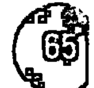

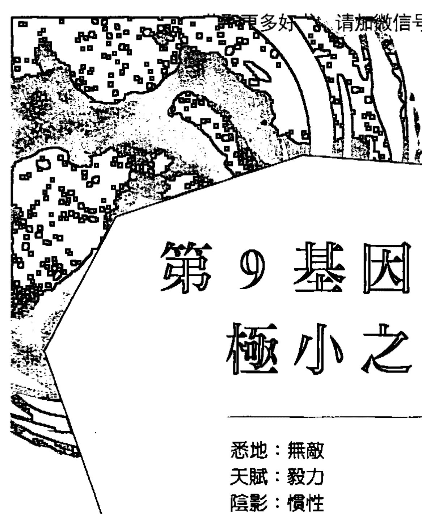

# 第 9 基因天命
## 极小之力

- 悉地：无敌
- 天赋：毅力
- 阴影：惯性
- 编程伙伴：第 16 基因天命
- 密码子环：光之环（5，9，11，26）
- 生理学对应位置：荐骨神经丛
- 胺基酸：苏胺酸

## 第 9 阴影——惯性

### 被驯化的梦想

在《易经》的原始卦象中，第 9 基因天命的名称「小畜」相当不寻常而神秘，它通常被译为「微小的驯服力量」。如果你对《易经》够熟悉，或许会联想到另一个卦，也就是名为「宏大的驯服力量（大畜）」的 26 卦。这两个《易经》原型与基因天命之间有明显的强烈关联。在基因上，这两者确实隶属于同一组化学密码子环，也都和胺基酸「苏胺酸（threonine）」有关，这部分我们稍后会讨论。和这些传统中文名号的惯例一样，它们都包含许多层面的真实与可能性。以第 9 阴影来说，微小的驯服力量指的是「变得沉溺于不必要且不相干细节」的人性倾向。大多数人的生活仅仅是在过日子，如此度日而活，使他们受限于身边的所有细节而成为受害者。在较高的频率中，所谓的驯化微小事物，是你将能量运用在符合你更高目标的事情上。然而，处于第 9 阴影频率时，则是那些细节驯化你，耗尽你的生命力，掠夺你的热情（来自第9基因天命的编程伙伴第16天赋），终而将你拉进不思进取且漠不关心（第16阴影）这样的寻常人状态。

老子说过：「千里之行始于第一步」，不过更加精确的说法，应该是「始于『足下』」。这历久弥坚的智慧之语讲的是：聚焦在你的眼前当下，而不是关心未来能或不能带你到何方。第9阴影攸关你将注意力置于何处——那并非脑袋想想而已，主要是来自你所在意的日常作为。如我们所见闻的，第9基因天命有某些极为神奇的内涵。这个基因天命握有一个极大的秘密——如何阻止你的心智削弱你的天命。「一条由一颗颗垫脚石铺设成的路径」这样的意象，能同时代表第9阴影与第9天赋。处于第9阴影频率时，垫脚石构成一个圆圈，在这条路上你低头看着每一步，反而无法认清自己只是走在同样的旧足迹上，你的能量陷在圈圈里，根本没跨向何处。这其实是现今地球上大多数人类的意识状态。

不过，在第9天赋层次，这些垫脚石则会超越地平线、延伸到远方。你不知道它们通向何方，但那并不重要——你晓得它们将引领你向前行。这让你跨出的每一步都是必要的，让你的每一步都如同一场探险。第9基因天命攸关「找到日常生活的正确活动与否」。每一步都必须领着你朝向梦想，无论那是什么样的愿景。这条道路囊括许多我们在俗世采取的微小动作——包括吃饭、洗碗、购物、料理等等。因为这所有步骤，就算是日常杂务，都能带领你往梦想前进，这些步骤不可能不被满足。但如果你的行动带给你的是冷漠或无趣感，也不尽然表示那是错误的行为。也许那是表示：你已经和你更宏大的梦想脱节了——你让小事驯服了你。每当你允许生命带来无趣、淡漠，或让你感觉缺乏能量、徒留惯性，你仍得凭借自己做出决定，重新与自己的梦想接线相连。

缺乏对于更大目标的领会，人类就会不断循环创造出隔绝丰足的能量场。更糟的可能，是受害者心态喂养、壮大了第9阴影的惯性（Inertia），让责怪或担忧的模式周而复始。但在我们内心深处，所有人都是天生的造反者。我们都是疯狂的生物。我们不是为了让自己的梦想被制伏、修剪或驯养而来到地球的。我们的诞生是为了让魔法成真，而除非我们清醒的每一刻都能笔直且专注朝向唯一的愿景或理想前进，不然我们绝对办不到。当你看不清眼前的结果，也无法改善现有处境时，第9阴影便会嗑光你的一切希望与热情。这个阴影会让你无法聚焦并满足当下此刻，妨碍你的专注与耐性。第 9 阴影在当代的表现面向之一，在于我们对于琐事的沉溺——我们让生活陷在多余且不必要的细节与排场之中。如果看来不够美丽或不够实用，则被归类为琐事好像会比较安全。

第 9 阴影让你的能量远离了对你而言真正重要的美好。

缠绕着第 9 阴影以及编程伙伴第 16 阴影「漠不关心（Indifference）」的能量场，就像厚重的乌云把人们困住。这两个基因天命会造成身体的巨大消耗。缺乏热情造成能量的匮乏，反之亦然。你或许曾经笃定自己正走在改变的路上，但事实上你所做的一切只是绕圈圈，你依然专注在那些实质上无关痛痒的细节。要逃离这种惯性状态的唯一办法，就是以强大的意志行为击破它。摆脱受害者频率的第一步，会重设你的进程轨道，让你能趋前而不再绕路。第 9 阴影深深影响着人体内的能量系统，它关闭了更高的电压与宇宙高频能量。这个阴影同时也带来不良的效果，干扰你的「心」这个内在方向指引机制。如果你的心无法与你的每个行动同在，那你不只是选择了不当的生命轨道，也会持续消磨健康。

总结来说，如果你的生命力看来低落或缺乏能量，而且你发现难以找到生命的热情所在，答案或许就在第 9 阴影里头。你要不是太专注在未来、全然无暇顾及眼前的一切，就是欠缺了能推动日常行为及活动的整体目标感。少了这种内在专注感，你大笔大笔的精力就只会拿来抱怨，不管是脱口而出还是在心理叨念。这些能量需要找到更高的目标——让它能够投入的某事，藉此带你超越俗世与所有枝节。大多数人都没有察觉到自己体内蕴藏有多少的能量。人生啊，只要你能把心直接投入其中，真的没有什么是办不到的。

### 压抑天性——不情愿

第 9 阴影的压抑面是一种内在的不情愿。这让我们面对自身处境时，就算了解实情、甚至看到了突破困境的出路，似乎也无能为力。这种无法展开行动、走出既有模式的不情愿，并非是意识的选择，而是整个人的生命力呈现冻结的内在状态。本质上，不情愿是意志的麻痹无力，这是因为我们依循着与本性不符的相似重复模式所导致。要突破我们内心的不情愿，就得离开舒适圈，直面我们的恐惧。对无法突破生命模式的旁观者来说，这可能令人挫折，但对那些受控于深沉恐惧的人而言，同样令人泄气。到头来，关键仍是人类的意志力究竟要用來突破僵局，或陷入持续的悲惨衰退的选择罢了。

### 反动天性——分神

第 9 阴影的反动本质内含一种完全迥异的惯性。这些人可能会非常不安、烦躁，好像他们的内在全然无法安然端坐。他们的策略是将心思转向，会无意识地寻求任何刺激，好发泄自身的某些精力与怒火。当然，这些人没办法无限期维持这种逃避现实的模式，那会大量消耗他们的健康，通常也会损及其财务。这样的人完全无法找到生命的固定套路。如果他们真的这么做，所有的狂暴将会向外爆发。这会造成他们根本无法维持长时间的认真承诺。虽然他们的生活并非那么精确的对应到「惯性」这个字，但因为他们就是可以永远不休息或放松，某个程度上，他们还是履行了惯性。

## 第 9 天赋——毅力

### 魔幻之举皆创自精心策划

第 9 天赋燃起所有毅力（Determination）。毅力这个天赋，建构在每个极其微小的行动基石上。备受争议的英国魔法师阿莱斯特·克劳利（Aleister Crowley）曾陈述过相当切合这个天赋的深刻真理：「魔幻之举皆创自精心策划（Every intentional act is a magical act）。」就算是最细微的行动，都具有能穿越宇宙的衍生效应。因愤怒或恐惧而起的行动，会增加世界与个体的阴影频率。漠不关心的行为强化了冷淡，而喜乐的行动或服务则会创造更多的欢乐。每当我们观察第 9 基因天命的母体矩阵，它持续指出同一个事实——内在缺乏理想之火的人，基本上就注定成为随众的盲从之辈。因此，重要的是明辨这个天赋并非只是幻想，而是朝向单一的强大目标的持续行动与作业。

第 9 天赋的力量，是「重复」的力量。这个天赋创造出惯例渠道，一旦渠道开通，你生活中的所有能量都将循着同一模式流动。这便解释了毅力天赋为何会如此强大有力。同时，这也说明了为什么要逃脱第 9 阴影的低频率惯性会如此困难。当你突破这个低等频率，宛如内在深处获得某种感觉或知晓，并与自己的眼界或理想相连接时，一趟得走上千万步的旅程于焉正式开展。从这一刻起所跨出的每一步——这意指你的所有行动，无论它们看来有多不合理——都会导向核心愿景。当你持续随着心之所向，你便开始为自己开创出越来越能轻易依循的有力惯例，这也是世人皆知的「毅力」。大大转变了你的整个生命形貌，好像你终于开始能感受到追随你的人生目标而生的内在气力。

毅力这个第9天赋有个奇特之处：当你变得更有毅力时，所需使用的能量与意志力就变得更少。这和「毅力」普遍被认为是「一场庞大的战争或挣扎」的观点恰恰相反。其实，毅力的秘密在于「冲力（momentum）」。一切依循心之所向的小动作，会开始创建出一种内在的冲力，终而变得无人能挡。整个宇宙的力量会开始凝聚在这样的人身上。你只需要在这个过程的初始耗费较大的心力，因为要跨出阴影频率的头几个步伐，得用上大量的意志力与勇气。接着，这第9天赋就会揭示天赋频率中的伟大秘密——只要踏上这条心之途径，会越走就越轻松。你不会再被生活驯化，取而代之的是：透过驯化生命中最小、最不重要的行动，打造自己的独特指南与天命。

第9天赋与「磁力」有着重要的关联性。生命的一切都是磁性，而这个天赋透过运用磁力，做出对应正北方的校准——透过宇宙所追寻的内在方向与节奏合为一体。这便是我们所谈论的惯例渠道——渠道依循着宇宙能量的力线移动，而非闯越或与之抗衡。在此观点上，毅力揭橥了另一个意涵。你这辈子的真实进程早就被预设，而你所该做的就是找到它、遵循它。如同在阴影频率时提及的，第9基因天赋最神奇的面向，是对你的心智头脑所产生的影响。一旦你将自己放置在惯例渠道上，你的进程航线就会变得越来越明确、越集中，头脑终究会停止对你的消磨。你体内自然流动的电流开始进入一种宇宙和谐状态，于此同时，你的脑波循环也将放缓，你也就进入了更高的意识领域。这是基因天命的相对矛盾之一，你的灵性频率扬升得越高，你的脑波频率就会降得越低。

这些心智运作机制的根本性转化，会进一步简化你的人生进程。透过在意识较深层次的头脑运作，你会开始解放你的心智结构——包括你的观点，你的恐惧，你的信念，甚至是你的希望。你的头脑开始沉浸在更广大、更集体的觉知之中。不只是脑袋对你造成的破坏消磨越来越少，它也会确认你的方向在逻辑上是否正确。当基因天命处于天赋频率的最高点、准备要跃进悉地意识层次时，你就能感受到来自最细小事物的庞大能量。而当你对现实的眼界扩展到囊括整个宇宙时，便会明瞭自己实际上有多么渺小。于此同时，你也会发现：当你真正聆听内心并冒险尝试时，自己对于宇宙整体的贡献会是多么庞大。

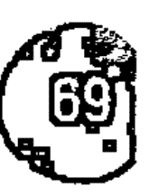

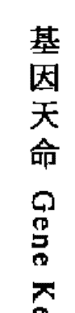

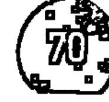

## 第 9 悉地——无敌

### 内在宇宙——最终的疆界

我们周遭的世界，满是来自驯服小事物的力量实证。当人类得以驯服原子——物质的最基本磁性单位——的力量时，我们便解放了其极佳的能量，并展示出浩瀚宇宙的规律——事物越是微小，就能凝结越多的宇宙能量。如同我们透过第 9 天赋学到的，这个规律能运用于你的个体生活之中。第 9 基因天命里头，有个最终的惊喜在等待我们，它能在「无敌（Invincibility）」这个悉地的终极展现中寻得。第 9 悉地是无限的力量——来自无限的微小。这个无限同样有着矛盾之处——如果某个东西能不断地对半分割成弦，那么理论上这个动作就能永远进行下去。然后这个无限就变成了无边无际，内在宇宙也因此通透向外在宇宙空间。

在意识的最高层次，层次本身也会消失。外在宇宙化作内在宇宙，时间转为永恒但又绝对必然于当下，所有的疆界都被意识本身吸收为一体。现在此刻，当某样事物失去了一切界线，便成为两个相反东西——它变得既脆弱又无敌。因而，无敌可以被定义为：将你的个体觉知融合回宇宙意识之中。要变得无敌，就得消融你的整个实相，臣服于所有可能的危机，与之合为一体。这也是为什么第 9 悉地与第 26 悉地对应的《易经》卦象「小畜」与「大畜」，这两者的名称会如此相似，而且两者又那么的紧密连结。第 9 悉地象征无敌，而第 26 基因悉地则代表无形（Invisibility）。要成就无敌就得化为无形，反之亦然。无敌代表自我消融进入宇宙的意志，而这个悉地也被诸多相异文明赋予不同的定义。以基督教来说，大天使米迦勒（Archangel Michael）就握有无敌的原型意象。

宇宙中唯一真正无敌的力量就是「爱」。爱知道的只有给予，所以爱创造出真空，藉此转而继续灌送更多的爱。要对抗这样的力量根本是天方夜谭，因为它透过将其他能量通通重送回源头，致使一切能量失效。当有人能达到第 9 悉地的境界，他们的生命将会展现出爱这种无敌的力量。那些人已经发现到：整个宇宙就存在于人体内的小宇宙，而他们或许就可能成为这个真理的导师。也就是说，他们成为了熟知将所置身的大宇宙映照到微观的小宇宙里头这项技术的专家大师。这些人伴随着要在地球上履行的特别使命，化为神性光辉强大频率的焦点。小畜的能量像是道雷射，可以精确定位出生命非常特别的面向，带来足以承担相关领域的庞大力量。一个普通人或许会发现，面对那样的专家大师令人无法忍受，因为那些你最恐惧的阴影本性，都被对方的探照灯一一揭露出来。如果你福分够大，和这样的存在有着业力上的连结，则生命的全然实现，将极有可能在你这辈子发生。

引人入胜的是：得以见证我们 DNA 里这个高等级的编程矩阵，如何被编码设定在进化发展的特定时机，唤醒我们内藏的特殊力量。第9悉地隶属以「苏胺酸」这种胺基酸所建构的人类遗传结构所相互串连的基因悉地群类。苏胺酸将第5、9、11和26这4个悉地结合，这个组合解开了人类高等本性中两个非常有力的普世主题——时间与光。称为光之环的这组密码子环的4个主题：无敌、永恒、光（Light）及无形（Invisibility），是源自一种被设计来运作整个基因库的交叉编码讯息。总有一天，藉由这个光的气场的波长，将能迅速唤醒人类自身基因的最高频率。而随着人类气场的彼此交连，也将使我们的心智无需再对「时间」做出任何体会。就这方面而言，当了解自身的集体本质，人类终将无以为敌，于此同时，个体也化为无形，并且全然渗入内在的群体觉知意识中。

第9悉地今天教导我们的是：你的每一个动作，对于整体的进化都非常重要。若你将人生置放在宇宙的焦点中心，那么生命便会于内自我深化，并自然而然地让你与环境及周遭一切合作得更为密切。魔幻之举皆创自精心策划，无论行动是以创造力或败坏的力量设定的。在你的每一段旅程的起点，所跨出的第一步便为整个旅程定调，而接续的步伐则刻凿出惯例的渠道。就算只是些许几个步骤，一旦跨出了，想要改变你的方向就会变得非常困难，因为那意味着你要从既有的常规猛力扭转、开创出新的路径渠道。因而，每当你抵达一个自然的起始——无论是一个新的周期，一段新的感情，一幢新屋，甚至是新一年的到来，你都应该好好记得这个真理：最开头的那些步伐，对你的发展至关重要。你必须把握你的梦想能量，并深切坚持于其中，因为梦想将会权充聚焦镜，锁定并为你的生活显化出那奇幻的力量。

基因天命 Gene Keys

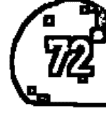

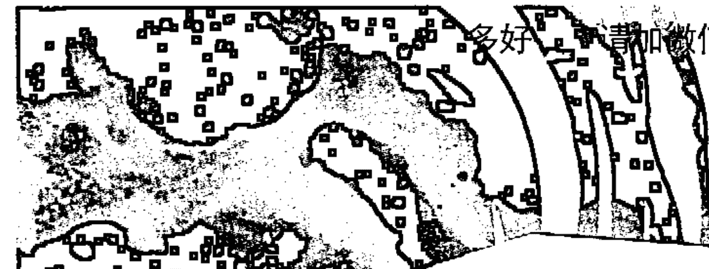

# 第10基因天命
## 自在快活

- 悉地：存在
- 天赋：自然
- 阴影：自我偏执
- 编程伙伴：第15基因天命
- 密码子环：人性之环（10，17，21，25，38，51）
- 生理学对应位置：胸部（心脏）
- 胺基酸：精胺酸

## 第10阴影——自我偏执

### 自我如迷宫般的曲折弯路

第10基因天命是人类个体的重要基础之一，它的本质及波频，都指向了人类所有议题中最深远的其中一种概念——「自爱（self-love）」。这个人體内难以形容的力量，以第10阴影启始生命，持续聚焦在你专属的周遭环境，也就是你的身体。这是人类染色体组中最原始的面向与原型之一。这个基因阴影频率强化你的全数生命力，并促使这个力量朝内发展，长远来说，这让第10阴影成为64个基因阴影中，最神秘的存在。个人迈向觉醒与超越的旅程，因为这个基因阴影方能真正展开。然而，这个基因的向心力却将你对周遭存有的关心与注目排除在外。对早期的原人而言，第10阴影能确保个体的生存安危，因为它优先关注的是自身的躯体安全。但对人类这个物种来说，看着一个人把她或他的生命交付给别人或一个更高的缘由，就是在见证第10阴影「将自己摆在首要」的此一主要目标被超越与突破。

身处当代世界，第 10 阴影仍旧在集体层次上掌控着我们，尽管它在今日所展现的是「觉醒」的迹象。第 10 阴影的重要性在于个人层面，那可能既是福分也是诅咒。个体的差异性正是进化的基石。人类如果不去探索自身的个性与独特性，就无法超越自己，也不可能将社会推向更高的境界。所谓的福分，就是我们越允许自己展现出独特的差别，就越能像是合一的整体般让生命运作。这是人类矛盾中最美妙的其中之一——唯有藉由我们的真正多元性，才能促使自身的合一。但有许多的力量与进化相抗衡，这力量都来自内在，使我们无法经历到自身的真实独特性。第 10 阴影的编程伙伴是第 15 阴影的「索然（Dullness）」，因为第 15 阴影隐藏着对「与众不同」的恐惧，它会在集体层次压制你，将你关机。第 15 阴影让我们像旅鼠一样跟着群众行动，使我们甘愿掩埋自己的独特性。

第 15 阴影将你的注意力，从自身的独特性转向关注其他事物，第 10 阴影则产生了相反的影响——它让你沉迷于自己的独一无二，只想着如何找到并追随自己的独特性。于是在今日世界，我们能看到人类的两种主要典型——有些人随众而生，有些人则为了想摆脱群体而不计代价。第 10 阴影不会、也无法关注自己以外的任何人。因为这个阴影，你变得自我偏执，你不再看见或听到身边人们的感受。这会造成其他人非常难以和你产生连结，即便你或许会自认自己能和他们有所互动。就算你可能拥有许多的情感关系，但事实上，在精神层面你真的没有太多空间可以容纳他人。你用自己的主观投射场来看待万事万物，这种缺乏客观性的视野只会导致一种结局——为你的一切情感关系带来浩劫。

透过第 10 阴影的镜头，你望眼所及的只会是那些你想要改变的人。且接下来你会发现：要你接受其他人的独特性，实在天杀的难。在心理学及精神医学中，这种自我偏执称之为自恋（narcissism），在调节变项（moderation）中，这被认定是健康心理的一种本质成分。然而，在阴影频率下，就像自恋一词的由来传说①，它会让人类永无止尽地困在自己的反射之中。讽刺的是，你越是习于让自己依从低层次的自我，就离你的高等自我越远。

第 10 阴影的自我偏执受到恐惧驱策，这个无意识的恐惧非常特别——害怕丧失自身的特性。这是人类最深沉的恐惧之一，此种恐惧迫使你进入一种试

基因天命 Gene Keys

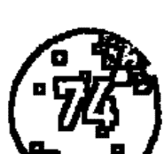

圖找出「我是誰」的模式，你希望藉此或許可以尋得某種對於生命的不變定義。「探索出你的真實特色」的需求，是一個相當大的追尋。如同舉世聞名、銘刻於達爾福（Delphi）阿波羅神殿門口石頭上的預言——「認識自己（Know Thyself）」一樣，那是一趟永恆的自我認識之旅。不過，在這個陰影層次的低頻中，對於自我認識的探索變成一種偏執，反而讓你無法定義出自己是誰、什麼才是你。你那想要擺脫恐懼的渴求，創造出沒有終點的旅程，或許途中充滿戲劇性與歷險，但到頭來你還是無法與自己相會。這是第 10 陰影的技能——它欺騙你，讓你追逐著自己映照出的影子，把你追尋真實自性的這段旅程，化為一張困住你的網。

當代西方世界，隨處可見自我偏執。人們沉迷於自己如何感覺與看待自己穿著什麼、擁有什麼、住在哪裡。只要你依舊只關注自己，就無法看見周圍一切，也就產生了困境。唯有認清自己的自我偏執，你才能有所超越，這也是為什麼這個陰影會是「必要之惡」。每一趟由自我偏執開啟的內在之旅，都會切切實實變成沒有終點的迷宮。就算給自我偏執披上「靈性探索」的外衣，那終究會化為陷阱。事實上，許多活在當代西方世界中的人，他們對於真理的靈性追求，從很多方面來說，也不過只是被這強大的自我偏執給勾引住了。這樣的追尋之路，相當輕易就讓你很難實在地活出自己。你越是想要找到自己的真實特性，你的真我就更是轉瞬即逝。

但所有的循環路徑終究會被突破。那些循踏著自我認知之路（傳統中國易經將第十卦名為「（天澤）履」）的人，一旦能夠了解到「自己所探尋的無法被找到」，就能脫離單調無謂的路徑模式。當你真切如實地在自性的迷宮小徑裡迷失時，自我知識的真相便自然而然顯現。沒有誰能斷言這樣的啟示會在何時明朗化，畢竟每個人的情況各有不同，但這種真實揭露絕對無法作假。來自第 10 陰影的真實啟示，必然會導向第 10 天賦的自然（Naturalness），而創造性的爆發也將隨之出現。

① narcissism 這個字源自希臘神話中的納西瑟斯，傳說中這名河神所生的美男子因為看見池水中的倒影而愛上了自己，無法從池邊離開的他死後便化為水仙，並與「自戀」畫上等號。

### 壓抑天性——自我否定

自我偏執這個第 10 陰影的內向本質，會完全否定自己。這種自我偏執的逆轉能量化為全然的離心力，將所有的心力投注在除了自己之外的一切人事物上。這些人的人生只為別人而活，也只能透過他人而活。但這樣的犧牲缺乏正向性，也無法為進化帶來助益。以全然的妥協所建構的生活，讓這些人自我否認，宛若殭屍般存在於集體之中。雖然這說法聽起來很令人震驚，但世界上有一大群人就是如此這般地活著——不帶絲毫真切的自愛，體內也缺乏真正的核心。這些人全是偉大的世界宗教的主要目標。對自我的否認使他們無法明辨內在的神性，他們便轉而認為「對外投射一個外在權威還比較簡單輕鬆」。

### 反動天性——自戀

當自我偏執的力量透過反動天性向外表露，就化為真正的自戀狂，並將其他的一切全數排除。正如壓抑天性會否認自己的存在，反動天性則會否認其他人的存在。這些人本質上活得極其自我中心。他們內在的恐懼以憤怒的形式存在——大體上，他們將「害怕喪失自我特性」的恐懼投射向他人與社會。這種人無法為了任何人放棄自己的任何部分。他們活在妄想中，多疑地認為這個世界或其他人，會毫無緣由地奪取他們的自由權利。第 10 陰影的反動本質認為情感關係非常難搞，畢竟他們基本上忙著和自己談戀愛，但那個戀愛對象也並非他們的真實自性。真實的自性其實到處都有、也什麼都是，因為自性的本質就是「愛」。只是，如果要理解這樣的概念，就必須得放下「個人身分」這個好像能帶來安全感的幻象。

## 第 10 天賦——自然

### 活出自己的神話

自然這個天賦之禮，就存在於每一個人的體內。這是你的存有中心，唯有透過它，你才能展現自己創造性的獨特。每個人的生命，都是透過第 10 基因天命的頻率而展開的旅程。活出自然本性，就是要做自己。我們全都在試著成為自己，但我們大部分的人卻都被其他人給制約，無法真切活出本色。從我們開始發展複雜的新皮質起，這種模式在人類歷史上處處可見。當頭腦準備要自省時，就誕生了「我是誰？」這個問題。這個問題出現之前，人類的確活在自然的狀態下，但那時候的人們也還是動物王國的一員，尚未完全進化到智人階段。縱然如此，我們要如何透過動物王國自然的尋常狀態，來學習第 10 天賦這件事仍然相當有意思。

人類的生命之旅不但獨特，也和其他動物有明顯的差別。因為我們擁有一顆能夠看清自身的心智頭腦，就得試著解開因而產生的謎團。「我是誰？」這個根本問題必須先被解決，如此一來，「自然」的天賦才能重新被理解與實現。第 10 天賦存在著許多似是而非的悖論——而最大的悖論是：只要持續認為你是某人，就無法成為自己；但你仍得動身去找尋這個所謂的「某人」，藉以了解那根本不存在！在「我是誰？」這個簡單小問題裡藏有太多矛盾的張力，而因應你的身分定位所釋放出的矛盾緊張，就是第 10 天賦的精髓。第 10 基因的自然天賦只在自我偏執消耗殆盡後才會現身。這趟進入你獨特本質的旅程的第一個偉大示現是：沒有哪一種標籤能夠定義你。一旦你理解到你名字不是你，你的行動、感覺、想法或理念也全都不是你時，你就會曉得人類的本性遠超過你所能猜測的一切。

在第 10 天賦層次的頻率，透過你的自身存有，釋放大量能量流入你的生活，而定義「你之所以為你」的所有嘗試則全數開始平息沉澱。這種能量通常顯化為熱情中帶有俏皮感的創造力。你會喪失所謂的身分感，同時開始感受到自己身處於更廣大的脈絡環境。自然的天賦無法透過練習而得，也不能被複製或系統化。只有當內在的自由與寬闊感受揚升時，這個天賦才會現身。而你生活的紓緩、放鬆感受，會傾向依循一種似乎舉世通用的古老原型程序而增加。如同我們所知，被心理學家榮格稱之為「個體化（individuation）」的過程，是以「我是誰？」為始展開。這個問題也可能以像是「我因何而誕生於此？」、「為什麼我要做這個？」等不同模樣出現，發動內在的質疑程序，來探索你的生命目的與意義。

讓你變得更符合自然本性的第二階段，將會是深沉的內在質問與探求，這時期在某種程度上，你會把自己從過往的責任中抽離，多騰出一些時間和空間去理解自己的本質。對大多數人而言，這階段會持續頗久，且此時多數人變得深陷於自我偏執的低頻，沉迷在對自我認知的無止盡追尋。然而，在你理解到「嘗試尋找顯然無法定義的東西」根本是徒勞之舉時，便會放下所有的追尋，屆時，這個階段也自然就會崩解。這個領悟，標記了你生命的一個重大變革點，也象徵你的自我偏執將被解放。要你放掉所有可以拿來定義自己及尋求安全感的概念與技術，可能會是個嚴峻的挑戰時刻。幸運的是，第三階段會迅速統合，讓你和存有變得完整合一，接著你就會進入全新的維度，並活得越來越放鬆。這個第四階段宛如重生，就好像你這輩子第一次將那確實存於內在的真實外化而現。這是一段充滿強烈喜樂與目標的時光，當你找到放鬆感受，就得以重新感受那真實的本性。

這個轉變成自己的過程，在最後這個第五階段，屬於你的個體差異化本我將會綻放示現。就好像你達到自己的神話高峰，一直潛藏在體內的最高原則，會為這個世界帶來全然新鮮的事物。你的內在存有將化為對於當前規範的挑戰，因為你的真實本性總是在進化的前端被發現。無論這個想法可能為何，都代表了個人蘊含的真實美好在世上得以展現。

這個運作，自始至終都和我們 DNA 裡隱含的化學通路有關。名為 21 組密碼子環的這些基因網路蘊藏著許多神秘。第 10 基因隸屬於人性之環這組化學族科，當中包括第 10、17、21、25、38 及第 51 基因天命。身為最複雜的密碼子群之一，這個化學族科握有連結著所有文化中那些偉大神話故事線的鑰匙。這六個基因天命概括了所有「讓人得以是人」的神話元素。負傷出發（25），必須和自己的陰影對戰（38），克服頭腦所加諸的限制（17），放下想要掌控生命的需求（21），接著找到真實本我（10），好讓自己覺醒（51）。你可以從這個意義深遠的組合看見：我們人類是如何被這齣如此基本的戲碼給深深串接在一起。那裡頭有著偉大的美好等待發掘，當你找到時，你終能理解到：自然是一切事物中最為簡單的。只要你決定不再與生命爭辯，那一瞬間，它就單純存在於你之中。

## 第 10 悉地——存在

### 神性的懶散

當差異化的本我得以透過第 10 天賦顯化出最佳表現時，終極的驚喜將會發生。轉變成自己的這個過程，還有一個第六階段，會為整個自我認知的概念帶來完結。廣義而言，你會重回到提出「我是誰？」這個命定問題之前的狀態。第六階段即是「存在（Being）」這個第 10 悉地。當第 10 悉地發生在某人身上，對他來說，甚至進化本身也將告一段落。在第 10 悉地裡，差異化本我會自發性地消融在第三階段更高端的鏡射中，追尋自我認知的思維構想將被終結。事實上，在這個悉地層次裡頭，包括本我、非我、心智、形式、目標和意義，所有的一切都會消解。唯一能提示「第 10 基因悉地蘊含的本質是什麼？」的只有一個字，就是「存在」。在眾多神秘傳統的表現上，這有時候被稱之為「我是（IAM）」的意識，不過「我」字在使用上可能產生誤導。在第 10 悉地裡，「我」是沒有意義的——第 10 悉地僅僅是「存在」這樣的純然意識而已。

第 10 悉地註定會被那些無法好好領會其本意的人所誤解。伴隨第 10 悉地的編程夥伴第 15 悉地「繁盛興旺（Florescence）」，激發了一種歷史久遠的巨大玄學悖論。這個悖論透過佛教的特有現象而完整展現——那即是「阿羅漢（arhats）」及「菩薩（bodhisattvas）」這兩種頓悟或自我理解的最高境界形象顯化。撇開佛教可觀的繁重教條不談，這兩種人類的完美展現，可以理解成「存在（being）」與「轉化（becoming）」兩種獨立的意涵。阿羅漢是第 10 悉地中純然的「存在」象徵——那是一種「進化」不復存在、也不再要緊的狀態。對阿羅漢來說，一旦獲得頓悟，整個宇宙也同樣醍醐灌頂，所以就沒有任何東西還需要被完成。而菩薩則是第 15 悉地的狀態，生命不會有終點，也就是說，那是一種持續開花的進化姿態。因而菩薩慎重立誓，延後自身頓悟得道的時機，並透過引導他人獲得解脫的形式，全力協助「進化」的完備。

阿羅漢和菩薩這兩種人類的完美神采，在神秘的輪迴中帶來大量的困惑與混亂。印度最古老的靈性流派「吠檀多不二論（Advaita Vedanta）」傳統，是「存在」之道的有力代表。透過第 10 悉地，卓越的機敏及與生命本身有關的愉悅幽默於焉而生。透過第 10 悉地所經驗的生活，能將凡人看重的一切事物，簡化為遊戲或幻象。對阿羅漢來說，生命並無意義，時間則是幻象，所以進化本身不過是場遊戲。但是，對那些未獲啟蒙的人來說，這種觀點往往被視為自私，還會威脅到他們對於成長進步的現有認同，因而，支持菩薩一派的人大多對阿羅漢避之惟恐不及。於是，頓悟成了政治化的流動！對那些未達悉地境界的人來說，阿羅漢與菩薩似乎完全相反，但對能顯化悉地存有的人來說，這兩種極性是能同時被經驗的。兩者間的唯一差別，僅是你們用了何種語彙來闡述自己的經歷或啟發罷了。阿羅漢在這世上沒有什麼可做的，而菩薩則帶有深度聚焦於度化眾生的使命。

第 10 悉地，是意識透過人類這種形體所展現出的美好。那些人的覺醒囊括了一切的實有。來自第 10 基因天命那強烈的個人專注，終能突破在形式層次的身分區別，進而體驗到「萬物皆自性」，伴隨如液體般的愛，本我因而流通於五花八門的方方面面之中。你可以清楚看見，來自第 10 悉地的訊息有多容易被誤解——特別在今日世界，我們每個人都被要求都得投入更多的心力來促成所謂的進化。第 10 悉地提醒我們：這一切不過是場遊戲，是一種消遣，是一齣戲劇，在這之中，就連我們最崇高的野望也終究毫無意義。顯然，如果每個人都採取這種觀點，則進化本身就會停止運行，畢竟這種主張代表了進化已告終結。第 10 悉地見證了進化遊戲的美好，但除了帶來破壞，別無選擇。「存在」破壞一切——存在只認可「當下的奇蹟」，其他一概不具意義。

對於已經進入第 10 悉地的人來說，存在與轉化的兩極性已合而為一。這兩者的啟示真相，既存在於「存有」的真實本質中，也同時見證了形式那充滿活力的能量流，透過演化而轉化得愈益複雜。每個人的外顯天命，都是由各自體內鏈結自遺傳的基礎基因天命所控制。而這個重要的悉地，則決定了獨特的啟蒙頓悟會透過什麼樣的語言與風格顯現。這或許有點難以理解，也可能略帶悲傷，因為第 10 悉地長久以來，已被玄學家批評得一無是處。當權者不想讓大眾坐著不動，任憑自己在「存有的神性懶散」中虛擲光陰。阿羅漢的閒適日子於是被替代。進化論者的觀點才是時下受喜愛的主流。現代人對「進步」相當迷戀——好像我們藉此就能掌控整個物種的發展方向。身處危機四伏的時代裡，好比你我現正經歷的這個時期，「存在」似乎被視為無所事事。好像若要在未來幾世紀中繼續存活，就非得做些什麼不可。

對於活出第 10 悉地的人來說，真的毋須做任何事，因為沒有什麼需要處理，又何必為了未來而大驚小怪瞎忙呢？「存在」是形式中意識的本質，沒有議程清單或是方向。存在就只是存在。這個簡單的狀態中所蘊藏的力量，超越了一切的領悟與理解，第 10 悉地就是沉睡在人類染色體組內的巨人。任何東西都不可能比存在本身更有力。我們都該好好記住：存在的本性就藏在世上一切的戲碼及我們個人的生活之中。就各自好好在這至高無上的存在狀態中休息吧，於此同時，「進化」這偉大的探險任務，則相當有可能該由未來的人類來主導、處理。

# 第11基因天命
## 伊甸之光

- 悉地：光
- 天賦：理想主義者
- 陰影：晦澀
- 編程夥伴：第12基因天命
- 密碼子環：光之環（5，9，11，26）
- 生理學對應位置：腦垂體
- 胺基酸：蘇胺酸

## 第11陰影——晦澀

### 人類自我的極右派體制

第11基因天命將為你打開「光的世界」這個嶄新境界。確實，這個基因天命的名字，也為重要的遺傳化學族科「光之環（The Ring of Light）」定了調。第11基因天命和人類的視野有關——包括內在與外在。正因如此，它和人類的眼睛，以及如何透過視覺皮層將圖像轉譯進大腦而化為印象，有著深切關聯。關於光的所有可能性，可以透過遺傳密碼子展開一項最為神奇的研究。蘇胺酸這種胺基酸透過第11基因天命編制、設定你的DNA。蘇胺酸也為包括第5、26和第9基因天命編碼。這四個基因天命各有相異的密碼，讓人類與光產生連結。在意識的最高層次，第5悉地「永恆」展現了如何透過空間介質與光連結，帶來時間的終結。這也是為什麼光速的超越也能引發時間與空間的超越。第26悉地「無形（Invisibility）」的超能力，則讓人類透過磁力來掌控對光的感知。而第 9 悉地「無敵」則啟動如雷射般的聚焦之光，消融你的生理現實，藉此讓你化為強而有力的全能狀態。

這四個基因天命也能透過各自的陰影頻率濾鏡來觀看，這進一步說明了：人類的苦難，與你能不能透過光這個介質來運用清明的能量，有著深刻的關係。以第 11 基因天命的陰影與天賦來說，我們觀察的是光和人類心智這兩個介面。第 11 陰影會在「光」以及「人腦處理、轉譯與傳輸光的途徑」之間產生一種干擾的頻率。換句話說，你在這世上的整體經驗，會因為第 11 陰影這個介質而脫離良好狀態。這個陰影會呈現出幻象、錯覺與晦澀的能量場。

大多數的地球人生活在非常狹窄的光波頻段中，亦即他們無法看清現實。許多人所以為的現實，相對於真正的現實，是一種極為黯淡而偏頗的觀點。第 11 陰影大大限制了人類大腦右半球的一種特殊功能——心智在這個面向並非藉由語言或數字來弄清格局與事實，而是透過大量的互動及直觀捕捉出現在大腦深凹處的分形影像，來掌握現實。右大腦長久以來被視為腦袋的陰性面——是你心智的橫向思維、直覺以及藝術面。如果你能明白自己的陰性面本質並未完整運作，並對你如何感知現實產生多麼強大的限制，你可能會大吃一驚。

第 11 陰影的晦澀（Obscurity），基本上是把你置放在一個虛擬實境中——那是透過第 11 陰影與第 12 陰影「虛榮（Vanity）」的複合編程所創造的架構。這個虛擬實境非常朦朧，身在其中，你只能以相當有限的指標參數來看待生命。它的運作模式是：代表大腦陰柔極性的第 11 陰影，在人體內創造出一個恐懼場。從右腦湧入你的心智的那些圖像畫面，既不能被控制，似乎也毫無道理。大部分的情況中，他們深藏在大腦的不活躍區域，並產生像秘密的幻想、壓抑的夢境、情緒的問題以及隱藏的意圖等現象。陽性導向的左大腦（第 17 陰影會談到）則變得更為顯性，因為它以邏輯為手段來掌控你的現實。右腦似乎混亂、缺乏邏輯，滿是理想空想，而左腦則是有理的掌控之聲。

故事的下一章，則和透過我們第 12 陰影所設定的另一側基因程式有關。第 12 基因不是透過光，而是藉由聲音進行編程。它將來自第 11 陰影的抽象取向現實，轉譯為內在語言——你則接著把那個藉由神經語言建構的現實，向外投射到世界。這個虛擬世界的中心坐有一個獨立的本我——此一幻覺受制於你內在的極右派法西斯機制，這個內在媒介，透過光與聲音持續操控著你。換句話說，第 11 和 12 陰影只允許你看見、聽見它們要你見聞的事物。這或許聽起來相當熟悉，那是因為我們的外在世界有著「鏡射」內在現實的趨向。虛榮指的是坐在你螢幕正中央那個失敗的領導者，也正是它形塑了這個星球的失敗現實基底。在許多其他的系統或傳統中，都將這個內在構造稱之為「自我（ego）」。

自我或所謂的獨立本我，是我們在集體遺傳制約下的虛構物，而正如制約能被撕裂，自我也會逐漸被分解。這是一種極為精妙的運作，也是大多數神秘學體系與某些精神分析學派的基礎。人類的巨大恐懼，使得大腦右半球維持在壓抑狀態。而無論是透過何種薩滿巫師①的訓練、神秘學技術、藥物、療法或藝術，當你開始打開大腦這個區塊的防洪閘門，就等於是將你那被架構起來的整個現實，置於極大的危險中。那些源自你壓抑的無意識、如大雨般傾瀉而下的意象，可能會讓你開始覺得無法負荷，而且你的內在語言，或許也沒辦法處理與整合那被分解的諸多產物。這也就是為什麼這種內在事件會被看做死亡，而你的恐懼為了試圖釐清這些透過右腦而出現的原型，還可能經常導致妄想狀態。

第 11 基因天命與右腦蘊藏的秘密正是所有原型的秘密。灌注於你每一個來自無意識的元素構件或影像，都代表一種原型——一個集體所共有，能映照出整個分解過程的鍊金術意象。有的原型帶來震顫，有些則會嚇死你。當代世界裡，大眾意識透過故事、電視與電影，來維持其之於這個原型世界的主要出口。你無法擺脫這些原型，畢竟它們都是你自己的心理投射產物。但原型的真實力量，是它在你身體上的生理回應。你能客觀觀察的不只是影像，神經系統鏈結也能透過內分泌腺體來刺激全身。你試圖擺脫那些帶給你龐大恐懼的特定原型，但你永遠辦不到。你越想逃離他們，他們就追得更緊。於是你繼續再生那些你痛恨的情勢，特別是在你的感情關係裡，這些原型往往會化為你的伴侶。

第 11 陰影是名符其實的雷區，當中有你遺落的夢想、逃避現實的行為、否認、罪惡感與抑鬱。假如你能開始信任這些影像，讓它們來到你的夢中，允許它們在你的想像中孵化，那些被你扔在虛假夢想裡的自己就能開始出現。從這樣的狀態下覺醒，是一種豐富的體驗。這樣的覺醒，脫離了世上其他人的幻象。

> ① 編註：薩滿巫師，源自北亞西伯利亞鄂溫克族的古文化，意指可以通靈、懂巫術，操作一些非自然現象的人。

象，走出一條與主流相抗衡的嶄新路徑。為了從第 11 陰影進到第 11 天賦，這是你終究得跨出的一步。當你真的能在自身內在勇敢一躍時，長久以來隱藏在體內的夢想將會搖醒你，帶你見識一個全新、無邊無際的地平線。

### 壓抑天性——幻想

當右腦的原型心象被壓抑，會轉而向內創造出一個幻想世界。幻想並非錯誤，只要能找到一個健康、有創意的出口就沒問題；但多數的案例顯示無法找到這個出口。恐懼，是壓抑的根源，當恐懼不被接受，就會對我們的整體身心產生巨量的消耗。死氣沉沉的生活將逐漸耗損身體的物理能量，引發各種生理健康問題。更糟的是，內在幻想找不到創造性的出口時，會阻礙我們依循自己的真實天命而活。我們的命運，總是隱藏在這些幻象之後。越是緊抱幻想，幻想就變得更加扭曲，直到最初的簡單原型敗壞走樣成更加黑暗的形式。除非可以對這樣的形式自負責任，否則我們無法釋放那些蘊藏在體內的創造力。

### 反動天性——蠱惑

反動天性根植於否認和憤怒，將內在的幻想轉成一種投射場，並試圖將之顯化於世。如果能擁抱自己的憤怒與深層恐懼，則我們內建的原型確實會外化顯示，但反動天性卻阻止我們這麼做。反動天性會運用外在世界來隱藏內在的真實。這類人的頭腦裡往往擁有偉大的想法，卻從未實現理想。因為深度的否認，他們無法放掉「有朝一日我可能是……」的內在想像。這些人終究會失望，甚至崩潰。蠱惑是試圖具體化的失敗幻夢，反而掩蓋掉深層而真切的夢想。除非真正的夢想能被揭示，否則就只會出現虛有其表卻無能量的東西。

## 第 11 天賦——理想主義者

### 魔幻的現實主義

第 11 天賦是本世紀的偉大關鍵之一。當越多人被鼓勵好好運用來自右半腦的心象與創造力時，世界就會變得更為健全。歷史上那些對陰性力量的壓抑，以及性別的不平等，都是我們大腦化學作用失衡的直接顯化，而這全來自第 11 陰影。困在我們體內的心象，乃承襲了祖先的往昔壓力。換句話說，這些心象都是記憶。此外，這些記憶並不只是個人記憶，還包括了數千年來被壓抑的集體記憶。這些記憶以原型之姿內藏於你，當你開始理解原型的作用時，就能開始運用第 11 天賦的動能——理想主義者（Idealism）的天賦。

在現代世界中，理想主義被冠上惡名。理想主義被視為現實主義（realism）的相反面，現實主義和「有實踐能力」有關，但理想主義往往被視為弱者。然而，第 60 天賦的現實主義，卻是建立於一個魔幻的真相上——要實現魔法，唯一需要的就是某種結構形式及一顆敞開的心。而這完全不違背理想主義的真實本質。多數人認為的理想主義似乎都是無法實現的夢想，不過那其實是第 11 陰影的晦澀狀態。要讓理想主義得以顯化於世，所需的只是一個可以體現的結構。但，這個大大的「但」字，是你必須先發掘出自己真正的理想與夢想到底是什麼。

當你開始懷抱第 11 天賦的原型，就打開了內在生命裡看似混亂的意象之門。如果你尚未準備好面對此番混亂，則連鎖效應必將隨之而來，並可能導致各式各樣的妄想問題。原型力量的運用，是你早就知道的：無論你感受或經歷了什麼，那都是你個人內在精神的投射。舉例來說，如果你獲得一種化身為佛的蛻變經驗，或是體驗到救世主的力量，並非是要透過這種體驗來識別或認同什麼，你可以將之視為一種個人精神歷程的鍊金階段。識別與認同往往伴隨危機。往昔生活的整個概念都根植於所謂的認同，雖然以過往的歷史人物特性來定義自己，看來完全無害，但那確實阻礙了你內在深處流動的原型。原型以分形的形式移動，從過去流往未來，也從未來回溯過去。唯有當下，你才是安全的，因為「現在」是你無法定義明辨的唯一事物。

理想主義代表原型記憶進入形式世界的穩定流動。一旦它能夠自由來去運動，就能落實你的夢想。關於夢想，最棘手的地方是：你永遠無法知道夢想到底何時能在形式世界實現。你唯一明白的是你內心深處的攪動感受。你的頭腦依憑你的夢想與理想，產生了視覺意象，然後堵塞夢想的向上揚升。你必須信任你的夢想力量，於此同時，也得放下你對夢想的看法與期待。每個圖像、原型，或你擁有、見聞的神秘經驗，都是由過去流往未來的河流的一部分，反之亦然。因此，第 11 天賦的真實本質，是和那些來到面前以及進入你生活的原型同樂玩耍。放下你試圖緊抓一切經驗的習慣，會非常有趣好玩。

或許你會覺得第 11 天賦是魔法與神話的世界，但這並無損於它的真實力量。藉由正確的結構，理想主義的能量會表現在你的外生活中。透過第 11 天賦，自然世界的一切形式，都在我們體內旋轉。這是部落圖騰的應許之地——眾生被灌注特殊而強大的遠古力量。在不同的文化中，這樣的圖騰比比皆是。甚至在當今社會，我們也運用符號或動物來象徵生意與生活。每個符號和你的內在理想產生共鳴時，就會帶來實在的力量。在第 11 天賦的世界裡，萬事萬物都是偉大原型從無形世界進入形式世界的無窮模式的象徵——要從「過去」進入「未來」，就得通過「現在」這條大動脈。

當人類開始重新透過右腦進行思考，我們就能為這形式世界帶來所需的平衡。結果將在我們周遭發生，父權形式的主導權會逐漸消退，而陰性力量則出現來調和陽性力量。這正是我們現所經歷的時代的真正意義。這也是諸多古老的部落知識，又再一次灌注到這個星球的集體意識之中的原因。透過第 11 天賦，魔法的真實藝術得以重返現世。

## 第 11 惡地——光

### 將善惡智慧樹連根拔起

只要你依循第 11 天賦的原型能量流，生命就踏上了自我授權的獨特航程，這會讓你遭遇諸多轉折與變化，必須面對高高低低的起伏與挑戰，並迎向最終的領會。直到某個時候，你所經歷的一切原型圖像將會開始減少，直到全數混合成單一的基本原型為止。這樣的圖像或存在，正是你個人報應的標記。這個根本原型，代表你本質中所有面向的精華，其樣貌非常強大，真的能結束進化與成長的程序。有些時候，你必須坐下，好好直面你的內在惡魔，感受其醞釀的感覺——威嚇、驚恐、混亂，以及愛。無論心智試圖賦予這個內在怪物什麼樣的形象，都將被原型本身的極高頻率吞噬。這個基本原型，在不同文化與宗教信仰中被冠上各種名字；它是佛洛伊德心理學所謂的「二重身（doppelganger）」，是諾斯底靈知派的閘口守衛，抑或是基督教中荒野中的魔鬼。集體神話的善惡投射的就是這個綜合體。

透過這巨大的內在惡魔，分離的本我開始消解於原型之中。每種投射或想定義一切事物的強烈慾望，都將漸漸從你的心靈去除。一旦這個程序結束，真正的現實終能首次於內在顯現。就好像世界開始變得純淨一樣。穿越所有形體，就能發現其後閃爍的光——純粹無瑕的光——那不是物理性的光，而是超越一切定義的靈光。那是能進入神性身心的光。如此罕見的存在，是第 11 悉地的展現與標誌。以線性原理來說，當儲存在集體無意識中的所有原型記憶，透過單一個體的生命過濾後展現的成果，就是第 11 悉地。那就像是，你終於穿透那分隔了人與其神話般的墮落的面紗。你會重新以孩童的眼光來體驗世界——世界就宛若神話的伊甸園。

藉由第 11 悉地，你能將心智的真實本質視為空無或無邊無際，而心智或無意識則透過大腦被體驗為純然的光。「光」本身被視為形式世界裡的一種隱喻，展現出神性的存在。第 11 悉地的光並非我們眼睛所覺察的那種光，雖然，那是能將悉地狀態對外傳遞的最貼切用語。伴隨光而來的是無可言喻的平和氣息，這持續如波浪般的破裂，來自每一個單一的觀察形式。天賦層次頻率中所見識到的神奇樣貌，在悉地狀態下看見的，則是實相的本質。一切的光，只能在黑暗中尋獲，這是最大的奧秘。存在於這個悉地狀態中，沒有什麼是模糊隱晦的。現在，一切都能被光與頻率測度，而真假虛實也都一目了然。

對達到第 11 悉地的存在而言，光即一切。他們被光包裹著，因為光是他們唯一看見的。如果他們成為教師，會比較像是提供關於心靈的理解，他們持續反射自身的光，同時指引他人走進各自的黑暗之中。諷刺的是，對瞭解第 11 悉地純然之光的人來說，他們的確似乎直接將人們帶離了光，但這麼做是為了讓那些人能更接近光。將第 11 悉地帶到這個世界的人，為所有人類捎來真正的未來遠景。在回溯到意識初始之時的旅程裡，這些人看見了周遭一切所蘊藏的進化實現。雖然時間或許無法證明這個伊甸園的狀態，這些人卻長住於內，這也是個相當大的悖論。

人類歷史上，某些世代的人出生時就握有能為整個星球的意識帶來特殊進化的關鍵。在這些世代身上，因為特定週期的星象排列，啟動第 11 天賦的機率很高。他們都是理想主義者，他們誕生，並為世界帶來改變。上一次發生這種改變是在英國工業革命時期，奠定了我們今日所見的摩登世界基礎。然而，在這樣的時期，永遠有一到兩個降生者，會透過第 11 悉地而覺醒，並為我們的未來帶來新的靈性眼界。就在這本書被撰寫出來的今日，帶著全然不同意圖的另一個世代也同時降臨。未來的理想主義者為世界帶來更多的悉地頻率，以此為基礎進行下一個更龐大的革新，那可不再是技術面的革命而已。下一波革命，將會是人類靈性本質的轉化。

第 11 悉地讓許多人困惑許久。在現代所謂的新世紀中，有一大群人起身積極地追尋這個悉地許諾的光。然而，若無經歷自身靈性的黑暗面之旅，任誰都無法獲得這個悉地。擁抱內在光輝的行動或許是透過美好的意圖而生，不過，光就只會在闖過第 11 陰影的朦朧晦澀後出現，然而這種對光的渴望，不必然需要擁抱黑暗。因此，龐大的陰影動力便在這世上運轉。尤其透過主流宗教媒介對光的追尋，更是如此。光從來就不在我們之外，而是深存於萬物本身。這是個鮮為人知的矛盾法則，最稠密的地區隱藏了極大的震盪，那樣的震盪是向內的高低移動。

今日世界的最大挑戰，是如何透徹明查「善惡」這個宇宙議題。大眾意識多以左腦運作，對於光的偏愛勝過一切。而透過右腦產生的幽暗陰性極性，則被設定為與光抗衡的反面。這就是為什麼在真正的光出現之前，永遠是黑暗的高潮先至，這和我們所認知或投射的光之意象並不相同。第 11 悉地的純然之光，和所謂的善惡毫無干係。第 11 悉地超越了二元性。你會發現第 11 基因天命是其實會終結掉靈性與宗教信仰這些概念。你也能深刻了解基督教神話中的伊甸園，以及那株善惡智慧樹的寓意。只要我們以善惡概念來看待事物，就等於信奉了墮落。在未來，當第 55 基因天命觸發人類的巨大突變時，第 11 悉地就突破性地開啟我們對世界的觀點，象徵性地將善惡智慧樹連根拔起。屆時，我們將會直接被生命之樹那向光的流動所餵養。當光成為滋養我們靈體的食物時，會慢慢讓我們融入創造本身的核心。

第 11 基因天命與其悉地狀態所帶來的最終深意，和 2012 年的意識轉換相關。在你閱讀第 55 基因天命時，就能了解到為什麼那一年和我們人類正在進行的巨大改變有關。2012 年這個和諧共振時期，將地球帶入切合於宇宙中心的幾何排列。這個現象在好幾千年前，就被許多原住民文化預測相傳。在 64 基因天命的大輪弧中，每個基因天命都位於和整體宇宙產生關聯的精確位置，過濾所有進入我們這顆星球系統的宇宙之流。其中，第 11 基因天命就和銀河系的核心幾何相關。這就是為什麼透過第 11 悉地，核心之光得以現形。當我們向著 2012 前進並超越了 2012 後，來自銀河核心的純然之光將會依循幾何原則抵達地球，並開始迅速轉化整個生態系統。這也觸發我們的 DNA 釋放內在之光，並催化許多人的悉地狀態。接著，全人類和大地之母蓋亞的頻率場也將會倍數增加。

基因天命 Gene Keys

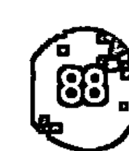

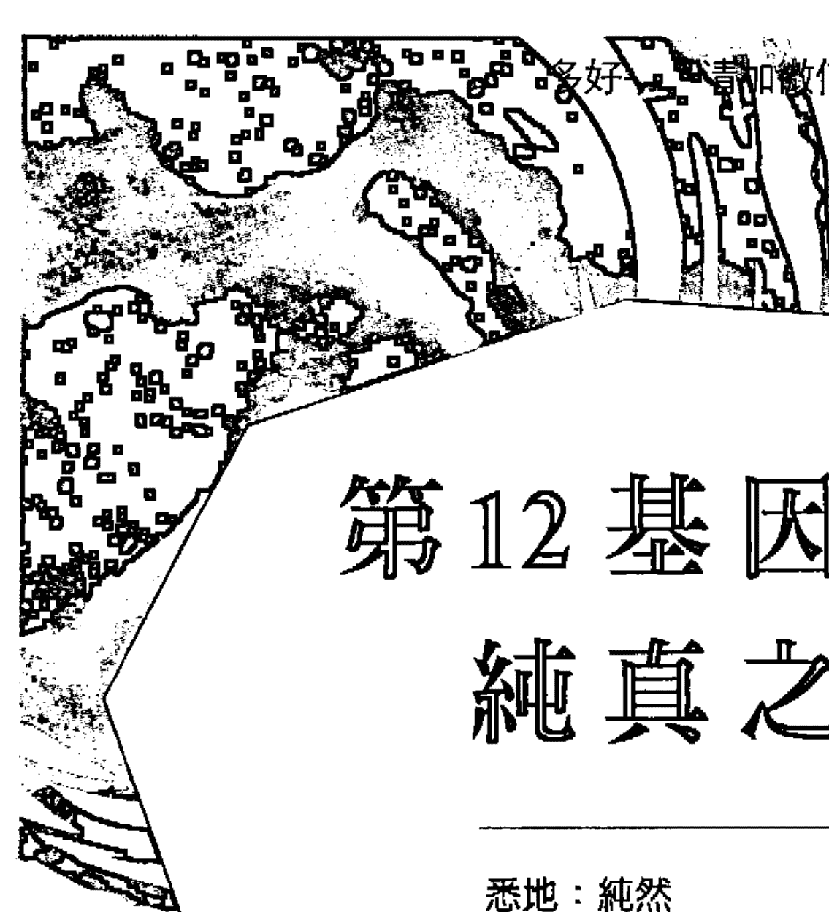

# 第12基因天命
## 純真之心

- 悉地：純然
- 天賦：區別
- 陰影：虛榮
- 編程夥伴：第 11 基因天命
- 密碼子環：審判之環（12，33，56）
- 生理學對應位置：甲狀腺
- 胺基酸：無（終止密碼子）

## 第 12 陰影——虛榮

### 終極測試

第 12 基因天命從陰影到悉地，是人類基因矩陣一個相當非凡深遠的原型。在基因天命知識和遺傳學之間，每個基因天命都有跟遺傳編碼基因子相對應的化學族科。為了解譯這些基因密碼，科學家必須要在成群的 DNA 編碼訊息中找到化學標記點，就是所謂的起始密碼子和終結密碼子。這些化學標點記號在基因編碼中具有不尋常的重要性。第 12 基因天命，伴隨第 56 及 33 基因天命，都和科學術語中的終止或終結密碼子相關。在純粹的原型層次上，這三個終結密碼子——集結成所謂的審判之環（the Ring of Trials）——可以說是為人類的自我理解之路帶來考題的三大神話試驗。第 12 陰影的虛榮（Vanity），標示出審判之環的內在核心，也就是說，這個陰影狀態代表人類試煉三部曲的三個終極面向。

第 12 基因天命非常特別。在 21 組密碼子環的奧祕之中，第 12 基因天命在其隸屬的試驗之環中，又建構了一個秘密之環（the Ring of Secrets）。然而，除非你活化第 12 悉地的最高頻率，否則第 12 基因天命的秘密會一直牢牢緊鎖。

虛榮和第 26 陰影的自豪（pride）一路隨著我們抵達意識的高峰。對多數人來說，這是令人不適的詞彙，也正因為自己的虛榮心，我們往往不太願意和虛榮扯上關係。不像自豪是在人前勃發，虛榮是一種更為內在的陰影。虛榮好似青苔，攀附在山脈最高處的岩石上。無論你的意識進步得多高遠，甚至在高層次的振盪中，虛榮還是會巧妙地巴住你。某種意義上，虛榮是人類的第一個罪惡，也是最後一個放過你的陰影。

第 12 陰影是你對「獨一無二的自己」的愛。這和愛自己的學習有關，也是虛榮的真正定義。然而，除非你能理解所謂的愛自己實際上是要去愛每個人，否則虛榮會永遠持續，這個啟示強烈地要求你完全跳脫自我。第 12 陰影與個人權力有著深刻關聯，也涉及「想展現潛藏於靈魂內在的純淨特質」這樣的人性渴望。這讓你發展大量的智力與藝術性，但於此同時，卻阻止你邁向自己那更為寬闊的真心。虛榮有所恐懼：彷彿你依循真心而活，則將喪失你的力量。

因為涉及靈魂或真心的展現，這個基因天命也密切相關於你和自己的呼吸及情緒的通聯能力。它和甲狀腺及副甲狀腺有所連結，也和人類的喉頭這個講話器官特別有關。人類的垂直喉頭構造，讓我們和其他動物有所區別。在密教的傳說中，動物的水平喉頭是集體精神式的運作，但我們人類直立喉頭的發展，則由自我來引導。確實，這是第 12 基因天命將你的想法轉譯成語言與振動，讓你產生了「我的言語擁有自主的力量」的錯覺。因為這所謂的自主概念，產生了兩個強力的人類特徵——一個是虛榮，一個是自我（ego）。在古老的瑜珈系統中，喉輪和喉頭有著深刻的連結，而生殖腺則是性的能量中心。這也體現了喉頭在青春期的快速成長。古人說，在很久很久以前，這兩個中心本來是一體的，但經年累月後一分為二，喉頭也漸漸閉鎖。在荷蘭，喉頭被稱為「schildklier」，意思是盾狀的屏蔽腺體，這也暗示了喉頭是蘊藏了大秘密的保護機制。有趣的是，「甲狀腺」這個字的起源就是希臘文的「盾牌（shield）」。

第 12 陰影的巨大奧祕，就是語言。傳說中，亞當在伊甸園吞下蘋果，結果蘋果卡在他的喉嚨動彈不得，時至今日，亞當的蘋果（喉結）就成了所有男性的象徵。喉結呈現頭腦的陽性原則，等同於你的言語、想法與行動，也正是喉嚨給你藉由語言展現出力量的錯覺。第 12 陰影和愛你自己的聲音有關，而這也是語言的根本。然而，當我們見證這個基因天命的最高層次時，你說了什麼就不再重要，重點是你的聲音頻率。虛榮可以挑選最華美的詞藻，但卻永遠無法掩飾音調的頻率。

請你牢記：64 個基因陰影裡，沒有一個的本質是壞的。如果你硬將某物判定為壞的或邪惡的，就會錯失藏於其中的禮物。虛榮就僅是第 12 基因天命的低頻特性，到頭來，虛榮可是「純粹（Purity）」這個悉地的基礎啊。

虛榮也能超越文字，隱藏在沉默之中。有時候，你的虛榮就躲在那些你沒說出口的意念裡。它隱匿於你的思維與感受。只要涉及自我認同，虛榮就會相伴而生。會說虛榮是人類的一大試煉，是因為它就位於你的自我範疇外頭。因而，你或許會認真思考自己該拿它怎麼辦？要如何轉換這樣的陰影狀態？哎呀，因為這個陰影是如此難以捉摸，關於「如何解決？」最好是連想都別想。就連「我或許能克服自己的虛榮」這樣的念頭，都會導致更強的虛榮出現！你唯一該知道的是，只要你仍以「與生命分離」的方式來經歷自己——亦即只要你感受到來自個人的力量與驚奇——虛榮就會一直存在，靜靜地跟上你的步伐。只有在進化的後期，當你抵達悉地的高頻，虛榮才終於會突然解開對你的控制。

虛榮有個大敵——那就是愛。虛榮讓你無法真正的愛別人，因為虛榮讓你保持孤立。你或許長得美麗，頭腦聰明且品行端正，但虛榮相伴仍會讓你繼續對他人有所防備。當你的意識更加發達，你的虛榮也會微妙地變得更有力量。虛榮是一道屏障，伴隨其編程夥伴第 11 陰影的晦澀，掩蓋了你的真實。對於那些傾心於閱讀這些素材的人來說，虛榮是你的一大挑戰。當你精煉你的頻率，自然會跌入「不知怎地，我和其他人就是不同」的幻覺，變得比世上其他的人更單純。你會開始更認清你的高我，這會讓較低層次的本我獲得更多的喜樂！對你的靈性進化而言，這是最棘手的複雜時刻，因為那非常容易讓你停留在某程度的高頻狀態。你覺得充滿力量與個性，既睿智也饒富良苦善意。雖然如此，你仍尚未展開此生最大的躍進——那個邁入真正的純粹——邁向個人死亡的躍進。

### 壓抑天性——菁英主義

虛榮在本質上有兩種類型——粗糙的和精煉的。第 12 陰影的壓抑本性是精練的版本，會以菁英主義這種特徵出現。菁英主義是暗中運作的虛榮。這些人在表面上或許會同意你，但內心卻有著截然不同的感覺。通常，他們會忍住不做任何評論，偏愛保持抽離。這是精神面的發展範疇——這些少數族群，花了大量的功夫在自己身上。這些人內心裡覺得他們比起身邊的多數人來得清醒、清楚。對於與眾不同，能超越一切教條或體系，他們可能相當自豪。虛榮阻礙了這些人，讓他們無法追尋內在最為渴求的事物——獲得永恆的高等意識。只有當我們意識到自己的虛榮時，才會開始恍然大悟。

### 反動天性——惡意

惡意源自憤怒，而憤怒則因恐懼而生。虛榮的反動天性，可以利用這個基因天命的區別（Discrimination）天賦來傷害別人。相較於菁英主義基於害怕「被視為弱者」的恐懼而寧願保持沉默，這些人則毫不遮掩地利用他們豐厚的聲音才賦，去傷害其他人。就像所有典型的受害者模式，這些人經常覺得自己受到某種愚弄而做出惡意回應，完全沒考量自己的言行可能產生什麼損害。第 12 基因天命擁有語言與溝通的天賦異稟，且蘊含了真正的情緒力量。這些人真的知道如何發揮聲音的力量去激怒別人。他們傷害人的程度無人能及。這些人的惡意或許並非預謀但往往殘酷，也為自己招致災難。

## 第 12 天賦——區別

### 純藝術的奧祕

區別（Discrimination）乍聽不像是天賦之禮，但當你真正了解，就會發現它的偉大力量。區別，是天生就知道哪些人事物對你有益。虛榮的能量如果不能妥善運用，就只會帶來自我毀滅。這就是區別的真正作用。你將自己的虛榮——那想要變得更好，或變得比別人更加清白純潔的慾望——轉化為藝術。第 12 天賦和藝術有著深刻連結——帶著愛，去和音樂、語言、舞蹈、戲劇及一切相互聯繫。第 12 天賦蘊含的愛，並不是普世之愛（那是第 25 基因天命）——而是「沉浸於愛之中」。這樣的人性之愛，伴隨著戲劇性、癡迷，既美妙又危險。虛榮愛的只有自己，但區別最終則是愛那些在你之外、為你帶來美好感受的人事物。

第 12 天賦和感受有關。如果這個天賦位於你基因全息圖的強力位置，那麼你此生的一切動機與舉止，都會強烈受到感覺與情緒的影響。你的天賦就是以成千上萬種方式，將這些感受傳遞給他人。如果你深受這個天賦影響，那你便能認出「真切表達」的美好，也就是說，只要某人或某物無法展現其真實靈魂，你會一清二楚。這能讓你成為他人的最佳評論者。然而，這個天賦並不只是去批評他人的瑕疵或細節（事實上這是第 18 基因天賦的低層次表現）——它的設計是聚焦在那些不真實不可靠的事物。區別的作用，是讓自己和更高的頻率相調和，亦即能讓你透視高牆。每當有人裝模作樣或隱藏真實意圖，擁有區別天賦的人，都會立刻感受到強烈的不適。如果某物不得其歡心，他們就會將之摧毀，當生活中出現了他們愛不下去的人，他們也是這樣處理。對他們來說，忠於本質的「本真（authenticity）」就是一切。

帶有第 12 天賦的人，不會被術士或唯心論的理想主義者接受。他們對於「純然」極其重視，那是源自其天生的謹慎。第 12 天賦予第 11 天賦的理想主義互為編程夥伴，這表示他們都是唯心論者，但他們明白，理想主義必須在務實與區分之間取得平衡，否則也不過就是白日夢而已。區分的天賦，會將你和群眾隔開——它沒辦法不這麼做，因為這個天賦本來就會探尋較高的頻率層次。它展現出你 DNA 持續追求更高等、更純然事物的那一面，亦即，它直接挑戰一切受「妥協」所影響的人事物。區分提供人們品嚐在人生幕後運作的更高秩序滋味。這也是為什麼這個天賦常透過純藝術問世。他們是純藝術的愛好者。第 12 天賦不會迴避任何真實事物——無論那可能會多麼亂七八糟。這些人是厲害的美食家、樂評，和語言專家。他們也能成為偉大的藝術家、演奏大師、詩人、演員和人道教育者。他們的天賦是將無懼放進人生這齣戲裡，任其流動於脈搏之中，並透過他們的感受展現出來。

因為這個天賦牽涉了感受的深度，它也告訴了我們關於人類這個物種發展方向的深奧道理。我們的誕生，是為了學習表達出靈魂內在最深切的嚮往與感受。這也是我們必須精通語言與藝術的原因——因為透過這些轉化場域，我們能讓情感超越，提升到更高的水平。人類的偉大教育者，透過第 12 天賦現身——這些稀有人士讓藝術觸及他們的核心，於此同時，也將這樣的本質藉由語言與表達，傳送給其他人。當你發現了流動於這世間的真實激情，所見證的都是第 12 天賦的影響力。它廣泛而強烈，卻又非常精鍊。最終，這些人都受到真愛的神話所驅策——這是他們靈魂深處的渴求，也是他們的言行依歸，最激烈時，這也反應出人類渴望的美好與煎熬。

因為和甲狀腺系統有關，第 12 天賦也包含了轉化與死亡的重大教導。一切的純藝術，也都藏有源自第 12 天賦的相同編碼——即是生命和轉化有關，而死亡則是從某種意識狀態通向另一個狀態的象徵。年復一年，這樣的真相不斷被編織進那些偉大的悲劇與喜劇中，並藉由你的情緒本性吸收，然後傳承下去。甲狀腺系統控制你的新陳代謝，也大大影響你的性能量、情緒和呼吸模式。大笑也好哭泣也好，都會帶你進入轉化的神聖領域。「超越性」透過笑聲或淚水進入你的身體，並改變你的化學反應和呼吸模式。在所有基因天命裡，第 12 天賦代表從某狀態提升到更高境界的神秘通道，在那之中，終結密碼子會殺掉代表過去的你的身分，讓你轉化為永遠徹底相異的嶄新樣貌。

## 第 12 基因天命 純真之心

# 第 12 悉地——純然

# 被虛無吞噬

人類對於真愛的渴望，事實上是存在於更高層次意識下的一種持續低頻狀態。這樣的狀態在不同文化中有各種名稱，本質上那就是你的純真天性，卻因為人性慾望與心智的二元機制而失去光澤。只有當心智有所提升，也就是我們真實核心的另一種展現之下，才能開始理解第 12 悉地的真實純然（Purity）。

虛榮和純然是人類意識光譜中相互鏡射的兩極。因為虛榮，你的低層次自我會愛上自己，但純然的高我則會愛上「愛」本身。也可以說，純然是「神性」愛上了「你」。這只會在你進入自身內在的神性之愛範疇時才會實現。你的行為、你的思維、你的感受，還有你呼吸的每一口空氣，都必須和一個目標和諧共鳴——那就是要去愛蘇菲派信徒所謂的「被愛者（Beloved）①」。

就像我們已知道的：虛榮會一路追隨你直到旅程的終點。就算你活出天賦的較高頻率，虛榮依然存在。只有當你精確達到意識的最高峰，神話般的事件才會發生——你放下你所得到的一切。你得招來毀滅。這是審判之環的三個重要測試的最後一項。從上到下的開放會同步發生，接著你就進入了密碼子環深處的神聖庇護所——秘密之環之中。但要讓這樣的奇蹟發生，你的載具必須是絕對的純潔無暇。純然是個充滿誤解的說法。在人類語言裡，這個字是能套用在任何東西上的形容詞，但在其最高頻率，純然只能被用在「心（heart）」這個字上。當你的心終於想起其原始純然，你才能真正願意放下你的「存在」。

宇宙萬物的核心裡都有著同樣的初始純然——我們全是神聖水晶的碎片，只有當我們的形體歷經了拋光研磨的程序，意識才能開始藉由我們想起自己。就算是最邪惡的存在，它的核心也有一顆閃亮的純真之心，這也就是說，事實上根本沒有所謂的邪惡。宇宙裡有的，只是命運的進展層次。在秘密之環裡，這就是你得要體現的偉大秘密。在古代的鍊金術體系中，喉嚨中心被視為最大的創制。在印度脈輪系統裡，被稱為「vishuddha」的喉輪，則是高等意識的淨化場。包括心輪在內的較低脈輪，都會在喉嚨被合成與淨化。在這方面，它象徵的是已知與未知的邊界。猶太的卡巴拉系統也一樣，深淵那顆名為「智慧（daath）」的無形球體，正是喉嚨的象徵。要讓更高的意識破曉而出，就必須穿越這個深淵，而穿越死亡則象徵得要放掉你辛苦獲得的所有知識。這是終極的純化，藉此，你會在更高的範圍中遭遇到自己的死亡與重生。

穿越這個深淵並進入第 12 悉地領域的人，將會再次變得像個孩子。透過真心，他們領悟到神性——超越憧憬渴望，超越概念想法，但仍充滿人性深度，並擁有超越文字的聲音。其他人或許會認為這樣的人不屬於這世界，儘管他們最能展現出人類的自然真義。在這個狀態下，他們的純然無法被汙染。他們的身體可能會衰老甚至醜陋，但他們的心伴著真實本性的真相，卻能謳歌生命。展現出這個悉地的人，總是活得謙遜卑微，不為大環境所見。他們總是悄然穿越世界，簡單過活，但能提醒與他們相遇的每個人：人類真的能活出純然。

如果你希望能和第 12 悉地頻率同樂共遊，就只需要持續提醒自己勿忘真心。在層層疊疊的業力、源自祖先的恐懼，以及必然遭遇的童年制約之下，有著宇宙核心的一個面向——而其純然不會被遺忘。那是超越白色的白色，是與你同在的永恆小孩。那就是「你」，那個你情不自禁會愛上的「你」。從第 12 悉地來看世界，就是透過晶瑩剔透的容器來看待每個人——你也能這樣看見每個人。然而，只要你以負面的否定方式觀看一切，你內在的這個存有，就會馬上消失。

純然透過語言轉為詩意。純然在思維中化為精華。當我們將語言與想法結合，就有了超越精神層次、能向上提升的主導編碼。用來描述 64 悉地的每個字詞，都無法用尋常意思做解讀——它們只是那些較高頻率領域的入口。純然這個字的本質，是振動層次的擬聲。換句話說，如果你一次又一次，在你的心裡、在你的腦海中念出「純然（Purity）」這個字的發音，你能確實感受到它的質地本來就存在於你的心中。這和斷言或認定無關。因為你無法單憑技巧去感受。你必須打從心裡準備好——為了感受這個奇蹟，你得要愛這個字，以及其所代表的一切。運用詩意與心室振動，言詞就擁有力量，能夠穿透覆蓋著其他人心的層層恐懼。

純化的思維擁有更為強大的效力。言語透過聲音發出，因而限制了對我們太陽系的影響作用（聲波最後會消散無蹤），但被思維包覆著的言語，則能以幾乎難以置信的速度旅行，並確實打到宇宙之牆然後反彈（只有純真的愛能夠打破宇宙之牆——這在第 25 基因天命會說明）。因此，一個純粹的思想，能夠影響創生的所有層面，而創造中的所有存在幾乎都是瞬息而生。一個純粹的思想，就像掉進茶杯的一顆方糖。非常短的時間內，糖就滲透入一切。在特定的層次上，純然的思考將能帶你到達超空間的邊緣。你越是允許自己的思想浸染於神性本質之中，你的整個存有就越能達到逃逸速度①。

① 原文 escape velocity 指的是在地球上發射的物體擺脫地球引力束縛，飛離地球所需的最小初始速度。亦稱第二宇宙速度（second cosmic velocity）。在頻率的特定層次，你也會就這麼溶解於那個大茶杯裡！藉由與心智合而為一，你便超越了心智。而這有個矛盾之處：當你化為心智後，心智便不復存在。這便是基因停止密碼子的真正象徵——它終結了你的個體存在，展現了真正的虛榮——亦即「你是分離的」這個幻象。當你如此純真時，除了「實有存在」本身，你不可能化為任何東西而活。穿越這個偉大的宇宙喉嚨中心，你就會被生命本身吞噬。

# 第13基因天命
## 以愛聆聽

- 悉地：同理心
- 天賦：鑑賞力
- 陰影：紛亂
- 編程夥伴：第7基因天命
- 密碼子環：純化之環（13，30）
- 生理學對應位置：扁桃腺
- 胺基酸：麩醯胺酸

# 第13陰影——紛亂
## 悲觀的化學作用

第13基因天命關乎的唯一主題是——聆聽。透過這個基因天命，我們將會看到包括聆聽的藝術，跟其與人類意識的擴張和連結所深刻關聯的諸多面向。但處在紛亂（Discord）這個陰影頻率中，就無法聆聽你在這世上的一切經驗並從中學習。聆聽（listening）和耳聞（hearing）全然不同。耳聞指的是對於聲音訊息的聽覺吸收，但唯有你整個人全神貫注，才能聆聽。聆聽要能有效運作，通常需要撤離式的獨處與時間。聆聽也和你在情緒層次如何處理生命經驗密切相關。聆聽與情緒之間的連結，對於這個基因天命的未來有著深刻的意涵，特別是在其陰影頻率中。因為全域式的突變正在全人類的太陽神經叢中進行，我們情緒面的化學作用也經歷某些巨大的改變，而第13陰影將受這些改變影響。

伴隨其編程夥伴第7陰影的「分隔」，這組基因搭檔，對於人類這個物種發揮了極為強大的影響。這兩個基因天命，是左右人類群體交流方式的首要編程媒介。相較於我們基因組內部落性的編程原型，它們確切入得更深，大大影響我們的互動能力。第 7 和第 13 基因天命引導人類的意識，在命運線上來來去去。第 7 基因天命將你牽引向未來，與此同時，第 13 基因天命則鞭策你聆聽你的過往，並從中學習。DNA 內的此種原型布局，讓這兩個基因天命有別於其他 62 個，彷彿它倆某種程度上超出了人類影響的範疇。藏於這些密碼頻率之間的戰役，決定了你的未來。特別是第 13 基因天命，是所有基因天命裡最重要的其中之一，因為它和你處理往昔的方式有關。

紛亂意指你無法擺脫自己的過去經歷。人類基因組內有一座堆積了集體人類經驗的資料庫，當你無法處理這所有的記憶，就會受困於同樣的自我毀滅模式。第 13 陰影和第 30 陰影共享一個至關重要的化學連結，這個串起相同遺傳密碼子特性的鏈接，稱為純化之環。第 30 陰影——慾望（Desire）陰影——是你原始的人性慾望力量，會跟你的聆聽能力互相抗衡。這個密碼子，其編碼是名為「麩醯胺酸」的胺基酸，這是人類重大的基因戰場之一。有趣的是，當代已有大量的科學證據顯示，這個胺基酸與我們腸道內的種種運作功能與失調障礙相關。在象徵性上，人們可以在「如何有效處理我們的過去」以及「我們的身體如何避免浪費」之間建立聯繫。存在於第 30 陰影中的人性慾望，其力量往往超過我們聽取過往經驗的能力，並導致我們一再走回那些無法為整體人類服務的老路。

這個問題根植於人類的情緒系統，而第 30 陰影的慾望則是箇中核心。因為慾望無法在其當下的形式中被滿足，便對整個人類族群的發展方向帶來影響。就算我們在往昔已經歷過什麼，我們依然不斷做出同樣的爛決定與錯誤判斷。這就設下了全域性的紛亂頻率，我們可以清楚看見往昔犯下的錯，卻無法在集體層次上補救或改善。全球暖化這個當前的威脅就是一例。我們都明白現在的生活方式會對這個星球的長遠未來帶來何種危害，但我們的慾望，卻遠超過「去為地球做點什麼」的氣力。任何對人類歷史深刻認識的人，都會看到同樣的循環以稍有差異的方式一再重現。確實，今日世界對於這個問題的全球性覺察，是前所未有的。然而，這樣的覺知並未改變人類的行為。我們耳聞了我們創造的紛亂，卻沒有真正聆聽進去。到頭來，我們那為了滿足內在慾望的情緒衝動，總是勝利的一方。這概括總結了第 13 陰影的困境。

古中國人賦予易經第十三卦的名字是「人的夥伴情誼（同人）」。這是個美麗的稱號，似乎充滿了希望，事實上它確實描繪出第 13 基因天命的高層次頻率。然而，在其低階頻率中，因為我們無力傾聽，照樣不斷追求自己的短淺瑣事，卻為其實更為重要的社會帶來災難性的後果。諷刺的是，我們也無法從自己的慾望中獲得慰藉。無論我們填滿多少自己的慾望，慾望總會越來越多。在這世上，我們只聽見不和諧的紛亂，因為我們無法聆聽整個困境。我們無法從集體層次獲得見證，自然無從探索、了解真正的夥伴情誼。這就是為什麼我們持續（透過第 7 陰影）籌畫未來的方向，卻編織出了分隔的未來。不去聆聽真正的問題，我們所有的行動就只會在社會上創造出越來越的分裂。

由於一切祖傳的記憶，以及我們無力開創或找到同人情誼，於是在無意識狀態下產生了強大的悲觀主義。我們通通都不再相信自己能戰勝天性、創造出真正和平的世界。歷史提供了令人信服的證據。事實上，我們的悲觀性直接源自基因，因為，令人震驚地，悲觀主義實際上是正確無誤的——我們無法超越自身的本質。唯有自然能征服我們，而這樣的征服是現在進行式。自然正在準備新品種的人類。作為整體，自然學習並聆聽她的過往經驗，而透過我們，她會開創一個必要的大躍進，將我們從毫無逃脫希望的網路釋放出來。自然會創造出不再需要跟原始慾望一較高下、深諳聆聽藝術的人。他會透過抹殺慾望本身，來進行一次空前而徹底的清理。

### 壓抑天性——縱容

這些人假裝自己對他人有同理的惻隱之心，但實際上卻什麼都沒做。這個陰影的壓抑面或許會演出一場能傾聽每個人的秀，但因為缺乏真正的骨幹，很快就會變得膚淺而表面。這些人會放縱這樣的感覺，任憑他人來來去去卻沒學到任何東西。不論你說什麼，他們都會同意。他們錯將耳聞當作聆聽，因而在情緒上造成自己跟他人、以及所處環境的隔閡。這是最嚴重的情緒抑鬱形式之一，完全不想接受任何層次的苦樂循環，因為錯誤的安全感而釘住不動，犧牲了樂與苦的極端可能性。

### 反動天性——心胸狹隘

當紛亂透過反動的模式顯化，就會變得心胸狹隘亦或偏執。無論你說什麼，這些人絕對反對到底！心胸狹隘是因為身陷反動的情緒模式，並創造出這樣的生活風格。這些人完全無法超越自身的慾望來觀看世界，整個人被悲觀填滿。他們建構在恐懼模式之上的哲學，將全人類帶到現在這步田地，他們無法開啟任何實質改變的可能性。對於人類的本性，這些人藏有深深的苦澀怨恨，往往頻繁地生氣憤怒，特別是對那些擁有相異觀點的人。對這些人來說，去反駁那些以樂觀主義看待未來與人性的人就成了他們的人生任務。

# 第 13 天賦——鑑賞力
## 同人情誼

當你有越來越多的情緒本質化為覺知，鑑賞力（Discernment）就會出現。一旦你明瞭自己受到慾望束縛得多深，就能開始理解人性的全貌。透過這樣奇異的意識覺知，第 13 天賦的鑑賞力就會浮現。鑑賞力從個體層次開始，你因而能明白自己對他人的觀點，是如何和你的感受密切相關。只有當個人的感受被見證與審查，你才能開始以較為客觀的方式看待事物。假以時日，你的個人目標將會變得更明晰，而你也能以更為寬廣的角度，重拾對他人與這世界的聆聽能力。在這個頻率層次，你能更全面地覺察體內流竄的慾望，雖然你仍無力阻止慾望奔流，但你也不再蒙受其害。你終於能清楚看見自己的個體性，也了解到在這個個體之外，還有其他的東西存在——那是一種比你的個體感更加偉大的見證式覺察。你的聆聽能力於焉誕生。

有諸多的禮物伴隨你的鑑賞力而來。對你來說，現在會覺得彷彿罩住這個世界的那一大張的簾幕被掀開。如同我們所知，第 13 基因天命是集體的過往經驗與人類記憶的倉庫。不再因為業力因緣而做出反應，取而代之的，是你現在能開始弄清楚自己的往昔曾經。以前可能被你當作是隨機出現的種種經驗，現在成了可供辨別的模式。只要擺脫主觀情緒人格的戲劇性，你就能開始以神話的層次來看待生命。這種神話性／靈性的思維是一種心智途徑，用來詮釋你能揭開私密慾望的聆聽能力。以神話的層次看待生命，意指去明白：有眾多的原型在我們的生活中上演——這包括個人的生命，以及人類史上的大量群體。透過這樣的途徑來理解自己的過去，就會發現所有個體的故事情節，都是同一主題的多元展現。在這個層次，我們能辨認出每個文明的儀式、童話、傳說和神話中，那些相同的原型主體。

一旦你不再以主觀情緒看待生命，感受的嶄新景緻就會在你的體內展開。這樣的感受是你超越情緒機制的這項未來能力的早期展現——你會體驗到最適切的樂觀主義。樂觀主義是你漸次增長的太陽神經叢系統覺知，對外在世界的傳遞與投射。人們可能也會以相反的角度看待。這個覺知連通所有被太陽神經叢接收與吸引的生命形式，你的自我感因而擴張，融入更為廣闊的現實——亦即真正的同人情誼。在各式各樣的文化遺產中，我們植入神話、故事與原型，那些都是我們到頭來得要超越的自身情緒戲碼。全世界的故事、儀式慣例或信仰，都從我們 DNA 內的基礎開始發展茁壯，這也是為什麼，不論文化、地理位置的差異，甚至是與世隔絕，同樣的模式仍會一再出現在歷史上。

這些集體的神話與童話故事，包含了進化的鍊金術準則以及其多元的突變。這些故事總是穿越過渡的黑暗時期，終而抵達意識的卓越境界。這也是為什麼鑑賞力能帶來樂觀主義。透過你的鑑賞力天賦，你看見的不只是象徵。你在生活中體現那些象徵，並因而得到它們帶來的樂觀性。神話故事裡的每個角色，在精神上都是這世界的一種面向，他們經歷的種種事件，也都是我們自身的基因與靈性成長的一部分。這一切的一切，與今日世界特別契合，因為我們正經歷整個物種的神話式考驗，這或許是前所未有的局面。縱使我們仍活以恐懼為主流詮釋基礎的文明之下，那些擁有鑑賞力的人，深知身處歷史的這個階段，意識上的大躍進必然會出現。

# 第 13 悉地——同理心
## 偉大的宇宙樞紐

第 13 悉地，和它的搭檔第 7 悉地一樣，藏有諸多奧祕的智慧。我們的 DNA 是一種無與倫比的實體——它容納了我們整個物種的記憶，甚至是更早於人類之前的生物型態。宛若神祇的分形碎片，DNA 形塑了生命，和地球的創生有著振動式的鏈結。更為深刻的是，它將我們和天地最初萌芽的那顆種子連接在一起。透過第 13 悉地，來自我們集體過往的資訊得以回收、復原。就像某種宇宙管理員，對於記錄在生命篇章裡的任何言詞文字，它擁有所有的存取密碼。我們講的不僅是訊息，而是經驗。第 13 悉地能夠讓你經驗到一匹野生豹、一顆草莓，甚或一隻軟體動物的生命，揭開箇中本質。這正是同理心的力量。

近來，多數人嘴裡說著「同理心（Empathy）」，卻不知道這個詞更深層的涵義。同理心這個相當現代的詞彙，經常和古希臘哲學家亞里斯多德所創的久遠語詞「同情心（sympathy）」混淆在一起。在 64 基因天命的語言裡，同理呈現的是一種頭腦無法理解的悉地振動，因為真正的同理和心智頭腦毫無干係。以「em」為前綴的詞，代表「在其中（within）」，而「sym」開頭的字則意指「一起（with）」。在這之中，藏有理解這個字的關鍵。同情代表去體會、感受他人，而同理則意指進入對方的內在。大部分的人，無法想像在另一個人裡面是什麼樣子，所以這個術語便成為一種隱喻，被普遍理解成一種對他人的心理或情緒投射。且讓我們重拾這個簡單字彙的真實力量。同理心的悉地，需要徹底解放個體化的自我。一旦一個人的個性形體被斷除，同理心就會以一切生命形式的背景意識浮現。換句話說，我們就真的活在彼此之中。同情需要兩個人，但要同理，一個就行。

前面有提過，第 13 基因天命的基礎是聆聽。確實，在第 13 悉地的層次，聆聽成了一切。就像黑洞，這樣的聆聽會吸收向他而來的一切——包括空間、時間、萬事萬物。最後，聆聽變得非常全面，將一切主觀客觀通通合併，而聆聽這個概念也會消失。這提供了一個去探究同理心悉地真實意義的小線索。有趣的是，你會發現到大眾意識對「13」這個數字的恐懼有多激烈。在傳統民俗傳說中，13 因為是塔羅牌系統中的死神牌，被冠上了惡名。那些古老的深奧編碼準則，總是建構在一種原始的真理之上。同理心的確是種死亡——這獨立自我的死亡，揭露了潛在的人性本質。同理是最真實的人類官感，但這無法透過個體運作——只能透過群體運轉。

第 13 和第 7 悉地透過時間彼此編程。作為過往的儲存庫，第 13 悉地制定人類的未來，而第 7 悉地則編寫人類的過去。上面那句論述看來似乎毫無道理，但就悉地層次來說，這卻是不言而喻的自明之理。在悉地層次裡，種子和果實因為彼此而存在於彼此之中。我們以為未來是無常的，但過去其實也一樣拿不準，差別在於過去有被記住。

這就是神話的力量——它能及時採取一個或一系列的事件，並讓它們永恆存在。所謂同理，就是深入核心，讓所有的偉大神話綻放。但比起神話，同理其實更為深遠，因為同理能讓對立重新結合，為故事帶來結局。同理是超越時間的意識狀態，雖然其實它也包含了時間。同樣的，數字 13 是奧祕的象徵，它是以 12 為架構的巨輪的中心樞紐，是圓桌中心的那個聖杯的神祕數字，或是被 12 個門徒包圍的耶穌。13 是阿拉克妮（Arachne）①的數字，是「蜘蛛」這個黃道 12 星座之外的第 13 個神祕象徵。她就位於創作之網的核心，透過她的腳，維持和所有事物的持續同理心。

在你達到悉地境界之前，有些巨大的恐懼得去專注面對。以第 13 悉地來說，這需要完全專注在第 13 陰影的宇宙性紛爭。這種恐懼的人性詮釋，就是「與活著的、溫暖的一切斷絕」的感受經驗。這是一種冰冷的區域，在這之中，孤獨被經歷成痛苦。然而，透過這個淨化的體驗，第 13 悉地張開雙眼，看到新世界——過去被神奇地轉化成光彩耀人的新未來。現在，我們或許會想起這個基因天命是「純化之環」的一部分。人類對慾望的癮頭，在這個意識的悉地境界將會告終，這意指個人的靈魂就不再回到地球，而在更高的存在領域重生。這些神話不只是發生在某人身上的事物的字面解釋而已。所有極為深奧的詮釋——包括業力、重生與正義——神話色彩一定比字面上來得更強，而且真正的悉地境界無法單靠文字傳達。以宇宙的同理心，你進入人類大家庭的中心，與一切合而為一。

透過這個悉地，那些從自己的意識真實中覺醒的人，變成活在我們歷史中的燈塔。這些人學會了聆聽的藝術這門最深奧的藝術。坐在這樣的人面前，就能透過被聆聽獲得療癒。聆聽在這樣的階段，也不再是被動的現象。這實際上是鍊金層次的一種強大的淨化。要讓宇宙之母聆聽，就是讓你所有的恐懼被帶到表面，然後遺忘掉。這些人是所有薩滿巫師中最有力的——他們可以將你內在過往的門大大打開，你會意識到，比起聚焦於個人身分，自己其實是一個偉大的宇宙容器。他們會讓你知道，所有生物和存在都活在你裡面，因此，如果讓自己夠敞開地面對我們的集體過往，你就也能看見我們的集體未來。對這樣的人來說，同人情誼這樣完美的神聖境界，就是恆常而明顯的現實。

① 希臘神話中阿拉克妮是個編織高手，因為過於自大，向編織女神雅典娜挑戰失敗後上吊，雅典娜於心不忍便將她變成蜘蛛。

# 第14基因天命
## 繁盛洋溢

悉地：豐裕
天賦：勝任
陰影：妥協

編程夥伴：第8基因天命
密碼子環：火之環（1，14）
生理學對應位置：小腸
胺基酸：賴胺酸

## 第14陰影——妥協

### 漏油的貨車

在中國易經裡，第14卦的卦名通常譯為「大有（大量擁有）」，且其傳統象徵是滿載物品的貨車。這是財富、健康和繁盛的標誌，這些都是和「幸運」及「努力工作」有關聯的主題。第14基因天命及其陰影狀態，確實攸關人類工作的方式。它關係到你在工作的實際選擇，你共事的人，尤其是你工作的方式。

對於工作，每個人都有內建的基因需求。有趣的是，「工作（work）」一詞在英文裡，已經跟「努力（effort）」這個概念結合一起，而這也說明了第14基因天命的集體陰影，是如何深入我們的生活。實際上，工作可以有各種大相逕庭的意義。一切端賴於你對於生命的態度。第14陰影的源頭是妥協（Compromise），而妥協也已變成地球上大多數人的準則。妥協已經深深嵌入我們的靈魂，導致你我甚至根本無法理解自己一直在妥協。

妥協是活得缺乏個人自由感受所產生的副作用。這意味缺乏了想像力，也無法相信自己的獨特力量與鮮明個性。第 14 陰影與第 8 陰影「平庸」成對，而我們的人生，就像夾在這兩個低頻率受害狀態下的三明治，無力設想出擺脫生命的抑鬱狀態的解決之道。縱使我們之中有些人能找到方法脫離我們的不滿足，也罕能有勇氣確實依循夢想前進，因為我們極度害怕，認為自己缺乏得以完成這趟漫長旅程的力量與能力。

妥協萌發自我們的內在深處。在我們還很年輕、從父母和學校承襲了這世界的陰影能量時，就開始妥協了。很多人在年輕時想像、渴望立大業成大事，但多數人隨著時間推移，在四十歲左右就放棄了夢想。有很多人放棄得更早，甚至，我們之中的某些人從來不曾有所進展。在今日世界長大的許多年輕孩子，夢想著成為電影明星、足球選手或知名歌手。但多數成人卻將這些夢想視為少年少女的生命過渡階段。然而，這些年輕人不自覺地將自己內在固有的慾望，投射在某個擅長的生活領域。這類最初的夢幻心願，確實在非常高的頻率中火熱燃燒，如果能維持、駕馭並賦予方向，最後就能引領這些孩子走向卓越。

但令人哀傷的實情是，多數孩子的各種夢想，都在學校那無止盡的成套單調教育課程中被消滅殆盡。學校讓大部分的小孩認為工作是無聊、費力的繁重苦差事。這種當代學校機制的問題是，教育者傾向將孩子們均質化，把他們當作必須被教育的單一集體，而非以不同的方式對待每個人。很多小孩根本不適合學校。不僅如此，如果孩子的父母不相信自己，那麼對家長來說，要有創造力地啟發子女，就會非常困難。這是個令人詫異的小奇觀，我們人類無法將對夢想的熱情持續到成人時代，諷刺的是這卻是我們最需要熱情的時期。

透過社會的體制，妥協在我們身上繁殖。每當你有所妥協，你就只滿足於次好的狀態，也就永遠無法全然享受自己在生活中的作為。如果你不喜歡你做的事，就永遠無法活得卓越。樂趣與熱忱，是渦輪裡驅動你崢嶸出色的燃料。每個孩子都有與生俱來的特別天才，只要能以正確的方向發展，才賦就一定能浮現，而他們的所作所為也將鼓舞其他人去實現同樣的高標人生。和妥協一樣，才賦本身也極富感染力。因為才賦是如此有感染力與授權性，每一個個體都能切實改變全人類的集體頻率。

妥協經常是從非常微小的事物開始。那和你的行動其實沒那麼相干，關鍵在於你的靈性精神。如果你做了自己並沒有那麼喜歡的某件事，但那卻是朝著你夢想而去的一塊墊腳石，那麼，這將會轉化你做這件事的方式。但是假如你是因為社會在某程度上逼迫你做了件自己不喜歡的事，那麼你就會走上滑坡謬誤①的路。

64 基因天命包含了一切才賦可能性的遺傳密碼。這正是 64 天賦代表的——它們為真正的人類才賦，形塑出集體的母體矩陣。請注意，「屬種（genus）」和「才賦（genius）」這兩個詞有著密切關聯，屬種概括整個人類種族，而才賦同樣是出現在所有基因庫中的遺傳特性。不過，相較於廣泛流傳的信仰，才賦既不特別也非罕見。才賦以種子的形式存於每個人身上，而且是與生俱來的。關於天才／才賦的定義誤解，來自主流大多將之狹隘地套用在智力方面。然而，才賦這個字的語源指的是更為神秘難解的能力——是一種存於你生命中的指導精神或守護進程。或許能將這樣的靈性精神視為你的高我——透過一個更高頻率所運作的全息形象。

才賦指的是偉大的創意、獨創性與熱忱，但那絕對不限於高智力者獨有。第 14 基因天命形塑名為「火之環」的基因密碼組，這個基因組指出：才賦是經由旺盛的行動而生的火花。組成火之環的另一個化學成分是第 1 基因天命的天賦「鮮活」。才賦因而與「鮮活」與「嶄新」的觀念緊密相連。在我們的世界裡，來自低頻率的集體意識持續編碼，迫使人們妥協、放棄自己的夢想，那是對個體最大的危害。才賦的火花在誕生時就存在，如果在早年就能被認可，孩子就得以擁有為個人量身訂製的專屬童年，讓特有的才賦火焰燃燒。

總之，妥協無法讓你發達興旺，因為妥協讓你變成跟隨者而非創建者。因為我們為所當為，才得以興旺繁盛，只當集體機器中的一顆小齒輪是辦不到的。興旺是個體創造力的副產品，需要持續性的自主方向感。做出妥協的那刻，你的車子就開始漏油。你與生俱來的財寶開始衰減。妥協的頻率會否定好運與共時的可能性——那是美好的一切絕對不可能出現、內在才賦及目標無法實現的荒涼之境。

### 壓抑天性——無能

對那些無意識被恐懼所主宰的人來說，14 陰影代表一種幾乎無可避免的兩難困境。越是在生活中妥協，會越覺得無力逃脫。第 14 基因天命握有大量我們真正要緊的生命能量，當無法藉由執行那些能讓自己滿足的工作來釋放這些精力時，體內的力量就會開始堵塞。「無能（impotent）」一詞套在我們的性能力上，有雙重含義，這和第 14 基因天命有著深刻關聯。性活力與生育力的高低起伏，某程度上取決於我們在生活中獲得多少滿足。因為恐懼而妥協，確實會削減我們的生育力。無能並不必然代表一個人看來虛弱。壓抑天性通常善於藉由「不管發生什麼事都表示贊同」來隱匿他們的弱點。在這方面來說，真正的無能是沒有勇氣獨立去追尋個人的獨特人生道路。

### 反動天性——奴役

第 14陰影的反動本性同樣源自基本的不安全感，但並非崩解成無能狀態，這些人以試著證明自己為反動。這是時下世界的典型模式——我們看著人們在沒那麼適合他們的工作上努力奮鬥，企圖向自己與其他人證明「我是特別的」。這些人受到想被認可的個人需求所奴役、束縛。諷刺的是，就算他們被認同了仍無法獲得滿足，因為他們從未在生活中釋放出自己的真實潛力。這些人不過是假裝自己在生活中是強大的。如果你做出挑釁，他們就會立刻發怒，不安全感也表露無遺。真正的強大不需要向他人或世界證明什麼。真實的力量只和合宜的工作有關。

## 第 14 天賦——勝任

### 腹中之火

如同我們已經看到的，每個人體內都潛藏才華，當你在人生中不再妥協時，這個才賦就會出現。勝任（Competence）是伴隨人們熱愛他們的所作所為而生的特質。這是無法被傳授教導的天賦之一，因為真正的勝任不只是單純的「把事情做好」。勝任帶有效率、熱情、天資及靈活性——這四個成功的必備關鍵。效率是因為順著自己的途徑，找到最快、最簡單的解決阻礙方案；熱情來自於做了能帶來深刻滿足感的事；天賦指的是能以別人無法辦到的方式行事；而靈活性則是因為能應用於人類的進取心所想像出的任何領域。

勝任意味著在需要時，既可合乎邏輯又能側面思考的能力。有效率的關鍵，是能在創造與接收之間自發地轉換，也就是所謂的自我調節。在行動的當下，這個天賦邊聆聽所處環境邊做出回應。在你體內，這樣的感知意識對應到太陽神經叢這個生物物理區，並支配你如何在特定時刻讓感受集中。要讓感受置中，得從腹部的動作與呼吸進行，幾世紀來有許多文化深諳此理。整個太陽神經叢與腹中之火的概念，來自對於我們身體這部位的力量的深刻理解。

肚臍被象徵性視為人類力量與生育的泉源，而第 14 天賦駕馭這浩大的內在力量。腹部的奧祕在於牽引，而不是推動。我們能在世上伐木業所運用的不同技術中找到相關的好類比。在東方，鋸子的使用是往腹部拉過來，這和西方使力將鋸子往外送的風格不同。拉鋸子鋸木所得到的切口，比用推的更細緻，也可以省下極多的氣力。西式伐木法唯一的優點只是快了一點，但在長時間下，「品質」永遠比「數量」更具經濟效益。「勝任」就是依循自然而和諧的韻律，完全精準且優雅地執行任務的感覺。

第 14 天賦的勝任是極富感染力的其中一項天賦。如同前述，熱情是這個天賦的其中一種表現，也是任何集團企業或商業中不可或缺的的特性。確實，第 14 天賦是任何成功的企業或商業團隊成功的主要成分。熱情來自這個天賦，這個締結力能創造組織的團結。基因全息圖裡第 14 天賦被強力啟動的人，經常有驅動力去實踐特定的願景或想法。他們的天賦能振奮團隊精神，這是將紙上談兵落實到現實世界的必要條件。有趣的是：能幹的團隊無法容納只懂妥協的成員。團隊裡的所有成員必須相互連結，對共同的理念投注對等的熱情。

第 14 天賦的編程夥伴，是第 8 天賦的風格。勝任同樣有其獨特的運作方式。要勝任某事，就得開創嶄新而興奮的方式去處理物質層次的事務。第 14 天賦也會尊重別人獨特的風格與意見。這樣的人活得真切。他們不擔心以自己獨有的方法行事，就算那可能是前所未聞的。於此同時，如果有益於任務，請將這些不會拒絕旁人建議的人納入團隊，讓他們成為有力的選手。如果你的基因全息圖中有第 14 天賦，或是你單純覺得被這個天賦吸引，那麼或許你就是那種能在小團隊中得心應手、發揮所長的人。在團隊裡你是不是領導者並不重要——關鍵在於你的獨特能力有被重視。如果這些人真心喜歡自己所參與的工作及共事的夥伴，就能在某些項目上發揮強大的能力。也就是說，他們天生就是其他人的老師，因為他們的獨立與自信感能夠滲入人心。

第 14 天賦還有另一個潛在力量——吸引力。勝任創造一種強力的磁場，不只能引來正確的支援，也具有帶來物質豐盛的能力。只要你達到天賦頻率，意識就有不斷擴張的傾向。這就是許多關於金錢與財富的俗諺的起源——比如「錢滾錢（It takes wealth to become wealthy）」或「財生財（Wealth begets wealth）」。繁榮發達是具感染力的能量場，只要能運用在培力、賦權的服務上，就能有指數式的成長。勝任代表對成功與力量的無所畏懼，無論到哪裡都能散發自信。這個力場能自然地創造繁榮。因為蘊藏如此繁盛的創造力，它不可能不帶來興旺。只要能找到正確進入世界的方式就行了。

而且，第 14 天賦擁有強大的彈性。如果你死板而固執，就不可能有適應性。勝任是屬於熱愛自身涉入的世俗工作的人的運作氣場——無論在辦公室、居家或家庭裡。尤其是母親，如果擁有第 14 天賦，就能創造出為家族的靈性、情緒與物質層面帶來豐足的動力。身為家族的主幹，母親強大的靈性將在孩子成長的過程中灌注與賦權，也能啟發伴侶或丈夫的力量與目標。事實上，啟動第 14 天賦的那一刻，你就透過 DNA 釋放出某種氣味，在瞬間讓你成為家庭或團隊裡的主幹與支柱。此外，不管在任何取向中，你的自信與能力氣場都能輕易轉換。這樣的彈性並不等同於「擁有技能」。這是一種無懼的開放，能以一種如實而聚焦的方式接下任何任務。如果，你不知道如何進行某事，你就學習，一旦你學習了，就能將所學運用到生命的其他領域中。透過這樣的方式，第 14 天賦將自動自發地在諸多相異方向裡，將潛能不斷延伸。

## 第 14 悉地——豐裕

### 單細胞天堂

在意識的這個悉地境界上，能量透過個體型態場介質產生轉化。所謂的型態場，是在次原子層次中連結所有生物與物質粒子的能量網路。為了讓人類個體利用這種能量矩陣的力量，人體必須散發非常高頻率的波長。在此一悉地境界，他們整個人變得宛如真空。在這個悉地層次，有些令人震驚的化學反應發生，這種轉化在生理上非常強大，以致能驅動乘客、也就是我們熟知的「自我（ego）」，離開身體這個載體。

這相當有趣——或許這樣說對某些人會有爭議——你會發現人體內意識的最高境界相似於最低狀態。人類的悉地境界，非常近似於地球上最基本的生命形態——「真核細胞（Eukaryote）」這個就行識的典型運作方式而言最低的形式。好比阿米巴原蟲這種真核細胞，雖然擁有意識，但他們並無法覺知，某種意義上，他們是構築出這個星球上的生命的組成元件。這些原始的單細胞生物，是意識的悉地層次的一種適切標誌——他們有容納著基因指令的細胞核，外層還有某種形式的保護膜，悉地正是這樣的的東西！同樣的，當某人展現了悉地狀態，意識的覺知就不再是尋常的運作。人類的覺察會自然地延續，但其運作會是機械化的，只有在受到外來刺激時才被喚醒。此外，這個悉地狀態也非常近似於阿米巴原蟲的內部——除了依循在細胞核內的基因指令外，沒有其他的東西或重點了！

64 種基因天命代表每個人體內的基因指令——它們形塑一切人類行為之下的原型符碼。這些指令能多清楚地被依循，取決於載體的化學反應與頻率高低。在陰影頻率時，指令會受到大量的背景噪音干擾。這些背景噪音來自你的過去，以及從古至今儲存於你細胞裡的集體基因。當你的基因頻率提升到天賦層次，噪音就會減少，你開始不再那麼經常被自己的過往影響，進而可以更活在當下每一刻。然而，縱使在天賦層次，集體的基因記憶仍在，如同無意識的精微制約元素一般，繼續左右你的言行。只有在真正的悉地層次，所有個人及遺傳史的痕跡，才必得從你身體燃燒。這可非同小可。

我們必須試著去了解這最終狀態的寓意。在成為他或她之前，每個人的 DNA 裡都儲存了集體的記憶。那表示人類旅程起始的每一種感覺、恐懼、抱負與渴望，以及比這更早的、我們所繼承的、可以回溯到阿米巴原蟲的那萬物的種種直覺——這星球上數不盡的一切生命進化的基因史，都必須從我們的 DNA 抹除。唯有如此，人類真正的力量才能不受限地被經歷。中國古人為此原型取的名字「大有」，正正概括了這第 14 悉地的重點。

第 14 悉地是身為個體的你的力量核心原型。豐裕（Bounteousness）這個悉地，對人類來說是一種終極的遺產。這個悉地——創造豐裕的能力，是人類真正的基因遺產。但第 14 悉地並非累積，而是可繁殖的豐饒。你真正的潛在繁殖力，泰半蟄伏於基因之中。當第 14 悉地在人體內盛開，就會變成人類自身的驅動力。他們的字字句句、想法和行動都深入形態場，推動全人類進入新的方向——通往豐足的方向。人體內盎然的富饒潛能，幾近於無窮無限。這個悉地證明了，假如一個人能以有益的方向來影響整個物種的總體走向，那就只需要想像：倘若所有人都能顯化這個悉地時的可能結果就夠了。第 14 悉地這集體的曙光，幾乎是所有文化都曾出現過的——天地合一的時期。不只是一時的黃金時代，而是全人類一同掌舵的永恆狀態——是個人力量與集體力量合而為一的狀態。

我們在 14 天賦曾提到，這是個具感染力的基因天命。我們理當記得，這個感染力在其陰影頻率同樣會發生。某些事情也會妥協般地四處傳染。然而，第 14 基因天命的最高層次握有一人類的重大命運。當人類透過這個悉地覺醒，第 14 悉地就會像野火般四處奔走。舉個例子來看看這個形態場如何運作。如有某人真的顯化了第 14 悉地，那你僅只需要想到他們，就會觸發你生活諸多層面的豐盛洪流。就算只有一個男性或女性顯化這個悉地，不管他們走到那兒，都能創造豐盛的漣漪與靈性的幸福。這也是古人崇敬上師力量的信仰開端。只需要觀想上師，或者持有他們的照片，就能為你的生命帶來有益的轉化。

要為第 14 悉地作結，我們必須再了解的是一個讓人不太好承受的艱難事實。「個體力量」不過是荒誕的迷思。縱使第 14 基因天命講的都是個人力量，但其悉地狀態則是所有個人事物的終結。在這個層次上，我們需要將人類視為一艘巨大的基因載體。每一個人都只是這個更龐大的身軀中的另一套生物能量指令罷了。也就是說，「個體性」事實上就是干擾。如果身體裡有顆細胞的行為恍若有其專屬的個性，那它就無法俐落運作。這就好像那顆細胞的窗戶髒了，所以來自身體的訊息就無法有效而清楚地通過並傳遞給它。它的病症就是認為自己是自給自足的存在。我們人類也一樣，儘管我們喜歡想像自己是複雜的複合體，卻也像是一具更為巨大的身體中的單細胞組織。我們不過是更高生命的組成結構體，在這個意義上，我們都是十足的消耗品。我們其實不重要——事實上那裡沒有「我們」——那裡只有悉地的程式編碼——在所有意識層次的每個面向裡，創造越來越多的豐足。這才是慷慨的真正定義。

第 14 基因天命 繁盛洋溢

# 第15基因天命
## 永恆之泉（永遠的繁花之春）

- 悉地：繁盛興旺
- 天賦：磁力
- 陰影：索然無趣
- 編程夥伴：第10基因天命
- 密碼子環：探索之環（15，39，52，53，54，58）
- 生理學對應位置：肝臟
- 胺基酸：絲胺酸

## 第15陰影——索然無趣

### 地獄生活的另一天

英國詩人艾略特（T.S.Elliot）曾說，就文學來說，「這個世界被區分為莎士比亞和但丁兩種——除此之外沒第三類」。多數人都知道莎士比亞，甚或在日常生活中還不知不覺引用了不少他的短語，至於但丁，則握有更為廣闊的世界所遺留的最大部分奧秘。但丁最精采的作品《神曲》，或許是留給我們關於人類意識所曾被書寫下的最宏偉的地圖。莎士比亞運用戲劇，但丁則以寓言、諷諭為工具來與人們溝通關於人類本性的不朽真相。《神曲》實際地描寫出從低層次頻率移往最高頻率的意識布局。64個基因天命能在陰影、天賦和悉地這三個主要頻率譜帶被體驗、經歷。但丁將同樣的三個意識層次分別命名為地獄（Hell）、煉獄（Purgatory）和天堂（Paradise）。

第15基因天命是人類基因藍圖中名為「探索之環（The Ring of Seeking）」的複雜集合的重要面向。基因組中的這個密碼子引發你的進化旅程，讓你從對真實本性的不自覺，走到最終的覺醒，宛如神聖形式的展現。你的所有掙扎、痛楚、煩惱、勝利與狂喜都被寫在這組密碼子環，因為，就像《神曲》一樣，探索之環制定了你通往覺醒的地理形勢布局。在這個基因架構中，第 15 基因天命扮演著或許是所有基因天命中最主導的角色。概括的說，它讓我們持續活得像人。要當人，就是得身處在有著對立的力量與頻率的戰場，有些能量會把你拉往天堂，另一些則會試著把你扯下地獄。人性是一個橋接器，提供意識去制定諸多相衝突的電流。

第 15 陰影的索然（Intolerance），講的是那種「僅只是活著」的人類態度。那是平凡生活的恐懼。但丁筆下的地獄，其中一個關鍵元素是「重複（repetition）」。罪人與惡人時常被描寫成受困在無盡的循環之中，他們邪惡行為所導致的後果，永遠一次又一次上演。第 15 陰影最大的恐懼之一是——被永無改變的重複規律困住。但丁這本偉大的創作所精準捕捉到的一大反諷是：生命確實是由無盡重複的模式和規律所組成。等你愈加深入 64 基因天命的奧祕，就能開始理解物理學及量子理論的最新發表與假設後頭的真理——即宇宙宛若一個立體全息圖，相同的模式在無限大的分形變異中一再地重複。

第 15 基因天命跟生命的有機多樣性有關。第 15 陰影突顯出的則是生命的索然。這代表一種人類的感知態度，動物和植物其實也有這樣的感知，雖然就其他物種而言，這樣的案例可能不會冠上「索然」一詞。一條狗兒就算一整個人月坐在門檻上不幹其他事，也絕對不會無聊。確實，當我們人類觀察動物時，我們經常會羨慕、嫉妒牠們好像都沒啥好操煩——畢竟牠們的生活實在很簡單。透過自我反思的覺察，我們人類有某些非常神奇，同時卻又相當駭人的能力——我們的態度能左右一切。

只有人類的新皮質讓索然得以實現。

兩個不同的人走過相同的經歷，很可能體會到兩種完全不同的世界。一個也許身處天堂，另一個可能陷於地獄。不只如此，你的態度也會影響生命的境遇，這是神奇的首條偉大法則。經驗映照出態度。事實上，態度是生命偉大的奧祕之一，因為它的本質是無以名狀的。你或許會覺得態度是你思考的方式，雖然態度的確透過你的想法在運作，但態度並非你的頭腦。你或許會覺得態度是你的無意識，但態度的運作其實是在你的身心最為深邃的層次中進行的。簡言之，你的態度意味著在任何特定時刻，意識如何運用你的感知。透過細胞膜將微觀世界與巨觀宇宙相連，這是 DNA 的編程方式，環境也如此對 DNA 進行編寫程序。這是對生命的自然回應，其主要指令似乎只有一件事——成長。最終，態度鏈結你的賀爾蒙、你的大腦化學反應，以及你意識感知遠不及的東西——也就是你的靈魂。

每當一個人的靈魂感到低落——不論理由是什麼，第 15 陰影便會顯化在人類的行為上。能扭轉你的態度的一大主因是「光」的有無與否——典型的例子就是天氣帶來的改變。在多雲的陰天，所有的人、動物與植物，在生理上都會經歷精微的變化。你可以藉此理解到這些變化是如何決定你的態度。沒人有辦法逃離存在的索然。要緊的反而是你該如何處理它。事實上，索然是人類的一種深層經驗，是我們基礎心理學的核心。它可以引發各種極端狀態——抑鬱、暴力、盛怒與沮喪。

一旦你的觀點轉換，不管肇因於內在或外在的光，屆時索然感真的就可能變得非常興奮與充滿活力。在第 15 天賦——磁力（Magnetism）這個比較高的頻率中，我們能見證這樣的狀態如何發生。磁力這個天賦給了我們線索，讓我們得以了解「索然」的真正本質——它是因為缺乏磁力或極性而產生的。索然既非波譜的頂點也非底部——索然剛剛好位於正中間，而那是毫無極性的位置。癥結就在於——對立的極性永遠不會沉悶無趣。

盛怒不會是枯燥的。暴力不會是無聊的。只有缺乏衝擊——不論正向或負向——才會是黯淡無趣的。

最終的真相是——意識頻譜並非兩頭各是負極與正極的筆直線條——這可是個驚人的洞見。第 15 陰影要告訴我們的是，所有陰影狀態的核心都有同樣的索然，每個陰影都是依據我們如何反應這種索然而現身。一切端賴於你願意讓索然對你造成多深的作用。當你越深入地擁抱索然，索然就會變得更加神秘——就跟佛陀說的「空無」一樣。萬物最深邃的真理就是：生命本身是無意義的。你如何應對這個真理，決定了你所棲息的宇宙樣貌。如果你受限於心智層次，你或許會試著找到某個東西——任何東西——來讓你從索然分心出去。如果你困在較深層的感受，當你的生理能量沉陷時，你或許會變得抑鬱。

第 15 陰影的編程夥伴是和自我偏執有關的第 10 陰影，這是我們無法擺脫的極性。你只能從另一種頻率來經驗它。如果你允許索然滲入你整個人，並且不被任何反應困住，它就不再沉悶無趣了。你會因此經歷到成長，且能在更高的層次上領會意識盛開的繁榮昌盛。

這真的是意識頻譜的奇蹟——每個陰影狀態，在吐息之間都隱藏著神聖的禮物。從陰影到悉地，根本不需要什麼過程。關鍵僅只是「純然的接受」罷了。所有的三階段——陰影、天賦和悉地層次——都在一個現實裡。從陰影，你無法看見天賦或悉地。

從天賦層次，你可以看到陰影（事實上，你是在運用其創造性的能量）但你無從得見悉地。只有從悉地層次，你才能看見一切。你能看見在陰影層次與悉地層次的真實體驗之間毫無相異之處。唯一的差別只是你不再抗拒，然後你就找到了自己。索然就是索然。生命本身並無意義。為了接受這個事實，你就得全然地活出一切。沒有花招或技巧能夠擺脫索然的感覺。生命絕對是平常的，而你也必然是絕對的普通。這絕對的平凡，才是通往真實樂園的唯一之道。

### 壓抑天性——空虛

當索然以理所當然的壓抑本質生根於某人時，就會以空虛的方式顯現。索然和厭煩感（boredom）大不相同，厭煩藏有某種不耐煩的能量質地（詳見第 35 陰影）。而空無這種形式則相當近似於沮喪，事實上，空無到最後一定會引發沮喪。這樣的人，在某種程度上已經放棄了。這是一種消極的接受或無可奈何的順從。這種接受，是他走到了自身本性的某個深度，然後卡在那兒動彈不得。壓抑天性都是以恐懼為基底的本質，這些人會受困，是因為某程度上，他們變得害怕「恐懼」這件事。這會引發內在動力機制的缺乏，並導致沮喪以及其他類似本質的混亂失序。唯有當他們發現恐懼是讓自己無法往更深層的內在前進、以抵達空無狀態的妨礙時，才能擺脫這樣的狀態。如同前面提到的，只要能允許自己完全浸淫在這原生的空無中，就不會再經歷分隔，也不會再有空虛的感覺。恰恰相反的是——這將釋放大量強烈的能量與活力。

### 反動天性——極端分子

如果你的本性是反動的，那麼你將會叛逆地對抗索然。這些人同樣無法接受索然，但他們的本質是藉由否認來逃離索然。他們經常隱身於某種虛無飄渺的模糊中，以不真實的韻律或目標來體驗一個個經驗。

化身極端分子，讓他們發現自己身處各式各樣的情境與地方，但同樣的，那並非真正的直覺熱忱。這些人永遠在移動，從來就無法對任何人事物做出真正的承諾——他們不停逃離自己的陰影。這些人內在藏有怒氣，讓他們無法與其他人長期相處。只有當他們認清自身的反動模式，才能開始接受他們想逃離的那些。

## 第 15 天賦——磁力

### 達到舒曼共振頻率

第 15 基因天命是進入生命奧祕的一扇強大傳送門。這是橋接人類與其他生命形式的其中一個基因天命，藉此，它讓我們深刻地接連大地之母蓋亞（Gaia）的鮮活靈性。西元 1977 年，科學家奧托舒曼（Otto Schumann）做了一次卓越非凡的探索。他透過數學預測出地球脈動在電磁頻譜中的精準頻率。被稱為「舒曼共振」的 7.8 赫茲的振盪波長，確實是所有生物心臟的振動脈衝。這個脈衝將我們連結成一個單一生命體。第 15 天賦就像是內建在你 DNA 中的舒曼共振衡量指標。你的個體電磁場和地球放射出的大能量場之間的干擾，是一切人類疾病發生的原因。只要你的頻率和舒曼共振無法合拍，你的自然韻律就會亂了套，你的生理化學也會歷經壓力。

當代人類的重大挑戰之一，便是學習如何放慢腳步。比起生活在現代社會的人類已經習以為常的頻率，舒曼共振是更為緩慢的振盪。對蓋亞來說，所有生命的時間推移都非常獨特。大地之母從不匆忙。蓋亞的力量，就是綠色的力量。如果現在我們讓這顆星球好好地「做她自己」，那麼此後幾千年，我們的城市與道路，將會再一次化為綠色森林。這就是蓋亞的速度、力量與步伐。既然磁力是一切生物與形式的繫結力，只要你更加深入舒曼共振，你也會變得更有磁性。一切都跟信任生命情境的自然起落有關。你可以發現，低頻率的擾動如何輕易地將那些較慢的頻率體驗弄得索然無趣。事實上，當你的 DNA 頻率達到舒曼共振，你對時間的體驗將會全然停止。今日地球上的諸多原住民文化，仍能經歷並體現這樣的真實。要活得更接近地球的自然韻律，就要藉由更緩慢地在這世界穿梭，來體驗到箇中的智慧與清明。

當你的意識能提升到天賦層次的頻率，你便終於能透過第 15 基因天命發生的精妙突變，經歷到生命多元的潛在美好。那個曾讓你害怕、並消耗你生命力的狀態，將化為一座棒透了、充滿重要磁性能量的聖池。索然就不再枯燥無趣。就好像你凝視一具空的器皿，突然間理解到，它並非空蕩蕩而是盈滿的——是滿載可能性的。這種態度上的簡單切換，能讓你解開 DNA 潛藏的更強大磁力。這樣的磁力，是吸引力法則的基礎——這個宇宙法則，能為你的更高目標引來金錢、貴人或資源。如果你無法達到舒曼共振的狀態，那麼這個法則的輕鬆吸引力就不會出現在你的生命裡。

人們將第 15 天賦展現為一種散發明顯客觀存在狀態的強大表徵。

在這方面，他們鶴立雞群。磁力的天賦讓人的身體散發出生命光彩，使他們顯得與眾不同。這個天賦充滿熱情與開放性，更重要的是，這是個愛的天賦。作為一種宇宙的統合力，透過第 15 天賦釋放的磁力，讓你得以運用自然界的一切力量。這樣的人在個人層面或工作上，往往和自然、動物、植物，以及整個有機國度有著非常強大的連結。因為根植於自然世界以及其多樣性的韻律，第 15 天賦對於一切有意識的生命，能本然地予以尊重。如同磁力將相同的物種凝聚一起成為族科，帶有 15 天賦的人能感受到與人之間的深刻親屬關係。對於任何極端的人類行為或範疇，這個天賦會迅速地接納並與之共事合作。磁力不會排除任何東西，這些人在生活中更為多元的邂逅，都能讓他們活得更滿足。

然而，第 15 天賦的真實美好在於對平凡的接納與否。透過這個天賦來經驗生命，就像英國詩人威廉布萊克（William Blake）的詩句「從一朵野花看見天堂」一般。如此地觀察生命的全息景緻，恰如生命在你眼前示現一般。對第 15 基因天命來說，神秘與世俗之間並無分隔，因為生命是透過歷經人類文化的所有神話與故事，而成為不朽的旅程。

藉由第 15 基因天命，你如同立足平凡之中的戰士一般。

最無聊的日常議題，對你而言似乎不只是個人的轉化機會。你不會在極端狀態下遭遇重大的靈性試煉，而是在日常中——在你的感情關係裡，在你洗碗、打掃房間時或上班的途中。這正是「想要找到天堂，你根本甚至不需要走出家門」這句神秘話語的起源。你可以將磁力天賦總結為：透過氣場的方式來影響與受影響的力量。磁力正是氣場的力量。如同歌德①曾說的：「每個生物都會創造出自身的況味氛圍。」

第 15 基因天命 永恆之泉（永遠的繁花之春）

## 第 15 悉地——繁盛興旺

### 極樂世界現蹤

第 15 悉地的質地是繁盛（Florescence），這個字基本上指涉的是花朵綻放的過程。事實上，每個悉地都是一種繁盛的過程。這亦是高我所代表的——你的終極盛開。繁盛無法被追逐、催促或被迫發生。這是一種零星發生的狀態——也就是說，沒有人能預測會不會發生或何時發生在特定的某某某身上。唯一能確定的只有——當發生在別人身上時，我們就認得出來。當一個人被魔法、被光、被切實的磁性神秘環繞，其自身意識就會自發地綻放。在人類磁力的頂峰，繁盛的顯化就像透過人類氣場爆發的超新星，一旦開始了，就會繼續擴張又擴張地進入更加深層的維度。

這樣的人對於那些渴求更高境界的旁人來說，就化身為磁鐵。雖然繁盛無法被預測，但發生前仍有某些徵兆。如果觀察第 15 關鍵的編程夥伴 10 基因天命的天賦「自然」，我們就能找到線索。只要能真正自然且自在地與自己同在，人們就能實在地接納自己與他人的生活，也會更加綻放。只有當覺知停止追尋自己，意識才能真正休息，也只有在全然的休息中才能體驗繁盛。進入休息狀態，一直在其內的意識才終能展現。古聖先賢說心智必須保持靜止，或者一切思慮必須停下，這樣才能夠感知到現實，但這個說法已經年累月地誤解——該停下來的是思考者！不是讓思慮中止，而是藉由思想來做出判別。

聽到上述真相，很多人追求並不斷探索覺知的來源。然而，並沒有多以覺知思索的人能揭開這個真相。這就是為什麼沒有任何技術或系統能夠保證開悟的原因。

覺知必須相應自身的調合來達到休息。這是偉大而令人驚嘆的奧秘。事實上，沒有什麼能被視為福氣或詛咒的東西，可以用來加速我們的繁盛綻放。對心智而言，這似乎是種詛咒，因為頭腦喜歡有事可做。但對內在的存有來說，這是很大的福氣，因為體現了這樣的真實，就能帶來更進一步的輕鬆層次。到頭來，繁盛無需倚賴任何事物。繁盛無法被創造——不是透過冥想，不是藉由好的業力，不是以任何形式的努力，甚至也無須費吹灰之力。繁盛就是恩典。無論何時何地，感覺該發生就會發生！

第 15 基因天命形塑了探索之環這組密碼子的主要莖幹，是存於所有人類內在多維度基因中的次程序。這個化學族科的每個成員，在生活中引燃不同的壓力，要求我們去解決。舉例來說，第 54 基因天命追求的是包括社會、靈性和物質層面的提升；而第 52 基因天命尋求的則是全然的休養生息。透過第 15 悉地的奧秘，一切因為追尋而產生的壓力都將告終。如果你觀察大自然，也就是繁盛這個詞彙的根源，會發現大自然孕育出許多相異植物的蓓蕾，但所有植物的盛開都有其獨特的時機。此外，每種特定植物都會被一種巨大的動能帶動而集體萌芽。

人類也以同樣的方式運行，在不同的週期與紀元獲得開悟。開悟從未只發生在單一個人身上，而是在特定的時間週期中，連續跨越好幾世代。這個現象一旦引燃，就會透過許多相異的分形，在不同的人類生活中綻放。

自古以來，人類設計出許多直觀系統去理解人類誕生之後的韻律與時機。在不同文化中都已發現到這些明顯而基本的事實。64 個基因天命在年輪中各有其定位，並創造出你我各自獨特的基因占星學。那些在基因全息圖中，天生帶有第 15 基因天命的人，出生時間幾乎都是（或相當接近）春分。這是因為春分的力量正是繁盛的力量——自然界的一切都在時候開花。一個人顯化第 15 悉地後，就有了讓人無法抗拒的活力。

繁盛的意思不單只是綻放而已。繁盛指的是呈現指數性爆發的開花過程——就好像這股力量不僅只作用在單一花朵上，而是滿樹的花朵全都同時爆開花苞一般。這就是發生在這些人身上的繁盛恩典——他們會同時在很多很多的面向上綻放。他們的潛能看來無限；他們多元的興趣似乎無窮無盡，好像他們同時在生命的每個可能階段盛開。這樣的存在，不會在任何地方停步，也會允許自己維持各種特定的模式或方法。

他們的感知會做該做的——反射春天的能量——持續地移動、成長、探索。

> ① 此處所指的 Goethe 為約翰沃夫岡馮歌德（Johann Wolfgang von Goethe，1749～1832），是德國著名的作家。所有生命形式所散發的生物能量場，都透過幾何學法則跟所處環境互動。第 15 天賦能開啟氣場的力量，在不同形式之間執行並轉發資訊。當你的氣場與地球自然頻率愈益共鳴，你的氣場就會蔓延得更廣，帶領你去接觸許多自然界中隱藏的真實與國度。最後，當你的氣場頻率與地球網路的鏈結產生完美的共鳴時，你的意識就會加倍擴大，並與蓋亞和所有生物合而為一。

第 15 基因天命 永恆之泉（永遠的繁花之春）索，並從行經眼前的一切找到樂趣。

第 15 悉地僅只會在心智完全放下掌控時發生。繁盛對心智來說十足困擾——因為那太過自生自發，太過不可預期也太過狂野，頭腦難以遵循，更別說要管理了。這就好像是一個同時寫下一百本書的作家，在這些書之間隨機跳來跳去，還順便隨機分身去處理一百件其他的工作。繁盛跟隨自然的獨有狂野與有機韻律，而這需要信任、臣服與孩子般的快樂態度。

當你進入了舒曼共振的完美和諧狀態，時間就會在你的存在之中停下來。這是無從言喻的體驗。用基督教的話來說，就是我們神秘地繼承地球①的時候。

探索之環這組密碼子，現正經歷著深度的突變程序，這改變了地球上所有生命的本質規律結構。最特別的，是它為人類帶來關於生物體系、尤其是植物的微妙平衡的更大覺知。人類受到追尋的壓力驅使，以汙染與工業擴張等方式將這顆星球上的綠意燃燒殆盡，我們也開始意識到，必須為這些巨大的全球規律的變化負起責任。我們的氣候不過是正在發生的更深層能量變化的副作用而已。這個基因密碼子內在深處所釋放出的動能，透過電力與第 39 基因天命的爆炸性而移動。這個基因天命，在其較高頻率上確實是巨變的前鋒先兆，並將透過第 55 基因天命來轉化地球上的一切生命。而這一切的起點就是探索之環中的胺基酸「絲胺酸（serine）」。

人類的追尋終將燃燒殆盡——不論表面的模樣是什麼，都是人類這個物種所遵從的更高層次軌道。這個密碼子環中的六個基因天命，將會從 39 關鍵開始依序覺醒到第 15 關鍵為止。當這樣的覺醒從人類進行到自然，我們就能體驗到地球強大而奧妙的變化，就像我們原本的磁力網路重新校正到更高的頻率一樣。

對人類來說，第 15 悉地的真正作用是讓我們得以與更高等的演化調整一致。對於自己以外的演變，總是不容易看見。儘管如此，他們真的存在。我們的偉大老師與神話，總是能意識到這些。地球本身容納了許多遠高於人類頻率的微妙國度——而這些精靈國度也已經準備好與人類意識融合，來一次意識的躍進。當地球蘊藏的更高層次的力量揚升到表面，並吸收了人類的意識，最大的繁盛就會發生。這種內在的覺醒，長久以來一直是人類神話的一部分，譬如極樂世界香巴拉或阿爾加塔②這些地球之中藏有閃亮寶石的偉大城市。這些神話說明了地球上所有 DNA 的遺傳變化。這些變化甚至影響了宇宙、銀河本身

基因天命 Gene Keys

的進化。繁盛是一種映照，我們從天堂看見超新星，不過這個超新星其實座落在形式結構的深處。總而言之，繁盛是所有形體的開悟與意識真實本質的爆炸性連鎖反應。它在每一個生物的命運上留下印記，且很快就會來到人類身上。

①「繼承地球」原文「inherit the earth」，出自馬太福音 5：5 溫柔的人有福了，因為他們必承受地土。我們甦醒，並經驗到哲人的奧秘——在博愛的慈善原則中體現的人性純然之愛。所有的生命在當下都是樂善好施的，並能持續將自身專有的本質供養回宇宙整體。

②編註：香巴拉（Shambhala）是藏傳佛教中的極樂淨土，而阿爾加塔（Agartha）則是傳說中位於地球內部的城市，具有高度文明。

# 第16基因天命
## 神奇的才賦

悉地：精通
天賦：多樣性
陰影：漠不關心

編程夥伴：第9基因天命
密碼子環：豐盛之環（16，45）
生理學對應位置：副甲狀腺
胺基酸：半胱胺酸

## 第16陰影——漠不關心

### 責任分散效應

陰影頻率中最有力、蔓延性最強，讓你無法領會到較高層次現實的是「漠不關心（indifference）」。只要你漠不關心，就不可能有所改變。人類恐懼離開舒適圈去全然擁抱生活的變數，這是第16陰影的關鍵重點。第16基因天命是豐盛密碼子環的其中一個面向，這和「追求卓越」有關。要在世上真正活出豐盛，就得在生命中找到某樣你擅長並勝過其他人的事物。這是每個人的真正命運，但要讓這樣的夢想成真，你必須先跨出所有的陰影頻率，承擔「變得與眾不同」的風險。漠不關心是一種能量場，讓你將寶貴時間和生命力聚焦在可有可無的東西上。所謂可有可無的東西，就是那些會把你的注意力，從有著無窮可能性的當下此刻拉走的任何事物。一旦專注在那些可有可無的東西上，你對於生命裡真正重要的一切就將漠不關心。

基因天命
Gene Keys

關於這個主題，納粹大屠殺的倖存者，作家艾利·魏瑟爾（Elie Wiesel）曾說：

> 愛的反面不是恨，是漠不關心。
> 相對於藝術的並非醜惡，是漠不關心。
> 信仰的對立面不是異端邪說，是漠不關心。
> 生命的反義不是死亡，是漠不關心。

第 16 基因天命體現的是人類健康狀態的集體表現。在今日世界，這樣的表現很清楚。世上絕大多數人生活窮困，但同時也有少數具優勢的有錢人，這是第 16 陰影「吸吮了世間所有生命」力量的證明。因為人類不願意起身去活得與眾不同，就變成只願意坐在角落旁觀人生。在社會心理學中，這種人類的普遍模式被稱作「責任分散（diffusion of responsibility）」，這意指如果眼前有人遇到危難，只要附近地區還有其他人在，多數人就會把目光移開。而責任分散這因為第 16 陰影的漠不關心所產生的副作用，其實會發生在地球各角落更精微的能量層次上。

漠不關心，是地球上所有不去做自己真正熱愛的事情的人類所創造的能量場。會造成這種狀態的唯一理由就是恐懼。不論你是誰，無論你的生命處境如何，如果你戰勝自身恐懼，在轉瞬之間你就脫胎換骨，變得更加能幹。要擺脫漠不關心，就必須鼓起勇氣深入自己的恐懼，去克服害你無法為生活帶來真實美好的死氣沉沉。漠不關心有各式各樣的面貌與藉口。人們拿來為「不遂行生命真實渴望」脫罪的其中一個主要藉口是「沒時間」。把自己搞成時間受害者的習慣，是第 16 陰影的核心逃脫策略，雖然，時間真的是一個我們無法處理的議題。但讓你受害的並非時間，而是你的頭腦。時間本身和水一樣流動易變，如同第 17、5 和 52 基因天命證實的，時間是可彎曲、收縮、扭轉、延長，甚至被停止的。當你表明立場、開始追尋夢想，時間就變成你的盟友而非敵人，開始配合你的需求自動調節。

16 陰影的編程搭檔是第 9 陰影的「慣性」，我們可以輕易看出這兩個基因的力量如何阻止人們實現目標。如同所有陰影的極性，它們創造出生物反饋的循環迴路，將能量卡在低頻狀態。在第 16 陰影中，漠不關心無法克服慣性，因為面對慣性，它沒有充分的「非做什麼不可」的強烈感覺。無庸置疑的是，第 16 陰影對於世界可以抱有滿滿的計畫與良好的目標意圖，但他們很難展開行動。這個陰影吹奏出夢想——但這是種錯覺，你以為夢想有一天能夠實現，可是你根本從未真正發起作為。被第 16 陰影困住的人們，在生活上缺乏的要件是——熱忱（enthusiasm）。熱忱①是原始中國易經中第十六卦的名字。熱忱能將你從慣性裡拉出來，是打破漠不關心的冰冷模式的鑰匙。要有熱忱，你必須真正投入體驗，而不是憑空想像體驗。

要超越漠不關心這來自集體的影響，其中一個巨大的挑戰是：你無法確定自己的夢想到底是什麼。這也是為什麼「經驗」對於突破自由的程序至關重要。光靠白日夢或計畫該如何拯救世界是不夠的——你得確實展開行動。受這個陰影咒語束縛的另一個常見藉口是「我還沒準備好」。這個理由同樣來自我們對時間的錯誤理解。事實上，你永遠是準備好的。現在的你已經整裝待發。如果你繼續延遲夢想，那就永遠只是空想。倘若你真的有足夠的勇氣展開行動，就能一邊前進一邊學習。當你夠勇敢地踏上命運之路，有兩件事會立即發生——首先，你會感受到從自身熱忱湧出的大批嶄新能量；第二，你不再因為來自他人的壓力而做出妥協、改變你的路線。

唯有你的勇氣與熱忱有足夠的力量打破被責任分散效應創造出的集體能量障壁。在這個陰影頻率底下，你無法找到可能性。你只會用你的腦袋觀看，但這樣做無法包含完整的現實。你的熱忱能幫你克服來自群眾的「你的夢想不切實際」的說辭，你的勇氣則是一把寶劍，能保護你免於個人壓力帶來的阻塞。當你擁有這剛剛獲得的勇氣，生而為人的樣貌就能完整體現。這組遺傳密碼子之中，有著深刻的創業家精神。畢竟這組密碼子可是豐盛之環。這組密碼子環，融合人類的天分與（第 45 基因天命）團隊協同的力量，開啟真實富足的領域。你的天分越是擴展，意識的宇宙領域也會在半路上迎接你，給你更多回應。唯有靠自己打天下，你才能找到正確的人來給予支持與方向，實現你的願景。

第 16 陰影和很多隱藏在每個人身上的獨特禮物有關，但在陰影頻率，這只會讓人極度困惑。第 16 陰影過於強調技藝、方法和系統，反而忽略能使自己快活的人性精神。這些人可能醉心於資訊和技術，卻難以超越那些技術。第 16 陰影打造的是「行家（expert）」，而第 16 悉地創造的則是「大師（master）」。這兩者的差距幾乎叵測。身為行家識持續無動於衷也缺乏熱情的，因為一旦發揮熱忱，技術就讓路給更為神奇的——能打開多樣性的驚奇天賦。當你變得更為多元，你將真正地活出與眾不同——你變得更特別，一旦這件事發生，漠不關心就會被完全消滅。

基因天命 Gene Keys

### 壓抑天性——容易上當

被壓抑的漠不關心，會以輕信、容易上當的方式表現出來。這些人成為集體大眾宣傳術語的受害者。譬如，人們會說出「如果政府對國際局勢都無法起作用，那我們又怎可能辦得到？」這樣的藉口。這種本質上的輕信，會讓人將自己的漠不關心隱藏在其他人的冷漠後頭。在最嚴重的狀態下，如此輕信會增長個人的軟弱劣勢與無力感。舉例來說，每次你打開電視新聞，就會遇到這種巨大的負面制約能量場。而你如何反應這種能量場，就決定了你的生命頻率。壓抑本性所做出的回應，就像腦袋埋進沙裡，認為自己無能為力一樣。

### 反動天性——自欺

漠不關心的本質，確實會讓人無法做出什麼反應，所以要說這個陰影有什麼「反動天性」，似乎不太恰當。這些人會透過著迷於結構、系統或技術層面，來隱藏自己的恐懼。他們變得過度認同自己的頭腦所追尋的結構，以致於忘了結構的最初緣由。這會引發深度的自欺妄想，他們為自己築起強大的心理城牆，將世界與其他人關在外面。某種程度上，這些人也和壓抑本性的人一樣容易上當，但他們所輕信的是自己創造的宣傳詞，而非別人的。他們深信自己的頭腦。然而，在他們的心理城牆後頭的根本，是沸騰的怒火而非漠不關心，除非他們能看穿自己的自欺假象，否則終將被憤怒毀滅。

## 第 16 天賦——多樣性

### 永續的才幹

在討論第 16 陰影時，你必須理解的一個極大重點是——漠不關心是透過你的遺傳基因所運作的一種人類集體頻率的展現。因此，這個特性其實並非缺陷，也無須譴責。漠不關心的出現，只是因為大眾意識並沒有看見其真實本性——亦即，並沒有理解到意識本身的「整體性」特質。不過，我們的嶄新覺察，將使我們能夠將其視為單一的意識。這樣的判別定義，舉例來說，就是當有人打開電視收看新聞，看到某些令人不愉快的消息時，他們便不再將自己與事件相關人員區別開來。「那些人也是自己意識的某個層面」的強烈領悟就會出現。「人類」的定義翻新，而你更為巨大的自身，也將引導你自然而然投入服務。恐懼式的宣傳將不再管用，這個星球的受害者意識也會崩解。在這個階段，藏在第 16 天賦之中的力量將會浮上檯面。第 16 天賦的力量在於其無與倫比的多樣性（Versatility）。第 16 天賦涉及學習與取得技術和技藝，當你超越技術，真正的多樣性就會出現。第 16 陰影頻率讓你受困在各式各樣的技藝裡，但在天賦頻率，這些技術則化為階梯，帶你走向真實的自我。陰影層次的焦點著重在技藝上頭，但在天賦頻率，技術僅只為「成為進入更高意識狀態的橋樑」這個目標提供服務。

要學習任何技藝，識別力是絕對需要的必備條件——你必須絕對專注在所學習的技術上頭。所有的學習週期都是以七年的細胞轉換模式運作。亦即，對人類來說，要能真正學會一件事得花費七年，因為技藝或技巧在生理層次上，要對身體細胞產生影響，所需時間就是這麼長。所以，如果有人已經完全吸收了某項技能，那麼在七年之後，他們將會自動地超越該技能。自然而然，所有的技藝會越來越進步，最後變成專精的大師。不過，這個超越性的重要階段，是因為多樣性天賦運作生成的。多樣性不是什麼技術——那是一種無需完整分辨、就能運用某樣技巧的頻率狀態。正是這個層次讓技術化為才幹。當某種技術被熟練摸透後，就成為才幹。當你擁有才幹，技術層面的事情就無需再考量，而全新的世界也會為你敞開。

本質上，第 16 天賦真的和「技術」無關。它只是單純將技術視為通往更高境界的介質。多樣性的天賦是一種能力，能拾起所需的任何技巧並運用在單一目標——也就是改善人類、為整體提供服務。受熱忱的能量動力所驅策、激發的多樣性——你的這種徹底享受做事的感覺，恰好也能改善人類生活，為整體提供服務。在天賦層次的頻率，會發生真正不同凡響的事情——任何一項天賦之禮，都能和另一個天賦相互替換。無論你自身的基因構造樣貌如何，只要你能在這個頻率層次運作生命，就可以透過將所有狀態鏈結在同樣頻率的型態基因場，去善用每一個基因天賦。這正是第 16 天賦的真實意涵——你能依據需求，調頻到任何一種有用的天賦。那就是真正的多樣性。

基因天命 Gene Keys

與其將這個天賦頻率定義成某種特定的技能組合，不如說，是你進入了某種能量場。在原始易經裡，十六卦指涉的是藝術——包括音樂、美術與舞蹈。確實，在多樣性的層次裡，你會發現一切藝術或科學的分支，與其他分支之間有著輕而易舉的互換性。天賦層次就是我們所謂的天才，而天才的本質就是多樣的。天才有能力理解瀰漫在一切創作之中的能量特徵。李奧納多·達文西就是個絕佳例證，他極其輕鬆地跨足藝術和科學，展現多元的才賦。真正的天才，很少會將自己侷限在單一領域，因為這麼做，會束縛他們的天賦。多樣性的真正喜樂在於盡可能伸展你的翅膀。

多樣性也是一種高效能的意識力場。如果觀察現今人類使用能源的方式，我們就能明顯發現那是第 16 陰影的運作力量。當代尋找能源的方式，是從單一源頭找能源，再將之分配給所有人。我們從地底下挖掘出石油、煤炭和天然氣，都是這樣的方式。從這種完全忽略自身行動所帶來的後果的做事方式，你就能看見人類的漠不關心是多麼巨大。我們假進步之名，對地球進行大量掠奪。現代企業完全不管少數族群的困境，遑論對大自然的景觀、動物與生物的關注。漠不關心就像病毒一樣行動，把資源耗盡後便去消磨下一種資源。這是無法永續的模式。只要多樣性的天賦在新世紀開始生根人類的基因，我們就能學會以截然不同且更為成功的方式來使用能源。

倘若把「環境」視為多樣性如何運作的比喻，我們就會明白多樣性是如何顧及到各種生命系統的方方面面。多樣性純粹關注效率，而且不會損及任何人事物。因此，第 16 天賦和自給自足的生活概念非常相關。多樣性不會耗盡某種元素後再去消耗另一個，而是以流動而自然的能源交換方式，去同時運用所有資源。這邊所說的能源運用，指的是每個家庭、村莊或城鎮，到頭來都得要能夠自我營運。這或許需要太陽、水、風或地熱的能量組合去生產足夠的能源，以維持家庭或小社群的運作。現在有許多新興的替代能源，因而假以時日，那些官營的能源機構概念，將顯得多餘無用。以上所談的，是鎖在第 16 天賦中的真實潛能的其中一例，這個天賦能應用在任何領域，從銀行到養蜂業通通適用。最重要的是，多樣性討厭浪費——這個天賦能運用或回收萬事萬物，這也是為什麼它可以使用任何一套技術或技術，卻不受限於其中的緣故。

我們知道第 16 基因天命與關乎「團隊協同」的第 45 基因天命，都是豐盛之環的要件，這組化學組合是你身體中負責啟動真正富足的主程式。真正的豐盛，是人類依循各自的天才的協同作業所帶來的結果。第 16 基因天命對於未來的進化與人類的永續發展，具有相當巨大的重要性，因為它涉及對孩子的正確教育。透過這個基因天命，我們可以在孩子的生命初期就點出其天生才華，並將他們安置在能支持、孕育這些天賦的環境。豐盛之環藏有「協會（Guilds）式」的奧秘——當天才的遺傳組合結合一同，就能成倍地釋放豐盛，遍布我們的文化。

## 第 16 悉地——精通

### 非凡的魔法悉地

如果簡要複習一下第 16 基因天命，我們會記起它的根基是因為缺乏熱情，以及無力明辨自己在做的事情而產生的漠不關心。無論你的技術有多熟練專精，如果沒有熱忱，就無法達到下一個層次，無法進化為才華。再者，才華必須花上一段時間（至少七年）才能獲得，而其本質的展現是多樣性。你可 以說，技術是一種垂直式的學習，你必須把極大的專注力投入在單一方向，你的整體動力是在某個領域盡可能了解並學習。多樣性則是你整個人在頻率上的必然轉換，因為它在垂直狀態中同時打開了水平面領域。你不再固定於單一學科，並開始以全盤式的觀點看待生命，你能以真正完整的方式，看見所有的系統與科技的連結模式。接著，你就能在整個人類科學與藝術的領域中運用你的天才，不受武斷的限制綑綁在單一方面。在這階段，你不停發掘出一切生命程序背後的自然律法，所以你的才賦能在不同項目之間輕鬆轉換，不管那些項目看起來是多不相干或相去甚遠。舉例來說，你可以是個藝術家，但你的才華在商業上也同樣出色。在天賦層次，你的才華根植於「不被分類在單一技術」的竅門上。

在悉地層次，有個矛盾會出現在我們眼前。我們從陰影頻率的缺乏識別力出發，藉由認出某樣技術來達到天賦層次，接著又要將這樣的判別拋開，以便讓你真正發揮多樣性。在悉地層次，關於「判定你正在做什麼」這項議題不再有意義。在這個意識的最高階段，你的個人身分被抹去，你變成一具供生命所用的空容器。所有的學習都告一段落，也不再有其他層級。不管是才華或多樣性都還有層次之分。就算是最偉大的鋼琴家，都還能持續改進與擴展。然而，到了第 16 悉地的「精通（Mastery）」，不管是水平或垂直式的擴展或進化遊戲，通通結束。

第 16 悉地在世上可說相當罕見，因為這涉及某些被稱為「魔法」的神奇能力。人類每一種基因背後的藍圖，都透過第 16 悉地體現在各類藝術與科學。正如你身體的每一顆細胞的 DNA 蘊含了一切生命的藍圖，第 16 悉地為人類所嘗試努力的各種領域，啟動了「精通」的行動方案。其中的寓意真的很令人難以置信。就拿音樂領域為例來說。拉赫曼尼諾夫（Rachmaninov）第三號鋼琴協奏曲，被認為是現存西方古典樂中最困難且最傑出的樂曲之一。就算你有老天恩賜的才賦，也得花上好幾年持續不斷的練習與紀律，才能學會演奏這首樂曲。然而，關於如何彈奏這首曲子的動覺式（kinaesthetic）知識，確實早就鮮活地蘊藏在每個人的體內。第 16 悉地能夠直接運用包括這之內的所有動覺知識，也就是說，只要第 16 悉地啟動了，就算你這輩子從未摸過琴鍵，你也能像世上任一個鋼琴大師一般彈出這首樂曲。

第 16 悉地和第 35 悉地的「無限（Boundlessness）」有著有趣的連結，只要細細分析就能看出端倪。第 35 悉地也是奇蹟悉地的其中一種，其唯一目標就是指數性地擴展人類對生命的觀點水平。它證明了：只要你別讓頭腦礙事，沒有什麼是不可能的。傳統東方思想中，要獲得較高的覺知意識，所必須遭遇的悉地，和 64 基因天命的理解有著相異的脈絡。傳統上，這些悉地被視為通往真正的覺醒路上的特殊阻礙力量。這樣的說法確實源自人類基因組中，原本被設計來顯化奇蹟與特殊能力的悉地群集（14、16、35 和 60 悉地都是明顯的例證）。當你達到某個悉地狀態，某種宇宙的多樣性就會實現，而你的命運也會依循你的基因傾向繼續展現。靈性領域中，存在著諸多被稱為「悉地誘惑（lure of the siddhis）」的混亂。那些大聲反對自己的人，都是透過他們自己本身的限制在發言。這些悉地的特別能力完全沒問題。事實上，那些全是我們進化所不可或缺的部分。

第 16 基因天命與生俱來的熱忱，同樣能在悉地層次展現出真實的本質。源自拉丁語及希臘文的熱忱一詞，意指「被神的呼吸占有」。當神性的潮流淹沒人類，粉碎了人們在形式世界的身分，我們就能經歷神的安排，而其中一種樣貌，就展現在創作的精通之上。要對奇蹟漠不關心根本不可能，而這正是第 16 悉地最極致的展現——畢竟，如果神不允許樂趣存在，又有誰可以？第 16

第 16 基因天命 神奇的才賦

# 第17基因天命
## 內在之眼

悉地：全知
天賦：遠見
陰影：意見

編程夥伴：第 18 基因天命
密碼子環：人性之環（10，17，21，25，38，51）
生理學對應位置：腦垂體
胺基酸：精胺酸

## 第 17 陰影——意見

### 閉鎖的第三隻眼

我們查考第 17 和 18 這一組陰影時，會看到意見與評判這兩個人類心智最大的賞賜與困境。這兩個特質是人類左腦的邏輯典型。以邏輯式的評判來建構意見是人類最強大的力量之一。這個組合使我們和其他生物有所區隔，也讓我們遠離了與其他一切生物聯繫的現實。看起來或許矛盾，但在這兩個基因天命的最高頻率，這組頭腦裡的陽極特質，確實註定驅使人類朝向進化的最終階段前進。透過第 17 基因天賦的「全知（Omniscience）」，人類的心智能看到我們與一切存有的完美合一性，而藉由第 18 基因天賦的「完美（Perfection）」，我們確實能全然實現此種想像。

然而，在陰影頻率，意見和評判這兩個特質，除了分歧之外創造不出其他東西，因為它們基本上無法掌握整體，只會看見並挑戰整體的某些狹小面向。當你提升到意識的最高層次，同樣的屬性將會自動轉化，得以全面地觀看整體，這樣的特質就是所謂的「全知」。陰影頻率總是蘊藏偉大的種子，縱使這些低層次的表現往往令人不快。從第 17 和 18 陰影，你可以清楚看到這組基因的二元性運作，為生活帶來深刻的苦楚。第 18 陰影的「評判（Judgment）」是一種根植於每個人體內的不滿足驅力，其唯一任務就是透過第 17 陰影這個介質，試著找出造成強烈不安的因素。

第 17 陰影的「意見（Opinion）」是人腦中的一種智性能力，對應的是專攻模式識別的數碼式左腦，亦即邏輯的基礎。在第 18 陰影從不停歇的本質推動下，第 17 陰影透過腦袋尋求自身那不安的答案，而其本質就是將自身投射到外界。換句話說，意見陰影被設計來找尋外在世界、社會、人群，甚至是自己的破綻。發現破綻後，破綻便化為一顆完整世界觀的種子，在個體的心智中建構起整個故事。被投射的破綻，永遠是某種形式的對照，成為所有來自第 18 陰影的不滿足能量的聚焦點。人類形塑意見的方式就是——他們結晶化某個投射目標，成為一種早期制約，而隨著時間推移，原先的小泥丘就變成一座山。

這樣的簡單形容，說明了孩童的早期制約是如何在每個小孩的心智機制上留下印記。你的意見萌芽自你七歲前某刻所埋下的種子，不過那些意見也許要到你第三個七年週期才會開始浮現於腦海，有些則是在你十幾歲的時候發生。如果孩子能自然成長發展，在七歲之前不受任何包括生理、情緒或心智上的外在人為模式影響，他或她就不太可能成長為意見一堆的大人。

在當代社會，意見確實被認為是好東西，而意見也真的不是什麼不健康的玩意兒。邏輯左腦透過「選邊站」與「比較」來思考。當你的不滿足開始認同某個觀點並將之轉換成信仰教條，就會引發問題。於此同時，另一個弊病——嚴肅（seriousness）也會在你身上生根。

意見的健康展現乃根植於某種特定的玩興，是出自大腦右半部均衡發展的結果。相較於左腦著眼於局部，右腦只會看見整體。如果腦袋的內部結構平衡，則陽性面向將永遠為陰性服務，畢竟只看見局部而無法看見整體，是限制，是分裂，且會帶來危險。當你過分嚴肅看待己見，立刻就能發現你得挺身捍衛。這樣的動力就是狂熱與暴力的根源。在天賦層次頻率，我們會發現意見退了位，能同時看清兩方情勢的遠見起身主導。如果右腦能為全貌提供相關的背景資訊，左腦就不可能固定在整體的任何一方元素。照這樣看，如果你確實選了一個立場，其唯一目標就是維持「完整（Integrity）」——也就是第 18 天賦。

有趣的是，在幼兒時期，健康的腦部發展和智力的關係不大，重點其實是「不干涉（non-interference）」。在孩子的第一個七年裡，他們需要的真的只是一個透過遊玩來學習的環境。任何強加的外部韻律，只要不符合其生物性的週期脈衝，都會微妙地干擾到頭腦與神經系統的精妙結構。第 17 基因天命正是在這兒建立你的內在時序。這個時序錨定在你的體內深處，並接通地球的頻率。七年的細胞週期建立於深刻的內在鼓點，孩童從此處向前的概念點，讓每一個發展系統產生迴響。如果這些有力的自然節奏在生命的早期被打亂，那麼你長大成人後，內在時序就會失真。這種時間的失真，最常以心理焦慮的方式呈現，也可能在接下來的生命裡導致廣泛的生理問題，且可能會非常難以診斷與修正。

第 17 陰影支配了大多數人看待世界的方式。在集體層次上，這個陰影創造了我們見聞的今日世界。這個陰影帶給人類侷限，以左腦的觀點看待世界，用國家、宗教與階級制度將人們區隔分類。我們的社會裡，幾乎所有面向都是分歧、比較，且充满意見的。多數人會依據左腦訴說的力道強弱做出決策，而不去考慮對於較大的環境的長遠影響如何。這是因為第 17 陰影讓我們無法看到更大的圖像。這個陰影只看到它被編程設定去看的東西，它依循不滿的胚芽來建構生命。因而，我們的孩子不管是順從或是叛逆，都是以這個世界規畫的行動模式在行動。他們誕生的世界充滿了第 17 陰影的先例，他們眼睛所見就是他們自身的觀點，以及如何延續那種看待世界的方式。

然而，就像 17 陰影的編程夥伴第 18 陰影所證明的，人類與生俱來的內在不滿，其實是神聖的本性。那是挑戰萬物、違反自然、對抗整體的力量，也是第 18 陰影終能驅策人類創造出完美世界的原因。然而，因為第 17 陰影的關係，這個人類不滿的基本驅力，被拗轉為左腦所用，只發揮在局部區塊而無法為整體服務，進而為世界創造出越來越多的分歧。這個陰影非常擅長於理解結構，是人腦內主要的組織媒介，所以讓你能建構語言、運用數字，以分層、分群及分階的方式觀察事物。其力量也能以不容超越的二元語法結構為基礎，創造出你個人的現實語言。當你將內在語言架構開發到第三層級，就超越了兩元對立觀點——民主或共和，保守或勞動，男性或女性——就引燃了藏於 DNA 裡的力量，能完全脫離陰影頻率。

總結來說，第 17 陰影將人類思維鎖定在二元層次，這是過度強調左腦的方式所造成。它使邏輯的智力觀點，成為神經語言現實的主角。在這樣的情況下，整體思維的右腦被迫妥協與壓抑，這種（限制式的）過程在第 11 陰影中有詳細描述。唯有透過這兩種觀點的組合與平衡，第三種超越的觀點才會敞開在你眼前。這恰恰是 64 基因天命在你腦中的作用——提供你一套全新的神經語言參數，以數位方式重新編輯你的邏輯來超越自身，找到第三種觀點。這第三種觀點終將使你意識到更寬闊偉大的現實。這種內在的重新布局程序，就像是世世代代的靈性大師與神祕學家所謂的「開啟第三隻眼」。

### 壓抑的天性——自我批判

當第 17 陰影轉而向內，會在心智上創造「不斷拿自己和其他人比較」的傾向，並選擇偏袒、站在其他人那一邊。這導致人們持續透過自我批判來逐漸損害自己。這個模式深埋於無意識，也就是說，這些人很難察覺自己正在做什麼。這些自我批判的人格面向，往往不夠珍視自己，無法堅持意見，也很不會表達意見。這些人缺乏必要的骨氣來捍衛自己，因為他們對自身缺乏真實感受。第 17 陰影擅長於模式的識別，所以其力量在於：一旦有了特定觀點，就永遠會找到證據來證明該觀點的正當性。因而，這些人一輩子自始至終都在持續累積證據，來支持「我的生命其實沒有價值」這個核心信念。

### 反動的天性——自以為是

意見可以被理解成需要以防衛來堅持的任何事物。當第 17 陰影轉而向外，會創造出引人注目、四處可見的教條系統。對於男性族群，這個陰影擁有特別強大的吸引力，因為陽性頭腦本質上偏向理性。這些人以邏輯為手段，在這世上強制施行他們的意見與觀點，從而搞得旁人好像本來就有錯。這個世界，有很大一部分是被那些創造出意見基礎的人所建構——包括科學、系統以及階級制度，而接著相信這些意見的人們，也就糊里糊塗成為受害者。至於會捍衛某個意見的人們，則被自己的無意識憤怒所主宰，這也顯現出他們的深層恐懼。真正不受意見束縛的自由個體，其實非常罕見。這樣的人必須正視自身的恐懼，擁抱他們的狂怒，藉此進入能看穿生命正反面的奇幻境界。唯有看清完整的面向，才能達成平衡、放下控制。

## 第 17 天賦——遠見

### 從心預見

世人所謂的「理由」，往往其實只是包裝成事實的某種個人意見，這恰恰證明了其諷刺之處。在陰影頻率，為了達成自己的目的，人類的心智會扭曲邏輯與事實，建構論據並隱瞞反駁的論點。大多數人非常容易受特定面向或其對立面影響。人類所有的戲劇性都源自心智的二元性，而且，人的主體意識就愛這一套。這全都是輿論導向專家、政治化妝師在玩的遊戲，如果你自認你早已脫離這樣的遊戲，不妨更深入地探究你的意見，或許，你會發現你的頭腦到底有多容易受制約。

事實上，人類就像科學家史金納（Skinner）的實驗老鼠①，看到的只會是他們被設定要看到的——他們只看到「缺陷」。所有的意見都是建立在從生命的幾何建構中看見缺陷。唯有當你超越自己對自由的恐懼，你才能夠脫離意見遊戲，進入存在的更高領域。此外，為了超越觀點，你必須停止將生命看得嚴肅而個人化。對多數人而言，第 17 天賦似乎超出他們的能力，畢竟要放棄自己的觀點，就等於是放棄了座落於頭腦裡那根深蒂固的「要有某種固定模式來識別」的需求。你的心智相信找到固定的觀點或人生哲學，就能抑制恐懼，井然有序地掌管生命。如果你看著多數人的心靈，會發現一層又一層來自書本、科學實證理論、宗教信仰與（或）傳統觀點的制約信條。你也將明白心智如何不顧一切地嘗試要讓生命變得必然且肯定。

但是，第 17 天賦並無關乎擁有對現實的偉大全盤式觀點、不選邊站，或超越了意見。第 17 天賦是一種心靈的活躍之禮——它的哲學不是被動接受、閒坐無所事事。這個天賦有著要去了解生命的細膩力學及全貌的目標。就像其陰影，第 17 天賦也被編程夥伴第 18 天賦的「完整（Integrity）」驅使。因此，第 17 天賦的真正目的，是藉由挑戰世上所有誤傳的真相，來服務並支持「完整」。在陰影頻率中導致了狹隘心胸的特質，在天賦頻率的任務則是創造出開放的思想。關於邏輯的美好真相可在第 63 基因天命找到，該關鍵證明了邏輯的適得其反是多麼真實又如此不可思議。這就是邏輯的美好——在更高的層次上，它總能打敗自己。如同第 17 陰影運用心理面的杜撰，將人們的思維控制在特定方向，第 17 天賦同樣運用其獨特的陳述形式，來漸次削弱自顧自的自私教條。

此外，比起陰影頻率的群眾意見，第 17 天賦的優勢在於帶來更高形式的認知能力——亦即「遠見（Far-Sightedness）」。因為第 17 天賦並不主宰個人生活的方向，它能自由地執行那些總打算要做的事情——判別哪些模式會降低或拉來你的頻率。這個天賦不僅有超越意見的視野，也掌握了引發意見的運作機制，知道人類容易受制於意見的傾向是什麼。透過這個天賦頻率來行事，就得以展開「打開第三隻眼」的程序。開眼程序的第一階段，發生在你明瞭「以特定意見做判斷是如何徒勞無功」之際。這個天賦帶來全新的內在語言，消弭了對於選邊站的表述需求，並能突顯出爭議背後那更為深刻的議題。

第 17 基因天命是人類遺傳基因母體中最為複雜的密碼子群的其中一個面向。人性之環這個化學聚合體，及與之相關的胺基酸「精胺酸（arginine）」，蘊含著人類命運的重要藍圖。我們可以從這個基因組中學到：人類受苦的主要原因就根植在第 17 陰影的意見，只會不斷尋找、也只能看見相異之處。然而，我們也能發現到：人類的未來進化就盤旋於人性之環裡頭。尤其，這些基因天命的天賦頻率，展現出人類這個物種天生固有的六種人性本質，而在這之中的正是第 17 天賦的遠見。這個密碼子群有幾個基因天命，跟「愛」以及對於人心的信任能力有關。因此，我們可以說遠見是直接源自於「心（臟）」而非來自「心智」。事實上，第 17 天賦是人類感知的真實工具。

我們已經知道第 17 陰影被設定成只能看見階級。這個陰影根本無法理解超越其二元心理結構的其他現實存有。不過，從低頻領域大量創造的信條解脫後，第 17 天賦便開始看見更高的現實維度。這個天賦以全然嶄新的方式觀看。第 17 天賦並非為智力所用，而是透過來自太陽神經叢系統展現的覺知來觀看。這個天賦讓全體通用的知曉得以安置於左腦邏輯結構內，以全然新穎而迷人的方式展現合一機制。藉此法觀看生命的運作機制，第 17 天賦的另一個特殊能力——「預知」也得以展現。第 17 天賦有著望向未來的傾向性。當第 17 天賦的專注力被妥當培訓，就能夠看清一個模式如何創生另一個相關模式，而且，因為這個天賦能將超越經驗的觀點轉化為邏輯式觀點，它就得以看見邏輯進程那一個接著一個的進化階段。

如果你有第 17 基因天命這個基因全息的重要組成元件，那麼這個預知的特殊天賦，對你而言就是強而有力的現實。然而，這跟擁有第 11 基因天命的人們那具理想性質的遠見卓識（visionary）並不相同。第 17 天賦看見的並非「原型」。第 17 天賦看見的是以數字為基的模式，並能將其轉譯為文字符碼。這些人能掌握攸關進化的神聖數學計算及其計畫的發展進程。這些人見樹又見林，是貨真價實的科學家。無論他們對於完美的生活有著什麼樣的希望，都能不受限於傳統觀點、自在地轉譯出深刻的了解；這群擁有第 17 天賦的人們，終將組建出下一個嶄新的人類文明。此外，因為這個天賦頻率也是人類的核心頻率，運作著第 17 天賦的每個人，都握有人類集體未來全貌的某種獨特的分形觀點，也就是說，這些人之間不會有任何異議產生。

## 第 17 悉地——全知

### 心靈之眼

你或許已經理解到，第 17 基因天命的較高次元頻率，提供了人類集體未來的觀點，而透過這樣的前瞻遠見，關於未來現實的諸多面向都將被組織與架構起來。每個帶有第 17 天賦的個體，都監督著邁向合一的偉大進化模式的特定部分。不過，在天賦層次，你的觀點仍被限制在整個大格局中的某一面向上。舉例來說，帶有第 17 天賦的某人，知道如何在不毀掉原有模式的狀態下，重組出能服務人類的嶄新經濟範例。另一個人則可能知道怎麼以相仿的模式開創社會網路。這就是說，每一個第 17 天賦，都各自握有整幅人類發展拼圖的其中一塊分形。

當我們抵達第 17 悉地境界時，事物的全貌將攤開在單一個體面前。這個悉地直接對應於完全開啟的第三隻眼。在這樣的意識層次，觀看之人與被觀看之物將合而為一。剩下的只有一隻意識不斷湧入的眼睛。這就是稱為「全知（Omniscience）」的悉地。在傳統宗教信條裡，只有上帝或神明是無所不知的，這完美證明了低頻率如何將第三隻眼牢牢限制在閉鎖狀態。有許多方式能打開位於人類腦垂體較高功能區塊的這隻內在之眼。有不少特別針對開啟第三隻眼的瑜伽訓練學科，而在印度脈輪系統中，這對應到位於雙眼之間的第6脈輪「阿基納（Ajna）」。也有很多藥物或精神藥物經由腦垂體介質影響第三隻眼的功能。數千年來，薩滿巫師以天然的精神藥物為工具，藉此透過無與倫比的高層意識觀看。

不過，第三隻眼的短暫啟動，所提供的只是對於更高狀態的驚鴻一瞥，那與全知的悉地天差地遠。在覺醒的鍊金序列中，必須要在心（臟）完全敞開之後，全知悉地才會綻放，在這個心（臟）綻放的階段，所有的自我殘餘物都將被摧毀殆盡。只有內在太陽升起時，這隻眼睛才會張開。第17悉地算是某種異常事物，畢竟這是心智在覺醒後唯一的存活部分。心智的其他部分都會被嬗變進更高的頻率，唯一的例外就是這隻眼——這隻心智之眼。一旦心臟生機盎然，內在之眼便能提供溝通鏈結，讓大腦與純然的意識進行互動。內在之眼可以說是一個完美的圓，能同時眼觀四面。第17天賦能解讀未來的模式，而第17悉地則能從精確的細節裡看到未來。就像第17陰影會扭曲時間，第17悉地則將時間看做幻覺，不管過去、現在或未來，都化為意識那永不停歇的一幅畫面。

透過全知悉地，世界有了貨真價實的先知與神諭。自古至今的傳統中，真正的預言家往往看不見，而真正的神使則聽不著。這樣的象徵，說明了是意識透過你在觀看，而非你透過意識瞅視。在這樣的高等頻率中，人體僅僅是意識的工具。透過第17悉地，意識參與了幻象（maya）的遊戲，不過意識並不置身幻象之中。若說第17悉地提供了一個意見或觀點，那也是為了讓某齣人類戲碼得以上演。這亦是為什麼有些大師偶爾會對門徒說些奇怪的話——讓某個特殊的觀點穿越聽者的意識，帶來不尋常的蛻變。藉由全知，諸多事情被訴諸於世，而任何透過內在悉地境界發言的人，也遵循著同樣的程序。這也是個進入世界、展現自己的悉地。對特定的人來說，能聽到自己的未來往往是他們業力傳承的一部分。有時候，聽到自己的未來，確實能創造未來，但有時候則是產生了相反的效果，讓未來成空。

每當你想要以邏輯頭腦去理解第17悉地，必然以失敗收場。心智只能持有單一意見——不論未來是被預先安排或是自己活出來的。心智無法掌握兩者皆真的矛盾，但兩者是相互依存的。第17悉地的出現，是為了給人類的頭腦帶來混亂！要能全知，就不該有疆界、等級或前生往世。唯一存在的，是如同衔尾蛇一般——既相同但又永远崭新——不断重复的无尽生命分形。这个悉地所见所知仅有「完美」（也就是其编程伙伴第 18 悉地）。因此，第 17 悉地超越了看见缺陷的层次，因为先前被视为缺陷的，其实只是带来全知境界的机制罢了。全知证明了当下此刻发生的一切都是绝对完美，毕竟它是依循意识的指引而进入形式世界。或许，这正是第 17 基因天命的原型、易经卦名「（泽雷）随」的神秘意涵。发生的一切都遵循计划运作，计划完美无暇，计划既是先决的，也同时被走在人生路上的我们创造。

第 17 悉地宛若神的后见之名般降临世界。这是七大恩典之力之一，其唯一目标是带来「生命无需成就何事」的真理。你做的任何决定，都是绝对的正确，且与一切完全和谐。要看见完美，就是去体现完美，这样的状态是结局而非开始。无论全知的恩典看见了什么，人类都无从拒绝。如果你依循服务的路径，就是正确的。如果你走上背叛、毁坏或复仇之路，在你拒绝或脱离拒绝时，这也是正确的。第 17 悉地的真实，为世界带来动荡变革。咱们人类不希望听见会消磨我们个体认同的实话，但意识必须透过这个形式世界，展现一切的意见。所有生命最深沉的讽刺都能归结在一句神秘主义名言：「只有当你不在时，神才会现身拜访你。」或者换个方式说，如果你想要知道全知是怎么一回事，你就得消失无踪。

① 美國科學家史金納透過老鼠進行實驗，發現動物的行動不僅僅是簡單的「刺激——反應」，動物的行動也受到周圍環境的影響。他將這個行為稱為「條件性刺激」，並從而建構出「行為取向學習理論」。

# 第18基因天命
## 心智的療癒力

- 悉地：完美
- 天賦：完整
- 陰影：評斷
- 編程夥伴：第 17 基因天命
- 密碼子環：物質之環（18，46，48，57）
- 生理學對應位置：淋巴系統
- 胺基酸：丙胺酸

## 第 18 陰影——評斷

### 受害者心態

人類基因母體中，內建深沉的缺陷感受，而人們的批評與論斷特質，正是因為這種敏感性而生。我們將會看到，第 18 基因天命和其「評斷」與「完整」等主題，能在你我身上產生賦予或剝奪權力的影響。而「評斷」這個主題在人性深處的運作，就像你所能想到的其他特質一樣高深莫測。

第 18 陰影始於你的兒童時期。那是一種去挑戰權威的內在需求，而你人生中第一個實體權威，就是你的雙親。挑戰我們的爸媽，基本上是健康的，因為這是我們「想要變得與眾不同」的天生衝動之一。當我們進入人生的第三個 7 年週期，也就是約莫 14 歲到 21 歲之間，這個過程開始啟動。這個發展階段，攸關心智機能的成長與拓展，這段期間，我們訂定對未來的觀點，也測試與鍛造自己的批判力。這段過程的關鍵不是孩子，而是父母的頻率狀態。如果家長犯下獨斷行事的錯誤，孩子就永遠無法完全度過這個生理轉換期，並深陷於和雙親一樣的低頻率中。然而，假使父母並沒有卡在他們的評斷或自我批評模式，那麼這個階段就能讓孩子真正長大成人。遺憾的是，大部分的孩童永遠無法變成真正的成人，而是一輩子牢牢地困在評斷的超級低頻之中。

第 18 陰影為地球揚起名為受害者心態的集體現象。受害者心態是這世上所有暗自損及基礎的評斷思維模式聚合體。如果你認真檢視某個典型日常中的自身思維，或許就會發現你絕大部分的想法都被受害者心態影響。換句話說，你任憑自己的心智受人類集體的負面思考左右。這段話的真實意涵，對很多人來說可能是個巨大的衝擊。受害者心態是一種充滿八卦、抱怨和擔憂的內在世界。我們多數人會暗自抱怨生活的各個層面，尤其是人際關係的部分；而金錢與健康等世俗議題，也讓我們永不止息地操心。諷刺的是，就是這樣的想法讓我們無法獲得財務與健康的豐足。你或許會覺得人類怎麼可能不抱怨？但這卻造成了包括抱怨者與受害者的負面能量場頻率。換言之，你抱怨得越多，對你與世界就帶來更多的損害。

從道德層面來說，評斷在今日世界不是什麼好事。我們會強調「別批判」，好像這是生命最高的目標之一。事實上，我們根本不可能不評判，因為這是人類心智思考的方式。為受害者心態的低頻定義的是你認同你的想法——也就是說，你的評斷定義了你的認同，也讓你更有安全感。然而，若你能在做出評斷的同時，對於批評保持覺察，那麼，你就不會受困在自己的心智，而環繞著你評斷的頻率也會改變。由於第 18 陰影伴隨的是第 17 陰影的意見，這兩個基因主題透過你的 DNA 結構而密不可分。所有的評斷都是基於意見且反之亦然。你越是將「你」和「你的意見」畫上等號，就越得捍衛它們；然而，越是鬆手不緊抓，就能越不依戀，並活出正確的自己。第 18 陰影攸關的就是對於正確的需求。放鬆、減輕所謂的認同問題，才能放下你對於正確的需求。倘若這個基因天命是你基因全息的一部分，那麼你該自問的最重要的問題就是：我要的是正確，還是快樂呢？

第 18 陰影會如此迷人，是因為評斷的細節本身並無關緊要。不管你的政治觀點如何，不論你對某人到底有多憎惡或不贊成，通通都不重要。唯一要緊的，是你有多認真看待自己的評斷。如果你的身份認同得依賴著你的評斷，那麼無論你身在何方，都會引人反感——反感不是來自你的意見，而是你丟到周邊環境的那些狂暴頻率所造成。甚至，縱然你對自己的評斷感到正向積極，但還是可能會因為你如此堅持，而被旁人誤解。第 17 和 18 陰影的課題，都容易變得非常迷戀於細節。受害者心態可能會專注在生命裡那些最微小而無關緊要的細節上。在低頻裡，這些心態會讓事物大大失衡，信奉著那些實際上極其背離事實的意見。

第 18 陰影還握有另一個人類互動的關鍵奧秘——所有的評斷，其實都是自我評斷。人們認為自己和他人是分開的個體，所以忽略了這項重要事實。去挑戰他人，其實是自身內在開創分裂。不是說你不應該去挑戰別人，只要提醒你必須記住：他人代表了你內在的某一部分，也提供了你一個解決問題的機會。要提升第 18 陰影的頻率，重點在於體認到「生命的一切外在事物，都為內在映照出尋求解決之道的程序」這個觀點。這也就是第 18 基因天命的最高層次名為「完美」的原因，因為生命會持續提供你領會並實現自身完美的途徑。

第 18 基因天命是隱藏於染色體組中的低頻恐懼基因鏈之一，呈現出物質之環的某種面向。這些深埋於身體淋巴系統中的恐懼，創造了讓全人類啟動更高狀態的基因母體。正是這些你所經歷的恐懼，讓你得以邁向更高頻率並有所領悟。透過這組密碼子中的基因天命群，靈性精神得以滲入物質世界，並散發出真實的光輝。第 18 陰影掩蓋了你內在領域的心智體——也就是你的頭腦。然而，讓你逐漸意識到「原來在自己之外的生命，其實是自己更為巨大的身體延伸」，則是這個陰影的奧秘。你越理解這種概念所帶來的責任，就越能減少個人色彩地接納生命、越活越輕鬆。DNA 裡的這第 18 陰影，是讓你的心靈對物質世界產生依戀並為之心煩的原因，長此以往所帶來的只是增加你的苦難。然而，一旦擺脫受害者心態，這個 DNA 的密碼子結構就開始產生改變，為你的生命引來更有能量的高層次頻率流，讓一切變得更加美好。

### 壓抑的天性——自卑

第 18 陰影的壓抑面跟自卑感有關。這個壓抑模式最先從我們和父母的關係開始發展，尤其在我們十幾歲的青少年時期。在這段人格塑造期間，如果爸媽的批判太過粗暴，就會造成我們的自我批判模式。倘若你有過這樣的經歷，那你的評斷便會轉為針對自己。這樣的自我批判會讓你墨守成規、隨波逐流，無法為自己和自身信念挺身而出。所有的評斷都源自於比較，而自我批判會讓你認為別人總是比你自己更加優越。這會讓你產生強烈的自卑感，養成不斷自損的壞習慣。

### 反動的天性——自以為是

第 18 陰影的反動面以優越感為基礎，顯化為對別人的評斷。這樣的評斷展現出不斷挑戰權威人士的需求，並始於對雙親的挑戰。如果某人對父母的此種挑戰歷程，無法被認可為是出自本能的決定，則這種行為模式就會變成其性格中的固定特質。當父母受自己的自我批判所害，而無法維持與我們之間的足夠分野，我們的反動天性就會出現。當雙親無法維持自身的完整性時，孩子的無意識憤怒就會強化挑戰權威的衝動。這在青少年的生命中會轉變成對於權威的極度輕蔑，並相信自己就是比其他人厲害。這些善變無常的人，接下來就會透過損害他人來建構自己的身分認同。

## 第 18 天賦——完整

### 接納這世界

第 18 基因天命有著極為深刻的心理性。這個基因天命確實是心理的根基，因為它握有人類制約的答案。從小孩出生那刻起，DNA 中與生俱來的慾望就會開始探索環境的疆界。這個基因天命，和你這一生相遇的物質、情緒與精神等疆界有關。由於我們在生理上有著以七年為週期的印記，或許可以說，在 21 歲之前我們並無法完全體現生活的真實。最初的七年，我們會透過包括骨骼結構、肌肉、基本生理與動作等身體基礎的發展，來嚴格測試生理層面的完整度。第二個七年週期所觀察的是情緒的發展，我們度過青春期，學會控制性慾，並藉由吸引與排斥建構我們的身分認同。第三個七年的階段，透過我們年少歲月裡思想的迅速發展，以及我們所採取的、由多層次的評斷與意見堆砌起來的心智結構，完成這個癒合與再生的循環，成為成熟的大人。

我們生命早年的這三個階段，是以對數的方式相互建構而成。這表示在第二和第三個週期中，曾在第一階段遭遇的某個問題會再次出現在相同的交會點。在這些循環過程裡，物質之環與其中的基因天命藉由對外在環境的持續檢測，扮演至關重要的角色。基本上，這幾個基因天命會尋求恆常的生物反饋，好讓孩子可以用健康的方式融入世界。生理、情緒和精神這三個階段分別受到第 46、48 和 18 基因天命主導，而第 57 基因天命則在懷孕期，分三次為這三個早年發展階段埋下更為深層的種子。所以，這組密碼子環在成長階段著實重要，因為它左右了我們的生理、情緒和心理健康的基本結構。當我們更深入了解基因天命，尤其是這四個基因天命時，就能為整個兒童教育的概念帶來巨大的革新。

正因第 18 基因天命在 14 到 21 歲的青少年時期主宰你的知性發展，這便能為父母在面對這段充滿挑戰的小大人的階段所產生的諸多問題提供解答。你生命的第三個七年週期會出現的諸多模式，都是源自前兩個更早的週期。假使，舉例來說，你的雙親在第二階段中期離異，那麼在第三個循環的中期也會出現相同類型的生命動盪，但是這一次的議題會是精神面而非情緒層次的。在早年發展的每一個時期，你擁有許多機會來療癒這些週期的各個面向，這取決於你如何應對自己所面臨的種種挑戰，假使處理不當，那麼這些低頻率的模式將會更加深刻地烙進你的心靈。

受到第 18 基因天命主導的人生第三個七年階段，是最為重要的循環週期，因為這是父母幫助孩子成長為真正的大人的最後機會。如果雙親自身的完整性不夠紮實，便無法為子女創造適當的環境來度過這個深具挑戰的階段。第 18 基因天命從而決定孩子是會長大為完整的成人，或是變成一個假扮成大人的受傷小孩。父母「必須為孩子的青春期設下某些強硬的界線」似乎理所當然，但第 18 基因天命和這毫無關聯。「完整」這個基因天賦的奧祕在於：你能夠擁有個人專屬且不受制於你的評斷或自我批判影響的空間。等你成了父母，勢必會被捲入孩子生命裡的這個動盪時期，而就算你當了爸爸／媽媽，也得學習旁觀、信任孩子所經歷的這一切。如果家長真的理解了自己在孩子的童年時光扮演著多麼要緊的角色，或許言行就能少點批判，也能對自己感到更有信心。

完整是種震動，這表示其意義遠比緊抓自己的價值更為深遠。建築師與工程師習慣用這個字來描繪和原料結構的力度。完整是一種深刻的物理特徵，也確實是你體內用來維持免疫系統張力強度的機能。對於那些必須解決源自年少週期的問題的人而言，無論是接受療法、身體治療或透過其他以你的制約為主的持續性系統，都必須花費整整七年。雖然完整是身體與生俱來的本質，但仍得由我們去爭取——不管是在青春期或是往後的人生中。當有人實現或是健康地長大成人並發展出「完整」這個基因天賦，它就會永遠存在，因為這是每個人的真實本質。64 個基因天命提供給父母一個天大的機會。如果打從孩子出生，你就看見下一代身上的較高頻率，如果你能不畏艱險、繼續為他們維持這個頻率，你就能以雙眼見證活生生的奇蹟。

假如，第 18 基因在你的基因全息中有顯著的發展，那你的生活將會不斷引領你回到那些根植於童年的相同議題。你因此能理解是什麼形塑了你，並藉之把你從那些不屬於你的制約層面解放出來。假以時日，這樣的歷程會讓你成為熟稔制約運作的專家，你也能幫助他人像你一樣獲得自由。當你脫離了受害者心態的牢籠，你的評斷將轉變成完整——這個受害者心態的頭號敵人。其實這是同一種能量、同一類原型，但會以更高層次的意識來經歷。只要運用得當，評斷、非難與糾正都是了不起的特質。「完整」天賦能讓你的一切舉止需要並保持在高標準之上。身為一個健全的成人，你的目標是去幫助其他人完成他們的童年階段，讓他們得以享受自己的生活，並將自身的完整延續到下一代。

要支持完整，你必須勇敢無畏——你必須挺身挑戰任何不符合你的高標準的人事物。要活出完整，就是得接納這個世界——挑戰世界，讓世界符合你設定的高標。當你發現有人活出了完整，他們就是以客觀、與個人無關的方式在善用評斷的力量。這是第 18 基因天命的偉大禮物——以非個人的方式運用或採取評斷，而是學著由「心」做判斷。透過心來品評，就不會殘酷無情，因為真正的「完整」只有一個目標——以真切而同理的精神來服務一切。

## 第 18 悉地——完美

### 菩薩

如同第 18 天賦讓我們完成孩提到成人的旅程，第 18 悉地則為揭示出如何治癒我們心靈上的痛苦，並為成為健全大人的我們，在宇宙找到真正的立足點。而方法就是藉由孜孜不倦的慈悲服務來達成完美的願景。

當你將你的完整（天賦）運用在服務整體，神奇的事情就會發生——你會變得越來越不滿足！你做的越好，就更能理解到自己還能成就多少事。這就是所謂的「神聖的不滿足（divine dissatisfaction）」①。你望眼所及，都是世界可以如何改善得更好的地方。當你的完整性越來越堅定穩固，所提供的服務目標就會越來越高。「完美」就是人類所能瞄準的極致願景，你確實能開始聚焦於這個最頂級的理想——不是為了自己，而是為了全世界。在這個層次上，你會運用評斷的原型去挑戰現實本身的結構。

第 18 悉地包含了某些意義深遠的矛盾悖論。要活在完美的境界，心智就得死去，以此類推，完美其實就是完結。一旦領悟了完美，演化就會結束。第 18 悉地是佛教「菩薩戒（bodhissatva vow）」傳統的源頭。菩薩是那些為了留在世間幫助其他人達到完美，而放下自身得道解脫的男男女女。這個發願傳統，帶有基因真相的深刻隱喻。我們的基因，全都是為了讓宇宙整體達到完美而存在的菩薩式編程設定。

我們已經知道第 18 基因天命是設計來透過不斷挑戰環境，好讓環境達到高標來確保人類的健康。那麼，什麼是完美的健康呢？這問題頗有趣，因為這涉及創造的整體。除非全人類的傷口都被治癒，否則人類不會有真正的生理健康。就算有一個人能超越全人類的理解，成就完美的悉地境界，他的身體仍是人類的一部分，而只要世上還有傷痕存在，就幾乎不會有人能經歷到完美的健康。換句話說，完美的健康得等到整體通通被治癒時才有可能發生。這也是為什麼意識的悉地境界在這世上仍有其目標——它們將內在的完美境界映照給全人類，以便日後我們能在外在世界重建出這樣的完美。第 18 悉地也會在未來某日，為世界帶來全新的心靈療癒科學。「心智是一種適得其所的能量場」的理解，是這門科學的建構基底。當我們開始解開這個悉地，我們的心智就能即刻運用在心理、情緒，甚至是身體問題的治癒。甚至像是發瘋之類的精神嚴重失調，也能透過第 18 悉地的連結而完全康復。這預示了療癒的全新時代，到時候，人類的完美將會越來越豐實，且比我們預期的還更迅速地到來。

物質密碼子環，確保人類整體有朝一日必須達到無需再演化的完美的境界，而我們這個物種終將進入永恆的維度之中。這個密碼子環中的每個基因天命，各自對物質層次的某種精神面向負責。第 18 悉地藏有如何透過心理層次為地球帶來完美的知識。對活出這個悉地的人而言，完美是萬物的基本印記，是早就存在的。這些人在我們所渴求的伊甸園之中生活，但矛盾的是，他們必須幫忙把這樣的內在現實往外推送。

第 18 悉地在今日世界並不常見。它涉及了某種完美原型的體現。這些人孜孜不倦地獻身於為全人類服務。矛盾的是，他們透過自己的靈性體驗，明白這世界確實是如實而完美的——這世上並無需要改善之處。然而，他們被這個完美的原型所驅策，繼續精力充沛地讓自己和這個世界變得更好，直到他們離世為止。所有活在這個悉地境界之中的存在，都經歷著自身的進化已完成，但仍然活在這個世界的困境。在進入開悟的最高悉地境界之後，肉身這個載具的程式編碼已經徹底改變。如果基因全息的第 18 悉地啟動了，那麼你就會繼續以能想到的各種方式，引領人類朝向完美前進。

第 18 基因悉地的另一個面向關乎著我們的思考方式，尤其是我們對其他人的看法。大宇宙法則的其中一條原則是「能量隨想法而生」。這把基因的鑰匙在精神層面上擁有強大的能量，可以徹底重塑一個人的心理現實。有些人所展示的第 18 悉地是超越受害者心態的——當他們注視著某人，就算對方貌似邪惡至極，他們仍只看見那個人內在的高我。藉由將這種高等思想的頻率運用在對方身上，他們確實能影響隱藏於下的能量流，並提高其他人的頻率。這稱作「悉地思維」，是由心而生的思考。這也遠超過所謂的正向思考。悉地思維確實是環繞在顯化出第 18 悉地的人身上的靈光能量場，在這層意義上，這種「思考」也無法被以尋常的字面意義來定義。

每一個基因天命各有其專屬的更高等級編程功能。有些設計只需坐定，就能浸淫在涅槃的極樂裡，而其他的基因天命則有著更為明確的任務得完成。第 18 悉地的確服務於一個非常神奇的目標——癒合心靈層次的分裂，將人類逐漸帶向合一的實現。在這世上的巨大心理裂痕還未癒合之前，第 18 悉地真的無法靜坐不動。更高層次的實相察覺到，心智並不僅僅是人類大腦的功能，更像是某種被編織進生命靈光中的意生身②或層次。意生身既是存於人類氣場中的個體結構，也是全人類合一而成的偉大境界。

完美只存在於永恆之中。因為完美是演化的終結，它便超越了時間與空間。這些菩薩基因天命不斷以人類個體之姿返回地球，他們的唯一目標是在物質層面構築出完美的集體願景。無論我們覺察與否，全人類都身處這齣偉大的舞碼之中。我們全都向著「有朝一日，我們能實現完美，並抵達故事結局」這個夢想前進。當我們見證這天的到來時，故事的尾聲也恰恰會是我們的宇宙生命新章。

① divine dissatisfaction 一詞，是由曾寫過奇幻故事《納尼亞傳奇》（Chronicles of Narnia）的英國文學家兼神學家路易斯（C. S. Lewis）所提出。他認為人類苦苦渴求的滿足感，最終只能在上帝／神之中獲得。所有的高等層次都是無窮無盡的，所以乍看似乎無法企及，但就像禪宗公案無法被頭腦參透，只要持續聚焦於完美，則完美終究會在你身上自然地綻放盛開。你也終將超越一般定義的完美。

② 原文 mentalbody，這裡採用佛教用語譯為意生身，指的是由心念生成的非實體化身。在靈修或新時代體系中被稱為心智／理智體，是源自太陽神經叢，負責探索物質世界事物的能量氣場。

# 第19基因天命
## 未來的人類

- 悉地：犧牲奉獻
- 天賦：敏感
- 陰影：依賴
- 編程夥伴：第 33 基因天命
- 密碼子環：蓋亞之環（19，60，61）
- 生理學對應位置：體毛
- 胺基酸：異白胺酸

## 第 19 陰影——依賴

### 大改變

除了基因天命的第 49 與 55 陰影之外，第 19 陰影或許是我們這個世紀最典型的陰影。我們身處於無法預料的全球性變遷的時代之中。這個變遷涵蓋了生理面與靈性面，發生在許多相異的層次上。要確實地捕捉到人類現正發生的狀態本質，我們無須投注過多關注在靈性的維度上，反而應該望向光譜另一端的生物性起源。人的心智總隨著因果論走——我們只要意識到原因，就會相信有對應的目的。如果你是個遺傳學家，你看到的萬事萬物，似乎都是為了「生命」的演化而存在；但若你是個神秘學家，那萬物服務的目標就會是「意識」的演化。

幾千年來，人類試圖從靈性維度來弄清生命的目的，但直到現代，我們仍未擁有從物質維度來理解生命意圖的能力。隨著遺傳學問世，我們才開始看見驅動了進化的精微進程。程。科學家或許會說人類的靈魂演化是自身生理進化的結果。但神秘學家的主張恰恰相反。這種科學觀點有趣的地方，在於它是聚焦於較低頻率的領域——也就是物質層面。第 19 陰影所代表的，是我們染色體現正經歷的某種激烈突變。這突變是自發的，而且經常突然就從一個狀態大躍進到另一種境界。在遺傳學裡，突變通常是基因複製時發生的錯誤。這些錯誤可能引發迷人而嶄新的化學組合，並轉而帶來全新形式的演化。

第 19 陰影的「依賴（Co-Dependence）」根源來自我們部落祖先的過往。依賴指的是未達獨立狀態的意識。所謂的獨立就是一切靠自己，相反的，依賴則得倚仗自己之外的外在幫助。遠古之前，人類仰仗大自然以求生存，因為我們如此依賴外境，便進一步將其人格化。也就是說，我們創造出「神」來代表這個外在介質。第 19 陰影因此孕育出全世界的一切宗教。我們與上帝或各方神明的關係，是一種全然的依賴狀態，因為神是建構在我們對於外在權威的需求上。我們與神的互動故事，正是第 19 基因天命所編寫的其中一篇人類傳說。只要人類依舊認為神在他方，那麼地球的頻率就會繼續維持在第 19 陰影的層次。人類的苦難共感，乃來自「對某個更高頻率且有別於我們的獨立權威」的依賴。上面這句話能為「何為受害者的狀況？」與「陰影頻率的特徵是什麼？」這些問題做出終極定義。第 19 陰影的編程夥伴是第 33「遺忘（Forgetting）」的陰影。我們在外在創造了神，因而忘了沉睡在我們體內的力量。

我們最為依賴的身外之物是食物。神與食物總是相關，而食物則永遠涉及領土。食物生產自部落的領地，而這正是造成多元且相異的國家與文化發展的原因。但今天，至少在已發展的國家，食物不再是單純來自我們自己的部落。食物可以從世界各地獲得。我們學會以更高的效率來控制所處的環境，我們的飲食需求也正在改變。

透過核子物理學及遺傳學等科學，人類開始益加頻繁地扮演上帝，並藉此從依賴的境界轉向獨立狀態前進。因為現在我們可以利用現代的科技來超越神明，自然不再那麼需要天神了。社會越進步，我們對神這種外在媒介的質疑就變得越深。

不過，第 19 陰影正在偷偷進行一種巨大的基因突變，而人們對宗教的信任也同樣在經歷轉化。遠古部落那種對「不足」的恐懼已經逐漸凋零，對於偉大宗教的需求也開始減少。這種根深蒂固而陳舊的依賴關係被破除，對於我們的世界能帶來強大的反響。遠古的途徑必須為了新生而逝去——那正是突變的目的，而這過程就是某種破壞。只有當塵埃落定，不再定，不再紛飛，嶄新的創造才能全然實現。這一切可能看來駭人的理由，是因為它呈現出我們演化發展的分岔，從分岔中開創了一條全新的路徑，會讓全人類必須將過往的部落依賴模式拋諸腦後。整個世界被分隔成兩半，一半的人變得日益獨立，而另一半的人則緊抓往日模式的舒適感不放。在全球層面上，我們開始見證這樣的狀況出現在「全球化」對「分門別派」之爭，還有科學與宗教之戰。

對身為個體的我們來說，第 19 陰影的轉化會在我們的情感關係中顯現。「男主外、女主內」這種老派依賴的關係，已經漸漸被獨立的新型態取代。女性的解放正在改變文明的基礎結構，因而孩子也越來越關心「集體」，不管是媽媽或爸爸，都得以保有較高的獨立性。無論我們喜歡與否，這現象都在已開發的世界裡持續發生。我們的孩子以「社會性的孩子」的姿態成長，不再僅僅是單一部落家族的成員。因為遺傳基因正在進行如此巨大而全面的變化，男女關係的進退往來也比以往更具挑戰性。驚人的改變正在發生，為了能順應嶄新典型的誕生，每個角色也跟著有所改變。雖然這個新生或許困難重重，但第 19 陰影在不遠的未來，終將從我們的世界消失得無影無蹤。

眼下透過第 19 基因天命正在運行的突變，為這個星球上所有生命帶來前所未見的效應。作為蓋亞這組密碼子環的重要面向，第 19 基因天命連同第 60 及 61 基因天命，打破了「全球精神」這樣的模式。第 60「頑固」的反動天性陰影本質與第 61「神經失常（Psychosis）」的陰影，長久以來控制著這個世界。在舊有機制在當下對於其所知的唯一現實越抓越緊時，我們體內的 DNA 也發生了強大的化學反應。這組基因子環的陰影狀態產生了難以計數的恐懼，好像如果我們的依賴關係崩毀，潛在的暴力就會浮現。然而，事實上，所有的生命都是、也總是獨立的，因為萬物本就合一。就算獨立是種幻象，這樣的領會實現，卻能終結受制於第 19 陰影低頻——以生存為本的現實所引發的全球性精神失常。透過蓋亞之環，我們必須、也終究能清楚明白地再次與共享這顆星球的所有生命結合重生。

### 壓抑的天性——需求

第 19 陰影的壓抑天性會展現為需求或依附。出於對孤獨的恐懼，這些人無法放下過往。這會產生災難性的關係，因為他們會使旁人成為自己需求下的受害者。在傳播陰影模式這件事上，壓抑天性可以非常狡詐——這些人非常喜歡採取像是罪惡感之類的微妙手段來滿足自己的需求。他們需要「被需要」的感覺，而且經常會無自覺地演出各式各樣的戲碼，來獲得他們所渴求的關注。這些人是負關注的行家，他們能不擇手段將別人的能量吸引過來。甚至連暴力也是引人注目的形式。要打破這類模式的唯一辦法就是讓自己變得獨立。

### 反動的天性——孤立主義

這個基因天命的憤怒展現為孤立主義。這些人拒絕一切的關注，大聲宣告自己不需要任何人相伴。這種本質只是佯裝獨立，在表象之下，他們的狂暴翻騰不息。當然，這類人總會在眾目睽睽之下傾盡全力做出孤立自己的舉動。他們讓你知道他們有多孤獨，想藉此獲得所渴望的關注，但當別人離開了，他們又變得更加憤恨不平。諷刺的是，當旁人真的試著支持他們或展現出情誼，這些人通常會勃然大怒，將自己的鬱結氣憤地投射到別人身上。我們可以輕易看出壓抑與反動的天性，是如何完美地一起創造出典型的失調以及依賴關係。

## 第 19 天賦——敏感

### 靈媒

敏感（Sensitivity）這項天賦，對其他人的需求有著高度的通達性。為了要能感知旁人及他們的需求，你必須先獨立於他們之外，而這正是第 19 天賦的特色。當你來到了獨立的頻率，你的天賦能量將會顯而易見。第 19 天賦是關於觸覺的一種才賦。雖然說是觸覺，但其實不需要真的去觸碰什麼——很多這類的人天生適合成為療癒者或治療師。這不僅意指體感上的接觸，而是那種既人亦獸的觸覺。我們從這個基因天命的陰影狀態學到它的根基是物質面的需求，但當你將頻率從自身需求往上提升，突然間你就能對於周遭萬事萬物的需求了然於心。這讓第 19 天賦化為極佳的環境指標。

人類之中有個罕見的現象稱為「聯覺（internally）」。聯覺是能串聯內在各種不同感知的遺傳能力——舉例來說，用你的眼睛去聞，或是用你的雙手去感應顏色。這確實和第 19 基因天賦有著深刻相關性，且經常是處於高頻時通過這個基因天命啟動的。聯覺是你對感官環境的敏感度增加之後的副產品。

如果你的全息圖含有第 19 天賦，那麼你極有可能發掘出潛能，讓你透過鮮活的能量氣場去深刻感知身處環境，尤其是對於其他人的情緒模式與需求會更敏感。許多藝術家和療癒者都有這類天賦，能夠透過指尖、皮膚甚至頭髮感知到隱藏的高頻能量場。透過天性本質來感應這些能量場，讓你得以看見與大多數人全然不同的事物——充滿能量波動、強烈的色彩、情緒以及內在壓力模式的世界。在最深的意義上，第 19 基因天命的高頻率能夠進入神奇的領域。

第 19 陰影是在人類依賴外來食物的基礎上找到的。第 19 天賦只不過將這樣的觀點切換到比較高的水平。在較高頻率裡，食物是實在的生命能量，或是古人所謂的「普拉那（prana）①」或「氣（chi）」。這項天賦會增進你對於連接所有生物的鮮活生命能量的敏感性。當你讓心與自身存有敞開，去感知這遍布於自然界的豐沛能量，就能因此獲得情緒的獨立。唯有你 DNA 內的愛被啟動，才會獲得更廣大的存在感。此外，因為第 19 基因天命是人類基因組中第一個直接發生重大改變的地方之一，我們在人類文明裡會看到越來越多從依賴轉為獨立的動態。在早期階段，這並不是趟容易的航程。對於所身處環境的敏感度突然增加，會讓你更加覺察自己舊有的依賴傾向。就算，你或許已經打開你的心來迎接這巨大的變化，世界上大多數人仍未跟上，這會讓你扛起重大的責任，更別提有多令人不舒服了。

我們在今日見證這種巨大變化在文明的各處發生，譬如人類已經越來越覺知到：我們的依賴習性如何危害整個環境。第 19 基因天命是進入無意識、特別是集體無意識的基因大門。有趣的是，這個天賦似乎在像是土著文化那種親近大自然的文明裡，會有強大的啟動力。這些部落群體經常會有超越五感的額外感性。現代人總將這種文化視為「幼稚（naivety）」，但實際上那是對無意識量子現實的遺傳增幅的敏感度。當這個基因天命在人類身上重新喚醒，我們會看見夢想生活的變化，透過這扇門，我們得以再次接通那來自夢想的遠古神奇感知力。帶有 19 天賦的人們通常會是薩滿巫師，因為他們對於異世界與其他領域更為敏感。

第 19 基因天命（連同 62、12 基因天命）是讓人類得以進入自然界的其他進化國度的三個主要門戶之一。這些經常被提及為「天使」或「善靈（devic）①」領域的國度，都是平行維度裡依循著與人類相似的進化模式的意識層面。第 19 基因天命的運作就像是人體 DNA 裡的防守員，只有當你擊中特定的遺傳頻率時，防守員才會啟動門戶，讓資訊信息在平行世界之間清晰地交叉傳遞。某些人一直被認為（或許實際上不可信）擁有可以看到妖精，或是聽到靈體或天使的聲音的能力。確切來說，這種基因能力是來自於第 19 天賦。當然，第 19 陰影也有其低頻層次的對應變體，且會導致人類調頻到較低或潛藏於地下的國度，也就是我們所謂的「惡魔」領域。事實上，不論有否意識到，大多數人都直接受到這些平行演變的影響。只有較高而良善的頻率能讓你獨立，並擺脫那些不斷以其他方式將你拉進低頻的行為模式與情緒狀態的陰影力量。

第 19 天賦和哺乳動物有一種特別有力的連結。因為這個天賦扮演的是無意識與意識領域間的進出門戶，那些知道如何運用這扇門的人，可以存取來自人類領域外的資訊。由於這個基因天命是從人類與食物的關係逐步演化而來，也就發展出我們與大自然的關係，畢竟我們會為了進食而殺生，尤其是拿哺乳動物做食物。這種人與動物之間古老的獻祭關係，確實是建立在兩個物種之間永恆的神聖契約之上。身懷敏感度的這些人，能夠知道這張跨物種合約的未來。大部分的部落文明傳說，都有動物與人類共有單一意識的時代，而這正是我們在未來的最終命運——再一次進入那人類與動物共存的集體量子場。

這種存在於我們 DNA 裡，介於其他哺乳類動物和人類之間的古老連結，正是靈媒的起源——這些具有特殊天賦的人，可以和動物溝通，或是扮演完全相異的物種之間的橋樑。這些人可以調頻進特定物種的遺傳基因庫，且比起一般人，總能更深入地感覺到與大自然的深刻連結。在部落社會裡，薩滿巫師的特殊技能，將是支持著部落的祖靈與部落居民接在一起的橋樑。這恰恰直接映照出第 19 天賦的功能。擁有這些天賦的人，一直都是人類對其他領域的天生詮釋者。對介於物質、情緒、心理與神等一切領域之間的能量路徑與門戶的高度覺知，讓他們被標記為先鋒，以及進入這些奇幻境地的開創者。

在今天的世界，擁有第 19 天賦的人可能將他們的敏感性運用在任何以團體形式工作的領域裡。無意識地感知到旁人需求的那種能力，讓他們經常被視為通靈人。然而，他們也能穩穩扎根於物質層次的現實需求——譬如，他們可以運用他們的高度敏感性，在金錢、工作與關係等領域之間取得平衡。事實上，他們的存在本身就很能專注在各式各樣的議題上。這個天賦真的能橫跨所有領域，我們也將會看到它的未來功能，是打破一切對他們造成分隔的阻礙，然後將古老的奇幻領域和現在的物質層次融合在一起。

## 第 19 悉地——犧牲奉獻

### 第五啟悟——天使報喜

頻率的路徑透過第 19 天賦從「依賴」來到「獨立」，最後抵達「互相依存（interdependence）」。互相依存是超越前兩者的量子躍進，它的實現是我們人類未來的命運。從許多方面來說，第 19 陰影的依賴就蘊含了第 19 悉地「犧牲（Sacrifice）」的種子。在依賴關係裡，伴侶雙方會為了這段關係犧牲部分的真我，導致他們產生無法結合的感受，驅動了關係的消極模式。而在真正的相互依存關係中，兩人也會不帶保留也不求回報地犧牲個體意識，進入他們更高的神性異象。相互依存的真實意涵是進入和宇宙中一切存有合而為一的境界，這也涉及到獨立自我的死亡。這種類型的犧牲唯有無條件為別人獻上你的心時才會發生。那並非死亡，而是你確實能重生為更高次元的存有。交出你的小我，獲得的會是大我的實現。

藉由第 19 基因天命，你可以看見每種頻率層次如何完全地超越自身。一旦人們克服自己對外在媒介的依存，終能成功獨立。同樣地，一旦他們實現了獨立，就必須進行下一個大躍進——放下他們千辛萬苦得到的獨立並信任宇宙整體。這種對於集體架構的臣服，乃是犧牲一詞最高境界的定義。這是你獨立個性的犧牲，或許對獨立的自我來說這更加可怕，因為那是你身體的犧牲。第 19 悉地與第 49 悉地的「重生（Rebirth）」共享一種深刻的連結。這兩個悉地代表了終會取代人類這個物種的關鍵靈性過程。世間諸多的神話握有重大的秘密，我們可以看到那些關於犧牲的神話——像是北歐神話裡倒吊在世界樹上的奧丁神，或是被釘在十字架上的耶穌基督。所有的犧牲神話都導出重生，而這些神話都是深埋在人類 DNA 中的遺傳秘密的神格化展現。

就像我們知道的，第 19 基因天命和動物王國有著深切的連結。人類是從動物領域進化而來的。我們是發生在靈長類動物的一系列基因突變的結果，最終創生了智人（Homosapiens）這個新物種。透過第 19 悉地，你得以看見意識是如何在一個又一個的形體之間旅行，一次又一次創造出更為複雜的形體，來安置越來越高的頻率。在這個連鎖鏈的每一個層次裡，為了持續演化，高等形體都以位居其下的形體為食。因此，生命就是一條活生生的犧牲鏈。地球是一系列遺傳基因躍進的溫床，並能讓我們全然的實踐靈性同步覺醒。

我們的覺察就像整套的俄羅斯娃娃——當我們一次又一次在覺知中躍進，就越能超越往昔的認知，更加體認到我們乃身處在更廣大的機制結構之中。地球一共必須穿越九個維度，而在我們經過這些啟悟時，得要犧牲我們那小小的局部的自我，才能在最後重生為真正的宇宙存有。

意識現正開始超越個人，敞開雙手迎向更高等的形體。但這個新形體必須從舊有的形式出現，所以，人類 DNA 深處的全新變異也被觸發了。這也是地球現在人口大爆炸的主因之一——我們的基因需要最大的多樣性，才能觸發足夠的基因突變來將智人重塑成極為不同的新物種。這也是為什麼有很多新的疾病是從我們的 DNA 中產生的理由。它們都是早期的突變——也就是所謂的前身細胞。透過第 19 悉地，不僅個人必須為了整體而犧牲自己，人類這個物種同樣得犧牲。望眼所及、發生在周遭世界的一切——從汙染到地球暖化，到戰爭乃至社會動盪——都是我們正在經歷的巨大遺傳基因程序的結果。

比起當前的需要，對擁有第 19 悉地人來說，關注的焦點永遠是人類的未來需求。這些人知道即將到來、我們必得經歷的是什麼。他們以未來意識的預告者姿態昂然於世，他們的生活也是為那個意識犧牲奉獻的顯著範例。他們在巨大的突變時期出現，因為他們本身就是突變的一部分。隨著他們 DNA 突變出的高度敏感性，他們清楚新的物種形體出現，並盡其所能幫助人們做好迎接即將到來的意識轉變。他們是對於新種人類高度敏感的橋樑，有能力從未來面紗背後的新典範中抽取資訊到目前。所有的悉地都必須以這種方式做出犧牲，因為它們都代表了一個個來自未來但在當下運作的存有。

第 19 悉地藏有神秘創始的奧秘。地球意識的每一個面向，都必須經歷創始的九個門戶來完成我們的集體行星演化。這些啟悟在第 22 基因天命會有更深入的探討。

行星啟悟的九個門戶：

1. 出生
2. 洗禮
3. 堅信禮
4. 婚姻
5. 天使報喜
6. 交融
7. 聖職授任
8. 聖潔化
9. 榮耀讚頌

每一個啟悟都帶領我們進入對於個人獨立與宇宙整體更為廣大的覺察。當第 19 悉地在形體中顯化，會有一個偉大的存在犧牲自己，為整體帶來利益。這正是耶穌基督的奧祕與真正意涵。藉由個體的犧牲，第 19 悉地讓集體得以經歷群體的啟悟。我們可以從基督教的儀式中看見這些巨大啟悟的密碼，儘管它們實際上已經被「凍結」成跟啟悟本身幾乎毫無關係的結構，但這自然而然就會發生，且經常出現在化身體現的歷程中。而在蓋亞之環裡，這個基因天命相當重要，它將地球的所有生命連接在相同的這趟啟悟之旅中。身為蓋亞展現的終極形體，人類站在最偉大的啟悟之一——第五啟悟，天使報喜的尖端。玄妙地說，這個偉大的啟悟和人體內的「神聖之子」概念有關。因此全人類必得犧牲自己的獨立性，來獲得更高的異象視野。

這個神秘的天使報喜只能藉由「共治」發生，進化的靈魂交流相通，共同開創這個偉大的犧牲脈衝。第 19 悉地是在集體層次讓人覺醒的起始悉地之一。一旦人體內的巨大突變發生，我們會經歷第五啟悟，並明白出現了什麼樣的轉變。新種人類的其中一個特徵是超越通靈，具有無以倫比的敏感性。這種存有的覺知意識，不會認為自己和其他人是分離的，而且會不顧自己地為全人類服務。我們會說這是「犧牲」，但他們不會這樣覺得，因為他們知道這是唯一的生存方式。第 19 悉地是未來形體的先鋒，能將意識定位在更高頻率上，因此它展示出我們的語言龐大的不足之處。就像我們的語言是出自我們對於五感的依賴演變而來，未來的物種形體則會透過完全不同的語言來運作。人類語言現在是聽覺的，但未來物種則會透過他們的環境，運用類似我們所謂的觸覺感知來進行溝通。這才是蓋亞的真正語言——一種互相通聯的氣場組織，讓地球上所有的生命充分覺察到他們天生的合一性①。

① 譯註：關於與萬物連結，可參考《無量之網》一書，另外部分擁有 GK19 的人的特質，可參考《高敏度一族》一書。

# 第 20 基因天命
## 神聖的 OM（唵）

悉地：臨在
天賦：自信
陰影：膚淺

編程夥伴：第 34 基因天命
密碼子環：生死之環（3，20，23，24，27，42）
生理學對應位置：腦幹（延腦）
胺基酸：白胺酸

## 第 20 陰影——膚淺

### 昆蟲的巨變

第 20 基因天命的語彙及其多元的頻率，是純然的存在之語。它不涉及任何形式的思維或念頭，因此，要在智識層次掌握這個基因天命頗具挑戰。第 20 陰影和「意識能在人這種形體上體現有多深入」特別有關。意識在形體之中的阻礙越多，展現出來的純真就越少。這個基因天命與人體展現意識本質的量有關，因此，它是 64 個基因天命中最神秘的。在第 20 陰影中，只有非常微小的意識能夠全然展現，所以我們看見的，是人類在這個頻率的運作下，其生命真實潛能被打了折扣的映射。這個陰影的作用讓人們只能置身生命的外圍而無法真正參與人生。它是膚淺（superficiality）的陰影。

如此聽來，似乎第 20 陰影是人類的某種失敗，如果能以不同或更好的方式行事，我們就有機會擺脫這樣的困境。

然而，我們理應明白，我們 DNA 中的這個面向其實非常悠久。事實上，是它帶領我們來到進化的當下階段。第 20 基因天命及其陰影，呈現出由前一個人種進化發展而來的一部分人類基因體。最特別的是：這個基因天命是人類與昆蟲世界共享的主要面向，它揭示了這兩個世界之間某些驚人的相似之處。我們觀察昆蟲時，所能發現的其中一件事是：昆蟲是如何忙碌，而且時時刻刻好像都在忙。大多數的昆蟲只能在夏天的那幾個月裡度過極短暫的生命期，在那些以日、週、月計算的生命裡，牠們活出單純的生命，只專注在存活與繁衍後代。早期原人的現實生活也是類似的存在，在那樣的時期，透過呼吸、飲食、殺戮和性行為，身體將基因編程展現得淋漓盡致。越是回溯到進化的前端，我們的生活似乎就越為「存在式」。

人類新皮質的發展改變了一切，因為這將我們意識的樣貌，從身體本能轉換為大腦迅速的感知能力。當人類開始思考時，奇怪的事情發生了——似乎我們就此脫離當下此刻。會發生這種幻覺，是因為腦袋只能以線性方式思考，會將想法裡的每個課題放在暫時性的架構中。這是心智無與倫比的權衡能力——儘管有其天賦，它也只能被框在於名為時間的虛假的現實範圍裡思考。只要你被你的思想主宰，意識就無法完全發揮作用。這就是為什麼這個基因天命被我們稱為膚淺。活得膚淺意指活在頭腦虛構的錯誤幻象之中。

我們有不少人渴望所謂的舊時光，那時候人類的腦袋對於現實沒有那麼大的掌控力，我們活得更原始、簡單，似乎是比較單純地存在。但事實上，那一點也不單純，而且進化是不可能走回頭路的。當我們像野獸一樣完全憑藉直覺運作時，我們幾乎沒什麼道德或良知。如果我們現在被立即投射到那個時期，這所謂的美好舊日時光看起來大概會既可怕又野蠻。人類大腦的進化已經改變了地球的樣貌，特別是近百年來，雖然我們偶爾會抱怨世界的狀態，但這個轉變在很大程度上是非常有益的。關於人類，有趣的是我們是遠古的動物直覺意識，加上現代理性意識的混合體，而未來的全面靈性覺醒即將完全上線。我們對昔時的緬懷，確實出自體內那極為古早的人類進化時期的基因記憶，我們的靈性覺知在其中發展完成。然而，伊甸園裡的所有一切，都被一場巨大的災難消滅殆盡，但我們的 DNA 也因而突變，最終迎來了現在的智性世紀。你可以在第 55 基因天命中學到更多相關知識。

看似膚淺的，其實是一種調節，我們的意識藉此而運作。進化階段的這個膚淺時期現正進入尾聲——人類此時似乎已經遠離了本性。但這並非實情。縱使事實上我們正受制於某種無法存在當下的意識，我們仍然在此時此刻活著，無論喜歡與否。我們現在的心理機制只是在阻止我們像以前那樣感受生命的合一性。進化要求我們活得膚淺，藉此，我們才能完成這個心理階段。然而，這導致了我們本身與生命源頭之間的一種隔閡，並反照出我們對於回歸根源的渴望。我們對所有的科學和宗教渴求，全都是因為意識無法超越人腦。由此看來，正因為這一大難題，讓人得以明白 64 個陰影的來由。是心智讓我們無法感受與生命的同在。

而麻木，這種天性會即刻將恐懼轉為行動。所以這些人會不斷有所行動，在自顧自的忙亂之中無法停歇。同樣地，由於人類與這個陰影以及心智將之轉換為行動的方式有深深的連結，所以這種狀態非常普遍。我們生活的這個世界會這樣日益慌忙，都是我們人類的程式編碼所導致。由於那都是心智的不安所產生的副作用，只要新的覺察意識開始出現，那一大部分的人類行為將會結束。

## 第 20 天賦——自信

### 神聖的放鬆

當一個人開始學著不再憑藉他們的想法來做主、下決定時，自信（Self Assurance）的天賦就會到來。自信必須時時刻刻出自於對生命的深刻臣服。當你開始接受生命自有其本身的流動，你將開始不再受心理層面干擾。要啟動這個天賦沒有什麼技巧——唯有生命本身可以讓你明白如何放手。事實上，這個天賦的出現是靈性意識更高狀態的前兆。你開始發現生命裡的各項意願能夠簡單地完成，因而，真的沒有煩惱苦思的必要。在較高頻率水平裡，意願都是在當下被創造，而非事先預設的。你的心智或許會決定某些特定的行動方針，但在天賦頻率做出的決定，會立即且明晰地透過你的整個存在而顯化。

第 20 天賦是快樂生活的基礎，也是生死之環這組基因編碼的一員。生死之環能確實教導我們如何創造完美的環境，讓孩子快樂、健康且開明地長大成人。要讓孩童充滿自信地成長，你需要形塑利他的無私（第 27 基因天命）並保持淡然（第 42 基因天命），要鼓勵發明（第 24 基因天命）及革新（第 3 基因天命），更重要的是讓生活簡簡單單（第 23 基因天命）。對家長來說，這五個關鍵可以是一個完整的生命其系統的基礎，對它們靜觀觀照，可以為小孩與家長帶來深刻的自由感。透過第 34 天賦這個編程夥伴，自信直接等同個人的力量。只要孩子被家長和同儕賦予正確且充滿愛的環境，他們天生的力量就能隨著成長而自動顯現。對孩子來說，被有自信的成人環繞就是終極愛的環境。由能展現正業的大家族或群體的大人所創造的開放、正直與放鬆場域，會是孩子完美地獲得自然教育的根基。

自信為人類擔憂生活的傾向畫下句號。而且自信中帶有某種幽默感，那真的是對於生命的一種幽默感或輕盈感。在這個頻率水平中，關於「你可以在超乎所知的更高層次上存在」這回事，你開始有了微小的端倪。你也開始感受到確實有某種更高的存有在看顧你。人類喜歡將這樣的感受擬化為萬物之主——透過靈性指引者和天使，藉由接通亡者的靈魂，或就是神明本身直接看照我們。在其最純粹的意義上，自信的這個狀態正是你自己的偉大本性的顯現。這象徵了有更多的意識得以體現在你的身軀之上。諷刺的是，你越是將這種感受人格化，它的成長就越少，因為這只是把它帶回到心智（停留在頭腦）的範疇上，而那真的並非其所屬之地。在這個天賦層而所發生的，是你開始以人類意識的未來工具——也就是太陽神經叢來展現經驗。

## 第 20 悉地——臨在

### 神聖八度

第 20 悉地是如此獨特，以致於能被述說的部分極少。在神話裡，這被以「神的氣息」或「神的話語」等概念呈現。而「臨在」則是存有的根本天性。事實上，單是「臨在（Presence）」這個詞並無法合理詮釋這個悉地。用「不言而喻的臨在（The Presence）」來為這個悉地命名或許更為真切，因為加上了定冠詞 "the"，給了我們「這樣的意識境界和任何個體無關」的清晰印象。它是以人類為載具顯化出來的神性存在。當某個人抵達這個悉地境界，不論是男是女便都被臨在充滿。純粹的意識淹沒他們，平息了心智的活動，將這個人帶進全然的當下此刻。此時，被人類心智創造的整個世界，頓時看來全然膚淺。你會發現到，比起所有人類的偉大想法，像樹葉或石頭這樣的微小東西，內藏的生命力反而更多。不言而喻的臨在隱含在萬物之中，得以隨時被體驗，這正是我們所謂的「無所不在（omnipresence）」。

在臨在階段，個體不復存在。你會發現自己坐在同一個地方三天三夜，卻似乎一秒都沒流逝。時間消融在所有存在的意識背景之中。在你有了似曾相識體驗的那一刻，便品嚐到真實臨在的純然時刻，在這之中，當下這刻成了過去與未來的漏斗，瞬間激化並超越它們。因為可以被任何人感受到，不言而喻的存有亦是非凡。當這個悉地在某人的身上綻放，就會創造微妙的氛圍——那是一種沉靜的自在，瀰漫在那個人的氣場並對外發放，到一切生物之上。處於臨在的最大影響是深化的呼吸。人們因此沉浸在臨在的氛圍裡，並開始宛若一體地呼吸著。

真正的悉地狀態是一種完全的放鬆。當你一層又一層地釋放掉深層的壓力，不言自明的臨在會要求你持續吐納，直到身體進入安逸自在的狀態。臨在也可以被視為某人眼神裡的巨大柔軟。對於沉浸於臨在的人來說，真的沒有任何重要之事——想法無關緊要、痛苦不復存在，因為心智已經被連根拔起。所有的一切都是膚淺的。只有沉默才能接近真理。我們可以透過生死之環——第 20 基因天命看到有關聯的這組密碼子環，臨在也是數千年來幾世代的追尋者所探尋的同種精華（第 23 基因天命）。它也直接相關於沉默（第 24 基因天命）、無私（第 27 基因天命）、天真（第 3 基因天命）和頌揚（第 42 基因天命）的經驗。

第 20 悉地與八度（octave）的奧祕本質有關——這組超脫的音符，將我們所在的整個宇宙中所有的震動，從頭到尾地全部串連一起。這也是第八種顏色——將其餘七種顏色容納其中的純白，也帶我們回到數字 0 這個產生一切形體的黑色。最重要的是，光與聲這兩個領域合一而成的神聖氣息，讓我們得以全然進入意識，成為純粹的存在。

第 20 悉地也和現實的八度空間相關，也就是被稱為「道體（Logoic）」層次的神性真實地基。當意識穿透環繞人體的七個層面或神聖體（第 22 基因天命有逐項的完整說明）的延伸——我們所徜徉的永恆宇宙意識之海——邏各斯（logos）或所謂神之話語就會在榮耀之中完整揭示。這個道的領域，這個第八超體驗的階段，是超越人類、超越文字與形體的。

### 人類的七大神聖體

- 1. 肉體
- 2. 星光體
- 3. 心智體
- 4. 因果體
- 5. 涅槃體
- 6. 原子體
- 7. 單體
- 8. 道體

基因天命 Gene Keys

當臨在敞開於某人內在，要他們在世間保持作用有其難度，因為對他們來說，外面已經沒有什麼事情是重要的了。這些人無法再融入社會。他們也無法對其他人解釋他們的真實。他們能做的，只是存在，任由生命領著他們體驗生命，就算對他們來說這一切都很無趣。臨在會清空眼前所有的一切——終止慾望、性、思維，甚至是感覺。這些人除了臨在之外，感受不到其他任何事。就連人類最深的基因程式——對於吃與生存的渴望都被臨在的宏偉給吞沒。有些進入這個狀態的人，需要被餵食才得以保持存活。然而，大部分的人會維持人類習性並繼續運作，就算他們明白：意識其實沒有必要延續什麼。

在未來的世界裡，第 20 悉地將會吞併人類。屆時，我們會進入一個永恆的國度，在那裡，心智除了幫助我們溝通，再也沒其他功用。透過太陽神經叢的突變，第 20 悉地終究會讓人類安在於這個世界。東方文化中，世界核心的根源之聲，就是發「噢唵（Aum）」音的唵卡（Omkar） 這個符號①。當第 20 悉地出現，我們會聽到的就是這個聲音——一個無聲的聲音，接通一切生命，充滿所有創造，並將萬物帶回最純粹的存在現實中。

① 這裡的 Aum 並非日本的 Aum（奧姆）真理，而是宇宙或呼叫神的聲音，（Omkar）是正確的寫法。

# 第 21 基因天命

## 崇高的生命

- 悉地：英勇
- 天赋：權威
- 陰影：控制

- 編程夥伴：第 48 基因天命
- 密碼子環：人性之環（10，17，21，25，38，51）
- 生理學對應位置：肺部
- 胺基酸：精胺酸

## 第 21 陰影——控制

### 等級分層的惡化

困擾人類、造成巨大衝突以及侵害基本人權的重大問題之一，就是控制的議題。所有的控制都完全植根於一個議題——領土。我們可以透過各種不同的方式了解領土。第一個領土是你自己——你自己的身體，情感和智力，以及個人氣場的邊界。如果我們延伸這個主題，你可以將你的關係和家庭視為另一種領土。反過來，你的家和土地顯然是家庭領域進一步的延伸。接著會是整個社會或種族，這外頭的領土由你的國家組成。最後是地球本身，形成了人類當前的領土。這建構了很多領土，它們共同構成了許多根植於控制底下，導致人類衝突的潛力。

另一種看待領土的方式是將你的生活視為領土，以及將生活中的事件作為在你的領域之內希望控制的方面。第 21 陰影會以這樣的觀點看待生活，它呈現在深層次的遺傳基因裡和潛意識層面上。因為人類集體仍然在陰影頻率中運作，所以我們習慣將生命分為數百萬個區域，並試圖控制它們。當你認為「我們的確是個一元化的生命體」時，這似乎很荒謬，但無論世界如何運作，事實就是如此。在陰影頻率下，每個人都是受害者——控制者是他們需要保持控制的受害者，受控者是控制者的被害人。

無論你在哪找到第 21 陰影，你都會發現一個太軟弱以及無法控制任何東西的人，或者是一個根深蒂固地需要控制環境中的一切的人。在過去，控制是關於資源和食物，食物依靠你維護與捍衛你的領土。然而，在現代世界，即使沒有遺傳基因的驅動，競爭領域也發生了變化。今天的競爭領域是金錢，而這個第 21 陰影與金錢和權力有很大的關聯。在陰影頻率下，如果你有錢，似乎代表你也有權力。然而，在天賦層級以外，我們將看到真正的權力與錢無關。控制是基於緊張和恐懼。它在整個環境中造成緊張和限制。更重要的是，它創造了層級結構的概念，因為有控制和被控制的人。以一種扭曲的方式，控制者和受控者的這種關係實際上可以運作得相當好。這是階級和種族思想的基礎，而在理想的形式下，變成較高階級的有責任養育並保護較低階級的人。

數千年來，這已經是我們這個星球上大多數社會運作的方式，而且世界上大部分地區仍然以這種舊有的方式運作。它是我們對家庭忠誠以及祖傳族系概念的基礎。這些古老的系統近期才被質疑而且逐漸地失去控制和權力。這種層級控制衰退的表現之一就是西方世界的中產階級興起。但是，中產階級的崛起並不比舊制更好。它製造出同樣多的問題。家庭現在比以往都更加斷裂，這個世界滿是「自顧自的家庭」。控制的強烈欲望只是轉移視線。現時控制透過資本主義最有力地運作。

控制是父權制度的問題。父權制政治形成了我們社會的基石，從政治到教育到企業。大多數的控制者只對權力和金錢有興趣，對權力或金錢不感興趣的人通常也不會採取任何行動。除了幾個勇敢的個體具有真實視野之外，我們這個星球上真正的權力被那些跟隨個人議程的人占據。第 21 陰影讓你看起來似乎無法打敗父權制度，所以大多數人「擁有更美好世界」的真實願景，在機會來臨前就被扼殺了。然而，新頻率的第一波正在世界上湧現。當擁有 21 天賦的人找到權力所在，平衡將開始轉移，因為這個基因天命的頻率越高，對權力或金錢或控制力越不感興趣，儘管這個天賦能在這三方面發揮良好。他們真正有興趣的是為社群服務。更勝於此的是他們勇於實踐願景，這將讓一切變得截然不同。

有很多對控制力和權力的誤解。總是會有一些天生具有領導力的人，將領導才能視為服務，這意味著與他們一起服務或跟隨者永遠不會在他們之下——而是與他們一起工作。舊系統的問題不是模範，而是在模範中的人的頻率。當某個制度將每個人安置於適當的位置時，父權或母系制度就不復存在。它實際上變成了共治。共治是所有人平等的一種模式，但一些人的權力還是比其他人要多。然而，這種權力是基於頻率而不是恐懼。如果階級結構不能成功，那麼共治主義成功的原因就是每個人在一個共治體系中都可以透過自己的角色來自我實現，無論其承擔的責任是多還是少。為了更完整地描述這樣一個模式，你可以閱讀第 44 基因天命。

我們這個星球上的領土分裂，其最終的根源就是不信任生命本身。這是人類真正的弊病。透過權力和金錢獲取領土和控制力只不過是這種弊病的表現。第 21 陰影的編程夥伴是第 48 關於不足感的陰影，這鞏固了所有對失去領土掌控力的恐懼。我們尚未知道我們是一個獨立存在的實體。當我們將自身的真實本性看作一個人類總體大家庭時，對於掌控生命的需求就會消失。最終，只有那些身處控制中的人才是那些放棄控制的人。這些人是我們未來的領導者——遑論在商業，政府和人類社會各個層面。那些繼續試圖控制我們領土和其他人生活的人，最終會發現我們只是在與自己競爭而已。

### 壓抑天性——順從

所有的壓抑天性都是基於剝奪個人權力。透過第 21 陰影表現出來的是順從。這些人不主張自己的權威，將掌控權交給他人。此外，壓抑天性傾向於將控制權推給生命本身，任其牽著鼻子走而無需承擔責任。「臣服於生命帶來的一切」和「讓生命影響自身命運途徑」有著微妙的差異。不管這些人發生什麼事情，他們無意識地責怪生命，封閉他們的意志力中心。第 21 天賦的真正性質是控制和管理情況，但這個陰影的順從面向是害怕負起掌管之責，因為這意味著他們需要一個人為自己的行為和潛在的成功或失敗負責。這些人寧可不參與生活其中。他們經常假裝悠閒。然而，實際情況是這些人逃避真正的責任。

### 反動天性——掌控／控制

第 21 陰影的另一面向是急需掌控。這些人我們有時稱之為「控制狂」。他們的憤怒如此緊密地盤繞著，使得他們不能讓環境的任何部分脫離掌控。由於壓抑天性是散脫的，所以反動天性很緊繃的。除非是他們自覺，否則這些人無法處理變動。如果別人越過他們深深控制的生活界線，就會引爆他們所有的壓力和憤怒。這一種本質就是透過階級統治或者高度的道德根據來維持對他人的控制。不幸的是，如此持續地堅持控制會對你的身體，特別是你的心臟造成巨大的傷害。這些人只有在身體或情緒受到強大衝擊時才學會謙卑，但而且由於無法放下，他們經常遇到這樣的生活衝擊。

## 第 21 天賦——權威

### 溫順的權威

權威的天賦是天生的禮物。如果你的基因全息圖內擁有第 21 天賦，你會從心說話與行動，無論你到哪裡都會激發他人的忠誠度。權威是第 21 基因天命真正的振動，在讓事情依循自己的道路以及控制事情發生的方式之間存在微妙的平衡時出現。權威是意願肯定的頻率。如果你透過第 21 陰影，基於等級分層來主張權力，那麼你可以通過控制和恐懼進行管理，但這不會激發真正的忠誠。在這種情況下，你周圍的人可能會表現忠誠，但一旦有更適當的環境，他們就會迅速並輕易地將他們的忠誠轉移到其他地方。唯有超越恐懼的愛的頻率才能保持真正的忠誠。這些人被他人賦予權力，而這是權威的真正意義。權威不能透過意志來斷言，唯有通過信任才能得到。

權威是種現象，發生在個體與另一個個體，或個體與群體之間。真正的權威是聯合而非控制。這可以透過主人和僕人的原型來理解，這是我們社會的基石。一些最緊密的關係是由一位居於職權的人與另一個處於似乎順從位置的人之間形成的。但是，如果這些關係中，雙方都相互深入地交往，那麼他們的關係就超越了社會主導地位以及順從的刻板印象。為了使這種關係發揮作用，雙方必須平等對待另一方。如果是這種情況，這種關係是可以互利的，而且是非常強大的潛力。

這種權威與順從之間的關係是陰與陽、宇宙中男性和女性的能量關係。男性代表權威，女性代表權威的主體或僕人。儘管這種關係在大多數人類社會文化中已經建立起來，但與男人和女人無關。女人同樣可以成為權威而男人成為僕人。只是母系和父權制之間的區別，但除非關係根本的意圖是純粹的，否則它們都起不了作用。如果女性方面太順從，那麼男性方面將會太過於控制，反之亦然。這種關係上任何不平衡的面向，都是這個第 21 基因天命其陰影方面的表現。任何一方都不需要權力或怨恨。這種原型的平衡面是處於更高的第 21 天賦頻率。你會發現所有的關係都呈現出這樣的劇目——它是父母與孩子，丈夫與妻子，雇主和僱員之間的核心關係。

第 21 天賦的美麗與奇妙發生在於雙方相互臣服。當權者成為僕人而僕人成為當權者時，這種關係才真正的發揮力量。在外在層面上，這種關係似乎是表面的，但在內在層面上，權力平衡是相反的。只有當這種情況發生時，權力的真正含義才會變得清晰。在大群體，社群，公司甚至軍隊中，如果權威人士代表與所有下屬聯繫，他們將激發團隊強烈的團結與忠誠度。這種領導力有別於第 7 或第 31 基因天命，它是基於完全放下所有控制的能力，並信任團隊的集體精神而作出自己的決定。在第 21 天賦的情況下，協議是由一位將成為該團隊的決策者來決定，而這個人是會對整個團隊負責的。

人類遺傳基因矩陣中有許多不同的領導風格。而第 31 天賦代表團體的聲音，第 7 天賦代表團體的心，第 21 天賦代表團體的意志。因此，這些人的目的是為了處理比其他人更多的責任，因為他們的意志將直接影響所有順從的人。關鍵在於所有順從者的意願是由被選為當權者的人所代表的。當這些關係以足夠高的頻率運作時，當權者就成為他或她的追隨者意志的渠道。屆時，超越就會發生。這種關係建立在親屬關係而不是權位之上。正如我們在最高頻率所看到的，權威人士必須不斷地與等級下的人們交往。只有當這種融合和超越刻板的文化觀念出現時，才能在人類群體中體現最高精神。

在更廣泛的遺傳基因家族或密碼子環的氛圍下觀察，可以進一步了解第 21 基因天命。作為人性之環的一部分，它構成了所有人類傷口的組成部分。人類核心的神聖傷口和我們所有痛苦的原因，可以轉變成為人性之環的基因天命其解鎖的關鍵。等級分層結構是最古老的人類傷口之一，我們痛苦的每個面向都只能被愛治癒。要啟動此基因天命內較高的頻率，你必須擁有很大的勇氣。無論是透過權威還是順從，都需要一個強大的人才能完全臣服到另一個人身上。事實是，臣服使得權力順從以及順從權威，這正是治癒傷口並結束等級分層和控制的重點。

基因天命 Gene Keys

## 第 21 悉地——英勇

### 騎士精神的新世代

在第 21 天賦中，我們看到基於服務的真正權威激發了忠誠度。在最高的意識層級中，這種愛與力的耦合引伸出偉大以及無與倫比的理想——英勇的理想。我們傾向於將英勇與勇氣聯繫起來，特別是士兵在戰鬥中所表現的勇氣。雖然確實帶有一點這樣的形像，但作為悉地層面使用「英勇」這個詞，其意識遠遠超越了面對逆境的勇氣。英勇是第 21 基因天命的最高頻率。它透過遺傳基因裡特定的化學特徵，將鮮活的能量釋放到世界。英勇是高尚的產物。

理解高尚要深入人類命運的領域。在人類社會的歷史以及我們的集體潛意識中，人們一直留存著國王或女王、皇帝或皇后的形象——男人和女人中最高潛力的象徵。高尚通常是與皇族或其遺傳基因譜系相關的品質，儘管人類試圖給予某些人物這樣的投射，但這往往是我們自身表現出的極大渴望。我們發現高尚與繁衍帶點關係，以及與更多的人物有關。事實上，大部分的英雄神話都集中在人類這些高尚和英勇的概念上。英勇可以被理解為高尚的行動。它包含美德，智慧，愛，勇氣以及超出所有犧牲。一個真正的英勇行徑絕對是將整個人都放在為了更高的理想而作出自我投降的行為。在我們的歷史書中，可能已被記載為為國王和國家而死，但是以悉地的語言，其真實是死於神聖的理想。

在陰影層面需要控制，其促使他人的恐懼和反應。在天賦層面，權威激發了忠誠度。在悉地層面，英勇喚來交融。交融的第 45 悉地與英勇的第 21 悉地之間有著深切的遺傳基因聯繫。交融是關於將你的個人融入到更高的集體中，而正是透過英勇的頻率才會發生的。英勇甚至不需要行動，就能使得人們的心靈淚流。在另一個人身上識別出真正的高尚以及認知到另一個人是你自己的一面鏡。作為人性之環的一個面向，我們看到所有的人都有這種更高的識別作為他們最終的命運。無論你是誰，還是你帶領怎麼樣的生活，在你生命的某些時刻，你都有機會採取英勇的行動。這些時刻都是奇妙的時刻，而你未來的生活腳本都取決於它們。採取英勇的行為是進入一個更高的世界。

英勇是關係中極性對立之間的阻力與崩壞的一大表現。一個人屈居於另一個人的高尚。靈性地說，它是由第四階段啟悟的婚姻（見第 22 基因天命）代表的，其中，英勇的品質實際上是透過自我犧牲來摧毀另一個人。絕對臣服於你在等級分層的角色。這意味著社會上你臣服於你的位置，靈性地你臣服於你的業力。英勇是絕對的勇氣和看到另一個人面對神聖反思的愛，無論其他人看似不那麼愉快。作為一個原型，英勇意味著所有業力的結束，儘管之前的狀態經常帶來大量的業力。英勇必須被生命展現。你必須意識到，無論你發現自己身處在多麼泥濘的水域中，你純潔的本質永遠不會被弄髒。如果第 21 基因天命是你個人基因全息圖的一部分，你可能需要先沾汙雙手，才能明白這個悖論。

要成為大師——那就是透過這個悉地實現的人，你必須以身作則。你必須知道生活於等級分層，在控制力最嚴緊的情況下絕對的畏懼。你必須了解人類對於控制的需要以及自己對失去控制的恐懼有多深。你必須被不會放棄控制的力量考驗，你必須不斷受到外在的控制。一旦你看到沒有外在形式的控制，那就可以奪回你真正的高尚，這個英勇的悉地最終將深入你的 DNA 之內。透過這個悉地，實現的存有從來沒有一位像是權威人物，即便他們可能是。這些罕有的人會與你作朋友，儘管他們的意識狀態如此清新優雅。英勇的悉地正是這種非常謙卑的品質，創造了如此具有深度的人類交融。

即使第 21 悉地展現出來的謙虛和友善可能令人難以置信，但在恐懼勢力的恐嚇之下，也產生巨大作用。這是真正騎士的能量領域，象徵著所有偉大的英雄與英雌的勇敢和風度。這些力量將爭取最高的理想，並維護所有跟隨他們的人的理想。那些帶著這個悉地的人將會為此高興並作為這最高理想的一分子——作為所有生物之間交融的理想。這些人的生命成為神話，往往是因為他們的犧牲性質。即使如此，透過這個悉地喚醒並不明顯地預示著一個死亡——它只是象徵著這個第 21 基因天命的最高表現。隨著第 55 基因天命的出現及其在人性化中的浪漫精神，第 21 悉地實際上正在迎接新的神話和新的騎士時代。

英勇的本質是來自代表男性極性臣服於女性極性。第 21 悉地的編程夥伴是第 48 智慧的悉地，它是神聖女性的偉大原型之一。因此，英勇代表臣服於控制（象徵著男性）選擇信任（象徵著女性）。這種臣服使女性力量絕對地殲滅了男性力量，這是許多古代神話中的創作所言。男性臣服於女性，造成角色和極性的逆轉，從而展現了高尚。具有諷刺意味的是，正是透過這種神聖的聯繫，男性力量才能通過相反的方式賦予權力。換句話說，男性力量只有通過向女性臣服才能被賦予權力。重要的是要理解，這是一個內在的真理，而不是字面上的男性與女性代表。因此，英勇的力量可以歸結為在較低的自我中，必須發現的勇氣和愛，以進入更高自我的未知世界。

# 第 22 基因天命
## 壓力下的恩典

悉地：恩典
天賦：慈祥
陰影：恥辱

編程夥伴：第 47 基因天命
密碼子環：神性之環（22，36，37，63）
生理學對應位置：太陽神經叢（顱神經節）
胺基酸：脯胺酸

## 簡介

### 痛苦的甘甜

64 個基因天命代表了全新的融合種子來到世界。在這裡要慎重澄清：基因天命本身不是新的知識，而是它們作為人類進化議程完整矩陣的啟示。每個基因天命都是一道永恆的知識和智慧的傳遞門戶。觀照和冥想將為你打開一個新的世界。這裡沒有它們不能解答的問題，因為所有的答案都在你的身邊。此外，當你進入基因天命的較高頻率時，問題本身就會開始消失，較高的狀態會從你自己的 DNA 中顯露出來。在這個進化階段，知識本身就不再具有任何吸引力，你會看到它現在只不過是一道你可以丟棄的橋梁。這在佛陀自己永恆的話語中體現出來：

> 「我是教導人們造出可以由此到達彼岸的一艘木筏。
但可悲的事實是，為了到彼岸竟然造出這麼多有差錯的木筏。」

第 22 基因天命在於 64 個基因天命的整個矩陣中是特別的，包含了一股特定的高頻教學和強大的傳輸。這種意識的傳播可以改變你 DNA 的運作方式。在許多方面，第 22 基因天命是第 55 基因天命的姐妹傳播，而兩者當中隱藏著一個很大的謎。正如第 55 基因天命描述的一樣，是喚醒的進程，作為一個遺傳基因在身體內發生的演進過程，第 22 個基因天命就描述了神聖直接參與並進入身體的過程。因此，通過這兩個基因天命，進化和內化的力量最終結合在一起。當你進入第 22 基因天命的領域時，你將參與一個神奇的喚醒過程，你可以直接邀請你生活中的更高存有。在這個意義上，第 22 基因天命需要以虔誠和肅然的方式，本著赤裸的靈魂來到面前。這裡綜合了大量的信息。讓它蒞臨到你的 DNA 裡，而不是試圖用你的頭腦去把握，純粹欣賞一道自身擁有、令人敬畏的傳輸。

第 22 個基因天命真正的意義是痛苦。當你開始觀照自己生活中的苦難時，你大概會看到自身所擁有的那份令人難以置信的祝福。這份純然而甜美的實現可以改變你的生活。歡迎來到偉大母親的擁抱裡！

## 第 22 陰影——恥辱

### 阿卡西的海洋

正如前言所提，第 22 基因天命是非常特別的。事實上，這個說法並沒有得到解決。寫入進化的腳本帶有一定的異常和宇宙神聖的驚喜。在這方面，沒有其他基因天命可與第 22 基因天命媲美。這正是讓生活的靈性戲劇如此引人入勝的原因。所有偉大的戲劇普遍只有個主題——救贖。無論戲劇是否以救贖結束，它都是人們心中所渴望的。每當我們觀看到電影或故事沒有以救贖作為結局，就會覺得被欺騙。即便內心知道那就是藝術，可沒有救贖，難免會覺得某種真理被扭曲了。第 22 基因天命是關於救贖的真理。對於那些傾向智力強大的人來講，它比較像是夢幻般或浪漫的，因為它涉及到神聖直接干預平凡的世界。

我們大多數人看到的世界並不是完全存在。我們多是生活在非常有定義和狹窄的規範之內。人類一般沒有存在於形式世界背後那關於偉大宇宙規律的概念中。其中最偉大的定律之一是「神聖的記憶定律」。在這項定律的狀態裡，所有想法，感受和行為都記錄在宇宙體內。科學現在表明，我們生活在一個龐大的次原子粒子信息中，其中一些是非常微小的，以致於它們可以穿透物質。這種意識海洋存在於許多方面，它反應了思想，行為，感覺，言語甚至意圖。這是一個巨大的量子領域，像一個巨大的記憶銀行，持有並記錄每一個創造物。在古代而言，它通常被稱為阿卡西記錄。

第 22 基因天命與這個神聖記憶定律有著深切的關聯。它像一個巨大的接收盤，它聽到一切，聽到響應著的頻率，聲音和振動。像宇宙風奏琴一樣，接收由琴弦被調諧的方式決定。在第 22 陰影的情況下，你 DNA 的弦被扭曲了，離開了和諧，而你在世界的行為和經驗也似乎是錯誤的。這是恥辱的陰影。它只存在於世界，因為大多數人沒有意識到所有的行為都被記錄下來。我們沒有意識到，每一個行為，思想或感覺都會在阿卡西的海洋中產生波瀾漣漪，而且每一個波紋必定會有一天回到原點。

第 22 陰影是人類基因組中情感陰影最強大的基因天命之一。它具有極大的熱情和性能力，伴隨著強大的情感規範，能夠同時具有極高的甜蜜度和極低的暴力程度。它在基因組中直接或間接地影響著我們這個星球上大多數有問題的關係。然而，在我們進一步深入這個基因天命之前，應該記住，在當前的狀態下，消極情緒本身是世界的一個自然的部分。如果它們能夠有效地轉化或昇華為藝術，創造力或服務，它的力量是非常棒的。這是你可以為自己的感受承擔多少責任的問題。然而，今天世界上大多數人完全由他們的情緒來操控，而每當你在另一個人身上投射負面的情緒力量時，你就是在羞辱自己和別人。

許多所謂的靈性教義表明，你應該消除你消極的情緒狀態，會更加有利於更加美好的頻率。其實這是大多數偉大宗教的基礎。但是，受制於狀態或感覺是會羞辱和不信任那感覺，這阻礙了接受的態度。從第 22 基因天命的角度來說，你所擁有的一切感覺，心情或思想都是由神直接放在你身上，讓你相信。信任這個過程顯然和行動展現出來是不一樣的。信任是一個強烈的內在過程，需要很大的勇氣。第 22 陰影其中一個詭計是讓你試圖改變或「修復」你的心情，而不是讓他們自然地穿流你的機制。事實是，如果沒有首先經歷自己的痛苦，就無法達到更高的意識狀態。

這是阿卡西場域和第 22 基因天命的真正目的——他們邀請你接受自己的苦困。如果你不為自己的想法、言論和行為承擔責任，阿卡西場域只會將相同的力量一次又一次的傳回給你。這是另一則偉大的宇宙法則的基礎——我們將在下面更深入地探討「業力的法則」。

### 三種純粹

當我們深入到第 22 基因天命及其陰影頻率的傳播場域時，我們遇到了三組由三位偉大的老師或化身所遺留下來的關於痛苦性質的教訓。這三個人實際上是同一個人，在人類進化過程中分為三個分形。即使這些是獨立的一個人或「三位智者」，將他們看作是同一個真理以三個分形傳遞是更有幫助的。第一個是三重偉大的赫密斯（Hermes Trismegistus），其歷史可追溯到亞特蘭蒂斯時代，其名字（意為「三重偉大」）直接反應了這種傳播的三重性質。赫密斯有很多名字——托特（Thoth），梅林（Merlin）和伏羲（Fu Hsi）等等。這個分形代表的教學是鍊金術或高等魔法的教學。所有真正的鍊金術都是通過與神聖意志相配合的方式來轉化痛苦的思維。第二位偉大的老師是基督，他的分形代表透過愛與犧牲轉化痛苦。最後，第三位偉大的老師是佛陀，他的分形代表透過智慧與同情轉化痛苦。

因為所有 64 個基因天命都直接或間接地受到第 22 基因天命的影響，所以這三大分形和他們的教義形成了基因天命啟示的本質。融合是由這偉大的三位一體的神聖意志、愛與智慧組成的。

### 宇宙母親

超越以及在偉大的男性三位一體背後和之間，他們互動中誕生了第四個揚升意識的領域。這是神聖宇宙母親的領域，其擁抱環繞、保護和包含所有三種偉大的男性化身的意識之流。在人性中，唯一直接通往偉大存有的門戶就是第 22 基因天命。偉大的宇宙母親擁有解除所有痛苦的萬能鑰匙，而背後有其教義。她是三重靈性的傳遞。雖然她超越了教義，但她的恩典方式是透過痛苦演化。通過痛苦足夠深入三大路徑的人——鍊金，獻祭，留神——終會遇到偉大的宇宙母親，因為她代表了結束人類痛苦的恩典精神。

與宗教對聖母的許多描述相反，她實際上是一個欣喜若狂和感性的能量場域。這是第 22 陰影影響了女性的真實性質的另一種方式——透過否認人類自然的性愉悅。因為恩典的痛苦終於結束了，真正的祝福將會開始。聖母是一種場域，其「夏克提（shakti）①」或性解放能量實際上吞噬了你分離的自我部分，而正如她所做的一樣，通過你的身體和氣場，你體驗到湧入的神聖崇高的最高境界。這不是古板的祖母形態，而是一個完全載滿乳液的宇宙，它的乳汁會滋養你的最高層面。當我們更深入地探索第 22 恩典的悉地時，我們將看到這個領域是如何滲透在創造之中。

一旦你意識到赫密斯、基督和佛陀其實就是三位一體的三個方面，你會發現這三種主流派的教義融合在一起會帶來很多的清晰度。透過赫密斯和智者，鍊金術和變異的教義引入了世界。佛陀帶來了業力和重生的教導，基督帶來了寬恕和贖罪的教誨。由於這傳遞已經傳遍幾個世紀，它們變得扭曲和不清楚，使得它們幾乎不像原本所傳播的那樣簡單。在接下來的幾頁中，我們將結合這三大教義和智慧，探索構成人類進化之旅的微妙世界和過程的基本結構。

### 基督聖體節——人類的七大神聖體

已經有許多系統致力於理解靈性或神秘的科學——超越五感現實的微觀層面。偉大的東方和印度學的直覺洞察力領域，給我們留下了幾千年來對更高境界的直接體驗。到了十九世紀末，這些經歷大部分都變得可被理解，致使西方與許多新思潮融會起來。神智學（宗教）與人智學（哲學）出現，使靈性科學的新時代誕生了，引入了現代的「新世代」，使許多來自東西方的思想體系觀念，神秘學與科學相互融合。這是一個令人興奮但同時也是令人感到困惑的時期，因為宇宙中出現了一個盛大而新的結合。

神秘主義持續洞察的其中一項是關於人類光環精微體的概念。根據你遵循的系統，人類有 6 到 10 個主要的微妙層次或層面。這些光層結集形成了所謂的「基督聖體」或「基督的身體」。

下面列出了人類光環的 7 個主要層面及其基本屬性。

### 人類的七大神聖體：

1. 身體／肉體
2. 星光體
3. 精神體／心智體
4. 因果體
5. 佛身／涅槃體
6. 原子體／粒子體
7. 一元／單體

1. 身體／肉體——身體是化身的基石。在物理層面上，人類的集體記憶儲存在我們的 DNA 中。人類進化的最終目標是將身體完全與單一體相結合，從而使前者被吸收回到其真實本質裡。這對應於被稱為「榮耀」的第九起始，這會在基因天命的末尾討論。物理身體有個同時出現微妙的相對應者，被稱為「以太」體，在其周圍建立了真正健康的科學。隨著時間的推移，身體更加密切地反應了你的星光體狀態及其情緒。

2. 星光體——星光體是一層人類光環，從最主要的到最高的收集，儲存和傳遞所有人類的情感和慾望。在星光體中，歡樂與痛苦由振動頻率反應，有效地將星體平面分為「地獄」與「天堂」。睡眠時星光體最活躍，它透過你的夢境處理你日常的慾望。作為身體和以太體的下一層，星光體對你的健康也有很大的影響。死亡後，星光體直接遭受著你身體中存在的每一種情感脈衝的真實性質而受到影響。

3. 心智體——心智體比你的情緒存在更高的頻率，是從你的思維生活中構建出來的。心智體受到全人類的集體心智體系極大的影響。這傾向於將我們的思維降到星光體未滿足的慾望裡。隨著你的思維轉向更高的脈衝，心智體逐漸脫離星光體而且帶著更大的力量。心智體也可以被低意識所用，以壓制星光體的自然脈衝，這也可以導致各種健康層面的問題。

4. 因果體——有時被稱為「靈魂」，因果體直接對應於身體，但它處於較高的層級上。它儲存人類靈魂搜集的善意，作為記憶印記編寫在光之中。這種微細調整的載體，貯存了我們許多世為人的旅途中，所發起的一切高頻率的想法、言語和行為。死後，較底下的三個身體分解，只有精細和純淨的體系被製成並保留在因果體內。因果體響應超越語言的更高的視野和原型，但仍然可以通過直接傳遞到底下三個層面。隨著你的因果體變得更加清晰，更高頻率的身體可以用它作為直接提升，以及以更高頻率為輔助，引導底下三個身體提升。在這方面，因果體是低層面和高層面之間的橋樑。

5. 佛身／涅槃體——涅槃體是高於星光體八度的存在體。因此，它揭示了純粹的真理，人類實際上是一個單一的生物。一旦你的意識完全錨定在佛身中，因果體就會消失，正常意義上的輪迴也不再需要了。人們透過佛身可以進入大愛的領域和與啟蒙相關的更高的狂喜感。它代表了三位一體的第三女性化境界——神聖活躍。

6. 原子體／粒子體——高於心智體八度，原子體可以讓人類進入身體化身的過程以外更高的演變。雖然佛身透過同情與人保持連結，但是身體將意識融入到基督意識的宇宙領域，直接將你的意識與神聖心智及心融合，這是神聖三位一體的第二個方面。強大的化身之流透過原子體進入世界。這也是悉地的領域——許多奇妙的神聖展現。

7. 一元／單體——它是我們平常意義上的身體，這個一元體是神聖意識本身無可挑剔的原始本質。它透過因果體進入形式的世界，這是為了進入較低頻率的世界而採取的面紗，對應於三位一體的第一方面——神聖意志。一元體存在於所有層面以至物理層面的每個單原子上。然而，直到認知已經提升到原子體，這個一元體就不能被完全表現出來。當它呈現時，它結合著原子體和其他所有物質，揭示真正的神聖本質是超出理解的意識。在這個階段，身體、星光體和心智體，這三個較低層面的每一個被吸收到高頻率的連結，去到因果體，佛身以及原子體中，從而將三位一體的真正的靈性性質展露為三為一體。

### 業力與輪迴

第 22 基因天命的編程夥伴是第 47 基因天命，我們可以從這個方面學到很多東西。第 47 基因天命是關於儲存於人類 DNA 中世界的因果關係。我們已經看到了阿卡西海洋透過七個微妙的身體記錄了所有行為，以及這種物理儲存如何透過 DNA 進行。在人類的遺傳密碼中，世界的創傷被發現——由時間始源，每個存有共同的痛苦和消極的想法，行為和言語根植於人體內的非編碼或「垃圾」DNA 內。根據你的身體獨特的遺傳基因印記，人類集體的因果關係的某些方面在你的 DNA 中特別顯現，這決定了你個人的因果和生命過程的基本腳本。所有這些基因儲存都是透過第 47 基因天命進行的。另一方面，第 22 基因天命涉及我們微妙的身體存亡的面向。

在這一點上，最重要的是要意識到被稱為「生存化身」這些較高的微妙體，是阿卡西海洋本身的一些面向。它們就像在較高甚至更高的頻率層級上彼此重疊的記憶板。在最高層級上，所有的層面都消失，展露出一個單一的意識領域。這就是為什麼輪迴只是一個相對的實相。這恰好相對於將意識限制在身體裡。有了這個基本的理解，我們可以開始了解所有人類痛苦的一個關鍵因素——無法面對自己的想法、感受和承擔行為責任。生命給我們的軌跡絕對是我們能夠處理的，如果我們貶低自己或其他人，從長遠來看，只是增加自己的痛苦。

### 中有狀態

古代文化中存有許多關於在死亡過程中和死後發生的意識狀態的教義。這些狀態通常被稱為「中有狀態 bardo states①」。只有當我們結合基督和佛陀的教義，這個過程才會變得清晰簡單。在死亡的一刻，眾多的神聖體會分開。你的身體明顯回到地球，但你的星光體和心智體，包含了你目前生活中的所有感受和想法，會開始經歷鍊金術般分離和精煉的過程。消極的低頻模式會被丟棄，而較高頻率的模式會被保留並被編制到因果體中。因為你不再有身體，所以在死後在中有之中的情緒比任何我們所想像的都更加激烈。事實上，情緒和思想實際上假設了自己擁有獨立實體呈現的生命，如同——天使或魔鬼——其頻率引起強烈的痛苦或恐懼，或激烈的喜悅與狂歡。

在中有階段的這個過程是純粹的救贖之一，當中你的微妙方面遇到你過去形式的行為、思想和感覺，使你的陰影意識的每個方面被清除與清洗。人的直覺喚回這個過程，足以將它融入我們各種的文化和宗教信仰中。然而，大多數人類的思維在報復與救贖的概念之間出了差異。在陰影意識中，人類透過基督教導的寬恕，看不到恩典的真實運作。我們在來世，確實為我們的罪惡補償，只是為了在我們再次輪迴之前，我們可以擁有清白的過去。因為中有狀態沒有線性時間的定義，正如我們的地獄確實是永恆的，如同我們的天堂一樣是永恆的。

因此，第 22 基因天命可以讓你的因果體透過一世又一世的輪迴，從自己的痛苦中學習，在形式裡及形式外都變得更加明亮和清晰。在陰影頻率下，這個過程教你接受你的群體業力，並讓你有改變它的機會。這就是真正的基督意識。它位於每一個人的內心裡。我們一再被寬恕，我們深深接受這份恩典，當我們處於形式之中，為著善良的脈衝就變得越來越強大。最終，我們的因果體變得如此燦爛，因為更高意識通過它進入較低層的身體——心智體、星光體和身體——並開始有力地影響他們。我們有更多轉向上帝的想法，我們的情感和慾望為更高的事業而犧牲，最終，即使我們的身體變得光彩奪目，因為各種不同的分層在其覆蓋上變得透明。

> ① bardos——中有即中陰。呂澂《中國佛學源流略講》第四講：「犢子主張有『中有』（『生有』與『死有』之間的狀態），此論也有『中間涅槃』即在中有中入滅的說法。」

### 即時業力

鑑於上述，業力可能以一種全新而美妙的方式被理解。即使它能夠傳遞到人類集體，但個人業力也不會超越一生。每個負面的行為都記錄在中有之中那些為了未來的議程，並且蓋印在人類的集體 DNA 裡，而最終必須被糾正。在這個層面上我們的業力是共同的，因為人類真的是一個整體。與某些廣泛的信仰相反，外在身體的生活條件並不反應你前世的行為。你因果體的透明度層級吸引了適合它進一步發展所需的環境，無論這些條件是好還是壞。在更高層次的透明度下，因果體會經常受到更大的痛苦，因為透過其載體呈現出一顆更大的同情心。這個進化的過程遵循一個被稱為「九大啟悟」的特別原型序列，我們將在這個基因天命的末尾探討。

即使業力在死後的狀態被淨化，它可以在一生中體現。因果法則在物質層面上也是如此。然而，物質層面的密度極大，這意味著我們並不總是能迅速看到我們好或壞的行為，想法或言語的結果。說到這一點，我們現在生活在一個大時代的盡頭，這時候，自然法則經常被扭曲。一般的人類集體意識已經聚集在阿卡西海洋數千年了，因此它有效地規畫意識的運作方式。隨著我們的意識演變得更快，改善「神聖記憶的法則」正在轉變。換句話說，業力正在加速運行。不久之後，即使在物理層面上，我們將達到一個進化點，即救贖將會顯現。這是即將到來的時代——治癒造成人類痛苦的神聖傷口的時代。

最後一點應該帶給我們一些想法，以便我們處理自己的情緒和思想。很快地，我們都不能隱藏我們行為背後的目的或真實的感覺。在不久的將來，只要有人表現不誠實，第 22 陰影將創造近乎即時的業力。這將徹底改變我們所看到自己和周圍世界的方式。正義是一項宇宙的法則。然而，較低頻率的人經常誤解這項美麗的法則是懲罰或報復。基於恩典，演進不能向後退，形式下降是不可能的。這一切都是你一連串的 DNA 精細調整的問題。如果你把它們調整到較低的頻率，你不僅會阻礙自己體驗快樂，還會增加儲存在我們集體祖先 DNA 中的人類業力。在這個意義上，所有人都擁有自由意志的感覺，以體驗自己行為的後果。但這裡的關鍵是我們不會透過懲罰和報復而學習到什麼，就像許多宗教信仰一樣。我們是通過快樂與實現，透過第 22 天賦——美妙的天賦——恩典來學會什麼的。

### 壓抑天性——規矩

第 22 陰影在其壓抑階段深深地衍生出虛偽的性格。這些人外在表現可能非常平衡、平靜與規矩。他們往往可以極為擅長社交。然而對內，他們的情緒往往是壓抑。他們可以隱藏深層的性慾，並經常引起深深的仇恨和憤慨。位於英國，良好禮節的原型出現在維多利亞時代。表面上，普遍文化是講求禮貌和控制，實際上，這一切隱藏了一種壓抑的熱情、性慾和侵略的內心世界。所有的壓抑陰影植根於深層的恐懼之中。第 22 陰影的恐懼是失去控制的恐懼。我們應該記住，陰影本身不是壞的。重要的是我們如何處理它。如果你有壓抑的性格，你可以積極地利用它來改變內在的消極性，而不是讓它持續醞釀直到爆發。但是，如果這些人沒有美德，這個陰影可以掩蓋最暴力和爆炸的性質。

### 反動天性——不恰當

第 22 陰影的反動版本呈現出不適當或反社會行為。這些人無法控制自己的情緒反應。他們經常帶來相當糟糕而熱情的生活，富有同情心。他們的行動和行為對他人多於對自己而言，通常是具有破壞性的。即使在其陰影，這個原型具有這樣的創造力，這些人可以帶來美妙的藝術或音樂，但他們經常無法處理自己的熱情以及總是對他人喋喋不休，無法尊重他人的私生活。最重要的是，這些人無法聽取他人的觀點或聆聽自己本身。因此，即使他們的意圖很好，但他們在不當的時候注定被誤解。

## 第 22 天賦——慈祥

### 人情味

第 22 天賦是慈祥的天賦。這是一種稀有和美麗的品質，對每個人都會產生深遠的影響。慈祥意味著無論你在生活中做什麼，都會考慮別人的感受。這是社會一份偉大的禮物，如果它是你的基因全息圖的一部分，那麼你的一生都是以積極正面的方式影響人們的情緒。即使這份天賦不是你個人圖譜的主要方面，但它仍然有巨大的能力，完全改變你和每個所遇到的人的生命。第 22 天賦不僅僅是為了激發人們的情感，而且也是關於觸動他們的心靈甚至靈魂。慈祥意味著你所做的一切都伴隨著恩典和顧慮。

如同它的陰影，第 22 天賦對其他人的影響是極強大的。因為陰影會讓他人殘留一種極不誠懇和不安的感覺，慈祥的天賦可以大大地幫助別人擺脫消極的情緒。這份天賦的核心是深層的仁慈，可以提升別人超越其正常意識達到愛，帶著笑聲或眼淚的狀態。因此，許多與此天賦相關的人在生活中擔任藝術，音樂或演唱的角色，在那裡他們可以透過自然的社會恩典來影響他人。正如我們在「陰影」中看到的那樣，基因天命較低層面的人不承認他們的責任，不對自己所說或所做的負責。然而，在天賦層級，你開始看到所有的東西和所有的人都是相互關聯的。你意識到在深層層級上我們都在傾聽，而且你內在會知道，如果你做某些不公正的事，那會回到你身上。這反過來又意味著別人對這個天賦感到深深的理解以及有所聽聞。

這種強烈的業力意識意味著你生活中的大量工作將來自於關係和情緒的範圍。在此基因天命的天賦頻率下，你可以學習自我調節自己的情緒，安心地釋放他們，而不會不尊重他人或自己。隨著慈祥的天賦，你開始分隔自己的業力和你祖先的 DNA 對你的影響。這是一個巨大的任務，這意味著即使你的關係可能是一個很大的挑戰，你總是保持在與人彼此尊重的頻率裡。第 22 天賦也確保你平衡你對他人的尊重與自我尊重的健康層級，不讓自己成為別人情緒的受害者。這種微妙的平衡在於服務和自愛的痕跡之間，你彷如他人深刻理解情感痛苦的力量。因此，其他人會期待你的指導和權威。

慈祥的天賦也可以稱為靈魂的禮物。充滿生命力的能力，沒有反饋的感覺，同時深切地尊重他人的感受。如果你有幸能夠利用第 22 天賦的更高品質，你的生活就能充滿藝術，音樂，浪漫，深厚的關係和魅力。但最重要的是，這是從深愛和靈魂之處活現的禮物。

### 金星序列——引導慈祥的傳遞

2004 年的夏天，金星罕有地橫越太陽的前方，一套深奧的學問帶進來世界。稱為金星序列，它運用 64 個基因天命與星座數據結合，以確定作為每個化身期間，個體攝取一定的業力模式。金星序列揭示了業力作為一種基因序列在整個生命中展開。你有能力慈祥地接受這種業力，這決定你能多快和多容易地超越自己的痛苦。此外，隨著你的業力順序展開以及變化，它揭示了更高的頻率，讓你擴大你的意識和達到更高的狀態。

金星序列是人類痛苦的偉大科學，在我們的觀念上，透過遺傳基因印記，準確地顯示了每個人在世界業力或「神聖傷口」中的份額。當我們揭示我們的金星序列時，我們發現在痛苦背後有一條內在的覺醒之道。這最終導致我們不得不擁抱這六個人類傷口的核心本質中的任何一個。

### 人類的六個核心傷口：

- 1. 壓抑
- 2. 否認
- 3. 羞愧
- 4. 拒絕
- 5. 內疚
- 6. 分離

這六種模式在 DNA 中以獨特的順序排列。一旦你有了自己的序列，你將最終了解你的生命過程基本的劇本，特別是關於你的關係，你的業力主要出處在哪裡。傷口本身直接與較基層的三個身體層次——物理，情緒和心智相關聯。透過清晰的心智頭腦理解和自我寬恕的一系列溫和的情緒過程，那些造成人類痛苦的模式實際上使我們直接通過更高的三個身體層次得到解放。這是個演進（在第 55 基因天命中將進行深入描述）和內化過程，透過恩典啟動 DNA 內的更高頻率。然而，金星序列的主要教學，關注的是通過關係向另一個人展示如何對自己的感覺負責，而不是將它們投射到別人身上。這個能力是第 22 天賦的精髓，正在準備人類自由的大躍進，第 55 基因天命的天賦。

## 第 22 悉地——恩典

### 七大神聖封印與生物啟示錄

在神聖的聖經啟示錄中，聖約翰神寫下了他對《啟示錄》著名的描述——所謂的審判日，那所有的世界業力最終被贖回，所有人類的痛苦都會結束。儘管宗教誤解了好幾個世紀，聖約翰的啟示中包含了一些曾經記載的偉大啟發秘密。這些秘密教義之一被稱為七大神聖封印。聖約翰以寓言的形式描述了一個天使打開七個封印的順序過程，以及隨後展開啟示錄的七個階段。直到最後的第七個封印被打開，邪惡被征服，人類揚升到更高的層面。

當我們解讀這個寓言時，我們可以看到七個封印及伴隨其中的每一位天使都代表著恩典——一個涉及到靈性力量或「悉地」來自更高的載體降臨並直接影響人類 DNA 的代理人。啟示錄真的是一種生物性現象——我們基因中的一個審判日，作為準備誕生的新物種人類。在 64 個基因天命的矩陣中，有 6 個基因天命直接反應了這個涉及到恩典力量的基因天命，第七個恩典是第 22 悉地本身：

### 七大神聖封印與其各自的悉地

- 第一封印——神聖意志（第 40 悉地）
- 第二封印——全知（第 17 悉地）
- 第三封印——宇宙之愛（第 25 悉地）
- 第四封印——頓悟（第 43 悉地）
- 第五封印——寬恕（第 4 悉地）
- 第六封印——真理（第 63 悉地）
- 第七封印——恩典（第 22 悉地）

第 22 恩典的悉地總是透過這六個悉地或神聖特質的領域運作。因此，我們可以看到這些神聖封印中的每一個都是一個神聖代碼，從更高的意識降落到神聖傷口以療癒其特定的方面。正如神聖傷口有六個方面，所以有六種神聖的面向專責治癒傷口。該過程都會獨立且集體地進行，描述如下：

### 打開第一封印——神聖意志

第一封印是由神聖意志的悉地打開，它治癒人類的壓抑面。壓抑是人類主要的傷口，因為它指的是物理身體的 DNA 裡儲存的業力。這是因為業力在你 DNA 裡是一層層的，更高的精微體被你的意識遮蔽了。業力是身體一種深層的精神焦慮，恐懼的表現，它棲息在你身體的每個細胞上。只有透過第 40 悉地的恩典才能改變這種業力。第 40 悉地代表神聖意志，這是唯一有足夠強大的力量來改變所有層面的緊張感。神聖意志實際上意味著完全的放鬆，所以當這個封印在人性面前打開時，身體終於得到全然的放鬆。隨著身體逐漸地放鬆到更深的狀態，更高的精微體可以充分展現自己。最終，你的身體變成了一個完全放鬆的神聖意志的管道。因為這個封印與釋放身體的核心焦慮有關，在集體層面上，它最終會消除我們星球上的一切疾病。

### 打開第二封印——全知

第二封印是第 17 全知的悉地，其中心是否認的傷口。否認是外界以憤怒和攻擊來表達恐懼的方式。如果你的核心傷口是否認，那麼你無法看到並對自己的負面行為負責。越來越多人試圖向你展露你的否認，使它越來越穩固。這個傷口在人性中透過基督教旨主義、暴力和性慾來表達自己。唯一可以打破否認的力量是全知，不管是什麼時候發生，即使只是一瞬間，你的視野以及你更高層次的身體被張開，確實地看進你的心智體與星光體。這種「被看透」的概念對於接受者帶來深刻的衝擊，他們通常在事件發生後要經歷一段完整而永久的恢復。一旦你認出自己的否認，它就不再是否認了。正是透過打開這個第二封印，某些人經歷突然的轉變或受到更高的召喚。在集體層面上，這個封印將為人類的性慾帶來極大的療癒，最終將熄滅暴力。

### 打開第三封印——宇宙之愛

第三封印是通過第 25 宇宙之愛的悉地打開的。這是神聖恩典中最普遍的形式之一，隨著它流入人類之間，它觸發了巨大的釋放浪潮，就像病毒可以從一個人傳播到另一個人身上。這個封印治癒了人的傷疤。羞愧來自深深地感到無價值而來的。全世界的等級制度和競爭力已經帶出了這一種深深的羞愧感。隨著宇宙之愛降臨到人性，驅使我們的擺脫透過自私和貪婪帶來的羞愧，轉移至感受極大的歡愉和自愛的感覺。正是這種自愛帶來無私和慈善業務而不是競爭。羞愧擅於隱藏，但宇宙之愛告訴你，無論你躲到哪裡，愛依然存在。通過打開這個第三封印，你終於開始享受生活，而非總是追求一些「理想」的未來。隨著人類經歷這次啟放，它將引導我們完全突破花錢的方式，並最終結束人類的貪婪。

### 打開第四封印——頓悟

第四封印由第 43 頓悟的悉地打開，象徵著和平鴿的降臨。頓悟治癒了拒絕的傷口，使得人類不能對別人完全打開心扉的傷口。頓悟實際上是一個令人震驚的經歷，三個處於更高層次的身體（由基督教主顯節的聖三體的天賦象徵著）透過較下層的身體破除，從內在打開心扉。隨著這個封印的解開，人類建立的許多障礙將開始消失——我們的國家，邊界，軍隊以及試圖保護和維護我們的所有方面。在個人層面上，第四個封印打開了潛力，為你帶來一個真正浪漫的生活，你毋需對任何人隱藏任何東西，並且能開放地流露自己的情感。一旦人類克服對外在拒絕的恐懼，他們就透過友善，開放和誠實成為恩典的純粹動力。在集體層面上，這個封印打開了人性的心臟中心，展現仁慈。這個悉地將結束世界的貧窮。

### 打開第五封印——寬恕

第五封印是通過第四寬恕的悉地打開的。作為偉大的恩典之一，寬恕有個特殊目的——運用它的方式返回到人類的集體 DNA 裡，釋放了許多業障所帶來各式各樣困擾基因庫的折磨。第五封印是專門用來治癒潛意識裡的內疚模式所造成的業力。內疚是一種存在於人與人之間甚至種族與種之間的業債。隨著寬恕的力量進入人類的基因組，許多祖先的詛咒將最終得到解除。特別是這個封印有能力創造世界和平，因為個人以及整個國家寬恕他人欠下的債務。帶有寬恕的恩典具有前所未有的力量，給人類帶來真正的公義。寬恕是第五個身體——佛身直接的表現，有能力消除由我們的 DNA 構成的業力。在集體層面上，釋放這個世界所有的業力將會結束戰爭。

### 打開第六封印——真理

作為序列的最後階段（第七層是榮耀的餘輝），第六封印指向「致命一擊」，它治療人類最終的傷口——分離。因為我們大多數的人，真實性質的更高體現被掩蓋了，我們大部分的生活本質上與神分離了。因為我們對這種分離是如此敏感，我們不斷尋求在外在世界的實現感。諷刺的是，正是這種追求使我們無法體驗到真正的本質，我們在自己的痛苦中深深地體會到。第六封印能夠通過第 63 真理的悉地打開。真理是你所成為的它，而不是你在哪裡找到的東西。透過打開這個封印，每一個人都將會認識到自己的真實本質是廣大意識的一個面向。絕對真理是一個集體現象，有一天會被充分體現，因為整個人類群體自發地認出自己是一個單一的神聖體。如此，在這個奇妙的時刻，所有人的追求和奮鬥將會結束。那就是這個第 63 悉地透過直接實現和廣泛地實踐，將狠狠地為人類解除最大的詛咒——冷漠。

### 打開第七封印——恩典

在「啟示錄」中，打開的這七個封印被一層豐富的啟示意象所包圍。除非你精通鍊金術象徵主義，否則你很難參悟出這個美麗的預言所傳遞的真正意義。此外，這裡有一條打開前六個封印與打開第七封印之間的分界線。第七封印有七位天使和七支喇叭，這是人類的最後審判。第七封印是恩典本身的精神（由第 22 悉地代表），恩典只有在巨大的轉變之後才降臨。就像大風暴之後出現的彩虹，形態完全改變（第 47 悉地）。在個人層面上，第七封印代表了前六個人類光環層進入單體的最終吸收，原始的本質。在這個層面上，即使啟示的洪流和高頻率的粒子體都必須臣服進入靈性無法理解的「七重天」之中。

在創世記中，我們被告知上帝在創造世界的第七天休息，這七重模式也體現在許多其他的傳統文化中。在印度教系統裡，當被稱為「頂輪」的第七個脈輪盛放時，神聖的本質最終可以與物質層面重聚。聖約翰將這一事件描述為「新天新地新世界」的到來。由於這個第七單體的層面吸收了我們分離最終的殘餘，每一個層面底下與其頻率分裂，被重新整合為真正的單體本質。這是七支喇叭的言外之意，它們代表人類光環的七個頻率。在集體層面上，第七封印的開啟是指最後的人類時代到來，以及人類回歸原來的「伊甸園」國度。這是偉大的號角鼓吹宣布所有生物獲得救贖。

### 靈性啟悟的意義

最後一個方面是透過第 22 基因天命追隨人類靈魂本身的故事傳播。所有的人類故事都採用相同的靈性過程或故事線，儘管有無限多的樣式。隨著我們循環的化身過程回到新的和不同的形式，每一段生命中，每個人類 DNA 啟動都不盡相同，深化我們巨大的跨時代故事。像所有偉大的戲劇一樣，我們正在從豐富的經驗中編織出不同顏色，色調和種類的多維花毯。在每一個化身的故事裡，仍然有個不變的問題讓我們回來——我們痛苦的問題。正是我們與這個問題的不斷變化的關係標誌了我們在時間和空間上的旅程中的各個階段。沿途有九個主要里程碑，被稱為「九大星體門戶的啟悟」。

靈性啟悟對人們可能意味著許多不同的東西。「啟悟」一詞本身可能會讓你聯想起見過或聽過的各種神秘儀式。當然，在部落社會，啟悟被視為通行的儀式，特別是對於年輕人來說，他們必須在一定界定年齡進行某種測試，然後才能完全踏進成年期。其他古代的教義或社會都有啟悟的制度，這些複雜的儀式在一位抱負者的生命裡某些階段進行的。而事實上，靈性上的啟悟是自然，有機性的過程，在所有人生命裡的某一刻發生。實質上，啟悟是指所有靈性覺醒自然展現的階段。無論你在生活中做什麼而一旦開始投入——當你通過第一次啟悟——不可逆轉亦無可避免地就會發生。

### 九大星體門戶的啟悟

九大星體門戶的啟悟是許多不同文化和譜系的一個綜合的啟悟儀式。下面列出了九個階段，其次是每個階段的簡要介紹：

- 1. 出生
- 2. 洗禮
- 3. 堅信禮
- 4. 婚姻
- 5. 天使報喜
- 6. 交融（聖餐）
- 7. 授予聖職
- 8. 聖潔化
- 9. 榮耀

### 第一次啟悟——出生

第一次啟悟標誌著你的旅程最初的開始，最終揚升與啟迪。這個啟悟可能發生在你的意識裡，透過很少或沒有任何認知的事情出現。每一個靈魂的生命中都有個時間，當它必須超越其哺乳類動物基本的生命週期時。通過這個門檻的第一階段正涉及心智發展。在你的早期演變中，你只是被星光體的慾望本質所淹沒，而這仍然是你整個人的中心焦點。首先對生存感興趣，然後掌握了生存，形成只有在樂趣中才感興趣。生命週期以任何可能的方式追求樂趣。從某種意義上說，靈魂正在試圖界定什麼是快樂或幸福，以及如何能獲取。儘管短暫的瞥見快樂，靈魂無法透過外在感覺找到真正的滿足感，並逐漸將視線轉移到實質的獎賞——痛苦本身。

看待痛苦的本質時，心智體必須首先脫離星體，這意味著靈魂首次必須考慮自己的本質。這種向內轉移標誌著靈魂生活中重點轉移的巨大轉變，因為在看自己的本質時，它也必須開始考慮別人的感受和想法。在最深刻的意義上，第一次啟悟是以自私的方式誕生並以最廣泛的形式投入服務。以個人對自己的行為承擔責任的能力和意願為特徵。它是一種真正道德的誕生——不是在遵守外在規範或一套法律的意義上，而是人類自然的樂於助人和無害的精神。在第一次啟悟之後，靈魂意識到施比受更有福，這成為更高生活的基礎。

今日在世界各地，很多人都通過了第一次啟悟。沒有任何一套信仰或任何共同的使命使這些人團結起來，甚至嚮往離開世界到一個更好的未來世代生活。他們可以是靈性的、無神論的、固執己見的，甚至是教條主義的，但他們不能冷漠對待自己或他人的痛苦，這就是使人們如此強大和如此寶貴的原因。

### 第二次啟悟——洗禮

第二次啟悟與第一啟悟是非常不同的。第一次啟悟是長期以來普遍建立的人類基本的良善，二次啟悟的洗禮卻令人吃驚。在第二次啟悟時，恩典的悉地透過形式的層次或身體降臨，並給予接受者更高接觸的時刻。洗禮是你更高的載體突然沉浸在較高頻率，因此它總是帶來衝擊。與所有的衝擊一樣，需要很長時間來處理你發生的事情。體驗的持續時間因人而異，隨著較高的頻率的消退，較低頻率的身體還有重新校準的任務並調整新頻率的湧入。

在這段調整期間，個體可能會發生很多事情。現有的頭腦框架試圖將經驗置於其舊有制式之內或社會認可的制式內。許多人經歷了第二次啟悟，作為對一個偉大宗教的更高號召。其他人繼續努力地解決經驗，甚至會經歷頭腦或神經衰弱。另一個常見的反應是長期的抑鬱症，渴望回到高頻狀態。還有一些人甚至可能會拒絕，試圖忘記這些經驗。這樣的洗禮可能是極具挑戰性的，因為它讓你以某種形式與社會的其他人分離。在某種意義上，這是一場試煉，因為你嘗到了更高的生命而且永遠不會完全忘記它。

如果你能夠處理更高的身體頻率，並且可以將生活中的經驗融入你的生命裡，恩典將定期重新拜訪，並在因果體的較高頻率上對你洗禮。第二次啟悟是更高的現實中持續洗禮，經驗越快越好，你的能量就越多。我們需要記住，因果體以上的身體構成你更高的自我。他們知道如何以及何時允許更高的頻率進入較低的載體。第二次啟悟之後的時期也可能持續經歷許多生命週期，因為因果體在星光體和心智體——性和智力方面獲得了堅實的立足點。因此，洗禮是一種淨化的開始，其中你下層的本質逐漸改進，以便能夠持續維持更持久的更高的振動。

### 第三次啟悟——堅信禮

在一些傳統中，第三次啟悟被理解為是第一個真正的啟悟，因為直到這種確認到來，一個人在尋求神聖的目的才變得穩定。確認是恩典的另一份禮物，作為對接收者的一種獎勵。從他們的名字中可以看出，這些啟悟是從基督教傳統中獲取的。他們神秘的面紗可以通過基督教會的原始佈局進一步獲得理解。誕生代表進入教會本身，身體更高的存在。洗禮總是以字面形式出現，通常在教會後面，入口和會眾之間，代表著孩子作為教會成員的介紹。在基督教堅信禮期間，一位年輕人開始正式成為會眾的成員，其舞台是教會本身。堅信禮讓年輕的教會成員率先嘗到一個更高的啟悟——神聖交融。

以上的九個啟悟列表中，你可以看到其中三個的鋪排。這是啟悟的偉大奧秘之一，它是基於最後沉浸在三位一體之中。在三個層次中，尋求者進入三位一體的三種性質的更深層的交融中。因此，在第三次啟悟期間，尋求者已嘗到第六次啟悟，並且非常微妙地感覺到第九次啟悟的迴響。所以它伴隨著其他每一個層次。

堅信禮實際上是一個相當高振動的啟悟。它表示已達到穩定的頻率，你的承諾已經被測試和發現，而且你較低的性質表現出能夠作出某種程度的犧牲。在這個層次上，犧牲的奧義被理解為啟悟本身最深的核心。在確認時，你將掌握你最終目標的確定性，為你的最高目標犧牲你較低的性質。在第三次啟悟之後，你不可能離開啟悟之路，即使你難免會偏離本身。這是頻率的層級，而在這個頻率中，你變得更常規地接觸更高的載體。因果體與心智體之間的路徑是很好的橋樑，這意味著只需透過衷心的求助，你就可以呼召恩典。

### 第四次啟悟——婚姻

第四次啟悟代表了第一次出生初期的高八度。婚姻是一個更高維度的誕生。這是一種自發性的內在承諾，大大拓展了你生命中的意識途徑。婚姻或婚姻的啟悟是你進入集體生活方式的第一步。在基督教傳統靈性中，婚姻代表了尋求者與基督的結合——這是一個非常深切的承諾，實際上導致了修道院傳統的開始。現代文化的婚姻制度仍然包含許多標誌著這一高度意識的秘密啟悟性儀式。結婚的主要象徵是結婚戒指——神聖合一和神聖完美的象徵。

第四次啟悟標誌著更高的生命開始，你主要的焦點是把因果體完全體現在物理平面上。這意味著你現在的生命工作都是為了服務整體，而你的工作和信仰之間沒有區別。眾所周知的婚禮誓言：「至死不渝」，現在成為你生活的現實，你唯一真正的愛人是你神聖意識的高我。在你的生命故事的這段期間，通常以對人類的深切服務為特徵，在這個過程中，你非常關心去改善那些不如你自己的人的福利。你可能還記得，因果體是我們持久的美德載體，是對我們都有好處的總和。在第四次啟悟之後，我們較低層的性質越來越被因果體組織起來。特別是我們的性能量被引入更高層次的創造性工作。正如身體婚姻先於提升一個家庭的婚姻，所以這種更高的婚姻可以令創造力大量激增，這可能涉及和喚醒許多人。

值得關注的是，不僅僅是個人而是整個物種都會經過偉大的啟悟。事實上，過去幾百年來人類已經經歷過第四次啟悟。我們的婚姻大大改善了我們身處的世界狀態。全球意識的穩步增長超越個人的貪念。在政治上，民主和社會公義的提升改變了地球的面貌。人類的良善正在漸漸地向前推進，即使新聞頭條不經常反應這個真相。要理解啟悟，你必須在立場與界線之間閱讀，你必須用心來感受真理，就像看到它一樣。作為一個物種，我們比過去的任何時候都要更加了解，作為一個統一的生命體共同合作的理想。

婚姻有很多隱藏的含義。它可以指東西方對立，科學與宗教，男性和女性的結合。在你的 DNA 裡面，它說的是一種結合，這是一個激烈的時期，而在這個時期裡，你們之間的許多對立的靈性融合在一起，比以前更加和諧。類似在教會裡，當你在會眾中被挑選出來和你的未婚伴侶一起接近更高聖壇。它代表教會的神聖幾何中的「十字」以及騎士巨大的窗戶——教會的開放式武器位於會眾與合唱團之間。這是一個擴張的地方，教會的主體在兩邊敞開，就像兩張伸展的翅膀。這正是第四次啟悟所指出的——這是你向世界敞開心扉的時候以及張開你的翅膀迎接恩典的聖靈之風。

# 第22基因天命
## 壓力下的恩典

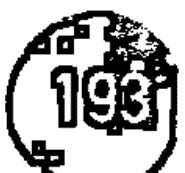

### 第五次啟悟——天使報喜

第五次啟悟自然地來自第四次啟悟，在這個提高意識的層級上，這啟悟往往相對較快地相互依存；舉例在一個生命週期內。既然你已經與你的高層意識結合了，接下來就是你懷孕了。這就是天使報喜——聖靈宣佈基督即將誕生。圍繞這個第五次啟悟的大部分象徵意義都是女性化的，源自聖三一體——聖母的第三方面。在較低的層級上，女性是透過星光體呈現的——慾望的性質與情感。在更高的層級上，這個層面涉及到第五個身體或者是佛身。在第五次啟悟時，來自佛身強烈的表現和優雅的流動開始下滲至較低層次的星光體。這是一種深層的譚崔現象，你將體驗到你的性慾昇華到純粹的靈性本質。

天使報喜是一種結合現象，建構你的整個生命。正如懷孕期間的女人充滿激素，所以你意識到你的身體被淨化和洗淨，為了準備一則偉大的內在事件——基督意識的誕生。類似在教會中，這次啟悟涉及主持聖壇的合唱團的情形，他們代表著純粹景仰神父的聲音。在這次啟悟期間，喉嚨中心和性能量中心之間的聯繫也變得清晰。當一個人自發性地進入一個似乎正在進行更狂喜的狀態時，這是一個合理的假設，他們正在進入這個天使報喜的第五門戶。許多不同的靈性傳統說出這個更高孕育的奇妙時期，永生的胚胎在我們的太陽神經叢中心醞釀。它是偉大的持續創造的奧秘之一。

在物種的啟悟方面，人類今天處於第五次啟悟的門檻。即使現在，還有一種新形式的氣息在等待著進入世界。我們很少意識到這種在我們的 DNA 中醞釀的形式。一個物種經歷任何啟悟的時間長短顯然與一個人有很大的分別，對於人類而言，「天使報喜」可能需要經歷數百年才能實現。我們即將進入一個非常純淨的時代，其中恩典的女性精神將在世界上積極運作。事實上，作為一種物種，我們已經受精了，處於懷孕的第一階段。正如一個女人的身體需要幾個星期甚至幾個月去意識到外在的變化那樣，人類將不會普遍意識到這段時間的巨大變化。只有那些敏感於物質世界之下微妙流動的人才會發現現在已經開始了孕育新人類的第一個跡象。

### 第六次啟悟——交融（聖餐）

第六次啟悟是人類可以擁有的最大經驗。它代表了我們人類發展的最高點，也是我們在地球上的演變結束。交融的奧秘是犧牲的奧秘。這是人類載體中基督意識充分的覺醒，這需要以形式本身死亡的原則為基礎。這個階段通常被稱為啟蒙。所提到的光是第六個身體中純粹的光——這是從佛身中誕生的，它啟發了較低層次的三個身體。因此，它會導致因果體解體，從而破壞了下層和更高世界之間的聯繫或橋樑。在靈性的術語中，這涉及到靈魂的解散——人類意識的這個方面被再次輪為化身。因此，據說在啟蒙的時候，原本居留的意識已經不再是化身並永遠脫離了「頂輪」或幻覺的輪迴。

交融的啟悟也與第 45 悉地同名，它描述了神聖聖餐的巨大奧秘。聖餐涉及在聖壇上直接吸收神的意識。在進入這個頻率領域時，你超越了一切與別人分離的感覺。這是基督血液的象徵，標誌著你 DNA 中殘留的殘餘物最終分解。為了讓基督的恩典進入你，你必須願意作出最大的犧牲——放棄你較低層次的身體和他們的慾望，感覺，回憶，夢想和知識，並被所有在你身邊等待中的更大的存有接軌。進入這個巨大的啟悟是面對死亡，聖三位一體的第二個方面——基督。

### 更高的演進以及第七，第八和第九次啟悟

其餘的三個啟悟是所謂的「更高演進」的一部分，這超出了人性和人類的故事。因此，他們難以用言語描述，並且圍繞它們進行某些綁定誓言，以保護人類遠離其危險的頻率。這些頻率不再是可傳達的，除了通過聲音或通過無聲的直接傳遞。即使如此，更高的演進一直被認為，有關它的真實碎片可以在人類文化中找到。在基督教會中，更高的演進是通過祭司及其等級體現的。

超越人性，而未在人性中存在一種被稱為「共治」的進化論。共治是人類載體的精英分形，專門為較高啟悟的存有服務。甚至說這樣的意識是一個是有深度缺陷的獨立的存有。然而，只需要說超越人類意識層面的擴展可以因為各種神秘的原因而返回到身體的形式就夠了。其中一個原因是，在人類演進的進程裡，整體發揮了某些特定的作用。這些更高意識的面向有效地創造出一個虛假的因果體，以便能夠成形和運作。這個身體通常會有個內置的時間機制，讓存有一個人類一樣，甚至好一段時間相信自己是「正常」的。這種化身的過程被稱為「天神下凡」。

第七次授予聖職的啟悟與「協調」這一概念有很大的關聯，這種形式直接在具體的新方向進行人性化。正是透過這些生命，啟悟的更高的秘密可能會被解封。世界上存在這樣的人總是會使整個地球的意識發生巨大變化。有趣的是，在任何時候，總是有五種化身存在於地球上，形成統一的力量場引導人性平衡，轉向進化而不是毀滅。

第八次聖潔化的啟悟是我們這個星球上極為罕見的事件。在這個層面上的啟悟真的超出了人類的理解，因為它們與從第七個單一體進入到粒子體和佛身的本質流動有關。雖然它偶爾會發生在個人層面上（具有驚人的結果），但是第八次啟悟是一個整體共治採取的集體啟悟。這樣的事件即將來臨，並將在人類通過第五次啟悟的同一時間進行。事實上是那次啟悟的高八度。

第九次與最後的啟悟結束了意識的故事。在個人層面上，第九次啟悟只能透過沉默來進行。在某些罕有的傳統中，它也被稱為「拒絕」。在這次啟悟之後，原本留置的意識「拒絕」到實現並解散回到它誕生的原始本質。傳統告訴我們，到目前為止，只有極少數的幾個偉大的啟悟者進行了第九次啟悟。然而，隨著「共治」的第八次啟悟，第九次可能會更加頻繁。在這個最後的啟悟期間，第一個身體和第七個身體融合在一起。然後身體揚升並完成其最終偉大的命運。

### 新天堂與新地球

從傳播的深度可以看出第 22 悉地難以用言語描述。原因是你需要體驗它才能知道它是什麼。雖然恩典是一個經常在靈性圈子使用的詞語，但不應草率地使用。相反，它需要得到最大的尊重。我們已經知道，恩典必須透過慈祥而獲得。這是第 22 基因天命的偉大信息——在痛苦面前找到慈祥，甚至可能找到更多的東西——聖潔本身的偽裝。如果第 22 基因天命恰好是你遺傳基因特徵的一個方面，那麼恩典在你的生活中的影響會非常強大，你不能漠視痛苦的生活提供給你的經歷。我們都在這裡一遍又一遍地進行測試，直到我們展現出對自然的信賴那將永遠不會再失去。

恩典是一種降臨於人類的存在，像所有的悉地一樣，它要求我們在半途中相遇，這對我們人類來說似乎看起來很漫長。這畢竟是一個完美的狀態，其中有關於你和你生活的一切將永遠地改變。當真正的恩典降臨時，它會閃過你所有的過去的業力。它也抹去了所有祖先及其祖先的業力。恩典軟化你粗糙的邊緣，永遠地結束你的恐懼，讓你毫無疑慮地離開你的神性。它也確保你永遠不會忘記。當恩典燃亮我們，它所給予的祝福是絕對無可估量的。

被恩典感動過的人總是容易再被恩典感動。如果幾千年前在另一個宇宙或另一個轉世發生過，那將永遠不會離開你。它會一次又一次地沐浴你。存在展現出這個悉地的人面前，被圍繞著他們的愛的光環所吸引。這是你永遠不會忘記的東西，它會激起自己的靈魂去尋找它，直到找到它。恩典是神聖的氣息。如果我們只執意我們的犧牲，它總是在那裡等待著我們努力。無論有否壓迫，都有恩典的可能。如果你能以慈祥的精神和寬恕的心來面對壓迫，恩典遲早會來找你。恩典是一種女性化的精神，她不能拒絕那些面對逆境微笑的人。

正如我們看到的第 22 陰影，在這個宇宙中沒有地方可以隱藏。一切都被傾聽並記錄下來。你們也不能躲避恩典。恩典是你的真實本質。這是你的遺產。這是世界的靈魂。這也是超越我們世界法律的狀態。如果恩典觸碰你，你不再創造業力。如果恩典觸摸你，你就不再擁有自己的命運，而成為一個由神所調動和演奏的樂器。帶著恩典，所有人類的情感立刻轉變成愛。這不是大多數人都非常熟悉的狀態。然而，作為一個物種，我們正在進入一個將標示著恩典的新紀元。隨著七大封印的每一個被打開，我們習慣的世界將開始消失。像夏天的太陽，在它身處的位置將會上升，閃耀和燦爛，正是聖約翰在他偉大的啟示中談到的新天堂和新地球。

現在你已經深深地吸收了這種傳播，這是第 22 基因天命，建議你花一些時間來消化它，那你所存在的許多層次。作為一種女性精神，恩典呼籲我們每個人都傾聽和接受她的信息和祝福。最重要的是，記住這一點：通過恩典，宇宙只有個願望——讓你記住你是愛，除此之外亦只有愛。

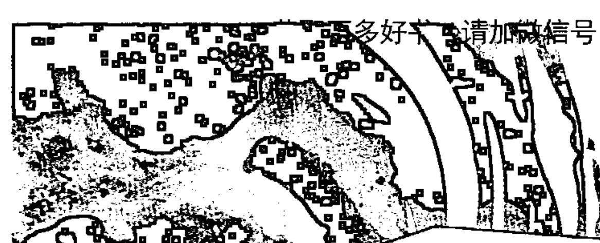

# 第23基因天命
## 簡約的鍊金術

悉地：精萃
天賦：簡約
陰影：複雜

編程夥伴：第 43 基因天命
密碼子環：生死之環（3，20，23，24，27，42）
生理學對應位置：咽喉（甲狀腺）
胺基酸：白胺酸

## 第 23 陰影——複雜

### 分裂世界

哲學家路德維希·維特根斯坦（Ludwig Wittgenstein）曾經說過：「除非你能談論，否則你不會想像一些東西。」他所提出的是思維和語言似乎是不可分割的。第 23 陰影與思想有直接關係，知識和表達之間的聯繫透過言語知道。作為我們的遺傳基因的一個功能或是障礙，是 64 個陰影在不同的週期裡操控人性的特質。這就是說，循著歷史裡看，某些特定時期，特定的陰影將會突然主宰人類，而在其他時候，同一個陰影相對似乎會處於休眠狀態。隨著陰影意識的每一個突出的方面，相應地寫成歷史。人類進化的整體方向是由我們 DNA 內在出現的這些固有的內在循環和脈衝所決定的。

第 23 陰影是我們現今後現代時期推動人類最有力的陰影之一。它是複雜的陰影。複雜性是人類頭腦嘗試控制環境的結果。越來越多人試圖用自己的思想在世界裡創造安全的感覺，卻使這個世界變得越來越複雜和不安全。在個人層面上，這個陰影以兩種不同的方式產生誤解和分裂——透過個人說出錯的話，並在錯的時間說出來。只要語言一直存在，這種人格特質就一直存在，在人類歷史上它是對一些事情負責最可怕的事。我們這個星球上最血腥的一些戰爭是基於一些簡單的誤解而開始的。當佛陀介紹了他所稱之為八正道的偉大教學時，他談到了「正確理解」，帶來「正確的言論」。他一矢中的了這個偉大而簡單的事實——語言直接透露出你的意識狀態。當你更深入地理解和擁抱陰影，你會變得更自由。

第 23 陰影中的挑戰在於其編程夥伴——第 43 充耳不聞的陰影。第 23 陰影代表了壓抑不住衝動的人急於表達自己。加上無法聽到自己或他人的聲音，這形成了致命的催化劑。個人重大問題之一是無法清晰地與他人溝通。聽到你自己意味著意識到你內在發生什麼事。如果你沒有這樣的自我意識，那麼你也無法真正聽到你以外發生什麼事，這意味著你不會知道如何與他人交往。語言是非常強大的，作為一種攪動人心與情緒動力的媒介。每當這個第 23 陰影說話的時候，情況就會變得複雜，反過來又催生出一種指引性的誤解過程，這種誤解可能很快就會從心智頭腦的過程提升到情感上。第 23 陰影底下的恐懼是不寬容以及被別人排斥。諷刺的是，這種恐懼會驅使出現恐懼的行為。

第 23 陰影的難處在於，它往往讓人覺得他們是對的，看起來他們對別人的看法開放但實際是牢牢地關上自己心門。這是充耳不聞表現的方式。在對話中，這個陰影強烈地影響人們，像是一個難以擺脫的印記。他們根本無法直接回答一個問題。甚至不能對你問的問題相應地回答一個單詞！他們潛意識的假設，在某種程度上，你存在於他們的頭腦裡與他們在一起，並了解他們所想的一切，如同水晶般清晰。因為如此，你經常有這樣的感覺，這樣的人只是在說話，而不是和你交流。這通常會導致聽眾感到身體的不舒服，並且在反覆或嘗試中斷交流。無論哪種方式，當誤解難以避免時，情況就會變得躁動和複雜。

在這個第 23 基因天命中隱藏著一個秘密的時機。因為第 23 陰影涉及到你的大腦將思想轉化為語言的方式，透過這個基因天命，可以出現所有的言語困難——從暢所欲言到沉默不語。這些問題根植於隱藏在言語和語言之間微妙的時機。人們的話語是由許多層次其語調之間的空間組成。即使你的大腦可能會「聽到」你腦海中的語言，而將其轉化為聲樂則是另一回事。這個過程的成功與否取決於你的整體頻率層級。如果你陷入陰影的受害者模式，那麼轉化的過程稍微達不到預期，正如一個代碼被錯誤地複製一樣。這導致了語言模式不協調的情況或帶來不適合的聽眾。

這個時間過程以及錯誤的時間發生在遠遠低於你意識的層級上。說話者和聽眾之間的溝通並非靠言語本身，而是語調本身的微妙起落。有人可以用最有吸引力的語言演講，但實際上對觀眾來說沒有任何意義。溝通的天賦不在於說話者的語言技巧，而在於講話者的心中一點微妙的變化。假設，你的演講受到最細微的恐懼痕跡驅使，那麼這場演講可能永遠不會被聽眾充分吸收。然而，當有人由衷地從心裡說話或書寫時，不管他們怎麼說，你會明白他們在說什麼要點；相反，當你讀或聽到讓你感到冷漠的東西時，你可能會聽到一些人深層的恐懼。由第 23 陰影驅使的人，為了獲得准許或認同而總是這樣，毫無例外地讓自己被誤解。

在集體層面上，人類的語言模式未能達到預期，帶來了不寬容和分裂的境況。事實上，它導致了有組織的宗教出現。所有的主要宗教都是來自個人當下的單純所說的語言模式演變出來的，然後他們的說話被當時非物理存有錯誤地翻譯出來。例如，基督美麗的話語是純粹的簡約，但是由於他們許多不同的解釋造成數百種分裂，已經將原來的簡單性變成了令人難以置信的複雜性，以及最終醜陋的東西。有時候，有人表達出恐懼的頻率或者憤怒，即使最美妙的聲音語句都可以變得有威脅以及引來分歧。

從這個陰影很容易看出，古時的中國人使用「分裂（山地剝）」這個詞來表示易經第 23 卦。絕對真確的是，這種陰影的頻率確實會導致人類彼此不信任，進一步使我們分化，並創造越來越多的複雜性和破碎的局面。如前所述，複雜的第 23 陰影反應我們的星球變得越來越不安全。最終，這種分裂隱藏著一個目的——使人類意識到自己是自身痛苦的原因，並及時帶來「正面理解」的禮物。

### 壓抑天性——啞巴

在壓抑天性或在社會中，第 23 陰影的表達很少被寬容。即使你看到讓別人保持沉默的社會，你同時會看到在這個陰影下運作的恐懼。根據個人或團體恐懼的嚴重程度，或許永遠不會表達自己真正的想法。不論是透過內在壓抑或受到外在壓迫，語言都被阻止。有趣的是，「啞巴」這個詞現時的含義來自於缺乏智慧，因為這些人常常是這樣認為的。如果你因為恐懼而哽咽，你就不能清楚地說明，如果因此，這些人慢慢地學習不說出他們真正的想法，而不只是沉默或表面的敷衍。對於受到父母嚴重壓迫的孩子尤其如此。

### 反動天性——分裂的

這個陰影的另一面向是表現性質，通常是不停地說話。然而，由於在他們的神經學術中存在一般的「錯誤時間」，所以無論他們去哪裡，都會產生巨大的干擾和破壞。這些人總是說錯的東西，或者在錯的時候說對的事情。這種人的語言格局往往過於複雜，錯過了事物的本質含義。他們花了很大的精力嘗試讓人們聽到他們的聲音，卻發現他們不斷被推開。這些人傾向於在圈子中說話，無意識地過分解釋一切，嘗試掩蓋他們內在的憤怒，卻沒有在更深層次上被理解。

## 第 23 天賦——簡約

### 崇高的真理

大多數現代人最難的事情之一就是簡單地生活。有時簡單甚至被認為是愚蠢的代名詞。其實，你遺傳基因的頻率越低，你才會越來越複雜化。其原因在於人的心智頭腦。頭腦不信任簡單，因為它在複雜性的思維上蓬勃發展。越複雜的事情就越重要，那思考就越多。所以，當我們來到這個第 23 天賦時，我們正在學習幸福生活其中一個偉大的秘密——保持簡單。

第 23 天賦厭惡雜亂和行業術語。其溝通精確，清晰，經濟實惠。不論在哪裡，簡約的力量是創造效率。展現簡約天賦的人們在生活中不會浪費任何東西。他們的生活通常反應他們的想法，充足開放的空間和喘息的空間。他們能夠切斷所有的無用之物並直達要點。簡約是一種生命的狀態——一種生活態度——因此它不能真正地被教導。簡單需要很大的靈敏度。它更像是一個訣竅，一個光環——甚至一份愛。如果你喜歡簡約的話，你就會展現它。

天賦頻率的層級像是一個信息交流中心，為了讓你準備實現悉地意識的過程。因此，第 23 天賦是一個持續的過程，越來越多的混亂逐漸從內在和外在的生活中消失。當你的頭腦清晰，內在開放的空間，讓你很明晰地看到東西。這種頻率的另一種展現就是減緩你的內在系統，逐漸減輕你解決生活中的一切需要。讓情緒遵循自然的過程，思想開始在他們之間有更多的差距以及脈衝交流，遑論客觀或不客觀地觀察事物，冷靜或者著迷都不帶批判。自然中的一切都開始變得清晰。你生命中的許多問題不過是你的思想根據你的慾望所創造出來的幻想。你自然而然地開始向內思考自己的本質。

用一個很好的例子比喻簡約：飛機飛行穿越雲層，然後到達雲層之上。在雲層中，頭腦只會出現複雜性思緒，它會繞圈子試圖找到出路。在這些較低頻率的雲層中，你始終採取不變的狀態。在更高的頻率層級下，你的頭腦會越來越清晰。在雲層之上，世界心智遺留在下面，你開始變得更加沉寂。這個第 23 天賦及其編程夥伴，洞察的第 43 天賦予聲音領域密切相關。這兩個天賦清晰地聆聽和清晰地翻譯所聽到的。內在清晰的聆聽確實指的是認知。我們在第 43 陰影中留意到，這兩個基因天命的基礎來自充耳不聞。隨著你的頻率上升，這種充耳不聞會協助你成為一個真相過濾器。透過第 23 天賦，你只會聽到本質精髓，並且分隔出所有無關的低頻噪音。

作為生死之環這個奇妙的密碼子環的一部分，第 23 基因天命概括了古塔瑪佛所遺留給人類完全一樣的見解。「四大真諦與八正道」的簡約美——佛陀留下來的智慧——反應這個密碼子環的秘密。通過第 3 基因天命，我們看到所有的生命都在變化，因此話題結束。佛陀透過第 20 基因天命，發現所有的真理都在於當下的意識。第 24 基因天命描述了重生的持續過程與輪迴。第 27 基因天命說出了位於人類內心的善良其基本的道德規範，第 42 基因天命教授脫離的力量。一旦你發現了這些秘密，你將會達到簡約美之中第 23 基因天命更高的層次——精萃——它位於你的腹部與身體深處的中心。啟蒙只有通過深深地沉浸在其中接受生死才能實現。

經驗第 23 天賦的人擁有個美妙而強大的體驗。你認為存在的問題透過他們的洞察力和清晰的語言，困難的事情變得容易。最重要的是，你開始放鬆身體，而在這種情況下，心智頭腦就放下了不斷要解決複雜性的需要。簡約在物質世界中是非常實用的，這些人往往很善於理財。他們不知道如何賺錢，但他們知道如何不浪費它。他們沒有任何要緊張的地方，但他們找到最簡單的解決辦法。他們是效率大師，他們可以提出高度的原創意念但完全實用的想法，為生產力帶來巨大的躍進。

第 23 天賦不是以合乎邏輯的方式看待事物，也不會將其描述為藝術或抽象。它只是自發地「知道」事情，而不知道從何而來。這是天才的本質。這個第 23 天賦最常伴隨著玩樂的特質。雖然這可以是非常強烈的天賦，但這不是一份糟糕的禮物。這些人以非常側面的方式思考我們正常思維所不了解的方式。他們默默地觀察，直到他們的意識冒出了解決方案，在這一點上，他們可以有效和美妙地進行溝通。所有這些特質的結合使他們成為一個很好的導師。

提到這個第 23 天賦的最後一個方面是它有令人難以置信的幽默感。這個天賦的運作方式可以在某種程度上捕捉到一個人的本質或一個特定的時刻，他們不會事先計劃要說什麼，卻經常讓大家感到驚訝。在較低的頻率下，這種特徵會帶來傷害與造成排斥。但處於較高頻率時，通常會引人發笑或受人敬畏。這是頻率的問題。

最重要的是，在第 23 天賦中運作的人是美妙而清晰的溝通者以及顧問。他們的真正才華在於他們簡潔的語言和獨創性的表達。他們擁有所有人最崇高的真理——簡約的天賦。

## 第 23 悉地——精萃

### 佛陀狂熱

第 23 禮物在最高層級會是精萃的悉地。精萃是一個主要來自古代和中世紀的哲學名詞。它指的是所謂的靈性五元素或「乙太」的固有物質。在 64 個悉地的層級，字詞是能共鳴的，而不只是具單一具體含義的單詞。這個「精萃」的詞裡面帶有秘密，為我們提供了關於這個第 23 基因天命最高層面的許多跡象。

第 23 悉地具有鍊金術的意味。在隱喻層面，這是指從賤金屬中提煉黃金的能力——所有鍊金術的目的。因此，有這個悉地的人能夠觸及隱藏在其他人之中的黃金。他們可以透過一個單詞或一個外形或一個手勢傳遞喚醒狀態的力量。這就是點石成金。每個人都有一條獨特的鑰匙開啟他們到更高的意識狀態，擁有這個悉地的人掌握所有的關鍵鑰匙。他們不一定知道他們擁有鑰匙——他們只是自發地對每個人做出反應，而且這樣做的時候，他們會觸碰到那個人的核心。

他們是極不能預測的人。正如這個原型的古代易經之名所示，這個悉地就是把人分開。在悉地的頻率，思想被揭示了它是什麼——粒子能量。每個瞬時的念頭不是必然要經歷的裂變過程——它分裂開來並將純粹的有機能量釋放到物質的光環中。在最高頻率上，這種「分裂」是指分隔開內在本質與你分離的幻象。

任何一個在悉地狀態的人都會經歷一場鍊金術變換的過程。在悉地狀態的早期階段，你的身體裡發生了基因變異。這種變化主要是由於你的想法分裂而引起的「不良效果」。整個身體經常經歷一段深層的感覺體會，有時候會經歷歡愉，有時像痛苦一樣，而你連續性的思維被破壞了。一旦塵埃落定，剩下的就是精萃——意識本身就是透過具個性的軀殼來呈現或行動。這是鍊金術暗示的秘密其真實解釋——身體本身蘊藏了神聖意識的種子。它隱藏在你的 DNA 裡，它由一個隱藏的時間機制掌控，完全是自發的，不在你個人控制的範圍之內。沒有辦法觸發這個事件，因為它超出了你的思想，任何你想做的事情及驅使的事件實際上妨礙了你的自然過程。同樣的方式，第 23 陰影無意識地「脫口而出」，不適當地表達，所以更高的意識會突然和毫無預兆地在你體內爆發。

因為你的覺醒是絕對的——換句話說——除了人的干預，永遠不會有啟蒙的技術。啟蒙是超越技術的掌握，感恩在永恆的奧秘之中。第 23 悉地代表了右和左邊道路的提升。這就是為什麼佛陀把它稱之為「中間道」。左邊的道路是科學，只能走到悖論，毋庸置疑是科學或邏輯思維的限制。右邊的道路指的是藝術家或詩人，雖然這條路徑比科學家更接近中心，但並不足夠。詩詞超越心智頭腦，努力通過心而更接近神祕的面紗。但是，心和靈魂受到自己渴望的限制束縛，儘管它們可能在短時間內觸碰到中心，但卻不符合終極目標。

第三種方式是神祕主義者，他們既不播種，也不嚮往。神祕主義者進入身體本身的靈性，不追求解決或表現對真理的渴求。這些神祕主義者對於靈性，他或她沒有任何議程或需要「理解」，而純粹感到深深地尊重，只是著迷於其終極的奧祕，透過他或她皮膚的毛孔吸收它。只有神祕主義者才能從極致中提煉出精萃。他或她純粹進入狹窄的門戶，處於奇蹟狀態。最終實現其絕妙之處，而它總是被錯誤地發現。出現在某人的展現之後，他們可以看到簡單的覺醒條件，就像佛陀一樣，他們可以指出這條件的真確性質。然而，覺醒者也知道，這些條件必須以自己的方式出現，而不是成為未來尋求者的綜合目標或目的。這就是覺醒的矛盾之處。多少人被誤導入歧途，那最好不要說什麼嗎？但如果有人直觀地掌握法則（教義），那麼誤入歧途的人的犧牲就是值得的。

因此，第 23 悉地真正的活力量直接地傳播。從這個悉地出現的現象存在他們說話時是非常有效的。一旦第 23 悉地完全座落於一個人之內，他們就成為鍊金術的代理人。像水銀一樣，他們將於人前自我束縛，並在自己的心智結構中找到裂縫。在這些人的周邊，你會體驗一系列自發性的簡約經歷，因為他們持續存在的光環，慢慢地開始從你的文化與制約設置中浮現，以帶出精萃。作為這種振動的接收者，你將會無可避免地徹底經歷一場解構，這對你來說可能是非常困難的。像所有這樣的鍊金術過程一樣，除非你完成整個過程，否則可能對你的心智健康造成嚴重的影響。

這個第 23 悉地是一個神聖真理的託管人：在接受任何外在教學或導師教導之前先相信自己的內在道路。以佛陀的例子來說，數以百萬計的佛教徒遵循他的教義，但很少人能夠在這些字詞之間閱讀並提取到生命的精萃。然而，偉大的大師留下的真相比你所思所想的更容易體現。遵循靈性的道路是完全臣服你置身之內的一切，無論它從何引領你。聽起來，中間道並不是對立之間的一條微妙的道路。這是一個完全放下的道路，每一步都在你之前。這是一個從虛空中堆砌的路徑，沒有任何人在你之前，因此沒有法則、韻律和理由。為了走這條路徑，你必須深入挖掘自己，深入了解真正的精萃，只有你才能認出它。這就是佛陀狂熱。

# 第24基因天命
## 寂静——最终的成瘾症

悉地：寂静
天赋：发明
阴影：成瘾
编程伙伴：第44基因天命
密码子环：生死之环（3，20，23，24，27，42）
生理学对应位置：新皮质
胺基酸：白胺酸

## 第24阴影——成瘾

### 巨大的基因偏差

第24阴影，当正确理解后，除了解释很多关于阴影本身的状态之外，还解说了为什么人类难以解决他们生活中更深层的重复性问题。这个阴影就是在事业上维持的心理——表现，以及大广告公司充分利用的阴影。我们人类成瘾来自预先的编程，造成这种情况的主要成因是我们的想法。一则著名的都市神话指出，我们只运用了大脑很少的一部分，但任何神经科学家都会告诉你，这不是真的。平均一天里，我们几乎使用了大脑的所有部分。重点其实不是我们运用了大脑多少，而是我们如何有效地运用它。像现在这样，人的大脑仍然是未知的意识领域。

你运用大脑的方式是由你的遗传基因决定的，所以有些人想法很有逻辑性，但有些人很偏执。如果我们将大脑的迴路与钢琴上的88个琴键进行比较，我们可以说，这些琴键裡幾乎擁有無限的潛力去創造音樂和旋律。然而，就我們的大腦而言，我們傾向於找到自己喜歡的曲調，並且一遍又一遍地播放著它們。許多人根本沒有想到自己擁有全部的琴鍵，而是從父母和他們的環境中學到了制約化的模式，並一直遵循這些模式。當然，每一個人所有的時間都在運用他們的大腦，但罕見的是有人卻能找到一種全新的思維方式。第 24 陰影努力地維持著這種方式，讓大腦神經節內的突觸迴路變得像公共道路一樣通行和順暢。

人類的大眾意識仍然由我們大腦悠久的恐懼和生存的方面主導。這種恐懼是人體反應中強大的力量。第 24 陰影在周遭裡創造出低頻的節奏，這種頻率使你無法思考舒適區以外的事物，讓你停留在身體、情感和心理層面。我們處於外在生活中，常常遵循相同並可預料的路徑，我們的大腦跟從神經系統也是一樣的。這引起成癮的行為現象。當我們在這裡談論成癮時，我們不是在談論特定的心理障礙，而是整個人類族群的行為編碼，這是極具自我限制的，不容易察覺自己的成癮症。事實上，所有的思維模式都是令人上癮的。你可能是一個左腦依存者或右腦依存者，而你也會同樣沉迷於此。唯一能打破成癮的思維就是沉寂——真正的沉寂。正如我們將看到的那樣，沉寂帶來了第 24 發明的天賦——思想的藝術和完全原創製作的方式。

成癮的每個週期都有自然的「差距」，人類在認知上經歷這些差距。他們可以出現在任何時候以及讓你直接面對自己的痛苦。在這樣的時候，你通常會感到一股強烈的空虛感，那是一種深層的不舒服。我們回應這些意識的差距一般都是試圖通過麻木自己或使自己分心來逃避這些差距。成癮的陰影確保人們不會真的改變。儘管我們可能會尋求新的存在方式，在外在我們通常會跟隨我們的癮症，而內在不會變化。你只需要觀察一個人在世界上的行為，看看他們是否處於成癮的狀態或是處於發明的更高狀態。如果他們受到陰影狀態的影響，總是一副焦慮的樣子，似乎從來沒有休息。即使他們的外在生活可能發生變化，他們大體上也不會創造任何東西。這種模式也傾向在他們的關係中出現，在這種關係中，他們經常發現自己重複回味相同的場景，而不了解為什麼。即使他們改變了外在的關係，作完全不同的承諾，相同的手法還是再一次出現，表現出一種內在的精神模式，似乎無法逃脫。

了解成癮陰影的機制是很重要的，以找出人類最深的痛苦根源。進入這個神秘面紗的一種方式是運用第 22 基因天命中提及的「基督聖體節」的模式。

第 24 基因天命
寂靜——最終的成癮症

基督聖體節指的是人類的七個神聖體、層次或護法。要真正了解你痛苦的力量，你必須考慮三個密度最高的神聖體和他們之間的關係——肉身，星光體和心智體。人類痛苦的根源與身體中的 DNA 連接，這是七個密度之中最高的神聖體。它是全人類的原始神聖傷口，其唯一目的最終是為了促使你覺醒。

肉身的下一個神聖體，是所有慾望出現的星光體——你的性慾、情感、嚮往、渴望和感覺。物質身體只要食物和溫度等基本需要，而星光體存在的渴望對生存無關緊要。原始傷口是我們感到與整體分離的感覺，星光體透過慾望對這傷口做出反應。所有的慾望都是根植於一個單一的願望——渴望逃避由原始傷口造成的痛苦，並恢復到純粹的統一狀態。如果你可以深入地看待這種慾望，而不用採取行動，那麼它實際上會燃燒掉，這是冥想的根本目的。

接下是在心智體裡發現你痛苦的故事——即在頭腦裡。你的頭腦對星光體的慾望做出反應，並試圖想出方法擺脫痛苦。成癮從這三個較低層的神聖體相互作用開始。你的頭腦圍繞著星光體的慾望建構想像，故事和投射，這使你形成一種上癮的行為，旨在緩解痛苦。因為思想貫穿時間，主要是傾向將幸福的希望擺放在未來，而不是接受目前的真實狀況。人類外在的文明設計了讓頭腦嘗試逃避痛苦以及尋求未來幸福的策略。它是由陰影設計來成就陰影的，這就是為什麼在日常生活中超越陰影意識是如此具挑戰性的原因。

外在沒有什麼東西可以結束你的痛苦，因為它深深植根於你的 DNA 裡。只有當你轉向內在，尋找你的痛苦的根源，才能終將面對著你自己頭腦的成癮性質。第 24 陰影的編程夥伴是第 44 陰影，它掌管發生在我們地球上功能性失調的關係，這是當前的常態。這種功能障礙是人類遺傳基因操作系統中普遍存在的副產品，並受到第 24 陰影而強化。成癮是持續不斷地重複相同的感知框架而之間沒有停頓，這是普遍人類的大腦反應中突觸層面上發生的事情。像旋轉車輪中的小鼠一樣，我們只會重複採取相同的方案，而意識不到我們在做什麼。

問題是：你如何擺脫成癮的循環，並重新編制以運行沒有瑕疵的程序呢？這個問題的答案就在第 24 天賦裡。你必須意識到你在成癮的模式裡開始轉移第 24 陰影的編程。你願意面對頭腦所創造的框架，而知道當中有停止的必要，讓心智體從星光體裡掙脫出來。當這種情況發生時，首先星光體及其渴望不再被強化來吸引你的心智，而你將更深入到痛苦的根源。你通過忍受外在刺激來淨化星光體，從而進入純粹慾望的聖地——渴望返回到你真實的來源。

### 壓抑天性——僵硬

當壓抑性質在意識中遇到「差距」時，他們的內在恐懼使他們僵硬。這種僵硬會在很多方面表現出來——身體上完全缺乏能量、在情感上抑鬱以及狹隘的思想、對現實的觀念有所保留。所有成癮的秘密在於我們如何應對這些我們意識運作中的差距。成癮的危險是，我們在這些珍貴的時刻封存我們的命運，而意識不到我們在做這件事。在陰影頻率下，我們根本不允許自己體驗在意識轉移之前的留白空間。壓抑天性從感覺到沉寂的空虛狀態中萎縮。如果我們在生活中直面這樣的時期，而不是壓抑或作出反應，那麼真正不可思議的事情將會在我們之內萌芽。

### 反動天性——焦慮

第 24 陰影的反動面向像壓抑方面那樣，不願意充分地體驗他們的空虛感。這種空虛的感覺在所有人的生活裡、不同的時間發生。在我們面前揭開的「差距」可能使我們陷入恐慌。如果我們是積極地反應而不是被動地做出反應，那就是因為焦慮這樣做。為了逃避陷入無底洞的感覺，我們將恐懼轉化為積極活躍，這種活躍掩蓋了我們內在可能發生的潛在魔力。基本上有兩種成癮者——有些自我麻木的人（壓抑天性）和自我激勵的人（反動天性）。通常反動天性的人更多是工作狂或賭博型的，而不是壓抑天性可能表現出的酒精成癮者。這些人無法靜靜坐著，內心充斥著焦慮，那些都是來自拒絕強大而絕對自然的反應過程。

## 第 24 天賦——發明

### 在差距中休息

在討論第 24 陰影時，我們已經仔細端詳一套掌握成癮的行為模式的想法，其性質裡隱藏著這些模式。此外，我們已經看到，如果個體認知到重複神經系統路徑之間的「差距」，這些癮症就會變化成不同的模式。這些「差距」從最短一秒到一週甚至更長時間，實際上是自發性發生在每個人身上。這些差距可以讓你的整體生活發生轉變，如果你不完全臣服，可能會感到非常不穩定。你對於差距的回應決定了他們是否成為另一個意識層級的橋樑，或者你只是回到你熟悉的思考和行動方式裡。就第 24 天賦而言，意識上的差距是完全被接納的，因此揭示了它的魔法。擁有這個天賦的人可以自己避免差距，或者在達到天賦層級時，充分認知到這些差距。無論是哪種方式，他們在恐懼之前不會在這些時刻畏縮，因此他們發現這些意識上的差距根本不可怕。

那麼當你擁抱差距時會發生什麼事呢？答案是：一切都是必然的。第 24 天賦是真的神奇以及擁有天才的秘密。天才不僅僅是橫向思維——它是作出巨大躍進的能力。例如，一個很好的網球選手和一個真正強勁的網球選手之間的區別，可以在第 24 天賦裡找到。強勁的選手沒有特定的模式，而他們對手的模式卻可以拆解、抵制和戰勝。他們將在最激烈的時刻，投擲完全意想不到的一球。這是發明的天賦，將新事物帶入世界。第 24 天賦是一個獨創性誕生的渠道，並同樣震驚自身以及他人。

大腦分為灰質和白質，前者主要涉及信息的處理，後者主要涉及信息的交流。第 24 天賦涉及在大腦深灰色區域發生的靈性過程，而這份天賦似乎是一個神經觸發器，使原始的思維從這些區域出現。考慮人類的行為，用一個可能是透過這個天賦而發生的描述。當你思考一個主題時，你會先圍繞該主題熟悉的思維路徑行走，直到你達到其中的一些奇妙「差距」之處，在那一刻，就好像改變了神經系統的齒輪，突然間，一個新的、更有效用的突觸網路在你的大腦裡展示出來。在全新的視野讓你突然看到事情本身。

諷刺的是，隨著你的大腦變得更有效率，你可能會運用得更少的部分而不是更多的。如果你可以簡化大腦神經激發的容量，那麼念頭和見解實際上可能變得更加尖銳和清晰。或許可能你使用大腦的百分比越小，你變得越聰明了！探索差距的最好方法之一是透過觀照這藝術。觀照生命與死亡、變化和痛苦的本質，可能會讓你突然提升了意識狀態。要考慮的是將自己投放到巨大的奧祕之中，直到它意外地透過深入的洞察過程向你展現自己。

無論你能否順利地交流你的見解都在於第 23 天賦，如同第 24 天賦一樣，都是被稱為生死之環的遺傳基因家族的一部分。生死之環是一個複雜的遺傳基因密碼子組，它作用於掌管帶領人類許多進出形式的過程。其主要代表之一是輪迴。慣性過程說的是星座和星系的運轉，影響到我們身體深處的原子結構。這些都是循環之間的差距——生命之間的間隔，原子之間的空隙，音符之間的休止符。魔法與突變發生在這些差距之中。在人類存有中，這個密碼子使你能夠在意識演進方面實現巨大的躍進。

## 第 24 天賦——寂靜

第 24 天賦是人類創作過程的核心。第 24 天賦的秘密確實是創意本身的秘訣之一。它實際上是一面聲場，透過遺傳基因提高振動頻率。每次遇到這些奇妙的差距時，你都有機會將頻率上移一個八度或保持在同一循環裡。一個關於成癮的真相是，它可以具有創意地提高你的頻率。發明是真正創意的成癮症。你只是體會到頭腦傾向循環性思考，頻率突然提升。成癮是循環式思考，而發明則以螺旋形式思考。驅使人類進化的所有偉大見解，從藝術到科學，都途經了第 24 天賦這道橋梁。只有願意面對自己無知的人才能通過。首先你要願意承認你的不知道，而且你可能永遠都不會知道。這種內在的誠實創造了發明的環境，儘管它可能在無法預測時發生。它通常在你休息時出現，以某種外在的形式表現出差距——默默地坐著、睡覺、做夢，或根本不做任何事情。

## 第 24 悉地——寂靜

### 離開輪迴

第 24 悉地寫的是一個有具挑戰性的悉地，因為你如何描述寂靜呢？顯然你不能。你可以做的是考慮這個悉地如何表現，並圍繞它建立一個存在環境。到目前為止，我們已經知道了成癮的本質，以及如何提升或轉化為創造性的發明。我們已經討論了大腦遵循的模式，以及這些模式如何突變成更新，更有效和更原本的方式。當我們來到悉地的層級，我們真的必須放下頭腦。寂靜是所有人類意識自然的狀態，而寂靜只能在思維完全停止的情況下發生。

幾個世紀以來，人類已經嘗試了各種各樣的技術來阻止頭腦的思考。事實上，思想可以被某些技術掩蓋，但短暫的安靜與第 24 悉地的純粹寂靜是不一樣的。第 24 悉地的寂靜是降臨在你身上，即使它已經在你之內。它是人類意識的內在轉變而發生的結果。當控制你的意識機制從頭部向下移動到你的太陽神經叢中時，便真正的由寂靜支配著。你不能說寂靜是被經驗的，因為寂靜會引起的悖論不再是一個「經驗者」所經驗的。寂靜否定一切，將主體和客體融合在一起。為了以這種方式轉移的意識，某種身體突變必須發生在人體之內。某些反應必須由內分泌系統產生以避免正常的聲學思維過程。你不再想思考卻由「生命思考」。這不是可以描述的東西。在悉地層面，不再有思想，同時知道與不知道。不知道是在意識靜止的時候，是在意識中知道與外在世界進行某種形式的溝通。兩種表達方式真的圍繞著相同的事情。

當頭腦停止思考時，所有令人上癮的行為也將停止。最終相信自己與生命分離的成癮症被根除。在這個意義上，並不一定表示身體的沉寂。這個悉地的寂靜是一種永久存在的內在沉寂。正如成癮可以通過意識運作中的自然「差距」而發生變化，所以這個狀態會越來越擴大這個差距。意識本身是一面面紗，掩蓋了這些空白的真實性質，這些差距實質窺探了純粹意識的本質。純粹的意識是寂靜或空洞的——它在時間上呈現為世界開始之前的時期。只有真正的內在沉寂才能結束幻相或你幻想的分離。冥想是試圖誘導出思想活動之間其背後隱藏的寂靜。

第 24 悉地也有其他驚喜。古代中國的聖人命名易經第 24 卦為「復卦」，這個名字有許多種解釋和含義。我們已經看到了這個基因天命不斷轉動的性質是如何運作。就像看電影卷軸持續在同一系列的鏡頭上繞圈子，直到天賦層級上，一組新的鏡頭被拼接在一起，然後繞轉繼續下去。生命的循環運作恢復了寂靜的差距——奇妙之處出現演進和突變。這是生命之間的靜謐，或者是我們提到的原子之間的差距——現代物理學中所謂的難以捉摸的「暗物質」。在人類的命運方面，我們的聖賢曾經試圖以形而上學的層面解釋這個返回的運動，並引起了許多偉大的神秘理論，其中兩個最為恆久的是因果與輪迴。

特別與這個悉地相關的是整個輪迴的教義。聖賢長期以來一直談到人類靈魂的更大命運，因為它體現在形式世界中，生活在其生命週期之中一次又一次地轉世，直到完全超越形式。彷彿人類對於自我成形有一種巨大無比的成癮症，直到這個癮症被徹底粉碎，否則人類永遠不會得到真正的自由。在與物質形式的聯繫被毀壞的最後階段，靈魂被認為是啟蒙的，並返回到存在的汪洋或神性中。很容易看出，人類的頭腦如何透過這個第 24 基因天命來解釋這種理論的出現。在後現代西方提倡了東方這個主要的輪迴思想，並將其作為主流的新時代教條。大多當今著名的導師和大師公開談論輪迴的「事實」。實際上，它透過第 22 基因天命有相當深入地探討。然而，正如第 24 悉地所見，輪迴只是一個真實而簡單的闡釋，從這個悉地的角度來看，這只不過是一場幻想。

儘管導師可能會說，大多數人喜歡輪迴的想法，因為它給了人們一個想法，就是有一些關於自己的事情，可以在死亡之後延續。它給我們帶來了所有連續性和公義的創造。然而，從第 24 悉地的觀點來看，輪迴只是瑪雅語言中另一種人類的概念。第 44 悉地是第 24 悉地的編程夥伴，深入探討這個主題。

這兩個悉地都把人類的故事拆分為最純粹和最簡單的形式，人類被認為是很冷漠的，遺傳基因的設置只是為了演繹意識。當一件裝置死亡時，它已經消失了，但它在演繹中起了一定的作用，寫下了一套偉大的超越性腳本，俗話說即使裝置已經死掉，戲劇仍需繼續。

因此，似乎繼續回到形式的世界，實際上從來沒有離開過。身體生而又死，特定的意識功能伴隨著身體而死去，但往下的整體意識仍在繼續。它是沉寂，不朽，無形和超越形式的。因此，當你辨識到或憶起過去的生活甚或是未來的生活時，你只需要讀取「分形」線內的信息。它存在於你的血液中，但除了寂靜的意識之外，「我」的任何方面都已死亡了。當真正的寂靜否認意識，這裡除了靜謐之外還有什麼別的嗎？相對的真理確實存在於輪迴的概念裡，並達到啟蒙。然而，一切嘗試辨認意識的連續性只會是一件令人沮喪的事實。真正的轉世只有寂靜本身。

在第 22 基因天命中，你可以讀取關於轉生的一切——形成的各种微妙的身體逐漸啟蒙，透過生命之間的中有狀態，再次返回自身。你還可以了解因果體，你身體的微妙層面，它可以將你進化的精髓帶入下一個生命裡。但是，當它被分解或破碎時，因果體在這個過程的某一點被視為是一種錯覺，所以就展開了你的啟蒙過程。當你發現在巨大輪迴的差距並選擇永遠退出整齣戲，轉世結束。所有這些精采的描述實際上是我們演繹的一部分，其真正的目的是協助穩住你的頭腦，並給予一種持續性的邏輯性感覺。儘管如此，在悉地層面上仍然認知到巨大的悖論性質影響著你。所有這些描述本質上是幻相的手段，它或許能協助你在幻相中放鬆。關鍵是總是放鬆，因為只有當你放鬆，你才能找到神奇的差距並直接體驗實相——不是透過你的心智頭腦，而是透過你最內心的感受。

在基因天命接下來的故事中，第 24 悉地是觸發啟蒙經驗的巨大因素。在每個遺傳基因與業力分形線裡特定的演進，一部分指定的遺傳基因設備帶進了世界，代表了這條分形線的頂點，隨著它全盛的時期，它結束了整個人類故事的神秘面向。隨著越來越多這樣的人出生，總括而言，人類的整個故事將會慢慢地結束。當所有的故事都被告知時，一切都將會是寂靜的，在那些原子之間、音符之間、話語以及人類存有的生命之間都有奇妙的差距。

第 24 基因天命 寂靜——最終的成癮症

# 第 25 基因天命——神聖傷口的迷思

- 悉地：宇宙之愛
- 天賦：接受
- 陰影：約束
- 編程夥伴：第 46 基因天命
- 密碼子環：人性之環（10，17，21，25，38，51）
- 生理學對應位置：心
- 胺基酸：精胺酸

## 第 25 陰影——約束

### 收縮訓練

如果在 64 個基因天命中能以單一個基因天命總括整個運作的本質，那麼它會是第 25 基因天命。它隱藏著男人和女人一直追求的秘密——愛的秘密。這也是愛的烙印，第 25 約束的陰影。約束存在於任何缺乏愛的地方，它是所有人類痛苦的根源。它是自我維繫的，因為約束自己或另一個人的生活，是迎接更多痛苦進入你的生活裡。

約束的陰影在社會各個層面上運作。在個人，收縮首先發生在呼吸的過程裡。它繃緊了胸部周圍，並壓縮張力到腹部。我們大多數人在很小的時候就開始進行收縮訓練。我們透過父母的呼吸模式學習，即使我們還在子宮裡。在這個概念上，微觀精子到卵子攜帶著收縮感覺的基因藍圖，它來自祖先由生到死的苦困信息。在第 25 陰影中，我們找到了「神聖傷口」基本的迷思——所有人類痛苦的根源，而一個稱為「傷口」的異常轉換基因，圍繞在所有人類 DNA 的螺旋處。

第 25 陰影是人類尋求的巨大旋渦。無論你去哪裡，你都會帶著這種壓力。如果你身體內能調整，你會感覺到它在你內心深處，而你的回應或反應造成不安，為你的生活形態帶來了定義。如果你從痛楚中恢復，你將會過著一種否認和分心的生活——一個半衰期，在平庸暗淡的陰影下迷失了。你越使勁遏止內心的痛苦，它越是緊繃。然而，如果你有勇氣承認和聽取內在傷口，一切都會改變。你會發現，如果傷口纏繞在你的周圍、約束你，它一定有個目的，而那個目的就是放鬆。因此，當你通過接受的天賦面對你的痛苦時，傷口開始解脫，另一個更高的命運在你面前展開。

在我們的國度，透過對法律、領土、邊防界線、護照和金錢的需求，我們看到了約束。以上最重要的是，我們透過衡量時間，潛意識地將自己置放於大量的約束上。我們完全依賴時間，在全球層面造成了緊張和壓力的巨大能量場域。第 25 陰影的另一個偉大的代表是人的心智頭腦。幾乎所有的思維系統都會在你內在製造更多的約束，除了那些令你更深入地接受自己的真實性質的系統之外。

正如第 25 天賦在各個創造性階段展開一樣，第 25 陰影則將它們封閉。第 25 陰影的編程夥伴是第 46 陰影，它告訴你，無論是意見、一個人還是一件物件，你握得越緊，你就越容易受到約束。第 25 陰影影響了宇宙之愛的悉地，形成物質的慾望。這表現為對物質主義的痴迷——最明顯的約束方面是恐懼去獲取。消除恐懼的衝動變成了需要減少範圍以至儘可能緊緊地握住物件。任何抓緊他們周邊物件的人都深受第 25 陰影的影響。這也可以應用於關係上。在人際關係裡，這種試圖將別人作為精神支柱的人，傾向扭曲和限制人與人之間自然的愛的流動。愛透過自由而成長，透過約束而枯萎。

明白第 25 陰影是非常重要的，因為它代表你的旅程開始進入形式。活在身體裡可以體驗到最終的約束，尤其是如果你的現實根植於恐懼中。恐懼是所有低頻能量場的副產物。在個人和世界層面上，約束是恐懼的表面表現。此外，恐懼創造了一個非常有效的生物反饋循環，確保其自身的存在。你要是能聰明的想到這點——恐懼就是害怕本身，這說明它永遠不會接受自己，以確保它永遠存在下去。但恐懼有不同種類，有一種恐懼是所有身體創造物的驅動——遺傳基因裡的恐懼是為了確保我們作為個人和小組或部落的生存。接著就有更多的恐懼表現——針對人類潛意識，在集體層面存在對戰爭或混亂或大災難的恐懼。對所有人最深層的恐懼是不存在的恐懼——在個人層面是對死亡的恐懼，或於集體層面是滅絕的恐懼。這種恐懼形成了我們星球普遍的意識場。然後我們來到純粹的恐懼，甚至沒有目的。純粹的恐懼只是一種集體的思想模式，像我們這個世界上的灰霧一樣瀰漫著。

這是第 25 陰影——一個無法理解的傷口，一個無底深潭，一股強大的約束力壓迫你的生命將至窒息，但最終只不過是純粹的錯覺。這個陰影有個神聖的目的——它擁有個偉大的設計，吸引你向前進入第 25 悉地中你無可避免的命運。要真正了解第 25 陰影是什麼，你就要看到頻譜的另一端，第 25 悉地是如何激進。它主張一種沒有任何邊界或約束的生活。因此，進入神聖傷口的過程是解開和鬆開那些來自我們生活和關係所產生的業力結和線的過程。當我們學會面對自己的傷口，我們的旅程將逐漸變得更清晰和更容易。這是通過第 25 基因天命——從恐懼到愛的路徑。

### 壓抑天性——無知

第 25 陰影教我們深入了解無知的本質。實際上，這是一種壓抑的模式。所有的壓抑性質本質上都是用自己的精力維持無知的狀態。在這種情況下，無知是指無法看自己的痛苦。越深處的個人傷口封閉在你體內，你更高的才能越是無法展現。無知不是幸福。無知是痛苦，但除非發生了重大事件，否則無法識別。由於陰影頻率瀰漫，無知仍然是我們世界上最大的弊病之一。需要大量集體的努力來約束想要從我們身體爆發的生命力。一旦事情觸發了你的痛苦，那麼釋放和解脫充斥在你心的周圍，因為「約束的陰影」被削弱了。在事件之後你要是再次壓抑這種痛苦又是另一回事。

### 反動天性——冷淡

正如壓抑天性不能擁有神聖傷口的深度一樣，反動天性不願擁有它。這些人透過投射在外來表達痛苦。因此，他們以不同的方式切斷發自內心做的事。壓抑天性並不知道它的感覺，反之亦然反動天性卻討厭感覺到它，會以冷淡來表現憎惡。當我們重複地透過 64 個陰影看到，所有的反動天性都透過憤怒來表達恐懼，所以這些人在世界上，特別是那些最親近他們的人身上，看出痛苦。實際上，任何人都不可能非常接近這些人。不穩定的天性很快就會推開任何真摯的溫暖形式，因為它提醒他們自身的痛苦。與所有反動天性一樣，這通常帶來傷害或非常短暫的關係。

## 第 25 天賦——接受

### 接納愛

在第 25 天賦中，我們來到了人類天賦中最偉大和最強大的一個：接受的天賦。因為這個第 25 天賦代表著作為愛的門戶是宇宙的真實本質，它對所有的人都是非常重要的。愛的綻放隨著接受迅速發展。接受是基於採取「溫柔」的生活方式，因為第 25 天賦的編程夥伴，第 46 滿足的天賦證實了。愛的道路是接受的道路，這不是一種技術，更多的是「看到」。為了接受一些關於你自己的東西，特別是不舒服的東西，首先要被認出。當你建立了勇氣去正視自己的陰影時，這種接受就會發生。

在第 25 陰影中，我們看到了恐懼是如何創造出自己的生物反饋循環，以保持約束你內在的生命力。打破這個循環的唯一方法就是有勇氣去感受恐懼。一旦你將恐懼減低到其本質——這是身體反應中深深扎根的身體感覺——你會發現接受的大秘密。你不再需要害怕恐懼。恐懼是神聖傷口的振動，在更深的層次上使它成為神聖地域。在讓自己體驗到這種原始傷口，其真正約束之後，你開始感覺到胸口微弱的放鬆，慢慢地，幾乎無法察覺到，你的呼吸越加深沉。這種放鬆的過程，接受任何你在任何時刻的感覺，在你的生活中建立自己的動力，一段時間後，你會真的感覺到不同。你正在擺脫受害者意識的較低頻率，並且經歷更多生活的本身。

隨著第 25 陰影的約束鬆脫，你也能獲得更多的精力以及變得樂觀。樂觀主義並不是悲觀主義的反面，而是在擺脫約束時真正根本的性質。接受狀態類似於精神上的春季——一切似乎都可能再次發生，因為你生活中的一切都開始更自由和更容易地流動。這將透過第 25 天賦啟動宇宙共時性，從而顯示在你之外。然而，即使在天賦的頻率裡痛苦仍然存在，它不斷返回測試你的接受程度。陰影、天賦和悉地之間有許多頻率階段。隨著時間的推移，你的接受程度進一步加深，直到你終於放棄了完全脫離傷口的需要。在這個更高的層面，你的接受完成了，你自發地躍進到了悉地的層級。重要的是要明白，這是一個過程，但沒有真正的技術，即使它可能從技術開始。任何試圖「嘗試」接受你的性質只會顯露出進一步微妙的不接受程度。你真正接受的是你自己的無助。

如果你在你的基因全息圖有接受的天賦，或者感覺與它有很強的聯繫，那麼你可能會是那種感覺你是屬於任何地方的人。你可能不會像大多數人一樣批判別人。接受不是你能輕易學到的東西，這通常是與生俱來的，而更多的是生命傾向測試你的接受性。你很可能會接受挑戰，來測試和加深你的無知和信任感。第 25 天賦使得很難對生活抱著怨恨或擔心。你會與另一個世界的空氣一起走過生命，同時又深深扎根並開放於人前。簡而言之，你帶著愛的種子。

第 25 基因天命是被稱為人性之環的遺傳基因密碼子組中主要的關鍵。第 25 基因天命是你人性的核心。牡蠣體內受的刺激最終導致了珍珠的形成，珍珠也被接受了。接受是你正在尋找的聖杯。當你終於可以接受生活中的一切，就像現在一樣，你會擁抱人的傷口。接受來自不同層面的——一層層的——就像緊緊纏繞的基因雙螺旋本身一樣。你必須在自身深處的這些層面放鬆，讓你可以感受到愛的流動再次在你的身體內移動。你接受自己和他人越多，你的生活裡就會綻放越多的愛。它和美麗一樣簡單。

## 第 25 悉地——宇宙之愛

### 玫瑰花與聖杯

第 25 悉地是一個特別的悉地，無論它是否存在於你的基因全息圖裡。每個基因天命都存在於我們每個人之中，而第 25 基因天命是愛的主要原型。在第 25 天賦的奧秘之後，就是痛苦的奧秘，正如我們在第 25 陰影中看到的那樣，它是人類意識演變的一個主題。這與人類痛苦的聯繫，使得第 25 基因天命與第 22 基因天命保持密切連繫，可以透過其深層的接受和愛獲得恩典。神聖的傷口只能透過第 25 宇宙之愛的悉地揭露其真實的目的。

在 64 個悉地中，還有許多其他愛的變化，實際上每個悉地都是宇宙之愛的一個分形面向。例如欣喜若狂的第 46 悉地是官能的愛、第 29 悉地奉獻心的愛、第 56 悉地的陶醉和第 36 悉地的同情。第 25 悉地是愛自己作為所有人的來源，在這個意義上，它可以稱為世界性的愛。在所有的文化中，這種愛是通過偉大的神話展現，在許多神話中，它以血液作為神聖的象徵。血液的象徵有很多意義和層面。它代表了神聖傷口本身的渠道，血液從一代人類傳到另一代的人類身上，並攜帶著我們終極癒合的基因代碼。在更普遍的層面上，它象徵著意識，透過往後的形式，將它們編織成一個偉大的宇宙模式。

大概所有最著名關於血液的神話都是基督的神話，據說他們的血是為了全人類而流下的。這個迷思裡隱藏著深層的秘密。在每個人類中隱藏的神聖傷口可以在三個主要的意識層面被理解——在陰影頻率下，傷口維持人類的痛苦；在天賦頻率上，傷口觸發人類演進；而在悉地頻率上，傷口顯露出人作為表達宇宙之愛的真正性質。只有在神聖的意識層面，你才能明白基督血液的真正意義。當你的頻率提升到悉地的層級時，一切都在宇宙層面上，你別無選擇，只能把自己的痛苦全部融入生命中。

在我們的遺傳基因方面，基督的血液代表了從一開始就絕對接受所有男性和女性的痛苦，這一切都被編碼於人類基因組中。這就是為什麼說：一個在最高頻率的存有帶有罪惡、痛苦以及人性，無論是被稱為基督還是菩薩。這是達到宇宙之愛最高狀態的唯一途徑。在天賦層級的頻率裡，你開始為自己的痛苦承擔責任。隨著你的痛苦越來越深刻、無止境的經歷，你開始轉化那些在你面前的恆久傷口。越深入你接受越多，你必須打開你的心看對人類的痛苦，轉化更多的痛苦，你會感受更多的愛。在一定程度上，這個過程失去了個性的味道，並帶有普遍性。在第 25 悉地的層級上，永恆的躍進，使一切都被接受，而宇宙之愛的玫瑰綻放。這是所有痛苦真正的美麗和目的。

血液圍繞著另一個神秘的象徵，就是載有血液的器皿。這器皿在許多文化中被賦予了各種各樣的名字。有時它被看作是一個裝著靈丹妙藥的大鍋或小瓶，其他時候就是一個杯子或是聖杯。在傳說中，據說喝這杯子裡的酒的人都會長生，如果國王喝了裡面的酒，土地就會復原。第 25 悉地是所有追求者最終的聖杯。我們尋求的是我們的原始性質，它在我們之內，隱藏在我們的陰影和傷口之中。你生命中的每個人都是你自己傷口的一部分以及是癒合傷口的關鍵。透過慈祥地接受，你將開始感受到你內心所有痛苦的程度。你永遠不會害怕這種痛苦，因為它是直接通往內心以及唯一的路徑。我們都可以從這個最偉大的真理中取勝。

從第 25 基因天命中帶出的另一個真理是關於一個尋求古老的神秘栗子的決心。據說實現的最大障礙是尋求它。所有的靈性之路都是以結束個人痛苦的衝動開始的。你不能接受的痛苦使你尋求，而當你尋求，你最終會意識到你的尋求是基於避免傷口的衝動。這個啟示引發了悉地層級的意識躍進。所以說，唯獨所有尋找聖杯的希望都失去時，才能最終找到聖杯。

透過這個第 25 悉地獲得認知的人，在某種形式上成為傳奇。他們的生活遵循熟悉的傳奇模式。他們的生活是反應著他們的傷口，無論是由佛陀揚升二元性的傷口，還是掛在十字架上基督的傷口。他們採取別人從未走過的道路，在這過程中，他們自己承擔了世界的痛苦。這樣一個人的光環在幾個世紀以來就像一盞燈一樣閃耀，而在未來世代的血液中感受到。每當有人達到第 25 悉地時，人類就會移除一個偉大的遺傳基因約束。這些人散發出的愛有一種超凡脫俗的品質——這不是我們所知道的人類的愛，而是宇宙之愛。這些人的身體經歷了徹底的轉變，以便成為純粹意識的接收者或聖杯——宇宙中未受汙染的血液。

① 電影冰原歷險記的松鼠。

# 第26基因天命
## 神聖的戲子

悉地：無形
天賦：巧妙
陰影：驕傲

編程夥伴：第 45 基因天命
密碼子環：光之環（5，9，11，26）
生理學對應位置：胸腺
胺基酸：蘇胺酸

## 第 26 陰影——驕傲

### 揮舞著意志

身體底層的深處是一組由四種基因代碼的組成物，其最終作用是影響你的身體如何捕捉、儲存和轉變光波為能量。該基因家族（包括第 5，第 9，第 11 和第 26 基因天命）被統稱為「光之環」，而遺傳基因編碼中的胺基酸是蘇胺酸。根據光的頻率，你可以讓其進入 DNA，不同的生物反應過程會在身體內發起，這些體內代碼的決定會受到影響亦或被預防。科學上已眾所周知，陽光中的紫外線頻率如何催化你的身體產生維生素 D，維生素 D 是身體健康的重要組成部分。光在其範圍內包含許多這樣的催化劑代碼，不僅決定身體健康，並且決定了情緒，精神和最終靈性上的健康。基因天命啟示的核心信息涉及到你作為一個人有意識及無意識地提升或降低進入身體的光頻力量，從而透過 DNA 的介質來改變你的現實。

在較低的頻率下，這些頻率受恐懼控制，你的 DNA 會根據個人的生存條件對你身體各處發出的指令。這個非常狹窄的參數是今天我們星球上的主要規範。第 26 基因天命在蘇胺酸組中是獨一無二的，因為它與透過個體意志的媒介與應用光波有關。換句話說，通過你的意志力，你可以曲折光線並且把它變成你的優勢。因此，這個基因天命關係到正確以及和諧地運用意志。在這個星球上有個巨大的制約場域，它告訴你，除非你伸出手抓住，否則永遠不會有東西來到你身邊。在陰影頻率下，你可以讓你潛意識的恐懼導致你不信任自然以及輕鬆的生命之流。在這種恐懼之中，你試圖通過你的個人意志來控制生命，所以第 26 驕傲的陰影開始掌管你的生活。

意志力實際上是一股神奇的力量——它真的是你的能力，利用光的力量並通過你的身體行動，思想和文字投射出來。這是在物質層面上展現夢想的關鍵。如果你有足夠的意志力，你幾乎可以實現任何事情。這是第 26 陰影的話語，重要的是要記住，這個信念沒有錯。這是一個重要的踏腳石去達到一個更高的頻率。然而，這裡有兩種意願——有「你的意願」，我們將看到是一種錯覺，以及「你們意願」，當我們檢視第 26 基因天命的較高頻率時，我們將會看到「你的意願」是人類驕傲的基礎——相信你作為一個人可以控制自然的力量以及在它之上。在我們這個社會各處，這種固執驕傲的陰影意志比在商業範圍更為主導。所有現代企業都建立在個人意志這個基礎上。如果你是由第 26 陰影驅動，那麼你會像許多其他人一樣，為了個人的得益和認同而運用你的意志力。在商業上，這意味著要爬到頂端，你必須有意識地或不自覺的把別人推倒。

最常用來描述第 26 陰影的能量和效果的是「自我」這個詞。在靈性圈子，自我被廣泛認為是高我的崇拜，但是當我們通過第 26 天賦來探索自我時，我們將會學到它有更高的目的。當你讓自己受到恐懼的控制時，你會給你的 DNA 指示，試圖透過你的自我建立和維持對他人或你周圍環境的控制。這樣做的時候，你可以有效地把自己和其他人以及你的環境隔離出來。在陰影的頻率下，這是你為自己創造成功與安全的唯一方法，所以第 26 基因天命告訴你，要像你周圍的其他人一樣踏上競爭的階梯。

在現今世界，等級分層的結構裡，競爭與自我被認為是正常甚至是健康的。不幸的是，目前這個星球上健康的定義是基於一套非常狹窄的標準。真正的健康只有當你的內心完全放鬆伴隨著生活固有的不確定性時才會得到。第 26 基因天命與胸腺功能密切相關，對你的免疫系統至關重要。社會制約告訴你，如果你真的想要一些不好的東西，它就會發生。如果你以這個前提為基礎，第 26 陰影的較低頻率將逐漸降低你的免疫反應，導致壓力增加和過早老化，更不用說與免疫系統減弱有關的許多潛在的問題或疾病。如果你試圖強迫生命遵循你的意願，你可能會成功地實現你的目標，但費用是多少？透過反對自然，你否認自己真正的幸福，並用壓力的癮症來替代它。你可以識別一個人的第 26 陰影，因為他們根本片刻不能放鬆。

然而，如果你足夠深入了解你 DNA 中沉睡的可能性，你會發現其他成功和安全的模式存在——這個星球上大多數人幾乎懷著務實的態度，似乎遠離了我們現今的現實。這些更高的模型正等待在光譜內的較高頻率在 DNA 裡啟動。正如我們將在這些較高的頻率裡看到的，第 26 基因天命揭示了量子網路中許多隱藏的路徑，通過時間和空間連接所有的生物。

在光之環裡，第 5 基因天命允許你將你的個人生物節奏與更廣闊的宇宙模式或網格同步，但它是第 26 基因天命透過矩陣而找到所有的快捷方式。這條捷徑或蟲洞讓人以更高的頻率運作來破壞物質層面的正常規律。但是，在陰影頻率下，這些快捷的方式都用不著，你唯一的資源是運用強大的意志力來獲取你想要的東西。第 26 陰影的哲理是基於「每個為自己的人」，在這樣一個系統中，有人總是失敗，我們也可以看到主導，這反應在第 45 基因天命裡，它是第 26 基因天命的編程合作夥伴。

正如我們所看到的，第 26 陰影是關於自我和驕傲。這種陰影的潛在恐懼之一被認為是無能為力。這與成功和信心的投射映像有很大的關聯。啟動這個基因天命，在較低的頻率使你渴望在你的身分得到安全感，你對這種不適的自然反應將會是嘗試透過意志行動來尋找自己的安全感。更深層的核心是人類對不存在的恐懼。諷刺地，在偉大的宇宙中，在世界上你更堅定地成為一個依戀強大的自我感覺和身分感，更深層的恐懼影響和破壞你。你回顧一下生活，必須得制伏多少人才能獲得你現在的地位？所有人最深切的悲傷是，這個第 26 基因天命包含了如此輕鬆的魔法，但是一切如此具有效益的卻受到根深蒂固與虛假的信念致使無效，除非運用意志的力量，否則你無法在生活的任何地方理解到它。

第 26 基因天命 神聖的戲子

### 壓抑天性——控制慾

第 26 陰影可以真的偷偷摸摸。當自豪透過壓制的天性展現時，它變成操縱，但不是以明顯的方式。這是秘密操縱。這些人通過放下他們來操縱別人，或者用內疚和恥辱作為微妙的武器。這些模式往往是無意識的，這意味著這些人很少對自己的行為或對別人的影響負責。第 26 陰影使用自然的狡猾性，使別人感到惡劣，行為模式植根於恐懼。根植於恐懼的傲慢總是導致操縱。這是一個簡單而致命的方式。

### 反動天性——自吹自擂

更多的高傲感是自誇。這是我們所有人都自我感覺良好的驕傲感。所有較低的頻率本質上都是隔絕的。自誇的是嘗試引起別人對自己的注意——使自己更加可見。當有人自吹自擂時，他們並沒有意識到他們的行為或言語有其相反的意圖。許多有意識和無意識自吹自擂的方法。最明顯是在個人財富，權力與財產的顯耀。雖然第 26 基因天命的頻率越高，自然就會得到正面的認同，而第 26 陰影和其所有的表現引起嫉妒，憤恨或者最壞的情緒激發了貪婪。這些人壓抑著很大的憤怒，當它不可避免地爆發時，它會以最醜陋的形式呈現，強烈地斥責別人。

## 第 26 天賦——巧妙的天賦

### 心之行銷

當你到達第 26 基因天命的天賦層級時，你會學到一個非常棒的生活秘密。你會學到意志與意願之間的分別。在較低頻率的情況下，第 26 陰影使你相信你必須發揮強大的意志才能達成你的夢想。這裡的問題是，在陰影的頻率下，你不可能知道你真正的夢想是什麼。在你的 DNA 內，你的更高目的被隱藏。你不能用純粹的意志強迫這個目的進入世界。當你把自己的個人意志交給整個自然時，你的更高目的只會呈現出來。這種臣服的過程始於理解，你的更高目的是你必須調節一些東西，而不是施加力於外在世界。

當你第一次接觸到你在生活中的更高目標時，你將很有可能在裡面體驗到一個微妙的意願。你越是聆聽內在，將會意識到內心更深處的這個意願，藏在你生命中一切所做所言裡。你對這個意願的態度決定了它在世界上的成就。在陰影頻率下，你透過驕傲回應這個意願，從而扭曲它的展現，試圖防止和力制它。在天賦頻率上，你的態度邀請你 DNA 更高的光波。這種更精細的頻率催化了你身體內新的微細過程。一方面，你的免疫系統變得更強大，健康層級將顯著提高。當第 26 天賦被啟動時，你的胸腺會在更高層面上進行，而你的身體裡發生一些不尋常的變化。第一件你可能注意到的事是，你開始在身體裡和情緒上感到溫暖。胸腺功能越高，整個胸部區域發出柔軟的振動，帶來了開懷的心情和溫暖的奇妙感覺。

你可能想知道你現在可以做什麼來啟動身體內的這些更高的頻率，答案很簡單——現在聆聽你的意願。你正在聆聽你內心的更高目的。只需要以這種方式聆聽，而不需要做任何事情，你就開始吸收更高的光頻。隨著時間的推移，對這些頻率長期地調和會導致 DNA 內的「架構轉移突變」。這種自發性的變化完全重新編碼了遺傳基因代碼的翻譯方式，而另一個隱藏的代碼在你的生命中首次顯現出來。正是這個隱藏的代碼對應著你的更高目的。一旦解封，你的生活將會不可逆轉。

第 26 天賦讚美你的自我，沒有自我批判和充分的意識。當喚醒這份天賦時，你會意識到驕傲絕對沒有錯。驕傲只是一個低頻率的詞語，能夠被稱為「藝術性」。當你學習如何具創造性地運用驕傲，它會變得強大甚至美麗。第 26 天賦引起關注。它旨在引起關注。這份天賦是關於向某人銷售一些愛的東西——無論是一個產品、你自己，還是一個真相。第 26 天賦代表了營銷的愛——穿上一些東西讓別人買入。為了銷售一個產品或一個真相，你必須將自己置於亮眼處。你必須擁抱所有人類的驕傲與自我的能量，並用它來服務你更高的目的。

第 26 天賦包括天生的智慧。透過這份天賦，你可以利用自我的力量傳遞你的信息。要這樣做，你必須完全擁抱它。我們已經看到，自我在許多靈性圈子中都帶有負面的含意，在這裡通常被看作是被征服和超越的東西。其實沒有任何東西可以超越征服。只有通過吸收，接受和享受才能超越自我。這是享受你自我的禮物。透過巧妙的天賦，你的自我實際上成為一種藝術性形式。在這份天賦中出現了操縱種族記憶的能力——換句話說，你本能地知道如何說出在你之前的人確切的語言。這種操縱你的聽眾的能力可能會在較低的頻率下造成破壞，因為它的源於恐懼，並透過恐懼來銷售自己。但是，在更高的頻率上擺脫恐懼，那第 26 天賦透過愛銷售自己。這是心之行銷。

這「操縱」一詞是靈性主導的另一個「令人討厭的人事」。但是，只要控制是公開和誠實的，它可以是一件美麗的事情。巧妙是一種微妙的操縱形式，音樂也是如此。人類可以透過控制，從較低的頻率移到更高的頻率，這就是第 26 天賦擅長的地方。它讓你知道你被操縱，好讓你可以放棄，讓自己被清理，或拒絕被提供的一切。這是第 26 天賦的遊戲。通過這份天賦，你可以操縱自己的自我，以便操縱別人的自我。陰影與天賦的頻率之間的區別在於，當你運作第 26 陰影時，你將被自己的自我和貪婪的需要消耗以取得成功，認同和統治的地位。當你表現出第 26 天賦時，你不會自我確認——這只是你使用的東西，就像你在演出前穿的一件服裝。

## 第 26 悉地——無形

### 丹田場

有一則關於靈性道路的說法，或多或少地被翻譯成：「為了超越自我，必須先放棄自我」。這個令人愉悅的聲明美麗地涵括了整個第 26 基因天命的教學。在原來的中國易經中，這個卦的名字是「強大的馴服力量」①，在天賦層級可以指是馴服自己的過程。當自我在生活中肆虐時，就像低頻一樣，會造成嚴重破壞。然而，當你意識到自己的自我時，它會釋放對你的支持，你可以學會演繹它。然而，在 DNA 中存在更高的突變，其中馴化「強大的力量」是指只有通過第 26 悉地出現的奇妙過程。當你越來越開心，你的胸腺會引發如此精微強度的振動，它會自發地燃亮松果體的更高的功能。極少數的系統證明，松果體在你的大腦中開啟一個反應路徑，讓你進入宇宙意識。這樣，我們可以理解「強大的馴服力量」指的是你身體深處的宏觀世界與縮影會面。

第 26 無形的悉地是更高層面意識狀態中極不尋常的表現。這個層面的無形意味著很多不同的東西。中國古時的道教人士也為第 26 基因天命起了另一個特殊的名字，稱之為「丹田場」。對於道教者來說，硃砂是鍊金術中代表汞的物質。汞或水銀的品質是第 26 悉地的品質。在這方面，汞代表著與你的環境合二為一的能力，偽裝自己，以便看起來是不可見的。這是先前提到的「我的意願」和「你們意願」體現之間的區別。第 26 悉地解決了個人意志的一切感覺。宇宙中的一切都是由一個渦輪驅動，臣服這種脈衝使個人的自我變得無形——不僅是你的自我，其他人的自我也一樣——整個遊戲只是在脫落。

這個悉地的展現無處不在。這些人不能被束縛於一個單一的概念——無論你在哪裡，他們都在那裡，每當你嘗試把它們固定下來，他們就會消失。這就是無形的意思——它是指一個已經成為存在的人。丹田場是連接各個方面存在的能量網。它是波動，可互換的能量和物質的量子海洋，它是這個海洋上存在的浪潮。成為這個海洋主導的人是能夠在網格內移動而非獨立存在的人——在上帝中演繹的人。

演繹是第 26 悉地很大的一部分。我們人類一直都感受到悉地的秘密，但是我們很少認為這種神聖的展現是被隱藏在我們自己的遺傳基因代碼之中。在人類歷史上，悉地已被擬人化，並在我們的身體之外投射成我們的神，原型和神話。第 26 基因天命的神是狡猾之神——北歐洛基、美洲印第安郊狼或印度神猴哈努曼。這些是形態轉換的偉大原型。梅林的凱爾特人是另一種無形的原型，第 26 悉地確實地分享他巫師般俏皮的品質。透過這些原型，神聖被認為是有趣的，且有時是頑皮的。那些表現這個悉地的人教導人類不必那麼認真對待生活。他們欺騙我們進入偉大的真理裡。

正如我們所看到的，第 26 基因天命具有自身的素質，並且善於行銷。在神聖的層面上，這份天賦唯一的目的是為了神聖的喜樂。這些人將會運用他們所擁有的任何能力傳遞他們對於創造愛的感覺。由於他們廣泛理解宇宙量子領域的語言，他們可能創造非常複雜的教學，只是為了誘騙頭腦上癮地尋找答案。無論他們利用什麼手段、捷徑以及蟲洞來吸引你，他們這樣做只是為了吸引你的專注力往更高的實相——沒什麼是重要的。沒有什麼可以改變意識。真正整合這則簡單的事實就是意識到人的一切生活本質是無意義的。但這種無意義並沒有減損生存的奇蹟，而是增加了我們周圍的美。最重要的是，它讓我們活著去演繹。

與第 26 悉地共舞是放下所有程序。大多數人都不明白這樣的人是無形的。他們是看不見的，因為他們不在乎別人對他們的投射。他們不尋求要啟發任何人；他們根本不想影響任何人。他們真的沒有程序。他們只是在這個存在的機制中鬆脫的部分。他們喜歡蔑視我們人類所遵守的法則。他們是騙子，喜歡扭曲和轉變存在的流動，他們就是可以，沒有別的原因。諷刺的是，沒有程序的人常常在我們的意識上留下了最深的印記。因為我們不能固定下來，因為我們不能用我們的思想理解他們，所以我們要麼拒絕他們，要麼與他們一起笑。大笑是第 26 悉地的真正遺產。他們的笑聲像無數響亮的鐘聲遍布整個存在的丹田場。

> ① 中國易經第 26 卦實為山天大畜，其解釋為大有積蓄。

第 26 基因天命 神聖的戲子

# 第27基因天命
## 上帝的主權

- 悉地：無我
- 天賦：無私
- 陰影：自私

- 編程夥伴：第 28 基因天命
- 密碼子環：生死之環（3，20，23，24，27，42）
- 生理學對應位置：薦骨神經叢
- 胺基酸：白胺酸

## 第 27 陰影——自私

### 愛與自私的算數

第 27 基因天命在行星層面上的影響真的很大。它掌控食物鏈的結構，保護人類和動物的基因庫，並且是維持我們星球上不同物種之間整體的平衡關鍵，理解精確的數學規律。它甚至控制著全球氣候和天氣的微妙轉變以及變化。中國古人稱易經的第 27 卦為「山雷頤」，與飲食營養有關是有原因的。它指的是一個內置的行星法則，規定所有的生命——給予接受。

從更高的頻率來看，第 27 自私的陰影是扭曲這則基本法則。當我們通過宏觀的濾鏡觀察大自然時，我們看到這個星球上所有不同的系統是相互關聯的。有機和無機的所有生命形式和物質在亞原子層面基本上是有很多溝洞的。這是一個付出與收穫的算術，整合所有的形式，主要是以食物為基礎。最廣闊的意義上，我們會用「食物」這個詞——例如，如果你是細菌，你對「食物」的定義可能是來自於空氣中的水分甚至是木頭。關鍵在於，生命是誕生與衰落的生物鏈——生物彼此生活在一起，將一個事物的死亡轉換為另一種事物的誕生。在最深層的層面來講，如果不能被別的東西吃掉，就不可能存在。

我們可以根據全息圖的第 27 基因天命中找到這個原則。在遺傳基因層級上，它存在於的所有生物中，但也可以被複製為一套法則，管理任何以及每個生命系統。例如，在人類中，這法則制定了我們基本的道德的標準——就是我們所認為的好與壞。這個第 27 自私的陰影在某種程度上被認為是道德上的「壞」或不理想。然而，透過 64 個基因天命的闡釋，所有道德都可以被理解為只是頻率的運作，透過一些特定的原型所帶出來的反應。以客觀的方式看，沒有道德的議程。64 個陰影並不「壞」，但表面上他們常常被貼上標籤。以頻率來看，我們星球上的所有形式都在不斷地演進，所以人類群體中，我們看到在某些頻率較高的地方，主導著其他頻率較低的區域。

自私是第27基因天命在人類中開始展開演進的旅程。所謂的「自私基因」是我們生存的需求，特別是在血緣關係和緊密的遺傳基因分組裡。然而，必須超越自私，以便下一個形式變異超出現有的人類形式。這就是大自然的運算。隨著物種中的頻率達到頂峰，它推動和延伸這種形式，形成量子躍進。在一段時間裡，新的形式需要照顧舊的形式，但諷刺的是照顧最後是最終將消除舊的形式。自私是我們演進的一個階段，集體層面上它正在超越。否則，人類就會滅亡。這不是道德的問題，這是進化的問題。

當我們看到今天的世界，特別是透過媒體，我們都專注傾向於生活的消極方面。這是由於普遍的群眾意識處於較低的頻率。但作為一個集體，我們人類已經遠遠超出個人或部落的自私。我們建立在社會中的結構，為更多的人們提供了比以往都更富裕的機會。確實，世界上仍有大量的人口仍然生活在貧困之中，而且營養不良，就像自私必須對此負有責任一樣。然而，我們已經從猿猴時期走了很長的路才進化到現在。即使如此，目前的人類載體仍然是為了自私而設計的，並不容易適應較高的頻率。仍然很少人類能提高遺傳基因的頻率到達天賦層級，更不用說悉地層級。因此，我們的物種必須為自己做好準備，好讓基因發生巨大的飛躍，因為這是真正超越內在自私的唯一途徑。

以這種方式看待自私，或許我們人類開始可以看到第 27 基因天命的較高頻率。自私的行為導致權力轉移，而無私的行為帶來演進。如果我們從自然運算中增加一道方程式，我們將看到第 27 自私的陰影等於無目的。這個方程式是由第 27 陰影和它的編程夥伴第 28 無目標的陰影兩個部分組成的。這兩個部分的編碼都引導進死胡同。自私不能付出代價，因為它使我們變得密不透風而不疏通。長遠來看，無論是糧食還是愛，都關閉了滋養我們的可能性。自私使我們脫離了集體。即使它可以確保個人的生存，但為了使我們的物種進行下一個演進的飛躍，生存必須是集體共有的絕對性條件。

作為生死之環基因家族其中的一個面向，第 27 陰影提醒我們，宇宙的創造與毀滅的力量。每一個陰影都是具破壞性的，會帶來死亡，而每一份天賦都會帶來生命。只有在最高的悉地層級，生與死最終被超越。每個密碼子組共同在整個基因庫中起作用，以建立充滿和影響整個行星的頻率場。因為第 27 陰影與這個密碼子環中的其他基因天命有關，所以很容易看出自私的真實性質。透過第 24 陰影，我們可以看到如何令人成癮，透過第 3 陰影設置混亂，以及透過第 20 陰影，知道如何需要缺乏基本的人類意識。透過第 23 陰影，我們可以看到自私如何成就複雜的生活，以及最終透過第 42 陰影知道它如何被植根於虛假的期望中，從而結束痛苦。

### 壓抑天性——自我犧牲

這種陰影的壓抑天性表現為自我犧牲，就是放棄你的個人力量，而不是放棄你的心。你給予別人沒有任何限制的自然感，這或者導致你受到或讓接收者產生憎惡的感覺。生命的法則說明，為了保持關係，必須進行互惠互利的交流。壓抑天性是害怕自己的黑暗面，以及試圖通過把所有的精力都花在別人身上來掩飾它。這種自我犧牲也包含著微妙的內疚感，給予的頻率不是來自真心，只能以付出的方式被接受，沒有真正的感激。這樣做會造成更多的傷害，因為你難免會耗盡自己的資源，逐漸消耗自己的健康。

### 反動天性——自我中心

這個陰影的反應方面是關於給予程序，而不是純粹的自私，某種程度上就是維持你的精力。這些人對別人付出是為了自己得到一些東西。這種政治奉獻創造了自己操縱的氣場，並帶來不信任感。當這樣的人給予別人而得不到他們所期望的回饋，他們反動天性所潛伏的憤怒會突然爆發，並呈現出來。所有的反動天性都有這樣的能力來抨擊他人，而第 27 陰影往往是最令人震驚的，因為一開始它似乎是如此地慷慨和付出。這種付出完全來自於頭腦算計而不是出於真心的。

## 第 27 天賦——無私

### 族群箋的心智

通過在動物界裡觀察，最能夠清楚地理解第 27 天賦。在 64 個基因天命中，有一些與其他物種密切相關的天賦。在第 27 天賦的情況下，是與其他哺乳動物的連接。這份天賦代表了一群或哺乳動物的家族成員之間存在的共同紐帶。例如，在海豚族群箋中，第 27 天賦似乎反應在「族群箋的心智」裡，這是無形的心靈力量，將這些生物結合在一起。族群箋掌控族群裡整體的安全性。它透過每一條獨立的海豚發揮功能，立即傳達給群體中的所有成員。這個族群箋的本質就是利他主義，就是說如果一個個體處於危險，那麼所有的海豚都會轉而幫助它。有時在哺乳動物中，老年的甚至會犧牲自己來拯救一位年輕的成員，從而確保血統承傳。

在更高的頻率上，家庭群體之間存在的這種共有的無私，延伸到整個物種。在人類中，利他主義確保了我們作為一個物種生存的印記。它確保一個更快樂，更健康的生活，即使總不可能是你期望的生活。從心付出，可以激起意想不到的宇宙力量幫助你。給予別人只是為了激發身體內在健康的流動。通過自私，你可以為自己獲得很多，但你不會獲得更高目標的真正意義。目標來自無私諸如春天的流水——它從你的內心浮起來，讓你感到溫暖，並將這種感覺傳播給別人。

無私的另一個方面是其分離的能力。我們已經透過生死之環看過與第 27 天賦密切相關的第 42 淡然的天賦。第 27 陰影與第 27 天賦之間的主要區別在於，無私沒有期望，也不知道付出將會造成肥沃。第 27 陰影——自我犧牲的壓抑面向——是給予錯誤的人，例如基督對農民的比喻，把種子撒落在不育的土地上。無私實際上是一種形式的智慧，它透過與群體心智連結，知道什麼是值得給予而且值得給誰。它不餵養受害者的意識。本質上，它鼓勵透過深層公共聯繫的過程賦予個人權力。

第 27 天賦以獨立的方式賦予的能力，也意味著這些人願意改變甚至打破法律或道德準則，以便給予他們所需要的支持。當愛來自真心時，沒有道德的痕跡。這種關心類似於照顧孩子的父母，這份第 27 天賦予教育和育兒有很大的關係。那些有孩子的人明白了這一點，是為了保護自己的年輕一代在一定的遺傳基因層級上。它是我們星球上最強大的力量之一。因為它與所有生命形式有如此緊密的共鳴，這份天賦也與自然的七年周期有很大的關係。七年周期是教育和培育過程的基礎。在人類身上，這天賦給你的後代留下了至少七年強大的遺傳基因壓力。如果你將這份禮物作為你全息圖資料的一部分，作為父母，如果你不是孩子頭七年整體的組成部分，那麼實際上你會導致其身體，情緒和精神的損害。這種遺傳基因壓力對於家庭本身是健康的。即使母親和父親不再親密，孩子必須成為主要重心。每個孩子在這個至關重要的首七年生活中，都需要平衡男性和女性的氛圍。

在前七年的週期中，一切都是為了建立孩子的心靈。在這七年之後，其他的印記週期確實存在，但是階段已經穩定了。任何在前 7 年內，從男性和女性那裡獲得真正培養的孩子，都將擁有強壯的身體，情感和精神的體質。實際上，他們總是有能力找到自己的內在力量。這樣一個孩子有可能自然地以無私而不是自私的方式長大。當然，命運安排可能出現各種事件讓母親和父親分離，但沒有任何東西會失去。在過去七年裡，治癒分裂的機會將會在以後的一生中復發。你可能需要透過成為一個家長來治癒自己的童年傷口。所有的關係使我們有機會透過持續的培養來治癒古老的傷口。這其實是幸福關係的秘訣。如果你不滿足於你的關係，那可能是因為你沒有充分地培養自己。每段關係提供了這面鏡子。

第 27 天賦的真實性質是慷慨，主要是平常地關心別人和大自然。這些人也可以成為出色的園丁，因為它們與生命週期，以及大自然的節奏，其衰退和流動有個自然的連結。這份天賦也特別舒緩弱者或折磨者。對於那些有著這份天賦的人來說，很自然地發現自己參與了服務行業，他們可以為他人提供培養。第 27 天賦在非常高的頻率下，散發出強大的信任光環，而且其他人會立即感受到。這種信任的氣息往往讓別人放下防備，開放自己接受培育，有時候，這經驗會是他們生命中的第一次。在深層的遺傳基因層級上，第 27 天賦的存在透過對群體心智的強烈共鳴，而帶來社群安全感。因此，它是整個遺傳基因矩陣中最強大的癒合禮物之一。

第 27 基因天命 上帝的主權

## 第 27 悉地——無我

### 愛——新的超級食糧

你可能知道第 27 悉地是一個神秘的悉地。用我們的共同語言中解釋這個原型是非常有挑戰性的。在遺傳基因層面上，它的知識涵括了 64 個基因天命，反應在生命的結構中。在人類完全理解分形科學之前，我們無法真正把握宇宙的本質。我們所看到的一切是一幅全息圖，包含了其他一切的藍圖。目前人類整體的演變將從 64 個陰影的頻率轉變為 64 個天賦。64 個悉地這最高的頻率真正關心的不是我們目前物種的階段，而作為一種意識，更關心我們的未來。這就是為什麼在某些少數的人類中，悉地狀態會自發地綻放，但總體上還不能完全盛開。那些展現悉地的人，其設計真的不是為了代表當前人類的狀態。在這個意義上，所有的神聖狀態都會顯現為異常而不是正常的常態。

意想不到的是，隱藏在我們的基因的某個位置，反應出令人難以置信的信息，是關於我們的未來。第 27 悉地是其秘密之一。在目前的週期，這部分基因組是休眠的，在等待著它的時間到來。它的運行僅是其全部容量的一小部分。在我們目前的這個循環中，它呈現在我們之中，是潛意識裡對於和諧一種深深的渴望。這種渴望的外在呈現是食物，這就是為什麼這個原型的中國人原本命名為「營養」。我們當前的行星演化是建立在一個創造物，必須以身體消耗另一個生物得以生存，這可見我們的限制。我們不是沒有食物可以生存的物種，但在未來我們將會是。在我們演化的那個遙遠的階段，第 27 悉地的真實性將會變得十分明顯。

然而，在我們的演進中，我們的遺傳基因發生變化，64 個悉地中的每一個巧妙地改變了自身的能力。現在我們站在最大變化之一的分界線上。在接下來的幾百年裡，無我的悉地將會在我們這個星球上廣泛傳播。最終，這個悉地將佔據地球上的一切生命，並把它結合成一個創造物，雖然我們目前的有機生命形式不能維持這麼高的頻段。這將預示著結束糧食依賴和破曉的時間，我們現在理解為永生——第 28 悉地——第 27 悉地的編程夥伴。對於現在站在演進階梯上的人類來說，這個未來階段如同是科幻小說。當人類站在其真理中時，沒有任何自我意識，真正的行星意識將會破曉。在澳大利亞的原住民，其古文化中，古人說，意識存在於動物和人類不可區分的時代，而我們作為一個統一的意識運行。這就是我們人類朝向的方向。在更高層次的現實中，我們將在本質上滅絕。我們將不再視自己為一種單獨的物種，而是更能像蓋亞——地球的神經網路一樣運作。

通過在 64 個悉地的每一步，你可以看到人類追求永恆的模式，以滿足其神聖的性質。有許多通往神的不同道路。最偉大的路徑之一是服務的路徑，在印度被稱為奉愛瑜伽（Bhakti Yoga）——同情之路。也被稱為「無害的教義」，這個第 27 無私的悉地，在歷史之中已經有許多聖徒在生活中體現出來了。這不是一個真正的做好事。有些人試圖以錯誤的理由幫助別人，為了滿足認同的微妙慾望，或掩蓋自己深層的痛苦。無私是一種絕對純粹的渴望，為他人提供援助。沒有自我意識的痕跡。這樣的人們已經大躍進了，他們所獲得的神聖能量是巨大的。他們可以在普通人找不到可能性的情況下工作。儘管不斷地為別人犧牲自己，他們也沒有變得枯竭，而是透過圍繞著他們其愛的光環之流不斷地獲得滋養。

愛的計算是建立在一切生命的結構之中，只有當我們發現這些定律時，人類才能發現自己的最大潛力。第 27 悉地的固執是體現慈善事業的神聖法則——人類的愛。慈善事業解除了自由能量的秘訣，因為它無私奉獻，以及賦予智慧。沒有意識的付出是慈善的，而有意識的付出是慈善事業。第 27 悉地知道如何區分哪個是活著的以及哪個是衰退著的，而它會持續不斷地賦予活著的。第 27 基因天命在神聖的層級上，奇蹟般地變得能夠治癒。只要東西有一盎司的生命力量，透過第 27 悉地巨大的愛就可以恢復它的生命。因為這個悉地利用了蓋亞的整個生物能量力場，只要生存的意志力比死亡更為強大，它就有能力治癒任何弊病或疾病。

接近這個悉地的另一種方式是通過類比的音樂。有一些悉地與音樂有著深厚的關係，是一切生命的束縛力。第 27 悉地在組合和重組時，著重音樂的元素，不斷地相互填補。確實有精確的分形數學法則來掌管我們星球上的元素循環。透過全球天氣模式，以及在所有生物的消化道和呼吸系統裡，水和空氣相結合的方式中，如果我們能夠聽到它，就會發現一種精緻的諧調。為了扭轉舊有的隱喻，在我們的星球上，愛是音樂的糧食，它可以在任何地方找到。對於通過第 27 悉地的耳朵聆聽到的人來說，這份愛是他們聽到的。有一天你也會聽到這首音樂。

第 27 基因天命 上帝的主權

# 第28基因天命——擁抱黑暗面

悉地：永恆不朽
天賦：完整
陰影：無目標

編程夥伴：第27基因天命
密碼子環：幻象之環（28，32）
生理學對應位置：腎臟
胺基酸：天門冬胺酸

## 第28陰影——無目標

### 恐懼的共同體

目的的主題是64基因天命整體運作的主體。為了實現你的真正目的，你可以解除特定天賦其力量的展現。然而，更不用說，世界上仍然有力量能直接挑戰你找到目的的能力。第28無目標的陰影代表著你在這方面潛在的仇恨，因為它讓你永遠找不到你的目標，或者你永遠不會追隨它。這個陰影切除了所有人類最深的恐懼核心——恐懼死亡。面對死亡的恐懼，所有的恐懼都可以被減輕。這是恐懼被撲滅——人類恐懼最主要的展現。人類會做各種事情來逃避它。這個第28陰影出現兩種主要模式，我們傾向其中之一。我們要嘛否認死亡，直到我們要面臨為止；要嘛我們允許它消耗自己，這樣做我們一直活在對恐懼反應的狀態下。

在這個基因天命之外，我們無意識地浮現了人類性質的黑暗面。因此，該基因天命包含了整個遺傳矩陣中一些最黑暗的編碼。所有來自世界各地的惡魔原型，都是直接擬合每個人潛意識對死亡的恐懼。用「最黑暗」這個詞不一定被解釋為負面的。第 28 陰影將我們的人類置於一個虛構的現實中，由好的力量和邪惡的力量組成。第 28 陰影是遺傳基因生存設備的一個主要方面，好讓人類物種的成功。這個對於死亡恐懼的陰影，已經磨銳了我們的個人本能數千年了，它使我們脫離了我們史前史的黑暗時代，到現在這個時代，個人生存比以前任何時候都更有保障。

死亡事實上直接帶出個人生活目的的問題。物理層面的主要目的是盡可能長期維持身體健康，但是我們還有另外一個核心目標——進化。對於人的進化意味著唯一的創造性。我們每個人都有個創造的目的，而其他人沒有的。如果你要將自己的創造力釋放到世界，那麼你必須滿足自己的黑暗面。換句話說，在某種程度上，你必須面對對死亡最深切的恐懼。

死亡的現實，實際上為你的生命帶來了一個提示——讓你承受壓力，去找到你生活的目標，並冒著追隨你個人夢想的風險。你感覺到生命的重量與你願意面對威脅你的夢想的恐懼感成正比。實際上，恐懼永遠威脅不到你的夢想，只有你的頭腦才會這樣想。如果你受制於頭腦的詛咒，就像大多數人一樣，你會因為試圖避免這種恐懼而看不到你恐懼的真正面目。正如所有的偉大神話都指明，我們必須通過黑暗才能重生。於外在世界，我們必須面對我們潛意識的恐懼。

你避免對死亡的恐懼，最常見的方法是採取固定的心理哲學，然後活在這種哲學之中，而不是活在你的恐懼裡。這些哲學是我們的宗教、信仰、科學和制度——任何東西，成為你的教條，麻木你的恐懼。人的頭腦不喜歡驚喜！生活在不斷接受死亡的氛圍裡，意味著持續地與意想不到的威脅一起生活。人的頭腦會讓你相信，你的生活目的在於未來，而不是此時此地，所以你不斷延遲你的生活，直到最後面對遇到所有的恐懼。你必須深入探討你的恐懼，以找到你的目標，因為你的目標實際上在你的恐懼之內。這就是為什麼，在偉大的靈性傳統會表示「你必須在活之前死去」。

無目標的主題真的是一個現代的主題，隨著人類學會掌握物質世界，這個主題越來越明顯。生存給了你一個強大的目標。在西方，我們不再害怕我們的存活，因為我們在集體層面上，創造了一個支持每個人的社會。富裕先進的國家幾乎沒有人會餓死。正因為如此，我們的恐懼已轉向恐懼漫無目的。現在，不怕害怕死亡，人們更害怕生活。害怕沒有找到你的目標，其實是恐懼死亡的偽裝。大多數人甚至不想思考他們是否正在實現自己的真正目的，因為如此會看到他們最深的恐懼。大多數人妥協與跌入符合集體的看法之中，即他們被制度——貨幣、責任、稅收所困擾。在這方面，有趣的是考慮第 28 陰影的編程夥伴，第 27 自私的陰影。人們害怕出現自私和追求自己的夢想，如果他們是真的去想像，對地球的服務將比其他任何事情都要好得多。

第 28 陰影代表深度地調和聽覺的領域場，植根於頻率與聲音。在這個陰影中，每一種恐懼都可以被認為是一種振動。這些振動已被許多文化稱為惡魔，或者與主體分離的存在。這個非常有趣的現象形成了許多系統的基礎，這些系統探索了人類的潛意識本質裡更黑暗的方面，從薩滿教到精神心理。巫師在振動世界中運作，他或她將恐懼的模式識別為獨立存在體，這些獨立存在體必須從你的內在或者變異中脫離出來。這是真正的薩滿教練習的基礎。另一方面，精神心理審視你的心智和情感世界，並命名這些相同的恐懼模式為神經過敏。其他系統賦予這些恐懼頻率其他名字。真正的巫師或治療師也知道他或她永遠不能奪走另一個人的恐懼。他或她只能幫助這個人識別出恐懼，讓他們接受恐懼。一體化來自於擁抱一切最深層的恐懼，所以，據說殺死魔鬼的唯一辦法就是把它吸入到自己的光裡。

你內在所有的惡魔都是出於一個單一的來源——一個集所有共同體或集體恐懼於一身的地方。這是我們每個人心中，反基督或者是靈魂的大惡魔。第 28 陰影真正代表的是你不想接受心靈中的一切，即是你對不存在的核心恐懼。只有當你收回內在的每一個黑暗的面向，你才能開始組合和展現出你生命的真正目的。這是第 28 陰影的奇妙和真正目的。

### 壓抑天性——空洞

當你壓抑你本質的黑暗面時，你的生活看起來是空洞的，沒有滋潤。擺脫你的恐懼是一個缺乏生氣的存在，生活裡對目標沒有深刻的感覺。你的生活可能是獨特與成功的，或沉悶與平凡的，但沒有中心。這樣的人即使是對自己，也經常努力地表現出快樂和隨性，但對任何知道自己黑暗面的人來說，他們什麼都隱瞞不了。越深入你的恐懼，你越感覺到別人的真實性。那些不會面對自己邪惡面向的人，只是半活著，不察覺他們自己是多麼顯而易見。這些人常常假裝是快樂或進步，但是他們對於那些敢於深入探討自己靈魂黑暗面的人，缺乏深度和深刻的理解。

### 反動天性——賭博

這個第 28 陰影的反應方面是關於冒險。這些人對他們的恐懼作出反應，啟動他們的恐懼。這暫時掩蓋了恐懼，會出現輕率和浮躁的行為。這樣的人很快就沉迷於這種冒險的模式，並活在另一個極端——以這樣一個快速和不可預測的速度，他們不能停止和審查驅動他們的恐懼。這些人會嘗試任何帶給他們有目的感的東西，但他們不能停止行動。他們最害怕的是自己內心處於靜謐與靜止。

## 第 28 天賦——完整

### 一切生命的舞台

完整的天賦是一份美妙的禮物，它屬於任何真正知道如何相信生命的人。完整意味著與恐懼一起生活——與意想不到的一起生活，並維持開放，持續地變化，同時保持承諾。完整是第 28 陰影其極端之間的平衡——一個不能改變的極端與另一個不能承諾的極端。完整的天賦意味著擁抱你整個特性與整個生命——快樂和痛苦。總而言之，這份天賦的意義也意味著不要讓你的頭腦決定你的生活。這是生命的一刻，完全知道生命的目的，只能在現在而不是在遙遠的未來找到。

擁有完整的天賦也是遵循靈性的道路。當你穩定地認知和接受生命所帶來的各種挑戰時，你會收集並整合你心靈的各個方面，直到你達到榮格所謂「個性」的狀態。薩滿稱之為相同的過程，即你整個靈魂的檢索或化身。完整的狀態似乎是一種持續冒險的狀態——而不是第 28 陰影，那種毫無根據的風險，而是冒著建構一些完全無法看到東西的風險。當然，你正在建設的正是你命運的道路。這是一條深切信任的道路，一個人在路上闖出來、臣服整個生命、進入生命的謎思和隱藏的節奏。總的來說，在任何意義上都是活著的——聽覺上，警惕你生命的每一刻。在每一刻的共振中，恐懼無法生存，因此，你將體驗到內心深處自然增長的平靜與寧靜。

當你透過「完整的天賦」來認識生活時，你會認為生活是一場要玩樂的遊戲或是一個舞台。這是一種浪漫的生活——浪漫主義，包括喜劇和悲劇。

你逐漸面對你內心的惡魔時，就會有一種深深的興奮感。你的惡魔，正如我們所了解的那樣，正是你的天使變相。你生活中的每一種情況都被設計成一種啟發，讓你保持原狀或進化。在個人層面上，即使外在力量似乎阻礙，挑戰或困擾你，這份天賦給予你深深的自由感。在內在層面上，完整適應每一種情況，讓遊戲無法根據預期的方式發展，除非有絕對堅定的信念。當以這種直覺的方式生活時，人生就會告訴你，它帶給你的一切都隱藏著一個目的。你只需要在它展現在你面前之前，與戲劇性的情節對齊。符合第 28 天賦的人，有輕鬆處理逆境的奇妙秘訣。越能深深地接受每一種恐懼的感覺，越能輕鬆地成長，以及他們對生命的愛會越多。

當你開始覺得生命的目的像波浪一樣，在你底蘊裡運轉，你會感覺到這個基因天命的編程夥伴，第 27 無私的天賦，變得更有影響力。隨著你的問題開始陷入困境，你的生命能量開始往外自我引導。存在其巨大奧秘之一是，生命中唯一的目的，其真正的意義來自於服務大於自己的事物的脈衝。這些人的行為和事蹟使他們不朽，因為他們的生命就像他們深層的目的之火一樣燃燒得如此明亮。在克服恐懼死亡的過程中，你開始意識到，在生命裡唯一永恆持續的東西，就是人類靈魂本身。這種關於人類精神永恆本質，為人類意識最終的繁盛而鋪路——永恆不朽的悉地。

第 28 基因天命和第 32 基因天命構成了被稱為幻象之環的二元遺傳密碼子組。這兩個基因天命都有共同的恐懼，與死亡有關的主題。雖然第 28 陰影恐懼死亡本身，第 32 陰影恐懼未實現的死亡。幻象之環令人類推遲生活，尋求未來的目標感。你的想法是基於接下來去實現的事，而不是目前的。然而，這個密碼子裡面的禮物通過簡單的理解，就可以很容易使幻象破滅：真正的目的就是每一刻給予自己百分之百的付出，而與任何一種成就無關。當你履行的是來自於生活中激動人心的瞬間所帶給你的快樂，而只有如此你才能完整。無論你在生命中扮演什麼樣的角色——愛人、惡棍、大師、門徒或追尋者——只要你的承諾是整全的，你就會發現在角色本身之下出現一種靈性的分裂，這個分支是回報你完整的勇氣。

## 第 28 悉地——永恆不朽

### 野獸的真正本質

自時間之初，人類已經想到了永生的可能性。鍊金術士長期以來尋求珍貴的維生素——靈性上的精髓，當沉醉時會恢復永恆的青春。現代醫學又延緩了人類的生命，而且很可能會繼續這樣做。隨著新遺傳基因科學的保證，許多科學家已經在談論能無限地延展人類生命。當我們想到永恆不朽時，我們也會考慮到靈魂。當然，世界偉大的宗教夢想是，我們的靈魂將會在死亡中存活下來，而且永遠生活在永恆的維度或天國裡。建立在第 28 基因天命較低頻率的恐懼，也導致了這種二元性的對立面，在地府中有地獄和永不超生的概念。

第 28 悉地幾乎與這些事情沒有什麼關係，這大部分是基因天命以及其陰影部分較低頻率的投射。然而，人類遺傳矩陣確實包含了物質永恆不朽的種子，儘管我們目前的生物物理性的載具不能確實地撐起這種轉化。但它可能改變我們的遺傳基因，使目前這副載體死不了，但後果也不會令人愉快的。為了創造新的身體超越第 28 陰影的恐懼，意味著內在的意識不會自然而然地適應這樣的一具身體。這將會是一個遺傳基因造出來的怪胎，即使身體永遠不會死去，內在的意識也無法應付這樣的概念，依然扎根在對死亡的恐懼裡。只是身體在遺傳基因上持續存活著，而不能消除其他導致死亡的可能因素。如果不是消除對死亡的恐懼，這種情況將更可能增加對死亡的恐懼。沒有確實地接受你的黑暗面，很可能會出現災難性的結果。

當人類頭腦想像永恆不朽的概念時，它就在自己的限制之內。頭腦只能概念化時間的某些東西，所以永恆看起來就像是時間伸延到永遠的未來。這就是為什麼頭腦不能真正掌握永恆不朽的意義。真正的永恆實際上是時間的停止。這是脫離死亡的唯一途徑——在目前，完全地活著並不存在死亡。這就是為什麼完整的天賦最終必須帶出這樣的狀態。而永恆意味著最高程度的生命，永生意味著要死在永恆的時刻。要做到這一點，你的個人身分和分離感必須先死去，生命在其位唯有死去。一旦意識沒有定位中心，就沒有死亡，因為沒有什麼要逝去的。只要意識依然存在，就會不斷地從一種形式到轉移到另一種形式上存活。

在基督神話裡，恐懼的體現是透過反基督，以路西法（Lucifer）——惡魔的體現來表達的。在這個神話中隱藏著一些不尋常的秘密。路西法的命運在靈性層面其實與一般成為神的人一樣。路西法最初是最強的人物，是上帝最喜愛的天使。在神話中，最強的人總是選擇墮落以及忘記了自己的真實本性。這是背叛背後最大的迷思。這樣精采的擬人化，包含了邪惡意義和黑暗面本身的巨大秘密。邪惡只是一切尚未被接受和擁抱的生命。只是在古人的記載裡，誤導善與惡之間的鬥爭中，最終善取勝。古代殺龍的象徵以及形象是來自於第 28 陰影的投射。最終，代表良善的天使長邁克爾（archangel Michael），必須懷抱路西法，而不是殺死他。只有這樣，他才能轉化路西法的真實本質，實現為比路西法他自己的力量更高的靈性，從而揭示路西法作為神的面貌。那就是基督教神話裡該讀到的！許多來自其他文化、更古老的神話也有同樣的描述。

永恆不朽的悉地要求個人臣服自己最深的恐懼以及死亡，他或她以純潔的意識重生。其真正的目的就是以生命本身的目的來實現自己的本質——活在永恆的真實中，超越時間和形式。當透過第 28 悉地達到這個狀態時，他們承擔起一些神話的體現。他們無論去到哪裡，其獨特的天賦突出了別人的恐懼。這只是透過他們遺傳基因的覺醒所運作的一般方面——因此說他們有驅逐惡魔的禮物，這也正是他們的光環所在。通過它的恩典，它突顯了黑暗，那不被接受的自然的一面，並將它們帶回到意識的不死狀態裡。由於所有的悉地狀態都是一樣的狀態，這是所有人共同的一般面向，但是它在第 28 悉地的命運裡，具有其特定的神話力量。

最後，簡單幾句陳述第 28 悉地未來的角色。如前所述，這個悉地包含了永恆不朽的展現種子。畢竟悉地在人性之中甦醒過來，而我們的集體已經開始轉變成未來的形式，第 60 悉地將盛放，並把我們世界鎖定在一起的法律解除。那時候，我們未來載體的要素將會合併，並開始形成另一種載體來乘載人類的更高意識。在這具載體中，第 28 悉地終於取得成果了，而這樣做將會把蓋亞的動物靈魂與人類的靈魂融合，從而形成一個不死的身體。這就是我們的神話中，隱藏在所有基因代碼之中的秘密，人與野獸合為一體。我們星球上的動物王國意已經識到在永恆不朽的領域中的運作，以及知道犧牲是為了我們更高的演進。在物理層面上，人類必須將自己整個的動物性質吸納到自己身上才能顯現其真正目的。只有這樣，我們才能看到野獸的真實性質。

基因天命 Gene Keys

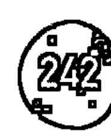

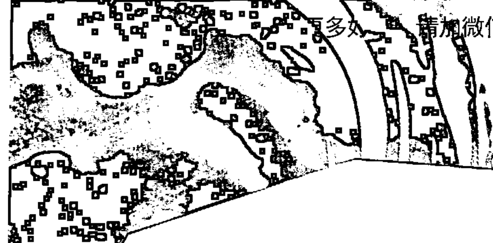

# 第 29 基因天命
## 躍進空白

悉地：奉獻
天賦：承諾
陰影：半顆心

編程夥伴：第 30 基因天命
密碼子環：同盟之環（4，7，29，59）
生理學對應位置：薦骨神經叢
胺基酸：纈胺酸

## 第 29 陰影——半顆心

### 活半的生命

第 29 半顆心的陰影與其編程合作夥伴第 30 慾望陰影相結合，形造了任何兩個陰影配對中最大的情感混亂。這是人類恆久而深遠的遺傳基因程序。不管怎樣，它關係到對人類慾望中的基本，缺乏信任。慾望，我們可以從第 30 陰影以及它光亮的天賦學習到，服務於一般更大的目的，而不僅僅是創造情感混亂。完全擁抱慾望總是會帶來有益的結果。畢竟，我們內在是純粹的生命能量。慾望的問題就是透過第 29 陰影及其驅動力而浮現。從本質上講，這個陰影關於兩件事，最終來自於同一個根源——過度承諾和缺乏承諾。

所有承諾的秘密在於你開始的方式。你的行動背後的力量是創造你的未來而不是行動本身。除非有絕對的承諾，否則沒有什麼值得做的事情。無論你喜歡還是討厭它，如果你半途而廢，你也不會嘗試。沒有承諾，行動缺乏動力或方向，亦缺乏運氣。在此最後一個評論可能聽起來很奇怪，但是存於宇宙的法則中，任何完全承諾的事情都會在其中帶來幸運的種子。同樣，沒有充分承諾的任何事情都會帶來不幸的種子。所有的生命都有個連貫性，你所採取的每一個行動都會帶領你走向下一條道路。也應該說，這個承諾的宇宙法則背後沒有任何道德。它只是表示邀請你相信生命。

半顆心會剝奪你的機會參與生命的靈性。它延緩了生活的自然流動，傾向相信魔法和向下沉。這個陰影讓你成為命運的受害者，而不是在偉大的戲劇中扮演一個角色。它讓你處於邊緣，確保你在生活中扮演沉重和單調的角色，或者充滿情感的痛苦。簡而言之，當你帶著半顆心的時候，你會把苦難融入你的生活中。這第 29 基因天命是關於人的感受。關於性與聯繫、敗與成功、慾望與期待。無論你是誰，你的生活都取決於你遵守這個基因天命的規律。當你半途而廢時，你實際上是展現不誠實行為。你可能不是與對別人不誠實，而是你對自己與生活不誠實的，這總是帶來不愉快的結果。

第 29 陰影是喚醒所有人的警號。聽到訊息的清晰程度取決於你有多麼地沉睡著。承諾會在一個週期內運行，並且在循環中結束，不管它自動更新，或者繼續執行其他運作。這些循環可以有許多不同的長度。細胞更新的週期長達七年，源於身體內所有可再生細胞取替舊細胞所需要的時間。因此，在一段時間內的真正承諾將持續七年以上。慾望週期可以維持較短的時間，但每個都有自己的內置時間機制。人類必須經由自己的慾望循環，直至達到自然的完成。不幸的是，沒有簡單的方法可以知道什麼事情會結束。你必須保持承諾，直到戲劇自己結束為止。如果你過早脫離了一般循環，你的生命將重新建立相同的體驗模式，直到你真的完成週期並學習為你帶來的教訓。

大多數人類重複出現第 29 陰影模式，因為他們不遵循自然的結束。真正的承諾包括消除障礙和逆境的能量。半顆心的是放棄的第一個煩惱或不適的跡象，最終所有的半顆心都深深地束縛在不被擁抱的恐懼之中。來自第 29 陰影的教訓真的很簡單。如果你過早退出，你將會保留在同一個舊有循環中，但是如果你經歷到底，你將會在幸運和你的成就方面做出巨大的躍進。你需要看到這個陰影如同所有的陰影一樣，長遠來說有個有益的目的。當你回顧這些事情，它教會你經驗的價值。如果你回頭看看在你生活裡重複同樣的舊有情緒創傷，你最終將會學到你正在做什麼，而不是在造成這些模式。

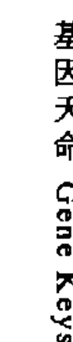

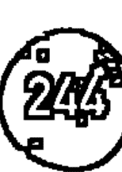

古時的中國人對這個第 29 基因天命或卦起了一個奇妙而稍微令人不安的名字。他們稱之為「坎卦」，被認為是預測生命之路是危險的主要標誌之一。這正是第 29 陰影所作的——它會讓你陷入非常具有挑戰性的環境中，你的承諾將被測試。一旦你在生活中展開一條道路，你就是無頭蒼蠅。你只能靠承諾的力量帶你通過「險境」。隨著半顆心，你一直在疑慮這條路將帶給你的種種，以及你是否做出了正確決定。你內心深處的恐懼可能破壞你的承諾。如果你屈服了，就創造了不幸的制約。但是，如果你能懷疑你所懷疑的，特別是在那些關鍵的時刻，你會超越制約。

在這個第 29 陰影中存在的秘密，通常被視為成功的秘訣。人生的成功取決於兩件事——承諾和運氣。承諾實際上會帶來運氣。失敗意味著你仍然停留在同一個舊循環中，而且這個陰影與人際關係相比，它帶有更多意味。由於它與第 30 慾望的陰影配對，導致許多人類債券和聯盟的出現。正是通過這種耦合，許多混亂進入關係。所有慾望在清晰的週期內運行，並且必須得到尊重，即使它們沒有得到滿足。如果慾望被坦誠地擁抱，那麼它的週期將會很快顯現出來。它可能持續一天或一年，但循環永遠不會是錯誤的。這不是關於社會道德，而是生命的能量。在婚姻（無論是正式還是內在承認）中，承諾是內在的要求。如果對另一個人產生性慾的渴求，那麼它就表明了兩件事之中的一個——即婚姻接近承諾週期的尾聲，或者即將透過坦誠的合作關係來加強慾望的週期以及所需要的任何事情。第 29 陰影大多數是恐懼性慾，這通常表現為有罪或恥辱的行為。在這個意義上，半顆心意味著隱藏你的真實感受或者偷偷地跟隨他們。因此第 29 陰影可以導致生活中各種不幸的情緒和關係災難。

正如老人所言：「生活在恐懼中的生命是半活的生命。」對於這個第 29 陰影來說，這是一個很好的說法，可以為人類造成各種的情感創傷，特別是在關係和物質成功的領域裡。半活著意味著你永遠不會完全接受並相信你的決定。這個陰影使你不斷地擔心你的決定，而這些決定可能或不會引導你。失敗和成功的巨大幻想是，他們只是內在的態度以及你對自己的信任有關。要超越這個第 29 陰影的掌控，你將不得不放下所有這些想法，讓生命把你投入並通過未知的深淵。你自己和別人一定要堅持不懈，完全誠實。如果你可以堅持你的決定，並且遵循他們自然而有機性的結論，那麼會有很多的獎勵和成果等待著你。

第 29 基因天命 躍進空白

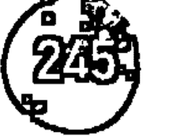

### 壓抑天性——過分承諾

這些人不僅要做出承諾，而且不管發生什麼事情都要維持。換句話說，這些人在自然週期結束時不能或不願去識辨。這樣的性質遠超於能夠處理的能力，然後逐漸被其承諾的程度所耗盡。這些人常常成為別人的犧牲品，或者成為大型組織的奴隸。由於他們恐懼的性質，他們沒有勇氣承認需要結束的事情，他們繼續允許他人有意或無意地濫用他們。

### 反動天性——不可靠

當第 29 陰影經由反動天性展現時，它隱藏著對於他人認為缺乏可靠性帶有深深的恐懼。當一個人沒有真正承諾的時候，很少人會在行動或循環中帶著自信與才幹。通常的結果是中斷了循環，並導致失望和失敗感或恥辱感。這些對各種事物可以說「好」的性質，接著透過撤銷承諾來應對壓力。其性質內在的憤怒通常是由別人對他們的期望引起的，因此他們傾向於談論事情，而沒有履行承諾的能力。

## 第 29 天賦——承諾

### 幸運的事業

隨著你的頻率變得越來越清晰，你的決策過程自然也變得越來越簡單。第 29 天賦不受其他人的節約和期望的壓力，但與內在生命力的方向有著深刻的聯繫。這份天賦天生有適應生命循環的流動。擁有第 29 天賦的人們已經擺脫了生活的尷尬，通過這份天賦，他們可以用強大和靈性的方式看待自己的生活。沒有第 29 天賦及其做出明確承諾的能力，生活就會變得窒息和困惑，無論在情感和性別層面上，這種真理都不是真實的。

承諾類似於信任，這是不可強迫和意願的力量。它像一條大的河流從你的內心深處滲出流入你的行動裡。有了承諾，你無需考慮未來或目標，因為承諾包括了其中的目標種子。只有時間會顯現每個循環經驗的流動將會在哪裡。因此，對於第 29 天賦，目標不是什麼重要的。真正重要的是承諾繼續追隨的旅程直至結束。生活在週期內進行循環——一些旅程持續 5 分鐘而有些持續一生。最終的旅程是你的整個生命，你的生活形式是由你生命中數以百萬計的小小的決定所組成。以這種深度的承諾層級來生活，意味著以同樣的承諾作出每一個決定——從你做愛的方式到洗碗的方式！

作為一個被稱為同盟之環的基因家族組成部分，第 29 天賦予第 4，第 7 和第 59 個基因天命共享同一個主題。這個密碼子環指目前正在 DNA 中發生的大量自發性突變，直接導致與人類相關的方面出現巨大變化，特別是透過我們的性慾和性別。這些遺傳基因變化大部分的動力是源自第 59 基因天命及其編程夥伴第 55 基因天命。人類性行為的運作即將發生變化，這意味著目前世界對道德的價值及其年齡制度如婚姻，感到深深的困惑。透過第 29 天賦，我們可以體驗到一個新的承諾定義，這與社會期望和生活中的一切都是一樣的。唯一真正的承諾是在當下（第七天賦）承諾你自己的內在指導。這個指導基於你臣服你內在的生命力而找到，這涉及對生命的自然承諾週期的信任。這種信任正在進入今天的世界，正因為如此，它正在摧毀我們所有虛假的道德。

真正的承諾是一種充滿活力的動力，而不是社會的要求。許多人透過道德來看待承諾。你特別看到在人際關係中，承諾一般由社會壓力來執行。例如，如果婚姻關係破裂或婚姻以離婚結束，那麼往往被認為是失敗。真正的承諾不是道德。它持續只是持續。當週期結束時，雙方將同時感受到結束這一點。任何人展開一段關係都知道關聯到承諾這事實。以這種清晰的承諾開始的關係通常以明確的方式結束，否則通常會情緒動盪與分手。一些關係的承諾週期真的持續了一個晚上，而有些人永遠持續下去。循環的長度與成敗無關。在第 29 天賦的頻率層級，所有關係都是你生活中不斷變化的故事情節的一部分，因此，他們領會到生活中增加的豐富度和深度，而不是從失敗或成功的角度來看待。

擁有第 29 天賦的人們，在他們的悲觀情況下可能是非常幸運的人。他們明確的決心為自己創造幸運的條件。這些人不能由別人領導——他們不能聽從老師、大師、神話或系統。他們也不會屈服於別人的壓力或期望。他們的決定從根深的腹部滲出並不具爭議。隨著第 29 天賦，一個明確的決定被認為是一份安靜和強大的溫暖，議程貫穿整個人生。這些都不是情感決定，也不是激動的，緊張的或爆炸性的。承諾是一種健康的能量，好像大自然本身正在控制著你的命運，向你展示未來的道路。在這個階段，你開始明白，承諾也是投降。而不是花費巨大的努力來維護你的承諾，你只需臣服自己。有時，如果你覺得缺乏承諾，那是因為你需要更深入地投入你的過程。

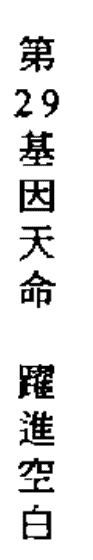

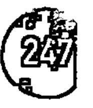

無論第29基因天命是否作為你基因圖譜的一部分，運氣都不是因此擁有，而是在生活中每當作出明確的決定而來。這尤其在業務中可見。像生命的縮影，一個業務是一場起起伏伏的旅程。繁榮與你的關係和日常工作中的明確承諾直接相關。在業務中有許多週期開始，結束並重新開始。財務上的成功無法透過週期來衡量，而是透過決策的持續承諾和確定性來衡量。例如，有時候，當你堅持著似乎不成功的方向時，它就開始成為後來成功的機會。你不能想像你的生活方式。你只能真正地對準你的內在方向，相信它的可能性，並讓自然靠著。這是第29天賦純粹的魔法。

## 第29悉地——奉獻

### 密宗傳播

當承諾的天賦具有普遍性的功能，它開始轉化為奉獻的悉地。在這種意識之中，出現了東方所知道的一切偉大的道路，如奉愛瑜伽。奉愛瑜伽指的是奉獻的道路，或心的路徑。奉獻的路徑都是自我臣服的道路，在這路徑上，你完全失去了自己的自我感觀。另一種可以是一個使命，就像德蘭修女對窮人的奉獻，或者可以是另一個理想或象徵，如神或者上師。奉獻的道路遠離社會。奉獻是承諾消除憤怒。在這個意義上，你必須遠離你心智瘋狂的秩序而進入你內心的狂野。

在天賦層面，承諾仍然具有自私的痕跡，即使它臣服了並具有強大的力量。然而，透過第29基因天命，頻率越是提升，你會發現你對其他人承諾的服務越多。隨著頻率越來越高，你的承諾就具有奉獻精神，開始啟動心臟中心。在這個過程的某個階段，你不得不成為一個更高的目標或存在的奉獻者，但這仍然是個過程。隨著愛的能量湧入服務，它要求你臣服於你的身分，交予看起來像一個外在的人或者象徵。對於那些不了解心的真實事物的人來說，這種奉獻精神似乎是誤導的。接近這個悉地的人們，似乎可以崇拜大師或偶像，而不用照顧自己。然而，對於奉獻者來說，唯一存在的就是他們奉獻的對象。如果奉獻的能量是朝向上帝，那麼上帝就會看到無處不在的東西。如果它是一個任務，那麼這個使命在你的生命中是重要的，而其他一切都必須轉向單一點的方向。

當從第 29 天賦進入第 29 悉地的巨大躍進出現時，發生了一件非凡的事情。所有被投入到奉獻對象中的愛突然開始從自己宇宙中的一切傾倒回去摯愛的物品。在這一點上，表現出悉地的人經常指的一切，包括自己，如同心愛的人。因此，這樣的人說，岩石和樹木都是滲出他們的愛去被愛著。無論這些人去哪裡，他們的心從遭遇到的一切人事中不斷瓦解。這些人常常成為詩人或神聖的醉酒者或其他人的服務者。這個悉地的程序夥伴是第 30 狂喜的悉地，這兩個字——奉獻和狂喜——是不可分割的。這些人真的被愛所捕獲。這些人的光環很柔和，幾乎可以吸引任何人作為奉獻者。當在肉體上達到這個頻率時，幾乎不能不這樣說。

關於這個悉地的另一個方面，事實上，這個悉地的一個部分誕生是來自密宗的道路。譚崔大概指的是將性或具一定密度的頻率能量轉變成神聖的能量。即使在第 29 基因天命的天賦層級，你也開始進入譚崔之流①。當你允許承諾的能量在世界上運行時，你開始意識到與身體分開的能量正在通過你。這種高頻能量實際上是從你的身體，特別是從被稱為佛身的第五個身體移動到你的身體。頻率變得越來越精細，越能感受到你的能量或活力。在這些更高的層次上，人們常常對諸如瑜伽等實踐感興趣，這可以幫助你更加敏銳地體驗這些身體內的生命。當生命的流動開始穿過胸部和心房時，奉獻的能量被啟動。這是譚崔的本質——自發性地臣服你的演進。

這個第 29 悉地仍然深深地沉浸在人際關係中。在許多密宗的做法中，奉獻者視覺化他或她與神聖的伴侶進行性行為，或者他或她通過與另一個人的持續的愛交流而體驗身體內的轉變。作為與瑜伽相反的路徑，它是以紀律為基礎的，譚崔是讓生命無處不在地為你帶來你所想的。這樣的道路受到社會中大量的道德判斷，因為它們基本上是不道德的，並且基於這個基因天命固有的性能量性質，禁忌常常被打破。但是，如果這樣的路徑是絕對忠誠的，他們最終會將意識提升到其奉獻的方面。你可能記得，中國古人把這個原型稱為「坎」。潛入險境並不比從你心裡完全活出有更大的象徵性。

奉獻的道路是觸摸神的最簡單的方法之一，也是為什麼你在許多偉大的宗教中能找到它。這裡是基於神聖關係的概念，其方法是崇拜和禱告。崇拜有一定的安全性，因為一直有崇拜者和崇拜對象。然而，在天賦的領域和悉地的境界之間存有巨大的險境。正是這險境才能結束崇拜。奉獻者的巨大挑戰是讓他或她自己被摧毀，並選擇大躍進於完全的體現。當奉獻者穿越險境時，他或她永遠不會出現在另一邊。只有神聖會留下。這是一位這樣人說話的窘境——一旦這樣的人說話，聽起來總好像是上帝，而不是上帝的謙卑敬拜者。這是大多數宗教結束的地方。一旦第 29 悉地誕生，所有的生命都被視為虔誠的，所以沒有任何意義的禱告了。既然你是神聖的體現，你現在為什麼要禱告？

第 29 奉獻的悉地是一個絕對具傳染性的悉地。無論在哪裡，它都激發了別人的奉獻精神。這種電力，近乎是性慾的氛圍在世界上出現時會產生相當大的波動。這些是不關心道德或禁忌的大師。他們只對一件事感興趣——臣服於心。當它第一次進入你時，這個第 29 悉地像是一個混亂的能量，沒有結構或節奏。隨著你深度的奉獻調整你內在心的有機性，它不知道規律，並採取自己的奇怪的方式扭曲和轉向。對外人來說似乎是混亂，實際上是一種深深的野性狀態，諧和超越「正常」的現實界限並完全融化了。這就是悉地對生命說「對」——它絕對是任何東西，或任何前來的人。第29悉地的信息正是這點——相信你的心超越一切，永遠不要擔心後果。要專心於永遠躺在神聖的身旁。

> ① 編註：譚崔是由中印度地區開始盛行的一種神秘主義運動，出現在西元五世紀之後。是讓你從依賴中獨立、自由出來，創造兩個人的生命能量。

# 第30基因天命
## 天空之火

悉地：狂喜
天赋：轻盈
阴影：欲望

编程伙伴：第29基因天命
密码子环：纯化之环（13，30）
生理学对应位置：太阳神经丛／消化
胺基酸：麸醯胺酸

## 第30阴影——欲望

### 本质的最大弊病

在DNA分子矩阵深处蕴藏着建立人类文明的重要代码。这是人类欲望的第30阴影。通常我们想到欲望时，首先会想到性欲，这只是欲望的一个方向。要了解这个第30阴影，我们必须把欲望放在其本质上，这意味着将投射到世界中的欲望之力量分离出来。作为纯粹的现象，欲望只是遗传基因的渴求。它与我们身体的膳食需求有紧密的联系，但是对于我们个人的生存，单单的欲望并不具掌控力。遗传基因的这个方面根本不影响个性。除此之外，欲望比起保护我们更有可能让我们死亡。然而，当在集体遗传基因层级上观察，欲望的确具有更广阔的目的。

欲望的真正目的是让人类犯错，使我们能够演进。让我们澄清一下这个声明——欲望不服务于个人，但它却在集体层面上，却教我们有价值的东西。来自这个第30阴影的真正飢渴是對經驗本身的渴求。為了讓人類掌握自己的環境，他們必須品嚐各個方面，這意味著他們也必須探索陰暗面的經驗使它發光發亮。個人甚至大眾在這個過程中被摧毀，透過整個人類基因庫覺察其運作實非重要的事。人類對於集體而言是可有可無的——甚至整個種族都是可有可無的——但人類本身不是可有可無的。我們通過第 30 基因天命進行編程，透過經驗學習和發展，因此沒有什麼可以避免的經歷。如果還有東西沒有被人嘗試過，那麼在某個地方，在某個人身上，第 30 陰影的飢渴就會推動他們去嘗試——無論是多麼荒謬或可能是墮落的也好。

為了讓意識進入到形式裡，它必須沉浸在形式之中。在人類身上，意識是一個非常強大和敏感的覺知系統——覺知只是被蓋亞（地球）自身的靈魂掩蓋了，人類本質上是一個感官器官。這裡有一些非常深入的東西需要理解——引導人類遺傳基因的指導不是來自作為一個獨立的整體，儘管它對我們來說是一種看法。我們只是具有自己的遺傳基因要素，是其更廣泛的生物體中的一部分，而且作為我們感官背後的驅動力，會渴望成為人類進化的一個組成部分。人類的運作就像大自然的大腦一樣伴隨著慾望，帶來開啟大腦內各種神經網路的力量。一些神經連接出現短路，而其他神經連接使我們意識到巨大的躍進。必須嘗試和測試所有可能的連結，以便發現哪些連接對於整體而言會產生最大的服務效益。

人類大部分的經驗實際上對我們的未來至關重要，但還有待探索。作為一種被稱為純化之環結合性的一部分，這個第 30 基因天命自然地與第 13 基因天命結合，其陰影頻率創造了一個強烈缺乏共識與悲觀的能量場。因此，人類被設計成要透過巨大的進化循環而逐漸地被精煉純化。這種精煉只能透過陰影頻率進行，因為這樣才可以提供更高意識狀態的原料。這個令人難以置信的遺傳基因過程，大部分的結果都出現在人類的情感層面上，有時也被稱為「星光層」。

星光層是由人類所有慾望和感覺的總和所產生微妙的電磁頻域。在星光體層面的較低頻段，整體色調缺乏共識——第 13 陰影。缺乏共識是一種集體頻率，由於人類無法表達他們所認為的個人慾望。在更高層級的星光層中，人類的慾望和情感開始向內以及向上尋求自己的來源，通過漸進的精煉，以最純粹的形式進行活動——呈現出欣喜若狂的狀態。

當以這種宏觀的方式看待時，大自然似乎好像已經暗示了人類——好像我們已經成為進化本身的實驗對象一樣。這是正確的情況——即使慾望本身是純粹自然的衝動，但它往往會驅使人類瘋狂！在東方佛教思想中，據說慾望是所有人類苦難的根源。事實上，這不是自己的慾望，而是你對這種痛苦的反應。在每一個人心裡，慾望的力量以不同的方式呈現，並以獨特的方式投射到世界上。因此，有些人透過他們的性行為來體驗，其他人則是透過渴求他們的富足、出名、在愛裡或者靈性上的啟迪。關鍵在於慾望本身是純粹的。它不是為了什麼。人類本應只是創造物，單純的去感覺一份渴求。而第 30 陰影的慾望是情感上會驅使你的頭腦嘗試找到一種逃避渴望的方式，或者至少以某種方式來排除它。然而，隨著每個人的學習，慾望的循環是不息的。在你飢餓的狀態，你再次發現自己的空虛感，就像渴望開始一個新的循環一樣。

在中國易經裡原本解釋第 30 卦①其字面意思是「親近智慧」。這是第 30 基因天命奇妙的名字。它燃起你的渴望或慾望，儘管嘗試實現這種慾望，但它仍然持續依附著你。它不斷地驅使你進入經驗的世界，這當然是它真正的意圖。無論我們做什麼，本質的弊病是我們人類無法逃避慾望的火焰。我們必須接受並擁抱它猶如死亡的一部分。此外，你越將慾望視為「非靈性」，你所持的慾望就越強大。許多偉大的宗教和靈性傳統已經被巨大的弊病所吸引——讓我們相信，慾望可以以某種方式被超越或打敗。戰勝進化的力量像慾望一樣強大，都是造成人類如此痛苦的原因。異常諷刺的是，渴望成為與上帝一樣的人和渴望殺死你的敵人的慾望是一樣。兩者意義上都是通往地獄②。

伴隨與其編程夥伴第 29 半顆心的陰影，慾望的陰影使我們的世界深深陷入潛意識的悲觀中。每個人內心深處的某個地方，有個非常不舒服的真理存在——你永遠不能超越慾望。我們否認這個真相正是導致我們總是心不在焉。我們不能完全縱容我們的慾望，因為它太可怕了。那些外在縱容慾望的人通常會損壞自己，而那些堅忍下來的人也會在內在摧毀自己。似乎擁有這些慾望的人，有的被淹沒也有的被打敗。無論我們做什麼，我們都像被困住在迷宮裡的老鼠一樣。即使是最深奧複雜的傳統，也承諾我們會超越慾望，但接著警告我們，要超越慾望先要避免這種狀態。這到底是怎樣的信息？如果慾望本身阻止我們超越慾望的發展，那麼陷入這樣一個悖論的種族其未來是什麼？跟以前一樣，答案在於第 30 基因天命的較高頻率之內。

> ① 易經第 30 卦實解「離為火」，意指創造美好人生，但單看英文 Clinging 解釋為依附、貼近，火表現為智慧、明亮、溫暖，特性愛現，依賴自己努力，他人助力較少。
> ② 因為成為上帝在宗教教義層面是自大狂妄的和行惡是一樣壞。

### 压抑天性——过度认真

当欲望被压抑时，生命力也被压抑，这导致了整个人的身体，情感和心理僵化。我们开始非常认真地生活。正如我们所看到的，欲望相当于火花和热情。当我们不允许内心燃烧时，火焰就会熄灭。许多人以这种方式处理他们的欲望，特别是在压抑的和社会和宗教方面。过度认真的表现是透过宗教，几乎都是强加于我们自然欲望之上的道德规律。人们甚至可以说，大多数人类文明拥有被压抑的欲望，变得过度认真。这是我们整个现代世界的标志。在第 30 阴影中的极大恐惧是，恐惧我们的感觉被燃烧掉，这是在集体层面被压制的集体恐惧。在集体层面释放的真实感觉可能会导致无政府状态——这就是第 30 阴影这个方面的恐惧。

### 反动天性——轻率

世界上没有对于纵容欲望而毫不关心的人，总是愿意冒着被社会排斥的风险。他们不能赞同任何的道德框架以及憎恶一切形式的宗教或强加的控制。接着他们变得轻率对待生命，作为对该社会的反应。结果是，他们经常被世界的投射所淹没，并且透过嘲笑来放弃自己面对未来的欲望。正如压抑天性想通过控制来终止欲望一样，反动天性想透过耗尽来终止欲望。这样做的结果是，他们燃尽自己，而且往往在生命的早期已经这样做。通过完全表露你所有的欲望，实际上成为欲望的受害者。这种轻率类似于异教徒，宗教组织的极端。正是压抑的另一个反应。

## 第 30 天赋——轻盈

### 最后的欲望

人类对于悖论的反应有两种可能——要么你变得紧张，要么臣服。头脑伴随着悖论有着很大的困难，因为它不是为了处理它们而建构的。它只能透过逻辑来解决事情。更高的心智，类似于你的大脑和身体之外的意识，喜欢悖论，因为它知道他们代表真理。当你作为一个正常人臣服于无助时，那么就会出现了一些显著的事情——你的整个生命频率就会发生变化。你开始放轻松。人类头脑对于生活是极其认真的，因为它想要理解和控制生活。然而，第 30 天赋对于人类来说是在一个新的频段运作，它实际上涉及内在臣服，而且是不能强迫或是虚假的。

当我们谈论第 30 天赋「轻盈」的时候，我们不是说要透过照亮生活来逃避生命。相反，我们谈论的正是进一步深入生命中前所未有的痛苦。我们正在谈论一种自杀，倾向简单地握着手而且对造物主说：「好了，我投降，做最坏的！」实际上自杀是对生命的不信任，或者某些传统标示的自我。你必须深入认清自己的死亡和脆弱，才能实现真正在于信任的力量。生命透过你演绎自己的游戏，而你只是在那场游戏中的一个基因棋子。你十分无奈。这不是在受害者的感觉上变得无奈，而是意识到你不需要帮助。然后神奇的事情发生了——你发现你可以进入那种引导整个游戏意识扩张的状态。这使你可以获得更高的功能层级，你也意识到这一切都是你的不信任，使你的生活看起来如此困窘。

轻盈的天赋不会改变你的命运。它只是允许你从不同的意识层级来看它。然而，这种更高的认知能力的转变总是意味着你生命中的脚本改变了。这是一个突破的出现，或者用一个更好地描述——称为崩溃。所有的生命都遵循一则灵性的剧本或故事线，只有当你逃离成为受害者感觉时，你才能从这扩展的意识中看到你的生命。可笑的是，当你看到生命必须是这样走向时，你也可以在整个脚本中看到你的位置，并且立即感觉到你在这里。不仅如此，即使你的身体继续受苦，你的整个存在却是轻盈的。然后，在你所有的行动中都会找到这种轻盈的路径。无论你做什么，只要来自轻盈的天赋，你的眼睛总是闪闪发光的，因为在深层的层级上，你知道这只是一个游戏，任何人都可以做最糟糕的事情，它都得认真对待。假装轻松生活的人与真正的轻盈之间有很大的区别。这种差异总是在情感本质上找到——一个伪装者是恐惧自己真实感觉的人，而一个真正轻松的人永远不会恐惧被情感淹没。

轻盈的天赋不会使你免于欲望，但也不会导致你对欲望作出反应。它允许你在所有的欲望谜团里成为你的欲望。这是一份礼物，知道不一定要遵循的欲望，但他们必须被感受到。有时，他们必须遵循一些事情才能学习，但是通常这份天赋知道欲望的实现是假的。当人类意识深入到这种深度的情感体系时，就会出现强大的自由感。这是广阔视野的自由。你知道，无论你是否遵循欲望，都不会带来任何持久的平和感。这意味着欲望不再像上瘾症那掩盖你。事实上，欲望成为你邀请而来的茶客；他们要么在一段时间里自行离开，要么留下来并持续下去。在这种意义上，真正的轻盈可以看作是放下要逃避欲望本身的需求。

轻盈的天赋另一个重要标志是幽默感。一切都以分离的方式观看，尽管它仍然可以深深的和感官性地感受到，还是可以被轻松看待。来自这个天赋的幽默不是一种聪明或嘲笑的幽默感，也不是针对在另一个人身上。它总是表现为嘲笑一切高于自己的能力。你让自己的生活成为一齣伟大的悲喜剧，因为它融合双方经验的频谱。你学会看透所有的人类行为。你们看到深深的痛苦在于错误的信念，即是你的欲望可以被实现，以及来自建立和释放你的欲望的极大乐趣。透过第 30 天赋而来的幽默是一份非常具有同情感的幽默——这不是在取笑什么——只是一个人对更高的自己臣服作出的真正回应。

当你进入第 30 基因天命的较高频率时，你终于开始了解欲望循环的奥秘。透过你的情感系统，每天在成千上万的欲望之下，你开始确定单一个潜在欲望逐渐变得越来越强大——这是结束自己痛苦的欲望。渴望结束自己的苦难，以及引领所有人在灵性和内在探究的道路上是同样的欲望。这份逃离或扬升或渴望自由的欲望，是人类最终的伟大愿望。这是进化本身渴望超越形式的冲动。当你完全进入这个纯粹欲望的领域时，你进入清晰的意识之火。这个密码子组——纯化之环，带你进入一个旅程，你整个人开始放弃欲望的束缚。你将不得不默认你渴望去超越，即使你明白，这个欲望本身就阻止你超越。最终必须遵循，追随、拥抱和接受这个欲望，而因此，你渴望的火焰会变得猛烈。这是第 30 天赋携带着轻盈的另一个意义——你的身体开始充满光，因为你较下层的载体和精微体被你渴望的力量所纯化。

## 第 30 悉地——狂喜

由宗教虔诚（奉爱）到女性创造力（力量）

第 30 悉地是一个不寻常的悉地，它表现为一种伟大而神圣的狂喜状态，它与其编程伙伴，第 29 悉地，是我们遗传基因方面真正使大多数人恐惧的面向。特别是在我们的西方文化中，这些欣喜若狂的状态深深地不被信任，因为我们不再有这样的文化气息。随之而来的是引申出可以进入这些意识状态的古老巫师。现今，最接近这种状态的是要透过新兴的药物和舞蹈文化。我们所成长的环境存在一种我们根本无法理解的奉献文化。某些宗教如伊斯兰教，根植于这些奉献准则中，而且很容易辨识到这些宗教，他们本身也可以轻易地误解其教义——自杀式轰炸的当代邪教，显然是植根于第 30 阴影的较低频率里。

第 30 和第 29 悉地代表你 DNA 中的原型之流，引致内分泌系统出现强烈的突变。这导致松果体在大脑反应中持续产生某些稀有的激素，从而引发了强烈奉献和神圣狂喜的状态。只有当你热衷于踏上这毁灭之火的时候，才会出现第 30 狂喜的悉地。我们或许记得，易经第 30 卦为「亲近智慧」。在悉地层级，你完全溶解在火（智慧）之中。一切关于这个第 30 悉地的事情，对于日常醒过来的意识而言是疯狂的。它涉及灵性自杀——完全沉浸于神圣的渴望之中。你终于放弃了一切，甚至超越的欲望。所有的欲望融入了一个原始欲望——没有目标的欲望——所有创造的本质和对生命力本身的核心的纯粹渴望。这里有个谜刻画在我们的英语中，并被归纳在「属于」一词里。当我们能够完全「成为我们的渴望」，我们才能真正属于世界。

神圣狂喜的状态就像被幸福之火一次又一次地燃烧着一样。这些人是如此容易被点燃，微小的东西都会燃起他们，任谁靠近都很有可能捕捉到他们奉献的力量。这个第 30 悉地位于突变的太阳神经系统的本质，是透过光环携带着身体以外的意识。因此，第 30 悉地创造了奉献者，即其编程伙伴——第 29 奉献的悉地。这两个悉地透过欣喜若狂的形态形成场域散放他们的能量和力量。这就是为什么某些导师和大师可以确实地永远转化奉献者的心。这样一个存在的光环是显而易见的，亦是危险的。对于不能理解这种现象的人类心智而言是危险的，而且不会试图放弃被控制。这个第 30 悉地的命脉是关于解除进入到神圣频率的根本混乱。

这些悉地在世界上并不是一个普遍的现象。尽管它们出现，仍然经常被误解。如果发生在西方，他们很可能会被严律镇静和被紧扣起来。在印度，神圣的狂喜和疯子在传统上获得到同样的待遇，都受到尊敬，因为两者之间有细微差别。这个悉地和第 29 悉地早期的表现也可能导致人体出现各式各样的状况，因为我们还没有演变为能充分发挥这些极高的情绪频率。在这方面，第 30 悉地在第 55 基因天命所描述的人类太阳神经系统的进化中起着特殊的作用。第 30 悉地的作用，在字面上看是消除了我们所有人类来自 DNA 的欲望。这意味着实现这个悉地的人真的是代表了集体去执行重要的遗传基因任务。他们故意让载体出现短路还消除我们过去的集体欲望，与这个角色相伴的人会体验到神圣的狂喜！

在第 22 基因天命中，详细描述了人类光环的七个微妙的神圣体。通过第 30 基因天命提升的过程直接反应了第二个星光体的精炼，以及其同化作用到较高的佛身（第五个神圣体）。这正是人类对第 30 基因天命的渴望，创造了足够的「奉爱（Bhakti）」来催化更高自我内在的更高的恩典。「奉爱（Bhakti）」是从人类渴望的精炼过程中升起的微妙的流动性呈现。这是一种表现，进入了佛身，启动了相同作用的「力量（Shakti）」。女性创造力的力量（Shakti）是在启动时下调或下降，并带来狂喜状态的神圣本质。这正是第 30 悉地奉爱和力量互相交替的特征。表现奉爱的神圣欲望是一种进化的力量，而神圣的恩典则代表力量是革命的动力。

在未来的人类基因载体中，这个第 30 悉地将不复存在，还故意销毁自己。在这个意义上，它将变得多余。神圣狂喜的经验是人类演进议程中异常的遗传基因。它只有个目的——消除欲望，以便一个新的意识可以降临。有意思的是，第 29 奉献的悉地不会与第 30 悉地拥有相同实相，而是继续建构人际关系的基础，从而形成整个社群。与此同时，所有与这第 30 基因天命有密切关系的人，都将在生活中经历一定程度燃烧生命的过程。我们可以很容易地看到那些在低频下的人透过奉献和狂喜，继而被转化成外在破坏和疯狂奉献。然而，你的频率越高，你必须越臣服神圣之流，等待生命燃点，让你进入更高的意识状态。

# 第31基因天命
## 圍繞你的真相

- 悉地：謙遜
- 天賦：領導
- 陰影：傲慢
- 編程夥伴：第 41 基因天命
- 密碼子環：不反饋之環（31，62）
- 生理學對應位置：咽喉／甲狀腺
- 胺基酸：酪胺酸

## 第 31 陰影——傲慢

文字的全球資訊網路
這個第 31 陰影以及其各種頻段會顛倒一些人類基本的觀念。你可能會注意到，這些頻段隨著所有人類的演進，從傲慢的狀態轉變為謙遜的狀態。你有可能跟其他人一樣受制約，以某種方式去想像傲慢和謙遜。一般的情況，傲慢是種消極的特質，謙遜是積極的特質。由於第 31 天賦直接涉及領導力和影響力，所以我們將不得不探索這兩個詞的真正定義，因為第 31 領導的天賦，就像蹺蹺板兩端之間的中間支點一樣。

作為不反饋之環的二元遺傳基因密碼子的面向，第 31 基因天命與第 62 基因天命結合——它們在體內的胺基酸編碼都稱為酪胺酸。當我們進一步探索時，發現這對遺傳基因的組合非常有趣。第 62 陰影是才智的陰影，它涉及頭腦操縱語言的技能，以嘗試了解我們的環境。實際上，這個陰影很早就把你包圍在語言和文字的世界裡，如你所想，將頭腦的神經語言規畫投射到現實中。當你看著一棵樹，「樹」這個字不自覺地在你的腦海裡形成了，這就是第 62 陰影。第 31 陰影擴展這種認知的能力，超越了純粹的神經規畫實現的建立——它運用這項技巧來控制和操縱他人。我們說得好聽一點的是領導。由於這兩個陰影之間的反應連結，被預先編程的人類會跟隨那些能夠自由操縱語言，事實和文字的人。

在領導方面，我們人類與動物的運作方式截然不同。動物選擇他們的領導者，本能地是基於具有「α（阿爾法）基因」的動物，標示著它是領導者。在人類中，「阿爾法（alpha）基因」存在於那些能透過語言操縱自如別人的人之中。這些人也許沒有強大的道德品格——但無關緊要。重要的是，在這裡，語言是人類領導層面所體現的媒介。此外，因為語言是頻率，是可以傳達的工具，在更高的頻率上，它永遠不存在謊言。然而，在陰影頻率下，語言是最終的編程工具，舉一個例子，例如「盲目地」將一個種族視為真相，如此是將它固定在一種特定水平的頻率上。

如果我們將這種語言概念作為編程工具推而廣之，那麼我們可以說，是它操縱我們而不是我們運用語言。領導和權威之間有很大的區別。權威，是第 21 基因天命的天賦，是基於堅毅的意志力操控的。這些人不會利用言語領導，但他們卻出色地掌控到別人的意志。但在第 31 陰影的情況下，言詞可以比存在有更深遠的影響，因為文字可以永久保留。幾千年前所講的概念仍然可以影響整個國家以及人們的內在實相。我們透過偉大的宗教最能看得清楚。值得深思的是，某一個人所說的一個錯誤或誤傳的文字，有可能會導致幾千年來數千萬的人死亡。這是第 31 陰影在運作中的威力。

為什麼第 31 陰影稱為傲慢的陰影呢？而且是以言語操控人類而不是其他方面呢？原因在於，它是集體的陰影，本身帶著傲慢的頻率。人的傲慢是根植於我們對獨立控制現實的信念！當我們來到天賦頻率時，我們將看到，真正的領導者，是那些懂得運用自己的智力編程和限制的人。在陰影頻率下，人們完全受到他們所在的社會裡的群眾編程以及其集體歷史、信仰和文化束縛。始終是語言創建的頻率模式，而非其他。我們的傲慢是基於我們的信念，那我們可以在思想，言語或行動脫離陰影頻率，實際上這些頻率是經由我們的智力創造出來的。

真正的傲慢來自於與我們的神聖來源斷絕。文字不是根植於根深蒂固的疑慮，而經常是某種程度上的傲慢。唯有人心才可以真正地為存在的奧秘帶來答案，而除非你的話語帶有愛的氣息，否則他們仍然在陰影的頻率中徘徊。在陰影頻率下，人們的思、言和行都好像與大自然分離，而不是作為它的一部分。自然掌控著人類，大自然發展了我們的智力，卻使我們陷入了頭腦虛假的現實，因為大自然希望我們在自己目前的階段演進。大自然甚至任由我們傲慢，在信念中，讓我們以為對大自然有一定的掌控力！

我們的頭腦深深地對個人的自由著迷，所以對我們來說，這些真相似乎很難發覺。正如我們將會看到的，真正的謙卑在於理解，而行為上沒有任何依據。只有當你逃避語言——你不再是自己頭腦觀念和文字的受害者時，你才能自由。終於，內心開始發聲，它不需要理解文字的意思就把它們組織起來。心的高頻傳達了真正的意義。不反饋之環所描述的是一種遠遠超出言語的意識狀態，儘管它可能利用文字來作交流。接著，傲慢是一種對文字和語言的成癮症，而不是隱藏在這些字詞之間和之後的意念頻率。

在我們周圍看到的摩登世界，只不過是頭腦以數十億的字詞所建構而成的。在陰影頻率下，我們被困在這個全球的資訊網路裡。事物本身可能是實在的，我們觸摸得到的，但現在我們知道它是短暫的存在。新聞頭條似乎是非常重要的，但他們在人類的演進史中只是一小部分。因此，第 31 陰影讓人類深陷自己的錯覺或「幻相」中，而我們看不到自己微弱的影響力。我們對新環境痴迷，還可能毫無根據地試圖緩減我們不可阻擋的進展。我們的傲慢堅持認為我們正在影響我們周遭的環境，而不自知環境與我們之間其實沒有任何區別。難道環境需要我們轉變它，好讓它可以轉化我們嗎？也許自然是要驅使我們走向自己的方向，因為她有一個我們還沒有瞥見想法吧？

每當有人不了解，他們所身處的生活是頭腦所虛構的，他們的演繹都是來自於第 31 陰影。瑪雅人只想透過我們的思想和言語來強化自己。確實很少人知道自己的話語是何等虛假的。第 31 陰影的編程夥伴是第 41 幻想的陰影，也許就是說著這一切。你認知的所有字詞，意見和想法，都是你不同的存在所產生的錯覺代表。

### 壓抑的天性——遵從

基本上有兩種形式的傲慢，壓抑的天性是虛偽的謙卑表現。這些人遵從著別人，故意把自己置於別人之下，非常在乎別人對他們的看法，而不像其他恐懼被認為是傲慢的人。諷刺的是，這種行為是為了要引起注意，即使它主張的是相反的情況。在許多方面，這些人比反應天性的人更傲慢。虛偽的謙卑被社會看成是一個非常重要以及高貴的榮譽，但這種謙卑只是為了隱藏恐懼。

### 反動的天性——鄙視

傲慢的反動面向是基於憤怒而不是恐懼，而且展露出不友好的蔑視模樣。這個「固有」的傲慢形象會把自己置身於別人以外，因為他們如此輕易地被制約而因此可以被操縱。這些人錯過的是，他們自己在相同的條件下更加偏執，因為他們有根深蒂固的認知需求。不幸的是，當你們承受不了他們不良對待，他們也會因為沒有受到大量的認可而不滿，所以對於被影響的人，他們仍然不屑一顧。這反過來又使他們更生氣和更不尊重人們。

## 第 31 天賦——領導

### 良心品牌

領導的天賦是一份有影響力的禮物，而不是作為一個領導者本身的固有傾向。64 種天賦矩陣中，真正領導者是在遺傳基因層面上，強烈地啟動第 7 引導天賦的人。第 31 天賦被稱為領導的天賦，因為這是集體對這個基因天命的投射。在這樣一個人的內在，很少或沒有意向成為一個領導者，甚至感覺都不像一個領導者。無論如何，這是很勉強地將這些人定義為領導者。正如我們所看到的那樣，群眾意識被編程要被帶領的，但不知道如何選擇領導者。很多時候，群眾意識選擇的領導人不是為了他們的政策或信仰，而是為了他們的風格。第 31 天賦知道所有的趨勢和模式，因為它具有對語言的內在理解和掌握。因此，這些人了解集體的開放性和需要，是要受到影響和被帶領的。

第 31 天賦予第 31 陰影之間的區別是，第 31 天賦不相信自己鼓吹的東西。這份天賦不再因為恐懼別人的想法而感到困擾，如果要在某個方向上影響人，這顯然是一個優勢。現代的這個術語是「輿論導向專家」。輿論導向專家扭轉事實的方式來迎合聽眾。在陰影頻率下，這一切都源於要獲得更多人的認同亦或擁有更多的掌控權或財富。在天賦水平，頻率之高已經讓人超越了領導者與受領導者或牧羊人與綿羊之間那緊密的共同依存關係。在這個水平上，你仍然在玩遊戲，但是為了不同的目的——現在，一旦你察覺了，你主要的影響力就是幫助別人擺脫同樣的泥沼。

第 31 天賦，像所有的天賦一樣，代表了超越智力和走進內心的一大步。只有心才會真正地感受到智力在陰影頻率上處於困窘的集體痛苦。因此，你自然地傾向幫助別人以某種方式逃脫痛苦。此外，由於第 31 天賦能理解群眾和陰影頻率的語言，所以很自然地運用這種天賦來幫助別人脫離共同依存的受害者模式和較低頻率的關係。第 31 天賦仍然是一個議程，但是這個議程是幫助人們擺脫狹窄的，自己神經化的狀況限制。沒有人明白狀況的細節很像第 31 天賦。我們卻看到第 62 精緻的天賦其反應與這個天賦相關，使得以這種頻率運作的人可以非常具體地編制文字和語言，對其他人進行調節。

因為第 31 天賦對人類集體模式的脈衝有深深的影響，對於許多人來說可能會有很大的影響。一個透過這份天賦表達自己的藝術家或作家，可以造出一份藝術作品，其影響力遠遠超過我們所知的。在我們摩登的世界裡，在某個段時間，我們可以看到某一本書籍或某一套電影，是如何對整個行星意識產生巨大的影響。在我們現代，全球文化豐富的交流中，第 31 天賦綻放出更多真實的潛力。某些運作第 31 天賦的人可以逐漸為集體發聲。在陰影頻率，他們成為我們恐懼的代表，而在天賦水平，它成為我們創造力的聲音以及未來演進的信使。與其編程夥伴第 41 期盼的天賦，第 31 天賦自然地對未來有雷同的期盼，以及在形式中始終展現出前尖的意識。

第 31 天賦是成立品牌的秘密。這些人本來就知道他們運用的媒介——無論是音樂，藝術，科學，文學，還是純粹人類的裸聲——都只是展現出超越言詞傳播的工具。藝術本身攜帶著其中的編碼頻率，但頻率遠遠超出言詞、顏色或音調本身。換句話說，所有的人演繹的是真正的訊息。如果你在正確的時間發布對的訊息，你將會得到巨大的迴響。這就是為什麼第 31 天賦是建立在預期的基石之上——它總是要意識到下一個進入世界的東西，為了做到這一點，它必須擺脫舊有的制約。心才能真正地將陰影頻率從天賦頻率裡分隔出來，而在目前的演進階段，心是最沸騰的頻率。如果你想在物質層面上看到真正成功的本質，那麼心就代表了今天的領尖。從心的層面來看，現在的成功已經達到一個新的定義。生命不再是關於個人的成功，而是作為集體生命的成功。這正是演進議程正在帶領人們的方向。

因此，從第 31 屆天賦中可以看到，一個新時代在人性化之前開放，而且是個人領導力下降的時代，而我們以前從未見過的事情也在發生——集體開始引領自己。這些頻率真正抓住集體的心臟正在以集體的聲音和表達方式來傳播，儘管它們是由個人傳播的。關鍵是那些個人很少或沒有自利。我們正在走向真正的非凡時代，只有那些準備進入心中的人才能夠繼承我們所有人的巨大利益。

## 第 31 悉地——謙遜

### 不反饋之環

如果你對第 31 天賦發生的事感到興奮，那麼當你進入第 31 悉地時，你可能會感到震驚！我們將看到：謙遜，不是為了怯懦的心。因而，謙遜這個詞具有很高的諷刺意味，它出自與一個被稱讚為聖潔或善良的人相關聯。這些諷刺基於誤解謙遜與行為有關，可它不是。那種謙遜通常是偽裝的傲慢。真正的謙遜只能在悉地的頻率上發生，因為它需要完全消除你的個性。謙遜與傲慢的詞彙反應了人類發現了行為的二元性，但也是極高的道德主義採用的詞彙。在悉地水平，所有這樣的道德是完整的，因為你結束了來自生存的分離感。

如果我們更加深入地探討這兩個詞，我們可以看到其一——傲慢——代表一個男性原型的特徵，另一個——謙遜——代表了一個女性原型的特徵。它們描述了普遍的極性，而不是男性和女性特有的形容。人們甚至可以說，所有的能量的展現都以傲慢的方式，而所有探索的道路，都得要謙遜與順從。以這種方式看生活沒有任何道德，允許表達自己的誠實和美麗。在這個意義上，第 31 悉地被稱為謙遜，因為像女性的極點，它代表不存在。基於不存在，才有存在誕生。因為人的智慧在這個層面上不能超越語言，所以我們運用二元性的語言來表達超越二元性的東西。女性的極點最接近於描述這種超越的狀態。

在於第 31 悉地，這裡不再有任何獨立於生活的事物；因此許多人的言詞和表達不再具有真正的意義。如果一個人的行為呈現出別人所說的傲慢，這一點，是第 31 悉地根本無法理解的。對於第 31 悉地來講，所有的行為都被看作是一個非人性的整體表現，沒有獨立的人那樣的概念。這就是傲慢的真正意義——你錯誤地識別你的個性，並假設你有權力生活。傲慢是很在乎別人的想法，而謙遜卻不在意。這就是為什麼傲慢總是嘗試謙卑的原因。然而，要是真的謙遜，你不會介意別人認為你是傲慢的！

如果這讓你頭疼，就是悉地的頻率一直在對智力所做反應。這以外的人不可能理解第 31 悉地。窮人的頭腦太簡單了，以及對人類的道德觀念深感不安。第 31 悉地已經超越了所有包括評級與改變的概念，甚至超越了心中的需要。除了你所做的一切以外，不需要去任何地方或做任何事情。真正的謙遜來自於你永遠不會做任何錯誤的事。

意識是通過你的生活來享受它自身的遊戲，無論你相信什麼，實現或做什麼，你都不能獲得什麼，因為你是最大的幻象。展現第 31 悉地的人甚至不會看到人類被分為醒來的和睡著的。對這些人來說，沒有開悟或不開悟的事情。如果有的話，那就會假設生命是分開的存在，而現實不是一條連續不斷的意識鏈。

因為第 31 悉地真的很謙遜，它沒有議程。它不必致力於讓人們擺脫幻想，儘管它可能會不經意地這樣做。這樣一個認知的存有，是不可能影響這個世界上的任何人。

在生活裡是怎樣的人並沒有關係。他們有充分的準備離開世界。儘管如此，這樣的人仍然擁有相同的遺傳編碼，要他們從意識的尖端發聲。天賦予悉地之間的唯一區別，在於天賦水平依據演進化來識別。那些人仍然陷入幻象中的困境，儘管處於超出恐懼的層面上。依第 31 悉地所言，不管說什麼，都知道這些話來自集體以及回饋到集體中。它不在乎言詞的影響，因為它沒有任何詞彙意義的概念。

第 31 悉地根植於古老傳說的神諭。神諭只是一個神聖聲音的盒子。不會依戀它所說的，甚至對於它說什麼都不感興趣。無論神諭說什麼都是完美的，而它的傳譯也是完美的。詞彙和語言可以用許多不同的方式來解釋。這個神秘的密碼子命名為「不反饋之環」，指的是從第四個因果體到第五個佛體的一個巨大的起動躍進（參見第 22 基因天命）。一旦意識躍進，就不會有任何反饋的可能性，因為你的身分或自我會被抹去。所有以你的身分說的語言、言詞、概念，事實和名稱都會消失，最後，你的名字也消失。一旦你讓悉地頻率掌握你的聲音，你就已進入了神聖體驗的第一階段。從這一刻起，每當你用「我」這個字，就代表是神性本身的聲音。這樣的言論是純粹的傳播。它利用單詞來表示超越詞彙的路徑。那就是其悖論的美妙之處。

# 第32基因天命
## 敬畏祖先

- 悉地：敬重
- 天赋：维护
- 阴影：失败
- 编程伙伴：第42基因天命
- 密码子环：幻象之环（28，32）
- 生理学对应位置：脾脏
- 氨基酸：天门冬胺酸

## 第32阴影——失败

### 失败的迷思

困扰人类的最大的恐惧之一是在第32阴影中发现——对失败的恐惧。这种恐惧深深地根植在你的身体内，构建在你的DNA里。我们人类的祖先与今天的我们都携带着一样的恐惧，尽管它们的表现可能有点不同。你个人对失败的恐惧根植于集体害怕作为一种物种生存时的挫败。其中，我们祖先首先体现的是，如果我们住在一起，我们有会更好的生存机会。群众或部落由个人和家庭组成，所有人都有不同的技能与责任，当汇集在一起，大大提高了生存的机会。在史前时期，如果一个人被群体孤立或被排斥在外，几乎可以肯定的说是死定了。

这种基因反射的重心是在群体中保持联系，这也关联到另一种恐惧——恐惧不会传播你的遗传物质——换句话说，部落或家庭本身的恐惧可能会消失。对于一个女人来说，会是害怕不能生孩子，或者找一个伴侣，而对于一个男人来说，会对不育产生恐惧。让我们一瞬间把这种古老的恐惧转化到现在。显然，对于世界上大多数人的来说，这种遗传恐惧维持了许多部落的立场和传统。然而，在西方和发展中国家，我们可以看到不同的事情——我们不再有这样强大的部族家庭结构。现在大多数年轻男女离开他们的家，寻找旧式家庭结构之外的机会，导致旧有结构以及他们被赋予的支持瓦解。现在世界有这个趋势的原因主要是围绕着钱。

我们对集体生存的恐惧几乎完全投射到我们所拥有的金钱上。对身体内在感觉失败的恐惧与金钱密切相关。第 32 阴影驱使我们现代的社会，透过这种恐惧使人类的运作水平处于低水平。我们创造了一个世界，其个别的团体彼此独立运作，需要竞争和维护其遗传血统。或许看起来不是那样，但恐惧还是旧有的恐惧——你想要拥有一间更大的房子或一辆更快的车，其愿望实际上是来自于一股巨大的集体恐惧与竞争能量，这反过来又是一股很强的旧有恐惧。你银行的存款越多，失败的机会就越少，这就是你头脑在阴影频率上的想法。这也是金钱成为现代世界成功标志的缘故。

但是，这是一幅很大的图画，而整个游戏是一场幻觉和假象——它只不过是由第 32 阴影所创造的象征性的海市蜃楼。金钱的存在和概念助长了旧有相同的遗传基因恐惧。而那些旧有的恐惧总是徘徊在我们的生活中，无论我们赚了还是继承了几百万也罢。金钱对于我们这个星球上的大多数人来说依然是一个很大的问题。为什么是这样呢？答案是，恐惧总是需要被喂养的。即使我们从文明中剔除了金钱，恐惧还是能找到另一个藏身的地方。我们必须征服的是恐惧本身——不是钱！真正的成功意味着不再被成功与失败的概念所掌控。因此，第 32 阴影确保人类永远保持自私，将自己限制在小型的精英团体，家庭，企业和社群里。直到我们能够提高整个人类的意识，否则人类在本质上将永远维持吝啬的精神，将自己限制在自己的基因库里，以及我们自己的小部落圈和团体中。

正如我们古老的祖先所发现的那样，失败意味着一件事——孤立。当你切断了与部落支持你的链接时，你会失去支持和滋养你的生命链之间的接触。现时，我们已经变得如此擅长于生存，如果你有足够的钱，你可以自己繁荣，用不着看其他人的脸色！但第 32 阴影不仅仅是关于人；它也关系到整个生命。

基因天命 Gene Keys

我們現在的人類與地球分離。我們仍然認為自己的家庭以及生存得很好，但我們的文化，卻沒有提高我們的團體意識，去考慮我們物種的存亡。是的，有人想到將來，而這些日子還有很長的時間，但是我們還沒有改變第 32 陰影以及其失敗的迷思。

雖然這陰影的恐懼深深地根植在人類免疫系統裡，頭腦對它作出反應和利用它助長自己。如果你不能控制自己的頭腦或意識到自己的力量，那麼你的頭腦會操縱你的生命，這就意味著恐懼會控制你的生活。提高心智意識是擺脫所有恐懼的束縛。這並不意味著我們永遠不會感受到這些舊有的恐懼——在天賦頻率上可能是的，但因為它們仍然是我們地球意識的一部分——可是我們不需要再對它們做出反應。這正是關鍵所在。這些恐懼實際上已經達到了它們的目的——它們維持人類的生存，並且讓我們蓬勃發展。從第 42 陰影——第 32 陰影的編程夥伴，我們可以看到，我們不僅在經濟上，而且在我們的思想中，是如此強烈地調節我們的吝嗇與競爭力。第 42 陰影代表著無法放手，它與死亡本身的主題相關。這特別的密碼子的組合——幻象之環——是基於在死亡的幻象裡，透過它的盟友——第 28 基因天命展現的。死亡與金錢主題之間有直接的遺傳基因聯繫（或是死亡與稅務，就像老人言一樣！）。因此，直到我們開始以更廣闊的視野思考，超出我們小小的生活與在整體之外，不然我們將在自己的小盒子裡保持孤立，伴隨著自己小小的銀行賬戶。

當你切斷與整體之間的關聯，失敗只是結果。當你把頻率提高，超越了要達到成功與失敗等概念的時候，你會記得，所有的生命都在巨大的宇宙模式中運行。當你放下要進入這種模式的念頭時，你總會在其中自然地找到支持。人類越是發展，越是能發現人類中的個人經濟運作方式反應了這個真相。當你臣服於更廣大的模式，並提高你的意識超出恐懼界限，金錢就總會在你需要的時候出現。金錢實際上提供了一節美妙的課堂，讓我們學習放下恐懼，而在許多方面，它已經成為我們星球上其中一位新的靈性老師。同時在這裡（不是永遠），我們應該充分利用它作為我們臣服到更高意識形態的外在能力象徵。每次你感到自己擔心錢，微笑、呼吸、謝謝你的祖先、然後放鬆。當你真的需要它，它總是會來的。

### 壓抑的天性——原理主義

第 32 陰影壓抑的一面是一種極端的保守主義形式。第 32 陰影本身就是一種緊縮的能量，所以當它通過壓抑和恐懼的性質表現出來時，會變得非常緊繃與原理主義。這些人在身體，情感和經濟上都是如此地讓人感到窒息。他們阻隔自己的呼吸與來自他人的支持。這些人傾向在緊密的小社群中孤立自己，不與更廣闊世界接觸。這些社群、群體或組織對於世界而言，很容易就會變得偏執，而且通常出現在全然地面對死亡之前，只是時間的問題。

### 反動的天性——沒有條理

第 32 陰影的反應天性是關於失去一切生命的連續性感覺。這是基於憤怒的狀態——憤怒沒有什麼可以支援你，除了你自己。這意味著你的憤怒會令你進入自我毀滅的生活方式，可能會以驚人的速度增強。如果你已經失去了跟生命之流連結，那麼你沒有什麼會真的順利——你已經中斷了自己的本源。生活在這種不連貫的生活中的人，沒有真正的節奏或目的，使自己處於極大的危險之中。他們做出的決定不能跟隨自然的流動，那就不能為自己帶來健康與財富。我們在生活中所做的每一個決定，都將我們連接到比我們自己更大的東西上，或者將我們從真正和重要的遺產中分離出來，讓我們感到孤立無援。

## 第 32 天賦——維護

### 嫁接的藝術

第 32 天賦被稱為維護的天賦。這是一份真正高貴的禮物，因為它是超越自己的小世界，這意味著超越自私。第 32 天賦是關於維持活著的事情。然而，它不只是關於保持任何事物活著，而是關於知道什麼能維持活著。像我們在第 32 陰影的壓制面向看到的那樣，這個基因天命可以很容易地導致維護一些不是真的服務於人類的事物，如原理主義。然而，提高這個基因天命頻率的人，可以超越其恐懼思維的範圍，他們會發現自己擁有本能的投資天賦。

投資可以在很多層面上來理解。如果第 32 基因天命是你的基因全息圖的主要面向，那麼你在所有情況下，會有很強大的潛力感知長遠的發展。擁有這份天賦的人也經常有很強的克制能力。在誘人的情況下看起來，他們有能力拒絕賦予能量（或金錢），但從長遠來看這是不可能的。同樣的道理，這份天賦讓人們能夠相信自己本能（特別是其他人），似乎並不合邏輯，但始終對他們和許多其他人來說是非常有益的。

這份天賦的秘密是平衡克制（維持活著）和風險（改變什麼）的本能能力。這些人與生俱來就知道，如果你想在生活中保持成功，你必須擁有一套堅定不移的原則，同時需要不斷更新，變革和擴展你原本所付出的。《新約聖經》裡，「按才受任」①的寓言故事是第 32 天賦的一個很好的比喻。這裡稍作傳譯：有一個地主給他的三個租客分別十個千②，五個千和一個千（一個千是古時的一個貨幣的單位），並且讓他們做一些投資。第一個人（已經有十個千）賺回了二十個千，第二個人（有五個千）賺回了十個千，第三個人（只有一個千）只有他手上的一個千，因為害怕失去，就把它埋在泥土裡。地主獎勵了前兩個租客，但奪走了第三個人的一個千。

上述的比喻，其教訓就是克服失敗的恐懼。第 32 天賦不是關於自我保護，而是關於生命的保存。只有適應，自身才能生存和繁榮。第 32 天賦有評估過去，剔除弱點和建立優勢的能力。這些人天生就對於季節的起伏與自然的節奏有了解。他們本能地識別到事物什麼時候死亡，並決定是否需要修復或完全處理掉。自第 42 天賦（第 32 天賦的編程夥伴）是淡然的天賦，我們也可以看到這份天賦的另一個優點——放棄任何不再服務於第 32 天賦其廣大願景的能力。

這第 32 天賦是嫁接的天賦，這是真正保存的本質。你必須保留那個堅強的——根基——然後你必須把新的東西移植到堅強的事物上。通過這種方式，你最終將有可能把你的能量發揮最大的展現。這嫁接的天賦可以應用於任何人類努力的地方。淡然也是這個過程的一個重要方面，因為你必須放下自己失敗的概念。通常是失敗的恐懼，阻止人類適應新的系統。維護的天賦會在你看到自然的地方反應出來。人類越與自然相融，我們作為人將會越成功。天賦水平的成功是關於經濟，而經濟來自和諧而不是競爭。

根深地理解幻象之環，你可以看到人類目前所面臨的困境。我們以第 32 陰影的形象建造了現在世界。人類兩個最大的恐懼是死亡和失敗。當我們作為一種物種進入第 32 天賦時，我們將再次回歸自然。自然代表著古老根基。它的野性是它的力量，我們人類是充滿活力的年輕人，帶著超越的夢想。當我們再次學習，以憶起我們來自哪裡，地球將教導我們如何與自然的節奏和周期和諧相處。當我們聽取我們祖先和土著部族文化的偉大智慧時，我們將再次找回我們對的內在靈性。一旦我們把它視為我們的精神支柱，我們就可以將現代技術嫁接應用到舊有的智慧上，結果將會是真正超越。這是維護的秘訣。

第 32 天賦另一個強大的領域是關係。擁有這天賦的人，他們在悲觀的情況裡，本能地知道誰會成為自己的盟友，而誰不會。他們不只是看到一個人——他們也看到許多不同的人之間的相互關係。因此，他們對階級結構中，自然地理解這些關係裡的連續性。因此，它們在任何企業或社群都是無價的。鑑於他們的克制天賦，有時候，他們乍看可能相當保守。然而，64 個天賦中的每一個，基本上都是陰影層面的兩個極端之間的平衡狀況——因此，這天賦的人既不太保守也不太隨意——他們只需要知道什麼時候要成為什麼。在這方面，他們真的掌握了地球的未來。如果這些人不能克服他們對失敗和自私的恐懼，我們人類就會面臨危險。然而，如果他們超越了這種恐懼，超越了陰影頻率的自私傾向，那麼他們可以成為我們地球上最強大的維權者和保護者。

## 第 32 悉地——敬重

### 意識的香氣

為了達到悉地狀態，其前提是已經完全超越了恐懼。它完全不在建設之中！透過第 32 天賦，我們可以看到怎樣經過提高基因天命的頻率並將它帶進整體的服務中，將恐懼或憤怒等負面形式轉化為有益的力量。正是這種轉變，才能最終導致更高的狀態，第 32 敬重的悉地。64 個基因天命中的每一個都是不可少的，其中恐懼或憤怒這個過程，在整體服務中被充分利用而逐漸轉化。然而，在某一點上，古老的遺傳基因恐懼可以被完全超越。當你因為別人的服務而將自己的生命獻出時，這將使你的精微體漸進散發出頻率。首先，必須克服的障礙是你過去的業力。如果你的承諾是如此貫徹始終的（通常是超越許多生命），最終你會消除你祖先 DNA 裡積累的所有因果。

不能低估服務的力量。服務是愛的表達，我們都知道愛可以移山。舊有因果關係逐漸轉化，就像看著一個鍋裡的水慢慢沸騰——在相當長的一段時間裡，似乎沒有出現什麼變化。然而，在某一點上，你可以感覺到鍋內的壓力很大，你會看到一些大的事情即將觸發——蒸汽開始上升，熱力開始散發，微小的氣泡浮到表面。當沸騰終於發生時，它一下就發生了，似乎是不可阻擋的。這描述了曙光破曉的過程——隱藏在你 DNA 裡，更高的神聖意識。

與人類進化是一樣的。有一天，你達到了某一種化身的狀態，一些具有很大意義的事情會開始圍繞著你。你的生活充滿了巨大而不可思議的夢想，有了跡象和開始兌現。你感覺到這種現實的壓力比以前更多，在最後階段，你最後的試驗是最為激烈的，因為最古老的業力痕跡會從你的 DNA 消除。當超新星終於出現在你身上時，你的身分甚至你的天賦都被帶到一個新的服務領域。這就是悉地狀態。物理載具及其化學遺傳編碼仍然決定（並限制）你特定的神聖原型的呈現，但已經終結了你的分離感，光頻的絕對性電壓已經清洗了你 DNA 裡的記憶。只有這樣，你真正的悉地才會出現。

第 32 悉地是尊敬的狀態。恐懼已經被燒毀了，剩下的就是一切。敬重是當你看到和意識到你生活在偉大的生物鏈裡所發生的狀態。你可以俯瞰演進的旋渦，看到比你們演進的更少的事物，也可以仰望階梯，看到遠遠超出你的事物。因為你所看的地方沒有個人的身分，所有你可以做的是經驗奇蹟。你看到所有生命的相互依賴，你知道有一股激勵與改變所有生命的力量，包括你自己的微小形式。敬重是同時感受到微小而巨大的狀態！

在悉地的狀態下，死亡之環已經被破壞了，所以你有一個真正永恆不朽的經歷（第 28 悉地），因為一盞明燈現在完全集中在你的靈性上。你所看到的一切美麗的演進螺旋弧，是通過無數的現實鏈組成的。在這個層次上，你超越了識別獨立載體的個性。你甚至超越了靈魂或因果體，它透過多種載體經過許多不斷地成形。靈魂本身的結晶表面已經破碎，這意味著你遺傳鏈內的意識超越了自己的載具。沒有一絲的分離，所以沒有什麼可以輪迴了。對你來說，演進的整個概念現在已經結束了。這則偉大的奧秘在第 22 基因天命裡會有更深入的描述。

每個悉地的狀態在離開這個層面之前都會留下一條神聖的信息，接著返回到無形的狀態。這則信息就像在一條特定的生命鏈中，透過自己的生命和經驗自動傳釋。因此，每個偉大的聖人都留給我們一些獨特的東西，其建立在以前聖人智慧的基礎上。那些已經達到敬重悉地的人總是以某種形式的靈性狀態來體會。意識形態總是透過血緣的限制流動。這血緣是一個原型的譜系，而不純粹是一個的基因遺傳或社會的譜系。在基因天命的用語中，它被稱為你的分形譜系或分形線。基督的分形譜系，與基督教的宗教毫無關係——它與振動有關。例如印度聖人拉瑪那 馬哈希，是基督譜系的後代，儘管他對耶穌的生命或教義不太了解。西藏文化的偉大宗派是分形線的例子，既是振動的（佛像），也是社會和遺傳基因，因為這些譜系是許多世紀故意局限於單一文化裡的。現在隨著這些有力的教義傳播，許多演化的喇嘛和活佛正化身為西方人的形態——即便如此，分形譜仍然存在。

敬重是處於螺旋上升的階梯裡。你站在那些來到你面前的人的肩上，你們允許那些超越你的人依次站在你的肩上。這是意識的提升與擴展到人性的程度。你所尊重的是演進鏈本身，以及在你之上和之下的所有生物。你意識到，即使是最卑微的昆蟲也能讓你在意識的肩膀上。這對所有有生命的生活都產生了感恩的敬畏感。敬重根植創造背後的一個意識，其各個方面和形式的尊重，敬畏和感恩。它是由意識本身賦予的強烈的芳香或香味。對於經歷這個悉地的人來說，這股芳香在任何地方會一直被嗅到。

這個 32 悉地強大的秘密在最簡單的代表裡找到——水。在生物結構的人體中，第 32 基因天命代表你體內液體的調節。這就是為什麼它與你的遺傳記憶有如此深刻的聯繫，因為水有記憶。在氫原子中有一個特殊的特性，它將意識轉移為記憶。由於我們的地球以及我們的身體主要由水構成，這是我們集體意識發展的媒介。我們星球上的水循環，實際上跟我們如何覺醒有關。每一種形式逝去，都會將其含有的水釋放回到水的循環中，這意味著每種形式將有更多限定數量的演化氫原子釋放回世界。因此，你吃的每一種蔬菜裡的氫原子（水）穿梭你的身體，它透過你的汗水或尿液排出，讓進入你身體的水有更多演進。這種不斷發展的意識鏈，在我們的星球上水這媒介透過食物鏈中存在，並在每一種生命形式裡出現。演進的關鍵是消化！

你越是觀照這個第 32 悉地，你就不可避免地越是敬重生活的一切。隨著它深深滲入到你的心裡，你會開始嗅到神聖的意識氛圍，因為它在所有形式的生活之間移動。到最後，無論你面前是什麼，你都會看到自己，阿特曼，神聖的存在，完美的劇本和編織以及你眼前的發展。

基因天命 Gene Keys

# 第 33 基因天命
## 最終的真相揭示

- 悉地：真相揭示
- 天賦：正念覺察
- 陰影：遺忘
- 編程夥伴：第 19 基因天命
- 密碼子環：審判之環（12，33，56）
- 生理學對應位置：咽喉／甲狀腺
- 胺基酸：無（終結密碼子）

## 第 33 陰影——遺忘

### 虛幻的困窘 The Mire of Maya ①

每當化身成為這個星球上的人，都只能夠攜帶一樣東西——記憶。在這裡我們講述的不是我們所明白的一般記憶。是包含著許多種類的記憶。除特殊情況以外，我們不會保留我們出生以前，任何關於過去的生活或存在的記憶——儘管我們不記得「前世」，但在我們的身體內或微妙的光輪裡依然攜帶著對它的記憶。在化身為人的過程中——當生命進駐和離開身體時，科研和主觀的研究已經完全灌注在地球的文化裡。僅舉幾例，埃及人，西藏人和中國道家，都留給我們大量關於這些學科的知識。但大概當中最龐大的當然要數最古老的印度文化，特別是吠陀的大智慧。

① 譯註：Maya 在此是梵語，解作幻影；虛幻，虛妄不真實的。

吠陀的智慧歸順於「印度教聖哲（Rishis）」——這些偉大的導師在許多億萬年前獲得解脫，他們留給我們一系列影響深遠的指引和教導，這將幫助我們獲得解脫，脫離時間線上稱謂的「幻影」或幻相的世界。吠陀傳統觀念其中一個基石是業力——每一個行為，思想或意念都帶有一個指令，這些指令隨時間形成骨牌效應會在稍後的日子返回到我們身上。我們大多數人都很熟悉這個法則。也許它並不那麼廣為人知，然而這是「因果業報（samskaras）」的教義。因果業報是你內在特定的記憶，根據你的業力由生命帶到生活上實行，實際上它遠超於一般的記憶——它們是儲存在你意識鞘面的動力指令，隨著時間決定了你生命的形態和你的命運。因果業報衍生出所有人類的慾望，從而創造更多的因果業報。因此，古人說你是被固定在輪迴中或是被網逮住，都是你自己製造的——矛盾是，人不斷地創造記憶，因此你無法記住你真正是誰。

第 33 基因天命最大的陰影是我們的遺忘，正如我們在第 12 陰影和第 56 陰影所看到的，它是我們在這個星球演進上必須面對的三大考驗之一。第 33，第 12 和第 56 陰影都對應人類基因組中三個終止的密碼子。

正因為是你的記憶才讓你保持在遺忘的狀態，你生活裡最大的挑戰是要看透自己看到的幻相，並且能逃離阻礙網本身。當發放出每個慾望都猶如在收緊圍繞著我們的限制網，那麼，我們有沒有逃離過鏡子裡反應的這個瘋狂矛盾呢？嗯，但有一個慾望是例外的——是要記起自己。這慾望隱藏在第 33 陰影裡。在人們開始覺醒的過程中，並首次解開你的因果業報期間，這慾望是為了逃離瑪雅幻相，而不是要你助長它們。

你的因果業報是真實的傷痛與機遇。這業力就像蟲洞，將你拉近到某些人又將你從人身邊推開。第 33 個陰影的編程夥伴是共同依賴的第 19 陰影。因此，你的人際關係給予你最大的機會去「解開傷痛」。「傷痛」這個詞清楚地表明我們是如何被這些圍繞在我們遺傳基因裡的傷痛約束。這些深層的記憶或因果業報是引起你生命中的關係裡最大的挑戰。共同的依賴是一份強烈的傷痛，某方面上來說，是致使人深感不舒服和具破壞性的。儘管如此，這關係能讓你直接地戳破遺忘的面紗。在你生活中這些關係困難的，最終驅使你問自己，關於愛和生活裡深層的意義。

要解封這隱藏的秘密，你必須開始完全地面對自己的生活以及內在各個層面的痛苦。這三個終結密碼子是你身體 DNA 裡的遺傳標記，當被啟動時，就開始將你從外在感官的幻相世界中抽出來。這個密碼子環叫做審判之環（The Ring of Trial），它帶來真理。每個人的覺醒必然會喚醒其內在的英雄，而這些內在存有必然面對它們的奇蹟考驗。它只是你對自己強烈的不滿，而你有絕對的能力意識到沉睡中的幻相。這一切都從第 33 陰影這裡開始，它封鎖了大量於感觀環境裡的深層意識。儘管普遍相信因果業報，但你身體裡所攜帶特定的業力是與你過去的行為或你的前世都沒有直接聯繫。你因果業報是集體意識能量的一部分，它在每次轉化為人時都會被消除及重置。要去深入了解這個謎，你可以探討第 22 基因天命以及其關於救贖的神秘大主題。

要真正了解你的因果業報是如何運作，你必須要有一定的深度觀照你的關係。在你的生活裡總有某些人強烈地吸引你，有時會覺得好像記得在什麼地方遇見過他們。這種人與人之間構成的記憶感覺是業力連結的跡象，所有這些業力連結的形成是來自因果業報。這些關係總是強烈的並且非常具有挑戰性。他們是愛或恨的關係。當你深入一段關係並致力於它的過程，你就在追求恩典存有。去接受考驗並將相互依存的關係模式轉化到更高的頻率，從而帶來偉大的愛與臣服。在地球上沒有一種情況是沒有方法，去作為提升你的頻率和打開你的心達到你的內在神性。

因此，第 33 陰影主宰著所有的生命循環和化身在這個星球上的存有。它使你沉睡於你隱藏的過去。圍繞在我們地球外圍，存在著一個巨大的能量及以太界限網罩，稱為「魔法圈（Ring-Pass-Not）①」。這個魔法圈是連接著更高層面到較低層面的能量網。直到你 DNA 內的頻率上升到這個巨大的大氣網層等級或以上，否則將不能對你透露普遍的真理和永恆性。如果你還記得，你活在同一個故事有著超過十億次不同的細微差別，但它還是帶給你同樣的痛苦，你會馬上擺脫這些人類的舊有模式以及越過那些痛苦。第 33 陰影讓我們躲在這個更大的生活裡——它讓你關閉在這個痛苦的星球上。它使人類封鎖在這樣的物質形式，直至你意識開始突然自發性地覺醒。第 33 陰影確保我們停留在分離與獨自的幻象裡，而不是一體化和「合一」。

### 壓制的天性——內向

他們是極端隱蔽的人。他們很難與其他人溝通以及往往不能打破他們自

> ① 魔法圈（Ring-Pass-Not）：一種益智遊戲

自己的沉默。他們或許有被世界遺忘的經驗。他們自然傾向是單純地躲藏在人群中，而且他們通常在各方面都做到這一點——在工作上，透過執行紀律和生活選擇，或過著與世隔絕或遠離他人的生活，或者基於心理深層的不安全感，讓他們乾脆處於一種遲緩或麻木的狀態。這些人覺得很難留在親密的關係裡因為那會要求他們走出自己的舒適區。當他們終於開始覺醒，他們會驚訝自己與他人能夠吸收這麼多的智慧，遠超於他們自己的生活與生命進程。

### 反動的天性——挑剔

扎根在憤怒，第 33 陰影的反動面向為了不感到孤獨，他們的表達行為模式將會不自覺地犯冒到別人，試圖挑起別人反應。這種模式的本質是審議。這些人善於理解情感的封鎖，讓他人繼續處於遺忘的狀態。因此，他們試圖透過指出別人的消極模式以引起注意，有時候這種偽裝會有點幫助。這幾乎總是達到了預期的反應——來自於他人的憤怒。然而，這種獲得重視的方式顯然是極端的自我毀滅及不滿足。它導致的怨恨積累和造成更多的憤怒，那必然地會達到爆發的程度。當這些人學會釋放他們所投射到別人身上的憤怒模式，他們最終會開始記得如何愛與被愛。

## 第 33 天賦——正念覺察

### 自我的逝去

當你將頻率從第 33 陰影提升到第 33 天賦時，它相對變得神奇——散發一種叫做正念的素質。正念這個詞常用於佛教中理解為冥想中較大的特性之一。正念的意指專注的，但也意味著比這更多：表現出正念這天賦的人，是已跳脫出兩種第 33 陰影面向的極端——他們不再被自己潛意識中的慾望、恐懼和反應困惑著。在正念的層面，他們仍可能隱藏或反應，但現在他們可以看到自己這樣做。一旦開始了自我憶起的歷程，在某個意義上你進入了煉獄。至少當你在陰影頻率沉睡時，你對因果業報造成你痛苦的原因和程度茫然不知。然而現在你開始清楚看到導致自己的痛苦模式，使你變得更加留神，更多的痛苦和你遭遇到挫敗。但過了一段時間之後，正念開始轉化你因果業報內的運轉力，並將嶄新的生活觀點帶到你面前。

這也是通過正念覺察發現如何完善和淨化你的本性，讓你不再創造負面的業力。這淨化的過程是解放你的因果業報重要的部分並透過你的關係飛快地運作出來。通過審判之環你將學會如何辨析（第 12 天賦）那些致使你陷入困窘的和為你帶來自由的，同時也節制你的思想，情感，言語和行動。同樣地，通過其他類似的終結密碼子，第 56 天賦關於豐富，你會看到你是如何輕易地受到感官影響而從你的真實本質裡分心。因此，你開始從體驗得悉要去豐富你的精神，而不是經驗和沉迷簡單的刺激或過度刺激你的感官。因此正念覺察是一個非常豐富的歷程。業力在你 DNA 內純粹是系統化轉換回純粹的本質。這本質轉變是如此美妙，你會想要體驗更多。你已經發現所有人類慾望的秘密——一旦它被淨化成為神聖嚮往的自然狀態，它很能夠激起你返回到你真正的本質中心。

在佛教中，有一個眾所周知的冥想方法稱為「內觀」。雖然它可以是許多面向的詮譯，以指向觀望內在的自我意識。從某種意義上說，64 個天賦的每一個都是一種內觀——自我觀望是一個擺脫自己消極的陰影模式的前設。完全轉化只會發生在悉地（Siddhi）的層面，但要達到這更高的層次，就這 64 種天賦裡還是有著無數種方法和變化。在天賦的頻率上，方法仍然是奏效的，這就是為什麼冥想或觀照如此有用。對於大多數人來說，在天賦的層面是最為可行的路徑去到更高的維度。事實上，你可能會說，陰影是種子，天賦是花、悉地是果。一個步驟會自動導致下一個步驟。正念覺察不只是一個方法，也許在開始時它是。正念覺察是那朵能夠自我意識或自我憶起的有機花兒。

正如你在幻相裡覺醒，正念覺察的天賦從你內在本質自然地掘起。一旦你開始為目睹到的業力模式作出反應，你的因果業報便開始解放。正念覺察是指在一場激烈的爭論中捉到中心，並意識到你已經忘記的真實本性——實際上，是去看到自己的受害情結。當你開始透過觀察你的本質，一段時間後，這些潛意識的傾向會在你內在形成一種新的認知。要明白在天賦的頻率層面，你還沒有脫離模式，這一點很重要，而你所進行的過程正逐步削弱他們。這正是在這個層面上有趣的現象——你更越近躍進悉地，那你更具挑戰性和強烈的模式便近乎成形了。事實上他們都沒有變得更為困難，但你卻越來越意識到你在睡夢中，這反而使你覺得越來越不舒服。然而，自從你認知到現在，你還是無法做任何事情來加快你的覺醒，但你開始見到你的幻相邊緣開始崩裂。這就是神秘主義者所稱的自我毀滅（The Death of the Ego）。你的正念覺察是你在這個階段唯一可依靠的事——而最終，它也將會消散。

有趣的是，正念覺察是天資的先決條件。天賦層面是你的天資水平。當你能客觀地觀看你的思想、你的感情、你的熱情和慾望——你的主觀性——隨即可以從他們身上創造出藝術。如果你是一個科學天才，你需要運用你的感受去想像，或者用你的想像去感受。這就是為何天才會出現在世界——這就是觀望。這也是為什麼許多天才對於賞識不感興趣，因為他們知道他們並沒有創造出自己的天賦。只有當你不是才會有誕生！天資是意識狀態——一個提升我們頻率必然的階段。當你意識到有些東西是透過你的眼睛觀看，思想通過你的頭腦並透過你的行為活著，那你就真正地在正念覺察。這個「東西」——無論我們稱之為天資、冥想或祈禱，那是更大的實相存取於我們之內。

## 第 33 悉地——真相揭示

### 神聖解脫

人類覺醒的三大階段概括在審判之環，並隱含在你 DNA 的三個終結密碼子內。第一階段，呈現第 33 陰影遺忘的面向，是意識到你在地獄，或者以佛陀的第一聖諦的陳述——所有的生命是痛苦；第二階段，呈現第 56 陰影心煩意亂的面向，你的痛苦透過過程逐漸被轉化；第三個也是最後一個階段，表現出第 12 陰影關於虛榮的面向，是與自我的真實本質對抗。當你提升到更高及更純淨的頻率時，更高境界的秘密偶然的釋放到你較低的本質裡，隨時間你身體的 DNA 開始變化，以適應這些更高頻率的波長。一旦你的 DNA 變化到能夠恆久處理更高頻率的程度時，它已準備接受悉地層面的所有威力。

當第 33 悉地來臨，所有你曾經遺忘的都被憶起。在完滿的悉地狀態，記憶伴隨著時間一起瓦解。這並不是指你失去了你的腦部記憶。而是你的心可以不再受純意識干擾，這全面地洗脫了你的因果業報。沒有直接連接到過去或將來，此時只有無限的時間——字眼上未必能領會其概念。真相揭示如洪流。自從人類文化的開端已經出現了信仰和神話，遠古文明存在——在黃金時代——和諧條約制定地球上的和平。這些同類似的神話也提及當時代結束來臨時，人類忘記了如何去愛以及生活中的和諧。因此，我們的存有被巨大的洪流和泛濫淹沒，整個世界被沖洗乾淨，只剩下少數的倖存者。

普遍的迷思①隱藏著很多秘密。最重要的是，這些的迷思掩藏著生命藍圖的隱密編碼。每個迷思能夠直接引發出人類的遺傳密碼，當中包含所有原始的連結與奧秘。這就是為什麼偉大的聖賢一直指導我們在內在尋找自己的天國。洪水或氾濫的迷思，無論是否基於歷史事實，都是人類心靈中深刻的象徵——啟示的象徵。洪水過後，總有一個標記——一隻鴿子，一道彩虹——代表一個新的世界的象徵。洪水本身是我們未來的記憶。它的存在表明我們每一個人每一天都會被巨大的意識海嘯洗禮——你作為一個獨立的個體，每一天的存在都會有完結。因此真相揭示將結果帶到終結。它結束所有的迷思。它結束演變和人類的終結。當真相揭示來到，宇宙本身就會消失。你不能夠說，一個新世界的出現取代舊的，因為時間本身也會消失。因此，所有的文字，思想和符號也將消失，因為它們都是依賴著時間而存在的。

真相揭示帶來一片沉寂。無論如何，這體現悉地本身什麼也沒有說——即使他們說了，也沒有任何的話（有許多有趣的方式講到這一點）。當然，悉地也是關於憶起。顧名思義這是字面上的記憶——獨立在每一個人身體裡，直到你意識到所有東西都只是一樣東西。真正的記憶是你內在的一種引發——剎那的山洪抹掉你的過去，以及揭示所有巨大的謎——那永恆當下的謎。

每個悉地的意識狀態分別帶來清楚的啟發，在此有其他特性的悉地顯現。撇除第 33 悉地，同樣為世界帶來封閉的觀感。在世界上悉地的出現意味著一個年代或時期的結束。真正的揭示總是在人類歷史自然結束時湧現，隨即對未來留下合理的古怪預言。悉地也像是一個隱情的大揭秘者。通過它的方式釋出唯一的秘密到集體意識裡。基於這不尋常的狀況在這方面可以說是：一個具有超越人類意識原型連接著演變，彷如去到一個天堂般的王國。在你的 DNA 裡，每一個終結密碼子前面相互聯結著另一個開始密碼子。儘管我們談論演進可能來到盡頭了，這個國度的存在遠超出我們對於演進的概念。第 33 悉地是一道接駁的門戶，將這些更高更廣的實相開啟於你面前，讓人們活用，並帶到終結。

每當我們討論悉地意識，我們會發現自己在充滿矛盾的世界。但最終，這裡沒有世界，沒有進化，沒有觀點。然而，人類總是在死之前有方法醒覺到悉地的層面，並釋出一些獨特的東西到人類的集體意識裡——這東西總是有利於人類的意識進化。換句話說，即使生命的故事已經結束了，他們的覺醒切合並有助於人類的故事發展。他們同樣是偉大的戲劇演員，他們離開之前，他們必須演活自己的角色，即使他們知道沒有人離開以及無處可去。這是第 64 悉地的證明——每個悉地依然是有限地表達無限。

事實上第 33 悉地實際上揭示個人和整體啟蒙的迷思。啟蒙本身是演變。雖然這狀態保持不變，亦代表著任何喚醒人類作為一個整體的方式在幻相中都有他們自己的故事。通過開啟我們更高的存有和天使性的頻率，那都遠超於我們身體 DNA 所攜帶的，第 33 悉地加快了人類的意識進化。這是一個悖論，因為處於悉地意識都知道，更高的意識甚至概念，其頻率是自身的幻覺！人類 DNA 確實隱藏在奇妙的素質，它受到悉地的頻率啟動，但仍有它的局限性。其他載體存有超越二元的 DNA 編碼，而它們是存在於更高的維度，也就是我們所說的精微體。

因此，展開偉大的宇宙劇目，在最終的啟示到達之前每一個人都有其獨立的演化進程。意識形態總有其要遵循的故事情節。訣竅是愛上你自己的故事並順著它，不要回顧任何東西。這確保兩件事情——第一，你將到達故事的結尾，其次，你自己的故事會是獨一無二的不與其他人相似。這就是為何當你聽到別人的故事說他們是如何到達覺悟的狀態，或者是什麼訓練或教導讓他們達到那個狀態時你會感到如此混亂。事實是你沒有要做或不做的事，去改變是你何時或怎樣達到最終的結果。你只需在你自己的故事裡保持信心。這也是為什麼如此少人達到這個狀態——這裡沒有人會跟隨，這道路是未被開墾的，荒蕪的，而當你最終選擇揭示它，在那裡除你以外沒有他人！

> ① 譯註：迷思（myth）起源於希臘語單字（mythos），是一個可能真實或不真實的故事。迷思通常十分古老，也就是說沒有記錄或其他證據可以證明它們發生過。

# 第 34 基因天命——野獸之美

- 悉地：威嚴
- 天賦：實力
- 陰影：力量
- 編程夥伴：第 20 基因天命
- 密碼子環：命運之環（34，43）
- 生理學對應位置：薦骨神經叢
- 胺基酸：天冬醯胺

## 第 34 陰影——力量

### 嘗試的禍根

第 34 陰影涉及個人力量的概念。它展現我們遺傳基因中遠久的一部分，主要是基於個人倖存——適者生存。這種原始力量的來源根深蒂固在我們過去的基因裡，亦即在地球上出現第一棵植物開始。看地球上爬行動物的進化形態就非常明顯了。中生代的恐龍時期是展現出第 34 基因天命的典型勢力。在人類進化過程，這是一種存活傾向的力量，從字面上是指我們的早期人類祖先迫使脊椎骨逐漸挺拔的姿態。這迫使讓我們和所有其他哺乳動物不同，因為我們是直立的，那一刻大腦就開始有不同的發展。

儘管我們智慧迅速發展，第 34 陰影仍然在我們生命中促使事情發生，當在低頻振動時，它的影響可以是極具破壞性的。第 34 陰影攜帶著一份有關於此的原始特質——它不只有在動物身上，甚至更為遠久。它純粹是一個以生存為本的進化力，其唯一要做的是維持一個生物體的生命。你甚至不會把它叫做自私，因為這意味著其他存在的意識。這陰影創造了過度的自我吸收，當應用到現代人類導致無意識的強權。因此，這第 34 陰影帶起了人類的基本規律——處於低頻，所有的人對整體都是具有破壞性的。因為現代社會的本質，這也意味著 DNA，當習慣根據這些過時的規矩，難免破壞自己。

你大概可以看到在第 34 陰影裡古老的智慧是為何如此必要的，教人類生存和發展超越其他生命形式——特別相較於其它哺乳類動物。經過反覆試驗，這種基因天命內的力量教我們的身體如何智勝其他物種。然而，在現今摩登世界，這些可怕的競爭力實際上是我們集體生存上最大的威脅，而不僅僅是我們自己的生存，而是涉及整個地球。第 34 陰影的編程夥伴第 20 陰影是關於缺乏，缺乏的是我們所說的仁慈。當第 34 陰影展現，它實際上對做什麼並沒有感覺。它純粹展現，卻沒有經過思考和關懷。意識在活動結束後或許稍微地覺察到什麼，但在活動期間只有純粹的機械性吸收。

在現代人類及其行為習慣方面，對第 34 陰影最好的理解是通過「嘗試」的概念。當事情自己不容易達成時，試圖迫使事情達到一定作用。每當有人陷入了試圖對抗原本的流動讓某些事情發生，他們就是受到這個陰影頻率影響。這樣的人似乎無法停止朝著自己已設置了方向做事，又像耳聾似的，試圖從外界尋找幫助或指導。基於命運之環，第 34 陰影的反應性連結著與耳聾有關的第 43 陰影。在這種陰影的影響下，你會完全失去了自主力，儘管可能會傷害到你或他人。當在低頻率下運作，這第 34 原型本質是不可能影響外界的。所以你可以看到其極端面向，這種能量可以引申出最糟糕的非人行為。

如果這第 34 基因天命是作為你的個人基因全息圖的重要面向，你往往會通過別人的反應看到這陰影的影響。這陰影往往會激怒其他人，因為他們不明白你怎麼會對外界的影響這麼盲目。對別人而言你的表現似乎是不人道的或愚蠢的。這經常引起其他人的批判或投訴，而這些可能讓你很吃驚。如果不能將你的頻率保持在一定的水平，這種來自他人的干擾會造成你生活不必要的動盪。如果你正在嘗試或者強迫某些東西，你將不斷遇到來自他人的阻力。第 34 基因天命是指即使在最高的水平也沒有意識到本身，也就是不改變你自己。它只是純粹在對的時間做對的事情。

第 34 基因在孩子身上可以看出其最純粹的方面，絡繹不絕的展現，不受任何意識的界限或任何人影響。顯然，孩子需要學習設限的重要性，但這第 34 陰影往往不知不覺地烙印孩子的性格裡。擁有第 34 基因天命的孩子，在他們的人類基因全息圖裡，需要相當大的空間與適當的自由度，但他們往往會自己尋找界限。這些孩子無法與「正常」的孩子進行比較，他們需要自然發展。他們有能力學習，能分辨勢力和實力，他們會發現這個以自己的方式沒有過多來自外在的幫助或制約。我們將會在更高的頻率上看到，這裡有巨大的利益和天賦隱藏在這個基因天命內。不管你是誰或你的人類基因全息圖說什麼，每個人都有能力開闢我們的 DNA，並且發現其內在豐富的儲備。

我們可以從該基因天命涉及生理上薦骨神經叢找到這種根深的力量。它你的肚臍下面以及周圍出現。這一區域的身體部分一直被稱為人類最大的能量中心，而其真正的力量在於事實，但沒有明顯的意識指標。然而，在薦骨與太陽神經叢之間存在著巨大而複雜的神經網路。儘管我們現代人注重以大腦作為我們智慧中心，其實身體上真正的智慧連接是在腹部中心。第 34 陰影往往繞過這個腹部中心的智慧，帶你進入大腦中無意識的精神循環。力總是根植於頭腦，而力量源於腹部。力量是自然的，著地以及普遍連接生活所有，正如身體內臍帶中心的流動一樣。腹部裡的意識超越了自我意識，因為它是超越自我。因此，它被稱為純意識。當你忘記去相信這個真正的純意識中心，力就會出現。

### 壓制的天性——謙虛

在那壓制的天性，第 34 陰影本質隱藏自己的力量裡。因為害怕本身。這些人把自己抑壓下來並接受別人作為他們的權威。該謙虛自然是關於讓其他人都駕馭你。這樣的人就真的成為別人原則裡或一般社裡的奴隸。所有在這些原型中壯麗的獨特能力的被抑壓住了，往往是因為一個艱難的童年。因此，這些人所有的能力變成後備，導致疲勞和缺乏精力充而不能自然展現出第 34 天賦，孜孜不倦的精力和體力。最終，這些人必須從他們的狀況中釋放出來。一旦他們這樣做，他們會找回自己的真正實力。

### 反動的天性——樂觀

這個反動陰影是憤怒的一面，表現出恃強凌弱或專橫的本質。人們用武力來欺負別人。他們的主要問題是溝通與不恰當的行為。因為他們一般都沒有意識到他們被如此恃強凌弱，當被挑釁時，他們變得怒不可遏。這樣的人將會繼續固執，即使在警告或已經受到挑戰過後，而這通常使他們出現壞結果。他們往往被視為生活中的欺凌者，事實都是深深被誤解。他們已經習慣用這種方式來表現，而且沒有意識到他們真正在做什麼。他們需要的是找到一個健康的活動來疏導自己的憤怒，而不是不斷地加劇它。

## 第 34 天賦——實力

### 奧運選手

當第 34 陰影去到第 34 天賦，一個真正美麗的原型出現——人類的實力。關於影子和天賦之間的連接有多引人入勝，這是非常棒的連接，對於這兩個啟動的能量密碼子同樣重要。關於力量的陰影與實力的天賦之間的差別是：雖然微乎其微但同時也是龐大的。第 34 天賦同樣應用了原始優秀的生命力，但不同的是其它陰影是透過適當的活動和正確的時機展現的。其結果表現出具創造性的生命力，那總是惹人關注和得到別人的讚美。

個人實力是人類與生俱來的東西。很顯然，我們不是在談論體力，儘管有這個天賦的人們往往身體都是強壯的。我們談論的是它自然和諧的特徵展現出——真正實力的演繹。當應用在體力活動方面，第 34 天賦是怎麼一回事呢？實力沒有帶著試圖或強而有力的元素，它只是流露出你毫不費力的表現。毫不費力在這並不意味著不用努力——可能會有很大的努力——但沒有抵抗。這種流動的效率是第 34 天賦人的主要特徵之一。

第 34 天賦的另一面展現。我們已經知道這個基因過去主要連接著這個星球上早期的生命週期，以及與歷史最悠久的植物王國連接。植物依賴昆蟲，雀鳥類和蜜蜂繁殖和傳播。為了吸引這些外援，鮮花綻放成美麗的形狀、顏色和具有香味等其他吸引的形式條件。第 34 天賦在人類分享這份原始的需求時，雖然沒有透過任何一種自我的形式。我們都需要記住在第 34 天賦時並沒有意識到自身的層級。很明顯地，提醒大家在陰影頻率時注意對負面傾向的關注，但在更高的頻率下它傾向關注正面的，這正是第 34 天賦帶出所有人類實力的例子。

第 34 天賦是帶著英雄的特質。這是最大的，最原始的人類原型。真正的英雄是潛意識以及整個全人類的行為。這就是為什麼每個活著的人，對於神話中的英雄或當代文化中的英雄感到深深的共鳴。英雄主義是指實力，但諷刺的是，真正的實力是不為所知的。很多人大膽承諾不可思議的行為，後來描述經驗都缺少了他們意願的部分。這種英雄出現完全是偶然（不像第 21 悉地的高頻率，是關於勇氣，一個完全不同的原型）。通常英雄對於讚美感到不舒服，因為它似乎是告訴他們一切都是出自其手。然而，即使是偶然的，英勇的行為決不會被他人作如此演繹。它通常是設在台階上和榮耀以上。

作為這樣一個原型，第 34 天賦予運動或舞蹈，或其他物理性運動有著很深的聯繫。但是，這個天賦不是關於團隊運動；相反，它主要是個人的天賦表現。這些人他們的行徑令人非常著迷，並喚起別人的欽佩。他們是我們的體育英雄和奧運選手，似乎表現出和散發出獨特的力量，與超乎常人的優雅。掌握了人類活動的其實只是意識的展現，帶出一種強烈的自我肯定，第 20 天賦的編程夥伴。第 34 天賦可以顯現出人類在不同領域探索的證明；例如，一個人在某個領域表現高於普通人。這些人成為我們的指標和商業裡、體育界、戰爭或政府界的先師。有些人在工作有一種原始的動力，這是不可能讓人錯過的。在當今世界，較低的頻率主宰，真正的內在實力力量永遠會被忽視。

隨著第 43 基因天命，第 34 基因天命是主要形成命運之環的——一個不尋常的遺傳結構，對你的外在生活或命運有著巨大影響。當人們說著命運，往往指向人類所能達到的範圍以外的力量。然而，命運的秘密與頻率有關。正是通過這個密碼子讓進化和退化的兩股勢力走在一起。這是一個很大的謎思。你試過提高自己的 DNA 頻率，改變你的命運嗎？這是進化的觀點。或者在你以外有更大的力促使你提高 DNA 的頻率呢？這是老舊的觀點。這個悖論只能通過另一個矛盾解決。兩者都是真實的以及相互依存的。英雄和英雌同時都在地球和在天堂上。

## 第 34 悉地——威嚴

## 頓悟遇上威嚴

正如前面提到的，第 34 基因天命帶著不尋常的屬性，並保持在其層級的頻率——不被察覺。力量本身不察覺自己並帶來破壞；實力不察覺本身並且帶來欽佩。在其高峰位，悉地威嚴盛開。這是人類在行為上的威嚴，和純粹察覺自身的形式，這就是為什麼它不可能意識到其他。這純粹揭示了意識形態真正的美。威嚴不是一種真實的存在狀態——它是所有運動本質的真理。在該悉地層面，一切活著都展示威嚴。即使是低頻率的鬥爭，展現了威嚴扭曲的面向。但是，這第 34 悉地實際上關心人類自身多於人類 DNA 的其他方面——這是講述亞當和夏娃裸猿的悉地，神聖的力量不斷地透過人類的活動形態展現。

它是通過第 34 悉地讓我們得悉人作為神的想法。這個得永生的概念已經存在於我們的謎思中，神以人的形態出現在地球上，或在歷史上，通過人的努力以某些選擇的途徑傳達神的權威。偉大的悖論是，如果神假裝成人類的形態，他們永遠不會知道他們是神！這是第 34 悉地的真諦：當身分已不復存，創造的神聖精粹是能自由地透過身體移動。這些人的行徑是迷人的。這悉地的出現已經提升了身體，達到更高的意識；例如，手印和瑜伽，或太極的動作，所有這些神聖的自發性行為，都可以使人在第 34 悉地恍然大悟。

這些神聖的行為，姿態和舞蹈含有更高的意識密碼子。然而，這樣的做法可以保持你的思維在較高的意識層面。這沒有其他的方法。更高的意識純粹是一下子的突然躍進。神聖的行為確實能讓人類進入較高意識的層面，但並不導致他們躍進。神聖行為的問題是，他們原本是更高意識自發性的演繹。當他們複製時，他們不再是自發性的，儘管他們可能會有導致更高意識的影子。這一切都不是說神聖的行為和實踐是毫無價值的。他們是許多人在超越的道路上的一個自然階段。只需要意識到它們的本源。

在第 34 悉地還帶出了武術的最高境界，真正的實力在於虛無。例如濟公知道「空力」的最高藝術，是消融所有的身分假象體驗者，並已成為生活本身的智慧管道。這也是我們所知道的禪宗佛教裡最高藝術形式「無心智」的概念。如果一個人在悉地中覺悟，他們不用透過文字或語言溝通，而是用自己的行為和動態作交流。許多人都是崇高藝術（如書法，音樂，舞蹈和美術）的創始人。一個人在第 34 悉地完成的藝術作品總會被認為是無與倫比的天才和具獨創性的。然而，對於悉地藝術家，藝術本身在於做，而其結果是沒有意義的。這個美麗的道理來自西藏沙畫，象徵那其令人讚嘆其複雜的曼陀羅需要數月來創作，但當完成後，卻留在通風處，幾小時內被吹散。

第 34 悉地包含另一個關於覺醒的秘密。通過連接它的編程夥伴——第 20 悉地，關於當下——第 34 悉地要求任何個人將當下完全地帶進每一刻去超越自身基因裡對於生存的恐懼。這個挑戰對於每個人來說是放下他或她的個性，去感覺自己的本質。事實上，當下就像消融到大海裡一樣，威脅著你的生存似的，真實地，宏觀性——你無法生存在躍進的悉地層次！在你死之前最後被要求臣服進入悉地的頻率，是臣服你的身體以及它的振動。一旦你進入了悉地頻率，所有的恐懼便從你的系統中清除，你身體和智慧的純意識隨即顯露。就好像整個宇宙都是通過你身體的運作。

第 34 悉地展現其生命本身的關鍵特性——效率。在命運之環最高層面頓悟，遇到並領會在較低層面的人類威嚴。其結果是為了讓靈魂滲透進入物質並與融合其神性。當生活不受任何方式干擾，它變得非常流暢和有效率。你越是試圖強迫生活依循你想它去的，而不是它本來要去的，你便得使用更多的能量得到最低的成效。於第 34 悉地的這一方面最常用於比較生命之流。引用聖賢老子的話：

> 「天下之柔，馳騁天下之堅，無有入無間，吾是以知無爲之有益。」①
這就是為什麼我知道它是明智的，無爲而有爲。
而如此少，如此少人明白這一點！

① 譯註：大意是最軟的東西可以如同奔馬那樣，馳過最硬的東西。就像水，滲透石頭的水，無形的東西就是這樣進去了。

# 第35基因天命
## 蟲洞與奇蹟

- 悉地：無限
- 天賦：歷險
- 陰影：渴望
- 編程夥伴：第5基因天命
- 密碼子環：奇蹟之環（35）
- 生理學對應位置：甲狀腺／副甲狀腺
- 胺基酸：色胺酸

## 第35陰影——渴望

### 物種的渴望

人類長久以來都有一個固有的渴望。這份渴望對你的存在帶來不同方面的影響，與此同時，它是通過你的DNA反應第35陰影的化學作用引起的。傳統易經翻譯第35卦是指「進步」，這很恰當，因為第35基因天命正是驅動人類的進步。在陰影的頻率，進步是代表外在的進化過程，這包括了人類近代技術革新的例子。然而，真正的進步沒有什麼物理性的表現，一切進步在於人類的意識。概括地說，第35陰影的作用是分散在世界真正的進步形式，因此會犧牲了本質而改變人類本身的內在結構。所以於此陰影，外在世界的演變在於內在的延伸。

通過其相關的色胺酸，第35基因天命連繫到體內的血清素分泌。血清素在化學物質上是指飽和及深層滿足的狀態。由於陰影頻率，通過該密碼子造成干擾，體內產生的血清素被抑制，使人類有源源不絕的渴求感。這在於人類體內部深層的動盪驅使人類試圖在世界裡找到可以結束遺傳本質上的渴求。這種渴望讓人類從毒品，食物和性慾（所有可能短暫地增加血清素水平的東西）的體驗，到經驗商業，宗教，科學甚至戰爭。然而，無論你如何嘗試從外在世界獲得滿足，你渴望的東西仍將永遠不足夠。我們實情被這個第 35 陰影封閉，因為沒有外在的支援或方法可以取代你身體內自然的平衡特性。

第 5 陰影是第 35 陰影的編程夥伴，關於急燥，它與渴求一起運作，讓你遠離你生活中自然的內在節奏。你會非常急燥，那會助長你去渴求，而你的渴求亦助長你的急燥——一個經典的生物反饋循環讓人類保持在陰影的頻率裡。

所有人類的外在演進，特別是現今，都來自於這個第 35 陰影。我們是一個飢渴並未滿足的物種——我們不知道我們想要什麼，但我們現在想要。重要的是要理解你這份無休止的渴求對於人類而言不是你個人遺傳學的編程。對於整個物種它是普遍的，驅使我們向外探索以及不顧一切地征服我們周邊的世界。這是現在的人類表現。當你真的渴望，你不會想到進食東西的後果——你只是單純地要滿足自己的衝動。

第 35 陰影是一個非常具有破壞性的面向，而每次只為了暫時填補自己。當你感到完滿，你又再慢慢開始感覺空虛，然後繼續循環。這正是我們犯了最大錯誤的非常時期——我們要嘛成為外在完滿的依戀物，要嘛進入一個成癮的循環，或許我們責怪外在（通常是別人）不完滿我們的渴望，而繼續轉移到某物或某人身上。人類的精神不能找到恆久和平，這是基於人類感到失望和責備的基本模式。上述具破壞性的傾向來自於自己，透過得到別人或事物的認同來完滿。如果你沉迷於它，你會停止成長並摧毀自己某部分。如果你歸咎別人令你失望，你往往也會摧毀了別人，無論那一個人、一個宗教或是一種藥物。

我們現代社會許多吸引人的好處與壞處都是基於人類大腦中的化學物不平衡而產生的！生活中發生的一切都是有原因的。當今科學已經確定身體中低水平的色胺酸會導致抑鬱症和成癮症狀。為什麼科學沒有意識到幾乎所有的人的色胺酸都處於低水平，因為科學家正採取的標準正是在陰影的頻率中。第 35 個陰影最大矛盾是，你試圖從外在任何方面提高你的色胺酸水平，那都助長你去渴望更多。例如，如果你服用一種增加血清素的藥物，你可能會有短暫的時間體驗到高頻的感覺。但這樣的經驗使你仍然渴望更多，因此各種額外的問題隨之而出現。

唯一解決第 35 基因天命內不平衡的化學根基是完全跳出這陰影的頻率。這意味著你必須首先了解你的兩極元素——然後你必面對你每一條纖維的特性。它是意識的問題，最終會打破陰影頻率的制抓力。你必須深深地進入你遺傳性的渴望，那你才能粉碎了它的威力。你不能約束自己這個問題——你必須正確地探討它。實際上，你必須認知到，無論你渴求你自己還是填滿你自己，你永遠不會解決到問題。當你轉向面對你的人性和你的渴求，你會看到你是如此無助地被它制抓著。你會看到它如何不經意地驅動你在世界上的所有行動。只有當你看到你被這特性困住的時候，你才會引伸出一種新的自由感。你阻止力量對外釋出，並將它帶回內在。躍進一旦發生——有一個內在交接在你的意識裡——和第 35 天賦關於的偉大歷險會喚醒你達到一個新的意識水平。

### 壓制的天性——沉悶

第 35 個陰影的壓抑天性是厭倦的。這是當某人無意識地過度渴求。這些人害怕他們的生活會因為他們允許渴望而決定了他們的方向，所以他們尋找方法以保持一切維持表面。這是無可避免深層的厭倦感，因為渴望會不斷地浮現，並誘導他們去另一個新的方向。即使這些人感到厭倦，他們亦可能不知道。一股強大的內在力量壓制這一種遺傳力，通常在這種壓力導致下，會大大減低一個人的生命力和對生活的熱愛——他們不再容光煥發，他們的眼睛是空洞的，生活不再刺激和虛空的。

### 反動的天性——躁狂

第 35 陰影的反動面是太繁忙而不能無聊。這些人是如此害怕他們的生活是虛空的，他們不斷地用活動填補自己。他們不斷地在外尋找刺激來滿足他們的渴求，因此他們由對一朵花的鍾情移動到下一個狂熱。這樣的人會在周遭受巨大的挫折，使他們很難與人保有任何永恆的承諾。他們會嘗試生活中的許多不同，但不會想辦法把這些東西連貫起來。他們也不會從他們眾多不同的經驗中獲取到真正的智慧，因為他們總是對期望感到失望。躁狂的特性是心急逃離自己深刻的過去，並設法尋找完美的地方、人或事來完滿其理想。越是在這樣的狀態，這些人越是錯過真正的時機，以及本身的歷險旅程。

## 第 35 天賦——歷險

### 內在空間——最後的邊界

突破渴望的障礙是打開你的心扉。天賦的頻率總是涉及愛。愛是唯一能夠消融第 35 陰影對渴求的力量。有了愛，血清素生產增加並使人類大腦的化學物質穩定。愛，能將儲存在人類第 35 陰影中的能量釋放，而不是浪費在世界上。這種力量的爆發最終使人類的內在進化，而不僅是在我們的外在世界。對人類而言，進步意味著你必須在你的意識中演進，接著下一步就是超越心智意識，躍進心的更高意識層次。

我們所指的心實際上在太陽神經叢系統，具有其複雜神經的根源。它是通過你的太陽神經叢內更高的效能，使你可以體驗到真正的愛。愛與另一個獨立個體無關，而是所有創造的集體連結。一旦太陽神叢發揮到它的更高的遺傳效益（在第 55 基因天命會深入描述其過程），愛會成為你內在的實相。大多數人目前認為愛是短暫地滿足第 35 陰影的渴求，透過外來刺激或人——一種距離意味著真正的愛是什麼。一旦第 35 天賦的頻率提高，接著所有人類演進終會向內而不是向外。最後的邊界為著人類渴望的歷險不在我們之外，而是存在於我們的本質內。它不是我們在外長期的探索，而是內在的空間。

第 35 基因天命在人類基因組作為獨立的存在，因為它僅由一個密碼子形成，其啟動色胺酸。在這個第 35 基因天命的意義上，它近似於第 41 基因天命，起始密碼子，它代表所有人類遺傳過程的開始。然而，第 35 基因天命不具有第 41 基因天命遺傳的重要性。這使它作為一種異常，而它在遺傳學中是一個隱藏著的謎。第 35 天賦的神秘在於它的名字——歷險的天賦。像第 41 基因天命，它是人類在啟始之前所等待的一個特定時間。然而，與第 41 基因天命不同是，打開和關閉某些基因的能力總是在你的掌握之內。第 35 天賦的人是所有人類 DNA 中唯一一個人類可以選擇如何構建並現實它的天賦。正如你所想像，這是人類演進中相當重要的密碼子！

在遺傳學家，進化論學者，神學家和神秘主義者中對於是否有自由意志這件事情存有很多爭議。在「瑪雅」或人類心智的二元性議題，每個人都有他們的觀點。直到你進入一個悉地狀態，這個謎題依然存在，所以你要嘛選擇一個觀點或者保持中立。從第 35 天賦的角度來看，人類確實可以通過影響他們的 DNA 來直接影響自己的命運。秘密是歷險，真正的歷險只能基於愛。歷險是當人類的靈魂從心智中釋放出來時所會發生的。歷險是一個存在的狀態，來自實現的一體性。歷險尚未浸沒在一體裡，但它的感覺像是在一體裡游泳。合一不可能在心智上被知道，即使它可以邏輯推敲出來。而只有在我們的身體內產生足夠的血清素時，才能感覺到合一。

這不只是將更多的血清素泵入你的身體裡，以創造更高頻率的經驗。血清素是唯一一條整全的內在連接的管道（例如松果體和海馬體），身體內分泌中的一個環。更高的意識來自於所有物質在特定的數量及混合物裡取得微妙的平衡狀態。所以精確和微調只能通過每個人內在的自然過程而取得的這種平衡。這是在第 35 天賦中出現，你作為你內心偉大的歷險——你進入身體內一個共同創造的鍊金術過程。當你通過愛提高自己的意識時，這些微妙的化學特質開始在你的身體裡自發成形。它是一個自然的演進過程，通過內分泌系統精製和提煉你的內在精華。

開放心態地生活在一個永恆的歷險狀態。歷險意味著你內在仍然有一些恐懼，但你已經達到了一個你已知道足夠高的頻率，以戰勝那種恐懼。每個人都會去選擇走愛的道路。這是第 35 天賦的奧秘——如果你準備好迎接偉大的躍進和風險，所有愛的演進便會發生。當然，對於大多數人來說，對於陰影的頻率恐懼太大，而他們陷入了無盡循環中，試圖滿足自己的渴望。然而，人類每時每刻都在進入第 35 天賦的狀態，他們將發現蟲洞以外的另一個維度。當你無條件地給予時，你實際上刺激血清素的分泌。這不僅使你感到快樂，而且帶來了一種深深的信任，使你與整個宇宙處於和諧。

在我們目前居住的世界裡，無條件地給予是一個極端的行為，字面上它中斷了其他人的思想。它給人一個暫停的時刻，他們被迫在你的行動中反應出自己和他們的生活。它可以致使人們進入更深的恐懼模式裡。第 35 天賦是整個 64 基因天命中唯一令人類可以有意識地做某些事來提高自己頻率的地方——他們可以展開愛的歷險以及催化遺傳基因以加速他們的演進。這種性質，將對人類的進化造成巨大的影響。

基因天命 Gene Keys

## 第 35 悉地——無限

### 一道極樂的後門

如果你閱讀這 64 個基因天命中的每一個，你將逐漸開始意識到，編寫人類DNA的結構是一個偉大的進化計畫，其中人類將最終超越人類本身的形態。所有個體、家庭、種族群體和基因庫都被納入這個一體的計畫裡，似乎都有各自隱藏的時間。然而，在這個主要的遺傳計畫中，第 35 基因天命是異常突出，好像是神刻意設計的機器放在一個隱藏的捷徑上，任何個人都可以繞過機器本身的時間定律。這正是第 35 基因天命——它是一個隱藏的蟲洞，導致超出了我們所理解的領域。它直接導向第 35 悉地的核心——無限的悉地。

關於第 35 基因天命的有趣事情是打破所有的遺傳規則。它允許人類掌管自己的演進和智勝全球的遺傳編曲。正如第 35 天賦打破法律，第 35 悉地也是如此。它邀請人類延展他們的意識，以致於他們完全離開進化的領域。正如我們所看到的，第 35 天賦仍然帶有恐懼的痕跡，因為恐懼為歷險的生活帶來優勢。在第 35 悉地的層面，恐懼消失，因為你離開了：歷險結束了。無限是意識。這個第 35 悉地沒有什麼可以說的。然而，唯一可以說的是，關於第 35 悉地是來自人們心智的「幻相」。第 35 悉地關於無限，有著很大的引力——即使它作為一個概念。如果你能在日常生活中活用無限的概念，那麼你就會自動把自己從低頻中抽離走。

很少有人能處理無限的概念，因為它對於你的頭腦而言是散亂的。它邀請你離開你的頭腦進入你的心。它真的是知道心是無限的，這就是為什麼意識與愛是一樣的。隨著它的極性，關於永恆的第 5 悉地，與第 35 悉地形成無限的弧形曲線。沒有生命的限制，沒有開始和結束。即使透過 64 個基因天命，我們會看到人類的進化有一天會結束，它將繼續演進到另一種形式，接著下一種又再另一種。在我們現代的科學世界裡，天文學家告訴我們可以測量宇宙的大小，它有一個有限的年齡。但透過第 35 天賦和它的悉地，坐落在我們的 DNA 裡，我們知道這些是半真相，因為不知為何根植於我們，帶出了無限的概念。

沒能永遠解開宇宙的奧秘——時間和空間——因為頭腦只是這些奧秘中一個微小的面向。心，或者一些人所說的心靈，是人類唯一能夠解開無限之謎的面向。那麼第 35 悉地告訴我們什麼呢？它可以告訴我們一件事——單純無條件的愛可以打破宇宙的所有規律。每當你品嚐這種愛的一小部分，任何事情變得有可能。因為我們所在的一種形式以及生活在一個似乎不可能的魔法世界中，越來越多人轉向了真實，那宇宙中的任何東西都變成是可能的。當無限的悉地進入世界，它允許意識滲入人類的心，這逆轉了物質的規律。這個悉地引申出演進本身的捷徑，許多人可以在這個的存有經歷巨大的覺醒與奇蹟。

作為奇蹟之環的唯一核心，第 35 悉地將奇蹟帶到世界。它為那些頭腦簡單得像一個孩子的人開闢了各種各樣的可能性。對於孩子，任何似乎都可能——這是無限的狀態。要開啟這樣的奇蹟，你必須擺脫世界和你周圍人對你思想所施加的信念和限制。第 35 悉地消除了所有思想上所施加的限制。歷史記載，人會飛只會是眼看不見的上揚或非物質化。在第 35 悉地的水平，任何事情都是可能的。在所有 64 個悉地之中，也許除了第 60 悉地之外，這第 35 悉地只有一個目的——打破形式規律，展現奇蹟，所以使人們能夠以更大的模式擴展他們的意識和開放他們的心。

因為第 35 悉地的傳統意義上的「悉地（Siddhi）」一詞是作為進入世界的靈性力量。在東方傳統，不同的權威和系統編製不同的悉地。悉地通常被看作是在解放道路上擾亂人心的東西。但在這第 35 悉地，它是解放本身的自然表現，它的展現大於本來所是。單純的存在正是一個奇蹟打開你的眼睛給予一個全新的面向。它可以改變你的生活，以及在一個扭曲的心靈和粉碎的現實經驗中打開你的心。在這方面，第 35 悉地也與關於恩典的第 22 悉地有很強烈的聯繫，因為恩典決定奇蹟發生的時地人。第 35 天賦及其悉地的存在證明了恩典的力量。我們可以從這樣的事實中獲得極大的安慰，根植我們每個人的 DNA 中，第 35 悉地存在就如不斷地提醒生命有無限可能性的愛之存有。

# 第36基因天命
## 成為人類

悉地：惻隱之心
天賦：人性
陰影：混亂

編程夥伴：第6基因天命
密碼子環：神性之環（22，36，37，63）
生理學對應位置：太陽神經叢
胺基酸：脯胺酸

## 第36陰影——混亂

### 靈魂的黑夜

64個基因天命的陰影為所有人類提供了經歷痛苦磨練的試煉場。每個陰影都為人類帶來一個虛構的挑戰，通過挑戰，在個人層面上，那是在身體內的鬥爭。第36陰影是一場情感鬥爭，是每個他或她生命中某些時刻必須的鬥爭。像一種振動的感覺穿越我們星球，這種陰影呈現出集體的情緒混亂。這種混亂出現因為存在不確定性以及讓每個人都知道災難隨時來襲。第36陰影有很多重要的宣揚，特別是透過現在的大眾媒體。負面新聞通過電視和媒體持續播放，使大多數人被無意識地編程，帶著緊張和混亂的意識形態。

在歷史的某個時刻，中國易經卦象或64個模式適用於運用在時間週期上，以達到一定占卜和預測的目的。使用易經作為一個現代預言在今天也是如此流行的。古代聖人注意到，當畫出某些卦象時，它能指出嚴重的危機或危險的時期。第36易卦就是這樣的一個卦象，因此它被賦予一個不祥的名字「光明的黑暗」。在這個名字中有許多真理，只有當它最深的層面被理解，才意會到第36陰影裡包含了巨大的意識財富。

推算到我們的遺傳學上，第36基因天命代表我們身體基因的化學部分，它刺激人類突破經驗的限制。在集體層面，這是人類生存的一個重要面向——學習什麼是危險而什麼不是。進化在這個意義上可以在更廣的層面下觀察。它利用我們人類有意識地運用眼睛探索外界的限制作為經驗，並要求我們看得見黑暗中的事物，擱置我們的恐懼及置身事外。因為這個陰影，沒有人的生活不受情緒混亂。它深深地根植於幻相中。電視的肥皂劇是一個表達出現代的現象最好的例子，認知我們集體的情緒混亂是所有人類生活經歷的課程。是其中影響我們的頻率之一，但最大的因素取決於我們如何處理情緒挑戰的情況。

無處不在的第36陰影在人類關係領域中造成很多的破壞。緊記此基因天命的編程夥伴是第6基因天命，其陰影是衝突——瓦解個人或群體之間的溝通。人類最深的一個渴望是一段完美愛的關係。這個渴望我們從一開始就擁有，而我們朝向這個終極夢想的旅程始於第36陰影。旅程開始，就形造了我們許多的幻相，以及伴隨著性帶來的內疚挑戰。

在低頻的頻率，第36陰影最強烈地展現是透過我們的性欲使其變成色欲。色欲只是進化上的欲望，去突破另一個經驗界限的低頻表現。情欲本身是身體內一種化學衝撞反應所產生出極好的感覺。當它呈現時，它可以在你的生活中創造出各種各樣的情緒擾亂。沒有道德內涵可言，情欲是一種非常純粹的能量。遑論你試圖抵制它還是釋從它，它是使你的生活變得更有趣的經驗！這正是第36陰影的目的——為你的生活製造有趣的故事情節，從而推動你向前。然而，在這個陰影較低水平的頻率，人類可以透過經歷痛苦直到他們最終開始演變痛苦。

在所有低頻率的問題其模式持續不斷地存在。在第36陰影，情欲可以抑制，形成疾病，或者它可以表達，導致內疚亦或欺騙的出現。情欲本身不是一種負面能量，而是通過人類道德的糾纏而玷汙。遲早所有人都必須提高頻率，以逃離成為這些陰影的受害者。當這種情況發生時，諸如性欲的問題不再成為問題。他們是潔淨和坦誠地，開放心態的溝通以及免於內疚。在我們感覺裡沒有所謂「錯誤」或「壞」的。每個人在他自身的體內化學反應與情感表達方式都是無罪的。當我們因恐懼或憤怒而反應或壓抑我們的感覺，或在我們的生活中造成巨大的混亂以及它最接近我們時，我們就會難於表達。

在神秘主義中，第36陰影長期以來被稱為「靈魂的黑暗之夜」。它是人類的一種原型，將我們拉向未知，並將未知的引向我們。這樣做，透過這個陰影能測試你的頻率水平，並為你帶來超越自己痛苦的機會。它往往像磁鐵將危機吸引到你面前。如果你不打破自己的受害者模式，仍繼續抵制你的真實性質，相同的課題會一遍又一遍呈現在你面前，直到你從中學會了它。

該基因天命存在的潛在痛苦是家族遺傳的一部分，被稱為神性之環。這是一則相當美麗的啟示。這個密碼子組中的4個基因天命，每一個都具有喚醒你內在最高意識的能力。通過與第22基因天命恩典的連結，這4個原型令你的生活帶來強烈的情感體驗和挑戰。他們也傾向於讓你進入一個幽黑的夜晚，使你自我懷疑（第63陰影）。然而最終，這個密碼子組主要是講救贖。當你允許自己自身痛苦的力量被廢除，你會發現更高的完美狀態，以及將意會到你自身強大的幸運。正如我們將看到，這個密碼子組在許多方面與真實的基督意識密切相關。如果你覺得與它有很強烈的聯繫，或者把它作為你基因圖譜裡的一個關鍵，你確實是一個幸運的人，而你的旅程將無容置疑地引導你識識到這個實相。

### 壓抑的天性——焦慮

當情緒波動被抑制時，會變得焦慮，通過整個身體和氣場擴散出來。這些對於改變感到害怕是自然的，並試圖不惜一切地維持外在保持平復。代價是混亂會逐漸內化並被困在神經系統中。這樣的人不能放鬆並發放出緊張的波頻，影響到他們的周圍環境以及其他人，擾亂他們正試圖保持穩定的事情。也就是說，這些傾向於抑制性行為的人，是基於深層的恐懼而改變。他們可能很難接近或被了解。然而，我們可怕的原始情慾力量不能被無止境地壓制，而最終的結果是導致神經衰弱或某種癌性疾病。

### 反動的天性——危機傾向

當情緒混亂表現為不清晰或不誠實時，它導致重複破壞性的情感情境。這些人的生活像肥皂劇一樣。反動性的天性更容易發生性行為，以及透過內疚來掩藏自己。但是，與抑制性質一樣，不接受你的真實性的話，它總是會回來困擾你，因此，生活總是受到情緒騷動，從不同的及想不到的方向來襲。這些人沒有意識到，他們無法處理他們的情緒和純潔的性行為，以及坦誠地面對看似無關的生活領域，而造成進一步的騷動。

## 第36天賦——人性

### 精神臨在

當你對性慾和情緒混亂感到困擾，最終開放並坦誠地接受時，一份非凡的天賦禮物便誕生了——你終於畢業成為人類！第36天賦是人類的禮物，這是人類真正痛苦的所有。正是我們的痛苦將我們所有人聯繫在一起。它打開你的眼睛讓你超越自我的觀念，並迫使你演進，蓋過你的自私。成為一個完全融合的人，意思是開始轉變你自己的痛苦和打開你的心去生活。人性的天賦是一個人真正了解人類的情感，從而理解所有的人。你可以看到這個天賦的編程夥伴，第6天賦關於外交，手法成熟的同時因為這第36天賦完善。當你放下你命運作為受害者觀感的那一刻，最終你開始能與他人清晰地溝通。

人性的天賦是真正的禮物，只能被賦予。這些人已經深入地看到自己的陰影，以及已經處理了他們在情慾和情緒上的挑戰。這些人正在接受他們自己的痛苦，從而經歷不同頻率的自己。只有在最高的頻率水平，我們的痛苦才瞬間轉變成歡愉。然而，在天賦的層面，痛苦仍然是痛苦，但它將人類聚集在一起，而不是把他們分開。這天賦是關於人性——是你用心的運行。當你開始用心地生活，你忽然會有一種對恐懼的緩和感。

第36天賦是與第36陰影有著相同衝動的驅駛力——演進的脈衝驅動去體驗新的感覺和新的情況，從而學習。在這裡，第36天賦具有一顆開放的心，可以就這挑戰性和潛在的混亂情緒情境演變到漸趨成熟，以及能外交的面向，考慮自己和他人的感受。擁有第36天賦的人，當其他人在苦惱時他們會轉向你，因為這天賦的人的靈氣強烈地與人類共同的痛苦產生共鳴。在這個層次上的人在傾向陰影層面時不再被情緒所淹沒，因為他們已經開放並通過嚴酷的經驗擴大了自己的生活。這使他們在情感上能夠處理各種形式的創傷經驗。

演活這樣一個傳遞期，第36天賦帶給世界上一個偉大的教學——人性的慶祝。它包含了比神性更為人性化的自然靈性面。在這個意義上，它是所有基因天命中最為基礎之一。它作為一道橋樑，讓更高的人類載體向下移動到較低的層面並轉化它們。它下降到地獄傳達基督的形像，並且完全地吸收它的頻率進入自己之內。所有的人都參與這個基因天命，無論它在你的基因圖譜是否突出。在你的DNA裡，每個情緒的鬥爭都帶有這個面向直接來到你面前。在天賦層面，第36基因天命教你學會接受痛苦，而不是逃避它。在擁抱痛苦中，你實際上是相信自己的力量和生活。如果你在痛苦裡，那麼在那裡，痛苦會教會你一些東西。這是一個邀請讓你去接受你的人性更深入的層面，以及以謙卑的形式感受平凡人的生活。

第36天賦在某人的遺傳變貌生活裡，給予他們深刻的洞察。擁有第36天賦的人們在他們的基因全息圖內占重要的位置，透過生活上的情緒療癒，以及傾向於吸取經驗和別人的生活將反應到這一點。他們越能提高頻率，情感體驗就越清晰和越深刻。繼續探索演進的新領域使這些人生活永遠不會變得沉悶，以及他們可以在更高的水平體驗最深刻的開放心態的經驗。第36天賦是所有人類痛苦的真正目的的原型。這些人在這裡教我們生活充滿了色彩，快樂和痛苦總是在一起。第36天賦的最深層的作用是幫助人類成為人類，尊重他人並擁抱自己的痛苦，而不是被拖垮到深陷受害者情結。正是這種勇氣和對生命過程的深層接受，最終將令所有人類有最高的展現——惻隱之心的表現。

## 第36悉地——惻隱之心

### 八種福氣

對於從第36陰影到第36悉地的整個旅程，也許沒有比基督的生命更好的象徵。在檢視這64個悉地中人們可以看到，某些基因天命似乎與某些神秘的譜系或數字有非常強的聯繫。基督的迷思是這些重要的重複譜系之一，但耶穌本身這個歷史人物不如譜系的頻率那樣能代表他。基督在十字架上的象徵是一個有力的提醒，隱藏在第36基因天命。它提醒我們，我們都是凡人並且我們有其偉大的美麗面向，正如基督斷言他是「神的兒子」一樣。

人們不理解基督在十字架上真實相關的象徵意義，可能認為這是上帝的光榮代表。在眾多宗教中，先知或神被視為強大，美麗或了不起的，而一個在十字架上無助地死去的人的形像，似乎是深刻地表現一種受害的意識狀態。然而，這正是基督的意旨，使他成為這麼多人心目中平易近人的人物。他受苦的事實使他更加人性化。這種親近性使第36悉地有別於其他悉地的意識層面表現。這是一個跨越人和神之間的鴻溝，在作為受害者和被啟發之間的悉地。它對每一個人說話，並要求我們每個人問自己一個問題：為什麼我必須受苦？

回應這個在第36悉地關於痛苦的問題。這是也第25悉地給我們的答案——這一切關於愛。然而，通過第25悉地表現的宇宙之愛和通過這第36悉地表達的惻隱之心非常不同。宇宙之愛幾乎有種遙遠特質，就好像它來自神本身。另一方面，第36悉地用人的語言說話，因為它只能通過強烈的痛苦旅程綻放。這是第36基因天命的路徑。綻放痛苦本身，故此，它不能再透過「痛苦」一詞來理解。這是在風暴結束後釋放的芳香，就像第36天賦的人性，這必須在悉地裡獲得。

就像耶穌，通過這個悉地最終獲得解放的人，是地球人的苦澀。他們通過生活帶給他們的試煉，一遍又一遍地被磨光，一旦他們神奇地遠離看到痛苦的負面面向，便會停止。這實際上成為了他們的觀照。在悉地層面，你自己的痛苦變得如此普遍，它包含了所有人性化，所有的自我分離。痛苦以及同情心融為一體，因為你，所有人的心與感覺迸發——他們的快樂和痛苦、疼痛和渴望、惡習和美德。在這個悉地層面，作為編程合作夥伴的第6悉地關於證實，和平統治至高無上。

在每一個神話般之旅中，總必須有一個最後的試練——完全無望與無助的時刻，就像耶穌懸掛在十字架上，極度痛苦地向上帝哭求理解。這些時刻——這些「光之黑暗」——來到我們生活上，不僅僅是為了測試我們，而是利用我們的人性深深地削弱我們，使我們憶起對所有人的惻隱之心，那了不起的力量。這樣的試驗給我們機會帶來了巨大的演進，從我們的陰影狀態躍進到更高的頻率。許多傳統說到這個悉地的奇蹟變化，在那一瞬間，極度的可怖和完全投降的時刻，形塑出真正邪惡的面向，使陰影狀態直接躍進到悉地狀態。這是極少數基因天命允許的奇蹟般意識飛躍。

那些悉地已經被喚醒的人往往會進入那些光線最暗的地方。他們通常在危機或戰爭期待蓬勃發展，或在窮人和悲傷中生活和工作。第36悉地渴望探索內在的意識，到達某個點之後，它不再關心或確保自己的安危。任何表現第36悉地的人都在某種程度上，陷入這樣無助的黑暗期，他們不可能再次經歷到任何強烈的體驗。這來自其內在系統具有清除所有恐懼的機制，使得真正的和平來自它們內在。這樣的人單純地存在以及他們的眼睛裡散發溫柔的看法，或他們的聲音可以觸發所謂的奇蹟，無論他們遇到什麼。這些人走在地球的面向都是最融化人心的。無論他們走到哪裡，潛伏在人類的痛苦頻率都會立即被釋放，同情會撕開人們的胸膛，並在心中誘發。即使是最黑暗的特質，透過這個第36悉地的存在也可以瞬間透過眼淚帶來釋懷。

有了上面的想法，並在你的心裡輕輕地抱著，也許你可以深深地直觀，了解其福音的真實含義，耶穌在登山寶訓①說著那些著名的話：

> 「虛心的人有福了，因為天國是他們的。
> 哀慟的人有福了，因為他們必得安慰。
> 溫柔的人有福了，因為他們必承受地土。
> 飢渴慕義的人有福了，因為他們必得飽足。
> 憐憫人的人有福了，因為他們必蒙憐憫。
> 清心的人有福了，因為他們必得見神。
> 締造和平的人有福了，因為他們必稱為神的兒子。
> 為義受迫害的人有福了，因為天國是他們的。」
> ——《聖經・馬太福音》第五章第3—12節

① 登山寶訓指的是《聖經 馬太福音》第五章到第七章裡，耶穌基督在山上所說的話，當中最著名的是「八種福氣」。

# 第37基因天命
## 家族鍊金術

悉地：溫婉
天賦：平等
陰影：軟弱

編程夥伴：第40基因天命
密碼子環：神性之環（22，36，37，63）
生理學對應位置：太陽神經叢（脊神經節）
胺基酸：脯胺酸

## 第37陰影——軟弱

### 現實的極點轉移

隨著人類逐漸開始由雙魚星座的時代進入新的水瓶座時代，我們正在經歷一個全球重要時刻，印記著我們物種的轉變。第37個基因天命，特別是它的陰影頻率標誌著我們現在遠離的時代。那些隱藏著的玄妙信息，或將會憶起這個37數字，耶穌基督取自希伯來人，古希伯來的數字命理系統。我們正離開圍繞基督具體的神話式領域，而進入神聖的三位一體的第三方領域，這個新的神話是強調的是基於結合女性化的原型。這並不意味著基督的神話在我們進入這個進化的新階段時它將會減少。在我們所明白和闡釋的迷思裡將有什麼改變，而它隱藏的方面最終會被揭示。這個過程帶來了大量新的神話式的女性形象和原型進入集體意識。

第37陰影是軟弱的陰影。我們將看到脆弱，不只是針對男性心理亦是對女性心理。在西方，直到最近女性才被視為「軟弱的性別」。然而，實際上我們還不能理解人類怎樣看起來是軟弱的。即使在基督迷思的外在本身，我們也可以看到這一點，一個人臣服於力量到最後還是無法忍受的。當然，它是神話的內在意義，它擁有真正的關鍵，因為只有在犧牲和接著的復活，才會了解到耶穌來的動機所隱藏的性質。因此，關於這第37基因天命涉及力量的性質看似軟弱，但無庸置疑地它其實是相反的。

第37陰影代表我們星球上陰和陽之間的力不平等。進化的自然趨勢致力於身體上更加強壯。在低頻率中，我們的基因知道現實是講求適者生存。然而，我們現在已經進入了進化的階段，其中身體的強壯不再主宰我們未來的方向。這個未來的方向對任何人都是開放的，不論性別或體力。我們所認為的軟弱或強壯經已完全改變了，甚至逆轉了。那些透過暴力和顛覆行為而擠進統治階層的人正失去他們的力量，而那些基於自我超越，會結合視野的人正獲得更多的力量。這個世界正在轉變。

第37陰影正在經歷人類的一個重大變化，那建立於速度和頻率上，而我們將超越它舊有的界線和定義。正是因為這個變化，使我們整個文明的社會結構面臨崩潰。在西方，傳統的家庭正在經歷自然的消亡，這證明了巨大的社會變化和動亂。由於人類心靈內在重新平衡，我們社會的結構也就被迫改變。人類被壓抑的女性面向再次呈現出來，這正正改變了男人和女人本來的傳統角色。陰性力量的起義實際上超越了性別，但它也因為性別而有所混淆。今天許多婦女以為：女性的時間到來，男人的時間結束。這種態度只是第37陰影的另一種呈現形式，總是過分強調一方面的極性。

當女性原則被指向要服務於男性原則時，可以看到軟弱的真正定義，而這正是這個世界如此演變和存活到這個點。無論你看到女性怎樣服從男性，這都是第37陰影的行為模式，它只導致一個現象——耗盡，第40陰影和第37基因天命是編程夥伴。在我們現在的社會結構形式裡，許多婦女或者覺得必須在經濟上依賴男人，因為要留在家裡和撫養孩子。當然，這總有例外，它只是一般的理由。在我們身上的極點轉移將看到這種逆轉的趨勢，使男性服務於女性。這個現象在一些發達的社會中，許多婦女都得離開家出外工作，通常讓孩子得到某種形式的照顧或受託於機構。

這種現像在世界上只會造成更多分裂，因為受苦的總是孩子。第37關於軟弱的陰影呈現，一切基於男人無法看到整體，以及女人試圖以唯一所知的方式去解決問題——通過進入男性統治和競爭的世界。所有這些社會問題都引起男人和女人強烈的情緒反應，同樣的問題與宗教亦有關係。這些來自人類的心靈上的不平衡幾乎無法解決問題。它們只是標誌我們所經歷的過渡期。由於陰和陽之間——男和女之間的情感關係——甚至討論這些問題引致強烈的緊張感和意見。第37陰影在這方面的一個最偉大的顯現是：你首先識別到你的性別。真正的問題之一是陰和陽——原型力量之間的不平衡，而不是它們表面之間的不平衡。規則總是有例外，因此總是有個別與眾不同的位置。

透過這個第37基因天命，其變化的能量長久以來已經成為人類文明的一部分，並帶來了許多其他結構。有組織的宗教是這些結構之一，其本質傾向男性導向，基於分裂和崇拜。大腦的左半邊比較男性化，主要講求理解，而較女性化的右半邊著重講求經常和已經存在的基本合一理念。這種變化從崇拜到實踐在人類身上是深刻的過度，因為它不能輕易透過頭腦被理解。脆弱點的陰影實際上完全是頭腦的虛構。我們需要這些外在的攙扶，只是我們認為沒有他們會變得軟弱而已。當我們放下扶持，會看到我們一直有雙強而有力的腿。

第37陰影的困惑本質清楚地看到個體內的不平衡。通過第37陰影知道致使我們最深的恐懼是缺乏支持。因為自身的頻率不允許我們感覺到我們是整體的一部分，並受到整體支持，我們只能保證將收回部分東西。這是社會經濟學的基礎，亦是其恐懼的根源。我們在這個陰影頻率上沒有獲得集體深深信任的感覺。我們不知道當我們從心裡給予時，我們將可從集體能量中收到更多的回報。因為我們不能預測這種能量會如何回饋我們，我們不相信它。因此，你可以看到，當你允許你的頭腦引領你的生活，你在世界上創造了軟弱，因為你切斷了所有生命之間自然存在的連結。而那正是人類的心和特質，能抓住我們集體的未來，生命裡真正的整體本質。在個人，這種變化轉化為頭腦服務於心。

### 壓抑天性——過度地多愁善感

當第37個陰影被壓抑時，它往往表現出不真實的給予面。這些人是基於順應他們的情感而不是他們的心，他們經常認為兩者是相同的。他們通過一種夢幻般的心態來壓制自己的恐懼，這種心態或許會說出偉大的話語，但缺乏內在支持自己的力量。這些做為自己情緒受害者的人，總給人心一個壞的名字（說人狼心狗肺）。在心靈堅強無畏的情況下，情緒可能變得反覆無常和過度展現。這些人隱藏在他們的情緒之內，使他們對自己內在更深的真理失去了知覺。

## 第37天賦——平等

### 家庭的地位上升

第37天賦關於平等，是人類目前出現的一個重大的希望。平等是一個容易被誤解的術語。所有的人都是平等的，因為我們都有相同的基因天命，但隨著我們成長和進入社會，顯然我們不是那麼平等。在現實中，平等是觀念的問題，它取決於頻率。在第37陰影的水平上，我們看到人類在文字上的力量和脆弱的方面，平等只不過是一個夢。然而，在天賦的意識層次，平等是一個活生生的理想，提升人們脫離受害者和贏家的遊戲。當你經營第37天賦時，你是直接地用心生活，其他一切都是次要的。

從人類的心靈角度來看，全人類是一個家庭。這不僅是感傷的夢，還是一個全能的真理，扎根於巨大的力量和愛的內在之流裡。沒有愛，你總是受到陰影頻率制約，而你所看到的和創造的都是不平等。由於觸及到第55基因天命延伸人類巨大的變化，我們文明的核心結構將自我調整到這種意識的轉變。在當前的社會結構中，所有文化的缺陷不能被解決，只能逐步淘汰。新的世界必須在陳舊的灰燼中成長，它將建立在第37天賦，關於平等的基石上。當人類心靈的平衡得到糾正時，不需要外在的宗教支撐。我們也不會有父權制度，甚至母系社會——我們將有一個純粹的意識之流，體驗家庭的真正意義。

在這37天賦中，一個新家庭的願景將會誕生。家庭為單位是經由人類轉變，最為強大的愛的磨練。包含在家庭中的全部愛的力量是首屈一指的。父母對其孩子的愛，反之亦然，即孩子對其父母的愛，與宇宙中的任何一種力的力量都是一樣的。當我們圍繞著這種解脫的愛來創造一個新的社會時，我們的世界將迅速變化。迄今為止的問題是，家庭一直受限於其基因庫或家族史，而它一直停留在這個層次的結構中。我們目前的社會，政府和教育機構不優先服務家庭。過分強調個人成就，他們鼓勵家庭之間的紛爭，這也造成家庭內部的糾紛。透過第37天賦，人類將會看到，家庭是使人類變得平等。我們將在這裡和全球找到家庭的新願景，而我們將能及時地將這個願景擴展到整個人類的大家庭。

第55基因天命將出現巨大的變化，首當其衝在我們的孩子身上產生變化，他們出生時就擁有新的更高啟蒙的DNA。這些孩子反過來需要一個新的家庭結構來支持他們的集體意識。他們的氣場帶來極大影響，將致使這種結構顯現。儘管現在，具有更高意識的社群也開始明白這種模式，構思和實施新的方法。家庭是人類的血緣，健康的家庭是這樣一個有強大創造力和愛的載體。新的家庭將成為集體提升的船隻，正如我們認知到下一代新的意識力量。當我們開始建立圍繞著這些特殊孩子的文明，我們將創造真正奇蹟的世界。

孩子和父母之間的愛是無條件的愛。然而，在陰影頻率，所有的愛是有條件的，這意味著基本上它不是愛。真愛是基於給予而不需要回報。固此整個陰影頻率基於交易的原則——為了回饋而付出。這種「以物易物的意識」是現代文明的核心。它常建於經濟學、政府，尤其是在關係中。正是現時所有人類關係的動向，互換的誕生是基於不足的恐懼。透過第37天賦，你會發現一個重大的經濟秘密——你給的越多，你收到越多。在這個年代，許多人都誤解了這個真相，並且不知道為何它沒有成真。給予不能偽造。你可以思想中給予、你可以從心給予。從你的思想中給予總是有條件的，不管多麼微細，它總是隱約地附加期望或希望。頭腦認為真實的奉獻是一種瘋狂的行為！

來自於你真心的付予帶來平等，因為它是基於平等的。無論在哪裡，人類的心攜帶著這種平衡的引力——而它闡明了尊重每個人能夠處理分裂。儘管人們的頭腦擔心平等會創造一個每個人都一樣的大同世界，但真正的平等是基於尊重個人的獨特性；的確，它興盛起來了。這種平等意味著從自己開始。給予是另類的，那陰影頻率可以瞞騙你和拉倒你：有時你可能會給予他人所認知的需要以外的東西，或為了轉移自己的問題和恐懼。首先，你必須學會自我給予，通過對自己的愛，你會發現別人對你的愛。為了支持另一個人，你必須先問你的心，怎樣的支持自己是最好的，而這答案是該如何付出，才能讓給予者和接收者都能滿足。以這種方式去付出自己意味著完全信任你心中的智慧——這真的很簡單。

友情上的經歷，第37天賦是將人黏在一起的膠水。事實上，真正的友好是天賦頻率的標誌。我們當前確實是激動人心的時期，因為這第37天賦在我們的星球形成新的社會範式。它將創造新的社會框架，結合了商業、教育以及家庭，不再將彼此分開。它還將透過地理和全球網路結束家族團體和社群的分離局面，創建新的模式，是基於給予而不是控制的社群。這種充滿友好的力量也將結束那些基於崇拜外在不同的神或權威的社會概念。通過第37天賦覺醒，每個社群將發現它擁有與所有人相同的核心原則——即地球支援和賦予以及孕育人類猶如一體。

## 第37悉地——溫婉

### 犧牲的羔羊

要完全進入第37悉地的奧秘，我們將必須更深入地走進耶穌基督的面紗。雖然有一些類似的神話認為基督猶如挪威奧丁，被懸掛在樹上，或甚至埃及奧西里斯他的身體被分散到偏遠的四處，基督的形象和他確切的神話深入人們的心靈世界，在這個時代，他與我們生活特別有共鳴。從一開始我們需要清楚地說明，我們不是在這裡談論基督，只是因為基督教較為普遍認識。我們把人類生活視為一個根植原型過程的象徵，要支配所有人，不管他們的信仰或文化。作為難以理解的三位一體的第二個面向，基督將男性天父（主陽）與女性聖靈（主陰）的兩個極性聯繫在一起。這就是為什麼耶穌被稱為是神的兒子亦是人的兒子。他是陰與陽的後代，因此他們之間擁有巨大的平衡力量。

我們已經看到第37個基因天命代表了一個進化階段即將結束，這意味著將會有新的東西從中誕生。基督本身的迷思產生了另一個維度，這個維度涉及女性的角色。由於基督的故事目前被理解，耶穌是一個被視為聖人的實例，由一個沒有性行為的處女生出。在流傳的故事裡，耶穌沒有與任何女性有過性接觸或對其依戀。他獨立地作為一個驕傲而有力的父權象徵，刻畫出他對生活的理解。然而，不想冒犯仰賴耶穌故事的信眾，這解釋了耶穌排除與人性接觸是因為不能生育。在基督迷思裡，耶穌有點抗拒性的魔鬼形式，魔鬼通過早期的夏娃神話裡與女性有著明顯的聯繫，是伊甸園裡的蛇。

第37悉地是溫婉的悉地，溫婉是父母和孩子之間最常互換愛的特質。溫婉尤其是母親的原始本質。耶穌與羔羊塑像有著緊密的聯繫，其本質是第37悉地所呈現。這種羔羊對我們即將到來的時代有著深刻的象徵意義，因為它代表了臣服於內在強大力量的精神。羔羊的犧牲等於放棄認同過時的觀點，以及擁抱那超越我們目前更廣大的實相。人性是羔羊，普世精神是種溫婉，像母親撫養她的孩子般。作為個人，我們都必須謙讓並接受我們內在的魔鬼，而不是把它埋藏於我們內心深處。如果我們能夠相信那最害怕的東西，將徹底改變我們——我們情慾的源泉，每個人裡面的女性陰暗面包含了「我們是誰」以及「有天我們可以成為」的奧秘。

第37基因天命透過神聖的婚姻聖事融入我們的世界。它通過其作為社會契約約定，逐漸敗壞和停滯了。我們現今世界上看到的婚姻不過是內在理想婚姻的陰影罷。在個人層面，婚姻關係到每個人的內在平衡和陰陽的結合。因此，在基督的神話裡，瑪利亞瑪達肋納①作為代表為神恩典的新娘，必須通過基督的婚姻來反應內在的結合。現代復興的思想探索基督與瑪達肋納之間的關係，可以被看作是壓抑女性神性的復甦。溫婉的悉地是這個奇妙結合的覺醒光環，因為溫婉是一種缺乏緊張或性慾的能量。它實際上是情慾的超脫。

這裡還有一個很大的悖論，通過這個第37悉地的湧現：女性神性將主要透過男性依循母性的力量進入世界。集體不平衡的女性原型不是在女性中發現的，而是在男性中發現的。獨立自主的男性力量上升，同樣在女性群體裡迅速發展。正是基於女性獨立，世界才會誕生新的社會結構，致使所有使孩子早熟的因素。當母親和父親都養育孩子，母親和父親都得到適當的支持而不是受社會緊張氛圍而分裂時，孩子就會進入情緒平衡的世界。這第37悉地的溫婉圍繞著所有父母和孩子的自然氣候。當男孩被帶進這個圍繞著支持和溫婉的世界時，他們女性化的一面將不再受到損害，而我們將看到世界開始改變，因為這些男孩成長為情感平衡的男人。

相反，巨大的社會變革將通過未來的年輕女孩而被帶入世界。意思是，女性攜帶合成的願景以及將建立它的男性面。這是未來社會的廣義藍圖——它將是一個男性原則服務於女性原則的世界。所以我們現在看到的不是家庭的衰落，而是完全重新定義家庭的真正意義。家庭是地球所創造的溫婉氛圍的結構——同時賦予個人和支持社群的權力。在未來，家庭將不再是隔離的族群現象，而是一個集結所有人類的整體模式。這個未來即將來臨。基督作為人類亦持有的同一個觀點。這就是他提及過的天國。

第37悉地是唯一在眾悉地之中不講述單一的個體。它是人類家庭的核心，吸引所有人進入其無限溫柔和愛的擁抱中。它不是一種人類以外的力量，正如我們假設無數的年代，它是我們的集體內在本源。作為神性之環的家族遺傳密碼子是重要的一環，第37基因天命有一些非常強大的編程夥伴——第22恩典的悉地，第36側隱之心的悉地和第63真理的悉地。這裡每一個密碼子最終都使得所有神聖進入世界。當我們超越部落族群和血統的定義，那長久決定我們傳統的生活方式，我們將看到目前的家庭定義是如何限制真實。第37悉地是意識的提升，將慢慢集結人類，就像第55基因天命從我們受害者的意識裡解放我們。溫柔是一種力量，作為它的編程夥伴——神聖意志的第40悉地——證實，它是純粹存在的力量。在它極致的溫柔裡，那是不可逾越的，無法抵擋的以及必然存在的。

① Mary Magdalene 瑪利亞瑪達肋納，又譯為馬利亞抹大拉，在《新約聖經》中被描寫為耶穌的女追隨者。

# 第38基因天命
## 光之勇士

悉地：榮耀
天賦：堅毅
陰影：掙扎

編程夥伴：第39基因天命
密碼子環：人性之環（10，17，21，25，38，51）
生理學對應位置：腎上腺
胺基酸：精胺酸

## 第38陰影——掙扎

### 沒有目的的奮鬥

第38陰影加入其編程夥伴，第39陰影，形成一個非常沉重的組合。這是基於個人生存之道的古老遺傳編程。這兩個陰影在早期的人類歷史中，他們的角色與動物王國有著很強的聯繫。在我們開始探討這第38基因天命較陰暗的一面之前，應該有以下觀點：沒有這些陰影，今天可能沒有人在地球上走動了。這可能是在遺傳矩陣內非常陰暗的一面，因為它代表了一種直覺為主的原始能量，當受到威脅逼近。在動物界，當母親的幼崽受到威脅時，自然流露出兇猛的行為。作為人類DNA發展的這一方面，它成為進化論的基礎——適者生存。這個基因天命也與個人的健康和幸福密切相關。

這種相同的遺傳路線到今日仍然影響所有人類，不管你與這個陰影是如何緊密相關。它存在人類集體的能量場中，當群體受到其他群體的威脅時，尤其強烈，並通過其挑釁的反動面表現出來。這38陰影喜歡和需要鬥爭，鬥爭的本質取決於它的頻率。在低頻率層次，這個陰影與他人、與自己或與生活鬥爭。它畢竟被稱為鬥爭的陰影。這種鬥爭是非常無自主力的，對於掙扎者和其他碰巧被鎖定在鬥爭中的人而言。「鎖定」這個詞在這裡是非常合適第38基因天命的性質。你可以看到，位於天賦時被稱為堅毅，但是在較低的頻率，無論結果如何，都只是表現為頑固執意地爭鬥。當其編程夥伴，第39陰影關於挑釁結合第38陰影，那只是在某人或某事上以牙還牙，不願放下，直到有一方退讓。在低頻率層次下，這總是造成某種破壞。

通常這種陰影表現在關係中，當一個或兩者在他們的生活中感到不滿足時。第38陰影是為找到生命中的目的感而鬥爭，在這個意義上，它帶有強烈的磁性連接到漫無目的的第28陰影。如果存在沒有真正的目的，那麼挑釁帶有的頻率，在關係中將導致非常具破壞性結果。這些情況在世界上非常普遍的，逐漸地消退關係中的愛，而鬥爭確實成為上癮的需求。每段關係都有它的內在目的，但是如果兩個人的最初目的並不一致，那麼關係的真實本質就永遠沒有機會展現。在這第38陰影中有很多悲傷。如果你的生活沒有真正的目的感，這個悲傷的主要的發洩管道之一是積極地告知那些最接近你，通常是你自己的家人的成員。

絕對需要活出你的真正目的以外，有一個重大的秘訣能打破在第38基因天命裡鬥爭成癮的模式：呼吸。鬥爭是一種模式，將你鎖定在某種呼吸的模式，使你完全忘記自己，消掉你對所有外在影響的聽覺。它就好像你受到一股外力，你在其中，而且它會迫使你的頭（或別人的）一直撞在牆上。當你呼一口氣並暫停的時候，模式便被打破，出現一個空間可以讓你重新定位力量。在低頻率層級中，你越堅持抓緊的東西，創造的阻力越大。透過模式裡提供的間隙，你可以實現轉換，而通常在這些間隙中會有解決鬥爭的答案。你可以從第28、38和第39這三個陰影看到，鬥爭和抵抗如何讓你判斷，你是否實現你生活的真正目的。在意義上，它們是非常有用的。

在集體層面，這第38陰影在世界上有其他展現，人類對鬥爭和暴力成癮的依賴通過第38和第39陰影結合而變得更加複雜。這些陰影在個人層面看所有事，意味著他們看透的很少。歷史已經顯示，許多大的戰爭已經開戰了，基於個人，某些人在權力的立場對另一個人或部落會激烈地反應。第38個陰影不是一個原型。如果它覺得受到任何威脅，它會以非常激烈的方式反應，而不考慮會否傷害別人。許多無辜者被屠殺，因為處於第38陰影的行動沒有停下來思考它的行動是否有邏輯或是正義的。個人需要鬥爭的核心只有在無意識的水平才能真正被理解。在最深的層次，鬥爭讓你保持在分離的錯覺上。只要你仍能搏鬥，你就可以保持對你周遭環境的控制。這反映了人類最大的恐懼——如果沒有什麼可以爭取，你可能會停止生存。

這是對死亡的無意識的恐懼，阻止人類超越自己的特性。第38天賦邀請你超越你分離的思想，透過你的獨特性服務一個超越自己的目標。但在恐懼的水平，我們永遠不會停下來喘息，所以從來沒有進入我們的意識去使用這驚人的生命力發揮創造。因此，在這個基因天命內，固執和耳聾的整體能量導致一個行星其大多數的人在世界仍然必須努力生存。與此同時，少數沒有向外鬥爭的人——發達國家——繼續通過生活的壓力在內在鬥爭，沒有強烈的目的感。這第38陰影的壓抑天性質是失敗主義，大多數西方或發達的地方也持有這種態度。人們根本沒有堅持不懈地解決這些大問題（例如世界貧困），而這個集體的失敗主義意味著我們甚至從沒有嘗試。

### 壓抑天性——失敗主義

失敗主義者的態度是極端的原型。這發生在基因天命內的能量崩潰的時候。那些具有這種性質的人在他們的身體中儲存了大量緊張的情緒。這些緊張始因於他們錯誤的把他們巨大的生命力指向比自己更高目的的方向。這些人深入的內在在某種程度上已經放棄，以致抑制了對生活的所有熱情。極端地會變成嚴重的抑鬱症。這些人傾向於不向外投射他們的痛苦，而會內心自責，從而將能量困在身體的更深處。不幸的是，外在的影響沒有辦法能夠使人擺脫這種封閉狀態。它需要巨大的內在機制自發地解除內在的心魔。然而，一旦他們找到一個值得為之奮鬥的事，會突然釋放所有的潛能到世界上，而緊繃的情緒會離開他們。

### 反動天性——挑釁

正如抑制的天性缺乏戰鬥的動力，所以反動天性亦不能助長鬥爭，但卻總是攻擊錯誤的人和事。反動天性是關於投射。這些人將他們的憤怒和侵略投射到其他人身上。他們是體現鬥爭定義的人——沒有目的地搏鬥。沒有目標感，他們經常與其他人困在鬥爭中，以釋放他們自身壓抑的緊張情緒。實際上他們沉迷於鬥爭，作為途徑以釋放他們內心感受到的緊張。顯然，這些人沒有成功和愛的關係。他們可能是暴虐與控制的一群人。另一方面，如果他們能夠將這種挑釁的性質轉化為某種更高的目的，那麼他們立即放棄其挑釁的特性，並將陰影轉變為堅毅的天賦。

## 第38天賦——堅毅

### 弱者不屈不撓的精神

第38陰影和第38天賦之間的唯一區別是鬥爭的性質。你止住了。只有找到對的鬥爭，而你會知道這個基因天命的體驗改變了。當你把你的心、身體和靈魂融入一場充滿鬥爭的戰鬥，它不再是一個鬥爭。在這裡你學會障礙和抵抗鬥爭的區別。阻礙是當你抵制自然之流時發生的，是所有陰影狀態的指標。然而，障礙是生命的自然節奏。障礙測試你的承諾和表現，允許你建立新的技能和磨練你優秀的事。障礙是偽裝的天賦。第38天賦是為了障礙而設計的——事實上很愛它們（障礙）。如果你是擁有第38天賦的人，每一個障礙都是一個美好和重要的機會，讓你更感活著，並實現你更高的使命。

第38天賦是堅毅的禮物。當你對抗這些機率，這會是一個真正繁榮的禮物。有這個天賦的人使不可能的看起來毫不費力，即是在充分發揮自己。這些人非常活躍和健康。他們有基因需求會推動他們的身體和愛在正確地緊密的互動上。正如我們看到的第38陰影不是一個思維原型。他們是行動的人。他們唯一的訣竅是知道什麼時候採取行動，何時不採取行動，這就是「毅力的天賦」發揮作用的地方。它知道什麼時候讓其能量回來。換句話說，這些人是在學習回氣之前，他們先做了一些新的行動。可以想像這種循環並不完全這樣的——它只是為了確保他們從真理中得到回應，而不是從恐懼或憤怒有反應。

與第39天賦一樣，第38天賦予戰士的原型有著密切的聯繫。在現代世界中，戰士的道路有別於以前的方向。現在這個基因天命運作期各種新的領域出現。商業世界中有戰士，政府和教育領域的戰士以及科學和藝術領域的戰士。只要有一個更高的目的，特別是對於不可逾越的機率而鬥爭，你會發現第38天賦伸展到其極限。在第38陰影總是為了恐懼而奮鬥，通常為了生存，第38天賦是為愛而戰。在我們現代世界中，第38天賦的唯一作用是與陰影頻率

## 第 38 天賦——堅毅

對抗，與集體恐懼頻率對抗。第 38 天賦不考慮它在做什麼。它不會停止去考慮它的行為可能是多麼的愚蠢。它的心只知道什麼東西是確定的，而一旦它完全承諾對它的責任後，它將永遠不會回頭。儘管如此，這並不意味著這樣的人不會害怕。然而，天賦層面的頻率確保了愛總是戰勝恐懼。

第 38 天賦是被稱為人性之環的遺傳密碼子家族的一部分。這個組別中的六個基因天命，每一個都代表人的故事的原型。在這些故事裡，第 38 基因天命設置所有人類掙扎的模式——所有達到精神層面的鬥爭模式。在人類的形容中，它是內在戰士的光抵抗你低層級本質黑暗力量的追求。正是這種追求或對抗背後支持了外在所有人類的衝突。堅毅是內在戰士最重要的特性，因為人類本能的黑暗力量深深地嵌入了我們的本性。因此，通常是透過失敗人類才學會變得更強。隨著時間，通過堅持、愛和信任，你最終將獲得勝利並體驗自己的神性。

第 38 天賦的人成為我們的英雄。這些人站出來，沿途吸收路徑的所有障礙，並最終戰勝，儘管表面看起來是弱勢社群。第 38 天賦肯定帶來最終勝利。唯一必要是找到正確的戰鬥。對他們來說，正確的戰鬥就是那些讓他們為他們站起來的戰鬥，而不是繼續成為大眾宣傳的受害者。從這個第 38 天賦的表現出兩個對集體帶來巨大的好處。第一個是對集體恐懼的巨大挑戰——它說，如果你為所相信的站出來，沒有什麼是不可能的。人們活著這第 38 天賦就證明這一點；第二個好處在第 38 天賦也帶出，你可以打贏一場仗而不訴諸於暴力和腐敗。這並不意味著第 38 天賦是以任何「柔弱」的方式戰鬥——相反的，它可以是激烈而積極地為一個更高的目標服務。

在第 38 陰影中，可能有許多被認為是消極的特質，但在為更高的願望服務時，卻變得非常有力。頑固可以是一份很棒的特質，當它用來磨損更強大的敵人時。挑釁可以被引導到適當的力量或在特定時間當作是一種戰術。當你需要刪除他人消極的鼓吹時，耳聾也可以是美妙的。所有這些特質都融合在一起成為這個詞——「堅毅」。更重要的是，在陰影水平，缺少的天賦水平上有另一個方面發揮作用——快感。抗爭戰鬥的體驗是一場勝算機率，但為了更高的目的，它填補你不屈不撓的精神，自我滿足，以變得更強大。在某程度上，這種精神進入一個非常純粹的頻率領域，它的名字稱為第 38 悉地——榮耀的王國。

## 第 38 悉地——榮耀

> 「人的愛心沒有比這個更大的……」①

榮耀在其是一個充滿活力的，活用的能量場。當戰士原型達到其最終潛力時，悉地破曉而出。榮耀是當每個人活在他們個人真理之中的能量場。在這個意義上，榮譽是一個悖論。即使它似乎是人類個體的高峰，也將所有人類綁定在更高的自我的水平上。在榮耀的領域，所有人都成為一體。這是最高戰士規範的真正含義。榮耀將鬥爭變成了舞蹈。它是愛化身成的劍。伴隨榮耀，超越死亡而任何人類都可以得永生。即使是殺死另一個人，如果基於真正榮耀的能量領域內執行，也變得值得尊敬。在這種極端情況下，被殺害的人必須總是允許征服者，就是為了真正榮耀的契約去團結他們。

什麼是榮耀的行徑呢？榮耀根植於一個如此純淨的愛，它不顧一切犧牲自己去服務更高的志向。每一個榮耀的行徑都給世界帶來持平，而不是分裂的力量。你怎麼能知道是否是真的？如果這個行徑將人們聚集到高頻領域，那就是一種榮耀。榮耀總是帶著憐憫和臣服的頻率。許多令人震驚的行徑都以榮譽為名。只有他們具有團結所有相關人士的作用，如果他們有憐憫，他們就值得尊敬。在這個意義上，榮譽的全部精髓被包含在「尊重他人」的展現中。要尊重人，無論他們當前的頻率是多少，都將他們保持在最高的頻率。因此，展現榮耀的人可能在不光采的人的手上受到各種形式的受害，但他或她仍然不會淹沒到他們的層次。相反，他或她將繼續尊重他們，並給予最崇高的敬意。

榮耀的悉地在其中帶有某種類型的神話。我們需要記住通過這個基因天命的意識旅程—從鬥爭到堅持到榮耀。榮耀的最終榮譽代表完全超越所有鬥爭的，但同時它仍然說抗爭。這意味著第 38 悉地保留了與鬥爭一面的深深的連結，激進的以及所有人類最陰暗的本質。這個悉地所顯示的人是戰士的最高形式。他們成為我們的聖戰士—那些不能被世界玷汙以及克服令人敬畏的障礙的人。第 38 基因天命，我們反覆看到愛鬥爭。這些人提高了鬥爭的頻率去到神聖的劇院跳舞，以及在那個階段，他們發揮完全臣服的角色。當人類處在悉地狀態，那種失去分別自我的所有感覺。在許多方面，它們只是躲藏在其遺傳基因裡繼續發揮作用。你可能稱之為空，或者更準確地說，他們自身充滿了生命或神性的本質。每一個悉地狀態帶有一個強大的振動，它擊倒人心中的恐懼，或者激勵人的卓越。無論哪種方式，榮耀總是揭示一個人的真實特質。

第 38 悉地與死亡的議題密切相關。榮耀與死亡一直緊密相關。因為最終的榮耀是為了別人獻出生命。正如基督自己所說：「不可能比大愛更好，一個人為他的朋友放下他的生命」。在我們祖先的過去，這個悉地一直深深地與衝突和戰爭聯繫。然而，在悉地的層面，這種關聯是象徵性多於字面上的，在第 38 悉地的鬥爭終結了所有人類衝突。有時，它可能走進人類衝突，並為帶來結束而犧牲自己。然而，事實上這個悉地，像所有其他的悉地，是基於對所有生命完全的尊重。那麼最終的鬥爭就是對抗恐懼。這永遠是光明力量與黑暗勢力抗爭的象徵。作為真正的光之戰士，第 38 悉地不能攻擊較低的本質；而是通過其自身的行動吸收自身內在深處的黑暗力量，並且這在世界上燃點極純粹的光。

榮耀不是勝利或失敗。從某種意義上說，榮耀的作用是嘲弄整個贏和輸的概念。更經常是當一個強大的力量故意臣服於到較弱的力量時體現到榮耀。換句話說，光的存在將其投入了黑暗的力量。這種逆轉人類規範的傾向強調所有人類的衝突毫無意義，並且往往導致脆弱的力量被轉變或「被轉化」。這行徑與真正榮耀的力量自相矛盾。它總是把降服變為勝利。這個降服象徵著死亡本身，因為任何真正的降服意味著死亡去分離自我。死後，光榮的行為只會增加越來越多的權力，直到它變成神話。其中最明顯的例子是在十字架上臣服的基督。

每當一個悉地在人類身上出現時，它的編程夥伴也會同時被啟動。因此，在第 38 悉地，我們也看到第 39 悉地解放思想的展現。這顯示了榮耀真正的本質—突然釋放出鏈式反應，導致一組活躍的流動釋出能量，代代相傳。在陰影層面，我們也看到了第 38 基因天命透過我們的遺傳學連接到第 28 基因天命。因此，我們可以看到榮耀和不朽（第 28 悉地）的議題相互聯繫。每一個真正榮耀的行徑都永遠存在。人們永遠不會忘記真正偉大的生命，並且隨著他們的故事被告知和重新陳述，原始的悉地能量會繼續鼓舞和解放他人。這是因為每個人類中最高的潛力與榮耀產生共鳴。當我們聽到一個偉大的行徑或偉大的生命，無論是現代的還是過去的神話，它提醒我們，我們真正是誰—戰士抗爭以克服和消除我們個人和集體的恐懼。

① 譯註：摘自聖經約翰福音第 15 章 13 節。

# 第 39 基因天命——超越的焦慮

- 悉地：解放
- 天賦：活力
- 陰影：挑釁
- 編程夥伴：第 38 基因天命
- 密碼子環：探索之環（15，39，52，53，54，58）
- 生理學對應位置：腎上腺
- 胺基酸：絲胺酸

## 第 39 陰影——挑釁

### 態度與高度

在人類遺傳矩陣中即使有那麼多不同的特色和可能性，主理人類的議題卻相對較少。21 對密碼子環的編程使我們集體和個體在沿途上相對容易地識別生命路徑。所有出現在我們的電視屏幕上以及小說和神話中的原型，展現在我們的 DNA 裡。第 39 基因天命及其編程夥伴第 38 基因天命在我們的集體宇宙起源中占據了一個真實而獨特的地位。在所有其他的原型裡，這兩個代表戰士的神話。

傳說和神話對我們不同的文化具有非凡的力量。即使在今天，當篝火故事已經被我們客廳的螢幕取代時，戰士的神話仍然俘虜了我們的心。我們將在適當的時候看到為什麼我們如此強烈地渴望達到這第 39 基因天命的最高頻率。與此同時，第 39 陰影的較低頻率同樣強烈地，那會是極端的不祥之兆，因為目前有大多數人類在他們的奴役中。第 39 陰影是負責維持一個行星的振動，由單一的質量主導——暴力。

根據你的腎上腺素系統，這第 39 基因天命是一個活躍度高的編碼，關於行動。它有堅毅的決心、爆發性與根本的特質。擁有這些天賦和陰影的人不是由他們的頭腦引領，而是由原始的衝動去行動，遑論行動是明智的還是愚蠢的。你可以從光譜的抑制和反動兩面看到，這是一個危險的陰影與交接的路徑。它根植於被恐懼困住，本質上是害怕失去你個人的自由而去行動。我們都知道如果動物被困住會變得多么的危險，我們人類遠久的 DNA 攜帶同樣的恐懼。有許多原因指出為什麼人類可以被煽動變得暴力，但在這裡我們找到最古老的原因之一——對個人自由的威脅。

第 39 陰影就像一隻眼鏡蛇等著攻擊。這種暴力很個人，當精確地瞄準目標時很少會失準。我們最常看到它呈現在我們個人的關係中。這是關於挑釁的陰影，或在日常語言中按鈕攻擊。你有沒有想過你的伴侶、父母或孩子怎麼會知道怎樣的語言、語氣和詞彙會真的引起你的憤怒呢？暴力來自許多形式而不必然只是身體上的。情感暴力是來自聽到的，使用語調來達到其結果。這不是他們說的——不是他們用的語氣！語調永遠不會說謊，儘管它通常是完全無意識。像一個孩子以強要的語調嗚咽來激怒你，每一種挑釁都有它的語調。例如當有人試圖讓你感到內疚，他們不自覺地使用自憐的語調，準確地觸及你內疚的位置。這都是源於聲音。

正如我們在書中看到的，基因可以被改造，即使它們不容易被改變。這是頻率問題，而頻率與聲音有關。隨著你的態度轉變，你的頻率亦有所轉變。如果你只專注一個情況的負面因素，那麼你的頻率下降。如果你專注於正面的，那麼它就上升。這取決於你調到哪個音節。態度在這個意義上經常是與聲音有關。信息進入你的耳朵時經過什麼樣的過程？你如何連接你自己的想法和感覺，以回應來自環境中無數的語調？直到你創造了一個內部變壓器能調出較低的頻率和調較高的頻率，較低的頻率將影響你的 DNA，並恢復與原本相似的低頻率反應。

第 39 陰影有一個目的——挑釁你。如果你很容易被人挑釁，那麼你是受到這個陰影的低頻率影響。一旦你對挑釁作出反應，你就被逮住了。挑釁者和被挑釁者只是在玩著舊時的象棋遊戲，像施虐者和受害者般。我們大多數人在不同的時間與不同的人都扮演著這兩種角色。第 39 陰影的編程夥伴是第 38 陰影關於鬥爭。這是一種基因法則，當你對情緒挑釁作出強烈反應時（情感或身體上），你正雀躍於掙扎和努力的力量。在這種情況下，暴力是個人的目的並直接針對一個人。這是不同於憤怒，那只是以更健康的方式釋放，而不是特別地針對任何人。

第 39 陰影的力量在於身為人類的我們傾向於親自採取行動。令人驚訝的原因是我們以為我們是個體的存在，而事實上我們是一個在不斷變化的能量網中的量子形式。下一次有人挑釁你的情緒，試著去理解你剛才發生了什麼事。如果你減少情緒反應至必需，你會發現這一切發生，不過是有人對別人的一些語句產生共鳴，而這純粹的語調集結導致你有一種猛烈的無意識情緒反應。在過去，他們會叫別的有能者來強行制止你。

鑑於上述，所有暴力可以被理解為個人對形聲的自動化反應，以及根據預先制約的模式而說出獨特的話語。換句話說，暴力在我們星球上是大多數人的依存症，這就是為什麼我們不斷地在電視屏幕上看到它。即使如此，我們大多數人認為我們與世界新聞或在我們周圍的世界上所發生的許多暴行很少有關係。我們傾向於認為這些情況是別人的錯。然而，最深刻和最令人震驚的真相是，每當我們挑釁或被某人猛烈的暴力情感方式挑釁，我們正是在傳播暴力的世界性能量以及共同創造這些新聞標題。

所有模式都保持在低頻，它在身體裡的深處困住人類的生命力。第 39 陰影確保你不要深呼吸。當你不能完全地呼吸時，你會耗盡你的精力，減低你的能力。在第 39 陰影確切跡象之一是疲勞。人們在生活中缺乏動力是他們允許自己陷入某種方式的。諷刺的是，解決方案不在於改變他們的外在生活，而是改變他們的態度。當你的態度改變時，你的外在生活會開始反應出改變這一點。如果你只是改變外在環境而不改變態度，最終只會是覺得被困住了。

關於這第 39 陰影最後一個有趣的見解是它影響人的體形。你的體形主要取決於你吃食物的代謝方式。當你在低頻率下操作，你不能正常地代謝你吃的食物，所以你會感到比實際上更飢餓。然而，那是你的精神飢餓，而不是你的身體，無論你吃多少食物，你仍然不感到飽足。你精神上的飢餓實際源於想像——它有急需表達其內在的美。因此，世界通過全球飲食模式反應第 39 陰影。在西方，新的健康問題之一是肥胖，而在東方則是營養不良。這些都是在集體遺傳水平上運作第 39 陰影力量的外在反射。直到我們人類將自己獨特的創造力帶入這個世界，我們將注意到這兩個不舒服的其中一個極端。

### 壓抑天性——被困

64 個陰影每一個的基本都能在其壓抑天性中找到——恐懼的狀態。恐懼謊言甚至比憤怒更深，它是反動天性的根源。當表現恐懼時，它變得憤怒。然而，當不表現恐懼時，它會困擾我們。所有的抑壓基於被困抓住。最完美的困抓是我們不知道的，而這正是第 39 陰影的情況。真正被困抓住的是我們無限的生命力和創造力。大多數的人實際上被 64 個基因天命的最低頻率困住。恐懼讓我們繼續沉睡。那些在第 39 陰影的性質上的人其生命能量通常最冰冷的。鎖定在慣性的情緒模式裡，他們非凡的人類潛力會完全怠惰，彷彿睡著了。這就是為什麼人類的覺醒可以是一個重大的事件，因為當我們覺醒，我們的生命力會被釋放，而我們潛在的創造力由然而生。

### 反動天性——挑釁

覺醒的第一階段其實是生氣！它需要憤怒的能量來解開一層又一層的慣性與抑壓的恐懼。當我們開始感覺到恐懼，它會變成憤怒，而我們開始發怒或投射到別人身上。這是挑釁的能量。它實際上是恐懼變得活躍，但內在還沒有自由。我們仍然受制我們的憤怒以及我們需求，通過造成別人的痛苦來表達我們的恐懼。人通常不會意識到事實而自然地挑釁。通過挑釁他人，他們只是把堆積的痛苦歸疚於自己。這樣的人在深層裡真實是尋求愛，但透過負面的展現得到注意，這是濫用。大多數人被這個第 39 基因天命的較低頻率抓住，見證我們每當說話的潛在意圖是對他人造成痛楚。

## 第 39 天賦——活力

### 創意的壓力

當你啟動這個基因天命更高的頻率，你開始有驅動所有孩子的能量性質的概念。我們知道，孩子們似乎有無限的能量，光是在他們周圍就能被氛圍影響。在字面上許多父母會感到沮喪，為何孩子在他們醒來的每一刻如此地活躍。這是第 39 天賦的原始能量——活力的天賦。

有趣的是，當你從孩子轉變到成人以及你個人和文化制約逐漸偏離你，你也經歷過你的活力下降。到七歲的時候，大部分固有的模式已經石化。因此，必須在孩子頭七年內為其提供大量的時間和空間，因為他們自然的活力需要以不受阻礙的方式流動。當然，孩子們需要制止，但主要是在首七年，他們真正需要做的是玩樂。玩樂是活力的最佳例子。它是生活基本的能量的無限呈現。可悲的是，在許多文化中，尤其是西方，孩子們在他們的首七年裡被送到學校，而他們自然無制約的七年玩樂週期被打斷。這種早期強調心理學習阻礙了孩子的基本遺傳需要，通過其身體而不是通過其心智來展現活力。

現代社會堅持早期學習的原因之一是我們對知識和天才之間的區別的誤解。有一個集體的信念，天才是一個怪異的存在——它不是一種正常。還有一個集體的信念，天才是知識打造的，而不是源於智力。但真正的智力與頭腦無關，即使它可以通過頭腦思想表現出來。天才只是一種沒有受到干擾，自然的智力果實。而知識可以被迫使，天才需要被給予大量的時間和空間來發展。孩子的首七年生命是形成他們後來天才的自然栽種種子的時間。

說完所有這一切，消息並不是全部是壞的。無論你的成長有多好或多壞，所有的條件都可以逆轉。然而，這種去制約的通常涉及覺醒的旅程，其中你必須將自己的頻率提高到其原本的狀態。當這種情況發生時，你的自然活力會回來，創意會歸來。相樣的能量展現年輕的孩子成熟的創意以及成年人的天才。提高你頻率的最簡單和最快捷的方法之一是在生活中做你愛做的。如果你做你真正愛的事，你會釋放你具創意的活力，以及你更多創造性給你更多力量變成更多可能的自己。這是多少人錯過的簡單道理啊。與每一個作為這個密碼子環的一部分的基因天命——探索之環——第 39 天賦在個人和他們的直接環境創造巨大的壓力。正是這種壓力才產生如此多的創造力。

同樣的壓力，那在低頻率的挑釁在更高的頻率也是具挑釁性，但問題是你為了什麼挑釁。在低頻率，恐懼引起恐懼而憤怒引起憤怒。在第 39 天賦的較高頻率水平上，活力可以感染。每當你遇到表現潛在天才的人，它就會吸引你。像這樣一個人的存在，你感到有更多能力，你的視野擴大，你開始再次完全地呼吸。你會驚訝多才多藝的天才可以發揮他們的創造力。他們似乎沒有耗盡的能量，好像他們被迫使超越自己。這是第 39 天賦的展現；它是關於行動和能量——它不等待，但發起、推動、觸發和催化。一個活出第 39 天賦的人，無論去到哪裡，都會發揮創意活動的浪潮。

第 39 天賦的另一個方面是它知道沒有恐懼。這是戰士真正的精神。有很多等級的戰士——有些人只是無意識地搏鬥，因為他們不能對事件有幫助。這些人不能抵抗任何誘使他們採取行動的人。但是有更高的戰士類型——有些人被挑釁，但會設法控制和管理他們的憤怒。因為這些人正在以更高的意識頻率運作，他們將擊敗那些不能控制自己憤怒的人。除了這一點，在悉地層面的那些罕有的戰士是不輕易被挑釁到的。他們已經看到現實的本質：沒有獨立個體的首席，這使得這衝突的遊戲不可能運作。

總之，我們可以看到在天賦級別的頻率，同樣引起暴力的能量轉變成為創意的行動。這個基因天命的挑釁能量已不再用於反應，而現在是用於激發他人的創造力和自由。第 39 天賦的能量不害怕傷及他人的感覺，如果它意味著打破他們較低頻率的能量模式。活力的壓力不能夠協助但創造更多的活力。這第 39 天賦的真正本質是，在一方面接觸別人的靈魂，以幫助他們打破困境以及進入更高的自由和能量的水平。

## 第 39 悉地——解放

### 核心癥結

也許從閱讀和觀照這第 39 基因天命，你可以開始有一種發生什麼事的感覺，因為這相同的能量擊中最高的頻率的指標。總是有那麼一刻，天賦突然大規模躍進到悉地並結成果。在第 39 天賦的情況下，當它最終完全忘記時，活力變成解放。第 39 基因天命是高度的個人主義——它必須是為了不被接受的現況。獨特的創造力必須打破所有制約的模式，以提高到天才的位置。探索之環提供了驅使人類最終超越自己的壓力。

在悉地層面，當所有這些遺傳壓力突破到更高的維度時，會發生一件有趣的事情。意識融入了整體，這意味著它必須放棄其最大的禮物——個人自由。這裡有一個很大的諷刺。只有放棄你個人自由的錯覺，你才能得到更大的恩賜——人類的解放。很少有人能夠從創意的天才轉變到神性，因為你必須放棄看起來促進你的創造力——你的個性。對天才來說，放棄個人的個性與死亡相似。但是為了達到悉地狀態，你必須通過天賦的意識層次，放棄你的尋求。這意味著，64 個基因天命的每一個，你將不得不放棄你的辛苦賺來的天賦在所有的榮耀，以使飛躍到最後水平。

我們所看到的活力本身，是通過行動創造越來越多的可能性。活力所衍生出的使它服務很多人，這反過來又提高了它的振動。你服務更多的人，你的頻率變得越稀疏，直到有一天你達到了核心癥結。核心癥結不容易描述。它不能預測以及不能被準備。神秘主義者通常將其描述為死亡和隨後的重生。在第 39 悉地的情況下，它感覺像一具死亡的身體，因為這是一個身體，活力的基因天命。你必須將你全部的自己放線上。所有的計畫、創意、工作，意圖和服務必須放棄到一個消失點。當事件來到時，沒有錯誤。它帶來的保證而你將會超越。在這個意義上沒有失敗。你只能通過痛苦的隧道，直到它變成歡欣。

解放是最奇怪的現象之一。它未被解放是一種經驗，即使它不是一種經驗，因為沒有人經驗它。即使解放通常被描述為一個事件，而它不是一件事件。即使它似乎發生在時間內，不過它不是。它出現在時間之外。沒有可以振動的聲音與這種現象共鳴。沒有任何詞語來描述解放，因為沒有過程可以描述。大概被最好的理解為類似於死亡。

解放通過戰士的死亡作為隱喻而得到美妙的體現。戰士的生命是準備，逆境，能量，和最後死亡。戰士最美好死亡是在戰鬥中死亡。在古代社會，戰士死於戰爭是個偉大的榮譽（第 38 悉地是榮譽的悉地）。所有這一切都是為著一個比我們一般認識的更高存在的譬喻。當然，你是戰士——獨立的人類存有。你的戰場是世界，戰爭是生命。真正的勇士是願意為最高的事業而死的人，無論這代表是你的國家，你的事業，你的兄弟姐妹或你的孩子。比喻的重要部分是，戰士必須為別人交出他或她的生命，正如基督在十字架上為人類犧牲一樣。正如在所有偉大的傳說和故事，總是有重生發生，當戰士為了一個更高的事業給出了他的生命，這種重生是解放，只有經過大量的努力和許多判斷才發生。這是第 39 基因天命的方式，是通過小我的死亡而摧毀恐懼。這是戰士的真正意義和象徵，是我們大家都渴望的。

解放可能聽起來與自由相似，但是有微妙且重要的差異。自由代表第 55 基因天命。事實上，第 55 和第 39 個基因天命之間有著深厚的聯繫。在悉地層面，每個詞的共鳴都是精確和具體的。解放是一種挑釁的能量——它測試和挑戰那些被它吸引到的人。表現解放的悉地的人在周圍是非常危險的——不是身體意義上的危險，而是在陰影模式的意義上。這不是一個輕輕地圍在你身邊的人。這是一種力量，直接進入你的低頻模式的心，並撕掉你面對你真正的結構。這些是老師，他們在你的盔甲中最薄弱之處引入他們愛的力量。正如這個基因天命的較低頻率推動你作出反應，明智地展現第 39 悉地的賢者將使用任何技術，以處理測試你臣服的限制。如果你採取任何個人化的，那麼你仍然有限制你的臣服。

第 39 個基因天命與第 55 基因天命相關，在相同的位置就像彈簧釋放能量的原理。當所有的人類尋求已經耗盡時，出現一個重大的行動需求，並且這種壓力目前正建立在所有人類 DNA 中。生活本身通過人類的掙扎超越其鬥爭，第 39 陰影為了改變而建立了緊張，直到它通過人類基因組中解放的悉地般釋放。甚至在第 55 個基因天命的變化之前，我們將聽到這種能量的活力激發，它激發變化本身。因此，我們將看到解放的能量如何最終激發，實現自由。

# 第40基因天命
## 意志臣服

悉地：神聖意志
天賦：決心
陰影：疲憊

編程夥伴：第 37 基因天命
密碼子環：鍊金術之環（6，40，47，64）
生理學對應位置：胃部
胺基酸：甘胺酸

## 第 40 陰影——疲憊

充滿活力的力量與意志

第 40 基因天命及其陰影涉及正確或不正確地使用人類意志的力量。這個基因天命的秘密在於「能量」和「力量」之間的差異。能量在這種情況下指的是你在世界行動自然的活力。每當你的行動與宇宙對齊時，所需的能量就從你的身體內的深處湧現供給。然而，當行動不是真正源於你的內在順隨著流動，而是被迫的，你將耗盡精力。

第 40 陰影運作失靈與食物和液體透過胃部這媒介將其轉化為能量密切相關。在東方醫學的古老傳統中，人體的整體健康被看作是其生命力或「氣」。根據這種傳統，有兩種氣的形式：產前氣，是承繼你出生的生命力和掌控你最終壽命，而產後氣是你從食物和自然中提取的。東方的保健方式是基於盡可能保護你的產前氣，同時提高你的產後氣。第 40 疲憊的陰影是由於食物和液體無法有效地轉化為產後氣，導致身體不得不利用其珍貴的產前氣。加上其編程夥伴，第 37 脆弱的陰影，這兩種低頻能量模式逐漸耗損人類的骨骼。像所有 32 對陰影的配對，這個過程是種惡性循環。

在更高的頻率水平，第 40 基因天命實際上透過有成效的聯盟，負責改變我們的文明和社會，牢固的邊界以及個人，社群甚至整個國家之間的互利交流。然而，第 40 基因天命是有決心的天賦，這意味著有這個基因天命的人，他們的基因全息圖攜有強大的意志力。但是，意志力本身是人類才能上一個極大的誤解。我們通常把意志力看成只要他們有內在的力量，它是所有人類都可以獲得的東西。在西方有一個信條說，如果你想要的東西不夠，你總是可以讓它發生——這只是意志力的問題。這是繼續運行第 40 陰影的條件。

往錯誤的方向使用意志力雖然也會變成力量，即使憑藉努力仍然能夠成功，但結果對身體將會是不利的、永久受損的。當有人開始迫使他們的生活遠離自然方向，有關胃部和消化的問題會突然出現。因為從食物中的能量沒有被正確地轉化，所以通常產生胃酸積聚，隨著時間會導致各種更嚴重的問題，從潰瘍擴散到癌症。不正確的使用你的意志，也會帶給腎臟和腎上腺帶來巨大的壓力，因為身體需要努力提供能量來推動整體的流動。長久下去會提早老化，導致患病和疲憊。對大多數人來說，這是正常的。即使如此，人的身體是一個難以置信的堅韌的生物機制，可以承受巨大的折磨。

第 40 陰影涵蓋了兩種方向——透過在沒有其他人給予足夠支持的情況下，試圖強迫自己去妥協；或者允許別人利用你薄弱的意志力使你屈服去妥協。後者在商業界中非常普遍，在那裡人們很少或甚至沒有決心工作，而且長遠的收入還是太低。但問題是當你妥協在一個不允許你心靈空間得到呼吸的地方工作，你的低頻率鞏固了你的自卑，所以你接受你自己的任何付出。

第 40 陰影另一種運作的方式是透過個人的意志力。這些都是異曲同工的展現——奴役者利用人類意志力薄弱的優勢。這樣的人與他人隔絕，開始失去自己的野心以及沉迷於工作。固有的能量消耗在他們核心的生命力上，降低了他們的頻率，並對別人封閉他們的心。儘管如此，這些人常常透過徹底投入的意志力以維持他們的方向，但代價往往很人性化。正如你將看到的，這個基因天命最重要的秘密是放鬆的藝術。對於那些在第 40 陰影影響下的人，放鬆幾乎是不可能的。事實上，真正的放鬆是當今文明中最缺乏的特質之一。

第 40 陰影有部分是形容另一種低頻率的人類狀態——孤獨或孤立。當你在做喜愛的工作時，得宜地運用你的能量，那自覺地啟動來自於他人對你的支持，因此你不會感到孤獨。但是，當你抗拒或勉強接受別人的付出時，孤獨總是來自於頭腦。當你允許你的能量被錯用，這是基因天命的壓抑天性，你原本自然的支持網路會被撤回，給你一種生活被突然切斷的感覺，事實上，它是你自己的行為或缺乏行動所造成的狀態。

這種陰影頻率的另一個呈現面是孤獨，它來自於個人與他人的隔離，透過回絕支持或不斷地嘲諷給他們援助的人。這是這個陰影的反動天性的典型行為模式。後者的孤獨感不那麼明顯，因為這種有意識的人往往看起來具有很大的力量和獨立性，而在現實更加無意識的水平中，他們就像抑制的一方一樣軟弱和孤獨。第 40 陰影善於否認，其最主要否定的是與感覺有關——活躍於這個陰影的人經常否認他們有感覺的事實，而這種否認是最終導致他們垮掉的原因。

每當人類情感上將自己與他人隔離時，他們就會處於極大的危險之中。被稱為星際平面那隱約的量子場，使人不可能將自己與其他人分開。這種否認會使自己的負頻率轉變，驅使負頻率根植於你的身體裡，然後逐漸地腐蝕你。第 40 陰影是我們星球上導致癌症疾病最深層的原因之一。只要有人無法或不願意面對和感受他們情緒深處的痛苦，它就會扎根其中。透過這個基因天命，你必須處理這個事實，獨自承擔各個層次上的健康。雖然其他人可以給予你支持，甚至有時握住你的手，但這必須得是你獨自面對你的生活以及它帶給你的一切。

### 壓抑天性——逆來順受

這些人在生活中缺乏穩固自己的界線。有這種性質的人很容易默許別人的操縱，缺乏穩住自己的意志。這種寬容的習慣根植於否認自己的需要，通常是基於童年發展的模式和應對的策略。這些人經常向那些從未真正關心他們的人或組織不知疲倦地付出。這個第 40 陰影消耗那些不知珍惜自己以及能量有限的人。當這些人擺脫他們的否認，為自己站出來和自立，他們的生活將可以大大改善。

### 反動天性——輕蔑

這陰影反動的面向是關於憤怒的否認。就像壓抑天性的恐懼，這種憤怒的根源在於艱辛的童年。這種扭曲的否認是對於其他人的蔑視感到憤怒。這些人可以非常傲慢。他們為了自己的利益而利用別人的弱點。這種堅定的蔑視態度意味著這些人不能允許任何人過於接近自己。這種否認的反應助長了對別人的不尊重，因此具有這種反動天性的人斷絕他們身邊所有的支持，而那會逐漸削弱他們的能量。因為他們的強烈意志是由無意識的憤怒激發的，他們往往不感疲憊，但在內在，他們需要不斷將自己與他們的社群隔離，最終造成了損失。

## 第 40 天賦——決心

### 無為失去的藝術

當你以更高的頻率啟動第 40 基因天命時，疲憊會成為過去。當你的生命力正確地對齊時，你會發現你有大量的能量。驅動陰影的力量同樣也驅使天賦，但卻是截然不同的結果。這個第 40 基因天命的一切是關於界限，為了設限，你必須能夠拒絕其他人索取你的能量。你必須能夠說不。正確地使用這種隔離以確保你的能量和你的資源不會耗盡。如果正確地運用能量，隔離將會是生命中極好的盟友。正是這種設立個人界限的能力，圍繞著你的能量和你的時間，創造了決心的天賦。

關於決心的第 40 天賦是要善於對自己付出。它最終是關於身體深層的放鬆。這是在服務於世界和服務於你自己的享受之間其美妙的平衡。除非你知道如何放鬆，否則真正的決心是不可能的。許多的人在繁忙的現今世界裡錯誤地把休息一詞當成放鬆。我們都需要休息，也需要放鬆，或許還要更多。休息讓身體充電，但放鬆讓我們整個身體微妙的部分也充電。當我們有充分的放鬆，我們的情感和心理健康，以及我們的身體也健康。第 40 天賦是我們內在的基因提示，提醒我們生活中放鬆的重要性。生活從來沒有我們人類想像中的那麼難。我們甚至塑造了一個世界，迫使我們的意志力展現以超出它原本舒適和自然的狀態。第 40 天賦是一份在各個層面知道如何節省能源的禮物。它知道「無為」這巨大秘密的重要性，這是不做什麼的永恆藝術。

對於有決心天賦的人而言，沒有什麼是真正的努力，因為沒有什麼必須強迫。這些人可能工作非常努力，並使用大量的能量，但不像陰影層面上，故此他們不會耗盡自己。他們知道什麼時候停止，更重要的是他們知道什麼時候說不。要與你的真實性質協調的工作根本不是真正的工作。在這個意義上它不需要意志力。決心意昧著意志力從一開始就已經建立，所以它會毫不費力地流洩出來，而不是被迫。除了這種毫不費力的感覺，第 40 天賦得到別人的極大的尊重和支持。與陰影頻率不同，在天賦層面的人不會對支持不感信任，即使他們始終維持個人空間的完整性。這些人實際上激發了他人的支持和幫助。他們經常成為團隊或項目的支柱，因為他們有決心的力量。

第 40 天賦的另一個方面，是一種適用於每個人真正神奇的洞悉力，無論他們遺傳體質如何：有時對正確的事情不說反而比說了更有力，而且在某些情況下，它帶來更多的力量。有第 40 天賦的人作為本質的代表——如果他們決心不讓某人做某事或提供予某人資源，那麼那人應在其他事情的宏偉計畫中。即使其他人可能最初感到失望或憤恨，最終他們會看到彼此的流向是正確的。對一個堅定以及堅決對正確的人或事情說「不」的人，是站在你真實的基礎上。

決心不僅僅是意志力或毅力：它綻放你的孤獨。這第 40 天賦在孤獨上繁榮。所有你的力量來自於你熱愛孤獨。這並不意味著這個基因天命在他們的基因全息圖中必須總是獨立一人。這意味著他們不會因為孤獨而感到受折磨，因為他們的生命力在不斷分娩的過程中。這個內在的豐盛強化你光環的力量，可能會讓你受到別人的追捧。第 40 天賦是平衡於其基因編程夥伴第 37 均等的天賦。而第 37 天賦的特性是不斷地提供支持與援助予他人，第 40 天賦確保你總是有足夠的時間，空間和享受自己的平衡點。

每個人都最終都必須從這個天賦中學習。通過提醒我們自身非同凡響的真正力量，給我們帶來生活的平衡。用詩人里爾克（Rilke）的話來說：

> 「感覺到自己孤獨感的人，像是只有自己，承受著根深的法則，那宇宙的法則。如果一個人日出而作，或者日入而息地填滿生活，當他感覺到發生了什麼，那麼所有的情況都會從他身上剝落，如同人之將死，什麼也帶不走，即使他立於生命之中。」

## 第 40 悉地——神聖意志

完全地放鬆身體

在最高的頻率，決心的天賦變成純粹的神聖意志。在許多神秘的眾神中，神的特質被分為三個主要的宇宙器官——神聖的心智、神聖的心和神聖的意志。在這三個之中，神聖意志通常被看作是主要的，好比其他兩個。神聖意志存在的整個概念是人類需要知道，在此有一種有利的力量掌控著宇宙。換句話說，這第 40 悉地其實是關注我們對神的存在的看法。

我們的遺傳學中的兩個極性——第 37 和第 40 個基因天命——信念和經驗的基石使我們關注更高權力的存在。如果我們看第 37 溫婉的悉地，我們可以看到，所有通過第 37 悉地實現的人，在集體人性的心靈中留下了一個關於神聖本質的印記，這個印記反應了一種非常溫柔和與愛的力量，那所潛在的塑造。這種溫婉反應在所有的神話和世界上的宗教中，看到神聖的力量均是母親或父親的縮影。在這個觀點中，我們人類被視為神的孩子。然而，當你通過第 40 悉地，你會看到一幅完全不同的圖畫，幾千年來在神秘尋求者中引起了極大的混亂。大師們已經達到第 4 悉地，其偉大且神秘的神之維度。正如第 40 陰影否認自己或其他人的需要一樣，第 40 悉地否認人類需求以上帝為首要。這是悉地層面一個非常有力的表達，因為每當它出現在世界上，它的本質引起人類尋索的恐慌！

當一個男人或女人已經達到被稱為啟蒙，最終的悉地狀態，無可否認地，一股能量從他們身上浮現——純意識的能量本身。這樣的人說話有力。人類集體需要知道，上帝存在實際上是基於我們最深的恐懼的需求——我們恐懼獨處在一個無神的宇宙中。當第 40 悉地表達其神性時，諷刺的是，那通過否認人類與神性之間任何分離的存在。與此同時，第 40 悉地迫使人類面對作為探索者的一個大問題——尋求本身妨礙最終實現的方式。如果有人通過這第 40 基因天命達到悉地的狀態，他們將會不顧神而做到這一點，這是拒絕神幫助的秘徑。這樣的人將不會跟隨任何其他教學或大師，但將獨自行走他們的路徑。當他們達到最高的境界，他們將經常談論他們所否認的東西。

當第 40 悉地說話時，它會說：沒有路徑成為神，因為只有你自己而神不存在於外。他們可能說，所有聖潔的做法和尋求上帝的方法都是徒勞的。他們或甚至不談論他們的狀態是「神秘的」或靈性的。這些人經常反駁靈性和聖潔的整個概念。由於他們激進的存在，這樣的人一般不受群眾歡迎，或甚至對於大多數探索者而言都不被歡迎，但他們的說話其背後的振動無可否認吸引人走向他們。第 40 悉地散發出一種壯麗而獨立的氣息，以及顯現一種來自人類正常需求的優雅與獨特性。他們的話簡單、具邏輯、帶穿透性，有時甚至令人震驚。這就是有意識地否認，透過破壞你們所有人所希望達到神的狀態，致使他人了解更深的真實性。諷刺的是，只有當你的希望被粉碎，那虛空足以體驗這樣的狀態。這些都是深深矛盾的教義。

正如你可以看到的，神聖的意志的悉地充斥著悖論。對於那些外在的狀態，神聖意志似乎是一個力量性的概念——有一個隱含的原因，以及最終一切仍然在更高力量的掌控之中。對悉地而言，悖論是美好的——即使你不在那裡，上帝仍能訪尋你。當經驗確實發生時，悖論就顯露於榮耀之中；每個人都是神聖意志，而除了人類之外沒有什麼存在的。從這點來看，你是絕對自由地做你生活中的願景，但同時你真的在你之中做得到任何事情。

在這個悉地裡面存有自由意志的偉大奧秘，以及神秘主義者稱為「無選擇意識」的狀態。這兩個概念在悉地層面都沒有任何意義，因為在這種意識狀態下，沒有做出選擇或不作出選擇。這是第 40 悉地玩的把戲，亦是第 40 陰影鬥爭的恐怖之處。第 40 悉地掌管著一般所謂「負面交接」的實現，而其編程夥伴第 37 悉地關於溫婉，代表真正追求神的探索者之路。兩條路徑都深深地影響人類遺傳基因故事的情節，而最終這兩條路徑都必須被超越過去和留下以作為借鏡，以便綻放真正實現的狀態。

儘管第 40 悉地的悖論，仍然是人類進化中偉大而神秘的一環。在被稱為七大封印（詳見第 22 基因天命）的教學中，第 40 悉地代表人類 DNA 中的編碼，將物質表面轉為人性化。在個人層面，第 40 悉地擁有使身體完全放鬆的關鍵，其中你體內的每一個 DNA 分子都以最佳的頻率發揮作用。這需要一個巨大的釋放業力的過程，而這是被稱為鍊金術之環的密碼子環的工作。鍊金術之環中的四個基因天命會改變你的 DNA，因此你的身體就不會再有任何干擾了。正如當你閱讀第 22 基因天命時可能會明白，這意味著你的更高存有可以直接透過你的身體展現自身。這是身體完全放鬆的真正意義；它是一個超越你的心智所理解的狀態。它是神聖意志直接的表現。

## 第41基因天命
## 基本顯現

悉地：顯化
天賦：盼望
陰影：幻想

編程夥伴：第 31 基因天命
密碼子環：起源之環（41）
生理學對應位置：腎上腺
胺基酸：甲硫胺酸（啟動密碼子）

## 第 41 陰影——幻想

### 輪迴基因

第 41 基因天命及其各種頻率構成一個真正非凡的原型。它在人類遺傳的矩陣中獨立存在，具有非常重要的功能。它涉及遺傳學中的「啟動密碼子」。由於這是一個重要的基因天命，可能有助於了解這密碼子的意思。

下面是轉錄成字母的一段遺傳代碼的例子。遺傳密碼僅由四個字母 A，T，C 和 G 的組合而成。這些字母稱為「基調」，代表整個代碼的基本建構。隱藏在這些數十億字母內的是身體遵循的特定指令。在解構生命的代碼時，科學家發現，在序列中有一些地方，身體似乎總是知道要開始建構。他們發現，只要身體在序列中看到字母 atg，總是會遵循下面的指令。因此，他們稱之為「啟動密碼子」，因為它像前門鑰匙一樣啟動代碼。

## 第41基因天命

caattgtcatacgacttgcagt gagcgtcaggagcacgtccaggaactcc
tcagcagcgcctccttcagctccacagccagacgccctcagacagcaaag
cctacccccgcgccgcgccctgcccgc cgctgcgatgctcgcccgcgccc
tgctgctgtgcgcggtcctggcgctcagccatacaggtgagtaacctggcg
ccgcgcaccggggactccggttccacgcacccgggcagagtttccgctct

從上面的描述，你應該看到這第 41 基因天命是多麼重要。作為人類意識中運作的基因原型，其信息對我們所有人都帶來巨大的推進。

在意識的陰影層面，第 41 基因天命集中在幻想和夢想的問題。在第 41 幻想的陰影束縛下就像你的手握著你夢想的鑰匙，但從來沒有打開鎖。無論你有沒有這個第 41 陰影在你的基因全息圖中，無庸置疑地仍會受它的影響，像所有的陰影一樣，它透過地球的集體頻率發揮其最大的力量。正因為這個第 41 陰影，在星球裡的我們夢想著更好的生活，但基於某種原因，不能把這些夢想變成現實。

第 41 陰影在人類中造成持續的壓力；它是逐漸形成的壓力。當這份壓力被低頻率的力場扭曲時，就如人類當前的狀態一樣，形成在壓力下勉強去感受快樂。因此，古人命名的「輪迴」——一個無盡苦難的循環，人類被困於滿足他們慾望的需求裡。隨著第 41 陰影大量扭曲，它就好像人類的身體誤讀了集體 DNA 中的指令。這一切都從這個基因天命開始。問題不是慾望本身，因為慾望（第 30 陰影）在幻想之後。幻想是點燃慾望這燃料的火花。

那麼，我們誤讀了在自然界中這麼重要的代碼到底是怎麼樣的呢？有什麼事情我們可以做嗎？你會看到在這個基因天命更高頻率的層面上有很多答案。目前，讓我們嘗試看看這個陰影如何運作，以及如何有效地維持人類意識綻放。這個問題的關鍵一直在你的腦海裡。我們整個遺傳基因歷史攜帶著人類湧現的演進壓力；也就是我們從阿米巴變形蟲進化到人類的過程。一半以上的遺傳密碼來自其他早期進化的生命體。所有這些歷史在你身上都有巨大的影響。在某種意義上它拖累你，但在另一方面它敦促你想要去打破並獲得自由。面對這一切過去的壓力，你需要巨大的勇氣，如果你讓它走進你，任何你想運行並且阻擋自己遠離它的方式都是可行的。

因為這個陰影攜帶著「祖先的影響力」，它與人類的胃口和能量有著深厚的聯繫。從這個第 41 陰影直接引導出來的不舒服的壓力使我們真切地渴求一個更美好的未來。同樣的道理，它與吃、不吃以及抑鬱有關係。第 41 陰影的扭曲面可能導致各種各樣的體重問題和能量問題——從慢性疲勞到過度活躍。所有這些問題最終根植於頭腦及其能力或無法幻想未來。這個陰影不斷地在充滿夢想和空有衝動之間搖擺不定。當判斷為「空虛」時，你幻想著要填滿，像是擁有一位夢想中的靈魂伴侶，或是擁有很多錢、甚至大吃特吃巧克力，這些都取決於你的個人意願；相反，當判斷為「滿足」時，你會陷入沉重的感覺，並想要去清除。

幻想的陰影阻礙你感覺到完整，因為頭腦現在沒有在休息，而在夢想未來和重整過去之間搖擺。然而，這個陰影最大的問題是它實際上阻礙了你實現夢想。你變得沉迷於夢想帶給你的希望，而不是實際上向夢想的方向進發。這是一個主要原因，為什麼人們生活在文化賦予的幻想裡——電影或通過技術和網際網路創造的另類現實，已成為人類最新巨大幻想依存的方向。

第 41 基因天命也總是涉及領導的因素。知道如何操縱幻想的領導者可以對其他人產生巨大的影響。第 41 基因天命的編程夥伴是第 31 基因天命及其傲慢的陰影。這第 31 基因天命關於領導力的話題是在陰影層面，被人類的假謙卑所玷汙，這正是傲慢。真正的領導者必須克服對羞辱帶來的深度恐懼，因為當第 41 基因天命大聲地聲明它的夢想並為它挺身而出，他們很容易遭受誤解。那些把新概念帶入世界的人總是面臨這種挑戰。

總而言之，第 41 幻想的陰影在大多數人的生命裡設立了很大的「幻相」或幻覺。作為主要的演進壓力在你生活的頭腦層面展現，它觸發了一個「錯誤的開端」，因此阻擋了你當下的生活能力。幻想本身很美麗，但如果它阻礙了你真正的生活，它就成為進入逃避生活的思想。一旦你陷入這些依存的心理模式，就很難辨認出並打破它們。然而，在每個幻想的週期，隨著你生命的週期而定期地重新設置，在每個下一次週期時都有一個機會，能正確地闡釋代碼。當發生這種情況時，你將能發揮真正的啟動密碼子，而不是它的陰影。千萬不要逃回幻想和希望的惡性循環裡，你的更高的目的將被釋放，並顯現在世界上。

### 壓抑天性——沉醉夢幻

第 41 陰影的壓抑天性是通過沉醉夢幻來逃避生命。這些人由幻想決定議程。他們不是真的活在現實世界中。無論你對這樣的人說什麼，他們都會以他們的夢想來闡釋。這樣的人實際上不想實現他們的夢想，而沉迷於由他們的頭腦創造的內在世界。他們受到根深蒂固的恐懼控制，阻擋了他們有適當的人際關係。這種夢幻通常表現地像嗜睡，導致身體內的能量系統逐漸被破壞——特別是血管和消化系統。這些人打破心理循環的唯一方法是開始在物質表面上展現自己的夢想。

### 反動天性——過度活躍

這個陰影的反動天性可以是一整束的神經能量。這些人總是領先於自己，完全被他們的夢想激起而被帶走。這種性質難免會導致疲勞過度，因為他們試圖將某程度超越物質層面限制的幻想力帶入世界。他們的貪得無厭驅使他們走進更深更深的問題，同時對他們的神經系統施加強大的壓力。無可避免地，這種天性對於任何其他相關的人來說，通常是非常戲劇性和具有破壞性的。這些人著眼希望在於他們能夠允許他人進入自己的內心生活，以及放棄單一性執迷於實現他們的夢想，就像在他們的頭腦裡面的畫面一樣。

## 第 41 天賦——盼望

### 起源之環

正如我們在第 41 陰影中看到，這個基因天命代表了基本的演進壓力——尋找新的種植場和新的經驗。這份進化動力是第 41 天賦的秘密——期盼的天賦。有個有趣現象：你越是提高傳入和傳出於你 DNA 的頻率，你越是對隱藏在你周圍世界的物質特性越敏感。你特別意識到一些型態形成場的存在。型態形成場是最先由科學家謝德瑞克（Rupert Sheldrake）提出的假設，但許多更古老的文化在歷史中都談到了這樣的能量場。基本上，型態形成場是一個穿梭時間和空間來傳遞特定信息，一個見不到的能量網格。根據你的敏感度，你可以從中提取到有關過去或未來的信息。

第 41 天賦是一份特別特別的禮物。隨著較高頻率開始透過此基因天命運作，會從型態形成場獲取非常具體的信息。64 個基因天命中的每一個都在特定的型態形成場運行。例如，這個天賦的編程夥伴，第 31 領導的天賦，適合於在這個星球上的所有更高頻率的領導者，甚至是過去在我們集體中那些鼓舞人心的領袖們。每一個基因天命都賦予前來的人強度和力量，同時也向尚未出生的人傳遞信息。這可能解釋到為什麼某些人似乎對未來有預兆。這兩個天賦——期盼（41）和領導（31）——一起運作起來，會一方加強另一方。最偉大的領導者是那些會以過去為基礎並且期盼未來的人。同樣，有期盼的天賦的人自然地被引導作為領導。

第 41 天賦有一個單一的遺傳議程——它總是雀躍於下一個進化的能量網格，等待陷入形式。它的背後隱藏著演進本身的藍圖。哪個藍圖取決於頻率的水平和個人文化的制約和面貌。我們在不同方面展示出不同的藍圖，隨著頻率上升，我們看到的細節越多。當人們受到驚嚇，或突然在具有非常強的型態形成場的地方接收到頻率時，有時會出現預兆。隱藏的電磁力突然湧現的現象是第 41 基因天命形成的結果。當湧現的現象迅速消失而陰影頻率恢復其影響力制抓住身體，這些脈衝便經常被誤釋。頭腦描繪了自己剛剛經歷的幻想，而人們可以以各種各樣的方式解釋這些感應和感覺，甚至從鬼魂到前世。

當你能夠通過這第 41 天賦而保持在高頻率的狀態，你將能夠從型態形成場「下載」各種美麗的事物。所有的資優品質從這個領域湧現出來。莫扎特是一個很好的例子，強烈地啟動第 41 天賦的男人。歷史上，他從型態形成場「讀取」所有他最好的滿分作品，雖然他以前可能沒有被這種形式描述過。莫扎特誕生了一個音樂世界，並深受他的父親——歐洲領先的音樂大師之一的教導。莫扎特在音樂迅速發展的型態形成場的時代取得了成功，不足為奇，現在那音樂被稱為古典風格。他期待著它成熟的時機，並在物質層面上顯現出來。這是第 41 天賦和第 41 陰影之間的真正的區別。這是天才和非天才的區別。天才的顯現和非天才的夢想。

由於啟動密碼子及其胺基酸（甲硫胺酸）僅由這個第 41 基因天命的編碼，它在被稱為密碼子環的化學連結的系統中具有重要的位置。21 對密碼子環在零碎的形式裡，彼此之間以化學鍵穿在一起作為生物信息的傳遞。這種傳遞信息的方法意味著身體基本上可以像量子生物學那樣運作，組織起多個水平層面的信息，以回應內在與外在的環境。在這個內在連結子環的系統中，20 個可以組合和重組，在體內製造出所有方式的化學物質。位於第 41 基因天命子環矩陣的核心——起源之環——帶著來源代碼的脈衝，然後傳送到密碼子環的網絡。即使我們可以將 DNA 看成是一條雙股螺旋，沿著這條雙股螺旋排列組合出四個鹼基代碼，但它在整個身體內的實際功能絕不是線性的。

上述所牽涉的影響是令人震驚的。你身體每個細胞內的每一個啟動密碼子彼此都是用電磁性連結起來的。這是全息體的基礎，而它又與全息宇宙電磁性相連。因此，你內在每個脈衝都傳遞到整體，就像整體內的每個脈衝都是你 DNA 中的化學反照一樣。一旦你發現影響你自己 DNA 的訣竅，你可以從字面上重新編程每個在你身體內的細胞。然而，為了啟動身體內那伴隨最高意識狀態的秘密基因排序，你必須學會克服人類整體的慣性。這是第 41 悉地的領域。

## 第 41 悉地——顯化

循環① The Ouroboros

正如我們已經考證了第 41 基因天命，以提升到意識層面，而其中的物理身體可以被視為宇宙的全息鏡，其起源自這個基因天命。當我們在宏觀層面上將這個模型延展到它的最終頻率時，我們遇見其壯觀與可怖的一面。問題是：宇宙啟動密碼子是什麼樣的，到達所有的來源是什麼意思？作為存在的來源，第 41 悉地是顯化的悉地。顯化是許多古代形而上學和神祕學使用的一個詞，作為理解那真正不可接近的東西。在這些系統中最著名的或許是卡巴拉（Kabbalah）②，其中心宗旨是被稱為「教義顯化」的方針。

簡而言之，教義顯化指向宇宙的分形模型，其中每件事物呈現無限的方式都像是自己的鏡子影像。卡巴拉學者使用 10 個球體或「質點（sephira）」的符號，一個顯化另一個，代表各種級別的精神下降到物質。最終的來源，被稱為「無限（AinSoph、00）」，代表了無法辨認，不可思議的無限光，從它的其他所有物顯化出來。雖然卡巴拉是一個令人難以置信的宇宙模型，具有許多不同的用途和層面，但它仍然是一個有缺陷的模型，因為所有的模型都有語言限制的缺陷。沒有語言能夠接近「顯化」這個詞。它是一個包含無限概念的詞彙。

古代中國人稱易經第 41 卦為「損卦」，這是相當有智慧的，因為第 41 悉地像一個黑洞。當你接近它，它開始把你拉入變成碎片。它吸入語言，它吸納時間，它甚至吮吸空間。它把一切都減至到什麼都沒有。它代表一切的來源。這個來源已經由許多不同的傳統賦予了許多的名字，因為人們試圖理解它。這個第 41 悉地如此令人著迷的是，它是所有悉地真正狀態的來源。無論怎樣透過我們的遺傳學展現，他們最終都得通過這個悉地而它不是一個悉地。在許多方面，這是無命名的悉地，但我們稱之為顯化，因為我們沒有其他方法來接近它。

還有另一個有趣的點是深入思考第 41 悉地所顯現的。在你 DNA 的某處有一個代碼，其唯一的目的是觸發我們稱為啟悟的狀態。在某些載體（即身體）獲取一組特定的秘密遺傳指令，並觸發啟悟的神經作用過程。對許多神秘學的追求者來說，這個過程可能不會被我們在表面上做的事情觸發。在宇宙的全息圖中，啟蒙並非事件，是一種自發性「非因果關係」的東西。你可以說恩典觸發這個過程，但重點是它是一個反應過程，沒有人知道為什麼或什麼時候或會發生在誰身上。這只是從一個未知的來源浮現的一個顯化。

身體經歷了真正啟悟過程的人不可能知道它是如何發生的。他們也不知道發生了什麼，因為沒有人仍然在那體驗什麼。這悉地觸發死亡本身的經驗，這是不可能從這個狀態之外的領域體驗到。從這個狀態，沒有根本的議程——所謂的高度意識狀態的任何呈現面都是無意義的。幸福是無意義的，狂喜是無意義的，神是無意義的。所有其他 63 個悉地狀態是無意義的，因為他們都是主要顯化的微妙的表達方式。從第 41 悉地的觀點，一切是物理層面上僅僅被減少的東西，這就是為什麼這個基因天命對人類而言是如此可怕的。它嘲笑你所有的努力，冥想，道德和理解生活的系統。這個悉地裡面沒有「怎麼樣」。這對於我們是嚴峻的句子，因為它意味著我們絕對沒有什麼可以做以觸發這個狀態，這反過來意味著我們是完全無助的。

其中在第 41 悉地明顯地面臨著一個可怕而且糟糕的兩難困境。如果他們說話，他們知道他們會說一個議程。即使他們不說話，人們也會將其解釋為另一個議程。這些人知道他們被這兩難困住。他們知道，他們的狀態永遠不能表達而且沒有什麼可說、可以幫助任何人。事實上，無論他們說什麼都可能被誤解。關於這樣的人，可以說的一件事是，他們的「狀態」在其他人身上觸發極大的渴望。這是否是一個未知的好東西？他們知道的是，對他們來說，沒有更多的渴望。他們以某種形式墮進輪迴而且經歷著，不再有任何演進的壓力。沒有進化的意識。所有的進化是我們的想像力的一個臆造的東西，以及屬於輪迴本身的領域。在最後的一個巨大扭曲中，即使第 41 悉地被吸入到由它自己顯化出的極致空間裡，正如永恆的意識循環——銜尾蛇（靈蛇）——看似無止境地吞食自己的尾巴。

① Ouroboros 音譯烏洛波羅斯，希臘語中亦解作咬尾蛇，是一個自古代流傳至今的符號，大致形象為一條蛇（或龍）正在吞食自己的尾巴，結果形成出一個圓環（有時亦會展示成扭紋形，即阿拉伯數字「8」的形狀），其名字涵義為「自我吞食者」。這個符號一直都有很多不同的象徵意義，而當中最為人接受的是「無限大」、「循環」等意義。

② 卡巴拉（Kabbalah；希伯來語字面意思是「接受／傳承」）是與猶太哲學觀點有關的思想，用來解釋永恆的造物主與有限的宇宙之間的關係。

# 第42基因天命

## 放下生死

悉地：慶典
天賦：淡然
陰影：期望

編程夥伴：第32基因天命
密碼子環：生死之環（3，20，23，24，27，42）
生理學對應位置：薦骨神經叢
胺基酸：白胺酸

## 第42陰影——期望

### 在期望的車站等候

幾乎所有的人都在期望的車站等待。期望是人類最根本的特徵。它是夢想，是比現在擁有更大承諾的未來。在我們的某個地方，我們都在等待我們的生活水平提升——在未來某個大日子，所有夢想最終將完全如我們所願。或許我們將收到所需要的錢，我們愛的生活將是完美的，我們將有絕對的自由，做所有我們一直想做的事情。但不是現在——首先我們有幾件事情要釐清才能真正地快樂。所以我們繼續單純期望，把事情延遲再延遲…，直到我們老了，然後當然地幾乎為時已晚。事實上，從來沒有太晚。你只需要看到你單純的個人期望是沒有用的。如果你能完全及絕對誠實地做到這一點，你會發現一個作為人的秘密和感到快樂。

第42陰影是在你遺傳基因裡掌管的面向，它讓你總是停留在期望的車站處。它通過你的慾望和你的頭腦思想糾纏著你。當你閱讀第 30 基因天命，並了解更多關於慾望的本質，你會看到，慾望本身不是你的敵人，它要是純粹的，它可以帶你到極高的高意識處。然而，這一刻的慾望變成你頭腦的投射而產生糾結，它只會導致你失望。

第 42 陰影實際上是所有人類精神恐懼的陰影源頭之一，因為第 42 陰影涉及死亡。字面上這基因天命制定了我們的死亡，以及存在於每個活細胞裡作為一個衰變的內在機制。因為我們的新（大腦）皮層認為生命是隨時間流逝，我們焦慮時間的消逝，它是煩惱的根源。你對時間的概念以及你對其流逝的回應或反應，都根深蒂固在這接近所有的自然生命週期的第 42 基因天命裡，尤其是七年的生長和衰退的週期中。幾千年來，七年的週期已經在世界各地的文化裡被記載。然而，七年週期最有力量的是在控制人體內細胞的轉換。我們在學校學到的一句古老格言：「每七年我們有一個新的身體，因為它的大部分細胞已經完全被替換掉了」。這意味著，每七年我們到達一個轉捩點，一些東西必須死掉，以便開始一個新的週期。這種轉變如何發生，是第 42 天賦或第 42 陰影控制的領域。

第 42 個基因天命是在你的 DNA 中形成一個複雜的密碼子組的六個基因天命之一，稱為生死之環。在所有物理性細胞突變的週期中，生命的過程遵循這六個基因天命代表的原型被編程。所有的細胞生命從第 3 基因天命開始，並於這個第 42 個基因天命結束。第 3 基因天命通過革新的天賦及其天真的悉地捕捉生命開始的本質。所有生活必須革新和適應，從天真開始獲取經驗。透過第 42 基因天命，生活以淡然的天賦和慶典的悉地結束。因此，精神的本質脫離了形式，正如我們人類必須脫離那些已經去世的人。在最高意識層面，所有死亡真的是為了一個慶典，當我們來探索這個基因天命的最高頻率時，我們將會看到。

透過這個陰影，人類的生命被編程去繞著你周旋於對你的生活以及周圍的人充滿期望。期望本身不應該被視為壞事。這取決於你對你自己的期望做出什麼反應，並衡量你對生活的信任程度。每當你感到情境變得無法控制，你可以立即看到你是多麼的依戀或是抽離的。每次你定義一個期望，你也預設了自己失望。實際上可以擁有期望而不依戀它，伴隨第 42 淡然的天賦這呈現得非常自然。如果你能夠擴大你的意識和提高這個陰影的頻率，你會記得你只是那更大的自然週期的一部分，而所有的事件切合於一個多於你所理解的更廣闊的圖像上。期望和失望只會困擾你，當你看待事件的視野狹窄那你會被困在其中，而不會看到它更廣闊的圖像。由於我們人類常常在生活中學習，許多失望實際上變成了龐大的祝福。

第 42 陰影的編程夥伴是第 32 陰影關於失敗。很容易看到這兩個陰影在基因上如何相互加持，為你們所認為的失敗做好準備。事實上，在你認為成功和失敗的那一刻，你已經失敗了，因為你已經陷入預想期望之中了。

對於這樣無辜的聲音，期望實際上生活造成嚴重破壞。心靈只看到你編程它的意思，這意味著在一個層面上，它實際上是共同創造你的現實，並影響你周圍事件的流動。如果你期待不好的事發生，你可能不會注意到你周圍的好處，這意味著你不能利用它，甚至享受它。同樣的，如果你期待美妙的事情發生但沒有發生，那你錯過了在你面前的事件中所包含的潛力。你的期望使你從現在的時刻，失去更大的宇宙的流動。無論你的期望是樂觀還是悲觀，它縮小了你的視野，並關閉了每一個此時此刻存在的無限潛力。

### 壓抑天性——貪得無厭

當期望透過壓抑天性表現出來時，它變得不能放開以及不斷地制抓住生活。這些人根本不想事情結束，並用固定的方式做任何事情。這是對變革根深蒂固的恐懼。顯然，生活中的一切都會結束，以便能夠誕生新的東西。人們有許多方式抗拒改變——通過努力保持年輕，不允許我們愛的人離去，走自己的路，堅持某種過去方式。然而，這種堅持實際上使這些人逐漸衰竭。當我們不接受改變以及讓事情自然死亡和衰退時，我們就阻止生命自我更新，從而削弱自己健康的能量和體力。

### 反動天性——散亂

反動天性發現自己不能完全完成生活中的任何東西。這是另一種期望，微細地破壞我們的方式。這些人首先不真正做出任何形式的承諾試圖避免失望。在沒有完滿自己生命本質的週期，他們從一個事物移動到另一個事物。困惑的是，他們不斷地陷入相同的舊模式。

通過在達到自然結論之前打破一個週期，他們只需要以不同的形式再次開始同一個週期。無論他們如何逃避消極的模式，事件在他們的生活中仍不斷出現。這可能是一個在關係和他們財務上的災難。在些狀態的人根本無法跟隨事情轉變。他們是自己期望的不受歡迎的受害者，無論他們是悲觀還是樂觀。

## 第 42 天賦——淡然

讀者與寫作家

分離是西方國家發展相當具有挑戰性的概念。分離的出現，在一開始是一種反物質，而在佛教哲學裡，其偉大的目標之一，是否認任何真實沉浸在感官世界的感覺。然而，要完全理解分離，淡然的天賦會讓你得到最大的自由去探索生命的其他面向。淡然這個詞並不意味著沒有感覺。事實上，如果你是真正地淡然，你的感覺會比其他人更強烈，因為你不帶有期望，積極或消極，以去限制你實際的經驗。隨著淡然，你甚至可以享受失望的經驗！

淡然呈現的方式可能與人們認為的相反。真正的淡然不能透過規條迫使。任何強行嘗試淡然只是創建更多的約束。這通常是長期禁慾者或僧侶們透過漠視性慾展現恩典的原因。你不能無止境地保持自然脈衝。真正的淡然是一種對每一種感覺全然的釋出。這並不意味著必須採取行動，而是必須擁抱，允許和接受。奧斯卡·王爾德說：他可以抵制任何東西，但是誘惑是分裂的本質——不是抵制誘惑，而是摻入精力，無論是內化的經驗還是外在的展現。

假設淡然是生活裡一份偉大的愛和信任。它是關於與你的期望一起運作，而不是成為它的受害者形式。當你在生活中屈服和信任時，淡然就會自然地發生。第 42 天賦讓你相信在你周遭事件的起伏，並接受我們的身體和生活的成長與衰退。這份天賦將生活看成是一系列故事，或像是彼此錯綜複雜地交織在一起的毛毯。即使你不能立即看到某種情況的結果，你也知道它與前面的情況有關聯，並且與未來的另一種情況掛鉤。有了這個抽離的觀點，你可能開始感覺到你的生活是一本書，儘管你是故事中寫的英雄或英雌，你不但參與其中，而且你也是讀者，著迷地並完全被吸引住，但從來不會迷失於文字中或細節裡。

第 42 天賦關於淡然抽離的角度讓你很快地放鬆去對待你的期望，因為生活會不由自主地繼續沿著自己的路線。這也意味著你可以清楚地看到故事情節中你仍然想要掌控一些地方。你意識到如果你不趕快放鬆，情緒和精神的浪潮將充斥你的頭腦並誘發你將來的後悔，焦慮和自我憐憫的情感。淡然的天賦代表情感和頭腦之間分離的過程，並且隨著該基因天命的頻率上升而自然地發生。淡然來自理解和療癒。大量的理解和自由來自於每個人足夠深入地臣服他們的生活。你學會接受自己有限的生命和你周遭事件那些錯綜複雜的流動。隨著淡然，你真正成為自己存在的中心。

你透過屈服於你自己的人性和生活的秩序來發現淡然的天賦。然後，你通過你的感知欣賞生命，你深深地呼吸空氣，而你在痛苦或逆境中不再喘息。第 42 淡然的天賦代表了在生活中放下對身體，頭腦和情感上進行控制的過程。這是一個美好的放下過程，讓人更深入地進入你的 DNA，逐漸讓你生活的期望化為襯托。你接受自己的方式越多，你越是淡然而且生活越簡單。

## 第 42 悉地——慶典

### 妙絕

第 42 悉地是關於超越死亡。這些智者是教導人類關於死亡的幻覺。他們不是通過知識而是透過他們的態度教導我們。這是一個超越淡然的狀態。淡然可以永遠到達不到存在的核心，因為它依賴二元性的關係，觀察者和被觀察者。在淡然的層面，觀察者觀察著被觀察者。當第 42 悉地展開——它確實展開——觀察者成為被觀察者。內在意識融回其本源——純意識。

第 42 悉地只有一種呈現，就是慶典的狀態。一切都像死亡一樣經歷，就像淡然，但此刻的分別是有某些東西，在體內深處的某個地方開始歡欣起來。這股笑聲震動整個身體，因為它從創造的源頭出現。第 42 悉地看到了人類意味著什麼樣的尾語。當有人深深地進入自己內在死亡的閘門時，他們發現根本的存在是無意義的，並且隨著這個極大的真理開始滲透他們，從內而外，字面上它毀掉了他們自己定義的每一個方面。

會心的微笑只能直接經歷。它存在於你心裡的每一個細胞之中。你持續處於死亡狀態——你身體內的每一個細胞都從它被創造的那一刻起同時經歷著死亡——所以在本質上，你根本不是真的活著——你只是一個透過物質被無限地轉化為能量的管道。當你意識上停止去識別這所有的運行而最終獲得休息時，你實際上是消失了。它更像是坐在河邊，眼睛隨著流動和漩渦移動，而他們不斷地消失在你的視線裡。如果你停止看著河流，只是凝視你周邊的事物，你會經常有一種不尋常的感覺體會永恆的經驗。河流不再有方向——它只是來到你身邊，再從你身體的每一個部分離開。這種生命的流動不是真正運行，而是稱之為慶典的東西。你不知道一些事物是出生還是死亡。它只是無止盡的脈搏——就如河流般嘲笑一切無意義的。

從陰影到悉地的過渡，從期望到慶典，不會在時限內發生。淡然的過程隨著時間的推移，你接受你的陰影模式實際上是一種錯覺。你可能感覺到它，就像你從一個狀態步入到另一個狀態，其實並沒有真正發生過。意識只是在自我娛樂。從某種意義上說是認真的。意識在享受追求上的認真，作為你的生活戲劇中的英雄或英雌。然而，當在悉地狀態你會經歷一個巨大的現實：你總是睡著了。即使你認為你在進步，在淡然層面你總是做得很好，你還是睡著了。你不可能半清醒著！你睡著了也清醒著。在靈性的圈子裡，我們經常使用覺醒這個詞，就好像這是一個穩定漸進的存在狀態，從一個層次到另一個層次。事實上，這是突然發生的。它甚至不是一個事件。這是所有事件的結束！

第 42 悉地真的很類似一個人突然想到一則妙絕的笑話。直到目前，整個故事情節是一個前設引領出最終的洞察力。與所有的笑話一樣，你只能笑，因為在某種意義上，你允許自己被騙。這些身體反應出的真理可以在人類 DNA 中找到。DNA 螺旋利用人體的形式不斷重新塑造和改造自身。它像一條蛇不斷地脫皮。我們的身體就是那些蛇皮。你不能突破這個真相——DNA 鏈不能被打破。更可能是你以某種方式逃脫了，這幾乎是一個錯誤，而突然地你看到這場笑話——我們不是那些蛇皮！我們是蛇——永恆，不可預測的，流動性以及是俏皮的存在。

這個悉地的現實開始時已經充滿笑聲，他們希望做的是與他人分享這份笑聲。他們不知道他們是怎麼發生的或為什麼發生的，他們不知道別人是否也會發生。悉地狀態發生在人類的頭腦之外，使所有的噪音安靜下來。沒有任何行動確保它會發生，任何人都沒有什麼可以做到觸發這種狀態。它只是根據命運發生，激發了那些沒有發生的人的心靈！這就是為什麼除了慶祝之外沒有什麼可做的——還有什麼在之後可以做？慶典是真正覺醒的直接表現，它根植於人類身體內，對活著和死亡的意義完全沒有幫助。

# 第 43 基因天命

## 突破

悉地：頓悟
天賦：洞察力
陰影：聾

編程夥伴：第 23 基因天命
密碼子環：命運之環（34，43）
生理學對應位置：內耳
胺基酸：天門冬胺酸

## 第 43 陰影——聾

生存——服務——臣服

人類生活內建一種自然進程，這個進程的本質有生存、服務和臣服三個階段。這三個原型階段，大致呈現了依據 64 基因天命所建立的人類意識光譜的三種層次或波段。在陰影階段，你總是運作著將頻率定調於恐懼的基因生存模式。天賦層次則會進入服務模式，這個內在的轉化取代了生存模式，讓你可以更有效而全然地運作生命。最後的階段則意味你的個人覺知已經完全轉化為臣服狀態，你的 DNA 終能全然不受干擾與阻礙地完善運作。這三階段的共同點是「轉化」的過程本身。在每一個層次，轉化都以驟變的方式發生。我們總傾向花上很長的時間去做些微小的改變，接著，時不時就突然有某種全然改變了生活的經驗或事件發生。

這些造成生命轉化的事件永遠無法被事先預期；而其對我們產生的影響也無法猜測。遠古的文本早已證實：生命中唯一能確定的就是「改變」。在陰影層次，你想要的是在意識上的改變，但你卻拒絕了真正的改變。因為你「想要」改變那些你無法改變的。第 43 的陰影是「聾（Deafness）」，這會阻止你聽到最簡單的真理。也就是說「聾」讓你無法得知你的內在運作狀態。因為陰影的頻率是人類創造出的一種恐懼範疇，人類氣場中的次聽覺（sub-acoustic）產生的白噪音（white noise），會讓你無法聽見內在的真實。第 43 基因天命與聽力和內在傾聽相關。其洞察的天賦需要有一個平靜的內在環境才能發揮，但在低頻率過於喧鬧的影響下，人們難以找到一個清淨、靜止的能量場來發揮洞察力。來自較高頻率的清晰洞察力可以完全改變你的生活，因為真實的洞察是 DNA 結構的一種內在突變。第 43 陰影把你降頻到滿是噪音的行星低頻，封鎖了你的內在轉化契機。

第 43 基因天命帶著驚喜，但如果你的心智是緊繃的，驚喜的秘密就無法顯露眼前。生命的脈衝依循一種深邃的專注律動，那個律動會週期性地經歷無從預期的波動變化。大到宇宙動態、小至存於原子內的細微作業，全都如是運作著。到處可見這樣的韻律，而如果我們觀察得夠久，就可以發現某些不規則的異常會打破這些模式。舉例來說，為什麼科學仍然無法解釋宇宙萬物的一切呢？——因為達陣的終點一直在變啊！要在如此不確定的宇宙生活，人類心裡不太可能感到愉快。身為宇宙的某一部分，我們的身體也都受到同樣的影響牽制著，那就是我們稱為「心情（moods）」的東西。當處於陰影頻率，人們不會想要接受「我控制不了內在的運作、也控制不了心情」這種狀態。我們窮盡一生試著創造出安全與穩定的幻象。這世界大多數地方仍處於求生存的層次，沒空冒險去關注自己如何感受生命——因為他們完全忙於求生。但就算是那些已經脫離根本的求生頻率的社會，恐懼仍舊存留著。如同俗話所言，我們從戰士（warriors）變成了瞎煩鬼（worriers）。

第 43 基因天命和「意識形式的發展」有關，這個發展是透過提高形式運作效率的狀態來進行衡量。以富裕社會為例，其科技上的突破，造就了遍及整個社會更大程度的效率與自治發展。這些突破最後毫無疑問地會傳播到整個人類文明，然而即便如此，也無法讓我們更快樂一些。在很多方面，一旦你擁有更多的個人自由，你越能了解你自己的不滿到底有多少。這種領悟正是造就人類進化的必要階段。

第 43 基因天命突破

恐懼決定了基因天命的陰影頻率，特別是也影響你的身體如何感受恐懼。這在你的身上設下了一個巨大的兩難困境，因為有恐懼，才會讓你去尋找幸福。我們人類稱為「幸福」的東西，其實不過是一種我們本能的化學反應；有時候你感受得到，有時候則無法。泰半時間我們覺得不快樂，因為我們花了太多時間試著為未來創造幸福。「試圖增加外在的安全感」是當代社會的枷鎖。我們認為幸福來自金錢或物質的安全感，但事實上外界的任何東西都無法提供安全感。在集體基因層面上，第 43 陰影的真實用途是要創造出更有效率的社會，讓我們得以獲得「沒有什麼外來的東西可以帶給我們幸福！」的突破性觀點。因恐懼而產生的聾，終究會讓我們認清這點。陰影頻率是帶來進化改革的驅動力。

第 43 陰影在純粹的個人層面上對你產生影響——你的確只對「消除自己的『不確定性』」有興趣，所以你會試著找到最完美的關係，你會試著賺到足夠的錢好讓自己放輕鬆，或者你會試圖改變身材或生活方式，好讓你對自己感到滿意。每個人拼了命逃離我們感受的方式，並形成了當代社會的模樣。其實我們一點也沒聾啊。我們只是因為忙著擔心而聽不見，也可能是因為我們想弄清楚自己在幹什麼而忘了聆聽罷了。我們的困境是我們在試著逃離「感到不滿足」的循環，但這樣做事實上卻讓我們陷在迴圈之中。為了獲得滿足，你所做的每件事其實反而讓你的生活變得更複雜（第 43 基因陰影的編程夥伴是第 23 基因的「複雜（Complexity）」陰影）。你的聽力其實很好——只是單純被腦袋瓜裡頭的噪音給淹沒了。身處當代世界，每個人都期望能知道面對生命應該做什麼，好像每件事情早都是絕對確定的。事實上沒有什麼是確定的，再更深入一點來看，無論你如何調節或改善你的生活型態，你的身體總會回過頭來提醒你這個事實。

在原始的易經裡，第 43 卦名為「夬／突破（Breakthrough）」，如我們所見，生命大抵是一些零星的突破。當你從地球的行星層次往上揚升，就會理解到個體的自由或富足絲毫無法填補你的內在虛空。只有真正理解這一點，你的第一個重大突破才能就此發生。當你開始面對「身處這個世間本來就會感到不舒服」這件單純事實時，突破就會發生。沒有哪個人在社會中能真的感覺舒服，因為整體社會的傾向就是要一切如常且相對穩定，但這些要求沒有一項符合個體的本質。要在意識層面促發這個重大的突破，你就得老老實實地正視自己最深的恐懼——也就是害怕被社會摒棄在外。每個人的內在都蘊含有造反的靈魂脈動，此一特性在你理解到自己是如何被社會、被文化，甚至被歷史的期待給蒙蔽了雙耳時，才會真正地甦醒。

### 壓抑天性——擔心發愁

第 43 陰影的兩種特質面向都與「噪音」相關。壓抑面的根源來自內在噪音，或者說是人類愛擔心的癖性。腦袋總是試圖釐清「如何擺脫憂慮」，而這停不下來的循環便衍生出煩惱。這種壓力讓我們做出各式各樣的行為，希望能終結擔心。然而，只要一項擔心的終結行動完成，下一個讓人煩惱的事情就會立即蹦出，因此，讓人不舒服的心理迴圈就會永遠存在。所有的擔心都來自恐懼。在第 43 陰影的壓抑天性中，這個恐懼是擔心無法融入世界、成為一個被拋下的人。本質上，這是一種純然的恐懼，但當這樣的恐懼被壓抑著，就會化為一頭野獸，驅使我們一次又一次衝入世界，以某種外在的成就滿足來終結恐懼感。只有當我們直接面對「不受世界接納」的恐懼時，才終於能夠了解自身藏有多大的創造力。

### 反動天性——嘈雜喧嚷

這個陰影的反動面向會顯化成外在的噪音，或者是人類聒噪不停的傾向。這些人講話並非為了溝通什麼事情——他們毫無興致關注別人想說的話。他們無意識地試圖讓自己變成聾子，不願意去聽到那些讓他們痛苦不堪的真實感受。伴隨而生的，是他們對於被旁人接受與理解的深切需求，但這些人從不好好聆聽自我的真實聲音，所以往往會有不得體的發言，或者在錯誤的時機表達意見。普遍而言，這些人總有被誤解的感受，甚至經常當場遭拒，而非如願被他人接納。這樣的反動力可能會更進一步增強他們的固有觀點，讓他們變得更為偏執，在遭到誤解時也會更加憤怒。這樣的反動天性達到最極端時，將會導致覺得自己完全被排斥，接著，要不是對身旁的親友發火，就是對整個社會大發雷霆。

## 第 43 天賦——洞察力

### 有創造力的造反者

造反的靈魂藉由第 43 天賦誕生。每個人人生下來都是一個造反者，並以無法被他人複製的姿態安身立命於世。人們各自擁有的不可預期、自然流動的天資才幹，都是非凡的奇蹟。身為個體，當我們認識自己真正的創造性潛能，那蘊藏在 DNA 裡的潛力就能讓我們向上提升，擺脫生存頻率。接著我們會進入到提供服務的階段。在我們思考「服務」的意味時，可能會有某種先入為主的概念。然而，「為整體提供服務」和「服務社會」並不一樣。第 43 天賦帶給世界的服務是「叛逆（rebellion）」。世界若缺乏這種來自個體的創造性熱情與洞察，生命將不只是乏味單調，或許甚至會完全停滯。少了這些非強制的自發、不可預期與危險，我們就根本不可能進化。

受限於陰影頻率的社會，一點都不喜歡這種反叛精神。但這些人是不受控制的，他們能威脅到人類群體花了好多時間與經歷所試圖創造的安全感。人類靈魂的天性本質是浪漫的——我們全都是詩人、都是海盜、都是情人。我們拒絕被分類或定型為社會裡的某種固定角色。然而，天大的諷刺是，雖然每個人都有活得宛如英雄／英雌的潛力，我們卻將這些人歸類為非我族類。我們崇拜這些英雄，但和他們保持某種安全距離。因而，那些已經覺醒的人們的創造性貢獻，並非直接服務我們所謂的社會。他們的貢獻是讓其他人受到啟發，並能和他們一樣勇於冒險，去探索自身潛藏的天分才能。這樣的服務最終會回歸於整體，因為那是一種持續進行的系統振盪，所有的系統都需要規律的振動，不然就會凍結或停滯。

「聾」這個較低頻率的妨礙特質，在天賦層次卻變成一個重要同盟。此時你會靜下來聆聽現況，而不再拒絕自我傾聽。造反者的第一條法則是——無論結果如何都要信任你的內在聲音。這是洞察力天賦的真正意義。這樣的洞見讓反抗者不致於成為什麼毀滅性的力量。這樣的反動分子，不論是男或女，都不會把自身的挫折歸咎於外界，也不會浪費時間怪罪或譴責別人——那是陰影頻率在玩的遊戲。透過第 43 天賦覺醒的造反者有著極大的創造力——她或他就只是開創一條嶄新的途徑，而不會去擔心此路將通往何處。這才是「聾」的真正天賦——完全忽視未來，只是讓自己化身為創造性洞察的管道。在第 23 天賦的「簡單（Simplicity）」中愉快地產生真實的洞見時，效率也就因應而生。

第 43 天賦把所有的事物往你的內在反應、體現。你不能貿然信任任何名為「智慧」或「知識」的外來物。重點不是要你停止聆聽這些外來的訊息，而是要你別再受到它們的影響。只有當你信任你的內在核心時，深埋於細胞中——源自 DNA 本身的突破才可能體現。第 43 天賦根植於聽覺範疇，所以其洞察力並非透過觀看，而是，透過次聽覺（sub-acoustically）的聆聽而來，你會感受到體內細胞湧現大量的會心知曉。當洞察的過程正中你的核心內在，即是深具轉化意味的經歷。你無法製造洞察。「出乎意料（unexpectedly）」是經歷洞察的唯一方式，因而你必須放棄追尋洞察。就好比是寫歌或作詩一樣——你試得越用力，創作過程就變得更艱辛。洞察的發生，自有其獨特的時程與方式。一旦洞察確實出現，你就能體驗到恢弘的內在自由，因為這一個個洞察將會一次又一次，為你拓展越來越寬廣的人智覺知經驗。

在日本文化中「洞察」的關鍵字之一是「開悟（悟り，音 satori）」，意指一種內在突然發生的突破。沒有任何老師或知識系統能讓你經驗開悟，然而，只要你越放鬆、越深入自己的內在天性本質，開悟的發生頻率就會越多。當洞察變得更加頻繁，一種特別玄妙的靈性信任就會開始滲透、盈滿，彷彿生命的奧祕從你的內在甦醒。你將會開始了解：雖然自己創造不了這些突破，但你卻能擴充、發展出讓突破發生的適當環境。那個環境非常輕鬆，且帶有隱居的獨處感。這裡指的隱居、獨處，並不是說你必須離開這個世界，而是你能運用第 43 基因陰影的「聾」，將你生命中必要的精華與美好之外的雜物過濾掉。你會因此更懂得深思熟慮，而你走踏於世界的步調也會更加從容，不再需要非有什麼針對性不可。透過這樣的方式，你的覺察轉而向內，但仍無損原有的世故俗心，讓你既獨特又能入世合一，既深奧但又不難理解。

第 43 基因天命與第 34 基因天命互為聯結。當這組化學配對結合，就創造了名為「命運之環（the Ring of Destiny）」的密碼子環。人類的命運鎖在這兩個基因天命的極性之間，第 34 基因天命代表的是對於「進化」及「得到更多」的人類強烈慾望，第 43 基因天命則是想要涉入、潛進形式結構世界裡頭的神性渴求。這個密碼子環的奧祕，就是時間的奧祕，透過歲月時光，它低語傾訴著偉大的真實——生命是「機會」與「愛」相偕共舞的神祕，但只有具備足夠洞察力的耳朵才得以聽見。你允許的愛越多，獲得天賜恩澤的機會就越多。當你能全然而無條件地去愛時，你也有機會能一窺萬物所蘊藏的幻象，以及宇宙幾何結構的樣貌。自此，你的時間將會變得完美，這種隨機發生的完美，或許可說是全像宇宙透過你的生命所展現的神話面向。命運被人類的力量與洞察力主宰著。只有當我們達到最高級的悉地層次，方能全然地超越命運。

第 43 基因天命 突破

## 第 43 悉地——頓悟

### 星星的引導與東方三博士

我們可以看見這個星球的演化，是如何使我們穩定朝向增進個體自由的境界前進。科技的進步提升人們的效率，越來越多的人有時間來確實思考生命背後的意義。當你我進入這個階段，進化只會越來越深入，因而，人類這個種族得以準備好迎接靈性天性的更多突破，洞察的天賦也將成為每個人生活中相當司空見慣的狀態。當人們的反動靈魂已然甦醒，你的 DNA 就能調頻到更加高等、更為精鍊的頻率。這表示屬於個體真實的時代將出現，並取代我們基於不安全感所衍生的對集體偽真理（pseudo-truths）的需求。《基因天命》這本書，是即將到來的時代端緒的基本範例，雖然書裡頭闡述描繪了每個基因天命的意涵，但並沒有什麼特別的教學指示。因此，我不會說這本書握有什麼真理。因為真理存於我們每個人之中。不管是看到、讀到或聽到真理，它確實能觸發你的 DNA 的識別認可程序。只要一切的外在影響不復存在，真正的洞察就能發生，而這也是唯一的方式。

如同我們在這篇基因天命章節一開始學到的，人類所有的演化都依循三個本質階段進行——在陰影層次求生存，在天賦層次提供服務，最終臣服於悉地層次。第 43 基因悉地是頓悟（Epiphany）。它代表存於人類之內，意識獲得突破的最終可能。儘管 Epiphany 一詞顯然帶有濃厚的基督教傳統（註：即「主顯節」），但導源自希臘文的 epiphany，其原始意義是「內在的顯化（inner manifestation）」。這個字有許多意義，其中之一與神聖存在的顯化有關，這也是為什麼 epiphany 會與「還是嬰兒的耶穌的神性被世人認識」產生關聯性。頓悟悉地是某些人內在的臣服或放下。當頓悟發生，這些人就不再對自己下什麼定義，進而讓神性的存在顯化。「成為『某一種』神性存在的顯化」和「成為神性存在的顯化」之間有著很大的差異。頓悟並非什麼特殊的崇高存在——頓悟指的是「意識到『一切都在這兒』」。

從很多角度而言，第 43 基因的頓悟悉地會帶來很大的失落，而你能否熬過這樣的失望呢？你曾耗費時日往外尋找神，卻突然獲得了內在的啟示，甚至發現神就在你之內。關於頓悟，能透過佛陀的啟迪完美呈現。在經歷了無數年的尋求與冥想後，佛陀勞累到只得放棄。在如此深沉的臣服當下，他體驗到突如其來的頓悟——他就只是個一直在追尋某些自己早就擁有的事物的凡人。雖然，當你聽到這樣的故事，也感受到了當中的真理，但你仍然無法以任何方式催化你自己的頓悟發生。我們無法預期頓悟何時到來。每個人經驗到頓悟悉地的過程截然不同——佛陀在失望後終於頓悟，而其他人則是以許多獨特的方式經歷各自的頓悟。一個名叫烏法芙努克（Uvavnuk）的愛斯基摩薩滿巫師，她是在星空下撒尿時獲得頓悟。無人知曉誰會在什麼時候以何種方式獲得頓悟，這是關於頓悟的絕妙玄祕。

透過基督教的象徵意義來看，東方三博士認出耶穌基督並贈予禮物這件事也和頓悟有所關聯。這個帶有玄祕原型的精采故事，是三個來自東方的博士循著星星的指引，往耶穌誕生的地方去。如果能把這個基督顯化的傳奇，理解成一種內在的神祕密碼，就能發現這之中蘊含著人類最終演化的重大潛藏真理。三博士和他們的禮物可被詮釋為很多不同的事物，因為有太多深奧的神話都是源自於神性的三重本質。在主顯故事中，星星這個神聖精妙的力量，把以神之子基督為本的三重神性組合在一起。這顆星可以被視為命運的象徵，或是超出人類可掌握範圍的神祕運行。三博士和他們的禮物所代表的我們自身的三個截然不同的面向或層次，則透過則耶穌的形象合一呈現。

第 43 悉地另一個特別之處，在於它是讓人能獲得恩典（Grace）並進入形式世界的七個基因天命之一。七個神聖封印（Seven Sacred Seals）的神祕開端是第 22 基因天命，我們從它獲知人類 DNA 裡的特別編碼，其首要目的是治癒人們所受到的生死攸關的特殊創傷。而第 43 悉地代表的是第 4 階段的封印，它解放了人類對於遭受拒絕的深層恐懼，讓所有個體敞開胸懷。這個悉地的基因組合蘊涵強大的人類命運——要創造出大量的突破，並讓這些突破遍布整個基因庫，然後藉此打開分隔了社群與國度的界線與分野。頓悟是人類胸懷的終極擴張，是對於他人的開放與包容，是存於每個人類核心中的一種友善的神性精神。

在個體層次上，第 43 基因悉地對每個人來說都是獨特的發生，永遠都是。它准許你一窺宇宙以及人類腦袋背後的運作實相。那是你無法預期或想像的突破，因為那個突破為你知曉的一切事物帶來終結。數不盡的歡笑儲存在這個悉地，頓悟讓你直接登上一切時間概念的最大悖論中心點——你就是你，無論你體驗經歷過什麼，你的自性本質永遠不會增加，也無法被剝奪。當第 43 悉地顯化於世，常會以一種深奧神秘的方式扮演愚者角色。這些人知道自己的所做所言都不重要，也都無關乎什麼，因此他們就只是做自己想做的、說自己愛說的。而這些已然深切理解生命真理的人，最後必定會打破一切「頓悟得道之人的言行舉止應該如何」的刻板規則。就好像他們不停地拿自己開玩笑一樣。關於第 43 基因悉地，你唯一知道的事情就是「你完全不知道任何事」。這樣的認知會讓你無比愉悅，以致於你將永遠不再去壓抑其中的奇妙與美好。你的確會變聾，因為你將只會聽見神性，其他的一概消失！

# 第 44 基因天命
## 因果關係

- 悉地：共治
- 天賦：團結
- 陰影：擾亂
- 編程夥伴：第 24 基因天命
- 密碼子環：啟迪者之環（44，50）
- 生理學對應位置：免疫系統
- 胺基酸：麩胺酸

## 第 44 陰影——擾亂

### 人類碎片

第 44 基因天命及其整個頻率頻譜涉及一個很少被理解的主題，實際上它鞏固人類社會的結構，以及科學的演變。這個主題，將透過這個基因天命簡要介紹，關於「人類分形」的存在和性質。碎片這術語是指在自然系統中發現的現象，發現圖案不斷重複地全息自己。很多你放大的分形映像，你會發現當中隱藏著很多彼此相似的圖案。「人類分形」的術語是對人類關係這個概念的延伸，指的是一個看不見的網路將某些人群結合在一起。在古印度的教義中，人與人之間的聯結被稱為「業力聯結」。在人類分形的形容裡，你在生活中遇到的每個人都是你命運的整體分形的一部分。

當你看到分形的映像，尤其是那些由電腦合成的分形圖像，你會注意到無論你在哪些分形中，分形幾何都遵循某些全息圖的線條和圖案，你發現相同的圖案無限重複地進入其內在的空間。正如宇宙幾何定律相對應的遺傳基因，人際關係的分形亦遵循類似的模式。你將經常吸引那些相似的幾何關係來到你面前，教你了解你真正需要知道的事，以便逐步演進你當前的意識。通過整個基因遺傳學，64 基因天命背後的占星分析系統，你可以追查到你生活裡各方面的分形關係。無論你在哪裡查看你的基因全息圖，你都會發現相同且重複的主題。所有這一切意味著，在你生活裡的人——那些與你最親近的人——真正掌握你的命運和你更高的生活目的的秘密。

當你從你生活裡的每段關係中學習，而隨著時間去掌握每個給你的課題，那麼你整個基因全息圖的頻率便會提升了，你開始吸引更高的頻率分形。更高頻率的人類分形將新的人帶進你的生活裡，他們之中大多數正在經歷更加超越的意識。一個肯定的跡象是你的奉獻吸引你生活中更高頻率的分形。你的關係裡將開始攜帶著一種奉獻的品質。但如果你不學會某種關係的教訓，那麼即使你離開了這段關係，模式也會通過另一個人回到你的生命裡。透過第 44 基因天命，所有的關係都是相互呼應的，這就是為什麼它如此強大，也與祖先的業力和演變的課題聯繫著。

中國古人稱易經第 44 卦為「邂逅」，這當然非常合適的，因為這第 44 基因天命是關注人們如何、為什麼和什麼時候相遇，以及從群體或家庭方面產生的結果。人類分形似乎在不同的層次運作——在關係，家庭，本地社群甚至整個族群的基因庫裡。要真正了解人類分形，你必須從生命的整體及全面地去看。如果我們在一個更大的生物體內分別地看向細胞般的人類，我們可以說，某些細胞基於不同的目的，在不同時間在身體內不同地方結合在一起。換句話說，有一主軸編程編排人類的運動和遷移。即使我們作為個人看起來是自由選擇，但事實是主軸編程透過我們在運行。

第 44 陰影在這個主軸編程的運作系統裡像病毒，導致集體編排不同步。這形成了地區及普遍性的擾亂。你最終會遇到失調的家庭、企業，製造了更多的不平衡，不適當的政府領導團隊和關係永無安逸。全球混亂是整體造成的結果。這正是我們今天所看到的。然而，有一項重要的事情——如果它似乎在做著混亂的事情，像是去診斷問題，搜查病毒以及重新啟動整個系統的話，要知道主軸編程不可能錯。

這正是在行星的層面上開始出現的事。主軸編程開始評估和消除混亂的模式，從最小的單位——個人開始。我們的星球當前的狀態是不穩定地從上而下運行。如果一個如此龐大和複雜的編程不能正常運作，你必須由最基本的層面上解決它——你必須重置基本單位，由個人開始，然後到關係。當我們開始看到世界上沒有混亂的關係模式時，我們就會知道人類分形的核心是從下而上地重塑自己。一旦你有一段明確的關係，組合分形的其餘部分是一件相對容易的事。每個清晰的人類分形始於二元性關係。這是普遍性的人類藍圖，母親和父親形成象徵性的家庭，雖然這個分形的基本關係不要求兩者是異性。

除了其編程夥伴第 24 成癮的陰影，第 44 混亂的陰影代表著一種令人難以置信的強大的「病毒」，使人們無法找到健康和愛的關係。這第 44 陰影從過去帶來了大量的遺傳重擔。許多人將這種關係解釋為業力，因為業債看起來如此強大，而且課題變得如此具有挑戰性。也可能不像傳遞基因的那麼多的業力。換句話說，這些關係跨越兩個獨立的分形或基因庫。成癮的陰影確保你儘管留下這樣的關係，你也立即被另一個吸引，在某個地方沿著相同的分形網路一點點地進步。這種關係的真正原因是清除祖先遺留下來的記憶。通過 DNA 必然會被解決，混亂的模式被轉化，以便分形被「清理」。情侶或合作夥伴積極參與清除這種集體遺傳性失調是新時代的先驅者。然而，對於大多數的地球人而言，失調是正常的，而直到關係中的兩個個體準備好承擔他們整個分形中祖先遺留下來的混亂模式，否則那個分形將繼續保持失調。

### 壓抑天性——懷疑

第 44 陰影的個人壓抑天性是基於懷疑。這種懷疑既是一種繼承的特質，也是一種制約。這是一種基於恐懼的反應，對兒童早期的經驗以及影響了所有人的關係。這些人有一段極為糟糕的關係，然後因恐懼它會再次發生而封閉。雖然他們在表面上可能沒有呈現，這種恐懼使他們不自覺地懷疑所有的關係。這樣的人常常發現自己在工作和與他人在一起生活時，在微妙的層面上有所保留。他們被自己的過去困擾著，並堅定不移地保護自己不再經歷愛或痛苦。

### 反動天性——錯誤判斷

第 44 陰影的反動面向是錯誤判斷的專家。這些人不像抑壓面向那樣封閉，而是在他們的關係中繼續犯同樣的錯誤。第 44 天賦對人有敏銳的本能，但如果你身體的基本頻率低於最佳狀態，你本能會失去人們所關注的。如此，具有這種反動天性的人會與那些真正不尊重他們或反對他們的人，或者在公司裡，他們往往會是使資源流失或純粹無能的人同盟。經典的例子是一個人與某些人斷絕了聯繫，與下一個人又再重新發現類似的模式。這裡發生的是，他們的本能不能在自己分形的外在運作，所以他們在與人結盟上充滿困難。

## 第 44 天賦——團結

### 團體與種族

隨著這第 44 基因天命的頻率上升，團結的天賦誕生了。實際上這是一個迷人的天賦，因為在一個非常具有深度的水平層面，它涉及人的嗅覺。許多研究已經指出某些哺乳動物擁有極其敏銳的嗅覺能力，但大多數人不知道這種覺知如何在人類中以更高的頻率運行。這些人的才能是閱讀別人。他們可以單憑一個握手便能確定你的為人。這不是一個像第 57 直覺天賦可以做到的聽覺天賦，例如，從你電話裡的聲音和語氣閱讀你。第 44 天賦需要親密的個人接觸，以使你更高層面的嗅覺本能有效地運作。為了閱讀某人的真正的品質你必須要能夠聞到他們（親近的距離）。

第 44 天賦的人在更廣義的層面上運用他們的嗅覺感知多於只是利用鼻子去聞。事實上，這些人他們的嗅覺是結合整個免疫系統，甚至透過他們的皮膚上的每一個毛孔呼吸；他們可以索取到無法檢測的「氣味」，例如信息，甚至是他們所遇到的人身上微妙的荷爾蒙變化。在更深的層次上，這份天賦是關於某人與他或她自己的分形結合一致。一旦你有足夠高的頻率，你可以克服第 44 陰影的集體混亂，並開始在生活中運用你的洞察力找出真正的盟友。你不僅會為你自己辨識出合適的人，而且隨著你的本能開始準確地發揮作用，你也將開始彰顯在世界上不同地方。對於第 44 天賦，生活是關於拾取微妙的氣味。當你跟隨你的生活中的每一種香氣，事實你是在跟隨你更高的分形，這也是當真正的團結彰顯的奇蹟可以體驗到的。

要真正了解這個團結的天賦，你還需要了解轉化的機制。第 44 天賦可以嗅到它自己更高的化身和周遭的生命目的，這就是為什麼它知道如此多的群體動向。幾千年來，不同的文化持有關於輪迴的信念，這些信仰在現時的新時代革命中非常流行。然而，人類分形的科學包含一些啟示，信徒在輪迴說裡，或會發現些有趣、可能具有挑戰性的事。第一件需要說的事是這個問題涉及前面提到關於主要遺傳編程的第 44 陰影。這個主編程透過時間和空間運作。由於編程通過集體基因庫的媒介編排人類互動，在最純粹的意識層次，老實說，除了分形界線本身沒有什麼是重複的。

實際上可以從多個不同的維度來看這轉化。當你學習和考慮第 22 基因天命的奧秘，你會了解到人類氣場的微細層面，被稱為基督聖體——彩虹身體。當你從因果關係的角度來看待轉化，就是許多傳統所指的靈魂，你會看到在你意識非常微小的方面一次又一次地返回，它逐漸變得越來越清晰和明亮。你的因果體，以非常稀薄的頻率振動，也隨著他人的因果體在一種宇宙關係中的空間和時間裡穿梭舞動。這演進的分形界線一直透過古時的因果定律來理解。然而，從更高的層面來看，只有一個意識刻畫所有創造的基礎，它不能被分割。因此，那些因果體千萬世以來都一起穿梭——你親密的朋友們，你的家人，你的丈夫，妻子，戀人，甚至你的敵人——都是你單一身體所不斷分裂的一部分，以演活一套美妙絕倫的演進故事。

當從這個更高的維度看個體靈魂的概念，生存與死亡向前推進，簡單地講述意識是如何使用分形線來轉化。只有意識本身存亡。但是祖先的記憶留存血液中，並透過 DNA 基於血統分形來轉移。當某些人回憶起他們過去的生活，他們真的讀取到他們的分形譜系和識別出哪一個分形的原型面向。令人難以置信地，某些人已經能夠回憶過去生活裡的細節，然而，這是第 44 天賦的一個方面，其整個目的是回憶那些與其分形產生共鳴的人。你的整個分形譜系的信息實際上可以追溯起所有分形的來源，但這需要一個極其清晰的載體在悉地意識層面有所共鳴。

因此，團結的天賦是關於辨認出屬於你生活裡的人。當你第一次見到某些人，他們對你而言似乎熟悉，這是因為他們的載體隸屬於你的分形線。在更大的身體內，你們的細胞有一起從事的業務。進一步地，如果你能夠重整你身邊真正的分形時，那麼這個團隊的面向將會是無與倫比地棒。在集體內會有完全的信任，或是在家庭裡有完全的愛。世界上還沒有看到很多的第 44 天賦的原型。有這個天賦的人有團體引力的訣竅和知道人的天賦，但他們仍必須與整體具破壞性混亂的模式一起運作。如此，正如我們將在第 44 悉地看到的，這所有的一切都在分離上變化著。

## 第 44 悉地——共治

### 女王國度的來臨

第 44 悉地真的是非凡的狀態。它完全理解人類命運的動向和人類的整個故事。這個悉地的編程夥伴是第 24 靜謐的悉地，這是了解這一切如何運作的關鍵。作為一個概念，共治與混亂狀態是相反的。前綴的「syn」表示共同，「archy」表示管理。因此，字面意義涉及集體統治的概念。歷史上，統治的概念在政治上被大大濫用——共產主義聲稱共治，正如希臘的法西斯政權。我們透過在各種神秘學派中使用的思想，開始更接近它真正的含意。共治主義被各界神秘作家視為一個有大師的秘密組織領導的世界。第 44 基因天命與第 50 基因天命形成稱為啟迪者之環的遺傳密碼子環，鑑於第 50 悉地啟動更高的和諧品質，我們可以看到這個人類神話是如此深入地編織著其真正的原型。

秘密社會的神話在過去一百年裡一直流行著。隨著新時代運動的興起，目前它很流行，許多書籍認為隱藏的啟悟存在，據說有秘密會面和操縱世界的事件。這種陰謀論可能有其深遠的傳統，它說世界有一個隱藏的中心，各有不同地被稱為香巴拉（Shambhala）①、梅魯（Mt Meru）②或阿加塔／阿里亞尼（Agartha）③，由揚升大師或天體存有的秘密圈子從更高的層面掌控世界。所有這些神話和故事都有它們的位置，但基本上是無知地扭曲第 44 關於共治的悉地。真正的協同需要理解人類分形，以致於完全理解其廣闊的視野。

大概最好的地方是最初展開共治概念的昆蟲王國。據知有兩類昆蟲以其共治體制管理的，分別是螞蟻和蜜蜂。當中，蜜蜂可能是更好的例子。許多古老且深遠傳統說是偉大的——「世界的國王」，有時也被稱為「麥基洗德（Melchizedek）④」或「薩納特 庫馬拉（Sanat Kumara）⑤」，那坐在所有創造的中心以及統治著我們星球系統的一切生命的人。這類似共治的蜜蜂群中蜂后的力量。在蜂巢中，所有的蜜蜂都服務於蜂后，「工蜂」和「雄蜂」則具有不同分工。在蜂巢內，單一個的精神滲透了整個社會，而蜂后象徵性和精神層面上維繫住每一個成員的焦點和方向。如果蜂后死了，蜂巢便落入混亂隨即死亡。

當第 44 悉地出現在人類身上時，能透過時間和空間看到整個人類互動的交織。他們不僅看到它，並且融入其中。這些人的意識能夠沿著宇宙中的每一個分形線穿梭。因為他們的載體沒有阻力，他們的意識波動了宇宙的過去和未來的分形分支。這個是靜謐的秘密。這樣的人必須完全沉默，以便聽到大蜂巢內每個細胞的移動。然而，這第 44 悉地不僅僅是了解人類命運的秘密和時間的分形模式。透過第 44 悉地喚醒的前題是：你得占據了所謂的「分形核心」。

如果你能夠在大爆炸時追溯到所有人類模式的源頭，你會得到所謂的「三維原始代碼」。當大爆炸發生時，意識以一種三元的基本模式植入物質中。換句話說，壓縮的能量分解成三個主要的分形線或稱為三維原始代碼的分支。這種在整個宇宙中，三元分形的分支在現代是眾所周知的混沌理論。這三維猶如八爪般向外螺旋，形成更加複雜的分形模式，並逐漸合形成我們物質宇宙的基礎。每個活在今天的人都有一個分形碎片，屬於或與這些三維原始代碼有所共鳴。這種原始的三元模式或「三位一體」隨著時間的推移幾乎已經成為世界上所有的宗教和神秘主義的主要基礎。

每個電腦編程都有其所謂的原始代碼。原始代碼指代由編程寫入的隱藏代碼，以進入其主要編程的矩陣中。除非你有這組代碼，那你就有唯一可以影響原始編程的方法。在這情況下，我們的宇宙有三個原始代碼，而第 44 悉地能夠讀取當中的任何一個。此外，寫進我們宇宙的整體分形模式的主要編程，尤其是我們稱為人類歷史的編程將會變化。換句話說，它有一個內置的設計以超越自身。如果我們再一次回到蜜蜂的共同統治體系，我們會看到一種等級制

---

① 香巴拉（藏文）是梵語「極樂世界」（Sham-bha-la）的音譯。佛教中所說的理想聖土，相當於基督教中的天堂。
② 梅魯（Mt Meru）是梵語 sumeru 的譯音。有「妙高」、「妙光」、「安明」、「善積」諸義。原為古印度神話中的山名（梅火山，非洲坦桑尼亞的層火山），後為佛教所採用，指一個小世界的中心。
③ 阿加塔／阿里亞尼（Agartha）這裡指地底人的王國，他們居住在我們腳下，即地球中心，AGHARIANS or Aghartians（亞格哈里人）他們也屬於人型外星人，外貌接近亞洲東方人種。
④ 麥基洗德（Melchizedek），撒冷王，乃上帝之祭司，為亞伯拉罕祝福者見創世記第 14 章第 18 節。
⑤ 薩納特 庫馬拉（Sanat Kumara）或譯聖塔庫瑪拉，他是 Sananda Kumara（耶穌）的哥哥，是一位很重要的上師，地球的高我。另一種說法在佛教中，Sanat Kumara 稱為「燃燈師」，為釋迦摩尼佛之前的佛。

# 第45基因天命
## 宇宙交融

- 悉地：交融
- 天賦：協同
- 陰影：主導
- 編程夥伴：第 26 基因天命
- 密碼子環：豐盛之環（16，45）
- 生理學對應位置：甲狀腺
- 胺基酸：半胱胺酸

## 第 45 陰影——主導

### 骨牌效應

當你看看這個星球上主要的問題的核心原因，你會發現他們都圍繞著一個問題——食物。因為人類為了生存必須進食，食物是真正力量的象徵。任何事情都離不開這個事實。在現今的世界，食物被金錢取代為象徵。只要你有足夠的錢，你就可以生存。但如果你立即被運到阿拉斯加北部的荒野，你的錢不會有任何意義，這表明金錢只是在深層問題上作為掩飾——任誰能控制食物資源的都有權力。這個古老中文名字在易經第 45 卦中稱為「聚集一起」，像所有古老的名字一樣包含了許多層次的智慧。在進化的早期，人們發現一起居住大大增加了人們生存的機會。當獵人在團隊中一起工作時，他們有更好的捕殺機會。這都是圍繞著食物而聚集在一起的，而我們整個文明便如此誕生了。

人類最早期進化的其中一個階段是獵人與蒐集者。這些人是純粹的游牧民族，從一個地方遷移到另一個地方，殺死野生動物以作收集和覓食。躍進使早期人類發現，留在某一個地方種植作物和馴養動物，更能維持生存。這種更有效的務農生活方式基於土地控制以作為控制食物生產和分配的手段，正是我們現今社會和國家嚴格的考驗。隨著這個變化帶來了另一種人類發展——文明的階級結構。隨著部落群的增加，等級分層自然地發展，網絡圍繞著一個長老或圍繞著一個「初期的」領導者。在等級制的社會中，個體成員不再是平等的。權力根據其他需要，例如技能和實用性，或通過遺產繼承而分配。儘管在西方，糧食和土地已被金錢和財富所取代，這種等級制度的基本模式直到今天仍然存在。

第 45 主導的陰影是這整個進化傾向等級結構的核心。這是我們大腦被編程的方向，即使現在看起來非常過時。事實是，我們現代科技和基本建設將使我們能夠生活在沒有等級制度的世界。這是我們夢想的烏托邦。然而，人類的 DNA 還沒有更新，所以舊有基於恐懼的思維仍然盛行。我們仍然是主導陰影的受害者，因為我們仍然為自己而生活不是為著彼此。生存只限於直系或延伸的家庭，如果這是整體。正如我們從第 7 基因天命所學到的，人類實際上有一種傾向去創造等級，因為我們當中的一些人被遺傳性基因編程為領導者並受他人認可。這是「初期的」男性在動物王國中的基本概念。然而，如果一種新的思維和生活方式湧入世界，人類必須突破這種與血緣家庭無關的事。即使在現今商業，總是強調團結和合作文化，你的承諾主要是養活自己和你的家人。部落思維仍然主宰集體思維和對家族的忠誠，這遠遠超於合作的承諾。

這正是恐懼所在——在第 45 陰影裡。這個陰影不允許人類超越家庭的血緣關係。我們的忠誠主要限於我們的直系親屬。當然情況並非總是如此，因為全球性的變遷目前正在進行中，並且打開了我們的認知到新的範疇，超越了家族忠誠度。尤其是在西方，我們目睹傳統家庭模式，其內在的父權制等級正逐漸消亡。對許多人來說，這是一個非常令人恐懼的時刻，因為家族生活的模式已經繁衍了這麼多代。

基於主導，人類需要在階級鏈中找到安全的地方。也就是說，你總是要把別人推倒讓你能站起來。它是一個基於恐懼的系統，專注於其他人的壓迫和不忠。這也是現代商業模式的本質，大多數在商業中工作的人都不知不覺地參與這個模式。第 45 陰影的編程夥伴是第 26 驕傲的陰影，那些享受感覺很重要的人不想放棄他們擁有權威的幻覺。

我們創建的系統使我們在等級分層的結構中工作，因為是等級分層供養我們。你必須交稅和抵押以及為系統工作！重要的是沒有人會去責備，甚至那些經營跨國大公司的世界少數的億萬富豪也一樣。政治家也不會責怪我們所想的。真正要負起責任的是我們的基因，因為它是我們恐懼不足的源頭，以致我們創造了整個文明。在世界裡，我們周圍看到的每個人都是無意識的參與者。沒有人逃離等級分層的制度，除非他們決定逆轉演進，回到他們原來的獵人與蒐集者的生活。那麼接著，我們能到哪裡去呢？

我們生活在一個不舒適的過渡時期。由於古老的家庭部落制度開始在崩潰，舊的價值觀失去了力量或意義，我們對社會的不穩定留下深刻的感覺。與此同時，祖先的主導性支配持續，並建立了一個全新的領域——全球金融。現在我們的階級鬥爭圍繞著金錢。一切所有——健康，教育，食物以及管治——都是基於金錢，除此我們沒能做到其他。這並不意味著我們不能帶來革命和改進舊系統的工作方式。正是發生了什麼而需要什麼。然而最終任何建立在恐懼基礎上的系統都會因其本質而崩潰。我們像住在一堆瓦礫的房子裡。人類迅速的意識將最終超出人類大腦設計任何系統的需要。到時候長久發生的所有等級分層的概念將會消失。

### 壓抑天性——怯懦

第 45 陰影的抑壓面向是由所有那些向權威低頭的人所組成的。這些人在等級分層制裡，精神上允許他們被高於自己的人所控制。這種怯懦妥協其自身的自由不敢動搖。因為無意識根植的恐懼，這種性質接受沒有好處，好比抵抗或挑戰更高位置的人。不幸的是，在無意識中，大多數人屬於這一類別。我們大多數人都願意參與全球象棋大賽，而其中個人的精神層面很容易受到等級分層的主持操縱。

### 反動天性——自以為是

對比起向權力低頭，這個陰影的反動天性幹勁十足地向上攀升到等級分層中，因此不得不迫使其他人下跌，讓自己到達高位。這些是自以為是的人以為權力駕馭他人，並使人們保持怯懦以維持自身的控制力。因此，第 45 陰影的兩邊都陷入等級分層的遊戲——一方作為受害者，而另一方讓他人作為受害者。逃離整個等級遊戲的唯一方法是穩住對抗系統本身的立場，但不是基於反應或憤怒。要打破反動或制壓的天性，需要冒很大的風險，打破在家庭，商業，政府和社會中的相動模式。人們必須獨自為一種新的生活模式而其中個人的精神層面要首先受到尊重。

## 第 45 天賦——協同

### 由等級分層到橫向分層

有一個更廣闊的概念超越等級分層。它被稱為「橫向分層」。橫向分層是一個自治組織的水平層面，已經在許多等級分層中出現。而等級分層要求是直流式的信息，而橫向分層是水平分布信息。在等級分層的結構中，權力和信息的流動始終取決於高層人員的許可或批准。然而，在橫向分層的制度下，整個系統中的責任和決策是平等分配的。通過橫向分層系統處理的信息比在等級分層的結構更有效。它經常與人類大腦中神經元連接的運作方式作比較。橫向分層是基於協同，第 45 天賦。與等級分層不同，它認知到個體和群體需求的威力，因此它運作頻率遠高於等級分層的制式。

在商業世界中，著重於橫向分層模式上，即使它依然在現有的等級分層中使用。若以一個企業裡的部門為例，就是其運作很少受到上級干擾，以及極有能力地表現自己和負責任。第 45 天賦協同需要信念上跨躍恐懼的根本思維和他人的掌控制。在許多方面它類似於理想的民主核心主義——應該而且必須是集體決策。更重要的是，在商業世界中，協同和橫向分層想要讓我們進一步地與以前競爭的企業網路契合，彼此交織且相互感染，從而在整個系統中傳遞更多的能量。這種從過去基於恐懼的觀念層面的躍進也意味著處於一個橫向分層的模式中，公司、顧客和客戶在各種業務之間組成的網路共享。然而，這也意味著，那些擁有權力和權威的人必須把固有的權威挪移。

對於一個真正的權力擁有者將權力完全給予另一個人的行為是超脫的展現。這正是第 45 天賦所講述的一切。當對正確的群體作出這種犧牲和賦予權力時，可以是非凡的收穫。儘管最初透過這種方式與其他企業進行交易，看起來可能虧損，但是更多的協同和善意會通過人類網路急劇增加。對比起由上級管治帶領，這種新式的業務會發現其自身自治組織的能力。第 45 天賦長期雀躍，所以正是這種善意的分形能量具有真正的力量，而不是自身盈利。善意所帶來的得益透過共時性和口碑傳播，不斷地擴散增長，對世界產生影響。結果是越來越多的人對業務或其產品感興趣。第 45 天賦的底蘊是，從長遠來看，協同合作能更有效地共同發揮，而不是在競爭中浪費能量資源。

第 45 天賦將對現代金融世界產生主要影響，因為它的根本是食物和資源的整體控制和分配。一旦人類意識產生的新變化根植於我們，現代金融的整個本質便會改變，是為集體而不是個人服務。透過第 45 天賦展現，世界的貧困和飢餓最終將會結束。第 45 基因天命和第 16 基因天命（其天賦是多才多藝）形成豐盛之環，在基因庫中的高頻率裡產生大量的豐盛。這兩個基因天命指出我們越來越多樣化的資源並集結它們，我們將變得更成功和更有效率。在當前的等級業務分層中，網路仍然是透過一個業務買入另一個業務並將其集成到現有等級分層中從而保持控制權利。再一次地講，只有通過無私和無條件地放手責任和權威，真正的權力才開始經由網路或組織發揮威力。你必須凝聚你信任的人，然後你必須給他們自由地追求他們的天賦不加以干涉。

第 45 天賦也深切地關注教育。為了使世界貧窮結束，人們必須加強自我，而不是等待救援。這意味著他們必須接受教育，學習如何在所有各方面實現自給自足。他們必須運用能夠為自身提供協助的技術。同樣的道理也適用在全球的能源方面；我們必須學會利用第 16 基因天命那多才多藝的天賦，以從各種資源中獲取能量，而不是從單一個水井中抽取所有的水——例如化石燃料。協同需要分享世界資源，而不是交易這些資源。在一個微妙的層次分水平，大多數的貿易是基於恐懼。由於善意和主權統治的能量是透過第 45 天賦釋放出來的，故整個金錢的觀念將逐漸開始改變。

最後，第 45 天賦的影響關鍵將是透過家庭突顯。正如我們所看到的，在西方，傳統的家庭單位崩潰。事實上，不是家庭價值觀會下跌，而是家庭式政治。家族企業的想法在這方面將是關鍵，但卻是以一種新的以及不同的呈現方式。在我們當前的世界模型中，家庭和商業社會產生直接分歧。今天的商業往往是家庭觀念分裂的核心，因為一個伴侶或兩者在孩子仍然太小的時候離開，無論是在照顧上還是在學校都帶來影響。在未來，企業將關注健康的家庭看護關係並視之為最大的責任之一。通過第 45 天賦看到和啟發，未來的業務將不涉及家族業務，而是一個以家作為業務觀念聯繫彼此。這樣，不同部族的人類和分形將圍繞一個橫向分層的商業模式聯結起來。這也可以為父母和孩子提供一個網路化的教育和基本支援，而不是將孩子送到那些使他們疏遠和同化的機構。因此，孩子們可以透過遊戲與其他家庭交流，以及受到大量各式各樣的創意業務指導來成長。如此，教育，金融和家庭的支持都開始在同一個統合的網路中匯聚在一起。

這些只是部分驚人的洞見與突破，透過提升第 45 天賦，協同作用的頻率才得以展現。協同作用涉及一種全新的思維方式，與我們當前的文化相異，它甚至挑戰目前的群眾意識。

## 第 45 悉地——交融

### 金錢制度結束

我們始於第 45 陰影，這個與食物有關的主要問題，而我們將結束在同一問題上其最高頻率層面。傳統的（聖餐）交融概念根植於基督的儀式，分享麵包和葡萄酒，以記念耶穌基督的最後晚餐。有一個關於（聖餐）交融的真正意義的偉大的說法。耶穌基督在最後晚餐中的行為深深地刻畫出第 45 悉地中所包含的偉大啟示。在一個層面上，麵包代表金錢貨幣，而葡萄酒代表所有連繫人類穿透 DNA 的——我們的血液。喝酒象徵性地激發了人類意識的激情以及個性的超越。這兩個主題——血液和金錢——是聖餐象徵所產生的核心主義。在悉地的頻率，人類將透過超越對金錢的限制來識別他們在物質層面上的一體性。人類是真正的流動，金錢貨幣是我們作為互動的主要工具，因為它直接反應了我們的頻率。如果你在基於恐懼的頻率行動，你便總是試圖透過金錢來維持對生命的控制力。然而，金錢也給予我們每個人考驗宇宙法則的機會。如果你相信善意的能量高於一切，那麼你將改變金錢進出你的生活的方式。

當耶穌基督說出：「這是我的身體」，他是從集體的層面說話。人類是透過其共同祖先的血緣中團結起來的集體。從第 45 悉地的水平層面，我們是彼此的糧食。金錢的出現是關鍵。我們已經看到在天賦水平的頻率上，金錢必須重新配置，透過世界經濟改變，以服務更高的目的。這呈現是透過群體的協同下新的橫向分層形式表現出來。然而在悉地層面，交融牽涉全部的金錢結束，因為它代表人類的根源和整全的意識。我們已經看到大多數貿易是基於微妙的恐懼，並根植於條件性的給予。無條件給予完全否定了金錢的需要。

在第 45 悉地，所有種族的人類 DNA 最終匯聚在一起。它是更高意識的宇宙聚集點。它也是個人，家庭和集體匯集的地方。這種匯聚的發生是透過人類和神聖組織的最終形式——協同作用。在人類遺傳矩陣中，有像許多蟲洞一樣，各種基因天命以不同的方式互相連接著——有磁性和極性，以及化學式密碼子連接。在這裡我們可以看到基因天命之間的序列連接，歸屬於原始的中國易經。在基因天命與基因天命之間有著穩固的原型鏈接著。在這個例子中，我們可以看到第 44 和第 45 個基因天命之間的強烈連接。這些原型鏈最初是以故事的形式展現的，從易經中不同卦義得悉。在這種情況下，我們可以看到第 44 悉地如何共治，與第 45 悉地交融結合。我們可以進一步看到，在下一個序列中，第 46 狂喜的悉地，憶起由神聖的葡萄酒的象徵產生的崇高狀態。

在這第 45 基因天命帶來的意識之旅中，我們已經看到等級分層讓位於橫向分層，現在我們看到他們的融合和透過共治的超脫體現。如第 44 悉地中所概述和描述的那樣，共治主義是沒有辨別人類意識的潛在神聖形態。橫向分層的形式如果沒有共同的焦點就會產生問題，它可以在某個系統內的所有方面之間產生協同作用，但它不會超越自身的系統限制。當等級和橫向分層混合在一起時，其結構超越國家體系。一個美麗的逆轉，等級分層實際上是未實現的組織原則帶出共治主義。換句話說，當人類已經達到奇妙的交融狀態時，會發現在無數的人類循環與分支的幾何排列中，它被組成一個人類巨大的分形。這是「共同治理」，而我們必須明白，這是一個具有挑戰性的概念。

共治是人類整體模式運行的統一意識。這是精神上神聖的交融狀態。正如基督的聖餐是由一個十二人組成的團體代表，在它的中心有一個神秘的隱藏，第十三個人，所以人類的共治是建立在許多這樣的家庭分形之中。這十二個人中的每一個都有自己的內在圈子，而繼續分形下去。每一個人都是在共治體系中都佔有關鍵性或核心的位置，因此他們都是交融的代表，他們透過行動，言語，行為和觀點直接滲入人類群中，在本質上建立了共治體制。基督本身是一個「中心分形」的神聖模範——一個善意的渠道，為了更大的社群而犧牲自己。我們每個人都遵循這個例子，體驗更大的人性，並在生活中展開神聖交融的美妙。

在共治統治下的領導人不是正常意義上的領導者，因為他們不是由個人組成，而是由一群人組成的小團體在運行著一個單一的意識。在許多方面，共治可以被比作人類大腦中的神經元和突觸的相互關聯的網路。這正是人類現在正在發生的事情，因為頻率透過第 45 基因天命越來越多地發揮作用。我們發現越來越高的自治組織意識水平。然而，巨大的宇宙笑話是我們正在發現這些模式，而不是有意識地創造它們。換句話說，共治已經存在，作為隱藏在第 45 陰影等級層結構中的藍圖。隨著恐懼離開人類基因，我們將發現自己已經被安排在一個共治制度裡。這是一個漸進的發現過程，但受到我們大腦處理時間的限制。但對於那些處於悉地層次的人，時間不再存在。透過基督意識的視野，天國任何時候都在我們身邊。

在第 22 基因天命的廣泛傳輸中，存有的大綱形成未來神秘學校專為共治而設計的骨幹。其核心是一種被稱為「九大行星據點的起源」的秘密教學。這些起源遵循人類意識的旅程，透過並超越其當前的遺傳形式而進化。在這個系統中，起初代表人類意識的絕對頂峰是第六次啟動聖餐。用第 22 悉地的話來說：啟動聖餐與第 45 悉地交融的字面意思相近，它描述了採取神聖聖禮的巨大奧秘。聖餐涉及在祭壇上直接吸收神的意識。在進入這個領域的頻率時，你超越了與其他人分離的所有感覺。這是由基督的血以及最後中斷殘留在你的 DNA 中的業力象徵。為了讓基督的恩典進入你之內，你必須願意作出最大的犧牲——放棄你低頻的身軀和人類的慾望、感覺、記憶，夢想和知識，並讓一個更大的存在接管，他在你之內等待著。透過這偉大的啟動進入神聖的三位一體的第二個層面——基督意識。

在遙遠的未來，至少從我們目前的意識角度來看，第 45 悉地在會整個人類群中綻放。這不僅會帶來金錢制度結束，並且會慢慢地結束食物的需求。基於我們集體的頻率使我們的身體產生變化，所以人類的身體將演進到生活在光的頻率中。這是概述在第 6 和第 47 悉地裡以及通過稱為鍊金術之環的密碼子環進入人類的未來編程。我們身體的變化如我們所知，實際上預示著人類的終結，因為我們會在整個宇宙中結集成一個更大的交融。

基因天命 Gene Keys

# 第46基因天命
## 一門幸運的科學

- 悉地：欣喜若狂
- 天賦：滿足
- 陰影：嚴肅
- 編程夥伴：第25基因天命
- 密碼子環：物質之環（18，46，48，57）
- 生理學對應位置：血液
- 胺基酸：丙胺酸

## 第46陰影——嚴肅

### 造雨巫師

有時透過故事是描述事物的最好方法。事實上，這不是一個故事，而是一個古老原型的描述。它主要說一個造雨者，一個巫師擁有影響當地天氣模式的獨特天賦，並通過神奇的形式造成降雨。在古時候（今天在許多地方仍然存在），當一個地區持續經歷乾旱，當地人會請求造雨者協助。

在我們的故事裡，造雨者是一個小老人，當他到達村里，任何他所需要的都準備好了。畢竟，村民及其家庭的未來生活取決於他的成功。沒有雨，作物不會生長，沒有什麼可吃的。然而，造雨者說，他需要的只是進駐一間小屋裡睡覺，一個人待幾天。他知道他的每一個動作都被好奇的村民觀察著，老人開始裝設他的工具，無論它是什麼——可能是一些奇怪的裝置，或一系列提供給相關的神的設備。然後造雨者只是躲在小屋裡等待著，似乎什麼都不做。

幾天之後，如果造雨者是真的，它會開始下雨。村民會讚美他和他的神奇力量。無論他去哪裡，似乎都下雨，這助長了他的名聲。然而，儘管他名聲遠播，我們的造雨者有著一個很大的秘密只有自己才知道。他知道，事實上，他對天氣沒有特別的影響力。他的秘密是，他已經發現了他活著的真正目的——他是一個造雨者，無論他去到哪裡，雨就下到哪裡。他沒有使天下雨；他只是適應了即將下雨的地方。這就是為什麼他不需要做任何事情，只需要出現在任何他想去的地方就夠了。

這個簡單的故事概括了關於第 46 基因天命所有的美妙面向，並且還包含這整個運作的真正意義的精髓。你更高的生命目的隱藏在你的 DNA 裡面，而當你發現它，一切都是基於你神聖恩典的精神。

第 46 基因天命的陰影原型是嚴肅。嚴肅是我們星球上最廣泛的症狀，是造成不幸的主要原因。當你活在這個陰影裡，你就像走到哪裡都攜帶著一片黑雲在你的頭上。當你不想要它，它似乎總是下雨，因為你與整體不同步。當你太注重過去或未來時，你為自己創造障礙。嚴肅的是關於擔心或期望或希望現在的生活不是現在那樣。嚴肅使你遠離生命和愛，進入控制和分離的問題。

第 46 基因天命掌管你與身體的關係。它是密碼子組的一環，被稱為物質之環，它規畫了轉化的成長過程的觀念直到 21 歲。具體來說，第 46 基因天命對應著你的第一個七年的周期，其中你所有的陰影模式被熱線緊緊地接到你的身體結構——你的形態、你的呼吸模式和你透過觸感與物理世界的關係。它需要將孩童時期的第一個七年得以完全轉化在物理層面上。在此期間，某些基因會被開啟而某些基因會被關閉。因此，將來你身體的所有健康的模式都與你早年有關。

無論你在這段時間的身體狀況如何，你未來的生活都會圍繞著你身邊的頻率，以及你如何處理生活。任何人都可以給孩子最大的禮物是愛、舒適和品德教育。這給父母帶來了很大的責任，因為父母，監護人或老師是形造孩子所體現的活力氣氛的人。當孩子透過他們身體的氣場學會生命是安全以及愛時，他們的身體將放鬆進入內在自然的和諧。許多人沒有意識到，身體必須感覺到安全，而不是心智（頭腦）。幾乎所有人類的健康問題都可以追溯到這個印記的重要時期。如果你持續地有一個健康問題，那麼在你先前的 7 年的某一時刻你的身體感覺到不安全，而你 DNA 內的某個基因或某組基因被啟動或關閉。

正是這種早期生理現象引導第 46 關於嚴肅的陰影。當父母不相信自己，他們對生活過於嚴肅，他們也會將這種頻率傳遞到孩子的氣場裡。

正如第 46 悉地讓你進入歡喜若狂的狀態一樣，第 46 陰影要你生活在痛苦的狀態。處於低頻率時，你彷彿被淹沒在物質的生活裡，無法訪尋精神的快樂與美妙。生命沒有了更高的愛的知識或記憶，意味著你只能過分認真地生活。甚至有些人太認真地選擇精神的道路，以致無論他們的成就如何令人印象深刻，你可以看到從他們的面孔，缺乏來自生活裡更為輕鬆自在的光芒。

正如我們所看到，第 46 陰影透過你的父母對他們身體的感覺來規限你自身的感覺。除非你的父母篤定堅持自愛的精神，否則他們會將他們的嚴肅轉移到孩童時的你身上。無論是有意識還是無意識的制約，在低頻率的家教總是涉及控制。我們希望孩子們快樂，但我們不知道如何令自己快樂。事實上，我們孩子的自由和自發性不斷地提醒我們自身的制約和深深的不快樂。這是現今父母覺得為人父母很難的原因之一；他們忘記了如何深入內在的快樂。事實上是他們已經忘記了如何玩樂。

美好生活的公式是如此的簡單——輕鬆地、不必擔心這麼多。生命會帶你去你想去的地方。但是，我們人類傾向於頭腦式的生活，總是生活在時間的限制，而不是活在每一個當下。我們第 46 陰影的基因編碼是過分認真，因為與第 25 無知的陰影配對。俗語說，無知不是幸福。當我們對自己的生活太嚴肅時，我們顯得無知。我們不相信生命，試圖有意識地控制發生在我們身上的事情。我們不知道生活是多麼的容易，使我們無法享受第 46 天賦的果實，我們將要學習的是多方面的生活面貌。

### 壓抑天性——冷感

所有的壓抑天性在某種意義上是一種冷感。這裡的冷感不是指性慾方面，而是在更廣泛的層面上描述一個人感官性的冷漠。這些人隱藏自身對生命的恐懼。如果你不喜歡你的身體，你身體的酸鹼值會下降。這樣的人失去了多姿多彩生活感觸。你可以在他們的生活方式、衣著看到這些反應，特別是他們的臉容，長期消瘦的表情顯露出他們的恐懼。當這些人開始享受他們身體的美妙，而不是擔心他們的樣子，他們會釋放埋在內在深處的溫暖，並且開始使整體融化。

### 反動天性——輕浮

輕浮是對嚴肅的過度反應。這些人假裝享受生活，表面看來，他們似乎沒什麼認真。然而，如果你刮破這些人的表面，你很快會發現，他們會有很大的情緒反應，並擁有巨大憤怒。這種憤怒會迅速爆破，因為這些人有一副被視為輕鬆、隨意和快樂的面具。當外在面向被破壞時，這通常是有人真誠地對待他們時，他們便揭示了自己實際上是如何嚴峻地過活。作為一種模式，輕浮躲避真理，這些人通常會在他們的關係中反應出來，有許多而且短暫的關係。

## 第 46 天賦——滿足

### 非物質之環

為了逃避嚴肅的低頻，它需要一個純粹的品質——接受。第 25 天賦是第 46 關於滿足天賦的編程夥伴。這兩個天賦彼此成長。為了接受關於你自己的事情，你首先必須走出你的無知，並擁有它。接受等於擁有，這導致喜悅滿足。滿足是由活著豐繞的感恩中產生的自由感。這個天賦是關於在物質的範疇內感覺活著。

有趣的是，在英語詞彙中「物質」在表達上被連帶關於：「重要」或「不重要」，因為這正是基於「滿足的天賦」——一個固有的理解，除了生命與愛其他都不重要。因此，在更高的頻率，物質的密碼子環也可以被稱為「非物質之環」！在更高的頻率，透過生活你的態度變得更輕盈。不管你的情況如何，你都可以接受並承認他們是恩典的一部分。換句話說，當展現你生活中的東西時，一旦你覺知到它，讓它如是，你會有更多處於滿足的能量。理解這個基因天命是你理解這 64 個基因天命自身的核心關鍵。你必須輕鬆地走進這種轉變，允許它以魔法般的方式進入你 DNA 裡的迷陣。如果你不那麼嚴肅地對待，保持開放的心態和開放的思維，你將體驗到自己的歡愉，進而深入你的生命中。

64 個基因天命的每個天賦代表不同的才華，在基因圖譜擁有第 46 天賦的人通過在世界運行，顯現令人難以置信的順利。他們似乎有一項才能，能身處在對的時間、對的地方，以及其他人經常看到他們的幸運。然而，很少有人真正了解運氣是什麼。跟我們之前的故事中的造雨者一樣，幸運是當你停止干擾生命會發生什麼的時候。它會以自然的方式告訴你，你是與整體處於和諧。第 46 天賦也是機緣的天賦，允許好運發生在你身上，但只有當你的態度變得更輕鬆，更少的掌控時才會發生。

當你遇到一個頻率已經上升到天賦的水平的人時，總有一些驚人的事發生在他們身上。在第 46 天賦的情況下，他們有一種不尋常的能力能放下過去並享受當下的時刻。這些人在生活中從來沒有任何擔憂，這創造了一種有形的磁性吸引力進入他們的生命中。它們在物理層面上具有神秘的吸引力，就像他們的生活本身在某種程度上有著更大的擴充。首先，他們是溫柔軟並感性的。滿足的能量根植於一種深層的感覺，來自於在他們身體的舒適。這種舒適不在於他們看起來的樣子——他們可以胖，瘦，醜陋或美麗。它來自愛的生活，更甚於世界上的任何東西。

第 46 基因天命還包含了物質的成功與失敗的端倪。這項極受追捧的秘密是建立在共時性的原則基礎上——將空間和時間中所有自由移動的物質結合在一起的規律。「自由移動」在這裡的意思是自我接受。當你以愉悅與開放的態度自由地生活，無論發生什麼事都是正確的。無論你能否看到此刻發生著的事為什麼不重要也罷。成功總是在事後才被知悉。如果你的態度保持開放與接受，你會看到宇宙在你之內運作。比如說，你花了半生的時間在練習，為得是在奧運會上贏得金牌，卻在你將要參加比賽的前一天生病住院，但你愛上了醫院的護士，然後結婚並過著幸福的生活。如果你沒有錯過金牌，你可能不會看到你生命的真正目的。在天賦層面，你將重新思考成功與失敗的所有標準定義。

共時性是一個能量領域中適用於任何人的字詞，無論他們的圖譜裡是否有第 46 基因天命。愉悅滿足是唯一步入共時性的先決條件。換句話說，你必須對驚喜保持開放，放手讓你想要的生活帶領你並信任一切超出你能控制的力量。滿足喚起恩典。這是關於享受駕馭。這並不意味著你不應該擁有生命中的目標，或者你必須結束漫無目的的漂泊。這意味著你輕鬆地保有你的目標，以便在任何時候可以丟棄它們。要讓你的夢想在生活中成真，你只需要記住這一件事——停止這麼嚴肅！

第 46 基因天命 一門幸運的科學

## 第 46 悉地——欣喜若狂

### 極大歡愉的內在世界

第 46 悉地是那些字面上真正具有挑戰性的悉地之一。欣喜若狂不是大多數人會在考慮自己和生活時所關注的詞彙。然而，這讓你在頭腦的層面上遠離欣喜若狂的頻率。這對悉地而言是個惡作劇。如果你能開放你的心來接收他所代表的頻率，頻率開始尋找你。悉地的狀態都是磁性的問題。你必須擴展自己到足夠遠的一個能量極性的位置——成為負極或吸引離子。這正是我們人類——接收宇宙頻率的恩典。如果你可以擴大你的意識至足夠深遠，那麼最高的頻率實際上會降臨於你身上。

欣喜若狂是第 46 基因天命的最高頻率，它只會從心發起。它實際上是人類的真實品質。在這種意識層次，超越了所有的水平，欣喜若狂是如此強烈地展現你的真實，此刻它不再需要在你的頭腦裡靜謐。你可能認為一個「正常」的人不可能生活在一種欣喜若狂的狀態以及在世界上運作。這並不是真的，當你的頭腦完全休息時，欣喜若狂會是你的狀態。換句話說，你的心智頭腦在世界上是有需要的，欣喜若狂的狀態會淡入到場景後，而你的活動會移動到前台。然後，一旦你的活動完結，便會返回欣喜若狂的狀態。在這種狀態下，你的頭腦與你的生活軌跡一樣沉默。

表現這個悉地的人不能在世界上被忽視。悉地可以隱藏在大多數人的意識中，但第 46 悉地不在其中。沐浴在愛之中的這些人，圍繞他們的氛圍是如此真實的，甚至可以感覺到人類繁多的頻率。如果你調整自身的頻率於更高位，你可以實質地感覺到幾英里遠的人的氣場。過去展現出這種欣喜若狂的悉地的人在他們居住過的地方留下了印記，儘管他們可能已經在數百或數千年前逝世。這不是因為第 46 悉地比任何其他悉地更有威力，它們都是一樣的，只是這種神性意識的表現是如此地接近物理世界，並透過身體強烈地展現出來。

物質之環的目的完全被精神滲透。當這種情況發生時，狂喜是自然性的結果。孩子被帶進這個被快樂的能量包圍的世界並不需要離開歡喜若狂的狀態。歡喜若狂也在波場中出現，通過我們所居住的「人類圈（理性領域）」或宇宙量子場中帶來的高潮。越來越多人體驗到這種高能量通過他們的高頻率的身軀，這將越促進我們地球改變。很快地將會有一天，世界各地的社群將經歷群體覺醒這種高潮的模式。高潮的能量實際上將像一波頻穿透過人類的分形界線。

實際上在這個地球上沒有比玩更重要的事。當我們樂在其中，我們重塑我們集體現實的性質。這是第 46 悉地的偉大真理，對於當今，這個過分嚴肅的世界甚為重要。只有歡喜若狂才能使頭腦沉默，只有歡喜若狂才能解決世界的問題，只有歡喜若狂才能帶領世界和平和宇宙的愛。

那些已經受到第 46 悉地充斥的人，那歡喜若狂的是如此地溢滿，很難用言語形容他們的經驗。幾乎只能憑藉詩歌中說話，愛的語言才能表達到。這樣的男人和女人——歡喜若狂的——並不總是覺得有必要把自己活現於世界上，但是會發現他們的愛在平凡的生活裡面。第 46 悉地縱情於市場，家庭和世界秩序的經驗。這些人並不在乎他們發生了什麼，因為內心沒有像頭腦一樣造成的區分。像一個燕子翱翔天空，心沉醉在生活裡，玩樂和滿足每一個清醒的時刻，並體會每一個可找到的、能夠想像的經驗。心不關心成功或失敗，過去或未來，生或死。它只知道它是活著的而現在在跳動，這歡喜若狂的體現形同浸淫在歡甘甜的美酒中。

你適應了身體歡喜若狂的特質，這能力取決於你放下頭腦的制約和開放你的心。這取決於你對於賦予你這個身體生命和活著的經驗感到多麼的感激。如果你在你的生活中有一刻感到這種欣喜若狂的感覺，那麼你便能重新塑造它。即使你沒有感覺到，你仍可以開放自己。它現在在你之內，在你的閱讀這個的篇幅當下。它將永遠留存在你身邊，靜靜地守候你身體的心室裡。所有你需要做的是邀請它回到你的生活中。

第 46 基因天命 一門幸運的科學

# 第47基因天命
## 徹底改變過去

- 悉地：形態轉變
- 天賦：蛻變
- 陰影：壓抑
- 編程夥伴：第22基因天命
- 密碼子環：鍊金術之環（6，40，47，64）
- 生理學對應位置：新皮質
- 胺基酸：甘胺酸

## 第47陰影——壓抑

### 魔鏡

第47陰影是為人類帶來了靈性層面上痛苦的最大基因天命之一。在這個第47基因天命裡潛伏著一個巨大的陰影積累，承載了祖先遺傳的痛苦形式。第47陰影是人類因果業力的積累。我們所說的「業力」真的是指記憶，而不是我們通常所理解的「回憶」。第47陰影的記憶是我們血液中攜帶的遺傳記憶。然而，這不可讀取的記憶可以透過邏輯編序辨認得到。在遺傳學中，第47陰影指的是所謂的「非編碼DNA」。也被普遍稱為「垃圾DNA」，這些化學特徵是通過我們的集體祖先的血統所傳下來的演進結構。雖然這個DNA沒有明確的功能性，卻驚人地占了我們基因組的98%。這個遺傳久遠積累確實為了一個偉大的目的，但科學尚未看到——它是推進人類進化的渦輪機。這個DNA隱藏的原因和功能會透過這個第47基因天命完全地展示出來。

科學不能揭示第 47 陰影的原因是因為歷史不是線性的，而是隨機性的，而且隨機模式不能通過邏輯方法來解決。隨機性的模式只能通過分形幾何解析或讀取，這些混沌的模式需要使用整體定律讀取。事實上在每個人的身體內都攜帶著整個人類進化的記憶。這也意味著我們不知不覺地被這種記憶所驅動。當一個人找到一種方式來探討深層的潛意識，他們事實上是讀取著集體潛意識。如果他們頭腦上和精神上沒有準備好面對這件事，他們將很可能會變得精神錯亂或深度妄想。原型言語是唯一能夠領悟這個世界的語言，如榮格心理學使用的用語，鍊金術士的奧祕象徵或薩滿的古代圖騰文字。原型言語是 64 基因天命的基礎，讓我們看到隱藏在內的人類本質——進入非常危險的薩滿教冥界，我們會看到那失去個人定義的集體潛意識。

當薩滿進入潛意識的冥界時，他（或她）會使用自己的圖騰語言來導航。如此他能夠直覺地指出一個人的獨特遺傳編碼裡的具體陰影面向，並引領人們到光明處。遑論他是否將闡釋這些面向為惡魔或動物或任何其他東西不相關的事物也罷。重要的是，它們代表某個人特定的恐懼模式。這與現實的精神分析師的工作是一樣的。這不是試圖從我們的童年尋找我們精神病與恐懼的原因，而是明白他們事實是單獨的，普遍的原始恐懼的原型。我們每個人來到世界帶著某些代表我們恐懼的原始原型，而除此之外，我們的生命故事亦帶出了其他原型讓我們在世界上追隨自己的命運。第 47 陰影是一個進入門戶，透過這些根深的恐懼流入我們覺醒的意識。這就是為什麼古中國人把這個易經卦稱為「困卦」，因為如果我們不直接面對它們，這樣的恐懼成為我們生活主要的負擔。

非常少的人願意在生活中面對他們的陰影原型。他們不想一直探討第 47 陰影，因為他們看得越深，這洞穴似乎越深。因此，他們只是活在對這些潛意識的恐懼模式作出否認或反應的狀態，沒有意識到他們的外在生活是這種直接抑壓的反應。要真正地深入你的恐懼是要經歷一場重大的蛻變，那我們最終將會看見的一場宇宙，甚至靈性上的悉地層次。但對於處於陰影層次意識的人而言，蛻變不是一件舒服的事，因為經歷這樣的演練過程，你必須放下所有你是誰和是什麼的定義。我們人類沒有意識到的是那我們尋求的最高目標隱藏在我們的恐懼之下。你最恐懼的是你走向更高演化的途徑。這就是為什麼所有主流的宗教都建立在善惡的二元性之上。保持將邪惡從良善之中抽離，實際上是否認本質的一部分，那將使我們直接經歷神聖。邪惡只不過是我們的恐懼顯現在世界上的一個面向而已。

第 47 陰影的編程夥伴是第 22 關於不忠誠的陰影。你否認你的陰影不僅是對自己的不忠，亦是對生命本身。如果你不能尊重自己，那麼你肯定不能尊重他人。這意味著你根據你自己的議程聆聽他人，所以你只聽到你想聽的。你仔細地修葺所有你不想在自己身上看見的垃圾 DNA。這兩個陰影之間的整個過程製造了一個生物反饋循環，隱藏越來越多的被壓抑的回憶。我們正在加強我們的自我限制模式。古人稱之為業力累積。這導致了一種信念，人們認為可以通過做好事的行為積累正面的因果業，來抵消這種負面因果業。然而，這種做法從來沒有帶來真正的自由，因為你的潛意識陰影仍然不被接受和繼續壓制。像天主教這樣的宗教以一種透過坦白的過程緩解壓迫的方法。可是坦白只是把你陰影的責任放在一個外在的表現上，而不是承擔你自己根深的內在過程的責任。因此，生命非常敦促去作自我轉化便是有效的抑制了。

要觸及第 47 陰影的底線，除非你面對自己獨特的恐懼原型，否則你不能打開門戶進入內在蛻變的第 47 天賦。如果你不面對你不幸的規模，意識到這是你自己原型的最佳表現，你就錯過了生命的整個重點和目的了。世界上大多數人仍在等待開始這個進程。許多已經展開過程的人已經陷入一些療癒體制去除他們的責任，進一步延緩過程。面對你的陰影是一個孤獨的歷程而它透過你命運本質呈現出來。它是在你鼻尖前面而你試圖避免最多的東西。它不會被定型。它不會透過你的頭腦思考解決得到，它會不斷一次又一次回到你身上。躲避不了或將它交給別人。你的痛苦是一面魔鏡——它是屬於你的，要去欣賞和接受的東西。唯獨當你最終不再試圖阻止它時，它會展現它的魔法於你眼前。

### 壓抑天性——絕望

對於那些具有抑壓的面向，第 47 陰影引發頭腦上的崩潰。這是內在的壓迫，其中頭腦心智完全受制於人。因為壓迫的模式沒有任何被打破的跡象，使這些人在某個程度放棄了生活。他們屈服於壓迫並接受它為正常。換句話說，他們放棄了所有可以活得很好的希望。這些人活得很是安靜妥協，由於他們不能或不願面對他們的恐懼，因而固定在封閉的循環模式以及舒適區裡。

### 反動天性——固執己見

那些具有反動天性的人通過將自身的壓迫投射到他人上來壓迫別人。這些人用頭腦來控制他們身處的環境，他們的變得非常固執己見。這種人基於恐懼的陰影，努力鞏固他們心智的模式，為他們帶來安全的錯覺。無論固執己見是在科學的觀點還是宗教上，它有效地定格了人們並使變化停滯。這種本質很難與他人聯繫，除非那些人也遵從他們固執己見的觀點。同樣，任何種類的自由意志或獨立思想或靈性精神在其他異己的觀念上都具有強烈的威脅性。

## 第 47 天賦——蛻變

### 皇家藝術

透過第 47 蛻變的天賦，隱藏在你的遺傳編程的真正目的——那些所謂的垃圾 DNA——最終被揭示了。科學家誤以為偉大的創造秘密之一隱藏在左腦混亂的區域裡。遺傳學家所知道的是，所有的生命透過稱為突變的過程演變——隨機的生物性過程在漫長的基因複製中出現錯誤。直到粒子結合成為實體，「蛻變」這個詞完全與古老的鍊金術有關。蛻變涉及將一種元素完全改變成另一種元素，其涉及原子結構水平的放射性過程。因此，人們可能會說，突變是一個漸變的過程，或可能不會導致蛻變的。

當一個人面對他或她自己的陰影時，他們打開了蛻變過程的大門。隱藏在我們的非編碼 DNA 裡的廣大編程，是地球上所有生命體的整個歷史藍本。這些藍本彼此交雜和扭曲，並且於目前形式的譯讀模式識別不了。但是，這些藍本在個人內在產生了巨大的膨脹——有一種壓力透過自己的生命驅使繼續演活宇宙故事的情節。這就是為什麼每個人對自己的命運都有一種內在感知。你是否活出這個命運取決於你是否願意臣服這種來自內在強烈的潛意識力量的壓力。這是蛻變的力量，它希望你超越自己。如果你放下對死亡的恐懼，那最大的恐懼，你會發現蛻變的天賦。人類實際上是一種沒有特定身分的滾動意識波頻。我們被編程去持續打破自我的局限以及融入到一些東西裡。對於大部人來說，安全始於他們分離的幻象，這是最可怖的一切。

作為其中一個被稱為鍊金術之環的基因遺傳化學的重要組成部分，這第

## 第 47 基因天命——蜕变的天赋

蜕变的天赋是具危险性的。古代炼金术士发现了蜕变的原型，并为它们命名，经常利用颜色的变化作为象征过程中的不同阶段。虽然许多人误以为炼金术是一种物理性实践，能将廉价金属转化成金，只有少数人完全明白炼金术究竟是什么。炼金术——一门皇家艺术——是人类全然活着的命运本质，拥抱一切并不带任何回馈。它是危险的生活艺术。这并不意味着你必须承担外在的风险——危险是你固有的错觉。事实是人不可能定义到的，因为他或她经常超越所有的定义。炼金术是生命。蜕变是驱动人类继续超越自己那最狂野的梦想。是真正活着要在蜕变的过程中才感受得到。

蜕变的过程实际上已经被炼金术士描述得很好。它包括一系列无限细小的而通常难以辨认的突变，导致有限度的蜕变。这些蜕变是你生活中巨大的转折点。转化是作出大跃进去到一个全新的维度。如果你遵循隐藏在你 DNA 中的蓝本，那么你将体验到你内在和外在生活中这些维度的变化。许多文化的神话和灵性体系描述了这种意识进化的过程，因为它是宇宙性的。继续前进的唯一先决条件是持续臣服你的恐惧。当一个恐惧被拥抱着的时候，另一个恐惧便显露出来，而你的生命驱使你面对新的恐惧。我们每个人都要揭晓我们的潘多拉的盒子并感受它，我们将发现在我们内在的压迫层面。随着这些层面逐一消融，你逐一丢弃你认为保护你不会被消融的错觉。

通过这个持续的蜕变过程，你逐点筛选垃圾 DNA，而且已经这样做着，你开始看到你的生活在更广阔的现实水平上。阅读这些编码的唯一方法是活出它们。像你做的那样，他们解开并揭示他们的真正目的——让你回到你意识最初的源头。那些在基因图谱里拥有第 47 天赋的人，深深地意识到这种人类的演化过程。超越痛苦的唯一方法是更深入地进入其中，拥抱每一种带来给你的感觉和事件。这是深深浸淫在生命之流的方式。这是臣服的方式。

## 第 47 悉地——形态转变

### 钉十字架的真正意义

第 47 悉地代表第 47 基因天命在人类身上展现的最高形式。蜕变从来没有真正结束。它纯粹突破它的载体，这是透过第 47 形态转变的悉地而发生。这个「形态转变」的词几乎完全与基督的升扬与复活有关。它出自耶稣被钉十字架后再次出现时的光辉面容。耶稣基督的生命实际上是完美的灵性重现，在这种形态转变的状态所有炼金术蜕变的阶段结束。如果我们能跳脱围绕着耶稣身上无数的宗教教条和观点，并在这个象征性的层面上观察他的生活，我们可以看到所有人类生命的重大秘密。基督的生活象征性地代表了每一个人的生活，当他们拥抱一切并不带任何回馈。

在世界各地有类似的形态转变的描述。值得注意的是，藏民有许多获得「彩虹身体」的人的记录①。中国古代的道教也有记载许多世纪大师，他们达到了形态转变的状态。这第 47 悉地揭示了非编码 DNA 在身体内的最终目的，实际上它在物理体内为着之后的演变编码转化的过程。蜕变的力量将你的情感和头脑思维抽离你物理性的身体。神秘的力量接管而你身体的细胞开始受到转化，变成纯粹光的频率。组成你的身体的元素是在星光，你作为一颗星回到了自己的迷你超新星里。这是炼金术士描述的最后一个状态——「神秘结合」或神圣的婚姻，其中所有的构成元素相互融，从你的基本物质中形成象征性的黄金。

像所有悉地的状态，形态转变不是一个普遍的现象。你可以透过它看到在耶稣生命结束时，他对世界的影响有多么强大。其他文化发生主要位于岛屿，因此被普遍认为是传说。人们可能会问，为什么它不是发生在近期某一个地方，可以被广泛报道或甚至拍摄的时代。这个问题的答案在我们身体内的蓝图内。可以肯定的是，它将会再次发生，并可能比以前所见过的更大规模。人类站在巨大变化之一的门槛。作为一个物种，我们正在经历被钉十字架的象征时间，不过十字架处于形态转变之前。我们说的钉十字架意味着一切旧有的必须离开世界，因为一道新的光莅临。在未来几个世纪我们现时世界上大部分的特定的标志必须消失。正如所有的蜕变，它处于一个极不确切，带着巨大的恐惧以及极度兴奋的时期。

在宇宙层面上，形态转变不会终结。我们整个地球——人类，所有创造物和地球本身——将最终得到改变。在社会层面的形态转变必须包括整个星球上的生物，因为以我们目前的观点，我们理解的地球就是我们所看到的样子，而并不是分离的。将会有一天，这个众多元素组成的地球振动到一定高的频率时，那我们所知道的世界就会在振动光频中消失。

在这个前所未有而且极为振奋的事件之前，它距离我们所测量时间还很久远，而个人形态转变的现象将变得更加普遍。这是由于启动了第 22 恩典的悉地，它是第 47 悉地的编程伙伴。这两个悉地化作为一个，意味着一个人达到形态转变的状态，他或她必然接触到神的恩典。没有人可以说是何时，在何地或是谁将会发生，但它是神圣女性原则的一个面向，这是当前转化的一部分。神圣恩典只能触及那些透过第 47 悉地运作的人，因为这些人必须承担起整个人类的集体业力。这是透过钉十字架实现的最终大变化。钉十字架是代表个体下跌进入地狱，集体潜意识的冥界以及完全淹没在祖先的痛苦和所有生命的苦难之中。它是面对每个人体内 DNA 里关于集体的恐惧核心部分。一个达到这种自我牺牲程度的人，在复活和最终形态转变之前亦会呼叫自己的圣灵或神圣恩典。

① 编注：在藏传佛教的传说中，修道到极高境界的高僧在圆寂时，肉身会化作彩虹而去，进入佛教所说的空行净土的无量宫中。

# 第 48 基因天命——未知的奇迹

- 悉地：智慧
- 天赋：机智
- 阴影：劣质
- 编程伙伴：第 21 基因天命
- 密码子环：物质之环（18，46，48，57）
- 生理学对应位置：淋巴系统（脾脏）
- 氨基酸：丙氨酸

## 第 48 阴影——劣质

### 情商与智商

没有比第 48 阴影更能表现出人类 DNA 中更阴暗的面向。这阴影挑起了人类最深处的恐惧——恐惧我们本质上的不足。人类通常不知道他们真正的潜能。我们可以看看四周，那些伟大的男性和女性个体的例子，他们展现了其出色的天赋甚至有时候实现了奇迹。然而，今天的人类并没有从他们黑暗的梦中醒来。我们站在进化史上最伟大的转折点之一的尖端，如果我们要对于目前摆在我们面前的事物产生巨大的跃进，我们每个人都必须深入探讨这种原始的恐惧。

只有在大集体危机的时期才有可能看到第 48 基因天命的潜力。这似乎需要危机作为媒介将人类集结在一起。我们在战争期间看到这种集结的力量，这通常会启动这个基因天命的更高频率，并使一群人作为一体去行动，克服巨大的挑战和执行罕见出色的功绩。这种现象说明了很多关于第 48 基因天命的性质，它源自位于交流和服务的力量根源。因为人类现在正面临着最大的危机——也就是我们自己环境的破坏——这个第 48 基因天命的潜力迫使我们深入探讨我们的灵魂，寻求集体和实际的解决方案。在未来的日子里，我们将要了解这个第 48 基因天命以及其笼罩着我们的阴影频率。

因为它在密码子组中的角色被称为物质之环，第 48 基因天命是掌管儿童发育周期的 4 个基因天命之一。第 48 基因天命座落于我们第二个七年的周期，即 7 至 14 岁期间。这第二个周期与我们的情感发展有关，并解释我们的不足感确切的来源。当我们体验到我们的情感或「星光」体时，我们的父母和整个世界普遍的情感模式无形中印记在我们的气场里。第 48 阴影渗入我们的基因，透过根深的情感不足感来削弱我们。当我们经历未成熟的青春期，社会的制约导致我们非常混乱和矛盾而不懂得如何处理我们的情感和性的本质。大多数人都不知道这个发展阶段对年轻人来说有多么严谨而且容易受伤，而他们只能凭借自己的方式经历它。结果是很少出现无恙。

直到最近，情绪通常被看作是破坏智力的东西，在这智力被理解为只等同于理性的思维。幸运的是，越来越多的人认识情商（也被称为「EQ」）。事实是，你的 EQ 是使你的智商得到完美的平衡，而他们结合会形成一个智能整全的个体。大多数人从来没有学会对他们的情绪承担全部的责任。他们陷入了人生剧本，把自己的情感状态投射到他人身上。第 48 阴影负责创造这些「情感文盲」的世代。如果我们不知道如何冷静、坦然清晰地处理情感状态，那我们从来没有完全步入成年，仍然停留在一些孩子的水平。

第 48 阴影频率释放进入你身体的细胞中，呈现出你对未来和你处理事情的能力带着极度的不确定性。当与它的编程伙伴，第 21 控制的阴影对峙时，这两个阴影编程人类在生活的每个范畴里试图保持控制力。我们制造了一个虚假的细节，时间线和系统，所有的设计是为了让我们感到更安全。讽刺的是，没有外在因素可以消除我们对不足感的核心恐惧。这个阴影更黑暗的一面涉及操纵这种恐惧作为控制别人的手段。阴影频率的空虚感觉驱使人去透过获知知识来试图填补内在的空洞。但知识不能带走恐惧。知识亦有坏的一面和好的一面。好的一面会将知识转化为智慧（它更高的对应物），坏的一面会沉迷于知识来分散注意力以及获得虚假安全感。

人类已经熟练地销售安全的梦来让大众的恐惧购买它。所有知识架构基于逻辑性承诺安全以及复杂化的系统，而人们越来越倾向相信它们。这种现象常常发生在现今的科学中。问题不是科学本身，如果是用于追求真理的精神，知识是一个很好的工具。问题往往是科学家的发现和理论却被用来支持个人的事项和情感上的不足。这些人捏造了虚幻的安全幕覆盖现实，并用它来解释我们所居住的宇宙。

第 48 基因天命完全超出人类的理解。它是一个通向无限的门户，而这里没有什么会不断地引起人类在心智上对于不足感的恐惧！这个原型中文原名称为「井」。当你往井里看，你不知道它有多深，或底部有什么。第 48 阴影就像一个无底的黑洞。这是女性原始的恐惧，而这原型模式被制定源于中世纪期间的欧洲发生大规模的猎杀女巫活动。处于第 48 阴影的人产生深度的疑虑——他们是「黑暗中的人」，外星人、神或政府，似乎在操纵我们的生活。恐惧别人拥有可以用來操控你的知识。当然地，恐惧的真正由来源自于内在，但这并不能中止人类将恐惧投射到各种各样的人和现象上。

现代科学只是一个保证我们安全的平台，远离我们最深层的恐惧。系统化的宗教，经济和教育都试图为我们星球上的人们创造集体安全的感觉。只要你让人们加入某个系统，深层的恐惧就会移到大环境之后。这第 48 阴影的另一个主要呈现面是创造越来越多的财富。这种欲望也来自我们不足的恐惧。物质之环使我们试图透过物质的层面逃离恐惧，而不是向内寻求不合適本身的根源。然而，没有多少物质财富可以使我们感到安全，因为恐惧本身已根植于我们物理结构的 DNA 里。

最终，我们人类是宇宙之谜的一部分，而且有些地方，头脑并不需要前往。每个人最终都必须向内探索，看看我们最深的恐惧——对空洞的恐惧。当我们集结我们的勇气以及实行跃进，我们会发现一些美妙的东西。空洞不是空无和冰冷的，而是温暖，爱和充满光和奇迹的。

### 压抑天性——了无生气

在集体阴影的频率中有两种类型的人——那些嘲笑他们恐惧（压抑性）的人，以及将他们的恐惧向外投射到别人身上（反动性）的人。第 48 阴影的压抑天性形成群众让意识集体失去了生气。这些群众像是羊群一样，透过系统告诉他们任何事，他们的恐惧被埋在表层。这种意识太害怕探究其体内的恐惧，所以决定让社会赋予他们固定的模式。当然，生命所安排在所有人生活中的事件，迫使他们面对自己的恐惧。然而，除非这件事引起大觉醒，否则压抑天性的人倾向于将头匿埋在更深的沙堆里直到这样的时期过去。

### 反动天性——不道德

第 48 阴影的另一极端的人似乎助长别人不足感的普遍意识。人们愤怒那不允许他们承认自己也害怕的，如此他们以不同的形式成为系统的受害者。这些人利用知识来操纵别人的恐惧，并躲在系统后面。他们不得不透过发泄来稳住自己的恐惧，而且他们透过不道德的行为提高了恐惧的整体水平。这种行为大大增强了阴影的频率。正因为这些人，使人类普遍多疑。我们知道，在整个系统中有权力的人不会关心别人，但我们不能总是看到及意识到他们。这让我们感觉所有的社会是非人性的并超出我们所能控制。

## 第 48 天赋——机智

### 井底的光

对于所有的阴暗和恐惧，第 48 基因天命为人类带来巨大的希望，这种希望主要掌握于父母的手中。我们已经看到第 48 基因天命掌管我们童年时期的情绪发展周期。所有人类的情感问题都根植于这个阶段，所以孩子在 7 至 14 岁期间被赋予稳定的情感环境来发展是极其重要的。因为情感或「星光」体是人类灵性的微妙层面，它主要透过其父母的星光体来学习。如果孩子的父母没有提高他们的 DNA 的频率以超越阴影的意识，他们功能失调的情绪模式会印记在孩子的星光体里。几乎所有的青少年都在他们成为青少年之前都受过父母的意识体伤害。在心理学中，我们倾向于将制约看作是行为习惯，而它也是，但它大多发生在多于心理学所认知的微妙层面。当你在 14 岁时，代表健壮的青少年周期中，你或许表现出整体，充斥着自然的智慧，带有情感智商和内在的稳定性，或许你会在这期间出现了一种深层的不足感。

然而，井底有光。随着父母愈合自己的情绪问题和提高他们 DNA 的频率，他们传递健康的情绪模式予他们的孩子，然后孩子们又传递给他们的孩子。在过去的五十年里，这种模式为世界带来了越来越多健康的成年人。没有比作为父母更为重要或对服务人类更起作用的角色。这不仅是自愈的最快的途径，也是使整个世界愈合得最快的途径。每个健康的成年人都是治愈我们星球的有力资源，因为这些人不害怕他们真正的感觉和恐惧。我们整个星球的星光体正在受到这些提升波频的人在天赋频率中运作而被治愈。

要超越第 48 阴影范围的秘密在于一个单词——信任。当你学会更广泛地信任生活，这口井便开始揭示它的一些秘密。生命邀请你开始信任阴影频率本身，这意味着你必须走进你的恐惧。因为第 48 阴影是在你体内深处一个非常物理性的恐惧震动，这可是非常不舒服的。这份恐惧不是要来或走，却总是待在那里，固定且集中在你之内。透过进入这个恐惧的领域，你实际上减轻了心理上的焦虑，即使你不能消除恐惧。这是一个你慢慢学会停止害怕恐惧本身的过程。而不是躲在你内心的阴暗之中，它就好像你最后愿意将一个桶放入井里，然后拉起来看看它里面什么。你收到的是一个美妙的惊喜。离开井口，会为你周遭的世界里各种各样的挑战带来各种的解决方案。你会惊讶，这么多的光可以从这样一个黑暗的地方出现。这就是机智的天赋本质。

当你学会相信答案将永远出现在生活中的正确时刻，你恐惧与焦虑的感觉会逐渐开始消褪。机智的天赋其美妙之处在于它是自我实现的。每次水桶从井中提出来，它装着在那个特定时刻所需要的东西。于是，信任带来更深的信任，经过重复巩固内在的安全感。逐渐地，你证实了恐惧不足是一种错觉。无论你所投射的恐惧隐藏在哪里——可能是你害怕孤独、你担心没有足够的钱或你害怕时间耗尽——蕴含在你深处的是一种自给自足以及无限的资源，那总是可以应付你想像的恐惧。当你遇到恐惧，不会反应，脆弱和无知的时候，这些解决方案会来到你面前。这宝藏将由你所不知道的地方送抵给你，所以你既不必压抑也不需对恐惧反应；你只需与它待在一起。

这种臣服于不知道答案的状态在其真实中是非常强而有力的。这份关于信任的巨大力场超越你正常感情。力场总是存在，但你的身体通常根据来自阴影频率的集体恐惧，制约性地作出反应。当你学会相信你所不知道的时候，生活会毫不费力地并完美地自我完善，而在你之内会发生自然无制约的过程。一般来说，这个过程至少需要七年，因为这是让身体去学习或删除一些细胞模式所需的时间。你真正的资源在于你的天赋和才能——连接到你的 DNA 内固有的天赋。锦上添花的是你的机智发挥了大量的内在创造力，为你生活中的各种疑难和问题提供极优雅的解决方案。我们所说的力场与整个生活的格局无异。当你开始信任生命以及你所在的这种强大波频的模式时，你的原初天赋会自发地出现。你开始意识到，你的能力远远超过你曾经所想像的。当你的生活伴随节奏移动，它揭示了其内在的时间，而这一切都是完美的结合。它或许不总是符合你头脑所想的那些可能或不想要的生活，但它确实让你深深地感受到一切被实现。

每个人都被成功设计，因为生活本身是丰盛。丰盛是一种与财富完全不同的现象。为了丰盛，人类所需要的只是一点点，而富裕意味着拥有更多的财富。这种定义的财富是由于需要安全感而形成的，这已经被证实是种错觉，而它是根植于阴影频率的恐惧。无论你的命运如何，生命会为你安排的多于你所需要的。这对于一些人来说很少，但而对于其他人来说或许非常的多，因为不同的人活在不同的个人迷思中。人们可以知道自己在生命中何时完成，因为他们需要时会找到他们所需要的支持，而非为了储备而尝试制造虚假的安全感。

机智的天赋另一个重要的方面是它的整合力。你所有的内在才能和资源最终都会伴随一个内在的编程来制订——为整体提供服务。在这个意义上，所有真正的才能是属于整体的。你心深處知道存在只是为了服务他人。人们来把桶扔进井里，并提取你的资源。隐喻所有人被设计为彼此的渴望，这意味着你们必须真诚与无私地交往，从而丰盛。在服务整体当中，你服务自己是最可能且有效的。这就是为什么机智有能力作团结，违论是最大的敌人。当人类聚集他们的资源，他们便变得真正的强大。我们在阴影频率中看到人类会在共同的危机或战争中团结起来。随着群众意识的频率逐渐提升，我们将在世界上开始创造新的营运方式。在未来，我们将看到以服务为基础的人类文化发展，而不是以贪婪为基础的文化，随着这种服务文化的出现，人类将开始作为一体与更高的宇宙频率完美和谐地运作。

在第 48 天赋里最后出现的洞见关系到人类目前理解能量的方式。我们创造的世界源于动力学爆炸。内置引擎燃烧是对应人类历史上最大增长曲线而发明。我们现在面临能源危机，因为我们超过了「石油顶峰」的界值，而我们的石油储备和化石燃料开始减少。随着第 48 天赋被唤醒，另一个突破将成为可能——通过内爆的动力来控制能量。我们已经看到第 48 基因天命的原型性质是女性能量和内向的，而不是男性能量和外向的。物理学有全新的理解等待揭晓，我们看看世界的不同面向，将找到不需要燃点的封存能量。这种突破最有可能透过对重力有新的理解来实现。当我们学会透过第 48 天赋的视野，将解开自由能量的秘密——创造核心的无限资源。这是突破，将真正预示着全球性的新时代，因为它将解决我们能源的所有需求，简单而且迅速，并将使每个家庭或社群干净以及能自给自足。

## 第 48 悉地——智慧

### 超越存在与不存在

第 48 智慧的悉地是真正伟大的悉地之一。智慧从一开始就被所有的文化所崇敬和追求。有许多智慧的定义，而大多数是基于某种内在知识的概念，让你看到那超出了被认为是「正常」意识的层面。总括而言，64 个基因天命像是人类持续演变体的 64 种原型或代码的百科全书。然而，在悉地层面，这种有区别的持续演变体不再存在。每一个悉地都有自己的矛盾语言来解释那超越言语的状态。在这种情况下，第 48 悉地是超越本身伟大的原型。它是所有人类渴望的东西，同时亦是令我们恐惧的东西。第 48 悉地打开了你内在的空洞。对于人类而言，它是无知的原始状态。

这是个最令人愉悦和激动的悖论，智慧透过不知道的事物产生，而不是从知道中获得。知道与知识是我们总能从生活和经验中收集的东西。要去知道需要付出巨大的精力和努力，而不知道的已经在你里面。一切关于智慧是关于危险和不安全的。危险和不安全之间有很大的区别。不安全是被恐惧绑架，并过着虚幻的旅程，承诺最终的赎回，但永远不能实现。这个旅程是人类的旅程，而最终被发现是无意义的。纯粹没有解决方案，因为首先没有问题。「不安全」另一方面是拥抱你的冲动，尽可能逃避恐惧。它要意识到你的身体本身不怕死。你身体的死亡绝对是自然的事。头脑也不怕死，因为头脑只是你身体功能的一部分。那么，在我们之内有什么存在体是害怕死的？

这个问题的答案是真正智慧的根源。它是我们所有人类疑问和问题的终极解决方案。只有生命才能回答这个问题。没有文字可以指出我们存在的宏伟幻想。当身体死亡时，其组成元素将返回到巨大的生命网，并且继续在整个宇宙中无限循环。你还剩下什么？所有这些问题的答案是另一个问题，无论什么问题，回来的问题总是相同的：哪个是我们？哪个是你？哪个是我？这里没有答案。

我，你或我們。感到不安全要比想像中的更安全。感到不安全是要臣服，將你所有內心的問題都交給無限。有一個美妙的故事，是關於偉大的印度聖人達摩在面見中國皇帝之前，他將一隻鞋子擺在自己的頭上。當皇帝問他鞋的意義時，他回答說，他希望皇帝立即知道他正在與什麼樣的人在打交道。這個故事象徵著真正智慧的不安全性。它不會也不能被頭腦理解。

從遠古時代，人類直覺地認為智慧是女性的本質。許多文化裡的偉大女神都是這種理解的代表。但智慧本身超越了對立面。女性的特質簡單地指向這種呈現面。因此，用以描述智慧的形象在本質上都是女性化的——水、井、泉、山谷和黑暗都是例子。水是智慧本質的最大標誌之一，因為其本質是矛盾的——它是空的但是滿盈，脆弱但強壯，抵抗而屈服。最終，它形成自己為停泊的船，當船已經走了，它逐漸消失，但仍然存在。一個真正聰明的人就像水，能相容所有面貌——你是聰明的，因為你不知道你是聰明的，你是強大的，因為你不在乎權力，你是無畏的，因為你不是真的存在。

所有尋求智慧的人的問題是如何實現。這是所有奧秘和所有偉大宗教及科學的核心問題。現代科學繼續嘗試找到一個統一的理論解決宇宙的所有問題。人類尚未意識到這個問題的答案其實不會解釋到宇宙——它反而會解散宇宙！答案在於問題本身，正如它在每個人之內。智慧唯一真實的表現是如此平凡。當這個悉地在一個個體（一個自相矛盾的句子）中萌芽時，該個體便不再存在，而成為整體的一部分，自發地和單純地運作。諷刺的是，這正是個體在智慧出現之前的表現。換句話說，智慧在我們之內沒有改變什麼。是這種認知帶來智慧！

在所有人類中沒有比身體更具智慧的。當一個人發現這個秘密，他們開始挖掘宇宙的智慧源頭。智慧根植於你身體全然的信任。透過智慧的慧眼，人類體驗周遭的一切都可以簡化為單純的身體感覺——即使是思考。身體必然感覺到它所感受到的，必會以它的方式思考，必須以它的方式採取行動。身體不可能出錯。有辦法指出所有人類困境的根源有一種方式是和諧的，而有一種方式是不和諧的，這是個錯誤概念。這裡除了和諧與智慧之外並沒有別的。你必須透過身體所追隨的任何經驗，意識到你的在整體裡表現的行動，思想和運作，而不是源自一個獨立的個體。我們的生活中不僅沒有個人的選擇，亦沒有「選擇者」，因此全然自由的概念或決定論將會消失。

基因天命 Gene Keys

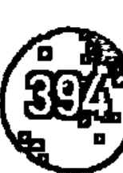

透過看到我們每個人面臨生活中的許多挑戰時所感受到的不足感，我們啟動了第 48 天賦。我們的旅程開始，已被設計去感受這種不足感。智慧蘊藏在這些不足感之內，因為它透過身體去感受。你頭腦的焦慮也是你身體智慧的部分，正如你的慾望、幻想、憤怒、蔑視和性慾。一切從身體展開並以身體結束。如果能全然地活出並信任每一種感覺，那麼你內心深處的恐懼最終會消失。恐懼的正是恐懼本身，當它呈現在臉上，其他的恐懼只是稍微地減少，剩下身體的感覺會不斷地出現和消失。在這個智慧深層的階段，你不能再在對身體的感覺進行區分。例如強烈的幸福感與情慾的感覺或甚至身體的痛苦沒有什麼不同。身體只是簡單地遵循自己體內的智慧，這份智慧融入了感覺識別的智慧。正如我們前面所說，第 48 悉地是待在一個絕對普通的人之內。

第 48 基因天命
未知的奇蹟

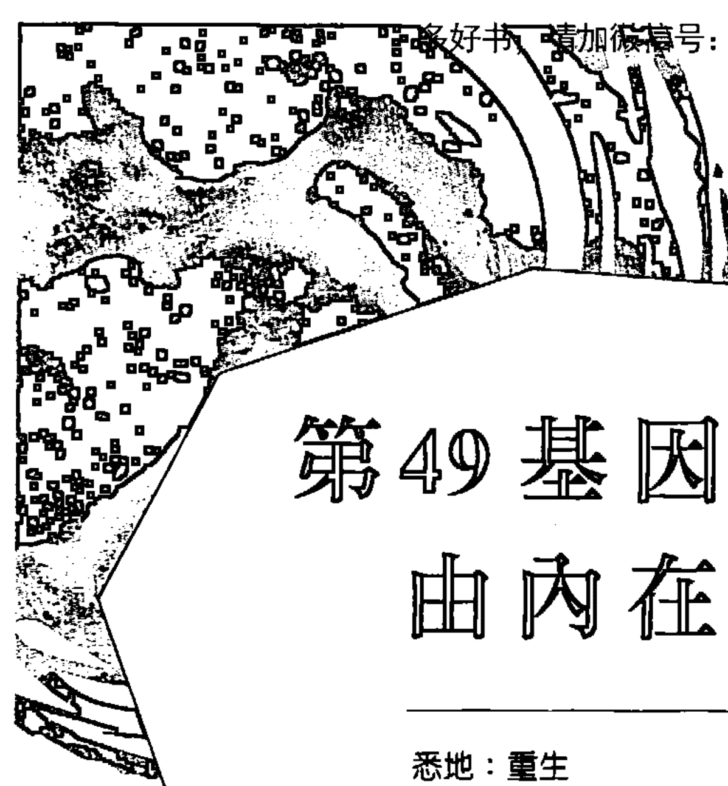

# 第49基因天命
## 由內在改變世界

- 悉地：重生
- 天賦：變革
- 陰影：反應
- 編程夥伴：第4基因天命
- 密碼子環：旋風之環（49，55）
- 生理學對應位置：太陽神經叢
- 胺基酸：組胺酸

## 第49陰影——反應

### 收割旋風
在第49陰影裡我們找到沉睡的遺傳基因，觸發我們展開集體上升到更高意識的過程。在更大百分比的人類中，這個觸發的基因仍是休眠狀態，確保通過我們遺傳基因的頻率保持一致及穩定——換句話說——沉睡了！為了使人類醒來到達更高的實相，必須啟動位於第49陰影中的觸發基因或開關。當這種情況發生時，進化的第一階段開始在你內在的情緒模式裡產生急劇變化。當我們進一步研究第49基因天命時，我們將更深入地探討這個前期的覺醒過程，但在我們可以走到這一個點之前，我們必須首先了解阻止我們演變的是什麼，以及這種現象是多麼普遍。

第49反應陰影是64個陰影中最強大的陰影之一，就它而言是如何掌管人類的行為。除非在這個陰影中隱約帶有一些意識，否則你原本的情緒將完全掌控你的生活，以及你決定會塑造你的生活。經過許多次循環，你這部分的 DNA 已經緩慢而穩定地演變著。在其最原始的形式，儘管在情感上你能夠表現與他人脫離，但我們從更高的頻率學習這個概念，在情感上與另一個人分離是人類一個極大的錯覺。原本最初的目的是我們能夠殺戮——我們周圍的生物以及彼此間。相對地直到現在，我們為了生存需要殺死動物。人類的生存通常基於效率，這意味著用最快的方式餵養自己，尤其是如果你生活在早期的游牧文化裡，是殺死你附近的動物。然而，當我們於社群定居並發展以農業為重的生活方式時，我們發現了其他自我供給的方式，從長遠來看提供更多保障。如今，人類完全有可能藉以純粹的素食飲食來延續生命。隨著我們穩住的社群和部落，更多是基於務農的生活方式，讓第 49 基因天命得以持續發展。在許多方面，它使我們對周遭的環境以及彼此更敏感。

然而，這個基因天命只進化到目前而已。你的社群越是部落式般分散，在你的安全感上存有越大的恐懼。族群的基因庫被設計為自我維護，並受到其他基因庫的威脅。第 49 陰影更陰暗的一面是它傾向於殺死看起來是威脅的人類。你越是有族群的心態，就越容易從情緒上與別人分離。因此，我們從這個陰影中看到的是人類傾向於將外人視為殘暴的，以便我們可以殺死他們。今天，世界上一些地方已經發展超越族群基因庫的心態，但絕大的部分仍然維持現狀。肆虐的戰爭目前正在世界的舞台上上演——在新興的全球意識和舊有的傳統部落模式之間——主要是基於第 49 基因天命內發生了集體突變。有些人對生命敏感，而有些並不，兩個遺傳族群之間的差距正在擴大。重要的是清楚地看到兩者互不體諒——全球意識可以對於族群非常漠不關心，反之亦然。

與這第 49 陰影有關的社會，政治和經濟問題是非常複雜的。其中一個原因是，這個陰影也掌管我們最古老的精神信仰和習俗。在我們殺戮的能力以外，它是出現在我們靈性上最基本的需要。我們族群社會的原則，圖騰和禁忌透過我們合理地殺害他人的方式而有了演變。所有這些問題都源於我們對另一個人的反應。反應是關鍵。一個部落對另一個部落的族群情感特性作出反應，而往往結果是展開一場戰爭。反應是一個遠古族群仍然支配著世界的意識反射。即使是那些強大的西方政府領導人，通常仍然受到這種情緒反應支配。從源頭上說，所有反應都來自主觀片面的信念，建立在善惡假設的基礎上。你要是只看到自己的是好的，別人是邪惡的，那你仍然困在第 49 陰影裡。

第 49 基因天命
由內在改變世界

第 49 陰影及其頻譜與第 55 基因天命所有重要的陰影直接相關。這兩個基因天命共有相同的遺傳密碼子組，稱為旋風之環，它們在化學反應上錯綜複雜地連結在一起。為了理解當前透過人類 DNA 這一面向發生的強大突變過程，人們也必須了解這兩個基因天命。透過個體展現第 55 關鍵的突變，而其相同能量穿透第 49 陰影卻引起社會政治和經濟革命。在這方面，我們更容易透過這個第 49 陰影看到突變的結果，而不是透過第 55 陰影。前者可以通過我們社群的變化和危機以及世界的頭條新聞來看到，而後者是更平靜的內在革命，那些在你個人生活中必須經歷的。

你可以透過你的關係更清楚地看到第 49 陰影變化的性質。所有的關係連結著我們對地球的族群意識。如果你想了解世界意識的這個方面正在發生什麼，沒有比你最親密的關係更能透悉。第 49 陰影是反應的陰影，反應不會沒有原由地發生。這是對外在刺激下意識的反應。第 49 陰影是以已婚的夫婦為基礎。不論你是否合法結婚，這都是無關緊要的。重要的是，存在一種親密的情感和性結合。第 49 陰影的力量也可以在個人層面，透過在性別，甚至同性伴侶關係之間不斷發生的反應模式中很清楚地看到。這些模式建構在關係矩陣中；否則將先失去點燃關係性的火花。反應源於對拒絕的恐懼。這種恐懼在潛意識地控制著所有的情緒和性慾模式。你越是敏感，就越接近恐懼的表面，這可能是一個祝福亦或是詛咒。如果你帶有一點意識，你可能會察覺到自己在每次工作中與你的合作夥伴持不同意見的反應模式。你甚至可以制止自己反應，但仍然感覺到情緒飛快地通過你的身體。

在遺傳基因水平上，通過我們與更廣大的家庭，社群甚至我們的上帝聯繫，我們看到了團結。我們最大的恐懼之一是從這種團結的感覺中被分離出來。它反應在潛意識的記憶中，在出生時與我們的母親分離是所有拒絕中最深刻的。所有你的潛意識反應模式都受到這些恐懼影響，你可以看到它們如何導致第 49 陰影的編程夥伴——第 4 陰影不寬容的出現。不寬容引致反應，反之亦然，因為我們不能處理我們的情感恐懼受到別的觸動而引起的振幅。這第 49 陰影是歲月殘餘的足跡，彼此分開生活的群體並恐懼自身的存活。當然，世界上很多地方今天仍然像這樣運作。然而，我們現在看到全球意識的一種早期形式，最終將變得越來越精密與整合。在我們部落群體的多樣性背後，實際上我們是一個單一的世界部落，其次在遺傳上與前期的單一粒線體亦相關。隨著我們的意識滲透到這個層次，我們將看到顯著的現象——集體觀點與部落觀點的結合。

基因天命 Gene Keys

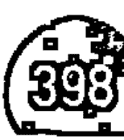

在個人層面，目前的突變通過第 49 陰影，正在改變人際關係的面貌。一直以來，我們的關係都是鏡子，但並不總是被理解為是世界的鏡子。隨著新的認知中心——太陽神經叢開始綻放它早期的影響，我們將開始停止祖先過去的反應模式。我們正在學習中止對拒絕的恐懼作出反應，這種恐懼正在失去對我們的控制。新的意識將帶給我們身體和情感一種覺知，透過我們的氣場相互關聯，以及沒有拒絕或遺棄的可能性。我們將變得極精銳敏感。這將改變一切——在我們的社會以及個人生活，但最重要的是我們彼此的關係。一旦啟動了在第 49 陰影內喚醒的觸發基因，那一刻開始，將產生一連串反應過程——一股基因旋風將會把人類文明的基礎帶到其根源。

### 壓抑天性——惰性

反應陰影的抑壓面向是絕對沒有反應。在許多人中，由於早在童年時期的制約或一些令人震驚的事件，適當的情緒功能被削弱，並導致一個人的情緒反應關閉或抑制。這表現為一種情感慣性或乾涸，如此深深地埋藏對於受到拒絕的恐懼，似乎不存在似的。這些人在生活上的情感呈現可能是最穩定的，但他們缺乏「調劑」。他們的性慾已經枯竭，亦沒有鬥爭的意慾。為了虛假和諧，已經妥協於所有的情感嗜好。許多關係遵循這種安逸的模式，當中，伴侶幾乎難以互相溝通——至少不具任何深度亦沒有暴露自己的脆弱。這種關係僅存在於生活的表面，隱藏了一個巨大的，絕少承認的失望。

### 反動天性——拒絕

所有的反動天性都是建基於這種對拒絕的恐懼上面。第 49 陰影的這一面向在感到被拒絕之前就先拒絕了。這些人在嗅到某人太靠近自己時就把人給推開。隨著他們的關係變得更加親密，恐懼就變得更大。這些人通常會在受傷之前終止他們的關係。因此，他們經常最後還是孤獨的，為了不冒受傷的險。當然，在獨自的生命歷程中，無論他們是否願意，這樣的人從來沒有感覺到生活中真正的完善，因為在意義上，他們是在某種承諾關係的形式。對於這種人唯一穩定的關係是兩個人彼此很少看到對方。他們甚至可以住在一起，卻沒有真正的溝通。

## 第 49 天賦——變革

### 沉默的革命

隨著更高的頻率穿過第 49 陰影，我們將經歷一個前所未有的變化與動盪的時代。這是變革的恩賜。第 49 陰影將是人類遺傳的陰影層面首個突變的面向。這種影響是巨大的，因為越來越少人是他們情緒反應的受害者，暴力在世界上將迅速減少。當中還必須考慮在所有文化中發生突變的環境影響。和平的男人和女人比以往更滲透所有的種族。變革是世界性的——它將繼續影響我們作為個人透過關係，將反過來影響我們的家庭，社群，我們的國籍以及我們作為人類的身分。

變革發生在任何被帶進意識中停滯的能量裡。它是一個直接的影響，你會意識到生病。鑑於第 49 陰影中潛在的暴力以及不寬容，你可以肯定，它不會讓你擺脫鬥爭。現在有一個遺傳基因變革正在進行，它首要做的事件之一將是丟棄舊有的遺傳物質。其中一個解釋是，在第 49 陰影中腐壞的一切都將被帶到表面。當我們從遺傳學的層面來看，它使我們不帶有制約和偏見，客觀地看待事物。這意味著我們可以看看世界上發生了什麼事，並了解為什麼事情正在發生。這個理解（來自編程夥伴的第 4 天賦——理解）使我們能夠克服我們習慣作出反應的傾向。然而，有一股非常強大的力潛伏在第 49 基因天命裡，必須不斷地找到出口。這股相同的能量在低頻率下導致死亡，在高頻率下保持其具破壞性的能力。在高頻率中，它的目的是破壞所有低頻率的東西。這是變革的理想原型。

在社會和政治層面，革命為他們帶來夢想，夢想總是對政府實行某種形式的激進變革。不幸的是，這總是涉及到所有之前提及的破壞，而通常，所有對舊系統是好的都被摧毀。第 49 天賦的目的是把這種爆炸性的新能量和意識帶進世界——不是在個人層面（這是第 55 天賦的作用），而是在集體和文化層面。與第 49 天賦結合，巨大的渴望，改革社會無效的運作方式。受到這天賦強烈影響的人，常常參與某種形式的種族社會改革活動。第 49 天賦不會產生歷史上常常看到的那種革命——它帶來變革者，而不是反動者。這種促進世界改善的動力來自於對世界的深刻理解。

在基因圖譜中擁有第 49 基因天命的人，對文明限制我們致使情感上的無力感有深刻的理解，能看到超越我們部落的教條。他們的作用是協助拉倒這些基於恐懼和佔領的舊有觀點。然而，這個天賦雖然試圖拋棄舊的方式，但它也明白，過去的某些方面必須保持完整並促進完成。第 49 天賦是一種已經開始覆蓋全球許多人的意識力量。你可以很容易地知道反動派和真正的變革者之間的區別。反動派的改革基於他們的憤怒和恐懼，而第 49 天賦的代表不是帶著舊有情感偏見的受害者。它們不會挑起進一步的反應，而是設法解決衝突，同時根據對未來的宏偉遠景，而實施徹底的改變和想法。天賦頻率的性質超越了恐懼，並以對所有生物的深厚善意為基礎。

以上一切都是第 49 天賦，它了解當前的系統是如何運作，這意味著它也了解需要多長時間來改變。第 49 天賦的願景是來自集體潛意識中的印記，這個深奧的神祕真理是什麼，致使所有在天賦層面運作的人聯合在一起。隨著越來越多的人自然地提高他們的頻率，或出生在未來的遺傳載體，當中第 49 陰影已經在出生時被抵消，世界文化將開始看到這些改革的面貌在我們的社會中蔓延。然而，正在發生的全球突變的這一部分，目前或許是我們這個世界的 DNA 中最不穩定的爭議議題。這麼多存儲在我們的 DNA 裡的恐懼，到最後都會浮現出來。以我們的時間尺度，它或許在世界文化展開之前，找到平和感覺的時間，但是當從遺傳進化水平上看，這種變化將在眨眼間發生。

## 第 49 悉地——重生

### 物種分類

第 49 悉地代表了意識的巨大躍進，因為它引起了一個靈性分離的狀態。從第 49 陰影到第 49 天賦的視野轉移是強烈的，而從第 49 天賦到第 49 悉地的尺度變化就像進入超意識的空間。在我們的 DNA 中，同樣的能量配置，讓人類殺死其他生命形式，實際上是帶來了動力，這將產生我們完全的自由。這是第 55 悉地和第 49 悉地之間深層的化學連接——他們一起創造了自由的重生，或重生的自由。這兩個基因天命在稱為旋風之環的密碼子組中結合在一起。它是第 49 天賦開始拆卸世界之後的第 49 悉地，它將重建我們的世界。要理解這是如何運作當中必須看到天賦意識狀態的局限性。在天賦層面，第 49 變革的天賦仍然傾向於循環。一旦我們擺脫了恐懼的震動，我們的世界就會有所不同。它會有巨大的改善而且如此之快，它會使時間本身加速。

但是，另一個潛伏在你的 DNA 中的秘密，其種子現在在你身邊。秘密在於展現「靈性的分離」。變革正如其名字的性質不斷地來回。在意識的轉變之後，人類將會陷入新的模式和全新的循環。剛剛開始的遺傳篩選過程將持續許多個世代。對於掌握人類新的突變，複雜的過程是必然存在的。在遺傳學上，某些基因似乎對我們的行為或「表現型」有不可忽視的影響，而其他基因卻沒有。這樣的基因被稱為「外顯基因」。引申到與第 49 和第 55 悉地相關的密碼子中，其外顯的突變將是劇烈的，而且人類行為模式將有顯著的變化。然而，突變蔓延遍及單一物種的整個基因庫的狀況受到許多因素的限制，其中存在的隱性基因——有效減緩突變蔓延的基因。

這表明這種突變極不可能超越整個人類物種。最可能的情況是它會分隔開我們當前的物種。作為類比，它可能有助於想像 4 萬年前的世界，由兩個非常不同分支的人類——尼安德特人和克羅馬儂人。克羅馬儂人形成人類最早知道的分支，而尼安德特人是來自該物種的一個更久遠的分支，生活在 35 萬年前。由於未知的原因，較老的物種，尼安德特人滅絕。第 49 悉地隱藏一個原型，似乎是所有人類進化的一部分——重生。換句話說，沿著進化鏈，每隔一段時間，就有一個新物種從舊物種中誕生。在古人類學中，這被稱為「夏娃理論」或單一起源假說。但是，儘管它的起源，新的物種——像靈性鳳凰——與它的父母沒有共同之處。它從舊有的遺傳物質中升起，並採取了一個全新的方向。這是第 49 悉地的核心——這是術語「靈性分離」的意思。變革在一定頻率上保持循環，但進化是一種需要突然躍進的迴轉。這時，變革進而重生。

我們已經看到，第 49 天賦深深關注我們文明社會的政治基礎設施。第 49 悉地帶來了一些進一步的見解。第一個見解是，無論變革如何深刻或深遠，世界的形式都不能被固定的。我們現代社會的基石形成，來自一個總是基於恐懼而作出決定的物種。在這方面，整個文明由它的核心腐爛。創造新未來的唯一途徑是從頭開始。第 49 悉地在這方面是苛刻的，但它的視野設置在一個遙遠的目標，這個目標只能透過新的開始——重生。隨著這個悉地破曉，舊有的持續崩潰而新的文明將會被建立。兩種類型的人類將共存，並完全活在不同的意識中。人類舊有的遺傳分形仍然生活在恐懼之中，所以他們無疑會害怕周圍的變化。人們可以看到這種模式，甚至現在依然發生在世界上的前期形式。

基因天命 Gene Keys

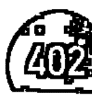

如果這一切都是真的，你可能會想，我們作為個體為了什麼？如果這樣的重生真的處於存在過程的尖端，而如果未來已經由一個驅使集體進化的基因預先設定，那麼我們每個人做什麼才是重要的？如果最變革的脈衝不能解決當前的世界，那麼緊隨著我們的天賦的目的是什麼？從許多方面來看，這是本書提出的最大問題之一。

答案很簡單而且睿智。這種進化的躍進形成一種全新的運作方式，取決於我們遵循我們的天賦。如果我們不能在社會的各個層面創造新變革的浪潮，那麼在意識的頂端發生的，在悉地層面的重生將不會出現。重生是綻放變革的延伸。只因為我們不能將世界定形，但這並不意味著我們不能使世界變得更美好。我們對於完美的未來願景恰恰是創造必要的轉換頻率，那將觸發我們物種的遺傳性分割。它會發生，因為它必須發生，然而我們必須繼續創造這種情況發生。這是悖論。

正如在所有物質中向上推進的進化力一樣，因此有一股變革的力從精神領域下降到物質層面展現。我們可以在第 49 悉地的編程夥伴——第 4 寬恕的悉地中清楚地看到這股變革的力量。寬恕是一種能量頻率，以其形式清除和釋放人生路徑上的一切。這種遺傳基因清洗使得一種新物種的重生成為可能。悉地的整個領域是重生的國度。你不能在沒有完全重生的情況達到悉地的意識狀態。每一個曾經達到真正啟蒙的人都經歷過這樣的重生。情感狀態需要與之前的靈性及遺傳性分離。這就是為什麼那些已經達到這個狀態的人是在這個進化當前階段的遺傳性畸形。他們是罕見的意識綻放，以人類的形式展現我們未來的早期迴聲。他們迫使體內 DNA 過早突變，以便人類形式能夠適應未來的意識。這就是他們的力量。因此在讀這些話的你，潛在性地可能是這些早期綻放的一員。這不是一個值得深思的美麗事情嗎？

# 第50基因天命
宇宙訂單

- 悉地：和諧
- 天賦：平衡
- 陰影：腐敗
- 編程夥伴：第3基因天命
- 密碼子環：啟迪者之環（44，50）
- 生理學對應位置：免疫系統
- 胺基酸：麩胺酸

## 第50陰影——腐敗

### 迷失的經典

幾千年來，所有人類文化的智慧帶出了一種不可思議的可能性——微觀世界恰好反應了宏觀世界，反之亦然。正如著名的神祕學說所講：「上行，下效」①。如果這是真的，對於一個整全的頭腦而言，要是看起來合乎邏輯，那麼深入人體內，我們應該能夠找到對存在本身的答案。事實上，基因天命本身只是建立在這樣一個暗示——在這64個DNA遺傳建構中可以找到一個原型代碼，解釋做為個體以及一個物種的我們是誰，我們在哪裡。根據這個暗示，人類基因組中的某些原型似乎也與遺傳學的其他方面有著強大的聯繫，因為它支配著生命的創造和維持內在的過程。特別是第50陰影這個原型，反應了遺傳學中稱為轉錄的過程。

第50陰影是腐敗的陰影。通常我們想到腐敗時，會認為是政治及社會腐敗，那些在職權上為了個人利益的濫用權力和力量。然而，在審視這個第50陰影，我們需要考慮腐敗一詞在另一個層面上的意思——數據損壞。數據損壞是表示在傳輸或檢索期間電腦數據錯誤翻譯的表達形式。即使這第50陰影與人類的社會價值有關，但以更不近人情的方式思考腐敗，我們可以更深入和更客觀地理解這個詞。

在生活中有掌管人類的自然規律。舉個例子，我們傾向在階級結構中運作，這習慣是基於我們哺乳類祖先而來的。除了這些自然規律，還有人為的律法，試圖在我們的社會中維持一定的秩序。這是因為我們仍然運行一種分層的意識，我們需要這樣的社會規律來管治我們的等級制度。然而，社會的等級制度製造了人類之間深層分化的氛圍，因為它們產生了比較，導致比較，導致貪婪，慾望，嫉妒以及無可避免的社會腐敗。人類在等級結構中的運作傾向源於我們的需要而彼此競爭，這來自我們大腦記憶中較古老的部分，有利於個人的生存，或最優秀的部落生存。陰影頻率是基於恐懼，從人類意識的古老方面產生的。然而，因為人類的頭腦幸運地繼續發展，而存在其他的可能。在天賦頻率的層面上，第50基因天命看到全新的現實，關於人類社會的互動，而目前正處於我們世界最早的階段。

在陰影頻率，人類大腦處理的數據透過恐懼作為媒介而被翻譯。當這種情況發生時，數據往往是被破壞的，導致世界有傾向性的表現。在遺傳學中，這第50陰影與RNA複製DNA的方式有很多種。RNA是一種類似於DNA的化學物質，其作用是轉錄遺傳密碼，以便形成新的蛋白質。換句話說，RNA是一種讀取和複製生命指令的信差②。在被稱為轉錄的過程中，消息可以在翻譯之前被誤解。這正是人類社會中發生的事情——恐懼會導致誤解，導致一方作出反應，觸發同樣的恐懼以及另一方出現反作用反應。結果是混亂的，這是第3陰影，第50陰影的編程夥伴。

中國古代的易經命名第50卦象一般被解釋為「宇宙秩序」，而它象徵是一個鼎。睿智老人顯然明白第50陰影在其最高頻率的原型作用。當整個社會頻率下降，將由混亂和腐敗管轄。有很多獨立的社會和部落群體的例子生活在高頻率之中並享受和平的存在。然而，當不同的種族，家庭和習俗相交並試圖生活在同一片領土時，就會出現問題。舊有的頭腦恐懼思想再次浮現，接著誤解和破壞數據。因此，腐敗可以被理解為集體創造的現實。腐敗需要有階級才能存在，並且是以低頻率的狀況嘗試在群體內維持秩序。總的來說，在你創建法律的那一刻，人們可能會說你同時也創造了一個反抗者。

正如我們從DNA和RNA的隱喻中看到的，這個整個腐敗的問題源於錯誤傳譯自然規律。第50天賦在它更高的頻率保存所有人類和諧的藍圖，但經過一個根植於我們頭腦舊有的部分那有瑕疵的轉錄過程，平衡是不會發生的。這個過程可以透過第44混亂的陰影更深入地了解，它與第50陰影在我們的DNA中形成一道化學橋梁，稱為啟迪者之環的密碼組群。第44陰影裡設置了一種干擾的模式，直接帶來社會誤解。人們可以看到第50陰影如此深入我們的複雜世界。由於技術發展的速度，具有不同法律和信念的不同人類種族被投放在集體的大鼎中。儘管我們的科技改革的速度很快，舊有的階級意識仍然盛行，時至今天橫跨各國和文化，導致一種由最富有的國家統治的國際等級管轄制度。在陰影頻率裡，這種精英等級分層經常被認為是有一個秘密的世界政府在控制著——一種黑暗的光明陰謀。

我們通過新聞頭條看到的世界實際上是一個正在努力超越第50陰影的世界。腐敗遍及我們星球的社會政治和經濟制度。最富有的國家正試圖透過等級控制來維持全球平衡，同時又充斥著自己的腐敗。人們看到一個基於恐懼思維的第50陰影在運作，幾乎無處不在的。然而，我們人類最終將學習到，你永遠不能透過針對於個人，獨立群體甚至個別國家來解決腐敗。為了恢復這個星球的平衡，人們必須深入了解腐敗本身。腐敗只是一個極具瑕疵的世界觀的副產品，直到有一個人解決了核心的問題，即等級分層本身，否則腐敗將會並必然會繼續蓬勃發展。

### 壓抑天性——超載

第50腐敗陰影創造了兩種類型的人——那些等級體制下的受害者，遑論透過作出反應或順從的人，以及利用它為個人利益的人。那些主張等級制度的人亦是害怕它的人，對於這些人而言，恐懼造成了抑壓。這些人不堪世界的重負，並肩負責任保護最親近他們的人。他們是等級分層結構本身的受害者，而且是被捲入系統的絕大多數。他們的生活通常違背夢想，不能夠或不願意逃離系統，基於他們認為有社會責任。這種低頻率造成了僵局，只有當面對深層的恐懼時，他們的創造力才能使他們超越系統。

### 反動天性——不負責任

那些利用等級制度的人與那些在制度裡的人一樣是受害者。在這樣的人，恐懼表現為潛意識的憤怒，這可以在等級分層結構的領導層或下屬中看到。這些人是不負責任的，因為他們覺得他們不用對自己的行為結果負責。他們是帝國的創造、工業家、競爭的商人和只有痴迷於金錢和地位的女性。他們也是社會各階層的叛亂分子、罪犯和腐敗的官員。總的來說，這些人是所有等級分層中固有的醜陋表現，即使他們大部分是不自覺地生活在這樣的生活中也罷。

## 第50天賦——平衡

### 自我智慧組織力的本質

理解第50天賦是看到人類在未來的歲月中出現巨大的希望。在第50陰影中，一個新的社會模式暗示著這種希望，必然超越等級分層。如果通過第50個陰影，那經過人類大腦處理的數據被破壞，那麼人們必須提出這樣的問題：「當它未被破壞時，它是什麼樣子？」答案是，在個人層面以及全球層面上，每個人都是一個創造和諧的固有代碼。在第50天賦裡找到的內在支點，平衡我們的生活的素質以及我們未來世界和平的可能性。作為平衡的天賦，這第50天賦也是內心深處平和的關鍵。

在沒有其他基因天命的理解之下，沒有單獨的基因天命可以被真正理解，這就是為什麼知道每一個的精髓是如此重要。單一分子的DNA在其原型化學形式裡包含64個天賦的每一個，所以每一個分子在你之內都有一定的共振。有趣的是，留意這第50平衡的天賦和第59親密的天賦之間的關係。在某種意義上，第50天賦可以說持有平衡的藍圖，而第59天賦把它實現。你也可以跟隨這種連接進入陰影意識，找到第59不誠實的陰影與第50腐敗的陰影。親密是展現世界平衡的關鍵。在這種情況下，親密是指與他人真誠地交往。真誠至關重要的作用是創造一個乾淨的團隊光環，所有隱藏的議程都攤放在桌面。如沒有這一點，就不可能達到真正的平衡。

榮格①說過：「父母死氣沉沉的生活對周圍人，特別是自己孩子帶來無與倫比的心理影響。」這與第50天賦非常相關，亦與一代接一代價值觀的傳遞方式有很大關聯。父母之間壓抑的秘密或情緒將展現在孩子的生活裡，營造了一種動盪的氛圍，除非父母雙方都對自己的表現負責。但顯然，大多數父母做的與之相反，並認為孩子是需要調教、幫助或利用紀律而不關自己事。這宇宙法則特別適用於孩童生命週期的頭七年。除了這個階段的行為習慣是完全地受到影響，而孩子可能需要某種形式的深入理解，以擺脫過去無意識擺放在他或她的肩膀上的情緒負擔。通過參與他們孩子的行為反應，七歲以下兒童的父母們有個黃金機會可以清理他們關係裡的氣場，並為他們的家庭帶來深層次的平衡。

這個法則可以應用於更大的社會群體，企業和整個社群。在高頻下，第50基因天命產生強大的漣漪效應和電磁流，具有使群體達到平衡的顯著效果。第50天賦能在一個人身上找到，而這一個平衡點存在於社會群體的結構中，家庭，企業甚至是整個種族。那些攜帶第50天賦作為主要基因天命的人在世界上有很大的責任。如果第50天賦這個鼎代表特定的社群或家庭的社會價值，那麼50天賦的作用是平衡鼎中的成分，以創造均衡狀態。這些人就像廚師，他們知道如何讀取任何群體的需求和要求，並相應地調整食材。雖然這份天賦聽起來很複雜，需要大量的人際關係技巧，但事實是這些人不用思考已經可以在群體中創造和諧。他們真正的力量根植於他們高頻率的氣場中。

我們已經看到，第50天賦擁有一種使社會平衡的基因藍圖。因為這是一個非常複雜的原型。維持社會的平衡涉及到實現個人和整個團體的需求。在這種情況下，第50天賦的願景是基於橫向分層的概念，一個超越等級結構的社會模式，並在第45基因天命中進行了更深入的討論。簡而言之，橫向分層是基於這樣的原則：如果一個人不平衡，那麼該群體便沒有機會找到平衡。因此，橫向分層在所有其他人之前先設置個人平衡。它透過鼓勵個人創造賦權的過程，每個人都獲得非凡的禮物——信任。通過信任個人為他／她的團體作出貢獻負責，使一個非常強大的能量場在該團體內建立起來。

在橫向分層的模型中，第50基因天命的編程夥伴和密碼子組也以重要的方式發揮作用。第3創新的天賦帶來了俏皮和創造自由的精神，讓橫向分層自我賦權。只有當個人信任自己的自由時，社群才真正開始散發健康。第3基因天命實際上控制人體內的個體細胞突變。在社會層面上，這意味著整個群體，一次一個單元的賦權和協調。團體平衡也透過第44基因天命及其團隊合作的天賦得以增強，它與第50天賦一起形成了橫向分層模型的基礎。真正的平衡和團隊合作經常是一個自我組織的現象，它永遠不可能透過外在控制而成功地實現。這裡隱藏著人類未來集體和諧的大秘密——它只能透過個人自由和對從這種自由中產生的自我智慧組織得來的信任來實現。

## 第50悉地——和諧

### 啟迪者的聚會

第50悉地是在第50天賦出現的過程中自然到達的頂端。創造平衡是一個持續的平衡的對立過程，但最終從一邊移動到另一邊的差距變得越來越小，直到實現完美的平衡。這是真正的和諧——一個振動代碼，使所有元素在任何系統內達到完美和永久的共振。平衡可能會消失，但和諧卻是恆定以及永存的。和諧是宇宙及其一切的真實本質。它只是一個預先存在的狀態，是必須進入而不是被創造的。在天賦水平上，意識可以透過成為更廣泛的社會平衡之中經驗個人水平上的平衡。感覺一個群體真正的歸屬感可以在細胞水平上誘導內在平衡的深層狀態。然而，在悉地層級，這是更進一步的平衡。

第50悉地生產的經驗，使人類的意識與天體或宇宙意識協調。要在人體中體驗真正的和諧，你首先必須消除所有的分離感。只有這樣，你才能融入所謂的「大一體的和諧」中。這裡只有在第50悉地，一個真正理解大鼎所象徵的更高意義。在許多文化中，大鼎一直是形式或容器的象徵以接受更高意識。在悉地水平，所有在微妙身體內的不平衡必須被摧毀，以使身體這容器化成真空。當這發生在人類的DNA內時，身體變成用於最高宇宙頻率的深層共振載體。這樣的頻率實際上具有解除身體本身的效果，使得體驗真正的鼎猶像宇宙般。在一些文化中，鼎也被視為一個大鼓，行星和恆星本體的運轉是在這個鼓上演奏的韻律。

它也透過第50悉地使我們看到人類社會潛在的真正性質，我們人類本質上是音樂的元素。從第50悉地的水平上看，一切都是音樂經驗。隨著進化逐漸揭示越來越深層的和諧，個人生活論及的一個普遍指標逐漸變得越來越悅耳。這種更高的社會和諧將逐漸揭示自己，人類超越了陰影意識的領域，實現了所有人類文明基礎的和諧藍圖。因為這被實現，所以它也呈現第44悉地說的神聖的共協。隨著這個密碼子在整個人類基因組中甦醒過來，我們人類將意識到更高進化的和諧矩陣。人類較高的微妙身體被設計為自我組織成有效和連貫的覺醒生物。這是啟迪者之環的運作。

人類總是感覺到啟迪者或「被選擇的人」的存在。我們把它們編織為我們的傳說，夢想，甚至我們的陰謀論。然而，啟迪通常是一個被誤解的理想。這個詞確實是指天體或揚升大師的更高進化，但那些人並不與我們分離。他們是我們更高的自然化身。因為你的高我改變你較低的本能和情緒，所以你進入他們更高和諧頻率的領域。這個領域吸引你走進自己，逐漸將你細胞的DNA轉變成最高的功能模式。我們現在生活在啟迪者的聚會時刻——一個前所未有的行星變化時代。隨著覺醒變得越來越普及，被喚醒的個體更高的身體將進入一個增強的集體和諧，從而加速整個人類的頻率。最終，啟迪者會將所有人類融入其秩序，人類終將體驗自己作為一個統一的宇宙存有。

當第50悉地開始穿透人類載體時，一個全能的和諧之流開始沐浴與他們結盟的人。深層以及隱藏的問題被揭示出來，以便社會平衡得以發生。由於悉地發生在一個人身上，它觸發周圍所有人的天賦，因為天體的力量將意識從陰影層次的低頻表現中拉出來。透過這第50基因天命，人類註定要達到宇宙和諧，雖然這樣的概念將需要經歷一個持續的平衡期，然後才能最終啟動更高的和諧。我們知道這種更高的和諧與上帝合一一樣。

第50悉地擁有另一個秘密，這恰好是所有轉化的基礎，並且對所有物種DNA中的細胞突變具有特別的相關性。這第50基因天命代表了所有轉化過程中的一個轉折點。它的存在總是意味著從一個階段到另一個階段的巨大飛躍。在基因圖譜裡，擁有這個基因天命的人可以催化周圍的人的意識有相當大的轉變。展現這個悉地的人標誌著整個人類進化的轉折點。因為它與第3悉地作遺傳配對，每當第50悉地出現在世界上，轉折點就會在人類的細胞突變之前出現。預測這種轉變的一種方式是尋求增加社會變態的出現——一群自我賦權的人員創造性地一起工作而不受等級制的限制。這些是第50悉地可能已經出現在世界上的早期跡象。請記住，這易經中第50卦象的名稱是「宇宙秩序」，而這正是第50悉地為人類帶來的東西。

所有人類個體應該從這第50悉地裡面的信息中用心。隨著第6和平的悉地，它是真正掌管理和保護人類命運的主要鑰匙之一。在你的外在生活表面下，和諧盛行，即使你可能看不到或感覺不到。你覺醒的藍圖牢牢地抓住這個第50悉地的躍進。宇宙的深層定律——這是第50悉地的典範——管轄著我們人類在世界上做的一切，從我們最崇高的犧牲到我們最卑鄙的行為。遑論你是誰，你的行為在你的生命過程中逐漸讓你走向神聖的和諧。對於我們大多數人來說，總有一些時刻，當我們觸摸到我們內在這個偉大的和諧回聲時感受到的。對於一些人來說，和諧將成為一種習慣，出於對自由的熱愛和合作的願景。如果有一樣關於這個第50悉地的事你可以說的，那就是，隨著它的力量的增長，它將編排人類的團體和社群成一個美麗的交響樂，我們是當中的樂器，而意識本身是透過我們演奏出的音樂。

第50基因天命 宇宙訂單

# 第51基因天命
## 提倡到實施

- 悉地：覺醒
- 天賦：提倡
- 陰影：焦慮
- 編程夥伴：第57基因天命
- 密碼子環：人性之環（10，17，21，25，38，51）
- 生理學對應位置：膽囊
- 胺基酸：精胺酸

## 第51陰影——焦慮

### 恐懼的門戶

第51基因天命及其頻譜包含一些關於人類行為驚人的秘密，引導你走向被稱為覺醒的過程或經驗。其中透過我們的遺傳基因產生最廣為人知的人類特徵是我們天生的競爭力。直至你達到第51悉地的最高水平頻率，否則人類依然彼此競爭。依據你如何引入這股能量，致使它可能帶來團結或導致分裂。與其編程夥伴第57不安的陰影，這第51焦慮的陰影在人類中造成巨大的干擾和不安全感。直到你可以提高你的意識進入和超越更高頻率——天賦水平，否則你會總是在某種程度上感覺到這份激動的感覺。

第51陰影在人類的能量場中造成干擾的原因很簡單，因為生命是我們無法控制的。你無法預見的事件將不時在你的生活中發生，這些事件可能徹底改變你的命運。在陰影頻率，察覺到生活的隨機性，造成了人類深層的不安全感，因為這種潛在的恐懼對你而言任何時候都可能發生不好的事情。這種不安全感透過我們親眼目睹周圍的人，所發生的事件印證結合而來。例如，在第二次世界大戰的倫敦大空襲期間，炸彈會在整個晚上隨機投擲。倫敦市中心大多數的街道在不知什麼時間被擊中，有些家庭現場被炸死，但鄰近的房屋相對沒有傷亡。在那時，「哪間房子被擊中」的問題困擾著所有人。因為我們看到其他人被擊中，而產生了潛意識的恐懼，害怕我們可能是下一個被擊中的人。

衝擊是所有人類生活的一部分，但在陰影層面，衝擊的可能性和恐懼不斷地使我們感到不安。所有陰影頻率其特點是對生命本身缺乏信任。信任生活既不是智力的問題，也不是情感的問題。它實際上是純粹的身體反應。信任是你身體的細胞所感覺到的是或不是。沒有信任，人類就處於焦慮的狀態——我們會傾向於心驚膽顫，感到緊張與壓力。不是逃避恐懼，就是逃避生命，或者從憤怒或恐慌中衝出來。你的頻率決定你如何看待衝擊，當他們來了，你又如何在身體和情緒層面處理它們。在更高的頻率下，衝擊就像是蟲洞，帶你來到一個新的以及可能更高的維度。衝擊直接挑戰了你現實的根本和你對現實的依賴。意義上，任何衝擊的真正作用是消除你與生活的分離感，並釋放你從陰影意識的虛假安全感。

第51陰影利用所有的能量，嘗試避開不可能避免的事。它存在於對極端性衝擊的否認中——身體會死亡的事實，並否認死亡實際上扼制的生活。只有完全接受死亡事實的人才是真正活著。沒有死亡觀點的生命會失去它真正的價值，而這正是人類的感覺。鑑於第51基因天命也掌管人類的競爭精神，我們看到人類只為自己和自己的利益戰鬥而沒有其他更高的目的意義。第51陰影的競爭性首要關乎的是需要，而不是為了更好的自己；甚至感覺優於別人。人類的競爭精神可能是陰影頻率上的一件非常醜陋的事情，因為它可以這麼輕易地漠視其他人，而且不斷地向他人施壓，讓自己向上攀升。從字面上看，所有人攀升到更高處，而在那個意義上，它利用其他人作為令自己的進步的唯一目的。在這個層面上，優越感是為了嘗試消除必然的憂慮。那些歷史上在等級分層攀到高處的人最終都死於卑微。

第51基因天命作為基因原型是相當特別的，獨特在它代表一個門戶。這個門戶完全取決於你編程於基因裡的頻率。在第51陰影焦慮的狀態下有股極大的能量。沒有內在目的或方向感，這可能是一個危險的基因天命。焦慮永遠不會讓你感到孤獨，它會不斷地提示你做某些事，以得到某種反應。它會做任何事情，釋放其不安的意識能量。這可能導致各種各樣的魯莽和愚蠢的行為，只是為了釋放焦慮感。第 51 陰影可以驅使人們做一些從來沒有想像過的事情。這可能導致奇怪的現象，出現在受這個陰影強烈影響的人身上——他們可以實質體驗到一個無所畏懼的狀態。然而，這種無所畏懼並不是基於信任而來的真正的無懼。它出現在焦慮的狀態變得如此強烈，以致於想要自我毀滅，與此同時，它淹沒了自身體內的恐懼。

第 51 陰影透過極不尋常的以及經常危害個人的事影響集體。任何受第 51 陰影強烈影響的人，都有可能陷入深層的憂鬱狀態，或成為世界上的負擔。這些人很少或根本沒有尊重生命，所以他們失去了所有的希望，以某種極端的方式展現出沒有作用的意識。這些人是世界上衝擊的代表，深化群眾的意識，恐懼無處不在而且不認為什麼是安全的。任何時候可能發生可怕事件的恐懼，都會被大眾媒體經過不斷覆蓋這些事件而增加其複雜性。令人驚奇的是，只有少數的個體能夠活出這個陰影的極端，對世界其他地方產生巨大的影響力。正如我們所說，第 51 陰影是一個門戶，在陰影頻率，這個門戶引領你只透過你恐懼的濾鏡感知世界。

### 壓抑天性——懦弱

當透過內向的性質折射時，第 51 陰影顯現出一種懦弱。這些人對生活逐漸失去希望，有別於反動天性，他們會慢慢封閉，轉而向內。他們可以是極度抑鬱的人，對生活中的任何東西很少感到或甚至沒有熱情。這裡表現的懦弱呈現出非常強大的抑壓性。這些人只讓恐懼掌控自己的生活，即使他們有能夠將自己從中拉出來的能力也罷。真正的恐懼是面對恐懼本身。諷刺的是，面對恐懼實質上是一種幻相。然而，處於這種性質的人很少能有勇氣去打破幻想，而寧願重複在自負的循環中。為了打破這種抑鬱的循環，這些人不得不醒來，只有他們才能救出自己。

### 反動天性——敵意

這個陰影的外向版本呈現為有敵意。這種敵意是一種無所畏懼的憤怒和深厚的徒勞感所配對的危險結果。這些性質顯然在不同程度上使外在衝擊進入世界。在情感層面上，這些人對人類沒有真正的尊重感。他們傾向於被吸引到崇尚競爭的社會環境，從商業到體育界。他們通常是具有深層的邊緣情感。他們經常陷入極度危險或具有風險，甚至可能面臨死亡的情況中。隨著反動天性，這種以第51基因天命作為基礎的深層的焦慮感會投射到他人身上。因此，這些人也會在他人身上挑起敵意，但沒有經過任何真實的考慮。他們這樣做，純粹因為他們不能幫助自己，而且不在乎這些事。唯一打破這種模式的方法是讓這些人將他們的焦慮轉移到一些具創造性的事項裡，最終將帶來實現的感覺。

## 第 51 天賦——提倡

### 萌生美好的未來

儘管門戶透過第 51 陰影帶來地獄般的景象，第 51 天賦卻帶來一個偉大的個人賦權和才華的平台。每當人類競爭性的精神進入創造性的服務時，第 51 天賦就會參與其中。每次你有勇氣跟隨自己獨立的創意精髓時，你已經踏進了第 51 提倡的門戶。這第 51 天賦是人類遺傳矩陣中的關鍵，因為它包含啟動個人賦權的基因代碼。伴隨你所提倡的，踏上罕有的軌跡，並跟隨你自己的內在決定。當你以這種方式行駛自己的命運時，這裡沒有所謂的安全——這是一個極大的躍進，沒有人曾經經歷過。大眾意識對於遵循這條生活道路的人感到敬畏而且害怕。集體模式是安全的模式，但個人模式是神秘的、充滿不確定。我們將看到，它也是真正覺醒的唯一途徑。一個人如果沒有先充分地投入到他們獨創性中，就不可能被喚醒。

那些穿過這個門戶進入第 51 天賦的人，刻意背棄所有來到他們面前的人。他們正在閉上所有以前的教義和智慧的書本，並出去發現個人的真理，而不是其他人的。這是一條靈性之路——通常被視為進入地獄的旅程，修行者將面臨許多挑戰和考驗。它也是最終到達回家的路徑——它是心之道路，引領進入內心深處。正如第 38 和 39 勇士天賦的原型，第 51 天賦也是如此。然而，這是一種不同的勇士。這與打擊集體恐懼無關，而與榮譽有一點相關。這是與你自己的恐懼鬥爭，和其他兩個基因天命不同，這場戰鬥不涉及掙扎——它涉及躍進。躍進到第 51 天賦是躍進到「更高」的自我。它是從一個水平喚醒到另一個水平的衝擊。

第 51 天賦是人類競爭精神的最高表現。在這個水平，你不再與別人競爭，而是與自己競爭。即使在競爭領域——遑論是政治，金融或娛樂——你利用他人作為鏡子反應你自己卓越的水平，而不是推倒他們以使你可以提升到更高。例如在運動中，第 51 天賦透過與其他人的差異性找到自己天生才華和力量。這第 51 天賦是關於利用你從別人身上辨識到差異，而不是在別人置身的遊戲中試圖擊敗他人。當你成為真的自己，你解開屬於自身才華的魔法力量，除此之外沒有其他。主動提倡是忽略你過去所學到或聽到的一切。沒有其他方法可以得到真正的天賦才華。這是通過恐懼的一條道路，而恐懼不能被甩開。特定情況出現的恐懼，對於那個人而言是完美的，這是最深的恐懼。無論你最深的恐懼是什麼，你都會在第 51 天賦層級裡遇到，而你能超越它的。

第 51 基因天命是被稱為人性之環的遺傳基因家族的關鍵組成部分。創意性的提倡是每個人類精神的道路。我們每個人都必須在生活的某個時刻離開人群，走進我們心中未知的荒野。這是人類真正的道路與命運。提倡中的活力和勇氣激發了來自量子層的強大反應。因此，你越是相信自己和採取這種信念的行動，生命就越能支持你。克服不舒適的感覺和超越競爭，去擁抱更高維度的魔法。那些參與提倡的人接上了幸運和共時性的力量。在這個層面，當你信任自己的心，第 51 基因天命將永遠回饋你的堅持。它會衝擊你美好的將來！

擁有提倡天賦的人是在世界上第一個做事情的人。即使他們過去可能跟隨別人，當它達到躍進，他們將永遠遵循自己的道路。這樣，個體自始至終的歷史支持著彼此的責任，並保持人類精神的演變。正如第 51 陰影在世界上是創造低頻衝擊的代表，而第 51 天賦在世界上是創造了積極衝擊的代表。這些人從基於恐懼的模式喚醒了集體意識。無論個體在哪裡迷失，擁有第 51 天賦的人們都將勇敢踏上自己的道路。重要的是要明白，第 51 天賦的人不是領導者——他們是提倡者。他們來催化人類的新過程，或者他們活著是如此獨特和勇敢的，那其他人被啟發去仿效。

第 51 天賦透過在組織中提供的競爭力帶來驅動力，它在商業世界中發揮特別重要的作用。在大型團體或組織中，64 個基因天命各自承擔不同的遺傳角色。第 51 天賦通過整個企業文化而不是個人成就的水平來運作。受到這種遺傳基因啟動的個體越多，公司精神就將越有競爭力。大多數人只能活在其陰影頻率，這更有可能使公司過度競爭，並導致所有員工，特別是管理團隊感受到集體焦慮。然而，正如我們可以從 64 個基因天命裡學到的，秘密不在於數量，而是質量。因此，一個展現第 51 天賦的人可以透過該公司的集體形態形成場扭轉整個組織。如此，一個人存在於核心位置，可以推動該組織進入一個全新的職能水平，其中個人被賦權，而不是受到壓制和控制。

## 第 51 悉地——覺醒

### 你付予的榮耀

覺醒的現象已經吸引了人類數千年。我們著迷於某些人似乎經歷了永恆改變他們的體驗，並使他們接觸到我們看不到但仍然能感覺到的現實。當然，在靈性的場所裡有許多對「覺醒」一詞的解釋，似乎很多人認為自己有覺醒的等級和水平。許多覺醒的新解釋將意識視為一把可以逐級攀升的梯子。甚至這運用在 64 個基因天命所呈現意識的演變上，如能量透過你的基因頻率上升，便會導致你的身體和意識的操作系統變化。從真理導師和假先知的口中，也有一大批在精神層面上的附帶條件。為了給故事添加另一層，人性是在目前我們遺傳基因和精神進化中，處於最有力的十字路口之一之上。在這時，聲音變得雄厚而急速——厄運的聲音和希望的聲音——每一個都在揚言他們的真理。

第 51 悉地將所有這些要求和系統擱置一旁。它使一切變得簡單和清晰。對於第 51 悉地，只有兩種意識狀態——醒著和睡著。當然，從悉地狀態，分為醒著和睡著的只是修辭的問題，但它也在物質層面上成立。在一個人發生某些事情之前，他們進入悉地狀態——一些不可預測以及無法解釋的事情——一些重大的事情。沒有人可以形容，當他們進入悉地狀態時發生了什麼事。有些事情始終是個謎，即使是科學也難以解釋。可能有一些在覺醒之前有覺醒的科學，但在覺醒後沒有科學。這裡有悖論。第 51 悉地是超越靈性術語和系統的。它有自己的一套語言，簡單而令人震驚的。它說，直到你醒來之前，你仍然熟睡著。覺醒中沒有級別。對於第 51 悉地，所有的意識秩序都是荒唐的——這純粹依據人類睡眠的模式建構睡著的程度！

那麼什麼是覺醒，而你怎樣辨別什麼時候有人已經醒了，而什麼時候有人還沒？這些是沉睡世界裡的重大問題。如果你問一個醒著的人相同的問題，他們可能會說，這沒關係，除非你醒了，否則你將永遠不會知道為什麼沒有關係；這樣的事情只對那些沒有醒來的人有意義。事實是，覺醒確實使你不同——不是從你最深的意識，而是從你物理上的遺傳載體及它的功能而言。同樣的道理，你可以說，覺醒在基因層面有可能有一天被科學操縱。理論上，這是可能的。然而，只要人們睡著了，他們就不會盡力將他們寶貴的資源投入到這種精神志向中。較低的頻率是基於自我利益，而覺醒在這個方面什麼也不做。除此之外，覺醒是一個微妙的進化過程。它不是個人努力的結果，而是一股自發性進化的躍進，在整個宇宙中的各處，運行更廣泛的進化力量所產生的可能性。總之，覺醒是一個謎，從解決或複製層面來阻止自己的性質。

在沉睡之中，我們非常想要去了解這種覺醒的現象。然而，在第 51 悉地的語言中，這是一個謎，將不會屈服於壓力。我們可能想知道是否有跡象顯示一個人接近覺醒，而我們試圖創造醒覺的道路。這裡沒有跡象。覺醒發生在好人以及惹人討厭的人身上！也沒有路徑，儘管覺醒的人有些說法為我們立了規定。覺醒是一個巨大的矛盾。不管你說什麼都會被誤解，所以最後你純粹道出你說的任何話和相信它潛藏在內的振動。覺醒也容易偽裝。任何有強大氣場的人都可以聲稱覺醒，甚至相信他們醒著了。靈性的經驗也可能被誤認為覺醒。有許多類型的神秘遭遇和異象的狀態一直在人類身上發生，但覺醒是與這一切完全不同。許多最偉大的靈性異象者，甚至透過他們的偉大啟示或系統仍然觸及不到真正的覺醒領域。

真正的覺醒只是看到一切，沒有什麼與行為或經驗有關。也與覺醒來到和完結無關。當它來了，它永遠都在。當你閱讀本書中所描述的 64 個悉地的每一個時，你開始有一個很好的概念，真正的覺醒的行為模式是很多樣性的。第 51 悉地是其他 63 個悉地的基石，沒有人可以達到這個狀態而沒有真正的覺醒。換句話說，覺醒是永久化解分離本身，並通過身體內的物理突變而出現的。沒有任何數量的冥想或靈性練習可以帶來這種突變，即使他們是或不是在覺醒之前。它不可能影響這個突變，因為它與你的經驗或行為無關。這是它們當中最主要的靈性幻相。

人類不容易獲得「不是」的答案。我們傾向覺得我們可以做點什麼。然而，這是一個規範，除了成為自己以外你不能做任何事情。覺醒發生在一個非常自己的人身上，除了發生之外別無選擇。這裡的諷刺是，你不能透過做而成為自己。這只是一份天生的禮物。你可以看到焦慮的陰影如透過這個基因天命在最高水平淌血。即使你醒著，你仍然可以看到你的存在導致他人精神焦慮！事實是，悉地狀態是一個跨越所有級別的躍進，它是一個飛躍到空無。沒有什麼可以讓你為這次躍進做好準備，在躍進之前沒有什麼最好的。這個飛躍也不是你採取的一次躍進。更像是躍進帶動你。

第 51 悉地還包括了許多其他的秘密；其中包括實施的秘密。我們居住的宇宙不斷地發起各種形式。形式的世界不斷地影響自身——原子與原子碰撞，小行星與行星碰撞，人類在關係中相互碰撞。這是一個滲透的遊戲，其中每一事物都試圖滲透一切。每種滲透在某種意義上是一種衝擊，並導致某種突變或轉變。死亡本身就是一種形式的轉變，以恢復它組成的形式。在覺醒之前，形式仍然是形式，所以我們總是承受某種影響或衝擊的風險。這種衝擊是真正的發起，其中你世界的邊界會被動搖。覺醒後，所有形式都體驗到互相滲透，所以不再有任何衝擊或影響。在身體中沒有本土化的意識會導致發生衝擊。發起總是需要一個環境，以及喚醒結束環境的概念。

正如我們所看到的，關於覺醒的概念有一個極大的困惑。它是在身體上長久的變化，導致身體主要的感知器官改變。中國古代以雷象徵代表這個第 51 卦，而它真的讓我們震驚。覺醒總是一份驚喜。它只來一次便到永遠。一旦你醒覺了，便不能回到熟睡的狀態。在這個基因天命內的震驚是生命本身的震驚——這是給予的雷震聲。被喚醒的人成為一個只知道如何自給自足，而且沒有阻礙生命流過的阻力。這種給予是愛，但它可能或不可能呈現為深情的愛。而事實上，它是宇宙普遍的愛。

關於第 51 悉地，有一句最後要說的話，在我們的演變中它是很重要的。到目前為止，我們只考慮了在個人層面的第 51 悉地，但事實它也處於更廣泛的層面。作為人性之環的一個面向，這個基因天命確保有一天，所有人類都將覺醒。事實上，在未來，這個悉地將開始喚醒整個基因庫。會有一段時間，關係會被喚醒，然後到家庭，繼而整個社群，直到最後遍及整個人類基因群組。在這個階段，人類本身將被喚醒為一個獨立的宇宙生命體，並會看到自己的真實性質。和個人覺醒一樣，即使它可能出現，但不是一個逐漸演進的現象。這是突然且意想不到的意識衝擊，之前是透過你的細胞和 DNA 的突變鏈帶來的反應。當人類覺醒時，它會超越時間。當人類首次打開真實眼睛的那一刻，將會是意識本身其歷史性最大的一件事件。

第 51 基因天命 提倡到實施

# 第 52 基因天命
## 靜止點

悉地：平靜
天賦：抑制
陰影：壓力

編程夥伴：第 58 基因天命
密碼子環：探索之環（15，39，52，53，54，58）
生理學對應位置：會陰
胺基酸：絲胺酸

## 第 52 陰影——壓力

### 恐懼的類型現象

第 52 基因天命的陰影是「Stress／壓力」，這是現代世界的重大現象之一。壓力在許多層面產生作用，但它主要的影響在於人體的生理層次。第 52 陰影及其編程夥伴「Dissatisfaction／不滿」的第 58 陰影，是一對暗中破壞人類健康甚深的基因模式。這在集體層級運作得更為明顯。因此，我們有必要了解關於壓力的某些重點。壓力其實是集體性的壓迫，而非個人的。壓力是全體人類生存時製造出來的某種能量場，而非根植於任一特定的個人議題。也就是說，壓力和我們的環境以及周遭的人們有著很深的關聯性。

我們的現實環境是由人類氣場（aura）的界線形塑而成。一個普通人的氣場可以延展並滿布一間尋常尺寸房間的一半大小，亦即普遍來說，當你和某人共處一室，你們就共享了彼此的氣場。同一區域裡的人越多，集體氣場的能量就擴張得越大。在人口稠密的地區，譬如鄉鎮或城市，就算躲在自己家裡的避難所，實際上也無法逃離來自其他人的集體能量影響。在世界上比較鄉村的角落，當地的氣場壓力就少了些，壓力度也會相對減輕。然而，因為地球的現存人口數實在過於龐大，要完全擺脫這麼廣闊的集體人類能量場，已經不再可能。幾千億的氣場環環相扣，形成一個巨大的鞘並籠罩住我們的世界。這個鞘、或者說這個殼，阻止人類去探查與經歷一切意識的真實整體性。這也是眾所皆知的東方世界的「瑪雅（maya）」——意思是巨大的幻象。

人類的 DNA 是一種神奇的物質。DNA 蘊含著化學密碼，雖然這些密碼在出生那一刻就已經固定，但它們對於震動的能量場有著高度敏感性。基因學將個體的基因生成稱為基因型（genetype）。因此，某個程度上，穿透基因型的能量頻率，會決定其表現的顯型特質。這表示你身處的環境大大影響了你的感受與行動方式，更重要的是，這也左右了你對於「我是誰」的思考。在最細微的層次上，環境是由次原子世界的震動共鳴所創造的。不管是什麼樣的自然地理布局，真正決定環境的，乃是你所定調的頻率。在第 52 陰影這個例子中，集體或人性擴張的顯型是由恐懼所塑造，恐懼創造了一個將生命置於強大壓力下的環境。

想要擺脫這個集體編程範疇的唯一方法，便是超越它，讓自己處於活力滿滿的積極層次，然而這並不容易。你必須以某種方式提升穿越基因型的能量頻率。一旦這種情況發生，顯型——你的天性去經歷與表現的方式——也會發生變化。大多數人可以短暫地超越這個能量範疇，但過沒多久就會再跌落回去。能夠永遠地超越壓力能量場影響的人，可說是非常罕見。秘訣就是去改變你的內在環境——你的一切感覺和想法——並從而改變你的所見所聞。如果你聽到的都是噪音、如果你看見的都是混亂，那當然會決定你所經歷的事情。然而，如果你將自己固定在一個比較高的頻率，那麼，同樣的生命將會讓你以彷彿身處截然不同的世界來體驗。

壓力是透過你的較低頻率所帶來的生理壓力。壓力的其中一種關鍵表現形式是「讓人無法逃離的心理焦慮」。你賦予腦袋權力，做出「希望能終結壓力」的決定。可是，這樣的希望幾乎總以災難收場，因為腦袋的運作行為根本是壓力本身的展現。這個典型的生物反饋（biofeedback）不停強化著你試圖要脫離的那個狀態。第 52 陰影和你的腎上腺，以及人類典型的「逃或戰」反應有著很深的連結。（內分泌系統的活動與貫穿你的基因型的那些頻率直接相關，當進入 52 號基因的悉地階段，我們就會發現：人類的分泌腺系統可不只限於顯化在像是腎上腺素這種根植於生存和恐懼的荷爾蒙而已。）

我們可以拿第 52 天賦的名稱——抑制的天賦（the Gift of Restraint）當做理解第 52 陰影的一個方式。第 52 陰影的低頻率表現乃是因為「無法阻止自己對恐懼做出反應」。恐懼對於基因天命的驅動有時埋植在無意識的深處，以致你對此毫無概念，你渾然不覺。當恐懼瀰漫在我們的環境，那麼你因此做出的反應，就產生了兩種可能——你不是崩潰、就是逃開。基於與腎上腺系統之間的化學連結，第 52 陰影對於產生活躍或匱乏這兩類生理行為有著深遠的影響。就第 52 陰影而言，有兩種類型的人與之相關——不能靜待的人和受困阻塞的人。身處當代，我們傾向將壓力視為一種混亂、發狂的不穩定能量，但其實壓力也有較為壓抑的面向。

自然的生命韻律依循著季節的格局形式——生命知道什麼時候該工作，也知道何時該休息。然而，第 52 陰影的集體能量卻阻止人類妥善信任生命的流轉，52 號基因天命的陰影頻率不斷增強不同的極端性。我們可以清楚地看見今日世界呈現的狀態。西方世界的極端，是不停地行動、擴張，改善某些微小甚或毫無集體感的目標；至於東方世界在傳統上走的則是另一個方向，東方世界會遠離行動，會超越而非擴張，也比較著重於宗教或靈性領域。儘管時至今日，東西方的角色正逐漸互換逆轉，但人類基本的類型，仍舊基於恐懼和第 52 陰影的兩極性持續顯現著。直到人類經歷了跟所有生物合一的整體性時，他們將創造並受到基本的壓力驅策——那是我們隱藏在最深處的恐懼所產生的生理反應。

### 壓抑天性——阻塞受困

第 52 陰影創造壓力，處在這個壓力中，人們的壓抑本性容易造成生理、情緒和心理的崩解。這些人永遠無法真正地徹底解脫。52 基因的克制天賦會繼續卡在這極端的陰影狀態，並產生深刻的受困感。這樣的感覺會滲透全身，以致這個人變得非常沮喪與冷漠。一旦放棄了自己，這些人的腎上腺系統將會萎縮，身體也會受到某方面的妨礙且受損。只要有人陷入這樣的狀態，想要逃離就會非常困難。要讓自己從這樣的態勢獲得自由的唯一之道，就是找到可以服務他人的方法。「去幫助他人」是 52 天賦在基因層面的深刻需求，只要投入其中，就能夠將自己從受困的狀態中釋放出來。

### 反動天性——焦躁

有些人是無法乖乖坐著不動的。這些人本性的反應特質，會試著以某些行為來逃離他們的恐懼。然而，這也只是藉由投射自身的挫折與憤怒到別人身上，來粉飾自己的懼怕而已。壓力的焦躁面，其實是腎上腺素過度刺激而產生的超出個人需求量的精力。只要時間一久，這持續進入身體的腎上腺分泌物，確實會造成極大的損害。因此，這些人大半輩子總是筋疲力盡。對這類人來說，秘訣就在於得要看透自己心理上的不穩定狀態，也必須探索是什麼樣的深層恐懼在驅策著他們。勇敢、欣然地正視與接受恐懼，就能逐漸解除恐懼的束縛，學著啟動他們的抑制天賦。

## 第 52 天賦——抑制

### 生態的轉矩

人們對第 52 天賦或許會有所貶抑，因為「抑制」聽起來不怎麼 ok。抑制一點也不令人覺得興奮或有活力。但諷刺的是，在整個人類基因組之中，這卻是最非凡出色的一項天賦。這個天賦和其他天賦一樣，都是關於如何在兩種極端的能量之間取得平衡——以第 52 天賦來看，它面對的是活躍（activity）與被動（passivity）的能量。事實上，對人類生活來說，沒有哪個基因天命比第 52 基因天命來得更為根本、重要。這個基因天命決定世界上一切活動的源頭特性。如果你以恐懼為根據去發起行動，那麼恐懼的種子將會汙染這個動作所衍生的每一部分。就算只是個微小的人類動作，有時候都可能會導致龐大君權帝國的誕生；如果恐懼的種子一開始就存在，它便會像病毒一樣滲透入整個結構，也終將徹底毀掉一切。

第 52 天賦內含著生態的秘密。一切真真正正的努力，都需具備對抑制的深刻理解，那是所有生存系統的一種本能現象。當一個系統要持續運作到最後，它就必得學會在成長的過程餵養自己。如果這是個增殖擴散的系統，那麼它就必須懂得多樣化擴張，好接收不斷增加的營養補給。然而，對一個真正成功的系統來說，其所必定不可缺少的要素，其實就位在最初始的核心當中——亦即它不能只為自己服務。第 52 基因的抑制天賦需要極大的耐心，以及對於「世間萬物各有其運行速度」的理解。特別是創始階段，事情似乎總是緩慢推移。當我們嘗試去催生某個想法，完全就只是在妨礙播種。由此可知，人們有多容易成為壓力的犧牲品。

第 52 天賦，你可以推測出，這是和人類組織群體相關的天賦。此一天賦的最深層次，蘊含著有朝一日完美地把全人類團結在一起的種子。就現階段而言，這個天賦關注的是我們對於生命的信任。要開始任何事之前，你必須有清楚的意圖目的。你的意圖越無私，能發揮的力量就越強大。如果你的起始意向正確，那麼接下來的一切都會順勢發生，但你必須要抵抗「因為恐懼而想要介入這個程序」的誘惑。意圖就是一顆種子，這顆種子所包含的一切必要成分與屬性，都是未來旅程中的必需品。這顆種子甚至蘊藏某種特殊的香氣，能夠在每個對的時間點吸引對的盟友同行。「力量越大，就需要更長時間來發芽茁壯」是再實在不過的說法了。紫杉樹的種子和太陽花的種子尺寸大小差不多。但是，太陽花的種子成長到完整大小只需要數個月，紫杉的生長特性則更具深度且更為複雜，紫杉種子依循著不同的步調和獨特的時機成長。也許過了 10 年，紫杉也才長得和太陽花一般高，但它卻能存活約五千年。人類的各種想法和行動，其實也是一樣的道理。

每個人都有自己可以依循的存活目標——你的個體命運就是那顆種子。要弄清楚自己的意圖，就必須問問自己：「我要如何為人類提供最大的服務？」接著，你得把答案活出來。因為咱人類看不到旅程前方的所有細節，就算在當下我們看不到意義何在，也必須信任我們的意圖所指引的方向。這，就是抑制的力量——不受什麼急迫性需求的影響，允許你的生命開展、示現。

從第 52 陰影的分析中，我們同時看見這個基因天命的另一面向，亦即我們相信或感覺自己卡住、受困。但是，除非你和自己最內在的核心失去連結，不然你不可能真正陷入動彈不得的困境。只要和生命的真實意圖這顆種子保持聯繫，就算你可能會歷經被外在因素影響而產生的暫停或中斷，也不可能被困住。在這顆種子的深處，或者說，在這株植物的內在，新芽正在萌生。處於這個狀態的人們，通常會變得焦躁、試著逼自己往某個方向走，卻損毀了脆弱的花苞，並形塑了你的意圖所進化的下一階段。令人啼笑皆非的是，處於這些受外部因素造成的停滯時間，縱然一切的能量似是靜止不動，最巨幅的成長卻總在此刻發生。

在單一人類體內積聚著無窮大的能量與潛力。不過，這些潛能必須有效率地經管，運用上也應該以能帶來成長與延展為基本法則。因此，關於抑制天賦的意涵，其實就是「不干涉（non-interference）」。你要將這個天賦運用在你的個人生命中，你必須接受自己隸屬於那大得超乎想像的流動之中，所以，當你有了強烈的受限感時，也得接受這樣的狀態。接受這樣的限制、並因此發展出耐心，就會是一份真正強而有力的天賦。這很像是一個年輕孩子的成長時期。孩子懷有自己的未來種子，如果他們沒有受到太多外在影響，被允許以自己的步調長大，他們就能發展得蓬勃豐盛。在孩子成長的過程中，所有的父母都得要找出「制定健康的分際」與「信任生命的力量」之間精妙的平衡點。

透過抑制，人類才能以有創意的方式駕馭自己的力量。第 52 基因天賦是探索之環（the Ring of Seeking）這個密碼子家族的一份子。在基因天命的學習之旅中，你會發現這 6 個基因密碼都和壓力有關。這些內在固有的壓力驅使我們進化。DNA 中所蘊含的大量生命力，在在渴望著從人類體內迸發而出。如果你掃視一下這組密碼環的天賦名稱，就能了解這些儲藏於體內的能量——第 15 基因天賦是「磁力（Magnetism）」，第 39 基因天賦是「活力（Dynamism）」，第 52 基因天賦是「抑制（Restraint）」，第 53 基因天賦是「延展（Expansion）」，第 54 基因天賦是「志向（Aspiration）」，而第 58 基因天賦則是「活力（Vitality）」。在這之中，第 52 的「抑制」基因天賦特別突出，因為它是唯一持續抑制著壓力的一組基因密碼。對於調節你的生命，將你的內在韻律與結構維持在一定程度，這個基因天賦具有非常巨大的重要性。第 52 基因天命確實產生了一種允許所有系統迴旋與發展、進化的扭轉力矩。

## 第 52 悉地——平靜

### 靜止的波

頻率達到最高層次時發生的有趣現象，能幫助我們了解為什麼悉地狀態全然超越了頻率。如果你好好思量頻率的真義——能量波以不同的速度和間隔產生震盪——就能發現，當你將頻率視為要不就很高、要不就很低的極端對比時，會產生自相矛盾的悖論。能量波以越來越低的頻率震盪，終將完全靜止，你便能體驗到虛無（nothingness）。在光譜的另外一端，能量波以越來越高的頻率振動時，會全部緊密相接到彼此交融，接著產生另一種形式的虛無。這個虛無意味著悉地狀態。顯然，有很多詞彙可以用來形容這樣的狀態，諸如天賜之福（Bliss）、大愛（Universal Love），或者——以第 52 悉地來說——平靜（Stillness）。

平靜這個基因悉地，能幫助我們大大理解「超越頻率」這個概念。有意思的是，頻率光譜的兩端產生的是同樣的狀態。在光譜的兩側的最極端，我們會經歷平靜。許多靈性系統或偉大導師都將這樣極致開悟的狀態稱為「虛無」或「空（void）」。佛陀就特別喜歡這個術語。事實上，佛陀對於第 52 悉地有著真正的領略。中國古人將易經的第 52 個卦命名為「艮為山」①，這個卦也讓人想起佛陀以絕對的平靜姿態坐在菩提樹下，等候萬千現象消融、進入耀眼的開悟實相。

透過第 52 基因悉地達到真正的覺悟狀態時，奇妙的事就會發生。因為體驗到所有頻率與能量模式的停止狀態，你會發現自己就坐在整個宇宙的中心。就好像你化作存在一樣，靜止不動，領略著一切如轉輪般繞著你運行的現象。既然你已身處於一切震盪之外，那個被世界能量場所創造的驚人恐懼與壓力之鞘，就再也沒辦法影響你分毫。這也是為什麼神秘學家會使用像是「無垠虛空（spaceless space）」的詞彙來描繪這種狀態。伴隨平靜一同到來的，會是第 52 基因悉地的編程夥伴，亦即第 58 悉地的喜樂／福佑體驗。

第 52 和 58 這兩個偉大的基因悉地，恰恰映照出大宇宙概念中的幾何學和物理學——亦即環面（torus）。環面是位於所有時空正中心的一種多維度幾何形體。它顯示出宇宙間的能量動態法則，能量基本上是以沿軸轉動且盤旋而上的方式運作。環面其中一個終點端是黑洞，代表陰極，它吸收、收縮，將一切能量與物質包容入內。而環面的另一端則是白洞，代表的陽極，釋放、創造，並向外擴張所有能量及物質，藉之創建時空。環面是一個集結了離心力與向心力的壯麗形體，在同一系統中帶來了於內與對外的兩種爆發動能。在人類的 DNA 裡，透過啟蒙開化的狀態，亦即平靜（黑洞）與福佑（白洞）合一時，我們就能直接領會位於所有存在核心的這個環面樣貌。

完全的平靜與福佑體驗，是從你基因更高的功能作用派生而出。人類的內分泌系統，本質上是一個組合、創造化學物質和荷爾蒙的鍊金工廠。我們之前讀到，恐懼會啟動第 52 陰影，體內的腎上腺因而產生作用，接著分泌出腎上腺素。人們活在這種低頻率的幻境中，也確實沉溺於恐懼以及因恐懼產生的荷爾蒙之中。然而，在悉地層次的頻率（或缺乏）的狀態下，身體則能創造出非常精純的激素與神經遞質。每一種悉地都有其獨特的腺體分泌物，以第 52 悉地來說，透過身體分泌的激素蘊含著福佑與平靜。

幾千年來，人們追尋著這些神秘的分泌物，並把透過化學方式製造出的這些東西，神話化為仙丹或萬應藥。在近代，某些仿造或能活化相關荷爾蒙分泌物的物質與藥物已經被創造出來，迷幻藥就是其一。我們需要了解的是，致生這些分泌激素的過程，乃是一種非常精妙的有機程序，是透過旺盛有力的能量狀態產生的更加微妙的程序所催化而成。當這個程序不受干擾地歷經諸多的有機階段，身體就能在那個精微過程中創造出物理上的對應物質。第 52 悉地這關於時間靜止的經驗，能夠在我們的覺知意識無需進行溝通時，透過神經遞質的反應，有效地阻止相關念頭的產生。

如果你先讀過第 55 基因天命，你也就知道「靜止的波動（stilling of the wave）」這個集體現象即將降臨於世。大約在 2027 年，被預測為人類大掃除的此一現象便會開始，並在物理基因上產生突變。這個突變將觸發一連串的過程，在集體階段涉及 64 基因天命的成熟，並將基因天命中的天賦予悉地在世上益加擴張顯露。關於「靜止的波動」的展現，意味著現正支配著這個星球的那混亂的情緒能量場，將會達到靜止的狀態。諸多的基因悉地中，我們越來越得見的便是第 52 悉地。記住，第 52 基因天命是一顆種子原型，它關乎透過服務來開展個人命運的意義與目的。只要所有的基因悉地自然而然集結，第 52 悉地也將會是一顆重要的開創新局的種子，屆時，人類的原始意圖與夢想——亦即領悟我們乃是位於神的創造核心中，得以安身立命的平靜處境也終將實現。

第 52 悉地蘊含促使人類進入合一模式的力量。它散發的集體性能量場，最終將能撫平人類情緒系統的起伏。第 52 陰影的壓力緊密相關於「時間」這項因素。許多壓力的產生都是因為時間移轉得太快，導致人們驚慌失措並試著抓住時間。只要一個人能顯化他的第 52 悉地能量，就確實能阻止周遭所有人的倉皇念頭。悉地能增加次原子世界中的粒子波長，並藉此放慢我們對事物的感知時間。每一種悉地都為人類的能量場灌入大量的本質要素，所以就算只有少數人示現了悉地這樣的意識高等層次，也都能改變所有人的情緒運作模式。當平靜這種悉地湧進我們的地球能量場，就能為難以計數的人類創造出依循各自正確命運、為宇宙整體提供更廣大服務的可能性。

> ① 原文「Keeping Still Mountain」直譯是「靜止不動的山」，因作者談到易經卦名，內文遂直接採用艮為山。

# 第 53 基因天命

## 演進超越進化

- 悉地：超級豐盛
- 天賦：延展
- 陰影：幼稚
- 編程夥伴：第 54 基因天命
- 密碼子環：探索之環（15，39，52，53，54，58）
- 生理學對應位置：泌尿生殖膈膜
- 胺基酸：絲胺酸

## 第 53 陰影——幼稚

### 人性虛假的崇拜

有一個老人說，大多數人曾經聽過很多次「下決心再繼續」，雖然是一個陳腔濫調，當中的智慧非常切合第 53 陰影，這涉及所有起始固有的能量。在你開始生活中的任何新事物之前，你需要問自己：「這個開始的真正本質是什麼？」許多人並沒有意識到大多數的開端都隱含著微妙的恐懼痕跡。如果這微弱的恐懼存在於你努力的根源，你將不知不覺地種下最終消亡的種子。在陰影頻率下，恐懼是一種內在束縛，與人類的意願密不可分，而意願就像你將箭裝在弓上。無論你投入多少力，如果箭頭彎曲，它將永遠到不了你設定的標的上。在這個基因天命中，我們所說的「幼稚」正是說人類傾向於將彎曲的箭頭裝入自己的弓上。無論有多麼好的意義，你的行動在低頻率時只能導致進一步的不和諧。

由於第 53 陰影與其編程夥伴第 54 貪婪的陰影聯繫，最常見的幼稚表現往往涉及權力和金錢。因此，在商業世界中，我們發現恐懼幾乎是所有企業的根本，甚至那些聲稱是基於服務的企業。世界還沒有真正看到當一個企業存活之前提供服務時會發生什麼，即使今天世界上已有一些早期的例子。在陰影頻率下，人類企業的增長高於一切，即使太多數的增長是不可持續的而且破壞環境。然而，第 53 陰影不僅涉及業務。它是我們整個文明根源的遺傳基因反射。因為這種恐懼反應我們的內在，我們不能理解大自然的偉大定律，尤其是豐盛的定律。當自然在她自己的配置之中，她蓬勃發展，而同時從來沒有失去與整體的接觸。在自然界中，如果一個物種變得太多，那麼反作用力便會對不平衡作出反應並恢復平衡。人類也是大自然的一部分，並受著相同的定律約束，雖然我們的行為猶如置身之外。

作為構成探索之密碼子環的六個內部壓力之一，第 53 基因天命在陰影頻率上負責產生大量的壓力。在我們世界中造成的壓力直接反應在慾望之中使物質富裕。巨大的個人財富是不可持續的，除非你有更高的目的需求。請記住，豐盛與財富之間存在巨大差異。財富是一種基於恐懼和貪婪的金錢儲備，而豐盛是一種流動，隨著宇宙的韻律擴張與收縮。豐盛自動調整自己以滿足你更高的目標需求。財富是無法得到滿足的。事實上，它時常帶來相反的結果。探索之環的本質是通過向你展現你的慾望，貪婪和恐懼的真實性質，使你遠離你的幼稚。因此，我們在此學習到，我們尋求的滿足是在我們內在；而不是外在。

為了人類的進化，我們必須經歷成長階段，在這個階段我們知道我們是一個合一的生物體，透過親證我們對該生物造成損害。我們就像一個孩子，推動母親，直到她訓導孩子。我們必須放下，尤其對死亡的恐懼。即使我們的精神渴望在靈性上超越這一生，以一個轉世的靈魂或一個獨立的靈性形式，隱約地根植於我們溶回純意識的恐懼中。它是進化的分形模式向前推進——不是我們對它的依賴。死亡乾淨地切斷我們對自身個性的依賴，然而幾千年來人類一直太害怕真正看到這一點。我們確實感覺到生命的延續性，但我們也堅持將個性投射到生命裡面。我們創造了一個基於個人的偉大邪教，即使個體本身是一種錯覺。

為什麼我們的人類不能接受生命有限期？答案很簡單——生命顯然太可怕了。生命沒有道德。生命沒有個人正義的概念。在絕對水平上，沒有個體靈魂能夠在死亡中存活，即使在瑪雅的框架內具有相對的真理（見第 22 基因天命），能以一個更高的因果體轉世生存著。任何靈性的經驗裡，沉浸在純意識是一個個人需要繼續存在的微妙的預測。事實是，第 53 幼稚的陰影將所有這些幻覺建立在我們的頭腦中。生活是簡單和純粹的，不需要我們的預測。意識的延續只會伴隨在其血統，其分形線和其集體進化神話之後。這些真理往往令人的頭腦、以及其基於恐懼的信念和預測的複雜系統感到震驚。

正是透過這兩個——貪婪和幼稚的陰影，人類最終必須被喚醒作為一個單一的生物體本質。像一個孩子，我們最終必須從自戀中成長和變得成熟。這個第 53 卦在易經的中文本名是「發展」，如它所是。就像一個年輕的孩子，人類是一種過度自戀的生物，不知道行動的後果。雖然根植在我們 DNA 裡的我們仍然不成熟，而我們將逐漸發現，行動確實會帶來後果，即使這些後果只在後代身上彰顯。因此，被斷定為邪惡的人需要被理解為展現其整體中幼稚的面向。我們懲罰任何人的慾望在陰影頻率似乎是自然的，但當從集體層面看時，它代表了一種自我妄想的水平。不是懲罰自己，我們的身體必須學會更好地了解自己。

那麼第 53 陰影對你來說意味著什麼呢？這意味著佛陀所說的是絕對真實——一切都不斷地離開又再重新開始。當你試圖對生命施加一個外在觀點或教義時，你顯現你的幼稚。你從陰影頻率做的一切，都歸根於對不存在的恐懼。像一根雜草深深地陷入你的心靈，這恐懼阻擋了意識完全滲透於你的形式。第 53 陰影的恩典顯示了你的不成熟，直到你開始了解你的行動，思想和話語是如何深深植根於這種恐懼。當你了解這個廣泛而清晰的洞見，你的心將再次開始開放和信任生命，如它所是——沒有意見，沒有判斷，沒有附加，最重要的是，沒有恐懼。

### 壓抑天性——嚴肅

當美妙的生命力開始新事物時卻被抑壓，這形塑了一個非常嚴肅的性格。這些人通常被定形為：他們整個生活只有單一活動。這樣的人帶有一種深深的悲傷感，好像會隨時崩潰似的。在生活中需要承受巨大的壓力，並且暴露了一份巨大的潛意識恐懼感。這些人還發現幾乎不可能擁抱生活中的新事物。他們試圖堅持控制，保持一切如常。這些人不能完全適應變化，而且傾向於驅使自己更深入地隱藏自己。這些人經常有巨大悲傷感圍繞自己，以致結束他們的生命。

### 反動天性——反覆無常

這個第 53 陰影的反動面向，永遠不會讓人有夠長的時間進化。相反，他們從一件事情轉移到另一件事上，而不跟隨任何東西或規則。這些人總是開始新事物，但沒有任何承諾促進他們進一步發展。這些人開始新事物的唯一原因是逃避他們最大的恐懼——被困在一個循環裡，他們或許需要面對自己。但諷刺的是，他們仍然被困在一個重複開始的循環裡，以致無從可去。他們的生活看起來可能是令人興奮的，但他們缺乏任何真正的深度或履行。反動天性本是指一個人潛意識地以憤怒表達恐懼。因為這些人對自身並不誠實，他們在任何地方引發憤怒的反應，進一步印證他們的反覆無常的衝動。

## 第 53 天賦——延展

### 簡約理論

從閱讀和觀照第 53 陰影，也許你可以感覺這個基因天命實際上是多麼靈性。它實質代表意識進化的驅動力，越來越深入地鑽進物質的生活。生命本身只知道延展。即使它選擇收縮，只是為了在新的或不同的方向進一步擴張。從第 53 天賦的頻率來看，所有的存有都是以這種不斷重複的進化脈衝去延展。因此，人類最終注定要超越自己。當然，人類也可能毀滅自己，但即使如此，它的發生會使生命在新的方向上有進一步延伸。一切的來臨源於它必然會到來——這是這第 53 天賦的定律，是因果法則的基礎。

真正的延展總是涉及進化。對於擁抱第 53 天賦的高頻率者來說，延展是一切你所知道的。你的努力經常超脫自己的形式，就像生命總是超出它本來的形式一樣。在商業世界中，有些組織只是擴展，而有些組織是擴張和發展。業務過度擴張是工作中陰影意識的標誌。當你單一方向擴張太多時，宇宙原理將帶來收縮的相反效果。這就是為什麼帝國和壟斷最終崩潰的原因。真正的延展也包括「分形增長」的概念。企業中的分形增長只發生在企業內部的人——代表組織的意識也在發展。真正的增長延伸會超越其舒適區——它不斷超越其最後一個水平。當這發生時，業務會同時在許多方向上而不只是在單一方向上增長。

進化遵循現代科學術語「複雜性理論」——它依隨著生命系統發展，它們變得越來越複雜。的確，更多的元素集結在一個系統，它似乎變得越複雜。然而，只是因為它對於頭腦而言看起來很複雜，並不意味著它效率變得更低。事實上，進化要求系統變得更高效，效率基於簡單而不是複雜化。合成只是表現得複雜，當你保持在低水平的頻率，並試圖憑智力解它的時候。延展的天賦要求個人超越自己個人的意見，觀點以及嘗試去了解正在發生什麼。它需要強大的信任，讓你的生活真正擴展，因為它在頭腦看起來是變得更加複雜，但事實上，它正在邁向越來越大的融合。在你的延展中的某個點上，你的意識本身就會躍進，讓你掌握融合。直到這些飛躍到來，你只需要堅持和信任過程本身就夠了。

另一方面，陰影頻率由貪婪驅使到想要延展，而不必延展自身，這就是為什麼真正的延展實際上是相對罕見的。延展是一個超越以及包括在其中的過程。延展的奇蹟是每個在之前的水平上建立的新的集結水平，因此包括在融合本身。這可以應用於生活的任何方面，從電腦科學到商業甚至到靈性。當更深入地瞭意識時，延展便發生。它是關於看透——你越延展，開放使你開始瞥見徘徊在後面的意識。當然，最終的延展是人類意識本身的延展，它是所有其他延展形式的基礎。

在人類中，頻率的延展只能以一種方式——透過心發放出。這第 53 天賦可以通過印度「奉愛」的概念或奉獻能量精闢地解釋。這個奉愛在於進化的核心是不斷超越自己的形式。天賦頻率帶動超越頭腦的開始。當你允許你的意識延展，它打開了你的心。這種在進化核心的奉愛不斷超越自己的形式。從天賦的意識水平所看到的是進化的脈衝誕生，活著以及出現死亡。駐在樹上的意識和存在於人類中的意識之間沒有差別。唯一的區別是每個內在意識的操作系統。樹木透過其汁液，根部和葉子經歷生命，而我們人類通過我們的身體和頭腦體驗生活。由此可見，所有的生命都沿著同樣的道路朝向更高的進化。死亡不是收縮（或許我們認為它是），只是單純又一次向內的延展。

所以你可能會說，第 53 幼稚的陰影是它還意識不到它自身的環境。就像一個還沒有自我意識的孩子，它不知道它如何影響世界。自我意識是成熟的，只有當人類自我意識作為一個統一的有機制，他才會成長。這第 53 天賦的秘密是達到「奉愛」——不斷延展以超越及包括生命本身的能量。它要求你允許自己被生命放在一旁，讓所有的定義你是誰，以及你認為你會去的地方。一旦你轉變你的心態，你會發現你的生活更簡單。透過調整自己與宇宙進化的脈衝啟動真正豐盛的頻率，並臣服於此，你將不斷地得到補給和延展。這是自然的簡約理論，除了與複雜性理論不同，它不是一個理論，而是一個自我印證的普遍定律。

## 第 53 悉地——超級豐盛

### 進化的結局

第 53 悉地引起了靈性歷史上最大的誤解之一——重生和因果業報。它在東方神秘傳統中被廣泛認為，靈魂出生，死亡，然後在另一個身體再重生。透過積累的善行，個人的靈魂最終達到因緣的超越，並被解放或超渡，在此，它不能作為另一種化身，但回到其無限的本源。這是輪迴的基本教條或靈魂的遷移。在佛陀的話：

> 「此處無我，此處無我的輪迴；
> 但有行為與其延續的影響。
> 這有業重生；有投胎。
> 這重生，這投胎，這構象的重現是持續以及取決於因果定律。」

從佛陀的話來看，很顯然地，他在幾個世紀以來一直被誤導了。他在這裡清楚地表明，沒有人的自我或靈魂可以重生，重生的是你的行為業力。這意味著沒有個別獨立的業力。你的行為進入集體潛意識，在那裡挑起鏡子的反射作用。所有自私本質的行為加強了集體的陰影頻率，而融合鞏固了集體的較高頻率。這個轉世的過程在第 24 沉默的悉地再深度探討。從第 53 悉地帶來的偉大真理是，生命包含無盡的開始但沒有結局。這是超級豐盛的真正意義。生活繼續創造新的形式，其行為決定未來形式的本質和命運。除了創造它們的遺傳機制之外，形式本身之間沒有連續性。緊接著，什麼是超級豐盛，是意識本身無休止地滲透到集體並寫入進化的故事中。

在這種情況下，超級豐盛的悉地可能不像它所說的那麼吸引人。物質豐盛更可能發生在天賦頻率，因為在那個水平，你個人的命運和他人的命運仍然有基本的愛好。「奉愛」——給予他人能量——在集體能量領域創造了巨大的高潮，它激起各種有益的能量回到你身上。在這方面你可以說，第 53 天賦隱含物質豐盛的終極秘密。然而，在悉地水平，你定義的身體，命運和自我完全消失，讓你處於純然空無的靈性層面。事實上，超級豐盛在許多方面更接近空無的概念。它是一個沒有進一步延展的地方，因為沒有進化。如果你被世界的形式定義，你被變化定義，是因為所有的生命都被編程而進化。

對於透過第 53 悉地醒來的人，人類既是一個存有又是一個成為。形式不斷地演變和擴展，但意識從未改變。在此，我們人類做了一個基本錯誤——我們已經受到我們的意識工具定義，它根據進化的定律延展。我們現在正進入一個新的演進階段，人類的意識似乎準備在其延展的方面作出巨大躍進。但即使覺知可能延展，意識也不會擴展，因為它已經無處不在，也是一切，甚至是「每一刻」。這是要理解的真理關鍵。在形式下，意識從不改變或演變或擴張或收縮。它純粹如是。

超級豐盛是指超越豐盛的概念——一種被生命無情地目睹生存的空間。在天賦水平，一個人乘著進化之流，這總是令人感到興奮和驚險的，因為你是在知識的最前尖。然而，在悉地水平，所有的興奮和所有的責任都消失了。沒有邊緣，因為所有的時間和空間都被視為一場遊戲。沒有任何個人評論；對命運或進化或延展沒有興趣，因為所有這些概念都被看作如是——隱藏真理定義的地方。這裡是在第 53 悉地，我們找到重生的喻義。你不能以另一方式再生，因為你意識到你從來沒有出生過！頭腦不再跟隨進化的弧度，而終於留在它超級豐盛的真實本質中。

出生在第 53 悉地的人結束了開始，或他們抹殺了結局。無論以何種方式看待它，它們都會結束人類週期的悖論。超級豐盛是一個超越頻率的空間，但我們只能將它描述為一個非常高的頻率，在這個頻率上的世界沒有什麼可以做。第 53 悉地代表覺知以外的狀態，被稱為純意識。因此，可以說，意識行動的表現是延展和進化，而意識在休息時，是一切真正潛在的本質。第 53 悉地的人無疑是探索者，因為這個基因天命涉及人類意識逐漸地延展。然而，在某一點，你必須放棄你的尋求，因為內在的意識擴展到形式之外。在這一點上，已經逐步延展，雖然它經常形成小躍進並進入更高的意識狀態。在這個最後的階段，被稱為實現或啟蒙的階段，出現了巨大和最後的飛躍——它是驚人的躍進純意識及演進本身的終點。

第 53 基因天命 演進超越進化

# 第 54 基因天命
## 靈蛇道路

悉地：揚升
天賦：志向
陰影：貪婪

編程夥伴：第 53 基因天命
密碼子環：探索之環（15，39，52，53，54，58）
生理學對應位置：尾骨
胺基酸：絲胺酸

## 第 54 陰影——貪婪

### 愛與金錢方面

第 54 陰影是驅動人類的巨大壓力之一。它驅使人想要更多，這個基因天命在其陰影頻率變得盲目貪婪。在這一點上重要的是要記住，這些陰影頻率不是真的負面。貪婪沒有什麼不好或是錯的。它只是人性的一個面向，因此它帶有進化目的。貪婪的目的是驅使人類部落群體以及個人取得實質性的成功。如果你看看現代任何一個先進的國家，你可以看到貪婪將我們的文明推進了多遠。第 54 陰影背後的原始能量對於早期人類族群的文化生存是至關重要的，而我們仍然可以看到它在第三世界運行，其中生存通常直接根據你在物質等級分層結構中的位置。顯然，你也可以看到貪婪如何傾向於關注一個人，社群或種族，對所有人的損害。這意味著在某個進化階段，貪婪會達到它的目的，並需要被超越。這正是發生在天賦級別的頻率——當貪婪成為志向。這種意義上的貪婪指的是積累更多物質的慾望，而志向是指渴望獲得更多靈性上的東西。

如果貪婪追求到最高的極限而沒有超越自己，它會自我摧毀的。我們看到這種情況發生在當今世界。當貪婪到達它的頂端時，它對個人和地球都具有破壞性，或者給個人一個新的角度。當人們擁有真正的財富和穩定，他們常常會轉向更多的精神領域維持生計。正是這兩個基因編程夥伴——第 54 基因天命和第 53 基因天命——一起運作得來的。如果一個社會不成熟，它會變得上重下輕，像我們今天看到的強大的跨國企業組織。當組織持續膨脹，他們不可避免地承擔自己的生命，消耗地球上的資源。自然法則顯示，一個只專注於物質積累的組織最終會在自身負擔的作用下崩潰，但不幸的是，會在它造成巨大破壞之前發生。

第 53 幼稚的陰影與第 54 陰影一起運行時確保任何組織，團體或個人保持在一個自我服務的頻率裡。第 53 陰影阻擋能量從一個舊週期進入一個更高頻率水平的新週期。它被稱作不成熟，因為它從來不學習。這兩個陰影緊密地涉及金錢和財富的創造。第 54 陰影具有極其重要的附加遺傳基因，其透過分層模式運作，這意味著財富與分層結構的頂端相關聯。因此，第 54 陰影從等級分層中被辨認為屬於更高層次的。在今天的社會，這成為了地位上外在標榜的需要——一輛閃亮的新車或一個宏大的房子或最新的任何東西甚至所有東西。這個陰影其中之一的標誌是，它不只是成功；而且看起來也是成功的。

第 54 陰影在物質積累方面的成功本質在於其創造進一步增加自身物質資源關係的能力。在現代世界中，這是關於商業。在商業裡，成功往往透過有成效的關係發展而實現——這些可以在企業內部本身，與其他機構如媒體或與客戶建立而來。口碑仍然是確保業務成功轉型的最強大的工具之一，第 54 陰影產生一個很大的問題涉及它的頻率傳遞。貪婪或絕望是一種能被其他人感知到的能量場，因此它會引起不信任，並關閉原本可能是富有成果的機會。貪婪和第 54 志向的天賦只是一線之差。貪婪事實是沒有信任的志向。因為所有頻率都吸引相似的頻率，貪婪不能真正信任自己的盟友，因為他們肯定是同樣地服務自我。

第 54 陰影在等級分層結構內不知道如何吸引它需要攀升的關注，即使它認為它知道。貪婪是一種能量，它將瞬間妥協它自己的真誠，去取得它想要的，而這正是它的衰落之處。為了得到認同，貪婪必須成熟到足以變成野心，這不具有與貪婪同樣的絕望感。野心也可能是自我服務，但它已經演變到足以實現純粹貪婪的隱患。貪婪本身可以導致物質成功，如果它不斷追求。然而，這樣的成功不能演變成更高的志向，因此停留在基於物質積累的低頻循環中，最終這將會反彈。我們都知道一句話「金錢不能買到你的幸福」，這是生物反饋迴路的縮影，由過度貪婪所創造。與所有的基因天命一樣，真正的幸福在於持續的超越。

真正的野心有一種內在的遺傳力量來保持超越。這就是為什麼西方國家的富裕自然地開始轉變為更多的靈性層面志向。然而，貪婪本身是基於恐懼，這促使對所有權力和物質財富的積累的需要。由於其根本的恐懼，貪婪在其親屬圈子以外對任何人不能帶來援助。它與其他團體或組織直接競爭，如果成功，就把資源從別人手中奪走，即使它有足夠的資源。

第 54 基因天命是被稱為探索之環的密碼子組的一員，它是人類 DNA 內的巨大壓力密碼子。這組中的 6 個基因天命中的每一個都驅使我們的人類進化。有趣的是，透過重新定義我們 DNA 的能量流向將注意頻率如何變化。例如，在較低的頻率，所有這些遺傳壓力透過第 54 陰影作為尋求和積累物質財富的動力外顯。然而，在更高的頻率，極為相似的狀態昇華和內化成為有意義和有目的的動力。尋求物質財富的衝動沒有所謂的錯誤，但不可避免地它是一條導致失望，孤獨和苦難的道路。對於許多獲得物質成功的人來說，它是尋求更高物質的動力，但對於其他人來說，它仍然是一種成癮症，對於未來實現的承諾將阻礙人們當前時刻能享受周圍的美麗。

### 壓抑天性——沒有抱負

這個陰影的抑壓方面是關於抑壓野心。這些人可能開始有抱負和熱衷的事物，但往往變成失望與放棄。這個基因天命背後的奇妙動力因此受到阻礙，以致被動。這是一種受恐懼困擾而永遠無法實現其目標的性質，所以它決定最好不要開始旅程。結果通常是深度抑鬱。其另一面反應那些否認自己的物質需求，並尋求他們的精神性質去損害身體本質的人。這是一個根深的物理性基因天命，而必須從物理領域及身體的基本開始轉變的旅程。

### 反動天性——貪婪

該基因天命的反動面向表現為對物質積累的迷戀。貪婪成為這些人憤怒的表達。他們的貪婪持續餵養自己，一種永不滿足的慾求以致他們從來沒有逃過自己低水平的頻率。它可以如此完全地支配這些人，使他們為了擁有更多的東西和賺更多錢而變得盲目。這些人在生活中缺乏一個重要的東西——他們的存在對他人有益的感覺。他們的貪婪蒙蔽了他們的心，使他們不能擁有真正的關係。因此，他們通常在物質上成功，但就他人而言只在於財產和擁有方面。無可避免地，這種性質嘗試透過他們的力量和憤怒來控制他人，因此從來不會帶來真正滿足的生活。

## 第 54 天賦——志向

### 物質性與精神性的金錢流動

在易經中，中國古人命名為 64 個原型是我們現在所知道的基因天命，他們透過周圍的文化背景作為媒介。他們把第 54 基因天命命名為「出嫁的少女」。易經確切的用語是指一個已經有妻子的男人娶妾。由此衍生的文本涉及人類需要理解如何在現有的家庭等級分層結構中協調一致。在最高的水平，這個圖象代表第 54 悉地。你必須透過持續的志向以獲得更大的公信力。只有經過持續的努力（這是第 54 基因天命自然的狀態）更高的意識和揚升便自然地突然發生。

當第 54 陰影達到更高的頻率時，第 54 志向的天賦便出現。這裡的志向是指渴望超越物質領域的東西的能量。志向包含在其所有更高意識的種子之內。在天賦水平，期望與其他人合作，造福他人。這天賦涉及能量投資的方式。在陰影水平，任何累積的能量返回慾望以積累更多，沒有其他真正的目的。在這個更高的頻率水平，累積的能量被回收並且用於支持在等級分層中較底下的人。如此建立了一個真正健康的模型。樹根支撐樹枝、枝椏和花朵以及果實，然後它們為根部施肥。第 54 天賦意識到自然中的所有系統都是相互關聯的，因此從一個區域切斷能量將最終耗盡自己的資源。

第 54 天賦渴望更高的豐盛願景。它仍然在其自身的社群或組織內運作，但它知道真正的增長和擴展的秘密（第 53 天賦）在於不同團體或組織之間的相互合作模式。志向使你有一個更廣闊的視野，如何為大家創造豐盛。在此我們看到野心超越個人以及走進公共集體。這些人希望整個社會茁壯成長，以便他們可以吸引越來越多的人從低頻率的自我毀滅性模式的等級分層結構中走出來。這種與其他社群交叉受益的副產品使每個人越來越快地成長。今天，第 54 天賦更能證明越來越多的高層商人和女人開始思考這些新的商業整體。然而，這種新現象只是出現在世界上。人們只是現在意識到，具有整體視角的企業比透過貪婪驅使的企業更成功。

這種從自我服務到社群服務的角度轉變正在產生一種全新的商業模式。自從工業革命，人們會問企業的真正目的是什麼。企業不是本身的目的，而是被視為創造更美好以及更能持續發展的世界的平台。透過與其他企業以相似的更高頻率聯結，我們的世界可能產生巨大的變化。由於這些所謂的「文化創意」開始一起工作，並且融合了人們的精力與資源，他們開闢了全新的視角，可能改變我們整個地球。當有足夠的志向的人克服自己的恐懼和競爭性時，他們將在全球經濟中創造一個深遠而持久的平衡。追求願景背後的真正動力是尋求更高的和諧，在物質世界中，這意味著將金錢從太多的地方移動到不足的地方。

志向的天賦有其他迷人的品質與能量轉換成更單純的頻率相關。在遺傳基因層面，第 54 天賦予記憶透過我們的細胞液體轉移和儲存的方式有關。記憶本身深深地受頻率的影響。第 54 陰影只記住舊有的遺傳恐懼，關於滅絕，如果它不能在等級分層結構中有所提升。這種恐懼是身體上的轉換，透過每個人在陰影頻率一段時間之下釋放出的微妙現象。越是成功的人處於陰影的水平上，世界上就越多的人感到害怕。當你展現出恐懼或貪婪，你的氣息會有變化而你會在關係裡失去信任。第 54 天賦也通過物質存在的媒介轉換到其更高的頻率，如此它會立即讓別人放心。你可以感應到一股支持的能量，就像你能感受到恐懼一樣容易。因此，第 54 天賦有自己的生物性反饋循環，在任何地方創造信任。

因為第 54 天賦適應更高的社群視野，它只吸引那些以同樣微妙的頻率引起共鳴的人。因此，擁有其天賦的人必須在他們建立關係開始時面對面地交流，並且當面地談生意。第 54 天賦透過這種遺傳共振對記憶流動性質有足夠的本能去理解金錢和能量。只要能量或金錢保持在流動狀態並允許在人與組織之間流動，就會產生豐盛。當它被凍結或積聚太久時，它阻擋進一步的延伸。同樣適用在人體內的定律也適用於社會和經濟。

隨著志向的天賦能量達到更高的頻率，它變得更加靈性。因此，這些人還要理解由各種瑜伽系統和學科裡所教授的能量流動和轉化。在古代如中國的風水系統是第 54 天賦的本能，甚至不需要研究。豐盛的流動與你的生活中各個層次的能量之流成直接相關，始於你的身體，這是所有到更高意識的旅程基礎。第 54 天賦是奠基於所有轉化系統從較低頻率的狀態到高意識的模式，因此它是一個非常強大而有影響力的天賦。

## 第 54 悉地——揚升

## 身體的變化

第 54 悉地相比其他 64 個悉地，是一個相對充分的悉地。它實際上是透過持續志向的壓力觸發的悉地之一。這是探索者的悉地。透過研究 64 個基因天命和相關的基因圖譜科學，已經發現數量不相稱的靈修者和啟迪聖人有第 54 悉地作為他們的主要天賦之一。也許最著名的是帕拉宏撒·尤迦南達（Paramahansa Yogananda），20 世紀偉大的靈修者之一，有這個悉地作為使命。第 54 悉地關於揚升的概念——物質持續的轉化為精神本質。如此，經驗野心的基本能量在其最高頻率，並且成為在等於分層持續攀升的壓力。然而，在這些水平上，我們不再談論社會或物質等級分層結構，而是意識本身在回歸到自己本源時揚升的靈性演進化階梯。

一個對第 54 悉地常見典故是關於印度教「昆達利尼（kundalini）」的概念——所謂的「靈蛇力量」隱藏在脊柱的底部。大多數變革性瑜伽體制的目標是喚醒這種原始能量，據說這種能量在透過人體揚升時啟動每個更高的中心或「脈輪」。許多人已經發現他們過早或被迫喚醒昆達利尼是如何對人類的神經系統造成損害。有些人確實遭受了嚴重的心理障礙，因為這種持續的瑜伽實踐可以突然釋放極大的能量流。大多數瑜伽體制在幾個世紀已經適應了這個危害，透過逐步的指導進入冥想以及作大量的身體準備和持續清理。正如我們在各個層面所看到的，伴隨這個第 54 悉地，需要在物質領域內深入地接地。

這個悉地是如此有趣的，不在於它的展現，其已經有非常充分的理據，但它的靈性的方式制約了很多人。在世界上有關靈性之路存在很多混亂，特別是現在西方已經成為所有偉大的靈性文化和傳統的熔爐。每個人都有一條特定的路徑，任何其他非你的路徑，特別是在更高層次，可能會導致妄想，甚至是危險的。每一個達到實現悉地狀態的人都通過他們特定的悉地呈現。然而，如果聖人不是透過你的遺傳基因裡一部分的悉地口吻說話，你很容易變得困惑。任何已經達到呈現狀態的人都知道這個矛盾。不可能不展現它。因此，偉大的聖人試圖傳達他們的狀態背後的能量，而不是只做表面工夫。

第 54 揚升的悉地是一條非常特別的道路。它涉及體內全部的電流變成越來越精煉的電流。它是許多偉大密宗和鍊金術瑜伽體制背後的本質。然而，為了使用這些系統，你必須有必要的志向。這不是應該強迫的事物。志向是預定能量，其內在攜帶最終開花的種子。任何其他能量將不會攜帶這相同的種子。這並不是說，人們不能透過這樣的體制擁有更高的意識體驗。他們能。只是，如果在你的基因裡已經有這個悉地的種子，可以讓你經由它達到最終的永久綻放。

透過較低的志向頻率自動啟動真正的揚升。在某一層面，身體自發性地開始破壞身體。在這個階段的技術結束了。揚升的過程接管，你絕對無法阻止或干擾它。所有流動的記憶必須被刪除——個人，文化和遺傳基因——都必須從身體被燃燒掉。昆達利尼的能量經常被比作為火。實際上，它更像是液態火，因為體內的水分子被蒸發以產生「蒸汽」的過程，其中靈性本質被精煉。經過一段時間——有時處於強烈的身體煎熬——靜靜占據身體，你體驗到純潔的意識沒有思想。即便在這個階段，繼續蒸汽的過程，以致身體變得越來越半透明。

揚升是一個令人難以置信的物理性序列事件。它與涉及可視化或大腦冥想的現代系統無關。它通常伴隨探索者許多年的路徑尋求和渴望更高的平台。許多人已經通過這些途徑尋求更高的意識，但他們真的不屬於那裡。尋求本身也不啟動揚升過程，因為它只是一個完全靈性和強烈地感覺到更多覺知慾望的展現。對於那些不屬於這條道路的人，的確是危險的。對於那些走在路上的人，是輕鬆和自發的。有一個志向，遲早會揚升——它真的就是那麼簡單。

# 第55基因天命
## 蜻蜓之夢

悉地：自由
天賦：自由
陰影：受害者情結
編程夥伴：第59基因天命
密碼子環：旋風之環（49，55）
生理學對應位置：太陽神經叢（背神經節）
胺基酸：組胺酸

歡迎來到一套全新的智慧教學。64個基因天命是一套新的詮釋，它是藏在我們宇宙的中心，沒有時限而且恆古的代碼。在官方出版之前，這本刊物提前預覽了64個基因天命。本質上，基因天命代表光的活字母表，支撐著所有創造。在這64個主要的意識代碼衍生出所有人類的語言和巨大奧祕的解釋。因此，基因天命不只是一套知識，而是一個充滿活力的高頻傳輸，在64個代碼當中帶你覺醒到更高的現實。

64個基因天命概括了一套全新的變換語言，作深層觀照，這套語言的核心透過第55基因天命傳達。第55基因天命是觸發新全球覺醒的主要基因。它目前正在準備以及催化一項巨大的全球基因突變，這將在未來幾年掠過人類並誕生一種新的人類。我希望你喜歡閱讀這本基因天命，並觀照當中的許多的見解和維度。對我而言我希望它將成為更多人——一個崇高的希望與奇蹟，在我們在生時的純粹美麗。

第55基因天命
蜻蜓之夢

## 第 1 部分——巨大的改變

### 介紹第 55 基因天命

你知道你有一個獨特的基因序列決定你展開你的真實性質嗎？這本書的目的如標題所述，解開這個隱藏在你 DNA 裡的更高目的。更大的自我——每一個超越凡人身體的宇宙部分——已經暗暗地隱藏在人類之內上萬年了。因為它在你的身體內，就在你的鼻子下，如它所是，人類群從來沒有想過在這樣顯見的位置尋求持久的和平和滿足的感覺。到目前為止，內在旅程已為特定的幾種人設定——那些無懼的冒險家和內在設定的勇敢先驅。正因為如此，我們真正的神性似乎遠離了普通人，他更直接的關注是生存和掌管外在世界的生活。

這所有的一切是關於改變。當你透過這本書中體驗許多的頻率層次，你將開始有一個如此豐富，美麗和多樣化的想法，那正是覺醒之旅。在所有文化的神話裡已留下了一些引示講述關於未來巨大變化的時代。人類現在感覺到這種變化，因為它現在正在發生。相對在較短的進化期間，我們所在的世界將會轉變成一個大多數人會認為是純粹幻想的世界。你活在一個深度浪漫的時刻——是王子親吻睡美人，她突然完全甦醒的時刻。當她醒來的時候，世界就變了。這個巨大的變化是這本書中每一句話的中心主題。如果你正在閱讀這些話，你的內在指導已經在適合時候，要提醒你這個非凡的預示，那都是為了確認或觸發你個人覺醒的過程。

因此，讓你確保自己的旅程，帶你到這個確切的時間點，就像現在你閱讀這些話一樣。我們人類透過時間和空間追隨不同的量向，而我們的每條路徑必然在某一個時間在體內深處交會於單一點。在你的 DNA 裡面有個地方，其唯一目的是觸發這種覺醒。第 55 個基因天命描述這個地方，但更重要的是，它讓你深思和加速實際的覺醒過程。第 55 基因天命及第 22 基因天命這兩個姐妹關鍵的傳遞，體現了這本書中最有力和最深刻的信息。第 55 章描述了從物質轉向靈性的進化力量，而第 22 章描述了從靈性轉向物質的內化力量。這兩個基因天命同時捕捉大演變的精髓。

當你閱讀這個基因天命背後的意思和想法，讓它們深嵌在你內心深處。在你之內有沉睡的記憶代碼，這種傳遞專門為了啟動和喚醒而設計。當你允許它滲入你，你可能會注意到內心的感覺、想法和衝動。即使你對這個基因天命感到抗拒，那也應該被允許和尊重。覺醒是一個有自己神秘的時間和序列的過程。因此，我邀請你深呼吸，也許允許自己時不時來一個深深的嘆息，而最重要的是享受你的旅程，進入這個美好的世界，其浪漫進而現實……
歡迎來到基因天命轉換的核心！

## 第 55 陰影——受害者情結

### 因陀羅之網①

第 55 基因天命以及它從陰影去到悉地的靈性之旅，形成了這 64 個基因天命整個工作的核心。在整個遺傳矩陣內沒有比起這個透過受害者心態導致內心翻騰的漫長而驚險的旅程更令人痛苦，也沒有同期論及的聲音，以及帶進自由純粹而清新的氣息。這是我們人類經驗所有的基因天命中最長的一個，而且將是很快在集體水平賦予我們的禮物。在 64 個基因天命上運作的時間背後其原因完全基於第 55 陰影。這是人類的課題，因為人類新皮質的發展給了我們自我意識反省的能力。這是受害者的課題。

第 55 受害者情結的陰影及其編程夥伴，第 59 不誠實的陰影，在細胞的水平上為所有人編程了單一影響——確保每個人成為他或她自己最大的敵人。有一項宇宙的法則，俗語說「善有善報，惡有惡報」，而這正是第 55 陰影沒有意會到的定律。這宇宙法則的本質是透過著名的《聖經》原則來表達的：「你播種，所以你能收穫。」這些永恆的陳詞通常被解釋為只適用於生命的表面，而不是更深的能量學問。時常看來，許多成功的人在生活中其實是會做損害他們周圍的人的事。同樣，似乎沒有解釋最無辜和開放心態的人最可能被可怕的試煉困擾。因此，表面上它似乎是「你播種，所以你能收穫」，但有的是很少或沒有實質獲得，而它通常被歸納為到民間智慧的範疇。

由於這種趨勢只能看到事物的表面，大規模的人類意識錯過了生命中最根深的秘密之一——在能量水平上，你真正做的總會有收穫，正如你播的種。這在物質的度量上顯現需要更長的時間。第 59 悉地的最高呈現是具透明度的素質，而透明度印證你最終不能隱藏自己。因此，第 55 陰影及其超越的關鍵取決於你的態度。這不是說你發生了什麼事，而是關於你如何處理它。

### 失去態度

對態度的概念只有兩個特點——你表現得像你是環境的受害者，或者你對你的情況承擔全部責任。雖然這聽起來很簡單，但它有幾個複雜的層面。因為我們正在探討第 55 陰影，我們首先看看，當你扮演環境受害者的角色時會發生什麼。第 55 陰影位於太陽神經叢的背神經節深處，它是關於情緒。在較低頻率下，當人們經歷情緒高漲或情緒低落時，人們只看到外在的自己。我們需要為我們的情緒狀態附加理由。在情感頻譜的高處，我們認為真正的快樂是效果而不是種原因。因為這個根深蒂固的信念，我們花大部分的時間追逐任何我們認為會帶來快樂的事物——它可能是一段完美的關係，要很多的錢，名望，完美的住處，甚至追崇我們的上帝。在情緒頻譜的低端，我們玩的是責備遊戲。我們把任何經歷不滿的事物歸咎於同伴、指責政府，因為我們感到不舒服。

這種人類傾向基於向外尋求自身心情的成因，這是我們星球上最大的成癮症。它扎根於一個基本的核心信念，我們成了物質現實的受害者。這種核心信念建立了一種反覆強化的低頻模式裡。換句話說，隨著這種內在的態度，我們陷入自己形造的網路裡。我們的渴望困住了自己。當我們向下，我們渴望往高處走，而當我們處於高處，我們想要長期保持這種感覺。因此，我們所尋求的那種感覺會為了永遠無法實現的成就而創造永恆的渴望。成癮是尋求實現，而不是實現本身。因此，關於尋找天堂的笑話：如果你發現天堂，你會討厭它，因為你所愛的東西是實現希望，而不是狀態本身。

在這裡我們找到頻率本身的秘密——它根植於你對生活的無意識態度。因為你的真實態度維持無意識，這裡沒有技術，自身，去提高你的頻率。一切都是要求達到你的「遺傳基因逃離的速度」——把你從陰影狀態推開而進入天賦的頻率——理解。理解必須在你純粹的層面——明白你不知不覺地成為你自己潛意識的信仰模式裡的受害者。當開始理解了，你也立即開始超越陰影狀態。偉大的靈性導師葛吉夫（Gurdjieff）簡單而美麗地說道：「為了逃離監獄，必須先了解自身在監獄裡。」

### 虛假的自由

如前面所述，第 55 受害者的陰影有許多維度。我們在低頻率的網路有很多微妙的扭曲和轉折。俗話說，魔鬼最大的詭計之一就是讓人們尋找神。第 55 陰影中最棘手的方面是關於靈性，在當前的歷史時期這具有特別的意義。靈性本身可以成為受害者意識的焦點，因為它可以很容易給你念頭，讓你可以做一些事情去釋放陰影和情緒痛苦。這個概念帶給了他們最大的錯覺——不知何故在我們自己的經驗領域之外產生另一個靈性現實的錯覺。如果我們清楚地看這個概念，我們看到渴望得到滿足的相同模式。如果你創造了一個不可實現的現實，你可以花你的一生追求現實，而不必直接經歷它。

對許多宗教或靈性的人來說，這可能是一個很難去消化的真理。真正的啟示不是我們真正想要的。這是不是令人興奮的，至少，但是如此普通的。儘管如此，大多數的靈性建立在追求超乎平常的基礎上。較高水平的頻率不一定會使你擁有「靈性」經驗。事實上，頻率較高的水平撕掉了一個錯覺，這樣的事情，猶如「靈性」的經驗。在當代新時代的文化中，靈性物質主義是盛行的——也就是說，人們現在有一種全新的藥物，稱為追求真理。

重要的是要理解這些東西沒有對錯。如果你被吸引去尋找更高的東西，那麼這些東西正在經過你，帶你到某個地方。如果你遵循它自然的結論，它將揭示你真正最終的道路。對於一些人來說，尋求是超越的直接途徑，但對於其他人來說，它只是作為一種分心，從而遠離他們真實的本質。

第 55 陰影阻止靈性追尋者以他們遵循的慾望到自然結論。它透過識別教學的形式，不論是從導師的或路徑本身而來。因此，在靈性的道路上我們看到三種基本類型的人——那些被特定教學的結構困住的人、被某些導師的吸引力所困住的人和不斷被自己強烈成為靈性之旅人的慾望困住的人。這三個靈性困境都是任何道路的真實階段，最終將帶來真正的自由，但這三個也會偽裝成自由本身。這些是受害者陰影中的一些最細微的層面。正如我們將看到當我們測試天賦和自由的時候，真正的自由與我們如何在物質層面度過的時間無關。真正的自由不是一種效果。它是一種不斷擴大的寬敞空間，當你了解你是如何深受自己的核心信念迫害時，它會在你內在自發性地出現。

### 戲劇性的死亡

對人類最大的誘惑之一是理想的浪漫愛情。在這種情況下，我們不僅指的是一個人的心對另一個人的渴望，而是在更廣泛地涉及理想中的浪漫。這是生命中浪漫的想法。浪漫的愛情基礎是它永遠不能真正填滿，但必須不斷地從劇變下滑到欣喜若狂的起伏，創造一齣奇妙而豐富的人類情感與戲劇的交響樂。所有的人表演藝術，從最高造詣的藝術到最平凡的電視肥皂劇，在生活本身的譬喻中作為一個隱喻。因為第 55 陰影，我們都是生命中各種劇本的受害者。我們陷入一個令人難以置信的複雜網路，由我們痛苦的一面與我們愉悅的另一面編織而成。我們實際上同時地愛與恨這網路，但最重要的是我們迷戀它，因為我們沉迷於所有的高潮戲劇。

在你的夢想世界和網路底下，你的最大的渴望是表達。在網路裡，你可以活出你的夢想；你可以翱翔、跳舞、哭泣、痛苦，最重要的是你可以愛。然而，你在網路內的愛是一種非常有限的愛，一種從來沒有逃離過自己幻想的愛。在網路裡，你陷入愛情或者你失去了愛——無論哪種方式，你仍然是你所投射，所期望和難免會失望的受害者。第 55 陰影形成的網路編織使你呼吸模式的起伏猶如你生活旋律的起與跌。有時，你陷入憂鬱，你整體的生命力似乎停止——你的呼吸本身變薄。在其他時候，你的心情突然高漲波動，你心跳得更快，你的呼吸充滿了你的胸部近乎爆裂。這是我們所相信的自由。在極端之間，旋律退讓給節奏；步調的轉變換成樂節，音符、音調、暫停和每種可想像的感覺。我們的生活淹沒在這些波浪中，我們的情感處理並沒有完結。

至於第 55 陰影，即將到來的變化將觸發我們結束對生活各種劇本的沉迷，以及我們開始發現真正的自由意味著什麼。在其核心，第 55 陰影掩蓋了意識回到自身團結的渴望，雖然這最常被表達為完美的靈魂伴侶其浪漫的渴望。有一個美妙的印度神話被稱為「因陀羅之網」，其中宇宙被視為無限的網，而網上每個交界處都有一顆寶石。在每顆獨立的寶石內，其他的寶石都是完美映射。第 55 陰影在這些珠寶上蓋上面紗，從而使人類陷入網內，無法體驗一切的統一。隨著即將到來的轉變，我們的意識將終於能夠露出使我們長久處於受害者狀態的情感之網。如此，我們將第一次窺探到我們集體團結的真理在每一顆無盡的因陀羅珠寶中閃爍。

### 太陽神經叢——第二顆頭腦

第 55 陰影的情感矩陣位於人體太陽神經叢區域的範圍內。在這個領域的神經節中巨大的複合體經常被稱為「第二顆頭腦」。透過對身體內血管和內臟功能的持續掌控，其運作獨立於大腦。我們情緒狀態突然變壓，特別是處於極端時，遠遠超出我們在高度關注並從大腦發出微妙的理性認知過程。關於太陽神經叢中的神經電路的真確性質或關於其力學和真實能力的知識相對較少。我們所知道的是，儘管我們盡了最大的努力，我們的情緒對我們的影響力比我們的思想更大，而我們周圍的世界不斷印證這個事實。

### 太陽神經叢的再生醒覺——永生之謎

第 55 基因天命大部分的傳輸涉及我們物種的未來，透過大變化，記錄著一則深刻的預言。然而，拼圖的最大的一部分存在在非常久遠的過去。神學家、民俗學家、考古學家、神秘主義者和歷史學家都說過在我們現代記錄的歷史之前存在的另一種人類。事實上，我們所有偉大的人類神話和童話故事都編寫了一個關於迷失的黃金時代的信息，那個時代在某種形式的巨大災難，暴雨或洪水中被滅亡或失去了。對於心理學家來說，這些神話總是被視為隱喻以及原型的心靈渴望回到安全的子宮裡。但是，如果他們真的是你祖先 DNA 裡的民間記憶呢？第 55 基因天命對此有很多說明。

雖然許多古代文化發明了映射巨大的跨度和時間週期的方法，一種模式在最簡單和最靈性的水平上保持真實——三次元模式。每一件偉大的藝術作品或寓言故事的核心都是這種原始的三次元時間之流，把所有的人類敘事，內在以及外在分為三個部分。編織成人類心靈的結構對這些基本模式有深刻共鳴。總是先有一些從恩典降臨，隨後是發現和試驗的旅程，最終獲得了救贖勝利。當我們將這個映射應用到整個人類進化中時，我們看到我們的人類故事被描繪成三大永世，由四個意識的重大躍進記錄著巨大的時間跨度。

### 三個永生與它們的進化階段

三個永生與他們的四個轉折點描述了我們整個星球意識的進化弧形。本質上，這三重模式描述三個不同的演進階段，最終在第四階段超脫（意識的幾何四面體）。

### 內化理論與七個根系種族

根據基因天命，生命是兩個主要力量之間的相互作用——進化之流和退化之流。我們在西方思想模式中被訓練主要集中於客觀的外在世界，而不是內在的主觀現實。為此，我們傾向於更加重視當前的演進，這已經成為現代科學著手處理的基礎。然而，來自世界各地的許多神秘和深奧的傳統也認為生命來自另一個方面——將生命看作一個「內化」過程，其中意識逐漸演化成更深入的形式，塑造我們的演變。這個觀點（被稱為「顯現主義」）認為，在我們的行星和個人進化的每一個階段都有一個隱藏的目的，它接連地一步步顯露出來。作為神聖生命的「內化」，人類和地球的生命演變，而當我們朝著更高的頻率向上努力，我們都能夠把它們拉到我們物質層面上的生活裡。

在三個永生的更大的模型中，另一個模式基於七個副階段，被稱為七個根系。在這種內化理論中，每個根系代表了我們行星發展的重要階段。在古老奧秘的傳統中，字面上根系種族經常被看作是在我們現代人類之前的種族。融合基因天命，根系被視為蓋亞，揭示我們地球活生生靈魂的微妙層面。換句話說，從內化的角度來看，我們的星球和宇宙所有面向被看作是充滿了意識的水平，從最具密度的礦物到最細微的氣體。因此，最早的根系代表了神聖意識最微妙的形式，因為它逐漸降低其頻率以進入物理性的呈現（第一永生）。在我們這個星球的演進故事的某一點上，意識深入了物質領域，它完全忘記了自己（第二永生）。然後是「憶起」和以及靈性回歸天堂，因為意識轉變了物質領域，將所有維度融入了自身，從而完成其壯麗的演進弧形（第三永生）。

### 七個根系種族及其相應的現實計劃

七個根系種族也直接關係到現實的七個層面和光層的七個精微體，從而給我們敘述和時間線的意識內化階段（有關七個神聖體及其相應層面的更多信息，你可以閱讀第 22 基因天命）。

- 第一根系種族——波蘭人——元層
- 第二根系種族——海波利亞人——粒子層
- 第三根系種族——拉姆利亞人——佛陀層
- 第四根系種族——亞特蘭提斯人——因果層
- 第五根系種族——雅利安人——心智層
- 第六根系種族——特利維亞人——星光層
- 第七根系種族——潘加人——物理層

### 第一個永生——預備蓋亞的樂園

前兩個根系，稱為波蘭人和海波利亞人，代表地球本身的結晶形式——換句話說，它們跨越了我們星球實際形成的時期。對應於一元體（神性的最終來源），波蘭人的根系代表神聖念頭或意志，在它降至形式和體驗分離之前。第二根系——海波利亞人——與粒子體相關，它是光的身體。這指的是我們的星球由礦物和太陽的元素聚結。這個階段包含了地球大氣層的形成以及其逐漸精煉的元素和氣體，直到我們的星球能夠維持生命。在我們演進的第一階段，所有星體生命的組成元素都被賦予了微妙的意識形態。在某些傳說裡，這些被稱為元素天使以及礦物領域的梵天。

### 第二個永生——綻放與衰竭

第三根系，被稱為拉姆利亞人，代表活的生命誕生，因為它出現在水域和居住在地球上。這是天堂階段，其中神聖本質體現了它超級豐盛的所有狀態。我們的星球的拉姆利亞意識曾經亦仍然是一個單一存在於佛陀層面的一體，被稱為狂喜的層面。這也是許多結構領域的層面——所有生活形式中固有的意識表現。正是在拉姆利亞階段，第一個人是被構想和生出來的。

第四根種族——亞特蘭提斯人——代表淪陷之前的人類。這種人類的種族，有時被稱為「亞當後裔」，只不過是現代人的一種淡淡的記憶。我們現代人與我們的真實來源有一系列分離的劇變，這已經成為神話中被稱為「淪陷」。這個「淪陷」的真理是由我們的土著文化透過他們的故事和創造神話傳遞，這反過來又進入了我們的現代文化和信仰。亞特蘭提斯根系及其文化和環境完全被摧毀，在字面上演進「重新啟動」，並再次於一個新的和不同的方向開始。然而，亞特蘭提斯意識曾經存在並仍然存在於因果層面，這是原型的層面——超越邏輯思維的量子語言。原來的亞特蘭提斯意識，不像現代的人類，它集中在太陽神經叢而並沒有經歷自己獨立於一切生命的來源，卻是蓋亞本身的心和心智頭腦。

### 第三個永生，第五個種族和伽梨玉迦（Kali Yuga）①

每一個偉大的故事都一定有過一次淪陷。在印度吠陀傳統，進化階段被稱為「玉迦（Yugas）」，所有最黑暗的階段被稱為伽梨玉迦，伽梨之後，時間與改變的黑暗女神。我們目前的根系——雅利安人——淪陷以後的時代，是現在最接近伽梨玉迦的結束。雅利安人的意識存在於頭腦層面上，不斷發展的大腦是我們主要的意識工具。諷刺的是，我們最大的天賦，是我們的理性能力，但卻為我們帶來了幻相，使我們從自身的環境中相互分離。然而，第三永生是關於漫長的回家之路。自從我們脫離了恩典，我們人類一直在尋找回家的路。我們透過科學尋求，我們透過宗教尋求，最重要的是，我們透過愛去尋求。

> ① Kali Yuga——伽梨玉迦，即印度教歷史觀念中的黑暗時代：物質欲望氾濫，精神麻木而扭曲。yuga 譯為時代。

### 巨大的改變以及第六個種族

現在巨大改變的時刻降臨在我們身上。由於第五根系準備移位到第六根系——特利維亞人——時間似乎加速了。第六個種族長期以來被靈修者與聖人預言。對應於神聖本質進入星光層——情感與慾望的境界——第六個種族將給我們整個星球帶來轉變。隨著神聖意識持續深入降至形式，它揭示了它的真實性質。新的時代將看到人類的性慾和慾望昇華為無條件的愛。第六個種族將透過第 55 基因天命及其在太陽神經叢中心的突變觸發，這是人類情感的位置。特利維亞種族預示著這個中心重新開始，並將允許人類再次體驗所有生物連結宇宙量子場。這種重新喚醒不是要倒退到過去的黃金時代，而是讓三個較低層面的肉身、星光與心智體，進入他們更高的相對應面向，即因果、佛陀與粒子體。

第七和最後的根系——潘加人——它超越字面理解。它代表了蓋亞所有的存在狀態，融入單一的振動。它是精神與物質融一體的狀態，神聖的一元本質通過身體層面發光，允許它揚升。這是來到地球的天國。

### 三部曲的結束以及回到伊甸園

人類以及我們整個行星意識到目前為止已經處於最大的門檻位置——三部曲的最後階段，以及最終解決永生之謎。在展開的意識裡這很罕見，它在每個生活層面帶來了巨大的轉變。即將到來的事情似乎如此美妙，以致於我們的思想無法伸展到足夠遠的現實。正如童話告訴我們，第三次是具魅力的，總是帶來救贖。事實上，我們所有的偉大神話、電影、浪漫和戲劇以某種綜合形式來告終。沒有這種融合，我們的心會感到不完整。它總是留在最後，只在我們放棄了所有救贖的希望時，解放就來了。它來自巨大的衝擊浪潮，作為三次元的模式來測試和釋放，這是我們熟悉的，我們發現自己渴望那個快樂的結局。我們深深地渴望它，因為它是存在於我們的星系中所有生命形式的遺傳基因結構內。因為它在我們的 DNA 裡，我們的最終的命運必須而且將是見證伊甸園的重生，並在天堂裡永遠和平地生活下去。

## 第 55 陰影的抑壓和反動模式

### 壓抑天性——抱怨

第 55 受害者情結的陰影有兩種主要的表現形式。壓抑天性性質表現為抱怨。抱怨是一種潛意識的心態，使自己成為戲劇中心受害者。每當有人向外或內在抱怨，便有效地剝削自己的能量。壓抑天性往往向內在抱怨，對生活抱悲觀的看法，而反動天性傾向於責備一個特定的外在目標。當一個人陷入抱怨的頻率裡，便陷入了生活戲劇的網格中——「幻相」。控訴的能量本身會有助增加生活是如此艱難的錯覺。除了以這種自我加強的方式，抱怨也持續地磨損我們身體的有機體。當我們通過最深刻的無意識模式，看到精力充沛的核心時，就能得到自由。

### 反動天性——責備

第 55 陰影另一種常見形式是責備。反應天性特別地透過指責外在的事或人。當我們責怪一個人時，我們燃起了一個箭頭，以憤怒消除我們在情況裡的責任。在這個意義上，我們將自己的責任推卸到別人身上，放棄我們的真實力量和存在。所有的責任都是向外投射的憤怒表達，但在這個意義上，它是不純粹的。純粹的憤怒是釋放恐懼的原始能量，可能由外在觸發，但不瞄準那個來源。一個人責怪另一個，那又是自己戲劇中的受害者。不可能責怪另一個人的命運，並同時意識到這只是一個人的一種演繹。這樣的行為能看到透過生活的嚴肅釋出責備的能量。從反動面向看，真正的自由出現在責備的箭頭飛達目標之前的過程中。

## 第 2 部分——突變過程

### 第 55 天賦予悉地——未來時期的靈性自由

觀照第 55 天賦，不可避免地引領人們思考人類和地球的未來。接下來的幾頁，我們將要看看人類目前發生的事情，以及在我們面臨的巨變。在閱讀 64 個基因天命中包含的代碼時，巨變展現的細節反而不太重要。考慮任何的細節，最多只能基於猜測與意見。然而，在 64 個基因天命背後運作，透過與核心頻率產生深深的共鳴，有可能捉住下一個時代的精神。你可能從以下頁開始邁向神聖，這種變化將蕩漾我們星球上生活的所有角落。

另一個突破的因素，考慮到即將到來的改變是迅速的，它將超越我們本身。在進化論上，它一夜之間就發生了，而在實際的時間上，它會逐漸出現，幾乎是不可察覺。我們正在談論遺傳基因的突變，將慢慢複製我們的物種。換句話說，舊人類將從人性中誕生。這意味著我們之中，很快會有出生的孩子攜帶著完整的突變基因，並透過基因庫蔓延。這些孩子將與我們不同。他們不會在受害者水平上與我們進行情感上的互動，但會持續處於高頻率，隨著時間，轉變他們的原生家庭。我們將考慮他們的角色，更加充分地結束這個基因天命。

### 更高意識釋放的代碼

在幾個世紀以來，有許多文獻，口傳和教導關於更高的意識其本質。我們現在正進入一個時代，越來越多的人將直接獲得和體驗到真正的更高意識。最終，在這個 21 世紀發生的事情，將蔓延到整個集體和催化一個時代，即便我們現在只能想像它。到目前為止，覺醒的過程已經被理解和解釋（除了在極少數的情況下）為只在個人層面上。教師、聖人和大師以一種適合個人的風格傳達了他們的真理。重點幾乎總是：我如何可以覺醒？

這個問題中的兩個主要元素，目前正迅速地在它們的限期中流逝。第一個是「如何」的問題，我們將看到，第 55 基因天命將解決這個「如何」的問題。第二，「我」的個人因素將逐漸被人類未來的變化所淘汰。我們正在進入「我們」的時代。諷刺地，只有當我們充分理解人類是一個集體「我們」的時候，最終的真理才會傳遞給我們，因為我們再次成為一個靈性的集體「我」。

遺傳基因細胞的突變形式，正為人類帶來巨大和活躍的變化。它是由這個 55 基因天命與其相關的組胺酸觸發的。在化學反應的層面上，當你在讀這些話時，你的身體也正在為這個突變準備著。這個過程也在集體層面上進行，沒有任何人可以免疫。在其最高的水平上，第 55 基因天命是更高的意識的釋放代碼。這個過程有許多深層的影響，而且某一個特定的序列悄悄地展開。當我們更深入地研究這一基因天命時，我們將努力展望我們面臨的種種變化，以及它們如何影響我們作為個人以及整個社會。

### 意識的樞軸

在意識頻譜裡，語言的矩陣鞏固了 64 個基因天命，第 55 天賦是獨一無二的。當你看到以下代表每份天賦予悉地頻率的字列時，你會看到第 55 天賦——自由與悉地是一樣的。在頻譜中，它是唯一會發生這種情況的關鍵，而且它具有非常大的意義。第 55 天賦是一個樞紐，人類的意識正在啟發一項新的才能——穿越時空的能力。這個發展將會改變我們對已知世界的一切理解。一旦意識以這種方式釋放，我們以前被視為更高的意識將成為我們的一般的狀態。這就是為什麼悉地和天賦的用詞是一樣的。意識頻譜本身將從這一點被剝出來，每道天賦將一個接一個地，從它的陰影中釋放出來，並在悉地中與它的最高潛能合併。隨著陰影能量提升到天賦，那麼悉地的能量就下降到天賦水平。它就好像基因的命運之輪，要接合到一個全新的裝置，其路徑中的一個特定的棘齒輪。這個齒輪是第 55 天賦。從那一刻起，一股新的力量將進入世界，為我們所有人制定新的法則與新的結果。

人類歷史上到目前為止，意識一直局限於個人的形式。我們以行動，感覺和思想來體驗意識。除非有人達到更高或悉地狀態，否則他們不能覺知身體以外的東西。然而，在整個歷史中，擴展的覺知已在某些人身上自發性地綻放，給我們嘗到一個未來的氣息。在悉地的狀態裡，覺知是生物之間的結締組織——它是意識本身和形式世界之間的介面。其形式是皮膚，味道是覺知而種子是意識。簡單而言，覺知是在我們所說的關鍵，打開上帝與人類之間的門戶。

### 美妙的水力學

要理解即將到來的真實覺醒本質，可以在蜻蜓的生命週期中發現一個美麗的平行關係。蜻蜓早期大部分的時間在水中度過。作為水裡的昆蟲，牠們被稱為稚蟲，又稱為水薑（水乞丐）。與大多數池塘的昆蟲不一樣，牠們不必到水面呼吸空氣。在牠們大部分生活裡，稚蟲完全是在水裡生活，而且是非常厲害的捕食者，任何枝葉下的細小生物以至小魚都是牠們的糧食。在這個生命的階段裡，稚蟲展開一系列羽化為「成蟲」的過程——成熟階段，當牠的外皮脫落了，裡面仍然保持是一隻稚蟲。在昆蟲生命的這些階段可以持續好幾年，而在這段時間裡，牠不知道未來是怎樣的。它正在經歷一系列「隱藏」的蛻變。然後，突然有一天，一些沉睡基因被觸發，稚蟲完全失去了原有的特徵——牠找到附近的有莖植物，然後爬出水面。在牠的生命裡第一次嘗到空氣和受到陽光直射。

一旦稚蟲離開水底下安全的環境，陽光開始在牠身上產生作用，催化最後的「羽化」過程。真正的魔法在這個階段出現，因為隱藏在稚蟲內的更高創造物會破壞外在的幼蟲表皮。在幾個小時之內，四片皺巴巴的翅膀出現，特有的細長胸部開始挺直。在這個階段，那些相關偉大的隱喻，都涉及水的元素。隨著蜻蜓從水的元素中浮升起來，並準備在空氣元素裡重生成新的生命，仍然在其身體內的水成為了轉變過程的關鍵。通過像水力學的過程，稚蟲體內的水灌注到新的翅膀和胸部，讓它們張開。換句話說，蜻蜓其流線型的形態是透過其舊生活中的水而呈現的。這水驅使稚蟲變態到蜻蜓。一旦所有的水消耗，蜻蜓完全延展，它需要空氣以及開始新的生活。

蜻蜓的生命週期完美譬喻了第 55 天賦及其悉地的覺醒狀態。你情緒的原始能量成為展示你未來覺知的載體，一旦這種覺知誕生，你的生活將永遠存在於更高的層面上。這個譬喻也告訴我們，作為一個物種，我們必須深入到情感領域，我們將通過一系列通常不自知的突變。雖然我們存在於情感的世界中，但我們對於之前的生活沒有一點痕跡。當第 55 陰影最終完全地轉化了，集體的覺醒才真正開始。

### 覺醒序列的早期階段

我們將在該結束的階段經驗這特定的覺醒時間與序列。目前，以蜻蜓隱喻，我們正處於從水中沿著莖植物往上爬，並進入陽光照射的階段。世界遺傳基因的舞台正完全處於這場戲的動盪期，因為這可能是一個極為混亂的時期，你可能已經瞥見和預料到，有些東西為了這突變的過程而來，你的身體與心靈成了它的戰場。特別是攜帶著第 55 天賦，而如果它是你主要的天賦之一，你可能很容易受到你的正常節奏，能量模式和情緒的狂野波動影響。這是一個深入的整合過程，將持續相當長的時間，但逐漸會變得更加穩定。

覺醒的早期階段（直到 2012 年）被定為該過程中不穩定的階段。在這個段期間，我們的情感系統確實被瓦解。兩個基因天命與第 55 天賦緊緊相扣——其編程夥伴，第 59 親密的天賦和第 39 活力的天賦。他們在這個覺醒過程中也非常活躍。第 39 天賦以及其解放的悉地將挑戰我們自然情感的每一面。你可以看到這兩個更高的解放與自由狀態之間的直接關係。第 39 悉地實際上激發了最後的自由狀態。解放是一個動態的過程，而自由是一種釋放。第 59 具透明度的悉地同樣強大，與第 55 悉地同時喚醒。你可以看到在這個悉地的覺醒過程中隱藏的議程——我們的人類被迫變得具有透明度，就像蜻蜓的翅膀。第 59 天賦是這條路的第一步。我們必須允許生活透過關係打開我們的心。

我們已經知道第 55 基因天命是關於浪漫，這就是為什麼第 55 天賦的覺醒是與關係有關。在這種覺醒發生之後，一個人將不再作為一個個體存在。意識將集體運作。早期破碎的分離感將透過你的親密關係出現。從現在開始，你越試圖在別人面前隱藏自己，你將帶給自己更多的痛苦。每個隱藏的議程都必須被公開與摧毀。頭腦對分離的痴迷也必須被毀掉。這是自私時代的結束。將有許多人抵抗這種變化，因為這也是必須的。他們不是未來的一部分，這必須得到尊重。通過他們，舊能量將離開世界。在這裡沒有選擇——它是集體為了人類未來，選擇適當的遺傳基因物質的事。

### 受害者意識的蒸發

正如我們所看到的，第 55 陰影是根植於作為一個受害者的概念，特別是作為情緒的受害者，無論你自己或是別人。在第 55 天賦的覺醒之後，將情感「依歸」到某人的概念將是荒謬的。情緒在頻率之中運行，在集體水平上只有一個波伏，把我們連接在一起。有些人可能產生這種波伏，而其他人接收到它可能只是一種動力。像蜻蜓的象徵，它不只是一種單純的超越，我們的新意識將提升我們在受害者意識的黑暗層面。在這個過程中，我們的人數不會變得更少。事實上，這個過程只能通過深深地潛入我們的人類創傷中，觸發它成為我們超越的催化劑。

要知道，覺醒是一個很漫長的過程。它是通過罕有的鍊金術科學作最準確地描述。在傳統的道教鍊金術中，有一個秘方，被稱為「坎和離」。坎代表水，離代表火。在這個鍊金配方中，太陽神叢被視為是大鍋子，情感能量是大鍋內的水。大鍋下面的火是意識（也稱為「赤」），這種意識被稱為「烹煮」的情感能量（也稱為「淨」）。結果是，蒸煮的過程，通過大鍋子出現第三種超越的力。中國人稱這第三種力為「神」，這意味著精神。西方鍊金術在不同的文化方面也使用類似的原型。在西方，我們傾向於把兩種力量視為我們的男人和女人——阿尼姆斯（Animus）和阿尼瑪（Anima）①。兩者在一個靈性結合交織中，誕生了一個奇妙的孩子，通常被視為汞②。

> ① Animus 和 Anima：榮格心理學概念，分別代表男性無意識中的女性形象和女性無意識中的男性形象。
> ② 汞：在西方鍊金術中，汞（Mercurius）常被視為一種神秘的、結合對立面的物質或原則。

在 64 個基因天命的語言中，陰影狀態是最終超越的原材料。沒有潛入我們的陰影和從根本釋放的意識，我們永遠不會經歷我們內在的受害者意識，其蒸發掉的興奮感。只有那些幸福的氛圍，我們才能超越情感的深度，以及衝著的集體浪潮前進。

### 人類天賦的崛起

由第 55 天賦觸發的覺醒有兩個主要階段。第一階段是大量的意識提升離開了受害者意識的陰影中。當這種情況發生時，我們將看到目前所認知的世界正在逐漸地改變形狀。直到現在，只有一小部分的人設法逃離陰影狀態，並將他們的天賦送給世界。只有非常非常少的人達到了悉地的意識水平。這一切都是正常的。每個頻段取決於其上下方的頻率。換句話說，越多的人超越了他們的陰影狀態，就越多人有機會在更高的水平躍進到悉地水平。它可能需要 100,000 人生活在天賦水平，為了一個人提供躍進到悉地水平的動力。同樣道理，一個在悉地水平的人能提供集體的頻率，讓數千人逃離了他們較低的陰影頻率，開始活出他們的天賦。

當一個人從陰影狀態中解放出來，它們就成為了生命本身具創造性的管道。他們也開始在整體內實現他們的真正命運。整體的最終命運由第 50 悉地和第 6 悉地——和諧與和平代表。這意味著，當一個人開始在生活中做他們愛做的事情，他們開始在物質層面上共同創造了這些條件。作為一個過程，這可能需要幾百甚至幾千年才能達到其最後階段。當它達到了，就像蜻蜓一樣，我們整個星球將轉變去到進化的下一個階段，處於另一個現實中，相當於第 28 永恆不朽的悉地。

「自由」這個詞真的是一個無空間的詞語。當我們開始超越我們的陰影，奇蹟可以發生在我們的生活。自由是第 55 天賦的靈魂——這是人類的精神。隨著你的意識的延伸，自由的精神打破了你生活中的障礙。「分形線」打開一切圍繞著你的事物，而能量卡在某個空間，突然沉澱在你的生活中意料之外的有利之處。你生活的每一個方面都是相互關聯的，所以你存在的源頭上，一個突破將蔓延到所有領域，甚至有一些你可能也不記得存在過。

### 三重覺醒序列

在這個基因天命的第 1 部分裡，我們考慮宇宙韻律固有的三重模式，通過三個永生的演進階段和我們當前被稱為 333 的次階段，它是掌管關閉永生的基因序列。在过去 20 年左右，世界的内在结构确实发生了巨大的变化。当我们通过这个被称为 333，令人难以置信的门户，我们可以分辨出三个不同的日期或标记，设置行星觉醒和融合过程的轨迹。这些标记是移动点，刻画我们演进的振动。它们是 1987 年——和谐汇聚，2012 年——旋律共振和 2027 年——节奏交响乐。这三个阶段的和谐，旋律和节奏形成了印记领域，为了完成我们地球上所有振动生命的重新结构。

### 1987——和谐汇聚

很多人已经说过和谐汇聚。它代表了意识中的交叉点发生了前所未有的事件。在一个相邻的星系中由一颗超新星触发，1987 年见证了综合时代的开始。一系列前所未有的天体对齐使人类大脑反应里的转变成为可能，让我们终于能够感受到所有时代的伟大教训背后的统一真理。重要的是要理解这些标记点不是事件，而是持续发展的过程。今天，在许多层面上，和谐汇聚仍然发生，从前大量各散东西的人类尝试集合在一起。我们现在看到所有人类科学和艺术，左脑与右脑，男性和女性，东方与西方开始相融。正如伟大的圣人赫拉克利特所说，内藏的和谐，现在变得越来越明显。

### 2012——旋律共振

在隐喻中，1987 年是酝酿期，2012 年是诞生，2027 年是迎接新秩序的结果。旋律的真正含义是植根于对浪漫的理解。旋律是音乐方面的东西，捕捉情感的气息，并挑起人类开始去梦想。2012 年标志着人类作为一个单一的生命体，透过呼吸和重新唤醒太阳神经丛的意识中心联合在一起。在这段日子里，无论你拥有什么深厚的梦想与渴望，都将会被种下和锁住，我们将通过重新唤醒亚特兰蒂斯／伊甸园的意识，与人类的心产生共鸣。

2012 年在人类演进中也标志着一条分界线。如果到了这个日子，你不能与梦想有所共鸣，你的 DNA 将被封锁在故事之外。这实际上完全是一件自然的事情。为了建构新的形式，必须淘汰目前人类大量的 DNA。因此，好几代之后，我们将看到大量的旧模式在我们的世界里逝去。这意味着，为了一些相当重要的时刻，我们可能同时出现两个不同的现实——那些仍然生活在旧系统中的人和那些正在建造新秩序的人。

> ① 根据荣格的分析心理学，阿尼姆斯（animus）是女人无意识中的男人性格与形象（女性中的阳刚面），而阿尼玛（anima）是男性中的阴柔面。
> ② 汞在常温下即可蒸发，在中世纪炼金术中与硫磺、盐共合称为炼金术神圣三元素。

### 2027——节奏交响乐

许多不同的神秘主义和古代历法系统早已预言，在当前的年代，人类进化的巨大转折点来到了一个顶点。人类设计系统是伟大系统之一，为了 64 个基因天命这项工作奠定基础，它运用古代易经的 64 个代码作为一种遗传基因显示，来测量人类 DNA 未来突变的潜在时间。作为遗传基因显示，它预测从 2027 年开始，巨大的遗传基因突变将透过人类的太阳神经丛系统掠过。因此，2027 年是艰辛的一年。即将到来的意识转变将爆发极高频的悉地意识。当然，在这段时期之后，再没有什么会重来一次。

从 2027 年开始，我们的星球将展开一个逐渐沉寂的过程，进入一种敬畏的状态。在 2012 年和 2027 年之间，人类核心觉醒的分形将奠定一个新世界的基础，将从内而外重塑这个星球。旧系统将崩毁，因为新秩序在其间丝毫无损地浮现。这一次将标志着重建伊甸园的阶段，它从未离开这个星球，而仍然是一个充满活力的蓝图。和谐与旋律将在这里被融合为一段神圣的宇宙节奏。人类将第一次听到并成为伟大交响乐中周边的独奏家。我们在 2027 年以后的某个时刻，终将发现单纯存在的奇迹。在地球上除了享受其中，真的没有什么可以做的——我们的物种尚未安排要做的事情。

## 第 3 部分——展现

### 神圣伴侣的婚姻

正如我们之前所谈到的，即将来临的转变将结束个体「我」的时代，以及展开集体「我们」的时代。这个过程有很多阶段，第一阶段涉及我们星球上的关系频率其主要的转换。觉醒将给世界带来许多新的现象，我们一直梦想，却还没有到达的世界——神圣婚姻的理想。现代的婚姻制度是试图在物质层面上捉住这个理想。然而，到目前为止，即使是最清晰，最纯洁的婚姻与关系，仍然不能完全体现婚姻的最高潜能——实际共享同一光环。

为了让神圣伴侣的理想出现在物质的层面上，首先必须有意识的融合。这是炼金术士所说的「灵性合一（uniomystica）」或「合成（conuinctio）」。启蒙或实现一直是个人和历史上的绽放状态，世界从来没有见过一对启蒙了的夫妇处于其真诚的意识里。我们可能已经看到了象征性的例子，并且肯定有夫妇在短时间内经历了这些状态。然而，打破这些人类形式之间的障碍，其第一阶段将是愈合男人和女人之间的阴阳分割。两性之间的祖先压力是如此之大，以致于它迄今为止阻碍了真正的融合。

首先，当关系经历双重启示时，我们将会知道所有最深的伤口终于被治愈了——伤口象征着亚当和夏娃的分离与堕落。这些神圣的婚姻将会在他们周围有一个令人难以置信的能量场——事实上，他们将是整个新社群的重心。这种经验将预示着我们今天所认知的性行为会结束，因为相同遗传基因力既是排斥性别，也是负责交配的。换句话说，人类的性欲力将逐渐升华为创造力与更高的意识。随着时间的转移，这意味着我们星球将经历一场稳定以及持续的人口下降。

第55基因天命的古代标示是丰盛之杯或神圣的圣杯。在意识的阴影水平，这杯子从来没有装满——关系里的一方总是拉着，而另一方推着，一方需要而另一方拒绝。这种情况是由于人类倾向于责备而引起的，这造成了在关系里两者不断地彼此消耗。

在即将来临的人际关系中，杯子既不是半满也不是半空的。在关系里只有一个意识，所以杯子总是溢满。我们不再陷入爱之中，但我们将在爱之中崛起。伟大的爱存在于阴阳之间，将最终打破我们分离的幻觉，并从创造本身的核心中释放无穷尽的能量。最后，将透过这些神圣婚姻延展至家庭与社群，那新的意识将会蔓延。

### 变化的音乐

许多科学家发现了 DNA 和音乐之间的结构有相似之处。部分 DNA 与蛋白质序列经常重复非常微小的改变。这种不完美的重复常常被比作为音乐的结构，特别是古典音乐和东方音乐。人体本身是音乐的想法并不是那么牵强。我们是一个精细节奏与旋律的架构——我们的脑电波，血液循环，心跳，内分泌周期以及我们的细胞流动，都依据着一种非常一致的节奏呼吸。甚至在更深的次原子水平上，我们的分子和音乐的原子结构都以非常高的频率振动，并且围绕着宇宙的几何构造。看到这，人类只不过是交织的节奏，节奏和声音的交响乐而已。

第 55 天赋深深地与声音链接，以及我们的身体和情绪对声音反应的方式。人类的情感层次与音乐之间永恒的联系植根于这个基因天命。也许 DNA 三联体①和音乐三连音结构之间的比拟是其中最令人痛苦的东西。DNA 被建构为三联体，是由碱基对组合而成的。三联体是整个基因螺旋的关键结构基础。在音乐中，三连音代表了非常优秀的东西——它代表了生活本身纯粹的渴望。音乐三连音总是尝试解决另一个音符，在这个意义上，它具有将人心悬挂在空中的效果。这种渴望正是通过第 55 天赋表达的——它渴望创造更多。与二元性不同，三位一体不是一条直线——它不停止但重复，总是自由以及总有新鲜感。

随着人类的巨大变化，我们内在的旧有恐惧将消退，而我们将听到一种新的音乐。我们将以更高的频率振动，以反应方式使我们摆脱旧有的遗传基因恐惧。我们将成为伴随音乐的生命，以及体验所有从光到黑暗的情感层次，没有恐惧也没有耻辱。这是一种全新的音乐——没有追随的路径以及没有必要以系统或结构保护我们的安全。那些旧的方式正在离开世界。新的人类不再试图逃避他或她心中对生活纯粹的渴望。我们不再恐惧真正的自由，因为我们将从一种超越头脑以及对未来关注的意识展开工作。最终，自由与你的生活环境无关——这是让自己融解入海浪的自由。这是透过人们对生命的绝对信任而诞生的自由。

### 诗曲遗传学

诗曲是人类语言的最高表达。真正的诗曲捕捉了不能用言语表达的隐藏本质。秘密在于韵律，节奏和音调频率。作为一个诗人，必须从语言的结构中释放出想象力。同样，人类的真实性质也不能被困在一个逻辑性的框架或被同化。我们的真实性质是野性，正是这种野性令人恐惧。你认为你的生活稳定下来的那一刻，它就会改变。我们人类在一个深层的提升过程中，尝试理解生活里的头脑游戏。古印度圣人称我们居住的世界为「幻相」——一种错觉。我们的问题总是试图透过法律约束的手段（头脑）来理解这个幻相，限制真正的理解。你不能运用幻相中东西来理解幻相。

这种在人类中新的认知将会结束许多的事情。这样的一个结束，我们将见证「如何？」的问题结束。作为一个物种，我们将不再痴迷于智力理解。这也将标志着灵性追寻者的结束。我们将不再限制我们对我们的结构与系统的觉知。我们不会渴求在任何水平上。像诗人或音乐家一样，我们将进入灵性本身。人类实际上处于我们的遗传基因扬升的极早期阶段。当我们的意识开始提升到我们的情感系统的纯粹意识时，我们将最终透过面纱看到长期囚禁我们的东西。一旦我们以这种方式从头脑中解放出来，我们就能真正创造出我们生命中的宏伟诗曲。我们正在进入一个伟大的美丽时代——这将是一个扬升的时代，创造力将支配生命而生活本身将形同艺术体验。

### 未来基因突变的可能与相应的影响

当我们处于过渡到这个未来的阶段，特别是在 2027 年之后的几年里，世界上将有许多事情会改变。由于突变的性质，会有量子突然跃进，随后是长期的整合。社会层面的所有变化都需要时间，其中一些阶段可能持续好几百年。

### 身体改变

第 55 天赋在身体层面的秘密在于化合物——盐。盐长久以来已知其净化的特性，以及其过滤身体毒素的能力。你体内的每一个细胞都含有盐，而且它在体内的平衡是健康的主要关键。这一切与第 55 天赋有关，表面上基于它与水有隐喻关系。当我们通过第 32 基因天命学习，水拥有记忆。当你的情绪变得非常激烈时，你透过你的眼泪抑或汗水里的盐释放记忆。现在人类开始发生什么事，什么东西将变得越来越强烈，这是个过程，古老记忆经由我们的身体化学反应释放。提高的情绪觉知将逐渐将有毒的遗传记忆从人类的形式中抽取出来。在物理层面，这将透过你的汗水、眼泪和尿液呈现。

以同样的方式，海水蒸发，剩下海盐，所以人类正在经历一个蒸发和蒸馏的过程。在化学水平上，我们开始转变。位于太阳神经丛的一个新的神经回路网络取代了旧有大脑的爬行动物基于恐惧的神经回路。正如第 59 悉地所示，人类将逐渐变得更加透明，因为身体不再产出基于恐惧而来的旧有化学物质。随着某些与后脑相关的反应过程的关闭，身体的需求将彻底改变。没有因恐惧而造成的毒素，身体将需要更少的盐，并且它的密度将变得更小。

> ① DNA 三联体，是 DNA 有三种具有生物活性的 DNA 双螺旋结构，分别是 A-DNA，B-DNA 和 Z-DNA。

### 饮食

随着人体对盐的需求的减少，我们的消化系统将开始变异。这终究是太阳神经丛的突变。身体不仅会停止渴望咸的食物，实际上会拒绝他们。这意味着，人类将逐渐地停止吃肉，而我们肯定不能接受现今提供的高盐量的加工食品。由于我们的孩子透过他们的 DNA 继承突变，他们的身体可能自出生就对咸的食物和肉类过敏。所有这些变化是突变的结果，并将随着自己的时间出现。在过渡期，人类实际上需要比平常更多的盐，以便过去的毒性被全体净化。这是当前全球加工食品革命背后隐藏的原因。自然知道她在做什么，而我们应该从中用心。

消化根植于矿物质领域——是身体运用和溶解食物与水中的微量元素的方式。在未来会以全新的方式，我们将高效地吸收和组合食物的元素。这将通过我们的心情形成习惯。换句话说，我们的身体会告诉我们需要吃什么，而什么时候随着我们的心情转变。其中，突变的最可能影响的是，我们不会像现在那样经常饥饿，结果我们吃少了。除此之外，我们的身体将开始寻找其他方法，如透过空气和阳光吸收更高频率的食物。最终，当宇宙的棋子游戏其最后一部分在不久之后到位时，第 6 悉地将在集体之内大放异彩，使我们的皮肤完全半透明，从而让我们纯粹在光线下活着。

### 情绪与决定——静止的波伏

一些对人类最激烈的改变将涉及情感系统本身。目前，人类是他们情绪幻想的受害者。他们的意愿不符合他们的真实性质，创造了一个集体混乱的能量场。随着突变出现，我们现在称为情感的东西将会有一个完全不同的角色。它将不再以情感经验。这将会是一种通信。呈现这种突变的人将不会困惑在生活的情感戏剧中。他们仍然会感觉到身体深处，每一个细微差别的情感，但他们的意识将在这些波动的顶端，而不是在他们之内。结果是，他们将感到非常平静，辨认出他们的方式之一是透过他们眼睛里渗透出来的和平感。

每个携带突变的人都将有效地在他或她的环境中保持波动。随着越来越多的人在这种意识中诞生，他们的集体存在将慢慢地调整人类其余的部分，到达一个不同的维度——无尽的清晰与平静的维度。这也将深深地影响人类作决策的方式。决定不再受情绪反应的转变模式影响。随着地球上的集体反应变得更加平静，决策将立即显现出来，并且非常清晰。这种决定将不再「属于」个人，而是直接从集体本身的和谐关系中衍生的。

酝酿的浪潮最终将为世界带来一个和平的时代。作为譬喻，这个过程类似于在一场音乐会之前的热身——所有人听到的是随机的混音，在不同乐器上发出的不同音色。这是人类的目前状态。当突变来到，音乐指挥在他的台上轻拍他的棒子，直到每个乐器都沉寂了。唯有体现沉寂，我们才能听到隐藏其中的和谐，这是人类的真实性质。

### 环境

今天，有许多人非常关心我们星球的环境，以及基于全球化的巨大压力而正在发生的强大破坏。在审视我们面前的好消息之前，重要的是要了解为什么人类目前似乎正在造成这种破坏。要理解这样的事情，我们必须看看更大的图画。地球是我们本身更大的身体，正如人类的身体正在经历基因突变，所有生命也是如此。所有的生命是一个精密的交织网络。一个物种不可能经历重要的突变而不影响其他所有的物种。

我们当前的一代是牺牲一代。我们集体的身体正在清除它旧有有毒的人性，从饮食层面来看，我们已经看到，特别是西方摄取如此高的盐量，导致大量肥胖的人口。脂肪是突变的燃料，这种突变渗出了人类的集体阴影。压力是透过太阳神经丛活动增加的另一种症状。突变使身体（物理载体）承受巨大的压力。在社会的每个层面，古代人的伤口——正在透过商业，政府和环境本身表现出来。这是洪水迷思的真正含义。洪水来了，它将天赋意识与受害意识分开。

在更广泛的层面上看到，全球暖化和污染的人类创伤的典型表现。这些现象代表了受害者意识最终严重的结果，地球本身扮演了受害者的角色。在我们对我们的环境做什么的问题上存在巨大的集体恐惧，但讽刺的是，如果人类不受这个世界变化的控制，我们就会毁掉自己。作为身体基因突变，第 55 天赋的提升正在创造一个新的物种。当我们的精神稳定，而我们的觉知让我们与其他人相互体验团结，我们也将体验与所有生物团结。新的意识将特别地让我们直接与动物联系，因为他们的觉知已经发挥集体作用。虽然他们携带不同的遗传特性，但它们的真实性质是第 55 天赋——自由。我们不仅会停止吃动物，首当其冲地，我们将体验自己与他们融为一体。我们所做的一切，自由都将扮演着中心角色。

未来的一个主要关键是人类数目将大大减少，这是由于情绪／性器官频率的变化而产生的。我们今天看到的繁忙世界将沉寂下来——地球的大片土地将化为荒野。作为我们这个星球本质的空间和自由意识将回到原本。正如我们所看到的，自由的本质是狂野的。我们不必做任何事情来疗愈地球。光凭我们根本不足夠去做伤害，所以自然会找到自己的野性平衡。动物可以自由漫步，植物和森林将自由地传播和开花，人可以自由地享受简单的生活。能量驱使人到他目前的位置的强大力量——恐惧的力量——将会消失。

正如我们之前所说，总是难以预见到我们未来的生活细节。我们可以看到的是时代的精神。很可能人类将继续利用他迄今为止所创造的令人难以置信的技术，而且伴随着我们固有的恩赐的增加，我们必将以指数的方式进步。未来不会倒退回我们原始根源的时期。这将是一个共同创造性的自然管理方式。本质上，人类一直是园丁，而这也是我们在这个星球上的角色——通过增加我们自己的灵性来完成自然的美。

在地球水平的蜕变，其真正工作将由海洋完成。人类制造的所有毒素都会进入水循环，随着时间的推移，世界海洋中的水将被盐净化。再次，人们可以看到这个第 55 天赋背后的自然力量，以及未来宝瓶时代背后的神秘意义——水瓶座的时代。

### 未来科技和新的综合科学

当深思我们在世界上运用潜在人性化的未来科技，以及它们带来的影响时，我们在脑子里应该牢牢记住，即将到来的突变将直接影响我们的思维方式。由于我们主要的觉知意识转移到太阳神经丛区域，未来所有的洞见与科学的突破将来自这种觉知，而不是来自我们的逻辑思维。这将彻底改变科学的方式。尽管开头我们伴随着怀疑，然而接着，努力透过科学的方法来解决这种疑虑，我们将从确定性开始，并运用逻辑来确认与深化这种确定性。这将诞生一个科学与科技的新时代，未来的科学将是一门综合科学。科学将与艺术，音乐，神秘学和心理学相链接合，而尤其重要的是，它将植根于物理性的结构与身体的理解。

涉及这个全新的综合科，其所有的未来逻辑系统的中心轴是神圣的几何。几何是中心组织的模型，让人的心智关联到宇宙全息中的所有模式。例如，现今先进的物理学中显示的 64 几何，不仅存在于 DNA 的四面体结构中，而且还建构时空本身，以及作为音乐的基础。在先进电脑科技的协助下，我们现在可以利用分形几何的规律，形成我们宇宙高度复杂的模型。运用几何，将有可能把所有的科学和艺术凝聚到一个单一的整合性整体。这种融合只能通过在各种专业领域的大规模协作来实现。

随着我们张开在太阳神经丛中的觉知，新的身体将朝着一个全新的方向发展。我们最丰富的自然资源是太阳，它很可能成为我们能源的真正来源。其中上个世纪的一位伟大的西方圣贤，米凯尔艾文霍夫（Mikael Aivanhov），谈到未来的人类形成一个「太阳文明」。在宇宙的全息图中，我们自己的内在太阳位于太阳神经丛，将在我们的科技中反应出来。这是一项宇宙法则，我们的外在发现反应了我们的内在发展。这句话对我们的未来有更大的影响。当我们超越了自己的 DNA 的结构时，我们将摆脱低频的引力。在科学里，这将反应在新的科技，如等离子体物理，这将使我们短暂地超越物理重力和扭曲时间和空间。

新的科学将开始把人类带进未来，在这一刻，似乎看起来好像是科幻小说。一旦我们拥有系上地心重力的科技，我们可以在我们的太阳系以外旅行，而且开始探索我们的星系和宇宙。这将标志着在比我们目前所理解的还要广阔的智力层面，地球最终变成一个的玩家的阶段。所有这些突破，事实上都比我们大多数人都更加接近梦想。在前半世纪，人类故事的这个全新的时代将奠定科技基础。

### 政府，财富及金钱

要掌握人类未来的社会结构，你需要对分形的本质有清晰的认知。（你可以彻底观照第 44，第 45 和第 49 悉地，会更加理解这个主题。每一个都涉及不同的变革水平，将彻底改变人类在集体层面上的互动方式。）显而易见，人类将最终透过单一的渗透性精神链接在一起，就像我们今天在物质平面上，透过网际网络连接在一起一样。全球信息网的创建是在遗传基因水平上的先锋。这种人类精神的性质是自由，这意味着自由将真正成为人类唯一的议程。

随着人类的精神自由，另一个批判性的基因天命将全体盛放——第 50 平衡的天赋。这是最重要的天赋之一，讲的是人类如何服务和彼此支援。通过第 50 天赋，人类正在慢慢地进入宇宙和谐的状态。在社会层面，这份天赋存在于在不同社群与种群群体将带来一种新的秩序。这份天赋将使腐败和犯罪逐渐消亡。這意味著，恰當的援助將穿梭在發達國家和較不發達國家之間，最終將克服貧窮的問題。

未來的金錢也可以透過特定的天賦和悉地理解得到，特別是第 45 悉地。金錢本質上是受害者意識的物質性表達。它代表人類的恐懼。因此，我們與金錢的關係是我們與恐懼的關係。沒有什麼能比金錢更快地揭示隱藏的議程。幾乎所有付出或接收的金錢，帶有隱藏的「費用」。只有無條件付出或接收的錢沒有附加費。由於金錢以更乾淨的方式處理，它將被大量清洗，並展現出一則偉大的宇宙法則——給予便是收穫。未來最成功的企業將基於第 45 融合的天賦。這些類型的企業不再基於競爭和恐懼，而是具透明度和高效率。貪婪和恐懼實際上是非常低效率的。

隨著第 45 悉地發揮其最高層面，金錢最終會結束。當這最終發生時，它將是我們的星球從未展現過的真正自由其最大的象徵，以及它將激發一場從未被人們所知的世界性慶祝活動。正如我們所看到的，這個第 55 基因天命是密碼子組的一部分，稱為旋風之環。與第 49 基因天命一起，它將在我們社會的各個層面帶來巨大的轉變。有趣的是，該密碼子環編碼稱為組胺酸的胺基酸，它在身體處於性高潮期間釋放。旋轉運動通過人類基因組可以比作一個集體性高潮——一種螺旋式的意識力，透過人類身體振動的漣漪，帶我們達到團結與狂喜其越來越高的的水平。

### 死亡，醫學和超新悉地

自由是未來唯一的真醫學。有許多層次的自由，但最終的自由是相信你與生命分開的自由。通過第 55 基因天命而來的覺知，預示著對死亡絕對的恐懼結束。事實上，第 55 基因天命超越了要結束這種恐懼——它證明沒有死亡這回事。對死亡的恐懼實際上在第 28 陰影之內，它與第 55 天賦有深厚的聯繫。因為第 55 基因天命突變，所以連帶第 28 基因天命，至少到達完整的天賦水平。最佳健康的秘密蘊藏在第 28 天賦，因為它是關於生命力通過身體自由的流動。當我們人類超越了舊有的恐懼，生命力將再次不受阻礙地流經我們的身體。這種威力驚人的力量與活力承載著巨大的癒合潛能，而單從字面上，它會消除所有觸發人類的疾病。

病患和疾病的真正本質源於對死亡的恐懼。隨著這種恐懼的根除，我們真正進入一個醫學過剩並將慢慢失效的時代。當然，由於舊有的疾病被淨化，其中一些可能突變，甚至在一段時間裡變得更普遍。這個過程可能持續幾百年。真正的治療與我們祖先的 DNA 有關，為了使一個人擁有完美的健康，他們的整個基因譜系必須被燒毀。這種潔淨是通過在世界上出現悉地的存在而發生的。每當一個悉地透過某人出現時，它會向整個遺傳分形線發送純淨的訊號波頻。人們把悉地帶進世界，也將自己祖先的集體陰影帶了進去。

我們站在一顆超新星悉地的尖端。在世界上，由於在物質層面上發生了巨大的演化，所以呈現悉地的人數將在短時間內增加。這種演化代表三位一體的第三個方面——神聖的女性精神。然而，這種演化不會是單一個的——它將是一種集體精神，擁有每一個「核心分形」，用上每一位人才的特質。（進一步認識有關核心分形作用的詳細資信，你可以閱讀第 44 悉地。）神聖女性的演化過程將持續許多個世代，但它最終的結果將會是淨化人類所有的分形線，燃燒人類 DNA 中存儲的集體「業力」，最終根除物質層面上的所有疾病。

### 孩子與教育

我們將關注的最後一個方面是最重要的。因為未來掌握在我們的孩子手中。今天，許多進入這個世界的年輕孩子，他們的血液中攜帶著未來突變的種子。而他們的孩子，大約在 2027 年期間開始，將誕生新的覺知。其中令人驚訝的事是，孩童能清晰與天真地處理情緒的波伏。當前我們一代的孩子真的反應了即將到來的反應變化，他們的情感本質在這個意義上是相當獨特的。這些兒童的情緒變化或身體表現在個人層面，而是在集體層面看到。當然，這些孩子需要得到父母平常給孩子的限制，但也需要有更大的自由意識。這種突變來到我們的情感系統，當它透過我們的反應，它會傾向於作出不穩定的行為模式和難以估計的情緒現象。真正的關鍵是父母不要假設他們的孩子有什麼問題，而是需要更多的耐心與給他們更多的愛。

至於孩子後代，其中一些將攜帶突變基因而有些則沒有。突變將出現在全球各地。發現那些攜帶著新意識的人不會很難，因為他們不會呈現出我們平常與小孩交流時出現的情緒症狀。父母會發現一種新的和平感在他們的家庭中出現，只是有一個孩子在他們的家。所有這些孩子將從小就顯現獨特的天賦，取決於他們的基因全息圖以及他們主要的天賦。

其中這些孩子將帶來的巨大變化是教育系統。因為他們的主要覺知中心位於他們的大腦之外，他們將顯得非常明瞭。一旦心知提升，帶出真正的才華。他們的學習方法將比重複性更接近是滲透的方式，因此他們的記憶將是非凡的。可能有人從這一切展現看到，在我們現有的社會這些孩子非常有價值。然而，這不是真的。因為他們的天賦，他們不需要特殊的治療或教育。相反，他們必須融入正常的生活。無論他們去哪裡，他們都會獲得經驗，進一步增強天賦。他們的力量來源基於他們非常具透明度。他們將被一種如此強大的力量推動，這超出了我們目前所理解的。這樣的孩子不可能感到孤獨或受傷害。

這些孩子在整個社會的存在將揭示現有教育制度的局限性。我們過去的一個做法，很可能會讓學生返回學徒制度——有特殊才能的孩子讓特定的教師教授，並透過世界而不是坐在書桌後面了解生活。在每一個層次上，第 55 自由的天賦將會讓自己知道。對於一個孩子，自由就是玩。通過玩，孩子學習到他或她身處的世界。因此，未來的孩子很可能不會在年幼時被送到學校，而是將獲得他們真正所需要的空間，茁壯成長。

隨著這些孩子長大，他們將啟動新時代的第一個偉大的脈衝並帶到世界。因此，它們必須充分地融入地球上現有的社會結構。其中許多人可能成為自己的教師，或者醫生，律師，商人和其他「正常」的專業人士。因為他們可以在整體水平上感受生活，他們將能夠引入微妙的改革，在社會的各個層面產生漣漪效應。他們接觸的一切將變得更有效率。這些人絕不恐懼在他們的系統內，但可以感覺到其他人的恐懼。這種層次的身同感受會使他們懂得掌控關係。這些孩子和他們的孩子的孩子慢慢地，不知不覺地將改變我們的星球。如前所述，更高的意識確實將人類的受害者意識逼出來。

### 總結

通過第 55 天賦的濾鏡可以看到，以上所有都是直觀的探索包含在 64 基因天命的原型代碼。因此，它包含我們共同未來的頻率而不是特定的細節。它是在 64 基因天命的整個運作背後的頻率，這是最重要的。有些人與這些頻率完全共鳴，而有些沒有。這本書是為了那些對這些更高頻率產生共鳴的人而編寫的。每個人都活在他們的內在衡量的真理之中，不同的人以不同的方式呈現。如果你在這些話中感受到真理的氣息，那麼你就是一個準備深入你自己的陰影並充分擁有它們的人。自由是有代價的，而代價是透明的。你必須擁有你內在的每一種消極的感覺與傾向，並對它負全部的責任。你必須迴避責備的微弱箭頭，而你必須在生命中找到每一道隱藏恐懼的痕跡，並且不具恐懼地擁抱它。

一旦你具透明度以及真誠地對待自己和他人，這種未來覺知的種子可以扎根在你之內。即使覺知可能不是存在於你的遺傳基因中，但作為身體突變，你仍然可以強烈地對其背後的能量場產生共振。此外，如果你足夠開放心與謙虛，這種覺知將不可避免地喚醒在你的內在，而它將利用你的生活作為一個發聲的平台，翱翔到自由的天空和為了迎接真實的世界降臨到地面而準備更浪漫的時刻。

我們希望你享受消化上述的傳輸信息。如果它在你之內有深深的共鳴，我想邀請你進一步踏入這些新教義的矩陣之旅程。第 55 基因天命只是開始！請花點時間到我們的網站：www.genekeys.net，並投入你的力量與我們一起，成為一個強大以及充滿愛之共融的一部分，其唯一的使命是帶來一個新的世界和一個新的伊甸園！

在愛之中，
Richard Rudd

# 第55基因天命
## 蜻蜓之夢

# 第56基因天命
## 神聖沉溺

悉地：陶醉
天賦：充實
陰影：分心

編程夥伴：第 60 基因天命
密碼子環：審判之環（12，33，56）
生理學對應位置：甲狀腺／副甲狀腺
胺基酸：無（終結密碼子）

## 第 56 陰影——分心

### 世界的面具

當你深入探索 64 個基因天命時，你將開始意識到這些代碼是如何在許多不同的維度交織著。作為我們生活的宇宙的恆星反射，64 個基因天命讓你穿透你內在宇宙的無限地帶。21 個密碼子環，是你體內普遍的遺傳組別，是你 DNA 結構中最大的奧秘之一。在化學上，密碼子將 64 個遺傳三體基因合成 21 個主要胺基酸組別。然而，作為原型，密碼子環反應了作為一個整體在宇宙中發揮的奇妙對稱。在這個交織的幾何中，審判之環包括了第 12，第 33 和第 56 基因天命，展示了進化本身偉大的戲劇性腳本。這三個基因天命不具備任何胺基酸編碼，但涉及一組稱為「終結」密碼子的特定指令。

如果你要追蹤你的 DNA，你會一而再來到這些特殊的地方，而每當，在大量的編碼信息裡會構成你的存在的結構。這三個基因天命和第 41 基因天命（稱為「啟動密碼子」）在你之內占有重要的遺傳角色。而且有更多的不僅僅是指令，儼然生物學家們可能認為或看到。作為生存物質的構建基因，DNA 被設計為突變以便持續演進。遺傳基因密碼本身改變形狀以適應其在一個巨大的時間跨度，而基因天命也能改變其功能。第 35 基因天命就是這樣的一個例子。它獨立於基因組別中，以類似的方式終結和啟動密碼子，但你會發現它是非常獨特的，當你探索其相對不尋常的性質時。事實是，第 35 基因天命在我們更原始的進化階段中經常作為終結密碼子。然而，你這一方面的 DNA 在進化過程中發生了突變，而現在，在其最高頻率讓人類透過他們的遺傳基因作為一個捷徑，產生的現象我們通常視為奇蹟。

審判之環也切合多種可能性，因此，我們不知道這個基因天命一旦被喚醒有什麼能力。然而，在陰影頻率，你可以看到他們在做什麼和他們如何影響你。作為三大考驗的第一個，第 33 陰影使你處於遺忘的模式，並隱藏你真正的普遍性質。透過這次考驗，你必然穿越時空跨越許多次化身，直到你回到你更大的自我記憶中。制定於第 56 陰影的第二次考驗，涉及保持你個性的錯覺，使你受到五感困擾。當你憶起更多的自己，你會發現你對外在世界成癮的程度，隨著時間的推移，你會將你的能力收歸於內，並打破這種強大的成癮症。最後，虛榮的第 12 陰影伴隨著你的演變結束。這是最後一個偉大的考驗，並測試你對最終臣服的深度。在這個考驗中，你必須放棄你在無數旅程中所獲得的一切，如此，你將達至最終的超越。

現在我們對這個第 56 基因天命的背景有了更清晰理解，我們可以更全面地進入它的傳遞範圍，並學習如何摧毀其分心的陰影。讓我們從分心的力量這個例子開始。超過 50%的人類從來沒有使用過電話。讓這個統計含義滲入你的意識一段時間。如果世界上的許多人仍然被生存問題困擾著，那麼另外 50%的人會否更幸運呢？答案是——幾乎不會。他們過分受到自己的生活細節分心——抵押貸款、電話、餐廳、電視、政治、電腦化以及你可以想像的一切。分心很大程度上阻礙了進化，但它也最終使你對你自己的痛苦更充滿欣賞。在現代世界中，我們看起來幾乎嚴重地對我們真實的自己感到困惑。我們現在有這麼多困擾同時，也越來越意識到我們的成癮的程度。

你將會看到下面第 56 陰影過度興奮的反動天性，這是分心的精髓——只要你感覺過度興奮，你不會感到自己的不適。過度興奮或刺激不足會讓你麻木。分心的陰影予世界上蒙上一層面具，這阻礙你看到生命真正的面貌。當我們經常離開我們的核心以及透過五感認知一切，我們會成為物質生活的受害者。與 64 個陰影之中許多的陰影不同，它讓你成為你自己想像中的受害者，第 56 陰影會使你成為別人認為的受害者——換句話說，環境制約。無論是透過你國家的政府、電視或媒體，或只是你的宗教、文化、導師、父母或朋友輩的信念系統，世界不斷告訴你你應該如何思考。不必驚訝我們很容易從自己真正的夢想和理想中分心，因為我們被他人的信念系統洗腦了。

分心是其中一種呈現方式。最常見的是外在分心。換句話說——外在的感官世界干擾你內在世界的感覺和更高的覺知現實。在這方面，我們傾向於責備外在世界以及別人對我們所做的事情，而不是意識到我們的情況實質反應我們內在的狀態。眾所周知的，新時代「你創造自己的現實」實際上只是說了一半。你不是創造你生活上的實際事件——但你的態度影響了外在的演繹。當你責怪周圍世界的人，你就設置了一個受害者頻率的模式，一次又一次地鞏固它侵占你的生命。如果你能夠接受發生在你身上的一切，無論你是否喜歡它，你便設置了一種臣服頻率的模式，讓你以極好流動性的能量和美好的生活移動，而你的生命章顯了它。

另一種較不常見的分心模式是內在分神。內在分神是當你如此專注內在，你忘記了外在的世界——你活在一個自己的幻想世界裡，沒有與在物質世界連繫。在這種意義上，你透過濾鏡看一切符合你幻想標準的世界。你看到你想看到的東西，但你看不到實相。在這裡我們可以看到第 56 基因天命的編程夥伴，第 60 限制的陰影。第 60 基因天命是關於結構和形式的重要性，對於一些人來說，這干擾似乎是來自他們的幻想。第 60 基因天命的天賦是現實主義，這意味著你必須接受當前的時刻，因為它是沒有任何思想投射的覆蓋。當你從實際發生的事情中分心，你嚴重限制了當前發生的事件的結果。

很容易看到第 60 限制的陰影如何餵養人類分心的需求。每當你覺得你被限制，這意味著你的頭腦已經困住了你。你傾向盡可能快速地逃離你的感覺，而不是通過面對和接受它來釋放自己的不適感——無論是打開冰箱，開啟電視或拿起電話。世界偽裝讓我們保持參與，娛樂以及受到我們周遭的事物分心。而大概最感悲傷的是，世界掩藏使我們貧窮——因為當我們受事物干擾，讓我們一直處於惰性的麻木狀態，那就是真的赤貧。

### 壓抑天性——悶悶不樂

第 56 陰影抑壓的模式是悶悶不樂。會悶悶不樂意味著刺激不足。它是我們精神崩潰的一種麻木形式。這種狀態常見於年輕人身上，他們通常可以長期進入這種生悶氣的狀態。許多有艱苦童年的成年人也發現自己是這些「死寂」空間的受害者，其狀態在內分泌和神經系統中變得根深蒂固。這是身體隨著時間的透過其思緒反應表現出情感模式的方式。在第 56 陰影中的成年人，這種抑壓面向通常可以表現為「旅鼠」綜合症，其中人們忽視了他們的真正志向而且變得甘願單調乏味的生活。你可以從這些人的眼裡反應出這個陰影——他們似乎缺乏所有的喜悅和沒有生氣。

### 反動天性——過度興奮

第 56 陰影的反動面向是過度興奮。這表現在人們所有水平上持續地需要保持運動。這個陰影中有一個特別的需求，任何滿足和刺激眼睛的事物——從閱讀到看電視，幻想旅行。這些人可以完全活於內在。在表面上他們似乎完全正常，但在裡面他們有各種各樣的幻想。另一方面，這些人也可以引領生活只關注外在的世界，完全否認內在世界。第 56 陰影反應在所有的行為模式裡，為避免讓我們感覺到現實以及當前的感覺。我們不斷前進，改變關係或嘗試新的體驗。我們根本不知道如何停下來。

## 第 56 天賦——充實

### 向內求

幾乎與所有 64 個基因天命的天賦一樣，充實將你從陰影帶出來並進入更高頻率的光之中。充實生活的全部。分心是好的，但只要它充實我們。那些展現第 56 天賦的人已經學會了什麼能餵養人類的精神與什麼能削弱它之間的區別。這意味著他們不再是分心的受害者，而是學會了自律的藝術。如果你正在讀這個，認為你不是分心的受害者，那這裡有一個非常簡單的測試，在生活中有什麼你不能說不？如果有，無論它是什麼，你仍然在某種程度上是它的受害者。記住，第 56 天賦不是教你戒除什麼，是當它透過你的五感覺進入，教你能力地分配生活。

充實的天賦不僅僅要有意志力。它不同於享受或娛樂。比如你知道你真的很喜歡巧克力蛋糕，但你可以決定吃或不吃，要不要用它來滿足你的慾望。關鍵在於你不是你感官上的受害者。第 56 天賦是關於取得惡習和美德之間微細的平衡——在任性和責任之間。那些有這個天賦的人既不會對戒除上癮也不會放縱。他們只是知道如何從中獲得生活最大的得著。

這個第 56 天賦喜歡體驗花園裡的樂趣而毫不猶豫。它可能會帶你進入一些討厭的地方和關係。然而，第 56 天賦一股靈性變化的特性。靈性變化是關於知道如何使用我們所謂的邪惡作為手段去超越。邪惡，正如第 56 天賦所講的，只是一個低頻率存在的能量指標。在較高頻率下，相同的能量具有為整體提供服務的強大潛力。因此，第 56 天賦將接收各種的低頻波，因為它知道如何能將他們的能量變成喜悅和有目的性。如果在你的基因圖譜裡有這第 56 基因天命，它有著重要的位置，說明你有珍貴的禮物，能夠向他人展現他們擁有的問題是如此美妙的機會。這個基因天命具有極好的輕鬆與幽默感。

第 56 天賦知道一個偉大的真理——真正的享受是植根於你的存在，而不是在外在。當你開始體現這個真理，你的意識自然轉向內在。相同的能量在外在世界會成為干擾，而向內轉向你自己的來源。它會導致內在轉化。在一段時間過後，第 56 天賦實際上教你如何冥想。你或許不能正統地做冥想，但是你進入了冥想的狀態，在那裡感覺慾望如它所是——不切實際地企圖完滿。這並不意味著你會成為乞丐或禁慾主義者，但它確實摧毀了你在外在世界尋求滿足的慾望。當這種情況發生時，透過你的感覺生活會變得極度完善。你甚至開始發展你其餘的感官——你微妙身體的更高性質超越了身體，情感和精神世界。

擁有這個天賦的人其美好特質之一是，他們透過在生活中學到的東西充實其他人。有能力訓練自己，在必要時它會使你被其他人視為有潛質的榜樣。如果你有足夠愛自己，別人會自動被你吸引而來。基本上，第 56 天賦是關於平衡。如果你有這天賦，那麼你總是可以平衡樂趣與嚴肅性。你可以與最好的人狂歡，但不同的是你知道什麼時候停止。這是存在於我們每個人之內那終結密碼子的力量。它表現密封以阻擋我們洩漏能量。事實上，在中國古代，五感被稱為「五個盜賊」。他們被理解為我們重要的力量或「氣」從身體排出的地方。當你學會如何「密封」你的人類傾向以透過你的感官忘記自己，你會體驗一股內在的火焰在你之內成長。

充實意味著吸取生命中的精髓。第 56 天賦是一種感覺，感官性以及活力的禮物。這意味著你感到驚訝，其他人感到單調乏味而你發現美麗，但其他人看到醜陋。它是關於欣賞和感謝——更多是的你為著每一刻感恩，更多的時刻活現著在你之內。最重要的是，第 56 天賦最大的潛在天賦在於溝通。它能夠娛樂並轉移他人的注意力。在較低的頻率範圍，這個基因天命可以在廣告和政治周旋中找到，並且處於更高的頻率，它可能在喜劇演員，藝人或鼓舞人心的演講者中找到。在更高的頻率階段，它是故事或神話創造中的偉大而古老的藝術——分享個人的經驗，觸動和打開了自己的心。在這些更高的水平，這第 56 充實的天賦是一份愛的禮物，更多是你豐富他人的生活，這份天賦更多是透過你的心湧現。

## 第 56 悉地——陶醉

### 神聖的娛樂業務

第 56 悉地其實是極具風趣的。這是分心的逆向藝術。那些顯現這個悉地的人訓練到自己只受到神聖而分心，只有透過令人興奮的事分神，只有最明亮的流動和展現會干擾他。這是陶醉的悉地。這個古老詞彙的根源源自「有毒」或「毒素」這個詞，它又來自希臘語中的箭頭。最終極的毒素是愛，而這就是丘比特和他的愛神之箭的神話來源。沉浸在這個悉地裡的人們已經把充實的天賦帶到它終極的頂端——他們已經讓自己被愛一遍又一遍地穿透。諷刺的是，這種意識水平即使充實需要訓練，但陶醉不需要任何訓練維持！悉地只有在意識有巨大的突破之後才顯現。在某種意義上說，他們是獎勵。陶醉的悉地其獎勵是找到自己處於永久分心的狀態——純粹愛的分心！

神話中，第 56 悉地有許多原型並行。我們所有的人類之神和女神都出現於 64 個基因天命內。在這第 56 基因天命中有所有偉大的享樂主義之神——狄歐尼修斯，巴克科斯和潘是希臘萬神中的幾個例子。第 56 悉地知道所有的歡愉，考驗和深度的事情。但是，它不是屬於物質的放縱，而是神聖的放縱！第 56 悉地希望人類體驗生命的豐富性，所以它經常創造出一種靈性與物質腐朽的融合。對於第 56 悉地的純粹，腐朽只需要物質平面上的一杯酒去觸發更高層面的陶醉。那些帶著第 56 悉地的人不停享受物質的快樂——他們只是順勢地在狂歡作樂！正因為如此，第 56 悉地不符合任何常見的聖潔或靈性的感覺。它最終會教人類，神聖不是放棄感觀性的樂趣。它根本不需要任何方式，因此可以真正享受生活的各個方面。

第 56 悉地是一個極具傳染性的悉地。正如許多陰影頻率的平擾都具傳染性的——盯著電腦，看電視，服用毒品或喝酒——所以第 56 悉地的最高水平同樣具有傳染性和非常容易使人上癮。這是屬於上癮的最高頻率的愛。與愛的低頻表現不同，那是在外界追逐丘比特惡名昭彰的箭頭，第 56 悉地發現毒素本身的來源——你自身那顆超級豐富的心。陶醉是關於被你自己的愛吞噬。表現這種狂喜狀態的人有著干擾的天賦使他人遠離自我毀滅的模式，並透過愛提升他們的頻率。因為這個悉地深深植根於「分心的陰影」，這些人對規管人類的法則也有精闢的理解。通過了充實的天賦，他們知道人類的優勢太多。他們知道如何與你談話以及如何用他們的愛和幽默感染你。像醉倒在更高的層次，這些人只是在自己愛的光環之中，而因此他們令人無法抵擋。他們沒有議程，除了與任何人分享自己的幸運以及任何交集在他們的路徑上的事。

64 個悉地是一本特質性的百科全書，大多數人會描述為「聖潔」或「神聖」。第 56 悉地最接近我們所見的瘋狂或醉酒狀態。這些人的綻放是如此壯麗地以消除他們生活上連貫性的感知，它需要一股強大的能量，只是為了讓他們突然大笑。它們的生活泛起泡沫——它們逗弄和搔癢你的精神——它們不能被理解或被任何形式的邏輯概括。這些是醉倒於神聖，偶爾會蹣跚地進入形式的世界。這樣的人是來自本源的提醒，生活是為了愛，美麗和有趣的。這是一個愚弄人的遊戲，而我們每個人都必須來看看自己的愚笨，並在歡笑和接受中擁抱它。

第 56 悉地直接流經心臟。這是最高的娛樂和大笑藝術。它是偉大的詩意悉地之一。在我們理解這個第 56 悉地，意義上無需做任何與紀律相關的事。那些罕有的存有展現這種狀態的是一種朝向自己的法則。你不能理解他們，但如果你樂於與他們坐下來大笑，你自己可能會沉醉於他們美好的頻率中。他們就像已經完全成熟的葡萄酒，他們唯一希望就是從內心深處無止境的愛之中繼續喝酒。陶醉這個悉地的人已經實現了一個關於存在的驚人事實——一切是沒有意義的。他們的信念和思考現在已經結束了。剩下是其中的奇蹟和喜悅的狀態。對於這個人，生活只是娛樂，因為沒有什麼更多要學習或去做或實現的事物。當陶醉突然從更高層面出現時，所有學會的都頓變成了奇蹟。你繼續吸收生活中的樂趣，但你的學習已經終止了——只因學習提倡進化，而這個悉地結束了進化的遊戲。

由於遵循了易經的古老編碼序列中的第 55 悉地，第 56 悉地給了我們一些線索，是關於人類在經歷集體覺醒之後的去向，正如第 55 基因天命中所描述。本質上，人類進入娛樂業務。一旦我們的成就達成了，我們存在除了娛樂觀眾外便沒有任何作用。真正的娛樂包括笑聲，靈感，驚嘆和最終的陶醉。這個悉地的編程夥伴，第 60 公正的悉地，將開始隨著第 56 悉地同時醒來。就像這樣，世界將開始糾正自身及其不平衡。我們長期以來認為理所當然的守則將開始崩潰——我們的經濟、我們的制度和法律與政府體系，正是因為恐懼死亡而建立我們現代世界的——所有這些都將開始崩潰和衰退。當舊有系統崩潰時，那些處於更高頻率（而它們將日益提升）的人將透過人類集體的太陽神經叢釋放出大量的愛與陶醉。

在古老的猶太人神聖的文本中被稱為「塔木德」，一則奇怪和神秘的預言如下：

> 「時間到來，聖賢將來自利維坦的鮮肉為正義使者舉行盛宴，並且將其外皮用於覆蓋將要進行盛宴的帳篷。」

這個預言涉及在人類核心同化的覺醒。「正義使者」指的是心的更高頻率。那些不轉向陰影意識的毒素卻在內在轉化，那些人將釋放出更高意識的秘密。這被稱為「吃了利維坦①的肉」。基督意識必須將低頻率帶進自己體內並將它們變回光。結果被描述為美好的宴會或盛宴，其中利維坦的皮被用做舉行慶祝活動之地的帳篷。這個奇妙和靈性的隱喻指的是瑪雅的崩壞或幻覺，避免人類知道它更高的性質。這層「外皮」——我們頭腦意識掩蓋了我們的真理。此外，我們將利用「外皮」作為慶祝的方式。這正是第 56 悉地演活的。因為它不再被頭腦構造所吸引，它變得陶醉於精神上的奇蹟和它所創造的。

如果你知道一個人的基因圖譜中有這個第 56 悉地，練習看看這個深深地隱藏在他們行為裡的最高水平。有一份愛藏在這個人身上，正如任何人所能想像般美好。如果你有這個悉地在你的基因圖譜，你的生活應該教你透過這個世界和它帶來的困苦感受這份愛。你永遠不要迴避痛苦，因為痛苦是你在這裡使用的毒素那會使你陶醉。當你讓生活的箭頭一個接一個地穿插你，最終你發現自己如此失敗，你開始大笑。你會停止嘗試直接地生活而你將會臣服。這發生在你輝煌的時刻，你的整個意識將從水平轉向垂直。你會開始看到在這個水平上，生活中的每一件事情都可以是充實。一切只是態度的問題。

> 「因為它吸引你自己
你的痛苦成為什麼樣的樂趣。
它的火災像水
不要緊張你的臉。
存在於靈魂是它的工作，
和打破你的誓言。
由它的複雜的藝術
這些原子在他們心中顫抖。」

魯米

# 第 57 基因天命
## 一陣溫柔的風

悉地：清晰
天賦：直覺
陰影：不安

編程夥伴：第 51 基因天命
密碼子環：物質之環（18，46，48，57）
生理學對應位置：頭顱神經節（腹部）
胺基酸：丙胺酸

## 第 57 陰影——不安

### 恐懼頻段

從第 57 基因天命的角度來看，生活中的一切絕對是聲音效應。甚至連光都可以下降到聲音速底下。即使如此，我們人類可以收聽到的聲音頻譜實際上非常狹窄。最敏感的哺乳類動物可以聽到的聲音遠遠超出我們能力；例如狗可以聽到高音，而鯨魚和大象的生物可以聽到遠低於我們的頻譜的聲頻。其他生物，如昆蟲，透過其整個身體或腿解釋出聲音只是純粹的振動。這 64 個基因天命的整個運作是一個人試圖畫一幅在我們的居所，那通過我們並在我們四周的不同頻率的宇宙圖像。在最高的水平，我們將看到人類完全是由閃爍和交替的聲波組成。

64 個陰影是由恐懼控制的意識狀態。當我們使用恐懼一詞時要更準確地明白我們的意思，它可能有助於減低至一定範圍的頻率。如果基於恐懼的狀態而落入一個特定的波段，那麼我們可以看到調整自己的頻率以及在這個恐懼域帶提升自己並高於它是多麼容易的。這聽起來真的很容易。然而，有一件事我們必須謹記。人類在恐懼頻率域帶內共同振動。因此，作為人類，我們每個人在相同頻率的情況下，都在巨大的壓力下產生共鳴。每個人都像一支音叉。如果我們身處於強大的音頻輸出源頭旁邊，過不久我們將自動地開始輸出相同的波長振動。在地球上，這個過程形同我們的童年制約。基於恐懼的標準，人類發出的來源被稱為第 57 不安的陰影。

這第 57 卦在古時易經中稱為「風」。作為象徵，風有許多維度。它是靈性遍布的象徵，因為它無所不在，在世界各地移動，觸及每一個人。當從陰影意識看時，無論風去到哪，它可以是殘酷的，甚至是可怕的，能連根拔起以及具毀滅性的。當起風時，它經常帶來不安的感覺。這第 57 陰影代表一份非常根深和原始的恐懼——對可能來臨的未知恐懼。人類擁有恐懼未來的遺傳基因編程——它透過第 57 陰影接入到我們的 DNA 裡。在我們早期的史前歷史中，人類幾乎完全透過他們個人的認知而反應。如果他們直覺地在風中感覺一些危險的東西，他們本能會立刻讓身體作出相應地行動，無論這意味著逃跑或隱藏或抓取武器。

今天，現代人在不同的方面發展。我們現在的大腦比我們的身體更具兩極化，大多數人透過理性而不是直覺地作出決定。這種發展改變了第 57 不安的陰影。不安感不再用作為預警的系統，恐懼只限於需要生存的時候。現時的不安感是我們頭腦的演繹。它是持續性的並呈現為焦慮。此外，因為這一點，它透過宇宙的形態場而增強，連接所有人作為一個整體。心智變得比本能更強大，並透過創造外在的安全感來結束不安的感覺。所以現代的你休止競爭文化誕生了。更加以心智為中心的人類為了自己而嘗試創造更多的安全，反過來它也變得更偏執。安全以及保護已經成為一種全球性的執著，即便它們完全是一種幻覺。生活與以往一樣不能確定，即使是最富有和最備受保護的人，仍然存在不安感。

人類如今生活在一個視聽的恐懼宴會之中。陰影頻率壓在我們的頭腦上，像一種巨大的壓力使我們不能逃離。我們也不能倒退進化的時鐘。大腦已經發展了而我們的頭腦有這麼強大的振動，那是無法阻止的。我們陷入了一個全球的恐懼網路之中——我們的恐懼已經成為集體性以及恐懼我們人類物種的未來。我們當今最大的恐懼象徵是金錢。除了那些積累了大量財富的人之外，大多數人展現對未來的恐懼著重在金錢或缺乏金錢上。諷刺的是，那些有大量金錢的人已經發現它並沒有遠離恐懼。恐懼只是遷移到心靈的其他地方。所有恐懼和焦慮使人類很難逃離讓頭腦陷入困境。沒有任何形式的思維能夠消除恐懼，因為恐懼正是因為思考而存在。

沒有大腦最近開發的區域，我們不能再輕易想像早期的祖先在現實存活了非常多的時刻。我們的頭腦根本不允許我們有活在絕對當下的經驗，即使所有的生命，包括我們的身體，都存活在當下。每個人心中的精神競爭形成了我們今天看到的世界。在這種情況下，恐懼是一種非常有創意的力量，但它阻止我們作為一種物種在某一頻率域帶上面提升。我們在這些相對低的頻率域帶中的頻率已經有一段時間。如果我們逗留的時間更長，我們將最終走進自我毀滅的階段。有一件事是肯定的是，頭腦無法獨立地或集體地解決我們目前的情況。然而，好消息是我們人類不會受疾病折磨，而只是經歷演進的某個發展階段。

第 57 陰影，配對並受到其編程夥伴第 51 焦慮的陰影更為鞏固，只是不讓你在我們的世界感到安心。這是使人體產生干擾和疾病的強大的陰影配對之一。所有身體疾病都是根植於恐懼的頻率。隨著人類的進化超越現在的階段，它最終會超越恐懼，這將消除所有的疾病。

有趣的是，第 57 陰影在懷孕期間是最有力量去調節你的生命，當你在你母親的子宮裡作為發育中的胎兒。恐懼的振動實際上是在懷孕的時候進入你的。然後進一步增強了你父母的氣場，尤其是你的母親。在這九個月中，從出生到 21 歲的你主要發育週期的本質是硬性連接著你的 DNA。你可以透過學習並深思被稱為「物質之環」的化學特性家族而更深入地理解這一點，其中包含第 18，第 46，第 48 和第 57 基因天命。正如我們將在天賦層級學習，第 57 基因天命在我們人類物種轉變到更高的頻率時超越恐懼的重要位置。

透過這個基因天命我們可以看到，所有的恐懼通過人類頭腦創造的焦慮而加劇。第 51 和 57 陰影讓我們不斷地擔憂未來，我們繼續停留在一個狹窄的頻帶，使我們在一個無盡的心智循環之中。幸運的是有一個方法走出循環。有一種方式進入一個新的門檻而恐懼遠遠不及我們。這是人類現在開始演變的方向。那些透過他們的直覺仔細聆聽的人可能會聽到一些令人難以置信的新風聲。是的，人們應該總是相信在風聲中聽到什麼。

第 57 基因天命 一陣溫柔的風

### 壓抑天性——猶豫

當直覺被頭腦的力量抑制時，猶豫就會發生。身體知道它存在的每一個細胞是正確的，但是頭腦立刻增加它的懷疑，焦慮或意見，從而使真正的感知無能為力。這樣，所有對當下的力量真正的支援便失去並顯而易見——這是原始的以及發自內心的——被抑壓在體內。自發性清晰是一種存在於頭腦理解之外的狀態，只能透過純粹的方式才能被知曉。清晰與瞬間認知的全然活著是真正內在的發放與健康的基石。猶豫或猶豫不決是陰影頻率的標誌。這些人往往被自己的憂慮所困，使他們無法真正感受到對自發性的清晰與承諾的肯定。

### 反動天性——衝動

衝動是人類對不安或恐懼的反應。它的唯一目的是透過快速做出決定試圖逃避或結束恐懼。這些決定不是從上述清晰的狀態作出的，而是源於恐懼。由於浮動決定的性質，他們只會導致更多的苦困。他們不僅沒有結束不安的感覺，而且在其外在的生活中也額外出現了動盪。一個反動天性的決定只能朝著進化的相反方向發展，因此，違反自然的流動。這並不是說這些決定一定是錯誤的。生活需要創造動盪以作為自己覺醒過程的一部分。逃避這項決定無可避免地創造了循環，主要是為了偵測自己的恐懼並完全體驗它，而不是先對其作出反應。這親證正是清除的模式。

## 第 57 天賦——直覺

### 進入共磁場

在所有 64 個基因天命中，很少有像第 57 基因天命的基因天命深入接洽到個人的健康議題。作為物質之環的基礎，第 57 基因天命控制孕育週期，這模式反過來是為了你整個童年的發展。在這個初期中，所有的遺傳編程都被制定。在你母親的體內，你的基因根據能量場的頻率建造你的身體。因此，每位母親在孩童的生理，情感以及心理結構中扮演重要的角色。母親實際上是一個孩子化身的共同創造者，並且透過她每個的想法，感覺及體內的脈衝將指引胎兒內的 DNA。這顯然給孕婦帶來了巨大的責任，並且透過對母親深深的尊重和她在懷孕期間重要的角色，對改變我們物種具有重要的影響。

發育中的胎兒生活在頻率的世界。字面上是游走及吸收其環境的色調，顏色，聲音，情緒，想法和意圖。即使如此，胎兒也會透過母親的反應來解釋這些頻率。因此，母親的頻率直接決定了未來人類的命運。懷孕的三個妊娠期中的每一個涉及兒童發展的三個七年週期，第一個是身體，第二個是情緒，第三個是心智。換句話說，在前 9 個月，你的生命的前 21 年經已完全映射出來。當然，沒有人完全是他們母親的頻率受害者。在發育週期中的任何階段，問題浮現到表面，以便它們可被包容，純化和療癒。隨著你自己的頻率提升，你將逐漸治癒你內心的許多層面。即使如此，重要的是要意識到一個孩子可以從母親懷孕期間的高頻率獲得多好的開頭。

第 57 直覺的天賦基本上是你身體的系統與外在世界和諧地進行交替。它是低頻率的產前計劃，後來干擾你直覺的明確運作。雖然所有的疾病都在妊娠期間被制定，但它們可以直接透過提高 DNA 的頻率來治癒。這本質上重置或重新啟動你的整個遺傳基因操作系統。當你處理陰影狀態，這樣的過程自然帶來光明，所以你會看到在你之內對你周遭世界的每一個人以及每一件事帶深度的敏感。這是第 57 直覺的天賦——這是所有人類自然的指導系統。

如果你回顧人類的覺知意識直至現在的演進，你可能會發現我們的未來演變將扭轉的一個重要的洞見。這洞見涉及內在的男性和女性原則的運作。如果我們回到未進化的原始人，我們可以看到我們根深發展的本能意識——我們的直覺或預感。我們個人的生存取決於透過我們的身體運行的先天性動物本能，即透過五個主要感官和神秘第六感——在我們的身體感覺到之前確切地感知到某些事情即將發生的能力。如果我們知道如何去信任它，那麼如今所有人類都會承繼了這份內在的第六感。總而言之，你最強大的內在指引是你的直覺。

我們發展了直覺，那是我們心靈上的女性面向，人類繼而發展其男性的面向：心智。儘管直覺聆聽和接受，心智仍然探索並征服。這就是為什麼我們當前的時代如此迷人。現在我們人類必須記住過去，並重新連接我們的直覺力量。做到這一點，我們必須學會相信我們的直覺超越精神上的機制。如此我們將建立一種自然結構的內在心態反應大自然。直覺是大自然與人對話並透過人類的途徑——它是許多部分整全的協調和溝通的聽覺渠道。如果我們人類能夠適應這種溫柔，微妙的內在聲音，我們終將開始感覺身體上的安心。此外，當我們的內在等級自然地以這種方式形成，頭腦的才華終於可以發揮並遵循其自然的法則。

第 57 基因天命 一陣溫柔的風

人的心智真的是一個了不起的工具。如果沒有適當的內在指引，它會是一個非常危險的機制。我們都能看到，當它沒有連接到整體的感覺而任由其自由地遊走，心智是可以具破壞性的。隨著人類再次學習，相信它更深入的女性面向，如它開始發揮，心智便自然會順著自己的節奏。這變革已經在個體中進行了。直覺是從整體中出現，所以它自然地導向整合，並且由智力支撐著直覺能力使其有能力地作出非凡的事。事實是你越信任自己的直覺，你的生活就越整合。你敞開關係並且變得更柔軟，你命運的路徑越來越清晰，事件進展越來越順利，就像整個宇宙都在支持你一樣。這當然是發生了什麼吧？

學習再次信任你的直覺過程，就像是解除了你與生活分離的錯覺。這是回到你在母親的子宮裡擁有高度的敏感性。你內在越擴展這條路，生活便變得越容易。開始時你的恐懼和焦慮仍會持續，但在一段時間之後，內在的直覺會變得更加自然和強大，好像一股看不見的力量壓倒了你的舊制約編程。此外，每次你相信你的直覺或基於它作決定，你會提高你整個光環的頻率。你的意識操作系統改變了編排及你生活中身體的忙碌。你越是深入了解這種新的意識，越是恐懼內在的超越。在更高的水平，你會開始感覺到你整個身體的振動。你可能透過第 57 天賦得到一個偉大的啟示，恐懼不在你的之內。這是一個你可以生活，穿越或超越的領域。你所謂的第六感演進是振動提升過程的第一階段，因為它讓你接通宇宙量子場或集體無意識。

一旦你的身體變得更輕盈，而在更高的頻率振動，你會進入一個在許多不同的傳統裡已聽聞的奇妙世界。這是神和女神的世界，或者神學者所稱的因果介面。在這個層面上，更高的心智開始起作用，雖然我們曾在較低的頻率經歷它時，實際與心智有很少的共同點。更高的心智本質其聽力超凡——透過你的光環攝取振動以及透過你的大腦解釋它們的能力。正是從這因果介面或「共磁場」，所有偉大的啟示和靈性知識被人類載入。顯然，這份揭示發生在天賦水平本身的各種頻率域帶，並且其訊息純粹取決於接收他們光環的頻率。然而頻率的頻譜越高，傳輸就越是綜合和融合。最後，無論這份天賦為人類帶來什麼潛在的高水平，這第 57 直覺的天賦展現於你面前的是最清晰和最簡單的路徑，其超越你恐懼的陰影。

基因天命 Gene Keys

## 第 57 悉地——清晰

### 柔和的藝術

在第 57 基因天命更高的水平，你開始擁有調整你超凡聽力的能力以超越時間限制。這份奇妙的天賦因而讓你扭曲了時間及直觀到未來，這反過來改變了你的生活方式，讓你比起以往更深入進入我們的生命去放鬆。即使處於這種令人難以置信的高水平意識，然而陰影頻率或許仍有跡可尋。你有能力讓你感覺到有什麼即將到來，但你仍然在二元性的領域內運作。預視未來，你承認它的存在，而它長期存在，你就不能在現在完全發揮作用。目前你的意識處於這些水平大部分已經穩定，但它當下仍然浮動。

當古代的聖人說悉地或特殊能力是解除道路潛在的障礙時，他們可能是指第 57 基因天命的頂峰。因為你的頻率在這個層次上變得非常敏銳，你的直覺滲入一切，包括人類。完全的感知力來自感知未來或以這種方式讀取到一個人的光環，如此可以成為一種在這個水平運作的助力。最微小的恐懼將進一步成為恐懼失去所有的力量。當然，當面紗揭起及揭示第 57 悉地，你確實失去這些力量，但不是在人們通常所理解的意義上。你失去的是力量本身的感覺。由於你失去了一個個體的身分，個人力量的整套概念會接著結束。

第 57 悉地是清晰的悉地。由於第 51 和第 57 悉地他們是編程夥伴，總是一起揚升。因此，當我們足夠清醒時，我們只能清楚地看到現實。將恐懼完全地從你的存在中剔除的唯一方法是消除那全然的所在，這是在意識的悉地範圍發生的。在陰影水平，我們帶出了將每個人譬喻為一支音叉的念頭，把它放置在輸出源的頻率側。同樣，我們可以看到在天賦水平這是如何運作的，因為你的意識擴大，以獲取更廣泛和更綜合的現實願景。在悉地水平，這真的結束了所有級別，輸出源和接收器相互融和。你也可以說，他們進入一個如此完美的和諧狀態，體驗靜謐。這個狀態是永恆的。它喚起和傳達不朽的真理。沒有恐懼，因為沒有明天，因此沒有死亡。這是清晰的。

我們知道這個原型的原始符號是風。在易經裡它通常被譯為「溫柔的風」。這種溫柔的本質是生命中最大的秘密之一。意識是最微妙，最微妙的現象。這就是為什麼古代聖賢如此頻繁地將它譬喻成水或風，這些微妙以及柔和的元素可以滲透一切。清晰是指在所有事物裡看到這份柔和的核心。在生命的聲學領域，一切都從柔和中提升，並回到相同的柔和位置。當你的生活與這種柔和和諧共處時，你就符合古人稱為的「道」——超越的對立面。此外，當你釋出這份溫柔，這種清晰的表現將不斷地在生活中顯現——透過風吹拂樹梢的聲音，或一團雲飄過海洋面上的天空。同樣的柔和性隨處可見，因為它是生命本身的精神。如果你允許，它會立即帶你到永恆的世界。

在人群中，溫柔的藝術是遺失的藝術中最大的。我們沒有意識到，越對一些東西張手，它對我們開放度的越多，而且越讓我們深入地去探討它。而我們的頭腦告訴我們的情況往往是相反的。這第 57 悉地，像所有的悉地一個樣包含了女性原則的奧秘，即使它超越二元性本身。那些真正了解癒合的真實意義的人知道，這是關於柔和的本質。這第 57 悉地透過其特殊的能力，擁有奇蹟療癒的秘密，以適應身體內 DNA 的精妙之處。這種溫柔打開了心扉並帶來超越。儘管我們假設頭腦知道溫柔不是脆弱。它只是根據自己的法則和時間運作。運作超越脆弱和力量，它滲透一切。清晰是認知到一切都是透過溫柔而聯繫在一起的。

當有人透過這個第 57 悉地得到啟迪時，他們以一種非凡和美麗的方式顯現——他們成為神聖存有的音叉。如果你坐在他們的公司裡，那令人難以置信的柔和氣息，開始非常迅速地提高你的頻率。這樣一個人的存在，讓許多人可以突然地經驗悉地——更高意識的聽覺表現。長時間留在這樣的狀態，最終會完全消除你分離的感覺。然而，人們需要注意在接收這種音頻之前！你必須總是以正確的態度來接近這些人——無限的柔和。第 57 悉地告訴我們如何親近一個偉大的大師或一個覺醒的人。它告訴我們如何接近生命的所有方面。如果你在你整個生命中採取這份相同的柔和精神，那麼無論你是否與大師交往，清晰度最終都會顯露出來，你會意識到存在的真正本質。

# 第 58 基因天命
## 從緊張到喜樂

悉地：喜樂
天賦：生命力
陰影：不滿意

編程夥伴：第 52 基因天命
密碼子環：探索之環（15，39，52，53，54，58）
生理學對應位置：會陰
胺基酸：絲胺酸

## 第 58 陰影——不滿意

### 神聖的不滿足感

在原本的中國易經中，這 64 個基因天命的靈感，每個符號或卦象由八種不同類型的自然現象，如雷電，風，土，火等的組合代表。第 58 天賦象徵著一個湖泊單一重複的形象。湖泊是一個美麗而簡單的象徵，在其冥想，它立即捕捉到平靜的本質。湖泊意味著情感鎮靜以及心智安靜。此外，當你研究第 58 基因天命的編程夥伴第 52 基因天命時，你會發現它的最高和最自然的呈現是安靜。因此，這些喜悅和安靜的議題是有密切和遺傳上的關聯。相比之下，第 58 陰影——不滿意——是非常不明確的。這是一個根植於第 58 陰影缺乏履行的編程夥伴，第 52 緊張的陰影，它不直接關乎某種情緒狀態，如悲傷，沉悶或沮喪，或頭腦上如焦慮或擔心的狀態。它只是意味著，缺乏喜悅和深層焦躁或不安的感覺……

每當第 52 緊張的陰影破壞了你內在湖面的平靜，你自然的存在狀態就會消失。第 58 陰影中包含了一些問題：這是怎麼發生的？人類如何以及為什麼如此容易失去與自然狀態的連接？答案在於一個概念——未來。當你仔細閱讀和思考這 64 個基因天命，你會看到完整的基因天命，例如第 10 和第 20 個基因天命——這主要是「活在當下」的經驗。這個簡單陳述幾乎是所有偉大的神秘與靈性系統和路徑的核心原則。那麼，你現在怎樣生活在地球上呢？提高對這個難題的意識的一個方法是理解為什麼，如何和何時離開你當前的生活。在這方面，第 58 陰影與它的天賦可以為你添加相當大的洞察力。

大多數人被吸引來讀這本作品已經知道主要的罪魁禍首是頭腦。如果你對靈性或自我改進感興趣，你可能已經聽說過一遍又一遍——頭腦就是問題。基於這個真理，已經誕生無數的系統——冥想，實踐，肯定句和模態——所有這一切的目的都是幫助你超越頭腦並找到內在的滿足。雖然頭腦是問題的根源，但是直接面對心智存在著巨大的危險，因為它是一個如此狡猾的機制。心智的問題在於它自我改善後，那正是第 58 陰影的核心。它想要得到更多帶給你感覺的東西，你會做一些事帶來喜悅的狀態。但不幸的是在這方面，任何你所做的——任何技術，任何系統，任何策略——只能帶來持續的不滿足感！

第 58 陰影滋養了人類強大的遺傳壓力，改善某事或以某種方式服務的壓力。不滿意是完全針對未來的能量頻率。當不感焦慮時，這個基因天命表現出它自然的狀態——生命力和喜悅。這是對第 58 陰影多麼大的諷刺。它激勵你在外尋求幸福，只是為你帶出結論，你無法產生喜悅的狀態，因為它已經存在於你之內。第 58 陰影創造未來的幻覺。可笑的是，我們為了實現，過程中被驅使向外尋求，實際上我們改善了世界，並幫助它逐漸變得更加融合。換句話說，對於整體最偉大的服務你是非常不滿意的。

當我們結合第 58 不滿意的陰影來檢視第 52 緊張陰影時，我們得知這兩個代碼在轉換遺傳基因水平上對人類進行編程。換句話說，它們透過集體形態場相互鞏固。我們的星球上越多不滿意的人，這個陰影頻率便變得越強大。諷刺的是，這就是為什麼人口膨脹導致我們的生活質素得到巨大的改善。在我們今天的世界中，尋求個人滿足和努力實現實際上很平常。令人意想不到的是，考慮到我們為實現創造尋求並非常加劇地強調結束壓力。這正是進化如何運作——它使我們痛苦，我們努力結束我們的不幸，而我們在不知不覺間進化了。

對於個人，第 58 陰影體現了一場偉大的服務。它攪動你內在湖泊安靜的水域，所以你必須努力找到某種平和。最終你意識到，你試圖捕獲的未來夢想不存在於外在世界，所以你被驅使返回自己之內。在這個階段，大多數人開始他們的靈性搜索。它只是一個轉換，嘗試從改善世界到改進自己。即使如此，靈性追求又是另一個沒有成果的探索，因為它也是基於未來的幻覺。儘管如此，這個過程不能迴避。壓力是壓力，這第 58 陰影不會讓你休息，直到你內在探索到精疲力竭。壓力在你的頭腦層面上繼續拉扯你做一些事情來緩解壓力。除此之外，在你的靈性搜索中，你會發現許多系統，導師和路徑保證能結束壓力。不可避免地你會嘗試一個或多個這些方式。我們許多人從來沒有設法超越這個過程，仍然沉迷於我們生活中的一個完美與和平的未來的想法。

不滿意的陰影是基於虛假的承諾，有一些事情你能夠去做，以帶來幸福。即使什麼都不做，這種對知識的反應可以成為你一部分。因此，這個陰影在人類身上的作用是讓我們意識到我們的情況是真的無望！儘管聽起來這個陰影可能並不負面。換句話說，這個陰影耗盡你是為了那最終將來到你跟前的事情，而在這個意義上，不滿是真正的神聖以及包含了恩典的秘密。一旦你開始把握這個深藏在你所存有的真理，你的未來會逐漸崩潰，首先揭示你內在的一份奇妙的禮物——活力的天賦。

### 壓抑天性——無

第 58 陰影是遺傳基因構成中唯一不能被抑制的面向。這是因為它意味著活力——生命力本身，這是我們控制之外的。如果它可以被人類壓制，我們會造成自己的死亡以及成為一個永遠不會能夠進化的物種。而幸運的是，生命遠比人類強大，無可否認地。我們注定要面對自己的不滿，只能對它作出反應。

### 動動天性——干擾

這是生命力的力量，我們人類只能對它作出反應，無論是有意還是無意識。最常見的這種反應是透過我們干擾自然的自然流動。這種干擾使我們進一步感到不適和不滿意。當我們偶爾體驗自己固有自發性的喜悅時，便引申出最大的難題。因為我們都嘗過這種經驗，我們渴望它而我們不斷嘗試重新創建它。只有當我們意識到，不滿意只是我們的生命力的低頻表現，它迫使我們演變，促使偉大的奇蹟發生——我們最終停止干擾生活，體驗我們真正的喜悅特質。

## 第 58 天賦——生命力

### 服務的喜悅

若然一個人永遠被驅使去尋求實現未來的事物，當你接受你的困境，你生活中的一切都會改變。這份深刻的理解激發了下一個過程，其中你的生命力將轉移到一個新的階段。當你在知識層面上深度掌握自己的困境時，過程便真正地開始。然後，理解從智力轉向直覺，最終深入你身體的核心——進入你的 DNA。當接受在你內在達到這個程度時，它產生的只能被描述為原子破裂。透過你的不滿，尋求進入世界的出口的能量被回歸本身，這迫使它進入身體的原子結構。結果是一種內在生命力的爆破，催生了你體內非凡的微觀過程。總之，你開始再次成為你自己。

在天賦頻率，你所經歷相等於不滿意的能量現在開始轉變為喜悅。這種愉悅在每個人的身上，而且是毫無阻力地表達自己的生活。在你個人進化的這個階段，一些奇怪的東西在你之內突破——進化的慾望成為自我覺知。生命想要知道自己本身，擺脫限制與約束。因此，它在你內在展開了一個無法識別的過程。當你意識到在更深和更深的層次，未來真的不存在，你阻止你的生命力投射到未來。你的頭腦變得更安靜，因為你的想法之間有更多的空間。你與未來的關係也會改變。你意識到它不是而且從來不在你的手中，但是由一個集體力量維持，而你的只是一個微小的面向。這種深度的認識放鬆了你對你發生的事情的關注度，即使一部分的你仍然著迷。

所有這些變化帶來你內在的態度是由於生命力的方向轉移，使你維持生命。增加活力實際上意味著增加自由。不管你的身體多麼年老或衰弱，你開始感到基於你內在的喜悅而恢復的活力。你發現自己沒有真正的理由而快樂。這種力量需要在世界上找到一個釋出點，其最自然的途徑是找到一種為他人服務的方式。然而，不像第 58 陰影，第 58 天賦不試圖幫助別人，以減少自己的不滿，從而干擾自然的過程。相反，活力的天賦知道如何以不干擾的方式處理生命過程。活力總是能辨認出活力，以及特別擅長幫助釋放被阻擋的生命能量。事實上，僅只有這樣的人存在可以促使系統增加能量之流。這些原則可以應用於任何努力的領域——從治癒物理身體到修復橋梁的結構，或甚乎增加企業的利潤。

第 58 基因天命是被稱為探索之環的遺傳基因家族的一部分，它是絲胺酸的複合密碼子。該組中的每個基因天命在你之內產生不同的壓力。這六個壓力一起驅使你尋求能夠結束你內心渴望的答案。因此，所有尋求部分植根於不滿足，所有的探索最終都會引領你向前。正是這種轉向，解封了強大的活力儲備，當你足夠放鬆，你便可以得到。正如你所看到的，所有的探索只是尋找自己的生活，那你開始停止探索。隨著你內在的壓力消失，你的生命能量變得更加清晰和更有光彩。以這種方式喚醒的人，實際上經歷某種療癒危機，因為微妙身體的能量矩陣回到線上。這可能是一個身體強烈的轉變時刻。

以上重要的是，第 58 天賦是一股不可阻擋的力量，一旦啟動便不能回頭。因為第 58 陰影是獨一無二的，當這個基因天命的頻率達到天賦水平，往往發生在你生活中的事情會來得很快。不僅你的生活採取一個新的形態，而且一個更深入的過程涵蓋你——進入內心的過程。這是一個感染階段，你將學會與你的環境達到深層的和諧。在集體層面，這份禮物是非常強大，因為它將有一天團結人類，努力朝向更高的目標。在某些方面，它已經在全球這樣做，而全球化的現代趨勢就是一個例子。人類演進的未來真正在於服務理想。有一天，服務將是所有商業，經濟和政府的根源，因為人類意識到，這對於我們所有人來說真的是會更好的。我們作為個人尋求喜悅與集體的喜悅密切相關，這正是為什麼第 58 天賦很高興在這個方面樂此不疲地運作。

## 第 58 悉地——喜樂

### 焦點以外

隨著你在天賦水平對未來認知並逐漸放鬆，你越來越深入現在的時刻。你不滿意的核心正在轉變成活力，然後被帶回到你的身體裡。隨著你活力的頻率達到越來越高的位置，處於它某一點的頂峰並催化意識自發性的轉變。如前所述，這股生命力深深地滲入你的身體，觸發你的 DNA 中被稱為啟蒙的過程。它就像在這事件之前，你的意識就像膠水緊隨著你的 DNA 一樣，給你的印象是生活被植根於你的內在。然後，在臨界點，意識終於放棄了對你的 DNA 的依附而你經驗到一種死亡。

最後，陰影頻率會追求我們甚至進入天賦頻率，在那裡他們像地衣粘在岩石上。然而，在會領悟之前的頻率其聚焦力具有鬆放這些最終捲曲的奇妙效果，並且「某些東西」讓內在的最深水平放下。突然，生命力不再集中在你之內，而你不再感覺到你的核心。因為焦點放鬆，一切都恢復到它純粹和原始的狀態，你的生活再次成為一個純然平靜的湖泊。這些水不會再被攪動，因為它們是純粹意識的水，其性質完全沒有焦點。當意識來臨時，它像一場洪水湧進你，在不到一微秒的時間裡洗擦乾淨。它是存在的最大的奧秘之一。

一旦一個人已經透過這個第 58 悉地達到啟悟，他們會變得完全沒有焦點。他們的意識無限延伸，他們的目光變得不固定和夢幻，而他們的心是如此豐滿，它爆發與愛的所有創造。即使這種現象的意識已經普遍地變得沒有焦點，他們的身體成為了一個強烈的聚焦點，為了被稱為喜樂的過程。喜樂是在這些事件發生的人中是作為副產品般出現。在身體上，喜樂的經驗是由大腦內某些化學物質的自發性釋放引起的，這些化學物質現在基於 DNA 中的活化而連續產生。這些啟動讓你看到無限的連續性，突破你內在的生命頻率。

這種高度狀態的經驗仍然是我們所知道的世界上相對罕見的事件。平均來說，大概在我們整個星球的每一代人中有一個人會有這樣的轉變。因為宗教國家不是經由任何特定的實踐或活動引起的，而是由理解和恩典中產生的，這種經驗往往發生在沒有特定的宗教或精神實踐的人身上。在 20 世紀居住在印度的著名聖人拉瑪那·馬哈希（Ramana Maharshi），是第 58 悉地突然自發性出現的一個悠久的例子。拉瑪那在十六歲時經歷了這樣的突然死亡而之前沒有這種現象。喜樂的悉地不能以任何方式隱藏或包含，而是從一個人的存在中散發出來。人們仍然可以透過觀察拉瑪那·馬哈希照片的眼睛來捕捉它的本質。

「專家」表達了許多關於什麼是啟悟的觀點，它是如何發生的。每個悉地狀態基本上是完全相同的經驗，意識表達本身透過你的遺傳基因裝扮毫無抵抗。在探索者甚至導師中，有許多可能的啟示呈現巨大的混亂。喜樂的經歷甚至可能仍然發生在陰影的狀態，因為有藥物，這些化學品能夠在有限的時間段裡啟動。提升的精神狀態也常常包括了：可能持續數天甚至數月的喜樂時期。這些經驗都不能與實際啟蒙了的狀態進行比較。有人說，啟蒙與喜樂的經歷沒有任何關係，而這些狀態甚至是陷阱，阻止真正的事情。然而，透過 64 個悉地，可以獲得如此多樣化的啟悟或實現的呈現模式的想法。

探索者中的一個很大的問題是識別啟悟的表現，並假設這是它的意思或看起來像是如此。實際的呈現真的是無關緊要的。這一副載體被編碼為遭受喜樂連連的波浪，而另一副載體編碼成為榮譽或美德的標準，但都不是重點。關鍵是要意識到沒有重點！無論是什麼思想，做什麼或說什麼，都不能透過尋求來獲得啟蒙的經驗，即使可能在它之前有尋求過。最終的狀態是在我們的掌握之外。一次又一次地，探索者必須抵抗這個僵局。你必須看看你持續的不滿意直到你開始放鬆，並在這情況下找到你的幽默。這樣，你最終會意識到悉地存在於陰影之中，就像花成花前所有的時間都在種子中一樣。

# 第 59 基因天命
## 臥龍潛藏在你的染色體裡

- 悉地：具透明度
- 天賦：親密
- 陰影：不誠實
- 編程夥伴：第 55 基因天命
- 密碼子環：同盟之環 T（4，7，29，59）
- 生理學對應位置：薦骨神經叢（性器官）
- 胺基酸：纈胺酸

## 第 59 陰影——不誠實

### 基因洗滌

在看第 59 個陰影，我們看到支撐我們世界社會結構中所有問題的本質。在整個人類基因群組中沒有更多的局部問題。第 59、55 和 49 基因天命涵蓋的是我們 DNA 中的正在進行完整蛻變的地方（這轉變的時機及其長期的影響，在第 55 基因天命中會有更全面的討論）。我們 DNA 原型中最大的洞察之一就是對陰影、天賦和悉地配對的深入了解。我們看到人類似乎在二元編程中，每個陰影都有一個夥伴。因為第 55 基因天命目前正觸發我們物種的遺傳變化，這意味著第 59 基因天命（它的編程夥伴）正在做同樣的事情。在遺傳基因水平上，第 59 基因天命負責的是觸發行星突變，而第 55 基因天命是在地球上觸發我們個人覺醒的。

在基本層面，第 59 基因天命是關於性與繁殖。它對應人類增長的驅動力。因此，它是一種非人性的力量，為我們選擇我們潛在的伴侶。被一個特定的人吸引到的原因是很複雜的，但基本上，我們可以確定我們的基因知道有他們的存在！因此，根據設計，大多數關係是不容易的。為什麼人類彼此吸引還有其他原因，其植根於一個更靈性的範疇——例如業力的關係。然而，從一個普遍的角度來看，無論在宇宙層面有什麼力量吸引我們，必須透過我們的基因以及我們的身體運行，所有這些不同的觀點最終會匯聚在一起。

在第 59 陰影背後隱藏著對他人深深的不信任和對關係核心的恐懼。這個陰影使世界成為孤獨的地方，因為儘管大多數時候雖然我們周圍有許多人，但我們很少真正深入地相互溝通。當我們探索第 59 天賦和悉地時，我們將看到真正意味著的東西。

第 59 陰影不尋常的是，恐懼不在於個體。它存在我們的光環／氣場之間。當你獨自一人時，恐懼並不存在，但只要另一個人與你進入同一間房間，第 59 陰影的恐懼就被引發出，它是一個微妙的潛在思緒。更令人驚訝的是在猜疑這種恐懼為什麼存在——因為它是性吸引力的基礎。這可能使許多人感到震驚，但事實是，當你停止害怕某人的時候，你超越了對他們發出的性吸引力。恐懼產生了必要的摩擦，亦可能帶來吸引力。這就是為什麼第 59 陰影是不誠實的陰影。只要我們保持對他人隱藏自己的某些東西，總會有一些東西使他們繼續害怕。這並不一定意味著意識上的不誠實。而是遺傳基因上的不誠實。深思這第 59 陰影，它帶來非凡的啟示是，我們的基因實際上希望我們是不誠實的。這意味著生命本身一直讓人類回到實現其更高的性質。需要用一些時間來消化這最後一句話。生命需要人類相互害怕，以便在我們進化的這個階段裡能夠實現其遺傳基因的潛力。

為了充分掌握這個第 59 陰影中美妙的深度，我們需要從更廣闊的角度來看待人類的演進。恐懼延續來自於，人類意識到他們共同的遺傳基因祖先導致我們星球上的部落基因庫分化的現象。如果我們不互相害怕對方，我們會立即雜交繁殖，無論我們遷移到哪裡。沒有社會，政治或地理上的界限——沒有國家，邊界或戰爭。然而，它是一個宏願，也將沒有遺傳基因的分化，沒有藝術，宗教或文化色彩區別。總之，我們將成為一個單一的不定形的大眾，亦可能我們將不會生存。演進中的一切都是為了它的目的以及有其進程的時間。一個階段結束去到下一個階段。我們今天看到周圍的世界是我們對彼此的基因恐懼所直接帶來的產物——伴隨著一切美麗的與恐怖的。下一次演進的時間到了。隨著第 55 基因天命的突變，第 59 陰影被深深地破壞。在許多方面，我們對彼此的恐懼似乎在增加，正如所有人看到的表面一樣。

一切關於這第 59 陰影固有不誠實的面向，現在必須浮出表面。第 59 基因天命帶來的傷害比種族，信仰或信條更深。它甚至比個人的血緣關係更深。它結合了人類作為一個相互關聯的遺傳基因家庭。今天的世界，與它有差別的部落，社會，國家和邊界正在開始全面的變革。這種轉變不會透過社會或經濟革命來實現。它不會是透過大愛而有魅力的領導人影響。這些事情一切都可能，或成為世界變革的關鍵，但其基礎在於第 59 陰影之內。恐懼將逐漸從人類中衍生出來。要是我們對彼此沒有恐懼，世界將發生巨大的變化。最大的變化將是我們的人性。我們正準備成為一個雌雄同體的物種，其中分開的性別極性將在人類個體中結合在一起。

正如第 55 陰影所顯示，我們被自己的性慾和動物性質所困。我們被困於情感不能處理我們的恐懼所產生的集體反應。這種恐懼制約著我們的政府和教育制度，以及我們的關係和個人生活。第 59 陰影是根植於我們無法相互清理。它是所有隱藏於議程的源頭。目前，我們需要了解的是，我們的世界正在經歷基因突變，而我們像是全球基因實驗室的豚鼠。所有遺傳物質目前正進行篩選發整理。那些根植於古老祖先恐懼的行為特徵都會被丟棄。它們將單純地從人類基因組中消失。這意味著現在的個性類型脫離世界，永不復返。舊有的方式在世界上做最後一次掙扎，我們在這可以看到未來的集體和過去的古老部落之間的模式鬥爭。這並不意味著過去的所有元素都會丟失。它只是意味著所有基於恐懼或隱藏在議程裡的行為元素都將融合到我們 DNA 的更高功能裡。一個人必須能夠閱讀世界的重要事。正如政治家會讓我們相信，這不是好人打敗壞人的時候。這不再與基因庫有關——它是關於行為的完整性。

我們目前在值經歷將持續數個世紀的全球性基因清理階段。它必須透過我們的 DNA 血統運作。然而，基於我們性慾突變，人口下降，以及全球的恐懼減少，世界將自然地成為一個更安靜，更和平的地方。所謂的「審判日」真的發生在我們的基因裡面。沒有人受到懲罰或獎勵。只有在遺傳基因物質裡增加全面性的視野帶進世界，遺傳基因物質就會逐漸根除自我摧毀滅和分離主義。

基因天命 Gene Keys

498

閱讀所有這些，你可能會問以下的問題：「我該怎樣處理這些資訊？在我嘗試應用任何一點，如果它已經發生，那作為一場進化的大躍進有什麼意義呢？」這使我們得出一個有趣的悖論。是我們的集體行為影響我們的基因制式轉變，還是基因轉變影響我們的行為呢？演進或靈性活躍者將選擇前者，而科學家可能選擇後者。一如既往，雙方的矛盾都是真的。每件事都產生對立面。有一股靈性力量涉及到形式，導致我們的基因突變，有一種遺傳基因力量向上推進，導致我們的行為變得更加靈性。關於要做什麼這個問題，其答案在於深思第 59 陰影。

由於世界在某個特定方面自然演進，你的行為將沿著那個方向或反方向流動。如果你想乘著進化的熱潮，你會與你的議程及其程序有很好的協調。你必須開始看看你的恐懼，利用你隱藏的議程清理。寫這本書的主要原因之一是鼓勵我們更多，去看我們內心的惡魔和引出這些古老的恐懼。是時候揭出遺傳基因的表層了。無論你不誠實——對自己，在你的關係裡或你的工作——如此你必須張開雙眼去看並且堅定無畏。你必須開始使用這個第 59 陰影的更高頻率和揭示它的天賦。可以肯定的是，如果你在此時抗衡進化，你會遇到一股抗衡的力量，其力量是無法解釋的。這樣的力量最終會毀掉你，因為它會破壞所有基於自私和分離的行為。

### 壓抑天性——排斥

第 59 陰影的壓抑天性是關於被排斥的感覺。感覺排斥是「受害者」狀態的典型例子，因為它責備他人，而不是為自己的情感負責。這些人潛意識地排除了自己失去控制的深層恐懼。當你對他人打開心扉，你總是失去控制。這樣的人實際上設法透過他們的自我排斥來吸引負面向的注意。此外，當你被排除在外，即使你感覺不良好，而你可以保持你的防禦機制完好。被排斥的感覺可能會上癮，因為它帶來幻覺，讓你以為你仍然處於控制自己情緒的環境中。然而，當你選擇自己在內的時候，整個幻覺會立刻被粉碎。

### 反動天性——入侵

第 59 陰影的另一面是基於憤怒。被排斥的恐懼在這裡不被抑壓，而是作為憤怒反應表達，然後變得入侵性。這些人嘗試將自己推進門，身體及情感入侵別人的氣場。當他們遭受拒絕，他們變得憤怒，排斥自己。它與壓抑天性是相同的策略，因為它試圖透過責怪別人來維持對情緒環境的控制。區別是，入侵性本質體驗過拒絕而變得積極，而壓抑天性體驗是被動的。入侵的人可以沉迷於不健康的情感關係，只要他們找到一個願意的受害者一起玩遊戲。這樣的人會試圖控制他們的關係，以避免遭到拒絕，這意味著他們永遠不會與任何誠實地挑戰他們的人交往。

## 第 59 天賦——親密

### 昇華與靈蛇

第 59 陰影轉變成第 59 親密的天賦是許多古老的傳統和預言的重點。因為第 59 陰影代表你的動物性慾無節制的力量，然後透過提升它的頻率，你解開了超越性慾的力量。幾千年來，人類努力解決其許多關於性慾的問題。特別是對我們的宗教而言，這已引證一個恆久的問題。每個人都知道，當性慾受到抑壓時，它可能變成一股消耗一切的力量，最終導致人類的行為扭曲，這種行為本質上是不健康的。在第 59 基因天命中，單純遺傳基因的壓力導致我們人類強大的個人與社會困境。當中國古代易經命名第 59 卦為「渙散」，他們知道這股力量具備什麼。在陰影頻率的它唯一真正的樂趣是盡可能廣泛和頻繁地分散自己。

長久以來隨著人類努力實施一夫一妻制，第 59 陰影的作用已經失效。事實上，女性和男性對這個基因天命固有的恐懼反應非常不同。傳統的男性反應是嘗試逃離被一個女人困住（這種被困的恐懼是第 55 陰影的極性）。女性的反應是試圖緊握著男性的氣場，因為它有保護後代的承擔力。女性直覺理解男性廣泛分散基因的慾望。在陰影頻率，一個女人作出反應，試圖保持著能與男性越來越接近，然而對男性產生相反的反應——想要逃跑和自由。因此，引申出古老的性別角力。

但是隱藏在第 59 陰影裡的是一份深深渴望演進的衝動，正超越低頻率並衍生一個更高的形式。也許最深刻的原型符號是蛇或龍的形象，在這個鍊金術符號中隱藏了第 59 天賦的鑰匙。靈蛇或龍的能量代表著進化的慾望驅策改變自己，反應就像蛇更換自身的皮一樣。這種存在人類中的性力量一直擔當著更高意識狀態的責任，我們研發了許多技術和系統嘗試去應用它。這些機制的成功伴隨著變數與限制，因為儘管進化在我們之內驅策著轉變，但是時機未到不能強迫這種機制運行。自然地總是有某些個體在早期成熟，正如花園裡有些花會先開花。然而，試圖並強迫我們的性慾在它準備之前成熟可能是危險的。它會在適當的時間來臨。

由於第 55 基因天命是人類太陽神經叢系統突變，它將使你的性慾行為的更高功能浮現出來。這將是出生後固有的永久功能。要了解這個過程是如何發生，我們必須更深入地了解當性慾權力達到天賦頻率會發生什麼，並展現真正的親密。親密聽起來好像一種柔軟而可愛的狀態，但第 59 天賦事實有點不同。親密預先假定坦誠和接受陰影狀態。這意味著必須承認，理解和允許兩性之間的恐懼。這種「允許」接著像一個閥門，完全打開了性的力量，一股震撼力動搖你重要的身體內在結構。這就是為什麼它使我們害怕——因為它是一股原始的力量。我們通常不會意識到的是，我們的性力量，如果完全擁抱接納它，將啟動使我們到達一個更高的狀態。

第 59 天賦的性力量是極其矛盾的；它具創造性亦具破壞性。在人類的光環層面，它破壞了任何看起來使人分離的干擾模式。換句話說，它導致你的身份或「自我」被解散。作為我們地球上性慾的核心，第 59 天賦有一個深層非線性的基礎模式。當現代科學率先探索混沌的理論時，它開始理解第 59 基因天命。性能量的本質是野性的，有機性的和不可馴服的，但它也遵循普遍的模式，即使它處於混亂。性的力量是一股螺旋力，這就是為什麼所有生物具有類似的基本螺旋幾何形狀。這種力量在自然中產生所謂的分形幾何——所有與自我相似的系統將相互關聯，在同一時間又完全獨特。這些創造性的變換模式和幾何形態也能在人際關係中找到。人類親密的力量是兩個人的光環相互作用所創造的第三個光環的力量，而在這個過程中，兩個原始的光環昇華。原有的光環分別越多，超越的潛力就越大。

人們總是需要相反的兩個極性，並且人類的太陽神經叢系統即將出現的突變，使兩個這樣的極性相遇時本質上製造了一個融鍋。在那個大融鍋內，雙方的金色形態場是混亂地混合在一起的，經過鍊金過程，新的意識坐落在太陽神經叢中心上。這個過程實際的高潮不是發生在太陽神經叢區域而是在心臟位置。在傳統深奧的系統中，我們傾向於將身體內的力量中心看成是分開的，而不是作為單一個系統部分。心臟中心實際上是太陽神經叢較高的腺體功能。當這個心開放時，真正的親密出現，兩個人在同一個意識內感到滿足。因此，重要的是要了解稱為性慾昇華的過程其真實的性質。這是一個使人極疲倦的過程，其中必須經歷混亂，才能感覺到更高意識的出現。由於這個過程目前正在整個人類基因庫中發生，我們今天看到的世界可以被理解為是反應世界光環的混亂崩解狀態。只有當它達到關鍵性的頂，我們才會開始看到第三種意識的誕生。這將透過在物質層面上出現一種新的人類才能反應出來，其唯一的目的就是要擁有這種新的意識。

## 第 59 悉地——具透明度

### 羽蛇神的歸來①

進化脈衝的最後階段潛藏在第 59 基因天命裡，幾千年來將可能不會在我們星球上的集體水平上出現。話雖如此，時間本身的性質將徹底地改變，使得原本需要很長時間的事物的整套概念將不再對我們帶來任何真正的意義。太陽神經叢的突變基本上等於打開我們的行星心臟中心，我們大多數人都知道，當你在愛的時候，時間仍然存在！除了這種轉變，陰影和天賦水平之外還有一個轉變，其中基因突變將發生在松果體和垂體腺的大腦反應中。這個更高的過程將導致第 59 悉地，具透明度的悉地帶來曙光。

透明度一詞於我們今天理解或者不接近它在悉地水平的意思。如今，當我們談到透明度時，我們的意思是指在與他人的溝通中公開和坦誠。具透明度的悉地實際上涉及到在創造性的汪洋裡所有分散的自我的面向。在神話術語中，第 59 和第 55 基因天命分別代表了陽和陰的力量。第 59 天賦是種子或精子，第 55 天賦是卵。當這個基因天命的頻率到達悉地水平，這些類型的代表性符號不再有意義，因為它們不再透過二元性運作。第 59 基因天命的精子用完，不再需要卵。你留下的是一個超越描述及進化的狀態。透明度是當進化變得無意義時仍然存在的。在遺傳基因水平上，第 59 悉地不能存在於物理身體內，因為它是演進背後的驅動力。具透明度的狀態沒有議程或目的。它只是作為意識的渠道。因此，第 59 基因天命的唯一目的是打破阻礙合一的所有障礙。當這種情況發生時，我們將不再需要遺傳基因了。

第 59 基因天命是被稱為同盟之環的遺傳密碼子組中的主要關鍵。這四個基因天命——分別是第 4，第 7，29 和第 59——長期掌管我們星球上的人類關係模式（及其功能性障礙）。它們最終的作用是使人類家庭實現其更高的統合狀態。導致具透明度的序列始於第 4 基因天命其觸發寬恕的過程。一旦你原諒了自己，利用你的關係作為鏡子，你會發現你光環真正的美德（第 7 基因天命）。一旦你找到了你的內心美德，你就開始把自己傾注在別人身上，承認每個遇到的人都有同樣的神聖源泉。正是這份奉獻（第 29 基因天命）是透明度的真正入口。奉獻使你掏空，使你進入一種更純淨的更高的意識狀態，在那裡你不再將人或物體視為「其他」。透明度將一切都放在你自己之內，消除了內在與和外在的概念。它是整個生命領域裡最強大的平衡者。

在本質上，第 59 天賦具有特別的意思——一個宇宙幾何形式具有一切創作性的基礎。然而，如果一個人試圖創造一個帶出特別的螺旋形表示這個悉地的整體，那即將會遇到一場眾所周知的數學僵局，因為這樣的數字將沒有開始和結束。這是第 59 悉地的代表——它不能自然地出現或被數學理解。對於它的存在不只是出現，因此它具透明度。你或許可以看到為什麼透明度在集體層面導致我們宇宙的形式消失。如果它是必然，它最終會發生，如果它確實地採取任何形式，很難說人類將採取什麼方式。如果人類要採取某種未來的形式，正如我們所理解它肯定不再會是進化的結果。因為它是永恆的，而它也不需要再衍生自己。

是時候了，或甚至乎今天，第 59 悉地即將來臨。將所有顯現這個悉地全部力量的生物帶進世界。正如大眾意識將開始表現出第 59 天賦，以親密作為規範，因此罕有地開始表現出這些最稀有的振頻。這些人將超越所有議程的概念。最終的議程是演進——這一想法仍然有一定的增長空間。雖然我們世界的形式將持續發展，而它所顯現的意識卻是永遠及從來沒有改進。只有意識可以演變，它正在透過這天賦和悉地的轉變和變化，而非常迅速地演變。然而，當意識已達到其最終展現的水平時，其意識猶如一面清晰的鏡子，這是具透明度。它反應生活沒有任何額外的評價。這是我們人類一直夢想的狀態——無批判性地看待世界的能力。

① Quetzalcoatl——中文稱羽蛇神，原古典納瓦特爾語，是阿茲特克神話中最重要的神祇的其中一位。這種具有「生有羽毛的蛇」形象的神明，普遍見於中美洲文明的神話，是祭司知識之神、是邪惡的昏星與善良的晨星。

古代的瑪雅有一則預言，說到羽蛇神的回歸——一條像徵著有羽毛的蛇。古老的日曆長期連接這一事件，以配合 2012 年，在那個時候，根據瑪雅文明演說，時間將不復存在。這樣的預言最好不看字面的意思，而看作是從集體潛意識中衍生出的鍊金術標記。羽蛇神的形象恰恰像徵著第 59 基因天命的意識旅程。羽毛蛇與龍的標誌相同——它表示低自然本質（蛇）與更高自然本質（鳥）的協調。這確實是我們現在進入的新時代。

大多數科學家認同我們的基因有一個隱藏的生存計劃，無論我們做什麼，如果生存受到威脅，基因將找到變異的方法。基因在我們的意識之下運作。你甚至可以說神隱藏在我們的基因裡，但直到我們提高了我們的頻率，否則我們不能經歷神。因此，我們必須學習如何具透明度——無論是與自己及與他人互動。我們的第一步是放下我們的設限，深入了解我們的恐懼。即使我們最深層的遺傳恐懼，如害怕失去我們的親人——微妙的障礙，阻止我們認識我們的基因不是排他性的，而是具包容性的。每個男人和女人都是我們遺傳基因的兄弟姐妹，沒有一個個體，家庭，部落或民族是一個分割的島嶼。我們都是一個透過歷史上大型和變革時期的遺傳部落，其最終目的將是實現我們的團結。

# 第60基因天命
## 船的損毀

悉地：公義
天賦：現實
陰影：限制

編程夥伴：第56基因天命
密碼子環：蓋亞之環（19，60，61）
生理學對應位置：結腸
胺基酸：異白胺酸

## 第60陰影——限制

封閉式思路／封閉式迴路思考

第60陰影是一種最為有力的力量驅使人類往進化的相反方向前行。它是棄權和限制的力量，對生活而言它是一把平衡秤。當一個人總是屈服於其陰影的頻率時，這個基因天命會加速了死亡。第60陰影將關閉你接納生命的能力，基本上生命固定在一段時間內逐漸地變得繃緊。在今天的世界裡，第60陰影是無處不在的——創意和想像力都被繁文縟節束縛著，不論男人或女人都似乎遺忘記了作為人類的意義。事實上，世界大多數的人口仍然生活在貧困中，而少數人茁壯成長，其原因很大程度是基於第60陰影。

到目前為止，在我們的人類演進中，所有和諧世界的夢想都被這一種力量阻撓——限制的陰影。有時候，無論我們的意願有多好，似乎都有一種力量，堅持不讓它們呈現出來。但這個第60陰影針對更高的和諧，也是一個很好的集體釋放代碼。不屈服於力量而是等待一樣東西——時間。所有的生命都跟隨著時間的周期。這是易經背後的偉大啟示。64 個符號或「卦象」其順序的編碼保存了揭開大自然偉大計劃。除非你能逃離它的頻率，否則第 60 陰影將會阻止你看到生命中的內在自我矯正機制。在陰影頻率下，這將導致你不信任生命的流動。有時，演進的流程似乎依然存在或被卡住，這種表現像是人類無法突破設定的結構和模式。

第 60 陰影及其天賦都是與結構有關。所有形式的法律是沒有結構可言的——每一個人最終的編程都是衰落和死亡。這只是餵養你生命中很多洞察力的糧食。第 60 陰影致使人類對結構過度依賴，以及在非常特別的情況下隨之而來的死亡——魔法。魔法指的是不遵循邏輯，順序法則的事件。魔法是突發的，高度的變異，不能預測以及不能控制的。它的最大的性質是超出意義或理解。第 60 陰影是最大的魔法批評家。它唯一的目的是控制生命的流動，阻止任何本源的發生。我們看到第 60 陰影在人類律法的範疇內能作出非常清楚地表達。人類制定管理我們社會的法律，然後我們制定了複雜的立法體系來執行這些法律。我們法律的最初目的是保護無辜的人，並確保公正地向違法者司法。然而，結構往往陷入自己的局限中如此形成僵局，使它們不能再有效地甚至公平地運作。

在今天的世界，創造一個以和平為基礎的社會，其最大的限制是複雜的繁文縟節。在許多社群裡存在如此多的律法，從而阻止我們人類看到自己的框架外面或在外表演。法律本身可以是社交、道德、宗教或經濟。第 60 陰影的編程夥伴是第 56 分心的陰影，很容易看出這兩個配對的基因天命如何使人盲目地遠離實際上我們真正想要做的事情。我們在自己的結構中也陷入僵局，我們變得如此分心，忘記了我們實際上的原意。世界經濟是我們這個星球上最大的局限之一。金錢對人類產生很大的限制。它的存在使我們需要許多律法來約束我們並控制我們的行為。只要貨幣存在於我們的星球上，我們最終將繼續在物質的限制範圍內遏制我們的物種。在金錢消除之前，永遠不會體驗到真正的物質自由。

所有的結構最終都會消散和動搖。這個法則可以從整個歷史上看到——在每一個已經形成的偉大帝國時期，無可避免地衰落中都可以看出。重要的是要明白，結構本身總是導致衰落。結構是生命的重要部分。但是，所有結構都具消耗性的。身體本身就是一個消耗性的結構，就像地球一樣。為了讓意識不斷滲透到有形的世界，結構將是必須的，直到形式本身已經轉變為止。這是我們人類需記住的關鍵。第 60 陰影造成過度依附及過分依賴的形式，而不是只強調精神或想法。這個第 60 天賦最高的面向是普遍公正的概念——第 60 悉地，你可以確切地看到人們試圖在物質結構中捕捉這份美麗的概念時——它變得如此容易反覆以及頻繁地陷入合法的細則。

「限制的陰影」的另一面是與過去有關。無論何時何地，人們仍然保有過時的心態，那第 60 陰影還在運作。這是一種厭惡創新，新穎和獨創的陰影。這是變化和年輕心態的勁敵。這是人類 DNA 中深層的原型，一直試圖控制和抑制世界的年輕人。我們現今的學校制度中許多不變的結構是為了確保年輕一代的思想從小就建立，被均質化及被包裝。對孩子而言，極大的局限就是在某個年紀，當他們身體想要走出和探索生活時，卻被迫要坐在室內的桌子後面學習。這種早期的結構性實施對兒童發展的思想、身體和情緒的造成了社會各階層的兒童的反動行為。你不能禁止年輕人的思想而以為沒有嚴重的後果回來困擾你。

你可以看到第 60 陰影的真正力量其最大的領域在於宗教。我們透過宗教制度對社會施加的道德規範是世界上最原始的。宇宙道德法則存在不需要系統或結構來實行。我們人類越是執行它們，對它們的反應越多，越需要監督它們。這是第 60 陰影典型的反饋循環。這是一場自我維持的控制與反應的夢魘。例如，第 60 陰影會堅持說古蘭經或聖經中的每一個字都是字面上的。嚴格遵守這些古老守則或法律對人類精神有著極大的限制和規範。我們不需要被告知什麼是正確的，什麼是錯誤的。我們有自己的方式來確定。任何不能被質疑或調整以適應時代的代碼或制度，都是一種傳統的力量，因此最終註定要衰落。

當然，最大的局限就是人類的思想本身。這是第 60 陰影試圖在個人層面上扼殺生命的地方。因為我們的文化制約，你的頭腦習慣處於某些精神結構以及舒適的領域中思考。透過其相關的密碼子環，蓋亞之環，第 60 和第 61 個基因天命之間存在的直接關聯。靈感（第 61 天賦）是當你的頭腦瞬間脫離習慣性結構時發生的。大多數人，例如，不要幻想；也就是說，他們不會在大腦中設置門禁好讓靈感隨時進入。導致魔法死亡的主要原因是封閉式思路，當頭腦遵循熟悉和周圍的思維模式或思想體系，而沒有框架以外的思考能力。這種封閉式思路，最終將所有的自我限制帶進世界。

## 第 60 基因天命 船的損毀

### 壓抑天性——無結構性

當第 60 基因天命被抑制時，結果導致一個人的生命嚴重缺乏結構。在細胞水平上，實際上可能引致身體麻煩或疾病，因為這種結構維持著身體器官的功能。這些人的生活似乎沒有和諧性，因為他們脫離了自己的真實性質。這些人在生活中需要強大的結構——例如家庭，事業和方向感。沒有這些結構，它們處於世界上的感覺是浮遊的，似乎浪費了他們的潛力。他們似乎並沒有參與任何持續性的事情，卻繼續改變他們的環境。他們恐懼結構和承諾，這種恐懼使他們無法找到對的盟友或環境來綻放他們的天賦。

### 反動天性——頑固的

當第 60 陰影透過憤怒的性質表達時，它變成深度的控制和頑固。這些人不允許別人質疑他們說的話或做的事。他們的表現就好像他們是十全十美，如果有人跨越他們，他們就會憤怒地斥責。這種陰影的反動天性導致過度依賴於形式和結構，從而損害了結構原本的精神或想法。這些人認為，任何新的想法或做事的方式都威脅到他們的安全，而他們相應地作出反應。他們對關係沒有真正的理解，因為他們不允許他人違反自己的行為守則或意見。除非他們能夠放開對生活的束縛，否則他們最終會萎縮和衰退。

## 第 60 天賦——現實

### 魔法的常識

擁有第 60 天賦的人們在世界上非常尋根究柢，而為了一個主要的原因——他們了解形式世界的局限性，因此知道在形式世界中顯現的規律。這就是現實主義在這個第 60 天賦的環境下帶出的——它是平衡青春活力與智慧——理想主義與結構的能力。這將是一個改變世界的美好想法，但排除第 60 天賦的現實主義，這個想法可能永遠不會實現。第 60 天賦的另一個同義詞或許是天賦常識。常識是所有人固有的，但只要一個人或社會在框架和結構中迷失，就會變得沈重。正是透過常識，我們人類才能有效地創造以及和諧地發展和合作。這個第 60 天賦的力量和潛力永遠不應該被視為理所當然。

第 60 天賦的人明白，對於物質世界新事物，必須遵循特定的法則。物質世界主要表現的形式是以結構為基礎。沒有結構的創新根本不會持續。種子需要其堅硬的外殼來保護它，河流需要堤岸的堆砌來引導。第 60 天賦是建造強大的堆積來引導以及傳輸能量來轉化世界。為了實現這個第 60 天賦的意義，意味著要了解世界上有大量的繁文縟節需要處理掉。這份禮物的作用其經典的隱喻就是將一個充滿活力的年輕人朝向一根強大的老砧木衝去。在這個第 60 天賦的譬喻中，砧木代表了與世界現行法則和傳統合作的能力，不盡可能地是透過新一代引入改變。

擁有第 60 天賦的人是創造結構的大師，無論是心智上，情感上還是身體上。這些結構本身就是為了維持新的想法和能量，而這些結構比起透過它們而來的能量顯得不那麼重要。這是第 60 天賦得悉的——它知道這個結構最終會變異甚至滅亡，但內在的精神將會繼續下去，如果有必要就會找一個新的結構來承傳它。第 60 天賦就像把人帶到月球上的太空船。一旦人類到達月球，太空船就不再需要了，但它的製作讓其他更先進的結構得以發展。為了達到相同效果，現實主義的天賦就是要維持到達月球的想法，以及實際使這個想法成為現實所需的大量的物質和經濟要求之間的平衡。但是，這個基因天命的真正本質就是從思想方面或結構方面都不失視野。我們已經看到過度依附結構方面使大多數想法被阻礙甚至永不會發生，或者遠遠超出原來的願景。

正如我們所看到的，在第 60 基因天命中有很大的神奇空間，而有些人可能會發現它被稱為現實主義的天賦。實際上，其真實的意義總是涉及到魔法。我們從現代量子物理學知道，所有的物質都是由振動能量場組成的。因此，形式世界中的所有結構都是幻相。他們是框架，透過發生意想不到的事件形成。魔法的發生只需要是某種形式的結構和開放的心態！如此簡單似乎是一個令人驚訝的標準，但它在世界上很少被發現。我們通常會看到人們受到第 60 陰影的負重而變得沉重——也就是說，人們背負著非常好的結構和體系而被認同並且依戀這樣結構，從而阻礙了原來的想法。人類對不確定性的事物感到不舒服，我們不相信魔法，因此我們堅持自己的制度，宗教，法律和思維方式。

結構中最微小的一部分是語言本身。因此，只要沒有被言語困惑住的人隨著第 60 天賦就可以成為語言的大師。語言不是領域，而是可以表達變化的手段。你可以永遠講求變革並痴戀自己的意見和想法。但是，為了讓真正革新的事物進入世界的，語言必須使用俏皮的方式，作為表達頻率的模式。頻率是持續變化的能量。語言只是共鳴的音樂代表。我們都知道，受大眾喜愛的魔術表演中，魔術師讓我們分心，然後在我們正看向另一邊時展現他的伎倆。同樣，第 60 天賦可以使用語言或者任何形式作為分散他人注意力的手段，而真正穿透身上的能量但不被察覺。

這個第 60 天賦在聲音方面與音樂有很大的關聯。所有新的形式都必須經由這個基因天命進入世界。人類基因的反應是最深層的音樂，透過個人的心情和能量的波動來體驗。第 60 天賦需要深度接納生活節奏裡的不確定性和不可預測的事物。這些人明白，在似乎沒有什麼動樣時，自然週期就會發生。這週期可以突然來臨，亦突然離開。它們會引起我們情緒的波動以及突然引發我們某些呈現面。第 60 天賦知道在表現之前黑暗中自有魔法以及意味到不必干涉這些基本的生活過程。現實意味著接受自然生存的形式限制，而不是它們的受害者。

第 60 基因天命是（連同第 19 和第 61）三位一體的基因天命中異白胺酸的一部分。這是蓋亞之環，是 21 個密碼子指環中最迷人的一個。蓋亞之環防止或允許覺醒意識在我們星球上以所有不同的生活形式移動。第 19 基因天命及其靈敏的天賦有可能在人類身上開闢更高的遺傳功能，這將使我們能夠直接體驗到另一種創造物體內的生活。在這樣高的靈敏度中，這個密碼子允許所有地球生命，有感覺的或無生命的物種，都體驗到其量子的統一性。第 60 和第 61 基因天命及其現實主義和靈感的天賦，持有關於這個星球以及我們在其結構中根深的秘密。第 60 基因天命代表了蓋亞本身的形式，其純物質密度，而第 61 個基因天命指向了深深嵌入地球核心的魔法。在易經第 61 卦的原意是「內在真理」，這正是蓋亞之環的美麗——從最小的奈米粒子到宇宙本身都有同樣閃閃發光的內在真理埋藏在其核心。

人類是作為蓋亞意識最高峰的代表形式，擁有有責任和極大的榮幸。我們是她的眼睛和耳朵。我們是她的超級頭腦。一切真正的價值的隱藏於內在的形式裡——在你的身體內，在含帶磁性的星球核心內部，在你內在振動的組織物之內。一切扎根於內心。這就是為什麼人類必須發現內在空間的原因，為什麼我們必須向內在尋求靈感。我們所有的問題和挑戰的答案都隱藏在自然的生物和結構中，所有這些結構和生物都以我們 DNA 裡的每個分子內的微觀形式嵌入其中。常識並不與魔法對立。對宇宙中的一切都保持開放態度是常識，因為一切都具有同樣美妙的內在光芒。

## 第 60 悉地——公義

### 連結地球的梅爾卡巴

第 60 悉地是極其罕見的悉地。生活中有一些事情只是一個謎，而第 60 悉地是其中之一。它被稱為公義，但這個詞在真實情境中其真正意義與我們通常的解釋完全不同。正如我們看到的那樣，第 60 基因天命是關於管理物質世界的律法和限制。在天賦層面上，有一些知識分子認為，這些法律看起來並不完美（反應在量子物理學的現代科學觀點上），而似乎有一股掌管現實規律以外的力量在運作。這股力量可能被稱為上帝、恩典、魔法，命運甚至機會，但事實上它超出我們人類所能控制的。

當一個人類達到了神聖的狀態，這是一件罕見的事。因為我們都是透過宇宙的意識相互聯繫的，所以這事件影響所有生命的生活。處於這個狀態的人無論是否看到他人都不重要——他們意識到在人類意識的汪洋中造成了巨大的轟動，而這種高頻率的浪潮影響著所有的人類。根據悉地其特定的編碼，覺醒意識的激增以不同的方式影響著我們的宇宙。例如，擁有大愛的第 25 悉地的人在集體心域場中打開了巨大的洞口，圍繞並連接著我們星球與星球以外的所有生物和創造物。這事件將突破人類世界的各種形式。

當存有透過第 60 悉地自我實現時，發生了非常特別的事（以及對陰影的意識，一些非常可怕的事情）。掌管物質存在的基本律法被放寬，在某些情況下完全破裂。在集體遺傳基因水平上，這種事件稱為「染色體異變」。當這種情況發生時，整個人類 DNA 的解讀都會發生變化，使遺傳密碼的詮譯方式完全不同。在宏觀層面上，歷史上並不經常發生這樣的事情，所以第 60 悉地仍然是一個謎。真正的公義在神聖層面實現並不是人類可以輕易理解的現象。然而，公義是來自集體的精神，透過第 60 基因天命及其 DNA 中的化學對應物反應出來。因此，幾乎所有的文化都有神話或宗教希望未來有一天，神會降臨到地球，並宣示對所有生物的審判。這個神話體現在像基督審判日的概念之中，第 60 悉地的權力是厭倦人類的解釋——這是我們所理解的神聖公義。

因為我們人類基於道德思考，我們通常透過懲罰和獎賞看到公義。而多半我們看到報應。即使我們最精密的精神和科學系統考慮到生命的成因和影響或業力。這依然陷入二元現實的局限。然而，公義的真正概念根本不受法律約束。它最好稱為「真實」。當某件事情是真實的，這意味著它的發生是毫無理由，不是我們可以看到或能夠理解的。在一個真實的現實中，原因不會帶來影響，因此我們不會對於理解這個詞帶有批判。如果有人要在一個真實的世界裡殺人，他們不會受到懲罰。這裡沒有二元性；因此，分裂的人並不會存在去犯這種罪行。我們會怎麼想像這樣的現實呢？答案是我們不能。

第 60 悉地真的代表了審判日。結束我們對於正確與錯誤，好與壞，公平和不公平的幻想。第 60 悉地從時間規律開始，打破了我們現實的所有規則。雖然我們看到時間的序列，第 60 悉地當下經歷了所有的時間。這意味著沒有即時、感知性或線性的事件，也就是說擁有這個悉地的人可以透過「時間」旅行。第 60 悉地的第二個定律就是打破自身形成的法則——我們稱之為地心引力。換句話說，這些人不僅可以通過時間旅行，也可以通過空間旅行。這個悉地完全粉碎了那個將原子保持在一起並維持我們宇宙中的秩序的引力的法則。我們所知曉的神話，當中包括許多來自其他世界的飛行者或目擊證人的故事。當中故事或取自第 60 悉地的展現。許多偉大的少數學派——例如西藏，道教和埃及數眾——都詳細說明了獲得「光體」或「彩虹體」的大師。這些例子都打破了我們的形式世界的法則，透過身體這副物質載體的突變體現出來。

在印度，有一個稱為「巴巴吉」的喜馬拉雅瑜伽師的神話。許多神話圍繞著這位據說在幾個世紀以來不時出現的人，她以不同的形式出現，然後消失。其他文化裡也有相似的傳說和故事，引發人心去想像，但卻被視為是迷惑大眾意識。在第 60 悉地中蘊藏著強大的魔法。這是真正的魔法，因為它是真實的。它不能被學習，掌握或模仿。每當透過第 60 悉地得到啟蒙時，魔法就會透過這個存有湧現出來，並且形成一種破壞形式規律的現象。

在集體層面上，第 60 悉地將是最後一個破曉的悉地。這就是為何我們一直認為它是審判日的原因。當第 60 悉地開始點燃多個存有時，就會知道世界的終結。一切都將真實地顯現出來。把地球統合起來的律法將會破裂，而我們的星球將開始轉變。第 60 悉地被某些少數學派所稱為「梅爾卡巴」，或是光之戰車。真正集體的梅爾卡巴是地球本身，蓋亞的精神。當地球消失的時候，它會突然發生，所有擁有意識的細胞，我們稱之為蓋亞，將會轉移到另一個現實。如此，我們才會知道神聖公義的意思，而它在個人層面上也不具有任何意義。我們絕對不會知道這件事情是什麼樣子，或者是什麼感覺，但那些擁有第 60 悉地的人是最終倖存的關鍵。我們應該記得從第 60 悉地的角度來看，這件事已經發生了。每個人都知道這是我們的未來，正如它在我們物質 DNA 裡悄悄地編碼在深層的局限之中。然而，我們認為某些神聖的法則掩蓋了我們本質上的更高層面。我們最終必須演進才能看到它們，而我們必須超脫引力和時間這兩個偉大的法則。

這兩項法則不是絕對的，而是完全相對於意識。我們 DNA 的雙螺旋基由這兩個定律組成。DNA 擁有記憶，它演活生命，為了感知生命不斷演進原本的結構。進化需要時間而局限需要空間。當意識超越這兩項法則時，似乎並非虛假的，但處於較高的神聖法則的較低頻率。除了人類之外，還存在其他現實和維度。宇宙是灌注豐富與豐盛的互維度生命體。在更先進的生活形式裡，DNA 的映照不再是雙螺旋結構，而是三重螺旋結構。三重螺旋將所有生物連結在一起，超越了空間和時間，而自由意識能在整個宇宙中暢通無阻地穿梭。但是，三重螺旋不能支援碳基的生命形式。它需要一個非常細微的結構或載體——宇宙本身的基本幾何。

# 第 61 基因天命
## 聖地

悉地：聖潔
天賦：靈感
陰影：神經失常

編程夥伴：第 62 基因天命
密碼子環：蓋亞之環（19，60，61）
生理學對應位置：松果體
胺基酸：異白胺酸

## 第 61 陰影——神經失常

### 為什麼有壓力

「神經失常」這個詞的標準定義可能是：「任何形式的精神錯亂或狂燥。」一般被認為是一種植根於神經物質的折磨，神經失常與組織思維和妄想信仰有關。也許其關鍵在於受影響的人通常不知道自己的痛苦。神經失常有輕度至嚴重之分。被診斷為神經失常者已經是非常嚴重的形式，在社會中已無法發揮作用而且會危及自身或他人。然而，第 61 陰影將會顯示與現實相失聯的神經失常幾乎是所有人的背景意識，包括那些旨在了解問題本質的人。由於有震驚心理社會或更廣泛的社群的風險，神經失常實際上是現今世界人類群眾意識的普遍現象。

在第 61 陰影中，心智的真實本質被蒙蔽。心智的真實性質在第 61 聖潔的悉地盡可能用文字來描述時被視為空無，或者更清晰地，是為無盡的空間。然而，我們今天所知道的思想生病了，只因為一個原因，因為它尋找自己。正是透過第 61 基因天命這個狹義的閘門，一個巨大的問題滲入了人類的世界，這個問題是「為什麼？」。「為什麼？」這個問題實際上是由我們目前的意識限制引起的。這個問題存在了數千年，特別是過去幾百年來，人類所強烈採取的方向引發。為了找出這個問題的答案，人類的頭腦面臨著巨大的壓力，在我們最深處的潛意識裡繼續持續下去。

大腦右側和左側都盡力解決這個問題，但是最終都注定要失敗。右側腦旨在透過信仰概念思想來結束壓力，而左側腦旨在透過科學解釋來結束壓力。我們未能緩解壓力的關鍵在於第 61 陰影的編程夥伴，第 62 智力的陰影。來自第 61 陰影的壓力是以神經學及反應方式直接導入影響人類的智力，這首先將壓力化為一個問題。「為什麼？」這個詞是所有單詞的第一個字，而且出現在人類所有不同的語言裡。第 61 基因天命和第 62 基因天命是一組非常神秘的配對。

直到人類達到最終的演進飛躍——透過第 55 基因天命觸發了猛烈的飛躍——我們將繼續處於精神失常的狀態。我們的頭腦將不斷有意識或無意識地驅使我們尋求答案，或者試圖從這個問題背後的壓力中解脫出來。現時人類進化的弧線已經被這個問題所吸引，所以你可以看到它所帶出的崇高目標。然而，它產生了深深的困境——它阻止我們真確地體驗現實。與所有神經失常的狀態一樣，我們不知道自己患有精神病。即使那些敏銳的人意識到，也可能只是一個人不能自拔地自我毀滅，陷入困境。這個困境是，你不能將神經失常從其中解救出來。古代的文明稱這種拋進世界能感知到的面紗稱為「瑪雅」——這是一個很大的幻相。

現實裡真實性的問題是頻繁的，正如 64 個基因天命的整個運作是關於頻率。只有當你通過個人遺傳編碼的頻率上升到足夠的水平時，才能開始感知現實，或者如詩人威廉·布萊克（William Blake）著作所言的那樣：

> 「如果感官之門能被完全洗淨，一切事物將以原本的樣貌呈現，不受任何限制。」

透過第 61 和第 62 基因天命在天賦水平的頻率上，兩者之間的觀念出現轉變，正恰當地證明了這一點。在最高層次以外，現實確實經歷在其無限輝煌之中。然而，在今天人類群眾意識的頻率水平上，第 61 陰影盛行，人類僅僅是這個陰影的壓力的受害者。我們會做任何事情，並且相信一切或任何承諾將我們的壓力中解脫出來的人。因為它承諾會使我們從頭腦的壓力中釋懷，信仰就是我們這個星球上最大的企業之一。

宗教問題通常不是由創始人帶來的。那些過去處於頻率最高的罕見人物是來自於悉地的層面。但是，第 61 陰影有一個很大的缺陷，一個關於信仰的缺陷。當你崇拜其他人或物時，你將自己置於受害者的位置。你將讓自己的頻率保持在該較低水平的位置並嚴重地削弱自己。你需要在這裡了解崇拜和奉獻之間的區別。奉獻包括揭示個體的根本，而崇拜帶有你與上帝之間二元性分離的基礎。釋放第 61 陰影壓力的唯一辦法就是進入壓力的核心，而非不斷地試圖讓它消失。但是第 61 陰影的壓力對於人類大腦的智力層面來說確實是非常可怕的，這已經形成了複雜的精神結構，並被稱之為現實。從第 61 陰影步入純粹的壓力將完全粉碎智力理解的層面，很可能引致急劇神經失常的狀態，包括靈性抑或精神崩潰或突破的情況。為了使這個微妙的粉碎過程安全地發生，人類必須經過一段自然的準備週期，在這段時期，人類智力的維持不變，而虛假的現實逐漸鬆脫顯現。這正是透過第 61 天賦——靈感的天賦所提及到的過程。

第 61 陰影這股壓力也助長科學性思維。因此，科學性思想的失敗也是基於要擺脫壓力，因為「為什麼？」這個問題是一個不被接受且具修飾的問題。邏輯是種封閉式迴路的思維系統（你可以透過第 63 基因天命而獲得更好概念的解釋）。因為邏輯總是導致僵局，因此最終根本無法為問題提供答案。科學甚至不能夠真正回答「如何」的問題，因為「如何」是由「為什麼？」衍生出來的，即使是量子物理學中最先進的科學性思維也不能遵循邏輯找到答案；邏輯有它自己的規範，創造的維度不能被看到或證明。今天我們正面臨智力上使人絕望的困惑，因為它試圖理解一個不能在智力上理解的問題。最終，就如我們將看到的，只有當這個問題成為你自己的意識時才能解答這個問題，那麼這個問題帶來的矛盾便解決了。

### 壓抑天性——幻想破滅

當一個人背棄第 61 陰影的壓力時就會產生幻想破滅。抑壓這個問題真正的原因直接引來別人的模仿，隨波逐流的行為在世界出現。幻想破滅是內在的放棄，通常源於我們的童年制約。它隱藏在我們自己的問題上，使我們恐懼。內在的問題嚇倒我們，因為如果我們追尋它，我們必須擺脫一切感覺舒服的事物。我們必須掀起個人追求，使我們脫離現狀。此外，內在的任務是條危險的道路，只能獨自前往。當第 61 陰影被壓抑天性折磨時，這些人會循傳統的途徑走——通過教育、宗教或科學。然而，深入他們內心的問題依然存在，而幻想破滅成為他們真正的內在狀態。儘管他們多麼努力嘗試，或是在世界上取得成功，他們內心仍然不會感到真實以及依然不安。

### 反動天性——狂熱

反動天性的人透過第 61 陰影變得對問題產生狂熱感。好比透過第 61 天賦的偽裝，這些人冷漠地並單一化地解決了他們內心的問題。他們在結構，領導，信仰或方向上找到一個安全舒適的領域。他們做的是將頭腦理解的答案置於問題的頂端，並圍繞這個答案建立自己的真實性。他們堅定地堅持自己的答案，當發現「真實存在的偉大問題其真正的答案」時，也必須處理神經失常的困境。他們對自己的發現感到狂熱，而通常會成為世界裡進一步傳播某種形式的傳教士。在每一個反動天性的表面底下，不安全感的是浮出表面的憤怒。這種憤怒進一步地保護他們不必處理自己內在的真實問題。

## 第 61 天賦——靈感

### 神是壓力

靈感的產生是當你停止崇拜神並開始成為神的時候。靈感的第 61 天賦聽起來可能是普遍的特性，但這份天賦的事實距離舒服還很遙遠。靈感所指的過程與我們正常所理解的有很大不同。靈感來源於古印歐作為呼吸一詞，而它與拉丁語的「聖靈」有關，也意味著呼吸。靈感出現的過程是逐漸釋放你內心的氣息，透過現實的結構走出世界。儘管在世界上有很多創造性的表現，但靈感卻涉及到一股強大的力量拆除你心目中建立的內在現實。

當你將自己直接對準解決每個人的內在問題時，靈感就會開始。古中國人稱這個第 61 易經卦為「內在真理」，象徵性地代表著我們隱藏在深處的實相。透過系統、教師或學科尋求外在世界的答案，靈感之路通常開始於外在追求。一開始，靈感瞬間來到你身邊，你會以一種提取的形式迅速地感知到現實的本質。有時候內在實相或許會長時間暴露於你面前。這種的粉碎與具威力的經驗通常會改變人的命運。辨識靈感來自於其他更加豐富的經驗，是在靈感出現之後使你持久地改變。即使是一瞬間真實的靈感也會改變你的意識運作方式。透過靈感，你已經準備好迎接可能你尚未想像到的更大的體驗。

透過第 61 天賦引申出的路徑必然是一條非常具創造性的道路，因為真正的靈感會破壞你內心某些方面的妄想，從而釋放出一大堆被困在身體和生命裡的能量。這種能量自然地透過創造力尋求出路。創造力是最重要的天賦禮物，使人類擺脫大規模神經失常的狀態。它釋放出你內在靈感的潛力，使你遠離受害的狀態。但靈感和創造力都具有挑戰性。其中最主要是人類的耐心。靈感不能被強迫或預測到，而當它到來並且停留，就會持續一段時間。在這些靈感高漲的狀態之間，你可能會感到失意或沮喪。然而，在一定的頻率水平上，你將達到某個位置，而在這個層次上，靈感會提供你足夠的能量來維持更高的狀態。關鍵在於某些創造過程的形式。

靈感的天賦其純粹的本質在於精神上，它有助放鬆你的精神結構，開放以及擴展你愛的能力。除了第 61 天賦，第 62 細緻的天賦使人們能夠沉默地體驗，理解言語表達的靈感。細緻的第 62 天賦擅長用智慧，美麗以及經濟層面來表達生命之謎。第 61 天賦的特點之一是其原本的呈現，以及看似無休止地活躍於世界。在這樣一個過程中，人們深深地感受到異常情況的發生——他們堅持自己所知道的現實正在下滑。許多人在這些階段不願放手，死守這些開始在世界成形的形式。那些能夠不斷釋放現實定義的人，會進入更加罕見的領域。他們進入意識流，靈感開始消退他們較低的心智。在這個階段，似乎越來越多人以某種方式接管生命。你可能不知道，但你正在走進一扇門——人類所知道的那一扇最偉大的秘密之門——通往神聖之門。

有關神性本質最偉大的言論之一就是「神是壓力」這則神秘的公理。這個啟示有力地描述了解封隱藏在人類內在的真理的過程。你是壓力的機械！深深植根於你的身體內，活的 DNA 裡每一個分子的核心存有一股神秘壓力。透過其相關的密碼子環，蓋亞之環，這個第 61 基因天命代表了隱藏在宇宙中每一個物質單位內的神秘面紗。這個謎是基督意識的奧秘，內在光明的精華將所有的東西放在一起。這是具創造性的進化歷程，逐漸揭露這束內在的光芒。透過蓋亞之環，我們可以看到我們的生態系統——有生命，有呼吸的多樣性的藍綠色星球，以及其所有生命形式——註定發現自己為整體的內在真理。這個密碼子環表明，進化是從我們內在爆發出來的一股力量，而為了解開它們的秘密，我們只能向內看。

## 第 61 悉地——聖潔

### 進入未知

在到達第 61 悉地時，我們遇到了很大的謎團——生命本身的奧秘。透過第 61 天賦更高層次的靈感來自於每個接近內在門戶的人所產生巨大變化的火花。正如我們所看到的，靈感的表現對於真正受到啟發的人來說並不重要。這些表現只不過是經驗本身無數的色彩，對於正在目睹這個過程的外人來說，這是非常好的。不久之後，靈感會走到盡頭。這個過程自我耗盡，因為它拋離了 DNA 中所包含的虛構部分。當你進入第 61 悉地的領域時，一陣龐大的而意味深長的沉默驟降，所有的腦活動突然停止。這裡有內在的真理。在傳統的西方神話中，有許多命名——「諾亞方舟」、「聖杯」、「聖殿」、「天宮」等等。在東方，它通常被描述為一個狀態——啟蒙，涅槃，三摩地①或其他類似的術語。

第 61 悉地既不是地方也不是狀態。這是神聖的內在經驗——與神聖為一體。在這個悉地中，真正的現實破曉。造成人類大眾精神失常的壓力不再直接進入大腦，而是透過太陽神經系統（其擁有更先進的意識系統）被「回絕」及重新定向。一旦從大腦中消除了意識的壓力，「為什麼？」的問題終於停止了，其他問題，如「怎麼樣」和「誰」的問題也會終結。然而，壓力必須走到某個地方而確實需要如此。透過太陽神經中心的介質，它遊走每一處。透過從太陽神叢出現不斷的振動波頻，使意識超越身體進入宇宙的每個角落。你會即時發現自己完全是空洞的，但亦是無盡溢滿的。

聖經的體驗是矛盾的，是沒有「經驗者」的經歷，是演進最大的奧秘之一。一旦進入，它不能結束，必須與所有其他神秘經驗或更高遠見的狀態不同。這種狀態發生在第 61 天賦的更高層面。第 61 悉地揭示人類只不過是一具表現出純粹的宇宙意識的載體。聖潔的狀態是現實的根本本質，直到你在其內休息，而你總是睡著了。對於我們以外的人來說，這樣的人似乎是神。他們與神性產生漣漪效應，散發人類所稱為「聖潔」的神秘本質。他們散發出接受性的頻率，同時我們發現這樣的力量是無法抵禦或可怕的。這些是處於精神失常、神化和崇拜中的人身上可以感受到。這樣做是對我們有害的，因為我們這樣的一個存有主要是表現出每個人內在神性的事實。

我們當中的人要實現自己固有的神性，而我們需要做的是款待另一個已經意識到這個內在真理的人。在第 61 悉地中的人不再知道你和他或她之間有什麼區別。因為這種意識狀態一直存在並且永遠存在於宇宙的每一個層面，所以這樣的人不能以任何方式協助你。它們只是作為你自己固有的神性反應。所以在第 61 悉地的面前不保證其他方面的任何東西，而在某些方面可能會導致更多的混亂出現。真正會發生什麼，是要你深入了解你沉睡在內的事，這種理解可以透過鏡子反應大大被促進。但是，為了維持這種反應，經常導致崇拜反應於外的事物，這阻礙了對自己的認識。這正如為何佛教徒會說，如果你在路上遇見佛，你必須將他殺死①。

第 61 悉地是關於生命沒因由。你是誰，成為了謎。只有在所有的答案最終都消失的時候，內在的真相才會開始顯現。如果有個悉地否定所有的字詞、描述和答案，那就是第 61 悉地。生命是謎、啟蒙是謎、內在真理是謎。無論你試圖做什麼來解決這個謎，你永遠也不會更接近它。因為所有事情的解決辦法都是微小的嘗試，所以沒有什麼心態你可以採納以應對這個謎。你只需要意識到你絕對沒有任何認知，而這份深刻的啟示只能以它自己的方式和在它的時間裡發生。

在目前的進化階段，為了人性化，第 61 悉地只會引起動怒。最好忘記一切，把我們的重點放在天賦的水平上，我們的心裡至少要有一些可以抓住以及想要的東西。一旦你脫離神經失常的狀態，悉地也會來臨，在這之前都只是時間問題。我們目前居住的載體在意識運作方面極其有限，這有利於心智發展。因此，我們必須尊重我們所經歷的進化階段，並享受擺在我們面前的所有。第 61 悉地在這個階段真的可以說是一份黯淡的幸運。如果你駕駛的載體發生突變，那麼你是幸運的！

然而，未來將有不一樣的故事。第 61 悉地在未來幾百年將變得更加普遍，因為人類正在進行大躍進。這個星球上開始到達水平，孩子們的骨子裡將攜帶著這份聖潔的悉地。他們將透過每個毛孔散發並將聖潔帶進世界。他們將成為生命奧祕裡活生生的體現——生命潛在的形式。他們將平衡帶回世界，這將看到思想停止混亂地找尋，從而會獲得最終的答案。歸根結柢，我們就是答案。

① 三摩地是經由心靈的集中和靜坐冥想，很自然地就會到達的境界。在三摩地中我們體驗到什麼是真正的自我。它是所有修行的目標。

① 皆因佛是存於心內，顯現的是虛假的幻象。

# 第 62 基因天命
## 光之語

悉地：完美無瑕
天賦：精確
陰影：才智

編程夥伴：第 61 基因天命
密碼子環：不反饋之環（31，62）
生理學對應位置：咽喉／甲狀腺
胺基酸：酪胺酸

## 第 62 陰影——才智

### 愚笨的聰明人

在易經中定義的 64 個基因天命其原始序列，有個有趣的幾何圖形與開始和終結相關。你可能已知，第一對與最後一對基因天命——第 1 和第 2 基因天命以及第 63 和第 64 基因天命結合在一起，就像宇宙叢書裡的整個進化和演變的創造過程一樣。第一對可以被看作為序幕，而最後一對是編碼在邊界內那各種劇情的結尾。當以這種方式來看，演進劇本的真正序列從意旨無知的第 3 基因天命開始，以意旨聖潔的第 61 基因天命結束，這也是源於易經的「內在真理」所示。第 61 基因天命（第 62 基因天命的編程夥伴）具有一種偉大的管弦樂交響樂團曲終的感覺。然而，第 62 基因天命是截然不同的。基因天命本身代表著生命之書，第 62 基因天命最終只能作為內容之前的指標或詞彙表。

第 62 基因天命包含了一層層關於宇宙含義和目的的編碼信息。在其門內背後，第 62 個基因天命揭示了基因天命本身是什麼以及為了什麼而存在。他們是存取於宇宙基礎的光之生命語言。64 個矩陣是所有藝術、科學和自然現象背後的核心結構原理。所有的人類語言和詞彙都已經從這個主要的意識字母衍生出來的。在最深層的水平上，第 62 基因天命教你創作的全息語言。一旦你學會這種內在的語言，你會看到它以分形的形式反覆出現在你所觸及的一切意識裡。它是精確的以及無盡的複雜性，但學習它是如此的簡單而優雅，它的形成是 64 個基因天命裡的每 6 個可能的排序組合。

許多人可能會驚訝才智這個詞是 64 個陰影之一的代表。基因天命的語言在所有頻率的水平上都是正確的，與人類語言不同，不僅僅是透過智力學習和掌握語言。要掌握創造的語言，我們必須在每個層面充分體現它，而不僅僅是知識層面。然而，在現今世界，智力普遍被認為是一種受人尊崇的人類天賦，而非可能阻礙人類進化的東西！因此，澄清一些術語很重要。才智最常與智力和理解混淆。在基因天命的上文下理中，才智是指人類思想的思維能力，它將所有的假設都放在其兩個主要目標上——獲取事實，以及透過語言操縱這些事實的技能。

才智是操縱知識的技能，但與知識理解截然不同。在這個意義上的理解不僅僅是心智的活動，而在於全面的體驗。你在知識層面可能會是笨拙者，但仍然可以理解你們生活中內在許多深層次的真理。同樣，智力與才智無關。事實上，這兩個特性往往（雖然並不總是）完全相反。一般而言，知識分子越多，智力運用越少。在基因天命的語言裡，智力是沒有運用心智的東西，儘管智力也可以運用心智用作傳達自身的工具。

我們居住的現代世界確實是顛倒的。我們的學校教育旨在使我們更具知識但更不聰明。我們已經是聰明的孩子了。你的智力是迷人的，活躍的以及自然的。你天生的智力將以你肢體運動的方式，眼睛的明亮度以及自在的自我表現看得到。這是你未來才華的寶庫。但是，從你進入學校的那一刻起，這份才華就大大被削弱了。你放進頭腦的信息越多，你變得越鎮靜。在大多數情況下，隨著現代的學校體系發展，均質的信息一層層地強制供給你。你甚至需要競爭來記住這一切！在壓制人類智力的深度方面，它是非常有效的體系，但事實它使我們都一樣。由於我們每個人都以同樣的方式獲得相同的資訊，我們在相同方式裡，大腦的神經系統編程運作也變得一樣。

像任何人類的陰影一樣，第 62 陰影的才智本身不是壞事。如果在服務中正確地運用固有的智力，才智是非常好的本質。但是，當現在這個星球掌握才智時，智力就不能被看到了，除了少數能將這個基因天命提升到更高頻率的人之外。智力是心，而才智是心智。這是重點。第 62 陰影對事實著迷，事實來自語言和稱謂。沒有名稱，你不能創造事實。名稱和語言反過來又創造出人類心智的軟體。沒有這套軟體，心智是沉默的。在世界視為事實為寶藏，心智為統治的軸心。我們的世界分裂在才智的第 62 陰影與其編程夥伴，神經失常的第 61 陰影之間。兩者在遺傳基因上是相互關聯的，應該說主要是我們對人類思想的看法。

第 62 陰影與第 61 陰影的配對反應了人類本身的根本分歧。透過第 62 陰影，人們嘗試通過他的才智來解釋生命的奧秘——換句話說，利用科學。同時，透過第 61 陰影，他試圖以宗教信仰來解答相同的奧秘而不去思想。這兩極形成科學界的才智與對宗教狂熱的情況，是人類在低頻率狀態下運作的遺傳副流程。攜帶這些陰影印記的人被捲入這兩個潛在人類的紛爭議題中。這樣的人可以捍衛觀點，同時抑制自己隱藏的另一面。如果第 62 陰影是主導，那麼女性的特質就會受到抑制，如果是第 61 陰影主導，那麼男性特質就會受到抑制。這種抑壓內在的男性或女性極性是我們星球上，個人層面和集體層面的主要弊病。

第 62 陰影透過語言表達，其真實的意思被濫用了。我們不是妄用語言，而是語言傷害了我們。語言依賴我們的頻率。處於低頻時，它完全掌控了我們的現實。在人類的智力範圍去閱讀，寫作和發言是我們最大的祝福也是我們最大的詛咒。當我們透過自己的看法識別我們的生活時，出現了問題，我們已經看到，這些想法已經在我們的成長過程中被預先編程了。直到我們能夠走出這個思想框架之外，否則我們仍受到語言的控制，而不是自由地操控它。所有的事實都是相對的，就像現代量子力學展現美學一樣，將整套語言概念的框架和才智放在砧板上隨便運用。

事實上，科學處於權威分界線上，就我們目前所經歷的非凡時代才智可以說是非常基本的。然而，才智不是為了放棄自己。它會反擊，反駁任何把它從自己的事實領域中抽走的理論。只有當人類將其頻率提高到激發心的頻率時，才能運用才智力來解決這個巨大的悖論。換句話說，科學證明上帝存在的唯一方法就是成為神。必須認知到知識，才智必須臣服於智力，而作為一個真正理解的人說過：「最後一個將成為第一個，第一個將成為最後一個。」這真正意味著，心會帶領心智，而非反過來。

### 壓抑天性——執迷

當第 62 陰影處於內向面時，它變得執迷。與這個第 62 基因天命相關的一切都是關注細節。當恐懼透過這個陰影表現出來時，它會利用細節來避免感受到自己的痛苦。這些人在世俗世界的細節中迷失了，生活在無窮的細節中，帶著很少或根本就沒有創造力的生命力。在這個頻譜的最低位，這些人可能會變得精神受壓，執迷於最細小的事情，作為應對生活的一種方式。他們被頭腦囚禁，而非細節本身。然而，對於大多數人來說，這個陰影透過將他或她困在單調的思維方式來抑制個人自然的閃耀，如此細節既是依靠也是敵人。

### 反動天性——迂腐

這些人運用自己的才智來攻擊他們外在的一切，以捍衛自己深層的不安全感。這些人完全掌握了自己的才智，無止境地猜疑一切，特別是在尋找模糊難懂的細節和事實，反駁和貶低別人。這些人通常有很高的才智，在某些情況下，他們會因此獲得很大的認同。但是，這樣的人也完全無法擺脫頭腦。他們專注於別人，避免去看自己。這種複雜感源自於憤怒的感覺，一直掩飾著，直到有人或受到某些事觸發而釋放，這是相當常見的事。

## 第 62 天賦——精確

### 最重大的一步

第 62 天賦，精確的天賦遠遠超出了才智的境界，正如我們所看到才智只是基於知識。當你開始喚醒這個基因天命的較高頻率時，你或者開始質疑你周圍的世界（壓抑天性），或者你停止質疑一切（反動天性）。覺醒是奇妙的，在你的存在中實現自然的平衡。換句話說，如果你陷入第 62 陰影抑壓性執迷的行為模式，你的頭腦就會突然開始活躍，就好像有人抹掉了你的觀感。你開始質疑自己執迷的行為，最終導致態度以及日常的生活方式完全轉變。

在第 62 陰影反動的情況下，覺醒會讓你自然地經歷一場謙卑的體會，在這個過程中，你意識到自己正在造成自己的痛苦，除了你自己的痛苦之外，只關注一切微細和不相關的細節。當你開始審視自己的性質並為你的行為負起全部責任時，你將經歷美妙的過程，變得溫婉，因為你的天性女性面向再次脫穎而出。

在這兩種情況下，我們都看到精確的天賦重現。當智力在心與頭腦之間取得平衡時，精確便會出現，但有一點值得注意的是——心，是女性的原則——被賦予掌控生命的權力。男性的原則——才智——轉而臣服於女性的原則，即直覺，傾聽和接受，而不再是思考，表達和傳揚。

隨著精確的天賦越來越強，世界似乎逐漸開始活躍起來。智力認知到聰明，並以心智的方式再次感受到連接所有生命的無形本質。例如，當你透過第 62 陰影看一棵樹時，你只意識到你知道樹這個的事實。你記得其名稱，類型和其他與之關聯的詞——分枝，樹枝，樹葉等，但你永遠不會看到實際的樹。樹具有智力，要真正了解樹，你必須運用自己的聰明。這意味著你不要單純地透過你的雙眼睛和頭腦去觀看事物。你將樹駐進於你的存在——你感覺到它是活的，它奇妙的光環，你實際上在你之內呼吸著。精準是當智慧誕生時出現的。這不僅僅是在知識層面上的精確和絕對性，而是一種全新的方式看待生命。

精確是具啟發性的以及是原初的東西（第 61 天賦是靈感），而靈感不是取決於你的詞彙。當精確的天賦描述一些東西時，它會以振奮人心以及具啟發性的方式鋪排事實，而非枯燥乏味的形式。隨著這份天賦出現在一個人身上，他們開始簡潔且確切地溝通，幾乎所有他們說的都是美麗，動人和完美的。這樣熱衷天賦的人很快就會成為傳播者，演講者，作家，藝術家，演員或科學家。這天賦旨在受公眾關注。當心作為引導並運用邏輯來描述它的看法和感覺，其他人會忍不住聆聽。

第 62 基因天命與第 31 基因天命是一對遺傳基因組合，形成被稱為不反饋之環的密碼子。這個特殊的名字描述，當人類到達更高意識時觸及喉嚨中心所發生的進化過程。喉嚨中心是人類產生最大的影響力的地方，一旦更高的革命浪潮開始透過你的聲音來傳遞他們的真理，你就會開始一系列脫離你自己身分的過程。第 62 基因天命透過宇宙的光之語讀取所有形式背後的意思。當你的頻率程度達到水平，能夠使你說的言辭以及別人的表現改變，並開始服務於更高的目的。這個目的是雙向的：首先它會改變你，因為它可以讓你真正地振動你的心以及透過語言傳遞你的愛，其次，它給世界帶來更多的光，並擴展你的覺知傳揚給他人。

深奧且神奇的編織形成語言。這就是為什麼「拼寫」一詞的起源與施法術的念頭有關，那威力凌駕別人。每一個字都其內在的靈魂——一個光的代碼，使它在宇宙中成為一股獨立的力量。此刻一個單詞或一組詞被賦予聲音，振動會散發到宇宙之中。沒有反饋。在第 62 天賦的水平上，你能更精確地運用詞彙，因為你認知到這個偉大的事實。第 31 基因天命描述了這個過程，為著真理本身，逐漸成為更清晰的渠道。在本質上，光透過你的話語突破自身。隨著你的語言變得越來越純粹，你會將自己的心暴露於人前以及對世界坦然。你正在邁出最大的一步——由信奉到實踐的跨越。在這裡，你必須面對羞辱的恐懼，因為你從心發聲。本著愛所說的話是深層的療癒。同時他們也可以從陰影頻率中挑起各種各樣的外在投射。這就是為何你一旦開始講真話就沒有回報——你已經遠離了這個較低的領域了。

第 62 天賦代表了基因天命背後本身的真正力量。起初它給予你一套私密的內在語言，讓你開始深入轉化你的陰影意識。在你旅程中的某個階段，你會感受到這套語言的呼喚，並有衝動地透過你的聲音逃進世界。這可能會嚇倒你，運用更高的頻率和音調與別人說話，但這是你更高啟悟的開始。一旦展開了，它將在你內在儲存動力，直到你確實感覺到自己被高我所接管。你不會再運用言語來保護別人，而是選擇說出真相，你深深地感受到內在浮現出這一點，清晰而毫無預測的。事實是你的頻率越來越純粹，你可以使用的字詞也越少，因此你的語言美妙而簡單。64 個描述悉地的詞將作為嵌入你內在的核心語言。如此，從心裡深深地感受到能夠攜帶強大的「創造力 shakti」①或變革的力量。

## 第 62 悉地——完美無瑕

## 宇宙測量——完美的語言

第 62 基因天命的悉地狀態是不可能以文字理解的。隨著第 62 悉地破曉，你正常生活中的所有持續性的感知都被打破了。在真正的悉地狀態，所有你的先前遺傳制約的痕跡都被抹去。啟悟不僅是一件靈性及神秘的事件，也是種反應，因為你的生物性身體產生了深層的變化。當你消融在悉地狀態（而這正是如此發生），剩下的只是純粹的意識，透過特定的遺傳載體運作。這通常被稱為小我的死亡。一旦意識不再界定自己的存在，人類載體的行為就會超出了才智的掌控。這種行為可說是「完美」的。

當運用「完美無瑕」一詞形容真正的大師時經常被誤解。我們最常犯的錯誤是相信一個表現出悉地性質的人現在一定以某種「神聖」的方式行事。有種普遍假設，即所謂的神聖意識狀態帶有聖潔的行為守則！如果你真正了解第 62 悉地完美無瑕疵的性質，那麼你會知道這個想法是多麼可笑。完美無瑕的意指「贖罪」，聽起來好像有一定的純潔和美德。然而，這裡需要深度的理解：一個消融在悉地狀態的人真的消失了。真的沒有人在家裡。純粹的意識在這種情況下發揮作用，所以無論他們說什麼或做什麼都不受指責的。如果一個男人在悉地的狀態殺了人（實際上是不可能），他將不受指責。當然社會會懲罰他，而人類會把自己的行為斷定為邪惡的，但這並不能減損他無罪的事實，因為這裡不存在「他」。你只是在懲罰一具空殼！這是完美無瑕的意思。

正如我們透過第 62 天賦所看到的，在更完善的水平溝通變得非常精確，特別是透過語言這媒介。第 62 悉地提及到語言的運用超出我們的認知範圍。每個單詞都有頻率和振動，而你發音的順序和語法會產生一定的光環。在悉地層面，詞彙不再經由頭腦而出現。他們不是由想法而成為文字。他們直接從空無、赤裸和純粹中湧出。

如果你看看偉大的大師的話，你可能會時常發現他們說出了關於悉地狀態的矛盾事物。例如，可以說啟蒙只能透過強烈的尋求來發現，而另一邊可以說，你所做的一切都不會帶來這種狀態。聖人所說的話似乎有很多差異。這是因為每個人都透過自己的背景，語言和文化來過濾自己的經驗。然而，當有人展現出第 62 悉地時，他們創造了啟蒙的語言學。有趣的是陰影和悉地如此密切相關的。因此，這樣的人會用才智打敗透過純粹邏輯理解的自己。他們還將運用語言來表明實際上是徒然的，因為語言和思想率先鞏固了人類錯覺的狀態。

第 62 悉地似乎是高度知識的分子，確實會吸引更多的思維上偏向於女性的男性。這些是聖人，像蘇格拉底，他們的邏輯論證不能被擊敗，因為意識本身正以完美無瑕的精確性運用大腦的左側。在這種情況下，語言本身對於其他人可以作為臣服的手段。這些人以非凡的方式使用語言，以突顯人類思想運作的強大幻想。但是，除了這一點，第 62 悉地帶來的認知是，宇宙中的每個細胞都是神聖的詞彙。這個深層的真理讓這些人成為神聖言語的大師。因為神聖的字母很簡單，真正的大師可以隨時精確地回應任何事物和任何人。

隱藏在所有創造物中的科學都是神聖的幾何。神聖幾何所包含永恆的真理，透過左腦或右腦結合所有人類的科學，藝術和理解方式。生活背後有「宇宙測量」，可以編程所有的運作。你越接近全然的覺醒，你的生命的流動與這個宇宙測量越和諧。當你終於融入意識的汪洋中，你就可以用神聖的宇宙測量法達至一體。你認為，說或做的一切都不再是由你完成，而是整體。因此完美無瑕。悉地和陰影之間的真正區別是完全沒有恐懼——其次就是沒有自我認知。

神聖宇宙的測量是完美的語言。這是完美無瑕的表現，你的每個運動與呼吸都成為純粹的光的散發。你整個存有只是由生活，聰穎界線的力量組成，沒有阻力地移動和流動。在你身邊不再有任何東西。沒有任何需要，流程或不適。所有一切都應該與你和其他人一樣。這個真理的體現最終帶來和平。你已經跨越了喉嚨中心創造的巨大差距，而且永遠不能再回到分離的錯覺。你已經進入了光之語，在所有的話語中看到一個字詞——無所畏懼，不可取替，無法言語——完美無瑕的美的存有。

# 第63基因天命
## 接近本源

悉地：真理
天賦：探究
陰影：疑慮

編程夥伴：第64基因天命
密碼子環：神性之環（36，37，22，63）
生理學對應位置：松果體
胺基酸：脯胺酸

## 第63陰影——疑慮

### 懷疑的矛盾力量

到達第63個基因天命時，你實際上已經到了64個基因天命的結尾了。在演進的靈性故事中，第63和第64基因天命示著尾聲——宇宙文本給予我們一定的完成感。然而這完成並不是完結。易經和基因天命形成了無限的莫比斯環①，在更廣闊的弧裡無止盡地循環。正如傳統易經轉錄是順序列由數字1開始以至64結尾。然而，與許多數字組合的序列一樣。你自己的演進序列對你來說是完全獨一無二的，其他人都不能重複的。這是基因天命矛盾的疑點——它們是意識數字的百科全書，而只能在完全類近和隨機的方式底下被讀取和被啟動。

傳統的序列由兩套極性組合在一起，第1和第2個基因天命帶來開始，第63和第64個基因天命帶來結束。這四個基因天命在遺傳學和數學上都極其重要。我所知道的數學配置已被許多偉大的邏輯思想所討論。17 世紀著名的哲學家和數學家戈特弗里德·威廉·萊布尼茨（Gottfried von Leibniz）發現在易經裡印證了他所發明的二進制數學，幾乎是現時所有電腦結構體系的基礎。64 個基因天命其必要的代碼是我們 DNA 以及所有電腦編程設計的根本，表明了這 64 個具意識的代碼真的存在並且是如此深奧的。由第 63 和第 64 基因天命形成的極性帶有悖論，正如人類的頭腦感到沮喪一樣可以越來越感美好。

第 63 及第 64 天賦之間的關係是邏輯以及想像力之間的關係，也就是說你的左腦與右腦之間的關係。我們將看到，它們是相互聯繫的，並不容易被分開。愛因斯坦發表了著名的言論「想像力比知識更重要」。事實是，邏輯的定律取決於一個完全不合邏輯的假定——關於無限的概念。無限在邏輯上是不可能的，而人類的大腦還未被設計成能夠概念化地理解這個悖論。在人類陰影頻率中，第 63 陰影和第 64 陰影這兩個強大的遺傳基因原型，分別產生了兩種被認為是疑慮的制約。當你不再對想像力感到驚訝，以及當你太依賴於邏輯而產生困惑時，疑慮就會出現。如果你扭轉這些概念，那麼你就能輕易地道出，懷疑是邏輯的基礎，而困惑是想像力的滋生地。

第 63 疑慮的陰影顯現巨大的問號，字面上連接著人類的大腦。邏輯性的左腦被設計為根據重複的模式來看事物，這種能力一直是人類進化中的主要因素。隨著大腦的認知功能發展，為確保生存早期的人類開始自我教導越來越有效的技能。今天我們已經變得能夠有效地使用我們的工具，甚至可以讀取 DNA 裡的邏輯模式軌跡。因此，疑慮是一股非常正向的力量推動演進。但是，疑慮的問題是它不會消失！疑慮根深地存在於每個人類大腦的神經電路中，潛意識地造成了巨大的壓力。當看到它純粹是什麼時，疑慮只是我們人類不斷給予精神壓力的詞彙。雖然這種壓力的行為與人類施予別人的不同，但卻一致地驅使我們每個人都試圖要結束它。人類不能輕易地接受這種內心深處的不安感。對我們大多數人來說，於精神上要有肯定答案的需求導致我們採取一套堅定的信念或價值觀，這為我們思想中的疑慮帶來了障礙。

疑慮是人類旅程的開始和終結。它帶出探究的天賦，這反過來導致發現了真理的悉地，這是所有疑慮最終的答案。然而，通過這個第 63 天賦水平的旅程不會引導你朝著你期望的方向。邏輯的最終解決方案就在邏輯之外。在這個意義上，真理來自內在（第 63 悉地）的啟迪而不會無中生有。我們的難題只是一個進化的迴路問題——我們的大腦已經發展到試圖從內在的壓力中釋放出來。但從某種意義上說，我們已經被大自然所騙了，因為這裡沒有對應我們所疑慮的答案。同時我們試圖結束我們精神上的焦慮，迫使大腦進一步發展。這正是為何我們的焦慮會驅使演進。

疑慮的另一個重要方面是，儘管是真的冷淡，但我們人類使其為有個性。如果疑慮有助於真正的探究，那麼它就變得具有創造性，但如果變成個性或內化了，就會變得具有破壞性。如果你不以創造性的方式使用你的思想，那麼壓力就會變成投射於別人身上或向外的東西，或者致使內在崩潰，變得自我懷疑。自我懷疑會破壞人們信任自己固有的創造力。這是集體的疑慮。個體需要明白，自我懷疑是一種低頻的節約，它迫使所有人演進到服務更高的整體。當你處於自我懷疑的時候，你必須忍受暴風雨來襲（情緒）。自我懷疑時最好是與別人分享。這樣做的時候，你可以擁抱它，並允許它繼續前進。在自我懷疑的期間，你可能會採取強迫或倉促的行動，這都是最糟糕的事情。

如果個體屈服於疑慮的壓力，他或她可能會以陰影頻率的另一個向面，透過宗教的教條和意見來抑制它。由於第 63 陰影是科學思維的根基，所以可以用來構建一個虛幻的邏輯現實，為思維答案帶來疑慮。當邏輯思維被阻止去懷疑時，它也停止發展。毫無疑問，邏輯思維本質上是不健康的，因為它會中斷自身的本質，這就是問題所在。如前面所述，當邏輯去到可以知道極端的周邊時，它會碰上悖論。我們可以在數學，哲學或量子物理的領域中看到這一點。人類的邏輯思維根本不是為了確定悖論以外的任何東西！任何發生在陰影頻率內的事都多少帶有悖論，因此必然是假邏輯。

邏輯的美妙之處在於它本身就是一個很大的悖論——它尋求結束疑慮的方法，但永遠都不會有一個答案能夠滿足到。唯一令人滿意的答案就是對抗邏輯！在陰影的頻率下，人的頭腦想要肯定性，而如果找不到，它會製造出來。人類在這種極不肯定的恐懼中，所有的教條和頑固的制度都誕生了。任何人或任何試圖透過外在方式想要結束你不確定性的東西都是虛假的。這些人或系統實際上對你有一定潛在的危險。疑慮不是敵人。你需要承認和接受你對不確定性的恐懼，因為你可以越深入地擁抱不確定性，越是接近越能超脫它。

### 壓抑天性——自我懷疑

當疑慮被抑壓的時候，它使我們自我懷疑。自我懷疑是基於比較，只要我們將其視為精神制約模式，我們就不會有任何傷害。只有當我們認同並鼓吹自我懷疑時才會變得具破壞性。如果脫離其設置，自我懷疑最終就會自我毀滅。如果我們完全相信我們的疑慮，那麼我們必須懷疑自我懷疑！這份疑慮的矛盾力是一股進化的力量。然而，對於大多數人來說，自我懷疑是永遠不能自我完成的過程。我們屈服於恐懼，並在一定的頻率修復它。當這種情況發生時，自我懷疑會讓我們擔心焦慮。這種焦慮不斷地擾亂了我們，對我們的健康和存在產生了深遠的影響。它甚至催促我們進入夢寐以求的生活，不讓我們有適當地睡眠。除非我們的意識不認同這樣的精神模式，而我們都進入一個可怕的世界，在那裡，我們所做的或說的都不夠好。

### 反動天性——懷疑

當第 63 陰影表達其反動模式時，它受到世界的外在投射並變得懷疑。這種懷疑最終也是植根於自我懷疑，但變成了憤怒以及被別人所取代。這種懷疑最常見的形式是襲擊最親近我們的人。在這個第 63 陰影下，我們向合作夥伴，配偶，老闆甚至自己的孩子們提出疑問。每當我們帶有個人疑慮時，我們就會開始陷入破壞的浪潮，其身不斷地反饋。其他人對我們懷疑的反應可能是激烈的或選擇防禦，這進一步促使我們對別人的懷疑。邏輯上這種反應似乎證明我們對別人的懷疑是真實的。這是許多關係中常見的生物反饋循環。如果個體能夠主宰自己的自我懷疑或以創造性的探索方式將其重新投射回到社會中，那麼就可以很容易避免懷疑的情況了。

## 第 63 天賦——探究

### 自我探究的階段

當疑慮的能量被清晰地使用時，它會變成探究的天賦。探究是關於在沒有找到確定的答案的情況下仍然對生活保持開放。所有純粹的探究對人類都有很大的幫助。通過仔細審視生活，無可避免地解封了許多自然的秘密。疑慮的真正目的是以非人格的方式為更高的益處服務。如果某人深層的遺傳基因傾向猜疑或提出問題，他們可以大大提高他們的生活和關係的素質，透過將這份疑慮放在他們個人的生活與服務之中。第 63 天賦是關於進步的水平與階段。這是邏輯理解的運作方式。持續疑慮的壓力引發了探究的精神，帶來更深層次的了解。然而，你對事情越深入研究，事情便越複雜。因此你必須把它分開，無論是科學理論還是內化機制。最重要的是你透過這個過程所學到的東西。

當你慢慢攀上頻率階梯時，你探究的性質就會改變。你可以從你周遭世界的某個方面開始。這可能是你真正想要了解的東西，或者它可能是你希望改善或挑戰的世界。第 63 探究的天賦有一道黃金法則：如果你深入探究任何事情，你會發現作為觀察者的你與你所觀察到的事物之間錯綜複雜的約束。這發現實際上預示了邏輯性的思考方式開始結束，因為它意味著你結束客觀地評估生活的能力。在更高的頻率上，你開始進入融合整體，在其中，所有相互影響的現象看似有所增長。因此，這個新的量子世界迫使你進入一個更主觀的領域探究——內在自我。在某一個階段，探究的天賦必須經常引導你回到自己之內。

第 63 基因天命是四個基因天命（36，37，22 和 63）之一，其構成你 DNA 中的遺傳基因組別，稱為神性之環。由於它與所有重要的第 22 基因天命聯繫，這個密碼子環與透過痛苦改變的人類意識有很大的關聯。第 63 基因天命在這個主題中扮演著核心角色，因為這是你的神聖疑慮，驅使你遵循一條靈性之路。忘記你真實性質的深層不適感越來越明顯，使你更深入地了解你自己的性質。當你發現你內在的疑慮時，你也會在其他人之中知道它。這帶給你一個巨大的事實——所有人類在這個痛苦中都是平等的（第 37 均等的天賦）。疑慮使我們成為人類（第 36 人性的天賦）以及引領我們在對待他人時施予尊重，以達至某種恩典（第 22 天賦）。

當你開始認真和誠實地質疑你自己的性質與目的時，你會進入一條偉大的靈性之路，在東方其實就是瑜伽之道。瑜伽本質上是將身體和靈性本質提昇至一定高度的位置，達到釋放或靈性實現的進化之路。內化你的生命力，使其達到更高的水平與頻率。世界各地許多不同文化的瑜伽體系已經開發。有些強化身體，有些則是冥想或禱告，有的扎根於服務。所有常見的瑜伽體系都是漸進式的過程，你可以將你的振動頻率從低處提升到更高的狀態。這是探索的天賦。

① shakti 在印度教中，是女性創造力。
① Mobiusstrip 莫比斯環——只有一個平面的物體，將長帶狀的物料扭轉一次，然後把兩端黏合即成，像一個平躺的 8 字，象徵無限。

賦，敦促你明白所有的狀態。

即使在這些較高的意識狀態下，主要的疑慮仍然伴隨你的固執而一直存在——對自身存在的疑慮。在我們的核心，會想知道我們是誰和我們真正所是的。對於更低頻率的大多數人來說，這個問題只處於探索的形式。你的意識越高，你所擁有的問題就越多。因此，你的探究可以引領你逐漸透過意識提升的水平認知到，並可能在過程中經歷奇怪的內在現象。無論如何，你仍然在第 63 天賦的氛圍內運作，這讓人以為你正在移向某個地方或從一些東西發展到某個東西。即使在這些高水平的層面上，你的探究仍然微妙地根植於你思想的邏輯框架中。但是，它是所有創造中最偉大的「相反」，所有的邏輯最終必須由其本身的性質消除自己。所有的瑜伽都向同一個方向引導——作為自己的勁敵——以臣服的方式達至譚崔①。

第 63 和第 64 基因天命這兩個遺傳基因編程夥伴，分別代表了瑜伽和譚崔之路。而譚崔是基於接受一切所是的道路，瑜伽是疑慮的道路，因為它連繫著人類強大的探究精神。在瑜伽的道路上，技術是核心。從一開始就假設人類基本是分裂的，瑜伽的唯一任務是統合這種分裂。這就是瑜伽這個詞的意思——統一或「結合」。所有讓人類逐漸進入更高狀態的偉大的體系都是由瑜伽所產生的。因為人類的頭腦在邏輯上對於透過時間進步的概念感到最為舒服，所以這些道路一直都是在真理，神秘而又極其矛盾的第 63 悉地背後，吸引最堅毅的尋求者和探究者。

## 第 63 悉地——真理

### 道路的每一步都是真理

探究的天賦以瑜伽之路為象徵，對於那些被吸引而至的人來說，存在深深的震撼感。在傳統的中國易經中，對應第 63 和第 64 基因天命的兩支卦象具有非常清晰的名稱。第 63 卦名為「完成之後」，第 64 卦稱為「完成之前」。你可能認為這些名稱出了錯，因為第 63 卦依據順序顯然是在第 64 卦之前。但是，在這裡，你會發現所有易經最終不過是悖論、詩歌和拼圖。我們正在進入真理的地帶。無論一個人的意識或者他們的瑜伽操守有多高，直到他們達到悉地的境界，否則他們永遠不會意識到真理是終極的悖論。達至這種狀態的唯一途徑就是能夠於內在臣服。你盡一切精神與努力之後才找到真理，最終必成為自身的疑慮。

這是第 63 悉地的驚訝之處——疑慮是真理。這是對你靈性的追求深層的放下。這是失敗與失意的最終狀態。如果邏輯允許自由盛行，它將永遠棄用邏輯並擊敗自己。在這個意義上，所有瑜伽從來都只能帶來譚崔。這並不以任何方式否定真理追求者探究精神的價值。所有男性的道路最終都必會引領至女性能量的暖流中。越是遵循的邏輯，似乎越是變得神秘和具有詩意，直至邏輯不能再超越局面。邏輯與人類相對應的疑慮都是在自我毀滅，論及「你」的觀察者與他們無異。如果疑慮是如此深深地被信任，那麼疑慮者的疑慮就會消失，剩下真理。然而，這過程沒有一定的次序——真理一直存在於疑慮之中。它只是等待出現，就像牡蠣裡的珍珠一樣。它不需要被撬開，而只是要認出它來。如果你在認知或啟悟中遵循結束序列和線性路徑，其路徑本身與啟悟沒有關係，即使它看似相關也罷。

真理以許多不同的方式實現。這個悉地的另一面是第 64 啟迪的悉地，它以完全不同的方式帶出相同的結論——透過隨意的詩歌。如果你喜歡發展邏輯之路，那就是你的方式。在許多方面，它似乎是對人類而言更安全的路徑，因為它給予你能夠為真理作好準備的感覺。少數被吸引運用右腦的人，其腦海中幾乎沒有地圖或圖表能夠跟追隨，而不是生活本身混亂。對於真理而言，瑜伽的道路與第 64 悉地的野生叢林相比，它是一個美麗的花園。第 63 疑慮的陰影是最終耗盡的道路。像佛陀一樣，你必須學習，自律，攀上與盡力達到頂峰，唯獨意識到在你開始之前，答案一直都存在就對了。

真理的悉地無處不在。沒有什麼不是真理。無論你發生什麼，無論你每一刻的感受如何，不管是狂喜或是令人不安，這都是真理。真理就是全部。在陰影頻率下只有真理，在天賦頻率下亦只有真理。真理是道路的每一步。64 個基因天命這本書是在人類意識中進入每一個原型的瑜伽之旅，融合過去，現在和未來。這是一場由懷疑驅動的探索過程，需要質疑存在的每一個方面。我們 DNA 裡的每一個微細的角落與裂縫都是固定的，這是人類渴望了解自己真正本質的象徵。然而，從真理的角度來看，這本書是一個失敗之作。它不可能是別的東西。所有嘗試要理解的都注定要失敗。如果你閱讀 64 個悉地的每一個，你將會看到這個弊端。每個悉地扼要陳述著同樣的悖論，只是稍微傾向以不同的語言角度表述。沒有其什麼任何能解答到疑慮。這裡只有一種模式看到形式與假象。每一個階段以及每一個字都帶著真理。

認知一切都是真理，這是很好的表達易經「完成之後」的卦象。真理的呈現涉及整個人完全的放鬆。探索經已結束，因為探索已經剔除了提問者。疑慮者已經完全進入其中，問題已經淹沒了他或她的意識。因此，前往真理的所有道路都是一整場虛構，所有的技術只是為了分散注意力，所有的系統和概念最終都是毫無價值的。這些對於尋求者來說都是不愉快的話，他們依然透過探索來識別，遑論是真理。這裡沒有扭曲的真理或隱藏的真理。真理只在當下，於每一刻，存在於你生命的每一個階段。它是永恆的，不朽的，純潔的，不可摧毀的，並且是如此簡單而美麗的。

真理確實是人類表達中最寶貴和最美麗的悉地，因為它的浩瀚，廣闊的寬容度。就像在一個溫暖的傍晚，散了一整天步以後，在樹下休息的感覺。你在陽光下凝視著大海，或者微風吹拂你腳上的葉子，或者溪水輕輕地穿過幾乎靜止的石頭。隨著真理，內在的旅程——嘗試跟隨疑慮的指引到高山與沼澤中追溯本源——喚來結局。

每當你讓自己擺脫困境時，你就會圍繞在追憶真理的邊緣蹣步。每當你微笑或深深地呼吸嘆息，你就會越來越接近真理。每當你的嘴臉失去了僵硬的表情而變得更柔軟，那麼真理就被憶起了。真理是你自然的狀態——你簡單的狀態，沒有複雜或擔憂。這是一個漂浮的空間，完全沉沒在你之內。正如你從這本書裡看到那寫進你基因中的真實結局，它不需要任何意義，也不用為了一個具可能性的答案而擔憂。有一句說話，真理是宇宙永恆的時刻。

# 第 64 基因天命
## 極光

- 悉地：光
- 天賦：想像力
- 陰影：困惑
- 編程夥伴：第 63 基因天命
- 密碼子環：鍊金術之環（6，40，47，64）
- 生理學對應位置：松果體
- 胺基酸：甘胺酸

## 第 64 陰影——困惑

### 混亂的元素

隨著第 64 基因天命，我們來到了其中最大的存在奧秘——內在光芒的奧秘。當這份光芒被遮蔽在人類之中時，會帶來困惑，第 64 陰影。困擾是人類巨大的陰影狀態。它就像一張巨大的毯子一樣掠過我們的世界，使人窒息，無力並將群眾意識從現實的真實性中篩選出來。作為 64 個基因天命序列中的最後一個，第 64 基因天命為我們帶來了一些最後的警示。這畢竟是困惑的陰影。正如我們在 64 個基因天命中反覆看到的那樣，陰影的惡行在其意義上並不是固有的壞。實際上它們是更高意識範疇裡的原材料——像隱藏著美鑽的煤塊。由於困惑揭示了其本質，開始凝聚成有組織的以太物質，反而成為人類想像中的奇蹟。最後，當想像力以最高的頻率超越自身時，所有創造核心的內在光芒在你之內都會引發靈性啟迪。這是每個人的旅程。

困惑本身就是一個完美的自然狀態。古代的鍊金術士把這個狀態稱為「混沌（massaconfusa）」，這是混亂的元素，將它比作為宇宙誕生之前的原始漩渦。困惑是既無秩序也沒有結構的狀態；這是一個純粹的潛在狀態。只有當人類頭腦嘗試解釋它時，才會變得使人困惑。如果你能夠以任何方式看待這種原始的意識狀態，那麼你將會看到其真實性質的展現，第 64 悉地——「光」。

64 個陰影中的每一個都是人類頭腦的傾向性思維。這種傾向在每個陰影狀態的兩個極性之間產生一條生物反饋的迴路——在這種情況下，循環是在第 64 困惑的陰影與其編程夥伴，第 63 自我懷疑的陰影之間產生的。以下是它的運作原理：

你每一刻的思考都反映了內心感受。如果你的整體頻率很低，你通常會感覺到身體、情緒和心理上帶有不安感。這種不安是由我們全球人類生活的頻率所產生的——換句話說，每個人透過連結我們所有人的量子層而感受到整個世界的痛苦。越是聆聽你的身體，你就越會沉迷這種根植於恐懼的不安感。大多數人類的成長模式就是從小逃避感受這個世界巨大的痛苦，而心智頭腦是第一道防線。只要我們沉迷於思考，就可以避免完全地感受到它。

這種痛苦完全植根於每個人的過去。它透過你祖先的 DNA 來到你身上，在孩童時期，透過你的父母和同儕，他們的應對策略會轉移到你身上。逃避這種痛苦的衝動將使你永遠不能面對你真正的生活，而這個事實，深深地記載於你的細胞裡，引致人類另一個巨大的陰影——自我懷疑。我們人類懷疑自己，因為我們不是把自己擺放在第一位。相反，我們生活在困惑之中，頭腦越是想應付這種混亂，越是讓我們懷疑自己。這是一個生物反饋的循環。一般在地球的低頻底下，頭腦不能逃脫自己本身，而繼續保持自己的幻想。然後那些幻想，透過我們稱之為生活的課題出現。因此，我們從未真正地活出潛能，或者恰恰正如梭羅所說的那樣，我們會帶來安靜絕望的生活。

如果你採取任何關於人類以及拿捏到他們表面的意識，你將很快揭開其表層與抑壓的痛苦。頭腦長久地處於困惑的狀態，嘗試撇除這些狀態。但是困惑猶如是一條死胡同。這是由頭腦製造出來的假像。當頭腦停止思考的時候，困惑就結束了，這明顯告訴你什麼是假的。正如不久後你將在悉地頻率所看到的那樣，那個我們稱之為困惑的狀態實際上是最神聖的意識狀態。

回到我們對這個基因天命的討論上，這一切都是關於光。這 64 個基因天命都是關於光。這些意識的內在本質是所有形式固有的特性。它們被隱藏，直到演進讓它們自然地顯露出來。這是鍊金術的過程——所有科學中最偉大的科學。第 64 基因天命是組成鍊金之環的一部分，除此包括另外三個偉大的鍊金術基因天命——第 6 基因天命，它會造成你對關係感到困惑，第 47 基因天命，它將約束你無力與自己的頭腦抗爭；以及第 40 基因天命，導致了深層的排斥感。當你感到困惑時，你是孤獨的。光透過第 64 基因天命來到你身上是想激發並燃起你頭腦的靈感，而不是混亂你。但這取決於你的態度，這是你普遍頻率的水平測試。因此，當你感覺低潮的時候，總是最好時機將你的思維調整到更高的層面。如果你無法做到這一點，至少處於等待階段，並允許其自然發展。如果你有耐心並沒有作出反應，最終它會發光。

### 壓抑天性——模仿

抑壓我們所繼承的人類痛苦需要很大的力量。為了抑制這麼多的痛苦，實際上需要得到別人的大力支持，諷刺的是，這似乎相互慰藉而已。這種來自現狀的支持形式——來自數百萬逃避感受世界真相並將自己埋頭在活動與思考中的人。世界上一半的人透過模仿來抑制他們的困惑——他們做父母所做的，或者做他們朋友以及老師做的事情。模仿是想像力的敵人。這是集體營造的一個巨大的虛幻安全網，以保持遠離感受世界的狀態。制壓天性透過模仿他人來擊倒恐懼。當中甚至有些可行的方式看起來很原始，而他們正在做著！

### 反動天性——困惑

有些人根本無法忍受壓抑的感覺。包括某類型的身體不能持續處理到表面底下的疼痛壓力感，至少不能維持一段長時間。在這些人之中，存在於他們 DNA 中主要的人類痛苦是透過外在的生活呈現來表達的。這樣困惑的生活總是令人感到難以置信。他們根本無法維持關係而不被虐待。雖然壓抑天性是現狀的受害者，但反動天性是對現狀憤怒的受害者。他們潛意識地嘗試對生命本身進行報復。這些人對現狀往往是以激進以及預料不及的方式作出反應。在抑壓與反應這些基本動態之外，你可以清楚地看到施虐者與被虐待者如何誕生。

## 第 64 天賦——想像力

### 生活的藝術

在第 64 基因天命及其編程夥伴第 63 基因天命的遺傳基因結合中誕生並解決了人類感受和表達的深層痛苦。儘管我們出生時進入人體的確出現了痛苦，但我們所感受到的真實痛苦，可以藉由我們的頭腦來釋放，那就是幻想。正如我們在陰影頻率中看到的那樣，當面對生活中的痛苦時，頭腦會自動崩壞。如果你從日常生活中脫離出來，甚至單獨囚禁一個星期，那麼你很快就會感受到身體內的深層痛苦。沒有任何事情或東西可以分散你的意識，痛苦很快就浮到表面。有趣的是，這是冥想的一種演繹——允許這種痛苦提升到你的意識表層，以便它可以被轉化。

這一切都是意願感受的痛苦，連帶奇蹟展開。一旦你意識到沒有任何讓痛苦消失的意圖，你就開始看見你被逮住的循環了。這是你的頭腦持續地讓你遠離痛苦。因為你的內在靈性決定面對真正的你，而這是你第一次見到頭腦的詭計。在目睹頭腦長期的掌控底下，你開始逐漸崩潰。你越是看到你想要了解抑或避免的困惑，你內在的變化就越大。思考需要大量的精力。必須要有餵養所有這些神經元的東西。因此，當你把頭腦的食糧拿走時——你相信它可以幫助你——所有的力量都在逐漸消除。在某些罕有的情況下，這股力量能夠突然被解放，導致被稱為突然啟蒙的現象出現。

所有自然的力量或生命力都有一個內在的流程——成長和發展。這是生命的本質。因此，當你釋放潛在的量子能量時，它開始提升。隨著它的提升，演進力維持著你的思想而開始繪製新的東西。這就是真正的創造力誕生的原因，而解放人類的想像力。想像力透過你的遺傳基因展現，是無礙生命力的表達。這是第 64 天賦。想像力源於困惑，但只有當你擁抱混亂而不嘗試改變它時。想像力便使鍊金術發生在你的身上。一開始，你可以畫畫、寫作、唱歌或簡單地講述你的痛苦與感受的故事。痛苦是怎麼的形式不重要。重要的是可以表達和接受它。其實，在天賦頻率下，痛苦不僅僅是一種表達——它亦可以成為藝術。

如果你允許你的痛苦或世界的痛苦，透過一個藝術的過程來表達，你會看到鍊金術的過程。你的藝術將遵循自然的原型序列。你將以象徵性的方式開始進地獄，並為生活在那裡的惡魔與恐懼頻率發聲以及塑造形象。當你允許你的頻率進一步提升時，你內心的惡魔將逐漸揭示其隱藏的本質。光將從裡面透出來，青蛙將變成王子。所有真正的藝術都是鍊金術。不釋放內在光的藝術過程只是陰影意識的藝術找尋想像力的方式。只要你勇敢並坦誠，你將會自然而然地持續展現成更高的頻率。最終，我們都會繪畫出天使！

另一個強大的想像力是模仿死亡魔咒。想像一下，去沒有其他人去過的地方——擺脫頭腦、智力和文化的束縛，讓你的頭腦駕馭你心的翅膀遨翔。想像力是抽象的，不合邏輯的和野性的。它在世界之間創造了蟲洞，快速移動以分析自身的意義或理由。想像一下，在所有的邏輯和模式以外，都能躍進、束縛以及高興地歡呼。它是所有藝術的泉源。

那些作為具有想像力的天賦的人會了解光和光的特性。光使想像成為可能，影像是想像力的燃料，正如這個詞的詞源所示的那樣。因此，想像看到與設想——形狀，顏色，形式和運動。它連結內在視覺與外顯的眼睛。它使你的生活成為一項正在進行的工作——一件真正的藝術品。

## 第 64 悉地——光

### 徹悟的詩歌

第 64 悉地是光的悉地。這是沒有「我」的想像。當「我」臣服於存在的需求時，魔法就一閃即過。演進的力量消除了識別的形式，而光灌注了你的生命。當你進入悉地的狀態，在它完全引發你潛能之前，你亦經常體驗到這個偶爾瞥見的狀態。有許多不同類型的靈性與宗教體驗。不同的導師說不同的狀態。有些人主張採用具體的規律來體現這些狀態，而有些則說只有在完全喪失規律的情況下才能體現。從悉地的狀態所說出的話都攜帶著同樣的真理。他們只是其中一個來自這 64 個遺傳基因的傾向。因此，如果你對某個特定的大師所說的話附上意義，你很可能會出岔子。你只有六十四分之一的機會遇到一個能確切地說出迎合你自身潛能的主要悉地的人。

大概對於接觸一個表現出悉地狀態的人來說，最好的建議是留意聽覺與聆聽之間的區別。只有當你停止聽取關於這個人的時候，你才會聆聽到他們的聲音。在這種情況下，我們不是在說頭腦的傾聽。頭腦傾聽是為了結束自己的困惑。好像有人正在和你說話，但是你聽不到，因為你自己同時也在說話。但是，當你放下對於這些話標榜意義的那一刻，你真實的存在可以聽出你們虛幻的空間之間真正的交流。悉地只能透過沉默傳遞。沉默在於攜帶傳遞的詞彙之間。如果一位導師真正擁有天賦，他的演講模式就能平靜聽眾的頭腦，在恍惚之中傳達真理。

幾個世紀以來，大師們利用混亂作為一種手段，中斷頭腦的思維軌跡以及轉移無言的真理。而最偉大的例子之一大概是禪宗方式，在於冥想中被稱為「心印」的為頭腦帶來一個不能解決的悖論。這些心印混亂頭腦最終使其靜止去休息並且重新獲取一些能量。在這休息中，出現被稱為「悟」的意識的躍進。如果你的遺傳基因圖譜中有重要的第 64 基因天命，你可能會遇到意識突然的躍進。有時困惑很直接，像禪宗的方式，有時候是間接的。真理的傳遞利用悖論或詩歌來平息心智。如果你知道如何聆聽詩歌，那麼你會常常靠近真相。詩歌是無言的隱喻。它沿著沉默的軌跡舞動，誘導你進入其中。

第 64 光的悉地及其編程夥伴，第 63 真理的悉地代表著譚崔與和瑜伽兩翼——相反的道路朝向相同的終極實相。他們分別是藝術和科學更高的頻率面向。瑜伽是追求更高真理的規律之路，而譚崔是臣服之路，講求突然的意識躍進。那些展現第 64 悉地的人是自發性地自我教導。他們將使用任何想要使用的東西作為說明真理的意義。這些人或他們的教義沒有邏輯或模式。他們甚至可以運用邏輯作為工具，然後透過他們的行為或言語完全與之相抵觸。譚崔之路是最容易誤解的道路，因為它不能跟隨著頭腦，而只能跟隨心而行。某程度上就像一個人瘋狂地遵循這條未知道路。這是充滿詩意的靈魂之路——狂野的狂熱者，自發性的悖論——當下的戀人。

當光掩蓋你的存在時，它也占有你的頭腦。在這個意義上，被光照意味著思考上帝的念頭。這種想法超出了我們的思想觀念。在這個層面上，精神體讓位予因果體（見第 22 基因天命），這樣就可以讓存在意識成為思想本身。這種想法對於頭腦沒有任何意義，而只是將自己的白熱光注入你的 DNA 裡。在神聖的層面，你的因果體（有時稱為你的靈魂）成為你的實質載體。這個巨大的謎思是始創傳統所說在啟蒙之後，你不能再投身於形式的世界中的原因。你可以以一個微妙的更高存在體現，而非以一個有機體的生命體形式。

一旦內在光的頻率燃亮了物理形態，該形態開始揚升。它未必以物理載體的形式揚升，這取決於其遺傳基因的構成物質。物理載體揚升直接取決於神聖意志（第 40 悉地），而它終究是上天安排的。只有某些人類載體為了達到演進的目的而配備特定的基因。這是形態改變（第 47 悉地）的意義——因果體有效地將物理性身體帶進其本身。只有鍊金術之環的較高代碼涉及罕見的事件。第 64 悉地也引發了「光環」——圍繞啟蒙者頭頂的光暈。這種形象在許多宗教藝術文化中非常盛行，其直接反應歷史上出現過光的悉地。

光的悉地直接表達神聖的意志。神聖的思想在形式的世界中立即顯現出來——以他們的力量。因此，一個人在光的悉地狀態中會直接體會到神聖的創造。如果對這些想法有任何認知，內在意識將正如神或彌賽亞般無休止地透過思想創造世界。然而，光的最高狀態否定任何識別的形式。神聖的想法是無法被理解的。它們只是不同頻率的管道，編織成美麗的想法、詩篇、字詞或影像。它們的出現與身體或大腦無關——它們僅僅是別人的靈感。這樣的悉地沒有任何意義，但它也是最完美的感覺。被第 64 悉地照亮的依舊保持虛空，同時持續不斷地被內在極光的彩虹色彩淹沒著——它將成為宇宙本身想像的畫框。

## 64 基因天命的意識頻譜

| 基因天命 | 悉地 | 天賦 | 陰影 |
|---|---|---|---|
| 1 | 美好 | 生氣勃勃 | 失序 |
| 2 | 合一 | 定向 | 錯位 |
| 3 | 純真 | 革新 | 混亂 |
| 4 | 寬仁 | 理解 | 偏狹 |
| 5 | 永恆 | 耐心 | 急躁 |
| 6 | 平和 | 外交（手腕） | 衝突 |
| 7 | 美德 | 引領 | 分隔 |
| 8 | 精巧 | 風格 | 平庸 |
| 9 | 無敵 | 毅力 | 慣性 |
| 10 | 存在 | 自然 | 自我偏執 |
| 11 | 光 | 理想主義者 | 晦澀 |
| 12 | 純然 | 區別 | 虛榮 |
| 13 | 同理心 | 鑑賞力 | 紛亂 |
| 14 | 豐裕 | 勝任 | 妥協 |
| 15 | 繁盛興旺 | 磁力 | 索然無趣 |
| 16 | 精通 | 多樣性 | 漠不關心 |
| 17 | 全知 | 遠見 | 意見 |
| 18 | 完美 | 完整 | 評斷 |
| 19 | 犧牲奉獻 | 敏感 | 依賴 |
| 20 | 臨在 | 自信 | 膚淺 |
| 21 | 英勇 | 權威 | 控制 |
| 22 | 恩典 | 慈祥 | 耻辱 |
| 23 | 精萃 | 簡約 | 複雜 |
| 24 | 寂靜 | 發明 | 成癮 |
| 25 | 宇宙之愛 | 接受 | 約束 |
| 26 | 無形 | 巧妙 | 驕傲 |
| 27 | 無我 | 無私 | 自私 |
| 28 | 永恆不朽 | 完整 | 無目標 |
| 29 | 奉獻 | 承諾 | 半顆心 |
| 30 | 狂喜 | 輕盈 | 慾望 |
| 31 | 謙遜 | 領導 | 傲慢 |
| 32 | 敬重 | 維護 | 失敗 |
| 33 | 真相揭示 | 正念覺察 | 遺忘 |
| 34 | 威嚴 | 實力 | 力量 |
| 35 | 無限 | 歷險 | 渴望 |
| 36 | 惻隱之心 | 人性 | 混亂 |
| 37 | 溫婉 | 平等 | 軟弱 |
| 38 | 榮耀 | 堅毅 | 掙扎 |
| 39 | 解放 | 活力 | 挑釁 |
| 40 | 神聖意志 | 決心 | 疲憊 |
| 41 | 顯化 | 盼望 | 幻想 |
| 42 | 慶典 | 淡然 | 期望 |
| 43 | 頓悟 | 洞察力 | 聾 |
| 44 | 共治 | 團結 | 擾亂 |
| 45 | 交融 | 協同 | 主導 |
| 46 | 欣喜若狂 | 滿足 | 嚴肅 |
| 47 | 形態轉變 | 蛻變 | 壓抑 |
| 48 | 智慧 | 機智 | 劣質 |
| 49 | 重生 | 變革 | 反應 |
| 50 | 和諧 | 平衡 | 腐敗 |
| 51 | 覺醒 | 提倡 | 焦慮 |
| 52 | 平靜 | 抑制 | 壓力 |
| 53 | 超級豐盛 | 延展 | 幼稚 |
| 54 | 揚升 | 志向 | 貪婪 |
| 55 | 自由 | 自由 | 受害者情結 |
| 56 | 陶醉 | 充實 | 分心 |
| 57 | 清晰 | 直覺 | 不安 |
| 58 | 喜樂 | 生命力 | 不滿意 |
| 59 | 具透明度 | 親密 | 不誠實 |
| 60 | 公義 | 現實 | 限制 |
| 61 | 聖潔 | 靈感 | 神經失常 |
| 62 | 完美無瑕 | 精確 | 才智 |
| 63 | 真理 | 探究 | 疑慮 |
| 64 | 光 | 想像力 | 困惑 |

## 基因天命

人類設計中的全息密碼書，每個人都可以從愛中觀照，進入悉地境界

作 者／理查·拉得 Richard Rudd
策 劃 人／陳冠達 Eric Chan
譯 者／Kammy Chung & Deeps Gwai
美術編輯／劉曜徵

總 編 輯／賈俊國
副總編輯／蘇士尹
特約企劃／Kokoya Lin
責任編輯／Kath
行銷企畫／張莉榮・廖可筠・蕭羽猜

發 行 人／何飛鵬
法律顧問／元禾法律事務所王子文律師
出 版／布克文化出版事業部
	台北市中山區民生東路二段 141 號 8 樓
	電話：(02)2500-7008 傳真：(02)2502-7676
	Email：sbooker.service@cite.com.tw
發 行／英屬蓋曼群島商家庭傳媒股份有限公司城邦分公司
	台北市中山區民生東路二段 141 號 2 樓
	書虫客服服務專線：(02)2500-7718；2500-7719
	24 小時傳真專線：(02)2500-1990；2500-1991
	劃撥帳號：19863813；戶名：書虫股份有限公司
	讀者服務信箱：service@readingclub.com.tw
香港發行所／城邦（香港）出版集團有限公司
	香港灣仔駱克道 193 號東超商業中心 1 樓
	電話：+852-2508-6231 傳真：+852-2578-9337
	Email：hkcite@biznetvigator.com
馬新發行所／城邦（馬新）出版集團 Cité (M) Sdn. Bhd.
	41, Jalan Radin Anum, Bandar Baru Sri Petaling,
	57000 Kuala Lumpur, Malaysia
	電話：+603- 9057-8822 傳真：+603- 9057-6622
	Email：cite@cite.com.my
印 刷／卡樂彩色製版印刷有限公司
初 版／2018 年（民 107）06 月
售 價／NT$799 元（HK$266 元）
ISBN／978-957-9699-31-0

國家圖書館出版品預行編目（CIP）資料

基因天命：人類圖中的全息密碼書，每個人都可以從愛中觀照，進入悉地境界／理查.路得 (Richard Rudd) 作；Kammy Chung, Deeps Gwai 譯. -- 初版. --
臺北市：布克文化出版：家庭傳媒城邦分公司發行，民 107.06
面； 公分
譯自：Gene keys : unlocking the higher purpose hidden in your DNA

ISBN 978-957-9699-31-0(平裝)

1. 人生哲學 2. 基因
191.9 107010639

Gene Keys All rights reserved This edition copyright © Watkins Media Limited 2018 Text copyright © Richard Rudd 2013 First published 2009 by Gene Keys Publishing.
© 本著作之全球中文版（繁體版）為布克文化版權所有・翻印必究