# 目 录

【作者介绍】 3

上卷: 意义 4

自 序 4

牌意总览 7

小阿卡纳·权杖 30

小阿卡纳·圣杯 37

小阿卡纳·宝剑 44

小阿卡纳·星币 51

下卷: 构理 58

总 纲 59

说 篇 74

杂 篇 78

序 篇 80

真 篇 84

意 篇 109

星 篇 133

式 篇 143

数 篇 164

# 声明

本资料为联合印制，著作权归原作者所有，未经授权不得复制、传播资料中部分或全部内容，作者保留对侵权者追究法律责任的权力。

- 资料名称: 塔罗三味
- 版 本: 2012年修订版（第二版）
- 作 者: 邓斐（仲天）
- 字 数: 10万
- 页 数: 172页
- 册 数: 20册
- 修订日期: 2013年5月
- 印制日期: 2012年12月

如您发现本资料有装订错误，请寄回格林塔罗·成都馆进行调换。

# 【作者介绍】

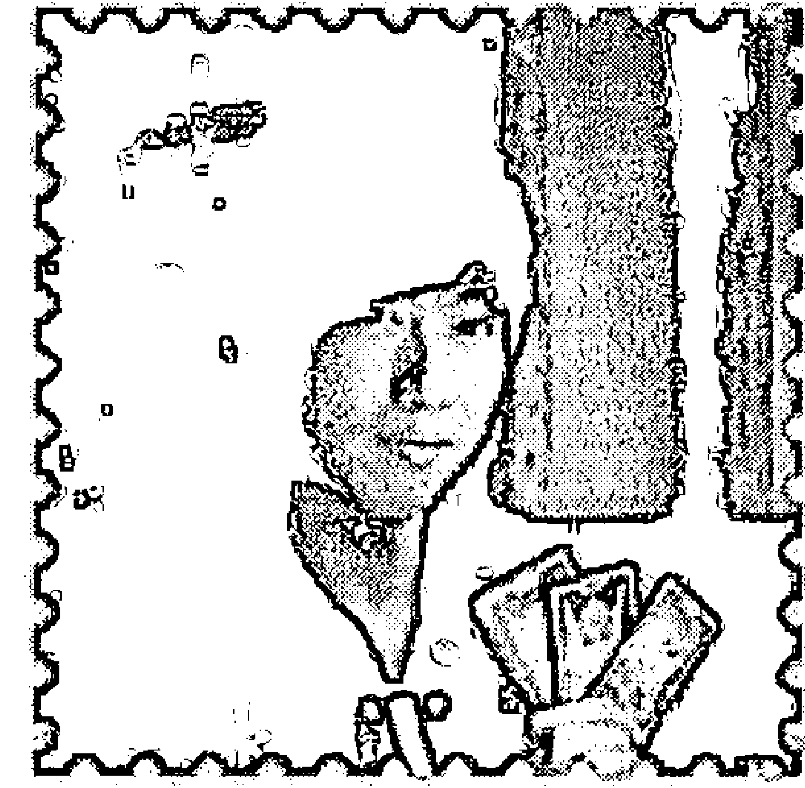

邓斐，字嘉毅，号仲天，男，（公元1981年~2013年）。

格林塔罗馆创始人之一

高级营养师

国内知名神秘学者

三昧塔罗体系创始人

策略管理咨询学创始人之一

著有《塔罗三昧》

联合著作《三昧·入门九章》

全球首度发现塔罗与易经的对应原理，并领导研发出“元素五根决”、“飞星论断法”、“塔罗堪舆学”、“塔罗推时论”等多门咨询技术与学科。

# 上卷：意义

# 自序

综观国内外历年有关塔罗的书籍，各项牌意已经阐述得非常多了。本书并非常规的塔罗学习书籍，而是另辟蹊径，以多个不同于过往的角度去诠释塔罗。全书从多个神秘学领域出发，纵横参照对比，层层剖析塔罗超越牌的应用与道理，语言精炼而不冗长，书不尽言，言不尽意。

《塔罗三味》，合共有上卷《意义》与下卷《构理》共计两卷组成。上卷《意义》主要归纳塔罗牌的牌意、对应，以及“三昧塔罗”体系的对应关系，既可以作为入门者的牌意速查手册使用，也可以为进阶者的牌意理解开拓思路，其中隐藏了“三昧塔罗”阵列的变化玄机，供读者玩味。下卷《构理》包括九个篇章，全面讲解了塔罗的核心规律、构造和应用法则，不仅是整个“三昧塔罗”体系的论述，也是作者多年对塔罗等神秘学融会贯通认知与运用的精要。

塔罗牌，最重要的表现是两个部分，结构与象征。象征是牌意的表现，结构是内在的关系。凡学习塔罗者，无论深浅高低，皆不脱离这两个基础。因此，初学者应着重从这两个部分入手，进阶者在返本溯源之后也尤其应深入探索。

塔罗（TAROT）蕴有变化的含义，阿卡纳（Arcana）则有奥秘的意义。塔罗的实质，是揭示万事万物变化的奥秘，如同给我们一把钥匙，去打开万物运作的密码。

### 《塔罗三味》

因而，掌握解密的法则，相较于去进行解密的过程本身，则更加重要。在本书中，下卷《构理》的九篇文章里，便是讲述此解密法则。

《总纲》是本书的引领，包含了塔罗的整体描绘、意义衍生法则、象征与结构、历史意义、应用宗旨、理解途径，以及深蕴其中的塔罗理念的总论。

《说篇》是针对于塔罗牌中既为基础又为统摄的大阿卡纳的关联、特质、衍生象征进行阐述。虽只阐述二十二张，然世间无论塔罗张数、序列、图像的变化尽皆仿此，可一概而论。

《序篇》是对全副牌的序列进行拆解，并予以重构，以对应于宇宙间万事万物从原初到未来的循环对应，故物之始终、事之往来，皆令其有迹可循。

《杂篇》中将意义两两相对的牌，以精炼短句概括牌意，互动相呈，令读者知其中纵横相摩的法则。

《真篇》是对塔罗进行正位推演，阐述塔罗中正心为人的道理，以使世人明晰塔罗的意涵，此在“三昧塔罗”体系中称为真无塔罗。

《意篇》是对塔罗进行逆位推演，反向考究缺失，阐述塔罗中处事谋略的原理，以使世人明晰塔罗的隐喻，此在“三昧塔罗”体系中称为形意塔罗。

作为人类本身，对于自身探索、生存之道，向来为作者所重视，并认为这远超于塔罗分析预测的重要性。因此，《真篇》所载的真无塔罗，与《意篇》所载的形意塔罗，这两篇合称即是“真意”，是作者认为最有价值的部分，也是作者对于塔罗深邃认知后所得的观念。

《星篇》以塔罗中的星相对应为基础，群星运行形成阵列为变化的法则，提点出塔罗中各牌相互关联、交相辉映的法则，从而运转诸星，重构阵列，以解析万事万物关联所呈现的形态。星即是“形”，是万事万物现象的基点，故此篇又称星运塔罗。

《式篇》以万事万物所呈现的形态为基础，化形态为象征，超越塔罗所附牌之本身，将万事万物皆视为牌阵，从而解析事物发展之态势。式即是“势”，是万事万物运行发展的趋势，故此篇又称万象塔罗。

《星篇》与《式篇》从塔罗法则的演化延伸中脱胎而出，通过塔罗结构衍伸牌意与用法，但就好像是事物现象千变万化一样，它们不过是某种分析预测的方法而已。所以这两篇合称即是“形势”，表示不过是有形迹可以探索的路径而已。

《数篇》以塔罗背后的“数”为根基，将人在宇宙中的变化规律、公式定则，层层总结而出，自创塔罗九级数盘。但是由于塔罗九级数盘演化繁复，因此文中简介其理念，露其一隅，供有兴趣者观之，以使知塔罗应用无穷尽矣。

本书抛砖引玉，综合各项学科辨析牌理，或与各方研究者认知不同，权供参考，以使世人知道塔罗之道，其用无穷，百家争鸣，各有千秋，于愿足矣。

——仲天

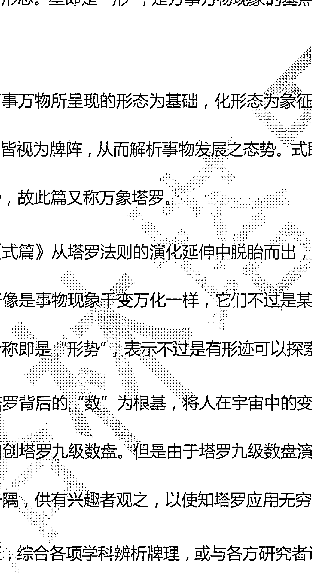

# 牌意总览

每张阿卡纳表达的意义，呈现出三种不同的模式。初始的核心意义，称为**“本源意义”**，也叫做关键词。由其进行扩展到具体的表述方面的意义，称为**“引申意义”**。而塔罗体系与其他体系融合之后而派生出的新的意义，称为**“衍生意义”**。本书中只介绍本源意义和引申意义，暂不介绍过多的衍生意义，供各位去思索和领会。三种不同的意义模式，即为塔罗三味。

小牌的意义可参照相对应的大牌。

塔罗自有其理，构出其干，显现其意，以供世人取义获用而已。

# 大阿卡纳

## O 愚者 The Fool

★天王星★开始者★傻瓜★ 风 ★
★ 0、22、1 ★ 铀 ★ 北、西北、西南 ★ 牛 ★

【冒险、流浪、创新、纯真、特立独行、反传统、无法掌握、人道主义】

#### 正位
1、无法控制的变革与改革创造力，一意孤行，盲目的追求梦想，友善，精神狂乱，过度兴奋，幽默亲切。
2、进入全新环境，有好奇心，创意，大胆尝试新方法。
3、不拘泥形式、不理会世俗看法的自由恋爱，单恋，私奔。
4、神经衰弱，因压力过大而引发疾病。财务孤注一掷，不计后果。

#### 逆位
1、古怪，叛逆，无秩序，冒险行动，追求梦想而无视物质损失，离家，漫无目的，散漫，粗心，离群自闭，行为不检，不理会旁人。
2、过于信赖他人，成绩差，无耐性，无责任心，常迟到，没有计划，走错方向，过度小心而错失机会。
3、缺乏感情或感情轻浮，理想化，不切实际，空虚，忽冷忽热，不安，感到束缚。
4、疾病或烦恼解决。无理财能力，收入不定，没有计划，乱花钱。

## I 魔术师 The Magician

★水星★男巫★贤者★ 风 ★
★ 16、2 ★星期二★ 汞 ★ 东、西北 ★ 房子 ★

【创造、行动、控制、变动、迅速、传播、沟通、学习、传送、理性】

#### 正位
1、事情的开始，改变行动，熟练的技巧，思维缜密，口才佳，有把握和自信，贯彻自我的意志，善于模仿和学习，处事得宜，反应灵敏。
2、良好开端，发展顺利，计划成功，用新方法取得好的效果，注意细节，受到认同，能发挥自己能力。
3、恋情或婚姻的开始，受到欢迎，性格协调，互相鼓励，能实现梦想，交往轻率。
4、创造财富，合理交易。可靠意志力克服疾病。

#### 逆位
1、意志薄弱，胆小，知识不足，受骗，缺乏热忱和行动力，走入错误方向，消极，无判断力，失败，模棱两可，失去信用。
2、优柔寡断，能力与努力不足，缺少创造力，不进则退，考试失利。
3、爱情无进展，不易表达心意，不专一，虚伪的交往，冷酷，缺少体贴，欺诈。
4、受骗，好赌，乱用钱，倾家荡产。疾病与肠道有关。

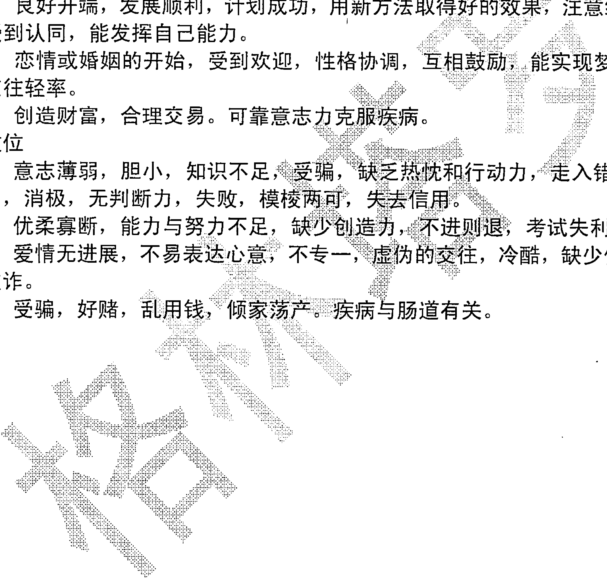

## Ⅱ 女祭司 The High Priestess

★月亮★女巫★女祭司★ 水 ★
★ 2、3 ★星期一★ 银、铝 ★ 北、西 ★ 骆驼 ★

【智识、潜力、无行动力、需求、母亲、不安、善变、敏感、害羞、潜意识、依赖、神秘】

#### 正位
1、神秘潜力，知性，深思熟虑，敏锐的洞察力，准确的直觉，静默与坚持，强大的战斗意志，包容，敏感，有同情心，想象力丰富，理解力强。
2、冷静思考，未揭露的未来，责任感，专心研究，展现专业，求知欲，良好的考试运。
3、冷淡而理智的恋情，精神恋爱，关系不明朗，独立自主的女性。
4、决策重大投资可获利，对金钱和物质的欲望增强。

#### 逆位
1、胆怯、善变、嫉妒，神经质，无知，贪心，过于洁癖，目光短浅，自命不凡，有勇无谋，自尊心过高，判断错误，行为不被理解和接受，缺乏理解力，粗心，自我封闭，精神紧张。
2、没有成就，内心迷惑，懒怠，工作不稳定，固执，不专心，考试失败，受到冷漠对待和嫉妒，恶意中伤，易得罪别人。
3、无结果的感情，独身主义，任性，晚婚，无趣的女性。与朋友争执，孤独。
4、无计划的不断花费，因赌博而损失财物。肠胃病，贫血，不孕。

## III 皇后 The Empress

★金星★母亲★女皇★ 土 ★
★ 3、4 ★星期三★ 铜 ★ 西、南 ★ 门 ★

【母性、丰收、生长、感性、和平、平衡、浪漫、交换、艺术】

#### 正位
1、成功，收获，稳定，美貌，艺术，无忧无虑，良好的环境，愉快的旅行，休闲，幸福。爱好和平，开朗合群，受人喜爱，细心，善于营造气氛。
2、乐于工作学习，获得很高的报酬和评价。艺术才能，以女性为对象的工作。
3、结婚，生产，有结果的恋情，优雅生活，女性魅力，母性，受人注目。
4、外表变好看了，高收入，生活富裕，获得礼物，财运佳。

#### 逆位
1、懒散，放纵，无主见，不活泼，缺乏上进心，耽于享乐，无法解决事情，看不到成果，虚荣，任性，自负，与家人产生纠纷。
2、无成就，懈怠，内心迷惑，工作不稳定，计划不能成功或者需要长时间才能取得效果，不被重视，成绩低落。
3、无进展的恋爱，诱惑，优柔寡断，同居，家人反对，不理想的婚姻，轻浮，爱情不专，嫉妒心强，过度保护，没有女人味，遥远的婚期。
4、肥胖，不孕，泌尿系统疾病，收入减少，浪费，负债，资金不足，不必要的损失。

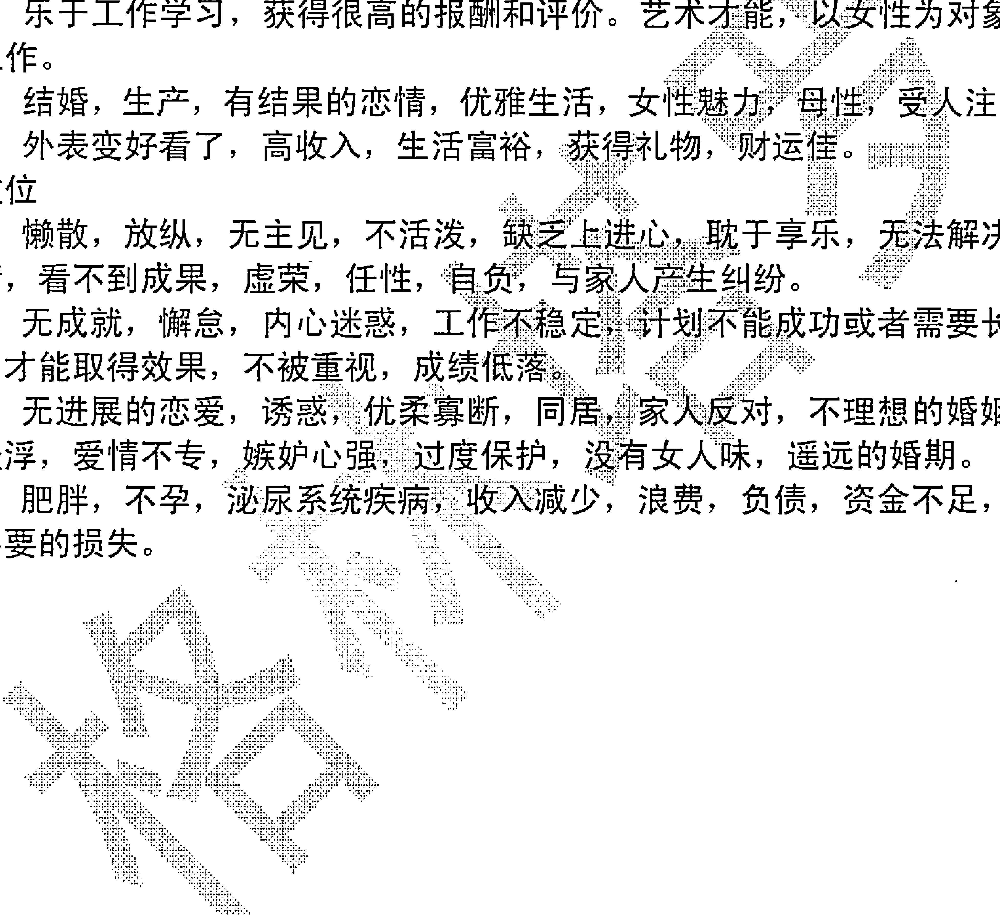

## IV 皇帝 The Emperor

★白羊座★父亲★皇帝★ 火 ★春★
★ 4、9、5 ★星期二★ 铁 ★ 南、东 ★ 红宝石、钻石 ★ 窗 ★

【支配，领导，权威，自我控制，父性，快速，创造，领先】

#### 正位
1、光荣，胜利，意志坚强，有勇气的行动，责任感，专制，达成目标，安定的状况，精神的孤单，根基稳固，可靠，活跃，结识有力人士。
2、以坚强的意志和手段获得成功，有领导能力，组织能力，可信赖，有高目标和理想，考试顺利，有野心。
3、战胜情敌，横刀夺爱，丈夫跋扈，缺乏感情，与年长者恋爱，条件优厚，主动的感情，值得依靠。
4、获得地位与权力，继承家业，收入稳定。对金钱感到满足。

#### 逆位
1、幼稚，无责任感，任性专横，无自信，意志薄弱，欠缺理智，傲慢，行动不足，被支配，占有欲和控制欲强烈。
2、工作过度投入，固执，突然失败，事与愿违，没干劲，傲慢，从基础重新开始。
3、无法告白，勉强的感情，虚有其表，不可靠的男性，父亲反对。
4、损失，贫困，被别人拿走金钱，无经济基础，成人病。

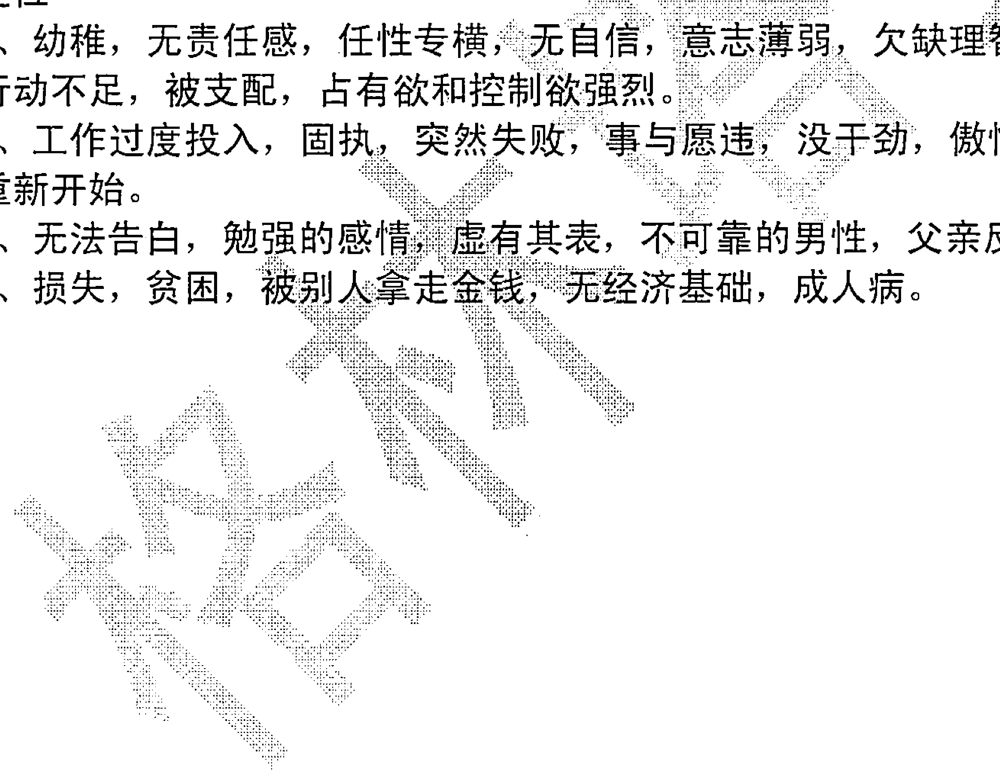

## V 教皇 The Hierophant

★金牛座★知识★教皇★ 土 ★晚春★
★ 5、6 ★星期五★ 铜 ★ 西、东南 ★ 绿宝石 ★ 指甲 ★

【援助，学问，一体化，表达，道德，拥有，感官，保存，缓慢，固定】

#### 正位
1、安定，坚强，包容，有条理，踏实，援助，同情，宽宏大量，遵守规则，精神满足，获得良好的建议，良好的商谈对象，受人信赖，可藉宗教获救，凡事向好处看。
2、长辈的引领，贵人相助，团体作业，接受多方意见，受到上司重视，有耐性，思想保守，与学长或同学一起努力而成功。
3、经由朋友介绍开始恋情，年纪小的恋人，爱情加深，费心的爱情获得回报，良好的中间者，精神恋爱，值得尊敬的情人，长久的感情，安全感。
4、精神愉快，为别人使用金钱，小心钱包。

#### 逆位
1、保守，固执，迟缓，重视物质，占有欲强烈，应变能力低，错误的讯息，恶意的建议，上当，援助被中断，自以为是，被利用以及放弃孤立，不依照传统，过度依赖，没信用，小气，太啰嗦而被厌恶，愿望无法达成。
2、过度保守或过度标新立异，武断，轻率，厌恶老师而对学业失去兴趣。不宜参加仪式或典礼。
3、烦人的感情，听信谣言，进度慢，缺乏体贴，无目标，父母反对，别有用心的男人。
4、零用钱被删减，欺诈，因帮助朋友而损失金钱，得不到援助，肝脏疾病，体质虚弱。

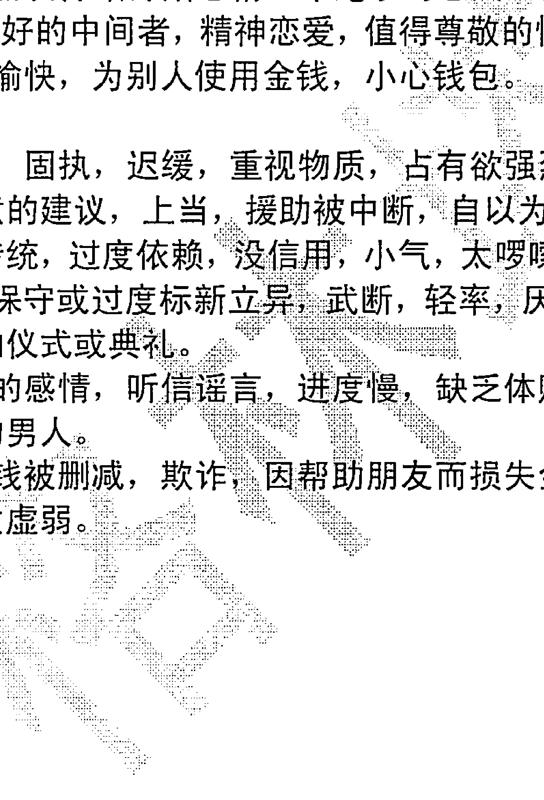

## VI 恋人 The Lovers

★双子座★情人★爱人★ 风 ★初夏★
★ 5、6、7 ★星期三★ 汞 ★ 东、北 ★ 玛瑙 ★ 剑 ★

【结合，吸引，选择，迅速，多变，传达，媒介，学习】

#### 正位
1、友善、机灵、多变、快速、多才多艺，擅长传递讯息、知性与理智，面临抉择，休闲，流行趣味，美丽，充满希望，容易改变的状况，好机会，同心协力。
2、事业得意，良好的合作关系，可决定将来出路，得到帮助，喜欢的科目进步，擅文科。
3、聚会中结识，朋友帮助而结合，感情融洽，长期稳定，被求婚，一见钟情，年轻而有魅力的异性。人际关系良好，增加朋友，活泼，平易近人。
4、休闲与交际费用增加。

#### 逆位
1、狡猾，善变，轻浮，紧张，决定错误，受引诱，纵乐过度，反覆无常，厌倦，争吵，虚有其表，优柔寡断，分离，转移目标，受到阻碍，结束关系，无助力。
2、不当的合作，背信或不信任，不稳定，无法持续，自我满足，松懈，希望无法达到，无计划，退休，成绩退步。
3、别离，被厌倦，冷漠逃避，背叛，不伦之恋，不被接纳，嫉妒，未婚先孕，短暂的爱情，因了解而分开。
4、浪费，无节制购物，破财，资金短缺。性病，咽喉发炎，吃得太多。

## VII 战车 The Chariot

★巨蟹座★权力★战车★ 水 ★仲夏★
★ 2、7、8 ★星期一★ 银、铜 ★ 北、东北 ★ 珍珠 ★ 围栏 ★

【胜利，意志，平衡，养育，保护，母性，安全感】

#### 正位
1、敏感，保护，顾家，节俭，自省，善良，想象力丰富，体贴，努力以获得成功，克服障碍，控制局势，自我主张，年轻男性，有效率，勇敢，积极，指挥，搬家。
2、完成目标，获取成果，迅速得到结果，独立，有野心，胜利，有自信，激起斗志，成绩进步，娱乐性行业。
3、打败情敌，夺爱成功，努力抓住爱情，不顾反对而结婚，企求无法高攀的感情，情场得意，发展迅速，大胆追求。活泼机灵，交游广阔。
4、获得希望得到的东西，体力增进。

#### 逆位
1、多疑，嫉妒，情绪化，没有安全感，过于执着，纠纷，争论失败，障碍，违反规则，暴力，突然失败，自私自利，遇到强劲对手，野心过大，太过鲁莽而导致冲突与障碍，顽固的男性，不良少年，失控，发生意外，丧失斗志，散漫，过分坚持己见。
2、挫折，无心机，失去兴趣，突然失误，期望过高而失败，逃避责任，丧失信用，成绩和效率低落。
3、失恋，口角，三角关系，强迫手段导致失败，输给情敌，逞强，冲动，被遗弃，懦弱，易变心，缺少表白的勇气，缺乏理智的恋情，不能说真话，被拒绝。
4、坐骨神经痛，脱肠，投机性理财，赌输钱，无节制，资金运转困难。

## VIII 力量 Strength, or Fortitude

★狮子座★勇气★调整★ 火 ★夏末★
★ 1、8、9 ★星期日★ 金 ★ 南、西南 ★ 猫眼石、红宝石 ★ 蛇 ★

【行动，自信，创造力，自我中心，目标取向，意志，内在力量，勇气，爱与坚强，软控制】

#### 正位
1、豪爽，愉快，领导，尊严，创意，不畏缩，自我与自信，有斗志，大胆行动，勇气的决断，新发展，大转机，异动，以意志战胜困难，坚强信念，努力，挑战危险。
2、大量训练，突破难关，发挥潜能，领导地位，表现杰出，取得资格或执照，脱离家族独立，受人所托专心致志到最后。
3、不顾反对告白，诱惑别人，以努力和忍耐抓住感情，热情，和好，女性援助，克服困难，长相厮守，感情主导者。
4、身体健康，打工，自食其力，财务正常，收支平衡。

#### 逆位
1、专断，固执，狂妄，奢侈，虚荣心强，胆小懦弱，怀疑，屈服于权威，没耐心，自大，自负，放弃，输给强者，犹豫不决。
2、学艺不精，好高骛远，勉强而为却适得其反，努力不足，欲速不达，过度疲劳，耽于玩乐而使计划失败，无法通过考试。
3、自我，故弄玄虚，经不起诱惑，被束缚，被情敌打败，自信不足，追逐爱情，无法把握机会，懦弱以至感情无法维持。
4、体力不足，疲倦，身体变差，受伤，挥霍金钱，不善理财，透支。

## IX 隐者 The Hermit

★处女座★预言者★隐士★ 土 ★初秋★
★ 5、9、10 ★星期三★ 汞、铜 ★ 西、西北 ★ 橄榄石、蚕丝玛瑙 ★ 手 ★

【服务，分析，严肃，寻求，引导，孤独，洞察力，沉思】

#### 正位
1、细心，俭朴，严肃认真，热心，勤劳，仁慈，擅长分析，牺牲奉献精神，智慧，见解卓越，享受孤独，倾听他人意见，有益劝诫，内省，自我思考，年长者。
2、独学，个人研究行为，默默向上，遵守规则，古板，注重细节，稳定，长期的计划。
3、默默的爱，纯爱，精神恋爱，脱俗，私密恋情，逃避，单身。
4、存钱，节约，获得援助，开源节流。

#### 逆位
1、挑剔，过于严苛，情绪紧绷，大惊小怪，无视劝告，孤僻，自卑，担心，缺乏沟通交流，幼稚思想，偏差，过于谨慎而失败，不宜旅行，神经质，多疑，不够通融。
2、虚有其表的知识，无法适应学校或公司，视野狭隘，选择错误的前途，过分忧累，不专心而出错，无法发挥，考试不顺利，嫉妒他人。
3、保守，怀疑感情，封闭自我，孤寂，轻浮的恋情，挑剔，无法传达思念，虚伪恋情，私密的爱，躲开机会，不成熟，过于骄傲而被厌恶。
4、低血压，手或脖子受伤，疾病无法痊愈。买便宜货而损失，买了不好的东西，无谓的花费。

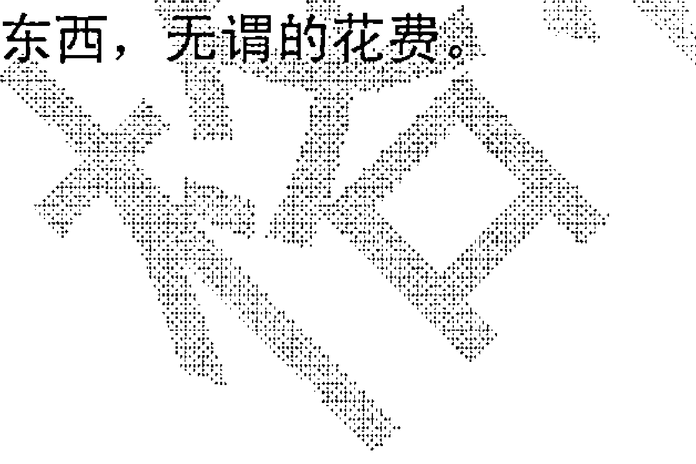

## X 命运之轮 Wheel of Fortune

★木星★循环★命轮★ 火 ★初秋★
★ 6、10、20 ★星期五★ 锡 ★ 南、西 ★ 合掌 ★

> 【轮回，转折，变化，扩张，提升，理想，希望，进步】

#### 正位

- 1. 乐观，幸运，大方，自信，仁慈，充满理想，心灵成长，信念，关键事件，新机会，新潮流，环境变化，状况好转，问题解决。
- 2. 工作和财运的惊喜，再次挑战，转学，换工作，升职，改变现在方式，受到援助，考试顺利。
- 3. 一见钟情，命运的邂逅，偶然的契机，新恋情，比过去更幸福，与分离的恋人和好，交往的好机会，可以结婚。
- 4. 临时收入，取得想要的东西，病况好转，零用钱或收入上升。

#### 逆位

- 1. 过于乐观，夸张，放纵，连续不幸，挫折，计划失败，障碍，无法修正方向，恶性循环，中断，劣势，不宜投机，判断错误，低潮期。
- 2. 过于相信运气，计划停滞或失败，回到原点，经验不足，粗心大意，越努力越掉入陷阱，无成果，效率不高。
- 3. 失恋，情人变心，孽缘，迷失自我，短暂的爱，报应，落入陷阱，无法和好，不稳定的爱，错失机会。
- 4. 欺骗，丢失东西，超支。疾病慢性化。

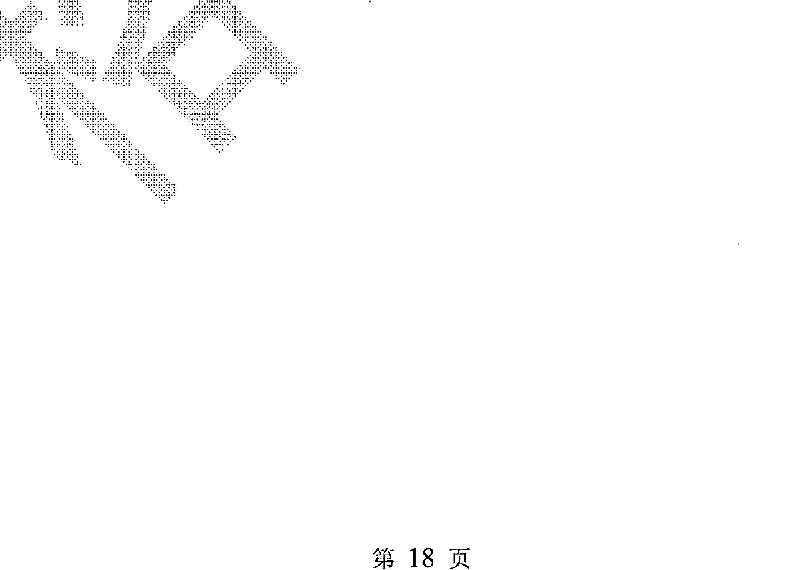

## XI 正义 Justice

★天秤座★自然★欲★ 风 ★仲秋★
★ 6、11、30 ★星期五★ 铜 ★ 东、南 ★ 蓝宝石、蛋白石 ★ 牛鞭★

> 【均衡，公正，冷静，道德，和平，协调，客观】

#### 正位

- 1. 美，和平，均衡，舒适，恬静，善交际，沟通，协调，光明正大，明理，重视道德，强烈正义感，公正，合理处理，彼此协调，中立，排解纠纷。
- 2. 全面努力，劳逸结合，身兼数职，正确判断，合理计划，各种成绩平均，法律相关工作。
- 3. 绝对的爱情，不够深入，秘密公开，劈腿，商量，理智，理性交往，真实了解。
- 4. 借贷，收支平衡，适度运动与休息，亲近自然。

#### 逆位

- 1. 依赖、多虑、缺乏自信、犹豫不决，偏袒，不公正，偏心，鲁莽行动，过于严苛，战败，决断错误，纷争，逃避责任，不平衡，虎头蛇尾。
- 2. 过度疲劳无法休息，偏颇的判断，过分保守，缺乏自信，不顾法则，非法勾当，只读特定科目，考试失误。
- 3. 沉溺于爱情，泛滥的爱，不合适的对象，欲求不满，周遭反对，被发现不专，被动，性格不合，第三者出现，不顾后果。
- 4. 赤字，收支不平衡，财务危险，过度疲劳，运动过度引发关节疾病。

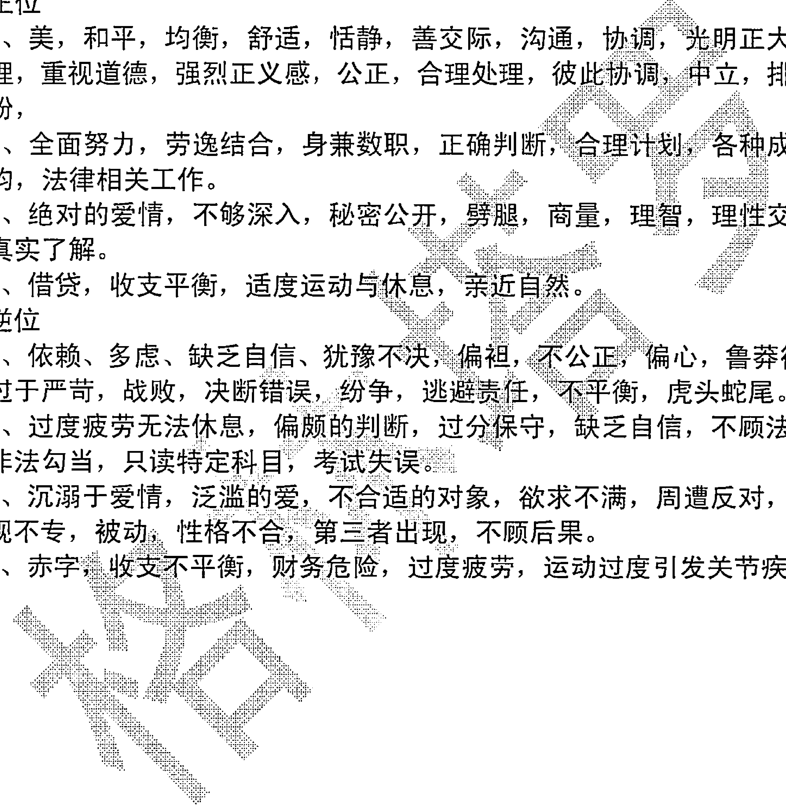

## XII 吊人 The Hanged Man

★海王星★变形者★倒吊人★ 水 ★仲秋★
★ 7、11、12、40 ★ 鎏 ★ 北、东 ★ 水 ★

> 【牺牲，暂停，等待，顺其自然，大爱，梦幻力量，直觉】

#### 正位

- 1. 仁慈，浪漫，想象力丰富，感受力强，自我牺牲，试炼，顺从，反省，清心寡欲，等待，不贪图眼前利益，换角度思考，忍耐使情况好转，接受考验。
- 2. 困难与障碍，一时不振，无法突破，多方学习，福利或义务工作。
- 3. 宠爱恋人，无结果的爱情，遭遇阻碍，试探感情，无法采取行动，等待后会好转，奉献的爱，考验，顾及对方立场。
- 4. 损失，不执着金钱，因义失财。入院可恢复健康。

#### 逆位

- 1. 欺骗，麻痹，蛊惑，过于理想化，无意义的牺牲，自我中心，计划失败，挣扎，不能解决问题，焦躁不安，徒劳的努力，无耐性，受他人影响不能做自己想做的事情，无希望，因私欲而失败，自我毁灭。
- 2. 盲目努力，遇到挫折就放弃，居于劣势，厄运，事倍功半，无条理，只顾自己利益，被动而失败。
- 3. 苦恋，耐力不足而逃离感情，不得要领，没有回报，没有发展，藕断丝连，把小事弄得不可收拾。
- 4. 得不到应有的报酬，贪心导致失败，情绪化而没有回报的花费。畏惧入院而招致大病。

## XIII 死神 Death

★天蝎座★再生★死亡★ 水 ★仲秋★
★ 1、13、50 ★星期日★ 铁 ★ 北、东南 ★ 黄晶、绿松石 ★ 鱼★

> 【结束，改变，更新，神秘，控制，重生】

#### 正位

- 1. 直觉，敏感，冷静，重生，意志坚定，观察细微，事件的结束，激烈的变化，残局，与过去告别，绝交，败北，惯用的思考方式不合时宜，暂时别离，全新出发，绝望，遗失，关系恶化，自闭，为时已晚。
- 2. 考试失败，退学，辞职，失业，失去目标，放弃计划，交易终止或停滞。
- 3. 失恋，分手，离婚，隔膜加深，不幸，没有未来的爱情，抛弃情人，无进展。
- 4. 意外染病，重病。奢侈，任意购买，负债，灾难，事故，火灾，长久习惯戒除。

#### 逆位

- 1. 阴沉，残忍，猜忌，独断专行，新开始，挣脱窘境，恢复勇气，焕然一新，改变想法，改变印象，挽回名誉，重生，顽固不肯放手，恐惧，沉溺于过去。
- 2. 改变方法，从头再来，落榜，有决断力，挽回劣势。
- 3. 从失恋中解脱，结束感情，感情重生发展，开始新生活，生产，主动的感情。
- 4. 疾病康复。获得新收入，有人还钱，意外的收入，失而复得。

## XIV 节制 Temperance

★射手座★平衡★艺术★ 火 ★冬★
★ 3、14、60 ★星期四★ 锡 ★ 南、北 ★ 黄晶、绿松石 ★ 托手★

> 【真理，自由，扩张，净化，自我控制，和谐，一致】

#### 正位

- 1. 自由，率直乐观，果断，热情大胆，迅速主动，追求，自我控制，中立，良好家庭，重视实用性，调整，交换有利条件，生活单纯顺利，幸福安乐。
- 2. 踏实努力，稳定，计划顺利，默契良好，成绩进步。
- 3. 由友谊转为爱情，压抑情感，团体交往，互相帮助的恋人，交往顺利稳定，精神结合，信赖，意外邂逅，单纯的爱。
- 4. 身心良好。节俭，筹措得宜，可得利益。

#### 逆位

- 1. 放纵，夸张，粗暴，好赌，过分乐观，无节制的损耗，丧失信用，失去朋友，浪费时间和金钱，欲望过多，无法看清险恶，缺乏调整力，疲劳。
- 2. 不得要领，自尊心过高而失败，团体活动形成负担，工作不稳定，合作不融洽，过度情绪化，时机不准，精神松懈，日夜颠倒的生活。
- 3. 幼稚的恋情，持续单恋，理想过高，无法压抑情感，三心两意，没有默契，不懂控制感情，疲惫的身体，无法主动，想见而不能见，感情动摇。
- 4. 过度享受美食而肥胖，视神经受损。奢侈浪费，过度虚荣而破财。

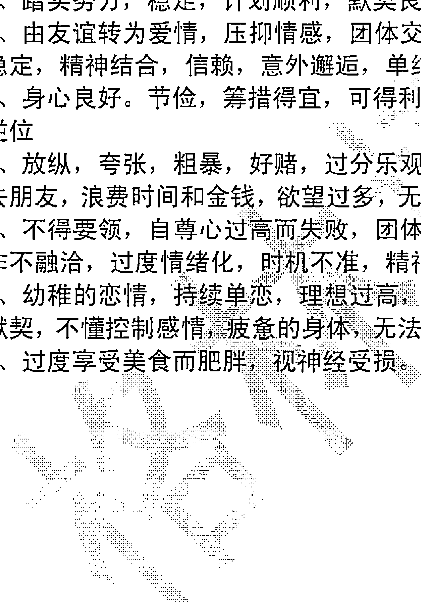

## XV 恶魔 The Devil

★摩羯座★选择★魔鬼★ 土 ★冬★
★ 8、15、70 ★星期六★ 铅 ★ 西、东北 ★ 黑玉 ★ 眼睛 ★

> 【诅咒，束缚，诱惑，物质主义，共鸣，计划，控制，局限】

#### 正位

- 1. 意志薄弱，沉迷情欲，被骗，误入歧途，犯罪，被出卖，圈套与阴谋，堕落，妄想，束缚，诅咒，追求外在物质，沉迷于刺激，卑躬屈膝，荒诞，小气，势利，过分忍耐，毅力，踏实，有野心。
- 2. 错误的方向，不可告人的行业，色情交易，对秘术感兴趣，孤立，受到诱惑，束缚，荒废事业，夜游过多而无心工作。
- 3. 通奸，外遇，性的背叛，身体作武器，私密恋情中无法自拔，过分紧张，孽缘，心胸狭窄，沉溺感官刺激，被玩弄，憎恨，嫉妒。
- 4. 与皮肤、关节相关的疾病。欺诈，偷窥，不正当收入，被骗，举债度日。

#### 逆位

- 1. 孤独，功利，阴暗，自私，斤斤计较，解脱束缚，离开坏朋友，拒绝诱惑，情况好转，思想恢复开放，得到自由，放下重担。
- 2. 开始认真，达成工作目标，获得正确知识，戒掉恶习，急剧变动，逆境，革职，灾难，人事调动。
- 3. 结束孽缘，拒绝性诱惑，赎罪，表达真心，不再轻浮，摆脱感情困扰，无法自拔的深入恋情。
- 4. 生活改善。获得工作报酬，转亏为盈，可投资。

## XVI 塔 The Tower

★火星★蛇★塔★ 火 ★
★ 5、16、80 ★星期四★ 铁 ★ 南、西南 ★ 口 ★

> 【毁灭，强行变化，灾难，终结循环，行动，建构，攻击，破坏，性，暴力，意志】

#### 正位

- 1. 暴力，侵略，破坏，好斗，鲁莽，没耐性，意外灾难，危险，失败，名誉受损，骄傲自大，情况急转直下，失去一切，致命打击，玩火自焚，信念崩溃，麻烦多。
- 2. 过于骄傲而疏忽努力，急剧变动，逆境，闯祸，人事调动，计划失败，离职，退学，停学。
- 3. 破碎的恋情，谣言，强暴，与危险的男人交往，因出轨或通奸而受伤，意外分手，无法挽回。
- 4. 火伤，住院。遗失金钱，财政赤字，损失，破产。

#### 逆位

- 1. 积极主动，行动力强，意志力强，行事果断，状况不佳，困境，内讧，关系即将破裂，背黑锅，事故或麻烦解决却留下后遗症，紧急状态，危险气氛，口舌之灾。
- 2. 错误的判断或犯错，失去追寻目标的勇气，转学或换工作失败，急需解决问题，过分骄傲自满和紧张而导致失败。
- 3. 错估爱情，感情冷却，不认真的爱情，即将结束的恋爱，受到打击，解除对立状态却留下不信任的感觉。
- 4. 精神官能症。遗失零钱，表面风光。

## XVII 星星 The Star

★水瓶座★星辰★星星★ 风 ★冬★
★ 4、17、90 ★星期六★ 铅、铀 ★ 东、西北 ★ 蓝宝石、紫水晶 ★ 鱼钩 ★

> 【希望，灵感，心灵能量，改变，不规则，人性】

#### 正位

- 1. 冷静，理智，自我，有创意，反应灵敏，思想前卫，关怀社会与人性，光明的未来，希望，满足，美丽，丰收，理想主义，事情进展顺利，幸运夜，愿望实现。
- 2. 努力有了成果，定时制，夜晚的工作，良好方针，创造能力，取得专利，考试通过。
- 3. 信任，尽心奉献，怀孕，理想的异性，朋友或母亲的帮助，好预兆，由友情到爱情，电话联系感情。
- 4. 恢复体力，优秀的治疗，得到良药，身心痊愈。意外之财，财源滚滚，靠感觉可获得收入。

#### 逆位

- 1. 冷酷，古怪，不切实际，没有秩序，脱离现实；遭遇挫折，好高骛远，事情过度发展，失望，唠叨，不守信用，厌倦，厌世。
- 2. 失落感，过度保护，缺乏创造力，厌倦工作与读书，对将来恐惧，缺乏信赖，期望过高。
- 3. 单相思，自作多情，嫉妒，猜忌，强迫的爱，私密恋情，缺爱的生活，不可期待的对象，未来希望渺茫，以貌取人，缺少沟通，欲望过高。
- 4. 肥胖，过度疲劳引发疾病。无金钱观念，经济纠纷，破财，得不到应有的代价。

## XVIII 月亮 The Moon

★双鱼座★月亮★月亮★ 水 ★初春★
★ 7、18、100 ★星期四★ 锡 ★ 北、西 ★ 紫水晶 ★ 头后 ★

> 【善良，慈悲，牺牲，不安，欺骗，迷惘，变化，困惑】

#### 正位

- 1. 不理智，思绪混乱，控制力差，城府很深，不切实际，迷惘不安，动摇，背叛，改变心意，泄露秘密，中伤，危险，恐怖，暧昧，不好的预感应验，潜藏的敌人。
- 2. 重要的转业，家庭的牺牲，错误的知识，受到恶意中伤，目标不定，毫无进展，提防诈骗，犯错，夜生活的工作。
- 3. 丑闻，三角恋情，令人内心不安的爱，恋人背叛，家人反对，流言，情敌出现。
- 4. 家人生病，精神性疾病，妇女病，小伤。被骗，不稳定的收入，财务危机。

#### 逆位

- 1. 善良，纤细，无私，直觉准确，包容力强大，改变，反覆无常，解开误会，消除迷惘，去除困难，揭穿谎言和伪装，遭受报应，逐渐好转。
- 2. 立场转变，直觉应验，意志不坚导致犯小错误，躲过最坏结果。
- 3. 多愁善感，被引诱，发现虚伪的恋情，误会消除，被动的等待。
- 4. 身体状况好转。临时收入，双亲援助，过度期，危机将解除。

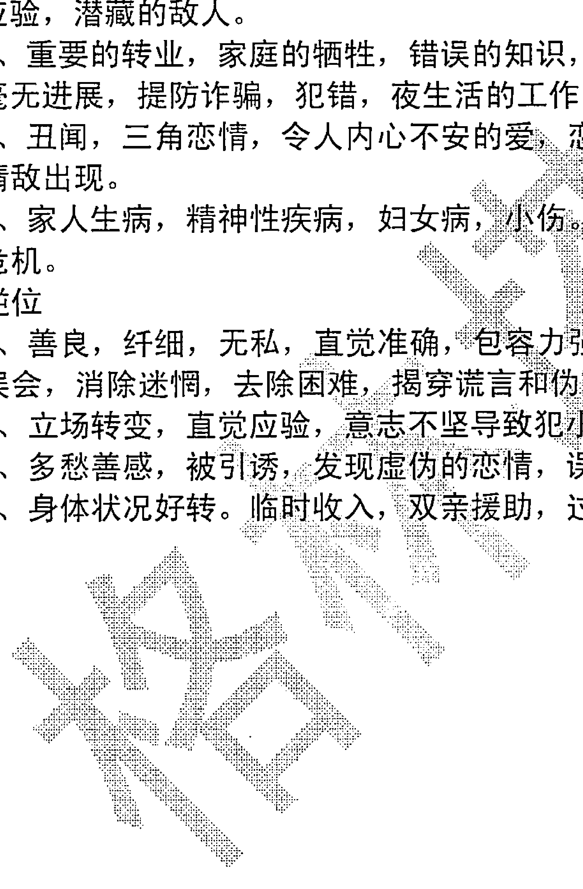

## XIX 太阳 The Sun

★太阳★太阳★太阳★ 火 ★
★ 1、8、19、200 ★星期日★ 金 ★ 南 ★ 头 ★

> 【追求，自我，活力，创造，力量，表现方式，生命，启迪，协作】

#### 正位

- 1. 热情，自信，领导力强，创造力，擅长表现自我，幸福，繁荣，喜悦，活跃，结交良友，成功，得到满意结果，受欢迎，成长，信赖，积极，得到帮助。
- 2. 工作顺利，升职，好开始，达到目标，积极，工作环境改善，潜能发挥，有人帮助而成功，成绩突进，学业成功。
- 3. 爱情愉悦而加深，恋情公开，受欢迎，决定结婚对象，婚姻幸福满足，恩爱。
- 4. 身心活力旺盛，运动才能增进。能力受到认同而收入增加，储蓄增长，赌运佳。

#### 逆位

- 1. 专制，傲慢，夸大，任性，孤独，嫉妒，意志消沉，开始有麻烦，计划延迟，绝交，运气低落，自以为是，生活不佳，人际关系不好，过于相信幸运，幻灭。
- 2. 不安，失去信心，不听劝告，无耐性，固步自封，无固定工作，工作上的损失，失业，求职难，游玩的诱惑，成绩退步。
- 3. 过分冲动，感情破裂，爱情疏远，失恋，分离，结果不明的恋情，离婚。
- 4. 体力不足，健康状况恶劣，对身体过于自信而生病。损失，浪费，奢侈，赤字，无收入，因贪慕虚荣而破财。

## XX 审判 The Last Judgment

★冥王星★超越★永恒★ 火 ★
★ 20、300 ★ 鈃 ★ 北、东 ★ 牙齿 ★

> 【复活，更新，觉醒，审判，赦免，神秘，掌控，意志，隐藏资源】

#### 正位

- 1. 直觉，意志力强，转换能力，丰富资源，全新出发，精神觉醒，和好，危机解除，遇见老友，必要的审慎，判决，下决定有好结果，好消息，公开，改革期。
- 2. 产生坚定信念，决定再出发并实行，回到原点，继承家业，获得帮助前往，事业崭露头角，升职，好开始，决断。
- 3. 言归于好，旧情复燃，遇见以前的情人，结婚的可能，真心恋爱，公开爱情，爱的奇迹。
- 4. 恢复健康，手术成功。失而复得。

#### 逆位

- 1. 恐怖，极权，控制，残酷，幻灭，勇气不足，自欺欺人，优柔寡断，坏消息，失败，懦弱，一蹶不振。
- 2. 劣等感，计划、建议、应聘不被接受，蒙蔽，遭上司压制，不被采用，受阻。
- 3. 暧昧不清，分手，惰性，对爱情失望，不能重修旧好，嫉妒心重，辜负对方诚意，消失，故我，留恋过去。
- 4. 体弱多病，胃肠病，难以痊愈。无法偿还的负担，失去财产，遗失重要东西。

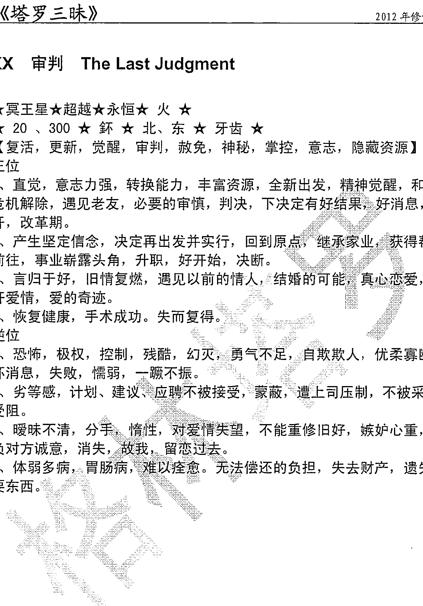

## XXI 世界 The World

★土星★太一★宇宙★ 土 ★
★ 4、21、400 ★星期六★ 铁、铅 ★ 西、东南 ★ 钻石 ★ 十字 ★

> 【达成，成就，履行，贡献，现实，责任，忧郁，冷漠，严肃，无情】

#### 正位

- 1. 严肃认真，自律，谨慎，负责，雄心勃勃，胜利，成功，事情完成，光明的未来，人格高尚，有追求，达到标准，完美状态，快乐而美好的结果。
- 2. 合格，找到工作，获得资格，独立创业，升职，留学。
- 3. 热恋，有女人缘，单恋有结果，受到羡慕的爱，希望中的求婚场面，幸福婚姻，模范情侣，能帮助事业的情人。
- 4. 克服疾病，手术成功。收入上升，事业成功，还清贷款。

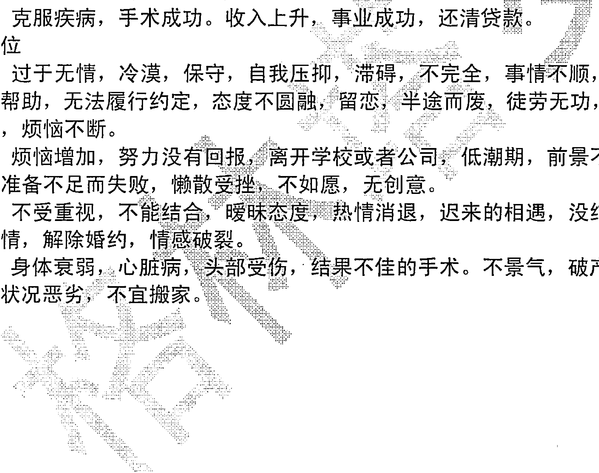

#### 逆位

- 1. 过于无情，冷漠，保守，自我压抑，滞碍，不完全，事情不顺，迟来的帮助，无法履行约定，态度不圆融，留恋，半途而废，徒劳无功，不成熟，烦恼不断。
- 2. 烦恼增加，努力没有回报，离开学校或者公司，低潮期，前景不好，因准备不足而失败，懒散受挫，不如愿，无创意。
- 3. 不受重视，不能结合，暧昧态度，热情消退，迟来的相遇，没结果的爱情，解除婚约，情感破裂。
- 4. 身体衰弱，心脏病，头部受伤，结果不佳的手术。不景气，破产，金钱状况恶劣，不宜搬家。

## 小阿卡纳・权杖

### 权杖 ACE

★四面风★火之源★
行动的开始——星星逆位——刑——愚者正位★86★

> 【创造，勇气，激情，机会】

#### 正位

蕴涵创造力，重大事件的开端，新发明的诞生，新机会，好时光。诞生，毕业，展开交际，冒险，创造性。

#### 逆位

采取新行动失败，事件开始情势不佳，前途不明，丧失力量，一无所获，无魄力，颓废，为感情而心痛，流产或堕胎。

### 权杖二

★命运★白羊 00—10，火星★3月21日——3月31日★
实质的决定——太阳正位——刑——正义正位★17★

> 【支配，勇敢，权力，创新】

#### 正位

拥有权力和威力，开创新生活，有勇气与创造力，行动力强，外向，率直，独立，坚忍。父亲、社长、地位、权威、获得财产，实现梦想，充满勇气，健康，勤勉。

#### 逆位

冲动，固执，不耐烦，易恼火，侵略性，怪癖，垄断性多嘴，陶醉于权力而失去理智，意志不坚，事情进展遇到麻烦，出现意外事故，行为被拘束，生活贫困，受伤或生病。

### 权杖三

★伙伴关系★白羊10—20，太阳★4月1日——4月10日★
地位的进展——审判正位——合——隐者正位★27★

> 【美德，团体，合作，统一，领导，尊荣，个人野心，变革】

#### 正位

好预兆的开端，探索新的方向，合作，协调，获得协助，立场坚定，事业成功，开始新旅行，有新情侣，成功的异地恋爱，变化，改革。

#### 逆位

局势不佳，计划终止，合作不良，缺乏远见，无领导力，不负责任，事业倒退，焦躁，愚蠢的行为，玩物丧志。

### 权杖四

★和睦★白羊20—30，金星★4月11日——4月20日★
体质的巩固——月亮逆位——害——皇帝逆位★37★

> 【完成，繁荣，安定，欢庆，浪漫】

#### 正位

和平繁荣，休闲，平静，美满家居生活，浪漫的情感，关系稳固，交往加深，婚期将近。学业或事业基础稳固，喜庆事件。真心诚实的表达，扩展视野，户外运动，研究宗教哲学，旅游，同情心，感恩，有礼貌。

#### 逆位

基础薄弱，人际关系差，虚伪，自大，失去平静状态，不能确定，无结果的情感，不稳定的恋情，悲观。过度玩乐，美食，喝酒，逃学，怠惰，赌博。

### 权杖五

★奋斗★狮子 00—10，土星★7月23日——7月31日★
能量分散——教皇正位——合——死神正位★53★

> 【冲突，争执，约束，限制，焦虑，变革，热忱】

#### 正位

变化，改革，企图心，热心，勇敢，强敌，面临抉择与挑战，发生激烈冲突，竞争中争取胜利，纷争，异性朋友，情敌出现。

#### 逆位

状况混乱而复杂，非公平竞争，受纷争牵连，骄傲，欺诈，诉讼，裁判，反省过去，不再犹豫，退休，无欲，宽大，寻求协助。

### 权杖六

★胜利★狮子 10—20，木星★8月1日——8月10日★
能量稳定——皇后逆位——冲——节制逆位★54★

> 【成功，胜利，自豪，神圣，智慧，忠诚】

#### 正位

高贵，愉悦，荣耀，渴望自由，哲学感，好消息，努力获得认同，正当胜利，取得进步，发挥长处，能力出色，取得资格，礼物，感情水到渠成，友善。

#### 逆位

缺乏判断力，不友善，狭隘的心胸，骄傲自满导致恶果，坏消息，内部的敌人，不诚实的交易，失败。开始太慢，得不到回应，做事拖拉导致不好的结果，不诚实。

### 权杖七

英勇 狮子 20-30，火星 8月11日-8月23日

自身的挑战——教皇逆位——冲——女祭司正位

【勇气，竞争，进取，激发，直觉，意志，独立】

**正位**
意志力强，冲动，有勇气，自信独立，乐于施舍，充满斗志，突破困难，战胜对手，获得成功，有利的立场，积极向上，贯彻自我意志。

**逆位**
无法决断，困惑，不自信，怀疑自我，被打败，错失机会，无知，滥用忠告，有麻烦，不能达成目标，屈服，受他人迷惑。

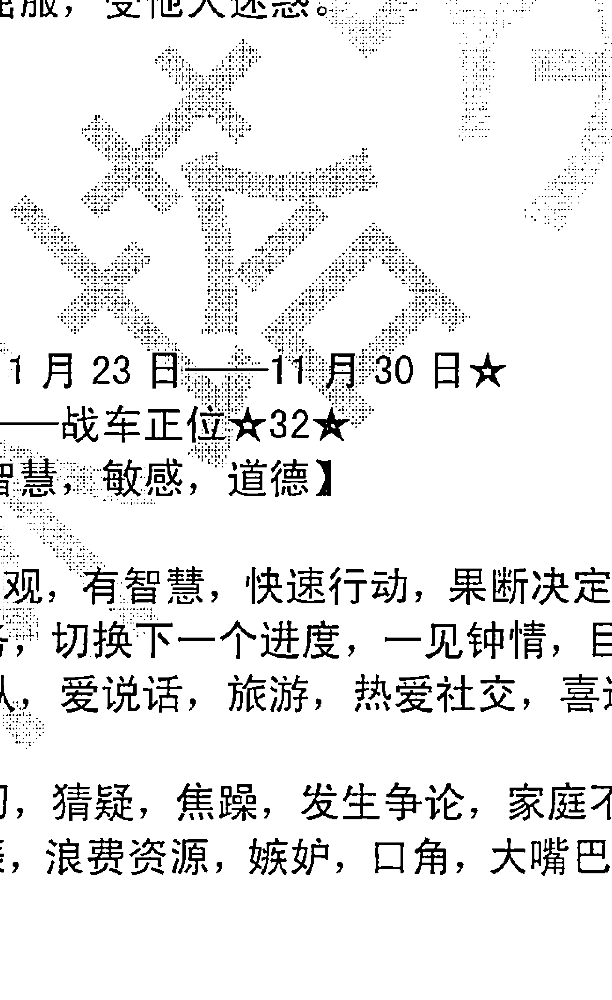

### 权杖八

迅速 射手 00-10，水星 11月23日-11月30日

体力充沛——皇帝逆位——冲——战车正位

【敏捷，快速，消息，结局，智慧，敏感，道德】

**正位**
富同情心，敏感，宽怀大度，乐观，有智慧，快速行动，果断决定，匆忙，急用，立即到达，结束手中任务，切换下一个进度，一见钟情，巨大的希望，接收到重要信息需仔细辨认，爱说话，旅游，热爱社交，喜迁徙。

**逆位**
过于敏感，不安，易无聊，唠叨，猜疑，焦躁，发生争论，家庭不和，行动不迅速，进展迟滞，一蹶不振，浪费资源，嫉妒，口角，大嘴巴，鲁莽，内八字，小心眼。

### 权杖九

力量 射手 10-20，月亮 12月1日-12月11日

评估重要目标——魔术师逆位——冲——命运之轮正位

【力量，预备，洞察力，感知，防御，无畏，侵略】

#### 正位

做准备，应付即将来到的困难，隐藏实力，蓄势待发，看不见的敌人，以气势取胜，保守秘密，确实的保护，用心良苦，积极而无畏，坚强，勇敢，开创，传播，野心大。

#### 逆位

遭遇逆境，气势低落，斗志衰弱，因障碍或挫折而认输，等得疲倦，没有机会，恶运，身体不健康，晚婚，不愉快，蛮勇，慌乱，随遇而安，不做准备。

### 权杖十

负担 射手 20-30，土星 12月12日-12月21日

选择过多——命运之轮逆位——刑——力量逆位

【压迫，付出，痛苦，试验，忍耐，欲望，责任】

#### 正位

信念强烈，责任感，组织能力，自律，固执，付出许多努力，因不懂拒绝而承受过重的负担，感到压力，无法自由，过度疲劳，热情冷却，成绩退步，情绪不安，劳累，疲惫，因获得成功而承受的压力，困难重重的未来。挥霍，孵化，虚荣，感应丰富，过度敏感。

#### 逆位

难以承受的压力，无法负荷而放下负担，艰苦而单调的生活，墨守成规，冷漠，受到损失，逃避责任，计划中止，操纵他人，欺骗，背叛，丧失判断能力，将就的策略，精神过度疲倦，搬弄是非。

### 权杖侍从

火的探索者 夏至-秋分 6月22日-9月22日 开始新计划 火之土 —— 星星逆位 ——和—— 恋人逆位

【创造，自信，热情，勇敢，交际，消息，知识】

#### 正位

一个诚实的人，好消息来临，优秀的助手或辅佐人员，值得参考的咨询。 美少年，自立的少年，好友，精神上的结合，有结果的恋情。

#### 逆位

坏消息，祸从口出，不安定的状态，令人担忧和困惑，缺乏成熟的思考和 断能力，靠父母生活的少年，懦弱，被人利用，秘密曝光。

### 权杖骑士

火的勇士 巨蟹20-狮子20/狮子 7月23日-8月23日 旅行或改变 火之火 —— 皇帝正位 ——刑—— 月亮正位

【力量，知道，魄力，自信，改变】

#### 正位

事业顺利，获得晋升，开始新挑战，自信，灵敏的行动，难以抗拒的魅力， 坏脾气，缺少谋略。运动员，突然的迁徙，直觉。

#### 逆位

突发事件，事情被中断，喧哗，吵闹的场面，意见分歧，情感破裂，分离 或分居。从事自由职业的男性。

### 权杖王后

火女神 天蝎 20-射手 20/射手 11月23日-12月21日

无穷潜力 火之水 —— 正义正位 ——合—— 恋人逆位

【力量，权威，愉悦，精力充沛】

#### 正位

精力充沛，热情而温暖，内心或地位很独立，有决心和能力，叛逆，精神世界丰富。值得信赖的女性或女性工作者，职业妇女，有自己的店，母性爱，魅力，打工，富裕生活。

#### 逆位

情绪化，傲慢，有阻力，发展受到妨碍，固执，小气，激烈的发言，吹捧，死心眼，拘谨而没有姿色的老处女。

### 权杖国王

火神 双鱼 20-白羊 20/白羊 3月21日-4月20日

自律 火之风 —— 愚者逆位 ——刑—— 正义逆位

【创造力，勇敢，能力，魅力】

#### 正位

心灵丰富的中年男性，父亲，伟大的人物，深切的思考，良心，智慧，教练，深藏不露，有教养和学识，优秀的父亲，态度圣明，诚实而有良知。

#### 逆位

热心工作的男性，心胸狭窄的男人，严苛，独断专行，傲慢，爱面子，偏见，一意孤行而失败，隐私遭到破坏。

## 小阿卡纳·圣杯

### 圣杯 ACE

井 水之源
情绪的开始——太阳逆位——刑——愚者正位
【创造，亲密，爱，直觉，交流】

**正位**
幸福，丰足，明朗，洞察，顺利，恋情的开始，求婚，休闲，真爱，顺利。

**逆位**
虚伪，不安定，变化，无爱意，单恋，烦恼与不安，喜悦中带着隐忧，过早结婚，背叛。

### 圣杯二

爱 巨蟹 00-10, 金星 6月22日-6月30日
情绪上的决定——魔术师正位——冲——世界正位
【爱，和谐，吸引力，寻求信任，关系，潜意识，母性，理想】

**正位**
不喜纷争，感觉敏锐，感受性强，热情，美好友谊，有人结婚。关系和谐，相互了解，真实的爱，意见与目的一致，远程交流，快乐的交往。

**逆位**
恐惧，多疑，脾气大，纵容不好的冲动，胆小，害羞，感受过度。失去朋友，关系对立，气氛僵持，不友好，爱情与友情对立，无法得到满足的爱。

### 圣杯三

丰富 巨蟹10-20，水星 7月1日-7月11日

情绪上的进展——月亮正位——刑——魔术师正位

【丰足，改善，成功，繁荣，和睦，团体，积极，冲力】

**正位**
勇敢，活跃，积极，有冲劲，记忆力强，目标达成，胜利，爱的实现，需要决定，团体交际，生活重新开始，矛盾关系和解，痊愈的伤，单恋，悸动。

**逆位**
神秘倾向，顽固，愤慨，嫉妒。事情做过头，乐极生悲，逾矩，不好的饮食习惯，做事拖拉，多管闲事，迟钝，遭朋友嫉妒而麻烦。

### 圣杯四

颓废 巨蟹20-30，月亮 7月12日-7月22日

情绪的巩固——女祭司正位——刑——塔正位

【混杂的愉悦，堕落，衰退，自我，沉思，冷漠，情绪化】

**正位**
寂寞无聊，情绪化，身心疲惫，需调节，失望，缺少生活信心，厌烦，有礼貌，退缩，束缚，不愉快，关系发展过快，不满的爱。沉溺于过往的记忆，容易受周遭影响，善变。

**逆位**
慈悲，教育及服务人群，新的人际关系，新方法，新机会，脱离低潮期，改变方向，有新目标，视野开阔，好预兆，新朋友，入学。

### 圣杯五

抗拒 天蝎 00-10，火星 10月24日-10月31日

分离失落——命运之轮正位——冲——吊人正位

【失望，遗憾，丧亡，悲痛，沮丧，脆弱，冲动】

**正位**
后悔，无望，期待落空，缺憾，无意义的交际，思念无法传达，与情人分别，解除婚约，幻灭，多疑，表面平静而内心沸腾，保守，神秘，独断独行。

**逆位**
老朋友回来，重现往日美好，破镜重圆，东山再起，努力终使恋情有好结果，重新再来，不拘泥只有，新的同盟，克制自我，忍耐，了解。

### 圣杯六

回忆 天蝎 10-20，太阳 11月1日-11月11日

情绪稳定——吊人正位——合——战车正位

【愉悦，重聚，回忆，往日生活，崇高，先进】

**正位**
崇高、理解、回忆，幼时体验的影响到现在，虽然分别了还能再见，多愁善感，情绪不稳，亲近小孩，孩子气，年纪小的异性，初恋，弟妹，中学时代。

**逆位**
沉迷酒色，堕落，邪恶，摧残别人和自己，好运将到，需要在奋斗中等待，开始长远打算，过于幼稚导致弊害，怪癖，嫉妒，无法自立，情绪化，黑暗的过去，坏朋友。

### 圣杯七

渴望 天蝎20-30，金星 11月12日-11月22日

情绪化的寻求——隐者逆位——和——皇后正位

【幻觉，幻想，敏感，耽溺，选择，神秘】

**正位**
不现实的生活，反复无常，骄傲，不切实际，憧憬，光说不练，沉溺于各种欲望之中，不道德的情感，欺诈的手段。

**逆位**
多情，好幻想，卓越艺术才能，浪漫，怜悯，敏感，富有同情心，下定决心，有坚强意志，目标即将达成，觉悟，明智的选择，反省过去，外刚内柔。

### 圣杯八

探索 双鱼00-10，土星 2月19日-2月29日

追寻丰富人生——节制正位——刑——审判逆位

【舍弃，放弃，厌倦，漠不关心，精神追求】

**正位**
迷失自我，情绪化反应强烈，放弃计划，半途而废，事件停滞，爱情冷却，死心或放弃，一蹶不振，无法见到对方，迷惘，犹豫，停止努力。

**逆位**
创造，艺术才能，宗教情怀，追求自己的愿望以完成心灵的自由，有喜事，生活出现转机，新恋情，旧情复燃，快乐，休闲，旅行，收到邀请。

### 圣杯九

供给 双鱼 10-20，木星 3月1日-3月10日
满足自我价值——死神正位——害——塔逆位
【快乐，满足，成长，协调，慈悲，感性】

**正位**
感性丰富，慈悲，快乐，充裕的物质，满足的状况，形势有利，潜力，有希望，好的学长或朋友，美丽的身体，稳定的情感。

**逆位**
怯懦，易受伤，举棋不定，非理性的恐惧，忧虑，物质损失，生活中犯错误，内心不满，做事虎头蛇尾，失误，不满的言论，过度操控导致失败，急性子，肥胖，肿瘤。

### 圣杯十

快乐 双鱼 20-30，火星 3月11日-3月20日
和谐的关系——世界正位——和——吊人逆位
【满足，成功，爱，意志力】

**正位**
非凡的力量，好的发展，有冲劲，实现抱负，内心平和，情绪良好，感到幸福，知足，恋爱，人际关系、生活与工作顺利，和平，良好家庭环境，兴趣。

**逆位**
自私，冲动，破坏，侵略性，忐忑不安，不和，错失机会，友情破裂，失去合作伙伴，人际关系不和，家庭不和，独裁的父亲，任性。

### 圣杯侍从

水的探索者 秋分-冬至 9月23日-12月21日
奉献情感 水之土 —— 皇帝逆位 ——合—— 世界逆位
【情绪，亲密，交流，爱】

**正位**
新的正面消息到来，爱好冥想中体验，辛苦努力着，身边很多热心人，做事深思熟虑，反省，绅士风度，朋友众多，迎合众人喜爱，男孩子气的少女。

**逆位**
心灵手巧，病弱，学会自己排遣负面情绪，沉溺美色，玩物丧志，身边很多阿谀奉承的人，不好的消息，对爱情失望。

### 圣杯骑士

水的勇士 天秤20-天蝎20/天蝎 10月24日-11月22日
决定情感行动 水之火 —— 愚者正位 ——合—— 太阳逆位
【新生，启示，浪漫，敏感，巫术】

**正位**
新机会，邀约，优秀使者到来，做计划，交提案，身边布满诱惑，当事人无法意识，热心款待，浪漫，英俊。

**逆位**
假好人，虚假的好环境，虚伪的爱，欺诈，行为不正，花花公子，懒惰的青年，沉迷赌博，风流。

### 圣杯王后

水女神 水瓶 20-双鱼 20/双鱼 2月19日-3月20日

倾听直觉 水之水 —— 月亮正位 ——冲—— 恶魔逆位

- 慷慨
- 忠诚
- 变形
- 性感
- 激情
- 善良

**正位**
多愁善感，情绪不节制，愿意为爱献身，善良而正直的人，母亲，牺牲奉献，有魅力，丰富艺术才能，敏锐直觉，婚约者，安定。成功在即，坚持奋斗，幸福生活在眼前。

**逆位**
环境尴尬，品行不良，爱慕虚荣，唠叨的母亲，轻浮的女性，无法信赖，刁蛮任性。

### 圣杯国王

水神 双子 20-巨蟹 20/巨蟹 6月22日-7月22日

创造情感训练 水之风 —— 世界正位 ——冲—— 皇帝正位

- 智慧
- 人道
- 圆滑
- 虔诚

**正位**
见多识广，某方面的专家，有创造性，常常想人所未想，公正，有责任感，值得信赖，胸怀大志，爱家的男人，有品位。

**逆位**
表里不一，行为不正，不择手段，面临损失，有情妇的父亲，无法理解孩子的恋情。

## 小阿卡纳·宝剑

### 宝剑 ACE

圣火 风之源

心智的开始——恋人正位——冲——正义逆位

【胜利，征服，智力】

**正位**
强烈的进取心与攻击性，能做出自己惊讶的成果，以力征服，做事顺利，掠夺，相亲，决定结婚，说服，运动。法院，资本家，预示治疗、手术与吊瓶。

**逆位**
做事引起麻烦与争端，障碍多，逞强而招灾，逃站失败，外伤，无人情味，反复无常，恣意破坏，猜疑，妨碍，懦弱，说人是非，贪心，暴力。

### 宝剑二

盲目 天秤 00-10，月亮 9月23日-9月30日

信仰上的决定——力量逆位——合——愚者逆位

【转变，僵局，极端，恐惧，无私】

**正位**
无私，优美的气质，良好的直觉，典雅的举止，吸引他人，爱，调和，性格一致，意志坚定。做事有协调力，集中身心完成。与竞争对手拼杀，一直不认输的事情到头。友情，流行，年轻女性，受女性良好影响。

**逆位**
做出决定，打破僵局，停止抗争，结束紧张但流言、欺诈、虚伪出现。双重人格，口是心非，优柔寡断，适可而止，见好就收，半途而废，生病，背叛。

### 宝剑三

悲痛 天秤 10-20，土星 10月2日-10月11日

理解上的痛苦——隐者逆位——冲——审判逆位

【分离，争端，失望，伤心，创新，思索】

**正位**
意志力强，理智优于情感，深邃的思索，口角，对立，离散，争吵，分居，悲伤，失意，谎言，三角关系，难以取舍，设计师。

**逆位**
过于理智，不够流畅，善于规划，心理封闭，精神错乱，不安，混乱，沉浸于悲伤，拒绝帮助，不熟练，违法行为，致命损失，错误的旅行，宽恕，道歉。

### 宝剑四

融合 天秤 20-30，木星 10月12日-10月23日

精神上的巩固——战车正位——刑——恶魔正位

【休息，反思，汇合，预备，停战，知识，领悟，机警】

**正位**
引退，休憩，静止，祈祷，孤独，沉着，以退为进，解除不安，返乡，留级，适应力强，多才艺，易空想。

**逆位**
急躁，忙碌，麻烦，过度疲劳，短期休息，复活，资源浪费，检讨自己，疾病复发，健康转坏，不易完成计划，不安。

### 宝剑五

冲突 水瓶 0-10, 金星 1月21日-1月31日
争吵与内心纷争——塔逆位——害——女祭司逆位
【侵略，敌意，挫败，争执，击败，困境，自信，节俭，谨慎，灵性】

**正位**
个性坚定，堕落，短视，粗心，迷惘，制造麻烦，与警方冲突，偷窃，胆小，牺牲，购买力，被辞职的危险，黑暗的未来

**逆位**
停止争执，从自私行为解脱，熟人中将有不幸，死亡，葬礼，重病，重伤，损失，白费力气，无知导致的失败，无法预测。

### 宝剑六

通过 水瓶 10-20, 水星 2月1日-2月9日
心智上的稳定——节制正位——合——皇后正位
【旅行，忧郁，交流，恢复，赢得成就，可变，友善】

**正位**
快乐的旅行，事情好转，原本的担心却成功，需要交流来消除忧郁，贵人出现，邮件，礼物，直觉敏锐

**逆位**
历尽艰险后万事太平，隐藏自己与世隔绝，需要帮助，爱的告白，宣言，干涉恋爱，多管闲事，失败，虚幻，梦想家，白日梦。

### 宝剑七

欺骗 水瓶20-30，月亮 2月10日-2月18日

心智上的适应——塔正位——刑——死神逆位

【徒劳，窥探，欺骗，诡计，错误的决定，冷漠，超然】

**正位**
内奸，间谍，怀疑，泄密，不可相信他人，谣言，嫉妒，搬弄是非，投诉，失窃，搬家，计划失败，过于冷漠。

**逆位**
忠心的劝告，良好的商量对象，智慧，可靠的情报，沉默，没认清自我的立场，有艺术感，缺乏温暖感性。

### 宝剑八

冻结 双子0-10，木星 5月22日-5月31日

摆脱他人——恶魔正位——合——月亮逆位

【干扰，冷淡，约束，无能，混乱，等待，被遗忘，机警，坚强】

**正位**
束缚，孤立，危险行为，噩耗，坏消息，争执，周围有责难，中伤，无法采取行动，气量狭小，爱的俘虏，好追根究底，缺乏能力，不会跟家族有亲密关系。

**逆位**
挣脱束缚，获得自由，危机解除，重生，出乎意料的发展，混乱，飞来横祸，事故，狡猾，艰苦度日，散漫，因为不安而造成判断力弱，爱说话。

### 宝剑九

黑暗 双子 10-20，火星 6月1日-6月10日
忧虑——吊人正位——和——世界逆位
【焦虑，绝望，残酷，内疚，痛楚，大损失，慈悲】

**正位**
苦难的到来，失落，气馁，没志向，所爱的人遭遇不幸，好事多磨，争论，绝交，怨恨，嫉妒，不孕，生病，诅咒，讨厌呆板，艺术才华。

**逆位**
耻辱，沮丧，迟迟无法行动，羞耻，隐藏，握有秘密的人，恐惧感，优柔寡断，有许多知心朋友，爱憎不持久，分享甜蜜，宽宏大量，恐怖，辞职。

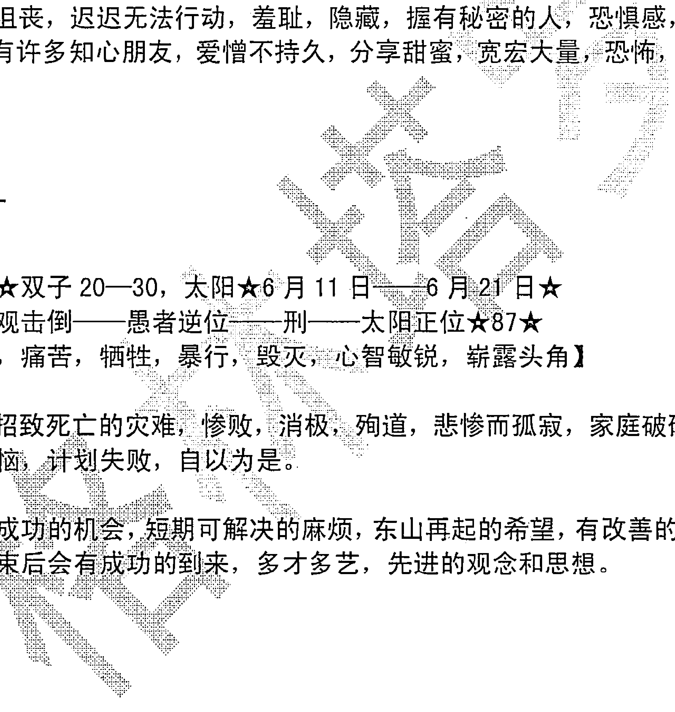

### 宝剑十

毁坏 双子 20-30，太阳 6月11日-6月21日
被人生观击倒——愚者逆位——刑——太阳正位
【悲惨，痛苦，牺牲，暴行，毁灭，心智敏锐，崭露头角】

**正位**
破灭，招致死亡的灾难，惨败，消极，殉道，悲惨而孤寂，家庭破碎，败北，苦恼，计划失败，自以为是。

**逆位**
瞬间可成功的机会，短期可解决的麻烦，东山再起的希望，有改善的可能，烦恼结束后会有成功的到来，多才多艺，先进的观念和思想。

### 宝剑侍从

风的探索者 冬至-春分 12月22日-3月20日
贫乏的行动力 风之土 —— 恋人正位 ——和—— 星星正位
【思维，流动，自由，毅力】

**正位**
在事情变化之前察觉，经历过挫折，为流言所苦的生活，狡猾而早熟的少年，掉入意想不到的陷阱，适合做调查类的事务。

**逆位**
没预见到事情的变化，无准备，无力对付强劲的对手，做事有漏洞，生病的少年，不良少年，欺诈犯，虚假的朋友，掉入圈套，疾病的后遗症，不知悔改。

### 宝剑骑士

风的勇士 摩羯 20-水瓶 20/水瓶 1月21日-2月18日
敏捷的行动力 风之火 —— 恶魔逆位 ——合—— 战车逆位
【直接，武断，变化，运动，创造性的灵感】

**正位**
挑战的勇气，一往无前的行动力，少许的粗暴，强力压制反弹，对突发事件不乏手段，缺乏耐性，英雄主义，体育，战斗，车祸。

**逆位**
轻率的决定，因冲动而失败，受情绪支配，自负，轻狂，难以管教的年轻人，异想天开的行动，破坏，强迫，过度自信，浪费资源，朋友或夫妻不和。

### 宝剑王后

★风女神★金牛 20—双子 20/双子★5 月 22 日——6 月 21 日★
深思熟虑★风之水★——愚者逆位——合——星星正位★68★
【经验，机智，孤独，感知，实现神通】

- 正位
未亡人，老处女，智慧，有个性，职业妇女，孤独，洁癖，生活习惯上的过火行为，离别，分手，强烈失落感。

- 逆位
固执，顽固，盛气凌人，恶女，恶妻，心地坏的女人，爱慕虚荣，背叛，自私，装模作样。

### 宝剑国王

★风神★处女 20—天秤 20/天秤★9 月 23 日——10 月 23 日★
清晰的思虑★风之风★—— 正义正位——害——愚者正位★81★
【公正，权力，专业，业】

- 正位
权威性，支配者，领导能力出众，有地位，冷静且想象力丰富，专业人士，自大顽固的父亲。

- 逆位
意外冲突，不正常手段打击，危险人物，不怀好意，残虐，残酷自私，有暴力倾向的男子，不专一，朝三暮四，性虐待狂，虐待妻子或情人的男人。

## 小阿卡纳·星币

### 星币 ACE

★花园★土之源★
实质性的开始——力量正位——刑——正义逆位★21★
【繁荣，成功，富足，开心】

- 正位
丰富的生活，获得利益，事事顺利，安泰生活，有利的局势，机会，合格，满足，恋情有结果，高收入，惬意的休闲。

- 逆位
有好的开始却无以为继，欲望冲昏头脑，做事不可理喻，奢侈的生活，因金钱导致声名狼藉，精神空虚，自然消逝的恋情，被人利用，悔婚。

### 星币二

★改变★摩羯 00—10，木星★12月22日——12月31日★
财务上的决定——吊人逆位——合——命运之轮逆位★15★
【和谐改变，娱乐，机遇，调动，野心，实际，坚忍】

- 正位
少真心朋友，野心大，务实，生活中麻烦多，新计划无法实现，生活混乱，没头绪，对现状满意，追寻梦想，快乐的约会，休闲，流行，国外旅行。

- 逆位
能投入的娱乐，正确处理工作和生活的关系，善于利用别人达成自己目标，过河拆桥，用钱过度，超出计划，表面快乐，内心痛苦，反复不定，轻浮，享乐，爱慕虚荣，无法下定决心。

### 星币三

★主人★摩羯10—20，火星★1月1日——1月10日★
实务上的成长——战车逆位——冲——吊人逆位★25★
【努力，能力，计划，收获，坚贞，坚毅，勤勉，理想主义】

- 正位
可靠，欢乐，业务熟练，超常才能，注重名声，完成一件奋斗很久的大事，艺术家，特技，初赌者的幸运，能力受到认可，名声与地位的提升，大学，研究所。

- 逆位
不成熟，俗气的想法，物质损失，经验不足，水准不高，自我的弱点，相当顽固，内心真情受到遏制。

### 星币四

★遗产★摩羯20—30，太阳★1月11日——1月20日★
财务上的巩固——死神逆位——冲——祭司逆位★35★
【权力，占有，祖先，礼物，封闭，控制，理智，善变】

- 正位
吝啬，执着，理智，聪明，追求物质财富，生活精打细算，遗产继承不顺，大企业，银行，一流大学，有钱人，资助者，赌博，商业的成功，占有欲，要求苛刻，吹毛求疵，过于谨慎。

- 逆位
善变，分辨能力，入不敷出，奢侈无度，缺乏自控能力，财运差，因物欲膨胀而导致失败，三流公司或大学，低收入，贪婪，想占有别人东西，不诚实，财物的损失。

### 星币五

★寂寞★金牛 00—10，水星★4月21日——4月30日★
财务上的贫困——世界逆位——合——魔术师逆位★48★
【忧愁，艰难，悲伤，失去，慈悲】

- 正位
金钱方面的烦恼，借贷，度日维艰，连续失败，失业，心灰意冷，放浪，玩世不恭，失去家庭，失望，不安，豁达大方，性情固执。

- 逆位
居住问题，房产方面的麻烦，生活混乱，顽固，不轻易放弃，经济上连续贫困，需要救援或帮助，各方面关系对立，看错人，绝望，想法荒唐但沉迷其中。

### 星币六

★慈善★金牛 10—20，月亮★5月1日——5月10日★
财务上的稳定——魔术师逆位——害——月亮逆位★47★
【成功，善良，馈赠，理财能力，适应力，社交力】

- 正位
与人为善，人际关系圆通，辨识过人，机智灵活，积极，审慎，生活状况良好，胸怀宽广，服务，慈悲，礼物，遇见贵人，照顾他人，机会。

- 逆位
自私自利，嫉妒心强，窥探，干涉，冷漠，极端，健忘，昧心钱，负债，贪欲，不知报答，经济上连续发生困难，爱的错觉。

### 星币七

★成长★金牛20—30，土星★5月11日——5月21日★
重大财务决定——审判正位——刑——节制逆位★57★
【失败，转变，开端，回报，天才，沉思，物质】

- 正位
实在的工作，利益较低的工作，耐心，体贴，勤俭，心胸宽大，坚毅，富同情心，努力而获得成功，目的无法实现，对事物进行仔细评估，有礼貌，海上运动。

- 逆位
付出多余努力，无知，轻率的决定，毫无见识，轻率投资，努力得不到回报，吝啬，重视野心和名利，不适应，不安，无闲暇，过于认真，有必要改善想法。

### 星币八

★技能★处女00—10，太阳★8月24日——8月31日★
良好的后盾——皇后逆位——和——隐者正位★24★
【节俭，勤奋，知识，收获，计划，领悟，勤勉】

- 正位
艺术的素质，技术性工作，见习，努力，情书，进取心强，做事有条理，技术上精益求精，在研究学习过程中自我激励，机警，灵敏，聪慧，坚强。

- 逆位
虚荣，伪善，无真本事，无聊的对话，恶劣的行为，放高利贷，为谋利不择手段，野心受挫，仿造品，缺乏表达能力，安静，保守，害羞，缺乏自信。

### 星币九

☆成功☆处女 10—20，金星☆9月1日——9月11日☆
物质上的成功——女祭司逆位——合——教皇正位☆43☆
【获得，纪律，自立，繁荣，进步，稳定，固执】

- 正位
有一定眼光，懂得选择，节俭，重视实践，乐于行善，耐心而体贴，有一定成就，知道安全的行事方式，努力将有回报，功成名就，安全，出人头地，嫁给有钱人，得到财富，得到年长者的协助。

- 逆位
不守信，坏习惯，自私，容易沮丧，计划中止或无效，无管理能力，因失去信用而失去财产，失窃，欺骗，没有资格，不诚实，说谎，邪恶的诱惑，唯利是图。

### 星币十

☆财富☆处女 20—30，水星☆9月12日——9月22日☆
物质常保稳固——魔术师正位——刑——命运之轮逆位☆14☆
【财富，富裕，家庭，收获，力量，和谐，公正】

- 正位
敏感，有领悟力，冷静，公正协调，能与人分享，良好的家世，遗产在靠近，传统家庭，子承父业，家境很好，物质丰富，团体事业运作态势良好，介绍恋人给家人，良好的沟通。

- 逆位
团体中因金钱不和，冲动，过于信任朋友，投资合伙适宜暂缓，理财需要谨慎，失去遗产，与亲人对立，家庭不幸，浪费，赌博，失窃，维护家人而有失公平，家人生病，噩耗，退缩。

### 星币侍从

★土地探索者★春分——夏至★3月21日——6月21日★
努力学习★土之土★——恶魔逆位——害——命运之轮正位★61★
【创造，繁荣，实践，信任】

- 正位
求知欲强，头脑优秀，积极投身于研究工作，与知识或研究相关的好消息，中学生，补习班学生，天真的男性，独自生活，打工，寂静。

- 逆位
撒娇的孩子，爱慕虚荣，挥霍金钱，知识贫乏，认识不够，视野狭窄，精力充沛，无用的自尊，没耐性。

### 星币骑士

★土地勇士★白羊20—金牛20/金牛★4月21日——5月21日★
稳健认真★土之火★——愚者正位——刑——力量正位★28★
【坚定，负责，努力，现实】

- 正位
讲究效率，有能力的组织者，实干家，有责任感，值得信赖和依靠的人，家庭的保护者，观念有点保守的人，大学生，研究生，留学生，上班族，双亲寄生活费，海外留学，知性而优秀的男性友人。

- 逆位
懈怠，不振作，思想保守顽固，处事随性，对事物热情很快冷却，发展停滞不前，重考生，失业者，欠缺自信，愤恨不平，不小心，失去热忱。

### 星币王后

★土地女神★狮子20—处女20/处女★8月24日——8月31日★
良好生意眼光★土之水★——战车逆位——害——皇帝正位★23★
【养育，机智，实际，信任】

- 正位
自立而成熟的女性，温柔，善解人意，值得依赖与信任的人，坚定而有气度，温暖，信任，安宁的氛围，好客，乐于助人，母亲，职业妇女，女作家，体贴的爱情，富裕的生活。

- 逆位
爱慕虚荣，生活浮华，对人态度恶劣不够友善，铺张浪费，内心冷淡而不可信任的人，没教养的女性，唠叨的母亲，得不到滋润的匮乏之心，小气的女人，借钱，失去爱。

### 星币国王

★土地神★射手20—摩羯20/摩羯★12月22日——1月20日★
态度坚定务实★土之风★——命运之轮逆位——合——恶魔逆位★16★
【事业，坚定，可靠，智慧，潜能】

- 正位
成功人士，商业人士，学识丰富的人，值得信赖，适宜投资，预示能达成理想，父亲，作家，大学教授，经营者，文化人，知性，正确的判断，援助或忠告，信赖感。

- 逆位
缺乏经济头脑的人或做法，行为卑鄙，两个人关系危险，对别人不信赖，无经济能力的中年男性，惹人厌的忧郁者，古怪，失踪，唯利是图。

## 下卷：构理

塔罗秘密穷宇宙，造设三昧泄未有。
总说明分话纲要，杂序暗合言因由。
真意拂去炼有身，星式缘来数无首。
中有神冥司吉凶，从来切教莫轻授。

一事一物有一身，一首一尾一假真。
能知万物备于我，敢把三昧别立根。
它向一中分造化，人于心上起纵横。
奥义亦有两般话，理不虚传只在人。

### 总纲

### 第一章

塔罗体系，纵横交错，步步相生，环环相扣，层层相联。

正义命轮，愚者世界，在塔罗中象征了最为基础的天与地，定位着自然的坐标两极。正义命轮，象天一样代表了高与远，愚者世界，象地一样代表了低与近。万物在天地之间，皆由近及远地纷杂并陈，因而每张牌所代表的时间与空间就象万物一样，也能如此依序排列确定。

塔罗法则，动静有常，内外有别，刚柔相间，心身相化。对于天象，塔罗法则成就了日月星辰、白天黑夜、明暗交替诸式的现景；对于地象，塔罗法则成就了山川河岳、动物植物、高低远近诸般的形态。从而世间万物错综复杂的变化，就可以通过塔罗法则显而易见了。所以在宇宙中，两极不停地切摩变化，大阿卡纳所代表的天地间的数个基本物象，也不停地交互变化，由是产生了宇宙万物。万物都以种类相聚，以群落相分，聚散之间才有了得失变化，从而塔罗体系所征兆的吉凶就出现了。

正义命轮外向扩张，象征阳性；愚者世界内向收敛，象征阴性。时间外向扩张，所以正义命轮象征万物的变化初始；空间内向收敛，所以愚者世界象征万物的变化成形。

正义命轮所代表的是昭然可见的外界环境的变化，以容易知晓了解；愚者世界所代表的是万物成形过程的浓缩，以简化表达功能。容易知晓就能够引领创造，容易简化就能够变化衍生运用。

塔罗法则即是这样简易，能包含自然的法则，能了知自然的法则。故而领悟自然的法则，就能明白塔罗之中的时空变化，从而运用自如。

### 第二章

前人观察宇宙间万事万物的变化而设立了塔罗的体系，而后绘制了塔罗牌的图案符号，使人明白其中的吉凶得失的趋势，通过塔罗各牌的相互关联、相互摩荡而产生变化。

所以，塔罗中的吉凶是成功或失败的现象；塔罗中的变化是前进或后退的现象；而塔罗中的三昧是天地与所处其中的人三方面互动的道理，也就是人与其所处的时间、空间共同变化的道理。塔罗牌中的各种符号之间的变化互动，就是这个道理的体现。

因此，人能够居住安定，是因为能够依照塔罗所喻示的变化的道理去为人处事。人在安居时就观察塔罗的象征而探索它的体系，产生变化时就观察塔罗的变化而明晰其中的得失，就能够依循所喻示的塔罗法则，那么必然就没有不利的事情了。

### 第三章

各种塔罗牌意的解释，是说明其中的符号象征含义的；而符号象征，是说明塔罗体系中每张牌互动变化的；吉利与凶祸，是说明变化对于个人或群体带来的得失的；忧虑和后悔，是说明其中的弊病和过错的。人难以做到没有过错，所以就要懂得善于补救过失。

塔罗所表示的高低贵贱，是代表空间上的形势与位置的。塔罗所蕴含的道理或大小，是从其图案中的符号象征表现的。塔罗所喻示的吉利与凶祸，是从牌阵中的相互关联得来的。其中的关键在于观察阵列，以前因作为基础而推断后果中的变化，这样就能够在做人处事和祸福善恶之间谨慎小心地进行衡量。而能够从小过错转危为安的，就在于能够懂得善于补救。

因此，塔罗有大小阿卡纳的分别，小阿卡纳象征其被动、内在等阴性的一面，大阿卡纳象征其主动、外在等阳性的一面。它们的名称、数字，有表示较凶险的，也有表示较为平易的，这是最基础的结构，是各自的基础趋势的浓缩。

### 第四章

塔罗法则，贯穿在宇宙之间，所以能够表示世间所有事物变化的状况。向上观察天上日月星辰的光采，向下观察大地山河动植的理则，所以就知道昼夜光明幽暗的法则。而追原万事万物的起承转合，就能够知晓死生终始循环的法则。精神与气质相合就构成万物，而灵魂是生命的泉源，是随着生老病死而变化的，由此我们可以探知鬼神的情态，因为即使是鬼神也不能逃脱塔罗所蕴含的法则之外。

塔罗法则与宇宙相似，是世界的总法则，所以它不会违背任何一种法则。使用塔罗的法则能够知道万物的情态，运用塔罗的道理能够去造福世间，所以这样进行使用就能够恰如其分。使用塔罗的法则能够遍行世间，所以就不会有大的过错；通晓塔罗的道理能够知晓万事万物的必然趋势与造化，所以就不会有忧虑。因此，安于所处状况就不会怨天尤人，并且能够关怀世界，那么就能够关爱世间万物。

能范围包括宇宙一切变化而不会有过失；能微曲来成全万物而不会遗漏；能够尽知昼夜等二元变化的道理。所以塔罗的法则，是没有固定的方法和模式的；塔罗的神妙难测，是没有定式可推求的；塔罗的周知宇宙，也无法以一句话来概括的。

### 第五章

塔罗中两两构成阴阳变化，互反互生，运转不息，是宇宙万事万物盛衰存亡的根本，这就是塔罗的 T 形原理。遵循其中的变化并产生万事万物的就是善，而成就万事万物的就是性质，这就是平衡。

有关怀仁爱的人感受到这样的法则，就具有关爱；有聪慧头脑的人体察到这样的法则，就领悟智慧。人们日夜都在受用着塔罗法则，并且遵循使用着塔罗法则在进行生活，却不知晓塔罗法则，所以这样能涵盖万事万物变化的根本法则就鲜有人知了。

塔罗显现于关爱，是可以感受到而且可以实行的，智慧能够体察它而不能够说明它，可是能够实在运用它。

生生不息，如同水的流动，变化前进却不停止，这就是塔罗“流变”的道理。成就创造变化的是命轮与正义，在变化之中依照其法则去演绎的是愚者与世界。通过其中的推算而进行到极致，就称为“占卜”，通达变化的法则，就称为“使用”，能够运用其中的法则，达到神奇奥妙、变化莫测的，就掌握了其中的“精髓”。

### 第六章

塔罗是非常广大的，若是说它的远，则无所止息，若是说它的近，又如同静静展现在面前。使用塔罗以探索世间，又俱备万事万物的一切道理。

命轮和正义，有运动不息的性质。当它静止而不变时能显出专注而无他；当它运动而变化时又能深邃而不饶，因此宇宙的时间就产生了。

愚者和世界，有温顺敦厚的性质。当它静止而不变时能显得收敛而深藏；当它运动而变化时又能广泛的化生，因此宇宙的空间和其中的万物就由此产生。
塔罗的广大，配合着宇宙；变化的通达，配合着元素；阴阳二元的道理，贯穿于炼金术之中。

### 第七章

前人见世间万事万物的繁杂，因而拟测万事万物的形态，归纳为基本的隐象，以象征世间万事万物的形象。前人见世间动作行为的千变万化，因而观察动作行为可以融汇贯通的法则，然后制成塔罗牌，以显现动作行为的常体，复合配上相应的图形符号，通过象征来断定它的吉凶。

大阿卡纳构成基本隐象的五十种层次的含义，小阿卡纳构成三百三十六种层次的含义。大小阿卡纳两者纵横配合，合共形成三百八十四种细微变化，归纳了世间所有变化情境的集合。

### 第八章

符号组合成图画，形成象征，这是塔罗的“象”。“象”的背后蕴含着顺序和排列组合形成的结构，这就是塔罗的“数”。“数”的法则是抽象而不具体的，因为这是塔罗中蕴藏的“理”的展现。

动一静二、动三静四、动五静六、动七静八、动九静十。这是数的原理运行其中，两两配合形成五组，为太（灵）、火、土、风、水五种基本元素。首尾相衔而融合，将金、银、汞、铜、铁、锡、铅七大金属，历经煅烧、凝结、结合、溶解、消化、蒸馏、升华、分解、涂蜡、发酵、增殖、投射共十二阶段，炼化为贤者之石。

### 第九章

塔罗的使用领域有四种。以理解塔罗哲理的人崇尚其中的寓意，以塔罗作为行为指导的人崇尚其中的变化，以塔罗作为制物炼化的人崇尚其中的象征，以塔罗作为规律喻示的人崇尚其中的占卜。

人们当有所行动时，使用塔罗进行预测来分析吉凶，获得塔罗法则的指引，就一定能收到回应。无论问题的远近深浅，都能了解知道未来事物的变化，如果塔罗不是那么精深，又怎么能做到呢？

通过塔罗中的阶层、序列、对应等等变化，极尽推演，接触到塔罗法则的神妙，就能够判定世间事物的形象。如果塔罗不是那么奥妙，又怎么能做到呢？

塔罗本身没有思虑、没有作为，是安定而寂静的。如果能感发兴起去运用塔罗法则，就能通达世间一切的事物。如果塔罗不是那么神奇，又怎么能做到呢？

塔罗，是前人极尽幽深的钻研，研究机变莫测的一门学问。正因为塔罗的幽深，所以能够通达所有人的心志；正因为塔罗的机变莫测，所以能够成就世间的事务；正因为塔罗的神妙，所以好像看不见塔罗的急速行动，但它却令世间事物都自然快速发展达到适当的状态。

因此，仲天所说的“塔罗的使用领域有四种”，就是对于塔罗本身的发展和功能而言的。

### 第十章

仲天说：“塔罗是用来做什么的呢？塔罗就是蕴涵世间所有法则，开创万物、成就万事，如此而已的一门学问呀。”所以前人使用塔罗的法则通达世间所有人的心志，使用塔罗的法则去肇定世间所有的事业，并使用塔罗的法则来决断世间所有的疑虑。因此塔罗构成的循环体系是圆通而神妙的，其中每一个序列也是方正而且睿智的。

每张塔罗牌都有图画，这是为了简易的展现在世人的面前。前人正是用塔罗先知世间的智慧，再退藏在深密的牌中，将奥秘与世人共同分享。塔罗的神妙足够知道未来的变化与规律，塔罗的智慧足够储藏既往的知识与经验，但这只有俱备智慧和勇敢的人才能够做到。所以他们明瞭宇宙的道理，继而观察世间的事物，随后创造塔罗牌供世人使用，使人们能够在没有做事之前可以去规避祸患并做得更好。

塔罗的法则随处皆是。如同家里的门一样，关闭起来用以观察内在自我时称为“合”，开放起来用以观察外界环境时就称为“开”。一合一开之间，可以相互连续不息的转化，就称为“变”；一开一合之间，可以自由自在的出入往来且没有穷尽，就称为“通”。显现在外面时会有形象可以观察，就称为“象”；表现在器物的使用时，有尺度大小与合于规矩方圆的形状，就称为“器”；好像制定房屋的时候就使用门户来进出一样，令所有事物具有法则可寻找，就称为“法”；世人常常使用塔罗的法则出入往来，作为自己的法则并时刻使用它，可是却不知道它，这就称为“神”。

## 《塔罗三昧》所以，塔罗的核心是原素以太，原素是天地未开时贯穿于世间的气；原素变化形成二元，如同天地初成；二元变化融合而后就产生四种元素；元素之间再互相衍生形成了八种隐象；其后再逐渐变化形成了整个塔罗体系，从而蕴育涵盖了宇宙万象。

### 第十一章

文字是不能完全表达作者的语言的，语言是不能完全表达作者的心意的。所以前人树立了象征和结构的规范，以竭尽未能完全表达的心意，使后人从象征中去领悟其语言，从结构中去领悟其心意，并且设置各式塔罗牌以竭力尽现万事万物的情态，以竭力尽现神奇奥妙的能事。

二元如天地，是原素的开分，是最为基本的原则。如果没有二元的相互运行来进行变化，那么万事万物的变化就熄灭了，这也是自然的法则。在形器之上，虽然没有形体可以度量，也没有现象可以形容，但却是万物所共由的，就称为“玄”；在形象之下，有形体可以发现的，则是具体的物，就称为“器”；将形而上的玄与形而下的器，通过变化、裁制以便于使用，就称为“变”；推广发挥并扩充应用，使其在世间的生活中实行，就称为“通”；举行设施以安置和帮助世人，就称为“事业”。

前人见到世间事物的繁杂，就归纳它们的形态种类，以象征物体形象的适宜，这就称为“物象”。前人看见世间一切行为心态众多，观察它们可以融汇贯通的方法，整理出经常的模式，制定成塔罗牌并且附加以符号，来判定它们的意义，这就称为“符象”。因此，极尽自然中繁杂物象的，是在于塔罗牌；模仿自然间所有行为的，是在于符象；通过变化而判断它的，是在于机变；通过发挥而推广它的，是在于通达；默默的成就事业，不用刻意表达就获得世间的信任，这是在于个人的道德行为。

### 第十二章

塔罗牌中两两相对、两两相重，相互搭配成列，以展现事物的变化，其中递向推移，将宇宙间时空的千变万化包含其中。

塔罗，是追原万事万物的始终以寻找其根本，然后立足于此，才能全局观察。每张塔罗牌有正逆两位，其意义的核心，难道是完全不同的吗？其实不是的，正逆两位虽然引申出来的表面意义有差异，但其核心的根本意义没有变化。如同我们只有一个身体，但是有正反两面不同的形象，其中相互揉进从而产生更多的变化，表现不同而本质如一。这就是一体两面的道理，寻找到一体的根本，才能发现两面的变化。

塔罗有三昧，在时间为过去、现在、将来；在空间为天远、地近、人在其中；在个人为身行、心思、灵感；在方法为静心、集神、养气；在行密为身密、口密、意密；在塔罗为象征、数序、意理。凡此种种，均不脱三昧根本。塔罗的运用，以自身为根本，了解时间、空间，去寻求到塔罗体系中每张牌三位一体的变化，逐层深入，掌握窍要，而后反行运用，便能轻松获取世间事物变动的机要了。

### 第十三章

前人通过向上观察天上日月星辰的现象，向下观察大地高下隐显种种的法则，又观察动物植物的特质，山川水土的变化，近的就从人身的状况取象，远的就从宇宙万物取象，于是创作出塔罗牌，以融会贯通自然的性质，并以参考宇宙的育化，用来类比万物的情状。

所以塔罗的内容，就是描述万事万物的形象。塔罗牌的图象，就是用来拟效宇宙间万事万物的形象。每张牌的名称，是解释这张牌的意义和构造的，有了整体去描述万事万物，所以事物的变动得失，吉凶就发生了，而细小瑕疵的悔恨，忧虑困扰的灾祸，就由此显现出来了。

### 第十四章

宝剑首牌表示了“胜利，征服，智力”这些意义。仲天说：“天下的事物，有什么值得困扰与忧虑的呢？宇宙万事万物同归于一个目标，所走的途径却有不同；同归于一个好的理想，却有着各种不同的思虑。”宇宙自然的运行是循环不息的，日月往来交替就有光明的出现，寒暑往来交替就有了春夏秋冬四时递相推移的岁序。既往的事情已经屈缩，未来的事情即将伸展，屈缩与伸展相互交感，其中就产生了利益。虫屈缩身子，是为了养精蓄锐，以等待时机到来就伸展行进。蛇每逢寒冬就进行冬眠，是为了保全躯体，以准备下一期的生活。专精地研究精粹微妙的法则，到达神而化之的境界，那么就能够学以致用，随心所欲而不超过法则。利用塔罗的法则，就可以随遇而安，怡然自得，让个人的品德行为得到增长。

### 《塔罗三昧》

权杖国王表示了“力量，知道，魄力，自信，改变”这些意义。

> “不是自己所应该经历的困境，却为了欲望而受困，必然会遭致名声败坏的恶果。不是自己所应该后退的据点，却后退以求取自己独善其身，必然遭致身家危殆的恶果。身败名裂，已经步入死亡的境地，家人妻子哪里还能见到呢？”

星币八表示了“节俭，勤奋，知识，收获，计划，领悟，勤勉”的含义。

> “智者在身上蕴藏着弘大的才器，等待时机来临再有所行动，不鸣则已，一鸣惊人，那还有什么不利的呢？同理，在行动的时候，没有闭结与障碍，精准无比，出发就必定会有收获，这是因为平常已经蕴含蓄结成了弘大的才器之后，再有所行动，所以出发就有收获，无事不成了。”

> “世上令人感到可耻可畏的是既没有爱心又不顾道义，但是愚笨者却不以没爱心为耻辱，就不怕背信弃义，甘心去做伤天害理的事情，纯粹把利益当作做人的准则。如果没有利益可得，他们就不知道勤勉向上，对于这样的人，不用刑罚来震慑，就不知道害怕。能在触犯小错误的时候受到惩罚，从而知道处事要谨慎的必要，就不至于造成祸患，这实在是这些愚笨者的幸运了。如同从星币国王表示的‘智慧，潜能，坚定，可靠，事业’等含义可以看出，善行不积累就不能天下成名，恶行不积累就不会毁灭自身。愚笨者做事只顾及利益关系，认为做小善事不会得到好处就索性不做了，以为做小差错无伤大体就不改正过错了，因此日积月累之后，罪恶就逐渐盈满，以致最终到达无法掩盖和不可解救的地步。”

> “凡是获得危险的人，都是因为他先前在他的职位上过于安逸；灭亡的家国，是因为先前自以为家国可以长存不绝了。混乱的团队，是因为先前自以为已经治理好了从而就忽略荒殆，所以团队才会混乱以致灭亡。所以，做人必须居安思危，在安定的时候不忘危险和苦痛，管治的时候不忘祸乱的惨烈，以这样谨慎的心态做事，才能让本身安定，令家国可以常保。圣杯六所表示的‘愉悦，重聚，回忆，往日生活’这些牌意，就是说明了这个意思。”

> “道德浅薄却占据着高阶的位置，智慧不足却想做一番大事业，才干不足却担当着重任，这样很少会有不发生灾祸的。圣杯二表达了‘爱，和谐，吸引，寻求信任，关系，理想’的意义，这就是说明了才德智慧不足以胜任的危险啊！”

> “能预先知晓机微的事理，就将达到神妙的境界了吗？可以算作是神妙的人物了吗？做人对上绝不谄媚阿谀，对下绝不傲慢，立场坚定，从不致于受到危害的牵连，可以算是位知道神机妙算的人了吗？智者能见机未然，所以能够把握时机的来临而兴起，并有所行动，就不必等待以后。如同权杖八具有‘敏捷，快速，消息，智慧，敏感，道德’的寓意，就好像被硬石阻隔的时候，就应该当机立断地离开，而不要等待终日。智者知晓事理的微妙，也知道事理的彰显，知道柔弱的一面，也明瞭刚强的一面，能够通达并且应变自如，就是万众所景仰的人物了。”

> 仲天说：“智者必然先安定自己然后才有所作为，必然心平气和然后才去说话，先以诚信待人并建立信誉，然后才可以对人有所要求。智者有了这三项基本修养，与人相处就必然能和睦而没有偏失。冒险的举动，不会受到大众的拥护；言语的畏惧，不会受到大众的响应；诚信和恩惠尚未施加给大众，而竟然对大众有所征发和要求，那么大众就不会理会与帮助。若无人理会与协助，则随时就会容易受到伤害。所以星币三的‘努力，能力，计划，收获，坚贞，坚毅，勤勉，理想主义’的意义，就是说明没有得人帮助，有时就会遭人攻击，立心不坚定恒久的人，就会有凶险发生。”

#### 第十五章

塔罗兴盛，数百年起，在时代的快速变化之中，所以它的图像都含有警戒畏惧的意思。常常居安思危、戒慎恐惧，才能够化险为夷，操心危虑与忧患，才能够平安。反之，得意忘形、骄傲自恃，即使局势安定，也必会遭致倾覆。因此安逸懈怠就会使其倾覆。塔罗法则是如此广大，所有事物都不能违背此法则，时时戒惧，始终不懈，其主旨在于控制错误，这就是塔罗法则。

所以星币五教人奉行礼仪，让人明白品德行为是最为根基。圣杯五教人尊重他人、虚心忍受，是做人品德的方法。星币侍从教人除去物欲，教人从善，这是品性的根本。圣杯三是教人始终如一，恒久不已，它是品性稳固的原由。权杖首牌是教人惩忿窒欲的道理，是提高自身品性的方式。星币三教人改正过错，使品性日益宽大。权杖骑士教人穷困不乱，坚守正道，是德行的分辨。圣杯国王教人要如同井水取之不尽，用之不竭一样，以达到道德的地步。吊人、死神、节制是教人因势利导，是道德的制宜。

星币五重视礼仪，能够和顺人情，处世和睦，是做人立身行事应该达到的准则。圣杯五教导谦虚待人，就能得到他人敬仰，品德自然更加尊贵而光明。星币侍从能够在迷途未远就知道返回。而辨别万事万物的是非善恶，如果事物与环境过于复杂，

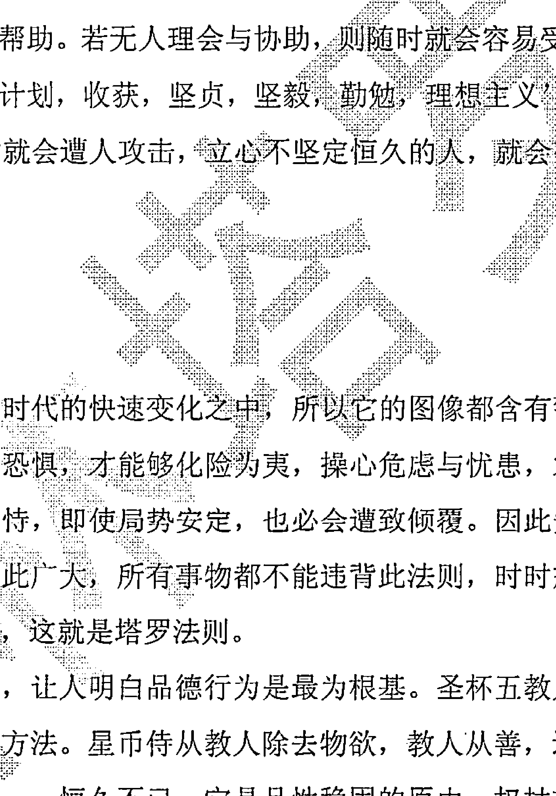

### 《塔罗三昧》

就必会使人引起厌倦，但只要有圣杯三的恒心，就能够克服一切，不为外物的复杂而厌倦，方有成功之日。权杖首牌惩忿窒欲和克己复礼的功夫是自身修行的起步，很是艰难，所以是开始困难，以后日久修行成为习惯就能够容易。星币三进修美德，长久的增裕自身的德性而无须设防。在权杖骑士的困境中，虽然穷困但是足以磨练身心，因为心念受困就会思考，然后就会寻找解决的方法并会去施行它，所以最终就能够通泰。圣杯国王如同一井虽然是固定的，但是泉涌流通不息，在日月迁徙变化之中都能够保持长久的新鲜。吊人、死神、节制，教导顺人情理，因势利导，隐而不露。

星币五是教人以实践礼仪为基础而和顺行事。圣杯五是教人自制而使性情柔顺。星币侍从是教人反求自身而回复自然本性。圣杯三是教人始终不二，坚定美德的行为。权杖首牌是教人摒除私欲，通过修行而远离祸患。星币三是教人损上益下，以增兴福利。权杖骑士是教人艰苦奋斗到底，不怨天尤人而且少有忿怒。圣杯国王是教人要辨识塔罗法则的来源。吊人、死神、节制是教人顺合时宜，能行使权便，当机立断。

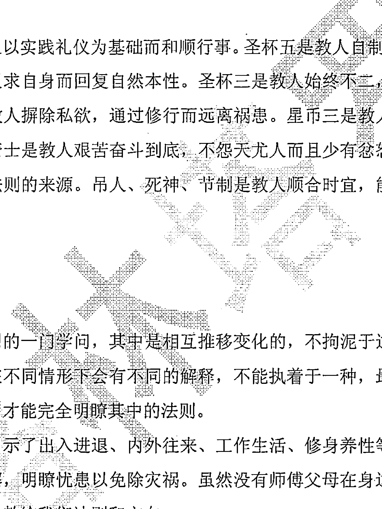

#### 第十六章

塔罗是很有用的一门学问，其中是相互推移变化的，不拘泥于过度的形式和解释。其中的变化在不同情形下会有不同的解释，不能执着于一种，最重要的是观察其中变化的方向，才能完全明瞭其中的法则。

塔罗法则，启示了出入进退、内外往来、工作生活、修身养性等等的法则，都需要懂得全面了解，明瞭忧患以免除灾祸。虽然没有师傅父母在身边，但是塔罗却如同师傅父母一样教给我们法则和方向。

#### 第十七章

塔罗牌两两相对，可见流动变化之中，所有塔罗牌表示事物都有向其相对的塔罗牌喻示的事物情势去运行发展的趋势。而在三阶七环的变化之间，又能够寻找到当下的镜子，返照自身，这就是三合为一、一分为三的表现。

原始反终，在循环的变化中，就可以找到塔罗的根本。天地万物万事都在循环之中，往复变化，反思顺用，就可以得到塔罗的根本。

#### 第十八章

塔罗法则，能使身心和悦，能使思虑专精研制，能判定世间吉凶悔吝的事理，能成就世间勤勉不息的事业。所以无论宇宙事物变化，人类言行举止，吉凶的事情就必然有吉凶的征兆，所以观察万事万物的现象就会知道各种属类的器宇或材具，而尚未显现的时机也可以预测而知道。

万事万物都有一定的法则和位置。前人仿效它，推演成塔罗牌的图象，使万物各遂其生、各得其所，都能够展现在塔罗牌之中，成为参考变化的功能。

### 第十九章

凡是最为刚健的，是在于恒久、平易，并且没有私意，所以能够明照出世间危险的事情。凡是最为柔顺的，在于恒久而简静，所以能够明察世间烦扰阻隔的原因。

塔罗牌用符号和象征告诉人们的，是对于变化的法则和事物消长的状态而言的。塔罗牌在牌阵之间，它的时与位也因此有和与不和，因此吉凶的征兆就可以见到。宇宙的变动，是为了使事物趋向于有利的；吉凶的推迁，是随着情理而定的；处世合情合理就得到吉祥，违背常情常理就陷入凶害。所以贪爱和憎恶两种不同的情感互相交攻，必然就会有得失，于是便有吉凶的产生。抉择之间，有远有近，互相感应，不明白其中的法则而任意远近相取的话，就会有悔恨困扰的事情跟着产生了。事有真假虚伪，若以实情相感应，利益则源源而来，若以虚情相感应，祸害则渐渐而生，今以实情和虚情相感应，格格不入，利害的冲突便产生了。

将要阴谋叛变的人，说话时会有惭愧的神色；心中有疑惑的人因为心神不定，所以说话时会毫无系统，多有分支不清的杂乱言辞；有修养的吉利的人，言辞真善而正直，就很少说话；浮躁的人，言辞也较为轻浮，就喜欢多说话；陷害善良的人心中不安，因此就会言不由衷，言辞就浮游不定；亏欠职守的人，言辞大多屈折而

### 第二十一章

物质精神与性质规律的塔罗法则，就是万事万物的法则。世界起源于第一原质，分散而演化成元素，而元素运行的根本，也是事物运行的根本，在于对立的转化。如果要懂得自身生命的道理，就要懂得观察事物的规律并且抱持事物的法则。极尽深入的研习，并且没有隐藏与虚妄就是“观察”；专心致志，身体力行，并且始终如一就是“抱持”。能观察和抱持，运用塔罗的法则去达到超常的状态，依照事物的规律去达到超越事物的能力，对于特性与运作都了然在胸，却让目标、心念、行为与法则都忘却无萦绕，才能超越常规。

宇宙蕴藏有太、火、土、风、水这五大元素，它们相互影响导致具有了形态而生成万物，人也是这样受到元素的影响从而出生成长。元素自衍化形成就不能再合为一体，之后就互相制衡。被制衡的元素如同被窃取，制衡其它元素的反而将其修饰成形体。在相互循环之中生生不息，才能够显得昌盛。人受到五大元素的影响而生成，所以身体中也含有五大元素。心灵是人的主体，身体是心灵的房间，五大元素在身体之中，而运行在于心灵。元素的运行如果符合塔罗法则，那么就好像手掌中把握着宇宙，身体中藏着万象变化一样。所以宇宙赋予人类的性质就是宇宙的性质，不去认识就不能知道这是人之所以成为人的原因。人的心灵表现为气质，这是认知与识见的特性，因为人有生死，就容易有得失的判断而触景生情，所以总是随着外在事物的变化而影响心灵。因此，感依塔罗法则的心灵就长存清亮明晰，而顺着物欲影响的心灵就会迷失消亡，如果谨守塔罗法则并且令心灵坚定，就不会轻易受到物欲的影响。

死寂消亡是有伤害的特性，但是生与死是对立共存的，没有死亡就不会有新生。人的自身中有一个宇宙，如果与万事万物相合，仿效着万事万物去运动生死，那么五大元素在身体中的运行基础就可以安定，并且循环不息。人受到万事万物的影响从而生长，俱备好的智慧与能力来成就性格。性格没有善良与邪恶的分别，但是会因为心灵而有机巧与拙慢的表现。机巧的人多技巧与谋划，拙慢的人多贪婪和痴心，这都是气质的表现，所以人们处事并不是依照原本的法则。如果要运用自身生死的能力，就需要将机巧与拙慢都隐伏潜藏起来。

人身最容易受到影响的就是眼、耳、口。耳听到声音，脏器的功能就会产生变化；眼看见颜色，心灵的运作就会松弛；口多说话，呼吸的气息就会散漫。这三方面受到伤害，那么全身就容易衰败，性质生命就会消亡。所以，人如果收起自己的视力、听力与言辞能力，将心灵伴随着塔罗，使得内心不生长欲望，外物诱惑不影响内心，让身体与心灵的动静变化去随着塔罗，而且不让自我的认知识见出现，就不会受到消亡的影响。

### 第二十二章

万事万物的法则就是动静生杀的规律，世间没有生成却不受到消杀的事物。如同春季出生、夏季成长、秋季收敛、冬季杀藏，四季都形成规律，周而复始的循环，自古以来就是这样。宇宙创始万物、生成万物，然而又消杀万物，所以宇宙是索取万物；世间有万物，人对万物触景生情，耗散自己的身体与心灵，从幼小到壮实、老年，直至死亡，所以万物是对人索取；但是万物虽然索取人，人又要吃万物精华从而生长，所以人又对万物索取。

人是万物之灵，智者不仅能够对万物索取，还能因为万物索取人的方式中去索取万物，更能从宇宙对万物的索取方式中去索取宇宙，所以控制着时机去饮食，就能让身体得到梳理，控制着时机去运动，就能让消杀的变化得到安定。

世人都认为各种有形有色的神是原本存在的神，所以在这些空虚的千奇百怪的形像中去执着，从而到老也没有成就，终究不过一死。却不知道这些神不过是后天创造的神，而不是先天存在的的神，所以是称呼为神而实际不是神的神罢了。先天存在的神，没有形相颜色，好像是无却又包含所有，好像是虚的却又包含着实的，是不称为神而实际是神的神。所以世人追逐有形的神而最终步入消杀，却不知道无形的神才能保全性质生命，这也难怪被万物索取而懵然不知了。

人之所以能够索取宇宙万物，是因为宇宙万物有固定的法则；而宇宙万物不能索取智者，是因为智者体悟的法则是没有形象与固定的法则。智者从宇宙万物的法则中，取五大元素交接变化的时机，从而进行饮食行动，提升身体与心灵中潜藏的神。这索取的时机正是使用宇宙的法则，所以世间没有能够察知的，也因此才能够索取。如果能够被察知，那么哪里能够索取得到呢？所以这样的法则，除非是大智

### 第二十三章

盲人擅长听觉，聋人擅长视觉，这是因为失明失聪之后，将心灵的神用在听觉与视觉上才能达到的。所以不能体悟到塔罗法则的人，是因为有虚妄的心念；有虚妄的心念，那么心灵就会受到惊扰；心灵受到惊扰，那么万物就会影响身体变化；身体受到万物的影响，那么就会生出贪求妄想，从而让身心烦忧苦恼。所以贪求妄想，是世间利害的源头。人如果能够断绝利害的源头，那么万有皆空，各种忧虑都能够平息，胜过寻求师傅导引。而自己时刻警惕，始终如一且没有间断，那么心灵的恶意消亡，善意的心念丛生，就可以胜过寻求师傅导引千万倍了。这是因为师傅的能力，能够改变做法却不能够改变心念，能够给予法则的教导却不能够让心灵手巧，所以断绝贪求妄想、谨慎守一，这不是师傅的力量所能够达到的。

心灵如同主人，眼睛如同门窗。心灵本来并非物质，或者是精神、或者是能量，混混沌沌，没有生死。而有生死的，不过是后天形成的心脏罢了。心灵是不能被看见的，因为有了心脏才能够被看到。心脏或生或死的主宰，是由心灵决定的。眼睛所看见的，心灵就接收它，所以心灵生死的要点，其实在于眼睛。门窗打开，才能被索取盗窃，如果关门闭户，反观自身的心灵，那么外物就不易影响到自己，生死受到的影响就微小了。

宇宙对万物看似没有恩惠却有实际的大恩。出生、成长、繁荣、旺盛，都是宇宙的法则作用，万物在其中却不知道，所以这是没有恩惠的大恩。宇宙创造万物各不相同，如同有私心一样，然而万物随着法则运作并按时生死，这样的方式又很公道平衡。所以万物循环是宇宙的运作，公私都蕴含其中却又不分公私。

创生是恩惠的表现，消死是伤害的表现。有生存就有死亡，有死亡就有生存，所以生存与死亡互相是对方的根基。有恩惠必然有伤害，有伤害必然有恩惠，是恩惠从伤害当中产生，也是伤害从恩惠当中产生，所以恩惠和伤害互相是对方的转化。

宇宙的法则无名无形，却生养万物。法则本身是静止的，然而静止是运动的根基，静止到极至就产生运动，运动则有万物生长。万物生长依托于宇宙的法则，所以蕴含宇宙的法则，因而万物动静不离，互相作为对方的根基，也互相进行转化。因此，最无形的宇宙能够产生变化，从而变化无穷。

### 第二十四章

塔罗后成，融汇天下神秘的义理，综杂各家学问的源头，所以其中含有各种不同的体系，然而所有的体系却都来源于宇宙万物的法则。正因如此，触类旁通，一旦知会塔罗中的演化，其它种种，就都能明瞭。

世间的本质，都是由简易而来，所以最根本的法则也往往是最简易的，简易是体、是根、是所有的基础。世间的变化，都是往繁杂而去，所以运用的方式也往往繁杂，繁杂是用、是叶，是所有的表现。

明瞭塔罗的根，观察塔罗的叶，就能具备所有的基础；知道塔罗的体，谨守塔罗的用，就能使用所有的形式。凡此种种，一体三昧。

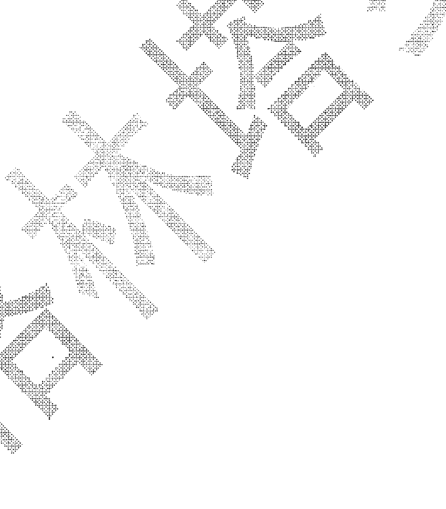

### 说篇

### 第一章

往昔前人制作塔罗的时候，深深感到宇宙万物有若神明般的法则，从而生出赞叹，取运动数字一、静止数字二、生成数三，来确立出二元完美数，倍以神圣律法分割，观察炼制的变化而制作塔罗牌图，通过了解元素的干湿冷热来产生意义。这样应和宇宙的道理，来调理万事万物可以得到适宜的状况，反复推演万事万物的法则可以了解到世界的性质，以至于明瞭塔罗的法则。

### 第二章

往昔前人制作塔罗的时候，根据宇宙的法则，所以确定了事物演变的道理就是二元的变化，在事物的状态中表现为运动和静止，在事物的性质中表现为刚健和柔顺，人在其中就表现为对仁爱和平衡的追求。因此塔罗显现出七牌一阶的状况，却是六位一体循环的实质。

### 第三章

愚者世界、命轮正义，确立其中的二元两极，是整个塔罗体系的定位。战车、力量、隐者，与月亮、太阳、审判，形成了相通的气息。魔术师、女祭司、皇后，与吊人、死神、节制，相互迫近摩擦产生了运动的态势。皇帝、教皇、恋人，与恶魔、塔、星星，不相互排斥而相互吸引。所以大阿卡纳相互错杂，自过去而来为顺行，自未来而来为逆行，因此塔罗体系中，用逆行的方式来判定事物的变化，而用顺行的方式进行推演。

### 第四章

魔术师、女祭司、女皇，对万事万物进行着推动；吊人、死神、节制，对万事万物进行着散步；恶魔、塔、星星，对万事万物进行着滋润；皇帝、教皇、恋人，对万事万物进行着干燥；月亮、太阳、审判，对万事万物进行着决定的终止；战车、力量、隐者，对万事万物进行着连接的循环；愚者、世界、命轮、正义，对万事万物进行着根源的追溯与本质的归纳。

### 第五章

万物的运作，从魔术师、女祭司、女皇的位置中生长，在吊人、死神、节制的位置中被规范整齐，在皇帝、教皇、恋人的位置中被鼓动展现，在世界和愚者的位置中受到颐养，在战车、力量、隐者的位置中欢欣喜悦，在命轮和正义的位置中进行衔接，在恶魔、塔、星星的位置中劳累困倦休息，在月亮、太阳、审判中得到成就。

魔术师、女祭司、女皇的震动生长位于东方，吊人、死神、节制的整齐位于东南方。皇帝、教皇、恋人在南方展现光芒，令万物都相继显现，令世人朝向光明。世界和愚者在西南方喻示着大地的养育，所以说受到颐养。战车、力量、隐者喻示着西方与正秋季节，令万物都在这个时节收获，所以有欢欣喜悦。命轮和正义处于西北方，说的是二元流变相互迫近以衔接转化的道理。恶魔、塔、星星喻示着正北方，是疲劳困倦，需要滋润归养休息的意思。月亮、太阳、审判，令万物在东北方完成它的终结而又有新的开始，所以说得到成就。

### 第六章

所谓神奇，是根据奇妙的万物生成法则来说的。鼓动万物，没有比魔术师、女祭司、女皇表示的震雷更迅速的了；吹散万物，没有比吊人、死神、节制表示的风更迅疾的了；干燥万物，没有比皇帝、教皇、恋人表示的火更炎热的了；喜悦万物，没有比战车、力量、隐者表示的水土相融的沼泽更欢欣的了；滋润万物，没有比恶魔、塔、星星表示的水更湿润的了；终结和开始万物，没有比月亮、太阳、审判更成功的了。所以皇帝、教皇、恋人与恶魔、塔、星星相互吸引，魔术师、女祭司、女皇与吊人、死神、节制不互相违背，战车、力量、隐者与月亮、太阳、审判气息相通，然后才能产生变化，生成万物。

### 第七章

命轮与正义的性质是刚健的；愚者与世界的性质是柔顺的；魔术师、女祭司和皇后，代表着震动的性质；吊人、死神和节制代表着渗透的性质；恶魔、塔、星星，有表示险难的特性；皇帝、教皇、恋人，有表示依附的特性；月亮、太阳、审判的性质是静止的；战车、力量、隐者的性质是喜悦的。

### 第八章

命轮与正义，象征着万事万物的创始，如同父亲般具有开创的精神；愚者和世界，象征着万事万物的养成，如同母亲般具有孕育的特质。所有的塔罗牌都是由它们的变化来产生的。世界和愚者，与命轮交融而形成魔术师、女祭司、女皇，与正义交融而形成恶魔、塔、星星，和月亮、太阳、审判。命运之轮和正义，与世界交融而形成吊人、死神、节制，与愚者交融而形成皇帝、教皇、恋人，和战车、力量、隐者。

### 第九章

命运之轮和正义象征着马，愚者和世界象征着牛，魔术师、女祭司和皇后象征着蛇，吊人、死神、节制象征着鸡，恶魔、塔和星星象征着猪，皇帝、教皇和恋人象征着鸡，月亮、太阳和审判象征着狗，战车、力量和隐者象征着羊。

### 第十章

命运之轮和正义象征着头部，愚者和世界象征着腹部，魔术师、女祭司和皇后象征着脚部，吊人、死神、节制象征着腿部，恶魔、塔和星星象征着耳朵，皇帝、教皇和恋人象征着眼睛，月亮、太阳和审判象征着手部，战车、力量和隐者象征着口舌。

### 第十一章

大阿卡纳每两三一组，含有三昧的时空，各有细征，以性质相分别。

魔术师、女祭司和女皇，象征着雷霆、爬蛇、大路、花、青色竹子、青黄、杂色；象征着有甲壳的属类、向下生长的属类、草木蕃鲜的属类；象征着长子、决断勇敢好动、极度刚健，四足都运动起来的样子等等。

皇帝、教皇和恋人，象征着火焰、太阳、电、甲胄、兵器类、中空而且枯槁的木类与龟、鳖、蟹、螺、蚌等；象征着次女、大肚子、干燥等等。

战车、力量和隐者，象征着沼泽、山水、少女、小妾、巫师、坚硬含碱的属类；象征口舌、折毁、附和决断等等。

命轮和正义，象征着圆形、寒冷、冰冻、大红色；象征着天、领导、父亲、木果、金玉类等等。

吊人、死神和节制，象征着木头、风、长女、墨线、工匠、白色、长远、高；象征着进退犹豫，不果敢决断、躁动不安；象征着头发稀少、额头宽阔、眼白多；象征着从交易中获利等等。

恶魔、塔和星星，象征着沟渠、水、箭矢、弓、轮、车、月亮、盗贼、坚硬而多实心的木类等等；象征着隐伏、矫屈、揉直；象征着忧虑加重、心痛、耳痛、有血；象征着美丽、拖曳、多灾、通达、红色。

月亮、太阳和审判，象征着山、山间小路、小石路、门户、庭院、台子、瓜果、守护人、狗、鼠、手指、黑色食肉的野兽；象征着坚硬而且多枝节的木头类等等。

世界和愚者，象征着锅、大地、母亲、孕育；象征着众人、广布、大车、黑色土地、文彩等等。

### 第十二章

凡是种种，是万物的象征，各有自己的性质，都归纳在塔罗中。得到性质之后，再推演到外部，凡事就可以决断明晰了。

### 杂篇

### 第一章

命运之轮、正义是刚健的，世界、愚者是柔顺的。

权杖王后与人相比，是快乐的，星币十出师动众，是可忧的。权杖侍从和权杖九的意义，一个是给予，一个是追求。星币二是虽然开始就展现艰难，但不会失去它的居所；星币王后有关教育培养，所以不仅繁杂而且显著。

### 第二章

魔术师、女祭司、皇后是震动而起始的意思，月亮、太阳、审判是停止的意思。

权杖首牌和星币三，是盛衰的开始。星币骑士是时时保存蓄积，宝剑五是有无妄之灾。圣杯骑士是向中汇聚，而权杖五是上升而下不来的意思。圣杯五轻己尊人，权杖八由于快乐而懈怠。星币国王是饮食的意思，宝剑骑士是无色的意思。

### 第三章

战车、力量、隐者，展现喜悦并可以察见，吊人、死神、节制，进入并且下伏。

星币四是无故追随，圣杯四是进行侵饰。权杖十是剥烂的意思，星币侍从是返回的意思。圣杯七日出地上是白天的意思，宝剑六是明伤而且诛杀的意思。圣杯国王是畅达的意思，权杖骑士是遭遇艰难的意思。

宝剑首牌是迅速的意思，圣杯三是持久的意思。星币九是离散的意思，权杖二是停止奢侈而俭约的意思，星币八是灾难慢慢解除的意思，宝剑四是灾难的意思。

权杖四是对外乖违，圣杯八是对内团聚。

圣杯六有否隔的意思，星币六有遁泰的意思，两类相反。

宝剑九由于壮盛而停止，宝剑侍从则是退步的意思。宝剑王后的所有众多，圣杯十是人相亲近。圣杯王后革除故旧的事物，圣杯二则不停取新。宝剑三是有所超过，权杖三是诚信相感。圣杯九，丰盛至极，所以多发事故。亲朋寡少的是宝剑二，客旅在外的原因。

### 第四章

皇帝、教皇、恋人，具有炎炎向上的性质，恶魔、塔、星星，具有潺潺下流的性质。

宝剑八是蓄积少，星币五是不处非礼。星币七是需要等待而不前进，权杖六是争讼而不亲近。圣杯首牌是大有超过以至于颠倒，圣杯侍从是遭遇，柔性遇到刚性的意思。宝剑国王，是女人归嫁而需要等待男方同行的意思；星币首牌是以正确的方式养护。宝剑七是已经成功而安定，权杖国王是说明女人的归宿。权杖七事未成，为男人困穷的时候，宝剑十是决定离去，就是说阳刚决去除灭阴柔的意思，象征着符合道理的事物的增长，违背道理的事物的忧困消灭。

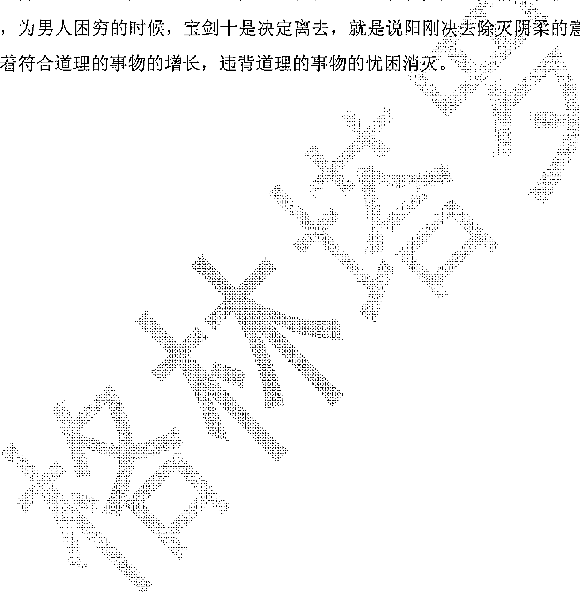

### 序篇

### 第一章

命轮是运动的初始，正义是运动到平衡的状态，世界是静止的初始，愚者是静止到平衡的状态。运动与静止，阳性与阴性，刚性与柔性，相互变化，层层递进，构成万事万物的运行规律。从命运之轮到正义，是运动到极致构成了平衡，所以正义是动中有静，是动态的平衡。从世界到愚者，是静止到极致构成平衡，所以愚者是静中有动，是静态的平衡。

### 第二章

有动有静就有了循环，有循环就有万物随后生成，在世间的唯有充盈的万物，所以命轮、愚者、正义、世界之后，接着就是星币二。星币二是满盈的意思，是万物初始生成的意思，万物初生的时候必定都是蒙昧的，所以星币二之后，接着是星币王后，星币王后就是指蒙昧的意思，也就是万物在幼小的时候，因而不能不养育，所以接着是星币七。星币七是需要饮食的意义，解决了饮食的问题，就必然带来争吵和诉讼，所以接着是权杖六。权杖六，必然要纠集众多的力量，去引起众多力量的兴起，所以接着是星币十。

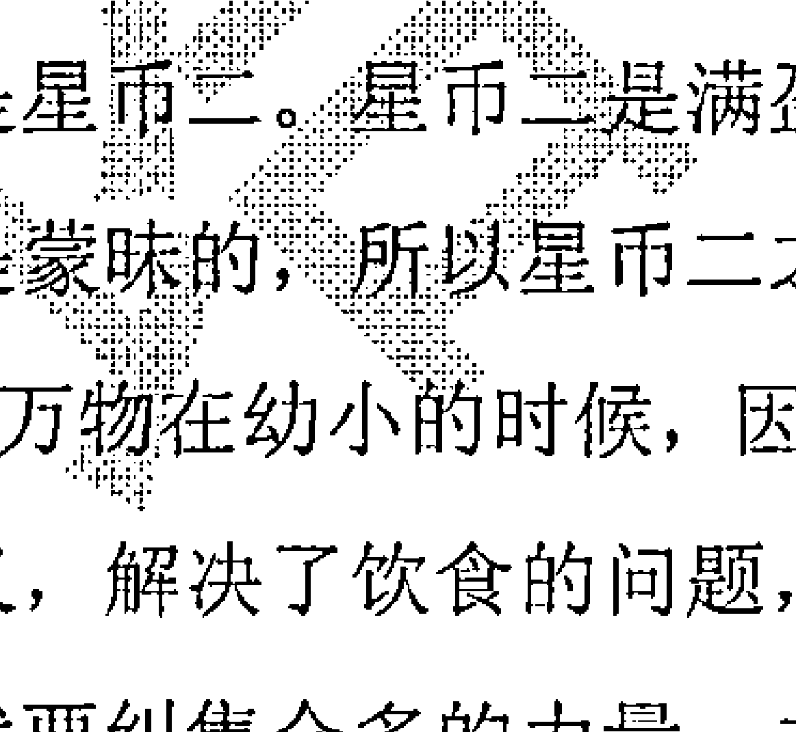

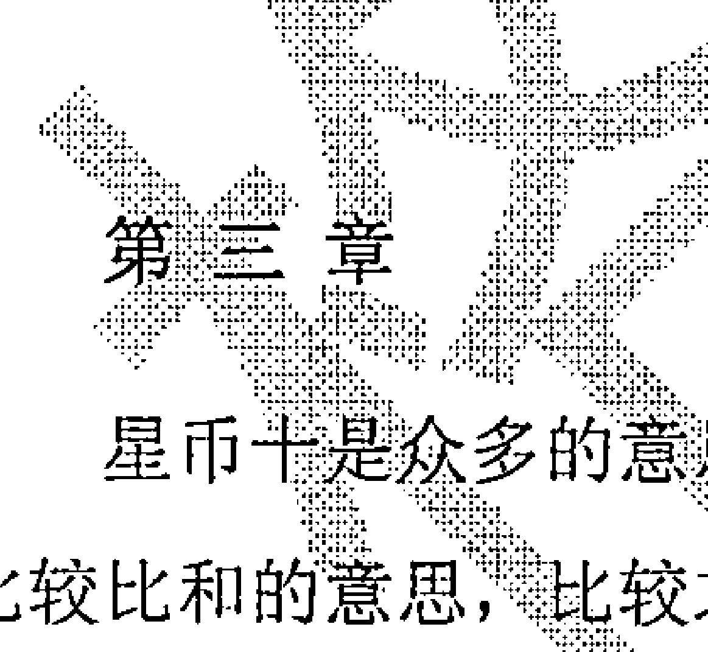

### 第三章

星币十是众多的意思，众多必定有所比较，所以接着是权杖王后。权杖王后是比较比和的意思，比较之后使人们有了存蓄，所以接着是宝剑八。物质蓄积以后需要有条理，以存着备用，所以需要调理礼仪，所以接着是星币五。星币五是礼仪的意思，行礼就能安然无恙，所以接着是星币六。星币六是有通泰的意思，但是万物都不可能长久的通泰，所以接着是圣杯六。万物不能终久的闭塞不通，所以接着是圣杯十。与人相同求同的，万物必定对他归顺驯服，所以接着是宝剑王后。有很伟大的事业和成就的人，不可以盈满自负，必须谦虚，所以接着是圣杯五。有伟大的成就，而又能谦虚的人，必定能够安逸娱乐，所以接着是权杖八。安逸娱乐的人，

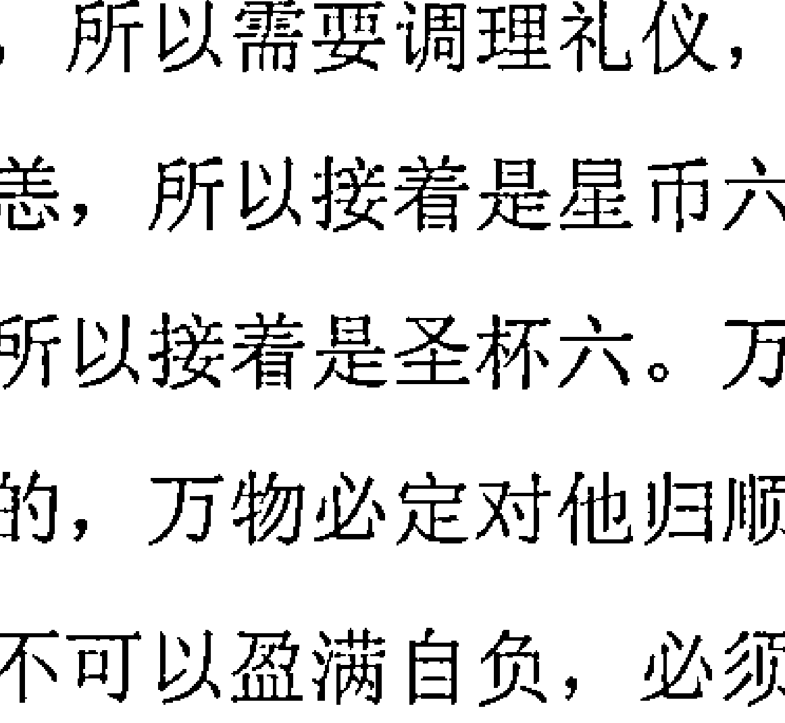

### 第四章

有事并且忙碌不停，然后就可以创造大业，所以接着是权杖侍从。权杖侍从是大的意思，大了以后才可以有观光的价值，所以接着是权杖九。可以观看以后，然后有所取舍合作，所以接着是星币国王。星币国王是合的意思，但是万物都不可以苟且求合，所以接着是宝剑骑士。宝剑骑士就是修饰的意思，修饰到极点以后就能够顺利通达，再到尽头而过度，所以接着是权杖十。权杖十是由上到下剥落的意思，万物不可以终久的剥落，剥落至极端，则必定从下再生，所以接着是星币侍从。星币侍从是回复的意思，回复了以后就不会虚妄了，所以接着是宝剑五表示了虚妄。

### 第五章

有了不虚妄的精神，然后就可以存蓄很多，所以接着是有存蓄意思的星币骑士。万物既然得到畜积以后，然后可以养育，所以接着是星币首牌。星币首牌是颐养的意思。不养育就不能行动，可是养育渐渐过度，所以接着是圣杯首牌。万物不可以始终过度，所以接着是恶魔。恶魔是欲望的意思，养育过度就形成欲望，有欲望就会有沉迷陷落，所以接着是塔。塔是险难陷落的意思，万物陷落到极至，就唯有期望，所以接着是星星。星星有期望必然就要攀附，所以接着是皇帝。皇帝是攀附的意思，有攀附就会有教唆，所以是教皇。教皇是教唆、鼓动的意思，有鼓动就自然去沟通，有沟通就会有选择，所以接着是恋人。恋人就是附丽的意思。

### 第六章

有了动静循环以后，然后就有万物的产生；有了万物，就有雌雄男女的分辨，而人类也就产生了。有男女之后就有夫妻，所以在塔罗就有宝剑首牌；有夫妻然后有父子；有父子以后，人类越来越多，而就有了国家和人民的区分；有国家和人民的区分以后，就有上下高低的职份；有上下高低的职份后，礼仪就实行在这些人际关系之间。夫妻的道理，不可以不长久，所以宝剑首牌之后，接着是圣杯三。圣杯三就是长久的意思，万物都不能长久的维持关系而不变化，所以接着是宝剑侍从。宝剑侍从是退藏的意思，万物不可以终久的退藏，所以接着是宝剑九。宝剑九是壮

大的意思，万物不可以长久壮大，所以接着面临的是圣杯七。圣杯七是前进的意思，前进必定有伤害，所以接着是宝剑六。宝剑六就是受伤的意思，在外面受伤的人必定返回到他家里，所以接着是圣杯八。家道困穷的话，必定会乖违，所以接着是权杖四。

### 第七章

权杖四就是乖违的意思，乖违必定有灾难，故接着是宝剑四。宝剑四就是灾难的意思，万物不可以终久的灾难，终究会缓缓消解，所以接着是星币八。星币八就是缓慢的意思，缓慢必定有所失败，所以接着是权杖首牌。权杖首牌损失却不停止，到不能损失时，必定会增益，所以接着是星币三。星币三增益却不停止，必定有决去的一天，所以接着是宝剑十。宝剑十是决去的意思，决去必定有所遭遇，所以接着是圣杯侍从。圣杯侍从是遭遇的意思，万物相遇了以后，就聚合起来，所以接着是圣杯骑士。圣杯骑士就是聚合的意思，聚集而上的，叫做升，所以接着是权杖五。权杖五上升而不停止，必有困苦的一天，所以接着是权杖骑士。受困于上的人，必定会返回下面来，所以接着是圣杯国王。

### 第八章

圣杯国王的道路不可以不去污垢，所以需要革除，因此接着是圣杯王后。革除物质的，没有再比大锅更好的了，所以接着是圣杯二。主持大锅的人，没有比长子更恰当的了，所以接着是魔术师。魔术师是开创带领的意思，有带领便需要配合，所以接着是女祭司。带领和服从相得益彰，才能真正的行动而获取感受，所以接着是皇后。皇后是动的意思，万物不可以长久的动，需要让它止息，所以接着是月亮。月亮是感受到动态下的潜藏问题的意思，有问题就要去发现，所以接着是太阳。太阳发现而寻求解决，就需要审判。审判是停止的意思，万物不可以终久的停止，故接着是宝剑国王。宝剑国王是渐渐前进的意思，前进必定需要它的归宿，所以接着是权杖国王。得到它的归宿的，必定强大，所以接着是圣杯九。

### 第九章

圣杯九是盛大的意思，穷极盛大的人，必定失去它的住所，所以接着是宝剑二。宝剑二是旅行的意思，在外旅行而没有收容的地方，所以接着是吊人。吊人无所适从，就需要突破，所以接着是死神。突破而获得自由，才能进入，所以接着是节制。节制是进入的意思，进入了以后，就会渐渐控制，所以接着是战车。战车的意思是控制，硬性的控制之后，需要包容抚慰，所以接着是力量。力量有抚慰的特性，使其从内心出发而获得喜悦，所以接着是隐者。隐者是喜悦的意思，喜悦而后会散去，所以接着是星币九。星币九是离散的意思，万事万物不可以终久的离散，所以接着是权杖二。权杖二是节约的意思，施行节俭约制了以后，就能使人相信，所以接着是权杖三。权杖三是需要诚信的意思，有信用的人，就必定能够实行它，所以接着是宝剑三。宝剑三有超过事物的人，必定能成事，所以接着是宝剑七。万物是不可能穷尽的，又会产生新的发展，所以接着是权杖七。而塔罗牌以权杖七结尾，象征着万事万物生生不息的变化。

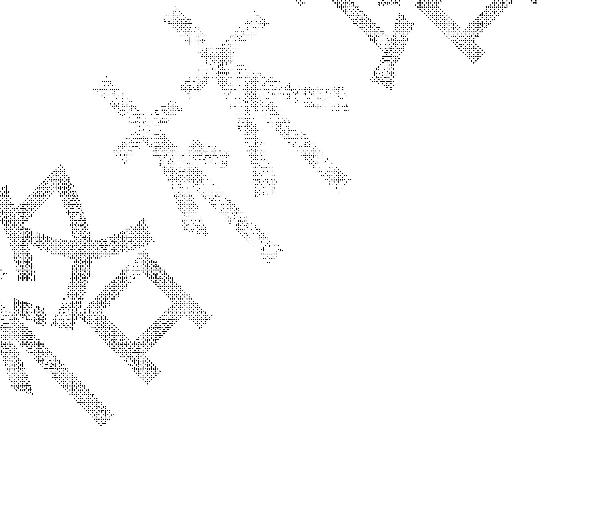

### 真篇

#### 第一章 愚者

愚者的自性便是本性，根本所在，无有形状，无有具体，无以言语，无以表达，也无法法定名。这样无名的本性，就是宇宙万物的初始。从无名到有名，是一段孕育的路径，就如同母体孕育婴儿的过程。正因为母体的空无，才可以孕育婴儿，正因为本性的空无，才可以孕育万有。所以如果常常保持在愚者空无的本性之中，就能够感受到孕育的奥妙，如果常常保持在婴儿般安静的沉眠中，就能够体察到所有事物的变化。因此，空无与孕育是同样的源头，是共同的状态，虽然名称不同，可是实质不能分拆。这个源头，可以称为很多名字，但都无法准确表达它，没有标的，超越具体，而万事万物都从其中产生，好像是万事万物的大门，又好像是万事万物的路径。自有我有，就是愚者。

#### 第二章 魔术师

魔术师从无至有开始了创造，万事万物就有了分别与辨识，有了分别与辨识就有了不同的方面。当所有人都知道了美，那么丑就显露了出来；当所有人都知道了善，那么恶就显露了出来。有和无在相互对比之中产生，难和易在相互对比之中形成，长和短在相互对比之中显露，高和低在相互对比之中存有，前和后在相互对比之中呈现。所以，有了分别与辨识就会有对立，有了对立就会有比较，有了比较就会寻求得失而产生情绪。因此，智者做的事情是顺应万物的法则而不去刻意作为，智者的修行是顺应大众的心态而不去刻意说教。宇宙的本性是对万物创生却不加以限制，对万物养育却不据为己有，帮助了万物却不依赖，建立了功劳却不占有。正因为塔罗的本性如同宇宙一般从不居功自傲，所以塔罗的法则才能够永远的存在，并且令我们总是探索和学习。能够懂得分别与辨识的本质，才能够区分万事万物的差异，也才能够选择呈现万事万物不同的方面，这才是魔术师。

#### 第三章 女祭司

知性的本质是需要同理，同理的本质是关爱，以关爱为本质才能推广更大的仁爱，使大众都具有同理心，同感世间的爱。如果不尊崇有能力的人才，大众就不会去争夺名声和利益；如果不看重贵重的财物，大众就不会去偷窃和盗抢；如果不显露出那些可以引起欲望的事物，大众的思想就不会混乱。所以女祭司推行关爱的方式是减少大众的思虑而让大众温暖，削弱大众的欲望而让大众健康。如果使大众没有知识和欲望，那么奸恶就不敢随意有作为。好像女祭司这样，不需要刻意作为却能够使大众同爱同知，这是因为女祭司运用的并非是知识，而是智慧。

#### 第四章 皇后

无论是命运还是法则，还是别的什么称呼，它的本质都是空虚而且没有形体的，如同皇后一样有虚感却没有实质，有调和却不追求卓越。塔罗的法则本身是深邃复杂的，就好像是万事万物的主宰。它挫去事物的锋芒从而解脱它们的纷争；它调和事物的优点从而制造它们的缺陷。所以，如果遵循塔罗的法则来做事，就不会要求把事情做得圆满。塔罗的法则是无形无影的，但万事万物好像表现着这个法则似乎存在，不知道是谁产生了它，只知道在万事万物产生之前，法则就已经出现了，如同皇后般孕育着万物。

#### 第五章 皇帝

宇宙的法则没有偏爱，任凭着万物都自然生长；世间的智者没有偏爱，任凭着大众自然发展。在宇宙的空间里，虽然显得空虚却不会穷尽，但是生长与发展越是变化就会产生越多的事物。皇帝通过展现权威来进行统御，通过发布号令来进行支配，是因为人在世间，随着见闻增多、知识增多，就会更多的刻意作为。所以，自以为是开创和领先，却反而越是加速到无路可走，倒不如控制自我的欲望，遵循着塔罗的法则做事。

#### 第六章 教皇

空间是那样的神妙，好像可以轻易看见，却又好像根本不存在，但它的神妙作## 《塔罗三昧》

用永远不会消失，如同一个奇妙的子宫，孕育着万事万物，任由万事万物在其中变化发展。学问与品德就如同空间那样，虽然存在却经常会被忽视，但是却无时无刻不在影响着世间的变化。塔罗的法则、教皇的学问、做人的品德，就好像母体的子宫，是万事万物产生的根源，连绵不绝且生生不息，它的作用也是无穷无尽。

#### 第七章 恋人

宇宙时空都是长久存在的。它们之所以能够长久的存在，在于它们的存在不是为了自己，所以反而就能够长久存在。把自己放到最后，反而就能够占先；把自己置之度外，反而就能够保存。正因为不自私，所以反而能够成就了私利。能仿效宇宙万物的恋人，才会拥有长久的恋情；能够懂得奉献无私的恋人，才能成就自己有私的恋情。

#### 第八章 战车

最根本的良善就好像世间的流水，它对万物都给予养育和利益，却不与万物争斗和求索，并且甘愿安然隐藏在最底下卑微的处所，所以水的行为是最接近塔罗法则。战车的战士安于在低下的位置，就能够让自己的思想更加通达深邃，对人真诚关爱而不欺骗，就能够让自己的心念更加平和安定，因此，战车做事时就能够展现能力，行动时就能够发现时机，进取时就总是能够获取胜利。正因为不争斗和不求索，所以就不会有灾难与祸患；正因为接近塔罗的法则，所以就不会有过错与悔恨。

#### 第九章 力量

力量能够得以展现，是因为力量有发挥的空间。乘客能够集中在车厢内，是因为有了车厢中的空间，才有了车的作用；容器能够收纳存储，是因为有了容器中的空间，才有了容器的作用；开凿门窗修建房屋，是因为有了房屋中的空间，才有了房屋的作用。所以世间凡是带来便利的器物，真正的作用是由于具有内部的空间；力量的展现不在于表面的实力，真正的作用是由于具有内里的谦虚。因此，勇气的意志，是由于具有坚强的关爱；柔性的控制，是由于具有目标的追求；行动的自信，是来源于自我的控制；真实的强势，是来源于环境的运用。

#### 第十章 隐者

把身体与心灵融合为一体，就能够做到不会分离；把精神专一并且达到最柔弱的状态，就能够做到坚韧强大；把欲望清除用来保持清明，就能够做到不犯错误；把关爱推及到他人，就能够不用智慧。隐者在事物的变化之中，能够甘心处在阴柔的状态，是为了寻求塔罗法则的引导；能够认真保持在清明的状态，是为了洞察塔罗法则的理解。能够懂得去帮助万物繁衍生长，去养育万物却不据有，去辅助万物却不占用，成就万物却不主宰，这样看似没有做任何事情，却造就了所有的事情，才是隐者的精神。

#### 第十一章 命运之轮

前进就是后退，过去就是将来，命运之轮是所有二元变化的时机节点。刀的锋刃如果锻造得尖锐锋利，那么这锋刃反而不能长久存在；做事时如果要求圆满完美令自我满足，那么所作的事情反而不能够满意；扩张财物如果是为了保存持有，那么财物反而不能够发展扩张；提升位阶如果是为了稳定坚固，那么位阶反而不能够成长提升。命运之轮带来事物的变化与转折，看起来似乎能够让理想和希望的事得到扩张与提升，但即使获得再多的物质也无法能够保有稳固。因为获得了财富与地位就会产生傲慢和骄气，那实际是获得灾难的源头，所以懂得在合适的时机功成身退，才是顺应塔罗本真的法则。真正掌控命运之轮，就要懂得所有的进退变化，其核心在于能够审时度势。

#### 第十二章 正义

缤纷的色彩会使人眼花缭乱；驰骋的行动会使人心思狂荡；罕有的财物会使人行为失常；杂乱的食物会使人口味败坏；美妙的音乐会使人听力失聪。世间的事物原本就不具有平衡公正，看似美妙的享受下却暗藏着繁杂的欲望，而在这样繁杂的欲望中去寻求平衡公正，又怎么能够做到正义的判断与协调呢？仲天说：“越是努力维持平衡与公正，反而不能够正确判断并维持协调。”这是因为，有了欲望就不能够公正冷静，有了享受就不能够发现真实，所以如果要做到正义的平衡，只能够努力求取自我温饱，去掉耳目所带来的欲望享受，才能够观察到事物的真实，了解到事物的运作，从而进行正确的判断，在万事万物的运作中去维持协调的平衡。

#### 第十三章 吊人

获得就会惊喜，损失就会惊恐，大众都好像吊人一样，把灾难和变化看得和自己的生命一样重要。为什么吊人无论获得还是损失，都会如同受到惊吓一样？因为它所要得到的，原本就在能力与预期之外，所以获得的时候就会惊喜不安；也因为它所要失去的，原本就在能力和预期之外，所以损失的时候就也会惊恐不安。这就是吊人无论获得还是损失都会受到惊吓的道理。为什么大众都好像吊人一样，会把灾难与变故看得如同生命一般重要呢？具有这些灾难变故的原因，正是因为过于看重自身的得失。如果到了无私无我的境界，就哪里还有什么灾难呢？所以，只有那些情愿把自己全部身心都为大众去投入的人，才可以把责权都托付给他；那些不愿舍身为大众投入的人，又怎么可以把权责寄托给他呢？

#### 第十四章 死神

看它的时候又看不见，这叫做无形；听它的时候又听不到，这叫做无声；摸它的时候又摸不着，这叫做无体。这三种特性混合成为一体，都是没有方法进一步追究验证的。死神的法则并不会显得明亮昭然，死神的形质也并不会显得阴暗渺茫，这样无形的结束改变，这样无声的更新重生，神秘得难以形容，可以说并非是一个物体，然而却又确实在世间存在。塔罗法则也是这样，可以被称为没有形状的形状、没有形象的形象、没有声音的声音。这样的塔罗法则迷离恍惚而无法捉摸，尾随着它也看不见它的后面，面对着它却看不见它的前面。然而，一旦掌握了塔罗的法则，就可以凭借它来驾驭与支配万物，就能够了解万事万物的变化趋势。这就是死神呈现的控制特性。

#### 第十五章 节制

懂得塔罗法则的智者，思想细致而精妙，思维深邃而通达，深刻得难以被理解。智者做事的时候，反复考虑的样子就好像是要在寒冬光脚过河一样；谨慎小心的样子就好像是畏惧邻里的攻击一样；恭敬庄重的样子就好像是在陌生人家里做客的旅人一样。他们圆转通达，就好像是将要融化的冰块；他们朴实敦厚，就好像是未经过雕琢的原木；他们包容接纳，就好像是浑浊的大水；他们开朗空阔，就好像是深山的幽谷。浑浊的大水安静下来，就会慢慢澄清；安静的东西活动起来，就会慢慢产生变化。凡是所有的对立两极，都会互相转化，就好像是对方的根源。所有的事态发展到极致，就会转变成相反的状况。明瞭并保持这个法则的人，就会懂得自我净化与节制，不会要求满足自我欲望。正因为不要求满足自我欲望，所以就能够除旧更新，自由扩张，前进不停。

#### 第十六章 恶魔

控制束缚的方式是施展诱惑，施展诱惑的法则是利用欲望，所以欲望是吸引恶魔的来源。因此，极力做到虚寂而减少欲望，彻底坚持清明而保持安静，就能够解除束缚的控制，甚至可以反向运用。万事万物都在生长发展的时候，就以保持安静减少欲望的心态来观察万事万物的运作情形，以清明虚寂的行为来控制万事万物的发展趋势。世间的万事万物纷纷芸芸，但最终都会回到自己的原点，回到原点就是回到虚寂死亡，死亡后就会重新获得生命。这种生命的获得过程是永恒的，明晰这个永恒的法则就可以算作是明智。如果不明晰这个法则，并且胡乱行为，那么就会遇到凶险，最终吸引恶魔，并陷入欲望诱惑，从而被控制束缚。懂得这个永恒的法则就能包容接纳事物，能够包容接纳事物就能够正确对待事物，能够正确对待事物就能够懂得为人处事的原则，懂得为人处事的原则进而就能够了解到塔罗的法则，了解到塔罗的法则进而就能够掌握到世间万物的法则，掌握到世间万物的法则就能够长久生存，终身不会遇到恶魔的诱惑，也不会遇到因此而来的后续祸患。

#### 第十七章 塔

以意志进行暴力是强行的变化，以破坏进行建构是毁灭的灾难，所以无论是建构或是破坏，都会终结原有的状况，也会让大众感受到暴力的意志。最好的管理者，会让大众感觉不到他的存在；其次的管理者，会让大众感到亲近并且称赞他；更次的管理者，会让大众感到畏惧并且避忌他；最次的管理者，会让大众感到轻视并且远离他。这是因为管理者自身诚信不足，所以就不会被大众所信任。因此，最好的管理者总是深思熟虑，极少发号施令，却能够让所有事物都井然有序，并且让大众都觉得我们本来就是这个样子。因而，即便塔顶的雷电虽然出现，大众却不会觉得惊惶；即便管理的奖惩虽然执行，大众却不会觉得意外。

#### 第十八章 星星

当慈悲的大爱被废弃的时候，就会提倡和谐与仁爱；当诡智出现的时候，就会具有严重的欺诈与虚伪；当家庭不和的时候，就会提倡孝顺与慈爱；当国家动乱的时候，才会产生忠奸与善恶。所以星星的期望是最终能够返回大爱。国家动乱的时候就会希望家庭孝顺慈爱；家庭不和的时候就会希望没有欺诈虚伪；诡智太多的时候就会希望大众都和谐仁爱；而和谐仁爱的时候就会希望大众都具有大爱。因此，重拾大爱，返本归源才是星星的希望所在。

#### 第十九章 月亮

聪明才智过多，世间就会有疑虑迷惘；和谐仁爱过多，世间就会有牺牲奉献；技能机巧过多，世间就会有隐瞒欺骗。疑虑迷惘令人沉迷于得失的困惑，所以往往误判失利；牺牲奉献令人沉迷于梦幻的愿望，所以往往忤逆失爱；隐瞒欺骗令人沉迷于情态的奉献，所以盗贼才可以恣意妄为。因此，抛弃聪明才智，就能够得到百倍的利益；抛弃和谐仁爱，就能够做到孝顺的慈爱；抛弃技能机巧，盗贼就不能够产生。月亮式的理想和目标仅仅是停留在愿望的程度，只是谈谈感受是不够的。只有行为单纯，才能够内心淳朴；只有减少私心，才能够降低欲望；只有抛弃知识，才能够抗拒诡智。

#### 第二十章 太阳

赞成与反对、善良与邪恶，相差有多远呢？理想与目标的实现路程是多么漫长，相距有尽头吗？大众都畏惧害怕的，智者也不能不畏惧害怕。众人如此欢乐，就如同参加盛大的聚会，智者却无动于衷地淡泊对待，就如同还不会笑的婴儿。这是因为智者有愚者的内心，所以总是如此笨拙。大众是那样的明白，只有智者是这样的昏聩；大众是那样的清楚，只有智者是这样的糊涂；大众都随波逐流，只有智者冥顽无能。因此，智者的生活坎坷多难，就如同动荡不安的大海，也如同那飘忽不定的狂风，不知道何处才是归宿。只不过智者的内心能够感受到太阳的方向，让内在的愚者一直都相伴着它。

#### 第二十一章 审判

最为伟大的品德就是与塔罗的法则保持一致。塔罗的法则虽然恍恍惚惚没有形体，但是其中确实有实在的意涵。它虽然深邃得难以认识，但是却有存在的特点，那就是真实诚信。最艰难的审判莫过于考验品德，最艰难的品德莫过于诚信待人，最艰难的诚信莫过于直面自我。所以，最容易的审判是指望被拯救解脱，却永远浮沉沦落；最艰难的审判是坚持志向，却能够复活重生。从古至今，塔罗的法则都无法被废弃，因为凭借它就可以了解世间所有事物的本性。因此，明晰法则，就能够知晓本性；明晰复活，就能够知晓觉醒；明晰掌控，就能够知晓赦免；明晰审判，就能够知晓因由。

#### 第二十二章 世界

自我吹嘘的人就不能够独立；自以为是的人就不能够辨明是非；自我显露的人就不能够明晰自己；自我夸耀的人就不能够成就事业；自以为贤能的人就不能够担任领袖。从塔罗的法则来察看，自我炫耀的行为就如同累赘，大众也都会厌恶，所以明晰塔罗法则的人就不会有这样的行为。能够承受委曲的人，才能够保全自己；能够承受冤屈的人，才能够伸直事理。低凹反而会积满，陈旧反而会出新，少取反而会获得，贪多反而会迷惑。所以智者能够与塔罗法则保持一致，从而成为大众的楷模。不自我吹嘘，因此才会专心一志；不自以为是，因此才会名气彰显；不自我表现，因此才会声势日盛；不自我夸耀，因此才会建立功绩；不自高自大，因此才能处于大众之上。正因为智者不与他人争取，所以世界上反而没有人能够与他争斗。

#### 第二十三章 权杖ACE

权杖首牌是行为的开始，引领行为的是外在的机会吗？仲天说：“自身要求取认同的欲望，造就了想要呈现自身的心态，外在的机会不过是触发了引领的行为。”如果要引领，就要进行管治，但是为了展现管治的能力而刻意作为，却往往无法达成目的。事物与大众都是神圣的，不能随意刻意管治。谁要刻意管治，往往就会弄得混乱；谁想把持权势，往往就会失去权势。世间的事情也常是这样：本意也许是想走在前面，结果可能反而落后了；本意也许是想轻拂，结果可能反而急进了；本意也许是想强壮，结果可能反而瘦弱了；本意也许是想稍微减损，结果可能是全部毁坏了。因此，智者总是会去掉那些极端的、过分的、骄奢的主观意愿。

#### 第二十四章 圣杯ACE

圣杯首牌是情感的开始，情感的需求源于对安全的需要，安全的状态展现在稳重与平静。”稳重是轻浮的根本，平静是躁动的主控。管控事物的轻浮，才能够令事物展现稳重；探察事物的躁动，才能够令事物展现平静；维护事物的稳重与平静，才能够令事物被管控以迎合安全的情感。因此，智者整天行走也不离开衣食行李，即使有壮观的屋宅可以安闲居住，也超然物外而不为所动。为什么智者反而把自己看得比天下的万事万物还要轻微呢？因为轻浮就会丧失了根本的原则，妄动就会丧失主控的地位。

#### 第二十五章 宝剑ACE

宝剑首牌是心智的开端，心智的运作呈现在思虑谋划，心智的目标呈现在斗争突破。事物在生成的时候就会发展衍化，发展衍化的时候就会形成差异，形成差异就会对立比较，对立比较的时候就会触动人的心智。因而善于行走的人不会留下足迹，善于言谈的人不会留下漏洞，善于计算的人不必使用工具，善于关闭的人不用钥匙却固不可破，善于捆缚的人不用绳索也牢不可解。因此智者总是擅长通过教育挽救人，所以就没有人被遗弃；擅长通过使用成就万物，所以就没有物被遗弃。这样的行为是可以称为明智的。善良的人是善良的人的老师，不善良的人是善良的人引以为戒的借鉴。不重视自己的老师，不爱惜自己的借鉴，即使是明智的人也会变得糊涂，这是很深厚的塔罗法则。

#### 第二十六章 星币ACE

星币首牌是形质的开始，具有形质就会有发展趋势，具有发展趋势就会努力运作，具有努力运作就会蓬勃繁荣。虽然明晰刚强主动强势，却安守在柔弱被动弱势的地位，甘愿做世间的暗沟。甘愿做世间的暗沟，恒久的品德就不会丧失，就能回复到如同婴儿一样无知无欲的状态。虽然知道荣耀，却安守在屈辱的地位，甘愿做大众的侍从。甘愿做大众的侍从，恒久的品德就会得到充实，回复到质朴的本性。虽然知道洁白，却安守在污黑的环境，甘愿做世间的典范。甘愿做世间的典范，恒久的品德就不会有失误，就能回归到无穷无尽的塔罗法则。塔罗的法则，分散开来就形成了万物，合作开来就形成了万事。智者顺应趋势的需求，无论成为领导或者成为侍从，在分散或者合作之间，都顺应着形质的趋势，可见世间的理想与原则，并不会破坏形势的完整性。

#### 第二十七章 权杖二

能够认识别人的人是聪慧的，能够认识自我的人是明智的。能够战胜别人的人是有力的，能够克制自我的人是坚强的。懂得满足的人是富有的，坚持力行的人是有志向的。不违反塔罗法则的人就能真正的长久，死亡之后却精神永存的人才是真正的长寿。所以权杖二的勇敢应当面对自我的欲望，权杖二的支配应当控制自我的行为，才能获得真正的领先。

#### 第二十八章 圣杯二

按照塔罗的法则去帮助他人的人，是不会依靠武力逞强的。使用强硬武力的事情是很快就会有回应的：行军驻扎过的地方就会有荆棘丛生；激烈的战斗之后就会有灾祸荒芜。善于使用塔罗法则的人，只要能够很好的取得胜利就罢手，不会依靠武力逞强。取得胜利却不会显得骄傲自大，也不会进行自我夸耀，并且取得胜利是出于自身不得已的行为，这就是不逞强的胜利。万事万物强盛了就会开始走向衰败，求强求壮的做法都是不符合塔罗法则的，不符合塔罗法则的就会很快灭亡。因而，圣杯二的根本是安全的感受进行融合，追求的是协助的防护，探寻的是交换彼此条件而造就的和谐关系。

#### 第二十九章 宝剑二

僵局到了极端就会转变，抗争到了极端就会结束，宝剑二掌握着转变的技巧，却是不得已才使用的伎俩。武器是不吉利的东西，大众都会讨厌它，所以懂得法则的人也不会使用它。智者平时注重智识的贵重，而作战时却注重感受的贵重，所以武器不是智者所需要的事物。武器是那么不吉利的事物，智者万不得已才会使用它，锐利而坚固的武器是好的武器，但不要认为这是好的事物。如果认为这是好的事物，那就会是以杀戮作为快乐的人。以杀戮作为快乐的人是不可能在世间获得自我志向的。宝剑二要使用处理丧事的心态和行为去处理斗争的事，斗争的杀戮总是众多，所以需要带着悲痛的心情参加，即使胜利了也要用办丧事的礼仪去处理它。

#### 第三十章 星币二

塔罗的法则永远处于一种虚无的状态，就像是未经加工的木材一样，虽然微不足道，但是没有人能够支配它。大众如果能遵循着塔罗的法则，事物就必然能服顺，所有的关联会相互交融而平衡均匀。人类开始活动时，就出现了各种器物。器物出现以后，就应该懂得适可而止。如果懂得适可而止，那么就能够避免危险。所以星币二的坚忍与野心，需要明瞭适可而止的状况；而要明瞭如何适可而止，就需要将自身融入世间的万事万物中去考量。这是因为，塔罗的法则与世间万物的法则的关系，就如同江海与河川的关系一样。

#### 第三十一章 权杖三

塔罗法则是不强制作为，然而却又成就所有的事物。大众如果能够遵循着它，事物就能够进行自我变化孕育发展。而在这个发展过程中，如果有欲望产生，我们也能够用无声无形的塔罗法则去说服它们安静下来。如果所有的事物都没有欲望，显现清明安静而不强制作为，世间就会和谐安定。所以个人的欲望在合作的团体中，要懂得协调并让它安静，这是权杖三的说明。

#### 第三十二章 圣杯三

塔罗法则的作用是那样广大，可以说无处不有。大功告成既不求取名声，也不占有利益，养护了万物却不做主宰，永远没有欲望。可以把虚无的法则看作是卑小的，因为事物都归附着并应用它，它却不当主宰；也可以把虚无的法则看作是伟大的，因为它始终不追求成为伟大，所以才成为了伟大。圣杯三把自己处在最低下的位置才能够和睦，与所有事物同步才能够繁荣，懂得法则却不作为主宰，也不追求伟大，反而能够成就。

#### 第三十三章 宝剑三

宝剑三如何会有争端？争端的出现是因为没有掌握到法则。谁掌握了法则，大众就会归附，因为归附就不会有害处，而且都能够平和安乐。然而各种生活享受往往使大众半途而废。塔罗的法则平淡无奇，看它又看不到，听它又听不到，可是使用它也用不完。

#### 第三十四章 星币三

要想收缩它，就必须暂时扩张它；要想削弱它，就必须暂时加强它；要想废除它，就必须暂时振兴它；要想夺取它，就必须暂时给予它。这就是星币三被称为最深沉的预见的原因，因此展现柔弱却能够战胜刚强。但是，如同鱼不可以离开深渊的水，谋划与预见也不可以让别人知道。谋划和能力都是成功的关键，但是离不开洞察的预见。

#### 第三十五章 权杖四

塔罗法则的运动是向相反的方向发展的，塔罗法则的作用就在于它能保持在柔弱的状态。所有的万事万物产生于有，而有是从虚无中产生的。所以权杖四看似繁荣与安定的状况，是从相反的方向发展过来，也必然会向着相反的方向发展过去。

#### 第三十六章 圣杯四

真正重视品德的人并不去表现自己的品德，所以他才能够保有品德；不重视品德的人却处处想表现自己的品德，所以他才会丧失了品德。重视品德的人保持清明安静，而且不用有强行的作为，这是因为他没有私欲；不重视品德的人碌碌多为，

《塔罗三昧》2012年修订版是因为他要满足私欲。重视仁爱的人碌碌多为，不是为了个人私欲；重视公平的人碌碌多为，是为了满足私欲；重视礼仪的人碌碌多为，如果没有人响应，就会死拉硬拽的迫人就范。所以，失去了法则才有了品德，失去了品德才有了仁爱，失去了仁爱才有了公平，失去了公平才有了礼仪。礼仪的产生就是诚信不足的标志，也是祸乱的开始。世人所谓的先见之明，如同圣杯四一样，是在堕落与衰退中的冷漠沉思，这都是华而不实的愚昧的开始。因此智者坚守着诚信，排除礼仪；遵循着规律，不随意揣度；舍弃利益和先见，坚守塔罗的法则。

#### 第三十七章 宝剑四

从来凡是能够与塔罗法则一致的事物，会呈现怎样的状况呢？天空能够保持一致，所以就能够清明；大地能够保持一致，所以就能够安宁；精神能够保持一致，所以就能够具有灵性；河谷能够保持一致，所以就能够具有充盈；万物能够保持一致，所以就能够滋润生长；人能够保持一致，所以就能够作为首领。如果放弃了塔罗的法则，也就是放弃了宇宙的法则，天空无法清明就会破裂，大地无法安宁就会折毁，精神无法具有灵性就会绝灭，河谷无法充盈就会枯竭，万物无法滋润生长就会死亡，领袖无法保持尊敬就会失去事业。所以，贵要以贱为根本，高要以低为基础。要想得到过高过多的荣誉，就反而会失去荣誉，因此宝剑四既不要追求宝石一般的晶莹剔透，也不要追求山石一般的坚硬突兀。

#### 第三十八章 星币四

智慧最高的人听见了“命运”，就努力按照它去办事，这是星币四的理智；智慧一般的人听见了“命运”，若有若无，将信将疑，这是星币四的善变；智慧低下的人听到了“命运”，就认为它辽阔空洞而加以嘲笑，这是星币四的封闭。不被智慧低下的人所嘲笑，命运也就不成为“命运”了。所以仲天说，明白易懂的法则反而好像难以理解，促人上进的法则反而好像引人后退，容易做到的法则反而好像难以施行。最崇高的品质反而是不具有，最洁白的颜色反而是黑暗，阔大宽容的品德反而好像不充足，能够有所建树的方式反而好像不厚道，纯真的行为反而好像变化无常，最大的方形反而没有棱角，最大的器物总是最后才能完成，最大的声音反而无声，最大的形象反而无形。塔罗的法则虽然无形无声，不可名状，然而它却善于帮助万物并且成就万物。所以星币四的占有反而无法占有，星币四的控制反而无法控制，星币四的馈赠反而无法接受。

#### 第三十九章 权杖五

最圆满的好似欠缺，但是它的作用却不会损坏；最充实的好似空虚，但是它的作用却不会穷尽。最平直的就好像弯曲的一样；最精巧的就好像笨拙的一样；最有余的就好像不足的一样；最善变的就好像不会言谈一样。运动能够战胜寒冷，安静能够克服暑热，所以，权杖五制约自身的行为就能够保持内心明静，不必刻意造作反而就能够运行万事万物。

#### 第四十章 圣杯五

宇宙是世间的根本，从无到有和从有到无都是宇宙的法则，这样的法则生出了一种事物，就产生了两个方面，之后互相衍生出第三种……以至于产生了万事万物。事物都包含着二元的对立面，它们通过相互激荡得到调和。大众所厌恶的，智者却会拿来使用。别人用来教导我的，我也用它去教导别人。事情往往就是象圣杯五这样的：本意是要减少，却反而增加；本意是要增加，却反而减少。所以，强横的人往往不得好死，脆弱往往带来失望和遗憾，冲动往往得到丧亡与悲痛。

#### 第四十一章 宝剑五

争执孕育着敌意，侵略蕴含着挫败，这是因为没有宝剑五具有的谨慎的灵性，就不会懂得清明平静的好处。世间最柔弱的事物能够洞穿进最坚硬的事物，世间最虚无的空间可以渗透进最稠密的物体。宝剑五可以认识到，清明反而能够挫去争执，平静反而能够击败侵略，不刻意作为就反而能够谨慎的消退敌意。没有言辞的教育，清明平静的好处，世间很少有能比得上它们的。

#### 第四十二章 星币五

名声和生命哪个更可亲？生命和财富哪个更值得重视？获得与损失哪个更有害？星币五虽然损耗失去，但不会悲伤忧愁，也不会需要庇护帮助，这是因为从塔罗的法则来看，有和无是可以相互转换的，得到和失去也并非绝对。所以明白得失、有无、生死都是相对且能转化的，才能超越忧患，接近大道。

#### 第四十三章 权杖六

智者永远没有私心，而是把大众的心当作自己的心。对于善良的人，智者以善意对他，对于不善良的人，智者也以善意对他，结果就会使不善良的人也变得善良。对于诚实的人，智者以信任对待他，对于不诚实的人，智者也以信任对待他，结果就会使不诚实的人也变得诚实。智者运用权杖六的管治，没有私欲与偏见，与大众相处和谐畅顺，要使大众的心都变得浑厚质朴。大众的视听都集中在智者的身上，智者就都把他们当作无知的婴孩一般亲切看待，这就是大众认可的神圣的智慧，也就是大众服从的忠诚的源泉。

#### 第四十四章 圣杯六

圣杯六的回忆是因为不满足现状，圣杯六的愉悦是因为不能够理解。如果当社会的政治清平时，军事的资能都能用于民事，那么当社会的政治不清平时，民事的资能也就能够用来作为军事。世间最大的罪恶是放纵欲望，世间最大的灾祸是不知满足，世间最大的危险是贪得无厌。所以，知道满足的这种满足，才能够永远感到满足。

#### 第四十五章 宝剑六

世人的旅行是为了消除闭塞，世人的交谈是为了增长见闻，但是这并不能了解到事物的运作，反而出门越远，所知越少。智者不出大门就能了解世间大事，这是因为智者的旅行是使用愚者的心灵；智者不望窗外就能知道事物的发展趋势，这是因为智者的交谈是面对愚者的自身。这就是宝剑六的运用啊！所以，智者不必亲自去实践就能够了解，不必亲自去见闻就能够明白，不必亲自去执行就能够成功。

#### 第四十六章 星币六

研究知识学问的人，情欲一天比一天增多；研究智慧法则的人，情欲一天比一天减少。减少了再减少，最后会达到星币六的清明平静的境界，就能够明白，如果内心清明平静而不强行妄为，反而就能够做成一切事情。要想管理就就要依靠不强行妄为的法则，如果人为生事、政令繁多、烦扰大众，就不能够管理妥善。所以，星币六的施予并没有实际的行为，大众反而能够获得；星币六的管理并没有刻意的条令，大众反而能够依从。

#### 第四十七章 权杖七

假如一个人确实有常识的话，就会沿着正路行走而唯恐走了斜路。正路非常平坦，可是许多身居高位的人却偏偏喜欢走山间的斜路。房间的样貌十分整洁，而自身的业绩却十分荒芜，大众的财物也十分空虚。可是这些人身穿华丽的服装，配搭先进的设施，吃饱喝足，自身的财富有余。这是如同强盗一样的行为，所走的并不是正路。竞争和进取往往就像是走在危险的斜路，权杖七的勇气用错了方向往往就会招致不利的结果。因此，权杖七即使面对平坦的正路也如同面对危险的斜路，即使自身可以有退路也如同没有退路。

#### 第四十八章 圣杯七

从生到死，生存的途径占了十分之三，死亡的途径占了十分之三，为了生存而碌碌妄为，结果反而陷入死地的途径也占了十分之三，这是为什么呢？因为用来保养生命防护祸患的方法太过分。善于保养生命的人，在大山中行走不会遇到虎豹的危害，在战争中也不会遭到杀伤，因为猛虎没有必要用爪子去抓他，兵器没有必要去刺伤他。这是为什么呢？因为他本身并没有引起死亡的原因。智者不胡乱猜疑，就不会触发危害；智者不碌碌妄为，就不会陷入死地；智者不强行斗争生存，就反而保养了生命。所以，圣杯七把危害视作虚幻，就不会产生敌意；不产生敌意，就不会触发死亡的原因。

#### 第四十九章 宝剑七

法则是可以窥探的么？法则是欺骗和施以诡计的么？法则使万物得以产生，德性使万物得到畜养，物质使万物能够成形，环境使万物能够成熟。因此世间万物没有不崇尚法则的。塔罗法则被崇尚和重视，并没有人命令要这样，而是万物本身自然而然的永远去这样运作，却如同宝剑七一样具有冷漠和超然的样子在万物的旁边窥视运作。塔罗法则使万物得以产生，使万物成长发育，使万物成熟结果，对万物加以抚养保护。因此，智者明晰宝剑七的意涵，懂得遵循塔罗法则，生养了万物却并不据为己有，帮助了万物却不依赖它们，成就了万物却不主宰它们，这是具有最高尚的品德。

#### 第五十章 星币七

世间万物都有一个初始源头，可以把这个源头看作万物的根本。掌握了这一根本，就可以凭借它来认识万物的特性。因而星币七的转变要了解事物最初的源头，星币七的开端要认识事物开始的特性。已经认识了万物的特性，回头再坚守这一根本，终身就会没有危险。无欲无识，好像闭目塞听一样，终身就会没有痛苦。多欲博见，碌碌多为，这样来求取成功，反而终身不可救药。观察塔罗的法则被称为明智，保持柔弱的特性被称为强大。发挥长处就能够做到明智，就能够不给自身引来灾祸，这个就是熟习塔罗法则的优势。

#### 第五十一章 权杖八

用正大光明的方法管治，用权诈奇诡的手段处理，用清静不强行作为的条例来管理。这是根据什么知道应该这样呢？是因为世间的忌讳越多，大众越贫穷；谋利的工具越多，社会越混乱；技术越精巧，邪物越繁多；法令越清楚，盗贼增加。所以只要不强行作为，大众就必然会归化；只要清心静气，大众就必然会端正；只要不任意决定事项，大众就必然会富足；只要没有欲望，大众就必然会淳朴。所以权杖八看似无人施为的本身在于智慧，智慧的本身在于品德，品德施行的本身在于明白塔罗的法则。

#### 第五十二章 圣杯八

善于建立的就无法被拔除，善于保持的就不会被脱落，子孙后代就可以世代遵循着风气而不中断。按照塔罗的法则来修养自我，自我的品德就会变得纯真；按照塔罗的法则来要求全家，品德就会同化全家；按照塔罗的法则来管理全乡，品德就会波及全乡；按照塔罗的法则来整顿全国，品德就会遍及全国；按照塔罗的法则来处置世间事，品德就会普及世间。所以圣杯八用修养自身的法则来观察自身，用同化全家的法则来观察全家，用管理乡村部落的法则来观察全乡，用治国的法则来观察全国，用普世的法则来观察世间。凭什么来了解世间情况的好坏呢？就凭借这个法则。所以圣杯八的精义在于懂得舍弃自身，舍弃自身的精义在于生命追求，生命追求的精义在于依循塔罗法则，这是圣杯八的智慧啊！

#### 第五十三章 宝剑八

容易被干扰就会处于混乱，容易被约束就会处于等待，容易被冷淡就会处于被遗忘，这是宝剑八在给予警惕的提醒呢！如果自我具有的高尚品德能够象婴儿一样纯真，那么灾祸就都不会去伤害他。婴儿的骨骼嫩弱、筋脉柔软，可是拳头却能够攥得很紧；还不懂男女交合，生殖器却常常勃起，是由于精神旺盛；终日号哭不停却不会逆气，是由于和谐到极致。精神旺盛和谐是世间万事万物的常规法则，掌握了常规法则就是明智。贪求生活享受就是祸殃，意志受到感情驱使就会变得麻木无知。所以，宝剑八与其被影响造成灾祸，不如自我影响以控制灾祸：自我干扰就不会被干扰，所以就不会处于混乱；自我约束就不会被约束，所以就不会处于等待；自我冷淡就不会被冷淡，所以就不会被遗忘。

#### 第五十四章 星币八

懂得塔罗法则的人是不会夸夸其谈的，夸夸其谈的人是不懂得塔罗法则的。懂得塔罗法则的人能够控制大众的知识从而使他们都成就品德，调和大众的优点从而使他们都具有一定的缺陷，挫去大众的锋芒从而解脱他们之间的纷争。这奇妙深奥的星币八却符合着塔罗法则。所以象这样去运作而被世人崇尚的智者，既不可能与他亲近，也不可能与他疏远；既不可能使他得利，也不可能使他受害；既不可能使他获得尊贵，也不可能使他卑贱。因此天下人都推崇他、贵重他。这正是因为智者始终不自以为是，所以能够成就他的尊贵和重要。

#### 第五十五章 权杖九

庞大的团队如同海洋，是世间所有水流的汇集处，海洋汇集水流就好像雌性呈现着阴柔的样子，团队包容接纳也应该处于世间最雌性阴柔的状态。雌性总是能够凭着沉静的特性战胜雄性，因为沉静也是一种谦卑的表现。所以，大团体用谦卑的态度去对待小团体，就能取得小团体的拥戴；小团体用谦卑的态度去对待大团体，就能去的大团体的庇护。因此，有的谦卑能够取得别人的拥戴，有的谦卑能够取得别人的庇护。如果两者都能够象权杖九一样保持在雌性阴柔的状态，使用谦卑的态度，那么就都能够满足自身的需求，不过大团体尤其应该注意。

#### 第五十六章 圣杯九

法令糊糊涂涂，大众反而会变得敦厚；法令清清楚楚，大众反而会变得狡诈。幸福就紧靠在灾祸旁边；灾祸就埋伏在幸福里面。谁能知道转变的终极原因呢？恐怕没有常规的准绳。正义往往会变成邪恶，善良往往会变成妖孽，所以圣杯九懂得大爱的慈悲，才能够感受快乐的满足。智者自身方方正正却不为难别人，有棱有角却不伤害别人，坚持正道却不强人所为，发出光芒却不刺人眼睛。这是因为世间事物转变的法则也是塔罗的法则，懂得塔罗法则的转变就能够懂得安全的根源。

#### 第五十七章 宝剑九

应对自如地管理大众，最好的方法就是内心清明平静，控制行为而积蓄力量，这就是及早遵循塔罗法则。及早遵循塔罗法则就能够很好地修养自身的品德，修养好自身的品德就能够无往不胜。无往不胜就不能够被他人估量出自身有多大的力量，有了这样的力量才能够进行管理。宝剑九控制行为就能够感到焦虑的痛楚，焦虑的痛楚就能够断绝欲望，断绝欲望就能够让内心清明平静。只有内心清明平静，才可以掌握管理的基要，也就可以长久存在。

#### 第五十八章 星币九

管理大众就好像烹饪菜肴，需要星币九的稳定纪律，而不要经常改变其中的方法。按照塔罗的法则来进行管理，那些负面的祸患就不能够灵通了。并不是祸患不会表现出来，而是它们的表现不能够造成危害。它们的表现不去造成危害，根本原因是智者懂得互相之间不侵害。因为两者都不相互侵害，所以它们反而就会形成恩德，并且带给大众繁荣。

#### 第五十九章 权杖十

自古以来善于运用塔罗法则的人，并不是用它使大众聪明，而是要用它使大众憨愚。大众难于管理的原因，是在于他们的心机智巧太多。所以说，用心机智巧去管理是灾难，不用心机智巧去管理反而是福气。这两种方式的差异也是塔罗的法则。经常了解这一法则，就叫做微妙深奥的德性。微妙深奥的德性是精深宏远的，与万事万物共同回归塔罗的法则，这样才能达到非常顺畅的境界。所以权杖十的管理并不引领目标与行为，大众就会不使用心机智巧；这样的管理呈现自身负担的责任与痛苦，大众就会顺畅地帮助扶持。

#### 第六十章 圣杯十

塔罗的法则是万物的归宿，既是善人的法宝，也是恶人借以安身立命的护符。明智的善人运用嘉美的言辞可以换来别人的尊重，运用崇高的行为可以博得别人的庆贺。即使有人做了恶事，又何必抛弃他呢？所以最贵重的礼物不如象圣杯十那样是去告诉他们原理和法则。自古以来世人重视和研究法则的原因是什么呢？不就是为了依靠它有求能得，有罪能免吗？所以，法则被世间所有人所重视。

#### 第六十一章 宝剑十

把无所作为当作自己要干的，把无所事事当作自己要做的，把无有味道当作有味道的，把小的当作大的，把少的当作多的，以德报怨，这样接受宝剑十黑暗的转变，才能迎接光明的曙光。对付困难要在它还容易解决的时候开始，实现很大的事业要从很小的事情做起，因为世间困难的事情都是从容易的事情开始，世间很大的事业都是从细微的地方做起。因此，圣人始终不自以为伟大，所以能够成就他的伟大。

#### 第六十二章 星币十

事物稳定时容易保持原状；事物没有出现苗头时容易对付处理；事物脆弱时容易分化；事物微小时容易消散。所以星币十在事情还没有发生的时候就做好准备，在团队还没有混乱时就注重管理。合抱的大树是由细小的萌芽长成的，百层的高楼是从第一筐土筑起的，千米的远处是从第一步开始的。不遵循塔罗法则，勉强操作就会失败，勉强把持就会损失。因此不强行妄为就不会失败，不勉强把持就不会损失。做事情常常在接近成功的时候失败，其实如果在结束时仍旧象在开始时那样慎重，就不会把事情做得失败。智者想得到的东西往往是一般人不想得到的不重视的奇货珍宝；智者学习的东西往往是一般人不愿学习的，并用它来纠正大众的过错。因此，智者总是按照万事万物的本性去帮助它们成功，而不敢勉强施为。

#### 第六十三章 权杖侍从

仲天说：“我不敢主动进攻别人，而只是被动防守；我不敢前进一步，而宁可后退千步。”这就是说，不要随便动用军队，不要随便奋臂争斗，不要随便攻击敌人，不要随便使用武器。世间最大的灾祸就是轻易与人为敌，轻易与人为敌就是违背了塔罗法则。所以两军对抗时，心情悲伤被迫自卫的一方往往能够获得胜利。

#### 第六十四章 圣杯侍从

江海之所以能曾为百川汇流的总汇，原因在于它善于处在百川的下游，所以才能成为百川汇流的总汇。智者要想处在大众之上去管理大众，必须用谦卑对大众表示尊敬；要想领导大众，必须把自身利益放置在大众的后面。因此，智者在大众的先前时大众不会感到妨害，在大众的地位之上时大众不会感到沉重，从而大众都乐于拥戴他而不会感到厌恶。那圣杯侍从正是由于不和他人争斗，所以世间反而没有人能够争赢他。

### 《塔罗三味》

也许世人都认为我所讲的塔罗法则太庞大了，似乎什么都不像。正因为它太庞大，所以什么也不像。如果像某个具体的器物，塔罗法则早就变得微小了。塔罗的法则有三个要点，需要牢牢得把握和修持：一是保持柔弱与和谐；二是减少欲望不随意作为；三是不敢处在大众的先前。保持柔弱与和谐才能够勇猛，减少欲望不随意作为才能够积蓄力量而无所不为；不敢处在大众的先前才能够成为领袖。如果舍去柔弱与和谐只求勇猛，舍去减少欲望不随意作为只求无所不为；舍去退让只求争先，那么结果就只有死亡了。所以宝剑侍从保持着柔弱与和谐，凭它作战就能胜利，凭它守卫就能巩固。

#### 第六十六章 星币侍从

善于做武士的人不依赖勇猛，善于作战的人不表现激奋，善于胜敌的人不与对方作战，善于使用才能的人先对人表示谦卑。这就是星币侍从不与他人争夺的品德，也是利用其他力量的方法，这就是符合宇宙间万事万物的运行法则，也是抱持着塔罗的法则。

#### 第六十七章 权杖骑士

朝着果敢坚强努力的人就会死亡，朝着谦退柔和努力的人就能生存。这两种努力有的得益，有的受害。似乎连宇宙也讨厌一些东西，谁能知道它讨厌这些东西的原因是什么呢？连智者也很难回答这样的问题。万事万物的运行法则就如同权杖骑士，不争夺却善于取胜，不说话却善于应答，不召唤却自动到来，虽然看似迟缓却善于谋划。宇宙就像一张广大无边的网，网孔虽然稀薄却从不疏漏；塔罗就像一个号令世间的将领，万事万物虽然繁多却无不依从。

#### 第六十八章 圣杯骑士

圣杯骑士的主张很容易理解也很容易实行，但是世间几乎没有人能够理解，也没有人能够实行。提出的主张都是有理由的，要求做的事也是有一定根据的，由于大众过于无知，所以不能理解。理解的人太少，能效法的人更难得，因此圣杯骑士的主张才被世人忽视。但是，如果能够持有道的精髓，天下人都会前来归附。所以智者虽然穿着粗布衣服，却怀有美玉般的品德。

#### 第六十九章 宝剑骑士

懂得了，然而外表好像不懂得，这是最好；不懂得，然而却装出懂得的样子，这就是疾病。如果能够象宝剑骑士一样，把这种疾病看作疾病，就不会产生疾病。智者也是没有这样的疾病的，正因为他把这种疾病当作疾病，所以才没有疾病。

#### 第七十章 星币骑士

由于当大众通常并不会感到害怕与恐怖，所以管理者就用更大的恐怖施加在大众的头上，不让大众安乐地生活在自己的家园，不让大众拥有自己的充足生活物资。正因为管理者不让大众受益，所以大众才无法受益。智者有自知之明却不表现出来，有自爱之心却不抬高自己。因此星币骑士应该抛弃前者而采取后者。

#### 第七十一章 权杖王后

宇宙的运作就如同安装器物，高的一端就压低一点，低的一端就抬高一点，长的一端就剪短一些，短的一端就补长一些。事物的运行法则也是这样，减损有余的而同时补给不足的，大众的生活原则却不是这样，总是减损不足的去奉献给有余的。但是谁能够把多余的东西奉献给世间大众呢？这只有懂得法则的智者才能够做到。因此权杖王后帮助了大众却不依赖，取得了成功却不居功，也不愿意表现自己的恩德和才能。

#### 第七十二章 圣杯王后

大众是不害怕和畏惧死亡的，所以怎么能够用死亡去威胁他们呢？如果大众一直是害怕和畏惧死亡的，那么把做恶事的人就全部杀掉，谁还敢做恶事呢？智者总是如同圣杯王后一样，永远交给宇宙去做消杀的事情。代替宇宙去执行消杀，这就好比是代替技术高超的工匠去砍削木头一样，很少会有人不伤到自己手指的。

#### 第七十三章 宝剑王后

大众贫穷挨饿，是因为管理者从中获益太多，所以才会贫穷挨饿；大众难以管理，是因为管理者好大喜功，所以才会难以管理；大众不害怕死亡，敢于斗争反抗，是因为管理者太过重视自己的生命，所以大众才不会害怕死亡。那些像宝剑王后一样不一味求生的人，就能够胜过重视生命的人。

#### 第七十四章 星币王后

人初生时身体是柔软的，死后身体是僵硬的；万物草木初生时是柔软的，死后是枯槁的。所以追求坚强是条死亡的途径，保持柔弱是生存的途径。因此，武力强大了就会灭亡，树木强大了就会折断。坚强庞大的东西总是处在下面，柔软微小的东西总是处在上面。星币王后依循塔罗的法则，总是保持在柔弱的状态，就能够安然处在上面。

#### 第七十五章 权杖国王

真话不好听，好听的往往不是真话；善人不巧辩，巧辩的往往不是善人；明智的人不去广求知识，广求知识的人往往不明智。智者如同权杖国王一样，毫无保留地尽全力帮助他人，他自己反而更富有；把一切给予他人，他自己反而更充实。塔罗的法则是对事物给予有利而不损害它们，所以智者总是只帮助他人而从不与他人争夺。

#### 第七十六章 圣杯国王

世间最柔弱的器物就是水，可是攻击坚硬器物的力量没有能够胜过它的，也没有能够代替它的。虽然柔弱胜刚强的原理，世间大众没有不懂的，但是很难能够去遵循执行。所以智者知道只有像圣杯国王那样，能够承担大众的屈辱，才是世间的君主；能够承担大众的灾难，才是世间的君王。这些正面的言辞听起来就总是如同反话一样。

#### 第七十七章 宝剑国王

即使和解了大怨，也一定还有余怨，怎么才能尽善尽美呢？智者即使握有讨债的契约，也不会向人索取欠债。具有品德的宝剑国王就像是握有契约的智者一样不对他人索取，没有品德的人就像是收租收税一样十分苛刻。塔罗法则对谁也不会偏爱，它总是帮助按照法则做事的人。

#### 第七十八章 星币国王

团队要小，人员要少，即使有各种器具也不轻易使用，使所有人看重生命而不是看重工具。即使有车船也没有必要去乘坐；即使有武器装备也没有必要去使用；让大众重新使用古老的方法去记事；使大众食物甘美、衣服漂亮、居住安适、风俗称心，让周遭都互相看得见听得见到死也不必往来。这是星币国王为了让大众更看重生命本身的运用。

#### 第七十九章 世界之上

暴风不会一直刮着不休，骤雨不会一直下着不停。是谁造成这样的情形的呢？是宇宙。宇宙的狂暴力量尚且不能持久，何况是人啊！所以明白塔罗法则的人，思想与法则合一；理解塔罗法则的人，处事与法则合一。不依照塔罗法则做事的人，就会是思想与处事不当。做事符合塔罗法则的人，也就能够明白塔罗法则；做事不符合塔罗法则的人，也就不能明白失准在什么地方了。

#### 第八十章 愚者之先

有一个东西浑然而成，出现在世界开始之前。它无声无形、独立存在，永不改变，可以作为世间万事万物产生的基础。我也不知道这个东西的名字，就姑且给它定个名字叫做“命运”。“命运”会发展运作，发展下去就会到繁盛的极致，到了繁盛的极致之后又要返回到最初的源头。所以，“命运”有“命运”的法则，天象有天象的法则，地理有地理的法则，社会也有社会的法则。世间有四种主要法则，而社会的法则只是其中的一项。社会的法则要依照地理的法则，地理的法则要依照天象的法则，天象的法则要依照命运的法则，而命运的法则就依照着它自身的样子，这就是塔罗的样子。

### 意篇

#### 第一章 愚者

处事的法则，在于严谨的谋略。谋略高的关注长远的核心；谋略中的关注短期的稳定；谋略低的关注暂时的利益。这是常规的塔罗法则。

仲天说：“宁可失去局部的小利益，也不可以丢失做事的主动权。”所有事情的谋略有先后的分别，这是因为轻重缓急的区别。通常的法则是较为急迫、严重的事情先处理，而较为缓慢、不是核心的事情可以后处理，但是往往起初不急不重的事情会慢慢成为关键的事情，这是为什么呢？仲天说：“这不过是事物随着时间与空间的变化而产生了变化而已。”塔罗的法则就是事物发展变化的规律，事物的变化也是谋略关注的要点。

凡是谋略处事，行动的时候要关注着未动的部分，注意到后期变化的同时也要关注到前期衍化。在一件事情中往往有许多小的事情和细节，要层层思考，事事细察。如果一件事情无论往哪两个方面都能发展顺利，那么就不要刻意将这个事情分化来进行处理；如果两件事情都已经能够稳固发展，那么就不必刻意将它们联合起来处理。如果事情涉及的日程太久、关联太远，就应当竭力缩短拉近；如果事情涉及的日程太短，关联频繁，就应当竭力放长吊远。与其眷恋局部的利益来求生存，不如弃掉无益的方面来为取得最终的胜利；与其没有发展而强行突破，不如留取观察的时间来补充自己。对方势大而自己势弱，不如先求取自保；自己势大而对方势弱，就要先张扬自己的气势。

善于取得胜利的人不轻易争斗，善于控制局势的人不轻易交锋，善于交战的人不轻易言败，善于失败的人不会轻易混乱。所有的事情都是从正常的策略开始，而通过突然的神奇策略取胜。所以首先要让自己牢不可破，才可以做到策略的施行出乎对方的意料，行动的方法超越对方的防备。

凡是对方没有特别的事情而努力补充自己的，这是因为有交锋出动的意图；放弃局部的利益而不挽救的，这是因为要意图更大的目标。所以，轻易决定行为的，是没有谋略的人；不经过思索就回应的，是自己求取失败。

#### 第二章 吊人

所谓处事，如果过于全面，处处都想取得利益，那么气势与实力就会分散，一旦分散，面临困境就很难互相救援与顾及。所以处事的时候不可以处处相逼，是因为一旦进逼，对方就会渐渐凝聚出实力，但是自己却因为全面施压所以会显得虚弱。虚弱就容易受到进攻，凝聚的实力被逼出来就不容易被击破。因此谋略也需要临时变通，随机应变，不能偏执在一个固定的法则里。

聪慧的人能够谋略到事物萌芽之前，愚笨的人只是关注到事物成熟之后。所以不仅知道自己的弱点，并且也知道对方意图的，就容易取胜；知道可以交锋却不进行交锋的，就容易取胜；能够发现形势的优劣多寡的，就容易取胜；能够使用最少的心力而让对方心力交瘁的，就容易取胜；能够以有一切变化的准备去对待没有准备的，就容易取胜；不用通过交锋而让对方屈服的，就容易取胜。因此，能够有自知的明智，才是取胜的关键。

处事的道理，谋略布置的形势尽量要连成一气，互相呼应，自始至终都要掌握到先决的主动。一旦面临形势高下胜负未分的时候，一毫一厘的差错也不能出。如果形势已占据上风，那么就全心全意务求稳定自己；如果形势已处于劣势，那就勇往直前地侵占对方的形势。为了自保而刻意回避，即使当下无碍，也仍旧不免失败。处于劣势而不承认，局面就将更加难以挽回。心浮气躁地一味求胜，这样的人大多都会失败。因此，双方相互交锋的时候，需要先从外部压迫对手，造就压制的形势。倘若被交锋而又势力孤弱，没有救援，就不要轻易逃避；倘若时机危险、面临形势崩溃，就需要直接放弃。

人来到这个世界上本来是安宁平静的，所思考和忧虑的事情都难被发现，但是一旦与外界事物接触，就会产生喜怒哀乐等情绪反应，然后就能被清楚地加以辨析。根据这一法则来进行推测谋略，胜败得失也就可以预先观察出来。其中的法则是：谨慎稳重而不贪的，大多会得到；轻慢随性而贪婪的，大多会失去；不贸然相争，却加强防御巩固自己的，大多会取胜；一味争夺，并且不顾后果的，大多会失败。因为失败而回想、检查自己错误的，谋略就能够长进；因为胜利而骄傲自满、洋洋得意的，谋略必然减退。寻求自己的弊病而不寻求他人的弊病，会对自己有利；只顾攻击对手而不知道对手在进攻自己，会对自己有害。注意力高度集中在处事的形势上，思虑就必然会周密；心灵为种种杂事所纠缠，思虑就必然会散缓。

目标远大而且正直的，常常吉利；心机狭隘而且奸诈的，常常凶险。能够重视敌手的，就会强大；总是轻视对方的，就会灭亡。掌握了关于某一事物的知识，从而能推知同类其他事物的，智慧就很高；固执不变，迂执到愚蠢地步的，智慧就很低。说话和沉默的时候都保持常态，就会使对手难于测度；行动和静止都没有分寸，只能招致他人的厌恶。所以仲天说：“他人心里在想什么，我不妨预先进行揣测。”

#### 第三章 审判

在形势中有种种应该考虑到的情形：有时候表面上获得利益而实际上遭受损失，有时候表面上遭受损失而实际上获得利益；有时候进取利益得到好处，有时候进取利益反而受到伤害；有时候应该在某一边进益，有时候应该在另一边进益；有时候某一方面需要先处理，有时候另一方面需要后处理；有时候需要紧紧压制对方，有时候需要不慌不忙地进行处置。紧靠对方的时候不要过于急切，放弃小利的时候也需要考虑有什么得益。有时候开始显得近而最终却远了，有时候开始显得少而最终却多了。计划加强外围就先在里面进攻，计划充实东部就先在西部进攻。给予对方铺路就应该稀疏，接受对方铺路就不要争斗，处事时选择合适的地方加以进取，如果没有妨害就继续推进。这都是谋略的深微之处，不能不认真了解。

谋略不应该太频繁；频繁就不免倦怠，倦怠就谋略粗疏；谋略也不应该次数太少，太少就容易忘记，忘记就失误较多。胜了不多话，败了不唠叨，发扬清廉礼让的风格，才是君子；因为失败就怒形于色的，不过是小人。谋略高的不要傲慢，谋略低的不要怯懦。气韵温和舒展的，这是为即将取胜而高兴；心跳加速，并且脸上的表情发生变化的，这是为即将失败而忧虑。最令人惭愧的事莫过于后悔，最令人耻辱的事莫过于偷取谋略，最为美妙的莫过于宽纵不逼，最为糊涂的莫过于反复争锋。

说到事情的谋略，有与无相互依赖生存，远与近相互补充促进，强与弱相互映衬烘托，利与害相互倾斜移动，进行谋略的人不可以不细细谨慎察看。形势安稳但并不大意，取得优势但并不骄傲，这是因为形势安稳而大意就会出现危险，取得优势而骄傲就会导致失败。

#### 第四章 皇帝

通过摩挲过去的历史，就可以知道现在的取舍，如同明亮平整的镜子，事无巨细都一一反映。在皇帝之前，有理解历史的三种方式：一如魔术师，表示行为、言谈、号令、指挥等；二如女祭司，表示思索、推演、策略、计议等；三如皇后，表示感触、反应、感受等。综观世间历史，可知智者之所以出现在世上，就是需要作为大众的先导，通过观察现象的变化来对事物作出判断，了解事物生存与死亡的途径，算计和预测事物发生的过程，通晓大众思想变化的关键，揭示事物变化的征兆，从而去把握事物发展变化的窍要。因此，对于世上的智者，法则和运用从古到今都是一样的。

万事万物的变化是无穷无尽的，然而都各自有自己的所属。或者属于静止的状态，或者归于运动的样子；或者刚硬强大，或者柔和弱小；或者开启，或者封闭；或者松弛，或者紧张。所以，要始终把握事物发展变化的关键，度量对方的智谋，测量对方的能力，再比较技巧方面的长短优劣。至于贤良和不肖、智慧和愚蠢、勇猛和怯懦、仁爱和守义，等等关于人的品性区别，可以开启接纳，也可以封闭据守；可以进升，也可以着退；可以敬重，也可以轻视。这都需要依靠不随意的心态和手法来进行掌握和管理。考察他们的拥有与缺乏、虚假与诚实，通过对他们的嗜好和欲望进行分析，来揭示他们的志向和意愿。适当贬抑对方所说的话，当他们开启接纳以后再反复考察，以便能够探察实情；切实把握对方言行的宗旨，让对方先封闭据守而后开启接纳，以便能够抓住有利时机。或者通过开启接纳，使对方显现；或者通过封闭据守，使对方隐藏。开放使对方显现，是因为情志相同；封闭使对方隐藏，是因为诚意相异。

要区分谋略可否操控运作，就要把策略研究明白。有与自己相异的和相同的策略，必须有主见并区别对待，也要注意跟踪对方的思想行动。如果要开启接纳，最重要的是考虑周详；如果要封闭据守，最重要的是严守机密。由此可见周全与保密的重要，应当谨慎地遵循这些法则。让对方开启，是为了侦察他的真情；让对方封闭，是为了坚定他的诚心。所有这些都是为了使对方的实力和计谋全部暴露出来，以便探测出对方的程度和数量。智者会因此用心思索，假如不能探测出对方的程度和数量，就会为此自称封闭，或者是通过封闭来自我约束，或者是通过封闭使别人被迫离开。

### 《塔罗三昧》

开启和封闭是世界上各种事物发展变化的法则。宇宙开启和封闭都是为了使事物内部对立的各方面发生变化，通过一年四季的开始和结束使事物发展变化。所以，不论是往来、合离、反抗，都必须通过开启或封闭来实现。开启和封闭是万物运行法则的一种体现，是言谈身行的一种形态，所以必须首先慎重地考察这种变化。

口是心灵的门面和窗户，心灵是精神的主宰。意志、情欲、思想和智谋都要由这个门户出入。因此，要懂得用开启和封闭来控制这个门户的出入。所谓开启，就是发言与公开；所谓封闭，就是缄默与隐匿。两个方面相互谐调，控制得宜，才能够有节度，才能够有良好开始和终止。长生、安乐、富贵、尊荣、显名、嗜好、财货、得意、情欲等等，属于动态的一类事物，叫做“善”；而死亡、忧患、贫贱、羞辱、毁弃、损伤、失意、灾害、刑戳、诛罚等等，属于静态的一类事物，叫作“恶”。凡是那些遵循动态的一派，都以谈论“善”来开始游说；凡是那些遵循静态的一派，都以谈论“恶”来终止施展计谋。关于开启和封闭的法则都需要从动静两方面来试验，因此给从“善”的方面来游说的人以崇高的待遇，而给从“恶”的方面来游说的人以卑下的待遇。用卑下的来求索微小，以崇高来求索博大，由此看来，没有什么不能出入的，没有什么不能开闭的，没有什么不能沟通的。懂得用这个法则，可以说服人，可以说服家，可以说服国，可以说服世间。要做小事的时候没有“内”的界限；要做大事的时候没有“外”的疆界。

所有的损害和获益，离去和接近，背叛和归附等等行为，都是运用动与静的变化来实行的。动态的方面运动前进，静态的方面静止隐藏；动态的方面活动显出，静态的方面随行潜入；动态的方面运行在循环的开端，静态的方面到了极致明显就会返回为动态。凡是凭主动而行动的，品德就与它相生；凡是凭被动而静止的，形象就与它相成。用主动来追求被动，需要依靠品德来包容；用被动来接纳主动，需要用外部条件和情形来约束。主动与被动、动态与静态互相追求，是依据开启和关闭的原则，这属于塔罗的法则，也是说服他人的方法，还是万事万物的门户。

#### 第五章 教皇

在古代能以大智慧来进行作为的智者，他的所作所为都能与无形的宇宙法则相吻合。反顾以追溯既往，再回首以察验未来；反顾以考察历史，再回首以了解当今；反顾以洞察对方，再回首以认识自我。动静与虚实的原则，如果在未来和今天都不能明白到，那就要从以前的历史中考察前人的经验。有些事情是要反复探索才能把握的，对于智者的见解尤其应该认真研修。

他人说话是运动，自己缄默是静止，所以根据对方的言谈就可以揣摩他的意图。如果他的言辞有矛盾之处，就反复进行诘难，那么其中应对的实情就将会出现。语言有可以模拟的形态，事物有可以类比的规范。既然有象征和类比存在，就可以预见到他人下一步的言行。所谓的象征就是模仿事物，所谓的类比就是比较言辞。以无形的塔罗法则来探求有声的言辞，引诱对方说出，如果与事实相互一致就可以刺探到对方的实情。这就像张开网捕猎一样，要多设一些网，聚集在一起来等待猎物落入。如果把捕猎的这个办法也能应用到人事上，那么对方也会自己进来的，因为这是钓人的网。但是，如果经常拿着网去追逐对方，言辞就不会再有平常的规范，这时就要变换方法，用制造的现象来使对手感动，从而考察对方的思想，使对方暴露出实情，进而控制和掌握到对方。自己返过去，使对手返回来，所有的言辞就可以比较类推，心里就能够明晰。向对手一再袭击，反反复复，令所有的事情都可以通过言辞反映出来。所以，智者可以诱惑愚者和贤者，就是运用这样的道理。

古代善于从反面听别人言论的人，可以改变鬼神，从而刺探到实情。他们随机应变很得当，对对手的控制也很周到。如果控制不周到，那么得到的情况就会不明了；如果得到的情况不明了，那么心里的判断就会不全面。所以要把模仿和类比灵活运用，就要懂得说反话，以便观察对方的反应。想要讲话，反而需要先沉默；想要敞开，反而需要先收敛；想要升高，反而需要先下降；想要获取，反而需要先给予。要想了解对方的内情，就要善于运用模仿和类比的方法，以便把握对方的言辞。这是因为同类的声音言辞可以彼此响应，合乎实际的规律会有共同的结果。

或者由于这个原因，或者由于那个原因；或者用来侍奉上级，或者用来管理下属。因为目的不同，所以就要分辨真伪、了解异同，以明晰对方的真情或诡诈。运动、静止、谈论、沉默，都要通过这些法则表现出来，喜怒哀乐等情绪的了解也都要借助这些模式，这都需要事先确定策略，用逆反心理来追索其过去的精神寄托，所以就需要用这种反听的方法。自己要先平静，以便听取对方的言辞，从而察知事理、论说万物、辨别雄雌。虽然这不是事情本身，但是可以根据轻微的征兆，探索出同类的大事。就像刺探敌情而深居敌境一样，应该首先估计敌人的能力，其次再摸清敌人的意图，不仅要可靠而且要准确迅速。

要想掌握情况，就要先从自己开始，只有了解自己，然后才能了解对方。如果能够做到这样，那么对对方的了解，就像比目鱼一样没有距离；掌握对方的言论，就像声音与回响一样相符；明察对方的情形，就像光和影一样不会走样；侦察对方的言辞，就像用磁石吸取钢针一样万无一失。自己暴露给对方的微乎其微，而侦察对手的行动十分周全迅速，就像万物的变化一样自如。

#### 第六章 恋人

等级上下之间的事情，有的距离很远却很亲密，有的距离很近却很疏远，有的在身边却不被使用，有的在离去以后还受聘请，有的天天都能到上级眼前却不被信任，有的距离上级十分遥远却听到声音就被思念。凡是事物都有采纳意见和建议策略两方面，平常的东西都与本源相连结，或者靠品德相连结、或者靠朋党相连结、或者靠财物相连结、或者靠美色相连结。要想推行自己的主张，就要做到想进来就进来，想出去就出去；想亲近就亲近，想疏远就疏远；想接近就接近，想离去就离去；想被聘用就被聘用，想被思念就被思念。这就好像母蜘蛛率领小蜘蛛一样，出来时不留洞痕，进去时不留标记，独来独往，谁也没法阻止它。

想要说服他人，务必要先悄悄地揣测。度量与策划事情，务必要循沿顺畅的途径，暗中分析是否可行，透彻辨明所得所失，这样才能够影响上级的思想。凡是内情有不合时宜的，就不可以实行，因而就需要揣量切摩形势，从方便有利之处入手来改变策略。这样用善于变化来求取被采纳，就像以手来握杯子一样顺当。凡是谈论过去的事情要用顺畅的言辞；凡是谈论未来的事情要采用容易变通的言辞。对于善于变化的方面，要详细了解形势与时机，这样才能驭使对方。要了解上级谋略的事情，就要知晓上级的意图。所办的事情凡有不合上级心意的，是因为对上级的意图留于表面亲近而背地里还有距离。如果与上级的意见没有吻合的可能，智者是不会为他谋略的。

所以说，与上级相距很远却被亲近的人，是因为能与上级心意暗合；距离上级很近却被疏远的人，是因为与上级志向不一；就职上任而不被重用的人，是因为他的策略没有实际效果；革职离去而能再被反聘的人，是因为他的主张被实践证明可行；每天都能出入上级面前却不被信任的人，是因为他的行为不得体；距离遥远只要能听到声音就被思念的人，是因为他的主张与上级的决策都相合，正等他参加决断大事。因此，在情况还没有明朗之前就去游说的人，一定会事与愿违；在还不掌握实情的时候就去游说的人，一定会受到非议。只有明晰实际的情势，并且依据实际情势来确定方式，这样去推行自己的主张就可以进退自如，从而既可以进谏上级而坚持己见，又可以放弃自己的主张而随机应变。

智者立身处世，都以自己的先见之明来议论万事万物。这个先见之明来源于品德、仁爱、是非、礼仪、忠贞、信任和谋划。首先摘取前人的教诲，再综合分析利弊得失，最后思考就任还是离职。要想与人合作，就要把力量用在内部；要想离开现职，就要把力量用在外面。所以，处理内外大事都必须要明确目标与方式。

要能够预测未来的事情变化，要善于在各种疑难面前临机决断，运作策略才能够不失去谋划盘算，才能够不断建立功绩和积累德政。善于管理下属，使他们从事生产，这是把策略用于内部的安定。如果上级昏庸不理事物，下属纷乱不明做事的原则，出现各执己见而事事抵触的情形还自鸣得意，不接受外界的新思想还自吹自擂。在这种情况下，如果受到升迁，虽然也要迎接，但是又要拒绝。要拒绝对方的任命，就要设法给营造错觉，就像恋人的选择循环往复一样，使旁人看不出自己的意图。在这种情况下，急流勇退是最好的办法。

#### 第七章 战车

万物变化都有塔罗法则存在，任何事情都有对立的两方面。有时彼此距离很近，却互相不了解；有时互相距离很远，却彼此熟悉。距离很近而互相不了解，是因为没有互相考察言辞；距离很远却能彼此熟悉，是因为经常往来并能够互相体察。

万物从生成的一刻就开始出现衰变，事物从初生就开始有危机的生成，这样的危机会由小变大、由弱变强，是世间不变的法则。在危机刚刚出现时，可以通过抵挡使其闭塞，可以通过抵挡使其停止，可以通过抵挡使其变小，可以通过抵挡使其消失，可以通过抵挡而乘势夺取，这就是抵挡的原理。当事物出现危机的开始，只要善于抵挡，就可以使它转危为安。

### 《塔罗三昧》

有智者才能察觉，并且能单独知道它的功用，依循事物的变化来进行调整，从而了解各种计谋以便观察对手的细微举动。万事万物在开始时都像飞散的尘埃一样微小，一旦积累发展起来就像大山的根基一样宏大，所以当智者将法令向外推行时，阴谋与诡计就都会被排斥，可见抵挡原来是一种方法。

群体动乱不止，上级缺乏贤明，干事没有品德，小人谗言妄为，良才不被信用，智者逃匿躲藏，一些追名逐利、奸诈虚伪的人飞黄腾达，上下级之间互相怀疑，关系土崩瓦解，互相争斗，父子离散，骨肉反目，这些情势都称为裂痕的萌芽。当智者看到裂痕萌芽的时候就会立刻设法治理。如果情势还可以治理时，就要采取弥补的抵挡方法，使事物情形得到弥合，并且继续保持完整，使其继续存在；如果情势已到不可治理时，就用破坏的抵挡方法，彻底把事物情形摧毁，从而占据拥有，并且重新塑造。或者这样抵挡，或者那样抵挡；或者通过抵挡使其恢复原状，或者通过抵挡将其摧毁。在这个混乱的情势中，善于运用不同抵挡方法处事的人才是智者。

自从宇宙之间有了开始与结束、分离与合并以来，万事万物就必然会存在着裂痕，这是不可以不仔细察知的，要想察知就要使用战车的抵挡方法。当情势不需要抵挡的时候，就深深地隐居起来以等待时机；当情势可以抵挡的时候，既可以对上级合作，又可以对下级督查，并且都有所依据遵循，这样就能够进行守护，并且防止危机的生成。

#### 第八章 力量

凡是揣度人的智谋和测量人的才能，都是为了招揽远近的人才，从而造就声势。

要进一步掌握情势发展变化的法则，一定要首先考察各人的相同和相异之处，区别各种对的和错的议论，再了解对内和对外的各种言辞，掌握有余和不足的程度，接着决定事关安危的谋略，以之确定与谁亲近和与谁疏远的行为，然后再权量这些关系。如果对这些要点还有不明晰的，就需要继续钻研探索，使人才能够为我所用。

借用言辞的诱惑来钩引对方，并且通过恭维来钳夹对方，所以力量使用钩引和钳夹的方法是一种忽同忽异的游说辞令。对于那些使用钩引和钳夹的方法仍无法控制的对手，或者首先威胁利诱，然后再进行反复试探；或者首先进行反复试探，然后再攻击加以摧毁。有人认为反复试探就等同于破坏对方，有人认为破坏对方就等同于反复试探。想要重用某人时，或者先给予钱财和美物，从而进行试探度量；或者通过衡量才能的方式创造形势状态，从而来进行吸引；或者通过寻找漏洞，从而来进行控制。在这个过程中都要先动用抵挡的方法。

要把钩引和钳夹的方法进行推行，必须考核人的谋略与才能，观察形势的强盛与衰弱，掌握门路的宽大与窄小，可能出现变故的困难与容易，以及财富的多与少。在合作之间的交往方面，必须考察彼此之间的亲疏关系，究竟谁与谁相互疏远，谁与谁相互友好，谁与谁相互厌恶。要详细考察对方的意愿和想法，要了解对方的喜好和厌恶，然后针对对方所重视的问题进行游说，再用钩引的方法诱出对方的爱憎所在，最后再用钳夹的方法把对方控制住。

如果把钩引和钳夹的方法用于他人，就要揣摩对方的智慧和能力、度量对方的实力、估计对方的气势，然后以此突破与对方周旋，进而以钩引和钳夹的方法达成议和，以友善的态度建立交互。这也是钩引和钳夹的妙用。

另外，如果把钩引和钳夹的方法用于他人，可以用好听的空话去套出对方的实情，通过这样连续的行动来考察游说的辞令。这样可以实现合作，也可以实现联盟；可以引诱向上，也可以引诱向下；可以引领前进，也可以引领后退；可以引而返还，也可以引而复去。虽然如此反复反覆，但是也要小心谨慎，不能丧失其中的量度。

#### 第九章 隐者

凡是有关联合或对抗的行动，都会有相应的谋略。变化和转移就像铁环一样环环相连而且不会中断，然而变化和转移又有各自的具体情形。彼此之间环转反复且互相依赖，需要根据实际的情况进行控制。所以智者生活在世间，立身处世都是为了说教众人、扩大影响、宣扬名声，还必须根据事物之间的联系来考察环境形势，以便能够掌握有利时机。团队哪些方面有余、哪些方面不足，都要从这里出发去掌握，并设法促进事物向有利的方面转化。

万事万物也没有永远居于首脑或者领先地位的，所以智者也常常是无所不做、无所不听。这样不仅能够达成要做的事，也能够实现预定的谋略，并且令事物和谋略都符合自己的意见。

如果合乎某一方的利益，那么就会背叛另一方的利益。凡是谋略就不可能同时忠于对立的双方，所以必然会违背某一方的意愿。合乎这一方的意愿，就要违背另一方的意愿；违背另一方的意愿，才可能合乎这一方的意愿。这就是背离与结合的方法。如果把这种背离与结合的方法运用到世间，就必然要把世间万事万物都放在背离与结合之中；如果把这种背离与结合的方法运用到某个群体，就必然要把整个群体放在背离与结合之中；如果把这种背离与结合的方法运用到某个家庭，就必然要把整个家庭都放在背离与结合之中；如果把这种背离与结合的方法用到某个人，就必然要把这个人的才能气势都放在背离与结合之中。总之，无论把这种背离与结合的方法用在大的还是小的范围，它的功能效用都是相同的。因此，无论在何时何地都要进行分析谋略，预测推算准确以后，再施展背离与结合的方法，而后才能够实行钩引和钳夹的方式。

自古以来，那些善于通过背离一方、趋向结合一方而横行在世的人，常常能够掌握形势内部的各种力量，控制各个上级关系，促成背离与结合的转化趋势，然后达成与上级的意向相合的目的。

对于智者来说，如果没有高尚的品德和超越的智慧，就不可能通晓深层的法则进行驾驭；如果不会用心苦苦思考钻研，就不可能揭示事物的本来面目；如果不会全神贯注地考察事物的实际情况，就不可能功成名就；如果才能与胆量都不足，就不可能统兵作战；如果只是愚忠呆实而没有真知灼见，就不可能明察对方。所以，背离与结合的法则是：要首先估量自我的聪明才智，然后度量对方的优劣长短，分析远近的影响范围，判断还有谁强谁优。只有在这样知己知彼以后，才能随心所欲，可进可退，可连可纵。

#### 第十章 正义

自古以来，善于统驭管治的人，必然首先衡量各种力量的权重，揣摩各方势力的实情。如果对权势力量分析不够全面，就不能了解各方力量的强弱虚实；如果对各方实情揣摩不够全面，就不可能掌握事物暗中变化的征兆。

什么是衡量权重呢？答案是：测量尺寸的大小；谋略数量的多少；称量财货的有无；估量人口的多少与贫富；什么有余、什么不足，以及达到了怎样的程度；分辨地形险易，哪里有利，哪里有害；判断各方的谋略，谁长谁短；分析上下亲疏关系，谁贤谁不肖；考核幕僚的智慧，谁多谁少；观察天时祸福，什么时候吉、什么时候凶；比较与各方势力的联系，哪里安定、哪里危险，爱好什么、憎恶什么；预测反叛的事，在哪里更容易发生，谁人能知道内情。这些种种的，就是所说的衡量权重。

所说的揣摩实情，就是必须在对方最高兴的时候去加大对方的欲望，他们既然有欲望就无法按捺住实情；又必须在对方最恐惧的时候去加重对方的恐惧，他们既然有恐惧就不能隐瞒住实情。情欲都会随着事态的发展变化流露出端倪。对那些已经受到感动之后仍看不出有异常变化的人，就要改变游说的对象，不要再对他说什么了，而应秘密地与他所亲近的人去沟通交流，这样就可以知道他安危都不为所动的原因。那些情欲从内部发生变化的人，必然会通过形态行为显现于外表，所以常常要通过显露出来的表面现象，来了解那些隐藏在内部的真情，这就是所说的揣测实情。

所以谋略大事的人，就应当详细衡量己方的各方面力量；游说上级的人，就应当全面揣测上级的想法，规避自己的短处而发扬自己的长处。所有的谋略、想法、情绪及欲望，都必须这样操作，才能够得心应手地面对各种状况和对付各式人物。可以表示尊敬，也可以表示轻视；可以施加利益，也可以行使伤害；可以成全愿望，也可以败坏理想。其中使用的方法都是一致的。因此即使有贤明的德行与高超的智谋，如果不能通过揣度探测出透彻的隐情，那么就无法了解对方。这也是谋略的基础与交流的通用法则。

大众对某些事情常常感到突然，这是因为不能事先预见。能在事情发生之前就预见，这是最为困难的，所以揣测实情也是最难把握的。

游说的行动必须深谋远虑，选择合适的时机。昆虫进行蠕动，都是因为处在与自己的利益相关的时机，所以才会发生变化。任何事情在开始产生的时候，也都会呈现一种微小的事态情势。因此，运用揣测实情，需要借助漂亮的言辞或文章之后，才能够进行使用游说。

#### 第十一章 死神

揣测实情的具体目标就是摩挲意图。

由于揣测实情是需要掌握揣测的法则，所以必须保密隐藏。通过轻轻地旁敲侧击，来探测对方的真实想法，如果与其内情符合，那么对方就会有所反应。内心的情感要表现在外部，就必然会做出一些行动，这就是摩挲意图的作用。在达到了这个目的之后，就要在适当的时候离开对方，隐藏自己的动机，消除行为的痕迹，伪装自己的外表，加避事件的实情，使人无法知道是谁办成的这件事。因此，智者达到了目的，完成了计划，却能够不留下祸患。

摩挲对方的意图是在这个时候，而对方自我表现是在那个时候。只要有办法让对方顺应自己的安排做事，就没有什么事情是不可能达成的。善于摩挲意图的人，就好像拿着钩钩去钓鱼一样，只要把带着饵食的钩投入水中，悄悄等待不必声张，就可以成功钓到鱼。所以鬼谷子说：“主办的事情一天天成功，却没有人能够察觉；主持的军队日益压倒敌军，却没有人能够感到恐惧，只有做到这样才是最高明的。”那些具有很高素养和智慧的人总是在暗中进行谋略的行为，所以被称为“神”，但是这些行为造就的成功都显现在光天化日之下，所以被称为“明”。因此，那些办事就马上成功的领导，是因为他们在暗中积累行为；大众能够安居乐业却不知道缘由，是因为他们在暗中积累有益的举动。因而，这样的谋略在暗中、成功在明处的策略，就被称为“神明”。

在实施摩挲意图的时候，有运用平和话语的，有运用义正辞严的，有运用欢喜进行讨好的，有运用愤怒进行激励的，有运用名气的，有运用行为的，有运用廉洁进行感化的，有运用信誉进行说服的，有运用利益进行诱惑的，有运用谦卑进行夺取的。平和就是安静，正义就是刚直，娱乐就是喜悦，愤怒就是激动，名气就是声誉，行为就是实施，廉洁就是清明，利益就是需求，谦卑就是委曲。智者所独用的这些摩挲意图的方法，常人虽然也可以明白，却没有能够运用成功的，那是因为他们使用错误。因此，策略计谋，最困难的就是周全和隐密；进行游说，最困难的就是让对方言听计从；主持事情，最困难的就是一定能够成功。为什么这三个难题只有成为智者才胜任呢？鬼谷子说：“事物的法则、行动的方式、所处的时势，都是互相依附联系的。”所以，谋略策划的时候，必须要周全和隐秘；进行游说的时候，必须要选择与自己可以相互沟通，从而令交流起来没有嫌隙的对象；主持事情的时候，必须要有合适的方法，才能够让事情取得预期的成功。进行游说的人要让对方听信，必须使自己的说词有情有理，因此，鬼谷子说：“言辞需要合情合理，才能够获得听信任。”

世间万事万物都有各自的属类与特性。好比抱着柴草向烈火走去，干燥的柴草就会首先着火燃烧；往平地里倒水，低洼的地方就会首先有水流进。这些现象的产生都是与各类事物的性质相应的，经此类推，所有事物也都是这样。所以，如果按着事物的不同性质来实施摩挲意图的方法，那么哪里有不会响应的呢？如果根据被游说者的喜好来施行摩挲意图的方法，那么哪里有不会听从的呢？如果要想能够独往独来，那么就要注意事物的细微变化，把握最好的时机，即便有轻微的成绩也不停止，如此日积月累就一定能够取得最后的成功。

#### 第十二章 节制

游说，就是说服别人的行为；要能够说服别人，就需要给人以帮助。

所有经过修饰的言辞，都是被借用来达到某种目的；所有被借用的事物，都是既有好处也有害处。凡是要进行应酬和答对，就必须掌握伶俐的外交辞令；因此，凡是伶俐的外交辞令都是不实在的言论。凡是要树立信誉，就必须要光明正大，光明正大就是为了让人检验复核；因此，凡是难以启齿的话都是反面的议论，凡是反面的议论都是诱导对方秘密的说辞。

说奸佞话的人，由于会谄媚，反而变成“忠厚”；说阿谀话的人，由于会吹嘘，反而变成“智慧”；说平庸话的人，由于果断决定，反而变成“勇敢”；说忧伤话的人，由于玩弄权术，反而变成“守信”；说平静话的人，由于习惯逆向思维，反而变成“胜利”。为实现自己的意图而迎合他人欲望，就是谄媚；用很多美丽的词语去奉承他人，就是吹嘘；根据他人的喜好而进献计谋，就是玩弄权术；即使有所牺牲也不动摇，就是有决心；能揭示缺陷并敢于责难过去，就是敢于反抗。

人的嘴是关键的开关，是用来增长感情和心意的；耳朵和眼睛是心灵的辅佐和助手，是用来侦察奸邪的器官。只要心灵、眼睛、耳朵这三个器官相互协调呼应，就能沿着有利的趋势运作，那么即使使用烦琐的语言也不会发生混乱，即使自由驰骋地议论也不会迷失方向，即使改变谈论的主题也不会发生失利的危险。这就是因为明晰了事物的法则，把握了事物的情势。没有视力的人，就没有办法向他展示绚丽的色彩；没有听力的人，就没有办法跟他表达美妙的音乐。不该去的地方，是因为那里没有可以开导的对象；不该来的地方，是因为这里没有可以接受的言辞。鬼谷子说：“嘴可以用来吃饭，但不能用来讲话。”这是因为说出来很容易，却要小心触犯忌讳。鬼谷子说：“众人的话语可以熔化最坚硬的事物”，这是因为所有言论都有复杂的背景和原因。

常人的心态总是说出话语就希望获得遵从，做出事情就希望获得成功。所以智者不运用自己的短处，而宁可运用愚者的长处；不运用自己的笨拙，而宁可运用愚者的技巧，这样才不会陷入困境。说到别人有利的地方，就要顺从对方的长处；说到别人失利的地方，就要避开对方的短处。甲虫自卫的时候，是依靠坚硬和厚实的甲壳；蝥虫攻击的时候，是运用它的毒针去螫扎对方。连动物都懂得运用自己的长处，所以智者也懂得运用自己所应该运用的一切手段。

游说的言辞有五种，也就是运用愚者、命运之轮、吊人、塔、太阳的五种方法。愚者表现的是病态，这是指底气不足而没有精神；命运之轮表现的是怨态，这是指极度伤心而没有主意；吊人表现的是忧态，这是指闭塞压抑而无法宣泄；塔表现的是怒态，这是指狂躁妄动而不能自制；太阳表现的是喜态，这是指任意发挥而没有重点。以上这五种游说的言辞，在精通之后就要进行运用，对自己有利就可以实行。

因此与聪明的人谈话，就要依靠广博的知识；与知识广博的人谈话，就要依靠善于雄辩；与善于雄辩的人谈话，就要依靠简明扼要；与地位显赫的人谈话，就要依靠宏大的气势；与富有的人谈话，就要依靠高屋建瓴；与贫穷的人谈话，就要使用利益进行诱惑；与卑下的人谈话，就要依靠谦虚进行恭敬。所有这些都是游说的方法，而常人的作为却经常与此相反。常人总是与聪明的人谈话，就努力要让他们明白这些方法，普通人与不聪明的人谈话，就要把这些方法教给他们，因此这种做为就非常困难。

游说的交谈方式有许多类别，所说的事情又是随时变化。如果整天交谈能够不脱离原则，那么事情就不会混乱。如果从早到晚不任意变更方向，所作所为就不会违背宗旨。所以最重要的是不要妄加评论。

对于听觉来说，最宝贵的是清楚；对于思维来说，最宝贵的是是非分明；对于言辞来说，最宝贵的是出奇制胜。

#### 第十三章 恶魔

对于智者来说，凡是谋略策划都需要遵循一定的法则，所以一定要清楚所有的原由，以便研究实际的情形，然后再根据研究的结果来确定三种不同的应变对策。弄清原由、明晰实情、预见应变，这三个要点互相渗透，就可以策划出神奇的谋略，而神奇的谋略是所向无敌的，从古到今都是如此，就好像轮船出海时都要带上罗盘一样是为了不迷失方向。分析才干、估量能力、揣度情理，也类似处事时使用的罗盘一样。

凡是情志相同而相互亲近的，都会得到好处；凡是欲望相同而关系疏远的，只能对部分人有利益而对部分人有损害；凡是恶习相同而相互亲近的，一定是都会受到损害；凡是恶习相同而关系疏远的，是对部分人有利益而对部分人有损害。所以，如果互相亲近能够带来利益就要密切关联，如果互相牵连将会造成损害就要疏远关系。这都是符合塔罗法则的，也是为什么要考察异同的原因。

所有器物的法则都是相同的，就好像墙壁通常因为有裂缝才倒塌、树木通常因为有节疤才折毁，这都是理所当然的事情，因此器物的突然转变都是由于器物自身的渐渐变化引起的。所有事情的发展是因为谋略的影响，谋略是因为计划的影响，计划是因为议论的影响，议论是因为游说的影响，游说是因为进取的影响，进取是因为退却的影响，退却是因为控制的影响，事情就是由于这样的原因来得到控制。可见各种事物发展的法则都是一致的，不论反复多少次也都是有法则可以遵循的。

那些仁爱的人必然会轻视财物，所以不用金钱来诱惑他们，反而就可以让他们捐出财物；勇敢的壮士必然会轻视危难，所以不用祸患来恐吓他们，反而就可以让他们镇守危险的地方；有智慧的人必然熟悉教育礼法，也必然会明白事理，所以向他们表达清晰的事理，不用假装诚信去欺骗他们，反而就可以让他们建立功劳和业绩。这就是恶魔去处理仁爱、勇敢、智慧的三种方式。反过来说，愚昧的人容易被蒙蔽，懦弱的人容易被恐吓，贪利的人容易被引诱，所有这些种种的人，都需要根据具体的情况作出判断。

强大是由微弱积累而成的，直壮是由弯曲积累而成的，有余是由不足积累而成的，这些都是因为事物自身特性的法则得到了实行。所以，对那些外表亲善而内心疏远的人，要从内部入手进行游说；对那些内心亲善而外表疏远的，要从表面入手进行游说。

首先，要根据对方的疑问来改变自己游说的内容；要根据对方的表现来判断自己游说的方式；要根据对方的言辞来归纳自己游说的要点；要根据情势的变化适时征服对方；要根据对方可能造成的危害来权衡利弊；要根据对方可能造成的祸患来设法防范。其次，在揣摩之后加以威胁；在抬高之后加以策动；在削弱之后加以扶正；在验证之后加以响应；在拥堵之后加以阻塞；在搅乱之后加以迷惑。这样的做法就称为谋略，谋略有谋略的运用法则：公开的谋略不如保密的谋略，保密的谋略不如结党的谋略，因为结合成党派的谋略是没有裂痕的；正规的谋略不如奇特的谋略，因为奇特的谋略实行起来可以无往不胜。所以，向大众进行游说时，必须与他们谈论奇特的谋略；向个人进行游说时，必须与他谈论私下的情势。

虽然是自己内部的人，但是说着有利于外人的话，就需要被疏远。如果是作为外人，却知道内部的情形太多，那么自己就会有危险。不要拿别人不想要的器物来强迫人家接受，不要拿别人不了解的事情去说教别人。如果对方有某种嗜好，就要仿效以迎合他的兴趣；如果对方厌恶什么，就要加以避讳以避免引起他的反感。因此要进行隐密的谋略和公开的夺取。

想要清除的人，就要对他进行放纵，任由他胡乱作为，等待他留下把柄的时候就可以乘机一举清除。无论遇到任何事情既不喜形于色也不怒目相待的人，这是情感深觉的人，就可以托付机密大事。对于了解透彻的人，可以进行重用；对于还没有了解透彻的人，重要的是进行操控，并且注意绝对不能够被对方控制。操控他人的人是掌握大权的统治者；被他人操控的人是唯命是从的被统治者。所以，智者运用谋略的原则是隐藏而不显露，而愚者运用谋略的原则是大肆进行张扬。

具有智慧的人成事容易，没有智慧的人成事困难，一旦灭亡了就很难复兴，一旦骚乱了就很难安定，所以不任意妄为和保有智慧都是最重要的。

谋略是用在大众所不能够知晓的地方。在施展智谋和才能之后，如果证明是可以实行的，就需要选择相应的时机来实行，这是为了自己；如果发现是不可以实行的，也需要选择相应的时机来实行，这是为了别人。所以古代的帝王所推行的大谋略都是属于隐藏的。

宇宙造就的变化在于高大与深远，智者策划的谋略在于陷入与隐匿，并不是单纯讲求仁慈、道义、忠诚、信守，那不过是在维护不偏不倚的谋略而已。如果能彻底认清这种法则的真正意义，那么就可以与人交谈。如果双方能够交谈得很投机，那么就可以发展目前的和长远的关系。

#### 第十四章 星星

凡是为他人决断事情，都是受托于有疑难的人。通常，大众都希望遇到有利的事情，不希望碰上祸患和诱骗，并且希望最终能排除疑难。在为他人决断事情时，如果这是他本来希望获得利益的事情，实际却最终会导致危害，但为了避免危害让他放弃这个利益，那么他就不能够接受，从而双方之间的关系也会疏远。所以不论让他放弃利益，还是让他远离危害，都是错误的方法。

#### 第十五章 月亮

智者之所以能够完成大事业，主要有五种途径：有运用正大光明的方法来感化人的；有运用阴损黑暗的方法来夺取惩治人的；有运用诚信正义来教化人的；有运用遮蔽隐匿机密的关键来不让人知道的；有运用表现出平常直白的样子来对待人的。用正大光明的方法就努力守常如一，用阴损黑暗的方法则努力掌控事物对立的两面，并且还要巧妙地运用平素和机要两个方面。

对于守常、掌控、平素、机要这四个方面，都应该小心谨慎地实行。推测以往的事，验证未来的事，再参考日常的事，如果可以实行就可以作出决断。

关于崇高而享有美名的官贵的事情，如果可以实行就作出决断；不用费力而轻易可获得成功的事情，如果可以实行就作出决断；虽然费力又辛苦但是不得不做的事情，如果可以实行就作出决断；能消除忧虑与祸患的事情，如果可以实行就作出决断；能实现幸福的事情，如果可以实行就作出决断。

因此说，确定疑难、解决事情，是万事的关键。而澄清动乱、预知成败，这是很难做到的，所以前人就有用塔罗来决定一些大事。

如果身居上级的人能做到安详、从容、正派、沉静，既能虚心又能节制，愿意施予并与世无争，这样就可以心平气和地面对各种纷争。这就是善于守住地位。

对眼睛来说，最重要的就是明亮；对耳朵来说，最重要的是灵敏；对心灵来说，最重要的就是智慧。上级如果能用世间所有的眼睛去观看，就不会有什么看不见的；如果用世间所有的耳朵去听，就不会有什么听不到的；如果用世间所有的心灵去思考，就不会有什么不知道的。如果所有人都可以齐心协力，就能够明察一切，那么就没有可以阻塞的事情。这就是善于观察知晓。

听取情况的方法是不要坚决拒绝别人。这是因为，如果能听信别人的建议，就使自己具有保护；如果拒绝别人的建议，就使自己受到闭塞。在高山上仰望可以看到所有的顶部，在深渊下计量可以测到所有的底部，而“神明”的心境是正直幽深、无法估测的。这就是善于接纳建议。

会受到保护，又何必惧怕那些侵犯自己的人呢？这就是要诚信赏罚。

心灵是人身的统治，领袖是官员的首长。对于做好事的下级，上级会给他们赏赐；对于做坏事的下级，上级会给他们惩罚。上级根据下级的绩效来任用，斟酌实际情况给予奖赏，这样就不会劳民伤财。智者需要重用这些大众，如果遵循塔罗的法则，那么就能很好地掌控他们，从而就能够维持长久。这就是要遵循法则。

作为上级，凡是有所举动必须周全。如果举动不周全，那么下级就容易发生骚乱，以致于变化无常。内外的情势不沟通，就无法知晓事物的变化；开放和封闭不适当，就无法发现事物的根源。这就是要明通事理。

耳朵与眼睛长远而准确，心灵与思虑机敏而聪慧，就能够明察千里之外隐约微小的事情，也能够洞悉世间机心恶意的事情，这样就没有不精通事理变化的。这就是要洞察见识。

依照名分去考察实情，根据实情来确定名分。名分与实情互为产生的条件，反过来又互相表现。名分与实情相符就能得到管理，不相符就容易产生动乱。名分产生于实情，实情产生于意愿，意愿产生于分析，分析产生于智慧，智慧则产生于适当。这就是要名实相符。

要想防备撬箱子、掏口袋、开柜子的强盗，就要把箱子、口袋用绳子捆紧，并且用锁锁牢，这就是历来大众所说的聪明办法。但是大盗到来，背起柜子、举起箱子，挑着口袋迅速逃走的时候，也还唯恐绳子捆得不结实。这样看来，这些所谓的聪明人，不都是在为大盗收拾财物吗？同样，世俗所谓的聪明人，有哪个不是在为大盗积累财物呢？那些世俗所谓的智者，有哪个不是在为大盗看守财物呢？

因此，审判是对于下级，世界是对于上级。在上下等级之间，形势的变化、进退的策略、出入的法则，都是其中需要斟酌的要素。

#### 第十六章 魔术师

要使自己的精神旺盛，就要效仿并使用魔术师的法则。

旺盛的精神中包含着脏器的元素，精神是元素的统帅，心灵是精神的住所，品德是精神在人身上的表现，只有品德才能够使精神宏大，所以培养精神旺盛的方法都归纳为事物的法则。所谓事物的法则，就是宇宙的本源纲要，是塔罗的法则，宇宙的创造、万物的产生、塔罗的运作都是这个法则的作用。

创造万物的地方就是虚无产生的地方，可是没有人看见它的形状，也没有人知道它的名称，于是只好称为神灵。因此，法则是神明的源泉，太一是变化的开端。品德可以涵养元素，所以心灵坚守归一才能掌握到塔罗法则的表现。这种表现是根据法则采用的对策与方式，是心灵依照法则进行活动的结果。这种方式的驱动力是精神，而人体上的七阶和十二宫是元素进出人体的门户，都是由心灵去总管。

从万事万物的法则中能够获得本性的人才是真性的人，真性的人是与万事万物融为一体并且掌握到法则的人。通过修习磨炼从而掌握了这个法则的人就称为智者，智者是能够触类旁通，从而明白一切法则的人。

人的身体与生命，都是自然变化的结果。人所以能知晓事物，主要是有七个可以接受事物的阶层。如果对事物有所疑惑，就需要通过心灵进行思考，通过运用法则去作出判断，而如果没有使用法则的路径就不能够通达。当七个阶层畅通的时候，元素就会得到滋养，所以要能够努力使精神保持镇静专一，才能够造就转化。

元素达到了转化的境界，就产生心志、思虑、精神、品德，其中精神是这四者的总领。如果宁静祥和就能豢养元素，豢养元素就能使心志、思虑、精神、道德四者和谐。这四者都不衰弱，向四方就会散发威势，并且长久存在而不会消散。这就是所说的转化神明的境界。所谓真性的人，就是已经能够把自身与事物溶为一体，能够与塔罗的法则完全符合，能够坚守宁静的方式来育化万物，能够以宇宙的胸怀来广泛施行品德且施展威势。因此，如果能够明白这一点，让精神旺盛充沛，才能培养自己的心志。

#### 第十七章 女祭司

培养心志的办法是仿效并使用女祭司的法则。

之所以需要培养心志，是因为如果不培养志向，思虑就不会通达。如果自己具有欲望，就会放在心中想着去满足欲望，那么心志就会被欲望驭使。欲望增多，精神就会涣散；精神涣散，心志就会衰弱；心志衰弱，意志就会消沉；意志消沉，思虑就无法通达。反之，心志专一，欲望就不会过多；欲望不多，意志就不会消沉；意志不消沉，思虑就会畅通；思虑畅通，元素就会和顺；元素和顺，就没有杂乱的冲撞郁积在心中烦闷。

所以对内要培养自己的心志，对外要明察各种事物。培养心志可以使心灵顺畅；明察他人就可以知人善任。如果要把培养心志的方法对人运用，就应该先明察对方是如何培养心志。因为只有明察一个人心志的盛衰之后，才能够继续培养他的心志，所以观察别人的志趣爱好，就能够了解到他的才能在哪里。

如果一个人的心志得不到培养，那么元素就不会稳固；元素不稳固，思虑就不会顺畅；思虑不顺畅，意志就不会坚定；意志不坚定，应对的能力就不能够理直气壮；应对的能力不能理直气壮，就是丧失心志而心灵衰弱的表现；丧失心志而心灵衰弱，就会精神颓丧；一旦精神颓丧，精神就会陷入恍惚的状态；一旦精神陷入恍惚状态，那么意志、元素、精神三者就不会协调一致，就不可能探求和领会事理。由此可见心志的重要。

培养心志的首要前提是镇静专一。自身镇静专一了，意志才能充实坚定；意志充实坚定了，威势才能够不分散。当精神明晰顺畅，能够固守的时候，才能够以威势震慑对方。

#### 第十八章 皇后

要坚定意志，就要仿效并使用皇后的法则。

思想充实，坚定意志，是从思虑运行时产生的。心情需要安详宁静，思虑需要周到深远。只有心情安详宁静，精神才会爽朗充沛；只有思虑周到深远，谋略才能周全细密。精神愉悦，心志就不会紊乱；谋略周密，成功就没有阻隔。

意志和思虑能坚定，心情就能安详顺畅；心情安详顺畅，行为就不会有差错；精神满足适当，就能专一集中。如果心志、思虑不安定并且游离在外，那么恶意与诱惑就会乘虚而入，并且凭借这种状况损害自己，同时欺诈与阴谋也会乘机来迷惑自己，于是讲出的话语也不是经过用心仔细思考的。所以，要使心术真诚，必须坚守专一而不轻易改变，等待别人开诚相见、互动交流的时候，才能够认真听取和接受别人的意见。

谋略是成败存亡的关键，如果思虑不能交融相通，所听到的情形就不详尽明晰。等候的时机、接受的状况不恰当，谋略也就失去了作用，那么意志也就无所依赖，谋略也就变得空虚而不实在。所以思虑谋略的时候务必要做到意志坚强，心气宁静。

宁静就要求安定内脏和器官，使精神、意志固守纯真，不受外界的影响而变动，于是就可以内敛精神来洞察和听取一切，也就可以凝神定志让头脑空灵，从而等待发挥威力，就要仿效并使用命运之轮的法则。

#### 第十九章 命运之轮

只有在旺盛的精神笼罩之下，威力才能充分发挥。要平心静气地坚持志向，使精神安定的归藏在心灵中，那么威势就因为阻碍而更强劲；威势因为隐伏而更强劲，内心就因为充实而更坚定；内心充实坚定，威力发出就没有谁能抵挡；没有谁能抵挡，就能以发出的威势震动别人，让那威势像宇宙一样无不覆盖。这就是用坚实去对付虚弱，用有威力去对付无威力，就会如同用天平来称量砝码一般轻而易举。这样，只要行动就会有人跟随，只要呐喊就会有人附和。

只要屈起一个指头，就可以观察到其余各个指头；只要能见到各个指头活动的情形，就说明无法被别人离间。如果通晓附和，就可用离间的方法去增大对方的裂痕；如果审察透彻，就可使对方的弱点暴露。这样行动就不会盲目，威势也可以分散一些。将要有所行动就必须先修养心志，把意图隐蔽起来，暗中观察对方的漏洞，并且等待把握合适的时机。使自己思想意志充实坚定是养护自己的方法，自己讲求后退谦让是驯服别人的方法。因此，令自己的精神专注而丝毫不表现进击的威势，那才是大有可为的形势。

#### 第二十章 塔

散发威势，就是利用权威和有利形势采取行动，就要仿效并使用塔的法则。

散发威势是由精神主宰的，所以要散发威势，就一定要抓住间隙的时机采取行动。威力收敛集中、内部精神旺盛、善于利用对方的间隙采取行动，那么就可以将威势发散出去。

散发威势的时候，需要思虑虚静，从而能够考虑周详；需要意志充沛，从而能够操控决断。如果意志衰微，就会丧失威势，加上精神不专一，那么言辞就不会中肯，而且前后矛盾、变化不定。所以，要观察对方的思想意志和行事特性，就要运用揣摩的方法进行游说，并采取不同的政治权谋来谋划各种事情，有时需要圆转灵活，有时需要方正直率。

如果缺少意志或裂痕等主客观条件，就不能够发散威势。因为发散威势必须等待间隙而采取行动，一旦行动就要发出威势。所以，那些善于发现时机的人一旦开始行动，就不会失去散发威势的实效，还能够紧紧抓住对方的思想意志，并及时了解对方的谋略。

正因为形势能够决定获益和损害，所以是能够权衡变化并发挥威力的条件。威势衰败，往往就是因为不能够集中精神去审察事物的结果。

#### 第二十一章 太阳

要像圆珠那样运转自如，就要仿效并使用太阳的法则。

所谓的像圆珠那样运转自如，就是指谋略的运转不会穷尽。要能使谋略无穷运转，必须要有智者的胸怀，从而探究不可估量的智慧，以这种不可估量的智慧来通达知晓心术。

宇宙的法则是神妙莫测的，都处于一种混沌的统一状态。用变化的观点来谈论世间万事万物，所阐明的道理也是无穷无尽的。所以智谋也没有固定的样子，有的灵活圆转，有的方正直率，有的公开，有的隐秘，有的顺利，有的凶险，这都是为了应付不同的形势。智者根据这种情况来运作智谋，像圆珠一样灵活运转，努力让谋略与事物状况相互吻合。由于发挥创造转化的塔罗法则，谋略开始后的一切举动也无不包含事物创造转化的法则，所以就能够观察到研究神妙莫测的领域。

宇宙是没有终极的，人事是变化无穷的，它们的变化都并没有脱离塔罗法则的范围。观察一个人的谋略就可以预测他的吉凶成败的结局，谋略就像圆珠一样运转变化，有的会转化为吉利，有的会转化为祸患。智者凭借塔罗的法则，就能够预先了解事物的成败，因此能够灵活运转而确立方正的策略，掌控事物成功与失败的关键。

圆转灵活，是为了使彼此意见融洽；方正直率，是为了正确处理事务。运转变化，是为了观察谋略的得失；互动交往，是为了观察对方进退的意图。只有明晰事物发展的关键，把握对方的主要思路，才能够与对方紧密联合，使彼此的主张一致。

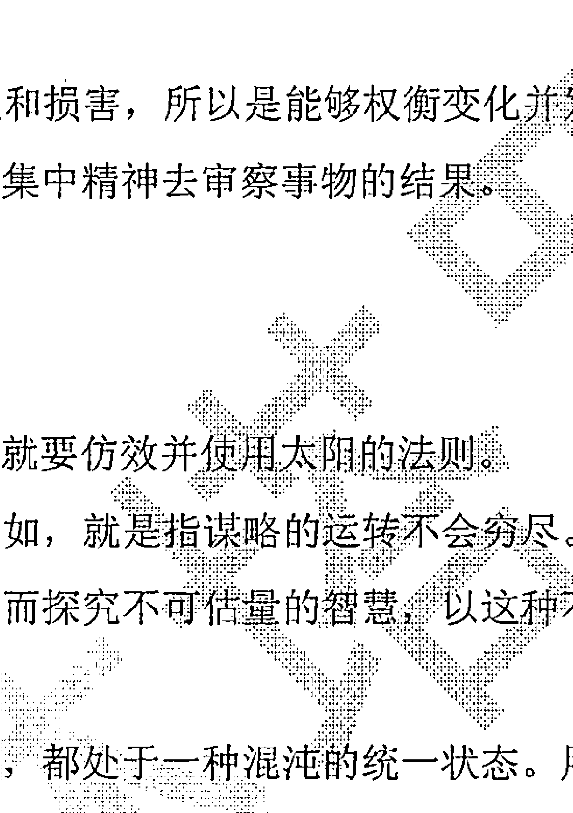

#### 第二十二章 世界

通过减损杂念使得心神专一，就要仿效并使用世界的法则。减损杂念、心神专一，是判断事物隐微征兆的方法。

万事有偶然巧合，万物有成败利害，因而事物隐藏着的微小变化，不可以不仔细观察。所以，智者用顺应宇宙的静息方式来对待所获得的情况，观察言辞都会与事物功能相结合。心神专一，是为了了解事物；减少杂念，是为了坚定行动。当行动并游说之后，即使对方还是不赞同，智者也不会强加辞令进行辩解。智者不会因为自己的主张而排斥别人的主张，所以能够做到语言扼要而不繁琐，心灵虚静而不猜疑，志向坚定而不被扰乱，意念正当而不偏邪路。

适应事物的发展趋势去制定谋略，顺应塔罗的法则去施展行为。如果能够使对方圆转灵活的智谋不能够实现，使对方方正直率的策略不能够确立，那就是很大的成功了。因此谋略的增减变化都要仔细探究得失，需要善于利用发挥威力、散发威势的权谋发现对方的意图，明晰隐微的征兆再进行决断。

因此，善于减损杂念而心神专一的人，处理事物就像挖开千丈大堤放水下流，或者就像在万丈深谷中转动圆滑的石头一样。

### 星篇

### 第一章

宇宙间最大的物体就是宇宙本身，然而宇宙也有尽头。宇宙中包含着时间与空间。时间的大，可以用顺逆来说明它；空间的大，可以用刚柔来表现它。顺逆的循环当中，四季就表现出来了；刚柔的变化当中，四方就形成了。四季与四方就是自然最大的表现了吗？凡是称为大的，就是没有超过它的了，但是不表现出自己的大，才能够成为大，这是很深厚的原则。

### 第二章

时间从动态中生成，空间从静态中生成，动态和静态相互转化就是宇宙的形成法则。运动的开始是动态的初始，运动的极致是静态的生成，动态和静态相互转化就是时间形成的法则。静态的初始是柔性的，所以可以塑造，静态的极致是刚性的，所以可以形成物体，柔性和刚性相互转化就是空间形成的法则。

### 第三章

动态较大就是权杖，动态较小就是宝剑，静态较大就是圣杯，静态较小就是星币。权杖就是太阳，圣杯就是月亮，宝剑就是星星，星币就是辰光，日月星辰运行就形成了天上物体。柔性较大就是水，刚性较大就是火，柔性较小就是土，刚性较小就是风，水火土风运行就是形成了地上物体。太阳形成暑热，月亮形成寒冷，星星形成白昼，辰光形成夜晚，寒暑昼夜的变化就是天象的变化。水形成雨，火形成雷，土形成露，风形成风，雨风露雷的变化就是地象的变化。

### 第四章

人之所以是万物中最有灵性的，是因为人的眼睛能分辨万物的颜色、人的耳朵能分辨万物的声音、人的鼻子能分辨万物的气息、人的口腔能分辨万物的味道。所以，声音、色彩、气息、味道，是万物的体现形式，眼观、耳闻、口尝、鼻嗅，是世人去分辨万事万物的使用方法。

万物没有固定的表现形式，只有变化是它的表现；辨识没有固定的技巧方式，只有变化才是技巧的含蕴。万物和它的表现相互变化，人能够在分辨中明瞭到变化的法则。然而宇宙本身就是物，智者本身也是人，所以能够知道，人是物的极致，而智者是人的极致。

### 第五章

动数有五个，静数有五个，合起来总共十个，构成整全的数列。动数中有一个核心的原素，而显现四个变化的元素；静数中有一个核心的原素，而显现四个变化的元素。这四个变化的元素是有形体的，而核心的原素则是没有固定形体的，是有无转换之间形成的。

动态的四个元素中，有三个表现的是形状，另有一个是刚健的能量；静态的四个元素中，有三个表现的是形状，另有一个是柔顺的能量。所以，没有具体形状的那个元素是能量的象征，没有明显变化的那个原素是法则的象征，而常常被使用的三个元素就是三个阶层的象征。

### 第六章

自然有四季，原本一季有四月，一月有四十日，所以有四四十六张宫廷牌与它相应。但是其中那个无形的元素不显现，所以实际一季只有三月，一月只有三十日。所以，四季是本质的数，而三月、三十日是使用的数。本质虽然有四，但其中一个不常用，所以真正用来使用的，都是以三作为完整，以九作为极至。

### 第七章

星座与宫位，环环相连，相互错杂，井然有序，展现了四元素的变化。元素有形体表现的开始时，精微细弱，是万物成形初点；随后具有蓬勃开创的型态，就好像星火燎原一样；接着元素型态渐趋稳定，凝重内敛，就好像稳定的高山一样；稳定凝神到极致，便会与其他元素交融，互相影响并产生变动的型态，直到此前位元素衰退，同时后位元素成形。所以，每种元素变化都形成开创、稳定、变动共三种元素型态，运作显著成为星座，分别具有各自的特性，由对应的大阿卡纳牌统御。一年包含有四季，以四首牌统御每个季节的开始，就可以明白黄赤交接是大小阿卡纳交接的意义了。由于一季包含有三月，共计十二月，由十三张大阿卡纳统御，所以也称为十二月将牌。

一个星座具有三十度，分为接纳、融合、推进共三个阶段，每个阶段有十度，所以一周天共计有三十六区域，分由三十六张小阿卡纳数字牌统御。一月具有三十日，分为三旬，一旬约有十日，而一年共计有三十六旬，所以这三十六张小阿卡纳也称为旬星牌。

元素型态，沉静休息成为宫位，分别具有各自的领域，由对应的小阿卡纳宫廷牌统御。一日包含有四期，以四张侍从牌统御四个时期的开始，就可以知道日月交接是宫廷交接的实质。由于一期包含有三时，共计十二时，即十二宫位，所以骑士牌、国王牌、王后牌共十二张宫廷牌也称为十二星宫牌。

星座宫位，本为一体两面，然由于天外有天，致使岁岁有差，因此宫位运作，需要一气三分，以致环环相扣。

### 第八章

行星的变化是最无穷尽的，这是为什么呢？行星之间的影响是动态的，星座形成的轮廓是静态性的，宫位形成的意义是人文性的；行星变化形成时间，星座变化形成空间，宫位变化是人在其中；行星变化是意向，星座变化是表现，宫位变化只是其中对人的影响而已。由此可知，行星是有形的实体却象征无形的本质，星座是无形的实体却象征有形的表现，行星的动态里有静态的法则，星座的静态里有动态的变化。

### 《塔罗三昧》

2012年修订版

愚者以有无的形状来象征自然，以无有的创新来象征天王星变革。太阳、金星、木星是本体，是初始，是开创；月亮、火星、土星是与之对立的方面，是用体，是配合，是辅助；两者相互变化影响而衍生出第三种乃至更多，这便是水星、海王星、冥王星，是包含，是激荡，是调和。行星牌，有数序，有阵列，有转化，有变动。这是什么呢？

> > 仲天说：“这是塔罗中星象的根本，变化的基础，从来处运动发生，从去处运动逝去”。

### 第九章

行星凡有公转，必生阵比，每一阶层之间，各有影响，平生气运。相对静止就有相位生成，相对运动就有顺逆阐发。正相引起加成，负相形成减损，顺行趋于正位，逆行趋于逆位。这是塔罗在影响星相吗？

> > 仲天说：“其实不是，只因为塔罗的道理是包含了日月星辰昼夜晦冥的现象、山川河岳动植高下诸般的形态，源出于星相的百态，所以能展现星相变化的玄妙啊。”

### 第十章

行星星座，在大牌序列里交相辉映，是无序的吗？抑或是在排列之中，另有玄机？自太阳到皇后七牌相连，出自斗转；命轮、吊人、恶魔三牌各自独立，这是北位三星。所以大阿卡纳整序以三阶为显现的元素，以七连为各自的阶段。自皇帝到隐者六牌相连，是自性根本；正义独立显现融合联结；死神、节制、恶魔，是造就形态；星星、月亮，则是丰富势态。六、一、三、二，展现了完美数本质，引动规则的谐律。

行星提供原始的材料，星座给予炼制的方式。材料呈现四组，方式分为四组，皆暗含元素的数目，也暗含基础的序列。

### 第十一章

愚者，是真与假，是虚与实，是内与外，是上与下，是心与物，是一切本源的内因，原在星盘之内，隐藏却不显现。

吊人与审判，源出于女祭司与魔术师，和合形成于皇后。此两者，是始与终，# 《塔罗三昧》

是源与尾，是入与出，是生与死，是自我与外界，是经验与目标，也是月亮交于南北，如同隐藏的炼化。

### 第十三章

行星特质分形于所守护的星座，太阳月亮各自守护其一，其余五星各守护其二。因此，力量含有太阳的意义，战车含有女祭司的意义，魔术师分形于恋人与隐者，皇后分形于教皇与正义，塔分形于皇帝与死神，命运之轮分形于节制与月亮，世界分形于恶魔与星星。

> > 所以，仲天说：“力量有自我的泉源；战车受情绪的变化；恋人与隐者是知性的构成；教皇与正义是感性的摩挲；皇帝与死神是爆发的冲力；节制与月亮随着际遇调整；恶魔与星星随着欲望行为。这是由于分形所产生的结果。”

质素一体，却有着动静两态，天体以日月来形象它。世间有五种元素，是由于日月的动静力量相互运作衍生形成的，又各有动静两态的表现。这是世间本质的体现吗？

> > 仲天说：“日月的象征是总领，五星的分形是属配；日月是物体形成的初始，五星是物体形成的结束。这还是塔罗的基本道理啊！”

### 第十四章

旬星星钟，有时间和空间，历经三十六次升降明暗变换形成一个循环，以数字牌为根基，以中心的四四方阵为核心来变化。星阵中，四四方阵在内，以宫廷牌虚指；每方有旬星九颗，各属一元素，随运随势间杂流转，这是星阵的实指。数字牌首牌四张，不计实际日数，以表示每组元素的统领周始。方阵中侍从居中，隐而不显，主一年四时；骑士、皇后、皇帝，三牌处于方阵外围，以主各月变化。这三牌的序列，相连则代指宇宙初始的融合，相杂则代指万物渐成的形态，纵出伸展则象征北斗的运转。因为斗转就会引动星移，所以三十六旬星排列也有三态。大牌中以愚者、命轮、正义、世界以代指时空根本，藏在方阵之中不用，另以十八张牌，分为两组，用来明晰时间的变化与数字牌空间变化的形势影响。这两组大牌，表示内部的是内旬星，表示外部的是外旬星，所以内外旬星在四时之中的变化，就形成了数字牌四组元素的变化。内外旬星是如何搭配的呢？仲天说：“内旬星与外旬星互为表里，互为终始，互为时空，互相转化却又共同一体。这是时间与空间的规律。自夏至起，内旬星自内而外，发散并且顺行；外旬星自外而内，收敛并且逆行。自冬至起，内旬星收于内并且逆行，外旬星发于外而顺行。”两者错杂而形成正逆星阵，化繁为简共计有十八阵。这是塔罗星占的总诀。

#### 第十五章

阿卡纳，奥秘奥义的意思。其中的意义深远，以牌面为基础，并且超越牌面，所以使用时不能只是观察牌面，还需要考量到宇宙时空的变化法则。大阿卡纳是塔罗的根基，是基础的原则，是隐含的道理；小阿卡纳是变化的延伸，是以基础以隐喻作为法则的变化。因此，每一小牌之中暗含数张根本的大牌，是大牌之间相互作用、影响、交合产生的变化。旬星是小阿卡纳中数字牌的通神应用，而宫廷牌和大阿卡纳则不论旬星，这是为什么呢？仲天说：“这是因为九神的变化根本不在数字牌之内的缘故。”

#### 第十六章

以塔罗观星，大牌为根本，小牌为变化。大牌二十二张，小牌五十六张。以大牌分八组，每组各领七张小牌，形成八房，以对应大地八方。顺行逆反，则相互推摩分天区八极，以呼应日月寒暑变化。

- 命轮、正义领第一房，圣杯侍从，宝剑侍从，圣杯六，权杖九，权杖十，圣杯七，宝剑王后。
- 恶魔、塔、星星领第二房，权杖二，星币二，宝剑七，圣杯王后，圣杯九，宝剑六，星币十。
- 月亮、太阳、审判领第三房，宝剑骑士，星币骑士，权杖ACE，权杖四，星币五，权杖三，宝剑国王。
- 魔术师、女祭司、皇后领第四房，权杖八，星币八，圣杯三，权杖五，圣杯国王，圣杯ACE，星币四。
- 吊人、死神、节制领第五房，宝剑八，圣杯八，星币三，宝剑五，星币国王，星币ACE，圣杯四。
- 战车、力量、隐者领第六房，权杖骑士，圣杯骑士，宝剑ACE，宝剑四，圣杯五，宝剑三，权杖国王。
- 皇帝、教皇、恋人领第七房，宝剑二，圣杯二，权杖七，星币王后，星币九，权杖六，圣杯十。
- 世界、愚者领第八房，星币侍从，权杖侍从，星币六，宝剑九，宝剑十，星币七，权杖王后。

其中，各房两两相对，牌组一一对应，而每一房的小牌变化，均是统领的每组大牌变化得来，顺行渐进三级，复进两级，总为五代，之后返归两级结束。前五代是事态的发展，时间的渐进，转化的过程。返归的两级称为游星、归星。

游星与归星，互为往返。游星表示事物处于不稳定的状态，自身心绪不宁，精神不佳，发呆，魂不守舍，向外出往变化，分离等意思，共有八张牌，分别是权杖三、权杖六、星币ACE、星币七、宝剑三、宝剑六、圣杯ACE、圣杯七。归星与游星相反，表示返回、安定、保守、回家、在家、出不去、苏醒等意思，共有八张牌，分别是权杖国王、权杖王后、星币四、星币十、宝剑国王、宝剑王后、圣杯四、圣杯十。一出一回，一往一返，就是一房的结束，下一房运作的初始。

#### 第十七章

世间的气候往来，寒暑变化，都随着各房的运作起快，随着各房的变化而变化。可是，这与《序篇》中的序列是不同了吗？仲天说：“并不是这样的！序列并非是固定的，而是在不同的应用和表示中而有所不同的。《序篇》所讲的是宇宙时空社会的总则，是总体的序列。而《星篇》所讲的是宇宙各星于我们所处的大地社会形成影响的序列。前者是虚的法则，后者是实的法则。”因此，可见塔罗的根本未变化，而变化的不过是各种不同序列形成的关系而已。

#### 第十八章

大牌为根本，小牌为运用，藏变化在大牌之中，变化为主客两星。以主星作为自己，以客星作为对方或者所测的事，以主客两星的元素、状态、关联可以作为分析。大牌牌组，每牌又有正逆位，所以或者是四变、或者是六变，大牌牌组以最尾的牌正逆位分主客星，而小牌的主星客星就坐落在这变化之中的位置。

自身作为主星，所测事物作为客星，通过两者的和合刑冲害的关系就可以明晰事物变动的因素。客星有内外两类，在牌阵内的称为内客星，通常称为客星，在牌阵外的称为外客星，也称为用星。外客星表示所问问题的种类。

客星相和主星，表示平行的交互，代表兄弟姐妹、好友知交、合伙人、竞争者、图谋取代者、破费自身钱财者，也代表阻力、阻隔、阻滞、虚伪、欺诈、破耗、消耗、口舌、是非、争吵等现象。

客星相合主星，表示扶助等对主星有利的事物，如父母、长辈、老人等保护自身的事物，代表家宅、房屋、居住地、城乡、车船、衣服、雨具、行李等，也代表文章、学业、考试、知识、书籍、资料、文件、合同、契约、信函、信息、印章、档案、手续、护照、技术、勤劳、艰苦、劳累、操心费神等事物和现象。

客星相刑主星，表示自身制约的事物，代表自身的妻子、情人、兄弟的妻子、仆人、钱财、货物、珠宝、食物、物资、物品等事物，也代表盈利、利息、资金等利益。

客星相冲主星，表示制约自身的事物，代表官长、官方、上司、领导、丈夫、丈夫的兄弟，也代表官职、工作、职位、事业、心机、伎俩、疾病、疼痛、阴邪、死人、尸体、盗贼等对自身有害的事物，还代表忧虑、疑惑、忧患、痛苦、灾祸、风波、井下、雷电等等。

客星相害主星，表示消耗、努力的事物，也表示福气相关的事物，代表儿女、晚辈、徒弟、部下、下属、禽兽、鱼虫、鸟兽、僧道、术士、医药、医生、为自身解难的人、抓捕盗贼的人、客户、顾客、购买的人、生财的源头和门路，也代表消灾解难、事端平息、争执诉讼、无忧无虑、自在、享乐、养尊处优、游玩等等。

### 第十九章

除了主星与客星以外，各牌之间还有显星与隐星。在牌阵中开出来的牌称为显星，是表示事物表现出来的显露的意义；而对应的隐星是表示这里显现出来的牌中隐藏着与它想对立的意义，以及不易被发现的因素。显隐之间，是相对而又一体的，是事物的正反两面，隐藏着事物的发展趋势。隐星定位有三个原则。大牌的隐星藏在与其循环中对立的另一张大牌内；每房一代到五代牌的隐星就是其对应的主星；游星的隐星是五代牌的隐星序列前的一张，其中权杖宝剑牌组的隐星与五代牌隐星的正逆位相同，圣杯星币牌组与五代牌隐星的正逆相反；归星的隐星和三代牌隐星相同。

### 《塔罗三昧》

### 第二十章

塔罗牌的道理，在于层层递进，环环相扣。聪慧的人学习其中的道理与规律，严谨的人学习其中的法则和联系，敏锐的人学习其中的符号与构造，然而，虽然塔罗有许多方面，但是都是一体。使用塔罗，由直感起始，渐次寻觅意义的泉源，再查相互关联，游移进出，随后跳跃在星位之间，分析内外时势，最后查验周遭的应局。

以《星篇》的飞星法则来论断，得出牌以后，首先分析其所在星座或行星，查验相关的来源和心态的变迁；其次寻找此牌所属的旬星，是否有星钟的时间或者方位的影响；再次查知此牌所在的房位，位于几代，是否处于游星或者归星之中；接着判断牌飞星所在的主星与客星之间的相互关系；最后判断此牌的隐藏讯息所在，将牌的隐星寻到，明了所问事物的隐藏层面。这样从多层论断，才能够纾解疑虑，明断世事。

### 第二十一章

塔罗的核心，在于象征和结构。如果论象征的话，世间最大的象征没有比日月星辰更大的了，通过穷尽其中神髓的意义来了解到变化的道理，不过是阳性事物与阴性事物的此消彼长而已，就好像轮子转动的本质是因为其中的轴的转动一样。因此仲天说：“所以观察万物，不是只用眼睛观察就能明白了。不仅要用眼睛还要用心，不仅用心还要用理。”世间的事物都有其中的道理，也有其中的性质，还有其中的现象。所以理解了道理的，在事物未开始之前就可以提前知道事物的变化；明晰其中性质的，在事物出现之后未有结果之前，通过分析和测试就可以估计到事物的变化；关注其中现象的，直到身临其中、事到临头，才能知道事物的状况。这三种知道事物的方式，也是所有人去了解事物的方式，即使是智者也不过在这三种方式之中。象征不外乎是状况，用不同人的眼睛去观察它，得到的结果就会迥异，除非身临其中、事到临头才能够明白象征的准绳。但是智者能反知过去，顺知将来，是以自己的眼睛在观察吗？当然不是。世间万物，人也是万物之中的，智者不仅仅使用自己的眼睛和心性，也用了万物的眼睛和心性；用万物的眼睛来作为自己的眼睛，那么就没有什么看见不到的了；以万物的心性来作为自己的心性，那么就没有什么计划不到的了。所以，智者的见识能够超越时间和空间的局限，这就是神奇奥妙的关键。

### 第二十二章

宇宙的星，运行在天上却与人有着联系；塔罗中的星，显露在面前却与其他的牌有着联系。这是为什么呢？仲天说：

> > 人原本就在宇宙之中，和宇宙本来就是一体，虽然我们看不见宇宙本身，却可以通过能看得见的事物去推测看不见的事物，不过是因为有着如同一体的联系。显露出来的牌是在全牌之中，与全牌本来就是一体的，虽然只取出少量的牌，但是却可以通过之间的联系去推测出其他的牌。

因此，牌阵中开出来的是眼睛可以看到的局部的显现的状况，心中却要看到整体的未显现的状况，正反明理，就能够知道了。

## 式篇

### 第一章

世间的事物有吉凶，通过预测来明白其中的形势变化；世间的道理没有形迹，是通过现象来显示其中的意义。所以，预测蕴含吉凶的法则，在塔罗的图像中可以见到。但是图像有不变的形象，却没有变通的法则，是不可以的。塔罗，就是变化的奥秘。例如今日开牌得到一张，预测得到一个结果，改日开牌得到同一张，是否也是同一个结果呢？所以说，预测的道理，是要变通，得到变通的精妙，在乎心意的奥秘。

### 第二章

大抵塔罗的预测方法，在开牌之后，先看牌意，明晰关键的含义。如愚者有冒险、流浪、创新反传统的意思等。其次看牌阵中的联系，来分辨其中的动静变化，刚柔态度，以及应用与是否和合的意义。再次看牌和周遭的对应。不仅仅是牌中的对应，还包括环境中所有一举一动的对应。最后查验自身的动静状态。坐着，表示事情应验稍晚；走动中，表示事情应验较快；跑步或者急行中，表示应验更快；而躺卧则表示事情应验更迟。这几点都掌握，就能明白预测的法则，需要以塔罗本身的含义为主，环境的对应稍次。如果两者都好，那么结果大好；如果两者都不好，那么结果不妙；如果有好也有不好，那么就需要仔细审查它们之间的关系、变化以及各项对应的推导，来断定吉凶得失。其中的关键在于能圆融贯穿，不能执着在字面画面之间。

### 第三章

各项对应之中，必须先论事理，了解是否有可能。只看对应却不看事理，那么就会拘泥于一点小小的见解而不能应验。例如预测天气得到魔术师，知道会有雷声震动，但是在冬天预测得到，用事理推算，冬天怎么可能会有雷声，所以会明白是狂风撼动的意思。如果明白以上的法则，也明白事物的常理，那么预测的奥妙就没有什么余蕴了。

### 第四章

通过塔罗进行预测，有先阵和后阵的分别。先阵来确定事情好坏吉凶，只用牌的象征确定，而不必考虑其他的应对一类。因为先阵是通过把外在的象征转化为数，再用数得出牌阵，所以是取原始的象征意义。但是后阵开牌，与先阵不同，因为数序排列有差异。又现在的后人开出牌阵，大多不加上时间，只得到一个固定的阵，就没有转移变化的道理在其中了，所以后阵需要添加上时间的变化。

并且，先阵确定事情对应发生的日期，大多取牌的元素。例如魔术师取风元素所在的春季、或者一月中的亏月、又或者一天的黎明等等。后阵大多取牌的序数加上时间数，以行走坐卧的快慢，来定事情发生的日期。至于事情的发生需要的大致时期，应该根据事理的发生状况确定。而牌阵中的吉凶推断，需要根据牌之间的和合冲刑害来推断。

### 第五章

凡是塔罗预测开牌，以现状或指示作为本体，其余过去将来等诸多变化的牌作为用体。大多以本体和用体之间的合冲关系作为判断，但是也有不拘泥在这样关系之中的变化。

### 第六章

心意的数序，明白和掌握它的人很多，但是本用两体之间的判断，明白它的人很少。我很早开始研究塔罗，花费许多时间钻研其中的变化和道理，隐隐明白其中的原理。最初开始试着运用的时候，就好像拿着尺子去量大海一样，茫茫不知其中的变化。后来遇到智者，得知本体用体的变化要诀，而后预测事物，以前的各项疑虑才渐渐得到平定，结果也才更为准确。其中的关键，在于分出本体和用体的区别，观察其中的各项合冲关系的道理，才能明白其中吉凶变化的法则。于是才能明白塔罗中数序变化的巧妙，各项对应的真谛，这些原本就是在塔罗之中，也是世间的真实，不过人们很少能够观察到罢了。

### 第七章

本体用体，是借助本、用两个字，来表现最基础的动静变化的道理，来分出主客的变化，当作预测的准则。本体的元素适宜强盛而不适宜衰败，适宜受到其他牌的和合，而不适宜受到其他牌的刑冲。

本体牌是代表自身的预兆，用体牌是代表事物应验的端倪。所以本体牌适宜收到用体牌的和合，而用体牌适宜受到本体牌的刑冲。用体牌冲本体牌固然不好，本体牌害用体牌也不佳。

整个牌阵之中，与本体牌同性质的多，就表示本体元素强盛，与用体牌同性质的多，就表示用体牌强势。本体牌与用体牌之间的关系，和是最好的。本体刑用体，事物发展较吉利；用体冲本体，所有事情都凶险；本体生害用体，有消耗损失的灾难；用体合本体，有获益得利的喜庆。本体与用体相和，那么所有的事情的顺利并且遂心。

### 第八章

凡是预测天时气象的变化，不分本体用体，观察所有的牌，详细推算其中的元素。火元素多表示晴天，水元素多表示阴天，风元素多表示晴明、不下雨也阴，土元素多表示阴天，太元素多表示雷声猛烈或者狂风撼动的样子。

另外，也要详细体察牌的对应。皇帝、教皇、恋人，表示晴朗；恶魔、塔、星星，表示下雨；愚者、世界象征地气上升，表示天阴；命运之轮、正义，表示晴朗明亮；魔术师、女祭司、皇后，表示雷声震动；吊人、死神、节制，表示风的运动；月亮、太阳、审判，是表示山间的云，如果遇上阴雨连绵，就表示停止的意思；战车、力量、隐者，表示不下雨也很阴暗的意思。以自然变化的难以测度，凭借其中的规律和法则可以循着端倪。命运之轮、正义，象征四季晴朗；愚者、世界，象征阴暗惨淡。两者都有并且等量就表示晴天雨天在变化转换。如果愚者、世界与月亮、太阳、审判在一起，则表示阴天持续难晴。

愚者、世界，在晴天见到，表示即将下雨；命轮、正义，在雨天见到，表示即将晴天。如果是遇到皇帝、教皇、恋人与恶魔、塔、星星，表示一会晴天、一会雨天。战车、力量、隐者、命轮、正义，在秋天得到表示天晴；恶魔、塔、星星，在冬天得到表示下雪；吊人、死神、节制、世界、愚者，在春天得到表示下雨滋润，在夏天得到表示炎热得如同蒸笼的样子。

月亮、太阳、审判，遇上吊人、死神、节制，表示黑云大风，飞沙走石，乌云蔽日的状况。宝剑四，是大雾厚云的意思；权杖二，是有霜雪的意思。圣杯九与星币国王，是雷电大作的样子；星币九与圣杯国王，是骤然就狂风暴雨。

只有皇帝、教皇、恋人，表示雷声响动剧烈；只有恶魔、塔、星星，表示雨下得大而且密集。所以仅有一组，可以从总的性质中判断。星币六、星币七，是混混蒙蒙的象征；圣杯六、权杖王后，是一片黑暗的样子。又好像权杖七、宝剑七，是表示风云难以测度，因为变化过于迅速的缘故。圣杯ACE、权杖三，表示冬季过后必然有雨雪天气。宝剑四、星币王后，表示离家稍远一些就必须打伞了。权杖五、权杖九，表示无论什么季节最好都不要在船上了。

所以预测四季气候变化，不可以执迷在一个方面，万事万物的法则很大，需要从多个角度详细思考分析来推测。

### 第九章

有关事件的预测，详细分出本体和用体。用体冲本体是不好；本体刑用体就表示可行；用体合本体有受益的喜事；本体害用体有损失的征兆。如果本体与用体相和，就表示事情谋划有利。如果其中有合本体的牌，就从这张牌中去分析会得到怎样的受益；如果有冲本体的牌，就从这种牌中分析会遭遇怎样的状况。

### 第十章

凡是预测家庭，以求问者为本体，以家庭为用体。本体刑用体，那么家庭多是吉利的；用体冲本体，那么家庭经常会出现凶险的事情；本体生害用体，那么家庭劳心费神，精力不足，或者要小心受到偷盗和欺诈；用体合本体，大多会受到利益，或者得到馈赠的喜事；如果用体本体相和，那么家庭安稳平和。如果要看具体的状况，就像之前的章节所述那样处理。

### 第十一章

凡是预测屋子住房一类，以求问者为本体，以屋子住房为用体。本体刑用体，那么居住就是吉祥的；用体冲本体，那么就有凶险；本体害用体，表示资材衰退；用体合本体，表示家门住户兴隆；如果两者相和，就表示自然安稳。

### 第十二章

凡是预测婚姻，以求问者为主体，以婚姻本身为用体。用体合本体，那么婚姻容易成功，或者因为婚姻有得到利益；本体害用体，那么婚姻难成功，或者因为婚姻有丧失；本体刑用体，表示婚姻可以成功，但是成功会很晚；用体冲本体，表示婚姻不会成功，即使勉强成了也有妨害；本体用体相和，表示婚姻吉利美满。

预测婚姻，本体表示求问者的家庭，用体表示准备与他结婚的家庭。如果本体的元素旺，那么这家人的门户会得到旺盛；如果用体的元素旺，那么对方家庭的资财很多。本体得到相合，表示通过婚姻得到资财，或者对方有尾随、帮助的意思；本体相害用体，表示没有求婚的资财，或者前去对方家庭生活才能和谐；如果两者相和，表示两方互相迁就，是很好的配偶，不用疑虑。

愚者、世界，表示容貌较丑，肚子较大，肤色黄；魔术师、女祭司、皇后，象征美貌难以触犯；皇帝、教皇、恋人，象征人矮，肤色偏红，性情不固定；战车、力量、隐者，表示人高长，说话喜悦，肤色白；命轮、正义，象征人端正并且高大强健；吊人、死神、节制，象征人头发稀疏、丑陋、贪心；恶魔、塔、星星，象征人邪淫、黑色、嫉妒、奢侈；月亮、太阳、审判，象征人肤色黄而且心灵手巧。

### 第十三章

预测分娩生产，以母亲为本体，孩子为用体。本体与用体的元素都适宜而不适宜衰败，适宜相互之间是和、合、害的关系。本体刑用体，对孩子不利；用体冲本体，对母亲不利。本体刑用体，而用体的元素衰败，那么孩子难以完好；用体冲本体，而本体的元素衰败，那么母亲难以保全。用体合本体，对母亲有利；本体生害用体，对子女有利；两者相和，那么生育畅快。

如果要分辨男女，就要从牌之中的动组静组以及所在的动位静位的多少来判定。

### 《塔罗三昧》

2012年修订版

其中，动组动位多的牌是男性，静组静位多的牌是女性。如果两者差不多，就需要通过外阵来查看了。

如果要预测出生的日期，就根据其他合本体的牌所属的元素来界定了。

### 第十四章

凡是预测入席饮食，以求问者为本体，以饮食为用体。用体合本体，那么饮食必然丰盛；本体害用体，那么饮食难迁就求问者；本体刑用体，那么饮食受到阻碍；用体冲本体，饮食就没有了；两者相和，那么饮食不仅丰盛，而且充足。如果牌阵中有恶魔、塔、星星一类，表示有酒；如果牌阵中有战车、力量、隐者表示菜肴丰盛。如果这类牌组合本体，那么表示酒足菜饱。如果要知道酒席上有些什么人，以牌阵中旁类位置推算就可以知道。

#### 第十五章

预测谋划一类的事情，以求问者为本体，所谋划计划的事情为用体。本体刑用体，事情虽然可以办成，但会比预计的时间晚；用体冲本体，事情不能办成，即使勉强去办成，也将会受到祸患；用体合本体，不需要刻意谋划就可以成功；本体害用体，谋划很多，但是不遂心的事情太多；如果本体与用体相和，那么所谋划的事情都按部就班，遂心称意。

#### 第十六章

凡是对于出行的预测，以本体为主，以用体为出门后将要遇到的情形。本体刑用体，可以出行，并且出门以后大多遇到志得意满的事情；用体冲本体，出门就有灾祸；本体害用体，出行会有意外的损失消耗的事情发生；用体合本体，会得到意外的收获；本体与用体相和，表示出行会如预期一样，不仅顺利而且办事比较迅速。

另外，凡是出行，本体的元素适宜旺盛，其他的牌以和合本体元素的为较佳。本体为魔术师、女祭司、皇后、命轮、正义，大多表示运动、行动的意思；本体为月亮、太阳、审判、世界、愚者，大多表示安静、休憩的意思；本体是吊人、死神、节制，适宜乘船或者通过水路、航路；本体是皇帝、教皇、恋人，适宜陆路或者乘车；本体是恶魔、塔、星星，需要小心丢失和受到伤害；本体是战车、力量、隐者，大多表示会遇到纷争。

#### 第十七章

预测外出的行人归家的事情，本体表示问卜者，用体表示在外的行人。本体刑用体，行人归家会延迟；用体冲本体，行人不会归来；本体害用体，行人还没有归来；用体合本体，行人很快就会归家；本体与用体相和，那么回来的日期不远了，很快就会到。

又可以根据用体的变化，来判断行人在外的情况。用体的元素受到相合，表示在外面顺利愉快；用体的元素衰败或者受到其他牌的相冲，表示在外面受到灾难祸殃。如果牌阵中魔术师、女祭司、女皇性质的较多，大多表示难以安宁；如果牌阵中月亮、太阳、审判性质的较多，表示在外遇到阻碍，无法脱身；如果牌阵中恶魔、塔、星星较多，表示遇上凶险困难的事情；如果牌阵中战车、力量、隐者较多，表示遇上纷争的事情。以此类推。

#### 第十八章

凡是预测失物，以本体表示问卜者，用体表示要寻找的失物。本体刑用体，可以寻找到，但是会比较迟；用体冲本体，没办法寻找得到；本体生害用体，失物难以见到；用体合本体，失物容易寻到；如果两者相和，那么失物不会丢失的。

又用结果位置表示失物存在的位置。如果是命运之轮或正义，那么失物在西北方，或者是高楼、楼阁等地方，或者是金属、石头的旁边，或者是在圆的容器里面，或者是在较高的位置。如果是愚者或世界，那么失物在西南方，或者在田野里，或者在仓库一类场所里，或者在与庄稼有关的地方，或者是在土窑之类的坑洞里，或者在瓦器瓷器里，或者是在方形的容器里。如果是魔术师、女祭司、皇后牌，那么可以往东方去寻找，或者在山林或者荆棘丛里，或者在钟、鼓一类发声的容器旁，或者在闹市或者大路相关的地方。如果是吊人、死神、节制，那么就往东南方寻找，或者在大山树林中，或者在寺庙、菜园、果园里，或者在船上，或者在木制的器皿里。如果是恶魔、塔、星星，失物或者是在北方，或者在水边、溪边、河边、水井、沟渠相关的地方，或者是在与酒、醋、鱼、盐一类相关的地点。如果是皇帝、教皇、恋人，失物或者是在南方，或者在厨房里，或者在与炉火冶炼相关的场所，或者在窗户边，或者在比较空旷的场所内，或者在文书一类的旁边，或者在与烟火相关的地方。如果是月亮、太阳、审判，就往东北方寻找，或者在山石有关的地方，或者靠近路边、岩石，或者藏在土穴里。如果是战车、力量、隐者，就往西方寻找，或者在湖边、沼泽边有山水的旁边，或者在残缺的墙壁里，或者在废井等一类地方。

### 第十九章

凡是预测疾病，以病人为本体，以病症为用体。本体的元素适宜旺盛，不适宜衰败，更不适宜遇见刑冲。用体适宜合本体，不宜冲本体。本体刑用体，疾病能安然度过；本体害用体，疾病就很难痊愈。本体刑用体，不需要用药也可以高兴的恢复；用体冲本体，即使用药也没有什么功用。如果本体受到相冲，但是元素处于旺盛的状况，那么还有一线生机。如果本体受到相冲，并且元素处于衰败的状况，那么几乎不能存活。

想要知道疾病怎样能得到救治，就在相合的牌中去寻找。本体害用体，疾病会迁延难以好转；用体合本体，很快就可以愈合；本体与用体相和，疾病容易平安度过。

如果要推算疾病恢复的时间，通过本体的牌可以决断；如果要推算受到危险的时间，通过冲本体的牌可以预测。想要推算怎样的药物可以治愈，通过和合本体的牌来预测，如果是火元素和合本体，那么用性质干热的药物可以恢复，如果是水元素和合本体，那么用湿冷的药物可以恢复，其它以此类推。

### 第二十章

对于官司诉讼一类的预测，以问卜者作为本体，以对话的人或者官司作为用体。本体适宜旺盛，用体适宜衰败。本体适宜被用体和合，而不适宜被用体相冲。所以本体刑用体的，自己胜过对方；用体冲本体的，对方胜过自己；本体害用体，不是因为失去事理，就是因为官司而有损失；用体合本体，不仅仅得理，而且因为官司能有收获；本体与用体相和，官司最吉利，不光受到扶持帮助，而且双方都能平和对待，可以得到化解。

### 第二十一章

塔罗，是对于事物性质、规律进行研究的学问。事物的性质和运作道理，也是人自己的心灵所具备的。当自身思虑清明，心神平静，没有一丝杂念和欲望的时候，就能够体察到事物的性质和运行的规律，接着心中就能感受到塔罗法则。在这个宁静的状况下，心念一动、事因一起、物动一变，就好像乌云遮蔽了天空，灰尘遮蔽了镜子，起初的时候，会感到茫然不知道怎样处理，但是只要心中有塔罗法则的运作，所有的遮蔽就能够被泯灭了。所以占卜运用有三个方式，在于运用耳朵、眼睛、心灵这三种空灵的直觉来感应万事万物。

由于事物的根源在一心，一心囊括事物，但事物在未曾萌发的时候，即使是鬼神也不能探测它的端倪，至于吉凶祸福，就更加不知道了。事物一旦萌动在心中，鬼神就会知道的。吉凶自有定数，然而我预知它们，又是依据什么道理呢？答案只能是，求助于心灵中自在的塔罗法则罢了。因此，平心静气、殚精竭虑，用诚意来空见心灵，注意观察塔罗法则所示的变化发展，玩味预测所得的吉凶，运用三式：必然使自己能看到常人无法看到的，能听到常人无法听到的，就好像亲眼见到的东西、亲耳听到的声音一样，都能在心中了然明白。这样，塔罗的法则就能作为预测的方法，而存在于自己的心中了。

耳朵、眼睛、心灵这三式能够运用自如，占卜预测应验的神妙就掌握了。塔罗中蕴含着世间精深神妙的法则，人们每天使用它却不知其所以然。怎么才能找到精通这个真谛的人，并与他讨论那些深奥的道理呢？

### 第二十二章

三式，就是运用耳朵、眼睛、心灵三个器官。耳朵的听觉、眼睛的视觉、心灵的思感，这三者是人一身的关键，而宇宙间万事万物的道理不超越视听之外。在预测决断的时候，保持安静，澄净思虑，静静感受事物变化，听事物的音声来知道吉凶，看事物的形体来知道善恶，观察事物的法则来知道祸福，都可以作为预测查验的依据。这就好像声音在山谷里回应，影子追随着形体一样，是可以感受得到的。这个道理出于《塔罗三昧》的《总纲》中“近的就从人身的状况取象，远的就从宇宙万物取象”的法则，从而形成事物的牌阵的外阵。

### 第二十三章

天象高远，地象深厚，万事万物千差万别。塔罗法则无时不有，无处不在，无论祸福成败，都超不出数理管辖的范围，吉凶的背后也都蕴藏着各种各样精微的机变。人是万物之灵，心灵更是一身的主宰。眼睛看世间万物的形象，为的是分辨形形色色的事物；耳朵听世间万物的声音，为的是弄清变化振动的事物。通过耳朵、眼睛、心灵三式并用，就没有预知不到的事情。

### 第二十四章

凡是见到吉利征兆，或者外因比较顺利的，可以判断为吉祥；凡是遇到凶险征兆，或者外因比较不顺的，可以判断为凶险。凡是见到圆形的物品，那么判断的事情容易成功；见到有缺口的物品，那么判断的事情不易成功。这是物品显示的征兆，也是必然的规律。

### 第二十五章

所以，在预测时，见到云开雾散、天气转晴，那么预示所测的事情是好事；见到天气转多云，烟雾迷茫的天气，那么所测的事情不佳；在预测时正巧有狂风吹过，那么这事多为飘荡没有结尾的事情；预测时有雷声响动，那么所测的事情会引起虚惊；夜间预测时，如果月光正好照在脸上，那么所测的事情就很快有办法和好转了；下雨天预测时，如果雨刚好洒在衣服上一点，那么所测的事情必定有人帮助，或者能受到上级的奖励等等。这是天象日月星辰的现象对于预测的应验。

### 第二十六章

凡是预测时，见到山峦重叠就表示事情有阻隔，见到沼泽就表示事情有浸润的样子，见到流水潺潺就表示事情能成并且快速，见到土石垒积成堆就表示事情有停滞的象征。见到石块，表示问事的人办理这事坚决果断；见到沙粒，表示这事放手就会开朗。见到大浪惊涛表示事情有惊险的举动；见到土崩和山坡倾泻表示事情有地产田土相关的损失；见到干旱的沼泽地表示事情已经竭尽全力；见到枯木表示相。

### 第二十七章

凡是预测时，遇上有人从旁边经过，那么这个人的相貌、身份等等就作为预测的外阵。在预测时，有贵官、贵人从旁边经过或者走过来，那么所测的事情是表示贵事；如果有商人经过，那么所测的事情为的是求财；如果有木匠、钱匠、工匠等做工的人经过，那么所测的事情是搬建房屋；如果有屠夫等杀生的人走过，那么所测的事情是家庭中骨肉分离；如果有猎人经过，那么所测的事情是野外的财物；如果有渔业的人经过，那么所测的事情是有关家庭；如果有盲人经过，那么所测的事情是杞人忧天，就是思想中有担忧的虚事而实际上没有。见到婴儿哭泣，所测的事情是有关于子孙的忧患或者下属的忠诚，或者是有官司诉讼的事情；如果有两男两女经过，那么所测的事情往往有重婚的表现；如果有僧道一类的人经过，那么所测的事情是与独居的人士有关；见到旁边有妇人笑着说话，那么所测的事情与怀孕生产有关；如果有女人相互搀扶经过，那么所测的事情与第三者相关。这些等等，是人品对于预测的应验。

### 第二十八章

凡是预测时，求问者无意摇手表示事情做不成功；求问者无意转头表示事情因为一方不愿意而不成功；求问者无意撩眼或者打喷嚏表示事情是哀伤的；求问者在预测时挠痒或者弹去污垢表示事情是忧患的；求问者的脚不停的动表示事情会有远行；求问者交叉双臂表示事情有损失；求问者屈曲手指表示事情有阻滞；求问者有嘘声表示事情是悲伤忧伤的；求问者无意间舌头在口外表示事情是有关口舌是非；求问者背对表示事情需要防闪失；求问者无意攮臂的表示事情有争夺，而且争夺之后才能得到；求问者偶然俯身弯腰的表示事情是委曲求全的。这些等等，是取求问者的神色、形体、动作等人身的状况来对于预测的应验。

### 第二十九章

在预测时，见到有小孩看书，那么所测的事情是词讼类的事情；见到有人在责。

### 第三十章

凡是预测时，见到有船只停靠岸边表示事情是与一个人同行；见到有车刚启动表示事情是带着重物外出；见到有人持刀带刀表示事情快速获得利益；见到有人搓绳织丝一类表示求问者事务繁多；见到有人围观下棋表示事情是众目睽睽毫无隐私的事；见到有人画画写生表示事情是装点门面一类好看不中用的事情；见到笔墨表示事情有关求名求文；见到有人倾覆购买物品表示事情是有关辞职的事；见到有人偶然照一下镜子表示事情是领导决定升迁的事；见到有人怀抱贵重物品表示求问者有大作为；见到有人拿着大木料表示事情是有关进大财；见到有人拿着测量的容器表示事情有前进的征兆；见到有人拿着裁剪的工具表示事情有关商量用人；见到有人踢球表示事情为发现剔除的事；见到有人开锁表示事情有关疏通；见到有人修补器具表示事情为久久才能结束并且不能坚持；见到有人磨镜子一类，表示事情是迟缓的，需要重新出发才能得利；见到有人快刀砍柴表示事情能办成但是需要破财；见到下棋对弈表示事情是有关计算；见到有人张网表示事情没有得到，多是空的作为；见到有人拿斧头锯子类表示事情恐怕有损失；见到有人在洗壶或者杯子表示事情有关饮食；见到有人挥动扇子表示有相招的事情；见到有脏衣服表示事情需要防备被人谋害。这些等等，是讲的器物对于预测的应验。

### 第三十一章

虽然说草木无情，但是也与预测有对应的。预测时见到灵芝、兰花表示事情大多吉祥；见到松柏表示长寿；见到香椿和桧树表示年代久远；见到独苗表示朝生暮死；见到枝叶飘零表示萎缩凋谢；见到果核落地滚动表示有关牵连；见到奇异的草木表示事情虚无缥缈；见到好的果子表示事情能最终落实等等。这些是植物对于预测的应验。

### 第三十二章

至于飞禽走兽，都是最有表现的。所以见到乌鸦表示事情有凶险；见到鸿雁表示事情有关朋友的信用；见到蛇需要防备谋害；见到被老鼠咬破的衣服表示夫妻有灾；见到麻雀喧闹不停表示有远行的事情；见到狗争斗需要谨防盗贼；见到鸡争斗小心有争执；见到有牵羊表示事情有喜庆；见到有骑马表示出入都有利；见到猿猴攀爬表示求问者心神不定；见到鲤鱼出水表示事情变化无方；见到马被拴住表示疾病不易恢复；见到鸟被关住表示人受困不能脱身等等。这些是动物对于预测的应验。

### 第三十三章

其他杂物也是有预兆的。见到酒表示遇到事情忘却忧虑逃避；见到药表示事情有方法；见到酒杯破损表示事情乐极生悲；见到医师护士表示事情还有救；见到藤萝一类表示仗势欺人；见到耕田锄地表示事情有翻转过来；见到劈破竹子一类表示事情发展顺利。春天见到花，秋天见到月亮，表示虽然有美好前景却不实用；夏天见到棉被，冬天见到草席，表示虽然有用也已经过时；在凉爽的天气见到扇子表示无事可做，多为背弃或者损伤；在晴天见到雨伞表示遇到闲置废弃。见到泡泡、亮光一类表示虚幻不可相信；见到蛛丝蚕丝一类表示巧妙计划成功。这些等等，是各种杂物对于预测的应验。

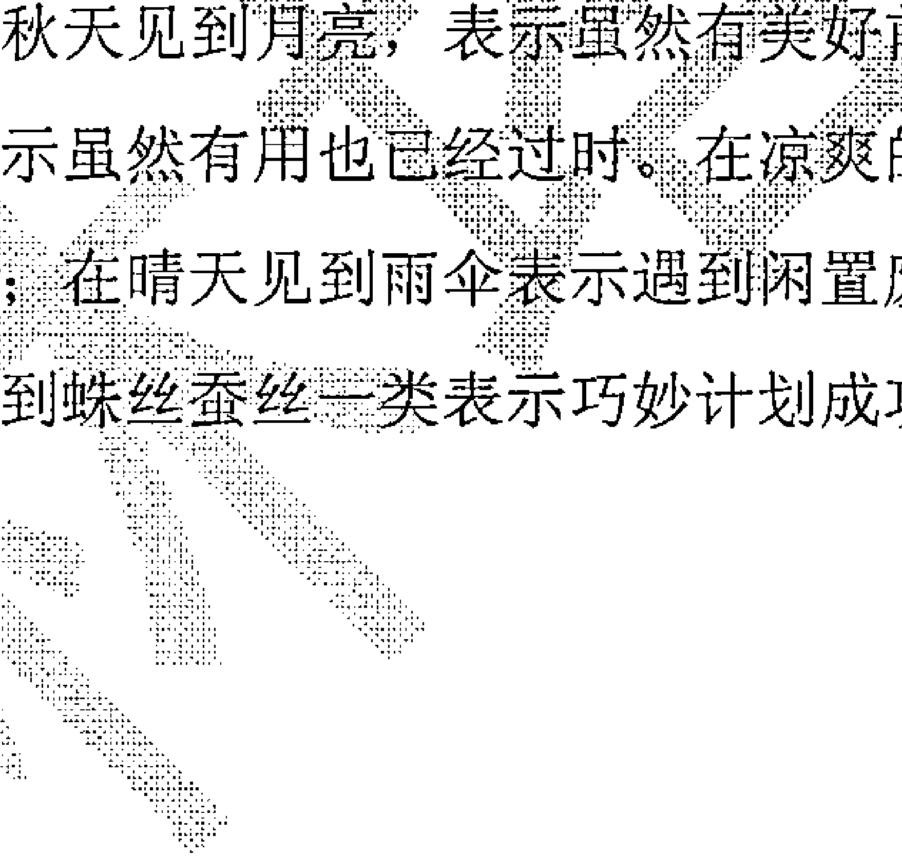

### 第三十四章

凡是预测时，如果自己忧烦，那么所测的事情也忧烦；如果自己快乐，那么所测的事情也快乐；如果自己悠闲，那么所测的事情也是从容不急的；如果自己繁忙，那么所测的事情也是很急忙的。这些等等，是用自身对于预测的应验。

### 第三十五章

通过塔罗也可以观察求问者的状况。如果求问者言辞中有惭愧的意思，那么表示这人是违心做事的人；如果求问者言辞吱吱唔唔，那么表示这人是有疑问的人；求问者所说的话实在而少表示是诚心的人；求问者说的话多表示是急躁的人；求问者油腔滑调表示易诬陷好人；求问者有委屈的言辞表示是理亏的人等等。这些是根据动静变化来判断对于预测的应验。

### 第三十六章

按照三式来讲，推测牌意，首先要熟悉塔罗法则的整体牌理。牌阵吉利并且征兆吉利，那么事情终究吉利；牌阵凶险并且征兆凶险，那么事情终究凶险。如果牌阵与征兆有吉有凶，那么事情也是半吉半凶。因此，推衍牌来推算事物，必须了解牌与牌之间的和合刑冲害的法则，细细观察事物在动静变化中而产生的机变。事与事息息相关，物与物内在契合，这是宇宙的法则，也是通过内外阵观察事物动静的内在联系。活学活用塔罗的方法，使塔罗的法则存在自己的感悟里，明白到事物千变万化都不会偏离其中的法则，塔罗的法则也是一以贯之的。所以，一定要看准吉凶各个外阵的时机，然后结合所预测的事情，仔细进行推衍。

因此，预测的关键，在于领悟变通的妙用。

### 第三十七章

用塔罗牌布下的牌阵是内阵，而周遭情形，都是与这个内阵相关的外阵。内外阵之间，有显藏、有向背、有动静、有正反、有高下、有初终等等。外阵是从三式中升华得来的，但是比三式更为精华。在外阵之中，与三式相比，就有一些不同的对应，这是为什么呢？三式的主旨是讲究眼看、耳听、心思，是凭借接收的宇宙万象的直觉来感应，通常来说是接近宇宙的推理，但是这只是一般性的情形。直觉虽然神奇玄妙，但是遇上一些特殊情况则容易偏差，无限接近于事理却不等同于事理。因此，在一些判断之中，也要详细推察外阵，推衍与内阵的相互关系，从而才能够进行精准的判断。

### 第三十八章

外阵有十项，都是以内阵中本体为主，以外部的所有事物预兆为外阵，根据两者之间的和合刑冲害关系来进行判断的参考因素。内阵不吉利而外阵吉利，理解为结果不吉利。内阵吉利而外阵不吉利，吉利反被破坏。如果两阵都吉利，就判断是吉利；两阵都凶险，就判断为凶险。如果内阵吉利而外阵凶险，或者内阵凶险而外阵吉利，则要详细观察外阵的动静变化来判断预测的应验。

### 第三十九章

凡是预测时，见到天气晴朗，万里无云时，代表命轮或者正义，如果内阵本体是战车、力量、隐者、命轮或者正义，那么表示本体与外阵用体相和，是事情顺利的意思。如果本体是恶魔、塔、星星，那么是外阵用体合本体，可以判断是吉利的意思。如果本体是月亮、太阳、审判、世界、愚者，那么这是本体生害外阵用体，这是消耗损失的不吉利的意思。如果本体是魔术师、女祭司、皇后，或者是吊人、死神、节制，那么本体受外阵用体相冲，是表示不吉。所以，可以知道，这是用天气的特性来定出牌的类属，以天气作为外阵用体，通过它与本体的关系进行判断。见到雨雪天气，就列入恶魔、塔、星星，遇上本体是魔术师、女祭司、皇后、吊人、死神、节制，那么就是有利的，如果遇上皇帝、教皇、恋人，就是不佳的。这样等等，都是以天时作为外阵。

### 第四十章

凡是预测时，见到茂密的树林，或者竹林，或者秀美的花草，就是魔术师、女祭司、皇后牌组的象征，如果本体是皇帝、教皇、恋人，那么可以判断是大好，如果本体是魔术师、女祭司、皇后、吊人、死神、节制，那么可以判断是顺心如意，如果本体是月亮、太阳、审判、世界、愚者，就可以判断是大灾大难。在预测时，见到江河、湖海、溪流等与水有关的地理状况，就是恶魔、塔、星星牌组的象征；见到窑洞、山洞等地理状况，就是皇帝、教皇、恋人牌组的象征；见到岩石、山川等地理形势，就是月亮、太阳、审判牌组的象征。这样等等，都是以地理作为外阵。

### 第四十一章

人的象征有两种，一种是以人所象征的牌组来对应，一种是以人所作的事情所象征的牌组来对应的。以人本身的象征来对应，在预测时，如果见到老人，就是命轮、正义的象征，如果本体是魔术师、女祭司、皇后、吊人、死神、节制，就判断是凶险，如果本体是战车、力量、隐者、命轮、正义、恶魔、塔、星星，就可以判断是吉利。预测时见到老妇，就是愚者、世界的象征，如果本体是战车、力量、隐者、命轮、正义、月亮、太阳、审判、世界、愚者，就可以判断是吉利顺遂的，如果本体是恶魔、塔、星星，就可以判断是凶险。这些等等和前面类似，就不再多说了。

以人所作的事情来对应象征的牌，或者是看人的形态等各方面与人有关的事作为外阵。例如预测时见到有纷杂的人群，那么吉凶优劣的预兆都在里面了。如见到一群人在很高兴的说笑，那么所开的牌阵可以判断为顺利；如果见到一群人正在经历痛苦的事情或者沉默寡言，那么可以判断所开的牌阵是凶险的。这类方式，见到吉人吉事，那么所判断的牌阵就是吉利的；见到恶人恶事，那么所判断的牌阵就是凶险的。这样等等，都是以人事来作为外阵。

### 第四十二章

动物的象征，有根据动物的运动来判断的，比如预测时，见到乌鸦表示有凶险，见到喜鹊表示有吉利，见到鸿雁表示有书信，见到蛇表示有毒害诡计，见到鸡叫表示家人有音讯，见到马嘶表示有外出的事情等等。另外，也有根据动物所属的牌组来对应的，《说篇》中有描述，就不再叙述了。这一类是以动物来作为外阵的。

### 第四十三章

物品之类，有根据所属的牌组来作为外阵的，要参详，也有根据物品的状态来作为外阵的。例如见到圆形的物品表示做事容易成功，见到笔墨之类的物品表示有文书一类的事情发生，见到衣帽袍子一类的物品表示有升迁的事情，见到杯子砧板一类的物品表示有宴请聚会的事情，见到锁铐类的物品表示有官司诉讼等等。这一类是以静止的物品来作为外阵。

### 第四十四章

听到别人谈论，不依照对应牌组，而只根据所谈论的事情种类来作为外阵。说吉利的话就表示吉利，说凶险的话就表示凶灾。如果在闹市所讲的话，语言分辨不出来，就不可以判断吉凶优劣，如果能听清楚才可以判断。如果是很多人在旁边七# 《塔罗三昧》

2012 年修订版

七嘴八舌，那么可以判断所问的事情毫无头绪，如果旁边安静表示事情有头绪。如果谈论的事情是国家大事或者人事变动，那么可以判断所问的事情有关求名或职位变迁。如果谈论的是江湖地名，那么判断所问的事情是与行业有关。如果谈论争讼或者官司，那么判断所问的事情有官司是非状况。如果谈论喜庆的事情，可以判断婚姻顺利等等。这类是以所听见的言谈作为问事的外阵。

### 第四十五章

凡是听见的声音，有两种作为外阵的方式。一种是将声音的来源对应的牌组作为外阵。例如，雷声是魔术师、女祭司、皇后牌组，风声是吊人、死神、节制牌组，水声是恶魔、塔、星星牌组，打鼓等木器敲打声是和雷声、风声相同的牌组，钟声或者金属的声音是战车、力量、隐者、命轮、正义牌组等等。第二种是不管对应的牌组，而是根据声音本身的征兆来判断。听见欢声笑语就是喜事，听见悲哀的声音就是忧虑的事情，听见唱歌就是快乐的事情，听见怒吼就是有争夺的意思以及争吵的事情等等。这类是以声音作为外阵。

### 第四十六章

凡是见到写字，就是用所写的字作为外阵。淡墨中见到浓墨表示哭泣，浓墨中见到淡墨表示事情暗中有变化。明明是点却写做其它，表示有贼人做暗事。如果淡墨中见到浓墨而且比较刚硬，可以判断为提防丧失亲朋流泪或者表示容易惊醒多梦。如果看见字迹鬼画，表示要防备盗窃丢失的事情。如果见到浓淡适中的写字表示吉利，见到浓淡不一的写字表示凶险等等。这一类是根据字画来作为外阵。

### 第四十七章

凡是时间，不根据象征，根据每个时间所属的元素来作为牌阵的外阵。
凡是方位，根据求问者所来的位置、或者所处的位置，与他本身所属的牌组对应来作为外阵的考虑。
有颜色的，可以根据预测时所见的颜色所属的元素来作为外阵判断。
这三类，是分别以时间、方位、色彩来作为外阵。

### 第四十八章

推衍万物所属的性质，全是根据塔罗，但是仲天所著《数篇》，却只采用了元素变化关系参差的道理，许多章节的预测方法，都与常规使用的方法不同，原因在哪里呢？在塔罗牌出现之前，本篇所讲的塔罗的法则就已经存在了。世人心中都是有塔罗的法则存在的，都是以其中的规范来行动的。预测，无非就是运用塔罗牌的符号象征来进行推断的，而符号象征本身来源于塔罗体系所代表的法则和规律的象征。列成牌阵之后，也每每根据塔罗的象征意义来推断所预测的事情的吉凶得失，而且还有更灵验神奇的地方，不能说根本就不用塔罗牌。此外，以塔罗牌图像所蕴含的象征意义来预测，只运用了图像与序列之间的变化关系，而没有将万事万物运行所蕴含的象征来作为使用塔罗的依据，原因在哪里呢？这是因为传授者只是教给常人的象征的方法，而没有多余时间涉及其它的缘故。

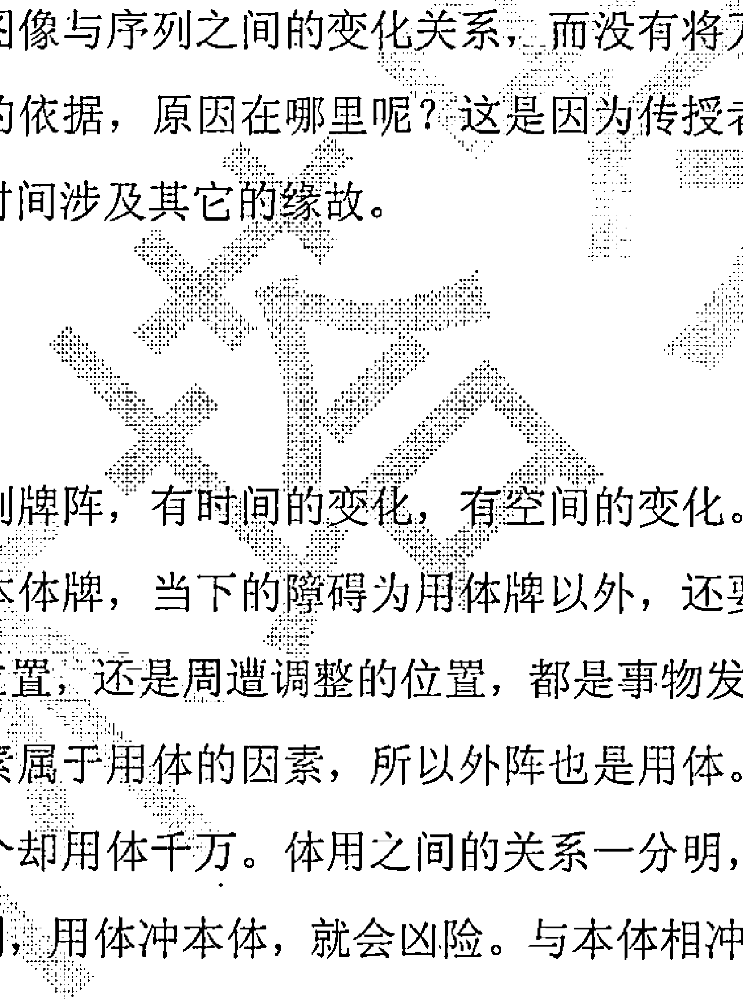

### 第四十九章

预测时，根据所问的事情布列牌阵，有时间的变化，有空间的变化。现在所处的时势就是本体牌，除了当下的本体牌，当下的障碍为用体牌以外，还要观察其他所有的用体牌。无论过去将来的位置，还是周遭调整的位置，都是事物发展的状况，都是用体牌。外部状况的预兆因素属于用体的因素，所以外阵也是用体。可知，不会仅仅是一体一用，而是本体一个却用体千万。体用之间的关系一分明，就可以推测吉凶。用体和合本体，就会吉利，用体冲本体，就会凶险。与本体相冲的牌越多，那么所测的事物就越凶险。然而如果有一张用体牌和合本体，但其他的用体牌冲本体牌，那么相合本体的利益就会被减损。如果一张用体牌冲本体牌，而其他的用体牌和合本体牌，那么就可以缓解本体牌的困境。另有一种情况，就是不以和合刑冲害的关系推论本体牌和各张用体牌。例如预测天气变化就是一般的原理，但是其中还有更为复杂的推论，就需要通过预兆来参考。

### 第五十章

塔罗的法则，存在于万事万物运动发展之中，并且以本体为主。但是大多数人只知道一个本体一个用体的常规，却不了解一个本体同时和诸多用体有相关的变通的用法。显示的本体用体牌为整个牌阵，这是内阵，外阵之中也不仅仅只有一个象征的隐牌，但这无非都只属于用体牌的因素而已。

将内阵的和合刑冲害的关系用在预测中，也就掌握了最关键的精义了。但是外阵的运用原本就很少有人知道，所以偶尔被应用的三式就被人以为已包括了全部的预测方法了，并且以为本体用体就只是本体用体，预兆就是预兆，所以就孤立片面的将和合刑冲害关系与三式、预兆各自独立来判断。可是，却不知道将三式、预兆与内外阵综合起来，再加上时机与形势判断，才是预测的极致，真正能够融汇在一起，才算是得到了预测的变通运用，就可以明白到预测的精髓。

### 第五十一章

清楚了本体用体的变化关系之后，还要审视本体元素的盛衰。凡是预测，本体大多都适宜旺盛。本体旺盛而又遇上和合就是吉利，如果还遇上各个用体重重相冲就表示凶险。如果本体本身就衰败，又受到相冲，就会凶险上更加凶险，如果本体衰败却能够受到用体的和合，那么衰颓的趋势就会略微缓解。总之，本体适宜旺盛，合本体的用体也适宜旺盛，而冲本体的用体就适宜衰败。这是分辨整个牌阵盛衰的秘诀。

### 第五十二章

凡是开出的牌阵叫做内阵，诸多外在预兆的象征叫做外阵，这是仲天所著《数篇》的通义。如果不知道综合内外牌阵的本用、耳目、时空等要点，进行多个角度的思考，只是单方面根据本体用体的关系与外阵三式、十验的预兆，僵化的进行推断，预测很少能应验的。随着时机与形势的变化，元素的盛衰，牌组的盛衰都在变化之中，推测变化的吉凶必须综合内外阵诸多因素。精通这个法则的，其实不过是擅长贯通这些各个要点，进行多个角度的思考罢了。

### 第五十三章

凡是通过预测的方法来判断吉凶得失的，在明自动静变化的机变之后，还必须明白人事是有可以遵循的相对稳定的法则并且是时刻变化的，而万物的运动变化是

### 第五十四章

凡是预测应验事件发生的预兆，需要观察预兆的向背。相向而来的预兆，是表示所测事物的吉凶趋势刚刚开始；相背而去的预兆，是表示所测事物的吉凶趋势已经过去。至于作为预兆的外阵，也是这样推断。这是预测中应事向背的道理。

凡是预测时处在安静的房间，听不到声音，也看不到一些明显的征兆，就当作没有外阵，但是要根据所得的牌阵中，本体牌与年月日时所属的元素盛衰关系，来进行判断。

### 第五十五章

塔罗的法则，哪里是那么容易绘成塔罗牌的。塔罗的法则，是这样的精微玄妙，然而以其中的序列来作为占卜，不过是依据塔罗法则所阐述的事物变化发展规律。事物盛衰所表现的发展规律虽然是前定的，但是吉凶祸福是难以预测的，然而只要遵循塔罗的法则，事物发展变化的吉凶祸福趋势就能够感受得到了。

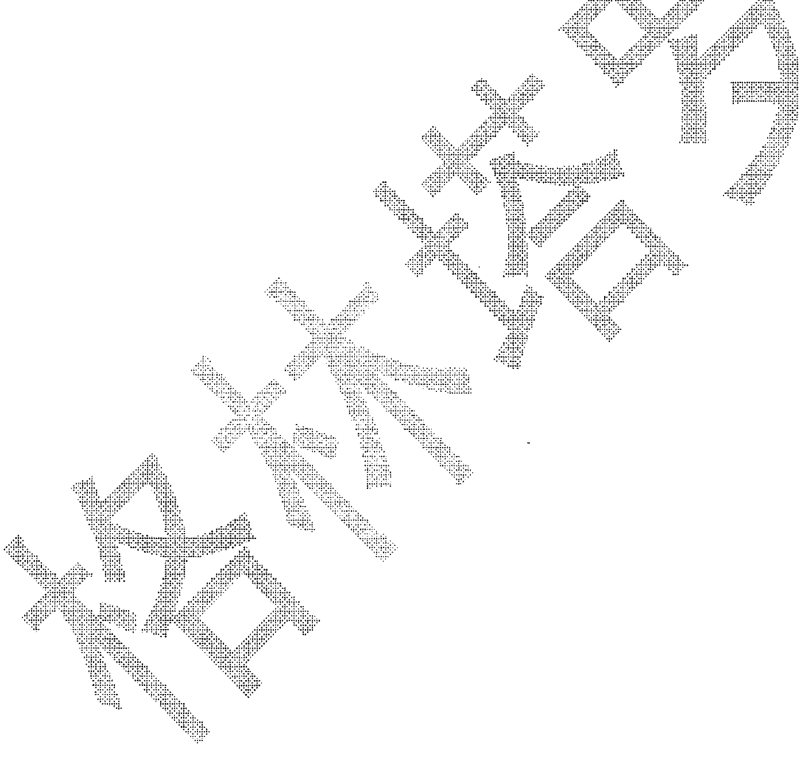

## 数篇

### 第一章

宇宙之间在还没有万物时，就已经有万物衍生的法则存在。其后从初始一点出来，由简至繁往复变化，由少至多互相摩荡，从而衍生形成万物。万物形成就有变化，有变化就有现象生成。现象浮现在表面可以由视听感到，法则衍生的数律藏于深层只能由心灵察知。

仲天说：“数有三个意义，也就是序、列、量三类。”序数是万物形成的先后，构造时间；量数是万物形成的多少，构造空间；列数是万物并列齐类，是时间与空间的同行并构。三种特性相互参杂并且循环推进，从而形成规律，被称为数律。所以，数律的学问是如此深邃，是所有现象深层的法则。

### 第二章

序数层层衔接形成循环；量数环环积累形成主次；列数纵横交错形成种类。数有奇偶，协同配合形成动静、主次、外内、创合。之间两两结合，合并为五个元素，自太元素起，经历火、土、风、水四元素变化之后，再构循环。这五个元素，同性为和的状态，顺序为害的状态，逆序为合的状态，顺向间序为刑的状态，逆向间序为冲的状态。因此，即使塔罗牌的符号象征，也不离数律的法则之外。

从一到零，共有十个数字。其中九个都是既有数量的意义，也有序列的意义；唯独零却不同。零的数字中，没有时空，可以理解为简，也可以理解为繁，所以反而无繁无简了。

### 第三章

一为王冠，呈现超越，如同神性的天府所在，合一而完美，象征了独立的特性与成就。二为智慧的原点、创造的理性、直觉的觉知，故而呈现真理，象征了相互关联的协作执行。三为理解，呈现创造的源泉、实质的理性，象征了形象的表达与感受。四为仁慈，呈现宏伟的爱与恩宠，象征了秩序的服务与限制。五为审判，呈现克制的法则与保留的自由之间相互突破从而形成困境，象征了多元的自由。六为美，呈现慈悲与和谐，象征了平衡的责任造就了阶层。七为胜利，呈现了力量的扩张是永恒的行为恩赐，象征了万有的奥秘形成于分析与了解。八为荣耀，呈现了力量的收缩是尊严与荣誉，象征了物质的满足形成于操纵与控制。九为基础，呈现着万事万物基础而本质的创造力，象征了宇宙的无私与博爱。零为王国，呈现着犹如虚空的人与物质，象征了涵盖万有却无从显现的样子。
因而，宇宙万事万物潜藏而不表露，可感却难知。

### 第四章

从一至零，三纵四横，展现了数的三种属类，宇宙万物的四层阶段。
二、四、七构成慈悲的组合，具有时间、宽容与放纵；三、五、八构成严厉的组合，具有空间、规范与控制；一、六、九、零构成和谐的组合，具有时空的洞量、生命本质的调和与平衡。这三个组合是数的三层意义，也象征着二元对立与融合。
万物的法则就是宇宙的法则，宇宙的发展变化状况就是万物的发展变化状况。
一、二、三是宇宙初始的本原，基础的孕育，是万物模棱的原型，无有时间与空间；
四、五、六是万物创造的发展，突破孕育而生，时间开始形成，力量渐次积聚；七、八、九是空间逐渐满布，物质逐渐分离与汇聚；零是稳定的构造，也是万物成型。

### 第五章

万物有序，也共存成列，纷繁发展，变动转化。人也属于万物，因而也各有万物的特性。
一的本性刚直，行动刚健，不通世故，过于自负，容易漂泊无依靠，象征出生、丈夫、男人、领导、头部、胆囊、酸味、青色、东方。
二的本性柔顺，体质柔嫩，随波逐流，世故谨慎，象征哺乳、女人、妻子、医生、参谋、脖颈、肩部、肝脏、酸甜味、绿色、东方。
三的本性刚烈，清廉融合，潜藏才能，成果辉煌，但不易持久，象征少年、有权威的人、男性第三者、额头、小肠、苦辣味、紫色、红色、南方。
四的本性温和，秀丽清高，心思细密，能够洞察奸谋，也易愁苦呻吟，象征青年、秀丽的女人、女性第三者、胸部、口舌、心脏、苦味、淡红色、南方。
五的本性急躁、体形敦厚，看似沉稳，却不依常规，象征壮年、资本、钱财、胃、鼻子、面部、甘甜味、深黄色、中央。
六的本性温顺，体质沉静，权衡协调，防守维护，象征中年、坟墓、门户、脾脏、腹部、肋骨、甜味、浅黄色、中央。
七的本性锐利、体形长方，刚健自我，勇于突破，象征衰老、丈夫、贱人、仇人、警察、大肠、脐部、筋、辛辣味、西方。
八的本性忠诚，体形方正，爽直温柔，轻财重名，象征晚年、罪人、有过错的人、肺部、胸部、大腿、苦辣味、浅白色、西方。
九的本性柔和，能为他人犯险，可以同忧患但不易同安乐，象征死亡、与流动有关的事物，膀胱、泌尿系统、小腿、咸味、深黑色、北方。
零的本性阴柔浅显，体形沉重，容易表现，象征腐朽、与女性有关的人和事物、肾脏、心包、脚、咸味、浅黑色、北方。

### 第六章

愚者为万物的初始，世界为万物的终成；自魔术师到隐者，是内在的静态，是数的根本；自正义到太阳，是外在的动态，是数的表现；命运之轮与审判，是事物转化的变革，是驱力的转化。

凡所有变化都归纳在九数之中，统驭在魔术师到隐者之中，因此，这内在的驱力单一而表现方式多样，层层推演就可以知道了。所以万事万物表现繁杂，而内在法则却极其简易。

世间万事万物无不有象，象有虚实真假；万象变化无不有数，而数有定变刚柔。知道所有法则的核心，观察事物表现的变化趋势，再复归到核心的法则之中，就知道世间事物的变化，不过是动静刚柔的内外状况罢了。

### 第七章

塔罗中数的变化层层演进，共有九级，不过常用的只到三级为止，这是为什么呢？因为内环三级表示的是定数，外环六级则是变数。能推演三级，就可以得知万事万物的性质，那就是很明智的人了。倘若能陆续演进，就可以知道事物在天地宇宙时空中的层层动向，步步行为，如同按图索骥一样，这又是多少人能够做到的呢？

### 第八章

定数相伴时间较长，趋于稳定，分为本体数与使用数两类。本体数就是生日数，使用数是会使用一段时间的数。凡是定数，将它均分为前中后三部分，各自拆零加和，多的数就分在前数中。如是本体生日数，用年数作为前数、月数作为中数、日数与小时数作为后数，也各自拆零加和。

将前、中、后三数相加，称为愚者数，其中个位数象征内在性质，又称为世界数，其余位数象征外在影响。将愚者数各数位加总最终所得的一位数称为灵魂数，象征事物的本质。以愚者数的个位数，也即是世界数置于数盘正中，象征个人与事物的特性、成败得失的情形。

用前数补一取个位得太阳数，置于世界数的南方，象征外界环境、家族力量、父亲主管对于事物的影响。用后数加一取个位数得塔数，置于世界数的东方，象征行为方式、应对模式、惯性与冲动等，也表示财富或物资的来源。用前数加中数取个位数得到魔术师数，置于世界数的西方，象征内在认知、心理、沟通、学习等，也表示事业和学业的状况。用后数加中数取个位数得女祭司数，置于世界数的北方，象征内在想法、潜意识、女性长辈等对于事物的认知。之后，四角各取周边两数相加，并且取个位数，分别置于四角。西南是皇后数，象征配偶、婚姻、恋人、爱情观念等；东南是审判数，象征晚辈后代、下属桃花等；东北是命轮数，象征健康、企图、欲望潮流等；西北是吊人数，象征人际朋友、助手辅佐等。

这十张塔罗牌所表示的位置，就是基础的十位，共有十数，各有所指。这是塔罗数盘的第一与第二两级。以中心的第一级愚者世界牌位为核心，依据第二级各牌位与核心的关系可以明晰其中的关系。

### 第九章

塔罗数盘，第三级共十六牌位，与十六宫廷牌相应，通过第一二级的纵横两位相加得其中十二位，再用核心世界牌数加第二级四角数取个位可以得到第三级的四角数。其中，正东是星币国王牌位，正南是权杖国王牌位，正西是圣杯国王牌位，正北是宝剑国王牌位。自权杖国王牌位起始，顺时针牌位依序为星币骑士、权杖侍从、宝剑王后、圣杯国王、权杖骑士、圣杯侍从、星币王后、宝剑国王、圣杯骑士、宝剑侍从、权杖王后、星币国王、宝剑骑士、星币侍从、圣杯王后。前两级和第三级，分别是定数的先后、里表、内外、虚实，查验的时候，务必一一察知相互的关系，以核心的世界数为主。第三级所代表的是在不同方面的展现类型。

权杖国王表示代表人格、企图、态度、生命力、早年环境、身材外貌、体质状况、自我发展能力。权杖王后表示法律、宗教、信仰、哲学、长程旅游、国外事务、研究所以上的教育。权杖骑士表示子女、爱情、热情、怀孕、性关系、投机运、私人社交、休闲娱乐、创作或艺术能力。星币国王表示目标、野心、责任、权威、信用、事业、政治、老板、名望声誉、成就地位。星币王后表示宠物、健康、发展运、部属关系、工作精神态度。星币骑士表示财运、欲望、资源、价值观、赚钱能力、物质生活。宝剑国王表示同居、婚姻、艺术、契约、诉讼、合伙、公共关系、明显敌人。宝剑王后表示言语、思考、沟通、学习、考试、兄弟姐妹、人际关系、短程旅游、大学以下的教育。宝剑骑士表示泛泛之交、社团活动、拥护支持者、精神和文化层次、对环保公益和人权的态度。圣杯国王表示私生活、不动产、心情感受、安全意识、父母管教、晚年生活、家庭生活和事务。圣杯王后表示慈善、修行、逃避、隐居、诈欺、隐密、潜意识。圣杯骑士表示意志、神秘、犯罪、自杀、死亡、债务、保险、偏财、性能力。四个侍从牌位，分别表示行为、理智、情绪、欲望的发展方向，奇数顺数、偶数逆数，以所落的牌位表示的方向为发展方向。

### 第十章

内三级虽是定数，却是实质，是一切因由所指。中三级所代表的是随时间而变化的形势，以及其形势造成的影响，因此有原序与值序的区分。其中各数，因与时日相关，受星体气候影响，所以称为十印数。

一为盗印数，表示盗贼、失财、生病，有利主动不利被动，多心计，险恶卑下，外柔内奸，漂泊流离，随波逐流。如果值位是一，适宜安抚边防，修筑巩固，建造规划，屯积固守，其余不利，如是商业则容易失盗失财，生病受灾。二为病印数，表示与疾病相关，也表示教师朋友，柔顺懦弱，吝啬小人。如果值位是二，适宜拜师交友，屯积防御，不宜进取、婚嫁、诉讼、迁徙、修造等，而且容易遇到受惊的事情，因此凡事应准备退路。三为慈印数，代表领袖、勇士，起动易怒，鼓噪喧嚣，多动少静，有慈爱心，喜助人为乐，也与农业相关。如果值位是三，适宜选将进去，征伐交战，呐喊震慑，不宜婚嫁，修造，迁徙，经商，其他则一般或不利。四为文印数，代表普通平民，与文教有关，柔和犹豫，进退不定，鼓舞努力，决断力差。如果值位是四，大多数事情都适宜，婚嫁、出行、经商、修造、进取都可，尤其适宜升学考试，发展文教。五为镇印数，代表领导等计划者，巫医工匠。如果值位是五，大多数事情适宜，乃至祭祀求卜、远行、做生意、埋葬、修造、见贵人、婚嫁，可与凶劣的团体个人断交，出征进取也有利，甚至不用实际操作，仅凭谋划就可以让对方屈服。六为武印数，能动能静，工于心计，与领导才能、军事智慧、医疗治病有关，代表首脑、经营者、威严果决、多动少静。如果值位是六，适宜治病服药，练气功，经商，迁徙，埋葬。逢秋冬季节有利婚嫁出征、谒见修造，春夏季节则不宜。七为杀印数，喜杀好战，与惊恐怪异、破坏毁损有关，也代表隐士、口舌讥毁，谣言饮食。如果值位是七，适宜训练培养，隐迹固守，婚嫁修造与祭祀，其余一切所为皆不吉。尤其不宜出行谋划，出战交兵，经商远行，强行则车破马伤、士卒败亡、破财折本，意久伤灾。八为生印数，阻隔，宁静，进退不决，止住、不见，暗生，代表生成培养，有各种助益的力量。如果值位是八，适宜成名谒见，谈判经商，出征进取，婚嫁见官等，大多数事情都适宜。九为炎印数，聪明好学，美丽谦虚，但躁动易怒，也与伤病有关。如果值位是九，适宜谋划谒见，社交旅游，请客玩乐，不宜婚嫁搬迁，建造祭祀，经商见官，出战进取。零为隐印数，隐忍不动，潜藏不露，代表隐伏包容。如果值位是零，各项事务都不适宜做，适合静气养身，等待时机。
这十数的意义用于中三级，用来观察时运变化。

### 第十一章

第四级共二十四位，以正北为数字零，依顺序依次到二十三，这是原序。其后取时间数为正北数字，各数字依次旋转，这是定出值序。再次与第三级对应的数字相加，而四角的十二个数字都与第三级四角的数字相加，才得出第四级数字。如以出生数开盘，则此序不变；如非出生数，则以开盘时间数定正北位数字，而后依序顺排。第四级是第三级的延伸，表示的是目前在不同方面的状况。之后观察各数字有与世界数相同的，称为值位。

### 第十二章

第五级共三十二位，取零到三十一数顺序，以象征日期。出生数开盘，则取出生数的日期为正北；如非出生数，则以当前日期数定为正北，其余各数相应旋转。其次将旋转后的数字与第四级相应数字相加，而四角数字都与第四级数字相加。从而得出第五级数字，最后确立值位，与世界数相同的第五级数字就是值位。

### 第十三章

第六级共四十位，东南角为权杖 ACE 位，西南角为圣杯 ACE 位，西北角为星币 ACE 位，东北角为宝剑 ACE，依顺序为各牌组二至十位。第四级值位象征当下潜藏环境、事物发展必然趋势、内在的状况；第五级值位象征由暗转明的环境、事物发展中的契机、外在的状况。观察值位所对应在第六级的塔罗牌位，可以知道相应的情形。与值位对应的的第六级位置，称为变位。如值位的数字与变位的数字相加减可等于世界数，则暗示此值位数与所对应的塔罗牌尤其重要。

### 第十四章

外三级是世运的影响，并非一人一物所能决定，是先天生成，基础的变化。故先定八弦，四正方位为四正弦，每弦各掌管中五位；四角方位为四偏弦，每弦各掌管五位。自北弦起，顺序称为休息弦、生机弦、伤动弦、闭塞弦、风景弦、死绝弦、惊吓弦、开通弦。

休息弦为一，是从容休养的意思，适宜拜会上级或贵人、升迁赴任、婚嫁迁徙、建造经商，不利判断定案、责罚动怒。生机弦为八，是复苏生育的意思，适宜求财出行，征战行动，建造嫁娶，不利掩埋治丧。伤动弦为三，是受伤摧折的意思，适宜索债、捕捉盗贼、渔猎、赌博等，不利经商、出行、赴任、修造、嫁娶。闭塞弦为四，是堵塞不通的意思，适宜躲灾避难、防洪筑堤、判决隐狱，其余都不利。风景弦为九，是光明夺目的意思，适宜计划筹谋，推选人才，述职差人，火攻杀戮，其余都不利，谨防口舌及火灾事故。死绝弦为二，是死亡结束的意思，只适宜吊死送丧，刑戮争战，捕猎杀牲，其余好事不利。惊吓弦为七，是是非破损的意思，适宜诉讼官司、抓捕盗贼、蛊惑乱众、设疑伏兵、赌博游戏，其余的事请不可做。开通弦为五，是通达顺遂的意思，适宜出行、拜谒、求官、嫁娶、移徙、修造、交易，不利诉讼、埋葬、渔猎。

### 《塔罗三味》

2012年修订版

通玄为六，是万物开始的意思，适宜开业经商，征战远行，考学参军，婚娶乔迁，建筑贸易，添人进口，治病求医等等事情。

#### 第十五章

第七级共四十八位，共分八弦，每边以四五四位分弦。四正弦数字同第三级，四角数字为第三级数字的倍数，四偏弦数字以第三级角数同方位逆向加成得到。其次自北弦起，每弦加一、八、三、四、九、二、七、六，所得结果为原序。再以世界数所对应的弦数中位转移至正北，如尾数为一、五、零则不变。最后以第七级各数中，与世界数加月份所相等的为值位。

#### 第十六章

第八级共五十六位，共分十二区，每边以五位分三区。四正方位与四角取第二级数，其余区计数在中，以四正数与四角数的差计数，其余位留空不填。自正东起，顺时针牌位为皇帝、教皇、恋人、战车、力量、隐者、正义、死神、节制、恶魔、星星、月亮。以当年年数除以十三再减三，自皇帝牌起顺数为当年的值位，再将此位的数字加世界数得到最终数。

#### 第十七章

第九级共六十四位，以《序篇》所载牌序为基要，各有七十八张塔罗牌的对应位置，次根据第七级与第八级所处的塔罗牌在《杂篇》的含义就可以明晰事物状况的总体趋势。

#### 第十八章

九级数盘，共三层，每层三级。第三级为一二两级的适用；第六级为四五两级的运转；第九级为七八两级的根本。每层之中，外级为根为地，倨傲不动，如同不变的框架，万物的规范；内级为起为天，如同变化的根源，衍生的初始，是变化的源头，万物的生机；中级为合为人，如同自由的选择，变化与不变的层层递进，万物的生成，调和的力量。

那么，使用数的法则，就是离弃了塔罗吗？

> > 仲天说：“塔罗的法则，远早于塔罗牌存在之前。数的法则，也不过是塔罗法则的一个方面。”

用数与用牌，不过是使用的器具不同，但是其中的法则是一样的。塔罗牌，不过是塔罗的表现形式；数，不过是塔罗的内在联系；万事万物的态势，才是塔罗的法则所在。

### 第十九章

研究数表现出来的现象与象征，称为数象；研究数内部的联系与规律，称为数理。

> > 仲天说：“数就是数，却又并不是数。”

这是什么意思呢？犹如数字一，并不仅仅是数量上的一而已，这个一，有初始初创的意义，有学习沟通的意义，有方位上的象征，有颜色上的象征，有星相上的象征，如此等等多不胜数，因此，数并不仅仅是数目数量的意义罢了。

### 第二十章

数有虚实。所谓“实”数，就是藏在世间所有现象中的数；所谓“虚”数，就是在世间所有法则中的数，是实数之中的数。数有十数，而零藏在虚无之中；数盘共有十级，只以九级来计算而藏去一级。这是为什么呢？因为第十级为虚数，并非从盘中实数中衍化而来，那是宇宙的规范，犹如窗格窗棂。这一级共七十二位，以六维变化，合共有亿万种变化，即使仲天我也不能全然推算出了。若然将这一级加上，共有三百六十一位，居中的位不计，合共有周天三百六十度。错杂变化，杂然错杂。

变化的法则有一，而变化的现象千万；原由的法则有一，而原由的现象千万。所以数有虚实，事有真伪，人有善恶，物有刚柔，以一隅的心意来窥测世间的奥秘，不能百分至准，这是因为事物本身变化的法则。

因此，塔罗法则的应用，在于明白虚实变化的状况，在于了解其深层的虚实意义。

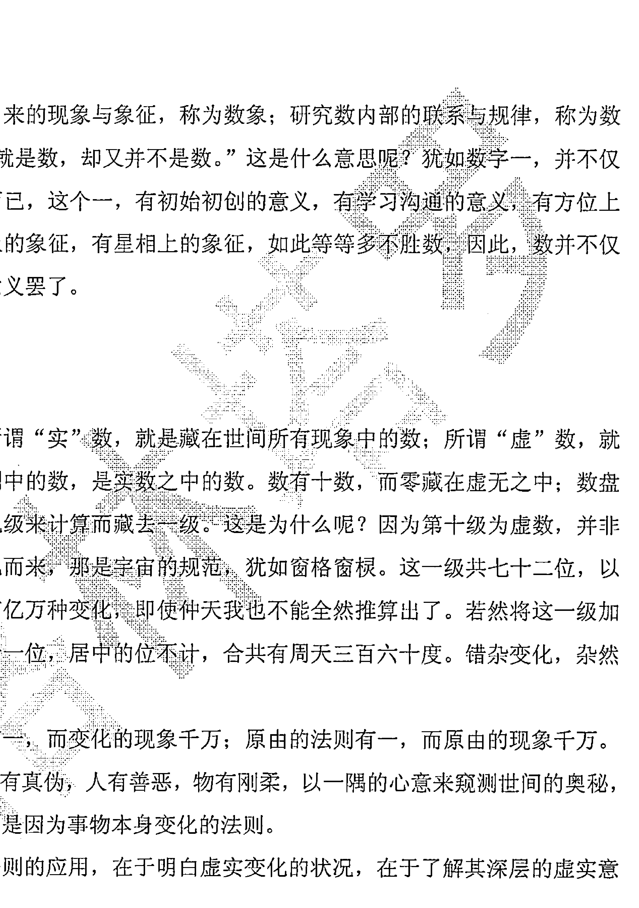