# 塔羅占星

從黃道智慧提升塔羅解牌技巧

Tarot and Astrology
Enhance your readings with the wisdom of the zodiac

柯琳·肯納 Corrine Kenner 著 亞瑟 譯

華文世界第一本結合塔羅與占星的專書

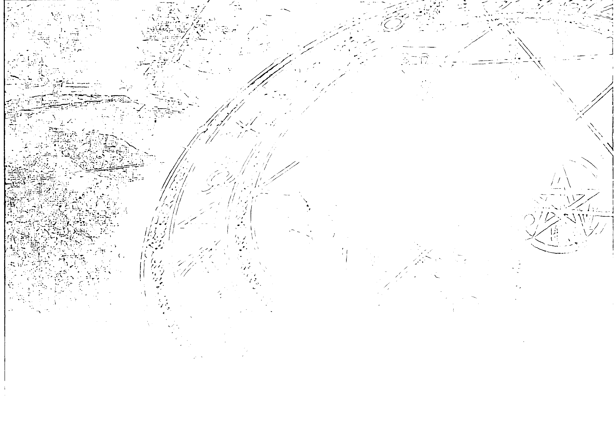

塔羅教父 丹尼爾 | 占星作家 天空為限
專文導讀

魯道夫 | 寶靈 | 孟小靖
全力推薦

## 導讀

許多人在學習西方神秘學的過程中，發現占星學與塔羅牌之間有某種關聯性，不過由於相關的中文資料很少，因此大部分的人對於這兩者之間的關係經常一知半解。擁有塔羅牌基礎的人常覺得占星學過於博大精深而卻步，而精熟占星學的族群，則容易覺得塔羅牌的圖象廣泛而不夠精確。即使同時鑽研這兩種工具，也很難讓兩門知識系統相輔相成，提升解讀的功力……，這本《塔羅與占星：以黃道智慧提升塔羅解牌技巧》，正是幫助我們搭起兩者之間橋樑的重要著作。

就歷史層面來說，占星學比塔羅牌來得久遠，打從有神秘學家開始研究塔羅牌的理論，就嘗試著要將占星與塔羅牌的系統進行連結，其中又以金色黎明組織的說法流傳最廣，影響也最大。因此本書作者便以此論述作為主要的藍本。

第一部，作者先簡介了塔羅牌的基本結構，接著介紹塔羅牌大阿爾卡納與行星之間的關係，除了說明塔羅牌與行星的基本象徵，也另外補充一些與占星學有關的小知識。由於金色黎明結合占星與塔羅的依據只限於傳統的七個行星，因此後代新發現的天王星、海王星及冥王星，則是參考克勞利的說法進行補充。之後作者開始說明大牌與星座之間的關係，除了介紹塔羅牌象徵與星座的基本特質，也詳盡說明了星座的神話、主宰的宮位與健康之間的關係——這個部分的內容十分豐富，即使拿來當占星入門書來看也不嫌太淺顯。同時，作者也設計了幾個依據占星原理設計的特殊牌陣，非常具特色，可以幫助讀者更熟練地運用所學到的概念。

第二部處理小阿爾卡納與占星學之間的關係。作者由占星學中四大元素的基本理論說起，對應到小牌四種花色的一號牌，接著以「卡巴拉生命之樹」的架構，說明數字的象徵與意義。小牌中除了「數字一」的其他三十六張數字牌，對應到黃道的三十六個10度區間。因為黃道帶的每個10度區間帶有不同的行星能量，因此作者依照它們在黃道上的順序來介紹。從代表春分的牡羊座開始，一直進行到最後一個雙魚座，在說明的過程中，融合運用到第一部分介紹過的大牌對應，把大牌與小牌的關係用占星的象徵串連在一起。至於宮廷牌的部分相對複雜，不過作者巧妙地以星座特質與星座分類法的雙重對應關係，敘述了人物特質的基本架構，並且在文末提供完整的對照圖表，幫助讀者整合消化前文提到的所有內容。

進入第三部，作者帶領讀者認識占星「宮位」的概念，並運用對宮互相參照的方式深化讀者對於宮位的理解，同時介紹解釋星盤的方式。雖然這個章節提到許多專業占星的術語及星盤詮釋方式，但是如果原本對於占星學不熟悉的讀者，也不可能只看這個部分就立刻成為占星專家，反倒是原本就精熟占星的讀者，可以很快地學會運用塔羅牌的圖案象徵，作為輔助自己解讀星盤的工具。因此這個部分對於沒有占星基礎的讀者來說實用性質較低，但若是把它當成占星學的導覽及簡介，仍然可以有很大的收穫。最後作者貼心地附上一些占星術語的解釋及推薦書單，讓有心精進兩門學問的讀者有個清楚依循的方向。

其實就內容的深度來說，本書並不算是塔羅牌或占星學的入門書，而比較適合對塔羅牌有些基礎的人，藉由本書理解占星象徵，或是已經有占星基礎的人，在解讀星盤時加入塔羅牌意象的輔助用法。若是原本已學過兩種工具的人，讀這本書則會有打通任督二脈、融會貫通的效果，更能發揮兩種工具的專長相輔相成。至於完全沒有這兩種基礎的人，讀這本書可能感覺有些吃力，最好還是先去找其他較為簡單的入門書研讀，再回頭讀這本進階的概念工具書，會更容易理解。

之前常有讀者或學生向我抱怨，書架上缺少一本深入研究占星與塔羅關係的專書，相信這本書的出版會是華文世界研究塔羅牌的重要里程碑，在此誠心地推薦給大家。

塔羅教父 丹尼爾
Daniel

## 推薦序

收到木馬文化寄來的試閱稿，閱讀之後有一種很驚喜的感覺。

我本身從事各種塔羅牌的教學，同時也教授占星課程，許多學生是兩者都學，希望做到占星跟塔羅牌的同時運用。同學們發現兩者可以截長補短，因此已研究出許多方式來搭配，對應的程度非常完美。書中提到的「天宮圖牌陣」，更是我一直以來就列入塔羅牌課程中的學習項目，應用性非常高，深受學生的喜愛。只是，占星黃道十二宮當中，有些宮位象徵的領域比較抽象，我自己更改過每個宮位的象徵範圍及定義，讓單純使用塔羅牌的同學們更容易解讀。在這本書中，即使沒有學過占星，大家也可以看到天宮圖牌陣的原型。

占星就像東方的八字或紫微斗數，幫助我們看清生命的藍圖，就像DNA，可以掌握整個人生的輪廓跟方向，但不會鎖死我們做的每一件事，因為它的範圍非常廣大；而塔羅牌就像是易經卜卦，針對當下時間點、或某一個時間範圍、或某一個特定事件，都可以經由牌義（或卦象），去呈現事件的細節。兩者組合在一起，會讓占算出來的事件更為立體，也更能洞察事件的詳細狀況，讓被占卜者對事件的發展有更深一層的理解。

我一開始自學塔羅牌時，用的是托特塔羅牌（Thoth），當時市面上的塔羅書或相關著作非常的少，而我在更早的幾個月前就已經開始在學占星了。當塔羅牌書籍或資料讓我覺得總是切不中要點時，我發現托特塔羅牌的特色就是，它跟占星學的結合度非常高：小秘儀的四十張數字牌中，除了一號牌（Ace）之外，每張牌的牌面上都有一個行星符號加上一個星座符號；而大秘儀的二十二張牌，也都各自對應一個行星或是一個星座的特質，在這種對應方式下，讓我的自學找到一個系統，不用只靠直覺來進行研究。

我雖然是雙子座，但命盤中金牛座的特質更為強烈，對我來說，大家所謂的「直覺」只是一種亂猜，我認為直覺必須透過專業的研究來培養、證明，因此找到與占星的對應系統，我就可以把四大元素的特質帶進塔羅牌，學習到一般塔羅牌書沒辦法教給我的東西。

事隔我學習之初多年，出現了這樣一本結合占星基本概念及塔羅牌的應用書籍，我覺得現在的學習者非常幸運。讓我高興的是，我的學生們雖然分別學會了占星及塔羅牌，我也常常把兩種學問的原則一起教授，但是「玩法」卻不多，因為這些領域的搭配應用需要清楚的邏輯與方法。這本書等於可以把占星跟塔羅牌兩種學問做一個基本概念的整合，並衍生出許多應用方式，光是書中提供的占算法，研究使用之後，我相信會讓人對占星、塔羅牌這兩門各別的學問都能瞭解得更深入，這是熱愛兩者的玩家們很需要的一本書。

我自己的著作跟教學中，除了著重細部象徵深入的理解之外，我更著重心法，因此能提供給學生的應用方式顯得有限，算是比較屬於內功修練型的（笑）；而這本優秀的工具書提供了許多極具創意的應用方式，讓研究的人在練習實戰技巧的同時，也能累積自己的敏銳度，因此，這是一本可以好好邁入實戰領域的書籍。希望初學者或已有基礎的塔羅占星迷們，可以藉由此書，擺脫純理論跟關鍵字的束縛，真正進入占星與塔羅牌的世界。

占星作家 天空為限

## 目錄

導讀 —— 丹尼爾

推薦序 —— 天空為限

導言 1

概要 15

# 第一部 塔羅行星與星座

1 塔羅牌的構成要素 21

2 行星 —— 占星學的指引之光 29

3 黃道十二星座 55

# 第二部 小阿爾卡納

4 占星學元素 97

5 塔羅、占星學與卡巴拉 105

6 數字牌 113

7 行星落入各星座 125

8 宮廷牌 205

# 第三部 占星學進階

9 天宮圖的宮位 231

10 如何詮釋星盤 255

11 詮釋星盤的簡單指引 261

## 結論 291

## 占星術語小辭典 293

## 速查指南：天宮圖關鍵字 299

## 推薦書單 300

# 導言

數個世紀以來，塔羅牌與占星學的發展脈絡一直是密切相關的。如果我們能掌握占星學與塔羅牌之間的各種關聯與原理，就能使這兩門看似獨立的領域無縫整合、相得益彰。

如果你是塔羅師，你可以運用占星領域的象徵與詮釋方法，來增加塔羅牌的解讀深度。如果你是執業的占星師，那麼你將發現運用塔羅牌上的原型與神話，竟可以賦予星盤鮮活生動的意象，從而更能領會行星或星座間的能量互動方式。當然，或許你早已懂得合併運用這兩門技法，那麼閱讀本書將使你更加廣泛地精通兩者，並且能融會貫通。

## 塔羅與占星的歷史

將時間往回推六千年，爬上許多階梯，你可能正位於巴比倫某座高聳的樓塔，陪同迦勒底占星師出神地觀測夜空的行星和恆星。如果回溯到六百年前，來到最早引進塔羅牌的義大利宅邸，你可能正在夜裡把玩一副塔羅牌，手中握有金色的太陽和銀色的月亮。不管是哪一種情況，你都運用了自從文明創始以來，人們就不斷研究的原型意象，來洞察當下的環境與心境。

塔羅與占星學向來有所關連。最早期的塔羅牌組就描繪了太陽、月亮和星星的圖像，還有例如朱彼特（Jupiter）、薩杜恩（Saturn）和維納斯（Venus）等與宇宙有關的神祇。然而，這兩者在學術上產生更深的連結則是較近代的事。一七八五年，法國神秘學者尚—巴蒂斯特·阿利耶特（Jean-Baptiste Alliette）設計出占星與塔羅對應關係成熟的塔羅牌組，此後，其他神秘主義者和哲學家也開始留意到塔羅牌組與希伯來字母，以及猶太教的神秘主義卡巴拉之間，實有著諸多引人好奇的相似點。總之，占星學與塔羅之間似乎有著一條串連各類元素的銀線，彼此之間緊密呼應。

## 現代塔羅與占星學的黎明

現代塔羅誕生於一八○○年代後期，當時有一群神秘主義者和哲學家，在倫敦組成一個「金色黎明奧秘教團」（Hermetic Order of the Golden Dawn）。他們試圖統合形而上學的各種分支，包括占星、命理學與卡巴拉等理論，藉由一副塔羅牌的推演，來鞏固他們的創見。

由麥格雷戈·馬瑟斯（MacGregor Mathers）撰寫的《T書》（Book T）可說是這個團體尊奉的「塔羅手冊」，書中詳述塔羅牌中關於占星學、卡巴拉、元素與精神層次的各種屬性，也說明將完整的一副七十八張塔羅牌與黃道互相連結的方法。

一九○九年，亞瑟·愛德華·韋特（Arthur Edward Waite）與潘蜜拉·柯曼·史密斯（Pamela Colman Smith）設計出金色黎明版本的塔羅牌，這副牌普遍被稱作萊德—偉特（Rider-Waite）塔羅牌，最後成為全世界最暢銷的塔羅牌組。一九四三年，阿利斯特·克勞利（Aleister Crowley）與弗莉妲·哈里斯夫人（Lady Frieda Harris）自行創造的托特（Thoth）塔羅牌，同樣是利用金色黎明所構思的屬性，來處理與占星學之間普遍的對應關係。如今，許多塔羅藝術設計師仍依據金色黎明的原始構想來創造更多的牌組，顯而易見的，古代占星學已經找到融入現代塔羅牌的途徑。

本書使用「巫師塔羅」* 作為說明的牌例。巫師塔羅是我和藝術家約翰·布魯門（John Blumen）共同設計的牌組，它在韋特塔羅牌的原型基礎上，完美地融合了占星學的元素，顯得意象鮮活，而且牌中描繪的主角們是某間神秘學與魔法學院的師生，因此極適合作為結合占星與塔羅的教學工具。

## 塔羅與實際運用

在這本書中，我會教導讀者結合塔羅與占星的技巧。一開始先從基礎的知識著手，再逐步進入占星學的元素分析與塔羅牌的牌義闡釋，俾使讀者充分瞭解這兩門知識，觸類旁通。除了理論部分，書中也包括實用且獨特的塔羅牌陣和技巧，加上豐富的案例說明，讓讀者可以在實際操練時得心應手，提升牌義的解讀技巧。

你會需要一副塔羅牌組和一些個案的星盤。你可以向占星師或身心靈商店訂購客戶的星盤，或利用線上軟體與專用軟體自行繪製星盤。

準備好了嗎？與我一起展開這趟探索之旅吧！

> *「巫師塔羅」（Wizards Tarot，市面上或譯「術士塔羅」），是為紀念美國著名魔法師萊昂納德·雷克（Mandrake）而設計的牌組，由LLEWELLYN公司於二〇一一年發行。精美華麗的3D畫風充滿神秘魅力，是本書作者結合占星概念特別設計的塔羅牌。

## 概要

當你開始研究一張結合塔羅與占星意涵的星空圖，我會建議先從簡單的對應關係著手，之後再對這兩門學科各別進行全面性的理解。以下是學習重點：

- 闡明行星與塔羅牌之間的對應關係。
- 認識黃道十二星座與對應各星座的大阿爾卡納牌。
- 將占星學領域延伸到分屬火、土、風、水四元素的小阿爾卡納牌。
- 探究四種花色數字牌之間多層次的關聯，這些數字牌在年之輪中都占有一個專屬位置。
- 認識轉動年之輪的黃道成員。
- 利用塔羅牌將天宮圖中各宮位的星座與行星形象化。

## 明星陣容

塔羅與占星學之間最顯著的對應關係出現在大阿爾卡納牌。大阿爾卡納是塔羅牌組的頭二十二張牌，它們的象徵意義與占星學中的行星和星座幾乎完美地吻合、呼應。在深入探究塔羅與占星學的技術細節之前，我們先來檢視這些塔羅牌組中最明顯的連結。

**愚者** 不在乎社會看法的愚者，對應到代表反叛與革命的天王星。

**魔術師** 擅長戲謔和花言巧語的大師，對應到代表速度與溝通的行星——水星。塔羅牌中的魔術師一手指天，一手指向地面，他能將來自天界的訊息傳遞到下界的地球。

### 女祭師

鑑媒的原型，對應到代表反省與直覺力的發光體—月亮，多數女祭師牌都會描繪月亮的意象。

#### 女皇

妻子與母親的角色，對應到愛與吸引力的金星。在這張牌中可以發現數個代表金星的占星學符號。

#### 皇帝

男主人與發號施令者的角色，對應到具有領導能力的牡羊座。我們可以嘗試在這張牌中尋找牡羊座的意象。

#### 教皇

傳統的維護者，對應到維持穩定、奢華和享樂的金牛座。某些教皇牌也會出現金牛座符號與象徵。

#### 戀人

戀人們的思考或言語往往如出一轍，因此對應到掌管思考與溝通的雙子座。戀人本身是學生的靈魂，他們的雙臂和心交纏在一起。

#### 戰車

作為受到妥善的保護、附帶輪子的「家」，對應到代表母性、房子，以及家庭生活的巨蟹座。巨蟹座的螃蟹把房屋馱負在背上。

#### 力量

具有剛強的特質，或擅長以柔克剛，對應到擁有雄獅般的勇氣和心腸的獅子座。

#### 隱士

靜默的引導者，對應到致力於為他人服務、犧牲奉獻，並且有責任感的處女座。

#### 命運之輪

對應到木星。木星是一顆代表幸運、蓬勃發展與擴張的行星。

#### 正義

公平與平靜的典範，對應到代表平等與社交風範的天秤座。天秤座的符號通常以一座保持平衡的天平為代表。

#### 吊人

懸吊在另類現實中的吊人，對應到充滿玄想與幻覺的海王星。海神涅普頓（Neptune）的三叉戟符號做了與世俗現實同時存在的水世界。

#### 死神

冥界的主宰，對應到掌管性、死亡、轉化與他人財產的天蠍座，天蠍座的蠍子符號擁有一根致命的螯刺。

#### 節制

跨立在兩個世界之間的節制牌，對應到掌管長途旅行、哲學與高等教育的射手座。射手由半人半馬構成，象徵兩種迥異經驗的結合。他射出的箭飛越長空，一路前往新領域。

#### 惡魔

肉體與物質誘惑的具體化身，對應到掌管商業、事業成功與世俗地位的摩羯座。摩羯座相關的山羊形象與某些藝術作品中描繪的惡魔，有著驚人的相似度。

#### 塔

不停受到保護與攻擊的塔，對應到代表能量、侵略與自負獨斷的火星。在占星學上，火星符號由盾牌與槍矛共同組成。

#### 星星

象徵希望與靈感的幽微光芒對應寶瓶座。寶瓶座是掌管社群與前瞻性思考的風象星座。

### 月亮

夜的主宰，對應代表神秘事物與潛意識的雙魚座。多數版本的塔羅牌中，雙魚座的兩條魚符號在反映倒影的池塘裡游動。

### 太陽

生命的供養者，理所當然對應到能量與啟蒙的來源——太陽。

### 審判

這是覺醒、領悟與被接納的最後一次機會，對應了代表死亡、復活，以及不可避免的改變的冥王星。

#### 世界

我們在世俗的家，對應到代表界限、限制、約束與結構的有環行星——土星。

## ◇ 實際運用 ◇

### 太陽星座牌陣

你可以嘗試一種最容易入手的塔羅與占星的合併解讀法，也就是利用代表太陽星座的兩張牌進行簡單的比對。首先，從塔羅牌組中取出太陽牌，接著取出對應你太陽星座的塔羅牌。

看看是哪張大阿爾卡納牌對應到你的太陽星座？你取出的兩張牌——太陽與太陽星座——是否彼此互補，或者相互矛盾？這兩張牌如何描述你的性格、個性和自我意識？

## ◇ 案例解讀 莎莉絲特的午夜太陽

莎莉絲特的生日是3月7日，此時太陽落入雙魚座，表示她的太陽牌與對應雙魚座的月亮牌可以配成一對。

說也奇怪，莎莉絲特向來是個夜貓子，她總覺得在入夜後，當太陽落下而月亮升起時，是她最有活力的時刻。她的情緒如潮水般起起伏伏，而且她像月亮女神一樣度過每個月的生命週期。有時候，她甚至看起來有點像夜行動物，擁有蒼白的皮膚和寬間距的閃亮雙眼。

當她看見這兩張牌並列時驚呼：「沒錯，就是這樣！」「我是月亮，這解釋了許多事情。我和其他人一樣喜歡溫暖的太陽，但我依靠著月光在生活。」

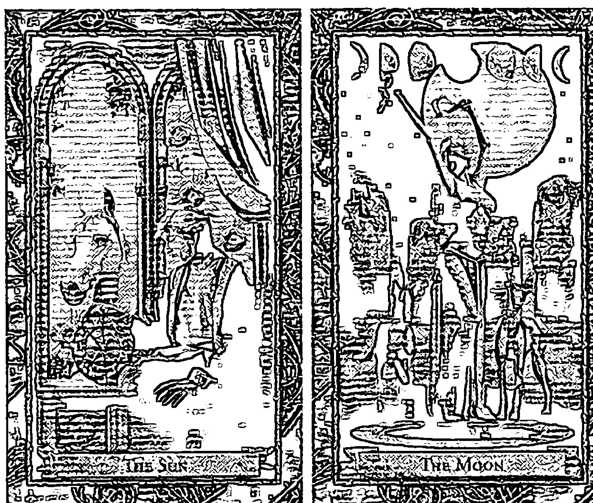

# 第二部

## 塔羅牌與星座

這部分內容中，我們將詳細地檢視大阿爾卡納牌、行星和黃道星座之間的對應關係。

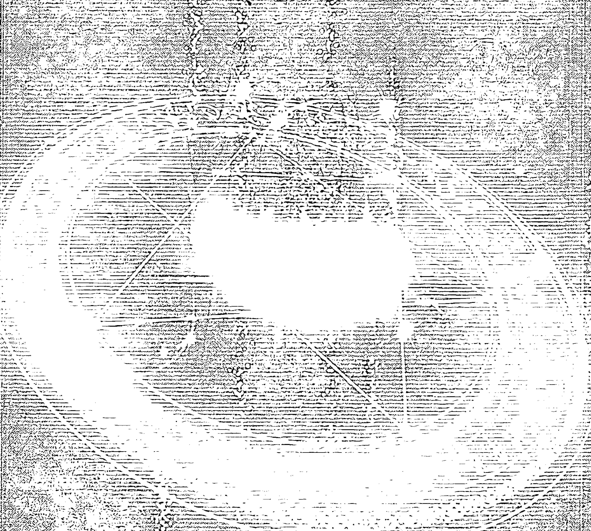

### 塔羅牌的構成要素

本章從塔羅牌組的基本架構著手，展開一連串塔羅與占星的深入研究。

#### 塔羅的無限宇宙

當你洗好一副塔羅牌並將它們攤在桌面時，其實正在運轉著一整個宇宙。你的每次發牌都會創造出一種新的真實存在，就像占星學中每種行星和星座的排列組合，也代表著地球上每位新生兒存在的事實。

典型的塔羅牌包含七十八張牌。乍看之下，這些數量可觀的牌讓人不知所措——有些人得花上好幾年的時間記住這些牌，然後才能進一步理解每個意象和可能的象徵，並嘗試解讀牌中隱含的要義。儘管這是個迷人的探索過程，然而在你能解讀牌義前，其實毋需花費大量時間來研究這些牌組，只需要弄清楚塔羅牌的基本結構就夠了。

七十八張塔羅牌分成兩大群組：分別是拉丁文意為「大奧秘」的大阿爾卡納（Major Arcana），以及意為「小奧秘」的小阿爾卡納（Minor Arcana）。大阿爾卡納牌關乎大局，描述改變生命的重要事件與經驗，例如戀愛、分娩、投入新工作或找尋新家。有時，大阿爾卡納牌戲劇化到它所描繪的經驗，彷彿不是我們所能掌控的。

至於小阿爾卡納則與日常生活息息相關，它描述如跳舞、喝酒、飲宴和睡眠的大眾生活或例行事物，和一般的撲克牌一樣，小阿爾卡納牌分成四種花色，代表精神、情感、心智與物質等不同生活領域，每種花色包含十張數字牌和四張宮廷牌。整體而言，小阿爾卡納牌與大阿爾卡納牌在意義上同等重要，因為小阿爾卡納牌告訴我們如何在日常生活的基礎上度過生命中的大事件。

大阿爾卡納和小阿爾卡納合起來構成一套完整的宇宙論——用於看待世界，以及將人類經驗分門別類的架構。塔羅牌組的縝密結構與豐富象徵，使它們極容易被應用於研究人類各種處境，甚至掌握生命的某些重大秘密。

## 大阿爾卡納

進行塔羅牌解讀時，大阿爾卡納牌往往是人們記得最清楚的牌，因為它們能量強大，而且極富戲劇性。這些牌似乎描繪了非比尋常的人物和角色，並精準的對應到占星學的各個行星和星座。

大阿爾卡納牌中的人物是超越時空限制的原型。他們是古代神話和傳說中的英雄人物，至今仍在電影、電視、戲劇和書本中擔任主角，而藝術家、作家和音樂家們也不時探涉集體無意識的水域，在其中尋求靈感以及對人類處境的各種解釋。精神治療師卡爾·容格認為，經常出現在我們夢境中的象徵、神話與原型或故事，全都出自相同的來源——這說明了為什麼有這麼多民族和文化擁有類似的傳說，更不約而同運用相同的象徵，絲毫不受所處時代或地域的限制。

雖然每張大阿爾卡納牌都代表了足以改變生命的重大事件（我們甚至可以視這些事件為宇宙間的神秘事物），但它們並非深不可解的謎團，因為每張大阿爾卡納牌都描述了能使秘密清楚預現的一道生命課題。

在象徵的層次上，大阿爾卡納牌可以作為心靈的嚮導，它們握有解開生命之謎的鑰匙，能幫助我們穿越生命旅程中的每個驛站。

### 小阿爾卡納

小阿爾卡納的四種花色分別是權杖（Wands）、聖杯（Cups）、寶劍（Swords）與五角星（Pentacles）。依牌組設計的不同，權杖在某些論述中也被稱作「棍棒」，五角星有時會被稱作「錢幣」、「圓盤」、「石頭」、「世界或星星」，不過，這些名稱差異並不影響牌義的解讀。

大阿爾卡納牌可以掌握生命的秘密，而小阿爾卡納牌則在日常生活的基礎上說明如何經歷這些神秘事物，它們描述你過日子的方式，以及如何處理各種生活事務或展現的生命態度。

### 影響範圍

有人稱小阿爾卡納為「點數」牌，因為在撲克牌中，「牌點」是用來標示花色和數值的記號，例如紅心六或方塊七。然而在塔羅牌中，數字與花色代表的意義遠超過大多數撲克玩家所能想像，因為每種花色各自對應了不同的生命領域。

- 權杖 象徵精神領域和靈感。
- 聖杯 蘊含情感層面的秘密。
- 寶劍 闡釋與心智相關的概念。
- 五角星 代表肉體與物質的真實存在。

此外，我們還必須考慮另一個同等重要的象徵層面，也就是簡明的元素概念。

### 四元素

數千年來，火、土、風、水四種元素都在科學與哲學中扮演著重要的角色，古希臘人將它們視為物質世界的基本組成元素。雖然現代科學觀念已經改變我們對宇宙的認知，但四元素至今仍可作為有效的心理模型。舉例來說，我們時常描述某人為「火熱」或「土氣」的人。元素的象徵性是瞭解占星學的重要憑藉，同時，這四個元素也是某些東方信仰的基本對象，例如中國人熟知的「風水之說」就是最好的證明。

小阿爾卡納牌的每一種花色都與一種元素有關，分別對應某個生命領域。我們可以藉由每張牌的意象，輕鬆記憶這些連結。

**權杖** 代表精神的火象牌，與熱情或靈感有關。在大多數的塔羅牌中，權杖看起來像一根樹枝，如同火把般可以被引燃。權杖可以是照明的來源，也能點燃或是誘發某些想法與概念，使之蔓延成燎原大火。

**聖杯** 代表情感的水象牌，與深刻被感受的事物有關。當然，杯子除了盛水，也可以盛裝其他他在情感上有重要意義的液體——我們總是在慶祝時舉杯互敬。宗教儀式中，我們用酒與其他人親密地交流，或希望借酒澆愁。

**寶劍** 代表心智的風象牌，與有意識的覺知和溝通有關。它象徵我們的思維、想法，以及嘗試溝通的企圖。寶劍如同話語般在空氣中移動，當我們說「筆比劍更有力」時，我們往往把話語比喻為雙面刃。

**五角星** 代表物質存在的土象牌，與身處四維世界中的有形真實有關。多數塔羅牌中，五角星看來像是繪有星形圖案的錢幣，這種圖形象徵人類身軀的外型。想想達文西的維特魯威人（Vitruvian Man）吧，他那手腳張開的身體正好構成一個五角星的形狀。五角星象徵存在的真實物質，包括我們所能碰觸並感覺到的事物，以及用以維持身心合一的金錢。五角星也象徵精神與情感上的資產，包括你所珍視的價值標準和傳統，以及鍾愛的人。

### 四位皇室成員

小阿爾卡納牌的每一種花色都包含四張一組的宮廷牌：侍從、騎士、皇后和國王。不同的牌組中，宮廷牌也可能有其他名稱，例如在克勞利的「托特塔羅」中，皇室成員就包括公主、王子、皇后和騎士。不過這些宮廷牌的意義大致是相同的，我們只需記住它們各自的階級關係。

這四位皇室成員在象徵的層次上構成理想的家庭：父親、母親、兒子和女兒。部分宮廷牌屬於陽性，部分屬於陰性；陽性積極主動，陰性則被動接納。十六張宮廷牌統合起來正好掌管精神、情感、心智及物質等四個領域，這也是構成我們性格本質與特色的獨特組合。

#### 侍從（或公主）

年輕而充滿熱誠，他們是正在學習基本家庭規範的學生、信使與兒童。文藝復興時期，侍從是皇室家族中最年輕的成員，他們的職責是求學——以及跑腿，包括替人傳遞口信。當塔羅牌中出現侍從，通常代表年輕人、學生或訊息。

### 騎士

當侍從成長到騎士的年紀時必須接受測試。他們會踏上追尋的旅程，克服某些挑戰，以證明他們夠強壯、夠聰明，足以完成任務，不辜負家族的世襲地位。歷史上的騎士向來是拯救者與冒險家，當塔羅牌陣出現騎士，可能暗示即將展開的新追尋或冒險活動，或是營救行動已經在進行中。

### 皇后

男子或女子成年即位後，便成為掌理國家的君主。一般而言，塔羅牌中的皇后都是成熟的女人，善於利用陰性特質來防衛、滋養與保護她們的王國，皇后代表理想的典型女性，富慈悲心、創造力、善於接納與同情，而且直覺力強，她們也能在幕後發揮力量，說服或勸誘別人接受她們的觀點。當塔羅牌陣出現皇后，往往暗示某位關愛者將挺身防衛、滋養或保護你的王國。

值得注意的是，在托特塔羅中，當權力從上一代移轉到下一代時會呈現肥皂劇般的複雜性質，因為這些宮廷人物彼此爭奪權力與威信。在無止盡的循環中，王子鬥爭騎士以奪取王位，當王子擊敗騎士後與公主結婚，公主遂取得屬於母親的皇后地位……爾後情況一再循環。

### 國王

塔羅牌中的四位國王是保護者、供應者，也是經驗老到的領導者。他們都已成功達成身為騎士時所擔負的任務，而且他們也是熟練的指揮者，對於追尋過程中所獲得的知識信心十足。國王是典型的男性，他永遠權力在握、獨斷自負而且機敏，甚至帶有侵略性。他以熱情和力量護衛王國，果決地制定治國大計。

當塔羅牌陣出現國王，可能暗示某人願意代表你發動攻擊性的防禦措施，甚至不惜為你的困境開戰。

#### 屬於你自己的皇室宮廷

宮廷牌描繪的顯然不只是文藝復興時期的戲劇角色，有時是代表出現在你生命中的人，包括家人、朋友、員工或同事，同時也說明了你自身性格的面向。無論你是年輕熱情或機警世故，這種連結都建立在心理學上的「投射」原理，好比你是否喜歡一個對象，往往是因為他們使你發現自身的優點或缺點。

在和喜歡的人或宮廷牌愉快的打交道時，你會發現他們提醒了你的優點，例如幽默感、敏捷的才智或風趣的個性，你們對世界現狀有類似的看法，對未來也有類似的規劃。相反地，如果你被其他人或宮廷牌惹惱了，也可能是因為他們反映出被你隱藏起來的個性，例如偶爾的小自私、懶惰或消極等負面特質。（別擔心，這些弱點只有你和塔羅牌知道。）

### 數字的意義

大阿爾卡納中的數字常被認為是代表生命旅程的各個階段，而在小阿爾卡納中，數字也象徵事件的進程：一代表開始，十代表結束。當然，牌的花色會指示哪些事件正在開展：權杖象徵精神體驗、聖杯代表情感事務、寶劍描述心智議題，而五角星則關係到物質的真實存在。

進行占卜前必須洗牌，所以小阿爾卡納很少按照數字的順序出現，而且在解牌的過程中，你可能詫異於相同數字一再出現。例如在某個牌陣中，前、中或後端數字的牌佔了大多數，或是與七有關的各種牌居於優勢，這些情況可說屢見不鮮。

總地來說，如果能明辨花色代表的重要意義，以及數字所代表的不同生命階段，那麼即使你記不得全部七十八張牌義，也能順利詮釋每張牌的意涵。舉例來說，權杖一往往象徵精神追尋的開端，權杖五暗示靈性經驗的中點，而權杖十多半代表一場心靈之旅的終點。

### 塔羅的牌陣

大多數的塔羅師都有自己偏好使用的兩、三種牌陣，本書後續會列舉幾種以占星概念為基礎的新牌陣，供讀者參考運用。

### 行星——占星學的指引之光

本章將逐一探討占星學研究的主角——行星和發光天體。

## 行星

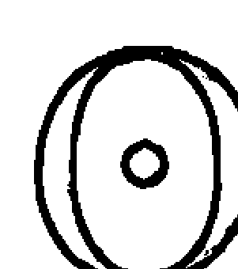

太陽：賜予地球光與熱的來源，代表能量、啟蒙、光輝和照明。由於太陽是宇宙的中心，所以象徵每個人的世界（自我）中心。太陽也是主動的陽性象徵，代表太陽的符號描繪出這個天體身處太陽系的中心。

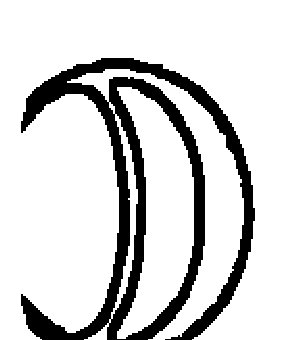

月亮：反射太陽的光芒，象徵著反省與感受，也代表萬物不斷循環變化的本質。月亮是陰性象徵，它的符號看似一個柔軟蜿曲的女性軀體。

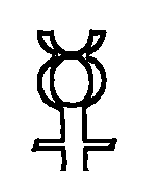

水星：快速移動的行星，象徵速度。水星是諸神的信差，代表溝通。水星的符號像一根手杖，是頭戴有翼盔帽的年輕希臘使神形象的寫照。

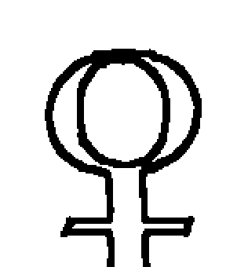

金星：愛與美的行星，象徵吸引力、浪漫情調與多產。金星是希臘神話中帶來愛情與吸引力的女神，代表符號像一把附有手柄的女用梳妝鏡。

♂ 火星：這顆紅色行星代表能量與陽性力量。火星是戰爭之神，所以象徵自衛與侵略。火星符號如同盾牌與槍矛的組合。

♃ 木星：體積最大的行星，象徵成長、擴張、幸運和熱忱。木星符號像極了幸運數字21與數字4，4的英語發音類似「好運」（“fortune”）。

♄ 土星：代表界限與限制的有環行星，象徵紀律、清晰明確的界定，以及傳統。土星符號是有著尖頂和十字架的教堂。

♅ 天王星：代表前瞻未來、自由與反叛，以及獨立性。天王星符號看似一具裝設了天線的人造衛星。

♆ 海王星：這顆霧氣氤氳、代表幻覺的行星極具魅力和敏感度，它的符號是海神手中的三叉戟。

♇ 冥王星：代表死亡與重生的冥王星顯示了無可避免的改變。冥王星符號像一個死而復生的人。精確地說，它是錢幣加上聖杯的組合，象徵永生的報償。另一種冥王星符號則是字母P和L的組合（意指“Pluto”）。

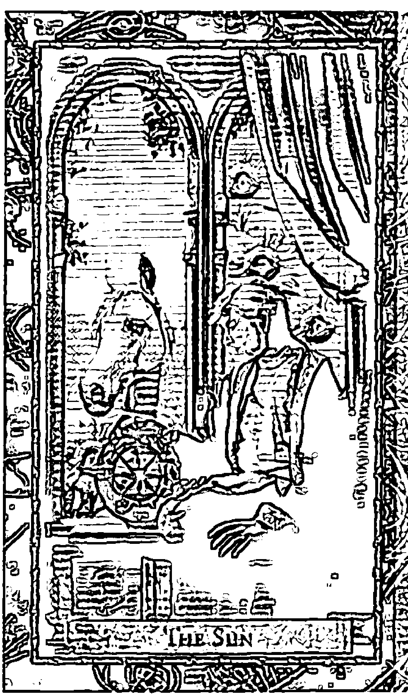

### 太陽 ☉
光明之神

我們與太陽的關係就如同我們與造物主的關係。耀眼的太陽散發光和熱，是生命的能量來源。我們利用日升日落來測量每一天的長度，太陽的起落不但暗喻生與死，也反映出我們對重生的冀望。

多數塔羅牌中，太陽牌都畫有一名金色的孩童。你也許知道他正是阿波羅，是希臘與羅馬神話中代表音樂、治療、預言、真理的光明之神。任何星盤中，太陽都是重要的焦點所在，代表自我，象徵自信與自尊、意志力、企圖與驅力。太陽是男性氣概、生命能量與力量的表徵，也代表覺知和啟蒙，它彰顯我們內在的光芒，也描述我們發光的方式。由於太陽是如此耀眼，因此它在星盤上的位置可以代表我們在相關領域的名聲、公眾認同，以及所受到的讚揚，同時也代表力量強大的男性人物，如父親、老闆或受人敬重的老師。太陽的能量陽剛而且直接。

太陽主宰掌管創造力、娛樂和生殖力的獅子座。太陽與心臟和脊椎有關，這兩者不時出現在我們的日常語彙中，例如我們常說某人有勇氣和決心，或擁有意志力和骨氣。

太陽對應火元素。

### 黑暗陰影：日蝕與月蝕

「蝕相」是太陽與月亮共舞的舞碼之一，它們在地球上投下長長的陰影，迫使我們在黯淡又神秘的光線下觀看平常熟悉的景象。

日蝕是月亮移動到地球與太陽之間所造成的現象，它切斷了我們與創造源頭的連結，蒙蔽了有意識的覺察力與日常感知能力。而月蝕則是地球移動到太陽與月亮之間所造成的現象，當世界陷入黑暗，我們便被迫探索自身存在的陰暗面。日蝕發生於新月時期，這時太陽與月亮合相；月蝕發生於滿月時期，此時太陽與月亮處於對分相。新月是全新的開始，而滿月則代表完成與收穫。

一如太陽和月亮，日月蝕也常相伴發生。月蝕總是出現在日蝕之前或之後，兩者相隔整整兩週。由於蝕相在地球上投下大片陰影，因此它們影響到的不只是個人，而是整個國家與群體。古代占星師相信日蝕會造成強人垮臺，因為太陽的光線被吞沒，暗示掌權者將遜位。月蝕形成時，月亮呈現染血的紅色，預示將發生諸如農作物歉收和饑荒等災難。

當然，在現今科學知識的普及下，我們已經知道日蝕和月蝕現象都相當稀鬆平常，未必是厄運的前兆。

## ◇ 實際運用 ◇

### 蝕的牌陣

如果你正處理一件曖昧不明或令人困惑的事，這個牌陣可以迅速提供明確的解答。從塔羅牌中取出太陽和月亮，將它們左右並置，代表占星意義上的太陽和月亮。將其餘的牌洗牌，然後抽出一張牌放在這兩張牌之間，用以顯示正受到蒙蔽的生活層面。接下來抽出第二張牌來指示你如何使生活重獲光明，讓你看清楚事情的真相，並解決問題。

## ◇ 案例解讀 康士坦汀的創作瓶頸

康士坦汀向來是一位多產作家與藝術家，近來在創作上卻遭遇少見的障礙。
「我似乎就是無法完成任何作品，」他說，「我坐在書桌前，結果發現自己忙著瀏覽網頁、在線上跟朋友聊天或點閱新聞。當我將注意力轉移到某個繪畫計畫時，我會盯著空白的螢幕，然後又決定先檢查一下電子信箱，或乾脆做點雜事。我已經快要錯過一些重要計畫的截止期限，雖然目前還來得及迎頭趕上，但我開始擔心了，為什麼我無法專心工作？」
月亮與太陽是力量強大的大阿爾卡納牌，而點出康士坦汀問題所在的牌，以愚者的形式出現。愚者可說是塔羅牌組中最強而有力的一張牌，作為塔羅中沒有編號的第一張牌，它是整個牌組的領導者，代表來到塔羅牌桌前尋求答案與建議的一般人。

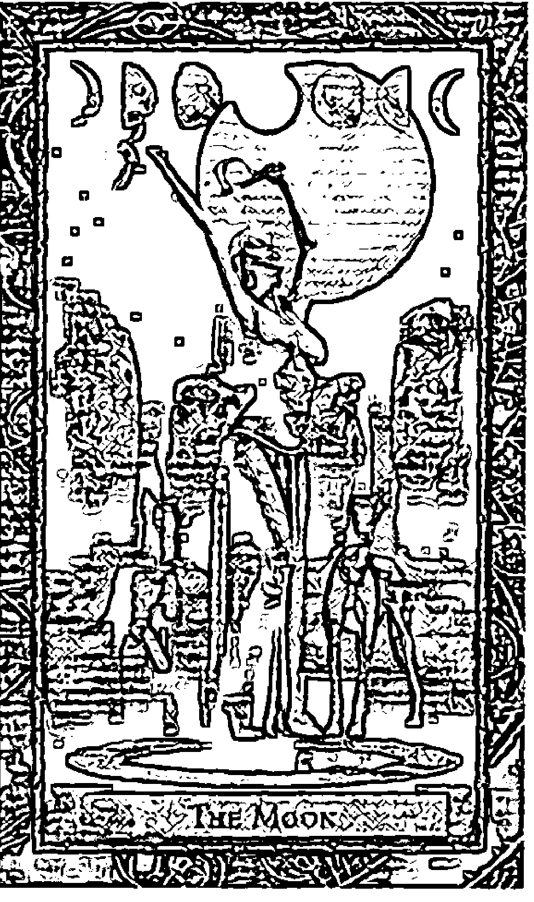

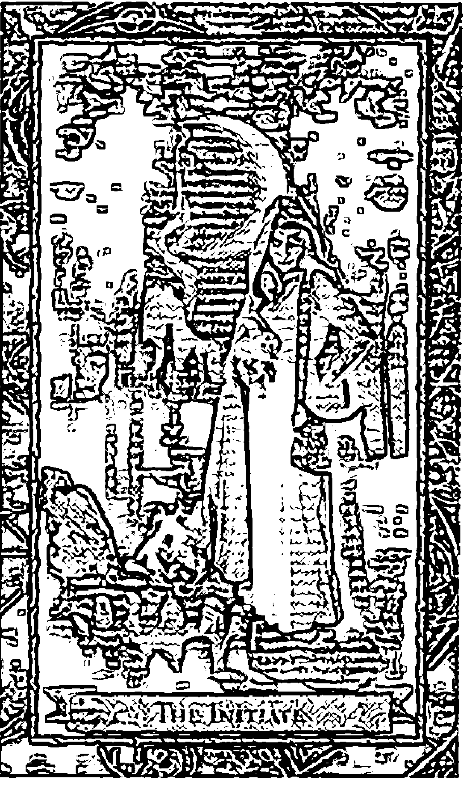

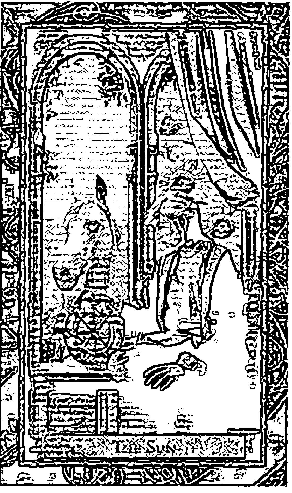

事實上，許多塔羅師將愚者之外所有的牌都描述成一場「愚者的旅程」。這個案例中，擁有豐富象徵的巫師塔羅中的「啟始」（Initiate），相當於韋特牌中的「愚者」，透露出造成康士坦汀創作瓶頸的幾個問題。

這張代表「開始」的牌暗示了康士坦汀遭遇的挫折：他從事的工作是曠日費時的創作專業，使他幾乎沒有多餘時間展開新的工作。身為藝術家，他享受靈感激發的過程，不亞於（甚或超過）創作完成後得到的成就感。

再者，通往新冒險旅程的啟始牌說明康士坦汀早已喪失探索的樂趣。儘管他的工作內容的確是許多人以為的玩樂，但是迫切的截止日期和必須承擔的責任，已在他的例行公事中形成單調沈悶的壓力。

此外，啟始牌與代表革命與反叛精神的天王星有關，表示康士坦汀正有意（或無意地）反抗他的編輯和出版商的權威。他藉由錯過截止日期或拖到最後一刻才履行義務，設法為工作注入刺激的新鮮感、不服從的態度，甚至一絲危機感。

那麼康士坦汀該如何克服他的創作危機，並且專注於工作？

聖杯一暗示康士坦汀必須想辦法先專注於已經在進行中的計畫，他最好暫時脫離網路世界，不理會使他分心的外在事物。另外，這張牌也指出他即將一頭栽入另一個全新的計畫中，這是個專為他帶來藝術樂趣與創作滿足感的計畫，保證能讓他的創作泉源再度流動起來。

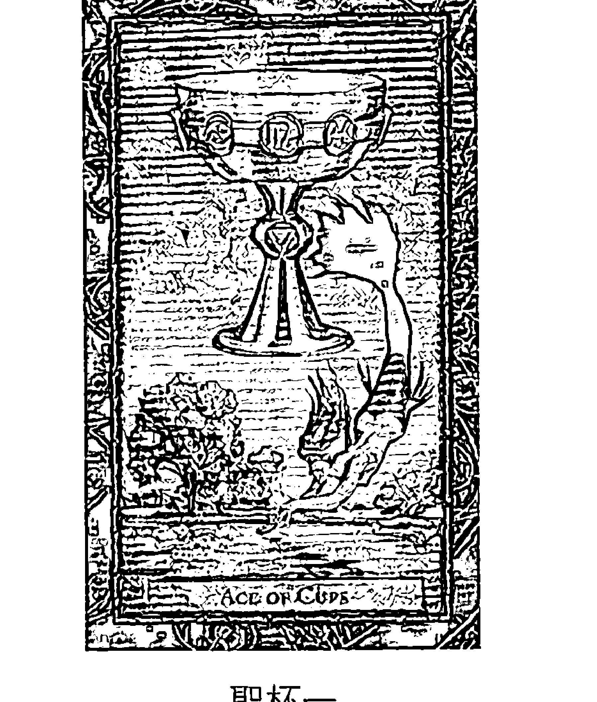

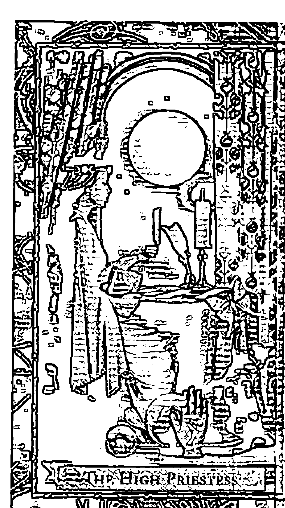

### 月亮 🌙

### 女祭師

月亮是夜的主宰、秘密的看守人，以及夢想的守護者。當月亮以女祭師之姿出現時，她成為我們可以信賴的密友，幫助我們認識生命的循環，也度量我們對於時間消長的反應。

塔羅師們往往將自己定位為女祭師。女祭師是個神秘主義者，端坐在這個世界與下個世界的入口處，通曉宇宙的一切秘密，但只與智者分享。多數版本的女祭師牌面上都包含了月亮的意象，而在巫師塔羅中，女祭師戴著由上弦月、滿月、新月與閃亮如月亮般的珍珠所構成的頭飾，在滿月光輝的指引下解讀牌卡。

事實上，女祭師是象徵反省與直覺力的發光天體—月亮的化身，也代表不斷變化的「月之女神」，這完全不令人意外。古希臘月神塞莉妮（Selene）每晚從海裡升起，在沐浴完畢之際，戴上新月冠冕；而在古羅馬神話中她變身盧娜（Luna），也就是拉丁文「月亮」的意思。月亮如同月亮女神一樣不斷改變外形，希臘人稱她為阿媞密絲（Artemis），掌管狩獵、野生動物、荒野、分娩、婦女和女孩。羅馬人則稱她為戴安娜（Diana）。

月亮幾乎總是和太陽配成對，有些文化認為這兩個發光天體是兄妹或夫妻。月亮和太陽是天地肇始之初的伴侶，這份合夥關係象徵著流動在光與暗、作用與反作用、陽性與陰性、發光與反射，以及意識與潛意識之間永不止息的施與受。

站在地球上觀察，月亮和太陽似乎大小相當。就像賽莉妮和赫利奧斯（Helios）、盧娜和索爾（Sol）或戴安娜與阿波羅，月亮和太陽是宇宙中的伴侶，在天空中不停地競逐。太陽屬於陽性、主動付出，而屬於陰性的月亮則被動接納。月亮本身不會產生光和熱，她反射太陽的光，在每天環繞地球運行的過程中不斷改變和適應。一如反射陽光，月亮也反映出我們的無意識需求和慾望，又因為它被包裹在黑暗陰影中，所以也代表無法被理解或辨識的秘密和神秘事物。

月亮象徵記憶與情感的崎嶇景象——在滿月時被照得通透明亮，但是當月亮隱沒時，這些景象就顯得陰暗又朦朧。月亮反映出我們的恐懼與不安，以及尋求滋養和安全感的慾望。它描述使我們敏感的事物，例如對情感刺激的自然反應、對威脅的本能反應，或是對掠奪行為的立即反應。它也可能與早期童年記憶、過去，以及對更美好生活的渴求有關。

占星學上的月亮象徵深藏的人格，同時也與記憶、情緒和母親有關——連同與之對應的生育力、週而復始的循環，以及滋養萬物的需求。

月亮主宰掌管家與家庭的巨蟹座，以及黃道第四宮，占星師在這個宮位找尋有關童年、母親與滋養的訊息*。月亮掌管乳房、胃、卵巢和子宮，這使人想起透過母親乳汁與撫慰人心的食物所傳達的滋養力。

月亮對應水元素。

> *某些占星師認為母親象徵代表結構與紀律的土星所主宰的第十宮，因為母親為子女制定行為準則。相對來說，他們將父親

### 無相月

由於月亮環繞地球運行，因此當它穿越黃道十二星座時，沿途會與其他行星形成一些幾何角度（也就是「相位」），而當月亮在某星座中與其他行星未形成任何相位時，則稱為「無相月」或「月亮空亡」（Void-of-Course Moon）。有時無相月的情況僅維持幾秒鐘，然後月亮就馬上移入下一個星座；偶爾也會有一兩天的時間都沒有相位。

在象徵意義上，無相位的月亮是宇宙之間的漂泊者，它不與任何行星產生互動或連結，也與宇宙的其他元素失去連繫。這時候，它的反射不再奠基於真實，你甚至可以說它正在夢遊。

無相月時期是關注精神事物與創意問題的好時機，但並不適合做出重要抉擇，或從事重要活動。在無相月期間，現實世界中的重要事務最好延緩進行。

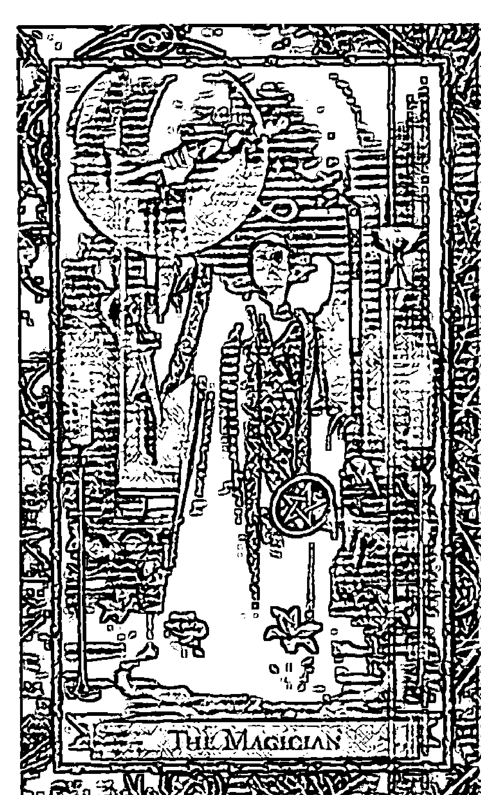

### 水星
魔术师

水星在塔罗牌中化身为活灵活现的魔术师——一位操纵空间、时间和宇宙能量的大师。他证明我们对世界的看法能改变世界，而且心智的确比物质来得更有力量。魔术师本身是转化与改变的管道，他透过身体传导宇宙能量，并利用这股力量显示自身的真实存在。

在多数版本的塔罗牌中，魔术师的一只手伸向头顶上方，像一根避雷针，另一手指向地面，这副姿态使人想起一句奥秘的箴言：“天上如是，人间亦然。”（“As above, so below”）。与此相同的法则也常被用以解释占星和塔罗为什么是如此有效的工具，因为这两门学科都在探究比我们自身更伟大的力量，并利用观念的世界协助我们了解物质世界。换句话说，魔术师提醒我们，有因果关系的外在世界与个人经验的内在世界，并非如此泾渭分明，我们每个人都是大宇宙中的小宇宙。

古罗马人称呼魔术师的原型为墨丘利（Mercury），希腊人则称之为赫密士（Hermes）。他脚踏着有翼飞鞋、头戴有翼盔帽，是代表速度、沟通、销售员、演说家、魔术师与盗贼的特使神祇，至今仍往返于观念领域与有形世界之间。

水星是最靠近太阳的行星，因此拥有最短的轨道运行周期：八十八天。水星的速度与敏捷代表

### 魔術師行星。水星逆行

就像個魔術師，墨丘利也喜歡變戲法，水星每年有三到四次會對我們的感官開玩笑。
當地球通過水星繞行太陽的軌道時，這顆小小的使者行星似乎在群星之間倒退了。
這是一種視錯覺，好比你在高速公路上超車，被超越的汽車便彷彿正向後移動。水星逆行時，你最好小心謹慎。你必須仔細檢查所有的細節，因為魔術師的能量會在溝通上造成大混亂。你得再三確認工作項目，並且記得備份重要的檔案。
雖然其他行星也會逆行，但似乎不會對我們的日常生活造成這種傾覆的效果，因為水星掌管的是訊息、小差事、約會、鄰近地區的短途旅行，以及家庭關係等諸如此類的日常生活事物。

### 行星逆行與塔羅牌逆位

逆行的行星在許多方面就像塔羅牌出現逆位的情況。上下顛倒的牌代表的並非單純逆轉牌意，而是代表當下情勢有新的翻轉，這使我們注意到原本可能被忽略的細節，並迫使我們改變觀點。
當行星在某人出生時逆行，這個人生命中（這顆行星所代表）的能量便會轉而向內，在完全外顯之前，必須在內在的覺知中發展。

### 金星 ♀
#### 女皇

當金星在女皇牌中以人類外形顯現時，這個宇宙中最美好的星體找到了發揮創造本質的出口。
女皇是不斷孕育新生命的母親原型，她以懷孕來象徵繁殖力與生長。彷彿大地之母，女皇身處蒼翠繁茂的園林中，舒適地坐在鋪設軟墊的寶座，心滿意足享受她對安定與舒適的渴求。她頭戴鑲嵌十二顆星星的王冠——每顆都代表一個月份，以及黃道上的星座。
金星和女皇都愛美，而愛與吸引力正好醞釀出巨大的創造力。維納斯（金星）是古羅馬神話中代表愛、美與吸引力的女神。而女皇當然已婚，她是皇帝鍾情的伴侶。
在星盤中，被金星觸及的事物都增添了一份自在、溫情和愉悅。金星往往十分慷慨，它如同木星一樣是「施惠者」，被古代占星師稱為「小吉星」。這通常是件好事，但有時也不盡然如此，特別是當她溺愛子女卻寵壞他們時。金星掌管對美和藝術的愛好，也耽於官能享受，它總是浪漫、親切、仁慈、溫和，而且富有同情心。
金星主宰金牛座和天秤座，這頗符合她身兼晨星與暮星的角色。金星也主宰掌管珍寶與財產的第二宮，以及代表婚姻與夥伴關係的第七宮。作為金牛座與第二宮的主宰，金星顯示我們喜愛的事物，而作為天秤座與第七宮的主宰，則描述我們如何與他人分享這些喜愛。
金星支配喉嚨，因此與甜言蜜語和情歌密切相關；金星也掌管享樂與消費，醫療上與血糖值和性病相關。女皇對應土元素。

### 火星 ♂
#### 塔

火星是一顆代表能量、侵略、自我確立與自衛的戰士行星，而塔是一座堡壘，用以抵禦時間與大自然力量侵蝕的防禦工事和要塞。以這個觀點來說，這顆戰士行星處於全然的攻擊模式中，而塔則無疑受到來自四元素的各種攻擊：閃電的雷火轟擊塔頂、風和雲翻攪空氣、洶湧的海水沖刷地基，加上地震的侵襲。塔與火星都象徵能源與力量的快速傳遞或突然爆發，也都代表了強度、效力、驅力與慾望，顯現出靈感的迸現與改變的衝動。

塔通常預示劇烈的改變，有時是分裂或解體，也可能是某個你以為穩固的結構突然瓦解或崩潰，包括關係、家庭或職業。除了代表錯誤的想法與信仰的毀壞或干預，塔也意味著啟蒙與解放，因此對處於困境的人來說，這是一張「出獄自由」的牌。最終，塔將經歷淨化、保護與自衛的過程，在舊結構被破除之後，隨之而來便是全新的改革。火星象徵性、精力與能量，也代表自信、野心、侵略與魄力，同時掌管運動與競賽——競賽原是承平時替代作戰的演習。

火星主宰掌管領導與行動的牡羊座與第一宮，占星師在這個宮位中尋求關於自我形象與身體外觀的訊息。醫療方面，火星支配血液和男性性器官，傳統上與發燒、創傷、疼痛或手術有關。塔對應火元素。

### 木星 ♃
#### 命運之輪

帶來幸運的木星被占星師稱為「大吉星」。這顆擴張的行星與命運之輪簡直是絕配。

身為太陽系中體積最大的行星，木星象徵成長，它代表藉由長途旅行、結交外國朋友或接受高等教育以拓展世界觀的過程。木星為我們帶來的最大贈禮是智慧、成功、長壽、健康，以及這個世界所能給予的一切令人振奮的經驗，包括家庭、友誼、旅行與哲學。它可以帶來好運，讓人體驗生命的圓滿，並使我們深刻記住從前種種、瞭解當下現狀，以及擁有想像力預見未來。

命運之輪的牌面結合了過去的回憶與對未來的憧憬。

多數版本的命運之輪牌都繪有一台象徵命運的紡車，在時間與空間中轉動，使能量與物質不斷循環。它被用以丈量「存在」，暗示每個人生命中都含有機運的成分，也提醒我們「風水輪流轉」，事情有起就有落。木星與命運之輪都象徵了運氣與機會、命運的翻轉與變化、興隆或成功的可能性。

朱彼特是羅馬神話中的眾神之王、諸神的守護者。同樣地，木星擁有色彩斑斕的壯觀雲霧與劇烈的風暴，也以龐大的體積統御其他行星。

木星主宰掌管哲學與冒險射手座與黃道第九宮，占星師在這個宮位中尋覓高等教育和長途旅行的訊息，如同射手座，木星也支配臀部與大腿，命運之輪對應火元素。

### 幸運點（福點）

占星學中，幸運點向來是一個受人歡迎的阿拉伯點。阿拉伯點是星盤上一個敏感的位置，它是根據古代數學公式計算而得。

幸運點落在星盤上的位置往往準確道出好運的所在，我們可以藉由幸運點落入的星座與宮位所提供的寶貴線索，來瞭解為我們帶來世俗聲望、事業成就、富足與健康的技能或天賦能力。

### 土星 ♄
#### 世界

這個世界看似沒有界限，但土星與有形宇宙實際上是依據科學定律和理性法則在運作，兩者都明確地界定了範圍。土星這個有環的行星代表結構、界限、限制與約束，與秩序井然的物質行星地球十分契合。

傳統版本的世界牌描繪一名在自身世界中不停旋轉的舞者，由象徵永生的花環構成護欄，圍住她的每個動作。世界牌闡明一個簡單而明確的物理法則：我們是由能量所構成的，能量不生不滅，只是移轉。

雖然世界牌通常暗示無限的可能性，不過能量牌與土星的關聯卻提醒我們：有智慧的人應自知能力有限，作出明智的抉擇，盡可能善用所分配到的時間和空間。當然，多數人厭惡被侷限，而喜歡自由和不受限的感覺，但是土星教我們腳踏實地，看清世俗世界的現實面。

儘管土星環暗示了某些限制，但是它也幫助我們自我定位，以及在不喪失個性的情況下，與他人產生連結。這個界限將影響力排拒於外，包容屬於內部的事物。換句話說，土星的界限不僅限制我們，同時定義我們。土星制定規則，確認我們都享有共通的價值語言、道德觀與期望，讓我們全部處於相同的基礎上。土星也可能是控制狂，喜歡控制周遭的環境和結果。

當然，生命中有一部分的結果是早已被決定了的，因此土星也與死亡有關，這個代表限制的行星為我們的世俗存在設定了明確界限。當我們的名字被寫入生命之書，我們知道故事終將結束，如同古代神祇克羅諾斯（Kronos）——吞下自己子女的時間之神告訴我們，歲月終將摧毀一切在地球上的創造物。

薩杜恩（Saturn）是羅馬神話中的農業與服從之神，也是文明與社會秩序的創立者，因此土星主宰了掌管工作與責任的摩羯座，以及黃道第十宮。占星師在這個宮位中挖掘有關紀律、事業成功、公共形象與社會地位的訊息。

土星與骨頭和皮膚有關，這些部位為人體提供結構和穩定性。

世界牌對應土元素。

### 土星回歸

「土星回歸」是最廣為人知的占星學里程碑之一。這種現象約每二十九年發生一次，也就是土星環繞太陽一周所需的時間。當土星回到星盤上我們出生時所在的位置時，我們將跨越重要門檻，邁入生命中的下個篇章。

土星回歸代表三個截然不同的階段。對女人來說，它標誌出從少女長成母親、再成為老嫗的轉變，而對男人來說，則代表從童子軍變成士兵、再成為首領的過程。第一次土星回歸期間，個人脫離青年時期，進入成年期；第二次土星回歸時，這個人的生命歷練已經成熟。到了土星第三次回歸，他／她成為有經驗的睿智長者，從先前的每個階段中學習成長。

第一次土星回歸通常最為艱難，因為這是一個人的性格和力量首度接受測試。在回歸期間，土星穩定守住強韌的結構和現實基礎，如果說其中也存在著若干不確定性，那就是我們可能會在此時經歷動盪的生命遭遇與人格重建的歷程。因此，在這段期間拋棄不良的關係、無法實現抱負的工作或脆弱的生活境況，都並非罕見的行為。然而，結果是值得期待的，因為有時土星帶來的挫折，正是我們前進所需的推動力。

### 天王星
#### 愚者

天王星代表自由、革命、反叛與改革，對應於思想創新的愚者（巫師塔羅中的啟始牌）。
天王星和愚者都是理想主義者，擅長改變並鋪展全新的開始。他們都以極端的方式在思考，樂於破舊立新，也常常被視為怪人，無法（或不願）迎合一般世俗的規範或期待。
多數版本的愚者牌繪有一名即將在信仰上躍進的年輕男子（或女子），他的表情顯得無牽無掛，不在乎過去、現在或未來，只管奮力向前。這張牌代表希望和改變，不受過去的傳統牽絆，也不擔憂目前現狀，只是盲目的信任宇宙間自有運作法則，堅信個人的行動力是開拓道路、通往未來的方法。甚至有人說，愚者不斷追尋經驗，他們願意以無知交換智慧——雖然這幾乎從來不是一樁輕鬆的交易。
天王星會帶來意想不到的改變、獨立性和創造性，也代表社會中的激進想法或人物，以及顛覆既有結構的革命性事件。這顆代表革命與進步的行星，致力於更替、推翻任何存在過久而失效的體制和陳規。
天王星往往與科技的進展有關，它的符號看起來就像一具人造衛星。事實上，大多數的塔羅師認為愚者在隨身背包中攜帶了塔羅牌，以應付旅程中可能遭遇的事情。愚者與天王星都象徵發明與創新的精神，以及從而產生的自由。

希臘神話中，烏拉諾斯（Uranus）是天空（或星空）的化身，而從天文學觀點來看，天王星著實非比尋常。它的自轉軸幾乎完全平行於黃道面（如同側躺著在自轉），因此它的南北兩極會輪流面向太陽。公轉時，天王星的其中一個半球沐浴在光明中，另一半則處於全然的黑暗狀態。

天王星主宰掌管未來性與前瞻性思考的寶瓶座與第十一宮；占星師在這個宮位找尋有關社群和理想主義目標的訊息。如同寶瓶座，天王星支配小腿、腳踝與循環系統。

愚者牌對應火元素。

### 海王星
#### 吊人

吊人花費數小時、甚至數天的時間，懸掛在恍惚的另類真實中。他的狀態與掌管精神與心靈啟蒙的海王星完全步調一致。

吊人的意識超越了肉體，正如海王星本身似乎逃脫了物理學的常態，畢竟這顆主要由縹緲的霧氣與氣體所構成的星體，它的存在感本來就如夢似幻，絲毫不受有形事物的限制。在這種狀態下很容易產生神秘經驗，因此海王星和吊人都與幻覺、想像力，或憑空想像的藝術有關。他們是理想主義者，感覺敏銳，而且對超自然的力量有極強的感應能力。

這兩者皆不擅於建立「界限」。對他們來說，現實世界可能是陰暗又危險的地方，吊人與海王星人都能迅速藉由冥想、祈禱、睡眠或做夢來逃脫現實，偶爾他們也會在酒精與毒品中尋求庇護，或將這類東西作為自我治療的藥物，以阻隔不請自來、隨時可能淹沒心靈的超自然訊息。

塔羅牌中的吊人往往代表一段願意自我犧牲的時期，以及暫時得以免除日常煩惱或憂慮的機會，有時也暗示退隱心態或觀點的改變。

多數版本的吊人牌都繪有一個被倒掛的人，這個人雖然被倒吊著，但臉上卻鮮少出現痛苦或不舒適的表情，反而好像已經與高層意識連結，並達成和諧的狀態。這種處境對他們來說似乎是一種獎賞，而非懲罰。

涅普頓（Neptune）是羅馬神話中的海神，掌管潮汐、退潮後的水窪，以及海洋深處那片黑暗神秘的世界。他能號令潮汐的漲落，也能用難以控制、深不可測的洶湧情緒將對手淹沒。

海王星主宰雙魚座與黃道第十二宮，占星師在這個宮位探尋諸多深藏在我們潛意識中的秘密或禁忌。海王星也掌管禁閉、封鎖這些秘密的各種場合，如醫院、監獄或精神病院。醫療方面，海王星與神秘的疾病或由神經機能產生的疾病有關。

吊人對應水元素。

### 冥王星
#### 审判

冥王星或許已經被現今的科學家除名，但是占星師和塔羅師卻不曾因此氣餒。這顆代表轉化的行星在現代占星學中擁有關鍵地位，在塔羅牌中的角色也同樣屹立不搖。

冥王星掌管死亡與毀滅，這些不祥的字眼在審判牌中被「柔和化」了。多數版本的審判牌面是一群正在接受審判的人們，而巫師塔羅的審判牌則描繪了一群正在參加期末考的學生。在塔羅師的預示下，這些學生終將通過考驗留存下來，繼續進入人生的下個階段。冥王星和審判都教導我們，結束只不過是死亡與重生的循環，而且勢必帶來第二次新生的機會。

冥王星象徵死亡、復活、寬容和解放，也指向接受測試與挑戰、權力鬥爭與反抗的管道，同時代表演化的動力與無可避免的改變。審判牌往往表示案主必須明辨情勢並作出決定，放開不符合需求或期望的事物，才能以更好的方式回收能量，並且重新利用能量。

普魯托（Pluto）是古代神話中的陰間之王，人類在肉體死亡後來到他所掌管的冥府。冥王星主宰掌管神秘事物的天蠍座及第八宮，占星師在這個宮位找尋與性、死亡和繼承有關的訊息。

審判牌對應火元素。

### 南北交點與業力課題

許多占星師會將月亮的南北交點列入解讀星盤時的考量。南北交點是指月亮軌道與黃道的交叉點。

☋ 南交點可以突顯先天的能力所在，這是你與生俱來、原本已經精通的才能或技藝，可能是過去世中所學習的業力課題，因此在這一世，你感受不到重複學習的驅策力或義務。

南交點指出你固有的能力與感到自在的領域，而 ☊ 北交點則說明我們今生必須學習的課題與方向，它們與可能性、成長、挑戰與進步的機會有關。

舉例來說，如果你的南交點落在第四宮巨蟹座，你可能不太重視生兒育女的需求。你會將注意力放在事業上，因為此時你的北交點是落在第四宮巨蟹座對面的第十宮摩羯座，第十宮是代表地位的宮位，而摩羯座是展現企圖心的星座。

由於北交點與南交點永遠處於星盤上的相對位置，因此有些星盤上只會顯示出南北交點的其中之一。

## 黃道十二星座

數千年以前，占星師們開始發展占星理論的技術和原則，他們看著太陽每個月在不同星座的背景中起落，最後，有十二個星座成為現今的回歸黃道十二星座，分別是牡羊座、金牛座、雙子座、巨蟹座、獅子座、處女座、天秤座、天蠍座、射手座、摩羯座、寶瓶座與雙魚座。

- ♈ 牡羊座：牡羊座符號像公羊的角。
- ♉ 金牛座：金牛座符號像公牛的頭部。
- ♊ 雙子座：雙子座符號像兩個人並肩。
- ♋ 巨蟹座：巨蟹座符號像螃蟹的螯。
- ♌ 獅子座：獅子座符號像獅鬃或獅尾。
- ♍ 處女座：處女座符號像天使的雙翼，或字母V加上字母M——聖母瑪利亞(Virgin Mary)的兩個字首。
- ♎ 天秤座：天秤座符號像一座保持完美平衡的天平。
- ♏ 天蠍座：天蠍座符號像帶有螯刺的蠍子。
- ♐ 射手座：射手座符號像一支弓箭。
- ♑ 摩羯座：摩羯座符號像山羊頭。
- ♒ 寶瓶座：寶瓶座符號像兩道水波。
- ♓ 雙魚座：雙魚座符號像兩條魚尾。

### 春分點歲差

有時你會聽到媒體報導黃道帶已經移動，所以你一直以為的太陽星座並非你真正的太陽星座。別驚慌！這只不過是媒體用來引人耳目的說法，它純粹描述一種名為「春分點歲差」的天文學現象。

由於地球在傾斜的自轉軸上轉動，地球上的赤道面並未與太陽和月亮的軌道面完全平行，因此，太陽與月亮對地球赤道所產生的重力拉扯會造成地球的些微搖擺，久而久之，這種擺動會重新調校我們所見到的太空景象。因為固定恆星群的位置逐漸改變，所以太陽似乎是在緩慢移動的星群背景下起落。

希臘天文學家喜帕恰斯（Hipparchus）率先於西元前一三四年注意到這種現象，此後背景星群持續位移，現在它們與傳統參考依據（「回歸黃道」）的同步時間相差約一個月。

在回歸占星學中，每年的開始定於春分點，也就是春季的第一天，我們稱這天為牡羊座的起始點（不管太陽實際上是以哪些星群作為背景起落）。這主要是一種權宜的說法，因為回歸黃道與西方文化的神話和象徵是如此吻合。一旦標示出牡羊座在天空中的位置，我們就能輕鬆的以每30度為間隔，測定出十二個區間中的其餘星座。

至今只有一個占星學派別仍跟得上歲差的變化：在印度執業的吠陀占星師所使用的恆星黃道，通常能準確反映目前從地球所觀測到的恆星位置。

這兩種系統沒有孰對孰錯，事實上，兩者同樣有效，因為回歸黃道與恆星黃道占星師都是依據大致相同的占星學法則，來預測分析整體事件和局勢。

附帶一提，各個星座的動物意象都有重要意義，黃道帶（zodiac）這個字意思是「動物環圈」，因此每種生物的特性都可以作為瞭解它們所屬星座性格的有用線索。

### 星座語言

星座的象徵涉及多層面的意義。在深入探究每個星座與塔羅牌如何對應之前，我們先來檢視所有星座的共通特性。

### 模式、性質與三分法

占星學是以曆法為依據，十二星座如同一年的十二個月，可以分成春、夏、秋、冬四季，每個季節長達三個月，每個月分為上旬、中旬和下旬。

十二個星座分屬創始、固定和變動星座等三種模式，這些模式大致符合每個季節的開始、中間和結束部分，因此星座及其所對應的塔羅牌均分了年之輪的位置。這種以模式來區分的方式有時被稱作「三分法」，每種模式包含四個星座。

創始星座順利啟動每個季節。每個創始星座在年之輪上標示出一個明確的啟始點，對應一個新的開始。牡羊座的首日是春季第一天；巨蟹座的首日是夏季第一天；天秤座的首日是秋季第一天，而摩羯座的首日是冬季第一天。

創始星座是不可過抑的自然力量，以負責、進取的態度居於領導地位。這些星座的人勇氣十足、自我策勵，性格主動而且充滿活力。他們動作迅速、思考獨立，總是迫不及待採取行動。他們以突然湧現的靈感推動各種改變。整體而言，創始星座代表了靈感和全新的開始。

固定星座標示出每個季節的巔峰期，就像我們知道夏日是炎熱的，冬夜是寒冷的，而固定星座—金牛、獅子、天蠍與寶瓶座—都是輪廓分明的星座。這些星座的人十分謹慎，有勢不可擋的決心，而且耐力十足。他們固守己見，堅持貫徹目標，也往往能達成實際的成就。雖然他們以固執聞名，但也非常值得信賴。固定星座備受敬重，擁有把事情「幹到底」的決心，以及維持現狀的韌性和耐力。他們需要穩固的家庭、職業與夥伴關係，喜歡事物的確定性勝過潛藏在其中的可能性。

變動星座包括雙子、處女、射手與雙魚座。這些星座充滿彈性、適應力強而且善變，他們通常得引領季節的變化，為下一個階段鋪路。變動星座是過渡性的，它們代表新季節開始之前舊季節的崩解，本質上帶有混亂的特性。這些星座的人可能通權達變，也可能散漫、善變而且容易焦躁。他們能從許多觀點看待事件，因此成為溝通高手，甚至能藉由過渡時期來操縱計畫，取得成功的結果。

### 四元素的三位一體

十二星座可以依據元素加以分類，每種元素包含三個星座。

火象星座—牡羊、獅子與射手座—火一般令人迷惑，散發出讓人無法忽視而且難以遏制的光和熱。火象星座的人精力旺盛、熱情如火、自動自發、衝動又樂觀。

土象星座—金牛、處女與摩羯座—就像我們腳下的土地一樣穩固。他們牢靠、提供支持、值得信賴、重視物質面、明理且務實，此外也有仔細謹慎、行動緩慢與從容不迫的特質。

風象星座—雙子、天秤與寶瓶座—機智，像風一樣敏捷，充滿創意與想像力。他們容易輕

### 水象星座

率、不切實際，健談又善於溝通，有時也給人難以捉摸的印象。

巨蟹、天蠍與雙魚座——感性且直覺力強，情緒如潮汐般起伏，時而狂暴洶湧，時而深邃平靜。所謂靜水流深，因此他們多半性情溫和，有時也容易怒氣大發。

### 二元性

在兩極相吸的世界中，所有星座都具備陽性或陰性特質，例如主動或接納、外向或內向、有活力或有磁力、直線或環形等不同傾向。

陽性火象與風象星座屬於陽性。他們坦率自信、衝動勇敢而且大膽，從不被動地坐等結果，而是主動出擊，讓事件發生。

陰性土象與水象星座屬於陰性。他們沈靜易感、直覺力強、懂得體諒人。這些人往往極有耐心而且性格堅強，擁有洞察事情結局的能力。

以下介紹與黃道十二星座對應的大阿爾卡納牌。

### 牡羊座 ♈
#### 皇帝

牡羊座在皇帝牌中的形象活靈活現，不管你將他看成是占星學上的星座概念，或是一張塔羅牌，他都是周遭人事物的領導者。

皇帝具備典型的牡羊座性格：無畏、自信、勇氣十足、掌控一切。他是主人和領導者、有遠見的統治者，更是睥睨萬物的君王。皇帝在混亂中創造秩序，將征服所得化為帝國，建立起由他親自擘畫的文明，更準備在任何示警的時刻保護捍衛他的王國，就像據以命名牡羊座的希臘戰神阿瑞斯（Ares）。羅馬人稱阿瑞斯為馬爾斯（Mars，火星），這個行星對應到塔羅牌中的塔。即使到了現在，這位好戰的神祇還在諸如「武術」（"martial arts"）和「戒嚴令」（"martial law"）等詞彙中留下印記。

作為星座之首的具體形象，皇帝象徵領導力與開創性。他愛好冒險、富有開創性、行事風格果決，個性強勢而且直率。如同由牡羊座引領所有的星座，皇帝也領導數量眾多的龐大帝國、土地和領域。你會在多數版本的皇帝牌中發現牡羊座的本質。牡羊座的符號看起來就像公羊的雙角，也因此，公羊與公羊角的形象被納入許多藝術家所設計的皇帝牌中。巫師塔羅中，這個圖像鮮明地在皇帝牌中戰士的羊角頭盔中顯現出來。牡羊座掌管頭部，因此皇帝也主宰頭部——而非心臟。他任性、頑固、堅強——善用邏輯和理智來統治帝國。有時他也可能不知變通，他所說的話就是律法。

牡羊座與皇帝之間的連結不僅限於健康與身體方面。從廣義和象徵的角度來看，皇帝是國家的元首，而黃道的第一個星座牡羊座則佔據了天宮圖的第一宮，成為黃道宮位之首。牡羊座是火象星座。在占星學和塔羅牌中，火元素象徵精神能量，因此皇帝可能暴躁易怒，他對信仰與理想懷抱著熱情，除了大膽、急性子之外，他總是自信滿滿，從未對自己有過絲毫懷疑，也從不質疑他所抱持理念的正當性。

本命盤上深受牡羊座影響的人，個性似乎就像公羊與皇帝。他們從不害怕用頭去衝撞，甚至把頭部當成破城槌來使用。在大多數的爭執中，任性的皇帝幾乎都能智取、恫嚇對手，他有大量事實論據供其運用。皇帝是頑固的，要改變他的心意誠非易事。有時皇帝甚至有責任為子民或理想放棄生命，畢竟在古代世界裡，公羊是獻祭用的動物。

牡羊座的主宰者是紅色的火星，傳統的說法是，它與不受拘束的能量、戰爭的狂熱、侵略、自衛及採取行動有關。火星與金星也有關連——神話中，阿瑞斯和維納斯是一對戀人，而在塔羅牌中，女皇也對應於金星。女皇的宮廷建立在翠綠豐饒的園林中，而皇帝則在斯巴達式的環境中統治王國，隨時全力以赴。在塔羅牌的世界裡，火星對應「塔」牌。

太陽約於3月21日與4月20日之間行經牡羊座。牡羊座標示出春季第一個月份，以及占星年的第一天。作為創始星座，它具有主動精神，正如皇帝在採取行動時不會拖延，也不願讓別人來帶頭。牡羊座引領全新的開始，其他星座陸續加入，就像皇帝召喚他的隨從。

牡羊座主宰代表自我的第一宮，占星師在這個宮位取得關於外表或第一印象的訊息。

### 金牛座
#### 教皇

金牛座總是一本正經——尤其談到精神價值時。這就是金牛座與代表古老價值觀與信仰的教皇牌，彼此能夠完美匹配的原因。

金牛座代表穩定性與社會習俗，而遵循傳統的教皇則重視忠誠、一夫一妻制與繁衍後代的責任。金牛座和教皇都致力於維護結構與規範、物質享受，以及各種代表精神財富的美好事物。

在古希臘，教皇（祭司）是指導信徒舉行依洛西斯秘儀（Eleusinian Mysteries）的僧侶，這個儀式主要是搬演冥后波賽芬尼（Persephone）的故事，過程中重現了死亡與重生的神話情節。波賽芬尼是被冥王黑帝斯（Hades）綁架的女神，她的消失讓世界陷入嚴寒又物資匱乏的漫長冬季，但這個時節但卻是沉思死後生命意義的良好時機。現今教皇的角色存在於每位帶領信徒尋求希望與體驗的精神導師身上。

「教皇」（"hierophant"）這個詞意指擁有不同權限等級的組織，"hierarchy"，與其有相同的語源。就信仰層面而言，教皇是最終的權威，擁有代表上帝發言、解釋神聖教義的權力，以及擔任今生與來世溝通的橋樑。

金牛座符號看起來像是一個牛頭或牛鼻環。大多數的教皇牌中都會出現雕刻在教堂石柱上的金牛座符號，或者是像牛、象一般蠢重的動物。

就像草地上的牛群，金牛座和教皇都致力於追求物質享受與舒適生活，並維護古老儀式與習俗。金牛座和教皇都是固執的，幾乎不可能使他們軟化。他們在實踐信仰時樂觀自信，就算處於困難之中，也會成為提供凝聚力和慰藉的磐石。他們意志堅定、忠誠、專注而且耐力十足，就某種意義來說，教皇是一隻揹負著精神重擔的馱獸。

金牛座是黃道上第二個星座，掌管第二宮，占星師在這個宮位找尋金錢和財產的訊息，以及精神價值。金牛座由代表愛、美與吸引力的金星主宰。金星對應塔羅牌中的女皇，女皇所提供的肉體形式可以滋養並安撫教皇所加諸的精神鍛鍊。

太陽於 4 月 21 日至 5 月 21 日之間落入金牛座。金牛座標示出春季的第二個月份，當這個固定星座登場時，春季處於全盛期。金牛座也是土象星座。在占星學和塔羅牌中，土元素象徵物質能量，講求實際、可靠、耐心與堅忍不懈。土是陰性和善於接納的，也為生長和發展提供肥沃的養分。

金牛座支配頸部和喉嚨，這表示金牛座能有力地藉由言語和歌曲來表達自我，就好比教皇向來得靠演說、佈道和聖歌來領導、激勵他的信徒。

### 傷痛療癒者——凱龍

巫師塔羅中，教皇牌上畫的是古代神話傳說中的傷痛治療者凱龍（Chiron）。凱龍是半人半馬的生物，代表人與獸、肉體與精神，以及人類心智在動物形式下的神奇結合。

這隻長生不死的半人馬獸擔任古希臘與羅馬人的導師，甚至教導過傳奇英雄海克力斯（Hercules）。凱龍在某次意外中被海克力斯以毒箭誤傷，然而他所具備的永生本質，反而使他遭受永無止境的痛苦。為了緩解身體受到的嚴重傷害，凱龍累積了大量醫療知識，並將這些智慧與他人分享，而獲得「傷痛療癒者」的美名。最後，眾神憐憫凱龍的痛苦遭遇，解除他的肉體凡胎，賜予他在星辰間安身的位置。

占星學中，凱龍是一顆軌道飄忽不定的特異彗星。現代占星師向凱龍星尋求存在於每個人本命盤中「傷痛療癒者」的相關訊息，以及治療與復原所需付出的努力。

凱龍星的符號看起來像是一把通往天國的教皇鑰匙。

### 雙子座
#### 戀人

在雙子座影響下出生的人是黃道帶的溝通高手。他們有著永遠無法滿足的好奇心，喜歡說話、調情和嬉戲。與雙子座有關的戀人牌也不遑多讓，戀人是變生的靈魂，總有著多樣化的想法、興趣和經驗可供彼此分享或比較。他們的思考敏捷、聰明伶俐，而且多才多藝、漫不經心、愛冒險也好打聽。

戀人牌固然有浪漫的意涵，然而更值得注意的是，他們是志趣相投的夥伴，說著相同的語言，而且能自由、坦率的交換想法。他們對彼此的愛意和情愫可能是浪漫的愛情，也可能是純粹柏拉圖式的精神友誼。大多數人對戀人牌總有著關於愛情的甜蜜想像，其實這張牌在占星學的意義也適用於兄弟姊妹——手足關係有時甚至可以視為靈魂伴侶的深刻連結。事實上，多數人與兄弟姊妹之間的關係都維持得比夫妻或情侶關係更長久。

雙子座符號描繪雙生子卡斯托耳（Castor）與波呂克斯（Pollux），這對雙胞胎兄弟是從麗妲（Leda）被化身成天鵝的宙斯誘姦後所生的蛋中孵化的。他們是優秀的戰士，以彼此相親相愛著稱，因此宙斯為他們創造出雙子座作為紀念。

雙子座的符號看起來像比肩並立的兩個夥伴，搭著彼此肩膀，或許面露微笑，讚賞最早將他們的形象用楔形文字刻劃在泥板上的藝術家。

雙子座代表了兩個分離的個體共同合作的二元性——充分利用兩個本體、兩種理想，以及兩造觀點產生的交集。雙子座的孿生子與塔羅牌中的戀人都代表思想和經驗的歧異，以及夥伴關係發展出的多樣性與廣闊視野。

雙子座也描述這些觀點的交集——主要是透過他們自身掌管的溝通能力。人們會以不同方式發送或接收資訊，因此雙子座與說話、書寫和身體語言密切相關。雙子座與戀人牌的呼應，證明了「兩個腦袋比一個腦袋強」，而且不同的觀點也可以和諧並存。

雙子座支配溝通方面的事務，包括公開、自由的表達想法，這為書寫與口語訊息增添了一股神秘感。雙子座掌管手足關係，因為我們經常藉由與兄弟姊妹或同儕交換想法來學習與他人溝通的方式。雙子座也掌管近距離的差事或短途旅行，也就是我們小時候第一次嘗試「周遊世界」的那種經驗。

雙子座是黃道帶第三個星座，主宰第三宮，占星師在這個宮位尋求溝通、手足關係和初等教育的訊息。雙子座由代表速度與溝通的水星主宰，屬於風象星座，風元素象徵心智能量。雙子座擁有靈巧的雙手，也與用來擁抱他人的雙臂和雙手有關，並支配肺部（兩個肺片）——肺臟控制了我們呼吸與溝通所需的空氣。

太陽於5月22日至6月21日之間落入雙子座。雙子座標示出春季第三個、也是最後一個月份，因此成為富有彈性、自動自發、適應力強，使季節容易轉換更替的變動星座。

### 巨蟹座 ♋
#### 戰車

戰車（巫師塔羅中的戰車馭者）對應到代表母性、家與家庭生活的巨蟹座。

乍看之下，巨蟹座與戰車牌的冒險精神似乎沒有太多共通點，不過仔細審視就會發現，志向遠大的戰車馭者從未離開他的家或家人太久。

典型巨蟹人與戰車馭者的相似程度遠超乎一般人的想像，畢竟，最初的戰車馭者是駕著早期版本的行動屋在旅行。巨蟹人與戰車馭者同樣足智多謀、直覺力強，而且對旅途上所需的一切有效資源保護周到。

幾乎在每個版本的塔羅牌中，戰車馭者都是冒險家，但他們的追尋其實有著實用目的。他們之中有些是戰士，必須保護、守衛他們的族群，有些是為了經商和貿易而展開旅行，希望讓家人過上更好的生活，還有些是為了追尋知識與經驗而踏上旅途，希望與世人形成新的連結。

然而，無論前往何處，旅途中的巨蟹人與戰車馭者都會帶著一小部分的「家」隨行，其實在各種版本的塔羅牌中，戰車本身就是遠離家園的另一個「家」。巫師塔羅中的戰車以一支掃帚來代替，這類居家打掃的工具是操持家務不可或缺的器具。

巨蟹座的符號看來就像是蟹螯——巨蟹人和戰車駛者都有強烈的防備心。螃蟹的硬殼提供他們牢固到幾乎無法穿透的屏障，以保護脆弱的內在世界，同時隔離外界的危險。行動中的螃蟹多半橫向移動，很少直向前行。他們會伸出觸角來探查前進的方向，一旦察覺到危險，便揮舞鋒利的夾螯，痛擊對他們造成威脅或痛苦的對象。

巨蟹人是水生動物，敏感而且有直覺力。他們的情緒變化多端，就像月亮每天不斷改變形狀，而潮水漲落也與之應和一般，巨蟹人對周遭環境的變化，通常有較為激烈的反應。他們可能有強烈的佔有慾，而且防衛心極強。不過大致上他們仍是敏感、仁慈、和善、富想像力、深情，而且善於提供養分的。

巨蟹座是黃道上第四個星座，主宰第四宮，占星師在這個宮位找尋有關家或家庭生活的訊息，以及滋養的影響力。巨蟹座由代表反省、直覺和靈感的月亮主宰。月亮對應塔羅牌中的女祭師，因為女祭師正好代表了月亮的特質。

太陽在 6 月 22 日到 7 月 23 日之間落入巨蟹座。巨蟹座的開端始於夏至，也就是夏季第一天，它是領導新開始的創始星座。巨蟹座和戰車牌都代表勇於冒險與探索新經驗的領導者。

巨蟹座是水象星座，水元素象徵情感能量。

巨蟹座支配乳房與胃部，這無疑說明了母親在子女生活中擔任終身滋養者的角色。對一個母親來說，餵養子女是首要之務，她以乳汁哺育嬰兒時期的子女，等子女長大後，她便負責在家中廚房烹煮食物填飽家人的胃。

### 獅子座 ♌
#### 力量

力量牌代表勇氣、自律與決心，這張牌釋放的訊息是：縱使面對壓倒性的阻礙，也能展現出克服恐懼後所產生的自信和鎮定。

這張牌中的年輕女子似乎無所畏懼。但是情況並非那麼單純，她會告訴你，她害怕並尊敬每一種野生動物的力量，只是她學會了即使面對危險也必須保持沉著，因為她知道某些動物以恐懼為食，所以拒絕顯露出任何脆弱的模樣，如此反而能從失敗的威脅中奪取勝利。

在較古老的塔羅牌中，力量牌被稱作「堅毅」（Fortitude）——與節制、正義和審慎並列為基本美德——獅子座正是代表英勇、大膽和意志力的星座。

獅子座與力量牌同樣具有慷慨、溫暖、戲劇性、浮誇、有魅力、意志堅定、樂觀、正直、忠誠、坦白、精力充沛的本質，而且很有威嚴。大多數的獅子人——他們是黃道帶上堅強、自信的表演者——對於站上舞台中心毫無疑慮，即使這表示他們可能得向崇拜的群眾證明自身的能力。如同力量牌面上的年輕馴獅人，他們對自己在聚光燈下發光發熱有一定的得意和自豪。

事實上，在多數版本的力量牌中，不管畫的是哪一種猛獸，都直接讓人聯想到獅子座的招牌動物——獅子。獅子人通常堅強、勇敢、能激勵人心，而且受人景仰。當然，縱使他們可能虛榮、驕傲、自大又傲慢，但是在馴服一頭又一頭的獅子後，他們或許已贏得炫耀的權利。

獅子在狩獵與分配獵物時不會感到痛苦、不悲憫也不後悔。獅子也代表了太陽（獅子座的主宰行星）所象徵的煉金術，以及黃金與硫磺。

獅子座的符號看似獅尾或獅鬃。許多版本的力量牌都繪有獅子座的符號，或如獅子、老虎、龍之類的可怕野獸，巫師塔羅的力量牌上是一隻雙足飛龍，這是一種外型像龍、長有翅膀、雙足和蛇尾的危險生物。雖然這頭雙足飛龍不太可能噬咬餵養牠的手，不過任何與這種生物的親密互動，都隱含了一定程度的冒險。

獅子座主宰黃道第五宮，占星師在這個宮位找尋有關創造力（創作、生殖和娛樂）的訊息。

獅子座由位於太陽系中心、光芒四射的太陽主宰。獅子人通常喜歡站在舞台中心的聚光燈下，因為占星學中的太陽就是自我與個性的象徵。

太陽於7月21日至8月23日之間落入獅子座。獅子座支配整個夏季最炎熱的月份，此時地球最靠近太陽，白晝時間最長，氣溫灼熱，是夏季的高峰期。獅子座是固定星座，它確立不移、輪廓分明，而且理所當然地如火一般熱烈。

獅子座是火象星座，火元素代表了精神能量、熱情和驅策力。獅子座是最愛誇耀的星座之一，他們決心展露出眾的光芒，以突出於其他星群。他們支配心臟和脊椎，所以我們常用心和脊骨來描述英雄人物的勇氣與決心。

### 處女座
#### 隱士

所有的隱士都會告訴你身處頂峰的寂寞，尤其當其他人期待你用智慧之光和經驗來引導他們時。隱士並非世俗世界的一份子，但是他確實在隱居的洞穴中持續觀察這個世界，不斷累積寰宇的智慧與學問。隱士雖遁隱於世卻並不孤癖或排外，他的信徒總是知道在什麼地方能找到他，他甚至手持智慧之燈替人引路。

占星學中，處女座是代表責任、工作，以及為人服務奉獻的星座，而隱士具備典型的處女座性格：自律、勤懇、盡責、可靠而且嚴格，也往往是能發現缺點、解決問題的人。

隱士牌通常代表智慧、審慎、啟發、哲學、內省與沉思，也闡述了孤獨、靜默，以及願意以身作則的領導概念。

處女座以處女作為意義上的象徵，更加強調出他們的精神層面（而非肉體）是近乎神聖而且純粹的。事實上，處女座符號看起來像一對天使的翅膀，或者是字母V和M—Virgin Mary（聖母瑪利亞）字首的組合。

這不表示隱士註定要過獨身生活。拉丁文的"Virgo"，意指「未婚的」或「沉著的」。處女座人的奉獻是出於自我的抉擇，而非責任感。歷史上神廟中的守貞處女將自我奉獻給公共事業，克盡個人職責，藉由過著模範生活來為社會服務。隱士孤獨自持、為人正直，隨身散發讓他人追隨的智慧之光，往往為他們吸引來求道者和信徒。

處女座人的內心深處多少是孤獨的，這是他們理性、務實與善於分析的本質使然。為了符合自己設立的高標準，處女座人往往必須遠離那些不像他們這麼努力工作、善於解決實務問題、而且有組織能力的人。處女座人講究細節，甚至顯得吹毛求疵，不過他們最挑剔的人通常是他們自己。他們樂於助人，一旦你開口求助，他們會非常願意和你分享在生命旅程中所累積的智慧。

處女座是黃道上第六個星座，主宰第六宮，占星師在這個宮位找尋工作或為人服務奉獻的訊息。處女座由掌管溝通的水星主宰，水星對應塔羅牌中的魔術師。年長睿智的隱士結合了年輕直率的魔術師，這與處女座希望教導或幫助人的慾望有直接的關聯。

太陽於 8 月 24 日至 9 月 23 日之間落入處女座。處女座標示出夏季第三個、也是最後一個月份，這個善變的變動星座讓季節更容易轉換。

處女座屬於土象星座，土元素象徵穩定與務實。

處女座與神經和消化系統有關。大多數處女人都很關切健康問題，非常注重飲食，也過著嚴謹的生活。

### 薩杜恩的斗篷

如果你是在占星學的背景知識下接觸塔羅牌，你可能以為隱士與古代農業之神薩杜恩（Saturn）或時間收穫之神克羅諾斯（Kronos）有關，這個認知不全然是錯的，因為塔羅牌中的各種原型本來就有一部分彼此重疊。

某些早期版本確實將隱士描繪成身著長袍、蓄有鬍鬚，手持一個土星形狀的沙漏的男子，不過萊德—偉特塔羅牌的設計者將隱士描繪成某種版本的「審慎牌」，同樣對應於處女座。

### 天秤座 ♎
#### 正義

正義女神從早期在古埃及的化身，一直到現代法庭中所象徵的至高權威，從古至今呈現了多種樣貌。她的形象在正義牌中鮮活了起來，牌中她正試圖平衡一具天平，以強而有力的姿態見證誠實與真理的重要性。

你可能認得她正是埃及的真理女神瑪特（Ma'at），負責在死者進入來世之前秤量他們的心臟重量。在她的天平上，一顆純潔的心與一根羽毛的重量相當。就像天秤座，瑪特是宇宙秩序的具體化身，確保宇宙會始終如一地遵循著可預測的規則運行。

她也是古希臘的正義女神西彌斯（Themis），神話中，她幫助當時還是嬰兒的宙斯不致遭受他父親克羅諾斯（毀滅一切創造物的時間之神）的毒手。西彌斯也曾在「特爾斐神諭所」（Oracle of Delphi）擔任先知，為許多靈性追求者提供真理和光明。

如今，正義女神幾乎總是被描繪成手持衡定天平——天秤座的象徵物——的超然形象，天平的意象將正義牌連結到天秤座平衡、鎮定與優雅的概念，不管是在個人層面或政治上的。

天秤人擅長處理問題、折衷妥協，以及為各種衝突安排一個圓滑的解決辦法。偶爾，他們總愛觀察事物兩面的習慣使他們顯得優柔寡斷，不過他們散發的魅力多半能彌補這項缺點。
天秤人天生需要透過與他人的關係來保持自我平衡，他們通常友善、合群而且別具魅力，他們極愛社交，也懷抱著高瞻遠矚的社會與人道主義理想。天秤人往往藉由藝術來表現自我，對於藝術的美與和諧有敏銳的鑑賞力。

天秤座是黃道上第七個星座，主宰第七宮，占星師在這個宮位找尋婚姻、夥伴與親密關係的訊息。天秤座由代表愛、吸引力、美與和諧的金星主宰，管轄劇院、音樂廳、美術館等各種藝文展演場所。

金星對應塔羅牌中的女皇，兩者形象的結合為代表平衡與穩定的天秤座增添了愛心和滋發的特質。

太陽於9月23日至10月22日之間落入天秤座。天秤座的啟始標示出秋季第一天，它是居於領導地位的創始星座，促成事物產生變化或往前進展。就像同為創始星座的牡羊和巨蟹座，天秤座也具備改變和採取果決行動的原動力。

天秤座屬於風象星座，風元素象徵心智的能量。天秤人外向、愛好社交而且健談，他們對旁人很感興趣，也能以魅力十足的方式表達喜好。

天秤座支配人體力量的坐部，包括臀部與下背部，以及負責淨化功能的腎臟。

### 天蠍座
#### 死神

信不信由你，抽到死神牌並非凶兆，它不是代表厄運或毀滅在即，而是一張「轉變」的牌。死神牌幾乎從來無關乎真實的肉體死亡，反而暗示了一種解放、形式轉變，或象徵性交和睡眠的「小死」狀態。

多數人都畏懼死亡，然而在天蠍座影響下出生的人並不害怕黑暗。事實上，他們反而著迷於死亡與性的神秘連結，也比其他星座更瞭解死亡未必總是帶著蠍子的招牌螯刺。有時候，掠食的猛禽老鷹*，或是從自身灰燼中重生的神鳥鳳凰，也可以作為天蠍座的代表。鳳凰象徵以火進行毀滅與淨化，隨即再從灰燼中復活。這是轉化、改變與重生的隱喻，能量在此經歷一連串轉換的過程，而非喪失。

與浴火重生的鳳凰相同，死神牌也預示某個生命階段的終結，以及令人振奮的另一新階段的開始。當塔羅牌陣中出現可怕的死神時，也可能指涉已經發生的死亡事件—尤其是未被注意到或還未公開確認的死亡。這張牌用意是要我們拋棄已經無用的舊習慣、舊模式和舊關係，因為它們應該被劃歸為過往的歷史。

天蠍座是黃道十二宮的第八宮，它掌管第八宮，占星師在這個宮位中找尋性、死亡、共同資源、以及他人錢財的訊息。

天蠍座由代表死亡、重生與不可避免的改變的冥王星主宰。在古典占星學中，火星是天蠍座的主宰行星，不過現代占星學將天蠍座的主宰權分配給冥王星——在塔羅牌的世界也是如此。

冥王星對應塔羅牌中的審判，死神與審判的結合再次印證了天蠍座掌握生命的深層秘密，以及對來世的領悟。天蠍座與性、死亡的轉化力量以及繼承，有著密不可分的連結。

天蠍座屬於水象星座，水元素代表深刻的情感能量。

太陽於10月23日至11月22日之間落入天蠍座，此時是秋季第二個月份，晝夜保持著完美的平衡，秋季正處於巔峰期。天蠍座屬於固定星座，散發出強烈的秋季能量。

天蠍座與確保生死循環不息的生殖器官有關。

> *應是四種黃道帶生物之一。黃道帶上的生物時而會在塔羅牌中出現，例如許多版本的命運之輪和世界牌都包含火象獅子座的獅子、土象金牛座的牛、風象天秤座的人形，以及水象人魚座的魚。

### 射手座 ♐
#### 節制

在許多版本的塔羅牌中，節制牌（巫師塔羅中的煉金術士）描繪過程中混合不同元素的煉金術。濕與乾、熱與冷、陽性與陰性……生活中，我們所能探索的各種經驗組合是如此無窮無盡，而且在多數情況下，發現真理的冒險過程比最終得到的結果更令人期待。

對於掌管長途旅行、高等教育與哲學的射手座來說，旅行的「本身」也比最終到達的目的地來得更重要。射手人總是追尋在地平線那端的探險和刺激感，無論是實際存在或象徵意義上的疆界。

射手是一種狡猾的動物、無法安定的冒險者，也是另類的哲學家。半人半馬的射手完美地融合人與獸的型態，無憂無慮的周遊世界，找尋誠實又有願景的同伴，他們擁有熱心、獨立、逍遙自在、不受拘束的性格。射手座的符號看起來像一支箭，只消一個動作就能迅速發射，而一趟身與心的旅程也像穿越時空的箭，能夠拓展我們的視野。

射手座是黃道上第九個星座，主宰第九宮，占星師在這個宮位尋找高等教育、哲學與長途旅行的訊息。射手座由代表幸運與擴張的木星所主宰，木星對應塔羅牌中的命運之輪。節制與命運之輪的結合道出射手座平衡、樂觀的本質。

節制是古希臘人的五大基本美德之一，也是天主教的四項基本美德之一，現今對「節制」（“temperance”）這個字的解釋意味著完全禁酒，其實也指稱某種冶金工序。如同鋼需經過火和冰的淬鍊，人也要接受時間和經驗的考驗，才能變得堅強。

太陽於11月21日至12月20日之間落入射手座。射手座標示出秋季第三個、也是最後一個月份，屬於變動星座。

射手座是火象星座，火元素象徵精神能量。

射手座與臀部及大腿有關——這是人類身體中「最像馬」的部位，它能承受重量，載送騎士穿越漫長的時空。

### 摩羯座
#### 惡魔

惡魔知道如何充分利用它給人的第一印象達到目的，也知道如何威脅對手。如果有人能在牌局中打敗惡魔，那就非摩羯座莫屬了，因為典型的摩羯座商人都擁有一項重要特質——他們深知物質世界帶來的考驗與誘惑。

摩羯座掌管商業、職業、世俗成功與社會地位，它與實質財產、物質資源或是其他有形的存在有關。本命盤上太陽落入摩羯座的人通常努力工作，在社會上擁有高度成就，而且無論在職場或家庭中，都是負責任的夥伴。然而惡魔牌中的「黑暗之王」讓我們窺探到每個人的黑暗面，他顯然與罪惡、誘惑，以及諸如性慾、暴食、貪婪、怠惰、憤怒、妒忌與驕傲等人類生存的陷阱有關。他知道財富與物質的成功能解放我們，也能奴役我們。

大多數摩羯人非常清楚自己的社會地位，如同摩羯座的象徵——山羊。山羊們總是步履穩健地攀爬山坡，不斷找尋更青翠的草地。摩羯人在事業上野心勃勃、全力以赴，而且能發揮勤奮不懈的精神。他們審慎穩定、耐力十足，即使面對壞人，也願意給予對方公平的對待。

摩羯座由代表界限與限制的土星所主宰。土星對應塔羅牌中的世界，這兩者的結合十分有力：惡魔是根植於物質世界的世俗生物，它與因肉體存在而產生的痛苦或快樂都緊密依存。深受摩羯座影響的人，多半強烈地認為他們必須在事業或社會上彰顯自身的價值，然而在這種情況下，惡魔會證明執迷於表象的追求，極可能導致心靈被囚禁在物質世界中。

惡魔是基督教信仰下的產物，但其實它有不少特性源於希臘神話中掌管音樂、自然與羊群的牧羊神——潘（Pan）。潘的頭和身軀看起來像人類，但是腰部以下是山羊，長有披覆毛皮的雙腿和羊蹄。潘熱衷性愛、美食與酒等各種官能享受，與酒神戴奧尼索斯（Dionysus）也脫不了干係，因此惡魔牌偶爾也象徵酗酒與濫用毒品（潘的狂野特質甚至能引發恐慌）。同時，由於惡魔與潘的關聯，因此這張牌也象徵性愛的歡愉、狂亂行為，以及放縱的慾望。

某些占星師將摩羯座描繪成半羊半魚的混種生物，這可以追溯到與潘有關的神話故事：潘為了逃避怪物泰豐（Typhon）的追趕而躍入尼羅河，腰部以下浸泡在水中，結果雙腿化為魚尾，而上半身仍維持著山羊的模樣。摩羯座的符號看起來像羊和魚的側面輪廓。惡魔牌可能也與塞爾特神話中自然與豐饒之神塞努諾斯（Cernunnus），以及想像中的生物貝非梅特（Baphomet）有關，這種生物時而被描繪成置於倒金字塔上的羊頭。有時，惡魔牌也與冥王或黑帝斯有關。

摩羯座是黃道的第十個星座，主宰代表事業和社會地位的第十宮。人類獲得事業與社會地位的同時，往往必須付出極大代價，而能瞭解這種代價的莫過於摩羯人——他們幾乎願意付出任何代價，以得到隨著權力而衍生的特權。摩羯座由代表界限與限制的土星所主宰。在塔羅牌中，土星對應世界牌。毫無疑問的，摩羯座是土象星座，土元素象徵穩定與實際。

太陽於12月21日至1月20日之間落入摩羯座。摩羯座標示出冬季的起點，代表開創與領導的創始星座，為世界導入更替的季節與全新的開始。摩羯座與膝部、脛部和腳踝有關，這些部位對於想攀山越嶺，奮力達到社會頂端的人來說尤其重要。

### 寶瓶座
#### 星星

有什麼意象比星星來得更具占星學上的意義？黃道上的群星和星座可以幫助我們對人類心理有更深刻的理解。

塔羅牌中發出幽微光芒的星星牌，與代表社會意識和未來前瞻性思考的寶瓶座有關。寶瓶座星群是利他主義的遠見者和革命先驅，永遠夢想著更光明的未來。寶瓶人可能令人難以捉摸，他們自由思考的習性通常不受傳統觀念約束，有時甚至顯得有些古怪。儘管喜歡與人親近，但他們偶爾會摒棄親密的一對一關係，或展現冷漠的一面——不過這並非針對個人。多數寶瓶人只是有點遠視，把焦點放在他們所歸屬的未來。

星星牌闡釋了神話的力量。自從人類有文明以來，說故事的人聚集在篝火旁，藉著星星的微光，描述我們的秘密、願望和夢想；夜空中每個星群都有與之對應的神話或傳說。

寶瓶座或許與嘉尼米德（Ganymede）有關，他是為希臘眾神們斟酒的美少年，不時在眾神的杯中盛滿瓊漿玉液——包括生命之水、仙液，或是喝了可以永生的酒飲。

巫師塔羅中的星星牌描繪的可能是埃及的夜空女神努特（Nut），這個名字意指「夜晚」。她彎身守護被群星包覆的地球，以自身作為屏障，將按照秩序運行的宇宙與混沌分隔開來。每天晚上她吞下太陽，隔天再生出早晨。古埃及人很重視努特，他們習慣說「每個女人都是小努特女神」。

星星牌也與法斯費洛斯（Phospheros）和哈斯佩洛斯（Hesperos）有關，他們分別代表上升的晨星與下降的暮星。星星牌的星體可能是天狼星、伯利恆之星、東方三博士之星，或是指引水手穿越黑夜的北極星。根據某些傳說，每顆星星都是未出生或已消逝的靈魂。

數千年以來，人們仰望夜空尋求指引，至今星星仍然象徵「方向」。水手藉由辨識北極星來確認航向，兒童向暮星許願，年輕情侶守候流星，希望得到幸福……，當然，占星師在替客戶規劃方向時也求助於星辰。

寶瓶座是黃道第十一個星座，主宰第十一宮，占星師在這個宮位找尋社群、公益事業、烏托邦願景，以及科技的訊息。寶瓶座由象徵自由、反叛與改革的天王星所主宰。天王星對應塔羅牌中的愚者，星星牌與愚者的組合清楚描繪出一個勇於聽從內心聲音的夢想家。

太陽於1月21日至2月20日之間落入寶瓶座。寶瓶座標示出冬季的中間月份，這個固定星座就像恆星一樣固定不動，而且有明確的位置。

寶瓶座屬於風象星座，風元素象徵心智能量。不過它的符號以一個手持水瓶的人作為象徵，因此也代表空氣與水的波動。

寶瓶座支配脛部、小腿和腳踝——這些是人類蹚涉時間之河時沉浸在水中的身體部位。

### 雙魚座 ♓
### 月亮

雙魚座常被說成是最神秘的黃道星座。我們之中的多數人完全生活在由可見真實所構成的乾燥陸地，但是當雙魚人穿梭於直覺與心靈的深層水域時，他們同樣悠遊自在。

身處陸地的雙魚座可能不得安寧、變化不定，甚至會自我毀滅，但是一旦躍入水中，他們的能量就能在比較合適的管道中流動，他們會變得愛好冒險、富有想像力、創作力和藝術性。這些非現實世界的特質反映在與雙魚座對應的月亮牌（牌面上的女神）。如同月亮，雙魚座變化不定，他們敏感、無私、具有同情心和直覺力。當然，他們也可能表現出焦躁不安、自憐自艾或者神秘兮兮的一面。

縱觀古代神話與歷史，月亮向來是陰性象徵，因為它能反射太陽光，所以常被視為太陽的配偶或同伴。同時，月亮也是地球的同伴，他們在時間與空間中都是搭檔。月亮逐步、緩慢地顯露自己，並隱藏住本質中的黑暗面。

月亮牌與希臘神話中的狩獵女神阿媞密絲（古羅馬人稱之為戴安娜）有關，她與孿生兄弟太陽神阿波羅在獵犬的陪伴下，在天空中愉快地追逐獵物。在扮演獵人角色時，阿媞密絲可以毫不猶豫、迅速俐落地奪取生命——然而她並非死亡女神。事實上，她是掌管分娩的女神，努力將新生命接引到這個世界；而且阿媞密絲出生後，立即幫忙接生她的學生兄弟。古希臘分娩中的婦女會向阿媞密絲求助，她們相信她能解除疼痛，或解除她們的生命，使她們脫離苦痛。

月亮也代表萬物不斷改變的本質，以及生命的循環過程。它每個月行經各個星座，每年在每個星座中出現一次滿月。由於陰曆與陽曆並非完全同步，因此月亮每二十八天繞行地球一周，而每三十天才趕上太陽的步調。

月亮象徵生育力與創造力，因此二十八天的週期是一般婦女典型的月經週期。月亮也與懷孕和分娩有關，月相顯然符合懷孕女性的身形變化：先是苗條細緻，然後變得豐腴飽滿，接下來再度回復纖瘦的體態。

「巫師塔羅」月亮牌中的女神融合了少女、母親和老嫗的形象，她的身材像少女般纖細，然而腹部凸起而且胸部豐滿，若非剛生產完畢，便是處於懷孕初期。同時，她有一頭銀髮，暗示年長婦女的智慧和經驗。

雙魚座屬於水象星座，水元素象徵情感的能量。月亮能移動這些水，如同支配潮水的漲落。

雙魚座是黃道上第十二個星座，主宰第十二宮，占星師在這個宮位找尋最深層、最黑暗的秘密和慾望，這一切都隱沒在記憶、夢境與反省的水域中。雙魚座由代表神秘事物與幻覺的海王星所主宰，海王星對應塔羅牌中的吊人，這個愛好幻想的倒懸者處在一種恍惚狀態，他的心靈被解放，得以遊歷於另類真實中。

太陽於2月19日至3月20日之間落入雙魚座。雙魚座標示出冬季第三個、也是最後一個月份，屬於變動星座。

雙魚座符號看起來像兩條魚尾的形狀。在希臘神話中，這兩條魚是阿芙羅狄忒和她的兒子伊羅斯（Eros），為了躲避怪物泰豐，他們變成魚並將彼此的尾巴綑綁在一起，確保母子倆不會失散。

雙魚座支配足部——這是最常與土元素基本性質接觸的人體部位。不過，雙魚座的足部總是準備好要涉入情感的水域。

## ◇ 實際運用 ◇
### 月相牌陣

這個牌陣以月亮為基礎，特別適用於制定計畫與設定目標，以及處理工作上任何有關創造性或發展的問題。

首先，選擇一張指示牌來代表解讀的對象。這張指示牌能幫你集中注意力、釐清問題，並將解讀的起點形象化。

先將牌組洗牌，然後任意抽出一張指示牌，或選一張牌來代表手上要處理的問題。如果你希望與月亮的能量達成和諧，也可以參考占星曆，挑出對應當時月亮所在星座的牌。如果你查詢接下來滿月所在的位置，甚至能看出應該從事什麼類型的工作。

將剩餘的牌組再次洗牌，並在指示牌周圍放上四張牌。第一張牌放在新月的位置，其他的牌按照逆時針方向排放。如果桌面的空間狹小，你也可以將牌放在指示牌下方，排成一列。你可以使用四張關鍵牌，或使用八張牌，在眉月、上弦月、盈凸月、滿月、虧凸月、下弦月、殘月的位置各放一張牌。

| 月相 | 月出 | 月落 |
|---|---|---|
| 新月 | 黎明 | 日落 |
| 上弦月 | 正午 | 午夜 |
| 滿月 | 日落 | 黎明 |
| 下弦月 | 午夜 | 正午 |

盈凸月、虧凸月和殘月的位置也放上牌，這四張額外的牌將能釐清並突顯四張關鍵牌呈現的訊息。

- **新月** 代表起始點。這是最黯淡的月相，也是為時兩週週期的開始，這時月亮遠離太陽，亮度逐漸增加。此時是播種的好時機，不論是在現實或象徵意義上。
- **上弦月** 隨著每一天逐漸變大。落在這個位置上的牌會幫助你決定擴編或發展計畫的最佳途徑。
- **滿月** 描繪出計畫的巔峰狀態，此時你的計畫已經發揮最大的發展潛力。這個位置的牌描述你可望達成的最佳結果。
- **下弦月** 象徵完成計畫所需採取的步驟，甚至暗示後續計畫的可能性。

如果你希望估算在現實生活中的進展，不妨看看月亮，並想像一下月亮女神的狗同伴。在為時一個月的進程中，月亮的弧邊會拼寫出「狗」“dog” 這個英文單字：D是上弦月、O是滿月，G是下弦月。

命運之輪
上弦月

女皇
滿月

寶劍六
新月

戀人
下弦月

89 第三章 | 黃道十二星座

## 案例解讀 神奇月光

珍在明尼阿波里斯市經營一家身心靈商店，生意繁忙。她最近想製作播客來擴增服務範圍，但是不知該從哪裡開始著手。讓我們看看月亮會為她的計畫投下什麼樣的靈光？

- **新月**
寶劍六的牌面描繪了護送亡靈的諸神使者墨丘利，他的任務是引領靈魂前往來世。珍正開始涉足廣播事業，因此聘請顧問會是個好主意，她需要在主持或製作廣播節目方面有成功經驗的人來指導她。

- **上弦月**
與木星有關的命運之輪代表成長與擴張。它暗示珍應該利用一切機會，盡可能讓更多人下載她的播客節目，即使目前還在起步階段。她應該透過多種管道推廣自己的廣播錄音，而非只限於自家的商店網站。

- **滿月**
女皇牌對應於代表愛、吸引力和享樂的金星。雖然廣播節目是用來聽的，不過珍可能也想靠著節目編排或設計包裝，為聽眾增加不同的感官印象。她可以開發有吸引力的視覺圖像，也可以利用主題曲、過門音樂、歌手或音樂家的現場演出，為這個訪談節目增加趣味性。此外，她可以規劃一個以店裡販售的精油和蠟燭作為主題的節目。

- **下弦月**
與雙子座主題（合夥關係和溝通）有關的戀人牌似乎指出，當珍的節目愈來愈成功，她會增設一名主持人。兩個腦袋的激盪勝過一人演獨腳戲，如果節目中加入第二固定主持人，將使節目更富趣味性，也更能吸引聽眾的耳朵。

### 大阿爾卡納對應關係表

| 符號 | 行星／星座 | 重要意義 | 塔羅牌 |
| :---: | :---: | :--- | :---: |
| ☉ | 太陽 | 代表啟蒙、自我、自我意識；符號意指位於太陽系中心的太陽。陽性象徵，太陽代表丈夫、父親或權威人物。 | 太陽 |
| ☽ | 月亮 | 代表循環、反省；符號像一個月亮。陰性象徵，月亮代表母親或母性。 | 女祭師 |
| ☿ | 水星 | 代表速度、溝通；符號像戴著有翼盔帽的希臘諸神使者墨丘利。 | 魔術師 |
| ♀ | 金星 | 代表愛、吸引力、精神財富、生育力；符號像一面女用梳妝鏡。 | 女皇 |
| ♂ | 火星 | 代表能量、侵略、自衛、行動；符號像盾牌和槍矛的組合。 | 塔 |
| ♃ | 木星 | 代表幸運、成長、擴張、熱忱；符號像幸運數字21；英語發音像「好運」（fortune）的數字4（four）。 | 命運之輪 |

# 第二部
小阿爾卡納

這個部分的內容將介紹占星元素如何緊密地對應到每一張小阿爾卡納牌。

- 數字一對應火、土、風、水四元素。
- 其餘的數字牌對應每個星座劃分出來的10度區間。
- 宮廷牌負責轉動年之輪。

## 占星學元素

塔羅牌組中的每張牌都對應到火、土、風、水的其中一種元素。在大阿爾卡納中，各元素的對應關係以黃道星座為依據，而在小阿爾卡納中，各元素的對應關係則依照四種花色的本質而定。

牡羊、獅子與射手座屬於火象星座，對應代表精神力量的權杖牌。權杖牌的畫面通常包含火一般的色彩與明亮晴朗的景象。它描述精神生命、能量與驅力，多數塔羅牌中，權杖都看起來就像從枝葉繁茂的樹上剛砍下來的樹枝，暗示它能引火點燃。你可以將每根權杖想像成燃燒中的火炬，用於照明和取暖——或者換個說法，用於啟蒙和激發靈感。我們的精神和生命之所以能夠燃燒，多半是被理想的動力點燃，再藉由熱情、希望、恐懼或欲望作為燃料延燒。

金牛、處女與摩羯座屬於土象星座，對應代表肉體與物質存在的五角星牌。多數塔羅牌中，五角星常常以一枚星形圖案的錢幣呈現。五角星象徵了有形生命可以感知到的真實——也就是我們所能接觸到的事物。五角星代表金錢或財產，以及精神與情感層面的財富，包括我們所珍視的價值、心愛的記憶，以及總是帶在身邊、最鍾愛的人或物。

雙子、天秤與寶瓶座屬於風象星座，對應於代表心智領域和溝通的寶劍牌。寶劍牌描述我們思考及與他人溝通的方式。如同現實世界的劍，寶劍牌是尖銳的，而且往往正中要害，甚至能在對象身上刺出血來——至少在象徵層次上。屬於寶劍花色的牌通常描繪與風有關的形象，例如刮風、雲朵或飛鳥等景象。

巨蟹、天蠍與雙魚座屬於水象星座，對應代表情感與關係的聖杯牌。杯子能盛裝生命的要素—水，或任何帶有重要情感意義的液體，如葡萄酒或香檳。杯子與情感的連結顯而易見，我們在慶典中舉杯互相慶賀，也在宗教儀式中藉酒杯與他人融為一體，當然也不時以酒杯緩和悲傷。聖杯牌提醒我們：人的情感是一口深井。人體內含75％的水，因此我們的行為或想法常被勢不可擋的情感所驅使，這些情感混合了渴望、需求、衝動和欲望。

### 元素的性質

若干世紀以來，哲學家們相信整個宇宙是由火、水、風、土四種元素所構成。每種元素都有主要與次要性質，而這些性質決定了元素之間互相混合與相容的程度。

四種元素的屬性分別為：
- 火的性質熱、乾。
- 水的性質冷、濕。
- 風的性質濕、熱。
- 土的性質乾、冷。

在象徵意義上，這些元素彼此相生並且互補，例如風助長火勢，而水滋養土地。有時這些元素也會相剋（左頁圖陣中對立的位置），例如水熄滅火，而風吹走沙。有時它們交叉相剋（左頁圖陣中斜向交叉位置），例如水沖走土，而土覆滅火。一旦失去平衡，即便原來互補的元素也會彼此產生破壞作用，例如土和風也能消滅火、火能蒸發水，而水會將土變成爛泥。理想的宇宙一如理想的星盤，包含了維持平衡的四種元素。有些塔羅師會利用以元素為主題的圖陣來占卜，藉由對元素性質的認知，使牌面意涵變得更加豐富。

### 元素性質圖陣*

下圖的基礎圖陣可以幫助我們理解四元素如何相生相剋。我們毋須太在意這些牌描繪的是哪一種元素，因為這個練習只針對它們在圖陣中的相對位置。

1. 放上在四周行列中央牌的牌，各代表火、風、水、土。
2. 四個角落再放上四張牌，代表乾、熱、冷、濕等特性。
3. 利用這張圖表來判定元素性質使彼此之間相生相剋的關係。

- 位於同一邊的任意三張牌（如火、熱、乾）能相生，而兩側的兩張牌會強化中間的牌。
- 共享一張角落牌的任兩張元素牌（如火和風、風和水、水和土，或是土和火）也能相生。
- 在火和水或土和風位置上的兩張牌彼此對立相剋，但在中間交會。
- 對立角落上的牌（乾與濕或熱與冷）不可能調和。

### 對應四元素的「數字一」

元素的各種關聯在「數字一」牌中有清楚的闡述。理論上，「數字一」具有十足的潛力，它們就像種子萌生其餘的小阿爾卡納牌，充滿了可能性與值得期待的前景。

*本圖陣最早見於柯林·肯納所著《巫師塔羅手冊》（Wizards Tarot Handbook, Llewellyn, 2011）。

### 權杖一 △

### 火的力量

古代神話中，普羅米修斯（Prometheus）在盜取神火的同時，也為人類竊佔了許多諸神的力量。為了人類的延續，他控制住這股創造與毀滅兼具的能量，使火能照亮夜晚、征服黑暗並建立文明。火讓人類有別於野獸而能製造工具、發展工藝，在文明的進程上穩健前行。

如今我們以火比喻能量、驅使力、欲望和啟蒙。火象徵燃燒的熱情、原始的衝動與最強烈的欲望。但就像任何一種工具都有兩面性，火可以運用於建設性的目的，例如加熱或照明，也可能被濫用於破壞、焚燒等毀滅用途。

權杖本身象徵了謹慎行使、周詳考慮與運用各種意志力或意圖，意志力往往可以透過神奇的權杖加以召喚和傳送。主動出擊的權杖與善於接納的水象聖杯形成絕佳的互補。

權杖一象徵火的力量，以及牡羊、獅子與射手座所屬的火象星座。火如同太陽，永遠是眾所矚目的焦點，也是啟蒙與理解的源頭。再者，火散發熱能，具有迅速主動、不可過抑、自動自發、衝動直接的性質，你或多或少會在權杖牌中發現這些特質。多數權杖牌都會出現火紅或橘色的色彩和圖象。

火元素的符號是尖端朝上的三角形，形狀看似薄火，權杖一對應夏季。

### 五角星一
土的力量

我們都是地球的子女，依附著地表度過大半人生，在強大的重力下，我們與母行星地球聯繫在一塊兒，而且仰賴地球的土地支撐我們的重量。土是堅強實際、提供支持、穩定可靠，也是可以被接觸和感知的有形物質。

然而，土不僅作為生存的基礎，也是構成肉體存在的物質，我們生於塵土，最終也將歸於塵土，在塵土之間過渡轉換存在的形式。土地（地球）也是我們瞻仰星辰的有利憑藉，我們就像騎乘在它身上，穿梭於外太空中觀察星象。

五角星一象徵土地的強大力量，以及包括金牛、處女與摩羯座的土象星座；土象星座對應於錢幣形狀的五角星。五角星代表財富（包括物質與精神上的），這提醒了一件事：我們一向珍視的有形物體具有遠超過金錢價值的重要意義。除了牌面上顯著的錢幣圖案之外，五角星牌往往畫有花園一般繁盛青翠的背景，令人聯想到土地的慷慨大方。

五角星善於接納，與寶劍代表的風能量形成互補。

五角星的土元素符號是尖端朝下的三角形，這個符號中間有一條像重力一樣發揮作用的水平線，使土元素變得實際、務實。五角星一對應冬季。

### 寶劍一 △
風的力量

從我們出生吸入第一口氣到死亡呼出最後一口氣為止，都靠無形的風（呼吸）來維持精神與肉體的結合。風是無形的精神耳語，讓生命持續不斷的脈動。風屬於思考與溝通領域，我們的思想透過風來傳播、散布（不論在實際或象徵意義上），也藉由風接收回傳的訊息和報導。

在過去，電波是純哲學領域的概念，如今人類進入從太空發射、接收訊號的大眾傳媒時代，無線電通訊成為生活中的科學事實。然而，在象徵的意義上，風元素仍代表「心智」的概念，它輕盈、難以捉摸、不可過抑、健談，而且喜歡社交。

寶劍一象徵風的力量，以及雙子、天秤與寶瓶座所屬的風象星座，就像具體的話語或未曾說出口的想法在空氣中游移。寶劍積極主動，與五角星代表的土能量形成互補。

寶劍牌面通常會運用黃色的色彩—代表風元素—來構圖，畫面上也會出現風的意象，如刮風、雲朵或飛鳥圖象。風元素的符號是一個尖端朝上的三角形，如同劍尖的形狀，這個符號中有一條水平線，像空氣一樣從地表升起。

寶劍一對應春季。

### 聖杯一 ▽

### 水的力量

靜水深流，聖杯一這個深不可測的容器盛裝的是感覺、情緒、欲望、歡樂與悲傷，這張意義重大的牌反映出情感生活與關係的重要性。人是會受情緒與感覺影響的動物，我們花費大量時間在捉摸感覺、評估反應，同時探測別人對我們的感覺。就物理性質而言，水佔了人體的大部分比例，而海洋也佔了75%的地表面積，可見水在生命元素中佔有的重要地位。

聖杯一象徵愛的療癒力量，以及同情或寬恕的恩賜，同時提醒我們重視直覺力，因為直覺力可以探究人類情感的潛流。此外，聖杯的形狀像一個子宮，代表創造力與生育力。

聖杯善於接納，與權杖所代表的火能量形成互補。在瀰漫著情感的水世界中，巨蟹、天蠍與雙魚都屬於水象星座，對應到聖杯牌組。聖杯牌面通常運用大量滋潤的綠色或藍色色調來設計，也充斥了湖、河、溪流和海洋等景象。

水元素符號是尖端朝下的三角形，看起來像是水滴的形狀。

聖杯一對應秋季。

# 5 塔羅、占星學與卡巴拉

卡巴拉是古猶太人發展出來的神秘哲學，金色黎明塔羅與占星學上的許多關聯無不以之為依據。卡巴拉在本質上是一種信仰體系，描述宇宙的創造，並反映人類在宇宙時空之中所處的地位，它幾乎被運用在任何一門形而上學的架構與歸類系統。事實上，金色黎明的神秘主義者利用塔羅來統合卡巴拉「生命之樹」玄秘思想的數個分支，也因此，卡巴拉思想的幾項基本原則可運用於大多數的標準塔羅牌組。例如：

- 根據卡巴拉信仰，宇宙是由一道猶如閃電的光所創造出來的，也就是「宇宙大爆炸」。
- 我們可以在許多版本的塔牌中發現閃電的圖象。
- 當宇宙被創造時，純粹的思想能量立即轉換為有形物質。
- 雖然宇宙的創造幾乎在瞬間完成，不過整個過程仍可分成十個階段。宇宙生命的能量依循曲折的途徑移動：先是向右，然後向左，接著再往右*。生命樹的能量不斷左右流動以保持和諧，最終靜止於物質世界的完美平衡狀態。
- 宇宙創造過程分為十個階段——每個轉換點各為一個階段。
- 被稱作「生命樹」的圖表說明宇宙被創造的十個階段。生命樹中，每個階段指涉一個領域（sepheroth），就像懸掛在樹枝的水果。十個領域充分對應到塔羅四種花色的十張數字牌。

> *生命樹是猶太人創造的思想，因此像希伯來文一樣，閱讀順序由右到左。

每個領域的編號都有象徵意義，第一領域是純粹的能量與活力，如同數字一牌在往後的每個停止點，因為受到有形存在的沉重壓力，這股能量漸漸變得愈來愈不精純。

人類生活在第十領域，亦即物質世界。某種意義上，物質世界是與精神層面相去最遠的存在狀態，但是另一方面，物質世界也代表了上帝創造的最高成果。

根據卡巴拉思想，生命樹實際上是合而為一的四棵樹，從頂端到底端都連結在一起。四棵樹代表的四種世界可以對應小阿爾卡納的四種花色：

1. 原型界（Atziluth）是原型、概念和創造衝動的世界，對應屬火、象徵熱情與靈感的權杖。
2. 創造界（Briah）是生育力與創造的世界（大天使界），對應屬水、孕育想法並使之成形的聖杯。
3. 形成界（Yetzirah）是思想與形式的靈魂世界（小天使界），對應屬風的寶劍，特定的模式和思想在這個世界勾勒成形。
4. 物質界（Assiah）是對應於五角星的有形界，在此靈感與構想融合衍生為有形的存在。

生命樹的十個領域由二十二條途徑相互連結，這些途徑對應二十二個希伯來字母與二十二張大阿爾卡納牌。這些大阿爾卡納牌在連結十個領域的途徑上擔任守護者與引導者的角色。

雖然創造的能量是由上而下流動，不過卡巴拉哲學家利用這些途徑攀登生命樹，與其創造者重聚。

根據猶太教的傳統，上帝的名號是由四個希伯來字母 Yod Heh Vau Heh 組成。英語中這些字母通常發音為“Jehovah”（耶和華），也有說法是對應四元素與四種塔羅花色的字母 Tetragrammaton（YHVH）：Yod 代表火、Heh 代表水、Vau 代表風，而 Heh 代表土。

宮廷牌除外的四十一張小阿爾卡納數字牌，也對應於代表上帝名號的四個字母。

這四個字母也反映在小阿爾卡納的宮廷牌，四組宮廷牌各包含四名家族成員。

## 數字牌與生命樹

當我們逐一檢視小阿爾卡納數字牌，就可以看出卡巴拉生命樹的重要意義，因為這些數字牌都提醒了我們要留意生命樹的各個領域。

| 領域 | 塔羅牌 | 占星學關聯 | 描述 |
| :--- | :--- | :--- | :--- |
| 1 冠冕 | 數字一 | 以太——精神領域 | 每種花色的首張牌「數字一」代表獨特性、單一目的和唯一的起源。數字一是所有創造物的源頭，在卡巴拉的世界中，它們各自代表火、水、風、土元素。然而這四種元素並非以物質形式顯現，而仍然處於純粹潛能的狀態。如同種子，數字一擁有所有後續數字牌的發展前景與可能性。 |
| 2 智慧 | 數字二 與 國王 | 純粹的元素 | 數字二代表二元性，象徵分離、分割、某個點與對比點，任何概念的比較和對照在此成型，也是智慧與領悟的開端。數字二象徵帶來自我覺知的反省。塔羅牌中的數字二代表合夥關係與吸引力，以及愛、愉悅與和諧的對應概念。 |
| 3 理解 | 數字三 與 皇后 | 土星——結構的行星 | 如同子宮的第三領域是代表創造的容器。土星的能量提供萬物存在的形狀／形式。塔羅牌中的數字三象徵創造性，就像子女在父母親的結合下出生。 |
| 4 慈悲 | 數字四 與 侍從 | 木星——擴張的行星 | 在第四領域中，創造的能量得以具體化。代表擴張與成長的木星讓它持續發展——這是宇宙不斷擴張的原因之一。塔羅牌中，四這個數字象徵成長和穩定，以及空間的四個維度：長度、寬度、高度和時間。 |
| 5 力量 | 數字五 | 火星——戰爭行星 | 第五領域是十個存在階段的中點。多數情況下，自然的創造物必須為生存而奮鬥，並在過程中變得更茁壯，這是生命循環的一部分。當木星擴張時，火星收斂，這顆紅色行星的侵略性能量與創造力受到約束，避免了可能出現的失控與混亂。塔羅牌中的數字五代表危機與衝突，指出我們受到技藝與才能的考驗，以及精神與意志的挑戰。 |
| 6 美 | 7 勝利 | 8 光榮 | 9 根基 | 10 王國 |
| 數字六 與 騎士 | 數字七 | 數字八 | 數字九 | 數字十 與 侍從 |
| 太陽 — 肯定認同的光 | 金星 — 愛與吸引力的行星 | 水星 — 思考與溝通的行星 | 月亮 — 反射陽光的星體 | 地球 — 我們在塵世中的家 |
| 第六領域是神的領域，這裡處於死亡與復活的永恆循環，就像太陽每天都會升起、落下。在火星的第五領域接受試煉的人會在第六領域覺醒。這是結合與重聚的領域，對立的力量在此交融。第六領域代表重建平衡與和諧；塔羅牌中的數字六象徵成就。 | 第七領域帶領我們欣賞生命中的美和歡愉，將喜悅和熱情具體化，讓我們得以與他人互動。遺憾的是，塔羅牌的數字七可能是軟弱且失衡的，因為我們偶爾會淪為金星魅力下的犧牲品，屈服於她所喚起的非真實情感或幻覺。 | 第八領域由水星主宰，這顆輕快、飄忽不定的行星未必總能牢牢掌握住有形的真實。雖然水星使心智清晰、有條理，但它僅提供理性思考與縝密理解力的起點，我們從這個地方開始吸收情感與經驗。 | 第九領域由月光主宰，難以區分真實或是朦朧的幻象。月亮是我們世界中的一部分，但同時也不屬於我們的世界，因為它是想像力與夢境之地。 | 在第十領域與每種塔羅花色的最後一張牌，各種元素已耗盡發展能量，停滯於有形存在的固著真實。塔羅牌中的數字十代表完成，以及為下一輪生命與世俗經驗作準備。 |

### 二十二條途徑

以下二十二條途徑連接卡巴拉生命樹的十個領域，分別對應二十二張大阿爾卡納牌。

- Aleph — 愚者
- Beth — 賢者
- Gimel — 女祭師
- Daleth — 女皇
- Hé — 皇帝
- Vau — 教皇
- Zain — 戀人
- Cheth — 戰車
- Teth — 調節
- Yod — 隱士
- Kaph — 命運
- Lamed — 淫慾
- Mem — 吊人
- Nun — 死亡
- Samekh — 藝術
- Ayin — 惡魔
- Pé — 塔
- Tzaddi — 星星
- Qoph — 月亮
- Resh — 太陽
- Shin — 永世
- Tau — 宇宙

### 數字牌

從占星學角度來看，小阿爾卡納數字牌的複雜程度不亞於大阿爾卡納牌。每張數字牌都帶有與黃道星座、行星與其主宰的象徵性關聯，而被系統化地被安插在年之輪中。為了建立這些關聯，早期塔羅牌的設計者依據天宮圖來安排小阿爾卡納數字牌。

### 黃道帶輪

瞭解「年之輪」的結構是解讀小阿爾卡納牌與占星學關聯的關鍵。

黃道帶輪環被劃分成十二個星座。在一整個輪環中，每個星座佔據30度的派狀區塊，每個區塊又細分成三個10度區間。

對10度區間的研究最早可回溯到古埃及時期。古埃及的占星師追蹤在天空中移動的三十六個星座，這些星座有規律地升起、落下：每隔十天會出現新的星座，古埃及占星師將它們當作日曆來量測一年中時間的流逝。後來，希臘人將10度區間的概念應用在黃道星座，由於太陽通過每個星座約需三十天，因此停留在每個10度區間的時間約為十天。

黃道帶輪環包含三百六十度，因此可分為三十六個10度區間。從一到十的小阿爾卡納數字牌便分別對應到這些區間。

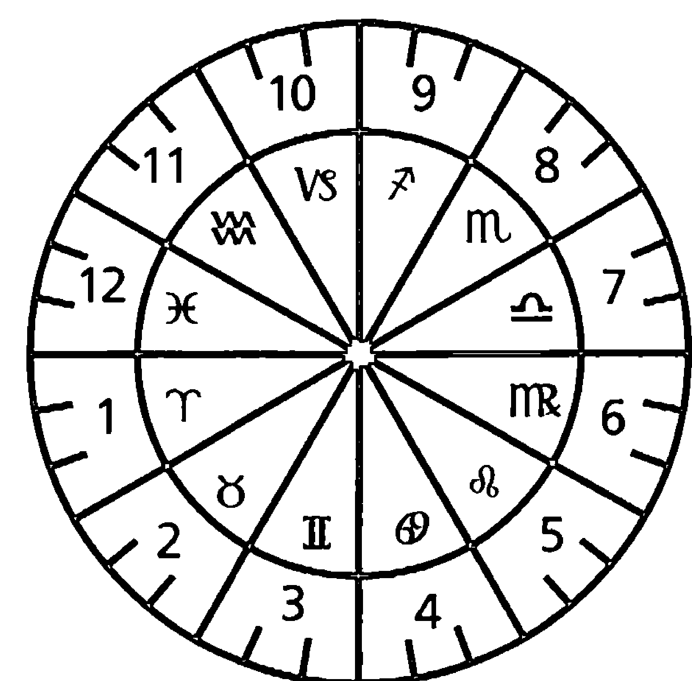

### 10度區間與數字牌

此表說明小阿爾卡納牌依照元素、數字和模式分配的狀況。

| 權杖（火象） | 五角星（土象） | 寶劍（風象） | 聖杯（水象） |
| :--- | :--- | :--- | :--- |
| 牡羊座 | 摩羯座 | 天秤座 | 巨蟹座 |
| 獅子座 | 金牛座 | 寶瓶座 | 天蠍座 |
| 射手座 | 處女座 | 雙子座 | 雙魚座 |

### 小阿爾卡納牌的配置

乍看之下，小阿爾卡納牌的配置似乎毫無章法，但其實是有嚴謹規則可循的。這些小阿爾卡納牌根據所屬花色的元素、牌組編號，以及每種星座的模式（創始、固定或變動星座）來配置。

### 元素上的關聯

我們先從小阿爾卡納與星座之間容易記憶的元素著手。事實上，這些關聯性都被清楚描繪在牌面上了。

火象星座（牡羊、獅子與射手座）分配給屬火的權杖牌。權杖牌通常繪有可以引燃火源的木棍或樹枝，提供照明、溫暖和靈感。

水象星座（巨蟹、天蠍與雙魚座）分配給屬水的聖杯牌。聖杯盛裝生命的要素—水。我們舉杯分享情感上的喜悅，或以此消解憂傷。

風象星座（雙子、天秤與寶瓶座）對應屬風的寶劍。寶劍牌就像言語和思想，在空氣中迅速劃落的傳導。

土象星座（金牛、處女與摩羯座）適合屬土的五角星花色。五角星的符號看起來像是世俗界的錢幣，代表有形資產、物質財產與肉體存在。

### 模式與季節

釐清與各元素屬性的關連後，我們再透過季節的配置來建立每張小阿爾卡納牌與星座的連結，這樣就可以輕易將小阿爾卡納牌條理井然地嵌入黃道帶的年之一輪。

### 創始星座

就占星學觀點而言，春季的第一天開始於太陽移入牡羊座，夏季的第一天開始於太陽移入巨蟹座，秋季的第一天開始於太陽移入天秤座，冬季的第一天開始於太陽移入摩羯座。這些創始星座代表「第一」，所以被分配給每種花色的頭三張數字牌：一、二、三、四。

### 固定星座

指的是金牛、獅子、天蠍與寶瓶座，它們佔據每個季節的中間月份，因此分配給每種花色的中間數字：五、六、七。

### 變動星座

雙子、處女、射手與雙魚座是每個季節的最後一個月份，對應每種花色的最後三張數字牌：八、九、十。

「數字一」不列入上述對應，因為它們被指派給整個季節。

### 行星主宰與次主宰

小阿爾卡納牌各自落入年輪中的某個宮位和星座。例如，位於第一個宮位的三張牌受牡羊座支配，這麼一來，這三張牌也擁有一個主宰行星——牡羊座由火星主宰。

對小阿爾卡納牌來說，各星座不僅擁有主宰行星，還有次主宰行星。事實上，每個星座的10度區間各有一個次主宰，這可以看作一個等級制的系統：次主宰行星在主宰行星的監護下運作，就好像副校長在校長的督導下工作，我們可以將次主宰行星當成占星學裡的中階主管。

詳細的組織圖可能會讓人望而卻步，在繼續介紹之前，我們先掌握一點技術細節。用來決定次主宰行星的準則與決定主宰行星的準則並不相同：大阿爾卡納的主宰行星依據現代占星學來分配，但處理小阿爾卡納時，它的10度區間與次主宰行星都源於古典占星學系統。

我必須重申這個重大差異：我們利用現代的主宰行星來處理大阿爾卡納的對應關係，但當談到小阿爾卡納的關聯時，則回歸到古典占星系統。這確實是個簡練的方法。古代占星師以肉眼觀察到的七顆星體：太陽、月亮、水星、金星、火星、木星和土星，以水平對稱的方式分配給各個行星，成為各行星的主宰，分配的方式是從年輪底部開始，同步從兩側向上位移。參考下方的古典主宰星圖，就能清楚看出其中的邏輯。

古代占星師以月亮作為巨蟹座的主宰，以太陽作為獅子座的主宰，這兩個星體提供地球晝夜所需的絕大多數光與熱，因此這兩個星座所處的時期也是一年之中白晝時間最長、最炙熱的日子。其餘主宰的從屬依據其他行星與太陽之間的距離來安排。水星的運行軌道最小，它與太陽總是相距一個星座的範圍之內，所以被分配給處女座和雙子座。軌道也相對較小的金星與太陽相距兩個星座的範圍之內，所以主宰天秤座和金牛座。火星被分配給天蠍座和牡羊座；木星分配給射手座和雙魚座，而最冰冷也最遙遠的土星，則分配給寶瓶座和摩羯座——它們是與獅子和巨蟹相對立的兩個星座。

現代的占星學多了被望遠鏡發現的三顆行星：天王星、海王星和冥王星。二十世紀時，古代行星主宰系統被修改以納入這些外行星：由冥王星主宰天蠍座、天王星主宰寶瓶座，而海王星主宰雙魚座。

下圖說明古典與現代主宰行星的差異。現代的主宰行星顯示於輪圈內，而被現代主宰行星取代的古典主宰行星則顯示於輪圈之外。

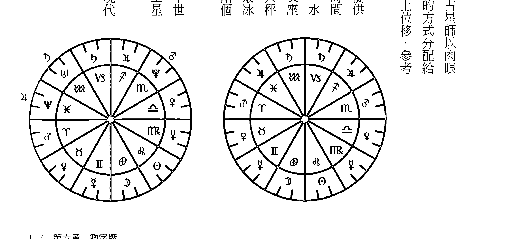

### 次主宰行星

金色黎明塔羅牌組的設計者追溯到占星學草創時代的天象，來為小阿爾卡納牌選定次主宰行星。事實上，他們回溯到遙遠的迦勒底時期的行星秩序。古巴比倫時代的迦勒底人是史上最早一批占星師，他們依行星的運行速度為行星分類，太陽被置於一個連續不可分割的系統中心，外行星位於其中一側，而介於太陽與地球之間的內行星則位於另一側。

- ♄ 土星 Saturn
- ♃ 木星 Jupiter
- ♂ 火星 Mars
- ☉ 太陽 Sun
- ♀ 金星 Venus
- ☿ 水星 Mercury
- ☽ 月亮 Moon

迦勒底占星系統以這種方式將行星逐一轉移、對應到小阿爾卡納牌。金色黎明牌的設計者從牡羊座的第一個10度區間開始分配，並以代表能量和行動的火星來啟動年輪。接下來，按照迦勒底時期的行星順序，為其他10度區間分配次主宰行星。整個系統的配置方式可參考一二○頁的圖表。

> *如果你研習現代占星學——每個10度區間所分配到的主宰行星以各星座所屬的元素為依據，你可能發現它們與塔羅的對應關係似乎不太正確。不過別被混淆了，只要謹記在塔羅牌的世界，小阿爾卡納的主宰行星是以古典占星學和迦勒底的行星系統作為其基礎的。

### 古代塔羅設計靈感的來源

數個世紀以來，塔羅牌組的設計者不斷尋求創作靈感，但是現代塔羅師並不瞭解他們所熟知的小阿爾卡納牌，並非單純參考古典題材衍生而來的。實際上，許多小阿爾卡納牌的設計是以10度區間的古代占星學作為各種意象的基礎。

在《塔羅的神秘起源》（Mystical Origins of the Tarot）一書中，作者保羅·赫森（Paul Huson）除了介紹現代牌組設計的歷史淵源，也摘錄許多原始資料文獻，例如《比卡崔斯》（Picatrix）——這是一部占星魔法著作，約於十四世紀從阿拉伯文翻譯成拉丁文。

如果你想深入探究塔羅和占星學的起源，這本專書非常值得一讀。

亞瑟·愛德華·韋特與潘蜜拉·柯曼·史密斯借用傳統的10度區間來設計萊德—偉特塔羅，後來阿利斯特·克勞利和與弗莉妲·哈里斯也如法炮製，發展出「托特塔羅」。韋特和克勞利都特地將小阿爾卡納牌設計成融合了占星學圖象的意義。

### 小阿爾卡納牌與占星元素的對應

| 10 度區間 | 約略日期 | 小阿爾卡納牌 | 次主宰行星 |
|---|---|---|---|
| 第一區間 0° - 10° ♈ | 3月21日～30日 | 權杖二（火） | 火星 |
| 第二區間 10° - 20° ♈ | 3月31日～4月10日 | 權杖三（火） | 太陽 |
| 第三區間 20° - 30° ♈ | 4月11日～20日 | 權杖四（火） | 金星 |
| 第一區間 0° - 10° ♉ | 4月21日～30日 | 五角星五（土） | 水星 |
| 第二區間 10° - 20° ♉ | 5月1日～10日 | 五角星六（土） | 月亮 |
| 第三區間 20° - 30° ♉ | 5月11日～20日 | 五角星七（土） | 土星 |
| 第一區間 0° - 10° ♊ | 5月21日～31日 | 寶劍八（風） | 木星 |
| 第二區間 10° - 20° ♊ | 6月1日～10日 | 寶劍九（風） | 火星 |
| 第三區間 20° - 30° ♊ | 6月11日～20日 | 寶劍十（風） | 太陽 |
| 第一區間 0° - 10° ♋ | 6月21日～7月1日 | 聖杯二（水） | 金星 |
| 第二區間 10° - 20° ♋ | 7月2日～11日 | 聖杯三（水） | 水星 |
| 第三區間 20° - 30° ♋ | 7月12日～21日 | 聖杯四（水） | 月亮 |
| 第一區間 0° - 10° ♌ | 7月22日～8月1日 | 權杖五（火） | 土星 |
| 第二區間 10° - 20° ♌ | 8月2日～11日 | 權杖六（火） | 木星 |
| 第三區間 20° - 30° ♌ | 8月12日～22日 | 權杖七（火） | 火星 |
| 第一區間 0° - 10° ♍ | 8月23日～9月1日 | 五角星八（土） | 太陽 |
| 第二區間 10° - 20° ♍ | 9月2日～11日 | 五角星九（土） | 金星 |
| 第三區間 20° - 30° ♍ | 9月12日～22日 | 五角星十（土） | 水星 |
| 第一區間 0° - 10° ♎ | 9月23日～10月2日 | 寶劍二（風） | 月亮 |
| 第二區間 10° - 20° ♎ | 10月3日～12日 | 寶劍三（風） | 土星 |
| 第三區間 20° - 30° ♎ | 10月13日～22日 | 寶劍四（風） | 木星 |
| 第一區間 0° - 10° ♏ | 10月23日～11月2日 | 聖杯五（水） | 火星 |
| 第二區間 10° - 20° ♏ | 11月3日～12日 | 聖杯六（水） | 太陽 |
| 第三區間 20° - 30° ♏ | 11月13日～22日 | 聖杯七（水） | 金星 |
| 第一區間 0° - 10° ♐ | 11月23日～12月2日 | 權杖八（火） | 水星 |
| 第二區間 10° - 20° ♐ | 12月3日～12日 | 權杖九（火） | 月亮 |
| 第三區間 20° - 30° ♐ | 12月13日～21日 | 權杖十（火） | 土星 |
| 第一區間 0° - 10° ♑ | 12月22日～30日 | 五角星二（土） | 木星 |
| 第二區間 10° - 20° ♑ | 12月31日～1月9日 | 五角星三（土） | 火星 |
| 第三區間 20° - 30° ♑ | 1月10日～19日 | 五角星四（土） | 太陽 |
| 第一區間 0° - 10° ♒ | 1月20日～29日 | 寶劍五（風） | 金星 |
| 第二區間 10° - 20° ♒ | 1月30日～2月8日 | 寶劍六（風） | 水星 |
| 第三區間 20° - 30° ♒ | 2月9日～18日 | 寶劍七（風） | 月亮 |
| 第一區間 0° - 10° ♓ | 2月19日～28日 | 聖杯八（水） | 土星 |
| 第二區間 10° - 20° ♓ | 3月1日～10日 | 聖杯九（水） | 木星 |
| 第三區間 20° - 30° ♓ | 3月11日～20日 | 聖杯十（水） | 火星 |

### 天空守護者

現代的金色黎明塔羅牌組特別強調四張「數字一」牌，它們不僅作為每種花色的起始點，也像種子一樣涵納了整個牌組尚未發展的核心。

金色黎明塔羅設計者並沒有將「數字一」分配到年之輪的任何位置，而是置於黃道的北極。我們不妨想像：地球是宇宙的中心，外圍被天球包覆，就像環中之環或球中之球。黃道的北極點便是這顆天球的頂端，而這四張牌就在這個位置守護著天空。

「數字一」以侍從為底座，因此四張侍從牌同樣也沒有分配到黃道上的位置，它們各自象徵火、土、風、水四元素，是數字一的「王座」。

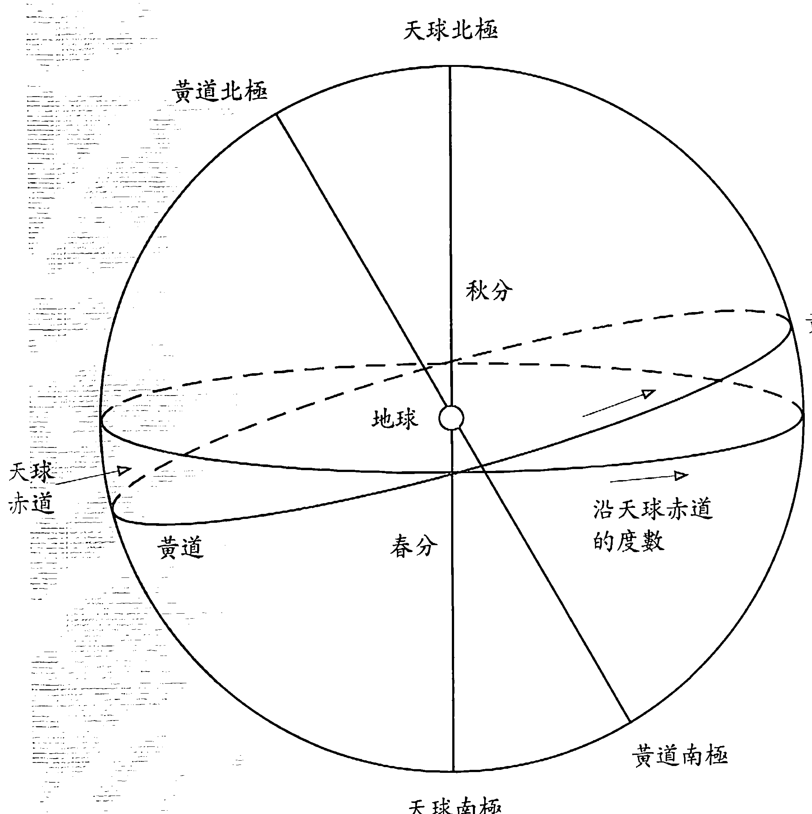

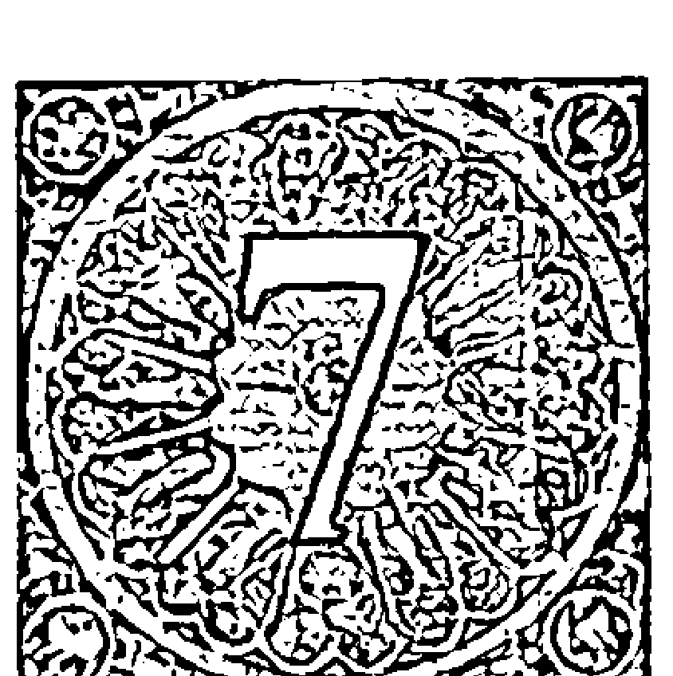

### 行星落入各星座

小阿爾卡納的各項對應細節或許顯得太過專業又有此枯燥，但是當我們瞭解它們與占星元素相互配合的邏輯後，便能理解每張牌強烈彰顯的意涵。

### 行星的風貌

我們已經在大阿爾卡納牌中認識到許多行星和星座，現在我們在小阿爾卡納牌中將再度與它們相逢。

一如在大阿爾卡納牌中的形象，現身於小阿爾卡納中的行星和星座也呈現人類的形貌。例如，我們會先遇見以女皇之姿現身，代表愛、美與吸引力的女神維娜斯，通常她將這些特性集中在自己的星座——度量社交魅力與平衡感的天秤座。但是，當維納斯發現自己成為另一個星座的次主宰行星，負責掌管牡羊座第三個10度區間時，她也會設法在那裡展現魅力。

當然，某些行星處於某些星座時會比身處異地更加自在，例如金星喜歡待在她所主宰的天秤座，當她前往與天秤座相距180度的牡羊座時，總會覺得自己像個流落異地的異鄉人，被迫與迥異的元素、能量與環境互動，處於明顯的弱勢。

占星師利用嚴謹的分類系統闡明行星在各星座中的運作方式或感受。下頁的表格整理出行星周遊年之輪、造訪與它們格格不入的異鄉時，會處於什麼狀態。

### 行星的榮顯與衰落

| 行星 | 榮顯 | 強勢 | 弱勢 | 失勢 |
|---|---|---|---|---|
| 太陽 | 獅子座 | 牡羊座 | 寶瓶座 | 天秤座 |
| 月亮 | 巨蟹座 | 金牛座 | 摩羯座 | 天蠍座 |
| 水星 | 雙子座／處女座 | 處女座 | 射手座 | 雙魚座 |
| 金星 | 金牛座／天秤座 | 雙魚座 | 牡羊座 | 處女座 |
| 火星 | 牡羊座／天蠍座 | 摩羯座 | 天秤座 | 巨蟹座 |
| 木星 | 射手座／雙魚座 | 巨蟹座 | 雙子座 | 摩羯座 |
| 土星 | 摩羯座／寶瓶座 | 天秤座 | 巨蟹座 | 牡羊座 |

榮顯（dignity）行星在自己的「居所」（domicile），也就是當行星位於自己主宰的星座時會感到自在，例如太陽落入獅子座時顯得輕鬆自如，而月亮落入巨蟹座也同樣舒適愉悅。因此，待在自己家裡的行星被稱為處於「榮顯」位置。

弱勢（detriment）行星離家最遙遠時，會與平日的居所相距 180 度，此時它們被迫在對立面運作，無法發揮力量。

強勢（exaltation）傳統的七大行星各自在某個黃道星座中擁有自己的強勢地位，它們本身的特質與這個星座的能量完全相容，可以說，處於強勢位置的行星是另一顆行星家中的貴客。根據某些占星師的說法，在失寵的亞當和夏娃被逐出伊甸園之前，這些強勢位置就是行星原本的居所。

### 失勢 (fall)

失勢行星所處的位置與強勢位置相距 180 度，此時它們彷彿是不受歡迎的訪客，總是卑微而且垂頭喪氣，處於最虛弱的狀態。

### 行星力量

無論行星落入哪個星座，當它們通行黃道帶，你會注意到某些一再發生的共同主題。

- **太陽** 宇宙的能量與身分的焦點。太陽能「顯化」被它所觸及的一切事物，並賦予個人化的色彩。
- **月亮** 代表反省與直覺的星體，為它所經之處增添情感的深度與同情心。
- **水星** 代表速度與溝通的行星，為它所在之處增添理性、邏輯與心智理解能力。
- **金星** 代表愛、美與吸引力的行星，為它所觸及的事物增添情愛和有益的贈禮。
- **火星** 象徵侵略與自信的戰士行星，為它所在的位置賦予強度、能量和衝勁。
- **木星** 太陽系中最大的行星，為它行經的任何事物帶來擴張感與好運氣。
- **土星** 代表限制、界限與約束的有環行星，被它觸及的事物將因此限縮。雖然古代占星師認為土星是凶星，不過它的影響力未必總是負面的，因為它也為這些事物建立了結構與紀律。

> *「榮顯理論」的基礎來自於古典占星學，其中僅牽涉到肉眼可見的七大行星，至於天王星、海王星和冥王星等現代行星，並不包含在此系統，所牽涉點並不影響小阿爾卡納分配到年之間的秩序，因為小阿爾卡納也遵循古代占星學進行分配。

### 小阿爾卡納對應的關係與個人

逐張檢視小阿爾卡納牌，你可能注意到某些牌似乎描述出你本命盤中的行星位置。例如，你或許擁有落入牡羊座的金星。但這是否代表你註定過著歌舞昇平的人生，就像權杖四牌面所描繪的那對夫妻？事實未必如此。

小阿爾卡納對應的是自然黃道，並未實際對應到個人本命盤。它們和真實星盤上的其他行星與星座之間的任何相似處都只是出於偶然。再者，10度區間只有三十六種組合，所以小阿爾卡納牌所描述的行星和星座位置極可能沒有任何一種符合你本命盤的行星和星座位置的組合。

不過若以太陽星座為依據，就會有一張小阿爾卡納牌對應到你的本命盤，這時，這張小阿爾卡納就可以描述出你個性中的某些重要面向，或生命故事中的某個主題。若要找出這張對你來說意義重大的小阿爾卡納牌，請檢視本命盤中太陽所在的位置。

一般來說，命盤上會清楚標明每個位置的詳細度數與分數。如果你的太陽落在某星座的0度至10度之間，你就是在這個星座的第一個10度區間出生的；如果太陽落在10度至20度之間，你就是在這個星座的第二個10度區間出生的，若太陽落在20度至30度之間，那麼你是在這個星座的第三個10度區間出生的。能對應上這個10度區間的小阿爾卡納牌，對你來說的確具有某些重要的個人意義。

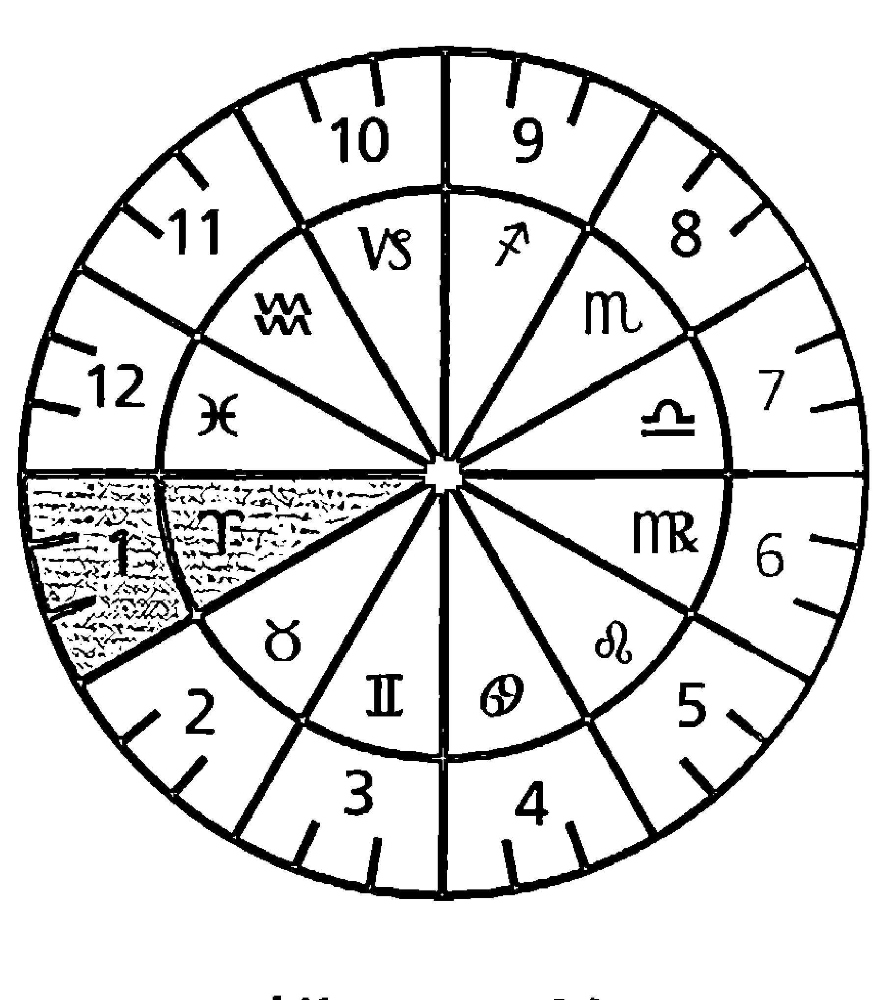

### 牡羊座的三個10度區間

火象創始星座
權杖二、三、四

我們將從對應牡羊座三個10度區間的小阿爾卡納牌：權杖二、三、四說起。由於牡羊座是火象星座，因此這三張牌出自屬火的權杖牌組，又因它是象徵新開始的創始星座，所以這些數字牌是牌組的頭三張。當我們研究這些牌時，請記得它們全都擁有與牡羊座相同的屬性。

- **星座** 牡羊座是黃道第一個星座，與領導力與創造力有關。牡羊座這三張牌描繪領導者或權威人物。
- **模式／性質** 牡羊座是創始星座。創始星座可以引領季節變換，屬於牡羊座的牌中角色也善於引發改變，他們果決、敏捷而且精力充沛。
- **元素** 火元素與權杖的特質是直率勇敢、精力旺盛、熱情衝動、自動自發。
- **二元性** 火象星座屬於陽性，他們主動獨斷、自信直率、活力十足，能量在點與點之間以直線方式移動。

對應的大阿爾卡納牌 牡羊座對應皇帝，其主宰者火星對應塔。

以上述原則為基礎，我們來比對第一個星座的第一個10度區間，以及第一張小阿爾卡納數字牌。

### 榮譽稱號

金色黎明的小阿爾卡納牌設計者賦予各行星一個「榮譽稱號」，用來描述它們作為某星座主宰／次主宰時的力量狀態，這些古色古香的稱號固然迷人，但似乎有些晦澀難懂。因此，我們只需記得這些稱號的用意只是將行星「擬人化」，以便能輕鬆記住它們扮演的角色。

舉例來說，權杖六對應到落入獅子座的木星。木星走到哪裡都是一顆吉星，當它行經代表勇氣和力量的獅子座時，會激發獅子座的勇氣和膽量，為獅子座帶來豐碩的戰果。因此，金色黎明的設計者稱呼落入獅子座的木星為「勝利之主」（「Lord of Victory」），因為木星賜予獅子座英勇行為的報酬——勝利。

### 權杖二
火星落入牡羊座
統御之主

我們先前已經在塔和皇帝牌中遇見火星和牡羊座，現在它們再度出現在權杖二這張牌，見證火星成為自己領域的主人。

牌面上這位年輕皇帝——對應牡羊座的大阿爾卡納牌——大膽、好鬥、毫無愧色，正舒服地坐在高塔的城牆上；塔羅牌中的塔，正對應主宰牡羊座的火星。許多版本的權杖二中，皇帝手捧一個縮小的宇宙模型，運用意志力掌控一切。

以這張牌來說，主角的權力與控制欲以一顆火球作為象徵，符合它屬火的牡羊座本質。牡羊座第一個10度區間描述初始階段的能量，這個年輕人已從權杖一取得火花，並將它塑造成一顆火球。

紅色的火星是牡羊座的先天主宰，當火星落入自己的星座時，理所當然成為城堡之王、王國的主人，它處在自己的元素、星座和宮位之中，君臨天下俯瞰一切萬物。金色黎明設計者稱呼落入牡羊座的火星為「統御之主」（“Lord of Dominion”），代表位於榮顯位置的火星，而「統御」一詞意指權威，以及對領土的控制。

然而，在權杖二中，火星不僅是牡羊座的主宰，也是這個星座第一個10度區間的主宰行星，它為這張牌帶來額外的雙倍能量。火星像火一般的衝勁能啟動黃道，推動年之輪*，這正是它主宰第一個10度區間的原因。

火星是能量、行動、侵略與防禦的行星，象徵保護、自衛、獨斷、勇氣、積極、熱情、冒險，甚至暴力，也掌管競賽與戰鬥領域。卡巴拉系統中，權杖二描述第二領域——「智慧」，位於掌管靈感、屬火的原型界。年輕皇帝積極投入有意識的創造、思考或決斷。

權杖二象徵創立新的生意或事業。

牡羊座的第一個10度區間通常是3月21日至30日，此時太陽位於牡羊座0度至10度之間。

> *在《T書》（Book T）中，某位金色黎明的牌組設計者寫道：「我們有三十六個10度區間和七大行星，因此會有一顆行星必須比其他行星多主宰一個10度區間，這顆行星正是火星。火星分配到雙魚座最後一個10度區間與牡羊座第一個10度區間，二月的最後十天，火星的影響力最強。」

### 權杖三
太陽落入牡羊座
力量穩健之主

山頂上這位容光煥發的年輕女子是誰？她是熱烈如火的統治者——另一個青春版的牡羊座皇帝，太陽照耀著她和她的王國。她渾身充滿無窮的自信、勇氣和樂觀態度，展現出應有的驕傲、高貴和統治者風範。

太陽是光和熱的來源，作為太陽系的中心，也是所有生命的賜予者。塔羅牌的太陽象徵能量、熱忱與啟蒙，而從占星學角度來看，太陽代表自我意識與意志力。落入牡羊座的太陽處於強勢位置，它擔任牡羊座的次主宰，成為拜訪牡羊座的顯要貴賓。這個位置上的太陽威力勝過它在黃道上的其他位置，是力量與智慧的充沛泉源。

牡羊座當然是黃道星座之首，代表領導力與起始點，而太陽的能量充分滿足牡羊座指揮與控制事物的需求。金色黎明設計者稱呼落入牡羊座的太陽為「力量穩健之主」（“Lord of Established strength”），這個稱號彰顯了太陽的強大威力，尤其當陽光照耀在有力的位置上時。

歷史神話中，最具影響力的世界級領袖往往被說成獲得太陽燦爛光芒的加冕，這也是許多君主頭戴金冠以象徵「君權神授」的原因。

作為太陽落入牡羊座的化身，權杖三牌面上的年輕女子立足在高於世界其他地方的山頂，她有種種理由相信自己手中握有權力，可以做命運的主人。數字「三」象徵創造力，無疑的，這名女子的創造力可以盡情發揮，就像牡羊座的力量在該星座的第二個10度區間達到巔峰。

雖然山頂的意象確實代表高度的指揮與控制力，不過權杖三仍屬於小阿爾卡納牌，所以我們假設她的經驗不足，而且她的力量也還未受到現實的嚴苛考驗。即使如此，當她在等待船隻進港時已做出正確的決定，她的願望即將實現，也對此深具信心。

卡巴拉系統中，權杖三描述第三領域——「理解」，位於屬火、象徵靈感的原型界，對應於掌管結構與形式的土星，所以牌中的年輕女子正逐漸瞭解她在這個世界的地位。

權杖三代表可以支持生意或促成事業成長的創造性驅動力。

牡羊座的第二個10度區間通常是3月31日至4月10日，這時太陽位於牡羊座10度至20度之間。

### 權杖四
金星落入牡羊座
成果完美之主

洋溢著愛與情感的金星大老遠來到被分配到的牡羊座第三個10度區間。金星在這個位置其實是弱勢：她與黃道另一邊的住所相隔180度之遙，而且牡羊座的火象能量迥異於她的天秤座風象活力。若以塔羅的情境來描述，你可以想像金星（女皇）離開肥沃青翠的植物園，造訪皇帝在牡羊座影響下有如沙漠的辦公室。

幸好金星永遠是一顆吉星，她的優雅和魅力庇佑了被她觸及的星座。金色黎明設計者稱呼落入牡羊座的金星為「成果完美之主」（“Lord of Perfected Work”），說明金星將精緻美麗的風格與高雅格調帶入性格魯莽的牡羊座。

權杖四描繪跳舞的場景，暗示「合作」。權杖四代表婚姻或夥伴關係——這是權杖二的年輕男子與權杖三的年輕女子應謹記在心的事——他們正練習舞步，並學習彼此合作，就像受訓中的皇族，試圖與對方的步伐協調一致。

金星掌管享樂、音樂、舞蹈、創造力與藝術，是一顆代表美與吸引力的行星，以及從而產生的友誼與戀情。它同時主宰金牛座，金牛座同樣喜歡愛與夥伴關係所帶來的舒適和穩定性。

別忘了金星對應女皇，女皇與對應牡羊座的大阿爾卡納皇帝牌可說是天生的速配。權杖四這張牌中，金星與牡羊座以目的為導向的能量可以互相調和，甚且金星還能教導牡羊座如何翩翩起舞。雖然金星處於弱勢，被迫與抱持戰士心態的牡羊座通力合作，不過它仍能設法對這個目標專一的星座投射出浪漫的光輝。權杖四也可能反映出年輕的皇帝想找尋一位女皇協助他統治帝國的決心和慾望。

卡巴拉系統中，權杖四描述第四領域——「慈悲」，位於掌管靈感、屬火的原型界，對應擴張的木星。牌面上的年輕情侶正致力於鞏固他們的關係，學習相互溝通，幫助彼此成長。

牡羊座第三個10度區間通常是4月11日至20日，這時太陽位於牡羊座20度至30度之間。

### 金牛座的三個10度區間
土象固定星座
五角星五、六、七

我們以對應金牛座三個10度區間的三張牌：五角星五、六、七來繼續小阿爾卡納之旅。
由於金牛座是土象星座，因此這三張牌出自屬於土的五角星牌組，又因金牛座是固著且穩定的固定星座，所以這些牌是牌組的中間部分。這些牌與牌中的人物全都擁有與金牛座相同的屬性。

- **星座** 金牛座關係到實質的資產與精神寶藏。這三張牌描繪處理金錢和價值觀的人物。
- **模式／性質** 金牛座是固定星座，安穩地駐守在春季中間月份，與之對應的牌也具備穩定持久的能量。
- **元素** 土元素與五角星都擁有可靠負責、講求實際、崇尚物質且耐力十足的特質。
- **二元性** 土象星座屬於陰性，善於接納和回應、具吸引力、敏感、有耐性；能量以循環的方式流動。
- **對應的大阿爾卡納牌** 金牛座對應教皇，而金牛座的主宰者金星對應女皇。

### 五角星五
水星落入金牛座
物質煩惱之主

當魔術師水星進入金牛座時，他所關注的焦點隨之改變。通常他在理性的層面忙碌，呼應他所主宰的雙子座（掌管溝通）和處女座（掌管工作與為人服務奉獻）。然而，五角星五這張牌讓習慣於心智活動的水星突然陷入冰冷殘酷的世界，在這裡，它必須為物質生存而奮鬥！

金色黎明設計者稱落入金牛座的水星為「物質煩惱之主」（“Lord of Material Trouble”），因為物質限制使飄逸的水星深感煩惱。身處土象的金牛座，水星被世俗環境束縛，而且受困於人類外形，在物質的困境下顯得頹然沮喪，不過他可以藉由靈性教誨或傳統的精神領域來超越物質世界的限制。

如同所有分配給金牛座的牌，五角星五與教皇牌有關。牌面上，教宗駐守在近在咫尺的大教堂內，從窗戶透出的光亮象徵這位傳統教誨者能提供熠熠生輝的智慧。這些智慧多半與世俗和真實生活有關，如果我們有心，就可以體察到超脫人類形體的靈性自我，但如果我们漠不關心這份自我本然的靈性，便可能因肉體的束縛網綁而失去自由。

如同所有的五角星牌，金牛座也和結構、穩定性、物質安全感及精神價值有關。在金牛座之前的牡羊座只專注於意識與自我覺察，金牛座則開始關切物質面與身體的安康。

這是個自然而然的過程，能夠認知自身存在感的人，也將體認死亡是不可避免的。「求生存」是每種生物發揮本能的第一要務，當基本生存無法獲得保障，我們便顧不了崇高的哲學或靈性省思——這是金牛座如此重視物質財產的原因。有形資產會帶來物質上的安全感，它能有條件地保證一個人的「世俗存在」會持續下去。

卡巴拉系統中，五角星五描述第五領域——「力量」，對應火星。被驅逐者會在物質界流浪，面臨生存的挑戰。五角星五象徵精神上的庇護所，以及因物質舒適而得到的庇護。

金牛座第一個10度區間通常是4月21日至30日，這個時候太陽位於金牛座0度至10度之間。

### 五角星六
月亮落入金牛座
物質成功之主

月亮如同與它對應的女祭師，當它落入金牛座時處於強勢位置。造訪金牛座的月亮是一名貴客，為金牛座帶來祝賀喬遷的禮物，她的蒞臨就像牌面上顯示的，是一種慈善和恩賜。金色黎明設計者稱呼落入金牛座的月亮為「物質成功之主」（“Lord of Material Success”），這張牌意味著月亮為注重物質與精神財富的金牛座帶來一種舒適、安全感。

我們並不常將財富與代表反省的月亮聯想在一起，不過其實金錢來來去去，就像月亮一樣周而復始，收入與支出的流轉也往往有如潮汐消長。我們手中的銀幣像月亮一樣可以捕捉並反射光線——而且理論上，金錢也散發出有如夜的守護者般的魔力。金錢與月亮都能象徵生命的循環本質、旅程、轉變與滋養的陰性能量。在五角星六中，年輕的教皇施恩給隨從，這些錢幣代表智慧、慈悲或業報。畫面中也出現天秤座的符號，因為金牛座和天秤座都由金星主宰。

卡巴拉系統中，五角星六代表第六領域——「美」，對應象徵光輝與啟蒙的太陽，位於物質界。牌面上的三個人正體現分享財富的快樂。五角星六代表繁榮興盛、權力與影響力，以及可能來自商業成功的樂善好施；這張牌可代表施予者或領受者。

金牛座第二個10度區間通常是5月1日至10日，這時太陽位於金牛座10度至20度之間。

### 五角星七
土星落入金牛座
成功未竟之主

象徵限制與約束的土星將結構與紀律帶給被它觸及的事物。當土星落入代表成長與生育力的金牛座時，它要求所有的努力在獲得回報之前，得先經歷一段等待期。

當我們在頭戴勝利桂冠的世界牌中首度遇見土星時，事情成功與願望實現似乎是必然的結果，然而就五角星七來說，土星的現身提醒我們：真正的成功需要長期投注在肉體和精神上的努力。土星在此扮演的是一位有耐心的監督者，教導我們凡事下定決心與堅持不懈的價值。金色黎明牌組設計者稱呼落入金牛座的土星為「成功未竟之主」（“Lord of Success Unfulfilled”），因為它會延遲獲得回報的滿足。

如同時間之神克羅諾斯，土星迫使我們學會自律、有效的管理時間，並讓生命循著自然的軌道運行。同時土星也提示我們：這個世界的整體意義大於任何個體，它是有規範的，如果我們無法自我克制，別人終究會將他們的意志強加在我們身上。

如同所有隸屬金牛座的小阿爾卡納牌，五角星七與教皇和女皇有關。教皇是金牛座的化身（可見財產會反映出我們的價值觀），而金牛座的主宰者金星（女皇牌）則更進一步讓我們理解到：必須更珍視被等待的事物。就像不停在懷孕的女皇，相信每個曾經歷生產的女人都會同意：懷孕期最後幾個月的等待是如此漫長，因而回報也顯得特別甜美。

卡巴拉系統中，五角星七描述第七領域——「勝利」，對應代表愛與吸引力的金星，位於物質界。牌面上年輕的園丁正在思考有關物質成長與發展的問題。

五角星七代表耐心與回報、阻礙與延遲，以及擔心預期中的結果。

金牛座第三個10度區間通常是5月11日至20日，這時太陽位於金牛座20度至30度之間。

### 雙子座的三個10度區間
風象變動星座
寶劍八、九、十

對應雙子座三個10度區間的是寶劍八、寶劍九與寶劍十。
雙子座是風象星座，因此這三張牌出自屬風的寶劍牌組，又因雙子座是代表結局與過渡的變動星座，所以這些牌是牌組的最後三張。當我們研究這些牌時，請記得它們都擁有與雙子座相同的屬性。

- **星座** 雙子座與心智與溝通有關，因此這三張牌都描繪心智相關的議題。
- **模式／性質** 雙子座是變動星座，讓冬季最後一個月份輕鬆轉換到春季第一個月份，它們的能量靈活多變。
- **元素** 風元素與寶劍牌組都注重理智、善於溝通交際、容易改變、好奇心強，而且通權達變。
- **二元性** 風象星座屬於陽性，具有主動、獨斷、自信、直率、活力充沛的特質。
- **對應的大阿爾卡納牌** 雙子座對應戀人，雙子座的主宰者水星對應魔術師。

### 寶劍八
木星落入雙子座
力量損耗之主

雙子座第一個10度區間由代表成長與擴張的木星所主宰，通常你會以為這是件好事。理論上，木星能給予崇尚理智的雙子座所需的空間，任其心智漫遊，不過，雙子座在形成新想法時，並不需要任何幫助。事實上，雙子座感興趣的事物多到連自己都無法探究。如果你看過手上有許多未完成計畫的雙子人，他們往往在還沒實現一個計畫之前，就忙於開展下個計畫，層出不窮的新開始和機會對他們來說未必是種解脫。

寶劍八中的女人被諸多可能性癱瘓，她被包圍在各種選擇之中，受困於自己打造的心理牢籠，在木星的命運之輪中見樹不見林。同時，她也是孤單的，不但與戀人牌的夥伴分離，也沒有雙子座的靈魂伴侶作陪。事實證明，落入雙子座的木星處於弱勢，被迫運用與自己格格不入的能量。金色黎明設計者稱呼落入雙子座的木星為「力量損耗之主」（“Lord of Shortened Force”），因為它說明好事太多、過猶不及的壞處。卡巴拉系統中，寶劍八描述第八領域——「光榮」，對應代表思考與溝通的水星，位於掌管思想、屬風的形成界。將牌面上年輕女子團團包圍的劍僅存在於她的心中，而且她所受的束縛為時短暫。寶劍八代表圈套，也象徵開始的過程，以及當你被迫評估處境並專注於目標時所產生的領悟或覺醒。

雙子座第一個10度區間通常是5月21日至31日，這時太陽位於雙子座0度至10度之間。

### 寶劍九
火星落入雙子座
絕望殘酷之主

代表能量與侵略性的火星行經各星座時，絲毫無損其好戰的本質。事實上，當他成為雙子座第二個10度區間主宰時，他馬上發現竟然有一整個軍火庫的心智武器可供使用，所以落入雙子座的火星不玩戰爭遊戲——改玩智力遊戲。

有了妥善裝備的言語和智能彈藥，火星運用充足的火力轟炸敵人，將他們囚禁在絕望之塔。他發射出侮辱、批評、苛薄言論與邪惡想法，將懷疑的種子散播在信任的心中，並以惡夢和無意識恐懼的形式鬼鬼祟祟地發動攻擊。他交替運用各種策略，無情地攻擊對手。寶劍九這張牌中，被火星選中的不幸目標是一名年輕女子，她坐在床上設法靜下心來，卻遲遲無法成眠，因為她的思緒正疾馳在敵人的領域中。

愛恨之間的界線十分微妙，寶劍九與雙子座戀人牌的連結提醒我們，昔日的朋友和知己往往是最殘酷的對手，因為他們深知我們的弱點，而且樂於加以利用。此外，這張牌也警告我們水星的陰暗面，詭計多端的墨丘利故意暗中摧毀信任他的人們，並以此為樂。

金色黎明設計者稱落入雙子座的火星為「絕望殘酷之主」（“Lord of Despair and Cruelty”），因為它表現出在黑暗掩護下攻擊對手心靈所造成的殘酷效果。卡巴拉系統中，寶劍九描述第九領域——「根基」，對應代表反省的月亮，位於掌管思想、屬於風元素的形成界，牌面上這位女子的憂慮只不過是暗夜中的陰影，其實她的擔心根本沒有現實根據。

寶劍九代表不得安寧的夜晚、焦慮的夢魘、失眠，以及恐慌症發作。

雙子座第二個10度區間通常是6月1日至10日，這時太陽位於雙子座10度至20度之間。

### 寶劍十
太陽落入雙子座
毀滅之主

雙子座的第三個、也是最後一個10度區間，由代表意識與啟蒙的火熱太陽所主宰。太陽通常代表善意的力量，這個閃耀的發光體不斷散發出生命氣息。然而，陽光過於熾烈也可能造成灼傷——尤其當太陽揭露出事件的真相時。

雙子座很健談。不幸的是，他們的話語往往含沙射影，最後演變成閒言閒語、中傷別人的造謠或誹謗，或是針對個人的惡意攻擊，這些話語能刺穿我們的自信，帶來自我懷疑的痛苦。不過，當太陽經過時會一掃陰霾，照亮黑暗，將真相暴露在白晝的明亮光線下，只可惜有時真相會傷人，尤其是一些導致個人毀滅的權術手段。

如果說寶劍九牌面上的女子是戀人牌中的女子，那麼寶劍十中的男子就是戀人牌中的男子，這兩人都因他們主宰行星的邪惡面而受傷，而且這位男子幾乎傷重不治。金色黎明設計者稱呼落入雙子座的太陽為「毀滅之主」（“Lord of Ruin”），因為它揭露了無法逃避的真相，將難以控制的情勢和陰謀攤在陽光下檢視。

這種揭露的方式雖然看似殘酷，卻代表全然的覺醒與解脫，因為所有陰暗的事物再也無法被隱藏：落入雙子座的太陽揮出使人重獲自由的最後一擊，結束掉痛苦，讓靈魂藉由完全的啟蒙而能脫，心靈得以擺脫物質形式的束縛，在這個階段達成更高層次的覺知終究是可能的，而且毀滅之後便是重建的到來。

卡巴拉系統中，寶劍十描述代表世俗真實的第十領域——「王國」，位於掌管思想、屬於風元素的形成界。牌中的年輕男子被言語與心智的雙重攻擊「釘」在地上，他遭受的心靈創傷就像肉體受到攻擊一樣使人衰弱。

寶劍十代表過度傷害、死亡與重生，以及結束與開始的循環。

雙子座第三個10度區間通常是6月11日至20日，這時太陽位於雙子座20度至30度之間。

### 巨蟹座的三個10度區間
水象創始星座
聖杯二、三、四

我們離開由牡羊、金牛與雙子座組成的春季月份，進入夏季的第一個星座—巨蟹座的十度區間之旅。由於巨蟹座是水象星座，所以這些牌出自屬水的聖杯牌組，又因巨蟹是創始星座，所以這些牌是牌組的頭三張。

- **星座** 巨蟹座是黃道第四個星座，關係到家與家庭生活，屬於巨蟹座的這三張牌都描繪處理情感或關係的角色。
- **模式／性質** 創始星座引領季節的變換，因此這三張牌也會引發情勢的轉變，散發果決、敏捷而且精力充沛的特質。
- **元素** 水元素與聖杯牌組都是訴諸情感、易於改變、難以捉摸、直覺力強，而且隨波逐流的傾向。
- **二元性** 水象星座屬陰性，善於接納和回應、具吸引力、敏感且有耐性，它們的能量是以循環的方式流動。

對應的大阿爾卡納牌 巨蟹座對應戰車，而它的主宰者月亮對應女祭司。

### 聖杯二
金星落入巨蟹座
愛情之主

如果說聖杯二牌面上的年輕戀人似乎像「追星族」並不為過，因為他們被一股強大的力量吸引在一起；當象徵愛與浪漫戀情的金星進入代表滋養的巨蟹座時，很自然扮演起媒人的角色。牌面上的年輕人很可能是青少年時期的戰車駕者，他正接受訓練，而身旁的女孩有朝一日將即位成為女皇。

金星是代表享樂與吸引力的行星，它對應塔羅牌中的女皇。女皇是慈愛的母親，天生就與巨蟹座能量或是掌管家及家庭生活的第四宮完美的結合。

金星主宰金牛座，她喜歡真愛與夥伴關係所帶來的舒適和穩定，當她成為巨蟹座第一個10度區間的主宰時，只消簡單點上幾根蠟燭、播放情歌作為背景音樂，就能讓一切順其自然的發展。

聖杯二中畫的是一對初嚐愛情滋味的戀人，處在這個可說是最多愁善感的星座的第一個10度區間，他們對彼此的情感似乎尤其顯得完整、純粹而天真，絲毫不受時間或經驗污染。

金色黎明設計者稱呼落入巨蟹座的金星為「愛情之主」（“Lord of Love”），因為它說明了真愛的甜美與純粹。

這張分配給巨蟹座的小阿爾卡納牌對應戰車，以及與巨蟹座的主宰行星（月亮）呼應的女祭師，這樣的連結暗示這對年輕情侶目前暫時受到母愛的保護。但這種保護不會是永久的，在不久的將來，他們對彼此的感情將接受考驗，最終雙方都會在智慧和經驗的累積下成長。我們的成長過程中，要得到可貴的經驗往往必須付出代價，早期建立的關係雖然常常令人傷心，但也使我們因此變得更有智慧。

卡巴拉系統中，聖杯二描述第二領域——「智慧」，位於掌管生育與創造、屬水的創造界。

牌中的年輕情侶正開始要共創生活，從彼此的經驗中學習進步。

聖杯二代表愛，尤其是青梅竹馬、志同道合者或靈魂伴侶之間的愛，也代表平等的夥伴關係，以及相反的吸引力。

巨蟹座第一個10度區間通常是6月21日至7月1日，這時太陽位於巨蟹座0度至10度之間。

### 聖杯三
水星落入巨蟹座
豐裕之主

這是豐收的一年，歷經溫和的春季和炙熱的夏季後，三名女子歡聚在一塊兒慶祝豐收，在飲過幾杯葡萄酒後，她們開始分配收成——這些場景無疑都遵循了商業之神墨丘利的交易精神。在巨蟹座第二個10度區間，墨丘利展現常被世人忽略的一面：他除了是速度與溝通之神，也是銷售與貿易之神；他習慣交換想法，但同樣也是貨物交易的專家。金色黎明設計者稱呼落入巨蟹座的水星為「豐裕之主」（“Lord of Abundance”），因為水星會將能量貫注在物質的交換與累積上。

水星是雙子座與處女座的先天主宰，這兩個星座都受益於水星所擅長的商業溝通。在這裡，巨蟹座欣然接受水星的專長。巨蟹座掌管家和家庭生活，而且主宰該星座的母性人物（代表巨蟹座的戰車駛者與主宰巨蟹座的月亮）深諳唯有大量屯積糧食，才能安然度過漫長嚴冬的重要道理。

月亮的影響力在牌面上被巧妙地強化了。多數版本的聖杯三繪有三名女子，我們很容易辨識出她們正是月亮女神的三張面孔——少女、母親和老嫗。除了不斷改變的容貌，月亮每個月從上弦月變成滿月，再變成下弦月，也體現出女性生命週期的三個階段。

有些塔羅師將牌中的三名女子稱為「命運三女神」，這幾個神秘的姊妹知道所有世人的命運，加上水星也掌管手足關係，所以它的蒞臨的確可能參與這三個姊妹的慶祝活動。

喜歡參加聚會是水星的特色之一，畫面中的慶祝活動是近乎酒神戴奧尼索斯式的風格，這可能與巨蟹座是水象星座有關——沉浸在情感世界的人可能偶爾會發現自己也沉浸在酒飲中。擅長溝通兼戲謔的魔術師水星為成功舉杯，慶祝好運降臨，而代表持家與滋養的巨蟹座喜歡豐收帶來的安全感，這確保他們能度過即將到來的冬季。

卡巴拉系統中，聖杯三描述第三領域——「理解」，對應代表結構的土星，位於掌管生育與創造、屬水的創造界。這三名女子志同道合，感情深厚，他們合夥投資以追求物質的滿足。

聖杯三代表豐收、慶祝活動、努力工作的報酬，以及可持續到明年春天的繁榮昌盛。

巨蟹座第二個10度區間通常是7月2日至11日，這時太陽位於巨蟹座10度至20度之間。

### 聖杯四
月亮落入巨蟹座
悲喜交融之主

月亮是巨蟹座的先天主宰，因此驾临巨蟹座的女祭师处于荣显位置。因为月亮是巨蟹座的主宰兼次主宰，所以圣杯四获得双倍的月亮能量。

月亮每个月至少有一次必须隐藏起来，卸除在黄道运行时所累积的情感。身为天生的灵媒与怀抱同理心的女祭师，月亮多数时间处于自我反省的状态，并不停吸收周遭的能量和情绪，满载的心理负担让它容易感到疲累。所幸在代表敏感性和自我保护的巨蟹座中，月亮得以恢复能量、修复蟹壳上的裂缝，并重整自我，再度与自然世界的节奏达成和谐，此后在运转周期中，继续为战车驭者提供指引的光芒。

金色黎明设计者称落入巨蟹座的月亮为「悲喜交融之主」（“Lord of Blended Pleasure”），说明月亮在自己所属的星座中快速调适的心情。相信若给巨蟹座多些时间，她终究会笑脸迎人。

卡巴拉系统中，圣杯四描述第四领域——「慈悲」，对应扩张的木星，位于掌管生育与创造、属水的创造界。牌面上的年轻男子在情感渲泄、洗涤的过程中受益良多，最终觉悟并得到力量。圣杯四代表失望、幻灭与醒悟——尽管拥有丰富的资源。有时，这种富足正是造成悲伤的原因，因为财物本身很少是快乐的来源。

巨蟹座第二个10度区间通常是7月12日至21日，这时太阳位于巨蟹座20度至30度之间。

### 獅子座的三個10度區間
火象固定星座
權杖五、六、七

對應獅子座三個10度區間的是權杖五、權杖六與權杖七。獅子座是火象星座，因此這三張牌出自屬火的權杖牌，又因獅子座是固定星座，所以這些牌出自牌組的中間部分。

- **星座** 獅子座與創造力、娛樂、生育有關，這三張牌都描繪了正在處理創造力議題的人事物。
- **模式／性質** 獅子座是掌管夏季中間月份的固定星座，與之對應的中間牌組也具備穩定持久的能量。
- **元素** 火元素與權杖牌組都具有衝動、急迫、勇敢、直率、精力旺盛、熱情且自動自發的特質。
- **二元性** 火象星座屬於陽性，它們主動、獨斷、自信、直率、活力充沛，以直線方式移動。
- **對應的大阿爾卡納牌** 獅子座對應力量，而獅子座的主宰者太陽對應大阿爾卡納太陽牌。

### 權杖五
土星落入獅子座
爭鬥之主

獅子座的第一個10度區間由代表界限、限制與約束的土星所主宰。你或許會感受到一點壓迫感，不過請再多看這張牌一眼。牌面上五名各自獨立的魔術師正設法聯合力量——而且他們顯然已經建立了若干合作準則。

獅子座容易以自我為中心，所以這五個人似乎各行其是。獅子座通常是表演中的明星，他們勇敢和堅忍的特質可以在與之對應的力量牌上觀察得到。獅子座由宇宙中心太陽所主宰，他們習慣成為注意力的焦點，在最糟的情況下，這種占星學上的影響力可能導致冒失、殘酷、淫慾和出現暴力行為。

如果這群年輕魔術師想合力完成任何事，他們需要代表架構的土星來建立紀律和結構。當然這其中可能會產生抗衡或對立，不過在這張牌中，土星藉由調節的管道疏導他們的能量，讓從而產生的競爭能更快速、有效地提升他們的技巧，最後的成果甚至勝過最積極用功的人自己閉門造車的結果。最終他們將能控制物質與精神世界，就如同世界牌展現的意義。

金色黎明設計者稱落入獅子座的土星為「爭鬥之主」（“Lord of Strife”）。現今我們將“strife”這個字理解成有敵意的競爭，其實這個詞曾用來指稱艱苦的奮鬥或真誠的努力，與努力求進步的概念有關。

卡巴拉系統中，權杖五描述第五領域——「力量」，對應火星這顆戰爭行星，位於掌管靈感、屬火的原型界。這群年輕魔術師在合力施行魔法之前，必須先達成協議，才能發揮最大的效益。

權杖五代表模擬的戰鬥、青少年之間的衝突、努力奮鬥或是對立的局面。

獅子座第一個10度區間通常是7月22日至8月1日，這時太陽位於獅子座0度至10度之間。

### 權杖六
木星落入獅子座
勝利之主

如果你希望獲得榮耀與喝采，那麼權杖六將使你如願以償。在獅子座的第二個10度區間，木星讓獅子座成為聚光燈的焦點，給予它所渴望的讚美和奉承。

這個區間是獅子座的「全盛」位置，在它掌管的三十天之輪轄區中大放異采。獅子座一向是散發戰勝光芒的英雄、表演場中的明星，或是各種情勢中的當紅炸子雞，這也是金色黎明設計者稱呼落入獅子座的木星為「勝利之主」（“Lord of Victory”）的原因。

就像獅子座的標記動物—獅子，權杖六牌面上的英雄能平息爭端、克服無知和仿冒者的威脅，踏入聚光燈的焦點，成為自信、樂觀並激勵人心的領導者。轉動命運之輪的「大吉星」木星將讓力量牌中的英雄充分展現領導力，享有眾所歡呼的舞台。

卡巴拉系統中，權杖六描述第六領域—「美」（與和諧），對應象徵啟蒙與認同的太陽，位於掌管靈感、屬火的原型界。這位出類拔萃的年輕英雄正試圖調合他的狂熱信徒和追隨者的共同願景。權杖六代表成功、讚譽或出人頭地，因此許多版本的權杖六都繪有慶祝作戰勝利的遊行場景。這張牌也提醒我們擁有領導權的同時，也必須承擔隨之而來的責任和義務。

獅子座第二個10度區間通常是8月2日至11日，這時太陽位於獅子座10度至20度之間。

### 權杖七
火星落入獅子座
勇氣之主

火星所觸及的事物都被注入一股戰士的氣魄。在獅子座第三個10度區間，火星最後一次提振獅子座的勇氣和衝勁，將一個凡人轉化為充滿力量與能耐的超人。支配心臟的獅子座原本就滿腔熱忱，而火星則賦予獅子座達成願望所需的意志力和決心。

戰爭的局面通常是半守半攻，而且多半以支持某種理念或信仰為目的，就這點而言，火星能激勵獅子座堅守立場，以勇氣和才能戰勝敵人。畫面中來犯的權杖未必是敵對的力量，因此權杖七這張牌也可以解讀成代表領導力與勇氣的牌。

山頂上的這名男子正召集部隊（追隨者）準備投入一場戰鬥，或展開新的冒險。這名戰神般勇猛的戰士可能正領導一次攻堅行動，目標是對敵人的樓塔或堡壘發動猛烈襲擊；也或許他是山丘上昂然挺立的王者，內心懷抱崇高的道德感。

金色黎明設計者稱呼落入獅子座的火星為「勇氣之主」（“Lord of Valor”）。卡巴拉系統中，權杖七描述第七領域——「勝利」，對應愛與吸引力的金星，位於掌管靈感、屬火的原型界。權杖七象徵一個勇士在面對阻礙、反對與渺茫的機會時，堅定立場、捍衛夢想的勇氣。這張牌是自我確立、自我防衛與下定決心的寫照。

獅子座第三個10度區間通常是8月12日至22日，這時太陽位於獅子座20度至30度之間。

### 處女座的三個10度區間
土象變動星座
五角星八、九、十

對應處女座三個10度區間的是五角星八、五角星九與五角星十。
處女座是土象星座，因此這三張牌來自屬於土的五角星牌組；又因處女座是闡明結局及過渡到新開始的變動星座，所以這些牌是牌組的結尾部分。它們全都擁有與處女座相同的屬性。

- **星座** 處女座代表工作、責任及對他人的義務，因此這三張牌都描繪處理服務議題的角色——他們為別人提供服務，或者接受別人的服務。
- **模式／性質** 變動星座讓冬季過渡到春季，與之對應的牌也充滿靈活變動的能量。
- **元素** 土元素與五角星牌組的特質是穩固可靠、負責任、講求實際、崇尚物質，而且耐力十足。
- **二元性** 土象星座屬於陰性，善於接納和回應、有吸引力、敏感、有耐性，能量以循環的方式流動。

對應的大阿爾卡納牌 處女座對應隱士，而處女座的主宰者水星對應魔術師。

### 五角星八
#### 太阳落入处女座
#### 审慎之主

太阳能启发被它照亮的一切事物，包括在这张牌中正在工作台奋斗的处女座石匠。如同与之对应的大阿卡纳隐士牌，处女座个性勤勉又坚忍，他将一生都奉献给手艺，追求完美而且言出必行。

太阳强化了上述特质，这个学徒因此更加认真勤恳、注重细节，甚至几乎是戒慎恐惧地完成手边的工作。也就是说，太阳的出现赋予处女座无限的推动力，为它贯注能量与机会、灵感和乐观的心态。

金色黎明牌组设计者称呼落入处女座的太阳为「审慎之主」（“Lord of Prudence”），因为这张牌代表愿意奉献的美德、明智的判断与合宜的行为。

「审慎」是大阿卡纳牌里缺乏的基本美德。「节制」、「正义」和「坚毅」（塔罗牌中的「力量」）都在塔罗牌中占有一席之地，这些基本美德都必须透过实践来培养。从象征角度来看，牌中的年轻男子不光是培养一门手艺或技巧，他也藉由勤奋工作磨练了性格。

在卡巴拉系统中，五角星八描述第八领域——「光荣」，对应代表思考与沟通的水星，位于世俗的物質界。這是一張說明在物質世界有所成就的牌，特別是以創造性的計畫和想法為基礎的成就。

五角星八代表高等學徒階段、出售服務的能力，以及透過工作或服務來成長或發展的機會。

牌中的年輕男子正在製造一枚錢袋。

處女座第一個10度區間通常是8月23日至9月1日，這時太陽位於處女座0度至10度之間。

### 五角星九
#### 金星落入处女座
#### 物质收益之主

这张牌中，我们看到金星（女皇牌）主宰了隐士的某部分领域；即使孤身一人，她身旁仍然围绕着美丽舒适、对称平衡的事物。

造访处女座第二个10度区间的金星处于失势，这个位置与她在双鱼座的强势位置相距180度。失势的行星在拜访主人家时，往往感到卑微又无奈，然而金星毕竟是一颗吉星，即使已经失宠，仍设法将周遭环境转变为令人愉快的场所。她驯化了生长在那里的植物，正如驯服栖息在她手套上的隼。她沉着平静，也能在冬季的凝滞孤寂中与自然之美融为一体。

金色黎明设计者称呼落入处女座的金星为「物质收益之主」（“Lord of Material Gain”），因为金星的降临会带来繁荣与财富。五角星九有时也代表经由继承或遗赠而得到的金钱。

卡巴拉系统中，五角星九描述第九领域——「根基」，对应代表反省的月亮，位于世俗存在的物质界。牌中的年轻女子正在省思周遭的物质环境。五角星九代表一段平静度过的孤独时光，也暗示一定程度的舒适与安全，以及不受外界严酷现实的干扰。

处女座第二个10度区间通常是9月2日至11日，这时太阳位于处女座10度至20度之间。

### 五角星十
#### 水星落入处女座
#### 财富之主

落入處女座的水星處於強勢位置，這顆信使行星是隱士家中的貴客，為隱士捎來外界的訊息。牌面上，家族的兄弟姊妹和表親齊聚一堂，親切地撫摸小狗——照料寵物也由第六宮處女座掌管。最重要的是，水星一貫維持它作為繁榮之神的角色。

真正的財富有幾種形式，包括強健的身體、快樂的關係、清楚的界限、舒適有組織且井然有序的家，當然也包括能維持生活品質的金錢。每個世代都有自己的生活空間，因此這張牌描繪出清楚的界線（牆壁和拱形出入口一定程度象徵了每個人保有隱私的需求）。畫面中兩隻狗別具意義：第六宮是寵物的宮位，因為照管寵物是每天必須履行的責任。

金色黎明設計者稱落入處女座的水星為「財富之主」（“Lord of Wealth”），說明美好生活的豐裕與富足。卡巴拉系統中，五角星十描述代表世俗真實的第十個領域——「王國」，位於物質界。這個三代同堂家族正共同享受物質豐盛的美好生活。

五角星十代表財富、生意成功、繼承，及多世代的家庭關係。牌中的人享受彼此的陪伴，部分原因是他們承認並尊重彼此間的差異。他們不僅在物質面豐足，在精神與情感面也很充實。

處女座第三個10度區間通常是9月12日至22日，這時太陽位於處女座20度至30度之間。

### 天秤座的三个10度区间
风象创始星座
宝剑二、三、四

对应天秤座三个10度区间的三张牌是宝剑二、宝剑三与宝剑四。
天秤座是风象星座，因此这三张牌出自属风的宝剑牌组，又因为天秤座是创始星座，所以这些牌是牌组的开头部分。这些牌与牌中的角色全都拥有与天秤座相同的属性。

- **星座** 天秤座掌管人际关系与亲密伴侣。这三张牌都描绘处理关系议题的人物。
- **模式／性质** 创始星座引领季节的变换，因此这些牌中角色也会带来改变，他们果决、敏捷而且精力充沛。
- **元素** 风元素和宝剑牌组都重视理智、善于交际沟通、易于改变、好奇心强，而且通权达变。
- **二元性** 风象星座属于阳性，具有主动、独断、自信、直率、活力十足的特质。
- **对应的大阿尔卡纳牌** 天秤座对应正义，而天秤座的主宰者金星对应女皇。

### 宝剑二
月亮落入天秤座
回复平静之主

两个月亮女神在宝剑二这张牌中合而为一，这是一张代表反省、沉思和直觉的牌。我们最早遇见的月亮以女祭师之姿现身，指引我们探索被隐藏起来的神秘事物，此刻她身为天秤座的次主宰，与分配给正义女神的天秤座（代表平衡与镇定的星座）相处融洽。

多数版本的宝剑二都绘有一名独自坐在海岸边的年轻女子，正面临困难的抉择。天秤座的头十天是由掌管直觉（而非理性）的月亮主宰，因此尽管这位女子专注于保持理性与维持平衡的识别能力，但是她被蒙蔽了双眼，只能凭直觉来作决定。

表面上，宝剑二呼应了大阿尔卡纳正义牌，牌面的女子就像年轻的正义女神，本身就是一座天平，掂量着事物的一体两面。天秤座是风象星座，当她不受月亮影响时可以超然于情感之外，然而月亮将她链接到情感领域。金色黎明的设计者称呼落入天秤座的月亮为“回复平静之主”（“Lord of Peace Restored”），因为月亮赐予天秤座反省、接纳和理解的能力。

宝剑二在年之轮的中点取得一个平衡点。天秤座属于创始星座，每逢太阳在九月进入这个星座，便宣告了秋季的到来。

牌面上的女子可能陷入两个情人间的挣扎，左右为难。天秤座主宰掌管关系的第七宫，暗示女子的忧愁是来自伙伴关系或吸引力的原因。不过因为宝剑二属于小阿尔卡纳牌，而且位于天秤座第一个10度区间，所以我们有理由猜测这个女子还年轻，对感情之事经验不足。

另一种可能是她已经发现爱情的基本真理：在我们与别人真正形成亲密关系之前，必须先认识和接纳自己；蒙眼象征了她必须寻求内在的平静与理解。这张牌也可能暗示某种入会仪式——有些秘密社团在新成员宣誓入会时会蒙住他们的双眼。

天秤座由代表爱与情感的金星所主宰，金星对应塔罗牌中的女皇。如同每一个慈爱的母亲，牌中的年轻女子不囿于眼睛所见的表象，她能看见他人的内在美，即使她所钟爱的对象有一个只有母亲愿意包容的丑陋外表。

在卡巴拉系统中，宝剑二描述第二领域——“智慧”，位于掌管思想、属风的形成界，这是一张谨慎抉择与辨识的牌。

宝剑二象征难以取舍的决定，或必须在两个选项中二择一。

天秤座第一个10度区间通常是9月23日至10月2日，这时太阳位于天秤座0度至10度之间。

### 宝剑三
土星落入天秤座
悲伤之主

多数版本的宝剑三都画有一颗红通通正在跳动的心脏，被三支银色的剑插在由雨和云所构成的背景中。

天秤座第二个10度区间是由代表界限与限制的土星所主宰，天秤座在这里被迫充分了解自身的局限，而这张牌也说明了与宝剑三有关的悲痛和哀伤。尽管此时天秤座处于力量与潜能的巅峰，却无法如同它那空气般的心智本质在云层中自由飘荡，因为土星所加诸的世俗限制使它感到沉重无比。

这些阻碍感有部分是身为人类不可避免的结果：我们在地球上的时间有限，我们周遭的物质、精神和情感能量也与我们的肉体和环境紧密相关。罗马神话中，泰坦神族的萨杜恩吞食自己的子女，希腊人称他为克罗诺斯（时间之神），这个故事说明一个事实：没有人能长生不死，时间终究会夺走我们的生命和所创造的一切事物。

天秤座对“关系”的重视也是令自己悲伤的主要原因。我们往往将掌管爱、恋爱、婚姻和伙伴关系的第七宫理想化，然而令人伤心的现实是，谈恋爱几乎总是要付出代价的，即使是最美好的关系也需要不断估量、平衡和调整。

这是正义牌发挥作用的地方，正义是分配给整个天秤座月份的牌，而宝剑三的意象让人联想到正义女神的天平，因此这些剑或许阴森可怕，但图象本身却十分具有平衡感：两把剑分布在中心点的两侧，就像在天平支点两端的秤盘。在这层意义上，这张牌清楚说明了心里翻腾的苦恼，因为天秤座努力想在两个似乎无法互相调和的差异或观点中取得协议。不过，虽然这两个极端尖锐对立，但是中间那把剑证明痛苦的妥协通常是有可能的。

天秤座由代表爱与奉献的金星所主宰，而金星对应于大阿尔卡纳女皇牌。设计塔罗牌组的基督教神秘主义者在描绘女皇时多以圣母玛利亚为原型，而各种玛利亚的形象就往往露出被插上剑的心脏。

金色黎明设计者称呼落入天秤座的土星为“悲伤之主”（“Lord of Sorrow”），因为土星行经天秤座时带给它相当多的不幸。落入天秤座的土星处于强势位置——它喜欢天秤座展现的精密平衡感与准确度。卡巴拉系统中，宝剑三描述第三领域——“理解”，对应代表结构的土星，位于掌管思想、属风的形成界。

生命中有些痛苦经验似乎是致命的创伤，然而在经历苦难后产生的智慧与领悟，却是再宝贵不过的礼物，就像杀死不了我们的东西，最终会使我们更加强壮。

宝剑三代表不贞、离婚或流产之后的心碎。

天秤座第二个10度区间通常是10月3日至12日，这时太阳位于天秤座10度至20度之间。

### 宝剑四
木星落入天秤座
争斗平息之主

天秤座第三个、也是最后一个10度区间是由“大吉星”木星主宰，让宝剑四牌面上的年轻男子有机会得到他亟需的睡眠。天秤座是风象星座，它对心智的关注与影响，明显可以画面上的四把剑作为象征：其中三把剑悬在半空中，另一把镂刻在男子栖身的长凳上，像个额外的架构或支撑物。

这个男子显然着迷于思考、研究、分析、判断等心智议题，然而木星就像一位仁慈的长者，他进入宝剑四的环境，减缓命运之轮的运转速度，使天秤座得以暂时喘息，免除平日的担心和忧虑。

金色黎明设计者称呼落入天秤座的木星为“争斗平息之主”（“Lord of Rest from Strife”），因为它给予天秤座渴望的休整恢复期——这是木星为这个焦虑和骚动不安的混乱时期带来的赠礼。不过即使如此，对应天秤座的大阿尔卡纳正义牌仍然发挥它的作用：正义牌对应整个天秤座月份，宝剑四牌面上，男子上方的三把剑看来就像是一具平衡中的天平。

其他版本的宝剑四往往绘有刻在墓碑上的年轻骑士肖像，这些墓碑雕像陈列在教堂和陵墓等供人表示敬意的场所，这提醒我们：活在战斗生涯中的士兵们正等待他们的最终报酬，而复活与新生，将等待着每个为美好事物而战的人。

卡巴拉系统中，宝剑四描述第四领域——“慈悲”，对应代表扩张的木星，位于掌管思想、属风的形成界。仁慈的木星确实怜悯那些心志经历试炼后需要休息或恢复的人。

宝剑四代表暂时从问题中抽身、暂缓执行、休养或恢复期。

天秤座第三个10度区间通常是10月13日至22日，这时太阳位于天秤座20度至30度之间。

### 天蝎座的三个10度区间
水象固定星座
圣杯五、六、七

对应天蝎座三个10度区间的是圣杯五、圣杯六与圣杯七。
天蝎座是水象星座，这三张牌出自属水的圣杯牌组；又因天蝎是固定星座，所以这些牌是牌组的中间部分。这些牌与牌中的角色全都拥有与天蝎座相同的属性。

- **星座** 天蝎座与性、死亡、转化或他人钱财有关。这三张牌都描绘处理尖锐的议题。
- **模式／性质** 固定星座安稳驻守在秋季的中间月份，与之对应的具备稳定持久的能量。
- **元素** 水元素与圣杯牌组的特质是诉诸情感、随波逐流、难以捉摸且直觉力强。
- **二元性** 水象星座属阴性，善于接纳和回应、敏感有耐性，能量是循环流动的。
- **对应的大阿尔卡纳牌** 天蝎座对应死神，而天蝎座的主宰者冥王星对应审判。

### 圣杯五
火星落入天蝎座
失乐之主

万圣节落在天蝎座第一个10度区间并非偶然。据说万圣夜是诸界之间的隔幕最薄弱的时候，此时死者的灵魂可以毫不费力的往返于人间与阴界。

天蝎座深谙生命中的黑暗秘密。对多数人来说，这些秘密也许是阴郁的，然而牌中的女子似乎已经坦然接受它们，她已然熟悉对应于天蝎座的大阿尔卡纳牌—死神。这个女子显然还年轻，她属于小阿尔卡纳牌，而且位于天蝎座第一个10度区间，因此可能对死亡还没有太多“第一手经验”，但即便如此，她仿佛天生就能理解“死亡”这件事。因为天蝎座第一个10度区间是由火星这颗战士行星主宰，而火星又是整个天蝎座的先天主宰，所以她对死亡的了解比任何人都深刻。

所有的战士与外科医师—这些人也活在火星的巨大阴影下—都知道死亡是生命发展的最终结果，有时这个结果甚至起因于我们对生活欲望的维护和奋斗。而就像女子身上的斗篷，“肉身”在奋战中很容易就被褪下、脱掉或丢弃，导致生命走向终点。我们比较一下圣杯五与相呼应的大阿尔卡纳死神牌，会发现这两张牌都在描述丧失、转化与改变的过程。

金色黎明神秘学者称呼圣杯五为“失乐之主”（“Loss of Pleasure”）的原因是：生命中的欢乐转瞬即逝，就如同图中洒落的水和洒落的血——两者殊无二致，它们构成生命与时间之河，也终将无可避免地流向注定的结局。

天蝎座由对应大阿尔卡纳恶魔牌的冥王星主宰，现在我们对恶魔的许多想象都奠基于冥王普鲁托的神话，因此天蝎座掌管性、死亡和他人钱财（往往透过继承而获得）的第八宫。

卡巴拉系统中，圣杯五描述第五领域——“力量”，对应代表战争的火星，位于掌管生育与创造、属水的创造界。牌中的女子眼下虽然正看着梦想付诸流水，不过她会因此变得更加谨慎、专注而且更有力量。

圣杯五代表悲伤、失落和懊悔。

天蝎座第一个10度区间通常是10月23日至11月2日，这时太阳位于天蝎座0度至10度之间。

### 圣杯六
太阳落入天蝎座
喜乐之主

太阳能照亮一切，甚至是黄道中最黑暗的角落。当太阳成为天蝎座的次主宰，它会燃烧掉悲伤和失落的阴影，使人欢欣地忆起从前快乐的日子。

天蝎座是黄道上的水象固定星座，情感强烈，而且对于生命和爱的信念屹立不摇。天蝎座确实倾向于安静地执迷在情感关系或无法平息的欲望或单恋，假如时间拖得够久，在太阳强力的照耀下，在天蝎座第二个10度区间痛苦挣扎的人甚至能说服自己“过去永远是最美的”。一旦关系失败，天蝎座可能极度伤心，深陷于绝望之中。金色黎明设计者称呼落入天蝎座的太阳为“喜乐之主”（“Lord of Pleasure”），因为它描绘和谐的友谊和情感链接。

卡巴拉系统中，圣杯六描述第六领域——“美”，对应象征光明与认同的太阳，位于掌管生育与创造、属水的创造界。这说明了圣杯六所代表的美和敏感性，而画面上也明显呈现多愁善感的场景，依附着人和地方的情感。圣杯六代表怀旧之情、快乐的童年回忆、持久维系的手足关系，以及与有一辈子交情的朋友重聚，也有可能象征辱骂、争执或分离之后的大和解。

天蝎座第二个10度区间通常是11月3日至12日，这时太阳位于天蝎座10度至20度之间。

### 圣杯七
金星落入天蝎座
愿景幻灭之主

当金星造访天蝎座最后一个10度区间时，提供了各种引人遐思的美好愿景，包括美丽、权力、财富和快乐。只可惜，如果有什么事情听起来过于美好——好到不像是真的——那就是在说这种情况了。

一如女皇，金星希望让梦想成真，她尽可能给予所有子女们成功的机会与可能性，然而金星是一颗代表浪漫幻想的行星，没有务实长远的努力，她的承诺是不可能兑现的。金色黎明设计者称呼落入天蝎座的金星为“愿景幻灭之主”（“Lord of Illusory Success”），因为它暗示各种诱人的美好可能，却不保证最终都能实现。

事实上，这张牌提出的问题比它所能回答的还多：这名年轻男子应该踏上哪条追寻的道路？哪种选择最可能达成目标？眼下这张牌似乎充满空洞的承诺。然而光说不练是没有意义的，这就是为什么坐而言不如起而行的原因。

卡巴拉系统中，圣杯七描述第七领域——“胜利”，对应爱与情感的金星，位于创造界。此刻这七只杯子仍处在“显化”的过程中，它们的形状与结构都尚未具体化，目前只能提供可能性，以及令人充满期待的快乐选项。我们不妨将这些选项看作尚未诞生的婴儿：当女人怀孕时，她们会想像自己即将享有种种宠爱和满足，而在这些婴儿尚未出生、成天哭闹着要求喂养之前，他们都是被寄予厚望、完美无瑕的小宝贝。

圣杯七代表幻想、幻觉、做梦，以及在狂欢与思考中迷失自我的倾向。这张牌也可能象征梦中情人、幻想的恋情与想像中的关系，有时甚至代表财务拮据的窘境，或暗示了导致乱交或暴力行为的酒醉倾向。

如果你对神秘的事物特别感兴趣，那么圣杯七与天蝎座掌管性、死亡和他人钱财有关的面向，甚至会促使你注意到与灵魂世界的链接。这七只杯子可能象征死者的亡灵，他们在排队等待有机会可以透过灵媒，与所爱的人联系。

天蝎座第三个10度区间通常是11月13日至22日，这时太阳位于天蝎座20度至30度之间。

### 七重天

圣杯七这张牌交织着层次复杂的多种意涵。牌中的七个容器对应古代七大行星，以及各行星所对应的大阿尔卡纳牌。仔细观察，就会在牌面上辨认出源自这些行星意义的象征。

- **水星**——魔术师的双扭线（这个双扭线在其他版本的塔罗牌中可能被描绘成一条蛇，两者都象征无限。啞尾蛇符号是一条咬住自己尾巴的蛇，象征永恒。）
- **金星**——女皇的头部
- **火星**——塔
- **木星**——命运之轮（有些版本的命运之轮是以成堆闪闪发亮的珠宝或财物来呈现。）
- **土星**——世界牌的花环。
- **月亮**——女祭师（有些版本的女祭师会以戴着面纱的女人形象出现。）
- **太阳**——阿波罗的座骑白马（有些版本是描绘一只有翼的龙，龙也是代表太阳的移动与力量的象征物之一。）

### 射手座的三个10度区间
火象变动星座
权杖八、九、十

对应射手座三个10度区间的是权杖八、权杖九与权杖十。
射手座是火象星座，因此这三张牌出自属火的权杖牌组，又因射手座是变动星座，所以这些牌出自牌组的结尾部分。这些牌及牌中的角色全都拥有与射手座相同的属性。

- **星座** 射手座与长途旅行、高等教育和哲学有关。这三张牌描绘扩展世界观、开拓眼界的人物。
- **模式/性质** 变动星座使冬季过渡到春季，与之对应的这几张牌也充满灵活易变的能量。
- **元素** 火元素与权杖都具备冲动急迫、勇敢直率、精力旺盛、热情且自动自发的特质。
- **二元性** 火象星座属阳性，代表主动、自信、直率与活力十足。
- **对应的大阿尔卡纳牌** 射手座对应节制，而射手座的主宰者木星对应命运之轮。

### 权杖八
水星落入射手座
迅捷之主

权杖八结合水星最为人知的特性，以及射手座掌管的长途旅行、哲学与高等教育领域。水星以光速（思绪的速度）移动，跨越遥远的时空传送各种即时讯息和情报，如同在塔罗牌中的魔术师，总是能超越世俗存在的限制与束缚，将物质世界转化为心理活动的场域。

权杖八这张牌中，水星行经射手座思想高超的哲学领域——射手座乐于传播讯息、和全世界沟通，事实上，射手座第九宫就是掌管出版的宫位。对应射手座的节制牌象征连接两个世界的桥梁，就像以文字将作者与读者链接起来。

权杖牌组通常会传达出精神方面的讯息，不过牌面上的八支权杖也得遵从物理法则，它们编队飞行，而重力终究会使它们落地。然而，此刻我们不清楚这些权杖究竟是刚起飞，或是即将抵达目的地，也不知道它们能否达成目标，或终将错过目标。

我们也不确定是否有人看见它们正从头顶上飞过。是谁送出这些权杖？因为牌中没有出现人，因此这些权杖可能正携带着来自全宇宙的讯息。

卡巴拉系统中，权杖八描述第八领域——“光荣”，对应代表思考与沟通的水星，位于掌管灵感、风火的原型界。画面中翱翔天际的权杖承载着创造力与驱动力，它们代表采取行动的信号。

权杖八象征电子信号的交流——讯息藉由电波穿越同温层，经由人造卫星反射，传送到每个人的桌上电脑或掌上型装置。金色黎明设计者称呼落入射手座的水星为“迅捷之主”（“Lord of Swiftness”），因为这张牌表示大量的沟通讯息像射手的箭一样飞扬于天际，穿越时空，将不同的人事时地物链接起来。

射手座第一个10度区间通常是11月23日至12月2日，这时太阳位于射手座0度至10度之间。

### 权杖九
月亮落入射手座
力量强大之主

射手座是个探索者或冒险家，但在月亮喜好沉思的影响下，权杖九中的士兵得以仔细从容地思考过往的任务，并为下一回合的战斗或下个周期的事物拟定计划。事实上，你可以将她看作稍微谨慎一点的女祭师，在黑暗的生命领域中接受时间和经验的锻炼。射手座的旅程并非总是行经明亮愉悦之处，况且与之对应的节制牌，也往往要求光明与黑暗之间的平衡。

牌面上的年轻战士采取防御的姿态。她的作战经验老到，而且与某个强大有组织的精神力量结盟，可以勇敢面对任何猛烈的攻击。但即使如此，她仍然保持谨慎和警戒，她知道敌人可能在任何时刻发动奇袭，因此不敢贸然放下盾牌。她的身体微倾、背抵着墙，小心防范来自四面八方的威胁。

金色黎明设计者称呼落入射手座的月亮为“力量强大之主”（“Lord of Great Strength”），因为月亮的平静力量赋予射手座渴望获得的深刻哲学基础（尤其是与精神战斗有关的部分），因此射手座与月亮在情感与理性的融合可以帮助我们建立决心，发挥坚定的力量。

卡巴拉系统中，权杖九描述第九领域——“根基”，对应代表反省的月亮，位于掌管灵感、篝火的原型界。

### 權杖九
提醒我們：要有耐心才能換來回報，就像每個懷孕的母親都必須花費許多時間來孕育新生命；受傷的戰士必須放下過往的傷痛，才能繼續前進。這張牌代表一位受傷的戰士，他或許先前已經輸掉一場戰役，但是正仔細計劃著要贏得往後的每一場戰爭。

射手座第二個10度區間通常是12月3日至12月12日，這時太陽位於射手座10度至20度之間。

### 權杖十
#### 土星落入射手座
#### 壓迫之主

代表限制與約束的土星能控制任何被它觸及的事物。在權杖十，土星讓逍遙自在的射手座揹負沉重的行李，並在負重之下不得不放慢前進的腳步。權杖十的年輕男子彷彿是受到詛咒的西弗斯（Sisyphus），必須不停將巨石推上山——以這張牌來說，他得抱著一大把燃燒的樹枝穿過開闊的原野。

射手座通常是自由自在、無憂無慮的，這位愛好冒險的騎士最喜歡的，莫過於隻身騎馬徜徉在落日中找尋新土地、新人群，以及探索新哲理。不過土星是一顆製造重力的行星，當它擔任射手座第三個10度區間的主宰時，射手座彷彿隨身攜載了世界的重量，這不但抑制了他的夢想和希望，也限制住他的行動。

這位年輕男子可能正揹負著必須證明夢想和意念的心理重擔，就像重壓在每個人靈魂上的那些未曾實現的願望，也可能是因为過去的罪行而感到內疚，就像馬里的鬼魂（狄更斯小說《小氣財神》中的角色），永遠被捆綁在自己親手打造的鎖鏈上。

金色黎明設計者稱呼落入射手座的土星為「壓迫之主」（“Lord of Oppression”），對不熟悉土星限制的人來說，責任的重量確實無比沉重。

卡巴拉系統中，權杖十描述第十領域——「王國」，位於掌管靈感、屬火的原型界。權杖十代表夢想與世俗現實的衝突，它提醒我們：夢想往往必須投注大量努力，加以明確的規劃，才有可能逐步實現。這張牌往往說明過度工作和組織的崩解。

射手座第三個10度區間通常是12月13日至21日，這時太陽位於射手座20度至30度之間。

### 摩羯座的三个10度区间
#### 土象创始星座
#### 五角星二、三、四

对应摩羯座三个10度区间的是五角星二、五角星三与五角星四。
摩羯座是土象星座，因此这三张牌出自属土的五角星牌组，又因摩羯座是创始星座，所以这些牌是牌组的开头部分。这些牌与牌中角色全都拥有与摩羯座相同的属性。

- **星座** 摩羯座是关乎事业与社会地位的星座，所以这三张牌描绘处理财务与世俗权力的人物。
- **模式／性质** 正如创始星座引领季节变换，这些牌中的角色也会带来转变，他们果决、敏捷且精力充沛。
- **元素** 土元素与五角星牌组都有稳固可靠、负责任、讲求实际、崇尚物质且耐力十足的特性。
- **二元性** 土象星座属阴性，善于接纳和回应、敏感有耐性，能量以循环方式流动。
- **对应的大阿尔卡纳牌** 摩羯座对应恶魔，摩羯座的主宰者土星对应世界。

### 五角星二
#### 木星落入摩羯座
#### 和諧變化之主

「只會工作不玩耍，聰明的孩子也變傻！」——別怕，木星保證讓所有人都不無聊。當木星造訪摩羯座第一個10度區間時，他重整土星世界的結構，使沉悶的規則產生令人愉快的轉變。當然，木星是逍遙自在的命運之輪，不過身處惡魔主宰的第十宮（掌管事業與社會服務），使得這顆「大吉星」似乎顯得有些格格不入。

事實上，落入摩羯座的木星處於失勢，多少像個不受歡迎的客人，他必須大費周章才能影響摩羯座。而且在面臨強大的阻力下，木星頂多只能讓摩羯座的口袋裡叮噹作響、施展些小花招，或是練習耍弄他手上的資源，最終也許能激發出摩羯座原本嚴肅的性格中隨遇而安的一面。

金色黎明牌組設計者稱呼落入摩羯座的木星為「和諧變化之主」（“Lord of Harmonious Change”），因為幸運的木星讓情勢的轉變與物質面的發展能低調順利地進行。五角星二中的年輕人雖然必須一手花錢，但是木星確保他可以從另一隻手賺到錢。

卡巴拉系統中，五角星二描述第二領域——「智慧」，位於我們所處的世俗世界物質界。牌面上的年輕人正在學習統合身心的力量，務使肉體與精神的存在達到平衡。

九角星，往往代表平衡的功課，例如不停努力平衡時間與金錢、工作與玩樂，或是在個人喜好與專業責任之間拔河，找尋適切的方式。這個年輕人的努力或許得花上很多時間，不過偶爾他也是為了觀眾而表演，而觀眾們未必瞭解他所付出的代價、經歷或遭遇到的問題。

摩羯座第一個10度區間通常是12月22日至30日，這時太陽位於摩羯座0度至10度之間。

### 五角星三
#### 火星落入摩羯座
#### 物质成就之主

當戰士行星火星在成為摩羯座第二個10度區間的次主宰，他穿起西裝上班去。落入摩羯座的火星處於強勢位置，被奉為上賓般備受敬重。火星喜歡認認真真辦正事、建立目標、執行戰鬥計畫——或商業計畫。他樂於給予惡魔公平的待遇，以交換在辦公高塔上的一個房間。從這個高踞於星盤與天際間的有利位置，火星能俯瞰整個世界，而全世界也能看見他在工作。第十宮描述事業與社會地位，是星盤上的重要位置。

事實上，屬土的第十宮位是火星絕佳的住所，這個宮位也很契合塔的能量。在這裡，火星的閃電沒有造成破壞或毀滅，而是激發出靈感，產生務實且有利可圖的結果。

想像一下，牌中的年輕男子是幹勁十足的企業首腦，他獲得投資者與董事會的完全信任和支持。金色黎明設計者稱落入摩羯座的火星為「物質成就之主」（“Lord of Material Works”），因為火星在此擁有資源和理解能力，有能力採取行動賺錢獲利，並帶來所企求的改變。

卡巴拉系統中，五角星三描述第三領域——「理解」，對應於代表結構的土星，位於世俗存在的物質界。牌中的男子正學習找到屬於他的職業位階，以及規劃他投注的資源或時間。五角星三代表透過合夥關係、投資與商業運作來開創生意。

摩羯座第二個10度區間通常落在12月31日至1月9日，這時太陽位於摩羯座10度至20度之間。

### 五角星四
#### 太陽落入摩羯座
#### 世俗力量之主

太陽強力的照耀突顯了摩羯座獲取金錢、權力和影響力的固有傾向。

五角星四繪有一位穩坐寶座的國王，看守著象徵他的精神、心智、物質與情感領域的四顆五角星。他似乎擁有點石成金的本領，然而如果你熟悉這個經典神話就會知道這未必是件好事。神話中，古代國王麥得斯將所碰觸到的任何東西都變成黃金——包括他所愛的人，結果他們都因他的擁抱而喪命。牌面上的男子與朋友、家人或鄰居都很疏離，他專心致志投入工作，設法管理金錢、時間與能量……你甚至可將他看成較人性化的摩羯座惡魔，熱衷財富、報酬與其他來自物質世界的誘惑。

金色黎明設計者稱呼落入摩羯座的太陽為「世俗力量之主」（“Lord of Earthly Power”），因為太陽強化了摩羯座對物質資源的執迷——不僅是金錢，更包括隨之而來的權力和保護。卡巴拉系統中，五角星四描述第四領域——「慈悲」，對應代表擴張的木星，位於物質界。年輕男子孤獨地守護自身的資源，他可能正在保存與擴充將來要與後代分享的財富。五角星四代表敏銳的生意頭腦、對物質與精神資源的控制欲、因過去的傷害或遭遇而產生的屯積傾向，以及在無情的世界中，保護自己免受未來不確定性的傷害。

摩羯座第二個10度區間通常是1月10日至19日，這時太陽位於摩羯座20度至30度之間。

### 寶瓶座的三個10度區間
#### 風象固定星座
#### 寶劍五、六、七

對應寶瓶座三個10度區間的是寶劍五、寶劍六與寶劍七。
寶瓶座是風象星座，這三張牌是屬風的寶劍牌，又因寶瓶座是固定星座，所以這些牌是牌組的中間部分。這些牌與牌中的角色全都擁有與寶瓶座相同的屬性。

- **星座** 寶瓶座與未來前瞻性思考、理想主義、社群與公益事業有關，因此這三張牌描繪處理烏托邦願景的人物。
- **模式／性質** 固定星座安穩地駐守在冬季的中間月份，與之對應的牌也具備穩定持久的能量。
- **元素** 風元素和寶劍牌組都注重理智、善於溝通交際、好奇心強，而且懂得通權達變。
- **二元性** 風象星座屬於陽性，特質為主動、獨斷、自信、直率、活力充沛。
- **對應的大阿爾卡納牌** 寶瓶座對應星星，其主宰者天王星對應愚者。

### 寶劍五
#### 金星落入寶瓶座
#### 潰敗之主

就像女皇，金星是個情人而非戰士，可惜這未必適合熱衷社群與公益事業的寶瓶座——寶瓶座甚至願意為了那些領域而戰鬥。

我們在寶劍五遇見的寶瓶座是個有遠見的十字軍戰士，對於奮鬥和起義抱持堅定不移的信念。寶瓶座會毫不遲疑拾起正義之劍，為他所信仰的理念投身戰鬥，畢竟它是由代表革命與反叛的天王星所主宰。

在為理想奮戰時，寶瓶座有時會忘卻（或權宜地忽略）敵對者的人性，他們傾向於關愛人類整體，但卻容易被團體中的個人所惱怒——這點與金星不同。

至於金星，她希望所有子女都能相處融洽，當她設法幫助過度樂觀的寶瓶座時，第一要務便是結束爭吵，恢復秩序和控制。金色黎明設計者稱呼落入寶瓶座的金星為「潰敗之主」（“Lord of Defeat”），這張牌描述在衝突之後，敗北的一方有兩人轉身離去，他們因為失敗而感到沮喪和屈辱。不過即便是正在收集戰利品的勝利者心裡也明白，他的勝利未必贏的光明正大，他留下來收拾殘局，重建憧憬中的烏托邦，所幸仁慈的金星會助他一臂之力。

卡巴拉系統中，寶劍五描述第五領域——「力量」，對應象徵戰爭的火星，位於掌管思想、厲風的形成界。或許牌中的勝利者給予對手一個非常有用的教訓，他讓對手學會如何選擇適合自己的戰鬥。

寶劍五象徵缺乏運動員精神，也描述勝利的興奮與失敗的苦惱，以及勝利者與失敗者之間受到的不平等待遇。

寶瓶座第一個10度區間通常是1月20日至29日，此時太陽位於寶瓶座0度至10度之間。

### 寶劍六
#### 水星落入寶瓶座
#### 贏得成功之主

我們通常不認為一趟匆促的旅行會改變生命，但是當我們在鬼魅般的墨丘利引導之下渡越冥河時，這樣的短暫行程也可能開展出一種全新的存在狀態。使神墨丘利掌管短途旅行，也負責用渡船護送亡魂渡過冥河，接引他們進入陰間世界。他總是來去自如，是少數能任意往返於冥府的神祇之一。

寶瓶座具有未來前瞻性，掌管社群與公益事業，當水星成為寶瓶座第二個10度區間的主宰時，也維持了寶瓶座寬廣的觀點。如同對應寶瓶座的星星牌，水星將眼光放在長遠的願景和目標，而且就像寶瓶座的主宰行星天王星（對應愚者），它甚至也不害怕死亡和復活。金色黎明設計者稱呼落入寶瓶座的水星為「贏得成功之主」（“Lord of Earned Success”），或許因為它說明在我們生命終止時等待著每一個人的最終報償。

卡巴拉系統中，寶劍六描述第六領域——「美」，對應象徵光明與認同的太陽，位於形成界。

如果墨丘利船中搭載的是死者靈魂，那麼他們的過渡過程是平和順遂的。寶劍六代表旅行，尤其是水上或越洋旅行，也象徵改變生命的短程旅程、跨越界限，以及從一個生命階段過渡到下個階段的神聖指引。

寶瓶座第一個10度區間通常是一月30日至2月8日，這時太陽位於寶瓶座20度至30度之間。

### 寶劍七
#### 月亮落入寶瓶座
#### 成果傾危之主

在朦朧的陰影掩護下，月亮趁著夜色溜進寶瓶座。我們通常將月亮視為熠熠生輝的女祭師，不過月亮在寶瓶座第三個10度區間時顯露出黑暗面，她的出現引發一股神秘和欺瞞的恐懼感。
掌管社群與公益事業的寶瓶座通常有缺乏反省的傾向，寶瓶座喜歡星光更甚於月光，而且它的主宰——天王星——往往為了革命而發動叛變。寶劍七描繪了一名躲藏在黑暗中的竊賊、間諜，或是潛入敵營的滲透者。這名竊賊可能是令人討厭的對手，專門收集武器以削弱或威嚇敵人，也或許他是這些劍的合法主人，設法取回己方戰士陣營中被不法奪取的財產；甚至他可能是在測試自己部隊戰備能力的指揮官。不管是哪一種情況，寶劍七都闡述了月亮的陰暗面，也呼應了失敗或混亂的景象。
金色黎明設計者稱呼落入寶瓶座的月亮為「成果傾危之主」（Lord of Unstable Effort），它描述變動不定的陰暗世界，也代表夢想破滅或建立新現實的困難過程。卡巴拉系統中，寶劍七描述第七領域——「勝利」，對應愛與情感的行星金星，位於掌管思想、屬風的形成界。就這層意義來說，寶劍七意味著英勇的戰士為了所愛的人，敢於面對自己內心最黑暗的恐懼。寶劍七往往代表不可信賴的盟友、決意復仇的昔日好友，或者偷偷取回被竊的財物。
寶瓶座第三個10度區間通常是2月9日至18日，這時太陽位於寶瓶座20度至30度之間。

### 雙魚座的三個10度區間
#### 水象變動星座
#### 聖杯八、九、十

對應雙魚座三個10度區間的是聖杯八、聖杯九與聖杯十，我們以此結束小阿爾卡納之旅。雙魚座是水象星座，因此這些牌都出自屬水的聖杯牌組，又因雙魚座是變動星座，所以這些牌是牌組的結尾部分。這些牌及牌中的角色全都擁有與雙魚座相同的屬性。

- **星座** 雙魚座是黃道第十二個星座，它關乎秘密與隱密場所，與其對應的牌都描繪處理情感議題的人物。
- **模式／性質** 變動星座使冬季過渡到春季，因此這些牌也擁有靈活易變的能量。
- **元素** 水元素和聖杯的特質都是訴諸情感、難以捉摸、直覺力強。
- **二元性** 水象星座屬陰性，善於接納和回應、富吸引力、敏感而有耐性，能量以循環方式流動。
- **對應的大阿爾卡納牌** 雙魚座對應月亮，而雙魚座的主宰者海王星對應吊人。

### 聖杯八
#### 土星落入雙魚座
#### 徒勞無功之主

土星就像宇宙紀律的維護者，他設定明確的期待與目標，無論行經何處都要求秩序和控制，而且當它主宰某個位置時，往往會迅速終止在其管理範圍內規劃失當或不完善的執行方法。

聖杯八這張牌，原本鬆散的組織當然無法贏得土星的認可，不過土星不必花費太大力氣就能說服牌中的年輕人轉身離去。就像年輕的時間之父（土星的秘密身分之一），這個男子已經拋棄那些堆疊得搖搖欲墜的銀色酒杯。

雙魚座是變動星座，他們容易心意動搖，往往是被動地做出反應，而非先聲奪人、主動出擊。這個水象星座擅長順應流動的情緒與情感，就像水往往依據盛裝的容器來顯現自身的形狀。

雙魚座的主宰行星是對應吊人牌的海王星，因此他們的夢想常常被不斷冒出的憧憬取代。金色黎明設計者稱呼落入雙魚座的土星為「徒勞無功之主」（"Lord of Abandoned Success"），因為它說明拋棄夢想的行為。卡巴拉系統中，聖杯八描述第八領域——「光榮」，對應代表速度與溝通的水星，位於創造界。牌面上的年輕人離開現場，希望尋求情感上的滿足。聖杯八代表懊悔、放棄，或正進行一場追尋成就與滿足心靈的探索之旅。

雙魚座第一個10度區間通常是2月19日至28日，這時太陽位於雙魚座0度至10度之間。

### 聖杯九
#### 木星落入雙魚座
#### 物質快樂之主

進入雙魚座第二個10度區間，木星成為名符其實的大吉星和幸運之神，他擺設盛筵邀請大家入席狂歡。

牌面上的年輕女祭師心滿意足，正歡迎朋友加入社交晚宴，賓主一同舉杯祝賀彼此享有健康、財富和成功。當木星轉動命運之輪，他們的願望都將實現。他們在慶祝活動中分享歡樂，即使回憶起較不富裕的過往，聖杯也會阻隔悲傷，此刻他們的滿足感能緩和失望的痛苦。

有件事非常有趣，在古典占星學中，木星不僅是射手座的主宰行星，同時也主宰雙魚座，這表示落入雙魚座的木星位於榮顯位置。它不只是來訪，而且是回到自己家中，落入屬於自己的星座和宮位，這使得木星與聖杯九的連結更加緊密。在這張牌中你將發現木星確實在一定程度上助長了雙魚座嗜酒、喜歡女人與愛唱歌的天性。

聖杯九與大阿爾卡納月亮牌（對應雙魚座）的連結，增加了嗜酒與嗑藥的風險，因為月亮代表黑夜中陰影不再受到任何控制，真理也可能被蒙蔽。聖杯九與海王星的關連也是促成反省的原因，海王星是雙魚座現代的主宰行星，對應生活在不同意識狀態下的吊人牌。

金色黎明設計者稱落入雙魚座的木星為「物質快樂之主」（“Lord of Material Happiness”），木星將豐盛和繁榮帶給被它觸及的事物。

卡巴拉系統中，聖杯九描述第九領域——「根基」，對應代表反省的月亮，位於掌管生育與創造、屬水的創造界。牌面上的年輕女子明白人們必須團聚在一起，才能共創快樂的生活。

聖杯九代表快樂、慶祝活動、大型聚會，以及由熱情好客的主人所舉辦的社交宴會。

雙魚座第二個10度區間通常是3月1日至10日，這時太陽位於雙魚座10度至20度之間。

### 聖杯十
#### 火星落入雙魚座
#### 完美成功之主

代表能量與侵略的火星往往主動追逐它企圖達成的任何目的。在聖杯十中，我們發現火星熱烈追求的對象也可能是家庭生活。暮色餘輝中，一個模範家庭聚集在代表情感滿足的新月之下，他們似乎很快樂：母親和父親相擁，子女們也手牽著手圍繞身旁。

然而，這四名家庭成員不只代表親族間的緊密結合，也代表四元素火、土、風和水——象徵精神、肉體、心智與情感的共生共存。他們合組成一個家庭，同時保持個體的完整與獨特性，在這層意義上，他們就好比各種花色宮廷牌的四名皇室成員。

這顯然是一個理想化的家庭。雙魚座有否認現實的傾向，而且掌管暗藏秘密與神秘事物的第十二宮，他們不只是否認不愉快的記憶，甚至會刻意壓抑、遺忘或封鎖記憶，就像把怪物鎖在樹櫃裡。

屬於雙魚座的小阿爾卡納牌與月亮和吊人牌有關，後兩者都促成聖杯十夢幻般的本質，因為記憶、夢境與投射使得牌面意象多了一些不真實的氛圍。然而，聖杯十位於天宮圖地平線上的位置，似乎也暗示了個人的完整性與家庭的快樂——這是每位孩童與生俱來的權利。

聖杯十位於黃道輪圈的最後一個10度區間：除了個人得到成就與滿足，身旁還圍繞著所愛的人，如此快樂的生活寫照是活出美好人生的終極證明。

卡巴拉系統中，聖杯十描述世俗真實的第十領域——「王國」，位於掌管生育與創造、屬水的創造界。聖杯十提醒我們，對大多數人來說，家——的確是世界上最美好的地方。傳統的塔羅牌解讀中，聖杯十代表幸福的婚姻、可愛的子女，以及舒適的住所和完美的家庭生活。

金色黎明設計者稱落入雙魚座的火星為「完美成功之主」（“Lord of Perfected Success”），因為火星果決的能量可以促使夢想成真。

雙魚座第三個10度區間通常是3月11日至20日，這時太陽位於雙魚座20度至30度之間。

## ◇ 實際運用 ◇

### 過去、現在與未來的10度區間牌陣

大多數塔羅師都熟悉基本的「過去、現在、未來」牌陣，然而當你將塔羅的意象與占星學的對應關係互相連結時，它們將展現全新層次的意義。

在這種情況下，占星學上的對應是以案主生日與提問日期作為基礎——這就像傳統的時辰占卜，占星師進行解讀時，是以問題被提出的精準時刻作為依據。

## ◇ 案例解讀 保全專家

約翰精通保全科技，他正與某所一流大學洽談合約，他該怎麼做才能得到這份工作？

**過去** 首先我們來瞭解約翰在這個問題上的過去經驗，查看對應到他生日12月20日的塔羅牌。（完整的對應關係表列在二三五至二三八頁。）

約翰的太陽落入對應「節制」的射手座，如同大多數的射手人，他熱愛哲學探討與辯論，是個誠實樂觀、心胸開放的人。他態度和藹、慷慨大方，而且熱衷旅行，總是熱切地希望認識新朋友和陌生的環境，他就像巫師塔羅中的煉金術士，熱衷將各種經驗混合在一起。

再者，約翰出生在射手座的最後十天內，這時太陽位於射手座20度至30度之間，分記給這個10度區間的小阿爾卡納牌是「權杖十一」，象徵土星落入射手座。

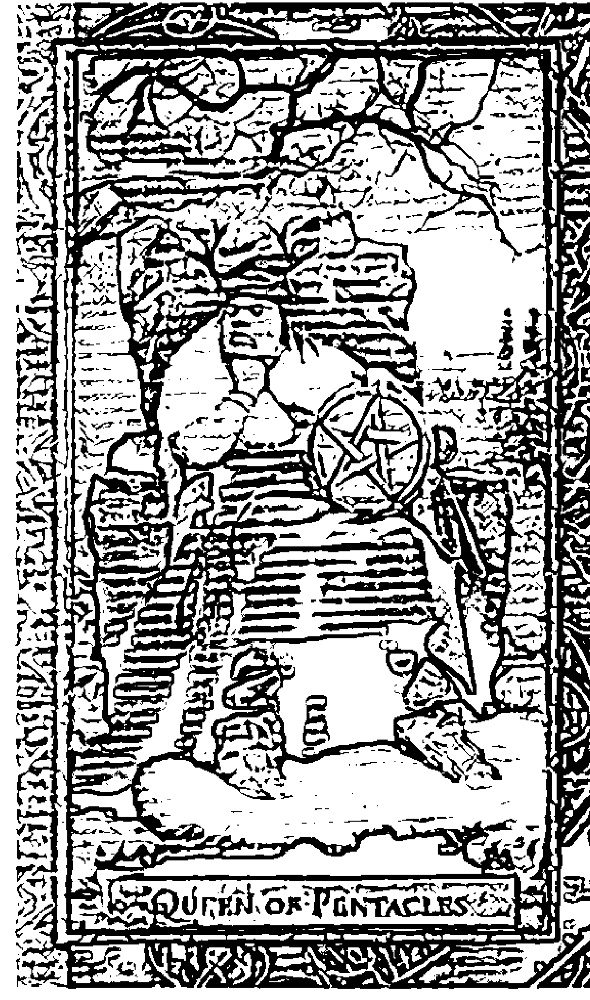

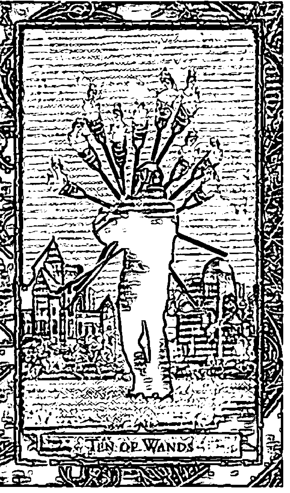

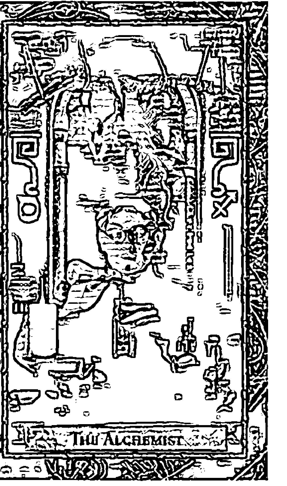

可座受到的壓迫，雖然約翰可能是天生的冒險家，不過土星的影響力讓他的夢想在真實世界的重量與種種責任壓力下被迫妥協。

最後，這個主題再度出現在對應他生日的「五角星皇后」，如前文所述，五角星皇后其實是下個星座（摩羯座）的守護者。她駐守於此是因為負責在年之輪上回頭將射手座的末端往前拉，推進到她的星座，而摩羯座是注重世俗的土象星座，關切生活的實際層面，而且重視事業和社會地位。

整體來說，約翰有能力為任何潛在客戶提供結合技術與個人天賦的服務。他擁有哲學家的思辨能力，但是這些思考是建立在有形存在的世俗真實上，因此他希望利用自身天賦和才能來強化一個高等教育機構的安全性，這件事並非偶然。

**現在** 接下來我們要借用時辰占卜占星學的技巧，看看約翰洽談合約的現況。我們利用他提問的日期1月11日作為解讀問題的基準點。

對應1月11日的大、小阿爾卡納牌和宮廷牌分別是惡魔，五角星四與寶劍國王。

這一天，太陽位於對應「惡魔」的摩羯座。這與現況十分吻合，因為約翰並非提出一個高度精神性或哲學性的問題，而是希望提升事業與社會地位，他正因與金錢、權力和控制有關的問題而感到痛苦。

1月11日是對應「五角星四」的摩羯座第三個10度區間，五角星四依序對應落入摩羯座的太陽。這告訴我們掌握權力的人妒忌地看守著他們的領域，

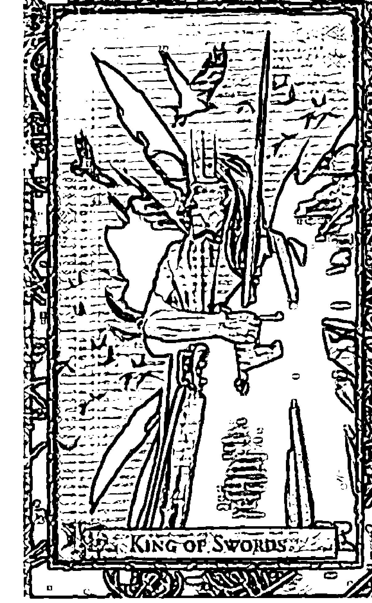

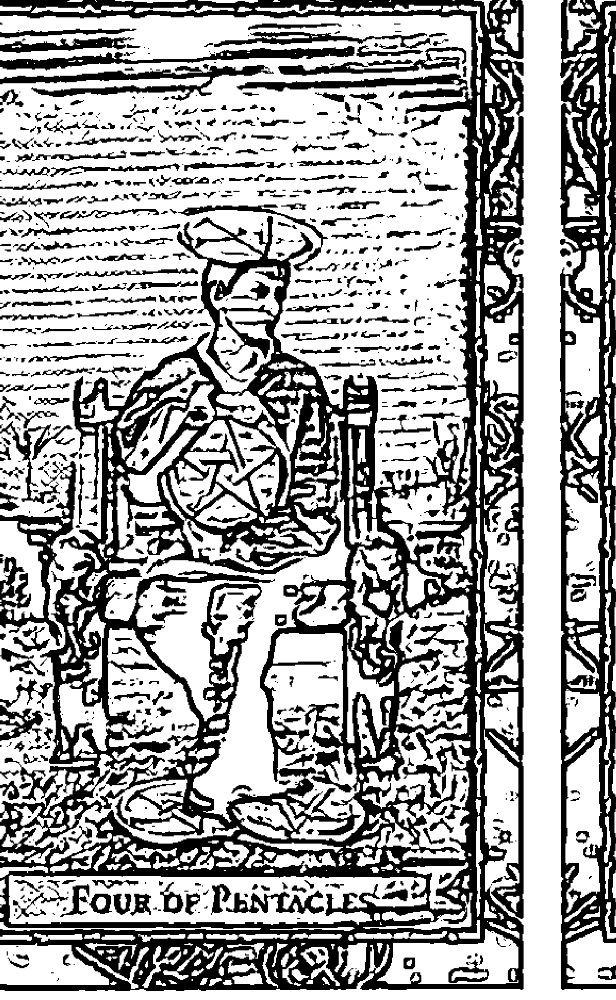

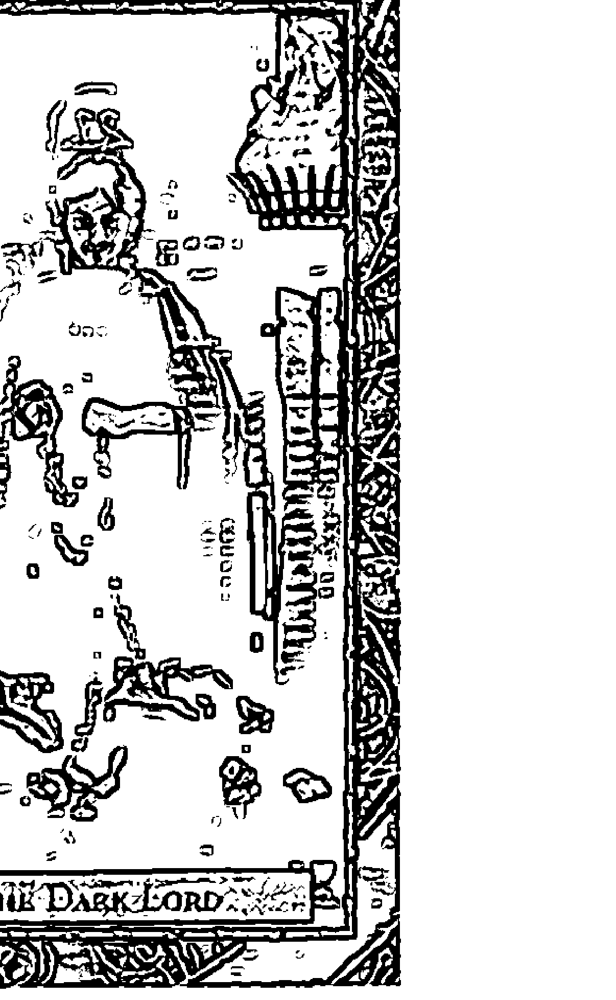

寶劍國王

五角星四

惡魔牌

管錢包的人緊抓住每一分錢。

對應這個時間點的宮廷牌是「寶劍國王」。如同先前出現的五角星皇后，寶劍國王也是一個星座（寶瓶座）的守護者，他也回頭將事件往前拉。這是個好跡象，因為約翰想知道的答案不會曖昧不明，事情將有穩定的進展和決定。

寶瓶座所擁有的未來傾向進一步暗示決策者關切這個決定長期下來將造成什麼樣的結果，而寶劍國王這張牌也意味這件事涉及合法性，因此可能會產生書面合約。

### 未來

最後，我們來處理約翰問題中的細節：他如何得到這份工作？接下來他應該採取何種行動？我們從牌組中隨機抽出一張牌來解答。

回應問題的牌是「魔術師」——對應演說家與商人的守護神墨丘利，這是張力量強大的大阿爾卡納牌。答案似乎很清楚：約翰需要不停地進行遊說！他得持續推銷他的商品。他已經參與過幾次會議，和決策者交換意見，不過這筆交易尚未拍板定案。他應該要記住：他是在想得到驚奇感的觀眾面前表演一場魔術，所以必須利用這個行當的工具和戲法——他所擁有的證書、經驗和進取心——讓決策者目瞪口呆，說服他們聘用他。

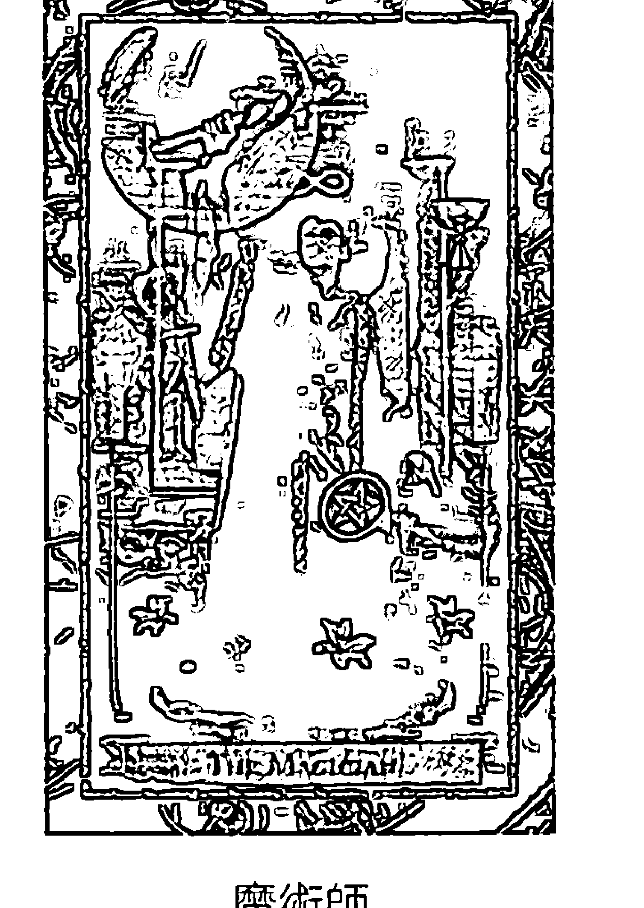

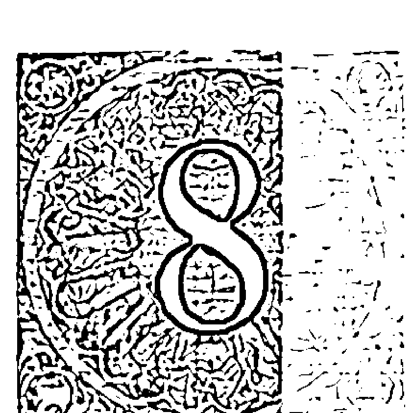

## 宮廷牌

宮廷牌可能是塔羅牌中最常被誤解的部分，不過若能以占星學作為基礎背景，牌面的人物將變得栩栩如生，也有助於我們對他們性格的掌握。如同所有小阿爾卡納，宮廷牌與元素有關：四名侍從代表最純粹的四種元素，而騎士、皇后和國王各自代表某幾種元素的融合，描述這些宮廷牌的占星學特性。

### 侍從

學生和信使，分別是火、土、風、水的具體化身，他們尚未歷經其他元素的影響，也未經世故的鍛鍊。

### 騎士

冒險家和拯救者，他們熱烈如火、生氣蓬勃，結合了自身花色的元素與火元素。舉例來說，聖杯騎士就融合了火的能量與水的情感本質。此外，騎士也是變動的，他們能輕易地穿越過渡的星座，包括雙子、處女、射手與雙魚座。

### 皇后

滋養者和守護者，她們結合了自身花色的元素與水元素，因此如水一般情感豐沛、善於接納。皇后們都具有創造性，各自引進某個季節，並且對應創始星座，包括牡羊、巨蟹、天秤與摩羯座。

### 國王

王國中的管理者和防衛者，他們像風一樣理智客觀，結合了自身花色的元素與風元素。國王們的地位穩固，掌握最高權力，位居每個季節的極致，對應金牛、獅子、天蠍與寶瓶座等固定星座。

這些元素關聯在巫師塔羅中顯而易見，因為所有宮廷牌都繪有與元素相關的生物，你會發現四個皇家家族都是化為人形的火精、地精、氣精或水精。

### 天空管理者

金色黎明以獨特的方式分配宮廷牌：騎士掌管變動星座，皇后掌管創始星座，國王掌管固定星座，那麼，留給侍從的是什麼？根據設計，侍從享有最大的特權！不僅因為他們體現火、土、風、水四元素，也因為他們同時充當世俗的「王座」——四張「數字一」牌的權力寶座。

### 宮廷牌與年之輪

宮廷牌駐守在年之輪的周圍，負責推動年之輪，並確保每個星座輪流更替。這是必須注意的細節，如果你嚴格遵守金色黎明的時間分配（這也是本書依據的基礎），將會發現宮廷牌所支配的日期與星座時間並未完全相符。

舉例來說，權杖皇后並未掌管牡羊座的全部30度區間，而是掌管牡羊座的前20度與雙魚座的最後10度。騎士、皇后和國王都遵循相同的模式，各自控管所屬星座的前20度，以及前一個星座的最後10度。

這個過程有點像是編織、鉤拉一件織品，每位宮廷成員會回溯10度，把某個星座拉向前，以進入下一個10度。

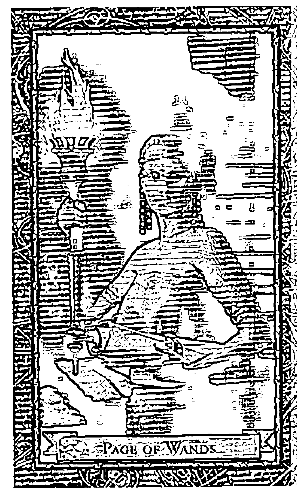

### 權杖侍從
火的化身

權杖侍從是火的化身，具備火象星座（牡羊、獅子與射手座）的熱情、衝勁，以及對於精神發展的欲望。

權杖侍從神聖而且純粹，她是精神創造的容器。她就像掌管家和爐灶的女神維斯塔（Vesta），世世代代的聖女都是她的後裔，她可以連結權杖牌與精神和創造力的世界，也是我們最初在「權杖一」中見到的火焰保管者。侍從是文藝復興時期最年輕的皇室成員，他們經常擔任送信人，負責傳遞消息。此外，他們年紀輕輕，藉由學徒經驗來學習勝任未來的職務。

如同我們所知道的學徒性格，權杖侍從朝氣蓬勃，擁有稚子般的熱忱和無窮的學習能力，她對認識新事物抱著滿腔熱情，而且狂烈如火。她可以蟄伏於現狀，像餘燼一樣發熱，不過一旦想像力被點燃，就會突然化身火焰，就像加入燃料後併發成難以控制的熊熊大火，幾乎無法撲滅。

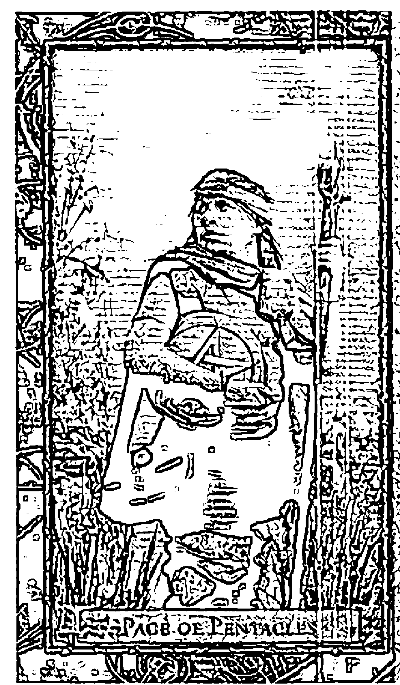

### 五角星侍從
土的化身

健壯的五角星侍從是土的化身，具備土象星座（金牛、處女與摩羯座）穩定可靠的能量，也就是說，她藉由土地能量將五角星牌組與物質及有形存在的世界作了連結。

一如所有的侍從們，五角星侍從向來年輕，不過因為體現了土元素本身的性質而顯得有些笨重，而且貼近土地。她結實、穩固、牢靠、沉著、堅定、直率、自信、耐心，擁有堅忍的性格，為了理解物質世界而決心取得堅實的基礎。因此，五角星侍從雖然行動遲緩，但是步伐帶著無可置疑的踏實和力量。

儘管技術高明，她仍然小心翼翼甚至無比謹慎，不願意冒任何風險。她一路走來始終如一，展現出認真誠懇、勤奮而且審慎的特質。

五角星侍從作為一位滋養者，就像年輕的大地之母，雖然這塊土壤此刻尚未被開發，但終究會成為物質創造的容器。五角星侍從妥善保管五角星一，如同大地豐饒女神希瑞斯（Ceres），以守衛、保護物質世界作為自己的天命與職責。

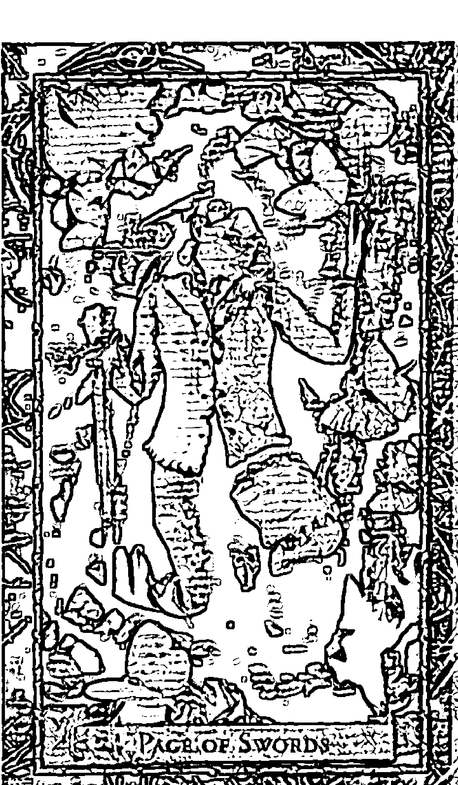

### 寶劍侍從
風的化身

聰明伶俐的寶劍侍從是風的化身，展現出風象星座（雙子、天秤與寶瓶座）的崇高特質。就像飛行中的鳥，她擁有快速移動的能量，使寶劍牌組能溝通、連結到心智的高層領域。

寶劍侍從機靈好奇、思路清晰、有遠見、機警且敏於觀察，她擁有鳥一般的視野，沒有任何東西能逃過她銳利的目光。此外，她多才多藝，能輕易從一個主題迅速轉移、跳躍到另一個主題，她以音速移動，對最微弱的輕聲細語也會有反應。

她非常愛說話，任由聲音和想法在風中傳播，有時是輕柔的微風，有時是狂烈的暴風，雖然這些型態近乎隱形，但她所展現的風采卻從來不會被錯認。

寶劍侍從是閱讀者、書寫者和說話者，她一向思考縝密、崇尚理想主義，因此也很容易受到學者、科學家和哲學家的吸引。寶劍侍從蘊含許多可能性，她的天命是孕育無數世代的學生、教師和想法，就像智慧女神帕拉斯雅典娜（Pallas Athene）。她隨身佩帶象徵邏輯和理智的劍——這把劍被描繪在寶劍一的牌面上——她將確保這把劍永遠能伸張公理和正義。

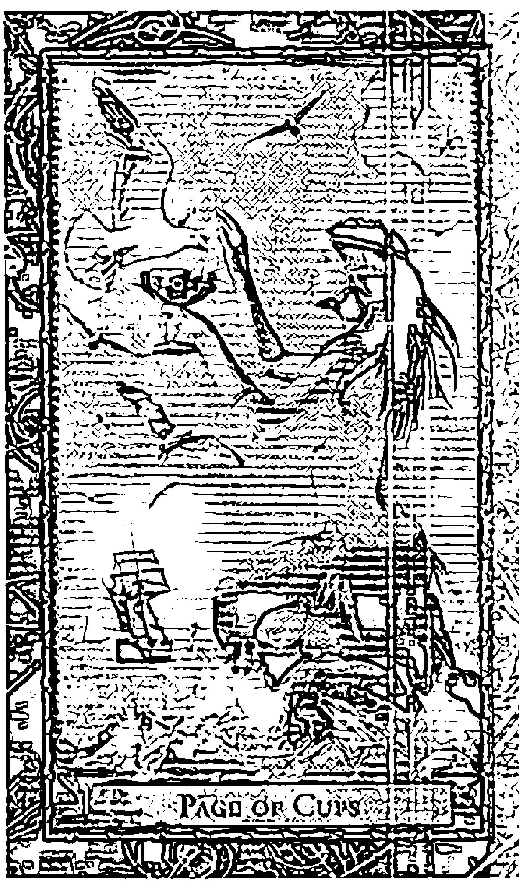

### 聖杯侍從
水的化身

聖杯侍從是水的化身，體現了連結聖杯牌組與情感世界的暗流，也統合巨蟹、天蠍與雙魚座等水象星座。

就像水的特質，聖杯侍從優雅從容，但也可能難以預料，她可以翻江倒海、波濤洶湧，也能靜如死水、不起漣漪。聖杯侍從的適應力強，能輕鬆地以各種狀態呈現，並配合周遭的環境提升情感強度。

她訴說海的語言，透過夢的領域和水一般的心靈來對外溝通，她傳遞的訊息可能幽微隱約，也可能像洶湧的浪濤般轟然作響。你會在河流、溪流、湖泊、池塘或海洋和地下水井裡發現她的蹤跡，她蹚入情感的海岸線，在集體潛意識的池中激濺出水花。

聖杯侍從極為敏感、溫柔、仁慈、好幻想，而且想像力豐富。她是詩人、藝術家與夢想者，同時也天真無比，生性樂觀。聖杯侍從持有聖杯——這是代表婚姻與分娩女神朱諾（Juno）的聖物，她遲早會自己用這只杯子啜飲品嚐由智慧與經驗所釀成、苦樂參半的漿液。

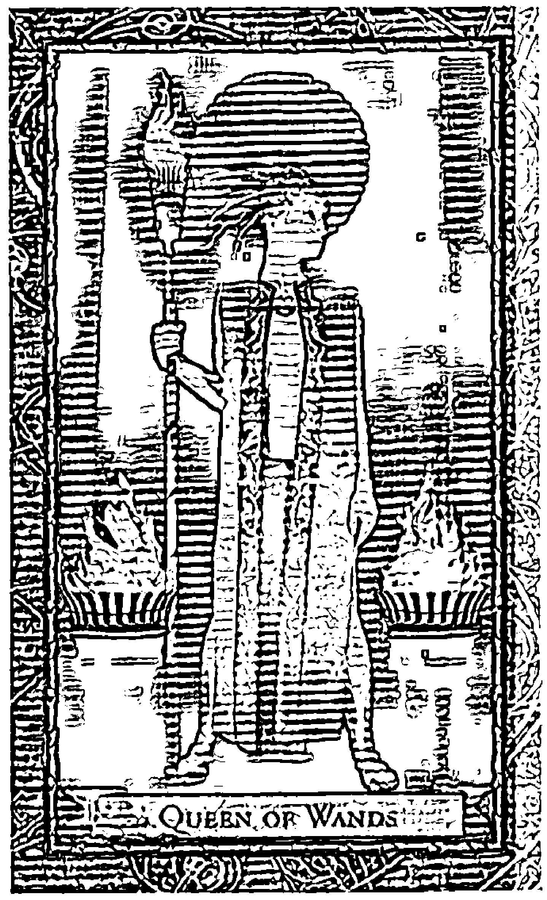

### 牡羊座與權杖皇后
火象創始星座
領導力與主動性

塔羅牌中的四位皇后是理想女人的典範，她們結合水元素與對應自身花色的元素，因此權杖皇后具體顯現水與權杖牌組（屬火）結合後水氣蒸騰的特質。權杖皇后極富魅力、沸騰在即，她的力量出乎意料的強大。

皇后當然是統治者，不過傳統上，她們的統治地位建立在衛護與滋養王國的陰性法則。就像所有的塔羅皇后，權杖皇后是成熟的女子，親切和藹，深諳處世之道。

身為元素所創造的產物，她體現了權杖的熱情，就像灼熱的篝火具備燃燒的能量。權杖皇后強健任性、行動迅速、充滿動能和自信，她的意念如火一般難以遏抑。

權杖皇后也代表火象創始星座牡羊座，作為啟動轉變之輪的天生領導者，她衝動魯莽、缺乏耐性、勇敢大膽，而且肆無忌憚。為了呼應大阿爾卡納皇帝牌，權杖皇后也秉持著喜好競爭的戰士精神，發揮急迫且直截了當的衝勁。事實上，她具備了許多我們認為的陽性特質，她的行動直接又積極，以突然迸發能量的方式彰顯權威。

權杖皇后掌管雙魚座第三個10度區間，以及牡羊座第一與第二個10度區間。天宮圖中，她負責掌管自我認同和自我表達的第一宮。

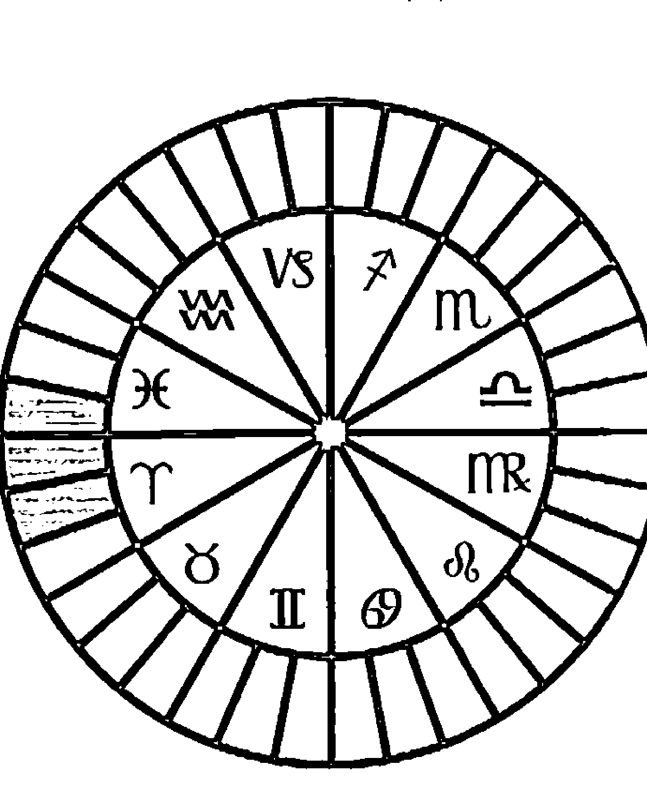

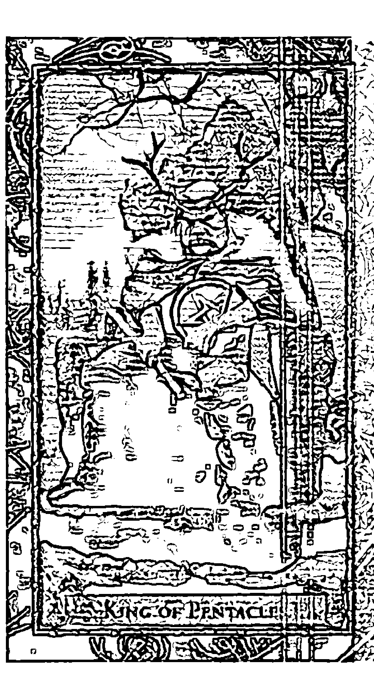

### 金牛座五角星國王
土象固定星座
穩定務實的態度

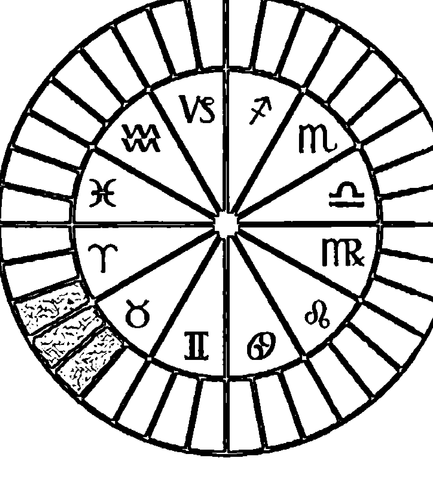

如同塔羅牌中的眾國王們，五角星國王是世故又經驗老到的男子。如今他已成功完成年輕時擔任五角星騎士的任務，得到治國之鑰作為獎賞。現在他統領整個王國，號令軍隊四處征戰、保家衛國。從元素角度來看，四位塔羅國王都是屬風的知識份子，他們將風元素與對應自身花色的元素融合，所以五角星國王體現出風和土的混搭的強烈性格。

五角星國王代表土象固定星座金牛座，這使他成為一個沉著可靠的君王，穩重踏實、誠實勤勉、果決又值得信賴。雖然他有時可能顯得頑固又動作遲緩，但是卻極富耐心，凡事都能堅持到底。五角星國王注重物質與價值觀，就像與之對應的大阿爾卡納教皇牌，同時他也重視傳統，周遭事物都反映出他的精神信仰。

五角星國王以近乎數學般的精密條理統治王國，也擁有巧妙、務實地解決複雜問題的天賦。他通常不輕易動怒，然而一旦被惹火，也可能暴跳如雷。五角星國王固然有些粗俗土氣，不過卻是忠誠、正直且值得尊敬的對象，他的雙腳牢牢踩在土地上，將身、心、靈都奉獻給事業。

五角星國王掌管牡羊座第三個10度區間，以及金牛座第一與第二個10度區間。天宮圖中，他的主要領域或是掌管價值觀和個人財產的第二宮。

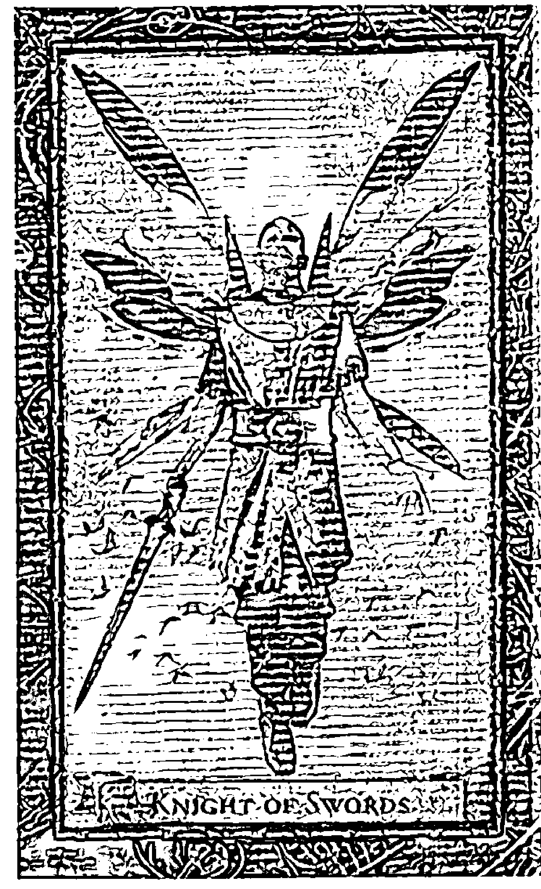

### 雙子座與寶劍騎士
風象變動星座
飛躍的思維能力

騎士是塔羅牌組中的冒險家與拯救者，他們先天屬於火象人，每位騎士都結合了火元素以及對應自身花色的元素。因此，寶劍騎士體現火與風的激昂結合，總是風風火火地奔騰馳騁。

寶劍騎士或許最符合多數人心目中的騎士印象，他是技術高超的英勇戰士，總是將盔甲擦得鋥亮，隨時準備上場奮戰。偶爾他也可能優柔寡斷，但絕少存心欺瞞，他不只謹守騎士精神，甚至幫忙制定規則。寶劍騎士不愧為騎士中的騎士，非常適合馳騁在觀念的戰場上，表現出熱情奔放、精力旺盛、無所畏懼的特質。他翱翔在概念與想像力的空氣層，性格大膽又熱愛冒險——雙腳從不著地。

寶劍騎士代表風象變動星座雙子座，這使他通權達變、思考敏捷。寶劍騎士懷抱崇高的目標和抱負，在雲層與天空的大氣間追逐理想。他在比其他元素人物更高的高度活動，不停遷徙，總是整裝待發，準備踏上另一段遠征的旅程。如同與之對應的戀人牌，寶劍騎士對各式各樣的經驗都很感興趣。他樂於交換想法，並在與人溝通時展現絕佳的風度與機智。

寶劍騎士掌管金牛座第三個10度區間，以及雙子座第一與第二個10度區間。天宮圖中，他的主要領域是掌管鄰近地區和溝通的第三宮。

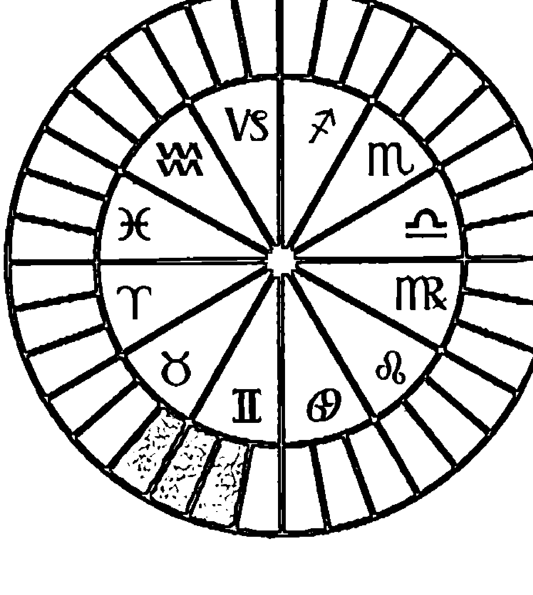

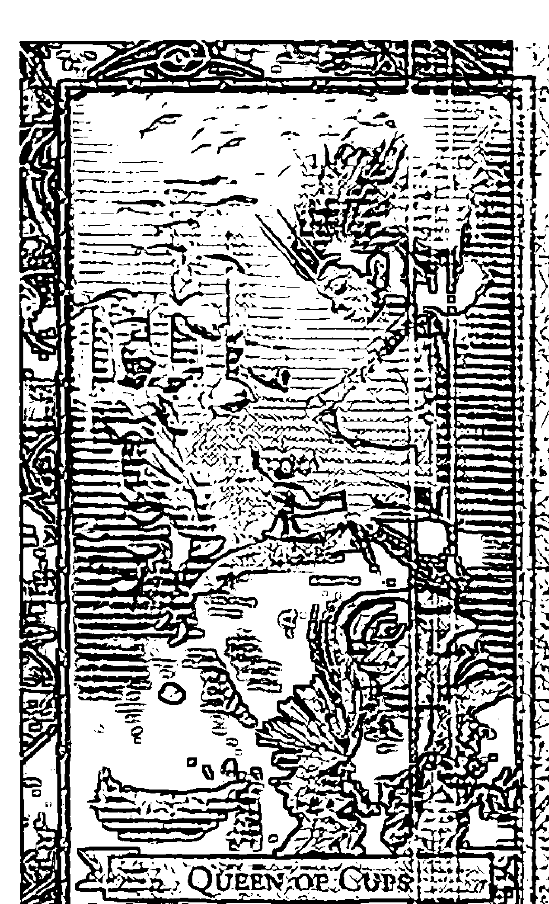

### 巨蟹座與聖杯皇后
水象創始星座
母性的奉獻精神

聖杯皇后具體展現水元素與聖杯牌組情感深度的融合，這從本質上賦予她雙倍的水象特質。
聖杯皇后通常被描繪成身處愛與關係的水世界，因為她展示了聖杯的情感能量。
聖杯皇后代表水象星座巨蟹座，因而成為天生的照顧者和家務操持者，她擁有滋養能力與敏感深情的特質，而且極富愛心。她的母性天賦使她比大部分人以為的更有力量——創始星座一向是果決的領導者，聖杯皇后深知是推動搖籃的手在主宰世界。
如同與之對應的戰車牌，聖杯皇后航行在不穩定的潮汐區和危險流域，但是通常都能避開岩礁或穿越海岸線，她毫不費勁地平衡婚姻與家庭生活。
聖杯皇后富創造力和藝術性，甚至擁有強烈的直覺力，有時在主宰行星月亮的激發下，甚至會產生通靈的預言能力和神秘的靈視力。就像月亮，聖杯皇后的確有她的黑暗面：陷入她尾流裡的人會不知不覺被淹沒在情感的漩渦中，偶爾她的過度保護也令人感到窒息。
聖杯皇后掌管雙子座第三個10度區間，以及巨蟹座第一與第二個10度區間。在天宮圖中，她的主要領域是掌管家和家庭的第四宮。

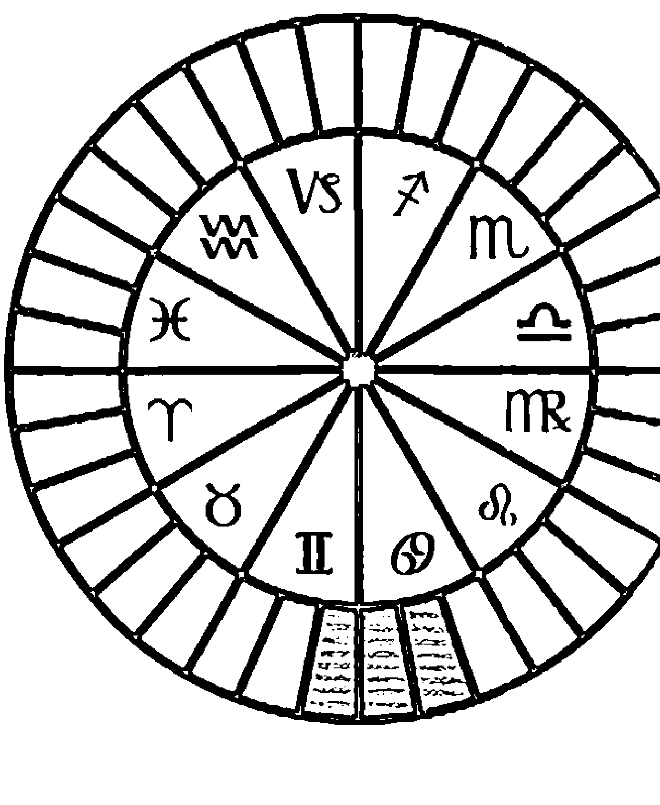

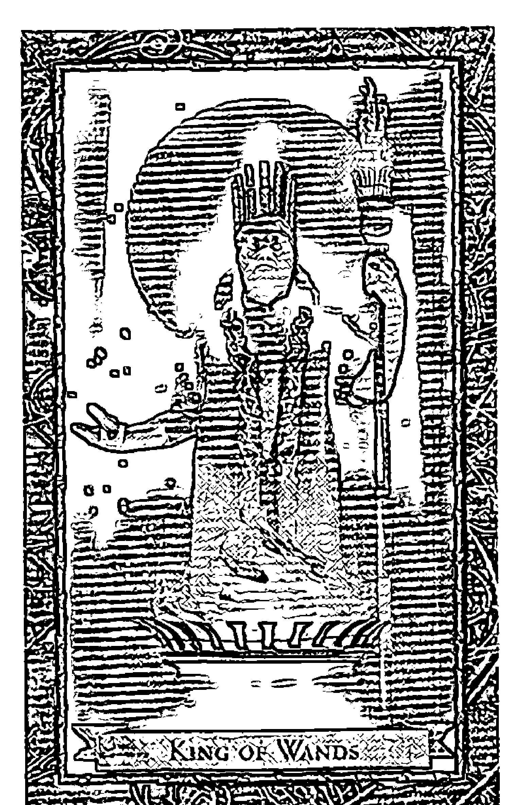

### 獅子座與權杖國王
火象固定星座
熱情與自我中心

權杖國王是火的主宰者，具體展現火象固定星座獅子座的精神與熱情，結合火元素與國王屬風的理智。權杖國王是英勇自信的君王，如同與之對應的力量牌，他擁有強大的力量，而且就像獅子座的主宰——太陽——是光亮的來源，毫不介意（甚至享受）成為眾所矚目的焦點。

固然塔羅國王都是領導者，不過權杖國王可能是其中最具領袖魅力的一個。他的領導風格激勵人心，不但吸引眾多崇拜者，他的發言也往往能切中追隨者最深層、真摯的渴望。權杖國王將驕傲感與自我意識加諸到崇拜者的身上，因此極可能顯得驕傲虛榮、自我中心，偶爾也會走向專制獨裁的道路。

權杖國王性格強悍、幹勁十足，有時也很可能性情暴躁。事實上，倘若他希望證明某個論點，必要時會毫不猶豫的運用焦土政策。他深諳火的淨化力量，以及隨之而來徹底的汰舊換新。他也可能喜歡開玩笑。

權杖國王掌管巨蟹座的第二個10度區間，以及獅子座的第一與第二個10度區間。天宮圖中，他的主要領域是掌管娛樂與生育的第五宮。他與太陽一樣可以創造生命，繁衍出無數世代的後裔。

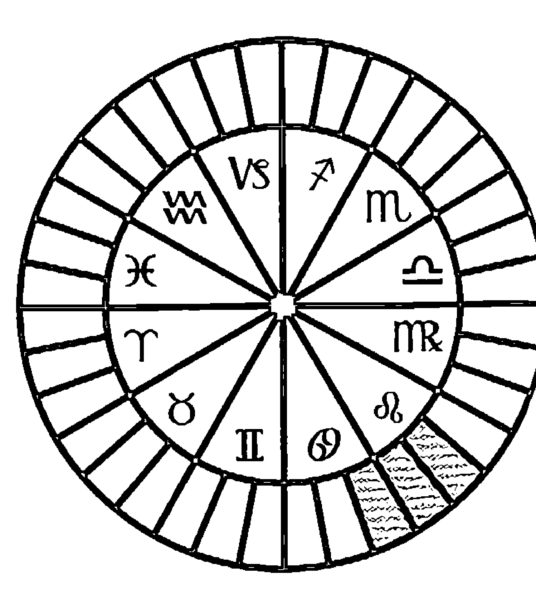

### 處女座與五角星騎士
#### 土象變動星座
##### 緩慢穩定的進展

五角星騎士並不符合一般人對騎士的印象。他行動不敏捷，也不喜歡調情，當其他騎士外出冒險時，他選擇留下來負責王國邊界的日常巡邏工作。

因為五角星騎士體現了火與土的另類結合。土本身無法燃燒，事實上，塵土和泥沙反而會撲滅小規模的火災。五角星騎士是土元素的產物，土壤不會憑藉自身的力量移動，除非發生地震或山崩，才能讓如此腳踏實地的人克服重力和慣性，鬆開與土地的緊密連結。即使所有的騎士都是探險家，但是五角星騎士會用比其他騎士更緩慢的步伐來勘祭世界。

同時，五角星騎士也比其他騎士更能理解肉體的需求和慾望，而且想要掌控物質世界。一旦五角星騎士接手某項任務，無論需要耗費多少時間，一定會達成任務。

五角星騎士極具耐心、無比鎮定、識別力強而且善於分析，他的人生使命似乎就是處理其他騎士忽略的一些細節和日常責任。他代表土象變動星座處女座，也如同與之對應的隱士，展現認真保守、帶點急迫感卻謹慎的個性，而且多少是個追求完美的人。

五角星騎士掌管獅子座第三個10度區間，以及處女座第一與第二個10度區間。天宮圖中，他的主要領域是掌管健康、工作及為人服務奉獻的第六宮。

### 天秤座與寶劍皇后
#### 風象創始星座
##### 敏捷果敢的力量

當水的情感與風的理智混合在一起時會怎樣？我們來見識寶劍皇后如何用頭腦和心作出平衡的決定。

每位塔羅皇后都結合了水元素與對應她自身花色的元素，因此寶劍皇后體現了邏輯、理性加上感覺的獨特組合。身為才智非凡的統治者，寶劍皇后是個愛批判的思想家，也是心智敏銳的健談者。她知道文字的精確意涵，所以在與人討論或論辯時，往往能排除不相干的訊息，切中要害，偶爾也難免言語刻薄。此外，她懂得解讀字裡行間的言外之意與感覺情緒，她的思路清晰、富同情心，性格堅決卻公正。事實上，寶劍皇后深知悲傷與心碎的滋味。她通常被認為是寡婦或離婚婦女，從失去的傷痛中學習，培養出感同身受的能力。

寶劍皇后代表風象創始星座—天秤座。她是天生的領導者，能夠聽取每個故事的兩面說法，善於擔任和事佬、調停者或仲裁者。如同與之對應的正義女神，她根據事實作出公平果決的判斷，而且就像主宰天秤座的金星，她能洞察他人的想法和喜好，並調整自己來吸引對方。

寶劍皇后掌管處女座第三個10度區間，以及天秤座第一與第二個10度區間。天宮圖中，她的主要領域是掌管夥伴與關係的第七宮。

### 天蝎座与圣杯国王
#### 水象固定星座
##### 深沉的情感

圣杯国王是水下世界的统治者，他将自己沉浸在最深层的生命秘密中。

从元素角度来看，塔罗国王都结合了风元素与对应自身花色的元素。因此，圣杯国王将理智与深沉流动的情感融于一炉，体现风与水气氤氲的组合。

圣杯国王身兼丈夫与国王的角色，也代表水象固定星座天蝎座，因此他可说是个热烈又深情的统治者。他聪敏又善于分析，也喜好感官的享乐，渴望与某个心智能力相当的人产生深刻的连结。圣杯国王即使身处最黑暗、深邃的情感世界也能从容自在，甚至容易过度执迷。

与天蝎座对应的是死神，天蝎座的主宰行星为冥王星（阴间之王普鲁托），因此圣杯国王深谙时间流逝、万物消长，以及转化与重生循环的道理。

巫师塔罗中的圣杯国王看起来像海神涅普顿，他的三叉戟和三叉冠是证明统治权的信物，白色胡须和头发象征智慧与经验，海洋依其命令涨落，海洋动物也回应他的召唤。他能兴风作浪、翻搅漩涡、制造巨大的混乱，也能将三叉戟举出海面，召唤风与火的力量来平息波涛。

圣杯国王掌管天秤座第三个10度区间，以及天蝎座第一与第二个10度区间。天宫图中，他的主要领域是掌管性、死亡、继承和共同资源的第八宫。

### 射手座與權杖騎士
#### 火象變動星座
##### 勇往直前的探險家

權杖騎士像火一樣令人著迷。不過當沒有地方可供燃燒時，他也可能變得狂怒失控，兇暴而不穩定，甚至帶有破壞性。每位騎士都結合火元素和自身花色的元素，不過權杖騎士是唯一具備「火與火」熱烈組合的宮廷牌。

權杖騎士興趣廣泛，他渴望征服哲學與精神領域，著迷於異國人物和新鮮想法，迫不及待地想接觸世界，體驗生命中的新奇事物。如同與之對應的節制牌中的煉金術士，權杖騎士喜歡實驗材料、混合物質，並隨時調整配方。他容易衝動、焦躁不安，也總是忙於奔波。

權杖騎士代表火象變動星座射手座，這使他性格直率、大膽又魯莽。當然他也有靈活變通、無憂無慮的一面，他願意嘗試任何經驗一次（或兩次），以評估各種可能性。他的射手座天性常為他帶來好運，所以他總以為自己無往不利，屢屢冒險犯進。一有機會，他會是第一個自告奮勇踏上光榮征途的人。

權杖騎士掌管天蠍座第三個10度區間，以及射手座第一與第二個10度區間。天宮圖中，他的主要領域是掌管長途旅行、哲學和高等教育的第九宮。

### 摩羯座與五角星皇后
#### 土象創始星座
##### 以身作則的典範

五角星皇后體現了水和五角星牌組所代表土資源的多產組合。她是耐性十足的倔強女子，擺脫了急迫的時間感或順服的壓力，將自己深植在花岡石園林中——那是她容光煥發的地方。

五角星皇后代表土象創始星座摩羯座，這使她成為精明的女實業家，能為她的子民開發各種資源。她是領導者和決策者，性格樸實、有威嚴、守紀律而且謹慎，相信傳統結構的價值。

耐性與持久力讓她有許多時間從容思考，年復一年，她培養出一種令人驚訝的「枯燥幽默感」。就像大多數的摩羯人，五角星皇后擁有隨著時間愈變愈年輕、愈來愈輕鬆愉快的老靈魂。

五角星皇后是土地的守護者，她深知為後代捍衛物質世界的重要性，卻並不信奉未經驗證的理論或粗率的環保主義，她也知道地球擁有多數人無法想像的豐沛資源，而且地球的壽命將遠超過居住於其上的人類。一如與之對應的惡魔（黑暗之王），五角星皇后能深刻體認肉體的歡愉以及各種世俗誘惑，她堅守在自己所處的位置，果決地以身作則，維繫她的價值觀和信仰。

五角星皇后掌管射手座第三個10度區間，以及摩羯座第一與第二個10度區間。天宮圖中，她的主要領域是掌管事業與社會地位的第十宮。

### 寶瓶座與寶劍國王
#### 風象固定星座
##### 理智的決斷力

風的統治者寶劍國王是權威的領導者，靠著嚴謹的邏輯和不凡的睿智擬定治國方針。四位塔羅國王都結合了風元素與對應自身花色的元素。因此，寶劍國王體現風與風的純粹結合。他顯然自信滿滿、機警果斷，甚至帶點侵略性，他用熱情和武力來保護王國，也從不擔心過於武斷。他希望、也的確有能力防衛領土，並以符合他統治的方式伸張正義。寶劍國王懷抱過人的遠見與理想主義，他可能成為你堅定不移的盟友，也可能是充滿威脅的強勁對手。

寶劍國王代表風象固定星座寶瓶座，這使他成為前瞻思考和社會意識兼具的君主，就像與之對應的大阿爾卡納星星牌，寶劍國王有如「天外之人」，從縹緲的高空俯瞰世間大局。寶瓶座的主宰者天王星讓寶劍國王有能力推翻舊思維，建立更符合需求的新制度。

寶劍國王掌管摩羯座第三個10度區間以及寶瓶座第一與第二個10度區間。天宮圖中，他的主要領域是掌管公益事業的第十一宮。

### 雙魚座與聖杯騎士
#### 水象變動星座
##### 流動的情感

就像聖杯牌組的其他宮廷牌，聖杯騎士同樣情感豐沛。他英勇優雅、慷慨大方，而且想像力豐富——甚至喜歡幻想。他是真正的理想主義者，相信美即是真，真即是美。

每位騎士都結合火元素和自身花色的元素，因此聖杯騎士體現了火與水的組合。聖杯騎士代表水象變動星座——雙魚座，這使他多愁善感而且充滿魅力，討人喜歡又令人著迷。聖杯騎士不但具有騎士風範，同時有點孩子氣，偶爾也反覆無常，還帶著一點兒健忘。

如同與之對應的大阿爾卡納月亮牌，聖杯騎士是透過霧濛濛的光影看世界，他能反映出周遭的人最想實現的願望、希望和夢想。

聖杯騎士生性浪漫，是個敏感的理想主義者、夢想家和藝術家，他有強烈的直覺力，勇於潛入深邃的情感世界。雖然他是每個女人心中的白馬王子，但個性卻像魚一樣難以捉摸。

聖杯騎士掌管寶瓶座第三個10度區間，以及雙魚座第一與第二個10度區間。天宮圖中，他的主要領域是掌管玄秘事物與隱密場所的第十二宮。

## 重點整理：宮廷牌

### 宮廷牌與四元素

下圖顯示四元素在宮廷牌中融合的情況，你會發現這些不同的元素組合是如何刻畫出四個皇室家族的特性。

| 權杖 (火/精神) | 聖杯 (水/情感) | 寶劍 (風/心智) | 五角星 (土/物質) |
|---|---|---|---|
| 侍從 (土/物質) | 以物質的形式 火 | 以物質的形式 水 | 以物質的形式 風 | 以物質的形式 土 |
| 騎士 (火/精神) | 精神層面 火與火 | 精神與情感層面 火與水 | 精神與心智層面 火與風 | 精神與物質層面 火與土 |
| 皇后 (水/情感) | 情感與精神層面 水與火 | 情感層面 水與水 | 情感與心智層面 水與風 | 情感與物質層面 水與土 |
| 國王 (風/心智) | 心智與精神層面 風與火 | 心智與情感層面 風與水 | 心智層面 風與風 | 心智與物質層面 風與土 |

### 塔羅牌在占星學與四季的對應

國王、皇后和騎士牌以兩種模式被分配到年之輪：
一、這些牌分配到四個季節，每個季節各有一名皇后、一名國王與一名騎士。
二、每個季節各包含一張來自創始、固定與變動星座的宮廷牌。

| | 春 | 夏 | 秋 | 冬 |
|---|---|---|---|---|
| 創始星座 | ♈ 牡羊座／權杖皇后 | ♋ 巨蟹座／聖杯皇后 | ♎ 天秤座／寶劍皇后 | ♑ 摩羯座／五角星皇后 |
| 固定星座 | ♉ 金牛座／五角星國王 | ♌ 獅子座／權杖國王 | ♏ 天蠍座／聖杯國王 | ♒ 寶瓶座／寶劍國王 |
| 變動星座 | ♊ 雙子座／寶劍騎士 | ♍ 處女座／五角星騎士 | ♐ 射手座／權杖騎士 | ♓ 雙魚座／聖杯騎士 |

## 重點整理：塔羅牌與年之輪

下頁圖表顯示大阿爾卡納與小阿爾卡納牌被分配到年之輪的狀況。

| 星座與主宰行星 | 大阿爾卡納牌 | 宮廷牌 | 10 度區間 | 約略日期 | 小阿爾卡納牌 | 次主宰行星 |
| :--- | :--- | :--- | :--- | :--- | :--- | :--- |
| 牡羊座 創始星座 火象 火星 | IV. 皇帝 XVI. 塔 | 權杖皇后 | 第一區間 0°-10° | 3月 21日~30日 | 權杖二 (火) | 火星 |
| | | 權杖皇后 | 第二區間 10°-20° | 3月31日~ 4月10日 | 權杖三 (火) | 太陽 |
| | | 五角星國王 | 第三區間 20°-30° | 4月 11日~20日 | 權杖四 (火) | 金星 |
| 金牛座 固定星座 土象 金星 | V. 教皇 III. 女皇 | 五角星國王 | 第一區間 0°-10° | 4月 21日~30日 | 五角星五 (土) | 水星 |
| | | 五角星國王 | 第二區間 10°-20° | 5月 1日~10日 | 五角星六 (土) | 月亮 |
| | | 寶劍騎士 | 第三區間 20°-30° | 5月 11日~20日 | 五角星七 (土) | 土星 |
| 雙子座 變動星座 風象 水星 | VI. 戀人 I. 魔術師 | 寶劍騎士 | 第一區間 0°-10° | 5月 21日~31日 | 寶劍八 (風) | 木星 |
| | | 寶劍騎士 | 第二區間 10°-20° | 6月 1日~10日 | 寶劍九 (風) | 火星 |
| | | 聖杯皇后 | 第三區間 20°-30° | 6月 11日~20日 | 寶劍十 (風) | 太陽 |
| 巨蟹座 創始星座 水象 月亮 | VII. 戰車 II. 女祭司 | 聖杯皇后 | 第一區間 0° - 10° | 6月21日～ 7月1日 | 聖杯二 (水) | 金星 |
| | | 聖杯皇后 | 第二區間 10° - 20° | 7月 2日～11日 | 聖杯三 (水) | 水星 |
| | | 權杖國王 | 第三區間 20° - 30° | 7月 12日～21日 | 聖杯四 (水) | 月亮 |
| 獅子座 固定星座 火象 太陽 | VIII. 力量 XIX. 太陽 | 權杖國王 | 第一區間 0° - 10° | 7月22日～ 8月1日 | 權杖五 (火) | 土星 |
| | | 權杖國王 | 第二區間 10° - 20° | 8月 2日～11日 | 權杖六 (火) | 木星 |
| | | 五角星騎士 | 第三區間 20° - 30° | 8月 12日～22日 | 權杖七 (火) | 火星 |
| 處女座 變動星座 土象 水星 | IX. 隱士 I. 魔術師 | 五角星騎士 | 第一區間 0° - 10° | 8月23日～ 9月1日 | 五角星八 (土) | 太陽 |
| | | 五角星騎士 | 第二區間 10° - 20° | 9月 2日～11日 | 五角星九 (土) | 金星 |
| | | 寶劍皇后 | 第三區間 20° - 30° | 9月 12日～22日 | 五角星十 (土) | 水星 |
| 天秤座 創始星座 風象 金星 | XI. 正義 III. 皇后 | 寶劍皇后 | 第一區間 0° - 10° | 9月23日～ 10月2日 | 寶劍二 (風) | 月亮 |
| | | 寶劍皇后 | 第二區間 10° - 20° | 10月 3日～12日 | 寶劍三 (風) | 土星 |
| | | 聖杯國王 | 第三區間 20° - 30° | 10月 13日～22日 | 寶劍四 (風) | 木星 |
| 天蠍座 固定星座 水象 冥王星 | XIII. 死神 XX. 審判 | 聖杯國王 | 第一區間 0° - 10° | 10月23日～ 11月2日 | 聖杯五 (水) | 火星 |
| | | 聖杯國王 | 第二區間 10° - 20° | 11月 3日～12日 | 聖杯六 (水) | 太陽 |
| | | 權杖騎士 | 第三區間 20° - 30° | 11月 13日～22日 | 聖杯七 (水) | 金星 |
| 射手座 變動星座 火象 木星 | XIV. 節制 X. 命運之輪 | 權杖騎士 | 第一區間 0° - 10° | 11月23日～ 12月2日 | 權杖八 (火) | 水星 |
| | | 權杖騎士 | 第二區間 10° - 20° | 12月 3日～12日 | 權杖九 (火) | 月亮 |
| | | 五角星皇后 | 第三區間 20° - 30° | 12月 13日～21日 | 權杖十 (火) | 土星 |
| 摩羯座 創始星座 土象 土星 | XV. 惡魔 XXI. 世界 | 五角星皇后 | 第一區間 0° - 10° | 12月 22日 ~ 30日 | 五角星二 (土) | 木星 |
| | | 五角星皇后 | 第二區間 10° - 20° | 12月31日 ~ 1月9日 | 五角星三 (土) | 火星 |
| | | 寶劍國王 | 第三區間 20° - 30° | 1月 10日 ~ 19日 | 五角星四 (土) | 太陽 |
| 寶瓶座 固定星座 風象 天王星 | XVII. 星星 0. 愚者 | 寶劍國王 | 第一區間 0° - 10° | 1月 20日 ~ 29日 | 寶劍五 (風) | 金星 |
| | | 寶劍國王 | 第二區間 10° - 20° | 1月30日 ~ 2月8日 | 寶劍六 (風) | 水星 |
| | | 聖杯騎士 | 第三區間 20° - 30° | 2月 9日 ~ 18日 | 寶劍七 (風) | 月亮 |
| 雙魚座 變動星座 水象 海王星 | XVIII. 月亮 XII. 吊人 | 聖杯騎士 | 第一區間 0° - 10° | 2月 19日 ~ 28日 | 聖杯八 (水) | 土星 |
| | | 聖杯騎士 | 第二區間 10° - 20° | 3月 1日 ~ 10日 | 聖杯九 (水) | 木星 |
| | | 權杖皇后 | 第三區間 20° - 30° | 3月 11日 ~ 20日 | 聖杯十 (水) | 火星 |

表列為約略日期，你可以查詢記載行星位置的占星曆，以得知明確的時間點。表中不包含「數字一」牌，因為「數字一」代表四元素：權杖一是火元素，聖杯一是水元素，寶劍一是風元素，而五角星一是土元素。

# 第三部
占星學進階

我們在前文已探討過塔羅、星座與行星的基本原理，現在我們要將它們整合到天宮圖的各宮位。

## 天宮圖的宮位

天宮圖（horoscope）可以看成一張在特定時刻的天空「快照」，包含行星、星座與宮位等相關資訊全都會顯示在上面，它就像一張宇宙地圖，用來測定行星落入各星座的位置。

「horoscope」這個字來自希臘文「hora」（小時）加上「skopos」（監看）。天文學家在檢視天宮圖時，就像閱讀一張太陽系地圖，而占星師與塔羅師們則將天宮圖看作一張豐富的藏寶圖，因為這張圖中充滿各種描述生命旅程的象徵。

### 空間與時間的劃分

在前文中，我們對天宮圖的理解僅限於塔羅的範疇，其實天宮圖是將塔羅牌分配到年之輪的基礎。你會發現每張天宮圖都是圓形的，代表我們從地球所看見的太陽系景象，它被分割成十二個派形宮位——每個宮位代表一個黃道星座。「zodiac」（黃道）這個字的希臘文意指「動物環圈」。

就像任何一張地圖，占星師利用宮位的分野，精準標示行星的位置，這樣他們馬上就能看出每顆行星正在穿越的星座，以及一顆行星與另一顆行星之間的相對位置。宮位的觀念為占星學增添了層次複雜的意義，可以提供極具價值的資訊。

太陽每個月位於一個不同的黃道星座，但每天都會通過天宮圖的十二個宮位，其餘的行星也是如此，因為我們不只繞著太陽運轉，而是地球本身也在自己的軸線上轉動，每隔二十四個小時旋轉一圈。在這個過程中，地球上的任何地點都會連續面對某個不同的黃道星座，時間長達約兩個小時。

別被這些概念搞混了：你只需想像：一天之中，太陽在天空中移動，從某個地方升起，在某個地方落下。如果你將太陽的移動路線繪製在天宮圖上，就能標示出它沿途運行的路徑。

天宮圖的情況也是如此：當地球緩慢地在太空中運轉時，太陽、月亮和行星都會行經天宮圖的各個宮位。「宮位」說明了當我們在定點旋轉時所見運行中的太陽系，這個有用的概念提供測量行星通過各星座時的相關脈絡、觀點與背景知識。溯其本源，宮位的重要意義大多衍生自黃道星座的概念。

### 自然天宮圖

在（自然）天宮圖（理想的天空地圖）中，每個宮位都由某個黃道星座管轄，而且因為每個星座都受某顆行星主宰，所以每個宮位也都有各自的主宰行星。舉例來說，牡羊座管轄第一宮，而火星主宰牡羊座，合在一起解讀就表示牡羊座和火星都與第一宮產生關聯。

然而，真實生活中並沒有如此完美的星盤：每顆行星都落入自己的星座，而且每個宮位都由自己所屬的主宰星座所佔據。因為行星是不停移動的，它們持續圍繞太陽運轉，沿途行經黃道上的每個星座，而不只是待在自己的星座。這些行星共有十二個星座要造訪，因此不難理解為何多數行星都不會在自己的星座停留太久。

此外，我們所見的宮位也不斷在改變中，所以其實很難找到一顆落入自己宮位的行星，因為地球在自己的軸心上旋轉，而且我們是以自身觀點為基礎來計算宮位。從我們的觀點來看，行星不停繞行天宮圖的十二個宮位，當最終有一顆行星真正落入自己的星座與自己的宮位時，幾乎可說是意外的幸運。

即便如此，當占星師在評估星盤時仍會將自然天宮圖列入考量，因為先天上主宰某一宮位的行星和星座，對這個宮位仍有一定的支配力量。行星和星座可能成為身在外地的主人，不過它們仍是各自宮位的主宰者，即使不在家中，它們的存在還是有其影響力。

### 黃道十二宮

以下表格概述十二個宮位的重要意義，以及他們各自的主宰星座和行星。

| 宮位 | 掌管的事物 | 主宰星座 | 主宰行星 |
| :--- | :--- | :--- | :--- |
| 第一宮 | 身體外貌、第一印象 | 牡羊座；與領導權有關 | 火星。代表能量與侵略 |
| 第二宮 | 金錢、財產、價值觀 | 金牛座；與資產有關 | 金星。代表愛與吸引力 |
| 第三宮 | 溝通、兄弟姊妹、鄰近地區 | 雙子座；與溝通有關 | 水星。代表速度與溝通 |
| 第四宮 | 母性、家與家庭 | 巨蟹座；與保護和滋養力有關 | 月亮。代表反省與女性生命週期 |
| 第五宮 | 創造、生育與娛樂 | 獅子座；與勇氣和表演能力有關 | 太陽。代表能量與啟蒙 |
| 第六宮 | 工作、責任、負責為他人服務奉獻 | 處女座；與健康和清潔有關 | 水星。代表速度與溝通 |
| 第七宮 | 婚姻、夥伴關係、親密關係 | 天秤座；與公正、平等、平衡有關 | 金星。代表愛與吸引力 |
| 第八宮 | 性、死亡、他人（公共）的金錢 | 天蠍座；與生命的陰暗秘密有關 | 冥王星。代表死亡、復活，以及不可避免的改變 |
| 第九宮 | 哲學、長途旅行、高等教育 | 射手座；與誠實和探索有關 | 木星。代表幸運與擴張 |
| 第十宮 | 企圖心、地位、事業與公眾形象；父親或權威人物 | 摩羯座；與工作和報酬有關 | 土星。代表結構、界限與限制 |
| 第十一宮 | 社群、公益事業、長期的思考 | 寶瓶座；與期盼美好願景有關 | 天王星。代表獨立、革命與反叛 |
| 第十二宮 | 心靈能力、神秘學、隱密的場所 | 雙魚座；與直覺有關 | 海王星。代表玄秘與幻覺 |

## ◆ 實際運用 ◆

### 天宮圖宮位牌陣

天宮圖中的宮位原本就極適合作為一種塔羅牌陣來看待，即使我們手上沒有真實的星盤。牌陣中十二張牌的意義源於它們所在的宮位，以及每個宮位的先天主宰星座與行星。請注意，每張牌必須按照宮位的順序擺放，第一張放在九點鐘位置，其餘的牌依逆時針方向環繞成一圈。

- 1 牡羊座 自我意識、領導權、衝勁、進取心、身體外貌、第一印象
- 2 金牛座 金錢、財產、價值觀、安全感、物質享受、有形資源
- 3 雙子座 溝通、思考過程、兄弟姊妹、鄰近地區
- 4 巨蟹座 母性、家與家庭；滋養與被滋養的能力、直覺
- 5 獅子座 創造、娛樂、生育與子女。
- 6 處女座 工作、責任、服務、健康、注意細節、繼承
- 7 天秤座 婚姻、夥伴關係、親密關係、平衡、社交技巧
- 8 天蠍座 性、死亡、共享的資源
- 9 射手座 哲學、長途旅行、高等教育
- 10 摩羯座 企圖心、地位、事業與公眾形象
- 11 寶瓶座 社群、公益事業、發明、前瞻未來與長遠的思考
- 12 雙魚座 心靈能力、神秘學、隱密場所、潛意識心理、心理健康

### 案例解讀 蘿絲的戀情

蘿絲現年二十一歲，是個主修教育的大學生。她至今沒有男友，甚至從未約會過。她想知道：「我對男人應該抱持什麼樣的期待？」「我的戀情有指望嗎？」

充分洗牌後，從牌組中隨機抽牌，以天宮圖的宮位作為分析牌義的起點。令人驚訝的是，蘿絲所追求的愛情和浪漫戀情似乎和她的事業目標關係密切，而且在她尚未將愛情、生活與其他夢想或計畫協調妥當之前，牌陣中不會出現浪漫戀情的跡象。

- 1. **權杖二** 年輕英俊的火星落入牡羊座（青年的皇帝），這表示對蘿絲來說，衝勁和領導能力是重要的特質，無論是她對自己或是夥伴的要求。
- 2. **權杖皇后** 掌管牡羊座大部分區間的權杖皇后指出：蘿絲重視的價值觀以金錢或和財務為優先。她想擁有一個有正當工作和穩定未來的男友，就像她希望自己有一份穩定的職業生涯。
- 3. **聖杯侍從** 聖杯是水元素的化身，象徵與關係有關的議題。第三宮代表手足關係和溝通方式：蘿絲和她的姊姊互動親密，這張牌所在的宮位暗示蘿絲從姊姊的身上學到許多關係的處理與應對方式。
- 4. **五角星皇后** 主宰摩羯座多數區間的五角星皇后說明了蘿絲對物質舒適感與穩定性的需求。第四宮描述母性和滋養的方式，蘿絲和母親非常親近，而且她希望為將來建立家庭做好準備，也所選擇的伴侶將在這個十畫中扮演重要的角色。
- 5. **權杖三** 第五宮是掌管創造力、生育和娛樂的宮位。火象的權杖三描述落入牡羊座的太陽，暗示蘿絲想要一個能啟發、刺激她創造欲的男人。塔羅牌中的數字三象徵創造力，代表真實的或象徵性的兒童——伴侶關係下的產物。
- 6. **星星** 體現寶瓶座前瞻願景的星星落入蘿絲的第六宮，這是掌管工作、義務、責任和為他人服務奉獻的宮位。將來為人師表的蘿絲已經選擇了理想的職業，此刻她需要一個能在這個事業目標上支持她的伴侶。
- 7. **世界** 對於與夥伴關係或婚姻有關的第七宮，蘿絲確實有著極高的期待。就像土星的環帶可以界定外圍的邊界，蘿絲可能也傾向於以她所吸引的人來定義自己，這正是她對約會對象如此挑剔的原因。
- 8. **寶劍四** 第八宮描述源自於夥伴或親密關係的共同資源。寶劍四中失去知覺的騎士暗示：蘿絲最終能在這個領域獲得相當多的好處。寶劍四對應落入天秤座的木星，被木星觸及的事物都沾染了好運。當然，蘿絲至今尚未迷戀上任何一位追求者，也許她打算等到好運降臨，再找一個能和她分享資產的人。
- 9. **聖杯六** 從這張牌中，我們再度看到蘿絲的事業目標與她對關係的憧憬合而為一的傾向。第九宮是掌管哲學與高等教育的宮位，在本例中，這個宮位的焦點集中在兒童教育——如同聖杯六所顯示的。從占星學角度來看，聖杯六對應落入天蠍座的太陽——「喜樂之主」，不過天蠍座可能極度念舊，某種程度上，蘿絲或許期盼與前男友復合。
- 10. **聖杯十** 在掌管企圖心、地位、事業和公眾形象的第十宮，聖杯十這張牌中的快樂家庭再度呈現以子女為中心的景象。從占星角度來看，聖杯十對應落入雙魚座的火星——「完美願景之主」，看來蘿絲不會接受一份缺乏「完美」伴侶、工作或家庭生活的關係。
- 11. **權杖國王** 主宰獅子座大部分區間的權杖國王，為蘿絲的第十一宮帶來熱情和承諾。第十一宮掌管社群、公益事業、長期願景與計畫。
- 12. **女祭師** 本案例解讀的重點一面倒地集中在蘿絲對事業面的追求，然而神秘的女祭師現身於讓她從容自在的地方——掌管通靈能力、玄秘事物與隱密場所的第十二宮。即使蘿絲是個極具現實感的務實女子，但是憑藉著特殊天賦，塔羅牌將指示她走向明確的人生道路與心靈追求。

## 塔羅牌的宮位

所有行星、星座及與之形成對應關係的塔羅牌，都在自然天宮圖中佔據一個屬於自己的宮位。

### 天宮圖宮位

每個黃道宮位各代表一個不同的活動領域。當我們探討這十二個宮位時，可以將它們想像成一棟房屋內的房間，每個房間都有某種特定功能。

若想明瞭宮位中的星座和行星，請想像它們對應成每張塔羅牌的情況，也可以將這些行星和星座看成住在各個房間中的人。

### 第一宮

如果黃道十二宮代表一個真實住所，那麼第一宮會是大門的入口，這裡代表第一印象、身體外觀，以及我們用來面對世界的公眾形象。事實上，對許多占星師來說，第一宮確實是星盤的入口，因為它代表我們認識別人時注意到的第一件事，因此理所當然成為分析天宮圖的起始點。

第一宮由牡羊座管轄，表示這裡是牡羊座標記牌皇帝的天然前哨。皇帝是城堡的主人，他無比自在地坐鎮第一宮，守衛著大門，決定誰能被放行到裡面的房間。

牡羊座由象徵能量與行動的火星所主宰，為第一宮增添了些許塔的能量。畢竟，塔是被設計用來使他人仰慕、威嚇敵人、守護財產，以及保護居住者不受攻擊的建築體。

在真實的天宮圖中，你可能會在第一宮發現其他星座和行星的行蹤，他們替皇帝在這裡站崗。無論他們的職責是歡迎來訪的客人，或者兢兢業業地守衛一座高塔，使其免於遭受攻擊，他們都會設法展現皇帝威風凜凜的權威。事實上，落入牡羊座或第一宮的任何行星都帶有若干牡羊座與皇帝的特性，例如直率的性格或是尚武精神。

### 第二宮

如果黃道十二宮代表真實的住所，那麼第二宮就是客廳，這裡描述使我們在肉體和精神上感到舒適快樂的物質財產。財富包括金錢、資產和價值觀等形式，這個宮位關乎我們所珍視的任何事物。

第二宮由金牛座管轄，表示這裡得由金牛座的標記牌教皇負責裝潢。不令人意外的，教皇偏好傳統風格，例如光澤溫潤的木製品、絲絨襯墊、芳香蠟燭、古典音樂，以及懸掛在牆上的精美藝術品，好比教堂中精緻又華麗的彩繪玻璃。

教皇從他的主宰者金星（代表愛、情感與吸引力的女皇行星）那兒承襲到優雅的品味。金星支配喉部，因此教皇和女皇不只用傢俱塞滿客廳，還會以美妙的樂音妝點生活空間，如果他們沒有用頂級音響播放管弦樂，那麼便可能會親自吟唱讚美詩、歌劇或古典歌曲。

在多數的星盤上，你會發現有其他星座和行星進入這間客廳，他們身旁擺放著合乎自身品味和鑑賞力的傢俱或物品。然而，他們畢竟是在金牛座的地盤上作客，因此自然透露出教皇對舒適、穩定和傳統的渴望。

### 第三宮

天宮圖的第三宮是住家的通訊中心，這裡是配置電腦或電話設備，郵件成堆，檔案櫃裡塞滿出生證明和重要文件的地方。無論第三宮看起來像專用的家庭辦公室、客廳中的書桌或是廚房餐桌的一角，它都是付帳單、定約會等處理日常瑣事的地方。

第三宮關注日常溝通、手足關係和鄰近地區的事務，因為這裡由諸神信使墨丘利（水星）主宰。墨丘利因為工作的關係跑遍奧林巴斯山，往返於萬神殿，為彼此間多半有親戚關係的神仙們遞送公報。事實上，第三宮所掌管的事物也涵蓋表親，例如叔嬸、堂表兄妹等親族的互動。

雙子座／戀人也管轄第三宮，呼應水星所重視的溝通。他們身段靈活、忙碌奔波於每日例行公事。他們從不是井井有條的人，但自有一套應付混亂的方式，就像同樣由水星主宰、但更有條理的處女座／隱士，他們也能在雜亂堆置的文件、書籍或檔案中找到他們需要的東西。

你可能發現有其他星座和行星落入第二宮，這時這些行星或星座也必須負責管理溝通部門。他們處於水星的管理之下，所以會設法套上一雙長著翅膀的鞋子，盡其所能做好訊息交換的工作。

### 第四宮

第四宮猶如廚房，是一整個家庭的核心，也是身體與靈魂獲得滋養的地方。廚房通常是母親的地盤，所以第四宮往往描述母親或照料子女的雙親。第四宮位於天宮圖的底部，所以也象徵「基礎」，我們在這裡找尋關於家庭生活基礎的訊息。

在自然黃道中，第四宮由巨蟹座管轄。巨蟹座支配胸部和象徵食物滋養力的胃部。當然，現代的母親多半不會花太多時間待在廚房，她們之中有許多是現代的戰車駛者，必須通勤上班，接送小孩上下學或參加課外活動。

巨蟹座由代表反省與週期變化的月亮主宰。隨著年紀和經驗的增長，年輕母親最終會變成有智慧的女性，就像月亮牌中的女祭司。當你坐在女祭司的廚房餐桌前時，你可能覺得彷彿在跟一位親近的長者或是慈祥有耐心的祖母一起喝茶。月亮的影響力說明為何占星師在第四宮找尋有關童年記憶、夢境和反省的訊息。

你會發現有其他星座和行星落入第四宮。你只需記得，當他們出現在第四宮時，他們是在別的女人的廚房裡做菜。即使他們帶來自己的秘密食譜，也自然而然會沾染上巨蟹座的特性，以及一些些月亮的光采。

### 第五宮

第五宮好比遊樂間，這裡是生產歡樂、生育和創造力的宮位，掌管子女、孩童的娛樂和消遣。第五宮也像個派對場合，我們在裡面嬉戲玩耍、從事工藝創作或舉辦宴會。

黃道上第五宮由獅子座管轄，這裡是獅子座的標記「力量牌」的宮位。這個不受約束的野女孩恣意發展，將遊戲室改裝成提供歡樂和享受的獅穴，所以你很可能在第五宮發現遊戲般的追逐爭鬥或體育競賽。五宮有時也代表博弈活動，所以這裡也可以看成撲克牌室或牌室或賭場。

獅子座由黃道上的「表演大師」太陽主宰。第五宮是他的舞台，他可以在此盡情地表演取悅同伴。太陽牌面上天神般的人物是阿波羅，這個金色孩童自信滿滿，指揮若定，作為年度盛事的標記者，他總是準備好要慶祝生日、週年慶等一堆特殊盛典。

有時你會發現其他星座和行星在第五宮登台——他們進駐於此，因此會不自覺感染上太陽旺盛的生命力，以及獅子擅長激情表演的天份。

### 第六宮

如果黃道十二宮代表真實住所，那麼第六宮就是工作場合。第六宮通常就像個家庭辦公室，有時也可能像工廠或圖書館，裡面充斥各種工具，以及與他人分享的資源。第六宮是服務奉獻的宮位，描述我們為了服務他人，出自義務或責任所從事的工作。

六宮是處女座的先天宮位，處女座在塔羅牌中以隱士的模樣出現，帶著奉獻與堅毅的精神，努力維持簡單、清靜的生活方式。

如果你發現處女座第六宮的家庭辦公室與雙子座第三宮的通訊中心，間有些相似之處，這是有原因的，因為雙子座和處女座都由代表溝通的水星所主宰，然而在第六宮，水星特質會讓人無法忍受。隱士愛批判的思考方式和溝通技巧，因此處女座也善於分析，偶爾他們對細節的關注極可能讓人無法忍受。

偶爾，第六宮也代表家裡的醫藥櫃，裡面貯放許多急救用品、藥草和營養補給品，因為傳統上這個宮位掌管疾病和健康。

你可能發現其他星座和行星也在第六宮發揮作用。不過由於他們處在處女座的領域中，因此會秉持隱士服務奉獻的原則，也更加注重身體健康。

### 第七宮

如果黃道十二宮代表真實的住所，那麼第七宮就是後門—天宮圖中讓朋友與家人進入的管道。第七宮描述婚姻、夥伴與個人關係，也象徵盟友與公開的敵人。占星師透過這個宮位看見我們許下的承諾，以及關於終生伴侶的訊息，或透過這裡與知曉我們諸多私密的人（如醫生、律師或會計師）接觸。

第七宮由代表關係的天秤座管轄，因此這裡是天秤座標記牌「正義」的先天住所。就像牌面上的正義女神，天秤座謹慎地衡量故事的兩面說法，透過比較、對照自己與他人的生命經驗來找出真相。

天秤座由愛與吸引力的金星（對應女皇牌）主宰，塔羅牌中的女皇是妻子或伴侶的原型，正義女神和女皇在後門迎接朋友與家人光臨，並用誠意和尊重接待所愛的人。正義女神樂於傾聽每個人的故事，而站在門口的女皇則慈愛地用餅乾招呼子女，以親吻迎接丈夫。

有時你可能會在第七宮發現其他星座和行星，它們身處天秤座的領域，加上有女皇坐鎮，所以往往會表現出這兩位女主人平和大方的優雅魅力。

### 第八宮

第八宮好比臥室——我們在黑暗的掩護下進行轉變的地方。第八宮由「轉化大師」天蠍座管轄，畢竟，我們都是退居到黑暗中休息和復原。我們在夜裡上床安寢，天亮時重生；臨終臥病時，我們也會躺在床上等候冥王星帶來甜美的解脫。

天蠍座主宰者冥王星是代表死亡、毀滅和釋放的行星，這不免令人戰慄，因為落入第八宮的行星往往描述出象徵性甚至真實生活中的死亡。

天蠍座對應死神牌。死神從來不睡覺，但是他不介意偶爾讓人瞻仰死亡的遺容。他的臥室是黑暗的藏身所，像墓穴一樣安靜，他喜歡在這裡觀賞一場又一場的逃脫秀。

有時你會發現有其他星座或行星在第八宮過夜。當這些訪客在由主臥室改裝的客房過夜時，也會不自覺感染天蠍座和冥王星的強烈、驅使力、欲望和專注力。他們得祈禱自己不會從這個房間中被抬出去埋葬。

### 第九宮

倘若黃道十二宮代表真實住所，那麼第九宮是圖書館，因為這裡是屬於哲學、宗教與高等教育的領域，也是為出版界提供資源的地方。

第九宮由射手座管轄，這裡是對於座標記牌「節制」的先天住所。射手座的節制牌都是探險家，不論是看論資質或象徵意義，他們強烈、廣闊的性子不在於距離，而在於體驗這世上的驚奇。他們天生外向，喜歡冒險，總是停不下腳步，他們很容易就對例行公事感到無聊，喜歡結識新朋友，更不時測試人類想像力的極限。

射手座由代表幸運與擴張的木星主宰。據說旅行能拓展一個人的視野，而且木星人就像不停轉動的命運之輪，渴望不斷的成長。在木星的恩賜下，我們得以體驗生命中的驚喜、測試自己的運氣，以及證明宇宙的善意。

在充滿射手風格的圖書館書架上會放些什麼類型的書？當然，哲學著作、比較宗教學或另類靈性書籍是不可或缺的，同時也齊備供案頭或實際上路者使用的外語字典、地圖或旅遊指南。

你可能會在第九宮發現其他星座和行星的蹤跡，他們讓圖書館充塞了反映各自的心靈旅程或特殊嗜好的參考書籍。

### 第十宮

第十宮是代表事業和社會地位的宮位，要取得顯著的社會地位，往往得付出極高的代價。摩羯人最能瞭解這種代價，他們幾乎願意付出任何代價來獲得隨權力衍生的種種好處。

第十宮是一棟房屋的外觀—顯現在眾人眼前的房屋門面，即使從鄰近的對街或遙遠的街道外也能清楚地被望見。一般來說，房屋的大小與風格多半可以說明居住者的身份地位、經濟收入或事業成功與否。

第十宮由摩羯座管轄，這裡是摩羯座標記牌「惡魔」的先天住所。他住在金錢所能買到的頂級房屋：一棟高級豪宅。再者，摩羯座由代表限制、約束、界限和結構的土星主宰，號稱「黑暗之王」的薩杜恩（土星）也生活在自己創造的世界，這個設有層層關卡的社區，嚴禁不相干的人士入內。

你可能發現進駐第十宮的星座和行星開始注意起自家門面與裝潢，因為他們處在黑暗之王的領域中，無可避免地陷入對物質財產、公眾形象或外表的關注。

### 第十一宮

第十一宮是用餐室，志同道合的旅人聚集房間裡的餐桌旁，分享彼此的希望、夢想，以及對未來美好生活的願景。

第十一宮暗藏關於社群與公益事業的訊息，因為這裡簡直是個社團集會所，各種團體和組織都聚集在此，共同關注著某些特殊興趣和長期目標。如果你曾主持讀書會、家長教師聯誼會，或代表你支持的候選人主持政見發表會，那麼你已經跟其他人分享過你的第十一宮。

然而，用餐室並非社團聚會的唯一場所。有時大型團體群聚在私人住宅中未必能盡興，因此某些行星會將集會移師到更公開的場所，例如咖啡廳、社區中心或公司會議室。

第十一宮由寶瓶座管轄，寶瓶座對應星星牌——星星在天空中無憂無慮，擁有長遠的宇宙觀，他糾集志同道合者進入未來的領域，讓這裡充滿烏托邦的夢想。星星由代表革命與改革的天王星主宰，天王星對應愚者——愚者幾乎必須為所有的差事跑腿，也往往願意投身於星星所支持的任何理想。

當其他星座和行星進入十一宮時，他們帶來自己的朋友與理想。不過因為他們仍處在星星所掌管的天空一隅，因此容易懷抱著高瞻遠矚的目標，甚至是過度樂觀的夢想。

### 第十二宮

如果黃道十二宮代表真實的住所，那麼第十二宮會是一個上鎖的房間、密室，或是嚴禁開啟的櫥櫃，也可能是令人害怕的陰暗地下室或不易進入的閣樓。總之，第十二宮是神秘隱蔽的場所，它被藏匿在視線之外，而且不見容於我們的理性道德標準。

第十二宮顯然不是令人愉快的地方，我們將想隱藏的事物存放於此，不願被別人看見或自己看見。這些事物代表我們最深層的恐懼，也是生命中必須解決的重要議題，包括欺騙、隱藏的敵人，以及不為人知的問題或傷痛。在某些情況下，這種禁錮會真實發生：第十二宮有時描述身處監獄、收容所或醫院時的孤立狀態。

在較不令人恐懼的層面上，第十二宮也描述靈性、通靈能力、冥想、過去世的業力與潛意識事物，被公開而曝光的第十二宮往往能揭發令人震驚且療癒功效的真相。

第十二宮由雙魚座管轄，這裡是月亮的先天住所，其中有能反射光影的深邃水池，甚至涵納一個沉沒在池水深處的完整水下世界。如同她的姊妹——女祭師，月亮女神能保守任何秘密，直到這個秘密必須被揭露為止。雙魚座由海王星主宰，海王星對應於懸掛在另類真實中的神秘幻想者——吊人。

你可能發現第十二宮裡有其他的星座和行星，他們私藏自己的秘密和恐懼，而且盡可能地將它們隱藏起來，等到時機合適時才會曝光。

## ◇ 實際運用 ◇

### 行星、星座與宮位牌陣

占星師有時會將星盤描述成一個劇本大綱。行星是演員，星座是他們定裝的戲服，而宮位則是布景。我們可以用一種只有三張牌，以行星、星座和宮位為基礎的簡單牌陣來描述任何事件。這個牌陣也能作為塔羅和占星學無縫接合的證明。

## ◇ 案例解讀 愛麗絲的澳洲冒險

結婚三十七年後，愛麗絲和她的丈夫理查計劃前往澳洲某個觀光勝地，享受為期一週的假期。她對這次的度假滿懷期待。

「這應該會是一次輕鬆愉快的假期，」她想，「我們會有時間出遊，也有機會各自獨處。那裡有游泳池，所以我可以放鬆游個泳；但我也想寫點東西，同時找地方購物。」對這次假期，她該懷抱什麼樣的期待？

針對這個問題，我們將塔羅牌洗牌後，隨機抽出三張牌，分別代表行星、星座和宮位的能量。

- 行星：女皇牌對應金星
- 星座：太陽牌對應太陽，主宰獅子座。
- 宮位：權杖騎士對應射手座，管轄第九宮。

1. 行星：金星。女皇牌對應愛與吸引力的女神金星——當愛麗絲出發度假時，她將扮演女皇的角色。她會被蒼翠的熱帶美景包圍，也會發現丈夫是個理想伴侶——他顯然是憑藉著自身條件而成為皇帝，在塔羅牌中，女皇是創造性能量的具體顯化，這對愛麗絲在創作上的追求是個好預兆，不過本例中，愛麗絲可能會發現自己置身於充滿創意的花園，她需要時間培養、沈澱寫作靈感，而非立即將它們全部化為筆墨。

2. 星座：獅子座。機緣巧合，我們抽出來代表星座的牌實際上描述了一顆行星（太陽），因此需要找出與這顆行星對應的星座。循線推到由太陽主宰的獅子座。

獅子座是代表自我與自尊的星座，它享受夥伴們的崇拜眼光，喜歡在聚光燈下取暖。整體來說，這個假期會大幅提升愛麗絲的自我形象，她不僅成為丈夫注意力的焦點，而且掌管創作衝動的獅子座也暗示她會在出版上宣洩想像力。

3. 宮位：第九宮。權杖騎士對應掌管哲學、高等教育和長途旅行的第九宮射手座—這是愛麗絲冒險旅程的完美象徵。權杖騎士暗示她的體驗可能是心智上的而非肉體層面，她也許沒有太多時間可以放鬆身體，或在游泳池裡漂浮。她必須展現獨樹一幟的想法，並找到自我表達的方式—就像火熱的權杖騎士，她也可能會騰出時間造訪附近的觀光勝地。

| 宮位 | 星座 | 行星 |
| :--- | :--- | :--- |
| 權杖騎士對應射手座所管轄的**第九宮** | 太陽是獅子座的主宰行星 | 女皇對應**金星** |

## 兩極對立

想瞭解宮位及其主宰星座最好的方法之一，就是將它們配成對來進行研究。每個星座在星盤的另一端都有一個與之對立的星座。

### 牡羊座與天秤座——自我 VS. 夥伴

牡羊座第一宮代表自我，而天秤座第七宮代表夥伴關係。
牡羊座對應塔羅牌中的皇帝，而天秤座對應正義。牡羊座皇帝堅持他的獨立性，但是正義牌中的女子卻設法平衡自己與生命中其他重要人物的需求。
牡羊座由火星（對應被閃電擊中的塔）主宰，天秤座由金星（對應女皇牌）主宰，兩者都是宇宙能量傳遞的管道。塔的能量是具毀滅性的，女皇的能量則是建設性的，兩者在生命循環中都各有合適的位置。

### 金牛座與天蠍座——個人財產 VS. 資源共享

金牛座第二宮描述個人的財產，而天蠍座第八宮代表共享的資源。
金牛座對應塔羅牌的教皇，而天蠍座對應死神。金牛座的教皇亟欲維護傳統和現狀，但是死神卻要求轉化和改變；教皇希望緊握他所累積的精神和物質財富，但死神終將奪走一切。
金牛座由代表愛與美的女皇行星——金星主宰，而天蠍座由代表結束與新開始的審判行星——冥王星主宰，他們都在墓地中找到共同的立足點：死神可以為所欲為，然而在過程中，由於有計畫的施捨與遺贈，教皇將使他的教堂變得更加富麗堂皇。

### 雙子座與射手座——自我表達 VS. 更高層次的自我

雙子座（代表溝通與自我表達）在射手座（代表哲學、高等教育與長途旅行）找到了互補的位置。

好奇的雙子座想瞭解他的鄰居，但是有遠見的射手座卻想結交外國人。雙子座忙碌於基礎教育，而射手座立志追求高等學位。當雙子座展開短途旅程，以及在鄰近地區為人跑腿時，射手座踏上前往遠方的旅程。

雙子座對應塔羅牌中的戀人，而射手座對應節制牌。戀人急著一頭栽入關係之中，但節制告訴他們得採取更平衡的作法，在承諾安定下來之前，他們應該多看看這個世界。雙子座由代表速度、技巧與溝通的魔術師行星水星主宰，而射手座由代表幸運的命運之輪木星所主宰。

### 巨蟹座與摩羯座——私人 VS. 公眾

巨蟹座掌管的第四宮代表在家中的隱私和舒適感，而摩羯座掌管的第十宮描述事業、社會地位和聲望的公眾形象。

巨蟹座提供安全與滋養，同時讚揚個人的成就，而摩羯座使這些成就被公開，將它們暴露於現實的挑戰和批評中，這兩個星座展現出無條件的愛與公共責任之間的差異。

巨蟹座是安居在蟹殼內的戰車駛者，而摩羯座是挺身而出的惡魔，面對冰冷、殘酷的現實世界，以物質交換認同與回報。巨蟹座由代表女祭師的神秘月亮所主宰，而摩羯座由對應世界牌的土星所主宰。

### 獅子座與寶瓶座——立即的滿足 VS. 長遠的計畫

掌管創造力和玩樂的獅子座與掌管長期願景和計畫的寶瓶座剛好配成一對。獅子座對應力量，而寶瓶座對應星星。獅子座是自己表演場上的明星，但寶瓶座想成為群星中的一份子。獅子座喜歡和子女們玩耍，寶瓶座則考慮到未來世代的兒童——因此他的工作必須從現在開始著手。獅子座不介意倉促打造一座遊樂場，然而寶瓶座傾向事先規劃籌募資金的活動。

倘若這兩個星座合作，他們應該能找到折衷的辦法。獅子座由代表創造性自我表達的太陽所主宰，而寶瓶座由代表革命（或改革）的愚者行星天王星所主宰。

### 處女座與雙魚座——日常世界 VS. 夢想世界

掌管健康、工作和服務的處女座，在代表夢想和秘密的雙魚座找到了互補的位置。處女座注重實際，雙魚座神秘難測；處女座講求理智，而雙魚座訴諸直覺；處女座想控制生活中的每個細節，但是雙魚座寧願隨波逐流。簡單地說，處女座專注於有形存在的責任，雙魚座則著重精神方面的報償。

與處女座對應的塔羅牌是隱士，與雙魚座對應的是月亮，如果任其自由發展，這兩者都會與現實脫節。處女座由代表思考與溝通的水星所主宰，雙魚座則由代表神秘與幻覺的海王星所主宰。

# 10 如何詮釋星盤

星盤是繪製了某個時刻的天空地圖，所以你可以用考察地圖的方式來進行解讀，不過有幾件事必須注意。

首先，星盤的設計是要讓我們從地球的某個地點觀看整個太陽系，它並非地球地圖或地球任何一處的地圖，而是以地球為中心的太陽系地圖。

大多數星盤都是圓形的，就像一顆天球的形狀。當你檢視星盤時，不妨想像地球是星盤中的一個小焦點，四周被天球所包圍。星盤的正中心代表地球上某特定地點的經緯度。理論上，假使你站在這個點上朝東、西兩個方向望去，你可以看見將星盤分隔成上下兩半的地平線——這就是為什麼這條地平線確實代表肉眼所見的地平線。

然而，星盤上的方位與你想像的正好相反：東方地平線位於左邊，而西方地平線位於右邊；北方位於底端，而南方位於頂端。因為星盤是依據北半球觀點來繪製的，北半球是人們最早開始觀測天象的地區。所以當你在解讀星盤時，可以想像自己站立在地球的上半球，向南方眺望，這麼一來，東方會在你左手邊，而西方會在你的右手邊。

如果從這個位置朝上直視，你會看見頭頂上開闊的天空，如果你朝下直視，就會看見地球位於腳底下。

在現實生活中，從你站立的位置只能看見星盤的上半部。你只能看見地平線上的天空，但是宇宙的其他部分會被遮蔽於視線之外，在世界的另一邊運轉。

我們都知道太陽從東方升起，占星師繪製出所有在各自軌道上起落的行星和星座，他們以逆時針方向移動這張星空圖，這表示，從東方地平線升起的任何行星和星座會位於星盤的第一宮附近，而在西方地平線落下的任何行星和星座則被繪製在星盤的第七宮附近。

當你審視星盤時，有一個訣竅請謹記在心：輪形的星盤也像一個時鐘。在概念上，東方地平線標示出黎明，如果星盤描繪的時間是日出時分，你會看見太陽出現在地平線上，升上第一宮的宮頭。西方地平線意味著日落，那裡是下降點。正午時分，太陽在正上方，位於天宮圖第九宮與第十宮之間的中天（天頂），而午夜時分，太陽在星盤底部，位於第三宮與第四宮之間的「天底」（Imum Coeli, I.C.）；「天底」在拉丁文中意指「天空底部」。

星盤中這四個交角（angle）具有重大的意義，它們各自象徵一種覺察外在世界，以及與外界互動的方式。

## 宮位界線

宮位之間的分隔線稱為「界線」（cusp），可以標示出星座之間的轉換。儘管行星時常座落在界線附近，然而每一個星座的區域劃分卻十分嚴格：一顆行星一次只能歸入一個宮位。不過即使如此，毗鄰的宮位仍可感受到它們的能量，就好像鄰居的喧嘩聲也會穿牆而過一樣的道理。

## 行星運動

星座和行星都在不停移動中，幾分鐘的差異就可能大幅改變上升星座、後續的星座，以及月亮的位置，這意味著依據正確時間作為天宮圖的起點至關重要。

- 月亮約每兩個小時移動 1 度，或是每天移動 12 度。
- 太陽、金星與水星每天約移動 1 度。
- 黃道上有十二個星座，旋轉的地球在一天二十四小時內依序面對所有的星座。這表示上升星座約每隔兩個小時改變一次。
- 天宮圖的十二個宮位可以看作星盤空間的區間。隨著地球整天不停地轉動，行星也跟著穿越各個宮位。

知道確切的出生時間固然是最理想的狀況，不過占星師也可以根據你能找到的任何資訊來建立天宮圖的資訊。某些占星師會以提問當天的日出時間來建立星盤，象徵展開那一天的潛在可能；有些占星師則會繪製當天正午的星盤。更高明的占星師還能校正星盤，他們會參考生命中的重要事件，例如家族裡的結婚、出生或死亡日期來進行推測。

## 空宮

每張星盤至少都會顯示十顆行星和十二個星座的位置，由於它們以不同的速度不停轉動，因此多數星盤中至少會出現有一至兩個空的宮位（沒有行星在宮位中）。「空宮」並不表示這個宮位中沒有能量或活動，這些宮位仍受某一星座的支配，也就是說，空宮提供主宰該星座的行星另一種表現途徑。隨著時間推移，空宮中漸漸會有路過的行星造訪。舉例來說，在為期一個月的運行軌道上，月亮會輪流造訪每個星座，而太陽每年則穿越所有的十二個星座一次。

出現空宮甚至是件好事，它可能暗示這個星座與宮位的能量平和輕鬆，而且該領域的支配力量能自然地傳送給接受者。

## 截奪宮位

偶爾，一整個星座會完全落入某個宮位中，而且另兩個星座的其中一條邊界線被包含在這個宮位中，這種情形稱做「截奪」。在這種情況下，被截奪的星座不易顯露本身的特性，這些特性被隱藏起來，幾乎像個秘密身分一般，但在關鍵時刻還是會顯露出來。

## 各類星盤

繪製星盤不必拘泥於任何時刻（過去、現在、未來）或非得基於什麼理由，星盤的種類列舉如下：

- 本命盤：以命主精準的出生時刻繪製的星盤，可作為性格側寫或預測的工具，實用性高而且普遍受到歡迎。
- 擇日星盤：為重要事件選擇良辰吉時而繪製，如詢問婚禮、商業交易、大宗採購，或非重要性手術的進行時間。
- 時辰占卜星盤：以提問時刻為推算的依據，多用於尋找失物。
- 合盤：比較兩位關係人本命盤之間的關係，通常用於描述情侶、家庭成員或朋友之間的互動性。
- 中點合盤：將兩張個人星盤合而為一，說明兩人之間的關係。
- 行星過運和推運星盤：比較過往的時間與現在時刻的行星位置。
- 太陽回歸星盤：以太陽回到與星盤案主的出生時刻相同的角度為基準，藉由這些「生日」星盤的解讀，用以瞭解來年的概況。
- 世俗占星星盤：為地理上的政治實體而繪製，例如國家、城市、省或州。這是最古老的占星學形式之一，因為古代君主會利用這些星盤作為決策的參考。世俗占星學的分支之一「星體氣象學」主要應用於天氣預測。
- 地點置換星盤：將本命盤的出生地更換成一個新地點，協助人們選擇最佳的居住地點。

## 註釋星盤的簡單指引

我們可能花了好幾年的時間研究一張星盤，仍然無法窮究每個層面的細節。然而，大多數的占星師都沒有這種閒功夫，因此他們會遵循某些基本原則和技巧來詮釋星盤。時間一久，每位占星師都發展出一套自己評估天宮圖的系統。如果你才剛開始學習分析這門學問，不妨依照以下關鍵性指示，循序漸進來解讀訊息。

- 一、太陽
- 二、月亮
- 三、上升點
- 四、星盤的主宰行星
- 五、星盤的四個交角
- 六、宮位中的行星、星座與元素
- 七、分布型態
- 八、相位

### 步驟一 太陽

太陽是星盤的焦點所在。在本命盤中，太陽描述自我的構成要素，包括自我、個人意識、生命力，以及與個人本質有關的獨特驅力或慾望。太陽也描述與丈夫、父親或其他陽性氣質有關的強烈關聯。評估本命盤時，除了注意太陽所在的星座、宮位、元素和模式，也可以參考對應太陽星座的大阿爾卡納牌所提供的訊息。

## 你的本命盤

探討分析本命盤時有幾個起點。首先我們要注意太陽、月亮和上升點的位置，在理解提問的可能類型之後，再繼續檢視本命盤上的其他行星。

### 太陽

星座：你的太陽星座對應到哪一張大阿爾卡納牌？這張牌如何描述你的性格、個性和自我意識？

元素：你的太陽是落在火象、土象、風象或水象星座（這代表本質上屬於火象、土象、風象或水象人）？你是否在精神上熱烈如火，或是腳踏實地追求物質成就？你是訴諸理智來判斷事情，或是樂於涉探直覺的水域？

模式：你是出生在季節的第一、第二或第三個月份？你的太陽位於創始、固定或變動星座？你傾向於開創計畫、持續穩定地完成工作，或者喜歡保持彈性，隨遇而安？

宮位：在你的出生時刻，你的太陽落入哪個宮位？換句話說，你的太陽在什麼地方閃耀、照亮哪個生命領域？

### 月亮

星座：哪一張大阿爾卡納牌對應你的月亮星座？這張牌如何描述你的性情或情緒？它如何反映相關的情感特質？

元素：你的月亮星座及其對應的元素性質如何說明你在關係中的行為表現？你是熱情積極、穩定且注重實際、聰明快活，或是柔情似水？你是否在代表月亮星座的牌中看出任何對應的象徵？

宮位：你的月亮在什麼地方發光？反射到哪個生命領域？

關聯性：你的太陽和月亮的關聯性多高？它們是否位於與之相容的星座、元素和宮位之中？它們是否有類似的觀點？或者它們有不同的生命觀、愛情觀和迷戀對象？

### 上升星座／上升點

星座：你出生時哪個星座正從地平線升起？哪一張大阿爾卡納牌對應到這個星座？

描述：這張大阿爾卡納牌如何描述你用來面對世界的形象？它如何說明你給初識者的第一印象？答案可能會讓你大吃一驚。

如果不知道自己的出生時刻，將難以判定上升點的位置，請略過這個步驟。

### 步驟二 月亮

月亮的位置描述情感特質、記憶與情緒，或基本的陰性特質、直覺力、滋養能力，以及你與提供滋養的女性（例如母親和妻子）之間的關係。就如同看待太陽的方式，你要考慮月亮的所在星座、宮位、所屬元素和模式，同時找出對應月亮星座的大阿爾卡納牌來作參考。

### 步驟三 上升點

在本命盤中，上升點或上升星座是你用來面對世界的形象。上升星座是在你出生的時刻，從東方地平線升起的星座，象徵你第一次出現在別人意識的地平線時給人的第一印象。上升點描述你的態度、外表與整體性情。上升點位於第一宮的宮頭，是星盤的九點鐘位置。

### 步驟四 星盤的主宰行星

位於上升點的星座可以決定整個星盤的主宰行星，這顆行星能發揮強大的影響力，而且這種影響力會根據這顆主宰行星在星盤上的位置而沾染上不同的色彩。除了分析上升點的所在星座、宮位、所屬元素與模式，也可以找出對應於星盤主宰行星及星座的大阿爾卡納牌作為參考。

你也可以依據每個宮位的宮頭星座，逐一檢視各宮位的主宰行星以取得相關的訊息。

### ※主宰行星附記

現代占星師多半採用分布在上圖宮位內的現代主宰行星，不過傳統占星學中，木星、土星和火星（位於輪圈外）同時主宰兩個星座。

- 牡羊座：火星
- 金牛座：金星
- 雙子座：水星
- 巨蟹座：月亮
- 獅子座：太陽
- 處女座：水星
- 天秤座：金星
- 天蠍座：冥王星（火星）
- 射手座：木星
- 摩羯座：土星
- 寶瓶座：天王星（土星）
- 雙魚座：海王星（木星）

## ◇ 實際運用 ◇

### 太陽、月亮與上升點牌陣

太陽、月亮與上升點可說是我們在分析星盤時三項重要指標，而與之對應的三張塔羅牌，可以作為觀察特質、側寫性格的基礎。以下我們來觀察太陽、月亮與上升點是如何在吉恩·羅登貝里（Gene Roddenberry）的星盤中發揮作用。

吉恩·羅登貝里
一九二一年八月十九日早上1時35分
德州帕索
時區：7:00（山區標準時間）
經度：106° W 29' 11"
緯度：31° N 45' 31"
普拉西度分宮制
日諧黃道

### 案例解讀 吉恩·羅登貝里的未來憧憬

太陽、月亮和上升星座的力量在吉恩·羅登貝里的星盤中發揮了引人注目的影響力。

巨蟹座上升點 當然了，想像力豐富的羅登貝里是《星艦迷航記》（Star Trek）的創造者。他以什麼樣的形象面對這個世界？身為星際旅行者，羅登貝里勇敢地穿越時空，抵達從未有人涉足的疆域——就像位於巨蟹座上升點的戰車駛者。

太陽落入獅子座 如同他所創造的劇中人物，羅登貝里的太陽和月亮都極具原型特質，他顯然與宇宙的節奏協調一致——他的太陽和月亮都位於自己的星座上。羅登貝里的太陽落入代表意志力和衝勁的火象獅子座，因此他在傳播界的影響力並不令人意外，也因他的太陽位於掌管溝通的第三宮，所以魔術師的溝通能力（與銷售能力和靈巧手藝）與力量牌的創造力、意志力和驅策力得以攜手合作，創造出斐然的成果。

月亮落入雙魚座 羅登貝里的月亮也是昂揚有力的，它落在代表神秘未知、潛意識與被隱藏秘密的雙魚座。月亮位於掌管哲學、高等教育和長途旅行的第九宮，因此羅登貝里似乎註定要探索超越人類經驗與理解能力界限的事物。

### 步驟五 星盤上的四交角

這四個宮頭的界線被稱作「交角」，在星盤上有特殊的重要性。

1. 上升點（Ascendant）是星盤中最重要的交角。當然在詮釋星盤時，天底、下降點和中天這三個交角也要列入考量，位於這四個交角附近的行星都具有特殊的重要性。
2. 天底（Imum Coeli）第四宮的宮頭，這個字在拉丁文中意指「天空的底部」。天底是星盤的最低點，象徵基礎。事實上，鄰近天底的兩個宮位都與童年經驗有關：第三宮掌管手足關係與初等教育，而第四宮掌管家和家庭生活。
3. 下降點（Descendant）位於上升點的對立端，描述我們給自己最親近的人的印象。上升點是我們面對世界的形象，而下降點則是我們對親密伴侶或朋友展現的面貌，因此，鄰近下降點的第六宮描述履行工作和服務的責任義務。古典占星學中，第六宮與僕役或員工有關，第七宮則象徵個人與配偶、醫生、律師、會計師，以及與任何知道我們生活私密者之間的親密關係。
4. 中天（Midheaven）拉丁文中意指「天空中央」，位於星盤的頂端，是整個星盤中最公開的位置（亦稱作天頂），與天底遙遙相對。位於中天的行星和星座讓所有人一覽無遺，代表成就、職業與聲望。事實上，鄰近的第九宮與高等教育有關，而第十宮則代表事業的範疇。位於中天的事物都可作為社會地位與聲望的明確指標。

## ◆ 實際運用 ◆

### 星盤交角牌陣

星盤四交角意義深遠，它讓我們得以迅速掌握本命盤的訊息。以達利（Salvador Dali）的星盤為例，來驗證四交角的重要性。

達利（Salvador Dali）
一九○四年五月十一日早上8時45分
西班牙菲格拉斯
時區：00:00（世界時／格林威治標準時間）
經度：002° E 58'
緯度：42° N 16'
普拉西度分宮制
回歸黃道

中天：牡羊座
皇帝

戰車駛者
上升點：巨蟹座

天底：天秤座
正義

惡魔
下降點：摩羯座

### 案例解說 超現實主義畫家達利

達利是二十世紀最具原創性而且古怪的藝術家之一。在達利本命盤四交角上的星座，連同在交角附近的行星，都為他不尋常的性格提供了明確的線索。

**上升點** 達利的上升點在**巨蟹座**，這使他成為月亮之子。他富有直覺力和洞察力，與陰性能量有緊密的連結。他的母親對他十分溺愛，他的身邊也有眾多女子可以啟發他的靈感。事實上，他甚至創造過一副定製的塔羅牌，據說就是他妻子卡拉（Gala）的主意。

**中天（和星盤主宰行星）** 主宰上升點的行星成為整個星盤的主宰行星，這使得達利與月亮的連結更加明顯。在他的星盤中，主宰巨蟹座的月亮位於星盤頂端，幾乎與中天完全合相——中天是**牡羊座**（可以皇帝牌為代表）。由於他的月亮落入牡羊座，所以達利能將他的月亮能量導入藝術創作。有趣的是，木星也在不遠處，同樣落入牡羊座，這顆代表幸運與擴張的行星似乎暗示達利能成功將辛勤的工作轉換成好運。

**下降點** 達利的下降點位於**摩羯座**。第七宮的宮頭與夥伴關係有關，而摩羯座對應塔羅牌中的惡魔。以達利的星盤來說，儀式、禁忌和肉體迷戀是他夫妻關係的主要部分。

**天底** 在達利星盤的基礎點上出現代表平衡的**天秤座**，天秤座是個「藝術家星座」，由代表美與吸引力的金星主宰。儘管星盤上的其他交角也發揮了深遠的影響力，但金星的影響力才是達利作品立足的根基。

## 宮位系統

每張星盤都是一個三百六十度圓周，細分為十二個宮位。

占星學上有許多種分宮系統，流傳最廣的是普拉西度（Placidus）分宮制，此外也包括科赫（Koch）制、等宮制或全星座宮位制等。要選用哪一種系統，純粹是個人偏好和便利性的考量。

大多數的分宮以上升點作為一宮的宮頭，以下降點作為七宮的宮頭，以中天作為十宮宮頭，而天底是四宮的宮頭，因此四交角在幾乎任何一種系統中都是相同的。不過交角之間的宮位界線卻可能依據你所選用的分宮系統而有差異。行星彼此的關係雖然不會改變，卻可能因落入不同宮位，而影響詮釋的方向。

### 步驟六 行星落入各宮位

我們已經檢視過太陽、月亮和四個交角上的行星，接下來考量其他行星落入的宮位、所屬星座和所屬元素。

宮位的位置

每顆行星所在的宮位，代表行星會將能量集中在這些宮位的活動面向。

- 第一宮 外表、第一印象
- 第二宮 金錢、財產、價值觀
- 第三宮 溝通、兄弟姊妹、鄰近地區
- 第四宮 母性、家與家庭
- 第五宮 創造、生育、娛樂和子女
- 第六宮 工作、義務、責任、為他人服務奉獻、注重細節和健康
- 第七宮 婚姻、夥伴關係、親密關係
- 第八宮 性、死亡、共同資源和繼承
- 第九宮 哲學、長途旅行、高等教育
- 第十宮 父親般的人物、紀律、企圖心、地位、事業和公共形象
- 第十一宮 社群、公益事業、烏托邦願景和長期思考
- 第十二宮 通靈能力、潛意識、玄秘事物、禁錮和隱密的場所

### 星座與元素

考量每顆行星落入的星座，藉此判斷這些行星將如何表現自己的個性：是透過精神的火象精神、物質與資產的土象層面、思想與溝通的風象領域，或是情感的水象世界來呈現？

- 牡羊座——火象創始星座
- 金牛座——土象固定星座
- 雙子座——風象變動星座
- 巨蟹座——水象創始星座
- 獅子座——火象固定星座
- 處女座——土象變動星座
- 天秤座——風象創始星座
- 天蠍座——水象固定星座
- 射手座——火象變動星座
- 摩羯座——土象創始星座
- 寶瓶座——風象固定星座
- 雙魚座——水象變動星座

如果你發現有一種元素或模式在星盤上佔了優勢，請特別留意這個現象。例如，在一個星盤上，許多行星都落入固定星座，或是落入土象星座，那麼你可能在處理整體上與金牛座土象固定星座特性相符的主題——即使實際在星盤上沒有任何一顆行星落入金牛座。

### 步驟七 分佈型態

行星的分佈也會呈現某些清晰的配置型態。多數的型態都易於辨識，也各有其象徵意義。

我們可以用整體的角度來看星盤中的行星如何分佈：散落的行星會分散它們的能量，群聚的行星則會凝聚彼此的能量。

- 東半球的行星正從地平線上升，或者剛剛升起。它們處於即將進入世界的過程中。左半星盤的行星佔了優勢，暗示案主對獨立性的重視。
- 東半球的行星正在下沉，或者已經沉降，它們正處於夜間正要退隱回到家中的過程。右半星盤的行星佔了優勢，這種情況代表案主對關係的重視。
- 位於地平線上方的行星是公開的，讓人在光天化日下一覽無遺。
- 位於地平線下方的行星是隱密的，它們躲藏於夜色的掩護中。

### 行星的榮顯與衰弱

我們可以根據行星的榮顯與衰落來判定行星在各星座中的舒適程度。回到自己家中的行星處於榮顯位置；進入強勢位置的行星是貴客。處在弱勢位置的行星必須和與自身截然不同的能量合作，因此陷入不利的情勢，而處於失勢位置的行星則彷彿是不受歡迎的訪客。

| 行星 | 榮顯（居所） | 強勢 | 弱勢 | 失勢 |
|---|---|---|---|---|
| 太陽 | 獅子座 | 牡羊座 | 寶瓶座 | 天秤座 |
| 月亮 | 巨蟹座 | 金牛座 | 摩羯座 | 天蠍座 |
| 水星 | 雙子座／處女座 | 處女座 | 射手座 | 雙魚座 |
| 金星 | 金牛座／天秤座 | 雙魚座 | 牡羊座 | 處女座 |
| 火星 | 牡羊座／天蠍座 | 摩羯座 | 天秤座 | 巨蟹座 |
| 木星 | 射手座／雙魚座 | 巨蟹座 | 雙子座 | 摩羯座 |
| 土星 | 摩羯座／寶瓶座 | 天秤座 | 巨蟹座 | 牡羊座 |

### 互容

延伸行星榮顯與衰弱理論，我們可以進一步判斷行星之間是否彼此「互容」（mutual reception）。位於彼此的榮顯星座中的兩顆行星稱為「互容」，此時它們處於可以相互幫助的情勢。

### 步驟八 相位

星盤上的十顆行星依它們所在位置可能合作無間，也可能互相扞格。解讀星盤時，占星師們無不關切「相位」（aspect）。相位是行星彼此之間，或與四交角之間所形成的幾何角度。相位雖然是簡單的幾何關係，卻具有相當深奧的意涵，這些互動會影響行星能量的運作，也代表行星彼此之間產生的不同關聯。

### 主要相位

最常被研究的相位包括「對分相」（opposition）、「合相」（conjunction）、「四分相」（square）、「三分相」（trine）、「六分相」（sextile），以及「十二分之五相」（quincunx）。如果結合塔羅牌義的解讀，這些相位甚至可以視為有意義的牌陣。

### 合相

合相的行星在星盤上落入完全相同的位置。因為它們擁有相同的星座、元素、模式和極性，所以會產生相同的觀點，實際上也能發揮合而為一的強大威力。行星合相如何在星盤中發揮功用？如果我們再度將行星想像成與之對應的塔羅牌，就不難理解了。

- **太陽** 與太陽牌面這位「金色孩童」合相，可能會使某些行星相形失色，不過太陽也能提供甚至啟發它們的力量。
- **月亮** 與女祭師合相的其他行星，將得以表達情感領域的種種能量，它們似乎更能發揮本能和直覺力。

### 對分相

形成對分相的兩顆行星彼此相距 180 度。這樣的關係似乎是互相對抗的，不過其中也存在大量的溝通和協商空間，因為這兩顆行星對彼此的立場都有明確的認知。此外，呈對分相的行星同為陽性或陰性特質，因此它們都是主動的，或者都是善於接納的。

- **水星** 在水星的影響範圍中，魔術師協助其他行星溝通訊息，將心智能量聚焦在這些行星慣有的特性中。
- **金星** 被優雅的女皇觸及的每顆行星，都增添了美感、魅力與創造性。
- **火星** 如同宇宙的避雷針，塔將火星如何替電場內的行星增強能量給予形象化。
- **木星** 碰觸到命運之輪的行星會顯得更為擴張，不但能量被放大了，也變得更有哲思，而且更具影響力。
- **土星** 世界喜歡疆界明確的界限。當土星碰上另一顆行星時，它開始築起柵欄，將對方套上有條不紊的限制、約束、結構和紀律。
- **天王星** 啟始（愚者）能激發創新、革命和反叛的力量；它可能會顛覆其他行星慣常的運作方式。
- **海王星** 習慣從另一個有利位置來看宇宙的吊人，將其他行星的固有能量與他自身的模糊現實觀結合在一起。
- **冥王星** 轉化之神（審判）會瓦解其他行星的影響力，揭露這些能量的黑暗面。冥王星的「解構」功力使這些行星歷經改造並且重生，變得比原來更好。

### 三分相

三分相是一種輕鬆的組合，形成這種相位的兩顆行星相距 120 度。它們擁有相同元素（火、地、風、水），所以它們的能量能自由地來回流動。

### 四分相

形成四分相的兩顆行星彼此相距 90 度。四分相是個困難相位，代表彼此的目的互相抵觸。這兩顆行星雖然擁有相同模式（創始、固定或變動），但卻屬於不同的極性：一顆是陽性、主動的，而另一顆是陰性、接納的。

### 六分相

呈現六分相的兩顆行星相隔 60 度，它們擁有相同的極性與相容的元素。六分相通常被視為輕鬆相位，是代表好運的窗口或是機會的大門。

### 十二分之五相（不合相）

形成十二分之五相的兩顆行星相距 150 度。這兩顆行星在元素、特性或模式上沒有任何共通之處，因此是個緊張相位，星盤出現這個相位，往往會對身體健康造成衝擊。

### 相位圖形

某些相位會在星盤上形成固定的圖形或型態，以下介紹幾種常見的圖形。

### 星群

當三顆行星落在同一個星座和宮位時便構成一個星群（stellium），這代表它們彼此聯合行動，在星盤上發揮值得重視的影響力。

大三角 三顆行星彼此各相距120度，構成一個等邊三角形。這三顆星通常擁有相同的元素，因此能量能輕鬆地流動，發揮自然合諧的力量。

大十字 兩對呈現對分相的行星彼此形成四分相，是一種不成則敗的緊張組合。各別的行星會相互阻礙能量，或者結合彼此的力量加以強化。

T型相位 三顆行星排列成T字型，當兩顆行星呈對分相時，第三顆行星會成為焦點，釋放被壓制的能量。

大六角 六顆行星位於六個不同星座，彼此以60度交會。它們聯合起來強化火和風，或者土和水的組合。星盤上的大六角圖形可能代表極大的成就。

上帝手指（Yod） 兩顆呈六分相的行星，加上一顆與兩者形成十二分之五相的焦點行星。本命盤中的上帝手指圖形，往往代表在關係和自我發展中造成週期性危機的激進觀點。

## 緊密的相位

完全合相代表兩顆行星落入同一星座的相同位置（包含度數、分數、秒數都相同）。

不過，在星盤上在認定合相的標準時，通常允許些許數度的彈性空間。大多數占星師接受5至6度的「容許度」（orb），我們可以將這些空間視為影響範圍。與太陽或月亮有關的相位則擁有更大的容許度（約10度左右），不過緊密相位顯然比鬆散相位更有力量。

## 太陽系牌陣

動用十張牌的「太陽系牌陣」以行星所在的宮位和星座為基礎，可以深入了解案主的生命歷程。以大阿爾卡納牌的原型來理解，每個行星和星座特性都將化為栩栩如生的形象。以下探討瑪麗蓮夢露的本命盤。

瑪麗蓮夢露
一九二六年六月一日早上9時30分
加州洛杉磯
時區：08:00（太平洋標準時間）
經度：118° W 14' 34''
緯度：34° N 03' 08''
普拉西度分宮制
回歸黃道

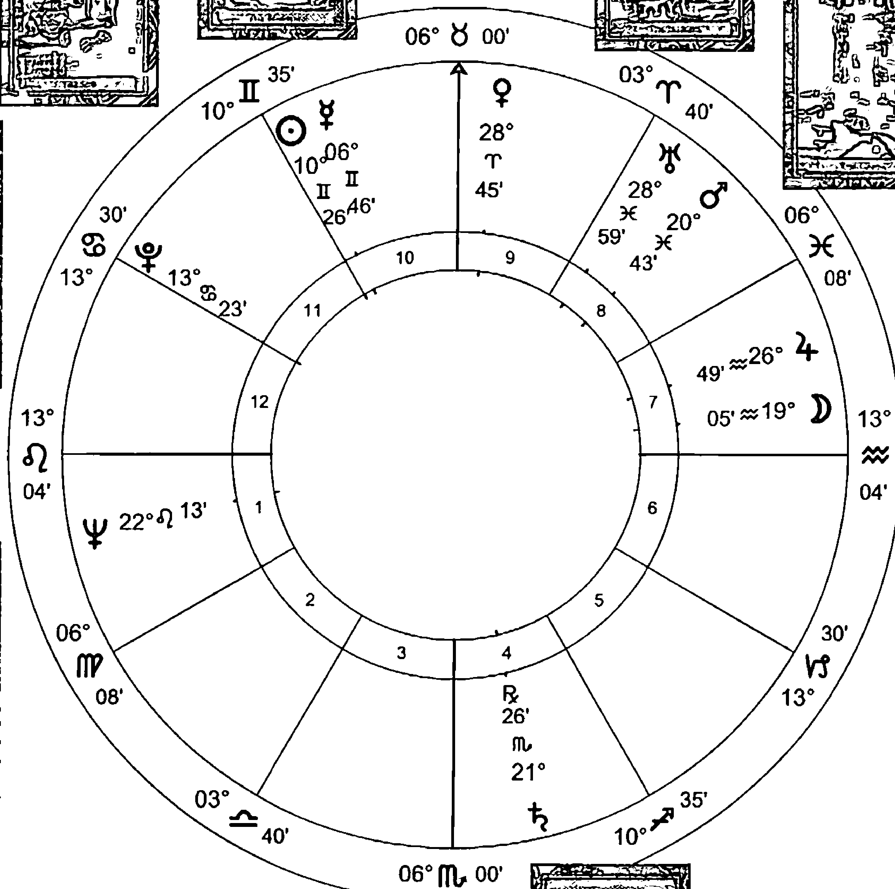

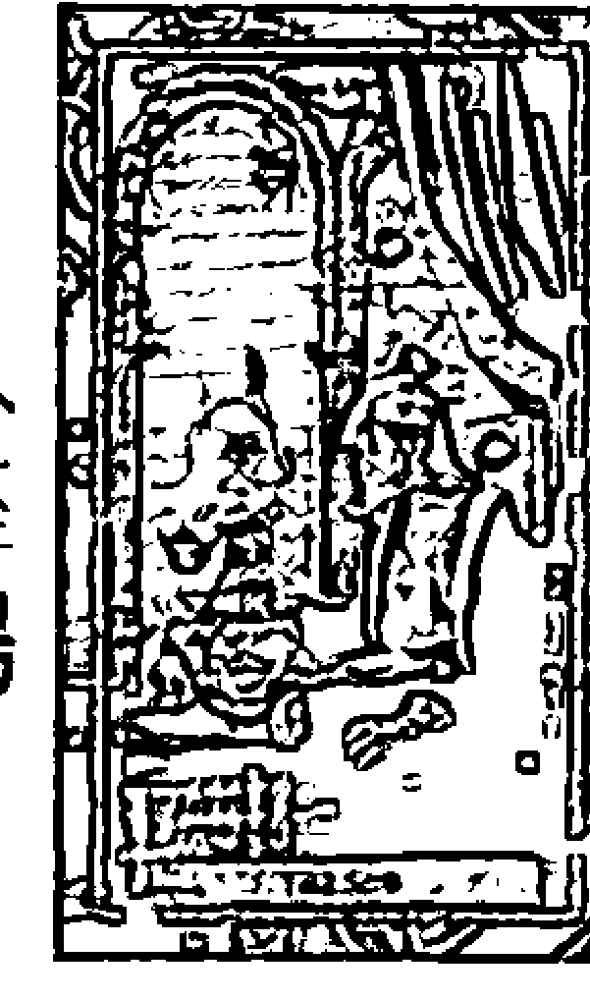

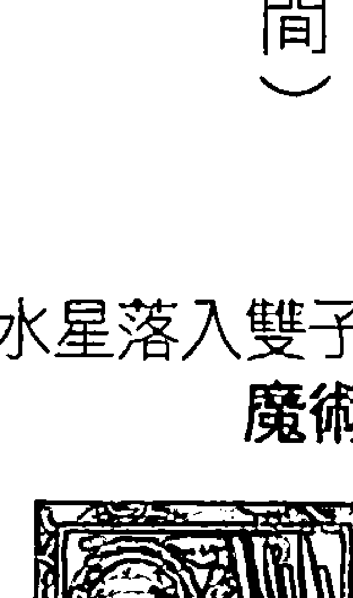

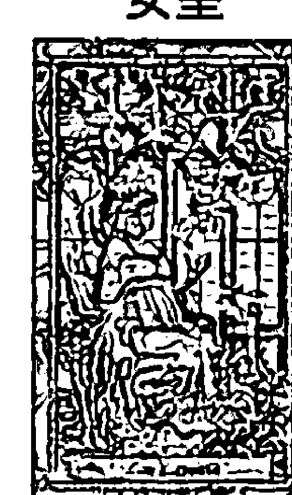

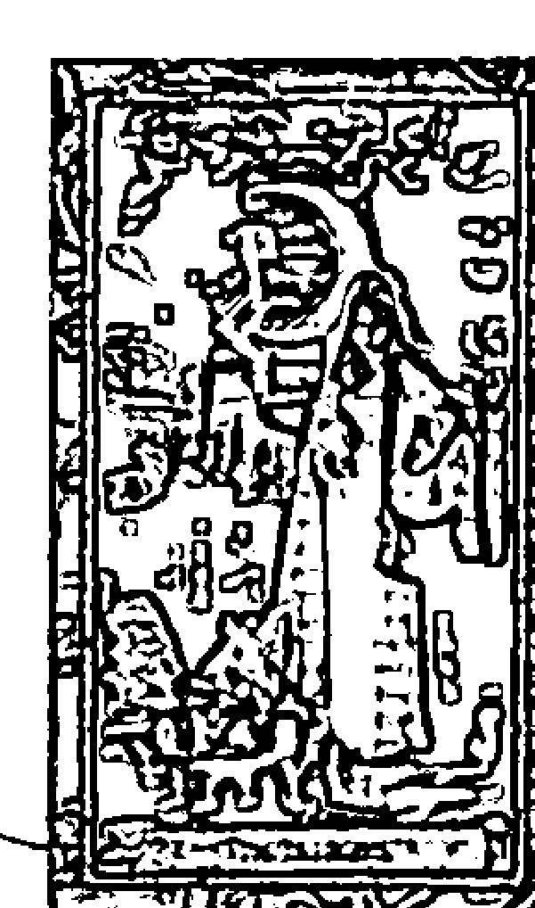

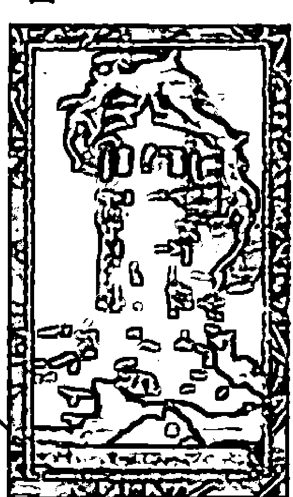

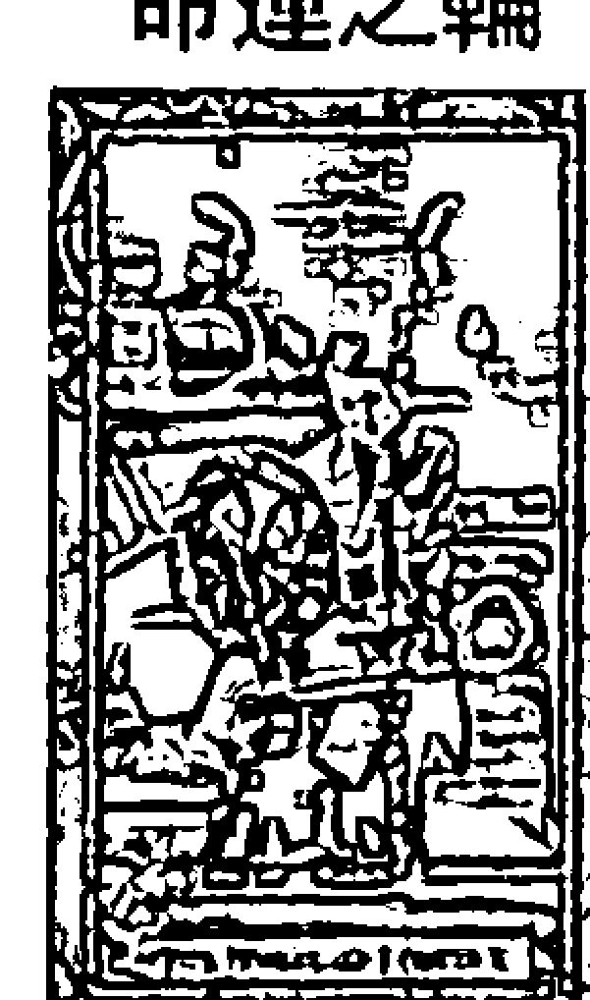

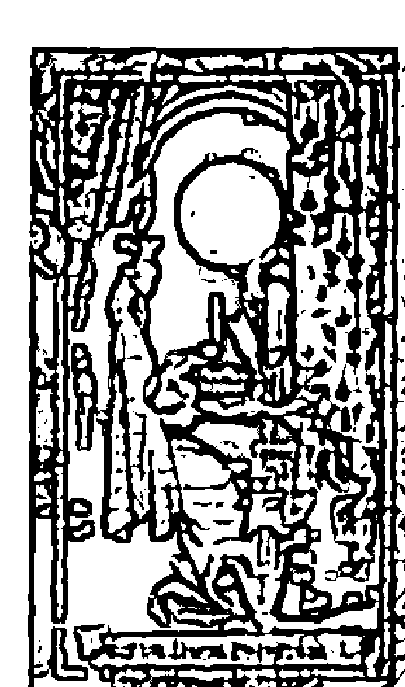

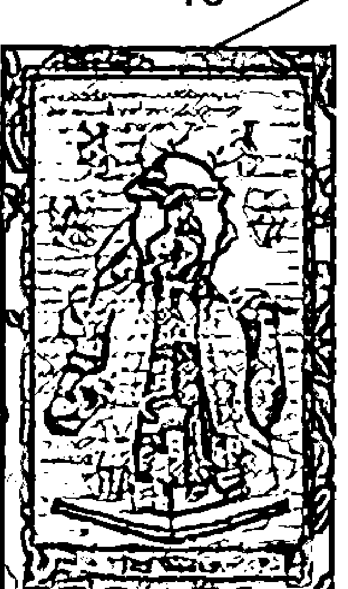


## 案例解讀 瑪麗蓮夢露的星星力量

締造傳奇的性感偶像與螢幕女神瑪麗蓮夢露，不僅只是活在電影中的角色。她的本命盤和相對應的塔羅牌為我們釐清了她的公眾形象與真實自我之間的差別。

瑪麗蓮夢露比她的粉絲或崇拜者更加明白這種差異：「我不曾愚弄任何人，」她說，「我只是任由人們愚弄自己。他們不想費心去瞭解真正的我，反而替我創造一個角色。不過我不會跟他們爭辯。他們顯然愛上某個不是我的人。」

上升點落入獅子座 上升點提供解讀星盤的起點，因為上升點決定星盤的主宰行星，以及案主的身體外觀。瑪麗蓮夢露的上升點位於獅子座，這個專屬獅子的星座完全符合金色捲髮的性感小貓形象。再者，上升點在獅子座，使太陽成為整個星盤的主宰者，賦予她火熱的明星動力。

太陽落入第十宮的雙子座 瑪麗蓮夢露的太陽落入掌管溝通的雙子座，位於代表事業與成就的第十宮。對應雙子座的塔羅牌是戀人，這一點都不令人意外——數十年來，瑪麗蓮夢露一直是全世界最受青睞的性感偶像之一。即使在她死後，她仍是無數仰慕者崇拜甚至思念的對象。

月亮落入第七宮的寶瓶座 在一個星盤中，當你找到太陽後，


接下來就得關注月亮所在的位置，瑪麗蓮夢露的月亮位於掌管婚姻和夥伴關係的第七宮，落入代表未來前瞻性思考的寶瓶座—你可以將它想像成塔羅牌中的星星。寶瓶座的月亮解釋了瑪麗蓮夢露的想像力和創造力，也說明了她以露骨的性感震懾大眾的能力。

### 水星落入第十宮的雙子座

瑪麗蓮夢露的太陽與代表速度與溝通的水星，在雙子座（水星自己的星座）形成合相。這個合相連結太陽與水星，強化了瑪麗蓮夢露機智、多才多藝與敏捷的思考。她很擅長溝通，她不僅將出色的語言能力表現在電影對白上，也常在公開場合中發出驚人之語，而且還能藉由身體語言暗示許多無法言傳的意涵。

### 金星落入第九宮的牡羊座

代表愛、享樂與吸引力的金星是星盤中位置最高的行星，接近中天。毫無疑問地，她的美麗從不吝惜展現給全世界欣賞。此外，金星落入牡羊座，更為她的外表增添了熱烈、直接的特質。就像個女皇，瑪麗蓮夢露知道美麗除了是她賴以成功的工具，也可以作為有力的武器。金星落入牡羊座使她在感情上容易衝動。

### 火星落入第八宮的雙魚座

瑪麗蓮夢露的美麗最終被證實是她毀滅的原因，因為她的火星（代表能量、侵略和自衛）被淹沒在水汪汪的雙魚座（代表秘密、玄秘事物與逃避現實）。火星落入雙魚座使她在情感上顯露出敏感與脆弱的一面——這幾乎是她最討人喜愛的特質，可惜也說明了她肉體上的弱點：她容易染上酒癮或毒癮，就像海岸上遭受海水侵蝕的塔，任由大自然的力量支配。


### 木星落入第七宮的寶瓶座

瑪麗蓮夢露的木星（命運之輪／星星代表幸運與擴張）落入寶瓶座，位於掌管婚姻與夥伴關係的第七宮。這代表她一旦談起戀愛，就成了一個理想主義者，她前後共結過三次婚，去世之前還打算與第二任丈夫狄馬喬再婚。

### 土星落入第四宮的天蠍座

象徵界限與限制的土星與掌管性、死亡與他人財產的謎樣天蠍座產生關連。如同死神牌所彰顯的意涵，瑪麗蓮夢露將自己從一個名叫諾瑪珍（Norma Jean）的平凡女孩，轉變成世上最具辨識度的人物，她創造出屬於自我的形象，就像世界牌中的主角從被翻開的書頁中顯露真實。的確，在她紛擾一時的神秘死亡事件結束數十年之後，瑪麗蓮夢露的傳奇仍持續流傳在世上。

### 天王星落入第八宮的雙魚座

如同火星，瑪麗蓮夢露的天王星（對應愚者的反叛行星）也浸泡在水象的雙魚座。一方面，天王星說明她堅定不移的理想主義，而另一方面，也使她渴望藉由毒品、酒精或性等（與雙魚座對應的）月亮代表的意象來逃避生活中粗糙的現實。


### 海王星落入第一宮的獅子座

代表魅力和幻覺的海王星完美地座落在瑪麗蓮夢露的第一宮，賦予她電影明星的氣質，這種特質在後代成為小輩明星們仿效的標準。海王星對應塔羅牌中的吊人，所以有時候，瑪麗蓮夢露似乎與現實世界脫節了。不過海王星是落入獅子座，則確保她的性吸引力在每次公開亮相時不斷被突顯——無論她是否刻意為之。

### 冥王星落入第十一宮的巨蟹座

代表轉化、結束與新開始的冥王星引領了美國五〇年代的性革命，那段期間，瑪麗蓮夢露成為最具代表性的人物之一。儘管瑪麗蓮夢露的性吸引力顯而易見，但是她同時具備鄰家女孩生氣蓬勃的親切氣質，就像戰車牌中熱愛家庭的女子。


## ◆ 實際運用 ◆

### 本命盤牌陣

你可以結合多種塔羅與占星學的元素來解讀本命盤。下圖為英國王位繼任人威廉王子的星盤。

威廉王子
一九八二年六月二十一日
早上9時03分
英國帕丁頓
時區：-01:00（英國夏令時間）
經度：000° W 12'
緯度：51° N 32'
普拉西度分宮制
回歸黃道


天王星落入
射手座
愚者


木星落入
天蠍座
命運之輪


冥王星落入
天秤座
審判


土星落入
天秤座
世界


火星落入天秤座
塔


月亮
落入巨蟹座
女祭師


太陽
太陽落入
巨蟹座


水星落入雙子座
魔術師


金星落入金牛座
女皇


海王星落入
射手座
吊人

## ◇案例解讀 未來的國王人選——威廉王子

年輕且魅力十足的英國王位繼承人威廉王子擁有一張極好的星盤。我們可以發現，與星座與行星對應的塔羅牌為整個星盤增添了令人驚訝的細節描述。

**射手座上升點** 第一次與威廉打過照面的人，都會對他的親切態度和外向性格留下深刻的印象。威廉的上升點在射手座，這使他活力充沛、興致高昂、愛好冒險、誠實坦率，而且心胸開放——這的確很像節制牌中的探險家。這個情境甚至可以當成對現實生活的詮釋：威廉經常待在馬背上。

**木星落入第九宮的天蠍座** 上升點所在的射手座由木星主宰，因此木星成為他整個星盤的主宰行星。另外，木星碰巧是威廉的星盤中位置最高的行星，與星盤的中天合相——這是傳統的國王標記。

木星主掌第九宮，表示木星在九宮（掌管哲學、長途旅行與外交關係）無比自在。喬裝成命運之輪的木星似乎正允諾一個充滿冒險和經驗豐富的人生。在威廉的星盤中，木星與另外三顆行星一起分享第九宮，身為星群的一份子，木星讓它們通力合作。此外，這些行星都高踞於星盤的頂端，供整個世界瞻仰，因此具有引人注目的重要性。

木星是帶來贈禮的大吉星，不過，同在第九宮的冥王星和土星卻在傳統上被視為凶星，要接受它們的禮物往往得付出痛苦的代價。

**火星、土星和冥王星落入第九宮的天秤座** 有一部分的代價已經被償還了——象徵劇烈轉變的冥王星也與死亡有關。威廉十五歲時，他的母親戴安娜王妃死於一場悲慘的車禍，而威廉的童年也在震驚中結束。當威廉在西敏寺為戴安娜所舉行的葬禮中肅穆地為母親守靈時，似乎在轉瞬間變得成熟了。在全世界的關注下，威廉從男孩轉變成男人。

土星是代表界限和限制的行星，對應世界牌。威廉在出生時被賜予一般人從不敢奢望的贈禮——The request was rejected because it was considered high risk

## 速查指南
天宫圖關鍵字

中天
正午
冬至

冬季

秋季

摩羯座：土象
創始星座，由土星主宰
／父親般的人物、社會地位、事業與公眾形象／骨骼、關節、膝蓋

射手座：火象
變動星座，由木星主宰／哲學、高等教育與長途旅行／臀部和大腿

水瓶座：風象
固定星座，由天王星主宰／社會、社群、公益事業、有遠見的思考、科技／腳踝

天蠍座：水象
固定星座，由冥王星主宰／性、死亡、共同資源／生殖器官

雙魚座：水象
變動星座，由海王星主宰／神秘主義、心靈層面、無意識、隱藏的秘密／足部

天秤座：風象
創始星座，由金星主宰／親密伴侶和公開的敵人／腎臟、下背和腰部

上升點
上升星座
日出
春分

下降點
日落
秋分

牡羊座：火象創始星座，由火星主宰／自我意識、身分、自信／頭部

處女座：土象變動星座，由水星主宰／健康和服務奉獻／神經和消化系統、腸子和腹部

金牛座：土象
固定星座，由金星主宰／物質財產、精神價值觀／頸部和喉嚨

獅子座：火象
固定星座，由太陽主宰／娛樂與生育、子女、創造力／頭部和脊椎

春季

夏季

雙子座：風象
變動星座，由水星主宰／兄弟姊妹、溝通、初等教育、短途旅行和差事／肩膀、手臂和雙手

巨蟹座：水象創始星座，由月亮主宰／母性、滋養、家庭生活／胸部和胃部

天底
午夜
夏至

## 推薦書目

### 給初學者的占星學參考書

Antepara, Robin. Aspects (Woodbury, MN: Llewellyn Worldwide, 2006).

Burk, Kevin. Understanding the Birth Chart (Woodbury, MN: Llewellyn Worldwide, 2001).

Frawley, John. The Real Astrology (London: Apprentice Books, 2001).

Gerwick-Brodeur, Madeline and Lisa Lenard. The Complete Idiot's Guide to Astrology (New York: Alpha Books, 1997).

Guttman, Ariel and Kenneth Johnson. Mythic Astrology: Archetypal Powers in the Horoscope (Woodbury, MN: Llewellyn Worldwide, 1996).

Hampar, Joann. Astrology for Beginners: A Simple Way to Read Your Chart (Woodbury, MN: Llewellyn Worldwide, 2007).

MacGregor, Trish. The Everything Astrology Book (Holbrook, Massachusetts: Adams Media Corporation, 1999).

Scofield, Bruce. The NCGR-Professional Astrologers' Alliance (NCGR-PAA) Education Curriculum and Study Guide for Certification Testing (www.astrologersalliance.org)

### 給初學者的塔羅參考書

Bunning, Joan. Learning the Tarot (Boston: Red Wheel/Weiser, 1998).

Kenner, Corrine. Simple Fortunetelling with Tarot Cards. (Woodbury, MN: Llewellyn Worldwide, 2007).

Louis, Anthony. Tarot Plain and Simple (Woodbury, MN: Llewellyn Worldwide, 2002).

Masino, Marcia. Easy Tarot Guide (San Diego: ACS Publications, 1987).

Michelson, Teresa C. The Complete Tarot Reader: Everything You Need to Know from Start to Finish (Woodbury, MN: Llewellyn Worldwide, 2005).

Moore, Barbara. Tarot for Beginners (Woodbury, MN: Llewellyn Worldwide, 2010).

Pollack, Rachel. Tarot Wisdom (Woodbury, MN: Llewellyn Worldwide, 2009).

### 給進階者的塔羅、占星參考書

Decker, Ronald and Michael Dummet. A History of the Occult Tarot: 1870-1970 (London: Gerald Duckworth & Co. Ltd, 2002).

DuQuette, Lon Milo. Understanding Aleister Crowley's Thoth Tarot (San Francisco: Red Wheel/Weiser, 2003).

Gurney, Joseph. "The Tarot of the Golden Dawn." Journal of the Western Mystery Tradition (No. 17, Vol. 2, Autumnal Equinox 2009).

Hulse, David Allen. The Key of It All, Book Two: The Western Mysteries (Woodbury, MN: Llewellyn Worldwide, 1996).

Huson, Paul. Mystical Origins of the Tarot (Rochester, VT: Destiny Books, 2004).

## 塔羅與占星：以黃道智慧提升塔羅解牌技巧
Tarot and Astrology: Enhance your readings with the wisdom of the zodiac

作 者 柯琳·肯納 (Corrine Kenner)
譯 者 亞瑟
總 編 輯 陳郁馨
責任編輯 李嘉琪
美術設計 葉若蒂
社 長 郭重興
發行人兼出版總監：曾大福

出 版 木馬文化事業股份有限公司
發 行 遠足文化事業股份有限公司
地 址 231 新北市新店區民權路 108-2 號 9 樓
電 話 02-22181417
傳 真 02-86671891
Email service@bookrep.com.tw
郵撥帳號 19588272 木馬文化事業股份有限公司
客服專線 0800221029
法律顧問 華洋國際專利商標事務所 蘇文生律師
印 刷 成陽印刷股份有限公司
初 版 2014 年 1 月
定 價 420 元
ISBN 978-986-5829-75-9

木馬臉書粉絲團 http://www.facebook.com/ecusbook
木馬部落格 http://blog.roodo.com/ecus2005
版權所有 翻印必究

TAROT AND ASTROLOGY:
ENHANCE YOUR READINGS WITH THE WISDOM OF THE ZODIAC
Copyright © 2011 Corrine Kenner
Published by Llewellyn Publications
Woodbury, MN 55125 USA, www.llewellyn.com
Traditional Chinese edition copyright © 2014 ECUS PUBLISHING HOUSE.
All rights reserved.

國家圖書館出版品預行編目 (CIP) 資料

塔羅與占星：以黃道智慧提升塔羅解牌技巧 / 柯琳. 肯納 (Corrine Kenner) 著 ; 亞瑟譯. -- 初版. -- 新北市 : 木馬文化出版 : 遠足文化發行, 2014.01
面 ; 公分
譯自 : Tarot and astrology : enhance your readings with the wisdom of the zodiac
ISBN 978-986-5829-75-9(平裝)

1. 占星術 2. 塔羅占卜 3. 神秘學 4. 命理

292.22 102023951

## 精準對應，殊途同歸——
一本將塔羅與占星「最佳系統化」的詮釋指南！

塔羅與占星自古以來就是系出同源、緊密連結的技法。本書將星座、季節、宮位、行星主宰等占星元素，精準對應到每張大阿爾卡納及小阿爾卡納的宮廷數字牌，更以「巫師塔羅」為例，演繹行家少見的天宮圖塔羅牌陣，應證兩種系統交互詮釋的靈活與精準。無論你是研究占星或塔羅，或已是執業塔羅占星師，這本「玩家限定」的工具書，絕對幫你打通任督二脈，輕鬆將兩門知識融會貫通！

- 認識塔羅牌義與星盤詮釋
- 說明宮位主宰與行星概念
- 以行星與星座對應大阿爾卡納牌
- 以四元素、能量模式與季節配置小阿爾卡納牌
- 闡明宮廷牌、數字牌與塔羅花色的意涵
- 追溯古神秘學、金色黎明及卡巴拉歷史
- 實際演練塔羅占星綜合牌陣
- 解讀達利、瑪麗蓮夢露、威廉王子星盤
- 引用神秘瑰麗的巫師塔羅，增加收藏價值
- 收錄占星術語小辭典與進階參考資源

| 星盤主宰行星 Chart Ruler | 主宰上升點星座的行星，也是整個星盤的主宰行星。 |
|---|---|
| 凱龍星 Chiron | 位於土星與天王星之間的小行星，依據希臘神話中受傷的治療者凱龍而得名。 |
| 古典行星 Classical Planets | 肉眼能看見的七顆行星：太陽、月亮、水星、金星、火星、木星與土星。 |
| 合相 Conjunction | 兩顆行星在星盤上落入相同星座和宮位，這種相位統合並增強了兩顆行星彼此間的能量。 |
| 界線 Cusp | 星盤上兩個星座或宮位之間的分隔線，是一個星座結束而另一個星座開始的角度。 |
| 赤緯 Declination | 某一星體在天球赤道以北或以南的距離。 |
| 下降點 Descendant | 第七宮的宮頭，在這個點上的行星和星座像落日一樣從西方地平線下降。 |
| 榮顯理論 Dignities | 將行星力量分為榮顯、強勢、弱勢和失勢等類別的理論。 |
| 順行 Direct | 從地球上來看，行星似乎穿越黃道帶向前移動。 |
| 支配星 Dispositor | 主宰某個星座的行星對碰巧落入該星座的行星有一定程度的支配力量。嚴格來說，某些情況下，支配星能支配或主宰來訪的行星。 |
| 居所 Domicile | 行星的先天住家，它們的主宰星座或宮位所在的位置。 |
| 土象星座 Earth Signs | 黃道上的「維持者」，包括金牛、處女與摩羯座。 |
| 蝕 Eclipse | 日蝕發生在月亮通過地球與太陽之間的時刻，月蝕發生於滿月期間，此時地球介於太陽與月亮之間。占星學上的蝕相代表突如其來的劇烈改變。 |
| 星曆 Ephemeris | 依照日期與角度表列的各行星位置。 |
| 春分點 Equinox | 日夜長度相等的時間點。春分點發生在太陽進入牡羊座的時刻，秋分點發生在太陽進入天秤座的時刻。 |
| 陰性星座 Feminine Signs | 土象與水象星座，包括金牛、巨蟹、處女、天蠍、摩羯與雙魚座。陰性星座被認為是善於接納、回應、消極的、有吸引力與被動的。 |
| 火象星座 Fire Signs | 黃道上的「創始者」，包括牡羊、獅子與射手座。 |
| 固定星座 Fixed Signs | 金牛、獅子、天蠍與寶瓶座標示出每個季節的中間月份，特質是穩固、前後一致、持續不變、耐力十足且可靠的。 |
| 天底 Imum Coeli (I.C.) | 拉丁文意指「天空底部」。天底是第四宮的宮頭界線，作為星盤的最低點，它與基礎、家和家庭生活有關。天底與中天遙相對立。 |
| 內行星 Inner Planets | 指太陽、月亮、水星、金星與火星。 |
| 凶 Malefic | 古典占星學中，土星和火星是帶來不幸的凶星。 |
| 陽性星座 Masculine Signs | 火象與風象星座：牡羊座、雙子座、獅子座、天秤座、射手座與寶瓶座。陽性星座被認為是主動或積極的。 |
| 中天 Midheaven | 第十宮宮頭界線；星盤的最高點，象徵事業、公眾形象、地位與認同。亦稱作 Medium Coeli (M.C.)，拉丁文意指「天空中央」。 |
| 中點 Midpoint | 與兩個行星、角或界線等距離的點，應用於額外的星盤解讀。 |
| 月相 Moon Phases | 包括新月、上弦月、滿月與下弦月等各階段的月亮週期。 |
| 變動星座 Mutable Signs | 雙子、處女、射手與雙魚座標示出每個季節最後一個月份，象徵過渡的、適應力強且易於變通的。 |
| 新月 New Moon | 月相初始階段的新月或暗月，此時月亮與太陽合相。 |
| 交點 Nodes | 月亮軌道和黃道（太陽環繞地球運行的假想路徑）的交點。南交點象徵先天的天賦和才能，而北交點代表必需學習的課題。 |
| 容許度 Orb | 認定相位時採取的有效寬限範圍。太陽和月亮相位的容許度通常大於其他行星相位認定的容許度。 |
| 外行星 Outer Planets | 指天王星、海王星與冥王星。（參見「超個人行星」） |
| 幸運點 Part of Fortune | 阿拉伯點之一，星盤上顯示先天才能，以及暗示快樂與幸運所在的位置。 |
| 個人（內）行星 Personal (Inner) Planets | 包括太陽、月亮、水星、金星與火星，這些行星對個人性格有直接的影響力。 |
| 主宰行星 Planetary Rulers | 每個星座都由一顆擁有與它有相同特性的行星所主宰。 |
| 本初子午線 Prime Meridian | 以英國格林威治的經度線為界，將地球分割成東、西兩個半球。 |
| 推運 Progression | 隨著時間推移，在星盤上模擬行星推進的占星技巧。常見的公式是以一天代表一年。 |
| 象限 Quadrants | 意指星盤的四個分區。每個象限的範圍從第一、第四、第七與第十宮的宮頭算起。 |
| 逆行 Retrograde | 從地球的觀點來看，行星（太陽和月亮除外）有時似乎週期性地在黃道上後退，這種視錯覺現象在占星學具有重要象徵意義。本命盤上逆行的行星代表能量內化、反轉，或是發展趨於遲緩。 |
| 太陽回歸 Solar Return | 依照度、分、秒精確計算的生日天宮圖，此時太陽再度返回本命盤上案主出生時太陽所在的黃經位置。 |
| 至 Solstice | 一年之中最長（冬至）與最短的日子（夏至），此時太陽到達地球赤道以北或以南最遠的距離。 |
| 續宮 Succedent Houses | 星盤上的第二、五、八與十一宮，接續在下降宮之後。根據古典占星學觀點，續宮從下降宮獲得力量。 |
| 超個人 (外) 行星 Transpersonal (Outer) Planets | 天王星、海王星與冥王星移動緩慢，因此對整個世代有同等的影響力。 |
| 回歸黃道 Tropical zodiac | 以春分點位置來定義星座的一種系統，通常被運用於西洋占星學。 |
| 無相月 (月亮空亡) Void-of-Course Moon | 描述位於星座尾端、即將進入下個星座的月亮。當月亮沒有相位時，象徵月亮進入下個星座前，與整個宇宙都沒有關聯。 |
| 下弦月 Waning Moon | 逐漸虧縮的月亮，發生在滿月之後和新月之前，象徵結束與完成。 |
| 水象星座 Water Signs | 黃道上的「感覺者」，包括巨蟹、天蠍與雙魚座。 |
| 上弦月 Waxing Moon | 逐漸滿盈的月亮，發生在新月之後和滿月之前，象徵開始與成長。 |
| 西洋占星學 Western Astrology | 托勒密於西元二世紀創立的理論，是古希臘與巴比倫占星學的延續。 |
| 黃道帶 Zodiac | 包圍地球的橢圓形帶狀空間，行星由西向東運行，按順序穿越牡羊座至雙魚座。 |