# 天空為限的逆位思考與實占解牌

# 塔羅之眼

天空為限——著

子玄老師 塔羅教典｜于玥 占星療癒心理師
小球（莊鵑瑛）歌手、自由創作者
孟小靖 塔羅事典館主｜薛超 卡巴拉預測研究學者
鐘穎 愛智者書窩版主 共同推薦（依首字筆順排序）

THE EYE OF TAROT

# 目錄

- 推薦序
- 從學術到實戰，一次到位的新時代塔羅神作 10
- 前言 13
- Part 1 前導篇 15
- 四大元素於各類型問題的應用 17
- 四大元素的特質比較 25
- 正位牌搭配四大元素時的缺點 27
- 逆位的解牌方式 30
- Part 2 大阿爾克納搭配四大元素 35
- 0 愚人 36
- 1 魔術師 39
- 2 女教皇 43
- 3 女皇 47
- 4 皇帝 50
- 5 教皇 53
- 6 戀人 56
- 7 戰車 59
- 8 力量 62
- 9 隱者 65
- 10 命運之輪 68
- 11 正義 71
- 12 倒吊人 74
- 13 死神 77
- 14 節制 80
- 15 惡魔 83
- 16 塔 86
- 17 星星 89
- 18 月亮 92
- 19 太陽 95
- 20 審判 98
- 21 世界 102
- Part 3 小阿爾克納數字牌搭配四大元素
- 號碼 頁碼 權杖 頁碼 寶劍 頁碼 聖杯 頁碼 錢幣 頁碼
- 一號牌 106 權杖一 107 寶劍一 110 聖杯一 113 錢幣一 116
- 二號牌 119 權杖二 119 寶劍二 122 聖杯二 125 錢幣二 128
- 三號牌 131 權杖三 132 寶劍三 135 聖杯三 138 錢幣三 141
- 四號牌 144 權杖四 145 寶劍四 148 聖杯四 151 錢幣四 154
- 五號牌 157 權杖五 158 寶劍五 161 聖杯五 164 錢幣五 167
- 六號牌 170 權杖六 171 寶劍六 174 聖杯六 177 錢幣六 180
- 七號牌 183 權杖七 184 寶劍七 187 聖杯七 190 錢幣七 193
- 八號牌 196 權杖八 197 寶劍八 200 聖杯八 203 錢幣八 206
- 九號牌 209 權杖九 210 寶劍九 213 聖杯九 216 錢幣九 219
- 十號牌 222 權杖十 223 寶劍十 226 聖杯十 229 錢幣十 232
- Part 4 小阿尔克纳宫廷牌搭配四大元素 235
- 权杖
  - 权杖侍者 236
  - 权杖骑士 240
  - 权杖皇后 243
  - 权杖国王 247
- 宝剑
  - 宝剑侍者 250
  - 宝剑骑士 254
  - 宝剑皇后 257
  - 宝剑国王 260
- 圣杯
  - 圣杯侍者 263
  - 圣杯骑士 266
  - 圣杯皇后 269
  - 圣杯国王 273
- 钱币
  - 钱币侍者 276
  - 钱币骑士 280
  - 钱币皇后 283
  - 钱币国王 287
- Part 5 牌陣解牌精選實例
- 牌陣一 時間之流
  - 實例解讀 1：未來的關係發展 296
  - 實例解讀 2：工作狀況 302
  - 實例解讀 3：跟在意的人一個月內的發展 306
  - 實例解讀 4：與某人的關係 309
  - 實例解讀 5：未來三個月學占星的狀況 314
  - 實例解讀 6：未來一年學習靜坐的狀況 317
- 牌陣二 聖三角
  - 實例解讀 1：為什麼這個月生意不好 323
  - 實例解讀 2：該與朋友合租靜修處所嗎？ 326
  - 實例解讀 3：新面試的工作機會 337
  - 實例解讀 4：與某人的關係陷入膠著 341
  - 實例解讀 5：如何處理學習塔羅時的困難 345
  - 實例解讀 6：如何讓工作快速上手 350
- 牌陣三 二擇一 356
  - 實例解讀 1：這件事要告訴老闆嗎 360
  - 實例解讀 2：要不要換工作 367
  - 實例解讀 3：要不要換成蘋果手機 377
  - 實例解讀 4：事業接下來的發展 380
  - 實例解讀 5：要用什麼方式做生意 384
  - 實例解讀 6：要掛名新店面的負責人嗎 388
- 牌陣四 大十字 394
  - 實例解讀 1：我家貓咪為什麼一直叫 396
  - 實例解讀 2：我養貓目前的心態和未來的結果 400
  - 實例解讀 3：用新方法發展事業的狀況 403
  - 實例解讀 4：現在工作的發展狀態 406
- 牌陣五 七行星人格 412
  - 實例解讀 1：我的人格 419
  - 實例解讀 2：我的人格 426
  - 實例解讀 3：朋友的朋友的個性 432
  - 實例解讀 4：我的人格 439
  - 實例解讀 5：前主管的個性  452
  - 實例解讀 6：我這一年的個性轉變  460
  - 實例解讀 7：老闆最近的狀況  465
  - 實例解讀 8：友人的個性  469
  - 實例解讀 9：某人的人格  484
  - 實例解讀 10：我的性格  492
- 牌陣六 十二宮  500
  - 實例解讀 1：我各方面的運勢狀態  502
  - 實例解讀 2：我今年各方面的狀態  510
  - 實例解讀 3：我的整體狀況  517
  - 實例解讀 4：我去年的狀態  525
- 牌陣七 關係牌陣  532
  - 實例解讀 1：與老闆的關係  534
  - 實例解讀 2：與客戶的關係  546
  - 實例解讀 3：我與房子的關係，適合長久居住嗎？  552
- 牌陣八 十二宮牌陣之前世今生  556
  - 實例解讀 1：前世今生 A 558
  - 實例解讀 2：前世今生 B 566
  - 實例解讀 3：前世今生 C 581
- 課外問答 601
- 《藏在塔羅裡的占卜符碼》練習題解答 605

# 推薦序

# 從學術到實戰，一次到位的新時代塔羅神作

子玄老師／《塔羅教典》作者

不論是東方或西方的命理學研究，2024 年都是重要的開端，東方所謂三元九運的離運正開始，甲辰年的天干正好進入新一句的循環。從西洋占星的角度來看，冥王星進水瓶，接著是 2025 年天王星進雙子、海王星進白羊，都象徵著新時代心靈成長的勃興，正待此時，進入身心靈的領域是顯學，並且，也只是開端，未來的發展仍相當可期。

正當這個年頭，天空為限推出了新的塔羅著作，做為時勢的先鋒，讓新的學習者可以快速的入門，進到心靈的領域，瞭解塔羅可以解析哪些問題。而如果你是很有基礎的塔羅學習者，那這套書就更不可錯過，這是集天空老師 20 年的經驗之作，學術的部分可深入探討研究，解牌的部份情節豐富有趣，喜愛研究命理的你絕對愛不釋手，愛看小說的你也會欲罷不能，這是一本奇特的神秘學之書。

我跟天空認識已經 20 個年頭了，其中合作《女巫神算館》擔任版主期間（當然，該網站是她一手主導創建，當時救助了很多迷途羔羊），我被她的解命和說理風格折服，深感其對命理的理解深不可測，每每有鬧版或說理不通者，她都能一一解決，不只以理能勝人，以命理能勝人，以氣勢也能勝人，其塔羅的風格，20 年如一日，大家可在各種解牌範例中略窺門徑。

略說本書，共分上下兩冊，上冊以基本牌義理解和四元素的搭配為主，雖說毫無基礎也能讀懂，但如果可以，需得補強一些塔羅基礎知識，包括塔羅的結構、牌的基礎分類與理解，那麼，再讀這本書，可以得到更多的學習和搭配性的理解。牌和元素的搭配說明雖然清晰，但其實蘊含了天空老師多年來的經驗，如果能把邏輯弄通，就能進入快、狠、準的解牌狀態，而不是生搬硬套，或每次解牌都要翻書的窘境。

下冊則是牌陣和解牌案例，這部份的學習，可以直接將案例看懂，邏輯弄通便能學習順暢。但如果要學到精髓，還是建議把上冊給弄懂了，再來閱讀案例，會發現解題時，牌跟牌之間環環相扣的過程是很精彩的。你也可以先把題目看完，之後試著自己解牌，寫出解答，再來看看你跟天空老師之間的差距，從中截長補短的精煉自己的塔羅技巧。

在塔羅的領域中，從學術到實戰之間，有許多學科可以探討，其中，元素學的整合應用和逆位置的理解是重要的項目，能夠說明和理解是一回事，真正落實到應用上又是另一回事，《塔羅之眼》此書兼顧了兩者，上冊是學理的整合分析脈絡為主，下冊是對話的口吻將牌陣解牌的方法鮮活的呈現在讀者面前，讓學習塔羅的朋友們可以自然的吸收觀念，並且推演應用在自己的個案中。

我推廣和教學塔羅已經 20 年了，從基礎班教起，現在已經進入研究班的領域，包括卡巴拉、占星學、易經的塔羅結合，越往前探索，會發現塔羅內涵深不可測，學海淵博，是很值得玩味的神秘學。這些年，遇到接觸塔羅者，偶有入錯門道者，以江湖算命為根基，沒有學識，甚是可惜，因此去年同時報出版了《塔羅教典》，是為塔羅教學者和學習者當教科書使用，但其中解牌的方法因篇幅和我個人的能力有限，未能盡善。如今，天空為限出版的這本以偉特牌為基底的塔羅書，卻拓展了解牌的應用與思維方法，對於塔羅的應用者來說，實是一大福音，真心推薦給塔羅的學習和諮商應用者，也希望在新的世紀中，大家都能用塔羅得到身心安頓、助人助己。

子玄 2024年1月10日于台北

# 前言

依我的習慣，算塔羅牌是不用逆位的。不過卻常常有人問，這樣該怎麼知道負面的牌義？其實每張牌都有好有壞，就像你如果要問賺錢，抽到聖杯二，雖然是一張好牌，但是是水元素，無論如何不能算太好。我在上一本書提到，有學生問：「這次跟客戶的交易會成功嗎？」抽到聖杯二。我說聖杯二就是交情不錯，關係可以維持，但水元素不利於錢財，所以他會殺價，讓你的利潤減少，或者是交易規模縮小，獲利也就少很多。由於這個學生是先自己算牌才來上我的課，所以她已經有結果了，她說殺價跟交易規模縮小確實都有發生。雖然我在上課時說不使用逆位，但是她自己當初抽到這張牌就是逆位，可見我們不用正逆位，就可以從元素看出是正面或是負面。

不過，還是有很多學習者為此苦惱，畢竟不是所有人都是我的學生，所以我寫這本書，讓大家了解，如果一張牌是負面的，可能有哪些含義可以用在逆位，也可以用在元素不合時；甚至牌是正位，但你就是覺得出現這張牌怪怪的，跟整副牌的調性不搭，你也可以思考一下有沒有負面的可能性。

這套書下冊的解牌案例，都是我的上課實錄（經過學生同意）。雖然我有另外開逆位課，但只要你看了本書，會發現一張牌不管正逆位，我通常會依他的位置跟出現的順序，來決定他的吉凶，而且逆位也不見得是凶，正位也不見得是吉。

所以雖然這是一本逆位書，但並不是教大家逆位牌義，而是怎麼把牌解出更細膩的含義，不然如果只要知道吉凶就好，那不如丟銅板。

# Part 1 前導篇

在我的方式裡，四大元素特別重要。四元素不像五行，沒有固定的相生相剋，而是對應於不同的問題類型，每一個元素的作用就不同，例如火元素，如果對應在愛情，火的行動力強，但是如果沒有水的柔情蜜意，就會變成盲目追求，反而一下子就沒戲唱了。

換個問題來看，如果到了適婚年齡，缺乏土元素就是缺乏穩定下來的因子，如果有結婚的念頭，就算有火有水，也需要再考慮，但也有可能只是雙方了解還不夠，所以還不夠穩定；如果在吵架的時候，風元素的好牌，也會帶來溝通的機會，但如果是風元素的凶牌，只代表在糊弄、哄騙對方。

同樣的，火元素牌如果在工作上出現，就代表行動力很足夠，但如果沒有土的成果，就會一直猛衝，達不到自己要的結果；如果工作上的人際關係很重要，才需要水跟風。

## 四大元素於各類型問題的應用

### 1. 火元素 （牡羊座、獅子座、射手座，陽性元素）

熱情洋溢，做決定靠直覺，不擅長思考，有無盡的精力可以運用，稍嫌莽撞衝動，卻是個很好的開創者。可以化不能為可能，把長期的問題在短期內解決，雖然無法面面俱到，只能挑重點處理，但解決了時間這個癥結點，其他部分也就迎刃而解。

火元素的缺點是凡事只憑直覺，缺乏長遠思考的能力，所以如果是他能解決的事，一下就解決了，但如果超出他的能力，給他再多時間都沒用。

如果要問事業：火象徵衝勁，但缺乏經驗跟安穩，所以成果留不住，如果想有成就，必須有土元素來輔佐，才能把賺進來的經驗存放在腦中，把賺進來的錢存起來。如果只有火元素，沒有土元素，那錢就會大起大落，因為火元素花錢不眨眼。如果是有年紀的人問事業，建議方向由火元素著手，才能喚起決斷力跟衝勁。

如果要問感情：火元素熱情如火，所以通常是一見鍾情，但沒有更多能力了解彼此深入的內心狀況。如果要中和，那水元素跟火元素都必定共同存有，如果缺乏火元素，只有水元素，那就是彼此感覺良好，但沒有勇氣跨出下一步，告白、接吻、上床，都是需要火元素來推動的，沒有火元素，就沒有進一步。

如果是想要定下來或超過適婚年齡，就不適合火元素，因為火元素雖然單純，但一個目標結束，會快速找下一個目標。所以如果要結婚，最好是水元素結合土元素，才願意定下來，容忍對方不完美的地方。同時水元素也擅於調整自己，才能為對方改變，往好的方向邁進。

#### **如果要問財運**：火元素對錢是大進大出，賺得很過癮，也花得很爽快，只要感覺對了，就算沒有相應的好處，也願意把錢砸出去。不好的地方則是花錢之前沒有先想過，所以淪落到沒錢時，可能需要以前沒付出的對象來拯救。不過火元素很講義氣，對他有恩情，他會記住，也有很大的機會東山再起再報恩。

#### **如果要問人際關係**：不管是家庭還是公司學校，火元素的好處是個人風格鮮明，一定會受到注意，會成為別人眼中特別喜歡或特別討厭的一員。火元素也代表愛現、不知輕重，所以別人對他的喜惡很極端，但火元素自己通常渾然不覺，所以容易遭暗算，也容易好了傷疤忘了疼，一再重蹈覆轍。火元素最大的缺點就是記憶力不太好，所以需要多次重覆受挫，很難一次就記取教訓。

### 2. 土元素 （金牛座、處女座、魔羯座，陰性元素）

不是可以開創的元素，但是可以「守成」，比較像外聘的CEO，公司已經穩定了，請他來管理。這張牌大多是副手，但也有可能是「地下總統」，因為資源跟權力都在他手上，表面上是火元素比較可以服眾，實際上是需要土元素的深思熟慮。

如果他是富二代，那非常好，因為他不會去揮霍，反而會更好的規劃，讓公司永續生存，更加擴大格局，也更穩固。

**如果要問事業：** 土元素象徵資源，所以不用愁錢跟經驗，但創新的能力不夠，需要多用些新人來嘗試自己沒有想到的地方，這樣才有更廣的想像力。

如果是新創公司，那有可能是傳統行業，已經有一套既定的做法跟風格，但手法稍嫌保守，建議要多些新血輪，或是參考新人的發想，才不會越走越死，有火元素最好，火元素是創造力。

**如果要問感情：** 土元素是慢熟型的，大多是認識一陣子的人，或者是親友介紹，才會有安全感，或者大多需要有職業的保障，才願意再進一步認識，需要風元素的好奇心，至少先認識一下，或者水元素的包容心。不過但如果都是陰性元素，可能會拖更久。

有火元素，可能兩邊很快就能確定是自己要的，加上土元素，強強聯手也是可以，火元素主動，土元素接納，會是很理想的組合。

**如果要問財運：**土元素就是物質，也代表錢財，土元素跟財運最為合拍，如果同時有火元素，就是會花也會賺。如果風太多，會把錢吃喝玩樂掉，如果有不好的水元素，就會把錢都花在別人身上，如果是好的水元素，就會拿去作公益，替自己累積福報。

**如果要問人際關係：**土元素不是一個靈巧多元的元素，他很老成，很喜歡觀察，只有他認同的人，才會進入他的生活圈，但他如果不認同，也很少跟人產生衝突，也很有禮貌，土元素不太會給自己惹麻煩，所以土元素的人際社交圈滿小的，但身邊都是對他有用的人。

### 3. 水元素 （巨蟹座、天蠍座、雙魚座，陰性元素）

水元素是依附環境依賴他人的元素，特點是第六感很強，可以知道別人的想法跟喜好，這也是弱者必須具備的生存能力，好處是有同情心跟同理心，善良，但也容易被利用，因為水元素沒什麼界限，容易同情他人，有人覺得水元素不太聰明，嗯～我也這樣覺得，但其實他們是對人沒什麼戒心，又容易相信人，與其說笨，不如說他們會自欺欺人。

其實水元素很敏銳，有時候已經知道真相，卻常常不願意相信人心有這麼險惡，長此以往，身邊明理的人都會被洗出去，留下來的都是要利用他們或需要垃圾桶的人，所以我還滿喜歡水象人，但對他們身邊的人，我比較不敢恭維。

#### 如果要問事業：

水元素通常代表藝術能力，如果很有成就，他們會是慈善家，但大多時候，他們都需要接受別人的慈善。如果同時有火元素，他們就會很出色，因為火元素通常都會衝衝衝，如果加上水元素的善解人意，他們就很能掌握機會。如果加上土元素，不是很有錢又心地善良，就是至少像陳樹菊（慈善家），願意用自己有限的資源來做好事。如果加上風元素，基本上風元素跟水元素都是渙散元素，需要再多磨練一陣子。

#### 如果要問感情：

水元素本身就代表感情，但容易把同情誤會成愛情，也很容易動心，或者有時候也不是動心，是不知界限的舉動讓別人誤會，又不是很會處理，剪不斷理還亂，這時候最需要土元素，幫忙他劃清界限。

如果跟火元素一起出現，不管是是不是愛情，常常會一頭栽進去；如果是風元素最好，可以自在的交流，也不需要負責，對風元素跟水元素來說應該算很理想（？）。

#### 如果要問財運：

水元素常常不知道錢是從哪裡花掉的。我看過一個命盤，水元素到處都是，我說：「妳賺五萬塊跟十萬块，你都会把钱花掉，却也没有穿得吃得特别好，生活完全没有改变，但钱就是花掉了，你也不知道钱哪里去了！”她激动的说：“真的，我有时候领奖金，也没买什么，但钱就是没了。”如果有土元素，至少可以帮水元素把钱存下来，我的建议是，薪水先固定存一部分，其他随便花，反正水元素表示总会有人救她，不至于让自己活不下去。

如果有火元素，加上水元素，那至少花在哪都看得到，虽然花得凶，但也炫耀到了。风元素我就不说了，跟水元素一起的话，我没什么好说的。

**如果要问人际关系：** 水元素受大多数人喜爱，所以不太缺朋友，但缺“益友”，如果有好的火元素，至少可以一起探索有趣的事，如果是不好的火元素，就会很像主从关系，火是主，水是从。风元素跟水元素一起，也很有趣，风元素没什么控制欲，所以双方都很平等。

但还是土元素的好牌最能够帮水元素成长，如果是土元素的坏牌，会让水元素越走越错。

### 4. 风元素（双子座、天秤座、水瓶座，阳性元素）

风元素就像风一样，随时随地有不同的型态，不同的方向，也随时都在改变主意。风元素的优点就是智商很高，但智商高能做好事也能做坏事，所以走歪路的机会也不小。

#### 如果要问事业：

风元素擅长变通，所以很适合经营个人品牌，像是部落客、YouTube 等等，也适合从事业务或行销，更是很好的幕僚，不管是什么难搞的事，他都有办法解决突发状况，但若要长期经营，他会忘记自己承诺过什么，所以禁不起考验。自由接案也很适合，不适合当传统的上班族，因为风元素适合在多变的环境中求生存。当顾问也很是他们的专长，就是聪明灵活，也很擅长引起话题。如果想要保有热情，需要有一点火元素，如果想要坚持，就需要土元素，如果想要对工作保有兴趣，就需要水元素。

#### 如果要问感情：

风元素很容易跟人交朋友，但感情方面通常最多只是暧昧，不能够给予对方承诺，所以在感情问题，风元素牌唯一的好处是沟通，但如果不是好牌，沟通不良反而容易吵得更凶，但有沟通总比冷漠好；如果是土元素的坏牌，那就是哀莫大于心死，如果不想分手就僵在那里，或者各过各的；风元素的牌至少有诚意，虽然很常强辞夺理。

如果一副牌只有风加土，没有热情的火元素跟柔情的水元素，其实也没什么不好，就表示这段感情很理智，像是合伙人开公司，婚姻如果没有感情用事，两人是对方最好的朋友，反而什么问题都容易解决，只是如果感觉需求强烈的人，会觉得很空荡荡。

#### 如果要问财运：

风元素是涣散元素跟消极元素，虽然是积极的阳性元素，但目标不明确，虽然常常想到什么买什么，优点是能屈能伸，有钱有有钱的过法，没钱有没钱的过法，像蟑螂一样，不管什么环境，风元素都有办法生存下去，所以他也很容易从没没无名，突然翻身成大人物。

**如果要问人际关系：** 人际关系可是风元素的强项，条理分明，逻辑清楚又擅长表达，所以很容易说服他人，如果是不好的风元素，就很喜欢洗别人的脑，把对方玩弄在股掌之中，所以如果大多是风元素的好牌，就偏向福尔摩斯跟华生这样的益友，如果是风元素的坏牌，就比较像损友或酒肉朋友。

### 四大元素的特质比较

火跟风是阳性元素，两个都是变动，火是往前冲、往上冲，风是没有目标顺势而为，适合去做出改变。

土跟水是阴性元素，是物质，土跟水都是可以用容器盛装，所以适合累积，慢慢酝酿，然后凝结出一个成果。

火元素跟土元素都是有目标，火元素目标是短期的，土元素目标是长期的。

风元素跟水元素都是涣散的，都容易被外界影响，但风是阳性元素，所以他受到外界影响，要经过自己拿捏，水元素会身不由己。

在爱情的部分，水元素是感情本身，火元素是激情，所以要更进一步，必须有火元素在内，不然就暧昧一辈子。

土跟风都太过理智，不太容易为爱陷下去，所以适合合作，如果要结婚，要看有没有水元素来调和。

如果是火元素加风元素，有可能是一夜情，因为都是快速的阳性元素。

如果是火元素加土元素，火元素是欲望，土元素是肉体感官，所以也有可能有肉体交流，但土元素是阴性元素，影响会是长期的，所以有后续了拉扯跟烦恼，没办法很干脆。

在赚钱的部分是火元素，但火元素也很会花钱，所以要加土元素，才能把钱留住，土元素是存钱。

水元素跟火元素都很爱花钱，但火元素花钱是欲望，水元素花钱是因为有人鼓动或需要，水元素可能根本忘记钱花在哪里，外表也看不出他的钱花在哪里。

### 正位牌搭配四大元素时的缺点

七十八张正位牌，遇到什么样的元素，会有什么样的缺点呢？我用太阳牌为例，因为太阳牌是众所周知的好牌，很难想像他的缺点，但再完美的牌，就算不说缺点，至少会有弱点。

太阳是一张开朗又有助运的牌，太阳牌没有阴暗之处，所以光看牌面就让人觉得放心，好像没有什么坏事会发生。我们先不说他会引来嫉妒跟攻击，因为要产生这种现象，一定要有其他的牌搭配出现。

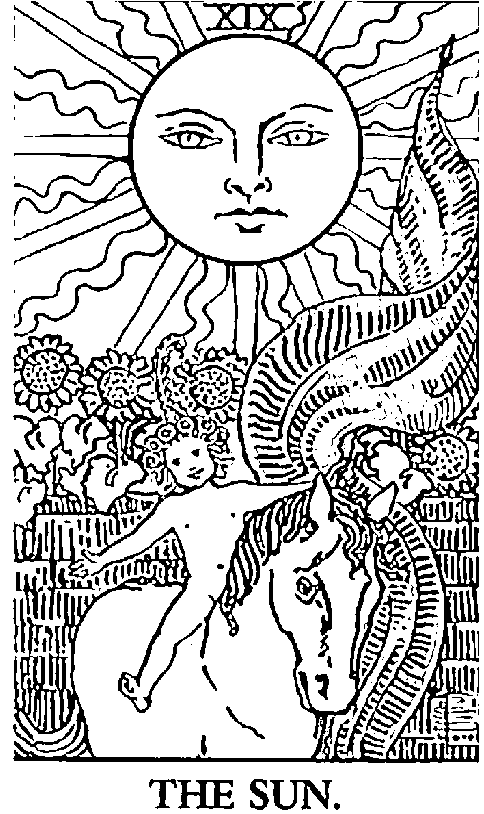

如：太阳在“问题”的位置时，我们不能用一般常用的方法来解读，也就是不能用相反的意思来解释。因为我认为如果出现太阳，就一定是太阳才能代表的意思，如果是相反的意思，那就让你抽到相反意思的牌就好啦！

#### 太阳＋火元素

太阳牌对自己要求太高，如果火元素过度，就是他太在乎别人看待自己的眼光，所以不允许自己失败，越是这样，越有可能把自己逼进死胡同。别人习惯失败，就算失败了，了不起从头再来，但太阳太爱面子，有可能不想承认自己的错误，所以如果失败，也不愿意喊停，让自己没有止损点，一旦引爆会全盘皆输。

#### 太阳＋土元素

如果太阳牌遇到土元素过多，太阳牌的火元素是激进，也是新生成的创意，但土元素是墨守成规的，或者土元素也有可能是权威人士，或是传统思想。这都会硬生生的把火元素的热情跟活泼压下去，可能就是遭到现实的打击，或者是事情不如所想，被人当面吐槽，或者是得用钱来做一些宣传的事。不过，火跟土都代表财运不错，所以不至于会赔钱，只是成就可能会慢一点达成，如果是土元素的坏牌，那可能会让火元素迷失方向。

#### 太阳＋水元素

太阳牌跟水元素都代表乐观跟梦想，如果过多的水元素是坏牌，代表搞不清楚状况；如果过多的水元素是好牌，代表不会给别人造成困扰，但是自己没有收获，只有不断的消耗，有可能把帮你的人拖下水。太阳牌的责任感跟水元素的心软，就会让你非常自责，有可能对于之后的事都失去信心。

#### 太阳＋风元素

太阳牌如果跟风元素的坏牌同时出现，麻烦就大了，因为风跟火都是风象元素，两者都有扩大的特质，而且宝剑牌组坏牌很多。太阳牌最注重面子，但风元素有可能把坏形象诉诸外界，给太阳带来比坏事本身更大的伤害。更糟的是，因为太阳牌是权威的保证，所以可能被风元素拉去帮不好的事背书，就像艺人帮差劲的产品做广告，让灾情更加扩大。

### 逆位的解牌方式

有一派说法是“逆位代表相反”，我觉得要代表相反可以，但要往哪个方向相反呢？总要先有定论吧！

如果在聪明才智的方面，水元素是跟风元素相反；如果在行动力方面，水元素是跟火元素相反；如果在成果方面，水元素是跟土元素相反。可见，不仅要先看问题的属性，再来分析要怎么相反，难度很高，而且还有判断错误的可能。其实一张牌本身就有正有负，所以我直接从牌的正面与负面来分析。

我的逆位解读跟别人不同，大部分的老师是给逆位的牌下一个定义，逆位可能是相反的意思，也有可能暗示你重来一次；但是在我个人的系统中，要知道这张牌是吉还是凶，从元素生克就可以知道，所以我的牌如果出现逆位，我会从整副牌去分析，看在这个位置出现逆位代表什么样的特殊涵义。

### 示范

我在《藏在塔罗里的占卜符码》就写过一个有逆位牌的案例，用的是“大十字”牌阵。

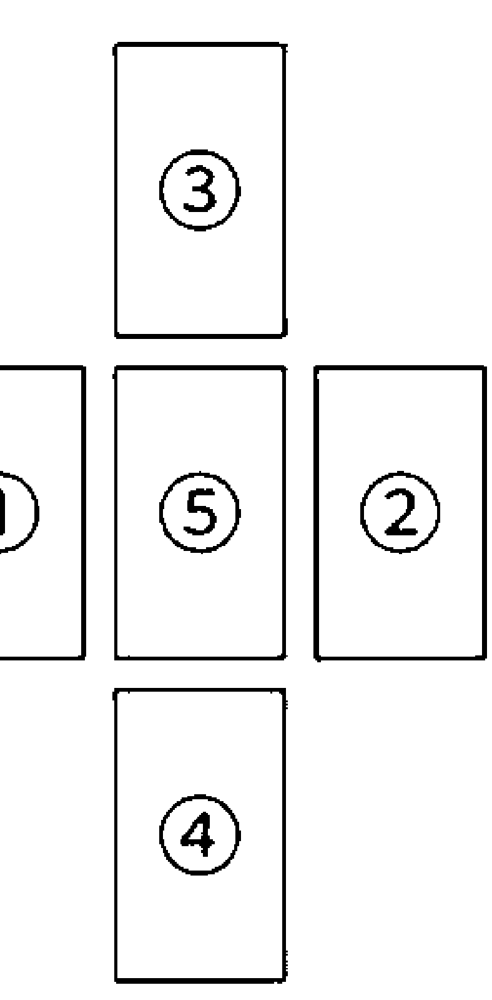

#### VI

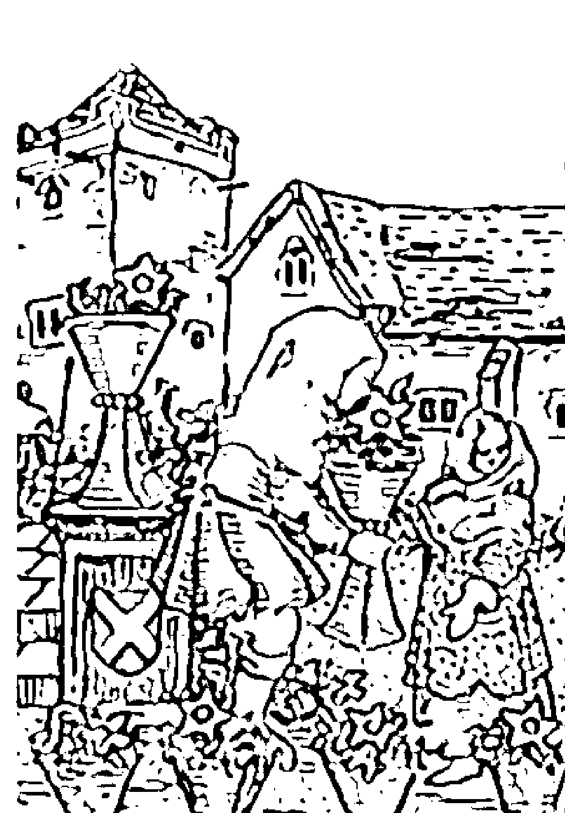

#### XXI

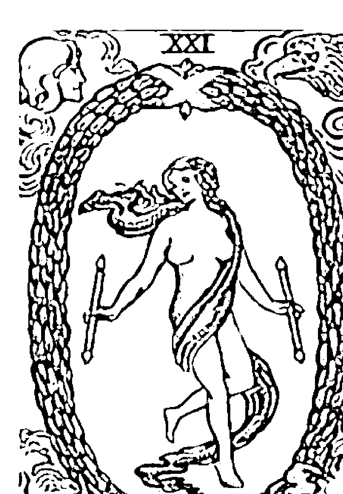

THE WORLD.

#### VII

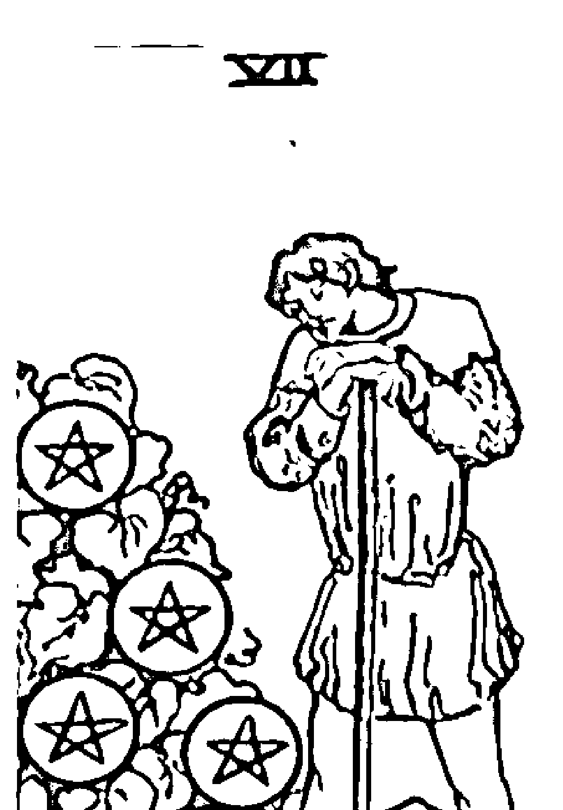

#### VI

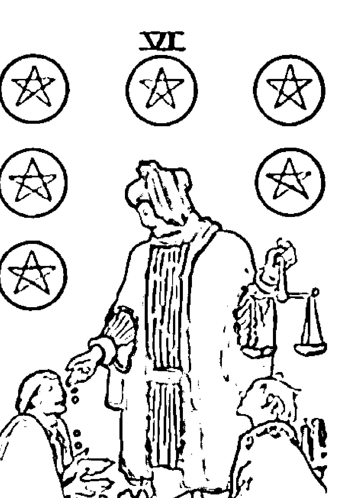

#### X

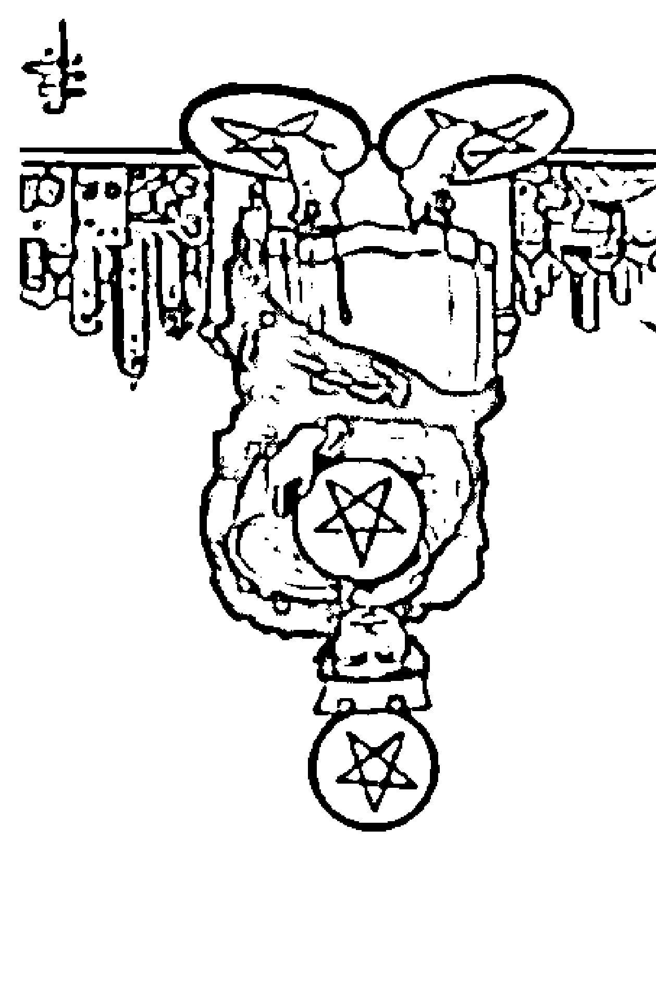

#### 这个牌阵是：

-   1. 过去：世界牌（土）
-   2. 现在：钱币六（土）
-   3. 预期：圣杯六（水）
-   4. 环境：钱币七（土）
-   5. 结果：钱币四（土）逆位

我们可以看到这副牌，全部都是阴性元素，代表两个人之间的本质没有变化，所以我可以断定他们分手的原因，到目前为止都没有矫正过来，所以复合也不会改变。

五张牌有四张是土，代表他们已经很久没联络，最后一张是钱币四逆位，钱币四代表找了很久，还是没有更合适的对象，土元素也是积习难改，这时逆位了，就代表突发奇想，会回头相找。

我说她应该会来找你复合，因为全部都是阴性元素，你不用采取主动，但两人的相处依然会走回老路子，因为分手的原因并没有解决，所以撑不了多久。他听完有点无法理解，我说过阵子就知道了。

果然过一阵子，他回复我，女友真的打电话约他出去，两个人短暂复合，但还是为了一样的原因争吵，过了三天，两人就决定放弃，又分手了。

现在跟预期都是六，代表他只想找回熟悉的舒适圈，并没有真正想调整的意思。环境是七，代表想要比之前更好，但因为是土元素，所以速度很慢，也没什么成效。

# Part 2

## 大阿尔克纳搭配

### 四大元素

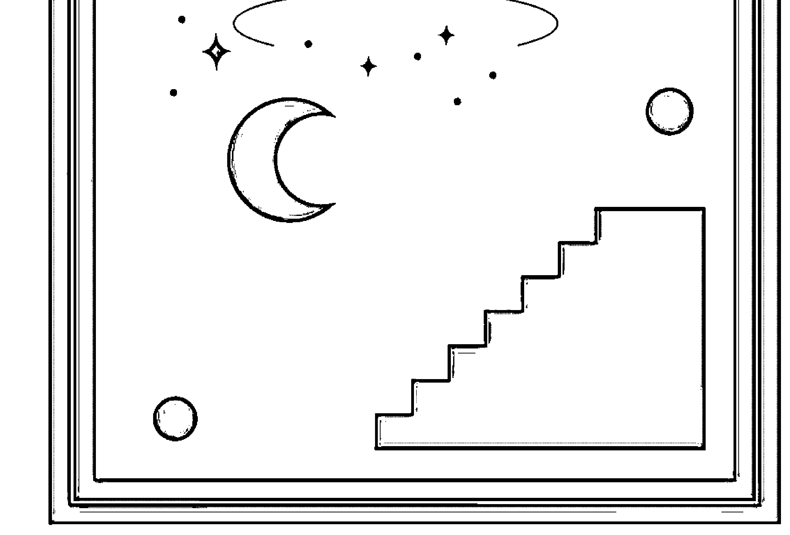

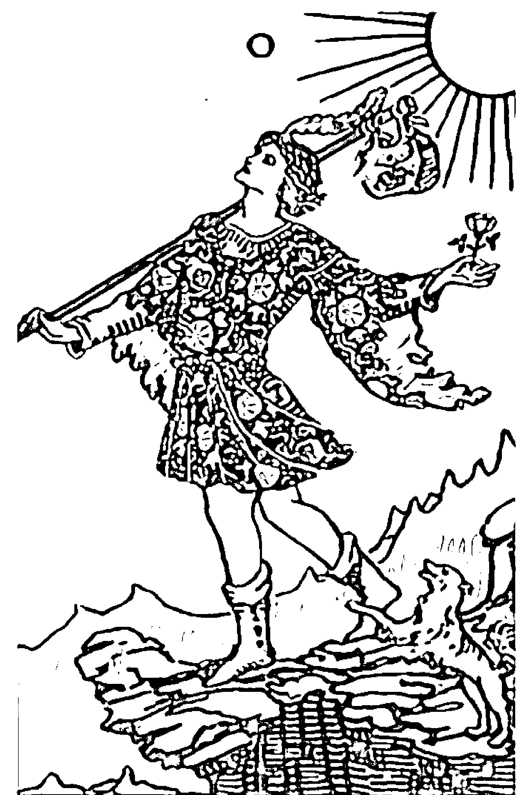

### 0 愚人

风元素，天王星

愚人是好牌还是坏牌，本身就带有两种可能性，一般的书大部分会从好的地方去延伸，因为在新时代，大家会觉得勇于突破及尝试才是好事。

但愚人本身是风元素，他没有魔术师那么社会化，很多事都光凭天外飞来一笔的灵感或突发奇想，加上又不信邪，所以在达到美好的未来之前，身为前锋的他，就有可能变成死在沙滩上的“前浪”。

愚人如果在“问题”位置，显而易见的就在于他的想法跟作为都太创新，还不到被大众接受的程度。如果太快实行，有可能在社会上水土不服，再加上愚人的勇于尝试，我就认为也简称“愚人”。他很需要一张社会化的土象牌或灵活的风象牌来辅助（星星牌虽然是风元素牌，但不适合辅助愚人，因为星星牌也离地太远，不接地气，缺少愚人需要的社会化）。

#### ☆ 愚人＋火元素

如果愚人搭上火元素的牌，不好的地方就是愚人会坚持自己的想法一意孤行，就算有帮他的人，也很容易被他视为阻碍。愚人不会随便怀疑别人的好意，但他会容易本能的反应，随便把别人当成“阻碍”，毕竟在他的一生中，阻碍无所不在。虽然愚人是风元素，但思考不是他的强项，愚人的风元素在于忙着吸收，还没聪明到可以思考的程度，而且愚人一思考就很容易直接跳到结论，中间根本没有好好的消化。

#### ☆ 愚人＋土元素

愚人如果不好的土元素牌同时出现，就代表他又愚蠢又固执，愚人代表两种人，一种是天才，一种是白痴，如果他被土元素挡住，会很容易鬼打墙，毕竟愚人是一张缺乏经验的牌。如果缺乏土元素的经验，但又有土元素的不知变通，那他会坚持错误到地老天荒，或者要在死掉很久后，才能让后人证明他的坚持是有道理的。缺乏变通会让他错过更好的机会，而且不见得每位有见之士的才情都能在后来重新被大家接受。所以土元素过强又不是好牌，很容易让愚人的高瞻远瞩被扫进历史的尘埃。

#### ☆ 愚人＋水元素

如果愚人跟不好或没那么好的水元素牌一同出现，因为水跟风都是抽象的元素，所以表示这组牌缺乏常识，虽然很善良，但有可能好心做坏事，通往地狱的路，往往是由善意铺陈的。虽然愚人的风元素会有一点逻辑性，但风跟水搞在一起，一定是逻辑死亡！这个组合最容易让愚人的天才性看起来像白痴。

#### ☆ 愚人＋风元素

愚人如果跟风元素的坏牌同时出现，其实就知性来看破坏性很严重，但实际上不容易真的感受到损失。因为风元素代表所有的坏处跟损失都只是理论上的，要蔓延到事实层面，可能还要好一段时间。虽然表面上看不出损失，但会少掉很多智性上的刺激，让你的人生经验进步得更慢。

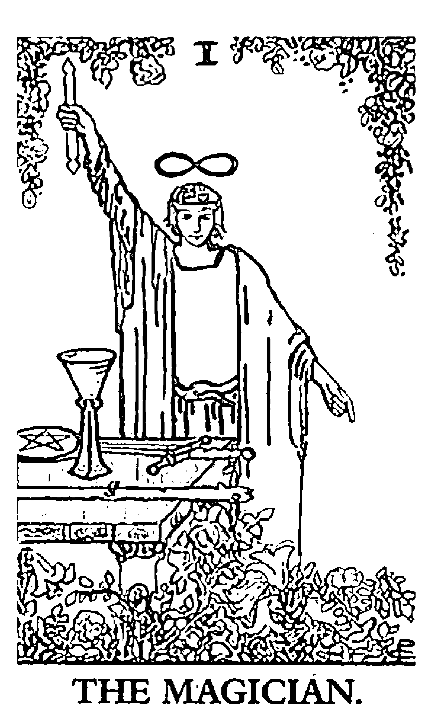

THE MAGICIAN.

### 1 魔术师

风元素，水星

魔术师很特别，他是毋庸置疑的好牌，虽然风元素是主元素，但他有具备四大元素的起点，魔术师是 1，比起愚人的 0，他开始在社会上展现沟通能力了，而且可以让别人理解他想做什么。水星聪明伶俐，所以魔术师任何事都有办法达成，速度可能比对同一件事研究了许久的人看起来程度还要好。

但他不好的地方，就是聪明反被聪明误，因为上手太容易，也就没有努力的必要，所以最后会导致深度跟底蕴都不足够，也就是可以写出说明书，但没有办法写出论文，因此魔术师元素就以比较不实际的风元素为主。不过，他所有的才华在“一开始”的时候特别让人惊艳，魔术师就是什么事都很容易上手，而且他的兴趣又很广泛，所以时常研究没多久，又投入新的兴趣了，因此每件事都只有尚可的程度。但他的好处是，能够给每件事情一个好的开始，跟收集整理的能力，魔术师给你“选择”的权力，因为我们努力学习，就是为了让自己选择权比别人多，任何成就，都是从选择开始。你要先可以做这件事，才有深入或夺冠的可能，所以魔术师是“师父领进门，修行在个人”，那个被“领进门”的程度，与接下来要不要努力，或要在某件事上努力，就看机缘了。

愚人跟魔术师都是风元素，共同的缺点就是容易空想，愚人是不知道怎么做，魔术师则是知道怎么做，但要看他有没有空做。如果用写企划书比喻，愚人是在“发想这个点子”的阶段，而魔术师在“拟出大纲”的阶段。但内容需要火元素的行动，开始相关准备则是土元素要做的事，开始打点人脉，就是水元素的工作了。

#### ☆ 魔术师＋火元素

如果魔术师跟火元素的好牌一起出现，那就无敌了，既有创造力又有执行力，虽然风跟火都很懒，但以风跟火煽动别人的本事，很容易找到手下，让别人帮他作牛作马，不过创造者还是魔术师。但如果是不好的牌，那风跟火的共同缺点就是射后不理，风风火火的把点子说出来，然后就没有然后了，被他召集起来的人，既没有决定权也没有调配资源的本事，很容易就虎头蛇尾，凡事半途而废。那是因为魔术师太聪明，所以忘记教育的重要，以为“不是大家都会吗”，加上火元素本来就不是一个细腻的元素，风虽然沟通能力强，但是如果被火元素影响，容易变成单向沟通。

#### ☆ 魔术师＋土元素

如果风元素跟土元素合体，在好的方面是可以各补不足，土元素具备风元素没有的耐心跟执行能力。在不好的方面，土元素很迟缓，会卡到魔术师的速度性，风元素跟土元素都是理性元素，没有火跟水的感情，所以做事会容易缺乏热情，只讲效益，往好处来说是很实际，但缺点就是缺乏不顾一切的专注性。

#### ☆ 魔术师＋水元素

风元素跟水元素，两个都是“消耗元素”，都无法累积，所以事情做到最后很容易不了了之，或根本就没有开始。如果是感情，很容易只是比较聊得来，但还没有到爱恋的程度，如果是笔友或网友，那差不多就这样了。

#### ☆ 魔术师＋风元素

如果魔术师出现，又同时出现其他风元素的负面牌，那小人就会很多，或者你自己就是小人。魔术师是有很多聪明的想法，但风元素就像空中阁楼，搅乱一池春水，却没有任何建设性的想法。魔术师如果要当小人，那就无敌了！没有人可以斗过他，只能等他自己得意忘形犯错。

### 2 女教皇

水元素，月亮

女教皇是一张颇为正面的牌，虽然看似跟众人合不来，但是其实是女教皇对人群没兴趣，人群对女教皇与其说是没兴趣，不如说是觉得她莫测高深，难以接近。会喜欢女教皇的人，都是看到她身上与众不同的气质，虽然女教皇比较自闭，但她对世界其他人没有敌意，只是道不同不相为谋。女教皇有自己构筑起来的专属世界，她在自己的世界里活得很好，虽然她对别人也有感情，但少了点好奇心，因为通过她的观察，每个人的特质都很透明，虽然不见得正确，但她只需要这个程度的认知即可。

女教皇忙着要解开更高深的谜题，对于已经不是谜题的事物，基本上除非需要她的帮助，否则她不会太花时间在别人身上。她看起来很高傲，但水元素的本质并不高傲，你需要她的时候她会出手，但大部分的时间她有自己的事要忙。所以女教皇的负面特质，就是看起来很冷漠又神秘兮兮，有什么事都不说出来，因为她喜欢观察，如果说出口，就像是干预跟介入，观察不到你真实的发展了。所以不喜欢她的人，会觉得像是被她窥探，但多数时候只是多想了，因为对女教皇而言，除非你有什么影响到她的地方，不然她好奇的通常是更高境界的事物，只有她喜欢你或崇拜你，你才会是更高境界的事物。如果“问题”是女教皇，通常就表示这件事对你来说太过遥远，超出你的认知范围之外，或是你不具备了解这件事的能力。简而言之，就是女教皇代表的这件事，对你来说是难以亲近的。女教皇不是故意让你难以理解，只是她有她的事要忙，没时间没心力解释到你弄懂。女教皇是水元素，她不太会是真正的高傲，只是因为对一些人事务没兴趣，所以看起来很高傲。说起来，香奈儿的自传《我没时间讨厌你》这本书中所展现的个性就是女教皇的写照。

#### ☆ 女教皇＋火元素

女教皇如果跟火元素牌一起出现，往好的方面解读，就是女教皇终于展现出对人世的一点兴趣，而且把她长久研究的结果，很热心的推荐给大家，让大家分享她研究的结果跟心得；反之，女教皇本身就够不管他人的眼光了，加上变质成白目的火元素，便容易自说自话，听不进别人的意见，也看不到自己的缺失。

#### ☆ 女教皇＋土元素

如果女教皇跟土元素一起出现，就少了女教皇那种遗世独立的气质，会严格地认为别人应该认同她的理念，但还好土跟水都是阴性元素，不太能影响别人，只能影响身边的人。女教皇加上负面的土元素，会非常严格及挑剔，就算她无法命令别人，但当你想听她的意见时，女教皇会变得很苛薄，所以不太讨喜。如果女教皇加上正面的土元素，就有办法阐述她的哲理，虽然传播的速度很慢，但会深植人心。

#### ☆ 女教皇＋水元素

女教皇本身是水元素，加上负面的水元素，她有可能躲在自己的世界里享受自己构筑出来的美好理念，但没办法面对真正的挑战真实的世界。这种女教皇最好有足够的供奉者，不然会很难在社会生存。

#### ☆ 女教皇+风元素

女教皇本身就是水元素，跟比她更没方向的风元素一起出现，可能在智力方面会更高超，但也更摸不着方向。风元素又爱发表意见，所以如果女教皇加上负面的风元素，就有可能满口空话，但做不出具体的结果。

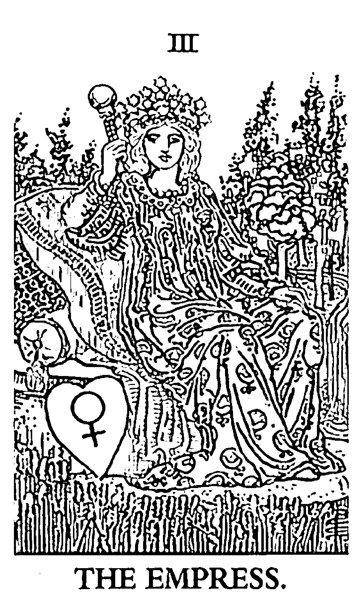

### 3 女皇

#### 风跟土元素，金星

女皇就代表社会上常见的女性特质，女性特质正面负面都有，正面的女性特质就是我们常说的「绅士淑女」，因为女皇对应金星，也就是维纳斯，简单来讲就是包装良好的女性，如果是女皇牌的男性，也是包装得体、礼貌优雅、风度翩翩的，不管男女，都是受过良好家教的样子，大部分人会很喜欢女皇牌的人，他们虽然特色不明显，但至少不会得罪人。我觉得女皇牌的正面意义就是会跟每个人保留彼此的空间，让对方跟自己都很舒适。我觉得女皇牌很像都市人，跟众人同步，不会因为私人的原因影响整体。

负面的特质，就是礼貌过头的人会让别人觉得不真心，而且凡事太过算计自己的得失（有形跟无形的都是），然后包装会过度，相形之下会让人觉得内在太贫乏，简言之，就是社会上所说的做作、空心草包或绿茶婊。但绿茶婊通常都是让别人吃闷亏，对他自己来说，其他地方我都客气了，在想要的东西上维护自己的权益有什么不对？把自己打扮得漂漂亮亮有什么不对？所以女皇牌有交际的风元素跟物欲的土元素，风跟土都是社会的伦理，却没有火跟水的真心，因此也常常被人说虚伪。

#### ☆ 女皇+火元素

如果女皇牌跟火元素一起出现，原来被土元素克制的物欲就会一发不可收拾，变得很虚荣。本来很会讲道理而且有礼貌的土跟风元素，如果遇上火元素，就会得理不饶人，很任性。女皇把自己修饰得很好，所以觉得别人对自己好是应该的，虽然很有礼貌，但也容易内心自觉高人一等，而且看不起不谙人际关系的人。

#### ☆ 女皇+土元素

女皇牌跟土元素牌一起出现，负面的地方就是很自私自利，但不像女皇加火元素那么的理直气壮，女皇加上土元素，会认为一切都是理所当然，她既然尽了自己该尽的义务，当然也应该享有权利，女皇加土没有像加火元素那么嚣张，但更为固执，而且更不好跟她讲理。

#### ☆ 女皇+水元素

水元素比较涣散，没有风跟土那么有条理，所以女皇牌加上水元素负面牌，就很容易懒散到让人觉得不可思议，外表打理得是不错，但就是懒得思考，凡事都道听涂说，不太用脑子，但又自以为很聪明，或者是因为跟她不熟的人都会觉得她是很好的人，这就是标准的「自我感觉良好」，而且缺乏洞察自己缺点的能力。

#### ☆ 女皇+风元素

跟风元素负面牌一起出现的女皇，懂得虽然不多，却很容易自以为聪明，但她懂的只不过都是常识而已，可是讲话像在训诫别人，虽然不像加火元素那样不可一世，但也是沾沾自喜，自以为比身边的人都聪明有礼貌，觉得别人都比不上自己。

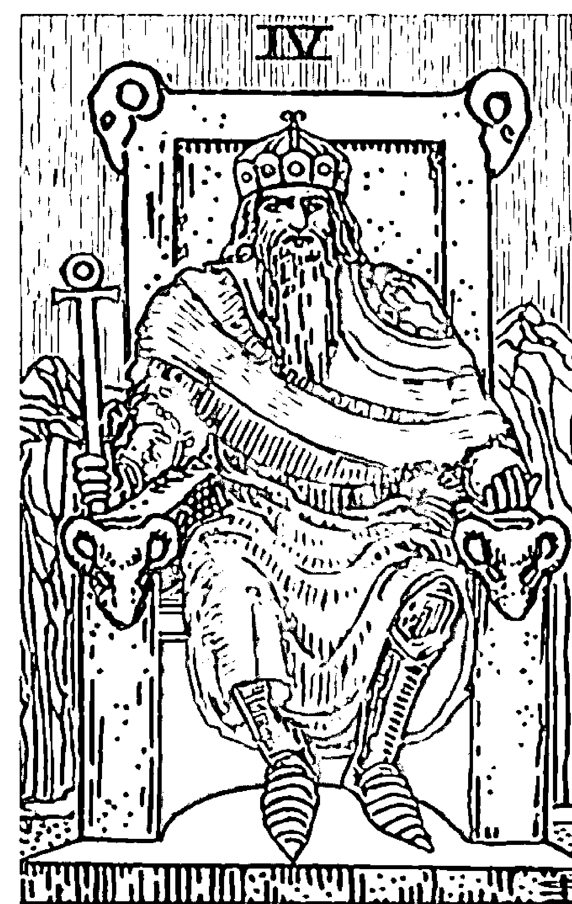

### 皇帝

#### 火元素，牡羊座

皇帝牌的好坏非常鲜明，因为你可以直接把它当成男性特质重的一张牌，男性特质的优缺点，就是这张牌的优缺点。优点是很有冲劲，凡事都尽力，积极向上，自信满满，不会讲废话。缺点就是独裁、自我中心、自私、凡事喜欢用强硬的方式，不管别人的反应跟感受，可能很优秀，但身后尸骨累累，有时会踩着别人的头往上爬。

皇帝的缺点，不论是正位逆位都会出现，因为他的优缺点常常同时并存。如果在「问题」出现皇帝牌，就代表皇帝的特质对你产生困扰跟威胁。如果是工作，一个积极向上的人往往也自我中心，一个凡事决定了就要做到的人往往也很偏执。对比上一张女皇的「绅士淑女」，这一张皇帝代表的就是「莽夫鲁女」，速度快的同时，眼里也看不到其他事，所以往往伤害了其他人而不自知。

#### ☆ 皇帝+火元素

如果火元素跟皇帝牌一起出现，那就代表皇帝的特质会变本加厉，积极往往会变成强制，自我中心会变得目中无人。因为火元素本身就容易「过度」，尤其是情绪起伏会变得更激烈。但因为它是4，所以这个激烈度在他身边的人比较容易看到，远一点的人只看得到他意气风发，所以他容易有很多追随者。号码又是4，他掌握的资源也会比别人多，而且胜负幅度也很大，身份地位也是大起大落。

#### ☆ 皇帝+土元素

土元素跟皇帝牌一起出现，火跟土的共同点是固执，所以土元素加上皇帝牌，容易被引出的特质就是独裁。以为自己最厉害，听不见别人的谏言，就算吃亏了，也很难反省，因为土元素比较难改变，所以土加火，很容易一错再错，而且别人越反对，他越坚持。

#### ☆ 皇帝+水元素

皇帝牌如果跟水元素一起出现，那他对任何事的反应都会很强烈，很情绪化。除非这张水元素牌是像圣杯皇后、圣杯十这种静态牌，才能反过来克制火的激烈性。如果遇到感情，除非水元素牌是像圣杯五、月亮这种明显的负面牌，不然就像失火一样，有时不能用水来救，如果助燃物不溶于水，水反而会让助燃物扩散。因为火跟水都是情绪，只是水是温情，火是激情，所以如果扯到感情，这两种元素反而有加乘作用。

#### ☆ 皇帝+风元素

反而风元素会助长火元素，因为风元素是 air 空气，空气也是助燃物之一，如果风元素是好牌，会把事情的好处扩大，当然是坏牌或牌义相克，就只能用「灾情扩大」来形容，或是会波及旁人。

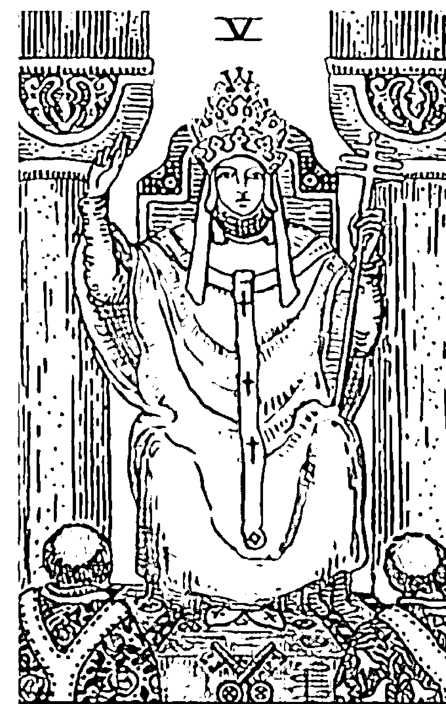

### 5 教皇

#### 土元素，金牛座

教皇与皇帝相比，皇帝是统治者，教皇本身是国家的体制，皇帝可以带领大家，教皇则是从背后支撑大家。因为土元素是被动元素，所以不会站在主动的立场，教皇就是资源，如果你想使用资源，就一定要自己主动出发，先有一些计划跟想法，然后去找寻资源。

那教皇的缺点是太待在自己的舒适圈里，所以换到体制上，这张牌就会是很传统守旧的，没有进取跟突破的精神，很容易让人觉得无聊。但教皇牌底子厚，所以也不是一时半刻能被别人取代，不过，教皇真的要改变思想不是那么轻易的事，所以别人跟教皇沟通时就会有点吃力。

当然教皇的正面特质展现时，他会很包容很有同理心，这时候不用互相了解，只要跟家人一样，支持就可以了。因为是土元素，所以他给的支持可能不是那么暖心，却很实在，就是资源，你一定用得上。土元素本来就很具象，一点都不抽象，就还满像日剧台词：「关心我就给我钱！」

教皇除了钱之外，他还满有文化上的品味，所以鉴赏力很强，判断力也很好。但是教皇的行动力有点慢，常常时机过了，他才反应过来。他很适合在平稳的环境中生存，如果是动荡的年代，他可以给大家稳定下来的力量，同样的，如果是和平的时代，他少了一点前进的动力。在动荡的年代，他可能为了想安定而采取一些强制的手段，教皇的强制不会太严苛，但遗毒会留存很久。

#### ☆ 教皇+火元素

如果教皇跟火元素坏牌一起出现，要往不好的方向解。教皇的特质带有严厉的成分，想要逼大家以他的想法行事，但又没有办法负责最后的成果。火元素会破坏原本教皇负责任的态度，土元素很成熟，火元素很幼稚，所以再加上火元素，就会破坏教皇原本一肩承担的态度，因为土跟火都很讲究实际，如果往负面发展，大部分会是自私的状况。

#### ☆ 教皇+土元素

教皇跟不好的土元素一起出现，故步自封就是这组牌最有可能发生的状况。搭配牌的不同，会有双重土元素不同的缺点，有时太懒，有时太现实，有时是发展太慢，最常见的就是固执，如果搭配的土元素很重，就会是冥顽不灵。土元素的资源很够用，但还是很讲究利益，很常见的就是在小事上斤斤计较，然后忘记更重要的事情，所以就会把自己局限在很基础的地方。

#### ☆ 教皇+水元素

如果教皇跟不好的水元素一起出现，那就是日子过得太好。凡事都有怠惰跟拖延的倾向，有可能因为太没戒心，便在无意中泄露重要的资讯，这张教皇也无力补救。他有能力，但土配上水，两个都是阴性元素，所以只能亡羊补牢。

#### ☆ 教皇+风元素

教皇跟不好的风元素一起出现的话，因为土跟风都是理性元素，所以缺点就是少了温度，只聊该做的事。如果在感情牌阵，只有风跟土这种算计的元素，没有火跟水，那谈恋爱的诚意可能不够。如果是念书方面，这个元素组合还满聪明的。

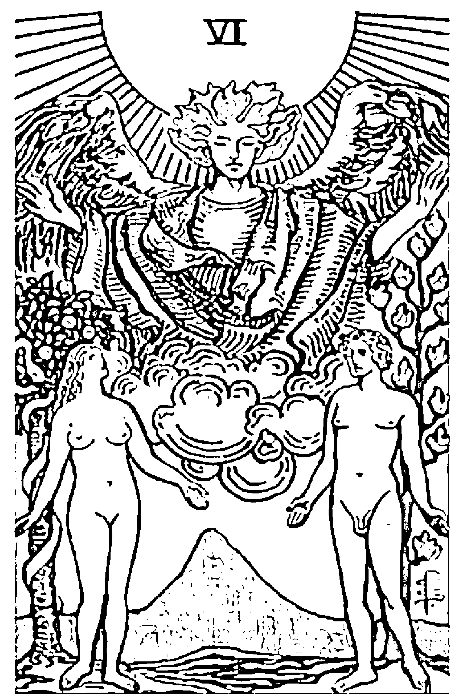

### 6 恋人

#### 风元素，双子座

这张牌的出现能为每项事情都加上一点缓冲余地，这张牌是风元素，所以我个人不会把他解读为浓情蜜意或山盟海誓。这张牌只是对某项人事务有探索的兴趣，也就是好奇。但我们都知道，好奇并不能表示什么，有可能好奇能带领你越来越深入，但也有可能好奇心满足之后，兴趣就消失了。所以我觉得这张恋人牌最核心的含义是「随缘」，有也很好，没有也很好，因为恋人并不会阻碍你，只是扩大你涉猎的范围，让你的内在所知更丰富。但因为是风元素，他也不会捆绑你，不会觉得你知道什么之后，就一定要付出什么代价，你获取了一些东西没错，但可以自由的运用在任何事物上，不受任何限制。

但同样的，也没有回馈，如果出现在「问题」，就表示一样的特质会给他环境造成困扰。恋人牌就像人的感情，无法捉摸与固定，所以你无法强制恋人牌要做什么或怎么做。因为我们本来就不能控制他人的想法，所以恋人牌要做什么决定，我们不能预知也不能干涉，但人类一定多少会有控制欲，所以恋人牌的言行就会招来不是很好的评价。

#### ☆ 恋人+火元素

负面的火元素牌跟恋人一起出现，因为风跟火都是阳性元素，所以恋人的随心所欲，就会到了张狂的地步，想做什么就做什么，风元素至少会顾虑他人的感受，但再加上任性的火元素，真的会到无法无天的程度。加上恋人牌对应双子座，没什么大智慧，但为了得到他要的东西的小聪明还是有的。

#### ☆ 恋人+土元素

恋人牌一旦跟不好的土元素一起出现，就会很自私自利。可能当事人的原意不是这么自私，但加上不好的土元素，恋人牌优异的沟通能力会受到限制，就有可能什么事都不解释，也觉得没有解释的必要。因为风跟土都是理性元素，所以比较不怕得罪人，不像火元素是因为有信心解决一切，所以放心得罪，而是风跟土觉得我如果没有让你实质损失什么东西，那你就没有跟我啰嗦的权利，有点得理不饶人的味道。

#### ☆ 恋人+水元素

如果是跟不好的水元素一起出现，加上不定的风元素，这个人就会四处给承诺，又没有一件事做得到。虽然不会造成实质的损失（如果他信守承诺，真的做了，损失才会更大），但也够恼人了。但还好这个元素的组合，即使是会让人不高兴，但干不出什么大坏事。

#### ☆ 恋人+风元素

跟不好的风元素一起出现，那就是双重的负面风元素。不只像风加水的不守信用，恋人牌还会利用别人对他的好感跟善意，把简单的事弄得很复杂，加深人际之间的仇恨值。他又很八卦，往往把事情弄到不可收拾的地步。

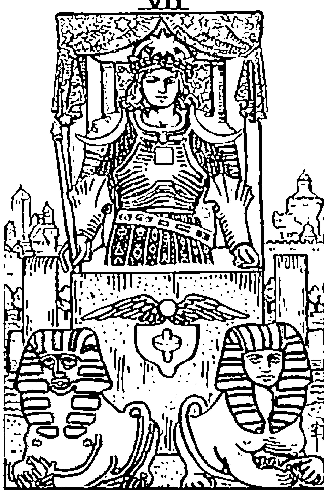

### 7 战车

#### 水元素，巨蟹座

我对战车的解读，跟市面上大部分人的解读不同。战车牌如果是冲锋陷阵，他的占星为什么要对应巨蟹座？巨蟹座是水象基本宫，可以跟「战」这个字扯上关系的只有「基本宫」这个地方，因为占星中的基本宫，代表一个萌发的状态，所以也有竞争的本能。但战车是水元素，他要为什么事而战呢？当然不是为了利益功名，水元素只能为了自己想保护的人事物而战，所以与其说是战争，不如说是保护自己的势力范围。所以战车不会挑衅别人，他自己内心的天人交战就已经够他烦恼了，战车是不会退缩的，因此虽然只是防卫的角色，但也很能维持地盘的安全。

战车的缺点就是心情太容易受外界影响，动不动就在备战的状态，但往往会发现是白花力气，所以战车最大的弱点，不是战力不足，而是常常去防备没有必要防备的东西，造成力气跟注意力的浪费。如果常常为了子虚乌有的事跳脚，那到了真正要开战的时候，就会发现力气已经用完了。这也是战，不过是杯弓蛇影的战，战车太容易被挑起情绪，所以常常弄不清楚敌人是谁。

#### ★ 战车+火元素

战车牌跟负面的火元素一起出现，因为是水加火，常常代表情绪容易激动，但不像单纯的巨蟹座，只是心里面生气而已。水加上火元素，就会做出行动上的反应，往往到最后发现根本不必生气。随便生气不但容易得罪别人，也容易让别人对你的情绪反应不当一回事，因为如果是，我，面对整天都在生气的人，我觉得就没有必要管他生不生气了，反正不论怎么讨好他，他都不可能不生气。

#### ★ 战车+土元素

如果是跟负面的土元素一起出现，加上战车的水元素，因为两张都是阴性元素，所以大部分都是气坏自己，但又不能对别人怎么样。而且土元素还不喜欢让别人知道，所以就是已经内伤了，还是要维持表面风度，但如果是正面的土元素，就有可能帮助镇定战车的情绪，土元素加战车代表长期抗战，获胜的机率是满高的。

#### ☆ 战车+水元素

跟负面的水元素一起出现的战车，就是标准的精神病患，别人没对你怎样，你就自己把自己吓个半死，还会幻想别人怎样对不起你，但是还没办法伤到别人，伤到的只有自己而已。

#### ☆ 战车+风元素

如果战车跟爱说别人坏话的负面风元素一起出现，风跟水都是涣散元素，就代表大家都在勾心斗角，若只是水元素的战车也就算了，加上其他风元素，有可能引发想像不到的名声上的伤害，造成很大的损失。而且是补救不回来的，因为风元素就是一种印象，印象比实际上的证据更难被遗忘。

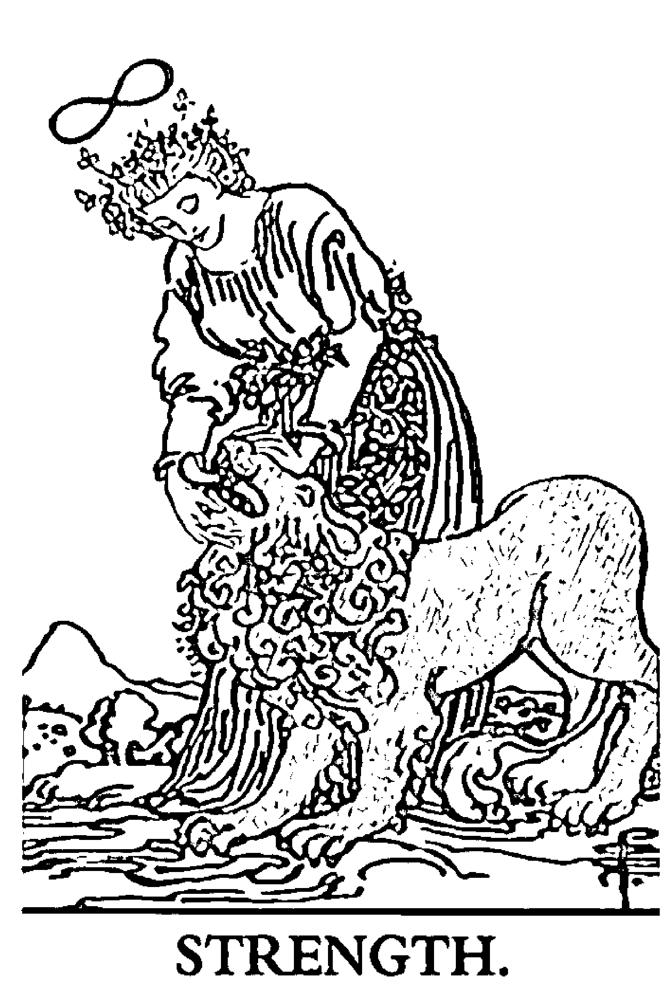

### 8 力量

#### 火元素，狮子座

这张牌是我自己最喜欢的牌之一，象征养成自己的好习惯。虽然是火元素，但狮子座是火元素里的固定宫，所以凡事有一定的养成时间。狮子座不像普通的火元素，乱闯乱撞，一味地以自己的心情做事，力量牌会很注意别人的感觉，这样的好处就是能减少自己的阻力，让想做的事都可以按照计划来。

因为是慢慢累积出来的发展能力，又很重视他人的想法，所以这张牌的负面牌义就是太过注重外界的评价，乃至把心力投入在外在的部分，而不是自己真心想要的，也就是会被外界的声音混淆，搞不清楚自己要的是什么，但还是很拼命完成。而且因为投入的时间比较长，到最后发现偏离重点时，往往来不及修正，因为已经变成生活中的一部分了，要连根拔起，就会影响到每天的生活，所以会没办法下决心改变。这张牌想要做什么都会成功，但麻烦的是，一旦成功，就很难回头或调整方向了。

#### ☆ 力量+火元素

力量牌遇上不好的火元素，会很好大喜功，常常自以为是决策者，但其实是被别人牵着鼻子走，容易被利用。力量牌有把事情做到好的智慧，但好像没有识人的智慧，他重视别人对他的评价，所以会不自觉的讨好外界，常常让自己做的事失去原本的初衷，到最后自己跟旁人都不高兴，这是最需要注意的事。其实力量牌再负面，也差不到哪里去，就是到最后没达成自己想要的结果罢了，但不会对自己跟别人造成什么困扰。

#### ☆ 力量+土元素

如果遇上负面的土元素，在想做一件事之前，会犹豫计划太久，方向是好的，但往往错过时机。当大家告诉他时机已经过了，力量牌还是会坚持己见，因为经过他多方推敲，这是最好的做法，所以听不进别人的意见。他没有办法及时发现自己的错误，又花了一大堆力气，常常赔了夫人又折兵。

#### ☆ 力量+水元素

若是同时出现的负面牌是水元素，水跟火都是情感元素，力量牌就会变得太过在意别人的感觉，力量牌本来就很注重外界评价，但如果搭上负面的水元素，就会连一些没价值的感觉也重视。他不想让人失望，但外人往往不相信力量牌的诚意，还会把一些不好的想法投射在他身上，让力量牌有苦说不出。

#### ☆ 力量+风元素

力量牌如果搭上负面的风元素，表示他的想法跟做法不集中，很容易被分散注意力，但想法变来变去，又要大家跟随他。这张力量牌不是不听别人的意见，会听，但听了之后会无限上纲，完全发展成另一种想法，已经跟人家原本的提议不同了，最后如果有错误，自己还会责怪别人，容易导致朋友关系不易维持。

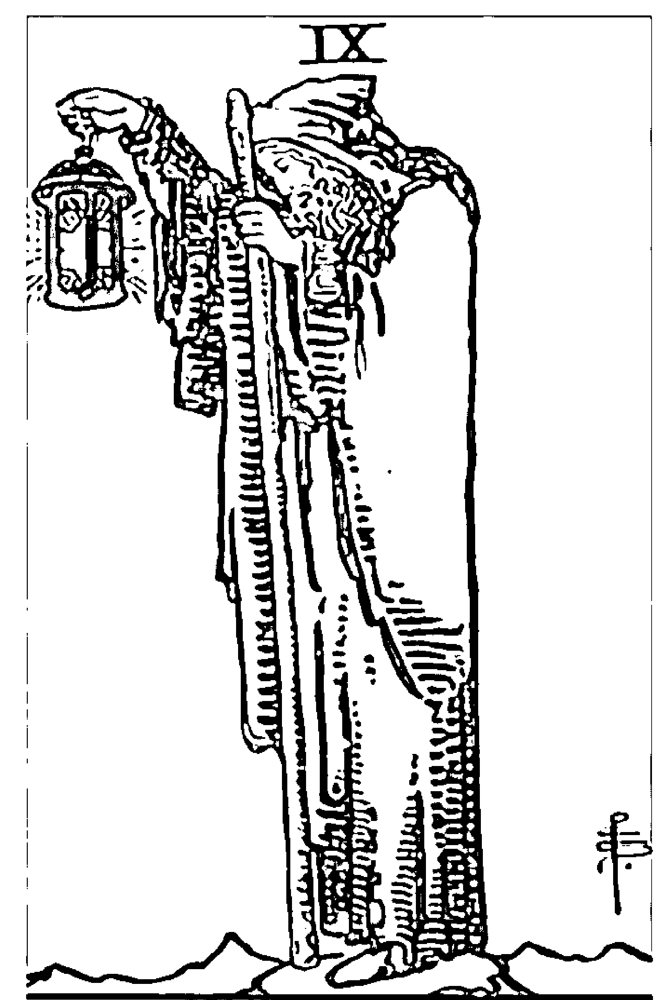

### 隐者

#### 土元素，处女座

隐者牌的弱点很容易看出来，就是躲自己的「地窖」里。常常会有人把隐者跟女教皇代表的意思搞混，但隐者是土元素，他是躲起来用功，有一天他还是会出关来收获他的名声跟外界的肯定；水元素的女教皇则是真的觉得自己的世界很美好，真的不想面对这污浊的世界，但隐者还是很需要外界的肯定，只是他还没达到自己理想的程度前，不会出面接受外界的挑战。

隐者最为人诟病的地方，就是他是一个自视甚高的人。虽然觉得自己还不够好，但对别人的能力更不信任，所以造成自己的难处跟挑战。他觉得没有人可以替他分担，觉得自己遗世独立，但其实只是人缘不好而已……，没有，其实是不被大家了解而已。他会觉得孤独是一种清高的代表，象征他跟别人都不一样，所以更听不进去别人给他的建议，很多事都闭门造车，自己也不知道外界标准在哪里，所以无法适时调整。要到最后受到打击，才再躲进自己的山洞里继续修行，我是觉得这样很没效率！

#### ☆ 隐者+火元素

如果没有火元素，隐者虽然觉得自己很厉害，但还是一种低调的孤芳自赏，但如果隐者牌加上负面的火元素，他就会把自己的行为当准则，去检视每个人有没有达到他的要求。但隐者评分的范围又很小，不够客观，所以最后的结果就会是他的主观扭曲了一切，但他始终认为问题出在别人身上。

#### ☆ 隐者+土元素

隐者自己本身就是土元素，如果再搭上负面的土元素，他会更孤僻，更不相信外人，也更偏执。其实单一张隐者牌，就已经够主观了，再加上负面的火元素跟土元素，都会加强他对别人的不信任，即使是光明正大没什么的事，他都要弄得神秘兮兮，防卫心强到奇怪的地步。

#### ☆ 隐者+水元素

加上负面的水元素，就呈现一种很提不起劲的状况，虽然水元素跟土元素都是阴性元素，但水元素的懒惰会造成土元素更懒得思考。这里的隐者会思考的部分，恐怕只有公司或社会要他通过的考试，他就是不到死不临头绝不改口，如果改口，也只是拿新的偏见来取代原先的偏见而已。

#### ☆ 隐者+风元素

如果是负面风元素跟隐者一起出现，隐者是对应处女座的，土元素是变动宫，变动宫的特质跟风元素水元素都很接近，所以隐者搭上负面风元素，代表他常常喜欢拿还没被确定的特质冠在别人或事情的上面，造成自己的误判，但隐者搭上风元素，代表他是学不乖的，因为他变动宫的特质也很爱跟人瞎搅和，这只是包装过的八卦本性而已。

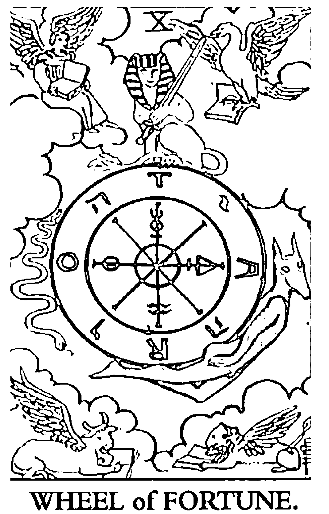

### 10 命运之轮

#### 火元素，木星

命运之轮是一张很幸运的牌，很难想象这张牌有什么负面的地方，但命运之轮的真谛——好坏交错，才是生命真正的原貌。命运之轮正面的地方在于他会把握每个新的机会，创造出更大的效益，因为机会毕竟只是机会，要让他变成真正对自己有帮助的事物，还是要一段时间的努力。命运之轮负面的地方，就是他会让你「看起来像好事在发生」，接着来的虽然不至于坏事，但是不在你的预期之内。因为世事本来就是难料的，命运之轮只是一个开头，是好事还是坏事，要经历才知道。可喜的地方是，开头只是开头，这件事对你有哪方面的价值，还是要看你怎么去实践。

所以命运之轮如果跟负面的牌一起出现，或者是这张牌就在“问题”的位置，我的解释通常是最直观的，就是因为每件事都不够深入，即使你看起来经历很多，但都只是走马看花而已。这张牌第一个不好的地方就是事情只看表面，这也是火元素的缺点：太快下判断。但如果这张牌对应木星，太吉利了，所以再坏也坏不到哪里。

#### ☆ 命运之轮＋火元素

如果命运之轮跟负面的火元素一出现，那就是太幼稚，凡事都太看表面，会在真相未明的状态下，莽莽撞撞的投入。虽然最坏的结果也只是不尽人意，不会有太大的损失，但会浪费很多时间，可是我觉得浪费时间也没什么大不了，时间总要浪费在某些地方，或损失一些事物，也算是学个教训。

#### ☆ 命运之轮＋土元素

命运之轮跟负面土元素一起出现，在往事情的路上会有一点颠簸，会拖慢进度。不过毕竟是好牌，拖慢进度固然不好，但他还会带来能把真相看得更清楚的好处。如果是正面的土元素，就是可以稳定的抓到重点，然后一路平顺的前进。其实正面或负面的土元素，差别好像不大，就是心理的感受不一样。

#### ☆ 命运之轮＋水元素

如果是跟负面的水元素一起出现，因为水跟火都是情感元素，所以应该是一路吃喝玩乐的走向毁灭（误）……，代表沉溺在兴趣或玩乐中，也有可能是有各种瘾头，浑然不知外面世界的状况，这个组合有点放纵。

#### ☆ 命运之轮＋风元素

跟负面风元素牌一起出现，火跟风都是阳性元素，因此这个组合会把一件不好的事搞得风风火火，到最后收不了尾。木星本身就是转动的火元素，所以搭配上风元素，这张牌的变动性更为明显，会学很多东西，但很少有学到最后的，也就是兴趣广而不精。

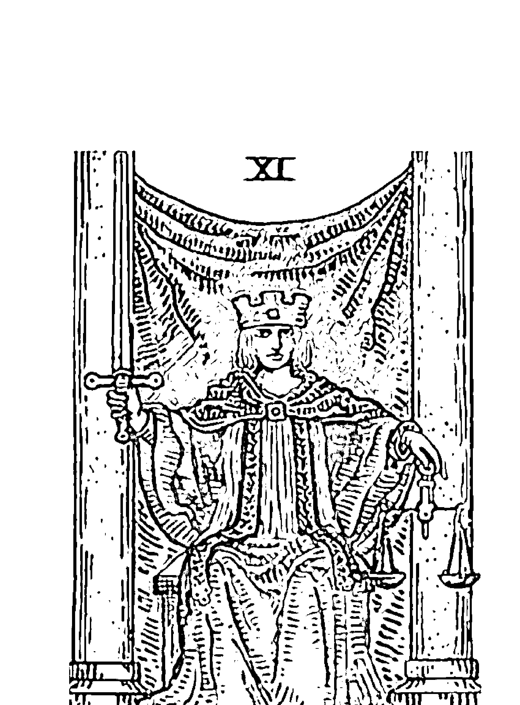

### 11 正义

风元素，天秤座

每个元素都有很多面向，魔术师代表风元素的灵敏跟活泼，正义牌代表风元素的理性逻辑思考跟实事求是的精神，对于一件事，都要反复论证，找到最满意的答案，才会下定论。但这张牌的层次还没到世界的公理，只能是社会上的法律，或者办公室守则之类的，因为这张牌没有通天的本领，只能依照证据跟旁观人的证言来判断，所以还是有很多限制。不过他会尽他所能，做到最好的程度。而且就一般人来说，这种程度已经可以接受了，其实就算不能接受也不能怎样，因为这是人类社会中，可以做到的最好的程度。

这张牌跟一般灵活的风元素不同，因为他讲究逻辑，思考方式不是固定，但也有一定的方向，不会太在乎众人意料之外。因为再怎么样有创意，都不能超出法律规定的范围，但这也代表我们社会的公约。正义牌很讲理，但一旦受克，就会变成钻小漏洞强辩的那种人，或者是正义魔人。

#### ☆ 正义＋火元素

如果正义遇上负面的火元素，那这张正义牌就会无法考虑别人的处境，一味的以自己的认定，觉得事情该怎么做，就是要一点偏差都不能有的完成。与其说他要解决事情，不如说他是要挑你的毛病，来展现自己讲道理讲到很细，很滴水不漏，但这真的很容易造成旁人的压力。

#### ☆ 正义＋土元素

负面的土元素牌跟正义相遇，就是墨守成规，凡事一定要有前例，才能有底气去做。如果没有前例，土元素也没办法从自己开始订下一些新规矩，他只能一直从别人的判断里找灵感，如果找不到，以他的脑袋，也想不出更好的办法，所以就会有草率决定的可能。

#### ☆ 正义＋水元素

正义牌遇上负面的水元素，如果说正义牌遇上火跟土，“情理法”会只注意理法的部分，但如果有水元素，就会比较滥情，因为同情心而做出不正的决议，虽然风跟水都是涣散元素，但风元素毕竟是阳性元素，水元素一搅和，就会打乱他的逻辑，这就是太着重“情”的部分。

#### ☆ 正义＋风元素

如果遇上负面的风元素，有两种可能，一种是把法条解释得更呆板，只要超出认定的范围，一律砍掉；另一种可能是给外来的影响力介入的机会，造成贪污跟舞弊，或是只挑自己顺眼的部分承认跟执行。以正义来说，加上负面风元素，其实是最容易造成有偏差的结果。

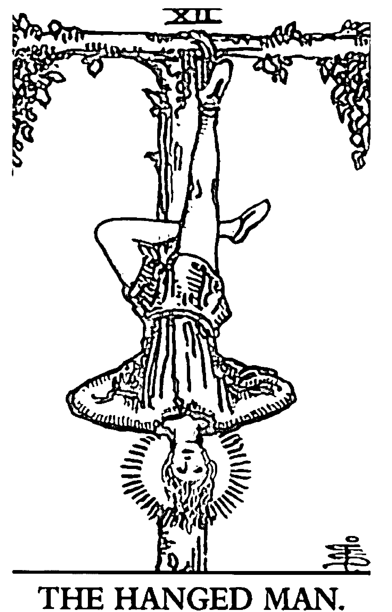

### 12 倒吊人

水元素，海王星

这张牌本身就不是很正面，他象征无能为力，守在原地等别人拯救。海王星更是彻底的水元素，一点骨子都没有，所以倒吊人自己本身没有任何动力，有可能放烂或装死，只期待外界的一切来帮助他脱离苦海。

这张牌也有正面的地方，就像我们常听到的笑话：“先苦命十年，十年以后你就习惯了。”所以倒吊人有适应不良环境的能力，在任何的逆境中，他都可以找到对自己有帮助的生存方式，帮助自己“苟活”下去，有点像现在社会的“躺平族”，因为外界太艰难，所以就什么希望都不抱，只求有小确幸就好。简单来说，就是不具备主导权时，只能跟着社会风气与政策飘荡。

其实每个人都有身处倒吊人状态的时候，倒吊人的自救方式，就是先停下来观察，同时养精蓄锐，等到社会风向一改变，倒吊人便可能顺势离开目前的局面。

#### ☆ 倒吊人＋火元素

如果倒吊人搭上负面的火元素，他的软弱就是他勒索别人的武器，会觉得别人都欠他，天经地义要为他付出一切。这就很像一些杀人犯，小时候受到非人的待遇，就会觉得社会欠了他什么，所以他在世界上有免责权。因为倒吊人缺乏很多东西，但火元素可以给他胆子，让他用很隐晦的方式向世界讨债。如果是正面的土元素，会让他稍微振作一点。

#### ☆ 倒吊人＋土元素

倒吊人加上负面的土元素，会让他变得更软烂。如果是正面的土元素，能让他不再牺牲那么多，可以替自己累积资源。但如果是负面的，土跟水都是被动元素，所以一样无能为力，甚至当他想动起来时，会常常遇到莫名其妙的阻力。久而久之，他会觉得这就是我的命了，也就更失去动力。

#### ☆ 倒吊人＋水元素

加上负面的水元素，虽然已经什么都没有了，却还是很喜欢花钱跟莫名其妙的奉献，像是谈恋爱倒贴。因为倒吊人牌很不会替自己想，如果要让奉献有意义，不如加入慈善组织，或把钱捐给弱势团体，帮自己积一点阴德，至少没有全盘皆输。

#### ☆ 倒吊人＋风元素

如果加上负面的风元素，风跟水都是涣散元素，不一样的地方是风至少是阳性元素，所以会有很多想法，但通常都是用讲的，做不出什么实际的成果。就算有人想帮忙，到最后也会被倒吊人的无能跟不负责任搞砸，没办法陪他玩下去。如果是正面的风元素，会让倒吊人的慈悲想法能够传递出去，也会让他慢慢的可以独立。

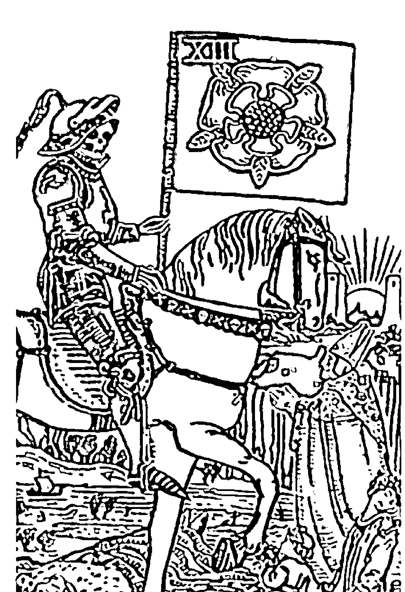

### 13 死神

水元素，天蝎座

死神本身就是负面牌，代表消亡，跟一切都已经定型了，没办法再改变。有些人抽到死神，很喜欢说那代表重新开始，但死神都出来了，就算要重新开始，也要先死过一回，这就像我们辞职或大病一场，才能知道我们拥有些什么，这些可以是我们的资源。天蝎座虽然也是水元素，但他是固定宫，之前累积的经验跟事物不会少，也像花谢了之后，可以化作春泥更护花，来年春天再重新来过。

简单来说，死神的意义并不是死亡，除非加上塔、剑十，或其他更象征毁灭的牌一起联合出现，才会是肉体上的死亡。不然大部分的时候，死神牌是代表时间到了，这件事已经精力耗尽，所以应该要改变，或这个产业已经走向尽头，需要新气象。所以要先把旧有的割舍，才能把资源跟心力集中到新的东西上，也就是像公司要结束，得先清算，把欠的款项跟货物还一还，再看留下什么可以用在新的方向。

死神牌如果是正位，那就表示这件事物的消失是必须的，不是无常而是有常。死神牌如果是逆位，就是要挣扎一番才会结束，而且如果要重新开始，要经过比较多关卡。

#### ☆ 死神＋火元素

死神牌若是跟正向火元素一起出现，代表重生的机会很快就要来了，会替死神注入生命力。如果是逆位的死神，或是负面的火元素，代表还有该放手的东西还没放弃，会苟延残喘一段时间。而且火元素代表还有心要努力下去，但时不我予了，只能迎接终点，之后再找机会重生。

#### ☆ 死神＋土元素

若是跟正向土元素一起出现，就代表树木开的花虽然谢了，但树木本体还在。土元素象征“本质”，死神牌遇上具体的土元素，就是把本来有形的东西归于无形。归于无形是很好的，代表可以改头换面，重生成另一副模样再生。就像录音带店变成 CD 唱片店，如果是负面的土元素，加上死神牌，很能一蹶不振，就会被淘汰。

#### ☆ 死神＋水元素

如果是跟正向的水元素一起出现，那就代表要心平气和的接受事实，等待正确时机到来，再顺势而为，寻求发芽的可能性。如果是跟负面的水元素一起出现，那就会纠缠很久，恩怨情仇算不完，一直陷在旧有的情境里，没办法看到新的可能性，但还死不了，所以会浪费很多时间。

#### ☆ 死神＋风元素

跟正向的风元素一起出现，代表会很理性的看清自己目前的处境，并计算得失，不管是生是死，都是对自己最有利的一边。要讲打算盘，没有人能胜过正面的风元素（正面土元素很精明，但手脚慢了一点）。如果是负面的风元素，就代表结束了，但还没清算完毕，还有很多旧账未了，这些都会变成员力，带到重生的新事物里去。

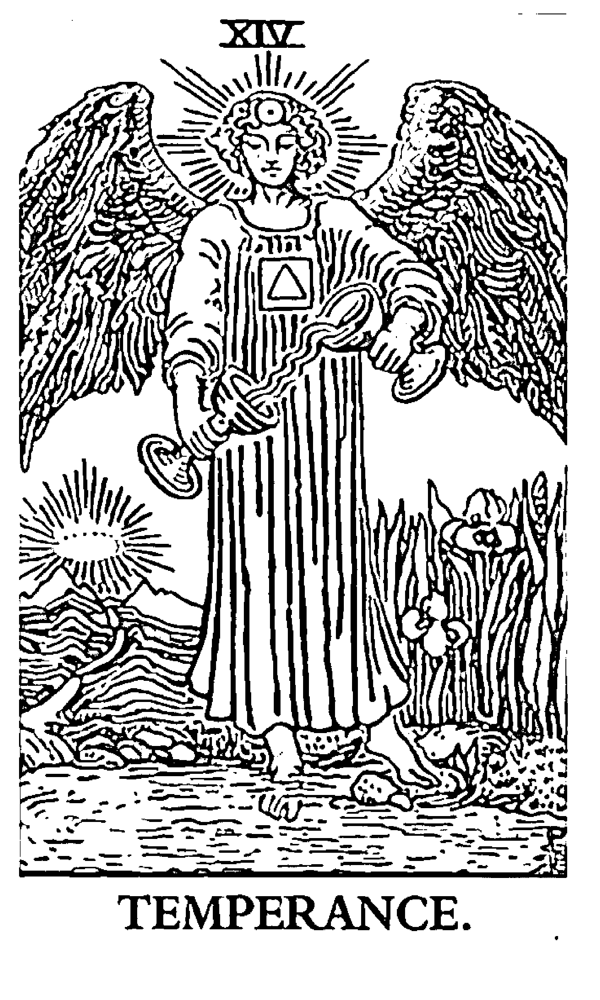

### 14 节制

火元素，射手座

这张节制，我觉得反而比恋人更能代表相配的一对，因为这张牌图是把不同的溶液倒在一起，两种溶液就会合成为第三种溶液，甚至超越原来的溶液。所以代表两个人结合之后，不管有没有长久，都成了更高层次的人。就算分开，也会以全新的形态过下去，总之会有超越原来自我的感觉。刚好节制是射手座，恋人是双子座，在占星学上，他们就是“对宫”，对宫都是有相似的形态，却又拥有对方缺乏的部分。节制是射手座，火象变动宫，跟双子座一样热爱追求新事物。但双子座是风象，浅尝之后就转到下一个了，射手是火象，是真的会深入探索后，再寻求更深更广的可能性。

虽然节制牌是好牌，但他的缺点就是相对性的。因为节制牌融合得很深，很难回到上一步，所以这张牌的坏处就是会对一件事物沉迷太深无法自拔。或者陶醉在自己的想法中，忘掉其他要并存的一切，有点“走火入魔”的感觉。或是已经付出太多，难以抽身，所有的资源都押进去了，忘了替自己保留一点。如果是逆位，最明显的就是本来是一体的大家，都已经各有各的想法跟做法，开始分道扬镳了。

#### ☆ 节制＋火元素

如果跟负面的火元素一起出现，这张牌的深入会有一种强制的成分，就是把其他东西都舍弃掉，虽然有些人事物是无辜的，但还是会列入被他牺牲的范围。或是他已经陷入太深，当他讲述的时候，忘了其他人没有这么深入，就变成自说自话，没办法传达给大家。只能躲在自己的世界里，那就可惜研究出来的成果了。

#### ☆ 节制＋土元素

跟负面的土元素一起出现，像是原来纯粹的东西，掺入杂质，需要更久的时间才能得出结果。其实跟正面的土元素一起出现，也代表时间要拉长，这就要看你从哪个角度看待他了。如果往好处看，更久的时间会带来更精粹的结果，如果要看坏处，就是少了这些时间，会少做很多事。

#### ☆ 节制＋水元素

如果跟负面的水元素一起出现，节制的火元素跟水元素都是情感元素，都表示太沉迷于一件事，忘掉生活中其他的存在。到了这时，就会有一点不负责任的感觉出现，因为火跟水做事都是随着自己的感觉，没有注意到其他层面，这就把火元素的自我感觉良好带入更不可自拔的状况。

#### ☆ 节制＋风元素

如果跟负面的风元素一起出现，风元素跟火元素都是速度很快的元素，如果是正位加上正面的风元素，就代表学习能力很强，一瞬间就能吸取大量的知识，还能够举一反三。但如果是逆位或同时出现的风元素牌是负面的，这组牌就会非常自我中心，随着自己高兴改变想法，没有负责任的态度，也就是凡事容易中断的意思。

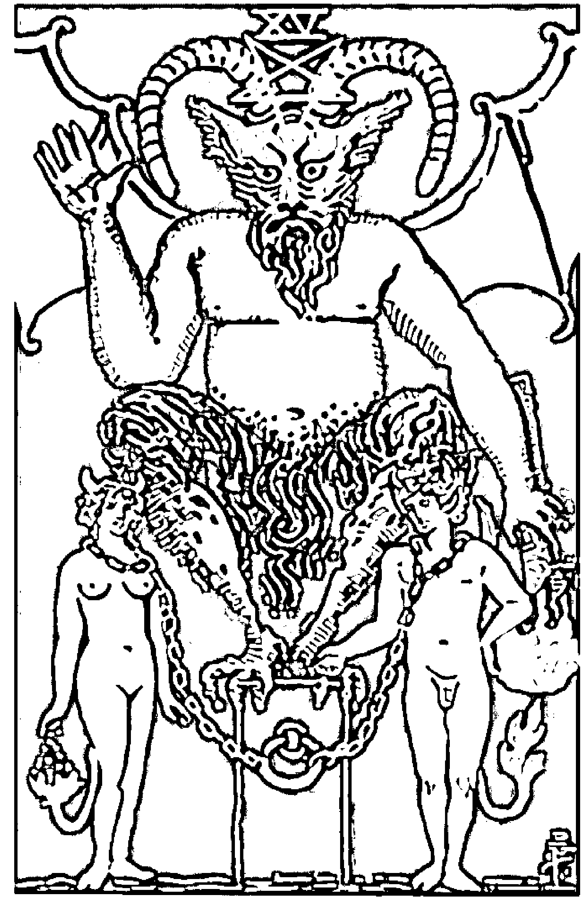

### 15 恶魔

土元素，魔羯座

恶魔牌一般来说是负面的牌，他的恶就是很堕落，人会堕落，不出性、财、名，恶魔又是土元素，所以他虽然是负面牌，但是他象征的都是每个人想拥有的东西。就像圣经的记载中，地狱有面包总管，听起来好可爱，但就象征着美味的食物会让人沉沦其中。如果是这个原则，那只要是世俗爱的东西，都会让我们沉沦。

但什么叫沉沦呢？我个人的解读是，拥有并不是坏事，重点是为世俗的一切，抛弃灵魂跟善良，也就是“为富不仁”。我觉得古代的人真的很爱找替罪羔羊，明明是意志力不坚定，却要把罪推到美食、钱财、男女关系上。就很像中国古代，每位昏君都觉得不是自己的错，是因为美女跟奸臣迷惑他……。所以恶魔代表的，就是我们只注意身体的欢愉，忘记有更高层次的事情要我们去做，也就是“停止成长、转化”，沉溺在低层次的事物里，并满足于此。

但我觉得恶魔牌搭上其他正向的牌，就代表人很精明，善于谋略，而且很容易在世俗中取得成功。其实如果是凡人，我觉得都会很喜欢恶魔牌代表的东西。除非是真的想要修仙，才会排斥恶魔牌。

#### ☆ 恶魔＋火元素

如果跟负面的火元素一起出现，那这张恶魔就会变成独裁者，因为火元素也是很自私的元素。恶魔本身就是负面的土元素，负面的土元素加上负面的火元素，就会非常主观，容不下别人的观点，也会极度自私，只听得进顺从他的人讲话的声音，逆我者亡。同时也很容易被金钱跟好处收买，缺乏人性的善。如果是搭配正面的火元素，那就有勇有谋，是难得的人才。就是因为爱钱爱名，他才会出来做事，而不是躲起来自己好就好。

#### ☆ 恶魔＋土元素

恶魔就是负面的土元素，再加上更负面的土元素，虽然看起来没有加上火元素那么强势，但其实更为阴沉。表面上没有反对的意思，实际上却会布局很久，让你一步步陷入无法挽回的地步。如果加上正向的土元素，表示凡事考虑周到，会把每一步安排好，确保不会有损失。

#### ☆ 恶魔＋水元素

如果跟负面的水元素一起出现，因为水跟土都是阴性元素，会没有动力。也就是沉溺在现有的好处中，不思进取，即时行乐，时间一久，运势就容易往下掉。如果是正面的水元素，就代表别人觉得你可以做得更好，但你很知足常乐，会珍惜自己所拥有的一切。

#### ☆ 恶魔＋风元素

负面的风元素，加上恶魔这种负面的土元素，就代表真的是无时无刻都在算计人，而且大部分的时候都可以达到目的。因为真的很少有人比这种组合更聪明，更了解人性。如果是正面的风元素，那可能就是发明家，为了促进人群的发展，就创造出其他人想不到的东西，也替自己赚大钱。

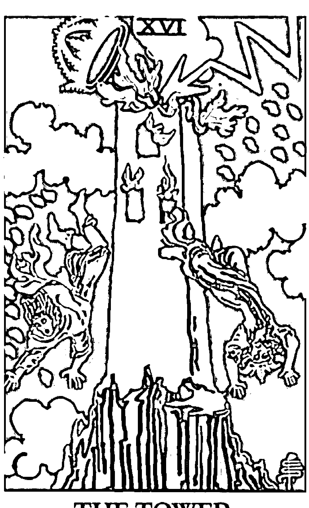

### 16 塔

火元素，火星

很多人对这张牌闻之色变，对啦！这张牌代表猝不及防的灾难，也代表所有的意外，也表示“彻底”的决裂，所以这张牌往往出现在争吵或打架时；但这张牌是火元素火星，火星没什么大脑，再生气，事情过了也就忘了。所以我们也有需要这张“塔”的时候，就是当要斩断不好的旧感情、旧生活习惯或是对自己无益的事物。如果出现这张牌，就不会留恋，断得干干净净。所以如果想破釜沉舟的戒掉一件事，出现这张牌也没什么不好，快刀斩乱麻。虽然会很痛，但长痛不如短痛。塔的速度很快，不会有什么后遗症，是万病的最佳良医！当然也有可能代表急病、天灾或出车祸。但通常好了就是好了，不会拖拖拉拉。

因此，想要断绝不好的处境时，“塔”就是我们需要的牌，也可以解释成我们要从中重生。每一张牌是好是坏，不是看他是正位或逆位，而是他有没有在我们需要的位置或情境中出现。这让你可以从好或坏解读。

#### ☆ 塔＋火元素

这张塔其实本身就是负面的火元素，如果再遇上负面火元素，灾情很可能扩大，规模变得浩大，延烧到身边很多人事物，延烧的时间也会长一点，因为需要一些时间扑灭。如果是正面的火元素，就有可能是从塔的毁灭中重生，彻底断绝不好的过去，火在这边就代表浴火重生，而且是全新的未来，不再受过去牵绊。

#### ☆ 塔＋土元素

如果配上负面的土元素，就代表不好的事情会有后遗症。土代表身体，所以可能身边看来没有灾情继续的情况，身体却留下了这些记忆，有了一些铭刻的印象，这就不是治一治就会好的，而是需要重新整理。如果是正面的土元素，那搭上塔就是之前的伤痛可以化成养分，让未来比过去更好。

#### ☆ 塔＋水元素

塔牌搭上负面水元素，火跟水都是情感元素，所以事件可能很快过去，但情绪方面会延烧比较久。而且水元素跟火元素都不理性，所以如果塔加上负面水元素，就要知道会迁怒到完全不相干的人事物上面，会让自己变成众人的公敌。但如果是正面的水元素，水元素代表平和的情绪，塔牌是释放情绪，所以加上正面的水元素，代表情绪已经得到解放，会恢复正常的心境。

#### ☆ 塔＋风元素

如果塔牌搭上负面风元素，就代表又奸又坏，跟谁有仇时，不是只出气就算了，还要置对方于死地，让他无法再翻身。而且风元素很聪明，所以坏事要成功的机率很大，但要注意员力的回力镖，你可以一时骗过所有人，也可以永远的欺骗部分人，但不可能永远的欺骗过所有人。如果是正向的风元素，在怒火攻心时，可以用更有智慧的方法解套，并且创造出新的机会。

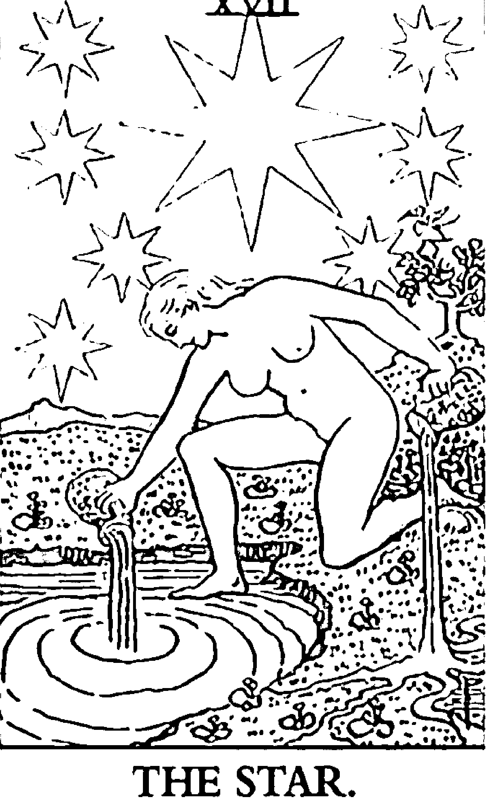

### 17 星星

风元素，水瓶座

大家都会觉得星星是一张好牌，但其实坏处也不少，因为是风元素，代表着虚无缥缈，最明显的就是恋爱，因为恋爱需要一些亲密的接触，不然不能称之为恋爱。恋爱方面出现这张牌，可能是远距恋爱、暗恋，不然就是双方对彼此都很好，但缺乏亲密的交流（这只就单张牌论，如果有出现其他牌，就不一样了）。星星牌好的地方是对未来的希望，以及构想的能力，但未来再好也不能当饭吃，这张牌很难解决当务之急。

星星牌不好的地方是风元素，因为是风元素，所以他没办法有实质可以享受的东西，他拥有最多的就是梦想。梦想也不是不值钱啦！如果你从事的工作需要代表大众的理想跟梦想，例如：广告行销业、政治、演艺人员等，就很适合这张星星。但星星不好的地方是容易见光死，我们会觉得星星很美，是因为星星离我们很遥远，如果登上星球，就会发现跟我们想象中不同，所以在“建议”抽到星星牌，就是告诉我们，距离是最好的美感。

#### ☆ 星星＋火元素

星星牌跟负面的火元素一起出现，代表还没搞清楚状况，就随意行动，但星星在地资源不够，如果贸然行动，最后往往导致失败的结果。星星搭上火元素，就很容易变成别人眼里的骗子，因为在梦想实现前，他就到处宣传，很多人等着看结果，会有说大话的嫌疑。但如果正位星星牌加上正面的火元素，倒是很适合当教主之类的，因为他充满梦想，又有行动力，也会做出一些成果，很容易取得他人的信任。

#### ☆ 星星＋土元素

如果星星跟负面的土元素一起出现，表示梦想很多，但是很明显不切实际，看不到那些现实的不适合跟阻碍。例如：在家人刚刚遭受杀害的人旁边，在他回过神来之前，就开始跟他讲宽恕之类的话，宽恕可以讲，但要看时机，看状况，在别人还没反应过来时，急着推销自己的理念，当然就没有好结果。

有學生問我事業，星星跟負面的土元素一起出現，單看這兩張牌的話，是不是可以解讀成既看重現實利益又較有長遠規劃？還是這個慾望也很不切實際？我覺得是代表這個慾望很不切實際，因為事業如果少了火元素，只有土元素跟風元素，就是只有慾望，但缺乏行動力跟目標。

#### ☆ 星星＋水元素

負面的水元素跟星星一起出現，風跟水都是講理念、講夢想，講還沒發生的事情，一點都不務實。所以星星牌加水元素，不管正位還逆位，如果在現實中要執行，還是失敗的居多，除非這件事，你從來沒有希望他實現，只是把理念當紅蘿蔔，引誘大家往前走。

#### ☆ 星星＋風元素

如果星星牌加上負面的風元素，星星牌是講對未來的憧憬，風元素是分析要怎麼做，如果逆位加上負面風元素，就是有很大的理想，但是用錯誤的方式去做，會給人一種：「你自己都不知道怎麼做了，還來給人建議。」很像那種從來不買股票卻開辦買股課程的人。所謂的老師，就算是正位跟正面的風元素，我們只能說他是出自好心，但結果不如他想像，因為星星牌跟風元素都是缺乏經驗。

### 18 月亮

水元素，雙魚座

這張牌是水元素中最愛胡思亂想的雙魚座，我覺得這張牌有被害妄想症。雖然有一說是月亮牌的第六感很準，但我覺得他如果是逆位，就不是第六感準，是總會有人想害他，剛好被他朦對。因為想害他的人太多，就算九個不準，總有一個準的。所以我給月亮牌的建議會是：不要管誰想害你，人生在世，會遇到想害你的人還怕會少？所以先建立起自己的免疫系統，誰害你都不怕了（來自月亮在牡羊座的人的建議）。

如果是正位的話，他的猜想多少有點合理，可以說得上是第六感準，但我的建議還是一樣，越是防範別人，你就越要躲在陰暗處，我是覺得應該把別人趕進陰暗處啦！不要自己待在那邊，又不好玩（一樣是來自月亮在牡羊的人的建議）。不過，月亮這張牌，就是覺得在暗處最安全，可以作自己的夢，盡情的享受當被害者的快感；可以隨便給人扣上他想像中的罪名，又不用負責，真的很自由，寫著寫著我也想來試試看了。

#### ☆ 月亮+火元素

月亮加上負面的火元素，就會很情緒化，月亮本身就情緒化，但至少他是在暗處，不會給其他人造成麻煩。但加上火元素就會表現出來，而且藏不住，還會情緒勒索其他人，不能乖乖的默默的當自己的被害妄想症患者就好。如果是正面的火元素，就很能重視自己內心的各種糾結，會積極的找尋梳理的辦法，別人看得到他的不安，但也不會討厭他。

#### ☆ 月亮+土元素

我前面說的被害妄想症都是開玩笑的，但加上負面的土元素，情緒跟問題無法抒發，最後真的會釀成心理上的疾病。火元素會表現出來給大家看，找別人麻煩，也算是一種抒發，但土元素只會默默消化跟承受，所以外人看不出異樣。如果是正面的土元素，月亮還是會有很多煩惱，但土元素會把心力放在自己可以改變的事情上，默默的努力，最後走出情緒的牢籠。

#### ☆ 月亮＋水元素

月亮加上負面的水元素，那就是整天自怨自艾，又找不出解決的辦法，也不敢把氣出在別人身上（人緣已經夠不好了）。那種無力感會真的很深，而且就算有人願意聽他講，他也講不到重點，徒增善心人士的煩躁。這個組合，我覺得越想幫助他的人越倒楣，因為會被拉進他的情緒漩渦，又講不聽。如果是正面的水元素，就會知道適時的把心力放在需要他的人事物身上，會去當義工，或成為小孩或流浪動物的中途之家，這些就是雙重水元素最好的出路：慈善。

#### ☆ 月亮＋風元素

加上負面的風元素，水元素的不安全感會發揮到極致，不只自己身邊的人，他有可能在網路上散發讓大家不安的訊息，讓別人跟著他一起不安，月亮反而會有種安全感，畢竟他不是自己一個人承受這些。如果是正面的風元素，會用文章跟創作來抒發自己的負面情緒，反而會有很了不起的作品出現。

### 19 太陽

火元素，太陽

太陽牌是眾所周知的好牌，很難想像他的缺點，但再完美的牌，不要說缺點，至少還是會有弱點。

太陽是一張開朗又有助運的牌，太陽牌沒有陰暗之處，所以光看牌面，就會讓人放心，好像沒有什麼壞事會發生。先不說他會引來嫉妒跟攻擊，因為要產生這種現象，一定要有其他的牌搭配出現，我們就來說說太陽自己本身會有的缺點。

太陽在「問題」的位置時，我們不能用一般人常用的方法來看，也就是不能用相反的意思解釋他。因為我覺得如果出現太陽，就一定是只有太陽才能代表的意思，如果是相反的意思，那就讓你抽到相反意思的牌就好啦！

#### ☆ 太陽＋火元素

太陽牌對自己要求太高，如果火元素過度，就是表示他太在乎別人看待自己的眼光，所以不允許自己失敗。越是這樣，越有可能把自己逼進死胡同，別人習慣失敗，如果失敗了，了不起重頭再來。但太陽太愛面子，有可能不願意承認自己的錯誤，所以就算失敗，也不願意喊停，讓自己沒有止損點，因此一旦引爆會全盤皆輸。

#### ☆ 太陽＋土元素

如果太陽牌遇到的土元素過多，太陽牌的火元素是激進的，也是新生成的創意，但土元素是墨守成規，或者土元素可能是權威人士，或是思想傳統，都會硬生生的把火元素的熱情跟活潑壓下去。可能是遭到現實打擊，或者是事情不如所想，被人當面吐槽，又或者是要用錢來做一些宣傳的事。不過火跟土都代表財運不錯，所以不至於會賠錢，但成就可能會比較慢達成。如果是土元素的壞牌，那可能會讓火元素迷失方向。

#### ☆ 太陽＋水元素

如果是水元素過多，太陽牌跟水元素都代表樂觀跟夢想，水元素如果是壞牌，代表搞不清楚狀況；如果是好牌，代表不會給別人造成困擾，但是自己沒有收穫，只有不斷的消耗，也有可能把幫你的人拖下水。太陽牌的責任感跟水元素的心軟，就會讓你非常自責，有可能對之後的事都失去信心。

#### ☆ 太陽＋風元素

太陽牌如果跟風元素的壞牌同時出現，那麻煩就大了。因為風跟火都是陽性元素，兩者都有擴大的特質，而且比寶劍牌組壞很多。太陽牌最注重面子，但風元素有可能把壞形象訴諸外界，給太陽帶來比壞事本身更大的傷害。更糟的是，因為太陽牌是權威的保證，所以可能會被風元素拉去幫不好的事背書，就像藝人幫差勁的產品做廣告，讓災情更加擴大。

### 20 審判

水加火元素，冥王星

審判是一張茲事體大的牌，如果抽到這張牌，往往是有重大的事情要決策。這張牌為什麼是火元素加水元素，不是冥王星嗎？雖然冥王星是天蠍座的守護星，按照常理來說，他只跟水元素有關係；但在占星學理論上，冥王星等於高八度的火星，火星守護牡羊座跟天蠍座，所以這張牌的性格特質還滿陰狠的，只要被他盯上，不管時間過得再久，他都不會淡忘。所以有人說不要惹冥王星守護的天蠍座，因為他很愛記恨，會十倍奉還，是沒錯，但我覺得如果是小事他們反而沒力氣去報復。因為你想想，報復一個人要花那麼多精力，如果每個人每件小事都要報復，豈不是要用電腦列名單，還要記錄報復事項？審判牌跟冥王星都是做大事的，這種小事他們不會在意。

但要注意，如果看起來是小事，卻剛好踩到他們的痛點，你還是要承受不知道什麼時候會降臨的報復。審判牌又有累積足夠的人脈跟資源，所以他一定會把報復簡化成可以日常經營的事，免得花他太多資源跟力氣。如果在「建議」抽到審判牌，很多人常常會問我：「我知道審判牌就是要做出決定，但我就是決定不了才抽牌啊！」很簡單，因為審判牌是翻天覆地的轉向，所以你正在進行的事，換個方向就可以了。有人問我他奶奶生病該怎麼治療？如果抽到審判牌，我就會說：「如果吃藥吃很久還沒用，那就開刀。如果是已經開過刀了，還是沒有太大轉變，那就尋求更新開發的藥物。」

#### ☆ 審判＋火元素

審判牌搭上負面的火元素，就是占星書常說的「手榴彈扔進汽油桶」，一場大戰即將開始，還會把所有相關人士都捲進去，事情也將發生大逆轉，簡單來講就是業力引爆。你所做過的不好的事，都會在此刻發生效應。如果是正面的火元素，那就是你可以推翻一些權力結構，並且接掌之，讓事情往對你自己有利的方向發展，失去的一切也都可以討回來。

#### ☆ 審判＋土元素

搭上負面的土元素，會讓本來就不是善類的審判牌更為陰沉，這會比純粹的審判牌更會記恨，但不會因為情緒記恨。他記得的都是讓他有實際損失的事情，這個組合頗會算計。如果是正面的土元素，他可能會做出能夠平定人心的大事，像是建設或組織一間大公司，跨國際的慈善組織或活動，來推動很多事情的發展。

#### ☆ 審判＋水元素

如果搭上負面的水元素，重要的事他不去記，反而記得一些雞毛蒜皮的小事。因為在他的標準中，只要打擊到他的自尊心，或傷害到他的感情，那你就是反派，他怎麼對付你都是有道理的。他對事情的判斷會被自己的感情影響。但如果是正向的水元素，就代表他很善良，會投入宗教或藝術或寫作，做出改變人心的大事。

#### ☆ 審判＋風元素

搭上負面的風元素，就是這張審判牌格局最小的時候。這張牌加上負面風元素，很會散發對自己有利但不是事實的小道消息，並從中得利。有點像狗仔，或是立場偏頗的新聞單位。但如果是正面的風元素，就有可能推動很重大的事，像是利用輿論來對付麻木不仁的政府單位，或者是掀出冤獄或弊案。

### 21 世界

土元素，土星

土星在占星學中是第一兇星，但世界牌卻是一張穩定和平的牌，所以不管哪張牌哪顆星，都有正反兩面。世界牌的優點就如同土星的優點，因為是累積很久的努力才成就的，所以不會輕易被打倒。但如果是逆位，就代表大而不當，就是因為累積很久，所以不易推翻，如果它是錯的，也不容易被修正。很像以前的國民黨和現在的民進黨，如果夠大就會佔據各項資源，不易被推翻被取代；但同理，如果要做好事，也是組織的力量比個人的力量大。所以如果占星看到一個人善業惡業都很重，我就會想，他上輩子一定是當大官，才會行善行惡都那麼極端。

世界牌代表累積很久，規模很大的組織。像王永慶的事業集團，橫跨各個領域，用數十年建立起來，就是世界牌很好的象徵。但是一個大集團，一定免不得有官商勾結的內幕或利益輸送的事情。因此一張世界牌，正面負面都有，因為夠龐大，所以做出的好事壞事都影響深遠。

#### ☆ 世界＋火元素

如果世界牌搭上負面的火元素，表示擅長用影響力改變事情的軌道，但軌道方向只對私人有益，對眾生無益。或是為了達成自己的目標，煽動其他人，讓別人反目，自己再坐收漁翁之利。但如果是正向的火元素，那就太好了，因為世界牌的資源足夠，再加上他的上行動力，可以得到很大的成就。

#### ☆ 世界＋土元素

世界牌搭上負面的土元素，就是雙重土元素，會弊病叢生，見不得光的事情很多，而且還會阻礙社會跟公司的發展，等於拖垮整個時代的進度。負面的世界牌如同一顆腫瘤，礙事又有害。如果正面的世界牌再加上正面的土元素，就會善於規劃資源，雖然會花很多的時間，但能成就不得了的大事，例如：高速公路或摩天大樓，因為土元素也屬於建設。

#### ☆ 世界+水元素

搭上負面的水元素，世界牌就沒辦法好好的穩定自己。雖然世界牌的想法跟立場都沒改變，但總是會想做一些其他的嘗試，但是常常白費功夫，因為水元素不成氣候。尤其如果是負面水元素，更是什麼都做不來，只會讓世界牌看起來有很多點子，但是在實力方面無法成事。如果是正面的水元素搭上世界牌，就會給世界牌一點同理心，他會搭配水元素的善意，用自己的資源去推動該做的事。

#### ☆ 世界+風元素

如果搭上負面的風元素，風元素跟土元素都是理性元素，所以搭上風元素的世界牌沒什麼同情心，眼裡只看著自己的目標，然後找出阻礙自己的事，再一一閃過（不是排除阻礙，那是火元素在做的事）。不過倒是沒有很大的缺點，就是在談戀愛時會很討厭，不會甜言蜜語，只算計著兩個人在一起有什麼好處。如果是正面的風元素牌，就是理性又務實，在戀愛方面，不用甜言蜜語也會讓人很有安全感。

# Part 3

## 小阿爾克納數字牌

搭配四大元素

### 一、號牌

1 這個數字是一切的開始，雖然最小，但也包含著上一階段的 9（尤其是錢幣，土元素）。就像 11，是二位數的開頭，不管是全新，還是重新，都是一個充滿可能性的數字。

1 也很純粹，因為他全然只是單獨，沒有其他雜質混進來，有一種「我就是全世界」的感覺。1 是一個細胞，10 是一個人，這樣理解就可以了。

### 權杖一

#### 火元素

權杖一是火元素的一開始，他可能沒有前面的9，就是一個新生的開始，充滿生命力且熱騰騰，像一個天真活潑的嬰兒，沒有任何包袱，無所畏懼的迎向人。但也因為太不畏懼了，凡事都傻傻地往前衝，很容易受傷或失敗。雖然他不害怕，也不寂寞，但如果他是在一個公司或社會這樣的整體，就容易給其他人帶來麻煩。不過如果是失戀或挫敗過後，來一張權杖一給自己打氣也不錯。其實這張牌出現，都是有新氣象，但社會跟公司的土元素性質都很強，如果權杖一出現，好處很明顯，就是會對來新的氣象；壞處就是他的經驗最少，一開始出錯，被排擠的可能性很大。

如果在「問題」抽到權杖一，那就是缺乏經驗犯下的錯誤，而且沒有前例可循，也不知道怎麼解決。或者太自我感覺良好，沒有留意四周已經給出負面的訊息，一味的蠻幹到底。如果是帥哥美女，感覺還能讓人原諒，如果不是，就會帶來很多責難。如果只是他自己覺得痛苦倒還好，但權杖一通常聽不懂人話，會感到痛苦的是跟他同一個團隊的人，他自己還是洋洋得意。

#### ☆ 權杖一 + 火元素

如果跟火元素的壞牌一起出現，那就很有可能是年輕氣盛（不年輕也可能氣盛，還不可愛），造成無法挽回的結果，自己拍拍屁股就跑了。他不是故意不負責任，而是「沒有意識到」自己闖禍了，因為他通常看不到別人的麻煩，他只看得到眼前的東西，算是「低敏感人」的最佳寫照。

#### ☆ 權杖一 + 土元素

跟土元素壞牌一起出現，因為土跟火都是現實元素，所以會很自私，凡事以自己的利益為優先，巧取豪奪。雖然感受得到別人的無奈與無助，但是他不在乎，或者後悔時，已經事過境遷，也沒有辦法挽救。上一段權杖一跟火元素的壞牌一起出現是會不知不覺，跟土元素壞牌一起出現好一點，是後知後覺，但不管是哪一個，都有沒心沒肺的既視感。

#### ☆ 權杖一＋水元素

如果跟水元素的壞牌一起出現，水跟火都是感情元素，代表事情實際上不嚴重，但情緒方面被渲染得很恐怖，造成整體的恐慌，簡化來說就是「假議題」。明明不存在的事，卻被說得有聲有色，情緒會帶動人們做出很多不理性的事，從而造成很多的損失。

#### ☆ 權杖一＋風元素

跟風元素的壞牌一起出現，因為風跟火都是陽性元素，所以會把不好的地方擴大，讓事態更為嚴重跟複雜；但還好的是，複雜跟嚴重的地方是旁人的觀感不好。陽性元素都是意識型態，雖然實質上沒有損失什麼，至少眼前沒有，但擴大之後會波及到哪裡，就很難預測了。

### 寶劍一

#### 風元素

ACE of SWORDS.

風元素就是寶劍牌組。大家可以看到，寶劍牌組大多是壞牌，但寶劍一不一樣，寶劍一是一體的，意識還沒開始分裂，所以沒有混亂的狀況。風元素全都是腦袋層面的事情，所以沒什麼情感，同時也很聰明，不會被混淆。但因為一活在自己的世界，沒有事情可以擾亂他的思考，所以會給人凡事都「漠不關心」的感覺。也因為事不關己，寶劍一對任何事都可以很客觀，在任何事物上他都有超凡的觀察力，所以很難談戀愛。因為談戀愛是頭腦不正常下的產物（這是心理學家的研究），寶劍一很難頭腦不正常，所以他很難談戀愛。

#### ☆ 寶劍一＋火元素

如果寶劍一跟火元素的壞牌一起出現，那就是會漠視他人，還自以為很理性。因為寶劍一的漠視出自於火元素的自私，只站在自己的立場，這就不能算客觀。如果跟火元素沾上邊，通常都會很主觀，加上 1 也是跟火元素相似的數字，所以寶劍的風元素特質，在一件事情中就蕩然無存了。

#### ☆ 寶劍一＋土元素

寶劍一如果跟土元素的壞牌一起出現，風跟土都是理性元素，他會感知到自己對別人的傷害，也會察覺到自己的自私。但在他的權衡之後，還是決定自己的利益比大家重要，還會說服自己是因為他自認為可以看到比他人更全面的東西，所以他的觀點會比別人正確。雖然有些時候是這樣沒錯，但如果一點情感都不帶，他看到的重點也未必是別人覺得重要的。

#### ☆ 寶劍一＋水元素

寶劍一跟水元素的壞牌一起出現，那就是有一個崇高的理想（寶劍一），執行的人也都很善良（水元素）。但水元素沒有客觀的頭腦，等於是「通往地獄的路，往往是由善意所鋪陳的」。不聰明的人，執行崇高的想法，往往會用自己愚昧的觀點去解讀，造成的結果往往也不是很理想。

#### ☆ 寶劍一＋風元素

這張牌跟風元素的壞牌一起出現，就代表他是一個很賢能聰慧的人，但團體中大部分人都比較愚昧（風元素的好跟壞差很多），而且又愛生事。有點像共產黨，原始理念很好，但讓人類去執行，加上人性的惡就一切都走樣了，共產主義是神的觀點，但人不是神，所以就造成獨裁的局面。

### 聖杯一

#### 水元素

ACE of CUPS.

聖杯一是純粹的愛意，很像父母對子女不求回報的愛。但如果出現在「問題」的位置，這份愛就有可能變成縱容、放任……等種種不好的結果。太過不求回報的愛很有可能被利用，就像很多以慈善為名的詐騙，利用對家人的愛進行的欺騙或勒索。我個人的觀點是：不求回報的付出，往往讓全身上下 的罩門露出，讓人家能利用你去做出很不好的事。不管你再怎 麼不希望這種事發生，但你就是參與了讓事情發生的一部分， 所以保護自己也是一種智慧。就像很多不好的事會假神之名而 行，例如：德蕾莎修女旗下的修女也不是每個都跟她一樣好， 但因為那些人也是修女，所以大家會認為她們講的都是對的。

#### ☆ 聖杯一＋火元素

聖杯一跟火元素壞牌一起出現，就很像情緒勒索，「因為我多麼多麼愛你，所以你要照我的要求去做，不然我會傷心，這樣你就是在傷害我」。因為火跟水都是感情元素，所以這個組合最有可能以愛之名，行任何自私的事，而且還以為自己是好人。感情元素本來智商就都不高，有可能太感情用事，覺得全世界都對不起我，但沒有想到自己無意中或愚蠢中對別人造成的傷害。

#### ☆ 聖杯一＋土元素

跟土元素的壞牌一起出現的話，土跟水都是被動元素，所以凡事只要不太過火，那就很好商量。也有可能因為都是陰性元素，凡事不願意挺身而出，只是默默的看著壞事發生，就是「最大的悲劇不是因為壞人的囂張跋扈，而是因為好人的過度沉默」。你可以說這是一種明哲保身的處事之道，但如果出現的是壞牌，就代表影響很嚴重了。

#### ☆ 聖杯一＋水元素

跟水元素的壞牌一起出現，是雙重負面水元素，雖然有聖潔的聖杯一，但好人也是有笨蛋的，沒有智慧的慈悲，是敵不過魔障，也敵不過外面世界的惡意的。所以很有可能勞累了半天，被外人一把搶走，自己還不知道要計較。讓事情一而再，再而三的發生，甚至把身邊的人拖下水，那反而就是造孽了。

#### ☆ 聖杯一＋風元素

跟風元素的壞牌一起出現的話，風跟水都是渙散元素，聖杯一存的都是好心，但風元素的壞牌大多是狡詐又喜歡惹事生非，如果沒有火跟土，就沒有人可以控制局面。聖杯一很善良，就算有風元素的壞牌，其實也幹不出什麼壞事，只是讓世界的氛圍變得很差，會感覺一切都很煩，什麼事都不順心。久而久之就沒有好的成果出現，長久的時間都浪費掉了。

### 錢幣一

#### 土元素

錢幣一是純粹的土元素，也是四張一牌中可能性最大的。因為土元素不會隨著時間而煙消雲散，反而時間越久，累積的資源越多。而且還在1的地方，1就是開頭，所以未來不可限量。土元素的1，表示有上一層的9當基礎，如果是社會新鮮人，表示他在學成績很好，早早考好證照，雖然是全新的開始，但基礎打得比其他人都好，有了資源，他會比其他一站得更穩，長得更高。如果在「問題」的位置，就表示資源會變成包袱，在他找到自己的可能性之前，就已經有家族企業之類的事限制他的路線了。雖然別人會很羨慕他的資源，但這些會限制他更大的發展，反而只能停在原地。

#### ☆ 錢幣一+火元素

錢幣一就像土元素，跟火元素壞牌一起出現，就代表做不好的事時有很好的資源，所以很難阻止。錢幣一也表示長久的傳統累積下來，很難打破，而且火元素比單純的錢幣一更偏執，也更沒有彈性。錢幣一是單純的土元素，他要孕育事物的成長，所以要有空間。如果加上火元素，表示容下異物的空間不大，會擠壓其他可能性。你想想看，如果全世界都變成一整個獨裁國家，雖然他們會以為有自己的空間，但那空間是已經被壓縮過的。

#### ☆ 錢幣一+土元素

如果跟土元素的壞牌一起出現，那就代表頑固冬烘（糊塗），雖然依然很排外，但至少對於外界還是有其他的價值觀存在，只是他不接受而已。我個人認為比火加土好一些。錢幣一如果願意走出去，外面的世界還是存在的，你只要擺脫現在，就可以創造出自己的世界。

#### ☆ 錢幣一+水元素

如果跟水元素壞牌一起出現，水跟土都是陰性元素，加上錢幣一已經有資源，不必再外求，就很容易怠惰，不思進取。雖然每張一都有很大的可能性，但都被浪費掉了，就像好吃懶做的公子哥兒，只要等著接家業就好，不用去思考還需要有什麼長進。雖然在他個人看來，這種生活是很知足，但少了他的努力，下一代的資源就會少很多。

#### ☆ 錢幣一＋風元素

風元素的壞牌跟錢幣一一出現，就是別人如果有餿主意，也成不了事，但如果錢幣一在，他都弄得出一些資源做表面。而且因為外人看起來覺得有模有樣，所以一起投入的人會很多，到最後如果垮了，也就會牽連很多人。所以這個組合的可惡之處是：死道友不死貧道。對外人的衝擊一定比對他自己的衝擊大。

### 二 號牌

2 是相對於 1，不是雙胞胎，而是「相對的」另一個，本質相同，不過是兩個不同的極端。陽性元素就是要面臨取捨，但陰性元素比較溫和，兩者要試著和平相處。就像亞當跟夏娃，要不同性別才能繁衍。

### 權杖二

#### 火元素

權杖二是陽性元素的火遇到不同的兩個方向，因為是火，就很像有兩個不同的選擇，但對他都是有好處的。就像有兩個對象，一個個性合得來，另一個很有錢，不管選哪邊他都有一定的收穫，困難的是每個人兩者都想要，要決定捨棄哪一半。一般來說，如果是權杖二，我個人覺得他的衝勁會比權杖一來得強。因為他是有誘因的，比權杖一光憑理想跟熱情的方式還更有目的，所以意志也更加堅定。在「問題」抽到權杖二時，代表他捨不得放手，會想要兩者兼備，再加上不甘心，會在不管是給自己或給他要放手的事物上留下陰影。

#### ☆ 權杖二＋火元素

如果跟火元素的壞牌一起出現，那他捨棄時，不光只是捨棄，還會帶來很多的破壞，就是不能好好的放人家走，一定要做點破壞才行。這樣才能顯示不是他要不到，而是因為不夠好所以不想要，火元素的任性在此一覽無遺。如果沒有壞牌，權杖二單純只是在選擇，表示他是很有能力的人，所以選擇很多，甚至比權杖一有歷練。因為權杖一只是年輕人，權杖二資源很多，所以即使是年輕人，也應該不是普通的年輕人。

#### ☆ 權杖二＋土元素

跟土元素的壞牌一起出現，就表示會猶豫太久，到最後落得兩頭空。如果果斷一點，就可以有不錯的成果，但如果太三心兩意，就會錯過時機。而且總是太捨不得要割捨的好處，到最後連本來可以保留的好處都保不住。這張牌重要的就是要快速解決，不然時機一過，就會什麼都沒有。

#### ☆ 權杖二＋水元素

水元素搭上這張牌，更顯得三心兩意，水跟火都是感情元素，所以會容易被感覺驅使，沒辦法看清事實。往往會做錯選擇，或是錯過時機，讓好處溜走，最後只抓住一點殘餘價值。雖然還是擁有一些東西，但比起原來想有的，還是差距很大。如果是想看事情的發展，這張牌表示剩下的都只是一些抽象的東西（意義、感覺……之類的），實質的好處很少。

#### ☆ 權杖二＋風元素

如果跟風元素壞牌一起出現，風跟火都是陽性元素，那就會太貪心。除了原有的選擇，還想要找尋更多可能性，把力量跟資源分散掉後，就會力氣不夠，什麼都抓不住了。或是想要兩個都保有，而把資源都耗盡，到最後原有的優點都會消退，拿是拿到手了，但已經變得四不像，還不如只拿一處，但完整保留下來的好。

### 寶劍二

#### 風元素

寶劍二是風元素，風元素跟火元素不同，火元素比較集中，風元素是渙散元素，加上二這個數字力道本來就很分散，就算選擇正確，沒有選錯，寶劍二還是兩邊都沒辦法徹底達成。他本身就是問題，所以如果在「問題」位置抽到，就會代表事情更無法解決。如果在「建議」位置抽到，那就是叫你不要太過衝動行事，先觀望一陣子再說，因為有時候看久一點，才會看到本來沒注意到的地方。

#### ☆ 寶劍二＋火元素

這張寶劍二如果跟火元素的壞牌一起出現，表示寶劍二意志本來就不堅定。但火元素的慾望強烈，會四處飄散，看到什麼追逐什麼。雖然兩個元素都是陽性元素，但因為有太多方向，所以稀釋了力氣，也就會每樣東西都只沾到一點。只沾一點在外人眼裡就是不專精，項目太多，也就不知道自己要什麼。不僅在工作上，對於你的人格，他人也會產生不信任感。

#### ☆ 寶劍二＋土元素

如果跟土元素的壞牌一起出現，風跟土都是理智元素，就有可能過度衡量，沒有盡力的過程，只有觀望跟算計，所以讓人覺得誠意不足。一開始就互相只要好處，會讓人覺得只能共享樂，不能共患難。就算是做生意以好處為主，如果沒有一定的誠心，還是會讓人覺得太現實，感覺一出事就會捨棄對方。對方會覺得不用對你付出太多，所以合作關係會很鬆散。

#### ☆ 寶劍二＋水元素

跟水元素的壞牌一起出現，風跟水都是渙散元素，這代表從一開始就沒什麼誠意跟實力，只是靈機一動，或只是天外飛來一筆就行事了。既沒有詳細的規畫，也沒有充足的後援，雖然人脈還可以，但大多是酒肉朋友，這種不長久的人脈並不可靠，也沒有什麼實力，只會消耗你的資產而已。

#### ☆ 寶劍二＋風元素

如果一起出現的是風元素的壞牌，那就是想得很漂亮很完美，但一旦執行，就會發現漏洞百出；或凡事只有第一步可行，接下來就後繼無力。如果是一個人，那他就是理論派，跟他交談會覺得他很聰明。但他說得是理論上的事，你會發現都沒有實際的可行性，而且不用太久，一旦執行一點點，就會發現真的是空中閣樓。

### 聖杯二

#### 水元素

聖杯二是水元素牌，雖然二是對立，但水跟土都是陰性元素，因此會在彼此的不同中找尋可以相處的空間。水元素很柔和，也很有彈性，所以聖杯二大部分的時候都代表可以相處得來，但也只是可以相處而已，產生不出太多的利益。就像我在工作上常聽主管說「你欣賞我，我欣賞你，但如果我們兩個合作沒有好處，那一切就是誤會一場」。

#### ☆ 聖杯二＋火元素

聖杯二如果跟火元素的壞牌一起出現，那就表示太感情用事了。因為火跟水都是感情元素，缺乏理性，還好聖杯二沒什麼行動力，就算沒有好處，聖杯二一時之間也不會去做，但加上火元素的壞牌，就會想到什麼做什麼。如果只有水元素，因為他的能力薄弱，不至於有太壞的結果；但加上火元素，殺傷力就很大了，這種人最好不要思考，因為想越多，傷害就越大。因為他只要一想到什麼，就是一定要試看看。

#### ☆ 聖杯二＋土元素

如果聖杯二是跟土元素的壞牌一起出現，那一時之間不會有太壞的行為，因為兩個都是拖拖拉拉的陰性元素。雖然眼前沒什麼壞處，但在長期發酵後，就會產生不可逆轉的後果。而且由於是土元素，就算發現是錯的，卻因為積弊已久，所以一時也無法挽回。雖然短時間看來影響不大，但長久來看會是終生的罩門，不是「缺點」兩個字就可以形容的了。

#### ☆ 聖杯二＋水元素

跟水元素的壞牌一起出現，跟上一個風跟水的組合差不多，不一樣的是，寶劍二加風元素的壞牌會對自己很有自信。水元素或多或少有自知之明，但風元素被人誇讚聰明慣了，他就真的自以為很聰明。風元素是聰明沒錯，但缺乏經驗跟反省能力，他比水元素好一點的地方是，這個組合沒有陰性元素，所以承諾隨風去的可能性比較大，也沒有什麼要收拾的殘局。

#### ☆ 聖杯二＋風元素

如果跟風元素壞牌一起出現，兩個都是渙散元素，雖然風元素有思考能力，但有水元素在，凡事一想就會落入虛無。兩個組合起來，就還是年輕的人常有的毛病，想得多做得少；做得少還好，如果做得也多，那爛攤子就收不完了。因為這個組合很年輕，所以想到的事都不周全，漏洞也多；如果成事了，這個成果本身罩門會很多，不會生存太久。

### 錢幣二

#### 土元素

錢幣二是陰性元素，有沒有發現，陰性元素的二比陽性元素的二好，因為陰性元素善於共存，尤其是土元素，不但共存，還可以發育出更大的可能性。錢幣二不像聖杯二會融為一體，錢幣二是兩個不同的存在，會保有自己原來的本質，然後互相協力，激盪出更多的可能。因為二是多元化，也突破土元素的限制性，常常可以相加或相乘，就算遇到其他負面牌，帶來的壞效應也有限，是我個人很喜歡的一張牌。

#### ☆ 錢幣二＋火元素

錢幣二跟火元素的壞牌一起出現時，通常會把對方吃乾抹淨，看是各取所需，但實際上他拿的都是現實的好處。他把外人覺得不錯，但沒什麼作用的東西留給對方，但反過來說，這些沒有作用的東西，可能是「名聲」跟「品格」這種東西。雖然沒什麼作用，但可能是對方很需要的。所以如果只是有缺點而已，但不是窮兇極惡的牌，那倒也可以繼續合作下去。

#### ☆ 錢幣二＋土元素

如果是跟土元素的壞牌一起出現，就更不可怕了。只是成就跟好處會來得很晚，或是成就沒有想像中來得大，但還是可以存續；或是阻礙非常大，但也可以磨練自己的心智。而且這張牌的意志力很堅定，不管什麼事都打倒不了他，就算窮困的時候居多，他還是可以保有存活的勇氣，往往成為最後的贏家。

#### ☆ 錢幣二＋水元素

如果是跟水元素的壞牌一起出現，水元素有耐心，但耐性不夠，而錢幣二的耐性最多，所以中和之下，只是太過相信自己又懶得改變；壞也只壞在自己身上，不會擴大災情。土元素最有「控制」的本事了，所以他不會讓壞事蔓延，就算一生一事無成，也不會導致外界對他有太差的評價。

#### ☆ 錢幣二 + 風元素

如果跟風元素一起出現，尤其是風元素的負面牌，那這個組合非常冷血，六親不認，錢幣二執行力很強，風元素鬼點子很多，本來錢幣二頭腦動得不快，只能運用形勢，但加上風元素，一旦想做不好的事，慾望會驅使他腦筋動得更快，連反省的時間都沒有，很容易鑄下不易挽回的大錯。

### 三號牌

有人以為 2 是溝通，但 2 只是相對的存在，他們要溝通，必須有第三方，而 3 就是溝通跟協調的管道。3 可以傳達出雙方的需求跟立場，避免引起誤會，所以 3 是會適合社交的數字。

但社交一定要有作用出來，如果是火跟土，因為都有自己的目標，所以加上 3，也不會被拖著鼻子走，還是能堅持在自己的路上。如果是屬於渙散元素的風跟水，加上 3 會成不了什麼大事，不過聖杯 3 至少可以很快樂，但寶劍 3 就是會有一大堆流言蜚語，因為風元素加上 3 這個屬性也是風元素的數字，就代表人多嘴雜。

### 權杖三

#### 火元素

權杖三，三是最小的團體數字，所以三就是一個架構。火元素代表每個人都有自己的專長，三個人都是不同的，所以能一起合作做更大範圍的事。但火也代表短期，如果在「問題」的位置，通常不會太差，就是合作了一個很好的項目，但每個人都有了更好的發展，所以要解散了。他在「問題」的位置，代表讓你們聚在一起的都不是每個人最終的目標。既然都只是過程，能把每個人推到該走的方向，就是一個很好的跳板，我個人覺得就算在問題位置，也沒有太大的壞處。

#### ☆ 權杖三＋火元素

權杖三跟火元素壞牌一起出現，就表示一起合作創造出的結果很好，但換成個人製作時，就沒有辦法突破團體合作的成果。就像電影編劇出書，電影攝影拍自己的獨立作品，都沒有辦法突破合作的電影給予他們的收穫，所以容易覺得自己懷才不遇而憂鬱，或覺得「全世界都沒有眼光」而憤怒，但是這張牌只是三而已，一切都還在起點，走著走著，說不定就走出自己的路了。

#### ☆ 權杖三＋土元素

跟土元素的壞牌一起出現，就是一群人合作得非常好，但冠冕只有一個，資源也只有一份，不知道該交給誰，所以有可能內鬥。火跟土內鬥起來是玩真的，但也因為是火跟土，所以不會玩陰的，大家都是在檯面上爭奪，輸贏會非常明白。風元素會暗箭傷人，水元素則是因為不在意，產生損失也搞不清楚問題在哪裡，我覺得火跟土元素的3號牌，至少會讓事情的走向很明確。

#### ☆ 權杖三＋水元素

若跟水元素的壞牌一起出現，雖然牌本身是火元素，但3還是會有交流的空間，水就代表結果沒沒無聞。代表一開始喊得很大聲，內部人員也合作得很好，但結果就是不如人意，而且也找不到對象可以怪，因為在檢討每個地方的時候，至少該做的都做了。只能說因為市場，或因為景氣影響，讓事情沒有達到理想的結果。

#### ☆ 權杖三＋風元素

如果跟風元素的壞牌一起出現，火跟風都是陽性元素，我建議不要悶著吵，乾脆做成一波新聞，至少對大家都有好處，也可以放任社會公評。冒險的地方是，你永遠不知道外人會有什麼想法，可能把你想隱藏的陰暗部分全都看出來，但因為有風元素，所以你可以不承認，或者拉其他的事來轉移焦點。你還可以當選舉的操盤手，也是一份優渥的工作。

### 寶劍三

#### 風元素

大家常常問我，風元素不是交朋友的元素嗎？3也是交流溝通的數字，兩者合在一起，寶劍三不是應該朋友很多嗎？但我們要注意，寶劍是有殺傷力的，他願意溝通，也只在事情對他有幫助的時候。平時這個寶劍就只是嘴賤，加上3就表示他會以自己的口才為傲，隨便什麼事到他嘴裡都會被大大的宣揚，而且是不好的一面。因為他發現別人沒發現的缺失，是一件讓寶劍三覺得可以彰顯自己很聰明的事，所以看到寶劍三的牌圖「三把劍插在一顆心上」，就知道這張牌很傷人。但還好是風元素，再怎麼傷人，也只是嘴巴上說說，他占不到任何實質上的便宜。如果寶劍三出現在「建議」，就是要你到處收集資料，好的壞的都聽，總會找到適合你的出路。

#### ☆ 寶劍三＋火元素

寶劍三加上火元素的壞牌，就是把平日拿來耍嘴皮子逞威風的事，轉為正式的行為。就像我們都會取笑身邊的人，但如果加上火元素，就會開始藏他的書包，或破壞他的作業，或偷吃他的便當。寶劍三會造成當事人心中很大的傷害，但實際上來看，都只是小事而已，卻因為刺中要害，當事人的傷害才會感覺那麼大。拿掉你的幻覺，回到事實來看，就會發現事情也沒什麼大不了，如果走出那個情境，可能會一笑置之就算了，但重點是你要走出那個情境。

#### ☆ 寶劍三＋土元素

寶劍三加上土元素的壞牌，就代表那些訕笑會在不管是笑的人還是被笑的人的人生中埋有隱憂，如果是取笑他人的人，難保日後不會冤家狹路相逢；被笑的人則沒辦法從這些批評中找到自己要改進的部分，就一直錯下去，累積到日後，也會變成你的罩門。而且累積很久的缺點，就是會讓你看到這一點想改了，卻不知道從何改起，可能要一些外力的諮商或治療來協助，你才能突破自己的弱點。

#### ☆ 寶劍三＋水元素

加上水元素的壞牌，風跟水都是一事無成的元素，如果再心地不好，那就連眼前的事都解決不了，到最後也只是「損人不利己」而已。如果損人可以利己，我倒是不反對，如果對方栽在你手上，那也只是他技不如人而已，如果真的有本事，日後還是可以再站起來。但水元素的壞牌會把狀況搞混，讓人分不清好壞，看不到比你好的人，也看不清自己的不好，那就沒什麼價值了，就真的是一場混戰而已。

#### ☆ 寶劍三＋風元素

加上風元素的壞牌，寶劍三本身也是風元素，風元素就是人與人之間的猜忌跟想把對方拉下來的壞念頭。如果寶劍三加上風元素的壞牌，就是機關使盡，心思用盡，把對方從成功的寶座拉下來，自己卻什麼都沒得到。就像戲劇中常常出現的劇情，誰都想把別人從高位拉下來，但拉下來也只是他下位而已，輪不到你坐上去，比你強的人多很多，所以不要有他下來，我就有機會上位的想法，那只是錯覺而已。

### 聖杯三

#### 水元素

聖杯三，3 加上喜歡付出真心的水元素，大家會相處得很快樂，但那只是酒肉朋友之間的快樂而已。水元素加上 3 的風屬性，到最後會是一事無成，但如果是朋友之間或親子之間，本來就不需要做什麼大事，只要享受彼此的陪伴就好了。就很像我們每次說要開會，結果時間卻在吃吃喝喝中過去，但我們的目的是「工作」，這種狀況就不可取了！如果在不是工作的情況下，或是工作太過緊繃，這張牌就很有重要了，因為他是不帶目的地享受當下。

#### ☆ 聖杯三+火元素

聖杯三加上火元素的壞牌，就是在你應該要用功的時候，跑去做一些不相關的事，當然最後的成績就不理想了。因為聖杯三不管任何事，用的都是輕鬆的心情，這對他人格本身的發展很有幫助，是一張不容易感到緊張的牌。但這也要看時候，如果在聯考或是理想的工作面試，還抱持這種很隨緣的態度，工作自然有可能會失敗。不過，我們不能小看聖杯三，任何事他都可以轉化為對自己有益的說法，所以就更不會反省了。以工作來說，不是一張好牌，但以人生來說，不太會讓自己生病。

#### ☆ 聖杯三+土元素

聖杯三加上土元素的壞牌，就很軟爛了，都已經愛玩愛吃了，土元素還很沒有企圖心，雖然土元素有目標，但在他的立場，會覺得可以慢慢來。聖杯三的放鬆，加上土元素的慢慢來，可能要死後才會被追贈封號，或者成就在你覺得對自己已經沒用時才姍姍來遲。加上這個組合都是被動元素，所以魄力不夠，如果你的願望是拿牌坊、建銅像，這個組合就不錯。

#### ☆ 聖杯三＋水元素

聖杯三加上水元素的壞牌，也是沒什麼建議性，還好（？）的是他也沒什麼企圖心，覺得日子順順的過就好。如果全都是水元素，不算有錢，但也不至於餓死，或者是說很知足，如果是一個人過，這樣的心態就還不錯。但如果有必須要負責的對象，這樣的心態就很不可取，我看過最不負責的人，就是把一句毫無根據的話「小孩會帶財來」，拿來當重大決定的理由，不管這句話是不是真的，會相信這種話的父母就已經很可悲了。

#### ☆ 聖杯三＋風元素

聖杯三加上風元素的壞牌，就是整天沉浸在自己的世界，沒有任何建設性的成果，只對別人的八卦有興趣，整天的興趣就是說誰誰誰怎樣，誰誰誰又怎樣，卻拿不出一點自己的成績。只會自鳴得意，覺得沒有人能了解自己，這是他們的損失。拜託！除了你自己之外，其他人什麼損失都沒有。其實這種人，我們這一行（神秘學圈）最多了，雖然文人相輕是自古以來的習慣，但你沒有作品，我們也就沒辦法批評你啊！要公平，就寫點東西讓我們來評分吧！

### 錢幣三（土元素）

錢幣是土元素，3除了溝通之外，也是最小的團體，錢幣三就很像每個人在其該有的位置，各自做手上的事，聽起來跟權杖三很像？不不不，權杖三是每個人走出去都可以獨當一面，錢幣三一定要合在一起，才能藉彼此的力量，成就一些事。錢幣三是一個整體，拆開來每個零件都不能成事，就很像我們小時候聽過的筷子故事，一根筷子可以輕易折斷，一把筷子就折不斷，一把筷子也可以說是一個團體，一個社會，乃至一個國家。

#### ☆ 錢幣三＋火元素

錢幣三加上火元素壞牌，就是勤奮工作，但成果都被他人收割，或是一個團體正正當當賺錢，卻被敗家子揮霍殆盡。也可以說是千千萬萬人的努力，但成果都專注在一個人身上，其實這也是常態，不然「品牌」是怎麼來的？就是有千千萬萬供應商的技術跟人力，才能推出一個好的商品。商品在缺乏火元素之前，只能稱之為「產品」，跟其他上百萬個產品沒什麼不同，但有了品牌，就成為「商品」了。換句話說，就是一個人的力量帶動背後所有人的成長，好處就是冒風險的是火元素，而不是錢幣三。

#### ☆ 錢幣三＋土元素

錢幣三加上土元素的壞牌，那就很像默默耕耘的本土商家，沒有耀眼的品牌光環，但做久了仍然有口碑。不過壞事也是一種口碑，不管有沒有品牌，一定都有好壞口碑。就像大家公認 iPad 是最滑順的平板電腦，但還好我沒買，因為我跟 3C 用品犯沖，決定選以前用過沒毛病的品牌。果然，隔一天就看到另一個臉書朋友，她買了 iPad，一切都很好用，但注音輸入有問題。這個組合就是不管品牌再亮麗，還是要注意口碑，好的壞的都要注意。

#### ☆ 錢幣三＋水元素

錢幣三加上水元素壞牌，就是產業的夕陽階段，不管你或者是同行，都在慢慢的沉沒中，就算你做出了什麼出色成績，也只是讓沉沒的速度慢一點而已。唯一能做的，就是在這個行業留下好的口碑跟範本，或許以後會有新科技可以重振這個產業。但是需要蟄伏好一陣子，因為土跟水都是被動元素，如果沒有帶頭的，是不太能靠自己重振的。

#### ☆ 錢幣三＋風元素

錢幣三加上風元素壞牌，就是默默經營很久，卻被一個突發事件砸了招牌，一切努力都在一瞬間化為烏有。這個組合的出現，很有可能用心經營很久，但卻因為不能算在你頭上的事破壞一切。大概是景氣不好，或是同類產品有醜聞，反正就是「非戰之罪」。只要好好避鋒頭，等風波平息，一切還是可以再起的。

### 四號牌

4 是代表平穩跟堅固，有人問 4 跟 10 的平穩有什麼不同？4 只是基礎的程度，是要藉著這個底子，往上蓋更大的建築，所以雖然 4 也代表穩定，但是還有不足，4 就等於是在外圍圍起一個框框，當作自己的地盤，家、豬圈、魚缸，都是同樣的用意，都代表自己的領域。除了家跟地盤，自己的抽屜、包包，辦公桌等「私人的地方」，也都屬於 4 的範圍。

簡而言之，4 就是一定要有的底本，最少需要具備的條件。有了 4 不見得大富大貴，但沒有 4，就沒有最底端的基礎，更無法成就什麼大事。達到 4，才算是可以在社會上立足，雖然只是立足，但就現代社會來講，也很不容易了。所以 4 是跟火元素、土元素這種有目標的元素相合，跟風元素、水元素不合，因為 4 沒有辦法框住他們，只會造成限制。

### IV 權杖四（火元素）

權杖四，是七十八張牌中我最愛的牌之一，因為有四，代表再怎麼差也不會差到哪裡去，相形之下，至少是比同溫層好的，因為有火，往上有無限的可能性，而且沒有設限，要發展到多大都可以，所以常常拿來代表成家立業這種讓你在社會上可以穩定下來的事情。如果在「問題」位置抽到，就代表你滿足於此，覺得跟別人比較起來，自己已經很厲害了，但其實是井底之蛙，沒看過外面更大的世界，是一種「丐幫幫主還是乞丐」的概念。不過火元素牌內心有一定程度的好奇，你要隨著你的好奇心，不用特別做什麼，只要去解開你的謎題就夠了。

#### ☆ 權杖四＋火元素

權杖四如果跟火元素的壞牌一起出現，那就可能是小時候老師父母想管教你，反而給你更大的壓力，一旦出社會，你會更放縱自我，雖然你什麼都想做，但你什麼都做不成，會留很多爛攤子給別人收，而且還自鳴得意。權杖三的人聚在一起，到了權杖四，就該開始正式動工，雖然只是基礎，但不進則退，在工作的同時也就保障自己一直在向前向上。但如果全部都是火元素，他的急性子會讓他退兩步進三步，就算有壞牌，除非是塔，只怕他傷害別人而已，他不會讓自己吃到虧。

#### ☆ 權杖四＋土元素

權杖四跟土元素壞牌一起出現，那就是理想很遠大，但眼高手低，做出來的成果屈指可數，還不能很快看出來，別人會誤以為你無心做事，或是技巧不佳，其實是太用心，慢工出細活，但在效率方面不如人意；或者是你獲得的功勞，都被別人搶走了；或公司奴役你，給的薪水不成正比，雖然長久來說會有成就，但短時間內都被別人佔便宜比較多，就是自身水準不錯，但旁人看不太出來。

#### ☆ 權杖四＋水元素

權杖四如果跟水元素的壞牌一起出現，那真的就是攪翻春水，本來權杖四本身就很有能力了，加上水元素壞牌的多此一舉，就會讓事情橫生枝節，或者是雖然成功，但是沒有成功在重點上，就像台語說的，豬不肥肥到狗身上。雖然也是很有面子，但後來出現的機會，都不是你擅長的事，你也沒辦法把握，反而名聲會受損，所以就算成功，也建議快點收手，回歸正途要緊。

#### ☆ 權杖四＋風元素

權杖四跟風元素壞牌一起出現，那就是事情規畫得很好，但最後都不盡如人意，漏洞跟錯誤都不知道從何而來，莫名其妙就砸鍋了，或者是點子都被別人抄走，別人做起來有聲有色，但在你手上卻沒什麼名聲。更慘的是讓別人當成攻擊你的靶子，雖然你也會反擊，但只會讓事情越來越亂，別人霧裡看花，根本看不清你的優點在哪。

### 寶劍四（風元素）

寶劍四已經是消極的風元素了，而且風喜歡流動，四卻限制它的發展，所以就會天資不錯，但難成大器。因此很多事都只是想想而已，一旦要做，會遇到一點點困難就放棄，是典型的敗家子牌，不管做什麼說什麼都在消耗自己。

但如果是在很艱難的狀態下，反而可以鬆一口氣，因為寶劍四很懂得放空自己，反而可以讓自己喘息，這種狀況反而「有可能」讓事情往好的方向走。但這張消極的牌在大多數情形下都不太有利，除非有火元素激起他的熱情，才可以積極一點，不過寶劍四行動力太弱，要非常好的牌，才有可能推動他一點。

#### ☆ 寶劍四＋火元素

寶劍四如果跟火元素的壞牌一起出現，就是因為一點小小的錯誤被抓到小辮子，大家就會無限上綱，把你往死裡打，讓你灰心喪志，會覺得我都不管了，就把事情放任大家亂搞。明明就是件小事，卻有可能讓你一時不想出現在大家眼前。好好休閒養傷吧！這張牌表示你需要抽離現狀一陣子，很多事情是說也說不清的，就讓時間過去，清者自清，濁者自濁。

#### ☆ 寶劍四＋土元素

寶劍四如果跟土元素的壞牌一起出現，風的聰明才智會被土的顢頇擋住，所以造成「怎麼想也想不通」這樣的後果，就是不管想什麼點子，到最後通會發現無法行事，或者有意想不到的阻礙。但就像我前面說的，寶劍四只是「暫停」，再怎麼聰明的人，也有腦子卡住的時候，稍微移開注意力，說不定過一陣子再看到這件事，又有不同的想法或契機了。

#### ☆ 寶劍四＋水元素

寶劍四如果跟水元素的壞牌一起出現，風跟水都是無為的元素，水還比風善良，就算是壞牌，也比風元素的壞牌更沒有殺傷力，只怕傷害自己而已，要傷害別人，這組牌倒是沒這個本事。加上寶劍四本身就是休養生息的牌，所以這個組合沒力氣幹什麼壞事，只能「無視」人而已，但大多數人應該都不會發現他的「無視」，因為他講的話，實現力不高，通常也沒人在乎他講什麼。

#### ☆ 寶劍四＋風元素

寶劍四如果跟風元素的壞牌一起出現，那就是想撒手不管，然後去做自己更好奇的事，就像現在買不起房子的年輕人，會像這樣「躺平」，只要躲在自己的世界裡，跟電玩的怪獸交戰就夠了，外界的事等我有心力再說。還好全部都是風元素，就算有什麼壞念頭，也只能在網路上發作，所以除了駭客之外，其他人抽到這個組合的牌，也做不了什麼。

### 聖杯四（水元素）

聖杯四跟寶劍四一樣有氣無力，所以四這個數字就是「限制」，限制能讓土跟火集中目標，不會關心一些有的沒的浪費時間，但風元素跟水元素的時間，本來就是拿來浪費的，四這個數字只會讓他們連幻想都很貧乏，看聖杯四的牌面就知道了，幻想一個杯子在他眼前，但他連手都懶得伸出去，所以自然什麼事都不會做成，只限於腦海中，沒辦法在世界上成真。但如果是「建議」，我覺得就是建議頭腦放空，什麼事都不要想，有時候很奇怪的，手上拿機械性的事情來做，反而可以幫助放下胡思亂想，如果一陣心平氣和，下一次腦海有想法，可能就是你需要的東西。

#### ☆ 聖杯四＋火元素

聖杯四如果跟火元素的壞牌一起出現，那就寧可什麼事都不要做，因為一做鐵定腥風血雨，很像毛澤東的一些政見，光是用聽的就很愚蠢，一系列政治運動死了幾百萬人，光是文化大革命，連現在的中國人都不想再經歷一次。很多事光是空想很美好，但你如果要玩真的，就會面對人性，什麼事都不要跟人性對著幹，只輸不贏。共產黨主義就是只能停留在聖杯四的一種思想。

#### ☆ 聖杯四＋土元素

聖杯四如果跟土元素的壞牌一起出現，那就是除了思想貧乏，物質世界也很貧乏，可能因為沒有資源的關係，讓一個人寸步難行。水跟土都是被動元素，這組牌可能連計劃都懶，只能幻想，就算有心，就算別人想幫他，他自己也站都站不起來，把自己的路全堵死了。但土元素倒是可以慢慢計劃，我會建議做瑜伽，身體保持一點動作，腦袋就算慢，也可以很清明，慢慢的尋找出路。

#### ☆ 聖杯四＋水元素

聖杯四如果跟水元素的壞牌一起出現，我覺得倒還好，因為他只會搞死自己，對別人沒什麼殺傷力，但是當他的家人就比較倒楣，因為他如果會騙人家的錢，至少對自己有幫助，但他是被騙錢的那一個，他的洞都要由家人來幫他補，就算家裡很有錢，也是被宗教或愛情騙子騙的那一種人，他是很無私啦！可是就是因為無私，會讓身邊的人也很倒楣，希望他自私一點，才能為自己保留一點退路。

#### ☆ 聖杯四＋風元素

聖杯四如果跟風元素的壞牌一起出現，那就是腦子裡都是餿主意，不如當一個腦袋不運轉的人比較好，這個人不能行動，一行動就會給別人帶來麻煩，因為風跟水都很空虛，他做不來實際上有用的事，有的都是一些短視近利的想法，做下去，帶來的阻礙比幫助還多，不如好好休息受教育，最好去遊學，學些有用的東西，免得腦袋只裝一些沒知識的怪想法。

### IV 錢幣四（土元素）

錢幣四常常被很多人說一毛不拔，是鐵公雞，是的，看他後面有一片山跟很多房子，都是他的資產，但他的錢財不會活用，隨著通膨，時間越久只會越不值錢，即使有房地產。錢幣四死腦筋，不要期待他多會教小孩，如果小孩都跟他一樣只會存錢不會賺錢，那分完遺產，錢還是會慢慢縮水。如果在「建議」上抽到這一張，就很好解了，建議他必須好好理財，不要看什麼買什麼，要克制購買慾。工作上抽到這張，如果你是想要穩定的工作，那這張牌非常好，類似公務員那一種，但如果想做創作者或藝術家之類的，那這張牌也是有後盾讓你學經驗，只是這個人在創作方面不會有太大的出路。

#### ☆ 錢幣四＋火元素

錢幣四如果跟火元素的壞牌一起出現，那就是會仗著資源去做一些胡做非為的事，而且還不怕出事，因為錢幣四就是靠山，就算用不了一輩子，還是可以用很長一段時間。如果是很惡劣的火元素牌，還有可能會為富不仁，或者掩蓋自己很嚴重的惡行，但還好的是，這張牌只是在年輕的時候可能還沒想通，就坐牢或被送到國外，削弱他的實力，如果慢慢矯正，還是有回頭的可能，因為錢幣四不算聰明，所以他勢必會被逼著改變。

#### ☆ 錢幣四＋土元素

錢幣四如果跟土元素的壞牌一起出現，那就是笨到連耍壞都沒辦法，只能用錢砸人，但還好這對被砸的人也是有好處的，不能說一點貢獻都沒有。四這個號碼跟土元素很像，錢幣四就是雙重土元素，土元素是好牌的話會穩坐泰山，不太會屈服，正確的事也沒一路堅持下去，但如果是壞牌，就是冥頑不靈，事情都摆在眼前了還是堅持錯誤的看法，就很像警察已經出面了，他還不相信對方是詐騙集團那種人。

#### ☆ 錢幣四＋水元素

錢幣四如果跟水元素的壞牌一起出現，雖然笨，心地卻不算壞，被騙的錢，我們可以幫他換算是在行善，就不會對他太過苛責了，但對於他自己還是不太好，如果加上別的元素，他還可能可以領利息，加上水元素，除了被騙的，還要加上他自以為聰明所損失的，但戀愛運需要笨一點才談得好（因為談戀愛不適合太本位主義），事業運需要努力才好，唯一需要腦袋的，就是財運了，這張錢幣四加水元素壞牌，坐吃山空的可能性很大。

#### ☆ 錢幣四＋風元素

錢幣四如果跟風元素的壞牌一起出現，那就是家世背景不錯，可是走的路不正，或是學無專長，又想要爭一口氣給家人看看，這種笨又想要證明自己的人最可怕了。因為風元素身邊最後塞滿一堆來路不明的「朋友」，各種笨蛋給他出各種歪主意，還好他滿小氣的，不然這種食客會更多。唯一好一點的就是等到錢花完，就會清醒一點點。因為壞的風元素雖然腦容量不大，但還是有腦的。

### 五 號牌

5 剛剛從 4 的封閉中破繭而出，要面對社會的考驗了，四個元素都是第一次面對挑戰，有不同的難處。權杖 5 是一切擺上檯面，堂堂正正的公平對決，寶劍 5 帶著風元素特有的狡猾，專門對人的痛處下手，兩個陽性元素都是競爭，只是火元素是一如往常的光明正大，風元素也一如往常的走偏門。

兩個陰性元素也不好過，重視現實的土元素錢幣 5 受到環境的侷限，水元素聖杯 5 則是放任自己沉溺在自怨自艾中，這兩個元素也一如往常，土一樣受現實環境牽制，水元素一樣敗給自己的情緒。

### 權杖五（火元素）

權杖五雖然大家把他歸位成負面牌，我卻覺得這張牌經由外界的挑戰，把自己最好的一面拿出來，所以有值得學習之處。如果在「問題」的話，他就是好勝心太強，輕輕一激就上火，所以情緒化的程度不輸水元素（火跟水也都是情緒元素）。五這個數字是比三更大的群體，所以從幼稚園的程度提升到成績比較的年紀，如果不拿出本事，就容易被人看輕，所以就算逞強，也要證明自己的好，或至少算是光明正大。但如果在「建議」位置，那就是拿出實力，讓看輕你的人知道你不是好惹的，人可以客氣，但如果遇到挑戰你的人，就要讓他們知道惹錯人了。

#### ☆ 權杖五＋火元素

權杖五加上火元素的壞牌，那就是極度情緒化，凡事都要鬧得很大，讓自己下不了台，也让自己的形象大伤，虽然他是为了自己的颜面，但往往适得其反，让自己很难看。而且身边的人就算看到他不对，也不太敢劝诫他，任由他继续犯错，然后累积成一爆发就无法收拾的程度。这张牌的本质很在意他人的想法，就算嘴上不认错，私底下也会默默的改变，如果他是你的亲友，就老实告诉他，他虽然会一副不以为然的样子，但还是会调整的。

#### ☆ 權杖五＋土元素

權杖五遇上土元素的壞牌，就有很大的壓力，權杖五是心態上的壓力，但土元素的壞牌，卻會帶來現實生活上的壓力，讓你無處可走，所以他不會嘴巴上吹牛，他會實事求是的去想辦法解決問題，但好像老天爺跟他開玩笑，他往哪個方向，哪條路就不通，這只能等時間過去，太急躁反而更壞事。

#### ☆ 權杖五＋水元素

權杖五遇上水元素的壞牌，就只會沉浸在自己的世界裡，無法看清現實，加上身邊的人不忍心拆穿他，他就有可能一事無成，他的動力只能拿去做一些看起來不切實際的事，說不定比走正路還有成就。跟遇上火元素壞牌很像，但火元素的壞牌會到處挑釁跟吹牛，遇上水元素壞牌，比較有可能當宅男，整天打電動看漫畫，不願意去接受外面世界的考驗。但如果當YouTube或是電競選手，還有可能比較有成就，因為對別人來說是夢中的事，對他來說反而就是現實。

#### ☆ 權杖五＋風元素

權杖五加上風元素的壞牌，就會很愛吹牛，有時候即使失敗，也要強調自己當天不舒服什麼的，會找理由推諉，或者發動其他人來表現自己的委屈跟不得已，總之千錯萬錯都不是自己的錯，不過他找的理由雖然牽強，但都說得過去，所以就不要計較太多，留點面子給他就好，他其實知道你是留一手，他會記在心裡的，只要不要當面給他難堪，其實他人很好，也滿好相處的。

### 寶劍五（風元素）

寶劍五就比較旁門左道一點，沒有權杖五這麼光明正大。如果是選舉，權杖五就是提出建設性的政見，但寶劍五就是抹黑對方或造謠，因為他不相信自己的長處，只能拉低對方來確保自己看起來不會太差。寶劍五如果在「問題」，就很明顯的愛造謠愛說人壞話。但如果在「建議」，那就是乾脆承認自己的不足，這樣反而讓自己引起其他凡人的共鳴，也因為是平凡人，所以可以看到自己做不到的事，並督促政府來做，其實也是一件好事。

#### ☆ 寶劍五＋火元素

寶劍五遇上火元素的壞牌，就是攻擊性很強，明明是無中生有的事，可以講得煞有其事，喜歡模糊焦點，這樣他才能讓別人看不清事情的全貌，進而產生厭煩感，因為太難分辨，所以放棄釐清，這樣他就有機可乘。所以我很討厭一有紛爭就說「大家都不要吵了，很煩耶！」的那種人，就是因為有這種人存在，才讓是非越來越不重要，所以就得過且過，混得過去就好，大家這樣攪稀泥過日子，就會讓整體往下走，不管在公司還是政府，這種人都是害蟲。

#### ☆ 寶劍五＋土元素

寶劍五遇上土元素的壞牌，就很會「進讒言」，操弄有資源的人，去做一些他自己無法做到的事。這也就算了，通常還是一些對他人有害的事，不然人要追求自己的利益是很正常的，尤其是很注重自己的權益的土元素。這個組合出現，也有可能在投資上做錯決定，損失的是實際的財產，土元素不像火元素一樣愛面子，會讓土元素激動的，一定是真金白銀。

#### ☆ 寶劍五＋水元素

寶劍五遇上水元素的壞牌，其實就是不聰明又不認輸，沒# ☆ 寶劍五＋風元素

寶劍五遇上風元素的壞牌，風元素在塔羅牌中，寶劍牌組大多是負面牌，大家會很好奇，風元素不是代表頭腦不錯嗎？為什麼會是壞牌居多？就是因為聰明，所以不安分，不認輸，沒辦法光明正大的競爭，但是又想贏，所以不討喜。但如果好好回頭想自己不足的地方，有一句老話說「聰明人要用笨方法，普通人才要用聰明的方法」，因為笨方法腳踏實地，會看到所有的面向，不會漏掉任何細節，所以都是風元素，需要用笨方法，不要匆匆忽略太多事。

有風元素那麼靈巧，水元素看起來就很散漫（其實風跟水都是渙散元素，但風元素的動作很快，又是動態元素，所以看起來會積極一點，不像水元素懶洋洋的），又是水元素，就是笨又愛取巧，如果混得過去還好，但大家都知道你在做什麼，只是懶得拆穿你，因為水元素太容易表現情緒，只能打迷糊仗混淆別人，但不太能騙過別人。

# # 聖杯五

#### 水元素

聖杯五是一張怨天尤人的牌，看牌圖就知道，他哀怨的看著倒下的杯子，卻看不到還站立的杯子，也就是他已經擁有的比他該有的還多，但他喜歡拿自己的短處去對比別人的長處，那當然就會一直覺得自己很貧乏了，忘記每個人都有每個人的路線。如果在「問題」，那就是對自己很不滿意，一直奢求自己得不到的東西；如果在「建議」，那就是要正視自己的缺點，好好檢討，才不會一直犯相同的錯誤。他唯一的好處就是即使重覆犯相同的錯誤，絕對不願意改正，但實際上他還是跟別人擁有差不多的資源跟能力，只是他習慣凡事怪別人，就會覺得自己是運氣不好，想久了就變真的了。

#### ☆ 聖杯五+火元素

聖杯五遇上火元素的壞牌，那就會憤世嫉俗，覺得全世界都對不起自己，不管遇到什麼事，都覺得別人對不起他，所以就算對他好，他也不懂得感恩，漸漸的大家都放棄他了，而他就更會覺得自己對別人的猜疑是對的，果然全世界都對不起他……。喜歡傷害自己來引起別人的罪惡感，這種不會對別人動手的武器就是「情緒暴力」，沒有任何證據顯示他是錯的，所以也無法規勸他，只能任由他自生自滅。

#### ☆ 聖杯五+土元素

聖杯五遇上土元素的壞牌，那就是真的時運不濟，有時候明明不是他的錯，卻因為他的行為導致一件不好的事發生，所以帳就算在他頭上，如果是我，我也會自怨自艾。但不好的是，因為他的過度不信任自己，霉運就會跟著來，只要他沾手的事，就會出現問題，可能是太戰戰兢兢、太緊張就容易出錯。時間久了，只要一出問題，別人就會聯想到他，他自己也一副很心虛的樣子，這算是一種惡性循環吧？

#### ☆ 聖杯五+水元素

聖杯五遇上水元素的壞牌，就會依賴性非常強，喜歡讓別人有愧疚感，這算是情緒勒索，或放任自己不做任何努力，因此跌入不好的處境，就可以明正言順的要別人對他付出。在台灣的好人不少，所以造成這樣的孩子也不少，其實這種牌的當事人都是願打願挨，如果沒有造成其他人的麻煩，就讓他們去相愛相殺吧！這樣的戲劇性他們自己還滿喜歡的。

#### ☆ 聖杯五＋風元素

聖杯五遇上風元素的壞牌，那就是不聰明，又充滿對別人的負面情緒，風跟水的實力不足，又把不多的力氣用在討厭別人身上，真的很浪費自己的時間，也因為這樣，雖然他沒有過得特別差，但也是沒有什麼大成就，如果他願意把眼光調回自己身上，就會發現是自己沒有善用，並不是自己缺乏什麼。老實說以他的能力，很適合放手一搏，因為他雖然嘴巴壞，但沒能力做什麼壞事，所以再壞也壞不到哪裡去。

### 錢幣五

土元素

錢幣五是一張被環境所迫的牌，真的不是他自己的錯，他已經很努力了，但可能生在錯誤的國家或是家庭，讓他的付出都得不到一定的成果。這張牌需要換個家庭，或換個職場跟國籍，才能擁有一番新氣象。大多數時候，他不是真的有什麼錯，真的只是時運還不到而已。如果在「問題」，那就是沒有在正確的時間做正確的事，不表示他的作為真的是錯的。如果在「建議」，那就是再熬一陣子吧！時間總會還你公道的。

#### ☆ 錢幣五＋火元素

錢幣五遇上火元素的壞牌，那就是屋漏偏逢連夜雨，本身的條件已經不算好了，卻又多出很多額外的負擔，不管是財運、工作運、感情運，都是負擔過重。本身擁有的已經不多了，又加上外界幾乎是想要「掏空」他，內外夾攻，土加上火本來就很緊繃，這個組合需要休一次假，不然身體會吃不消，很快就會被壓垮。

#### ☆ 錢幣五＋土元素

錢幣五遇上土元素的壞牌，這個組合壞事不會猛然來到，而是一點一滴在你沒察覺的時候，漸漸的壓在你身上，當你發現時，已經逃不掉了，只能承受。如果只是壓力重，還算可以承受，畢竟很少人是一帆風順的，但土上加土，壓力會越來越重，越來越大，而且會持續很長一段時間，如果抽到這個組合，工作先不要談理想，穩定最重要。

#### ☆ 錢幣五＋水元素

錢幣五遇上水元素的壞牌，兩個都是陰性元素，如果遇到打擊，會一概承受，而且可以消化這些打擊的，是最可以包容別人對他不好的人。聽起來脾氣是不錯，但會讓別人食髓知味，一再的有問題就丟給你，如果有一天真的受不了，會一蹶不振，還是要適時的反抗比較好。這張牌除了運氣不好，也有可能是自找的，因為真的太好欺負了。

#### ☆ 錢幣五＋風元素

錢幣五遇上風元素的壞牌，這組牌表示遇到很多生活中的困難，但沒有人可以伸出援手，還有點看笑話的感覺，讓他除了本身的困難，更嘗到人情的冷暖。還好這種組合的時間性比其他組合的錢幣五短，大多是心理上的難受，勝過實際上困窘，雖然實際上的困難沒辦法那麼快解決，但轉換心態，心理上會好過很多，簡單來說就是不要找自己的麻煩，就不會雪上加霜。

# # 六號牌

經過 5 的競爭後，6 終於達成和解了，6 代表井然有序的小社會，每個人恰如其分的守在自己位置上，各司其職，會互相幫忙。6 也是一個完全數，象徵協調的秩序，就算是負面的寶劍，在 6 也不算太差，幾乎可以說四張 6 都是正面牌。這張牌可以說是偶像明星牌，要靠形象吃飯的，所以通常很在乎別人怎麼看他。

# # 權杖六

火元素

權杖六是火元素，本來就是人群中的焦點，加上六這個數字，大家對這張牌是真心愛戴。我在上一本書說過，權杖六代表民主的選舉，看起來是當事人獲得地位跟權利，但也獲得為人民服務的機會，因為大家的支持，你才有能力決定、推動很多事。如果出在「問題」的位置，那就是偶像包袱太重，沒辦法顯現出魄力，或者是我常說的「名美財虛」。因為很注意自己的表現，所以名聲很好，雖然名聲很好，卻不敢收太多酬勞，或不好意思提到錢，怕落人話柄，所以賺的看起來沒有別人想像中的多。

#### ☆ 權杖六＋火元素

如果權杖六遇到火元素的壞牌，那就可能把事情都攬到自己身上，也不好意思跟別人提到錢，所有的花費都是自己吸收。自己這樣做也就算了，但把身邊的人也拖下水，跟他一起當義工，因此外面的人會愛戴他，身邊的人倒是都知道他為了面子，什麼都可以犧牲，是個好欺負的人，不過因為家人已經看過他最不堪的樣子，所以在家人面前會原形畢露。

#### ☆ 權杖六＋土元素

如果權杖六遇到土元素的壞牌，那就是推動任何事都不太順利，本來一向吃得開的權杖六，卻好像魔法失靈一樣，這不是因為人們不喜歡他，是因為社會跟政策的變動，讓他的方式不適用，該是時候調整一下自己了；但在名聲方面，個人形象依然不錯，只是身邊的人犯錯會拖累他，他又不忍心切割別人，只好承擔。

#### ☆ 權杖六＋水元素

如果權杖六遇到水元素的壞牌，那就真的會變濫好人，因為同情心，也因為覺得自己可以多做些什麼，就無怨無悔的付出，對他情緒勒索很容易，因為連他都搞不清楚，自己是不是真正想這麼做，還是在氛圍之下昏頭了，扛起不應該是他要負的責任，或幫別人做很多不是他份內的事。

#### ☆ 權杖六＋風元素

如果權杖六遇到風元素的壞牌，那就是不管他宣揚什麼，都會被抹黑、被惡搞，或被扭曲原意，讓他最注重的形象開始下滑，或他曾經有點小錯被抓到小辮子，被誇大並流傳。雖然不是什麼大事，但大家都繪聲繪影的開始抨擊，如果不盡快止血，狀況只會更嚴重，或是可以做一些正面的事，轉移大家的焦點。

### 寶劍六

風元素

寶劍六在寶劍牌組中除了一之外，算是沒那麼差的牌。寶劍六代表經歷一個打擊之後，要離開原地，到另一個沒有人認識他的地方重頭來過，雖然不算壞牌，但他仍處在一個虛弱的狀態，暫時沒力氣做什麼大事。寶劍六是風元素，所以要做的事，都是跟人際關係溝通有關，就算虛弱，仍然可以勝任一些小事。這張牌雖然會面對重重的困難，但在大家的幫助下，最終一定能到達他想去的地方。如果在「問題」，那就是暫時沒有資源，要靠自己的腦袋解決所有的事。如果是「建議」，那就是先鬆手，聽聽別人的意見，說不定會有更好的做法。

#### ☆ 寶劍六+火元素

如果寶劍六遇到火元素的壞牌，那就是本身已經很倒楣了，還遇到外界刻意打擊他，還好風跟火都是陽性元素，就算受到打擊而退縮，也只是暫時性的，終究會過去。或是另一個比較慘的境地，就是他打算重新開始的地方，是另外一個坑，榨乾他身上僅存的精力。但因為都是陽性元素，所以被榨乾後，反而可以絕地重生。

#### ☆ 寶劍六+土元素

如果寶劍六遇到土元素的壞牌，就是他想拋棄一切重新開始，但遲遲開始不了，因為他的精力跟人脈還沒恢復，所以一時之間吃不開。寶劍六最需要的就是休息養生，其實他最厲害的地方在頭腦，所以只要喘過氣來，他就可以指揮很多人做很多事，不一定要親力親為。但遇到土元素時，就是溝通最不良的時候，但也不算很慘，只是休息的時間要比別人久一點。

#### ☆ 寶劍六+水元素

如果寶劍六遇到水元素的壞牌，那就是想要拋棄過去，但未來方向還搞不清楚，如果沒有想清楚，說不定新狀況不如舊狀況，所有可能的選擇都帶著風險。所以建議暫時不要前進，先充實自己，才會有更好的機會出現，在自己不足的時候，什麼路線都不夠明確，只有提升自己，才能有更好的選擇。就很像長輩勸誡我們的，成就大一點，選擇的機會也會跟以往不同（雖然長輩說的是對象，但我覺得不管哪方面都一樣）。

#### ☆ 寶劍六＋風元素

如果寶劍六遇到風元素的壞牌，其實也不算太差，實際狀況上沒有損失，只是在心理上受到打擊，在外面的名聲更差一點而已。但在千夫所指時，最好的方法就是找到另一個自己的地盤；最慘的地方就是往日培養起來的資源都得捨棄，但其實往好處想，過去的包袱也都沒了，真的是「新生」。

### 聖杯六

水元素

聖杯六是一張很溫馨的牌，象徵兩個人之間有著善意跟好感，也可以緊密合作，不會算計，很為對方著想。但相處歸相處，如果這張好牌出在「問題」的位置，那就是太講情分，沒有更長遠更深入的規劃，也就是我前面說過的互相欣賞，但沒有實際利益產出，雖然相處得很快樂，但在別人看來，你們這樣的搭檔是沒什麼前途的。不過話說回來，我覺得能夠快樂，就已經很難得了，更多人沒有產出，也不快樂，還要花錢找樂子，聖杯六是在合作當中就能感受到創作的快樂。

#### ☆ 聖杯六+火元素

聖杯六如果遇到火元素的壞牌，那就是相處得很快樂，卻處處捅簍子，不賺錢也就算了，還不斷的賠上金錢或力氣，可能需要親人或朋友幫你們收拾。還好這張聖杯六，親友對你們都很照顧，會給你們很多機會，但就像寵豬舉灶寵子不孝，受到寵溺的人，會一直搞不清楚狀況，需要自己扛下責任，才不會一再拖累別人。

#### ☆ 聖杯六+土元素

聖杯六如果遇到土元素的壞牌，兩個都是陰性元素，所以爬起來的機會很低，但因為有土元素，如果你們時間，會慢慢弄清楚，但短期之內還是沒有太大的改善。土加水有拖沓的意思，就是很多事情做不了決定，但是時間有限，你這樣拖拖拉拉，不良效應會擴大，就像傷口，不即時處理，會發炎，到時候更痛苦。

#### ☆ 聖杯六+水元素

聖杯六如果遇到水元素的壞牌，就是一點自己的看法都沒有，依賴性很強，可能身邊的人都很有才華，所以他覺得輪不到自己出主意。旁邊的人是都很厲害很好心沒錯，但他們畢竟不是你本身，看的地方會有漏失，而且也沒有人有義務為你負責，所以你還是在他們的幫忙下成長，不是永遠當小孩子。

#### ☆ 聖杯六＋風元素

聖杯六如果遇到風元素的壞牌，兩個都是渙散元素，雖然行動力有強一點點，但目標還是不明確，三心兩意，做了很多次決定，卻沒有一次能夠執行，太容易被周邊的聲音影響，也會被以前的錯誤經驗影響。水加上風元素，不管做再多的努力，落空的機率比較大，也不適合幫人出主意，因為判斷太容易受個人經驗影響，但其實他的經驗，不太適合套用在其他人身上。

### 錢幣六

土元素

錢幣六是一張互相合作的牌，雖然牌圖是有錢人賞賜給窮人，但社會上也要有平民的存在，才有生產力，雇用員工的同時，也是在給予他們消費的能力，來支持你的企業。六是一個社會化的數字，土元素也是社會組織的元素，這張牌在告訴我們，團體合作有多重要。如果在「問題」出現錢幣六，就代表你容易被小恩小惠收買，力氣不會用在自己身上，反而被利用的可能性居多。

#### ☆ 錢幣六＋火元素

錢幣六如果遇上火元素的壞牌，就會變得很有勢利，因為土元素是錢財，火元素是勢力，他雖然給別人機會，但也會很苛求，就滿像慣老闆的，這種個性在老闆身上出現也就算了，很多人說是你的朋友，但也對你要求很多，可是他自己的付出又沒有多少，卻覺得自己有權力對你要求東要求西。如果是老闆，就忍他一下好了；如果是朋友，就開始反過來要求他，說不定只是你沒開口，你有不滿了，他就會改變態度。

#### ☆ 錢幣六＋土元素

錢幣六遇上土元素的壞牌，因為是雙重土元素，所以戰鬥力會很長，但不會很強，就是凡事都有在進行，但速度很慢，雖然到最後還是有結果，但中間會錯失很多好機會，而且結果出現時，說不定時機已經過了，這個結果的效益，也已經失效了。所以這個組合是，你考慮得已經夠周到了，要加速，拿到了才是你的，不要永遠都在規劃中。

#### ☆ 錢幣六＋水元素

錢幣六遇上水元素的壞牌，那就是空有一個開頭的想法，卻不知道怎麼執行。因為經驗不夠，所以不知道行事的訣竅在哪裡，在過程中會缺東缺西，這個組合容易把事情想得太美好，卻不知道實際的作法，讓想幫忙的人也拿他沒辦法，還反倒會把錢花在不必要的成本上。我是覺得不如想法交給企劃，執行外包給別人，比較適合這個組合。

#### ☆ 錢幣六＋風元素

錢幣六遇上風元素的壞牌，就代表很會規劃，但方案都太過短視近利，沒辦法長期獲益，或想法跟太多人一樣，但總是晚別人一步，或者速度不慢，只是做的方式太過鬆散，常常讓規劃更周到的人比你先創造出結果，這張牌雖然動作不慢，但因為不夠集中，進度還是會比別人落後。

# # 七號牌

6已經很完美了，也就是我們生命的所需都已經足夠了，那這時我們為什麼還要7？7就是不滿足於自己的現在，想要自己變得更好、更精進，不管哪個元素，都想讓自己再上一層樓。我們可以猜得出，很實際的火跟土，精進或快或慢，都是朝著自己的方向前進，所以我覺得7是一個修行的數字，讓自己往更好的地方邁進，而且是主動性的提升自己。所以風跟水這種渙散元素，想要往上爬的時候，風是用旁門左道，水是無論努力再久也爬不上去，所以只好在夢中構築，就算不到位，他們也用自己的方是往上嘗試了。

### 權杖七

火元素

權杖七是他的慾望跟野念一直熊熊燃燒，他想向全世界展現更好的自己，所以會拿出氣魄，我一個人就可以抵禦所有難關，我不需要別人的幫助。火元素的特質，本來就很適合往前或往上，所以也可以從牌面上看到權杖七當仁不讓的氣魄，彷彿一夫當關、萬夫莫敵，來越多敵軍，越可以證明自己。我們替他覺得累，他自己倒是樂此不疲。

#### ☆ 權杖七＋火元素

權杖七如果遇到火元素的壞牌，就會把自己累積的壓力傾瀉出來，只要身分沒有比他高，都會被他波及到。但他也不是欺負弱小，而是在他眼裡，你跟他的地位相同，他有點恨鐵不成鋼的意味。因為他都是正面迎戰所有的事情，所以會覺得他身邊的人，都該跟他一樣，堂堂正正決一勝負，但如果不留幾手，其他人的戰力可能沒那麼強，就算自己強，也只有一個人，只會被拖累而已。

#### ☆ 權杖七＋土元素

權杖七如果遇到土元素的壞牌，他會學很多跟對方耗耐性的方式，把事情拖到對方不得不跟他攤牌，藉此取得先機，算是很有謀略的一張牌。不像杖七的愚勇，但因為土元素是壞牌，所以這種聰明會讓權杖七更現實，雖然工作收穫很多，但也容易導致別人對他不信任，往往會在他手上吃虧。權杖七全力以赴，所以跟他對戰，贏也贏得很不容易。杖七加土元素，雖然奸計多了一點，但至少成功的達到目的。

#### ☆ 權杖七＋水元素

權杖七如果遇到水元素的壞牌，權杖七的果斷勇敢會變得比較感性一點，在行事前，會想想有沒有必要用更好的解決方式？（說更精準一點，其實就是讓自己不會損失太多的行為模式，但的確對雙方都比較有利）火跟水都是感情元素，所以這一組牌會利用人性的弱點，或者他會掌握一些你的小辮子，拿住你的要害，讓你動彈不得。但如果就事實來說，這一組牌是比較不會造成後患，因為該留給對方的面子你也留了，再戰敗就不能說是因為你不留情面了。

#### ☆ 權杖七＋風元素

權杖七如果遇到風元素的壞牌，兩個陽性元素聚在一起容易魯莽行事。而且風跟火都喜歡速戰速決，因為他的時間很寶貴，還有很多事等著他去做，所以往往一出手，會連面子也不留，直接把對方打趴在地，但就是因為太不給別人留餘地，可能會讓人來報復，不過權杖七就是老樣子，他不太會思考已經過去的事，只看眼前，他不會在意以前有沒有對不起你，如果你現在對他宣戰，那你現在就是他的敵人。

### 寶劍七

風元素

寶劍七像個善賭又愛投機取巧的人，不管什麼事，他都有辦法找出生路，雖然活得不太體面，但總算是活著。而且外人不容易打倒他，因為要讓他生存下去其實不難，他生存所需的條件很少，別人肯定要面子，但他都不需要，因為他可以找到類似品，說服自己存活下去。我個人覺得用台灣話來講，他像蟑螂，不管什麼環境，他都可以生存，所以才會是地球上延續很久的物種。

#### ☆ 寶劍七＋火元素

寶劍七如果遇上火元素的壞牌，那就是寶劍七的靈巧會結## 八號牌

8跟我們華人的「發」真的一樣，表示大量儲存、累積的東西示現了，8也是4的倍數，只是格局比4大很多。雖然8還是在有限的範圍內，但擁有的已經夠多了，你們會發現，8的邏輯跟4一樣，跟土跟火搭配起來是好牌，跟水跟風就比較負面的意向。

8也是物質部分最高的象徵，到9就要轉化了，到10就是要開始收尾，所以我們的流年運走8的時候，通常是在物質最豐收的時候，我自己在走8的時候賺錢普普，但那時買了房子，而且是我買的房子中坪數最大的一間，我覺得之後應該不會再換房了。

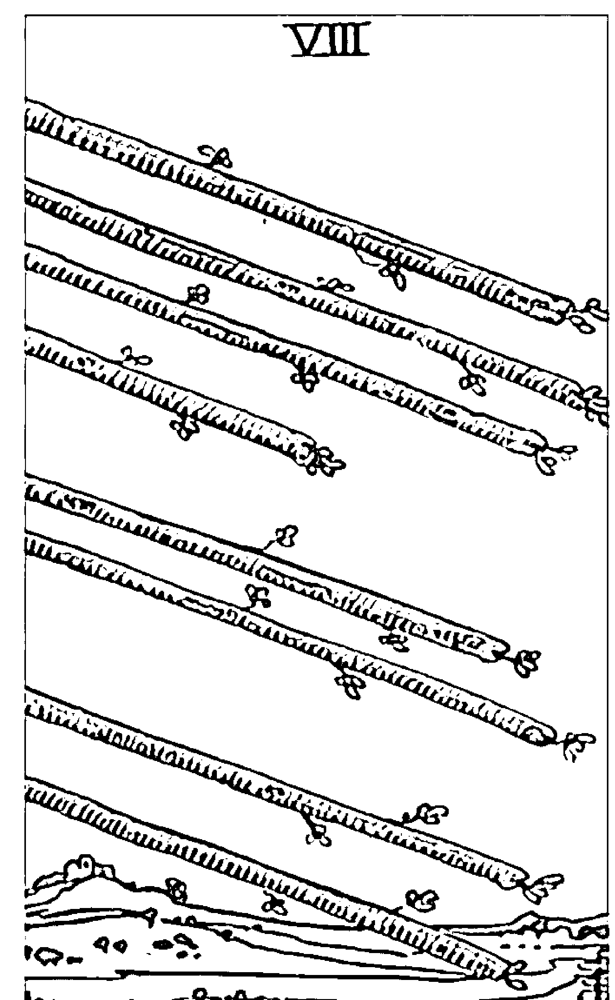

### 權杖八
**火元素**

權杖八看牌面就知道，八根杖子從同一個地方飛來，然後降落，代表很多不同的事情在一個時間內完成，效率極高。火元素加上八，可想而知力量很強大，而且可以一次同時完成很多事，腦子的邏輯也比常人清楚很多。如果是在「問題」方面抽到這張牌，就表示同一時間經手太多事，火元素又不善於細膩思考，通常是直覺想到什麼做什麼，自己覺得都完成了，但對方感覺有「被解決掉」的感覺。

### ☆ 權杖八+火元素

權杖八如果跟火元素的壞牌一起出現，那就會加強權杖八分工太多的難處，因為火元素不是細心的牌，做是都做到了，但做得好不好是另一回事。挑剔的人還是可以指出你很多毛病，而且其實他說的不無道理。所以權杖八適合掌大權，不適合做小事，那會真的是「大材小用」，不僅讓他意志消沉，也不足以讓他展現實力。

### ☆ 權杖八＋土元素

權杖八如果跟土元素的壞牌一起出現，就會綁手綁腳，有宏大的志向，卻被逼著要從頭開始學起，而且要注意小事情，基本上就是被當學徒看待。這個組合比較像古時候，進門先掃地三年，打雜三年，然後才開始教你功夫。聰明的權杖八，光是用看的就掌握不少訣竅，所以按捺不住。如果這時團體受到挑戰，他就可以出面展現他的長才，不然他會換個地方表現。

### ☆ 權杖八＋水元素

權杖八如果跟水元素的壞牌一起出現，那權杖八的專注力就會被水元素分散掉，而且不是基於想做好工作，而是基於想偷懶或想出閒差，被其他事吸走注意力，所以工作上的力度就會減弱。權杖八加上水元素的壞牌，就算會被破壞專注力，也可以同時交出很多成果，但這些成果不一定是工作上的成果，例如說一天之內看完三本書，這能說是不大的成就嗎？只是跟他必須交出的成果不一樣。

### ☆ 權杖八＋風元素

權杖八如果跟風元素的壞牌一起出現，就是沒辦法像原來的火元素把注意力用在對的地方，而且專心一致。如果加上風元素壞牌，就會想東想西，在做一件事的同時，又會想到好幾個可能性。不專心不打緊，缺點是會打亂節奏，讓事情全部亂套，以致於不在限定的時間內做完所有的事，不管是個人還是店家，商譽都會受到影響。

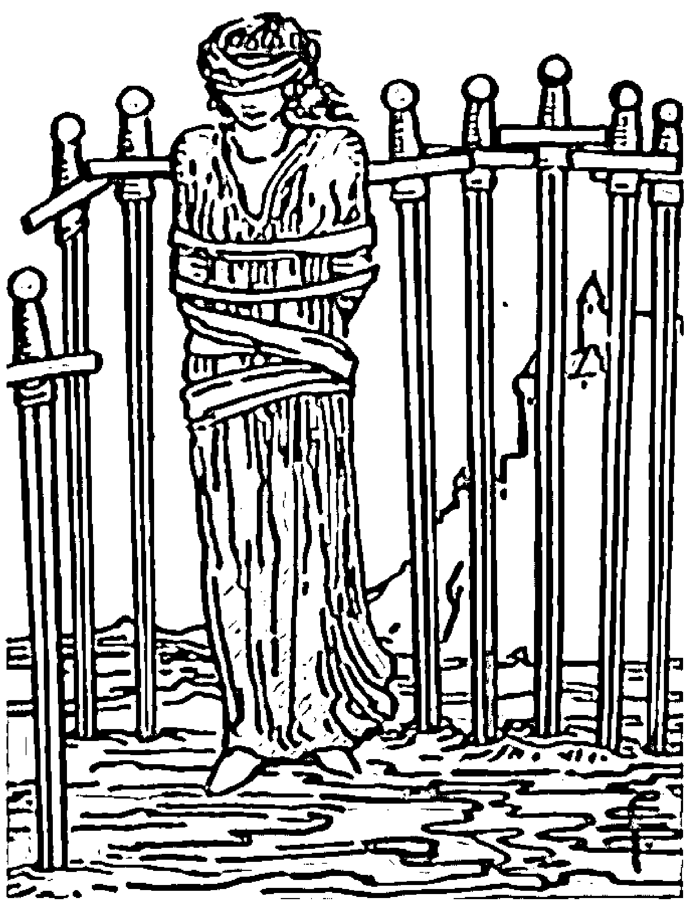

### 寶劍八
風元素

寶劍八是一張被既有思考模式限制在原地不敢動的牌，寶劍是思考，但他想太多了，有一些擔憂跟隱憂，不見得是當下會發生，也有可能會發生一些事，但跟他害怕的並不一樣。有些人就是太聰明了，才會礙手礙腳，不輕易嘗試不是穩贏的事，這樣雖然可以避過失敗，但成功的機會也跟著變少，所以「避過危機，也是避過轉機」。

### ☆ 寶劍八＋火元素

寶劍八如果跟火元素的壞牌一起出現，那就會掌握危機，知道有些事存在風險，有可能推給別人，那自己就少了經驗，經驗就是由別人去經歷了，就算失敗，經驗值也在別人身上，他總有「應付過這種事」的經驗。或自己接下案子，但想的不是要讓工作完成，而是怎麼樣抬高自己，這樣看在別人眼裡，就知道是你的自信不足，以後要工作，就知道你缺乏衝動跟勇氣，不敢把工作交給你。

### ☆ 寶劍八＋土元素

寶劍八如果跟土元素的壞牌一起出現，寶劍八自己本身就很多盲點，本來膽子就已經不大了，如果還有土元素的擔心東擔心西來參一腳，那就真的什麼都不用做了，他會很有才華，但是因為膽小，所以不敢輕易行事，大家很看好他，因為寶劍八容易抓到別人不會注意的小漏洞，但成績不多，所以說服力也不強。

### ☆ 寶劍八＋水元素

寶劍八如果跟水元素的壞牌一起出現，你會發現風跟水都是三心兩意，但水比風更嚴重，風還是有把工作當他要做的事的一部分，但水元素遇到困難就會開始逃避，可能是工作還沒開始，就開始規劃做完要去哪裡玩，交出來的成品也令人不滿意，風跟水都是渙散元素，這種組合根本不適合接工作。

### ☆ 寶劍八＋風元素

寶劍八如果跟風元素的壞牌一起出現，那就是雙重風元素的缺點，容易三心二意，工作時注意力全都在不相干的事情上，就像我現在一邊工作，一邊高興寫到八了，還有幾天工作就完成了，我要去哪裡玩（笑）。如果是這樣還不打緊，因為工作畢竟正在進行中，寶劍八加上風元素壞牌，這時候就會去整理行李、訂飯店，完全就是我的現況的崩壞版。

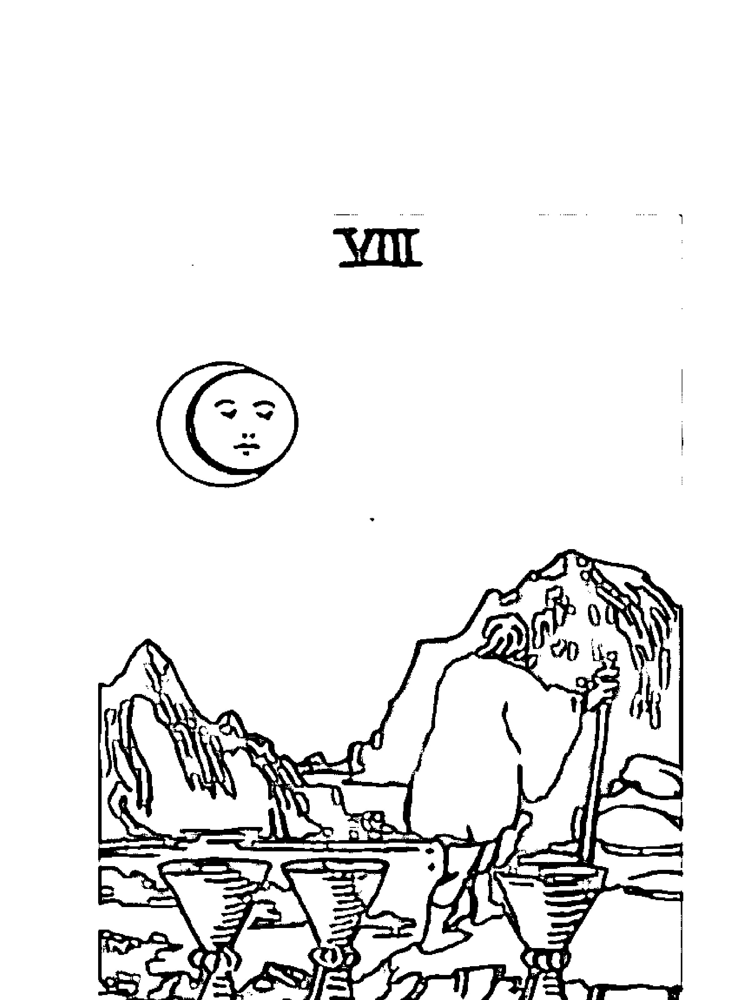

### 聖杯八
水元素

聖杯八是一張對於現況不滿，想要離開去尋找更好的可能性的一張牌。尋找更好可能性當然可以，但它是水元素牌，八讓他日子過得太好，就開始想一些有的沒的的事情，也可以說聖杯八是一張心滿意足的牌，現在的日子雖然不差，但人的本性總是要求更好，要去尋找自己失落的那部分，如果是被迫當上班族的藝術家，出現這張牌我就可以理解，但這樣牌面就不會搭配其他壞牌出現。

### ☆ 聖杯八 + 火元素

聖杯八如果跟火元素的壞牌一起出現，他的離開會是沒有詳加思考的決定，他是有去處的，因為火元素永遠有目標，但到了想去的地方，才發現自己的評估錯誤，卻又回不了頭。火跟水都是感性元素，所以思考事情不夠精明，總是匆匆做決定，又要想辦法挽回，給人把事情都當兒戲的感覺。

### ☆ 聖杯八＋土元素

聖杯八如果跟土元素的壞牌一起出現，他會猶豫很久，但到最後不會走，卡在那裡，讓公司新血也不流通，等於是「佔著茅坑不拉屎」，而且資源跟重點還是掌握在他手上，不願意放給別人，等於是雙輸。他應該善用土元素的專長，好好規劃自己的職涯，也幫公司留一個好的模式，這樣才能走得乾乾淨淨，以後舊公司也不會煩他，這樣兩清就很好。（但我知道前公司有時是莫名其妙的生物，這裡是以要求自己的角度來說，公司就交給勞工局處理了。）

### ☆ 聖杯八＋水元素

聖杯八如果跟水元素的壞牌一起出現，聖杯八本身就是水元素的壞牌，如果再加上其他水元素的壞牌，我就看過有一種人，上班永遠遲到早退，但加班到很晚，所以覺得自己理直氣壯（但他的工作留到再晚也沒有意義，都是做一些自己想加強，但公司覺得不需要的事），往往鬧到最後不歡而散，他在業界也越來越沒人敢雇用，這是兩敗俱傷。

### ☆ 聖杯八＋風元素

聖杯八如果跟風元素的壞牌一起出現，他要離開一個地方，不會默默離開，而且會煽動他人，拉朋結黨。人家跟著他一起離開，但他又無法給人更好的待遇或建議，大家就會不上不下，可能還必須回去求原來的老闆，弄得自己兩面不是人，這樣會搞壞名聲，到最後走到哪裡都不順利。

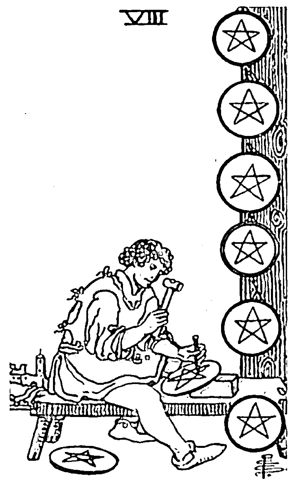

### 錢幣八
土元素

看牌圖就知道錢幣八很勤奮，努力的琢磨每一個錢幣，是工匠中的好手，善於慢工出細活，但如果是傳媒業或需要機動性強一點，他可能就反應不過來，因為他需要一心一意的投入某件事。土元素的特質讓他沒辦法分心，加上八又是非常強大的土元素，所以他適合自己工作產生作品，不讓其他人打擾他。換言之，他不太適合團體工作，因為他需要的時間與時段跟別人都不同。

### ☆ 錢幣八＋火元素

錢幣八如果跟火元素的壞牌一起出現，錢幣八本來就很固執了，再加上火元素，不只會要求自己，對別人也很嚴苛，一點點小誤差就會被他嫌到天邊。如果是產品，我覺得這樣有他的好處，是很好的品管；如果工作的重心不是在產品，就是一些日常性的事情，這樣要求就會有找人麻煩的感覺，雖然他覺得這是一種「態度」，但也太不會變動了。

### ☆ 錢幣八＋土元素

錢幣八如果跟土元素的壞牌一起出現，就是雙重土元素，不管好壞牌，加強的土元素就是非常頑固，做事情還在用幾十年前的老方法，喜歡把自己累個半死，再來說這是敬業。很像日劇，不跑個半死就不能表達真心，就算現在有手機，日劇還是動不動就要跑很久，這都讓我覺得是「多餘的努力」。

### ☆ 錢幣八＋水元素

錢幣八如果是跟水元素的好牌一起出現，那就能軟化錢幣八的僵硬，水跟土就可以共生；但如果是水元素的壞牌，就表示水元素會侵蝕錢幣八的成果，讓他表面看起來很嚴重，但在有關自己的事情方面，面對自己或自己人，就會偷偷放水，大多數時候不太嚴重，其實也不失為一種「人性」的表現。

### ☆ 錢幣八 + 風元素

錢幣八如果跟風元素的壞牌一起出現，那就是凡事有根深蒂固的成見，就算有風元素，也是代表腦袋的僵化。因為錢幣八的威力很大，大到連風元素都可以被定住，或是流傳一些不見得正確的觀念，卻以訛傳訛，變成一種固定模式。每個入行的人都要遵守，例如說不讓女人拿棒球隊的球衣或用具這一類的事，我覺得與其把心力拿來保護球具，不如磨練自己的球技。

### 九號牌

9是一個面臨轉化的數字，也就是從個位數到二位數 10，所以 9 就是個位數最大的數字，準備轉向另一個階段，因此 9 就是累積能量，讓自己可以一口氣轉化到全新的境界。

東方也說「九五至尊」，二位數最大也是 99，接下來就是百位數了，9 是躍升之前的準備動作，也是一個轉換期，介於兩者之間，所以 9 是 3 的對面，都是連結兩個東西的數字。

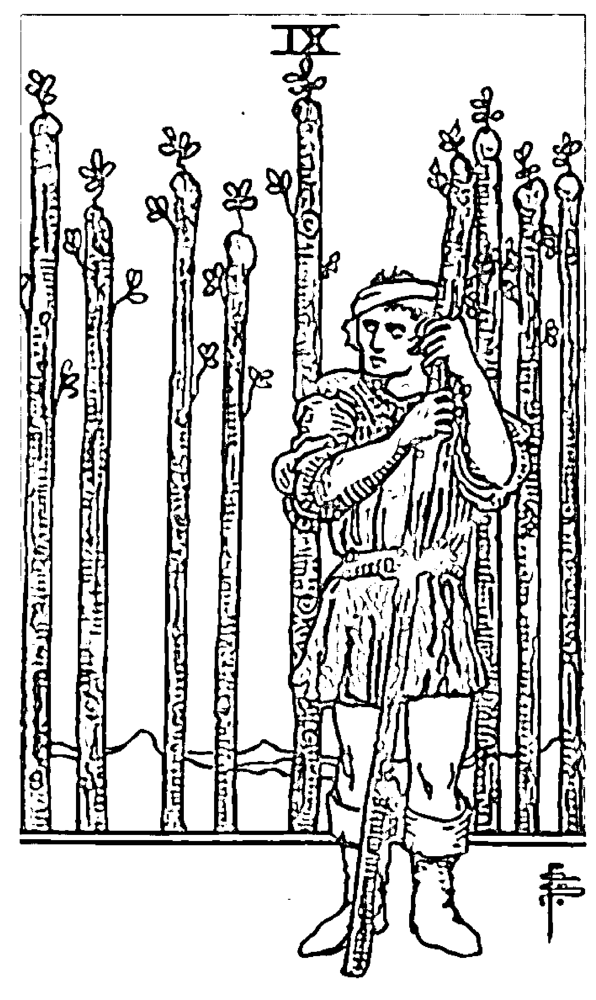

### 權杖九
火元素

權杖九，火元素跟風元素這種陽性數字，我稱之為「耗散結構」，他不是陰性元素，都是「有體」的實際物質，物質會越累積越多。但火就像力氣，是撐越久越衰弱的，所以到了九跟十，火元素跟風元素都差不多玩完了。反之，聖杯九跟十，還有錢幣九跟十，都是豐盛的好牌。權杖九的牌圖是一個人身經百戰，頭上已經纏了繃帶，卻仍要死守陣地，不敢離開，就是代表一個人拚盡力氣也要戰到最後。

#### ☆ 權杖九＋火元素

權杖九遇到火元素，就有被抽乾的感覺，因為權杖九的力氣都已經竭盡了，又有更多火要來消耗他的精力，遇上火，就會什麼東西都變成可燃物，但只是燃料而已，終究會摧毀自己原有的結構。所以火元素的破壞力勝過其他任何元素，戰鬥力很強沒錯，但傷敵一千自損八百，越多燃料，燒起來的火勢也越大，自己跟對方都會燃燒殆盡。

#### ☆ 權杖九＋土元素

權杖九遇到土元素，就會有力氣用盡，還被堵住出路的感覺，沒辦法好好休息，會卡在現在這個為難的處境，死也死得不痛快，會有種被「凌遲」的狀況，時間很長，一片片割你的肉，就是有被「折磨」的情況。遇到這種事，可以趕快解脫是最好的恩賜，但土元素如果不只一張，就像中醫說的「要死也要有體力死，如果體力不夠，反而無法安然過世」，所以是吊著一條命的組合。

#### ☆ 權杖九＋水元素

權杖九遇到水元素，就是一切都已經沒希望，但還是放不下，還跟外人借資源來處理事情，不只自己落水，還把身邊的人也都拖下水。水元素死不足惜，但是他會造成很多人的傷亡，然後自己還一副無辜樣，覺得自己是受害者，所以我說笨蛋最討厭，笨蛋會害死很多人，還覺得自己最委屈。

#### ☆ 權杖九＋風元素

權杖九遇到風元素，就是已經沒有力了，還是有很多雜七雜八的事要消耗你，不像火元素的壞牌，是直接抽乾你的力氣。風元素就很瑣碎，讓你覺得自己好像做了很多有建設性的事，但最後發現都沒有成果，就是白忙一場，沒有成果也就算了，還把你原有的東西都掏空。

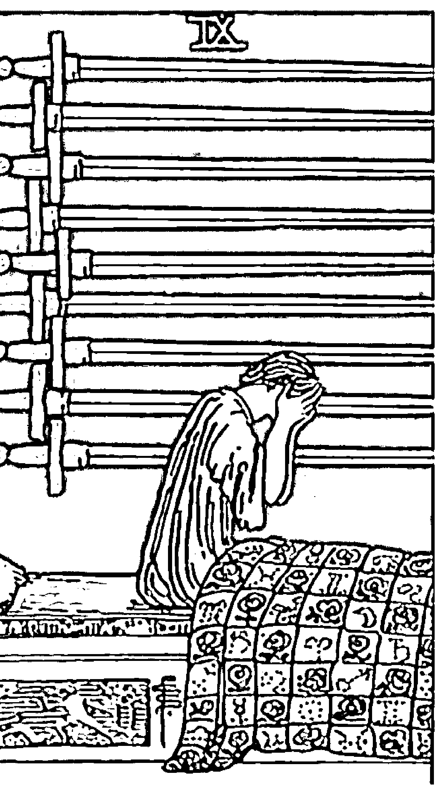

### 寶劍九
風元素

寶劍九看牌圖就知道很慘，他是一個從噩夢中驚醒，極度驚慌的牌，但風元素的缺點是，一切都是在他的腦中發生，是他大驚小怪。看他睡在溫暖的床上，周圍也沒發生什麼事，如果他願意，大可以躺下去好好繼續睡，但他腦子裡就是有劇情，會讓四周風聲鶴唳。就像被雨衣嚇死的人，因為他以為是鬼，也是自己做壞事，所以會心虛的人。

#### ☆ 寶劍九＋火元素

寶劍九遇上火元素，那他腦中的劇情就有可能成真，因為火元素是行動，他可以把本來不存在的事情做出來。本來寶劍九只是一些壞念頭，但火元素會付諸行動，而且加上風元素本來的散播能力，就會野火燎原，讓壞事的影響力擴大到極致，會讓很多人受傷害，留下久久不滅的陰影。

#### ☆ 寶劍九＋土元素

寶劍九遇上土元素，壞事要成真，要具體化，中間就要付出很多精力，所以遇上土元素，反而會讓壞事規模縮小，讓擴散的速度減緩，也會讓傷害集中在一個點。這樣反而比較好解決，因為土元素很具體，會讓人知道問題出在哪裡，可以對症下藥，不浪費多餘的時間跟精力，所以雖然壞處很大，但比起風元素，反而可以快速的處理掉。

#### ☆ 寶劍九＋水元素

寶劍九遇上水元素，都是渙散元素，基本上風跟水不會造成什麼實際上的傷害，就是比較讓人心不安，但又沒有都是風元素的惡意。水元素造成的傷害，通常都是因為搞不清楚狀況，但就算是無意的傷害也是傷害，而且還因為不能怪罪你，所以通常只能吞忍，找不到可以怪罪的人。水元素的壞事，通常是存好心做的壞事。

#### ☆ 寶劍九＋風元素

寶劍九遇上風元素，兩個都是風，風元素是塔羅牌中最不受歡迎的元素，因為如果是笨蛋，做出的壞事有限，傷害的人也有限；但如果是聰明的風元素，可以用極小的資源，把傷害擴充到最大。他可能很像希特勒，最壞的地方不是殺了多少人，而是留下一整個時代的創傷，讓大家不相信人性，把人性的惡增加到難以想像的地步。

## IX

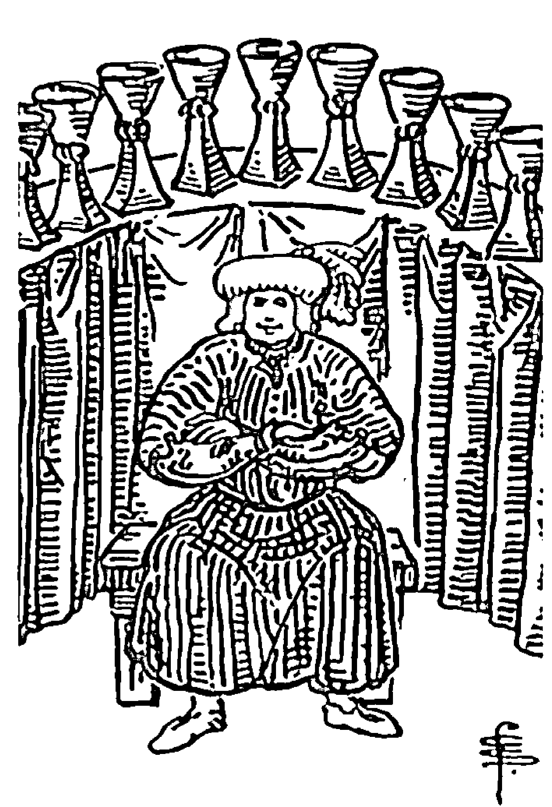

### 聖杯九
#### 水元素

聖杯九非常的心滿意足，因為水是感情跟滿意，上升到九的高度，通常是一個人最幸福的一刻，但九這個數字是個位數的最大值，所以他的幸福只集中在自己的身上，無法澤被其他身邊的人。所以有可能是犧牲大家，成就他個人的幸福，就像「一將功成萬骨枯」，一個人的成功跟愜意，通常不會是他個人成就的，背後一定有很多人犧牲跟成就，才能達到一個人的圓滿。

#### ☆ 聖杯九＋火元素

聖杯九遇上火元素的壞牌，簡單來說就是極度自私，只看到自己要什麼，極力爭取的同時，也踩在很多人頭上。不管犧牲者是自願的還是不自願的，他們都在時勢所逼下成了祭品，可能是沒有看清時勢，也有可能是本身的定位就是弱者，或者就是單純的運氣不好。所以聖杯九的成功，很少是因為他本身的才能，大多是時勢給予的。

#### ☆ 聖杯九＋土元素

聖杯九遇上土元素的壞牌，就是一個富二代，所有的資源不費吹灰之力而來，所以也就不懂得尊重跟珍惜，因為高度不同，所以常常看不到跟自己不是同一世界的人。聖杯九基本上很單純，所以他也不會想要去看看不同的世界，他以為自己眼睛所見，就是世界的全部，基本上不是壞人，只是懶得去體諒他人跟看清世界而已。

#### ☆ 聖杯九＋水元素

聖杯九遇上水元素的壞牌，只要是聖杯九，都是無意做壞事，只是聖杯九運氣好，但腦子不好，所以通常比壞人還可怕。如果是雙重的水元素，通常是宗教或親情的危害，做了很多傷害人的事，還以為自己是為你好。例如丟掉孩子的畫具，因為畫畫沒錢途，或是斬斷孩子的戀情，因為對方家世不好，沒辦法帶給你益處。在同輩的眼裡來看，他們都沒錯，只有被傷害的人才是唯一的受害者。

#### ☆ 聖杯九＋風元素

聖杯九遇上風元素的壞牌，就是吃飽太閒，因為人脈很多，所以為所欲為，就像小孩子捏死蟲子，只是因為無聊愛玩，沒有什麼太大的惡意。這種無聊的舉動，比惡意更可恨，因為他找不到可以怪你的理由，只是你運氣不好而已，風元素的好奇跟手賤，常常會造成重大的損失。

## IX

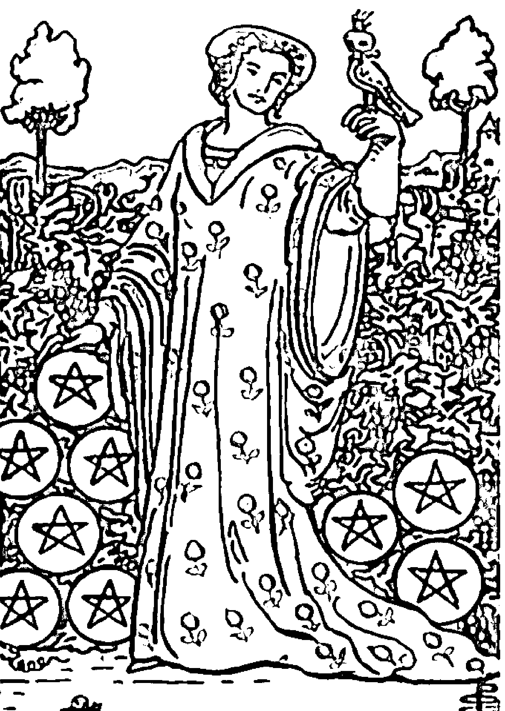

### 錢幣九
#### 土元素

錢幣九的綽號是小貴婦，她很有品味，生活自給自足，就很像很多雜誌文章寫「XX 歲，買了自己的房子，生活過得無憂無慮」這一類的生活，不是很富有，但生活得很舒服，很注重生活的質感，絕對不是有錢但吃穿不講究的人（那是暴發戶）。錢幣九的土元素很注重感官享受，可以不花大錢，但把自己打理得很有條理，不管看起來、聽起來、聞起來，都讓別人覺得賞心悅目，但缺點就是把自己經營得很好，可是能力沒有大到能負擔其他親友，所以只能供自己的單身生活，但養不起一大家子或一個企業。就是精英單身人士的形象。

#### ☆ 錢幣九+火元素

錢幣九遇上火元素的壞牌，一般來說，土元素都很溫和，但如果有火元素的壞牌，個性就會比較難搞，很會挑剔別人，凡事很主觀，聽不下別人的意見，又愛鑽牛角尖。但還好他雖然很情緒化，情緒卻都很外顯，不會讓人猜東猜西，也是一種直白啦！（？）所以即使朋友圈不大，但來往的都是很真誠的朋友，可能都是從學生時代就來往，他的個性，說是說難搞，但如果搞清楚了，也很好應付。

#### ☆ 錢幣九+土元素

錢幣九遇上土元素的壞牌，雙重的土元素，就會比較宅，躲在自己的小世界裡，不喜歡別人管他。但好的是，他也不會干涉別人的事，遵守自己的原則，不隨便為他人妥協，雖然固執，但也很溫和，他有佔有慾，但沒什麼控制慾，因為他很懶，活在自己的世界就很足夠了。但他會把自己打理得很好，這是他少數願意花力氣的事，其實只要不要過度要求，他還滿好相處的，也會把自己管理得不錯，不需要別人擔心。

#### ☆ 錢幣九+水元素

錢幣九遇上水元素的壞牌，就某個角度來說，也算一種自私啦！很注重物質享受，喜歡用名牌，感情方面有點濫情，但還好交往不會太深入，所以也不算太傷害別人。對別人很挑剔，但不會用同樣的標準來要求自己，算是嚴以律人寬以待己那一種，其實就對自己好的方面來說，他算是做得很好，至少很會即時行樂，不會虧待自己。而且用錢的標準比較有彈性，有錢跟沒錢都可以活下去，因為各有各的生活方式。

#### ☆ 錢幣九＋風元素

錢幣九遇上風元素的壞牌，很自私又心眼多，朋友看起來很多，但大多都是互相有利益往來，純粹感情交流的朋友很少。錢幣九加上風元素，算計還滿多的，因為缺乏火跟水，所以沒什麼真心，又因為還算聰明，所以考慮事情前，很難不先計算利益得失，不算一個善良的人。是不是壞人呢？要看搭上什麼牌來推斷。

### 十號牌

10 號是非常平穩的數字，因為它是最後一個數字，所以表示集大成。我們還會發現一件事，陽性元素火跟風到了 9 跟 10 就越來越耗弱，因為陽性元素是揮發型的，越到後面越渙散，但陰性元素水是累積型的，越到後面越穩定強韌，所以權杖 9 跟權杖 10 都代表扛不住的壓力（因為火元素是能力），寶劍 9 跟寶劍 10 都代表思緒不穩定（風元素代表腦海中的想法）；相反的，聖杯 9 跟聖杯 10 都代表情緒上的幸福制高點（水元素是感情），錢幣 9 跟錢幣 10 都代表物質上的豐足（土元素是現實生活）。

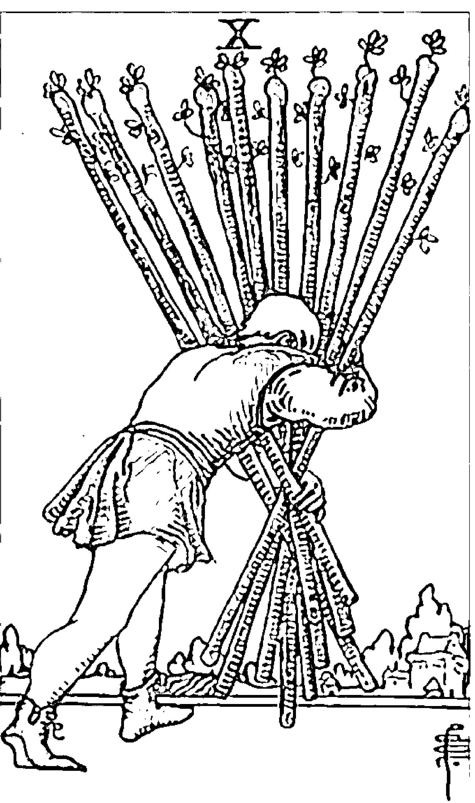

### 權杖十
#### 火元素

火元素加上十，從牌圖就可以看出壓力非常大，超過牌圖中的人可以承擔的十根權杖，扛在他的肩上，從身軀與步伐就可以看出他不堪壓力，但是權杖又移不走，也沒有人來替班，所以他想走也走不成，只能硬撐下去，看來崩潰是不久以後的事，只要再放上一根稻草，就可以把這個人壓垮。

#### ☆ 權杖十＋火元素

搭配權杖十這張牌，如果是正面的火元素，就表示可以度過難關，會撐過去，到達一個新的起點，但如果是負面的火元素，最多就是苟延殘喘，只剩最後一口氣，或者換成在別的地方爆發，一樣會崩潰。
雙倍的火元素，倒下或爆發都是一瞬間的，速度可能會超乎大家的預期，所以最好可以幫他分擔一點，不然等他垮下時，對大家都沒有好處，因為火元素一定會波及其他。

#### ☆ 權杖十＋土元素

權杖十的壓力，搭上土元素，效果就像壓力鍋，外表看起來很正常，內在卻已經瀕臨噴發，而且火元素跟土元素的壓力都很大，如果崩潰，影響會是長期的，不是一下子就可以收拾好，而且會影響的範圍很大。
火元素跟土元素都是積極元素，就像火藥炸彈，如果體積越大，炸出的範圍也越大，火藥是土，引信是火，因為火跟土都累積很多能量，就像是人類，積怨越深，反撲力量就越大。

#### ☆ 權杖十＋水元素

火元素跟水元素都是感情元素，如果是有氣無力的權杖十，加上負面的水元素，就表示生活過得一團糟，而且會累積很多負面能量，讓想幫他的人也無從幫起。
如果搭上正面的水元素，就可以慢慢消化這些壓力，雖然不見得成功，但不會造成更大的災害，有時會因為權杖十的能量累積很久，所以帶來的好結果也可以延續很久。

#### ☆ 權杖十+風元素

權杖十的壓力很大，如果給他一些負面的風元素，這張牌會容易把壓力發洩到他人身上，形成不好的評價，有可能表示一個承擔不起壓力，又喜歡牽拖他人的人，不管在工作或感情，都不是一個討喜的形象。
但如果是正面的風元素牌，就表示會把理想規劃得更穩定，但可能要短期的效果很好，但因為火跟風都是陽性元素，代表短暫，所以如果想要長期的成功，還是要投入更多力氣，暫時還不能放心。

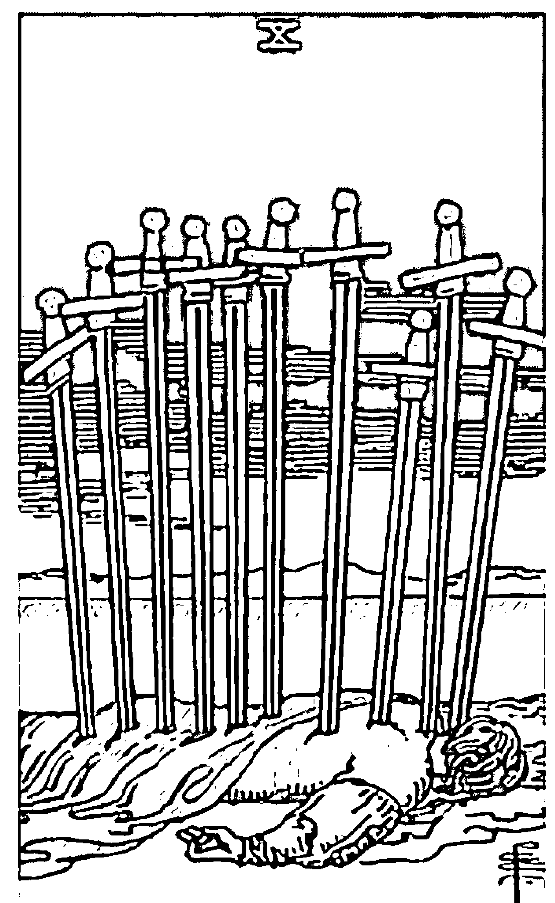

### 寶劍十
#### 風元素

風元素很不穩定，數字越大就越飄忽，直到把力氣耗盡為止。所以我常說9比10更像數字的高點，因為9是到了轉化的最後一步，但10已經轉化完成，所以混亂的風元素，到了寶劍10，反而已經可以翻篇。牌圖上的人被十把劍插在地上，就顯示出「置之死地而後生」，遠方反而有朝陽升起，表示新的生和即將開始，可以不用在乎過去的一切了。

#### ☆ 寶劍十＋火元素

寶劍十是一切都失去了，負面的火元素表示情緒上的折磨要開始了，除非你可以放下自己的執念，因為風跟火都是短暫的陽性元素，所以你可以全部都經歷，只是不能長久耽溺在其中，只要你越快經歷，一切就越快過去。
如果是正面的火元素，那恭喜你，寶劍十的痛苦很快就過去，火元素的新生很快就會出現在你面前，讓你對過去不會有任何留戀。

#### ☆ 寶劍十＋土元素

寶劍十是一切很快過去，但如果搭上負面的土元素，你會因為周遭的人事物，沒辦法很快放下，還要困在裡面好一陣子，風跟土都代表「理性」，也就是頭腦最猖獷的元素，所以越想越鑽牛角尖，建議去做些身體上的運動，也許可以讓頭腦比較快釋放。
如果是正面的土元素，表示很快的接受現實，把思緒拉回常軌，一切可以很快的恢復正常。

#### ☆ 寶劍十＋水元素

風跟水都是渙散元素，如果寶劍十加上負面的水元素，就會不斷的自我否定，風的負面牌加水的負面牌，很容易出現精神跟生理上的失常，這時候可以畫畫或看書，讓自己投入其他無形的事物，比較不會膠著於目前的失敗。
如果是正面的水元素，那代表可能有其他的安慰，或者有愛情或友情的分散注意力，從絕望中找到一點希望，傷口也能比較快修復。

#### ☆ 寶劍十＋風元素

寶劍十已經夠慘了，加上數字牌很少有好牌的風元素牌，很容易全世界已經放過你，只有你自己還在為難自己，風元素的「心魔」性質很重，容易陷在自我意識中，反覆指責自己。
如果是風元素少數的好牌，如星星或寶劍一，那就表示你悟性很高，馬上可以度過難關，但也只是想法上解脫，如果現實生活也想走出困境，那還是要在生活中修行。

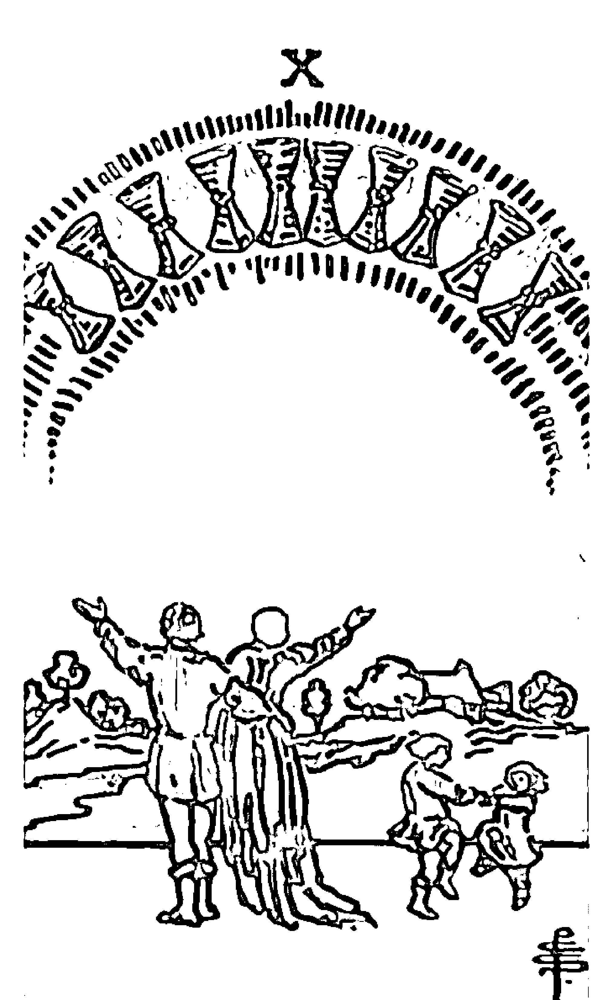

### 聖杯十
#### 水元素

陰性元素適合靜態，所以水元素遇到 10，就是長久的靜謐跟幸福，所有的一切都被滿足了，雖然不是很豐盛，但已經足夠所需了。聖杯十的重點不是在於富足，是在於自己需要的都已經足夠了，不用再外求，可以在自己的世界裡過著平靜的日子，沒有太多的情緒跟物質上的波動，有點「江山靜好，歲月安穩」的狀態。

#### ☆ 聖杯十＋火元素

聖杯十很容易滿足，但如果加上火元素負面牌，就有可能欲求不滿，因為火元素本身需求就很強，就算被滿足，很快就會想要更多，很容易陷入永不滿足的狀態。如果是正面的火元素，那就可以把聖杯十的滿足感，帶到更高的層次，是一種很積極的幸福。

#### ☆ 聖杯十＋土元素

水跟土都是陰性元素，如果聖杯十加上土元素的負面牌，那就是躲在自己的世界裡不求長進，由於沒有生活壓力，所以很容易怠惰，雖然不是老人，但已經不像活著的感覺，其實說難聽點，就是活著，但沒有任何生產力。
如果是土元素的正面牌，那就是生活的一切都很圓滿，也可以照顧身邊的人，甚至成為很多人的貴人，用自己的資源推動很多事情發展。

#### ☆ 聖杯十＋水元素

全部都是水元素，已經沒有物質性了，如果是負面的水元素牌，就是生活雖然沒有很足夠，但因為野心不大，很容易滿足，對自己是 OK，但在他人眼裡就是懶惰沒出息。
如果是正面的水元素，就比較像創作者或心靈導師，知道自己要什麼，不會盲目追求多餘的事物，很像活在自己世界的藝術家，因為水元素要追求的，本來就不是物質化的東西。

#### ☆ 圣杯十+风元素

水元素加上风元素负面牌，虽然想法很多，但容易流于说空话。自己空忙一场不打紧，可是风元素很容易煽动别人，如果有人听他的，投入太多资源，就容易血本无归。
如果是风元素正面牌，水元素跟风元素，很适合当企划，或是投入广告业，因为风元素跟水元素，可以想到其他人无法想像的境界，并且带领大家去寻找，所以也很适合当「教主」，是带领大家追寻梦想的人。

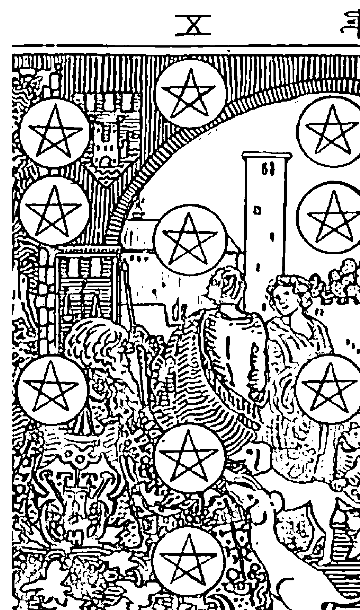

### 錢幣十
#### 土元素

10 號加上本來特質就很相近的土元素，雖然沒有聖杯十那麼強烈的幸福感，但土元素本來就是安穩無虞，沒有什麼需要擔心的，平常沒啥感覺，但如果到人生走完，會覺得自己一生是滿意的。
而且不管是事業跟錢財，都沒有匱乏，感情方面比較沒有起伏，但土元素的心臟本來就不強，也不太適合大風大浪的感情生活，所以眾人會很羨慕這種生活，對一般追求很多事物的人來說，找不到自己缺乏什麼東西，比情緒的幸福感更重要。

#### ☆ 錢幣十 + 火元素

土元素是豐厚的基礎，如果有火元素，那就是有資本也有動力，如果火元素是負面牌，那有可能因為自己擁有的資產而看不起他人，有「驕者必敗」的危險，也會不知道自己的弱點在哪裡。
如果是正面的火元素，恭喜，那就是有足夠的本錢，加上正確的眼光跟心態，就像家庭本來就很富有，加上自己的天分好，當然是人生勝利組。

#### ☆ 錢幣十 + 土元素

如果兩種特質都是土元素，10 這個號碼本來就有點呆板，如果加上負面的土元素牌，那就是大家說的鄉愿跟頑固，自己是還好，卻讓身邊跟他親近的人很難受，因為土元素很重視禮貌，如果關係不夠近，他是懶得理你的事的，所以頂多很冷漠，不會造成什麼困擾。
如果是正面的土元素牌，那就是非常大器，可以到治國平天下的程度，所以是非常好的企業主管或政治人物。

#### ☆ 錢幣十 + 水元素

土元素加上負面的水元素，就是整天只會沉浸在自己的價值觀中，視外界如無物，本身的個性又是非不分，就像台語說的「人牽不走，鬼牽溜溜走」，最大的缺點就是沒有判斷力，加上固執，就是標準的「老番顛」。
如果土元素加上正面的水元素，那就是非常安全的組合，而且有水元素在，錢幣十也不會太過呆板，很有自己的興趣，也活得很自在，雖然沒什麼衝勁，但這種組合就算不變動，也可以活得很好了。

#### ☆ 錢幣十＋風元素

錢幣十加上負面的風元素，就會加強錢幣十的缺點，因為風元素跟土元素都很理性，如果往負面發展，就很容易變得冷漠自私，不太可能做出什麼有益於社會或他人的事，甚至對自己的家人也不太關心。
如果是正面的風元素，加上錢幣十，那就是經驗老到，加上思考周到，就是人人提起的智多星，像諸葛亮或劉伯溫這樣的人物，有預言未來的能力。

# Part 4

## 小阿爾克納宮廷牌

## 搭配四大元素

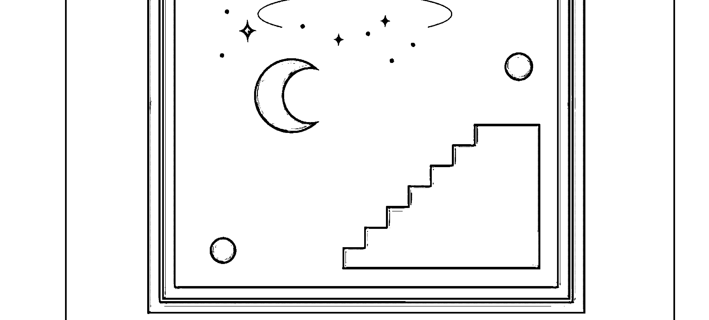

((○))

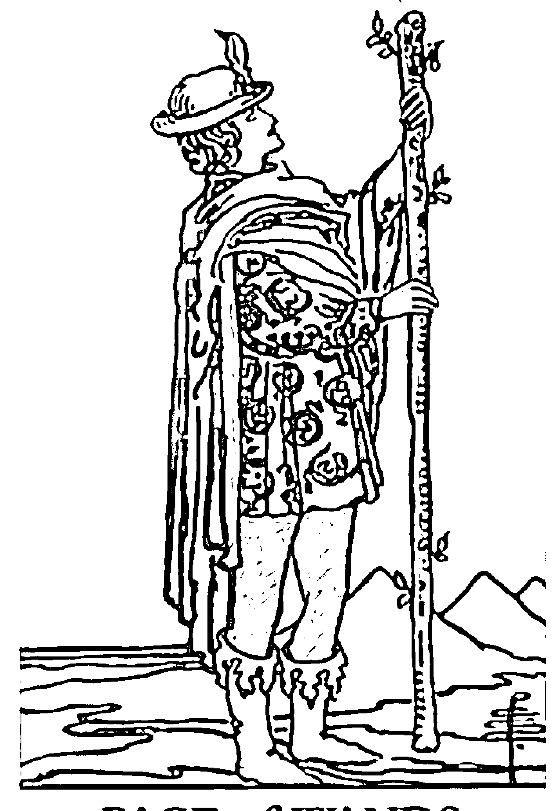

### 權杖侍者
#### 火的本質，風的行事風格

這張牌雖然年紀小，但因為年紀還輕，經驗尚淺，也有自知之明，又很願意學習，所以大家願意栽培他。而且他不會相信聽說的事，什麼事都要自己來一遍，這就會讓人覺得願意實作，老一輩的人會覺得他不是空口說白話，會覺得孺子可教，所以是一張很討喜的牌。在愛情方面，這張牌會是戀愛經驗不多，但誠意滿滿，願意吸收學習自己需要改進的事，所以雖然不成熟，但大家都願意給他機會。而且他如果說要改，絕對不會只是說說而已，他會做出實際行動。雖然是火元素，但因為有風元素的大腦，會配合別人需要，所以大家都會覺得他很「乖」，聽話又不失衝勁，這樣才是一個可愛的人。
但這種特質，如果年紀大了，或抽到「問題」的位置，會讓人不耐煩，覺得你自己不會看嗎？什麼都要人家教你，你當大家時間很多嗎？自己不會 google 嗎？不會去問朋友嗎？會覺得他太伸手牌，對他耐性全失。因為火加風太喜歡事情快速解決，所以覺得求助有經驗的人最快，但大家都很忙，除非你剛出社會，不然大家都是這樣撐過來的，為什麼你可以都用問的？

#### ☆ 權杖侍者＋火元素

如果跟負面的火元素一起出現，這張牌很容易認為別人的幫忙是應該的，就等於別人要對自己的成敗負責，看起來很尊重別人，但其實是把問題推到別人身上。還好，不管權杖侍者出於什麼原因什麼想法，最終只有自己能為自己負責。就算你覺得是別人的錯，外人也不會管你那麼多，因為事情是算在你身上的。如果是正面的風元素，那這張牌就會很機靈，敢做敢當，不把責任歸咎於他人，反而會得到更多幫助。

#### ☆ 權杖侍者＋土元素

跟負面的土元素一起出現，這張牌會顯得很功利，侍者就是小孩子，不管年紀多大，侍者就是不成熟的心態，自己都還需要長大，還理所當然的跟別人要資源，又不可愛！會讓人覺得是不想為自己負責任的人而已。但如果是正面的土元素，這個人不會推卸責任，會知道自己的需求跟不足的地方在哪裡，提問題也需要技巧，就像我在粉絲專頁發長文，如果讀者把自己的問題很有重點的提出，那我會很樂意回答。如果只是說不懂，或發一個問號，我就會建議他去查字典或問爸爸媽媽。

#### ☆ 權杖侍者+風元素

權杖侍者跟風一起出現，就是一個莽撞的孩子，你以為他很無腦，但他卻對打歪主意特別在行，不管他的原意是什麼，總有辦法把事情弄到最糟糕，而且我們通常遇到權杖侍者，年紀已經不是小孩了，火中之風加上風，就等於有過動症，而且算聰明，總能達到他的目的，所以造成的災難都很驚天動地。這種人不適合在團體中，或至少要在他沒有影響力的地方，所以獨自作業是他最有可能的出路，而且有可能有意外的成就，畢竟他不是常人。

#### ☆ 權杖侍者+水元素

負面的水元素跟權杖侍者一起出現，不可否認是會可愛一點，但他的專長也只是跟別人索討答案時，別人的耐性會多一點點，久了還是會覺得很煩。而且如果出社會的時間越長，越不會讓人覺得可愛或好學，只會覺得你是白痴嗎？都工作幾年了，連這種事也要問？事實上他是有思考的，只是想不通而已，所以他也覺得很委屈，但如果不是長得特別討喜，那你要委屈給誰看？但如果是正面的水元素，會比較有誠意，會承認自己的不足，會以勞務或者禮物來表答自己的感謝，其實算是收買啦！但願意花錢花時間收買，總比理所當然的樣子可以讓人接受。

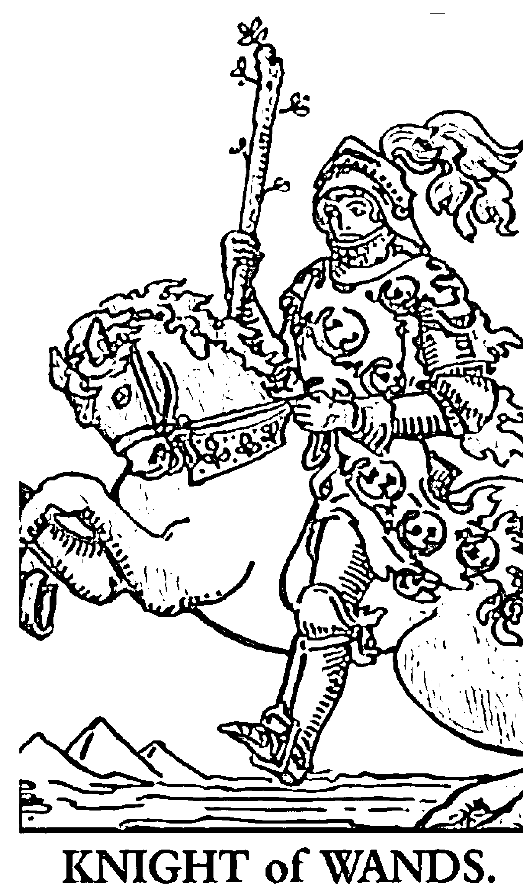

### 權杖騎士
#### 本質是火，也是火的行事風格

這張牌有強烈的企圖心，跟用不完的體力，因為年輕，所以容易撞得滿頭包，但馬上又可以再爬起來。這張牌不怕痛，也不怕失敗，而且因為雙重火，腦袋不是很靈光，所以可以忘記失敗，一次又一次重覆努力，是企業會很喜歡的員工特質。不過一時之間還當不了主管，因為主管要的不是能力強，而是要能看清楚整體，搞清楚自己的位置，跟可以做什麼事。這張牌比較主觀，沒有辦法體會別人的想法，也就是無法共情，所以行事常常跟別人起衝突。
如果是逆位牌或是在「問題」位置出現，表示這張牌太容易衝動，犯下不可挽回的錯誤。但公司喜歡他的特色，所以他The request was rejected because it was considered high risk## 寶劍國王＋土元素

如果是正面的土元素牌，那會對他人有多一點的關心，但這種關心也只是關心你做事的進度，對於你的感受跟遭遇，他不是不關心，是他沒有辦法同理。如果他要給你建議，雖然會很實用，但你會覺得他抓不到重點。

#### ☆ 寶劍國王＋水元素

如果跟負面的水元素一起出現，這張牌會很自以為是，但做事的結果都會變成爛攤子，因為他不了解大眾的需求在哪，所以提的商品或服務，大家也不會買單，他卻還怪大家沒眼光（咦，很像台灣的選舉）。如果是正面的水元素，就可以幫寶劍國王加入一點感性，寶劍國王很擅於溝通，如果他願意的話，水元素可以增加他的同理心，讓他對別人的事有更多感受，能夠「比較搞得清楚重點」。

#### ☆ 寶劍國王＋風元素

跟負面的風元素一起出現，那這張牌就沒有那麼光明正大了，他總是會耍點小心思，而且沒有跟他交手過的人，不會知道這就是他的老毛病，他看起來很高，所以會受騙的人居多。如果是正面的風元素，那就可能在思想上成為一方之霸，或論文寫得很好，但是不親民，可是因為夠厲害，所以還是會有人當他的教徒。

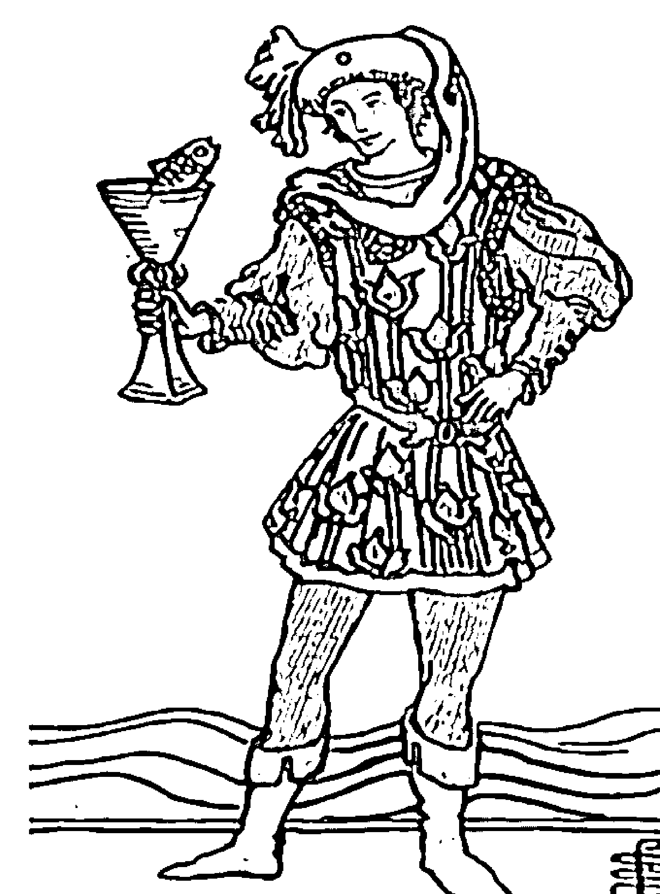

### 聖杯騎士

水的本質，
火的行為模式

這張牌是一個很不經世事的新鮮人，尚在學習中，所以可能是我們身邊的基層年輕人；如果年紀很大，還是這張牌，表示他在開拓更新的領域，也算另一種新鮮人。基本上討喜又謙虛，所以雖然事情做得不太好，但大家都願意給他機會，有很多人說聖杯騎士是牛郎，我覺得聖杯侍者也是，但他剛入行，需要討好別人，讓別人給他機會，服務性很強，雖然一開始只是打雜的，但這種有關公關的行業，聖杯侍者都是預備軍，很能生存下去。

如果在「問題」位置抽到，風跟水都是抽象元素，代表這個人做不了什麼實質的事，他最在行的就是談戀愛交朋友，所以不管他做什麼工作，都會形成比較複雜的人際圈，導致重心並不在事務上，心思也不在工作上，很有可能一邊工作一邊煩惱自己的戀愛跟朋友。

#### ☆ 聖杯侍者＋火元素

跟負面的火元素一起出現，聖杯侍者稍有不順，就容易給他人壓力，或搬出更大的靠山。講直白一點就是因為本身沒本事，所以就只能仗勢欺人，而且他還自以為是伸張正義，因為沒有明辨是非的能力，所以都是以自己的觀點來看事情。如果是正面的火元素，那他就滿可愛的，雖然能力不算很強，但很願意做事，自尊心也不會太強，很願意聽取他人的意見。

#### ☆ 聖杯侍者＋土元素

如果是負面的土元素，這個聖杯侍者很努力，但還是比較抓不到重點，雖然能力不盡人意，但好的地方是，就算得不到肯定，他還是會傻傻做下去，直到累積很多實力。如果是正面的土元素，那就是他很有耐心，也很有風跟水所缺乏的目標性，知道自己要的是什麼，而且是有階段性的慢慢累積。

#### ☆ 聖杯侍者＋水元素

遇上負面的水元素，那這張牌就是很軟爛，只會用自己的人緣替自己拉攏支持者，但因為實力真的不足，支持他的人也只能同情他而已，沒辦法成就任何事。以我的角度來看，就是枉作小人而已，對他自己並沒有任何好處，只有心理上好受一點。如果是正面的水元素，這張牌真的很謙虛，而且常常自願吃點小虧，所以可能會得到很多助力，幫他累積資源或實力，是一張可以期待的牌。

#### ☆ 聖杯侍者＋風元素

如果是負面的風元素，他就會從暖男轉型成小人，就靠挑撥他人來換取自己立足的空間，但因為都是渙散元素，他就算爭取到空間，也只是一時的，不會太穩定。所以他要不停的故計重施，風評當然就會不好，如果是正面的風元素，他就會是很好的企劃，不論遇到什麼困境，他都有應付的方法，所以在學習的期間，他就有證明自己價值的能力了。

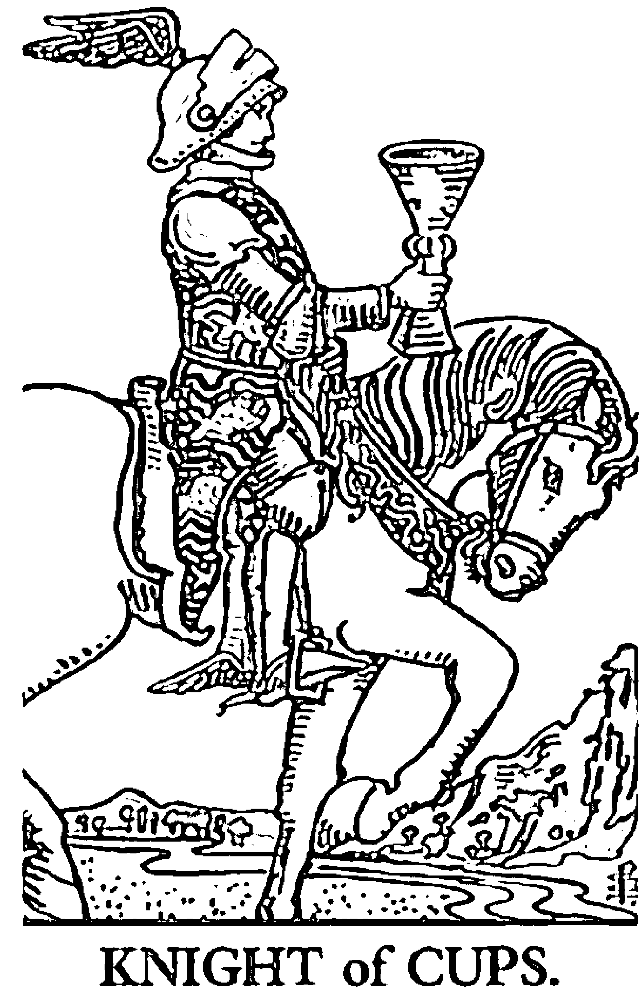

### 聖杯騎士

水的本質，
火的行為模式

這張牌的綽號是「白馬王子」，因為他有水的謙虛跟善良，但不像很多水元素都很低調，這張牌因為行為模式是火，所以大家的眼光都會集中在他身上。簡單來講就是紳士淑女，因為他們很在意別人的感受，又願意實際行動，所以他們的美好特質就會被所有人看到。因為是火元素，所以也有愛現的成分在內，但至少本質是水元素，沒什麼惡意。但火跟水都是情緒元素，沒有理性元素（風跟土）的成分，所以不夠聰明，會常常被認為是草包。但就算他是草包，他也沒得罪你，而且人緣比你好，喜歡他的人比討厭他的人多。

如果在「問題」的位置抽到這張牌，那就真的是草包了，雖然他本身是善良的，沒有到金玉其外敗絮其中的程度，但說真的也只能當裝飾品，所以當公關是很好的人才。而且他的行為模式是火元素，畢竟是願意做事的，所以別人會覺得他誠意滿滿。

#### ☆ 聖杯騎士＋火元素

如果跟火元素的負面牌一起出現，他就會很愛炫耀，自己的人緣就是他的武器，如果是塔或審判這一類的牌，可能在不知不覺中霸凌了別人，也有可能他得意洋洋的，讓你討厭，但他幹不出什麼大壞事，因為聖杯騎士大部分事情都是順心的，所以沒有報復社會的必要。如果是正面的火元素，他對誰都很友善，而且願意出力，所以人群的目光會在他身上，應該真的可以辦出一些好事，而且因為魅力足夠，其實還滿像藝人的，但他畢竟是騎士，目前還在路程中，所以還需要累積經驗。

#### ☆ 聖杯騎士＋土元素

跟負面的土元素一起出現，那就比較有心機，但也只是在人際上讓別人佔下風，或者比較愛花錢而已。聖杯牌組都很善良且無能，所以幹不出什麼大壞事，因此他做的不好的事，除非整個牌組都是人際引發的大災難，不然他們很容易被原諒。如果是正面的土元素，那就會身體力行，除了捐錢，也會實際。

#### ☆ 聖杯騎士＋水元素

如果是負面的水元素，那就會沉溺在自己的世界裡，不知人間疾苦，沒什麼賺錢能力卻很奢侈，所以都是花父母或別人的錢。他也很有當騙子的潛力，但他不是想計策，是利用個人的魅力迷惑別人，所以騙不了大錢，就是缺一點、騙一點而已。這在台灣的司法，說不定折合金錢就可以解決掉了。如果是正面的水元素，那就會是很好的傾聽者，所以可能會有點感情糾紛，他自己也不太搞得清楚自己喜歡誰，但如果不涉及感情，他可能能解決很多社會的心理問題。

#### ☆ 聖杯騎士＋風元素

負面的風元素，他是真的騙子，會很有計謀，利用自己的優勢，而不是潛力。不過是廣義上，他的一生都是在誤導別人達成自己的目的，很像外表好的政客，但每個人心中名單不一樣，我就不舉例了。如果是正面的風元素，代表他很會利用現有的優勢，宣導他的理念，讓更多人加入他的好事，這也是政客的一種，但是是比較好的政客，可以推行很多正面政策，並且讓大家支持。

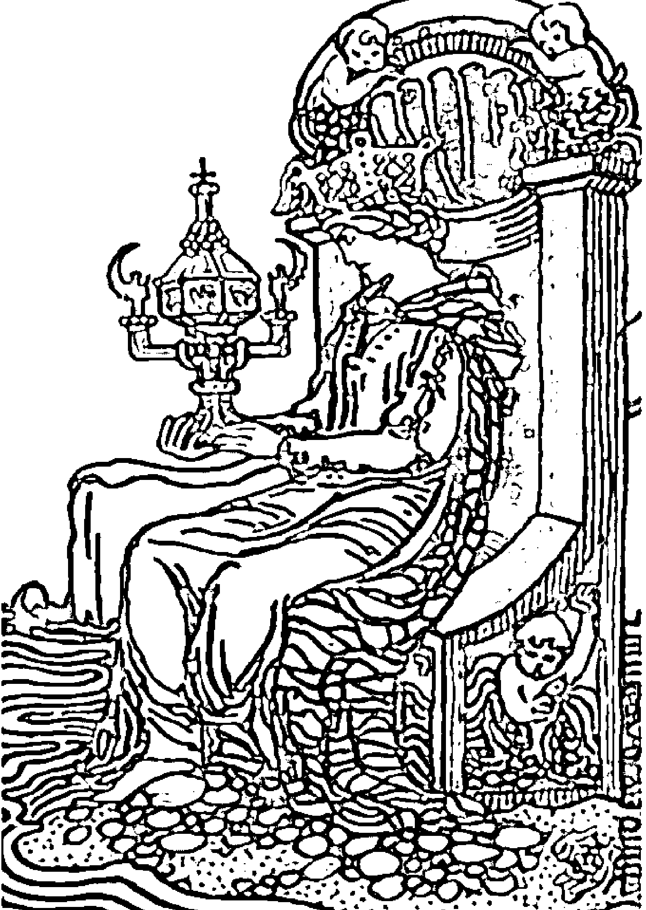

### 聖杯皇后

水的本質，
水的行為模式

這張牌理論上是好牌，因為他無所不包容，大家給這張牌的綽號叫「聖母」，什麼要求都會替別人著想，但同樣的，就是因為太順著別人，所以造成自己的判斷力不足，但他會盡己所能讓每個人滿意，所以非常的善良。但因為都是水元素，所以能力沒有那麼強。學生常常說：「聖杯皇后是不是什麼都承擔，例如替別人加班，或攬上別人的工作，然後累死？」我說：「不會，因為他幫過你一次，你就不會再請他幫第二次忙了。」也就是無能是他的另一種保護色，就像有網路說女孩子第一次去男友家，就被要求洗碗做家事，很多人建議，可以打破三個碗盤，以後就不會被這樣要求了。

如果出現在「問題」的位置，他本身就問題很多（這是個人觀點），這代表他會不同意他覺得太過分的做法，雖然在別人眼裡可能很正常。但聖杯皇后想太多，又很怕被別人反對，所以有點畏畏縮縮。還有，他本身工作能力不強，也是一個弱點，他很適合當義工，因為無償，人家對他的要求就不會那麼高，不會吹毛求疵。但我聽說很多義工都要能力很強，這就當成上免費的訓練課程吧！

#### ☆ 聖杯皇后＋火元素

如果跟負面的火元素一起出現，那就是很情緒化，做事情會太過草率，草率跟衝動不一樣，衝動也可以把事情做好，但草率就是凡事憑只一個想法，但沒有相應的能力。因為火跟水都太情緒化，沒辦法好好思考，如果只是水元素，那就是平和的元素，再加上火元素，就會有衝勁，但無能的人有衝勁，並不是一件好事。如果是正面的火元素，就會給聖杯皇后很多動力，讓他挑戰自己以前不敢想像的事，雖然能力有待加強，但總是一個開始。

#### ☆ 聖杯皇后＋土元素

跟負面的土元素一起出現，因為土跟水都是陰性被動元素，如果是單純聖杯皇后，大家都讓著他，所以要平靜過日子不難。但是加上土元素，會有很多要煩心的事，聖杯皇后不需要責任感，他只需要同情別人就好了，但土元素，有善心，也要做很多幫助他人的事，所以責任很重，而且擺脫不了。如果是正面的土元素牌，就可以安定聖杯皇后的內心，給予他勇氣，讓他知道慢慢來也是可以把事情做好，這樣聖杯皇后就不會有太大的壓力，可以培養自己的能力。

#### ☆ 聖杯皇后＋水元素

如果跟負面的水元素一起出現，那聖杯皇后除了想法就什麼都沒有，但他也不會指責別人，反而會陷入無盡的自憐跟自責當中，對身邊的人事物沒有任何助益。而且大家還要拯救他跟安慰他，可能有救世主情結的人，才有辦法待在聖杯皇后的身邊。如果是正面的水元素，那他的撫慰功力就是一流的，雖然幫不上什麼忙，但他會讓身邊的人覺得活著還是有意義跟希望的。因為聖杯皇后甚至比聖杯國王更沒原則，什麼人都可以原諒跟接受，我覺得很適合當監獄的義工。

#### ☆ 聖杯皇后＋風元素

跟負面的風元素一起出現，就讓本性單純的聖杯皇后加入很多自私的不良想法。因為風元素會讓身邊有很多風言風語跟八卦，聖杯皇后無意中也變成傳播者，但他原來可能是好意，卻帶來混亂跟互相猜忌。如果是正面的風元素，會讓聖杯皇后變得聰明一點，能給出很多好建議，但沒有土跟火元素，還是什麼事都做不了，但給別人信心，已經是很大的功德了。

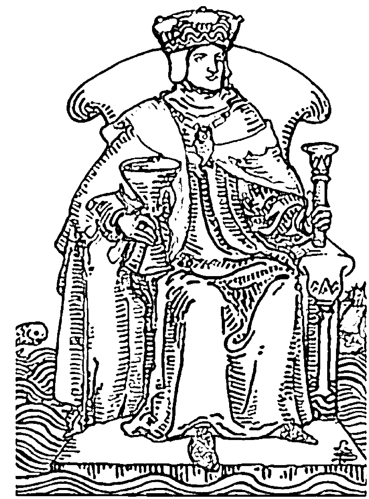

### 聖杯國王

水的本質，土的行為模式

這是一張代表男性的牌，可是全部都是陰性元素，其實在這個年代滿討喜的，他有男人的承擔力（因為有土），但又不像一般男人很自我本位主義，其實我覺得老一輩默默付出的男人，就具有這張牌的特質。但他們很委屈，因為出現在人前的都是愛吹牛，什麼事都不會做的老男人，所以我們對「台灣傳統男人」的印象就定格在那裡了。這張牌我覺得還比較像台灣傳統女人（好的那種），一切默默忍受，所有責任一肩扛，從不怪罪別人，但在我的角度而言，這張就是吃悶虧的牌，不管男女。（好啦！就是偉大又有責任感，吃悶虧是對我而言。）如果出現在「問題」的位置，因為都是陰性元素，所以就是不夠主動，不夠有決斷力。聖杯國王的決定大多是正確的，但太慢了，因為他也會考慮別人的意見（跟其他土元素牌慢的原因不一樣）。不像其他土元素牌那麼固執，聖杯國王可以承受別人對他的挑戰，靜下心來反思，也很有包容性，如果說是國王，我覺得他是仁君。

#### ☆ 聖杯國王 + 火元素

如果跟負面的火元素一起出現，就代表他太過仁慈，會給不好的事情有增長的空間，這裡就有點太過不乾脆，因為跟火元素相較之下，聖杯國王是弱勢的那一方；但負面火元素有另一個可能，就是會讓聖杯國王下了一個不聰明的決定，影響到眾人。如果是正面的火元素，那就解決了聖杯國王太過優柔寡斷的缺點，會提升他的行動力，但同時也不會太過武斷，會讓所有人一起受惠。

#### ☆ 聖杯國王 + 土元素

跟負面的土元素一起出現，他還是有決斷力，但往往因為現實必須考慮到旁人的權益，所以就會很曠日費時，但不至於錯過時機，可能就是晚了一步，但該有的利益就已經被別人賺走了。如果是正面的土元素，那聖杯國王會從平常就隱隱感覺有什麼事要做，等到風起雲湧，他也做好準備了，有點以逸待勞的感覺，我個人非常喜歡這種特質。

#### ☆ 聖杯國王＋水元素

如果是負面的水元素，那聖杯國王容易偏離重點，在目標之外常常做一些不相干的事，因為他太過在意別人，無法對別人視而不見，所以會受到拖累，承擔一些不是自己應該要承擔的事。如果是正面的水元素，那就會讓他更加仁慈，因為這些特質，讓事情有了更好的發展或結果，大家都很認同他，所以會付出自己的資源為他注入更多力量。

#### ☆ 聖杯國王＋風元素

負面的風元素出現在聖杯國王的牌陣中，代表他耳根子太軟，容易聽信讒言，胡亂的做出很多錯誤的決定，還以為是為了大家好。因為聖杯國王加上風元素，就等於風跟水兩個渙散元素是主導，唯一土元素佔比重太少。如果是正面的風元素，就會讓他很快速做出大家都可以接受的方案，雖然缺乏火元素，但就不會太過衝動或急躁，對事情的推動是有好處的。

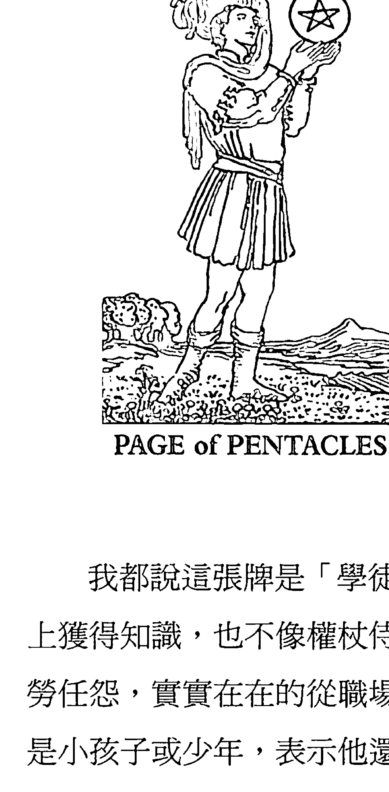

### 錢幣侍者

土的本質，
風的行為模式

我都說這張牌是「學徒」牌，他不像寶劍侍者，是從書本上獲得知識，也不像權杖侍者，是從挑戰中獲得知識，他是任勞任怨，實實在在的從職場中獲得知識。因為侍者牌都是小孩子或少年，表示他還沒有話事權，凡事只能聽命行事，不可以有質疑，但就是因為不合理的他也會做，所以再加上侍者的風元素，他就變成遇到什麼事都可以應付的人，是侍者中最成熟的一位。

如果在「問題」抽到這張牌，那就是經驗尚淺，又有一些突發奇想，給身邊的人增添麻煩，但反正年輕人就是會這樣，也不算什麼太嚴重的事，年輕人無可厚非；但如果是成年人，就不太值得原諒了，這表示學習能力不足，適應力也不好。如果是要學第二專長還有話說，但對於有一定年紀的人，除非他老到需要讓人禮讓的地步，因為老人還有學習的心態是很可敬的；如果不是，年紀不上不下，社會還是會對他很嚴格的。

#### ☆ 錢幣侍者＋火元素

如果跟負面的火元素一起出現，這張牌有可能學藝還不精，但急著表現，就砸鍋了。不過，侍者牌的好處就是，因為年紀小或經驗淺，再怎麼犯錯，都還是在大家能忍受的範圍內。不過好日子也沒幾年，如果久了還是這樣一直出錯，其他人的耐心也會用完，何況還有其他優秀的年輕人可以取代你，還是長點眼比較好。如果是正面的火元素，他就會有超出年齡的行動力跟判斷力，可以幫上很大的忙，是一個少年得志的人，但俗話說「少年得志大不幸」，也就是說太早受到讚賞，就會以為自己這樣已經夠了，會停止充實自己，停止成長，這是另一個要注意的地方。

#### ☆ 錢幣侍者＋土元素

如果跟負面的土元素一起出現，年輕人沒有積極性就不太好了，如果年紀大還是這種個性更不好。會出現侍者牌表示心智還是幼稚的狀態，加上雖然思進取但動作慢的土元素，沒什麼太可惡的地方，就是讓人煩躁而已。但他出錯的災情不大，因為土元素範圍有限，還算好解決。如果是正面的土元素，那就是雖然年紀不大且跟經驗不多，但是很願意學習，不管成果如何，「有誠意」跟「努力」在台灣很吃香，就算成果不盡人意，大家還是會原諒你的。

#### ☆ 錢幣侍者＋水元素

跟負面的水元素一起出現，就有點像「扶不起的阿斗」，天資已經有限了，又沒什麼企圖心，整天只想安逸過生活，那就對所有人事都沒有建設性，所以只能一直在基層，不是努力沒用，而是本來就沒有努力的想法。但我覺得也只是一生平淡，如果自己要求不多，那守本分就好了。如果是正面的水元素，那就是擁有的不多，但是對每件事都很感恩，也會盡力做好事，所以大家很願意支持他。就算事業成就不大，但不算是沒有用處的人，他的家人很和樂，他自己也很知足，我覺得算是成功的人生。

#### ☆ 錢幣侍者＋風元素

跟負面的風元素一起出現，那就是笨主意很多，一下就被看破手腳，雖然他是想表現自己很聰明有想法。我覺得他倒不是完全沒希望，因為他是土中之風，如果好好吸取生命經驗，還是可以達到自己的理想，變成一個很有想法的人；但如果太急，想揠苗助長，就會在半途中失去機會。如果是正面的風元素，就是真的有異於常人的點子，假以時日也會被接受，但因為還在成長中，所以想法大多不成熟。這樣說起來，我覺得這張牌的正面跟負面，只是時段不同，都是必經的成長過程，不會是永久的狀況。

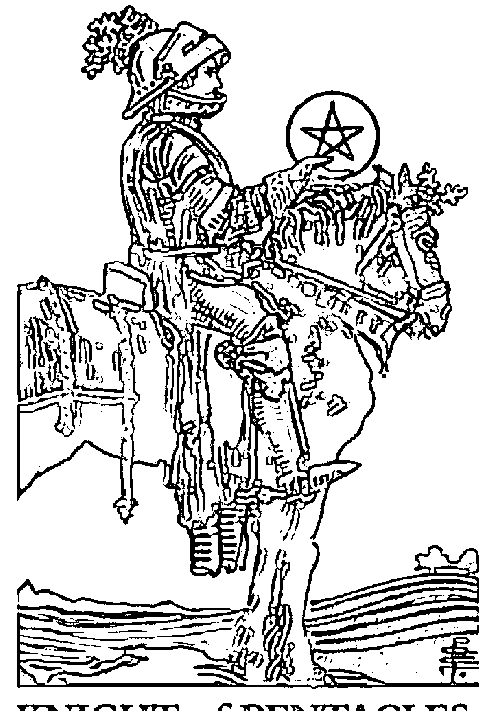

### 錢幣騎士

土的本質，
火的行為模式

錢幣騎士大部分時候來說，都是有為有守的好青年，因為騎士是火元素，會給錢幣的固著度一些推動力，雖然不像其他騎士動作那麼快，但也因為慢，讓他可以看清身邊的所有狀況，把事情做得更完整。他的成就會比較晚，是因為他的動作慢，跟其他騎士比起來，他犯的錯誤比較少，但如果他犯錯，那成就會更慢，或乾脆沒有成果。所以騎士的本質還是很重要，騎士就是年輕人，什麼都沒有，但有的是時間，所以錢幣騎士還是很值得期待的。他比其他錢幣成員，更有力量跟前進的企圖心。

如果在「問題」的位置抽到錢幣騎士，那就是他雖然有在做事，但因為不是很快速，所以容易被別人忽略；因為成就來得慢，所以上司或老闆，常常對他建立的功勞視而不見。要等到其他出鋒頭的人，紛紛跳槽或自己創業，只有錢幣騎士還留下來，老闆才會注意到他。但人不是一定會熬出頭，死在半路上或終生沒有得到賞識，都是有可能的。

#### ☆ 錢幣騎士+火元素

跟負面的火元素一起出現，因為本質是土元素，表示這個人的資質鈍了一點，但又急著要求表現，會容易出糗，造成同事對他更不信任，還好他的本質是土元素，就算做錯，危害也沒那麼大，因為他剛好本事還不大（以後會變大，但他現在心智或肉體還只是年輕人）。如果是正面的火元素，那他的行動雖然不快，但效果卻很精準，都是觀察很久才行動，也就是你們還沒發現時，他就已經洞察先機了。他的眼光跟動作配合得很好，雖然不是最快的，但成果是最好的。

#### ☆ 錢幣騎士+土元素

跟負面的土元素一起出現時，就會一副很有衝勁的樣子，但真的開始做事時，會因為太過謹慎而拖拖拉拉，觀察一些不必觀察的事情，還自以為很有遠見，但其實只是拖慢進度。他不會分辨事情的必要程度，所以常常搞錯事情的順序，浪費不必要的時間跟力氣。如果是正面的土元素，那就是他的謹慎是有幫助的，會預防很多不必要的缺失，因為防範得當，所以捨去很多繞遠路的可能。

#### ☆ 錢幣騎士＋水元素

這張牌跟負面的水元素一起出現，因為火元素也是情感元素，代表他的想法很正確，但做起事情來處處被牽制，常常有甩不掉的人情包袱。其實只要沒有人情的干擾，他的能力是不錯的，但他就是太想要顧全大局跟周遭人的想法，所以拖累自己的進度。如果是正面的水元素，他就會跟整體共存共榮，雖然速度比較慢，但大家都很滿意，是不會留爛攤子給別人收拾的人，所以大家對他的評價都很好。

#### ☆ 錢幣騎士＋風元素

跟負面的風元素一起出現，那這個人不聰明，又愛搞小動作，所以被拆穿的機率很高，他往往不受教，會故技重施，覺得總有矇混過去的一天。但久而久之，他會被視為是沒有生產力也沒有企劃力的人，不管過多久，他都不會是一號人物。但如果跟正面的風元素一起出現，加上本質的土元素，他會很能變通，凡事都能找到相應的方法，又有水元素，懂得適時進退。基本上如果是年輕人，他就是最識相最被期待的年輕人。

### 錢幣皇后

#### 土的本質，水的行為模式

QUEEN of PENTACLES.

錢幣皇后是「貴婦牌」，可能是爸爸或丈夫有錢，或是自己本身有賺錢的天分，他賺錢不像我們這麼辛苦，好像是錢去找他一樣。他很重視別人，常常會跟別人分享資源，或投資他覺得值得的人，所以這張牌並不會因為有錢而招致別人的反感。他很會享受自己的生活，不是很高調，默默品味自己擁有的一切。他的鑑賞能力也很強，所以投資眼光很有品味也很精準，獲利的機會永遠比賠錢的時候多。土加水，表示這張牌很慵懶，願意花錢請別人做事，就像我外婆花錢如流水，但是她的理論是：「錢要分給別人賺。」我深表同意，所以我也是大部分事情都外包（但家人說我只是懶而已）。

如果在「問題」的位置抽到，那這張牌很貪圖享樂，他沒有太多生產力，所以需要一個供養者。他最有興趣的就是理財，可以往這條路走，因為有資源，所以有賠錢的本錢，就算輸了也不會影響到他人，只會影響自己的家人而已。這我不能說什麼，只能說「不是一家人，不入一家門」，這可能是共業。又因為他很有品味，所以可能會迷戀名牌的設計，或喜歡裝潢，這些都很燒錢，但因為都是陰性元素，所以不會燒到外人的身上，是不幸中的大幸。

#### ☆ 錢幣皇后＋火元素

這張牌跟負面的火元素一起出現，那火就有可能燒到別人身上了，因為土元素跟水元素花錢的程度都沒有火元素那麼超過！土還比較會算計，水懶得計較，但火元素要面子，所以不值得的東西，他也會砸大錢，只因為別人在看他怎麼做，他一定要花下去，才不會讓別人看不起（但我覺得其實別人只是想看他花冤枉錢）。如果是正面的火元素，他的錢會是一種投資，可以賺回更多，畢竟土元素只會存錢，火元素才是會賺錢的那一個，與其節流，火元素覺得不如開源。

#### ☆ 錢幣皇后＋土元素

跟負面的土元素一起出現，這張牌雖然不匱乏，卻很小氣，喜歡占小便宜，斤斤計較一些小事情，然後覺得賺到而很得意。簡單來說，也不是什麼大壞人，只是格局小，容易讓人把他掃到一邊，有什麼重要的事，也不願意跟他交流，因為覺得他不會有建設性的意見。如果是正面的土元素，那就會知道怎麼量入為出，而且很懂得投資報酬率，不只是金錢方面，各方面他都有天生的計算能力，所以可以在不讓別人吃虧的前提下，把自己的生活過得很好。

#### ☆ 錢幣皇后＋水元素

如果跟負面的水元素一起出現，那就是禁不起別人的慾念，在不求證不懂之下會隨便投資，其實不算被騙，因為投資本來就是有賺有賠。很像股市早期的「菜籃族」，都是道聽途說，沒有專業的考量，所以是市場的最後一波韭菜。如果是正面的水元素，那就因為不擅於賺錢，乾脆把錢拿去做善事，至少有看得見的回報，也很像養孩子，可以把一個弱勢的人培養到一定的程度，這種成就感也很大，所以雖然是善事，但也是一種投資。

#### ☆ 錢幣皇后＋風元素

如果跟負面的風元素一起出現，那就是這人的格局小又喜歡猜忌，很不光明正大（因為獨缺火），常常在背後說人閒話，被抓到又喜歡推到別人身上，就是小裡小氣，成不了什麼大事。如果是正面的風元素，就會很懂得計算，不管是錢財或做人方面，都能用最少的努力，達到最好的效果。會是一個很好的會計師或理錢專家，因為他很有眼光，而且懂得在該收手的時候收手。因為缺火，所以他不會在乎無謂的面子。

### 錢幣國王

#### 土的本質，土的行為模式

土中之土雖然慢，但建立的成就規模很大，而且不容易被打垮。如果要用人來形容，應該是王永慶，他已經過世了，但影響力還是很大，他的家族跟子女還是牽動著台灣社會的版面。不管是好是壞，總之就是台灣社會沒辦法抹去的一塊，雖然變得低調，但是影響力仍然在。土中之土就是這樣，默默的累積一切，不出鋒頭，很樸實，不會霸道的那一種（權杖國王就很霸道），但是仍然很有原則。土元素不會管外人，但對自己的家人很要求，所以在家人眼中，他還是很難溝通。

如果在「問題」位置抽到，他是冥頑不靈的，他的成就就是做對選擇而已。例如當了一輩子公務員，他也很以此為傲，就覺得自己是過得最好的，超過他的眼界之外的事物，他都嗤之以鼻。認為家人最好都跟他一樣，才會擁有美好的生活，但其實只是跟他一樣的生活，雖然有保障，卻不見得美好。可是他看不到別條路，只能推薦他自己走過的路，而且講也講不通，因為他的想法是僵化的。

#### ☆ 錢幣國王＋火元素

跟火元素的負面牌一起抽到，那就會有偏執的特點，而且手會伸到身邊以外的人身上，錢幣國王本來就很難溝通了，但他只是要你照著他的話走。有負面的火元素，不只要你照他說的做，還要你對外宣稱是全心全意支持他的方法，連你的思想都要控制跟干涉，因為火跟土元素都是佔有慾很強的人。如果是正面的火元素，那就不會像原來的錢幣國王那樣想「等時機」，就很會創造自己要的條件，而且錢幣國王又有資源，就是野心很強的富二代，背後有靠山，自己有行動力，所以基本上多數事情都會成功。

#### ☆ 錢幣國王＋土元素

如果是跟負面的土元素一起出現，那這張錢幣國王，就只能抱著往日的榮景記憶進棺材，因為全部都是負面土元素，除了經驗之外，不相信任何建言，但人的一生就這麼短，全世界的事情你能經歷得完嗎？所以一定會被更新的人取代，被掃進歷史的塵埃。如果是正面的土元素，那就是可以享受生活，把日子過得很好很讓人羨慕，但土元素也不會高調顯擺，他就默默的過日子，別人也抓不到他的弱點或把柄，應該是可以長泰久安。

#### ☆ 錢幣國王+水元素

如果跟負面的水元素一起出現，全部都是陰性元素，就會顛預怠惰，不會那麼固執，但就像我們社會大部分的老人家，什麼事都不相信，但詐騙集團或不法分子，就可以輕易的騙他們的錢。就是俗語說的「人牽不走，鬼牽溜溜走」，因為他們都是陰性元素，需要認同、歸屬跟安全感，所以壞人投其所好，就可以輕易拿走他們有的東西。如果跟正面的水元素一起出現，這種人有資源又有同理心，會有能力做很多善事，所以自己的日子過得豐盛又愜意，與世無爭。

#### ☆ 錢幣國王+風元素

跟負面的風元素一起出現，土中之土就會有很多陰謀，雖然已經很有錢了，但就是不滿足，還會設計奪取別人所有物，像個填不滿的無底洞，對每個人來說，他都是一個不必要存在的人。但如果是正面的風元素，風跟土都很理性，就表示他很會求知，而且有土，不會缺乏經驗，他什麼事都會經過求證，所以很有公信力，很像學者，大家都很重視他的意見。

# Part 5

## 牌阵解牌

### 精選實例

### 牌陣一 時間之流

#### ☆ 牌陣位置

-   1：過去所發生的事
-   2：現在正在發生的事
-   3：未來／事情的結果

#### ☆ 老師引導

在時間之流的牌陣上，依照問題的不同，有時可以把「過去」當成「現在」這個狀況的「成因」來看，從這張牌的弱點跟盲點看出為什麼會變成現在這樣。也可以看「現在」的牌，對照出這張牌相應的弱點，跟過去的牌並排解讀，就會知道問題出在哪裡。

「未來」牌不單純是指未來，也有可能是「結果」或「下一步發展」，端看你的問題需要知道的是什麼。

這個牌陣因為只有三張牌，所以會缺乏至少一個以上的元素，這時候我的用法常常是：從缺乏的元素看這件事缺乏的是哪一點。

老師：先不用逆位。我的逆位跟大家的逆位不一樣，我並不是賦予逆位一個牌義。為什麼我不用逆位呢？其實以前我也用過，但是用久了我覺得有沒有逆位都沒差，因為這張牌就是會出現在這裡，即使是好牌，還是要看整個牌陣。由於其他的牌也會展現出負面的意思，所以正位跟逆位都沒差，我都會解讀出負面的意思。

解牌時有一個重點，如果你找到自己的問題，你要寫下來。因為如果不寫的話，可能在抽牌翻牌的時候，你腦子想的又是不同的事情。所以一定要把問題寫下來，你才會記住你在問什麼。

而且問的問題也很重要。例如「我要不要換工作」這不是一個問題，你應該要問「我在 A 公司的上班狀況會怎麼樣」、「我在 B 公司的上班狀況會怎麼樣」，我們才能比較好壞。而且如果牌卡顯示出來的東西不一樣，這通常不是告訴你好或壞，而是告訴你去哪一個公司有哪些收穫。

如果說去 A 公司，你的才華會比較有發揮的地方，而 B 公司是起薪比較高，就看你想要的是哪一個，這個是使用之後的「二擇一牌陣」。

現在我們可以先用時間之流這個牌陣。請記得你的問題的問法，你如果要問工作，那麼不是直接問「我的工作好不好」，你可以問說「我下半年會不會加薪」，或者是「我會不會升職」這種確切一點的問題，會比較有答案。

學生 A：老師，我發現在抽牌的時候，當我的問題越清楚，我抽出來的牌越好解，不過我發現大部分的人都不知道要問什麼。老師剛剛說「我下半年會不會加薪」，是一個是非題，但是是非題不是不能問牌卡嗎？

老師：你可以問「我下半年的薪資會不會讓我滿意」，也就是我對我的薪資會有什麼樣的感覺，或者問「我的薪資會有什麼變動」，從牌陣上面你就可以推出薪水是漲還是跌。

學生 A：所以我們要把那個問題創造成一個狀況對不對？

老師：為什麼不問是非題呢？因為會很難知道牌卡講的到底是對還是錯。

學生 A：可是大部分的人就是會問「一翻兩瞪眼」的問題呀。

老師：那丟銅板就好了，問塔羅幹嘛。（笑）

### 實例解讀 1

#### 未來的關係發展

寶劍七

錢幣九

戀人

學生 A：我的問題是「我們未來的關係發展」。過去是寶劍七，代表是偷偷摸摸的，我們的關係沒有太多人知道，就是在網絡上的。

老師：我剛剛看這副牌就覺得你跟他不太熟啊。

學生 A：的確不是太熟悉，我們是九月才認識的，有交流。現在是錢幣九，代表大家也是很享受現在這個狀態，沒有想要再進一步。

你有沒有發現你剛剛抽的逆位牌（魔術師逆 - 皇帝逆 - 女教皇），也跟這張牌差不多。因為皇帝跟女教皇都比較喜歡在自己的世界裡面。你上一次抽的牌也是差不多的意思，就是大家都活在自己的世界，沒跟對方有太多交集。

學生 A：是啊，我們不會想再進一步發展。未來是戀人牌，大家互相有好感，但是距離比較遠。

老師：那你現在的想法是怎麼樣，你希望跟他有發展嗎？

學生 A：我也猶豫。

老師：其他人怎麼看這副牌？

**學生F**：這副牌看起來本來是有點偷偷摸摸的，現在的話應該是比較穩定了，而且正在享受這段關係的美好，未來可能會修成正果吧，因為直接抽到戀人牌了。

**老師**：你有沒有發現一件事，這問的是感情，但這副牌只有風跟土，如果只有風跟土的話，在感情方面不會太深入。感情的話一定要水元素的柔情跟火元素的動力，兩人才會很熱情的在一起。就算是戀人牌，戀人牌其實也不是熱情，只是對對方感到好奇，會覺得認識對方新的一面，這個人讓他有一點愉悅的感覺，但不太算甜蜜。因為前面一張牌是土元素，土元素就是將自己的日子過得很好，接下來的戀人牌就代表能從自己的世界裡面走出來，所以這終究是一副好牌。你以前可能對於其他人沒有太重視，但這張牌代表你從自己的圈子走出來，交到第一個你覺得還不錯的朋友，好處就是你開始對別人感到好奇了。

**學生A**：我覺得對的，我沒有想要進一步發展的衝動，所以沒有火元素，我們只是每天聊天，沒有進一步的見面。

**老師**：其實我覺得這樣滿好的。他是讓你放鬆的人，但是也不用負責太多，戀人牌就是這樣。很多人都把戀人牌想得濃情蜜意，或想得非常纏綿，但是戀人牌只是風元素，只是對對方感到好奇，只是對對方有興趣，但是還沒決定要做什麼，就先放著。

學生 A: 對，感覺有距離比較好。

老師: 而且沒有水跟火，就沒有前進的動力，兩個人還在不太熟的狀態。多數人一看到戀人牌就會認為這段關係進行得很好，但是你要知道沒有火也沒有水，就代表兩個人沒有那種意思，至少半年內沒有那個意思。你們要往那個方向走，先相處看看再說。

學生 A: 老師，如果有水、沒有火，該怎麼解釋呢？比如寶劍七換成聖杯一。

老師: 那就是兩個人都對對方有好感，但是因為錢幣九就還處在自己環境裡面，還不敢動，還不敢貿然的做什麼，但戀人代表慢慢會有戲的，會慢慢的打聽對方，慢慢的對對方好奇，不過只是接近，因為只是風。如果是火的話，應該行動力比較快，這張就是雖然很喜歡但是放著的狀況，慢慢的看可以發展到什麼程度。

學生 E: 老師我想請問一下，這個錢幣九裡面有物質的成分嗎？比如說我想問學生 A 跟這個對象之間是不是一個比較對等的關係，在各方面的條件上面，所以她才願意走出來。比如說這個男生在主流價值觀的考量中，工作上、經濟上是比較穩定的，可以有這樣的投射嗎？

**学生 A**：没错，他是很脚踏实地的人，我觉得有些东西可以向他学习，他有些没有的东西，对我是有帮助的。

**学生 E**：所以老师如果以学生 A 的心情，对应钱币九的话，画面中有一些果子，就代表这个人其实带给她一些进步的感觉，就是一加一大于二。

**老师**：但是上一张是宝剑七，这代表之前她对这个人还有一点戒备，好像了解了也觉得他是一个不错的人，才开始伸出友谊的双手，是吗？刚认识的时候，他看起来好像不是一个很安定的人，所以你是有戒备的，但认识之后你就觉得：这个人还不错啊，我为什么以前会误会他呢？发现他身上有很多东西是可以发掘的。

**学生 A**：对！因为刚认识的时候，我是一个比较保护自己的人，所以我觉得有点危险，不太想再进一步，但是他有很多东西分享，所以我觉得还不错啊，就是这样。

**老师**：就先当朋友看看，因为你也没有喜欢，就只是先当朋友，对你来说，先当朋友就已经很了不起了。其实你都不太会接触外界，因为你只想接触对你有益的人、身上有东西可以学的人，你在交朋友方面还满保守的。

學生 A：是啊，我是滿保守的。我沒有想到寶劍七有戒備的意思，只想到有偷偷摸摸的意思。

老師：就是因為這人看起來偷偷摸摸，所以你才會戒備啊。

學生 A：我明白了。

學生 E：請問老師風跟土元素放在一起的話，要怎麼看？

老師：風跟土都是理智型的元素，所以如果是考試或讀書的話，這兩個元素在一起就不錯。或者是工作，風跟土比較適合研發型的工作，適合追根究柢方面的工作、研究型的工作。但如果是業務，需要熱情活潑的那種，就比較不適合。兩個陽性元素是火跟風，你有沒有發現火跟風都是比較無形、渙散的東西，不能收起來不能保存的。所以火元素就跟男生一樣比較外放，比較不知去向，比較不知道怎麼抓。但有個不一樣的地方：火是比較有目標的，但風沒有目標。

兩個陰性元素就是水跟土，水跟土都是可以收起來、可以存放的東西。所以你們會發現一件事，塔羅牌的風跟火，數字越到後面越差；但是水跟土的部分，數字越到後面，到聖杯九、十、錢幣九、十，都是越來越好的，但寶劍和權杖到了九跟十都不太好。因為陽性元素不能累積，陰性元素才能累積。陽性元素不是實體，沒有持續力，而是一個推動力。

### 實例解讀 2

#### 工作狀況

**學生 B**：我的牌陣是問我的工作狀況如何。之前是權杖十的狀態，就是壓力很大，有點過勞，任勞任怨，背負了很多東西，什麼東西都要自己扛，因為我太追求完美吧，但是其實已經累趴了，好像再怎麼努力都解決不了問題了。目前是錢幣六，就是要平衡好工作和生活，也要衡量一下自己的能力範圍，盡好自己所負責的那個職務就好了。未來是惡魔，代表接下來還是會有很多很忙的工作吧。我自己本身也有很多物質慾望，也許會因為工作忙，犧牲了自己的時間、自由、想學習的東西、夢想之類的，會有很多誘惑。

**老師**：你有沒有發現一件事，最後面的惡魔和前面的權杖十比起來，你比較喜歡哪一個？

**學生 B**：惡魔。（笑）

**老師**：對啊，為什麼，因為惡魔至少是有頭腦的做事，他有辦法分配這個工作，但權杖十不行，只是一個壓力壓在身上，只是默默的做。但是惡魔牌你還可以設計別人，把壓力轉移到別人的身上，還可以買一些自己喜歡的東西，惡魔牌好多了對不對？

**學生 B**：對，因為權杖十看起來已經有點迷失，看不清楚方向了。不過惡魔牌還是要小心自己會過度沉淪，是嗎？

老師：惡魔牌要小心的地方有兩個，一個是花錢過度，另一個是他會清楚知道自己想要什麼，要小心的是過度沉淪在錢跟慾望權力裡。不過中間這張牌就代表你目前用的方式還不錯，知道怎麼平均的分配工作給大家，不會一個人扛下來。

學生 B：是的，目前是這樣。那如果錢幣六是逆位，講法就完全不一樣了嗎？還是我做不好這個錢幣六？

老師：不會啊，逆位就代表你雖然在嘗試這個方向，但大家不聽你的，想要嘗試這個方法，但行不通。

學生 B：但是這個行不通是可以調整的嗎？

老師：可以，因為這個六還是滿像群體的，六就是群體共同的意識，就算一時之間他們不聽你的，以後還是可以慢慢調整。

學生 B：那如果惡魔牌也是逆位呢？就代表我的頭腦沒有那麼清楚了嗎，會沉淪跟被誘惑。

老師：就是你會希望工作輕鬆一點，但是惡魔逆位的話你會發現權力很有用，錢也很有用，你會忙到連自己的時間都沒有。因為太投入這個競爭遊戲，忙到連自己原來要做什麼都忘記了。

學生 B：我還以為正位牌也會這樣哎。

老師：如果只有這張牌的話我會這樣解，但是跟權杖十比，惡魔好多了啊，我就會把惡魔往好的方向解。

### 實例解讀3

#### 跟在意的人一個月內的發展

寶劍十

倒吊人

錢幣六學生 C：我的問題是「跟在意的人一個月內的發展」。其實不太懂為什麼一開始會出現寶劍十，因為我跟這個人完全不熟，中間的吊人我覺得可以解釋成，因為我跟他不熟，所以我完全沒有發力點去熟悉這個人，互動不多，只能單方面等待。然後是錢幣六，六號牌跟人際有關係，錢幣跟實際有關，因為是公司認識的人，所以我覺得應該是藉由公司會有一個公事上的互動。

老師：但是你們之間一點動力都沒有，沒有火元素，兩個人就這樣順順的相處，一時之間還談不到戀愛，可能要認識很久以後才有機會，但兩個人的相處算是平和。

學生 C：對，因為都沒有講話。那為什麼會抽到寶劍十？

老師：你是不是換新部門，他是你新認識的？

學生 C：對，他是新認識的，但現在不是新部門。

老師：對啊，他目前對你來說，是一個以前不會出現在你思考裡面的人，以前對於他，你沒有任何想法。

學生 C：對耶，我以前不喜歡這個人，是因為他一直出現在我的眼前，才慢慢在意，寶劍十可以解釋成為以前完全不考慮的對象嗎？

老師：對啊。

學生 B：老師我想問一下吊人牌是代表什麼？

老師：代表目前處在被動的狀況，沒辦法主動做什麼。你會發現用元素解牌輕鬆多，而且正確多了。

學生 B：喔！因為水元素是被動狀況，我明白了。

#### 實例解讀 4

#### 與某人的關係

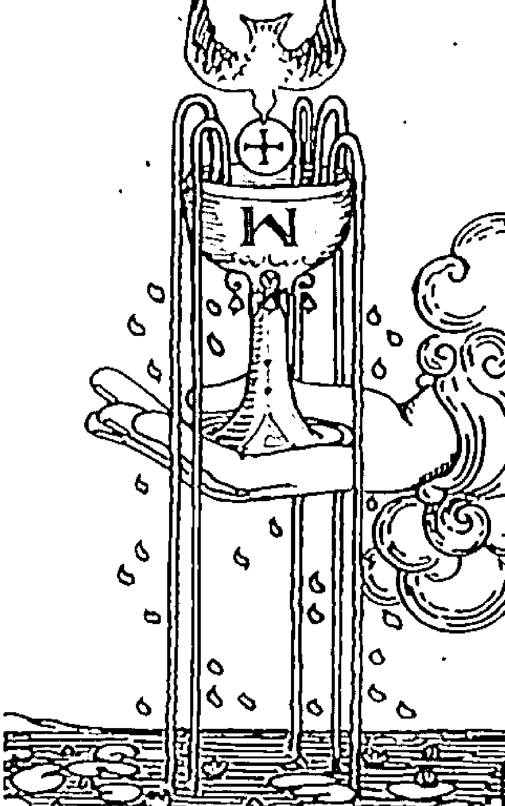

聖杯一

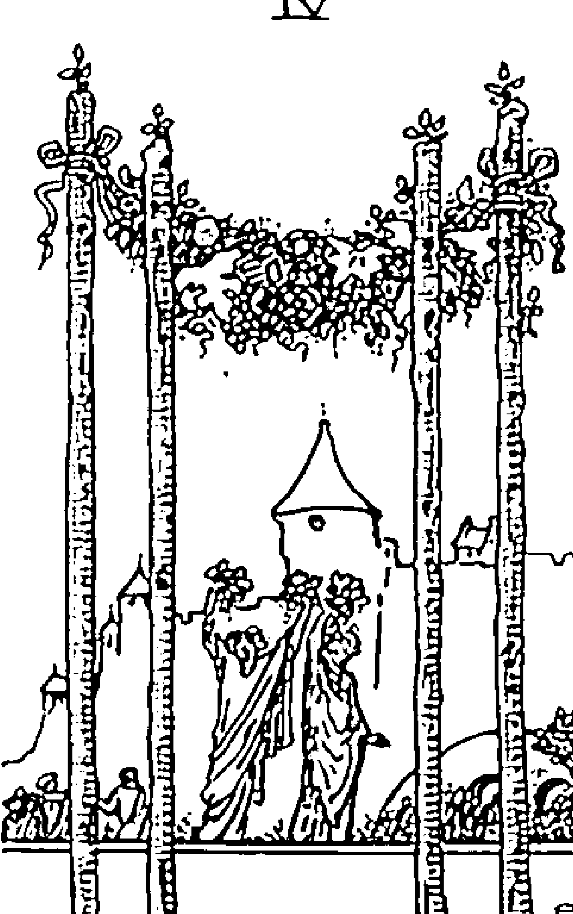

權杖四

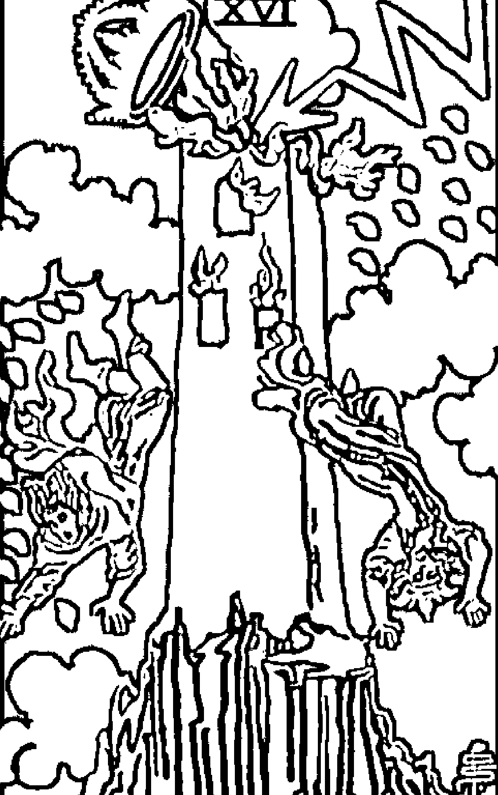

塔

學生 D：我的問題是「與某人的關係」，第一張聖杯一還滿準的。老師的書上有寫，聖杯一如果代表關係跟感情的話，是一種全身心的投入和付出，這個還滿準的，代表我和這個人之前的關係。第二張牌我不太明白為什麼是權杖四，目前狀況是我跟這個人其實不歡而散了，有些誤解，是分開的狀態。剛剛我抽第一遍時，因為老師說不要用逆位，我抽出的第一張原本是逆位的錢幣侍者，第二張牌是逆位的權杖四，後來我重新洗牌，第二張又出現權杖四，挺奇怪的。權杖四其實是一張我滿喜歡的關係牌，好像代表一種關係的達成，像是結婚啊、完成心願這些。

老師：代表你們雖然不歡而散，但是你們還沒有真心要斷絕關係，心裡覺得這只是吵架，以後還是會和好。

學生 D：我覺得我好像放棄了，但第三張塔牌，看起來其實還滿好的。目前狀態對我來說，最難過的就是不歡而散，不知道為什麼就散了，但牌卡看到這個結果會讓我覺得還好。

老師：斷得乾淨你反而知道怎麼面對。

學生 D：對！就好像連一次好好談話都沒有，所以我覺得這是比較難過的局面。因為現在已經是一個看似分開的狀態，不過出現塔牌，是不是表示未來有一定的突破，無論最後結果怎樣。

老師：會講清楚。但是比較奇怪的一點是三張牌裡面有兩張火一張水，代表你們兩個就算攤牌了，感情還是滿好的。我覺得權杖四的狀況可能是指讓你們吵架的地方是一些誤會，或者是理念上的不同，但不是很嚴重的事。

學生 D：從前也有爭執，但這一次真是鬧翻了，所以我在抽這個牌之前都有一點放棄了，只不過因為今天正好有機會讓老師幫忙解釋，我就想說再抽一下看看這段關係，沒想到出現了這三張牌，我也覺得驚訝。

老師：看起來你們還是會講清楚，會斷得比較乾淨，現在還是有一點藕斷絲連的狀況。代表你們還是覺得你們兩個人是一體。可能你是覺得要放棄了，但是他覺得只是一次吵架而已，他並沒有覺得你們真的就沒有未來了。有人知道你們分開嗎？

學生 D：有，但不是很多人知道。

老師：看起來別人還不知道，別人都覺得你們還是一對啊。

學生 D：沒錯，因為我們這次不歡而散，兩個人都很傷心，沒有告訴別人，沒有公佈這件事，所以好像卡在這裡，但是又看起來沒什麼希望，因為已經很久沒有聯絡了。

老師：多久？

學生 D：兩個多月。

老師：還滿久了。如果是這樣的話，我覺得這張塔牌不見得是分乾淨哎，這張塔牌可能是把不高興的地方都解釋清楚，我覺得未來還有新的可能性。因為這三張牌都是感情元素，如果是代表要分開的話，我覺得不會出現這麼多感情的元素。

學生 D：謝謝老師鼓勵。

學生 A：老師，為什麼火是感情元素啊？

老師：沒有火元素的話，你會去跟人表白嗎？你會有那個勇氣嗎？因為火是勇氣，水是溫柔的柔情，就是你的愛意。

學生 B：老師，從這個牌陣可以看出原因嗎？為什麼他們會突然間變成塔牌？

老師：我剛剛有說因為一些不重要的事。他們會覺得理念不同這件事很嚴重，但是在別人眼裡其實是不重要的事。

學生 B：理念不同是因為權杖四？

老師：對，權杖四就是每個人都守在自己的範圍裡面，雖然以前是可以相處的，因為還沒碰到那個點那條線，但是一旦踩到那條底線的話就沒有辦法了，一定要講清楚。不過，我覺得這張塔是他們把話講清楚以後反而會和好，因為三張牌都是感情元素，兩張火一張土，就代表一定要行動，如果不行動可能真的這樣散了。但是如果好好地吵一架，說不定還有復合的可能。

學生 A：老師建議她行動，是因為有火元素嗎？

老師：對啊，我是說後來他們兩個應該還是會吵架，我沒有建議她去吵架。

學生 A：老師，我們是可以看這三張牌然後給人建議嗎？

老師：對，可以。

學生 B：老師是怎麼看出不是很多人知道他們分開？

老師：因為他們的關係在大家看來，就是兩個人還在一起啊，而且又是四這個小圈圈，這個小圈圈就是雖然有人知道，也是他們身邊的，身邊的人就會看他們兩個人的互動，因為是四。

### 實例解讀 5

#### 未來三個月學占星的狀況

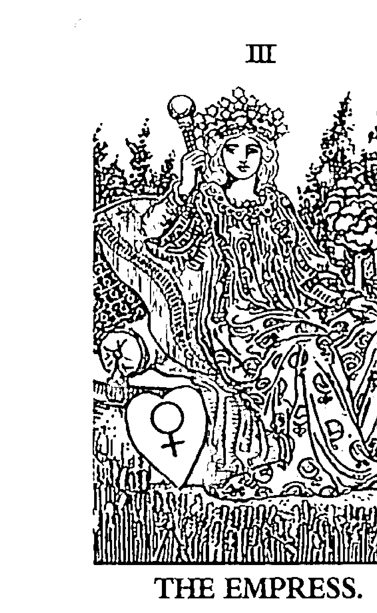

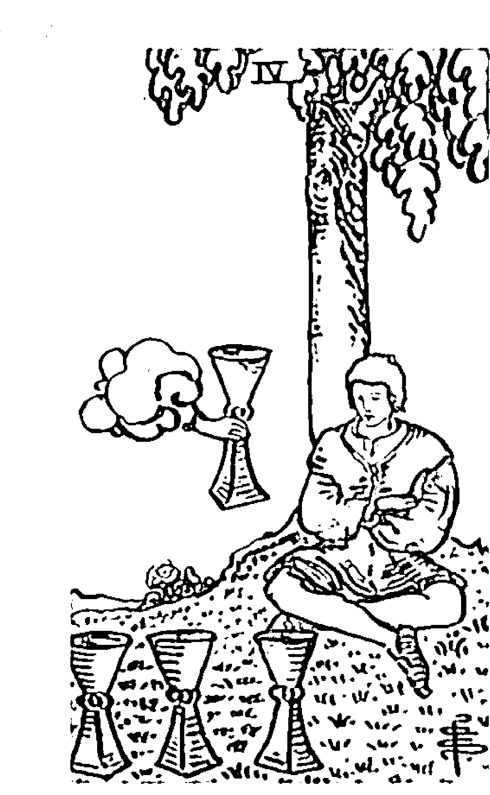

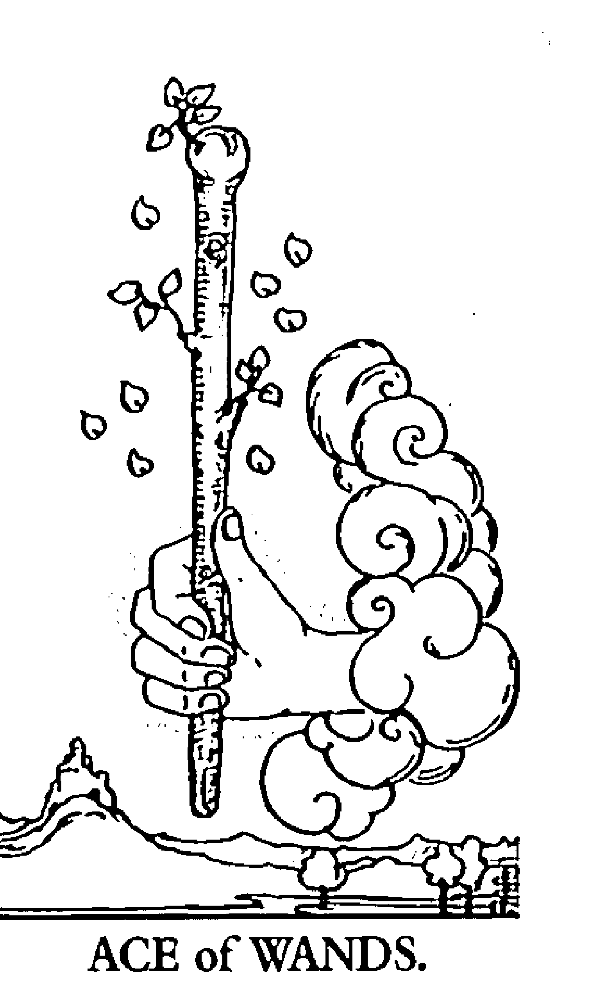

學生E：我的問題是「未來三個月學占星的狀況如何」，我抽的是「女皇 - 聖杯四 - 權杖一」。剛剛我抽的時候聖杯四是逆位，老師說不用逆位，我就轉過來了。我的解釋是我手上應該有滿多資源可以學習，包括我買的書，或者曾經聽過的一些講座，但是礙於我現在手邊還有很多累積的東西沒有消化，所以我有點拖延症的狀態。因為聖杯四是水元素，我的想法是水元素的這個杯子裡的水有點多，消化不完，所以會影響後面的權杖。如果我很想要行動的話，我抽到的就不應該是權杖一。

老師：而且女皇這張牌有慵懶的意思。

學生E：（笑）老師，她沒有積極一點的意思嗎？我以為她是書很多、錢很多。

老師：她錢很多，所以她會好好享受啊。因為她不做也不會沒飯吃，所以都不積極。

學生E：我以为女皇表示她拥有的资源很多，就像我买很多书。

老师：有很多资源，对，没错。但是她没有一定要行动的那个目标，她没有那个动力。

学生E：对，女皇就是怀孕坐在那里，以致于我后面的权杖抽到了一。

老师：我觉得你找到了很好的一个新的方式，不要用以前的那些方式，我觉得市面上的书都把占星写得好复杂。

学生E：好难啊，老师，所以我对这件事情裹足不前，我一翻开那本占星书就立马想要阖上，但是我还是会把书收集起来先放着。

老师：我当初决定学占星，是看了一本《荣格与占星学》，内容不是讲怎么学占星，而是讲占星的理念。

学生E：老师，为什么你会解释我的权杖一是有了全新的方向？因为我觉得现在拥有的东西，其实我都不太想用对吗？

老师：对啊。

### 實例解讀 6

#### 未來一年學習靜坐的狀況

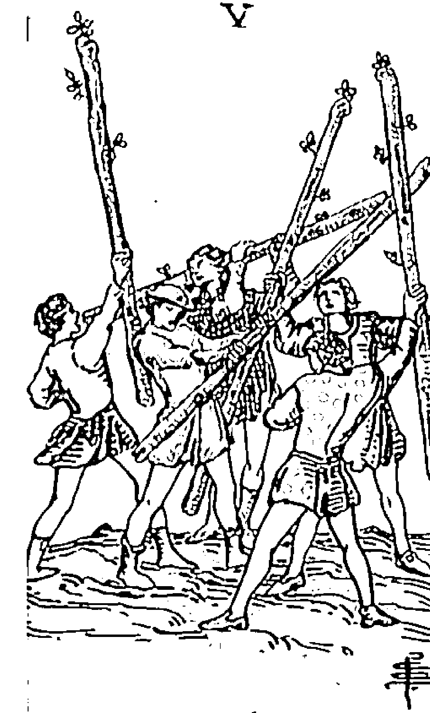

權杖五

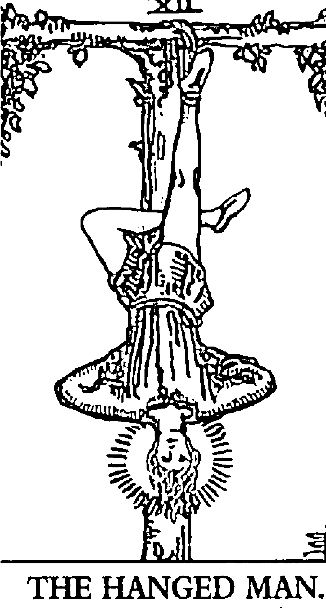

倒吊人

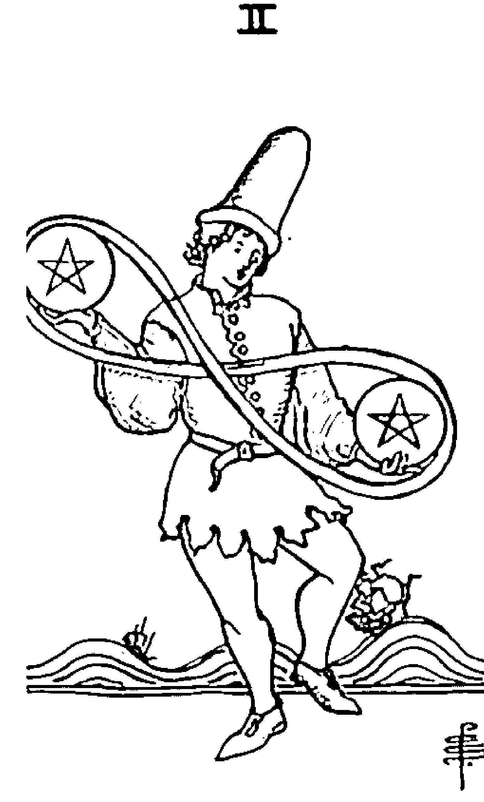

錢幣二

> 學生 F：我學習靜坐大概有四、五年了，在過去，學習上一直想要撐得久。

> 老師：我覺得還滿好的，為什麼你知道嗎？因為沒有風元素。風元素就是一些雜思亂想，如果你學靜坐沒有風元素的話，那是很好的狀況。

> 學生 F：一開始會急於求好心切，會給自己期許，雖然說知道放鬆，但實際上沒有放鬆，所以說過去的權杖五進步是有限的。現在的吊人就是整個放下來，比較能體會到放鬆的意義，身體的放鬆、心理的放鬆跟靈性的放鬆。我覺得現在比較能夠體悟到那種靜定的功夫。

> 老師：我覺得錢幣二代表你可以自由切換，你工作時候的狀態和你進入靜定時的狀態，可以自由切換，好厲害喲。

> 學生 F：是的，我現在就有這種體會。在工作上的情緒、心性都有所轉變，未來的話，我想是穩定了，如魚得水吧，抽到這個我還滿高興的。

> 老師：對啊，恭喜。

> 學生 A：老師，我想問一下吊人牌是代表他用很多時間在做這件事對嗎？

老師：如果這張牌在靜坐來講的話是好的，吊人就代表他已經覺悟，不要對於身邊的事情有太強的掌握欲。

學生 F：是的，就放鬆了，有點像是隨遇而安了。靜坐最重要的就是要放鬆。

### 牌陣二

### 聖三角

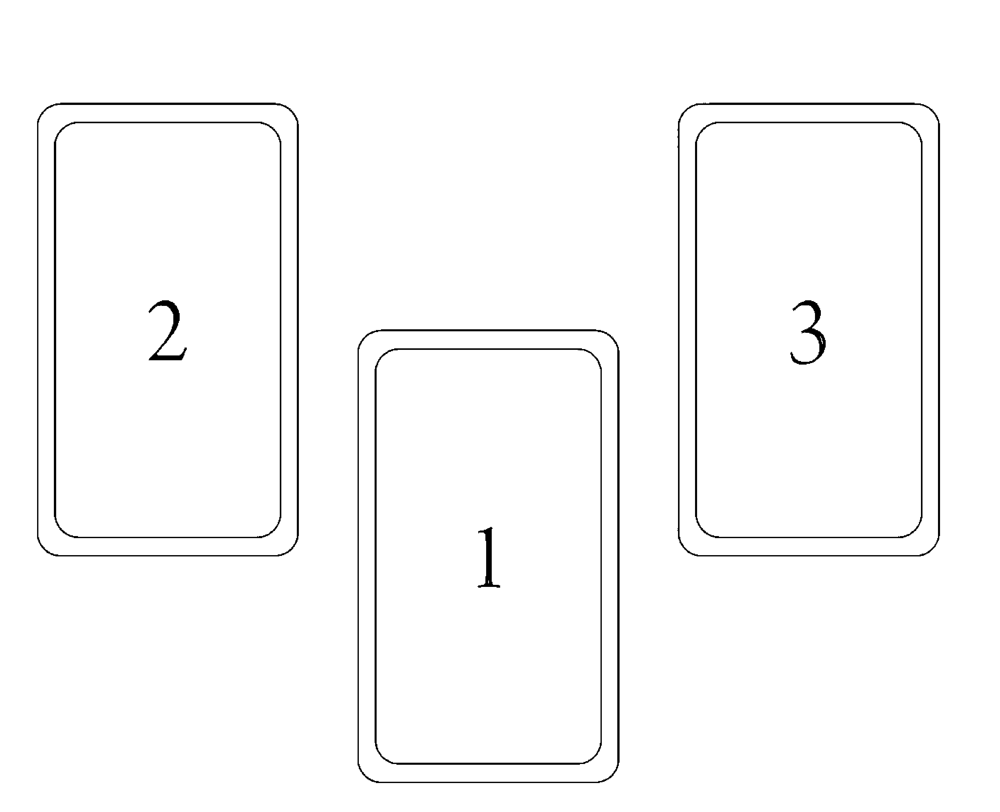

#### ☆ 牌陣位置

+   1. 所問之事的狀況
+   2. 這件事情的問題
+   3. 牌卡給予的建議

#### ☆ 老師引導

使用聖三角牌陣時，我通常不會一張一張的解讀，我會把「狀況」跟「問題」並列，通常就可以看到問題的重點。「建議」也要跟「問題」並列，通常「問題」位置的牌卡本身會點出重點，你就知道怎麼建議了，然後再看看建議牌是否提醒你有哪些缺乏的地方。

話說「問題」位置的牌卡代表一件事的問題所在，但有時候是好牌，那麼可能就表示：這些優點給你帶來相應的缺點，或是你疏忽掉的地方。此外，最好也把「狀況」跟「建議」並列，你會發現，原本你不認為是缺點，或甚至反而是優點的事，也有可能變成致命傷。一個特質是好是壞不重要，重要的是起了什麼作用。

在聖三角牌陣中，就像上述說的，問題就表示不好的狀況。如果在問題的位置出現好牌，在建議的位置出現壞牌，該怎麼解釋呢？這副牌就可以對應這個疑問，因為一定會有很多人在問題的位置抽到好牌，也有很多人在建議的位置抽到壞牌。跟時間之流一樣，要把自己的問題寫下來，也要把自己解牌的過程記錄下來。

### 實例解讀 1

#### 為什麼這個月生意不好

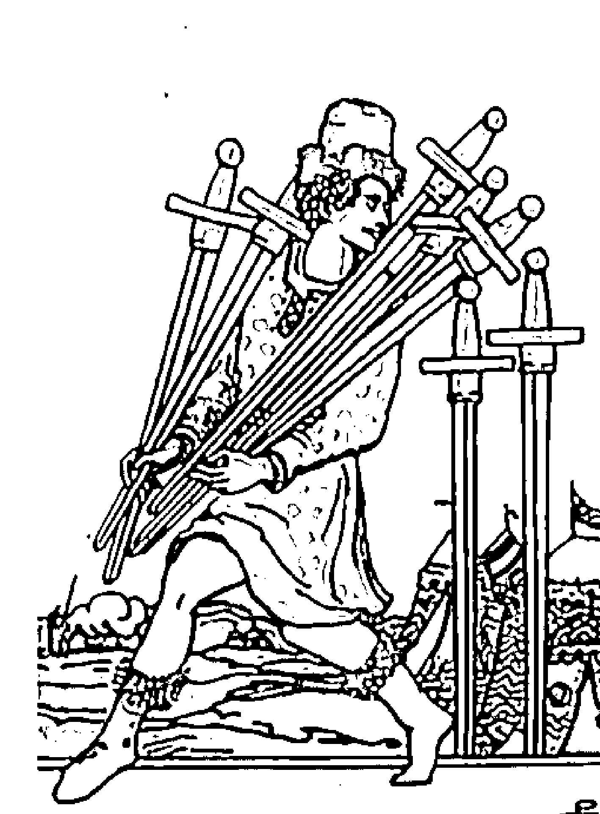

寶劍七

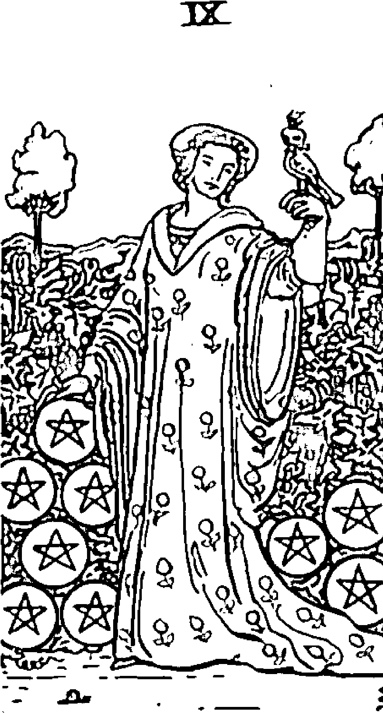

錢幣九

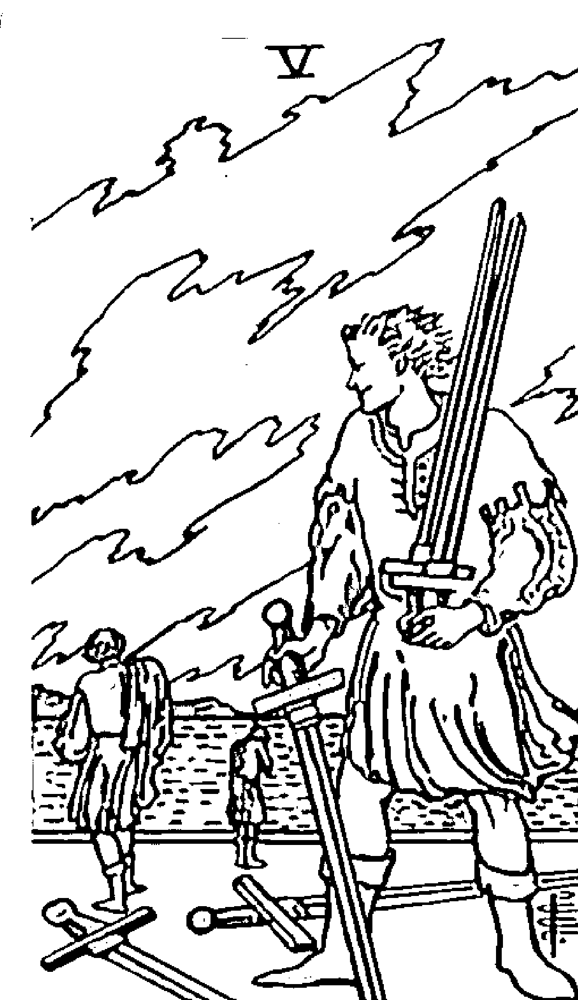

寶劍五

學生 A：我的問題是「為什麼這個月沒有生意」，我在網路上賣東西。現狀我是比較懶惰一點，覺得自己擁有資源，沒有太主動。

老師：錢幣九就是這個意思，縮在自己的框框裡面，把自己的環境弄得很舒服，覺得自己這樣做就已經很好了，別人會來找自己，是很被動的一張牌，沒錯。

學生 A：是，然後是寶劍七。我開始覺得不太對勁，會偷偷觀察他人的經營方式，看看有什麼地方可以學習。但問題就是想要用比較簡單的方法做生意。

老師：好像你想要耍一些小手段，用簡單一點的方式，例如大特價這類的，都是投機取巧的方式。

學生 A：對，是用一些投機的方式處理。建議是寶劍五，建議要放下自己打架的想法，不要想得太多，要主動去做，因為沒有火元素，所以沒有行動力。

老師：因為土跟風都是理性元素。你想得很多，可是沒有熱情，沒有執行，想歸想，但是你沒有真的去做。

學生 A：可以這樣說，我今天才努力一點點，沒有行動就只是想。

老師：所以你賣的東西聽起來不太有趣，因為沒有火跟水。火跟水合起來就是比較有趣的東西，因為會激起人家的激動，激起人家的喜歡。

學生A：哦，明白，原來是不夠有趣，我的問題是不有趣。

老師：不能激起人的購買慾，會買想要用的東西，但是沒有那種「很喜歡，我一定要擁有」的感覺，都只是要用的時候才來買。

學生A：我明白了，我再重整一下我的網路商店，再讓它美麗一點。謝謝老師。

### 實例解讀 2

#### 該與朋友合租靜修處所嗎？

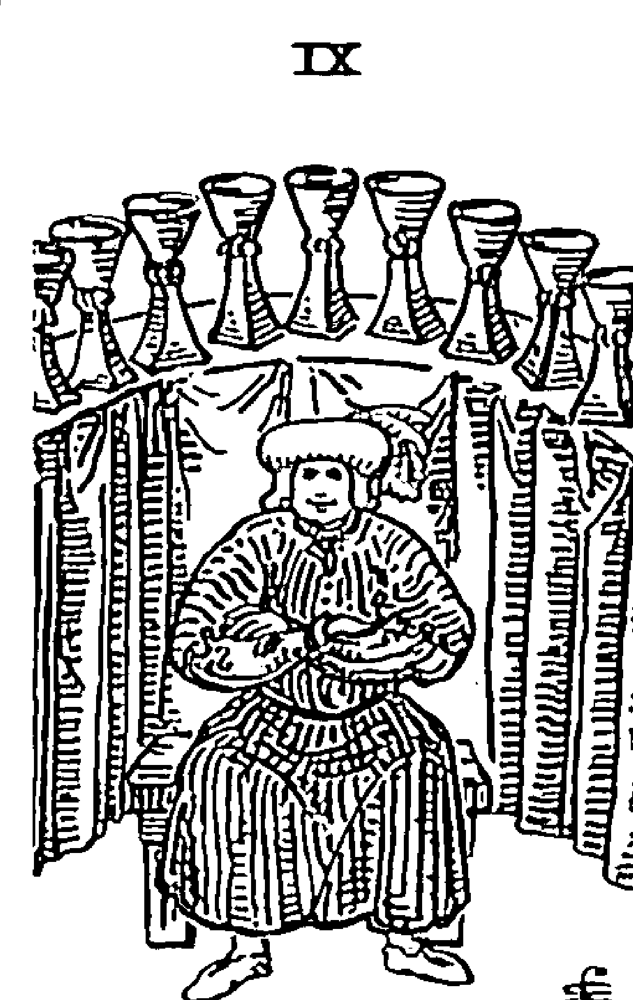

聖杯九

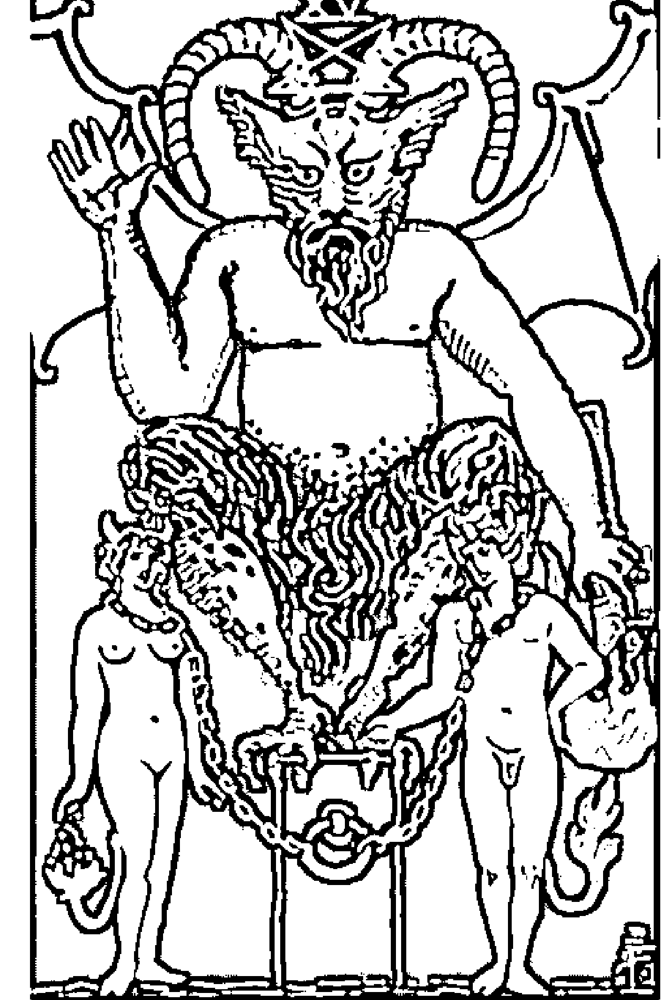

惡魔

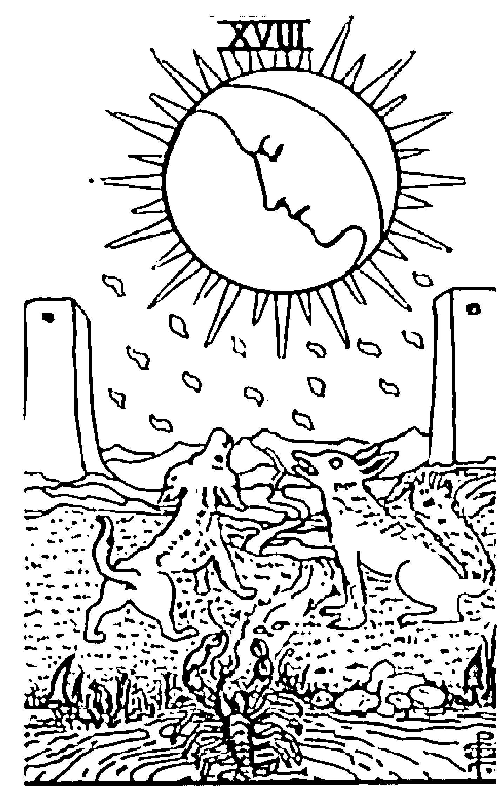

THE MOON. 月亮

學生B：今天我的朋友帶我去看他租的禪修的地方，很清靜，但是很偏僻。他其實已經租了好幾個月了，一個月的租金是5千元，過完年好像地主要漲成1萬元，所以他找我去是希望我能一起合作，share loading。我的現狀是月亮，我覺得那個地方很清靜，很不錯，但是讓我有所疑慮的是那裡樹林很多，聽說夏天很熱，蚊子很多，這是一個很大的問題。而且我一個月要多5千塊的支出，所以我有點猶豫。

老師：那你覺得這張月亮代表什麼？代表你目前對於自己靜修的狀況，會覺得有哪裡不足嗎？

學生B：倒沒有，主要是我怕蚊子叮，然後那邊離我住的地方太遠，我又怕我太懶，造成使用率不高，就多花那一筆錢了。問題是聖杯九，充滿著水元素的話，看起來好像很好，不過我的問題就是跟他的交情很好。

老師：我們這個問題位置就抽到一張好牌，聖杯九是非常好的牌對不對，那你覺得出現在這裡怎麼解？

學生B：因為我跟他交情很好，而且他的經濟狀況比較差一點，他來找我，我不好意思拒絕。所以這個問題的聖杯九就是因為交情很好才會造成我的困擾，他就是因為這樣子才找上我，讓我覺得如果拒絕他，很不好意思，可是一旦答應，一個月要多5千元支出，而且又怕自己使用率不高。

老師：你的使用率真的不高，因為這張牌就太宅了。九這個數字就是你都集中在自己的身上，然後水元素就是你覺得哪裡都不想去，待在家裡就覺得很好了。

學生 B：沒錯，我就是自己在家裡靜坐得已經很爽快了，不想跑到那麼遠的山上。

老師：而且整個地方都是你的，你要用什麼，家裡都有啊，所以你現在的困擾反而是現狀。現狀就是你會覺得朋友來找你合租，他是要解決自己的問題，不是要解決你的問題。

學生 B：或許吧，當然他也知道我有在靜坐，那個地方是很清靜很不錯，只是我怕蚊子太多，夏天太熱，又太遠，到最後我會懶得去。建議的惡魔牌是要我從現實面去考量這件事情嗎？

老師：對啊。

學生 B：可是我覺得滿為難的，拒絕人家很不好意思，因為他實在是沒錢。

老師：你就跟他說，如果你離開自己的環境，你會心靜不下來，反而影響修行。

學生 B：這樣講好像不太對，所以我現在不知道怎麼辦，要拒絕也不是，不拒絕也不是，拒絕讓人家失望，不拒絕又怕自己沒有充分利用。

老師：我覺得你真的可能是不太去山上的，因為聖杯九。

學生 B：對啊，因為我還滿宅的，跑到山上再跑回來，滿花時間的，不過那個地方很清靜。

老師：清靜的地方到處都有，有蚊子就不清靜吶。

學生 B：對啊，就是這樣才讓我很困擾。

老師：你應該跟他說，你現在連靜心的時間都很少了，如果再加上車程的話，你應該沒辦法。

學生 B：不過對他來說，我有沒有去都不是重點，主要是我能幫忙負擔租金，這點可能更重要。

老師：但是你不去的話，你要付什麼租金？

學生 B：這樣會讓人家失望，不好意思啦。

老師：人一輩子總有失望的時候，你這一次不讓他失望，你總有一天還是會讓他失望的。如果他覺得什麼事情找你都沒有問題，那他就會養成不會自己想辦法的毛病。

學生 B：有啊，他們想到的辦法就是找我。（笑）

學生 E：請問老師，聖杯九是一個人的快樂嗎？

老師：對，因為如果要擴大到整個團體的話就要聖杯十。

學生 E：所以這樣看起來學長的問題是他想要的是一個人的快樂，他想要自己在家裡修煉。

老師：他覺得他自己一個人就可以了，自己一個人就不錯。就像剛剛同學 A 是開網路商店的，她也是九，但是錢幣九，這就代表她覺得自己這樣弄得很好，但為什麼客人都不來呢？因為九就是比較會待在自己的世界裡面。

學生 E：老師，我發現很多年級比較大，經濟條件比較好的女生，在問感情的時候都會抽到錢幣九。

老師：錢幣九在感情方面你覺得會有什麼問題？如果依我來講的話，我常常抽到這張，我前幾年還問感情的時候就抽到這張，這張牌的毛病就是自己的日子已經過得很好了，但是如果要找談戀愛的對象，就一定要為對方改變一些自己的現況，可是這張牌通常不太願意改。

學生 E：可是，老師，錢幣九是不是也有一個解釋是不自由，沒有那麼自由。

老師：不自由是他不去談戀愛，因為他在自己家裡面啊。

學生 E：我有時候是看書用圖像來解牌義的。

老師：雖然有不自由這個解釋，但是，他不自由得很快樂啊，他不需要那個自由啊。

學生 E：就是她在自己的小天地裡很快樂，老師錢幣九的快樂是有物質感，聖杯九一個人的快樂就是心靈層面的，對不對？

老師：就像他是靜心啊。

學生 E：所以老師，這張惡魔放在建議是不是叫他不要去？

老師：這意思應該就是你就算付錢，你也不要去。

學生B：為什麼？

老師：因為去了反而會擾亂你的靜心。

學生B：應該叫我從現實去考量吧，務實的。

老師：對啊。

學生A：老師，惡魔牌是想要他付錢但是不要去，那為什麼不是不要付錢也不要去？

老師：有啊，我剛剛就這樣建議，最壞的狀況就是他付了錢但是他還是不要去。惡魔牌就是把自己的錢守緊。

學生A：老師，為什麼會看見不要去這個點呢？

老師：因為那個環境應該會擾亂他，他雖然說是滿清靜的，但是應該有其他不好的地方，只是現在還沒去還不知道。

學生B：有蚊子啦。

學生E: 看那張月亮牌就知道學長考慮得非常多，在潛意識裡面是很不安的。

學生A: 老師，我想問一下，是不是大牌的水元素不太好？

老師: 是這張牌不太好，不是水元素不太好，女教皇就很好啊。同學B，你要怎麼解決呢？我覺得你還是推掉比較好，說你那個錢要捐給慈善事業。

學生B: 我覺得不太好意思，因為我的這個水元素氾濫了，所以我可能還是當友情贊助。

老師: 其實我覺得你還是一開始就推掉的好，因為這張是惡魔牌，如果你租到最後你不付錢了，他又有話講，他會說是因為你加入，我才會租這邊，你現在突然不要，那要我怎麼辦，全部的事又推到你身上了。

學生B: 我再想想看。

學生E: 老師，可不可以解成，學長去了以後把那裡打造成一個不錯的禪修地方，然後每個人都去，反而供養的人變多了？

老師: 惡魔牌不太可能是打造成很好的地方，只能打造成他想要的樣子。

需要的地方，但他需要的地方其他人不見得滿意啊。

學生 E：是因為對應到聖杯九嗎？其他人不見得滿意。

老師：不是，是因為對應到惡魔牌。他再怎麼改，一定有人有意見，他會說都照著你的意思，你卻只出一半錢。

學生 A：老師，怎麼知道惡魔牌表示有其他人不滿意？

老師：因為惡魔牌代表金錢和權力，他有了錢就有了權力，就算他沒做錯什麼事，別人也會討厭他，會覺得都是他的錯。同學 B 你有沒有遇過一種狀況，就是本來你只是想要幫忙，結果就變成什麼事情都是你的錯。

學生 B：有的。

老師：那我覺得連幫都不用幫，如果要翻臉的話現在就翻臉，總比以後翻臉好，要不然你就會付了這些錢才會翻臉。

學生 E：老師，那這樣子等於學長沒有抽到他想要的答案嗎？

老師：有啊，答案很明顯呐。

學生 B：應該說這個答案，學長做不到。

老師：那再加抽啊。

學生 B：抽到命運之輪。

老師：找一個更適合你的地方。你說那邊太遠了我不能去，如果離我近一點我還可以看看，讓他自己決定。如果他還是決定要在那，那就不干你的事了。

學生 B：為什麼命運之輪是這樣解釋？

老師：因為命運之輪就是換地方啊，這張牌有 move 的意思。

學生 B：老師，我第一個想法是覺得這好像是命中註定哎。

老師：我會往對我比較有利的方向去解釋。不過，move 是動態的啊，因為命運之輪是要動的啊。這不是命中註定，如果是你要「定」下來就不是命運之輪。

學生 B：也可以說是動到我這裡來，我跑不掉了。

老師：應該是那個地方要動，那個地方不適合。他就算租也租不久，要是距離近一點的話，還可以考慮，所以就跟他说通勤開車的時間都超過我靜修的時間。說在家裡已經很好了，我不需要，我可以幫忙你們，但我離得要近一點啊。就跟他們講理啊。

學生 E：老師，如果做得到，學長就不會問這些問題了啊。（笑）

老師：這個就只是跟他們討論吶，可以離我近一點嗎？那你要怎麼做？

學生 B：我覺得這是命中註定吶，命運之輪雖然是動，但是好像 *my turn*，輪到我這裡來了，我可能跑不掉。

老師：如果是我肯定受不了，就這件事情我可以忍，但考慮到以後，我就一定會拒絕。

### 實例解讀 3

### 新面試的工作機會

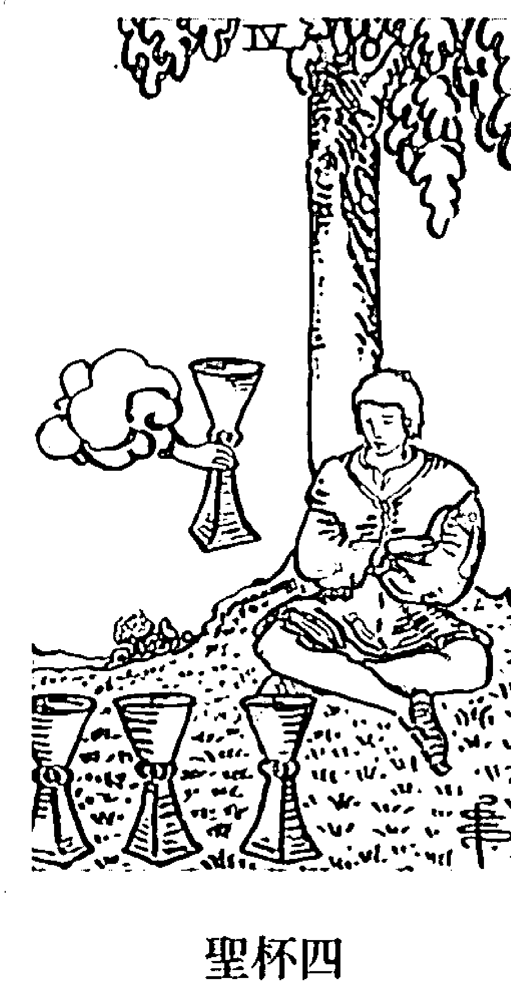

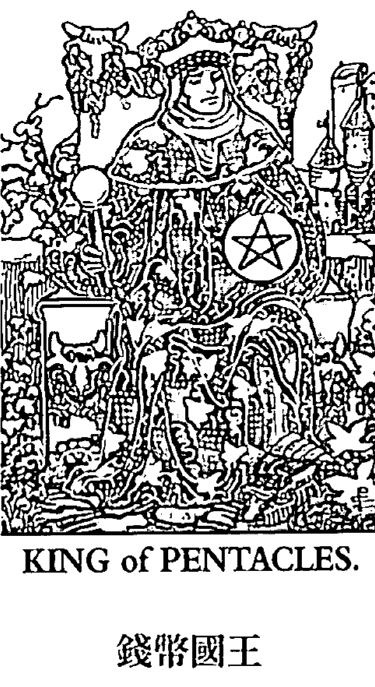

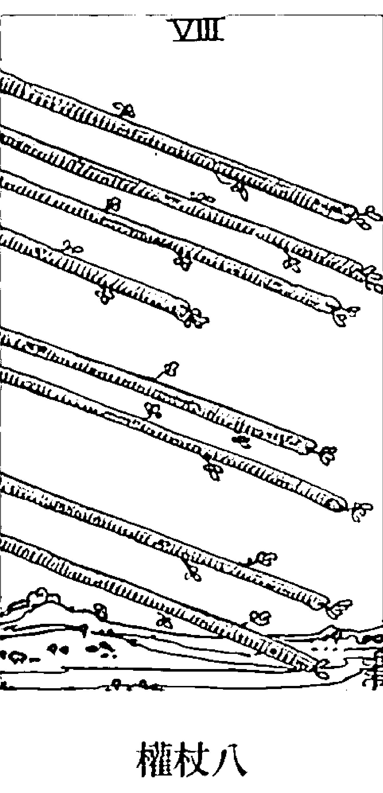

學生 C：我最近面試了一個新的工作，然後他要求 full time，但是我是自由業，我就想能不能做 part time。雖然如果他們真的有需要的話，我可以嘗試做 full time，但是其實我內心希望有更多的時間，就像聖杯四那樣。然後我現在的狀況是錢幣國王，現在的工作其實還算穩定。

老師：滿穩定的，而且也有前景。

學生 C：但是對我來講，因為是自由業，還是有一點不穩定，可能我自己過於擔心吧，怕工作量達不到我想要的。聖杯四就是現在的問題，我不滿於現在的工作，有種瓶頸期，很想突破一下轉變一下，然後我看到聖杯，一個新的機會出來了，我在想能不能嘗試一下，但是聖杯四的問題就是行動不夠積極，有點猶豫不決，很怕這個新的工作會有很多突發狀況。建議出現權杖八，我在想是不是我要快速的答應這個工作，直接做 full time，因為他是一個轉機的到來嗎？

老師：應該是。

學生 C：但是權杖八是否不太持久？雖然可以達到目標，但是不太持久，所以這個工作可能做不久嗎？

老師：不久，但是也會有另外一個轉機。

學生 C：所以指的是嘗試，是嗎？

老師：對，而且其實你現在的工作就已經不錯了，你唯一不滿的地方就是這個權杖八可以補足的地方。

學生 C：也是，因為我現在的工作就是要一個一個慢慢談慢慢接的，要做的事情比較多，時間也比較長，就好像錢幣國王這樣，雙重的土元素，所以很緩慢，賺錢也比較緩慢一點。雖然我現在有老客戶，但是我做 full time 的話，時間就比較固定，只有禮拜一到禮拜五；如果是現在的工作，那我是天天都在工作的，所以我會沒有時間做其他想做的事情。

老師：對啊。試試看，我覺得還不錯，而且就算出現問題，你最後也有辦法解決，因為這張牌本身的問題都是小問題。你怎麼找到這份工作的？

學生 C：他自己來找我的。

老師：這張牌就是說天時地利人和啊。

學生 C：權杖八嗎？

老師：對。

學生 C：喔，明白。我是已經面試通過了，雖然他還沒有通知我到底狀況如何，但是他說我的東西是他需要的。

老師：我覺得如果通過了可以去，雖然你留在現在的工作也沒有不好，就是無聊而已。

學生 C：（笑）是，就是覺得需要突破一下。

#### 實例解讀 4

與某人的關係陷入膠著

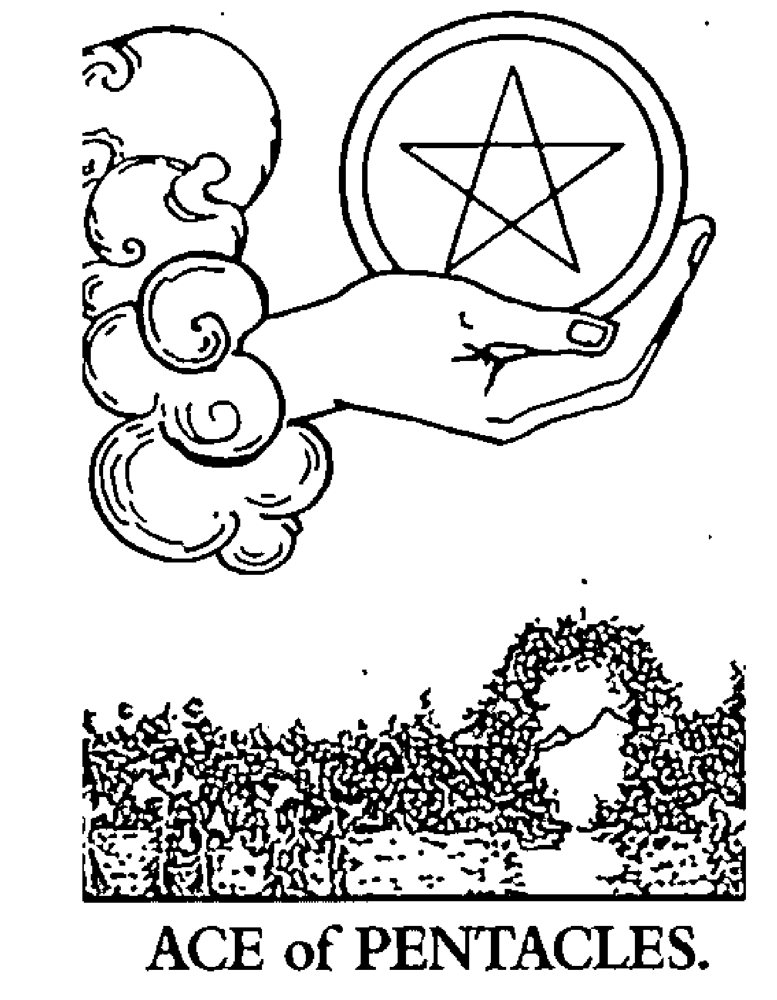

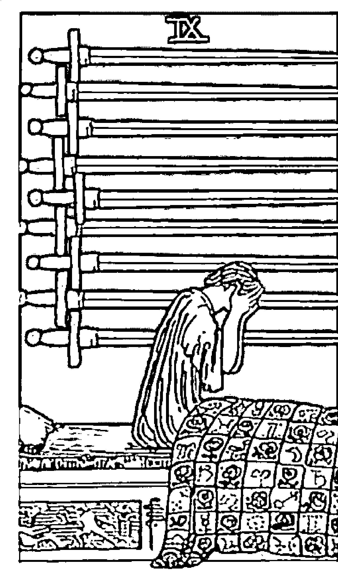

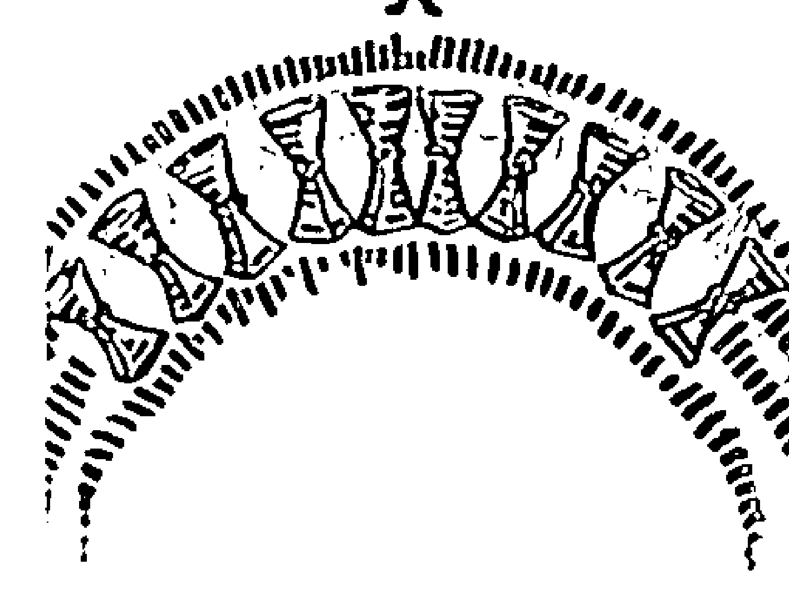

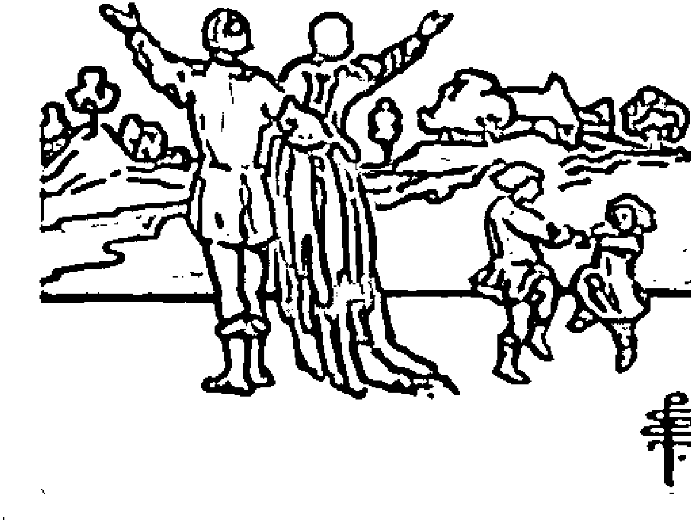

學生 D：我覺得我抽的這組牌滿考倒我的，我不太會解這個牌陣，就像您說的，在問題位置出現好牌或者建議位置出現壞牌，這次抽的正好是這種情況。我的問題是「與某人的關係」。我的現狀有點好笑，我之前也有抽過，因為我們的關係卡住了。有時候我會問「那現在的關係是什麼樣子」，經常抽到聖杯九或聖杯十。

老師：就代表你們的關係已經很確定了啊。這是妳男友嗎？

學生 D：是的，但是分開以後抽到的都是好牌，聖杯九出現的次數更多。現狀是聖杯十，實際上我們是一個莫名其妙分開的狀態，是不是代表對於我們來說其實還好，不是很差的狀況。

老師：對啊，因為問題就是錢幣一，如果你只是鎖在這個選項沒有其他選項的話，你會覺得好像人生白過的感覺。但是因為你的建議是這張寶劍九，我常常會說是自尋煩惱，如果建議是「自尋煩惱」的話，就代表你太無聊了，去找一些別的事情來做吧。別把心思放在這上面，如果放在這上面的話，你就會一直找他麻煩，去找一些其他事情來做。

學生 D：是，那我就明白了。

老師：因為我也是過來人，我如果沒什麼事情做的話就會找男朋友麻煩。

學生 A：老師，錢幣一代表問題是什麼？

老師：問題是你只卡在這個地方，你只把眼界放在這個地方，你沒有去看其他的地方，你就沒有其他的可能性。其他的可能性不一定要是其他的男人吶，其他的事情也可以啊。如果你要自尋煩惱的話，不要找男人，因為男人很麻煩，你要自尋煩惱就找一些事情讓你花錢、花時間的，這種也是煩惱啊，你花完這個錢和時間以後，你會乖乖的覺得還是回到原來的環境比較好。

學生 A：如果寶劍九是放在問題上，是不是也是自尋煩惱的意思？

老師：就代表你現在覺得的問題都不是問題，但你就是沒有辦法停止懷疑別人。

學生 E：老師請問錢幣一，你剛剛解釋是我們只看到現在的狀況。

老師：目標跟資源都太集中在同一個對象的身上。

學生 E：老師，是因為我們用土元素去理解嗎？

老師：對。

### 實例解讀 5

如何處理學習塔羅時的困難

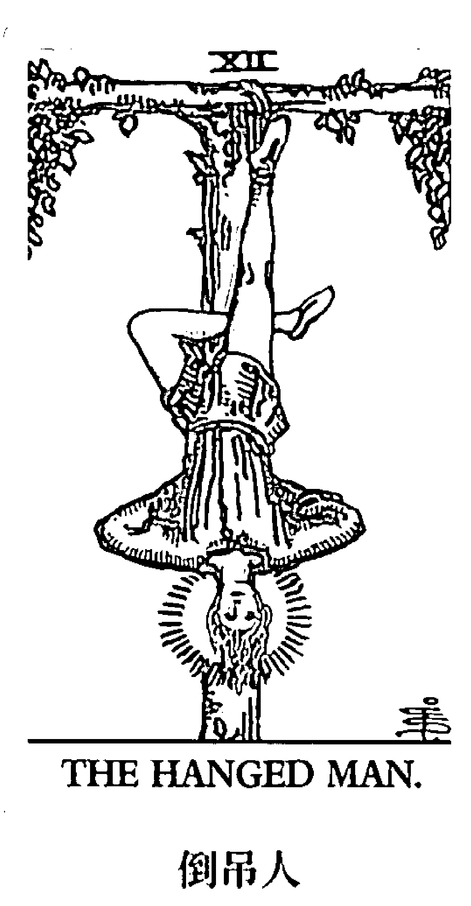

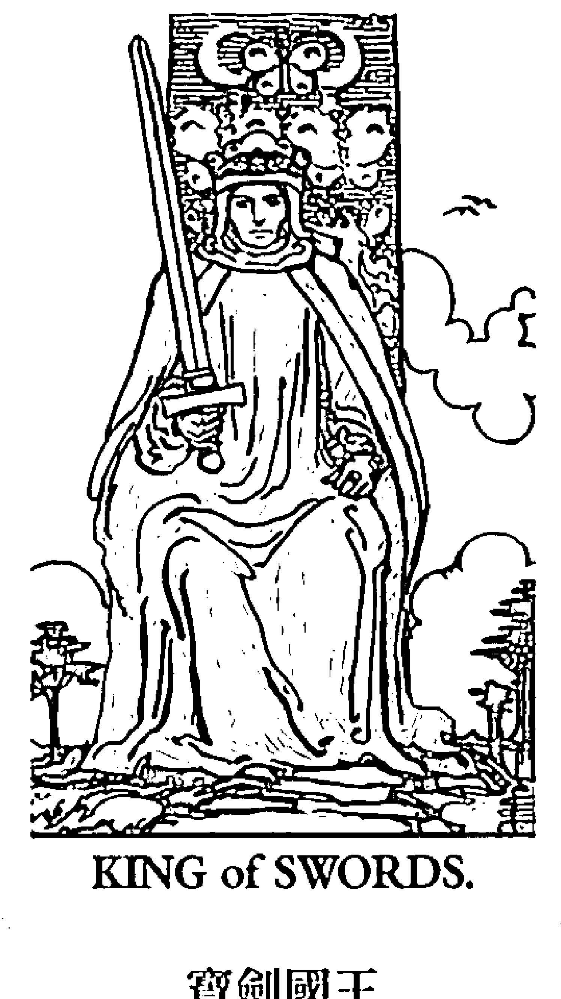

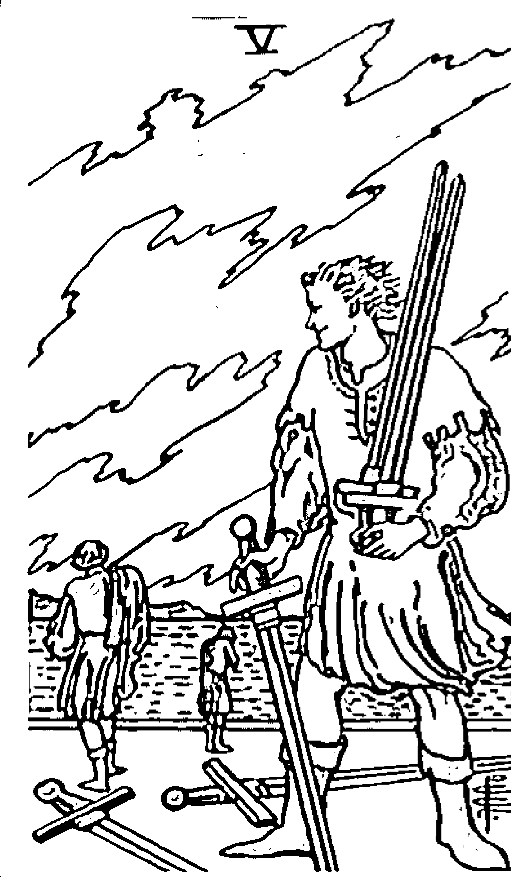

學生 E：我的問題是「該如何處理學習塔羅時所遇到的困難」。現況是寶劍國王，我覺得自己在學塔羅這條路上是往死裡要求，然後風中之土的國王是現在的學習雖然有點痛苦，可是我覺得是有在腦子扎下根的，我會想要有一套自己的看法。

老師：你以前是用我的方法學嗎，還是使用其他的方法？

學生 E：我的大小牌都是跟 XX 老師學的，聽說他也是你的學生。

老師：對啊，但是他拜過很多的老師，所以他的方式跟我的方式還是不一樣的。

學生 E：對啊，因為我之前沒有上到老師的課很遺憾，然後我先看書自學，覺得有一點撞牆。

老師：你應該看得出我的用法很活，我覺得你現在麻煩的地方就是這張寶劍國王，你會把他釘在腦子裡面，反而以後有其他的方式時，你會沒有辦法轉換。

學生 E：對，所以解釋到倒吊人的時候，我發現自己在解牌的時候會帶入很多自己的理解。

老師：對啊，而且我覺得你會受限於牌的關鍵字。因為這張是被動牌，就是受限。

學生 E：會，所以我會覺得施展不開。

老師：建議就是你現在正在上我的課，你就把以前的東西都放掉。

學生 E：寶劍五我就卡在那裡。

老師：建議是寶劍五就是認輸啊。你現在打好一個你可以自由運用的基礎以後，以前學過的東西你還是可以再撿回來，當作補充資料。先把我的用法學好了，其他的資料都可以再加進來。

學生 E：老師，那兩張風元素代表我想太多了嗎？

老師：對啊。你想要用腦袋去控制你的占卜的功力，不過，占卜的功力其實也是思考，但也不是思考，就是你想完了以後就開始活用了，但兩張寶劍牌都是比較死的寶劍牌。

學生 E：對，我覺得自己的想法會僵化，我解一組牌可能要想兩個禮拜。

老師：你有沒有發現今天解牌很容易？

學生 E：我覺得老師講起來很容易。像前面那位同學的錢幣一，我怎麼都想不到是不要 focus 在那個男生身上。

老師：因為你就會覺得好牌啊。

學生 A：老師，吊人牌在問題的位置，是不是表示要犧牲很多時間？

老師：吊人牌就是他會跟著別人的方向。也就是說，你必須要別人先提示你，就你的問題給你一些線索，你才能解下去。

學生 A：是聽取人而不是自己想，對不對？

老師：對，因為這張牌很被動，必須別人先開個頭，他才能接下去。

學生 A：老師，寶劍五在建議的位置是建議什麼呢？

學生 E：要全部放棄。老師剛剛講的，要把自己之前學的全部放棄，認輸。

老師：一時放棄就好，以後再學就會很靈活的使用，什麼資料你都可以拿回來用，因為用法如果是活的，什麼東西你都可以用成活的。

學生 E：老師，所以原來吊人牌是會卡在那裡，是要一直別人提示你，對嗎？

老師：對啊。塔羅牌很個人化，沒有什麼對不對，你想到的東西都可以加進去。

學生 E：可是，今天只是我自己的提問，我還可以對自己的解牌負責，但是如果是別人來問，我就很擔心自己講錯。

老師：別人問你的話，你不用擔心講錯，你可以跟他說一下你的解釋，跟他說一下這張牌是代表什麼，讓他看看自己有沒有想到什麼，這是跟客人聊天的方法。就算你解得不對，但是他想到什麼，他還是會「好準喔！」其實根本就是他自己解的啊。

### 實例解讀 6

### 如何讓工作快速上手

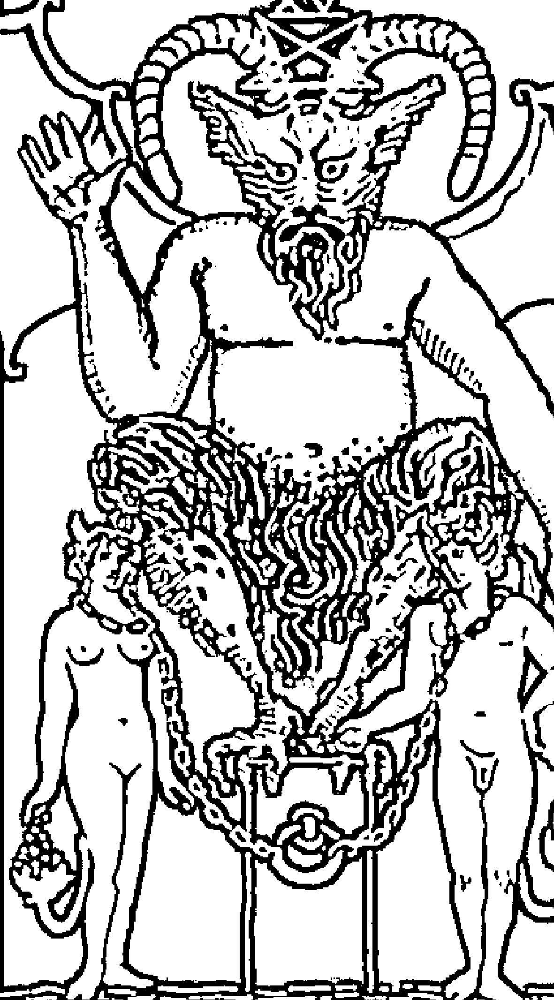

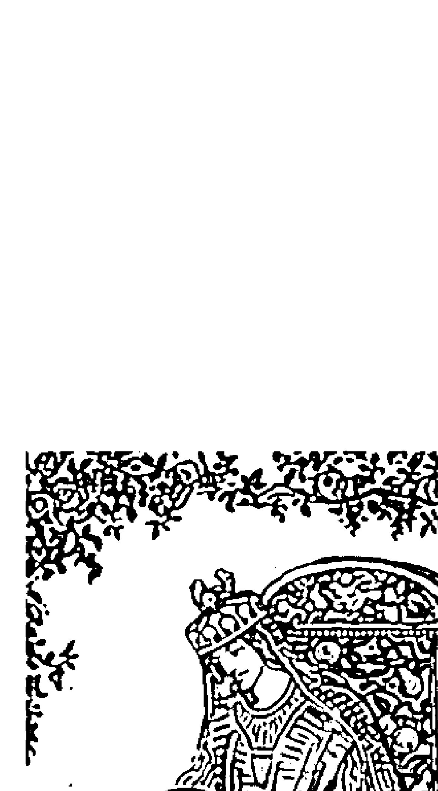

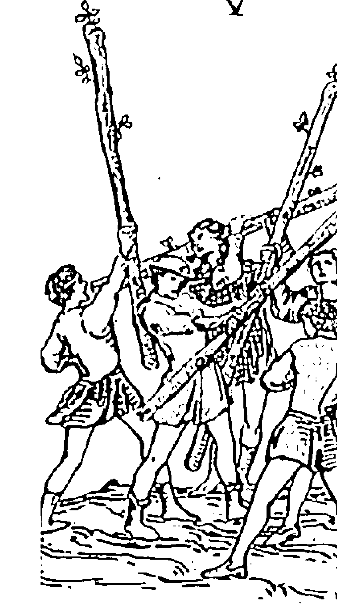

學生 F：我問的是「如何讓工作快速上手」。問題的位置是惡魔，這張牌我覺得應該是指我還滿容易焦慮跟緊張的，只要別人發出一個指令或者是做了什麼動作、說一些話，就能夠讓我糾結很久，我覺得惡魔牌是指這個。

老師：但是我看起來你的好勝心很強，你的自我要求非常高，你會覺得我要做到讓任何人都挑不出毛病。

學生 F：對，我很怕別人有一點點的懷疑或是覺得我能力不好，這會讓我很受傷，也覺得很焦慮。目前的狀態是錢幣皇后，我其實不太懂，這是指我自己還是公司的環境有資源？

老師：這張牌代表你的實力，或者也可以代表公司的資源，就表示現在的狀況是很平穩的，你可以慢慢學。不過，你就只記著讓人家稱讚，讓人家認同你。其實不需要這麼急，你慢慢來，他們還是可以接受，但就是你自己在急。

學生 F：對，我還滿著急的。

老師：你會覺得自己表現得太差，可是並沒有人覺得你表現得差，但你覺得如果大家沒有稱讚我，就代表我表現得差。

學生 F：對！我就是這樣覺得！我會覺得他沒有稱讚我，是不是他覺得我很不好，然後心裡就很糾結。我覺得建議如果是權杖七的話，是不是就讓我繼續往前走，克服困難？

老師：這張牌代表光明正大，權杖五和寶劍五都是競爭，但是權杖五的競爭是光明正大的競爭，可以想一個假想敵，但是不要真的去攻擊他，以他為目標向他看齊，事情做到後，他如果稱讚你或者是他可以認同就代表你通過。就是找個跟隨的對象，不要把大家都弄得很煩，緊張兮兮。

學生 E：老師，權杖五的建議是要學習如何團隊合作嗎？

老師：不是，因為權杖五代表的就是你要贏過別人，權杖五的贏過別人就是光明正大，不給別人造成困擾，如果你暗中去攻擊別人那就是寶劍五了。但如果是權杖五的話，你不用講出來，但是你跟著他學習，你可以不一樣的事情找一個不同的目標，某某事情需要 XX 的認同，就找一個在你心中最有代表性，他們認同你，就是贏了。

學生 B：老師，這張是權杖七，不是主動去競爭嗎？

老師：權杖七是權杖五的下一張，因為是單數，也代表很好啊，五就代表你要找一個方法讓自己前進，但是這個方法是不要干擾到別人，你自己還是要很努力。權杖五比較需要跟別人競爭，權杖七是你不要跟別人競爭，你跟自己競爭就好了。你要跟別人競爭還不如跟自己競爭，所以就到了權杖七的位置，我提供的方法也是權杖七。

學生 B：老師，權杖七的意思不是主動去競爭、主動去爭取嗎？權杖五的解釋比較偏向是一種混亂，大家打成一團。

老師：沒有，我書裡有寫，權杖五就像今年是蘋果、明年是三星、然後後年是什麼牌子，大家都把自己的最好的東西擺在檯面上，不同的比較，讓消費者去評判去競爭，光明正大競爭，不會一團亂，一團亂是寶劍五。

學生 A：老師，請問問題是惡魔牌，為什麼會看到是焦慮，會有很多擔心？

老師：惡魔不太會焦慮，惡魔都信心滿滿的。

學生 A：但是同學說她很擔心自己的工作能力不好。

老師：其實她很好，她只是懷疑自己，她想要更好，她想要比任何人更好，她不滿意現在的自己，這個是好勝心而已。她不是擔心，她是好勝心。

學生 E：這個是慾望吧？想要更好的慾望吧？

老師：對啊，她想要變得更好。惡魔牌想要勝過任何人，想要在別人面前，她是最好的。

學生 A：老師我想問一下，建議位置是寶劍五，你剛剛說是沒有意義的打架對嗎？

老師：沒有，就是認輸啊，因為你打不過。就像賭博一樣，你就算小贏一點，但最後還是會輸掉啊，你如果知道最後都是要輸，你就不要賭啦。

學生 A：如果是權杖五，是要光明正大競爭嗎？

老師：對，光明正大競爭，公平的選出誰最好，就像競選一樣，選舉需要有光明正大的景象，但是台灣的競爭都變成寶劍五（笑）。權杖七就是找到自己最重視的那一點，然後針對那個點去加強，不要每個地方都想要最好。你找到一個最重要的點，找到一個你最可以取得大家稱讚的點，去進行這件事情，其他事情就不要管太多了。

### 牌陣三

二擇一

+   1
+   2
+   3
+   4
+   5

#### ☆ 牌陣位置

+   1：求問者目前的狀況或問題的現況
+   2：選擇甲方案的現況或近況
+   3：選擇甲方案以後未來的發展
+   4：選擇乙方案的現況或近況
+   5：選擇乙方案以後未來的發展

#### ☆ 老師引導

二擇一這個牌陣不要用是非題的想法去思考。它有兩個選擇，甲方案是左邊，乙方案是右邊，牌陣會顯現出這兩個選擇各有什麼好跟壞。例如有兩個對象，它會顯現出兩方的優缺點，你想要哪一邊，你就可以自己選。牌陣可能顯示這一邊是有錢，另外一邊是有才華，那就要看你是要錢還是要才華，這還是要你自己選擇。這個牌陣主要是展現出這個選擇的重點，你就有一個參考的指標。這個牌陣很好用，在做選擇上，用這個牌陣一目了然。如果多一個選擇就再多出抽一組。

學生：老師，請問很多人都說塔羅的時效是從三個月到半年，實際上真的有這種時效的限制嗎？

老師：有啊。也可以算比較久的，只是越久就越不準，因為算塔羅是從現在投射出去的未來，所以越久就會越有偏差。

學生：所以通常會抓三個月？

老師：到最多一年。

學生：以下卦、占星來說的話，會先驗證現在開的盤是否真的對應到現在這個人的狀況，算塔羅牌的時候也有這種驗證的程序嗎？

老師：我個人沒有，我覺得這個很看個人的。

學生：老師請教一下，通常我們占卜完了以後，我們還是會去問對方幾個月以後事情的驗證，然後才去看自己當初解這個牌義的邏輯是不是對的；在你的研究中，你覺得塔羅牌的準確率有幾成啊？

老師：是這樣的，有時候我們會建議他改變做法，如果他改變做法的話，他的狀況就不一樣啦。或者是他的心態改變，狀況也會不一樣啦，因為這只是卜卦，不是算命。

學生：所以如果是算命，看星盤是看你底層的個性如何對不對？

老師：對。

學生：老師，現在有一些塔羅師說可以遠端抽牌幫你占卜，如果人沒有實際抽牌的話，這個結果也是可以算數的嗎？

老師：可以啊，我以前有一個程式滿紅的，竹貓星球，大家抽牌都覺得超準的。

學生：但是如果是遠端占卜師幫你抽牌的話，不會混雜到占卜師自己的狀態嗎？

老師：那要看他的功力。

### 實例解讀 1

### 這件事要告訴老闆嗎

告訴老闆
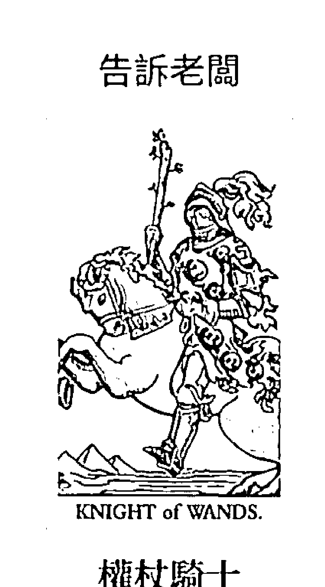
權杖騎士

告訴老闆
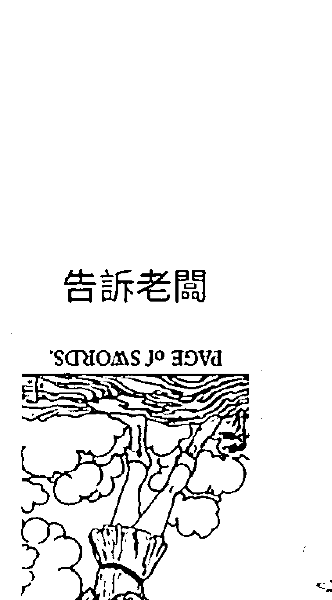
寶劍侍者（逆）

現狀
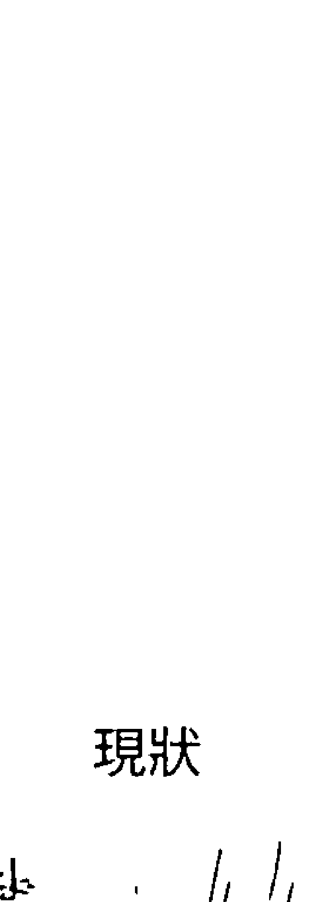
寶劍三（逆）

不告訴老闆
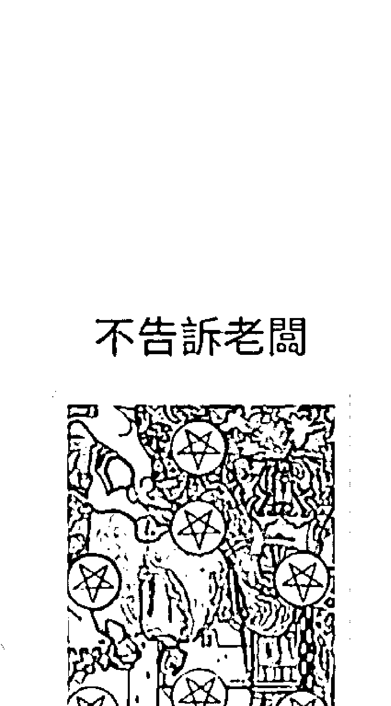
錢幣十（逆）

不告訴老闆
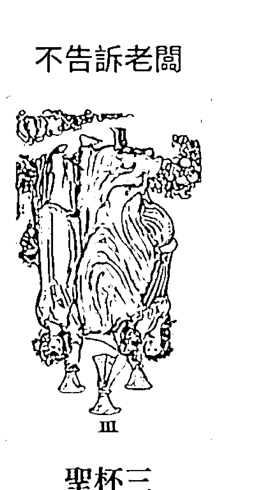
聖杯三（逆）

學生 A：我先前情提要一下，我老闆去美國度假三個禮拜，我們部門可能太放飛自我，和別的部門開了一下玩笑，傷害到對方，對方部門主管放聲大哭兩天，搞得全辦公室都知道。我是老闆的秘書，我們業務部門一般權力比較大，別人不太敢得罪，所以對方主管可能心裡累積很久，這次就潰堤。我們外商公司平常發生這樣的事稱為言語上的霸凌，這件事如果一直往上走會傳得滿大，我現在就考慮到底要不要跟主管講這件事情，這件事現在全公司除了我老闆，大家都知道了。

老師：甲是講嗎？

學生 A：甲是講，乙是不講。

老師：那這個很明顯。

學生 A：我現在真的很心煩到底要不要講，比發生這件事的當下還要煩，所以抽到寶劍三逆位。左邊我抽到寶劍侍者逆位和權杖騎士。寶劍侍者風元素，所有侍者都有傳達訊息的功能，如果逆位的話，風這樣亂吹，我覺得應該是整個公司裡的輿論對我們部門不好。

老師：傳到他耳朵時反而更難聽。

### 實例解讀 2

### 要不要換工作

學生 A：對，所以我覺得如果我告訴老闆，我老闆就會有作為，可能是帶著我們去跟人家道歉之類的，或者是老闆請大家吃頓飯，大家握手言和，他會這樣處理。

老師：看起來講了還不錯啊。

學生 A：因為權杖騎士就是一個比較江湖個性的人吧。

老師：光明正大。

學生 A：對，他就是會擺一桌請大家，好啦，沒事、沒事這樣子。

老師：這樣才能真正的解決。乙這邊是看起來沒事，事情卻沒有解決。不講的話，他們也是會一副沒事的樣子，但只是忍氣吞聲而已，就是未爆彈。大家的和氣已經傷到了。

學生 A：所以老師右邊的牌組不講的話，錢幣十也是土元素，是有一點鬆動嗎？不知道該怎麼解釋。

老師：不會，這張牌怎麼會是鬆動，這張牌很緊密啊，但是就好像是礙於一些你們之間的合作，所以他不能翻臉。聖杯三的話是感情融洽，但現在已經是逆位了，所以你們之間的感情就開始比較冷漠。

**學生A**：老師，那這種水土都逆位的時候，我要怎麼聯想呢？錢幣十逆位應該是說他心裡面不高興。

**老師**：對啊，但是又不能講，因為土元素是不會講出來的。

**學生A**：所以他就壓抑著。因為走到十了，所以他要顧及全面，他就在心裡發火，跟我們保持距離對不對？

**老師**：對啊。聖杯三也是啊，聖杯三是本來很和氣，但是到最後就是保持距離，然後表面上看起來沒什麼，但你就會感覺到他變冷漠，只有客氣而已。

**學生A**：這兩張都是很好的牌，譬如說水元素和土元素都是很好的牌，當他們都變成逆位的時候，只是感覺變淡了，就是沒有那麼嚴重，但是也恢復不若以往了，對不對？

**老師**：就是因為是逆位，所以恢復不若以往。

**學生A**：這兩張都是很好的牌啊，逆位的時候，我就想是不是更嚴重。

**老師：**聖杯三也沒有很好啊，聖杯三就只是 ok 而已，不到很好的程度，因為只是水而已，水的話就沒有什麼益處啊，沒有什麼更好的東西，也沒有多大的利益，也沒有錢。

**學生 A：**就是感情好而已。

**老師：**對。

**學生 B：**老師您能再解釋一下權杖騎士的意思嗎？我剛剛有一點沒 get 到。

**老師：**權杖騎士滿光明正大，有事情就去做，而且很快速的做，因為他是火中之火，所以他處理的速度會很快，不會拖到時間，不會拖到讓對方更高興，就是會很火速的處理這件事情。所以建議選左邊。

**學生 A：**老師，其實這還是看當事人吧，如果像我的話，反正人家心有芥蒂就心有芥蒂，我也不想去淌這個渾水。

**老師：**對啊，如果是選擇左邊，因為我覺得一件事情如果悶著的話，以後怎麼相處都怪怪的，很多事情沒有辦法順利進行。而且因為這也是小事，讓這個芥蒂存在沒什麼必要，既然只是小事，我就寧可把它解決掉。

學生 A：我會覺得淌這個渾水很煩。

老師：如果你不講的話其實也沒有什麼大事，就是大家之間不愉快而已。

學生 A：我覺得如果我老闆被董事長叫去問話，出來就會很火大為什麼沒有人告訴他，他是屬於權杖騎士這種人，他做事很快，什麼事情都要 24 小時之內解決的人，所以我才把權杖騎士冠上「看起來就是我老闆會做的事情」。

老師：如果是這樣，我更會跟他講。不跟他講會更嚴重啊。因為這個人生氣的話也是氣完就算了，就讓他氣完就好啊。講完以後他才反而覺得對方小題大做。

學生 E：老師請問怎麼看出這件事是小事？

老師：因為寶劍三就只是人際紛爭，沒有涉及什麼利益，所以真的不是大事，但你們的心裡面會覺得很嚴重，不過客觀來講大家就都覺得不是什麼大事啊，因為風元素就只是個人的感覺，你們也沒有造成什麼損失。

學生 E：老師，左邊的寶劍侍者是不是也可能是代表了打探消息？

老師：有可能。就是因為他會不知道發生什麼事，就要去打聽，但是他打聽完可能會更生氣。

留在現職

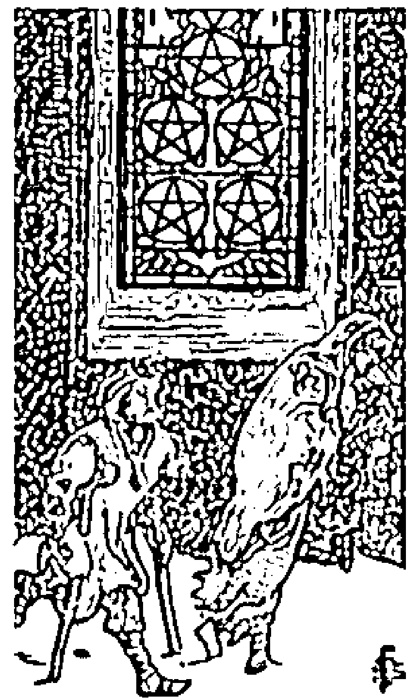

錢幣五

留在現職

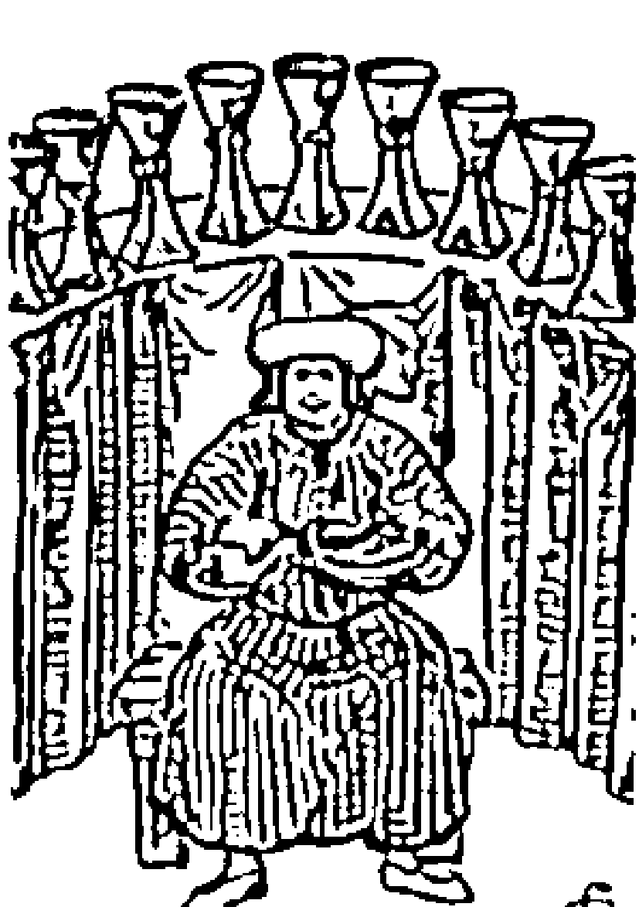

聖杯九

現狀

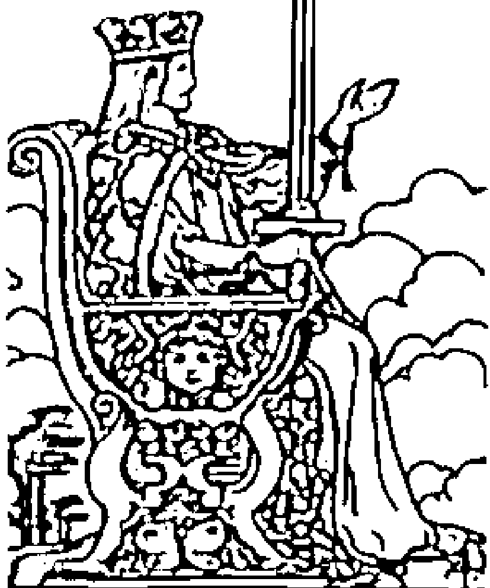

QUEEN of SWORDS.
寶劍皇后

找新工作

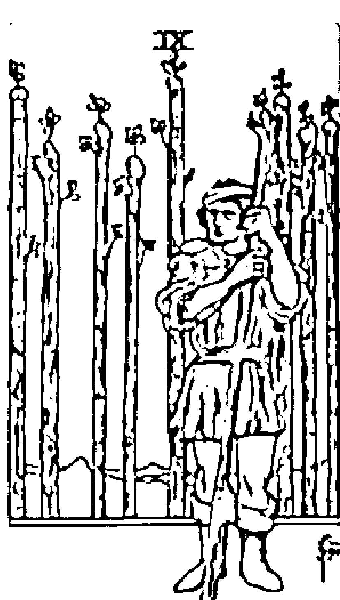

權杖九

找新工作

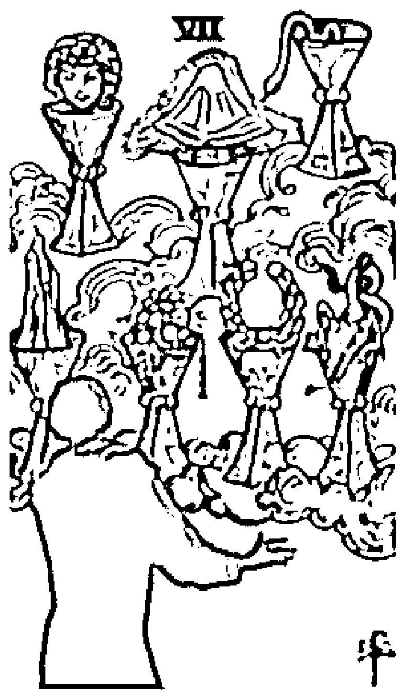

聖杯七

學生B：我的問題是「要不要換工作」，右邊找新工作，左邊留在現職。目前的狀態是寶劍皇后，可能就是思緒比較多，沒有什麼很實質的行動，而且因為風中之水，所以可能後面的動機都是在情緒的糾結上面。左邊是選擇留在現在這家公司的狀況，第一張是聖杯九，我想如果選擇留下的話，可能可以繼續跟同事培養默契，融入組織，所以可能滿足情感上的需求，但是因為有錢幣五……

老師：薪水低嗎？

學生B：還可以，就是正常，錢幣五我想可能是因為實際上的成長度會受阻吧。

老師：就可能發展不大。

學生B：對。發展會有受阻的狀況。如果要找新的工作的話就是右邊的權杖九，因為還是火元素，我覺得目前的動能還是偏向找新的工作。我前一份是在大公司的工作，經歷和累積的能力都還不錯，換到現在這份工作是比較小的公司，因為環境並不是很好，可以累積的能力也沒有很多，所以我覺得權杖九可能是說雖然以前累積的能力還是有的，但是找工作的條件不會很好，會有一種後繼無力的感覺，相對於第一份工作的經歷。

老師：但這兩個方向都顯示你以後的雄心壯志是很大的，因為一個是錢幣五，就代表你現在在這個位置，你覺得雖然跟公司的感情滿好，但是還是被大材小用，就覺得伸展不開；如果是找新工作的話，你的幻想也是很想要有很大的空間，因為聖杯七，就想要擁有很多的東西，所以你對工作的期待是很大的。

學生B：對，的確是這樣。因為我的個性比較重視工作，所以我會希望在工作上能有比較多的成長，但是就像老師講的，也是因為這樣子的期待，在權杖九的條件下，可能會因為不切實際而吃虧，例如收到的 offer 看起來很理想，真正去做的時候才發現未必是有很紮實的累積或者幫助。

老師：對啊。

學生B：我想問一下為什麼一開始抽到的都是逆位？

老師：全部都是逆位的話代表大環境不好，可能是你工作的行業開始有緊縮或者下滑的趨勢，所以不是你本人的錯，也不是公司的錯。

學生B：所以如果全部都是逆位的話，會偏向一個更宏觀的條件。

**老師**：對。

**學生 B**：如果是這樣子，其實不管是留下還是找新工作，狀況好像都不是很好。

**老師**：但留下來至少比較保險。因為有聖杯九，至少有一個好處。然後如果是錢幣五的話，其實也只是暫時的，因為五的話就代表你正要發展，然後在正要發展的時候你一定會遇到困難，但是接下來就是六啦。

**學生 B**：喔，但是因為是逆位，聖杯九和錢幣五逆位該如何解釋呢？

**老師**：聖杯九逆位很簡單，雖然感覺很幸福但沒什麼實際利益啊，就我的方式來說的話其實正位逆位都差不多，一張牌的優缺點就那些，如果要討論優點還是缺點的話，我會從元素相生相剋去看，我不會從正位逆位去看。聖杯九就算是正位一樣是開心但沒什麼錢吶，也是一樣的意思啊，就是水，而水就是沒有錢。

**學生 E**：老師，我們如果要問工作的問題，是不是要有土元素和火元素？

**老師**：因為要有動力就是火元素，也要有錢是土元素。

學生 E：如果我們問感情的話，我們要水元素和火元素，未來穩定要有土元素對嗎？

老師：對啊，我都說年輕的時候不用太快定下來，所以有火元素和水元素就夠了，如果過了 30 歲你想要定下來就需要土元素，因為需要彼此生活習慣的契合。

學生 E：如果問生意的話要看火元素和土元素對嗎？

老師：對。你就從星座的元素去推測就好了。

學生 A：老師，這樣聽起來風元素沒啥好事對不對？

老師：讀書的時候很好，因為風元素很聰明，但是風元素就是小人很多，因為風元素就是想東想西，所以紛爭很多，就像雙子座一樣，造成紛爭，而且也沒有什麼實際意義，只是賣弄聰明而已，只是很會協調，或者很會相處很會溝通，所以說你的感情元素如果缺乏風元素的話就代表你們兩個缺乏溝通，但是感情牌有很多風元素的話也沒有什麼實際的好處，可能就是你們兩個比較談得來，我個人覺得談戀愛的話，談得來或談不來，對每個人來講的重要程度都不一樣。

學生 E：老師，大牌的風元素和小牌的風元素是不是也是差不多意思？

老師：對。不過每張牌還是有細部的不同，我們還是要把整體的牌加起來看，才能得出整體的方向。所以有很多學生跟我說，他們就算不看牌義，從元素的分類去解牌也會解得差不多。

學生B：老師，我的牌如果以元素來看的話，我目前的狀態是風元素，如果是留在現職是土跟水，但是找新工作的話是水跟火，是比較散的能量。

老師：火不會啊，火不會散，火跟土都是有目標的，所以很集中，風跟水比較散漫。

學生B：但是如果火到了九，是不是會有一種疲乏的狀態？

老師：開始分散了的感覺，對，開始快要撐不下去的感覺。但是火跟水都是代表感情元素，所以你現在會傾向於找新的工作，因為你覺得找你想要的工作好像比較可以實現你想要的生活，但實際上土是在左邊，也就是維持原來的工作反而比較可以維持你原來的生活，不會更好，但至少不會更壞。

學生B：我不太會解錢幣五的逆位。

老師：更受阻啊。但如果是其他不一樣的牌的話，逆位也有可能是情況會減緩，但這是要求水元素的牌比較多，而且都要好牌，逆位才會是狀況減緩了。因為水元素的好牌代表心裡的壓力是放鬆的，所以才會說這張錢幣五的逆位是表示你的壓力比較放下來了，加上這張牌搭配很多水元素的好牌。

學生B：所以如果留在現職的話，現實的壓力會比較減緩？

老師：對。

學生E：如果選右邊去找新工作，因為水元素是最後一張，可以說他是很有衝動去找工作，但是因為沒有太穩定，只是一個夢想。

老師：對，水就表示沒有穩定下來的意思，因為水元素什麼都沒有啊，只有感覺、感情，所以只有談戀愛適合水元素，或者是追尋夢想的時候適合。基本上我覺得水元素是拿來改善我們的心境，我個人看法是沒有什麼實際的作用。

學生A：老師，有沒有哪個元素是一看到就有點害怕的？

老師：風元素啊，因為寶劍牌都是壞牌啊。風元素就代表流言蜚語很多，很多人講很雜的話，你就沒辦法分辨是非真假。風元素不見得會造成多大的破壞，卻會讓你覺得很疑惑，讓你沒有辦法搞清方向，就會造成你的困擾。

**學生 A**：老師，剛剛那張狀態是寶劍皇后，是不是代表不太講心裡的話啊？

**老師**：對啊，寶劍皇后其實情緒很多，看起來很冷靜是因為外表是風，但是內在是水，所以 OS 還是很多。雖然寶劍皇后很少講話，但是一講話就很毒，戳中要點，只是這對事情不見得有幫助，除非是跟老闆很好，可以說得動老闆。寶劍皇后本身就是很有才華，但是做事能力不是很強，只會企劃，把案子寫得很好，但是執行力不是很好。

**學生 A**：所以風元素還有一個特性，就是很會紙上談兵嘛，我記得老師書上有寫。

**老師**：對啊。

**學生 A**：所以我們看這個同學的牌，他現在想換工作，其實應該也沒有很實際的去做些什麼對不對？

**老師**：說說而已啦，規劃一下而已啦。

學生 B：對，就是還沒有實質的行動。

老師：他只是設想一下而已。

學生 A：這邊的權杖九表示他會想要找資源比較多的公司？

老師：他想要找的公司是他之前曾經在裡面發光發熱的，因為這是火元素。他想要找的一定是火元素剛開頭的牌，但是火元素九就代表說這個行業現在狀況不太好，因為已經走到最後一步，力氣開始渙散，所以他想要做的工作的行業其實現況也不太好。

學生 B：所以從火元素可以看出想要找可以發光發熱的？

老師：對，但是九是最後一張牌，時間已經過去，目前是沒有辦法。而且下一張是七，都是奇數牌，奇數牌就是正想要動的時候，所以兩張都是奇數牌的話，表示你重新找的工作還是沒有辦法安定下來，你還是會想要再走。

學生 B：老師，可以解釋為就是會一直找工作嗎？

老師：找不到很滿意的。你看這個牌的想法很多，因為聖杯七，如果這個工作有 A 好處，他又會想要 B 好處。他的想法很多，可是這麼多的好處有可能沒有辦法在同一份工作裡全部具備，所以永遠找不到最滿意的。因為七就是想要往上爬，如果是七的話，他就會覺得雖然定下來，但是這個工作還是不夠好，還是有更好的，因為七想要往上爬。

學生 B：是所有元素的七都會有往上爬的成分在嗎？

老師：對。

### 實例解讀 3

### 要不要換成蘋果手機

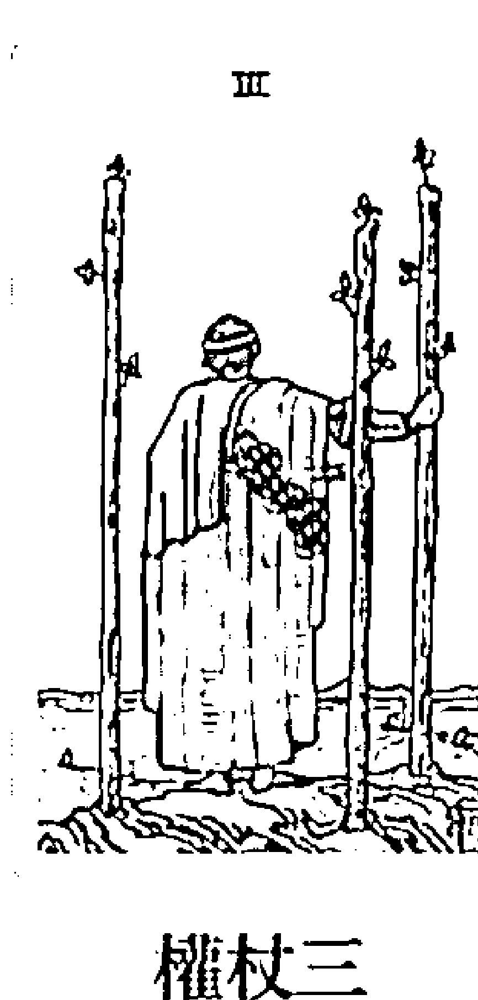

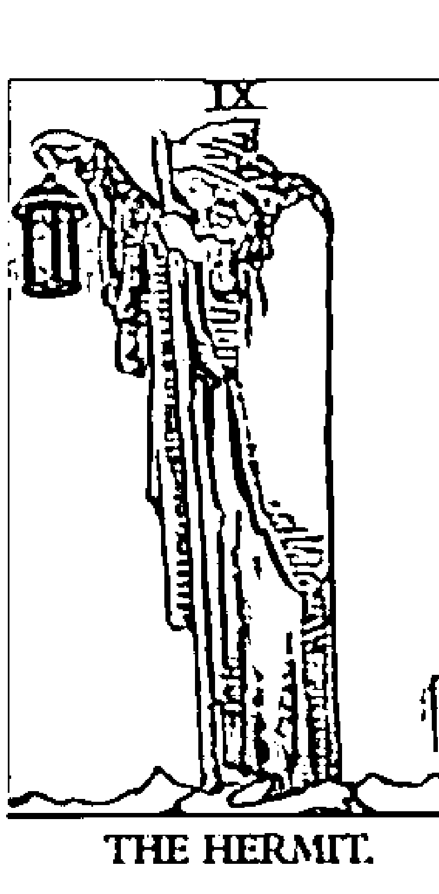

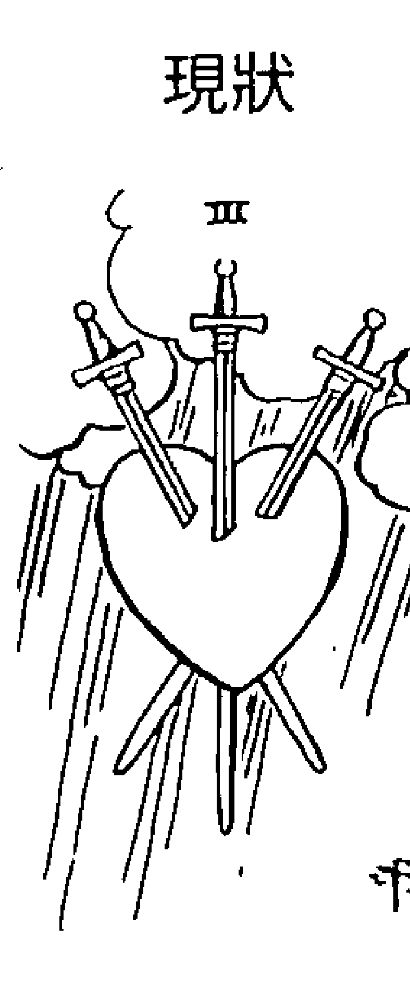

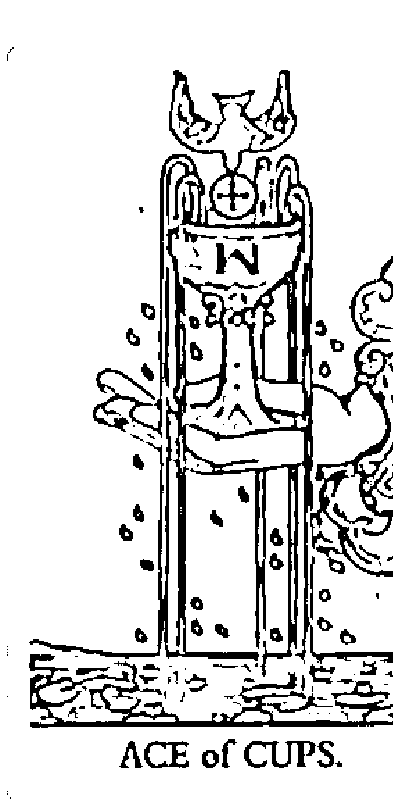

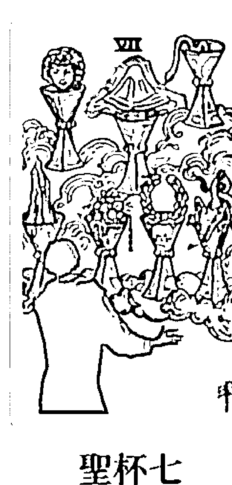

學生 C：我的問題是「要不要換成蘋果手機」，我從國小到現在都是三星的擁護者。現狀是寶劍三，我覺得我會猶豫換手機牌子，是因為我公司的人都說安卓不好用啊，現在大家都用蘋果啊，我就開始懷疑了，蘋果真的比較好嗎？寶劍三可能就是我有點被動搖了，不知道到底哪個比較好，有點受影響。先看蘋果這一列，聖杯一跟聖杯七，聖杯一應該是說……

老師：你現在把它想像得很美好。

學生 C：對，到聖杯七感覺也只是想想，就是想得很多，最後也沒有落實。

老師：如果說一到七的話表示你想得太美好，真到使用的時候會覺得缺這個缺那個。

學生 C：喔，因為沒有土元素嗎？

老師：對啊，因為全部都是水元素啊，水跟風啊。

學生 C：喔，就只是想而已，都是飄著的那種元素。

老師：但是我覺得實際上要用用看才知道，我也一直被大家洗腦說蘋果很好，但是我拿到蘋果兩個小時後，我就換機了。我發現我要把它當成無線基地非常弱，果粉都說蘋果就這樣，習慣就好啦。有沒有蘋果的粉絲要講一下？

**學生 C**：對，然後下載這個也不行那個也不行。

**學生 A**：老師，我覺得第一是蘋果守得很緊，不容易中毒，第二就是它的 APP 建組得很完整，手機連到平板和 Mac 很快。我覺得跟啟蒙有關係，我第一支手機就是蘋果，我智慧型手機的啟蒙是這樣，我就很習慣蘋果排列組合的方式。

**老師**：我們從牌來講，我是覺得三星比較好，因為有土有火，對你來說比較好的。因為我們沒辦法說三星跟蘋果誰比較好，但是這牌是就你來說。

**學生 C**：對，我也是這樣想，我想說隱者可能代表還有一些沒有摸到的功能，值得再去探討一下。

**老師**：蘋果有一個很大的好處，我用了兩個小時我馬上決定不用，賣出去的價錢還是可以很好，你可以用用看，反正賣掉也可以換到很好的價錢，你不會賠太多。

#### 實例解讀 4

### 事業接下來的發展

和前老闆合作

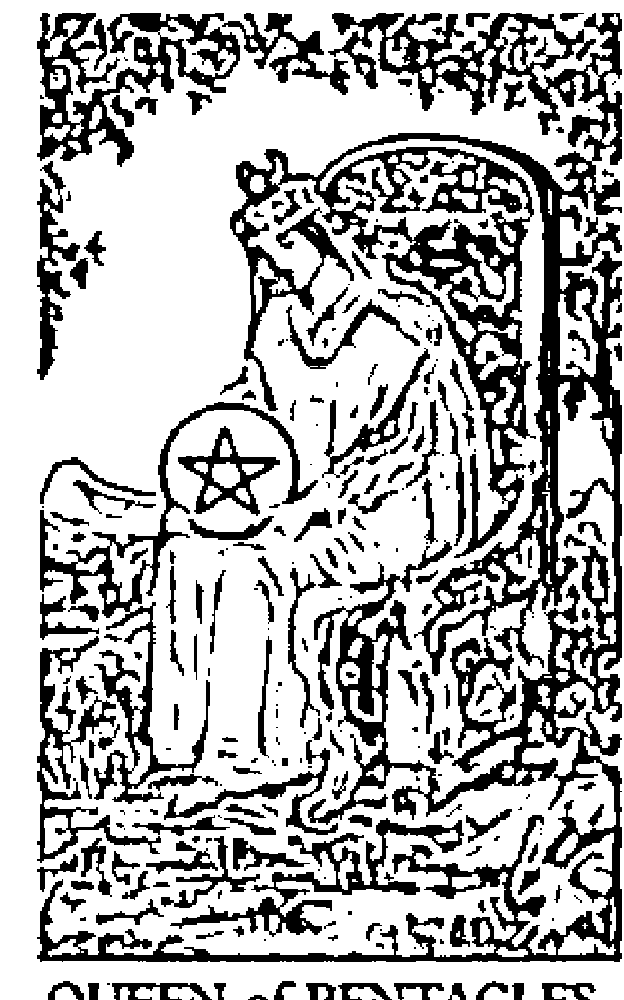

和前老闆合作

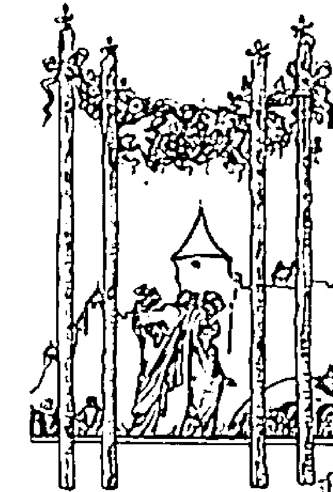

現狀

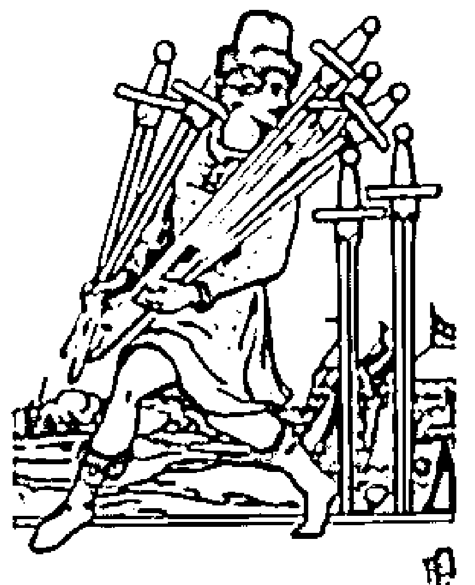

自己重新開始

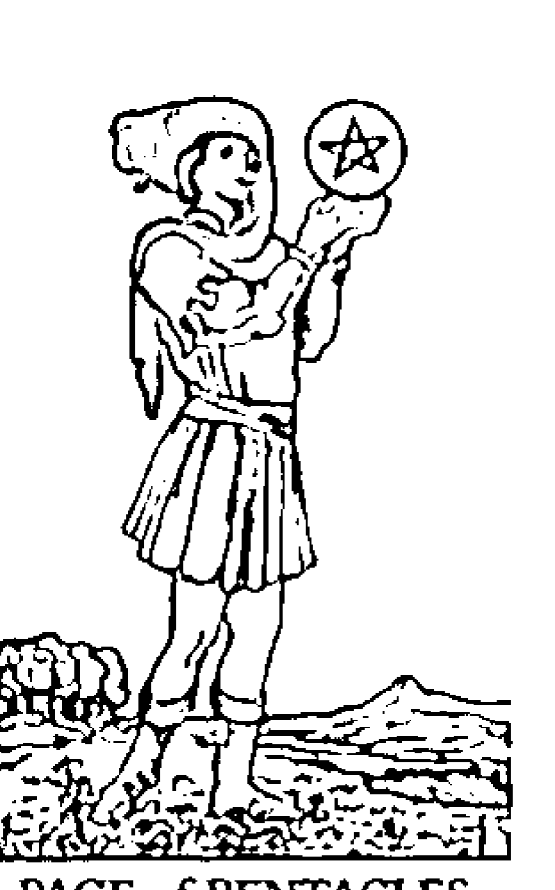

自己重新開始

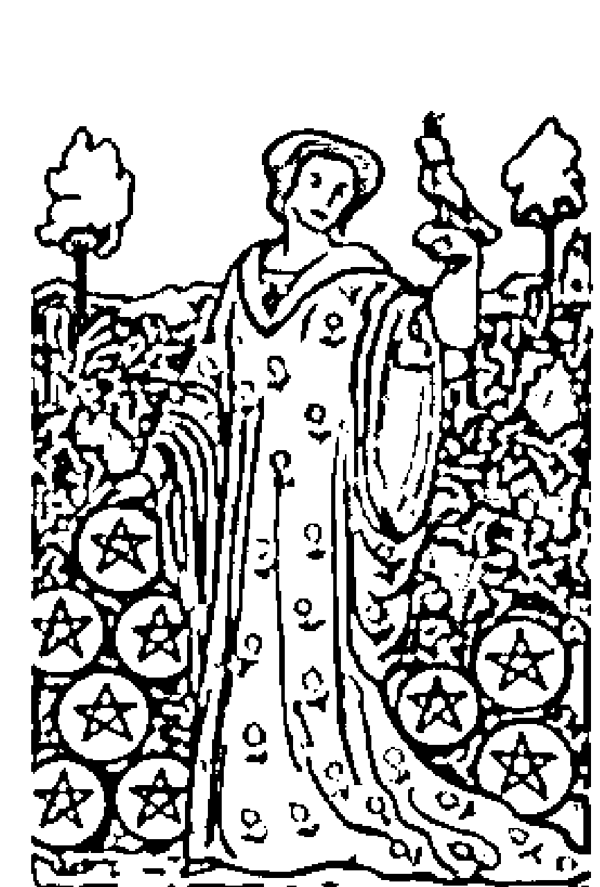

學生D：我的問題是「接下來的事業發展」，左邊的選項是和前老闆合作，不過實際上這個選項不太由我，因為目前的狀況是我和前老闆的關係有點問題。正好現在是年底，我自己也不知道明年我前老闆還會不會用我。我之前是做特助的角色。在現在這段冷靜期，我也在考慮要不要乾脆轉變方向。這個問題一直挺讓我困擾的，但是我看這個牌陣組合，如果我還有可能跟前老闆合作的話，看起來還不錯。

但是我不太會解當下的這個寶劍七，也許是我現在的狀況讓我的心態沒有很確定，因為左邊這個選項好像不太由我，右邊的選項我又有點搖擺，我並沒有下定決心自己重新開始，所以寶劍七可能就是有一種投機心態吧，像是想看看前老闆的意願，看看客觀的狀況，不知道這樣解得對不對？

看起來如果有機會和前老闆合作的話，好像還不錯，權杖四是一個很穩定的選擇，錢幣皇后其實是我自己感覺這份工作會達到比較理想的狀態。我覺得我的工作性質就有點像錢幣皇后，因為是一個特助，同時又有一些銷售的功能，等於是幫現在的老闆做一個大後勤，幫他看錢看業務，照顧很多細節，所以好像如果走這條路的話前景不錯。

如果我想自己重新開始的話，右邊第一張是錢幣九，遠期是錢幣侍者，就好像我近期會是一個沒有什麼行動，比較懶散的狀態。

老師：對啊。

**學生 D**：其實也滿符合我的，如果左邊這條路行不通了，那我可能沒有那麼著急要重新開始，但是如果要重新開始的話，未來位置的錢幣侍者是不是代表我要學習以及重新積累資源的地方會比較多？

**老師**：因為是錢幣九，所以你現有的東西已經夠你過得不錯，但是因為這是現有的東西，以後時代還是會變化，所以你還是要不斷學新的才能保持在錢幣九的狀態。但是如果跟前老闆合作的話是四，所以說你如果不學，有別人在學，而且別人也可以推動你學，或者別人也可以教你一些東西，所以你的能力是比較全面性的。如果到了錢幣皇后的話，就表示你做得很好，而且很多人要靠你，所以你要照顧很多人，你可能是地位比較高，但是如果是右邊，表示你做得還不錯，你就不用管別人，把自己做好就可以了，那就看你比較喜歡怎麼樣的工作模式。

**學生 D**：老師，我在現狀抽到這個牌，左邊的選擇是否預示也代表其實我還有可能和前老闆合作。

**老師**：有啊。

**學生 D**：因為我是覺得我沒有選擇權，好像我在等審判一樣，但是抽出來的牌很好，我就想知道是不是這個牌也預示著一種可能性，是一個很好的選項。

老師：是啊。如果依這副牌來看，表示你這一年的工作運都還不錯，不管你是自己做還是跟前老闆合作，都是過得還不錯，至少錢的方面不用太擔心。

學生D：是，因為之前一直覺得跟前老闆合作會很有前景，所以沒有為自己做太多準備，而且特助的工作性質是輔助老闆，所以我沒有為自己考慮太多，到了今年底有很多個人的是非，我很困擾，但是看到這組牌，我覺得還有一點希望，謝謝老師！

學生A：老師請問，你剛剛說他的錢幣九必須要不斷進修才可以累積嗎？

老師：沒有，他自己的日子已經過得很好，因為都是土元素，他不用急著進修，他有空的時候再進修就好，就慢慢學，然後也可以維持在這個過得很好的程度。

學生A：所以他如果要完全重新開始，他應該是拿自己的一個底本然後重新開始的吧，創業的話。

老師：他只能在原有的工作上創業，因為他只能在熟悉的環境裡面悠游自在，如果要走全新的方向就比較累。

學生A：比較累是因為土元素嗎？

老師：對。

### 實例解讀 5
要用什麼方式做生意

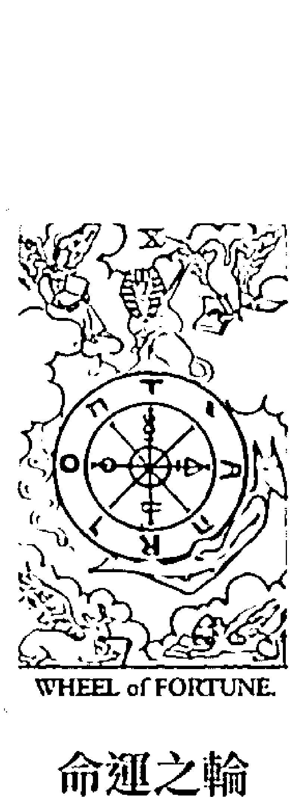

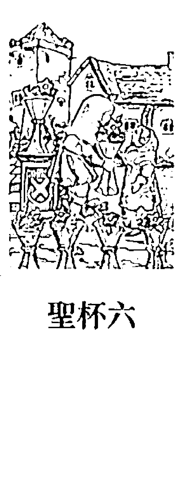

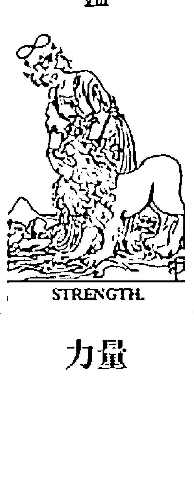

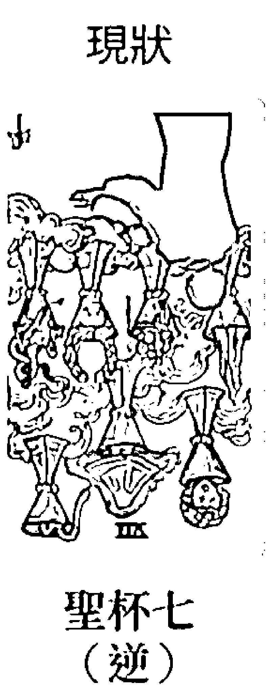

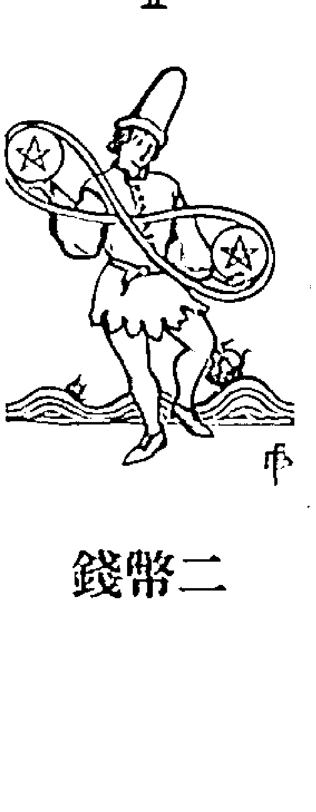

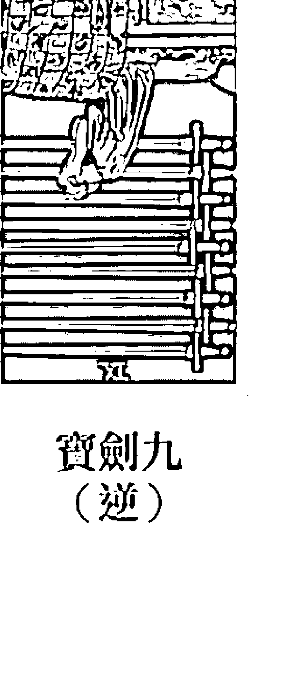

學生 E: 我的問題是「要用哪一種方式去平衡我的生意」，左邊是新的方式，右邊是舊的方式。我的現狀是聖杯七，有很多的想法，然後左邊是感覺有一點吸引力，未來可以用這個方式去吸引一些過去的客人。右邊舊的方式是錢幣二，感覺上能夠平衡我現在做的小生意，未來我覺得會有很多煩惱。

老師: 但是錢幣二也代表你的生意做得很大，不過生意做得很大對別人來講是好處，對你來講可能沒有那麼大的好處，因為你覺得生意小小的就好，如果很大的話你的人力也沒那麼多，你要煩惱的東西變多。

學生 E: 那老師我應該選哪邊比較好？

老師: 好像選新的方式會比較好，而且新的方式到最後的聖杯六，表示其實新的方式對你來說不會太陌生，很多模式跟以前是相同的。

學生 E: 但是為什麼是左邊的比較好？

老師: 你看命運之輪就是要你選新的，就是新的機會。

學生 E: 但是我想問，因為我看右邊有錢幣，土元素，但是左邊沒有土元素。

老師：可是有力量牌啊，力量牌是火元素固定宮，就表示一下子錢沒有太多，但是慢慢的累積會越來越多。

學生E：但是未來是水元素，是感覺。

老師：就表示你做的很順手啊。

學生E：原來如此，我以為有錢是土元素會比較好一點。

老師：但是到最後是寶劍九，就表示你會賺錢，但是賺錢伴隨一些多出來的事情，人力沒有那麼多，你比較應付不來，會比較煩躁。

學生E：明白了。老師，聖杯七是代表我現在有很多的想法對嗎？

老師：對，代表你有很多的感覺跟很多想要的東西，你都想要嘗試。你會覺得有很多的可能性，想要試試看自己做這個行不行，做那個行不行。

學生E：老師，我們問事業應該有土元素和火元素，左邊的火是固定宮，這是火元素裡有土元素的意思嗎？

老師：因為力量牌對應獅子座，獅子座是火元素裡面的固定宮，固定宮就代表你的狀況還是很平穩，代表你在財運方面是比較守得住，加上火元素，就是賺進來又守得住，代表你的錢是會累積的。雖然右邊的最後有一張寶劍九，其實我覺得寶劍九也不嚴重，寶劍九是你覺得很煩，但是實際上有錢吶，就是覺得很煩但還是會賺錢，所以我覺得就這兩邊的牌來看，你這一年應該在工作方面沒有什麼太大的問題。

學生 A：老師請問通常看一個牌面，是不是最主要看大牌？

老師：不會啊，我都一起看。

學生 A：老師，他用新的方式最後是聖杯六，聖杯六也有一個意思是回憶過去的美好對不對？

老師：但是他的過去就是這個力量啊。

學生 A：他的過去就是力量，因為他覺得未來是很好的，所以要用這個方法去做對不對？

老師：對啊。

### 實例解讀 6
要掛名新店面的負責人嗎

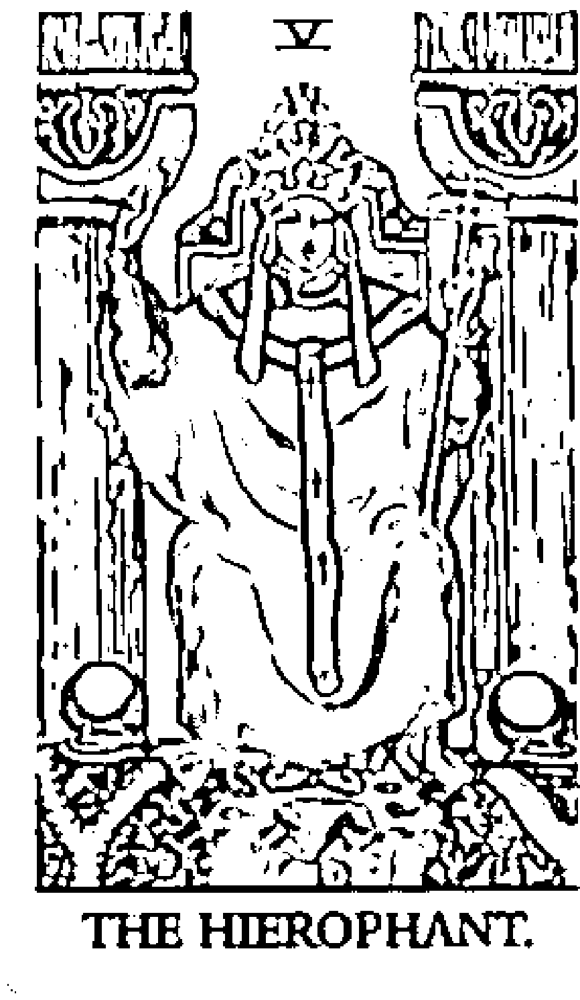

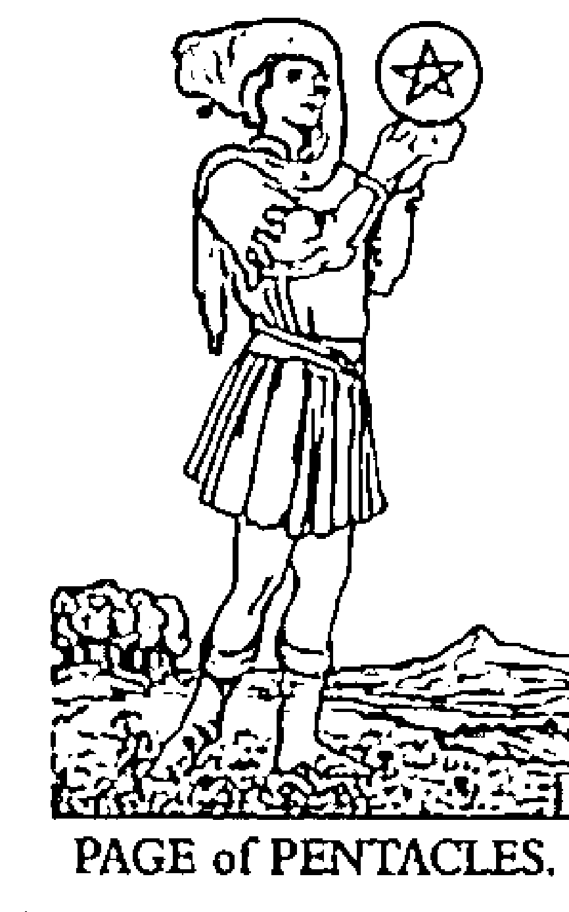

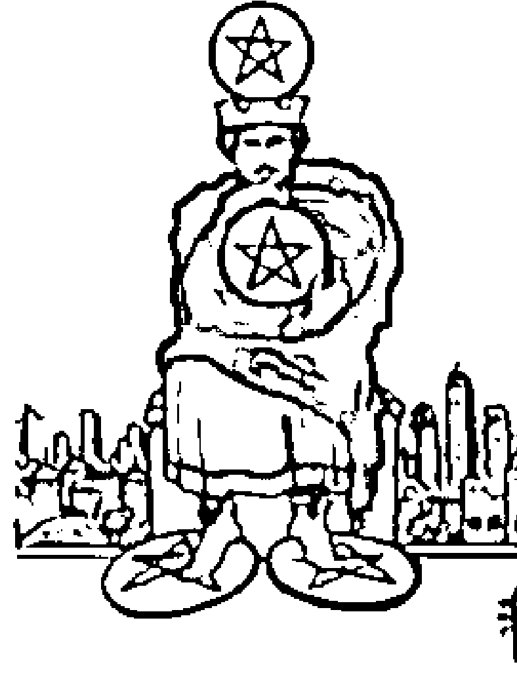

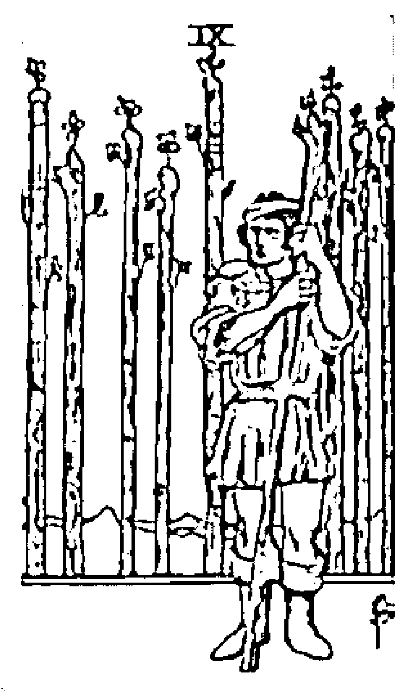

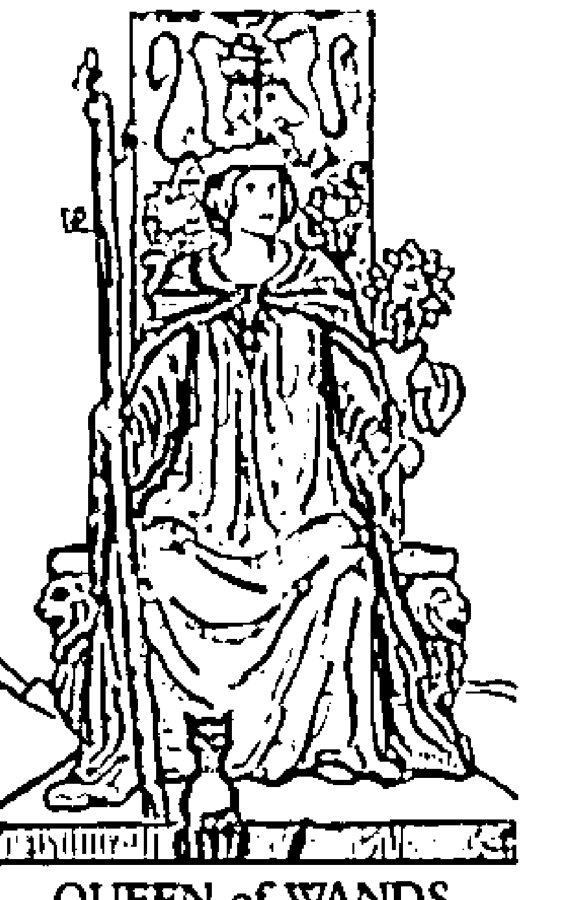

學生 F：老師，我是問「要擔任新店面的掛名負責人嗎？」左邊是要，右邊是不要。我們老闆要跟人合夥，開一家新的店，這家店需要一個人掛牌當名義上的負責人，希望我去當負責人。當負責人的話，每個月會多一點錢當掛牌費啦，但是不涉及實際的經營，裡面的經營業績都跟我無關，我等於是個人頭。表面上沒有什麼事，可是一旦有事，例如要是有糾紛，或是國稅局要補稅的話，我當人頭的人就怕會有責任，所以我很猶豫。因為會有一點錢，但是不知道以後他們經營得怎麼樣。我大概一個禮拜要過去一天，我又覺得懶得去，所以說我抽了這副牌來看看狀況。首先我現在的心態是錢幣四，就是一個很保守的心態。

老師：現有的狀況就不錯啊。

學生 F：對啊，我目前這樣子已經很好，其實我不太想動，可是老闆非常希望能用我的牌，因為他覺得我比較可以信任，那如果說我真的掛牌，當掛名的負責人會怎麼樣呢？是錢幣侍者，很明顯的在那邊我可能一個禮拜只過去一天而已，所以說那裡經營得如何、會有什麼狀況，我都不知道。

老師：如果錢幣侍者的話，就是學徒牌，是一個被動的牌。

學生 F：是的，就像個小孩子，也不熟悉那裡的員工，發生什麼事情我也無法掌握。如果說未來發展的話，教皇就像是個掛牌的人，名義上地位崇高，可是實際上沒有什麼作為，就像個神主牌。然後都是土元素，土元素的特質，我也覺得這是一種壓力。

老師：應該不會發生什麼事情，至少一年之內，因為塔羅牌最多看一年之內比較保險。

學生 F：但是這個一掛牌下去，以後要換負責人的話就非常麻煩，所以說一旦掛牌就是掛到我死為止，這讓我很是壓力，所以我才說土元素代表對我而言也是一種壓力，因為我就是這樣。雖然每一個月多一點錢，但是也讓我被綁住，動彈不得，因為我就是那邊的負責人，以後那裡出了什麼事情，在法律上跟稅務上，我都有連帶的責任。所以從這個心態來看，其實我是不想要。

老師：因為錢幣四就感覺多一事不如少一事。

學生 F：那如果我選擇不要的話，我很珍惜目前的狀況，因為我現在在原來這家店已經做二十幾年，已經做得很好很穩定了，但是權杖九也代表說我能夠做的就是到這裡了，沒有辦法再發展下去，就是我很珍惜目前的，也不想要再多了。然後在未來，在舊的這家店，就是說不要去掛牌，還是繼續保持原來的身份在舊店的話，就是權杖皇后，就是火與水，有水成分就代表我對舊店還是有感情吧，火的話是我在這裡會覺得比較有精力。

老師：我覺得不要掛牌的話你會比較自在，掛牌的話就算沒有叫你做什麼事，你心裡面還是會覺得你是有責任的。

學生 F：是的，這個我是隨手抽的，不過還滿符合心態的。只是我除了教皇這張牌，其他其實全部都是逆位啦，請問很多逆位代表也是大環境不好嗎？

老師：代表這件事情你沒有一定必須去做的阻礙，因為全部都是逆位加上錢幣四，就是叫你不要出頭。

學生 F：是的，我的確不想出頭啦。

老師：那就不要啊。

學生 F：對啊，所以我抵死不從，但老闆很希望我去掛牌。

老師：那錢要增加啊。

學生 F：有啊，會增加一點啊。

老師：你要開到他會捨不得的程度，他就會放棄啊。

學生 F：好，這點倒是可以。所以說我這個牌陣的答案好像比較顯而易見。

老師：對啊，就是你做的話也沒什麼壞處，但是就是覺得說不要做。

學生 F：對，心裡會有一個壓力，雖然有多一點錢，但是也會帶來土的壓力。而且土的話也是一種受限吧，變成以後我就跑不掉了，要跟那家店共存亡。

老師：對啊。還是權杖皇后比較好，自由多了，你還可以去做自己喜歡的事，然後也還滿有地位的，而且這個地位都是外在的，都是你真的很受人家的歡迎，就不是一個名字在那邊而已。

學生 F：對的，沒錯，因為我在原來這間店待久了。

學生 B：老師請問這組牌如果要掛牌的話，因為有土元素在那邊而且還滿重的，有沒有可能是代表雖然不要掛牌會比較自由，可以去做我想做的，但是在實質上的累積來說，其實是掛牌帶給他的例如錢的累積會比較多，可以這樣解嗎？

學生 F：是沒錯啊，因為有掛牌費。

老師：可以啊，但壓力也多啊。因為沒有火啊，就是你這個錢拿到，這個錢也不能做什麼其他的事，那麼一點點錢也不夠做其他的事啊。

學生 E：請問怎麼在牌上看到只有一點點錢，沒有太多錢？

老師：因為都是土啊，代表範圍有限，就是有錢，但是如果要很多錢的話，時間必須很長。

學生 E：怎麼看在牌上是有大錢呢？

老師：火加土。

學生 F：應該說要有流動才有錢吶。

老師：對，因為火是賺錢，土是存錢。

學生 E：那可不可以水加土啊？

老師：水就是有人給你錢吶，然後你慢慢存，就比較像家庭主婦。

學生 E：火加土是自己掙來的？

老師：對。

### 牌陣四 大十字

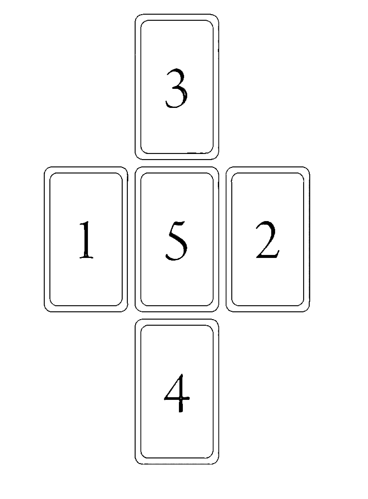

#### ☆ 牌陣位置

- 1. 所問之事過去的狀態
- 2. 所問之事現在的狀態
- 3. 你對於這件事的預期
- 4. 所問之事的實際狀況
- 5. 所問之事的結果

#### ☆ 老師引導

大十字牌陣可說是時間之流的加強版，會看得比較仔細。不僅可以進一步了解當事人的心態，也可以判讀出過程中可能的情況，非常適合用來推敲所問之事的細節。

### 實例解讀 1
我家貓咪為什麼一直叫

預期：寶劍騎士（逆）

過去：錢幣十（逆）

現狀：女皇

結果：錢幣九

實際狀況：錢幣一

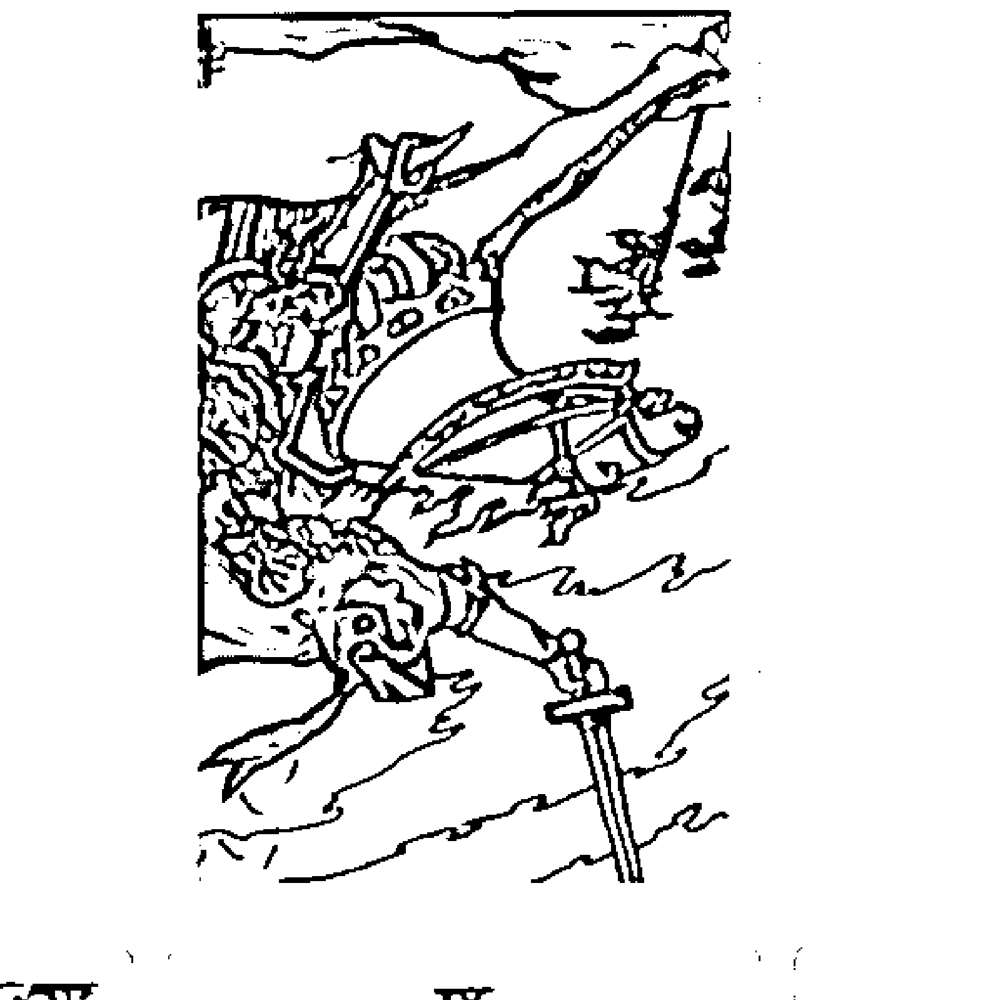

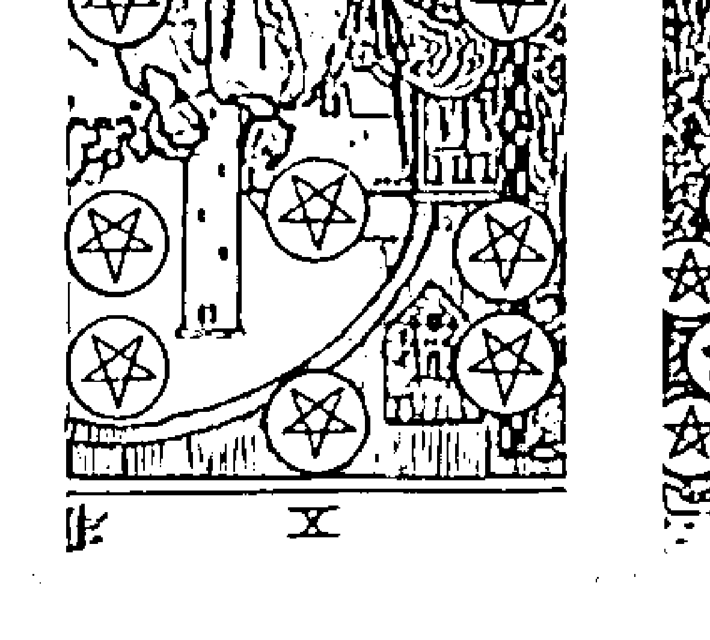

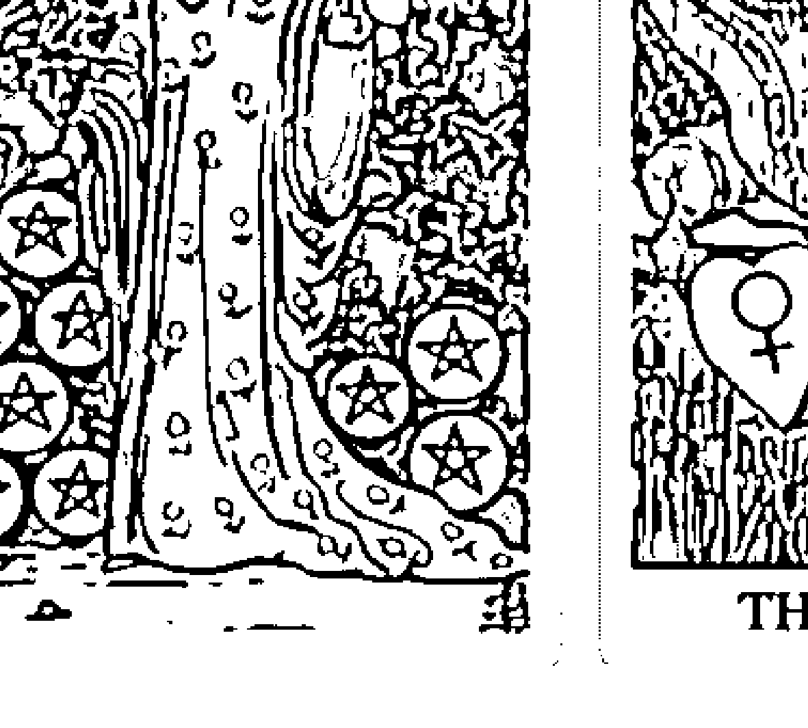

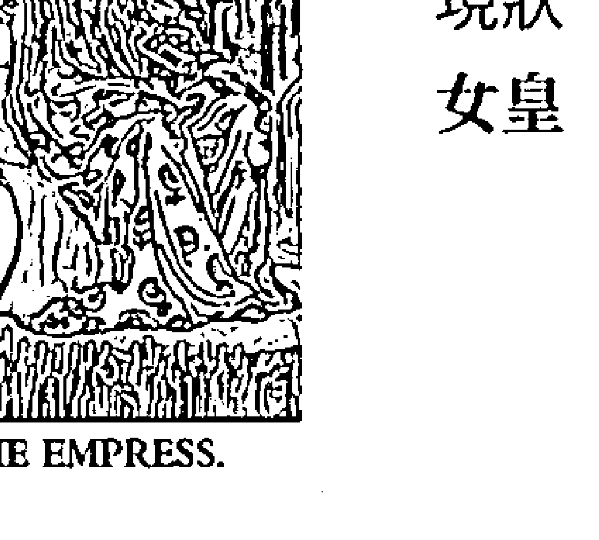

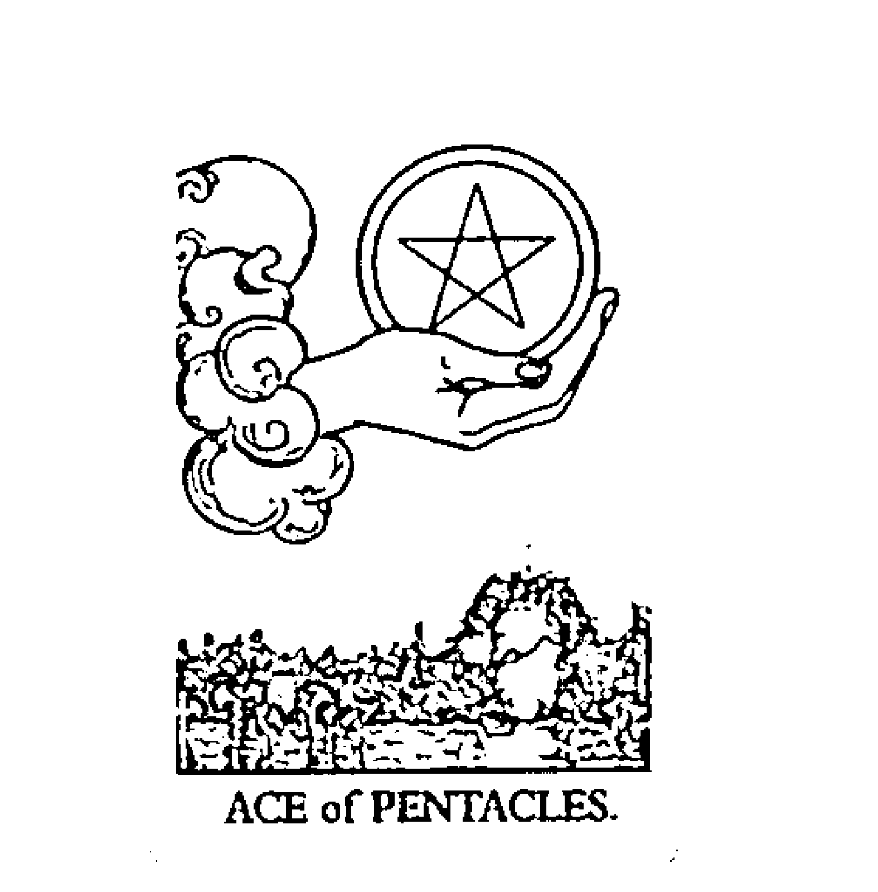

學生 A：我家的貓一直叫，我想要問為什麼牠要一直叫，牠的心態是怎樣。

老師：牠的命太好了，窩在一起靠天。

學生 A：對，這兩天牠就一直叫，我領養牠時，正逢疫情在家上班，牠六個月大，已經比較成熟也結紮了。錢幣十，我的解釋是牠一直在慢慢學習融入這個家，慢慢適應，可是因為是逆位，可能跟家人的關係沒有那麼緊密，牠其實也沒有特別喜歡我，比較喜歡我的室友們。現在的牠是女皇，有點像被寵壞的小孩，我只有養牠一隻，所以變得牠什麼都有。牠也很親人。

老師：我覺得牠覺得很無聊。

學生 A：對，只要快遞來牠就會立馬衝出去接快遞，跟狗一樣的個性。寶劍騎士逆位，我覺得牠太皮了，很有好奇心，失去理智，現在會跟我哈氣，以前都不會。然後牠現在實際的狀況是錢幣一，我覺得牠還算乖啦，只是我又要從頭教，結果後面就是錢幣九，我覺得牠現在就是一個小朋友長到青少年，叛逆期開始，所以我要慢慢跟牠講，錢幣一到錢幣九就是一個重新開始，需要一點時間，牠風元素的個性就是想一天到晚往外跑，可是牠已經結紮了耶。

老師：牠被領養的地方是不是很多貓？

學生A：對。

老師：所以你看牠過去是這個錢幣十就代表牠有一大家子，然後現在恢復到牠獨自一個，所以牠會寂寞，覺得沒有伴，你再領養一隻陪牠吧。養兩隻反而會比較方便，因為牠們會自己打架，就煩不到你了。

學生A：是哦。老師這邊的錢幣十是牠從一個很多人的地方來我們家，所以牠瞬間就覺得沒有伴，沒有同類。？

老師：對。然後牠會覺得人類看不懂牠的任何表現。

學生A：就是寶劍逆位對不對？

老師：對啊。就是牠一直都表現得很好，但是你們不是貓，你們看不懂牠有多優秀啊。

學生A：有有有，我覺得牠算優秀算乖，也聰明。喔，我們看不懂牠的優秀。

老師：對啊。

學生A：這個牌裡我有一個看不懂的地方是錢幣一，應該怎麼看？

老師：女皇跟錢幣一一樣，就是她現在豐衣足食什麼都不缺啊，什麼都不缺的生活之下最缺少陪伴跟玩樂。她不用擔心什麼東西啊。

學生A：對，我看了她三次才領養，她現在不用搶食了，所以我們看不懂她的表達也看不懂她的優秀。

老師：因為你們不是同類啊，你們不會崇拜她啊。

學生A：老師，沒有崇拜是從哪一張牌看出來的？

老師：是整體都很平淡的感覺，就沒有起伏。

學生A：總而言之她就是太無聊了，就需要個伴就對了，好吧我想想。

### 實例解讀 2
我養貓目前的心態和未來的結果

預期：錢幣十

過去：聖杯五

現狀：魔術師

結果：聖杯三

實際狀況：惡魔

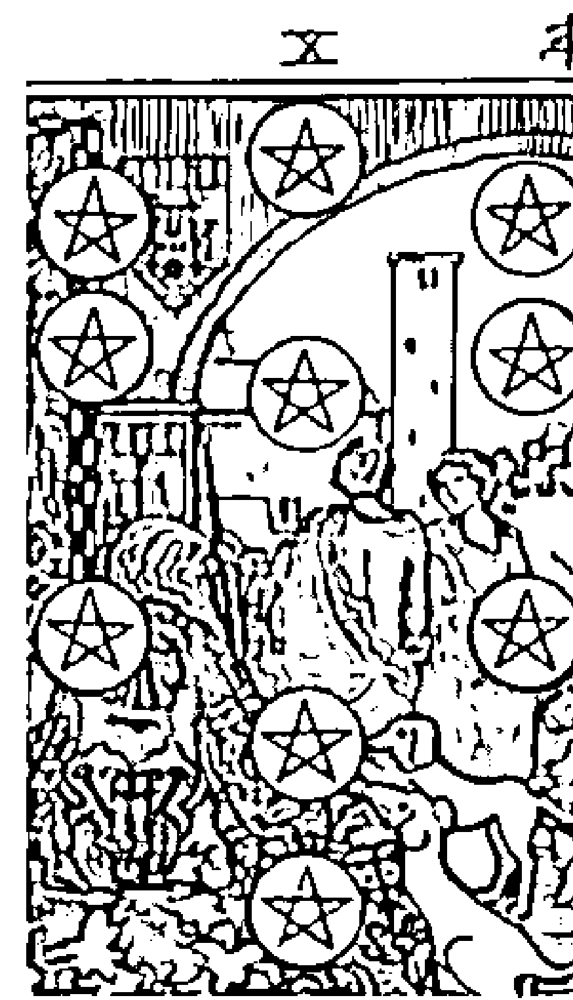

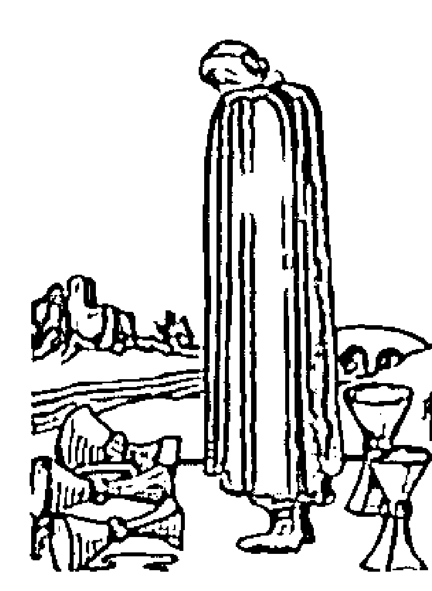

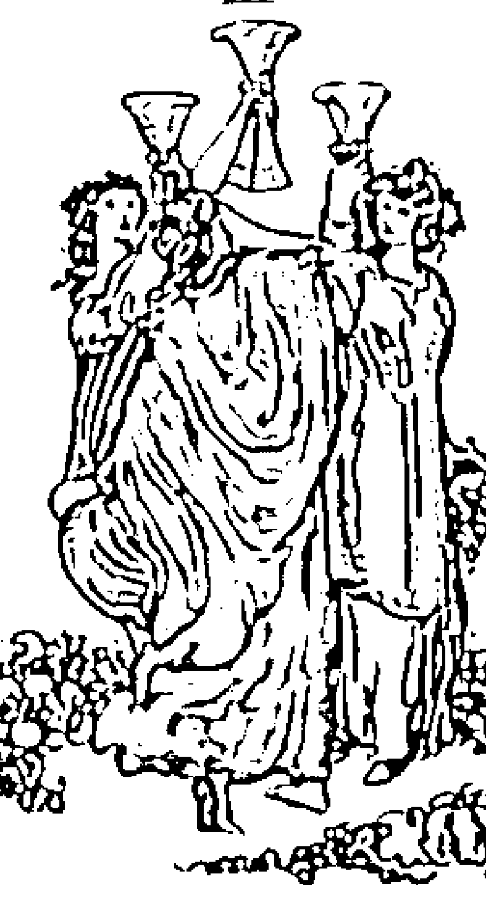

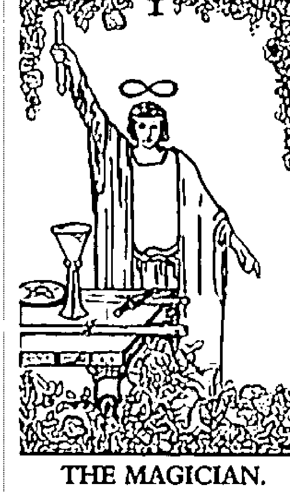

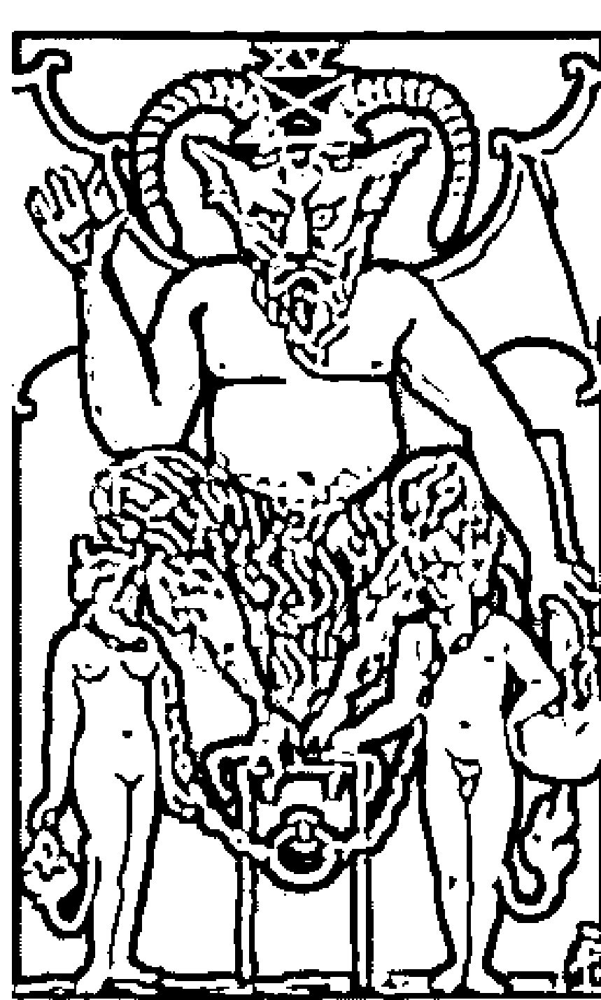

學生 B：很湊巧我也是問貓，我也是資深貓奴，我問的是「我養貓目前的心態和未來的結果」。我以前養過兩隻貓，養了 14 年，6 年前這兩隻貓都走了，所以我後來不敢再養了，覺得無貓一身輕也好，可是其實真的是滿想念貓的，所以今年又認養了兩隻貓，都是野貓，都還算親人，可是因為牠們都是流浪貓出身的，所以比較有野性。過去抽到這張聖杯五，我認養牠們才兩個多月，代表心態是以前的貓走了，我一直覺得很難過，即使隔了 6 年這種心態還是存在。

老師：這張牌就是說你要看現在的貓啊，你要把注意力放在現在的貓身上，因為聖杯五是你不要留戀失去的，要看你現在擁有的。

學生 B：然後現在是魔術師，是一，所以代表我跟這兩隻貓就是一個重新開始，會帶來各種驚奇，因為以前那兩隻貓完全是家貓，這兩隻是野貓出身，所以說牠們的習性會比較差一點，就是比較沒教養啦，會搞破壞，這就是現在的狀況。

預期是錢幣十，本來我是預期牠們就像我的家人一樣很穩固，我對牠們有責任，我們就成為一家人，把牠當家人的心態。結果實際的狀況是惡魔，我是覺得被牠們拖住了，突然哪裡都去不成，還要回來特地餵牠們，因為用自動餵食器沒有用，大貓會搶著把小貓的貓糧吃光，變成我一定要用餵的才行，不然小貓就沒得吃，所以說牠們反而變成我的羈絆，讓我動彈不得。看到我整天就是叫就是要吃，好像餓死鬼來投胎的。然後我想這個最後結果聖杯三，我們三個以後會變成平等的一家人吧。

老師：還是會處得很好，我覺得你不是把貓當小孩，牠們比較像是你的朋友、室友，你們是平等的關係。

學生 B：是的。老師，這五張牌其實抽出來時全部都是逆位，是代表什麼意思呢？

老師：這件事情現在正在給你造成壓力，但是過後就好了，只是暫時性的。

學生 B：暫時的壓力。最後這張結果也是逆位，是不是代表雖然最後的結果能夠三方交流，但是其實不是那麼的順暢呢？

老師：需要等一段時間。

學生 B：因為牠們實在是太野了。牠們不會上床陪我睡覺，不然我就會被抓，這是野貓的習性。這個牌滿符合這個目前的狀況，我覺得塔羅牌真是不可思議。

### 實例解讀 3
#### 用新方法發展事業的狀況

預期：聖杯一（逆）

過去：錢幣侍者

現狀：寶劍二（逆）

結果：世界（逆）

實際狀況：權杖四

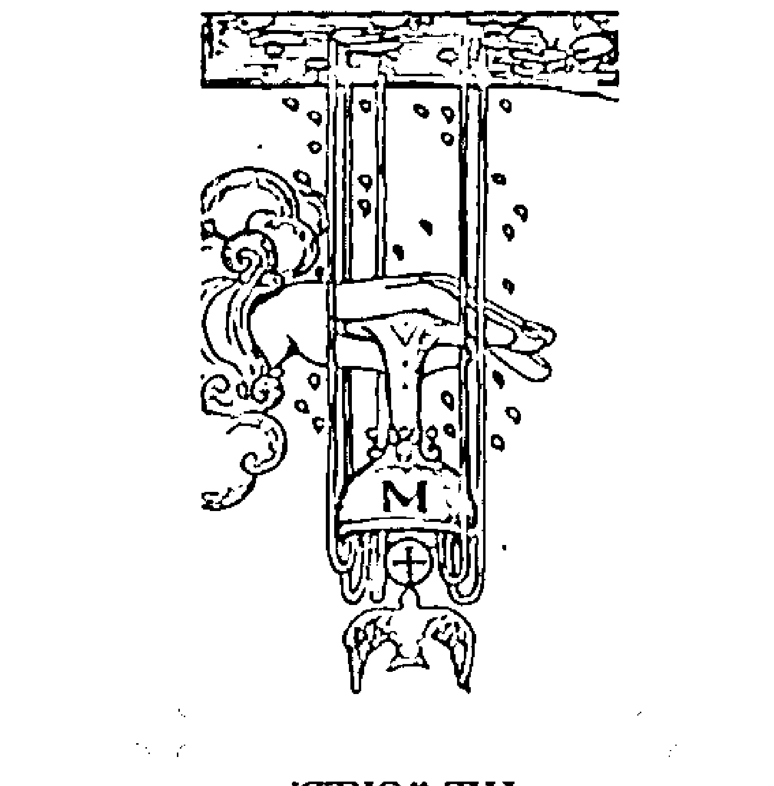

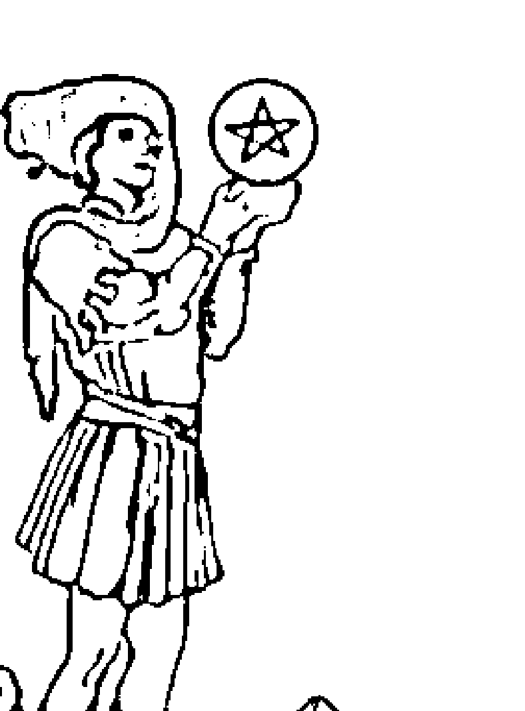

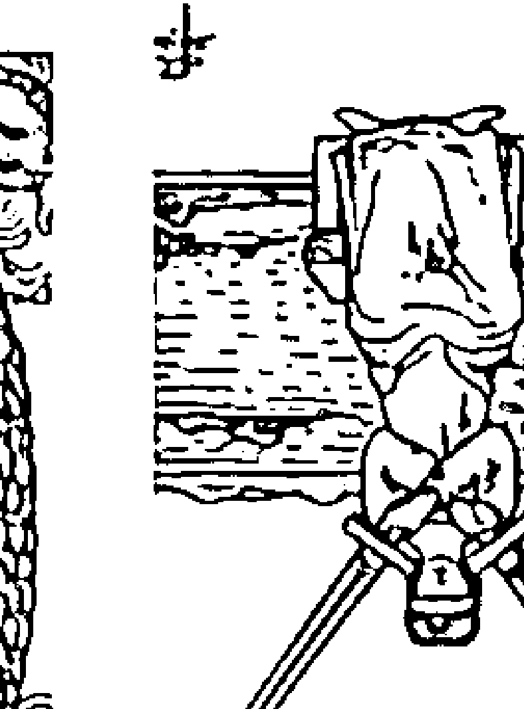

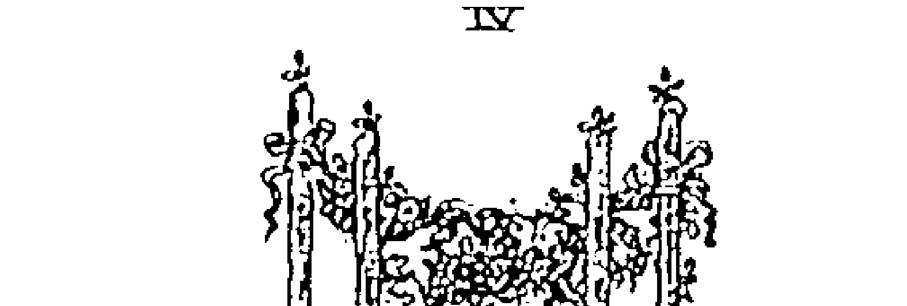

學生C：我的問題是「用新方法發展事業會怎麼樣」。過去是錢幣侍者，我過去會學很多東西，現在有兩個方向要做決定，可是我覺得這個決定不是我很想要的。然後預期我感覺應該會比較好一點，但是現在是權杖四。

老師：我覺得好像還要等一陣子，現在時機還沒到。

學生C：是啊，我覺得也不太好，但是實際情況是權杖四，感覺很開心，只是現在我也不是很開心的感覺。未來結果是世界牌，我覺得未來會越來越好，會比較穩固一點的，但是要比較長的時間。

老師：這個權杖四就代表你現在正在打基礎，你打了基礎才有美好的未來。你必須要耐心，可能會久一點。

學生C：耐心是用哪一張看呢？是不是世界牌？

老師：對。然後權杖四，四的意思就是目前你有一個基礎了，但是還要往上蓋，你要等到十才是一個全面性。四跟十還有一段差距，所以要等比較久。

學生C：明白。老師，如果有風元素是不是代表擔憂，想法比較多？

老師：因為現在是寶劍二，就代表說現在兩個方向，你還沒有決定往哪個方向走，就是未來還不明，你還要看看狀況。

學生C：明白，目前還不明朗。然後有這個水元素是好的感覺，但要再長一點時間才感覺到。

老師：對。

#### 實例解讀 4
#### 現在工作的發展狀態

預期：聖杯一

過去：戀人

現狀：太陽（逆）

結果：權杖二（逆）

實際狀況：戰車（逆）

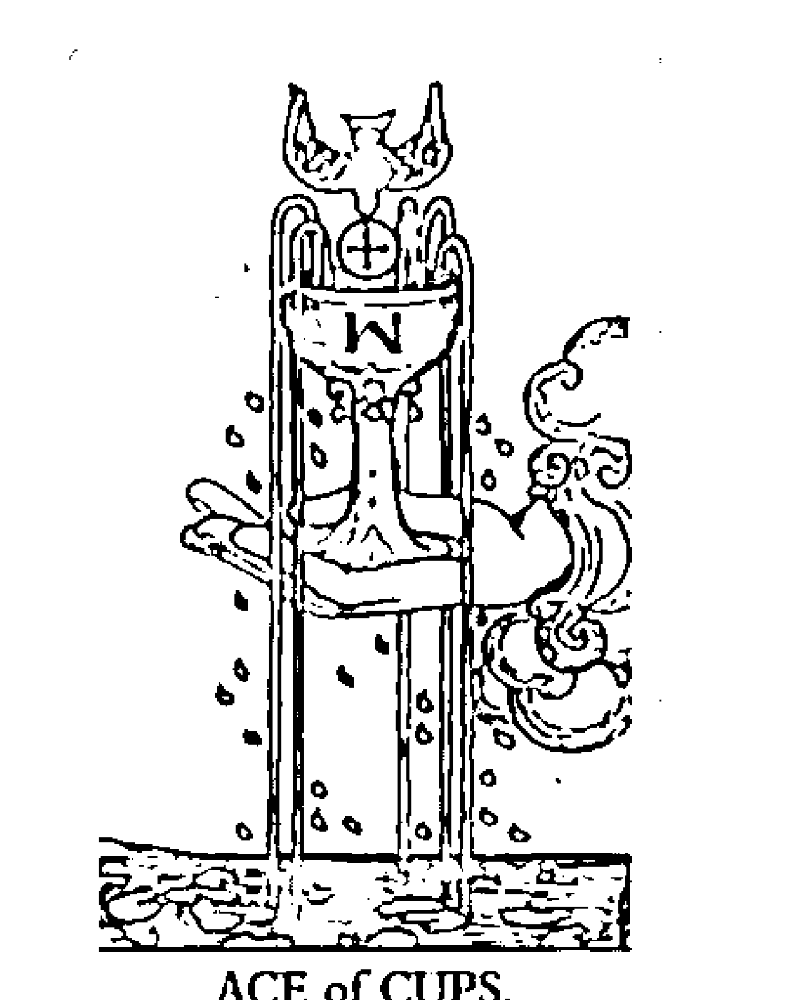

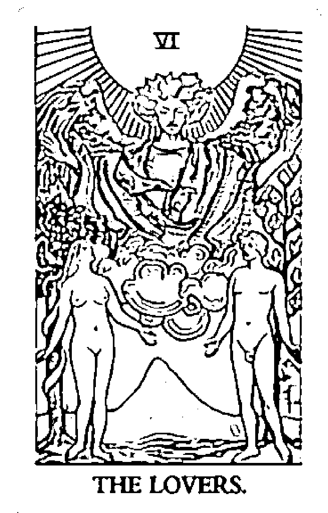

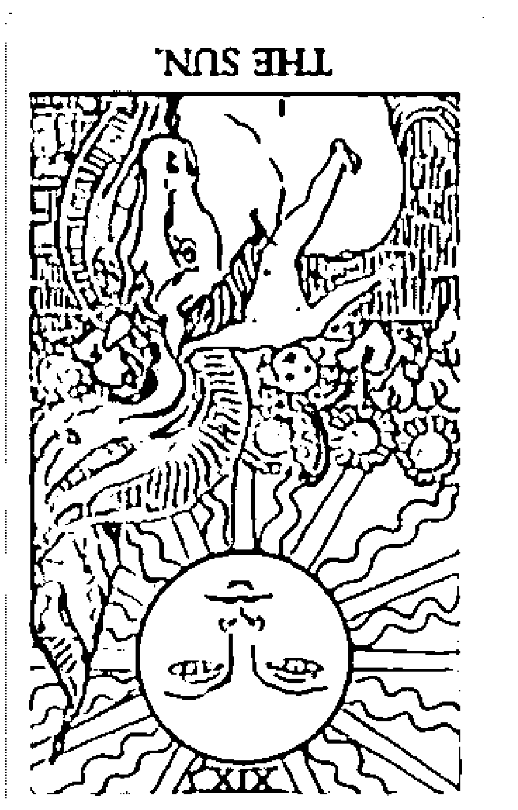

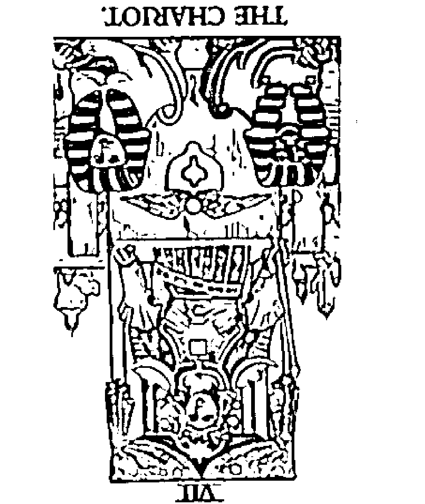

學生 D：我的問題是「現在工作的發展狀況」。過去是戀人，老實說我在應徵的時候確實是對這個職位有很多的嚮往跟好奇，才會選擇接受這個 offer。然後在現實上也確實是以溝通為主的工作，因為我現在是擔任主管秘書，要做很多不同部門之間的溝通，也需要很多的學習，因為過去比較沒有這個產業的經驗。因為是風元素，我覺得還滿呼應的，我一開始就沒有預期在這個職位停留很久，不會想待終生，我知道不會永遠都在這個職位上。

現在的牌是太陽牌的逆位，我覺得很像職稱、薪水或形象看起來讓人覺得很好，因為一切都很好，所以就沒有什麼挑戰，大家對你也不會有什麼指教或要求，我覺得會是一個隱憂。

預期是聖杯一，就是在人際關係上會轉好，但是我覺得有另外一個可能，或許是因為太陽牌覺得一切都很平順，也會有可能往有興趣的領域再去發展第二專長，例如身心靈相關的領域，但是預期上近期就不會有實質的收入或者是成長。

實際狀況是戰車牌的逆位，因為是水元素，所以我覺得是暗示實際狀況可能會進入瓶頸期，而且這個瓶頸可能和心理狀態比較有關係，因為是逆位，可能需要比平常更多的時間才能突破。

結果是火元素權杖二，這個我比較難解，預計是可能會遇到需要二擇一的狀況，逆位可能就會比較難去選擇，猶豫不決。

老師：我覺得是你還找不出方向，你現在還在摸索，還要搞清楚狀況，在搞清楚狀況之前你無法定出你的目標。因為現在一切還在熟悉當中，你還沒有辦法確定你的目標。

學生 D : 所以二擇一的成分沒有那麼高，而是找方向的成分更高一點？

老師 : 對。但是你不管往什麼方向，我覺得還滿適合你，因為火元素就代表兩個方向你不管往什麼方向，都有好處，只是那個好處不一樣。

學生 D : 因為權杖二還算是一張好牌嗎？

老師 : 因為火元素，火元素在工作方面本來就算是比較積極的，有活力的。

學生 D : 但是如果是權杖九就不一定對不對？

老師 : 對。

學生 D : 我有一個疑問是，從實際狀況水元素到結果是火元素，所以可以判斷走勢是越來越好嗎？

老師 : 對，一開始是風元素，根本就只有你的想像，但你什麼都搞不清楚啊，後來又是火跟水，就代表你慢慢了解了以後，你還滿喜歡的，並非你弄不清楚，你就覺得沒興趣，這代表你越了解會越喜歡，因為水跟火都是感情元素啊。

學生 D：過去和現在代表的會比較像是實際的狀況嗎，還是比較像是心裡主觀的感受投射出來的？

老師：都有啊。

學生 D：所以如果從現在太陽牌的逆位到實際狀況戰車牌，會表示說中間的過程不會太順利對不對？

老師：就是要久一點，但也不是說不順利啊。畢竟火跟水都是感情元素，就表示這個過程你覺得還滿愉快的，只是你還找不到確切的目標而已。

學生 D：確切的目標是指說未來要發展的方向嗎，不知道要走還是要留也算是一種猶豫。

老師：應該會留下來吧，只是留下來你要做什麼。

學生 D：了解，的確如此。因為目前的工作成就感不是很高，跟前一份工作比的話，前一份工作在大公司，主管願意給很多機會，會比同期新人累積到更多經驗，所以現在會比較迷惘到底要不要留下來，留下來該怎麼發展。

老師：可是我覺得這個行業也滿有趣的，因為都是火跟水，而且又是太陽，太陽就代表說你在這個行業裡面也是有你的展望，也是有你想要的東西，只是你還沒拿到而已。

學生 D：然後戰車牌就塞車了，所以戰車的意思比較像是一種阻塞的狀況嗎？

老師：就比較像是一種塞車的狀況，你還沒有找到目標，延續到後面的權杖二就是你還沒有找到你的方向，因為戰車牌的話也是你要決定往哪一邊去啊，因為你看它也是兩個方向啊。

學生 D：我想要再問聖杯一，我本來是解讀為人際狀況或者身心靈相關的副業，這兩個方向都是有可能的嗎？

老師：對啊。

### 牌陣五

#### 七行星人格

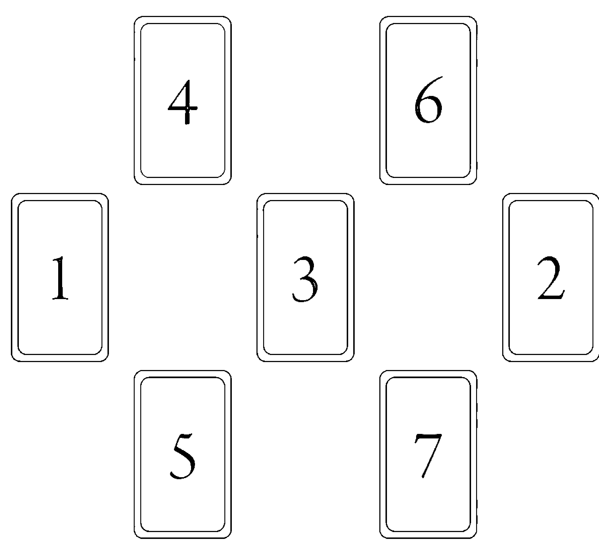

#### ☆ 牌陣位置

-   1. 太陽
- 2. 月亮
- 3. 水星
- 4. 金星
- 5. 火星
- 6. 木星
- 7. 土星

#### ☆ 老師引導

老師：第一張是太陽，第二張是月亮，第三張是水星，第四張是金星，第五張是火星，第六張是木星，第七張是土星。在占星裡，我們的人格方面就看這五大行星，如果是「三王星」（天王星、海王星、冥王星）就已經到了意識層面、精神層次，人格方面就只有到土星而已。

太陽就是一個對外的部分，一個人表現出來的樣子，就像太陽星座是我們最明顯的那個地方。我們常常講的「星座」就是我們的太陽星座，我們出生的日期就是太陽所在的星座，太陽代表的是我們呈現在大家面前的樣子，就是我們最基礎的社交，是我們大部分時候展現出來的樣子，想讓別人看到的那一面就是太陽的那一面。

月亮就是內在性格，我們的內在性格誰會看得到呢？家人或是好朋友（閨蜜那一類的），所以月亮就是你私底下的狀況，也代表內心真正的情緒跟你真正的想法，也有可能是你的隱私跟你的秘密。

水星代表友誼、交朋友，代表你的社交能力，你們覺得水星的社交和太陽的社交有什麼不一樣？太陽的社交是「不自覺的」，是你在別人面前表現出來的樣子，就是你最籠統的樣子，無意中表現出來的樣子。而水星就代表你有意識的講話，有意識的塑造你的形象，就是代表你的口才跟你的溝通能力，以及你和別人來往時你講話會用的態度跟你展現出來的個性。

雖然水星被大家稱為「社交之星」，但是我覺得真正的社交是要看別人喜不喜歡你，對你的印象是什麼，從這方面來看的話我覺得金星更像社交之星。因為水星是你自己覺得怎麼跟人家交往，你表現出的社交能力；金星是你的外表、打扮、舉止談吐和禮儀給人家留下的印象。就好像太陽和金星都是在別人面前表現出來的樣子，太陽就是代表你想要人家覺得你是什麼樣的人，金星則是你喜歡讓人家覺得你是很漂亮的人，還是你是很和善的人，就是你會表現出比較討喜的那一面。金星這張牌也有可能是別人看你時覺得你的魅力在哪裡。

金星比較像女生，火星比較像男生，應該大家都有聽說過一本書叫做《女人來自金星，男人來自火星》。火星代表我們展現出來陽性的那一面，是你比較有企圖心的那一面，可以激發你的企圖心、動力，會讓你想要去擁有。所以人家常常說火星是男朋友，金星是女朋友，但是我覺得現在同性戀很多，所以男女朋友就不是那麼準確。換一個角度來說，金星是被追求的對象，火星是追求的那一方。你們可以看一下你們的火星在什麼星座，就比較表現如果你們生氣或者激動起來的時候，會用什麼樣的方式表現出來。

學生A：老師，請問金星表現出的樣子跟太陽主要的差別是在於？

老師：太陽是個性，金星是打扮，就是你會想要讓人家看到你是什麼樣子的人，就會很刻意的去打扮，很刻意的去偽裝，但太陽是不自覺流露出來的樣子，金星是比較刻意的裝扮，比較刻意的表現這一面。就像如果你當藝人的話，你就有一個「形象」，這個形象就包含太陽跟金星，但金星就表示說你會把自己打扮成的樣子，太陽就代表你的言談舉止，就是你展現出來的個性。金星和火星都代表形象。

學生A：老師，我舉個例子，比如我個性比較活潑，有點像搞笑藝人，但是我的打扮是俐落的，比較素的樣子，不像我呈現出來外在的個性這麼熱鬧，可以這樣理解嗎？

老師：可以的。

學生 B：老師，水星和金星的分別也是比較刻意營造的形象，是不是啊？

老師：水星代表的是溝通的技巧，就代表你的口才跟文筆好不好，就是代表你的頭腦好不好，但是金星就是代表你漂不漂亮，或者是你在別人的眼裡看起來是什麼樣子，簡單來說就是這樣。

學生 B：明白，謝謝。

老師：木星簡單來說，木星是五大行星太陽系中最大的一顆行星，所以木星在占星學來講代表的就是才華，就是你最顯眼的那個地方。但是，如果是你從小就展現出來的天分，就不是木星代表的，那比較是水星代表的，因為水星代表的是智商，就是你天生下來的天分，如果是你累積後到達、慢慢磨練出來的才華，就用木星來代表，所以我們都說水星是天分，木星是才華。

土星就是一個人的缺點，一個人的難關，就是一生當中你的罩門，你的個性難題在哪裡，土星就是最不好的地方，你最卡關的地方。

這是古典占星，古典占星只算到土星，外星系都沒有算進去，因為到土星為止就是一個人比較立體的個性，所以我們可以用來認識自己，也可以用這個牌陣來看看你剛認識的或者你喜歡的對象，或者是你即將出生的孩子，有什麼樣的盲點、才華，都可以用這個牌陣看出來。

學生 A：老師，請問這就是看我最近認識的人，或者我最近就職新的公司的老闆，那可以看一年的運勢嗎？還是一年運勢要看十二宮的？

老師：十二宮比較好，但是這個牌陣也可以看你今年人格方面有什麼變化，不過我覺得比較抽象。你也可以試試看，看看能不能理解，如果能，就代表你可以拿來算流年或者流月，但是如果你覺得很困難的話，那就用十二宮比較方便。

學生 A：老師，這個牌陣算的題目是什麼？是未來這一年個性上的變化嗎？

老師：就是我的人格，小時候的人格通常跟長大不一樣，你可以算你當下的人格，也可以算你中年之後，或者你老年之後會變成什麼樣的人。或者是你未來的老公會是什麼樣的人。

學生A：但是塔羅牌不是只有短短3到6個月或者一年嗎，我用這個牌陣排出來也只是我這6個月的人格變化嗎？

老師：如果你是有指定的話，例如說「我的36歲會怎麼樣」，但是實際上可能會有變化，不過塔羅牌算未來，是從現在投射出去的未來，至少可以有一個籠統的概念。你還是自由的，到了那個時間你還是可以學一些東西，然後慢慢的改變自己。如果是依當下的你到了那個年紀會是什麼樣的人格，這是先做一個預測而已。也可以看過去的人格。七行星我找了一下，大家的牌陣都不太一樣，我用的這個是我自己擺在我覺得適合的地方，和別人的不太一樣。

學生A：老師，如果想算我老闆這一年的變化也可以吧？

老師：對，也可以。

### 实例解读 1

### 我的人格

4 金星
钱币皇后

6 木星
钱币九

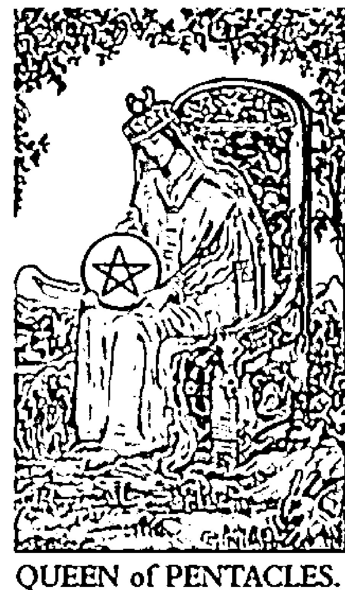

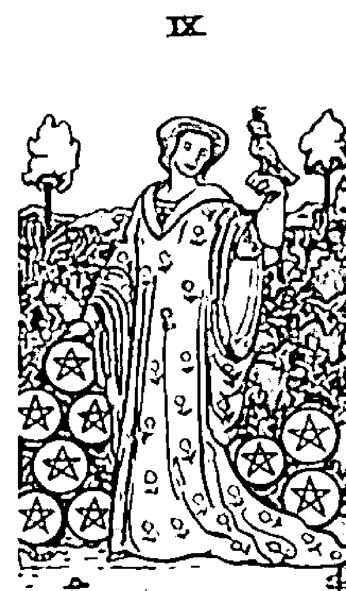

1 太阳
权杖八
(逆)

3 水星
圣杯十
(逆)

2 月亮
宝剑九

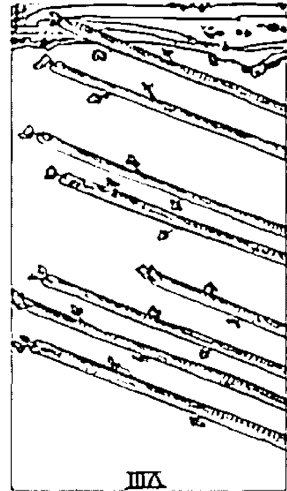

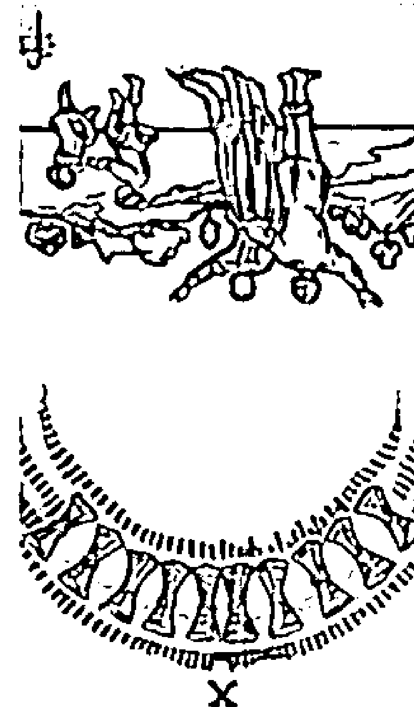

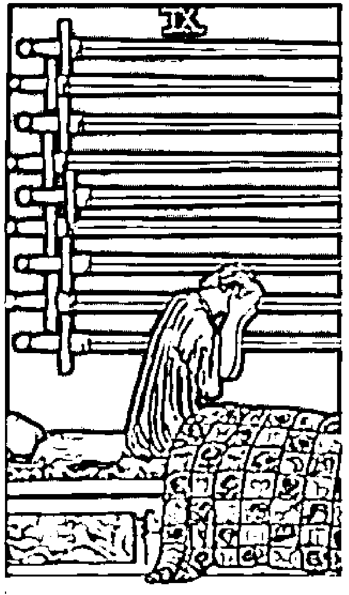

5 火星
死神

7 土星
钱币五

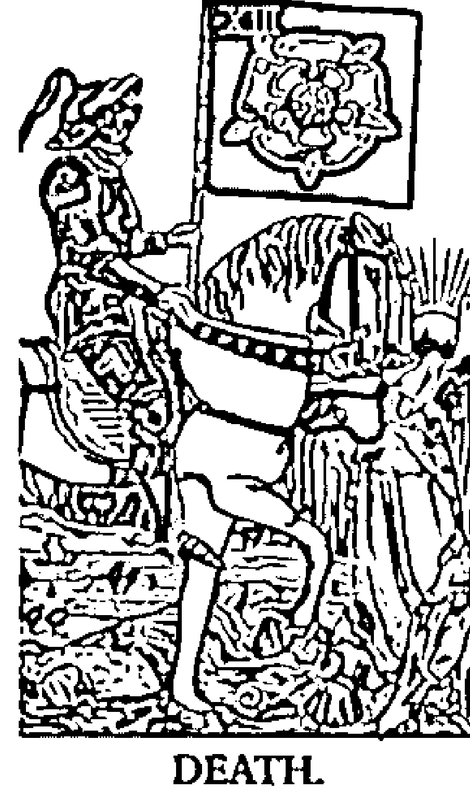

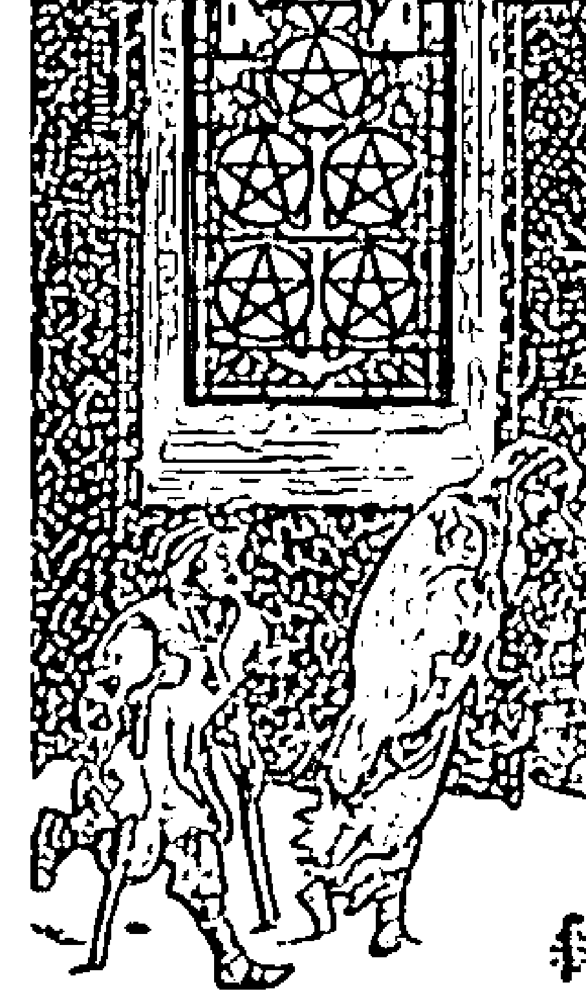

學生 A：我的太陽是權杖八，是火元素，一般代表一種能力或衝勁，大概我給人的感覺是比較有能力，就是風風火火好像很忙碌的樣子。

老師：這張牌有一層意思是一次可以做很多件事。

學生 A：是的，我的職業也是同時有兩條路在進行，所以大家可能覺得我很忙。

老師：看起來很萬能的樣子。你覺得這個像你嗎？

學生 A：像，因為朋友對我的感覺應該都是這樣，感覺我的興趣比較多，同時可以做很多事。而且大家都會覺得我總是很忙碌，其實我沒有，只是看起來很忙的樣子。我的月亮牌是寶劍九，也很準。

老師：你會想很多嗎？

學生 A：我想很多。

老師：而且會自己嚇自己。

學生 A：對，沒錯。「恐懼最恐怖的是恐懼本身」，這是我最大的體會。我不是從小到大都這樣的，這張牌反映了我這幾年的狀況，因為我在這一年比較焦慮，睡眠不太好，有人際關係和感情上的焦慮，因為是自己沒辦法掌控的。您看我的太陽是一個火元素，我還是有一種總想掌控周圍事物的感覺，但遇到很多無法掌控的事情，心裡就會很焦慮。

老師：因為你的太陽是八，月亮是九，就代表說你想要掌握很多東西，但是總是有事情是超出你的範圍之外的，但你對於這個你自己不能決定的事，你就非常的憂慮。八代表你能掌握的事情已經夠多了，你卻硬要去看一些自己沒辦法掌握的事，你就一定要把眼光放在那裡。

學生 A：是的，老師說得對。這張水星我不太會解，聖杯十我感覺是一張很水很感情的牌，但是我之前對水星的的理解是一個理智的星。

老師：水星其實是一個風元素的行星。你跟人家社交的關係，你都喜歡跟人家互相好來好去，互相跟人家結盟，互相合作，大家一起把事情做到好為止。而且你不喜歡把人家當敵人，你會覺得每個人都有他的好處，每個人都有可以合作的地方，不用刻意去看人家不好的地方，你會覺得如果大家都好來好去的話，世界不就和平了嗎，什麼事情都可以做得成。

學生 A：好準，老師說得好準，我確實是這樣對待社會關係，就是這樣去看的。金星是錢幣皇后，那代表我的形象，這張牌對我來說可能有點「嚴重」，我覺得錢幣皇后是比較貴氣，好像很會打扮，會穿好衣服。

老師：也可能要往個性方面來解，就是你的個性雖然是有點急躁的，因為這個火跟風，但是你很喜歡在別人的面前就穩定下來，就會一副什麼事情都很有把握，我「胸有成竹」的樣子。

學生 A：是這樣沒錯，可能也是因為之前自己做生意，心裡很慌的時候也要對別人表現出沒事，這件事情可以解決，裝也要裝裝樣子。而且錢幣皇后也有我在管著這些錢、管著這些人，做這些事情。下一張火星是死神牌，我不太會解。

老師：簡單來說，火星就代表你發脾氣的時候，發脾氣的時候如果是死神你覺得會是什麼意思呢？

學生 A：我不太會發火，不太會正面發脾氣。

老師：當你對於一件事情有成見的話，如果你生氣，你就會認定這個就是這樣子，然後你就會說我不跟你講，我也不跟你交談，沒有什麼好說的，我就這樣決定了，就以你的自己意見去做事，不喜歡跟人家溝通。

學生A：是，我會有點固執，哪怕溝通了，我心裡也會有一個固執的意見，假裝溝通吧。

老師：人家跟你溝通的話，你其實就會應付他，你自己已經有定見，你只是聽他說而已。

學生A：會有，明白了。老師您剛才說火星也會代表關注的地方、企圖心，我對死亡的話題也是比較感興趣，相關話題會吸引我。

老師：死神比較有興趣的是心理學跟人格學。

學生A：木星是錢幣九。

老師：（笑）才華就是當貴婦，你有兩張貴婦牌一起出現。

學生A：我也很想笑，我的才華是教別人怎樣懶散享受嗎？

老師：我們認真來說，這張牌就是教別人怎麼表現自己的品位，怎麼樣把自己的日子過得很好。

學生A：確實是這樣，這個也是我職業的轉變，從前我是做奢侈品的，自己開店賣瑞士手錶，後來我不做實業了，改給人家做一些相關諮詢，雖然是不同的角度，但其實都是幫助大家提高生活品質。

老師：都是教人家怎麼樣善待自己。

學生A：明白。土星錢幣五，我的理解是我有時候做事做決定會慢半拍，會想得多但是行動力沒有那麼好，實際上別人看我是權杖八，但我自己做事我覺得可能顧慮太多，沒有那麼有行動力。老師還有其他的提點嗎？

老師：這張牌就代表你想要做什麼事情的時候，你永遠都想的比做的快，你想得很前面，但是你的行動力有限，或者是周遭的資源不夠。這個牌真的很好玩。

學生A：是的，每一張都很準，謝謝老師！

學生B：老師請問一下水星是風元素的行星是什麼意思？

老師：因為水星管的是雙子座，雙子座是風象星座。

學生B：可是她（學生A）水星抽出來是聖杯十。

老師：你不要去想他代表什麼元素，你就想他代表的是什麼，比如社交手腕就是對別人比較好，比較走感情路線。

學生B：老師，走感情路線不應該是水元素嗎？

學生A：我理解水星是風元素，是一種手段，我是用水元素感情的方式去作為一種手段，用感情的方式去溝通、思考別人。水星的功能是風元素，不知道對不對？

老師：對，水星是一種外交手腕，風元素就代表社交手腕。但每個人的社交手腕都不一樣，有些人是比較外交型的路線，有些人就是跟人家表現自己的聰明才智。不要去想行星的元素，只想每顆星掌管的是什麼，不然會更複雜。

學生B：老師我還想請教土星錢幣五，我們怎麼理解成想的比做的多？

老師：你看牌面就代表他想要前進，但是他被雪困住，就代表他周遭的環境「時不我與」，常常會遇到這種困難，但如果說長期遇到這種困難的話，一定是個性的問題，就是他的個性永遠都是很急，但是周遭的環境永遠都跟不上他的速度，所以他永遠都是想得很快，但是因為身邊環境的影響，所以他能做的有限。

### 实例解读 2

### 我的人格

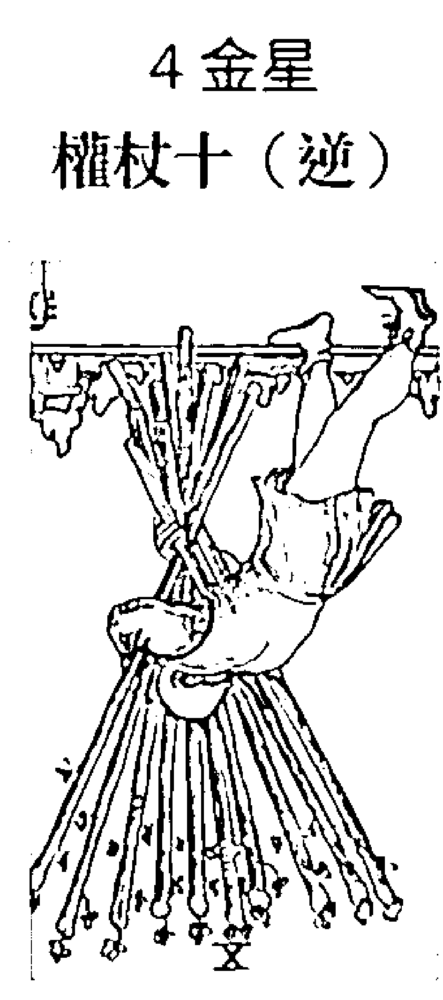

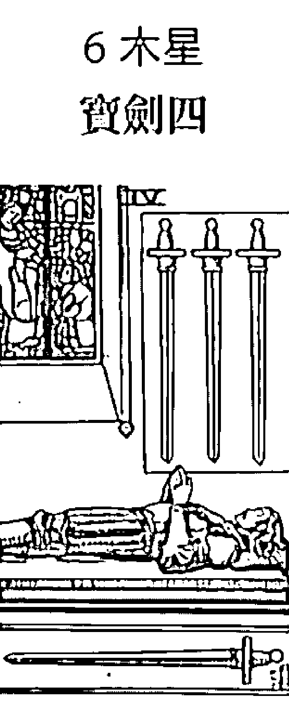

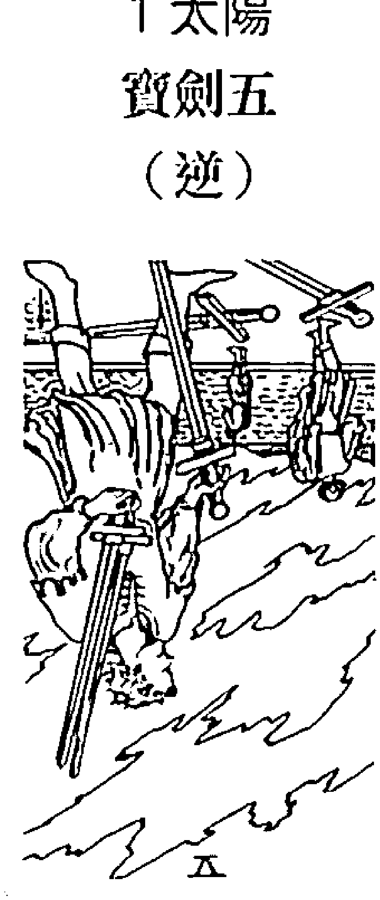

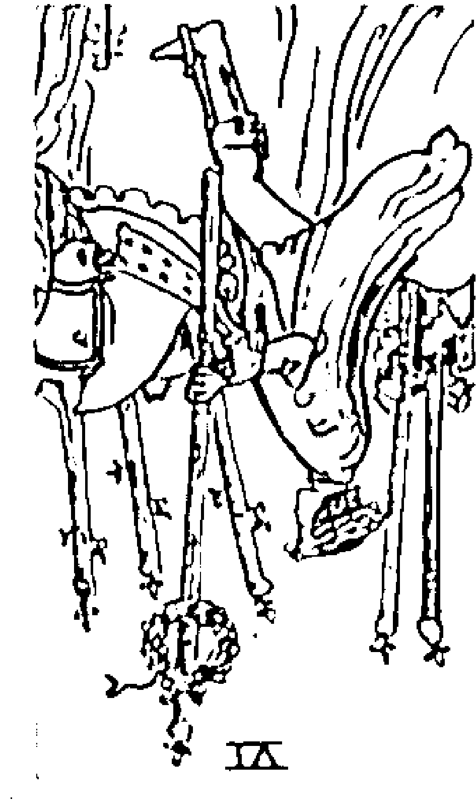

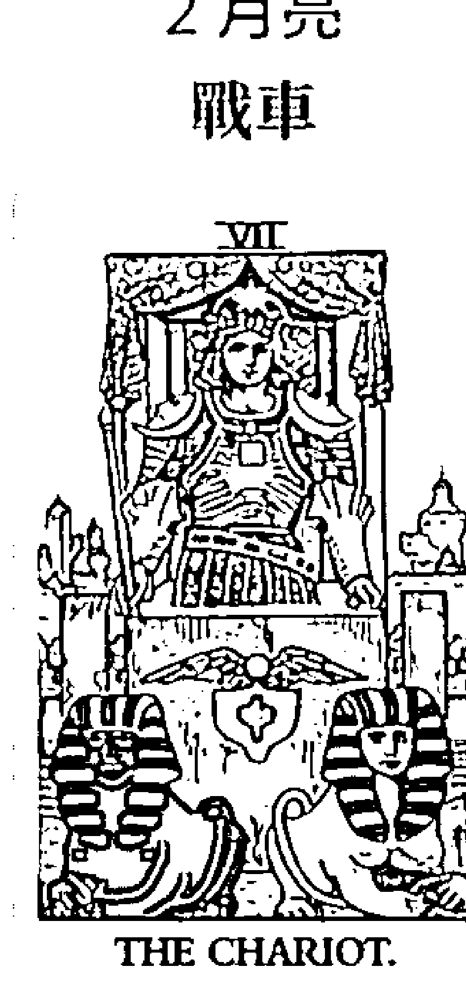

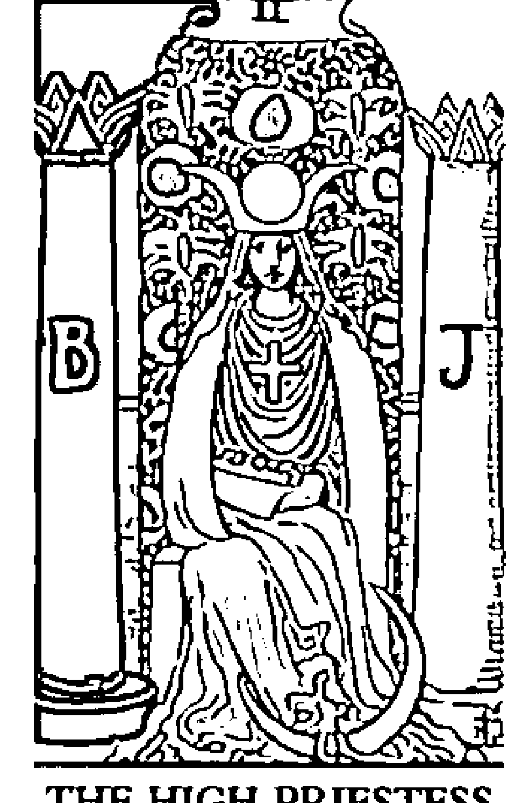

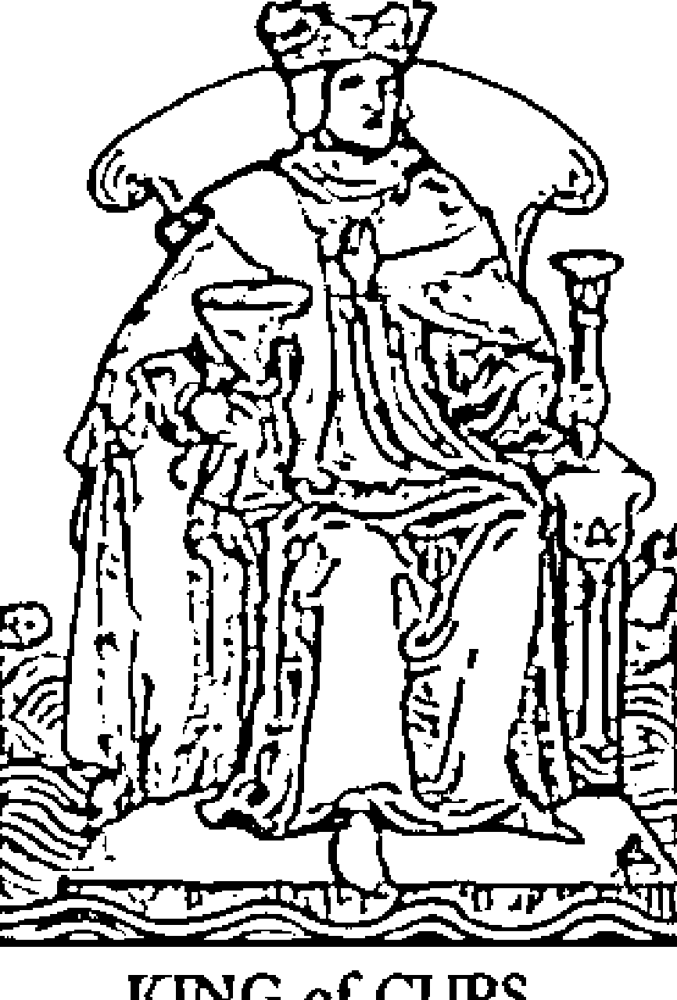

學生B：我的太陽牌是寶劍五。

老師：整副牌看起來很沒自信耶。

學生B：是啊，我覺得我很容易認輸。

老師：而且常常很猶豫。

學生B：是啊，感覺不是太開心。我的月亮牌是戰車，感覺不知道方向在哪裡。

老師：以我的經驗角度和我書上寫的來說，戰車牌就常常會天人交戰，常常會兩條路不知道要走哪一條，有選擇困難症，什麼事情都很會給自己找麻煩。明明人家覺得很明顯的答案，但是你就會覺得說如果我走這條路的話，我會不會考慮錯誤，我會不會有地方沒想到。

學生B：我不是太相信自己，對自己比較懷疑。水星權杖六，我不懂怎麼解。

老師：水星有兩種可能性，一個是你是坐在馬背上那一個，一個是你是在下面的那一群人，然後以你的角度你可能會覺得你是專門幫人家吶喊的，專門支持人家的，但也許在別人的眼裡來看，也會覺得你很不錯，但是你沒有辦法相信自己。

學生 B: 對，我不太相信自己。

老師: 但是別人都覺得你不錯啊。

學生 B: 是嗎？但是我感覺不到，所以就是月亮戰車那張牌。 金星權杖十，我給人的感覺很忙碌，感覺有很多事情要做。

老師: 對啊，壓力很沉重。

學生 B: 是，很多壓力，因為我每天有很多事情要處理。然後火星女教皇。

老師: 會激發你企圖心的事物，就是你對於外面的東西你沒有什麼信心，只有對自己要追求的東西你會比較有自信，因為這個不需要經過別人的允許跟包容。

學生 B: 對，我對無聊的東西不是太有興趣，比如明星。

老師: 你會對追求自己的成長比較有把握，因為這是你自己可以控制的事情。

學生 B：是，我不太喜歡和其他人交流。木星是寶劍四，教人安靜，這個我不太懂，老師。

老師：你的才華就是會知道什麼時候該讓自己休息，不用管太多。

學生 B：哦，就是不管別人太多的意思嗎？

老師：對，因為你平常想太多，所以你的才華就是如果不要管別人怎麼想的，你做出來的決定就很正確，就可以看清楚很多事，但是你沒有辦法不管別人怎麼想啊。

學生 B：哦，是啊，我曾經嘗試不理他人說的話然後去做事，是成功的。

老師：頭腦就變得很清醒的感覺對不對？

學生 B：對。土星，聖杯國王。

老師：你看，有沒有很對，你不要管別人的話你就會活得很好，但是你的土星就是你的罩門，你沒有辦法不管別人。

學生 B：對，我就是沒有辦法不管別人，會很擔心其他人的感受。

老師：而且你會覺得你有義務要照顧到別人的心靈，要照顧到別人的狀態，你會覺得是你的責任，因為是國王，國王就覺得要為很多事情負起責任來，但是其實根本就沒有你的事。

學生 B：哦，就是我要不管別人的事，就可以去做自己，是這樣嗎？

老師：對啊。

學生 B：謝謝老師。但是太陽是寶劍五，我不太明白。

老師：寶劍五就是你想鼓起勇氣做一件事情的時候，其實你通常會想太多，所以踏出一小步，如果不是那麼順利的話，你就會覺得失敗了，你就放棄了。動不動就放棄，之後你就想說「我果然沒天分」，或者覺得說「我就是沒有這個命」。

學生 B：對，我就是有這個想法，謝謝老師。我還想問我的火星是女祭司，但是我是一個火爆的人，為什麼這牌看不見？

老師：你有火爆嗎？你沒有火爆，你只是不太管別人的想法而已。如果你覺得自己火爆的話，那就是你的情緒在你的內心演出，你会觉得「我这样做就很火爆了」，但是实际上那个伤害性没有出来。你在幻想自己火爆而已。

学生B：我觉得我是比较容易发脾气的。

老师：情绪化啊，但是这个情绪化别人都知道，别人也不会怎样啊，或者他们凶一下，你就又会退缩，因为月亮只是战车，巨蟹啊，你会觉得在你的内心上演的角度，你们在打仗打得很厉害，但是在别人眼里你就只是在闹脾气，没什么大不了的啊。

学生B：我明白了，谢谢老师。

### 实例解读 3

朋友的朋友的个性

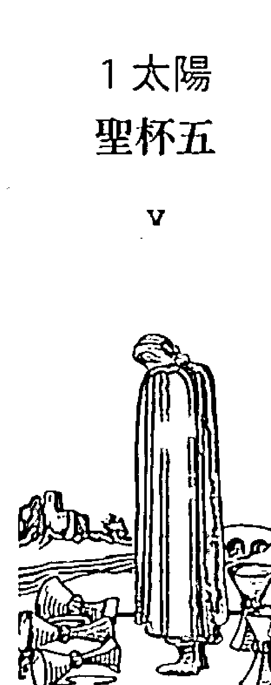

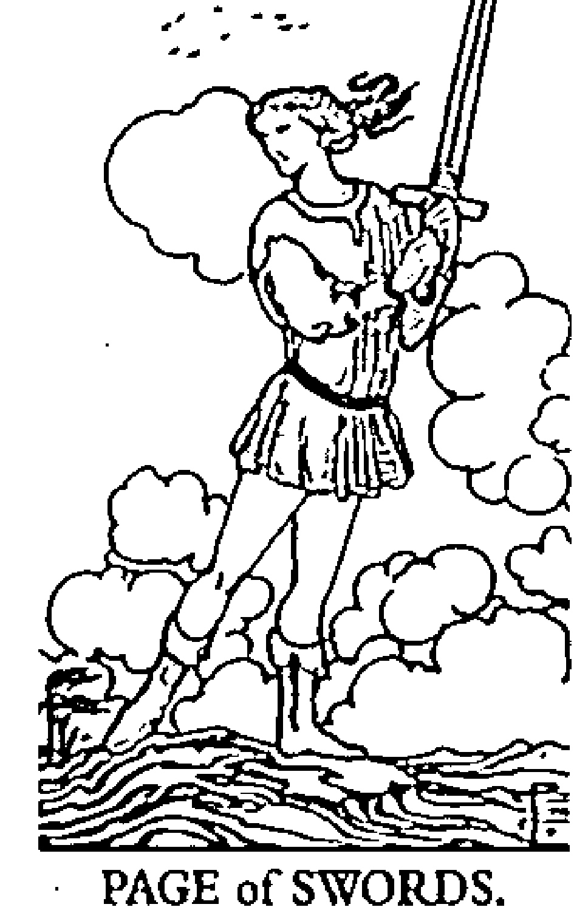

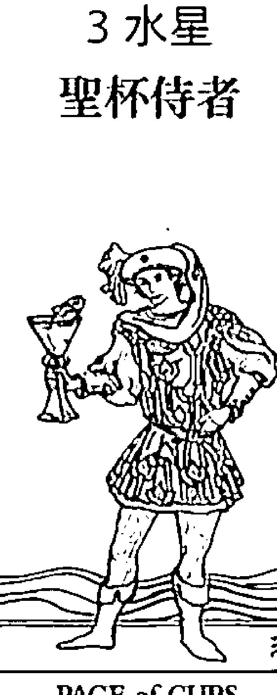

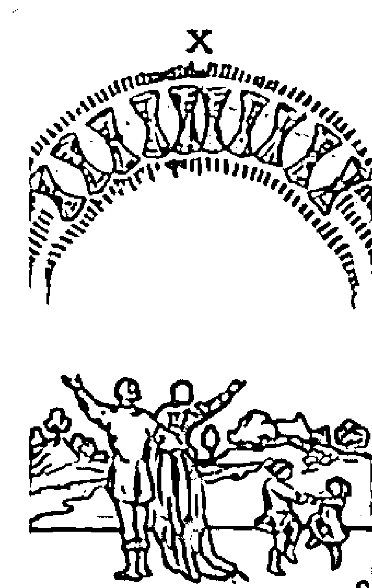

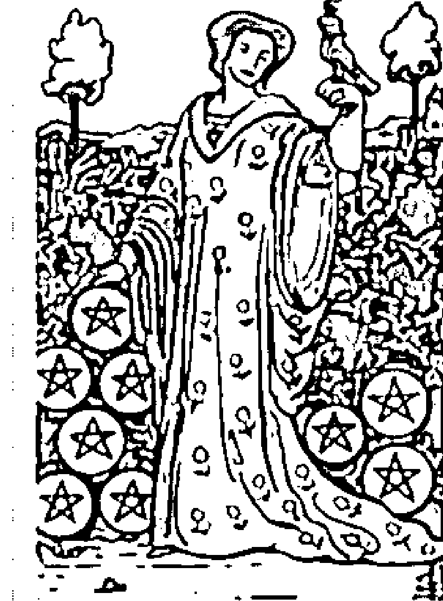

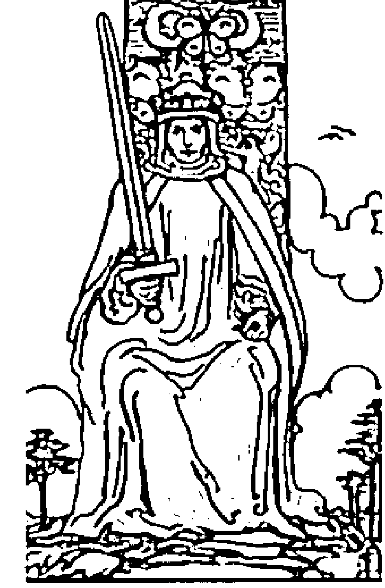

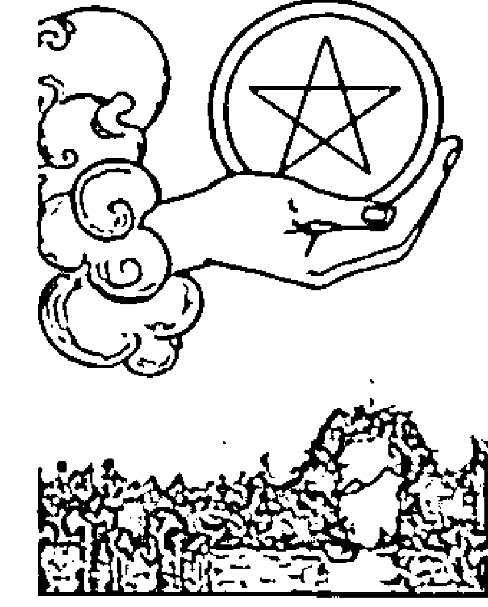

学生C：我想先请问我们抽这个牌阵，是牌的顺序比较重要还是牌的位置比较重要？我抽出来的时候把水星、金星、火星的位置弄乱了。

老师：那你就把顺序恢复到正确的位置，因为我们抽牌的顺序比较重要，顺序都跟着牌阵走。

学生C：好的，那我按顺序排。这个是我上个礼拜跟一个朋友吃饭，他找了另外一位姑娘一起用餐，是一位音乐老师，她在一家小音乐教室，有5个老师，她担任主管，老板是她的朋友，请她来当主管，5个老师里面她学生是最多的。其实我对她可以说一无所知，所以说我也没办法回馈什么。我就想说用这副牌来看看那她是怎么样的人。她的太阳是圣杯五，因为我不知道她个性是怎么样，所以说她是表现出对现状不满足。

老师：其实人家会觉得她很好，但她只看到自己的缺点，她明明有很多优点，但她喜欢看自己的缺点。

学生C：老师为什么说她只想要看到自己的缺点？

老师：因为她有两个杯子是好的，但是她只看到倒掉的杯子，她只看到自己的缺点，但是人家看到她就说妳拥有很多啊。我们可以这样说，这张牌是她对自己很苛求，用一个我们常用的角度就是对自己不满意，喜欢追求一些想像不到的事，但是从优点来讲的话代表她很要求自己，对于自己永远不满意。

学生C：老师你看到这张牌为什么说她会是一个比较看到自己缺点的人？

老师：因为她的月亮是一张好牌啊，月亮就代表她很有品味，然后生活也不错，就代表她没有什么很大的缺失，但你看她的太阳是这张圣杯五，就只有可能说她喜欢挑东挑西，对自己很苛刻。

学生C：这部分她会不会表现出来呢？对她周遭的人和事？

老师：水元素对周遭没有什么攻击性，她会自怜跟自嘲啦。

学生C：原来如此，所以老师是从元素的角度去思考，还有搭配这个月亮，我想说这两张看起来是南辕北辙，完全相反的那种性格。

老师：但是我觉得她心里其实是很有自信的，就是因为有自信所以喜欢挑自己的毛病，代表说我不会像你们这样就满足了，我一定要达到更好的，反而是一种骄傲。

学生A：老师请问圣杯八也是对现状不满，但是会有一个行动，就是出去走掉了，然后这个五只是代表这样一个状态。

老师：对，她只是说一说而已，不会去做什么，就说给别人听听而已，代表说我对于自己的要求很高，没有像你们这样觉得这样就够了，我的要求是更高的。

学生C：老师，如果说月亮这里是火元素或者风元素的话，太阳表现出来个性就是会对别人也是一样挑剔的呢？

老师：不会，除非是火星或水星是火元素，但是她的火星是宝剑国王，其实她看事情也满准的，你让她评论别人的话，她也满一针见血的。

学生C：感觉她是满精明的人，因为跟她讲话就感觉她相当精明。

老师：水星圣杯侍者代表她的沟通方式其实可能还算客气，我不知道是因为她跟你刚认识还是她对她的朋友也这样，就代表说你会看出她很精明，也会看出她对你的讲话态度是有保留的，她尽量在客气，尽量收敛自己的锐气。她吸引人的地方就是她很聪明，对很多事好奇心很强，觉得自己知道的不够，她已经很优秀，但她对自己永远都不满意。听起来压力有点大吼。（笑）

学生C：好可怕。这个女生应该不好惹，不好驾驭。

学生B：老师请问一下在金星和火星是宝剑牌，是不是对人不太好，对人有伤害心？

老师：不会啦，她只是讲实话而已，但是她知道自己是不客气的，知道自己还满尖锐的，所以她有刻意保留了，特意有柔软一点，跟人家沟通的时候有刻意放软自己的身段，这个应该听得出来吧？

学生B：请问哪些元素的牌是会做出一些伤害？

老师：火元素，代表攻击性和行动力。

学生E：老师，宝剑的人共情能力都比较差，可是你在书上有写到，风元素旁边如果没有水元素的话，真的会刀刀见骨，可是她的金星也是宝剑侍者。

老师：她要是发狠的话应该也是满讨厌的，但是她有自我收敛，因为木星圣杯十。毕竟她是老师，不能伤害到学生的心灵，就代表她有足够的才能跟智力去跟别人好好相处，只是看她要不要而已。而且看起来水星跟木星就代表她是愿意跟人家好好相处的，所以她个性是有在收敛、有在磨圆的。

学生B：那她土星缺点是什么呢？

老师：也不能算缺点，就是她的弱点，钱币一就代表要回到源头，什么事情都要回到最开始去从根里慢慢扎。她的缺点就代表说她在很多事情上并不不像她自己想像真的懂那么多，她对很多事情的认知还在慢慢发展的程度，但是这张牌的好处就是因为只在最源头，代表还没长大，也代表很有弹性，因为还没定型。

学生B：老师，我上个礼拜吃完饭后，我就想看看我和她对彼此的印象如何，我抽了一个牌阵（如下图）。抽出来都是逆位，中间隐士是目前的状况、我的心态，左边圣杯骑士是她对我的印象，右边钱币一是我对他的印象。

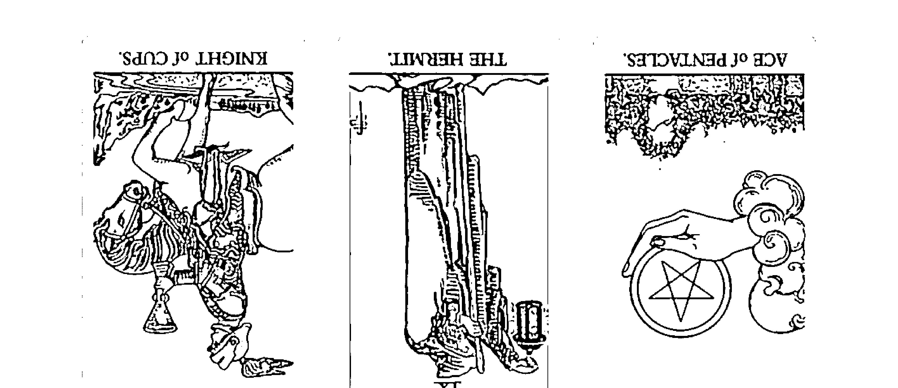

老师：看起来两个人了解还不多，感觉上不是很深入。

学生B：是的，没什么共同话题，因为我对音乐一窍不通。

老师：圣杯骑士代表她觉得你不错，还满有诚意跟礼貌的，逆位代表还不了解，时间还不到。

学生B：这三张都逆位就代表一切还不明朗。

老师：对啊，其实我觉得再相处看看，从本质的话还不错啊，我还满喜欢这样的女生。但是不知道你喜不喜欢。不会无理取闹，也不会看不起别人，她只是要求她自己。

### 实例解读 4

我的人格

1太阳 宝剑国王

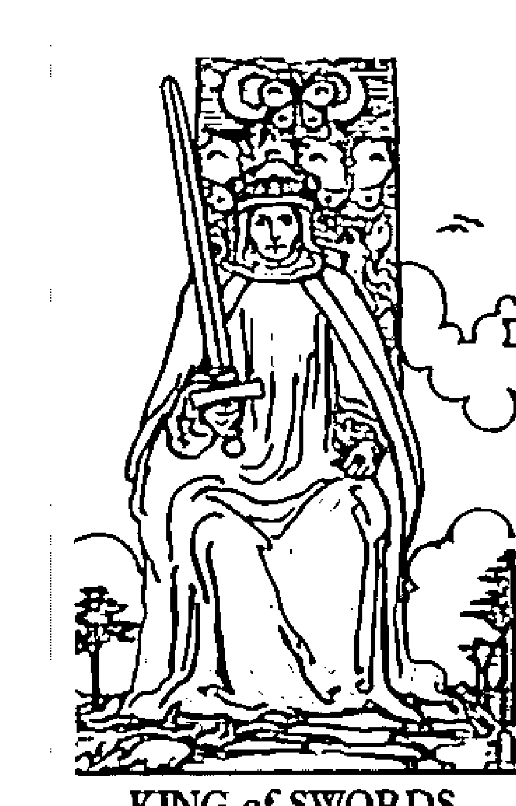

2月亮 钱币八（逆）

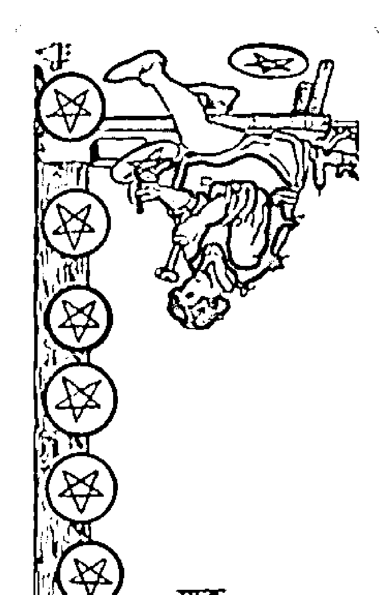

3水星 钱币四（逆）

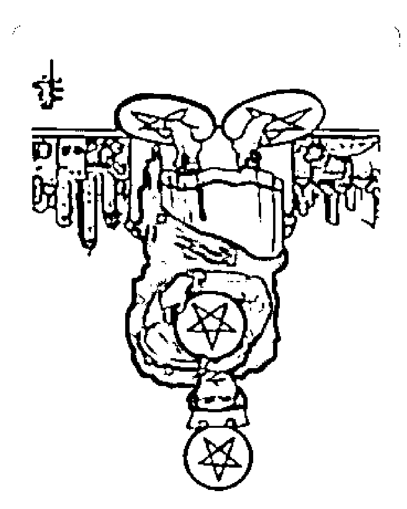

4金星 圣杯骑士（逆）

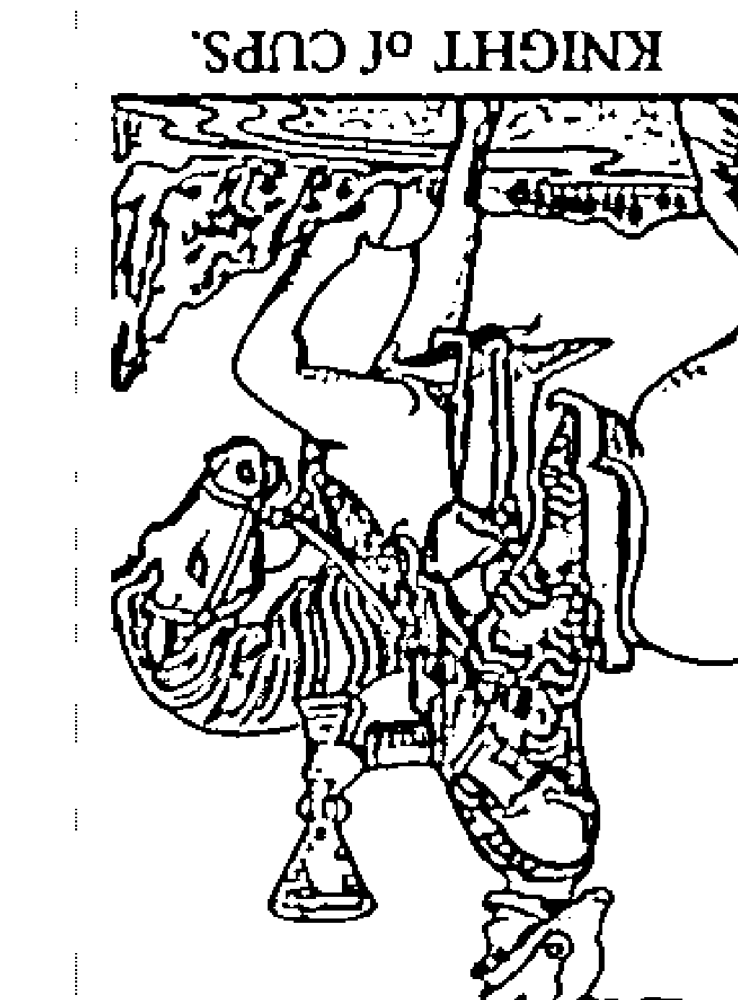

5火星 宝剑皇后（逆）

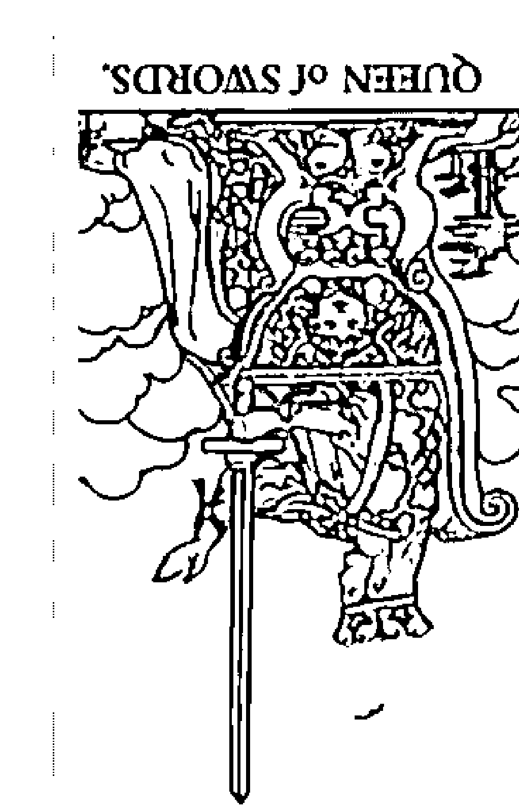

6木星 宝剑二（逆）

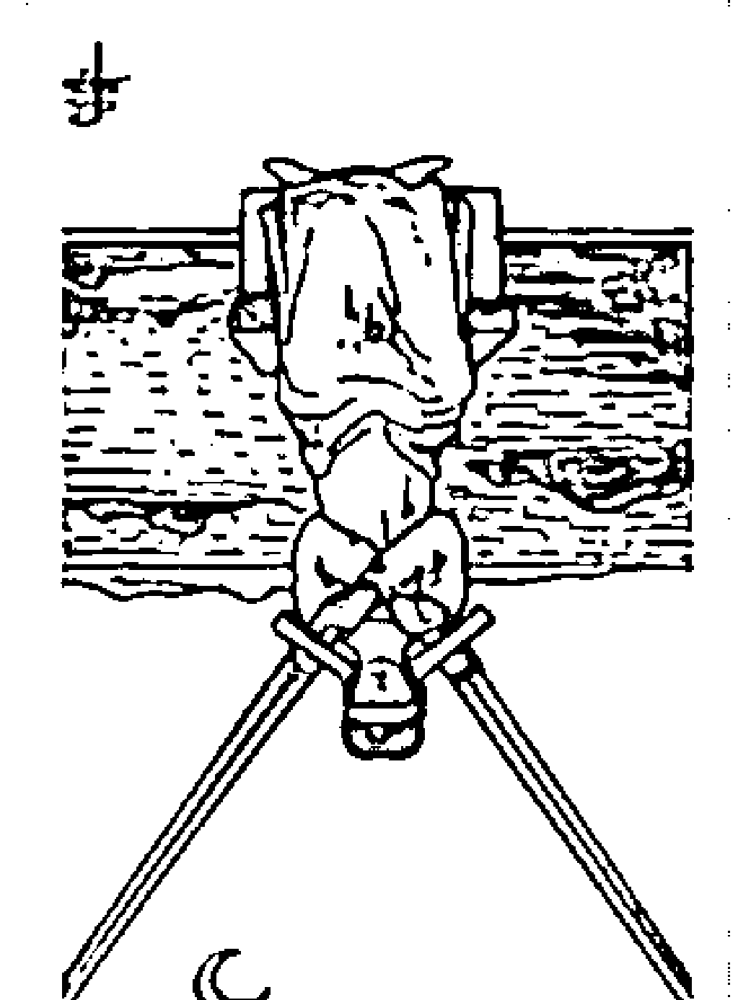

7土星 宝剑八（逆）

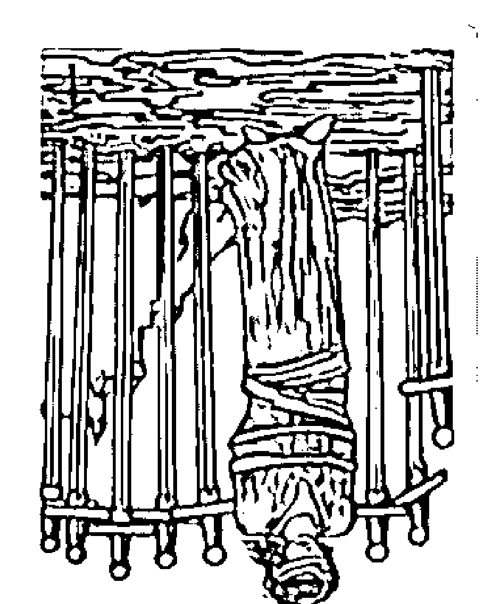

学生D：我的太阳是宝剑国王，所以大家应该会觉得我比较追求逻辑又好辩。

老师：你很聪明，但是他们都觉得你是天生的，只有你自己知道你很努力追求了半天，才得到你的答案，别人却都觉得对你好像是轻而易举，因为你的月亮是钱币八。

学生D：对，有一点，之前的确有人跟我说很羡慕我会讲很多种语言，然后我就跟他说这个是需要时间累积的，他都觉得我是一下子就会讲很多这样子。

老师：别人觉得是你天分好，但是你真的很努力。

学生D：月亮是钱币八，我做一件事会比较喜欢很实在、长期的累积，但是有时候我觉得会过于重视细节，因为是土元素，太重视细节了，会死脑筋，转不过来。

老师：对，钱币八很专注，再加上你的水星又是钱币四。

学生D：水星钱币四我觉得我讲话方面会比较实在，不喜欢讲一些很无谓的，我是喜欢聊天需要很有秩序的那种人，朋友说跟我聊天会比较累。然后思考上可能会比较偏保守跟现实，所以如果不好的话有可能会比较短视近利，就是只看到现在拥有了就觉得说我就要抓紧这一切。

老师：你就会比较看到眼前的东西，但是长远的东西你没有办法想像。你只相信看得到的东西，所以太远之后的事你没有办法想像，就算想像得到，你也会不相信。

学生D：对，的确是，在思考上我会比较偏向只看实际的东西。像之前念书或者写报告，我念是的文学专业，所以其实大家写的东西都还满学术性的，但是我会觉得我写的东西如果没有办法应用到实际生活上的话，那这个学问是没有用的。

老师：跟我的想法一样。

学生D：金星是圣杯骑士，大家可能觉得我人很好。

老师：你人缘还不错啊。

学生D：（笑）我觉得这个可以再讨论。

老师：人家会觉得你很优雅，很有礼貌。

学生D：真的吗？我明天去问一圈再回馈。但是有时候我觉得会过于追求别人的喜爱。

老师：对，因为这张牌很需要别人的肯定，这张牌就靠别人的眼光活下去啊，他很希望追求别人的认同。

学生D：没错！最好成为大家关注的中心，好的那一种。然后火星是宝剑皇后，应该是说我比较追求智力上的成长，在情绪上也很敏感，但是我觉得因为这是一个风元素在火星的地方，所以我比较外显的可能是过于强调理性，然后反而说情绪可能会被忽略或被压抑。

老师：火星就代表说你生气的时候你会怎么表现，这张牌就代表你生气的时候你会假装没生气，但你心里面非常波涛汹涌。

学生D：对，而且通常生气都是情绪去驱动，但是都要假装成好像很理性在讨论。

老师：会内伤。

学生D：对。然后木星是宝剑二，这个我比较没办法解，我不知道为什么我的才华是宝剑二。

老师：这个就是凡事你会「谋定而后动」，你会想要先看清楚，这张牌就代表你暂时没办法决定，所以你会退一步，然后从远一点的地方去理解整件事情，所以你的才华就是比较冷静，比较不会冲动。因为你也（笑）没胆子啊，整副牌看起来没什么胆子啊，没有火。

学生D：恩，就比较没有动能，只会想而已。

老师：对啊。

学生D：所以这也是才华喔？至少不会有什么大冲动。

老师：这个是你生命中需要这个特质。

学生D：为什么啊？我的风元素已经很多了，为什么还需要带一个宝剑二？

老师：可能是你有很多的机会，但是如果说你太强调自我的话，就会变得比较不是你理想那样，因为你想要大家都喜欢你，但是你所有的才华静静展现出来的话，可能人家会嫉妒你，或者会讨厌你，这个就不是你要的。所以你就不敢太嚣张啊，都没有火啊。

学生D：所以宝剑二如果做正面的诠释，就是比较要求思虑周全。

老师：对，凡事不会太冲动，再加上你的牌阵里面没有火，就表示你真的会考虑得很周详，很多事情别人按捺不住的，你却可以控制得住。

学生D：所以可以解释说比较偏理性的。

老师：对，而且你有没有发现你的土跟风比较多，这两个都是理性元素啊，水元素只有一张，就是你对外展现出来的样子。

学生D：对，所以可能对外展现出来很讨人喜欢是假的，其实很理智。

老师：对啊，但是你也知道别人不喜欢那么理性的状况，你会比较希望自己融入大家一点。

学生D：会知道大家想要看到什么，然后表现出来。

老师：对啊，好聪明喔。

学生D：宝剑二在木星的话，二的元素该怎么解呢？

老师：宝剑二的话，你会考虑到不一样的立场，然后你都可以接受，做一个平衡。

学生D：没错，我有朋友反映有时候他们讲出一个论点，我就会讲对立面的论点，但是那个未必会是我的立场。

老师：你不会用批评的角度，你就是提出那个论点，然后平衡。

学生D：然后土星是宝剑八，小剧场很多，我觉得就会很容易画地自限，因为都困在思绪里面。

老师：对啊，你其实都没有太大的困难，就是因为这张宝剑八，你的个性就代表说幻想很多没发生的事情，然后你会觉得如果我做了什么事会怎样，但是事情也没发生啊。但是如果说宝剑八在木星，就代表你也很能掌握事情的状况，不会很随便的出手，但如果在土星的话就代表这是你的缺点，代表很多事情你可以再放开一点。

学生D：就是可以再冲动一点，是这样吗？

老师：对，可以再随性一点，可以不用那么自己吓自己。

学生D：我有一个问题是，其实我的个性满暴躁的，但是这个牌面看起来很理性，一点都不暴躁。

学生E：可是你有宝剑皇后哎，内心里面波涛汹涌，把自己杀得片甲不留，你的剑都捅自己。

老师：你如果有胆子捅别人，我就承认你暴躁。

学生D：应该说从第一份工作到现在，其实过程中都有人在背后批评我说话不是很客气，态度不是很好。

老师：宝剑皇后这一张牌讲话也不客气，会一针见血，把那个重点讲出来，就很像八字里面的「伤官」，讲话很贱，却是理性的，所以别人没有办法反驳你，才说你讨厌呐。而且事情都看得非常清楚，非常聪明，但是人最怕听到的就是实话。你会觉得你之前暴躁，但是别人看你不是暴躁，是冷血。

学生D：（笑）好像没有比较好，暴躁跟冷血。

老师：只是定义不一样，你「不好惹」这点还是一样的。

学生D：了解，的确理清了很多重点，我一直以为是自己管不住自己的脾气。

老师：没有啊，你管得很好。

学生D：只是讲话太直接。

老师：讨人厌。（笑）因为很聪明，你觉得你想的东西别人都可以接受，但是忽略掉一点就是别人没有想到那么多，和这对别人来讲会是一个打击。你会觉得，既然你问我的话，你不就是要听实话吗，那我就告诉你实话啊，难道你要我讲假话吗？

学生D：对！我想问一下这副牌里面，有什么地方能看出比较难社会化？

老师：你会看到你最多的元素就是风，风有可能自己活在自己的头脑里面，不是融入不了别人，是觉得不需要。

学生D：老师，木星宝剑二，土星宝剑八，刚好都是把眼睛朦起来的，有没有可能好处是活在自己的世界，但坏处也是太过活在自己的世界？

老师：两张牌都眼睛朦起来，就代表说比较不喜欢去看外界的状况，你比较喜欢用自己的标准来判定。这个你要说好处跟坏处都可以。如果是好处就代表你有定见，不会被别人左右，但如果是坏处的时候，就代表你不知道别人想什么。而且两张八代表你有很多东西或者很多才华，或者你拥有的东西在你自己来说的话已经够了，但是你觉得好像还是要更多。因为九就代表你需要转化到另外一个层级，但是也不一定要，当然有这个转变的话你也会很高兴，但不是一定要，两张八就代表你现在的日子也过得不错，不满足的就是你对自己的标准想要再提高而已。

学生D：怎么看得出是对自己的标准？

老师：因为缺的都是火跟水，就代表你是自我认知上的状况，如果说风跟土加起来这两个元素，客观来讲，就代表你知道自己已经拥有够多，但是主观来讲你会想要去追求更好的，对自己的要求更高。

学生D：但是这个要求的话，因为月亮是土元素，代表安全感，是不是想要在物质上不停的拥有更多？

老师：其实你觉得已经够了，但是安全感没有人嫌多啊。其实你不觉得自己缺什么。

学生D：我觉得自己缺眼色，缺一点社会化。我对自己最大的困扰是我觉得我思考上很像外星人，有时候做出来一件事，一般人不理解。

老师：你会觉得自己已经很尽力了，但是别人还是没有办法照你预期的来看待你。

学生D：对，或者说没有办法符合别人对我的要求或期待。

老师：其实你缺的是你对自己的肯定。因为不管你做得再好，一定会有人不喜欢你啊，其实你也没有不稳定，这个你也知道，但是你就会觉得如果我可以更好一点，我一定会更顺利，这是你对自己的要求。但是你也知道这个就只能慢慢来，看起来你也了解，我觉得你没有太强求啦。

学生D：（笑）已经准备要放弃了，我觉得我的才华应该就是适时的放手。

老师：就是随缘哪，其实这也没有造成你很大的困扰。

学生D：现在最大的困扰就是宝剑八吧，其实都是自己想的，因为都没有去实践就没有办法验证。但是如果木星是逆位的宝剑二会稍微缓和不好的特质吗？因为还是坏牌的逆位。

老师：我不是这样看的，每个逆位我都要跟整体一起看。但是你要这样讲也可以。

学生D：像是钱币四和钱币八还满好解的，就是过度的土，但是因为宝剑本身就是坏牌，我就卡了很久。

老师：不要想得太复杂，不要想成一张坏牌或者一张好牌，他就是一张这种特质的牌，这个牌也只是后人解读时，他的主观意见是这样子，但是用主观意见谈一个特质就一定会有好有坏，所以我都不太分正逆位，因为我觉得每一个特质都是中性的。

学生D：但是我就很好奇虽然我的金星是圣杯骑士，却一直会有流言蜚语，攻击性的言论。因为在我的主观认知里，我觉得我人缘不太好。

老师：你会觉得你已经很想办法站在别人的立场了。但毕竟你不是别人，你不会知道他们怎么想。

学生D：对，没错！我觉得我卡住的地方就是好像我没有办法站在别人的角度去想，这应该也是风的特质强的一个特色吧？

老师：因为风元素就代表活在自己的世界里面，活在的头脑造出来的世界里面，对于现实的世界不是那么在乎。其实就你的牌来看，你真的就是在讲实话而已，但是别人会误以为你想暗示什么或者攻击什么。

学生D：所以大部分状况就是比如别人有的地方没有做好，被我指出来，我指出来的方式也会非常直接，变成人家觉得我在攻击他，双方认知的落差。

老师：我跟人家相处也是这个样子，但是我的好处就是「我就是这样，不然你要怎样？」然后对方就会弱下去。

学生D：满有趣的是如果看星盘的话，我的火星在十二宫，有火气但是发不出来。

老师：这张宝剑皇后也没什么火气啊，就是内伤而已。

学生D：对！就是内伤，其实会生气但是没有办法向外界发出来，所以最后都会回到自己身上。

学生A：老师，宝剑可不可以理解为自我攻击比较多，因为想得比较多？

老师：宝剑就代表你的思虑你的想法，这个真的攻击不到别人，你只能攻击你自己。

学生A：明白，那等于权杖国王的攻击性大于宝剑国王对吗？如果从攻击的结果来讲。

老师：是，但是如果从攻击力来讲就不算，因为权杖国王可能想要攻击别人，别人可能闪一下就过了，他的拳头落在别人身上也不痛，但是宝剑国王可能没有想攻击别人，但是随口说一句就会给人造成很大的伤害。

### 實例解讀 5

#### 前主管的個性

| 位置 | 行星 | 塔羅牌 |
|---|---|---|
| 1 | 太陽 | 星星 |
| 2 | 月亮 | 錢幣一（逆） |
| 3 | 水星 | 聖杯八 |
| 4 | 金星 | 正義 |
| 5 | 火星 | 錢幣國王 |
| 6 | 木星 | 寶劍五（逆） |
| 7 | 土星 | 死神 |

學生 D：這個牌陣是我前公司的主管，對我比較是亦師亦友，他年紀比較大。他的太陽是星星牌，滿吻合的，因為他太陽確實是水瓶座。我覺得別人看他是一個很有理想性，很聰明的人，同時他也是一個有距離感的人，「只可遠觀不可褻玩」的那種完美的形象。他的月亮是錢幣一，我可以聯想的只有他想要追求穩定的物質生活或者條件，但是不確定逆位該怎麼解，因為一的話好像也沒有像錢幣四那樣執著。

老師：他的動力在於，你會發現如果愛錢的話，一整副牌來看，他只要能讓自己穩定下來，多餘的錢他不會想要。火星這一張錢幣國王，如果不是錢會引發他的動力的話，這張還有可能是什麼引發他的企圖心跟動力？

學生 D：控制慾，我覺得錢幣國王是需要建立自己的王國，確認這個領地就是我的。

老師：他喜歡很多事情他都防範到滴水不漏，很多事情他都想要控制到超出他的理解範圍外，你講的也對。

學生 D：所以如果搭配他的月亮的話，他好像太重視物質世界的穩定。

老師：對，因為他的理想很遠大，太陽是星星，他覺得我要爬得很高，所以我的底子必須要打得很好。

學生 D：他的金星是正義牌，我覺得他確實很理性客觀，還很會分析。

老師：滿無趣的，我覺得金星是正義牌看起來滿無趣的。

學生 D：對，他是一個很無趣的人，但是正義牌的話，他比較像一個制定規則的人，他去制定怎麼樣才是好，因為正義在金星，所以我覺得他表現出來的理性大家可以接受，願意去遵循。

老師：他在這方面其實很有自己的主觀想法，但是他會跟人家溝通，他不會強制。

學生 D：因為是風元素嗎？

老師：對，而且天秤座就是很會說服人家，跟人家談判。

學生 D：對，我覺得跟他個性很像的是，他看似很理性，但其實他已經很有定見，他很會去說服人家。

老師：對啊，你要去說服人家也是要你主觀吶，你要先覺得什麼事情是對的，再去說服人家。

學生D：然後他的水星是聖杯八，這個我不太知道為什麼，是他思考上很願意嘗試未知的領域嗎？

老師：可能這一張的意思是說，他想要在很短的時間之內說服人家，如果說服不了他就硬幹。因為他很快就放棄啊，他會另外找辦法或者另外找人去幫助這件事情，他不會在同一個人或同一件事上花太久的時間。

學生D：我覺得這是不是和他的木星寶劍五可以聯動，就是會找方法的人。但是他的木星寶劍五也可以說他是一個好勝心比較強的人？

老師：他懂得該認輸的時候認輸，然後從別的地方贏回來。

學生D：好可怕。

老師：可是如果以我的角度來說，我覺得他滿單純的，因為我覺得這個想法是一般人都有的想法，他用的方法就是一般人都會用的方法，沒有什麼太高明的地方，所以不會特別難對付。就我的角度來說我覺得還滿好對付的，因為你可以理解他的下一步要做什麼。

學生B：老師是怎麼看出滿好理解他的下一步是怎麼做的？

老師：因為他的月亮是錢幣一，太陽是星星，就代表說想要做的事情動機都很單純，動機單純就代表我們都可以預料得到，比如說他要錢或是什麼東西，他平常時候都會表現出來，所以我們不會很難猜測。他的太陽是星星代表他其實也不會鑽得太深，加上金星又是正義，就代表他是講道理的，也沒有太複雜的想法。我還覺得滿容易理解的，或是他自己有心機，但是在別人眼裡都會覺得很明顯。

學生 D：那他寶劍五在木星除了在該認輸時認輸，還有沒有其他優點？而且是逆位。

學生 E：識時務者為俊傑？

老師：可以這樣說，他不是會看人，他是會看狀況。他懶得去理解人，他也理解不了。他會了解人的行為，但他不了解人性。因為太陽和金星是水瓶和天秤，他會研究別人的行為，但是不代表他了解人性，那個是要去共感的，但是天秤跟水瓶的共感能力沒有那麼強。而且他的缺點土星是死神，他很不會變通。

學生 B：老師，為什麼死神是不會變通啊？

老師：因為死神就代表他的想法已經沒辦法再改變了，死了，就是沒有生命力，沒有改變，沒有變化的能力了。

學生 D：剛剛的水星聖杯八，但看這張牌該怎麼解？

老師：就是他會「柿子挑軟的吃」，其實你說的對，跟他的寶劍五是聯動的，他覺得狀況不對他就走人呐，另外再想辦法。

學生 D：我想問一下，他的土星是死神，代表一種轉化，他的水星又是水元素的聖杯，有沒有可能他很抗拒情緒或情感上的轉化？

老師：他不會想到這件事。

學生 D：因為根本沒有在他的意識裡？但是聖杯八是一個水元素的牌，不是應該還是對情緒有點認知嗎？我疑惑的點在於他的水元素到底是展現在哪啊？

老師：你會看到整副牌的水元素只有這張和死神，死神是土星，都是沒有什麼活力跟變動的水元素，就算有水元素也是不流動的水元素，所以他沒什麼共感的能力，沒有變化的能力。而且沒有火元素，就代表他沒有什麼情感面，他都是理性面，所以他去了解人的話，也只是從理論上面了解，就知道這個人會做什麼事，但這個人為什麼會做這件事，他沒興趣。死神牌也是成見很深的。

學生 D：有一點很巧的是在他的星盤裡土星是在巨蟹座，他的情緒這一塊我覺得有點被堵塞，在跟他交談時，感覺他會刻意避免。

老師：雖然他有水元素，但是他的水都不流動，他是有感覺的，但是他不知道怎麼疏通他的情緒，也不知道怎麼論述他的情緒，所以是沒有辦法釋放的。

學生 E：老師，可是他的太陽牌是星星，不是應該很能夠通曉一些情感上的東西嗎？

老師：沒有啊，他外星人啊。就我的認知，連你把答案告訴他，他都還可以理解錯誤。

學生 D：老師的書裡有寫寶劍五有一個特質就是自我價值低落，在木星的話可以解釋成雖然有這個特質，但是他會去勇於提升嗎？

老師：把這個特質運用在好的地方，就是他的自我主見是很強，但他可能因為知道自我的主見很強，所以他在必要的時候會意識到說我這一次太執著了，所以反而會退一步，他知道自己的缺點在哪裡，有想辦法在克服。

學生 D：雖然他的木星有把自我價值低落運用在好的地方，他的運用有沒有可能就是他覺得自我價值哪裡不好，就會刻意去提升那方面，但是因為他的月亮是錢幣一逆位，所以他反而會搞錯方向，例如本來是情緒上的事，他卻會用物質上的事去彌補去提升？

老師：有可能，而且常常會。因為他沒有這種方式來理解。

學生 D：土星死神的話，是說他不知道變通，或者沒有意識，有沒有可能是他需要面對情緒上的轉化時是逃避或是抗拒的？或者就只是表明他情緒上堵塞而已？

老師：因為死神就代表說他缺乏思考能力啊，就算去想，他也想不通。

### 實例解讀 6

#### 我這一年的個性轉變

學生 E：我是抽我這一年的變化。我的太陽是世界，我這一年覺得疫情結束了，而我在疫情這三年生了一場很大的病，現在也都治療好了，要回公司上班。

老師：這張牌是康復。

學生 E：對，我就是生了一場很大的病，也花了兩三年治療，現今在工作上也都慢慢回復到過去，回到公司上班這樣子，所以我會覺得我又重新開始我的人生，開始又變成「看山是山，看水是水」的狀態。

我的月亮是錢幣三，是我覺得生完病以後，內心有一點貧瘠，所以我才開始接觸一些神秘學的東西，其實起初只是因為我生病時覺得我的腦子不太好，我想要讓腦子活化，學一些比較有趣的東西，所以才踏入這個領域。我覺得在這個過程裡面我需要很多人的幫助，像跟同學們的切磋，還有一起上課或一些社群，我覺得我這一年腦子就沒有那麼糟了。我之前做了非常多次的化療，腦子有點堵塞，也不太能夠好好講話。

然後水星是錢幣一，對我來說就是開始學習的過程，延續前面月亮的看法，就是我開始想要對自己的內心、跟別人的表達方式，還有觀察別人或觀察這個世界的方式不一樣了，所以我想要學習表達，對我來說這是需要投資時間跟資源下去的。

老師：你在生病之前表達得不好嗎？

學生 E：也不錯，但是我覺得自己是需要進步的，因為生病以後我覺得講話沒有那麼流暢，老師的經歷對我也是很大的鼓舞。錢幣一尤其又是逆位，我的看法就是我對這個不確定的因素有點沒辦法掌控，因為資訊很多，我想要在最有效的資源上面得到最好的學習，土象星座就是這個樣子。

我的金星是權杖七，就是一個人在對世界做 fighting 的動作，在生病以後，我的模樣和以往有一點差距，所以我從心裡面要去接受自己的樣子，很多人說「不會，你現在很健康，這樣就好了」，但是我可以看出他們的眼神中看出「這個人怎麼變那麼多」，因為我做的都是荷爾蒙治療，人就會變兩三倍大，你要一直跟別人解釋這是藥的副作用，我也很想今年在身體上有一個調整。

火星是寶劍一，我希望自己在思考上有一個開創的想法，在經過了跟別人合作之後有所改變。

聖杯八在木星就是所謂的才華，我對自己其實有很多追求，我並不覺得這個年紀生了一場大病後，就要停下來，我反而對於自己現在內心的豐盛是感到滿足的，而且我希望能够追求更多。

最後，土星是我的罩門，抽到月亮，不夠有自信，會一直有點患得患失，可是我會一邊患得患失，一邊往前走。

老師：因為這個月亮下一張就是 19 號太陽，你總會天亮。我們其實都不會解錯，如果你有看書怎麼都不會錯到哪裡，但是每個人解牌看的角度會不太一樣。

學生E：老師你知道我怕的是什麼，我不太看自己的問題，我很怕自己在解牌時帶入很多已知的狀況，我幫別人解比較快，就像我剛剛自己解就會帶入很多我自己知道的事情，但如果是老師來看我的這些牌，你會看出我剛剛講的那些脈絡嗎？

老師：每個人都怕啊。也看得出來。看得出你目前很努力的要站穩自己的腳步，然後慢慢的要讓自己獨立起來，也看得出來你對待別人的態度，雖然金星是權杖七，但畢竟是逆位，就代表你現在看起來沒有以前那麼有自信，逆位就代表之前是好的，現在是逆的。但是火星就是你想要找到以前的活力和外貌，寶劍一就是代表你會想辦法，不會像權杖一是靠蠻力一直衝一直衝，寶劍一是會想辦法。

學生E：權杖一就是腿跑得比腦子快那種。

老師：對啊。然後才華聖杯八也不完全是壞處，因為聖杯八就是代表說你知道自己擁有的東西就這樣，但是你想要更好的，你想要聖杯九。聖杯八是擁有很多已經很多，他想要的是全新的東西、更好的東西，他本來就擁有很多了，但是他現在離開，並不是要放棄這些，是這些東西先放著，然後去追求他沒有的。

學生E：對，我以前都沒有想過要接觸這些，所以我就覺得我不是因為心裡空虛，而是我覺得很有趣，腦子也可以活化。

學生 B：老師請問太陽是世界牌，為什麼解釋成恢復？

老師：因為世界牌是一個完整的東西，代表說他生病已經有一些缺失，但是世界牌就代表你會恢復到完整，因為世界牌就是不缺的。

學生 E：對啊，試想世界牌就是等於一個事情結束，就是我如果不是生病，也可能是家裡裝潢好了，像老師這樣。

老師：完整了。

### 實例解讀 7

#### 老闆最近的狀況

| 位置 | 行星 | 塔羅牌 |
|---|---|---|
| 1 | 太陽 | 寶劍九 |
| 2 | 月亮 | 寶劍十 |
| 3 | 水星 | 愚人（逆） |
| 4 | 金星 | 權杖四（逆） |
| 5 | 火星 | 聖杯八（逆） |
| 6 | 木星 | 錢幣八 |
| 7 | 土星 | 錢幣七 |

學生E：我和我老闆一起工作了十年，她跳槽到現在的公司，我也一起過來。她最近過得滿不順的，爭取董事長的位子敗下陣來，現在連家裡電燈泡突然亮了，她都覺得有鬼，所以我就想幫她抽個牌看看未來半年的狀況。

從太陽寶劍九就可以看出來她真的就是自己嚇自己，做很多杞人憂天的事情，其實大可不必，她把小孩子送到美國唸書，各方面都已經就位了，家裡前陣子有些東西都壞掉，所以她壓力滿大的。她是單親媽媽，又要面對工作，還有小孩在美國，她自己一個人住，所以她月亮牌寶劍十，心理上的疲累已經到了極致，但是也已經走到最後啦，是一個要否極泰來的過程。

水星是與人的溝通，對應到工作上，因為她跟董事長之前有點口角，水星愚人逆位表示她可能跟上面或同級的人溝通要多小心，可能會收到一些錯誤的訊息，造成一些錯誤的判斷，變得沒有那麼果決，沒有自信，是不是應該回到初心，靜下來想想自己本來是怎麼面對這個人，因為他們是一起競爭董事長位子，她敗下陣來。

老師：愚人這張牌好像是代表她沒辦法用平常心跟這個董事長溝通。這張牌如果我來解的話，我也覺得有一點天真，但是如果你是面對董事長的話，其實也不可能裝瘋賣傻。所以說她應該是已經不知道自己要用什麼表達方式，對她來說她就會用一些不得體的方式。

學生E：對。我作為特助的角色想要給她建議，可能要跟她講：妳如果這時候在應對上可能比較容易出錯的話，就多小心。

老師：過一陣再回她。

學生E：她的金星是權杖四逆位，她其實是一個非常努力工作的女生。

老師：而且其實別人看她也都不錯啊。

學生E：對，她各方面都很不錯。

老師：她目前好像覺得自己之前做了很多的功課，卻沒有要繼續往上發展的樣子，因為是逆位。她覺得她的基礎很好，應該要往上發展，但是那個基礎現在好像沒有派上什麼用場。

學生E：對，她這兩三個月已經沒有像以前那麼積極，對公司給她的位子酬勞獎金都有點失望，是可以反映在這個牌上嗎？

老師：可以。她現在連動力都沒有了，因為火星是聖杯八。

學生E：對，聖杯八，我可以建議她這陣子沉潛一點對嗎？

老師：去玩一玩，不要整天都在工作。你有沒有發現兩張八一張九一張十，就代表說她已經把自己逼到快要臨界點了。

學生E：對，她的牌都是很後面的，這個事情已經走完了的樣子。所以她的木星錢幣八是一個能量的累積，她是一個很認真很努力的人。

老師：而且從細節來說，她很優秀。

學生E：她是不善言辭的人，可是她是我們亞洲區業務做得最好的人，所以你看她多認真，我心裡對她很佩服，她的才華就是她很會累積自己的能量對不對？她未來這半年還是應該累積一些自己的實力對嗎？

老師：對。你有沒有發現土星比木星少一個數字，所以她要定下來的地方都是硬ㄍ一ㄤ起來的，她就很努力做到那個程度，但是她的缺點是如果她不全神貫注的話，她很容易就弱下去了。如果沒有那麼努力的話，她好像就爬不上去了，所以也不能勸她休息喔，你跟她說你要努力可以，但是你先放個假，或者去買些東西，讓自己放鬆。

### 實例解讀 8

#### 友人的個性

| 位置 | 行星 | 塔羅牌 |
|---|---|---|
| 1 | 太陽 | 聖杯三 |
| 2 | 月亮 | 聖杯十 |
| 3 | 水星 | 聖杯七（逆） |
| 4 | 金星 | 權杖侍者（逆） |
| 5 | 火星 | 聖杯六 |
| 6 | 木星 | 死神（逆） |
| 7 | 土星 | 權杖八 |

學生 A：我問的是友人的性格。老師，上次您說我們如果抽未來的話，也是從現在投射的一個未來，那現在我抽友人的性格，是不是也代表我有一個投射，就是我看他是什麼樣。

老師：是他對你來說是一個什麼樣的人。

學生 A：喔，明白。也許他在別人的眼中或者他在另外的領域就不一樣。

老師：或他在工作上的表現，或他在感情的表現又是不同的人了。

學生 A：明白。我還有一個相關的問題，因為您說現在我們問將來的事是一種投射，那比如說我給人家建議，或者是我抽牌以後，自己得到一些啟示，我去改變一些做法、條件，那是不是其實這個結果也是會影響的？

老師：對。

學生 A：太陽是聖杯三。

老師：這個人是不是還滿好相處的？

學生 A：大概是從我的角度看吧，因為抽出這張牌我也覺得滿奇怪的，這個人給大多數人的感覺是不太好相處。不過從我的角度來看可能覺得還好，其實他是一個在工作上很嚴肅的人，但是我抽出他的太陽是聖杯三，好像是很愛玩樂的性格，很喜歡享受應酬，開開心心的。

老師：他還滿喜歡跟人家溝通的啊。

學生 A：對，他喜歡生活在人群當中，不太喜歡自己一個人，喜歡社交。他的月亮是聖杯十，這個人應該是一個很有自信，對自己各方面都覺得很滿意，滿意度幸福度挺高的。

老師：他擁有的可能不多，但他對自己擁有的都還算滿意。

學生 A：喔，是這樣。那他的水星是聖杯七，這個我不太會解，在水星的位置如果出現這種水元素的牌，我不太明白。

老師：這張牌就是他講話會講很多的夢想，但是不見得做得到。

學生 A：畫大餅的人是嗎？

老師：可以這樣說。

學生 A：對，沒錯，他是個很喜歡畫大餅的人，確實是，這個好準。

老師：你不是說大家覺得他很嚴肅嗎？看不出來啊。

學生A：他是一個高階主管，他是很嚴肅的給人家畫大餅，嚴肅的管理者，給人家一個很好的遠景，讓人家做事。人家會覺得他還挺嚴肅的而且愛發脾氣，但是他這個火星真的看不出來愛發脾氣，可能是他對我還滿好的。

老師：他還滿好溝通的，聖杯六還滿容易溝通的啊，就算你講的不是他要的，他還是會退一步接受。

學生A：是，也許他只對我這樣吧。因為我從來都不覺得他很可怕，別人卻都怕他。我發現他可能是覺得我年紀小，對我滿好的，所以他不會特別兇，有時候挺好溝通的，所以我才想問老師是不是我的投射作用很嚴重。

老師：可能他對於你來說就是這樣一個人。

學生A：明白。那他的金星是權杖侍者，他的溝通方式就是很小朋友的感覺。

老師：他還滿直接了當的，就是直接用問的。他對於很多事都滿好奇的，會打破砂鍋問到底。

學生 A：對，他的溝通是比較直接，而且在他溝通的時候好像不太在意別人的看法，所以他就會直接問他要問的，不太在意別人的感受，所以對別人來說很直接。

老師：很冒昧嗎？

學生 A：是，有一點，而且可能因為他的位階，他也不太容易考慮別人的感受，他可能覺得不用，所以有些時候會給人一點壓迫感吧。然後他的木星是死神，是不是代表他很會救火，解決一些困難的事？

老師：如果死神是他的才華的話，就是他做事還滿堅定的。

學生 A：是，他做事、管理員工或在工作上是很鐵腕的人，有他的規矩，別人要遵守他的規則。他的土星是權杖八，大概他的缺點就在於他同時會處理很多事吧，很忙碌。

老師：他不能同時做很多事，但是很多人又喜歡推事情給他，所以他勉強同時做很多事情的下場就是都做得普普通通。

學生 A：喔，是的。他的工作壓力非常大，好像又不是別人逼著他做，他自己就會把時間塞到很滿，一直在轉，不太會休息，看起來很忙碌。

學生 D：老師我想請教一下，從哪裡看得出來他在工作上面的成績普普通通啊？

老師：權杖八，你看他的土星。他不喜歡，但是他不喜歡又有這個困難，就代表他不喜歡一次做很多事情，但是又有很多人同時讓他分心做很多事情，所以他既然不適合但是他又要分心的話，那做事情就普普通通。

學生 D：老師，權杖八不是快速完成的意思嗎？

老師：但這是土星啊。

學生 D：所以我們解這個牌陣的時候，也要參考 50% 行星的意思嗎？

老師：不用，土星就是他的弱點吶，把它當弱點看就好啦。

學生 D：弱點是把事情很快做完但是做得馬馬虎虎？

老師：弱點就是他不擅長的事情，他不擅長但是又會遇到這些事，如果不會遇到這些事的話就根本不會出現這張牌啊，就是他不會遇到這個狀況。

學生 D：我消化一下，我就想說權杖八在權杖裡面算是比較好的牌嗎？

老師：權杖八沒有不好啊，但土星是一顆凶星啊。

學生 D：凶星裡面有好牌就剛好普普通通嗎？

學生 A：就是這張牌代表他不擅長的，哪怕這張牌有好的意思，也代表他不擅長做這件事吧？放在土星這裡，他確實是會有很多人找他問問題、解決困難，但是他又不好拒絕，所以每次都把自己的時間塞到很滿，好像要把這些事情全都解決掉，深度就不好說了，但是他一定要每件事情都答應、都說好、都可以做。

學生 D：這樣的話應該出現的是權杖十啊。

老師：因為權杖十是解決不了啊，他還不是解決不了，他只是普普通通啊。

學生 A：他喜歡解決人的問題，好像也沒有想太多，他就覺得大家都求他，他就都答應，這樣就很好。但是我覺得大多數人對他的印象是寶劍國王，偶爾發脾氣的時候絕對是權杖國王或者皇帝牌，但是在我的牌陣裡完全沒有這兩張，我還挺驚訝的，他會突然爆發對別人吼，但我這牌陣裡完全沒有看到。

學生 D：我可以稍微翻譯一下我的問題嗎？我的意思是說好比他雖然解決人的問題，但解決得不深，我舉個例，譬如說我今天想要買蘋果，我去問他我要去哪裡買，他就會說你就到路邊水果行隨便買就好，但我們通常要問這個問題是希望他能帶領我們，希望他可以跟我說，你去買路邊第三家的蘋果比較好吃，他是不出來這樣的問題對不對？

學生 A：他的狀態是，比如我們兩個同時拜託他，你想吃蘋果，但實際上你對蘋果有一個預期，而我想吃西瓜，他會說好我聽到了，然後就隨便找一個攤子買回來給你。他可能不太會細問你到底是想要哪一種蘋果啊多少錢啊，反正我買給你。這個確實明顯是他的做事風格，我答應你了，我做到了，但是你的要求我不會聽太細。

老師：沒有什麼細節，像是很敷衍的那種，他的態度還滿誠懇的，他只是做事情有點隨便。

學生 A：是，不過他的月亮很準，他老是覺得自己「嗯，我做得很好，我都很好」。

老師：他會覺得反正我的心意到了，我有誠意去做這件事，做得好不好那是另外一回事。

學生A：是的。

學生B：老師我想問一下，牌陣沒有土元素，是不是代表他不太穩定？

老師：對，如果你要問錢財的話，沒有土元素當然很嚴重啊。就表示還在浮動當中，好像沒有定下心來。

學生A：老師，這也滿奇怪的，這個人能力很強很會賺錢，累積得也不錯，這個牌陣可能反映出我對他的看法，因為他好像一邊在賺錢，卻沒有很強的目標，他不覺得錢能滿足他，好像老是在忙碌的解決問題。可能這是我的投射，實際上客觀來講他的經濟狀況是很好的，但是他的工作狀態給人感覺不是很穩定，可能我感覺他總是在瞎忙，就是卡在他的權杖八。

老師：他有花錢在你的身上嗎？

學生A：他很少，可能有些時候請吃個飯，沒有花什麼大錢在我身上。

老師：對你來說，他不是一個金主，當然就沒有土元素啊。如果他的錢有幫助到你，或者你們之間的關係錢佔很重的話，你就會看到土元素，但是沒有啊，他有錢是他的事，而且他不見得覺得自己有錢。

學生 A : 喔，明白了。是的。

學生 D : 老師，從哪裡看出他不覺得自己很有錢？

老師 : 就是沒有土元素啊，然後都是水跟火，所以他會覺得他要做的事情還差很多錢，雖然我們覺得他有錢，但他會覺得他要做的事情更多，所以那個錢還是不夠。

學生 A : 是，他的價值感跟別人不太一樣，很多人覺得做了一件大事掙了很多錢就會很滿意，他卻賺了錢就像沒賺一樣，還是像以前忙碌，就是好像在賺錢但是錢不能真正滿足他，而且他對別人比較小氣。

老師 : 那個錢可能離他的目標還很遠。

學生 D : 老師他的木星是死神，為什麼是很堅定的，死神不是就應該改變嗎？

老師 : 沒有，死神就是一件事情走到死胡同了，沒有辦法改變了，所以如果要解決的話只能整個砍掉重來，但是他又不願意砍掉，就膠著在那個地方。死了就是不會變化了。

學生 D：我搞不清楚死神跟審判的意思，差別到底在哪裡？

學生 A：審判有火，死神只有水啊。

老師：對啊，審判是他在沒有辦法的時候會出現一個大逆轉，但是死神沒有大逆轉。

學生 A：老師，如果死神牌出現在建議裡，我們是不是要建議他去改變呢，拋掉從前去轉化？

老師：對，就要他徹底的砍掉，但是大部分來說，既然要我們建議就代表他很難做到，所以我們只能建議，至於他什麼時候才能砍掉，不知道。

學生 D：如果這樣的話，那不是要抽到塔牌嗎？因為要砍掉，塔牌就是整個消失啊。

學生 A：塔是外在吧，塔好比天災，不管你願意不願意都會發生。

老師：塔牌是發生了什麼災難讓他不得不砍掉，但是死神是要他自己動手，因為外界也沒有什麼東西會幫他除掉啊。

學生 D: 老師，那我舉個例子，死神比較屬於心理上的變化，審判其實也是心理上的變化，塔牌是環境上的變化，就是出去可能被腳踏車撞到。

老師: 對。事實上的環境上的變化，或被人家砍（笑），或者公司突然倒閉，你就突然失業。

學生 D: 所以死神就譬如說我和這個老闆不和，我必須要變化、放棄對他的態度，換一種態度對不對？

老師: 你有看過我的書，只是不知道這張牌跟另外一張牌的差別在哪，這樣就可以問，因為這個很重要，我教學就是很重視大家可不可以分得出每一張牌的不同。我的書有一個重點，有個學生跟我說他本來不知道說我的書講什麼，他說他覺得都很難，但是他換了一種方式，他就假裝自己抽到這張牌，他問自己說這張牌表示什麼，他就發現他會解了，你要把自己帶入，不是用遠觀的方式看這些牌，你要把自己帶入。

學生 B: 老師，如果審判牌是結果的話，是不是代表一個很大的轉變，不再回頭的？

老師: 是。就是整個會有一個顛覆，不只是改變。

學生 B：但是死神就是死了，這件事沒有了。

老師：沒有後續了，沒有什麼其他的可能性了。

學生 D：老師你的書裡寫審判就是你的未來已經改頭換面了，死神是這條路走到底。

老師：我這樣講好了，我曾經把死神、審判跟塔做了一個連結，我們如果小時候從幼苗長成了樹幹，就是轉換了生命的方式，我從樹苗變成小樹，這個是審判，然後慢慢的長大，我的樹就花開花落，現在花掉光了，然後明年又會開花，這個是死神，但是如果哪天有雷劈下來，把這棵樹劈死的話那就是塔。

學生 D：所以就其實都是樹，只是變成不同的形態表示不同的樣子，也就是我們人的一生對不對？從種子變成樹，他還是那顆種子啊，但是形態呈現不一樣了。

老師：是，他生命的形態不一樣了。

學生 D：他的形態不同，但還是一樣花開花落，就像剛剛牌陣死神的位置就是硬邦邦的，他就是要走到底花開花落，然後塔的話就是沒事可能被撞到或者被砍。

老師：就完全無預期的，突如其來的。

學生 D：譬如說我今天如果貸款買房子，我抽到塔，那就是表示突然公司倒閉，然後沒有辦法提供財力證明，所以就可能沒辦法貸款，類似這樣的邏輯嗎？

老師：或者是人家決定要放款給你，但是那個人突然被調去其他的職位，新接的人可能會覺得你不適合，就突然被砍斷。

學生 B：那如果抽到死神，就代表貸款不成功嗎？

老師：如果是死神的話就是他的條件不符合，順理成章的就不通過，因為我常常說死神有個特質，一般人家都說死掉是無常，但是我說我們如果是壽終正寢的話這個是有常，你的生命就經過這麼多的階段，到這個年紀就應該面臨這種事，這就是很正常的狀況。就如果你的條件不夠，審到最後一定不過關呐，很正常啊。

學生 C：那如果貸款抽到審判的話呢？

老師：如果是審判的話，可能是你本來有可能過審核，但是突然社會的情況改變了，比如你本來是一個演員，演員應該貸款是貸不過的，但是有一個銀行主管可能從報紙看到你接到一齣長壽劇，他突然就決定可以貸款給你，因為他知道長壽劇一定可以幫你可以賺很多錢。如果依照常理你是貸不到這個款，但是他剛好看到報紙知道你一定會有錢付，就同意貸給你了。

### 實例解讀 9

### 某人的人格

1 太陽 倒吊人

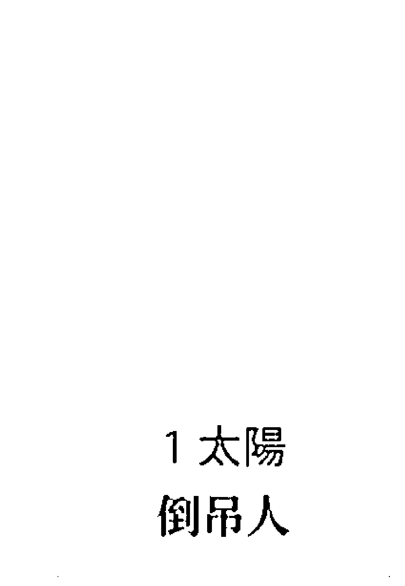

2 月亮 聖杯四

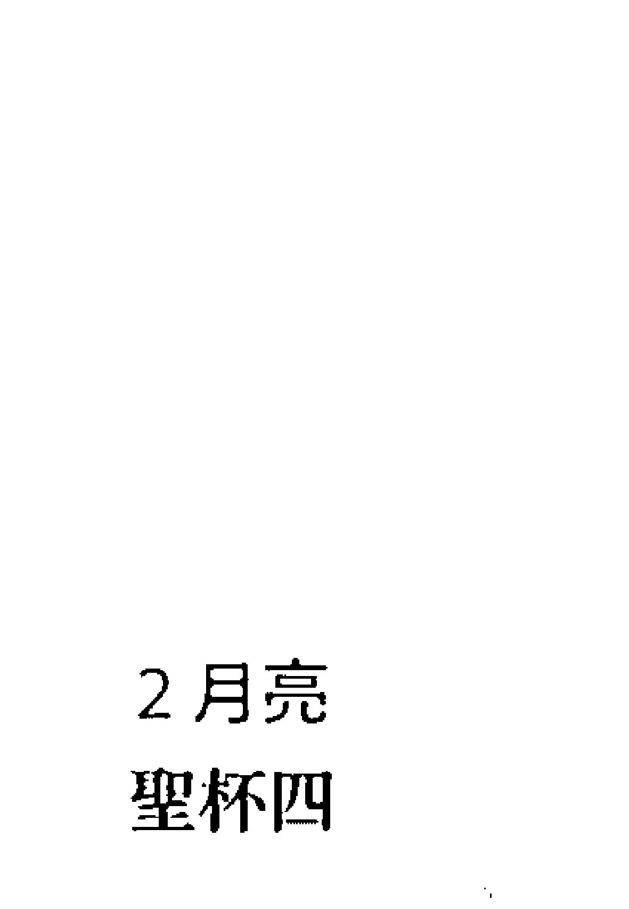

3 水星 節制 (逆)

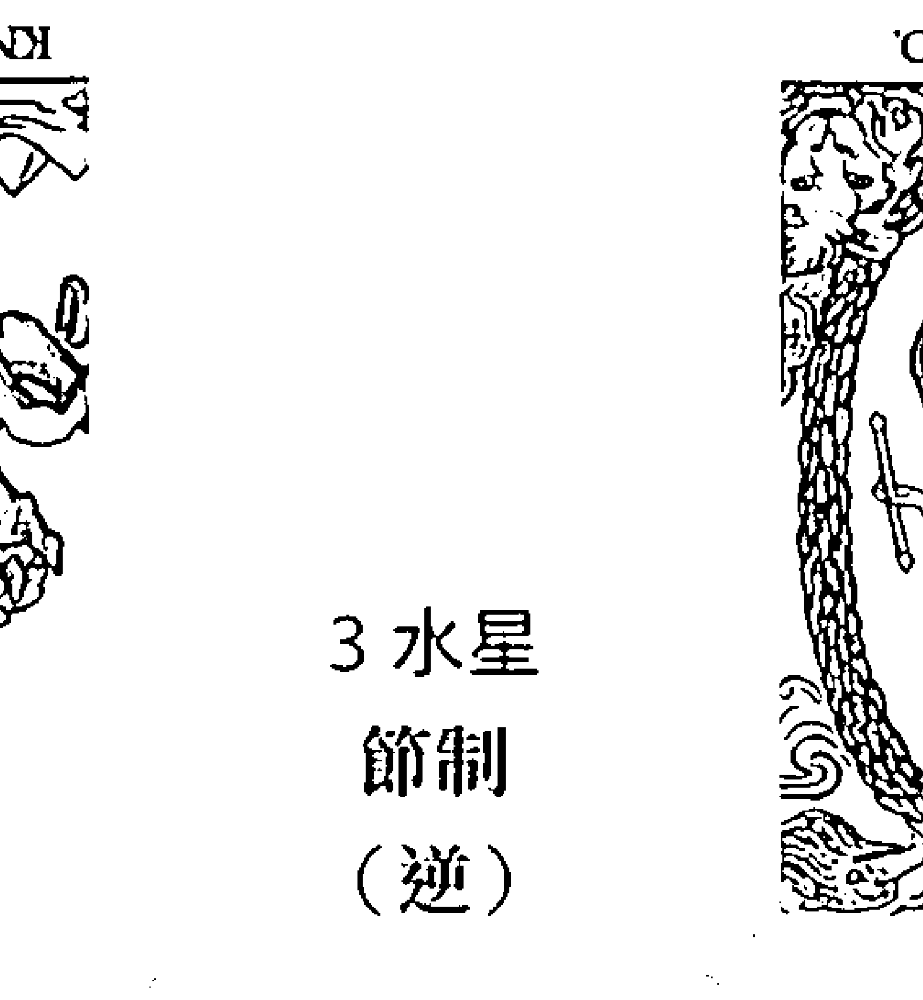

4 金星 權杖騎士 (逆)

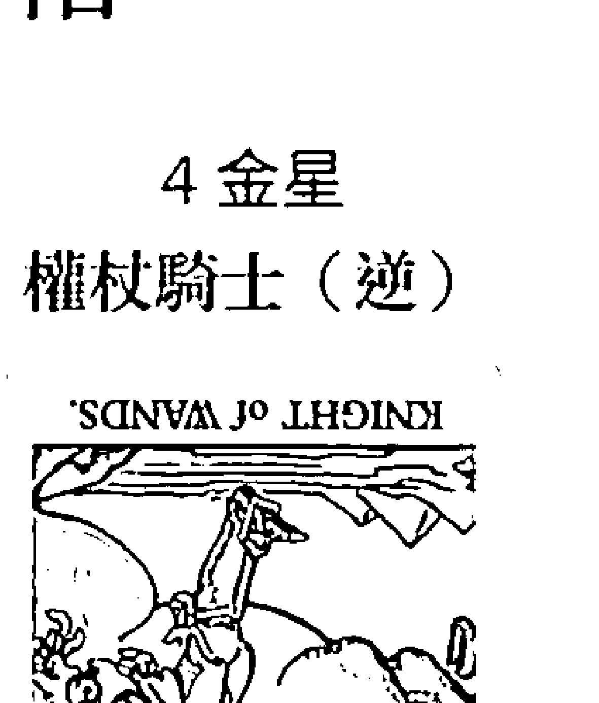

5 火星 愚人 (逆)

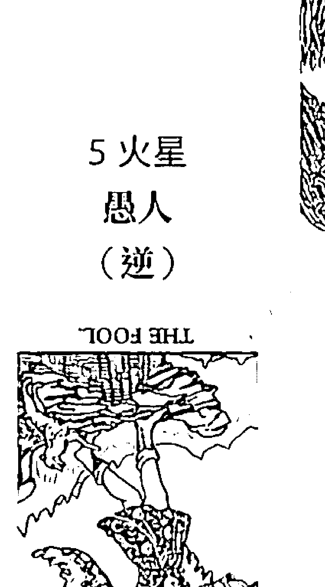

6 木星 世界 (逆)

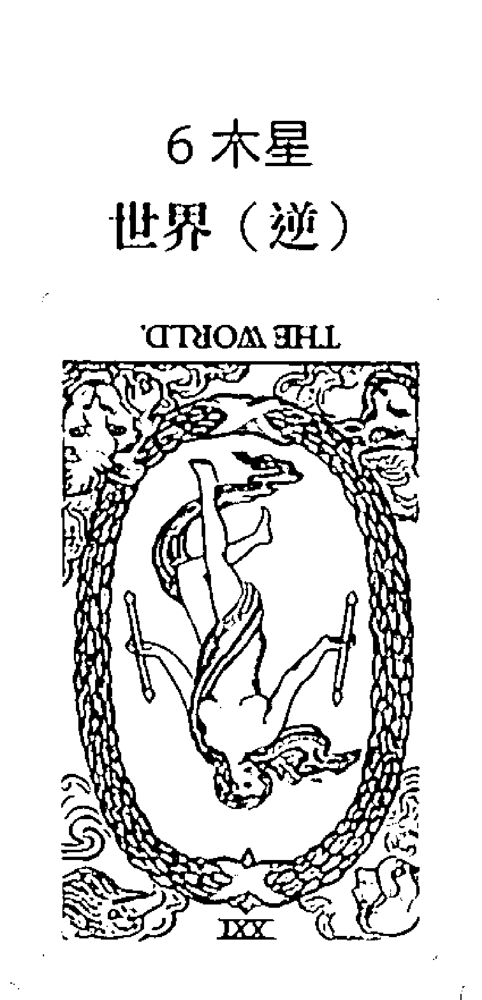

7 土星 聖杯皇后 (逆)

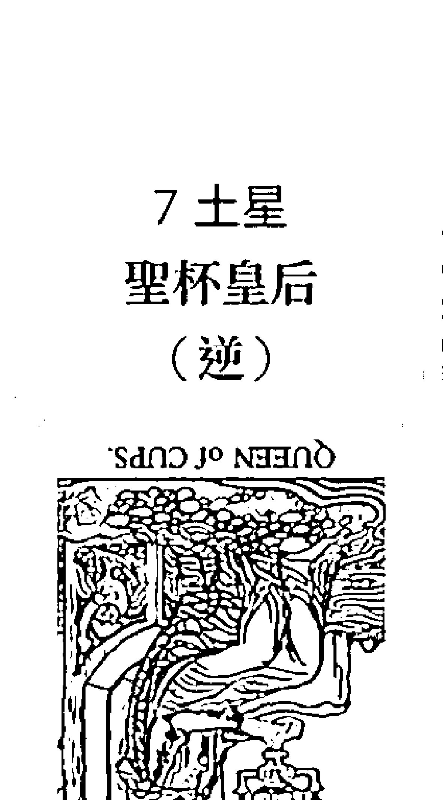

學生B：他的太陽是吊人，我覺得不太像。

老師：這副牌看起來還滿消極的耶。

學生B：是，他給人感覺是要花很多時間去做很多事情，他的月亮是聖杯四，他覺得很多事情不太滿意。

老師：但是又不會出什麼力去改善。

學生B：是，他現在會找方法去改善，然後會覺得不太滿意。他的水星是節制，他很喜歡說話，讓人感覺懂很多東西。

老師：他喜歡唱高調，他講的東西都以你們現在的處境並沒有辦法理解，但是他很喜歡把事情講得很玄，或者是講得很飄很遠，比較不像你們的生活環境的感覺，會舉很遙遠的例子，但你們根本不知道那是什麼狀況。

學生B：對，他給我感覺是他的見識很多，他懂很多東西。

老師：但是他懂的你們都不懂啊，他用他懂的方式講，你們聽不懂啊。

學生B：我也聽得懂的，只是覺得他很麻煩。

老師：就是喜歡唱高調，講得準確一點就是喜歡唱高調。

學生B：是，他的金星是權杖騎士，給人感覺就是活潑開朗，很快的人。

老師：很乾脆嗎？

學生B：是很乾脆的人。火星是愚人牌。

老師：你看吸引他的可能是一些你們覺得一般人不會去關心的事情，或我們都不會喜歡的事情，但是就可以吸引他。

學生B：對，還有他喜歡冒險，喜歡嘗試不同的東西。

老師：那就很像這一張啊，好比有人去那個登山，回來後睡了一個禮拜，把自己弄得苦得要死，我們都覺得這有什麼好玩的，但是他就是很喜歡。

學生B：對。木星世界牌，代表他有很多的經驗可以使用。

老師：他其實經驗還滿豐富的啊。

學生B：對啊，水星是節制。

老師：所以講的東西就會超出大家的理解範圍。

學生 B：對，因為他有很多的經歷。然後土星是聖杯皇后，我覺得他是很情緒化，是比較敏感的人，所以我覺得他很煩。老師怎麼看出他是比較消極的人？

老師：因為倒吊人又聖杯四啊，做事都沒有很積極啊，他可能覺得自己很積極，但是在你們看來，就覺得他實際上沒有在注意事情，沒有很積極的研究，所以你們會覺得他很消極，但是說不定他覺得自己很努力，只是他努力在你們看不到的地方。

學生 B：能這樣說嗎，他覺得自己很努力，但我們不覺得。

老師：因為他努力的事情對我們來說沒用啊。這個應該大家一看就知道，倒吊人加聖杯四就很消極啊，對不對？

學生 D：是不是這個人看起來就是比如下一節課要考數學，下課十分鐘他居然在看英文。

老師：（笑）有可能，英文倒還好，他有可能看小說。

學生 D：所以是完全搞錯方向的意思嗎？

老師：但是他會有他的理由，我們覺得他是錯的，只是我們不了解他的立場。

學生 D：可能他看小說是因為明天要考作文對不對，類似這樣的邏輯。

老師：就可能是因為他過一個月要參加小說比賽，所以他現在也在寫稿的途中，他要趁機多研究一些，只是考試剛好在這個時候插進來，他就沒有多餘的時間去準備考試。

學生 D：老師，這樣說起來倒吊人跟聖杯四在這個牌陣裡面，看得出這個人做事沒有輕重緩急對嗎？因為他的水星還是節制哎。

老師：他的水星都在唱高調，他的言論都定位在很高的地方。我有一個學生的經驗，他說他跟他的老闆溝通真的很累，他的老闆剛學身心靈，如果學久了可能就會跟我們一樣比較務實，但是他才剛學，然後又有錢又不缺錢，他跟老闆說我們這個客戶很難配合，不知道怎麼溝通，他老闆說你要緩下來靜下心，你要想辦法冥想。

學生 B：老師你說的對，他的目標定得很高，但是因為他的節制在水星，水星不是看他的表達方式嗎？

老師：就是他表達就是唱高調啊。

學生 B：明白。我看見他的牌比較多水元素，可以說他很喜歡想東西嗎？

老師：對，比較沒有那麼務實。

學生 B：他曾經說過他喜歡看對方的小細節，他的感受很敏銳，我覺得他很像女人的感覺，不是太像男人。

老師：消極的人通常會讓人覺得像女人，因為他不像一般的男人，會很追求成就，追求其他人的肯定。

學生 B：他是太陽是巨蟹，月亮在金牛，水星是巨蟹，火星是獅子，金星是巨蟹，他有三顆星是在巨蟹。

老師：就很像女人啊，巨蟹座的男人最像女人，月亮更像。如果他水星在巨蟹的話，我大概可以知道他為什麼水星是節制牌了，就是比較讓人聽不懂，他講話都是在他自己的世界裡，有一套他自己的邏輯，但是這個邏輯不能套用在現實生活世界。他的金星是權杖騎士，代表就算他很消極，但他表面呈現出來的還是很活潑很可愛的樣子。就像我剛剛講的那個老闆，他也是講話大家都聽不懂，但是他顯示出來是「我很相信你，我人很好，我什麼事情都可以」，他很喜歡請客。

學生B：喔，就是表面很好，給人很有信心的感覺。

老師：實際上他不會算計，他不會算計的優點就是對人比較好，缺點就是對任何事情他不懂得輕重緩急。

學生D：老師，這一段是不是也反映他木星抽到世界？因為木星是看一個人的才華，那就表示他非常有才華，這樣的人怎麼會患得患失？

老師：對，他很有才華，但是他就是高高在上，他有的才華很高，但他沒有辦法講到讓大家聽得懂。

學生B：老師，節制牌是不是也可以代表很喜歡說話，他可以不停的說，可以這樣理解嗎？

老師：節制牌的話很多啊。

學生B：是啊，他的話真的很多，又很煩。

老師：但是他的才華是土元素，所以他最好是不要說太多話（笑），他說越多越暴露他的缺點呐。

學生 B：他說自己是不喜歡說話的人，但是他總是不停的說話，所以我也不太明白他為什麼說他不喜歡說話。

老師：在他的世界裡面他不喜歡說話，但是他把他想到的都講出來，所以你們都覺得他很喜歡說話，但是他講的可能都不是重點，所以他覺得他沒有把重點講出來，所以他不喜歡說話，我猜啦（笑）。那你觉得這副牌跟他相似度高嗎？

學生 B：他是有能力的，他的重點就是把目標定得太高，然後因為他是做買賣的，他曾經說他對他的家人有很多不滿，因為他的家人不能幫他把生意業績做得很好，因此他有很多的不滿意，但是他自己做的業績很好，所以我覺得是像的，因為木星是世界牌，他做生意有十年。我想像不到的是他的太陽是倒吊人，不太明白。

老師：就是他比較隨緣，他不會逼人家買。

學生 B：喔對，就是這樣，甚至如果對方煩他要求他降價，他就會罵對方說你不想買就不要買。我感覺是像他的。

### 實例解讀 10

### 我的性格

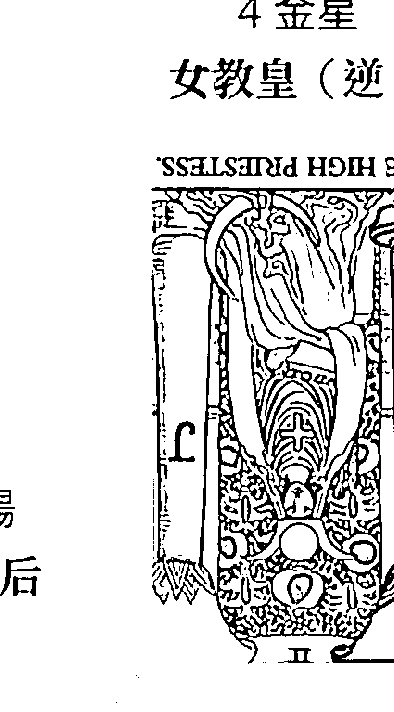

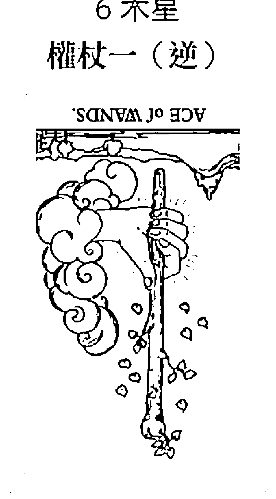

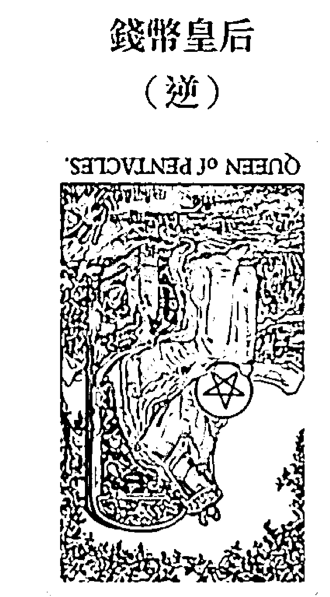

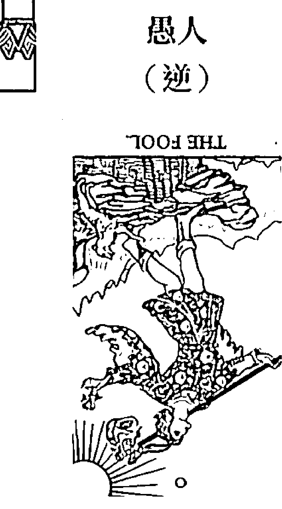

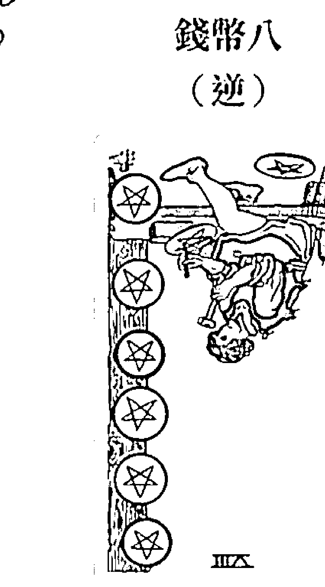

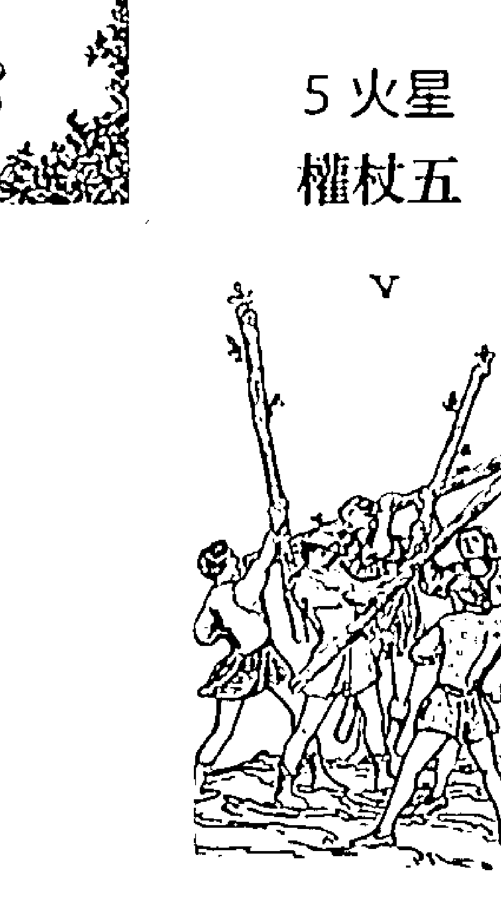

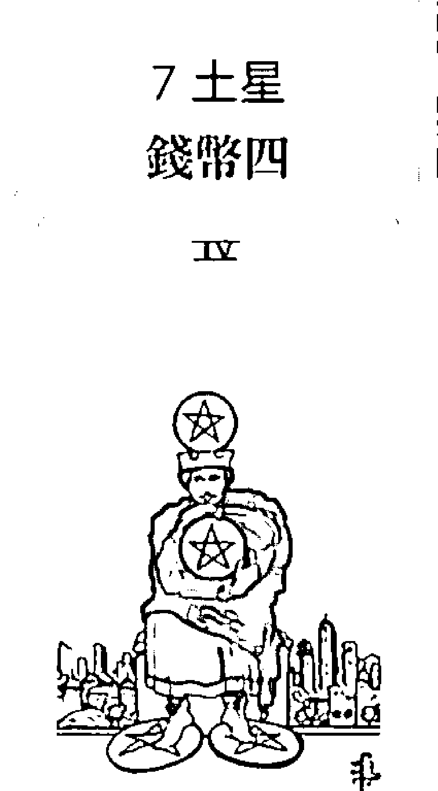

學生 C: 這是我的性格。太陽牌出現錢幣皇后，代表我呈現出來的是比較有責任感、務實的、有耐心、有毅力的，也樂意付出關心去照顧別人。

老師: 實際上也是啊，月亮是錢幣八。

學生 C: 對，我就是很專注很追求完美，一旦做了就會往死裡做的那種人。我的水星是愚人，這個我就不太懂，是表示我的想法很天馬行空嗎？很不受拘束？

老師: 或者是你跟人家交談的方式就很有你自己的一套方式，所以人家不一定跟得上，會嗎？

學生 C: 會，我的天王星在三宮。（笑）

老師: （笑）這張牌就是天王星。

學生 C: 對，我的金星是女教皇，也是一個追求完美的人，黑白很分明的那種，心思很細膩，但是會有一點疏離感，有一點脫俗的那種，所以跟人家相處是會帶給別人壓力的對嗎？

老師: 對，因為你看起來很高高在上，女教皇看起來就很清高，就是任何事情她都比較懂，她懂得比你多，但是她又懶得跟你講。我懂我的就好，你不用懂。

學生 C：明白。但是我其實內心有很多感情，流動真的很豐富，但是我又講不出口，跟人相處就有一種說不出口的感覺，除非真的遇到頻率很對的人。

老師：對，如果遇到頻率對的人，就可能會講得很多。

學生 C：對。然後我的火星是權杖五，我覺得是我喜歡競爭挑戰跟不認輸嗎？

老師：你的火星就是當你遇到挑戰時就會激起企圖心，但是那個挑戰不能是暗著來的，而是光明正大的挑戰，你才會喜歡跟他說，我們來試試看互相較量一番，你喜歡光明正大的比較，不喜歡那種人家風言風語的誣衊你。

學生 C：對，我喜歡直來直往。

老師：如果要向你挑戰的話，你會很歡迎啊，很好啊，大家就來比比看吶！你會覺得我就不會輸你。

學生 C：我其實沒有這個信心。

老師：你覺得就攤開來看啊，看看誰對啊。

學生C：會，是非黑白的東西，我會想去辯個對錯。

老師：這張牌好的地方是如果你輸了，你也會認輸，那就是我真的技不如人。

學生C：對，我只是不喜歡他們硬要把錯的講成對的。

老師：你喜歡把事情講開，看看誰對誰錯，如果我錯了我會認錯，但如果我是對的我不允許任何人誣衊我。

學生C：對，這個只是因為權杖五嗎，還是加了皇后？

老師：權杖五。權杖五的意思就是會把事情攤開來比較，然後火元素就是會公開光明正大。

學生C：那我是怎樣發脾氣的？如果是權杖五的話。

老師：你會直接說你有什麼地方不對，如果說我有哪裡誤會你的話，你直接跟我講。

學生C：是的。木星是權杖一，木星是能力，我的能力就是需要很單純很天真的去主動創造嗎？要很堅持自己的路嗎？

老師：你的才華就是可以創造出一個以前都沒有人示範過的事情，然後你就很努力的嘗試一些新的方式，是嗎？

學生C：會有這樣的想法，但是我還是有很多擔憂。

老師：但你還是會做。

學生C：還是會做，不過會有一段時間的煎熬期跟糾結。

老師：你的土星就是錢幣四啊。

學生C：是過於保守嗎？

老師：如果你的才華是權杖一，你就不會過於保守，土星錢幣四的話可能是周圍的環境讓你沒有辦法突破現在的狀況，你想要做的是你的木星權杖一，你想要用全新的方式做事，但是因為錢幣四也代表經驗，過去的經驗又告訴你這樣做可能會失敗，那兩個合起來的話你就會很小心翼翼，一點一點的嘗試。

學生C：喔，是哎，所以，我應該放下這個過於謹慎嗎？我就去開創，就往木星那邊去？

老師：其實我覺得如果依這兩張來講的話，理論上是，但是依現代的社會來講的話，我會覺得還是小心一點好。（笑）

學生C：是，其實我也放不下，還是會小心翼翼的，還是會分析很多再去做。土星在錢幣四這也是很沒有安全感的意思嗎？

老師：你會覺得如果放得太開，可能就會被人家拿走你應該有的東西，也是一種沒有安全感沒錯。

學生C：因為我現在是自由業，確實很想像木星的樣子去開創新的東西，試新的東西，但也確實是以前的經驗跟那些客戶是我要很保守的照顧到他們，所以就很難開創的感覺。

學生B：請問老師，他的月亮錢幣八，是代表他很喜歡自己一個人的努力，可以這樣說嗎？

老師：也代表說他經驗很多，因為他每一件事情都會投入很久，然後做得很精細，所以他累積的經驗很多。而且太陽月亮都是土，人家一眼就可以看得出來他真的很負責任。

學生C：我想問，我的火星抽到月亮的逆位，該怎麼解釋？

老師：簡單來講，火星就代表你生氣時的反應，如果是月亮，你生氣時可能不會說出來，而是心裡面生悶氣詛咒對方。

學生 C：因為火星是想要什麼東西就去爭取，如果是月亮的話，就有可能對自己想要的東西充滿了迷惘嗎？

老師：對，有可能。

### 牌阵六 十二宫

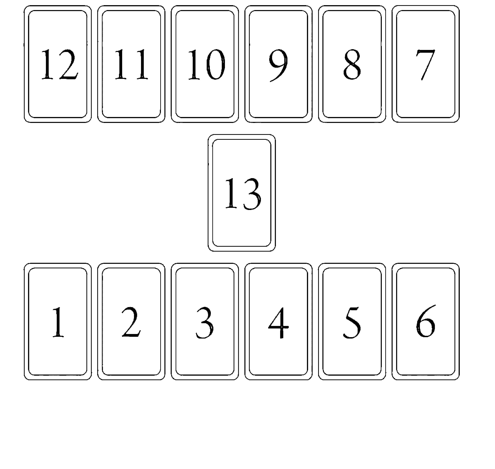

#### ☆ 牌陣位置

-   1 : 個人整體狀態
-   2 : 財務狀態
-   3 : 與家人（兄弟姊妹）的互動／學習
-   4 : 媽媽的狀態（家裡狀態）
-   5 : 感情（單身者）、子女（已婚者）／興趣娛樂
-   6 : 職場
-   7 : 伴侶關係／合作夥伴（有契約的關係）
-   8 : 保險／投資狀態
-   9 : 學習與國外事務
-   10 : 爸爸的狀態／男性長輩／長官／成就
-   11 : 朋友和人際關係
-   12 : 健康狀態／心靈狀態
-   13 : 切牌，總體運勢

#### ☆ 老師引導

十二宮牌陣是一種與占星結合後延伸的牌陣，所抽出的十二張牌就對應星盤十二宮的領域，可以看出生活上十二種面向的運勢和狀態。第一張的整體代表你自己，第十三張的整體就代表各方面的運氣的綜合值。這個牌陣是我個人的變形，所以跟一般十二宮的順序不大一樣，但判讀上也是準的。

### 實例解讀 1

### 我各方面的運勢狀態

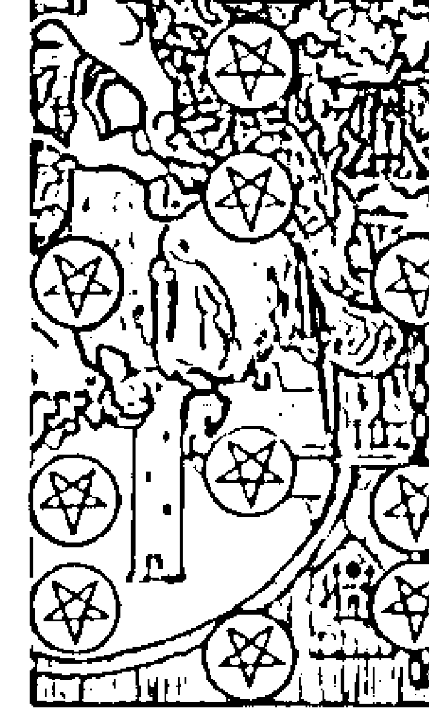

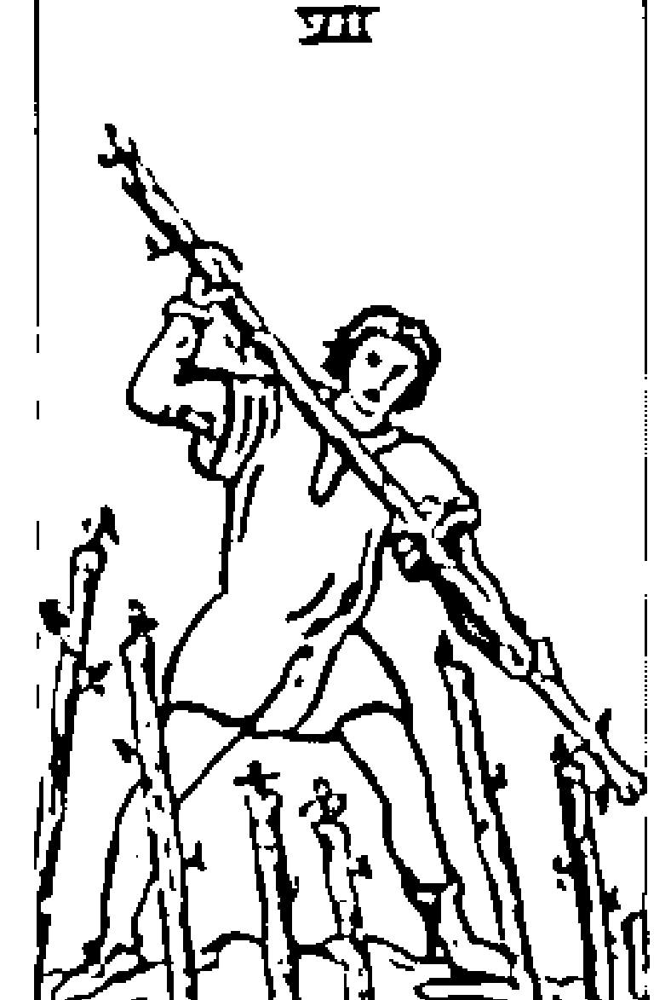

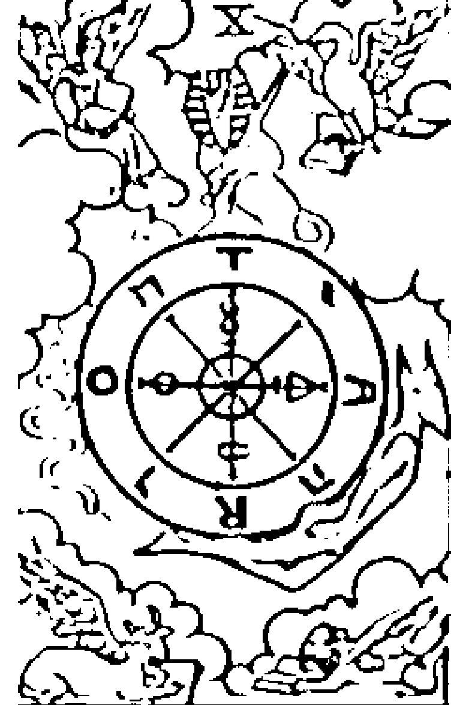

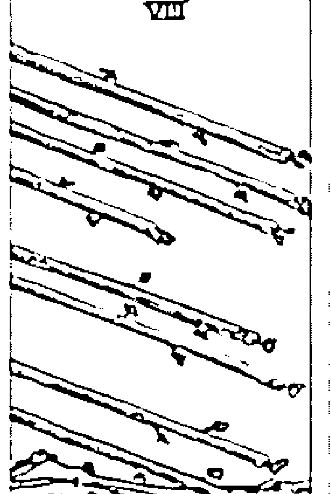

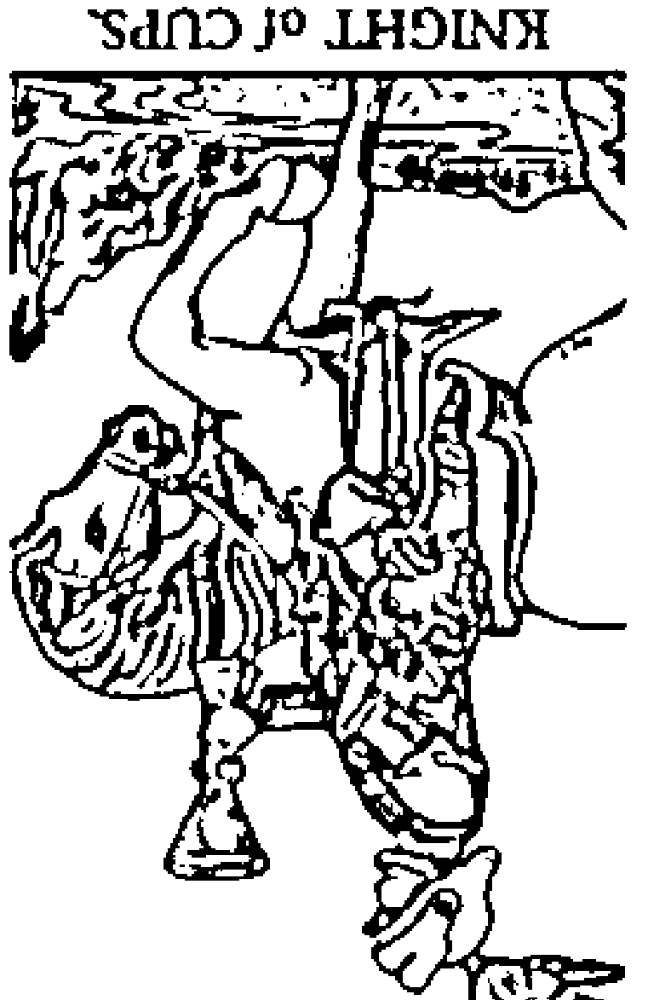

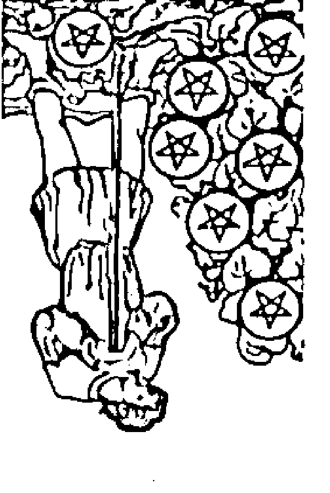

心灵
钱币十
（逆）

朋友、人际
权杖七

成就、职业
命运之轮

学习、
国外事务
权杖八

保险、投资
圣杯骑士
（逆）

伴侣关系
钱币七
（逆）

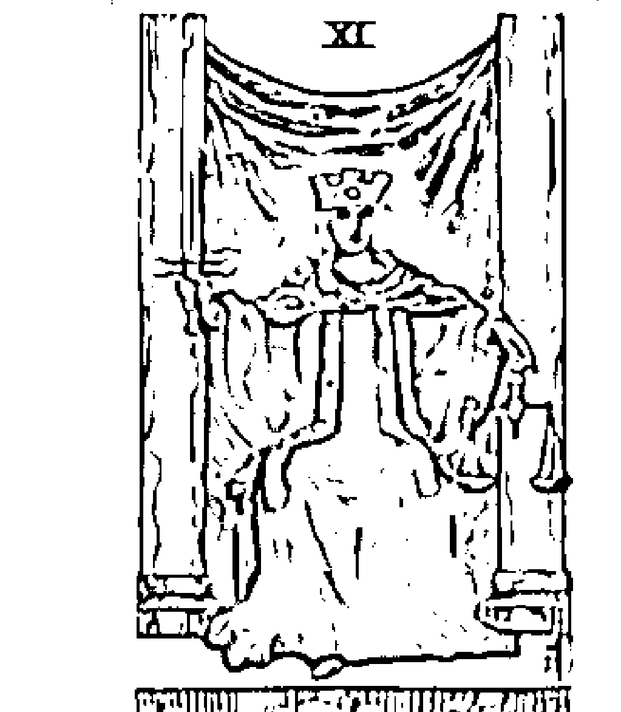

切牌
正义

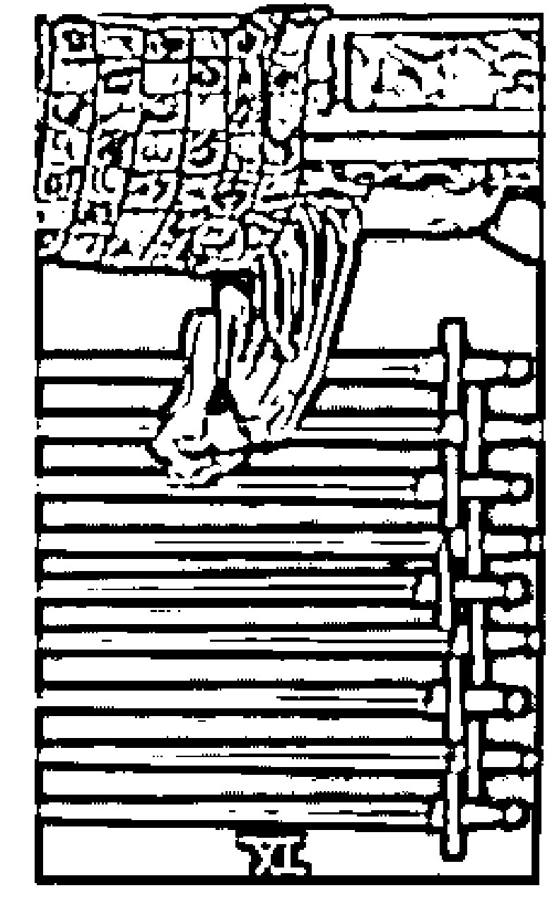

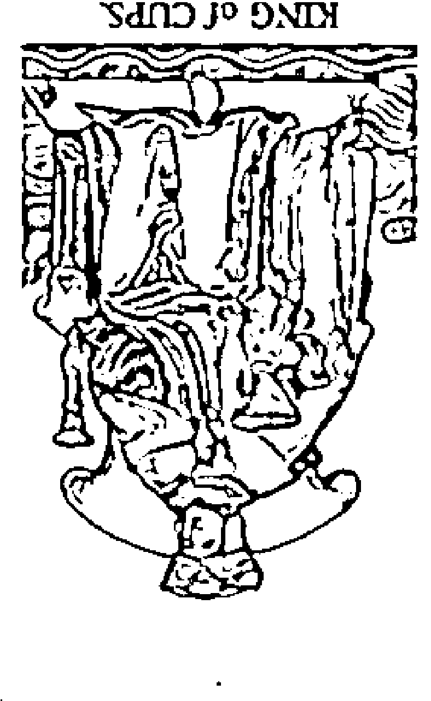

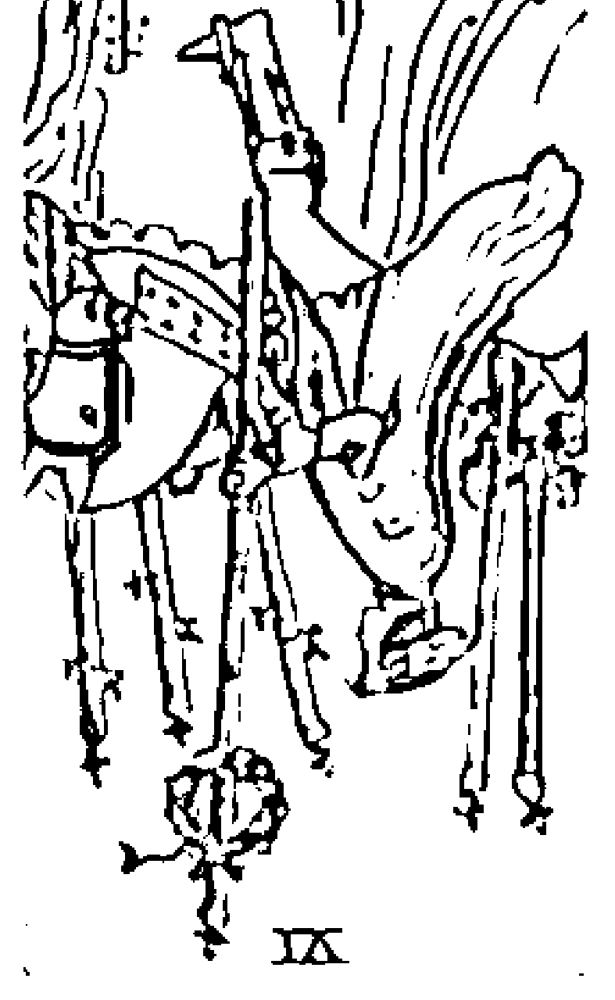

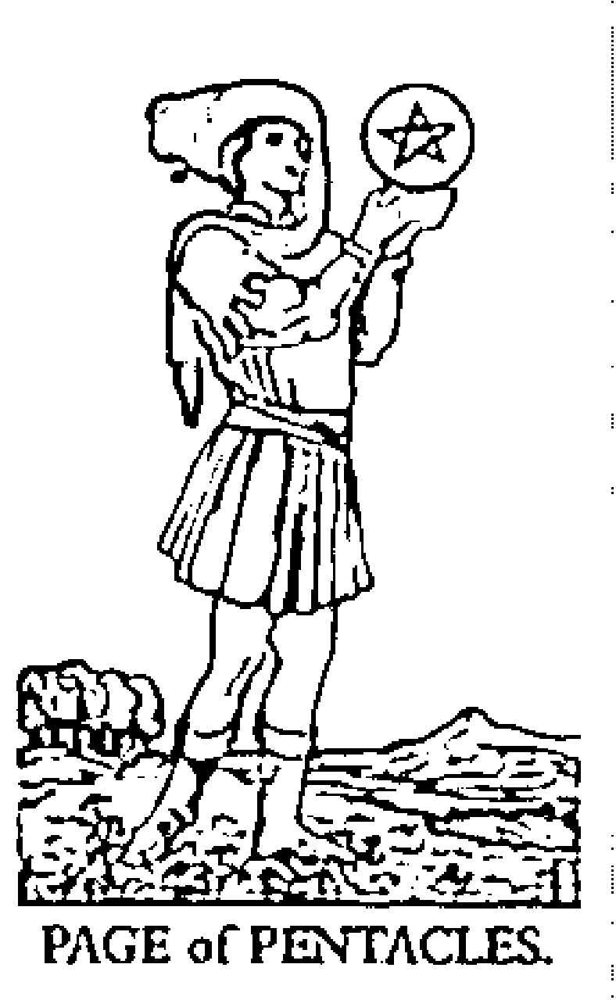

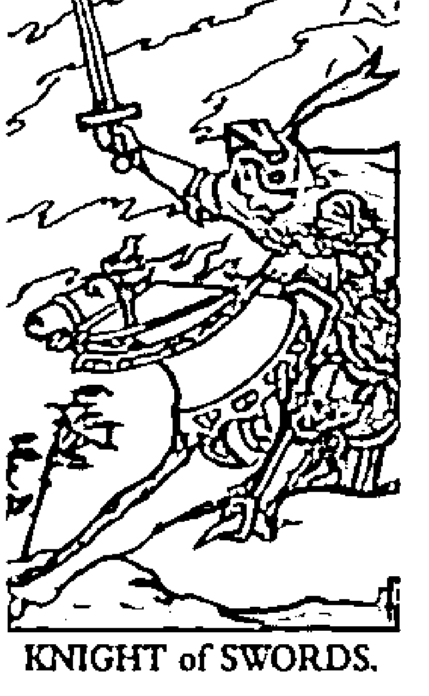

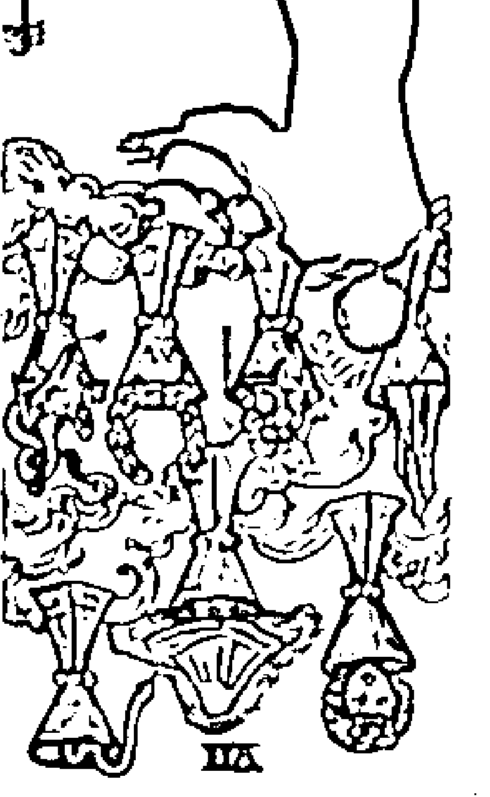

整体
宝剑九
（逆）

财务
圣杯国王
（逆）

家人互动
与学习
权杖六
（逆）

家里
钱币侍者

感情、兴趣、
娱乐
宝剑骑士

职场
圣杯七
（逆）

學生 A：我的第一張整體狀況是寶劍九的話，就表示我可能想太多了，有點自我否定，可能過去發生的事情讓我自己有一些痛苦的回憶，或者有一些壓力，雖然已經過去了，但是我還是覺得會受到影響，也有可能之前我是生病的狀態，讓我一直很擔心自己在各方面沒有辦法跟上腳步，譬如說現實中、工作上或者是我額外學的這些東西會有一些狀況。

老師：沒關係，我也是用這個來復健的。

學生 A：唸書時我會有很多不知道怎麼突破的點，影響我內心的一些狀態。

老師：但是這張牌的重點就是什麼都是你自己在想，實際上沒有什麼不好的事發生，你看他好好的躺在房間裡面呐。

學生 A：對，然後財務狀況是聖杯國王，我會覺得是不是身邊會有一些弄臣，叫我去買這個買那個，或是我對什麼成癮了，比如看到漂亮的牌卡就想要一直買。

老師：但是這張牌還不錯，因為是水中之土，所以雖然你花錢花得很多，但是土元素表示你都付得起，所以這張牌對於財務來說，你是花得多了一點，但是應該不用擔心。

學生A：對，買牌卡總比買名牌包好（笑）。再來就是跟家裡的互動和學習，權杖六應該是會有一些距離和挑戰。

老師：這張應該說是溝通或是兄弟姐妹或平輩。

學生A：我是家裡最小的，我抽到權杖六，我看老師寫的新的講義，六這個數字就是一個比較特別獨立的存在。

老師：六是比較協調，權杖六的話就代表他比較是人群裡面的中心。

學生A：事實上也是，在我們家我是很好的潤滑劑，但這幾年因為生病的關係，我有一點把自己封閉起來。生病的時候會比較急躁或想法比較極端，跟家裡面的溝通就沒有那麼好。我很討厭人家一直來問說你還好嗎，我都會覺得別人無法理解我生病做治療的痛苦，沒有真正的關心，兄弟姐妹就算真心想關心我，也只是口水人情來問問，畢竟大家都大了，有各自的生活。所以我覺得權杖六是自己一個人在馬上。

老師：如果他們都不問的話，你又會覺得他們都不關心。

學生A：老師你是覺得我的個性是這樣，還是權杖六會有這個狀態？

老師：權杖六會有這個狀態啊。

學生A：因為沒有人簇擁我對不對，牌義來講的話？

老師：對。

學生A：再來就是看媽媽，這個我真的不會解，錢幣侍者。

老師：媽媽跟爸爸對著看，你們家好像是你爸爸帶頭，因為你爸爸是命運之輪，命運之輪就是他會很無畏的往前衝刺，有什麼問題就解決，你媽媽是默默在幕後當那個輔助的推手。

學生A：老師，因為我爸爸已經走了，我是不是要看我在工作上的成就？那我看媽媽或家裡狀況的是錢幣侍者要怎麼解啊？

老師：對。錢幣侍者是一個年紀最小的人物，所以表示你媽媽面對你們這些孩子並不是很強勢，她是有想辦法在供應你們幫助你們，但是她能做的不多。

學生A：老師這個真的很準。我哥哥買房子，我媽媽都想要贊助，但是她就是能幫的不多。

老師：因為錢幣侍者能力不多，但是很努力。

學生 A：第五張感情和興趣的部分是寶劍騎士，我應該今年會雷厲風行的，想要做什麼就去做了，譬如我想要出國旅行，我可能今天訂機票明天就飛出去了，感情我就不會解了，但是我知道我現在如果有任何想要做的興趣，譬如說學習或者旅行，我一定會馬上劍及履及的去做。

老師：如果這張牌放在感情的話，你覺得會是什麼狀態呢？

學生 A：我覺得我應該會對另一半批判滿多的吧。

老師：這張牌就像走馬看花，每交往一個，你就覺得他有很多的缺點，然後馬上換下一個。

學生 A：我沒有那麼有魅力啦，我跟現在的男朋友在一起六年了，我覺得可能會有一些意見上的分歧，或者我對他會有一些更冷靜冷血的期待，因為我的個性非常像男生，他比較像女生，我是非常理性，他比較像小孩子，我看到這張牌覺得我今年對他的包容度會變得非常低，開始對他有比較多的勸誡或者說法，像是他的工作或我們的生活要怎麼做。

老師：真的是批判會比較多。

學生 A：再來是職場是聖杯七，感覺像想要做一些新轉化。

老師：有很多的夢想。

學生 A : 對，我覺得這部分並不是我現在的工作，譬如說我現在接觸了塔羅牌以後，我是不是可以在這部分開始有一些小小發展。我剛開始只是想訓練自己的腦子，讓自己的思考不那麼慢，可是後來慢慢想說是不是也可以接一些個案，幫人家解牌，我的想法是變成一個副業來做，可是又覺得很沒有信心。

老師：你目前都只是想的階段，還沒有真的著手，你有可能還沒有真正想清楚。

學生 A : 對啊，就是覺得壓力很大，因為覺得自己的人生過得也不怎樣，怎麼給人建議，就是會有這種壓力。

老師：畢竟活了很多年一定有一些經驗的。

學生 A : 有啦，有一點經驗但也不是很好的經驗吶（笑）。再來第七張是伴侶關係，錢幣七呼應剛剛第五張的寶劍騎士，我就是會一直不停的審視，然後批判。

老師：但這一張就還好，你還是滿有耐心，這一張你就等著他慢慢長大。

**學生A**：對，我也是這麼想，我就等著他慢慢長大。第八張投資是聖杯騎士，我的第二張是聖杯國王，我花錢和財務都是靠自己，沒有很努力的經營，感覺好漏財。

**老師**：第八張是偏財。你至少有錢可以花啊，因為我對我的錢就這個態度啊。

**學生A**：第九張屬於學習和外國事務，權杖八我覺得我應該會有一些進步，也會發展得還不錯。我覺得可能很快就會像老師講的，我突然有一天打電話跟老師講我讀通了。職業跟成就是命運之輪，我可能又回到我剛開始學塔羅牌的狀況，我其實今年的另外一個心願是想要學占星，所以我想等塔羅熟練一點之後，我又會進入一個很辛苦的學習過程。接下來朋友跟人際關係權杖七，我可能會比較強勢一點，對於自己想要有的跟朋友之間的狀況，我已經不太想要像以前一樣求和，大家以和為貴，我現在比較不會這樣。

**老師**：現在比較想要維護自己的原則。

**學生A**：對，如果我的朋友講一些話讓我很不開心，我生病以前都會忍，可是我生病以後態度改很多，我就會跟朋友說我沒有辦法接受你講的話，我們先暫時不要聯絡。就算是很好的閨蜜我也講得出這種話，因為我覺得就是沒辦法接受，所以採取這樣的態度。最後健康是錢幣十，看我多愛錢（笑），跟十三張正義一起看的話，我會應該滿健康的吧？

老師：滿健康的，這張是慢慢的修復到完整的意思。又加上這張正義，你所有都到達可以平衡的階段了。

學生A：對，要不然我一天到晚擔心我癌症復發也不是太健康的事情，應該往前走。所以我如果要看財務狀況，是不是看第二張和第八張，如果我結婚的話我還要伴侶關係，我要二七八來看對不對？

老師：對。一也要看，因為一就是你自己。

### 實例解讀 2

### 我今年各方面的狀態

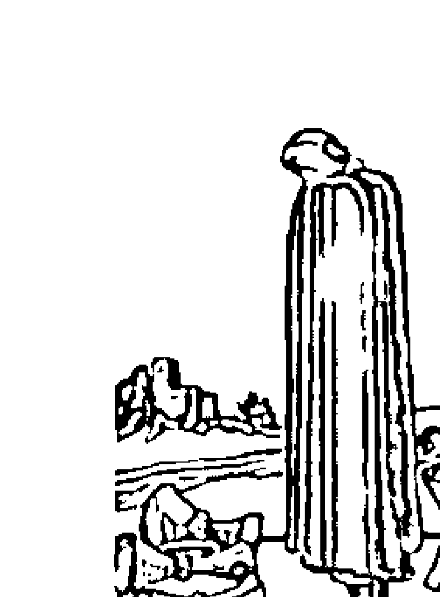

心靈、健康
聖杯五

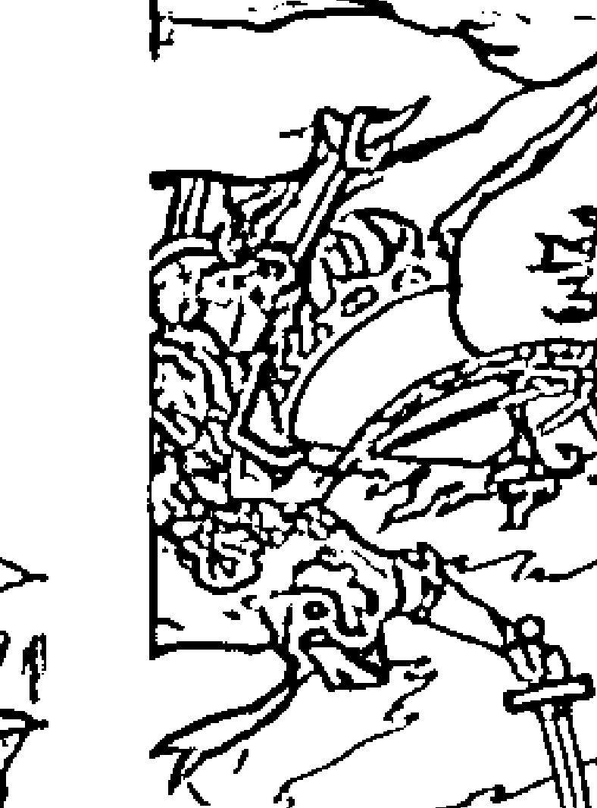

朋友、人際
寶劍騎士
（逆）

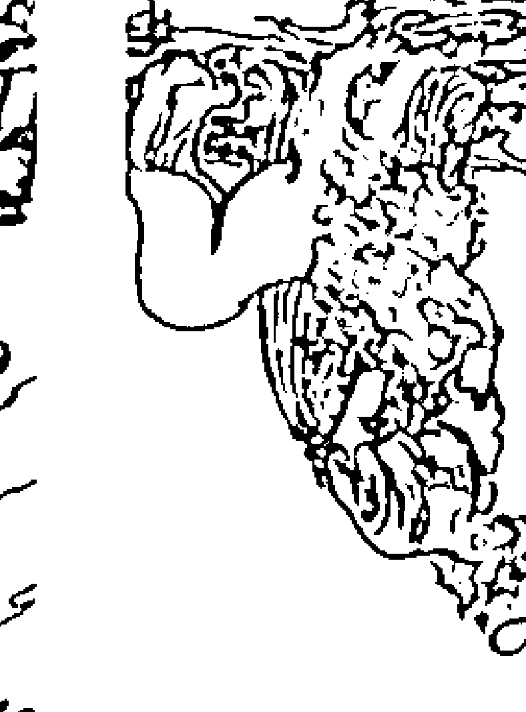

成就、職業
力量
（逆）

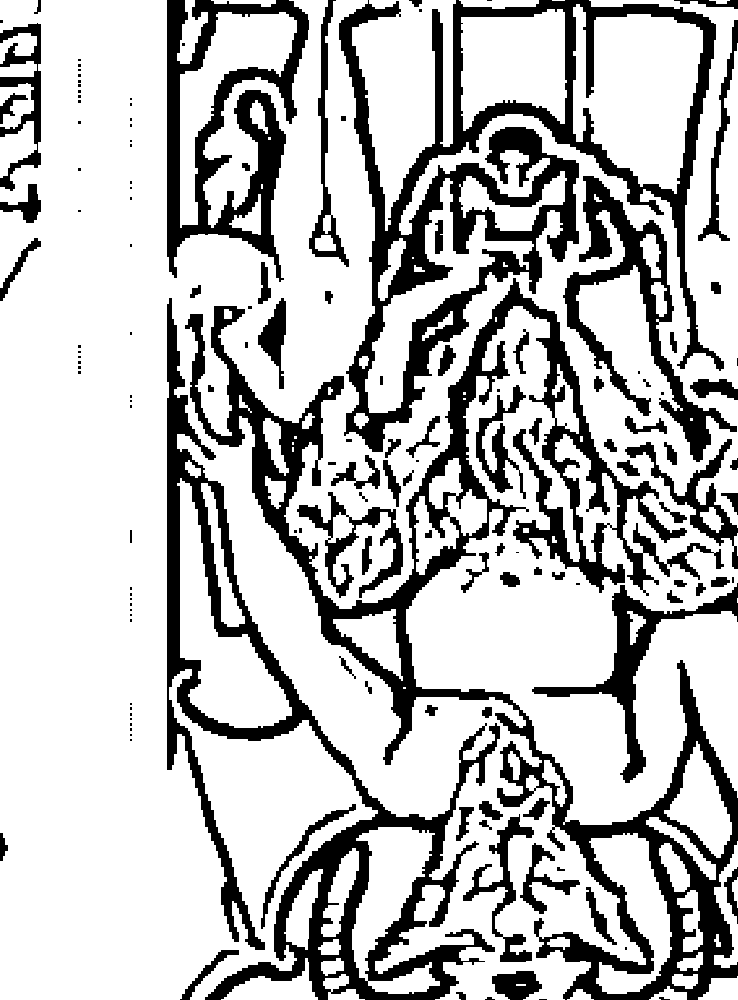

學習、
國外事務
惡魔（逆）

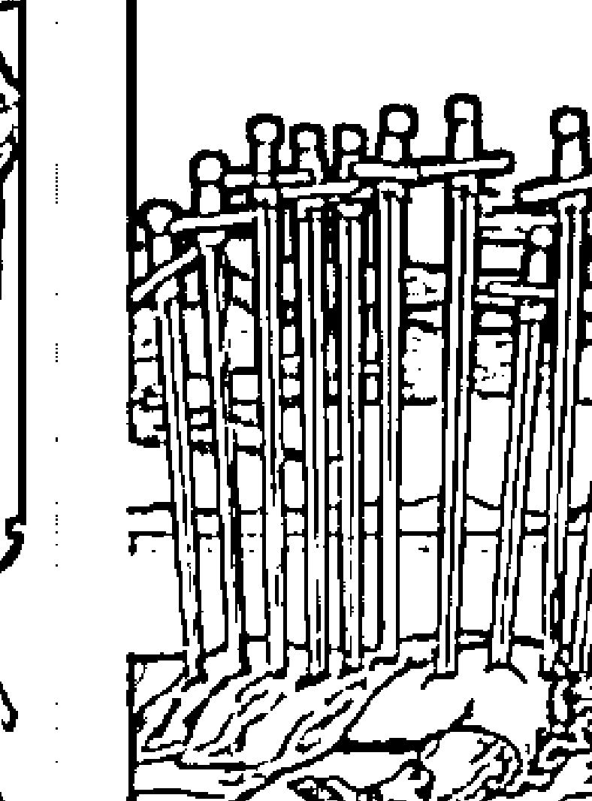

保險、投資
寶劍十

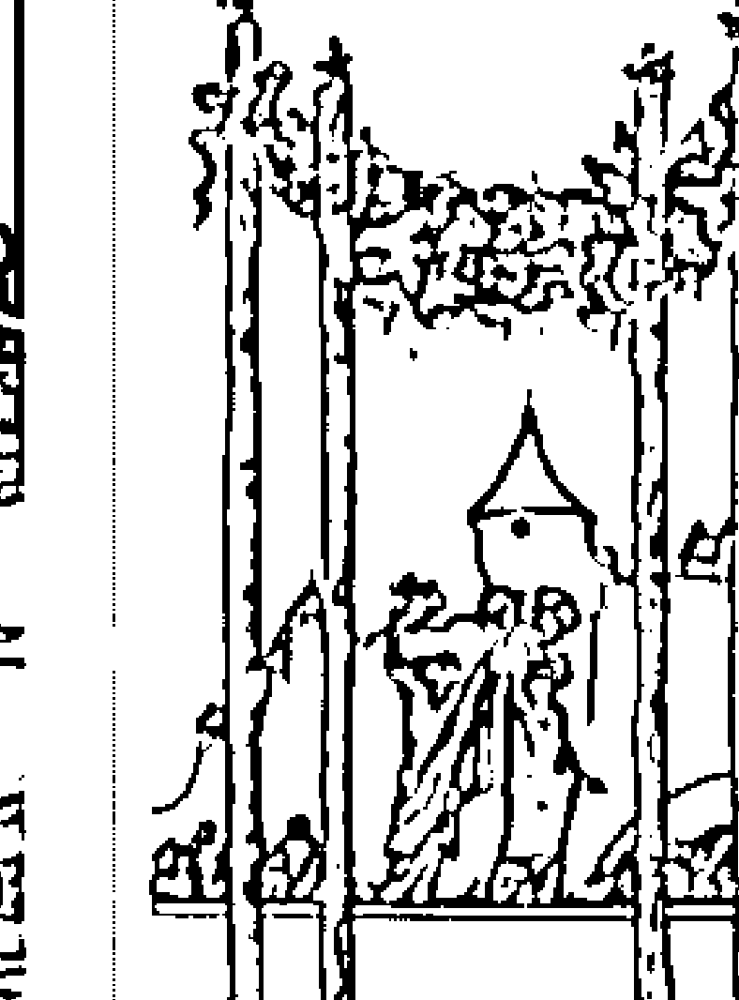

伴侶關係、
合夥
權杖四

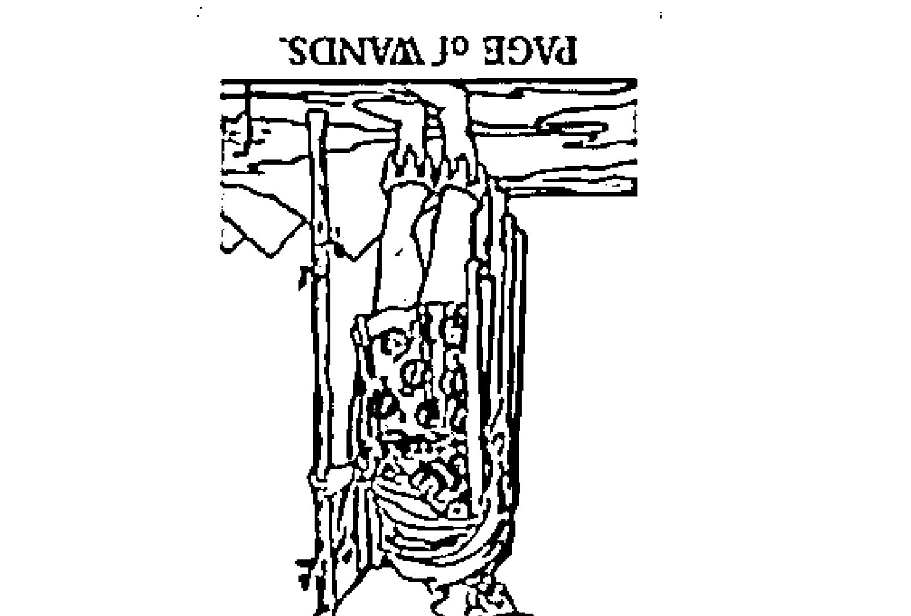

切牌
權杖侍者（逆）

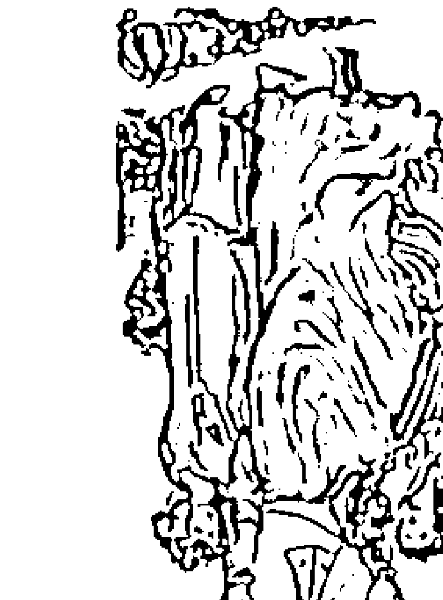

整體
聖杯三
（逆）

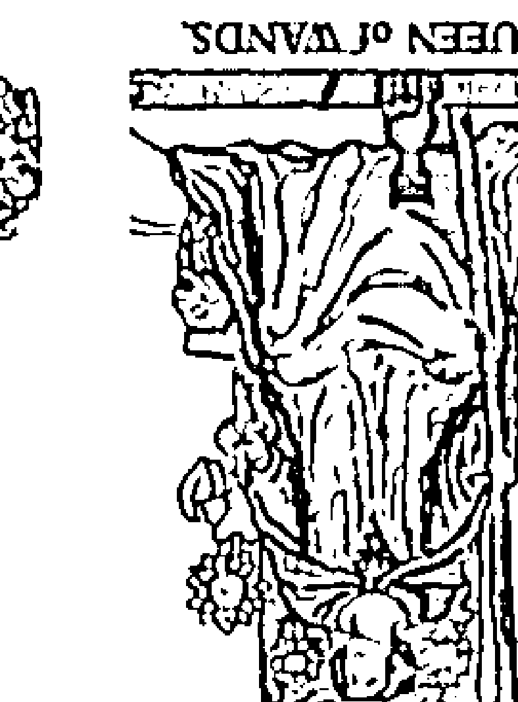

財務
權杖皇后
（逆）

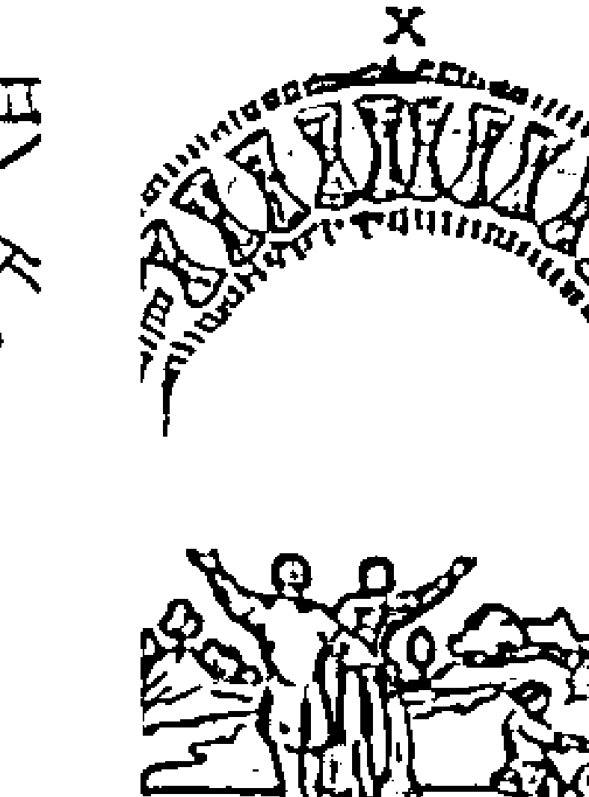

家人互動
與學習
聖杯十

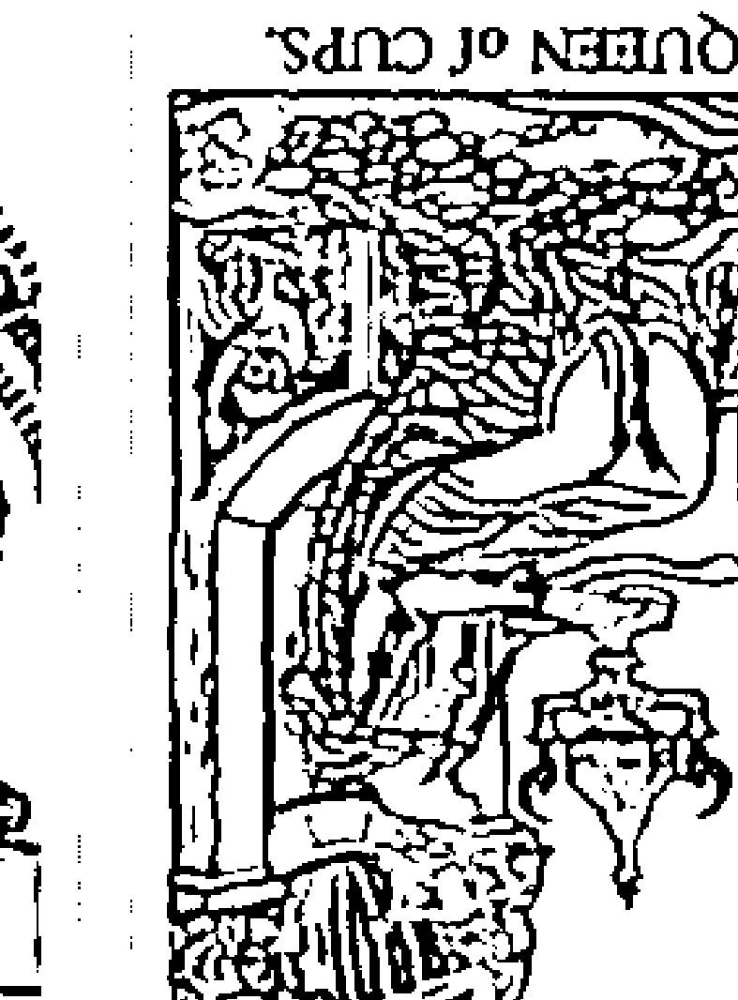

家裡
聖杯皇后
（逆）

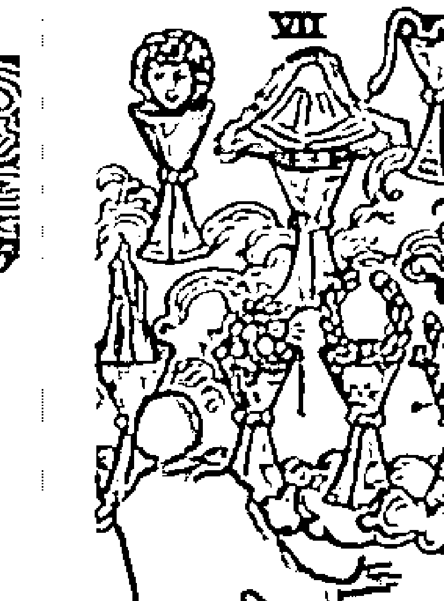

感情、興趣、
娛樂
聖杯七

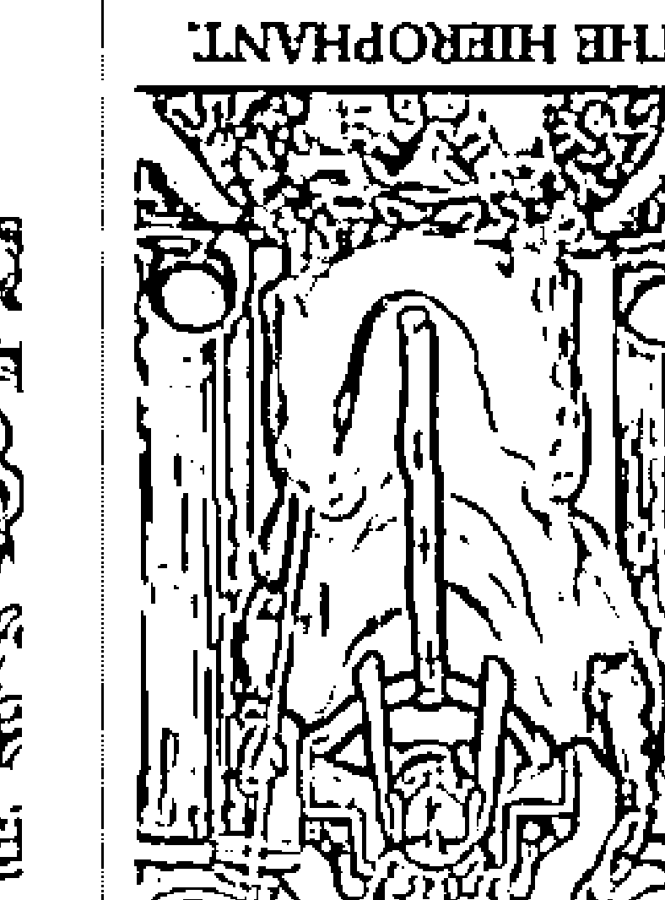

職場
教皇
（逆）

學生B：第一張整體聖杯三，我覺得有滿多朋友聚會。然後財務權杖皇后是很有動力的做生意。第三張家人的互動聖杯十，與平輩相處我覺得滿開心，也沒有什麼改變。

老師：就是和他們相處得很好，今年應該也像以前一樣好。

學生B：對，我感覺沒有什麼改變。

老師：財運方面，你的錢管得很好啊，該花的花該存的存，你對錢很有主見。

學生B：原來如此。第四張聖杯皇后，這個是媽媽比較顧家，比較為家付出，是這個意思嗎？

老師：對，這張很會為家裡付出，但是基本上派不上什麼用場，因為是水中之水，她能給的只有感情，給不了錢，也管教不了你們。

學生B：對，我覺得很煩。然後第五張興趣戀愛是聖杯七，興趣我有很多東西想嘗試，但是可能只是想，沒有確定，對嗎？

老師：就是還在期待的階段，還沒有正式去做。

學生 B：對，老師，如果是戀愛該怎麼解呢？

老師：戀愛就是你現在喜歡的或者你有興趣的人，都比較像是夢幻中的，你真正接觸了以後，就會發現他跟你想的不一樣。

學生 B：對，就是這樣，我覺得不是我現在想要的。

老師：接觸到了嗎？跟你想像的不一樣。

學生 B：有啊，對。然後職場是教皇，我不知道代表什麼。

老師：教皇還滿好的，在職場裡面，其實這張牌就很穩定，教皇就代表是滿有組織精神的，可以把大家帶領得很好。

學生 B：是我帶領人，還是他們帶領我？

老師：你帶領人吶。

學生 B：我沒有帶領人啊，我有很多的工作要做，很多 project 要處理。

老師：那就是你可以把很多事情整合得很好。

**學生 B**：喔，明白。然後第七張權杖四，如果說是工作上的partner，合作也很好，沒有什麼太大的問題。

**老師**：合作得很好，但是還要再往上，因為這張牌代表四，就只是基礎打得很好，還沒有往上，也代表還有很多往上發展的空間。

**學生 B**：但是我不想太往上發展了，因為我不想太忙碌。投資寶劍十，是不是我要失敗了？

**老師**：就是叫你不要投資啊，你比較適合掙那種正派的錢，因為如果有投資的話，你就會很燒腦，你會一直不知道該怎麼辦，會緊張到人家說就完全賣掉你就算了。

**學生 B**：老師，我做生意不是投資嗎？我沒有膽子去投資。

**老師**：不是，做生意應該是二宮（第二張），占星裡做生意是八宮，但是如果你是把做生意當成正財的來源，正財是看二宮，因為八宮的做生意都是很大的那種生意，企業對企業的，或者你開一間很大的公司。

**學生 B**：老師，我是在白天上班做小職員，晚上才做生意，這兩種也是看二宮嗎？

老師：一樣看二宮，小生意不算八宮。

學生B：第九張是學習和國外旅遊，我抽的是惡魔牌，我不太懂。

老師：惡魔牌是你覺得以後可能靠所學賺錢。

學生B：對，我希望我學的東西以後幫我賺錢。

老師：因為惡魔就是利益導向，要有錢或者有權，他才會去做這件事。

學生B：第十宮看爸爸或是職場的成就、事業。事業是我白天的工作嗎？

老師：不只是工作，是你以後人生要走的方向，事業就是你世俗的成就。這張力量牌很不錯啊。

學生B：但是我現在沒有成就喔。

老師：力量牌就是慢慢來啊，你要踏穩腳步，然後一步一步走，到最後的階段一定會開花，這張牌很棒啊，就是要慢慢來。

學生B：人際關係是寶劍騎士，代表我比較衝動，不太想和人有深入的關係。

老師：你看人並不是很準呐，就是說你知道對方是什麼樣的人之後，你可能就換一個人來往。

學生B：對！不會太長時間，然後我就忘掉了。身體健康是聖杯五，我不太健康對嗎？

老師：這張聖杯五就是比上不足比下有餘，就是你覺得自己好像有什麼地方不太好，但是你去醫院檢查的話，大部分都在標準的範圍之內，但是你就是覺得有哪裡需要改進，可能是生活的模式需要調整。

學生B：喔，老師那什麼牌在健康這部分表示不太健康？

老師：很多啊，水元素風元素在這裡比較不健康，塔也不健康，但可能是受傷或者意外。

學生B：那水元素是沒有什麼問題，因為只是空想，可以這樣說嗎？

老師：水元素就代表體力不是很好，但基本上還可以，風元素就代表你的精力都很散亂。

學生B：那火元素呢？

老師：火元素跟土元素基本上對於健康都還不錯，如果是好牌的話。

學生B：那如果是權杖十呢？

老師：壓力太大。

學生B：謝謝老師。我最後一張是權杖侍者。

老師：就代表你2023年的運勢還不錯啊，就算沒有很大的成就，但是都在可以學習的狀態，你也能學習得很愉快，有很多你可以探索的路線。

### 實例解讀 3

### 我的整體狀況

| 位置 | 牌面 |
| :--- | :--- |
| 心靈 | 魔法師 |
| 朋友、人際 | 聖杯九 |
| 成就、職業 | 權杖一 |
| 學習、國外事務 | 皇帝 |
| 保險、投資 | 星星 |
| 伴侶關係 | 太陽 |
| 切牌 | 錢幣侍者 |
| 整體 | 女教皇 |
| 財務 | 聖杯侍者 |
| 家人互動與學習 | 寶劍侍者 |
| 家裡 | 審判 |
| 感情、興趣、娛樂 | 聖杯七 |
| 職場 | 權杖二 |

學生C：我的問題是2023年我個人的整體狀況。第一張整體狀況是女教皇，就代表我今年可能比較注重心靈上的成長。

老師：內在的修行，比較著重提升自我。

學生C：所以翻出這張牌我還滿開心的，因為之前我感覺自己的能量大多消耗在對外的人事物，而且上一次的七行星牌陣我的月亮牌是寶劍九嘛，現在是女教皇好像就會穩定一些，不會那麼容易被外界困擾。

老師：心裡面還是起伏很大，但基本上都維持在一個正常的狀態。

學生C：明白，那應該是一種進步吧對我來說。第二張財務是聖杯侍者，看著好幼稚啊，好像開心花錢，也沒有什麼計劃，好像喜歡就買了，好可怕（笑）。

老師：對，至少有錢買啊。

學生C：謝謝老師，第三張寶劍侍者，連續兩張小朋友，很輕鬆的樣子，和家人的互動應該就是簡單的互相交流一下訊息。

老師：基本上好像沒有生活在一起，就靠訊息交流。

學生C：對！還有一個層面是因為我現在在家基本上就是在學東西，沒有太多交流，我會看書寫字，就這樣，所以可能別人看到我的狀態就是悶著頭在學習，像個小學生一樣，回家就在寫作業，所以大概也是寶劍侍者的狀態。第四張是審判，如果看媽媽的話，我要先解釋一下，因為我的狀況可能比較複雜，我是單親家庭長大的，我的媽媽也比較早去世，我跟媽媽的關係有一點糾結，其實我也一直在做心理諮詢，幫助我在心理上化解我和媽媽的一些關係問題。

老師：很像審判牌吧。

學生C：恩，所以這張牌可能表示今年會有一個轉變和突破，從心理的角度來看，我和媽媽的關係其實影響我滿多的，對我的人生目標還有親密關係都影響滿大的，所以我做的心理諮詢主要是這個課題。看到這張牌我還挺高興的，應該會有一個比較大的轉變吧。興趣和戀愛聖杯七，我覺得現在興趣滿多的，因為現在有點在轉型，所以我的思路比較發散，我是一個很open的狀態，會有很多設想，但是沒有一定要做哪個，就且走且看。

老師：走馬看花。

學生C：是這樣沒錯，所以我現在想靜下心來學學東西，不要那麼焦慮。下一張職場權杖二也滿準的，我主要的職業現在也是兩個方向，但是我還沒有真正決定要做哪個，這兩個方向對我來說都不錯，也都會賺錢，我也都喜歡。

老師：這兩個選擇就是不管你選擇哪一個都是有它的好處。

學生C：是的，如果抽到錢幣二我可能更開心，因為兩邊可能會協調得更好，權杖二是不是到最後我會選擇一個更好的？

老師：你會選擇集中在一邊。

學生C：明白了。然後下一張合夥和伴侶關係是太陽，因為我從前有合夥做生意，現在已經沒有了。伴侶關係的話，我沒有想太多，這張太陽牌就是看著開心就好了，因為這一年我困擾很多，所以看到這張牌我就很開心，沒有想太多，無論發生什麼開開心心就好了。後面一張投資也很準，星星牌應該是一個長期的規劃，因為我現在的職業之一跟保險理財有關係，經濟環境也不是很好，所以正好我的計劃也是把所有短期都慢慢轉向長期，類似於保險這種。

老師：星星牌就是長期，就是很遙遠才能看見收穫。

學生C：對的，我會把一些短期的比如很股票有關的投資全部轉到保險的年金，好像滿極端的，一個是很短期的高風險的，我現在就完全轉型到全部做到長期的投資了，然後我也不要再自己做生意了，所以星星牌滿準的。學習是皇帝這麼強勢一張牌，我倒是很計劃要去國外旅行，因為也很久沒去了。

老師：這張牌除了強勢之外，還有另外一個解釋，就是你的學習都集中在成就你自己，就是你希望把你個人提升到一個很好的程度，這樣你才幫得了別人。

學生C：是的！那下一張牌權杖一如果講爸爸的話，可能也講不出什麼，因為我沒怎麼見過他。講生意的話，我現在的生意，因為算是自由業，那我的生意就是我自己，應該怎麼解呢？

老師：權杖一就跟皇帝牌很接近呐，就是所有的力量都集中在你自己的身上，你要開創新的可能性，開創全新的未來。

學生C：明白，這也滿像我現在對自己的態度，因為之前會想很多，很焦慮，這些焦慮會影響我的行動力，現在我對自己的要求就是先做，先學先做，之後再看會有什麼樣的結果或是會有什麼樣的機會，就像聖杯七一樣，先很強勢的去做，之後看機會再決定怎麼樣選擇。然後看到這張人際關係是女教皇我也很開心，以前我好像和女教皇相反，我跟人的關係感覺上是女教皇，我老是想付出，卻老是跟人家有距離感。

老師：這張聖杯九，數字九就是集中在自己的身上，你如果把眼光放回自己的身上，你反而跟旁人處得更好。

學生C：喔，對，謝謝老師，我理解了。以前我是把注意力放在別人的身上，我很在意別人的反饋和評價。

老師：你放在自己身上，讓自己過得更好的話，別人就會想要自己來主動接近你。

學生C：我明白了。下一張健康是魔術師，這個我不太會解哎，我的身體其實有一些小狀況。

老師：有時候會有一些不好的狀況，但是都會有方法可以化解。呼吸道可能比較不好，因為這張是水星，水星代表呼吸道。

學生C：對，確實是，我在確診以後一直咳嗽。

老師：確診，難怪呼吸道。

學生C：是，從上個月到現在還在咳嗽，不是大問題，但是也滿困擾我的。下面總結的錢幣侍者，這張牌我也很喜歡，因為現在在學習嘛。

老師：你好像看到什麼就學什麼，非常享受這種學習的樂趣。而且很認真。

學生C：是，沒錯，我現在看很多書。因為我沒有太明確的目標，也沒有很強的功利心。

老師：就看到什麼學什麼，看看以後會變成什麼樣子。

學生C：對，就是這種心態，所以我這副牌我覺得滿準，也很喜歡這些預示。

老師：（笑）你沒有沒有發現一件事，我常常會說我的學生會有兩種人，如果覺得七行星解得比較卡，十二宮就會解得很好，如果覺得十二宮解得比較卡的，七行星就會解得很好，你們的七行星好像比較卡一點。

學生C：對，我的七行星很卡。（笑）

老師：然後到了十二宮就非常好了。

學生C：我自己就可以看得很明白，知道大概是在講什麼，謝謝老師。

老師：我覺得你們上一次七行星也都解得滿準的，對不對？

學生C：我是在老師幫我解過後，覺得滿準的，但是我自己看到會覺得很懵還有點怪，不像今天的牌可以很流暢的解釋。

老師：一看就知道牌陣在講什麼。

學生C：是，每一張都很準。

學生A：老師，因為她卡在之前的一段關係，她的感情（伴侶關係）是太陽，是不是表示他們會有無限曙光？

學生C：我最後的解讀就是其實這個太陽更多的是表示我的感受吧，不是說別人看起來怎麼樣，所以就是總而言之我會開心，並不是在不在一起就一定會怎樣，也許到明年我想開了就會很開心。

老師：也或許是有新的人啊。

學生C：謝謝老師，也許吧，反正會是很開心。

#### 實例解讀 4

#### 我去年的狀態

| 位置 | 牌面 |
| :--- | :--- |
| 心靈 | 寶劍騎士 |
| 朋友、人際 | 聖杯八 |
| 成就、職業 | 寶劍三 |
| 學習、國外事務 | 聖杯九 |
| 保險、投資 | 聖杯五 |
| 伴侶關係 | 聖杯皇后 |
| 切牌 | 無 |
| 整體 | 命運之輪 |
| 財務 | 錢幣九 |
| 家人互動與學習 | 權杖三 |
| 家裡 | 權杖侍者 |
| 感情、興趣、娛樂 | 正義 |
| 職場 | 權杖國王 |

學生D：第一張是命運之輪，應該說我這一年在工作上逆來順受吧，其實我一直都是這樣，碰到什麼事情就去解決，因為做很久了我的狀況大致都很穩定。

老師：命運之輪就代表你每解決一件事情就學到一些新的東西，所以也不是什麼壞事，也是好事。

學生D：出現什麼樣的事情，我就去解決，因為我的工作大概都駕輕就熟了。第二張是錢幣九，我對我的收入已經算滿意了，不過看起來好像還有點成長空間。

老師：你一個人生活的話，這個錢是夠用，但是並不夠到做很多很多事，只夠你自己活得很好的。

學生D：的確是這樣。第三張權杖三，如果是跟兄弟的關係，這個圖很有意思。我有兩個弟弟，我跟其中一個弟弟比較親近，比較常聯絡，會一起商量事情，所以說這個圖像顯示的就是我們的關係。

老師：你們在一起應該都是討論未來的遠景，就是你們各自以後要做什麼，不會討論私人的事情。

學生D：是的，我們只會討論家裡的事情而已。第四張權杖侍者如果是代表媽媽的話，我想是因為我媽有點輕度的失智啦。

老師：難怪是小孩子（侍者）。

學生D：然後對照第十張寶劍三，我父親就是個壓力來源，因為我父親是非常固執的人，我覺得他是我們家裡的壓力來源。

老師：權杖侍者，我就很少看到媽媽沒有壓力的，原來是失智了。

學生D：她應該是壓力過度結果變失智。然後第五張正義，如果說是戀愛的話，其實我是沒什麼感覺了，風元素，我覺得我的戀愛關係就是一翻兩瞪眼，要就要，不要就算了。而且既然是風元素的話也沒什麼情趣啦，我覺得我是沒什麼情趣的人，很理性的，毫無浪漫的感覺。第六張工作權杖國王，我還滿有付出熱情的。

老師：而且也還滿有聲望的。

學生D：是的，我鐵粉還不少啦，而且我也滿盡心的，所以品牌還可以。第七張聖杯皇后，因為我沒有伴侶，所以是工作上的同事助理們，我跟他們的關係都很好，他們也對我不錯。

老師：就好像不是講責任，就單純的感情很好。如果責任做得到的話，那是因為你們的感情很好，願意為對方擔待，但是不是很講究責任付出的那種，你們是單純的感情很好，所以你們在工作之間的交流也不錯。

學生D：是的，我的確跟每個人都保持良好關係。第八張聖杯五如果是投資的話，我覺得我很沒有投資運，以前我買基金外幣，都是賺了這邊賠了那邊，例如說買美元儲蓄就是賺到利率賠了匯率，還在定存當中，基金也是買了就會開始跌，所以說我是很沒有投資運。

老師：聖杯五就也不至於賠太多，就是一賠你就縮手了。

學生D：可以這樣說，我覺得我在投資上，例如發票什麼的也沒有中過獎，我偏財運很不好。第九張聖杯九，我對學習很enjoy，喜歡學東西，但是學了以後其實我都沒有要做什麼。

老師：你自己很高興就好啦，這張牌就是很愉快啊。

學生D：對，就是學了高興，所以學一堆雜七雜八的東西，但都不是靠這些來賺錢。

老師：但是你的本身是有提升的，因為這張牌表示你本身的靈性或你對自己的了解會有一個突破。

學生D：應該還會想要再更突破啦，因為到九而已，我會想要再更了解，學習更多的東西，就是把學習當樂趣啦。第十張剛剛講過了，我爸是我家的壓力源，尤其對我來說更是，因為我是老大，他就給我很大的壓力，這個不提也罷，就是我們常吵架啦。第十一張聖杯八，看起來好像說，我理解為我會另外再去結交新的朋友。

老師：會有，對你來講，你永遠有更新的東西要去學習，但你不會拋棄朋友，你會先放著，然後去學習更多東西，你會去找尋看看有沒有一些新的東西要學。

學生D：可以這樣說，我的朋友很多都是從學習上認識的，或共同的興趣認識的，只是說我太喜歡學一些雜七雜八的東西了，所以還會再認識別的人，可以這樣說吧？

老師：可以啊。

學生D：第十二張寶劍騎士，這個和健康的關係怎樣解釋我就不知道了。

老師：常常有一些症狀發生，但都不是太大的問題。

學生D：我去年是有三次胃潰瘍去急診，因為真的很痛。

老師：因為是風元素，就只是症狀，但沒有危害到你什麼。

學生D：還不知道。所以整體來說我覺得這個牌是準的，尤其寶劍三代表我父親，我覺得真是非常符合。第十三張我後來抽是權杖二，我不知道要怎麼解釋。

老師：整體運就是你有很多個方向，但是你今年還是會先挑一個去執行，先把力氣完全投入那個方向，有所成以後，再投入另外一個方向，你會一個一個來，不會一次全部都做。

學生D：喔，是這樣子，有道理，我的確一次都只會完成一件事，感謝老師。

學生B：老師我想問第十三張和第一張，差別在哪？

老師：第一張就代表你自己啊，第十三張整體就代表各方面的運氣綜合起來的一個綜合值。第一張就是你個人的狀況，第十三張就是每一個方向聯合起來、縱觀起來的運氣如何。這個牌陣是我個人的變形，但你真的找十二宮的話，順序可能就不一定代表這些，因為這是占星的特質。占星是每一宮代表的意思很多，所以為了不要重複，就平均的分散到每一宮。第十二宮是第六宮的對宮，第六宮是健康也是工作，但是我們要看工作比較多，所以看了工作就沒辦法看健康。但是第十二宮就代表很抽象的意思，所以第十二宮代表的東西沒有辦法很具體的說明，我就拿來當健康。

**學生B**：老師，如果我想看每個月的運勢該怎麼做呢？

**老師**：就每個月抽一次啊，用這個牌陣。

**學生A**：老師，請問這個講到母親的牌是權杖侍者，我可以把解釋為她其實是想要有一點逃避現實？

**老師**：不會啊，權杖侍者就是面對現實啊。

**學生A**：可是他媽媽是因為壓力太大導致有一點失智，那這個不是逃避現實的狀況嗎？權杖侍者怎麼去解釋這個狀況？

**老師**：她是因為逃避現實所以才變成這樣，就代表她把她的現實簡化，所以她可以面對了。她就是因為要逃避現實就變成權杖侍者，權杖侍者就是小孩子，小孩子就可以把身邊的事簡化了，所以她就可以面對了。

**學生A**：所以就是用小孩子的方式面對？

**老師**：對。

### 牌陣七

### 關係牌陣

| 位置 | 圖示 |
| :--- | :--- |
| 1 | 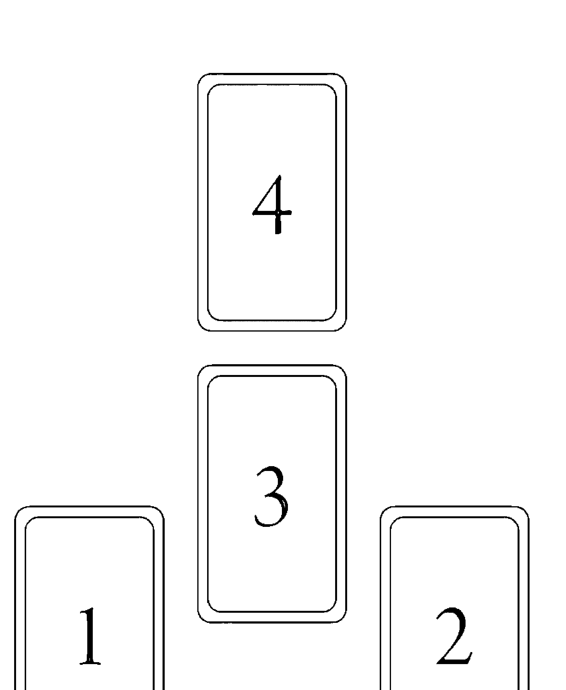 |

#### ☆ 牌陣位置

-   1 : 自己的狀態
-   2 : 對方的狀態
-   3 : 雙方的現狀
-   4 : 短期未來的狀況（三個月）

#### ☆ 老師引導

關係牌陣適用於詢問當事人自己與特定對象的情況。除了愛情之外，只要是關係，都可以使用，像是親子、兄弟姊妹、朋友、同事、客戶、上司、部屬都可以。本書也收錄一案例為「與房子的關係」。

### 實例解讀 1

### 與老闆的關係

短期未來
錢幣七

自己狀態
戰車
(逆)

雙方現狀
權杖六
(逆)

對方狀態
錢幣國王

**學生 A**：我的狀況是戰車，其實滿符合我現在的情況。我現在有點想半退休，但是我的老闆還是很衝，拉著我一起衝啦。

**老師**：看起來他還滿依賴你的。

**學生 A**：是水元素的關係嗎？

**老師**：對啊。因為好像他自己要 handle 整個狀況的話，他會措手不及，不是他做不到，是需要一段時間。他還是可以的，但是他很容易慌。

**學生 A**：是啊，他個性滿急躁的。他跟我同年，也同樣是金牛座的，生日只差八天，但是我們兩個是完全不同的牛，我像是很慵懶的水牛，他好像是一隻鬥牛一樣，事業心很重，所以他就是拉著我一直往前跑，但是實際上我很想半退休了。

**老師**：但是他好像也不知道在衝什麼。

**學生 A**：他就是想把事業做大，還要開連鎖店，然後要請很多員工，又成立公司，所以說這個錢幣國王還滿符合他的，他就是一副員外的樣子，財大氣粗那種模樣。然後我們目前是權杖六，就是說我們表面上很和諧，不過我覺得有點各懷鬼胎吧。

老師：為什麼你覺得權杖六有各懷鬼胎的意思？

學生A：因為逆位，就是表面上同享榮耀，但是實際上他可能覺得我太懶散，我是覺得他太會衝。

老師：但是兩個人都不指出彼此這一點，兩個人都有共識要忍受對方，因為六的話就不會起衝突。

學生A：是啊，對，所以跟他倒是不會起衝突，只是他可能覺得我太懶散，應該多上班，但是我覺得我自己一個人這樣子就好啦。然後這個未來的發展可能是還要尋找突破的地方吧，因為我很安於現狀啦。

老師：安於現狀的話錢幣七也可以啊，就是慢慢的看他之後往上長到什麼程度，就做該做的，他自己會發育。

學生A：是，所以這個牌陣滿符合我的狀況的，也不難解。

學生D：老師我想問一下，這邊的戰車逆位是指誰沒有在思考呢？戰車逆位不就是理性、感性還有自己，在內心不停衝突，然後又變得比較沒有智慧，還是說我這樣子太拘泥在牌義上面？

學生A：我的現況可能是有點兩難，猶豫不決。

學生 D：喔那這樣子就對應到了，你是覺得心情上面有戰車逆位的感覺是嗎？

學生 A：是的。

老師：天人交戰。

學生 D：因為權杖六逆位也有不光彩跟延遲的意思，所以我就不懂這兩個牌義沒有辦法對應到這個牌陣，對嗎？不是不光彩，就是榮譽感沒那麼強啦。

老師：不會啊，這張牌是榮譽感很強，就算是逆位也沒有榮譽感的程度。或者是為了榮譽感，為了把那個狀態維持在最好的時候，所以想要選擇在這個時候退休，在完美的時候退場。

學生 D：所以權杖六逆位在這邊的解釋是一種優退心態嗎？

老師：是啊。學生A是嗎？

學生 A：我還沒有要完全退休啦，我只是想說半退休狀態，不要叫我上太多班。

學生 D：所以我們可以解釋說你沒有這麼積極。

老師：他還是保有這個身分，但是不出那麼多力量。

學生 D：就是沒有那麼汲汲營營，沒有這麼想要站在 C 位。

老師：因為權杖六很優雅啊。

學生 A：是的，老師說得沒有錯，我還是保有這個老臣的身分，但實際上不想再貢獻下去了，因為我事業心沒那麼重，而且公司也不是我的。而且最主要是我就一個人而已，事業做多大對我來說沒意義啊，錢賺得太多對我來說無用啊。

老師：但老闆好像希望能保持現狀。

學生 A：他是個管理欲很強的人，他很喜歡開會，把自己搞得像個集團的董座一樣。

學生 D：這真的非常符合錢幣國王。

學生 A：對啊，然後開會動不動就罵人。

老師：他很享受當老闆的感覺。

學生 A：是的，他是個開會狂。

學生 C：我想問一下錢幣七是不是代表是你在思考未來的方向啊？

學生 A：應該說我滿足於現況啊，就是有點不想再努力了。

老師：剛剛我就說啊，他就是該做的都做了，看看事情怎麼發展，他不會強求什麼結果，不會勉強。

學生 A：對目前已經滿意了。

學生 C：就是停下來不會再動作這個意思吧？

學生 A：是的。

學生 D：老師你剛剛說老闆也希望他這樣，是指他這種比較淡泊名利的意思？

老師：沒有，你要看兩張的比對，一張是戰車，戰車是想要半退休，但是老闆是錢幣國王的話就希望他還是繼續工作啊。

學生 A：因為錢幣國王的人本身就是工作狂，既然他自己很認真工作，當然希望大家也跟他一樣。

老師：但是你如果硬要退休的話，其實他也沒辦法啊。

學生A：當然是沒辦法啦。

學生E：我想問一下學生A的狀態是水元素，老闆的狀態是土元素的話，是不是始終還是老闆會稍微強勢一點，兩人之間的意見不同或者說可能之後的方向不同，是不是可能老闆會比較強勢去引導你？

學生A：是的，因為我是水元素嘛，我算是比較念舊情啦，他是土元素，就是他工作一定要看到成果，純利益導向。

學生E：那如果說他近期的狀態是錢幣七的話，是不是表示雖然有可能推展，但是會比較慢？

學生A：他的狀況目前是這樣子沒錯，因為我們的第三家店現在有點卡住了。他要掛我的牌當負責人，我不要，因為我不想跟他牽扯一輩子。

學生E：我想問一下，有點想要半退休從戰車牌看得出來嗎，還是其實要問才知道？

學生A：應該是要問才知道啦，因為戰車其實並沒有半退休的意義。

老師：可是我倒是覺得戰車牌就有點不知道該走哪條路，工作來講的話你可能想要多一點休息，但是你又可能想要去唸書，就是兩條不同的路讓你為難。

學生 A：對，對我來說就是被他拉著跑繼續衝下去，這跟我自己想要半退休，多有點自己的時間，就是兩條不同的路。

學生 D：那這個牌是不是抽了個寂寞啊，問出來就等於沒有問的感覺。

學生 A：沒事啊，其實這個就是印證塔羅牌很準，所以問了等於沒問。

老師：對啊。如果是別人幫他抽的這樣跟他講，他會嚇到說對對對我就這樣子。

學生 D：老師，這真的不是無效抽牌嗎？我常常抽完以後覺得我在幹嘛。

老師：這樣你就再抽指導牌啊。

學生A：對啊，可能要再抽一張啦。

學生D：我就想說看到這個牌陣，還是不知道我想要表達的是什麼。

老師：這樣也好啊，就是叫他不要再多做什麼啦，事情就是這樣子了，不要再掙扎了。

學生D：不要再掙扎也是一種答案對不對。

老師：對啊。

學生D：可是占卜的時候，如果我們是收費的，跟個案這樣講會不會被打？

老師：我就會分析這個答案哪裡對他好。我會問他你為什麼想退休？

學生A：因為講白了就是錢賺得還可以。

老師：如果是這張牌的話就能賺就不用談吶，你也不知道什麼時候會缺錢吶，就是維持這一條線，保有自己的生活，也有保持一個保障啊。我就會這樣跟他講啊。

學生 A：對，老師說的沒錯，其實幫人家解牌，有一個命理界的通則就是「人人後運好，個個子孫賢」。

老師：就是每個人到最後都是會好的，不要先講死的意思。

學生 D：所以解牌就解一條活路就對了。

學生 A：給人家希望。

老師：對，不然人家解牌幹嘛呢，不然人家付錢幹嘛？

學生 D：那就是付錢來給你聽好話的嗎？

老師：可以這麼說，給他一個希望，不是聽好話，是希望。

學生 A：所以命理也是一種心理諮商啊，跟人家講，給人家個希望。

學生 C：那看見牌陣不是太好的結果，也是要對對方說是有希望的嗎？

老師：要告訴他問題在哪裡，可以怎麼解決，可以另外想哪一條路。就是不要講到死的意思，如果你沒辦法理解的話，不要幫人家算牌，因為你沒有辦法解決。

學生 A：對了，我再說一下我自己目前的狀況，我之所以會比較想要維持半退休，是因為之前太忙結果身體搞壞了，最近又被診斷出三高，有糖尿病，等於身體已經累垮了，所以才想減少上班的時間，這其實才是最主要的原因，因為身體的關係。

老師：雖然錢幣七是說你還要更往上，但錢幣是一種土元素，所以你是一種悠閒的態度，慢慢來不用急。你還是想要越來越好，但是你不想投入太多的力氣，不想要太催促自己，所以其實還是有工作意願的。

學生 A：工作意願還有啦，因為還不是真的財富自由，而且如果人沒有工作的話，那也會很無聊的。不過以前有句話說「用健康來賺取財富」，等到年紀大了就是「用財富去買回健康」，現在就有點這樣子。

學生 D：老師，這個牌陣看得出身體微恙嗎？戰車逆位嗎？

老師：戰車逆位就看得出來他可能狀況不太好，因為水元素對健康來說不是很好，代表他有一些症狀，但看不出來有病。他如果是土元素多的話，就比較像三高，但是也不能說他一定是，只是他這樣講的話我不驚訝就是了，但是我不會因為這個牌就判定他有三高。因為他這副牌不是問健康。

學生 B：老師請問有沒有專門看健康的牌陣啊？

老師：任何牌陣都可以看健康，你要設定說我是要問健康，例如說這個牌陣我也可以設定說「我跟健康之間的關係」，聖三角、大十字也可以啊，腦筋不要那麼死，什麼都可以通用的。

### 實例解讀 2

### 與客戶的關係

短期未來
聖杯侍者

自己狀態
權杖國王
（逆）

雙方現狀
教皇

對方狀態
星星
（逆）

學生B：這個牌陣是關於我跟我客戶之間的關係。我自己是權杖國王，代表我會滿主動去爭取，這個客戶是長期固定合作的客戶，但是去年中斷了半年，因為他們公司有一些調整，然後這個月又開始有接洽。

老師：你有用逆位嗎？

學生B：有。

老師：那你覺得為什麼是逆位呢？

學生B：我覺得我掌控不了這個客戶和這個工作。

老師：如果是逆位的話就表示你是很衝，但是衝錯方向，你的目標不是正確的。

學生B：我是積極主動去問客戶現在公司的狀況，他回應我說，剛好現在剛好有一個案子是缺的，所以他就給了我，但是之後可能就不像以前會再有長期的案子了，可能還會中斷一段時間，所以出現這個星星的逆位，然後他們公司可能也在做長期的規劃調整。

老師：因為星星本來就是規劃跟調整，就是還不知道說最後會怎麼樣，只是在進行當中，因為逆位。

學生B：對，所以我也是暫時在做他的一個案子，現狀出現的牌是教皇，就是做我習慣性的客戶跟工作。接下來出現的是聖杯侍者，是水中之風，所以還會有很多變動性吧，很多不確定，所以我不知道接下來那個工作還會不會繼續。但是聖杯侍者表示我們的關係還是會維持嗎？

老師：對。會維持一個關係，有沒有工作不知道，但會維持一個交情。其實還不錯啊，雖然還沒賺到錢。現在交往就有一個工作持續，不錯啊，之後就再看看。因為如果是聖杯侍者的話，雖然沒賺錢，但看起來心情不錯。我覺得這個關係應該是維持得挺好的。

學生B：是不錯，這客戶滿好的。

學生F：老師我想問權杖國王的逆位。逆位有時候是表示不能達到最好的狀態，那我會疑惑逆位的權杖國王是掌控不了，還是過度掌控，還是要看跟其他牌的配合？

老師：都可以啊，你要看跟其他牌的配合。

學生F：那這個牌陣您剛剛解釋是有一點衝過頭嗎，衝錯方向了。

學生 B：我也不確定我有沒有衝，我就只是發訊息問他現在公司到底是什麼狀況，然後他就跟我說有一個案子可以給我，就這樣。

老師：就不是衝錯方向，但是可能只是得到短期的結果，因為之後就是水元素啊，就是你衝了拿到一個案子，但不是長期的，因為你要搭配其他牌一起看的話就這種結果。聖杯侍者完全是渙散元素，風跟水，前面是火跟土，前面非常認真，但也沒有用，就到了最後可能是大環境有變，所以就只能放著。

學生 B：那老師可以看得出他對我的工作還算滿意嗎？

老師：算，因為教皇就代表彼此之間還滿信任的，應該滿有默契的。

學生 B：因為我們工作很多年了，合作很多年了。

老師：對啊，因為土元素就代表自己都知道對方的習性。

學生 C：老師，可以說這個客戶是他的貴人嗎？

老師：客戶本來就是貴人啊。

學生 F：老師，請問這張教皇如果是在未來的位置，其實也代表關係的默契對嗎？

老師：教皇牌就是合作得很好，產生很多利益，而且如果是在最後一張的話就表示未來就會產生很多的利益，但他只是在現在，未來就變成水跟風，現在的狀況是合作的還不錯，但是未來就難說。

學生 F：如果在關係牌陣裡，教皇因為是土元素，更代表一種物質層面的默契，跟交情沒有太多相關，是比較偏實際層面。

老師：是，對。但是如果你們配合得好的話當然交情也會不錯啊。因為如果利益產出的話就代表兩個人的合作是有好的結果出現。我以前常常說一句話：「你欣賞我，我欣賞你，但是我們兩個人在一起如果沒有錢生產出來的話，那一切都是誤會一場」。因為其實在工作上面，你如果說互相欣賞，但雙方沒有什麼合作機會，沒利益產出來的話，那就真的就誤會一場啊。兩個人覺得對方很好，沒有利益產出，就沒有合作的必要啊。這句話放在兩性關係也很適合啊。

學生 D：老師的意思就是如果兩個人在一起不是一加一大於等於二的話，那真的就是誤會一場。

老師：真的啊。

### 實例解讀 3
我與房子的關係，適合長久居住嗎？

**學生 C**：我問的是「我與房子的關係」。我在這間屋裡很專心的工作，但是我不知道為什麼屋子是權杖騎士，是什麼意思？

**老師**：表示你很努力工作，但是你太認份了，所以你的速度不快，他一直想要推動你。房子的速度應該是快的，但是你的速度快不起來，所以你的房子反而有一點被你拖慢。

**學生 C**：為什麼是這樣解釋呢？房子是死的呀？

**老師**：房子本身的運勢啊，他本身就是推波助瀾的那一種運勢，但是他推不動你啊。不過也沒到推不動的程度，你看你是權杖侍者，但是是逆位，所以就代表雖然速度慢，但是你還是有在成長的。

**學生 C**：喔，原來如此，那未來是寶劍八，代表我會在這裡有限制嗎？

**老師**：就可能你的運氣是順的，但是你會想太多，就會阻礙你自己的運氣。

**學生 C**：因為風元素是想太多的意思。

**老師**：就是說房子給你的運勢很好的，你是做什麼事都可以順利的，但是你自己會想太多，所以反而你就不敢做了，可是你做下去的話就順了啊。

**學生C**：如果屋子是吊人牌是什麼意思？

**老師**：吊人牌的話就是你是什麼樣子，房子就什麼樣子，他就跟著你啊，也沒有辦法給你什麼幫助啊。

**學生C**：那如果是錢幣五，是不是有很多限制，以及這屋子不太好啊？

**老師**：就是這屋子本身的障礙多，可能風水不是很好。

**學生C**：老師，如果屋子有鬼要怎麼看？

**老師**：這個重點不在於有沒有鬼，重點是房子對你會有什麼影響，如果有鬼的話，但是有好的影響的話就代表鬼也不壞啊。

**學生C**：原來如此，我的屋子是要拜土地公，所以我想是火元素吧。

**老師**：你的屋子的運勢滿強的，但是你做事會拿捏得很仔細，衝勁就沒那麼強，不是衝得那麼快，因為錢幣八。

### 牌陣八

### 十二宮牌陣之前世今生

#### ☆ 牌陣位置

+   1. 個人整體狀態
2. 財務狀態
3. 與家人（兄弟姊妹）的互動／學習
4. 媽媽的狀態（家裡狀態）
5. 感情（單身者）、子女（已婚者）／興趣娛樂
6. 職場
7. 伴侶關係／合作夥伴（有契約的關係）
8. 保險／投資狀態
9. 學習與國外事務
10. 爸爸的狀態／男性長輩／長官／成就
11. 朋友和人際關係
12. 健康狀態／心靈狀態
13. 切牌，總體運勢

#### ☆ 老師引導

內圈是今生，外圈是前世，抽牌順序是抽完內圈抽外圈，最後切牌在中間。這個牌陣的內外圈就是你的前世遇到了什麼樣的事情，所以你今生就會用這個心態或者態度來應驗。

### 實例解讀 1

### 前世今生 A

學生 A：我覺得我在前世不太重視財富，因為二宮前世是愚人，如果沒有錢也不太在意。

老師：沒錢也覺得很自由，也不困擾，不需要錢的感覺。

學生 A：六宮是工作前世，是聖杯國王，喜歡說話，給其他人意見，但是沒有太多的錢。

老師：沒有給人家一些實質的建議。

學生 A：前世的八宮是星星牌，又是沒有錢，只懂得夢想。

老師：做夢而已，只有規劃跟計劃，但是沒有實施，沒有實際去做。

學生 A：所以我看見我的前世是沒有錢的，生活比較困難，因為前世的一宮是權杖九。

老師：非常累，權杖九非常累。

學生 A：因為很辛苦，所以影響到我的今生，我很努力工作，因為是錢幣一，我覺得我要懂得怎麼用錢。我小時候也不太重視錢，現在才覺得比較重要。然後前世的戀愛關係是五宮聖杯五，不是開心的，應該是很失落，不懂珍惜。

老師：聖杯五不算是感情不好，只是代表你不懂得珍惜自己擁有的東西，你會去追求一些實際上追求不到的事情。

學生 A：對，看見錢幣皇后在七宮，我應該是有老婆的，但是我不懂珍惜她，我覺得。然後我今生的戀愛不太順利，有很多阻礙。我不知道怎麼解釋今生的第五宮是太陽牌。

老師：逆位的太陽就是活得很自在啊，但是你其實還滿期待感情，逆位就代表你活得很好，但是你會覺得有所不足。

學生 A：對，就是這個感覺。然後是我的家庭，第四宮，我覺得前世是比較愛自由，去外面打滾，權杖二。

老師：老婆幫你顧家。

學生 A：對面第十宮權杖七，我希望在事業上有突破。第十一宮是權杖侍者，我不太明白。

老師：一樣，就代表你在玩你的，自由自在，什麼東西都想體驗。

學生 A：就是太自由了。然後第十二宮是皇帝牌。

老師：很自我。

學生 A：就是很自我，不太理會他人的感受。影響就是今生對錢比較重視，第六宮工作很重視怎麼開展，然後第七宮我沒有另一半。

老師：因為戰車。每次另一半出現的時候，你有可能都想很多，沒有辦法下決定，所以就錯過時機。

學生 A：對，我就是這樣，好準啊，老師。第八宮惡魔牌和第九宮戀人牌怎麼解啊？

老師：因為第九宮前世是錢幣四，錢幣四的意思就是你是很固執的，如果這輩子是戀人逆位的話，就代表你這輩子想要放開，只是你理念上想要放開，可是你實際上放不開，因為被過去的情景束縛。

學生 A：第九宮是說學習和旅遊。

老師：學東西還有旅遊，人生的更上一層樓。

學生A：我明白了，就是放不開。惡魔牌怎麼解呢？

老師：因為前世是星星，就是你上輩子完全不注重情慾這回事，所以這輩子反過來是惡魔牌，你就會被情慾這件事折磨，你得不到你想要的，但又覺得你無法缺乏，所以苦苦追求。你上輩子就不在乎嘛，所以你保持一個距離，別人愛得死去活來在你看來覺得根本沒什麼嘛，你這輩子就輪到自己為了這種事情煩惱。

學生A：第十宮，現在是月亮牌。

老師：上輩子權杖七是很有衝勁，但是逆位，表示雖然你有衝勁可是到最後也沒得到什麼，這輩子就不敢再抱太大的希望，因為是月亮逆位，對自己沒什麼信心，想要衝也不敢衝過去。

學生A：對，我就是有這個感覺，然後第十一宮聖杯九，現在是很滿意，覺得朋友關係還好。

老師：因為第十一宮是交友宮，如果說聖杯九逆位的話就代表你還是沒什麼朋友，但是你這輩子覺得這樣很自在。

學生A：對，我覺得很自在，沒什麼太大的困難。然後第十二宮現在是權杖五，是自己和自己打架對嗎？

老師：對啊。上輩子你完全不管別人，但你這輩子想要知道別人在做些什麼，想要知道別人的想法，但是常常會跟你自己的想法是衝突的。

學生 A：對，我是要顧慮他人的想法。第十三張權杖皇后是整體。

老師：就代表你這輩子不用尋求別人的認同啊，你自己就可以過得很好，但因為你上輩子沒有辦法跟別人相處，所以你這輩子會試著想要放下自己，看看可不可以融入群體。

學生 A：對，我有這個感覺。

老師：但是權杖皇后這張牌的話，你不用融入群體啊，讓全體的人都可以聽你的話就好，你不用跟他們相處啊，你只要給他們建議就好啦。

學生 A：原來如此，老師，那現在我第八宮的惡魔牌，我該怎麼辦吶？

老師：惡魔牌就是想做的儘管放手去做，因為你要什麼事情都經歷過了，你才能放下。

學生A：就是我想要的東西我就去努力。

老師：就算得不到的話，你也試過了啊。

學生A：就是放手去做，原來如此，但我不太有膽量去做。

老師：因為惡魔牌就代表你這輩子真正想要的東西，雖然你很想要，但是你反而會很害怕去追求，因為你覺得如果追求不到的話，自己可能會很失望，所以你不敢放手去試，但是惡魔牌就代表如果失望的話也是一個結果啊。

學生A：是指這種結果也是很好的，可以這樣說嗎？

老師：可能不是很好的，但你至少試過了啊，重點是要試啊，就是你儲備你的經驗吶。

學生A：因為上輩子沒有試，所以今生試對嗎？

老師：對啊，上輩子是星星啊，你看著別人覺得別人都很愚蠢，但是你這輩子要換自己去愚蠢，去試試看。

學生A：第二宮，我今生是教皇牌，代表有貴人嗎？

老師：不要一看到教皇牌就想到貴人，這表示雖然沒有辦法分給別人，但你自己過得還不錯，只是沒有辦法做多餘的事情，花在自己身上還算夠用，因為是逆位。

學生 A：那第三宮是權杖國王逆位。

老師：代表你跟兄弟姐妹好像不太處得來，大家各有各的生活，有各自努力的方向。

學生 A：上輩子也是學習，是嗎？

老師：上輩子你們也是各自學習，但是比較合得來，可以互相扶持。這輩子就比較各做各的事。

學生 A：喔，也對。

### 實例解讀 2

### 前世今生 B

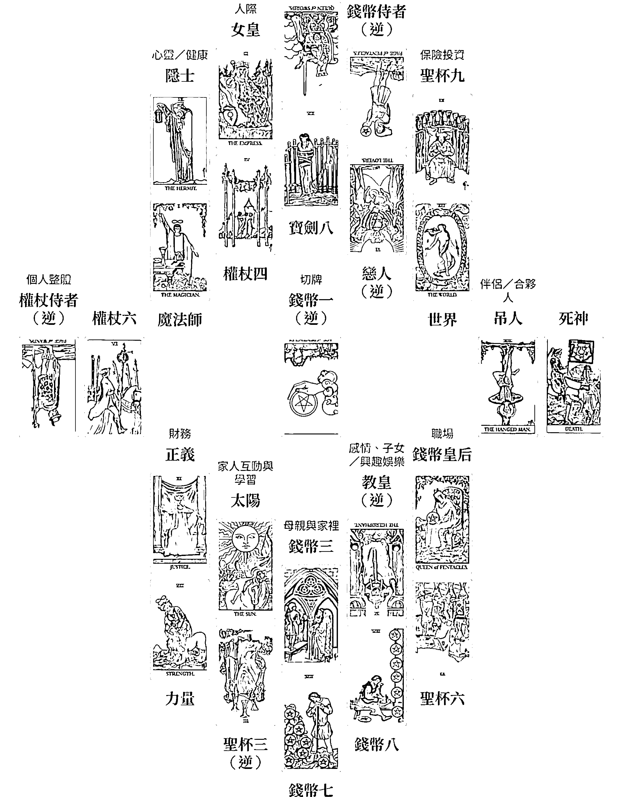

學生 B：我第一張今生是權杖六，就像老師之前說的名美財虛，名聲滿好的，但是僅限於名聲好而已。

老師：錢的部分應該沒有看起來賺的那麼多，但是應該還都過得去。

學生 B：對，我對錢說得好聽一點是不特別在意，說難聽一點可能也沒有很強的財務觀念，沒有很強烈的功利心，所以我對錢的態度就是比較隨意。

老師：你比較重視人家對你的印象。

學生 B：是，沒錯。

老師：簡單講就是你比較在乎自己的形象啦。

學生 B：對，是的。

老師：那上輩子是權杖侍者逆位，你覺得今生為什麼會形成權杖六的個性呢？

學生 B：我也不太明白，上輩子好像是個小朋友，好奇心滿強的，還是逆位的。

老師：可能人家都覺得你好欺負，你就會吃到悶虧。你就想到什麼就做什麼，沒有在管人家的想法，所以你就吃虧了，所以你這輩子很在乎別人對你的看法。

學生 B：是，對的，而且我看整個牌陣有一種感覺，我的業力好像就在家庭家人和親密關係上，反而在人際方面或者我自己的興趣追求方面倒是比較順利開心。好像不愉快的點都發生在和親近的人的關係上，所以這可能會促成我去外面收穫這種認可。

老師：在我看來，你跟親近的人也沒有什麼不好，就是比較辛苦。

學生 B：對。第二張財務是正義，好像還挺準的。

老師：你就覺得夠用就好啊。

學生 B：而且好像勞動所得，付出一分就回報一分。沒有什麼橫財，沒有偏財運。

老師：但上輩子好像滿富有的。力量牌是一張非常好的牌，所以你上輩子可能非常富有，但是你覺得你真正珍貴的不是錢。

學生 B：是，我確實這一生是這種感覺。而且力量牌也代表我上輩子把錢財運用得比較好，不是很揮霍亂用錢的那種。

老師：對啊。

學生B：第三張代表和家人的關係，感覺相處上還好，而且看上輩子那張牌我應該有兄弟姐妹吧，三個人很開心。這輩子只有我。

老師：這輩子這張牌就比較像掌上明珠的感覺，還是你要自立自強？

學生B：沒有，我要自立自強，就我一個人開心，我讓別人開心。

老師：因為這張牌很獨立，有可能是你在你的爸爸媽媽的心目中很重要，也有可能是你的爸爸沒有該有的功能，所以你要靠自己。

學生B：是，後面這個解釋很準。第四張和第十張是爸爸媽媽，非常準。因為我是單親跟著媽媽，然後我媽媽永遠在工作，我看到她都是在工作的狀態，跟別人合作的狀態。

老師：喔，真的，錢幣三。

學生 B：是，她永遠在工作，很少在家，我都是靠自己。我基本上算是沒有見過我爸爸，他算是我這輩子的一個心結，也解決不了。

老師：而且看起來就算想找你，也不知道從何找起，因為寶劍八。

學生 B：是，我跟他的關係還挺困擾的，其實他有出現過，但是我們無法建立一個很好的關係。他像個小孩，總是一副「我來了我是爸爸」，然後又跑走了，他沒有要負責任的感覺。他像一個侍者，高興了就出現在我眼前說「我是爸爸」，過兩天又不知道幹什麼去了，看著他就像看著陌生人。不過想起這段關係其實還有一點未解的感覺，因為好像是一個空白，所以有點寶劍八的感覺，我不明白，也不知道怎麼去明白。

老師：看起來上輩子在你們的關係中，他也是只會出一張嘴，實際上對你沒有什麼幫助。因為寶劍皇后表示他有他自己的事，他都在煩惱自己的事。他可能不是爸爸媽媽或者別的角色，對你卻是批評多於照顧。

學生 B：所以我感覺可能在上輩子跟父母有一些很奇怪的牽掛。像我跟媽媽的關係，錢幣七就滿準的，我這輩子對我媽媽老是覺得她給我的不夠，像是時間啊或者說關注啊，總是有一種遺憾，好像我這輩子一直在等，一直想要索取。

老師：你一直在等著要得到某種東西，就一直在等，等到你想要她負責或者你想要她的關愛出現。

學生B：但是只有土，表示我和媽媽的關係感受上也只有土，我媽媽在感情方面對我的投入沒有那麼細膩。

老師：該有的照顧是有，但親情的話就比較沒有感受。

學生B：對，連結感不太好，但是她會照顧我的生活，供我上學，有時候我的物質條件看起來比同齡人還好，但實際上這些都是我媽媽的缺席換來的。所以這個狀態還是滿準的。之後是我的興趣和戀愛又是土元素，我好像很務實，或者說我比較喜歡這種權威的形象，我確實很喜歡另一半很踏實，然後如果說他是一個類似於像教皇這種權威的形象，我應該是會比較喜歡，就是他地位要比我高，比我有資源，或者比我穩重，我比較看重這些。

老師：但是是逆位，你又不喜歡他管你，是嗎？

學生B：對！

老師：因為金牛座教皇的話，就是控制慾太強。

學生 B: 對，沒錯，我在經歷上也有這種導向，確實有過這種反抗。

老師: 你覺得為什麼呢？因為你上輩子錢幣八，就表示你上輩子可能過得比較辛苦，賺多少才能花那一種，沒有盈餘，所以你這輩子會希望得到多一點，充裕一點，你希望要有保障和安全感。

學生 B: 是，可能父母的關係讓我比較缺乏安全感，所以有時候我就會有一種補償心態，老師說得對，在我的興趣和戀愛觀之中，這方面很重要，哪怕不是很實際的錢的問題，我也確實想有實際的安全感。我好像上輩子就在找這種安全感了，這輩子又有點找過頭，找到那個會控制我、管太多的人，也可能是有一種爸爸的形象在裡面，可能是一種補償心態。

老師: 因為你缺乏父愛啊。

學生 B: 是的，就是一種過度的補償。不過我又靠自己去習慣了，我不喜歡別人干涉我管太多，這也是一種矛盾吧。職場這張牌也準，之前我抽牌問事業經常是錢幣皇后這張。

老師: 很好耶，貴婦牌。

學生B：上次您說我可能會教人怎麼過得更好，或者照顧別人，這確實是我。

老師：前世聖杯六但是逆位，就是你為了照顧別人而忘記照顧自己。

學生B：對，是的。我自己當老闆的時候，像是春節大家都要回家過年，我就會自己顧店讓大家放假，我是比較奇怪的老闆，一般的老闆會跟員工說你來上班，我發你雙倍的薪水。

老師：雖然我說前世沒有辦法印證，但是大家好像都可以感覺得出來以前是什麼樣的人，就有一個源頭，你這個源頭是怎麼來的，今生也會或多或少的展現。

學生B：對，就好像有個原始的驅動一樣，我今生在這部分很辛苦，我就盡量的修正，盡量的調整，像在修一門功課一樣。然後第七宮吊人牌，就是隨緣吧，雖然前世是死神，但前世沒有解決的這些孽緣……

老師：今生也不管他了，放水流。

學生B：對，很水，都是水元素最不好的牌，都是我不喜歡的牌，看起來很無奈。上輩子沒完成的功課，這輩子就來吧繼續吧。下一張投資方面我很喜歡，這兩張都是挺好的牌，好像上輩子我已經滿意了，這輩子在這個方面就修到圓滿了。

老師：上輩子是你得到那些錢，但是因為是聖杯九，所以你是一種佔有的狀態，但是這輩子是世界，表示你得到這些錢之後，你會拿來照顧大家。上輩子你是自己有錢就好啦，沒有在管別人。

學生 B：對，我覺得如果我是一個有錢的人，我花不完的錢若能夠幫助別人，那才真的有意義，而不是都存起來變成一個帳面數字，這確實是我的觀念，只是我現在還沒有那麼有錢。

老師：我好喜歡數字喔（笑）。

學生 B：我把這個世界牌當成是一個祝福，讓我能夠達到分享的狀態。下一對牌雖然是逆位，但我很喜歡，因為代表學習，好像從上輩子就在學了，這輩子又興趣很多。

老師：上輩子是錢幣侍者，就代表你很專注的學習，這輩子也在學，但是比較多元、觸類旁通。都是逆位，就代表你持續學習中，沒有說你學習到哪個程度就覺得夠了。

學生 B：對，尤其現在我突然又開啟了一個很想學習的動力，所以這張牌滿準的。下一張我看到這個牌面就想到和爸爸的關係，如果代表個人成就的話，其實我也有一點感覺，因為我對所謂的人生成就其實還是迷惑的，我不知道要用什麼樣的標準來衡量。

老師：寶劍八代表你的發展可能更大，但是你會覺得如果得到更多的話，你就害怕失去更多，所以你沒有辦法邁開腳步。

學生B：對，比如說我如果要追求財富的成功或者事業的成功，追求到了一定程度，我就會迷茫，覺得好像不是我想要的。

老師：覺得我需要的是這個嗎？我會不會其實需要別的？

學生B：對對對，我就會退回到戀人牌，去學點別的，我想要有不同的嘗試，我不想要在一個地方達到頂峰，我沒有那麼強的目的性。

老師：那上輩子的寶劍皇后也代表你計劃很多，可是沒有真的開始做，但是今生你已經開始做了，只是還是有點怕怕的。

學生B：明白，就是有點嘰歪，嘰嘰歪歪的比較情緒化比較說嘴啦。

老師：其實兩張都是（笑）。

學生B：那這可能是一張建議牌吧，讓我去克服的地方。

老師：邁開腳步，不要想太多。

學生B：明白，確實是，我會突然迷茫，所以我想接下來跟老師學占星，看看占星能不能幫我解答這些。

老師：占星超好玩。

學生B：我很期待！接下來這對牌也很美好，人際關係牌都很好，上一輩子好像是一個很游刃有餘的角色。

老師：女皇，你受到大家的追隨跟喜歡，但是你這輩子因為是權杖四，所以你比較知道自己要什麼，你不會只接受人家的吹捧，你也會打造一個很舒適的感覺，讓大家可以進來你的生活圈，人們在你的生活圈當中可以得到一種舒服安適的感覺。

學生B：沒錯，權杖四給我一種安全感，我特別喜歡。我自己也希望架構出像權杖四這樣的一個範圍，外圈是一個世界，內圈又是一個世界，這種感覺很好。所以在人際關係上，我沒有想要成為女皇那種所有人都會喜歡的樣子。

老師：你會希望成為一個中心，讓大家可以連結起來。

學生 B：是的，我很喜歡權杖四這張牌，雖然只是一個成就的初步階段。

老師：初步才好，初步才有很多發展的空間吶。

學生 B：啊，謝謝老師，我好喜歡這張牌。然後下一對牌很巧，我之前抽今年運勢，這個位置也是魔術師，那時的解釋是身體總會出現一些小狀況，但是總有一些方式解決。我的身體狀況其實不光是今年，近幾年都是這樣。

老師：你為什麼覺得魔術師會有小狀況呢？

學生 B：其實我也不知道。

老師：魔術師可能是因為你的病都不會拖得太嚴重，在一開始的時候就顯現出來，讓你可以解決。你覺得是嗎？

學生 B：懂了，對，我覺得我還挺敏感的，或者說我覺得在看病這件事情上總是滿幸運的。有時候我會發現一些狀況，然後找到一個好醫生，馬上把問題解決掉，不會出現那種求醫很久、找不到解決方式的狀況。

老師：好好喔。

學生B：朋友都說我看病的運氣很好。

老師：跟醫生都有緣。

學生B：是，有醫生緣，所以身體也不算很好，但是總能維持穩定的狀態。

老師：而且你前世是隱者，就代表你前世對自己的身體狀況也了解得很清楚，你也有在學習這方面的事情，或者你也有訓練自己對這方面的敏感度，因為隱者是處女座，處女座是第六宮，本身就是健康的宮位。

學生B：那老師如果說十二宮從心靈的層面要怎麼去解這兩張牌呢？

老師：上輩子是隱者的話，就是你可能沒有接觸很多人，你就躲在深山自己修行，然後這輩子的話就出來見人了，因為是魔術師。要出來幫助大家，接受世俗的磨練。

學生B：我有一種感覺，我可能有一世是和尚或是修行人，因為我對這些很感興趣，有些時候進到寺廟會有一種很熟悉的感覺，覺得像回家了。

老師：就滿像隱者的啊。

學生 B：對，看到這張隱者，我就想可能我上輩子是個修行人或是和尚，這還挺符合我自己的感覺。

老師：你這輩子需要入世。你之前是出世，但你這輩子可能因為魔術師，就入世了。你學習的東西要開始拿出來運用在人家的身上看看有沒有用，或者是你也要活一世世俗的生活，來試試看你學習的東西有沒有成果。

學生 B：喔，那這張錢幣一也是這意思嗎？拿資源給別人，是這樣嗎？

老師：你也可以把錢幣一當成宗旨，表示該學的你都學夠了，逆位就代表你現在要開始運用了。你該吸收的知識，你在上輩子都吸收過了，你現在要活這一輩子，就不是拿來建議人，而是自己活活看。光說是不能驗證的，但好像也滿準的。

學生 B：對，有幾張非常準，錢的問題我尚不能驗證，但是像親密關係這幾張牌挺準的，錢幣皇后和聖杯六這組非常準，我很年輕的時候就是會為了對別人好，把自己放在後面，最後我自己很困擾，然後逐漸的要活出錢幣皇后。

老師：所以與其說是前世，不如說是我們的天性。

學生 B：是，就是一種上一輩子帶來的業力，組成的性格的天性。

老師：對啊。

學生 B：您有說到逆位的教皇是控制慾很強，那皇帝也是控制慾很強，對嗎？

老師：是，教皇是控制你的財產，控制每一分你擁有的東西；皇帝控制的是你的行為和思想。

學生 B：那如果是正位，控制慾就沒有那麼強對嗎？

老師：也是有控制慾，但是比較合理，不過還是要看跟哪些牌一起出現。

### 實例解讀 3

### 前世今生 C

## 個人整體

權杖二 聖杯七 星星 (逆)

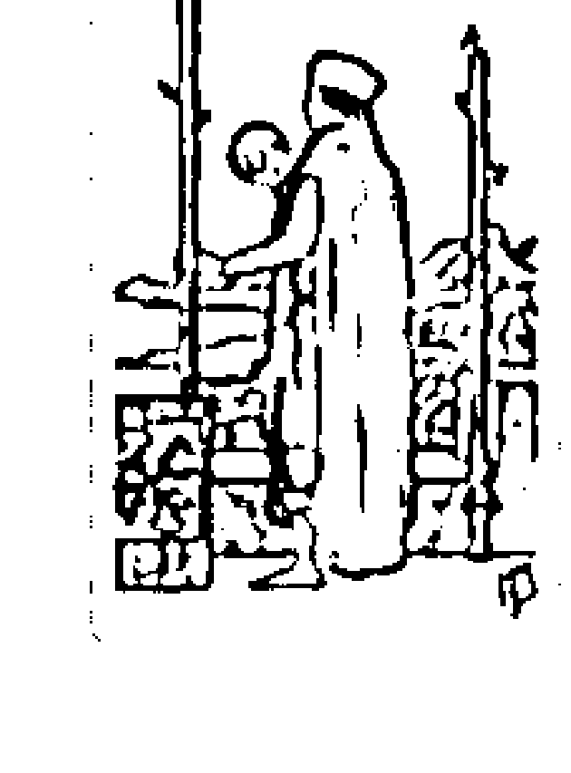

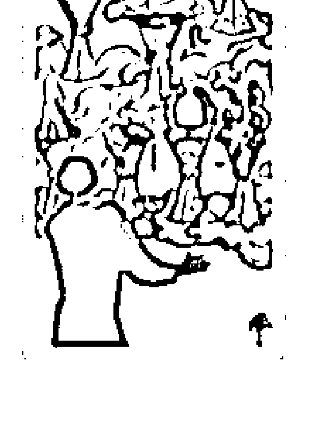

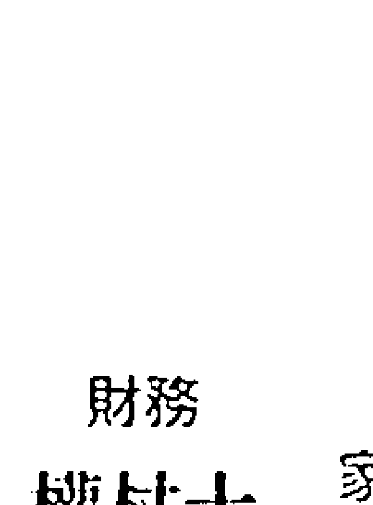

## 財務

權杖十

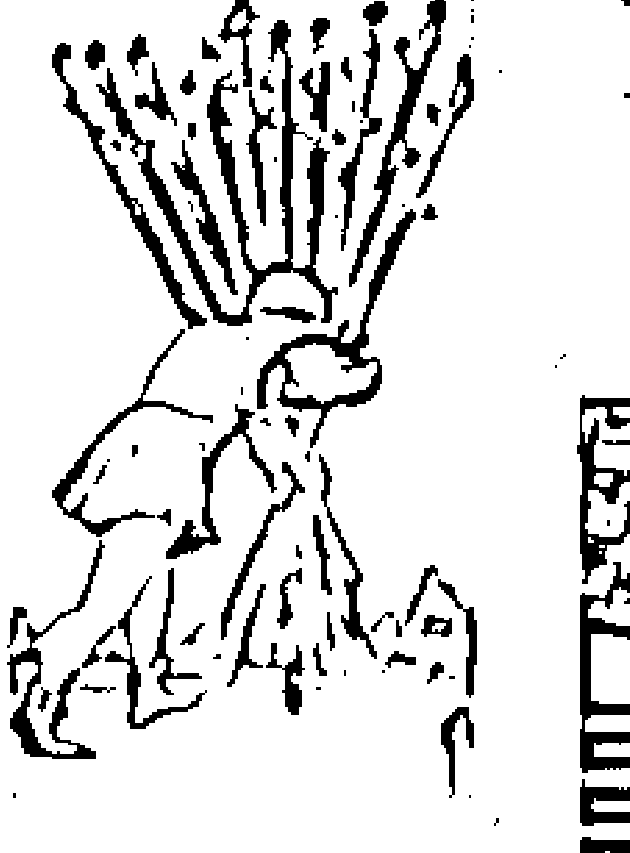

## 家人互助與學習

寶劍九 (逆)

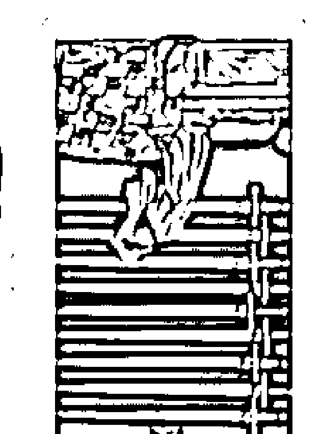

## 人際

寶劍八 死神 (逆)

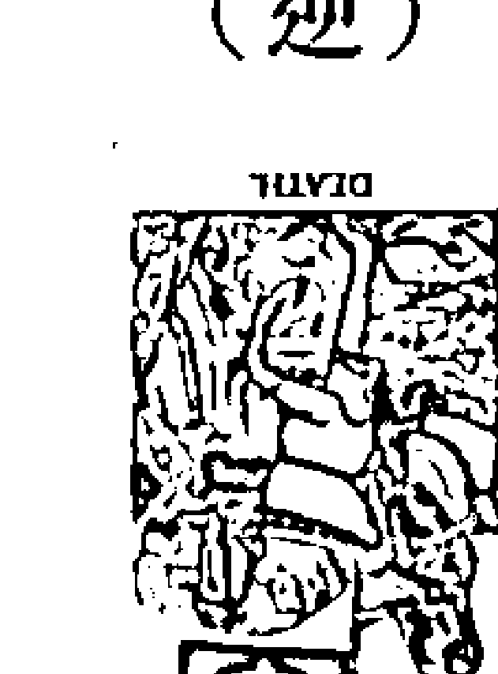

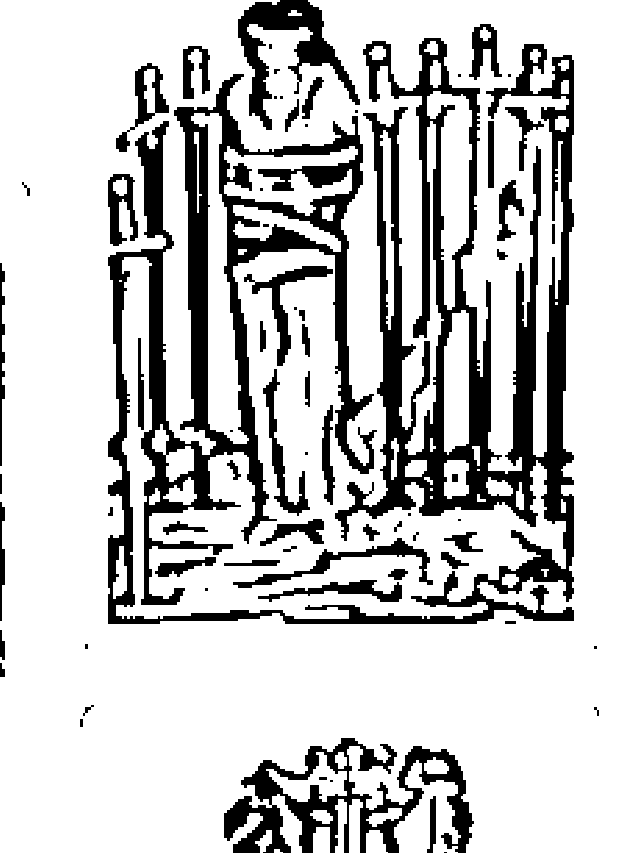

## 爸爸/長官/成就

錢幣侍者

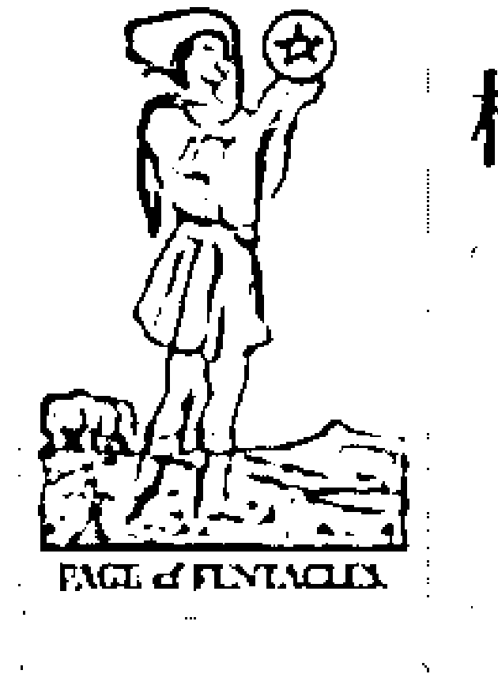

## 學習/國外事務

權杖皇后

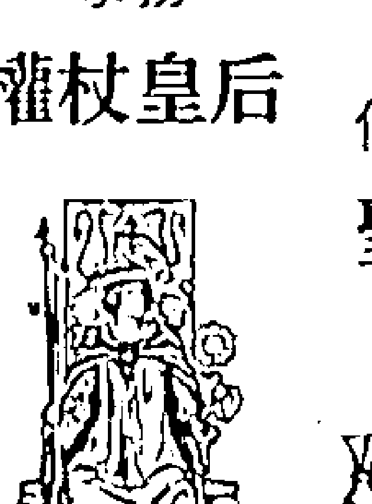

## 保險投資

聖杯五 (逆)

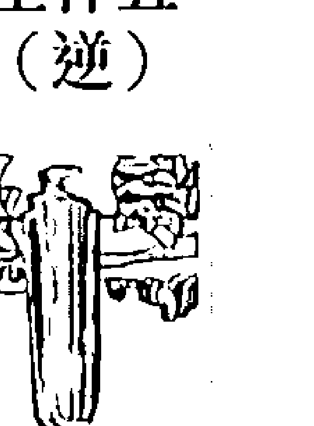

## 伴侶、合夥人

月亮 (逆)

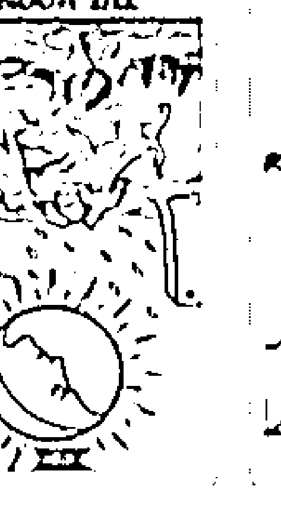

愚人

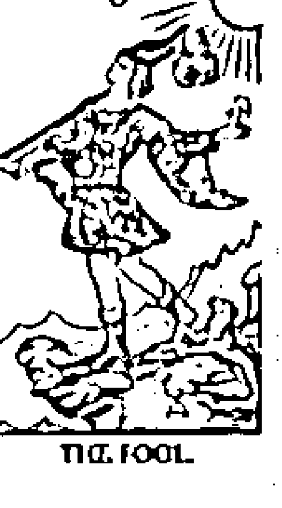

## 職場

魔法師

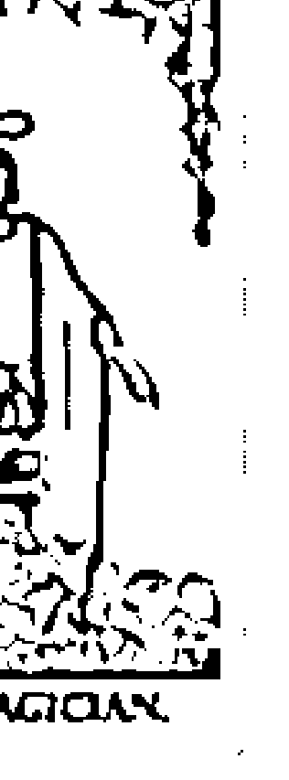

## 感情、子女/興趣娛樂

錢幣六

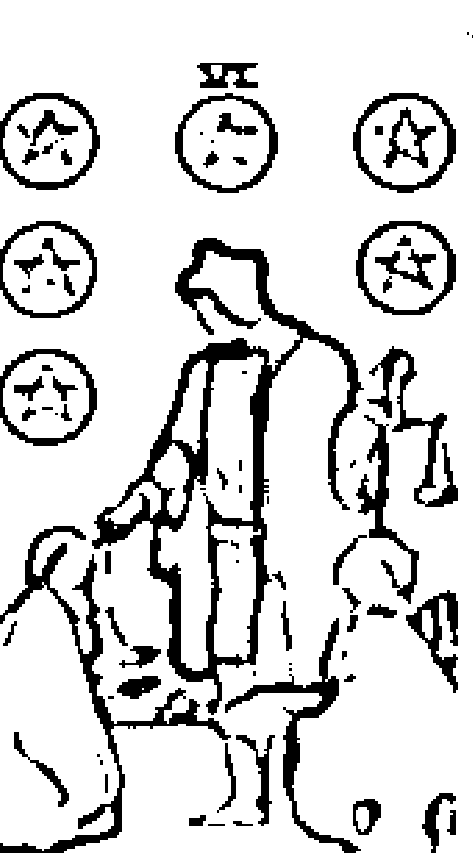

## 母親與家裏

聖杯十 (逆)

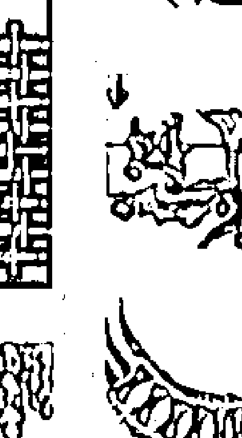

戰車 聖杯四

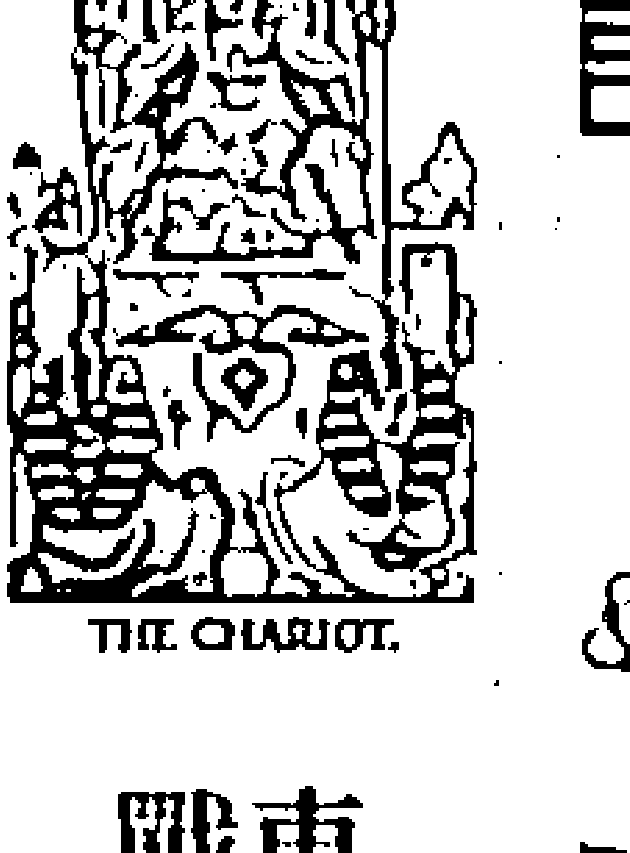

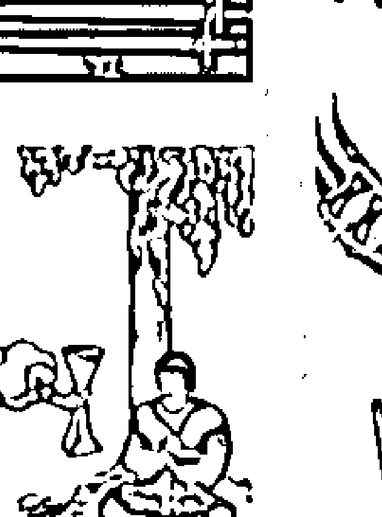

寶劍國王

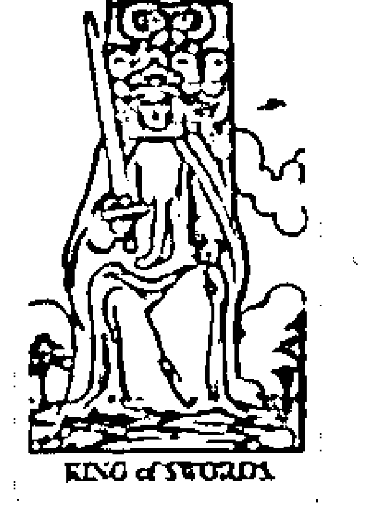

寶劍七 (逆)

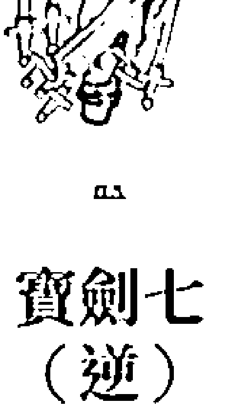

寶劍騎士

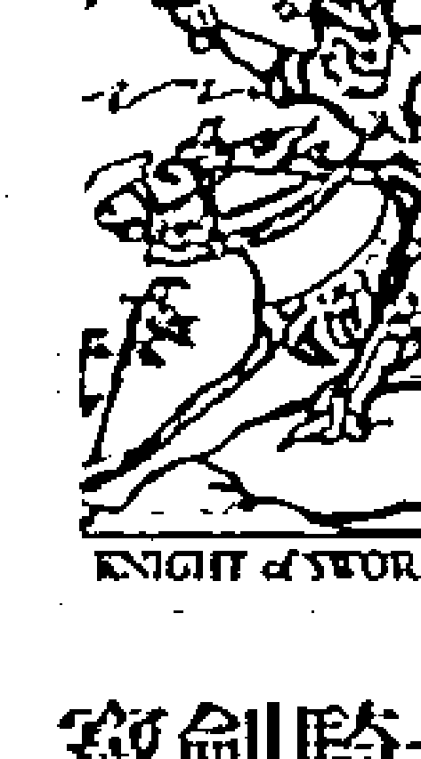

老師：反應會比較快。

學生C：對，但是可能因此聰明反被聰明誤，因為沒有辦法好好的累積，會多方的發散自己的能量，沒有聚焦。一宮這一世是聖杯七，前世是權杖二，看起來前世可能是一個很有規劃很有理想的感覺。

老師：比較積極，比較有遠見，這輩子也很有遠見。

學生C：今生就好像變成太眼高手低了。

老師：對，水跟火都是開心的元素，所以喜歡找自己的興趣，做自己喜歡的事情，以玩樂為主，不是很務實，以自己的興趣跟感覺為主，因為水跟火都是情感的元素。

學生C：對，其實本來我的專業已經可以確保自己的財務是穩定的，所以後續在做事、找工作上，會以自己有興趣或想要嘗試的為主，不會因為家庭或某種義務就一定要去做些什麼，好像沒有這個負擔。也是因為這樣，變成什麼都想要試，呼應到整體的牌，好像什麼都很美好，不夠踏實。二宮這一世是權杖十，上一世是戰車。

老師：兩個都壓力滿大的。

學生C：對，而且都很卡，上輩子和這輩子好像都賺不到什麼錢。

老師：前輩子戰車還比較有機會反過來，但這輩子你這些年財務方面的困難好像都定型了，如果以權杖十來講，就是債已經欠了，你要慢慢還完，你覺得呢？

學生C：所以這輩子賺錢也賺得很辛苦嗎？

老師：還錢還得很辛苦，賺得倒是不辛苦，因為是火元素。

學生C：所以是可以賺到錢的，可是守不住錢。

老師：對。因為上輩子水元素，水元素只能從節流來說，但是火元素可以開源吶。

學生C：的確是如此。我還滿幸運的，在找工作或是以自己的能力去賺錢的這件事上，雖然有一些困難，但是最後都可以找到一份條件相對好的工作。不過目前我沒有什麼需要償還的錢，所以我不確定權杖十怎麼解釋。

老師：權杖十就代表壓力很大，可能你不是欠錢，你是需要照顧家人或寵物或孩子，比較是人生的債這類型，一種該還的還沒還完的感覺。

學生C：沒錯，我覺得滿辛苦的。自己開始賺錢之後，會覺得應該要花一部分的錢去支持家裡，也有一種償還的感覺，變成賺錢的一個壓力。雖然說自己的能力足以財務穩定，但是會強迫自己一定要賺錢，因為有責任在。但是從水變成火，是不是有好一點點啦？

老師：對啊，有，比較會賺錢了。

學生C：至少會推進。

老師：是，至少有錢可以花，就算你的錢留不住，但是至少有得花啊。

學生C：好樂觀喔，的確是如此，有錢花的感覺會帶來一種安全感。

老師：真的真的。

學生C：三宮今生是寶劍九，我可以體會，因為對於兄弟姐妹或是同輩的確是有一種自己的小劇場，越想越負面的情況。

老師：但是這張牌是逆位，就代表你幻想的事情實際上都沒有發生呐，你只是覺得很沒安全感，覺得他們很像會做出這種事情，但實際上都沒發生。

學生C：對，沒錯。

老師：前世聖杯四也差不多。聖杯四代表他們也嘗試對你釋出善意，但你就是覺得好像有詐。你不太敢接受他們的善意，你會覺得好像以後是要還的。你要加上寶劍九一起看，單是一張聖杯四是沒有這種含義，但是他跟寶劍九同一組，要把這兩張合起來看。

學生C：寶劍九就是一直有種想太多的感覺。

老師：對啊，但是兩張都是事實上沒有什麼事發生呐。

學生C：那如果說只有聖杯四的話是什麼意思，我一直覺得聖杯四很難解。

老師：如果只有聖杯四，就代表你會覺得你跟兄弟姐妹各自安康就好了，不要有太多來往。你是喜歡他們的，但是你就是覺得各自把自己的生活過好就很萬幸了。因為四是把自己侷限在自己的小框框裡面。九這個數字就是焦點只放在自己身上。

學生C：的確有點這種感覺，我就是覺得各自把各自的生活過好，因為如果搭配寶劍九就是會有很多小劇場，覺得好像別人會對自己造成一些負面的影響，所以就會變成各自把各自的生活過好就很慶幸了。

老師：而且九跟四就代表其實你是把自己的特質投射到他們身上，他們可能沒有這種感覺，但是你會覺得光要把自己過好就已經很辛苦了，所以你會覺得他們也是一樣的。

學生C：為什麼九跟四會把自己的特質投射到別人身上呢？

老師：這個是我判斷的，因為九跟四都是自己過好就好啦。所以你如果這樣想的話，就會覺得這個相對的人也會這樣想啊。

學生C：的確是有這種感覺。四宮在這副牌裡面對我來說比較像爸爸，爸爸是聖杯十逆位，我覺得爸爸在家裡比較希望和諧，所以他會避免起衝突。

老師：但是也沒辦法解決事情，放爛的感覺。

學生C：對對對，他有一種逃避的感覺。但是在前世的時候他是寶劍國王，有可能在前世他是只出一張嘴吧。

老師：管太多，出一張嘴，但是不幫忙。

學生C：對，所以這輩子只好這麼卑微。我覺得扯到我爸爸就有種雖然很現實但是又有點好笑的感覺。

老師：其實依整體來看的話他是一個好人。

學生C：對，就是一個老好人的形象。

老師：這樣講好了，無害的人。

學生C：我覺得他的確是水元素，水元素對我來說是一種很軟、不會抵抗或者不會很有力量做事的人。如果以一個人來講是好的，但是如果以一個要負責任的人來講，我不覺得很稱職的表現。當然如果四宮當做家庭來看的話，家裡有一種盡量不要發生衝突的感覺，維持表面的和平。

老師：第四宮除了媽媽之外，也代表親人跟自己的家庭，所以你要用爸爸來解釋也可以。

學生C：突然發現不管是爸爸還是家庭，都有異曲同工之妙。

老師：對啊。

學生C：再來是五宮，今生是錢幣六，我覺得在談戀愛方面的確會希望對方是比較穩重的對象，例如說他要養得活自己，有份穩定的工作之類的。

老師：但是其實你也不會要他養。如果他養得活自己的話，你也會養活自己，你不會給他帶來太大的負擔。

學生C：對，是因為錢幣六所以看出各自養各自就好嗎？

老師：錢幣六是一個平衡啊，而且希望相處和樂，因為六就是和平相處、對於對方沒有太大的奢求的意味。就好比說我們是一個團體，然後我們把各自的事情都做好。

學生C：這樣跟錢幣三是不是很像？

老師：錢幣三是一個初階團體，只是朋友或同事，但六的話就已經綁在一起了，六就是有個責任的限制。三只是聚在一起，剛好碰到而已，可能下個月就改組了。六是比較固定的組織。

學生C：但是如果求職抽到錢幣六的話，其實是一張還不錯的牌。

老師：對。

學生C：就表示有組織的，然後是穩定的。

老師：對。然後上輩子是寶劍七，你覺得呢？寶劍七是一個走旁門左道的人。

學生C：我是不是上輩子是個花花公子或花花少女，所以這輩子才這麼追求穩定啊。

老師：可能是上輩子在感情方面不知道自己要的是什麼。其實我覺得會這種好像東騙西拐的人，都不知道自己要的是什麼，所以乾脆每個人都試試看，我覺得啦，你覺得呢？

學生C：我覺得的確有這種可能，因為到這輩子也不太清楚。這樣聽起來好合理喔，因為不知道自己要什麼。

老師：所以這輩子先求安定再說，安定了以後再思考接下來的事情，因為上輩子定不下來。

學生C：然後六宮工作，我覺得有一種很連貫的感覺，上輩子是寶劍騎士，這輩子是魔術師，就是都很風，都是以思維邏輯為主。

老師：想到什麼做什麼，沒有規劃。這輩子魔術師跟寶劍騎士都很像雙子座，都是風元素，但是這輩子就有能力多了，上輩子亂竄，不具備能力。

學生C：上輩子好像亂衝亂撞的。

老師：亂闖亂撞的，這輩子比較有能力，魔術師就代表很有才華。

學生C：那怎麼還賺不到錢？

老師：魔術師只是才華，他本身是風（笑）。他不是土，你的錢財要慢慢醞釀，要慢慢的存，等到你該花的花完了，才能開始慢慢存。

學生C：這是從哪邊看出來啊？

老師：因為魔術師雖然是風，但是這張牌的本質算是四大元素都有，所以代表你要的都有。但是魔術師表示你要的東西是錢的本質，那錢的本質你覺得是什麼呢？錢就是我們的能力和時間換來的，所以時間跟你目前都有，只是我剛剛說權杖十，所以你要還債，你賺得到錢但你要還債，剩的錢你才可以存下來，但是沒有多少可以存。其實別人看你都覺得你應該很有錢，但是他們不知道你另外有破洞。

學生C：的確是這樣，如果以十宮來看，大家會覺得我工作很體面啊，發展還不錯，但是大家沒有看到我二宮的債啊。

老師：你這一張小貴婦牌是逆位，就只是看起來而已。那你媽媽是這一張嗎？因為如果四宮是爸爸的話，十宮就應該是媽媽。相對的，是這樣嗎？

學生C：對，沒錯。

老師：你媽媽什麼地方跟這個錢幣九比較像？

學生C：媽媽從上輩子到這輩子的感覺都是家裡的經濟來源，但是我覺得她從錢幣侍者走到小貴婦，可以解釋成她這輩子在家裡的確是非常重要，有一陣子她幾乎是唯一的經濟來源，所以她其實給出的東西非常多。不過雖然家裡的經濟狀況不好，但是我感受到我的物質生活是充裕的。

老師：這張牌錢幣九的話，就代表她如果你們，她一個人可以活得很好。但是她要顧到你們，所以她會很吃力。是嗎？

學生C：沒錯，因為媽媽其實是一個能力很好的人，她是為了要養家。

老師：她如果只有自己的話，看起來過得很好啊，小富婆。

學生C：對，沒錯。如果十宮是以職涯來看的話，就是看起來不錯，但其實沒有外表看起來那麼好。

老師：逆位的話其實需要時間吶，因為兩個都是土元素的的話，就代表這個本質是跑不掉的，代表再怎麼樣都不會太窮。

學生C：但是需要時間把他轉正。

老師：對。好，我們來看第七宮，愚人跟月亮逆位。

學生C：七宮我覺得可能是前世在挑選伴侶上沒有想太多，變成今生在挑選的時候反而想太多了。有很多的恐懼之類的。

老師：太疑神疑鬼，對。而且是逆位，有被害妄想症。

學生C：沒錯，感覺要結婚不容易啊。我覺得以占星的三方四正來看的話，可以從爸媽的相對狀況呼應到我一宮跟七宮的狀況。因為我覺得爸爸跟媽媽的狀態有點兩極，媽媽就是很吃力嘛，所以我對於伴侶關係非常保守。以上輩子的愚人來說，這輩子就變得非常故步自封，自己嚇自己。但是因為是水元素，是不是代表其實還是希望有伴侶的？

老師：水跟風的話就是談談戀愛就好。水跟風都沒有定下來的意思。

學生C：但是水不是有情緒嗎？

老師：就是要有情感的寄託，談戀愛可以啊。但如果要你跟人家結婚或是長期同居的話，都是需要責任感的，一旦碰到這個責任感，你就會開始有被害妄想症，你會覺得人家要佔你便宜。

學生C：沒錯。這樣不好啊。

老師：當然不好啊，但是這就是本性，也沒辦法啊，你只能慢慢的訓練自己的安全感。但我是覺得其實這種安全感不訓練也沒關係，你就維持一個防備心防禦心比較好。

學生C：就因為伴侶是個就算沒有也不會很糟糕的配備啊。

老師：我覺得談戀愛更好。婚姻需要的不是戀愛，我覺得你如果要婚姻的話，你需要的是你很信任的好朋友。

學生C：這是從牌看出來的嗎？

老師：沒有，這是我個人的信念，就是你要信任他，然後你要理解他的人格。而且如果是戀愛的話，你會覺得有什麼事情我不需要告訴他，他應該要自己知道，但如果是你的朋友，你就會跟他開誠布公。我覺得如果要結婚的話，就需要開誠布公，不是像談戀愛一樣猜來猜去。這是我個人的信念啦。

學生C：這樣說來，我覺得我的五宮跟七宮好像排錯了，如果對調感覺比較好一點。但是的確對我來說，要先把自己過好，才能有比較好的伴侶關係，所以如果從七宮跟一宮這樣相對來反應的話，其實我的一宮沒有經營好的話，會導致七宮一樣是水元素，就變成是一個只是空想而且有很多恐懼的地方。

老師：而且也沒有火，你沒有勇氣去嘗試。

學生C：對，我就一直亂想，但是都不會踏出去嘗試。

老師：其實我還是覺得台灣目前的婚姻制度對女人來說沒有很友善。我覺得先把自己過好就好，至於談戀愛結婚，就等到你真正認識自己之後，你再來看能不能找到合適的，那個時候你就了解自己了，就可以知道什麼樣的人適合你。這個都需要年紀和時間。

學生C：其實我覺得如果不知道自己要什麼，去找一個伴侶反而是找自己麻煩啦。

老師：真的，我是覺得我不會生小孩，我要的話我會領養，因為我覺得地球的人類已經太多了，而且人類又不是什麼好東西。但是每個人有每個人的信念，你不一定要聽我的，這只是我個人的想法。

學生C：第八宮我覺得好難解，這輩子是不是在投資方面會吃大虧？

老師：你要看的是偏財嗎？第八宮代表很多種意義喔。性欲啊，或者是潛意識，或者是你的情緒。

學生C：通常八宮會看什麼，還是全部都看。

老師：全部都看，但是我為了要方便，我把他限定成偏財，如果偏財的話，塔的話還滿有可能破產的，如果要破產的話就趁沒什麼錢的時候破一破吧。

學生C：所以還是不要投資比較好哎。

老師：對。能花的就花，可能就是因為這樣子所以你才會出現塔，叫你能花的都花掉。然後上輩子是聖杯五，代表跟我常常講的意思差不多，就是你覺得自己沒什麼錢，但是你擁有的已經比別人多了。所以這輩子可能就讓你看看什麼叫做真的沒有。趕快花掉，不要存。

學生C：趕快把債還一還。

老師：你如果全部花掉反而就應了這張塔，就解決掉了。不然你就像我一樣買房子，我因為怕花錢，最近還掉一筆房貸，因為我就把錢還債換掉，不然的話放在口袋的話，我會亂花。

學生C：喔，這也是個好方法哎。然後九宮是權杖六和權杖皇后。

老師：看起來都還不錯啊。

學生C：但是我覺得好像這輩子的學問做得沒有很扎實。因為上輩子是權杖皇后，但是這輩子就變成權杖六。

老師：接受眾人的喝彩，但是實際上實力并不是很夠。

學生C：對，例如說書只看過半本就說自己看過了之類的。

老師：其實我覺得我也是這個樣子，就是人家都覺得我學問多，但是我覺得我的塔羅牌都是自己製造原理，然後變化出來的，我的書真的看很少耶。人家都覺得你一定研究很多，一定什麼都知道，但是你會發現在同行裡，自己真的認識的不多，沒有看很多書也沒有研究很多資料。這些東西都是在我腦子裡面自己構成的，不是外來的。

學生C：第十宮是錢幣侍者，可能前世的職涯還在累積的階段，這輩子收穫會比較多。

老師：對。但是逆位就代表其實你也沒辦法把收穫都留在自己身上，因為你要養家人。

學生C：可是家人總有一天會過世不是嗎？

老師：這個就是你生下來的時候就是這個狀況，但是你死的時候不見得是這個狀況。

學生C：還有可能隨著時間慢慢轉正。

老師：是，對。

學生C：但是如果從牌面上看，以四宮當做家庭狀況的話應該也不至於太嚴重吧？

老師：不會拖累你太多。

學生C：就情緒上比較有問題吧。

老師：對。

學生C：第十一宮前世是寶劍八，這一世是寶劍一。

老師：好多了。

學生C：前世可能自己想太多，就會畫地為牢，然後這輩子我覺得在人際關係上有在改善。

老師：已經找到一個自己面對的方式，找出一條路。

學生C：沒錯。而且因為是寶劍一，我覺得也代表其實可以看清楚很多事情，實際上真相是什麼，就不會有那麼多小劇場。

老師：糾結在那邊。

學生C：對，而且因為是風元素，我莫名有一種感覺好像比較會去挑選什麼樣的人可以當朋友，我只是莫名有這種感覺。

老師：真的。這種感覺出來的通常都滿準的。我覺得直覺跟第六感不是同一回事，因為科學家也有直覺，電影導演也有直覺，我覺得直覺是你學東西學久了以後，相關的地方你都打通了，所以你如果接觸到有可能發生的事時，就預知有可能有這個結果，因為觸動到你那些神經。第六感的話就真的沒有基礎，真的是天外飛來一筆。所以我覺得我還沒有學塔羅的時候，別人讓我猜直覺是哪一張牌，我說是火元素，他們說你怎麼都知道，我們都以為是水元素，我說我就覺得是火元素。

學生C：水元素應該比較像是去通靈吧。

老師：對，火元素才是自己的生命，動物都有直覺，知道哪裡找東西吃，哪裡有水喝，知道哪裡有危險，這個才是直覺。通靈就不見得，我覺得通靈通常是身體有一些不舒服才會通靈。

學生C：十二宮前世是死亡的逆位，這一世是錢幣一的逆位。我覺得上輩子的身體可能很差吧，身心靈可能是非常不好的狀態，這輩子應該好很多，就只是要運動而已吧。

老師：也是逆位，但是最壞的狀況已經過去了。

學生C：所以死亡是說已經瀕死，就是快要轉化的程度了。

老師：就是你身體有一種病，沒辦法解決，因為死神的話就是沒有辦法解決，一直停留在那裡，但是錢幣一的話就是新生。

學生C：所以這輩子會比較壯實。

老師：對啊。而且上輩子的那個病痛沒有帶到這輩子，這輩子雖然你先天有一點不足，但那都是可以補起來，因為是逆位。

學生C：因為土的逆位，就是身體上會有一些缺陷這樣子。

老師：是，不要說缺陷，有一點不足啦。

## 課外問答

學生A：老師我想問一下塔羅牌學習是哪一宮啊？

老師：第八宮和第九宮，而且我看過的真正的占星師不是八宮很強就是九宮很強。第九宮是鑽研深奧的學問，第八宮是神秘學本身代表的宮位，但是如果是第八宮強的話，不見得是占星師，也有可能是心理師、心理醫生。第九宮不見得是塔羅牌，也不見得是占星，第九宮就是人不需要用他來吃飯的東西都是第九宮，例如說旅遊、藝術、宗教等比較學術類的東西，就像中研院，我們實際上接觸不到的，或者說藝術家，是我們接觸不到的夠高的人，就是第九宮。第九宮就是比我們一般人的程度高。

學生A：是不是比大學更高的學習。

老師：對，因為三宮跟九宮是對宮，如果說三宮是小學生或者國中以下，高中大學碩士博士這類就是第九宮。

學生B：老師，請問十二宮呢？跟玄學沒有關係嗎？

老師：有啊，十二宮是靈學。不過，如果是占星師的話，他是需要去理解的，所以占星師是十一宮、第九宮、第八宮都有可能。十二宮就比較是第六感。

學生B：通靈是第八宮跟十二宮嗎？

老師：對，通靈是八宮跟十二宮，第八宮和十二宮都代表鬼，我常常說水象星座都代表靈體，巨蟹座的話，我覺得像是地縛靈，因為是一個怨念，所以他在一個地方沒有辦法離開，因為他一旦認定了什麼事情就被綁在那邊。如果是天蠍的話，是怨靈，如果是雙魚的話，是遊魂。

學生C：老師，您剛剛說情緒是看第八宮，第八宮和第十二宮是看情緒方面嗎？

老師：第十二宮目前我們設定是健康，因為第六宮已經被工作佔走了。第十二宮其實應該是心靈的健康、靈魂的健康，但是健康已經沒地方看了，所以我就移到第十二宮。

學生C：那老師如果這個人是憂鬱症，一般能從哪裡看出來呢？

老師：第十二宮跟八宮。四宮也可以，水象都可以。

學生A：哪張牌可以代表呢？

老師：我覺得滿有可能是聖杯五。聖杯五就是覺得自己都不夠，別人都對自己不好，覺得自己擁有的很少，他不看自己擁有的，都看自己沒有的，而且我覺得這個是大部分精神病的來源。

學生A：聖杯五是放在八宮，對嗎？如果是憂鬱症的話。

老師：對啊，就只看自己沒有的，不看自己擁有的。

學生A：如果聖杯五放在十二宮也算嗎？

老師：我沒遇過耶。

學生 C：我覺得寶劍九也滿適合，我的朋友如果抽到寶劍九基本上都會應對失眠症，就是很形象，都會失眠焦慮。

老師：真的，實際上沒發生什麼事，但他們就很焦慮。

學生 A：老師，那惡魔牌在第八宮呢？

老師：惡魔牌就很貪心，什麼東西都想要佔有。

學生 A：不是有病。

老師：有可能啊，你要看怎麼排列怎麼搭配啊，任何事情不管在哪一宮都不是一張牌就可以論斷啊。你要跟第一宮跟第四宮跟第八宮一起看，第十二宮也要看。

學生 A：為什麼第四宮也要看？

老師：都是水象的宮位啊，都跟心情有關，跟情緒有關。

## 《藏在塔羅裡的占卜符碼》
## 練習題解答

在《藏在塔羅裡的占卜符碼》一書中，每張大秘儀後面都有一道練習題，答案由天空老師於2011年發表在她的博客，然而由於中國伺服器（或防火牆）的問題，讀者未必能閱讀。經天空老師同意，有幸將練習題的答案收錄於此書，方便讀者學習與查閱。

在閱讀練習答案之前，天空老師提醒：「書中的練習題，其實不是拿來讓你解牌套用的，因為我說過，牌沒有標準答案。通常我問問題的方式也較為仔細，方向和範圍不會太大，所以請讀者們，將這些練習題拿來當作加強你對每一張牌基本概念的訓練。」

## 〇｜愚人

Q：在此設定兩個問題，一個是問：「如果接受了A工作，這份工作的發展前途會如何？」另一個問題是：「應不應該接受A工作？這兩個問題都抽到了愚人牌的話，請問在解釋上分別有哪些意思？兩個答案最大的不同又在哪裡？

A：第一個問題抽到愚人牌，我們可以說：「接受了A工作的話，你在這個公司也許不會長期待待下去，但這並不代表你應該拒絕這份工作，而是代表這份工作應該是你一個更廣大的前途的跳板。」

第二個問題抽到愚人牌，我會覺得是：「對方給你的待遇跟條件，你可以再爭取看看，或是其他地方有更適合你的工作，你應該從更大的範圍來考慮這件事，不需要馬上投注太多心力。」

兩個答案的不同在於，第一個問題是假設已經接受，那麼就要用「前途」的性質來考慮愚人牌，風元素極為不確定，愚人的變動性又大；但是這張牌的前進性大於停滯性，表示在更遠的未來還是有展望的。第二個問題是問「該怎麼做？」愚人牌雖然有勇於接受挑戰的意思，但是挑戰性要夠，也不用限於在某個地方，所以雖然不是叫你不接受，但是卻要你看看在更大的範圍中，有沒有其他的可能性。

### 1｜魔術師

Q：基本上魔術師是一張好牌，如果魔術師在詢問有關「愛情」的問題時，出現在「問題點」的位置，也就是意味著魔術師所代表的意義會成為這段愛情中的敗筆，那要如何解釋？

A：魔術師的優點在擅於溝通交流，但是他的心思並不穩定，也通常只樂於追求新鮮的事物，所以如果魔術師牌是一段關係中的缺點，那代表兩個人雖然很契合很有話聊，但是這種合得來比較流於表面，一旦熟悉之後，很快會失去新鮮感，也就容易後繼無力。

### 2｜女教皇（女祭司）

Q：在提問：「你目前的愛情觀是怎樣的？」這個問題時，若抽到的是女教皇牌，要如何解釋？女教皇理性不濫情，但所屬的元素又是跟感情很有關係的水元素。所以，這張牌會呈現出怎樣的一種心態？

A：女教皇的感情是內斂、私密的，所以這張牌其實感情豐富，卻太過不著痕跡，第一他代表慢熱的感情，第二代表他對於感情的表達會非常謹慎又微妙，可能心中想十分，卻只表現出三分，所以是很容易被誤會是無情、或是不在乎對方的一張牌；但其實一旦認定，女教皇牌對感情是很忠誠的。

### 3｜女皇

Q：女皇擁有社會上所有女性想追求的一切：美貌、交際手腕、溫柔的個性、很會打扮及玩樂。如果問的是：「一名男士的人格特質。」卻抽到女皇牌，應該要怎麼解釋？

A：女皇牌之所以成為女性「對外一面」的代表牌，在於它的特質是隨和、外表怡人，以及懂得應對進退。同樣的特質放到男性身上，代表的就是：善解人意、有品味、善於溝通交流，以及容易接納他人的特質。

### 4｜皇帝

Q：如果是個性圓滑、人際關係頗佳的女性，在她的人格特質出現皇帝牌，要怎麼解釋皇帝牌在她身上表現的部分？

A：皇帝牌很大男人主義，出現在女性身上大多會有公主病的意味，但如果是一個頗懂人情世故的女子抽到皇帝牌，就代表了她有不容忽視的工作戰鬥力，以及堅強的決心跟意志力，在職場上應該是光芒萬丈的精英人才，很能獨當一面，或是一個很有領導能力的主管，是很優秀又搶眼的一個人。

### 5｜教皇

Q：教皇牌重視組織與邏輯，也跟金錢、社會地位相關。如果問題是：「我適合往設計師路線發展嗎？」抽到教皇牌，要如何解讀？此外，設計師有很多種類，教皇牌適合哪一種？

A：很多人會覺得設計師是藝術的一環，其實並不盡然，設計師注重的不是自我的表達，而且要傳達給對方讓他有什麼感覺，所以很適合大眾路線的設計，因為教皇牌的美感是大眾口味，不是靈魂層面的（笑）。在領域方面，教皇的土元素結構代表擅於精密的計算，所以建築設計、室內設計、版面設計等重「實質結構」的設計工作，教皇牌都能勝任。

### 6｜戀人

Q：戀人牌的性質是多采多姿，選擇性很高。如果一位理應一板一眼的公務員問：「在職場上的工作心態。」卻抽到活潑、社交性很強的戀人牌，與其職務看似衝突，應如何解釋？

A：戀人牌雖然多采多姿，但並不會漫無章法，相反的，他擅長借力使力，或是居中協調。因此在工作上的心態，應該是善於用最短的時間，最少的資源完全最多的事情，也是跟民眾接觸度很高的位置，雖然可以猜測他是在服務單位的申辦視窗，或是協調不同單位間配合事項的聯絡人員。

### 7｜戰車

Q：據說陳水扁抽到的牌，其實是戰車牌而非死神牌。大家覺得戰車牌有對應到他後來的狀況嗎？或是另有解釋？

A：戰車牌跟陳水扁後來的狀況滿對應的，戰車牌雖然一直不放棄，但短時間之內又沒辦法突破，也無法有定論，跟他羈押了許久，還沒辦法定讞（審判、定罪）的狀況是一樣的。如果他抽到的是死神，應該會很快的就判刑確定開始服刑了。

### 8｜力量

Q：力量牌的特質是以柔克剛，如果問題是：「我想考研究所，請塔羅給我建議。」抽到的是力量牌，理所當然是要拿出意志力，但是要採取的方法應該是哪種類型的？

A：最柔也最強的力量，就跟水一樣，「滴水穿石」這句話也就是力量牌最好的代表，所以如果你要考研究所，最好的方式不是日以繼夜奮發向上，而是應該每天持續撥出一些時間，養成用功的習慣，並且跟這些學問「混熟」，增加你對它們的熟悉度，才會發揮最大的力量。

### 9｜隱者

Q：隱者牌一向較為沉默、孤獨，如果問題是：「在愛情方面，我最大的阻礙是什麼？」抽到的是隱者牌，那麼讀者認為案主最大的缺點或問題是在哪一方面呢？

A：隱者是在阻隔外來的影響下，累積自己的實力。這代表他對現況是不滿意的，一直認為不管是自己或是他人，都有更高的進步空間，而且寬容度是比較小的。所以在感情方面的阻礙，最有可能的就是眼光過高，或要求過於嚴苛，以致找不到自己心中理想的物件，找到了也無法跟對方相處。

### 10｜命運之輪

Q：命運之輪的運勢很容易解釋，但命運之輪的牌面不是以人物爲代表，大家反而可以試著解釋看。如果問題是：「我這個人的優缺點爲何？」抽到的是命運之輪牌，代表案主是一個怎麼樣的人？

A：命運之輪代表不斷改變的環境，及不斷出現的新人、事、物。如果要說是人的個性：優點是不記仇、行動力強、喜歡開發新的可能性、跟誰都可以成爲朋友。缺點是不定性，少了歸屬感，也難以累積相同類型的經驗。

### 11｜正義

Q：正義牌代表一切平衡，沒有特別困難或順利的部分，在工作上也一樣照章行事沒有差錯。如果問的是職場狀況，而正義牌出現在牌陣的「問題」（也就是代表阻力的部分），請問你會如何解釋正義牌出現了哪些阻力？

A：正義牌完全按照既定的最佳模式來行事，所以永遠照規定來，卻不太會看狀況行事。如果出在職場上的問題，代表同樣的工作做太久，已經變成機械化的反應，不懂得處理突發狀況，也沒辦法有太多進步。所以「阻力」可能是被現有的公司規定或行規限制住，也有可能是本身除了守規矩之外，沒有其他優勢。

### 12｜倒吊人

Q：大家應該都看得出來倒吊人牌有「無為」的意思，如果有配偶的人問：「我的婚姻狀況。」抽到這張倒吊人牌，請問他的婚姻狀況目前面臨什麼樣的問題？

A：倒吊人有一種在無奈的狀況下忍受、講好聽是隨遇而安，講難聽是隨波逐流的狀況。所以他的婚姻必然有讓他覺得受打壓跟很大不滿的地方，但是又因為惰性或是人脈不廣，無法找到好的解決方式跟出路，只好過一天算一天。

### 13｜死神

Q：死神牌是大家都很忌讳抽到的一张牌。如果是工作上的问题，在牌阵中的「建议」位置抽到死神牌，请问读者认为当事人应该采取什么样的做法？

A：在工作上抽到死神，代表你的极限已经到了，有可能是你所处的行业已经是夕阳产业，或是你觉得自己在这个职位上已经被掏空，也太久没有充电了。所以死神建议你不要再拖拖拉拉，不管想进修、想转行或是想突破，都应该要主动去找机会，不要眷恋目前的「鸡肋」生活了。

### 14｜節制

Q：如果跟情人或配偶相处，節制牌当然非常和谐，但是在单身的状况下，抽到節制牌代表的意思是什么？

A：这张牌如果是单身的人抽到，由于并没有可以跟他相濡以沫、交心的人，所以他一定是沉浸在自己的兴趣中，或有点在钻研某种学问的感觉。也或许他目前选择的生活方式，令他觉得非常惬意，完全可以取代没有情人的空白之处。

### 15｜惡魔

Q：就感情層面來說，惡魔牌不是一張好牌，但就金錢利益來說是一張好牌。如果問題是：「我自行創業，發展會如何？」而抽到的是惡魔牌，讀者會給他什麼樣的建議？

A：看來應該是會賺到錢，也會佔有一席之地。但是可能會承受的精神壓力很大，也許是必須盯緊每一個細節，讓自己得不到一絲放鬆的時間而導致身體有毛病，也有可能會面對：想賺錢就必須遷就某些自己不認同的理念（例如市場慣例），總的來說，是會賺到錢，但是不太能過自己想過的生活。

### 16｜塔

Q：塔牌是一張摧毀、決裂、推翻過往的牌，請讀者想一想，在什麼樣的狀況及問題中，你最希望抽到這張牌？

A：若有人深陷在某段剪不斷理還亂的關係之中，會最希望能出現不可抗的外力，強迫他離開。另外若是對某個狀況積怨已久、或是有難以戒斷的上癮症狀，都很需要這張決裂的牌，但是這張牌，難免會有一些損及自身的副作用，就像必須斬斷自己的手臂才能逃生的狀況，因此這張牌是一種下狠心而非下決心的手段。

### 17｜星星

Q：星星牌代表美好的憧憬，如果在工作職場上問：「我的人際關係呈現出什麼樣的狀況？」抽到星星牌的話，應該如何解釋？

A：這張牌是一張美好、冷靜、聰慧，但是帶有距離感的牌；代表朋友很多人際間的風評也都很好，但是無法跟人有深入的互動，甚至一般的社交活動也都不太常有，是一張看來人際關係良好，但事實上有點孤獨感的牌。

### 18｜月亮

Q：月亮牌代表迷惑不安，以及「不知道該怎麼辦」，如果感情發生爭吵，希望就「如何處理目前的爭執」這個問題獲得建議，抽到月亮牌的話，要如何解讀？

A：這張牌本身就是一個很難處理的狀況，它代表曖昧不清、隱憂跟內心的不安，如果要把這張牌當成建議來看，應該取它水元素的特質，代表低調，退居一旁不要窮追猛打，讓問題過一段時間後自然浮出檯面，等明朗化一點時，才會有更確切的解決方向。

### 19｜太陽

Q：太陽是一張光明愉快的牌，幾乎在所有狀況下，都象徵著好的發展。如果問：「我有個剛交往的女友，請問這段感情的弱點是什麼？」抽到的是太陽牌，應該如何解讀？

A：太陽牌在感情中的好處是，兩人之間沒有心機也沒有秘密、相處愉快，對外也是很公開的一對。但是也有著太過天真的弱點，可能因為一切都很順遂，沒有解決問題的經驗，會變得比較禁不起考驗，只能走在康莊大道，而無法共患難。

### 20｜審判

Q：審判牌象徵下一個重大決定，但如果你在兩個選擇中猶豫不決，例如：「我應該留在原公司，還是離職另謀發展比較好？」抽到的「建議」牌是審判牌，你會做出哪種選擇？

A：這張牌象徵的就是「決定」，所以常有人苦惱的說，就是作不了決定才會抽塔羅牌呀！這張牌被我定義為結帳牌，也就是揮別舊有的一切，展開全新的路線，所以通常我會建議，如果離開原公司，最好乾脆轉行；如果不離開原公司，最好可以調個部門，有全新的工作內容。

### 21｜世界

Q：世界牌有一種已成定局，事情到了最後階段的味道，但是如果一個剛創業的人要問事業發展，卻在「過去」的位置抽到世界牌，該如何解釋世界牌所代表的意思？

A：這張牌出現在「過去」，代表高峰已經過去了，或是該做的事做完了。這時我們要用「未來」這張牌來作比對，如果「未來」是一張不好的牌，代表「過去」的世界就是告訴你，最好的時機、最穩定的局面已經一去不復返；若是未來是好牌，世界牌就代表你的實力基礎雄厚，也做了夠久的準備，可以安心的前進。

# 塔羅之眼

- 作者 | 天空為限
- 圖片提供 | 子玄老師
- 設 計 | 張嚴
- 內文排版 | 葉若蒂
- 副總編輯 | 楊淑媚
- 校 對 | 天空為限、楊淑媚、謝馨慧
- 行銷企劃 | 謝儀方
- 總 編 輯 | 梁芳春
- 董 事 長 | 趙政岷
- 出 版 者 | 時報文化出版企業股份有限公司
- 地 址 | 108019 台北市和平西路三段二四〇號七樓
- 發行專線 | 02-2306-6842
- 讀者服務專線 | 0800-231-705、02-2304-7103
- 讀者服務傳真 | 02-2304-6858
- 郵 撥 | 19344724 時報文化出版公司
- 信 箱 | 10899 臺北華江橋郵局第 99 信箱
- 時報悅讀網 | http://www.readingtimes.com.tw
- 電子郵件信箱 | yoho@readingtimes.com.tw
- 法律顧問 | 理律法律事務所 陳長文律師、李念祖律師
- 印 刷 | 和楹印刷有限公司
- 初版一刷 | 2024 年 1 月 26 日
- 定 價 | 新台幣 970 元

時報文化出版公司成立於一九七五年，並於一九九九年股票上櫃公開發行。於二〇〇八年脫離中時集團非屬旺中，以「尊重智慧與創意的文化事業」為信念。

Printed in Taiwan

## ★換個角度看逆位☆

逆位牌不一定為凶，也不一定代表相反的意義。
以元素生剋靈活解讀牌意，推導出合理又精準的解釋。

## ★正位牌義與元素的關係☆

每張牌遇到什麼樣的元素，會出現什麼樣的優缺（弱）點，
用每張牌的元素去對應問題。

## ★8種牌陣解牌實占☆

以實際案例說明實占技巧與解牌方法，每一個線索都有嚴謹的解釋。

- 時間之流
- 聖三角
- 二擇一
- 大十字
- 七行星人格
- 十二宮
- 關係牌陣
- 十二宮牌陣之前世今生

本書著重分析每張牌的細部象徵，了解牌義中的根源特質，讓讀者明確的推判出具體的發展，面對客人的靈魂拷問，不再受限於制式的牌義或是用碎片般的關鍵字來解牌，可以順利連結牌卡訊息與事件，提升準度與信心！