## 第一章 塔罗·命运·自我

- 第一节 什么是命运（a）
- 第二节 命运的五种性质（a）
- 第三节 命运的三大律（a）
- 第四节 感知命运（b）
- 第五节 探索节点（b）
- 第六节 命运模型（b）
- 第七节 影响命运的四种力量（b）
- 第八节 命运的三大态势定律（c）
- 第九节 命与运的交响（b）
- 第十节 如何改变命运（c）
- 第十一节 西方命理运学的阆苑奇葩（a）
- 第十二节 塔罗的作用与局限性（a）
- 第十三节 塔罗牌的体系分类（a）

## 第二章 愚者·旅程·合一

- 第一节 愚者之旅（a）
- 第二节 大阿卡纳的人物原型（a）
- 第三节 大阿卡纳中的二元思想（c）
- 第四节 大阿卡纳中的塔罗三阶（b）
- 第五节 大阿卡纳实占分析应用（c）
- 第六节 大阿卡纳牌意探索（c）

## 第三章 自然·个性·思想

- 第一节 四元素学说的诞生（a） 115
- 第二节 四元素的基本意义（a） 120
- 第三节 四元素的阶梯变化（a） 123
- 第四节 元素的时序三阶（b） 128
- 第五节 四元素的品质结构（b） 134
- 第六节 元素的对立与统一（c） 137
- 第七节 四元素的转化与品质法则（c） 139
- 第八节 塔罗牌的四元素对照（a） 141

## 第四章 道路·形势·行为 143

- 第一节 灵数学、数学、占数学（a） 143
- 第二节 灵数学：数字的哲学意义（a） 144
- 第三节 数字的分型（b） 154
- 第四节 数位的概念（b） 156
- 第五节 实占中的数字用法----加和法（c） 157
- 第六节 小阿卡纳数字牌牌意（b） 158
- 第七节 数字的阶层（b） 160
- 第八节 数字牌的理解技巧（a） 162

## 第五章 领域·阶级·性格 182

- 第一节 宫廷牌的人物象征（a） 182
- 第二节 宫廷牌的元素结合（b） 183
- 第三节 宫廷牌牌意理解（c） 185

## 第六章 象征·意义·表现 187

- 第一节 符号的概念（a） 187
- 第二节 色彩符号（a） 188
- 第三节 基本图形符号（b） 189
- 第四节 塔罗中的符号象征（a） 193
- 第五节 韦特塔罗牌的几何构图（b） 200
- 第六节 核心牌意与牌意选取技巧（c） 201
- 第七节 逆位牌的解读技巧（c） 202

## 第七章 问答·整理·轻重 203

- 第一节 提一个有意义的问题（a） 203
- 第二节 非塔罗问题的辨析与处理（a） 207
- 第三节 问题梳理流程（b） 210
- 第四节 常见的塔罗问题归类（b） 217
- 第五节 塔罗咨询中的语言技巧---咨询中的恶魔（c） 228

## 第八章 掌控·开合·增减 232

- 第一节 牌阵的概论（b） 232
- 第二节 牌阵的特性（b） 234
- 第三节 哪些牌阵是必学的？（a） 235
- 第四节 常见牌阵介绍（a） 236
- 第五节 辅助牌的使用（b） 242
- 第六节 如何确立应用目的（b） 244
- 第七节 牌阵的结构（b） 246
- 第八节 牌阵分解与重组（c） 249
- 第九节 牌阵选用与牌阵的适用性设计（c） 253
- 第十节 牌阵分析技巧（c） 256

## 第九章 见闻·言传·身教 257

- 第一节 洗牌、切牌与转牌（a） 257
- 第二节 塔罗牌活动的环境和心态（a） 258
- 第三节 一次完整的塔罗咨询流程（a） 260
- 第四节 新人必修----看图说话（a） 261
- 第五节 塔罗牌策略秘籍【上】（b） 262
- 第六节 塔罗牌策略秘籍【下】（c） 263
- 第七节 塔罗咨询纪要的整理与储存（b） 264
- 第八节 如果进行持续的塔罗咨询（c） 265
- 第九节 职业塔罗师的素养（a） 266
- 第十节 塔罗职业化发展与个人深造学习（a） 267

## 第一章 塔罗·命运·自我

> “生命中存在着无限的可能性，对于难以预料的未来，有人哀叹，有人彷徨。为什么不愿意停下脚步，聆听一下命运的脉搏呢？”

### 第一节 什么是命运（a）

我们常常都能看见，世界上每天都有人在操心着自己的命运，总是在思考着“为什么是这样？如何可以改变？”之类的事情。有人向占卜师咨询，以期可以趋吉避凶。也有人对此不以为然，嗤之以鼻。可是，有的事情却实实在在发生，也有人可以预言，难道真的是冥冥之中有一种看不见的力量在主宰着我们吗？

自古以来，许多人们相信有神灵可以主宰着命运，其中最有名的是希腊神话中关于命运女神的故事。在希腊神话中，宙斯（Zeus）和正义女神忒弥斯（Themis）的三个女儿掌管着万物的命运，被称为命运三女神，相传她们共用一切感官，名字分别是克罗托（Clotho）、拉切西斯（Lachésis）、阿特洛波斯（Atropos），人们习惯把她们合称为摩伊拉（Moirai）。其中，最小的克罗托（Clotho）掌管未来和纺织生命之线，二姐拉切西斯（Lachésis）负责维护生命之线，最年长的阿特洛波斯（Atropos）掌管死亡，负责切断生命之线。她们的力量如此强大，即使是天父宙斯（Zeus）也不能违抗她们的安排。

在北欧神话中，命运三女神总称为Norns，是当初巨人族中Norvi的后代，分别是兀尔德（Urd）、蓓儿丹娣（Verdandi）、诗蔻迪（Skuld），三姐妹分别掌管着命运的过去、现在和未来。她们的主要工作除了织造命运之网，还要每天从命运井（Urdar brunnr）中汲水来浇灌世界之树（Yggdrasil）。她们的居处也是众神会议的所在地，命运三女神常常在会议上以将来的罪恶警告神只，吩咐诸神要把握现在，并且告诉诸神以往过去的经验。三姊妹最日常的工作，便是将各自搓成的命运之绳结成很大的命运之网。织网的绳子样子像毛线，颜色随时都在变化，如果有一条自南向北连成黑线，那就是死亡的标志。在每个人诞生之际，她们就会将其一生之网织好。

其它各个民族关于命运之神的神话就不一一赘述了。由此观之，人们对于命运这个词是感到如此的神秘，总是将其与神话传说密不可分。而各个民族、各个文化都有着自己的命理运学，不同的理论、不同的认知形成了命理运学世界的缤纷色彩。

新生代的中国人，经历了马克思主义哲学的熏陶，在很大程度上否定命理运学的事物。曾经有一位朋友坚定地告诉我，命运掌握在自己的手中，他并不相信什么占卜算命的。我相信这种观点在目前的中国社会是主流的。先不说这种观念对传统文化的摒弃与破坏，我们只需要想一下就能明白，一个从来没有研究过命理运学，全然不懂命理规律的人，他凭借什么力量来掌控自己的命运？如何能将命运掌握在自己的手中？这就好比让一个完全不懂机械操作的人，来操作一部庞大复杂的机器，难道是有着“我能行”的自我激励，就能做到么？

还有一些人学习塔罗或者其他的命理运学，花了功夫，学有小成，便乐于扮演“良师益友”，总喜欢预测一二，以博得喝彩。他们窃以为，能言中命运未来便是大师，便可指导他人命运。而很多求卜问卦的人，也乐于追逐于那些所谓的铁口直断。这已然忽略了命理运学的方向与精髓。

研习命理运学，应该重在探究其规律法则，懂人事，明道理，提升并完善自我，端正心态，修正行为，而非仅仅去追求那个预测的结果。因为我们需要知道，未来本身就存在着无限的可能性，预测不过是通过特定的法则模式，以推断当前事物的发展趋势。预测的核心不仅在于其准确性，更在于能掌控事物发展趋势的要素，从而进行调整，以达到让事物发展趋向于对自己有益的结果。单纯追求准确结果，就成了一种本末倒置的做法。

那么，我们要学习命理运学，首先要明白命运究竟是什么？

其实，简而言之，命运是一种规律，是一种“特殊”的规律。**广义的命运是指世界上一切事物的发生、发展、变化、消亡这个过程的规律。狭义的命运是针对于人，指人在世上的生长生活经历直到死亡的一种规律。** 我们通常所说的命运，则是指狭义的命运，也即是对于人的生长生活规律。这个规律，是无数的前人从许多人的经历中总结出来的，是从大量的统计中提炼出来的。其解释方法差异，是由于当时人们的世界观而限制的。我们用占星术、塔罗牌或者是四柱八字来解释命运，只是使用的工具（包括各种思想和其相应工具）的不同，而解释的本体则是一样的。这也就是为什么我们用四柱分析的结果，和用占星得到的结果常常差不多的原因。

命运是一种规律，但是由于其涉及的方面及其庞大，影响其的因素又有很多。它受到我们生活中各种事物本质的影响，例如欲望、受到的制约、之前的练习、个人能掌控或无法掌控的外在环境等等因素。这些事物发展过程中的联系，是对生长生活的影响因素，具有普遍性的形式。与规律一样，它都是每个生活事件、每个经历本身所固有的、深藏于背后并决定或支配的方面。然而，各种事物影响因素的本质，是由它的内部矛盾所构成，而规律则是就个人或社会的发展过程而言，指同一类现象的本质关系或本质之间的稳定联系，它是千变万化的现象世界的相对静止的内容。规律是反复起作用的，只要具备必要的条件，合乎规律的现象就必然重复出现。因此，一旦触发同样的条件，则容易造成同样的事件。这就不难明白，为什么有的人会遭遇同样的或者类似的事件了。

命运存在于其载体之中，其载体从宏观来说，宇宙、地球等皆是，从微观来说，则是指具体的人。人的感觉器官只能见到具体的事物，却不能看见以抽象形式存在于具体事物中的命运，所以只能通过对具体事物进行认识、分解、比较、分析，才可以知道具体事物之中的命运，获知命运。因此，命运是普遍存在于世界万物之中的，是世界万物普遍具有的规律，是世界万物具有的共性和普遍性。在很多典籍中，也有过类似的说法。道家所认为的“道”，是世界万物普遍具有的一般规律和组成部分，是存在于具体事物之中的不可被人见到但可被人知道的，道家认为无形之道普遍存在于世界万物之中。相传东郭子向庄子问道：“所谓道，何在？”庄子答曰：“无所不在，在蝼蚁、在稊稗、在瓦甓、在屎溺。”希腊哲学家赫拉克利特（Heraclitus）最早使用了逻格斯（logos）这个概念，认为逻格斯是一种隐秘的智慧，是世间万物变化的一种微妙尺度和准则，是宇宙事物的理性和规则，它充塞于天地之间，弥漫无形。其他类似的称谓还有很多，例如：真如、实相、数、单子、必然性、意志、法则、绝对精神、世界灵魂、意识等等。

人是按照自己固有的客观命运规律运动和发展的，其生活行为都是人在活动中的命运的反映。但是，人在客观的命运规律面前，并非如此被动。人们在实践中，通过大量的外部现象，可以认识或发现其背后的命运规律，并能够合理利用这样的命运规律，来理解生活，改变生活。

### 第二节 命运的五种性质（a）

作为事物的一个方面，命运存在于其中。事物的命运便是事物的规律，因此，一味的排斥或者一味的信奉的方式都不足取。正确理解它、合理运用它，才是真正客观看待它的方式。

世界上任何事物，其存在都不会脱离于客观的规律。如同我们说天体运行有它的规律，和天体运行有它的命运，实际上两者的意思是一样，只是表述的用词不同而已。有的人一听见“命运”或者“占卜”就觉得是洪水猛兽，避之唯恐不及，实际上是个人的主观情绪的影响。举例而言，我们可以预测天气，预测一些事物的运动，是因为了解其规律，才能进行预测。占卜是通过命运规律，预测人自身的生活变化，其实是同样的道理。那么，只因为词汇不同，便将其认定为迷信，是否有武断之嫌呢？

自古以来，有许许多多的人去研究人自身的生活规律、以及事物的运行规律。而研究人与自然如何运行的命运规律的宏观学科，我们通常称之为命理学。在众多前辈的研究中，我们不难了解一些命运的五个基本性质。

**一、命运的从属性。** 命运是伴随着所属事物的产生而产生，也伴随所属事物的消亡而消亡。简而言之，命运是所属事物的一部分。如某人的命运，是从属于此人，从此人诞生之日直到其死亡之日，命运始终是他个人一部分。而对于整个人类的命运，则是伴随从有人类出现的那天起，直到人类灭亡的那一瞬结束。对于花鸟树木、天体地理，也是一个道理。因此，命运是其事物在整个活动中的固有的联系，也是事物活动中的本质联系，更是必然的联系。

**二、命运的客观性。** 命运是客观存在的，它的存在是不以人的主观意志为转移的，并不是说你希望它如何发展它就能如何发展的。我们说命运是客观存在的，还因为其是既不能被创造也不能被消灭的。我们不可能把自己或事物的命运创造出来，也不可能把它消灭下去。它从属于事物之中，随着事物的消亡而消亡，所以我们也无法单单的消灭其命运。因此，命运规律是具有不可抗拒的客观性。但是，并不能说，我们在命运面前就无能为力，人们是可以认识命运，并利用命运的。我们通过对他的预测，可以来更好的了解我们自己的生活规律，从而改善我们自身的生活。

**三、命运的抽象性。** 命运是如此的抽象，在于它并不能被实际的五感所感知，我们不能看见、不能听见、不能嗅见、不能尝见，也不能触摸到。我们只有对事物进行认识、分解、比较、分析，才可以知道这些“事物背后的命运”。因此，我们如果需要了解某人的某事的命运，那么，首先的，我们必须对此人此事有足够客观的认识和了解，才能够去逐渐分析它。

**四、命运的复杂系统关联性。** 命运规律表现在世界万物的存在、运动和变化之中，万物的命运规律是相互关联、相互影响的。一个人的命运规律，会受到其他人事物的变化而产生影响。由于人不可能孤立的活在世界中，世界也不可能单指一个人，因而人是与整个世界息息相关的，个人的命运规律也受到世界中其他人事物的变化的影响，从而形成一个庞大的命运规律系统，我们简称为命运系统。在这个系统模型中，可以见到，一个人由于命运规律产生的变化，随着多次的影响，甚至可以影响到大洋彼岸的人的变化，更甚至可以与宇宙中的星辰产生微妙的影响。

**五、命运的混沌性。** 由于命运的复杂性、系统性，使得个人的命运和世界的命运存在着诸多因素的交叉耦合作用机制，这样一些事物的初始变化，达到一定的情况和条件时，就可能导致着最终的巨大的变化。古话中常说“失之毫厘，谬以千里”，也可以用来阐释这样的情况。同理，看似平常的肉食习惯，却会导致恶性疾病、生命早逝，乃至渎职、犯罪、战争、灾害、道德沦丧、世界饥饿、环境破坏、森林水土流失……。因此，从宏观上来看，命运系统中，常常发生看似不规律的运动变化，导致一个确定的命运系统的表现却是不确定性。同样的道理，很难预测精准的命运变化，正是由于命运规律本身的混沌性造成的。预测本身可以做到尽可能的精确，却不能做到绝对精准。也正是由于这样的特性，导致了占卜中容易走向两个极端。一方面是全面预测人的一生命势，却常常只能得其大概。另一方面，只局部预测短期运势，却不容易看到长期的影响。

由于命运的这些性质，一些人常常认为如此鬼斧神工的杰作，一定是神的安排，只有神一般万能的存在，才能产生这样的变化，才能产生这样的结果。关于是否有神的存在，我们姑且不论，单就命运本身而言，由以上的五点基本性质可知，其本身是并不违背世界上的科学理论的，它们并不是水火不容的，相反，却是相辅相成，互相推动的。所以，不要因为学习命理学习占卜，就忽视了自然科学的学习；也不用因为学习自然科学就认为命运是一种迷信。

综以言之，可见命理学所针对的是一个复杂的命运规律系统。在学习占卜之前，应首先明确知道，自己所要预测的、所用于预测的，是一个庞杂的规律的表现。

### 第三节 命运的三大律（a）

命运，作为一种规律的存在，在世界上不为人感知，却有着暗自而巨大的影响。研究命运规律，不仅仅只是为了得知其存在，更多的是使用这样的规律来改善我们的生活。

我们所处的世界，是绝对运动、相对静止的。命运作为规律，正是通过万物的存在、运动、变化来表现出来。从对于这些表现的过程的研究中，我们可以归纳出命运规律的三条定律。

#### 一、因果律

万物的变化是多个原因影响所造成的结果。其结果有质变和量变两种形式。量变是一种连续的、逐渐的、不显著的变化，是由万物之间各个原因的影响所组成的，具有客观的普遍性。任何事物的变化，都是先从量变开始，在一定的界限内，不会造成本质的改变，也即质变。量变有两种，增量变和减量变，是相对的。在两者的互相作用中，事物就会呈现出统一、静止、平衡、相持等状态。当量变累积到一定程度，达到界限的转折点，就会产生质变。质变是一种根本、显著的变化，是事物渐进过程的中断。当达到质变时，事物就会呈现分解或是相持、平衡、静止状态被破坏的状态。

其中，每一个量变和质变的结果，都是有其原因，所以，没有无原因就能产生变化的结果。同理，我们也可以看出，当因的量变没有到达界限的转折点时，并不会产生根本质变的结果。当产生质变以后，仍然会有新的量变的产生，未来仍旧可能形成新的质变。因此，对于人事物的发展来讲，如何控制量变的范围，控制好量变的度，才是我们真正应该思考的问题。

#### 二、混沌律

万物存在着诸多因素的交叉耦合作用机制，既在总体上相互关联，又在个体中相互独立。如此的关联性影响，导致了个体的变化。对于个体变化来说，由于如此变化的原因来源于各个方面的个体，而变化的个体，又将影响到其所能影响的其他个体。因而我们可以发现如此一种现象，事物在行动之初极为单纯，但经过一定规则的连续变动之后，却产生始料所未及的后果，也就是混沌状态。但是，这种混沌状态不同于一般杂乱无章的的混乱状况，我们可以对混沌的现象经过长期及完整分析之后，可以从中理出某种规则出来的。我们始料未及的后果，并不是我们绝对不可预见，而是我们分析能力的限制而不能预见。如同下棋一样，一个棋手能力的优劣，就看是否能够通过分析，预见到之后几十步棋会如何变化，能力越强，则预见的变化则更多。但是，在实际中，人体受自身能力限制，很难考虑到如此众多的因素的变化，所以，混沌律则消除了可控测量过程和决定论式可预测的幻想。可见，精准预测是理论上可行，而实际上不可操作的理想。

#### 三、循环律

命运规律的表现常常在一定程度上呈现某种程度上的相同的循环状态。万物是在绝对的运动状态中的，运动是事物的固有性质和存在方式，是事物所固有的根本属性，没有不运动的事物，也没有离开事物的运动。而运动具守恒性，即运动既不能被创造又不能被消灭，其具体形式则是多样的并且互相转化，在转化中运动总量则是不变的。这样的相对守恒的运动，便是静止，这个静止是相对的。由于运动具有转化的特性，因此，在宏观来看，事物运动的过程中，存在着多种守恒，如能量的守恒、质量的守恒等等。

由于命运规律的系统关联性可以得知，一个事物的运动，必将引起其相关联的事物的运动，此消则彼长，此长则彼消，在其发生变化的同时，则另外相关的其他因素也在发生变化。所以，这样的变化是相互的，常常会造成相似的影响因素出现，从而将造成相似的变化过程。这样的变化过程被称为循环。由于命运是一种规律，因此，只要出现同样的影响因素，就会出现同样的变化结果。

综上所诉，我们可以从三大定律中得出几个如下的推论：

- 1、命运造成的结果，一定是有原因的，无因则无果。反之，无果也无因。
- 2、影响因素需要累积达到一定的界限，才能够引起彻底的改变，即引起质变。
- 3、预测的准确性不可能达到百分之百，精准预测是不可能实现的。
- 4、命运在相同条件下，会造成相同的变化过程和结果；当条件不完全相同时，即使产生了相同的变化过程，也不能产生相同的变化结果。
- 5、个体的命运变化会影响其他的个体，从而影响整体的命运变化；反之，整体的命运变化也能够影响到个体的命运变化。
- 6、个体可以改变----根据命运规律来改变结果，但却不能改变命运规律本身。

在预测个人命运变化的路途上，每个人都是那么想精确知道自己的变化，但是，事实上，与其只想知道自己变化的结果，不如客观的了解命运规律，思考自己未来的方向，思考自己抉择的方向，思考自己的目标，这远比单单知道一个未必精准的预测结果更胜许多。同理，占卜的预测，与其告诉一个结果，远远不如用来分析其现有的条件和因素更来得实在。只有明瞭当下，才能更好的走下去。

### 第四节 感知命运（b）

命运是如此奇特，几乎所有研究它、接触它的人都为此着迷。究竟是什么原理，让我们可以隐约看到将来，让我们可以感受到它原来是如此实实在在的存在，却又看不见摸不着。在初阶学习中，我们已经了解了命运的五个性质和三大定律，那么我们就来看看，命运规律是如何展现在我们面前，为我们所“感知”的。在整个占卜中，对于使用塔罗牌，运用塔罗体系来预测命运规律的表现形态的学科，称为塔罗命理学。本节起，就主要阐述与塔罗牌相关的命理课题了。

在此之前，我们先来看看平常占卜以分析个人命势、运势都需要些什么条件。

对于占星学来说，我们占卜时，需要知道对方所提出的问题，和对方的出生时刻以及出生所在地、现居住地。四柱八字占卜法、紫薇占星一类，和占星学同样。这一类的占卜通过得知对方的出生和居住地情况，绘制相应的星盘、命盘，从而进行演化推算。

对于使用六爻和塔罗一类的占卜时，我们常常需要知道对方所提出的问题，以及适当的背景，然后使用工具随机得到卦象或者相应的塔罗牌阵列，从而进行解读。

至于其他灵数占卜、水晶占卜、灵摆、茶叶占卜等等的方式，也都是需要知道对方的问题，并使用配合的工具。

我们可以看出，占卜时需要问题、生辰或图像来演化出结论。这些声音、文字、数据、图像（包括象征符号）就是信息的4种形态。所谓信息，是事物现象及其属性标识的集合，是物质世界的运动状态与转换方式，是物质的本质属性。其中，运动状态是事物运动在空间上展现的形态，而转换方式则是事物运动在时间上所呈现的多种复合复杂过程。因此，我们不难看出，分析命运，首要的是需要了解信息。

那么，我们通过占卜得出的是什么呢？我们得到的是对方生活的运动过程，所告知的也是这个过程。这个过程包括有心理、生理、行为的运动过程，是命运规律在人与其所处的世界相运动的表现形式。所以，当把占卜结果告诉对方时，则传达的也是事物的信息。在这之中，可见从对方得到的这些信息，是通过占卜者的精神来进行分析处理后，来得出新的信息予以反馈的。

在命势的命理学中，问卜者给予的生辰是一个定值，而在塔罗中，所抽出的牌，列成的牌阵，是具有偶然性的。这样的偶然性是否能够真实反应事件运动过程呢？如果说占星学可以认为是统计学的结果，那么塔罗牌的体系似乎不像是那么回事。这也是许多人质疑占卜的准确性的原因。

在占卜活动中，其根本过程，是信息的交互的过程。信息具有其特征：

- (1)可识别性：信息是可以识别的，识别又可分为直接认别和间接识别，直接认别是指通过感官的识别，间接识别是指通过各种测试手段的识别。不同的信息源有不同的识别方法。
- (2)可存储性：信息是可以通过各种方法存储的。大脑就是一个天然信息存储器。人类发明的文字、摄影、录音、录像以及计算机存储器等都可以进行信息存储。
- (3)扩散性和可共享性：信息随着时间的变化，将不断扩充。同一信息源可以供给多个信宿，因此信息是可以共享的。
- (4)可压缩性：人们对信息进行加工、整理、概括、归纳。可以用不同的信息量来描述同一事物，就可使之精练，从而浓缩。
- (5)可传递性：信息的可传递性是信息的本质等征。信息的传递是与物质和能量的传递同时进行的。语言、表情、动作、报刊、书籍、广播、电视、电话等都是人类常用的信息传递方式。
- (6)可转换性：信息是可以由一种形态转换成另一种形态，进行传递、还原再现。如自然信息可转换为语言、文字和图像等形态，也可转换为电磁波信号或计算机代码。
- (7)特定范围有效性：信息在特定的范围内是有效的，否则是无效的。信息具有一定的时效性和可利用性。
- (8)可传输性：信息需要依附于某种载体进行传输。
- (9)真伪性：信息有真伪之分，客观反映现实世界事物的程度是信息的准确性。
- (10)层次性：信息是分等级的。

对于人来说，所有的信息被人所意识、认知之后，便会进去区分，而分别产生新的意识或者转移至潜意识进行存储。潜意识不能进行推理，不能区分好坏，对所有的指示和暗示都接受，是产生感情的地方，是记忆的仓库，也是通过直觉来展现其功能之处。其运作的特性归纳有如下几点：

- 1.储存记忆，甚至是经历和遭遇。
- 2.成为情绪的领域，具有自我保护和宣泄的负面能量作用，用以平衡内心世界。既能够压抑未解决未释放的负面情绪成为记忆，也能够呈现出被压抑之情绪，使用自嘲保护机制，以适应现实。
- 3.负责身体各部分的运作，当身体的任何一个部分发生病变的时候，身体都会自动地调整。同时，保存和维持身体的完整性，当任何有害于身体的指令和状态发生的时候，令意识会自然醒觉，也即是本能反应。
- 4.自动调节个体融入整体，以感到安全，并且把每件事物都作为与自己相关而进行感受。
- 5.不带评判地接受指令和暗示，不能够处理否定字眼。
- 6.来自外界的感应都受到控制及保持，本身并不进行那个处理，只是接收到这些感应并传递到意识层面去处理。
- 7.制造、储存、分配及传送生命的能量。
- 8.用天性及习惯响应外来的信息。与生俱来的习惯会被储存，形成对信息的处理模式。其趋向就在于不断地自我超越和完善自我，将自己的模式变得更加高效和完善。
- 9.对于长期计划需要不断重复以加强其模式的效果。
- 10.自发用最高效的方式（最少的阻力途径和最简单的快捷的原则）运作。
- 11.潜意识常用的沟通方式是图像和符号。

由命运本身的因果律可知，没有无因之果，无论这个果是多么的出乎意料，但是均是有原因的产生才会发生这样的结果。事物的偶然性和事物发展过程的本质没有直接关系，但它的后面常常隐藏着必然性。为人的意识意料之外的偶然性，实际上却常常是一种必然性的展现。这种必然性，是人潜意识中的沟通方式的展现，是一种必然产生的看似偶然的情形。由于潜意识对于各种信息的感应是非常的敏锐，相对于自身意识的五种感觉方式，潜意识有更为强大的感应方式，如心觉、时觉等等。简单来说，这包含了直觉（类似于灵感、预感等）、时间觉、空间觉。因此，潜意识能够感应到平时所不能为当事人察觉的事物的其他方面，并将之交付于人自然的行为之中。在意识无法去推理应该抽哪张牌的时候，潜意识便自发运作而决定了，从而形成了抽牌这样一个看似偶然的必然过程。

由命运本身的混沌律可知，万物相互关联、又相互影响。世界由物质构成，物质是由实物和场。空间、时间都是具体事物的组成部分，是事物运动的表现形式。物质场是一种特殊的物质，看不见摸不着，但它确实存在，场是物质存在的一种基本形式，这种形式的主要特征在于场是弥散于全空间的。所表示场的量是空间坐标和时间的函数，它们随时间的变化描述场的运动。空间不同点的场量可以看作是互相独立的动力学变量，因此场是具有连续无穷维自由度的系统。现在以量子力学为基础的量子场论，现在已经被广泛地应用于统计物理、核理论和凝聚态理论等近代物理学的许多分支，这里就不多做赘述了。我们平常所知的电场、磁场、引力场均是一种特殊的物质，场的一种。

场是一种时空几何、时空结构，实物也是一种时空几何、时空结构。时间和空间是一切运动物质和物质运动的最基本表现形式，而物质又不过是时间、空间的结构方式。场与实物的两种时空结构，表明时空既有连续性、又有间断性、是连续与间断的矛盾运动。时间是一维的，空间是三维的，而时空是一种四维空间。场作为具有连续无穷维自由度的事物，联系了整个时间和空间。场作为有能量无质量的物质，其与实物的矛盾运动，也就是能量与质量之间的矛盾运动。这也是混沌律的体现。人类生活于场之中，所发散和接收的能量，也以场力形成场的方式而进行传导，跨越多个维度。由于目前人类对场的研究还不是太深入，但是从潜意识的感知方式、混沌律的规则和场的无穷维自由度来看，我们可以猜想，之所以能透过潜意识进行预测，应该是有对应的联系。

命运规律从来不是空中楼阁，它和万物的自然规律一样是息息相关的。科学的发展，从来都是从现象到本质，从现象中提炼规律，形成意识形态。万物自有序，其来必有因。我们虽然还不能确切了解命运规律，但是目前已经有了各种模糊的理论。这些都是我们透过占卜去“感知”命运的方法。

### 第五节 探索节点（b）

万事万物在变化之中，其变化由人们根据其不同时期的特点，划分出阶段性。而每个阶段的改变时间点，可以称之为节点。例如人们将人的一生根据不同年龄时期的特点分为婴儿期、少年期、青年期、成年期和老年期，而每个时期变化的时刻和改变就是每个节点。命运的变化也有其节点的特性，依据其分类的方法不同而有不同的理论进行其深究。

塔罗牌中，愚者之旅是一个简单的生命模型，探索了一个人在一生中不同时期的心理、行为、物质等的变化形态。易学中，一个完整的人生形态在 64 个卦象中进行着变化，每个时期也有着不同的追求方式。在西方的占星学中，则有两个不同的人生模型，一个是以 12 星座的循环，而另一个则是以七重天的构型来说明。这两个模型是分别从行为模式和精神追求模式两个层面来表达人的变化，所以与塔罗和易学的有一些差别。

无论是怎样的分类与描述，都是先人们试图构造出一个循环的体系，从而对探求人生的追求，解读人生的迷惘。也正是如此，在命运规律中的被动与主动，宿命感和创造力成为了一直探讨的课题。是否能改变？如何改变？改变之后会引起怎样的变化？这三个问题，从古到今一直困扰着许许多多的研究者的内心。究其原因，便在于把握节点的变化，及其改变的时机。

依据命运的因果律，我们可知，任何事情的产生必有其原因，没有无因之果，没有无果之因。因果之间相互演化，相互延伸。在变化的临界点，即节点时，前因已定，无可变改，便会有自然产生的果的出现。这时，便不能被改变，感觉上便会有“注定”“宿命”之类的想法。

这里，我举一个很简单的例子。从报名、学习到考试，再到取得结果或者证书，是一个相对完整的学习过程，其会有较为简单的两个结果，好结果是考得好成绩或者获得相应的证书，不好的结果是考试失败，成绩不过关或者得不到相应的证书。在判定整个过程中，有三个时期：报名——学习——考试并取得结果，这三个时期中间的过渡点，便是事情的节点。
对于如何“取得好结果”这个大家都希望得到的需求，我们便来分析一下其中的因果变化。
从成功报名这个因开始，其果就是开始进行学习。而学习的进步与否成为因，引起考试成功与否的果。可见，若要考试取得好结果，那么努力学习，便是成功的前因。因此，我们若要寻求变化，便需要从因入手，在不同时期来探求改变和追求，其效果便是不同的，而占卜师的处理便会采用对因和对症两种方法。对因处理，则是对于量变还未开始，也还没有引起质变时，在早期给予变化的方向或行为以达到预期改变的效果。对症处理，则是对于量变已经成型，即将引起结果的质变，或者质变已经产生之后的处理，主要是避免一些负面的心理和行为。

节点前的分析是着重于探讨是否能改变，以及如何去改变的问题。变化的要点，不仅在于其方法，还要在于其时机。在早期进行调整和掌握好方向，修正自己的人生规划，这才是占卜的要点。而仅仅是告诉一个答案，这已经不够了，并不适合现代占卜的需求。

在某些情况下，已经造成不当影响的因已经产生，而果还未出现，但是可以预测到自然发展的结果。这里所说的自然发展，是指当事人不进行刻意的改变，而随性任由事件发展的情形。在这样的情况下，如果结果已经明确，但是时机不明确，则还是可以寻求调整。如同化学反应中的催化剂，可以起到调整反应时间的作用。在命理中，这样的做法，称之为催运。正向的催运，即是将当事人所期望发生的事件提前或不期望发生的事件延迟。反之，则是反向催运。在很多时候，利用外在的开运方式而非从当事人内因改变的方法，都是属于催运的方法。由此可见，与其去求助于外物，不如求助于自己本身的努力。如果某妻子与其丈夫本身感情矛盾积怨已久，从命理的规律来看，已是濒临离婚的时刻了，但是妻子仍希望尽可能维持目前的婚姻关系。在这样的情况下，事件的结果可以预测出来，但是时间点还有变动的可能，则可以通过调整当事人的心理、行为等方式来调整离婚的时间点，从而达到延迟离婚的目的。这样的做法，便是催运，其目的在于利用当事人自己的努力，从而达到调整节点时刻的办法。

由此可见，关注于节点前的变化，是关注事件发生的因，以便从早期就修正其因，从而达到完善其果的目的。

### 第六节 命运模型（b）

前文论述节点前的因事变化，常常是对于个体本身。通过了解节点理论，而寻其因求其变，从而让生活趋于所望。只是“福兮祸所伏，祸兮福所倚”，天下之事，有得有失，才能成长。由第三节中谈到的命运的混沌律可知，万事万物相互影响，个体的一个变化，也会造就相关事物的众多变化。

古语有云：“牵一发而动全身”。意思是一点细微的变化会对整体产生影响。这样的影响是很难去精确的进行预计的，但是，对于个体而言，则可以通过逐步修正的方式来达到或接近原设定的结果。其实，这样的方式，我们在日常生活中也经常在做。对于许多不确定能否达成的长远目标，我们的做法通常都是先去做，而后逐步确立做法，从而朝着目标努力。这个目标，称之为理想也罢，称之为目的也可。但是，逐步修订的方式，也和占卜的目的是相同的。

因果环环相扣，形成一个个类似的小循环，我们却在每一个循环中得以成长，每次都会以新的观点去做事。这样的话，从前一次的改变中寻找到经验，在后一次的循环中寻找改变的机会。命理，不仅仅是一种规律的体现，也是一种哲理，正视它比回避它更加重要。

那么，改变原定的节点，会产生什么样的影响呢？

人生的幸运与不幸，说起来就是所经历的事物发展与人的愿望是相同或者相反的情形，也就是事物的正向发展与反向发展。如果我们设定一个平稳值，然后将事物的发展以线性的表达方式关联起来，便会形成一条条的波形的曲线，而波峰、波谷以及波与中轴的交点，便是节点。中轴的交点，也是引起下一次变动的初点。那么，前文所述的改变节点的方式，会造成两种不同的影响。其一是改变了波的间期，也就是周期，这样的影响是事物本身的发展没有变化，而是时间的变化。其二是完全改变了波的波谷波峰的变化，而周期没有变，这样的影响是事物发展的本身出现了变化，则影响也是最为巨大的。

命运呈现不规则的波型变化，展现了因果的连续性，而其变动的波形，则是一次次近似的循环的体现。而种种制约其中的因素，造成的不规则变化，则是由事物的混沌特性所影响。

所以，从客观来讲，命运规律的变化，可预测其趋势，却不易预测其精细的变化。命运波型模型，也只是一个理论状态的模型化例子（详尽的波型模型体系将来另文介绍），而现实中的命运规律的展现，则更为复杂。

在实际的研究命运规律中，做出预测是相对容易的行为，而如何去利用命运规律影响和改变实际情况则较为困难。因此，通常占卜者多着重于分析什么事物将会如何发展，而少有去为其寻求变化的分析。随着近百年来，人们对于预测的要求越来越多，通过命理学作为理论工具，去探求其变化，也将会成为未来的主流。

### 第七节 影响命运的四种力量（b）

以前的课程中我们有了解过命运的道理与命运是如何运作的。人从出生开始，便有了命的定数，其后个人的努力与选择又造就了运。天定性命与后天运道之总和，就成为了我们的命运。

单就命运观之，命运受到四种力量的影响：

- 1. 来自事物自身内在的驱动力，这种力量我们简称为“内驱力”，这是事物命运发展变化的核心动力。
- 2. 来自事物自身内在的限制力，这种力量我们简称为“内制力”，这是事物命运发展变化的关键阻力。
- 3. 来自事物外部环境的推动力，这种力量我们简称为“外推力”，这是事物命运发展变化的有效动力。
- 4. 来自事物外部环境的阻滞力，这种力量我们简称为“外阻力”，这是事物命运发展变化的有效阻力。

内在力量主要与个体的性格、思维能力、行为习惯以及资源的控制量有关，同时也受自我认知、经验阅历、学识智慧、信仰观念等因素影响。

内驱力是一种对外发挥的支持力量，个体的所有行为几乎都是在内驱力的作用下完成的。内制力是一种对内发挥的限制力量，个体的所有行为都会受到内制力的影响。这两种力量是反比增长的，也就是说个体的内驱力越大，内制力就越小；相反，内驱力越小，内制力就越大。内驱力的大小取决于个人的需求和追求程度，而内制力取决于个人的经验学识与资源控制量。一个人需求越强烈，追求越坚定，其内驱力就会越大；而一个人的经验越丰富、学识越广博、资源控制量越大，其内制力就会越大。这两种力量，相互作用，形成个体在命运抉择中的进退行动的决定力量。

外部力量主要与个体的社会地位、个体与环境的关联深度有关，同时也受环境的起落、社会观念等因素的影响。

外推力是一种来自环境的支持力量，而外阻力是一种来自环境的限制力量。个体在环境中的活动会同时受到这两种力量的影响。一般而言，一个人承受的外推力越大，潜在的外阻力也就越大。社会地位较高的个体，更容易获得外推力，但也更容易遭遇更大的外阻力；个体与环境的关联越深越复杂，也就更容易获得外推力，但承受的外阻力也会呈现多样而复杂的特点。环境本身的起落、社会普遍价值的变化也会给不同的个体造成的外推力和外阻力的程度也各不相同。

简单来说，人只要在社会环境中活动，人的命运就无法脱离这四种力量的影响。

| 影响命运的四种力量 | 支持力量 | 限制力量 |
| :--- | :--- | :--- |
| 内在力量 | 内驱力 | 内制力 |
| 外部力量 | 外推力 | 外阻力 |

我们可以用一个图来表示这四种力量的相互影响。

四种力量的共同结果，就会促进个体在环境产生运动，这时候命运就处于变化之中。如果四种力量全部抵消，那么命运就会处于停滞之中，而无法变化，当然这种情况在客观现实中是不可能发生的。

了解这四种力量，其目的在于，了解我们生活中的所有事态的发展变化，都要受到来自内部和外部的力量影响，而影响我们的力量统合起来，就是动力与阻力两种。调控命运的手段就在于如何调控这四种力量。

### 第八节 命运的三大态势定律（c）

仲天老师在三昧塔罗的研究中，提出了命运的三大态势定律，这三大定律为我们研究掌控命运的技术提供了理论支持。

#### 第一定律

——两个事物相互之间的影响趋势，也会同时形成反抗趋势，并且在同一轴向领域上，程度相等，趋向相反。

命运的变化是多轴向的，因此我们常说，命运有无限的可能。而不同的轴向变化又相互关联影响，形成命运网状的联动。无论是什么样的命理师，都不可能真正地明细命运各个轴向的细微关联，但我们可以在同一轴线上，比较对立力量的强弱，而判断趋势。

个体在环境中运动，个体与环境的互动状况成为个体的命运。在命运的每一个轴向上，个体都在与环境进行对抗和相互影响，同时个体内部的内驱力与内制力也在这一轴向上产生不同比例的相互影响，环境本身也在这一轴向上施加了外推力和外阻力。

#### 第二定律

——任何事物当内驱力与内制力相互抵消，且不受外部环境因素影响或受到的环境因素影响处于平衡状态时，总是保持静止趋势或匀速相对发展趋势，直到有外部环境因素影响并迫使它改变这种趋势为止。

如果事物受到的内驱力、外推力的总和与同时受到的内制力、外阻力的总和相等，那么事物的发展就会处于平衡状态。事态的平衡会呈现出两种状况，一种是停止变化，另外一种是匀速变化。

这两种状态都是平衡状态，但对于个体而言，这种平衡也是惰性的。另外，这两种状态是理想状态或者瞬时状态，在客观事实中，这两种状态是无法持续的。这是因为我们所存在的时空每时每刻都在变化，在此时空中的事物每时每刻承受的力都是不同的，这个理论是帮助我们理解命运发展变化的规律。

还需要我们注意的是事物在自然稳定状态下，其内驱力和内制力总是平衡的。

#### 第三定律

——事物出现急缓的变速发展趋势，与事物所受的外部环境因素总和的影响成正比，与事物内部环境因素的稳定特质成反比，变速发展趋向与内外部环境因素总和的趋向相同。

如果外部环境因素稳定平衡，而内部环境不稳定的时候，也就是内驱力与内制力不平衡的时候，或者如果内部环境因素稳定平衡，而外部环境不稳定的时候，也就是外推力与外阻力不平衡的时候，事物就会呈现出变速发展趋势。

当事物受到的外阻力大于外推力的时候，其内部就必须表现出更强的内驱力来填补外阻力与外推力之间的差值，此时事物的发展速度就会变慢。当事物受到的外推力大于外阻力的时候，其内部就必须表现出更强的内制力来平衡外部力量的差值，此时事物的发展速度就会变快。

在一般情况下，外部力量对事物的发展有着决定性的作用，而内部力量对事物发展有着补偿性的作用。如果内部力量绝对大于外部力量，那么事物的发展就可以完全被变化的个体自身所掌控了。

掌控命运的道理就在于如何提升我们自己的内部力量，从而有效利用我们的内部力量去调控我们自身的发展变化。

### 第九节 命与运的交响（b）

无论是哪一种命理运学，研究的都是命运的道理与法则。许多人也都常常谈及命运的奇妙，那么命运究竟是何物？又以何种方式影响着我们呢？

命运，包括了命和运两种意涵。

命就是性格，形成于三五岁之前，决定着我们一生的人生轨迹。有句话叫做“性格决定命运”，就是这样的道理。命决定了我们人生的质。

命不由人，我们谈到命的时候，常常是无奈。我们无法去决定我们出生在什么样的家庭，无法决定我们出生的社会和国家，无法决定我们成长的环境，这一切在我们出生的那一刻便已经决定。命由天定不由人，对于命我们应学会去接纳、认识，并妥善运用。

运是时机、是形势，从三五岁到我们离去，一直受到运的影响，运是后天的努力与抉择，带给我们的是量的变化。

| | 命 | 运 |
|---|---|---|
| 实质 | 先天基础条件 | 后天抉择努力 |
| 影响 | 性格特质 | 发展与变革 |
| 形成的时段 | 出生至三五岁 | 三五岁至生命结束 |
| 环境互动状况 | 受客观环境影响较大 | 往往是个人主观环境抉择的结果 |
| 形成的结果 | 质 | 量 |

运是我们可以去掌握和努力的方面。通过了解事态变化之理，洞悉时势变化之机，我们就可以有效地利用运的原理来改变我们的人生，营造自身的幸福。事在人为需努力，对于运而言，我们应做的是去掌握并且运用它。

#### 命由天定，事在人为

有些人谈及命运的时候，喜欢讲宿命，认为一切都是命中注定，无法改变，其实不然。

命虽然决定了人生的质，但这并不是没有改变的可能，运掌握着人生的量。运的量变积累到一定程度，就可以去造成命的质变，这个过程就是我们常常说的突破限制。

思想宿命的人，因为他永远不会想到为自己的人生做出努力，所以他的人生也会从此宿命。而真正懂得命运的法则、知道变通之道的智者，能够清晰认识自身的潜力，掌控自己的人生发展，才是真正能够把命运掌握在自己手上的人。

### 第十节 如何改变命运（c）

改变命运分为两个层面，一个是改命，另外一种是改运。在传统的神秘主义观念上，我们可以通过变更名字、祈福、或者一些法术手段来达到改命和改运的目的。然而，随着现代科学的发展，人们也逐渐开始认识到，有一些改命改运的方式不过是一种心理安慰，在本节中，我们将一起来学习一些看起来和用起来都更加科学和贴近生活的改命改运的方法。

在以前的学习中，我们已经了解到，命运分为命和运两个部分，命关乎我们的根本，是我们的根性，决定了我们命运的质；而运则是我们日常的努力与选择所导致的事态发展趋势，决定了我们命运的量。

中国人说“性命”，实际上性就是命。在西方的意识来讲，就是性格决定命运。因而改命的本质就在于改变性格，也就是修身养性。修身是外在行为的调整，是一个人的德行的彰显；养性是内在心性的调整，是一个人的修为的体现。一个人的品德高尚、修为深厚，自然就能有好的命。这也是作为人的优秀本质。

这种训练是长期而持续的，需要极大的意志。我们每个人因为成长环境和人生境遇的差异，都有着截然不同的性格，我们没有办法订立一个绝对的性格标准来说，什么性格是好的，什么性格是差的。实际上每一种性格都有其优劣，一个独立自主的人，常常也会变得比较自我；一个善于理财的人，常常也会显得保守吝啬；一个擅长言谈的人，常常也因为说话而得罪他人；一个温和亲切的人，常常也是渴望关怀的人；一个具有领导才能的人，常常也是性格急躁的人；一个爱美洁净的人，常常也是挑剔的人等等。作为性格的承载体，我们应该学习如何发挥性格特质的优势，避免性格的劣势。

性格是长期养成的行为、思维与反应模式的习惯。习惯一经形成，就很难再改变。因此改变自己的性格和习惯，是十分困难的，但如果能做到这一步的人，意志力也是十分强大的。

在实际的咨询中，我们一般很少向客户提出修整性格的建议，但我们会重视对客户的性格分析，了解其性格的优劣势，知道客户的内驱力与内制力的运行方式，这样才能在定制策略的时候，做出适合客户执行的计划。有时候我们可能不得不要求客户做出适当的性格调整，这里我提供几个常用的调整性格的方法。需要注意的是，性格调整绝非一朝一夕，至少需要两个要素的共同作用：一是当事人必须具备调整性格的意志；二是必须坚持不断，并反复进行。

#### 方法一：学习与锻炼

阅读与学习都可以对性格进行修正；另外艺术修养也可以对一个人的性格作以调整，音乐可以使人更为敏感，绘画可以使人更加细腻，文学可以使人更加感性；集体体育运动可以帮助一个消极安静的人，变得积极向上，竞技体育运动可以帮助一个懦弱的人，增强信心和勇气。

#### 方法二：行为训练

行为训练是最为直观和可以控制的一种改变性格的方法，通过有意识地去限制或强化某些行为，使个体逐步养成某些行为习惯，再去影响其内在的想法、观念，乃至于思维习惯等等，军队对军人的培育就是如此进行的。

改变性格是长期的过程，但有时候有些事情我们可能没有办法去等待一个长期改变的结果，这时候我们需要一些短期的、快速的、高效的手段和方式来调整我们的命运。这就是涉及到改运的层面。

改命可以看作是内在性格的调整，改运则是对于外物的运用了。前面的章节中，我们已经讲过，事物的变化受着来自内外部四种力量的影响，性格的调整是内部的内驱力和内制力的调整，而外物的运用就是外部的外推力和外阻力的调整了。

外推力和外阻力的调整涉及到时间与空间的共同作用。因而在调整运势的时候，我们必须首先明白两个东西：

- 1、时间与空间的基本规则。也就是我们所说的时空规律。塔罗牌本身就是一套时空法则，因而通过对塔罗的学习，很大程度上，我们都是去了解我们所生活的环境和时机是如何变化与呈现的。当然除开塔罗，还有很多其他的学科，比如占星学、易学与哲学。
- 2、事物发展中变化的时机与发生改变的领域与特性。通过对事物过去与现状的分析，依据上面提到的时空规律，去判断事物未来将要发生何种变化，并推断变化将在什么样的时机下发生，从而确立改变运势的基点（命运的转折点）。

### 第十一节 西方命理运学的阆苑奇葩（a）

塔罗是一套关于命运法则的神秘传统，流传于世不过千年，但塔罗中蕴含的人生道理，却是集西方神秘学之大成，就如同中国的《易经》一样，因此也被称为“西方的易经”。

就现代的角度来看，在塔罗之中，包含了占星学、炼金术、喀巴拉、灵数学、符号象征等多种西方神秘学科的知识道理，能将如此众多的学科有机地统一在一门学科之中，可见其幽深奥妙。

所以学习塔罗的时候，不可以孤立去看待塔罗，塔罗是西方神秘学的大综合，要善于在此其中去发现万事万物的道理法则。

从某个意义上来讲，塔罗牌的学习就是对欧洲古典精神的学习。塔罗牌上面的图案，包括教皇、杂耍者、隐士、国王、骑士等等，都是欧洲社会中传统的角色。在塔罗中有着很多讽喻的场景。在过去，只要受过教育的欧洲人无不熟知牌面呈现的故事，而现在却变得生涩不明，所以我们现在来看塔罗牌，会感觉到神秘。加之在很多文艺作品中，塔罗牌常常以一种诡异的方式呈现出来，也让人更加认为她的神秘了。比如死神牌，死神的死亡之蹄所到的地方，无论是王公贵族，还是平民百姓，都难逃一死。实际上，这张牌是表达着“无论生为何人，终难免一死。”这样的讽喻思想。而随着时间过去，这样的讽喻场景变得不那么为人熟知，同时也更加具有象征的意义，玄之又玄的味道就越发浓厚了。

这些纸牌后来又吸收了“灵魂之旅”的故事，从而演变出从出生开始，历经磨砺，最终死亡，而后走向可能的重生。这些体验融入到塔罗之中，也让塔罗的结构开始变得有趣和鲜明。

我们可以认为塔罗牌是对塔罗思想的一种呈现方式，也是我们运用塔罗的思想进行咨询预测的工具之一。

塔罗牌以符号的形式来构成具有象征意义的画面，从而表现每张塔罗牌所蕴含的基本意义，然而如果要讨论塔罗牌到底是牌意决定了画面，还是画面决定了牌意这种问题，就犹如讨论先有鸡还是先有蛋一般。

比较妥协的认识是，塔罗牌的意义与画面是同步进化的，无论是文字还是图画，都是一种符号形式的展现，一张塔罗牌的图案和他的文字牌意实质上都是表达同样的事物，所以牌意和画面是平行的，而非必然的因果关系。所以学习塔罗牌要明白，画面和文字是对其意义的表达，不同的塔罗牌因为作者个人的理解差异，在牌义的表达上可能存在出入，不同的塔罗牌作者也会因为自己对牌理解的个性差异，而带来不同的绘画结果。但你需要明白的是，这不是初学塔罗牌要去了解的重点，重点是要明白每张牌最基本的意义是什么，这些意义又是因何而产生。只有掌握了核心要理的人，才能真正明白万事万物的规律法则，才能创造千变万化的技法，才能洞悉事物的本质，而不使自己迷惑于表象。

总体来说，【定义】塔罗是流传于世、较为久远的一种神秘传统智慧，通过使用塔罗牌对人、事、物的问题进行分析、预测，并提供解决问题的方案。

#### 塔罗的原理

关于塔罗的运作原理，有许多种说法，目前比较公认的是与荣格¹心理学有关的集体潜意识²、共时性原理³。其中认为塔罗牌的图案符号是人类集体潜意识的集合，在塔罗占卜活动的时候，通过心理映射的方式获取到牌面提供的信息，并根据共时性的概念，认为这样获取的信息是有价值的，而非随机的。这样的方式的确能以看似“科学”的方式理解塔罗牌的运作。

> 1、荣格：荣格（Carl G. Jung, 1875～1961年）瑞士著名的哲学家、心理学家和精神分析医师，分析心理学的创立者。
> 2、集体潜意识：荣格突出心理结构的整体性，提出“集体潜意识”等概念。他也认为人格结构由三个层次组成：意识（自我）、个人潜意识（情结）和集体潜意识（原型）。“集体潜意识”是人格结构最底层的无意识，包括祖先在内的世世代代的活动方式和经验库存在人脑中的遗传痕迹。
> 3、共时性又称同时性，是荣格心理学家提出来的概念，很难被证明。关于共时性的著名例子：1805年，法国诗人Deschamps被陌生人Monsieur de Fontgibu邀请吃干果布丁。十年后，他在巴黎某餐厅点干果布丁吃，侍应告诉他最后一个干果布丁也给了另一个客人。那个客人就是de Fontgibu。1832年，Deschamps在饭局上吃干果布丁，跟朋友谈起之前的事。一讲曹操，曹操就到——此时de Fontgibu来了。

“合理性”。但也由此局限了塔罗牌本身的概念与功能。比如，我们抽到死神牌，对于情感关系的咨询师可能认为是分手，但是不是每一个来问情感关系，抽到死神牌的都暗示分手呢？咨询师也可能做出完全相反的判断，我们可能认为这是一段重新开始情感关系。或者我们可能认为两人会发生冲突，但也不一定到分手的地步。在实占中，我们即便遇到同样的牌，也完全可能做出不同的解释。这是因为心理映射的方式只能从性质、特质、本质这些角度上去解释塔罗牌，而无法理解到塔罗牌的运行方式，这也是为什么很多研习塔罗的人都声称塔罗无法测算时间，因为时间是流动的，所以是心理映射的解读所无法企及的层面。

我们生活的世界是一个时间与空间交错的世界，人在所处时空中的每一种行为以及产生的结果都是按照这个时空本质的规律来进行的。塔罗活动之所以可以成为一种有价值的分析活动，除了上面的偏向心理科学的解释，我们还应该注意到，每一次塔罗咨询都是在特定的唯一条件下进行的。

首先，你必须有一个确定要问的问题，我们可以看做是一个特定的问题。其次，你需要指定牌阵，即便是无牌阵，你也需要明白每张牌所代表的含义是什么，所以我们看做是特定的形式。第三，你需要进行洗牌、切牌、抽牌等一系列的动作，我们可以看做是特定方式。我们每次运用塔罗总是需要一个地点，我们可以看做是特定的地点。每次运用塔罗的时候，总是在某个时间里面进行，可以看做是特定的时间。

从时间与空间的角度，我们发现，我们每次抽牌的时空交叉点都是唯一的。如果再配合特定问题、特定方式、特定形式、特定问卜人、特定咨询师，那么我们可以发现，每次进行的塔罗咨询都是唯一的，不可能有一样的出现。

当把这些要素放在一起的时候，我们就发现了，塔罗牌预测行为总是发生在唯一的特定的时空关系中。因此我设想，塔罗牌预测的原理，可能并非来自潜意识，而是来自时空关系。当时间、空间发生变化的时候，即便是同一问题、同一方式和形式、同一当事人、同一咨询师，也可能得出不同的结果，即便只是时间发生了小小的改变，也可能带来新的变化。

所以，塔罗牌的进行总是在特定的状态下发生的，因此你所抽出来的牌，在事物总是相互关联的影响下，就可以代表这一特定状态（这种特定状态包含了你提出的那个特定问题，这也就说明了塔罗牌为什么可以解答你的问题----因为塔罗咨询的活动是针对你提出的那个特定问题来展开的，这就使得塔罗的随机抽牌的过程变得有了意义）。

就好比是照相机，两次快门是不可能照出完全一样的照片的。因为时空关系始终都处于变化之中。塔罗预测就好像是照相机，为你捕捉当下那一刻的特定状态，并由此状态来为你展开属于你的故事。

### 第十二节 塔罗的作用与局限性（a）

对于不同的塔罗研习者而言，塔罗的作用也是不同的，总的来说塔罗大方向的应用有四类：

- 1、学术研究。着重于塔罗以及相关神秘学的专业研究（包括文化、历史等）。
- 2、卜算预测。着重于塔罗预测技术与实际的占卜应用。
- 3、生活哲学。着重于从塔罗中去发现生活的智慧。
- 4、心灵成长。着重于个人感悟与心灵启迪，乃至于自身修炼的运用。

塔罗牌不是万能的，有些问题是不适合塔罗牌来处理的，这是因为塔罗本身具有局限性。关于塔罗牌应用的局限，我这里做了一些简单的整理：

- 1、塔罗常常注重当下的状况，并对当下这一阶段的状况做出预测。塔罗对于较为长远的发展变化的预测并不擅长，所以对于一些需要长时间去推进的事情，不要期望通过一次塔罗咨询就解决问题。比如，一个人来问关于做生意的发展，做生意本身就是一个长期的行为，塔罗牌可以帮助他分析现在需要做哪些方面的调整、未来生意的走势如何，但并不能判断这个生意到底能不能做起来，因为这与时机、环境、个人意志的变化息息相关，而这些要素只能保证在一定时间内相对稳定，而无法保证永久的有效，所以我们也不能做出长远的判断。
- 2、塔罗重视运的量变作用，而非命的本质。塔罗本身就是一套流变的思想，强调的就是变化，而塔罗预测，也都是着重观察事态的变数，而非定数。我们讲塔罗是策略型咨询，就是因为塔罗是通过观察变数找出可以调整的方向、时机、与方式，并定制成策略提供给当事人。因而对于一些命理本质的论断，是塔罗决然难以做出的。比如，一个人来问，我的真命天子何时出现。这就不是一个适合塔罗牌的问题，所谓真命天子，是指婚姻伴侣，而婚姻伴侣对个人而言，是关于其性格与命理本质的。塔罗可以帮助当事人了解近期的情感机会的走势，可以看到是否有情投意合的对象，甚至可以分析当事人为什么情感稳定不下来，应该如何改变才更有利于未来的情感，但决然做不出真命天子的判断（实际上，在命理学上对于真命天子的判断也是可能性）。

与上面的原因相似，在塔罗分析的时候，我们时常也会对相关人物的性格做出分析和判断，但要知道，这里的分析的结果并非这个人的真实性格，而是在这个阶段、这个问题状况中所表现出来的性格特点，换句话说，实际上是对相关人物的行为、心理的分析，而非真正的性格。性格具有复杂性，需要我们做多个方面考量才可以去做出论断。因此不要简单以为当事人认同你做的性格描述，你就真的了解了那个人。

### 第十三节 塔罗牌的体系分类（a）

目前全世界主要的塔罗体系有三种：

以威斯康提塔罗牌¹、马赛塔罗牌²为代表的古典塔罗牌。

由被称为“黑魔法师”的克劳利³所创造的透特塔罗牌。这套塔罗牌结合了许多神秘学、甚至东方玄学的理念，很少有人能真正了解透特塔罗牌的内涵，因此虽然透特塔罗牌被业内很多学者推崇，但却没有多少关于它的论著与衍生的塔罗牌版本。

> 1、威斯康提塔罗牌是现今世界上保存最古老的牌（大约创作于14世纪），目前只剩74张，其他4张是後人考究其牌的模式画的。
> 2、马赛塔罗牌是出自法国马赛的经典塔罗牌。
> 3、阿莱斯特·克劳利 (Aleister Crowley 1875 - 1947) 是一位极负盛名，将魔法理论付诸实践的仪式魔法师，在1920年代被认为是世上最邪恶的男人。

还有一个是由亚瑟·爱德华·韦特创造并委托史密斯夫人绘制的韦特塔罗牌。因为其首创将小牌按照故事的方式来表现，打破了原来的小牌图像单调、不易理解的限制，从而使塔罗牌的理解更为简单，也使得更大范围的流传。目前市面上很多类型的塔罗牌都是韦特塔罗牌体系的衍生。

作为新人的学习，我们的建议是从韦特塔罗牌开始。一套标准的韦特塔罗牌有78张塔罗牌。其中大阿卡纳（the Major Arcana）22张，这一部分也被称为将牌（trump，或者“王牌”、“大牌”）；另外一部分小阿卡纳（the Minor Arcana）56张，也叫做“小牌”（the suits）。阿卡纳（Arcana）在拉丁文中是“奥秘”的意思，大牌具有寓言式的图像，小牌在早期则主要是呈现元素与数字的特点。

大牌的英文“trump（将牌）”是从意大利文“trionf（胜利）”衍生而来，这应该与最早的塔罗牌游戏（塔罗奇，tarochi）有关，大牌在游戏中可以俘获或者胜过四组小牌。塔罗牌中，大牌拥有最多的理论和推测。文艺复兴时期的塔罗牌，描绘着优雅而戏剧化的人物，而现代的塔罗牌则更具风格化的图像，以及更为明确的符号象征。

大牌的风格经历多种变化，但其名称和基本图样，却在历史中保持了不平凡的一致性。这种经典的标准，可以追溯到十六世纪被称为“马赛塔罗”（Tarot de Marseilles）的法国纸牌。后来塔罗牌的设计，大多都以此为基础。法国的塔罗师们更喜欢使用马赛塔罗牌，他们认为这是一幅“原创”的纸牌。实际上，现今所知道的最早的一幅塔罗牌是《维斯康提-斯福扎》（Visconti-Sforza），大约存在于公元1475年。关于塔罗牌的起源还有很多奇妙的说法，但大都缺乏证据。至少从目前已知的证据来看，塔罗牌的发展不过几百年的时间，在众多的神秘学中，她只是一个年轻的小孩，但这并不影响她与占星术、灵数学，并称为西方三大神秘学。

22张大牌分别以0~21这22个数字来安排序列：0愚者、1魔术师、2女祭司、3女皇、4皇帝、5教皇、6恋人、7战车、8力量、9隐士、10命运之轮、11正义、12吊人、13死神、14节制、15恶魔、16高塔、17星辰、18月亮、19太阳、20审判、21世界。

56张小牌，依照火土风水四元素的象征权杖、星币、宝剑、圣杯分为四组。而每组有10张数字牌，分别以ACE、2~10进行标注；每组还有4张宫廷牌，分别以侍从、骑士、王后、国王进行标注。具体结构如下：

| | 权杖牌组 | 星币牌组 | 宝剑牌组 | 圣杯牌组 |
|---|---|---|---|---|
| 数字牌 | 权杖 ACE | 星币 ACE | 宝剑 ACE | 圣杯 ACE |
| | 权杖 2 | 星币 2 | 宝剑 2 | 圣杯 2 |
| | 权杖 3 | 星币 3 | 宝剑 3 | 圣杯 3 |
| | 权杖 4 | 星币 4 | 宝剑 4 | 圣杯 4 |
| | 权杖 5 | 星币 5 | 宝剑 5 | 圣杯 5 |
| | 权杖 6 | 星币 6 | 宝剑 6 | 圣杯 6 |
| | 权杖 7 | 星币 7 | 宝剑 7 | 圣杯 7 |
| | 权杖 8 | 星币 8 | 宝剑 8 | 圣杯 8 |
| | 权杖 9 | 星币 9 | 宝剑 9 | 圣杯 9 |
| | 权杖 10 | 星币 10 | 宝剑 10 | 圣杯 10 |
| 宫廷牌 | 权杖侍从 | 星币侍从 | 宝剑侍从 | 圣杯侍从 |
| | 权杖骑士 | 星币骑士 | 宝剑骑士 | 圣杯骑士 |
| | 权杖王后 | 星币王后 | 宝剑王后 | 圣杯王后 |
| | 权杖国王 | 星币国王 | 宝剑国王 | 圣杯国王 |

#### 韦特塔罗牌、古典塔罗牌、透特塔罗牌的结构差异

韦特为了配合占星的结构而修改了古典塔罗牌中大阿卡纳的力量牌和正义牌的次序，在古典塔罗牌中，8 号牌是正义，而 11 号牌才是力量。

透特塔罗牌的序列结构延续了古典塔罗牌，然而直到其作者克劳利去世，克劳利都没有在 3 张魔术师中确立一张作为透特的魔术师牌，出版方出于纪念这个传奇的黑魔法师，就将三张魔术师都放置于透特塔罗牌之中，因而透特塔罗牌全套有 80 张塔罗牌。（新出版的透特塔罗牌也只有 78 张。）

#### 三昧塔罗牌体系

中国著名塔罗大师仲天老师开创的三昧塔罗牌体系是延续了韦特塔罗牌的架构。因此您完全可以使用韦特塔罗牌研习三昧塔罗牌体系。

## 第二章 愚者·旅程·合一

> “这是一次奇妙的旅程，我们生活的每一天都在经历这个旅程，无论你是否相信塔罗，你都在塔罗之中。”

### 第一节 愚者之旅（a）

大阿卡纳有二十二张牌，每张牌都有特殊的人物，但是他们合起来又构成一个故事——1个天真愚人的旅程。这在塔罗牌里往往被称为“愚者之旅”。

几乎每一种版本的愚者牌都画着一个行动中的人物，在旅途中他遇到的人物大都摆着某种姿势，相对于他们，愚者似乎永远都在行动，总是朝着某个地方前进。但是愚者的行动并非漫无目标。

将大阿卡纳视为一场旅程的人，试图将这个故事分为不同的阶段。通常最为显而易见的方式是分为两段。在第一段中，我们的人生达到高峰，寻求爱与成功。而到了某个点，我们就会感受到，透过身体上的变化，生命会向下移动，迈向死亡。于是向内审视，思考事物的意义，同时做着离开世界的准备，无论死亡将带来何种过渡，愚者都将面对。

无论是即将跃下悬崖的少年，还是漫游世间的流浪者，愚者就象是新生的婴儿来展开这场神奇的灵魂旅程。愚者将面对生命的挑战，并学习成就自我。

他的旅程始于两次重要的相遇。一方面，魔术师代表某个潜心研究并训练自己掌控自然潜力以及无形世界的人，而女祭司则是深入探究一切潜藏秘密的人。从另一方面看，魔术师和女祭司是基本法则存在的象征化身：光明与黑暗、行动与静止、男性与女性等等。愚者无法掌控这些，因而必须继续历经生命的具体情境。

母亲与父亲，女神与男神，皇后与皇帝。小孩以为父母无所不能，这是令人困惑的宇宙中心。他们一个养育你，给予生命、食物和爱；另一个则教导你，并施予机率和创造架构。除了家庭的角色以外，这两张牌也象征大自然，皇后丰富了生命，而皇帝则以科技以及超自然的原则巩固所有一切。

当愚者逐渐成长，他必须学习社会的传统规范，而教皇就代表着教育，尤其是宗教或者信仰上的，因为塔罗引领我们见识心灵的奥妙。但是如果缺乏生活的直接体验，即使我们终生学习研究也无法了解一切。第一个将我们推入这种经验的就是爱。透过性爱，我们发现自己，超越了父母的信仰，以及师长和教士的教诲。于是愚者长大了，他开始掌控自己的生命，驾驭自我人格的战车，战胜生命的挑战，令这个世界仰望着他，看见一位成功者。但他仍旧是一位愚者，因此他会开始面向内心的，来了解这个世界，了解自己。于是他踏上另一场新的旅程，另一场心灵之旅。

在这样一场旅途中，愚者需要力量，或许会释放出某些内在的猛兽，但愚者相信生命，以及生命所带来的喜悦，因此力量便会自然产生。愚者会暂时抽离出来，向内审视自我，用隐士去探索隐匿的事物，或者研究前人玄奥的发现。他向自己的心灵洒下光明，而巨大的循环流动的生命变化便呈现出来了。愚者既看见行动，也看见可能的情况，于是能够瞥见那些塑造生命的奥秘。

愚者将如何对待这样的知识，或者接受自我的正义真相？我们知道答案，因为他是愚者，而愚者从不犹豫。他们会跃入真理之中，一如他们投入经验那样。接受带来了臣服，然后便是牺牲，但也会带来一种不可思议的发现。永恒的生命之树透过所有生命个体成长着，愚者将自己挂在这棵树上，发现它可以扭转自己的价值观。他能够放开那些对他人似乎很重要的东西，让它们死去，一如死神。透过自身老旧部分的死亡，愚者发现了天使般的力量，以及宁静。现在他克服了生命的挑战，接着又放弃一切，让它们死去，然后像节制天使般再度出现。只有愚者才能放弃这种平衡与完美，只有愚者才会步入存在的黑暗幽谷，寻找恶魔。

愚者找到他的恶魔，也就是他自身阴暗的力量。他走进黑暗的高塔中，只为了释放天启的闪电。然后，他发现自己置身于美的世界中，身处星星之间，不过他知道自己必须踏上归途。穿过月亮的神秘，来到太阳灿烂的光明之中，愚者得到了智慧，宛如有把号角在召唤灵魂。

由于愚者内心深处了解一切曾经看来是智识或象征性的知识，才能够单脚轻快地跳着舞蹈，伸出双臂像是要拥抱世界。从而天真终于变成了智慧。

### 第二节 大阿卡纳的人物原型（a）

一张牌所融合的原型，就是其牌意的来源。而每张牌所描绘的人物、色彩、符号、图案等都是为了表述那已经被融合的原型，也是在透露出牌意的讯息。可贵的是，每个人思维的角度不一样，从塔罗牌中提取的牌意就不尽相同，这也是塔罗的魅力之一。

韦特塔罗的每张牌都具有画面，让你能很清楚你抽到的是什么牌，而这正是第一类原型。我称为基础原型。基础原型通常由两种原型混合构成，一种是社会人物的原型，另一种是传说神话和宗教的原型的混合。就像愚者牌看起来就像一个冒险者，女皇牌含有希腊神话阿佛洛狄忒的标志，而审判牌则有着圣经故事的宗教血统。

#### 0 愚者 The Fool

【冒险、流浪、创新、纯真、特立独行、反传统、无法掌握、人道主义】

牌面描述：

愚人穿着色彩斑斓的服装，头上戴顶象征成功的桂冠，无视于前方的悬崖，昂首阔步向前行。他左手拿着一朵白玫瑰，白色象征纯洁，玫瑰象征热情。他的右手则轻轻握着一根杖，象征经验的包袱即系于其上。那根杖可不是普通的杖，它是一根权杖，象征力量。愚人脚边有只小白狗正狂吠着，似乎在提醒他要悬崖勒马，又好象随他一同起舞。无论如何，愚人仍旧保持着欢欣的神色，望向遥远的天空而非眼前的悬崖，好像悬崖下会有个天使托住他似的，他就这样昂首阔步地向前走。远方的山脉象征他前方未知的旅程，白色的太阳自始至终都目睹着愚人的一举一动——他从哪里来？他往何处去？他又如何回来？

原型构建：

愚者像是我们社会中纯真的孩童，不知道什么是对，什么是错，他好奇，或许会想去探索整个世界。他也大胆，想要去尝试，连可能触电致死的插头也想要触摸，同时他也没有成见，谁都不认识，却可以完全亲近任何人。他更乐于满足，并不会为了追求而追求。他就是活在当下的，就像我们不想为别人负责，是因为我们想要尽可能地自由自在。当然，这意味着没有职责、没有任务、没有期限，甚至没有人际关系的需求。

他活着只为了自己本身，并不去考虑其他事物对自己的影响，他只展现他自己的活力，以原始的享乐主义和游戏主义来满足自己的需求。

而愚者的社会原型并不仅仅是孩童，我们所谓的疯子也同样是愚者的原型之一。

疯子并非指那些需要治愈的精神病患者，而是指思想不符合大众传统，个性分明而又激进的人。他们认为别人不了解自己的思维，以致到后来根本不屑别人是否了解自己，只需要关注到自己所想即可。

他们活在自己的世界里，不顾其他人的看法，以自己独有的行为来满足自己的需求，常常让人觉得无法掌握和把控，但他们无谓其他人认为他疯狂或者放肆。

在某些庆典中出现的小丑同样也是愚者的原型之一。

小丑以有趣夸张的行为来博得众人欢笑，以无赖般的创新技巧来破坏规矩、喧闹嬉戏来打发大众的无聊。但小丑又是机智的，他懂得如何做能破坏墨守成规的规矩娱乐大众而又不会引发人们对小丑本身的反感。

愚者更是一种英雄的表达。真正的英雄在开始探索和冒险的时候，表现的常常也像一个傻瓜。总会找到截然不同于别人的方法，甚至是愚笨的办法去找到成功的道路。

当然，智者也是愚者的原型之一，也就是我们所说的大智若愚。

聪明的人懂得深藏自己，也喜欢以玩笑的心态来获得他所想要的乐趣，通常并不容易受骗，因为他们常常能看穿别人的心思。他可以扮演无知愚笨的人，再以机智胜过想要诈骗他的人，获得身心甚至物质的满足。

#### I 魔术师 The Magician

【创造、行动、控制、变动、迅速、传播、沟通、学习、传送、理性】

牌面描述：

魔术师高举拿着权杖的右手指向天，左手食指指向地，他本人就是沟通上天与地面的桥梁。他身前的桌上放着象征四要素的权杖、圣杯、宝剑与星币，同时也代表塔罗牌的四个牌组。他身穿的大红袍子象征热情与主动，白色内衫表示纯洁与智慧的内在。缠绕他腰间的是一条青蛇，蛇虽然经常象征邪恶，但在这里代表的是智慧与启发。魔术师头顶上有个倒8符号，代表无限。画面前方和上方的红玫瑰象征热情，白百合象征智慧。此时，万事齐备，魔术师可以开始进行他的新计划了。和愚人牌同样鲜黄色的背景，预示未来成功的可能。

原型构建：

我们从1号牌的名字开始探索它的原型。

在我们的认知中，魔术师是擅长变戏法的人。那么来细细讲一讲我们现代所认知到的魔术师到底是什么样的。

一个优秀的魔术师，从而带给人们无限的想象力和连续不断的惊喜。

创作一个魔术，必须要魔术师具有模仿的能力和不断学习的精神，同时将新的魔术创造出来。

而演绎魔术之前，需要不断的练习，以求能够在表演的时候控制每一个环节都按照预期效果展现，因为魔术需要非常迅速的手法来进行衔接。

为了使魔术更具有观赏性，魔术师会有一些道具来进行辅助，而魔术师一般会与观众进行互动引导出道具的作用，这种沟通性质的互动，有助于魔术师更好的表现出他所想要表现的神奇。而魔术师本身会保持他自身的理性判断，不至于沾沾自喜，影响魔术的效果。

魔术师中最重要的，莫过于引导。引导观众的注意力，思维等等，而这种引导有利于展现魔术欺骗的效果，这也是魔术引人入胜的原因所在。

当然，短时间内不在同一人面前表演同一魔术的职业操守，也促使其有旅行的意涵。

而 1 号牌画面所展现出来的图像，不免让我们的思维联想到另一种原型——神秘的魔法师，顾名思义是指那些能够操纵某种神秘力量的人。而女巫，萨满等，我将其一同算做此类。

1 号牌象征了魔法师，也就是掌握着神秘学知识、能够充分掌握和完善自身的能力、并可依照自己的意志通过召唤宇宙和大自然能量来影响现实事物的魔法师。这里的魔法师看似拥有神的力量，给人类带来智慧和知识。魔术师在牌图中时常被画着站在户外的人，因为他代表了大自然或白魔法，也就是对自然力量的发展、掌握和运用，他实践自己的智慧去理解和掌控大自然的能量。他一手握着权杖并将其高举头顶，一手指向地面，这就是将宇宙天体的力量导入大地以及他桌前的魔法道具。

除了魔术师，在国内有园丁称谓的老师这一职业，也是 1 号牌的原型之一。这里所说的老师是形容传授知识或信息的人，也指拥有不断将基本的认知传播开来的人。简而言之，就是传播。不仅老师，销售员也可以作为 1 号牌魔术师的原型之一进行探索。而韦特塔罗中 1 号牌的画面，是否很类似于正在指向黑板的老师或是售卖物品的销售员呢？

而魔术师牌面上所绘制的桌子，有象征四元素的四个道具，也被视为炼金术师，这里也将作为原型之一。

#### Ⅱ 女祭司 The High Priestess

【智识、潜力、无行动力、需求、母亲、不安、善变、敏感、害羞、潜意识、依赖、神秘】

牌面描述：

相较于上一张魔术师纯粹阳性的力量，女祭司表现的则是纯粹阴性的力量。她身穿代表纯洁的白色内袍，与圣母的蓝色外袍，静默端坐。胸前挂个十字架，象征阴阳平衡、与神合一。她头戴的帽子是由上弦月、下弦月和一轮满月所构成的，象征所有的处女神祇。手上拿着卷轴，象征深奥的智慧，其上的 TORA 字样，意为“神圣律法”，而卷轴卷起并半遮着，暗示此律法不为人所知。在她脚边的一轮新月，为她的内袍衣角所固定住，袍子并延伸到图面之外。女祭司两侧一黑一白的柱子，存在于圣经故事中所罗门王在耶路撒冷所建的圣殿中，黑白柱上的 B 与 J 字样，分别是 Boaz 和 Jachin 的缩写，黑柱是阴而白柱是阳，两柱象征二元性，坐在中间的女祭司则不偏不倚，统合两者的力量。柱子上面的喇叭造型，代表女祭司敏锐的感受性，上面的百合花纹则象征纯洁与和平。两柱之间有帷幕遮着，帷幕上的石榴代表“阴”，棕榈代表“阳”。帷幕把后方的景色遮住了，仔细一看，依稀可见由水、山丘与的蓝天构成的背景。水象征情感与潜意识，这一片水平静无波，但其静止的表面下蕴藏深沉的秘密。整个图面呈现象征智慧的蓝色调，双柱的意象在后面的牌中重复出现。

原型构建：

女祭司这个名字的原型是一个流传至今的故事，从中世纪晚期一直到现在。

曾经有个女子当上教皇。这个称为“贞德教宗”的女子年轻时女扮男装，成为教士，然后成为枢机主教，最后当上了教宗。

认为这个故事是真实的人主张，在这位教宗死后，教会才发现了真相，并抹去了这段历史记录。而传说的版本则给了女教皇一个戏剧性的结局，说她爱上了随从的教士，并且怀孕。

虽然她掩饰了怀孕的事实，却在复活节巡行时分娩，产下婴儿。据说群众对这样的渎神行为愤怒万分，将她杀害。当然，传说的版本无疑更彰显了女祭司对爱也会有需求的一面。

两个故事都的见解各不相同，但都看得出这位女教宗的智慧和知识受到认可，否则也无从发展成为教宗，同时也显示了其所具有的潜力。

而女祭司的这个名字还有第二种原型。

在 13 世纪末期，一位叫做“波西米亚的古列尔玛”的女子创立了古列迈尔教派，宣称基督在 1300 年将再度降世，创造一个新世界，女人将成为教皇，统治这个世界，所以，教众甚至预先选择了第一位女教皇来做准备。到了 1300 年，罗马教会为了让世人认清是谁当家，把这位新教皇烧死在火刑柱上。这个女子就是玛利亚·维斯康提。150 年后，她的后人委托绘制的塔罗牌上，出现了“女教皇”的形象。有人认为维斯康提塔罗中的女教皇牌画的就是玛利亚·维斯康提，而这种解释是有一些证据支持的。

在底比斯也有类似的原型。阿蒙首席女祭司享有“神之妻”的头衔，她是乐女的领导者，而乐女们被认为是神妾，且被当作女神哈托尔。在二十三王朝及那以后，象这样的女祭司就是神权政治中的实际统治者，她们的职责是以崇拜伊西斯女神为中心，同时供奉其他男性或女性的神明。由此可见，女祭司在某种程度讲，也是无可替代的存在，并且位阶不低于男性祭司。

当然，以上几个原型的线索可以参照母系社会的宗教会产生女性为主的现象。

在女祭司的画面里，象征掌握智慧之书的女子，本身就是原型之一。

圣经旧约中说，人吃了果实，有了智慧，才知道自己赤身裸体，便开始了害羞。这种害羞会不会是一种不安？一种对于不可饶恕的错误的不安，还是对于知识汇聚于一身的不安？

那么，这跟女祭司有什么联系？

最神秘的东西不过智慧，智慧既无法言喻也无法说明。女祭司掌握着 Tora 之书，可以说象征女祭司掌握着所有的智慧。而拥有这种智慧的女祭司，是能独享的吗？我认为是不会的。至少别人请教的时候，会分享。而分享会导致一个状况的出现，这就是沟通不良和理解障碍的状况，这种情况在人与人的交际中，也会常常遇到。

当这种状况出现的时候，智慧便有可能被扭曲。而女祭司分享智慧的初衷会被歪解。这种智慧是用来造福的，而理解和沟通的不良状况却让智慧变成了一种负担。这时，女祭司就会感到不安，因为她并不知道分享她所掌握的智慧是对还是错。

是的，女祭司也会感到迷惘。她并不知道是否应该继续传播她所掌握的智慧。

为什么呢？

其实是因为女祭司没办法在别人希望得到解答的时候做出决定，自己是传播智慧还是不传播智慧？而传播智慧是对还是错？女祭司无法回答自己。这种犹豫，是基于女祭司本身的心思的敏感来生发的。

女祭司害怕这种真正的智慧会因为某些原因被扭曲改变，最终发生了连女祭司自己都无法预料的事，而女祭司会认为那些不可预料的某些事，其实是她自身的责任。所以女祭司开始变得没有行动力，不会去主动做什么。虽然有学问，虽然掌握智慧，虽然能够清晰的辨别黑与白，但她自己无法对抗蝴蝶效应所产生的影响。

这里能够阐述，女祭司的不安和迷惘来自于对于可能犯下不可饶恕的错误的考量。

在现实生活中，这种原型一般发生在观念发生强烈冲突并且暂时没有得到思维均衡的人身上。比如：刚进入社会的学生。在学校内养成的思维和社会需要的思维形成巨大反差，就特别容易产生女祭司的状况，惧怕自己做错事而没有行动力，甚至不敢行动。在情感上焦虑不安，同时依赖心可能会急速增长。

值得一提的是，虽然女祭司没有行动力，但并不代表她是沉默的。

#### III 皇后 The Empress

【母性、丰收、生长、感性、和平、平衡、浪漫、交换、艺术】

牌面描述：

体态丰腴的皇后坐在宝座上，手持象征地球的圆形手杖，戴着由九颗珍珠组成的项链，象征九颗行星，也代表金星维纳斯。皇后头冠由十二个六角星组成，象征十二星座与一年的十二个月。更进一步，六角星本身是由一个正三角形和倒三角形组成，分别代表火要素和水要素。除了头冠之外，她还戴着香桃木叶作成的头环，象征金星维纳斯。她身穿的宽松袍子上面画满象征多产的石榴，宝座下方则是个绘有金星符号的心形枕头。她前方的麦田已经成熟，代表丰饶与多产；后方则是茂密的丝柏森林，与象征生命力的瀑布河流。

原型构建：

女皇，这个名字从直观的角度说，就同时有 2 种社会原型的存在。

第一种是女皇，像我们大家熟知的女皇武则天，太后慈禧，或是有“血腥玛丽”之称的第一个英国女王玛丽一世，无不宣明的告知女人也可以有独当一面的能力。而这种拥有权力的女人的成长，除了世俗、时运等外界因素渗入，还有更多的是她们自身的天赋、性格、能力和努力去造就了她们自己，当然，其自身心理黑暗面的存在或许也是不可或缺的成功要素。但值得注意的是，在 3 号牌的原型里，女皇会比皇后更贴近牌所描绘的原型。

第二种理解便是皇后，皇后则区别于女皇，她作为皇帝的陪衬，所拥有的也无非是后宫之主的地位。在国内的普遍认知中，皇后也同样满是心机，但大多无需考虑政治事务。但皇后更注重于自我的展现，以巩固自己后宫的地位，从而在 3 号牌阵，虚荣爱攀比的含义也由之而来。

母仪天下，对皇后再合适不过，但总而言之也是母亲的一种代表，所以，母亲也是女皇的社会原型之一。妊娠，是母亲所具备的独有能力，而柔软与弯曲就是母亲的特质，虽然关心爱护自己的孩子，但对自己的多个子女就会采取了中立的态度，不偏向，不决断，不刚硬，顺势而动，犹如弹簧一样，外力过大就蜷缩起来，外力一去则重新恢复原状，所以女人的忍耐力也一般是极好的。而另一层含义就是，母亲不会轻易的去打破这种类似弹簧的状态，所以她大多数情况下也是不会产生积极的行动力的。

#### IV 皇帝 The Emperor

【支配，领导，权威，自我控制，父性，快速，创造，领先】

牌面描述：

一国之尊的皇帝头戴皇冠，身着红袍，脚穿象征严格纪律的盔甲，左手拿着一颗球，右手持的是象征生命的古埃及十字架，自信满满的坐在王位上。王位上有四个牡羊头作为装饰，如图所示，皇帝牌正是代表牡羊座的牌。牡羊座是十二星座的头一个，具有勇敢、积极、有野心、有自信的特质。红袍加上橙色的背景，呈现红色的主色调，与牡羊座的特性不谋而合。背景严峻的山象征前方险峻的路途。我们可以比较皇帝与皇后的背景，一个是严峻山川，一个是丰饶大地，形成互补的局面。

原型构建：

皇帝，在共识中便是最高统治者，也可以说是当权者。但一般会从名字中提取出两种原型。

第一种原型便是我们日常所说的皇帝，代表着至高无上的权力，有着绝对的权威，且支配所有的臣子，领导整个国家的发展。对于皇帝来说，他所确立的秩序是非常重要的，所以会呈现出对严厉的特质。不过在历史中，部分皇帝的权威取决于他个人的才能和开创精神，不过也受到贵族会议的限制。值得注意的是，在 4 号牌的原型里，皇帝会比领主更贴近牌所描绘的原型。在社会当中，更类似董事长等绝对权威的人物。

第二种原型就要说领主了，国内的称呼应该是藩王，仅次于皇帝的一种称谓，但领主在其领地里有着绝对的统治权。虽然臣服于皇帝之下，但自身的权力也是高于其他人的。领主作为 4 号牌的原型，有着更特殊的含义：可以通指为层级优越的一方，甚至有成为最高层级的潜力，但这种人一般都有自我控制野心的能力。在社会当中，更类似总经理，部门主管等人物。

第三种原型是父亲，有一定社会地位和家庭地位，在一些重大问题上比较理智，看得长远，而且成熟的父亲应变能力较强。父亲不必像母亲那样事事都关心到，但是关键时候能够缓解家庭矛盾，减少冲突。也就是某些时候父性会得到一定的展现。

第四种原型是孩童，外表可爱活泼，思想也稚气未脱，也十分任性，常常也以自我为中心，行动迅速，冲动好胜却又易感挫折，常中途退缩或转移目标，并且小孩子的感情占有欲及忌妒心会更强一些，这点从侧面也会反映出皇帝牌的不可控性。

#### V 教皇 The Hierophant

【援助，学问，一体化，表达，道德，拥有，感官，保存，缓慢，固定】

牌面描述：

教宗身穿大红袍子，端坐在信众前。他头戴象征权力的三层皇冠，分别代表身心灵三种层次的世界。他的右手食中指指向天，象征祝福；左手持着主字形的权杖，象征神圣与权力。他耳朵旁边垂挂的白色小物，代表内心的声音。教宗前方放着两把交叉的钥匙，在很多版本的塔罗牌里，钥匙是金色银色各一把，象征阳与阴，日与月，外在与内在，我们的课题就是要学会如何结合两者，而钥匙本身可用以开启智慧与神秘之门。教宗前方的两位信众，左边的身穿象征热情的红玫瑰花纹衣裳，右边则穿象征性灵成长的白百合衣裳（红玫瑰与白百合在魔术师也曾出现过）。教宗与信众三人的衣服都有牛轭形（Y字形）装饰，牛轭的用途是促使受过训练的动物去工作的，出现在教宗牌的道理值得深思。教宗后方则是曾经在女祭司中出现的两根柱子，不过在这里它们是灰色的，灰色象征由经验而来的智慧；另一说则是教宗后方虽无女祭司的帷幕将潜意识隔离，但暗沉的灰色代表通往潜意识之路仍未开启。柱子上的图案象征肉体结合。

原型构建：

教皇一词，可能第一印象是动画《圣斗士星矢》十二宫里的教皇，但我要说的原型不是动漫人物。在世俗中教皇的原型直指天主教的教宗，而历史上的教宗在欧洲的某段时间拥有极大的权力和影响力。

教皇，坚定，是具有坚强的信念领袖，从而能带领教众稳健的前行。他提供道德以及观念上的帮助并树立榜样，也能融合各个矛盾体系并具有一体化的思想，同时善于发现问题，能体会、包容并能够提供良好的建议给迷茫的教众。教皇只能引导人们成为一名虔诚的信徒，而不能将人变成一名获得启迪和开悟的人。他同时也是传统和保守的代表，由于其进行的是精神上的引导，那么他利用道德、知识、条款、神旨等控制人们的思维，使人的眼界变得狭小的含义可能性也会比其他牌更强烈。

以下两个小历史给我们关于教皇更多的信息。

我们熟悉的人物，古拉·哥白尼提出了日心说，但也因为此，哥白尼的“日心说”沉重地打击了教会的宇宙观从而被处死。

第二个故事来自天主教教义之一，教皇在其职务上永无谬误论，即作为至高无上的导师的教皇，在一定条件下就信仰或道德问题进行的教诲不可能谬误的论点，其根据是：教会承担耶稣基督教诲众人的任务，教会既受基督委托，又得圣灵帮助，必能忠于基督的教诲。

以上的两个历史故事，都将教宗在思想的顽固以及强势的精神领导展现得淋漓尽致。其为了维护自身在现实事务中的绝对地位，进行了各式各样在精神上的强势灌输和在现实上的严酷打压。

除了教宗可以形容为教皇的原型之外，你也可以理解导师也代表着教皇的原型。

导师会给学子提供帮助、建议，引导其走向更美好的人生。而导师一词源自希腊语，是根据古希腊一个秘密宗教进行仪式的主祭司发展而来的，主祭司的主要工作是为神秘宗教的庆典中呈上圣物，并对初入教者解释其中秘义。

但需要注意的是，导师与老师不同。老师主要负责的是传授知识，而导师则更多需要负责去引领，而5号牌所表达出的这种引领类的援助，大多是精神上的帮助，而非实际物质上的。

在教皇原型中，某种行为或者某种思想的倡导者以及其传播者也属于其中之一。比如人权平等倡议者，环境保护倡议者等都是教皇原型之一。

#### VI 恋人 The Lovers

【结合，吸引，选择，迅速，多变，传达，媒介，学习】

牌面描述：

恋人牌背景在伊甸园，亚当与夏娃分站两边，两者皆裸身，代表他们没什么需要隐藏的。两人所踩的土地相当肥沃，生机盎然。夏娃的背后是知识之树，生有五颗苹果，象征五种感官，有条蛇缠绕树上。蛇在世界文化中的象征丰富多元，此处可能象征智慧，也象征欲望与诱惑。它由下往上缠绕在树上，暗示诱惑经常来自潜意识。亚当背后是生命之树，树上有十二团火焰，象征十二星座，也象征欲望之火。伟特说：“亚当与夏娃年轻诱人的躯体，象征未受有形物质污染之前的青春、童贞、纯真和爱”。两人背后的人物是风之天使拉斐尔（Raphael），风代表沟通，祂身穿的紫袍则是忠贞的象征，显示这个沟通的重要性。亚当看着夏娃，夏娃则望着天使，象征“意识-潜意识-超意识”与“身-心-灵”或是“理性-感性”之间的传导。天使之下，亚当夏娃中间有一座山，象征意义分析众多，主要有三种：一说是山代表阳性，水代表阴性，两者表现阴阳平衡，意味我们必须把阴与阳、理性与感性的能量调和。一说认为这座山象征正当思想的丰饶果实。另一说则认为它代表高峰经验与极乐。

原型构建：

情侣，恋人牌的原型之一。

很多人都予以爱情美好的赞美，同时也有很多人对爱情寄以期待，甚至给予情侣更多的祝福。在当代，爱情的意味变得淡起来，很多恋情迅速开始，更迅速的消失。值得注意的是，无论是爱情还是情侣，都不等于婚姻和永远。

恋情，是需要恋人双方身心结合而得到展现的一种关系模式，但这种结合并不是永久的，需要彼此的努力让这种结合更加稳固，尽可能趋向一种和谐和完美的状态。很多人都相信恋情是需要一见钟情然后就能够长相厮守，这基本是很难做到的。因为恋情本身就是一种学习过程，不断的调整和弥补自身不足，并与对方形成亲密的互动，这样才能够使得处于恋情的双方同时受益并不断接受来自现实的干预的挑战。

而在一段恋爱关系中，彼此的性格、价值观等方面是否合拍，是否有达成自己对恋情的期望，甚至是否有未来，通常都是通过恋人之间预判的选择而达成的。

在恋人牌里，选择这个词本身，不仅是寓意相当明显的关键词，更是原型之一。换句话说，这种人不是纠结于选择的对错的那种选择困难症患者，而是总是会有选择项，从来不缺后备计划的那种人。

在恋情中的彼此的多变态度，也是常常出现在恋情中的问题。但这种多变，多是对于信息以某种媒介的形式直接传达而不是彼此之间直接的情感沟通造成的。恋情因为各种因素干扰，本身就充满着不确定性。这些不确定性来自彼此双方的自身因素以外的第三方因素。包括家庭、事业、距离等都属于第三方因素。在第三方因素的干扰下，多变的态度往往是恋情里最难去考量和应对的。

情人是恋情中最怕出现的第三方因素的典型代表，同样也是恋人原型之一。我们熟知的情人节，并不是专属于恋人的节日。例如某个优秀的人也会经受多方表白，无论这个优秀的人是否单身。

恋人牌中鲜为人知的原型还有爱好者、嗜好者、狂热者或者发烧友这一类的原型存在，但这个典型形容的并非是钟爱，而是某时期对于某一件事物非常感兴趣的人，为当前的事物报以强烈的兴趣，甘愿花费时间了解和学习，甚至可能成为别人眼中的专家。

另一方面，名媛、交际花、人气王、派队之王也同样属于恋人原型之一，你可以理解为人际范围非常广，甚至夸张到无论在哪都有人脉关系的人。甚至可以说，这种人就是六度人脉的中心。

#### VII 战车 The Chariot

【胜利，意志，平衡，养育，保护，母性，安全感】

牌面描述：

一位英勇的战士驾着一座由两只人面狮身兽拉着的战车。人面狮身兽一只是黑的，代表严厉，另一只是白的，代表慈悲。两兽同时来看，也是阴阳平衡的象征。战车上有四根柱子（四个代表上帝的希伯来字母 YHWH 或火水风土四要素）支撑着蓝色车棚，车棚上饰以六角星花纹，象征天体对战士成功的影响。英勇的战士手持象征意志与力量的矛形权杖，头戴象征统治的八角星头冠和象征胜利的桂冠，身穿盔甲。盔甲上的肩章呈现弦月形，显示战车牌与属月亮的巨蟹座之关联。斜挂的腰带上有占星学符号，裙上有各种链金术的符号。胸前的四方形图案代表土要素，象征意志的力量。战车前方的翅膀图案是古埃及的图腾，代表灵感。翅膀下面是一个小盾牌，其上的红色的图案是一种印度图腾，为男性与女性生殖器结合的象征，也是二元性与一元性，类似中国的阴与阳，可能暗示编号七的战车牌走过愚人之旅的三分之一，已达性成熟的阶段。战士身后的河流就是圣经创世纪中四条伊甸园之河其中的一条，与皇后、皇帝和、死神牌中的河是同一条。再后面就是一座高墙耸立的城市。战士背对城市，暗示他把物质置于身后，向前开展心灵上的旅程。他手上没有缰绳，表示他不是用肉体来控制那两头朝不同方向行进的人面狮身兽，而完全凭借他旺盛过人的意志力。值得注意的一点是他站在城墙外守御，而非进攻，所以这位战士是位守护者、防御者，而不是侵略者。他是尽他的本分，并努力做到最好。

原型构建：

战车如其名，就是指在战争中所使用的马车，由人驾驭，一般有两匹马作为战车的动力。

战车本身就是一种原型，是通常寓意胜利。在古老的时代，在西方有一种传统，称之为 Triumph 传统，我们称为胜利传统。这种传统的排列规则是排在最前的是最低等级，然后

#### VIII 力量 Strength, or Fortitude

【行动，自信，创造力，自我中心，目标取向，意志，内在力量，勇气，爱与坚强，软控制】

牌面描述：

代表力量的女人轻柔地合上狮子的嘴。女人头上有魔术师牌中出现的倒8符号，象征她的力量是无穷尽的。她头上戴着花环，腰间也系着花环，而且腰间花环还连系在狮子颈间，形成第二个倒8符号。狮子身体微倾，尾巴轻垂，表现出彻底的顺服，还伸出舌头来舔着女人的手。

原型构建：

力量，一般理解是对于体力、力气或是力量大小或强度的描述。在神话中，力大无穷的赫拉克勒斯就是力量牌的代表原型之一，寓意肉体的强大。在曾经的塔罗绘制中，也有使用赫拉克勒斯大战尼密阿巨狮的画面来作为力量牌牌面的例子。

同时在力量的词源中，也有对信心和勇气进行诠释的部分。只有自信和勇气同时具备的人，才惧不怕困难，以用于挑战的精神来展示他的力量所在，而力量也从信心及勇气诞生。

力量本身也会展示为一种优点或者长处，同时也是一种实力的象征。在野生动物驯养的历史里，人类便使用自身的长处和优点，经过时间的演变，循序渐进的将野物驯化为家畜，从而作为高等动物确定领导地位。

力量也会告诉一种对情感意见和信念的深度、强烈程度及影响程度。而这张牌也会与喜好相关，以强烈的情感来坚定自身信念，满足自己的需求。

最后，力量中还有对权力的解释。如力量牌牌面所示，狮子将自身的强大隐藏，臣服于女子，这并不意味着狮子没有了力量，相反，狮子的力量不减分毫。我们需要知道，在这一张牌所展示的不仅是女子以象征无限力量的魔比斯环赐予的力量驯服了狮子，让狮子臣服，更值得注意的是，并不是女子在强行的掌控狮子，而是对狮子进行软性的控制，使得狮子臣服。从另一方面还展示了狮子是将这种驯服的力量给予了女子。让女子来决定狮子生死或者去留的权力是狮子赋予女子的，而并不是女子本身拥有的。“能伤害你的人是你赋予了他们伤害你的权力。” ——这句话是对力量牌的一种惟妙惟肖的诠释。

将词源概括下来的话，力量牌会拥有三个比较鲜明的特点：

- 自信，这里指非同一般的我们常说的那种自信，而是具备了强大的信念和勇气，并随时充满斗志去迎接新的挑战；
- 行动，这里指的是极其大胆的自发的行动，通过极具创造力的行动方式和对目标的取向，为新的发展带来良好的开端和新的转机；
- 以自我为中心，通过超强的领导能力，展示对其他人压倒性气场的内在力量，使用让人无法拒绝的手段，来进行对他人的软性的控制。

但是，在神秘学中词汇的含义往往跟当代使用的词汇含义有细微区别。

在塔罗中的力量牌并非只是诠释着以上词源总结的内容，更是在表达“审慎”（即智慧）的三大美德之一的坚毅。你可以将坚毅的寓意看作“坚持、忍耐，而并非进攻”。亚里士多德将坚毅这个词语解释概括为：不要自找麻烦，也不要回避麻烦。

一个人，首先需要对自己能力和自身有坚定的信念，战胜自己内心的恐惧，然后才能将自己蕴含的力量爆发出来，在不使用神力或不借助外力的情况下，单纯靠自身的力量战胜危机，做到别人看似不可能完成的事。

韦特牌中，改进了前人对于力量牌的描绘，将画中的人物定格为女子，是更加强调了对恐惧的克服和对自身力量的掌控。能够掌控自己才有“无限”的力量去控制外物。这就是美德“坚毅”所要表达的涵义。

韦特力量牌中的狮子或女子刻画成一种象征。用狮子来凸显了女子，来深刻的描绘出女子柔弱的特质，而更是用无限符号描绘了来自内心力量的强大。

从这一张牌开始，愚者之旅也会开始进入到对内心的探索当中。由战车获得外在的胜利之后，逐渐过渡和转化为寻求内在的胜利。

#### IX 隐者 The Hermit

【服务，分析，严肃，寻求，引导，孤独，洞察力，沉思】

牌面描述：

身穿灰色斗篷和帽子的老人站在冰天雪地的山巅上，低头沉思，四周杳无人烟。他右手高高举着一盏灯，这是真理之灯，灯里是颗发亮的六角星，名称是所罗门的封印，散发出潜意识之光。老人左手拄着一根族长之杖，这跟杖在愚人、魔术师、战车都曾经出现过。愚人太过天真，不知杖的魔力，拿它来系包袱；魔术师用代表意识的右手运用杖的法力；战车把杖化为矛，也用右手紧握着；隐士则杖交左手，用以在启蒙之路上做前导。

原型构建：

隐者的牌面信息，也有两种不同的原型含义。

一是服务者。

人们常说隐者在为别人照亮脚下的路。有趣的是，隐者跟魔术师的知识教学和教皇的指导不同，他所做的是帮助你达成目标的服务，而不是给人关于这条路的常识和行走的方向。而服务是被动的，是因为你的需求而来的，这一点值得注意。

这种照亮他人的举动，却不是精神层面的帮助，而是提供另一种角度的间接性的实际帮助，辅助你走出当前境遇，达成你的目标。这种帮助的模式，就像你自身在攻克一个生物学术课题的时期，一个朋友以哲学的角度与你闲聊，却让你瞬间找到了另一个角度来诠释这个生物学术课题，帮助你完成学术课题的情境。

二是探索者。

也会有人认为隐者是独自在高山探索，说这是对未知状况的探索。这种探索状态是描述隐者对当前各种已知状况的融合、分析、反思。因为这些内心活动促发了隐者对内心层面的寻求和探索，所以也可以说隐者是一位在不断探索的思考者。

隐者也是隐修者、遁世者、苦修者的原型。

在这个现代社会里，这样不问世事的人，足以用珍稀来比喻罕见程度。

他们可能是在俗世之中的芸芸众生，但却更注重精神成长。这样的他们，并不会代表他们在俗世的表现不佳，相反，他们很大可能是俗世中卓越的那部分少数精英。例如某事业成功人士已经拥有足够资源，而不必操心俗世，转而对自身内在精神成长开始在意。

有关隐者的描述一直有孤独的含义，而孤独者就是隐者原型之一。

这种孤独的特质并非隐者刻意追求的，而是不自觉形成的。因为隐者关注的已经不是外在的情境，而是自身的思考。所以当他处于任何状况中，他都会转换为内在的思考，从而呈现出孤独者的状态。这种状况，绝不是寂寞一类无法融入集体或一些形容孤单情绪的词汇。

这种孤独者的模式，则跟隐修者相似，其本身已经不在意外在人、事、物的表现，转为对自身精神成长的有了关注和寻求。这样的表现可能类似于老者，已然摆脱了俗世干扰而能够追求更高的精神层面的成长。

而这样的成长需求，必然是由时间来沉淀之后才能引发的。故而不难想到一句古语：“时间知道一切，也会告诉你一切。”

#### X 命运之轮 Wheel of Fortune

【轮回，转折，变化，扩张，提升，理想，希望，进步】

牌面描述：

所有的大牌都有人物，命运之轮是唯一的例外，可见这张牌独树一格。深蓝色的天空悬着一个轮子，轮盘由三个圆圈构成（教宗的头冠也是），最里面的小圈代表创造力，中间是形成力，最外层是物质世界。小圈里头没有任何符号，因为创造力潜能无限；中间圆圈里有四个符号，从上方顺时针依序是链金术中的汞、风、硫、水，分别与风火水土四要素相关联，是形成物质世界的基本要素：最外层就是物质世界，上右下左四方位分别是 TARO 四个字母，这四个字母可以组成 Rota(轮)、Orat(说)、Tora(律法)、Ator(哈托尔女神)，形成一个完整的句子「塔罗之轮述说哈托尔女神的律法」，其余四个符号是希伯来字母 YHVH，是上帝最古老的名字。轮盘从中心放射出八道直线，代表宇宙辐射能量。

在轮盘左方有一条往下行进的蛇，是埃及神话中的邪恶之神 Typhon，它的向下沉沦带着轮子进入分崩离析的黑暗世界。相反的，背负轮盘的胡狼头动物渴求上升，它是埃及神话中的阿努比神(Anubis)。而上方的人面狮身兽是智慧的象征，均衡持中，在变动中保持不变。它拿着的宝剑代表风要素，表示心智能力、思考力和智慧。

四个角落的四只动物，从右上方顺时针看分别是老鹰、狮子、牛、人，而且他们都有翅膀。这四个动物出自圣经启示录第四章“宝座周围有四个活物，前后遍体都满了眼睛。第一个活物像狮子，第二个像牛犊，第三个脸面像人，第四个像飞鹰”，耶路撒冷圣经提到四活物象征四位福音书的作者（马太、马可、路加和约翰）。在咨询上这四个动物与占星学产生关联，分别代表四个固定星座和四要素，老鹰是天蝎座（水），狮子是狮子座（火），牛是金牛座（土），人是水瓶座（风）。它们都在看书，汲取智慧，而翅膀赋予它们在变动中保持稳定的能力。

原型构建：

命运之轮的原型，非常简单，就是轮。车轮、水轮等都可以看作命运之轮的原型。命运之轮的原型描述很简单，但寓意则深刻而繁复。

轮，在运作中体现周而复始的运动模式，这是对于循环的表达。

四季交替，就是命运之轮表达循环的典型代表，这种循环是对大自然规律的阐述。

如开篇所言，命运又何尝不是一种规律呢？然而，命运这个词常常会让人感到无可抗拒的宿命感。因为命运不会因为你是谁而去做改变，但命运为什么要为你做改变呢？

春生夏养，秋收冬藏这八个字就足以解释告诉我们应该如何去正确对待命运或者规律。我们所做的并不是去改变那恒古不变的规律，而是要将规律利用起来，成就自己。同样的道理，水往低处流，是因为规律。而高楼大厦的自来水为何是逆流而上的？原因很简单，我们利用了规律。

命运规律从来都不是用来限制我们，而是用来让我们不断扩张自己的眼界，提升自己的能力，不断进步，不断创造的。“你无法决定生命的长度，但你可以决定生命的高度、宽度和深度。”这句名言其实已经告诉了我们规律的无可抗衡，但你可以利用规律去创造属于你的光芒。

命运之轮通常展示了一个好的时机或者说一个难得的转折点，而每个人都期望转折出现在自己身上，或完成梦想，或走向成功。换而言之，命运之轮的特点之一可以称之为质变。这种质变是你对自身能力、学习等等多方面的融合、分析、反思之后带给你的机遇。也就是说，当你做足了之前九张牌准备工作，在命运之轮来到的时候，你才可能抓住这个会获得更高的成就的机会。

如同车轮不断滚动，不变的是周而复始循环的规律，变化的是所处的位置。命运带来的转折也一样在变化着，跟随时间流逝，其带来的效用也是不同的。

“万物皆易，唯易不易”这句古话描述的非常清楚。所有事物皆会变化，而规律从来不曾改变。这便是命运之轮。

#### XI 正义 Justice

【均衡，公正，冷静，道德，和平，协调，客观】

牌面描述：

一个女人端坐在石凳上，右手持剑高高举起，左手在下拿着天秤。身穿红袍，头戴金冠，绿色披肩用一个方形扣子扣起。她的右脚微微往外踏出，似乎想站起来，而左脚仍隐藏在袍子里面。她高举宝剑，象征她的决心。宝剑不偏不倚，象征公正，且智慧可以戳破任何虚伪与幻象。宝剑两面都有刃，可行善可行恶，端看个人选择。左手的金色天秤和披肩的绿色都是天秤座的象征。手持天秤表示她正在评估，正要下某个决定，同时追求平衡。胸前的方形扣子中间是个圆形，象征四要素的调和。头上的金冠中心有个四方形宝石，加上金冠的三个方顶，加起来得到数字七，代表金星，也就是天秤座的守护星。后方是个紫色帷幕，象征隐藏的智慧。两边柱子象征正面和负面的力量。

原型构建：

在当代社会，法官会代表着正义，通过法律规则来进行协调和判决。这就是正义牌的原型之一。而往往我们都会将律师当做是代表正义的原型出处，这并不是没有道理的，因为律师确实更符合我们对于“正义”一词的评价。

法官的职责是以事实为依据，正确适用法律，做出公正合理的判决，根据规则来凸显正义的存在。而律师则不是，律师以当事人为基准，为了捍卫当事人利益而要求“公正”得到令人信服的展现。

对正义、公平的追求通常都是通过理性思维来进行的，而不是通过感受和情绪，故而在关注正义的时候，会更多将正义作为一种凸显平衡的思维角度来考虑。

在同一事件里，我们可以看到每个人对于正义、公正的思维判别方式都不同。法官的思维角度来自于事实和法律规则的对比，律师的思维角度来自于当事人的利益、法律规则的对比，而当事人的思维角度，多站在对自身利益上的考量。法官、律师和当事人，不同的角度却同时阐述“正义”，但正义并不是看待事物的角度或思维方式，而是基于客观规则对于事件的协调。

如上所述，对于个人而言，正义往往是以个人利益得失为准绳，同时会受到其他因素某种程度的影响，比如道德、法律或过往的经历等。个人所要求正义或公平，一般所要判别的都是通过同类对比而产生分歧的状况。在没有基准的情况下，很容易出现无法抉择任何一方的情况。这时，表现出犹豫不决心理反应则是再正常不过的状况。

第三方机构，也是正义的社会原型之一。以交易平台来举例，第三方机构会以自身实力或资源来保证双方彼此交易的公平性。它会扮演着法官的角色，根据双方所认同的交易平台的交易规则，来进行对交易问题的协调和判决，维持第三方机构公平权威和交易平台的稳定。

同时，正义也是“审慎”（即智慧）的三大美德之一。

#### XII 吊人 The Hanged Man

【牺牲，暂停，等待，顺其自然，大爱，梦幻力量，直觉】

牌面描述：

吊人图案简单，涵义却深远。我们看到一个男人在一棵 T 字形树上倒吊着。他两手背在背后，形成一个三角形。两腿交叉形成十字。十字和三角形结合在一起，就是一个炼金符号，象征伟大志业的完成，也象征低层次的欲望转化到高层次的灵魂（炼成黄金）。

红裤子象征身心灵中的“身”，也就是人类的欲望和肉体。蓝上衣即身心灵中的“心”，象征知识。他的金发和光环象征智慧和心灵的进化，也就是“灵”。金色的鞋子则象征吊人崇高的理想。在某些版本的塔罗牌中，吊人就是神话中的奥丁(Odin)，他身后的树就是北欧神话中的义格卓席尔巨树（Yggdrasil），也称作世界之树，由地狱（潜意识）开始生长，经过地面（意识），直达天庭（超意识）。还记得皇帝右手拿着一根象征生命的古埃及十字架吗？古埃及十字架代表希伯来的第十九个字母 Tau，是属于世间的一个字母，而吊人倒吊的 T 字树，正是它的下半部，表示吊人仍然是入世的。

原型构建：

吊人，原型之一是牺牲者，指为了维系现状，保证某种利益而自愿或非自愿作为牺牲品的人。在这一状况中，牺牲者并不能够抉择自己的位置，无论是争取还是逃避，都只能保持忍耐而无从反抗的姿态。

臣服者，也是基于吊人牌的原型之一。臣服者并不反抗当前情境给予的限制，而如同变色龙一般适应着当前状况。

两者都无法选择让他们被迫做出行为的环境因素，而环境因素的不稳定导致其只能让自身顺其自然，从而被动的等待结束时刻的到来。但等待并不意味着什么都不作为，通过反思，来渡过这段无可发挥的等待期。

暂停自己，反思自己，是这张牌非常重要的主题。值得注意的是，吊人的反思跟隐者的反思不同，吊人是被动的接受现实，多指向转换视角去思考问题，而隐者是主动的去将过往的经历、经验等进行深层探索的反思，并不会受到现实因素影响。

而国内现实状况中，被称为北漂一族的人，或许可以称之为吊人的原型之一。他们呆在陌生繁荣的他乡，为了到达完成梦想那一丝丝的可能性，等待着、忍耐着、反思着，甚至有可能就这么白白消耗了自己最辉煌的青春，但他们是无悔的，他们愿意去为了未来牺牲现在。

#### XIII 死神 Death

【结束，改变，更新，神秘，控制，重生】

牌面描述：

传统的死神牌，通常是由骷髅人拿着镰刀来代表，而伟特将死神的意象提升到更深一层的境界。最显眼的就是那位骑着白马的骷髅骑士。他身边有四个人，国王、主教、女人、小孩，象征无论是世俗或出世、男或女、老或少，都逃不过死亡这个自然现象。国王抗拒死亡，被骷髅骑士践踏过去；主教的权杖掉在地上，双手合十崇敬死亡；女人跪下，别过脸不忍看；小孩不懂死亡，好奇的望着骷髅骑士。其中主教可能就是编号五的教宗牌，他掉落在地上的权杖象征世俗权力遇到死亡时毫无用处，仔细一看权杖顶似乎有三层圆圈，和教宗牌戴在头上的权冠相同，而主教头上戴的帽子状似尖尖的鱼头，代表双鱼世纪的结束，也可能暗示死神牌关联的希伯来文 Nun，意思是鱼。跪着的女人可能是力量牌中的那位女性，她们的衣着与头冠都极为相似。再回到骷髅骑士，他头上那根红羽毛和愚人所戴的是同一根，他的旗帜是黑色背景，象征光芒的不存，上面五瓣蔷薇的图案是蔷薇十字会的图腾，关于此图腾的说法众多，可能是代表随着死亡而来的新生，另一说是象征火星与生命力，还有一说是象征美丽纯洁与不朽。远方的河流就是流经伊甸园的四条河流之一，称为冥河（Styx），象征川流不息的生命循环。河上有艘船，船的上方有个类似洞穴的地方，右方有个箭头（在死神的脚跟处）指向洞穴，这个洞穴可能是《神曲》一书中但丁前往阴间的通道，而牌中右方一条小径通往两座塔中（月亮和节制都有相同背景，这两座塔也可能是女祭司背后的柱子），代表通往新耶路撒冷的神秘旅程。象征永生的朝阳在两座塔间升起，似乎在告诉我们死亡并不是一切的终点。

原型构建：

死神，寓意生命的截止，但通常在塔罗中不会直接寓意真正的死亡，而死神这个角色或者说职位本身就是死神牌的原型之一。

死神所寓意生命的截止，象征着事态没有受到外界干扰的自然结束。事态在结束后不会停止，而是又会产生新的开始，如此循环不断。而这种结束和开始，会引发新的改变，因为其结束和开始会同时更新掉旧有事物的状态，才能够产生新的局面。

事态的结束，不仅意味着产生新的局面会产生，还会刺激我们成长。而新的成长就像一次重生，使得我们能够再一次整理我们的认知。对于人生而言，这种帮助意义长远，但很多人往往很难走出由于事态结束而带来的情绪的反应。这样的状况发生并不意外，因为并不是每个人都学习到了死神牌所希望你学习到的接受与舍弃的课题，自然也就无法获得新生和成长。

军火商无疑是死神牌的原型之一。说他为原型，并非是指他带来直接的死亡，而是指他给予可能爆发战争或已经开始战争的需求方提供军火，从而为战争提供了结束的可能性。虽然他确实谋取了利益，但对于战争这个事态结束的贡献不可谓不大。

大家都明白战争是无法促进发展的，而结束战争才能迎来发展的可能性。所以由此也能够明白死神牌带来的结束和重生的寓意。

从另外一个角度来看，死神的更深刻的意义是控制，不同于皇帝为了维持秩序而实施的控制，死神的控制是为了平衡的需要。

但凡有生，就必然有死。有增加，就必须有减少。如果只增不减，最终势必无法承载。死神的价值就在于推进死亡与消减，这是与生的力量的对抗。世界上所有的事物都依照这样的此消彼长、此长彼消的原则循环演化。因而，我们谈论到死神带来的死亡，不必感觉到恐慌。生死、消长，本身就是复合天地万物演化法则的。死亡固然是黑暗的，但是这种黑暗却为新生的事物趟开一条光明之道。

在情感关系中，死神牌的出现会带来激烈的争吵或冷战等状况，这种矛盾，平时也许会

#### XIV 节制 Temperance

【真理，自由，扩张，净化，自我控制，和谐，一致】

牌面描述：

十四号的节制牌，出现在死神牌之后。大天使麦可手持两个金杯，把左手杯中的水倒入右手杯中。

金发的天使身着白袍，背长红翅膀，胸前有个方形图案（地元素），中间是个橘色的三角形（火元素），同样的图案在正义牌中也可看到。天使头上则戴个圆形图案，中间有一个小点，是炼金术中代表黄金的符号，也就是终极目标。天使脸上闪耀着和谐的光辉，怡然自在，他/她的右脚踏入象征潜意识的池塘中，左脚站在象征显意识的岸边石头上，代表两者之间的融合。塘边生长一丛爱丽斯花。远方有一条小径通往淡蓝色的两座山间，双山顶间闪耀着王冠般的金色光芒，类似如此的图像也曾出现于前一张死神牌中的小径、双塔与朝阳。恋人与审判牌中也有天使的出现。另外，大天使对应希腊神话中的彩虹之神，暴风雨后的彩虹，意味着节制牌已经从死神带给我们的恐惧中超脱出来了。整张牌带给人宁静祥和的感受，让人们明白死亡之后终获新生。

原型构建：

作为“审慎”（即智慧）的三大美德之一，节制代表着自我控制的部分。

世间的事物都不是孤立存在的，事物之间都是普遍联系的。个体之间的互动形成客观而不受主观掌控的因素，这就是环境与个体之间的关联。自我控制的本质则是为了保持与周围环境的互动，使个人和环境能够具有和谐一致的氛围，不至于格格不入。

在个人与环境的互动中，人通过主观能动性的发挥，影响环境的变化，但与此同时，人又不得不受到环境因素的限制。我们总是渴望自由的，希望能无拘无束地发挥我们的天性，然而只有构建一个有规范有规则的环境，才能使处于环境中的每一个人都能有序有效地展现自我。环境中的个体当能明白和学会如何限制自己的意志和行为而维持集体的共有秩序，那么个体就可以在环境中获得最大程度的自由与发挥。

而只有当你能够能处于局限而利用局限的特性的时候，你就能获得对本质追求的能力。

人因为自身需求的多样性总会产生这样或者那样的欲望，人的一切行为本质上就是满足自己的各种欲望。适度的欲望诉求有利于集体的进步和环境的改善，但过度的欲望诉求则会对集体与环境带来伤害与损失。

节制的根本就是对我们自身欲望的净化。这犹如修行，通过理解世界、理解规律，使人可以学会理性客观地看待事物的起落旺衰，从而“不以物喜，不以己悲”，减少或消除过度的欲念，使得人的行为可以更符合集体或环境的需要。

节制不是让我们压抑自己的欲念，而是通过掌握真知，以认同接受的态度去控制欲念。诚然，做到这一点是极其困难的。除了不断学习，追求更高层次的智慧，还需要修身养性，让我们的身体和心灵都习惯于平和与安宁。

但凡能牺牲自己的利益，而推进集体进步的人都是节制的典型，当然，这些人也通常称为一个时代一个领域的代表人物。自我的克制，才能迎来大众的认同与尊重。

“吃亏是福”或许就是最能代表节制思想的词语吧。

#### XV 恶魔 The Devil

【诅咒，束缚，诱惑，物质主义，共鸣，计划，控制，局限】

牌面描述：

在恶魔牌上，我们看到和恋人相似的构图，只是恋人牌的天使在这里换成了恶魔，而亚当夏娃已然沉沦，上天的祝福变成了诅咒。

牌中的恶魔有蝙蝠翅膀、羊角、羊腿和鸟足，象征动物的本能与天性。它的驴耳则代表固执。恶魔头上的倒立五角星，顶端指向地面，代表物质世界。恶魔右手向上摆出黑魔法的手势，与教宗的祝福手势形成对比。手心的符号代表土星，限制与惰性之星，也是魔羯座的守护星。恶魔左手则持着火炬，同样向下导引到物质世界，似乎在煽动亚当的欲望。注意恶魔坐的地方并不是三度空间的立方体，而是二度空间的长方形，象征人们只看见感官所见的现实，却非全部的真实，好比瞎子摸象。前方的亚当夏娃同样长出角和尾巴，显露出野兽本能。亚当的尾巴尖端是朵火焰，夏娃则是葡萄，都是恋人牌树上结的果实，表示她们误用了天赋。两个人被铁链锁住，乍看无处可逃，但仔细一看，其实系在她们脖子上的链子非常的松，只要愿意，随时可以挣脱，但她们却没有，表示这个枷锁是他们自己套在自己身上的。

恶魔牌背景全黑，光芒不存，代表精神上的黑暗。

原型构建：

从恶魔牌开始，愚者之旅重新启程，进入了灵魂层面的探索。

“恶魔的交易”通常形容为了满足己欲而付出过多代价与恶魔进行交换的事宜。而归根究底，不过是身而为人，本性的诅咒——欲望。

我们甘心被恶魔诱惑，不过是因为恶魔为我们展现了某种欲望实现的可能，而我们也甘心为了自己欲望，蒙上自己的双眼。当我们被恶魔所引诱的时候，我们也身不由己的被恶魔所控制了。

也许我们会觉得我们没有欲望，恶魔就无从下手了。

事实是，恶魔并不会直接为了你的欲望而抛出引诱，恶魔会让你自己被自己的欲望所掌控。恶魔通常会将欲望包装为共鸣，当你产生了共鸣，欲望自然就会从你的灵魂爆发出来，如果你不能控制，便会为恶魔所引诱、控制。

玩游戏的人中，大多都有希望做英雄，做掌权者，做秩序建立者等等的欲望。游戏的制造商从不说这款游戏有多有趣、多宏伟或多精致，更多是做出能与你产生共鸣的宣传，激发你本来的欲望，从而引诱你进入游戏。在游戏中，不断的刺激和满足你的欲望，让你越来越想继续游戏而不是离开。这就是恶魔牌的社会原型之一。

我们知道沉迷游戏的人，往往大多数都在现实中毫无建树。因为你沉迷于游戏的同时，也会偏离你正常的生活。渐渐的，你会觉得游戏越来越容易，越来越能让你有成就感；但生活却朝着相反的方向发展，不断局限你在现实中的发展，并且由此恶性循环。

欲望，不仅仅是一种诅咒，还是一种赐福。因为恶魔从来不是强硬的控制我们，我们有能力去控制我们的欲望的，甚至还能反向运用，走向成功。

当然，如果你无法控制你的欲望，那么高塔牌就在前面。

#### XVI 塔 The Tower

【毁灭，强行变化，灾难，终结循环，行动，建构，攻击，破坏，性，暴力，意志】

牌面描述：

一座位于山巅上的高塔，被雷击中而毁坏，塔中两人头上脚下的坠落。塔顶有个王冠受雷殛而即将坠落。塔象征物质，王冠象征统治和成就，也代表物质与财富，受雷一殛，便荡然无存。天上的落雷是直接来自上帝的语言，两旁的火花有二十二个，象征塔罗二十二张大牌。灰色的云降下灾难之雨，不分性别阶级，平等的落向每一个人。背景全黑，这是一段黑暗的时期。

原型构建：

高塔牌，打破了恶魔的束缚，并非是通过自我释放的方式，而是由外界进行的强行干预。来自外界的干预不外乎两种。

外界的干预若以其意志来进行暴力的行动，所带来是强行的变化，这是其一。

而外界的干预以破坏的方式，来试图进行重新建构则是一种毁灭性的灾难，这是其二。

无论外界采取的是强行变化的方式还是重新构建的方式，都会终结其本身原有的循环状态，同时带来对于暴力的感受。

从社会层面考虑。

大至美国 2001 年的 911 事件，小至当代隔绝重度网瘾人群对于网络的接触事件，或是国内偶发的强制性房屋拆迁，都隶属于第一种原型表达。

而 1096 年至 1291 年的十字军东征，或 2003 年至 2010 年的伊拉克战争等，则会归纳于第二种原型的表达上。

#### XVII 星星 The Star

【希望，灵感，心灵能量，改变，不规则，人性】

牌面描述：

一位赤裸的金发女子，左膝跪在象征显意识的地面上，右脚踏在象征潜意识的池水里。她左右手各持一个水壶，壶中装的是生命之水，她右手壶的水倾倒入池，激起阵阵涟漪，左手壶的水则倒在青翠的草地上，分成象征人类五种感官的五道水流，其中一道又流回池塘，再度充实潜意识之泉。她身后有棵树，树上有只象征智慧的朱鹭，同时也代表埃及神话中的托特之神，是所有艺术的创造者。女子的后方则是一大片广阔开满花的草原，和一座山脉，天空一颗巨大的金色八角星，七颗白色的小八角星则环绕在四周。

原型构建：

17 号牌准确来说应该翻译为星辰。星辰所要表达的是黑暗天空中的漫天星斗，同时星辰一词也是宇宙中星星的总称。辰是日月星三者的总称，我们也称为“三辰”。辰光指的是天上星体投射出来的光。漫天的繁星就是 17 号牌的原型之一。

在这张牌里，并不是单单因为我们会对着星星许愿，而是因为我们在看待星星的时候，它的闪烁不定会带来拥有无限可能性的感受，这一感受被我们用来寄意于未来，所以星星才具有希望的含义，而我们也才会对星星进行许愿。

希望，这本身就是一个寓意飘渺的词汇。

希望的源泉力量是来自于我们的心灵的。换而言之，在心底如何认知，你会拥有何种的心灵力量。心灵力量，其实就是认知的力量。换一个角度，也可以理解为信仰力量。

人的灵感，一般代指无意识间突然兴起的奇妙能力。如漫天星星一般，闪烁而不规则，同时也无法掌控。

灵感会促发你的发散性思维。我们常说的星座，其实它本身是不规则的。相邻构成星座的几颗星星甚至会相隔超过数万光年，只是因为我们的发散性思维，将星体进行思维串联，拟定为各种星座，同时赋予星座意义，星座才会具备意义。

星星所指代的改变，大多跟灵感有关。这可以理解为具有偶发性的改变。前面的高塔牌虽然让所有一切都变成瓦砾，但愚者之旅走到星星，在前面已经累积了足够多的东西，这为触发灵感带来了可能，同时也由于之前的累积，也为能将灵感进行真正实际运用带来了可能。另一方面，灵感本身并不需要实际载体，高塔的摧毁再怎么彻底，灵感也依旧不受限制。

星星所突出的人性，是指人最基本的对他人的关怀。灾难后，其他人对于灾区的救助，不仅仅是给灾区带来了希望，同时对于救助者来说，这就是基本人性关怀的表述之一。这种基本的人性关怀一般是指针对于陌生人所付出的关怀，也就是所谓的人道主义关怀，其本身也是星星的原型之一。

#### XVIII 月亮 The Moon

【善良，慈悲，牺牲，不安，欺骗，迷惘，变化，困惑】

牌面描述：

相较于其他的牌，月亮整体呈现的图面经常令人感到诡异。近景是一只龙虾爬出池塘的景象，龙虾象征比恐惧和兽性更深的情绪，伟特说它总是爬到一半又缩回去。中景处有频频吠叫的一只狗和一匹狼，分位于左右两边，分别象征人类内心中已驯化和未驯化的兽性。中间有一条通往两塔之间，延伸向远处山脉的小径上，这条小径是通往未知的出口，只有微弱的月光映照着。一轮月亮高挂空中，总共有三个层次，最右边的是新月，最左边的是满月，而中间的女人脸孔则是伟特所谓的“慈悲面”，从新月渐渐延伸向满月，越来越大。月亮的外围则有十六道大光芒，和十六道小光芒，其下有十五滴象征思想之露珠。

原型构建：

18 号牌如星辰牌一般，也是直接由我们所认知的月亮来作为原型的。

月亮阴晴圆缺的自然变化，时常会引起我们对于过往或现实的思绪和回忆，让我们产生心理的情绪化反应和共鸣。这样的影响，往往触动人心，有利于我们进行文学创作。

月亮本身是不发光的，月光都是来自对太阳光芒的反射。在太阳当空的白日，这些微弱的反射光显得微不足道，甚至即便日月都在天上，我们也不见得能看得见月亮。然而到了没有太阳的夜晚，月亮的光芒就显得明亮了许多。因而每每我们想起夜晚的天空，除了漫天的繁星，更多的就是皎洁的月亮，正是这在白天不值一提的月光，在夜空下，却为我们的旅途带来慰藉与关怀。

但是，月光终究不是日光，没有那样的光芒四射、照亮寰宇。月光下的一切都似显似隐，好像都蒙上了一层薄纱，又或者都笼罩在一片迷雾之中。情人们或许会喜爱这样的朦胧，这种似有似无的浪漫情调，为情人们增添了许多欢乐。而对于旅者，这样的月光限制了视野，让周围的一切都变得不确定，让人很容易在旅途中迷失。然而即便如此，旅者们却也不得不依赖月光，努力在这迷惘的光雾之中不断探寻。

月有阴晴圆缺，从农历的初一到三十，是月亮完成它的一轮圆缺变换的轮回。每一天我们看到的月亮都呈现出不同的形状，相对于太阳稳定的形态而言，月亮实在有太多的变化。同时，由于月亮不仅受到阴晴圆缺变化，也会受到云层等天气因素的限制，来影响它本身照亮黑暗的作用，更容易让我们在黑暗中丧失判断，无从迈步，这给我们带来了对当前状况迷惘的感受，产生对黑暗的恐惧、不安和困惑。

在黑夜中，月亮是我们最明显的自然光照源，而它的不稳定，就好像我们的信任感正在逐渐建立的过程一般，任何动静都极易引发我们的不确定感，让我们的信任瞬间崩塌。这跟月亮的特性有关，但也能让我们去理解到月亮所蕴含的欺骗的寓意。

日月总是拿来相提并论的，我们将太阳比喻为父亲，月亮比喻为母亲。母亲所具有善良、慈悲、感性和不求回报的特性，在月亮牌里得到展现，这是由于水元素在月亮牌中发挥到了极致。

#### XIX 太阳 The Sun

【追求，自我，活力，创造，力量，表现方式，生命，启迪，协作】

牌面描述：

可爱的裸体孩童骑在马背上，跨越灰色的围墙，脸上带着微笑。

孩童头上戴着雏菊花环，以及一根红色的羽毛。这根羽毛就是在愚人与死神出现的同一根，象征太阳牌已经跨越了死亡的界限，而重获新生。围墙后面种满向日葵，里头是一座人造的花园，而孩童跃离了花园，代表他不需要这些人工的产物，他是最纯真、自然、不需隐藏的，如同他一丝不挂的身体。向日葵共有四朵，象征四要素与小阿尔克那的四个牌组。有趣的是，四朵向日葵是向着孩童，而不是太阳，表示这位快乐的孩童已经拥有足够的能量。马匹背上没有马鞍，孩童不用缰绳控制它，甚至连双手也不用，显示马匹象征的能量已经受到充分控制。孩童左手持着红色旗帜，左手象征潜意识，红色旗帜象征行动，表示他已经不用像战车那样用象征意识的右手来掌控，他可以轻而易举、自然的控制一切。背景的太阳是生命的源头，万物赖以维生之源，总共有 21 道光芒，代表愚人以外的 21 张大阿尔克那，仔细一看在上方罗马数字的旁边有一道黑色的曲线光芒，代表愚人（另有一说是太阳中心圆形的部分是愚人）。这样的更改是为了避免原本的暧昧。美国塔罗家 Mary K. Greer 提出，太阳牌中还藏有一个小秘密，在图中右下方，画家签名的下面，围墙阴影显现出 LOVE 四个字母。非常不起眼，请大家来寻宝。

原型构建：

太阳是我们身处的太阳系的中心，是一颗会发光的恒星，太阳牌跟前两张牌一样，其本身就是牌的原型。

人类繁衍至今，遵循日出而作，日落而息的习惯。无论是四季变化，还是每天对于时间的辨识，哪怕是不同的文化，都会将太阳作为主要参照物。换而言之，人类总是追寻着太阳的脚步，从而发展出人类精彩的文化。

在地球上观察太阳，太阳每天按照东升西落的规律划过南天。古代的中国人会用太阳的阴影（也就是日晷）来记录时间的变化，从而形成了时间标尺，其他的民族也有自己的太阳计时方法来构建时间标尺。时间标尺的发明，依赖太阳对人类的启迪和人类自身的智慧。在社会活动中，时间标尺被广泛使用，使得人们之间的协作变得更加高效和有序。

人类作为万物之灵，除了生存的本性，有着一般生物所不具有的高等智慧和精神世界。在早期的人类精神文明中，原始崇拜占有极其重要的地位，而太阳也是众多崇拜中最为常见的事物。崇拜太阳的人们，敬畏太阳无穷无尽散发光热的力量，同时也感恩太阳所赐予的生命。人们把伟大的人比喻成太阳，也有些民族至今都保留着对太阳的尊崇。伟大是对一个人生命的价值的评价，大多数人都不甘于平凡，拥有并努力去实现自己的追求。这种对价值的追求，也会体现在他的表现方式上。

太阳不单单是因为是太阳系的核心才具有自我的象征，更因为当太阳的出现之后，满天星辰皆会失去光彩，我们也只会看到太阳在天空中傲视群雄。而太阳本身发出的炽烈光芒让人无法直视，使得太阳牌的意义也从自我衍生出自大和无法接近，也会拓展出看不到瑕疵的含义。

在人类社会中，团队是需要为了某一目标，彼此进行协作以达成而组建的。所以团队本身就是太阳牌的原型之一。但有团队自然就一定有领导，不然众力难合，也无法完成目标，取得成就。所以领导即是一个团队的核心，也是太阳牌原型的表达。

需要补充的是，在太阳牌中，新生这个意义从塔罗结构中探讨会更容易使你理解，目前你可以认为是黑暗已过去，因为新一天的到来而迎来新生，所以太阳寓意新生。

与此同时，生命、创造这两个关键词也会在结构中给予你新的视角，在此不做累述。

#### XX 审判 The Last Judgment

【复活，更新，觉醒，审判，赦免，神秘，掌控，意志，隐藏资源】

牌面描述：

天使加百列(Gabriel)在空中居高临下吹号角，号角口处有七条放射状的线，象征七个音阶，能够将人类从物质世界的限制解放出来，并且疗愈人们的身心。喇叭绑着一张正方形红十字旗帜，象征业力的平衡。天使下方是个象征潜意识的海洋，在女祭司帘幕后面就曾出现过，如今已接近终点。海洋上漂浮着许多载着人的棺材，棺材象征物质世界的旧模式。棺材中人全都是灰色的，其中最显眼的是一位象征显意识的男性，含蓄地仰望天使；一位象征潜意识的女性伸出双手，大方迎接天使的呼唤；以及象征重生人格的小孩，背对着我们。远处则是白雪皑皑的高山，伟特说这是抽象思考的顶峰。

原型构建：

审判的英文牌名是 “The Last Judgment”，准确的意思应该是最后的判决。所有的检查审讯已然结束，终于到了最后判决的时刻。从事实地发生、产生结果、到反复检查，在这一步势必要对过往的功过做出最终的判断。

审判迫使我们不得不去检视我们最初的动机与在最后所得结果的差距，无论我们情愿或者不情愿，在这里，一切都不受我们的控制。那做出判决的判官已然掌控了全部的事态，唯一还在我们手中的，只有我们仅存的意志。

战争与纠纷不会终结于投降或者妥协，只有经过审判，才能彰显公义，才能宣告事态的平息。历史上，每一次战争都是在审判定罪之后才真正结束。那些胜利者代表公正，对结果做出判断。胜利一方的牺牲者得到名誉与功绩的认可，这或许就是另外一种复活，以新的方式让英雄继续延续。失败一方的幸存者要么悔罪醒悟，祈求赦免；要么执迷不悟而不得救赎。

对于审判，还有另外一种状况也深深地影响着人类。几乎在所有的人类文明中，都有着末日的思想，尽管对末日的解释各有不同，但无一例外地都告诉我们，末日是不可逃避的毁灭日。

在人类文化进程中，人们已经经历过一个又一个的“世界末日”，但依然有很多人相信未来的某一天就是世界末日。实际上末日的思想，本身就是源自人类内心深处对未知以及不可控的事物所存在的深深恐惧。我们生长在一个到处都充满不确定因素的环境中，未知而神秘的事物，让我们的生存充满了极大的风险。人类去勾画末日，一方面是希望自身能够掌控未知的愿景，促使着我们不断探索。另一方面是因为不确定因素带来的焦虑侵蚀着人类的心灵，使得人会期待一个乌托邦式的社会：没有绝望、贫穷以及对来自死亡的不确定性。

而所谓末日，其实就是人们对于新旧交替的期待，审判牌的原型也来源于此。

人习惯用新旧交替的假设来获得觉悟，用以克服对于死亡和其它未可知事物的恐惧。人的这种具有新旧交替寓意的末日情结，不仅是带来我们的觉醒，也蕴含着督促我们必须直接面对事态的寓意。

只有当你拥有觉悟后，才能克服对承担错误责任的恐惧，从心底彻底认识到自己过往的过错，真心去悔过和补偿。从而让自己赦免了自己过错，抛开了精神枷锁，最终获得了重生。

#### XXI 世界 The World

【达成，成就，履行，贡献，现实，责任，忧郁，冷漠，严肃，无情】

牌面描述：

终于来到愚人旅程的终点。一位赤裸的舞者自由地在空中跳舞，她外貌看起来虽是女的，但在许多版本的塔罗牌中，她是雌雄同体，象征愚人终于成功将阴阳两股力量融合。

舞者身体缠绕着象征高贵与神圣的紫色丝巾，象征神性其实就在每个人身上。舞者轻柔随意地手持两根权杖，象征进化与退化的力量，她同时具备两者。舞者身旁环绕着一个椭圆桂冠，桂冠象征成功，而它围绕成的椭圆形就像愚人的 0 号形状，愚人无限的潜力，在世界牌中发挥得淋漓尽致。桂冠上下各有一条红巾缠绕，形成倒 8 符号，象征无限与永恒，这在魔术师与力量牌都曾出现过。在图中四角有人、老鹰、狮子、牛，这些符号曾经在命运之轮出现过，它们在命运之轮中还拿著书汲取知识，最后在世界牌中完成使命。

原型构建：

如今一般使用的世界一词一般专指地球。

但世界是人性中所形成的一种格式：人类对世界的认知，是对自己所在宇宙的诠释，同时也是对自己在这个宇宙的定位。人类以世界作为某种格式，把宇宙划分了不同的区域或范围。如：矿物世界、植物世界、动物世界、多重世界、虚幻世界和现实世界等等。世界的不同，表示有着不同的活动区域。宇宙中各种形态的物质，它们的活动都遵循着一定的规律，在自己的世界里进行着相互的作用，从而，来完成宇宙的整体运行。而在神秘学的塔罗牌里，世界牌取用了完整的寓意象征，表达一种已成定局的状态。

只有有始有终，才会被称作完整的。人从订立目标到完成目标，是一种责任感在激励自身。当你达成你的目标的时候，你会通过目标而取得一定的成就，做出对这个世界的贡献。而向来对着世界的贡献，从来不会含有水分，也不会有任何浮夸在其中。因为贡献本身会受到现实的严肃而无情的审视和评价。

通常在世界牌的牌意中，完美一词会在其中。但在现实中，无论什么事都不会有完美的状态。故而世界所要描述的是一种完成、达到的含义。当一件事完成的时候，也就意味着这件事已经有了结果，再没有更改的可能性了。这也是一种局限的表达，你无法突破这个局限再去升华这个结果。

### 第三节 大阿卡纳中的二元思想（c）

二阶思想其本质是二元论，研究重点在于塔罗结构的统一对立性与对立属性的转化进程。

#### 一、三昧系统中的二元思想概述

在三昧系统中，二元性也是非常重要的构理。仲天认为世界上所有的事物都具备阴阳两性，所谓阳和阴，就是显藏，就是天地，亦为时空。两两对立，也彼此依赖相通。但凡阳性的事物，常常也具有刚硬的特点，因为刚硬的事物才能具有形态，才可以显露。阴性的事物，常常具有柔和的特点，因为柔和的事物才能变通，变通才可隐匿。运动的事物不可隐匿，故而呈现阳性；静止的事物不易察知，故而表现阴性。缺乏刚性的事物，则无法运动，而运动会促使刚性的增强，过刚的事物容易折损，折损的事物也是无法运动的；同理，缺乏柔性的事物，则难以静止，而静止也会促进柔性的积累，过柔的事物容易变动，变动的事物也是无法静止的。事物之二元，从其性来说，是刚柔，也就是干湿。从其势来说，则为动静，也就是热冷。静止的事物如果性为刚，则是固死的表现，这就是土元素；静止的事物如果性为柔，则是孕育的表现，这就是水元素。运动的事物如果性为刚，则是破绝的表现，这就是火元素；运动的事物如果性为柔，则是生养的表现，这就是风元素。

在三昧系统中，二元无处不在，仲天认为二元的互动可以创生万物的变化，反过来，万物的变化则依赖于二元的互动。二元互动主要有三种方式：

- 一是对抗。二元中的两者，属性相反而对立，相互之间无法兼容，比如冷热或者干湿；在交互中产生冲突与对抗，比如冻成冰的水与烧红的铁块；然而，两者在同一阶段的对抗中，各自所占比例不同，从而在二元中产生出多元的变化，比如0度的水与100度的水，按照不同的比例掺兑，会形成不同温度的水。
- 二是通合。二元中的两者之所以对立，是因为在同一参考要素上相互冲突，故而两者本质上是相通的，比如冷热，是参考于温度的对立；干湿，是参考于性质的对立。通合是对立的基础，没有通合的关联，就无法产生对抗的特性。
- 三是转化。二元中的两种，虽然彼此对抗，但因为通合的原因，使得两者可以相互转化。热的事物通过降温就可以变成冷，冷的事物可以通过加热而变成热，刚性的固态的事物可以通过释放压力而变成柔性的液态的事物，而柔性的液态的事物通过增加压力也可以转化成刚性的固态的事物。只要改变二元中通合的属性，就可以致使二元发生转化。

二元的三种特点，是世界上所有事物的变化规律的核心。

#### 二、塔罗中的二阶理论

塔罗牌中，大牌有 22 张，在二元的研究中，我们有至少 4 种分离的结构可以使用。

下面我先对第一种分离的方式进行阐述：

**排列分离法**

将 22 张大牌，按照一个圆圈进行相对排列，之所以排成一个圆圈，是为了方便我们认知和理解大牌的序列本身是一个循环的序列。如图：

在这个图格中，我通过两个“极”的方式将 22 张大阿卡纳分开，左侧是 0~10 号牌，右侧是 11~21 号牌。两边都是 11 张。全图表达的是塔罗中循环变化的规律。

21 世界其本意是完结，事物的完结是萧杀的意义，完结的时候，事物停止变化，所有的显露都会隐藏起来，非根本的事物被抛弃在外，核心价值的事物却收藏起来，然后通过“极”的转化，从 0 愚者开始步入新的循环。

10 命运之轮的本意是转折，事物的转折是变革的意义，转折的时候，事物快速变化，所有的隐藏会被牵连而显现出来，所有的事物都被吸引交杂，打乱原来的模式，进行调和，通过“极”的转化，而进入 11 正义的平衡开始新阶段的变化。

因而，0 和 21 是静止的表现，10 和 11 是运动的表现。21 源自于 11，是运动收归于静止的终点，是由动而来的静。10 源自于 0，是静止扩放于运动的终点，是由静而来的动。于是，0~10 呈现出由静到动的变化过程，11~21 呈现出由动到静的变化过程。从 0 到 10 的过程中动的特性不断加强，而 10 之上的“极”是动的极致，在物理学上可以看作是匀速直线运动，匀速直线运动状态是势能为 0 的状态，物质只有动能；从 11 到 21 的过程中静的特性不断加强，而 21 之下的“极”是静的极致，在物理学上可以看作是静止的状态，静止的状态是动能为 0 的状态，物质只有势能。无论是匀速直线运动还是静止状态，都是物质的平衡状态。因而我们也可以由此了解塔罗架构的核心即为平衡。但绝对的平衡是理想状态，事物只能保持在相对的平衡中，也就是作用力与反作用力的相互作用之下，故而两个“极”是无法真正呈现的，或者说，只能以一种微小的可以忽略不计的方式呈现，比如某一个平衡的瞬间。所以这两个“极”在塔罗牌呈现的序列中并没有在真正表现出来。

排列二元分离法的研究，主要在于定位塔罗的方位，运动的是南方，静止的是北方，10 是势能转化为动能的顶峰状态，11 是动能转化为势能的初始状态，动静的比例是相近的，所以与动“极”一起表现为运动，而趋势是不同的，故而各自引领不同的象征意义。21 是动能转化为势能的顶峰状态，0 是势能转化为动能的初始状态，动静的比例是相近的，所以与静“极”一起表现为静止，而趋势不同，故而引领各自不同的象征意义。由此以 10 和 11 定义南方，21 和 0 定义北方。

南北定位之后，才有东西呈现，然后显现八方。这是塔罗中固有的方位定义，而当我们实际应用的时候，应当进行必要的调整，这部分我们将在进阶的课程进行讨论。

第二种重要的二元结构是：**流变之轮**

流变之轮是将塔罗牌以 10 和 21 作为交合点，按照魔比斯环的方式进行排列。魔比斯环就是我们数学中学到的无限符号“∞”。

实际上魔比斯环的符号应该是从一个无限链条中取的一环。如果把多个魔比斯环进行连结，我们会发现其展现出一个非常重要的立体结构----双螺旋结构，无论是在古老的炼金术的插图中看到的双头蛇杖（这也是希腊神话中信使赫尔墨斯的法杖），还是现代及其先进仪器的发现的 DNA 结构，都是以双螺旋结构来表现的。因此魔比斯环除了本身的循环意义，也有着万物本源的意义。

衔尾蛇环
双头蛇杖
DNA

既然谈到双螺旋结构，也有必要就塔罗的循环意义做一些表述。我们理解循环的方式可以从环形“衔尾蛇”（一条不断吃自己的尾巴，又不断长出身体的蛇）的图案中获得，但回想一下我们的生活，我们从一个起点出发，再回到起点，我们返回的起点真的是原本的那个起点吗？我们每一天醒来都是新的一天，永远无法回到上一天的早上，时间永恒向前的特点，就注定了我们不可能回到真正的起点。那么循环的道理难道是错误的吗？衔尾蛇的循环方式实际上是正确的，之所以认为是正确，是因为它是以一种二维的角度来表达循环。而我们生活的是一个三维的世界，是一个立体的世界，如果以立体的角度来看，我们的循环则是螺旋上升的结构（就好像弹簧一样，从上面看是一个圆环，而从立体的侧面观察，就是一个螺旋上升结构）。

二元性的基本点就在于，当我们存在一个正像，就一定有一个反像存在，反像代表着另一个可能。实际上我们只是习惯于把自己所处的状态视为正像，物质规律的本身是没有绝对的正反差别，只是不断呈现一种相对立的状态。于是，便构建起双螺旋的结构。

塔罗牌以 10 和 21 作为交合点，其它的牌则一一相对形成一组，而形成一组的牌的数字相加为 20。这是传统的流变之轮的表现方式。这形成了循环进程中的相互呼应。例如当循环进程在 7 战车的时候，我们就可以知道其结果的走势必然趋向于 13 死神。强力的控制与非战心态的防守，最后面对的结局都是生死的危机。反过来，当循环进程在 13 死神的时候，我们就可以知道，决断生死的权利或施以死亡的威胁，最后面对的无非是 7 战车所带来的抵抗与战斗。

如果我们将 10 和 21 作为双螺旋结构的连结端点，把整个流变之轮展开，于是我们可以得到这样的结构：

当我们把这样的结构进行扭曲旋转的时候，我们可以看到一个类似 DNA 序列的结构被展现出来。从这个结构上我们也可以看到，10 组互为流变的牌相互应承，各自都有自己的归属。那么 10 与 21 作为链接端点又有着何种作用呢？实际上他们各自统领一侧的牌，又施加影响给另一侧的牌，10 统领了 11~20，表示如何在扩张中求取发展，是上升的欲望；21 统领了 0~9，表示如何在压力中寻求生存，是本能的欲望。按照近大远小的法则，离 10 越近的，受到 10 的影响越大，离 10 越远的，受到 10 的影响越小；同理，离 21 越近的，受到 21 的影响越大，离 21 越远的，受到 21 的影响就越小。在实际咨询中，遇到 10 通常是带来机会，而 21 通常是带来限制。在 10 的时候，就应该了解是松散的时候，有扩张的机会，但未来势必走向规范；在 21 的时候，就应该了解是制约的时候，有生存的压力，但未来势必走向扩张。这就好比中国的古语“生于忧患，死于安乐”，21 的压力是生存的动力，而 10 的机会却是危机的开始。

#### 第三种实用的排列是：数字同位二阶论

数字同位二阶的应用，强调内外的统一。具体排列如下：

| 20 | 21 | | | | | | | | |
|---|---|---|---|---|---|---|---|---|---|
| 10 | 11 | 12 | 13 | 14 | 15 | 16 | 17 | 18 | 19 |
| 0 | 1 | 2 | 3 | 4 | 5 | 6 | 7 | 8 | 9 |

上表中，一位数表示内在因素，二位数表示外在因素。所有数字的个位数为根，一位数以其本身作为根，二位数以其个位为根，两个数字若数字根相同则这两个数相对应成为一组。

同位二阶表示了内外环境的统一，比如当内部环境处于 3 的时候，外部环境常常是 13，安乐享受的时候，危险也就随之而来；外部环境处于 16 的时候，内部环境常常是 6，风雨欲摧的危机，常常表现出内部的团结。实占中，同位二阶的思想常常也用来分辨问题的关键点在内还是在外。

同位二阶的内外环境，在人事分析的时候，可以表示为当事人的状况与所处的环境状况；在人情分析的时候，可以表示为当事人的状况与关联人的状况。

由此，我们就可以从一张牌而得知内外的分立与异同。

在同位二阶的结构中，20 与 21 成为两张在结构中十分特别的牌。这是因为 20 与 21 他们既作为 0 和 1 的外部环境，同时也作为 10 和 11 的内部环境。实占中，如果得到这两张牌，就需要去分析这两张牌的牌阵逻辑中是表达内部状况还是外部状况，然后才能定义其内外。高阶的咨询师也可以混用他们所具备的两种内外状态。

#### 第四种使用的排列是：数字错位二阶论

数字错位二阶的应用，强调变通。具体排列如下：

| | 19 | 20 | 21 | | | | | |
|---|---|---|---|---|---|---|---|---|
| | 10 | 11 | 12 | 13 | 14 | 15 | 16 | 17 | 18 |
| 0 | 1 | 2 | 3 | 4 | 5 | 6 | 7 | 8 | 9 |

上表中，一位数表示内在因素，二位数表示外在因素。把数字所有数位上的数进行加和，一直加到一位数，这个一位数为和根。和根相同的两个数字相互对应成一组。

错位二阶表示了内外环境的变通法则，比如内部环境为 4 的时候，则应该以 13 为目标去引导外部环境的变化。当自己拥有足够的权力和威势的时候，就可以去会推进变革的进行。外部环境是 17 的时候，就应该 8 为方针来调整自己，内心充满希翼的时候，就可以推进自己的规划，发挥自我的能力。

0 在错位中是孤立的，这是因为 0 表示空无，当内部环境处于 0 的状态，说明意志的空乏，因而没有可以适用的策略。这一点与策略咨询的成立条件也是一致的，如果当事人没有明确的意愿或者缺乏意愿倾向，则无法提供有效的策略。

还要注意的是错位二阶是用来提供调整事态的策略，而调整策略无非就两个方向，进或者退，那么何时进退呢？1 为起点，9 为终点，0 则进行变化，而不受人力影响。因此得到牌的时候，就要观察数字根的变化，如果数字根靠近与 1 或者 9，且总体趋势也是走向 1 或者 9，那么在进行调整时候，就要尽量避免走向 1 或者 9，因为事态退而至 1 后，就会跳入 0，或者进而至 9 后，也会跳入 0。但凡事态进入 0，人力可以影响的程度就极小了。策略咨询的重点是掌控主导权，如果进入 0 就会丧失主导权，对于策略的研究和规划是极其不利的。所以有时候，我们可以顺应事态的发展来推行策略，有时候我们要逆行倒施来制造冲突。当然，具体采用何种方式，是否需要去控制事态的主导权，这依然还是要考虑当事人的意愿。

### 第四节 大阿卡纳中的塔罗三阶（b）

在传统的西方神秘学，乃至神学文化中，我们经常都可以发现关于三阶段的相关论著。无论是基于时间架构的过去、现在、未来，还是基于空间架构的世俗、磨砺、精神，仰或是基于人性的身、心、灵，都是以三阶的方式来呈现。在三昧的思想中，时间、空间、人三者本身也是一种三阶的结构。

#### 一、三昧塔罗体系中三阶思想的概述

仲天认为万事万物的发生发展都离不开时间与空间的共同作用。时间是流行的，流失的是过去，进行的是现在，即将发生的是未来，这是时间的三阶表现。而时间的逻辑是因果继承的，过去是现在的因，未来是现在的果。时间在流行中，推进事物的变化，没有时间的流行就不会有事物的变化。空间是稳固的，直接观察的是形式，推断辨识的是品质，感悟明道的是核心，这是空间的三个层次。而空间的逻辑是递进交互的，形式是多变的，品质是关联的，核心是不变的。空间的核心是不变，因此空间是稳固的，承载万物关联产生品质，进而产生万千的形式。

人是生存在时间与空间之中的，是时空之间的承接者，受制与时空的交互影响。因而人要去了解时间与空间的道理，掌握时间与空间的规律，才能脱离限制，得到最大的扩张。人有身心灵三个层面，身是一切行为，是一切结果的表因；心是一切思想，是一切行为的指导；灵是一切欲望，是一切思想的来源。感受推动需求的发生，需求刺激欲望的产生，欲望激发思想与计划，而思想与计划指导行为，行为则导致结果。所以说，人所面对的所有结果都是欲望的因果。

那么是否是说人如果断绝了感想就少了欲望，也不致于行为，就可以避免因果呢？

实则不然。如果人都没有了欲望，那么万物就效法天地自然的规则，然而天地即是时空，有时间就有因果，有空间就有关联，人在时空之中，依然要承受天地自然的因果关联的影响。

欲望是人类成为万物之灵的本源动力，人之欲望本身就是宇宙法则的一部分，人因为欲望而思考，因为思考而行为，因为行为而产生结果，因为结果不断的进步而获得发展。在三昧的思想中，我们不否定人的欲望，相反我们支持人类应有的欲望。生存的欲望使人畏惧死亡，而不会轻易丢命，但过度了，就成了物欲，则会带来占有；繁衍的欲望，使人衷爱交合，而不会断绝种族，但过度了，就成了淫欲，则会带来堕落；尊重的欲望，使人上进奋斗，而不会懒惰散漫，但过度了，就成了权欲，则会带来争斗。无论何种欲望，适合了，能促进人类的发展；过度了，就会加速人类的灭亡。所以保持适当的欲望也是很必要的。

#### 二、塔罗牌的三阶理论

大阿卡纳牌组（以下简称“大牌”）是仿效万物的运行规律而创立的。传统的塔罗牌的数字都是用罗马数字来标注的，而罗马数字中没有“0”，因此0号牌愚者严格来说并不属于大阿卡纳的序列，他是贯穿于整套塔罗牌的。

> 古时候的西方会用骰子（也就是六面正方体）来进行占卜或赌博，在骰子上刻上1~6的数字，相对的底与面上的数字相加，刚好为7。而两颗骰子一共只能呈现21种结果。有一种看法认为塔罗牌的21张，就与这21种答案有关。

在三昧塔罗体系中，三阶依然是用21张主流的大牌来呈现的。

| 爱与选择 | 1 启示 | 2 圣灵 | 3 自然 | 4 物质 | 5 欲望 | 6 选择 | 7 成长 |
| :--- | :--- | :--- | :--- | :--- | :--- | :--- | :--- |
| 痛与生死 | 8 力量 | 9 老年 | 10 审慎 | 11 正义 | 12 苦痛 | 13 生死 | 14 节制 |
| 罪与升华 | 15 罪恶 | 16 毁灭 | 17 星辰 | 18 月亮 | 19 太阳 | 20 审判 | 21 升华 |

第一组是 1~7，这一组表示了世俗层面的事物，表示由“爱”带来的快乐，事物发展在这个阶段通常是愉悦的，就好像热恋、新工作等等。女祭司、女皇、皇帝、教皇，代表着物质世界四个不同的层面。女祭司是圣灵的层面，是感知与需求的层次，是原始的混沌的层面；女皇是自然的层面，是生育与繁衍的层次，是生长的天赋的层面；皇帝是物质的层面，是现实与架构的层次，是有序的稳定的层面；教皇是欲望的层面，是精神与信仰的层次，是诱惑的危险的层面。而 1 号牌魔术师表示了开始的意思，表示一切由此展开；恋人是结合的契约（犹如结婚的婚约），代表一种束缚；同时恋人也表示选择，两条道路，一条看似平坦，却通向堕落；一条崎岖坎坷，却走向胜利。然而选择平坦的人则无法成长，会重新走向教皇的负面影响而无法自拔，永久地堕落；选择崎岖的人，会走向战车，学会成长。

第二组是 8~14，这一组带来苦难与生死，表示了人文的精神，力量、命运之轮、正义、节制象征柏拉图的理想国中描述的四种美德，进入理想国，首先要学会节制美德，懂得节制是为了平衡我们的欲望；之后可以学习力量美德而成为战士；而战士掌握了审慎美德就可以成为哲人，哲人之中仅有一个人可以与天堂的意志相通，这就是美德正义的化身----哲人之王。这四种本身也是我们对于人性的理解，简单来看，就是告诉我们做人不可以有过度的欲望，保持审慎的态度，待人处事要公正平等，而且要锻炼获得健康。另外这组的隐士牌，代表了我们的老年；吊人则象征了疾苦病痛；死神是对生死的投射。衰老、病痛、死亡本身就是人类所面对三种不可抗衡的灾难，因此这一组也象征了我们所需要经历的磨难。

第三组是 15~21，这一组是从罪恶开始到灵魂升华的，表示了一切神秘主义。恶魔带来的邪恶与原罪（处于第三阶段的第一位置）是从魔术师刚刚开始的时候就已经埋下的；这必须经历高塔的摧毁，才能把这种罪恶的束缚冲破；审判可以使人摆脱物质的困扰（这也说明了为什么审判这张牌不含土元素），将灵魂上升到纯粹的精神，转变为我们所追求的完美----世界。而星辰象征着真善美，表示通过努力的攀升，升华灵魂的过程。月亮和太阳表示了和谐互动的阴阳能量。

#### 三、三阶七环思想

下表，横向一组，可以看作三组，每组7张，构建了世俗、精神与灵魂三阶，从个人的角度上看，即为身心灵三阶。同时也可以纵向观察，形成3张一环，共7环的七环思想。

| | 纯真 | 真知 | 正道 | 仁爱 | 同一 | 宽恕 | 自觉 |
|---|---|---|---|---|---|---|---|
| 灵 | 15 束缚 | 16 危机 | 17 希望 | 18 迷惘 | 19 意志 | 20 决断 | 21 达成 |
| 心 | 8 构建 | 9 思考 | 10 转化 | 11 平衡 | 12 等待 | 13 生死 | 14 和谐 |
| 身 | 1 展现 | 2 对抗 | 3 融合 | 4 权威 | 5 教导 | 6 平等 | 7 控制 |

#### 关于三阶应用

身是形式之所在，表示行为、外在的、世俗的状况;心是思虑之所在，表示想法、计划、智慧、思考的心理状况；灵是追求之所在，表示感受、目的、潜意识的、深入的精神状况。

在牌阵分析中，如果大部分的牌都倾向于三阶的“身阶”所属，那么事态的重心会相对于将来、理性逻辑、宰制和自我，问题会呈现于行动的层面。相关人物的性格外向好动，好作思考计划，勇于表现自己，却缺乏情感及艺术方面的发展，喜欢支配他人。

如果大部分的牌都倾向于三阶的“灵阶”所属，那么事态的重心会相对于过去、昏沉、感性和超我(社会制约)，问题会呈现于感受、动机与愿望的层面。相关人物的性格相较内向，感情丰富，却怯于表达出来，往往多愁善感，顾影自怜。较有艺术气质，比较容易相处。但优柔寡断，很容易受别人的支配。

如果大部分的牌都倾向于三阶的“心阶”所属，那么事态的重心会相对于现在此刻、进化、和灵性升进，问题会呈现于计划、想法的层面。人物的性格比较中和，感性与理性兼具，中庸，没有明显突出的特长，也没有明显的不足。

#### 关于七环应用

第一环，纯真，1·魔术师、8·力量、15·恶魔。纯真之环意味着纯真与智慧，呼应四大元素，象征着一个人辨别是非对错的基本能力。

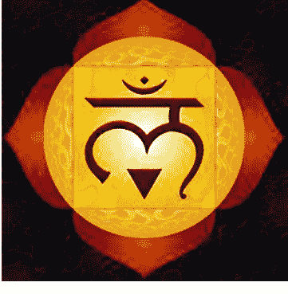

欲望的诱惑，会促长占有和掌控的想法，从而行为上会表现、展示优势。

当事物处于这一环的时候，通常暗示着事物的某个层次刚刚苏醒。这会激发事物积极前行的动力。

第二环，真知，2·女祭司、9·隐士、16·高塔。真知之环意味着纯洁的知识和注意力，呼应六芒星，象征着对于实用性知识之外的超越知识的理解和关注。

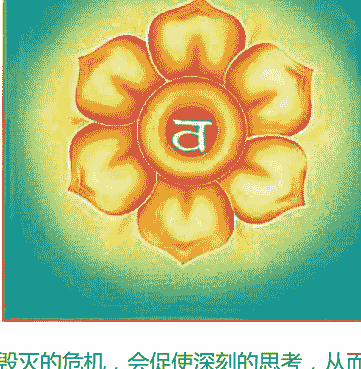

毁灭的危机，会促使深刻的思考，从而行为会收敛、隐藏真意。

当事物处于这一环的时候，通常暗示着事物的某个层次将获得成长，这预示着事物得到来自内部的滋养或者外部的刺激。

第三环，正道，3·女皇、10·命运之轮、17·星辰。正道之环意味着追求与满足，象征着个人在物欲追求之外更高的精神或者理想追求。

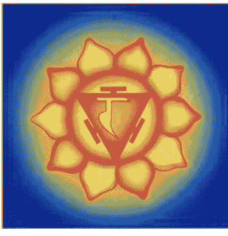

飘渺的希望，会催生转化实质的想法，从而行为会欢愉、孕育机会。

当事物处于这一环的时候，通常暗示着事物正在步向正轨，这表明事物已经取得一定的成果，并且还在不断的扩大成果。

第四环，仁爱，4·皇帝、11·正义、18·月亮。仁爱之环意味着爱心与流转，象征着无条件、无执着的爱的理念。

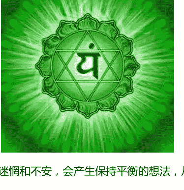

迷惘和不安，会产生保持平衡的想法，从而行为会强硬、发布威权。

当事物处于这一环的时候，暗示着事物已经发展到一个比较稳定的阶段，也可以认为这里是事物发展的顶端，因为即此之后，事物就会开始步入衰退的时期。但在这个阶段，事物本身会获得平衡。

第五环，同一，5·教皇、12·吊人、19·太阳。同一之环意味着无为的平常心，象征着谦卑、静观的理念。

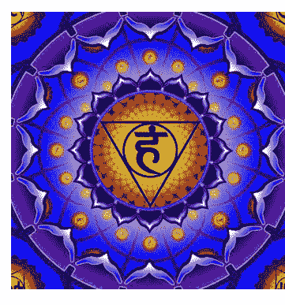

强烈的意志，会生出牺牲等待的想法，从而行为会助人、散布理念。

当事物处于这一环的时候，暗示着事物内部开始发生变革或者遭遇到外部的挑战。这表明事物已经变得成熟而强大，无法继续生长，故而变化也由此展开。

第六环，宽恕，6·恋人、13·死神、20·审判。宽恕之环意味着安宁与舒适，象征着培养出宽恕别人及自己的态度，领略停顿与平静。

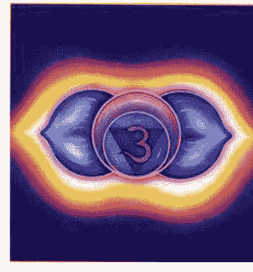

必须决断的压力，会产生明辨黑白的想法，从而行为会交媾、平等不防。

当事物处于这一环的时候，与传统相悖的力量已经成长起来，新旧事物在这里形成对峙，相互容忍坚持，但又彼此冲突对抗。

第七环，自觉，7·战车、14·节制、21·世界。自觉之环意味着开朗与陶醉，象征着没有分别，融入整体。

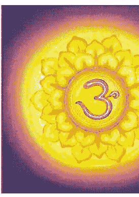

达成结果的喜悦，会产生谦虚克制的想法，从而行为会防范、控制变局。

当事物处于这一环的时候，旧的事物开始逐渐变成过去，新事物开始取代旧事物的地位，旧的思想与事物退缩并逐渐退出竞争，新的时代即将展开。

### 第五节 大阿卡纳实占分析应用（c）

大阿卡纳可以视为独立的一组，仅仅使用大阿卡纳牌组来展开塔罗的分析。不过，因为大阿卡纳牌组所涵盖的意义十分广泛，内容较为宏观，在分析的时候，我们还是建议使用78张全部的塔罗牌进行。

在实占中，如果牌阵中全部呈现出大阿卡纳牌组的牌，通常表示咨询的主题影响深远，宏观而且十分重要。如果牌阵中部分位置呈现出大阿卡纳牌组的牌，通常说明这个位置比其他位置而言受到的影响更加深远，并且这个位置上呈现的状况大多也是整个牌阵的关键。

当我们得到一张大阿卡纳，我们可以从牌意的关键词去推导该位置所要表达的意义。而大阿卡纳的二阶结构与三阶结构，则为我们提供了拓展分析的依据。

二阶同位数可以用来判断，问题的重心在内还是在外；流变思想可以用来了解在不做改变的情况下，事态会有如何的发展；三阶理论可以支持对人物行为、想法、感受不同层面的分析，并明确当事人目前关注的重心在什么层面；二阶错位数可以针对当前的问题，为我们提供策略定制的方向。

例如，在代表当事人现状的位置上，我们得到一张正义牌，从正义的意义上来讲，当事人在现状中，总会不断去进行平衡，保持公正。用二阶同位数来看，正义属于外部环境的牌，因此当前面临的问题的重心在于外部，这样，我们就可以知道当事人在目前的状况中，尚且无法掌控事态，事态仍由外部的多种因素影响。而在这个阶段当事人的内部条件处于魔术师，魔术师的能力来自过往的学识和经验，因此当事人可能会过于依赖自己过去的阅历，但很明显当前的事情不能仅仅依靠阅历来处理，而应该与他人合作。

从流变之轮的角度上看，正义对应的是倒吊人，说明整个客观事态将会向着牺牲奉献，停滞的状态发展。

从三阶理论的角度看，正义属于心灵层面，也就是说当事人在目前会比较看重计划、想法，这暗示当事人可能有自己的想法和打算。正义对照的感受层面是月亮，行为层面是皇帝，这表示当事人在这个阶段会展现自己的强势，保持威势和形象，但内心已经感受不安与彷徨，加上呈现出来的牌是正义，我们可以判断，当事人在现状中感受到不稳定和不可靠的状态，想要通过正义的力量来获取平衡，这会带来权威和威势的展现，但在当下，这种权威和威势可能尚未真正展现。

二阶错位数的角度看，正义对应的是错位数是女祭司，表示当事人需要保持冷静，克制情绪，观察事态变化，不要轻易表露自己的看法。

整合以上的论断，我们可以知道，在现状中，当事人因为无法掌控事态，已经感受到不安和迷惘，自己积极地想要保持理性和公义，希望通过权威的强势，来构建事态发展的秩序。当事人如果想要达成这样的意愿状况，需要静待观察，等待时机。

### 第六节 大阿卡纳牌意探索（c）

“阿卡纳（Arcana）”其意义是“深奥的知识”，我们也成为“奥秘”。78张塔罗牌分为大阿卡纳（Major Arcana）和小阿卡纳（Minor Arcana），从 Major 和 Minor 这两个英文单词的意义来看，大阿卡纳可以被认为是“主要的奥义”，而小阿卡纳可以被称为“小奥义”或者“辅助（补充）的奥义”。

在塔罗牌的研究中，22张大阿卡纳（下文称“大牌”）是整个塔罗牌中最主要的研究对象，可以说塔罗牌全部的知识和理想都汇聚在大牌之中，56张小阿卡纳（下文称“小牌”）则是对大牌智慧的补充、明细和应用。

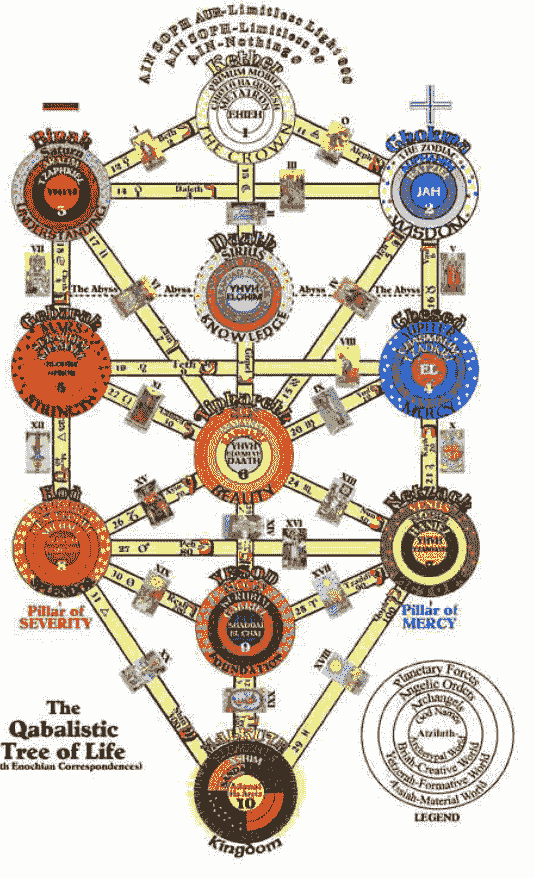

关于大牌的价值，很多其他体系的知识在与塔罗牌进行融合的时候，首先都是从大牌的结合开始。

例如，喀巴拉生命之树（如图）中，22张大牌扮演了十个佛罗萨斯之间关联的22个路径。

而灵数学的10个基本数字则融入到塔罗牌的序列结构的研究之中。

占星学的黄道十二宫与主要的十行星则分别与22张大牌一一对应起来。

希伯来字母、卢恩符文也都与塔罗牌的 22 张大牌各有对照。

当然，作为初学者，我们不会立刻接触如此繁杂的内容，我们回到塔罗牌这 22 张大牌的本身，从图案的构成，原型的意义上去了解它们。未来，在你学有余力的情况再来涉猎这些更加复杂的知识。如此循序渐进，相信你也能找到你的塔罗之路。

你可以从教材配套的塔罗牌学习卡中去理解每一张的符号、原型以及解读的意义。

## 第三章 自然·个性·思想

> “神秘学的本质是古朴的自然哲学与自然科学，古人通过对自然宇宙的观察，研究整理不同的知识，并以此指导生活。”

### 第一节 四元素学说的诞生（a）

#### 单一元素的思想

元素学说中首先诞生的是水元素。水元素是由泰勒斯¹提出来的，他认为宇宙万物都是由水这种基本元素构成的，水是原质，其他一切都是由水造成的，并提出大地是浮在水上的。

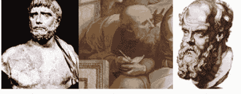

1、泰勒斯（约公元前625-547）是小亚细亚的米利都人，古希腊时期的思想家、科学家、哲学家，希腊最早的哲学学派——米利都学派（也称爱奥尼亚学派）的创始人。他也是希腊七贤之一，西方思想史上第一个有记载有名字留下来的思想家。“科学和哲学之祖”，古希腊及西方第一个自然科学家和哲学家。
2、阿那克西曼德（约前610～前546），古希腊哲学家，绘制世界上第一张全球地图的人。
3、阿那克西美尼（约公元前570年—前526年），古希腊哲学家、米利都学派的第三位学者，是阿那克西曼德的学生。他继承了前两位米利都学派哲学家的传统，也是该学派最后一位哲学家。

泰勒斯还有一个很重要的观点就是“万物有灵”，即认为整个宇宙都是有生命的，而又正是灵魂才使一切生机盎然。其最具代表性的一句名言则是：“万物都由水构成，一切都充满着神明”。这一说法在当时非常流行。

米利都派的第二个哲学家、泰勒斯的学生阿那克西曼德²（Anaximander）认为万物都出于一种简单的元素，但是那并不是泰勒斯所提出的水，或者是我们所知道的任何其他的实质。它是无限的、永恒的而且无尽的，而且“它包围着一切世界”——因为阿那克西曼德认为我们的世界只是许多世界中的一个。元素可以转化为我们所熟悉的各式各样的实质，它们又都可以互相转化。

阿那克西曼德所表现的思想似乎是这样的：世界上的每种元素应该有一定的比例，但是每种原素（被理解为是一种神）都永远在试图扩大自己的领土。然而有一种必然性或者自然律永远地在校正着这种平衡；即使神祇也象人一样，也要服从正义。

米利都学派三杰中的最后一个、阿那克西曼德的学生阿那克西美尼³（Anaximenes）进一步解析到基本元素是气。

阿那克西美尼作出了一些重要的进步，认为基质是气。灵魂是气；火是稀薄化了的气；当凝聚的时候，气就先变为水，如果再凝聚的时候就变为土，最后就变为石头。这种理论所具有的优点是可以使不同的实质之间的一切区别都转化为量的区别，完全取决于凝聚的程度如何。

#### 四元素的形成

毕达哥拉斯⁴和他的学派放弃了单一元素的观念，提出了最初的四元素说，认为物质是由土、水、气、火四者组成，而这四者又由冷、热、湿、燥四种基本物性两两组合而成。这样的理论，则是经过亚里士多德的发扬光大，才得以有系统的确立。

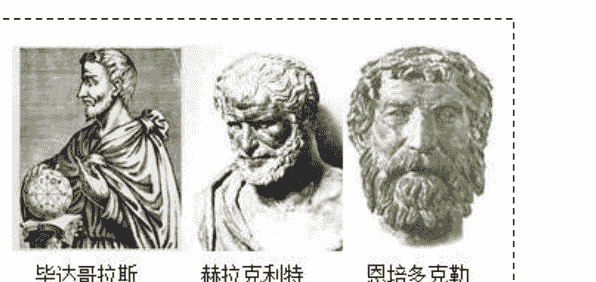

4、毕达哥拉斯（约前580年—前500年），古希腊哲学家、数学家和音乐理论家。生于萨摩斯岛，早年曾游历埃及，后定居意大利南部城市克罗顿，并建立了自己的社团。
5、赫拉克利特（前540年—前480年），古希腊哲学家、爱非斯派的创始人。生于以弗所一个贵族家庭，相传生性犹豫，被称为“哭的哲学人”。他的文章只留下片段，爱用隐喻、悖论，致使后世的解释纷纭。
6、恩培多克勒（约公元前490-430）被视为哲学家、预言者、科学家和江湖术士的混合体，（植物性别、离心力、心脏的作用、意大利医学的创始者）。

赫拉克利特⁵以毕达哥拉斯的学说为基础，借用毕达哥拉斯“和谐”的概念，认为在对立与冲突的背后有某种程度的和谐，而协调本身并不是引人注目的，是冲突使世界充满生气。

赫拉克利特认为万物的本原是火，说宇宙是永恒的活火，他的基本出发点是：这个有秩序的宇宙既不是神也不是人所创造的。宇宙本身是它自己的创造者，宇宙的秩序都是由它自身的逻各斯所规定的。

逻各斯（logos）一般指世界的可理解的规律，因而也有语言或“理性”的意义。希腊文这个词本来有多方面的含义，如语言、说明、比例、尺度等。赫拉克利特最早将这个概念引入哲学，主要是用来说明万物的生灭变化具有一定的尺度，虽然它变幻无常，但人们能够把握它。在这个意义上，逻各斯是西方哲学史上最早提出的关于规律性的哲学范畴。后来亚里士多德用这个词表示事物的定义或公式，具有事物本质的意思。

赫拉克利特认为火是各种元素中最精致，并且是最接近于没有形体的东西；更重要的是，火既是运动的，又是能使别的事物运动。他虽然主张火与万物可以相互转化，但又并未说明转化是如何进行的。

赫拉克利特认为火是根本的实质；万物都象火焰一样，是由别种东西的死亡而诞生的。世界是统一的，但它是一种由对立面的结合而形成的统一。“一切产生于一，而一产生于一切”；然而多所具有的实在性远不如一，一就是神。这是最早的对立统一思想的萌芽。

赫拉克利特有一句名言：“人不能两次走进同一条河流”。他主张“万物皆动”，“万物皆流”，这使他成为当时具有朴素辩证法思想的“流动派”的卓越代表。说明了客观事物是永恒地运动、变化和发展着的这样一个真理。这种思想引领了流变理论的发展。

恩培多克勒⁶提出了思想上的妥协，认为有土、气、火和水四种元素。其中每一种都是永恒的，但是它们可以以不同的比例混合起来，这样，便产生了我们在世界上所发现的种种变化着的复杂物质。它们被爱结合起来，又被斗争分离开来。爱与斗争对于恩培多克勒来说，乃是与土、气、火、水同属一级的原始原质。有些时期爱占着上风，有些时期则斗争来得更强大。世界上的一切变化并不受任何的目的所支配，而是受“机遇”与“必然”的支配。有一种循环存在着：当各种元素被爱彻底地混合之后，斗争便逐渐又把它们分开；当斗争把它们分开之后，爱又逐渐地把它们结合在一片。因此每种合成的实体都是暂时的；只有元素以及爱和斗争才是永恒的。

他认为，物质的世界是一个球；在黄金时代，斗争在外而爱在内；然后斗争便逐渐入内而爱便被逐于外，直到最坏的情形是斗争完全居于球内而爱完全处于球外为止。以后就开始一种相反的运动，直到黄金时代又恢复为止，但黄金时代并不是永远常在的。这时整个的循环就又重演。

柏拉图⁷的宇宙生成论是在《蒂迈欧篇》里提出来：火、气、水、土四种元素每一种都显然各为一个数目所代表而构成连比例，也就是说 火比气等于气比水，等于水比土。神用所有的元素创造了世界，因此世界是完美的，而不会有衰老或疾病。世界是由于比例而成为和谐的，这就使它具有友谊的精神，并且因此是不可解体的，除非是神使它解体。

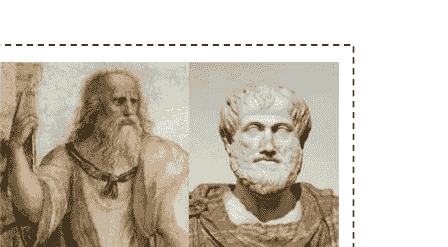

柏拉图认为，神先创造了灵魂，然后创造了身体。除了世界作为一个整体而外，还有四种动物：即神、鸟、鱼和陆上的动物。神主要是火，恒星则是神圣的永恒的动物。

7、柏拉图（前 427 年-前 347 年），是古希腊时期重要的思想家，也是西方文化中最伟大的思想家和哲学家之一。曾到过埃及、小亚细亚和意大利南部从事政治活动，企图实现他的贵族政治理想。在哲学上建立了欧洲哲学史上第一个庞大的客观唯心主义体系。

8、亚里士多德（前 384 年-前 322 年），古希腊哲学家，柏拉图的学生、亚历山大大帝的老师。他的著作包含许多学科，包括了物理学、形而上学、诗歌（包括戏剧）、音乐、生物学、动物学、逻辑学、政治、政府、以及伦理学。

物质世界的真正元素并不是土、气、火和水，而是两种直角三角形；一种是正方形之半，一种是等边三角形之半。最初一切都是混乱的，而且“各种原素有着不同的地位，后来它们才被安排好，从而形成了宇宙”。但是当时神是以形和数来塑造它们的，并且“从不美不善的事物中把它们创造得尽善尽美”。上述的两种三角形，据他说乃是最美的形式，因此神就用它们来构成物质。用这两种三角形就可能构造出五种正多面体之中的四种，而四种原素中每一种的每一个原子都是正多面体。土的原子是立方体；火的原子是四面体；气的原子是八面体；水的原子是二十面体。

柏拉图是第一个证明了只有五种正多面体的人，并且他发现了八面体和二十面体。正四面体、八面体和二十面体的表面都是等边三角形；但十二面体的表面则是正五边形，因此就不能够用柏拉图的二种三角形构造出来。因为这个缘故，所以他就没有用它来和四种元素连系在一片。

关于十二面体，柏拉图只是说：“神用以勾划宇宙的还有第五种的结合方式”。这句话很含混，并且暗示着宇宙是一个十二面体；但是在别的地方他又说宇宙是一个球。五角形在巫术中一直是非常重要的，这种重要地位显然是来自毕达哥拉斯学派，他们称五角形为“健康”，并以它作为辨识他们团体的成员的一种符号。它的性质似乎是得之于十二面体的表面是五边形的这一事实，而且它在某种意义上乃是宇宙的符号。

亚里士多德⁸将四元素说发展成为一种世界观：土最重，组成了地球的核心；水较轻，覆盖在地球的表面；气、火更轻，笼罩着地球或向上飘扬；以太最轻，位于天上，绕着地球运行。亚里士多德确立了柏拉图论述中的五种正多面体中的第五种——正十二面体，就是以太（乙太）的形状。

### 第二节 四元素的基本意义（a）

四元素学说是古代贤者观察自然万物存在的道理与运行的规律而形成的古朴哲学思想，对于西方文化的形成与发展有着及其重要的作用。虽然在现代科学的发展中，元素的概念被明确且更加细化，化学家波义耳更是首先站出来质疑四元素学说的合理性，但这一切都丝毫无法动摇四元素学说对西方文明的深刻影响。

我们可以通过观察树木的燃烧而直观感受到四元素的存在，树木燃烧的过程中，我们可以看到火焰，而燃烧后的树枝就变成了灰烬（土），燃烧过程中，还会有水份从木缝中渗出，而在火焰的上端还会产生烟雾，这被认为是气的表现。

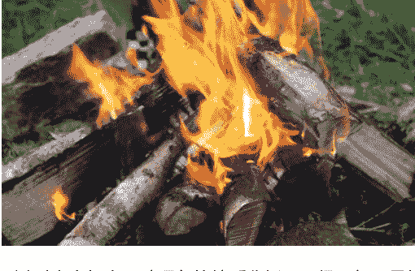

通过对火土气水四种现象的特质分析，历经百年，最终才形成了四元素学说。

四元素包括了火元素、土元素、风元素、水元素四种。

火元素是燃烧的表现，燃烧产生温度和光亮，为人类战胜黑暗提供了信心和勇气，使人类敢于行动，也让黑暗中的事物变得可见。火刺激着人类去寻求生存的目标，去升华灵魂的价值，去行动，去创造天地。

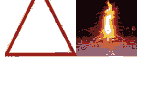

土元素如我们脚下的大地，承载万物生灵；如厚实的岩石，坚硬且顽强；如巍峨的高山，稳定而不易动摇。

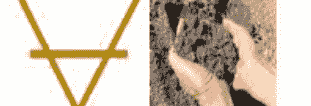

土是物质的实质构成的重要部分，与我们的感官感受相关，代表着现实。

风元素也被称为气元素，难以捉摸，移动快速，而且变化无常，无法稳定。人类已经发现，风是空气对流而形成的，因此风也代表着交流的意思。风同时也表示着与它一样变化多端的我们的思想。

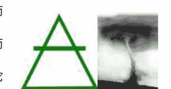

水元素是柔和的，流动的。万物都从水中孕育，同时，水往低处流，孕育万物而不去彰显自己的功绩。无论面对什么阻挡，水可以自由变化，而避免伤害。海纳百川，水的包容也是让人惊讶的。水元素复杂多变，难以名状，而我们可以通过感受清晰了解水的变化，水是与我们的情绪最接近的元素。

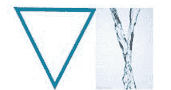

| 元素 | 火 | 水 | 风 | 土 |
| :--- | :--- | :--- | :--- | :--- |
| 炼金符号 | △ | ▽ | △ | ▽ |
| 方位 | 南 | 西 | 东 | 北 |
| 季节 | 夏 | 秋 | 春 | 冬 |
| 时间 | 中午 | 下午 | 黎明 | 午夜 |
| 月 | 盈月 | 满月 | 亏月 | 新月 |
| 品质 | 热、干 | 冷、湿 | 热、湿 | 冷、干 |
| 物质特性 | 可燃 | 流动 | 蒸汽 | 固体 |
| 炼金术元素 | 硫磺 | 汞 | 水银 | 盐 |
| 化学元素 | 氮 | 氢 | 氧 | 碳 |
| 体液 | 黄胆/胆汁 | 粘液 | 元气/精神 | 黑胆 |
| 身体器官 | 肝脏 | 肺 | 心脏/肾 | 大肠 |
| 气质 | 易怒的 | 冷静的 | 满怀希望的 | 犹豫的 |
| 人格特质 | 雄心/精明/易怒 | 冷漠/含蓄 | 激动/热情/乐观 | 阴沉/黑暗/沉闷 |
| 荣格理论 | 直觉 | 感受 | 思考 | 感官 |
| 音节 | Ra | Va | Ya | La |
| 卡莉符号 | 节杖/dorje | 血杯 | 宝剑 | 莲之盘/环 |
| Tattvas | 红色的三角 | 银色上弦月 | 蓝色圆形 | 黄色正方形 |
| 理解 | 精神奥秘 | 心灵感应 | 逻辑推理 | 字面落实 |
| 学科 | 神秘学 | 道德 | 预言 | 历史 |
| 方面 | 治疗 | 精神 | 分析 | 炼金/魔法 |
| 灵魂 | 灵性 | 情感 | 理智 | 肉体 |
| 生物 | 上帝 | 动物 | 人类 | 植物 |
| 死亡仪式 | 火葬 | 海葬 | 天葬 | 土葬 |
| 元素精灵 | 火蜥蜴 | 水女神 | 风精灵 | 土神 |
| 天使 | Micha-el | Gabru-el | Rapha-el | Auri-el |
| 品质 | 保护 | 洞察 | 治愈 | 教学 |
| 四圣兽 | 狮子 | 鹰 | 天使 | 牛 |
| 喀巴拉四世界 | Atziluth | Britah | Yetzitah | Assiah |
| 上帝之名 | Yod | He | Vau | He |
| 辨正过程 | 论点/开始 | 反题/对象 | 合题/综合 | 结论/展现 |
| 主观 | 意图 | 情感 | 想象 | 具体化/物质化 |
| 创造过程 | 计划 | 纳入实际 | 发展 | 形成 |
| 判断 | 信念 | 主张 | 科学 | 实践 |
| 行动 | 意志/去做 | 去了解 | 去挑战 | 保持沉默 |
| 占星符号 | 白羊/狮子/射手 | 巨蟹/天蝎/双鱼 | 天秤/水瓶/双子 | 摩羯/金牛/处女 |
| 职业 | 管理员/探险家/研究员/企业家 | 心理学家/神职人员/艺术家/术士 | 科学家/士兵/政治家/律师 | 工匠/农民/金融家/建筑师 |
| 品德 | 创造/发展/热情 | 爱/想象力/连通 | 逻辑/正义/辨别力 | 实践/技能/坚持 |
| 庸德 | 骄傲/自私/顽皮 | 暴躁/幻想/无节制 | 欠考虑/武断/极端 | 顽固/贪婪/无趣的 |
| 个性 | 灼热/鼓舞/活力/应变 | 随流/散漫/爱/溶解 | 联络/斗争/伤害/散播 | 明确/踏实/冷静/限制 |
| 延伸 | 火山/向日葵/灯 | 湖/鱼/莲/镜子 | 云/小刀/羽毛/风 | 山/水果/钱币/机械 |

### 第三节 四元素的阶梯变化（a）

四元素不是静止的固定的状态，其本质也是变化的，四元素的变化可以按照三阶的方式进行理解。这就包括了元素不足的阶段状况、元素平衡的阶段状况、元素过度的阶段状况。

在三个阶段中，平衡的状态是元素最为和谐与正面的力量的表现，不足的状态会削弱元素的力量，而过度的状态会使元素的力量无法控制。

#### 火元素的三阶

火元素是光明与热烈的力量，领域上常与目标、认同感、技能、理想、信仰有关；火元素与一个人的直觉感受有关，人物性格上会表现得大胆、脾气坏、跋扈、自发、鼓舞、活力、应变。火元素的人，有快速思考过程并且依照直觉做事。直觉性强的头脑能够凭空产生灵感，不论是跳跃式的理解或者是快速下结论，火象的人从出生就学会依靠自己的直觉行事。

平衡的火在事态上会呈现出具有方向性、有行动力、获得认同或者权力、领导者、有能力等相关特点；人物性格上会是乐观、直觉力高、自发、感情丰富和充满灵感的。

过量的火在事态上会呈现出爆发性、行动过度、无法控制、盲目性与盲从的相关特点；人物性格上会有自大、愤怒、暴力、怒火中烧和容易造成意外的。太多的火会导致过度的热心，就像一堆计划没法完成，还弄得自己筋疲力尽。

不足的火在事态上会呈现出不被支持、能力不足、目标模糊、信念不坚定等相关特点；人物性格上则会缺乏动力、勇气、或毅力，自信不足，会让人体比较没有抵抗力、消化不良、畏寒、眼睛没有光泽。既没有精力也没有创造力，自己就没有办法再生。

#### 土元素的三阶

土是坚实与稳定的力量，领域上常与物质、现实、物资、金钱、财富、身体健康、体质、日常性的事物等相关；土元素与一个人的感官体验有关，人物性格上会表现得缓慢而审慎、言语中带着尊严和保守、明确、踏实、冷静、限制，土元素的个性强调重视实际与基本需求，像是生存、安全感、食物和温暖，使用五官来了解这个世界并与之互动。可被依赖，肩负重任。土象的人喜欢与他人互动，清楚肢体接触的价值。是一个自足的元素，不需要别人就能运转活动。

平衡的土在事态上会呈现出可积累的、稳健的、有价值的、实际可靠的相关特点；人物性格上是宽容、耐心、坚定和注重实际的，有完整的价值观。土的功用发挥到最高时，任务会非常有效率地被解决并得到结论。

过量的土在事态上会呈现出受到阻滞、无法突破、困境、缺乏弹性和变通的相关特点；人物性格会变成缺乏弹性和呆滞，思考迟钝和理解缓慢，也容易过度物质化，现实欲望过强。会过度贪图安乐并抗拒改变。情绪和身体渐渐变得带有毒素，需要定期清理。

不足的土在事态上会呈现出缺乏基础或根基不牢、价值低、难以持续、无法稳固的相关特点；人物性格上则会表现得不稳定，精力难以集中，无法展现自己的远见，也会导致每个层面中毒，特别是身体方面。土的缺乏也会造成不理性的行为，只会活在自己的想法中，或者沉浸在自己的情绪中。

#### 风元素的三阶

风元素是速度与善变的力量，领域上常与思想、思考、智慧、知识、计划、资讯、交际、关系等相关；风元素与一个人的智识能力有关，人物性格上显得活泼但是反复无常，说话速度快，联络、斗争、伤害、散播，风元素的个性属于点子型的人，能看见无限的可能性。虽然并不是全然的实际，通常都依赖别人来完成事情，但是风却是扮演发动的人。他是理性的，不过也会有直觉性的一面，风象的人会大量收集并消化资讯，但是却无视于所有的步骤和关联性就做跳跃性的理解。

平衡的风在事态上会呈现出有计划、理性、合同、文本、有关联等相关特点；人物性格上则显示出优雅、客观、社交力强和公正的。他的沟通是公开而且诚实的，很活泼并具有直觉力，但是都是很理性的。

过多的风在事态上会呈现出计划大于行动、变化太快、难以判断、无法决策等相关特点；人物性格上会表现得不安定、紧张、焦虑、不稳定和冷淡。太过头的风象会像个蝴蝶般快速飞行，跳跃在各个话题中而不能够专心。在这种情况下，说话快但是不见得表达清楚，口吃结巴或者阅读障碍之类的情况都有可能发生。

不足的风在事态上会呈现出缺乏计划和准备、关系冻结或破裂、资讯缺乏、思虑不周等相关特点；人物性格上则会表现得无精打采、内向、心理停滞和缺乏知觉。没有风，头脑也许会变得不理性或活动缓慢。这种情况通常跟自己不被了解有关。

#### 水元素的三阶

水元素是包容与孕育的力量，领域上常与感受、情感、危机、保护、私密、难以明确的状况等相关；水元素与一个人的情绪感受有关，人物性格上平静、脾气温和、说话语气单调无变化，随流、散漫、爱、融解，水元素的人最需要“感觉被别人需要”，透过强烈的情感交换来体验自己。有时候由于他们本身情绪的偏差而误判了讯息，加上调和对情感上的细微差异，他们可能是依赖和脆弱的。当水直觉运作得很好，会产生超越一般感官的认知能力。它是“感觉”和“预知”本能的元素。

平衡的水在事态上会呈现出关怀、安宁、柔和、可变的、受保护的、安全等相关特点；人物性格上则表现得冷静、柔软、温和、敏感和有同情心兼具的稳定性格。这个性格的和谐呈现的是一个人既有情绪变化但又不被情绪所操纵。

过多的水在事态上会呈现出不稳定、沉溺、妥协、危机、侵犯私密领域等相关特点；人物性格则表现得太情绪化、忧虑、过度重视安全、纵欲、行动迟缓、爱梦想、重视官能享受和通常有些体重过重。

不足的水在事态上会呈现出无法体察他人感受、缺乏变通，安全得不到保障等相关状况；人物性格上则会以冷静客观来掩饰情感淡漠。缺少水则会导致顽固执拗、没有同情心、缺乏节奏和缺乏情感连结。

在本课程过去的版本中，很多学员无法理解元素的变动节奏，因而虽然可以知道平衡、过强、不足的特点，但无法理解他们之间是如何变化演化的。我特别制作了一个图表，用来表现这三种程度的变化频率。

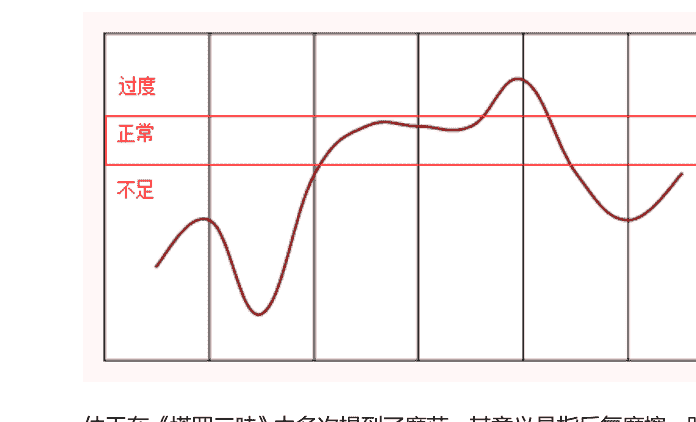

仲天在《塔罗三昧》中多次提到了摩荡，其意义是指反复摩擦、跌宕起伏。事物的变化不是一蹴而就的，必然要经历反复的冲突与势力的比较，故而事物并不会呈现出直线发展的特点，相反会在上下之间起起伏伏。

事物的开端，总是最纯粹的力量展现出来。我们称为“静态的平衡”，这就是初始。从这个平衡中出发的力量是强盛的，但是事物前期的发展缺乏基础，是一个固基的过程，这个过程是消耗的过程，初始的原有力量会不断消磨，因而这个时候会呈现出一个下滑的趋势。基础得以建立后，力量又不断集聚，开始呈现上升的态势。事物不可能永无止境的成长，因而到达极限的时候，就会开始趋于平缓，这个时候是“动态的平衡”，当这个平衡难以维持的时候，旧势力会再次发挥力量，呈现一个强盛的表现，而后力量急速萎缩，如此反复之后，步入消亡，再次回归到“静态的平衡”而促发新生。在这个过程中强弱不断的发生变化，从而催生了相对的平衡、过度与不足。

元素的三阶在实占分析中也是十分重要的，我们通过统计牌阵的元素比例，找出最强和最弱的元素，评估哪些元素过强，那些元素过弱，从而了解人物或客观事件的特性。

未来我们学习小牌和塔罗元素体系的时候将介绍更多元素的应用技术。

### 第四节 元素的时序三阶（b）

上一节提到的元素阶梯变化，是通过元素的量变积累来进行区分。而这一节我们所要谈论的时序三阶，则呈现在元素发展变化的序列上，你可以理解为元素的内部质变过程。

在塔罗中，我们时常都会提到三阶的概念，大牌结构的时候，我们也讲过关于大牌的三阶结构。但几乎所有的三阶思想，都源自于人们最早对于时间的区分。

时间最基本的区分方法，不是具体的时分单位，而是过去、现在、未来，这三个模糊的时间概念。在古代，人们还无法对时间进行精确的时间测量的时候，人们就已经开始使用过去、现在、未来这样的概念了。在希腊神话中的命运三女神，他们所分管的就是过去、现在与未来。当我们把这一组时间概念转化到某一个事物具体演变的过程中，我们可以得到关联过去的开始阶段、代表现状的固定阶段、以及关联未来的变化阶段。

这种开始、固定、变化的三阶思想，在西方神秘学中层出不穷。

我们说过元素不是绝对静止的，元素始终处于盛衰的演化之中，而但凡变化的事物，我们都可以用“开固变”的三阶思想来区分研究，元素更是如此。

四元素理论总的来说，是一种归类法则。通过对相类事物现象的整理归类而总结出这样的一套思想。

火元素象征所有具有指向性、展现出来的事物，同时也象征着根本的动力，因而我们把火元素也称为“灵魂之火”。

处于开创阶段的火元素，如萤萤之火，脆弱而又充满了可能性，如果毛泽东先生说过的那句话“星星之火，可以燎原！”开创之火只要能得到支持，找到适合的附着，那么它的未来是不可限量的。所以，我们说开创之火，正是那四处寻求认同的自我，通过获得别人的认可，来不断确认和肯定自己，从而展现出惊人的力量，创造自己的伟大。这个阶段的火元素，虽然本身的能量并不算巨大，但十分活跃，有着纯真的追求。

处于固定阶段的火元素，如熊熊烈火，强盛但缺乏持续力。这个时候的火元素，充满了激情，有着惊人的爆发力，常常也发挥着强大的影响力，如同太阳的强盛光芒，照亮前行之路，带领众人。如此巨大能量的释放，让固定之火充分地表现自己的光热与强盛，但能量之源是有限的，当能量枯竭的时候，这火焰也会骤然熄灭。这可能是固定之火最大的风险，但对于固定之火而言，这种风险相较于散发光热获得尊崇的结果而言，是可以不去计较的。因为对于固定之火，这样的燃烧正是自己的兴趣所在。

处于变动阶段的火元素，是自由之火，时而火光冲天，时而星星点点。这个阶段的火元素，因为能量之源的枯竭，已经没有足够的力量来支持持续的燃烧。这时候的火元素，犹如长久磨砺之后的时有顿悟一般，有时候一语惊人，有时候又不上台面。你实在难以去琢磨这个阶段的火元素，因为它是自由而无规则的。虽然失去了能源的支撑，但火元素始终是火元素，坚定于燃烧的信仰，总会有在沉寂之后爆发，即便爆发之后又悄无声息，但你依然无法漠视这火焰的信仰。

土元素象征这所有累积性、稳定坚固的事物，同时也象征着存在的价值。因而我们也把土元素称为“实质之土”。

处于开创阶段的土元素，有着强大的专注力，能把所有的力量集中在自己关注的领域中，并从固有的资源里面去规划未来，为将来的可能性去奠定基础。我们常常会觉得开创之土，太过看重自己所可能创造的价值，而忽略身边其他的人事物，如果你和一个典型的开创之土的人去恋爱，你肯定会被他的无礼忽视和毫不浪漫给气个半死。但也常常因为这种特性，开创之土却时常可以在社会和群体中确立起自己不可忽视的地位。无论开创之土的开端有多么平凡，它都可以通过自身价值的累积，最终创造一个又一个让人仰视的伟大。

处于固定阶段的土元素，就可以用那句“固若磐石”来表达。土元素在这个时期，经历了开创阶段的积累，已经形成了坚固的根基。也是如此，固定阶段的土元素给我们的感觉是呆板而无法变通的。这个阶段的土元素，已经获得了自己的成功，坚定稳靠地立住了脚跟。所以也会更信任“通过积累获得价值”的信条。对于固定之土来说，最重要的事情就是维持和稳固自己的累积价值，因而这个阶段的土元素，最不喜欢各种冲突和不可靠的影响，他们会通过自己的努力去维护和谐的局面，只有在和谐稳定的局面中，他们的价值才可能最大程度得被接纳和承认。

处于变动阶段的土元素，已经失去了再固定阶段的优势，无论多么高大巍峨的大山，在面临大地震动的客观环境时，也无法去保持自己的稳健，所以当环境开始变得不在稳定的时候，土元素也会放弃之前呆板的形象，而开始变得更加懂得服务他人，这也是土元素去持续保持自己存在价值的另外一种方式的体现。我们会发现变动之土，很懂得为他人提供有价值的服务，但同时对自己和他人的缺点也是无可容忍的，因为他们无法接受任何可能带来变数的不良因子。他们要么通过自己的价值观去服务于他人，帮助他人获得和他一样完美可靠的价值观来制造环境的稳定性，要么他会变成挑剔的批判者，对那些和他完美价值观相悖的现象和言论，毫不留情。对变动之土而言，他为你的付出，他服务于你的需求，并非要你一定给予同等的回报，但你必须让他觉得，他付出之后，你变得更加可靠和可以信赖。

风元素象征着所有的交互性、快速多变的事物，同时也象征着平衡的交流。因为风元素最懂得平衡这个宇宙难题的奥妙，所以我们也把风称为“智慧之风”。

处于开创阶段的风元素，十分看重计划的重要性，因而也特别善于指定计划，更加善于把自己的计划与他人去分享，并由此去建立合作，联接大家的资源。因此开创之风也是“无中生有”的最佳实践者。这个阶段的风元素，似乎是最受上帝眷顾的，他一般都有着让人羡慕的面具，事情在这个阶段的时候，人们总是愿意去看重美丽的一面，而忽略掉接下来即将爆发的危险。所以开创之风，常常能聚集一个强大的团队，但最后在面对风险的时候，如果没有一个强大的后援，开创之风的创立常常也就成了昙花一现。开创之风不见得是最有创意

### 第五节 四元素的品质结构（b）

前面的学习中，我们已经了解了四元素各自具有的特点与象征，本节我们将给大家介绍构成元素特性的四种品质。每一个元素都具有两个品质，通过这两种品质的结合来体现元素的个性。

柏拉图提出了四元素具有干湿冷热四种品质，格林在研究中发现，干湿冷热都是对性质的描述，而四种品质两两相对，形成两组，每一组却有着不同的理解方向。干湿成为对立的一组，表示元素所具有的状态，是事物的质，冷热成为另一组对立品质，表示元素所具有的趋势，是事物的性。每个元素都具有一个状态与一个趋势，因此四元素可以充分表达事物的性质。

如果我们再细化去分析每一种状态和趋势，我们会发现，干的事物是刚硬的，而湿的事物是柔软的，热会加快物质的运动，冷会减慢物质的运动。从而形成了四品质的实质：

| 干·刚性 | 湿·柔性 | 冷·静止 | 热·运动 |
| :--- | :--- | :--- | :--- |
| **刚硬的，干燥的** | **柔和的，湿润的** | **被动的，内秀的** | **主动的，外显的** |
| 正面：坚持、坚强 | 正面：灵活、接纳 | 正面：内敛、平静 | 正面：活跃、开朗 |
| 反面：自我、顽固 | 反面：圆滑、善变 | 反面：封闭、冷漠 | 反面：躁动、侵略 |

如果以动静来看待热与冷，有这样的规则：

事物的动静运行是有其常轨的，有规律可循。物质的相对运动会产生位移，在物理学上，力对距离的累积的物理量，被称为“功”，没有相对的运动，就不会发生位移，那么也就不会产生功；而过度的运动，会促进物质的消耗，也给物质更快地带来消亡。运动是永恒的，静止是相对的，而相对的静止促使物质在其相对静止的参照物上，保持了稳定，没有相对的静止，就会变得不安；但过度的静止，会促使物质在微观世界中不断结合，而最终沉沦。这就好比在一块铁板上放上一块银块，如果我们不断用银块摩擦铁板，银块会越来越小；如果把银块放在铁板上几十年都不动，最后银块会和铁板“粘”在一起。

在客观的环境中，运动的物质会不断承受阻力，因此所有运动的事物都会趋向于静止；静止的物质会不断受到引力的作用，因此所有静止的事物都会趋向于运动。事物如果运动，就一定会产生运动的方向，也就会带来目的的比较；事物如果静止，就会以引力来相互作用，也就会带来威力的比较。

如果以刚柔来看待干与湿，可以得到这样的规则：

有了刚柔，就可以判断物质世界的一切变化。刚为强、为大，强大的事物才能推动变化，因此不刚则不动，但是过于刚强则易折损，事物但凡丰盈强实就会发生损耗而无法保全。柔为弱、为小，弱小的事物才能持守不失，因此不柔则不静，但是过于柔顺则易胎死，事物但凡蓄聚孕久就会错失机会而无法生长。

千里之堤毁于蚁穴，强大的事物常常就从小的腐朽开始崩坏。刚是强大的，但可以以弱小去克制。

四两之力可搏千斤，弱小的事物常常可借大的力量获得成就。柔是弱小的，但可以用强大去提携。

无论是刚柔动静，还是干湿冷热，实质是一样的，都是事物的性质表现。这些特质又是如何呈现在四元素之中呢？

火=干（刚性）+热（运动）

火元素意志坚定且具有行动力，火元素的品质态势是坚定的、刚硬的、强大的，品质趋势是运动的、变化的、活跃的。因此，我们可以看出，火元素坚定强大，并且会积极推进自己的意志。

土=干（刚性）+冷（静止）

土元素的稳定固执且具有被动性，土元素的品质态势是坚定的、刚硬的、强大的，品质趋势是停滞的、消极的、安静的。因此，我们可以看出，土元素虽然也有坚定强大的一面，但不会积极推进自己的意志。

风=湿（柔性）+热（运动）

风元素灵活多变，且具有主动性，风元素的品质态势是柔和的、变通的、弱小的，品质趋势是运动的、变化的、活跃的。因此，我们可以看出，风元素是柔和弱小的，但却会积极争取。

水=湿（柔性）+冷（静止）

水元素包容细腻且具有感受力，水元素的品质态势是柔和的、变通的、弱小的，品质趋势是停滞的、消极的、安静的。因此，我们可以看出，水元素也是柔和弱小的，但会更消极地面对，更为被动。

四元素的分析中，有时候我们会遇到最强或者最弱的元素有三个的情况，这时候，如果接入四品质的比例分析，你就会发现，原本最强的元素有多个，而实际上，从品质的角度反推就会出现某一个元素最强。比如，原本火土风水四元素的比例是 2:2:2:1，我们很容易判断水元素最弱，但却无法看出来哪个元素最强，如果进一步分析四品质干湿冷热的比例，会发现 4:3:3:4。干与热的品质就凸显出来，干热是火元素所具有的品质，因此在这个结构中，火元素就会成为三个较强元素中最为明显的一个。

### 第六节 元素的对立与统一（c）

> “四元素因为爱而结合，因为斗争而分离。” ----恩培多克勒

恩培多克勒认为万物皆由水、土、火、气四者构成，再由“爱”与“冲突”或合或间。
“爱”使所有元素聚合，“冲突”使所有元素分裂，宇宙本身在绝对的爱和冲突之间来回摆动。

从现代物理的角度来看，“爱”是引力，而“冲突”就是斥力。物质通过引力的作用而相互结合，通过斥力的作用而分离。

四元素所追求的是平衡，在“爱”与“冲突”之间进行协调。平衡的四元素就是和谐一致的状态，在平衡的状态下，事物可以保持平静；而失衡的四元素就会引发冲突。事实上，没有完全平衡的四元素，物质因为失衡的冲突才会展现个性。四元素带给我们的哲学思想是：“接受存在冲突的现实，不断化解冲突，保持爱与和谐。”

火土风水四元素按照两两相对的状况形成两组，每组中的两个元素是绝对的对立，在对立的前提下又保持了一致，并可以相互转化。

火元素与水元素是一组，火为追求而战斗，水为需求而战斗；火的力量是破坏而变革，水的力量是孕育而更替；火依赖直觉，通过实际的行动而达到目的，水依赖感受，通过深入的沟通而满足所需。火成就自己而成就他人，水成就他人而成就自己。

水与火也可以互相影响，水可以熄灭火焰，而火也可以促成水的质变1。水的情绪可以通过火的方式而满足；火的意志可以通过水的方式而达成。

> 1、在化学上，水的结构是 H₂O，H₂ 与 O₂ 则是氢原子与氧原子，水通过电解变成氢气和氧气，而氢气和氧气又可以通过燃烧变成水。在元素归类上，电属于火元素一类。

风元素与土元素是一组，风因为思考而智慧，土因为欲望而成功；风从来都不喜欢固定，土从来都不喜欢变化；风通过合作而取得成功，土通过踏实而实现价值；风始终在做好计划，土始终在做好执行。

风与土也会相互作用，大山可以阻挡风的前进，飓风可以动摇土的稳定。风因为土的存在，而学会了克制过度的变化，土因为风的存在，而得到了向外扩张的机会；风的计划可以通过土的力量去实现，土的欲望可以通过风的计划去获得。

在实际操作中，如果牌阵中某个元素缺乏，我们可以通过补偿这个元素的方法来使牌阵的元素更为平衡，但补偿就意味着增加原来的能量总数，常常会带来更加复杂的变化。

这是因为世界上的事物不是纯粹的某个元素来构建的，都是四元素按照不同的比列来组合呈现的，当你将某一个新的事物引入事件，就会完全构建出和之前全然不同的四元素比例结构。因此，如果你对四元素的理解不深，或者并不擅长四元素的策略操作，不要轻易尝试补偿的建议，比较稳妥的做法是将本身的四元素进行转化，那么在下一节我们就开始探讨关于四元素转化的方式。

### 第七节 四元素的转化与品质法则（c）

在实占中，当某一个元素匮乏的时候，常常表示这个元素所表示的领域被忽略，或者缺乏这种元素相关的特质。而某个元素表现极强的时候，常常表示这个元素的特性被放大，该元素所属的领域被过度关注。面对这种问题，我们通常需要通过补充或者转化的建议来帮助当事人平衡事态。而四种品质的介入，为元素的转化提供了更好地支持。

从这个元素与品质的结构图中，我们会发现，每相邻的两个元素总有一个相同的品质，而相对的两个元素，则品质完全相反。

如果态势品质相同的两个不同元素，其趋势品质则刚好相反，反之亦然。换个角度，如果两个元素的态势品质相同，且趋势品质刚好相反，那么这两个元素就是不同且相邻的两个元素，反之亦然。

相对立的元素如果要进行相互转化，那么就需要同时改变两种品质，而相邻的元素相互转化，只需要调整他们原本对立的一组品质即可。

我们最理想的状况是这样的，如果牌阵中呈现出某个元素缺乏，我们直接填补这个元素的相关品质和特性即可。然而这种理想的状况在实际操作中却很难有效实施，一方面是因为补偿元素会增加客观事件的复杂性，另一方面是因为“江山易改而本性难移”。

举例来说，一个火元素特性的当事人，在他主导的客观事件中，通常火元素的特性也会比较明显，依据元素对立的特点，一般情况下，火强则水弱，因此水元素通常会表现缺乏。如果我们直接以水元素的特性来提出建议会让当事人十分为难。比如当事人做事情习惯了雷厉风行、敢打敢拼，而且决策果断，冲动暴躁，这时候，我们向其建议，在处理这一问题的时候，需要静待观察、等候时机，关注风险，小心行事。这种建议与当事人本身的性格截然相反，当事人很难把握这种特性，反而使事情做得不上不下，更为复杂。那么更为平和的处理方式是什么呢？那就要曲线救国，另辟蹊径了。

从四品质的角度出发，我们就会知道火的品质是干热，而水的品质是湿冷，我们不可能让一个本身强硬、主动的人立刻变得柔和、冷静。当如果我们在第一步建议的时候取到风土，效果就会不同。如果取道风元素，那么当事人不需要控制自己的主动和行动力，只需要降低原则即可，把干的品质转变成湿的品质，第二步建议再从风元素到水元素，这时候无需调整第一步的建议，而只需要把原来主动积极变得保守被动就可以了，对于当事人而言，每次调整一个元素会比调整两个元素更容易做到。

### 第八节 塔罗牌的四元素对照（a）

大牌与四元素的对应

大牌实际上是多种元素按照不同比例组合的，但我们在时机运用中，主要参考其比例最大的元素。审判牌是比较特殊的一张，水元素与火元素的比例是相等并最高的，因此审判会呈现出水火两种元素的特点。大牌的元素对照其实质是大牌与占星学的对照，通过占星对照再进一步转入元素的对照。

| 火 | 土 | 风 | 水 |
|---|---|---|---|
| 4·皇帝 | 3·女皇 | 0·愚者 | 2·女祭司 |
| 8·力量 | 5·教皇 | 1·魔术师 | 7·战车 |
| 10·命运之轮 | 9·隐士 | 6·恋人 | 12·吊人 |
| 14·节制 | 15·恶魔 | 11·正义 | 13·死神 |
| 16·宝塔 | 21·世界 | 17·星辰 | 18·月亮 |
| 19·太阳 | | | 20·审判（火） |

小牌的四个牌组与四元素的对应

权杖牌组是火元素的一组。

领域意义：目标、方式、形式、外形、领导、权势、能量、直觉

正面特质：专注高效、积极热情、有爆发力、突破的力量、富有表现力、行动力强、信心十足、有创意、创造力强、有目标有企图心、直觉力强、勇敢、能担当、有上进心、坚强独立、不留恋旧事物

负面特质：急躁、缺乏耐心、缺乏持续力、破坏性的、自我中心、忽视他人、缺乏自省、不经大脑、不擅长思考、爱表现、高调、流于表面、野心太大、冒进、独断专权、霸道、暴力、蛮横

星币牌组是土元素的一组。

领域意义：物质、现实、资源、价值、有形的实质、积累、感官体验

正面特质：稳定、积极、有耐心、脚踏实地、理性、沉得住气、看整体、贵重的事物、富有、有持续力、意志力强韧、重视纪律、道德观念强、性情温和、包容力强、重视逻辑、有责任感、重视实际、价值感强、社会化

负面特质：顽固、不易变通、难以沟通、反应迟缓、缺乏弹性、不灵活、沉闷无趣、沉默、太现实、古板、物欲强、不易改变和突破、个性不强、守财奴、落后、容易被限制、不通人情

宝剑牌组是风元素的一组。

领域意义：思想、计划、学识、无形的、谋算、资讯、关系

正面特质：多元性、良好的沟通能力、主动、善于思考、有计划性、交际广泛、逻辑能力强、好奇心强、冷静理性、口才好、思维敏锐、理解力强、反应快、应变能力强、适应能力强、不留恋旧事物、有新意有点子

负面特质：精力分散不易集中、难以专注、热情不足、缺乏积极性、缺乏执行力、难以坚持、耐性不足、人际关系浅、思考不深入、不够专精、缺乏感性、善变、目标感不强、欺骗

圣杯牌组是水元素的一组。

领域意义：感情、感受、情绪、等待、消极、安全、维持

正面特质：感受性强、配合度高、具有艺术特质、具有疗愈性、慈悲、同理心强、善良温柔、重视人情、情感沟通力强、思考深入、危机敏感度高、能体会他人感受、情绪反应强、不喜欢争斗

负面特质：敏感多疑、安全感低、被动消极、情绪化、容易受环境影响、感情用事、不重视理性、意志薄弱、心眼儿多、多愁善感、缺乏行动力、缺乏决断力、容易受骗、个性模糊、容易沉溺、幻觉。

## 第四章 道路·形势·行为

> “毕达哥拉斯学派认为万物之中的灵，就是数律，亦即是数的特性规律。”

### 第一节 灵数学、数学、占数学（a）

从泰勒斯的“万物有灵”到毕达哥拉斯的“万物皆数”，预示着理性神秘主义思潮的到来。

毕达哥拉斯学派认为万物之中的灵，就是数律，亦即是数的特性规律。

后人将毕达哥拉斯的数学哲学一体观点称为灵数学。其中，研究数学规律的自然科学称为数学；研究数的哲学规律的称为灵数学；研究数与人生规律的关系的称为占数学。

| 数字 | 毕达哥拉斯学派观点 |
| :--- | :--- |
| 1 | 第一原则、万物之母、智慧 |
| 2 | 对立、否定、意见 |
| 3 | 万物的形体和形式 |
| 4 | 正义、宇宙创造的象征 |
| 5 | 奇数和偶数，雌雄结合，婚姻 |
| 6 | 神的生命、灵魂 |
| 7 | 机会 |
| 8 | 和谐、爱情和友谊 |
| 9 | 理性和强大 |
| 10 | 包容一切数目、完成和美好 |

现今占数学的两大主要流派是埃及占数学与希腊占数学。

无论是在东方，还是西方，但凡占算卜筮一类都离不开数的应用，从古至今，数学的发展也是科学进步的中坚力量。从某个角度上讲，我们可以认为我们的世界就是一个数字构成的世界。

在神秘学思想中，研究数字，要注意几个方面的问题，数字的哲学规律是研究的根本核心，数字的自然规律是运用的法门，数字与人生规律的关系则是应用的目的。

### 第二节 灵数学：数字的哲学意义（a）

这个部分，我们将讨论 0~9 这 10 个基本数字的意义。在三昧中，这 10 个数字也被称谓根值，意思是他们是所有数字的基础。对这 10 个数字意义的掌握，对于我们后期塔罗数字的深入研究是非常必要的。

#### 数字 0

0 这个字体的数字是在公元 5 世纪由古印度人发明，后传入欧洲，并一直被沿用至今。0 这个字体的写法毫无疑问是印度人发明，而关于 0 这个思维的概念在其它地区很早就有。中国早在公元前 4 世纪就已经有了 0 的概念，并用于计算。

在数学上，0 不是自然数，不在自然序列之中，通常只是占位，表示位数。因而 0 没有任何的意义，代表着一切空无的状况，在数的循环中，0 象征着结束之后与开始之前的那一段混沌。

正因为 0 是混沌的、空无的，没有实质的，他也表现出无限的可能与潜力。当 0 与其他的数字相配合，又会使其他的数字发生增强或削弱的变化，而且这种变化可能是激烈的。混沌的 0 象征着无法明了的状况，不清晰，难以掌控，或受制于环境与命运。而在 0 的阶段，无论自身何种力量也都难以实质地运作起来，因而也带来事态的停滞，运作的中断。

0 暗示着我们需要去探寻内在潜在的资源，去提升自己内在的力量。因为 0 的空无，可以孕育万有，所以 0 本身就象征着先天所赋予的内在能量，无限的潜能。但这一切都需要自身去突破限制，努力发掘。

从 0 的意义来讲，0 是不具有任何形态的，它即使空无一物，也是万物杂糅在一起无法分辨的状况。0 在数字循环中承前启后的作用，也使得 0 成为永恒循环的代表，因而我们以圆环来表示 0。一方面是符合循环的思想；另一方面圆形也代表着无限的空间。

#### 数字 1

1 是自然数的第一个数字，也是自然序列的第一个数字，代表着全新的创造、一切真正的起始。相对于 0 的空无，1 表示了实质的存在。在数学上，1 是一切数的因子，因而 1 也是一切数的能量核心。1 代表着事物刚刚表现出来，是阳性数字的代表。

1 是原始的创造力，事物从 1 开始生长发展，而 1 则统领了整个数列变化，在灵数学中，1 是领袖数字，是事物发展变化的中心。因为 1 代表这实质的开创，所以 1 也象征这充满活力的生命力，只有生命才是让一切有意义的力量。1 也表示独立、唯一性，因而也具有独自开拓、独立行动的意思。

1 象征着父亲一样带来我们生活追求的力量。1 通过自我的表现而获得实际的认可，因此 1 也会寻找可以展现自我的空间。但 1 通常是独立的，不具有合作性。1 象征着一个人内在深厚强大的能量，充满了活力，并且敢于承担。对于 1 而言，这些内在力量将不断帮助它完善自我存在，并与环境相配合。

1 的形象是一个点，代表一元的开始。0 也可以理解成一个点，但 0 是没有方向和追求的，因此 0 只能代表潜力而不具有实际的能力。1 则不同，1 是有理想的，理想指引了 1 的方向，使得 1 的这个点有了趋势和倾向，这是 1 最具有价值的地方。如果说 0 是无限的空间，那么 1 就是在空间中有了自己的定位。

#### 数字 2

2 是二元性的表示，象征二元对立的事物之间相互对抗、协调、并不断转换变化的意义。在数学上，2 是两个 1 的结合，是两个独立个体之间的结合，因此而带来了关系与连接。2 也是第一个质数，与 1 相配合形成，数字中阳性与阴性的对立。

2 最重要的意义就在于关系，2 可能构建出各种各样的一对一关系，比如，结合、合作、对抗、转换等等，要特别注意的是，2 是不会构建融合的关系。2 所形成的关系类似与某种契约的结合，或者主仆的关系，或者前后的关系，或者并行的关系。2 象征着关系中的双方互相影响，彼此配合支持帮助，相互关照，又或者彼此对立争斗。总的来说，2 构建了一种一对一的关联，这种关联可敌可友，但 2 构建的关系是相互吸引，同时也相互排斥的，所以是一种平衡的连接，却不可相融一体。

2 象征着母亲带来的关怀以及对需求的认知。2 强调分享和共享，通过分享产生彼此吸引力，而共享产生向心的吸引力。2 是浪漫之数，象征着两人的相处，彼此的分工与合作。不同于 1 的展现，2 更甘于黯淡，以便可以更好地进行协调合作，或者隐藏真意。2 的关联是深刻的，不易破坏的，即便是对抗的死敌关系，也是牢不可破的，因而 2 也有坚持的意义。

2 的形态是两点一线，如果说 1 是找到了方向，那么 2 就是明确了目标。几何上我们知道，两点之间只能做一条线段，所以 2 构建的关系是封闭的排外的。同时两点之间也有了距离的呈现，所以我们才说 2 所构建的关系不是相融一体，而是彼此联系。

#### 数字 3

3 是二元基础上的变化，形成 3 方的互动，2 的结合在 3 的时候形成结果，并发生变化。所以 3 象征了繁衍、生产、创造。1、2、3 构成了事物发展的一个阶段，1 是开端、2 是结合，而 3 就是结果。所以 3 意味结合合作之后产生的变化。

3 不同于 2 所形成的密切紧张的关系，3 更强调关系的互动，因为第三方的接入，使得在 2 构建的一对一的关联变得更加多面和复杂，因此信息的多元交换就成了 3 的主题。3 会带来更加频繁的互动，并且将交流、沟通的具体形式和工具明确地呈现出来。3 象征着表达、感知。与语言或者符号的表达方式（艺术）息息相关。虽然 3 会带来更多的互动，但 3 所构建的关系则更为稳定，这是动态的稳定，实占中，3 常常表示细微的变化。3 重视参与、强调一体化，习惯于在内部环境中进行协调。

3 象征着愉悦的状况，人格分析的时候，3 常常表示乐观的、欢乐的，象孩童一样。3 要强化信息互通，因此与符号表达有着紧密的关系，所以语言、艺术也是 3 所具有的天赋。3 在表达沟通方面具有天生的能力，并且能积极投入，快速地学习运用新的知识。3 所追求的就是对外的敏感度，并通过良好的表达向外分享自己的正向思想与感情。

3 的形象是三个点，三点可以构建一个平面，也就是三角形。三角形是最基本的平面图形，而三角形的形成，也带来角的产生，角带来不同的向性，因此形成不同的个性特点。所以从 3 开始，事物便开始向着复杂的、多元的方向发展，个性就在其中不断的形成。

#### 数字 4

4 是 2 的平方，也是由质数相乘得到的第一个数。从 4 开始秩序开始建立，形成稳定的局面，框架也开始成形。

4 开始安定稳固下来，事物发展到 4 的阶段，秩序与规范建立，运作的程序与标准开始形成，分工更加明细，体制也更为完善。规则的明细，也划定了范围与界限。总的来说，从 4 开始社会化的分工开始出现。通过纪律、规则形成组合，甚至是组织团体。运作中更加保守封闭，但也更加严谨。

4 是 1 的自我在经历 2 的结合分工后以 3 的结果来制定的规则，是比较之后的规范。而对比则会产生优劣，因而 4 也成为自卑人格的原型。在 4 的状况中，人们通过遵从规范，来克服和转化内在的恐惧与不安。而通过 4 的社会分工，人的专业性也更为明显，组织的作用力也凸显出来，人们专注专属领域的作业成果，并且维持与保持这种生产的能力。4 所追求的，就是规划稳定与明确的分工领域，人在专注领域通过磨砺后，达成既定目标。因此 4 也有着强烈的目标导向性。

4 的形象是四个点，四个点可以构建一个四边的平面图形，最具代表性的则是矩形。另外 4 的另一个代表形象，是象征精神与物质的十字。4 象征着所有的事物都在规则内有序开展。四点还可以构建最基本的立体，三角体，三角体是十分稳定的立体图形，这也与 4 的稳定特质相配合。

#### 数字 5

5 是 1~9 的自然序列中居中的数字，是转折变化的代表。在 4 的稳定性的束缚下，5 成为寻求突破、改变现状的力量。5 的突破是变革的力量，5 是不断尝试新秩序的状态。5 向往更自由和丰富多彩的生活。

5 改变稳定的局面，制造混乱与动荡。象征跃进与转变，严重的时候也表示反抗与背叛。5 所需要的是多元的发展，而不愿意诚服于权势。5 努力推动改革、求新求变，富有活力、也敢于冒险。5 的接触面更加广阔，因而也更容易变得混乱。有时候，5 也象征着脱离原本的方式，疏离正统。

从某种意义上来讲，5 具有一定反社会性格，因而 5 也需要在变革、建立新秩序的过程中，不断审视自身以及过往经历。5 象征着解放精神、革新力量以及生命的勇气，5 所带来的是更加开阔的视野，和先进的理念。5 希望能得到真正的自由，并不惜与规范发生冲突。

5 的形象是五个点，代表的平面图形是五边形和五角星。立体形象则是象金字塔一样的三角锥或者三角形构成的六面棱锥。

#### 数字 6

6 是一个完美数字，“6=1+2+3” 同时 “6=1*2*3”。6 是在 5 的混乱之后新开始，6 带来调和与均衡。6 是 3 的 2 倍，既有 3 的柔和协调，也有 2 的合作分工。6 是融合的力量。

6 带来的是平衡的美感，是对 5 的盲目自由追求的修正，因而也具有疗愈的意义。因为 2 与 3 的作用，6 象征这关系的融合，带来爱与美的体验。6 是和谐的，让人感到愉悦和快乐的数字。6 象征着平衡，代表彼此的尊重，象征和平与欢乐的氛围。

6 是一个情爱的数字，不同于 2 的关联，6 更强调感性的提升，爱情与情感的成长；也不同于 3 的协调，6 经历过社会化的磨砺（5），更明白承诺与责任的担当。6 具有良好的同理心，能体会别人的感受，拥有不错的直觉。6 所追求的是宽容大爱的境界，因而会去体会真正的爱，通过真心的接纳与包容提升情感的层次。

6 的形象是 6 个点，平面图形的代表是六边形和六芒星。立体的代表则是立方体，或者自然界常见的方晶体。

#### 数字 7

7 是独成一格的数字。在中西方的神秘学中，7 都有着超然的地位。7 蕴含着 1~6 的价值，但又质疑一切。7 展开一个神秘而完美的世界。

7 是质疑之数，通过学习、批判，去辨析真理。7 执着于对真理不断的探索，通过抽象地整理，制定法则，树立信仰与理念。7 象征着知识、学问与智慧。7 带来诡异、变化多端的氛围，始终充斥着不信任的气息。

7 是超脱于世俗价值的存在，是对外的更远领域的拓展。7 信仰真理，信任自我，具有极强的研究精神与敏锐的思维，并能紧抓线索跟进探寻奥秘。7 渴望展开信仰的追求，希望得到心灵的安抚，并在真理的支持下，真正去放开，并体验信任。

7 是形象是 7 个点，平面图形以七芒星为代表。几何图形则构建出不规则的立体。总的来说，7 是独立而特别的数字，是真理与信仰的数字，是神秘的数字。北斗七星也可以视为 7 的形象。

#### 数字 8

8 是一个世俗的数字，是知行合一的表现。8 是 4 的 2 倍，有着比 4 更强大的规划能力，能进行更为稳固的秩序掌控。8 支配并控制着实质的一面。

8 是运转的象征表现，能有效把握收放之道，调整得失取舍，对实质的事物进行分配、调控。8 拥有对资源，特别是财物、权利、人脉、渠道、阶级等具有实质价值的世俗事物的掌控。8 象征着民生经济、物质建设、与社会卫生保健等公众事物的管理。

8 是将前面 1~7 的所学所知应用于实际的状况。在对公众资源的管理中提升自身，是 7 的灵性追求的回归。8 天生有着对有形或无形资源的感应能力，可以有效掌握人际，更容易接近权贵阶层。8 的基础稳固而且丰富，因而 8 会有着更高尚的目标，并通过合理使用资源与权力，展现出更强大的力量，获得更为丰富的回报。

8 的形象是八个点，代表的平面图形是八芒星。带来的是双重的构建，更稳固的形态。几何图形则是六面正方体。

#### 数字 9

9 是序列中最后的数字，是物质与精神的高层融合，回归后的灵性升华。象征着完成，并且有着更大的包容力。

9 常常与命理中的业力扯上关系，代表宿命的影响，这是因为 9 是对前面所有历程的总结，是最终结果的呈现，处于 9 的阶段，已经没有太多可以做出调整的部分。9 是高层的融合，代表物质与精神的灵性结合，这也使得 9 显得混沌不明，难以掌握。相对而言，9 更为内敛，就好像是饱经风霜的老者，在暮年归隐一般。9 带来消退、隐蔽的萧杀氛围，是临近终结的低调与淡然。

9 象征着一种全面的反省，更为深刻的思考。预示着割弃过往的经历，无论富贵还是贫困，无论快乐还是悲痛。9 是接近终点的最后一段，而这个终点却是 1 所带来的目标，9 象征着执着的坚持，一直走向终点。9 具有 1~8 所有的天赋，更有着神性一般的精神感应能力。9 渴望能给他人带来帮助和启迪，不断修正自己的德行，努力成为智慧的代表。

9 的形象是 9 个点。几何图形是九边形，或者三个三角形构成的九芒星。是身心灵三阶的高端融合。9 的立体图形代表是透视结构。

### 第三节 数字的分型（b）

在神秘学中讨论的数字，一般指0、1、2、3、4、5、6、7、8、9这10个数字，其他的数字都是由这10个数字排列组合而成的。

#### 阴阳二分法数字分型

通常把0作为潜藏的先天能力数字或者是内在驱力数字，但是在二分法中，也把它作为阴性数字考量。

在二分法中，奇数（1、3、5、7、9）被称为阳性数字，表示事物中外在的、主动的、运动的方面；偶数（2、4、6、8、0）则被称为阴性数字，表示事物中内在的、被动的、静止的方面。

#### 数字的三分法

数字的三分法是我们探讨的重点，在我们后期的学习和应用中，数字的三分法是使用最多的。特别是数字牌组的研究。

| 标识 | 阶段 | | 意义 |
| :--- | :--- | :--- | :--- |
| 1 | 初始阶段 | | 草木萌芽，事物尚未显露，象征刚刚起步或刚刚开启 |
| 2 | 发展阶段 | 开始阶段 | 种芽弯曲生长，事物有微笑显露，象征已经开始推进 |
| 3 | 提升阶段 | | 活力强盛，事物已具雏形，象征已经取得一定的成果 |
| 4 | 成长阶段 | | 小树长成，事物已经成形，象征即将走上正轨 |
| 5 | 平稳阶段 | 稳定阶段 | 树木茂盛，事物已经成熟，象征走上正轨，只需要保持 |
| 6 | 变化阶段 | | 果实繁衍，事物即将开始更替，象征新挑战的出现 |
| 7 | 应变阶段 | | 叶枯果落，事物开始衰退，象征危机与落后 |
| 8 | 维持阶段 | 变动阶段 | 叶落秃干，事物衰退，象征重构 |
| 9 | 转化阶段 | | 枯死，事物藏匿或死亡，象征达成与转化 |

在对数字进行三分的时候，首先要抛开数字0，将数字1~9进行三分。

除开三分法，基于数字意义的理解，我们还可以用轴线来表示数字的变化。

| 1 | 2 | 3 | 4 | 5 | 6 | 7 | 8 | 9 | 0 |
| :--- | :--- | :--- | :--- | :--- | :--- | :--- | :--- | :--- | :--- |
| 开始 | 关系 | 互动 | 秩序 | 变革 | 结合 | 挑战 | 重构 | 融合 | 转变 |
| 理想 | | | | | | | | | >务实 |

在实占中，数字越小，机会越多，越理想化，越不够实际；数字越大，机会越少，越务实，但也越容易缺乏理想追求。

### 第四节 数位的概念（b）

在灵数学中，我们主要掌握的是 0~9 这 10 个基本的数字，而实际上，我们的生活中常常遇到的数字都超过了 10。这时候数位的作用就尤为明显了。

使用灵数学进行占数的时候，个位数作为根，而其他的数位都是根的发展而来，因此个位数也被称为数字根，或者根值。数字根决定了这个数字的核心特性。

塔罗分析中，我们遇到的数字大部分都是两位数以内的，个位数作为内在特性，十位数作为外在特性。如果是对人物进行分析，十位数可以视为人物的对外反应，个位数则视为人物的对内反应。

除开数位本身的意义，两位数还可以相加而得到一个和值，这个和值被称为和根，表示这个数字的总体表现模式。

例如，高塔是 16 号牌，其根值为 6，而和根为 7。6 的特性以 7 的模式来展现，6 的特性是爱与和谐，象征同理心，但却是 7 的挑战方式来呈现。灾难会引发同理心，结合关系只有在面对危机的时候才会更紧密。

在未来深入学习函数塔罗系统的时候，我们再探讨如何处理多位数。

### 第五节 实占中的数字用法---加和法（c）

有经验的咨询师，就会知道，在实占的时候，通览牌阵，如果大部分的牌的数字偏大，就说明这个事情已经步入尾声，如果大部分的数字偏小，那么说明这个事情开始不久，特别是1出现的时候，通常都说明是一个刚刚开始的事情，或者出现了新的变化。

除了这种观察的手段，我们还可以将数字进行加和，加和的结果常常也有着特定的意义。

加和的方法很简单，把牌阵中需要进行加和的位置上的牌的数字相加，需要注意的是，如果你在解读中要关注逆位，那么在加和的时候，逆位的牌就视为负数，加和的结果如果是负数，那么也视为逆位。

加和出来的数字，除以22，取余数，这个余数放到大阿卡纳中去对照应该是哪一张牌，比如加和的结果是11，除以22，商0余11，11在大阿卡纳中是正义牌的序号，因此这个加和，得到的就是正义牌；如果是-11，那么结果应该是逆位的正义牌。

把牌阵中所有的牌（辅助牌不计入）进行加和，加和结果表示咨询主题整体的特征或状况。

把牌阵中具有相同属性的位置上的牌进行加和，加和结果表示这个属性的特征或状况。比如在灵感对应局中，位置1、位置3、位置5，都表示当事人的状况，把这3个位置上的数字相加，加和结果就表示当事人状况。

本书在牌阵的章节有介绍如何对牌阵进行分拆组合，拆组后的牌阵可以更有效地使用加和方法来分析。

### 第六节 小阿卡纳数字牌牌意（b）

早期的塔罗，其数字牌部分是没有充满象征意义的图画的，只有不同的要素按照一定的数量排列，比如星币8，就会绘制八个星币在牌上。直到韦特塔罗牌的诞生，史密斯夫人为韦特塔罗牌的数字牌绘制了丰富的象征图案，其后衍生的塔罗牌基本上都会为数字牌配上丰富的图案故事。

很多塔罗牌牌意资料中都喜欢根据塔罗牌的画面来描述其内涵，甚至很多人认为塔罗的意义就来自于图案，这种说法并非没有道理。因为塔罗牌每一张牌上的图案正好能与其核心意义相符合，初学塔罗的时候，我们也可以通过图案而直接判断牌意的内容。我们可以说“塔罗是符号学宝库”，但反过来，我们并不能说“符号学就是塔罗的全部”。

中国人研究事物规律讲究“象术理”，从事物的表现特性上去探究其内在的实质。塔罗的研究也应该如此，通过图案来揣测牌意，这是对表象的研究，于实占而言，是一种简便快捷的方法。但这样也常常会让我们的学习成了“知其然而不知其所以然”。因此三昧的思想提倡从塔罗的结构上去探究其实质。

毕达哥拉斯说“万物皆数”，事物的构成规律我们都可以以数的方式来表达，甚至形成模型。塔罗牌的意义也是如此，而尤其以数字牌更为显著。

#### 数字牌中的数字核心意义

| 标识 | 数字意义 | 实占意义 |
| :--- | :--- | :--- |
| ACE | 个性、独立、成就 | 开始、机会 |
| 2 | 对立、关系、合作 | 选择、建立关系 |
| 3 | 表达能力、生活的欢乐、团体、第三方 | 融合、互动、更多选择 |
| 4 | 限制、秩序、服务 | 规范、稳固 |
| 5 | 自由、潜能、分散 | 混乱、变化、改革 |
| 6 | 平衡、责任、爱 | 分配、和谐、美好 |
| 7 | 分析、了解、研究 | 应对、控制 |
| 8 | 物质满足、权力欲望、执着 | 障碍、束缚 |
| 9 | 无私、博爱、人道 | 达成 |

#### 数字的人物性格特点

| 数 | 正面特质 | 负面特质 |
|---|---|---|
| 1 | 独立、积极、创造、自主、领导、能量 | 强势、独断、浮躁、自私、懒散、吹牛 |
| 2 | 敏感、成全、体贴、柔顺、和谐、依赖 | 情绪不定、优柔寡断、难以捉摸、肤浅不安 |
| 3 | 行动、乐观、自信、表现、社交、创意 | 欺瞒、虚荣、浮华、愤世嫉俗、涣散、不集中 |
| 4 | 忠诚、务实、秩序、效率、自律、助人 | 独断独行、心胸狭隘、容易紧张、不易妥协 |
| 5 | 聪颖、自由、冒险、适应力强、多变化、学习快 | 博而不精、持续力差、毫不在乎、索求无度 |
| 6 | 稳定、信赖、热情、责任、正义、奉献 | 缺乏自信、不切实际、好强、喜争辩、强行干涉 |
| 7 | 内省、沉默、直觉、真理、探究、理想 | 过于冷漠、自大傲慢、自我放纵、鬼鬼祟祟 |
| 8 | 忠贞、持续、权威、坚定、诚恳、照料 | 现实、无道德感、心高气傲、排除他议 |
| 9 | 人性、启发、活力、可亲、关怀、灵性 | 卑躬屈膝、毫无原则、善于批评、没有耐性 |

### 第七节 数字的阶层（b）

数字牌组每组从 ACE 开始到 10 结束，数字编号是阶段变化的体现，我们可以结合我们前面学习的数字意义来理解每个牌组元素在不同阶段的体现。

在三昧的小牌构理中，我们将 ACE 独立出来考虑，2~10 分为三个阶段，分别是开创阶段、稳定阶段、变动阶段；每个阶段 3 张，又构成各自的 3 个梯度，分别为准备阶段、执行阶段、转换阶段，由此形成 1+3*3 的数字牌结构。这一点与很多常见的分类方法不同，我所见的很多学者喜欢将 10 单独出来，而将剩下的 9 个序列按照三阶来梳理。三昧之所以选用 ACE 独立，而不选用 10 独立，一方面是为了配合三昧多个系统融合的需要；另外一方面，在三昧而言，ACE 是统领一组数字牌的君王、领袖，作为一组数字牌的核心，需要得以保护和隐藏，其他的数字牌就好比是君王的文臣武将，各自在元素的领域中运作，从而构建一个元素的王国。因而，独立 ACE 实质上是隐匿 ACE，其为核心本质，而不显于形式。

准备阶段是一个大阶段的开始，代表这个阶段开始表现，并承接了来自上一个阶段的影响；执行阶段是一个大阶段的具体表现阶段，代表这个阶段作用最大化地展现的时期。转换阶段是一个大阶段的变化时期，代表这个阶段的作用消退，正在向下一个阶段发生变化。

而开创、稳定、变动三个大阶段，形成三位一体的循环结构，周而复始。一个牌组元素到达 10 完成后，就会向着下一个元素的阶段进行变化。元素的转化循环顺序是火土风水。

| 阶梯次序 | 关键意义 | 序号 | 一句话建议 | 阶段说明 |
| :--- | :--- | :--- | :--- | :--- |
| 元素的第一阶梯 | 开始、初始、原始 | ACE | 把握当前机会 | 初始阶段 |
| 元素的第二阶梯 | 关联、比较、交互 | 2 | 处理平衡关系 | 准备阶段 |
| 元素的第三阶梯 | 互动、多元、创造 | 3 | 多元关系处理 | 执行阶段 |
| 元素的第四阶梯 | 秩序、稳固、保持 | 4 | 稳定不等于压抑 | 转换阶段 |
| 元素的第五阶梯 | 混乱、破坏、改变 | 5 | 有乱才有治 | 准备阶段 |
| 元素的第六阶梯 | 融合、和谐、安宁 | 6 | 消除阶级心态 | 执行阶段 |
| 元素的第七阶梯 | 期待、控制、调整 | 7 | 理性分析勿冒险 | 转换阶段 |
| 元素的第八阶梯 | 加固、规划、重构 | 8 | 努力获得回报 | 准备阶段 |
| 元素的第九阶梯 | 实现、饱满、结果 | 9 | 元素牌组的完成 | 执行阶段 |
| 元素的第十阶梯 | 转化、新起点 | 10 | 极端促成转化 | 转换阶段 |

### 第八节 数字牌的理解技巧（a）

之前我有一个学生，在学习了一段时间后，有一次，她说她的情感出现了问题，然后她向我描述她的男朋友平时是多么的大男子主义、而且动不动就会发脾气，我就问了问她交往多长时间，最近有没有发生冲突。她说交往了几个月了，最近虽然没有什么激烈的冲突，但就是两人相处有时候会不是很愉快。然后她又说她抽了一组牌，我知道她是来找我帮忙解读来了，在她还没有说抽了些什么牌之前，我就说，你的牌里面应该是火元素较多吧，权杖2是应该会出现的，甚至可能是逆位的方式来呈现，其次是权杖3或者4，还有4号牌皇帝。她惊讶地说：“确实在关系现状的位置出现了权杖2的逆位，阻碍位置有一张权杖4，整个牌阵确实是火元素居多，不过没有4号皇帝，有一张权杖国王。”

很多教塔罗的人，都喜欢向学生灌输牌意，而我看来，牌意是很重要，但绝不是解读的必杀器。塔罗的分析很多时候是灵活多变的，我们需要掌握的不是每一个牌的解释，而是原理。上面的例子可以看出来，我们完全可以从当事人描述的状况去反着推测会出现什么牌，做到这一点其实无非就是元素与数字的阶梯，塔罗牌的牌意反应的是客观事件的状况，我们这样做可以通过事件来推测塔罗牌，那么，反过来，我们也可以利用元素与数字的阶梯来进行塔罗牌牌意的理解。

小牌的数字牌组就是最适合使用元素+数字的理解方式的塔罗牌。当我们得到一张牌，可以从以下的思路和步骤去理解牌意：

- 1、通过牌组的元素属性，我们可以知道，这张牌所相关的领域是什么。
- 2、通过牌的数字，我们可以知道，这张牌在这个领域的什么阶段，应该有一些什么状况。

在通过元素的意义来理解在这个元素领域的这个阶段，这张牌应该呈现出那些意义。就是看那些意义在这个阶段会表现出来，会明显的展示出来。比如在开创阶段，创造性的特质就容易表现出来。

在小牌里的数字牌中，每张牌按照数字 1 到 10 的排列初生，成长，转化，每一张牌都跟元素和数字息息相关。

我们专门撰写了通过元素和数字来理解的牌意，提供给大家学习参考。

#### 1 号牌、ACE 牌、首牌

1 是数列的起始，代表着真正的开始。独立且唯一的起点，代表着 1 对于自己清楚而明晰的自我定位。数列由此开始，也代表着 1 的追求。而 1 也渴望通过自己的追求获得认可。而后续的发展则显示 1 自身优异的创造力。

权杖首牌是火元素与数字 1 的结合，火元素的第一个阶段。

当数字 1 与火元素交织在一起，1 的起始特质为火元素带来了猛烈的初生意义。这让火元素变得不受任何人控制和羁绊，能以最具活力的模样，兼具无畏和勇敢态度，通过自身直接而不带有任何怀疑的行动，尽情释放自己的能量，同时，也透出火元素的极度自我和自大。

星币首牌是土元素与数字 1 的结合，土元素的第一个阶段。

当数字 1 与土元素交织在一起，1 的起始含义激发出土元素对于根基稳固的追求，使得土元素累积的本质得以从实处出发，让事物实际发展的条件得到完备并能够合理运用和表现。而土元素在对根基稳固的追求中，也会由此过渡到对事物的实际掌控上。

宝剑首牌是风元素与数字 1 的结合，风元素的第一个阶段。

当数字 1 与风元素交织在一起，1 清晰的自我定位让代表理智的风元素处于思维和逻辑最清晰的状态，能一心一意的直视前方，思绪清楚而确定。而 1 所代表的开始与机会，也让风元素有了强烈的进取心和征服欲。但这种的状态会有导致风元素过度理性，不讲人情的可能，从而对别人造成伤害。

圣杯首牌是水元素与数字 1 的结合，水元素的第一个阶段。

当数字 1 与水元素交织在一起，1 的起始意义融合水元素所特有的情绪和感受，让情感得以发生。而初始阶段的水元素是与其他元素一样是纯粹的，所以这个阶段的水元素的情感是模糊而没有界限的，充满着接纳、包容和无条件的相信，表现出极强的同理心。而这样的状况，只有重视情感上的交流与奉献，同时感知丰富且细腻的水元素可以做到。

#### 2 号牌

2 是两个 1 的结合，代表着对立的事物之间的对抗、协调和转化，这让 2 呈现出二元对立，结合与分离，关系与连接的含义。而 2，也拥有选择的含义。

权杖 2 是火元素与数字 2 的结合，火元素的第二个阶段。

当数字 2 与火元素连接在一起，2 带来了二元结构的新关联，这使得火元素的方向不再唯一，由此产生了对比和选择。这种新旧目标的出现，形成了强烈的对比，使得火元素被迫进行短暂停滞，来做出预判的谋划。为了好让能量更集中朝着正确的方向，火元素不得不在第二阶段进行一次选择，以便在无法估计的可能性之中，凝聚成一个确切的方向。

星币 2 是土元素与数字 2 的结合，土元素的第二个阶段。

当数字 2 与土元素连接在一起，2 带来的二元发展并不会让土元素有所矛盾，具有积累、发展、结合、内敛特质的土元素会把握机会，极力去整合两个不同的发展机会，创造出新的格局，使得二者平衡稳定有序的向前发展。

宝剑 2 是风元素与数字 2 的结合，风元素的第二个阶段。

当数字 2 与风元素连接在一起，2 带来了新的关联，产生对比与选择，给风元素带来了 2 个不同的计划，而风元素本身意志并不坚定的特质，会导致风元素无法抉择，继而形成进退维谷、犹豫不决的情形。这样的状况中，会使得风元素在纠结中失去对未来的方向感。在这个阶段里，虽然风元素暂时处于平静的状况，但这种选择已经让混乱有了端倪。

圣杯 2 是水元素与数字 2 的结合，水元素的第二个阶段。

当数字 2 与水元素连接在一起，2 所带来的二元对立被水元素的包容与情感交流所调整，让对立的双方互相影响，使得对立的双方对对方充满好感并愿意相互结合，变得相似而又不必互相排斥，舒服而不会觉得有压力，呈现如同春风拂面般和谐的状态。

#### 3 号牌

3 从二元环境中走出，开始拥有三方合作和多元化的意涵，而彼此的频繁交互又使得 3 更强调关系的互动，也让关系呈现出动态的稳定状态。在重视参与的同时，也更强调一体化的状态。

权杖 3 是火元素与数字 3 的结合，火元素的第三个阶段。

当数字 3 与火元素融合在一起，便给火元素带来了合作的契机。火元素的追求和所寻找的认可，在数字 3 多元化的容纳中获得共鸣。火元素将这些共鸣凝聚成一个相互配合的整体，这让火元素能很好的审视并综合各方不同的力量。合作，也使得这些力量能很好的相互配合和运作起来。

星币 3 是土元素与数字 3 的结合，土元素的第三个阶段。

当数字 3 与土元素融合在一起，土元素的墨守成规、不善沟通、埋头苦干的特质和 3 的协调、多元化特质结合，激发出土元素为同一个目标分工明晰，各司其职的状态，促使形成一个稳定有序的团体来使得事物朝着良好的方向发展。

宝剑 3 是风元素与数字 3 的结合，风元素的第三个阶段。

当数字 3 与风元素融合在一起，3 的带来的多元化和包容与风元素的适应性和善于思考相重叠，形成多方位思考的状态，但风元素缺乏意志力和一致性的目标，这让风元素在汲取到多方面信息的时候，会容易变得多疑和躁动不安，这说明风元素在这一阶段开始受到外界的影响。而 3 和风元素都寓意社交和人际关系，导致风元素可能获得诸如流言蜚语、人言可畏的隐性伤害。而此时的风元素刚入乱局，尚无法找出应对之法，除了内心无法言喻的痛苦之外，还有种种的不知所措。

圣杯 3 是水元素与数字 3 的结合，水元素的第三个阶段。

当数字 3 与水元素融合在一起，3 的多元化和调节的特质和擅长与他人进行情感沟通的水元素相互提升，不必磨合就呈现出融洽的气氛，能够毫无阻碍的让大家聚合在一起，享受当下的愉悦和轻松，充满着乐趣。而没有经历波澜的就形成的和谐状态，可能只有表面上的和谐，只会重视玩乐而没有任何实际的建设性。

#### 4 号牌

4 是从 3 的初成状态中逐渐稳定下来，为了保证稳定的状态，由此产生了秩序和规范，形成了运作的程序和标准，也带来的分工的理念。整体的架构开始趋向严谨，但由此也会产生较为保守封闭的状态。分工也使得 4 带有强烈的目标导向性。

权杖 4 是火元素与数字 4 的结合，火元素的第四个阶段。

当数字 4 和火元素混合在一起，火元素开始被规划至一个框架内，开始高效的运转，使得每一股能量都在合适的位置发挥出自己全部的能力,这也使得火元素整体的力量更加集中。学会控制自己力量并拥有规划的火元素，将更利于长远的发展。

星币 4 是土元素与数字 4 的结合，土元素的第四个阶段。

当数字 4 与土元素混合在一起，土元素的稳固和 4 带来的秩序形成一个更加具有框架与限制的状态，因此土元素会更加注重自身的安全感，加重积累和保守的特性，注重囤积和内敛，变得更加顽固，甚至冥顽不灵。这样的状况也会使得土元素因为顾及现有已得利益，变得害怕失去而错过发展机会。

宝剑 4 是风元素与数字 4 的结合，风元素的第四个阶段。

当数字 4 与风元素混合在一起，4 带来的稳定与静止，将风元素的躁动不安限制在一个相对稳定静止的状态之中。在隔离外界的状况之中，风元素得以逃避现状，得到喘息休憩的时间。风元素并不是不作为，只是等待混乱由此解决，而是整理和调整自己，等到自己能承受时，再面对这一切。

圣杯 4 是水元素与数字 4 的结合，水元素的第四个阶段。

当数字 4 与水元素混合在一起,4 所带来的限制让具备承载容纳特质的水元素变得静止。失去了流动力和交流，处于相对稳定状态下的水元素，在表现上也会显得消极，这使得水元素从对外的情感交流转而沉浸于探索自身的情感需求，开始对过往进行回顾，或者对未来进行展望。不管是什么，水元素都面临着再三的思考，思考导致的停顿使得水元素没有立即行动的决心。水元素这种不断的观望和自我调整的状态，是为了自己更长远的发展。

#### 5 号牌

5 在 4 的束缚和积淀中诞生，想更自由的展开更加多元化的发展，5 这种寻求突破的实质和带来转折的力量由此得到彰显。5 改变了 4 所带来的稳固局面，在变革中不断尝试新的秩序，而这也让本来稳固的局面变得混乱和动荡。由于 5 突破了规范和限制，他的接触面和眼界将会更加广阔，与此同时也带来了自身与外界的竞争，这也使得 5 的潜力得到一个证明的机会。

权杖 5 是火元素与数字 5 的结合，火元素的第五个阶段。

当数字 5 和火元素搭配在一起，火元素的活跃与 5 的变革潜质形成一种互助的状态，使得火元素瞬间变得更为激烈，也变得更不容易控制。原本沉淀凝聚的火元素因为出现仿佛冲突一般的激烈状态而有所分散，而在这种激烈的冲突和对抗中，要如何激发自身潜力，如同锤炼一般突破旧有的状态，就是火元素当前所要面对的课题。

星币 5 是土元素与数字 5 的结合，土元素的第五个阶段。

当数字 5 和土元素搭配在一起，土元素本身静止、稳固的意涵受到 5 带来的变动与冲突，结合成了想要扩张却受到限制的状态，无论做什么都变得事倍功半，也会很容易感受到苦恼和失望。土元素意含财富，而这个阶段受到限制，则可以引申出财务状况上的缺乏和困扰。土元素寓意着注重稳固，在这 5 的阶段，变动和冲突的情况会让土元素格外希望能建立新的认同感，而这并不是不会成功，只是需要更多的耐心与时间。

宝剑 5 是风元素与数字 5 的结合，风元素的第五个阶段。

当数字 5 与风元素搭配在一起，5 的突破特质让已经准备好风元素开始迎接外来的挑战，但由于缺乏相应的目标，使得风元素的理智变得无的放矢，为了获得外在的认可，风元素的状态也会转为严厉和咄咄逼人。风元素在这个阶段表达了位于思想层面上的交锋和争斗，而不注重目的的争斗与交锋，也让风元素具有了意气之争的内涵。理性而不近人情的寻求突破，呈现出风元素在这一阶段的好胜心，却苦于没有目标，没办法看清自己的不足，也会一直觉得自己不够好，从而不敢面对自己真实的一面。除非放弃追求这场意气之争的胜负，先对自己进行自我审视，否则只会给自我价值带来更强烈的低落感。

圣杯 5 是水元素与数字 5 的结合，水元素的第五个阶段。

当数字 5 与水元素搭配在一起，5 所带来的发展趋势使得水元素希望自身的柔性特质得到认同。但在这个阶段，能力的匮乏和竞争的突出表现让水元素应接不暇，将耗费很多精力怨天尤人，眼中只看得见自己没有的，而不是去审视自己所拥有的，十分容易自我否定，相应的也会变得悲观起来。水元素期望的舒服、安稳的氛围也随着这个阶段的到来而不复存在，导致水元素表现出情绪上的失落状态。

#### 6 号牌

6 在 5 的混乱和变革之后引导出均衡与调和，对盲目追求自由的 5 进行了修正，促发了彼此关系互相融合的新局面，于是和谐与平衡成为了 6 的主题，通过真心的接纳与包容贯彻了彼此的尊重，也更能展现责任与担当的意义。

权杖 6 是火元素与数字 6 的结合，火元素的第六个阶段。

当数字 6 与火元素结合在一起，火元素的过分活跃在 6 的协调下，得以趋于稳定的状态，这也使得火元素再一次清晰自己的定位。协调的数字 6 让火元素更愿意将自身的追求与群体的追求相互融合，在获得群体认同的同时，也变成了群体关注的焦点，更为自己带来了更强大的力量。

星币 6 是土元素与数字 6 的结合，土元素的第六个阶段。

当数字 6 与土元素结合在一起，土元素的固守性质受到 6 所带来的平衡与和谐的稀释，使得土元素能跳离本身固执保守的性质，能将自己能力量作用于群体之中，获得一种相互依存相互扶持的良性循环，带来共赢的机会。

宝剑 6 是风元素与数字 6 的结合，风元素的第六个阶段。

当数字 6 与风元素结合在一起，6 的协调让风元素得以能够调整自己的思维，收敛自己的锋芒的同时也懂得了顾全大局。通过依靠群体的力量和对群体的妥协，重新焕发出自己理性的本质，在整合自己头脑的同时，着手把已经造成伤害的地方修补起来。放下了情绪面的风元素，敢于去还原事件的真相，虽然进度缓慢，但最终会发觉一切都有一个合理的解释。

圣杯 6 是水元素与数字 6 的结合，水元素的第六个阶段。

当数字 6 与水元素结合在一起，6 带来的调整意涵让水元素的情感状态有了正向的恢复，上一阶段的不安、失落在此得到抚慰。在这个阶段，水元素能更多的去表达自身的感受，检视自我过往的不足，也学会了懂得珍惜经历风雨之后，充斥满满回忆，真挚且没有利益纠葛的情感。同时，6 的和谐状态也使得水元素能够彻底的放松身心，可以说氛围中充满了爱、安全、温暖和善意，水元素的知足、感恩的特质得到展现，但也因此缺乏了成长的动力。

#### 7 号牌

渴望展开信仰追求的 7，借由 6 的和谐状态，超脱世俗的价值观念，开始向内进行探索和提升，并通过学习、批判去辨析真理。7 执著于对真理的探索，通过抽象的整理，制定法则、梳理信仰和理念。对真理执念使得 7 成为了知识、学问、智慧的象征，而不断的质疑也会给 7 带来一种变化多端的氛围，这使得 7 的周围总是充斥着不信任的气息。

权杖 7 是火元素与数字 7 的结合，火元素的第七个阶段。

当数字 7 与火元素缔结在一起，火元素不愿停留在当下，于是开始自发的寻求自身的突破。通过不断的自设关卡，火元素不断迎接着对于自己极限的挑战，火元素的自信和勇气也由此得到累积和加强，这种内在的提升也让火元素更加富有实力。

星币 7 是土元素与数字 7 的结合，土元素的第七个阶段。

当数字 7 与土元素缔结在一起，7 追求探索的上进心结合土元素的认真负责，激发了土元素对于未来的思考，让土元素敢于去迈出新的一步。而注重累积与现实环境的土元素，能够稳住 7 带来的不安与渴望突破，将这股力量与现实状况相调和，为了获得利益最大化，土元素在这个阶段会形成一种步伐虽慢，但稳扎稳打，沉着构思，计划周详的状态。

宝剑 7 是风元素与数字 7 的结合，风元素的第七个阶段。

当数字 7 与风元素缔结在一起，7 所带来的提升特质和风元素的积极特质相互呼应，让风元素毫不畏惧的迎接挑战。但风元素缺乏贯彻始终的意志力，导致风元素剑走偏锋，以投机取巧的态度对待自身的挑战。在这样的阶段中，风元素幻想着一步登天，借用投机取巧的方式或许会得到短期的好处，但终究欲速则不达，只是治标而不治本，并不能完成 7 所带来的挑战，而由于取巧导致出现的后续问题和状况，更影响了风元素长期的获益。

圣杯 7 是水元素与数字 7 的结合，水元素的第七个阶段。

当数字 7 与水元素缔结在一起，7 推动自身突破的特质被水元素吸收，带给水元素许多对于未来的期待和憧憬。但水元素从来凭借感受行事，缺乏意志力和持续的坚持，想的比做的还要多，导致水元素的目标演变成不切实际的幻想，从而也就无法进行突破。在这个阶段，如果水元素不将自己拉回现实层面，那么 7 带来的突破自身的挑战，就会变成一个不太知道要如何完成的课题。

#### 8 号牌

8 是对 7 的灵性追求的回归，日渐成熟的 8 将过往的所学所知应用于实际的状况之中，有着更为强大的规划能力，也足以掌握更为稳固的秩序。已然能准确掌握收放之道的 8，对事物运转有着自己的心得，能够很好进行分配、调控得失取舍，事半功倍的丰富自己稳固的基础。这也使得 8 能通过合理使用资源和能力，展现出更强大的力量，丰富自己收获的同时也促使着自己产生更高尚的目标。

权杖 8 是火元素与数字 8 的结合，火元素的第八个阶段。

当数字 8 和火元素调和在一起，火元素借由复杂而规范的构建，变得更加充沛，同时展现出爆发力十足的状态。这一阶段的火元素呈现成熟的特质，不仅拥有与初生般相当的猛烈，更比初生时，多了厚积薄发和管控的底蕴。火元素的能力在这个阶段能得到最为充分而有效的发挥，加之精力的旺盛和意志力的增强，更能透露出火元素能够迅速达成追求的实力。

星币 8 是土元素与数字 8 的结合，土元素的第八个阶段。

当数字 8 和土元素调和在一起，8 的稳定有序让土元素能够十足的发挥自己务实认真的特质去追求价值的体现。基础扎实的土元素在这个阶段更加注重脚踏实地和精益求精，速度依旧不快，但达成的效果是十分显著的，只是在这样的状态中，土元素难免会有显得挑剔的情况出现。

宝剑 8 是风元素与数字 8 的结合，风元素的第八个阶段。

当数字 8 与风元素调和在一起，8 呈现出更为稳固的秩序，这让风元素的能量受到更多的限制，被束缚的风元素也就无从发挥出自身交互、流动的本质，这使得风元素变得烦躁，焦虑。风元素所带来的思维、计划的含义在 8 的成熟含义的影响下，呈现出思绪和想法繁多的情况。有过多的思维和想法，代表这些思维和想法会变得难以整合，彼此制约。最糟糕的是风元素可能会因为担忧想法中出现的失败，而极力想要避免阻碍，于是耽误了实际事物的进展，形成画地自限，束手无策的状态。当然，这些思维和想法有可能并不是来自自身，所以这个阶段的风元素可能是受到周围环境信息的影响和限制，而陷入无力行动的状态。但无论哪一种，脑海中的困难都不是事实，而没有危机也就没有转机，一味的想要逃避，只会永远的停留在现有的层次。

圣杯 8 是水元素与数字 8 的结合，水元素的第八个阶段。

当数字 8 与水元素调和在一起，8 稳固的构建所带来的掌控力彻底影响水元素对于自身的认识，水元素内心的需求界限也明朗起来，开始不满于现状，急于逃离。这是因为水元素在这个阶段明白了自我突破的重要性。如果水元素不进行自我突破，那么就会被自己的消极所主导，而水元素现有的力量也因为消极的原因，最终面临枯竭。因此，水元素产生剧烈的情绪波动，会打破一贯保持的消极状态，开始行动并对自己负责，决心舍弃掉现有的一切，寻获新的开始。虽然起步很晚，成功的可能也较低，但这种追寻的过程，也让给水元素自己带来了新的力量。

#### 9 号牌

9 是个位数的最后一位，可以象征着坚持而执着的走到了终点，因为至此数字可以任意搭配，这也使得 9 被赋予完成的意涵。9 将 8 再次提升，展现出物质与精神的高度融合和回归后的灵性升华，所以由此也会呈现更大的包容力。由于 9 是对整段历程的总结，带来了最终结果的呈现，所以其中已经没有太多可供调整的部分了，在这一点上使得完成的意涵得以强化，也使得 9 与宿命、业力有了一定的联系。9 比起其他数字更为内敛，像暮年归隐一般，这可以将 9 引申为拥有全面反省和深刻思考的特质。而这样的 9，也会渴望给他人带来帮助和启迪。

权杖 9 是火元素与数字 9 的结合，火元素的第九个阶段。

当数字 9 与火元素连接到一起，火元素之前积蓄的巨大力量也在爆发后，达到了最后的阶段，开始走向衰退。即使如此，火元素本身坚持不拔的意志依旧留存，这也迫使火元素必须进行深刻的思考和反省，以便开发出新的潜力和做法来应对眼前的困境。

星币 9 是土元素与数字 9 的结合，土元素的第九个阶段。

当数字 9 与土元素连接到一起，寓意完成的 9 使得土元素的累积到达了一种富足的状态，让土元素能真正享受努力之后的成果，因此土元素所代表的物质资源在这个阶段也是十分富有的。虽然舒适，安全，但这个阶段，土元素固守的本质也同时达到顶峰，所以土元素在此也缺乏动力，找不到奋斗的目标，更有一种高处不胜寒的孤独。

宝剑 9 是风元素与数字 9 的结合，风元素的第九个阶段。

当数字 9 与风元素连接到一起，9 的完成让风元素的力量到了最高点。风元素所代表的思维、思考、谋划都到达顶峰，深度和广度都难以想象，这也开启了风元素自身混乱状态的极限。过多的思虑让风元素在还没有发生实际困难的状况下，就已经将自身折磨到痛苦不堪，噩梦连连。而风元素唯一能做的，就是清晰的认识到当下什么事都不曾发生，仅仅是自己杞人忧天。

圣杯 9 是水元素与数字 9 的结合，水元素的第九个阶段。

当数字 9 与水元素连接到一起，9 的完成结合水元素感性行事的特质，使得水元素的目标终于在此从概念变为实体，也带来内心的丰富和喜悦满足。在这个阶段，仿佛受到眷顾的水元素，很有可能因为感性的作祟，贪图当下的满足，再度缺少了为之付出的动力。

#### 10 号牌

1 代表着真正的起始，追求与认可，自我的定位和优异的创造力。

0 则代表一切空无，象征结束之后和开始之前的那一段混沌时期，由此也表现出无限的可能和潜力。而 0 在混沌之中，所以也象征处于无法明晰的状况或是受制于环境之中，这样的话无论 0 自身拥有何种潜力和可能，都难以实质的发挥出来，所以 0 象征的潜力和可能性都需要 0 自身去突破限制和努力挖掘。0 在数字循环中呈现承上启下的作用，也使得 0 成为永恒循环的代表。

10 承接着 9 的完成状态而来，加上 1 的起始和追求，0 的循环和突破限制，构成了 10 终结转化的含义，描述事物承接上一段的结束并转化，开始准备迈入另一段起始，这也是一种谁都不会希望错过的机会。

权杖 10 是火元素与数字 1、0 的结合，火元素的第十个阶段。

当数字 10 与火元素融汇在一起，火元素的力量发挥到了极限，也就到了疲乏和衰退的阶段，并且不仅是无法再度爆发，甚至已经开始转化为新的元素。由于火的能量受到限制，无法自由发挥，因此火元素在这个阶段将呈现备受压制的状态。而火元素在这个状态中，也开始迫切希望获得新的转化。

星币 10 是土元素与数字 1、0 的结合，土元素的第十个阶段。

当数字 10 与土元素融汇在一起，土元素的累积达到了极限，扎实的基础可以用雄厚来形容，这也让土元素充满了安全感。丰沛的土元素在这个阶段更像是处于一个庞大的家族之中，对这个家族的报以强烈责任感，也提供着最强而有力的支持，这也使得土元素会间接代表一个家族不可磨灭的血缘关系，但这样紧密的连接其实也迫使着土元素准备开始进行新的转化。

宝剑 10 是风元素与数字 1、0 的结合，风元素的第十个阶段。

当数字 10 与风元素融汇在一起，代表转折的 10 带给风元素的过多思绪一个解脱。极限状态下的风元素要么被自身的思虑所压倒，于此彻底崩溃，失去所有的意识，要么跳出思虑，抛开得失，超越目前所有的烦恼和忧虑，使得一切归零，开始一个全新的状况。而无论哪一条路，风元素在这个阶段都有结束的意味，寓意着都将不会再感到痛苦难耐，10 所带来的转化也由此在得到展现。

圣杯 10 是水元素与数字 1、0 的结合，水元素的第十个阶段。

当数字 10 与水元素融汇在一起，10 所带来的完整意涵和水元素追求感受的特质相融合，使得水元素所追求的情感得到满足，展现出水元素至此已经别无所求的状况。在这个阶段里，愿景已经实现的水元素所看重的情感再无提升的可能，10 便开始引导水元素进行新的转化。

## 第五章 领域·阶级·性格

> “定位，对自己的定位，对我们所面对的世界的定位，这难道不是一个值得我们去深思的问题吗？”

### 第一节 宫廷牌的人物象征（a）

早期的塔罗，数字牌基本上是缺乏象征的图像，只有宫廷牌上有真实的人物，但传达不了很多的涵义。之后，基于宫廷牌的象征需要，塔罗牌中的这个部分最后演变出变化最为多样的图像。

不仅如此，在不同的塔罗牌中，也对于宫廷牌的名称进行了修改，以表达某种特定的主题。如金色黎明塔罗牌中就将宫廷牌改为国王、王后、王子和公主。另外还有描绘个人发展为主的宫廷牌名称：小孩、男人、女人和智者；以及表达家庭概念的名称：父亲、母亲、儿子和女儿。还有各种不同种类的，如：巫医、祭司、酋长、武士、女战士等等名称。

就目前流行的韦特体系而言，宫廷牌被赋予侍从、骑士、王后、国王四种人物的名称。

| | 侍从 | 骑士 | 王后 | 国王 |
|---|---|---|---|---|
| 权杖 | 忠实的朋友 | 自由的侠客 | 炽热与自信之后 | 坚强与领导之王 |
| 圣杯 | 梦幻的少年 | 梦想的青年 | 爱与创造力之后 | 艺术与兴趣之王 |
| 宝剑 | 机敏的孩子 | 智慧的勇士 | 心智与忧伤之后 | 才智与公平之王 |
| 星币 | 模范的学生 | 专注的干事 | 繁盛与丰饶之后 | 财富与成就之王 |
| 分析要点 | 1、指代年轻人（真实年纪或者是精神较为年轻）、学生、尝试新事物的人。 2、共通特质是对生活充满热切而清醒的态度。 3、有关家庭、孕妇的分析中，往往代表一个真正的小孩或者婴儿 | 1、骑士介于小孩和成人之间，有热切的能量、责任与理想主义，并寻求冒险。 2、理想主义的特质可能与青年自我发现的欲望相冲突。 | 1、在实占中常常会寻找一位它所代表的女性。 2、不仅代表女性，也传达着享受、激励与欣赏生命的特质。 | 1、共同表现了智慧、成熟与责任，往往要求为整体的利益作出决定。 2、实占中可能表示一位发号施令的人，精通自己的领域，也通常表示年长的男性。 |

如上表，我们可以把侍从看作是小孩，代表着初始的状况；骑士是青年，代表着进步；王后是成熟的女性，代表着体验与享受；国王是成熟的男性，代表着领导与决策者。

### 第二节 宫廷牌的元素结合（b）

宫廷牌除了通过人物特点来分析人物特性和通过阶层来判断领域与旺衰之外，还可以通过元素的结合来了解，其表达性质。

不同塔罗牌体系中元素对应可能不同，这是涉及大量神秘学认知的问题，由于不同作者理念的不同引起的。

依据实占需要，我们提供两种对应方式，在实际应用的时候，根据需要分析的内容进行选择：

适合进行人物特性分析的对应方式：

- 侍从---青涩的少年---风；骑士---热情的青年---火；
- 王后---成熟的女性---水；国王---成熟的男性---土。

在人格分析的时候，牌组所属的元素代表了人物的特质，而宫廷牌的阶层元素代表了这种特质以何种方式来表现。

人物特性的元素对照，是来自金色黎明的对照体系。在此我们不做过多的说明，想要探究的学员可以自己搜索相关的资料。

适合进行事态发展变化特性分析的对应方式：

- 侍从---变化的成长基础---土；国王---开创的领导力量---火；
- 骑士---稳固的保护力量---风；王后---变动的挑战力量---水。

在事态发展分析的时候，牌组所属的元素代表了事态的领域，而宫廷牌的阶层元素代表了处于领域变化的哪一个层面。

这一套对应法则是三昧塔罗所确立的，土元素是万物萌发的基础，因而以土元素作为初始阶段的侍从对照；火元素是万物成长的原力，因而以火元素作为开创阶段的国王对照；风元素是万物繁茂的传播者，因而以风元素作为固定阶段的骑士对照；水元素是万物更新的本性，因而以水元素作为变动阶段的王后对照。特别说明一下，在过去的教学经验中，侍从对照土元素、国王对照火元素相对比较好理解，而很多学员疑惑于为什么看起来行动力十足的骑士成了固定，而看起来温和包容的王后却成为了变动。如果从人物的所应该具有的性格特点来说，确实是有一些冲突，但我们在一开始就声明了这个法则适用于事态发展的分析，在宫廷阶层中，侍从阶层从事的是基础的、实务的工作，保证整个宫廷的基本运作；国王是推动宫廷发展或者导向灭亡的根本力量，影响宫廷发展的重大事务都是由国王来推进的和领导的；骑士阶层则类似王公大臣，他们是国王意志的执行者，是推进国王意图成为现实的中坚力量，他们也是王权的守卫者，因此骑士的工作就与宫廷的成长与王国的稳定息息相关；王后的角色似乎是国王的辅助，实际上并非如此，王后为宫廷带来生命的延续，而新生命的诞生又会挑战固有的王权，因而王后的职能常常是改朝换代的本质。从这种角度上理解，大家便可以很好地理解为什么国王是开创、骑士是固定，而王后是变动。

一张宫廷牌如果带有相对的两种元素，往往具有平衡的特质；但是如果是只有同一种元素，则往往容易表现过度。而根据元素的干湿冷热的性质，可以区分出优势和劣势的方面。

### 第三节 宫廷牌牌意理解（c）

宫廷牌的理解需要注意从两个方面来梳理，第一则是人物特性的表现，第二则是事态发展的表现。

#### 人物特性

宫廷牌所属牌组的元素，表示这个人物所存在的领域。权杖牌组的人物特性，都具有热情、活力的特点。星币牌组的人物特性，都具有稳定、物质的特点。宝剑牌组的人物特性，都具有思考、理性的特点。圣杯牌组的人物特性，都具有敏感、情绪化的特点。

宫廷牌中的人物所属元素，表示这个人物以什么样的状态来表现自己的特点。侍从牌是风元素，积极活跃但不够坚定。骑士牌是火元素，主动坚强、行动力强。王后牌是水元素，柔和多疑、被动而深邃。国王牌是土元素，成熟固执、强大而现实。

再将两则进行结合，就可以揣摩出宫廷牌的人物特点了。比如星币王后，星币牌组的稳定、物质性的特点以王后柔和多疑、被动而深邃的方式来展现。那么物质的欲望就不会被直接的展示，而本身所具有的稳定也会被多疑的特点所动摇，变得紧张而不安，这时候的星币王后会呈现出，现实却要隐藏自己的欲望，通过不断猜测论证，来获得安稳。

#### 事态特性

宫廷牌所属牌组的元素，表示事态相关的领域。权杖牌组是火元素，通常事态领域与自我相关，包括了以什么为目标、如何展开行动等相关主题。星币牌组是土元素，通常事态领域与安全或物质相关，包括了价值标准、既得利益、稳定性可靠性等相关主题。宝剑牌组是风元素，通常事态领域与计划和人际互动有关，包括了与他人交互的关系如何、如何合作、合同文书的具体撰写和签订等相关主题。圣杯牌组是水元素，通常事态领域与情感感受有关，包括了感觉如何、以及所有深邃难以明确的状况。

宫廷牌人物所代表的事态阶段的元素，表示事态呈现出领域何种阶段的状态。侍从牌是土元素，代表初始的阶段。国王是火元素，代表开始的阶段。骑士是风元素，代表固定的阶段。王后是水元素，代表变动的阶段。

将元素与阶段的特点结合起来，就可以揣测一张宫廷牌的意义所在了。例如星币骑士，星币是土元素，而骑士是固定阶段，是风元素。土元素相关的物质、保障一类的事物，通过固定阶段的成长和传播，变得越来越丰富，从而得以积累。因而星币骑士表示的事态是物质保障得以稳定，而价值得以扩散和积累。

你可以通过本书配套的牌意学习卡来了解每一张宫廷牌的解读意义。

## 第六章 象征·意义·表现

> “文字、语言、图形，这些构成了多彩的生活，让我们可以彼此互通有无，符号会为我们构建什么样的世界呢？”

### 第一节 符号的概念（a）

符号是人们共同约定用来指称一定对象的标志物，它可以包括以任何形式通过感觉来显示意义的全部现象。

在人类的历史中，人类总是对各种事物产生疑问，对自身在宇宙中的存在感到怀疑。在漫长的历史长河中，人类创造了某种程度上可以让自己回答各种古老问题的信仰结构，并且从这样的信仰结构中，发展出一套符号与象征的体系。符号是人们共同约定用来指称一定对象的标志物，它可以包括以任何形式通过感觉来显示象征意义的全部现象。在这些现象中某种可以感觉的东西就是对象及其意义的体现者。符号有两个方面的内涵：一方面它是象征意义的载体，是精神外化的呈现；另一方面它具有能被感知的客观形式。二者是统一不可分的。符号与被反映物之间的这种联系是通过象征意义来实现的。符号的建构作用就是在知觉符号与其象征意义之间建立联系，并把这种联系呈现在我们的意识之中。

符号，一般指文学，语言，电码，数学符号，化学符号，交通标志等。但符号学里的符号范围要广泛得多，社会生活中如打招呼的动作，仪式，游戏，文学，艺术，神话等等的构成要素都有是符号。总之，能够作为某一事物标志的，都有可称为符号。在各种符号系统中，语言是最重要的，也是最复杂的符号系统。语言学家索绪尔认为，一个符号包括了两个不可分割的组成部分，能指（即语言的一套表述语音或一套印刷书写的记号）和所指（即作为符号含义的概念或观念）。而语词符号是“任意性”的，除了拟声法构词之外，语词的能指和它的所指之间没有固定的天然联系。符号论美学家卡西尔认为，“艺术可以被定义为一种符号语言”，是我们的思想，感情的形式符号语言。每一个艺术形象，都可以说是一个有特定涵义的符号或符号体系。为了理解艺术作品，必须理解艺术形象；而为了理解艺术形象，又必须理解构在卡西尔看来，符号作为对象的指称形式，它的统摄功能具有生成人性和塑造人类文化的作用。

符号的功能简单明了，给予了一则立即相关的简单讯息。与之相关的象征意义则是视觉图像或者各种标志背后的潜在意义，往往代表了某种宇宙真理的深层指标。在很早以前符号象征就与宇宙、生死、繁殖有关。各个国家之间的文化交流与融合，让许多古老的符号象征逐渐流传与迁移，并且还有许多新式的符号渐渐发展出来了。

符号学广义上是研究符号传意的人文科学，当中含盖所有涉文字符、讯号符、密码、古文明记号、手语的科学等等。

### 第二节 色彩符号（a）

每个文明集体的人都会经常不自觉地对颜色产生情绪反应。心理学中已经证实，暖色系的颜色令人感到兴奋与刺激，而冷色系的颜色则让人觉得舒缓与放松。尽管颜色的诠释会因为文化不同而有所差异，但是颜色的象征意义是举世通用的，是重要的象征体系。

- 红色——温暖、刺激、暧昧。代表热情与爱情、攻击与战争、好运与危险、富饶繁衍与地狱之火
- 黄色——黄金、明亮、启蒙与太阳，也代表新生。在某些国家也象征懦弱、嫉妒与疾病
- 绿色——青春、希望、快乐，衰败
- 蓝色——除白色以外最纯净的颜色，象征虚空、无穷、神性、平静、深思熟虑与才智，也有忧郁、色情与阶层的意义
- 黑色——邪恶、秘密、哀伤不幸与死亡、阴间
- 白色——纯洁、无邪与神圣。死亡、哀悼、莲花、智慧、神灵

### 第三节 基本图形符号（b）

形状是所有有形物品的建构基础，非常具有象征意义。从远古时期开始，形状就被用来代表其他方式不容易表达清楚的意义层次，特别是在发明书写文字以前。所有的文化都会运用一些最基本的形状，包括有圆形、正方形与三角形。而人类也发明了许多其他的形状，并且赋予它们许多象征意义。

- [·]——点：内在的灵魂
- [—]——直线：执着与勇气、现实；横向的直线[—]，也代表现实的压力；而竖向的直线[|]，代表突破限制的力量。倾斜的直线[/]，通常含有不确定的意义。
- [~]——曲线：感知与灵性、情绪
- [○]——圆环：精神
- [+]——十字：物质

圆形与球体

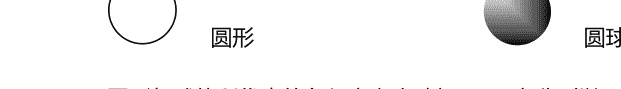

圆形与球体所代表的象征意义大致相同，二者分别以二维与三维的空间构形来代表同样的理念。圆形通常是象征上帝的符号。大多数的宗教将圆形当作是天体以及星星和星球的运转。对印度教徒与佛教徒而言，圆形代表了诞生、死亡与重生。另外，佛教徒也用圆形来象征法轮。

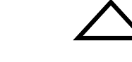

三角形与数字 3 的象征意义大致相同，代表起点、中点与终点。在许多文化中，包括古埃及与古巴比伦，以及近代的基督教和印度教等等，三角形都与三位一体的神祇有关。外，它也象征了其他的三一组合，例如肉体、灵魂、神灵，或者男人、女人、小孩。

向上的正三角形象征了男性的器官与火元素，对于西台人（Hittite，公元前2千纪初在安纳托利亚出现的古印欧语系的民族，大概来自黑海以北的地区），它代表了健康；对于玛雅人则象征了太阳；在普韦布洛印第安人中则代表了圣山。向下的正三角形在大多数文化中都被用来象征女性的阴部、女性和水元素。

在以正三角形象征神性的文化中，直角三角形作为正三角形的一半，代表了人类、尘世。在共济会的象征系统中它代表了水元素，而不等边三角形代表风元素，等腰三角形代表了火元素。共济会三角形的底部象征了毅力，两边象征光明与黑暗。整个三角形象征灵性的成长，以及信、望、爱的理念。

在有些文化中，底部相对的两个三角形象征了月亮的盈亏。而顶点相对的两个三角形则代表男性与女性，以及尘世与天空之间的接触。在印度，它们代表湿婆的沙漏型达玛噜鼓，它的声音启发了创造之舞。

古代炼金术用正三角形来代表四大元素。顶点向上的正三角形象征火，顶点向上且内横一条平行线的正三角形象征风。顶点向下的正三角形象征水，而内顶点向下且内横一条平行线的正三角形象征象征土。四个象征符号结合成一个六芒星形。

#### 正方形与立方体

正方形和立方体的象征意义大致相同，分别以二维与三维空间来表现。对照于圆形象征的运转与三角形代表的活力，正方形与立方体象征暂停或者静止。不过这样的象征意义并不完全是负面性质，也暗指稳定与长久的圆满。

#### 星形

通常星形是象征智慧与心灵上的指引，而星光则是代表智慧的光芒穿透罪恶的黑暗。在许多文化中，星星与命运有着密切的关联。此外，还有许多特殊的星形图案，都各有独特的象征意义。许多星星代表神话故事中的人物或者神祇，而且可能对该星座出生的人产生影响。在有的文化中，星星象征了死亡，而对某些人来说，晨星还象征生命的本质。在基督教艺术传统上，描绘圣徒时都会加上星形，例如圣道明都会与一颗星星同时出现。

四芒星的伯利恒之星象征了耶稣的诞生，在《新约》中关于耶稣诞生的故事中，这颗星星引导三位智者到伯利恒朝拜刚出生的基督。单一尖角向上的五芒星象征了全体人类，五个尖角代表了头部、两只手臂和两腿，而逆五芒星往往象征恶魔，上方的两个尖角代表了恶魔的两角。另外，逆五芒星在更古老的神话中，也是维纳斯的符号，象征了爱与欲望。六芒星是由两个连错的正三角形组成，在印度教中代表了男女的结合，在炼金术中是宇宙四大元素的连结，而在犹太教则是被称为“大卫之星”的象征符号。七芒星与数字7的象征意义大致相同，对基督徒而言象征了创世纪的七天，对佛教而言则代表了通往觉悟证道的七个阶段，而对于异教徒来说，是具有神奇魔力的标志。在印度教中，八角的星形象征了八吉祥天女，以八位女神代表吉祥天女的八个法相，是掌管富饶、健康、智慧、力量与繁荣的女神。

#### 十字形

十字形是当代世界中最广为人知的基督教象征，但是事实上，十字形远比基督教更早出现。对新石器时代的人类而言，圆形中的十字代表太阳，后来的阿兹卡特人与埃及人将它视为神圣的几号。通常来说，十字形与正方形、正方体或者是数字 4 所代表的象征意义大致相同。

在西方思想中，四臂等长的十字形象征自然界的四大元素，而在东方则象征四个基本方位，与之相似的十字金刚杵则象征佛陀的教化力量。许多面包上的十字据说是象征季度受难像，而异教徒也会吃这样的面包纪念女神尤斯特。

许多勋章会采用马耳他十字形，这是因为十字军东征之后，马耳他十字成为了象征应用于基督教德行的符号。太阳十字也称为轮形十字，象征了太阳每日重现与四季循环，而长期演变之后，轮圈部分则不见了，变成了一个正十字。

古埃及的象形文字安卡可能是结合了奥西里斯的 T 形十字与伊西丝的椭圆形，象征生命，后来安卡被埃及的科普特基督徒当成是有柄的十字。以希腊字母 T 命名的 T 形十字，是救赎的象征。在古代，这个符号曾用来标记以色列人，使他们免遭残杀。T 形十字也象征罗马神米特拉斯、希腊神阿提斯以及埃及的圣安东尼。现在，拉丁十字是基督教的象征，然而在西元前的古老制品上就已经出现过这个标志，而基督徒一直到西元 3 世纪才普遍使用拉丁十字。万字形的符号也称为旋转十字，分为左旋和右旋，象征太阳、四个基本方位、四个方向的风、自然界的四大元素、闪电、北欧雷神索尔的锤子、佛陀或者恶名昭彰的希特勒纳粹党。

### 第四节 塔罗中的符号象征（a）

几何构图，韦特塔罗牌中每一张塔罗牌都暗含了巧妙的几何构图，几何构图的方式直观地表达了这张牌所蕴含的主题意义。我们可以通过分解图案的几何构图来了解作者对于这张牌的理解。

#### 圆环

圆环象征着衔尾蛇一般的永恒循环。就像车轮不停的旋转而促进事物的变化一般。圆环的符号常常暗示着这张牌有转变的意义。比如命运之轮、世界。

#### 魔比斯环

魔比斯环是圆环的变形，也有着圆环的意义，但更为深刻和隐晦。魔比斯环象征着无穷的力量、无尽的源泉。比如魔术师、力量、恶魔三张牌都有魔比斯环的出现。

#### 二元的象征

二元是对立的意义，塔罗的核心意义是平衡，因而，二元的特点在塔罗中也不断出现，或者是建筑、石柱，或者是男女、动物，或者是物件、符号，以两两对仗的方式呈现在画面中，比如女祭司的石柱、恋人中的人物、月亮里的狼犬、死神里的双塔、隐士举着的灯里的六芒星等等。

#### 三角的象征

三角也是三位一体的概念。向上的三角所代表的阳性力量、改变突破的力量呈现于恋人的山峦、塔的高塔、星币三的建筑等等。向下的三角所代表的阴性力量、包容承载的力量呈现于女皇的座椅、宝剑三的心、恋人里天使衣服的褶纹等等。

#### 三位一体

左边的符号是三位一体的意思，代表三位一体的女神。这是欧洲较早的崇拜。对应着月亮的三个阶段：月盈、月圆与月缺。在月盈阶段，女神是少女（处女）女佣，同时也是战士；在月圆阶段，女神是妇女、母亲；在月缺阶段，女神就是老妇人、老太婆。三位一体的概念也融合在塔罗之中，比如恋人里面人与天使、审判里面的人、月亮里面狼犬与龙虾、圣杯三中三位女神等等。而这个符号我们甚至可以直接在韦特中找到影子，例如女祭司的帽冠、战车中战士的肩甲等。

#### 四方的象征

四方象征秩序与规范的建设，也代表着限制与框架。在韦特中常以标准的矩形来呈现。例如皇帝的座椅、战车的车身、节制衣服上的方框（里面还有一个代表突破的向上三角形）。

#### 植被与树林

植被与树林象征着丰富、生命力，麦穗是富饶丰收的意义。比如皇后身后的树林和身前的麦田、世界中的麦穗环、星币七和星币九里面的植物等等。

#### 水

水通常与情绪感受、深邃的潜意识或风险安全类问题有关。女祭司帷幕后面的水象征着深邃的无意识之海，星辰中的水塘象征着感性，月亮中的水潭象征着情绪，星币二后面的海象征风险与危机，星币骑士里面的河流代表潜在的风险、代表阻滞等等。

#### 火

火通常与冲击、欲望有关。恶魔手中的火把是对欲望的诱惑、高塔中的火则是毁灭的冲击。

#### 塔楼

塔楼通常是壁垒、保护的意思。塔楼常常与水和火同时出现，暗示着保护与安全感的需要。双塔建筑表示二元。

#### 房屋

韦特中出现的房屋常常暗示着家一般的归属，通常都与归属感、需要保护的东西、成长的经历、回忆、旧东西等有关。

#### 天体

太阳表示热烈、自我、欢乐的状况，月亮表示不安、阴郁、浪漫的状况，星星表示希翼、期待、向往的状况。

#### 烟云

韦特中常常用烟云来表示虚妄中来的意思。在分析的时候，常常表示说不清来源的状况或者虚妄的幻觉和想法。

#### 四元素的象征

命运之轮与世界中的四圣分别是四元素的象征，魔术师的桌面也放置着四元素，通常四元素象征同时呈现在一张牌上，表示这张牌会牵动生活各个方面，带着你整个世界一起变化。

#### 动物

动物的象征意义常常是表示原始的、野性的特点。在实际去理解的时候，你可以结合这个动物的特点去直接理解其取义。

#### 灵怪

恶魔是欲望的象征，比如恶魔中的恶魔，命轮中的红色恶魔；斯芬克斯是智慧的象征，比如战车中黑白斯芬克斯、命轮中的蓝色斯芬克斯。

#### 韦特的天使

丘比特的古希腊原型艾洛斯，利用爱情夺走人类企图以理性掌控生命的能力。韦特牌较马赛牌，在恋人牌上多增添了一位天使——“风”的拉斐尔。这个名字的意思是“上帝医治”。

节制牌上的是“火”的米迦勒，太阳的主宰。说明着克己的美德不是处于软弱和厌倦，而是强大的生命力。

审判牌上的是“水”的加百利，最受重视的大天使长。具有破坏人间一切污秽事物的职责，是神最为宠信的天使，在最后的审判中用喇叭唤醒死人复活，是生命过程的真理天使，也是智天使。

加百利、路西法、撒旦、光明之神。

#### 赫丘利斯的狮子

早期的力量牌绘制的是希腊神话中赫丘利斯杀死凶猛的尼米亚狮子的画面。

在文艺复兴时期，赫丘利斯的巨棍被视为“坚毅的力量”的象征。

韦特在力量牌中做了更改。

#### 双女神的皇后

稻谷围绕的皇后暗示了“谷物与大地之母”狄米特（盖亚），表达着“母性”的含义。

皇后座位旁的金星符号暗示了爱神维纳斯，表达着“性欲”的意义。

#### 狮身人面兽

传说中，狮身人面兽斯芬达克斯的谜语。

狮身人面兽是智慧女神缪斯的随侍，象征生命的谜团与危险。

在《山海经·大荒西经》中有关于狮身人面兽的描绘。

#### 黑暗中的冥后

冥王哈迪斯给予冥后泊瑟芬妮（其母亲是狄米特）的石榴籽。

泊瑟芬妮的名字意义是“在黑暗中发光的女子。”

古德杰伯林之后，塔罗设计者开始接纳埃及图像，让女祭司以埃及女神爱西斯（Isis）的面貌出现。

#### 命运之轮

往下游走的蛇是赛特 Set，是埃及的死亡与毁灭之神；右边上升的胡狼是阿努比斯 Anubis，是亡灵的向导，象征着重生。

四角的代表，衍生自巴比伦神话的四个固定星座，代表着四元素，同时也代表撰写四福音书的四位使徒。

#### 石榴

象征了表示生与死的冥后泊瑟芬妮。

因为红色的汁液类似月经，所以也代表了少女成为女人的繁殖潜力。

#### 树

代表着越老越强健的生命。

代表着经验与觉知的开展。

伊甸园的两棵树象征着生命与知识，被称为生命之树。

#### 苹果

横切的苹果会有一个完美的五芒星，这是女神维纳斯的象征。

苹果本身象征着结果、启蒙、爱欲、承载、包容、接纳等等丰富的意义。

#### 玫瑰

玫瑰意味着欲望。

红玫瑰代表着热情，白玫瑰代表着纯洁，野玫瑰则是五片花瓣。

传说中维纳斯是最早睡在“玫瑰花床”的。

#### 百合

百合通常在牌中与玫瑰同时出现。百合有六片花瓣，横切面是一个六芒星。许多人将它想象为大卫星，不过这是十九世纪才开始的现代用法。

大卫星的更古老意义是代表阳性与阴性的原始能量的融合。

#### 向日葵

向日葵象征了太阳的能量，由于能够随着阳光旋转，也代表对生命的热爱，或者生命的运转能量。

塔罗牌上的四朵向日葵花，代表了喀巴拉的四个世界。儿童的头部象征了隐性的向日葵，含苞待放的意义，也象征了未知的可能性。

#### 蛇

蛇的迅捷，阳具般的形体，却结合了阴性的迂回曲折，代表了初始的无意识能量。

蛇的毒液能够让人产生幻象，因此象征着智慧。

蛇每隔一段时间会蜕皮，使得成为了重生或者永生的象征。

衔尾蛇的形象代表了永恒。

另外，在诺斯底教派中认为，蛇也是亚当夏娃故事中的英雄。

早期众多的女神总是握着蛇出现，或者是有蛇缠绕在手臂上。

印度的拙火——昆达里尼 kundalini

#### 鸟

象征真理、艺能与预言。也象征着思想与记忆。

星星牌上的朱鹭是埃及诸神的使者，也是传说中塔罗创造者托特的圣物。

猫头鹰象征了智慧和对知识的追求；驯鹰象征了有纪律的心灵；蝴蝶象征了转化。

蛇与鸟相对：蛇象征无意识，鸟象征较高的意识；蛇代表了性欲，鸟代表了灵性的觉醒。

#### 雄狮

狮子代表了高贵的人格，也象征了激情。

力量牌中的狮子也象征了狂野的能量。

命运之轮与世界牌的狮子也象征了火元素。

#### 山羊

山羊代表着欲念，以及感官的贪欲。

在希腊神话中，潘是牧羊人、羊群、山林野兽、猎人以及乡村音乐之神，也被公认为牧地，树林和灌木山谷之神。传说是宙斯或者赫尔墨斯之子。也以恐慌、音乐、性能力闻名。

潘的崇拜起源来自阿卡迪亚。

#### 其他的象征意义

链条、绳子的捆绑都是束缚的意思，比如恶魔、吊人、宝剑八等。牌面要素有序排列表示整理，比如宝剑八、权杖九、星币八等。牌面要素被收拢表示警惕、负荷，比如权杖十、宝剑三、宝剑七等。牌面要素杂乱表示混乱，比如权杖五、宝剑五、高塔等。

### 第五节 韦特塔罗牌的几何构图（b）

### 第六节 核心牌意与牌意选取技巧（c）

### 第七节 逆位牌的解读技巧（c）

## 第七章 问答·整理·轻重

> “问对问题做对事，砍柴不费磨斧功。”

### 第一节 提一个有意义的问题（a）

塔罗牌预测的性质

首先，我们必须要了解塔罗牌预测的性质是什么。和我们通常理解的占卜术不同的是，塔罗牌并不是传统上对事件结果给出绝对性的答案。

塔罗牌预测是为了帮助我们认识事实真相和内心需求。塔罗牌预测中，我们所能得到的帮助是认识世界和自我。例如：当一个人即将要参加一次重要的考试了，但他对此没什么信心。那么，他希望从塔罗牌那里获得帮助。而塔罗牌能给他的帮助是他应该怎么努力去完成这次考试，他还应该注意些什么问题，这次考试对他的影响是什么，他是否必须参加这次考试。但是不能让塔罗牌来判断这次考试是否能通过。当我们通过塔罗牌的帮助认识清楚了事实真相和内心需求，我们所要做的是根据塔罗牌给予的提示，调整自己的行为，努力实现最大理想。

塔罗牌预测具有短效性与可变性。塔罗牌预测的时间效应很短，通常为3个月内。最长一般也不超过2年。所以你只能就当前将要发生的时间想塔罗寻求帮助。另外，塔罗预测的结果不是绝对不变的，我们提倡自己把握命运，始终你应该保持自己的意志，要明白塔罗牌预测只是给你一个指导性的建议，但最后如何做还是要你自己决定。一次改变都可能改变整个局面。塔罗牌预测是对现在状态的延续的情况预测。塔罗牌的预测是立于现在，结合现在与过去之间的变化，对未来可能发生的变化进行预测的。

塔罗牌预测的提问技巧

关于提问的方式主要是两个步骤：

- 一. 彻底回顾目前的情况，简要写下脑中的想法，不必太系统，因为我们要使用直觉而不是理性分析，找出事件的重点（问卜者所关注的方面）

#### 二．提出问题。提问时应该注意以下的情况

1. 接受责任----别让塔罗牌帮你做决定

应该你去承担的责任要勇敢地承担，所以要尽量回避那些逃避责任的问题。要明白问题的决定权在你的手中，而不是塔罗牌。所以在塔罗牌预测提问中要放弃这些放弃责任的问题。

如：

- ① 回答“是”与“不是”的问题。
我能够得到这份工作吗？
----最好的问法：我应该怎么做，以获得这份工作？

- ② 以“应不应该”开头的问题。
我应不应该和父母一起住？
----最好的问法：我和父母分开住，可能会有什么影响？或者我和父母住在一起，可能会有什么情况？

- ③ 仅仅询问时间的问题。
我什么时候才能找到工作？
----最好的问法：我还应该做些什么，才能使我更快获得这份工作？

2. 让选择多元化

比较这两个问题，

- ① 我如何能让男友送我礼物并道歉？
② 我应该如何更好地和男友相处？

问题①的选择只有一个，也就是说问卜者限定了必须是男友给他道歉。问题②的选择就很多了，或者这次真的是问卜者错了呢？或者应该道歉的人是她呢？让问题变得多元化能使你找到最好的解决之道。

#### 3. 找到最佳的细节程度

我们经常说，塔罗咨询需要一个具体的问题，但问题要具体到什么程度才合适呢？是不是越具体越好呢？试比较以下 3 个问题，

- ① 我要如何改善人际关系？
② 我要怎么做，才能让小张不再总是找我的麻烦？
③ 我应该如何改善我和小张之间的关系？

问题①，太模糊，不能得到具体的帮助；问题②，太具体了，只看到小张找他麻烦这一点；问题③，处于平衡点，仅包含了解决问题所必须的细节。

#### 4. 集中于自身

把问题的关键点放在自己身上，要知道在解决问题的时候，是要自己努力去解决，而不可能让别人努力来解决你的问题。例如：

- ① 我的这个学生为什么不好好学习？
② 我应该如何让他好好学习？
③ 我在这个学生学习上起了什么作用？

问题①，把问题完全集中在他人身上；问题②，把问卜者自身包括在内，但注意力还是集中在他人；问题③，把问题牢固地建立在本人的基础上，这是最好的。

#### 5. 保持中立

问问题的时候要注意中立的心态，不要带有情绪和个人立场。 如：

- ① 不合适的：为什么总是我来做这些事情？
----合适的：我应该如何让大家形成良好的合作精神？
② 不合适的：我怎样才能让大家都关注我？
----合适的：为什么在我表现的时候，不能引起别人的关注？
③ 不合适的：我要怎么做才能使老板给我加薪？
----合适的：我一直不能被加薪的原因？

#### 6. 积极的态度

保持积极的态度是塔罗预测时，重要的心态。 所以在提问的时候要保持积极乐观，自信活力的生活状态！

#### 7. 为别人推测

在为别人解读的时候，问题通常由问卜者自己提出，但作为解读人应该注意，当问卜者的问题不合适的时候，应该给予纠正，并与问卜者共同商量，找出最合适的问题！

### 第二节 非塔罗问题的辨析与处理（a）

非塔罗的问题，有以下几种：

- 1、影响深远的问题

有些问题影响深远，并不适合塔罗牌来处理。比如人生大事、婚姻、子女教育等。

这些问题都与当事人的性格、命运走势有关，不能单纯通过塔罗牌来处理。有些客人可能会问我的婚姻会幸福吗？婚姻幸福与否与当事人的需求满意度有关，这涉及到当事人对婚姻的需求、婚姻伴侣的特质、婚姻生活中的冲突与矛盾的处理、双方家庭的关系、事业与婚姻的关系等等多个方面。但凡面对这类牵扯广泛的问题，我们都应该先进行问题梳理，尽量把问题控制在一定的范围内解决。

- 2、周期过长的问题

有些问题的时间周期很长，也不适合塔罗牌来处理。比如问5年内的工作发展，一年的运势等等。

时间越长的问题，其中包含的变数就越多，过多的变数容易导致分析失准，而失准的咨询就没有实质的价值与意义了。因此为了咨询的有效性，我们不建议一次咨询时间过长的问题。一般而言，超过3个月就容易出现不易控制的变数，因此塔罗咨询通常都集中在3个月以内。不同的问题也有不同的有效周期，在咨询中个人的想法感受变化是最快的，其次就是人与人之间互动，一般15天左右就会有新的变化；再而就是人与组织的互动，变化的周期一般不超过1个月；另外就是组织与组织的互动，变化周期也在3个月以内。还有，组织也要分大小，体制越是庞大的组织其变化的频率就越小，除非是暮年黄昏的机构。

当遇到当事人提出周期过长的问题，我们需要先判断当事人为什么会想要进行长周期的咨询，如果确实有必要进行长周期的分析，可以建议当事人采用其他的命理咨询手段，比如占星、八字之类的流年推测。如果使用塔罗咨询，则需要把长周期分解成多个小的阶段，而每次咨询就一个细分的阶段来展开。

#### 3、专业性太强的问题；

有时候我们会遇到当事人提出一些专业性很强的问题，比如健康类的、法律类的。我曾经就遇到一个当事人希望通过塔罗咨询来了解关于自己妇科疾病的问题，还有一次遇到一个客人来咨询两个法律方案应该选择哪一个。这类问题具有极强的专业性，对于没有这些方面的专业修为的咨询师而言，是无法进行合理有效地处理的，因此应该建议当事人去咨询这些领域的相关专业人士。

当然，如果你具备这些领域的资质，你也可以将领域的专业知识与塔罗咨询结合起来为你的当事人提供咨询。

#### 4、假设性的问题；

这也是常见的问题，当事人基于对未来风险的不可知性，提出假设性的问题。最常见的假设性问题就是多择一。

有时候当事人提出的假设性问题并不是选择性的，比如“我并没有具体的离职考虑，但我想知道如果现在继续留下来，明年5月我能升职吗？”

处理这种问题的时候，应该首先去了解当事人为什么会产生这种疑问，然后找出问题的根源，再将咨询的要点转化为对根源性问题的分析。例如上面的例子，当事人可能是因为今年的升职失败，也可能是来自领导与自己的关系等等，我们就可以把问题转化成，为什么今年升职失败，以后应该进行那些方面的调整；或者如何与上司相处等等。

有时候，当事人可能不愿意与我们探讨原因。在这种情况下，你可以把问题转化成二择一，比如上面的例子，我们可以把问题看成“留下来继续工作的情况”与“离开这家公司的状况”两个选项来进行比较分析。

#### 5、第三方的问题；

当遇到有人提出想要了解第三方的某个问题的时候，我们一般是直接拒绝的。有一种情况除外，就是第三方某个问题对当事人有着直接的利害关系影响，这时候我们应该以当事人为主，参考第三方的状况，为当事人提供利害关系的分析。

#### 6、违反法律的问题；

咨询师不是超凡于世俗之上的神灵，咨询师也是人，是社会的一员。因此我们的行为也受到法律、道德的限制。

违反法律的问题是一定不可以提供咨询的，更不应该在咨询过程中有违法的言论与行为。

违反道德的问题应该视情况，进行引导或拒绝。比如有的咨询师就不会为小三提供塔罗咨询，而有的咨询师会针对小三的情况提供有限制的咨询，还有的咨询师则会通过咨询的过程对小三进行引导。简单来说，咨询师应该根据自己的能力对于违反道德的问题选择咨询的力度与方式。

### 第三节 问题梳理流程（b）

很多刚刚学习塔罗牌的人，喜欢随便拿个牌阵就开牌来看自己的问题，再对照牌阵位置意义与牌意就发现表述的状况与自己想了解的内容是牛头不对马嘴。更甚者，在一些有一定经验的塔罗爱好者中，也常常犯这个毛病。如果你发现你开出来的牌阵无法说明你的问题，或者说结合背景信息，你完全无法理解这个牌到底在说什么，通常说明，你用错了牌阵。

为什么会用错牌阵呢？有两个方面的原因，第一，对牌阵的使用时机不熟悉；第二，对当事人的问题相关事件脉络不清晰。

第一个方面的需要加强对牌阵的理解，可以通过深入研究每一个牌阵来提升牌阵的应用准确度；第二个方面则与问题梳理有很大的关系。很多咨询师不了解问题梳理的重要性，有的人也会认为，问题梳理之后再进行咨询，就有猜测的嫌疑。实际上，清者自清，作为一次负责任的咨询，有效的问题梳理势必会给问题的分析带来极好的帮助，当然，如果你面对的是一个怀疑塔罗的人（我时常都会遇到这样的客人），你可以选择礼貌地拒绝为其提供咨询。如果你同时是做商业咨询活动的，可能不太好拒绝客人，那么你也可以跳过问题梳理，而选用较为通用的牌阵来分析解读，倘若你决定要这样做，你必须在开始前告诉你的当事人，问题梳理对于有效咨询的重要性，同时也告诉他，你也可以不做任何梳理来进行解读，但你无法就此提供负责任的建议与策略。培养当事人梳理问题的习惯与培养自己梳理问题的习惯是一样重要的。

问题梳理的作用：

- 1、判断当事人的问题是否适合塔罗咨询？判断标准与处理原则详见第二节。
- 2、判断当事人的问题要点与咨询重心，便于设计合理的牌阵来开展有效咨询。牌阵设计的技巧见第八章。
- 3、判断当事人的问题类型，便于采取有效的咨询方案开展咨询。见下一节。

问题梳理主要涉及主线脉络、人物关系、辅线整理 3 个层面。

#### 主线脉络

通过时间的联系对整个事件脉络进行整理。当事人在向你表述自己的问题以及相关背景的时候，通常是缺乏逻辑和理性的，因而我们在梳理问题的时候，应该首先对相关的问题背景做出整理，并梳理出一个以时间作为连接的脉络来。

脉络梳理的时候，除了事件的时间要素之外，还要整理出当事人的意愿。

例如，一个当事人在 2012 年的 10 月来咨询的时候，这样描述了自己的状况：

> 我和他离婚了，他有外遇。我真的没有想到，结婚才 3 年，他就这样对我。我现在真的很后悔，当初为了孩子和他结婚，我太草率了，怎么可能跟一个人恋爱不到半年就上床怀孕了呢？其实，离婚我没关系的，但孩子太无辜了，我不希望宝宝在一个没有爸爸的环境中成长。那个小三也是不要脸，孩子都十多岁了，自己还出来做小三，破坏别人的家庭。去年 8 月我就不应该让老公一个人去上海的，他公司有一个大项目在那边，本来让我也去的，我当时觉得孩子太小，不能交给老人带，就执意留下来，他们就是在那边认识的。更可怕的是，这一年中，他都是这样骗着我的，当我发现的时候，他们居然都有近一年的来往了。我现在不知道怎么办了，我不愿意离婚，不是为了我自己，是为了孩子。

这样的描述在我们的咨询中是很常见的，当事人受到情绪、思维的逻辑结构的影响，一般很难理性地讲述背景，这就需要我们帮助其进行整理。

我可以用一个鱼骨图来展示出当事人描述的背景中出现的时间点事件：

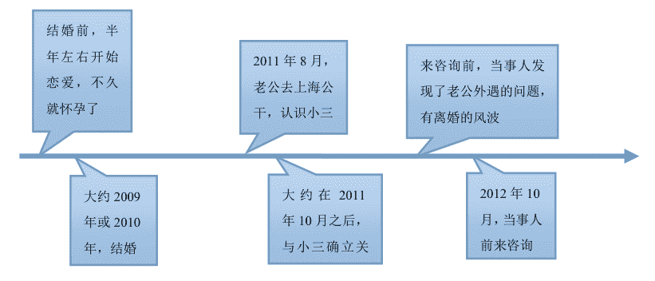

通过梳理后，得到的事件脉络如下：

当事人与老公在三年前相识，恋爱不到半年，当事人受孕，之后两人便于 2009 年底或 2010 年初结婚，2011 年 8 月，老公去上海出公差，认识了小三，两人可能是在当年 10 月之后确立了情人的关系。2012 年 10 月或之前不久，当事人发现了老公外遇的情况，并且夫妻二人可能产生了离婚的风波。当事人目前表示，因为孩子的原因，不愿意离婚，想了解应该如何处理当前的问题。

如此整理之后，整个事态就清晰地呈现出来了。

#### 人物关系

塔罗咨询是围绕人来展开的，所以人与人之间关系就十分重要，人与人之间会形成两种力量，吸引力与排斥力。具有吸引力的两人如果产生距离，就会对两人带来不安，具有排斥力的两人如果距离太近，就会对两人带来压力。人会自然而然地亲近对其有吸引力的人，也会自然而然地疏远对其有排斥力的人。

一般情况下，我们在进行事件脉络的梳理的时候，就会同时进行人物关系的梳理，因而当事件脉络梳理完成后，人物关系其实大多也呈现出来了。但对于某些复杂的人事互动，专门进行人物关系的梳理是很有必要的。

人物关系梳理是从当事人出发，先整理出事件中与当事人密切相关的直接人物关系，在去整理事件中，与当事人的关系人相关的直接人物关系，以此类推。

当我们得到人物关系图的时候，就要去整理其中每一条连线是如何联系起来的，这包括在何时在何种情况下因为什么原因被谁牵连介入到事件之中，事件中他们是如何影响当事人的。

在《塔罗入门九章》中，我们有一个非常典型的人物关系案例，我在这里也直接引用：

2011年11月，张女士通过朋友介绍认识了李先生，彼此感觉不错，于12月底开始正式交往。2012年3月份，李先生向张女士介绍了一个矿场投资项目，张女士一直是做皮鞋生意的，没有接触过矿业，不过李先生保证这个项目能赚钱，张女士也就托朋友调查这个矿场，矿场主2011年1月，因为发生了安全事故，被关押了。矿场主的老婆向张女士他们出示了矿场的相关资质，以及北京某局的专家对矿场产量价值的评估报告。总体来看，没什么问题，而且如果接手来做，也应该是可以很快盈利的。

但这毕竟是一个大项目，投资巨大，为了谨慎，张女士于2012年7月还是来格林对此进行咨询，向了解这个项目到底是否可以投资，是否还存在什么风险没有察觉的。

在这个事件中，一共牵涉到张女士、李先生、矿场主、矿场主老婆。

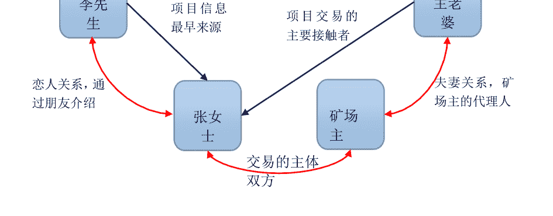

介绍张女士与李先生认识的朋友和帮忙调查的朋友，以及专家，为什么不计入其中呢？

这是因为这个朋友只是介绍张女士与李先生认识，而在咨询主题相关的这个事件中，这个朋友并没有直接关系，所以不计入其中；帮忙调查的朋友，是作为张女士的信息触角，提供信息帮助当事人决策参考，但在背景信息中看来，他（们）并没有参与决策或有目的的影响决策；专家是作为第三方来评估此矿场，本来就是参考意见，与帮忙调查的朋友一样并没有参与决策或有目的的影响决策。人物关系梳理不是越多越好，太复杂的人物关系，可能会影响我们的最终判断，因此能够在动机上排除的对象，在咨询中都可以不作为主要人物关系来梳理，除非你在正常梳理中发现这些人可能存在猫腻。

在有了这个人物关系图之后，现在我们来用这种模式语句进行填空：

相关人：在事件开始之前，与当事人是______的关系，在______（时间）在______的情况下，因为______的事情，以______（事件中的角色）的身份和关系介入到事件之中，事件中他给当事人的主要影响是：______

- ① 李先生：在事件开始之前，与当事人是通过朋友介绍认识的恋人关系，在 2012 年 3 月，在事件还没有开始的情况下，因为向当事人介绍了这个项目的事情，以最初信息提供者的身份和关系介入到事件之中，事件中他给当事人的主要影响是：介绍并保证这个项目能赚钱。
- ② 矿场主：在事件开始之前，与当事人是陌生人关系，在 2011 年 1 月，在矿场出了事故后被关押的情况下，因为出让矿场的事情，以矿场主的身份和关系介入到事件之中，事件中他给当事人的主要影响是：事实上的项目所有人，但从未与张女士接触。
- ③ 矿场主老婆：在事件开始之前，与当事人是陌生人关系，在 2012 年 3 月之后，在张女士开始接触了解项目的情况下，因为她是矿场主的老婆，矿场主与 2011 年 1 月因矿场事故被关押后的事情，以矿场主当事人的身份和关系介入到事件之中，事件中他给当事人的主要影响是：接洽交易谈判事项，向张女士他们出示了矿场的相关资质，以及北京某局的专家对矿场产量价值的评估报告。

#### 辅线整理

一条江河是多条支流的集合，一个大的事件整体也是多个支线的集合。整理出主线和人物关系后，我们可以通过对人物的动机、利弊提出质疑，并思考整理每一个质疑，从而整理出更多的辅线信息。

质疑是思考最好的方式，人是十分容易受到影响的动物，因此人的自我的判断常常是不可靠的，通过质疑动机，我们可以整理出当事人提供的背景信息中，有那些信息可能是错误且具有风险的。

动机质疑的方法，就是问为什么？

- ① 李先生为什么提供这个信息给张女士，他明知道张女士是做皮鞋生意而非矿产？
- ② 李先生又是如何得到这个信息，他为什么可以保证这个项目能赚钱？
- ③ 项目既然能赚钱，为什么矿场主要出让？即便自己被关押，但从还能进行委托经营的角度来说，他是可以遥控指挥的。
- ④ 矿场主老婆的身份是可靠的吗？是否真的有拿到委托权力？

例如，第一条对李先生的动机质疑，如果当事人无法提出具有说服力的信息，那么很有可能李先生的动机是不正当的，如果动机是不良的，那么李先生提供的这个项目的所有信息就不值得信任，因为那些信息很可能会给当事人带来伤害性的后果。

动机质疑之后，你还可以从利害关系上，进一步提出思考，因为人一般是不会对与自己无关的事情上心的：

- ⑤ 在这个事件中，李先生可以得到什么好处？这些好处是否足以促使他对这个项目持有热情？
- ⑥ 在这个事件中，矿场主能得到什么好处？出让矿场得到的好处比继续持有矿场得到的好处更多吗？
- ⑦ 在这个事件中，矿场主老婆能得到什么好处？

每一条质疑的提问都可以梳理出主要脉络中的辅助脉络，这就是我们接下来要提出的问题梳理的第三步，辅线脉络的整理。

辅线信息的获得通常来自当事人进一步提供的信息，如果当事人无法提供进一步的信息，就需要咨询师来判断，是否有必要在咨询中把未知的辅线信息接入到牌阵设计中。在第四节我们会具体讲解如何整合问题梳理的信息到牌阵之中。

### 第四节 常见的塔罗问题归类（b）

塔罗牌最常被用来处理情感关系类的问题，实际上塔罗牌适用的方位很广泛，这里我们将一些常见的塔罗问题进行归类，并有针对性地提供咨询处理的方案建议。（文中提到的性格分析，我们通常是使用占星、八字、灵数等命理测算的方式来了解的。）

最常见的两大类塔罗问题是恋爱婚姻与工作职业。

恋爱婚姻会呈现出恋情、爱情、婚姻、家庭四个阶段的关系变化，而每个阶段又会呈现出开始、发展、变化三个阶梯的过程。

恋情，一般是指单身与恋爱初期的状况。

恋情的早期阶段，这个时候当事人一般是单身，这里的单身包括了失恋分手后单身以及离异丧偶后的单身状况，也就是没有伴侣也没有中意对象的时期。这一时期的当事人，如果有过情感经历的，有可能还沉溺与过去失败感情或意外中断的感情所带来的痛苦中，也可能虽然走出了痛苦，但过去经历所带来阴影使其无法进一步去开展新的情感；也有一些上一段情感经历很久了，虽然不再受过去阴影的情绪影响，但却乐于保持单身，还不想进入两性关系的。如果没有过情感经历的，有可能会表现出基于想要开展关系，但却苦于无法对他人提起热情；或者有些人因为家庭环境、人生经历的影响，乐于保持单身。

处于恋情早期，较少会有来询问塔罗咨询的，因为这一时期如果当事人自己接受自己是单身，甚至乐于享受单身快乐，他就不会有令其困扰或痛苦的事情来催发咨询需求。

#### 单身贵族

而前来咨询的当事人，通常是自己希望去展开一段情感关系，但对于情感对象感觉到迷茫，或者总是觉得遇人不淑，无法展开关系的发展。

A、这类当事人中有一些人他们对于建立恋情是有意愿的，有热情的，并且对于自己未来生活具有规划性，知道自己应该寻找什么样的伴侣。他们常常会问我的另一半什么时候出现？你可以用推运牌阵来分析他的情感走势，也可以用时间之箭来看他这个阶段是否会有可以考虑的对象呈现，或者使用圣三角时序循环的牌阵来分析他为什么迟迟无法展开新恋情。

B、还有一些人虽然有热情有意愿，但对于情感目标并不清晰，不了解自己想要的未来生活是怎样的，更不知道自己应该找一个什么样的伴侣。他们常常会问我的桃花运怎么样？我什么时候才有我的婚姻等等。这类当事人最应该做的，实际上是自我探索，他们应该在咨询师的帮助下，明确自己的未来的生活规划与情感对象的特点。他们适合进行性格分析，如果一定使用塔罗牌，则应该考虑使用自我探索类型的牌阵，比如身心灵展开法、七星展开法等对自身的状况进行分析，从中再去思考，到底自己需要一个什么样的生活，什么样的伴侣可以和自己享受这样的幸福。

#### 勇敢生活

有一些当事人失去恋情或婚姻的当事人，苦于受到过往感情的影响也可能来求助于塔罗咨询，他们想要寻找如何摆脱过往经历对自己的影响，而让自己尽快投入到对新关系的热情中去。他们常常会问我什么时候才能开始新的爱情？我是否应该彻底放下他？之类的问题。这类当事人一般都会心理咨询的需求，因此你可以直接推荐当事人进行心理咨询。如果你具备进行心理疏导的能力（不是说你有心理咨询师证书就一定能进行心理疏导），你可以先对当事人进行心理疏导，找出给他造成心理阴影的心结，并针对这个心结展开咨询。通常我们会临时设计牌阵来有针对性地分析，这个心结相关的成因、当事双方的性格与行为方式、心结对当事人带来的影响，以及这个影响会带来的危机，并定制一定的谈话咨询或心理咨询。

Ps：这类当事人有时候容易与破镜重圆的当事人混淆，勇敢生活的当事人是在自己内心已经认可并接受分手的事实，而破镜重圆的当事人是还没有接受和认可分手事实，并试图挽回的。

#### 恋情的中期

这个阶段的人虽然具有自己的择偶标准，但要么择偶标准模糊多变，要么就是遇到的对象总是无法完全符合自己的标准，从而难以确立对象。这个时期，当事人可能有一个或多个考虑中的情感对象，但并没有优选的目标。

#### 进退抉择

对于只有一个考虑对象的当事人，前来咨询常常是因为这个对象不是完全符合自己的择偶标准，而处于感性与理性的两难抉择之中。也有一些人则是受到环境施加的压力，这唯一对象又不是自己所接纳的人，而处于两难抉择之中。对于两难抉择的当事人，我们可以通过性格分析帮助他了解对象与自身的匹配程度，明确关系的价值，从而协助他做出决定。这个阶段的塔罗咨询，则主要倾向于对象对于当事人的情感意愿如何，以及两人关系融洽程度的判断，因而我们一般使用灵感对应局来评估相互之间的情感意愿是否真诚，以及彼此关系是否融洽。

#### 多项选择

对于有多个考虑对象的当事人，前来咨询通常是为了在多个对象之中做出判断和选择。这时候涉及到对于多个对象的横向比较评估，但我们建议评估的对象不超过 3 个，如果当事人有超过三个的情感考虑对象，通常是因为当事人个人条件较为优秀（有些是自我感觉良好），但缺乏个人情感目标的定位，这时候应该采用“单身贵族 B”的方案进行咨询。面对对象选择的时候，我们还是需要通过性格分析了解他们各自的特点，并一一与当事人进行比较，明确他们各自与当事人的匹配程度，再进行横向比较，做出选择参考建议。塔罗牌处理，可以多次使用灵感对应局来进行意愿的真诚以及关系互动情况的评估，也可以使用多择一的牌阵来进行分析判断。

#### 恋情后期

处于恋情后期的当事人，通常有一个明确的情感发展对象，并对其有追求的意愿和行为，这个对象有可能已经和当事人明确了恋爱关系，或者尚未明确恋情，但关系互动密切。需要注意的是当事人在这个阶段，虽然有明确的对象，但也不会排斥与其他人的情感互动。

这个阶段的咨询通常是关于追求与进一步发展的问题。

#### 追求所爱

当事人可能对目标对象有恋爱的诉求，但目标对象对此并不明确意愿，或者拒绝。这种情况，咨询师首先要反复与当事人确认其追求意愿的程度，如果意愿不够强烈，则可以劝慰放弃；如果意愿强烈，则预示着这是一个长期跟进的咨询项目。首先，通过性格分析了解关系双方的性格特点，情感诉求等方面的状况，并判断相互关系的匹配程度，定制咨询规划。然后，在通过塔罗咨询，使用灵感对应局了解双方当前的真实意愿，关系融洽程度，并定制改善关系的初步方案。之后需要进行长期的跟进，帮助当事人不断促进两人的关系，直到双方明确情感关系。

#### 成就爱情

当事人如果已经和对象明确了恋爱关系，前来咨询，则可能是针对两人关系的进一步发展。

- A、当事人有进一步发展的意愿，但总觉得对方不够明确。这时候可以使用灵感对应局来分析两人关系相处情况，或者使用时间之箭配合当事双方的指示牌来分析关系的走势以及各自在关系中的状况。重点了解对方意愿是否真诚，关系发展是否呈现良性发展。
- B、对方有明确的进一步发展的意愿，但当事人却又担心。这时候应该先与当事人进行梳理，了解当事人的担心是什么，要考虑是否是受到过往经历的影响，如果是则可以先采用“勇敢生活”的咨询方案，如果排除过往经历的影响，那么通常是对方在某些表现上让当事人感觉不真诚，这时候可以使用灵感对应局来分析两人的意愿真诚与关系相处的情况。如果双方都有进一步发展的意愿，但关系却始终停滞不前，则需要通过时序圣三角的牌阵配合双方的指示牌来分析关系发展的阻碍以及如何突破。

#### 恋情竞争

恋情竞争是指，交互的双方其中有一方或者双方在交互前就已经有其他的情感关系，从而形成的恋爱的竞争关系。这种咨询一般我们都会先对当事人进行劝解，你可以直接使用灵感对应局从双方的情感真诚的角度上去分析，如果两人的情感不够真诚，也可以从这个角度上去劝解。劝解无效，要么你选择拒绝咨询，要么可以参考下面的思路。

A、当事人有其他的情感关系。无论对方是否有其他情感关系，只要当事人有其他情感关系，就涉及到当事人自己的选择，这时候应该采用“多项选择”的咨询方案。如果对方也有其他情感关系，则加入对方的另一对象，对对方两人的关系进行评估，通过性格分析进行关系匹配的比较，或者通过灵感对应局评估情感的真诚与关系的融洽程度，最后，定制竞争策略。

B、当事人没有其他的情感关系，对方有其他的情感关系。这种情况首先要排除当事人是否被玩弄和欺骗（可以参考“成就爱情 A”），如果对方对当事人是真诚的，那么需要先参考“成就爱情 B”，然后在考虑是否加入对方的另一对象，对对方两人的关系进行评估，通过性格分析进行关系匹配的比较，或者通过灵感对应局评估情感的真诚与关系的融洽程度，最后，定制竞争策略。

#### 恋情保卫

恋情保卫是指在两人恋爱关系发展的初期，受到来自对方的第三者的挑战，当事人要保卫自己的感情。如果第三者是来自当事人的，则与“恋情竞争 A”的咨询方案相同。首先应该对两人的关系进行评估，通过性格分析进行关系匹配的比较，或者通过灵感对应局评估情感的真诚与关系的融洽程度。然后，再使用相似的方式评估第三者与对方的关系情况，最后，定制竞争策略。

#### 爱情的前期

爱情阶段是恋爱关系的稳定阶段，也是两性关系开始融合的阶段。

爱情关系的前期，是指双方从恋爱的热情转向平淡与务实的过程，这个阶段当事人会对两人的关系进行价值的评估，现实的问题不断涌入两人的生活，并影响关系的发展。

#### 爱情评估

当事人基于关系长期发展的需要，对两人的关系进行评估。当事人会比较自己与对方的相同点与差距，这时候当事人也会受到来自外界的影响，比如世俗的观点、家庭的需求、朋友的建议等。这个阶段，对于当事人而言，如果对关系的评价是肯定的，将会展开长期恋爱关系的发展，如果是关系的评价是否定的，可能会做出分手的决定。而这时候的自我评价通常是不可靠的，因为这都是基于当下的情况所做出的评价，不具有发展性，同时当事人受到个人情绪感受的影响，也容易做出冲动而错误的决定。这个阶段当事人可能提出很多不同的问题，但基本上都是关于是否选择分手。咨询的时候，我们需要帮助当事人进行理性的梳理，通过性格分析对两人进行比较分析，了解两人的性格特点、互动情况，以及婚恋的匹配程度。塔罗咨询可以考虑通过时序圣三角或六芒星牌阵来寻找两人关系的阻碍，并帮助他们突破限制。也可以使用灵感对应局来分析双方在情感关系中的意愿以及关系相处的问题，来帮助当事人了解关系的共性与差距，找出无法融洽的原因。如果还有其他的问题，那么都可以参考恋情阶段的相关方案来进行。

#### 爱情的中期

爱情中期是指已经进行了关系的评估，并决定继续发展，当事人开始进行自我的调整以更好地配合对方，促进关系的融合。

#### 价值塑造

在这个阶段，当事人会呈现出对情感关系的忠诚与坚持，期望通过自己的改变而更加适应对对方，促进两人关系的融合。这个阶段前来咨询的，通常是因为不知道应该如何调整才能与对方更好地发展与融合，他们的问题通常是我到底要怎样才能让他更爱我？咨询的时候，可以通过性格分析了解对方的喜好、习惯，来帮助当事人做出调整的建议。也可以通过状况类牌阵，比如身心灵展开法、七行星展开法等对对方进行阶段性的性格分析，用以制定当事人应该如何去调整自己而适应对方或引导对方的训练方案。

#### 爱情保卫

这个阶段会出现第三者，但这个阶段的第三者都是来自对方的，这是因为当事人虽然进入了爱情中期，但关系中的对方却还未进入这个阶段所导致的。另外，在这个阶段，当事人是不会成为第三者的。咨询的时候，不必去劝解当事人放弃，因为在这个阶段，当事人是不可能选择放弃的。因此，我们一般先通过塔罗咨询（使用灵感对应局）来了解对方与第三者之间当前的关系互动，或者通过性格分析来分析对方与第三者的关系比对。然后根据当事人的意愿，再进行策略的定制。

#### 爱情的后期

这个阶段是需要恋爱中的双方共同来达成的，双方会在价值观、行为方式等多个方面形成共同的认知，彼此更为默契，对对方有较为深刻的认同感，熟悉对方的优点与缺点。如果只有一方到达这个阶段，那么这段关系就会非常煎熬，领先到达这个阶段的当事人会不得不去等待对方也到达这个阶段，并且在这个过程中不断去为对方灭火。

#### 等待融合

这个阶段的问题，常常都是因为对方还没有到达这个阶段，而当事人在这个阶段停滞下来，等待对方的到达，而有要不断应对对方引出的各种突发情况，疲于灭火，最终导致当事人丧失耐心，但想要放弃，又因为觉得一路走来不容易或者因为现实的某些原因自己又不愿意放弃，从而陷入两难的困局。在咨询的时候，我们通常要多询问关于对方的情况，大致判断对方在什么阶段。这个阶段的咨询主要是针对两人相处模式的探讨，建议是直接进行两人的关联合并比对分析，这样可以直接判断两人相处的相合相冲之处，如果使用塔罗咨询，我们一般使用时序圣三角来看在时间上，两人呈现出什么样的关系模式的循环；或者使用灵感对应局来分析两人相互之间的交互方式以及关系的走势。

如果有关于竞争者的关系则参考“爱情保卫”。

#### 爱情选择

另外这个阶段，当事人也有可能出现其他的追求者，当事人在自己原本关系中感到疲累后，如果恰好有其他追求者给予慰藉，当事人很容易陷入出轨的危险中，一般我们是会进行劝解，咨询中，首先通过性格分析，评估当事人原有的情感关系的价值、状况等，然后在对第三者与当事人的关系进行评估。双项评估后进行比对，如果是塔罗咨询，也是使用灵感对应局对两段关系进行评估，或者使用六芒星展开法来对当事人心中倾向性的决择进行评估分析。需要特别注意的是，这个阶段出现的爱情选择，对于当事人而言常常有“一叶障目不见泰山”的状况，当事人可能是因为在原有感情中某个方面得不到满足，而第三者却在这个方面给予当事人满足感，从而使当事人做出错误的判断，把这种欲望的满足感，视为情感的依托，而给原有的关系带来危机。

#### 婚姻关系

婚姻关系开始，我们就没有针对性的塔罗咨询方案了。从婚姻关系构建开始，两性关系就不仅仅是感受、情感、或短期状况的影响了。两人之间的关系影响更为广泛和深邃。

塔罗咨询一般只适用于婚姻家庭关系中，短期的、急性的危机处理，或者临时的状况分析，而婚姻的更多问题，则需要深入的项目咨询，当事人与咨询师反复多次的沟通。

工作职业问题一般会表现出工作实习、行业定向、职业素养、事业成就四个阶段。当事人无论是职业人还是创业者，都会经历这四个阶段。

#### 工作实习阶段

这个阶段，当事人通常还没有明确的行业定向，依然在体验和尝试不同的行业和工作，试图给自己做出一个明确的定向。这个阶段最常见的问题是关于找工作。即便是一个创业者在这个阶段也依然是找工作的问题。家族事业的继承者在这个阶段，更多是在家族企业中进行实习和锻炼。这个阶段的咨询原则，一般是进行性格分析，了解性格特定，并对未来可以发展的职业方向做出定位参考。塔罗咨询则针对比较实际的工作选择，常常会使用到多择一的牌阵，需要注意的是，这个阶段的选择一般要注重成长性，而非物质回报，除非当事人明确指出要考虑物质回报。这个部分的职场人际通常不是咨询的要点，重点在于当事人自己的成长。

#### 行业定向阶段

这个阶段，当事人一般有一定的工作经验了，并且有自己的行业定向，当事人想要了解选择的行业是否适合自己的发展，以及自己应该做出什么努力更好地在行业中取得成绩。创业者在这个阶段则处于事业开创的阶段，一方面自己熟悉行业的一些工作方式或者掌握了行业的部分资源，另一方面需要构建一个稳定而长期的运营模式来获得生存。而家族事业的继承者在这个阶段则成长为部门的骨干，并开始尝试其他部分的工作。

对于职业人的咨询，这个部分的重点在于行业与职业价值的评估，这个评估是主客观一体的，一方面需要客观评价这个行业，另外一个方面也需要评估行业特性与当事人性格之间的冲和。塔罗咨询中，通常使用时间之箭加指示牌来分析当事人阶段性的工作走势，或者通过状况类的牌阵来分析当事人在这个行业或职业方面的优劣，并做出调整的建议。这个部分会涉及到复杂的职场人际，届时需要进行专项的分析咨询。

对于创业者而言，这个阶段在于自身如何生存的问题，一般需要针对行业市场特点进行分析，并对市场走势进行评估。对于符合市场的创业者，需要提供市场变化的应对策略；对于不符合市场的创业者，需要提供本身的调整策略。创业者在这个阶段主要面对的是合伙人的分工与合作问题，以及团队信任与建设的问题。

对于家族继承者而言，这个阶段在于如何深入了解自己的企业，并针对企业当下的问题提出调整方案。这个时候的家族继承者，需要进一步取得目前企业的控制者的信任，一方面涉及到如何在自己的工作中做出成绩，另一方面涉及到如何更为宏观和全面地关注自己的企业。事业关系方面，则涉及到对外的关系联结以及对内的信任建立。

#### 职业素养阶段

在这个阶段，当事人在行业和职业上已经取得一定的成绩，并坚定了这个行业的发展。职业人已经成为这个职业领域中的熟手，创业者的企业运营模式已经趋于稳定，家族继承者也取得信任处于企业的决策层。

对于职业人而言，这个阶段的问题在于个人的职业价值增值，一方面涉及到个人的跳槽问题，另一方面涉及到个人未来的成长与学习方向。这个职业阶段的职业人已经熟悉了职业中的相关技能、知识，需要在本职业的多个领域阶段中找到自己的亮点，从而来定位自己在这个职业中的细分走向，咨询师一般需要先了解这个职业的细分走向，并结合当事人的特点提供细分走向的建议，这类咨询决然不是一两次咨询就可以完全处理的。这个阶段的职场人际，涉及到对内对外的关系平衡，成熟的职业人也是企业所需要的人才，势必会引起猎头和同行企业的关注，职业人在面临跳槽的时候，需要谨慎选择，塔罗咨询在这个阶段的抉择上应该使用多择一，但比对要素则应该偏向于发展机会的程度与付出回报的平衡程度。

对于创业者而言，这个阶段的企业已经在行业中取得一定的成绩，自己也在行业中具有一定的定位，这时候最容易出现的问题，就是原合伙人的利益分配以及功勋员工的赏罚。因而这个阶段的咨询，需要咨询师做出多个方面的考虑，并与当事人频繁沟通。

对于家族继承者，这个阶段自己已经是企业的掌权者，但自己的行为能力依然会受到来自家族的其他人的注意与挑剔。家族继承者需要有长远的规划，以及应变的策略，最重要的是需要构建属于自己的“内阁”团队。父辈留下来的“内阁”，虽然经验丰富，但常常容易倚老卖老，如何妥善安顿老功臣，并成功构建自己的团队，这就成为非常棘手的问题。这方面的咨询需要长期的沟通跟进，咨询师既要定制规划，还要处理应急与细节人际冲突。

#### 事业成就阶段

这个阶段的当事人在自己所属领域都取得了一定的专业修养和成绩，涉及到个人成就与二次创业，这个阶段的咨询不属于一般的塔罗咨询。

#### 健康法律问题

健康法律等专业方面的问题，应该要求当事人去咨询相关的专业人士。如果你具有这方面的专业资质，你也可以做出量力而行的咨询。

#### 财务问题

个人财务问题主要是分为正财与偏财的咨询，正财来自于正当的职业收入，因而一般以个人工作问题来处理。偏财来自于投机、赌博、博彩等非常方式，我不建议职业咨询师进行这方面的咨询。

### 第五节 塔罗咨询中的语言技巧----咨询中的恶魔（c）

这一节的内容是在比较纠结的情况下写的，我一直犹豫是否需要这样的一节内容。因为对于很多喜欢关注负面的人来说，这样的内容无疑会让他觉得，原来塔罗咨询就是一个骗人的过程。因而请各位学习塔罗的人要特别注意，这一节的内容仅仅是为从商业咨询的职业咨询师介绍的一些处理信任和化解危机的技巧，这些方法不可以用于常规的咨询分析中。如果你使用本节中的技巧所给你带来的纠纷和责任，我们不会有任何的同情和支持。

塔罗咨询是需要当事人与咨询师相互互动来完成的，对于咨询师而言，良好的语言技巧，无疑能在咨询中帮助咨询师取得良好的效果。

语言技巧是一个庞大的心理学体系，我们在本教材中，只是针对一些重点的问题进行介绍，大家可以参考其他的专项训练课题来获得这方面的实质成长。

#### 信任感

咨询是否有效，首先就来自信任感，你的当事人对你越是信任，你为其提供的咨询效果就会越好。但我们不能要求当事人必须信任你，因此咨询师需要有一定的方式来获得当事人的信任，一般的做法上有几种：

1、问星座、生日。现代大多数人都知道自己的星座，而我们所说的星座是指太阳星座，太阳对人的影响是很大的，太阳星座差不多能对一个人的性格有50%的影响。通过描述当事人所属星座的最大的特征，很容易让当事人觉得你能了解他。如果你的占星技术更强，你甚至可以通过了解当事人的生日对其性格做出更为细化的描述。另外，如果你具有灵数学的技能，你也可以通过当事人的生日，快速了解当事人某些性格表现。这些都是帮助你快速获得信任感的技巧。

2、比较鼓励法。对一个人缺点的比较鼓励是建立信赖与亲近感的技巧。在第一步的分析中，我们会知道当事人性格中大致上存在的优势与劣势，我们在描述的时候，既要有优点的赞美，也要有缺点的陈述。这样一来，我们可以在鼓励法的时候对当事人说：“虽然你外在看起来……，但往往是这样的人，内在的自我就更表现得……。”在这个技巧中，“但是”的前面是当事人性格中不足的一面，后面则是与这种不足面完全相反的内在性格的描述。关于不足一面的信息，不仅可以通过第一种方式去获取，还可以从当事人的衣着打扮、言谈举止中获得。当然，这个技巧只能少量使用，用多了，对方是会警觉的。

3、讲故事。了解当事人的大致情况的时候，你可以通过讲一些你亲自处理的与当事人情况相似的案例故事来获得当事人的信任。

#### 接纳度

接纳度是咨询中非常重要的一个指标，咨询师必须学会把握这个指标。

人是通过感受来进行判断和理解的，而每个人的感受程度与情绪的承受能力是不一样的，这就构建每个人不同的接纳度。

咨询师需要在与当事人的交流中，不断通过语言行为探测对方的接纳底线，避免做出超过底线的事情，虽然我们的当事人喜欢说：“有什么就直说，没事。”但咨询师必须要有底线。

一般情况，我们奉行对方不透底，我们不言透的原则。我在咨询中，就遇到有些客人明明自己的婚姻伴侣有了背叛，但他自己不愿意承认和接受，因而在咨询中，我也会尽量避开直接讨论这个话题，而通过一些语言修饰来暗示这个状况，如果当事人不愿意和我交流这个话题，我则会不再提及。比如，我会说：“你老公是个比较有魅力的人，容易让别人愿意与他亲近。而他也是一个乐于与别人互动的。”或者更明显一些“你老公在处理异性关系的时候容易显得游移不定。”

#### 说不准的处理

这个应该是很多咨询师都容易遇到的。毕竟咨询师是人，人不可能永远都不犯错，因此说不准也是很正常的。但对于当事人而言，第一次你没有说准就会导致他对你永远的怀疑，这就是第一印象。因此我们需要掌握一些合适的技巧来处理说不准的情况。

1、扩大缩小法。当当事人提出质疑的时候，我们可以通过放大或缩小概念来把原来没有说准的问题变成说准。比如，咨询师判断“你们之间的沟通是不足的。”当事人对此表示质疑，认为他们的沟通很多。咨询师可以通过缩小概念来把这个问题说准，“是呀，你们的沟通的确很多，但你们之间的沟通大多是比较理性的，而我这里说的沟通是指你们内在的情感联系，你们很少会把自己的感受与对方真正去进行交流，就好像你有些话只会对你的闺蜜讲，而不会对你的男朋友说，不是吗？”再比如，咨询师判断“你最近是经济状况不是很理想。”当事人表示刚刚才发了季度奖金，怎么会不理想呢？咨询师通过扩大概念来把这个问题说准，“发了季度奖金只代表你的收入上有增加，但还有你还需要支出呀。如果你不注意节制消费的话，发的那点季度奖金恐怕是不能完全支持你的支出的呢。”

2、灾难转嫁法。如果你是在一个团队中工作，同时你们团队中有比你更优秀的咨询师，你可以使用这个方法。比如，当事人质疑你说的不准，你可以说：“这方面的咨询我的确还不是很熟悉，你看这样，我请我们这边更高级的咨询师协助我参考一下这个牌阵，好吗？”你也可以直接把当事人转介给更优秀的咨询师，“我不是太擅长这方面的咨询，我给您推荐一位老师，他熟悉这方面的问题，由他来为您分析解答，好吗？”如果进行转介，你还需要参考你所在团队的转介制度。

#### 事先声明

养成事先声明的好习惯，可以让你在咨询中减少很多尴尬。比如你遇到自己不熟悉的问题，你可以直接转介，如果当事人要求你来做，那么你就可以声明“我在这个领域的常识了解不够，因此咨询中，一些涉及这个领域的常识以及规则方面的问题，就需要您与我一起探讨了。”再比如，你可以在咨询一开始就声明“塔罗咨询是参考作用的，您自己才是事情的主导者，因此您不应该过度依赖与我的咨询。”或者“因为事态本身发展的复杂性，变数的多样化，可能导致塔罗咨询的失准，但您才是自己命运的主导者，请您保持理性地面对塔罗咨询，而不要过度依赖塔罗咨询。”

#### Ps

无论你学习掌握了什么样的语言技巧，必须注意的是，语言技巧只能用来处理你与当事人之间的沟通交流，保持当事人的信任感，缓解因为交流理解的不畅而带来的误会。

但你不可以以此为理由而放弃诚信，诚信是一个塔罗师必须具备的基础品质。更不能通过心理技巧去对你的当事人进行读心，而放弃必须的塔罗解析。你所有的咨询论断都应该来自塔罗牌，并且你必须做到你说出的每一句话都可以从塔罗牌中找到依据。

## 第八章 掌控·开合·增减

> “如果把每一张塔罗牌都看成一个单词，那么牌阵无疑就成为塔罗这套语言的语法。”

### 第一节 牌阵的概论（b）

【定义】塔罗牌牌阵，是将全部或者部分的塔罗牌按照某种符号图形进行特定的排列，用来表现塔罗牌的结构，并由牌的相对位置现实牌与牌之间的关系，从而呈现其在冥想、分析、游戏等不同方面的意义。因而，某张塔罗牌的实际涵义，是由它本身的意义和它在牌阵中的位置意义共同决定的。

塔罗牌就是帮助我们去认识命运、掌握命运的工具，塔罗牌的牌阵按照不同的标准也有着不同的分类方式，一般来说，塔罗牌阵主要有时间牌阵、空间牌阵、时空混合牌阵3种，我们几乎可以在任何一个牌阵中发现这3种牌阵的影子。

按照使用牌的数量，也分为小牌阵、中型牌阵、大型牌阵和巨型牌阵。最小的塔罗牌阵是天狼星只有一张牌，最大的塔罗牌阵有好几种都是需要使用全部的78张牌，一个巨型的牌阵常常自身就已经构建出一个完整的体系，将塔罗牌放置在其中，可以用来判断事物各个面向细节的联系与变化，但对我们实际的咨询而言，我们一般使用7张牌以内的小型牌阵，偶尔会使用7~28张牌的中型牌阵，28张牌的大型牌阵就很少使用，更不要说巨型牌阵。

按照牌阵出现的时间，也可以分为古典牌阵和现代牌阵。我们常见的六芒星展开法、圣三角展开法等都是属于古典牌阵。现代牌阵很多都是爱好者创立的，缺乏广泛传承，大多都是在自己的圈子内相互传用。古典牌阵有着非常严密的神秘学逻辑，牌阵的位置意义都是经过了推敲，因而我个人更为推荐古典牌阵，本书中介绍的牌阵既有古典牌阵，也有现代的实用型牌阵，无论是哪一种，都是经历了格林的老师们长时间的推敲、应用而加以完善的。虽然不可避免有存在纰漏，但相信对于大家的应用而言是可以提供不小的帮助。

按照牌阵的使用目的，可以将牌阵分为时序类牌阵、状况类牌阵、选择类牌阵、比对类牌阵。

### 第二节 牌阵的特性（b）

使用牌阵的意义在于，透过适当的方式将问题呈现出来，并方便加以分析与解释。

每个牌阵都有三个特质：

-   1、使用的时机与目的；

每个牌阵都有相应的使用时机与目标。有的牌阵可以对大部分一般的状况进行分析，是具有普遍用途的牌阵，而某些牌阵只能针对特定的主题进行分析，是专有用途的牌阵。

-   2、使用的张数、图形以及位置；

每个牌阵的使用张数和其数字代表的精神意义有关，并且由于在牌阵中排列成一个特定的图形，令每张抽出来的牌都会被安排在特定的位置，而每个位置又代表了特定的意义。牌阵所能呈现的图形，往往与使用的张数有关，使用越多张数的牌阵，越有可能排列出复杂的图形。每个位置的意义则是与使用的目的有关，必定要呈现咨商分析所要达成的目标，而设计良好的牌阵，往往让牌与牌之间的相对位置更有助于思考和分析。

-   3、解释的逻辑推理方式。

每个牌阵在解释时有一定的逻辑推理方式。虽然每个咨询师可能会有不同的解牌途径，但是其要呈现的基本状态几乎是固定的。

### 第三节 哪些牌阵是必学的？（a）

牌阵的选用是一个老大难的问题，各种塔罗牌有上千、上万种，每年都还不断有人在创造新的牌阵，有些咨询师十分努力去学习各类牌阵，却发现学习的速度赶不上更新的速度。

实际上，这是完全不必要的，无论有多少种牌阵，我们常用的其实就那么几种，只要大家能掌握牌阵的核心要理，即便你只学习几种牌阵也足以应对各类大小问题了。本书就为大家介绍了一些十分实用的牌阵，有小有大，基本上可以满足大家平时对使用牌阵的需要了。

另外，学习牌阵有六个牌阵是必须学习并完全掌握的：

-   时序类牌阵的典型代表：时间之箭展开法
-   经典的时序循环牌阵：时序·圣三角展开法
-   状况类牌阵的典型代表：四元素展开法
-   选择类牌阵的典型代表：二择一展开法
-   比对类牌阵的典型代表：灵感对应局展开法
-   综合类牌阵的典型代表：六芒星展开法

另外，为了处理一些询问短期运势的问题，大家还可以掌握一种推运牌阵，本书以六个月推运展开法向大家介绍了推运牌阵。

除开专业上必须学习的牌阵，在本书的最后一章，我还给大家介绍了一种塔罗牌解梦的牌阵应用技巧。相信本书中关于牌阵的应用讲解，足够大家日常的学习和应用。

### 第四节 常见牌阵介绍（a）

#### 常见的时序类牌阵

时序类牌阵也叫做时间流向类牌阵，往往在想知道事物按照时间顺序变化的状况时使用，通常是在事情已经有了开端，但是还没有到达最后结果的状况中使用。其中包括圣三角展开法、时间之流展开法、箭型展开法、钻石展开法、时间金字塔展开法等。

这类牌阵分别表示了过去、现在、将来的时间状况中，事物在三个不同时间状况中的客观发展状况。其中，未来的状况，是表示在现在的基础上如果不做任何改变而即将会发生的客观事实。在解释逻辑上，如果有切牌与指示牌，需要先评估切牌与指示牌所代表的当事人的特质，然后再依照时间顺序来进行分析。

需要注意的是，由于时间流向牌阵涉及到三个时间段的方面，所以如果现在还没发生，或者是已经结束的事情就不宜使用这个牌阵。这是由于未发生的事件缺少了过去与现在的方面，已经结束的事件缺少了未来的方面。

由于过去位置表示了事件的过去状况，因而可以推论出当事人在事件之初的目标或者想法；而现在位置表示了事件现阶段的状况，因而也暗示了当事人在现状当中拟定的计划，或者是思考的层面；而未来位置表示的将来状况，也表示了当事人对事件在未来的感受与情绪。

由于不同的时间流向牌阵的图形符号不同，因而涵盖的范围也不同。在圣三角展开法与时间之流展开法当中，由于圣三角展开法的逆三角符号，同时也表示了事件的循环与重生的意义，因而往往表示较长的时间影响，以及事件的往复变化的特质，所以在观察圣三角牌阵当中，也需要注意到三者之间互为将来的情形。反之，时间之流展开法由于没有这样的符号位置基础，所以往往表现的是较短时间过程当中的变化，也没有了循环的意义。

在钻石展开法当中，有两张牌同时表示了现在的状况，所以也需要注意到阵型符号在此位置的“连接、合作与关系”的意义。

在时间金字塔展开法中，会同时有好几张牌共同表示一个意义，这时需要注意的是，这样的情形可能表达的是几个不同的事情，或者是某件事情的几个方面。

运势推测类牌阵是一种特殊的时间流向牌阵。这样的牌阵与普通的时间流向牌阵所不同的，是在此牌阵中，往往会限定相应的时间段，从而展示事物在不同时间段的表现状况，并且运势推测类牌阵往往在时间面向上并不涉及现状或者过去，而着重呈现将来状况。

运势推测类牌阵，通常按照所分析的时间长短来分类，分别按日、月、年来进行推测。这样的牌阵往往会形成一个连续变化的进程，每一张牌发生的状况都会影响到下一张，甚至会影响之后的多张。

如果有使用切牌或者指示牌，要注意到切牌与其余的哪几张牌有呼应，并且与那几张牌所对应的日子是否影响较大；同时，也要注意事件类型和当事人的互动影响。通常在进行主题分析时，需要先评估切牌或者指示牌在牌阵中的影响，再按照时间序列进行解释，最后再针对需要注意的地方进行建议。

另外需要注意的是，针对同一个主题，由于这类牌阵有一定的时限性，所以在同一时限内最好不要多次运用同样方式分析。

#### 状况类牌阵

状况类牌阵往往呈现某一个时间点的整体状况，或者某一个较小的时间段里的状况。这类的牌阵往往对于事物随着时间的变化并不刻意分析，而是选择分析过去、现在或者将来某一预先设定时刻的状况。状况类牌阵包括有身心灵展开法、四要素展开法、七行星展开法等等。

身心灵展开法在作为自我检视或者想了解事物对于自己的影响时，三张牌分别表示身体、心理、精神感受的客观状况或者对身体、心理、精神感受方面的影响。在作为两人关系的分析时，身的位置表示了两人日常相处的状况，心的位置代表了想法与沟通的部分，灵的位置则展现了心灵、感受与默契的程度。

四元素展开法是针对状况分析用途最为广泛的牌阵之一，可以处理在一个状况之中各个不同组成部分的细节分析。火元素位置显示了状况中的目标、行动力与精神的层面，有时也指上司与当事人；土元素的位置显示了状况中的物质、财物等现实欲望层面，在特定感情关系中有时也表示指性关系；风元素的位置显示了状况中的问题、计划、方案与伤害突破层面；水元素的位置显示了状况中的人际、沟通、情绪、感受与感情的层面，在与工作有关的问题上有时也指同事或下属。在使用四要素展开法时，要先自行评估整个牌阵的状况，依照问题的类别属性找出最关键的位置优先分析，再按照火、土、风、水的顺序进行分析，找出问题的结构层面。

七行星展开法、脉轮展开法、生命之树展开法、十二宫展开法等都可以针对一件事情的性质作各个不同面向的细化分析。但是由于其中每个位置的代表意义与内涵十分复杂，相互之间的关系也不容易掌握，所以较为适合对这些相关知识有一定了解的人使用。

难题处理类的牌阵，是较为特殊的状况类牌阵，通常会有特定的位置表示解决问题的方案或者建议，但是由于在面向上显得过于窄小，因此比较适合解决已经纠缠一段时间的并不复杂的事情，或者作为危难时急救使用，可以帮助迅速找到问题原因并进行短期应急处理。

总体来说，状况类的牌阵由于本身并无时间顺序的差别，因此在提问时要具体设定时间是在过去、现在或者将来的某一特定状况，在判断上才不会出现混淆。

#### 选择类牌阵

选择类牌阵往往针对于现在面对到的特定状况，有两个到多个互相排斥的选项可以选择时，在一个牌阵中来进行对比分析时使用，重点在于比较的相对状况而非绝对的好坏判断。

这类牌阵包括简易二择一展开法、二择一展开法、三择一展开法、金色黎明展开法等等。

这类牌阵在提问时需要注意的是，选项必须是互相排斥的，也就是说选择其中一个不可能同时选择另外一个，否则就不适合用选择类牌阵。

另外，在这类牌阵的分析中，需要注意的是，在当事人的目前状况位置的牌是对于每个选项的牌都有关联的，而每组选项的牌之间却互相独立不会影响。因此，需要对现状牌进行重点分析。尤其是在使用选择类牌阵时，可能会出现各个选项都对当事人有利或者不利的状况，此时更需要回到现状牌，分析当事人的心态、目的、方式等，才能够给出有利于当事人发展的建议。

#### 综合类牌阵

综合类牌阵，往往既展现事物随着时间的变化，也同时展现状况当中受到的影响，因此往往用于针对问题状况的前因后果想知道更清楚的处境和发展，并提出最佳化建议的时候使用。这类牌阵包括大十字展开法、六芒星展开法、马蹄铁展开法、凯尔特十字展开法等等。

使用这类牌阵需要注意以下几点：

需要小心区分现在位置与环境因素位置的不同之处。现在位置的牌展现的是当事人正在经历的事件或者在此状况中的感受，而环境因素位置的牌展现的是在整件事情当中，有哪些因素在主导整个事物的发展。

需要注意到现在位置与困难或者障碍位置的牌的不同之处。表示困难的牌是暗示在现在正在发展的事件当中面临的难题，可能涉及当事人、环境状况或者其他人等等。而表示阻碍、障碍的牌通常是显示即将面对的困难，而不是当下能够感受到的困难。

需要注意到未来位置和结果位置的不同。未来位置通常表示事情发展下去的状况，与结果位置相比，其所指代的时间更靠近现在。在结果位置所展现的牌，并不能单张判定事件的优劣得失，在分析中要具体观察当事人本身的意愿状况，从而得出结论。

需要注意到方案位置的意义。有的牌阵中会出现明确的方案位置或者解决方法位置，而这个位置出现的牌不一定是咨询师给对方建议的方法，而是指更具体的方案可以由此得到提醒，或者经由这张牌所展示的领域入手。

### 第五节 辅助牌的使用（b）

#### 辅助牌

在塔罗牌的使用过程中，由于所要分析的主题往往与人相关，几乎都需要去了解、分析事物与当事人之间的关联，所造成的影响等层面，因而适当使用辅助牌就会帮助塔罗牌分析更加有效。所谓辅助牌，指的是在原牌阵的结构之外确立出来，用以帮助分析事物与当事人的互动关联而使用的牌。

根据辅助牌的选取时机可以分为：指示牌、切牌和补牌。

#### 指示牌

指示牌（Significator）是由问者在洗牌之前就首先确立的。传统的指示牌是从十六张牌宫廷牌中挑出一张来代表问者，早期的指示牌选取有不同的方式。

由于塔罗牌从欧洲开始流传兴盛，而欧洲是个多民族地区，所以在其发展过程当中，指示牌通常是以不同民族的外表差异，如发色、肤色和眼睛颜色等来决定不同牌组，再根据年龄和性别来区分角色，成熟男性使用国王，成熟女性使用皇后，年轻男性使用骑士，年轻女性和未成年人使用侍者。但是由于欧洲以外的地区大多是同一民族地区，因此这样的选取方式在后来出现了变化。

其中使用指示牌有几种方式：

以人物性格选取。使用这个方法除了要对宫廷牌的性格有一定程度的熟悉以外，也要对当事人的性格比较熟悉，因而往往用于熟悉的亲朋好友之间。

以星座特质区分。通常是根据当事人的太阳星座来选择宫廷牌，火相星座的就选择权杖牌组，土相星座的选择星币牌组，风相星座的选择宝剑牌组，水相星座的选择圣杯牌组。至于角色，仍然是按照传统的年纪和性别选择。

以人物职业区分。权杖牌组对应以体力劳作为主的工作类别，例如农民和工人，这些人比较淳朴而有行动力；圣杯牌组对应文教与服务业等以接触人群为主的工作，这些人对人的敏感度较高，也需要具备一定的知识和技能，另外全职管理家计的人也属于圣杯牌组；宝剑牌组对应需要技术能力的专业工作，也就是需要考取证照才能担任的工作，这些人具有对事情锐利的观察和判断；星币牌组对应金融和商业的相关职业，这些人的务实和对金钱的判断能力较强。而在角色选取方面，国王对应自己作为老板或者独挡一面的人，常常着重在计划和判断而较少实际执行的部分；皇后对应比较柔性的执行者，常常属于内勤或者行政方面，也可能是用技巧性的方法解决问题的人；骑士对应比较刚性的执行者，常常属于业务或者是要面对激烈的竞争，通常比较偏向用强硬方法处理事情；侍从则对应新进人员或者仍需要别人带领才能执行职务的人，展现出学习者和不太成熟的阶段。

使用抽取大牌的方式。在指示牌使用的中期，有人觉得人物特性用大牌来表示也许更加精确，所以就演变成在宫廷牌和大牌的范围当中选出一张来作为指示牌。

#### 切牌

在分析前，也有人选择特定的牌，来代表所要处理的事件类型，在无法判断所需的指示牌时，就会请问者自己选出一张牌来代表。之后，这样的方式就渐渐演变成切牌的使用方法，所以切牌，实际上也是指示牌的一种。通常在分析前所选择的指示牌是代表当事人的状况，而在洗牌过程中的切牌则是更多代表事件的状况。

#### 补牌

补牌通常是在已经开出相应的牌阵之后进行增补，常用的方式有原位增补和阵外增补两种。原位增补，是对于想要更多的了解牌阵中某个位置的事物状况时，就在此位置上抽牌增补，用两张或者多张牌进行联合解释的使用方式。阵外增补，是对于想要了解除了牌阵上所包括的位置意义之外的相关状况，而另行抽牌放置于阵外的使用方式。

### 第六节 如何确立应用目的（b）

牌阵应用最难的，恐怕就是什么时候使用什么牌阵。

我们在入门九章中介绍了问题梳理的方法，对当事人进行问题梳理，了解当事人需要咨询的核心，并以此来选择合适的牌阵。

每个牌阵都有其适用面与局限性，在后面的篇章中，我针对常见的牌阵的使用时机与其应用的局限性都做了详细的说明，方便大家了解各个牌阵应该在何时选用。

一般来说，我们可以通过观察牌阵位置的意义来了解这个牌阵适用的情况。

只有时序类位置的牌阵，通常善于对事态的原因进行探索，或善于预测未来的情况，或善于分析事态的走势。但对于某一个时间点的具体状况的分析就容易不够全面和细致。

只有状况类位置的牌阵，通常善于分析人事物在某个阶段各个方面的状况，分析比较全面。但缺乏流行，对于事态的走势和判断就显得不足了。

混合有时序类位置和状况类位置的牌阵，通常是比较有针对性的，针对某一个十分特定的问题来展开，相比单纯的时序牌阵会更全面一些，但不如单纯的状况牌阵分析得细致；比单纯的状况牌阵更加灵活，对事态也有趋势的评估与判断，但相比单纯的时序牌阵，其因果逻辑受到并列逻辑的影响，分析起来则更为复杂和麻烦。

凡是选择类的问题一般都是可以用时序牌阵来处理的，当然使用选择牌阵则更为贴切。需要特别提醒的是，是否问题一般不宜使用选择类牌阵来进行判断。这是因为选择类的牌阵重在比较，对于客观事实的分析评估则较少，容易做出不够周全的判断。

两性问题几乎都可以使用到比对牌阵。需要注意的是，比对牌阵是针对两两之间进行的，处理第三者问题的时候，不宜使用比对牌阵。

综合类牌阵可以算是万用牌阵了，因为什么问题都能在其中获得解答。但综合牌阵在选用的时候，一定要仔细思考牌阵位置如何与咨询主题有效结合。对于一些有专门的针对性的问题，尽量选择其他的牌阵来进行，的确很复杂的问题再考虑使用综合类的牌阵。

### 第七节 牌阵的结构（b）

塔罗牌的牌阵一般有两种结构，一种是按照图形符号进行排列的图形牌阵结构；另外一种是按照因果、并行等逻辑关联方式而排列的逻辑牌阵结构。

图形牌阵结构也分为几何图形排列与符号图形排列两类。常见的几何图形排列如三角形、正方形、矩形、圆形、射线等，也包括以这些几何图形进行组合的牌阵。符号图形排列就更为多变，比如十字、行星符号、大卫星、喀巴拉生命树等，这类牌阵通常还具有其他神秘学系统的知识在其中。

我们在入门九章的时候学习过的几何图形的意义，在牌阵结构中也依然通行。例如圣三角牌阵是一个尖角向下的三角形，我们知道这类三角形通常表示阴性、承载、接纳的意义，而圣三角这个牌阵本身的逻辑是构建时间循环，探索时间的循环模式，在于了解事态处于一个什么样的循环怪圈，是对于缘由的探索，因此圣三角这个牌阵就是在告诉我们需要了解和接纳一个什么样的事实。再比如四元素牌阵是一个矩形结构的牌阵，矩形象征着框架与结构，而四元素展开法就是表达了构成事物的四个方面各自的状况，从而形成整体的状况。同样的圆形表示循环，例如十二月运势牌阵。而射线表示向性与发展，例如时间之箭牌阵。上面列举的都是通过简单的几何图形所构建的牌阵，也有一些牌阵是通过多个几何图形的组合来构建的，比如灵感对应局就是两条平行的射线，二择一展开法则是从同一个点出发的两条射线，并形成了一个向下的角。

入门九章的课程中也对一些基础符号象征进行了讲解，在牌阵中，有些牌阵则是以符号的形式来呈现的，比如大十字展开法，是以十字符号的形象来展开的；六芒星展开法，其原型符号就是六芒星，也叫大卫星；维纳斯之爱展开法则是以代表爱情的金星符号来表示的；生命之树展开法则是以喀巴拉生命树的形象来展现，10张牌分别排列在10个萨佛洛斯上，解读这个牌阵需要咨询师具备喀巴拉的知识。除了这些神秘学的符号，也有用其他符号来表示的，马蹄展开法就是以铁马掌的形状来展开的。

而在这种图形结构中，也有将神秘学符号与几何图形结合的，比如十字展开法（注意区别于大十字展开法），先将塔罗牌按照矩形阵列排列起来，然后依照十字符号的结构依次展开。

逻辑牌阵结构是塔罗牌中最为重要的结构，我们可以从图形结构去了解一个牌阵所要表达的大致内涵，但细节的变化却必须依赖于逻辑结构来进行整理。逻辑结构将牌阵中的各个位置按照一定的方式联系起来，形成了牌阵内的自然关联。逻辑结构主要有两种，因果逻辑与关联逻辑。

因果逻辑最常见于时序牌阵中，呈现事物在时间上的前因后果，在牌阵中，通常表现为过去是现在的因，未来是现在的果，什么样的因就有什么样的果。通过因果的判断，我们可以很容易找出问题的脉络，并了解到事态的真相。也许大家会有这样的体验，我们有时候面对的当事人，不见得会向我们表露真相，或者他自己也不知道真相，我们如何判断当事人提供的背景是真实可靠的呢？很简单，就是通过因果联系。第一步看看当事人提供的背景在过去位置上的牌是否有展现，第二步看看过去位置上的牌在塔罗牌本身的因果的关系中应该出现什么结果，而现在位置上的牌是否是呈现了这个结果？如果过去与现在位置上的牌没有配合上因果，那么就说明还有其他外力在影响事态的发展，而当事人是否向你表述了这个重要的外力影响呢？

并列逻辑最常见于状况牌阵中，呈现事物在不同方面的状态。在牌阵中通常是每一个位置表达了一个相对独立的面向的状况。并列逻辑的分析重在独立分析，整合判断，探寻暗线脉络。与因果逻辑不同的是，并列逻辑的关联性并没有因果逻辑那么明显，我们需要先进行单一位置的独立分析，然后在整合各个位置上所表达的意义，在其中寻找暗藏的线索，再整理出整体的脉络。

### 第八节 牌阵分解与重组（c）

牌阵的排列通常是按照几何形状或特定的符号进行组合的。因此我们可以通过对牌阵的分解和重组，从而建立新的理解方式。

#### 牌阵的分拆

有一些牌阵是比较纯粹的，比如时间之箭展开法、圣三角展开法，他们按照单一图形陈列出来，表达的意义也是比较直接的。还有一些牌阵就不同了，他们有着较为复杂的图形结构，想要真正去理解并充分发挥这些牌阵的意义，就需要我们学会如何将结构复杂的牌阵进行分拆。牌阵的分拆通常是根据其图形结构来进行的。

有些牌阵通过多个图形符号的组合来构成，这时候，我们可以通过把这些组成牌阵的图形位置分拆出来而获得多个小的单一图形的牌阵，从而获得更为丰富的意义。

这里我们以维纳斯之爱展开法作为例子：

这个牌阵是以代表爱情的金星的符号作为原型的，而金星符号的构成本来就是由一个代表精神的圆形以及一个代表物质的十字来构成的。

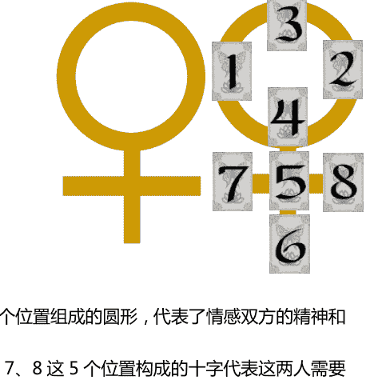

这个牌阵我们可以理解为，整个牌阵是关于爱情关系的，以及相互关系如何调和的（这是来自金星的意义）。上面的1、2、3、4这四个位置组成的圆形，代表了情感双方的精神和意识层面上的交互状况，而下面的4、5、6、7、8这5个位置构成的十字代表这两人需要面对的现实的状况。4这个位置在分拆牌阵的时候分别进入了圆形和十字，说明这个位置链接着精神与物质，这是精神世界与现实世界的交接处、连接点。

这时候我们来看看，在原本牌阵中这些位置的意义吧。位置1代表当事人的看法；位置2代表对方的心态；位置3是当事人对关系的影响；位置4是对方对关系的影响；位置5是关系的障碍；位置6是关系发展的结果；位置7是当事人对未来的期待；位置8是对方对未来的期待。

1~4所构建的圆形，位置的意义基本上都是围绕当时双方对这段关系的看法和影响来展开，分析的是他们之间互动特点以及各自在关系中的角色。4与5~8构建的十字，位置的意义基本上都是围绕关系现实的发展趋势以及两人对未来的打算来展开分析的。而作为交接点的4，其位置意义是对方对关系的影响。

在爱情中，不正是如此吗？恋人之间对关系的心态和造就的影响，致使恋爱的双方彼此调整心态，去面对、去抵抗、去妥协等等，其根本就是为了让两人之间更加融合（圆形也有融合的意义）。但每一段关系的发展，是两个不同的人在一起，肯定会遇到很多困难和阻碍，这些都是客观现实所必然存在的，面对困难我们会有什么打算，会如何去对待这个困难以及关系未来的结果？这些不正是我们所面临的现实问题么？然而，当我们面临这些来自融合的需求（圆形）以及来自现实的困扰（十字）的时候，我们努力去做，但最后我们会发现，爱情的事情，是一个巴掌拍不响的，对方造就的影响才是我们真正需要正视问题，并且这也是我们去调和矛盾的支点。

另外一个十分典型的图形结构牌阵是六芒星展开法，六芒星牌阵以两个三角形交错的方式来构成。我们可以分开看两个三角形：

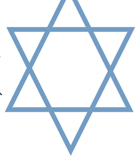

位置1、2、3，构成了向下的三角形，这代表着我们需要接受什么样的事实；位置4、5、6，构成了向上的三角形，这代表我们可以从哪里寻求突破。位置7，作为整体的结果，代表整个事态的影响。

看看牌阵位置的本身意义，位置1代表事情的过去；位置2代表事情的现状；位置3代表事情的未来；位置4代表阻碍是什么；位置5代表面对的环境；位置6代表可以采取什么对策；位置7代表最后的结果。

位置1、2、3，通过时序方式为我们展示了在这个咨询中我们所面对的现实问题是什么，事态有着怎样的发展走势；位置4、5、6，通过空间方式为我们展示了在这个咨询中，我们所面对的支持与反对（位置5的环境），到底存在什么样的问题（位置4的阻碍），我们应该采取何种方式和策略（位置6的对策）。

分拆后的牌阵，形成多个较小的牌阵，这时候我们以前学习过的对于牌阵整体分析的技巧就可以用在这些被拆解出来的小牌阵上，这样极好地丰富了我们对这些牌阵的理解和分析。

#### 牌阵的重组技巧

牌阵还具有逻辑结构，通过牌阵的逻辑结构可以将牌阵中某些位置进行有机地整合起来，对于那些没有很明确的图形结构的牌阵，同样有着丰富牌阵内涵的作用。

在进行逻辑重组的时候，要特别注意区分因果逻辑与并列逻辑，哪些位置之间是因果联系的，哪些位置之间的并列关联的。

我们以分析两性关系最常用的灵感对应局展开法为例：

这个牌阵一共有六张牌，其中3张代表当事人的看法、现状、期待；另外3张代表相关的对方，也就是关联人的看法、现状、期待。我们知道一个人对另一个人的看法是基于过去的认知，而一个人如何看待别人恰好也说明在那一刻的自己有着何种的表现；而一个人的对关系的期待，则是着眼于未来，一个人期望何种未来，他自己就会有何种表现。因此这里的看法我们可以视为过去，期待可以视为未来。这样我们是否就清晰的发现，原来灵感对应局本质上也是一个时序类的牌阵，准确地说，灵感对应局是同一空间的两条时间轨迹。

根据这样的逻辑，我们可以把代表当事人的三张牌（位置1、3、5）就视为当事人的过去现在未来；代表关联人的三张牌（位置2、4、6）就视为关联人的过去现在未来，两条时间流分别表达了当事双方各自的时间轴线上不同的状况和变化趋势；然后，我们也可以把他们之间的关系一一对照起来，表达了他们这段关系分别在过去（位置1、2）、现在（位置3、4）、未来（位置5、6）每一个阶段的交互状况。

有些牌阵既可以按照图形结构进行分拆，也可以按照逻辑结构进行组合，这样的交相应用，大大丰富了牌阵的意义，使得牌阵呈现的事情更有层次，也极好地帮助咨询师和当事人理解牌阵所表达的内涵。

### 第九节 牌阵选用与牌阵的适用性设计（c）

牌阵的选用是极为重要的，很多时候一些新手塔罗爱好者，会发现有些牌阵解读起来非常棘手，而认真分析他们之所以会觉得棘手，无非两个原因：第一个是对牌阵的逻辑、与解读思路不清所造成的；另一个则是最常见的----用错牌阵。

之前我有一个学生，拿来一个牌阵问我，他说是一个朋友开的牌阵，让他帮忙解读，而他无法理解这个牌阵，我让他提供背景信息，问题与背景是“当事人现在在一家外企上班，想知道明年他在公司的工作环境与境遇是什么样子的。”而选用的牌阵是一个叫“工作发展”的牌阵，基本结构就是过去、现在、未来，每个位置上2张牌，从这个牌阵上来看这绝对是一个时序类的牌阵，然而从问题上来看，则是一个问状况的问题，很明显应该选择状况类的牌阵。

那么如何进行牌阵的适用性选择呢？

第一步，应该分析问题的性质。

- 1、时序发展类问题。这类问题通常都是已经开始但尚未结束的问题，因此具备过去现在未来，而且当事人看重从现在到未来会如何发展变化；
- 2、空间状况类问题。这类问题通常都是询问某个特定的时间点上事物的状况，这类问题对于时间是有针对性的；
- 3、选择比较类问题。这类问题通常是在多个不可以共存的选项间进行抉择，这类问题大多是对尚未发生的状况进行可能性的分析；
- 4、关系互动类问题。这类问题通常涉及两个个体之间彼此互动情况的分析，这类问题当事人常常关注对方对自己的心意、想法、态度等等。
- 5、综合诊断类问题。这类问题是除开上面四种基本问题之外的复杂问题，通常涉及多个人事物的关联互动。

第二步，根据问题的类型，匹配适合的分类牌阵。

- 1、时序发展类的问题匹配时序类牌阵；
- 2、空间状况类的问题匹配状况类牌阵；
- 3、选择比较类的问题匹配多择一牌阵；
- 4、关系互动类的问题匹配对应比较的牌阵；
- 5、综合诊断类的问题匹配综合性的牌阵。

第三步，根据每个牌阵的逻辑特点，结合问题，告知当事人牌阵将分析的重点是什么。

比如时序类牌阵中，时间之箭展开法是用来分析事态的发展走势的；而圣三角展开法，则强调事态发展的循环方式；金字塔展开法则更强化了对于过去与原因的探讨。

比如状况类牌阵中，四元素展开法是针对四个元素领域展开的分析，适合比较概括的宏观分析；而十二宫展开法则体现了十二个领域的状况，适合相对细化的分析；7行星展开法与身心灵展开法都是比较针对个人状况的分析，而不太适合组织机构的分析。

选择类的牌阵，简易的多择一，是强调当事人与选项之间的关系互动；而标准多择一，除了每一个选项的走势以及对当事人的影响；扩展多择一，则会分析更长远的趋势，以及业果的影响。根据实际需要进行选用。

互动比对的牌阵中，灵感对应局，强调相互之间的心意、感想，以及对未来关系发展的期待；时序·灵感对应局，则强调两人在时序关系中各自的状况以及彼此的互动；维纳斯之爱则强调彼此的真心意，以及各自对关系发展的影响与作用。

再比如综合类牌阵中，六芒星展开法强调对于问题的处理策略。大十字展开法则事态的发展分析以及现状的环境状况。

在这一步，通过告知当事人使用何种牌阵，以及牌阵的分析要点，可以反查你对于当事人咨询意图的理解是否准确，从而避免后期的纠纷。

有时候，我们会发现当事人的问题可能不是那么标准地迎合我们的牌阵设计，这个时候就需要对牌阵的位置意义做出适当的调整。比如下面的例子：

当事人与一个大自己10岁的男性交往两年半，两人大部分时间是异地的，自己想要和对方结婚，但男方的结婚意愿并不强。当事人通过对方手机中的短信记录与通话记录，发现对方另一名女子交往甚密，怀疑是小三。当事人不知道该如何处理，也不知道是否应该分手，而求助塔罗咨询。

在这个案例中，当事人需要的是具体的对策，应该如何处理这段关系以及这个小三。问题既设计到自身的情感关系、也涉及到与“小三”的竞争关系，属于多个人物之间的关联互动，因此这个问题应该是一个综合诊断类的问题，对应的是综合类牌阵，综合类牌阵中，强调对策是六芒星牌阵，但六芒星牌阵的状况位置是阻碍、环境、对策，与问题来看没有直接的结合。这时候，我们可以对问题以及背景中的要素进行转化，作为当事人想要和对方结婚，那么其核心的咨询主体应该是他们两人的关系，这部分可以通过对六芒星展开法中时序位置过去、现在、未来的分析来了解，同时当事人还需要做出是否分手的判断，这一点可以在时序分析的基础上，结合“结果”位置的牌来进行判断的参考；两人的关系中目前遇到的问题和阻碍，是“小三”的问题，因此把阻碍位置转化成表示“怀疑对方有‘小三’的问题”，环境则表示“周围环境对当事人在这段关系中的影响”，对策则表示“应该采取何种方式来处理”“怀疑对方有‘小三’的问题”。这样就可以把整个牌阵与问题有机地结合起来，使得牌阵更加适合问题与背景，但也不会失去牌阵原来的结构。

还有一种状况，就是问题涉及多个相关人，而不可能在牌阵中将所有相关人表现出来，这时候，我们可以采用较为单纯的时序类牌阵或者空间类牌阵，然后通过增设指示牌来涵盖涉及的多个关联人物。

### 第十节 牌阵分析技巧（c）

## 第九章 见闻·言传·身教

> “一次完整的塔罗咨询到底包含了什么内容？我们应该怎样展开塔罗的咨询呢？”

### 第一节 洗牌、切牌与转牌（a）

一、洗牌的方式：

- 1. 抽取式

将牌整齐地放在手上( 根据个人习惯 ,左右都可以 ) ,另一只手随意地抽取一叠 ,翻转 180 °放在最上面，重复若干次，把牌整理放好。

- 2. 麻将式

选平整宽大的平面，将牌放在上面，如搓麻将般洗牌，直到认为合适时为止。

二、切牌的方式：

- 1. 方法一:将洗好的牌凭直觉选取一叠提起，放在一边，把剩下的牌放在选出的那一叠上面，整理放好。最下面一张为切牌。

- 2. 方法二：适用于不需要切牌帮助解读的牌阵。如图示：

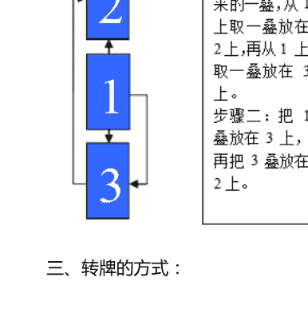

三、转牌的方式：

转牌要注意是以谁为主的，如果以问卜者为主，牌的下方朝着问卜者。以解牌人为主，应将牌的下方对着解读人。以右手为下。

### 第二节 塔罗牌活动的环境和心态（a）

解读塔罗牌的环境包括了外在环境和内心状态。这里有五种有益的内在特质。它们是：

#### 你的内心

**开放**

开放的意思是善于接受。这是一种承认的态度----愿意接受，不带否定和拒绝。抱着开放的态度，你就可以给自己一个机会，来接收你所要知道的事。

**平静**

当你心乱的时候，很难获悉塔罗的提示。塔罗牌的信息经常以一种温和暗示的方式出现，很容易被不平静的思绪淹没。当你心静的时候，你就像是平静的海，洞察力的每个波动都能被感知到。

**集中**

集中对于解牌相当重要。我发现，当我非常想探知一个问题时，我会接收到直接而有力的信息。当我精神涣散，陷入困惑时，所有的牌看起来都差不多。

**警醒**

当你处于警醒状态，你所有的能力都是活跃清醒的。猫在注意一只老鼠或是虫子时，就是非常警醒的。当然，你的牌肯定不会袭击你啦。但你必会发现，如果你疲倦无神，解读分析就很困难。

**尊敬**

尊敬意味着把牌看成非常有价值的工具。你该感谢它们帮助你更好地理解自己。在决定学习塔罗牌时，你尊敬自己的选择。

尽管这五种特质非常重要，它们却不是必须的。不需要它们，你也可以做出有含意的占卜，但它会相当困难。要找出占卜的时机是否合适，最好的方法是返观内心，询问自己。如果觉得有些不对劲，就推迟行动。但如果你的心灵告诉你继续，那就没问题了。

#### 外在环境

外在环境基本的要求是：要助于集中精神和启发想象。能使心境平和。

除了内在环境之外，还要考虑外在环境。理想的地点是一个可以唤起安静、平和甚至尊敬感觉的地方。你可以在喧闹的机场占卜，但噪音与干扰会使内心和谐变得困难。鉴于你很可能最常在家里占卜，让我们来看看如何在那儿创建一个合适的环境。

在你的家里，留出一个专用于占卜的地方。长期在这里占卜，你就会建立起一个能量场。你平时思考或是祈祷的时候，也可以坐在这里进行，因为这些行动在精神上是和塔罗牌一致的。尽量在一个独立的地方来进行。占卜的时候，你会想远离现实世界，进入一个超越时间、忘却俗尘的空间。一个单独的房间会很理想，但屏风后、窗帘旁、枕边或其他独立的角落也很有效。你还要建立一个美好、有意味的气氛。附近放几件专属于你的特殊物件。自然的物体，比如贝壳、石头、水晶或是植物通常都很合适。护身符、图案或是宗教的标识，会帮助你把注意力从凡世转向灵感的世界。可以考虑用一些图片或是艺术品，尤其是你自己的。凭你的感觉挑选一些花草、蜡烛、纹理织物，以及安静而具有沉思性的音乐。

### 第三节 一次完整的塔罗咨询流程（a）

### 第四节 新人必修----看图说话（a）

### 第五节 塔罗牌策略秘籍【上】( b )

### 第六节 塔罗牌策略秘籍【下】(c)

### 第七节 塔罗咨询纪要的整理与储存（b）

养成咨询纪要整理与保存的习惯，是一个合格咨询师的成长必经之路。同时咨询纪要也是你反查自己某次咨询效果的有利工具。

大家可以自己去制作专门的咨询纪要本，也可以直接在你电脑的私密档案中保存相关纪要。务必要注意的是，你必须严格保护你的当事人信息。

咨询纪要一般包括几个部分：

- 1. 当事人信息。包括当事人的姓名、性别、联系方式；
- 2. 咨询信息。包括咨询日期、问题、以及问题相关背景；
- 3. 牌阵信息。包括牌阵设计的要素、抽到的牌名；
- 4. 解读信息。包括你对牌阵的分析论断以及建议。

重点纪要。包括当事人的反馈、你自己的总结等。

### 第八节 如果进行持续的塔罗咨询（c）

### 第九节 职业塔罗师的素养（a）

### 第十节 塔罗职业化发展与个人深造学习（a）

塔罗咨询的职业发展主要分为四个阶段：

#### 助理咨询师

实习助理需要具备基本塔罗专业知识，能帮助当事人进行问题的有效梳理、针对一般问题提供合理的牌阵设计、进行基本的解读并且解读的大方向正确，解读中无重大过错。

助理咨询师一般不可以进行收费的咨询或者只能象征性收取低廉的咨询费用。

#### 职业咨询师

职业咨询师必须掌握本资料中所有的内容，满足助理咨询师的要求。并能熟练运用本资料内所包含的塔罗分析技术与咨询技巧，能为当事人提供一定策略支持与具有实操性的建议。有一年以上本行业的从业经验。

职业咨询师可以进行合理的收费咨询。

#### 高级咨询师

高级咨询师必须满足职业咨询师的所有要求，并能进行细节的判断与分析，能为当事人提供有效的策略方案，并能制作规范的塔罗咨询分析报告书。同时还需要具有其他系统的相关知识储备。有三年以上本行业的从业经验。

高级咨询师可以进行收费的塔罗课程教学以及合理的收费咨询。

#### 职业导师

职业导师必须满足高级咨询师的全部要求，并且具有独立而完善的塔罗知识体系。有五年以上的从业经验，以及1年以上的教学经验。

#### 塔罗咨询师的个人深造

塔罗成长是一条永无止境的道路，每一个咨询师都需要不断去补充自己，去激励自己的成长。

俗话说“师傅领进门，修行在个人”。

在通过本套资料的学习并通过考核后，你能具备一个职业咨询师的能力，可以独立开展塔罗咨询。但这并不是你塔罗成长的终点，而是起点。

塔罗是西方智慧的大融合，包罗万象，我们认为学习塔罗有四个阶段：

##### 塔罗是塔罗

这就是本书所能为你提供的支持。学习塔罗的基本知识，并获得成长。

##### 塔罗不仅是塔罗

这就是个人进修的第一步，你需要开始学习其他与塔罗相关的体系，包括占星学、炼金术、灵数学、易学、符号学、甚至是喀巴拉、脉轮体系等中西方神秘学知识。

##### 塔罗不是塔罗

这一步的学习是对其他塔罗外展学习的深入，并开始学习将这些学科与塔罗真正融合起来去理解塔罗牌，这时候，你可能会发现塔罗完全变了样子，已经不在是塔罗的本来面目。这个时期，你还应该进行心理学、管理学、成功学、人际关系学、语言学等各类社会学科的学习。

##### 塔罗还是塔罗

这一步的学习是将其他的学科知识重新融入塔罗，并完善你个人的塔罗体系，从而将塔罗还原成塔罗的一步。而这个时候，你的塔罗学习才能算得上有所成。

塔罗始终是一门实用的哲学学科，因而需要我们不断通过塔罗的咨询以及理论的实践去增长自己。

最后感谢各位选择我们的入门九章作为您塔罗成长的专业入门教材。也鉴于作者的个人水平限制，其中难免有错漏，欢迎大家指正赐教。最后送给所有学员两句话：

塔罗之路漫漫，愿君苦修心志，上下探索，而成就大道。

愚者旅途遥遥，祝君平安顺吉，化劫遇祥，终收获幸福。