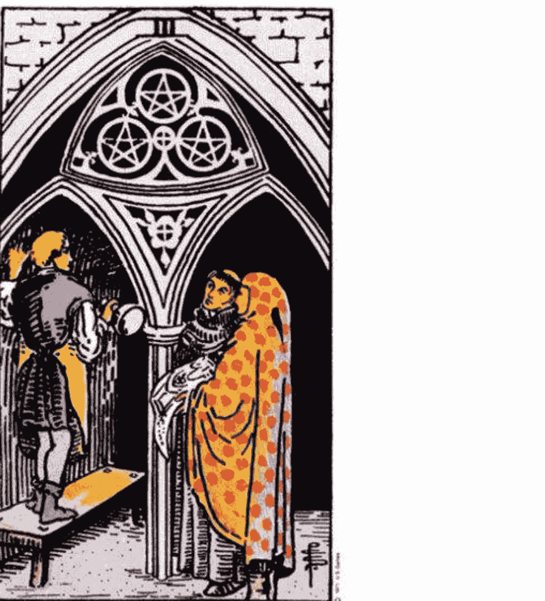
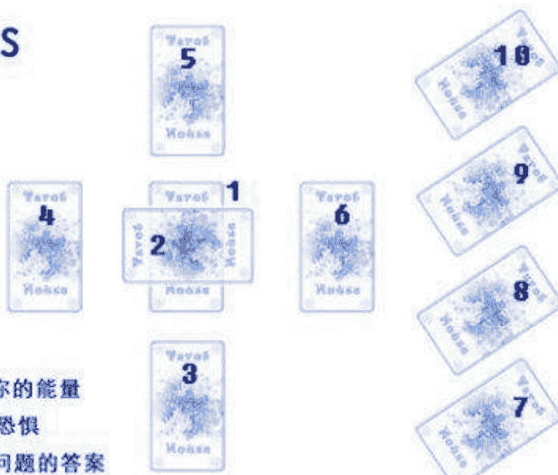
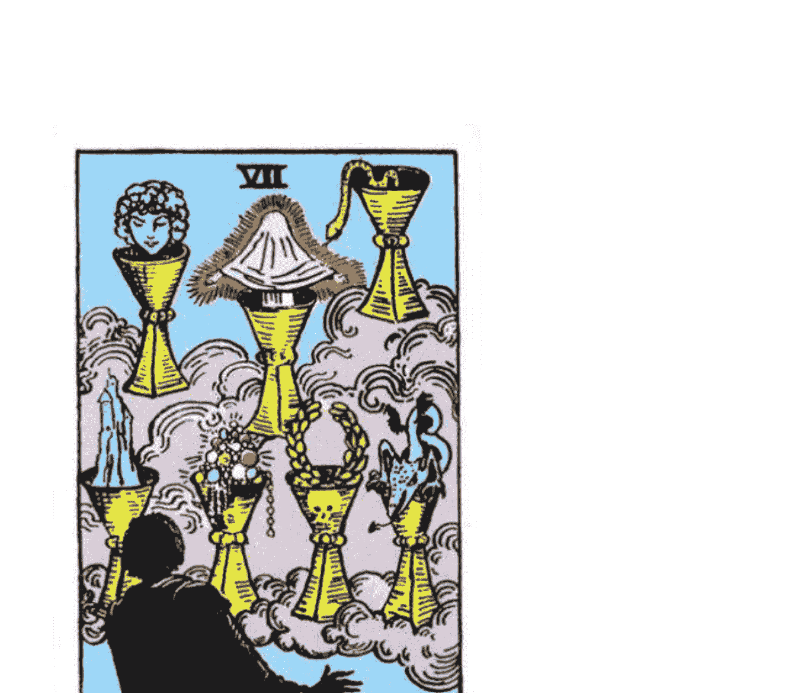
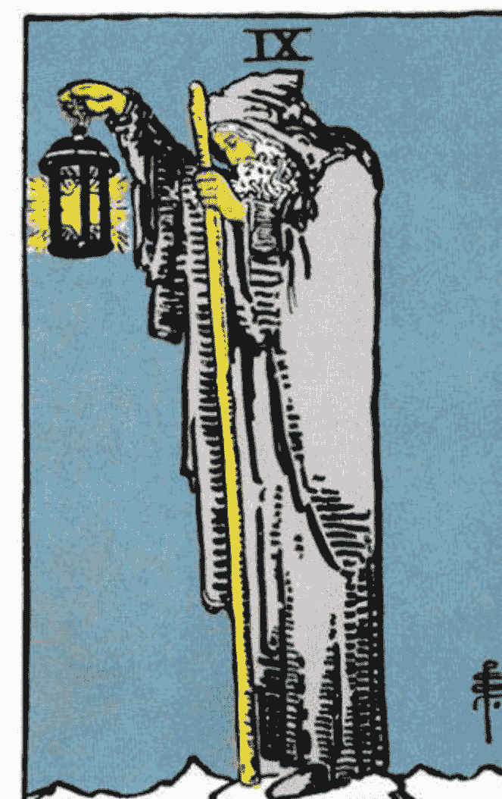
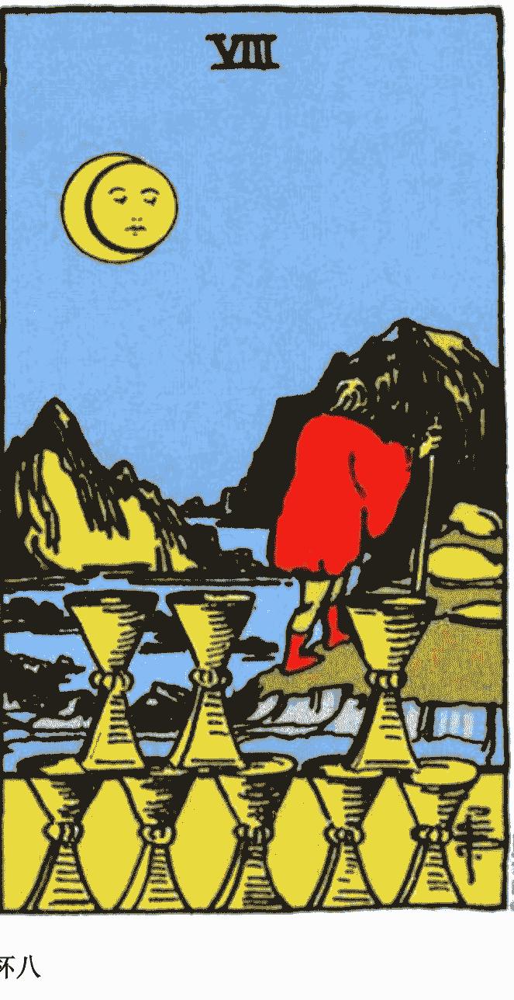
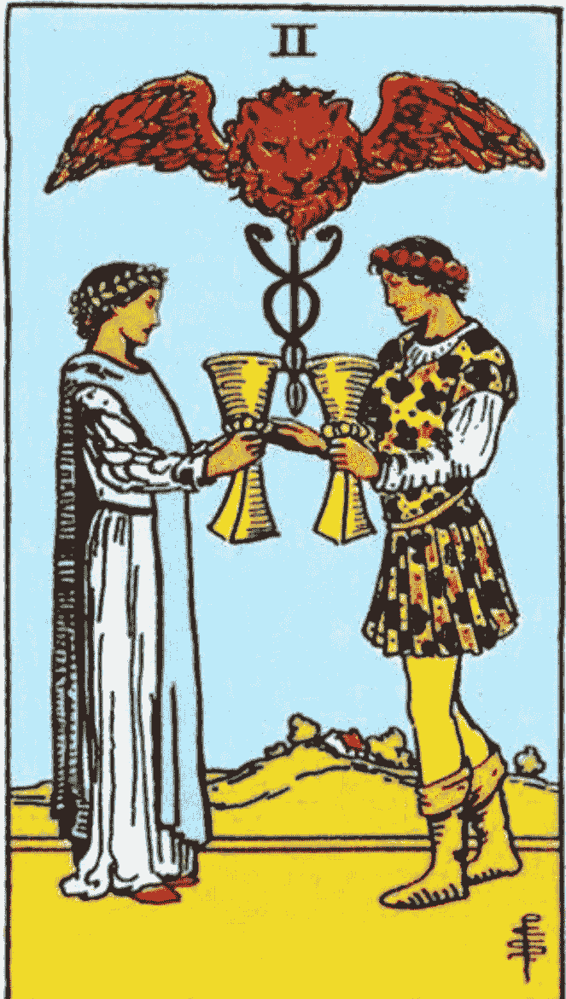
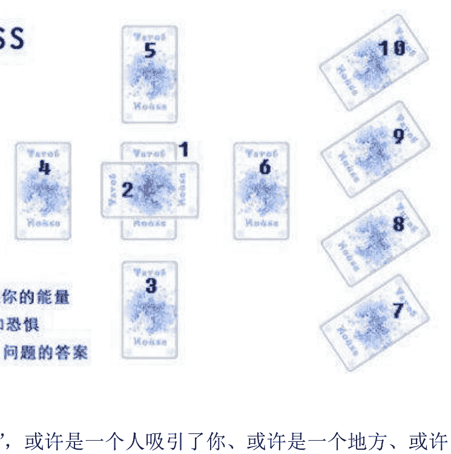

# 塔罗入门十九堂课（电子版）

作者： Joan Bunning

> Quote:

- 第一课:塔罗牌介绍
- 第二课:阿尔卡那主牌（大牌）
- 第三课:阿尔卡那副牌（小牌）
- 第四课:牌阵
- 第五课:每天的解读
- 第六课:环境
- 第七课:写一个问题
- 第八课:问题的解读
- 第九课:其它的解读
- 第十课:开放性解读
- 第十一课:解读单一的一张牌
- 第十二课:阿尔卡那大牌和小牌
- 第十三课:Aces 王牌
- 第十四课:宫廷牌
- 第十五课:牌组
- 第十六课:在塞尔特十字开牌法的位置牌组
- 第十七课:倒牌
- 第十八课:创造一个故事
- 第十九课:最后的想法

转这一系列课程的原因，是因为有蛮多人在邮件里询问塔罗学习的问题，而能找到的学习资料又良莠不齐，让人疑惑。当初淡蓝同样也存在这样的问题，直到看到 Joan Bunning 的文字。这些文字对塔罗学习很有帮助，淡蓝希望和大家分享。但网上找到的中文版本都缺了课后的练习部分，原本每一章文字之后，都有塔罗练习的步骤，淡蓝觉得这个同样非常重要，因此淡蓝会把它们补完。

## 第一课 塔罗牌介绍

多年前，当我告诉我的兄弟:我正在研究塔罗牌时，他第一个评论是：“一副牌如何能告诉你有关任何事的任何讯息呢？”

对于这个问题，我一笑置之，因为他的回答正是一般对塔罗牌的观念，我也是对塔罗牌抱着怀疑的态度，但是我发现塔罗牌可以让你获得真正不同的看法和处理你生活上的挑战。

在这介绍中，我试着解释为什么：

塔罗牌的来源是一种神秘，我们不确定十五世纪在意大利使用的塔罗牌是一种普遍的塔罗牌游戏。那些有钱的赞助者要求漂亮的塔罗牌，有些牌就此流传下来。此后没多久，一副 Visconti-Sforza 在 1450 年被设计出来，是最早最完整的塔罗牌之一。

后来在十八十九世纪，塔罗牌被一群有影响力的学者所发现。这些人着迷于塔罗牌的研究并认为塔罗牌上的意象是比简单的游戏还有力量的，他们创造塔罗牌真正的历史，把塔罗牌和埃及神秘学、炼金术、卡巴拉数、魔法炼金术（alchemy）和其它神秘系统做连结。这些塔罗牌的追随者持续到二十世纪，那时塔罗牌成为许多神秘组织的活动练习，包括黄金黎明团体。

虽然塔罗牌之源是神秘学传统，但是最近数十年来的塔罗牌研究兴趣可以扩展到许多不同的观点。新创造出来的塔罗牌可以看出这些研究者们的兴趣，有些是美国印地安传统、药草学、龙和日本塔罗牌等。

塔罗牌通常被认为是一种占卜的工具，传统的塔罗牌解读，有一个提问者一寻求个人问题解答的人，和一个解读者一知道如何解读塔罗牌的人。在提问者洗牌切牌之后，解读者把所选的牌做某种形式的展开叫做牌阵。在牌阵中展开的每一个位置都有一个意义，每一张牌也有特别的意义。解读者组合这两种意义来指引提问者的问题。

简单的过程，以一种简单的方式呈现。在电影中，我们总是看到塔罗牌在一个破旧的房间或秘密的密室中被使用，一个老妇人坐在黑暗中，正在为一个紧张的年轻的女孩解读塔罗牌，老妇人举起她满布皱纹的手指丢下一张死亡牌。那女孩缩回她的身子，被这暗示的可能将要发生的厄运所惊吓着。

黑暗的气氛和塔罗牌紧紧相连着，即使现在也是一样。有些宗教排斥塔罗牌，科学成就认为塔罗牌是一种不理性的象征，是延续未启蒙的过去的守旧派。现在让我们把这些阴暗的形象暂时放在一边，只是想想塔罗牌是什么？一副有图画的牌。

于是问题变成是——我们可以用塔罗牌来做什么？

答案就和无意识有关—深层记忆和在我们每人内在的觉知，但是却是在我们日常生活经验之外。即使大多数时候我们忽视无意识的动作，它还是深深地影响我们所做的每件事。在弗罗伊德的著作中，他曾强调无意识的不理性原始的那一方面，他认为那是我们最不能接受的欲望和渴望的家。和他同一时代的心理学家荣格，则强调无意识的正面积极和创造性的那一方面，他曾试图表示无意识有一种触碰到宇宙本质的集合元素。

我们可能绝不会知道完全无意识的那一面和其力量，但是有方法可以研究它的领域。许多技巧之所以发展出来，就是为了研究无意识这目的一像是心理治疗、梦境解读、可视化想象和静坐冥想。而塔罗牌则是另一种为了这目的的工具。

在塔罗牌中有一张传统牌，宝剑五。这张牌显示出一个手上握着三只剑的男人，看着远方的两个人，另外两只剑则躺在地上。当我注视这张牌时，我开始根据这图面意像创造一个故事。我看见一个男人似乎对他所赢得的战斗感到满意，他看起来相当沾沾自喜他拥有所有的剑；其他两个人则看起来像是沮丧的和被打败的。

我所做的只是取一个有始有终的意象，并投射一个故事在上面，对我来说，我的观点很明显地对这景象采取唯一的解释。事实上，其它人可能想象一个完全不一样的故事，或许那个人正试着捡起地上的剑，或者他正在召唤其它人来帮助他但是他们拒绝来帮他。或者，或许其它两个人正在打斗，他正劝说他们放下他们的武器。

重点是在所有可能的故事中，我选择一个确定的故事。为什么呢？因为投射无意识的想法到环境中的事物那是人的本性，我们总是经由我们内在状态所形成的镜头来看实像。心理治疗师记录这种倾向已经很久了，他们并创造一些工具在治疗过程中提供帮助，著名的罗夏墨渍测验（视受试者对不规则的墨汁图样的反应而分析其性格的测验）就是建立在这种心理投射上。

投射是塔罗牌为什么有价值的原因之一，塔罗牌上引人兴趣的图片和形式，在潜入无意识是一种有效的工具。这是塔罗牌个人的面向，但是塔罗牌也有集合意识的成分。做为人类，我们通常有一些共同的需要和经验，这些在塔罗牌上的意象抓住这些共同经验的片刻将它们随意地画出来。人们倾向对同样的牌做出类似的反应，因为这些牌代表的是人性的原型。经过几世纪的发展，塔罗牌已经发展出一套人类思想和情感的最基本的形式。

看看皇后这张牌，她代表母性定律—生命本身的丰富性。注意她的形象是如何抓住情感的丰富性。她坐在柔软的舒适的椅垫上，她的长袍垂下来包裹着她。在皇后这张牌，我们感觉到大自然的博大和感官上的丰富。

塔罗牌的力量来自于个人力量和宇宙力量的结合。你可以用你自己的方式来看每一张牌，但是同时你也要了解其它人发现有其它的意义。塔罗牌是一个反射藏在你自己独特觉知中的隐藏面相的镜子。

当我们做塔罗牌解读时，我们会选择一些牌来做切牌和分组的动作。虽然这过程看起来似乎是随意的，我们仍然认为我们所选择的塔罗牌是特别的。这必定是塔罗牌解读的重点之一——选择我们想看到的牌。现在，常识告诉我们随机所选择的塔罗牌不代表有特别的意义，或者它们能代表特别的意义呢？

为了解答这疑问，让我们更近一点来看看随意取牌这回事。通常我们说一件随意发生的事件是机会和无意识力量交互作用的结果。从一些可能的结果之中，一个结果产生，但是并非为了特别的原因。

这解释包括两个关于随机事件的关键的假设：它们是无意识力量的结果，它们没有特别的意义。首先，塔罗牌解读不只是无意识力量的产物，它是一连串意识活动的结果。我们决定来研究塔罗牌，我们买了一副塔罗牌来学习如何使用它。我们用某一特定的方式来洗牌切牌，最后，我们使用我们自己的观点来解读这些牌的意思。

在过程中的每一个步骤，我们都主动的参与。这是为什么我们会说塔罗牌解读是一种无意识力量的随机解读？因为我们无法解释我们的意识是如何参与其中。我们知道我们所选的牌不是很精细的，我们说那是随意选的牌。事实上，其中有一种很深的机制在默默运作着，是和我们的无意识力量连结着吗？我们的内在状态和我们的外在事件以一种我们不完全了解的方式连结着？我将这种可能性留给你去解答。

随意事件的其它特色是它没有原本的意义。当我掷骰子得到一个六，这结果并没有什么目的。我可以同样轻易地掷一个一，意义是一样的。我们是否真的知道这两种结果是平均的机率吗？或许在每一事件中有着某些意义和目的，不论大或小，我们不总是可以看得出来。

在许多年前的一场聚会中，我突然想捡起地上的一个骰子，我非常相信我可以用这骰子分别掷出每一个数字。当我开始掷骰子时，聚会的笑声和吵杂声渐渐消弱，在每一次掷骰子出现不同的数字时我感到一种逐渐增强的兴奋感，直到最后一次成功的掷骰子，我觉知才恢复过来，我坐回原来的姿势，对刚才发生的事感到困惑。

在某个层面上，这 6 次的掷骰子是没有关联的，只是随意的事件，但是在另一层面上，它们是很有意义的。我们的经验告诉我就是这样子，即使一个旁观者并不同意我的想法。那是什么意义呢？在当时，在心智和事件之中有一种奇怪的互动在发生这是一种学习功课。今天，我知道它有另一个目的——对我来说它是可利用的，在 25 年之后，是这学习功课的一个实例。

意义具有真正神秘的本质，它出现在内在实相和外在实相的连接点上。在每一事物上都有讯息，像是树木、歌曲、即使是垃圾……但只有当我们打开觉知才能接收到讯息。塔罗牌因为它们的意象和连结的丰富而传达许多讯息，更重要的是，因为我们以真诚的希望能发现有关我们生活中更深层的实相，所以塔罗牌解读传达了意义。藉由这种方式来寻找意义，我们寻求真相并给它有呈现的机会。

如果在解读中有某些意义，那它是怎么来的？我相信那是来自我们自己的某部分，神性源头的觉知。这是无意识的面相，它是更多。它像是一个很了解我们的智者，它了解我们的需要并指引我们需要前去的方向。有些人称呼这智者为灵魂、或超意识、或更高自我。我则称呼它是内在指引，因为那是它在连接塔罗牌解读时所扮演的角色。

我们每一个人都有一个内在指引，像是一个内在意义之泉。你的内在指引一直和你在一起，因为它是你的一部份。你不能破坏这连结，但是你可以忽视它。当你接触你的塔罗牌，你就在发讯号给你的内在指引，你在对内在智慧打开，这简单的信念，让你变得觉知那总是随时为你服务的内在指引。

我们很自然地依赖我们内在指引的智慧，但是因某些原因我们忘记如何取得它。我们已相信我们的意识心来取代内在指引，我们忘记看得更深一点。我们的意识心是聪明的，但是不幸地是，它们没有完全的觉知来教我们每天做出适当的选择。

当我们经由意识心来运作时，我们通常感觉事件是偶然地逼向我们。生命看起来像是没什么意义，因为我们不是真的了解自己是谁，和我们想要什么而痛苦。当我们知道如何取得我们的内在智慧，我们以不同的方式来经验生命。我们有确定和平静来自连结我们的意志和我们的内在目的。我们的道路变得更快乐，我们看得更清楚，我们如何将我们生命中的片段元素组合起来来完成我们的生命。

我使用塔罗牌因为它是最好的工具之一，我发现它更易取得我内在指引的低语。当我经由塔罗牌解读所产生的想法、意象和感觉就是来自我内在指引的讯息。我如何知道有一个讯息在里面，而不只是我自己的想象？我真的不知道，我只能相信我的经验并且看看发生什么事。

你并不是真的需要塔罗牌来传达你内在的指引，塔罗牌和度博的神奇羽毛有着同样的功能。在狄士尼电影中，度博小飞象（**Dumbo the Elephant**）可以凭借自己飞起来但是他不相信，他把所有的信任寄托在一根特别的羽毛上，他相信他父亲给他飞行的力量，但是当羽毛飞走了他发现情况不一样了，他被迫只能凭借自己的力量飞起来。

塔罗牌可以帮助你飞，直到你可以自己接收到你的内在指引。现在请不需担心指引将如何发生，你只要照着课程以及课后的练习使用塔罗牌，看看你是否会经历一些惊奇。

### 001 课-课后练习

翻译 by Palebluemist

#### 练习 1.1 - 请自我发问：我相信塔罗吗？

请根据第一堂课的内容，思索一下其中提出的观点。针对塔罗，请将现阶段你相信的，以及你不相信的写下了。只用简单的几个字来描述即可。
请用百分比来描述你的相信程度：

0%为：我完全不相信塔罗牌，我玩塔罗牌不过因为它能给我找点乐子。

100%为：我深信塔罗牌能给我“明确”而“个人化”的指导和建议。

#### 练习 1.2 - 开始了解你的塔罗牌，让我们从单张牌开始。

不管你用的是哪种塔罗，请先洗牌，把它们像洗麻将一样混合搓动，从中随机拣选一张牌。仔细端详你拿到的牌。随后，请自问如下问题：

- ○ 从这张牌中，我能看出怎样的故事？（比如一个女人被限制住了，她被蒙住了双眼，环绕在宝剑中间，看不到前面的道路。宝剑八。）
- ○ 针对这张牌，我能感到怎样的情感波动？（这张牌让我感觉到正面的情绪，还是负面的情绪。或是我喜欢这张牌，我讨厌这张牌，等等。）
- ○ 这张牌是如何通过细节来体现这一切的？
- ○ 这张牌的基调是什么？
- ○ 我觉得这张牌在讲述什么含义？

当你问完这一系列问题后，请查阅参考书籍对照牌意。看看牌意和你的体会是否存在差异。如果你觉得牌意和你对牌的感觉不同也没什么大不了的。你要知道，这正是你的直觉在工作的时候，它会带给你更好的洞察力。

这一项练习可以反复进行。你可以陆续观察很多牌，体会它的牌意。

#### 练习 1.3 - 请自我发问：我与“随机”事件之间有啥关系？

请想想看过去有没有什么事件中，我完全是个受害者，我根本无法控制事件的发生和发展。找出一个这样的事件，随后把你与事件的联系一一列举出来。
比如，我的相机和笔记本电脑在家里被偷了！我可没把我家钥匙给那个该死的盗贼，但是我……

- ○ 我租的房子是在一楼，蛮好偷的。
- ○ 我没有把贵重物品锁起来，而是随手放在房间里。
- ○ 我的确把钱都花在购买昂贵的物品上了。
- ○ 我没花钱换个好点的防盗门，也没装报警装置。
- ○ 在我觉得好像有点什么动静的时候，我也没起来看看到底发生了什么事而是继续翻个身呼大睡。

你可以按照上面的例子来列条目。你所列的条目应包括你已经做了的，以及你本该做但是没有做的。
请注意，没有什么选择是正确的，也无所谓错误，但是它们却都与“随机”相关。

#### 练习 1.4 - 答案其实无处不在

我们建议在图书馆或是书店里进行这个练习。
首先，想想目前是什么问题在困扰你。
闭上你的眼睛，进入沉静的状态，让你的内在逐步开始升起，让你的内在指导你，帮助你，让内在告诉你你需要知道什么。
现在，在书架之间信步走动。不用在意你走在书店或是图书馆的什么区域内，跟着感觉走就好了。
当你觉得准备好了的时候，从身边的书架上抽出一本书，信手翻到其中的某一页。
阅读这一页，并试图将这一页的内容与困扰你的问题联系起来。很多人会惊讶地发现这些内容刚好是你所需要的。
如果你觉得这些内容和你的困扰没什么关系，那么便假设这些内容是相关的，但它们是以暗号的形式书写，需要你来进行破解。看看这些内容之下暗藏的微妙信息是否跟你的困扰相关。
事实上，答案无处不在，它们很多时候就在你手边，你所要做的，便是去发现它们。

#### 练习 1.5 - 你能找到你所需要的

在睡觉之前，找一张 20 块的钞票，把这张纸币拿在手里，闭上眼睛，试着想象一下自己在明天将如何使用这张钞票，来干点对自己或是世界有好处的事儿。（这张钞票象征的是我们生活的目的）把这张钞票放在你的枕头下面。
在第二天早晨，回顾一遍你昨晚设想的钞票用途，随后把钞票带着出门。在整个一天，都记得保持警醒，提醒自己注意是否出现了用钱的征兆。
保持警醒，能避免忽略蛛丝马迹。一天下来，你多半能觉察到自己在什么时候有想法，什么时候有冲动。如果这一天下来，你啥感觉也没有，什么事情也没有发生，什么都没有打动你，那么我建议你在随后的一周都进行这项练习。
这么做的目的，是给世界一个回应你的机会。
请记住你每天晚上和早上想到的需求。这是因为在你的意图中存在着力量，这种力量非常重要。
最后，你可以试图把整个练习推广到生活的各个层面。

如果你寻求，并相信生活，生活是会给你回报的。不过，生活提供的答案，可能并非按你所期待的方式呈现！它往往具有意想不到的面貌。

## 第二课 大阿尔卡那

标准的塔罗牌包括 78 张牌，分成两部分，大牌和小牌。Arcana 是 arcanum 的复数，意思是「丰富的秘密」。对中世纪的炼金术士来说，arcanum是大自然的秘密，因此塔罗牌可说是解释我们的宇宙秘密的集合。

大阿尔卡那的 22 张牌是整幅牌的核心，这些牌的每一张牌都象征某个人类经验的宇宙面象的意义，这是人类的原型—指出人类原始本性所影响的形式。

大阿尔卡那的每一张牌有一个名字和数字。有些牌的名字直接指出牌的意义，像是力量、正义和节制，其它牌像是代表一种特别的生活方式，像是魔术师和隐士，也有些牌有着宇宙的名字，像是星星、太阳和月亮，它们代表和这些天体相关联的神秘力量。

大阿尔卡那是特别的，因为它们带出又深又复杂的互动，在 Rider-Waite 牌上的意象是具引发性的，因为它们将神秘的象征和可辨识的符号和图像结合起来。象征学（象征主义）是精致的，但是是有效率的学问。

大阿尔卡那在解读时总是具有很大的份量。当大阿尔卡那其中之一出现时，你知道你所处理的主题不是一时性和暂时性的，它代表你主要的关心—你主要的感觉和动机。在后面的课程中，我会更细节地教你如何在塔罗牌解读时辨识大阿尔卡那并解释其中的主题。

阿尔卡那的大牌通常被认为是一组牌，不同的组合发展出来用来显示塔罗牌如何形成牌型来投射光到人类的状况中。数字学、天文学和其它神秘学通常在这些塔罗牌组合中扮演某种角色。

许多解读者认为大牌是一种个人内在旅程的不同阶段的展现—有人称之为愚人之旅（fool’s Journey）。在这些系统中，每张牌都代表在我们了解我们的全体意识之前某些我们必须合作的经验或品质。

我们都走在自我实现的道路上，虽然我们的旅程通常是迂回的路、替代的路和重新开始的路，而不是平坦的顺途。我们特别的道路是独特的，但是我们的里程碑是宇宙性的。22 张大牌是我们内在进展道路的指标，因此引导我们从最早的觉知（0 号牌）到统合和完成（21 号牌）。

愚者的旅程似乎平稳地从一个经验进行到下一个经验，但是我们学习的冒险通常不是如此井然有序的。我们会犯错、略过学习功课和不了解我们的潜能。有时候我们缺少勇气和洞察力来发现我们最深的内在层面。有些人从不会感觉到隐士（Hermit）的呼唤来向内看，或是从未经验高塔牌（Tower）的危机，可能要他们释放他们的自我防卫。

我曾试图克服我遇到的困难但是屡次地失败，吊人（Hanged Man）的功课是对经验臣服和放下—这是特别难的功课之一，在完全学会合作之前可能需要一再重复被迫地发生。

通常我会经验到进入混乱的功课，有的人可能因为辛苦的童年期，而在生命早期学会力量的本质，但是后来发展出战车的操控（Chariot’s）。有些人可能克服了恶魔的（Devil）物质主义的诱惑而经历生命的救赎，但是接着在后来的时间必须学习关于关系和性欲的课题—是恋人的功课（Lovers）。

大阿尔卡那包含许多人类经验的面相和类型，这些牌具有所有成长的形式，不论它们是发生在个人生命的片段或整个生命的全面性。我们甚至会说一辈子真的只是我们灵魂进展的更大故事之中的一个成长段落而已。

不论我们的自我发现的形式是什么，阿尔卡那显示给我们全体意识和自我完成是我们的宿命。如果我们遵守这协议做为我们生命的指标，我们最终将会了解我们真正的本性，并最终到达世界牌（World）。

### 练习 2 大阿尔卡那

#### 练习 2.1 - 熟悉大阿尔卡那牌

首先，花几分钟研究你手里的塔罗牌。这是为了让自己熟悉手里的牌。阅读塔罗牌随牌附赠的小手册，看看每张牌的关键词各是什么。如果你对于自己记不住牌意存在预期焦虑，请把这份焦虑抛开。在这里，我们研究塔罗牌的目的仅仅是为了熟悉塔罗牌，熟悉它带给你的感觉。

现在，把大阿尔卡那牌从整幅牌中拣选出来。拿起一张牌，阅读它的关键词，体会一下它讲述的焦点是什么，体会它带给你的感觉。在现阶段，你仅仅需要读关键词就好，更深入的学习我们将会放到 15 课中再开展。

你可以重复进行这项练习，每次随自己高兴选择你想熟悉的大牌。

#### 练习 2.2 - 愚人之旅

“愚人之旅”是解释大牌的方式之一，它代表着我们生命中不同阶段。随着愚人的旅程，我们最终得以游遍 22 张大牌，到达世界牌的地步。

请阅读第二课的内容，以加深你对愚人之旅的印象，这可以帮助你理解大牌的含义。请记住，大牌是以一个整体运作的，而不是以单独的单张牌来分散运作，请记住它们是一体的。

此外，你可以为每张牌发展出你独特的理解，塔罗牌的牌意并不是“标准、固定、不变”的，请保持开放的心态，将你的理解融合到塔罗中去。

## 第三课 小阿尔卡那（小牌）

当大阿尔卡那表示宇宙的主题，小阿尔卡那则将这些主题带入实用的领域来显示它们是如何在日常生活中运作的。小阿尔卡那代表的是在我们每天生活中所制造的戏剧中的关系、活动和情绪等等。

小阿尔卡那有 56 张牌，分成四组：权杖、圣杯、宝剑、五角星。每一组的每一张牌代表一种特别的生活方式。

### 权杖

权杖牌是一组创造力、行动力的牌。它们和像是热情、冒险和自信这些特质有关。这组牌代表阳性或男性特质，在中国哲学中则是代表火元素。闪亮的火焰是权杖力量的完美象征，这能量向外流动并产生热情的参与。

### 圣杯

圣杯牌是一组情感的与精神的经验。它们代表内在的状态、感情和关系的形式。这组的能量向内流动，圣杯代表阴性或女性能量，它们代表的是水元素。水的能量流动充满空间，来维持和反应改变的情绪，使得水成为圣杯组牌的完美象征。

### 宝剑

宝剑牌是一组代表知性、思想和理性的牌。它们关心正义、真相和理性原则。宝剑组牌代表风元素，无云的天空、开阔充满光的，是心智清晰的象征，也是宝剑组牌的完美象征。这组牌也和导致不和谐与不快乐的状态有关，我们的理性是有价值的，但是作为自我的代理人，如果我们不将智慧融入内在指引，则理性将会让我们迷路。

### 五角星

五角星牌是一组关心实际、安全感和物质的事物。它们代表的是地元素，和具体的需要与物质。在这组牌中，我们庆祝大自然之美、我们和动植物的互动和我们有关身体的经验。五角星组牌也代表所有的财富和繁荣，有时候这组牌也叫做星币或是钱币（Coins），一个在物质世界中对于货物和服务交换的明显象征。

每一张小阿尔卡那都有不一样的特质，我们每天的经验是以上四种方式的组合，你的塔罗牌解读将会告诉你不同组牌的能量如何影响你当下的生活。这组牌是设计来做为我们每天玩牌时需用到的十张有数字的牌和四张宫廷牌（国王、皇后、骑士和侍从）。每一张牌都有一个角色来表示它在世界中所代表的能量。

### 王牌

王牌显示了这一组牌的主题，圣杯的王牌（Ace of Cups）代表的是爱情、情感、直觉和亲密——在其它圣杯组牌中所探索的主题。一张王牌总是代表着正面的力量，它必须提供给这一组最好最高的创意引领。

### 中间的牌

每一张位于王牌和 10 号牌之间的牌代表的是这一组牌的不同面相（观点）。权杖探索像是个人力量（权杖二）、领导力（权杖三）、激情（权杖四）和竞赛（权杖五）。一张牌可能从许多角度得到一个想法，五角星五显示需要时期（物质需要）的许多面相，或健康不佳（身体的需要）、和投射（情感的需要）的不同面相。

### 数字十

一个十代表来自一个 A 牌到它们理性结论所产生的主题。如果你拿到圣杯王牌（Ace of Cups）的爱情、亲密和情感，你就拥有圣杯十（Ten of Cups）的快乐、平安和家庭之爱。

### 宫廷牌

宫廷牌是指那些反射出牌组特质的这些人格特质的人，宫廷牌向我们显示一些生活在这世界上的方式，如此当适当时机时我们可以使用这些方式或避免这些方式。

- ○国王牌是成熟的和男性的象征。他是一个王者，他的焦点放在生活事件的外在面相。他在许多领域展现权威、控制和掌控。国王的风格是强壮的、独断的和直接的。他关心结果和实际的如何进行的相关事物。
- ○皇后牌是成熟的和女性的象征。她将这一组牌的特质具象化而不是将它们实现出来。她的焦点是在内在层面，她的风格是放松的和自然的。皇后是较不关心结果的，她比较关心活在这世界上的享受。她是和情感、关系和自我表达有关的牌。
- ○骑士牌是一个不成熟的青少年。他无法平衡地表达他自己，当他试图成功地和他的世界连结时，他从一个极端跳到另一个极端。骑士倾向会做得过火，但是他也是渴望的和诚恳的，这些特质我们都看得见，我们赞赏他的精神和精力。
- ○侍卫牌（随从牌）是一个爱玩的小孩。他表现出这一组牌的快乐和放纵的特质。他的方式可能不是很有深意，但是很简单、很松散又很自然的。他是一个冒险和可能性的象征。

现在你对塔罗牌的每一张牌有了一个基本概念，你知道它们要如何凑在一起，每一张牌要如何和整体来搭配。在下面的课程中，你将学到更多有关这些塔罗牌的知识，和如何在解读中解释出它们的意义。

## 第四课 牌阵

牌阵是一种展开塔罗牌的预先调整的方式。它显示有多少张牌可以使用，每一张牌的位置和每一张牌代表的意义。

牌阵是一种惯性的引导牌所放置的位置，让它们可以在某个主题上展现它们自己。在这样的模式里，这些塔罗牌的意义会一起展现它们的美丽。

牌阵最重要的一点是每一个位置都有一个独特的意义，使得解读更加多彩多姿，不论哪一张牌被放在那个位置都有不同意义。

例如，五角星四（Four of Pentacles）代表的是拥有、控制和封闭的改变。如果这张牌放在凯尔特十字占卜法中的第四位（Position 4 of the Celtic Cross Spread），你将看见这些特质是如何在你的生活展现出来。在位置六时（意思是未来），你将预见即将在你生活中所发生的事件——一种完全不一样的解读。塔罗牌牌阵可以是任何形式。

罗德轮盘（Rahdue’s Wheel）包括所有 78 张牌并创造出一个人生命中戏剧般的场面的图画。

一次的牌阵也可以只有一张牌。在第五课时我会教你为什么一张牌的牌阵是塔罗牌每天解读很实用的方法。最常用的牌阵是使用六到十五张牌，这个范围的小牌数最容易来掌握，但是大的牌数是可以在某些主题上做更深的解读。

牌阵的形式通常形成反射它的主题的方式，例如，十二宫图开牌法（Horoscope Spread）是以一种传统的圆圈来形成一个人的出生图，这牌阵的十二张牌代表的是星象图的十二宫位。

当这些牌和牌阵的其它牌息息相关时，一个完全崭新的意义就被创造出来了。不同组合出现，有人物个性、情节和主题的故事线于是发展出来。

从牌阵中的牌所编织的故事是塔罗牌解读中最令人兴奋的和最有创造力的面相。那是一种艺术，但是有许多你可以遵循的指示。我将在后面的课程中讨论这些和举一些实例说明编故事的过程。

在这些课程中，我提到凯尔特十字占卜法。如果一开始你只使用某一种牌阵，我认为你可以更集中注意力在发展你的直觉力。一旦你对塔罗牌很熟悉并感觉解读塔罗牌是一件轻松的事时，你可以藉由其它牌阵来扩展你的塔罗牌练习。在你持续这些课程之前，读一读凯尔特十字占卜法的内容是有帮助的。我们将在这些课程中使用这种牌阵。

### 练习 3.1 – 四组小牌中，每一组牌的特点是什么？

仔细观察每一组牌。每一组牌都有积极的含义或是消极的含义。
在这里，我们并非让大家去记忆下面这个列表，我们做这个列表的目的，仅仅是让大家对牌的能量有一个感性的认知。
当你觉得准备好了的时候，阅览下列词组表。
在每一对词组后面，将你认为合适的牌组以及是积极的能量还是消极的能量填写在后面。
比如在“可靠，仔细”后面，你可以写上“五角星牌组，积极”。
当然，如果你一定想知道“标准答案”，你可以看看最后我们列出的单子。如果你的选择和我们给出的答案不一样的时候，请问问自己为什么。
通过这种方式，可以强化你对每组牌的理解。

- 1. 阴沉，懒惰（牌组 ，能量 ）
- 2. 一本正经，非常严肃（牌组 ，能量 ）
- 3. 机智，消息灵通（牌组 ，能量 ）
- 4. 判断力，控制力（牌组 ，能量 ）
- 5. 快乐，冒失（牌组 ，能量 ）
- 6. 精湛，能干（牌组 ，能量 ）
- 7. 冷静，同情心（牌组 ，能量 ）
- 8. 逻辑性，直率（牌组 ，能量 ）
- 9. 不负责任的，骄傲自大（牌组 ，能量 ）
- 10. 忠实，实事求是（牌组 ，能量 ）
- 11. 好批评人，自负（牌组 ，能量 ）
- 12. 全心全意，热情（牌组 ，能量 ）
- 13. 神经质，阴沉（牌组 ，能量 ）
- 14. 敏感，钟情（牌组 ，能量 ）
- 15. 有勇无谋，鲁莽（牌组 ，能量 ）
- 16. 忧郁，脆弱（牌组 ，能量 ）
- 17. 顽固，悲观（牌组 ，能量 ）
- 18. 忠诚，客观（牌组 ，能量 ）
- 19. 坚持，坚定（牌组 ，能量 ）
- 20. 冷漠，专横（牌组 ，能量 ）
- 21. 高尚，直觉的（牌组 ，能量 ）
- 22. 轻率，无准备的（牌组 ，能量 ）
- 23. 具有创造力，喜欢冒险（牌组 ，能量 ）
- 24. 过于谨慎，坚强（牌组 ，能量 ）

### 练习 3.2 - 每组牌的特质辨析 - 典型分析

我们日常生活的方方面面，时常都可以反映出不同牌组的特质。在下面，有一些关于生活的描述，请将你感觉合适的牌组写在这些描述的后面，同时你可以适当写出一些牌组与这些生活描述契合的特质。
比如，做跳伞运动，很可能可以标示为“权杖组，积极”，因为这种行为体现出的特质是“勇敢，精力充沛，自信”。当然如果是消极负面的权杖，则会表现出“有勇无谋，鲁莽”。
如果你觉得有必要的话，可以参考后面我提供的参考答案。

- 1. 希望所有的事物都井然有序
- 2. 在某次重要的考试前夜，喝得烂醉如泥
- 3. 当你承诺了之后，每次都能做到
- 4. 能解数学难题
- 5. 使用塔罗牌解决问题
- 6. 欢庆团队的胜利
- 7. 倾听朋友讲述他们的烦恼
- 8. 评价时残酷而嘲讽
- 9. 当你犯错误时，拒绝认错，拒绝道歉
- 10. 对不如你的人充满了蔑视
- 11. 从头到尾观摩某个计划的实施
- 12. 对某次怠慢念念不忘、记恨在心
- 13. 自愿承担危险而重要的使命
- 14. 因为一时的愤怒而辞去工作
- 15. 仲裁一项争端
- 16. 认为非法的勾当令人厌恶

### 练习 3.3 – 每组牌的特质辨析 – 混合分析

在很多时候，在很多情况下，事情并不只是表现出单一的牌组特质，在一件事物中，往往混合体现了多个牌组的特质。

请写下有利于成功的两种积极特质。

请写下可能会导致失败的两种消极特质。

例如：

为了让爱情鲜亮如新……

权杖组：就正面来说非常积极而热情，就负面来说，可能有点过于不耐烦和性急了。

圣杯组：就正面而言，非常浪漫和可爱，就负面来说，可能有点过于郁郁不乐和多愁善感了。

宝剑组：就正面来说，显得非常诚实和正直，就负面来说，可能有点过于冷淡和理智了。

五角星组：就正面而言，非常忠诚和可靠，就负面而言，可能有点过于单调和呆板了。

下面，请大家分别把多个牌组的特质，写在下面这些行为后面。

- 1. 为了创造一副艺术作品……
- 2. 为了抚养一个小孩……
- 3. 为了结束打折销售……

### 练习 3.4 - 分析自己所具有的特质

对于我们每个人来说，不同的牌组特质在我们身上同样也有所反应。请你根据自己性格特点，用不同的牌组来为自己做个简要的分析。

问问自己如下几个问题：

- 1. 对于我来说，是否是一个牌组的特质占绝对优势？
- 2. 在这四组牌的各种特质中，是不是有些特质对我而言显得非常陌生？
- 3. 我是否反省过某一特质在我身上正面和负面的各种表现？
- 4. 我是否长期对某种类型的人深具吸引力？还是说，我对各种各样的人都深具吸引力？

这些练习的对象也可以是你的朋友或是家人。他们可能也需要做类似的分析。

### 练习 3.1 - 四组小牌中，每一组牌的特点是什么？（参考答案）

- 1. 圣杯组 - 消极
- 2. 五角星组 - 消极
- 3. 宝剑组 - 积极
- 4. 宝剑组 - 消极
- 5. 宝剑组 - 消极
- 6. 五角星组 - 积极
- 7. 圣杯组 - 积极
- 8. 宝剑组 - 积极
- 9. 权杖组 - 消极
- 10. 五角星组 - 积极
- 11. 宝剑组 - 消极
- 12. 权杖组 - 积极
- 13. 圣杯组 - 消极
- 14. 圣杯组 - 积极
- 15. 权杖组 - 消极
- 16. 圣杯组 - 消极
- 17. 五角星组 - 消极
- 18. 宝剑组 - 积极
- 19. 五角星组 - 积极
- 20. 宝剑组 - 消极
- 21. 圣杯组 - 积极
- 22. 权杖组 - 消极
- 23. 权杖组 - 积极
- 24. 五角星组 - 消极

### 练习 3.2 - 每组牌的特质辨析 - 典型分析（参考答案）

- 五角星组 - 消极
  强迫性，过于井井有条，严厉
- 权杖组 - 消极
  粗心大意，不负责任的，无准备
- 五角星组 - 积极
  可信任，可靠，负责
- 宝剑组 - 积极
  逻辑能力强，智力不错，具有分析能力
- 圣杯组 - 积极
  相信直觉，超世俗，安静
- 权杖组 - 积极
  热情洋溢，活力充沛，一心一意
- 圣杯组 - 积极
  有同情心，善良，和谐，细心
- 宝剑组 - 消极
  讥讽，挑剔，感觉迟钝
- 五角星组 - 消极
  顽固不化，倔强，不知变通
- 宝剑组 - 消极
  骄傲自大，有优越感，专横，神气十足
- 五角星组 - 积极
  顽强，坚持，一丝不苟，百折不挠
- 圣杯组 - 消极
  过敏，阴郁，神经质，易怒
- 权杖组 - 积极
  勇敢，英勇，自信，强健
- 权杖组 - 消极
  轻率，鲁莽，坏脾气，冲动
- 宝剑组 - 积极
  客观，公正，没有偏见，合理，有洞察力
- 圣杯组 - 消极
  过于讲究，意志薄弱，不切实际，懒惰

### 练习 4.1 - 凯尔特十字

首先，让我们花几分钟看看凯尔特十字的牌阵和解释，这样有助于我们理解它是如何构成的。
别为了你记不清楚每一张牌的位置和含义而焦急。我们在这里看这个牌阵的目的仅仅是为了熟悉牌阵，同时，如果你能对牌阵产生点亲切感，那就更好了。
现在，在洗牌后，抽出 10 张塔罗牌，按照下图摆放。看看下图标示的每一个位置所代表的含义。

试着分析一下你所放的牌摆在这些位置上时所代表的意味。
在这里，仅仅是模糊地感受一下就好，我们会在今后开辟一个专门的关于凯尔特十字的详解。今天在这里就不展开了。

### 练习 4.2 - 设计一个牌阵

你或许会惊讶，牌阵可以自己设计吗？
当然可以。你完全可以根据自己的需要来设计一个牌阵。
下面，我们设计一个三张牌的牌阵。

请按如下步骤进行：

- 1. 按照你的设想，拿铅笔画出你期望牌阵展现的样子。标出每一张牌的摆放位置。为每一个位置标上序号。
- 2. 在每一张牌位旁边，写下简短的描述。比如，在 “1” 的位置，代表过去。“2” 的位置代表目前，等等。

下面是个简单的设计，它主要是用来结合时间的流动，分析事态变化。

而下面这个，则是为了特定的场合而设计的牌阵，比如你的团队加上你一共三人，你期望通过一个牌阵来了解团队里的每个人对你的期望（包括你对自己的期望）。
按照这种思路，我们设计了下面这个牌阵。
这个牌阵被设计成 “Y” 型，具有向心的形态，适合用来分析头脑的思维碰撞。

现在，请你根据自己的需要，来设计牌阵吧。

如果三张牌不能满足你的需要，那么设计四张牌的牌阵，接着是五张的。

## 第五课 每天的解读

现在你已经准备好将你的塔罗牌知识实际应用了，第五课就是叙述每天的解读。

在这篇阅读中，你选择一张牌成为你每天的主题，目的是提高你的觉知，做为你每天二十四小时生活的入门。它也可以帮助你学习塔罗牌，这不需要冗长又烦闷的学习时间。

让我们假设，在今天，你已经抽出一张圣杯二做为你每天的解读功课。当你过这一天时，我们建议你留意这张牌上特别的能量讯息。

圣杯二的重点是连结、停战和亲和力。

早上时，你注意到一个一向带着相当敌意的同事走进你的办公室来和你说话，你注意到停战的讯息，你可以利用这机会。在下午时，当你正在处理某个问题时，你正在两个类似的通路间寻求连接点并找到解决办法。而后，在一个宴会中，你和某个吸引你的人说话。在每一个场合，你取得圣杯二的能量并让它成为引导你的决定。

刚开始，你可能想要慎重地选择你每天的牌，好让你可以避免重复选择同样的牌和更快地学习这一副塔罗牌的应用。如果你喜欢如此，你可以不需小心地介入就可以选择你的牌。

### 【这里是一些步骤】

- 1. 洗牌一次或两次。
- 2. 用一只手握住牌面向下的整组牌，然后用另一只手盖住它。
- 3. 暂停一会儿让你自己保持平静和归于中心的。
- 4. 请你的内在指引给你今天需要的指引。
- 5. 牌面向下放置在你的前面。
- 6. 把牌切到左边，再选一次牌。
- 7. 翻开最上面一张牌做为是你今天的牌。
- 8. 把这张牌放回去，再洗牌一次或两次。

这步骤很容易做，可做为每天玩塔罗牌的基本动作，它给你一个机会和你的内在指引做连结。请为你自己选择一个适当的时间来练习塔罗牌，早晨是好的因为你可以在你醒来的固定时间去选择一张牌。你也可以选择在晚上选牌，你将准备好把你所选的牌做为一早醒来时使用的牌。不需要选择一个固定的时间因为你的时间表可能会改变。主要的目的是要让每天的解读成为你每天生活的一部份，如此你的塔罗牌解读工作才会日益精进。

将你每天选的牌做一个记录笔记，你将发现追踪你所选的牌是一件有趣的事。我开始研究塔罗牌时是当我花时间再照顾我两个男孩时，那时他们都是五岁以下的孩子。有一天我数一数我每天所出现的牌，我发现以下的东西：

- 权杖—24
- 圣杯— 44
- 宝剑—41
- 五角星—57
- 大阿尔卡那—56

在那时候这清楚地记录我的生活——在真实的生活世界中的沉重（五角星牌）和基本力量（大阿尔卡那）和个人创造力上的轻松（权杖）。
在你的记录日记中，在你的每天主题旁边写下一些每天的精采场面，这将帮助你把你当时的心情和活动和这些牌连结起来；但是尽量写得简单些，否则你很快地就会感到厌烦。
我用五种不同颜色的笔写下我的主题日记，每一个颜色代表不同的牌组。

- 权杖=红色（火、热情）
- 圣杯=蓝色（水、情绪、情感）
- 宝剑=黄色（风、心理活动）
- 五角星=绿色（地、成长、植物、自然、钱）
- 大阿尔卡那=紫色（精神活动、较高目的）

有颜色的记录帮助你一眼就看出你每月每周生活中塔罗牌形式的改变轨迹。
你将可能惊讶地发现你一再地抽到同样的牌。在我早期记录的 57 张五角星牌，我选到王牌和皇后牌各 11 次！我在家里带我的小孩，当时我的日子就映射在这两种牌上。

五角星皇后（Queen of Pentacles）是最大的滋养母亲。

五角星王牌（Ace of Pentacles）提供机会来享受生活中物质的一面，再也没有比换尿布更生活的事了。

我反复选到这两种牌，我对它们感到有些怀疑。有一天我仔细的检查这两种牌是不是因为某种损坏而让我更容易选到它们，但是他们和其他牌看起来没什么两样，我只是简单地选了它们，因为它们表示那时我的真实状况。那些你经常选择的牌也告诉你当时你所关心的事。

学习塔罗牌最重要的步骤是要常常把塔罗牌从盒子中拿出来，每天的塔罗牌解读是很理想的解决之道。如果你能每天做一次解读，你将又快又容易吸收每一张牌上的特质。

by Joan Bunning关于“每天的解牌”，淡蓝也时常在进行，事实上记录塔罗日记是我的习惯之一。淡蓝的做法是每天夜里洗牌，随后将洗好的牌放在枕头边，在第二日清晨，半梦半醒时，抽出今天的塔罗牌。

在昨天早晨，淡蓝抽出的牌是正位的宝剑十。

当时，我很难想象在这一天我会面临宝剑十的境地，我尚且不知道为什么我会抽出如此一张黯淡的牌。随后在一天的工作中，我几乎把这张牌忘记了，不过，到了下午回家的时候，它猛然出现在了我的生活中。

在回家乘的公交车上，由于司机的急刹车，淡蓝没站稳给凌空摔了出去，狠狠撞击在驾驶室的台阶上，为此，淡蓝的后背有很大一片区域都给撞得红肿不堪并破了皮。宝剑十不可忽视的一个内容是涉及健康方面的：颈部、后背或是脊椎方面的问题。

随后回到家，因为上药和做冷敷的缘故，淡蓝不得不趴在床上，这与韦特牌宝剑十描述的场景极其相似，请千万不要忽略塔罗的象形意味，要知道塔罗牌本身就是一个符号象征系统。

如此，宝剑十便展现在淡蓝的生活中了。在这一天，它要告诉我的，并不是人生谷底般的黯淡光景，而是后背的受伤，以及不得不趴着疗伤的一种恼火状态。

## 第六课-营造塔罗解读环境

塔罗解读的环境包括你的身体本身和你的内在状态，有 5 个内在状态是有助益的，它们是：

### 保持开放
保持开放意味着要随时保持接受性的，它是一种允许的态度——愿意没有否定或拒绝来接受所发生的事。藉着保持打开，你给你自己机会来接受你必须知道的事。

### 保持平静
当你在混乱中要听见你内在指引的低语是困难的，塔罗牌的讯息通常如同温和的暗示和了解，它们容易被喋喋不休的心思所淹没。当你平静下来，你像是一个平静的海，每一个洞见的微波都可以接收得到。

### 保持注意力的集中
对塔罗牌解读来说集中注意力是很重要的，我发现当我强烈地感觉到一个问题时，我就接收到一个直接又有力的讯息。当我分心和感到困惑时，塔罗牌却倾向是同一个主题或答案。你最具洞察力的解读将会是那些当你有着很强烈的渴望时所发生的。

### 保持警觉
当你保持警觉，你所有的才能都生气蓬勃起来。一只正在注视着老鼠或昆虫的猫是警觉的。当然，你不需要突然扑向你的塔罗牌，但是你将发现如果你是疲累或无聊时来做塔罗牌解读是很困难的。

### 保持敬意
保持敬意意味着对待你的塔罗牌如同它是任何有价值的工具一般，你必须接受塔罗牌在帮助你更了解你自己这角色上是有助益的。你重视你所做的决定在决定学习塔罗牌和进一步掌握塔罗牌是有影响的。

即使这 5 个内在特质是重要的，但是它们并不是必须的，你没有这些特质也能做有意义的解读，但是它可能比较困难。决定是否是适当的塔罗牌解读时间的最好方式是自己向内看，如果你觉得有什么不对劲，就延后你的解读，但是如果你的内在感觉说去做吧，那么一切就是很好的。

在考虑内在环境之外，还有解读的外在环境也要考虑。理想的地点是流露出一种安静、平安、甚至是恭敬的气氛。你可以在一个拥挤的机场做塔罗牌解读，但是噪音和外在干扰会让内在的调音更困难。既然你可能在自己家里做大多数的塔罗牌解读，让我们看看怎样做你才可以创造一个令人满意的环境。

在你的家里安置一个地方做为你要做塔罗牌解读的场所，藉由一再重复使用同一个地点，你就建立一个加强你的练习的能量。如果你做冥想或祷告，你可以在这里做这些活动，它们会和塔罗牌在精神和意义上更和谐。

试着在你的解读位置上创造一种隔离的感觉，当你使用塔罗牌时，你会想要从日常生活世界中抽离出来，而进入一个超越时间和一般事件的空间。一个隔离的房间是理想的，但是用一个幕帘、或枕头或其它物品所隔离出来的角落也是可以做解读的。

你也试着创造一个美丽又有意义的环境。在旁边放一些对你有特别意义的小东西，从大自然取得的东西，像是贝壳、石头、水晶和植物总是适当的布置。一个护身符、图像或宗教圣像可以帮助你从俗世生活转移到灵性生活。可以考虑图画或艺术品，特别是你自己的作品，和一些可引发你的感觉的东西像是花朵、焚香、蜡烛、编织品和安静的冥想的音乐。

这些感官刺激是好的，唯一你真正需要的是一个可以足够摊开塔罗牌的地方，你可以使用桌子或地板。使用地板有一种脚踏实地的感觉，但是，如果那位置是令人不舒服的，用桌子是比较好的，选择一个自然材质的桌子像是木头制或石头制的较好。

如果你喜欢，你可以用一块布盖住桌子或地板来制造一个格式化的区域。这材质应该是自然的，像是丝的、棉的、木头的或是亚麻布的。小心地选择布的颜色，颜色自有它们自己的能量。黑色、深蓝色和紫色是好的选择。最好是没有图案或少有图案的，如此塔罗牌上的图像才会很容易地从地板上呈现出来。

用一个盒子收藏好你的塔罗牌来保护和保存它们的能量，任何自然材质的容器都是好的，像是木头的、石头的、贝壳的或自然材质的布。我知道一个女人她自己缝一块丝质有拉带的布袋，布上绣有星星、月亮和其它设计图案。可以考虑把你的塔罗牌用丝布包起来再放入盒中，丝布令人有一种高贵的感觉，提醒你注意你的塔罗牌的价值。

塔罗牌会表现使用它们的人的能量和个性，因为这理由，如果可以的话，用一副只有你使用的塔罗牌。这些牌将成为你和你的内在指引沟通的个人工具，你会想要紧紧地将它们包裹好。

当你在你自己的地方做你的塔罗牌解读工作时，经验是相当有力量的，但是过多的准备是没有必要的，你所需要的只是使用塔罗牌而已，那是最重要的部分。

## 第七课 尝试写一个问题

大多数你会想要询问塔罗牌解读的时候是因为你正面临一个问题或挑战，有关你生活中的某事正困扰着你，你想要了解为什么它会发生，你可以为它做些什么？对此情况最好的塔罗牌解读是做问题解读。

你写下你的问题，藉由解读塔罗牌的讯息来取得你的答案，问题可以帮助你和你的情况的内在指引以一种合理的方式做连结。在这一课中，我将叙述如何为自己写一个问题。

第一步是仔细地考虑你的情况，想想相关的人，不论是直接相关或间接相关的。为未来列出你的选择，让你的心智自由地流动，你要不带价值判断或审查态度来看你的问题。记下任何出现的想法，但是试图不要太有系统的写下来。你要使用你的直觉，而不是逻辑的分析。

一旦你完成你的检视，你可以写下你的问题。这里是一些建议：

### 一、 接受责任
写下你的塔罗牌问题来表示你接受你所处的情况的责任，考虑以下的两个问题：

- 我应该把我的父亲送到养老院休养，还是在家里照顾他？
- 有关我父亲生活安顿的决定，什么是我需要知道的？

上面的第一个问题，写问题的人放弃她做决定的责任，她希望塔罗牌可以告诉她该怎么做。第二个问题，她只是问塔罗牌给她更多的讯息，她知道真正的决定还是在她。

我们很容易写下像第一类的问题，我们都倾向寻求可以做最好决定的确定性，但是塔罗牌不能为我们做决定。避免像是以下问逃避责任的问题方式：

问题以「是或不是…」来回答：

- 我将取得广告公司的工作吗？
- 这个月我可以执行减肥计划吗？
- 我准备好退休了吗？

●问题以「我应该……」来开始

- 我应该让我的女儿住在家里吗？
- 我应该和荷西出去吗？
- 我应该应征超过一个工作机会吗？

● 问问题只和时间有关

- 要何时乔治才会问我要不要和她结婚？
- 我找到一辆满意的新车需要花多少时间？
- 何时我才会得到升迁？

●然后，你的问题应当开始像是用以下这些句子：

- 你可以给我洞见有关……
- 我需要了解有关……有关…….具有什么意义？
- 这功课和目的是什么？
- 在这些状况下潜藏着……
- 我如何增进我的机会有关……
- 我应该如何……

### 二、保持问题的开放
写下你的问题来表示你正在把选择开放化，想想这些：

1. 我应该如何鼓励我的继母搬出去住？
2. 有关和我的继母相处得更好我应该知道些什么？

在第一个问题，写问题的人并没有开放她的问题，她已经做了一个决定—要她的继母搬出去。第二个问题就比较开放性的。缩小问题的范围是可以的，只要你不事先决定了答案。

以下的两个问题都是开放性问题，但是第二个问题更特别些：

1. 一个销售方式的转变如何影响我的事业？
2. 在保险公司的销售职位的转变如何影响我的事业？

### 三、发现最好的细节
在含糊不清和太细节的字句中发现最好的句子，这儿有同一主题的三个问题可供参考：

1. 我如何改进我的工作情况？
2. 我如何重新整理我的桌面好让汤姆可以找到我的数据夹？
3. 我如何改进我和汤姆之间的工作流程？

第一个问题是没有焦点的，她并没有指出哪一个工作领域是他感兴趣的。第二个问题则太细节化的，她关心的是一个次要的问题。第三个问题是最好的，因为它在两者之间找到一个平衡，列出你需要知道弄清楚的细节。

### 四、集中焦点在你自己身上
当你为自己做塔罗牌解读时，你总是那位中心的主角。你的问题应该集中焦点在你身上。当有一些问题和别人有关是可以的（请参考第九课），但是当你集中焦点在你关心的事物则是不妥的。

有时候你可能不了解你正在提出和别人有关的问题，看看这些例子：

1. 在阿瑟的酗酒问题的背后隐藏什么问题？
2. 有关阿瑟的酗酒问题我如何支持他？
3. 有关阿瑟的酗酒问题我应该扮演什么角色？

第一个问题完全集中焦点在阿瑟和他的问题上，第二个问题，写问题的人被包括进来，但是注意力还是在阿瑟身上。第三个问题是最好的问法，因为它指出在写问题的人的经验中该做什么。

### 五、保持自然
当你写问题时你希望尽量地保持自然，很容易在开始做解读时相信你的立场是适当的，但是如果你想要得到指引，你需要对其他的观点保持开放的接受。看看以下列出的问题组：

1. 为什么我是唯一做这些琐事的人？
2. 我如何培养一个合作的精神在做这些琐事上？

1. 当我说话时我如何让别人听我说话？
2. 当我想做沟通时却发现没人在听，这是怎么回事？

1. 我如何让我的老板停止要求我加班？
2. 为什么最近我必须加班这么多？

第一个问题，写问题的人认为他的观点是正确的，其它人和这计划无关。第二个问题则较自然些和较开放性的。

### 六、保持乐观
当你写下问题时要保持乐观，看看这些例子。

1. 为什么我从未将我的研究做出版？
2. 我如何安排一个理想的时间流程表来出版我的研究心得？
3. 为什么我不能克服做公开演说的害怕？
4. 我如何有效地增进对群众演说的能力？
5. 你能不能帮助我了解为何我总是在最后一回合的竞赛失利？
6. 你能不能帮我找到在最后竞赛胜利的方法？

第一个问题有欺骗自己的味道，第二个问题是比较有信心的。写问题的人知道他将成功地得到有用的建议。

你可能怀疑为什么在有关写一个问题上我要写这么多细节，这过程是一个集中焦点的练习，让你为解读做好准备。写下一个问题通常不超过三四分钟，但是花最少时间的投资，你将得到大收获。你会更了解你的情况，并更具有洞察力的来解读你的塔罗牌。

## 第八课 尝试进行初次问题解读

在这一课中，你终于将学会如何为你自己做完整的塔罗牌解读。我会叙述一个简单的流程，你可以用在研究个人的问题上。在塔罗牌工作中有一个运作流程是重要的，当你一再地重复同样的步骤，将会帮助你在当下将自己归于中心。步骤的细节并不是很重要，事实上你可以随你的想法改变它们，目标是要保持一个专注的精神。用一种充满爱的专注将使得你的塔罗牌解读练习是非常有力量的。

这里是塔罗牌解读问题的一些步骤流程：

1. 设定你的心情
你的第一步是创造一个有传导力的心情。第六课在如何设定一个舒适的环境提供了一些建议，如果你喜欢的话可以试试这些点子。集中焦点在让你感觉舒服和安全的一些步骤上。

当你准备好了，请你坐在地板上或坐在桌子旁，让桌子离你有一些空间。你应该已经放好一副塔罗牌和把你的问题写在一张纸上。（参考第七课如何写一个问题）刚开始，一个完整的解读可能需要花费三十到四十分钟，你要事先安排你的琐事以免你在过程中被其它事所打扰。随着经验累积，如果你想要的话你可以缩短解读的时间，但是最好不要有匆匆忙忙的感觉。

开始放松和稳定你的心情，现在将你的担心和操心事物暂时放在一边。（你总是随后可以将你的担心找回来！）先在这一刻完全地安静下来，做几次深呼吸，放松你所有的肌肉，感觉将你自己从外在世界抽离出来的一种宁静。你需要花费你认为需要的时间在这种平静自己的过程上。

2. 问你的问题
当你感觉集中注意力时，将你塔罗牌从盒中拿出来。你的一只手握住所有的牌，另一只手盖在最上面，闭上眼睛将塔罗牌带入你的能量圈中。

现在，说一个开放性的说词，有一些可能的问题像是：

- 一个祷告词
- 一个肯定语句
- 形容你现在的感觉
- 向你的内在指引做一个简单的问候

你可以每次写下一个想说的词句，或自然地说出来。重要的是要从你的心说出来而不是说一些空洞无意义的话。大声地说出你的话，好像声音可以加强你的能量和信任。

下一步，问你的问题，不论是从记忆中出现的问题或是读出问题来。确定你说的正是你写下的问题。无意识的一个神秘之处是它非常的文字化，你所选择的塔罗牌通常将反射出你的问题的精确语句。

3. 洗牌
张开你的眼睛开始洗牌，洗牌是重要的，因为这是如何完成你解读的形式和以一种精密的方式来安排你将选的牌。

有许多种洗牌的方式，每一种方式都有它的正反面。选择一种对你来说最舒服的方式。

有一些方式将塔罗牌打散混合使得一些是正位牌一些是逆位牌。

如果这是你第一次做解读，不需要担心逆位牌，我将在十七课再做解释。

当你洗牌时集中注意力在你的问题上，集中在问题内容而不是细节上。不要太保持固定，但是要尽可能将问题一直记在脑中。

这里是我使用的洗牌方式，你可以参考使用。当然，你完全可以发展出自己的洗牌方式，只要你觉得舒服就好。

请在心中默念你的问题，开始洗牌。

洗牌具体说来是将所有的牌，牌面朝下，以顺时针的方式像洗麻将一样洗牌。当然，你也可以按逆时针的方式洗牌，只是，如果你习惯于逆时针洗牌，请一直按逆时针的方式洗牌，如果你习惯顺时针的方式，也请一直按顺时针的方式洗牌。但，我们不建议你一会儿逆时针、一会儿顺时针洗牌。

在洗牌的过程中，默念你的问题。

比如: 我这段时间的事业运大约是什么样子呢？我的这个项目发展会怎么样呢？我目前的这段感情会如何发展呢？请按这种提问方式设计你的问题，然后在顺时针洗牌的过程中，保持心情沉静，默念你的问题。

当你心里觉得“好了”的时候，将所有的牌收成一摞，牌面朝下，摆好，将这一摞牌侧翻过来看看底牌是什么，记录下是哪一张牌，写下正位或是逆位。请一定是侧翻观察底牌，请不要变动牌的正位逆位。这一张底牌，便是你的指示牌。

现在，你需要发牌，请将这一摞塔罗牌拿到手里，按“1, 2, 3”；“1, 2, 3”；“1, 2, 3” ......的方式将牌发成三摞，这一步很重要，通过这一步，你能确保自己接触每一张牌。

将发好的三摞牌以 1, 2, 3 的顺序收成一摞。

此时，牌就洗好了。

4. 切牌
切牌可以进一步混合洗好的牌，你可以根据自己的习惯决定是否每次在洗完牌后都进行切牌（我习惯于跳过这一步）。

将洗好的牌面朝下放在你面前，使它们非常贴近你，根据以下指示来切牌：

1. 从整组牌抓一些牌起来
2. 把这些牌放到左手边
3. 在这些牌中再抓起一些牌放到左手边
4. 以任何方式将所有牌重新组合成一落

最好是以一种快动作将牌重新组合起来，不要试图弄清楚每一堆牌落在何处，只要让你的手自动地移动它们。切牌是一个重要的完成步骤表示塔罗牌重组的结束。当你已经重新组合这些牌，解读的形式就确定了，剩下的只是将这些牌摊开来看看它们所显示的意义是什么。

5. 摊开塔罗牌
将洗好的塔罗牌推成扇形，用你平时不写字的那只手抽牌，你可以闭着眼睛抽牌，也可以睁着眼睛抽，这没有关系。将抽出的牌一一放在下图所示（下面的牌阵便是凯尔特十字牌阵）的位置上，跟随指示步骤将你所选择的牌阵开牌，如果这是你第一次解读，请使用 Celtic Cross 牌阵。（在你真正摊开塔罗牌前，请先阅读下一个步骤“回应所翻开的塔罗牌”）

1. 用一只手将牌拿起来以最贴近你的方式握着
2. 用你的另一只手翻开第一张牌.
3. 把这张牌放在位置一 (位置的号码和放位置的次序有关)
4. 抽出第二张牌将它放在位置二
5. 持续这种方式直到你将所有的牌放在指定的位置
6. 如果你不会目前还不回使用逆位解牌，请将这些牌转至正位

6. 回应所翻开的塔罗牌
当你摊开塔罗牌时要注意你对每一张牌的反应，刚开始你不会知道或记得一张牌的意义，你的想法和感觉将主要集中在牌面的图像上。当你练习之后，你的反应将会变得更觉知，也更有预测性。试着尽可能保持你原始的开放性，注意任何似乎不寻常或奇特的反应。

当所有的塔罗牌都已经翻开来，花些时间对它们整体做出响应，你是不是已经获得一个整体的印象？你有任何新的反应吗？如果你想要的话可以快速记下一些你的想法。不要担心你不能记住全部想法，就像梦的回溯一样只要记住最重要的部分即可。试着不要太投入在你的笔记上以免打断解读的进行，你只要很快地抓住一些想法即可。

7. 分析塔罗牌
一开始请使用有关个别牌意义部分来帮助你，而后你可以自己检视每一张牌，但是你会发现这一部份的指引还是蛮有用的。（我自己就经常使用它做为辅助）从位置一开始你的解读然后随着位置次序一一进行，这里是一些建议的步骤：

1. 查阅塔罗牌的意义
2. 解读出所有关键词和动作
3. 查阅动作的意义让你说出 “对了，那真是适合的意象！”
4. 当我看见它我经验到一种觉知，不要对似乎不舒服的动作感觉害羞，相信你的反应，不要做任何判断直到你看完所有的牌。记下任何立即的想法和脑中出现的任何不相干的感觉。

当你已经仔细看过每一张牌，寻找它们之间的关联性。请应用塔罗牌解读的原则。（之后在第十一到十八课有塔罗牌解读的原则）你可能经历一个塔罗牌解读数小时之久而没有什么洞见，但是当然这不是实际的应用或我们所希望的。无论如何还是要花一些时间的，你的努力将会获得平等的回报。

8. 创造一个故事
在某些点上，你需要将每件事拉到一块儿，我叫这是创造一个故事。你的故事将帮助你了解你的情况和给你对未来的指引：你所一直在寻找的东西。我建议你要自然地创造一个故事出来，当你完成检视你的塔罗牌，让分析的方法离开，它不再适用了。如果你的故事是从内在自然出现的那故事将会更具有可读性。当你感觉已经准备好了，只要开始说你的故事，说出任何在脑中出现的情节。你可以记下任何重点，但是不要太集中在记重点上。我鼓励你可以大声地说出你的故事，写下来太慢了，只要想你的想法太模糊了。你的故事当它被说出时将获得力量，如果你开始含糊其词或失去思考的脉落，不要集中在那上面。做一个简单的停顿，重新组合一下再开始。当你练习时，你最好是天马行空的说故事，你可能会想要录下你的故事，当你重听那录音带时，你会惊讶于你所听到的内容，你将真正地感觉到你自己是最好的塔罗牌解读人。

9. 写下大纲字句
当你说故事的速度慢下来自然停止就是你的故事说完了，你的下一步是找出你的故事的主题。你的指引的本质是什么？问你自己一些问题像是：我的问题或是内在冲突是什么？我的角色是什么？我的内在指引想要我了解什么？

你正在做的是完成回答你的问题。在做解读之前，你已经列下一个对你有意义的问题，你的内在指引已响应你的问题，现在你想要取得你能记得的智慧的形式。试着用一两个句子写下你的故事的大纲，集中注意力在牌面的讯息上而不是你做解读的机制上。

### 完成步骤

主要的步骤做完了，但是像任何仪式一样，还有一些最后的步骤来结束你的解读和让你的塔罗牌为下次的解读做好准备。

如果你还没有做完解读，将你选的塔罗牌和它们的位置写下来，你很容易会忘记它们。然后清理塔罗牌和清除所有这次解读的能量，我清理一副牌是借着轻轻地将牌混合在一起，它提醒我用手的挥动让记忆中的文字洗去。你可以享受这清理的技巧，但是任何洗牌的方式都是可以的。现在就花一些时间清洗你的牌，确定这些牌的牌面都是朝下的或从你的记忆离开。当你感觉你已经洗牌洗得够久了就停止，然后将牌收在一起。现在你的牌已经做好为下一次解读的准备。

在将牌移开之前，再次握住它们一会儿，将另一只手放在上面，闭上你的眼睛。请说出从这次解读中你学到的感觉是什么，对你的内在指引表示感谢他帮助你使用塔罗牌，感谢是一种很棒的感觉，它提供理想的心情来结束你的塔罗牌解读。

当你开始做解读时，你开始一个循环。你创造了塔罗牌解读的意义，现在借着将塔罗牌回复到休息状态，你已经完成这次的解读流程。

### 使用你所学到的

解读的步骤结束之后，内在的工作才刚刚开始而已。你的目标是整合你所学的东西而以某种方式将之融入你的生活，如果你没这么做，你的塔罗牌练习将只是一种松散的娱乐消遣，没有任何力量能帮助你。

你要决定一个或更多行动，来让你的指引进行工作。你可以加强你正在做的事或做某些改变，不论是根本的或次要的改变，特别的行动通常是比不明确的计划更有帮助的。

如果你一直有记日志的习惯，就写下你想要做的事，只要记下你知道你真正会实现的事。我知道展开一些牌是多么容易的，快速地看看这些牌然后不再考虑这次的解读，特别是当你的反应并不是正面的反应时你更应该忽略它。

当一些日子过去了，思考一下你的解读，它和你的生活相合的程度，问你自己一些问题：

*   我的故事是如何地具有一些意义？
*   指引是如此适当的吗？
*   我是不是漏掉一些线索？
*   我是不是已经实现了一个行动，如果是的话，发生了什么事？
*   有一些意外的事发生吗？
*   我每天的解读有增加任何内容吗？

你可能倾向做另一种解读，但是可能等到你的情况有一些重要的改变之后再做比较好。假设你的第一次解读包含了所有你需要知道的事，如果你对某些内容感到困惑，在你的第一次解读中寻找更多的洞见。只有借着更深的探讨，你将会更贴近事件本身的核心。

使用你再解读中所学到的可能是一个步骤以及最困难的步骤。它牵涉到超过玩塔罗牌以外的范围，当你真正愿意整合你的塔罗牌洞见融入你的生活时，你已了解到从塔罗牌中所得到的真正的和持久的信念。

这是我理想中的塔罗牌训练，但是说真的，我不总是遵循这套做法。有时候我会移动一些步骤，有时候我会忽略相当多一些步骤。所以在这里，我要鼓励你调整一些步骤来适合你的兴趣和需要。如果你不享受塔罗牌解读，它们将只是丢弃在书架上堆积灰尘罢了，所以发展出一套自己觉得最舒服的方式十分重要。请记住，细节并不是那么重要，你的动机才是重要的！

## 第九课 其他的解读

你可以做把重点放在另一个人或另一主题的塔罗牌解读，我将之称为是其他的解读。

其他的解读在当你对某个不直接影响你的人或事上是适用的，其他的解读用在某个人，不是为了他或她。当为某个不相关的人做解读时，那个人写下她的问题，你只是帮她解读塔罗牌而已。

做其他的解读是有趣的又有知识性的，它们是一种很好的方式来学习塔罗牌。当你为自己做塔罗牌解读时，你只是注意到一些局限的问题，也就是你自己的问题！其他的解读则让你能探索更多层面的事。

做其他的解读除了要选择主题之外，基本的步骤和第八课所提到的是一样的，以下提到一些小小的的不同。（也有一些步骤的大纲）

1.  选择主题
    你的第一步是决定你做解读的主题，是一个人、一个动物、或一个地方、问题或新闻事件——只要你事先定义你的主题即可。通常它会是在一个状况中的中心人物，但是不必是如此。

2.  你的主题可以是一整个整体，像是一个婚姻、家庭、团队小组或邻近地区。你可以将焦点放在一个国家或整个地球，但是为这么大的主体做解读，所获得的讯息将是非常一般性的。

3.  你可能想要为和你亲近的人做其他的解读，像是你的亲人、朋友或同事。在第七课中我曾经提到把焦点放在你所关心的解读上的重要性，这里有一些简单的测试帮助你决定何时做其他的解读是适当的，问你自己三个问题：
    *   当我在此时想到这个人时是否有强烈的情绪？
    *   在此刻我是不是有明显的兴趣？
    *   在此刻我希望一个特别的结果吗？
    这些问题如果你的答案是肯定的，你可能该做的是为你自己做解读而不是为其他人做解读。
    现在你需要写下一个问题，请参考第七课的建议，但是写下的是和你的主题有关的问题。把焦点放在你感兴趣的主题，如果你在考虑一个是否要竞选总统的政治家，你的问题可能是：

    > 「什么因素将影响这位竞选人成为下一任总统的机会？」

4.  设定你的心情
    在解读中你可以在附近放一张有关你的主题的图片来帮助你集中注意力，某个物品也可以提醒你让你的主题运作得更好。

5.  问你的问题
    说一些和那个人有关的事或为什么你要做其他人的解读，要求所有相关的指引的帮助，并提到你对你要问的主题只怀着善意。（如果你不是真诚地说出来，不如为你自己做解读吧！）

6.  洗牌
7.  切牌
8.  开牌
9.  回应翻开的塔罗牌
10. 当你要对塔罗牌做出回应时，记得你要提到那个人，而不是你自己。无论如何，如果你看到塔罗牌上出现和你有些有趣的关联时不要感到惊讶！
11. 分析塔罗牌
    在做其他的解读时，你正在从你自己的观点来看这情况。你从塔罗牌中所看到的内容可能和主题真正经验的相关或者不相关。
12. 创造一个故事
13. 写下大纲字句
14. 完成最后步骤
15. 使用你所学到的
    即使做其他的解读是把焦点放在别人身上，对你来说在这些牌中仍然有一个功课要学习，试着找出这个功课以便你可以将它应用在你自己每天的生活中。

## 第十课 开放性解读

开放性解读是指对不特定的问题的解读，实际上，这更类似寻求内在的指引。在这样的解读中，你不需要写下问题，你只要给你的内在指引一个机会来和你沟通，你需要倾听当下所最需要的洞见。

就大多数情况而言，针对问题的解读可能是最好的解读方式，因为它将对你最重要的主题归零。

这就像是用放大镜头摄影，针对问题的解读会让你学会把焦点集中在一个主题上，但是它也将无法让你看到更大的图像。

而一个开放性的解读则有更多的方向，它将涵括你长时间的成长和发展情况，它提供一个较高层面的指引，包含更大的形式来切分你每天的经验。

开放性解读可以是相当有力量的，我试着使用它们来维持我日常生活之外的品质。你可以考虑将它们做为特别情况的解读，比如：生日、周年纪念日、某些典礼仪式的日子、春分秋分和新工作、约会、旅行的第一天。

当你站在一个新阶段的关键点上时，开放性解读是有用的，比如在一个孩子出生之后或是搬到一个新房子。开放性解读可以帮助你事先适应新的或意外的情况。

不论在你面前何时展开未知，这都是做开放性解读的绝佳时刻。

开放性解读的步骤基本上和我们第八课的步骤是一样的，少数的不同点我们列在下面：

1.  设定你的心情
    为了准备一个开放性解读，你不需要写下问题。只要简单地让你的头脑保持空白的状态，不要担心任何事。你不需要做任何事或安排，除了保持一个温和安静的心灵即可。

2.  做一个开场白，代替读出问题
    比如，你可以以如下的开场白来引导一次塔罗解读：我欢迎以塔罗来开发我自己，我希望接受此刻最需要的指引。当然，你也可以更集中焦点，不过请注意避开将焦点设置在特别的人和事件上。如果你对你的健康感到兴趣，你可以增加一些话来达到你要的效果：我欢迎以塔罗来开发我自己，我希望接受此刻最需要的有关健康的指引。

3.  洗牌
    当你洗牌时让你的心思自由流动，并且保持开放的状态，如果一个念头流动出来，就让它轻轻地流过去，不需要执着于它。
    理想的情况是，你感觉自己像是一个空房子，所有的窗户都打开来迎接那温和的微风。

4.  切牌
5.  开牌
6.  分析这些牌
    一般而言，当分析这些牌时，你很可能会想要回顾生活中的细节，并试图让塔罗牌显示更大的主题。事实上过度关注细节并不合适，你需要以更宽广的心态来检视每件事，请记住，开放性解读并不是针对每天生活细节的解读。

7.  创造一个故事
8.  写下叙述大纲
9.  使用你所学到的知识
    在这里，你并不需要采取特别的行为比如使用一些道具，或是仪式来解读和学习塔罗牌，你所要做的，是安静地思索塔罗所反映的精神，就好像它已经成为你生活的一部分，是个随身之物，让它以一种平常的方式指引你即可。

## 第十一课 解读单张牌

当我做塔罗牌解读时，我会一会儿以整体的观念来解读整个牌，一会儿又以独立和分散的观念来看待塔罗牌，事实上，这两种观念是相辅相成的。

在这一课中，我将和大家一起看看在解读中如何解读单张牌。

一般来说，一张塔罗牌的可能的释义，来自 4 个来源：

1.  首先你对塔罗牌的反应是建立在你的背景、个性和心情状态之下，这将让塔罗牌的意义显得个人化和新鲜化。
2.  塔罗牌的意义是经由多年累积而来，这些意义因塔罗牌的作者和老师们而有所不同。
3.  塔罗牌的意义和牌的位置有关，这也建立在一些习俗和共同的经验上。
4.  此外，你所在生活环境，也能提供一些你的反应的架构来源，它设定一些界线，并帮助你把牌与生活领域进行相关联想。

为了做单张牌的塔罗牌解读，你需要组合这以上四种意义，将其整合成为一体，这是个流动的过程，这些领域似乎是分隔的，但是在实际应用上，它们又互相结合在一起，如此，你对于塔罗牌的反应才会自然而然地产生。

刚开始，你可能会依赖塔罗牌的固定含义和位置的意义来指引你该如何做解读，不过到了后期，你个人的反应才是更重要的。你的反应可能借由牌的意象来启动，这些图像似乎非常直接地和你的情况有关。

例如，如果你正在盖一间房子，则正位的五角星三（Three of Pentacles）可能很直接地描绘出了你正在盖房子的情景。

再让我们假设，你在凯尔特十字的位置五上翻出了正位的圣杯七（Seven of Cups），而你的问题是：“今年我要如何增强我拿到年终奖金的机会？”

### Celtic Cross

1.  Centre，核心，内在
2.  Crossing，阻碍，外在
3.  Basis，问题形成的基础
4.  Recent Past，较近的过去
5.  Possible Outcome，可能的结果，可能的答案
6.  Near Future，较近的未来
7.  Self，自身，本我
8.  Environment，环境，围绕你的能量
9.  Hopes and Fears，希望和恐惧
10. Outcome，问题的结果，问题的答案

为了检视这张牌，首先你应该记下你对这张牌的反应。如果你使用的是韦特塔罗，那你会看见在圣杯七的牌面上，描绘着七个圣杯，或许你的目光落在装满珠宝的圣杯上，圣杯七里的人物背对着你注视着圣杯，你可能觉得他正想要这些宝藏。这张牌非常符合你所提出的问题：你非常渴望要年终奖。

接下来，你可以参考圣杯七的关键词：

*   充满期待
*   诸多选择
*   耗散

接下来，你可以把这些关键词拓展为以下的解释：

*   自我蒙蔽
*   等待收获
*   分心，不信守承诺

这些描述，暗示着一个充满热情但不实际的人，他对于成功的渴望不够强烈。这样的描述是对于我们列出的第一个关键词“充满期待”的拓展解释。

凯尔特十字的位置五，描述的是可能的答案，是你的态度和信仰，是你的理智对行为带来的影响，是你的目标，是可能到来的未来。

当我们以圣杯七来介绍时，你可能会感到圣杯七讲述的内容是：

*   你的妄想和错觉
*   你所执着的事物
*   你内心深切渴望的东西

由此，这张牌的立体含义便逐渐在你脑海里成形了。这张牌似乎暗示你的绝大部分精力都花在做白日梦上了，真正的实际行动却很欠缺，你过于沉溺于内在，而对于外在的现实生活努力不够。

此时此刻，在你看来，圣杯七里的人物正被眼前的圣杯弄得眼花缭乱、吃惊不已，这张牌的含义似乎从最开始的“想要得到珠宝”，变为“似乎代表着不负责任的希望和不实际的梦想”。这就是圣杯七带给我们的第一感觉。而是否采取这个解释，我们需要结合牌阵上的其他牌来进行综合考虑。

我们上面说的，当然不是圣杯七的唯一一种解释方式。让我们来再度审视这张牌，你可以发现圣杯七上的人物是充满喜悦的，他似乎有许多选择，“诸多选择”也是圣杯七的含义之一。

要知道，在塔罗解读时，绝不会只有一种正确解答！事实上，这些解读都是合理的。

当有许多可能性时，你可能会疑惑，不知道自己该如何做出最好的解释，在这里，我们说，你必须相信你的直觉，你的内在指引将给你提供暗示，将引导你选择最重要的想法。

有时候，一个想法会突然跑出来，你可能会纠结在塔罗牌的一个关键词上，“似乎该选这个关键词，似乎又不对，应该丢掉它”，片刻之后，你又转到这个被你丢掉的关键词上来了。当某一个关键词让你突然一震时，你会觉得“阿哈！就是它了”，这种“阿哈”的感觉不见得会发生在每张牌的解读上，但是当它发生时，你知道它很重要，它正是你内在感觉运作的方式。

## 第十二课 大阿尔卡那牌和小阿尔卡那牌

在塔罗牌中的某些牌能自然地形成一组牌，这些牌虽然各自都有特别的意义，但是它们亦有共性，正是这些共性使他们成为同一组牌。最大的两组牌是大阿尔卡那牌和小阿尔卡那牌。大牌和小牌的说法显示的是这两组牌间的相关关系。

大阿尔卡那牌代表的是深层的、强烈的、具有深度，或长期的一种能量状态，当一张大阿尔卡那出现在解读中时，它暗示着你正在某些生活领域中陷入一种强烈的能量中。

小阿尔卡那牌不会带有同等份量的能量，但是它们也很重要。它们记录的是我们每天的生活和心情感觉的变化。当它们出现时，它们暗示着这些梦想正在吸引着当事人，但是随后就被新的注意取代原有的关心事物。

现在，让我们一起来比较一下意义相似但能量不同的这两种牌——隐士 Hermit（大牌）和圣杯八 Eight of Cups（小牌）。

隐士是一个寻找真理、深意的原型象征，它代表放弃表面的快乐而寻求内在的了解。

在解读中，隐士牌暗示你正感觉到一种强烈动机去寻找答案，即使它意味着你要放弃你目前的生活方式，这不是一闪即逝的幻想，而是一种将持续一些时间的主要渴望，这份渴望来自我们的内在。

当我们面对圣杯八时，我们对此的解读也是相似的，但是，做为一张小阿尔卡那牌，这张牌暗示你的寻找不具有同样强大而持久的力量。

或许你已经对工作感到有点厌倦了，或许有一天你感觉像要放弃所有事情，从而想去渡个假，虽然你心里想着要放弃所有事情，其实你真是想离开一段时间，而非真正放弃一切。你正在寻找，但是这股动力还不是一种心理的渴望。

让我们假设你已经过着许多年快乐的婚姻生活，但是你突然发现你自己被一位熟识的朋友所吸引，你以凯尔特十字进行塔罗牌占卜，你试图向塔罗牌寻求意见，并在位置一抽出圣杯二。

### Celtic Cross

1.  Centre，核心，内在
2.  Crossing，阻碍，外在
3.  Basis，问题形成的基础
4.  Recent Past，较近的过去
5.  Possible Outcome，可能的结果，可能的答案
6.  Near Future，较近的未来
7.  Self，自身，本我
8.  Environment，环境，围绕你的能量
9.  Hopes and Fears，希望和恐惧
10. Outcome，问题的结果，问题的答案

这张牌的意义之一是“吸引”，或许是一个人吸引了你、或许是一个地方、或许是一个让你感到高兴的想法。

做为小阿尔卡那牌，圣杯二告诉你，你被吸引了，而这份吸引可能是建立在表面的因素之上的，比如是建立在一般的兴趣上或性欲上的，这份感觉是强烈的，但是主要是来自于每天冒险的施与得——至少目前看起来是这样。

但如果你抽出的是一张恋人牌（Lovers），那么我们就必须把这份吸引看得更重要些了。做为一张大阿尔卡那，恋人牌暗示着这关系是不简单的，不那么肤浅。这份吸引来自更深的内在，有一些超过一般的因素在里面，并需要当事人对此进行更多的了解。

你可能在一次解读中抽出一张小阿尔卡那牌，然后在随后的解读中抽出同样主题的大阿尔卡那牌，那么，这将意味着小牌的主题变得更重要了。

这其实很好理解。我们的生活随时都在改变，一个主要的事件（小阿尔卡那牌）可能会随着时间的流逝而消失，失去它的紧迫性。但我们又抽出了同样主题的大阿尔卡那牌，它意味着，虽然小牌产生的事件消失了，但是它的影响却遗留了下来，以一种更大的能量影响着我们生命的某个领域。

在这样的情况下，我们需要多加考虑这个生活领域，并认真考虑如何利用这一份力量。

## 第十三课 Aces 王牌

每一张王牌都代表着它那一组牌的最纯的特质，在解读中一张王牌总是增强某些特别的意义。它好像自己有一圈光环般地突显于其它牌之上，王牌上的意象都是相似的，一只强壮的手、充满能量的、掌握这一组牌的象征等。一张王牌交给你一个不明来源的礼物，礼物的特质因该组牌的象征而有其特色。

### Ace of Wands 令牌王牌

令牌牌是一个强壮的男性化的物体，带有生动的有影响力的力量，如同树叶带来新生命般的茁壮。令牌牌提醒我们那神奇的令牌可用来形成奇迹和创造神奇事物。令牌王牌的礼物是创造力、热情、勇气和信心。

### Ace of Cups 圣杯王牌

圣杯牌是一张开放的、女性的物体——一个容器被设计来承接滋养的液体。从圣杯倒出来的水显示新鲜的流动到世界的供给绝不会终止，圣杯王牌的礼物是情感、直觉、亲密和爱。

### Ace of Swords 剑之王牌

剑之牌是一种武器——一个精致的工具用来切开任何障碍或困惑。一把剑延展使用者去战斗和战胜的力量，它可以是挥舞着残酷的力量，也可以是一种干净的锐利的力量。剑之王牌的礼物是心理的清晰、真相、正义和刚毅坚忍。

### Ace of Pentacles 钱币王牌（五角星王牌）

钱币牌是一种自然界神秘和物质世界的神奇象征，它就铸在一个硬币上，物质交换的工具上。我们带着钱和物质，我们有筹码让我们的梦想实现。钱币王牌的礼物是丰饶、实际、安全和实现的能力。

王牌是位于在阿尔卡那大牌和小牌之间的开端之牌。它们是代表有力量的，但是是来自你生活中的个人的力量。一张王牌在解读中显示它的特质逐渐变成是适用于你的，如果你善用它们，你将得到更多的快乐和成功。一张王牌总是被解释成是有利益的、正面积极的和提高生活质量的。

一张王牌可以指出正在开始的一场新的冒险。我曾经在为一位朋友做解读时，在位置一看过一张圣杯王牌，那是询问有关她的爱情。对爱情和亲密来说，什么是较好的一张牌来开始呢？（嗯……可能是愚人牌吧，但是那是另一个故事了。）

一张王牌也可以代表是正在开始的一个机会之窗，这张王牌正在告诉你要注意它不要失去这机会。想象这张王牌是一个机会的种子，你可以投入你的注意力和关心在上面。

我有一个亲人曾在位置一翻出钱币王牌和在位置二翻出令牌王牌——这是一个动态的组合，意思是「请寻找一个更真实更有创造性的结果，因为你的能量将带来更大的丰饶」。几个月之后，她告诉我——因这象征的鼓励——她在她的工作室进行一项挑战性的扩展计划，现在正在赚进更多的钱，给她个人更大的满足感。

当你正在翻出一张王牌时，请寻找每一种情况的可能性。请看看你可能将如何来利用你的方法，因为你将有机会在你的生活中创造出真正的重要的改变。

## 第十四课 宫廷牌

你可能已经注意到人们很容易定型，他们的特性会以类似的方式集结在一起。有时候我们给这集结一个名称，像是「独来独往的人」、「爱作梦的人」或是「宴会生活的人」。心理学家们做过更精细的系统定义，来将这些人做分类，普遍存在的「马雅幻相监牢」（Myers-Briggs）就是这种系统之一。

塔罗牌有它自己的特质系统，以十六种宫廷牌来代表——每一组牌都有国王、皇后、骑士、随从。在第三课中，你曾学到这四种牌组和宫廷牌的阶级分别。这是了解宫廷牌的关键，因为每一张牌的特质是它的组牌和阶级的组合意义。

### Kings 国王

令牌国王是具有创造力的、鼓舞的、有力量的、有领袖魅力的和大胆的。这些都是令牌牌组的正面特质，它们是动态之火能量的重要象征，但是它们也是反映出一个国王的特质。国王是主动的和外向的，他们想要经由他们个人的力量来影响世界。

### Queens 皇后

令牌皇后是具有吸引力的、全心全意的、充满能量的和自我肯定的。这些也都是令牌的特质。这皇后是乐天爽朗的和活泼的，但是她不要利用她的特质来做为掌控外在世界的力量。皇后牌是表达她们那组来自内在的特质，没有强加的设定一个情绪基调。

### Knights 骑士

骑士牌是极端主义者，它们表达它们组牌的特质达到一种极限。这种过度的情感和行为会因环境条件而做出正面的或负面的影响。

钱币骑士代表过度的小心谨慎——一种标准的稳定保守的钱币特质。这骑士意味着一再检查每一件事物，他总是在做出承诺之前表现出动作很慢——他是那种你要求他打开你的降落伞或引导你经过一个矿区的人。

另一方面，你也会说钱币骑士是没有冒险性的人，他从来不会在两个月之内让他的钱经由冒险的投资而增加两倍，或是突然心血来潮进行一次意外的巴黎之旅，像这种浪漫的举动不是他的特质。你必须和钱币骑士好好的检查一下你的计划。

骑士的关键词是正面的和负面的字组都有——小心谨慎的/没有冒险性的。在解读中，当解读到骑士牌时你必须考虑正反两面的意义。它代表的是有利的还是有害的方式？在解读中的其它因素（和你自己的诚实）将帮助你做当下的决定。

### Pages 随从

每一张随从牌都显示一个握着这组牌特征的快乐的小孩，他是被他的玩乐所迷恋着。随从牌鼓励我们和他们一起享受他们的兴趣玩乐。剑之随从代表的是知识上发现的兴奋或是其它心理挑战的刺激。

随从牌也鼓励你「动手去做吧！」，孩子们当他们想要什么东西时是不会犹豫的，他们只是伸出手去拿它。如果想要获得随从牌所告诉你的讯息，请不要害怕，抓住这机会实时行动吧！

如果你今天翻出的牌是圣杯随从，而且有一个同学正在对你微笑，请你抓住这个机会和他联络一下友谊。开始一段寒暄、或是建议下课后一起去喝杯咖啡。这张随从牌鼓励你为你的生活带来一些爱和分享。

在许多塔罗牌系统中，宫廷牌代表着特定年龄层和类型的某些人们。举例来说，剑之皇后（Queen of Swords）通常代表一个离过婚的女人。对我来说，这种看宫廷牌的方式实在是太狭隘了，对某些族群特质是不受限制的。国王的方式可能是更标准化的男性化特质，但是他的风格也适用于女性。孩子们可能是比较爱玩的，但是并不意味着随从必须总是代表着小孩。

在解读中一张宫廷牌正在显示给你某种生活方式正在如何地影响你的所处情况，有一些可能性如下：

首先，一张宫廷牌显示给你你正在表达的或正在寻找的表达的一面，它可能是你重视或你忽视的一面，它可能是你知道的一种方法，或你否定的一种方法。你要因你的问题的不同、其它的牌和当时情况来看它。

让我们假设你正在做要不要加入一个生意伙伴关系的决定，如果你抽出一张剑之国王的牌，你会将它解释成一张行动的牌——公平又理性的，来小心检视每一件事情来符合你的需要。如果你已经采用这方法，剑之国王代表更确定你的立场，但是如果你正在说谎或隐藏某些事，这张牌是要求你要三思而后行。

一张宫廷牌也可以代表另一个人，如果你注视着一张宫廷牌并对自己说「我知道那是谁！」，然后那张牌可能就真的代表那个人。它也可以指示出一个你还不知道的人。

让我们假设你遇到一个非常浪漫的人，你们花了很长时间相处并有了更深层次的接触。在解读中，出现了一张圣杯骑士（Knight of Cups），代表着这个新的爱人，但是因为他是一个骑士，你应该更仔细地看看这个关系。

你希望和你的爱人经历什么样的经验？你或许正在享受这爱情的浪漫，但是你也正在寻找依赖感和承诺？圣杯骑士对你是一个象征，代表着这关系可能是不对称的，在亲密感的分享上是丰富的，但是在其它方面则是不足的。

最后，一张宫廷牌可以反应出一个大概的气氛。有时候，一种环境气氛似乎有它自己的特性——一种可以和宫廷牌组特质相应的特性。

让我们假设你正在咨询塔罗牌，来发现有关你刚搬入的房子小区的讯息，而你抽出的是一张钱币皇后牌（Queen of Pentacles）。你怀疑你是否将和你未来的邻居相处得好，这张牌正在告诉你那气氛将会是和善的，你的邻居们将会是温暖的大方的，并带着感性的态度来面对问题。
另一方面，你可能在那房子遇见类似钱币皇后特质的人，或是在这情况下你可能自己喜欢她。这是塔罗牌的精细玩法。

宫廷牌有一种其它牌所没有的人类面向，因此有关于你是谁和你想要什么，它们可以给你清楚的讯息。那技巧是了解你自己和所处的情况，以便当讯息出现时你能接收它们。

## 第十五课 牌组

一种包含一个方盒子和盒内有一张台子的游戏叫做「走迷宫」(Labyrinth)，在台子上是一个由小洞形成的曲折不断的迷宫。这东西从迷宫的一端移动到另一端，不让它掉入任何一个洞里。握着盒子外的圆形把手让你以任何方向转动台子来引导圆球的移动。

一个简单的游戏却是实行得很困难！只要最轻微的错误估算，那圆球就会向下掉入洞里。如果你只会用一种方向来倾斜那台子，你就会失去控制。如果你试着补偿它，你就会在另一方向失去控制。唯一的策略是当你要保持移动平衡时，要耐心地照顾那圆球并用任何方向来使力才行。

我在走迷宫中看到一个暗喻，可做为指引生活方向的参考。我们从出生到死亡就像是借着不断平衡我们的方法来绕着洞来行走，我们借着不断的生活调适来保持稳定的向前行走——刚开始到这里，然后走到那里。我们在生命舞蹈中的行动消长有时候是快乐的，有时候是富有挑战性的。关键是总是保持平衡的。为了得到平衡，我们必须知道如何表达所有适合我们的能量。个人的平衡绝不会静止的，它来自可以在任何当下的动态选择的决定能力。

塔罗牌解读是在你的生活某一刻互相平衡的倾向的参考地图，为了解读这地图，你必须了解选择的法则——任何特性一旦被确认出来，即暗示它的反面特性，这是物质世界的基本原则。当愚人遇上魔术师和女教皇时，愚人发现这是在他的旅程开始的原则。这两者向他显示没有一种单独的解释，它们各只是一个平衡组的一端。

在更深的层面，相对的位置是不存在的。只有「一」(Oneness)存在，但是在物质生活中，我们所得到的「一」是分散成无数的不同能量，这些是我们为了寻求平衡所操纵的力量。

发现你的平衡的方法之一是借着在解读中寻找互相相反的两张牌。剑之八(Eight of Swords)的意义之一是限制约束 (restriction) ——受限于一种被压迫或限制的情况中。如果你思考这意义一会儿，你会了解到只是借着承认限制的想法，你就暗示了其中有自由的意义 (freedom) —— 因此而打开你的束缚和限制。这特质是以令牌之四来代表 (Four of Wands)。

在解读中，这两张牌都向你显示了限制和自由在你生活中的重要性，它们从你为自己所选择的最好平衡点来定义一个连续经验中的相对两端。有三种这形式的牌组。

### 暂时性的牌组

某些牌来自清楚明显的暂时性的相对性。剑之八和令牌四是这类型的牌组。魔术师和女教皇是另一组。魔术师代表的是行动和意识上的觉知；女教皇则代表的是不行动和潜意识上的觉知。

### 宫廷牌和牌组王牌

你可以在任何两张宫廷牌和王牌之间自行创造出一牌组，这些牌组反应这平衡的形式，当你比对出其中两组牌和两阶级时就会出现。

请想想钱币国王和圣杯皇后的不同，这里是这两张牌的关键词意义：

| 牌 Card | 意义 Meanings |
| :--- | :--- |
| 钱币国王 | 积极进取的.老练的.可信赖的.支持的.稳定的 |
| 圣杯皇后 | 富感情的.温柔慈爱的.直觉的.心灵的<灵魂的> |

钱币国王以一种积极进取又老练成熟的样子向外行动，基本上他的兴趣是在物质世界（钱）。圣杯皇后则有一个内在的注意（皇后），那是情感的和直觉的，建立在她所关心的感情世界上（圣杯）。

在解读中，这组牌代表两个人之间的冲突——一个想要把工作做完的工作者类型，一个是想要看看每个人的感觉如何的梦想者。这组牌也可以代表在你之中的两种类型——或许是物质关心的需要 VS 专注于精神探索的渴望。有许多可能性，都建立在这两种类型的动力上。看看这些牌组是如何互动的。

### 偶然组合的牌组

你可以将任何两张牌解释成是一组牌，即使它们的意义不是明显地是相对的。每一张牌都有许多有用的对照的意义可以组合在一起，偶然组合的牌组是随机发生的，它们的关系只维持那一时片刻而已。

圣杯之四显示出一个坐在树下的孤独的人，而圣杯之十显示的是一个一起庆祝的快乐家庭。如果这想法对你是有意义的，你可能解释这两张牌是「孤独的」 VS 「和他人在一起的」，这了解可能随时发生在你身上。

### 加强的牌组

两张牌不一定必须是相对的才能形成一组牌，它们可以是互相加强的。皇后和圣杯之九都暗示着快乐、感觉性和身体的享受。加强的牌组显示出某种特定的能量或有某种额外的影响。有时候为了达到我们的目标，我们必须暂时以一种不平衡的方式来面对情况。

平衡主题是无所不在的，你的塔罗牌解读可以帮助你经由牌组来认出它们。在下一课中，我们将在塞尔特十字法中看看这些牌组是如何运作的。

## 第十六课 在塞尔特十字开牌法的位置牌组

塞尔特十字法是一种有力的开牌法因为它包含许多自然的牌组，某些位置是互相相辅相成的，因此落点的各牌间以一种有意义的方式相关联着。

### 位置一和位置二——核心的位置

位置一和位置二是塞尔特十字法的核心位置，这些牌形成明显的一组牌因为位置二就位于位置一的上方转90度！位置一和二象征着一个情况的心脏，它显示一起出现的两种特质，不是以一种相关的课题出现就是就就是为了互相支持来出现。有时候牌一显示中心主题而牌二显示你应该做的动作。

### 位置三和位置五——意识层面

位置三和位置五代表知觉的两个层面，你可以藉由比较你内在的知觉和你的意识态度来学习有关情况的讯息，你会发现：

| 位置三 | 位置五 |
| :--- | :--- |
| 真正的感觉 | 期待的感觉 |
| 深层的真理 | 表面的意义 |
| 较高自我的智慧 | 小我的信念 |

### 位置四和位置六——时间

位置四和位置六是镜子反射的意象。时间是这两张牌的主题。牌四是过去，牌六是未来。它们一起形成一个围绕现在的时间圆的两半边，这两张牌显示一些意义如下：

| 位置四 | 位置六 |
| :--- | :--- |
| 移开 | *近 |
| 释放 | 拥抱 |
| 已经经历的 | 正要经历的 |

### 位置七和位置八——自我和其它

我们可能从外在世界分别来经验我们自己，但是我们藉由无数的因果线、情感和思想来和我们的环境相连着。位置七和八这一组可以像我们显示这些关联性，位置七代表你自己，位置八代表另一个另一个人、一个群体、或一般的环境。

### 位置五和位置十——可能的未来

有三个位置代表未来：位置六（近期的未来）、位置十（长期的未来）和位置五（另一个未来的可能）。位置五和十让你比较你所想的将如何发生（位置五）和真正投射所发生的情况（位置十），如果所有的能量如他们的本然所显现的话。有许多的可能性出现：

| 位置五 | 配对 | 位置十 |
| :--- | :--- | :--- |
| 正面的观点 | 不配对 | 负面的结果 |
| 负面的观点 | 不配对 | 正面的结果 |
| 观点 | 配对/加强 | 投射的结果 |

当位置五加强位置十时，你的信念随着事件的发生正在流动出来。如果你为这两张牌的反应都是正面的，你可以掌握那结果。如果你的反应是负面的，你可以改变你的信念来改变那结果。

### 位置九——猛烈的牌

传统上，位置九代表你的「希望和害怕」，但是它可以是一张引导的牌。当你为自己解塔罗牌时，你需要一张牌来帮助你将所有的牌意结合在一起，位置九可以用来解释和整合其它牌借着显示：

- 拿取或前进的方法
- 关键人、问题或障碍
- 意外的因素

解读中的牌不总是从牌组来，从牌组中群找意义只是其中一种技巧。这一课的牌组只是建议而已，你要让你的直觉引导你来组合出对你有意义的牌意。

## 第十七课 倒牌

当你做塔罗牌的洗牌时，它们通常会以不同方向的牌面出现。到目前为止，我建议你忽视这结果而只要把相反的牌转成正面即可。我想现在你已经准备好学习更多有关反面牌所提供的内容了。

所有的生命都是能量——力量的流动混合形成我们生命的形式。每一张塔罗牌都代表了一个特别的能量，一次的塔罗牌解读显示出创造出一种情况的集合的能量。当你在做解读时，你的动作和企图结合塔罗牌当下的能量来形成一个画面，这些牌抓住当你洗牌和切牌时当下在你里面和你四周的能量。

在每一个当下，这些能量会在不同的层面上，有时候是强烈的和有力的，有时候是轻微的。有时候只是进入你的生活，有时候则是离你而去。你如何使用这些能量有赖于影响你的情况的因素而定。当一张牌是正面牌时，它的能量是自由展现的，它的特质是可以被接受的和主动的。当一张牌是反面牌时，它的能量则是完全不能发展的，它可能停留在它的前一个阶段中，或失去它的力量。它可能是不完全的或不被接受的。牌的特质是被呈现出来，但是它们不能完全地被表达出来。

太阳牌的能量就向你所想象的一样——扩张的和发光的。一张太阳的正面牌显示活力的能量是被接受的，你感觉到自信和成功，现在是你发光的机会。一张太阳的反面牌也显示出同样的能量，但是是在一个较低的层面。活力以某种方式被降低或被限制了。你可能感觉到较低的热情，你可能想成为伟大的欲望受到挫折，你想要成功，但是某种原因让你达不到。

女教皇的反面牌出现在，我为一个想要知道他和他的老婆是否怀了一个孩子的解读中，我猜想他们试图想要一个孩子已经有一段时间了，这张牌显示母性和诞生的能量，但是却因某种原因停滞了，这次的怀孕是受阻的。我告诉这男人只要受阻的因素移除了，则怀孩子的机会还是不错的。有某件事必须发生来释放掉那能量，因为现在他们已经有了一个漂亮的宝贝女孩了！

我们很容易认为一张反面牌是一张不希望出现的牌。这男人想要一个孩子，所以他不想要一张反面的女教皇牌。其它人则可能以不同观点来看这张牌，反面牌本身不是负面的意思，每个情况都是有赖于你想得到什么而定。

如果这张牌是正面的，受伤的感情是这情况的特质，反面牌的话，也是同样的能量只是比较轻微。或许痛苦的片段正在消逝中，或许你正感觉到孤单但是只是有一点孤单而已。剑之三的反面牌是比正面牌容易接受些，但是仍然是一个应该小心注意的讯号，事实是出现一张不太快乐的牌，它所呈现的能量是令人不悦的。

有时候即使你正在经历一个高层次能量状态时也会出现一张反面牌。在这种情况下，反面牌是暗示你，你可以借着意识的努力来降低这能量来改进你所处的情况。

在解读中你的处理询问有关你不想去做的某事而翻出「令牌之七」（Seven of Wands）的反面牌，这张牌代表的是挑战反抗，因为你被逼着违反你的意志，你可能感到受逼迫的。令牌七的反面牌暗示你要试着臣服于这强烈的情绪之下，释放被逼迫的情绪并发现不同的处理问题的方式。（当然，可能那能量是低的，因为你的被逼迫正在被趋走，只有你可以解读出哪一个解释是最好的。）

反面牌的意义有时候是来自一般解释的反转之意，同理之意，皇帝的反面牌可能显示一个有力的权威从他的皇冠显现出来。令牌之十的反面牌可能提醒你要从负荷过重的责任中解脱出来。通常这些意义所提出的讯息是令人惊讶的，但是你不能逼迫它们，它们的出现是需要的。

你可以形成牌组包括反面牌，这里是一个案例：

太阳和月亮（Sun and Moon）在清晰领域是相反的意义——太阳是启发的，月亮是混乱的。在解读中，一张反面的太阳或正面的月亮显示确定性是低的（太阳），和不确定性是高的（月亮）。或者现在你是不知所措的（月亮），但是更大的清晰是可能发生的（太阳）。

在解读中看看反面牌和正面牌的部分是有助于解读的，当许多牌是正面的，你所有的能量是自由地和有力地在做表达。整个情况是发展得很好的，你的目的也很清晰。当许多牌是反面牌时。你的能量是低的，情况是不明朗的。你可能缺少方向或感觉受阻的、沮丧的和盛限制的，你可能处于一个可能改变的反复状况之下。由于能量没有发展得很好，它们可以自由地进入新的方向。

我建议你试着使用一些反面牌。当你觉得准备好时，大声地说出你使用它们的企图。你可以说「我已经决定在我的塔罗牌解读中解释反面牌的意义」。

用这种方法，你相信你所做的决定，暂时将它加入在你的练习之中。如果不要，就让它们离去。最好是决定一种方法或是用其它的方法，反反复复会让人感到混淆的。

生命是一种能量不断的流动——由灵魂引导的神奇之舞。当我们了解那流动和以创造性来移动时，所有的事情都是可能的。我们可以以以是来引导能量或是只是让能量带我们去它想去的地方。在两者情况之下，反面牌增强一个另外的面向到解读中，来帮助你在你自己的生活中享受能量的游戏。

## 第十八课 创造一个故事

在这一课中，你将学到如何将解读的元素链接在一起——创造一个塔罗牌的故事。这不是一个形容过程如何的短文，因为说故事本身就是一门艺术，即使你可以表现一些技巧，到最后你必须发展出你自己的风格，成为一位塔罗牌艺术工作者，这是一项挑战也是一项乐趣。

首先，我希望你能将你目前所学的一切知识放在一边，那就对了！只要忽略所有虚幻的技巧。在前面的十七课，你已经拓展许多有关塔罗牌的知识讯息，我只会对可能性而有所动而已。其它的塔罗牌的书包括有关塔罗牌彼此相关联的系统之后的系统，这是令人喜爱的内容，但是什么是真正的目的呢？那是发现一种方法经由塔罗牌来释放你的内在知觉。

到目前为止，你所学到的技巧建立在你必须发现塔罗牌所说的讯息的观念上，但是这不是真正的重点，如果你认为塔罗牌解读只是被分析的东西，你将会加倍错抓它全部的意义。一个塔罗牌故事不是来自无中生有，它来自你的内在，你的故事来自你内在的一部份，寻求意识表达和意识了解的一部份。

当然，我不是真的希望你放弃你的塔罗牌技巧，它们还是有价值的，但是不是因为他们握有自行解读的关键，它们只是帮助你认识你已经知道的东西，它们画出一些蓝图设定一些情境让你说出你的故事。

创造一个塔罗牌故事的秘密是，来自从片段的抓取到联合的观点所做的知性的了解。为了完成这故事，你需要学习认识和彰显你的感觉。在这情境下的感觉不是心情或情绪，它们是你的内在指引的语言，它们是比思想更深的一种知觉的外在表达。知觉的主要特征是一种对了的感觉，当你感觉到完整的和满意的，你知道你的洞见是正确的。

我发现内在知觉的最好的方式是经由意识流的自我对话——当它们出现时大声地说出你的想法，不经检查不要控制的自然说出来。你不需要去组织或修正你的说法，你只要让那些话语自己说出来。

因为这方式将批评自我丢在一边，所以这技巧是有效的，它让你的内在指引的智慧自然地出现，你感觉好像是内在的某样东西被释放出来，你的第一个念头可能是退缩，但是你的故事将会经由多次练习而更加熟练。你将发展出一种能力，不需强加你的意志便能引导字词的流出，有时候你的洞见将会让你感觉到完全地惊讶！

你不需要赶着说完或不断地说，你可以随你的意思暂停一下，但是要避免停下来思考，只要有耐心地等待直到你感觉是继续说下去的时候再继续，有时候重复一张牌的名字几次可以帮助你说下去，像是圣杯皇后…圣杯皇后…圣杯皇后。在每一次的重复之后，等待是否有任何念头出现，以一种想法或意象的方式出现。

有时候你的故事只是流动出来，你不需要费神将每件事放到正确的位置，其它时候你可能必须尝试几个不同的角度来找到正确的观点。重点是允许你的故事出现，而不是试图制造它。你的内在知觉是你的故事的来源，当你信任它时，它会引导你。

候将是空白的停顿。某些牌将会一直固执地保持暧昧的，这时候对你来说可能不是完全抓住这些牌意的时候，或这故事的所有片段可能还没有放对位置。

如果你不能总是创造出一个美丽动人的叙述不要太在意，有时候了解是来自于叙述的片段。只要你的努力似乎是值得的就可以做解读，一个部分的了解或许就是你所需要的。

有一次我在位置九抽出钱币王牌（Ace of Pentacles），我立刻知道这张牌在告诉我不要把注意力放在金钱或物质上，当我看到这张牌时这了解立刻震撼了我。我所需要知道的都在那一张王牌上，所以解读其它的牌就没有那么必要了。

一个好的塔罗牌牌阵可以让牌的形式很容易地编织起来，藉由循着牌阵的既定结构，你的故事就自然地开展起来。每一张开牌有它自己的个性和它的历史、形式和目的。

你的塔罗牌故事结束于当你的叙述开始偏离或来到一个停顿时就该结束了，一些突然出现的念头可能会发生在你身上，但是主要的叙述主题已经建立出来，你会知道这次解读的重要讯息。

对我来说意识流的说话方式是一种有效的方式，但是你可能不喜欢它。你可能比较喜欢安静地坐下来分析塔罗牌上的意义。有些人喜欢写下它们之间的关联性或是有系统地画一个牌与牌之间交叉关联的系统图表。

我们每一个人都是不同的，我们使用塔罗牌的方式也会是不同的。

我想要留给你有关塔罗牌故事的最后一个想法，相信你自己和完全相信你的直觉。现在就赶走任何有关正确解读塔罗牌的所有担心，你真的不会犯错。你对塔罗牌的了解在特定的当下和特定的地点总是正确的，因为它们都是你的故事它们都是有意义的，知道你是真正地和所有的讯息相连在一起，你可以传达一个了解，它比你每天的日常觉知还要大得多，相信就是这样子而已。

## 第十九课 最后的想法

我的家人喜爱赛马，它们将赛马马具安装在马背上，希望马儿们能在每一次比赛中获得胜利。有时候我和她们一起比赛并带一个从来没参加比赛的朋友一起出赛。我在我的家人之间偏坐着，从经验中赢得胜利，我的朋友则从出赛者的幸运来赢得胜利。我在不是胜利者们的中间并只是知道这是有效的。

如果你立刻感觉到同样的做法可用在塔罗牌上，不要觉得沮丧。在这一点上，你有一个稳固的有关塔罗牌知识的基础，在先前的日子让你支持地玩下去。如果你持续地练习，你将发现你的技巧越来越不重要，因为它早已经被你的直觉所取代，最后你会到达一个境界，你可以持续地依赖你的塔罗牌能力。你不需要持续地密集使用塔罗牌除非你想要这么做，这些日子以来，我只有在我有一个困惑的问题或情况需要解决时才询问塔罗牌，我知道它们可以帮助我找到答案。塔罗牌是一种我可以信赖的工具。

我确定你已经发现在有关你的塔罗牌解读时你不需要感到自然地，不论是什么情况，当你摊开塔罗牌时，你希望那些牌是正面的和鼓舞人心的，这是很自然的。在我的经验中，人们会想要立刻知道它们的情况是否看起来是好的，事实上，这是困难的，像是看塔（Tower）这一张牌并冷静地接受它就是困难的。我们都不想要任何会害怕发生的事情；我们都想要好的讯息！

事实上，在生活中好的和坏的事情是如此混合的好让这好坏的组合最后变成无意义的。如果你在一场意外中失去一条腿，但是后来在复原的过程中发展出内在的力量，那你真的可以说那场意外是完全不好的事件吗？如果你被你的工作老板解雇了，但是后来找到一个更好的工作，在这情况下哪里才是正面的和负面的讯息？

塔罗牌中的牌本身不代表是好的或坏的意义，它们只代表某些能量或影响。如何使用这讯息来做出有关你的生活的决定完全取之在你，虽然塔牌显示的是一个改变的破坏或某种形式的毁灭，你也不需要将它视为是负面的，有时候一个感觉的展现或戏剧性的震动刚好提供你令人喜爱的释放，清理那气氛并释放出新的能量。

那是有关一个情况你的集中清晰会带给你力量来形成事件和选择的可能性，这清晰来自于你的内在指引的智慧和你自己本身所拥有的无惧的自信。一个解读不会带给你像是你是一个被动的牺牲者这样的讯息，但是作为一个有力量的传达者，要能够有创意地使用塔罗牌解读所传达的讯息。它给你一个在你身上和四周的能量形式图像，好让你能和它们一起工作，选择适合的能量来使用。

在解读中总是要记得解读结果是从当下的所有的影响力投射到现在，如果你可以认出这些力量，如果你想要的话你可以改变或鼓励它们。那结果绝不会混淆的。你的故事的结果不是一个结论，而是一个可能性。你总是可以拥抱或改变一个方向，提供你有动机和勇气去采取需要的步骤。在更深的层次，你知道你的情况是有关什么。你的塔罗牌故事只是让你知道你已经知道的，好让你可以在意识层面采取行动。

或许你关心当你做塔罗牌解读时你不够客观，你怀疑你在解读中只看到你想看到的东西，而不是事实。事实上，那真的是重点！塔罗牌帮助你发现你真的相信的是什么，所以你承认它。你的潜意识就变成了意识。你不会错误地解读，但是你不会接受所有呈现的东西。塔罗牌是一面镜子反射你自己的意识响应给你。当你学习时，那镜子变得更清晰，你接收到更深层次的讯息。

塔罗牌练习建立在经由塔罗牌来了解来自源头所带给你的讯息，刚开始，你可能必须在信念上接受它，但是之后没多久你接受你所需要的「证据」好在你的生活中经验那结果。如果你用信任去接近塔罗牌，你的塔罗牌练习将不再需要了。祝你好运！

(完)