推薦序 ——

# 以塔羅探尋人生方向

白中道

本書的英文書名是Tarot For Teens —— 為青少年介紹塔羅牌，雖然名義上是作者阿芭迪女士針對青少年所寫的書，實際上，這位研究塔羅牌多年的專家，已經提供一本可以讓任何人獲得對人生深入洞察的塔羅牌占卜入門書。現代台灣的年輕人，正在面對世上許多年輕人經常面對的挑戰，我相信多半的成年人也要處理同樣的問題，只是他們已經遠離了學生時代，而有點脫離了與父母的權力談判。人們的苦惱多半來自下列幾個因素：

- 1. **健康問題**：不知道如何解除身心的壓力與痛苦，而擁有健康快樂的生活？
- 2. **金錢問題**：經濟不景氣讓人缺乏安全感，如何賺到足夠的錢、生活穩定？
- 3. **決心問題**：欠缺自信、不清楚自己的使命，什麼才是適合我的人生目標？
- 4. **感情問題**：心靈感到孤單與寂寞，為什麼完美的親密伴侶老是遍尋不著？

阿芭迪女士強調，塔羅牌是一個可以幫助你發揮直覺力的良好工具。我個人十餘年玩出塔羅趣味的經驗，讓我深信她的看法相當正確。我經常開辦「生命直覺塔羅牌」工作坊，所以當「生命潛能出版社」找我寫此書的序言時，我不但感覺很興奮，而且馬上決定要讓塔羅牌自己來介紹這本塔羅牌的入門書，讓讀者看到直覺的神奇運作。因此我幫讀者問了三個問題，以便探索與展現這本書的價值：

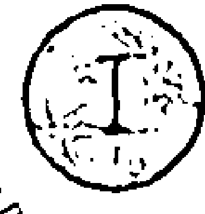

+ 1.這本書有什麼特點值得我花時間閱讀？
+ 2.我在讀這本書的時候，要用什麼態度、要注意什麼？
+ 3.我要如何使用這本書，讓我的生活變得更豐富、快樂？

我洗了牌、切了牌、然後抽出三張。塔羅牌顯示了三張牌作爲回答。

# 問題一：這本書有什麼特點值得我花時間閱讀？

回答：聖杯的王牌（見第212頁）
王牌（1號聖杯）代表開始，所以這本書是一個好的開始、一個塔羅牌的入門。聖杯代表愛、和諧、感情、友誼、慈悲，阿芭迪女士寫這本書展現了她對年輕人的滿懷關心，而塔羅的基本精神正是對生命的愛與慈悲，它是萬代聖賢給人類解渴的一杯充滿心靈能量的水。聖杯的上方是象徵和平的鴿子，下方是西方阿彌陀極樂佛土的蓮花池。這本書可以幫助你開發直覺、本性，透過直覺力的帶領，你會找到你自己的天堂世界。那隻鴿子嘴裡含的麵餅，暗示那天堂在你自己裡面，往內探尋才找得到。

# 問題二：我在讀這本書的時候，要用什麼態度、要注意什麼？

回答：太陽（見第59頁）
太陽是一個王牌象徵，它代表宇宙生命的創造源頭，它的能量是圓滿的創意、快樂與活潑。生命的開始是兒童時代，你也曾經是個小孩，可是你還擁有那份單純、活潑、愛玩的赤子心嗎？請注意那騎在馬背上的小孩，他沒穿衣服，手臂伸展開來，就好像老鷹在天空展翅飛翔的樣子，什麼都不怕。他的頭上戴著花冠，真是開心！讀這本書的時候要玩出塔羅趣味，單純的活在當下。不管你是青少年也好、成年人也好、老年人也好，太陽的創造性源頭總是活生生的照耀著。阿芭迪提供了很多好玩的遊戲，讓你輕鬆的深入玩味，其中有樂觀、創意、熱心、活力、健康、成就、富有、慶祝等無限的寶貝玩具，只要你敞開胸懷展現自己。太陽創造出太陽花，而你想創造出什麼呢？

## 問題三：我要如何使用這本書，讓我的生活變得更豐富、快樂？

回答：權杖王后（見第146頁）

我們看完了一本書以後，常常會放下它去忙別的事情，然後過了一陣子就把它忘掉了。這樣的話就太可惜了，塔羅牌也就無法真的改善你的生活。權杖代表光與知識，它勸你去看清楚書的核心內容然後把它練熟了。阿芭迪在書中推薦了很多練習與小提示，幫你快速的進入情況。權杖也代表工作，它暗示你在日常生活中去使用你所學習到的東西。

王后代表一個比較成熟的人，她很懂得管理事情而且很有自信，她很大方而有彈性的運用所擁有的一切來發展事業、培養家庭、建立良好的人際關係。她的生命能量(包括性能量)很強。如果你還是青少年的話，她代表你成長到成年人的過程；如果你已經成年，她代表你發揮掌握人生的自信與管理潛能。獅子是太陽的象徵。王后的寶座旁有兩隻獅子，代表你一整天都能夠保持警覺，將注意力放在你的目標上。這張牌的背景裡有三座金字塔，金字塔象徵永恆、穩定，三座金字塔分別表示過去、現在與未來，代表你的心靈能夠超脫時空去看事情的真相。黑貓（象徵王后的一部分）在瞪著看你有沒有甦醒過來，牠要你與向日葵、獅子一樣站起來，把太陽生命源頭的無限創意展現在你的生活中。

當你開心的玩塔羅牌的時候，你會不知不覺的啟動對直覺潛能的自信。歡迎你投入這充滿無限奇蹟的人生探險。有位心理學家哈利·帕爾默（Harry Palmer）說：「別讓你現在是什麼……，成爲你可能變成什麼……的絆腳石。」塔羅牌的原型意象可以變成通往星星的踏腳石，玩出塔羅趣味的秘密就在那裡。

## 白中道博士（Douglass A. White）

哈佛大學博士，曾於美國哈佛、馬荷西國際大學及麻州克拉克等大學授課十餘年。在社區教育界有三十幾年的各式工作坊經驗，包括超覺靜坐（TM）、Qabbalah卡巴拉生命樹、Babaji生命能量、生命直覺塔羅牌、易經、譙崔呼吸、Stargate輔導、瑜伽術、氣功、推拿等許多課程，結合中西文化精華，致力於開發個人的創造潛能與自足。

# Contents 目錄

- 推薦序 以塔羅牌探尋人生方向 - 1
- 序言 - 1
- 1. 認識塔羅牌 - 17
- 2. 解釋的藝術 - 24
- 3. 占卜準備 - 30
- 4. 大阿爾克那含義 - 39
- 5. 王牌 - 62
- 6. 解釋大阿爾克那 - 83
- 7. 小阿爾克那 - 114
- 8. 解釋小阿爾克那 - 128
- 9. 權杖 - 143
- 10. 錢幣 - 168
- 11. 寶劍 - 183
- 12. 聖杯 - 203
- 13. 牌陣 - 223

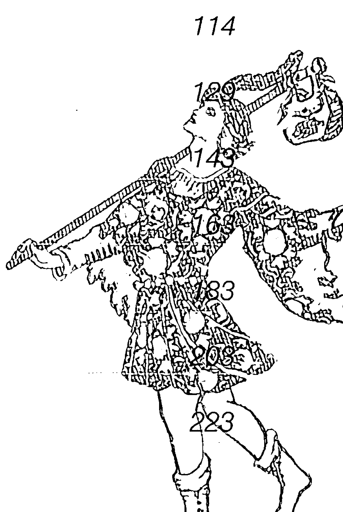

# # Introduction 序言

「无论我们选择如何解释我们的心灵，都必须从一个前提开始，即整个人类跟一个宇宙整体互动着，在这个宇宙里面，什么都有可能。我们只需敞开心灵，释出恐惧，自内心深处召唤神奇的命运精灵。」

——摘录自阿芭迪 (M. J. Abadie)
《心灵潜能》 (Your Psychic Potential)

什么是塔罗牌？为何青少年要对它有兴趣？简单来说，塔罗牌是一种占卜法，有数百年甚至数千年的历史。许多历史时期都曾记载塔罗牌，中古时期尤为风行。塔罗牌是一种牌术，包括78张不同的牌，以一种「神谕」(occult) 的工具知名。「神谕」这个字是指「隐藏」的意思，不带任何负面意义。

人类的世界愈来愈趋复杂，青少年每天都必须面对前所未闻的挑战，因此有许多人转而求助于各种不同形式的占卜术，像是塔罗牌、占星术、易经和如尼文 (runes；译注：北欧文字占卜法)。

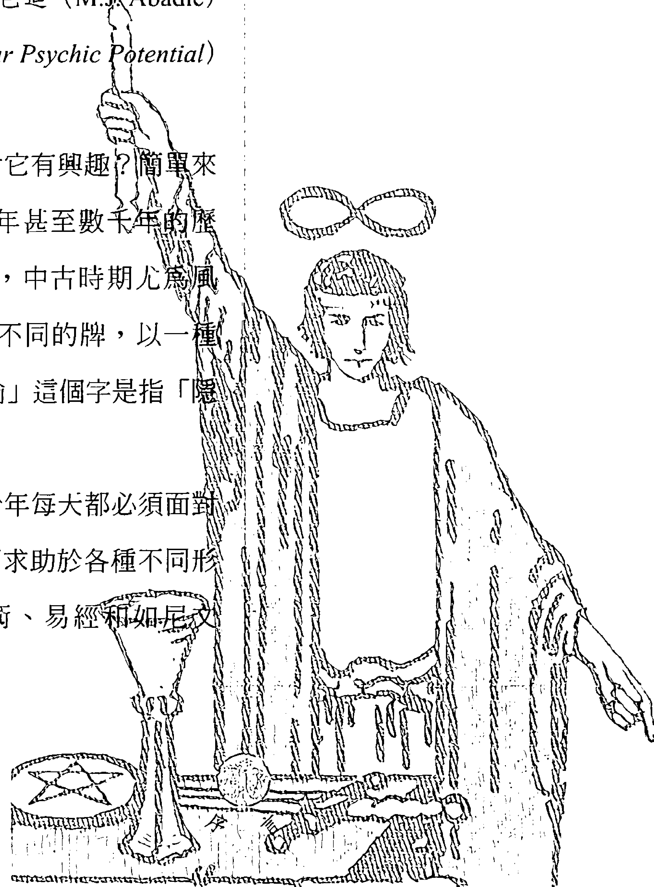

#### 格言

「我們知道，宗教問題，或是以更普遍的用語來說，自我追尋，是現代精神官能症的核心。由此可見，精神官能症跟它所導致的眾多現象一樣，都是一種神聖的疾病。」

艾瑞旭·諾伊曼 (Erich Neumann)
《藝術與無意識創造力》 (Art and the Creative Unconscious)

「追尋是找出歌德（Goethe）在《浮士德》(Faust)裡說的，把世界緊緊凝聚在一起的，為我們在宇宙裡的位置建立秩序和意義的衝動的一種驅力表現。人類推進外太空與深入深海探索類似，目的不外乎都是為了追尋完整和實現。」

愛德華·懷特蒙 (Edward C. Whitmont, M.D.)
《女神復返》 (The Return of the Goddess)

尤其是現在，塔羅牌的花樣迷人多變、主題廣泛，像是印地安塔羅牌、童話人物和女神塔羅牌，使得青少年族群近來興起一股塔羅牌風潮。塔羅牌能夠迅速對青少年描繪出任一瞬間生命的藍圖，以及切中所關切問題的答案核心。

一直以來，占卜術以各種方式被用來算命、預測未來，但塔羅牌（其他占卜術亦同）主要的目的，其實是在開發我們都擁有的內在智慧。這些占卜術全部抱持相同的目的，就是找出一個人在自己宇宙裡的位置，釐清自己內心裡想要什麼。我們是如此經常感到困惑，而青少年由於經常陷於情緒高漲狀態，加上缺少經驗，特別容易迷惑。

然而重要的是，要明白不該用這些占卜術來預知未來，因為沒有人可以確定自己的未來。我們不是自己生命被動的旁觀者，而是主動的參與者。塔羅牌顯示讀牌時有哪些「能量」在流竄著，因為整個宇宙、包括我們的能量，總是在流動著，這些能量不是停滯或靜止不動的，而是不停的移動著。在今天是真實的事情，到了明天或是下個月後，也許已不再真切。

一般而言，視占卜深度和所提的問題而定，塔羅牌釋出的訊息只有幾天或幾週效期。因此，你應該小心且持續的運用塔羅牌，切勿單憑一次占卜結果做出任何攸關一生的重大決定。

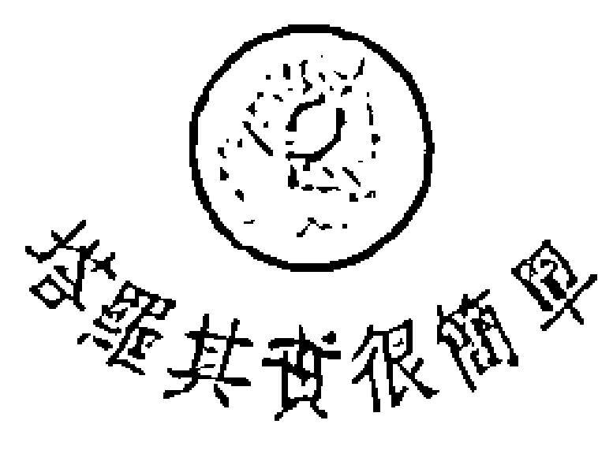

# 塔羅牌的運作

塔羅牌的意義一般被認為源自anima mundi，即世界之魂。這個知識來源就像個宇宙圖書館，裝滿整個人類族群累積的智慧，我們可以透過塔羅牌意象的意義來開發。這個集合庫裡都是宗教、神話、傳奇和童話故事裡的基本人物，這些原型人物為奧秘化身的影像早已深藏在我們的記憶裡。這也是為什麼在讀牌和解牌時接觸這些影像，可以讓它們隱藏的一面，從我們的記憶深處變成意識力，用來解答我們的問題，使我們的生活更加美好。

塔羅牌是一種美妙的冥想工具，它們扮演刺激直覺的角色，而直覺又是無意識的出入口。它們說明了隱藏在我們的生命裡，我們卻經常不覺的因素。這些內在議題正秘密的形成生命的軌跡，只要適當使用塔羅牌，它們就會顯現出來。

塔羅牌上的意象，特別是王牌（trump cards），即整副牌裡被稱為大阿爾克那（Major Arcana）的22張主牌，與人基本的心理和精神經驗直接相關。研究和實際運用塔羅牌會讓人觸及內心深處，愈是深入、了解愈深。塔羅牌確實可以用來協助解答日常疑問和道出眼前問題，但它真正的用途是用來協助靈性的發展與自我探索。

或許我們無從知道塔羅牌真正的歷史，但我們知道可以自由運用這些牌和它們內含的智慧來解決問題，因而更了解自己的生命，使靈性的發展向上提升。塔羅牌訴說著一個人類生命發展的有力故事，這是人類全體的冒險故事，我們各自依據占卜時所呈現的意象，展開冒險歷程。塔羅牌韌性之高令人驚奇，在歷經長久紛亂的世紀後，它和它所透露的意象依然持續至今，與我們緊緊相繫。

#### 格言

「意象是神話的傳達工具、戰車，把傳奇故事和神話的更高形式——宗教，拖曳過心靈，穿過時光，越過歷史篇章。意象述說著那些產生自神話根源，依然深深影響著我們的思想和感覺的模式。」

阿芭迪
《靈性自我的覺醒》 (Awaken to Your Spiritual Self)

## 塔羅牌的結構

塔羅牌共有78張，分成22張的大阿爾克那（Major Arcana），亦被稱為王牌，以及小阿爾克那（Minor Arcana），包含16張宮廷牌，跟現代紙牌一樣，有國王、王后、騎士和侍從，還有40張號碼牌（pip cards）。

大阿爾克那最為重要，它們反映出所有人類在這世界裡，從新生的純真到自我實現的靈性旅程。據了解，大阿爾克那最為古老，宮廷牌和號碼牌似乎是後來才加入的，可能是在十四世紀的時候。這些牌顯然源自義大利一種被稱為塔羅奇（tarrochi）的橋牌遊戲。

宮廷牌和號碼牌類似現代紙牌，分成權杖、錢幣（或星紋）、寶劍和聖杯四個花色。宮廷牌可以暗示在我們生命裡的人或我們所處的局勢，對青少年來講，特別是國王和王后，經常被解讀為跟他們正在交涉的重要成人有關，像是父母、師長和其他權威人物，它們代表整個人際關係網絡。另外，有些宮廷牌，特別是騎士和侍從，可以指出外在事件或內心狀況。

號碼牌每種花色各有10張，共40張。這些號碼牌暗示日常生活裡的所有東西，我們每天所關心的事情、日常事件，以及我們的回應和行為。此外，號碼牌具有數字特別的意義，我們將在後面討論。

## 了解原型意象

大阿爾克那以原型意象為基礎，對這些原型的運作方式具有基本認識，將有助於更充分的解釋這些牌。原型是作用在人類心理中的一個心靈影像，是我們直覺本身的一個產品，是我們內心深處知道，但我們不曉得自己知道的某些東西。原型是人類全體共通的東西，舉例而言，就算我們沒有母親，內心裡對母親也都存有一種影像。當我們從原型的觀點來看世界時，切記一切有形形式跟人類共通的基礎原型主義有關係，並由它予以支持。這些反映出我們內在與外在的經驗，以下是原型世界觀的簡要說明：

- 世界被認為是宇宙更大整體或神聖心靈的一個映照，兩者互相影響，並凌駕於物質現實之上。萬事萬物是這個整體的部分，有其秩序和設計。一切絕非巧合或純屬意外，任何看似偶然的事物都是生命意義總體模式的一個暗示。
- 現實有許多面向，有些現象我們通常渾然不覺，但在有形和無形的世界裡，某個層面上，萬事萬物皆互為關連。
- 循環性變化過程是每個人及萬事萬物必經的一部分，一切脫離不了出現、成長及衰退的歷程。
- 原型除支持有形形式外，亦是占星學概念和其他形式使用數字學的占卜法，包括塔羅牌所顯示的微妙數字學或幾何學原理與模式的一個表現。

## 大阿爾克那的心路旅程

透過原型意象的運用，22張大阿爾克那王牌代表一段心靈啟迪之路。求卜者從沒有號碼但以零代表的愚人（Fool）開始，隨著後續階段的發展翻牌，直到21號牌「世界」（World）出現。作為靈性發展的工具，每張牌各有其意義存在，代表深具個人意義的內心狀態和外在狀況。

現在，簡短的看一下塔羅牌大阿爾克那的愚人之旅。重要的是，你要了解每個人都像愚人般來到世間，我們新生和無懼，準備好學習生命要教導我們的功課。愚人總是以一個大無畏青年的形象出現，凡事積極正面、活潑好動、勇於冒險，自信深獲宇宙的支持。愚人通常以青年為代表，性別不拘。

## 王牌 0 —— 愚人

這是生命旅程的開始，在此階段，人是純真和可以信賴的。愚人無邪無慮，初生之犢和熱愛冒險犯難的他昂首望天，絕不垂首下望。儘管身處險境，他依然渾然不覺。經常有一隻小狗與他為伴，狗象徵尋路的能力，是心靈動物。愚人代表未被日常生活朦蔽的那個自由心靈的自我，幸運的是，在占卜裡出現愚人時，我們總能回歸那種狀態。

# 王牌 I —— 魔術師

魔術師其實是一張魔法牌，他出現時通常面前有一張道具桌，上面擺著魔法道具。他的工作是教導愚人運用宇宙的創造性能源、適當的工具和法器，以形成一個充滿目標和創造力的生命。魔術師了解世界是如何運作的，這不是指我們在周遭所見模糊的普通世界，而是在宇宙運轉背後的能源。魔術師指出你可以運用潛在的能力，如邏輯、意識、覺知、客觀性及能量，使得生命運作的更好。

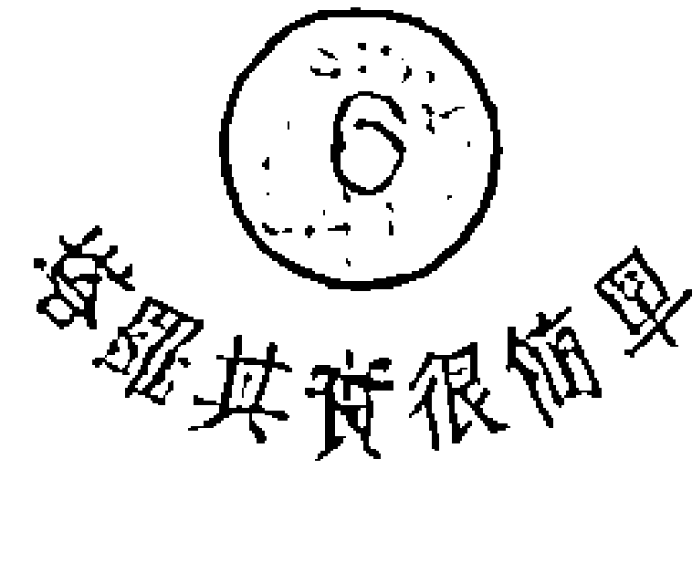

## 王牌II—— 女祭司

這是一張神秘和深奧的牌。魔術師指使用精神能力來表明我們的希望和欲望，女祭司則指非物質的領域。她代表隱藏的心靈自我，它的一切過程我們看不見，像是直覺、心情、情緒和似乎不合邏輯但卻源自我們內心深處的反應。她統治黑夜和宇宙裡的一切，我們依稀知道，但那是單憑邏輯的心無法觸及的層面。女祭司出現是一道訊息，表示我們該深入內心尋求指引。

## 王牌III—— 皇后

皇后是跟古代偉大女神有關的一個人物，她是宇宙之母。愚人遭遇人類內在與外在世界後，如今遇到原型之母。對青少年來講，讀牌時出現皇后經常稱爲「婚姻牌」，她代表婚姻成爲求卜者生活中的一個議題。通常，這並不表示你即將結婚（當然要考慮你的年齡），但意指婚姻的意義或許占滿著你的心。它也可以指家人的結婚或是懷孕，因爲皇后代表了生育和母性。

## 王牌IV—— 皇帝

有趣的是，皇帝是跟皇后相對的男性人物，但卻追隨著她，這指出母性主義先於父性主義。皇帝在此世界裡有相當分量，代表權威、控制、理性、權力和支配力。皇帝表示對世俗的關心，經常代表少年掌控物質生活的需要。皇帝也可以暗示權威問題（取決於攤牌時它所在的位置）或發展自我力量的需要。

## 王牌V——教皇

教皇是教導愚人如教會和國家等體制現實的人物，他象徵已建立的傳統價值和道德所需的狀況對立。教皇亦以教宗知名，象徵保守和正統。他反對改變和強化社會的社交禮節，對青少年來講，教皇（取決於攤牌時的所在位置）代表正面對一個問題，有時是個棘手難題。

# 王牌VI——戀人

通過生命的精神和直覺層面，遇到基本的女性和男性主義，以及處理世俗需要後，如今愚人準備好面臨愛情的議題。但這未必是墜入情網的表示，戀人代表意識到另一方或雙重性。愛情是很棘手的事情，愈年輕就愈棘手。戀人出現是警告青少年要做選擇，現在所做的選擇將影響一生，無論選擇跟羅曼史有沒有關係。戀人未必表示羅曼史，但指出必須小心思考一切關係，像是友誼、愛情、性關係、吸引你的東西和原因。戀人是很重要的一張牌，經常在需要做重要選擇時出現。

# 王牌VII——戰車

當戰車出現，表示愚人現在要面對讓生命裡的許多雙重性順利共處的挑戰。通常牌面上是一個戰士駕著一輛由一匹白馬和一匹黑馬拖著的戰車，這張牌透露有跟對立的東西調和的需要，無論對立的東西在我們的內心或是外在世界裡。戰車說明生命涉及衝突和解決問題，問題通常透過妥協而獲得解決。舉例而言，假如你的父母正在談離婚，戰車就有可能出現，這是一個挑戰，要你在面對艱難的狀況下，保持平穩的軌道。不管你正面對哪種問題，戰車出現表示你需要做出平衡的行動。

## 王牌 VIII——力量

力量是一張很奇妙的牌，牌面上經常出現一個女人扳開獅嘴，或與森林之王纏鬥。力量透露愚人必須發展自信心和自尊心，進而在內心裡產生力量。由於力量幾乎總是以女性人物出現，對一個少女來講，力量時常表示她在孤軍奮戰，有時候得經過一段嘗試期。這張牌在少男身上的意義有點不同，它可以表示體力不是唯一，他需要思考和發展內在力量。

# 王牌 IX——隱士

隱士是力量的一個象徵人物，經常以一個高提著燈籠的老人形象出現。他代表來自「另一邊」的指引，或是需要這種指引。隱士教導愚人，無形世界的背後存在有強力的力量，為了接觸這些力量，一個人必須冥想和相信內心指引，只要去尋找，就能找到這些指引。跟所有的牌一樣，隱士傳遞的訊息視位置的不同而異。對青少年來講，隱士可能是要求停止一切活動一段時間，以便與「內心的指引」相會，運用內在的智慧。青少年在生活混亂或事情似乎顯得沒有意義時，隱士可能就會出現。當外來活動超過負荷，你需要時間獨處把事情整理清楚時，隱士時常會出現。

# 王牌 X——命運之輪

這張牌暗示宇宙裡發生的事情不在愚人的掌控之下，愚人甚至連他自己的世界也控制不了。它顯示運作的力量也許無常和難以預測，但實際上是生命一個總體模式的部分。命運之輪不是一張壞牌，它表示我們先前的決定、選擇和業已進行的行動如今無法中輟。對青少年來講，出現命運之輪代表把一切事情視為理所當然並不是好想法。它是一個徵兆，表示你必須汲取「要怎麼收穫先怎麼栽」的教訓。

## 王牌XI—— 正義

了解有我們難以掌控的力量後，愚人遇到正義，瞭解到儘管生命顯得無常，卻存在著固定的模式，而且，我們行動所造成的後果是可以衡量的。對青少年來講，正義出現表示有平衡與和諧的需要。舉例而言，也許你跟某人吵架或意見相左，如今覺得受到不公平的對待，但是為了把事情做對、搞清楚，你必須保持公正。你知道生命不見得公平，但重要的是採取正向的步驟，以確保自己處理事情的公平性。

## 王牌XII—— 倒吊人

如今愚人已經汲取前面的教訓，需要學習放手或重新開始。倒吊人牌面上經常出現一個人倒吊在樹幹上，一隻腳交叉放在另一腳後面。奇怪的是，他用這種倒掛的姿勢凝視宇宙，樣子卻顯得沒有一點不舒服。事實上，他看起來高興和樂觀極了！這張牌有趣且令人好奇，經常表示對生命採取全新觀點，或是尋求嶄新和意外的展望的可能性。對青少年來講，倒吊人可能在一段不快樂或不平靜的時間後出現，要求對目前的狀況有些新的想法，或指青少年可能有自己的生命被徹底顛覆了的感覺。在這裡，倒吊人代表放棄老舊的想法，並發展更適合心靈發展的新想法。倒吊人是質疑物質價值的一個召喚。

## 王牌XIII—— 死亡

這張牌出現經常把人嚇壞，不過，死亡絕對不是一張壞牌，不該刻意把它解釋為你或你愛或你認識的人即將死亡的意思。死亡這張牌的意思是，有些事情或甚至比你年長的某個人面臨死亡，你非得釋懷。死亡代表過渡，就像你從國中畢業去念高中，或是從高中然後去念大學一樣，你必須把整個舊有的生命模式拋在腦後。死亡也代表轉變，可能是相當恐怖的。然而，沒有必要的轉變我們只會墨守成規，終歸毫無進展。死亡出現就像一記響鈴呼喚我們醒來，告訴我們有重大的改變即將到來，不管我們喜歡與否。

## 王牌XIV——節制

節制是一張很可愛的牌，上面通常顯示一個長有一對翅膀的天使，頭部環繞著光環，並把水由一個杯子（或瓶子）倒進另一個杯子裡。天使可能是男性、女性或是中性。杯子一個是金的，另一個是銀的，代表心靈和物質世界不斷互相影響。節制表示愚人受到生命「調節」，如今瞭解到合作、平衡、協調、接納和創造性的必要。對青少年來講，節制這張牌出現暗示發展這些品質的需要，有時候反映出一段混亂或不確定的經驗。

> 「捨棄尋找神，與創造出類似的事物，而從原點去尋找祂。學習是誰在你的心裡，是誰創造了萬事萬物，說：『是我的神，我的心，我的思想，我的靈魂，我的身。』試著去了解哀傷、歡樂、愛與恨是來自何處，只要你仔細研究這些事情，就會發現祂在你的心裡。」
默諾門斯Monoimus
真知派／諾斯底派（Gnostic）大師

## 王牌XV——魔鬼

魔鬼這張牌跟死亡一樣，經常讓人感覺不安，特別是在求卜者相信真有魔鬼的時候。視牌的花樣而定，這張牌的確可以顯得相當兇惡。魔鬼真正的意義跟邪惡或懲罰無關，他通常跟鐵鍊一起出現，有時候會跟戴著鐵鍊的人一起出現。占卜者翻到魔鬼這張牌時經常會驚慌得透不過氣來，害怕會被他「抓住」。可是，魔鬼這張牌只表示一個人（或覺得）被困在一個令人窒息的狀況裡。仔細想想，這經常是人們自身的錯。對青少年來講，魔鬼出現可能表示需要把束縛自己的鐵鍊打破。這張牌經常顯示出求卜者的無知、任性、執迷、依戀物質、衝動和負面思想，而這一切都可以矯正。

## 王牌XVI——高塔

高塔是另一張讓人感覺不安或恐懼的牌，上面經常顯示一棟高塔遭閃電擊中，有時候還有人飛出窗外。跟其他代表改變的牌一樣，高塔出現清楚表示你需要改變才能成長。高塔通常表示徹底的巨大改變，對青少年而言，它可能表示求卜者必須遠離對自己的成長和發展具有破壞性的活動、人和行為。或說明求卜者需要面對某些跟自己有關的殘酷真相，並採取行動把一個情況矯正過來，以免它失控和爆發。把高塔這張牌當成一個警告，並認真地留意它所傳遞的訊息。

## 王牌XVII——星星

星星是我個人最喜歡的其中一張牌。經過前面幾張牌的嚴苛教訓後，假如愚人做好功課和學到教訓，他現在終於看見隧道盡頭的光芒。這是張寧靜和快樂的牌，上面通常顯示一個裸體的女性人物跪在池塘或水池旁邊。她身處在美麗的田園中，拿著兩個水壺，把一個水壺的水倒進溪流裡，另一個水壺的水倒在地上。通常有顆大星星被一群小星星環繞著，大多數時候是七顆星星（昴宿星座有7顆星星）。星星代表希望和樂觀，她的赤裸象徵無掩飾的真實和純潔。她所倒的水是生命之水，有些回歸源頭，有些提供給大地孕育新生。星星這張最為快樂的牌出現在青少年求卜者的牌裡，通常表示求卜者自己的星星正在升起，它通常在成功克服了一段艱難的時期後出現。

## 王牌XVIII——月亮

月亮這張牌可以讓那些對月亮的象徵沒有全面了解的人感到迷惑。我們在月光下看東西的確不像在太陽光下清楚，月亮可愛的光芒讓我們看到的東西變得不同。月亮是張神奇和神秘的牌，它告訴占卜者注意求卜者內心深處的夢想和信息。你也許正感覺悶悶不樂，或只是處於心裡作夢的狀態裡。月亮告訴你要注意自己和情緒上的需要，建議你該冥想和休息。

## 王牌XIX——太阳

太陽是一張快樂和顏色鮮豔的牌，上面通常是一個裸身的小男孩，在燦爛的太陽光下騎著馬。有些牌上面的小孩不只一個，或是花樣改成一對牽著手的年輕情侶。太陽象徵進步，在黑夜的領土漫步後，愚人現在被帶到日光下，一切顯得快樂、充滿希望和輝煌燦爛。太陽在青少年占卜者的牌裡出現時，是一個明顯的朕兆，表示現在的你身心愉快，彷若新生，可能你剛度過一段麻煩不定的時期。太陽這張牌暗示愉悅就在眼前，而且你有新的計畫和個人的努力將有成功的回報。你可以到一個充滿陽光的地方去度個假。

### 王牌 XX——審判

被新升的太陽喚醒後，如今愚人聽見審判的喇叭聲，號令他考慮自己世俗的工作。這是重生和重建的時刻。受到基督教審判日影響，有許多牌審判的花樣顯得相當負面，但其他文化認為審判是重新審視生命的時刻。青少年的牌陣裡出現審判時，表示此刻確實是治療和轉變的時候了。你可能一直在「沉睡」，或沒有留意四周的狀況，而且你要不是惹上麻煩，就是感到糊塗。審判這張牌是一個召喚，把你更高層次的自我喚醒。

## 王牌XXI——世界

現在來到大阿爾克那的終點，循環到此完成。我們的愚人經歷了一生有價值的學習後，如今已準備好心理學家所謂的「自我實現」。這張牌的牌面大多數是一個裸體女性，身纏一條長圍巾，每隻手拿著一根兩端尖頭的桿子，被一道藤蔓、葉子和花朵組成的環圍繞著。世界這張牌象徵出愚人開始探索心靈的旅程已經完成，它在青少年的牌裡出現時，透露出有些內在或外在的過程已經達成。它可能表示求卜者已經從高中畢業，決定往自己選擇的大學就讀，找到工作，或選擇好的職業。依現行狀況、所問問題和牌的位置而定，世界這張牌暗示你在眾多祝福下，正得到你正常賺取的東西。

你愈了解塔羅牌，就愈清楚它的主旨跟人類基本的心理和心靈經驗直接相關。隨著你繼續研究塔羅牌和實際使用它們，你對它們的了解就愈深入，而它們也愈能跟你的內在生命共鳴。

## 挑選塔羅牌

如俗話說的，一張圖片代表了千言萬語。塔羅牌圖片直接道出人類內心的最深處。今日有十幾種花樣的塔羅牌供我們選擇，有些古意盎然，也不乏新穎的設計，運用像是美國原住民、女權主義者、社會生態和許多其他的現代圖片和主題，嘗試把這個美好的自我發展體系帶入現代。只要到書店或專門店走一趟，就會發現裡面有各式各樣的塔羅牌任君挑選。

挑選塔羅牌的時候，特別是在你是初學的情況下，跟著你的「感覺」走。本書對前述合乎78張牌標準的塔羅牌皆適用。

最後，你想要用的牌或許不只一副，但最好還是從一副牌來開始學習。等到你完全熟悉一副牌和徹底了解它們的意義後，接著便可以嘗試其他花樣的牌。

## 莱德·伟特塔罗牌

十九世纪至二十世纪初期期间，人们对玄术的風靡到达新的高峯，包括占星术、仪式魔法、希伯来秘法、诺斯底主义和风水等。这股風潮从未減退，終而导致今日我们所見設計豐富的塔罗牌。一个名叫金色曙光（Order of the Golden Dawn）的團體於是產生，献身于「魔法」研究和应用的复兴。這個團體约於1887年成立，成員包括撒母尔·黎德·麦克達格·马瑟斯（Samuel Liddell MacGregor Mathers）、阿莱斯特·克勞利（Aleister Crowley）、亚瑟·愛德华·伟特（Arthur Edward Waite）和保罗·佛斯特·卡斯（Paul Foster Case）等人。這些人在当时很有影響力，發表了許多文章。

1910年，伟特委託藝術家兼劇作家潘蜜拉·柯尔曼·史密斯（Pamela Coleman Smith）繪製了一副塔罗牌，这副出版作为塔罗牌圖片版的牌很快就变得相当出名。在许多具代表性的玄学家影響下，它受歡迎的程度維持不墜，通常成为初学者的首選。因为它很基本，而且被很多塔罗牌書籍用来作為解释牌義的基礎，因而成为青少年初学塔罗牌的良伴。本书即是以莱德·伟特牌（Rider-Waite-Smith）為範本做說明。

## 1 認識塔羅牌

塔羅牌是一種強而有力的工具，你必須小心地、虔敬地運用它。這不是說塔羅牌像電鋸那樣，使用不當時會傷害到你，而是說為了發揮它的效用，你絕對不能輕率或淺薄待之。你解釋牌義時所持的態度將會對它們的效用有很大的影響，因為塔羅牌包含的知識連接著你的心靈，直達你的內心最深處。你可以用塔羅牌來回答日常疑問，像是學校、考試、與父母和朋友間的關係、感情、錢財與工作，或是事業和大學等問題，但是它最高的價值在於發展你的直覺，進而提升你的心靈發展。

有些人一聽到「心靈」這個字就放棄；它能引發衝突，有時候還能帶出負向的情緒，或是對未知的恐懼。許多人以為心靈的力量很危險，這根本是胡思亂想。每個人都有或高或低的心靈力，就像音感，或是對數學、對電腦的了解程度有高有低一樣。如果你不懂音樂，音符或許便顯得極為神秘。對那些不懂得使用電腦的人來講，他們對電腦當然是又敬又怕（這是我個人的經驗）。

#### 格言

> > 佛性和菩薩被視為人人體內的潛能，不是後天獲得的，而是藉由醒悟，或是柏拉圖所言的「參悟」。
>
> 坎伯 (Joseph Campbell)
> 《神祕的意象》 (The Mythic Image)

談）。不過，運用心靈這種直覺方法就跟用電腦語言和程式一樣，沒有什麼神秘可言。而且，直覺跟操控複雜電腦暗碼的能力不同，它是內建於人類有機體裡的一個元件。只要你知道並熟練它的規則和技術後，就會明白它一直是你的部分。小孩子還不知道自己天生的能力，所以並不害怕，經常憑直覺做出驚人的表現。他們尚未被教導說，直接聽憑直覺，或是從理智心靈以外的一個源頭來取得資訊是「錯誤」或「可怕的」。

因此，初學者首先必須先打開心胸，接受塔羅牌提供資訊的力量，對它提供的訊息嚴肅以待，並且永遠不能為了圖謀個人之利來試圖操控人或事。占卜術是一門藝術，跟所有藝術一樣，天分極為重要，不過就像學習任何新技能一樣，多練習就能變得愈熟練。換句話說，熟而生巧，不然起碼也能改善表現。

就拿你想知道一個重大決定的可能後果來說好了，只要拿出你的塔羅牌，說出你的問題，但最好選一個特別、隱密和安靜的場所就可以了。用牌之前，先讓自己徹底放鬆一下，慢慢地讓你有意識的心拋開腦海裡的思緒，讓自己沉入內心最深處。接著握住你的牌，或是洗一下牌，然後把心思集中在困擾你的問題上，讓它變成你的一部分。當你把牌排出來時，要有信心能夠拿到正確的答案。

相信你已經擁有取得答案和了解牌義的能力，因此，塔羅牌可以用來集中你的直覺力，一個取得內心解答的便捷方式。在我的經驗裡，塔羅牌經常先繞著問題表面轉，然後才深入到問題的真正根源。套句心理學用語來說，用一個較簡單的問題來取代更深的問題很平常，但牌幾乎總會把可能被你藏在內心裡的問題指出來。它們具有一種直指問題核心的神秘能力，而且經常清楚得讓人驚訝，我自己便有許多類似的經驗。

人類才剛開始探索幾乎有無限可能的直覺力。法國腦科權威專家提尼醫師（Dr. Frederic Tilney）舉言：「在意識的驅策下，大腦的中心將會進化，以允許我們使用現在連想像也想像不出來的力量。」

跟自己的心靈潛能接觸時，你有點像是樂團指揮，又有點像是樂團裡的樂器；你有意識的心是指揮，必須讓樂團的一切正常運作。這包括你的「左腦」或是理智的心，以及你的「右腦」或是創造的心（右腦是直覺的中心和其他與生俱來的功能的主人，有些與生俱來的功能我們只模糊知道它們的存在，但卻不十分了解它們，比如作夢）。在這項工作上，塔羅牌提供一個絕佳的方式，把我們看似分開的部分全部整合在一起。

當你首度決定排個牌陣，你會自動把有意識的心專注在問題和牌陣上，這運用了直覺，為自我覺醒提供線索。塔羅牌的占卜明確、詳細，允許左腦和右腦平順互動，一旦你了解這個過程後，就能隨心所欲地接上宇宙的能量儲存庫。塔羅牌把這股迷人的力量實實在在地放在你的手裡，就像是直覺的觸媒劑，然後製造出你需要的資訊。

> 格言

意識型態是人類神聖的天賦，理性是人類的忠僕，我們創造了一個彰顯忠僕、忘卻天賦的社會。

愛因斯坦

## 塔羅牌小祕方

莎利·吉爾哈特（Sally Gearhart）在《女性塔羅牌》（A Feminist Tarot）一書裡說，把牌分成不同組，比較它們彼此間的關係，這樣比較容易記得每張牌的意思。

我個人比較喜歡把牌視為一個整體，不過你可以用對你最有效的記憶方式。人各有不同，記憶的方式亦各有差別。如果把牌分成不同小組可以幫助你記住它們的意思，就照著做吧。

大阿爾克那有許多不同層面的意義，這些層面的意義會隨著時間逐漸揭曉，就像在一個古老遺址裡挖掘考古一樣。有實際層面的意思，以皇后為例，她可能代表你的母親，或指你希望成為一個母親。也有世俗層面的意思，如魔術師可能暗示你想要一個更有創意的人生。還有心靈層面的意思，魔鬼可能告訴你，物質阻擋了你靈魂上的需求，該是你停止追求物質的時候了。

研究塔羅牌時，直接回應它們的影像，不要受到分析和理性的心所阻撓。讓內在的自我跟隨你的感覺，學習和使用牌義的解釋，並把它視為一個有用的指引，但牢記它們並非永誌不變。你可以跟著感覺，自由地發揮創意來解釋牌義，同時維持……這些解釋是經幾世紀發展而來的精髓，可是當你更加深入時，會發現每張牌都有許多可能的解釋，還有許多取決於不同因素的變數，比如它在牌陣裡的位置，前後面的牌，總體感覺或牌的色調。舉例而言，牌陣的顏色也許看起來很黑暗，不過有一、兩張顏色明亮的牌，像是太陽，可以讓黑暗柔和下來。相反地，牌陣總體看來也許很正面，但卻包含一、兩張壞牌，使得整個牌陣改觀。只要你多加練習，就能熟練地領會出最合適的意義。

首先，你會想找出每張牌的牌義，然後把它們放在一起占卜出答案，這需要研究和練習。我在經過多年的專業占卜後，學習到一次牌陣就像一個模板或一個區域，訊息經由此處流出。當然這並非一夜蹴成，首先要學習每張牌的標準牌義，最後你便能觸類旁通，取得牌陣的整體意義。

基本塔羅牌包含78張牌，其中22張牌被稱為大阿爾克那。阿爾克那這個字源自arcane，意思是「神秘」或「秘密」，這些秘密代表了反映宇宙法則的未知宇宙。因此，大阿爾克那最為複雜，形成塔羅牌的中樞。你需要研究這些最為精深的牌，以瞭解它們多層的意義。

不管你使用哪一種牌，每種牌的大阿爾克那牌每張都繪製有意義的象徵，只是主題各有不同而已。有些牌反映出自然的主題，或者跟某種傳統有關，像是美國印地安人、女神、亞瑟士傳說、希臘神話和其他許多種種，在此不予贅述。我們了解，每張大阿爾克那都有名稱和1到21的號碼，只有愚人的號碼為零。

其他56張牌被稱做小阿爾克那，它們包含的資訊性質比較不重要，牌義亦比較容易了解。小阿爾克那跟普通的撲克牌一樣分成四種花色：權杖、錢幣、寶劍和聖杯（請注意：花色的順序因作者不同而異。我個人總是用權杖、錢幣、寶劍和聖杯的順序，以跟它們在星象學上代表火、土、風、水的順序對照）。每個花色有14張牌，其中有4張宮廷牌或稱Face牌：國王、王后、騎士和侍從（普通撲克牌只有三張宮廷牌，國王、王后和侍從）。每個花色還有一張1號號碼的Ace牌，其他是由2到10的號碼牌。

小阿爾克那提供立即的資訊，每個花色代表一個你的活動和成長的分區如下：

- ※ 權杖：精神活動，外在世界，工作或事業。
- ※ 錢幣：錢財，安全感，生理世界。
- ※ 寶劍：自我，面對的障礙，心靈問題。
- ※ 聖杯：情緒，愛情，羅曼史，無意識。

你是一個獨特的人，根據你特有的藍圖展現你的個性和內在的自我。這個成長的過程自有其時間表，怎麼也快不起來。生命循環，於是種種發展的模式建立。定期算塔羅牌能夠透露出這些訊息，並建議新的方向。你可以把大阿爾克那用作探索宇宙概念的指引，並運用在你當前的生命裡。

## 自習塔羅牌

首先，你當然需要研究每張牌和它們的意義，其次你需要熟習各種不同的牌陣。本書有幾個範例供參考，但你也可根據特別的問題和其他理由來自創牌陣。最後，你必須勤加練習。學習塔羅牌就跟學習任何其他技能一樣，必須多練習。多練習總讓我想起一則紐約的老笑話：有個觀光客趕不上音樂會，又迷了路，他匆忙地走到一個老猶太街販面前，急忙地問：

「快告訴我如何去卡內基音樂廳！」

老人歌唱似地回答他：「練習，練習，練習啊。」

練習的頻率和練習多少時間全看你自己決定。我的建議是多加練習，我剛開始認真研究牌義時，每天至少花一個鐘頭練習牌陣，並把牌義的解釋記錄下來。在此之前，我已先研究過每張牌的意象藝術，一心只鑽研意象的意義，從不嘗試占卜。這個方法對我個人非常有效，等我決心把所有意象的知識用來占卜時，我已經準備妥當了。不過，你也可以每天（經常）一點一點地學習，總要把占卜結果、提問的問題、牌陣和每張牌的位置記錄在記事簿裡。

> 老人歌唱似地回答他：「練習，練習，練習啊。」

如果你無法在每天起床後撥出時間做練習，那就選定一個時段，固定在同一個時間點練習，就像做家庭作業或任何計畫一樣。這有如學習樂器，練習的時間愈多，自然而然地，愈能駕輕就熟。達成這個目標後，就可以專注占卜了。

如果你希望和我一樣，開始研究塔羅牌和它的智慧，那麼我會建議，每次只專注於一張大阿爾克那牌上。研讀這張牌提供的解釋，把它跟對照的牌做比較，然後全心集中在這張牌上，直到你感覺到它的能量為止。研究完大阿爾克那後，接著研究小阿爾克那。每次研究一個花色的號碼牌，每個花色各自代表生命的一個領域。然後研究宮廷牌：國王、王后、騎士、侍從，宮廷牌經常用來代表人。你要熟悉這些影像，在你完成這個過程後，你便已準備好進行實際的占卜了。

另一個方法是純粹把牌排出來，然後把你面前的牌的意義找出來。這個過程會讓你逐漸記下牌的意義，尤其是你把它記在記事簿裡時。然而，如果你想做高品質的占卜，與其做整體性的了解，最好按部就班，先熟悉每張牌的意義。

顯而易見地，你的熟練程度取決於你花多少時間努力，你可以結合短時間密集和長時間稀疏兩種方式練習。無論你選擇哪種方式，只要你研究塔羅牌和定期加以使用，你將會滿心欣喜地感謝這個美妙的智慧源頭，以及它揭露人類心靈的魔力。

> 格言

很少人明白自己看的世界，只是自己想法和感覺裡的世界。

沃理斯·史帝文斯
(Wallace Stevens)## 解釋的藝術

如今有許多不同主題的塔羅牌供售，於是你只能大體地依你對所挑選的牌的熟悉度來做解釋。許多塔羅牌都會內附一張書籤，解釋牌面上特別圖片的意思。不過，真正的塔羅牌皆以相同的結構為基礎，本書裡對牌義的解釋亦可以用在你選用的牌上。開始熟悉你選用的牌，你對牌的第一印象很重要，因為當你看著不同牌的圖片時，它們會引發你的直覺，這是無須智能思考即能知曉的。這也是圖片的功能所在，不同的人會對不同的圖片出現反應。把本書視為一個指南，而不是一本說教的教科書。你在學習和使用塔羅牌時，牌面上的圖片會根據你個人的性情和直覺跟你產生共鳴。

請牢記塔羅牌的起源受到多元文化的影響，背後隱藏著神秘。你個人對牌的反應是獨一無二的，就像你的指紋一樣。當你隨著研究和應用而有所進步後，無庸置疑地，無論在哪種狀況下，你將發展出一個合乎你個人風格的敏銳感。然而，有些標準的解釋早已通過時間的考驗，最好先從這些開始學習起。經過一段時間的練習，學習到標準解釋後，你便可以在適用的解釋範圍裡，讓直覺做你的嚮導，做出你有所感應的解釋。

> （悟性）思维若缺乏了内容是空洞的；（感性）若缺乏了概念是盲目的。
悟性不能思，感性不能見，
兩者聯合乃成知識。
——康德 (Immanuel Kant)
《純粹理性批判》(Critique of Pure Reason)

重要的是，牌面上的圖片要能讓你感到舒服，假如牌面的設計對你沒有意義，請選另一副牌來使用。你跟選用的牌之間有和諧感是絕對必要的，這樣它們才能進入你的直覺深處。如果你對自己使用的牌很有感覺，占卜的效果就會更好。一切全看牌如何跟你說話，還有你對上面圖片的感覺來決定。因此，挑選一副你喜歡的牌，同時你的朋友對這副牌也有感覺，是學習解釋牌義的首要步驟。

## 了解塔羅牌的圖片

大阿爾克那每張牌上的每個圖案各有其意義，對心靈有不同層次的作用。因此，你需要小心檢查你的牌，你愈注意圖案，就有愈多的意義潛入你的無意識裡。別忘了，解釋塔羅牌要運用直覺，這是一種不合乎邏輯和理性的活動。如果你習慣邏輯性的思考（大部分人皆如此），剛開始這種全新的活動時，或許會有很奇怪的感覺。你也許會有一些奇怪和陌生的經驗，別被這種經驗嚇壞。你的直覺傷害不了你，如果你有任何不好的感覺，把製造不安的牌或是圖片記下來。不好的資訊只是來自心靈的訊息，就像氣象預報一樣，如果氣象報告說會有暴風雨，我們可以做好預防措施，用不著害怕。你的無意識是一個巨大的資料庫，裡面儲存了你甚至渾然不知的經驗。你的直覺具有神奇的能力，能夠連結上這個資料庫，結合直覺與創意，將有助於解釋牌義。直覺是一個發明器，具有龐大的創造力。小心檢查每張牌，特別是細節的部分，直到你感受到每張牌為止。

## 塔羅牌小秘方

挑張大阿爾克那牌帶在身上一天，思考它的意義，並經常隨不同狀況拿出來觀看，看看它的牌面意象跟你的日常選擇和決定有何關連。把你的經驗記錄在塔羅牌記事簿裡。

> 「有創造力的人能夠感覺出看起來不同的思想、事物或表現形式間的關係，並且能夠把它們結合成為某種新的形式。這種人具有把看似互不相連的東西連結在一起的力量。」
>
> 威廉·波洛玫
> William Plomer

## 塔羅牌記事簿

每張牌分頁記錄，最上面先寫下每張牌的名稱，把每次練習的印象和日期記錄好。隨著圖片更加深入你的無意識裡，揭露它們多面的自我，你的印象會跟著改變和延伸。

從大阿爾克那或王牌開始，這些牌最為重要，圖案的象徵也最為複雜，包含了隱藏的知識。注意牌面上的主要人物，檢查它們的姿態、手足的位置（所謂的肢體語言），以找出其中的意義。注意牌面上一起出現的小人物：人、動物和無生命的東西。觀察背景和前景，以及一切有象徵意義的圖案，不管它們有多微小。給自己時間習慣牌給你的印象，並期待隨著時間過去，當你對牌更加熟悉後，你對它們的印象會有改變（初學者通常先逐牌解釋牌義，然後再一起占卜出答案。這是一個很好的開始方式，隨著時間和經驗的累積，只要瞄一下牌你便會有整體的感覺）。

占卜結果做成的詳細記錄是最佳工具，讓你可以趕上學習的進度。你可以經常回來翻閱這些記錄來檢查你的進步。

## 著色遊戲

這裡有個極佳的方式，讓你能夠了解你的牌和它們的圖片。影印你的大阿爾克那牌，把它們放大成你喜歡的尺寸，然後幫圖片著色，不要管它們原來是什麼顏色。如此一來，你連接上你的直覺心，展現出你個人對圖片的反應。舉例來說，女祭司讓你想塗哪個顏色？

當然，你可以幫小阿爾克那牌的圖片做同樣的著色遊戲。不過，請牢記，雖然號碼牌上一般都有圖片，但並不統一。有許多牌的號碼牌只有些裝飾性圖案，沒有任何象徵意義的圖片。大阿爾克那上面的圖片最為重要，你要把它們刻印在你的無意識，它們會在此沉潛，變成你的一部分。請參考後面顏色的象徵意義的介紹。

## 顏色的象徵意義

注意牌面上圖片的顏色，以及你自己選用的顏色，這個方式可以用來了解顏色的象徵性意義。以下是一些顏色和一般適用的意義，你對某些顏色也許有不同的感覺。舉例而言，黃色代表樂觀，但或許你就是不喜歡黃色。如果你對某個顏色有不同的感覺，儘管跟著你的感覺走。沒有什麼是一成不變的！

- 黑色：黑色其實沒有光線或色彩，可以是「基礎黑色」或哀傷的顏色。黑色代表專注、固定目標和決心，意義並不總是負面的。
- 藍色：藍色有很多色調，從粉藍到深藍都有，所以很難給與定義。淡藍色代表寧靜，像晴朗的藍天。藍色一般代表平靜、放鬆、熱愛溫和與真實。深藍色令人聯想起內省、耐心、保守、深度了解和悲傷。
- 藍綠色：藍色和綠色混合後產生一種有復癒和撫慰效果的色彩。這是一種自然的色彩，可以跟自然的神秘體對話，美國印地安人把藍綠石（土耳其石）視為敬畏之物，這個顏色可能誘發幻象。
- 藍紫色：藍色和紫色可以混合出不同色調的紫色，淡如薰衣草，深如靛色，這些色調富有靈性，代表反映和深入。
- 棕色：另一個自然色，有許多色調。淡棕色代表簡單和缺乏自我或裝飾。深棕色跟大地的力量有關，代表土地的根源、穩定性和熱愛家庭。
- 金黃色：太陽、金屬，暗示驕傲和自信，它代表力量、光輝、領導力、創造力和勝利。金黃色經常讓人想到力量和物質的東西，也可以代表幸運。
- 綠色：蓬勃生輝的自然色，跟生命本身有關。它代表自由、年輕和孕育力。綠色是美金紙鈔的顏色，讓人聯想起獲得和財富、機會、繁榮和經濟安全感。在德魯伊教的傳統裡，綠色是奧秘知識的代表色。
- 橘色：傳統上，橘色跟太陽、活力、能量和自我激勵有關。它是一種溫暖色，象徵行動和大膽、自我表達能力和創造力。橘紅色強調橘色的行動品質：獨斷、競爭、熱誠、任性和強烈行動。
- 粉紅色：淡粉紅色象徵敏感和柔和的羅曼蒂克感，如玫瑰色的深粉紅色強調羅曼蒂克的感覺。粉紅色象徵情感、愛情、對自我和他人的良好感覺，令人聯想起羅曼蒂克的想像、啟發和音樂。如桃色的粉橘色調象徵溫暖和柔和，還有熱誠和能量。粉紫色帶有粉紅色的意義，但更為溫和、害羞或較不外向。
- 紫色：曾為貴族代表色的紫色一般象徵心靈性、啟發、意識狀態的改變和高創造力。紫色往往令人聯想起力量、權威和高階級（所謂的「著紫衣」），同時象徵高貴、正義、忍讓和崇尚法律。
- 紅色：生命和能量的一個主色，熱血之色。紅色是光譜的最高震動，象徵活力、活動、怒氣、行動欲、慾望、熱情和性感。紅色亦可代表負面行動或過度衝動，跟紫色混合後創造出一種熱誠加神秘的色調。如褐紅色的較深色調結合了感性和知性，並加上期盼生命豐富，擁有愛情力量和世俗財產的慾望。
- 銀色：月亮金屬，代表月亮的能量和月夜的幽美。它令人想起羅曼史和愛情的神秘，象徵品德完整：誠實、理想主義、接納內心的訊息和對夜晚的一種魅惑。
- 白色：白色其實是一切顏色的結合，因此代表融合與和諧。它象徵純潔（白色婚禮）與和平（白旗），亦令人聯想起純真、心靈追尋、各種淨化、無負面性和整合一切身、心、靈機能的慾望。
- 黃色：樂觀、喜悅、福音、快樂、幸運和魅力的色彩，黃色代表信心和自發、智慧、冒險和享受生命之樂。黃和綠混合產生出一種穩定安靜的色彩，如萊姆（lime）。黃綠色強調心持有像是挑戰等能量品質時的智能和冷靜。

## 3 占卜準備

你已經把中意的塔羅牌買回家，並開始使用牌來結交朋友，但你心裡仍然有些疑問：你該如何處理塔羅牌？該把牌保管在哪裡？下個步驟是什麼？

## 牌的處理

在你用牌前，先用溫水把手徹底洗乾淨，最好用純淨的香皂，像是橄欖皂。把手擦乾，稍擦一點無油的乳液。小心保養好雙手，在你握住牌時，手是內心訊息的直接傳輸器。

把你的塔羅牌當成珍藏般好好保管，用完後別隨便亂放。想好放牌的地方，每次用完後立即歸位。你對牌適當的尊敬和所花費的工夫是占卜成功的必要元素。

## 學習洗牌

大多數塔羅牌比一般的牌大，多練習才能學會洗牌。當你拆開一副新牌，新牌大多很硬，表面多經過潤滑處理，感覺起來很滑手。切牌幾次可以讓牌更滑順，每張牌分開處理後，整副牌會變得更軟和更容易切牌。

洗牌是很個人化的一件事情。無論你決定使用哪種方式，感覺舒服最為重要。你可以用任何方式洗牌，只要覺得舒服即可。有些占卜師洗牌的方式跟專業賭徒一樣，有些人洗牌的方式很溫和，次序也不同。你可以把牌分成小堆，然後把它們疊回一起，也許你喜歡把全部的牌舖在桌上，然後用手掌洗牌。請確定洗牌時牌面一定要朝下，每次幫自己占卜或做占卜練習前，都要先洗一下牌。

如果你幫別人占卜，可以選擇自己洗牌或是讓求卜者來洗牌。有的人不肯讓別人碰自己的牌，有些人，包括我自己，則感覺由求卜者自己洗牌結果會比較靈驗。這全看你而定，如果你不想讓別人碰你的牌，也不會有問題。不過，如果你讓別人洗牌，把他（她）的脈動傳達到牌上，請確定在下一次占卜前進行一次清牌儀式，後面會做清牌儀式的介紹。

我占卜時會介紹不同的洗牌方式供客人選擇，如果客人很害羞或不願意洗牌，我會說：「你只要雙手握住整副牌一會兒，同時想清楚你想要的占卜結果就可以了。」接著我便會開始洗牌。

有一位我熟識的占卜師可以準確地握牌高舉過肩洗牌7次，而且他絕不允許客人碰他的牌一下。時間和經驗告訴他，這個方式最能讓他集中能力和切中牌義。

洗牌的方式隨人的性情而異。或許你喜歡從頭到尾完全掌控，或許你也喜歡過程裡有別人參與。你不必苛守一個方式，隨著你占卜技術的進步，你的洗牌技巧也會跟著進步。你也許會發現，不同時間適用不同方式，最好保持彈性，不要墨守成規，以免妨礙直覺釋出訊息。

## 祈福儀式

我發現每次用牌前，進行一次簡短的祈福儀式可以增強良好的占卜能力。這就像飯前禱告，你可以依個人意願進行簡單或複雜的儀式。也許簡短感謝牌背後的神奇力量和感謝你使用它會讓你感覺舒服一點，也許你比較喜歡說一些祈禱詞，或是使用其他的祈福方式。我經常使用一種簡單的祈福儀式，就是把整副牌擺在桌上，然後用雙手握著，手掌朝下，默念或大聲說出如下禱詞：

> > 我召喚至高的力量來給這些牌祈福和保衛它們，我本著為善的本意來使用它。

## 牌的保管

思考一下你想怎麼保管你的牌。皮革取自被屠殺的動物，因此我不建議用皮袋來裝牌。絲綢具有鎮靜和撫慰的特質，不過只要是用天然的布料都可以。基本的想法是找個地方，並且一直放在同個地方保管。如果你使用的牌不只一副，或許你會想把牌分開保管。無論如何，要怎麼保管全看你個人的喜好而定。

## 清牌

每次用完牌都要清牌，特別是幫別人占卜過後。如果你用另一副牌做私下練習，每次練習完便不用清牌。事實上，多加使用後，牌會變得跟你調和起來。不過如果你用同副牌（我並不建議這樣做）幫別人占卜，下次占卜前最好清牌一次。你用自己練習的牌來幫別人占卜時亦適用這個道理。

清牌有許多方式，其中一種是只要對著牌說簡短的禱詞，然後說它們跟所有先前的脈動無關，以及準備好開始使用即可。另一種是美國印地安儀式，就是點燃一些鼠尾草葉，讓煙飄過牌的上面。清牌有四個元素，你可選用以下任何一個元素的儀式，或是自創儀式。禱詞可以簡短，也可以很複雜冗長。我個人使用的方式很簡單：我集中心思清牌，同時把整副牌一張一張疊起來。清牌的程序你可以自行開發，只要你把現時的震動引往牌上，之後把它們清除即可。實際的儀式或使用的方式並不重要，你清牌的用意才最為重要。

### 清掉牌的元素

*   **火**：把整副牌放在明亮的太陽光下一小時，或在工作的地方洗牌時點燃一根蠟燭。隨時準備好蠟燭，洗完牌後即可把蠟燭吹熄。跟火神致謝，感謝祂的幫助。
*   **土**：把包好的牌打開放個淺容器裡，然後用一塊清潔的白紙蓋起來。紙上灑一些鹽巴，二十分鐘過後把鹽溶解後倒進水槽沖掉。跟土神致謝，感謝祂的幫助。
*   **風**：用一張折好的乾淨白紙或一些綁好的羽毛扇（最好是野外撿拾回來的），輕輕地扇包好的牌。你也可以對著牌輕輕吹氣，說明你在清牌。跟風神致謝，感謝祂的幫助。
*   **水**：水是消除負面情緒的一個絕佳元素。召喚水神，請求祂洗滌你的牌，同時往牌的上方空間噴灑霧水。或是折取一小段樹枝沾點純水，然後在你用牌的區域裡揮灑。跟水神致謝，感謝祂的幫助。

## 儀式

儀式的外在形式雖然重要，但它真正的力量來自你設計和使用儀式的用心。儀式的內在形式遠較外在形式重要，外在形式像一片聚鏡，為了某個目的，你可以透過它把心靈和宇宙的能量集中起來。

是你的覺醒狀態釀儀式變得有意義。就算儀式本身真正的形式具有力量，那只是圖片的天性被使用的緣故，是你的意識和用意創造出想要的效果。

### 塔羅牌儀式

「儀式的目的在幫助我們專注在現前的議題上。歷年來，有不同的人發現，某種行動模式可以幫助他們專注。他們把這些模式系統化變成儀式，最常用的如下：

*   把牌存放在松木盒裡
*   用絲巾（或棉布）把牌包好
*   睡覺時把牌放在枕頭下
*   別讓任何人碰你的牌
*   把全部占卜結果攤在松木板上
*   占卜時臉朝東
*   占卜時點燃一根蠟燭（或香）
*   面向求卜者
*   洗牌和往左邊切牌三次
*   洗牌一次和切牌三次
*   別洗牌，往右邊切牌三次
*   由求卜者洗牌
*   由占卜者洗牌

我覺得這些儀式非常個人化，如果你喜歡儀式，不妨一用。如果你已經養成習慣，像是把牌陣以外的牌握在手裡，而且這種習慣似乎能夠幫助你專注，那就用吧。沒有特別神聖的儀式，儀式的價值是在協助你專注占卜，大多數最有力的儀式都是我們自創的。哪種儀式給你對的感覺，就用它吧。」

## 架構問題

占卜前你需先架構想問的問題，除非是你在某個狀況或問題上需要意見，不然或許你只是想了解一下現況而已。

思考一下怎麼架構問題很重要。清晰的主題絕對必要，模糊的問題只會獲得不清楚的答案。舉例，別問「我的人生什麼時候會更好？」你反而要找出不如意的地方，架構出一個清楚的問題，像是「我如何改善跟母親的關係？」

如果在學校遇到問題，主題依然要清楚，像是考試或老師等等。如果是朋友方面的問題，可以問「某某人（說清楚姓名）真正的情況是怎樣？」如果是愛情方面的問題，試著問「有什麼最好的辦法讓我維持跟某某人（說清楚姓名）的關係？」

其他可供參考的例子包括：「請指示我人生的下一步該怎麼走」，或是「有什麼是我現在需要知道的事情？」

如果你清楚了解想要牌告訴你什麼，你會比問籠統的問題獲得更好的結果。不過，總體問一下人生並無妨，塔羅牌總會把可能被你迴避、忽略或未察覺的問題指出來。你的問題類型將決定牌陣，我們將在第十三章做詳細介紹。問題愈複雜，你就愈努力想把牌排出來。結果，問題愈簡單，牌陣愈簡單，也愈是靈驗。

經常概觀占卜結果，並記錄在記事本裡做參考，無疑是很好的練習方式。之後，當你在做新的占卜時，就可以跟以前的占卜結果做比較，以判斷進展的速度。你在幾星期或幾天前所關心的問題，通常已自行解決了，如尚未解決，你可以爲懸而未決的問題尋求額外的意見。

人生無常，塔羅牌占卜的結果無法永遠有效。塔羅牌跟你打一出生便固定不變的星象表不同，占卜的結果往往只適用於目前的狀況。我認爲一次占卜的結果通常只能靈驗約三個月，這是由於事物不斷改變的大性使然。對青少年來講，改變似乎持續不斷，因爲他們的生命還在形成階段，今天對他們最重要的事情，在幾星期或幾個月後就失去興致了。

青少年很苦惱的戀愛關係尤其如此，迷戀某個人現在讓你受苦萬分，但也許很快就被其他新焦點給取代了。這不是說你當時的情緒並不重要，無論你有何感覺，都是激烈無比的。我總是非常認真看待青少年的情緒，就算知道它們很可能很快就會起變化。成人的情緒一樣也會有起有落，有時候變化速度甚至比他們的青少年子女還快！如果你總是認真地看待自己，塔羅牌也會反映同樣的態度，給你有用的資訊和意見。只要把塔羅當成一個友善的顧問，你總能夠透過他真誠的協助。

問對問題需要練習和耐心，但一切努力終會有好的回報。最好第一次便能避免混淆和把它做對。問對問題似乎創造出一個「能量區」，你可以安全地引用這些能量。這或許是因爲當你問對問題時，能夠以一種極爲神奇的方式活化你的直覺，以專注在眼前的問題上。當你架構出正確的問題，有時候牌的經驗性會準確得讓你大吃一驚。我無法明確的告訴你這個過程如何管用，但我從經驗裡知道它的確管用。你和宇宙是有連結的，當你啟動心靈後，你會自動抽出你需要的牌。

假設你正試著決定申請哪些大學，首先你需要思考你期待從大學裡獲得什麼。你的目標是什麼？經濟上有問題嗎？你的父母想要你進另外一所大學嗎？如果你考慮好幾所大學，你可以一一地連續發問。例如你考慮州立大學和本地社區大學好了，你想去念州立大學，但父母希望你在附近的社區大學念頭兩年。一開始你可以問一個概括性的問題：「州立大學最適合我去念嗎？」

你解釋出來的答案將決定你下個問題是什麼，可能是「我去念州立大學會比較快樂嗎？」「州立大學的文憑能讓我找到想要的工作或事業嗎？」等等。如果你決定好要念州立大學，你可能會問：「我怎麼能克服父母的反對呢？」「我的父母要我念社區大學對嗎？」你也可以針對你考慮的每所大學一一發問。

相同的方式用在任何你長期面對的狀況上應該一樣管用。較不重要的日常問題比較簡單，可以一次問完。就說你同時收到兩個約會邀請，不知道該接受哪個邀約才好來講好了。你可以問：「我跟某某人（註明姓名）一起會玩得開心嗎？」或是你正考慮加入某個俱樂部或社團，你可以問：「成為某某的會員對我有利嗎？」

> ## 格言
>
> > 心靈永不靜止，翻湧，頑強且極其強烈。
> 抑制心靈難於馭風，唯練習不輟，執著而得正道者，必勝。
>
> 薄伽梵歌 (Bhagavad-Gita)

> ## 格言
>
> > 語汝知之乎！知之為知之，
> 不知為不知，是知也。
>
> — 孔子

> ## 格言
>
> > 水是H₂O，兩氫一氧。
> 不過，水還有第三個元素，
> 但沒人知道是什麼。
>
> 勞倫斯
> (D.H. Lawrence)当你一边洗牌切牌一边构思问题时，也可以思考一下适合的牌阵（请参阅第十三章）。心情放轻松，沉思你的问题，并且准备好接受牌告诉你的答案。你会一再地感到惊讶无比，就算是一个你小心构思的问题，它被忽略或没有察觉的层面经常会浮现出来。以前述的大学问题为例，浮现出来的问题可能是你想违背父母的意思，或是想离开他们，所以就算你还没准备好远离家园，你也要去念州立大学。

## 塔罗牌小秘方

### 掉出来的牌

如果你在洗牌时有一张牌掉出来，你要对它多加注意。以这种方式出现的牌非常重要，研究它有什么意义，接着随机把它切回整副牌里，然后继续洗牌。

### 真正的问题点

敞开心胸接受塔罗牌给你的答案。如果占卜结果让你很失望，等几天后再来澄清。如果占卜的结果指出一个更深层的问题，注意这个问题就非常重要。塔罗牌具有点出真正问题所在的神秘力量，像“我会在毕业舞会里找到约会对象吗？”的一个问题，其实可能反映出你对自己的魅力没有安全感，牌可能会清楚指明这个问题。牢记你可以相信你的牌，因为你可以相信你的直觉。然而，生命的重大选择里有太多的变数和其他原因，永远别凭占卜结果做出任何认真和影响一生的决定。把占卜结果视同指引，永远别做任何有违你的原则或常识的事情。

## 大阿尔克那意义

大阿尔克那可以有许多不同层面的解释，你愈深入研究，愈能引用它们的多层意义，以及了解它们的象征里包含了几近无穷的奥秘。

在传统社会里，象征的解释有三个层面：个人、集体和普遍性的解释。在个人层面上，象征与个人目前的状况相符。身为青少年的你，首先关心的一定是个人问题，而初学者本来就應該先从个人的问题开始。就像俗话说的，要跑之前必须先学会走路。

随着练习，你会逐渐了解塔罗牌的深层意义。在集体层面上，塔罗牌的象征可以应用在社区的动力或整个社会上。至于普遍层面上，象征用来解读大自然被发现的模式。这个深层解释以神圣心灵和其神秘之作跟我们连结。

#### 格言

生命的每个阶段势必会面临一些改变，无论改变是大或小，都经常被青少年视为风险。青少年的问题之一，就是经常把事情、内在的感觉过度夸大。愚人正是适合青春期间研究的一张好牌。瑞士占星师亚历山大·鲁波特（Alexander Rupart）是我最喜爱的占星师之一，他花了很多时间研究生命的循环。他对这种风险做了以下描述：

循环是测量改变。要实现目标就要改变，改变就会产生风险。许多人搞不清楚风险（risk）这个字真正的意思，经常把它跟灾祸（catastrophe）混为一谈。风险出自希腊文的 kino，意思是“决定”，简单来说就是“决定时刻”。风险是个转捩点，先于改变。

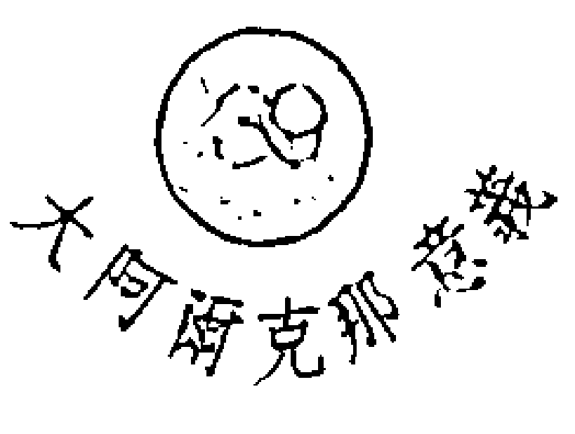

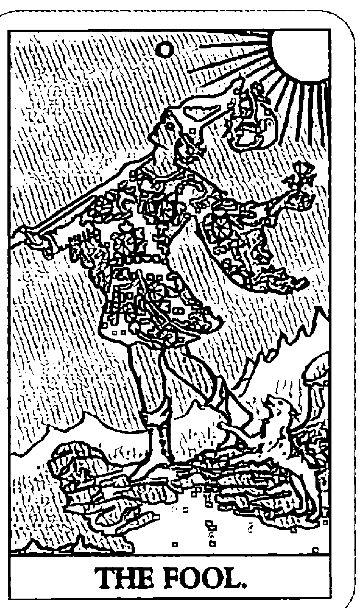

在历史上，愚人跟“愚人神圣”的概念，或疯狂、不负责任被视同神圣的想法有关。欧洲中古世纪的宫廷里，皇帝（或皇后）的弄臣为娱乐皇室成员和其来宾，享有戏弄一切人事物的特权。“痴傻”（fool）这个字实际的意义是“被保佑”，而且在古代时期，当大家的行為举止像小丑般时，就会举行狂欢酒宴。

## 王牌0

### 愚人 The Fool

愚人暗示改变，不管改变是大或小，都要信任它。许多人觉得改变是种威胁，而且会引起混乱，因此变得依恋目前的一切，任何足以扰乱现况的都会让我们感到不安。愚人出现时，代表需要改变，而积极向上和丢掉恐惧是处理改变的最佳方式。

这个工作对任何人来讲都不容易，特别是青少年。因此，如果改变对你成了一个问题，好好研究愚人这张牌，学习他无忧无虑的态度，凡事往好处想。你很可能没花太多努力便已调整好自己。你面对的改变也许是转校就读，由国中上高中或是进大学就读。你可能搬迁到一个新的城市，或是你的父母正在谈离婚。不管你的生活发生了什么，把愚人出现视为一道希望，你即将开始一个新的生活。

### 愚人的牌义

一个新的开始。你需要信任你自己的内心。相信一切会没事。准备好扩展你的自觉或开始一条心灵之路。天真无邪。跨入未知。无忧无虑的态度。愿意冒险。突发状况。新方向。信心。乐观。把过去抛在脑后。不顺从。开启新生的契机。

## **王牌 I**

### **魔术师 The Magician**

魔术师是...了解这些“元素”的知识。

魔术师出现...掌控我们生命里的事物。

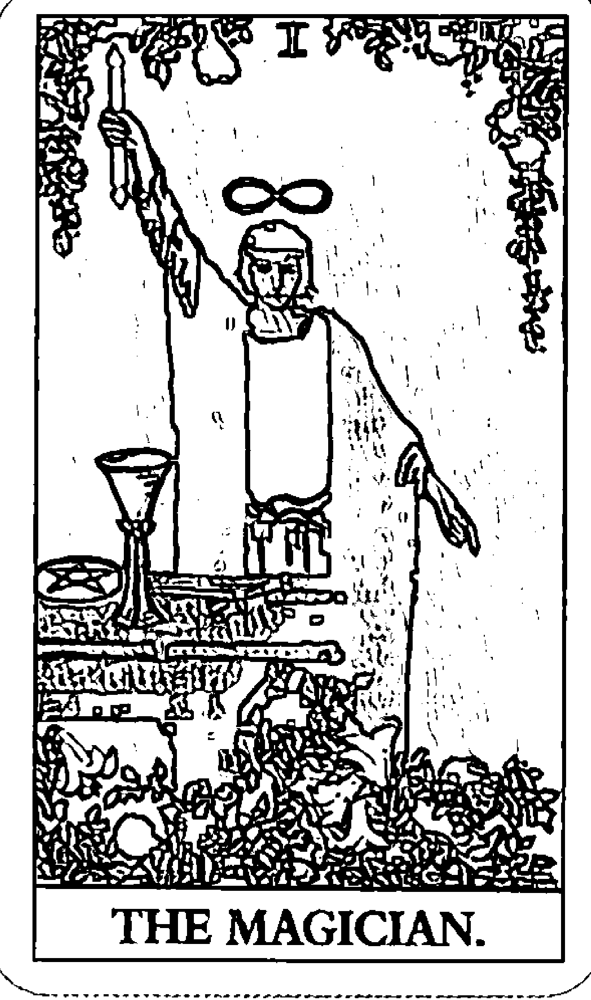

魔术师相当于水星和希腊神话里的赫密斯神...他告诉你要留意自己的直觉。

### **魔术师的牌义**

你有目标...现代科技专业知识。

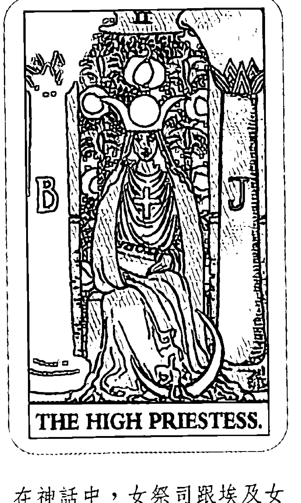

在神话中，女祭司跟埃及女神爱西斯 (Isis) 有关连，爱西丝充分了解宇宙的工作，熟悉天界和她的丈夫欧西里斯 (Osiris) 所统治的冥界。她代表神圣智慧和联合两界的法制。

## 王牌 II

### 女祭司 The High Priestess

女祭司代表神秘的生命，她的出现表示有些事情尚待揭晓。她象征女神的女性精神力量，万物由此女神创造，亦回归到她不停旋转的生命循环里。她通常坐在或站在两根樑柱间，这两根樑柱代表世界的善恶、明暗、真假和正负两面。

女祭司出现暗示你有些心事正准备浮现出来，你需要更加留意内心世界，像是梦想、想像力和直觉。你需要了解全部的自我，包括夜晚里的自己，还有你在白天里的个性和活动。你已准备好接受开发这一部分生命的重要性，但却因为恐惧和惰性而退缩不前。另一个可能性是你内心里藏着某些你需要去面对的东西。

### 女祭司的牌义

你的内心世界需要被注意。心灵力正在工作。有兴趣谈柏拉图式、精神上的恋爱。扪心求取答案的时候。期待梦境带来讯息。深藏的影响。研究玄术。注意到表面之下的无形世界。需要反省、思考和祈祷。需要咨询智者的意见。报名学习和更高教育的课程。开发天赋。

## 王牌 III

### 皇后 The Empress

皇后代表美和爱，以及一切正面层面的爱与照顾在社会概念上的物质角色。皇后出现在青少年的卜卦里时，通常表示有婚姻或母亲方面的问题。依你的年龄而定，你可能只是在思考婚姻有何意义和你对它有何感觉而已，或是你可能期盼婚姻或积极寻觅结婚对象。你甚至可能怀了孕，或是知道某个人怀孕了。

皇后可能指出你在情绪或生理上出现问题，或是你正身处某个状况，亟需无条件的深爱和照顾。这张牌跟照顾的过程有关，你可能跟你的母亲或某个形同你母亲的重要人物有相关的问题，或是你的母亲对你的照顾有问题。有时候这张牌指出一个“令人窒息的母亲”。皇后这张牌非常适合用来思考照顾、婚姻承诺或生活优渥方面的问题，通常代表正面意义，而且道出喜乐的面向。

### 皇后的牌义

- 各种丰实。富饶、繁荣、物质享受、创造力、活动、个人成长。照顾自己或别人。社交成为问题。耽溺于性关系。希冀遇到更多好事。母性本能被唤起。过渡到人生的另一阶段。跟自然和土地之母有关系。

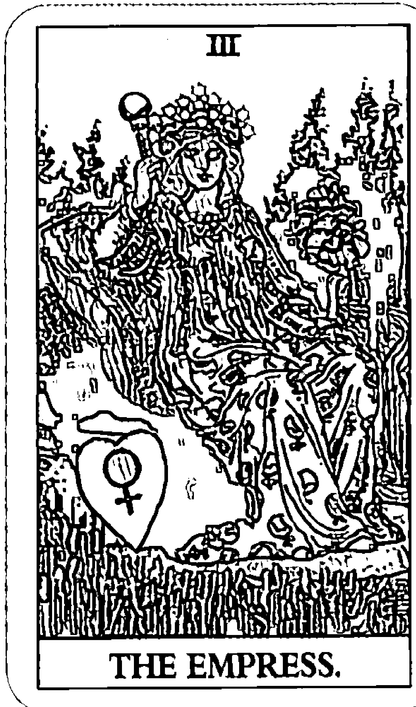

皇后对应的是爱与和谐的金星，是一个有力量的女性人物，亦跟古代的母神相连。在基督教传统里，她类似圣母玛利亚。由于金星象征女神，皇后是大自然与人类孕育力，以及需要社会责任的主要标志。

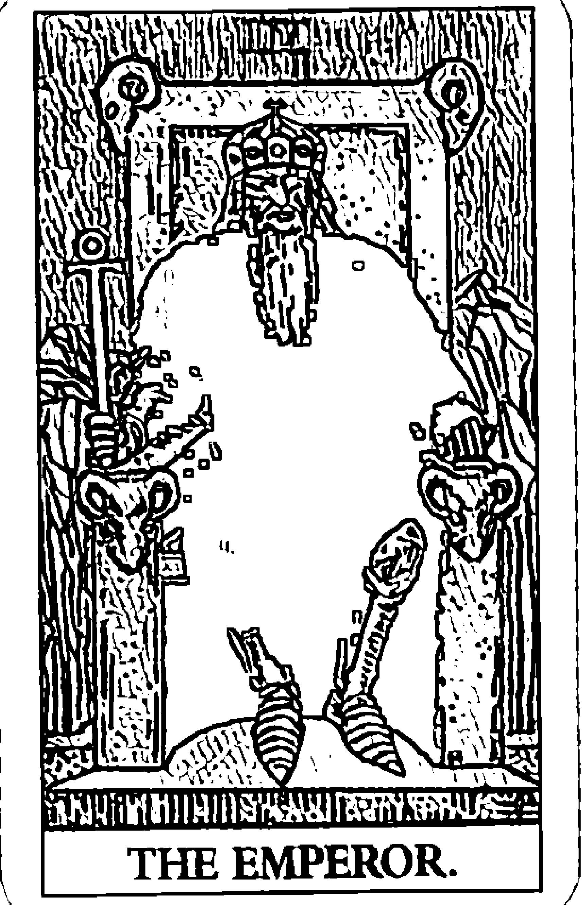

## 王牌IV

### 皇帝 The Emperor

皇帝代表权威，令人联想起世俗里典型的雄性力量。身为王国的仁慈统治者，他抱持着一种被动性慈爱的态度。皇帝是世俗力量和智慧的一个正面象征，相对于皇后的母亲角色，他是一个亦师亦父的人物。然而他了解，一个人必须愿意和有能力捍卫，才能保有和平与安全。俗话说：“自由的代价是永不懈怠的警戒。”他教导世人了解力量的意义和运用，同时告诉我们，有时候非得动武抵抗恶势力不可。

皇帝出现时，请寻找跟权威有关的问题。也许是青少年个人跟父亲或其他权威性人物的关系出了问题。当你正努力寻求独立，做你自己或思考“父亲”在你的人生里有何意义时，经常会出现皇帝这张牌。跟父母分开是人类成长的一个关键阶段，而且非得完成这个阶段不可。

在神话中，皇帝对应古宗教父神，像是古希腊神话的宙斯和古罗马神话的朱比特有关。斯堪地纳维亚人（北欧人）称他为索尔（Thor，雷神），亦是英文星期四被称为 Thursday 的由来。

这些古神皆以拋掷雷霆和闪电的能力知名。从无宗教信仰者的观点来看，皇帝追随皇后，他代表她的男性伴侶，牧羊神（Pan）是最常见的其中一个人物。由于皇帝是皇后的配偶，代表父母身分和男性创造力。

### 皇帝的牌义

长大成人。能负责。做自己，有自己的权威。自我肯定。理性思考，取代情绪化思考。期待你的人生在世界里有其意义。各种成就。雄心壮志。需要安全感。有组织性。自我控制。赚钱。承受重要计划。处理跟权威人物间的问题。寻求良师益友或长者的意见。父子关系问题。受雇工作。政治。尊重。

## 王牌 V

### 教皇 The Hierophant (或 High Priest)

教皇也是个力量和权威的人物，不过是宗教的权威。有些牌给他“教宗”(Pope)的头衔，他具有的力量决定着你为了达成“救赎”，必须做什么事情和必须如何生活。教皇象征教育，为物质和心灵的世界之间搭起一道桥梁，就像传道者被有些人视为神与人的媒介一样。他可被视为寻求奥秘知识者的教师，身为青少年的你，牌卦里出现教皇时，透露出你正追寻一套生命哲学作为指引，无论你对神有何概念。也有可能是你正把自己从一个旧信仰体系里解放出来。

教皇象征对追随者行使权威的有组织性机构，因此，教皇出现代表“选择”的想法至上。此阶段的心灵发展期间，你正面临着继续做为一个追随者，或逃离且发掘自己的真实心灵的挑战。

### 教皇的牌义

- 奠定基础。
- 专业咨询或意见。
- 更高的道德权威。
- 感谢传统。
- 保守性信条。
- 对外权威有问题。
- 如学校或教会等的机构。
- 意义的追寻。
- 道德选择或发展。
- 来自老者、智者的协助。
- 对人生认真以待。
- 服从。
- 品行规则。
- 处理“体制”问题。
- 校方人员。
- 角色模范。
- 传统价值。
- 医生，教师，顾问。

在神话中，教皇代表探索人生的意义。他跟代表学习和传播知识的射手座有关，引导寻求心灵的人发现，在外在和内心世界之间，以及物质与非物质世界之间有着一道桥梁。他教导说，真实的智慧和真正的心灵超越组织性宗教教义，并以内心心灵世界的真理为基础。

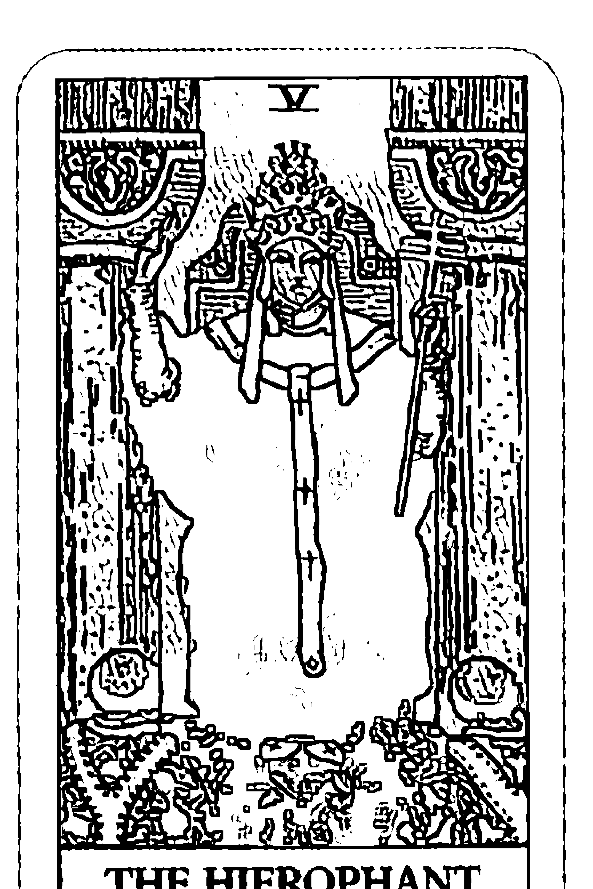

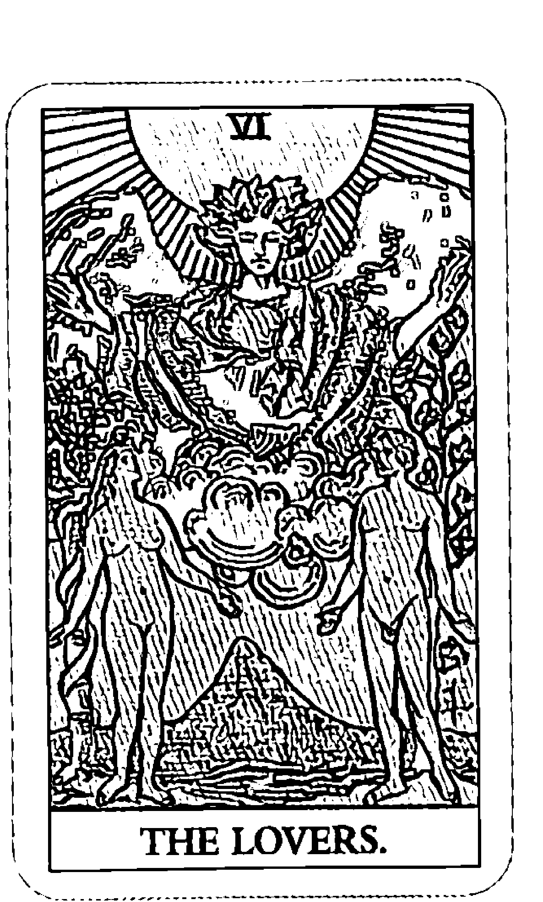

## 王牌 VI

### 恋人 The Lovers

在神话中，恋人对应古希腊司爱与美的女神爱芙罗黛蒂（Aphrodite）和她的儿子，爱神伊罗斯（Eros）。古罗马神话里，爱神叫邱比特（Cupid），他的工作是射出爱情的箭。他认为处于一种疯狂的状态，专找毫无防备的年轻人做下手对象。

这张牌往往被解释为跟罗曼蒂克的爱情有关，但它真正的意思是对立两方的结合。恋人这张牌牌面的意思是，你必须为人生中某件大事做决定。的确，这可以指选择一个爱情伴侣，但同样也可以指别的大事，像是就读哪所大学，或父母离婚时跟谁住在一起。恋人表示做选择时需要有识别力。牌面上出现的男女人物通常不仅象征人类的爱与婚姻，亦象征人性充满对立，需要和解和共处的自然两面。恋人标示出一个十字路口，你要知道一切的分歧，小心选择，为你自己的发展，还有其他相关人士的需要着想。

对青少年来讲，恋人经常表示性方面的问题，通常跟性事变得活跃或跟一个不同的人发生性关系的选择有关。做这些选择态度必须严肃和沉静，切莫草率。

### 恋人的牌义

空气中弥漫着爱。性的花朵绽放。诱惑。一个重大的人生选择。一个考验期。在两个对立的选择间选出一个。面临对立的状况。专心谈爱。爱的阻碍。想要一个伴侣。对婚姻充满遐思。内心交战。面对分歧的选择路口。对承诺存疑。意义重大的另一半。有意发展新恋情。需要做决定。伴侣关系。选择一条新的道路。

## **王牌 VII**

### 战车 The Chariot

战车的牌面象征有需要控制以及调和内在、外在的竞争力。它的出现说明了你需要为某件事件努力，这件事就像两党组成的政府一样，尽管驰名，却很难达成。战车规劝你要控制生命里矛盾的元素。为了做到这点，你需要自我控制和清楚思考后所决定的一个策略，以及目标感。占卜里出现战车通常是件好事，它肯定你有方法战胜障碍和继续留在你为自己设定的轨道上。在你的努力和决心下，外来的协助即将到来。你可能正处于为你的人生和未来目标，创造一个坚定基础的转换期中间。这张牌义可能表示，你需要动身前进，处理现实的问题。字义层次上，战车指旅行和交通运输，可以表示你正改变交通模式，可能是买了交通工具，如一部车或脚踏车。

### 战车的牌义

控制你自己和你的状况。目的清楚。决心。解决内外在冲突。自决和自主。专心一志。设定目标。野心。取得进展。意志力。无畏障碍，奋勇超前。奋斗克服冲突，凯旋而归。一部新车。车轮。

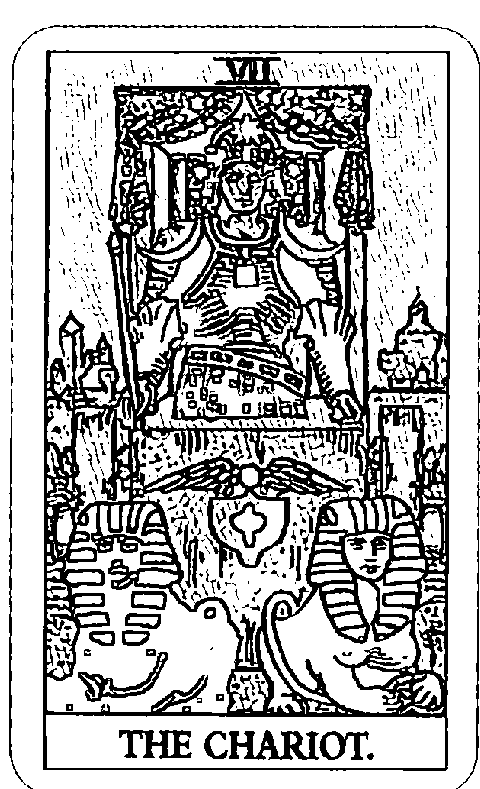

在神话中，战车对应古希腊神话驾驭着一辆火战车飞越天际的太阳神希里奥斯(Helios)，以及古罗马人游行庆祝他战胜凯旋归来的太阳神 Sol。

驾驭战车的战士代表成功和一个让你管理一切能量所在的焦点。在这股能量驱使之下，你能够建立一股动力，带领你征服一切逆境，找到人生真正的道路。在直觉和清楚的目标指引下，你掌控着自己的人生。

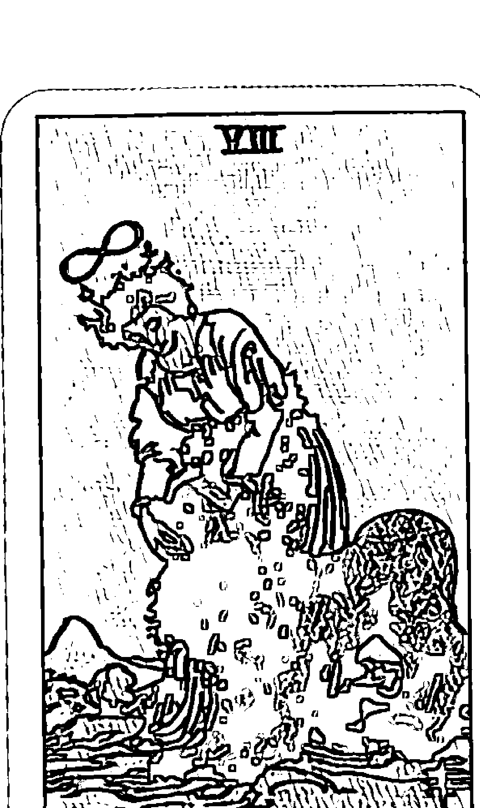

## 王牌 VIII

### 力量 The Strength

（请注意：有些牌把力量的号码定为 11，正义定为 8。伟特塔罗牌把力量的号码定为 8，大多数新牌皆采用此体系。）

这张牌牌面上通常是一个女人和一头狮子，象征自信和内在的力量。力量这张牌出现时，表示你正和你的“兽性”或直觉力和谐共处。你正展现出精神上的勇气和毅力。力量代表你已经走过困境，学会倚赖自己。你的位置很坚定，历经考验和苦难，未被打败。柔性主义总跟天性保持紧密接触，因此它能够以直觉本能的天性来调和精神的理性。我们并非以暴力、男性的手段来征服我们的“兽性”，而是采用感觉上跟我们天性的直觉面融合一致的温和方式。

力量对应古牧羊女神“野兽的女神”，古希腊人称她叫阿特蜜斯 (Artemis)，狩猎女神。力量亦跟古埃及伟大女神，狮头人身的塞克美特 (Sekmet) 和司爱、美和生育的巴斯特 (Bast) 有关。关心自己生理条件问题的青少年，占卜里可能就会出现力量这张牌。它象征无论流行文化倡导哪种流行，我们必须正面接受一切柔性的一面。

力量劝告我们要仰赖内心的力量和直觉。只要能够忍耐和有耐心，心灵的力量将会胜过体力。它告诉我们，必须对自己和内心的过程有信心。

### 力量的牌义

直觉力。内心的力量。自律。自信。相信自己的能力。保护。勇气。健康良好。复元。重振活力。女性力量。受压力之苦。成功。体力或运动力。狂热。精力充沛。以自我和达成的成就为荣。自我保护。建立技能。伦理。自我控制。

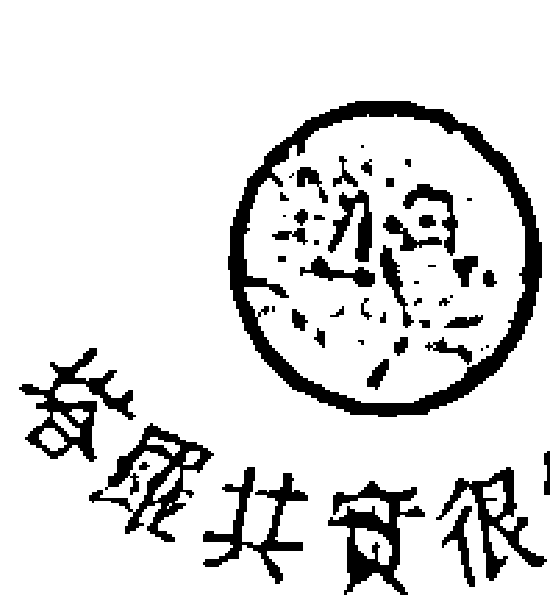

## 王牌IX

### 隐士 The Hermit

隐士是一个指引性人物，散发原型老者和神话传奇故事里贤人的智慧。睿智的他为寻找真理，在无形和有形、物质和非物质世界里踽踽独行。他提着一盏灯笼，照亮方向。身为一位追寻者，他没有地位，不需要他人的敬慕，孑然一身。他的目的在指引你找出真实的人生方向。他拎着一根木杖，代表他与自然、直觉相通的桥梁。他跟象征人类生命有其自然限制的时间老人（Father Time）和土星相通。隐士出现时，告诉你可能需要更多时间独处，或是你已经抽离一般的世界，也许你乐于此举，或是因为你感觉被排斥才这么做。也许你为了展望人生，正处于一个“独行侠”阶段。隐士可以表示真实生活里的一个良师，或是一个等着被你在安静反省时召唤的心灵向导。你可能正在探索和了解影响着你的力量。

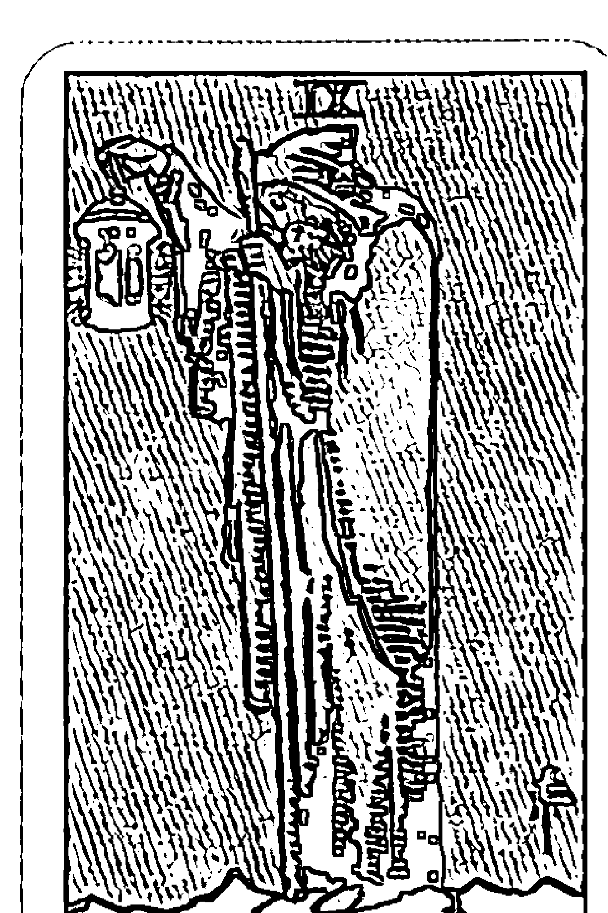

隐士的出现强调，此时此刻探索世俗和心灵世界的知识对你非常重要。对许多青少年来说，这表示努力读书，或寻找一条个人的心灵道路，或两者皆是。

隐士带你进入内心，在那里你会发现你所需要的指引。由于隐士跟过去和生命的限制有关，你可能正努力地让自己从这些限制中释放出来。

### 隐士的牌义

抽离世俗课题。沉思和冥想。孤独或与世隔绝。研读时的安静时刻。独处。寻求老者的劝告或忠告。自我检测。发现内在的自我。需要平静。自我领悟。追寻真理。沉思生命之谜。认真。启发。信任内心的指引。心灵的建议。

指引人物可能代表某种顾问，像是治疗师或圣职者，但它通常指内心的指引或来自另一面的向导。

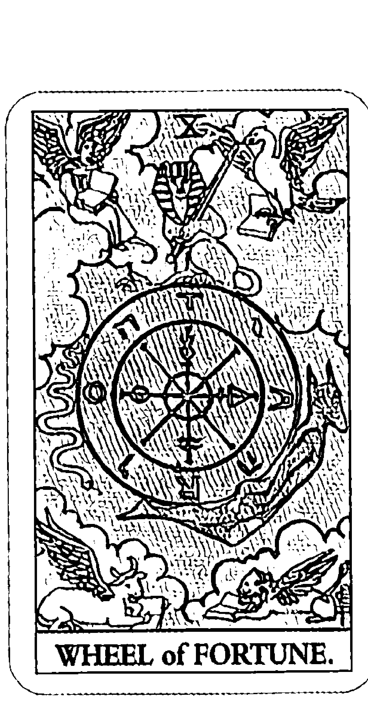

## 王牌 X

### 命运之轮 The Wheel of Fortune

命运之轮是世界全体的一个古老象征，代表生、死和再生的循环永不止息。命运之轮出现时，表示某些事情已付诸行动，如今只需等待结果，通常会是好的结果。你可能已申请一份工作或一所大学，也有可能刚开始一段新的友谊或恋情。就算只遇到一个小小的机会，就能让命运之轮开始转动。不管是什么启动了命运之轮，都是迈入一个新阶段，也许你很快要为下一阶段的人生做重要决定，也有可能一个意外的发展将会大幅改变你的人生。

命运之轮代表古波斯诗人欧玛尔·海亚姆 (Omar Kayyam) 在 Rubayia 诗篇里的想法，大致的意思是：“命运之书已写，任你再有魔力和智慧，也改变不了其内容半行。”这张牌意指生命的循环，可以帮你的成长和发展指点迷津。

### 命运之轮的牌义

好运。事情顺利。第二个机会。一个新循环开始。进步。善恶有报，因果报应。知道行动的后果。意外的运气。改变。强劲的助力。人生的新页。需要接受命运的安排。发展迅速的事件。新方向。相信宇宙过程。学习适应。

## 王牌 XI

### 正义 The Justice

占卜里出现正义这张牌时，是一个肃静的命令。请注意：不管你为哪种情况问卜，都必须小心衡量许多因素。正义这张牌告诉你听从内心的指引，并咨询他人的意见。它建议你采取行动前必须谨慎、细心和从容，换句话说，你必须运用良好的判断力。如果你的行为保持理性，就可以做到正义。你需要在自己和他人的需要中间，或在学业、社交生活、感情、目标和课外活动里找出一个平衡点。可能会有一位第三者来协助你获得应有的公正结果，这张牌可以代表一个律师、法官、证人或执法人员等等。如果你正处理一个法律问题，只要你站在正义的这一边，就可以期待一个正面的结果。你可能必须做重大决定和学习严肃的教训。

### 正义的牌义

法律之事。平衡与协调。考虑他人的意见。意见与建议。保持开放的心胸。整合。公正。公平无私。保护你的良好名声。跟权威交涉，特别是法律方面。权衡赞成与反对的议论或理由。相信你的直觉。崭新且更好的教育。采取适当的思考与行动。避免结交损友。为达成长期的成功而在关系上妥协。为正义奋战。

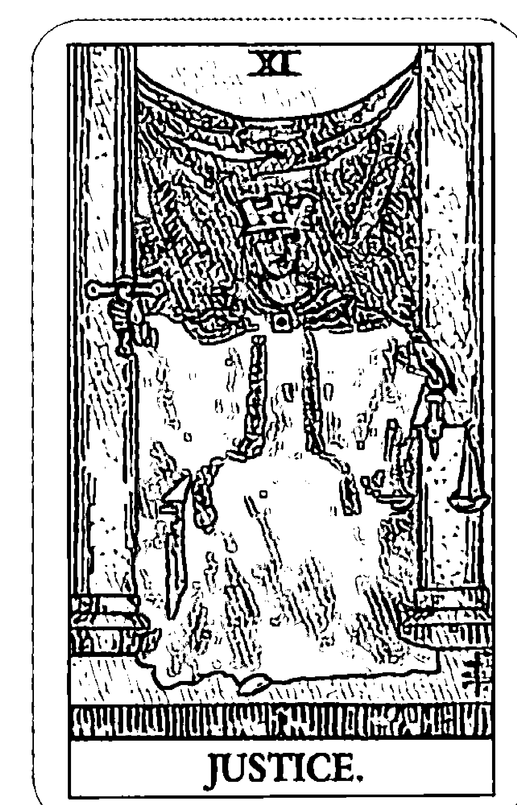

正义这张牌出自古埃及神话。埃及古传统里，女神玛特（Maat），她的名字的意思是“真理”与“正义”，用一座天秤来决定能否让一个人的灵魂进入阴府之神欧西里斯（Osiris）统治的阴界。玛特也跟印度教教徒“要怎么收获先怎么栽”的业力（Karma）想法有关。佛教徒“因果循环”的传统，以及基督徒以悔改作为救赎之道的概念都反映出这个想法。

## 大牌XII

### 倒吊人 The Hanged Man

倒吊人這張牌的牌面是一個人被頭下腳上地吊著，一隻腳勾在另一隻腳的膝蓋後面，兩隻手彎著被綁在背後，但臉上的表情卻很平靜。這表示他在尋求啟發，並靠著拋棄表面快樂和平凡追求來達成這個目的。

他出現時，象徵你在心靈上已經準備好一個大改變。你正在一個十字路口上。你可能有過一次重病或損失的經驗，使得你的人生方向動搖，讓你驚覺需要做一些改變。如今你知道，除了金錢和物質外，生活裡還有其他東西，你尋求用一種更心靈的方式來過生活。

倒吊人出現代表你已經準備好專心致志於內在的成長。你可能感覺有一股自行出發的需要，或是從日常生活裡抽出身來，重新評價一下事情的優先順序，並決定哪些重要、哪些不重要。你可能很難走出舊模式，如一段關係、一群朋友、一種信條、過度倚賴父母，或者是被定格了。

倒吊人出現時，我會問我的客人：「誰控制你的思想？」答案可能會讓你驚訝地發現，你的思想受自己控制的程度，並沒有你相信的多。很多青少年的想法受到同輩好友、父母或師長的意見左右，要掌控自己的思想，你需要學習用新的方式來看待事情。倒吊人代表這項能力的開發，控制你的思想讓你能夠「創造自己的生活」。

## 倒吊人的牌義

- 嶄新的展望。
- 改變的時刻。
- 需要定出優先順序。
- 生命何去何從？跟隨自己的節奏。
- 以不同的眼光看世界。
- 犧牲。
- 承諾。
- 鶴立雞群。
- 自動放棄事情。
- 暫停正常活動。
- 取得一個新鮮的觀點。
- 一個過渡期。
- 心靈發展。
- 放下，聽神的安排。
- 找出真正的自我。
- 沉思。
- 休息。
- 放鬆。

## 大牌 XIII
死亡 The Death

死亡這張牌往往令人害怕，但它的出現純粹象徵力量的轉變，並非指實際上的肉體死亡。它代表一個循環的結束。對青少年來講，死亡特別代表一個人生階段的結束，以及一個新階段的開始。你也許由國中畢業去念高中，或念完高中上大學。你可能覺得要改變很痛苦，不過，這只是成長的一部分，而成長本來就不容易。當你結束人生某個階段時，感覺悲傷是很自然的，不過，隨著你日漸長大，就算你有調適的困難，也能在新狀況裡找到新的滿足。接受有些事情結束的事實，別試圖躲避。你身處一個轉變的過程裡，人生就是這樣，總有些事情必須「死去」，新的才會來臨。接納改變會讓你更進一步成長，如果你感覺很沮喪，死亡又出現，千萬別覺得不安。不過，假如你對死亡這張牌有許多想法或恐懼，請馬上找個可以信任的長輩商量。

## 死亡的牌義

人生的大改變。由一個階段過渡到另一個階段。脫離老舊的生活模式。一個循環的結束，另一個新循環的開始。狀況改變。損失引起新的想法。拋棄不需要的東西。一段戀情或友誼的結束。離家。童年結束。放棄沒用的東西。一個嶄新的生活風格。搬遷。失去童貞。家人離婚。

死亡的號碼是 13，巫婆的號碼。陰曆上，第 13 個月是神秘重生的時刻。在神學上，死神出自印度教女神卡莉 (Kali)，她的脖子上戴著一條骷髏項鍊，以及古希臘閻王海地斯 (Hades)，古羅馬神話稱他為普魯托 (Pluto)，這些都是有力的人物。死亡的念頭經常佔據青少年的心，這些人物可以用來做為冥想的影像，以及用來學習死亡只是人生的另個階段。

瓶子象徵古代偉大的女神，人類的肉體被稱為靈魂之瓶。兩個瓶子間傾倒的水綿延不斷，代表物質面與心靈面恆久的交融，並象徵生命的神秘之水永恆川流不息。因此，牌面上的人物通常是一個天使，還有水瓶指合作、平衡、和諧、接納和創作力的柔性精神。

### 大牌XIV

## 節制 The Temperance

節制這張美麗的牌，牌面是一個人物把生命之水由一個金瓶倒進一個銀瓶裡面。這張牌就跟它的牌名一樣，意思是節制和平衡。節制（Temperance）源自拉丁文的temperare，混合著節制、和諧的意思。需要耐心時，節制這張牌就會出現。你目前所處的位置成就不了大事，在生命能源結合的同時，除了等待外，你什麼事也做不了。學習優雅和有建設性的等待，是一門非常值得學習的藝術。別做任何事，留神進行心靈過程。了解總會有做不成事情的時候，也要明白，其實沒有事情需要去做。待在優雅、放鬆的狀態裡……這是禪師其中一個最偉大的功課。

節制象徵你正身處的狀態需要你去練習創造天賦，並以節制的態度去解決棘手問題，不在事情尚未準備好前匆忙做結論。在此狀況裡，你極有可能受到天使的影響。注意有形的助手。

### 節制的牌義

耐心。謹慎。走中庸之道。時間點剛好。慎重。一個平衡的觀點。公平看待一切方面。避免走極端。創作力和新主意。不同的關係。重新評價態度。慎重的課題，特別是跟性方面有關的。修護傳承。慈悲與憐憫。寬恕。妥協。忍讓。節制、中庸。

## 大牌 IV

### 魔鬼 The Devil

魔鬼是另一張令人害怕的牌，牌面上的魔鬼經常頭上長有一對角，腳上有蹄，有一條毛茸茸的尾巴和握著一根鐵耙。前面有一男一女的人類被鐵鍊鎖在一起，但鍊子是鬆垮垮的，暗示「自我設限」。當魔鬼出現時，你需要重新評價你跟物質的關係，檢討關係，特別是有傷害性的關係，以及面對你對社會和這個世界裡的事物的態度。換句話說，你需要檢討現實，該是你拋棄那些讓你畏縮的東西，比如恐懼、煩惱、壓抑的時候了。與其要求別人來滿足自己的需要，你需要以正面的態度來看待自我負責的挑戰。攪亂你的生活的狀況中，可能有性方面的因素，這點你可能心知肚明，卻抗拒採取正確的行動將自己釋放出來。或者你可能被某種關係束縛著，為了自己好，你必須脫身離開。不管是哪種狀況，只有你自己才能改變它。

> > 在神話中，魔鬼出自统治一切自然的过程，包括色欲和性的古代牧羊神，古希臘神話稱他為酒神戴奧尼索斯（Dionysos），以爛醉如泥和戲弄森林之神薩提爾斯（Satyrs）知名。他是無宗教時期裡的角神，為了表達對他的敬意，女神的女性追隨者舉行狂野的生產禮。基督教教會畏於年度狂歡儀式含性解放概念的威力，嚴禁一切異教與無宗教儀式，特別是包含性活動的儀式。

## 魔鬼的牌義

- 負面思想
- 困在一個不堪的關係裡
- 為你自己的人生負責
- 克服罪惡感
- 不好的依戀
- 面對恐懼
- 過度倚賴
- 性方面的問題
- 感覺自己很沮喪和糟糕
- 自我設限
- 物質與心靈間的矛盾
- 權力欲望
- 操縱別人
- 發現很難放棄傷害你的東西
- 感覺陷在狀況裡而難以脫身

高塔深層的意義是心理和心靈性的。儘管它的出現代表毀滅，預言將有巨大變化，某些東西將被破壞，但其他更好的東西也會跟著到來。就算事情發生得很突然，令人震撼，你仍必須坦然接受，巨大的變化最終只會讓你受益。守著舊行為、舊思考模式或舊信條不變，只會讓你固步自封。等你克服掉不安的感覺後，就會發現自己已經解脫。

## 大牌 XVI

### 高塔 The Tower

高塔的牌面是一個類似碉堡的建築物被閃電擊中後失火或倒下。跟死亡和魔鬼一樣，高塔出現時往往令人心生畏懼。不過它純粹是一項警告，要你改變或擔負後果。如果你拒絕承認有一股改變的迫切需要，宇宙會使力把改變加諸在你身上。接著，「咻」一聲，災難降臨。你可能被退學、失戀、撞壞車子、遭禁足，最後不得不好好自我檢討一下。高塔警告說，與其頑固地四處找問題出在哪裡，你必須面對事實立即改變，不然你將要付出代價。老舊的結構會被外在的影響所動搖，所以你能長大成為真正的自我。待事情逐漸平靜後，你將有機會重建，選擇珍貴的東西保留下來，並丟掉你現在不需要的東西。

## 高塔的牌義

突然的改變。不安之後的一個新人生方向。你的正常模式遭瓦解。一個驚人的洞見或啟示。大變動引起轉變。認知結構上有瑕疵。從舊模式裡跳脫出來。新價值觀。面對重要課題。好計畫失敗。跳脫傳統思維。由失望到理解。拋棄無用的東西。

## 大牌 XVII

### 星星 The Star

這張可愛的牌牌面上經常出現一個裸體的女性人物，明亮的背景上高掛著星星。星星這張牌總是正面的，暗示你正受惠。它代表有幫助的人士、創造的靈感和一個你將得到想要的東西（如果對你是好的話！）的承諾。星星出現時，表示你受激勵自信地開發你的能力。你的欲望跟你正確的人生道路同步。如果它跟在高塔這張牌的後面出現，表示你可以從某個創傷或壞狀況裡復元過來。你正進入一個嶄新且更快樂的人生階段。星星提醒我們宇宙所有的重大意義，如今該是你思考自己的潛能，長大的時候了。通往新方向和新成功的一道大門已經為你打開。你已經在物質世界和心靈領域之間達成一個正確的關係，這會幫助你成長。這張神聖的牌相當於你「靈魂生活」裡的東西。此時是你肯定自我的大好時機。

> 索馬利亞人善於觀察星象，追蹤星星（行星）的移動，導致星象學的誕生。星星這張神聖的牌跟星象學之間有很強烈的關係，因此，現在正是你拿出望遠鏡觀星或開始研究星象學的大好時機。星星這張牌出現時，去戶外對著你看見的第一顆星星許個願，你的願望也許會實現。願望真的實現時，記得要回饋，表示你的感激。

## 星星的牌義

啟發、直覺、內在智慧、神聖指引、保護、財富。創造性靈感。心靈成長，來自無形力量的協助。一個守護大使。樂觀與自信。享受與喜悦。對未來的展望有信心。開發你特殊的天賦。教育性機會。健康改善。一段壓力期的結束。佳音。重建希望。快樂。幸運。解脫。

## 大牌 XVII

### 月亮 The Moon

月亮是一張神奇的牌，象徵無形世界裡的東西，如夢、想像和精神印象。它豐富的象徵表示你應該更加注意內在的自我。

象徵意義上，月亮召喚你點亮人生無意識的一面，在她溫和的光芒下，你能看見更多東西。月亮柔和的光芒照入我們的內心世界，心靈在此逗留。

傳統上，月亮指負面的狀況，比如自欺欺人，但這些通常是因忽略了內心的世界所導致。月亮告訴你把過去沒做好的工作做好，特別是你跟母親或其他女性的關係。如果月亮跟著負面的牌出現，表示你過度在意別人，卻忽略了自己感情上的需要。相反地，如果相鄰的牌指出對外活動，你可能正從一段長時期專注於內心的階段裡走出來，已準備好把一個獨特和充滿創意的你呈現給世界。

在月光下，我們的思想比白天時更為理性，更能夠明瞭自己心靈的渴望，更能注意到自己的感覺和內心渴望間的細微差別。

作為一個女性象徵，月亮的領土就是我們感覺和回應的東西。它反映出人類天性裡一切被接納的東西。你的陰性自我隨著宇宙的節奏流動。地球上的萬事萬物無不受月亮影響。

## 月亮的牌義

- 柔性主義
- 深層的內心力量在作用著
- 過去影響現在
- 神秘與愛情
- 如詩、如樂、創作力
- 接納和聆聽內心指引的時刻
- 逃避主義、遐思
- 可挑戰性
- 過度感情主義
- 壞心情
- 不確定性
- 預感
- 發現隱藏或被保持秘密的東西
- 自然、動物、野生物
- 眼界
- 諮詢或心理治療
- 重溯過去做檢討

## 大牌 XIX

## 太陽 The Sun

就像一個美麗的晴朗天能夠激發出良好的感覺一樣，太陽這張牌喚起自在和喜悅。它的出現是好事即將到來的一種保證。就算在它前後的牌是負面的，太陽都能大幅減輕它們的影響力。太陽是一張快樂的牌，而且總是表示好事。如果是準備考試和參加考試，一定會過關。太陽跟小孩、童年有關，可能指出生。你即將受到注意，可能會收到禮物。你的心情很好，幸運跟著你。你每天的狀況正在改善。你能夠拋掉以前的煩憂，相信太陽會照耀在你身上。新的一天來臨。愛情唾手可得。你受啟發，變得樂觀和充滿創作力。如今你對自己感覺充滿信心和安全感，做你自己並不困難。你正在開發你的個體性，感覺自我表達和訂立目標全無拘束。

在神話中和歷史上，太陽代表陽性主義，是許多文化崇拜的神祇。它燦爛的圓體被視為生命之源（事實亦如此）。印度教教徒視太陽為梵天神（Brahma）的化身，古波斯人的太陽神是米斯拉斯（Mithra），迦勒底人稱之為貝爾（Bel），腓尼基人則稱之為阿當地（Adondi）。古阿茲特克人崇拜奎茲特克（quetzalcoatl；譯注：太陽人），這些宗教傳統都相信太陽代表宇宙的創造力。

## 太陽的牌義

- 成功、樂觀、成就、財富、繁榮、熱忱、榮譽、大眾認同、快樂。健康、活力增加。野心與自信。設定目標。機會和進步。學術成就與榮譽。陽光假期。慶祝。與小孩的關係良好。玩樂。生氣勃勃。豐富。愛遊玩。滿足。自我表達。

## 大牌 XX

## 審判 The Judgment

審判表示一個嶄新或更高意識狀態的覺醒。你可能正在檢視你的信仰，或為開發你個人的人生哲學，悖離傳統或家庭。審判這張牌代表先前一個人生方向的結束和一次生活復興。你正透過自我改善和了解心靈來尋找新的方向，進行調適，以蛻變變得更完整。這是一個決策和改變的時刻。對青少年來講，可能包括生理變化和狀況的改變。可能是你念完高中進大學，選擇科系或職業。你可能感覺自己被「困死」在老套狀況裡，而且你已經做好準備做出改變生命的轉變。審判象徵一個改造生活的獨特契機，讓你能夠過自己想要的生活。你正脫離一個舊的生活方式，結束一個循環，朝某些更大更好的東西邁進。別人可能在評判著你，可能是你在找工作或申請大學，但結果多半對你有利。疑慮和躊躇盡消，宛如新生，你正期待一個全新的自由，做你自己。

所有大阿爾克那牌面的寓言象徵裡，審判這張牌最具基督教色彩，意指審判日當天，所有靈魂都會受到上天堂或下地獄的審判。然而，其他文化亦表達相同想法，基本上意指心靈的覺醒。今日，當有事件致使我們重新評價生活方式時，我們會說這是一記「喚醒鈴」。在神話中，審判相當於古希臘靈魂之神赫密斯 Hermes，代表內心世界的神奇力量。

## 審判的牌義

一個里程碑。嶄新、正面的發展。結束與開始。評判對錯。評價與被評價。被評判，通常是正面的。一個過渡，像是畢業。新契機。拋棄舊有的壞習慣。看見曙光。探討價值。通過考試。過去的努力獲得回報。改過自新。對你有利的一個法律決定。痊癒。

## 大牌 XXI
世界 The World

世界是大阿爾克那最後一張號碼牌，代表愚人心靈旅程的結束。它的牌面通常是一個女人，被一圈由藤蔓、樹葉和花朵的橢圓形環包圍著，代表生命的領域互相連結。世界這張牌出現時，表示你已經成功地為一個階段的心靈旅程做出最好的總結，如今將收到你賺取的回報：完整、清新，你已經準備好前往一個更高的層面，是一個全新開始。祝福隨你招手即來：事業獲得回報、進入心目中的大學、加入一個運動隊伍或有一股天時地利人和、無往不利的感覺。指完成目標、計畫或學業等。你已經抵達一個實現階段，正發揮你的能力到最大程度。世界指一切生命領域，表示你正把它們結合在一起，或許是在一陣努力之後。整個總比部分好。你正在正確的道路上，朝你的命運前進。

## 世界的牌義

一段漫長旅程的結束。全新的心靈洞見。成功完成某些東西。一個全新循環開始。隨著宇宙的節奏過著良好的生活。身、心、靈和諧。回報、成功、快樂。接觸更寬廣的世界。繼續前進。獲得肯定。自由。平靜。擴展你的地平線。旅行。畢業。取得你應得的東西。嶄新的經驗。達成。抵達你的目標。

開始個人心靈之旅時，你會遇到許多無形的助力。這些力量經常像嚮導一樣，給你帶來平靜和幫你指出方向。它們來自無形的世界，就像是來到人類或動物世界的天使。接觸這個世界能讓你的生活產生變化。有了指引，你進入到一個有著無形規律的世界裡，在這裡，你的世界和生命獲得支持和滋潤。

## 5 大牌

隨著你運用大阿爾克那牌，你會注意到它們代表一趟內心之旅。這是一個浩瀚幾近深不可測的領域，在裡面，你可以探索可能的未來，由過去取得經驗，以及開發你的思想、行動和行為洞見的能力。你將更了解自己的心情和疑惑，以及心裡的困境。你將逐漸變得對你的衝動、渴望、「不理性」的想法和陰鬱的感覺更加熟悉。

## 命運掌握在你手中

塔羅牌雖然可以給你很多訊息，但它只是一個工具，你要牢記，你才是自己命運的主宰，因此牌義要怎麼解釋全看你自己。如你所了解的，依狀況或所問的問題，牌的位置而定，有許多可能的解釋。牌的位置是解釋答案的一大主因。研究每個牌，特別是大阿爾克那，目的是在讓你記下它們各種可能和不同的意義，所以當你看見牌時，就能自動想起它們的含義，並能夠從中選擇最適當的解釋。

不幸的是，塔羅牌經常用來算命，也就是預測未來，這並不是它的目的，最好不要以這種方式使用它。未來不可能預測得了，其中牽涉到太多的變數，沒有事情是可以被確定的。因此，塔羅牌從來不會預測出一個單一且絕對的結果，它只提供暗示，讓你自己（或問卜者）篩選出解答。它就像天氣預測一樣，能夠幫助你決定留在家裡或出門，還有做好在壞天氣或好天氣裡出門的準備。單憑一次占卜結果即做出攸關生命的重大決定，這絕對是大錯特錯，否定了自由意志的概念。不管牌怎麼說，你總會有一個選擇。明白未來未卜的事實雖然讓人感到很恐怖，但怎麼充分運用一切的可能性全取決於你自己。

> 如果神祕學跟能原子能一樣被視為理所當然，文明顯然就不能更進一步演進。

柯林·威爾森
(Colin Wilson)
《神祕學》
(The Occult)

塔羅牌能做的是說明和分析現狀。當占卜指出你正在一條帶領你通往自己想要的目標的道路上時，你便要留在原路上。如果占卜指出你現在所走的路會給你帶來麻煩，你可以調整你的行為和態度來避免它發生。假如占卜指出有一個不好的狀況正在醞釀，塔羅牌可能也會指出方法，讓你能夠擺脫掉它或讓它變得更好。這就是你對牌義的研究能派上用場之處。把塔羅牌占卜結果做完善的記錄，你就能定期追蹤你的進度。

## 開啟直覺力

塔羅牌除了能為一個狀況提供建議外，隨著你的知識增長，還能產生另一個好處。隨著你的研究範圍擴大，你就愈能看清楚一個牌陣的全貌，並將開啟一個把直覺催化到更高層次的過程。科學家告訴我們，大多數人在大部分時間只使用了不到 10% 的腦力（包括理性的左腦和直覺性的右腦），而且這還是我倆做最高速思考時所用到的腦力！學習塔羅牌是一個讓我們增加腦力使用的好方式。

隨著你閱讀本書，你將開始催化你的力量，讓你的夢想成真。對著塔羅牌沉思，讓你對生命的象徵層面能夠有更深層的了解，就算你沒注意，生命的象徵層面亦隨時在你心裡進行著。例如每個晚上，你都在夢裡創造出象徵。

此外，你可以用塔羅牌做視覺練習。這些練習可幫助你加強內心的正面影像，降低負面影像的衝擊。如果你想用某一張塔羅牌做視覺練習，你只需把它抽出來，把心思集中在它上面。接著，閉上雙眼，在內心裡看見你想要達成的結果。例如，你不知道怎麼在兩個愛情對象間做選擇，陷於兩難時，你可以用戀人這張牌來做視覺想像。隨著你想像自己是牌面上的一個戀人，你釋放出無意識的力量，在兩個對象之間做出正確的選擇。

## 生命的解答

你使用塔羅牌的次數愈多，它的影像和意義烙印在你腦海裡的印象就愈深，你將更能夠把塔羅牌用在特殊目的上。它能幫助你解答一切問題，像是「我最後一次考試結果大概是怎樣？」或「我申請某某（學校或公司）## 守護星的使用

想一下你生命裡的人，像是父母、老師、親戚、朋友、愛人等等，然後幫每個人從王牌裡挑出一張守護星，並把明細記錄下來。接著幫你自己現在關心的幾個現狀（問題）各挑一張守護星，並且記錄下來。

每天從紀錄裡挑一張守護星出來，然後把你對這張牌和它所代表的人，或你想到的狀況的一切想法記下來。別做任何解釋，只要把你看看守護星的牌面時，直覺的想法寫下來。

稍後，把你的印象跟本書或其他塔羅牌標準用書介紹的解釋做比較。務必確定每次只能專注在一張牌上。

## 守護星

許多占卜需要用到一個守護星（significator），這是一張被選來代表或象徵你或另一個人、一個團體、一個狀況或一個事件的牌。秘訣是挑選出一張最能象徵一個人或一個狀況的牌，萊德·偉特塔羅牌建議使用一個守護星，因為它「最適合為問題取得答案」。以下是一些關鍵語，可以幫助你選擇用哪張牌來做守護星。

- 0 愚人：小孩或年輕人。天真或缺乏人生經驗。任何一種冒險，如旅行。有其風險的一個決定。
- I 魔術師：有潛在天賦者。各種力量的潛能。有藝術才華者。把想法實際運用。
- II 女祭司：秘密或保守秘密的人。探索非凡或玄妙的知識。學者或研究者。靈力或睿智的女性。
- III 皇后：有權勢財富的成熟女性。從政女性。大地之母的個性。懷孕的女性或母親。
- IV 皇帝：有權勢財富的男性。公眾人物。男性權威人物，如父親、教練、警察或律師。老闆、年長的男性親屬。
- V 教皇：教師、教授、傳道士或良師人物。新式機構的代表人。領贈人。
- VI 戀人：必須合作的兩個人。關係穩定的情侶或夫婦。戀情或友情。影響兩人的狀況。
- VII 戰車：信差或信息。巡調或從軍的人士。控制一個狀況的需要。組織好一個團體。
- VIII 力量：強壯的女性或有力的人。魅力人士。需要勇氣。體育競賽。需要自我掌控的狀況。
- IX 隱士：求知者。需要指引。年長者。隱遁者。指引你的智者。孤獨。檢討過去。
- X 命運之輪：不代表人。用來代表已經進行但結果未明的狀況。期盼最好的結果。
- XI 正義：需做重大決策者。律師、法官、仲裁人。涉及法律訴訟且應得正義者。
- XII 倒吊人：在十字路口或陷入僵局的人。感覺被困者。脫離日常生活尋找新方向或新視野者。
- XIII 死亡：死亡通常不會被用來做守護星，但能代表一個大轉變，比如一個關係的結束，或任何一種損失。
- XIV 節制：一種治療者，如護士、醫師、心理治療師或替代療法業者。需要治療者。受保護人士。
- XV 魔鬼：沮喪或自我毀滅者。感覺被困者。限制你進步的拘束狀況。
- XVI 高塔：高塔不會被用來作為人的象徵，它能代表一個超乎人的控制的混亂狀況。
- XVII 星星：人道主義傾向者。擔任助手角色的人物。娛樂人士。藝術家。漂亮人士。值得信賴者。靈性人士。
- XVIII 月亮：愛作夢和心有所思者。夜貓子。處子。母親人物。提供意見的睿智女性。直覺或靈性人士。
- XIX 太陽：小孩或跟小孩有關的問題。愉快的人士。沙灘愛好者。充滿男子氣概的男性。
- XX 審判：追求真理者。法官或法庭事務。處於新發展階段的人士。處於過渡期的人士。待裁決的審判。
- XXI 世界：贏家。達成者。成就人士。環保人士。達成目標者。成功人士。

## 大阿爾克那的另類遊戲

以下是一些你能用大阿爾克那進行的其他活動，可以幫助你更了解它們：

- 根據你所認爲的正面或負面意義，把大阿爾克那分成幾堆。檢查每堆牌裡的每張牌，檢討你把它放在這堆的原因。思考它們的牌面象徵和顏色，分析你對它們的反應（如果你有兩副牌，另一副牌也做一樣的練習，因爲兩副牌的圖面象徵和顏色並不相同）。把你對每張牌的想法，以及感覺它們正面或負面的原因，記錄在你的塔羅牌記事簿裡。
- 挑選出一張最能吸引你的牌，針對它寫一篇短文、小故事或小詩。寫前先將牌的名稱和號碼寫在塔羅記事簿的最上面。描述你爲什麼特別喜歡這一張牌。
- 適用你的想像力，把每一張大阿爾克那當成一個人，並幫它們創造一個性格。想像有一個舞會，想像它們在裡面彼此會怎麼互動。在舞會裡它們會想做些什麼？你會跟誰玩得最開心？它們會是怎樣的一個客人？你會提供它們哪些點心與飲料？你的父母和朋友對這些朋友會有什麼反應？
- 選一張大阿爾克那，用它來解一個夢，幫一個問題請求解答。當晚把這張塔羅牌放在你的枕頭底下。睡醒後立刻把你的夢記在塔羅記事簿裡。

## 大阿爾克那與十二宮 (Signs of the Zodiac)

我發現塔羅牌和占星學之間存在著驚人的關連，因爲我本人亦是專業占星師，根據個人多年的經驗，接下來我會介紹兩者的關連。如果你不了解占星術，建議購買我所著的《青少年占星術》(Teen Astrology)跟本書一起閱讀。當然，就算你沒有占星方面的知識，一樣可以算塔羅牌，可是如果你具有星座和十二宮的知識，由於它們跟大阿爾克那有關，就能增加你對塔羅牌的了解。

> > 格言
> 
> 「星座是我們個性的一個藍圖，個性即是命運。在我們所在的宇宙裡，沒有什麼是靜止不動的。只要我們能改變態度和行為模式，就能改變，接著，命運也會跟著改變……星星不會停留，只會往前推進。」
> 
> 伊莎貝爾·希奇 (Isabel Hickey) 《宇宙科學——占星術》 (Astrology, A Cosmic Science)

## ◎ 愚人

愚人對應代表精神活動和先進科學思想的水瓶星座。水瓶座涉及人類整體，還有人與人之間的一切差別，以及對這些差別的寬容。水瓶座受天王星掌管，代表每個人的獨特性。它象徵理想主義和大膽冒險，就跟愚人大膽無畏一樣。水瓶座代表思想創新者和人道主義者，水瓶座的精神是前瞻性、甚至未來派，以及熱愛嶄新經驗，就算是危險也好。老派想法和活動會悶死水瓶座。這股能量極度個人化，有時候充滿叛逆性，總是隨心所欲，並急切想把生活當成一種實驗。

### 水瓶星座的主要特質

- 衝動
- 創新
- 覺醒
- 人道主義
- 不受拘束
- 打破舊習
- 解放
- 革命性

### 水星星座的主要特質

- 溝通
- 思考
- 傳遞信息
- 想法
- 適應性
- 聰明
- 膚淺
- 不專注

## I 魔術師

魔術師對應水星星座。認真來講，天王星是宇宙魔術師，以掌管魔法和發明知名，較掌管心智和精神活動的水星高階。水星在水瓶宮裡的地位提高了，意思是說，它在天王星裡功能最強。因此，拿它來對應魔術師，會比占星家一般想像的還要複雜。水星掌管一切溝通，包括寫作、說話、學習、交涉和各式說寫的信息，一切心智、精神活動都跟它有關。水星統治雙子星座，一個風象星座，據說魔術師又統治氣的四象。水星也統治摩羯星座，這個土象星座。這跟魔術師溝通心靈和世俗意識的能力，一種經常引發靈感的技能，有著相互的關係。當魔術師出現時，檢查一下你的水星的位置。

## II 女祭司

女祭司對應月亮，她戴著「月之角」的頭冠。月亮在金牛星座裡的地位提高了，金牛座的角象徵月亮。我們最深層的內在自我，我們的需要、記憶、感覺、心情和內心的節奏，都是月亮統屬的領域。月亮掌管巨蟹座，一個代表直覺力或我所謂的「無形世界」的水象星座。女祭司象徵秘密或某些尚待揭發的東西，以及生命的神秘。巨蟹座象徵情緒關係，記憶和我們只能透過感覺經歷的無形生命。月亮隱藏有我們看不見的一面。它協助我們了解內在，變得更注意我們的感覺和內心的想法，以及聆聽他人的心靈激盪。

### 月亮的主要特質

- 母性
- 感覺確定了自己的方針
- 直覺的
- 照顧
- 倚賴
- 過度敏感
- 心情不穩
- 窮苦

## III 皇后

皇后對應金星，透過這個關係直達他人、欲望面，再到外在的世界。金星是愛情、美麗、欲望和快樂之星，代表我們的感情和在社交生活、總體社會生活裡所珍惜的東西。金星象徵所有人類深層柔性的一面，展現出我們具有愛人、與他人建立感情關係的能力，絕不只為了性而已。金星在雙魚座，心靈星座裡的地位提高了，雙魚座受海王星統治，以它卓越的共鳴讓愛情變成一回與和諧唱和的經驗。皇后是「婚姻牌」，暗示因愛結合的婚姻和婚生小孩是最理想狀況的真愛。

### 金星的主要特質

- 吸引力
- 欲望
- 感情
- 性愛
- 多愁善感
- 渴望
- 倚賴
- 混亂

## IV 皇帝

皇帝對應牡羊星座，象徵領導力、衝動和全新想法的行動。牡羊星座排在十二星宮的首位，代表一切的開始。它是領導而不是追隨的能量，讓事情進行的能量。牡羊座是自我出發者，總想要冒險。這個星座喜愛激烈的挑戰、計畫或經驗。受行動主義的火星掌管，牡羊星座充滿活力，代表勇氣和直率坦白。具備傳統男性領導者獲社會認同的一切特質，如勇敢的性行為、勇氣、精力充沛的行動、保護和勇猛，不管是男孩或女孩，男性或女性，只要是牡羊星座者皆適用，兩性都具有這個能量，只是通常表達的方式不同。

### 牡羊星座的主要特質

- 積極
- 好動
- 愛冒險
- 精力充沛
- 好強
- 倔強
- 有勇無謀
- 衝動

## V 隱士

隱士對應金牛星座，最土象的一個土象星座。金牛星座代表生理感官和物質領域，包括財產的累積和現狀的保持。金牛星座穩定的天性賦予耐性。雖然它可能顯得緩慢，卻停留在一個穩定的基礎上，充滿確定、自信和確信明天會更好，匆忙只是無濟於事。金牛座根植於有形世界，說明世俗所關心的事情和制度，如宗教、學術和法制等的歷久彌堅。金牛座的天性是累積和維持良好的東西和體制，因此隱士代表著一切通過建立的社會秩序長久考驗的東西。

### 金牛星座的主要特質

- 感情豐富
- 講求實際
- 意志堅定
- 有耐心
- 占有慾強
- 唯物主義
- 頑固
- 不屈不撓

## VI 戀人

戀人對應雙子星座，象徵人性的兩面（男性與女性，理性和直觀）。這個以孿生子作爲象徵的雙重性清晰可見。雙子星座天性愛變，有時候改變速度快得驚人，只要是愛過的人都能明白這點。可是，戀人牌不能光看它的表面價值，與其指羅曼蒂克的戀情，其實它表示雙方需要和解，無論講的是兩個人，或是人內心裡的矛盾。雙子星座受水星統治，羅伊絲·羅頓（Lois Rodden）在她所著的好書《水星式比較表》（*The Mercury Method of Chart Comparison*）裡，給水星的評論是：「開啓兩個人之間的大門，讓他們之間的態度和情況清楚顯示出來。」

### 雙子星座的主要特質

- 擅於溝通（能言善道）
- 機靈
- 尋求多變
- 自然不做作
- 膚淺
- 慌張不定
- 容易分心
- 神經緊張

## VII 戰車

戰車對應巨蟹星座，象徵是螃蟹，這種生物又以「堅持到底」的能力出了名，就像駕馭戰車的戰士死守著他的戰馬。這代表生命力真正的頑強性。巨蟹座受月亮影響，與偉大母性的連繫確定了內心生命力的力量。如果你是巨蟹座，你的發展要全靠自己，你需要學習控制自己的負面情緒，不畏前面的障礙勇往向前。巨蟹座最主要的特性是永不放棄，就像螃蟹一腳夾住某種東西時，你必須剪斷牠的腳才能拿下這個東西。巨蟹座是一個極有力量的星座，代表母性和家庭，以及生命本身的脈動力。

### 巨蟹星座的主要特質

- 直覺敏銳
- 愛照顧人
- 傳統
- 不屈不撓
- 不合邏輯
- 倚賴
- 沉緬於過去
- 依戀不捨

### 獅子星座的主要特質

- 引人注目
- 勇敢
- 愛玩
- 愛自我表現
- 喜歡受注意
- 愛體面
- 自我中心
- 粗枝大葉

## VIII 力量

力量對應獅子星座。獅子星座是一個火象星座，象徵心臟的中心，一切的生命能量由此流出，亦流回這裡。獅子星座受太陽影響，描述富創造力的個體化生動的潛能為現實。獅子座是自大的象徵，有強烈自我表現的需要，亦極需要獲得讚賞。獅子座是天生的領導者，不容易打退堂鼓，對每件事情都很堅持和投入。獅子星座代表持久的能量、表現行動和創造力。獅子代表永恆之火，被許多歐洲皇室用來作為軍服上的帝國標誌。占星學上，太陽代表個體和心靈之髓。因此，它象徵每個人跟神聖光源和原初父親概念的連繫。

### 處女星座的主要特質

- 喜歡指揮人
- 聰明
- 富識別力
- 條理分明
- 流於慣性
- 愛操心
- 愛分析
- 堅持到底

## IX 教皇

教皇對應處女星座，象徵完美主義，經常獨自追求完美。處女星座喚起跟神髓、心靈指引接觸而得的完美真理，以及由經驗獲得的知識。處女星座神經質又認真，會為了追求知識和表現而長時間賣力工作。愛挑剔讓處女星座設起高標準，但絕不是為自我利益而設。處女座是一個實際的星座，喜歡忙碌，不能閒著沒事做，熱中學習，一切強調實際、有用。以對他人有用為目標，特別是知識的傳遞方向。掌管處女星座和雙子星座的水星蒐集資訊，處女星座分析這些資訊，把它們分門別類後做實際用途。

## X 命運之輪

命運之輪對應木星和射手星座。木星代表哲學與宗教思想的意識型態。人類社會秩序是以制度為基礎的，木星則作為個體與制度間的接觸面。木星表示更高的精神，更高的教育和靈性，因而超越純粹的理性，了解到思想基礎的普遍性原則。對主要概念的渴望是木星整合功能的一個例證，主要是社會性的。木星在巨蟹星座裡的地位提高了，代表家庭——我們最早展開學習的地方。由於家庭構成社會，木星顯示出我們的發展超越單純的個人範疇，往外與更大的社會整合。

### 木星的主要特質

- 擴展
- 樂觀
- 熱誠
- 豐富
- 倫理
- 原則
- 過度擴展
- 社會

## XI 正義

正義對應天秤星座，通常牌面是一個蒙著眼，手持一座天平的女子，天平則是最常見的一個正義象徵。天秤座是一個風象星座，追求平衡與和諧。它代表一對一的關係，如婚姻和商業合夥關係。天秤座是一個很複雜的星座，與其純粹代表個人，它象徵關係比較抽象的一面。在天秤座的觀點裡，婚姻更像一張社交合約，絕不是你單為個人或愛情目的所做的一件事情。天秤座在十二星座裡排第七位，追求從婚姻和美以致到法律公平性等一切的平衡與和諧。土星在天秤星座裡的地位提高了，土星代表穩定、社交欲望、忍耐和絕不輕率，而這些正是婚姻最需要的東西！

### 天秤星座的主要特質

- 關係
- 尋求肯定
- 富外交手腕
- 優柔寡斷（猶豫不決）
- 外型優雅
- 公平無私
- 風雅
- 因襲

### 海王星的主要特質

- 超凡
- 神秘主義者
- 逃避者
- 創造
- 不實際
- 受啟發
- 富同情心
- 執迷

### 天蠍星座的主要特質

- 神秘
- 詭譎
- 偏執狂
- 緊張
- 內斂多慮
- 難以看透（令人費疑猜）
- 性慾旺盛
- 自毀

## XII 倒吊人

倒吊人對應海王星。海王星激發預言和遠見，是一切神秘的象徵，即是世俗用語說的「充滿啟發性」。海王星抵達它最高層次時，即是「天空的樂師」，它的樂章除了夢想家、藝術家、音樂家和詩人聽得見外，一般耳朵是聽不見的。透過海王星的能量，我們可以知道自己在宇宙裡的真正目標。海王星掌管雙魚星座，十二星座裡的最後一個星座，它流出震動的宇宙意識，進入到世界裡面。它是超越個人的宇宙之愛，要表達這種愛，經常表示要自我犧牲。在巨蟹座，跟情緒有關的一個星座裡面（請參閱戰車的介紹），海王星的地位提高了，但倒吊人喚起一般情緒和超凡之力。

## XIII 死亡

死亡對應天蠍星座，受冥王星掌管，象徵改變力和生命之謎：性與死亡，重生與再生。占星師認為冥界裡發生的過程跟冥王星有關，冥王星藉由夢，有時亦藉由強制毀滅性行為，傳遞出人類生命有黑暗和神秘一面的訊息。天蠍星座是水象星座，跟破壞與重建或是轉變的過程有關。轉變的另一個字是再生，意思是打破先前的形式，再生成全新的東西。舉例而言，植物腐壞後變成新生植物的養分；懷孕時，精子和卵子結成胚胎後雙雙「死亡」。

## 生與死

隨著我們對關係的原動力做更嚴密的調查，我們注意到，事件的擴展進而改變我們生命的過程，存在著一個微妙的公式，對生與死的重大轉變更尤其明顯。聽到有小嬰孩出生的消息時，不管是我們或周遭朋友的小孩，我們知道有全新的開始在我們的生命裡發生。死亡的消息經常暗示，跟我們的經驗領域有關的東西有重大的結束或轉變。

舉例來講，占星師羅倫斯·喜爾曼（Laurence Hillman）描述，說來神秘，他的兩個小孩恰好在他開始商業計畫的同時出生。我們經常看到類似現象發生在知名人士身上，像是某個演員的第一個小孩，剛好在他的演藝事業往上走時出生；或某個女作家生小孩前，剛跟某大出版商簽好一份出書合約。雖然涉嫌殺妻的審判在辛普森（O.J. Simpson；譯註：美國知名足球員）的一生裡留下一頁狼狽不堪的印記，但事實上，他的第一個小孩是在他贏得海茲曼獎（Heisman Trophy；譯註：美國大學足球最高殊榮）那天出生的。

死亡的意義一樣重大。名演員李察·波頓死於酗酒和生活糜爛之際，他一生的最愛，前妻伊麗莎白·泰勒正成功克服酗酒問題，開啟新生。象徵意義上，波頓其實是為她而「死」的。父母的過世經常顯得很巧合地跟子女事業上的重大改變或發展撞在一起，如喬治·布希的母親在他即將擊敗柯林頓總統之前逝世；蘇聯前領導人戈巴契夫的母親在他正遭逢政治對手叛亂，威信備受挑戰之際辭世。

雷伊·格拉斯（Ray Grasse）
《半夢半醒》（The Waking Dream）

## 射手星座的主要特質

- 外向
- 大方
- 樂天
- 直率坦白
- 講倫理道德
- 熱愛自由
- 愛探索
- 富正義感

## 土星的主要特質

- 實際
- 有紀律
- 有組織
- 有約束
- 有限制
- 謹慎
- 成熟
- 壓抑

## XIV 節制

節制跟射手星座，十二星座裡追尋真理的星座有關。射手星座對各種知識，特別是更高的知識的追求很有興趣，代表最高層次的心智發展。它關心宇宙的價值和對人類最好的東西。學習是它的拿手長處。另外，這個以心靈為方針的星座象徵那些把社會結合在一起，教導倫理與道德的公共團體。因此，它跟宗教，但未必是確立的宗教有關係。射手星座的影響通常是多方面的，而不局限於某宗教體制。它擴大了邱比特（Jupiter）的統治，邱比特這個射手獻身於個人自由，如個人選擇、行動和自我表現的自由。射手星座崇尚心智自由，想知道隱藏在現實表面之下的絕對真理。

## XV 魔鬼

魔鬼對應土星，時間老人。這個星座說明自我約束，接受人類生命無可避免地有其時間限制的需要。土星代表組織和努力工作，掌管摩羯星座（山羊星座），它有教訓要教導你，並堅持你必須學會，不然它們會一再發生，直到你「學乖」為止。不過，一旦你投降和做好你的家庭功課，時間老人就會賞賜你「好運」：世間的知識和實際的工作。這點我們當然都需要知道！做為青少年，你正在你的首個土星循環裡面，它會一直持續到你二十九歲時為止，在此期間裡，你總是在學習人生的功課（有時很難）的過程裡，好好的學習。跟土星做朋友吧。

## XVI 高塔

高塔對應火星。火星這個紅色星座跟能量和我們如何使用它們有關。能量是可馴服的，就像我們打開電燈的開關那樣，不然它會爆炸，就像大多數塔羅牌把高塔擊倒的閃電一樣。你適當地使用你的能量時，你把它們裝好和受你控制。但你使用不當時，你就有麻煩了，通常是突如其來的某種破壞。火星亦跟性有關，你可能已經知道，性方面如果不小心處理，很有可能導致爆炸性狀況。青少年時常在處理性衝動和性需要上出現麻煩，必須學習把這股有力的能量用來做建設性用途，而且使用時態度必須謹慎。能量需要被調節，才能發揮效用。

## 火星的主要特質

- 推動力
- 積極
- 行動
- 生理性
- 性慾旺盛
- 怒氣
- 大膽
- 衝動

## XVII 星星

星星對應水瓶星座。這個星座以愛和友誼的精神來看待萬事萬物，視個體為一個合作和更大的宇宙整體的一個部分。大多數塔羅牌星星的牌面暗示出整個宇宙受到庇護。這裡的想法是，在此觀點包圍下，你可以恣意跨過一切人為界限，體驗全新不同的事物。它是探險者、先進科學家和潮流領導者的星座，受天文星掌管，喚起更高層次的腦力。水瓶星座是一個風象星座，非常注重精神層面，喜愛抽象的想法。水瓶星座不擅處理個人感情，偏愛隨心所欲的冷淡態度。

## 水瓶星座的主要特質

- 人道主義者
- 創新
- 友善
- 脫俗
- 非正統
- 冷淡
- 寬容
- 個人主義

## XVIII 月亮

月亮對應雙魚座，代表夢和啟發的世界，以及跟宇宙意識合併的欲望。如同月光其實是太陽光的反射一樣，雙魚座是它的統治者，海王星的短暫性的一個反射。海王星是一切無形的、難以捉摸、微妙的、藝術的和精神事物的神。雙魚座的代表是兩條游向相反的魚，暗示有意識的心智在一邊，無意識的心智在另一邊，永遠不能在一起，只能並肩而居。或者說，一條魚代表肉體，必須生活在這世界上，應付它的限制，另一條魚代表融入宇宙整體的渴望。在占星學上，月亮是靈魂、事物與精神中間的橋樑的化身。留心她柔和光芒的指引！

## 雙魚座的主要特質

- 敏感
- 富想像力
- 富同情心
- 逃避主義者
- 富創意
- 印象主義
- 脆弱
- 不實際

## XIX 太陽

太陽對應獅子座，代表領導力。太陽是一張快樂的牌，它會把陽光帶入你的生命，就如同太陽每天高升照亮大地，就算是下雨天裡也一樣。占星學上，太陽喚起靈魂之光，代表你最佳的自我。這正是你想努力達成的目標，也是讓你與神聖源頭連結之所在。太陽既是我們行星體系的中心，也是占星術的核心，代表你與生俱來要成就的潛能，這個帶入意識的過程會持續一生。你為何在地球此處，你的生命該何去何從，以及你最終目標是什麼，答案都在此。

## 太陽的主要特質

- 個人主義
- 父性
- 意識理性
- 意志力
- 推動力
- 創造力
- 自我意識

太陽是你內在的活力，是你的精力與企圖心的來源，也是原型父親的象徵。

## XX 審判

審判對應冥王星，古希臘和羅馬神話裡的冥界之王。冥王以「轉變者」知名，凡是被他碰到的東西都會發生轉變，變成其他東西。他是生命的基礎底限，因為沒有了轉變，便只有死亡，沒有重生。它是一股值得敬畏的強大能量，讓個體一一再生，無人能夠避免，最終社會因而獲得新生。冥王星在獅子座，自覺星座裡的地位提高了，它的能量經常像一道「喚醒鈴」，如同審判牌面上的號手一樣。我們都被賦予重生，以讓社會獲得新生的責任，但今日則由青少年肩負此重擔。你必須以提升自己以全面覺醒為首要目標。

## 冥王星的主要特質

- 轉變者
- 重生者
- 使恢復生氣者
- 強力的
- 使更新者
- 消滅者
- 獻身者
- 變形

## XXI 世界

世界對應摩羯座（山羊座）。摩羯座是一個社會星座，代表世界領導者或企業執行長等類的人。摩羯座以山羊為象徵，代表孜孜不倦繼續往上爬，直到抵達山頂為止的精神。但這並不只為個人利益，摩羯座代表總體社會秩序和權威。它亦表示以一種守秩序和有組織的態度把事情做正確。它遵守規矩，希望別人也一樣。受土星影響，摩羯座是十二星座裡的責任大師，為了成功努力工作，然後非常滿意自己的成就。然而，它對社會價值的興趣高過於個人自由，會為了前者犧牲後者，並堅持底下的人也要一樣！摩羯座代表一切權威人物，無庸置疑是最世俗的一個星座。

## 摩羯座的主要特質

- 認真
- 工作努力
- 傳統
- 值得信任
- 實際
- 有規律
- 專制
- 不屈不撓

## 青少年占星術

猜不到吧，有一本專為青少年而寫的占星書。事實上，這本書是我特別為青少年寫的，因為若是正處青少年時期，此時正是學習了解內在動力以及追求你想要生活的最佳時機。占星術是現行的最佳工具之一，可以幫助你了解自己和與他人的關係。

《青少年占星術》這本占星書告訴你跟你所有的星座有關的東西，而每個人都有十個星座。它告訴你太陽代表你的外在個性，月亮反映出你內在的自我，掌管心中事物的水星跟管理性與激情的火星互動。書中還有更多內容，包括如何處理你跟父母的關係。最棒的是，你不需要知道任何占星術。你需要的所有東西都在這本書裡，包括你的星座表。

這本書的全名是《青少年占星術 —— 創造你自己生活的終極指南》（Teen Astrology: The Ultimate Guide to Making Your Life Your Own），作者為阿芭迪（M. J. Abadic）。來自各地的青少年寫信告訴我說，這本書給了他們很大的幫助。因此，趕緊到附近的書店或是進入亞馬遜書店選購這本專為青少年而寫的占星書吧。

## 6 解釋大阿爾克那

來到愚人之旅的盡頭時，你對構成塔羅牌骨幹的原型符號已經有相當程度的了解。如今你已研究了王牌的基本意義，已經準備好利用它們來做實際的占卜。當你要解釋它們在一個占卜裡的意思時，知道每張牌有許多層可能的意義就變得很重要。大阿爾克那的解釋可把握三個層面：（1）實際的（2）直覺的（3）心靈的，這將視你自己和問題的本質來決定哪個層面才適當。藉由不同的解釋和練習，你將能學習看清所屬層面的意義（有太多可能性存在，沒有一本書可以說明全部的意義，所以最好花時間多讀幾本書）。

許多青少年會想用塔羅牌來算命，或拿來做預測之用。年輕人尤其急欲取得跟未來有關的資訊，或是很想知道現況會怎樣發展。我開始為青少年寫這本書時，決定把焦點放在這個年齡層最感興趣的課題上。我在前面幾章裡已經做過一般基本解釋的介紹，現在則把重心放在青少年今日要面對的問題上。

## 愛與性

不管大人相信與否，性的問題永遠不會離開青少年的心裡太遠，這點我可明白得很。我們都渴望愛情，青少年對性更是極度好奇。但是，小心愛情陷阱，特別是在你為了擺脫一個不好的狀況才尋找愛情的時候。
聽我的建議：先學會愛你自己吧！接著，在你嘗試愛另一個人的時候，就比較會有成功的機會。
如果你受自我形象很糟所苦，送愛給你自己吧。你可以攀著愛自己的長桿，成功抵達天空摘星。當你感覺困頓時，愛自己是你的秘密武器。每天說幾句愛自己的話，在思想、談話和文章中，去肯定自己是個很棒、絕對值得去愛的人。隨時用溫和與尊敬的態度對待自己。

## 給生活一帖力量

隨著我找認識的青少年談話，或閱讀青少年雜誌和書籍，研究他們對哪些東西感興趣，我明白有許多年輕人要不是已經談戀愛，就是對愛情和談戀愛極感興趣。青少年經常對性這個主題感到很迷惑，不知道自己要做還是不做，有許多人覺得不能跟父母談這個話題。

我在寫《青少年占星術》這本書時，很清楚性這個問題的重要性，曾經用了很多篇幅來討論它。《玩出塔羅趣味》是另一本幫助青少年自我了解的書籍，針對青少年的需要提供有用的資訊。

各種人際關係，不單指愛情關係，經常使得青少年心亂如麻。這包括你跟父母、師長和權威人士，以及同儕朋友間的關係。有許多人非常擔心關係的問題，特別是在事情不順利的時候。也許你有愛／戀愛／性方面的問題，或者你跟母親或父親處得不好，或跟父母都處不好。

青少年朋友告訴我，他們最關心的另一個問題跟社會接納有關。對青少年講，受喜愛和受歡迎很重要。為了做你自己，卻因而感覺跟人不同，或受排斥，可以是很痛苦的一件事情，讓你覺得自己很可憐。寂寞是另一個青少年問題，特別是在剛進一所新學校或剛搬到一個新地方，離開了老朋友的時候。調適這些問題的過程，經常讓情況變得更混亂，的確很不容易。

當然，大多數青少年還是學生，學校和學業佔據了大部分的時間。取得好成績不是對所有青少年都很重要，只對一些人，特別是那些父母期望很高或過高的人才重要！對這些人來講，學業成績和考試會讓他們很焦慮。青少年關心的還有未來的教育選擇問題，如高中畢業後過一年再進大學好不好？該主修什麼？以及職業選擇等等。

## 聆聽內在的指引

我在描寫塔羅牌牌義的解釋時，已經把上述所有問題考慮在內，以協助你應付成長時無可避免的挑戰、挫折、疑問和不安。你將了解沒有一本書能夠概括青少年關心的所有問題，但我已經盡力為你量身訂做出解釋，好讓你能夠以塔羅牌作為指引。俗話說得好：「未檢視的生活不值得一活。」用塔羅牌來檢視你的生活，會為你每一天的生活帶來優勢。它將幫助你了解生命中的力量，不管是外在（有時候你對它們無能為力）或內在的（實際上是最有意思的力量）。做為一個青少年和初學者，你自然對生活和塔羅牌占卜沒多少經驗，所以我盡可能把解釋弄得簡單和容易了解一點。

大阿爾克那能夠提供你許多洞見，讓你了解真正的自己和你面對不同狀況時的反應，以及你為何如此反應的原因。如同我強調的，每個人都是 一個獨特的個體，每個人的人生故事也各有其不同版本。你擁有一個不同的個性和一連串的內心感覺，有個人的「藍圖」要跟

## 點的連接

你整個生活是內心和外在有意義連接而成的一幅豐富圖畫。你生活裡發生的所有事件，被一條錯綜複雜的鍊子連接著，這條鍊子由你的身體、經驗、行動、夢想、希望和日常想法組成。

以象徵的方式最能夠了解這個複雜的網絡，定期算塔羅牌能接引你進入到象徵的語言裡。

## 象徵主義的見解

美國大哲學家愛默生（Ralph Waldo Emerson）深知，以象徵符號來觀察一個人的一生與周遭事物的價值和重要性。

> 他說：「整個世界是個前兆和象徵符號，為何只渴望一個小角落呢？占卜術的聲音四處迴響，卻像山中牛鳴微弱的回音，沒人聽見，沒人注意。」

隨著你沿著塔羅牌的道路而行，你將認識自己在每日生活複雜的能量和關係網絡裡的位置。你將了解過去、現在和未來相互影響，人類整體也是互相影響的。最後，會開啟你生活的哲學和抽象層面，協助你獲得珍貴的內心洞見。

有些宗教嚴禁學習它們所謂的「玄學」，有些人則對各種形式的占卜術心存畏懼。然而，這純粹是迷信而已。如果你很認真，同時對塔羅牌具有簡單的常識和正面的態度，那麼就不用害怕用它來看一下自己的未來有哪些可能性。如果你把塔羅牌當成自我了解的一個導師和指引，不把它看成一種預知未來的準確工具，對你就不會有傷害。用塔羅牌做預測經常被稱為算命，不幸地，算命這個用語帶有負面的含意。前面說過，我比較喜歡用小心的態度來看待預測，把它們當成建議，而不是無法改變的東西。

幫別人算塔羅牌是很個人的一件事，也是一門藝術，它跟科學或具體的東西對立。每個占卜者都會從個人的觀點來做解釋，由於每個人的經驗不同，對「牌義」的解讀或多或少會不同。有很多人幫我做過占卜，每一個都不同，有時候差別還很大。我們避免不了地把自己的態度、哲學、興趣和情緒帶進所選擇的解釋中。我是個心理治療師，我是「看」求卜者的內心狀態來占卜的。從我個人的觀點看來，塔羅牌經常指出，深層的心理議題會產生影響，進而衍生出實際的問題。

## 塔羅牌小秘方

## 幫人占卜

你為自己或幫別人占卜也會影響占卜結果，如果是幫別人占卜，問卜者的知識和成熟程度會影響占卜結果。舉例，如果我幫一個十七歲的人占卜，同樣一張牌，我給與的牌義解釋，就會跟給一個七十歲的人占卜時不同。

青少年經常會想幫其他年齡相若的人占卜。分享占卜結果是熟悉牌的一個良好方式，了解其他朋友解釋塔羅牌的方式，也可以擴展視野。不過，不該把幫別人占卜當成一場兒戲，心態必須嚴肅和尊敬。塔羅牌占卜能夠增加你跟別人互動的機會，當朋友知道你在研究塔羅牌時，很有可能會要求你幫他們占卜。沒有關係，不過你要跟他們解釋，你還在學習階段。如果你交友謹慎，或是害怕被人家看成傻子或不被人接受，塔羅牌可以幫助你克服這個障礙。你的同儕會尊敬甚至欣賞你算塔羅牌的能力，當然，你不會想幫看不起塔羅牌或其他占卜術的人占卜。

定期跟一個朋友或一群朋友算塔羅牌，是建立關係的良好方式之一。你拿著牌跟大夥兒一起坐下來，彼此分享經驗還有占卜的結果。這些關係所產生的強烈而正面的變化將會讓你驚訝。隨著你跟某個求卜者討論該問什麼問題，你進到那個人的私人世界裡，這加強了你們雙方的信任，同時也為你即將做出的占卜結果提供了一道心靈連繫。

本書強調跟年輕人特別相關的意義。然而，大阿爾

當你的朋友知道你在學習塔羅牌的時候，他們一定會要求你幫他們占卜。只要你記得心理世界中總有許多變數，幫人占卜可算是很好的練習機會。

今天的情況到了明天或許就不同了，這特別適用在壞牌上。你要非常小心，不要隨便說出斬釘截鐵的答案，還有很多事情你不知道，連你內心也不清楚。上上之策是謹慎說話，與其斷言未來，最好只指出趨勢和可能性。

你將會感激可以使用這種方式，可以讓你避免說出自滿的預言，特別是那些表示壞消息的事情。小心選擇用字，語言是很有力量的，必須睿智的使用。

## 塔羅牌小秘方

請牢記，牌義的解釋會受到牌在牌陣裡的位置所影響，每個位置指生活的某個領域，如過去的影響或可能的結果。

克那的原型是如此豐富和古老，你必須根據自己和求卜者的年齡和發展程度，挑選出最適當的解釋。也許你想幫家裡的成年人占卜，這也是很好的練習。當你幫成年人占卜時，當然你會挑選出適當的解釋。

隨著你繼續研究大阿爾克那，不管問的是哪種情況，你都會獲得一個正確的「感覺」。你將學會如何提出一個問題，不管是為你自己或別人。你會瞥見未來的發展（任何實際、直覺或心靈層面上的），了解過去所發生的事，並明白它們如何影響目前的事情或心態。

當你利用塔羅牌的寓言性牌面作為解釋的指引時，牢記你正與一個根源於古老世界的傳統互動著，在那個古老時代裡，人們比今日凡事講求科學，一切以理性和先進技術為思考的人們，更常接觸到自己的直覺力。透過研究王牌的標準意義，你釋放出自己的直覺力，為某個特別提出的問題挑選出正確意義。

隨著你逐一翻開每張大阿爾克那，你會發現它們的意象深深地潛入你的心靈，讓你的直覺大肆發揮作用。這個解釋藝術的直覺面跟使用塔羅牌來研究特定意義一樣重要（請參閱《心靈潛能》一書內容，內有許多練習可以幫助你發展直覺力）。

塔羅牌非常能夠擊中重點。我注意到有不少青少年不是很確定自己的方向，他們不能決定自己要從事什麼行業的工作，或是他們身處在選擇太多的文化下，壓力很大。沒錯，有些人花了很長時間才找到正確的方向，可是你年輕時所做的決定，將會影響你未來較年長時所做的選擇。因此，請小心選擇，讓塔羅牌幫助你想像自己的未來。用它來檢查生活廣泛的可能性，擴展你的視野，以及探索你真正的熱忱和興趣在哪裡。

隨著你繼續運用塔羅牌，你可以使用它們來解夢。挑選一張牌，晚上睡覺時把它放在枕頭下面。清楚你自己對未來的夢想，你便能夠想像你做自己愛做的事情。接著，開始研究哪些方法可以帶領你到你想要的未來。

當牌顯示有問題出現時，務必留心，這些是你給自己的重要信息。看一下負面或出問題的議題，以便讓你能夠把它們處理好，加以改善，進而把命運掌握在手裡。

## 古老智慧，現代科學

象徵主義家的世界觀，隨十七世紀現代科學出現而衰微。然而，近數十年來，一系列重要科學理論紛紛顯示出與重要的象徵主義極為酷似。有些科學家甚至進一步透露，科學或許即將能夠解釋傳統象徵主義家的見解。

> 雷伊·格拉斯
《半夢半醒》

#### 格言

> 我們都是夢中的人物，我們的一生，是在酣睡之中！

莎士比亞
《暴風雨》

## 倒牌須知

洗牌過程裡有的牌會出現倒牌，有關倒牌的意見各有不同。我知道有占卜者為了製造倒牌，洗牌時刻意把半副牌倒過來，對我來講，這顯得太千方百計了。我在開始占卜前，總讓整副牌呈正面方向。接著，如果求卜者洗牌時把牌弄反了，我會接受這樣的倒牌。但未必總是如此，有時直覺告訴我，我應該讀取牌正面的意思。許多人來占卜時會很緊張，有人不小心把半副牌倒過來的情況很常見，這可會讓占卜的答案徹底顛倒啊！因此，你可以自由選擇怎麼解釋倒牌的意思，是正牌，或倒牌，全看你自己決定。如果你在研究過倒牌的意義後，想要練習倒牌，這是另一種學習和驗證你的直覺的方法。

倒牌的含意跟正牌一樣多，可能很難了解，特別是解釋整個牌陣的時候。有些作者和占卜師特別喜歡倒牌，因為可能的解釋多了一倍。這種占卜師宣稱，一個牌陣裡有幾張倒牌表示多重問題，但事實未必如此。在此需要一點小常識：在你開始占卜時，整副牌裡只有幾張倒牌，或是有很多張呢？請牢記，你負責占卜，如果你感覺牌陣裡的倒牌不太對勁，把它們倒回來。這並不是說所有的倒牌都是負面的，雖然假設通常如此。有些牌本質上的意思就是負面的，像是寶劍花色的牌，倒過來意思卻變得正面了。

我再重申一次，一切全看你自己決定，但你的決定不需持續一致。有的牌陣就算裡面有幾張倒牌，感覺起來也沒什麼不對勁。相反地，你可能也會有種「完全錯了」的感覺。另外，倒牌的解釋要配合整個牌陣，這點非常重要。找更多正牌來化解倒牌指出的困難。你正在學習信任自己的直覺，所以，跟著你的直覺走吧。

## 0 愚人

正牌牌義：

愚人出現時，你可能正有跟自己生活「脫節了」的感覺。你心裡已經知道，有某些東西需要改變，但是，究竟是什麼呢？你需要冒一下險，去做你堅決相信的某些東西。過往的經驗可能讓你疲於冒險，可是，如今是讓自己接受考驗的時刻。你依然處在天真的狀態裡。你可能是處子之身。你可能剛遇到第一個愛情對象，可是不確定該採取行動與否。一個新契機，假如你願意冒險的話。追求冒險。

倒牌牌義：

你可能害怕做傻事而被人笑，或對你做過或尚未做的某些事情感到不好意思。害怕做出錯誤的選擇。你感覺缺少改變的機會，或者有努力的需要。有冒險計畫在進行中。因受威脅而甘冒不必要的險。有些事情讓你畏縮不前。一個新戀情毀了。一個沒經驗人在胡亂冒險。你有可能被騙了。你碰碰看運氣，卻吃了一鼻子灰。檢討情況後才行動。

## Ⅰ 魔術師

正牌牌義：

掌握自己命運的時機。學習利用你隨意可得的工具，讓你的生活過的更好。有新資源供你應用。你想掌控事情。你正爲達成目標努力讀書。愛在空氣中彌漫，你正受到正確對象的吸引。你正在開發創造力，探索自我極限。你想用自己的方式塑造自己的現實生活。藉連絡正確的人士找尋機會。尋找你真正的命運。走在心靈的道路上。有人在學習新鮮有趣的事物，並成爲箇中高手。

倒牌牌義：

切忌魯莽行事。等候觀望的時機。缺乏自信或有身份危機。你需要獨立去發現內心的力量和資源。對教育選擇猶豫不決，或需要做自我追尋以決定正確目標。對發展正面看待問題的態度。你可能對戀愛有不切實際的期許。有對手跟你競爭某個你想要的結果。你現在的處境不夠強勢。小心濫用的神奇能量。

## Ⅱ 女祭司

正牌牌義：

你正達成更高層次的自覺。隱藏在內心裡的東西變得清楚。你的直覺很好，智慧在開發中。你想看清事情的核心所在。保持自我諮詢。你藏有秘密，或有人幫你保守秘密。需要更多了解的一段戀情。有你渾然不知的謎題和因素。有些東西即將揭曉。你需要深入了解別人的動機，此時有的只是一知半解。

倒牌牌義：

有個初學者剛開始學習宇宙之謎。你對愛情失望，或對戀愛把持不切實際的想法。你正體驗夢和天馬行空的世界，不想被打擾。你質疑關係和別人的動機。你需要避開沒有心靈理想的人。只問自己能夠處理的狀況的訊息。你無法和內在的自我和諧共處。實際檢討一下你跟別人的關係。

## III 皇后

正牌牌義：

你正扮演著一個照顧者或母親的角色，可能是照顧弟弟或妹妹。你具有創意的眼光和優雅的社交氣質。如果你是女生，你正積極展現你的女性氣質。你對自己的性慾引以為傲和樂在其中，而且身體保養得宜。如果你是男生，皇后是你心中完美女性的化身。你跟母親的關係很好，除非牌陣裡有其他負面的牌說你們的關係有問題。皇后也可表示濃烈的愛情孕育出快樂的婚姻和小孩。你或別人可能想要結婚、當母親或懷孕。

倒牌牌義：

你缺少照顧。如果你是男生，母親給你的照顧不夠。你跟母親或一個女生的關係可能很壞或困難重重。有人在性事上給你很大的壓力，卻不給你承諾。你可能意外懷孕了。你正忽略自己的健康和身體的需要，或試著活在理想得不切實際的美麗之中。一個男生可能在尋找「完美的」女生。你正在處理人類的不完美問題。

## IV 皇帝

正牌牌義：

皇帝可以象徵你生活中的一個慈父或權威人物。或你正試圖成為別人或自己的權威人物。年輕人可能在尋找類似父親的人物或更緊密的父子關係。你正處理好世俗問題，如學校或工作。你可能具有領導者身分，必須擔負許多責任。你可能必須為某個狀況負責。充滿自信。只要你照規矩來，成功、地位和受人尊敬指日可待。

倒牌牌義：

你可能抗拒某個成命，或跟權威人物特別是父親出了問題。你可能正與一個怠職的壞父親周旋。你質疑自己的傳統信仰或道德標準。責任多過於你所能承擔的範圍，這種壓力可能令你厭煩。疲累是個問題，缺乏精力變成向前的障礙。沒什麼活力，你該做個健康檢查。

## V 教皇

正牌牌義：

這是跟傳統宗教或社會地位有關的一個權威人物，像是良師、神父或牧師。它也可以表示高階權威人士所給與的祝福。你可能即將收到一筆獎學金、某個獎項或褒賞。你正說出自己心靈的聲音。你正從事高等教育工作，很有可能是個老師。可能需要接受宗教的薰陶。你可能加入一個新的信仰。傳統對你很重要。你想成爲一個更大整體的一部分，不論是宗教、哲學觀點、社會組織或其他形式的權威團體。你正在擴展你的精神層面。

倒牌牌義：

你反抗自己的傳統信仰。你被一個較高的權威拒絕，覺得失望，甚至生氣。對那些權威，特別是心靈權威來講，你的行爲很無禮。你想當自己的主人，不想聽人指揮。你渴望發展自己的道德標準。你受不了那些跟你走不同心靈道路的人。你非常厭惡拘束和限制，如學校服裝規定、禮俗或團體規章等。

## VI 戀人

### 正牌牌義：

你正面臨一個選擇，這個選擇可能很重要，它未必跟愛情有關，但極有可能跟性活動扯上關係。這個選擇可能是你首度不倚賴父母做出的選擇。這張牌，連同牌陣裡其他有影響力的牌，將展現出你和另一個人的內心品質，這些品質將影響你的選擇。雖然戀人可以指一切重大選擇，但假如你有性方面的問題，你必須考慮自己的年紀和成熟度，還有可能的結果，像是懷孕和患病。小心選擇！另一個意思為，你內在的女性與男性氣質正在結合之中。

### 倒牌牌義：

因猶豫不決而衍生出問題，或是你做了一個不智的選擇，如今嘗到苦果。如果是感情方面的問題，可能是你覺得受虐待或很困擾。你可能必須在懸劍斬情絲或糾纏下去之間做個選擇。建議你去做一下諮詢。你有困難做你自己，可能無法根據自己的需要和信條去做有意義的選擇，反而跟隨大眾的選擇。你需要更加獨立地做選擇。你過度倚賴其他人的認同。

## VII 戰車

正牌牌義：

事情進展迅速，可能比你想要的還快。你正處於一段突然發生的過渡期裡。你正努力結合一切，管理對立的能量，以讓它們留在正軌上。由於你完全投入且樂在其中，一定會有好結果。你正維持快速步伐往前邁進。可能要旅行或搬家。你需處理個人事務，但你能夠調整節奏，而且跟得上改變。戰車預告你的努力將會為你獲得榮譽、勝利、慶祝或獎賞。你可能得到一部新車，或解決上學或上班的交通問題。你處在掌控的位置。

倒牌牌義：

內心快速轉變中。你可能感覺失控或生活受別人控制。你缺乏目標感，感覺漂浮不定。徘徊在父母監護權戰役或家人口角之中，壓力可能大得讓你受不了。接受內心轉變，並積極以對的時機。為做到這點，你必須努力弄清楚自己的人生方向。隨著你配合自己內心的轉變，你會取得更多掌控。你有交通上的問題，你的車需要修理，或你沒法用家裡的車子。

> （請注意：就王牌而言，交通問題可能顯得微不足道，但今日青少年要有「車子」或可靠的交通資源才能去上學或工作，交通問題變得很重要。傳統上，戰車是指流行的交通方式。）

## VIII 力量

正牌牌義：

你戰勝嚴厲的考驗，正處於強勢之中。你找到全新的內在力量，如今感覺自己有一股前所未有的「自由」。你堅定地活在直覺世界裡，能夠與獅子為友和掌控他的力量。你大膽無畏的勇氣和精神會保護你和照顧你。你的肢體形象非常良好，魅力由內散發而出。你內在的動力跟外在的需要融合一致。剛毅精神讓你完成想要的目標，特別是肢體活動或運動方面的目標。如果生病了，你將會完全康復。你能夠利用你的力量去幫助別人，變成他們心中的冠軍。建立有用的讀書習慣和健康的飲食及運動方式的良好時機。透過身、心、靈三者合一的練習，如武術，來學習自律。

倒牌牌義：

你可能正為肢體形象不佳而努力，或者跟你生理和直覺的自我脫了節。你的內心和直覺提醒你要注意自己的需要，特別是跟你的身體有關的東西，如健康和運動。你可能感覺很弱，無法主張己見。你的能量水平可能變換不定，自控能力衰微不振。你正面對困境，但你終會克服和攀抵高峰。如果你的行為顯得不合邏輯或異常，不被別人，像是父母與朋友接受，那是出於你的基本生存本能警告著你，說你的完整性受到威脅。你需要用對你個人更有益和真實的方式來表達自己。

## IX 隐士

正牌牌义：
隐士是一个向导人物，可以指年长的智者或内心的向导，他正在附近等着你去征询他的意见。你可能正积极从无形世界里寻求指引。你可能感觉有一股长时间独处的需要，藉以探讨自己的人生观，而且你已敞开心胸，准备接受内心的指引。跟人分开可能很辛苦，但独处对心灵之旅是绝对必要的。此时此刻，你喜欢有年长者为伴。你正为了寻找知识努力读书，如阅读本书里精致入微的资讯。或者你正为生活里一些特别棘手的难题求取解答。需要耐心。如果问题很难解，你可能独自去旅行，也许是到一个较野外的僻静处去仔细思考和做决定。有可能你正在寻找自己失去的过去。

倒牌牌义：
你正把自己需要厘清生活和现行问题的独处给放弃掉吗？隐士倒牌暗示你想回避自己真正需要处理的问题，因此刻意让自己变得份外忙碌。就算你刻意逃避，但你的内心向导知道你需要帮助，正轻敲着你的门。你害怕自己会发现什么吗？如果是这样，是你评价自己的目标、朋友关系、感情关系、生涯规划和人生方向的时候了，也许你早该做了。你想找出问题的答案，但可能找错地方了，或者你可能陷在过去负面的泥沼里。你有心厘清，但并未真正去做。

## X 命運之輪

正牌牌義：
改變中。迎接意外吧。不管發生什麼事，多半會是好事。你已經做了某些事情，而且花費了相當心力，有可能是開始或結束一個感情關係，加入或退出一個團體或活動，一切會順利發展，就隨波而去吧。一個全新循環即將到來，把你和你的命運連接在一起。你可能經歷突如其來的巧合事件，類似所謂的共時性原理（Synchronicity），如出現某個人來幫助你，收到一個薪水不錯的工作機會，或收到一個新機會或有第二次機會，這些都是你人生大計的一個部分。命運之輪轉動時，總是好運的先兆。生活順你的心。利用眼前的一切。

倒牌牌義：
你排斥必要的改變或行動，使得自己的命運停滯不前嗎？若是如此，你只會招來阻礙和挫折。停滯不前只給你自己帶來問題。改變勢必難免。舊循環結束，新循環隨之而來。沒錯，這令人不安，但別因爲害怕事情只會變得更糟糕而停滯不前。不管你喜不喜歡，改變難免，你必須應付它。你可能認爲自己是在等待「正確」時機，但害怕未知只會妨礙你未來的發展。與其採取必要行動，你花了太多時間在幻想。如今你該釋出請求，請宇宙給你指示方向。無畏地朝你的方向前進，就算遇到阻礙或挫折也不回頭。

## XI 正義

正牌牌義：

你可能涉入法律不深，可能是考慮以它爲事業，爲個人尋求正義或涉及訴訟問題。你必須爲每個涉及的人士主持正義，創造一股平衡力。別讓情緒反應取代了你的理性思考。保持堅定，正直誠實以對，一切都會沒事。你和別人可能有財產（如遺產）劃分的問題。態度中庸與和諧有助關係合好。確保考慮到每個人的需要。你的判斷力很可靠，由於你不受個人考量或偏見左右，可能會被請去當仲裁人。如果是感情方面的問題，牢記伴侶雙方都要有同等時間的付出，同時顧及雙方的需求，關係才能長期維持。你與不容之事抗衡。

倒牌牌義：

你碰到耽擱，可能是法律方面的問題，或是受到不公平的待遇，如不獲認同或喪失在球隊或團體裡的位置。憤怒和敵意只會導致挫敗，因爲你會失去平衡或可能濫用你的權力。如果是個人關係方面的問題，問題點出在不平等上，極有可能是一方試圖對另一方行使權力。你可能因受到不公平待遇而忿恨難消，但悶悶不樂亦無濟於事。矯正之道就是不要過於介意你無法控制的結果。明天會更好。做好萬全預防，以避免違法。你的平衡狀態被打亂了。如果你走極端，可能需要接受心理諮詢，才能達成心理的平衡。

## XIII 倒吊人

正牌牌義：

你懸在眾多選擇之間。你從一個全新的視野去觀察問題。你規律的活動和未來之間有段暫停期間。你要在數個方向間做個選擇。為構成一個堅定的基礎，如今心靈成長非常重要。你可能跟一般受大人控制的青少年一樣，感覺有股乏力感。你不願倚賴父母、師長和其他長輩，想要自己做決定和不受拘束。這是由小孩到青少年，進而長大成人的過渡期。你正在一個轉捩點上，可能感到很寂寞。想方法克服寂寞和惶惶不安的感覺。你正在一個成形狀態裡，就像蛹中的毛毛蟲一樣，很快就會看見光明。

倒牌牌義：

你的生活停滯不前，似乎前進不了。你感覺動彈不得，改變不了現狀。日常生活的壓力可能大得難以招架。你厭倦等待，想採取行動，但又受到阻擋。你可能必須要犧牲或停止犧牲，專注自己的發展。你想要自立，但又離不開自己的倚賴個性。你排斥成長，也許是因為害怕失敗。你在等待自立自主的同時，感覺自己的生活「沒有進展」。需要耐心。改變即將到來。你將及時前進。懸在那裡！

## XIII 死亡

### 正牌牌義：

死亡這張牌並不意謂真正的肉體死亡，實際上它是一張正牌，代表一個良好的轉變，像是阻擋新發展的陳舊過時思想和情況的結束。下意識裡知道即將有重大的改變，而且絕非表面上的改變，你會宛如新生。直覺上你知道將會如此，可是你可能很害怕。你可能感覺一切將分崩離析，特別是你的個人認同感，但你正處在一個創造全新和更完整的自我的過程裡，跟真正的自己更加接近。所有不必要的東西，像是一段感情關係、壞習慣、負面思想、某些友誼都必須「死去」，才有空間容納你想要和對你更為有利的東西。一個全新循環即將到來，這是人生過程的一部分，欣然接受吧。你可能正在結束某些事情，像是放掉對你不再有用的依戀。假如死亡的想法縈繞不去，尤其在你有自殺念頭的時候，趕緊找心理醫師協助。

### 倒牌牌義：

你認識的某個人可能即將過世，但除非這個人年紀很大和生病，否則未必如此。你可能感到自己即將死於車禍或類似意外。可能是害怕死亡令你感到窒息。你要面對自己的恐懼及克服它，要明白死亡不過是人生自然的一個部分。而且，舊的東西，無論是人生的一個階段，某種活動或關係過去，新的東西才會來，而新的東西代表成長，總是比較好。沒有成長，我們就等於死去。心情沮喪造成問題，若是如此，找個可信任的大人討教對策。你可能痛失一隻寵物、一個朋友或一種熟悉的生活方式，深深影響了你。從牌陣的正牌裡尋找方法來彌補你的痛苦。

> > **格 言**
>
> 我們無時無刻不在死去和重生。每個瞬間我們看到一個新的知覺、新的思想、新的希望、新的光芒降臨在自己身上。新的降臨讓我們看到舊的變得更為高深奧妙。
>
> 斯里清摩
> (Sri Chinmoy)
> 《死亡與輪迴：永恆之旅》
> (Death and Reincarnation: Eternity's Voyage)

## XIV 節制

正牌牌義：

你正學習把對立的東西，如學校作業與玩樂、物質與心靈問題、活動與休息放鬆，以及內在的男性和女性特質融入生活裡。你正處在一個把不同的意識和無意識流混合在一起的實驗階段裡。你在創造日常生活的和諧，發現想像和解決問題的創意出路。現在一切都要中庸和平衡。努力求取平衡。練習瑜伽或太極，平衡身心靈的最佳時機。隨著許多生活層面，如學校學業、朋友、父母師長、感情和運動達到平衡，你將找到和諧與平靜。守護天使即將出現。

倒牌意義：

以前有用的東西不再管用了。你失去平衡。外在狀況可能一團混亂或失控。你比平常更努力應付日常瑣事。充滿創意的計畫進展不順利，你對自己的能力感覺灰心和沒有自信。你可能感到自卑，或發覺自己在某個關係或狀況上沒得到平等待遇。請守護天使為你指點迷津。津，只要你打開心扉，就能獲得指引。感到很消沉，你可能生病了，在生理上或心理上。情況很嚴重的話，務必找人協助。有時候你只要找個可信賴、關心人的長輩說說話，就能豁然心胸開朗和恢復平衡。如今重新適應很重要。請你信任的人給你建議。從其他牌裡找解決問題的線索。

## XV 魔鬼

正牌牌義：

魔鬼這張牌代表我們幫自己創造的束縛，捫心自問：是什麼限制著我？我要怎麼對這個狀況負責？我是不是被自己的行為打敗了？我能怎麼改變呢？要知道可能是你自己的執迷或危險行為，導致這一切或其他麻煩的，你將因此「付出代價」。障礙可能很令人挫折，選擇有限。可能跟別人有關，但你可以選擇自我釋放。

注意這張牌上鎖人的鏈子是很鬆，很容易脫掉的。我們在行動自由上都受到限制，青少年經常用反叛或衝動的行為來表示對抗。你可能在做自己並不想做的事情，像是隨波逐流，但你知道所做的事情有破壞性。或者你徹底變成物質財產和地位的奴隸，這經常是問題的根源。牢記就算你要對付壞狀況，總是還有選擇的餘地。性慾可能造成問題，你需要用成熟的方式應對，不能衝動或讓自己有壓力。如果你想保持自我控制，只要請別人走開就可以了。

倒牌牌義：

感覺身不由己，你可能被禁足了。高度緊繃，可能來自性方面的壓力。你可能正努力對抗自己的上癮問題，或為某個家人的上癮問題苦惱。若你把憤怒埋在心裡，你必須表現出來，以避免敵意和衝突。有可能事情會出錯。朋友和同輩顯得好像想「抓住你的小尾巴」，這可以讓你變成偏執妄想狂。如果你害怕或遭人戲虐，找可信賴的長輩談談。除了害怕自己外，你毫無所畏。如果消沉的情況很嚴重，請諮詢心理醫師。

## XVI 高塔

正牌牌義：

高塔代表崩潰，不幸摧毀，或拋開錯誤的想法和舊習慣模式。不過，它不是張負牌，而是張正牌，象徵突破難解問題的創見。你可能靈光一現，感覺一切豁然開朗。然而，許多青少年把擾亂正規作息的事情一律視同威脅，不適感可能加深。但是，被摧毀的東西其實早已無用，必須拋棄。一個人感到動彈不得、不滿，卻不知如何改變時，似乎就會看到高塔這張牌。若是感情問題，雙方就像醞釀爆發的火山一樣多變，遲早會爆發開來。你可能深陷家庭爭吵之中，或深受類似搬家、轉校等事情影響。不管是面對哪種狀況，你都急欲掙脫限制你未來發展的約束。

倒牌牌義：

極有可能發生意外，開車、用火、使用危險工具或運動時要格外小心。情緒高漲、隨時可能爆發，尤其是在挫折期間。安然度過情緒起伏期。別建立不利於突破的情緒。避免違法。別對人耍權威。保持鎮定。內心的情緒騷動可能引發生理疾病。感覺有病時要看醫生。避免結交損友。接受崩潰是事情不對勁、需要改變的一種訊號。

## XVII 星星

正牌牌義：

在一個重要的轉捩點上。感覺有一股新的能量和自信。即將獲得無形和有形的協助。隨著宇宙的純淨能量流動的同時，你明白自己在其中的位置，直覺到自己的一生一定有所作為。相信生命及其許多過程，設定未來目標。創意高漲，新機無限。感覺自己很棒。專注發展天賦的時候，找出內心想要發展的東西。你跟宇宙及其目的和諧共處，好運連連。即將獲得物質利益，如金錢、財產、認同或協助，像是取得大學學費的財務支援、獲推薦一個工作或特殊課程。星星亦表示跟你的靈性生活和心靈啟發有關，可以給你心靈指引的問題。

倒牌牌義：

你正處於一個難以保持心靈目標的期間。感覺創意受阻，但僅為暫時。可能你尚未準備好去達成你想要的東西。你的野心和內心的渴望不合，所以你可能無法盡全力去追求。你可能正在治療創傷，過程緩慢又充滿挫折。保持耐心，一切會及時順利完成。找出有助於你的成長和發展的指引。從內心裡尋找解決問題的方法。敞開心胸接納天使般的支援和引導。

## XVIII 月亮

正牌牌義：

月亮掌管如本能、夢境、直覺、詩意和啟發等的柔性領域。你可能正處在一個秘密轉型期間，像是進入青春期或開始性行為。這些是內在與外在的改變，可能讓你感覺很迷惑或焦躁不安。改變對每個人都很難，對生理和心理時時處於改變的緊張狀態裡的青少年尤其更難。你會變得更了解自己的內心有多麼複雜和微妙，以及感覺有多麼細微。

月亮幫助創意和想像。可享有幻想之樂，還可以促進自我了解。心理發展，讓你能夠更正確地對準別人的思緒。月亮能夠挑高情緒，特別是夢幻般浪漫的情緒，你也許正「幻想」著某個人，可能是你接觸不到的某個人，像某某名人。在這裡幻想有它的優點，我們就是藉它來嘗試不同的個性，才知道這些個性適不適合自己。但別幻想得太過分，免得陷在不可能的夢境裡面。

倒牌牌義：

你可能切斷接觸內心自我的機會，或者也許有人告訴你，你充滿藝術創意的欲望、留戀夢境或獨自一人是件壞事，你應該更有建設性一點，所以你對自己的幻想需要有罪惡感。日常要求壓力迫人。你需要時間接觸內心裡柔性的自我，你可以透過自然跟它溝通，或允許你自己隨夢而飄。生活裡有更多「靈性時間」後，你將會找到一種更柔和的方法來應付日常煩憂，有時候就算最嚴苛的要求也能迎刃而解。

## XIX 太陽

正牌牌義：

太陽象徵能源、活力、信心、成功和快樂時光，是一張強力的正牌，足以抵銷牌陣裡的任何負牌。太陽代表小孩和童年，以及創造力和快樂。你感受到它的神奇，像個小孩子一樣，感覺到全新的開始，有一股美好感、成就感、勝利感和滿足感。你保有積極和快樂的心態，很容易交到朋友。你愉悅和自信，充滿生氣與活力，已準備好承受一切。熱情洋溢，根本不擔心結果。你可能正開始數個新計畫，或將某樣東西升級，如電腦、車子或房間。你可能到一個充滿陽光的地方旅行或搬去那兒住，你會很喜歡那裡。

倒牌牌義：

即使倒過來，太陽也不是一張負向的牌。不過，你的計畫會有一些延遲，你可能要做些調整或更動。信心滿滿，為求平穩，你可能需要壓抑自己一下，可是你感覺自己這個樣子好極了。不過，情況是，你非做些小改變不可。你可能需要讓自己看起來乾淨一點，以便跟大學入學審核人員面試，或你需要更努力開發自己的天賦。如今，你想要盡力向前衝，找到新鮮有效的方式，把自己介紹給外面的世界很重要。

## XX 審判

正牌牌義：

這張牌象徵來自宇宙的一記喚醒鈴聲，告訴你是時候展開一個全新面向的成熟過程。它亦象徵你已經成長，知道心靈如何結合入每日的生活。一個全新的生活正在展開。你就像一顆樹長好了根，長滿了葉，開滿了花，如今只等待結果。你需要讓自己穩定地成長和成熟，別試圖加快過程。你也許從學校畢業，或進行其他重大的改變。這些可能牽涉到所謂的過渡儀式，有慶祝會或典禮來標示你的人生由一個階段轉往下個階段。如今，決定很重要，不然未來將會遙不可及。有些人可能正在評判你，比如學校考試委員或未來雇主。你可以收到一些大眾認同。新方向，新契機，新興趣，新熱情，如今一切清晰可見。

倒牌牌義：

你還沒達成目的，但你感覺已準備好做改變，不過你也許排斥改變。無論如何，你的生活正進入一個全新階段，不管你喜不喜歡，你都要面對。猶豫不決可能造成問題。自大妨礙了判斷力。你不想面對現實。其他可能的意思包括：你需要做一次態度上的調整；複雜度和挫折性延遲阻礙著你；你不想或不贊同別人對你的判斷；你痛失親友或跟他們分開，需要調整自己來面對生活的改變；一個改變人生的經驗正發生中。

## XXI 世界

正牌牌義：

噢，快樂的一天！世界就是你的舞台。事業成功或行動回報指日可待。你感覺生活在你的掌控之中，自我表現良好。好運當道。你正處於完成階段，即將達成你的目標。成功、快樂與和諧，一切在望。一個舊的循環結束，另一個新的循環開始。你很確定自己的人生道路。現在進行的一切都將開花結果，與你的生活和諧一致。家庭生活、學校或工作環境，以及周遭環境的品質對你都有影響。獲得內心的支持，你是自己靈魂的主宰。享有高度自信和成功希望。如今你能夠透過正面想法和行動來管理生活裡的好事，放心信任權威，因此將獲得應有的回報。許多機會任你選擇。贏得權力選擇取悅你的東西，並讓它順利進行。

倒牌牌義：

世界徹底顛覆，不是因為你的目標跟內心需求不協調，就是因為你滿心想要物質上的成功，忽略了心靈生活。你需要捫心自問，計畫中的行動對你合不合適。接著你需要找出正確的地點、人和狀況。你有很多選擇，但不確定該選哪個。是時候檢討你的心靈跟你的處世態度之間的關係。現實有很多層面，你需要認清這點。害怕或生活的物質現實觀可能讓你放棄掉機會。

## 塔羅牌小秘方

### 取得額外資訊

假如牌陣裡有一張牌讓你迷惑不解，或是你正在做核實測驗，找不出哪裡不對勁，把牌徹底再洗一下，直到找到你想知道更多的那張牌為止。看看你迷惑不解的那張牌前後是什麼牌，這些牌會幫你指點迷津。

## 認識王牌

把大阿爾克那跟其他牌分開，只用它們來占卜（請參閱第十三章：牌陣）。挑個簡單的牌陣，有 3 張、5 張或 6 張牌的那種。問一個可以核實的問題，也就是說，頂多在兩星期的期間裡，可以確定占卜解釋正確與否的問題。

| 問題類型 | 問題示例 |
| :--- | :--- |
| 運動比賽 | 我們學校的籃球隊會贏得這次比賽嗎？ |
| 首次約會 | 我和新認識的朋友第一次約會會順利嗎？ |
| 學校比賽 | 我參加的演講比賽會得到名次嗎？ |
| 考試結果 | 我明天的數學測驗會及格嗎？ |

把牌陣畫在塔羅記事簿裡，註明每張牌的名稱和位置，然後做占卜解釋，按著幫問題總結出結果。問題實際發生和知道結果後，回去翻塔羅牌記事簿，跟占卜結果進行比較。結果相不相近？正確或完全離譜？

有了這個資訊你便可以知道自己的解釋能力，假如大多正確，跟自己道賀一下，你已經跟自己的直覺力連上線了。如果占卜跟實際結果差得離譜，自問是什麼原因讓你做出如此不同的解釋，同時，思考一下你提問問題的方式對不對。問對問題就能取得正確答案。

你可以隨意多做幾次這個練習，這是個很好的方式，可以協助你更了解王牌，同時注意你的解釋過程。

## 7 小阿爾克那

證據顯示，小阿爾克那於十四或十五世紀時跟大阿爾克那結合，起先皆被用於普通橋牌遊戲或算命。小阿爾克那跟大阿爾克那不同，並沒有標準的象徵意義，解釋因人而異。有些塔羅牌占卜師一心鑽研大阿爾克那，等於忽略了小阿爾克那，但也有人主要運用數字學的方式，因為大多數小阿爾克那都是號碼牌。

### 小阿爾克那的結構

小阿爾克那的結構就跟普通撲克牌一樣，有權杖、錢幣、寶劍和聖杯四種花色。每張花色有14張牌，包括10張號碼牌和4張宮廷牌（國王、王后、騎士和侍從）。現在我們介紹一下這些牌，以讓你了解號碼、宮廷牌和花色各自的用處和意義。接著，在下一章裡，我們會以各種方式來檢討每一張牌，讓你了解每張牌的意義。

我們先從號碼牌開始。每種花色號碼從1開始，一直到 10 的牌被稱做號碼牌。號碼牌沒有心靈或教育意義，有些牌連圖面也沒有，號碼純為裝飾之用。號碼牌一般指每日生活裡普通的日常事件和情緒，有時候它們會描述占卜者或其他相關人士的性格。簡而言之，號碼牌代表目前或即將發生的狀況或情緒。

號碼牌有許多不同的圖面設計，跟號碼沒有特殊關係，這是它們很重要的一個地方。許多牌的號碼牌沒有圖片，純粹只為配合所屬花色的風格。以權杖花色的號碼牌 4 而言，牌面設計可能只是四根權杖而已。

萊德·偉特塔羅牌則例外，每張號碼牌上都繪有一個人，或繪有一個人在從事著某種活動。不幸地，這些圖面可能導致解釋的混淆，有時候圖面跟所屬花色的總體意義自相矛盾，失去它的數字意義。

據推測，號碼牌的圖面是為了幫助記憶，特別是萊德·偉特塔羅牌，使得許多現代塔羅牌群相仿效。偉特牌的圖面設計確實讓人牢記於心，以 9 號寶劍這張牌為例，九隻寶劍排在一個年輕女性頭上，她坐在床上，抱著頭，彷彿剛從一場可怕的惡夢裡驚醒過來，這種影像著實令人難忘。

塔羅牌有五百年歷史，使得小阿爾克那有一些常見的意義，可是這些意義絕非標準。因此，我認為最好根據號碼本身的意義來解釋號碼牌。不過，有時牌面會觸發我的直覺，展現出一些有用的東西。解釋本是一門藝術，不是科學，你需要發覺自己使用的牌有哪些可能，以及運用你對牌或某個特別的占卜產生的直覺力。塔羅牌學習者需對解釋號碼牌的數字學具有基本知識，最好學會10個數字（由1到10）的基本意義，並經常溫習。隨著你使用自己的牌，你會更加熟悉號碼牌和它們的意義，直到它們變成你的第二天性（號碼牌的意義將留在第八章裡介紹）。

### 古老數字學

數字符號意義的研究有一段很長的歷史。有些古人認為，世界是以數字為基礎創造出來的。西元前第六世紀時，古希臘哲學家畢達哥拉斯（Pythagoras）發表了他最知名的「萬物皆數」的幾何學信念。

畢達哥拉斯以「音階可用數學比例表達」的發現而知名，這個想法的基礎是所謂的「天體的音樂」觀念，假設宇宙間天體轉動時會發出音樂。畢達哥拉斯的理論構成西方占星術和其容貌，或星座關係的基礎。因此，他的數字系統成為許多西方占卜術，包括占星術和塔羅牌的基礎。

現在談談宮廷牌。大多數塔羅牌宮廷牌的設計跟普通撲克牌類似，不過不同花色的國王、王后、騎士和侍從的圖面也許會稍有不同。設計經常跟著設計師的哲學觀而定，有的完全空白，只能看牌上的花色象徵或牌下角上的標誌來識別。

偉特牌又再次例外，它的權杖、錢幣、寶劍和聖杯四種花色都有所屬風格的圖面設計。我發現偉特牌的宮廷牌為最佳代表，每個宮廷人物不僅跟所屬花色的風格一致，還有其特殊意義。以聖杯王后這張牌為例，牌面上是一個可愛的女人凝視著一個大杯，彷彿她能夠猜到杯裡面裝著什麼似的。她代表創造力和其他……。相反地，寶劍裡的國王筆直地握著他的寶劍，好像即將把劍抽出鞘一樣。他象徵心靈的進步或排除障礙。

### 小阿爾克那的意義

小阿爾克那的主要功用跟每日生活相關，包括一切變數、考驗苦難、成功和歡樂。小阿爾克那指人類的特別經驗，可以非常準確地回答日前問題。它們雖未指實際的心靈成長，但所代表的每個生活領域，其實皆可以視同一個人心靈成長的一部分。舉例而言，聖杯代表關係，權杖代表個人成長。由此觀點來看，我們可以說，小阿爾克那裡沒有一張沒有心靈的意義。如我在《靈性自我的覺醒》裡所說，日常生活裡每個行動都可以帶來心靈的歡樂。

為了領悟小阿爾克那的意義，了解在占卜環境裡，它們等於是大阿爾克那的一種注釋，不需要去找它們有哪些神祕意義就很重要。不過，由於它們不具有真正的意義，千萬別單憑它們來做結論。號碼牌的數字意義可以非常有用，不過必須配合占卜環境。等你讀完下一章介紹，對數字學有些了解後，你會發現小阿爾克那充滿意義。

### 四種花色

中古期間，大阿爾克那的四種花色代表了四個主要的階層，貴族、聖職、商賈和工人階級。技術上，今日這些「階級」形式已經有所改變，但我們的現代社會依然展現出它們的面貌。你可以說，優秀精英、有錢階級是現代的貴族，科學家、專業人士和學術人員組成聖職階層，企業人士構成商賈階級，而「藍領」上班族則是當今的工人階層。

> 你的神聖自我
>
> 只要我們去尋找和聆聽，神其實無所不在。神在每個人心裡，盤踞在我們內心最深處。啊，我們心裡和周遭的神聖感覺，往往被他人的需求和期待所淹沒，像是家人、師長、社會和它的僵制，阻礙了我們的領悟和認知能力，使我們不能明白神聖的心靈就在我們內心裡成長。但是，不論灰燼有多麼微弱，只要我們深入內心，便能找到它永恆的火花，把它煽成新的熊熊烈火，光芒永在。
>
> 深入了解和親近自我，就是了解神聖的心靈。
>
> 阿芭迪
> 《靈性自我的覺醒》

## 權杖

根據傳統，權杖代表人生的想法和成長，意謂行動，並經常跟競爭和交涉有關。權杖出現時，表示一個人正積極推動自信和身分發展，尤其是對仍在求取這些品質的年輕人而言。權杖屬火，代表能量、自信和解決問題的創意能力。權杖倒牌表示你可能面對著因過度活躍或競爭過度緊張而引起的壓力。權杖經常顯示出一個人具有企業性格。

權杖亦跟外在世界有關，通常為工作場所。在青少年的占卜裡，權杖經常指青少年透過計畫、運動康樂、社交活動、學術事務和一般成就來自我表現的方式。

青少年以不同方式表現權杖的能量，像是為未來的工作制定計畫，實際上有個兼職工作，跟家庭和學校以外的人互動，從事戶外冒險活動和承擔學校或家裡的創意計畫。青少年使用權杖的能量有一個特別重要的方式，就是進行競爭性的行動，像是運動、遊戲或其他課外活動。青少年使用權杖力量的一些其他活動，包括去野外旅行、事業前途調查、自己開設小公司，以及透過服務性工作或當志工來跟大眾互動。

年輕人一直在探索，努力找出自己的身分和嘗試不同的性格，也就是說，嘗試不同的自我表達方式，而權杖牌直接點出這個過程。占卜裡有很多權杖可以指出一個人非常自動自發，有進取心，是個領導人才，充滿動力和樂於與人為伍。

權杖顯示行動在進行或即將發生。占卜時，當權杖非常顯眼時，表示事情很快就可以發生。不同的權杖牌指出工作、冒險、旅行或三者結合的機會。有了權杖，生活變得有意思，而且大概會結識新的朋友，一切有了生氣。有了權杖，你會有跟人交換想法的熱情和渴望，並發現新的表達方式。

## 錢幣

錢幣（或稱星紋）跟金錢、安全感、財務資源、社會地位、財產和有形物質世界有關。錢幣屬土，是一個神奇的象徵。大多數塔羅牌的錢幣牌圖案成錢幣狀，內刻有一個五角星紋。錢幣強調五種感官的使用或現實的物質面，以及運用理性思考去了解物質世界。

錢幣出現在青少年的占卜裡時，通常指求卜者有錢以及如何賺更多錢的問題。問卜的青少年非常關心實際的事情，像是要住在哪裡、如何謀生、如何分配錢和時間的資源等。錢幣代表生活的有形面，包括健康與生理需求、擁有物質品、實際計畫未來和創造社會地位。

青少年有專心讀書取得好成績的壓力，好讓自己高中畢業後可以進入好的大學或找到一份好工作，因此多半經常會碰到錢幣問題。錢幣指家庭義務、實際目標、學習工作技能、進入社會工作和學習獨立理財。理財時常是青少年的主要課題，諸如如何賺錢、花錢或存錢。錢幣倒牌可能暗示缺錢或害怕失去你擁有的東西。許多青少年沉迷于拥有物质财产，钱币倒牌可能表示你沉迷物质过了火，有必要思考其他的价值。钱币倒牌是思考模式固定、物质主义、贪得无厌、俗不可耐、把钱当成万能的一份警告。

占卜中出现钱币时，你可能已达一些具体成就，对建立未来很有帮助。你也许正透过学习或兼职工作来发展管理技巧。面对严酷的事实和现实世界时，很有信心能够解决问题。

钱币能量并不支持你作白日梦或是幻想，但可以邀你着手于手工艺、木工或一些别的手艺嗜好。钱币能量喜欢能够看到、摸到、抓到、闻到和听到的结果。有的钱币牌，像是3号，代表真正的手艺或专精某项实际技能。其他钱币牌暗示学习新技能，成为学徒或做某种需要手工的事情。在学得技艺前，通常需要历经一段考验和犯错时期。

## 宝剑

宝剑跟自我和自我面对的障碍有关。宝剑属风，中古时期时代表君主在宝剑力量的赋予下，有绝对的统治权。同时，统治者明白他们有义务让人民在他们统治之下享有更好的生活。

因此，宝剑具有双重意义，它们象征负面的东西，像是焦虑、沮丧、痛苦、暴力、仇恨和敌意。不过，它们亦代表人类天生具有的高贵品质，因此带有心灵的含义。以1号宝剑这张牌为例，它代表一个全新心灵道路的开始。宝剑代表的考验与苦难使得品格得以发展。

宝剑代表精神性的领域，经常指心态，不指外在状况。如想法和抽象思绪、沮丧和焦虑等可以正面，也可以负面。牌色经常透露出一个人的心情，也点出一个状况里，谁取得力量和谁没取得力量。宝剑也可指跟宗教、哲学、政治和跟支持这些社会功能的团体有关的问题。一个社会或个人生命的力量，可能得自于固守一种特殊的意识形态。

无论在学校和家庭里，从事如运动的课外活动时，以及跟同辈朋友一起时，年轻人几乎总面对着力量的问题。青少年在捍卫自己的想法和个人的空间时，往往体验到宝剑的力量。宝剑出现经常表示忧虑，试图解决问题（经常独自一人，没有大人的协助或指引），感觉孤单或被遗弃，被剥削或被孤立，克服心痛，特别是在恋情出了问题的时候。

宝剑指出青少年对生活的方式和特权由他人做主，例如（通常针对父母，偶尔针对兄弟姊妹）。青少年也许正努力处理伦理道德、别人的意见，在某个特殊状况下不确定如何表现的问题，或正忙于应付别人的挑衅或艰难的竞争。另外，青少年也有可能遇到受虐的问题。

宝剑在占卜里出现时，是要求你运用辨识力，根据理性来做决定，而不随情绪起舞。你也许深陷在情绪里，这情绪可能是负面的（很常见），也有可能是正面的，很难辨明。你需要以一个更实际的观点来看事情，可是当你处于情绪高压和感觉害怕、焦虑或沮丧时却很难做到。

生命有它的限制，宝剑则代表这个现实。解决宝剑问题的最佳方式便是实际衡量问题，接受行动自由总有其限制的事实。破坏无法长期管用，总会引起更多的麻烦。有个用语可用来形容很能处理宝剑问题的人，就是「心灵战士」，这个人了解主要是跟自我抗战。

## 圣杯

圣杯跟情绪、爱、恋情、无意识和创造力有关，渊源起自中古时期的圣杯故事，当时圣杯是对社会最有影响的东西，仅次于贵族。各地传教士以可用的资源来减轻信众的痛苦，因此，圣杯被用来代表爱、和谐、信实和慈悲，有时指浪漫的爱情。圣杯是容器，象征女性气质、接受照顾，以及创意或理想的成就。圣杯属水，代表情绪和川流不息的感觉。

青少年通常处于某种情绪骚动状态里，占卜里经常会出现圣杯。圣杯暗示梦境，如梦的心态、阴郁的心情、模糊的感觉和内心世界。圣杯亦指创造力或精神、直觉的特殊天赋。圣杯几乎总是正面的，象征创意心灵的一切滋润。如果占卜中有数个圣杯，有可能表示你需要留意自己的艺术倾向。

圣杯亦跟日常生活的舒适有关，像是良好的食物、舒适的环境、社交乐趣、情绪平静和小运气。你可能在照顾别人或照顾心爱的宠物。无论是哪种问题，总跟感觉脱离不了关系，可能是紧张感。

圣杯表示无意识的过程，身为青少年，在性欲、情绪、创意和心灵上，你都正处在唤醒无意识自我的过程里。你可能渴望完美的爱情关系，或试图厘清爱情。圣杯出现时，总强调爱的表现和你的内心生活。占卜中出现许多圣杯，表示你已经准备好深度开发你的情绪反应，以及发展你的能力，并确定自己的身分与定位，成为一个感觉受人尊重的人。你的灵魂需求正召唤着你。

## 宫廷牌

塔罗牌的宫廷牌包含国王、王后、骑士（通常骑着马）和侍从。宫廷牌有两个基本作用，一是代表自我的不同面貌，二是代表占卜时活跃在你生活里的人。以下是宫廷牌象征的简单介绍：

- 你所表达的个性
- 你所试图发展的品质
- 你现在的身分，或你扮演的角色
- 你生活里的某个人

宫廷牌倒牌可以具体表示某个人构成你的障碍或引起麻烦，或你把自己的个人品质做负面性使用。

在一个占卜里出现数张宫廷牌时，暗示你的状况或问题涉及好几个人。以一个占卜出现一张国王、一张王后和一张侍从为例，它们或许代表你的父亲、母亲和较年轻的你。

另外，可用占星术来辨别宫廷牌所代表的人物。权杖代表火象星座（牡羊座、狮子座和射手座），宝剑代表风象星座（双子座、天秤座和水瓶座），钱币代表土象星座（金牛座、处女座和摩羯座），圣杯代表水象星座（巨蟹座、天蝎座和双鱼座）。由于你知道自己、大多数朋友，以及父母、亲戚的星座，可以依此做判断。以你的母亲是火象星座和出现钱币的王后为例，多半表示就是她，以此类推。

另一个方法是看生理特质来辨识宫廷牌代表的人物。权杖代表红色或红金色头发，淡色皮肤和淡褐色眼睛的人。圣杯代表淡色（金色、浅褐色、灰色）头发，淡色或中性色皮肤，蓝眼、灰眼或淡褐色眼睛的人。宝剑代表黝黑人士，有棕色或中性色皮肤，深棕色或黑色头发和淡色眼睛。钱币代表黑头发，深色或土色皮肤，棕眼或黑眼的人。

这些只是总括的描述，你的摩羯座母亲可能有着一头中褐色头发和淡褐色眼睛，不过她依然能代表钱币的王后。就算你的父亲是淡色皮肤和棕眼，宝剑的国王依然可以代表他。这绝不是个是非题，而是要看你自己的判断。

以我个人为例，我发现我经常成为问卜者占卜里钱币王后的代表。我是淡色皮肤和金色头发，可是我是双鱼座，性格合乎钱币王后的条件。然而，在不同环境下，我也可以由宝剑或圣杯的王后来代表。取决于你的问题和状况，你的宫廷牌也会出现同样的变数。

你也可以用宫廷牌作为守护星（请参阅第五章内容和第八章注解）。简单来说，国王和王后代表成熟的大人，时常是青少年的父母或师长，年纪通常在四十岁以上，也有可能是比实际年龄成熟的年轻人（土象星座者时常较实际年龄成熟）。骑士代表二十岁到四十岁的成人，也有可能是较不在意年龄的年长者。侍从代表很年轻的成人、青少年和小孩。不过，孩子气的大人，像有艺术才华、创意和充满赤子心的大人，都可以是侍从的代表人物。一如往常，当你要为宫廷牌做人物配对时，必须要发挥你的创意。

许多时候，牌面人物的性别跟它们所代表的人物一样。不过，虽然骑士牌上的骑士几乎总是男性，但也有可能代表女性。侍从也一样，牌面上经常是年轻男性，但可以代表任何性别的年轻人，更有可能代表青少年。重要的是，你要根据印象来做配对。

### 国王

在青少年的占卜里，国王时常代表父亲或男性权威人物，像是师长或宗教领袖。不过，它也可以代表你个人具有的特质，如领导力、直觉力、自我控制感、企业心、责任感，或是在学校、在同辈里的崇高地位。国王表示有效率的行动、道德标准和有效率的做事能力，也可以表达公众生活，如认同、奖项、荣誉、奖杯、公共喜庆或人尽皆知的事件、政治性活动。国王多半不会象征特定状况。

### 王后

在青少年的占卜里，王后时常代表母亲，如母亲般的女性或师长。王后可以代表任何成熟女性，但通常是坚强的女性，具有某种权威或强势的性格。不管你是男性或女性，王后也可以代表你的个人特质，可是根据我的经验，王后和国王通常跟问卜者的性别有关系。一个年轻女孩的占卜出现王后，可能表示王后的负面特质，这不仅是狮子座女性的典型特征，也适用其他任何风象星座。王后有可能代表喜欢照顾人的成年男性，像是喜欢帮助小孩，仁慈对待小孩和动物等的男性。

### 骑士

骑士在青少年的占卜里通常代表儿子或兄弟姊妹。牌面上骑士显得蠢蠢欲动，表示即将有事情发生。骑士显示你很快就会有全新的经验和认识新的人。骑士出现时，有可能表示你周遭的一切变化很快，或你可能感觉睡不着，需要行动。你有一股准备「打仗」的感觉，也许是你即将参加一个体育性或其他类型的竞赛，需要用到很高的能量、力量、勇气和适应力。你充满动力，准备好面对挑战，毫无所惧。

骑士可以代表青少年末期，或由高中进入大学或工作的过渡期。一个骑士出现时，表示你正在冒险，已经「全副武装好」去完成你的目标。你集中全部能量去冒险，期待能不虚此行。假如问题涉及他人，骑士便代表一个活跃的人物，通常为男性，可能是个成熟的少男或年轻男性。你在追求某样东西，通常是知识或新技能。问题也许跟学校，包括大学和大专，或浑身充满精力的年轻人的团体有关。

### 侍从

侍从时常代表女儿或少男少女。一个侍从必须学会「服侍」后才能往上爬，就像商业或政治办公室里的实习生一样。侍从代表一个新手、新鲜人、学徒或冒险求取成功的人。侍从代表担任下属角色的人物，通常为年轻人。侍从建议你要自我挑战，开发资源。你可能感到犹豫不决或还没准备好，但很有信心情况会很好。侍从出现时，时常表示有成功沟通的希望，像是收到信件、信息、电话或重要消息。你可能正在等待大学的回复，如今收到一张入学通知书。某个新过程将导致崭新的开始，在此形成阶段里，你需多加留意。急则有失。

### 塔罗牌练习

### 认识宫廷牌

把宫廷牌跟其他牌分开，依阶级高低把国王、王后、骑士和侍从分成四叠。仔细研究每一张牌，注意每个王室人物的颜色和特性。思考每张牌可以代表你生活里的哪个人，你可以依星座或生理特质来帮它们配对。把每张牌的名称（如权杖国王、权杖王后……等）写在你的塔罗记事簿里，把你认为它们能代表的人的名字记在旁边。

现在再看一次宫廷牌，看看里面有哪些可以代表你个人的特质。把可以代表你的特质的牌挑出来，一一记下它们的名字（如钱币侍从……等），然后把你具有、想发展或希望拥有的特质写在它们旁边。

## 8 解释小阿尔克那

小阿尔克那与大阿尔克那不同，不是具有深度心灵意义的古老象征，我们主要是用它们来取得跟现实生活状况有关的资讯，以便解答问题。

要熟悉小阿尔克那，你需多用它们做占卜练习，并把结果记录在你的塔罗记事簿里，另外，多读几本塔罗牌用书也是不错的方法。你会发现，小阿尔克那的含义极为广泛，解释因人而异。许多经验丰富的占卜师根据帮别人占卜的结果和个人直觉，发展出独具一格、极其自由的解释。有的占卜师则往往采用简单、基本和标准的解释。你找到的解释来源会出现不规则的重叠：某一张牌一个来源的解释跟另个来源一致，但另张牌两个来源的解释却出现分歧。我一直强调，你的直觉是解释牌义的关键因素，而你的直觉会随着你多做占卜练习和继续研究塔罗牌而变得更加犀利。

随着你逐渐进步，对于每张牌的意义，你会发展出独特的个人感受。唯有透过不断的尝试和犯错，透过时间考验后，你才能找到最灵验的解释。然而，今天灵验的一个解释，换到别的时间点后也许就不见得灵验了。每次占卜解释之所以有所不同，原因有几个，占卜者的「感觉」或个人哲学（可能随时间改变），占卜时个人的心态和发展情形是一个因素，另一个因素是问卜者的心态和情绪。情绪因素经常影响牌阵的颜色，特别是其他人帮你洗牌的时候。最后，还有时间这个因素，我们的世界是瞬息万变的，你也许会发现，今天的解释换成明天就不同了。

每一天，地球上的每个人都在不同的领域有不同的发展，尤其是年轻人，他们不断在学习、成长、发展、改变想法和变换心情。一个人的一生要经历不计其数的过程才能有所进步。举例而言，一个青少年在一个团体里可能表现出绝佳的领导才华，换成一对一的关系却感觉手足无措，或是相反的情况。没有人能同时让所有的生活领域都可以由一个发展阶段顺利地转往下个阶段，在这个快速变迁的世界里，我们也不停地改变。

算塔罗牌时总要保有弹性，把它们的基本含义记好，好让你专心占卜时，可以跟着直觉走。你已经明白，花色和号码牌有概括的解释标准，只要你了解它们的基本意义，把它们结合起来后，就能根据一张牌在牌阵里的位置做出你个人的解释。我将在这一章里介绍花色和号码牌不同意义，你只要根据这些意义实际去占卜和练习做解释，就能领悟出一套规则来。

## 培养直觉力

如果你想到一个特别重要的问题，又想听听自己的直觉怎么说，你可以多挪出一些时间，好好专心思考这个问题。刚开始时，不要一下子问太多问题。保持耐心，继续专注。我们都有直觉天赋，你绝不会失败，所以你要对自己温和一点。

放轻松点，别让自己感到无聊。如果练习变得很单调，你可以换个环境或练习一下其他的技巧。在无聊的状况下，ESP 超能感应不可能好得了。如果你专注在培养预知能力，可以试试猜一下今晚乐透奖的中奖号码，或猜一下哪匹马会跑赢。这只是练习而已，你不用真去买彩券或赌马。

要花多长时间呢？很难讲，每个人都是独立的个体，需时长短各有不同。我认识一个灵媒固定找时间沉思冥想，整整花了五年的时间才打开了这扇大门，有的人就比较快。这端看你的个人目标、投资时间的素质和长短、个人资质和未知的因素而定。我的劝告是，在达到目标之前对自己要有耐心。有时候，可能努力了很久却毫无进展，但会有那么一天，突然「砰」一声，直觉大门就此大开！

这就像走在一条昏暗的街上，穿过一道门后，乍见高墙后面隐藏着一个美丽和开满鲜花的庭园。这种感觉就像在电影〈绿野仙踪〉里，主角桃乐丝踏出家门进入芒虚金国后，画面瞬间由黑白转成彩色一样。当你找到直觉的大门，你会很确定自己已不在荒漠里。这就像众所周知的「原来如此」的经验，前一秒还懵懵懂懂，下一秒一切即豁然开朗。

阿芭迪
《心灵潜能》

#### 格言

苹果里有太阳，
玫瑰里有月亮，
成长的万物里有金昴宿星。

> 劳伦斯
(D.H. Lawrence)

## 属象：火、土、水、风

小阿尔克那的每种花色对应占星术的一个属象，你只要稍加了解这些属象，就能完全明白不同的花色，无论是号码牌或宫廷牌以属象为基础的整体含意。

占星术以人的整体为考量。我们的内有不同的能量，以火、土、水、风四种属象来表示，必要的强劲生命力是基本能量。个人的属象可以从显示个体能量模式的星座看出来，每个人都有自己的属象。属水的人可能喜欢游泳，讨厌爬山健行，属土的人则喜欢站在土地上的感觉……等等。了解属象跟花色的关系可以提高你的解释能力，也可以协助你辨识塔罗牌所代表的人物和状况。了解这些生命准则和它们的运作方式，对解释小阿尔克那绝对必要，而且也有助于自我了解。

### 火：权杖

火是基本生命力。牡羊座、狮子座和射手座属火象星座。火的能量有散播力，季节是春季（太阳进入牡羊座的时候）。属火的人充满热情，而且精力充沛。

占卜里出现很多权杖时，表示问卜者本人或身边的人充满火的能量。权杖代表会有很多外在活动和外在生活的问题和要求。对青少年来讲，表示将有工作和前途方面的问题。

- 属火者的性格特色：自动自发、自信、进取、果断、外向、喜欢支配别人、活跃、坚强、爱冒险、自我表现、自觉、耀眼、爱玩乐、强势、热情、乐观、慷慨、率直、喜欢户外、喜爱旅行、有勇无谋、自我。

### 土：钱币

土的能量和生理、感官关系密切。金牛座、处女座和摩羯座属土象星座，季节是冬季，也就是太阳进入摩羯座的时候。土的能量出自对现实的密切观察，因此，属土的人出了名的实际。

占卜里出现好几个钱币，表示问卜者本人或身边的人充满土的能量。钱币代表钱和物质财产方面的问题，有时表示缺乏足够的基金或财产，可能是财务上或情绪上有安全感的问题。

- 属土者的性格特色：有条不紊、认真、实际、实在、现实、野心勃勃、苦干、有组织、有规律、自律、分析能力强、注重细节、敏感、爱卫生、稳重、可信赖、有效率、坚忍不拔、往钱看、谨慎、节省、自我控制、保守。

### 风：宝剑

风指心态。双子座、天秤座和水瓶座属风象星座。风的能量川流不息，季节是秋季，太阳进入天秤座的时候。属风的人不喜欢介入到他人混乱的情绪生活里。

占卜里出现许多宝剑，表示问卜者本人或身边的人充满了风的能量。宝剑代表心理状态、心理障碍和灵性问题，可能表示争吵、不安、迷惑、踌躇、思绪不清、精神苦闷。

- 属风者的性格特色：善于沟通、机智、爱好实际、适应力强、善变、好奇、注重关系、合作、社交能力强、仁慈、公正、中庸、宽容、公平无私、友善、有创意、倚赖心强、单纯、个体主义、不顺从一般思想和行为、迷人、高尚优雅、唠叨、好学不倦、紧张、迷信。

### 水：圣杯

水代表无形世界。巨蟹座、天蝎座和双鱼座属水，季节是夏季，太阳进入巨蟹座的时候，属水的人是神秘主义者、梦想家和艺术家。

占卜里出现许多圣杯，表示问卜者本人或身边的人充满水的能量。圣杯代表情绪、爱和浪漫的爱情、无意识过程、梦境和想象力。

- 属水者的性格特色：伤感、敏感、有同情心、怀旧、缺乏安全感、爱家、情绪化、紧张、神秘、仁慈、多愁善感、逃避主义者、不实际、不现实、具艺术才华、执着、想不开、被动、情绪智商高。

请注意：如果是倒牌，可能表示出现的属象不够。

## 用宫廷牌做守护星

宫廷牌是很好的守护星。国王代表具备不同花色特性的成熟男性。在青少年的占卜里，通常用它们来代表一个权威人物，像是问卜者的父亲或对问卜者如父亲般的一个人物。国王充满智慧，世俗经验丰富。相反的，你也可以用国王来象征一个具有国王特质的女性。

大多数占卜师几乎都用王后来象征一个具有王后特质的女性。一般而言，王后代表成熟女性、母亲或一个代替母亲的角色，或是一个照顾和谅解人的权威人物。有些占卜中，王后可以象征一个具有王后特质的男性，这个男性可能强烈散发出他内在的女性气质，是一个艺术家或是性格极度敏感。

骑士一般被视为信差，可以是男性，也可以是女性。携带的信息随它所属的花色而异。举例而言，圣杯骑士可能代表一个女孩捎来爱情的信息，或她可能宣告一段很深的友谊关系。

侍从象征男性或女性，一般用它们来象征年轻人、不成熟的大人，或涉及侍从牌所属花色的状况的小孩。侍从代表信差和来自各种管道的信息，如电话、电子邮件和传统邮件。

## 塔罗牌小秘方

### 考虑性别角色

现代新型社会里有很多单亲父母和多家庭共居的情况，因此一张男性牌有可能象征一个女性，反之亦然。举例来说，家里面如果没有父亲，一个女性可能扮演起父亲的角色。所以要指定一张宫廷牌做守护神之前，最好先向问卜者问清楚状况。当你为自己占卜时，也要把所有的性别角色因素考虑在内。

## 号码牌的意义

小阿尔克那的号码牌具有数字意义。数字不单是用来表达数量的数学，以象征的观点来看，在物质和心灵领域上，每个号码都各有它的个性和意义。数字学有很长的历史，全球各地的文化都了解数字有它的象征意义和特质。

小阿尔克那号码牌的花色表示所强调的生活领域，象征数字对此领域的影响力。只要你同时考量号码和花色，就可以辨识每张牌的含意。

### 数字 1

1 是新开始绝对必要的一个数字，每张 1 号牌代表它所属花色的起点。1 象征播种期，以下是数字 1 一些重要的含意：我、新的循环、开端、新计划、为未来播种、果断、自信、独立行动、个体主义、崭新的开始、达成目标的全新力量、企业的新能量，无论是精神上、心灵上或物质上的。

1 是孤独。出现一张 1 号牌可能表示目前有独处或保持隐私的需要，它经常表示有必要离群索居，培养出一个全新阶段的人生后再走入群众。

占星术上，1 对应太阳。

### 数字 2

2 代表双重性，指对立两方的均衡、和谐与调和。数字 2 表示有第二个属象或第二个人出现。以下是数字 2 一些重要的含意：我们、选择、思考、双重性、对立倾向、伙伴关系、友谊、接纳能力、联合、均衡、安定、确定新循环、阴与阳、男与女、公与私、新的机会。

数字 2 对他人的需要非常敏感，代表跟人合作、等待他人、待人的手腕、策略和慷慨。数字 2 出现表示一种包容状态，不管是包容另一个人、一个想法或一个计划。

占星术上，数字 2 对应月亮。

### 数字 3

3 代表身、心、灵合成一体。3 号牌出现时，你变得很有创造力，数字 1 和 2 的结合产生出新的生命，如小孩、想法、自我表现的创意和爱。以下是数字 3 一些重要的含意：我们创造、生产、扩展、浪漫恋情、快乐、庆祝、乐观、娱乐、玩乐游戏、艺术与写作、乐趣、旅行、热情、规划、伙伴关系的利益、小孩、完成、想像力、创造力。

警告：号码牌可以极为善变，疯狂的乐观和高度自信可以浪费它的能量。可能扩展得太快，以致承受不了。你的扩展程度也许不够深，胡乱碰运气或过于莽撞。无论如何，请小心以对。只要你对自己的行为负责，知道自己在做什么，3 就是个快乐的号码。

占星术上，数字 3 对应木星。

### 数字 4

4 代表基础和结构。有 4 个属象，4 个方向，有形世界有 4 个空间。4 是管理现实的基本号码。以下是 4 一些重要的含意：基础的东西、生产力、组织力、未来建立基础、把计划化为真实、商业、财务安全感、如房地产和财产的世俗财产、家与家人、效率、挑战、努力工作、稳定性、逻辑性、权衡比重、日常作息、纪律。4 号牌出现，表示你的生活也许显得黯淡和阴郁，只有工作，没有玩乐，可是你需要为自己建立一个坚固的基础。表示出现俗世的力量，通常指父母和其他权威人物。4 号牌出现时，表示你必须处理你在真实世界里的动作引起的结果。占星术上，数字 4 对应天王星。

### 数字 5

5 代表自由和创造力，但这些可以挑战和瓦解数字4 建立的规则和秩序。危机导致改变，可能很难适应这份改变。以下是数字 5 一些重要的含意：刺激、冒险、挑战、活跃、冲动、富策略性、好奇、爱玩、一次惊险的经验！瓦解、竞争、旅行、新友谊、回归家庭与家人或周遭环境的怀抱、解决问题有创意、恋情的刺激。对性情安静沉着的人来讲，数字 5 可能过于刺激了点。过度刺激、认识新的人、新的计划，可能会让你产生出一股犹如置身旋风之中、整个人快要消失的感觉。

假如涉及一个很重要的问题，先慢下来，休息五分钟，取得一些见解后，再做决策或承诺也不迟。占星术上，数字 5 对应水星。

### 数字 6

经过数字 5 的混乱后，数字 6 带来一个全新的和谐，是暴风雨后的平静，一段骚动期后的均衡。6 代表平静和满足，一种舒适的状态，耕耘的回报。以下是数字 6 一些重要的含意：服务与社会责任、关爱、同情心、参与社区事务、接纳、家庭平静、家人、欢乐、感情、爱、耐心、密切的友谊关系、满足、和谐、活力、合作、责任、正义。6 很少象征负面。6 是准备好服务他人和对他人负责，以及照顾自己的需求。数字 6 带来的舒适也可以从家里延伸到外面一段期间。这可以为时一段时间，时间太长就不可以了。占星术上，数字 6 对应金星。

### 数字 7

独处和灵魂追寻是数字 7 的本质意义，7 是一个神秘的数字，象征智慧。有 7 个天堂和 7 个脉轮，当你需要潜入内心深处，找出一切事情的意义时，7 号牌就会出现。以下是数字 7 一些重要的含意：生与再生、宗教倾向、内心胜过外在领域、遁世、隐匿处、冥想、内省、评价、研习、沉思、沉思过去的选择、规划、等待、耐心、隐居。7 号牌出现时，表示你可能极度需要独处，厘清自己的想法和内心。你受抽象主题吸引，协助你找到真正的人生道路。占卜中的负向牌可能表示你发现太多时间独处，需要社交生活。

占星术上，数字 7 对应海王星。

### 数字 8

8 象征丰富、繁荣、世俗财产或影响力，以及领导力与权威。8 代表宇宙意义，8 号正牌是永恒的象征。以下是数字 8 一些重要的含意：

- 权力
- 成就
- 认同
- 物质财富
- 进步
- 财务获利
- 世俗地位
- 获得拥有物和财产
- 管理技巧
- 经济责任
- 完成
- 成功
- 荣誉
- 尊重
- 平等
- 获奖

8 号牌是一个宣告，要你去发展一切层面，生理上、精神上和心灵上的生活。不利的牌或倒牌也许表示你需要打理好自己的财务，不然会失去金钱或财产，或是你有钱或财产太多，或缺钱的问题。占星术上，数字 8 对应土星。

### 数字 9

9 是最后一个个位数字，代表结束，它表示整合。你已经计划好优先事情的优先顺序，准备好采取行动。开始一个新生活前，你结束一个旧生活。以下是数字 9 重要的含意：

- 完成
- 分离
- 总结
- 过渡
- 清理书桌
- 人道主义作为与理想、兄弟关系、慈善、怜悯、教诲、咨询、奉献、清静仪式、释放、前进、厘清优先顺序、完成过去没做好的工作、设定新目标、知识或高等教育、教育、完美。

9 号牌象征心灵成就和人道主义。负向牌或倒牌可能是说，你为了达成理想，忽略了个体的需求，可能是你自己的需求。占星术上，数字 9 对应火星。

### 数字 10

10 代表一个结束，也代表一个开始，由旧生活到新生活的转折点，一切仍在形成阶段。9 代表循环的完成，10 可以变小为 1（1 + 0 = 1），代表结束和开始。10 号牌出现，表示该是抛开旧生活，开启新生活的时候。

当你尚未决定好要按兵不动或前进时，过渡期带来不安。你可以选择紧守旧生活不放，但命运之轮已经开始转动，你不能脚踏两条船，否则会有麻烦。牢记，「犹豫不决者必迷失方向」。虽然你可以拖延一段时间，但周遭一直在变化，你最好留意这些变化。

10 是 1 的另一形式，但比 1 更具影响力。10 号牌出现就像爬一道旋转式楼梯，由高处往下看，你可以看到下面的出发点。10 号牌要你在熟悉舒适的旧生活和全心开始新生活之间做个选择。如今是你自我挑战，取得更高发展的时候。

占星学上只有九个星座，数字 10 并没有对应的星座，反而和命运之轮对应。

### 数字学快速索引

- 1 = 新开始，全新的循环。
- 2 = 双重性，联合，关系。
- 3 = 自我表现，沟通。
- 4 = 基础，努力工作。
- 5 = 创造力，自由。
- 6 = 责任，服务，他人需求。
- 7 = 独处，追寻，更高教育。
- 8 = 丰富，权力，繁荣。
- 9 = 结束，完成，慈善行为。
- 10 = 全新生活即将来临。

## 认识号码牌

把 40 张小阿尔克那号码牌跟其他牌分开，然后全部摊开，以便让你能够一眼看清楚。研究它们一会儿，沉思每一张牌给你的感觉，然后填练习表如下：

- ○ 日期：______________________
- ○ 吸引我的牌：
- ○ 特别吸引我的牌：
- ○ 让我感到不安不吸引我的牌：
- ○ 吸引我的牌和不吸引我的牌的关键词：
- ○ 注明喜欢的花色（一种或以上）：
- ○ 原因：

依号码把牌分成堆，为每堆号码牌找个主要的意义：

- 数字 1： ______________________
- 数字 2： ______________________
- 数字 3： ______________________
- 数字 4： ______________________
- 数字 5： ______________________
- 数字 6： ______________________
- 数字 7： ______________________
- 数字 8： ______________________
- 数字 9： ______________________
- 数字 10： ______________________

请注意：必要的话，可多用几张纸写下你对号码牌的感觉，然后放进你的塔罗記事簿里。

## 9 权杖

中古时期，权杖代表在土地上工作和出卖劳力的人，即是所谓的「工作阶层」。这个阶层没有多少财产，通常依附贵族生活。随着时间过去，权杖的总体意义因而变得跟目前的工作或计划进行的工作有关。

虽然权杖跟工作活动特别有关系，但物质现实面的意义不如钱币那么深，涉及工作领域的创新、事业心，以及商业的沟通层面较深。

权杖属火，出现权杖暗示你是个自发性的领袖，能够透过关系和创造力来激励别人。

### 权杖国王

权杖跟商业和企业有关，权杖国王象征领袖、企业家、首倡者和公众人物。媒体、广告、政治、通讯、娱乐等许多产业里，都可以找到这类型人物，不管他们公开亮相的原因是什么。权杖国王指出，生理上和精神上皆散发出温暖和活力的一种个性。这种人把自由看得很重要，但往往过于自行其事。他们一般有自己的事业，常需要旅行。

#### 权杖国王正牌的关键词

- 主事者。喜爱挑战。热诚。
- 有事业心。冲劲十足。有野心。对人有帮助。洋溢热情。成熟。充满父性。坚强。聪明。成功。具影响力。果断。独立。活跃。乐观。慷慨。具创意。意外收入。一次遗产继承。

#### 正牌

国王代表有影响力和独立的人，通常是男性，他能帮助你（或问卜者），而且跟你站在同一边。他可能是你的父亲、老板或良师益友、也有可能是你的老师、教授或顾问。他为人诚实、聪明和公正，可以提供好的意见。他是一个忠实的朋友，值得你结交。如果你生活里找不到可以代表国王的人，那么它代表你一个「所见即所得」的状况，你找的人没人会欺骗你或对你有所隐瞒。国王出现暗示你将好运临门，可能是获得意外的协助或意见，收到好消息或地位提高（升职），或因良好的工作表现意外获得荣誉或奖励。

#### 倒牌

权杖国王倒牌表示你进行中的计划出现混乱、意外完成或延迟。你找不到可以帮助你的人，或人家拒绝帮你。如果这个人是你的父亲，可能是你们在此问题上意见不合，你得不到他的精神支持。假如这张牌并不代表某个人，表示你必须加倍努力工作来让事业成功。相反地，这张牌可能告诉你，你要发展自己权杖国王的正向品质，才能得到要追求的东西。情况很有利，但你可能得不到你想要的协助。不过，只要你够卖力去试，对自己的能力有信心，你依然能够成功。

#### 权杖国王倒牌的关键词

- 延迟。伪善。怀疑。傲慢。不合作。自行其事。盛气凌人。难以忍受。迷失方向。不让步。心胸狭窄。蛮横。坚持己见。顽固。受控制人。心存偏见。

### 权杖王后

这个王后很有气派、温暖、坚强、独立和享乐。王后是一个强而有力的人物，她对她的小孩充满感情，并且以他们为荣，积极参与他们的课外活动。不过，她喜欢成为焦点，可能忙于自己的兴趣和嗜好，因而疏于照顾自己的小孩。活跃和忙碌是她的个人风格。她可能有一个责任繁重的工作，或参加社区活动。她有很多才能，领导力非凡，精力充沛，能力强，加上自信满满，使得她无论走到哪里都很受欢迎。

#### 权杖王后正牌的关键词

事业心强。热爱生命。活跃。受欢迎。性欲旺盛。爱社交。充满感情。有创意。爱出风头。精力充沛。爱小孩。心地温暖。爱家。慷慨。有企图心。创新。正面思考者。爱激励人和付出。

#### 正牌

权杖王后可能代表你的母亲或一个成熟女性，如乐意协助你和给你建议的老师或年长亲戚。她很有能耐，可以看对人，并把这些人聚在一起，成功做好某件事情。她充满生气，创造一个很有趣的环境。她充满创意，能够看出别人具有哪些天赋，并尽力加以激励。如果你找不到可以代表这张牌的人，表示现在是你进行创意计划或创业的一个适当时机。她出现在青少年的占卜里时，表示问卜的青少年具有她的特质，并要他开发这些特质。

#### 倒牌

倒牌时，这个王后可以代表一个对你行使权力、想要控制你的女性，她的意见和协助支配了你的行动和作为。她可能手握家中经济大权。她非常自我，需要别人的注意，而且喜欢以操控的手段来图一己的名利。她施出援手的实际动机，可能是为了自己的利益，而不是真为助人。如果你找不到人可以代表王后，这张牌的倒牌是一个警告，要你小心不要去激怒某个有权势或身居要位的女性，以免她破坏你的生活和前途。可能涉及欺骗、贪婪和嫉妒。

#### 权杖王后倒牌的关键词

- 肤浅。自私。心胸狭窄。爱控制人。苛求。虚伪。神经过敏。无情。不值得信任。
- 爱支配人。爱嫉妒。爱玩操纵手段。爱猜忌。严苛。自我主义。爱搞情绪恐吓。

### 权杖骑士

骑士属火，代表蓄势待发。这个骑士高度自立，代表对自己的想法很兴奋，积极采取行动而遂其所愿的人。非常有企业心，积极追求自己的兴趣，蒐集完成计画所需的一切材料，并热诚期待成功结果。这里行动是关键，无论是在运动或其他竞赛上。如果这个骑士代表你自己，你会精力充沛和充满热诚地追求你想要的东西，并且达成你的目标。机智横溢和热爱自由也是这个骑士的特质，他不管别人的意见，经常不顾他人反对而去冒险。

#### 权杖骑士正牌的关键词

- 重要事情的消息
- 新朋友
- 不眠不休
- 改变
- 旅行
- 运动比赛或活动
- 慷慨
- 鲁莽冲动
- 来自远方的访客
- 全新经历
- 冒险犯难
- 喜讯
- 幽默
- 乐观
- 兴奋
- 行动
- 性探索
- 搬进
- 离去

#### 正牌

骑士是信差，当权杖骑士出现，表示工作或社交事务上将会有好消息。他捎来喜讯，可能是你盼望的事情，如放假或旅行、获得大学的入学许可，找到学校圣诞舞会的舞伴、订婚或结婚。如果骑士代表某一个人，这个人将具有皇室家庭的父母，亦即权杖国王和王后的特质。因此，这个人带来的消息是值得信任和可靠的。

#### 倒牌

权杖牌倒牌普遍不是负向牌，但骑士的倒牌表示，收到期待信息的时间会有所延迟。如果你在等一笔钱或一封社交活动邀请函，你不会在预计的时间里收到，这会让你产生挫折感和失去耐性。计划好的旅行可能因天气或航班问题而取消，你或别人的订婚或婚礼可能延期或取消。这个骑士倒过来则暗示「分离」。

#### 权杖骑士倒牌的关键词

- 不耐烦。
- 延迟。
- 沟通障碍。
- 挫折感。
- 分离。
- 犹豫不决。
- 鲁莽。
- 冒不必要的险。
- 自不量力。
- 浮躁。
- 关系破裂。
- 争吵。

## 權杖侍從

權杖侍從通常面向一邊，兩手握住一根長桿，看起來充滿活力，好像要往前走的樣子。這個侍從手握的長桿上面經常長有葉子，象徵成長，可能代表小孩子或孩子氣性格。

權杖侍從屬火，具有藝術天分和才華、想像力和創意，但也可以很衝動和難以捉摸。這個新侍從帶來新想法，暗示即將有冒險。他表示你的創意將發展一個全新階段的開始。你可能認識一個新的人，這個人充滿啟發力或藝術才華，並從他那裡收到這個信息。或你可能著手進行某些自創的新計畫，或獲得一個有利於你的創造力事業的研習機會。

## 權杖侍從正牌的關鍵詞

信息。訊息。喜訊。重要消息。有資訊的重要消息。小孩子和屬火的青少年。自我激勵。熱誠。迅速反應。外向。性騷動。新想法。眾所注目。一個有趣的事件。新知識。浪漫戀情。朋友。

#### 正牌

權杖侍從代表一個熱誠的年輕人，急於表達外向的自我，屬火的活躍性格。這個人愛好實際和容易興奮，但很機警聰明，不過可能有注意力不集中或四處散發精力的毛病。侍從帶來訊息，如電話、書信、電子郵件，通常是喜訊。他可以是對占卜者一個特別重要的宣告，或代表你生命裡特別忙碌的一段時期，訊息不斷來來往往。如果侍從不代表人，則表示跟新的事情、想法、人或環境有關的狀況。

空氣中可能彌漫著浪漫的愛情，可能你正在跟新戀愛對象通電話或電子郵件。

#### 倒牌

權杖侍從的倒牌表示延遲，帶來麻煩。某件事或某個人由於碰到災難或不負責，將不會如期出現。可能傳來不幸的消息，打亂了你的日常生活作息。可能是你收到一封「分手信」，或某個人背叛你，說出你的秘密。你可能需要出門旅行解決問題。如果代表一個人，這個人會帶來錯誤的消息或誤導性的資訊，不能信任。

## 權杖侍從倒牌的關鍵詞

- 令人混亂的消息或壞消息。
- 破裂的關係。
- 丟了工作。
- 受排擠。
- 突然遭解僱。
- 發洩動作。
- 性緊張或性挫折。
- 收到解僱通知單。
- 輕率的信息。
- 衝動做決定。
- 不好的謠傳。
- 單戀。
- 麻煩多多的戀情。

## 1號權杖

#### 正牌

1號權杖代表身體或物質上全新成長的開始、精力旺盛和強勢的地位。它暗示新事物即將到來，通常跟事業、學校、課外活動、運動、工作或公眾有關。1號權杖出現時，表示你充滿精力，企圖心旺盛，正朝一個新方向發展，提升你的總體成長。不管你做什麼事情，總是渾身活力地去做。現在正是全新嘗試的時機，不管是新想法、新技術、新冒險、新朋友、新事業計畫、到國外旅遊。你的健康改善了。

## 1號權杖正牌的關鍵詞

蓄勢待發。急於嘗試新事物。一個新的人生階段。精力旺盛。期待高。樂觀。自信。能力強。一個轉捩點。為未來成長和進步著手行動。令人興奮的機會。

## 1號權杖倒牌的關鍵詞

缺錢。基金兌不了現。基金延期到手。承諾沒有兌現。錯誤的開始。徒勞無功。缺乏想像力。取消。等待。感覺無力。沒有靈感。沒有野心。沒有生產力。缺乏熱誠開啟新生活。

#### 倒牌

1號權杖倒牌表示進步和成長受到阻礙。你可能身陷於舊生活，但努力進入新生活裡或拒絕嘗試新事物。你需要「放下並由神決定未來」。過度努力或充滿壓力的生活方式使你缺乏精力，你需要更多休息和運動，以克服懶惰和疲累。你的健康不好，或周遭狀況逐漸耗盡你的精力。

## 2號權杖

#### 正牌

2號權杖表示有第二個元素進入，是個意外的元素。需要做選擇。你可能需要在兩個你想要的東西、人或狀況之間做個選擇，像是大學、戀人、邀請、體育活動、樂器、計畫、工作或居處。你的精力被分散，你可能奔波在學校與工作之間，周旋於父母或不同群朋友之間。你已經播種，如今是等待收成的時候。

## 2號權杖正牌的關鍵詞

機會。計畫的早期階段。一個更好的開始。夥伴關係。合作。合資。世界是你的舞台。前進。旅行或有國外來的訪客。達成目標。往前看。企盼。希望。

#### 倒牌

2號權杖倒牌強調意外因素，而且可能是不好的一個因素。你可能做了錯誤的選擇，如今悔不當初。你前進的行動因狀況或人而出現障礙，你的挫折感油然而生。證明合作對你是很難的事情。你有跟人發生摩擦的問題，可能因一段關係權力或地位不平等而起。自大阻擋了你的進步，你需要更多時間做決定，把事情思考透徹，尋求意見，退後防守和補償。

## 2號權杖倒牌的關鍵詞

等待期令人厭煩。對事業失去興趣。延遲。缺乏合作。自我懷疑。關係變壞。跟其他人意見不合。沒事發生。錯誤的期待。希望未實現。失望。缺少精力。事業失敗。

## 3號權杖

#### 正牌

通常跟事業與商業有關，在青少年的占卜裡，3號權杖可能暗示你正在學習做生意，準備做生意，考慮取得商業企管碩士學位或通訊學位，以在通訊產業裡一展長才。這張牌暗示你正在擴展興趣，認識更多層面，往外尋找前途，努力中有回報。你也許成為交換學生出國深造，或找到其他機會，可以邊旅行邊學習。

## 3號權杖正牌的關鍵詞

如今是繼續原有進行的計畫的時候。團隊力量與合作。把計畫付諸實行。架構新想法。進入事業或企畫的下一階段。完成感。

#### 倒牌

你在內心裡釐清著目標和確定方向感。你對外發表新計劃想法的時機尚未成熟。你可能需要尋求協助，卻因過於自傲而沒去做。缺乏行動，機會因而溜走，或你沒尋求到機會。你可能因創意受阻而苦，或對自己的想法感到猶豫不決。

## 3號權杖倒牌的關鍵詞

不實際的夢想。徒勞無功。遙不可及的目標。向外要求太多。應來的協助卻沒來。羞怯或猶豫使你畏縮不前。缺乏精力或資源。自建空中樓閣。

## 4號權杖

#### 正牌

4號權杖是非常正面的一張牌，暗示社會地位和關係的正式化。它可以代表成年禮，如猶太人的成人禮、畢業典禮、頒獎典禮、訂婚禮、婚禮或其他有特別儀式的場合。強調家庭生活，你的家人可能買新房子、擴建舊居或計畫舉辦家庭團圓派對。這張牌亦表示你的自我身分，你一生的基礎，以及你如何展望未來。這是你認真設定目標，進行新發展，考慮事業選擇，規劃未來的時候。

#### 倒牌

由於 4 號權杖是一張非常正面的牌，倒過來只表示它的效果稍微減弱。與其出外熱鬧慶祝，你可能選擇在家安靜慶祝。成功較不為人知，但依然甜美。你賣力工作一段時間後，現正在休息。一個不確定的關係。

## 4號權杖正牌的關鍵詞

標示新發展的特別慶祝。歡樂時刻。成就慶祝。一個重大事件。快樂的家庭生活。為未來墊立堅固的基礎。繁盛昌榮。放寒／暑假。成年。努力的回報。放鬆。假期。浪漫戀情。

## 4號權杖倒牌的關鍵詞

身分問題。缺乏自尊。無法面對挑戰。缺乏堅固基礎。自我表現受阻。在家裡缺乏個人空間。慶典延期。某種關係破裂。不安全感。缺乏支持。

## 5號權杖

#### 正牌

狀況變化很快，帶來全新的想法和經驗。你尋找多采多姿和刺激的生活，想打破沉悶的舊生活。日常作息變得毫無意義，你急於尋找新行動、新狀況和新朋友。你可能參加比賽，像是學術比賽、運動競賽、最佳人緣獎選拔等等。挑戰很大，你需全力以赴。衝突引起問題，可能是自大作祟。腎上腺素不斷刺激，愈來愈興奮。團體活動占了優勢，或許是受到同齡朋友、群眾或觀眾影響，可能壓力很大。環境給了很多刺激。你尋找新奇不同的經驗。

## 5號權杖正牌的關鍵詞

外在障礙或衝突。對敵。需要活力和行動。為自己辯護。緊守界限。競賽。身體活動。行為放蕩。反叛。跟男生們一起打發時間。尋求挑戰。獨斷。積極克服障礙。

#### 倒牌

5號權杖倒牌表示你需要自我挑戰，進行你想要的改變。現在你不能被動，假如你很被動，就不會有任何改變。你感覺無聊，但依然不思改變。別人鬥志旺盛使得你打退堂鼓。參與幫派會給你帶來危險。你不相信自己更好的判斷，選擇隨群眾起舞，這可能使你招惹麻煩或受到傷害。埋藏於心的憤慨可能讓你深受其擾。

## 5號權杖倒牌的關鍵詞

為小事爭吵。努力克服障礙。輸掉比賽或選擇退出。體育活動不理想。內心交戰或難以選擇。跟兄弟姊妹或朋友鬥嘴。旅行計畫告吹。無能力抵抗。

## 6號權杖

#### 正牌

你現在處於平衡狀態，已經克服跟你對抗的力量。你對自己的身分很有安全感。你在常軌裡。你在一個發展階段裡，對自己感到很滿意。完成感讓你解決掉自我懷疑的問題。面臨一些挑戰且成功加以克服，已經準備好往前跨出下一步。你證明自己能夠處理阻擋你的障礙，負責而且不失自己的看法。社會和學術成功唾手可得。你高唱凱歌，感覺自己棒極了。你能夠自在地跟人相處，成為社交圈裡的閃亮明星，人緣很好。一切進展順利，未發生任何衝突。

#### 倒牌

你受失望之苦。你努力以赴的某件事情未能實現，或是有人妨礙了你。你的自信心很低，但你依然很有潛力。你不確定自己的目標，或不確定如何完成目標。眾目睽睽下，你可能羞於表現。出席公眾場合可能讓你感覺害怕和焦慮。你只要有多一點練習和經驗，就能取得想要的成功。

## 6號權杖正牌的關鍵詞

- 勝利
- 獲獎
- 完成
- 喝采
- 征服
- 成就
- 回饋
- 凱旋而歸
- 大眾認同
- 獲勝
- 獲得想要的東西
- 受人激勵
- 獎學金或學術榮譽
- 達成目標
- 解決掉問題
- 贏得戰役

## 6號權杖倒牌的關鍵詞

- 失敗或輸家
- 未能成真的夢想
- 失敗
- 希望破滅
- 沒有安全感或自覺微不足道
- 需要鼓舞
- 成為「第二號人物」
- 不敢面對挑戰
- 羞怯或不安全感變成你的障礙
- 缺乏溝通
- 誤解
- 失望
- 背叛

## 7號權杖

#### 正牌

7號權杖出現時表示你需要堅守立場、克服障礙和他人的反對。你能夠面對挑戰，但必須做先後順序的防衛。你正受到測試，你的信念（政治、宗教或社會的）受到質疑，你必須加以捍衛或改變。你對未來事業或生活風格的規劃可能無法取得你想要的認同。你大膽創作的計畫不被認同，可能是因爲你違背傳統思維。你正在做自己。這是一場生死存亡戰，這可能是一場冗長孤獨的戰爭。全心全力以赴，由於你的精力和毅力，最終你將會成功。

## 7號權杖正牌的關鍵詞

- 打一場善戰。
- 捍衛正確之事。
- 變成孤獨戰士。
- 打造一個身分。
- 不時髦或不傳統。
- 孤獨奮戰。
- 堅持抵抗一切反對。
- 堅守立場。
- 強烈信念。
- 性格的力量。
- 個人驕傲。
- 藝術和創意行為。

#### 倒牌

你的信念、穿著、行爲或思想正備受質疑。有些小孩具藝術性格或反傳統，因此被冠上「書呆子」、「怪胎」之類的不雅外號。別氣餒！這類人士正是未來對社會最有貢獻的一群。想想比爾·蓋茲吧，他不也是這一類人嗎？你感到孤立，但其實你並不孤獨。堅持你的夢想，別受人威嚇。

## 7號權杖倒牌的關鍵詞

- 批評。
- 缺乏認同或了解。
- 感覺孤立。
- 克服障礙。
- 逃避不肯面對。
- 做繭自縛。
- 感覺羞愧。
- 不願面對問題。
- 脆弱。
- 缺乏自我肯定。
- 害怕被排斥。

## 8號權杖

#### 正牌

搭機遠行。你射出的箭落在你想要的地方上。一切進展順利。經歷了一段沉滯期後，如今你快速前進。你集中精力完成其餘工作和計畫，即將進入人生的一個新階段。或許你剛高中畢業，即將進入大學就讀或加入職場。或者你成功地完成一個很重要的計畫，如今準備朝更大的計畫進軍。也許將出門搭飛機，可能是去參觀一所大學或面試一份工作。手上正在進行的東西多半成功在望。

#### 倒牌

避免不了一次行動或旅行可能讓你心煩意亂。事情發展太快，讓你疲憊不堪和承受不住。你可能四處分散精力，失去重心。延遲令人有挫折感。進行的計畫，尤其是跟旅行有關的，皆延期或取消。保持冷靜，隨機而動。

## 8號權杖正牌的關鍵詞

- 事情進展迅速
- 很快有結果
- 活動
- 進展
- 準備妥當
- 心智擴展的經驗
- 全速前進
- 進入狀況
- 達成目標
- 突如其來的戀情
- 搭機旅行
- 創意性靈感
- 喜訊
- 多加溝通

## 8號權杖倒牌的關鍵詞

- 過早行動
- 過於性急
- 浪費精力
- 欲速則不達
- 衝動
- 輕率行動
- 壞消息
- 嫉妒之箭
- 努力分散
- 未達到目的
- 計畫改變、延遲
- 爭吵或意見不合
- 停滯不前

## 9號權杖

#### 正牌

你已經努力把事情做好。你處於強勢地位，障礙被遠拋在後。你選擇了一條道路，並且選對了。如今不管是在學校、運動或關係上，你都可以往更高層次發展。你已經足夠自立，能夠腳踏實地，很有安全感。還有更多工作要做，但你保存實力。你展現出無比的勇氣，能夠捍衛自己合法的地盤。你有目的和有方向地前進，由於效率增加了，所以你能夠承受重責，必要的話你也能夠自衛。

## 9號權杖正牌的關鍵詞

- 保衛姿態。你有自衛的權力。了解你的權力。自衛。
- 堅忍不移。健康良好，體質強壯。照料你的身體。
- 勝利在望。勇氣與決心。復元。
- 你需要更懂得自我擁護，處理你自己的需要，多為自己的利益著想。對你而言，挑戰似乎太大了。

#### 倒牌

你的注意力分散了，無法專注目標。使用力量不當，你需要更多力量。你花費太多不必要的力氣，過於頑固和不合作，導致問題發生。

## 9號權杖倒牌的關鍵詞

- 毫無防備。不知危險。脫隊。
- 不堅守立場。需要更多準備。
- 感覺精神上尚未成熟。拒絕妥協。毫無警覺。倚賴。害怕反擊。缺乏說服力。

## 10號權杖

#### 正牌

你正因一個新狀況而承擔新的責任。你可能感覺負擔沉重，但你的力量和性格會帶領你衝過一切難關，就算是極度困難的任務。如果家庭出現危機，青少年尤其可以被委以重任。或較高等教育有時添加了額外的重擔。你可能負責一個大型計畫，未能獲得任何實質幫助，但一切即將進入尾聲，而你也能處理好過程裡的每件事情。如果你想超前，可能避免不了額外的工作，或者自願把責任攬上身。這張牌經常指出天生的工作狂。

#### 倒牌

你可能承擔不屬於你份內的負擔，好像整個世界壓在你的肩頭上。你可能「負擔」某個不願負責的人，這個人甚至可能是你的母親或父親。如果你肩負重擔又需要幫助，趕緊找人幫忙。雖然你很堅強，但負擔過重，可能使你生病。倘若家庭危機加重你的負擔，諮詢家裡以外的可靠長輩的意見。

## 10號權杖正牌的關鍵詞

- 重任。承擔重任。極度賣力工作。履行一切承諾。極度苛求的計畫或學科。感覺負擔過重。沒有時間給自己。有效率地處理事情。求勝心切，不畏艱難。最後衝刺。

## 10號權杖倒牌的關鍵詞

- 壓迫。負擔過多。分工不均。過多計畫或活動。筋疲力盡。疲累。肌肉酸痛。力有未逮。憤慨。為遙不可及的目標奮鬥。自我期待過高。不願尋求協助。

## 認識權杖

這是個很容易和好玩的練習，可以測驗你對小阿爾克那號碼牌的知識，而且可以讓你針對號碼牌的意義做一些練習。

首先，把號碼牌（數字 1 ～ 10）分出來，依花色分成四堆。取出權杖花色的號碼牌，把它們依數字大小排列，由 1 到 10。接下來，別管前面有關號碼牌意義的介紹，只要看著這些號碼牌，看看你能不能記得每張牌的意義（這也是大多數塔羅牌號碼牌有圖面的原因，可以幫助記憶）。

現在，在你的塔羅牌記事簿裡寫上權杖，記下由 1 到 10 的號碼，在每個號碼後面寫下你記得的關鍵詞或突發奇想。寫好後，回頭跟本章所介紹的意義比較一下。

## 10錢幣

錢幣（星紋）是魔法（magick，加了個k字，以便與變戲法、舞台表演和帽子變出兔子這類一般所謂的魔術〔magic〕有所區別）的一個象徵。錢幣被認為具有偉大的力量，可以預防有害的影響。因此，它是最實用的一個花色，具有一個更深度的意義，意味著錢可以用在更高的目的上頭，像是慈善捐贈。另外，沒有了心靈，金錢和物質財富便毫無必要性可言。舉例而言，假如你擁有一塊土地，放在信託公司名下做保育用地，這就是一種環保。

所以，如果你對錢存有任何負面想法，提醒自己，只要你賺錢，花錢和把錢用在正當用途上，如做善事，錢財便有益。

因此，錢幣給人一個正面印象。錢幣屬土，表示有形世界裡的基礎。大多數人必須工作謀生，錢幣因而代表現在或未來的生活。

## 財富與心靈

走在心靈道路上的人經常對錢存有負面觀感，我們都聽過俗話說：「錢是萬惡根源」，但這個引用的說法其實並不正確。最早的俗話是這麼說的：「愛錢乃萬惡根源」。我們因為誤解和看到金錢遭濫用，經常感覺錢的本質有些不好，有錢或想錢有違心靈。這並非事實，世上大多數問題皆因貧窮而起，只要消滅貧窮，便能解決很多問題。當我們取得財富，並以心靈的眼光來加以使用，非為貪婪或牟利時，財富便具有了正面性。

## 錢幣國王

錢幣跟金錢和物質財產有關，因此錢幣國王代表那些在金錢掛帥的經濟社會裡繁榮發展的一群人，像是企業執行長、銀行家、股票交易商、律師、專業人士、技術專家、企業家、自營商等等。因此，國王象徵那些懂錢，知道如何運用錢和了解錢的力量的人。他也象徵那些想要改善財務狀況的人。在青少年的占卜裡，他可能象徵某個跟你面試的企業執行長，或你去跟他申請貸款的銀行家。

## 錢幣國王正牌的關鍵詞

- 金錢上的成功
- 企業
- 聰明的投資
- 自營
- 工作努力
- 保有權力
- 財務建議
- 一個關愛的父親
- 製造收入
- 實際
- 世俗
- 親切和藹
- 慷慨
- 穩健
- 機靈銳利
- 負責
- 可靠
- 保守
- 尋找安全感
- 內斂

#### 正牌

這個國王代表一個成熟的資產家，他也是個勇者、社會中堅份子，關心他人的福利。他象徵正面的世俗力量，具有金錢方面的鞏固權力和豐富經驗。他的穩健讓他在金錢和財務方面能夠提供可靠的意見。他樂於幫助年輕人，代表一個藝術與科學修養並具的企業家，是個深具文化素養的高尚人士。他樂於贊助事業，或樂於成爲別人的良師益友。假如找不到人可以代表這個國王，他的出現暗示你要不是忙於某個世俗事業，就是在規劃著一個會大獲成功的事業。

## 錢幣國王

有人認為錢幣國王的逆位非常負面，代表身體有實際的危險，我個人則認為，它代表金錢和事業的負面性，如貪婪、不誠實、避人眼目的交易、過度在乎營利、拿錢當武器、靠經濟大權控制人、缺乏商業敏銳感、殘酷或粗暴、重視外在、用財富衡量一個人的價值、相信結果比手段重要、不停擔心錢的問題或用錢吝嗇。對身為青少年的你來講，這個國王可能代表你的父親，他可能缺乏你想要的父親品質。

## 錢幣國王逆位的關鍵詞

- 重物質
- 專權跋扈
- 貪得無厭
- 凡事往錢看
- 欺詐不實
- 不可靠
- 用錢論人身價
- 殘忍
- 粗鄙庸俗
- 男性沙文主義
- 猜疑心重
- 工作狂
- 未克盡父職的父親
- 堅持己見，冥頑
- 不善理財
- 感覺遲鈍

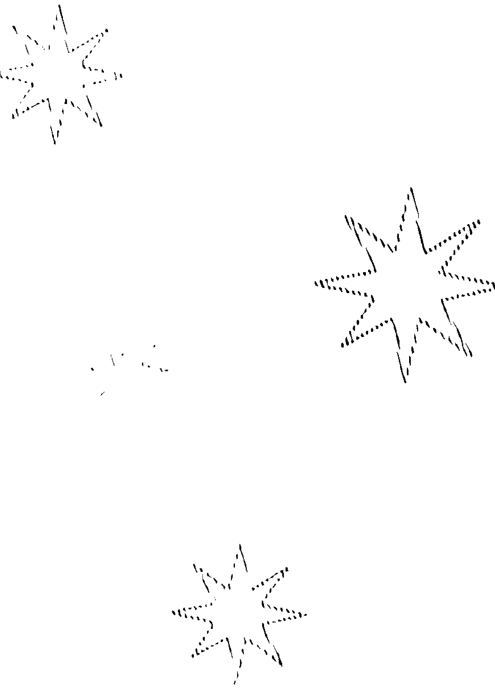

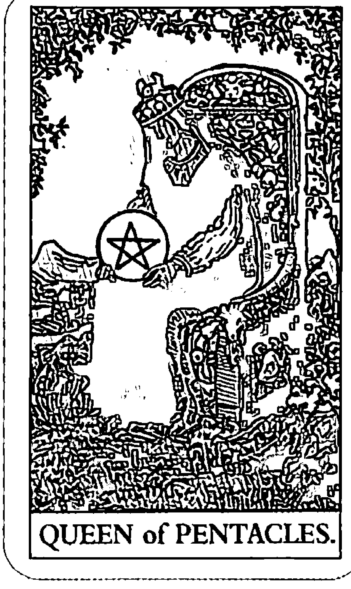

## 錢幣王后

這個王后是大地之母與實事求是型商業女性的迷人結合，她懂得管錢，也喜歡耕種大地。她善於細心觀察，經常有自己一套的投資組合。或者她可能獻身於家務管理，推行一堆計畫。她非常善於顧全他人的需要，是個好母親，具有絕佳的組織能力。她能兼顧家庭和工作，讓一切平安順利。她的孩子享有物質上的舒適，但她可能不會展現出對他們的愛或感情。

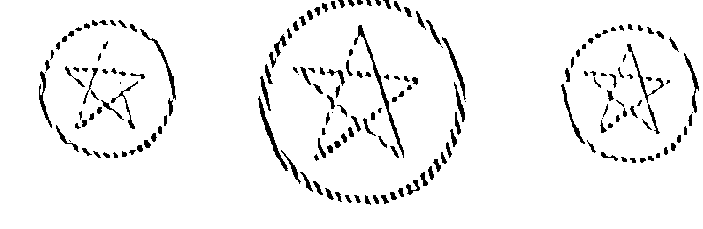

## 錢幣王后正牌的關鍵詞

#### 正牌

錢幣王后是個很有能力的成熟女性，而且是個非常關心小孩的母親。她經常顯得老派，試圖讓她的小孩了解生活裡必要的現實，她會教小孩烹飪、洗衣服、購物和管理財政收支平衡等。她喜歡事必躬親，喜愛財源豐富的高尚生活風格。如果你找不到人可以代表錢幣王后，這張牌預測你有物質獲得、財力改善或安全感，而且也許對家居生活發生興趣。你可能自力更生，租一層公寓，準備管理自己的生活和財政，工作賺錢。你可能收到来自一位女性的經濟協助。

- 好媽媽，烹調和家務大師。
- 照顧者。
- 自然愛好者。
- 招待周到。
- 良好的商業感。
- 善於理財。
- 財源豐富。
- 繁榮。
- 和藹可親。
- 自信。
- 綠手指（擅長園藝）。
- 有效率。
- 組織能力強。
- 情緒成熟。
- 商業女性。
- 藝術愛好者。
- 如母親般。
- 實在。
- 能提供幫助。

#### 逆位

這個倒過來的王后可以代表一個冷漠疏離的母親，她不怎麼在意小孩的生活，或是對小孩極度苛求和嚴格。她過度關心自己的對外形象，可能是對自己的財務狀況感到不悅。她不善理財，致使債台高築，財源短絀。她在錢和精神方面可以很不慷慨，虛偽的態度讓人難以忍受。她的一切價值觀皆以物質為前提。她可能受自我懷疑、貪婪、缺乏自信或性挫折所苦。假如她不能代表某個人，則表示一個不穩定的狀況，有可能是財務不佳、害怕貧苦或情緒受損。

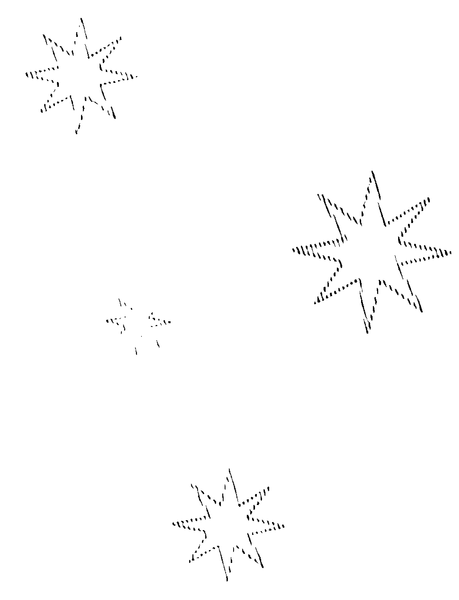

## 錢幣王后逆位的關鍵詞

- 操勞過度。
- 順應社會趨勢。
- 心胸狹窄。
- 自負自大。
- 難以顯露感情。
- 冷漠疏離。
- 吹毛求疵。
- 工作狂。
- 不善照顧人。
- 花錢不瞻前顧後。
- 花錢過度。
- 愛擔心。
- 充當有錢人。

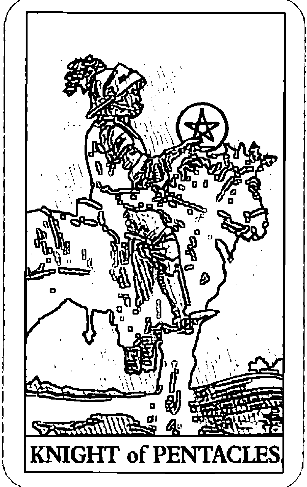

## 錢幣騎士

這個騎士屬土，代表大地的能量：謹慎、有能力、有實力和資源豐富。他的物質價值觀堅固不移，性情溫和，為人可靠，情緒穩重，具豐富常識。他做決定前必先不疾不徐，好整以暇地權衡過一切選擇（牌面上的他通常顯得穩穩地騎在馬上，並未急著策馬前進）。他捎來跟錢有關的信息，通常是喜訊，抑或表示離開或抵達。他雖然有冒險精神，卻有一顆物質的心。他善於執行任何工作或份內的工作，不過他多半不會是那種自動自發的人。他的出現可能預測你的生活將出現一些跟錢有關的變化。

## 錢幣騎士正牌的關鍵詞

重大的物質問題。新發展。更有錢。跟收入相關的喜訊。注重細節。細心規劃。保守的態度。可倚賴。耐性。一般常識。自然世界裡的新冒險。動物愛好者。忠實的情人。

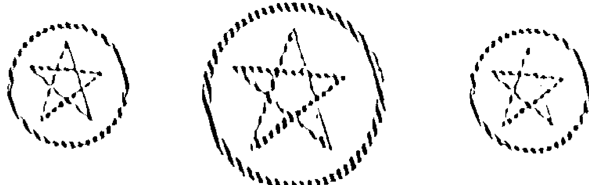

#### 正牌

錢幣騎士代表某個勤奮負責（尤其在錢與財產方面）和誠實有良心的人，他願意盡力做好工作。他可能表示你正參與一項新計畫，工作跟土地有關，像是建造大樓或環境清潔。假如是戀愛方面的問題，這張牌代表你可以信賴、認真和信守承諾的一個人。不過，這段關係會走得很慢，本質上主要跟物質有關。它的另一個意義是行動，可能是旅行或早就規劃好的一個行動。

#### 逆位

錢幣騎士可以捎來一個不受歡迎的消息，跟錢有關，可能是損失、失望、期待出了問題、挫折或突來的延遲，或是工作或大學申請因文書作業繁複而有所延遲。你先前的計畫可能出現變化，你的感情關係發展可能出現障礙，或必須更換居所。如果這張牌代表一個人，他可能代表一個無業遊民或不願工作的年輕人。假如它不代表一個人，則表示可能是跟金錢問題有關的狀況，可能讓你感覺沮喪、了無生氣和缺少動力。

## 錢幣騎士逆位的關鍵詞

- 損失
- 失望
- 金錢問題
- 財務不穩
- 薪資過低或被騙
- 財務判斷不佳
- 浪費
- 缺乏規劃能力
- 沮喪
- 漠不關心
- 感覺動彈不得
- 沒靈感或沒精力
- 喪失「起而行」的動力
- 拒絕冒風險

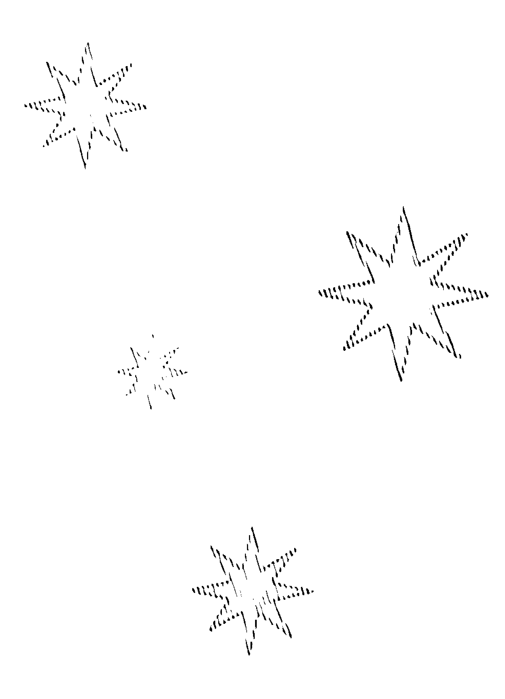

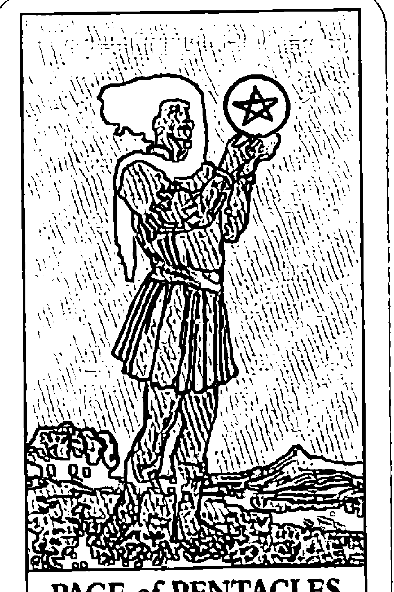

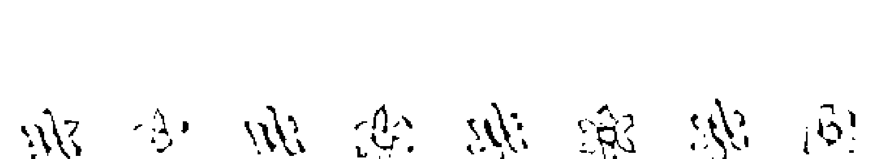

## 錢幣侍從正牌的關鍵詞

- 安靜
- 內省
- 實際
- 勤奮
- 嚴肅
- 書呆子
- 好友
- 學生
- 大自然愛好者
- 書面信息，時常跟錢有關
- 教育機會
- 緩慢但平穩的過程
- 決心
- 尊重物質價值

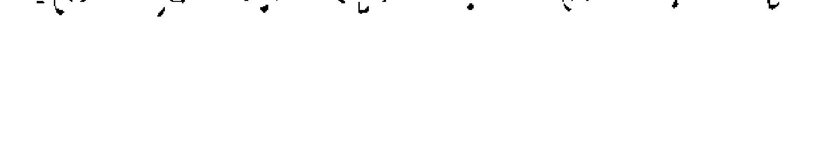

## 錢幣侍從

錢幣侍從牌以學生牌或學者牌知名，它代表一個只管讀書、不管周遭事物的年輕人。牌面上他通常站在戶外，雙手向前把一枚錢幣高高握著，一副研究或欣賞的樣子。這暗示想要錢或賺錢的慾望，通常透過教育的方式獲得。

侍從屬土，他既穩重又可靠，有很多擴展物質能力的想法。新的開始可能朦朧不清，但含有很多發展技巧和才能，進而帶來物質回報的潛力。你可能受到某個實際型人物影響，鼓勵你去發展這類品質。

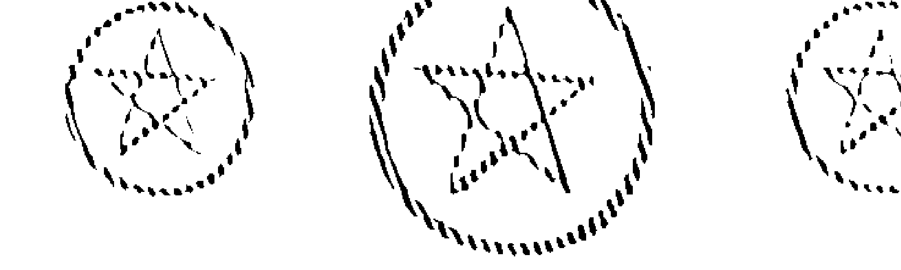

#### 正牌

錢幣侍從代表一個好學的青年，他具有屬土者的特質：有野心、堅毅、有目標、聰明、對自然和藝術有感受、欣賞好的生活。這個侍從可能象徵你以新的方式來發覺你的身體，也許是改善你的健康。你不停學習，可能是用半工半讀的方式。假如你的問題跟感情關係有關，他是在警告你，要你讓事情隨自然發展，別急著栽進尚未成熟的事情裡面，尤其是在性方面。如果這個侍從不代表一個人，他表示你的世俗野心和有關的溝通，你可能會收到電子郵件、書信、電話或做文書工作。

#### 逆位

侍從逆位的含義跟正牌相反。他代表一個排斥讀書或痛恨學校，甚至翹課的年輕人。這個年輕人很懶惰和愁悶，不願意努力學習，對教育和達成目標不感興趣。如果它不代表一個人，則表示跟金錢有關的壞消息或失望，像是考試不及格、未取得大學入學許可。缺乏認真努力和適當的重心。

## 錢幣侍從逆位的關鍵詞

- 反叛
- 沒有動力
- 問題少年或小孩
- 學習障礙
- 喜怒無常的年輕人
- 膚淺的知識
- 金錢問題
- 意外支出、壞消息或令人失望的消息
- 缺乏常識
- 揮霍無度，言行放肆
- 無聊
- 無精打采
- 對學習沒興趣
- 教育不足

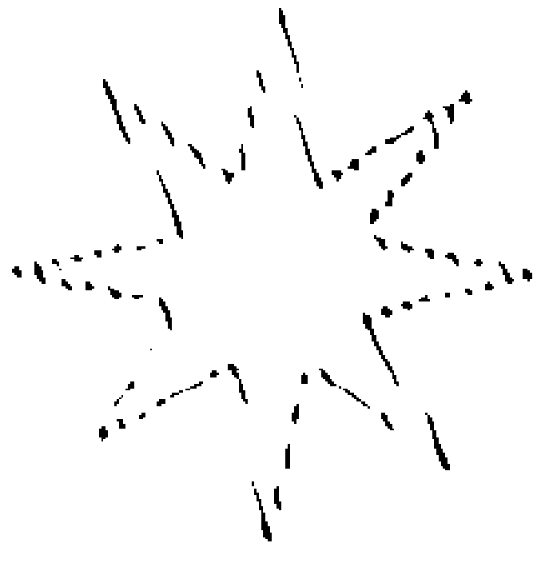

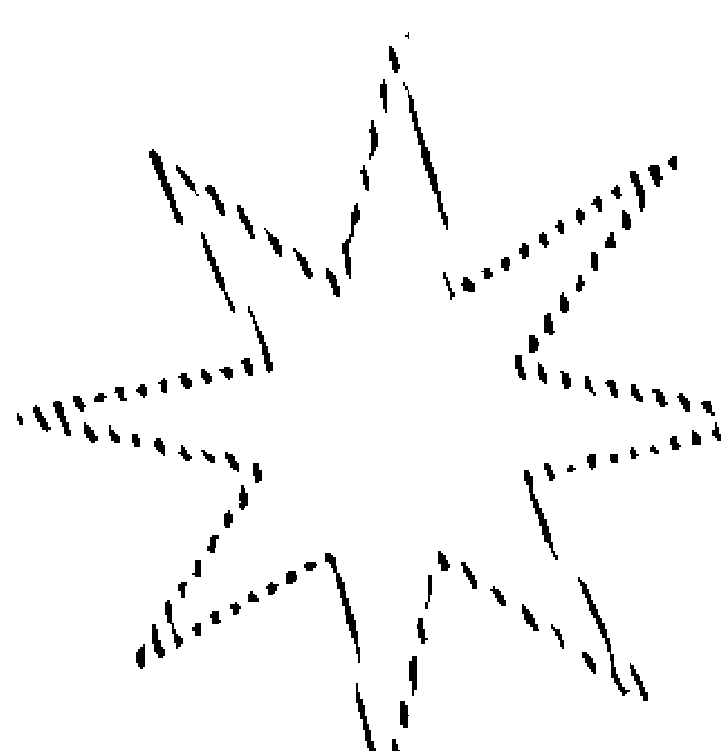

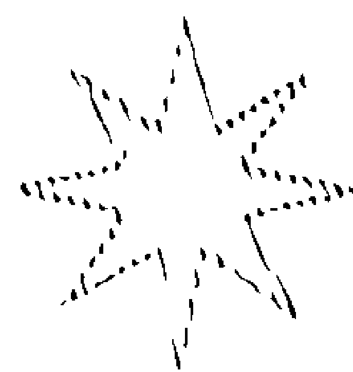

## 1 號錢幣

#### 正牌

錢幣是象徵新的成功、新的金錢收入和新事業主要的一張牌，這張牌非常正面，預測你即將獲得金錢，新計畫或新投資成功在望。你正為改善財政的新目標努力。你正為未來的經濟安全感播下種子。這張 1 號牌強烈指出，你即將飛黃騰達。你可能會收到一筆錢，一筆獎學金或大學學費援助。或是你將去做一次大採購，為未來的賺錢能力做準備。

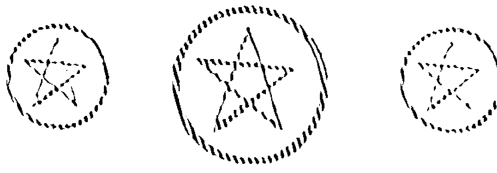

#### 逆位

這張牌倒過來時，表示你有困難專注於課業、計畫或目標。成功出現延遲或有困難。你可能健康不佳或缺少工作所需的精力。只要你有耐心，不打退堂鼓，事情最終會有結果。基礎扎深，目標集中，才能取得成功。

## 1 號錢幣正牌的關鍵詞

跟金錢或收入有關的新開始。新事業將會成功。有形結果指日可待。健康改善。運動健身。計畫的早期階段。取得畢業證書或學位的學生。身體方面的愉悅。加薪。新機會。

## 1 號錢幣逆位的關鍵詞

錢財方面出現延遲。一個賺錢的點子失敗。未兌現的承諾。吝嗇。不善理財，年度收支不平衡。缺少金錢方面的知識。錯用基金。急則有失。獲得的比期待的少。改善經濟的希望破滅。疲累。健康不佳。凡事起頭難。

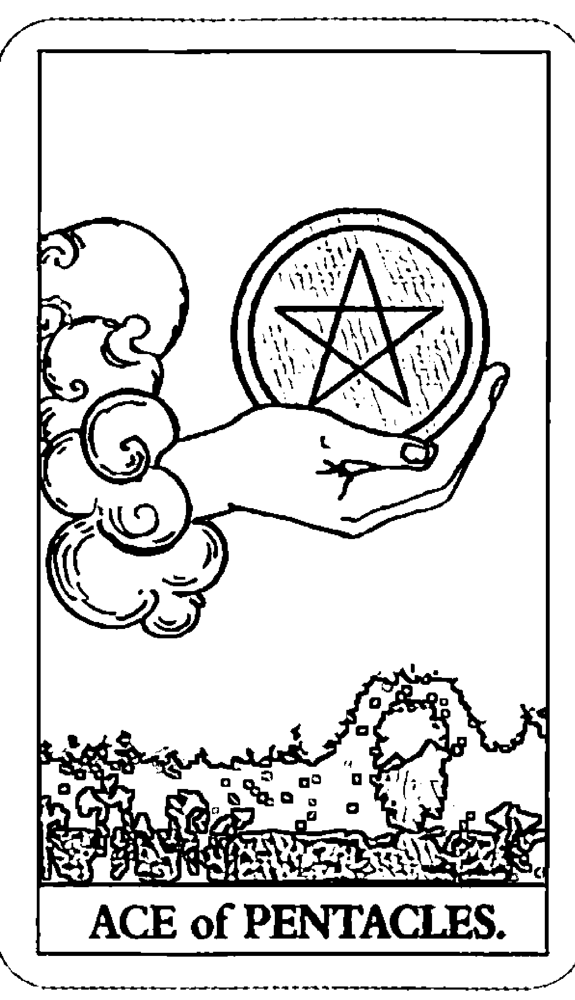

## 2 號錢幣

#### 正牌

這張牌有兩個可能性，要不是有兩個財源，就是要在兩個不同選擇裡取其一。假如是感情關係方面的問題，你可能要在兩個情人裡選擇一個。或可能有兩所大學、兩份工作或兩個課外活動供你做個選擇。你正在適應環境。這張牌的信息是，做個選擇並堅守到底，不管結果如何。

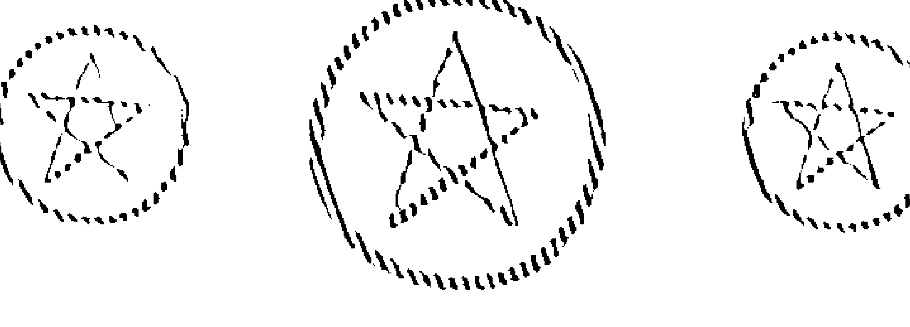

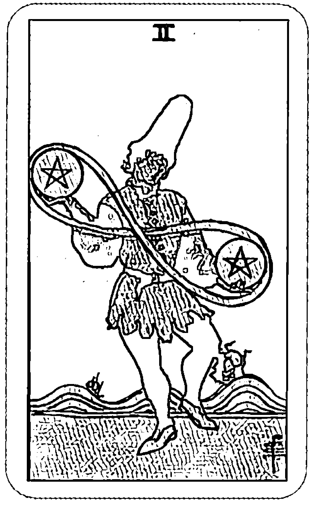

## 2 號錢幣正牌的關鍵詞

需要彈性。兩個選擇。一個平衡之舉。巧用時間或金錢。巧妙應付興趣間的矛盾。做選擇。經濟方面有創意。學習理財。列出優先順序。睿智地配置資源。別一次做一堆事。

#### 逆位

手頭很緊。你可能為了支付支出，不得不做一份以上的工作，或必須小心花錢才能收支平衡。你可能不僅要開闢收入來源，還必須考慮改變。假如是感情關係的問題，可能你和你的情人正被拉著往兩個不同的方向走。你保持現狀，直到釐清什麼最好為止。以自我肯定來克服疑慮。

## 2 號錢幣逆位的關鍵詞

缺錢。手頭很緊。緊抓不放。失衡。被需要做選擇的壓力壓得喘不過氣。負債。沒有彈性。缺乏焦點。感覺懸浮不定。支持不夠。理財不當。

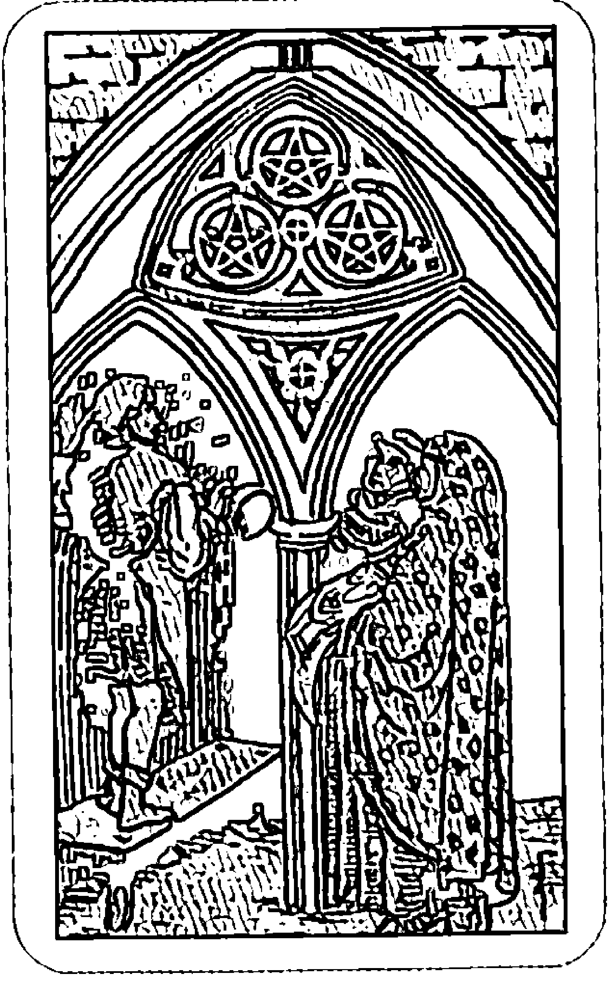

## 3 號錢幣正牌的關鍵詞

- 學得很好的技能。
- 完成。
- 首份工作。
- 受人注意。
- 有資格工作。
- 才華獲認同。
- 有能力勝任。
- 展現機能的機會。
- 在校成績優秀。
- 取得證照或畢業。
- 好的開始。
- 創意作品獲得報酬。
- 新的社會地位。

## 3 號錢幣逆位的關鍵詞

- 表現不佳。
- 缺乏技能、自信或野心。
- 懶惰或沒興趣。
- 一半心力。
- 害怕失敗。
- 訓練不足。
- 成績差或畢不了業。
- 缺少有目的的方向。
- 對批評過度敏感。
- 錯過機會。
- 混日子。

## 3 號錢幣

#### 正牌

通常跟某項專業或行業的技能有關，這張牌指出你無法讓這項技能化為利潤，或獲得成功。你也許才畢業不久或快要畢業。假如你有藝術或手藝傾向，這張牌代表靈感和成功。有個座右銘很適用，就是「做你喜歡的事，錢自然跟著來。」你在自行創業，可期待靠一身手藝賺很多錢。傳統上，這張牌指即將有工作。青少年可能在一個本地展覽會或社區計畫裡，找到機會展現自己的創意能力，並因而獲得工作機會，為進入「真實」世界做準備。

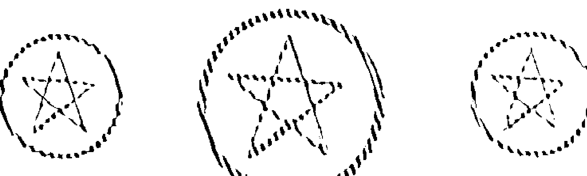

#### 逆位

你要不是需要更多訓練和練習，就是不努力去取得工作所需的技能。你為自己能否成功和賺錢擔心不已，因而退縮不前，不敢去就業。你可能害怕失敗，或缺少實力或自信。如今你需更加相信自己的能力，並且願意碰一下運氣。態度跟基本技能一樣重要。

## 4 號錢幣

#### 正牌

這張牌暗示你正緊守著現有的金錢和財產不放。安全感是你做重大人生決定的唯一依歸，因此就算可以改善你的狀況，你也不想冒險。假如你是為了避免不成熟的行為，這種保守的態度就很好，但當你需要嘗試新事物和經驗時，它可能成為一個障礙。你感覺有財務不安或家庭生活不穩定的威脅，所以試著捍衛自己擁有的一切。你或周遭的人囿於現狀，害怕改變。假以時日，你將克服恐懼，建立一個安全的經濟基礎。

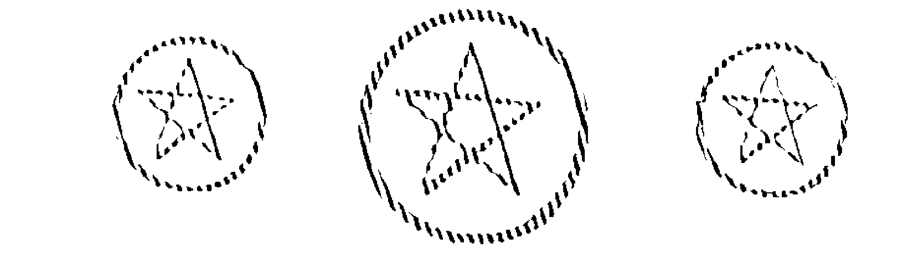

#### 逆位

你緊守著財產或一個生活狀況，可能是一段戀情不放，害怕任何改變。或你生活在一個舒服的常規或不活潑的狀態裡面。然而，改變勢在必行，不管你贊不贊成都需接受。你可能試著讓某些東西提早發生，或跟人爭吵你感覺有需要的錢或物質，像是車子、衣服或設備。你可能後悔自己隨便亂花錢。

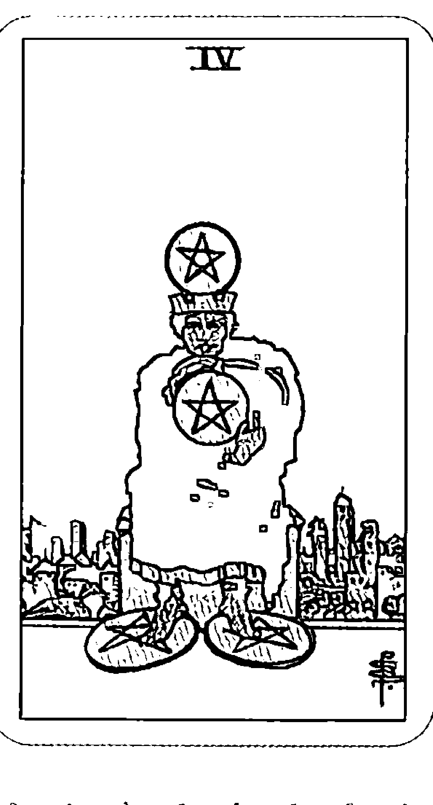

## 4 號錢幣正牌的關鍵詞

緊守著現有的一切。緩慢但充實的學習。經濟安全感。家庭生活。保守理財。學校測驗及格。用錢小心。一個堅固的基礎。獲得物質財產。平衡收支。過能力範圍以內的生活。

## 4 號錢幣逆位的關鍵詞

緊守不放。不願放手。受改變威脅。經濟上的不安全感。害怕缺錢。考試不及格。不善理財。得不到需要或想要的東西。囿於物質。在家缺乏隱私。失去工作或其他資源。

## 5 號錢幣

#### 正牌

大多數占卜師認為，這張牌基本上傳遞出一個負面信息，如貧窮、經濟損失和物質匱乏。不過，數字 5 意謂冒險、創造力、重大刺激和享受世俗樂趣。假如真有欠缺，心靈上的破產可能是導致不利狀況的根源。這張 5 號牌警告說，錢可能很快會變得很緊，或財產讓渡或薪餉這類的援助不會到來。物質方面大抵會出現一些改變。操心經濟的壓力可以致病。家庭生活可能出現混亂，像是搬家、離婚（導致經濟困難）或為了提升心靈層次，刻意選擇過一個沒有很多物質的生活。

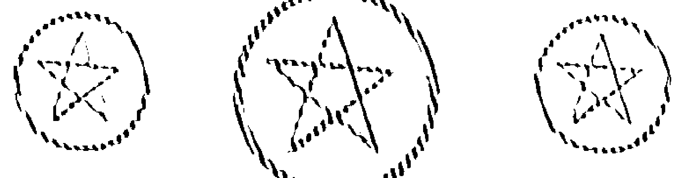

#### 逆位

經濟上和心靈上，你被建議去打理好你的房子。該是你停止損失和向前走的時候了，以避免情況惡化下去。避免負債或冒經濟風險。反社會行為該被遏止。青少年可能因父母的行動而在經濟上受到影響，或被迫去工作以支持家計。

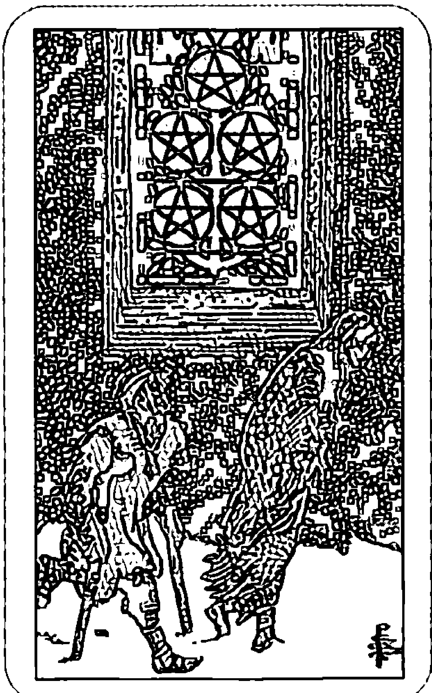

## 5 號錢幣正牌的關鍵詞

- 欠缺信心或心靈原則。
- 物質需要。
- 失業。
- 感覺被遺棄。
- 失去倚靠。
- 經濟或社會地位方面的改變。
- 獨力奮戰。
- 健康問題。
- 明白錢買不到快樂。
- 同情其他生活較不好過的人。
- 慈善。
- 貧窮。

## 5 號錢幣逆位的關鍵詞

- 不聽警告導致窮苦。
- 心靈覺醒，認清事情的重點。
- 艱難時刻可結束。
- 不落俗套的生活風格。
- 幫助別人。
- 混亂。
- 情緒匱乏。
- 以物質為基礎的關係。
- 避免不了的風險。
- 害怕做改變。

## 6 號錢幣

#### 正牌

有了這張 6 號牌，表示經濟問題告一段落，富足、繁榮和個人滿足可期。做學生的將獲得想要的經濟援助，父母的收入可能大幅增加。有或將有很多錢「與人分享和存起來」。你的收支平衡，有意做慈善工作。你花錢助人，為自己創造福報和行善於人。這張牌預言，透過跟人合作，你的生活會恢復正常或改變。感情關係將是充滿創意的伴侶關係，既和諧又平等，不以情緒或經濟為基礎。

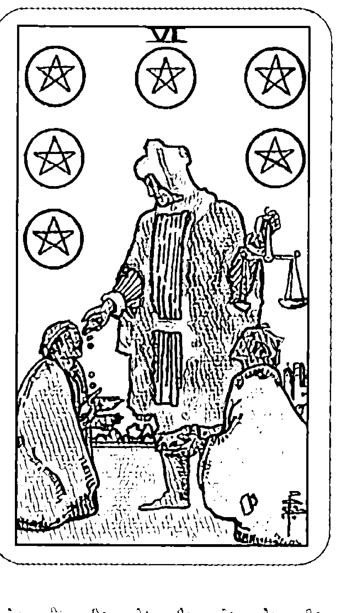

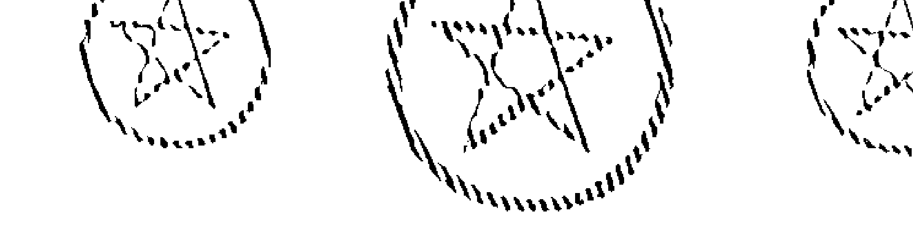

#### 逆位

你需要注意自己的花費。別揮霍無度和負債。你可能無法如願助人。你的社交生活較不活躍，不能有太多娛樂支出。其他人不合作。感情關係上，你需要努力製造和諧和了解，尤其是金錢和花錢的態度上。一方可能很節儉，另一方則愛花錢，這能夠引發口角和糾紛。你正從一段損失和迷惑期間裡恢復過來。如今是找出一個可行的生活方式的最佳時機，好為你帶來安全感和內心的平靜。這將需要你在一切相關方面的努力。

## 6 號錢幣正牌的關鍵詞

獲得你應享有的東西。做慈善工作。有足夠的錢與人分享和存起來。克服經濟問題。還債。跟人合作。給予和收到禮物。錢不是問題。經濟援助。以你的才華助人。財產讓渡。貸款。獎賞。

## 6 號錢幣逆位的關鍵詞

錢方面的壞運氣。理財不當。欠缺足夠基金。度過一段黑暗期。負債。自私。在錢和花錢方面意見不一致。粗心所導致的損失。有條件的禮物。對物質過於苛求。沒有慈悲心腸。不合作。

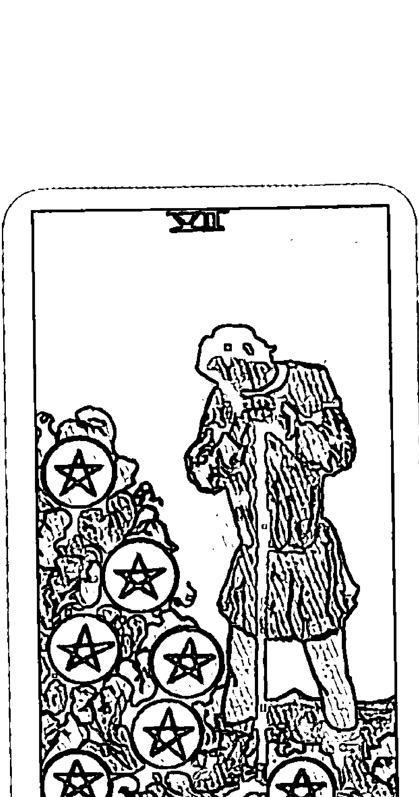

## 7 號錢幣

#### 正牌

數字7代表想像未來，在此指你未來的事業或工作的能力，也就是說，你賺錢的能力。它跟實現你在物質現實世界裡的夢想有關。隨著你想像未來，為了幫未來做好準備，實際上你必須打好根基，像是致力於學習過程，做好家庭作業，取得入讀大學所需的好成績或學習專業技能等。這張牌說：「艱難時刻，硬漢仍直行，愈挫愈勇」。它跟毅力和睿智規劃未來有關，你現在需要的是明確的目標，實在的目的和不畏艱難的毅力。

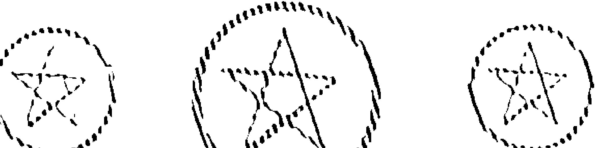

#### 逆位

7 號錢幣逆位經常在青少年想像不出個特別的未來時出現。這個現象乃因社會要求青少年順從家庭價值的壓力所致，尤其是女孩子，她們不獲鼓勵繼續升學，或選擇不明智地早婚，為了建立家庭輟學。有些人覺得，由於自己的背景、種族或教育程度，有些工作大門早已為他們關上。他們可能欠缺自己想要的角色模範，但只要設定好清楚的目標，這個困難就可以克服。害怕失敗也是個問題，特別是對那些未獲得家庭全面支持的人而言。不過，實際上，最終全要看你自己。

## 7 號錢幣正牌的關鍵詞

- 毅力
- 越挫越勇
- 知道自己的目的
- 耐心
- 決心
- 緩慢但平穩的過程
- 耕耘的收穫
- 實力工作
- 長期計畫
- 實用技能
- 好學習慣
- 有始有終
- 時間點恰當

## 7 號錢幣逆位的關鍵詞

- 欠缺升學機會
- 經濟困難
- 缺乏事業心
- 未還的貸款
- 管理金錢和財源不當
- 缺少經驗
- 計畫不周
- 不當建議
- 缺乏想像力或說服力
- 不願為長期目標放棄一時的滿足

### 8号钱币

#### 正牌

这张牌表示学习一项新技能或接受密集训练，为心里面一个清楚的目标做事业准备。你正把先前学到的技能整合成一个新的形式，或取得一项新技能。目标明确预告成功指日可待，而且很有可能从一项新事业、一份新工作或一项新计划里，取得经济报酬。如今你在思考如何运用精神和体力上的资源，以满足你的需要和有余力扩展。你可能在学习一项手艺，倘若如此，这身手艺将以接案或开创新事业的方式，帮你取得报酬。你找工作或接受新训练时，应该保持一个专业的态度。

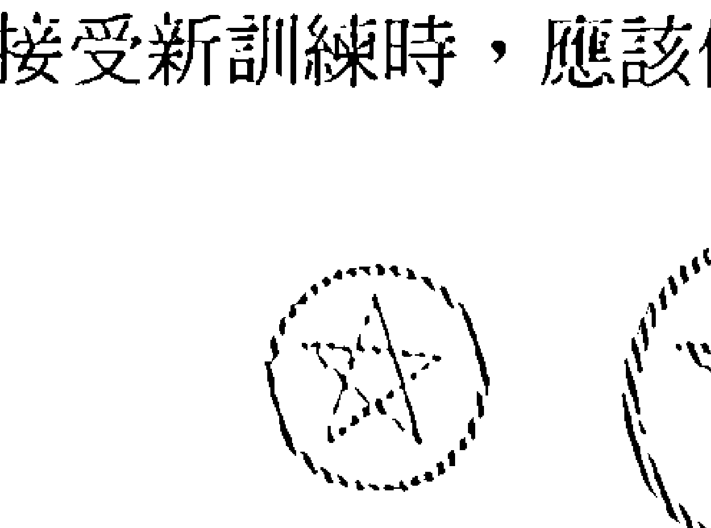

#### 倒牌

这张牌倒过来时，表示你尚未完成学业，或尚未能臻熟使用你达成目标或野心所需的技能。你希望开创某种新事业，但缺乏足够知识或尚未明确订立目标。或你不愿额外努力取得所需的技能。你可能健康不佳、缺乏活力或太容易无聊。你需要「坚持到底」，以克服难关。在一段长期不辍的努力后，再度恢复精神将一路帮助你渡过难关。

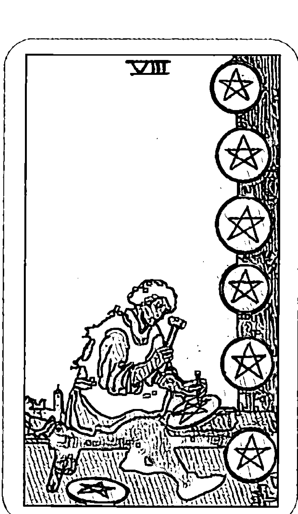

#### 8号钱币正牌的关键词

- 学艺。教育。技能升级训练。取得经验。找工作。半工半读。运用天赋。生产力。自行接案。具有电子技能。可以赚钱的嗜好。事业。做好工作。针对一个科目修课和阅读相关书籍。

#### 8号钱币倒牌的关键词

- 挫折。徒劳无功。健康不佳。缺少活力。痛恨责任。缺乏组织能力。不良的读书习惯。难以整合。不耐烦。忽略细节。急则有失。目标不实际。期盼一时的满足。

### 9 号钱币

#### 正牌

这张牌表示自立和独立，你在经济和其他担心的问题上用不着别人帮忙操烦，通常是自己你自己努力的结果和性情使然。你有强烈欲望做你自己和自力更生。你比实际年龄早熟，个性很强，非常自我肯定。你懂得自律，非常机智。你知道如何妥善运用资源和努力自我提升。你专注达成一个目标，不会三心两意。你很有可能属土。你听从自己尊重的大人的意见，并因而获益。你准备让自己享有一个不用烦恼钱的丰富未来。

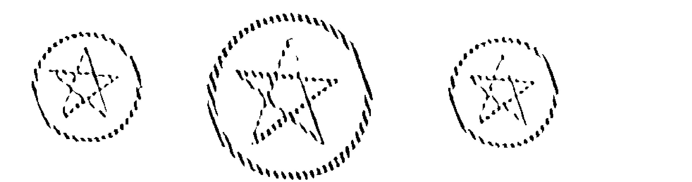

#### 倒牌

你经济上倚赖着别人，可能是父母或其他亲戚。你不思独立，或要花费相当时间才能独立。你别无其他选择，只能朴素过日。你的目标可能模糊不清，害你赚不到想赚的钱。你可能缺乏家庭支持，或家境普通。假如涉及恋情问题，你可能避免做承诺，私底下比较喜欢单身生活。倚赖可能令人厌烦，但你能自力更生前只懂一味倚赖别人。踏实会有帮助。

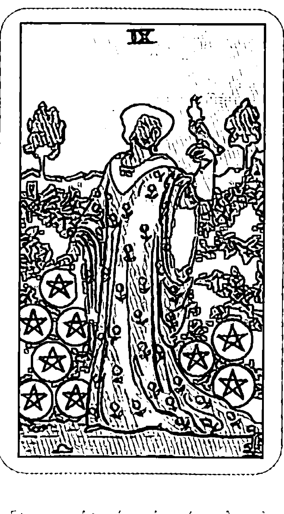

#### 9 号钱币正牌的关键词

- 物质丰富
- 良好的未来规划
- 经济上有安全感
- 富裕
- 独立
- 良好的意见
- 成熟的个性
- 实际的目标
- 达成欲
- 有财富
- 成功欲
- 独力奋战
- 自我管理
- 孤独
- 拥有权
- 财产，房地产
- 自给自足

#### 9 号钱币倒牌的关键词

- 财务混乱
- 倚赖
- 决策能力差
- 「钱不重要」
- 缺乏隐私
- 没时间给自己
- 为钱争吵
- 自由受限制而有挫折感
- 没有社交生活
- 试图挣脱枷锁，获得自由
- 心爱的宠物死亡
- 找不到重感
- 生活难过

### 10 号钱币

#### 正牌

这张牌诉说「家庭」，表示一个数代同堂且继承了财产和金钱的快乐家庭。它代表坚固可靠的东西，像足土地和好投资。你可能加入家族事业，或继承钱财，以便有朝一日自起炉灶。或你正野心勃勃地开始一个家庭，自行创造财富。你可能被一个薪资优渥的事业所吸引，如公司管理、法律或财务团体。假如跟恋情有关，表示你寻找着一个背景类似和财产相当的对象。你想要一个成功、有良好关系和有田有地的家庭生活。你想从大处着眼，以便晋级社会显要和成功阶层。

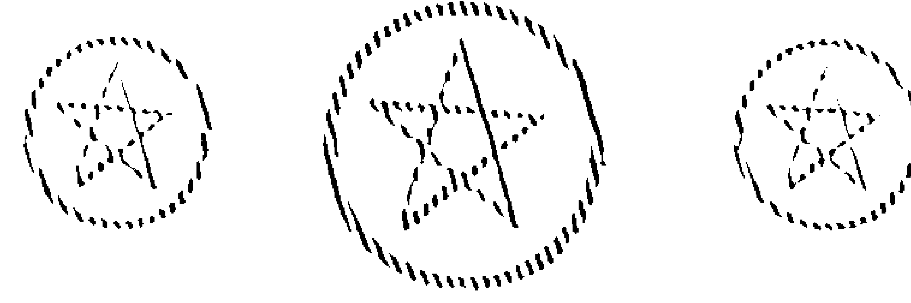

#### 倒牌

这张反向的 10 号牌代表一个混乱或功能不良的家庭，无法支持你的需要和目标。你可能由于家里无能为力或不给你钱，缺乏足够的教育基金。你的父母和其他家人，可能为钱争吵不休或经济上一团混乱。一个经济问题成为焦点的家庭，往往可以对家里十几岁的小孩造成不好的影响，小孩会感觉没有自己想要和应享有的安全感。你可能卖弄家庭传统来展现自己的独立，因而不断引起纠纷。

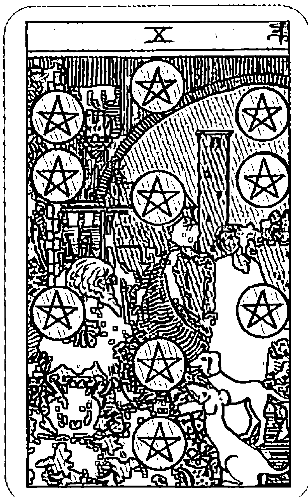

#### 10 号钱币正牌的关键词

- 家庭联系关系。
- 遗产。
- 继承的财富。
- 信托基金。
- 祖先遗留下来的钱。
- 经济上有安全感。
- 快乐的家庭生活。
- 数代同堂。
- 财产转移。
- 一个家族或一个朝代。
- 父母的支持和援助。
- 结婚进入豪门。
- 重大的生活转换。

#### 10 号钱币倒牌的关键词

- 家庭口角，原因通常为钱或遗产继承。
- 经济损失与问题。
- 缺乏家庭支持。
- 生病的父亲、母亲或其他家人。
- 与家人不和。
- 因家庭需要或要求而感觉负担沉重。
- 兄弟姊妹阋墙。
- 不获家庭见容的订婚或婚礼。

## 认识钱币

这是在每章最后要做的另一个练习，这个练习很好玩也很容易，可以测验你的号码牌知识，同时可以提供一些跟号码牌的意义有关的练习。

跟前面的练习一样，把号码牌（由1到10）依花色分开，这次练习要用到钱币花色的号码牌。把这10张号码牌依号码由大到小的顺序排好，接下来先别参考本章前面的介绍，检视这些号码牌，看看你能记得它们的意义多少。用牌面的设计来帮助你想起它们的含意（这也是大多数号码牌有牌面设计的原因，可以帮助记忆）。

现在，在你的塔罗牌记事簿里把这些钱币号码依大小写下来，然后在它们后面写下你记的的关键词句，或任何你突然想到的想法。写好后，跟本章前面的内容进行比较。

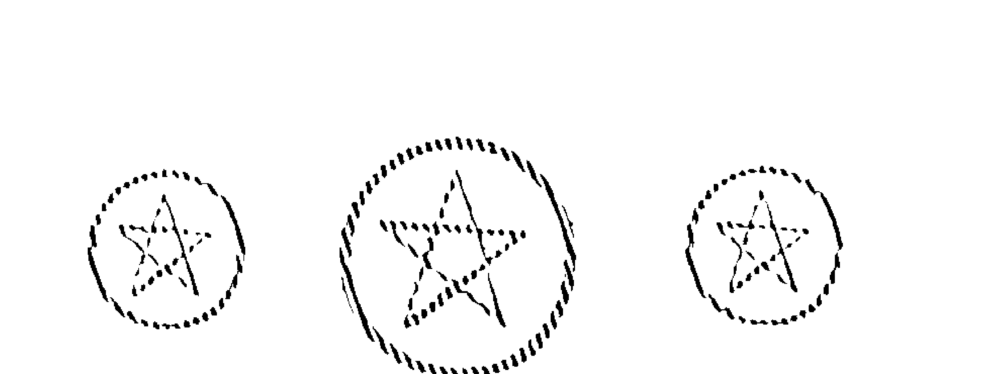

## 17 宝剑

有些人认为宝剑是负向的牌，但宝剑其实连接着一个心灵元素。虽然宝剑可以代表极度困难的事件、障碍、状况或心态，但我们往往在身体、精神、心理或情绪上受到很大的痛苦之后，才会走上心灵的道路。

记得有句俗话说：

> 「生命是苦，苦让我们思考，思考让我们变得睿智，智慧让生命变得可以忍受。」

精神层次上，宝剑属风，代表精神活动。宝剑天生锋利，但这并表示一切都不好，它们能夠除去困惑，还你一颗清明透澈的心。

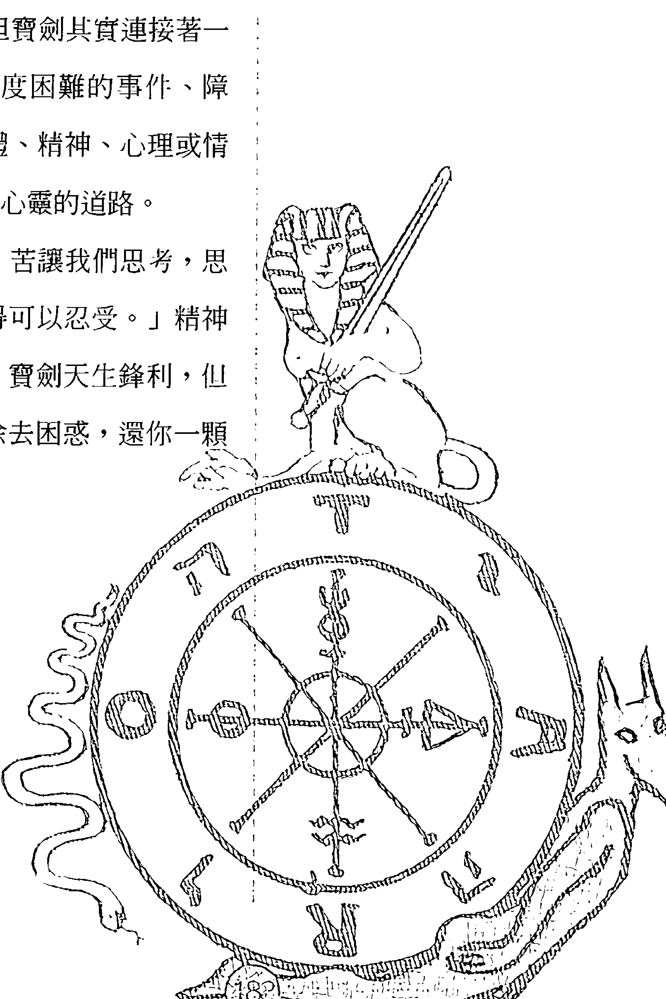

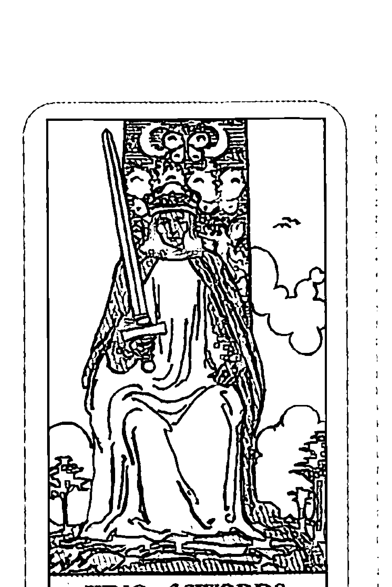

### 宝剑国王

宝剑国王是一个很严肃，有时候看起来很坚决的男性，他手里拿着宝剑，随时准备行动，因此代表选择和可能性。他热爱知识、法律和秩序。他最主要的一个特质，是他能够用心克服情绪上的眷恋，让自己可以用分析性的思考和逻辑为基础，进行长期的规划。因此，宝剑国王象征心理上的一条心灵道路，以做为意识能力的发展。

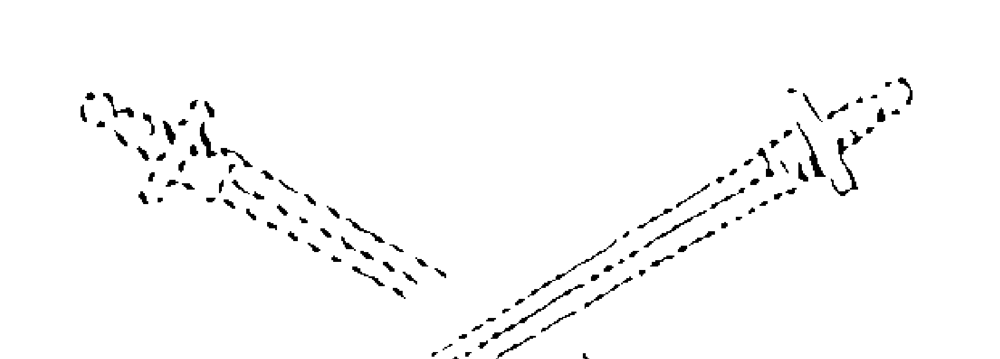

#### 宝剑国王正牌的关键词

- 理智
- 冷静
- 公平
- 掌控
- 没有偏见
- 有野心
- 自我肯定
- 分析力强
- 不情绪化
- 专家
- 心灵提升或成就
- 关心你的福利的人
- 一个聪明的专业人员
- 顾问
- 权威人物
- 法律与秩序
- 精神工作
- 性格强烈

#### 正牌

这个国王代表强大的力量和权威。他的出现跟你的心理历程有关。如果他代表一个人，这个人的工作一定非常费神，像是教授、研究者、律师或军官。他的心思敏锐周到，思考清晰迅速，可以清楚表达自己的想法，是个很好的顾问。他可能是你的父亲或其他权威人物，可以给你很好的意见。如果你是青少年，跟人生价值有关的问题可能占满了你的心，旧的信念在你心里反复着，或你试图定出人生的真正哲理。这个国王出现时，你可能正在心灵突破的边缘，准备跟你的心灵沟通。他也可以代表一个内的心灵的向导人物。

#### 倒牌

这个倒立的国王象征厉风者一切不好的特质，代表某个过度理性、疏离和遥不可及的人。假如他代表你的父亲或其他权威人物，他可能无法了解或难以亲近。他非常苛求，特别是在知识追求方面，坚持你必须跟着他规划的路线来走。他可以是个失职的父亲，跟孩子有沟通上的困难。如果不代表人，他代表一个强迫你面对一个权威人物的状况，这个权威人物反对你的个人信念或你追求心灵生活的欲望，这可以是某个教会或同龄群。你被建议把这些事情埋在心里，别跟没同情心的人讲。

#### 宝剑国王倒牌的关键词

- 跋扈
- 苛求
- 反心灵
- 固执
- 浮躁
- 不善沟通者
- 不平待遇
- 以别人当挡箭牌
- 以言语伤人者
- 坏话
- 表面朋友
- 不公正
- 胁迫
- 暴力
- 攻击性

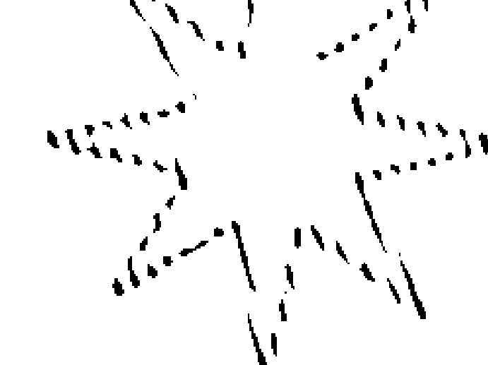

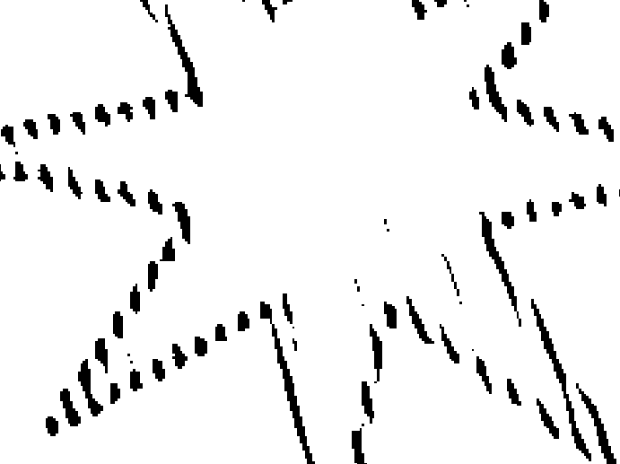

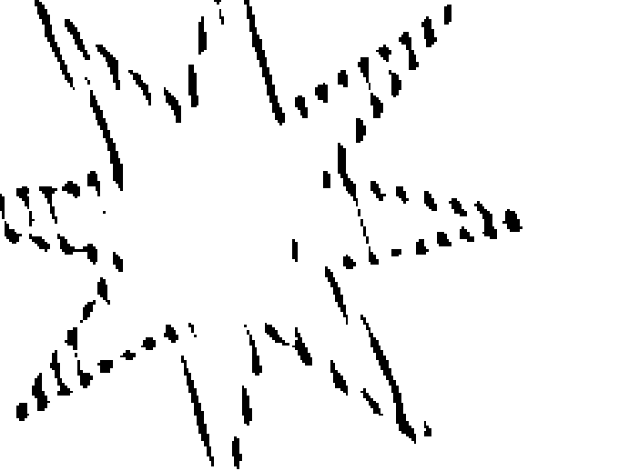

### 宝剑王后

王后是跟国王对立的女性，她代表心理历程的情绪面。她在精神世界或心灵领域里具有强大的力量和权威，情绪受损和失狂都属于她的管辖范围。如果她适合代表你的母亲，她可能过世或跟你父亲离异，或是抛弃母职。或者你的母亲可能过度苛求和无法表现她的感情。不过，她并非一切都不好，因为她的心里通常以小孩的福利为优先，但不够温柔，而且非常严格。

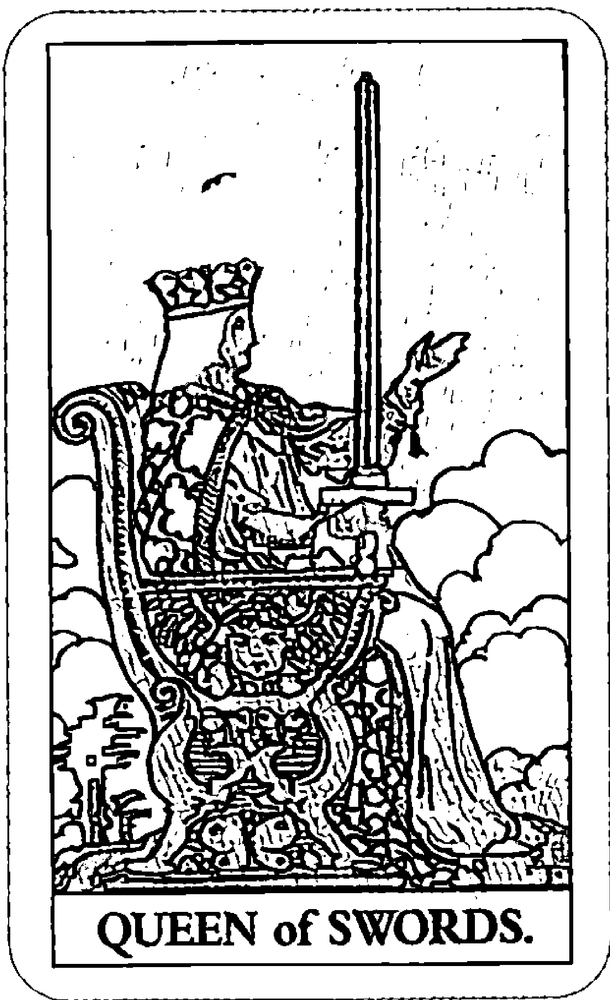

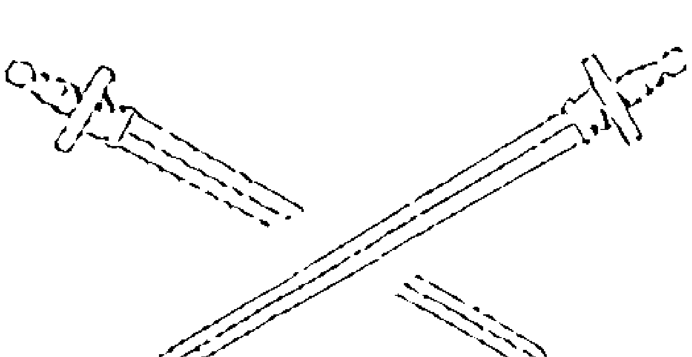

#### 宝剑王后正牌的关键词

- 孤独的女人。
- 强烈性格。
- 自我意志坚强。
- 聪明。
- 感情疏离。
- 独立。
- 苛求。
- 完美主义者。
- 喜爱理性思考。
- 职业妇女。
- 对子女袖手旁观的母亲。
- 寡妇。
- 以事业为重。
- 独力奋战。
- 公平判断。
- 自律。
- 疏远冷淡。

#### 正牌

宝剑王后出现在青少年的占卜里时，代表失去和分离，像是父母离异或守寡。如果她代表一个人，这个人往往把照顾子女当成个科学计划，阅读所有最新出版的教养书籍，制定严格作息表，并坚持子女要把家庭作业做得完美无瑕。她很有可能是个职业妇女。她意志坚定，有力量克服一切伤痛，继续自己的人生。如果这个王后不能代表一个人，你可能正经历一段跟生离死别有关的情绪创伤经验。

#### 倒牌

这个倒立的王后代表某个无法好好处理伤痛或生离死别的人。超过合理范围的悲伤、退却和哀悼影响她的作用能力。如果她适合代表你的母亲或其他女性亲属，这个女人可能非常消沉，置子女于不顾。她可能很忿怒和遥不可及，让你感觉孤单和被遗弃。如果她不能代表某个人，可能代表一个让你情绪低落的状况，深陷痛苦和责怪命运不公。如果是感情问题，表示两方可能在斗力。相反地，她可以是在劝告你，你忽略了总体成长所需的心灵发展，可能需要协助。

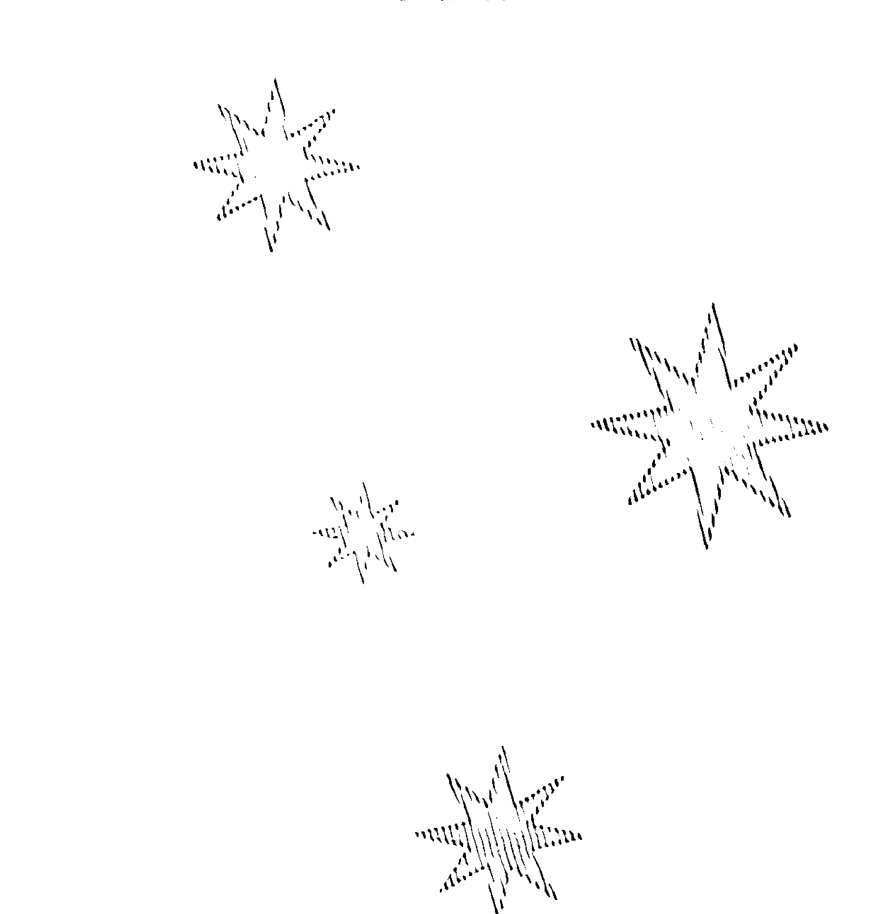

#### 宝剑王后倒牌的关键词

- 愤慨
- 愤怒
- 难以承受的悲伤
- 一个跋扈的女人
- 艰难时期
- 缺乏情绪上的了解
- 哀伤
- 孤独
- 情绪恐吓
- 有预谋的恶意
- 一个遥不可及的母亲
- 表现出最好的一面
- 操纵
- 抱怨
- 悲痛与后悔

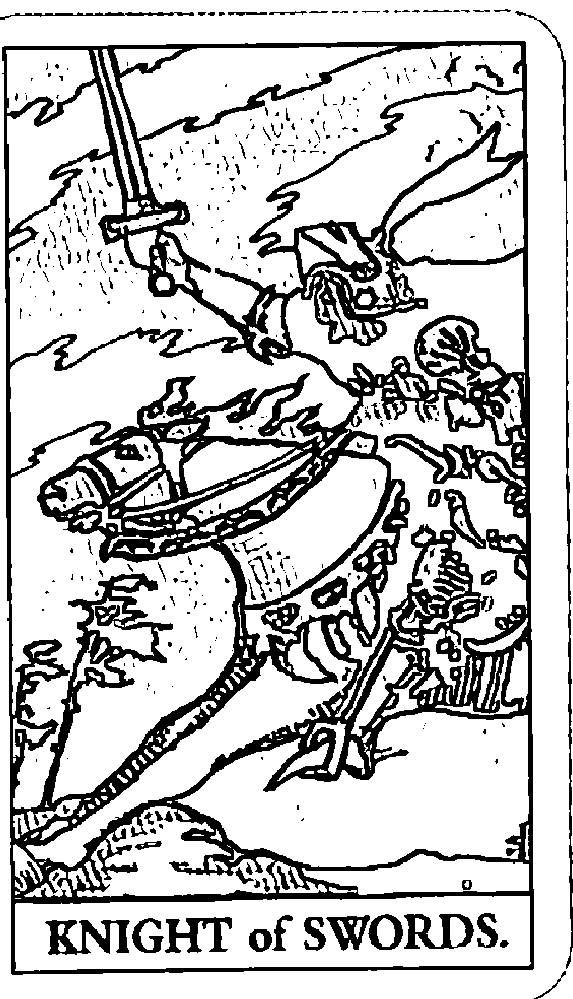

### 宝剑骑士

这个骑士通常是个匆促往前冲的年轻人，一手挥舞着他的战剑，因此，他代表某个准备好和愿意透过剧烈的智力竞赛，展现本身智力的本领、技能和力量的人。他代表某个热衷于精神挑战，以证明自己已有能力获胜的人。在今日日新月异的时代里，年轻人尤其受到精神上的挑战，他们必须发展电脑和其他高科技技能，以便进入职场。这张牌可以表示你并没把能量用在最佳的优势上，可能是你急于表现自己的能力，四处分散能量。

#### 宝剑骑士正牌的关键词

- 突如其来的变化。许多变化。信息来来往往。事件一个意外的转变。智力矛盾。冲动之举。碰碰运气。自我肯定。大胆无畏。精神刺激。全速前进。一心一意。一个柏拉图式的恋爱关系。坚决。

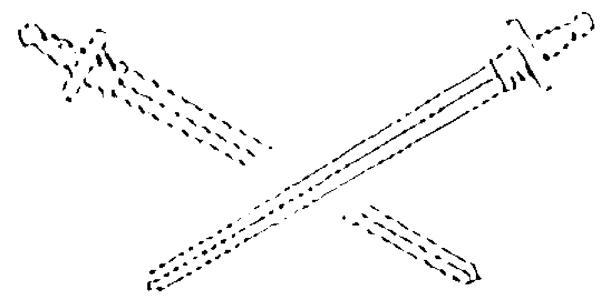

#### 正牌

宝剑骑士可能捎来矛盾的消息，但通常跟身体无关，而是精神上的交战，像是围绕在你周遭的意见截然不同，致使你发出和收到愤怒的信息。你可能参加一个智力竞赛，像是辩论会或其他的校内竞赛。你可能想从军，以做为升学的一种方式。或者你可能专心一意在知识的追求上，以致于忽略了生活的其他领域。如果是感情问题，可能是你主要的一个精神刺激，双方需要好好谈谈。

#### 倒牌

这个倒立的骑士变得被动，没有采取必要的行动。现在不是开始新计划的好时机。你拖延不做某件必要的事情，像是写论文，或是填写和寄送大学申请表。你可能在逃避认真读书和拖延责任，这可以造成很严重的影响。如果这个倒立的骑士代表一个人，可以表示这个人带来不受欢迎的消息，或是这个人不值得信任，他很容易做出冲动的举动和做草率的决定。这个人有可能是你自己。

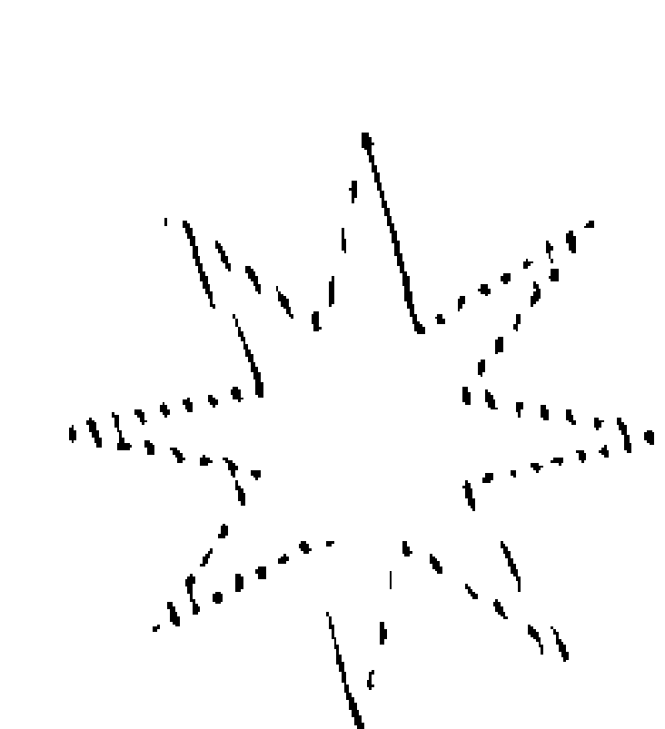

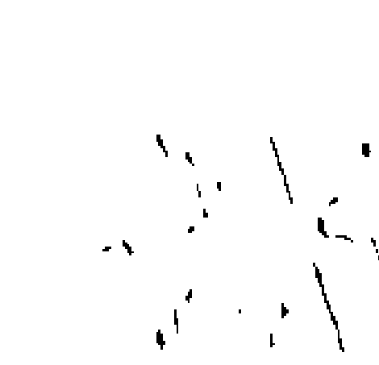

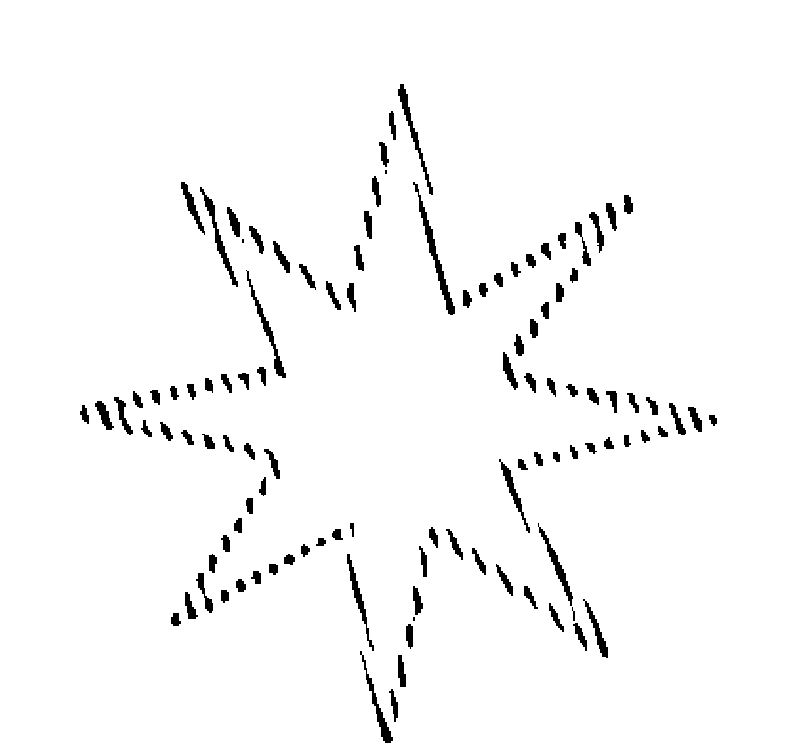

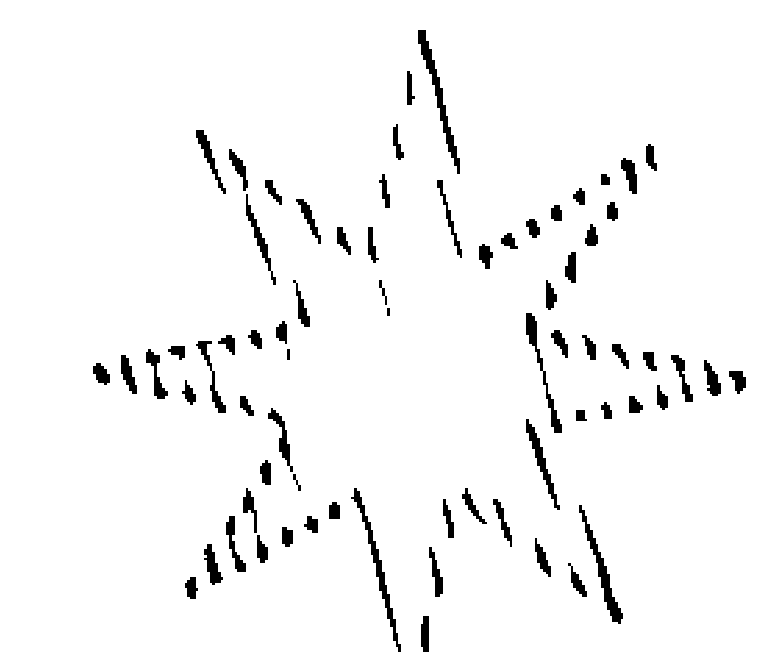

#### 宝剑骑士倒牌的关键词

- 某个敌对者。
- 突然离开。
- 不速之客。
- 过度匆促。
- 不耐烦。
- 虚伪欺诈。
- 轻率之举。
- 过早的举动。
- 积极的青年。
- 损友。
- 交战状态。
- 使用武力。
- 为想法争吵。
- 讽刺或伤人的话。
- 一个重要的人突然离去。

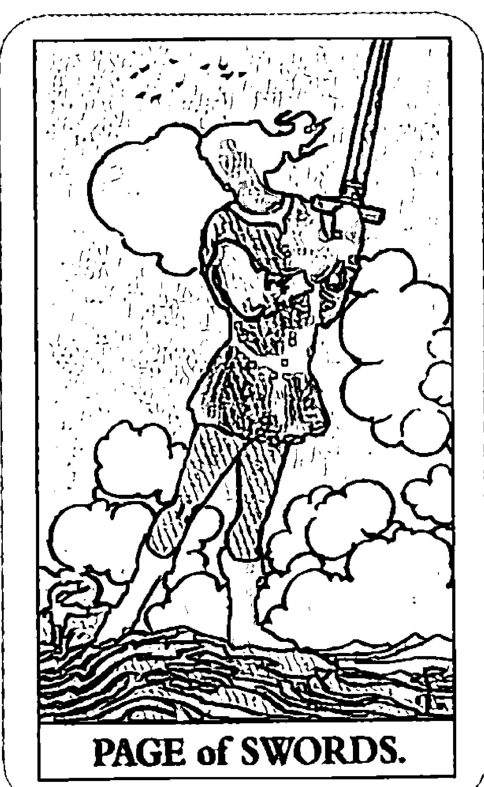

### 宝剑侍从

宝剑侍从代表精神冒险，你可能在试验一些新想法，并跟他人沟通，可能是透过网际网络的方式。你藉由探索抽象的概念和专注于智力的想法，学习知识的追求，尤其是在你青少年中期到末期的时候。这个侍从可能代表你的一个弟弟或其他小孩，你正在帮助他发展精神能力。或者这张牌可以象征你尝试不同课程，以便了解自己对哪些课程有兴趣，还有哪些课程合乎你的事业规划。沟通是这个过程很重要的一个部分，你正在学习沟通技巧。

#### 宝剑侍从正牌的关键词

- 意外或令人不安的消息。
- 适应不必要的改变。
- 针锋相对的沟通。
- 批评。
- 精神责任。
- 收到重要讯息。
- 需要理智的想法。
- 拖延行动。
- 未竟之事。
- 一份重要文件。
- 处理敏感问题。
- 冲突。

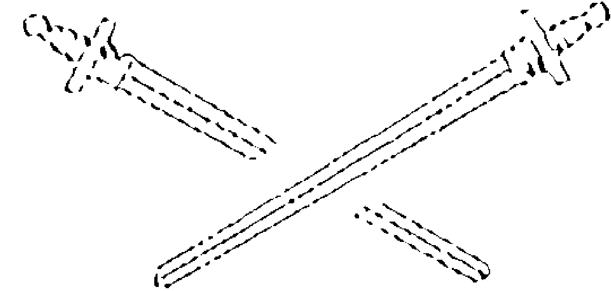

#### 正牌

看你的年龄而定，这个侍从可以代表你自己或某个比你年幼的人。他可能带来跟某个年轻人有关的问题或困难。你或你认识的某个人可能在行为上有冒险之虞。它代表的人有反传统的欲望，在此刺激下，他可能在家里或学校惹事生非。倘若这张牌不代表人，则代表一个涉及许多沟通的状况。对年轻人来讲，这可以是跟老师或其他权威人士对成绩或行为进行沟通。如果这个侍从代表你自己，可能表示你带来坏消息。

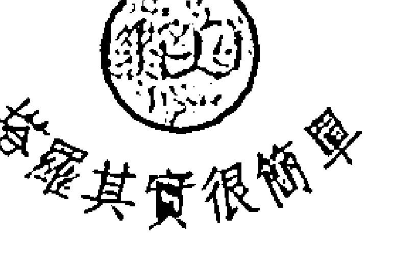

#### 倒牌

牌倒过来时，这个侍从代表的人有着整合上的困难。这个年轻人可能很吸引人，魅力非凡，但并不可靠。如果这张牌代表你自己，你可能试图欺骗某个人，或是靠父母或朋友过活。这个倒立的侍从跟刺探消息有关，你可能在打听跟你无关的事情，或是有人试图探听你的秘密。假如他指一个年轻人，这个人是个卑鄙小鬼，或对坏心眼行为特别在行，你最好戒之为妙！

#### 宝剑侍从倒牌的关键词

- 刺探消息。坏消息。恶意。卑鄙。坏心眼。讲别人的八卦。恶毒的话。被人盯上。守着秘密。好管闲事的小鬼。虚伪。多管闲事。欺骗。误解。背后中伤。一个两面人造谣者。一个爱攻击人的小孩。一个难以捉摸的年轻人。身体很差。

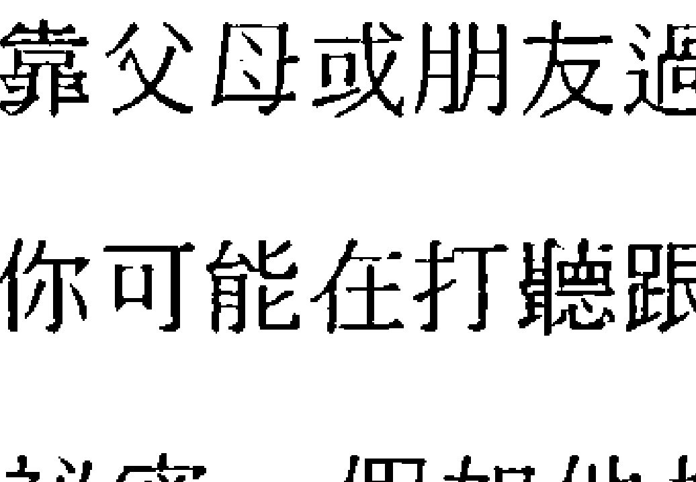

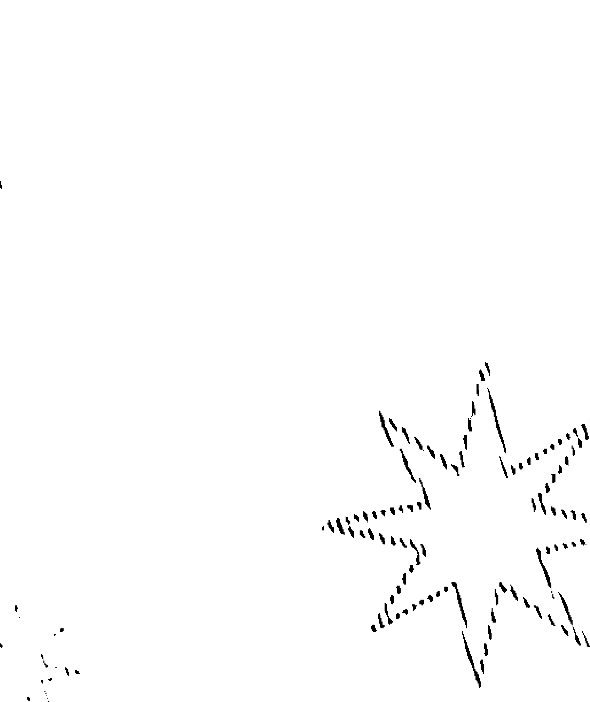

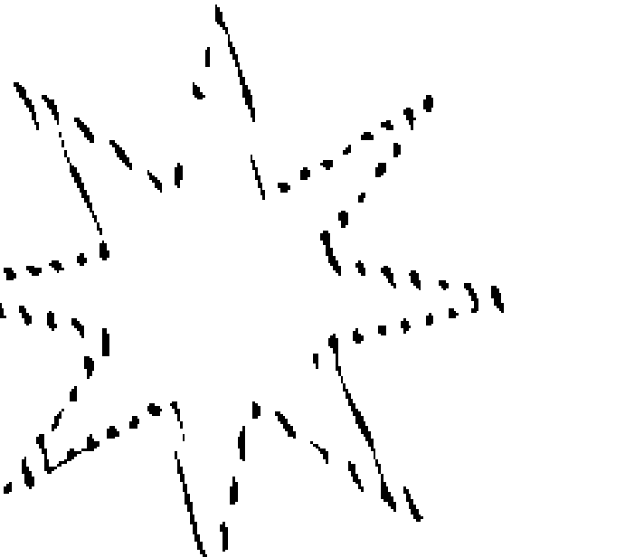

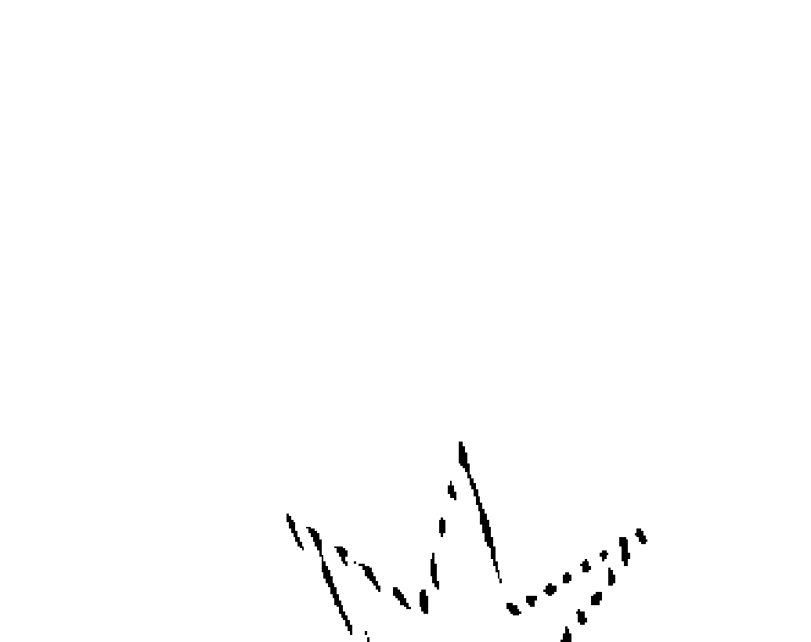

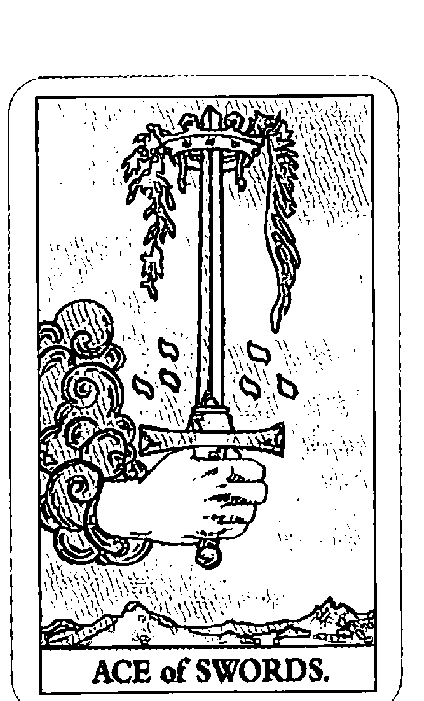

### 1 号宝剑

#### 正牌

跟所有 1 号牌一样，这张 1 号牌代表一个新的开始，可以精神方式克服困难。它象征一次主要突破，暗示一个全新的生活方式近在眼前。你靠运用高度的精神能力赢得这个机会。可能发生冲突，但如今你具有意志力排除万难。你感觉受到攻击，可能必须捍卫自己的想法和信念。你避免树敌，加上专心一致，做什么新事业都会成功。

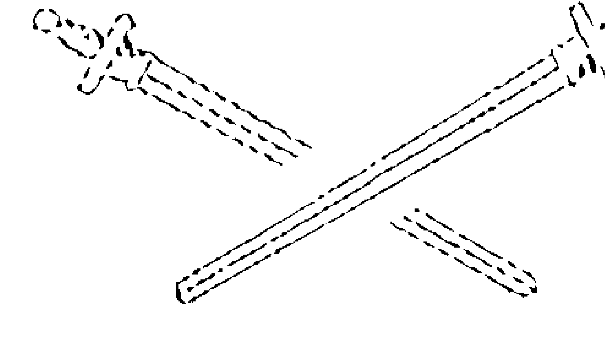

#### 倒牌

这张 1 号牌不管意思怎样都是正面的，倒牌只不过表示计划有所延误，或工作上意外出现暂时的胶着状态。你的精神准备工作和努力可能遇到阻挠，在体力的管理上亦无法那么快符合你的期望，因而引起你的挫折感和紧张感。小心！你可能做小手术或被某种锋利的工具割伤。

#### 1 号宝剑正牌的关键词

- 解决问题
- 领导
- 先锋
- 智力
- 整合
- 强烈的自我感
- 新的心灵成长
- 捍卫自己的信念
- 努力有所回报
- 正确之举
- 理性思考

#### 1 号宝剑倒牌的关键词

- 坏时机
- 意外的延迟
- 计划延期
- 挫折感
- 懒散
- 小手术
- 锋利的物品或言词
- 对立
- 障碍
- 生病
- 思绪混乱
- 精力四散
- 不公正
- 自残（如切断手或脚）
- 法律困境
- 不省人事
- 过度用力
- 割除## 2 號寶劍

#### 正牌

這張牌代表一個你感覺無法前進的狀況。你動彈不得，僅維持一種平衡狀態，否定台面下的緊張感。你感覺很不自在，但你尚未準備好改變。不過，改變最終勢必難免，或是緊張感會變得難以承受。你需要跟人溝通問題，停止假裝一切平安無事。你可能必須對其他信念表現出寬容的態度。你的確有選擇的權利，睜開雙眼，公正不阿地看待這個狀況。

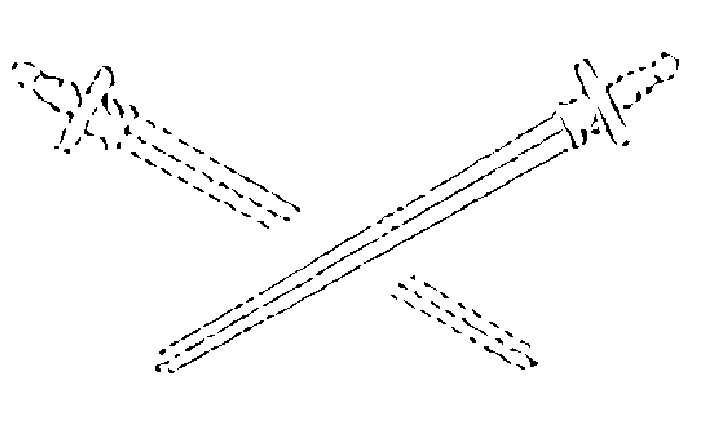

#### 倒牌

出現 2 號寶劍倒牌時，表示在一段停滯和挫折期過後開始恢復行動。你感覺可以自由往前，並取得成功。意見不同的阻礙消失，恢復溝通，或達成了妥協。如果涉及戀愛關係，表示如今你能夠達成和解。你已跳出衝突範圍或決心遠離爭端。

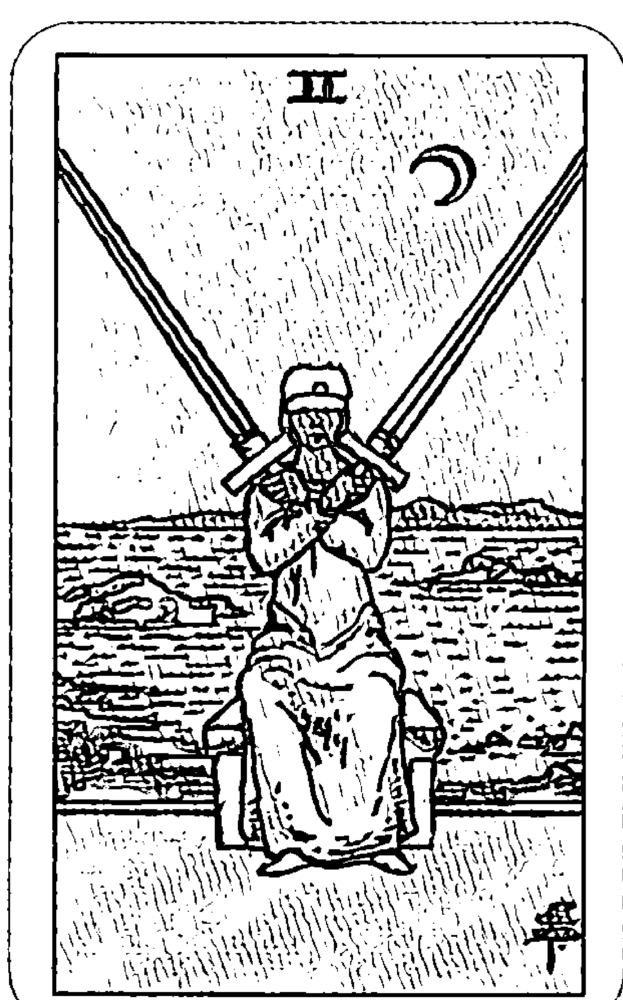

☆ ☆ ☆ ☆ ☆ ☆ ☆

#### 2 號寶劍正牌的關鍵詞

- 停滯不前。
- 陷於膠著狀態。
- 否定狀態。
- 一個緊張狀態。
- 埋在心裡不說。
- 拒絕面對現實。
- 停頓。
- 等待。
- 猶豫不決。
- 懸而未決。
- 壓抑情緒。
- 不給事情一個了斷。
- 沒有動作。
- 感覺壓力太大。
- 無法進行全新的開始。
- 被動。

#### 2 號寶劍倒牌的關鍵詞

- 如釋重負。
- 膠著狀態結束。
- 已做出決定。
- 動作恢復。
- 採取行動。
- 緊張紓解。
- 釋放感。
- 感覺輕盈。
- 溝通障礙消失。
- 真情盡現。
- 跟所愛的人和解。
- 與人相處。

☆ ☆ ☆ ☆ ☆ ☆ ☆

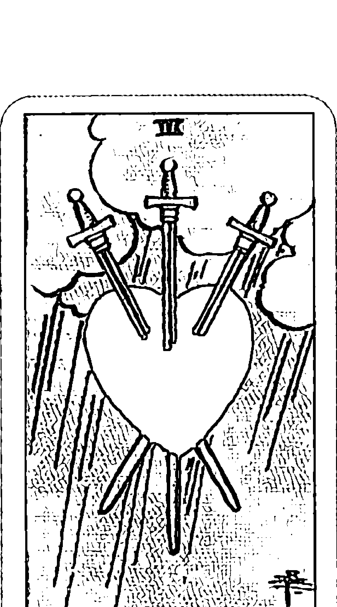

### 3 號寶劍

#### 正牌

3 號寶劍是一張分離牌，它述說分離與悲傷，經常代表一段戀愛關係走到盡頭。不過，最後結果卻是正面的。分離或分道揚鑣是必要的，也就是說，這段感情關係已經沒剩多少價值，或是你已經長大，這場戀愛不再適合你。即使你感到傷心或後悔，事情已成定局，它對你的未來只有好沒有壞，你很快就會明白這個事實。你現在傷心欲絕，不相信自己可以熬得過去。別試圖眷戀過去，讓它去吧。它必須在你的心裡逐漸消失。

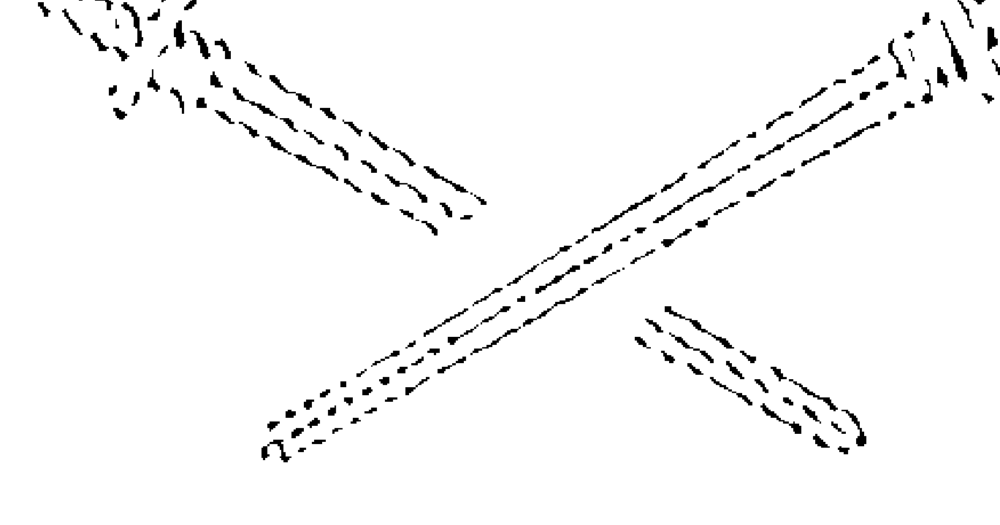

#### 倒牌

分手時，不正視事實，卻忙著怪罪別人。你需要開始把整個狀況思考清楚。你看不到自己在分手事件裡的責任，只懂一味自憐，愛情已經逝去，但你不願忘記，終日消沉。一切由你自己造成，要學習知錯能改。別陷入「早知道這樣，我就會那樣」後悔莫及的泥沼裡。

#### 3 號寶劍正牌的關鍵詞

- 心痛。
- 分離。
- 哀傷。
- 受傷。
- 為失去的一樣東西哀痛。
- 苦得死去活來。
- 逝去的情人。
- 心亂如麻。
- 心在流血。
- 心被狠狠刺傷。
- 無結果的愛。
- 難忍的悲傷。
- 感覺痛苦。
- 拋開過去。
- 緊張。
- 劇變，風雲變色。

#### 3 號寶劍倒牌的關鍵詞

- 煩躁，壓力太大。
- 熬過去。
- 找人幫忙克服消沉感。
- 哀傷。
- 一個三角關係。
- 拒絕接受。
- 麻煩的第三者。
- 抑制情緒。
- 求愛被拒。
- 卑戀。
- 走出情傷和痛苦。
- 健康問題。
- 小手術。
- 手操鋒利工具。

### 4 號寶劍

4 號寶劍是一張休息和復元牌，表示由情緒或身體壓力，或是一場疾病中恢復過來。你正在靜靜地處理你的問題，需要一段時間獨處和自我反省，以釐清問題的癥結所在。你身陷苦海，但已踏出復元的第一步。這張牌代表暴風雨後的寧靜，亦即要求個人空間，以讓內心恢復平靜的離群索居期。當你的時間會被過度占用時，你需要會跟人說「不」。

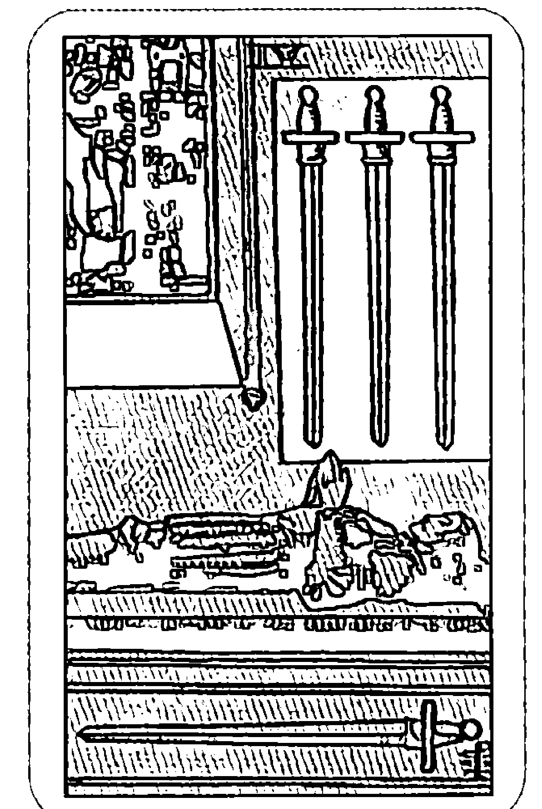

#### 倒牌

經歷了一段內心騷動期後，你需要休息和獨處，但你不讓自己這麼做。如果你拒絕休息，你可能會把自己搞病了。正常生活被打亂後，每個人都需要寧靜和平靜才能完全恢復過來。你也不例外，別再撐英雄了，小心你的健康啊！休息一下，去度個假，或是閉門休養一段時間吧！你要學會劃清界限和適時自我保護一下。

#### 4 號寶劍正牌的關鍵詞

- 休息一下。
- 休養生息。
- 平靜。
- 穩定。
- 自我封閉。
- 冷靜。
- 靜謐。
- 孤獨。
- 自我保護。
- 設定界限。
- 平靜內心。
- 要求個人空間。
- 防護。
- 再生。
- 中止活動。
- 慢下來。
- 放假。
- 內省。
- 復元。

#### 4 號寶劍倒牌的關鍵詞

- 拒絕休息。
- 休息時間結束。
- 恢復活動。
- 工作過度。
- 一味順應別人的苛求。
- 放棄個人空間。
- 身體很差。
- 行動延期。
- 家庭緊張。
- 無法對人啓齒。
- 沒有安全空間。
- 壓力增大。
- 不愉快的活動。

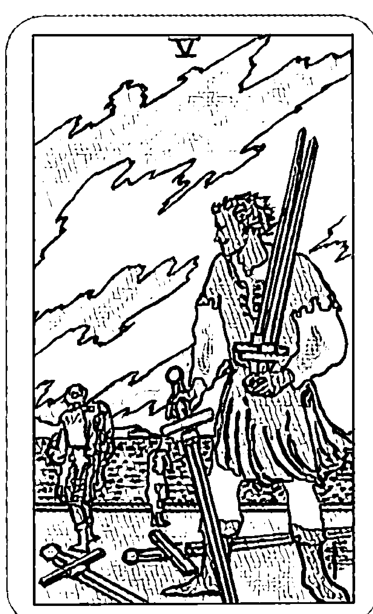

### 5 號寶劍

#### 正牌

受到壓力或死亡的影響，你正調整自己做改變。一個突發事件讓你必須做個痛苦的調整。全新挑戰就在你的眼前，你必須準備好去面對。往者已矣，你最好忘掉它。如果有人或有事情讓你失望，那是因為你期待太高了。改變雖然過程不舒服，但勢必難免。不管改變的是你的生活方式、居處、個人信念、個人形象、朋友或感情關係，一切都是為了你好。這張牌顯示出寶劍刀鋒的兩面，一面代表挫敗、不幸、背叛和損失，另一面則代表接納生命本身的限制。你或你認識的某個人可能涉入衝突，並暗中耍詐幫忙處理。

- 背叛
- 誤信
- 內部人士團體
- 排斥
- 挫敗
- 不幸
- 不競爭
- 不道德行為
- 不按牌理出牌
- 信心危機
- 受損的自尊
- 卑鄙
- 丟臉
- 任人欺壓
- 負面思想
- 猜疑
- 策劃陰謀
- 壞話

#### 5 號寶劍正牌的關鍵詞

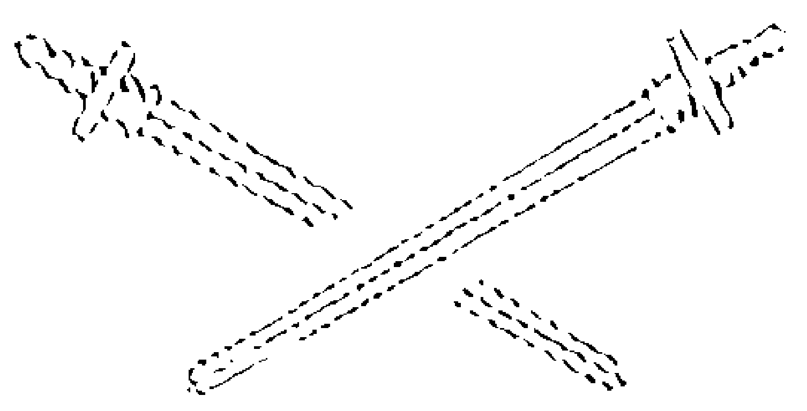

#### 倒牌

這張倒牌是在警告你，要你提防某個人，這個人難以捉摸或不值得信任，並且動機不明，或是要你提防一個錯綜複雜和深不可測的狀況。你可能試著脫離損友，而且害怕會引起反彈。你受到嚴重傷害，心裡非常難過，如今需要時間恢復。對別人的信心開始動搖，但又需繼續下去，未來相信別人時要格外小心。

- 力量交戰
- 損失
- 失敗
- 誹毀
- 羞辱
- 成為受害者
- 惡毒行為
- 糟糕的態度
- 報復
- 被迫
- 背叛
- 誣告
- 一個發怒的失敗者
- 不誠實
- 非法（整體來說，意思跟正牌一樣，只是更為強烈而已）

#### 5 號寶劍倒牌的關鍵詞

### 6 號寶劍

#### 正牌

你正走出困擾，把過去拋在腦後。這張牌表示一段恢復期過後，一個全新階段的開始，在此新期間裡，一切順利，相對問題較少。你的狀況穩定，給內心帶來新的平靜。和諧，緊張感減少。在極度痛苦過後，你跟自己或跟別人的關係恢復常軌，感覺自己很棒。這是一個整合或重新整合的時機。生活裡出現新朋友、新戀情和新機會，這些關係將穩定發展，你可以對它們有信心。這張牌亦指出一次水上之旅或搬家。幸運之神眷顧著你，不管你做什麼改變，都會有好結果。

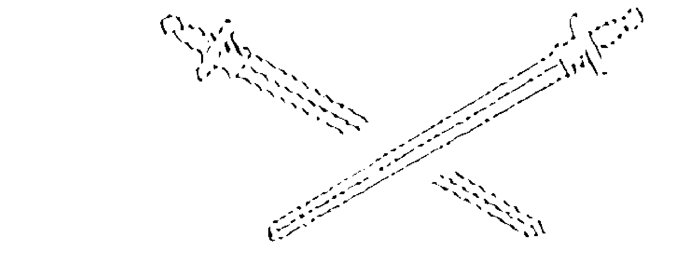

#### 倒牌

這張倒牌暗示，眼前問題很難找到解決方法。波折使你情緒或生理失衡。你可能因缺少別人的合作而感到無能為力，或無法改變狀況，不過改善溝通技巧會有幫助。你可能處於一段艱難的過渡期，像是學習階段的結束，搬家或是戀愛上的問題。

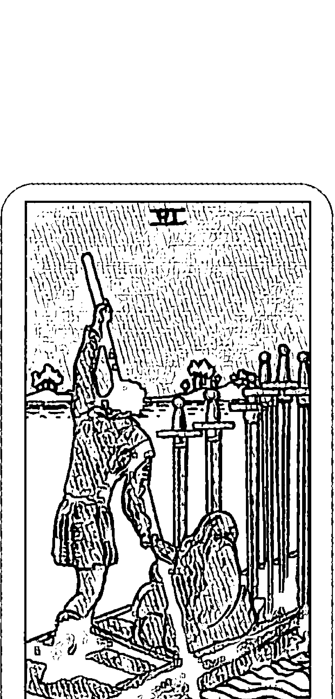

#### 6 號寶劍正牌的關鍵詞

- 告別困擾。
- 人生的一個全新階段。
- 美好生活就在眼前。
- 窗外有藍天。
- 脫離（有時候是刻意的）傷痛。
- 一個快樂的轉變。
- 把它全拋在腦後。
- 繼續你的人生。
- 水上之旅。
- 搬家。
- 寧靜。

#### 6 號寶劍倒牌的關鍵詞

- 波折不斷。
- 負面思想。
- 對抗現狀。
- 努力往上游。
- 期待的釋懷延遲到來。
- 為進展落後所挫。
- 進展緩慢。
- 動彈不得。
- 脫離不了舊習性。
- 取消或延後一次旅行。
- 對過去的問題執迷不悟。
- 缺乏行動。

### 7 號寶劍

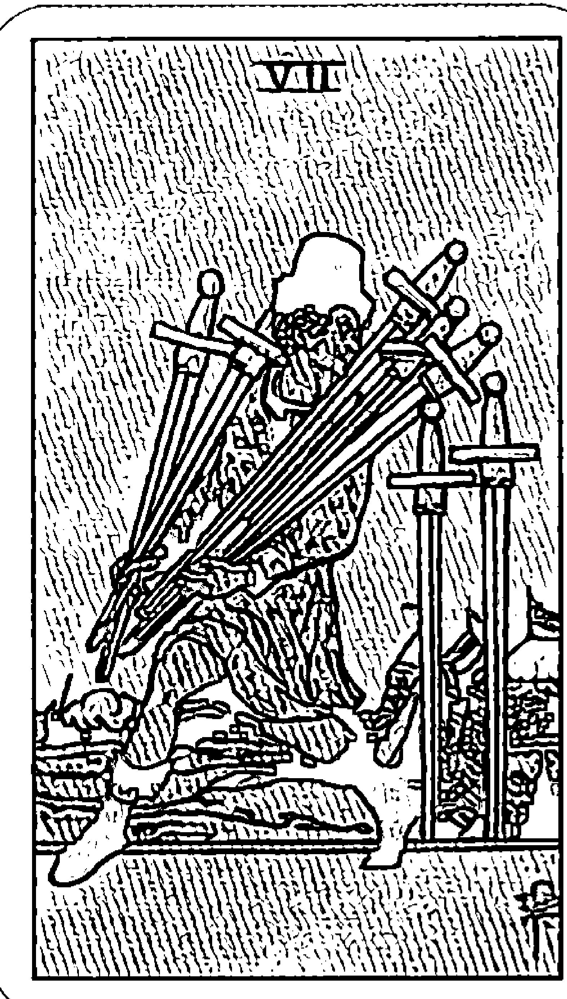

#### 正牌

這是一張自相矛盾的牌，帶有發明與冒險的元素，但亦含有欺騙與卑劣的意思。對青少年來講，它可以代表學校裡或運動場上競爭劇烈，朋友表裡不一，或對手要詐。迂迴動作或間接溝通阻礙工作。你不能把朋友和承諾當真，必須倚靠自己的智慧去處理問題和達成目標。你需要小心謹慎，才能在一個詭異多變的狀況裡占上風。

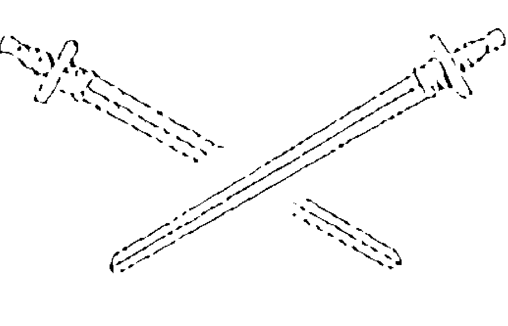

#### 倒牌

這張牌倒過來，表示面對快速的挑戰和變化時，你在心理上需要保持彈性。你必須時刻留心著突發狀況的轉變。你可能試用新的思考方法，或暗地裡嘗試著不同的生活方式。事實可能證明你很難獨自證明自己的個體性。有隔絕或缺乏了解的問題。學習開放地表達自我。

#### 7 號寶劍正牌的關鍵詞

- 事情表裡不一。
- 小心謹慎。
- 詭異多變。
- 口是心非。
- 千鈞一髮。
- 找人頂罪。
- 推諉。
- 靠蒙騙取勝。
- 詭計多端。
- 間接動作。
- 不公平的競爭。
- 自我放棄的態度。
- 你是你自己最大的敵人。

#### 7 號寶劍倒牌的關鍵詞

- 到處出糗。
- 要詐行為被抓。
- 拿回你應得的東西。
- 失物歸還。
- 應得而得，社會正義獲得伸張。
- 心理彈性讓你平安度過一天。
- 重新分配。
- 找人諮詢意見。
- 處離實際問題。
- 整合你的行動。
- 真正的友誼。

### 8 號寶劍

#### 正牌

出現這張牌表示你身陷泥沼，要不是你不能，就是不願意為一個讓你痛苦萬分的狀況做選擇或改變。意思是你作繭自縛，或是感覺不被容許做自己，因此你無法自立行動，感覺被你無法控制的狀況束縛住。雖然有許多塔羅牌用書作者認為這張牌極為負面，但它可以代表你完全專注於目標的能力。還有，你並不是沒有改變事情的資源，糟糕的狀況只是暫時而已。

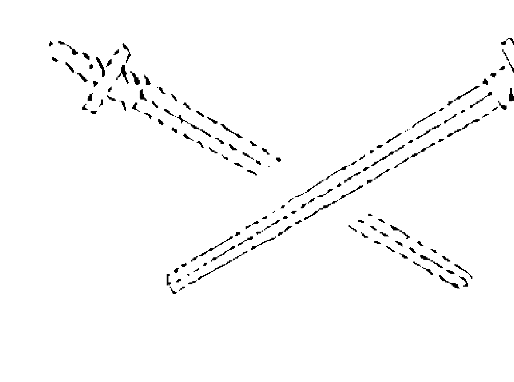

#### 倒牌

這張倒牌表示有些問題獲得緩和。你已認同自己需要改變，開始把自己從束縛裡釋放出來。進展緩慢，但已經有了眉目。談判，可能是跟你父母的談判減輕了束縛。你擁有更多行動自由，更能開放地表達自我。某個遭禁的人獲釋。你的自覺正在增加之中，特別是在人權方面。

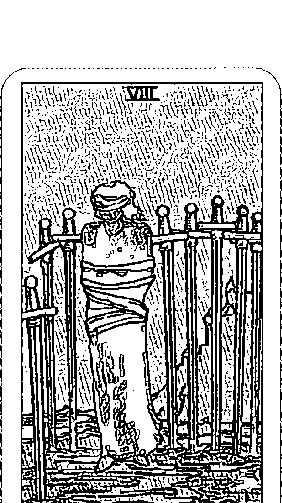

#### 8 號寶劍正牌的關鍵詞

- 束縛，限制。
- 感覺動彈不得。
- 脫不了身。
- 遭禁足。
- 隔絕。
- 不知所措。
- 一個惡性循環。
- 禁制。
- 缺乏精力。
- 困惑。
- 絕望。
- 狀況的受害者。
- 欠缺信心。
- 無法前進。
- 害怕。
- 被困。

#### 8 號寶劍倒牌的關鍵詞

- 自由。
- 解脫束縛。
- 一個嶄新的態度。
- 排除障礙。
- 和解。
- 一個新鮮的開始。
- 進行補救。
- 不再害怕。
- 賦予力量。
- 脫離高壓環境。
- 了解問題。
- 克服先前的限制。
- 打敗恐懼。
- 看清楚自己的方向。

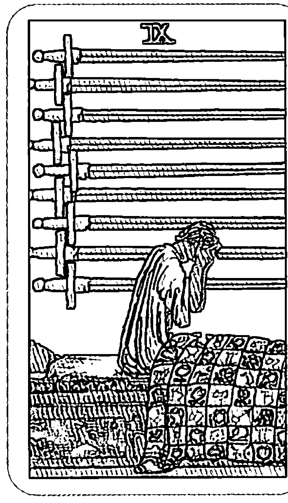

### 9 號寶劍

#### 正牌

9 號寶劍被稱為「惡夢牌」，表示有人由於焦慮、緊張、不愉快或不幸而睡不安穩。即使事實不像你想像的那麼痛苦，你依然處在一個不快樂和困擾的精神狀態裡。極度負面的思想，亦即「最壞假設」或恐怖幻想，正折磨著你的心智。

其實你可能在做惡夢，問題根源在於你得不到認同，以及找不到解決問題的方法。如果你非常困擾，請找心理治療師或可靠的長輩商量。

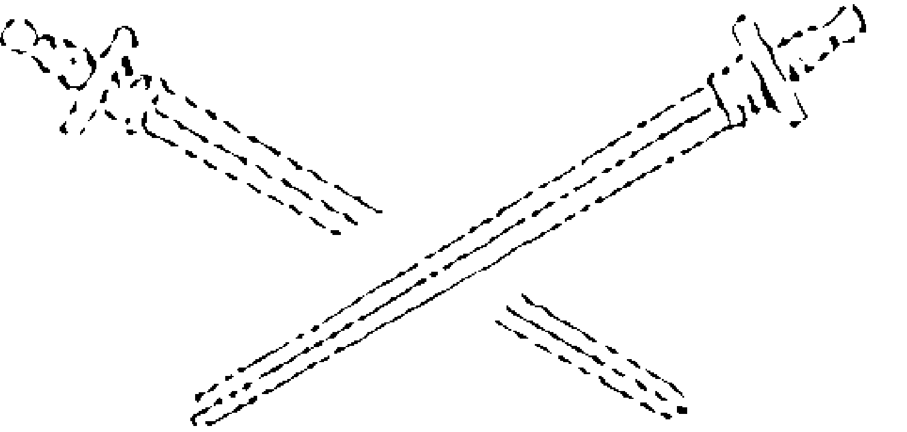

#### 倒牌

精神折磨迫使你改變。絕對誠實將幫助你找到方法改善狀況。狀況之所以危急和讓你身受其害，是因為你自己抓住問題的原因不放。不管危急的狀況讓你有多麼痛苦，其實它並非百害無一利。9代表完成，因此這個9 號是在要求你做必要的改變，以便讓你可以有個更好的未來。

#### 9 號寶劍正牌的關鍵詞

- 焦慮。
- 惡夢。
- 負面思想。
- 恐懼。
- 悲傷。
- 擔憂。
- 昔日不幸或痛苦揮之不去。
- 腦海裡思緒不斷。
- 無法休息。
- 沮喪。
- 感覺無法面對狀況。
- 需要專業協助。
- 無法處理情緒。

#### 9 號寶劍倒牌的關鍵詞

- 一線希望。
- 較明朗時期。
- 好消息。
- 我們最大的擔憂實際上很少真正出現。
- 無憂無慮。
- 再度感覺自己很棒。
- 暴風雨已經過去。
- 隧道盡頭的一道光芒。
- 一夜好眠。
- 嶄新的一天。
- 深信宇宙。

### 10 號寶劍

#### 正牌

這張 10 號牌雖然看起來很恐怖，但它預測你目前所受到的考驗和波折即將進入尾聲，一個全新的生活正要開始。他告訴你必須把舊生活全部忘掉，雖然過程可能會很痛苦，但你將能乾淨俐落地衝出過去的痛苦，毫無依戀。對青少年來講，這張牌尤其顯示出生命是無止盡的循環，時而艱難，時而容易。問題總是會出現，而且必須加以解決。你的態度最為重要，你的思想決定了你的一生。

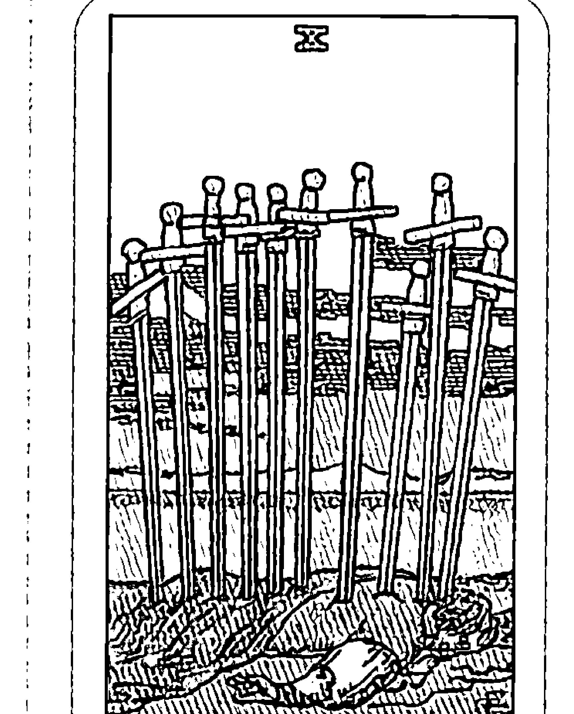

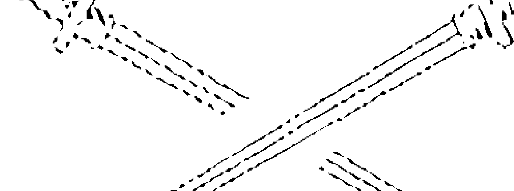

#### 倒牌

10 號寶劍出現倒牌時，表示你排斥採取必要的行動，不把自己推進新的循環裡面。不過，拖延或拿事實跟自己開玩笑，並不能停止改變的發生，改變怎麼也避免不了。重要的是你自己的成長，每天太陽都會升起，如果你幫自己或別人維持現狀找藉口，你的痛苦期只會有增無減。想想辦法，採取行動，就算是錯誤的一步也在所不惜。

#### 10 號寶劍正牌的關鍵詞

- 變成熟
- 拋開過去
- 由錯誤中學習
- 結束一個循環
- 家庭衝突
- 找個新的信念
- 重複的問題需要加以解決
- 凡事都有結束的一天
- 必要的改變
- 黎明之前的黑暗

#### 10 號寶劍倒牌的關鍵詞

- 朝正確方向邁出的一步
- 讓未來更好的一個改變
- 準備好接受新的挑戰
- 讓自己準備就緒
- 最壞的狀況已經過去
- 痛苦是最好的老師
- 倖存
- 別人的幫助
- 解決問題
- 繼續你的人生

## 認識寶劍

這是第三回練習，以測試你的號碼牌知識，以及給你一些跟數字牌意義有關的練習。

把號碼牌分出來，依花色分成四堆，這次你當然是拿寶劍花色的號碼牌做練習。把它們依號碼大小的順序排列，接下來，先別參考本章裡的介紹，檢查每張牌，看能記得它們的意義多少。

用你的塔羅牌的牌面來幫助你想起它們的含意（這也是大多數號碼牌有牌面設計的原因，可以幫助記憶）。

現在，在你的塔羅牌記事簿裡，依序寫下寶劍號碼牌，然後在它們後面寫下你記得的含意詞句或想法，寫好後，跟本章內容進行比較。

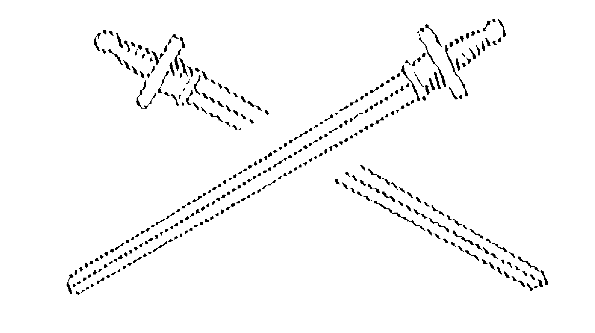

## 12 聖杯

聖杯是個快樂的花色，代表愛、和諧、情感、友誼和憐憫。聖杯很少是負面的，可以抵消占卜裡任何的困難牌，它經常指出走出困境的方法。聖杯亦代表創造力，亦即藝術或音樂能力，或是解決問題的創意。

聖杯屬水，代表感情和情緒多餘物質世界裡的精神能力或問題。聖杯亦指向心靈的領域。聖杯是容器，象徵接納，而且外形通常很美麗，代表有益、滋養的想法和成就。它們暗示心情像水一樣善變。聖杯亦代表我們需要更加注意的無意識過程。

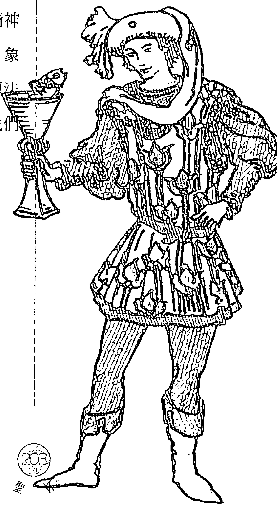

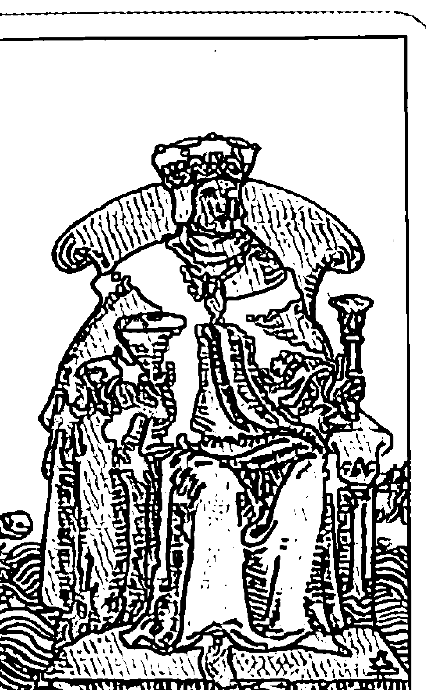

## 聖杯國王

聖杯國王的態度親切，他這個人對自己的工作、家人、關係和社區帶有一種敏感的態度。如果這張牌不代表一個人，則代表這些特質。在象徵意義上，這個國王代表一個感情很深卻無法處理感情的人，因爲他很關心別人，經常視別人爲第一優先。

#### 正牌

這個國王象徵一個親切的男性，他像父親般對待你或你的問題。他可能代表你的父親或其他扮演你的父親角色的成熟男性。如果他代表你生活裡的某個人，他是那種「感情類型」的人，很容易表現感情，對家人的感情非常濃烈。假如他是你的一個朋友、提供建議者或權威人物，你可以相信和倚賴他。在青少年的占卜裡，這個國王很少代表戀愛，除非出現了男長女幼的狀況。不過，他的出現偶爾可以透露出喜歡跟一個親切、有藝術氣質和成熟的男性交往的傾向。

## 聖杯國王正牌的關鍵詞

- 一個睿智的顧問。
- 一個好父親。
- 一個親切的權威人物。
- 成熟。
- 憐憫。
- 一個成熟、情緒穩定的男性。
- 一個藝術派或有創意的人，可能是個老師。
- 一個可信的建議者。
- 一個從事助人行業的男性。
- 一個你可以倚賴的人。
- 體貼。
- 一個好的聆聽者。

#### 倒牌

這個國王倒過來時，是在告訴你，該是你脫離倚賴某個年長男性、自立奮鬥的時候了，這個人可能是你的父親、摯愛的老師或熟識的意見提供者。你已到達一個年齡，仰賴長者照料的舊模式已經不適合你，你需要發展出獨立感。有些小孩發現自己很難離不開父母的安全保護傘，但是為了表示你已成熟，你必須要能夠放棄倚賴性。如果這張牌代表你的父親，與其耍權威，他可能更像是你的「好哥兒們」。這張牌也可以象徵某個想要擺脫掉你的人，某個試著把你推出保護窩巢的人。

## 聖杯國王倒牌的關鍵詞

- 很難跟某個成熟男性相處下去。
- 缺乏可信度。
- 需要從一個失職或冷漠的父親那裡尋求獨立。
- 一個嗜賭或上癮的男性。
- 不真誠。
- 自私。
- 不善理財者。
- 學習責任。
- 自我沉迷。
- 需要自律。

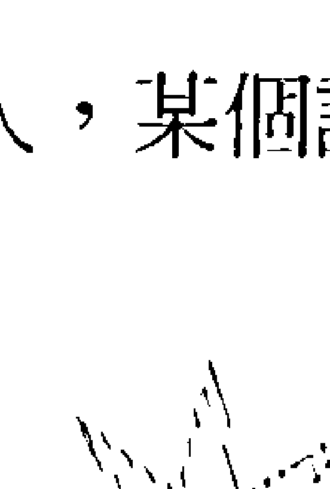

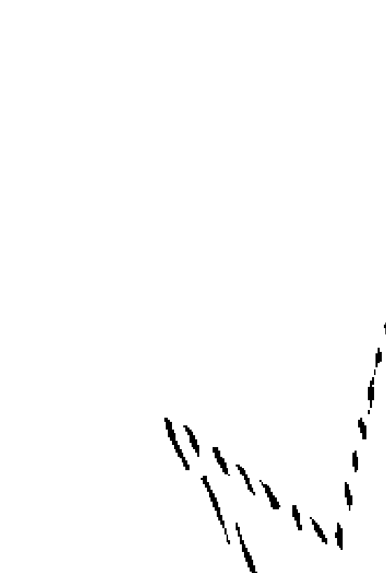

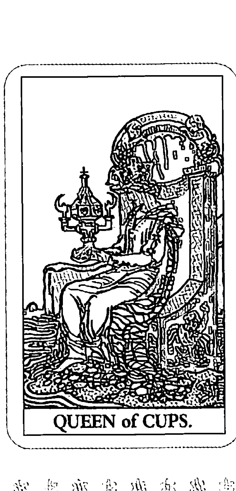

## 聖杯王后正牌的關鍵詞

- 一個女性照顧者
- 親切和藹
- 想像力
- 熱愛藝術
- 音樂才華
- 對子女的愛
- 安詳
- 照顧和關愛
- 心靈能力
- 戀家的人
- 同理心
- 學習玄術或對玄術有興趣
- 占卜
- 感情
- 一種第六感
- 感受
- 奉獻
- 慈愛
- 內省

## 聖杯王后

聖杯王后代表的人往往很容易表現出情緒、創造力和心靈天性，他們經常是藝術家、作家、詩人或心靈導師。他們對抽象世界具有強烈的興趣，可能會把這種興趣傳給子女。這類女性關心別人的福祉，常為別人著想。聖杯王后的真誠和親切的態度吸引別人來接近她，她以優雅、甜美、有耐性和無私的愛知名。身為母親時，她總是非常注意子女的感覺和需要。

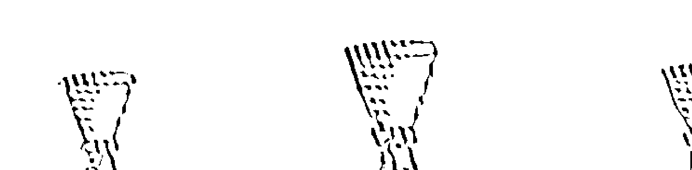

#### 正牌

聖杯王后是個仁慈成熟的女性，充滿優雅和親切的氣質。她代表一個充滿感情和愛的女性，可能是你的母親、某個年長的女性親人或成熟的女性朋友。她用睿智的方式去愛人，對人抱持著接納和親近的態度。她很有創造力、有遠見，而且是個心靈導師，以成熟的判斷來調和自己的直覺力。如果她不代表一個人，則多半代表跟創意性計畫有關的狀況。

#### 倒牌

這個倒立的王后可以代表情緒上很苛求的某個人，她可能是個酒鬼或失職的母親，精神上有問題或曾經心理崩潰。或者她可能只是精神恍惚，或是個理想主義者，從不知道如何在真實世界裡生活。身為一個負面的母親人物，她不為子女的需求著想，或無法適當滿足子女的需要。她可能讓子女必須反過頭來照顧她，要子女為她的福祉著想和負責。這類婦女可能有情緒不成熟的問題，才會使得家庭生活動盪不安。

# 聖杯王后倒牌的關鍵詞

情緒不穩定。精神恍惚。酗酒。容易受騙。疏忽怠慢。判斷力差。管理不善。情緒爆發。負面思想。怪罪別人。苛求。一個騙人的心靈占卜師。逃避主義者。做白日夢者。喜怒無常。不以現實為根據。不可靠。浮躁善變。猶豫不決。

# 聖杯騎士

聖杯騎士是個浪漫人物，象徵某個朝自己心裡的欲望穩定前進的人，無論這個欲望是個學習課程、選擇職業或是未來的結婚對象。這個騎士象徵忠實和愛，能夠在日常生活裡運用直覺能力和想像力。如果這個騎士代表一個較年長的青少年，則表示這個青少年了解愛和忠實的價值與力量。他經常透過對抽象理論或玄學的興趣，或是學習來表現自己的能量。他具體表現出慷慨，關心家人、朋友、動物和環境的精神。

#### 正牌

傳統上，聖杯騎士捎來一個愛進入你的生活的信息。你可能認真地談著一場戀愛，這場戀愛占據你的整個生活。他可能帶給你一個你期盼已久的信息，像是一個愛的表白、一個出席重要社交場合的邀請，如高中畢業舞會、訂婚典禮或求婚儀式。你可能感覺這就是你夢寐已久的感情關係，但千萬別讓自己迷得昏頭轉向。如果這張牌不代表一個戀愛對象，則象徵一個真正的朋友、一個誠實和聰明的助手、一個你可以信任的人。

- 愛與浪漫戀情
- 愛的信息
- 情書
- 親密的溝通
- 夢想成真
- 「跟著你的喜悅走」
- 重要的情緒發展
- 求婚
- 藝術
- 夢想
- 舞蹈
- 音樂
- 理想的遐思
- 心靈能力
- 想像力

#### 倒牌

这是个喜欢挑动和引诱人家感情的年轻人，他一点也不真诚，而且浮躁多变，对爱情抱持着一种「得手后随即走人」、玩世不恭的态度。你期盼已久的爱情信息迟迟不来或永远不会到来。你渴望的浪漫爱情很肤浅，或是建立在对方存心欺骗或感情浅薄的基础上。你可能迷上一个人，他对你其实感觉不深，只是存心引诱你，或永远不会给你任何承诺。该是你停止付出、痛定思痛继续前进的时候了。

# 聖杯騎士倒牌的關鍵詞

- 秘密的愛情尚未被揭穿
- 單戀
- 不現實的愛情
- 找錯對象
- 誤信
- 害怕被拒絕
- 遙不可及的愛情
- 感情不貞
- 認為總有一天我的白馬王子會出現
- 自私
- 糟糕的愛情關係
- 一段婚外情的結束
- 狂躁的愛情
- 衝突

# 聖杯侍從

聖杯侍從代表一個正在了解世界、特別是感覺和愛情世界的年輕人。這個侍從象徵的這類青少年非常敏感，具藝術性格，以感覺為出發點和有同理心。他（她）可能很喜歡做白日夢，個性不實際、不現實和不成熟。這種人通常很想被取悅、心地很軟、害羞、壓抑感情、開放和真誠。這張牌可以指懷孕，你的母親可能正懷著另一個小孩，或是你或你的親友懷孕了。有時候這個懷孕是個意外，也成為一個問題。如果這個侍從不代表人，則表示一個變化多端的狀況，時熱時冷，令人難以捉摸。

# 聖杯侍從正牌的關鍵詞

- 思春期
- 情緒敏感
- 愛情秘密
- 懷孕或生子
- 藝術能力
- 跟愛情有關的消息
- 社交活動
- 一個年輕朋友
- 小孩
- 溫和親切
- 一個學生
- 寵物
- 溫柔
- 情緒成長
- 學習愛情
- 藝術敏感度
- 內心裡的小孩

#### 正牌

這個侍從是個年輕人，捎來跟愛情有關的一個信息，或是愛情即將透過電子郵件、電話或某一個人到來的一個信息。這個狀況可能涉及感情冒險，像是秘密訂婚或私奔。事發突然，出乎預料。狀況可能很刺激，但同時又很恐怖。如果這張牌代表你自己，則表示你已決定要冒險一下，不管別人怎麼苦口婆心勸你，你就是不聽，你很有信心一切都會很順利。如果這個侍從似乎代表某個很年輕的人，它可能是個警告，要你小心，不要涉及不智的感情關係。

#### 倒牌

這個倒立的侍從建議你要小心愛情問題，特別是溝通方面。某個不恰當的人士可能企圖引誘你，但你被蒙在鼓裡，對他（她）的虛情假意或真正的居心渾然不覺。這張牌代表一個「可疑的」狀況，需要加以小心評斷。網路戀情對今日青少年來講非常普遍，但這類戀情非常不穩定，務必謹慎處理。你需要看清楚所有跟愛情有關的信息。如果這張牌不代表一個人，則有可能表示一個為了達成不好的目的而涉及欺騙和奉承的狀況，或是意外懷孕，或是保守著危險的愛情秘密。如果你玩弄著某個人的感情，小心為妙，你可能會讓自己受傷。

# 聖杯侍從倒牌的關鍵詞

- 處理情緒問題。虛假的愛情承諾。引誘。你看到的不等於是你得到的。愛情方面不真誠的溝通。小心別被騙。別隨便地獻出你的心。小心詭計。秘密有其危險。

# 1 號聖杯

#### 正牌

1 號聖杯預言將會有個和諧的新愛或新的開始。對青少年來講，它表示全新的情緒經驗，輕易表達感覺的能力，以及個人身分提高感。它指出與別人正面的互動，如果你剛升上高中，你會很容易交到朋友，還有可能找到一個滿意的戀愛對象。另外它亦代表健康良好和正面的情緒能量。它代表的愛既純潔又美好，讓你徹底打開你的心胸。你的內心生活將更加豐富。

#### 倒牌

這張倒立的 1 號聖杯表示，在愛情與戀愛關係上情緒錯綜複雜、心情反覆不定和感覺有所保留，或出於感情壓抑以致於無法愛人。對愛情失望，或一段新的戀情瞬間消失成為泡影。要花很多努力才能做好新的事情。延遲導致你有情緒挫折感和枯竭感。負面感覺阻擋了你的愛情之路，或你受情況限制，無法表達自己的感覺。尋找光明的一面。

# 1 號聖杯正牌的關鍵詞

新愛。和諧的新開始。情緒良好。正面的自我形象。愉快。歡樂。愛情有好運。感情覺醒。理想化想像。成為有感覺的人。情緒高漲。快樂。墜入情網。溫柔。浪漫戀情。

# 1 號聖杯倒牌的關鍵詞

無結果的愛。婚外情的結束。孤獨寂寞。感覺孤立和不被愛。情緒未獲得滿足。過於害羞，以致無法讓別人知道你的感覺。不快樂。失去所愛或跟愛人分手。淚水。反唇相譏。無愛的性。感情關係問題。哀傷。

# 2 號聖杯

#### 正牌

2 號聖杯象徵一切和諧的關係。你的戀情可能正處於雙方相互支持和了解的「蜜月期」。對青少年來講，這張牌可以指像是約會的小事，也可以指像訂婚的大事。它可以指一個新的感情，或是現有感情出現全新的和諧關係。這張牌也代表根據雙方的需要做決定，以及爲了取悅對方而收起自私的動機。情緒表達很重要，但必須誠實坦白，才能製造出所需的合作關係。

#### 倒牌

2 號聖杯倒過來時，可能比較難於選擇，而且可能有障礙阻擋了愛與和諧。一次約會可能不歡而散，或你可能被某個人吸引，對方卻對你沒興趣。害羞或感覺自己不好，可能造成你不讓對方知道你的感覺，或由於父母不準許，你只能偷偷談戀愛。你想要跟某個人和好如初，但難以做到。一個友誼關係受到限制。

# 2 號聖杯正牌的關鍵詞

一份和諧的感情關係。合作。分享。吸引。浪漫的愛情實現。一對快樂的情侶。結交朋友。結束紛爭。跟人和睦相處。和好如初。找到共同點。婚外情。夥伴關係。訂婚。結婚。互惠關係。妥協，讓步。

# 2 號聖杯倒牌的關鍵詞

單戀。一場感情結束。分道揚鑣。誤解。缺少合作。需要爲愛情保密。意見不一致。不平等的狀況。失衡。違背信任。不和諧。你的舊愛。自滿。愛情出了錯。無法公開討論事情。

# 3 號聖杯

#### 正牌

有些事情已經完成，該是你慶祝的時候了。你正體驗著勝利與成功，歡樂與美好的時光。你可能開個派對來慶祝訂婚或穩定的感情關係，或是參加一場標示著快樂的派對，像是畢業或節慶日派對。有節慶、友誼、歡笑和遊戲節目。先前糟糕或陰鬱的感覺已經過去，如今你的心思更加清明，更了解自己和別人的情緒需求。你正朝著美好道路的方向走去。

#### 倒牌

3 號聖杯倒牌不是負面的意思，只是表示將會有延遲和小失望。一場暴雨可能破壞掉一場室外慶祝會，或一場派對因天候不佳延期。你可能收不到你企盼的邀請函。你想開個派對，但現在卻不能花錢。一切都唱著憂傷小調。快樂的場合和歡慶會規模將會比你希望的小。

# 3 號聖杯正牌的關鍵詞

- 歡慶
- 美好時光
- 舞會
- 社交事件
- 快樂
- 好玩
- 跟朋友相聚
- 歡度假期
- 處處盡覺美好
- 結識新朋友
- 獲得大家一致熱烈的支持
- 一群好友
- 家庭團聚
- 萬事順利
- 心靈交會

# 3 號聖杯倒牌的關鍵詞

- 跟社交事件有關的延遲和失望
- 一場派對延期
- 小慶祝
- 缺少朋友
- 找不到契合的朋友
- 一段戀情發生結束的插曲
- 不獲准開派對
- 期待的朋友並未出現
- 過度沉迷
- 一個社交事件取消

# 4 號聖杯

#### 正牌

這張牌建議你該抽離日常活動以走進內心一段時間。你需要時間獨處，作作夢，然後再恢復日常學校作息、社交和課外活動。你可能涉及一個情緒緊張的狀況，如今你必須抽離，以便把一切東西思考清楚。你需要空間來沉思和釐清頭緒。你需要一些休息和調養。學習放鬆和放下緊張。

#### 倒牌

你正從一段不滿意期裡恢復過來，你已走進內心，花了些時間獨處，如今準備好重新走入人群，繼續你的人生。你期盼著某些東西，像是想參加某個社交活動或對自己的計畫重拾起興趣。感覺「孤獨」的時期已經結束，如今你可以重新振作，恣意地進行新計畫和實行全新的創意。

# 4 號聖杯正牌的關鍵詞

- 從日常問題抽離。
- 走進內心。
- 不滿意現狀。
- 沒有動力。
- 需要休息和過隱居生活。
- 感覺遭誤解。
- 需要做個決定。
- 獨自一人。
- 感覺空虛。

# 4 號聖杯倒牌的關鍵詞

- 重新振作。
- 隱遁期結束。
- 走出你的保護殼，開懷暢談。
- 接受社交邀請。
- 新的動力。
- 滿意。
- 不滿的結束。
- 一個全新的感覺。
- 新機會。
- 繼續你的人生。
- 愉快。

# 5 號聖杯

#### 正牌

5 號聖杯象徵某個人後悔莫及，盡想著痛苦的過去，不願用正面態度看待未來。他認為裝了一半水的杯子是半空，而不是半滿的，一言以蔽之，就是悲觀主義。你感覺事情無法改善，整個人沉浸在過去的失望、錯誤、損失和受傷的感覺裡無法自拔。5 號聖杯象徵內心的變化，是一張選擇牌。你可以籠罩在過去的傷害裡，也可以選擇調整心態，開始瞄準重心，往正確的未來邁進。你不必悲傷，可以努力活在現在，拋開過去。

#### 倒牌

倒立的 5 號聖杯表示，你在內心裡做著適當的調整，以改正整個狀況。你的痛苦經驗已經結束，如今你正在恢復中。你願意讓過去成為過去，原諒自己和忘掉過去。一段舊情可能死灰復燃。你能夠接受自己情緒痛苦有其意義存在，至少你已學到一些珍貴的教訓。如今你願意收拾起破碎的心情，重新出發。

# 5 號聖杯正牌的關鍵詞

- 沉浸在過去的損失裡
- 活在過錯裡難以自拔
- 看不到未來
- 情緒壓力
- 遺恨難消
- 失調
- 悲觀主義
- 出了差錯的愛情
- 悔恨
- 自我苛責
- 自我感覺惡劣
- 感覺悲傷或孤立
- 自我隔絕

# 5 號聖杯倒牌的關鍵詞

- 一線希望
- 豁然接受
- 期盼未來
- 樂觀主義
- 好消息
- 了解過去
- 走出損傷和失望
- 繼續你的人生
- 正面思想
- 盡力而為
- 對未來燃起新希望
- 凡事往最好的方面去想
- 機會

# 6 號聖杯

#### 正牌

這張牌指懷舊、緬懷美好往事、多愁善感。你可能想起自己快樂的童年。在壓力期間裡，想想快樂的回憶也是一種撫慰。明白過去你很快樂，可以幫助你知道如何讓自己未來一樣快樂。童年圍繞著你不去，你對過去的感覺將會影響你的未來。或是你過去認識的某個人再度出現在你的生活裡，讓你感到很快樂。將會有娛樂和社交活動，有時候是跟老朋友或家人在一起。

#### 倒牌

你試圖回到過去，但過去已成過去。目前處境艱難的你沉浸在過去裡，希望能回到從前。你可能長不大，無法擔當責任，想繼續保持幼稚和倚賴。你可能跟兄弟或其他家人發生口角。一段舊情可能依然困擾著你。你在內心裡其實還是個小孩子，這才是你的問題所在。

# 6 號聖杯正牌的關鍵詞

- 童年記憶。
- 過去的快樂。
- 懷舊。
- 緬懷美好的過去。
- 想起往事。
- 小孩子。
- 家庭聚會。
- 生日。
- 週年紀念。
- 恢復心情。
- 家庭假期。
- 團聚。
- 兄弟。
- 年幼親人。

# 6 號聖杯倒牌的關鍵詞

- 無法遺忘過去。
- 緊抓著過去不放。
- 拒絕長大。
- 陷入回憶裡。
- 家庭關係限制著你的行動。
- 離不開母親的裙帶。
- 抓住過去的安全感不放。
- 沉浸在過去裡。
- 需要活在現在。
- 難以面對現實。
- 問題小孩。

# 7 號聖杯

#### 正牌

7 號聖杯象徵你有許多選擇，選擇太多，害你難以選擇。問題在於你必須做一個對自己最有利的選擇。你可能考慮著前途或工作目標，腦袋裡想法變個不停。這張 7 號牌指幻想與想像，空中樓閣和情緒探索的各種可能性。你可能變換著追求的目標，精力四散，原地繞圈，無法確定清楚目標。你的想像過於天馬行空，想做的事情太多，因此難以做個選擇。

#### 倒牌

事情開始明朗起來，你快要能夠從多重選擇裡做出選擇了。迷霧消散中，你愈來愈能看清楚所有的選擇，或是選擇變少了。你放棄想全部通吃的念頭，開始努力面對現實。你實事求是的實際感可以幫助你做出正確的決定。你未被「不切實際」的承諾或天馬行空的想法所迷惑。你能夠滿足自己的期盼。

# 7 號聖杯正牌的關鍵詞

- 一個多重選擇。
- 想像。
- 夢想。
- 許多可能性。
- 胡思亂想。
- 難以決定。
- 目標不清。
- 多種才華。
- 過多選擇。
- 多重目標。
- 決定一條清楚的方向。
- 不知何去何從。
- 多頭馬車。
- 一個隱藏價值。

# 7 號聖杯倒牌的關鍵詞

- 做出決定。
- 你愈來愈清楚自己想要什麼和有多少能力。
- 感覺有信心。
- 做出正確的抉擇。
- 放棄不實際的期待。
- 態度實際。
- 目標明確。
- 頭腦清楚。
- 勤學的學生。
- 追求正確的方向。
- 下定決心。
- 找出重心。

# 8 號聖杯

#### 正牌

8 號聖杯暗示解決日前問題唯一的方法就是掉頭離開，不管是生理上或精神上，然後往另一個方向發展。有時候，一切都只是因你感到無聊、很悶和受夠了而起。如果父母離婚走上極端的話，一個青少年可能會翹家或去跟其中一個父母居住。這個 8 號牌指需要秩序與穩定、情緒平衡與平靜。不過，當事情不如預期，時常就是該你轉身離開的時候。我當然不建議青少年翹家出走，但換到一個安穩的居家環境可能是目前最好的一個答案。你將視年齡和問題的嚴重性來處理這張牌的能量。

#### 倒牌

這張倒立的牌有多重意義，你可能是去度個幾天假，回歸更穩定的生活方式，離開一段時間後回家或安頓下來。你可能決定留下一段不滿意或沒有承諾的感情。舊方法不管用，你需要找新的處理方法。隨著你面對問題，心靈可能跟著提升。

## 8 號聖杯正牌的關鍵詞

- 掉頭而去
- 獨自往前
- 逃脫
- 一個隱士
- 拋開過去
- 尋找一個新的生活方式
- 進行心靈探索
- 放棄先前的想法和意見
- 首次離家
- 搬家
- 告別
- 面對不確定性
- 一條茫茫道路

## 8 號聖杯倒牌的關鍵詞

- 拒絕離去
- 不往前進
- 一個靜止狀況
- 無論好壞堅持到底
- 艱難的結局
- 回歸人群
- 參與社交
- 沒空獨處
- 變得更活躍
- 推動事情

聖杯## 9 號聖杯

#### 正牌

這張牌被稱爲「願望牌」，指你的一切願望實現。拿到這張牌就像同一天中了彩券又陷入狂戀一樣，你會感到非常心滿意足。這張9號牌沒人會有壞話說，有了它，你可以期待有求必應（合理範圍內），特別是它在可能結果位置的時候。9號牌出現時，你可以問：「我最大的願望是什麼？」不過，請記得有句老話說：「小心你許的願，它可能真的會實現。」9代表妊娠，可能是有小孩出生或有人懷孕，或代表某個需要九個月完成期的過程。

#### 倒牌

9號聖杯牌倒立過來並不是壞事。有可能是你亂花一筆意外之財，如今後悔不已。好運可能讓你變得自以爲是，或是以爲別人都沒你好。你可能濫用特權。你可能希望得到某些自己其實並不想要或需要的東西。額外的錢可能有附加條件。立即滿足可能變成一種壞習慣。你可能大吃大喝，變胖或喝醉。

### 9 號聖杯正牌的關鍵詞

願望牌。夢想成真。心滿意足。好運。贏獎。歡樂。世界是你的舞台。身心愉快。快樂戀情。平順期。經濟不虞匱乏。獲得想要的東西。奢華。一個應享有的假期。有個美麗的教母。

### 9 號聖杯倒牌的關鍵詞

膚淺。縱情過度。未得到你想要的東西，或得到後不快樂。貪得無厭。情緒不成熟。不知怎麼處理自己的好運道。過於物質現實主義。吝嗇小氣。努力讓事情成真。失望。

## 10 號聖杯

#### 正牌

10 號聖杯是張很棒的牌，象徵大多數人一生嚮往的東西，如開花結果的愛情、充滿愛與和諧的家庭和經濟穩定等。對青少年來講，這張牌代表情緒成熟和許多層面的成功。你跟內心裡深層的自我生活步調一致，心靈豐實，還想有良好的物質環境。你有良好的家庭關係，珍惜你所獲得的支持。很快將會有家庭慶祝會。你有很多好的朋友，感覺有一股歸屬感和力量感。不管你有什麼問題，結果都會很好，尤其這張 10 號牌在結果位置的時候。

#### 倒牌

10 號牌是張非常正面的牌，倒過來也不算壞。你所珍惜的願望或計畫可能出現延遲和障礙，或發現有人擋住你，害你達不成目標或得不到快樂。通常問題出在你控制不了外在狀況上，你唯一能做的事情就是什麼都不做，直到它們改變為止。放心，狀況會改變的。保持正面的態度，很快一切都會順利無事。如何應對狀況全操在你自己。

### 10 號聖杯正牌的關鍵詞

歡樂時光。好事發生。一個正面結果。情緒成熟。一個快樂的家庭生活。友誼。愛情。一個穩固的關係。喜悅。調和。心靈領悟。一個感謝慶典。平靜。回家。社交活動。與朋友聚會。

### 10 號聖杯倒牌的關鍵詞

延遲。障礙。不和諧。失調。衝突。興趣矛盾。青春期危機。過失行為。反叛態度。家庭口角。不能超前。過早離家。沒有家庭支持或關係。家庭分裂。

## 認識聖杯

這是最後一回練習，以測試你的號碼牌知識，以及給你一些跟數字牌意發有關的練習。

把號碼牌分出來，依花色分成四堆，這次你當然是拿聖杯花色的號碼牌做練習。把它們依號碼大小的順序排列，接下來，先別參考本章裡的介紹，檢查每張牌，看能記得它們的意義多少。

用你的塔羅牌的牌面來幫助你想起它們的含意（這也是大多數號碼牌有牌面設計的原因，可以幫助記憶）。

現在，在你的塔羅牌記事簿裡把聖杯號碼牌依序寫下來，然後在它們後面寫下你記得的含意詞句或想法，寫好後，回去跟本章內容進行比較。

## 13 牌阵

塔羅牌牌陣有許多排法，其中有些是標準牌陣，廣獲使用，如克爾特人十字牌法（Celtic Cross）。事實上，賽爾特人十字牌法通常是初學者學習的第一個牌陣，雖然我會在後面加以介紹，但並不建議剛起步的學生使用。一是因為它要用到 10 張牌，對還在學習牌義的你來說，求出占卜答案之前，要消化的意義太多了。實際占卜的時候，建議你使用極少張牌的牌陣。另外，簡單的牌陣最適合用來問特定問題，複雜的牌陣則較適合概觀目的或長期預測。

有一種大型牌陣要用到 12 張牌，叫做星座牌陣，你可以去學習和實際使用，原因會在後面解釋。這種牌陣很好，尤其是對年輕占卜師更好，每張牌代表一個人生的領域，並對應一個星座行宮。這個牌陣很容易用來看大的藍圖，如果你對星象學有興趣的話尤其更好。

因此，對於日常占卜，我特別推薦學生選擇一種牌陣持續使用。你可以選用本章介紹的三牌、五牌或七牌法做每日練習，在尚未習慣一種牌陣、熟悉每張牌的牌義加以消化做出占卜前，別急著練習另一種牌陣。直覺會告訴你什麼時候可以去探索更複雜的牌陣。隨著你對多層牌義的了解更有信心，為了闡明牌義，你便可以運用隨機牌來改換牌陣。

你也可以自創牌陣，等你熟悉本章介紹的幾種牌型後，你會開始明白它們運作的方式。接下來你可以運用想像力，根據狀況需要自創獨成一格的牌陣。你可能創出最適合自己使用的一種牌陣。你可以依喜好設計牌陣，多用幾張牌或少用幾張牌都無所謂。你可以依標準或原創牌陣來加以變化，以滿足特殊目的或自創塔羅牌占卜「手法」。這裡面的可能性無限且迷人，也是塔羅牌占卜如此美妙的原因。

三牌法和五牌法是基本牌陣，許多塔羅牌用書都有加以介紹。七牌法是我自創的一個牌陣，我發現它非常有用，不僅適合自己每天占卜用，也非常適合開始幫別人占卜時使用。我稱它為「量體溫」占卜法。

請注意：不管你決定使用哪種牌陣，都要確實把占卜結果記錄在你的塔羅牌記事簿裡。最簡單的方式是畫出牌型裡每張牌的輪廓，然後在每張牌輪廓裡面寫下牌的名稱。接著，你可以把你的解釋寫下來。可能的話，立即做核實工作，同時別忘了在記事簿裡寫下占卜日期，以供未來參考用。

寫下你每天的生活，像是今天發生了什麼事，天氣、你有何感覺、感到憂鬱、心情不定、困惑、快樂、興高采烈、樂觀或心事重重，還是感覺寧靜自然。

## 單牌問「是」或「否」

這個方法可以快速回答一個立即問題，你只要事先決定哪些牌代表「是」，哪些牌表示「否」就可以了。你可隨個人喜好決定，不過我有些建議如下：

大阿爾克那：正牌代表「是」，倒牌代表「否」。

小阿爾克那：偶數牌=是，單數牌=否。

宮廷牌：國王=否，王后=是，騎士=否，侍從=是。

請注意：宮廷牌正牌「是」「否」分明，如果倒過來，表示「是」的事情會出現延遲，表示「否」的事情則是可以改變的。

### 3 牌法

除了單牌法或隨機抽牌的三牌法外，這是最簡單和最基本的牌陣。它很有彈性，你可以先選好每個位置的牌各自象徵什麼。三張牌由左到右可以象徵的組合如下：

- ❖ 過去，現在，未來。
- ❖ 過往的主要影響，現在的主要影響，未來的主要影響。
- ❖ 外在狀況，目前狀況，可能結果。
- ❖ 眼前未來，將近的未來，遠期的未來。
- ❖ 你自己，你目前的狀況，障礙。
- ❖ 身，心，靈。
- ❖ 問題本質，你的態度，主要涉及元素。

隨著你以上述組合來練習三牌法占卜，你會發現自己逐漸進入所選擇的模式裡，而且可以想出其他的變化組合。以下是我幫一個煩惱男友問題的少女，用三牌法占卜的實例，一開始我選擇最後一種象徵組合：

莎拉害怕男友對她失去興趣，他似乎變得很冷漠，也不常打電話給她。這讓她感到不安，因爲她一直以爲這段感情基礎很穩固，如今她不能否認自己感到事情「有些不對勁」，但她就是不知道哪裡有問題，也不知道要怎麼處理。她懷疑他有了別的心上人，可能有跟別的女孩約會。以下是塔羅牌給她的答案：

就問題的本質來講，1 號牌翻開是「戰車」，指出莎拉被兩個不同的方向拉著走：大腦告訴她有事情不對勁，但心裡面她又想要一切平安沒事。戰車告訴她，她必須找出中心點，別讓自己的感情給騙了。要找到問題的真相，她需要思想和感情並用。

就態度而言，2 號牌是 3 號寶劍，顯示由於男友舉止可疑，她在感情上已經受到傷害，對男友也失去信任。我進一步追問她時，她承認這並不是她第一次有這樣的感覺，以前她把這種感覺壓抑下來，因為她不想這段感情就此結束。她受到傷害，但分手勢必難免，她明白這點。

至於要考慮的元素，3 號牌翻開是 8 號聖杯，顯示她必須繼續向前。目前的狀況讓她很失望和不快樂，但她需要把它拋在腦後，才能找到新愛。她必須丟掉沒用的東西，從痛苦中汲取教訓，感謝自己獲得新的成長。

莎拉想要了解自己的感情關係，因此我用第一種組合（過去，現在，未來）幫她再占卜一次，結果如下：

位置代表過去的1 號牌是6 號聖杯，指出莎拉和男友曾經沉浸在首次戀愛純潔的快樂中。他們就像玩遊戲的小孩子，渾然不知「長大可能表示分離」的事實。

2 號牌代表現在，牌翻開來是6 號聖杯，暗示莎拉已經準備好離開這段感情關係，把煩惱拋在腦後，這個答案跟第一次占卜結果不謀而合。

3 號牌位置代表未來，是張 1 號聖杯，預言很快會有一個新愛進入莎拉的生活裡。

### 5 牌法

這種牌陣特別適合用來做實際的建議，也是另一種基本和通用的牌型，它多了兩張牌，視野更加寬闊。這種簡單的牌陣只需把牌由左到右一線排開，左邊第一張牌是 1 號牌，以此類推，每張牌位置代表的意思如下：

1.  過去的影響
2.  目前的影響
3.  隱藏的影響（主要影響）
4.  建議
5.  你聽取建議的可能結果

以下是我幫一個十六歲少年用 5 牌法占卜的實例。
約翰感到很猶豫，這個問題分散了他的注意力，使得他沒辦法專心唸書。他是個好學生，即將在一年後，也就是剛過完十七歲生日後高中畢業。他原本計畫高中畢業後直接上大學，但事實是他覺得學校很無聊，等不及丟掉書本和家庭作業。他內心裡感到自己還太年輕，承受不起學生貸款的重擔和大學生活的負荷。他考慮高中畢業後先工作一年，然後再去念大學，如此一來，他不僅可以存點學費，對職場也能夠有些了解，可以幫助他決定主修科目和未來職業。不管他怎麼決定，父母都會全力支持。塔羅牌是這麼告訴他的：

1 號牌位置代表「過去的影響」，掀開來是 10 號權杖，表示學校課業、體育和課外活動，還有兼職工作加總起來讓他感覺負擔太重。他家裡沒很多錢，他得自己設法籌大學學費。他每天放學後到快餐店兼差幾小時，害他沒剩多時間可以參加社交活動。他只是覺得自己的生活不好玩，想要有多點時間來彌補自己失去的東西。

位置代表「目前影響」的 2 號牌是 1 號權杖，指出他急切地想嘗試新的東西。他想要有份真正的工作，一份對他未來的前途有幫助的工作。這張牌清楚說明了他渴望的新開始跟他目前的心態完全謀和。

位置代表「主要影響」的 3 號牌是錢幣 8 號，指出他想要工作賺錢，就算是最初階的工作也沒關係。他整個心都在擔心大學學費，但他也想要有實際的工作經驗，透過在職訓練學習到一些技能。

4 號位置代表「建議」，是愚人牌。這張牌建議他追求自己的夢想，勇敢試試未知數。愚人牌告訴他要相信自己的直覺，這可能是他年輕生命裡最重要的一個決定，他該敞開心胸接受挑戰。愚人建議，在承受學習重擔和全心投入事業之前，他該出去好好享受年輕，去做自己高興做的事情。

位置代表「可能結果」的 5 號牌是太陽，預測一切都會很順利。他的未來會陽光普照，會很成功和很快樂。他的思想非常清晰，不會讓情緒騷動影響自己的決定。他有堅固的基礎，可以倚靠自己做出正確的行動。

## 「量體溫」7 牌法

前面說過，這個牌陣是我自創和經常使用的一種牌陣。我幫自己占卜時總用這種牌陣，因為可以直擊問題中心。我也用一種由這種牌陣變化而來的 9 牌法，細節我會在後面介紹。這種牌陣是先從左邊由下往上把三張牌排成一行，由下往上分別是 1 號牌、2 號牌和 3 號牌。接著在 3 號牌右邊放一張牌，也就是 4 號牌。最後從 4 號牌右邊由上往下把 3 張牌排成另一行，位置由上往下分別是 5 號牌、6 號牌和 7 號牌。

你可以隨個人喜好給牌陣裡每張牌不同的代表意義，只要位置順序依上圖即可。我經常視求卜者和問題來給每個位置的牌不同的意思。以下是我給這些牌的意思：

1.  過去的影響
2.  目前的影響
3.  眼前未來的影響
4.  你心裡最先浮現的念頭
5.  障礙
6.  有幫助的影響
7.  可能結果

以下是我幫一個十九歲女孩瑪格麗特占卜的例子，她喜歡海灘和溫暖的天氣，想離開康乃狄克州的家，搬去佛羅里達州住。她已經在社區大學念了一年，同時還跟父母住在一起，但她不確定自己想要繼續念書，還是想去找工作。塔羅牌是這麼告訴她的：

1 號位置代表過去的影響，是張寶劍王后倒牌，這個皇后代表她的母親。她是個職業婦女，感情疏離，要女兒先念完大學再說。瑪格麗特最近才因無心念書跟母親吵過架，如今她不想生活在母親的要求下。

2 號牌代表目前的影響，是張 4 號權杖，表示她很擔心離開家和父母的安全保護傘。瑪格麗特有點膽怯，不確定自己能離開家自力更生。

3 號牌代表眼前的未來，是張 8 號權杖，暗示她即將出門旅行，可能要搭飛機，這能夠幫助她把事情安頓下來。我建議她有空時去一趟佛羅里達，看看自己喜不喜歡那裡，順道看看有沒有工作機會，然後再做決定。她甚至可以要求媽媽陪著一起去。

4 號牌代表她心裡最先浮現的念頭，是張 5 號錢幣，代表她害怕無法自食其力。她家相當富裕，但她從沒企盼過什麼物質享受。可是，她的媽媽管錢很緊，用錢來控制女兒，經常灌輸她離開家就會餓死的觀念。如今瑪格麗特滿腦子都是這個念頭，她怕自己克服不了現實生活的實際要求。

5 號牌代表外在障礙，翻開來是張月亮牌。瑪格麗特個性非常情緒化、很有創意、愛幻想、害羞和不夠俗世，有點不食人間煙火。她喜歡寫詩和做白日夢，也知道自己不夠實際，但強烈的直覺告訴她，應該離家去追求自己的夢想。我認為瑪格麗特想要住在海邊很有意思，因為月亮控制著潮汐。不過，障礙方面這張牌警告她，做任何行動之前，她需要多考慮生活的實際層面。

位置代表有幫助的影響的 6 號牌是張錢幣王后，她代表一個具有良好實際感的成熟女性。我問瑪格麗特這張牌能否讓她想起生活裡的某個人，她說想起姑媽。她的姑媽是個職業女性，非常疼愛瑪格麗特。這個姑媽非常同情瑪格麗特想做自己的欲望，同時也已經表示願意在經濟上幫助她。

7 號牌代表可能結果，是張太陽牌。夫復何求呢？太陽等於清楚保證，在充滿陽光的氣候下，她會非常快樂。如果她在姑媽幫助下搬去佛羅里達，就能擺脫掉內心裡對家庭的義務感和可怕的罪惡感，一直讓她感覺受困和不快樂的就是這些東西。這張太陽牌清楚的告訴她：「儘管去追求吧！別害怕！」

## 「量體溫」牌陣的變化

照前述方式排好七張牌後，再隨機多抽出兩張牌，第一張牌放在中間（4 號牌下面），第二張牌放在下面（1 號牌和 6 號牌之間）。中間這張牌代表你的心，也就是你的「內心欲望」，最後一張牌代表「內心欲望」之後的未來，這是獲得額外資訊的一個良好方式。以前面瑪格麗特的占卜為例，中心牌是聖杯王后，確認了瑪格麗特想成爲一個有創意和充滿靈感的成熟女性。結果原來是瑪格麗特想攻讀藝術系，但遭母親堅決反對，她認爲藝術家難以謀生。最後一張牌是 3 號錢幣，表示她只要學到臻熟的手藝，就能憑本事賺錢。

## 核實的工作

瑪格麗特趁春假期間飛去佛羅里達找當地的藝術學校，她發現有一家學校提供半工半讀的課程，正符合她的需要。她的姑妈同意资助她每个月的生活费，直到她毕业。她的父母看到女儿心意已决，表面上只好献上祝福，其实心里面却暗自窃喜自己有了飞去佛罗里达避冬的好藉口。

### 星座牌阵

排星座牌阵首先需依前面第五章的介绍，挑选出一张守护星牌放在牌阵的最中间，然后围着这张守护星牌，以反时钟方向由下往上排 12 张牌，排好的牌阵呈菱形如下。

这个牌阵以占星学的十二星宫为基础，每张牌代表所屬星宫所司的一个生命领域。占卜时从代表第一星宫的 1 號牌開始解釋，舉例而言，1 號牌是太陽倒牌，表示問卜者通常個性陽光，但正被提問的問題困擾得黯然失色，並且經歷著個人內心的暴風雨。以此方式逐一翻牌，你就能譜出求卜者現在的生活狀況。以下是十二星宮所司的基本領域：

### 第一星宮 —— 自我

自我領域包括身分感、生理特質、自我籌劃、自大或「我」，也就是最個人的領域，「我」的意識。

### 第二星宮 —— 個人資源

第二星宮涵蓋你認為珍貴的一切東西，特別是錢和物質財產，但亦包括非物質的東西，還有你對自己所珍視的東西的態度。

### 第三星宮 —— 溝通與直接環境

這個星宮管理日常生活裡的各種溝通，包括如上下班或上學放學的短期交通，還有兄弟姊妹間的溝通。

### 第四星宮 —— 基礎與家庭

這個星宮代表生命的基本基礎，土地和我們的母親，以及延伸到個人的家庭與家人，特別是你的母親。

**塔羅牌小秘方**
**占星術非讀不可**

塔羅牌和占星術就跟火腿和蛋、披薩和起司一樣密不可分。閱讀占星術書籍，你就能取得青少年對占星術的觀點，以及了解占星術跟你的關係。你通常可以其中找到十二星宮和其星座表，星宮的資訊和如何把你的星座放在裡面，最棒的是，如何把你的星座表放上網路。

當你有了自己專屬的星座表，了解它運作的方式後，你就能從星座圖或任何圖陣裡取得更豐富的解釋。

## 塔罗牌小秘方

### 快速放松的技巧

找个舒服的姿势坐下，闭上双眼，然后开始做十个深呼吸，告诉自己做完后将会感觉完全放松。接着，慢慢地开始数每个深呼吸，吸气、吐气十次后，让自己恢复平缓的呼吸，保持意识清醒，并敞开心接受你内在的可能性。把你在放松状态里的感觉和想法记下来，以供日后参考。

#### 第五星宫 —— 创造力与小孩

在第五星宫里，我们嬉戏，展现自我表现和创造。我们遇到爱情、爱和各种跟小孩有关的事务。

#### 第六星宫 —— 服务性工作与健康

这个星宫跟你的健康和健康照顾有关，像是营养、卫生、食物保存、日常作息等。另外为别人服务亦包括在内。

#### 第七星宫 —— 婚姻与伴侣关系

不单仅婚姻关系，所有一对一关系皆由此宫所辖。这些关系是选择性关系，涉及双方的共同性和平等性。敌人也属此宫管辖范围。

#### 第八星宫 —— 性、死亡、他人的资源

天蝎座所属的星宫，这个神秘的星宫跟性、死亡、他人的钱财，有时候是遗产有关。深沉的过去亦属此宫管辖。

#### 第九星宫 —— 心灵、长途旅程

第九星宫指高等教育、心灵提升和陌生事物，包括长途旅行，还有自由。

### 随机抽牌法

当你没时间又需快速确认某个决定，或是环境不允许你排牌阵时，这里有一个我自创的简易随机抽牌法供参考。随机抽出三张牌（最好先把牌洗好和切好牌），假如三张牌都是大阿尔克那，表示你做的决定很好，可以自信地付诸实行。如果有一张牌或一张以上的牌是小阿尔克那，表示你需要谨慎行事。宫廷牌通常代表影响决定的人，应该加以解读。如果三张牌都是号码牌，表示这个决定不好，你需要在行动前彻底把事情想清楚。解读每张牌的意思将提供更多信息。

#### 第十星宫 —— 社会地位、事业

这个星宫指我们严肃看待的目标、社会或专业地位，跟一切行动有关，亦代表父亲。

#### 第十一星宫 —— 人道主义、团体

这个星宫象征更大的世界，并藉由团体、协会、俱乐部或社区组织的方式参与它。

#### 第十二星宫 —— 无形世界

最后一个星宫统辖深层的内在自我，无意识和隐藏的东西，还有孤独、闭居、秘密、幽闭、消沉。

## 塔罗牌小秘方

### 澄清牌

每当你感到困惑，不太能抓住一张牌的意思时，可以要求澄清，你只要随机抽出一张牌，摆在你想澄清的那张牌旁边即可。如果你还是感到茫然不解，可以再抽第二张牌来澄清。如此一来，你时常会排出一个迷你3牌牌阵，用来解读特别的领域，如未来或过去，或是结果或障碍。

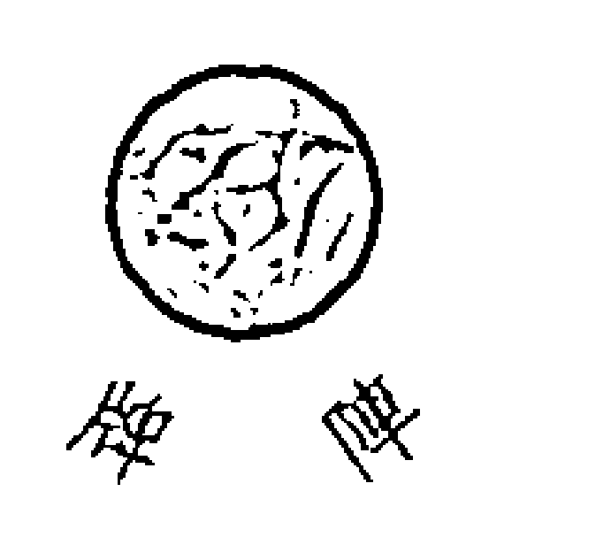

### 传统克尔特人十字牌法

这种牌阵总会用到一张守护星，把这张守护星放在牌阵最中间，盖上一张 1 号牌。垂直方向把 2 号牌盖在 1 号牌上，2 号牌上下各放一张 3 号牌和 4 号牌，排成一行。2 号牌左右各放一张 5 号牌和 6 号牌，排成一列。接着在右边由下往上放 7 号到 10 号牌共 4 张牌，排成一行。

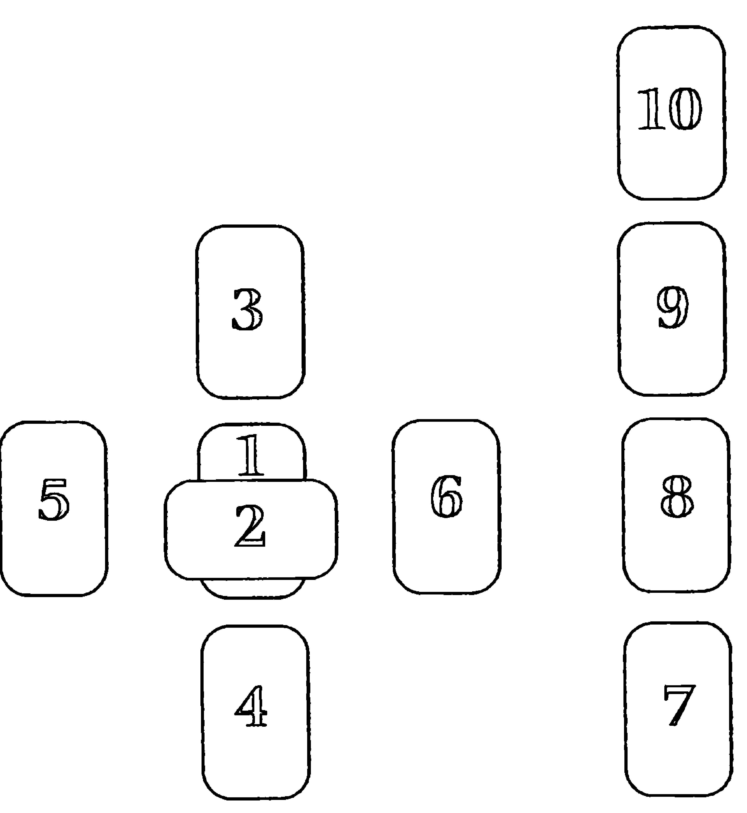

随着排每张牌的同时，嘴里一边念着：

- 1. 号牌：“这盖着你。”（指目前关心的问题）
- 2. 号牌：“这阻碍你。”（指障碍）
- 3 号牌：“这加冕你。”（问卜者知道的东西）
- 4 号牌：“这在你之下。”（过去的影响）
- 5 号牌：“这在你之后。”（消逝的遥远过去）
- 6 号牌：“这在你之前。”（新到的状况）
- 7 号牌：“这是你自己。”（问卜者的心态）
- 8 号牌：“这是你的房子。”（周遭状况）
- 9 号牌：“这是你的希望或恐惧。”（愿望或恐惧）
- 10 号牌：“这将到来。”（指可能结果）

前面说过，我个人觉得这种牌阵很麻烦、累赘，所以我很少使用。不过，这种牌阵对解答复杂的问题会很有用。等你熟悉较简单的牌阵后，你不妨试试，看看自己喜不喜欢。

### 练习，练习，再练习

初学者学习塔罗牌占卜最容易和最好的方法，就是每天腾出一些时间练习。每次练习之前，你都要让精神和身体处于一种放松状态。你可以先做几个深呼吸，同时祈祷一下，或是安静坐着一会儿，等自己“调准好”状态。避免在生气或情绪激动时占卜，不然结果会受到影响。如果你受到干扰，等你感觉平静下来后再来占卜。你要心思清明才能取得通畅的沟通管道。

保持放松的同时，你要期待着成功和心怀乐观，相信占卜结果将会给你的问题提供珍贵的信息。请牢记，本书或其他任何书籍里的牌义解释并非金科玉律，不是……

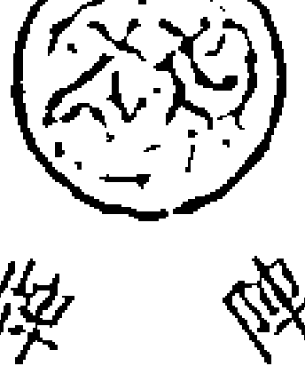

## 塔罗牌小秘方

### 做个塔罗牌梦

挑出一张牌代表你想要了解的一个梦，并把这张牌放在你的枕头下面。临睡前请求获得某些资讯，告诉自己，起床时会记得梦境。床头边放一本小记事簿或你的塔罗牌记事簿，一醒来就把梦境，还有你对这张牌的想法和它的牌名记下来。如果梦境不很清晰，另外找个晚上（最好隔一两天后）重复相同步骤。只要给自己一点时间，答案自然会来。

一成不变的，你可以跟着自己的直觉和想象力自由去做解释。

显而易见地，你的印象会从毫无感觉开始，到感到深不可言，或感觉介于两者之间。无论你有什么感觉，都要记在你的塔罗牌记事簿里，等你日后翻阅温习时，就会领悟出新的意义。

如果有张牌似乎特别重要，每天把它抽出来仔细研究，并且把你对它的想法或感觉记下来。结束练习前，拿它们跟本书所介绍的意义进行比较。假如这张牌的牌面设计激起你的梦想或遐思，也把它记下来。梦想经常是日常读写工作的注解。

比较这张牌每天给你的感觉有何不同，看看你对它的解释有何改变。你的个人感觉和经验将形成牌义的基础，当你开始使用更为复杂的牌阵，你的直觉将会大肆派上用场。

如果结果很差，可能是你的心情或精神状态不对，事前要先专心做好放松练习。有时候，沟通管道就是不通畅，千万别让此打断了你学习的念头。学习新技能总会有犯错的时候，就像初弹一首新曲时会弹错音符一样，只要保持定期练习，不久就能驾轻就熟。

### 帮他人占卜

在你尚未取得足够经验之前，要把帮别人占卜当成是练习。学习塔罗牌是个可以花上一辈子的漫长过程，期间总会出现值得学习的新东西，直觉也会不断发展，跟背九九乘法表或其他东西是截然不同的。你在合格帮人占卜前，必须花费时间和精神勤加练习。只要你自己和问卜者明白你还在学习和练习阶段，帮人占卜就无妨。初开始时你最好只帮熟人占卜，像是家人和朋友，至少你对这些人的整体状况和问题已经有些了解。在此情况下，占卜只能帮他们确认心中疑问，提供指引或肯定正面的状况。
开始帮人占卜的最佳方式是先跟问卜者聊一聊，找出他们想藉由占卜澄清什么问题。如此一来，你可以预先对他们的目的和问题有个了解，接下来便可以进行判断和解读。就我个人的经验，经常会发生牌似乎不能回答问题，却指向另一问题的情况，这个问题通常会更为深入，显示出问卜者内心里真正关注的东西。在此情况下，第一个问题其实只是真正问题的一个掩护罢了。
帮人占卜时，要小心别做预言（算命）。请牢记，生命不是静止不动的，心灵世界有许多变数。今天的状况到了明天可能就变了，当关键牌出现负牌时尤其更要小心。与其斩钉截铁地断言未来，用“可能性”这个用字更为安全。如果你清楚断言未来将厄运连连，就要为自己的灵验度赌上风险。因此，改口说些像“你的旁边似乎有个人不太可靠，你能想起可能是谁吗？”或“我的印象是你很焦虑和痛苦”这样子的话会比较好。
让问卜者回馈情报给你，假如他（她）不确认你的

#### 格言

> 心理学家迄今仍不明白，想象力是自我理解的一个要素。
> 康德
> 《纯理性批判》

解释，别咄咄逼人。这个人可能就是无法接受一个负面的解释，就算你的解释正确无误，在缺乏确认的情况下，你也无法知道自己的解释正不正确。帮别人占卜时，务必随时注意说话的遣词用字。就算是帮一个密友占卜，你也未必确实清楚他的内心或心理。

帮别人占卜重大疑问时，务必要有心理准备，对方可能会有很大的情绪反应。塔罗牌有办法深入人的内心深处，经常让你始料未及。我见过不少人在占卜时点出他们的问题核心时，变得非常不安或生气。可是，等到

#### 遣词用字

占卜术从茶叶占卜到占星术无奇不有，其中塔罗牌占卜虽被视为“高资料性／低主观性”，但解释的遣词用字非常重要，就算我再怎么强调，也无法说明它们有多重要。我们都知道，即使只是开玩笑也，可以怎么伤人，或是一句鼓励的话可以如何让我们振作心情。因此，请牢记，就算用塔罗牌这种资料丰富的占卜术，你个人的直觉最为重要。塔罗牌牌面具有象征性，所提供的资讯可以提供许多不同的解释，所以总要先经过大脑思考后才说话。

如果你帮自己占卜和做笔记，写下心中第一个想法当然无妨。接下来，你可以温习这些解释，把牌再看一遍，看看它们有没有给你新的想法或感觉。永远别害怕因取得新资讯而去修改一个解释，请牢记：生命无常。

他们认同占卜结果后，又经常热泪盈眶，甚至嚎啕大哭，因此我总会摆一盒面纸在占卜桌上。如果一个人的反应是流泪，安慰他哭泣没有关系，帮助他恢复心情就是你的工作。许多人由于怕尴尬，或是怕表现出自己的内疚而强忍着不哭，这种人最需要你的安慰。

帮人占卜时，请牢记自己肩负以下重任：一是提供帮助和安慰，二是绝对诚实，在自己的技巧范围内进行解读。这也是为什么我不建议你快速又冷酷地做预言的原因，最好多用一点时间，好好跟求卜者解释有许多不同解释的可能性。假如问题很难或很痛苦，最好抽些澄清牌来把事情澄清清楚。

不过，不为真正严重的问题占卜经常会比较好。你可以把帮朋友或家人占卜当成练习，他们可以问你一些小问题，像是该不该跟一个没见过面的异性约会，要不要去参加一个社交活动，考试能不能过关，兄弟姊妹或父母间的问题，能不能买某样想买的东西，或是可不可以去度个假等。可是，这并不表示你便可以违反塔罗牌占卜守则，态度不认真和不尊敬。不管是多么愉快的问题，依然要保持着真诚的心，绝不可让塔罗牌成为个人自大的工具。同时，请牢记，小问题下面可能藏有更严重的问题，塔罗牌具有揭穿这类问题的能力。

占卜过程里，个人道德绝对必要。如果你选择帮人占卜，便要为自己的占卜解释负责。如果你不很确定怎么解释一张牌，应该对问卜者坦白相告。千万别妄自杜

撰和欺瞒！有疑问时，你可以这样说：“似乎将有如此这般的事情发生，但我没法看得很清楚。”别犹豫，勇于承认自己并不是万事通，或是直觉资讯的流通受到阻挡或不清楚。你还在练习和学习阶段，只是个新手，不是专业占卜师。提供信息时务必小心，千万别铁口直断，预言形式的断言。

尤其更要避免小心遣词用字，解释尽可能简单清楚。不管你读到多少信息，别引用深奥典故或使用抽象解释，令人费解。使用简单易懂的字眼，牢记问卜者的需要，用最简单的方式让他（她）了解你的洞见。占卜只有在提供有用信息或新见解时才算灵验。“正中下怀”的感觉很棒，但也很有可能“射偏目标”。

从事塔罗牌专业占卜二十年来，我从不在了解问卜者心态之前占卜。有几次我没收占卜费用，因为某种东西阻挡了信息的流通（通常是问卜者封闭起自己），牌不跟我“说话”。要有参与者的支持，帮人占卜才能成功圆满。问卜者必须敞开心胸接收信息，占卜者必须明白自己除了是信息的一个传递管道以外，什么都不是。信息的源头总在那里，唾手可得，一切全靠我们这些塔罗牌占卜者学习怎么准确地跟它连上线。

照着去做吧！祝你乐在其中。