# 塔羅的凝視

學習者的圖像對話之旅

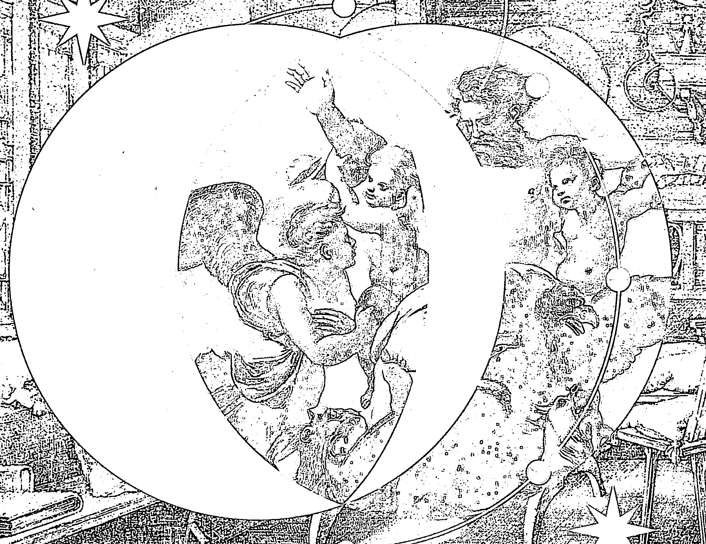

透過對照「偉特塔羅」和「托特塔羅」兩大經典系統，觀看人類如何以符號、寓言和象徵，來詮釋宗教神話和神秘學的圖像對話。

潘青林 著

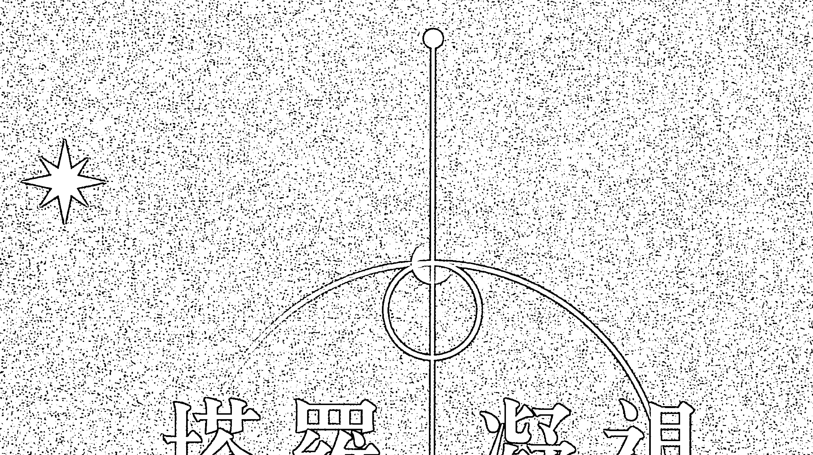

# 塔羅凝視

學習者的圖像對話之旅

潘青林 著

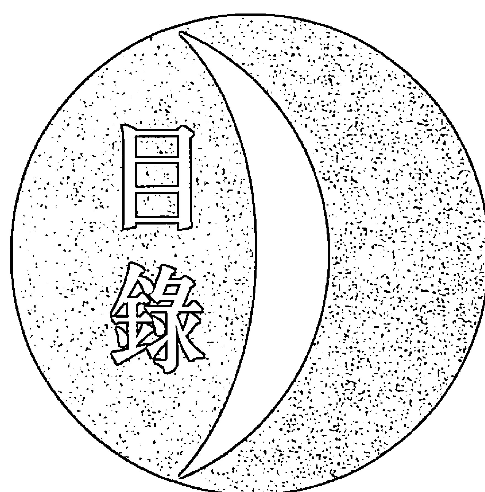

偉特塔羅 ○ 托特塔羅

## 自序 —— 人，真的有自由意志嗎？ .... p.6

## Chapter 01
星空下的紛擾與清澄 —— 塔羅牌總論 .... p.10

## Chapter 02
大阿卡納牌 .... p.15

### 數字 5 與 15：神性慈善與物慾魅惑

- V 教皇 .... p.67
- XV 惡魔 .... p.69
- ○ V 大祭司 .... p.72
- ○ XV 惡魔 .... p.73

### 數字 0 與 21：無明起始與一切終結

- 0 愚者 .... p.19
- XXI 世界 .... p.22
- ○ 0 愚者 .... p.24
- ○ XXI 宇宙 .... p.26

### 數字 6 與 16：溫情依偎與無常驚懼

- VI 戀人 .... p.78
- XVI 塔 .... p.80
- ○ VI 戀人 .... p.82
- ○ XVI 塔 .... p.84

### 數字 1 與 11：感性創造與理性守規

- I 魔法師 .... p.31
- XI 正義 .... p.33
- ○ I 賢者 / 魔法師 .... p.35
- ○ VIII 調節 .... p.37

### 數字 7 與 17：冥頑好勝與平淡超然

- VII 戰車 .... p.88
- XVII 星星 .... p.90
- ○ VII 戰車 .... p.91
- ○ XVII 星星 .... p.92

### 數字 2 與 12：靈性直覺與消極困頓

- II 女祭司 .... p.41
- XII 吊人 .... p.42
- ○ II 女祭司 .... p.44
- ○ XII 吊人 .... p.45

### 數字 8 與 18：慾望壓抑與情緒釋放

- VIII 力量 .... p.95
- XVIII 月亮 .... p.98
- ○ XI 慾望 .... p.99
- ○ XVIII 月亮 .... p.100

### 數字 3 與 13：春暖豐盛與冰冷代謝

- III 皇后 .... p.48
- XIII 死神 .... p.49
- ○ III 皇后 .... p.53
- ○ XIII 死神 .... p.55

### 數字 9 與 19：孤獨匱乏與真我自在

- IX 隱者 .... p.104
- XIV 太陽 .... p.106
- ○ IX 隱者 .... p.107
- ○ XIX 太陽 .... p.108

### 數字 4 與 14：強勢控制與平衡調節

- IV 國王 .... p.59
- XIV 節制 .... p.60
- ○ IV 皇帝 .... p.62
- ○ XIV 藝術 / 煉化 .... p.63

### 數字 10 與 20：業力輪迴與覺醒超脫

- X 命運之輪 .... p.112
- XX 審判 .... p.114
- ○ X 命運 .... p.116
- ○ XX 新紀元 .... p.117

## Chapter 03
小阿卡納牌 —— 數字牌 .... p.122

### 數字 1 ／薩弗拉「王冠」(Kether) ：
獨立與未知的極限

- 權杖王牌 .... p.131
- 聖杯王牌 .... p.133
- 寶劍王牌 .... p.135
- 錢幣王牌 .... p.137

- 權杖王牌 .... p.132
- 聖杯王牌 .... p.134
- 寶劍王牌 .... p.136
- 圓盤王牌 .... p.138

### 數字 6 ／薩弗拉「美」(Tiphareth) ：
責任與感性的極限

- 權杖 6 .... p.176
- 聖杯 6 .... p.178
- 寶劍 6 .... p.180
- 錢幣 6 .... p.182

- 權杖 6 .... p.177
- 聖杯 6 .... p.179
- 寶劍 6 .... p.181
- 圓盤 6 .... p.183

### 數字 2 ／薩弗拉「智慧」(Chokmah) ：
合作與平衡的極限

- 權杖 2 .... p.140
- 聖杯 2 .... p.142
- 寶劍 2 .... p.144
- 錢幣 2 .... p.146

- 權杖 2 .... p.141
- 聖杯 2 .... p.143
- 寶劍 2 .... p.145
- 圓盤 2 .... p.147

### 數字 7 ／薩弗拉「勝利」(Netzach) ：
直覺與情緒的極限

- 權杖 7 .... p.185
- 聖杯 7 .... p.187
- 寶劍 7 .... p.189
- 錢幣 7 .... p.191

- 權杖 7 .... p.186
- 聖杯 7 .... p.188
- 寶劍 7 .... p.190
- 圓盤 7 .... p.192

### 數字 3 ／薩弗拉「理解」(Binah) ：
理想與完整的極限

- 權杖 3 .... p.149
- 聖杯 3 .... p.151
- 寶劍 3 .... p.153
- 錢幣 3 .... p.155

- 權杖 3 .... p.150
- 聖杯 3 .... p.152
- 寶劍 3 .... p.154
- 圓盤 3 .... p.156

### 數字 8 ／薩弗拉「宏偉」(Hod) ：
成長與慾望的極限

- 權杖 8 .... p.194
- 聖杯 8 .... p.196
- 寶劍 8 .... p.198
- 錢幣 8 .... p.200

- 權杖 8 .... p.195
- 聖杯 8 .... p.197
- 寶劍 8 .... p.199
- 圓盤 8 .... p.201

### 數字 4 ／薩弗拉「仁慈」(Chesed) ：
安全感與穩定的極限

- 權杖 4 .... p.158
- 聖杯 4 .... p.160
- 寶劍 4 .... p.162
- 錢幣 4 .... p.164

- 權杖 4 .... p.159
- 聖杯 4 .... p.161
- 寶劍 4 .... p.163
- 圓盤 4 .... p.165

### 數字 9 ／薩弗拉「基礎」(Yesod) ：
物質與心智的極限

- 權杖 9 .... p.203
- 聖杯 9 .... p.205
- 寶劍 9 .... p.207
- 錢幣 9 .... p.209

- 權杖 9 .... p.204
- 聖杯 9 .... p.206
- 寶劍 9 .... p.208
- 圓盤 9 .... p.210

### 數字 5 ／薩弗拉「力量」(Geburah) ：
自由與規範的極限

- 權杖 5 .... p.167
- 聖杯 5 .... p.169
- 寶劍 5 .... p.171
- 錢幣 5 .... p.173

- 權杖 5 .... p.168
- 聖杯 5 .... p.170
- 寶劍 5 .... p.172
- 圓盤 5 .... p.174

### 數字 10 ／薩弗拉「王國」(Malkuth) ：
完成與結束的極限

- 權杖 10 .... p.212
- 聖杯 10 .... p.214
- 寶劍 10 .... p.216
- 錢幣 10 .... p.218

- 權杖 10 .... p.213
- 聖杯 10 .... p.215
- 寶劍 10 .... p.217
- 圓盤 10 .... p.219

## Chapter 04
小阿卡納牌 —— 宮廷牌 .... p.227

### 火元素家族：好勝與掌控

- 權杖國王 .... p.233 ○ 權杖騎士 .... p.237
- 權杖皇后 .... p.234 ○ 權杖皇后 .... p.238
- 權杖騎士 .... p.235 ○ 權杖王子 .... p.239
- 權杖侍者 .... p.236 ○ 權杖公主 .... p.240

### 風元素家族：理性與自我

- 寶劍國王 .... p.251 ○ 寶劍騎士 .... p.255
- 寶劍皇后 .... p.252 ○ 寶劍皇后 .... p.256
- 寶劍騎士 .... p.253 ○ 寶劍王子 .... p.257
- 寶劍侍者 .... p.254 ○ 寶劍公主 .... p.258

### 水元素家族：感性與魅力

- 聖杯國王 .... p.242 ○ 聖杯騎士 .... p.246
- 聖杯皇后 .... p.243 ○ 聖杯皇后 .... p.247
- 聖杯騎士 .... p.244 ○ 聖杯王子 .... p.248
- 聖杯侍者 .... p.245 ○ 聖杯公主 .... p.249

### 土元素家族：物質與穩定

- 錢幣國王 .... p.260 ○ 圓盤騎士 .... p.264
- 錢幣皇后 .... p.261 ○ 圓盤皇后 .... p.265
- 錢幣騎士 .... p.262 ○ 圓盤王子 .... p.266
- 錢幣侍者 .... p.263 ○ 圓盤公主 .... p.267

參考文獻 .... p.270

茫茫終日
一事無成
徬徨於輪迴
掙扎於死生
仰望星辰
常感愧對天恩
願占星與塔羅學成之日
亦無用武之地
因那時世上再無心傷之人

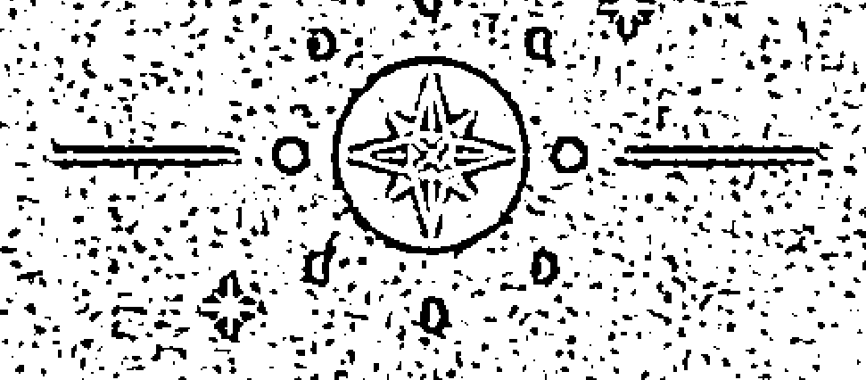

獻給鄭守桑中醫師
再見之時　同遊星空

## 自序

### 人，真的有自由意志嗎？

潘青林

2021 年 1 月 7 日清晨，身在理應溫暖的台南，竟感到冰寒徹骨，風中微雨讓柏油路面深灰了臉，天色亦回應著陰沈。從巷口全家便利商店抱著四公斤的貓飼料走回家，冷風與濕氣毫不留情直往身上竄，蒼涼感猶生。回到家，摸了摸橫躺在房門口的貓，之後直接坐在電腦桌前，打開一台剛入手且完全不熟悉的電腦，第一次打開這台電腦的 word 系統，敲下了這篇已經思考一年多、卻因紛亂思緒與複雜心境而遲遲無法動筆的「自序」。

人類經過了 2020 年這不知道如何定義的一年、承受 2021 年有無疫苗與注射後副作用的煎熬，再面對 2022 年的戰爭情況，悲觀主義者認為，人類不僅已經完全不能再回到過去自由自在四處旅遊的生活，且末日感的存在性極強；而樂觀者則認為，這些年的考驗反而會加強人類的團結，並更懂得珍惜生命。對我個人而言，2020 至 2022 年是我人生中變動最大、挑戰最多、同時體驗天堂與地獄的年份，前所未有的困頓赤裸裸直逼眼前，徬徨與茫然之際，靈體隨之四分五裂散落一地，夢中暗黑漩渦時常激烈攪動，現實中感到地水火風翻騰吞沒一切。卑微的我，跌坐在物質之界，抬頭仰望宇宙星空，與每一位虔誠教徒一樣跪求救贖路徑。

自古不乏智者與哲人，在面對茫然未來的無力感之下，試圖探究宇宙密碼，以求窺探迷霧般的生命，但是宇宙運行真的有密碼或公式嗎?如果有，那我們每個人類的存在，是否就只是遵循一定軌道前進，而沒有所謂的自由意志呢？

所謂的高我，是宇宙終極能量?是身邊的指導靈或守護天使?還是其實就是另一個維度的我?所有的神秘學，小到一罐可塗抹的魔法油，大到論斷一生的命盤，要尋找的，不外乎就是一條路徑、一個窺探宇宙密碼的方法、一道試圖與宇宙能量溝通的連結，在無奈的人生中，試圖搖晃原設軌道，或祈求慾望的滿足，或乞求儘管失落卻仍能保有自我安慰的毅力，讓自己在肉體往死亡更靠近的每個日子裡，精神上仍能有方式繼續保持信念與求生意志。

十五塊翡翠所組成的「翡翠碑」(The Emerald Tablet)上，煉金術的終極奧義，碑文最古老的文獻來源是《創造和自然藝術的秘密》(Kitab sirr al-haliqi) [1]，據說上面是「托特」與「赫密斯」[2] 留下可召喚過去、改變現在與預測未來的密語：「此乃無偽之真實，確切真切。成就唯一奇蹟之際，下者如上，上者亦如下；依此成全太一的奇蹟。」(Tis true without lying, certain & most true: That wch is below is like that wch is above & that wch is above is like yt wch is below to do ye miracles of one only thing.) 自古人類不論是在地球的哪一個角落，身處哪一個時間軸點，仰望的都是同一片星空，感嘆的也都是相同的喜憂傷悲。從 2020 年開始，橫掃全球的新冠肺炎疫情，動盪感讓人類對於物質的追求有了更多的反思，偶讀《疫病論》一書，驚見「疫病的發生總是有地域性，若論其根本原因，當屬於日月星辰天體運行合力投射所致，因為某地的旱澇瘧嵐霧露之氣所形成的環境都是日月星辰天體運行造成，這在《素問·八正神明論》、《靈樞·歲露》等篇都有闡述，讀者閱之自明」[3]。

《翡翠碑文》中的名句「下者如上，上者亦如下」，古今中外觀念亦然，均直指小到個人大到團體，我們都只是鏡像般往已定好的軌跡前進而已，出生時所呼吸的第一口天地氣息，等同於註定了一切，就像耶穌在約旦河受洗的那一刻，瞭然接受一切既定命運，再多的努力與選擇，最終其實都只是符合宇宙原來的設定，我們都是宇宙疼愛的孩子，來此體驗與進行宇宙交辦任務。

榮格(Carl Gustav Jung，1875-1961)提出了一元世界觀及共時性(synchronicity／又譯同時性)理論，影響重大。或許物理界中，我們的肉體是單行道般往前成長與衰敗，但精神卻像是滑行於「莫比烏斯環」的存在，是因果、也是果因的無止盡循環，既視感地體驗了存在於當下的過去，而夢境或許就是真實的未來，因為未來其實存在於過去記憶，一趟人生終將明白，自己只是落實了早已安排好的命運，以這個角度觀看生命，其實每個靈魂實質上已得到永生，肉體只是個隨時可丟棄的容器。

1887 年的倫敦，神秘學社團「金色黎明協會」(The Hermetic Order of the Golden Dawn)成立，目前最常見的偉特塔羅牌(Rider-Waite-Smith Tarot)和托特塔羅牌(Thoth Tarot)，圖案均是由英國籍女性藝術家繪製。舞臺及服飾藝術家史密斯(Pamela “Pixie” Colman Smith，1878-1951)繪製出舉世知名的偉特塔羅，在那個年代中，她選擇終身未婚需要多大的勇氣，辛苦地以自身藝術才華來活口，晚年抑鬱並清苦以終。托特塔羅由哈利斯夫人(Lady Frieda Harris，1877-1962)所繪製，她曾計畫在美國進行一次演講之旅，並希望能夠在 1948 年展示塔羅牌的原始畫作，但這些規劃時至今日還是沒有實現，1952 年丈夫去世後，她決定移居印度，於 1962 年 5 月 11 日逝世於遙遠的異鄉斯利那加(Srinagar)。她們兩位女性，將體驗到的人生哲理換化成圖案，給予後人無限指引，但她們自身是否也透過這些圖像，而讓自己的人生得到啟示和安慰？

托特塔羅設計者克勞利原本規劃六個月完成塔羅牌的牌面圖案設計，然而實際執行從 1938 到 1943 年，一共花了五年的時間才與哈利斯夫人共同完成，之後兩人都沒有親自等到托特塔羅牌的正式出版就過世了，遲至 1969 年托特塔羅才由「東方聖堂騎士團」(Ordo Templi Orientis)首度印刷發行，此時克勞利已過世了 22 年了。克勞利本人沒見到的，何其幸運的我們見到了！

塔羅圖像貫穿古今 500 多年的歷史，來到悲傷喜悅依然翻攪人心的當下，今日人類物質以爆炸性速度進步(或是有如盧梭所說的其實是退步？)，不管這期間天災人禍經歷了多少，塔羅仍然充滿說服力地用 78 張牌，直指人心秘境。然而，畫這些圖像的人是以怎樣的體會來創作？當我們都試圖從牌面上，去解答出宇宙密碼時，我更想知道的是，他們是如何將這龐大的人生哲學濃縮到牌面圖案，並精準地為後世傳達其真義？他們當時知道自己作品有多重要嗎？

就算他們創作時沒有意識到往後所有的影響力，但不管是遵循「金色黎明協會」規章神秘而不多言的偉特塔羅，或是不完全遵照該協會規定，以象徵意義濃厚來呈現的托特塔羅，一張張畫面在腦中清晰傳訊，訊息點滴遞予了在無助中尋求解答的我們，微觀到日常生活小事，宏觀到整個世界和天體運行——我們，聽到了宇宙的聲音。

人類的肉眼看不到電波，但在物質之界，透過螢幕，我們的精神可憑藉畫面的呈現去任何想去的地方。卡巴拉之樹，不只是行星的分佈，更是創世的奧秘，人類生存於懸掛最底層的 10 號薩弗拉「王國」(Malkuth)，這是一個鏡像映射的世界，宇宙時空如蟲洞對折之後，有沒有可能可以直接進入 1 號薩弗拉「王冠」(Kether)的意識界呢？然而「王冠」會不會也只是倒影而已？從最原始、最上端、最虛無三重帷幕所投射下來的倒影？我們所了解的卡巴拉之樹，或許其實全部也都只是倒影，真正的能量都還在我們所不能理解的意識之上，所有四大元素都是更上方的投射。天上如是地上亦然，眼前這一切都是表象，我們只是宇宙能量所下的一盤棋局。

由喬登·皮爾(Jordan Peele)執導、2019 年上映的電影《我們》(Us)當中，平行時空中還有一個你，毫無關係卻又緊緊相連，一旦結界入口打開，交換之後是無狀莫名？還是綺麗璀璨？我們處在最下方的薩弗拉「王國」(Malkuth)，還有更低下的世界嗎？人類夢想移民火星的計畫已然在進行，但目前我們仍找不到其他星球有生物體的存在，或許是因為我們人類維度根本沒有提升，感官與覺知粗糙到根本無法感知到上一維度的「生物」(不確定是否能稱他們為生物)與世界。在柏拉圖的理形世界中，我們都只是殘缺版，人類如「洞穴說」中，放眼望去盡是牆上投射的陰影，像是被封了眼耳鼻口的生物，只能在感官追求中進行蠕動掙扎。

南宋詞人辛棄疾在《賀新郎·用前韻再賦》中說道：「嘆人生，不如意事，十常八九。」仰望天上占星學中十顆行星，僅木、金兩顆吉星，而火、月、海王、冥王、土、天王六星偏凶，日(太陽)吉凶參半，而水星屬中性，趨吉則吉、趨凶則凶，原來這不是一句感嘆詞，這是千古以來占星大數據的結果統計。不如意之事十之八九中，有的是「塔」牌的無常崩裂，有的是「死神」牌的無盡拖磨。

世人總是鼓勵正向積極的激情追逐者，幾乎沒有人肯定耽溺於黑洞的人生觀，但對我而言，黑夜就是黑夜，不需欺騙自己，甚至樂於在黑暗中坐看人生璀璨煙火，「神就是壓力」[4] 概念為真，畢竟只有經歷足夠暗夜的黑，靈魂被搖晃出裂縫，從裂縫中滲入的色光才會綺麗般印記於心靈。不追求快樂，因為快樂畢竟也是一種高亢情緒，只要曾經經歷過靈魂覺醒後所感知的豐盛、每一次看見天使數字所帶來的鼓勵，以及因為平靜與隨之而來的恬淡，此生足矣。

榮格曾言占星學是古代心理學知識的總合，在神秘學上所有的努力，追根究底其實也只是掙扎地想療癒自己而已，儘管一切本來終將徒勞。人生路上天寒居多，道路永遠顛簸崎嶇，但信念為王，乞求上天讓還在物質之界掙扎的我，能有些許靈性來窺見宇宙能量所傳達出來的密語訊息，以求在海王星與木星合相於雙魚座的 2022 年出版此書來療癒自己。每一張牌都是中性象徵，是起是伏端看站在哪個生命視角，手握塔羅牌，等於握著宇宙哲理。沒有什麼比親自經歷過更加真實，再瘦弱都必須挺直腰桿逆風前行，只有死亡過的人生，才值得活。

泰勒瑪 (Thelema)[5] 教義的中心哲學理念：「愛就是律法，愛在意志下。」(Love is the Law, Love Under Will.) 托特塔羅的「圓盤王牌」，告知所有一旦均已設定，一顆種子種下，塵世中我們只能接受宇宙能量的安排，認命於上天所有的配置，並盡力把種子的能量迸發，破土而出的痛，毅然如同劃開後背兩道傷口，只為能釋放出那與生俱來能帶我們自由翱翔的翅膀。宇宙能量要我們每個人此生只做好註定要做好的那一件事，這是最緊箍的束縛，也是最無邊的自由！

克勞利在《光明無邊》(Konx Om Pax) [6] 中，道出了所有走在靈學路上的人都能理解的過程，守護天使告訴我們：「來吧!這只不過是『僕人之廳』，幾乎每個人都會在這裡待上一輩子。」我說：「親吻我!」於是他說：「只有當你說這句話，你所踏出的每個腳步才成為可能。」[7]

看著塔羅牌的組合變化，就像看著自己的靈魂藍圖，如米開朗基羅所言「我以憂鬱為樂」(La mia allegrez’è la maninconia)，至此，調低世界的音量，檢視自己殘存的能量，體驗榮格敘述的夜海航行。如果您恰巧也是一位曾經感受精神重創與靈性蛻變的同路人，「別讓你旅途踏過的水沾濕了你，而當你上了岸，請種植葡萄藤並毫無羞愧地歡慶」[8]。在這孤獨且不容回頭的神秘學道路上，或許藉由此書，我們可在彼此平行的時空旅程中結伴同行，《律法之書》第 1 章第 30 節中的「分崩離析的痛不值一提，而融入萬物之喜才是一切」[9]，永是真理。

> 每一個人都有自己的星星，但其中的含意卻因人而異。對旅人而言，星星是嚮導；對其他人而言，它們只不過是天際中閃閃發光的小東西而已；對學者而言，星星則是一門待解的難題；對我那位商人來說，它們就是財富。不過，星星本身是沉默的。你，只有你，了解這些星星與眾不同的含義。
——《小王子》

## 註釋

[1]《創造和自然藝術的秘密》被認為是八世紀時由「巴里納斯」（Balinas）以阿拉伯文寫成，此書主要記錄著他是如何在墓穴中找到翡翠碑文石板的過程，但也有人認為此書應該是早在西元 650 年左右就完成。

[2]「托特」（Thoth）為埃及智慧之神，「赫密斯」（Hermes）為希臘的訊息之神，兩位神祇的特色相符且具延續性，在希臘化時期兩位神祇被合二為一地崇拜，稱為「赫密士・崔斯墨圖」（Hermes Trismegistus）。

[3] 田合祿、李正富著（2021），《疫病論：五運六氣解讀新冠肺炎疫病》，北京：中國中醫藥出版社，頁 36。

[4] Dion Fortune（2021.03），《祕法卡巴拉：西方的身心修煉之道》（The Mystical Qabalah），邱俊銘 譯，新北：楓樹林出版社，頁 69。

[5] 泰勒瑪（Thelema）在古希臘中意為「一個人的真實意志」，是克勞利所發展出來的一套哲學思想，其中含括了東西方神秘學，尤其是卡巴拉哲學，而魔法學（Magick）在泰勒瑪中，保留了金色黎明協會的儀式魔法，並視魔法儀式為是重要的實踐方法和途徑。泰勒瑪為克勞利所提倡的一種新紀元思想，以《律法之書》（The Book of the Law）來陳述其主要思想，提倡突破傳統的二元論，並去實踐自身真正的意志。

[6]《光明無邊》為克勞利在1907年出版的一本書，書名 Konx om Pax 為古埃及詞 Khabs am Pekht 的希臘語翻譯，意譯為「光之化身」，是一本赫密斯主義（Hermeticism）的魔法書籍，此書對於研究泰勒瑪哲學和神秘學來說深具重要性。

[7] Lon Milo DuQuette（2014.01），《托特塔羅解密》（Understanding Aleister Crowley's Thoth Tarot），孫梅君 譯，台北：商周出版，頁 241。

[8] Aleister Crowley. (2020). *The Book of Thoth*. San Francisco, CA: Red Wheel/Weiser, p257.

[9] Aleister Crowley. (1987). *The Book of The Law*. York Beach, ME: Weiser Books.《律法之書》（The Book of the Law）由克勞利於 1904 年藉由一個名為艾華斯（Aiwass）的靈體與他接觸後，口述由他的兒子寫成。這本書是克勞利的泰勒瑪思想法則之主要綱領。

# 星空下的紛擾與清澄
——塔羅牌總論

# 截取宇宙訊息，人類脆弱的映射

在物質之界中，於不同文化裡，人類在每個時代都各自發展出不同窺探宇宙訊息的路徑，例如在中國文化中的米卦、鳥卦、龜殼卦、測字等等均是，此些路徑的數量多到不可考，但是均不外乎表現出人類想要預先知道能量訊息、以達到趨吉避凶的心態。

塔羅牌(Tarot)，只是這數量多到不可計數的路徑之一。

人類活在三維空間中，我們的感官與知覺非常侷限，僅極少數人在宇宙能量的應允之下，能夠以意識直接來進行溝通，在台灣文化中我們一般稱此方式為「通靈」，但這畢竟是極少數人才有能力進行的，絕大部分的靈性老師們，還是需要憑藉感官上的視覺或是聽覺(若是「摸骨」路徑就是觸覺了)，來得到宇宙訊息。

簡單來說，我個人認為承擔這類型工作的人，都是一台「翻譯機」的概念。以塔羅牌為例，占卜老師們透過圖面呈現的訊息，翻譯出來給需要聆聽訊息的人，所以，千萬不要過分崇拜靈性相關老師，因為真正擁有無盡能量的是宇宙，而不是任何一位渺小的單一個人。

# 塔羅牌與卡巴拉哲學

論及塔羅牌的源起，不能不提到猶太神秘主義(Jewish Mysticism)中的卡巴拉(Kabbalah、Qabalah、Cabala)系統，「卡巴拉之樹」又稱「生命之樹」，這是一套在以感官可以體驗的有形物質世界中，試圖詮釋我們所無法理解的造物能量，以提供人類理解神性創造的一種方式。在猶太人的口傳歷史當中，「生命樹」與「分別善惡樹」均生長在伊甸園之中，在亞當與夏娃因為吃了「分別善惡樹」的果實而被逐出伊甸園時，在《創世紀》中記載，神把他們趕往了伊甸園的東邊，並派天使把守返回伊甸園的路，以免他們回來吃了生命樹的果實，而人類從此遠離了「生命之樹」。

「生命之樹」在卡巴拉哲學中，象徵著人在行動界到神性的層次進階；代表人在靈性的修行道路上，試圖接近與連結宇宙能量神性的途徑；也詮釋著神在創造世界時的各個不同階段。儘管卡巴拉哲學的概念，可追溯至大約西元二世紀，但是「生命之樹」知識系統，要到 1180 年《光明之書》(Sefer ha-Bahir)中才開始以學理建構與書寫，並完備於《光輝之書》(Sefer ha-Zohar，約西元 1270 年 1300 年間成書)，盲者以撒(Issac the Blind)在 1235 年首次使用名詞「卡巴拉」。[1]

在塔羅牌系統中，卡巴拉哲學有著無比重要的地位，兩者之間的的關係，不僅小阿卡納牌中數字 1 至 10，與卡巴拉之樹上 10 顆薩弗洛斯(Sephiroth，或稱為發散體、輝耀)意義上相對應，成為解牌上的基礎學理，22 張大阿卡納牌更是對應了卡巴拉之樹上的 22 條路徑，每張大牌均分配了一個希伯來字母。其中，3 個母字母 Aleph、Mem、Shin 分別代表四元素中的風(對應愚者牌)、水(對應吊人牌)、火(對應審判牌)；7 個雙音字母代表七大行星(當時尚未發現天王星、海王星、冥王星三顆外行星)；12 個單音字母則代表黃道十二宮星座。象徵與詮釋了人生演進與變換的哲理，架構出一個充滿象徵意味的宇宙觀，也成為了修行者在冥想中的重要途徑。

# 塔羅牌起源

在西元五世紀西羅馬帝國因日耳曼民族的入侵而消亡之後，整個西歐的社會狀況開始呈現倒退跡象，不僅社會與經濟制度逐漸崩潰，影響更大的是知識在傳承上呈現停滯、甚至是中斷的狀況。然而在歐洲中世紀時期（西元五世紀至十五世紀），儘管歷史上因民眾在思想上受到箝制而史稱「黑暗時期」（The Dark Age），但是若站在藝術發展的角度上，中世紀不論是在建築、音樂、繪畫、工藝等方面均迸發出高度發展與燦爛絢麗的成果，令我們至今仍迷醉其間。

但不容否認的，藝術一直都是以金字塔頂端族群為主要服務對象，不論古今。中世紀的識字人口比例極低，要一直到約翰尼斯·古騰堡（Johannes Gutenberg，1398-1468）在十五世紀中葉，發明活字印刷術後，歐洲在擁有書冊方面，開始可以脫離手工裝幀手抄本的高昂單價，以較經濟實惠的方式批量印刷書籍，此舉對歐洲往後的文藝復興與啟蒙時代，奠定下重要的媒介革命基石。

也因此我們不難想像，除了貴族皇室所能擁有的建築、雕塑與繪畫之外，在圖像僅存於數量極少書冊上的年代，若有一套可以放置在口袋的彩色圖像小卡，會是多麼令人感到陶醉的事情，這「對十五世紀歐洲人的心靈想必會造成相當大的衝擊，不下於照相和電影之於二十世紀的人們」[2]。

「塔羅牌」紙卡的起源，常見的說法是來自西亞或印度的遊戲牌卡，並在大約十四世紀時傳入歐洲，十五世紀流傳於義大利北部。但是現在大家所熟悉的「偉特塔羅」和「托特塔羅」系統，可確定的是在十八世紀初期，流行於法國與瑞士的「馬賽塔羅」（Tarot de Marseilles, TdM），將紙牌更改為 22 張大阿卡納牌（Major Arcana）、四種花色共 56 張小阿卡納牌（Minor Arcana），總共是 78 張塔羅牌，奠定了往後塔羅牌的牌組編制至今。

# 偉特塔羅與托特塔羅

在資本主義的發展之下，塔羅牌的印製與銷售相關，自然會出現一些為了宣傳而穿鑿附會的說法。但可以確定的是，塔羅是以圖像配合數字而產生出詮釋意義，而當中更無法脫離卡巴拉哲學系統與煉金術[3]相關概念。目前市面上所販售的塔羅牌，銷量第一的是「偉特牌系統」（Rider-Waite-Smith Tarot, RWS），由在倫敦組成的神秘學社「金色黎明協會」（The Hermetic Order of the Golden Dawn）成員偉特（Arthur Edward Waite，1857-1942），與舞臺及服裝設計家史密斯（Pamela “Pixie” Colman Smith，1878-1951），花了大約六個月的時間，於 1891 年所共同完成，並在 1909 年由 William Rider & Son 發行。

1911 年，由偉特親自撰文、搭配史密斯插畫的《A Pictorial Key to Tarot》一書出版，可說是第一本對於解讀塔羅牌的說明手冊，由於圖像淺顯易懂，成為所有塔羅學習者的入門通道，而往後「偉特牌」成為此套塔羅系統的總稱，各式各樣圖像但義理大同小異的塔羅牌，也在許多藝術家的創作之下紛紛出版。

另外一套目前廣受神秘學研究者喜愛的塔羅牌，即是以畫面細緻優雅聞名的「托特牌」（Thoth Tarot）。托特牌發行於 1969 年，是由克勞利（Aleister Crowley，1875-1947）構思，委託哈里斯夫人（Lady Frieda Harris，1877-1962）所繪製完成，被魔法師與靈性修行者所廣為流傳與熱愛。

儘管此套牌的系統主要還是以「偉特牌」(也就是金色黎明協會的傳統模式) 為主軸，但是從不走傳統路線的設計者克勞利，在此套牌中加入了自己的獨特見解，不僅對調了傳統大阿卡納牌中的「正義」牌(托特塔羅稱「調節」牌) 與「力量」牌(托特塔羅稱「慾望」牌) 的位置，並在宮廷牌中有較大的變動。托特塔羅雖然的確打亂了傳統「偉特牌」系統的順序，但是其呈現的新邏輯卻相當合理，這在當時讓「金色黎明協會」成員相當不安，而今日我們則非常感恩於托特塔羅的出現。

目前市面上的塔羅牌，除了有我們所熟悉的有大、小阿卡納牌之外，還有神諭卡(Oracle Cards)、天使牌(Angel Cards)……等等，每種的種類多到不可計數。一般說來，神諭卡與天使卡比較不用學習，直接抽卡並透過說明書，即可了解相關訊息，達到穩定心情的功能。但是若提到要能解讀所謂的「塔羅牌」(亦即有大小阿卡納牌的塔羅)，就必須經過一段辛苦的學習與理解，並透過豐富的個案經驗來累積直覺力，更重要的是，要有宇宙能量願意照顧，並注重自我的靈性提升，否則，若只是從書局或網路上購買一副塔羅牌，這就只是 78 張印刷品。

也因此，我個人並不會執著於任何開卡儀式，或是一些關於塔羅牌使用的禁忌(例如禁止他人觸碰等等)。對我而言，塔羅 78 張牌卡只是工具，是宇宙向我們傳達訊息、而我們也剛好能夠從中接收到音訊的工具而已。

# 塔羅牌的圖像文化意義

人一出生必定會被某一種文化結構所層層包覆，因此在成長經驗中，所有遇到的事件與經驗，在心靈上所產生的結構，即可被視為「原型」，是人類潛意識中的共同象徵，常可由神話、童話、藝術、宗教、甚至是對夢境的詮釋中所窺見。在文化為王的觀念下，不同文化的原型心理意義，以及所轉化出來的圖像象徵體系也不一樣。因此，塔羅牌中的圖像文化意義理解，會是學習的重點之一。

隨著歷史的推移，許多傳統圖像在原始意義詮釋方面，已經被淹沒於時間洪流中，或許有些還倖存於圖像學研究者的理解裡，但有些卻已完全不可考。那些意義散佚的圖像，儘管有些還留存在當代人的生活周遭(常見於古蹟中)，但我們對這些圖像的理解，卻已經隔了無限的時空距離。

例如，從古典時期到中世紀、甚至是當代，一直出現於一些建築上的「綠人」(Green Man)，形象上一直保持為一男性頭顱，口中長出植株，其四周被則被藤蔓或樹葉圍繞，這顯然是屬於異教徒的圖像，有可能是凱爾特與北歐「頭顱崇拜」文化，也有可能是植物的擬人象，其確切意義已經無從得知，但是不知是何種原因，此形象甚至可追溯至古希臘酒神祭，一路經過中世紀的異教偶像破壞行動中繼續倖存，至今還常見於許多歐洲教堂的建築與門楣上，成為一場藝術史圖像研究上仍然無解的精彩謎題。

有些傳統圖像成了經典謎題，有些被些許理解但又未充分研究。在某堂圖像學研究課程中，介紹文藝復興時期里帕(Cesare Ripa，1555-1622) 在西方人文主義寓意圖像志體系建立的巨作《圖像譜》(Iconologia) 一書時，其中的「節制」擬人像被一位精於塔羅占卜的學生指出，此圖像與塔羅牌中的「節制」牌圖像相仿。我頓時驚覺，某些傳統圖像的意義，還有一脈潺潺支流，其脈搏仍在今日社會中活力跳動，被今日人類所使用與理解，那即是存在於塔羅牌中的圖像象徵。

# 塔羅牌的哲學義理

古今中外的智慧哲人，在對於生命意義的理解與開悟上，均有著不約而同的義理。佛道教的哲學系統，在塔羅的 22 張大阿卡納牌中亦可清楚體現，從最初的虛無（愚者牌）到最後的完整（宇宙牌或世界牌），涵蓋生命中所有的重要轉折。而在基督哲學中，每次教堂儀式的舉行，十字架聖號的比劃，手於額前到胸口，不就是卡巴拉之樹上的中柱由第一顆薩弗拉「王冠」（Kether）到第十顆薩弗拉「王國」（Malkuth），這是靈魂由原型界進入有形物質界的過程，接下來的左右肩輕點即是「嚴柱」與「慈柱」間的往返，最後的雙手胸前合十，又是再回到中柱上。這不就是人生所有過程的經歷嗎？

關於人類的願望，不外乎主要在人緣和合、平安健康、事業錢財此三大類中流轉，看來好像很簡單，但其實要順心卻無比困難，主要是人類都清楚知道，這每一類都不是靠自己的努力與堅持就可以等比例獲得，有時候在錯誤的路徑上過於努力，反而會讓情況顯得更窘迫。在上千種的塔羅牌中「聖杯 6」的牌面總是呈現出令人愉快的氛圍，它位於卡巴拉之樹的正中間，在中柱中調節慈嚴兩柱的拉扯力道，並直接承上之光往下照耀，與佛教中，釋迦牟尼的核心教義相符，主張應遠離有無、苦樂、生滅等二邊。畢竟，法界實相不落空有兩邊，亦不離空有二邊。

人生在世，脆弱之時需要指引，平常時日也希望「趨吉避凶」。與其說塔羅牌是占卜工具，還不如視它為幫忙我們作出適度調整的靈性建議導師，在塔羅牌面前，能量從不討好任何人，一切均坦然呈現，而問卜者則要有勇氣和意願接受真相，過程中塔羅的指引會是極大的鼓勵力量。人生沒有最好的生活型式，只有最適合的生存方式，一張張立體且有機的牌面，或許就是宇宙中「阿卡西紀錄」（Akashic Records）中傳來的言語，也是我們由上界「雲端下載」而來的訊息。就讓我們一起敞開心扉聆聽，當你一一領略其中義理，你會以新生的角度看這個世界，你，就再也不會是從前的你了。

## 註釋

[1] Don Karr.(2021). Notes on the Study of Early Kabbalah in English, p.1。網址：https://www.academia.edu/24035927/Notes_on_the_Study_of_Early_Kabbalah_in_English。

[2] Lon Milo DuQuette（2014.01）。《托特塔羅解密》（Understanding Aleister Crowley's Thoth Tarot）。孫梅君 譯。台北：商周出版，頁 137。

[3] 煉金術是中世紀的一種化學哲學思想，也是當代化學的雛形。其中「汞、硫、鹽」是三個主要素，在塔羅牌中各有相對應的牌，而煉金術的四個過程鍛燒、溶解、乾燥及蒸發，亦有相對應的意義於牌面顯示。在塔羅牌的靈修過程中，亦寓意了心靈上的成長與趨於完整的循環鍛鍊，希冀追求擁有黃金般的心靈。

# 大阿卡納牌

*Major Arcana*

> > 每一位男女都是一顆星。
> ——《律法之書》1:3

關於塔羅牌的起源眾說紛紜，目前比較能確定的是，這種今日大家所熟悉的塔羅牌，從十五世紀開始出現在義大利北部，這 78 張牌中，有 22 張大阿卡納牌 (Major Arcana，又稱大秘儀、大牌) 和 56 張小阿卡納牌 (Minor Arcana，又稱小秘儀，分為數字牌 40 張與宮廷牌 16 張)。

通常在學習塔羅牌的第一步，就是由認識這 22 張大牌為起點，在占卜上甚至亦可直接只以這 22 張大牌來論吉凶，主要是因為這 22 張大牌是塔羅牌的主要概念核心，象徵著人類在生命經驗與心靈層次上共通的起伏轉折經驗，站在榮格理論的角度上來說，大阿卡納牌即是「原型」(Archetype)，是一套超越國土疆界與時間場域，在文化性上可說是人類舉世共通的無意識形象模式。

這 22 張牌中，每張牌都有它的名字，在名字的類型上，可分為下列三類：

- 1. 以生活模式命名：魔法師、女祭司、皇后、國王、教皇、隱者。
- 2. 以天體命名：星星、月亮、太陽。
- 3. 直接表達牌義：愚者、戀人、戰車、力量、命運之輪、正義、吊人、死神、節制、惡魔、塔、審判、世界。

每一張大牌均有一個編號，由數字「0」開始，一直到「21」。此數字號碼可以有兩種方式來對牌義進行理解：

1. 依照數字順序，為生命流轉的起承轉合：

- 0 號「愚者」開始展開的冒險般的生命旅程
- → 1 號「魔法師」以物質來對這行動界進行理解與創造
- → 2 號「女祭司」面對自己的靈魂
- → 3 號「皇后」為母親給予豐盛的呵護關懷
- → 4 號「國王」為理性父親的教導教誨
- → 5 號「教皇」為體制之下設定的教育與道德
- → 6 號「戀人」初探愛情的甜蜜與磨合
- → 7 號「戰車」開始學習競爭與防守
- → 8 號「力量」則須面對內在的黑暗與恐懼
- → 9 號「隱士」在智慧的追尋中體驗人生孤寂
- → 10 號「命運之輪」了解生命實為禍福相倚
- → 11 號「正義」學習理性權衡利害得失
- → 12 號「吊人」理解犧牲的價值
- → 13 號「死神」懂得接受生命的有常
- → 14 號「節制」協商與配合來消除對立
- → 15 號「惡魔」學習面對瓶頸與克制物質誘惑
- → 16 號「塔」接受無常崩壞為生命的必然
- → 17 號「星星」理解人性中對希望的遙想
- → 18 號「月亮」懂得識破內心恐懼幻象
- → 19 號「太陽」體驗天時地利人和的成就感
- → 20 號「審判」接受因果循環承受業力福報
- → 21 號「世界」則到達旅程終點，不論如何均是圓滿的生命體驗

2. 對應個位數字，為生命實相的有無兩端：

- 數字 1：1 號「魔法師」感性浪漫的雲遊詩人，與 11 號「正義」理性規律的秩序規則。
- 數字 2：2 號「女祭司」靈性直覺的自信高冷，與 12 號「吊人」消極困頓的奉獻犧牲。
- 數字 3：3 號「皇后」自然恩典的春暖豐盛，與 13 號「死神」生命有常的冰冷代謝。
- 數字 4：4 號「國王」激進衝動的強勢控制，與 14 號「節制」智慧協商的平衡調節。
- 數字 5：5 號「教皇」宗教理念的神性慈善，與 15 號「惡魔」沉淪慾望的物慾魅惑。
- 數字 6：6 號「戀人」情感依賴的溫情依偎，與 16 號「塔」無常打擊的劇變驚懼。
- 數字 7：7 號「戰車」功名保衛的冥頑好勝，與 17 號「星星」平淡覺醒的療癒超然。
- 數字 8：8 號「力量」包容忍耐的慾望壓抑，與 18 號「月亮」失穩多疑的情緒釋放。
- 數字 9：9 號「隱士」智慧追求的孤獨匱乏，與 19 號「太陽」活出真我的光明自在。
- 數字 0：10 號「命運之輪」因果宿命的業力輪迴，與 20 號「審判」蛻變超脫的啟發覺醒。
- 起始與終結：0 號「愚者」渙散變動的無明起始，與 21 號「世界」燦然大備的一切終結。

其實關於大阿卡納牌的生命哲理，在許多宗教哲學系統中均可見到類似概念的宇宙教誨，例如聞名於世的臺灣臺南府城三大名匾：天公廟的「一」字匾，即是塔羅「國王」牌給的課題，要我們學會明瞭人不能勝天，要學會對天服從；竹溪寺的「了然世界」匾，是塔羅「宇宙」牌給的課題，要我們能夠細觀與洞悉萬真理，以達明心見性；而臺灣府城隍廟「爾來了」匾，是塔羅「審判」牌給的課題，讓生命歷程中所有的檢測與考核，在此轉換為被神召喚的恩典。

生活在行動之界的地球上，對應於浩瀚無垠的大宇宙，每人均是奧秘獨立的小宇宙，我們彼此間在意識上，相隔著高山峻嶺與陰暗幽谷。當人類開始以再現系統試圖彼此進行溝通與了解時，我們以符號、寓言與象徵來構築眼前世界，並賦予了現實形式生命力。從無明到終結，從毀滅到重生，大阿卡納牌呈現了宇宙真理，以及生命試煉歷過程的所有本質，更點出人類靈性提升的重要課題。我們每個人不過就是無邊宇宙中，一顆漂浮灰塵所折射出來的夢境，過程卻又因絕望而讓分秒推移均顯得珍貴無比。

在這趟起伏轉折成詩篇般的優美死亡之旅中，塔羅大阿卡納牌訴說的，就是你我的故事與人生。

## 數字 0 與 21
無明起始與一切終結

偉特塔羅[1]：0 愚者 The Fool、XXI 世界 The World
托特塔羅[2]：0 愚者 The Fool、XXI 宇宙 The Universe

> 我是「阿爾法」，也是「歐米伽」；是首先的，也是末後的；是開始，也是終結。
——《啟示錄》22:13 [3]

> 「愚者」是正要流入顯化的「負」；而「宇宙」則是顯化的表現。它的目的已經完成，準備回歸。這兩張牌之間的二十張牌，則展現「偉大工程」及其媒介之各個不同的階段。
——克勞利《托特之書》[4]

## 0 愚者
The Fool

- 涣散乱窜的风
- 天王星之行星牌
- 风之元素牌

激烈的狗吠声，迴盪著大海波濤，一個一心只想著要接觸世界的人，心智恍如孩子般不知道什麼是危險與限制，甚至也不清楚自己要追求的是什麼，心無懸念地站在懸崖邊。不知來自哪裡，也不確定要往哪裡去，一股原始的能量，如天王星般不可預期，也像風一樣渙散地飄往四面八方，所有行徑均不在預測之內。沒有世俗眼光的框架，也不問對錯，更沒有好壞之分善惡之別，如《格林童話》中《小紅帽》一篇的主角，樂觀地直接進入黑森林，單純地開始進行人世間的探索和冒險。

儘管前有懸崖且行裝單薄，但在不畏世俗眼光的捆綁與拘束心態下，毅然決然往未知領域出發。放下所有不必要的物質包袱，輕裝簡從地出發。雪白的山巒與明媚的陽光是美好的願景，美好到讓人可以漠視腳邊即是懸崖的危機，如同終於有了翅膀可以飛翔的「伊卡魯斯」(Icarus)[5]，因眼前美景為心之嚮往，忘卻了父親「代達洛斯」(Daedalus)的叮囑，越飛越高越行越遠，直到真正落海終結生命。

歐洲中古世紀，社會階級嚴明，也因交通不甚便利，因此民眾通常各安其職不常旅行，而四處旅行之人或流浪者，多半會被視為社會底層的邊緣人，而不被主流社會所認同，時至今日社會亦然有如此想法。

「愚者」牌所展開的就是一場史詩般的流浪，結局是否會像沒有聽從告誡的「伊卡魯斯」，因太過接近太陽，導致蜜蠟翅膀熔化墜海而死，目前尚不可得知，但是擁有天王星特質的他，若他的創新旅程無真正的中心思想，則失敗機率極大。有無中心思想成了決定「愚者」是否能夠真的執行創造的重點，因為在造神計畫中若呈現完全無知的狀態，很容易離經叛道，而太前衛的計畫，本就容易在時局當下無人理解，或是根本還不到可以開始進行計畫的時機點，此情狀下，「愚者」本身極有可能是在執行一個不可行的計畫，過程中呈現混亂與迷惘，在全然無法掌握狀況下，可能導致美好幻象的破滅，但不管未來結局如何，當下的這一刻，心中投射出的所有璀璨炫麗，確實美到令人有飛蛾撲火的勇氣。

# C. PLINII SECUNDI
NATURALIS
HISTORIÆ,
TOMUS SECUNDUS.

Cum Commentariis & adnotationibus HERMOLAI BARBARI, PINTIANI, GLENII, DALECHAMPII, SCALIGERI, SALMASII, GRONOVIUS, Is. VOSSIUS, & Variorum.

Accedunt præterea variæ Lectiones ex MSS. compluribus
ad oram Paginarum accurate indicatæ.

LUGD. BATAV.
ROTERODAMI. } Apud HACKIOS, Aº 1668.

◄ 1669 年版《博物志》。[7]

△ 里帕《圖像譜》裡的「忠實」擬人像，身邊即出現一隻狗，狗的傳統忠實形象更為確立。[12]

## ❧ 傳統圖像意義 ❧

狗：

被認為是西方古代百科全書的《博物志》(Naturalis Historia)[6] 第 7-11 卷〈動物篇〉中，陳述狗和馬一樣，都是對主人很忠實的動物。在中世紀之後的西洋藝術作品中，也常見狗以具有忠實美德的形象出現。

不僅在古希臘時期就跟在月神「黛安娜」(Diana) 身邊當護主的獵犬，在黑死病席捲歐洲的十四世紀，基督教聖人、亦是朝聖者「聖洛克」(St. Roch，1293-1372)，以照顧瘟疫病者的形象逐漸出現於藝術作品當中，當他自身亦感染瘟疫時，為了不想傳染別人，選擇離群索居躺在沙漠中，他的狗便一直陪伴著他，日日幫他送食物，最後因人們的無知使「聖洛克」入獄，獄中仍是他的狗陪伴著他至死。

在「里帕」(Cesare Ripa，1555-1622) 的《圖像譜》(Iconologia)[10] 一書中，「忠實」(Fedeltá) 擬人像，即是一位身穿白衣的女子，身邊跟著一隻白狗，並陳述狗是世界上最忠實的動物，且被人類深愛著。也因為狗在西洋藝術中的忠實形象深植人心，許多以結婚為主題的畫作中，自然經常會出現狗的蹤跡。其中，揚·范艾克[11](Jan van Eyck，早於 1390- 早於 1441) 的名作《阿諾菲尼夫婦》(Portrait of Arnolfini and his Wife) 即是著名範例。

在「愚者」牌中，狗依然擔任了這個傳統的圖像角色，儘管眼前陽光明媚但其實暗藏凶險，牠忠實地以狂吠來警告過於天真的「愚者」。

▲ 画作《狱中有狗陪伴的圣洛克》描绘了圣洛克在狱中仍有狗相伴的身影。[8]

▶ 许多以结婚为主题的画作中，会出现狗的踪迹，扬·范艾克的知名画作《阿诺菲尼夫妇》就是最佳案例之一。[13]

▽ 圣洛克与狗在朝圣之旅结伴同行的形象，在艺术中深植人心。[9]

## XXI 世界
The World

- 超脫物質的空無
- 土星之行星牌

天上行星永恆運行，每人誕生時所呼吸的第一口氣，均同時領受了自己的課題和使命。人世間因星盤錯置而產生的迂迴險阻，是因為宇宙挑選出有能力的挑戰者，才給予了這組星盤，所有的廟旺落陷，亦是因為肯定你擁有能完成此套課題的智慧，所以才賦予這個體驗過程。經歷了所有大風大浪，每次的成功與失敗都能穩穩地累積成往後攀爬的墊腳石，辛苦往上的飛昇至此無法被撼動，土星的穩定堅固，讓過往經驗成為能對抗意外和變化的無價經驗值。

唐代禪宗大師「青原惟信」用了三十年的時間，體會出自身經歷的三境界轉變[14]，儘管第一層境界的山水與第三層境界的山水一樣，但第三層境界卻是經歷修行而開悟所得。一段完整的生命經歷，不會只停留在「見山是山，見水是水」的「魔法師」牌(The Magician)階段，最終還是回到「見山是山，見水是水」的「世界」牌中。「魔法師」牌的「見山是山，見水是水」，四大元素出現且自覺都能掌控，「命運之輪」牌(Wheel of Fortune)呈現了「見山不是山，見水不是水」，開始經歷過程並讓四大元素模糊變形，而「世界」牌又回到「見山是山，見水是水」，四大元素齊聚，一切輪廓已然清晰，進化已到終點，且呈現出最原始且單純的狀況。此成功是全面性的，不再被外界所影響，站穩腳步，一切自得且因應自如，人生過程三階段全了然於心，從此自在無罣礙。

對每個人來說，「命運之輪」的轉變也象徵了挑戰，與土星的連結下儘管應變能力比較弱，但是土元素帶來鞏固，能按部就班地穩扎穩打，就算過程沒那麼容易成功，甚至差點功虧一簣，或是無法像當初設想一樣如期順利完成，但是因為都有做好準備和規劃，在土星能量發揮之下，一切努力不會化成散沙，就算過程中有挫折，也只是延緩了成功的時機點而已。在此地水火風齊聚，太陽神的聖物桂冠再現，偉特在《The Pictorial Key to the Tarot》一書寫道，「桂冠除了象徵成功，也像是愚者0號的形狀，表示潛力無窮，桂冠上面和下面各有一條紅色絲巾，且呈倒8符號，象徵無限和永恆，而舞者本身則代表著每個人都有神性存在。……它同時象徵著圓滿與宇宙的盡頭，其中蘊藏的秘密是宇宙的狂喜，當他在上帝裡了解自己時。」[15] 人生至此，一切燦然大備，人間已是天堂。

# THE PICTORIAL KEY
TO THE TAROT

Being Fragments of a Secret
Tradition under the Veil
of Divination

By
ARTHUR EDWARD WAITE

With 78 Plates, illustrating the Greater and Lesser Arcana,
from designs by Pamela Colman Smith.

LONDON
WILLIAM RIDER & SON LIMITED
1911

## ∞ 傳統圖像意義 ∞

桂冠：

月桂葉象徵著睿智與勝利，因為桂冠是古希臘太陽神阿波羅的代表物之一。然而，桂冠是河神女兒達芙妮 (Daphne) [17] 的說法，是公元一世紀左右羅馬詩人奧維德 (西元前 43-17) 在其著作《變形記》(Metamorphoseon libri) 中所創作的愛情故事，因是愛神厄洛斯 (Eros) 為報復曾被阿波羅嘲笑箭術，故意讓阿波羅瘋狂地追求發誓要守貞的達芙妮。達芙妮苦於阿波羅的追求，無奈下向眾神 (一說是向父親河神) 求助，將自己變成了一株月桂樹，從此月桂樹的枝葉就成了阿波羅頭上的桂冠，至今桂冠亦是文藝領域有所成就的榮譽象徵。

## 0 愚者
The Fool

- 乙太之靈 The Spirit of the Ether
- 風之元素牌
- 希伯來字母：Aleph，公牛

恍若「達利」(Salvador Dali，1904-1989) 超現實主義的畫風，這是一張需要思考和放大才能試圖理解的畫面，牌面以弔詭的表現手法，提出了人類終極謎團：「萬物的創生，是否只是因緣巧合下難以理解的玩笑？」0 號在代表一無所有的同時，也展開了無限可能的契機，因為「愚者」不在乎是從哪邊開始或於何處終結，一切都終將歸於零，再進入一個完全沒有邊界的領域，所有特質都能同時存在，像夢境中莫名，卻又無比真實。

א (Aleph) 是希伯來文的第一個字母，由圖像「牛頭」變成，[19] 因此「愚者」頭上有著牛角，兩角之間有座水晶的光金字塔。「愚者」漂浮於空中，沒有目標、沒有方向，一切都不需要原理和道理，畢竟原理和道理也只是後人慢慢爬梳出的脈絡而已，創造本身根本不會在意是否符合邏輯軌跡。

於是，新階段逐漸從虛無迷霧中搖晃浮現，後方一袋卡巴拉之樹的薩弗洛斯 (Sephiroth) [20]，象徵已掌握了所有的行星和星座，也就是整個宇宙，而葡萄藤攀爬圍繞「愚者」的脖子上，象徵這一切將有如酒神「戴奧尼索斯」(Dionysus)，開始進入酒醉般，永恆交融狂喜與悲劇的循環輪替。

卡巴拉學者提出的「否定的存在」(Negative Existence)，意即「不可以定義的存在之物」，與新柏拉圖主義的「太一」(The One) 觀念相似，卡巴拉哲學系統中並不認為「否定的存在」是絕對不可認識的，只是它之上的三重帷幕，遮蔽了我們去認識的可能性。

「愚者」作為第 0 號牌，即為卡巴拉生命之樹上的負向三層空無，畫面中三道迴旋光環即是「空無之三重帷幕」[21]，起始與終點都是「愚者」的心臟，是一連串能量的轉換。第一道光環中出現鴿子，耶穌在約旦河受洗時，「聖靈降臨在他身上，形狀彷彿鴿子」(路加福音 3:22)，鴿子的到來代表聖潔和純真靈性的起源，蝴蝶幼蟲和成蟲形態完全不同，生活方式和環境也不一，是「完全變態」的生物，象徵著生命過程各階段的巨大轉化，而接著出現的赫密斯 (Hermes) 的商神杖，雙蛇交錯攀爬並帶對翼，象徵著赫密斯信息傳遞者的身分，兩條蛇象徵機智，翅膀代表快速敏捷，權杖自然與權力位階相關，一切主導權在握。

第二道迴旋光環出現了嬰兒、花朵與太陽。兩個糾纏的嬰兒上方、亦是「愚人」雙腿之間，有三個分支的白色花朵圖案 [22] 是陰性的象徵，再往上「愚人」生殖器位置有太陽，象徵著宇宙之光創造出了生命，亦是心理學家稱其為「性」的行為象徵，「愚者」的創造是來自雌雄同體，天上如是地上亦然，創造能量的展現，在物質之界「圓盤公主」身上即是以懷孕來表現，天上和地上創造的量能同時存在，只是展現的程度不同而已。第三道迴旋光環出現了鱷魚和老虎，象徵著危險，但同時也呈現了「危險之物也會為之屈服」的境界。至此，所有能量都已齊聚，一切好壞也都俱備，不善不惡、亦正亦邪，是一張不可思議的牌。

綠色的「愚者」象徵生生不息的大地和植物，他的臉和靴子亦是大地的顏色，植物與土地間是果因也是因果。此牌寓意豐富，是所有托特塔羅中最無法清楚解釋的畫面。然而這一切，全都是由「愚者」右手的水晶聖杯，和左手的火束中流溢而出，一如《易經》第六十三卦的「水火既濟」，雖表現水火陰陽調和，得一時的平安和樂之象，但是水火本就相剋，揭示一切其實吉中帶凶。所以什麼都只是一時表象，輪迴的轉動從未停止。

中世紀時馬賽塔羅 (Tarot de Marseille) 中的愚者牌名叫「Le Mat」，是由義大利文「Matto」延伸而來，有「瘋人」之意，而屬於風元素的「愚人」牌，有如風一樣渙散無方向地飄蕩，他可以是陰性也可以是陽性，0 的空無就是一切正負陰陽能量相抵相融的純粹狀態，左臂後方的葡萄，是象徵自身努力與上天恩惠之下的食物豐盛，而隨之而來的美酒，如兩面刃般，可同時帶來微醺的狂喜歡樂，與過飲的命運毀滅。酒神可以是無限的恩惠，也可以是最大化的悲劇，一切彼此循環交替，無所不有也是無限可能。萬事萬物無法預期、了解與掌控，世間所有事物也都不在人類心智運作下的預期中，一切沒有好或不好，不善也不惡，也不需要按牌理出牌，面對「愚者」牌，只能以平常心、甚至遺忘來對待，因為不須執著，而也著實無法執著。

## ∞ 傳統圖像意義 ∞

蛇：在《新約聖經》中，蛇和撒旦形象相連，「大龍就是那古蛇，名叫魔鬼，又叫撒但，是迷惑普天下的」(啟示錄 12:9)，而《創世紀》中蛇更是全卷的關鍵角色，影響重大，耶和華神所造的，唯有蛇比田野一切的活物更狡猾。蛇對女人說：「神豈是真說不許你們吃園中所有樹上的果子嗎？」(創世紀 3:1-6) 接著成功地引誘了夏娃與亞當吃了知善惡樹的果子，也正是這狡猾的形象，讓蛇亦有機靈、靈巧的象徵，例如耶穌差遣十二使徒時，即警戒並勉勵他們說：「我差你們去，如同羊進入狼群；所以你們要靈巧像蛇，馴良像鴿子。」(馬太福音 10:16-17)

酒神戴奧尼索斯 (Dionysus)：根據「歐里庇得斯」(Euripides，公元前 480-406) 的《酒神的伴侶》的記載，酒神是宙斯的兒子，出生希臘，由於赫拉 (Hera) 的迫害，而逃往異鄉，之後再返回希臘，關於祂的神話當中最引人注意的，是祂的瘋狂與不確定性。古代希臘雅典認為，農作能夠豐收，除了自身辛勤耕種之外，最重要的是需要神祇的照顧，在沒有冰箱的年代，新鮮食物不能久藏，而在神的照顧之下，今收成的農作物不僅夠吃，還有多餘可拿來釀酒，是上天極大的恩惠。

為了感謝農作豐收，約是在葡萄豐收時，古希臘人會以遊行的方式來舉辦酒神祭，來表達對酒神的敬意。慶典的當日，由雅典的二個年輕人，稱為奧修佛洛依 (Oschophoroi) 率隊，從酒神廟 (Temple of Dionysus) 出發，攜帶著有新鮮果串的葡萄樹枝，朝雅典娜神廟 (Temple of Athena Sciras) 行走，葡萄自然即是酒神的代表植物。

然而，神給的恩惠到底是福是禍?端看人類如何領受，是神的恩惠讓我們豐收，可酒足飯飽，甚至有多餘的植物可以拿來釀酒，但若是過量飲酒，酒精那種使人迷醉的效果，時常導致悲劇，連建造方舟的挪亞 (Noah)[24]，都曾經因醉酒失態，「挪亞作起農夫來，栽了一個葡萄園。他喝了園中的酒便醉了，在帳棚裡赤著身子。」(創世紀 9:20-21)，曾經的義人，也逃不過人性的黑暗面，體現了沒有人是完人、只要是人類就都會犯錯的宿命。

## XXI 宇宙
The Universe

- 時間之夜的太一
  The Great One of the Night of Time
- 土星之行星牌
- 土之元素牌
- 希伯來字母：Tau，十字

代表土星的「宇宙」牌，畫面美麗眩目，四大元素地水火風能量集結，儘管土元素在卡巴拉的宇宙觀中是低中之低，但是土星作爲第三個薩弗拉「理解」(Binah) 的代表，它卻是唯一位於「深淵」之上的行星，「在許多方面它是高中之高，……多麼奇怪，高中之高和低中之低，竟然會是由同一張牌代表。」[26]

畫面中女神好像要進入地底世界，抓住蛇擋住了會毀滅一切的「濕婆之眼」[27]，力圖抗拒那強力的毀滅光刃，法國魔法師「李維」(Éliphas Lévi，1810-1875) 在《先驗魔術：其學說和儀式》(Dogme et Rituel de la Haute Magie) 中提到，偉大的魔法媒介 (the Great Magical Agent) 是一種盲目的驅動力，可以用來爲善或爲惡，而這雙重光流會以蛇來代表，牌面中蛇蜷曲的身體姿態呈現了一明一暗，即是反映了這二元性。[28] 女神身旁網狀格子的架構，像地球元素週期表，與蛇身上的紋路相對應，象徵人世間能與破壞能量相抗衡的物質奧秘能量。蛇蜷曲的身體中那片天空，會不會是另外一個太陽系或宇宙?在四個角落的四大元素圍繞著像女性生殖器的宇宙外陰，這是一個新宇宙的出現，作爲最後的一張牌，此牌象徵了在這個孕育萬物的世界中，擁有衆多未知的力量，正在維持著我們不能理解的秩序，而在女神後方的，是一個轉了三個半圈的「梅比斯環」[29]，沒有開端、沒有結束，是完美的永恆，一切生生不息。

不過儘管作爲最後一張牌，但並不是所有答案都已拍板定案，畫面中仍隱藏許多未知的謎團。女神右手拿著的黑色圓弧物件是爲何物?克勞利本人在《托特之書》中通篇未提，或許因爲此牌連結土星，依形象上猜測，此物應該是薩圖恩 (Saturn)[30] 的鐮刀，女神用這個物質武器一起對抗濕婆的毀滅力道。此外，牌面下方有一雄偉建築，其後方有三個需要用放大畫面才能較清楚看到的金字塔，排列方式也很容易令人聯想到埃及吉薩的三個金字塔，然而在《托特之書》中，克勞利還是完全沒有說明其出現的意義。另一段更讓研究者感受到心靈受傷的文字，是他提到此畫面中有呈現十個薩弗拉的卡巴拉之樹，並不忘說明：「除了對那些心靈全然純潔的人，這棵樹是看不見的。」[31] 是的，牌面我看到兩眼昏花，還是沒有看到心中想望的生命之樹。

看不到卡巴拉之樹的我們，只看到了在通往未來無盡深淵的入口處，女神與蛇依然糾纏，繼續試圖與無法理解的破壞象徵在對抗掙扎。梅比斯環所提出的無盡命題，連續的創造不斷擴展，人類將情感投注其中，在既有的時光軌道上激盪澎湃，生命之花絢爛綻放，旋即歸於塵土腐爛，化作春泥護花後又再度重生。而這一切能量深愛著我們，我們也摯愛於它，並尊稱它爲，宇宙。

## ∞ 傳統圖像意義 ∞

## 四活物：

在占星學中，四活物象徵了四大元素：代表水瓶座的「人頭」，象徵風元素；代表獅子座的「獅頭」，象徵火元素；代表金牛座的「牛頭」，象徵土元素；代表天蠍座的「鷹頭」，象徵水元素，而此四星座均是固定星座。

在《希伯來聖經》[32] 中記載，時年約三十歲的先知「但以理」與祭司「以西結」(Ezekiel)，在西元前六世紀被擄到巴比倫，將期間看見上帝顯示的異象，寫成先知書《以西結書》。[33] 以西結看到的，似為一輛有四個巨輪的戰車，巨輪旁各有一個靈體，每個都有不同臉孔：人臉、獅臉、牛臉與鷹臉，並在經文中指出這四個靈體是基路伯 (Cherubim) 天使[34]：「我觀看，見那些基路伯天使的上方，在他們頭頂的那個平面上方，出現了一個像藍寶石的東西，看起來像個寶座。」(以西結書 10:1)

《新約聖經》最終卷《啟示錄》4 章 7 節中有提到，「第一個活物像獅子，第二個活物像牛犢，第三個活物面貌像人，第四個活物像飛鷹」，並在第 6 至 11 節當中對四活物多有描述，不僅出現在天堂中，還會圍繞在天主寶座四周。釋經學者會將《聖經》的四個福音書，以四個不同的角度來形容主耶穌的四個形象：《馬太福音》中的主耶穌，以百獸之王「獅子」來象徵君王地位；《馬可福音》中的主耶穌，以勤勞的「牛」來象徵是一位忠誠的僕人；《路加福音》中的主耶穌，以「人」的形象象徵為人子；而《約翰福音》中的主耶穌，是以天上的「老鷹」象徵神子，「這就是耶和華榮耀的形象」(以西結書 1:8-28)。

以西結所見到的異象——這台被四活物所拖著的發光巨型四輪戰車——其上的王座稱為「梅爾卡巴」(Merkabah)，因此，「以西結異象」亦稱為「梅爾卡巴」，而這台由四隻帶翼聖獸拖著光芒萬丈的發光戰車，即是人類對原型之界[35] 的想像。

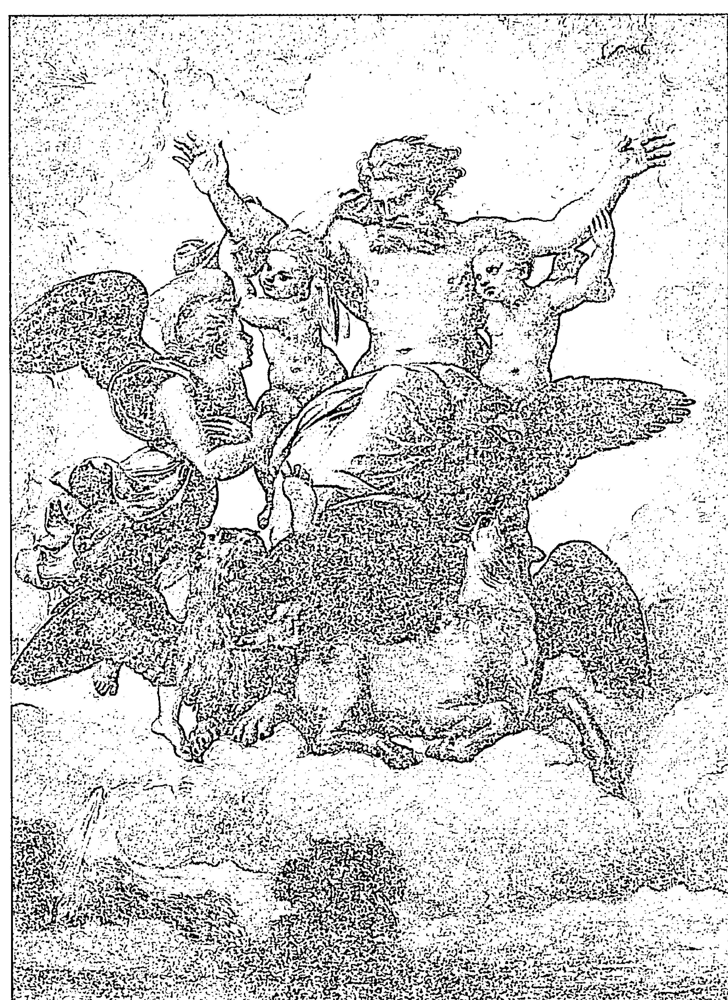

▶ 文藝復興時期大師「拉斐爾」(Raffael，1483-1520) 於 1518 年繪製於木板上的《以西結的異象》(Ezekiel's Vision)，畫面中清楚呈現出四活物的形象。[36]

## ∞ 註釋 ∞

[1] 本書的偉特塔羅牌圖像出自「Universal Waite® Tarot Deck」，經 U.S. Games Systems 正式授權。圖像由偉特（Arthur Edward Waite）構思、史密斯（Pamela Colman Smith）繪製，於 1909 年發行，完備於 1911 年的著作《The Pictorial Key to Tarot》當中。此套普及版偉特塔羅，則是後經漢森 - 羅伯特（Mary Hanson-Roberts）重新上色的版本。

[2] 本書的托特塔羅牌圖像出自「Crowley Thoth Tarot Deck」，經 Ordo Templi Orientis(O.T.O.) 正式授權。圖像由克勞利（Aleister Crowley）構思，委託哈里斯夫人（Lady Frieda Harris）所繪製完成，於 1969 年發行。

[3]《聖經》中文標準譯本（CSB Traditional）中的翻譯。原文：I am Alpha and Omega, the beginning and the end, the first and the last. ( Revelation 22:13 )

[4]《托特之書》（The Book of Thoth）是克勞利（Aleister Crowley）所著，1944 年只出版了 200 本，每本均有編號和簽名，之後由「Samuel Weiser, Inc.」出版社多次再版，2020 年進行第 41 刷。此書為長銷書籍，為研究托特塔羅必讀之聖經。

[5]「伊卡魯斯」是希臘神話中「代達洛斯」的兒子，與代達洛斯使用蠟造的翼逃離克里特島時，忘卻父親「飛行高度過高，則陽光照射下高熱會造成蠟翼融化」的忠告，只著迷於初次飛行所帶來的愉快感受，因而越飛越高，最終雙翼遭太陽溶化，而摔落於水中殞命。

[6] 古羅馬學者老普林尼（Gaius Plinius Secundus，23-79）的著作《博物志》（Naturalis Historia，又譯《自然史》），完成於西元 77 年，全書共 37 卷 2500 章節，被認為是西方古代百科全書代表作。

[7] 圖片來源：維基百科，https://commons.wikimedia.org/wiki/File:Naturalishistoria.jpg。

[8]《獄中有狗陪伴的聖洛克》（Saint Roch in Prison in Montpellier [ predella, panel 6 of 7 ]），1580-1620 年，現收藏於英國倫敦 Wellcome Collection 畫廊。圖片來源：Art UK，https://artuk.org/discover/artworks/saint-roch-in-prison-in-montpellier-125882。

[9]《聖洛克雕像》（Saint Roch），西元十六世紀早期，現藏於美國紐約修道院博物館（The Met Cloisters）。圖片來源：The Metropolitan Museum，https://www.metmuseum.org/art/collection/search/473871。

[10] 里帕《圖像譜》內容均是對擬人像圖像其範式表現做出描寫和說明，主要是從當時流傳的描述樣式文獻中整理彙編而來。1603 年出版木刻插圖本，對巴洛克時期之後的歐洲藝術影響深遠，自稱義大利人文主義者的溫克爾曼（Johann Joachim Winckelmann，1717-1768）曾言此書是「藝術家的聖經之一」。

[11] 揚・范艾克是活躍於比利時布魯日（Bruges）的尼德蘭畫家，十五世紀北方文藝復興的重要藝術家之一，亦是十五世紀北方後哥德式繪畫的創始人。

[12]《圖像譜》，頁 181-182。

[13] 揚・范艾克，《阿諾菲尼夫婦》，1434 年，現收藏於英國倫敦國家藝廊（The National Gallery, London）。圖片來源：英國倫敦國家藝廊，https://www.nationalgallery.org.uk/paintings/jan-van-eyck-the-arnolfini-portrait。

[14] 禪宗《指月錄》卷二十八有記載：「吉州青原惟信禪師，上堂：『老僧三十年前未參禪時，見山是山，見水是水，及至後來，親見知識，有箇入處，見山不是山，見水不是水，而今得箇休歇處，依前見山祇是山，見水祇是水。』」

[15] Arthur Edward Waite（2017.05）。《塔羅牌經典手冊：跟著偉特進入塔羅占卜的秘密花園》。文軒、曾新惠 編譯。台北：達觀出版，頁 127。

[16] 圖片來源：維基百科，https://commons.wikimedia.org/wiki/File:Pictorial_Key_to_the_Tarot.jpg。

[17] 關於達芙妮父親是河神的說法，希吉努斯（Gaius Julius Hyginus，約西元前 64-17）的《傳說集》、奧維德（Ovid，西元前 43-17）的《變形記》、保薩尼亞斯（Pausanias，約公元二世紀）的《希臘志》中均有提到，但是是哪一位河神則各有說法。《傳說集》和《變形記》中記載河神父親是珀涅烏斯（Peneus），《希臘志》中河神父親則是拉冬（Ladon）。

[18] 波拉幼奧洛（Piero Pollaiuolo，約西元 1441-1496 前），《阿波羅與達芙妮》（Apollo and Daphne），約在 1470 至 1480 年間所作，現收藏於英國倫敦國家藝廊。圖片來源：英國倫敦國家藝廊，https://www.nationalgallery.org.uk/paintings/piero-del-pollaiuolo-apollo-and-daphne。

[19] 希伯來文的第一個字母 א（Aleph），字型像英文的 X，是由「牛頭」變成的字母。「公牛」當時是被認為最強壯有力的動物，巴比倫人的主神馬爾杜克（Merodach）就是以公牛形象作為象徵，而黃道十二宮中的金牛座，也是呈現出公牛在異教崇拜中的特殊地位，以色列人在離開埃及後，會把「把上帝的榮耀換成牛像」，即與在埃及時信仰相關（詩 106:19, 20）。聖經以公牛來象徵力量，因此以色列人會把公牛獻祭，這是唯一能為人贖罪的祭物（來 9:12-14），而力量正是上帝的基本特質，因此以公牛代表耶和華所擁有的可畏力量十分恰當。（詩 62:11；賽 40:26）

[20] 在猶太系統哲學觀點中，卡巴拉系統是用來解釋永恆光輝的造物主，是如何進行宇宙創造，以及祂與我們能體驗的有形世界間的關係。而中世紀的卡巴拉學者，逐漸發展出卡巴拉「生命之樹」的圖像象徵系統，其中，「薩弗拉」（Sephira）為一種原質、發散體或發光體的概念，亦稱為「輝耀」。十個薩弗拉的複數為 Sephiroth，音譯為「薩弗洛斯」。詳見頁 123。

[21] 「否定的存在」上方有三重卡巴拉式的帷幕，第一重帷幕是 Ain，意為「否定」或「無」，第二重帷幕是 Ain Soph，意為「無限」，第三重帷幕時 Ain Soph Aur，意為「無限之光」。哈里斯夫人在 1940 年 1 月 28 日寫給克勞利的信中，提到牌面的三道迴圈即是卡巴拉的「空無之三重帷幕」。出自：《托特塔羅解密》，頁 153。

[22] 這個白色花朵，Lon Milo DuQuette 在《托特塔羅解密》（Understanding Aleister Crowley's Thoth Tarot）一書認為是白玫瑰，而 Michael Osiris Snuffin 在《托特塔羅學習手冊》（The Thoth Companion）一書中，認為是白薔薇和百合。出自：《托特塔羅解密》，頁 153、《托特塔羅學習手冊》，頁 33。

[23] 老盧卡斯·克拉納赫（Lucas Cranach the elder，1472-1553），《亞當與夏娃》（Adam and Eve），1526 年繪製於木板，現收藏於英國倫敦考陶爾德畫廊（The Courtauld）。圖片來源：The Courtauld，https://courtauld.ac.uk/highlights/adam-and-eve/。

[24] 此處是聖經第一次提到酒，因此依照聖經的義理，挪亞應該是第一位將葡萄釀成酒的人類。

[25] 米開朗基羅（Michelangelo，1475-1564）於西斯汀教堂（Cappella Sistina）天頂所畫的《挪亞醉酒》（Drunken Noah）。圖片來源：https://www.michelangelo.org/drunkenness-of-noah.jsp。

[26] 《托特塔羅解密》，頁 233。

[27] 印度濕婆神，額上長著第三眼，傳說濕婆神震怒時，這隻眼睛會釋放出毀滅的力量，祂所看到的一切都會燃燒殆盡，尤其在宇宙週期性的毀滅之時，祂會用這只眼睛中的神火消滅宇宙萬物，殺死所有神和其他生物。

[28] Michael Osiris Snuffin（2018.05）。《托特塔羅學習手冊》（The Thoth Companion）。孫梅君 譯。台北：達觀出版，頁 122。

[29] 梅比斯環，又稱莫比烏斯環（Möbiusband），是由德國數學家、天文學家莫比烏斯（August Ferdinand Möbius）和約翰·李斯丁（Johann Benedict Listing）在 1858 年發現，紙環旋轉方式呈現出一個無盡的空間，被認為是無窮大符號「∞」的發想來源。

[30] 薩圖恩（Saturn）為古希臘羅馬神話中為宙斯的父親，為農業之神，鐮刀為其圖像標誌。

[31] Aleister Crowley. (2020). *The Book of Thoth*. San Francisco, CA: Red Wheel/Weiser., p 119.

[32] 《以西結書》是《希伯來聖經》中的一部先知書，在天主教中此書翻譯為《厄則克耳先知書》。

[33] 「我觀看，見有狂風，從北方颳來，有一大片雲和閃爍的火焰，周圍有強光，火焰中發出金銀合金似的光輝。火焰中看起來有四個活物，外表像人一樣，各有四張臉，四個翅膀。他們的雙腳是直的，腳掌好像牛蹄，雙腳閃閃生輝，像擦亮的銅。他們四邊的翅膀下有人的手，四個活物都有臉和翅膀。他們的翅膀彼此相接，移動的時候不用轉身，都是各自向前直行。他們的臉是這樣的：四個活物各有人的臉，右面各有獅子的臉，左面各有公牛的臉，還各有鷹的臉。」（以西結書 1:4-11）

[34] 基路伯天使為「智天使」，在《聖經》中多次出現，形象為有翅膀且服從上帝的靈體，與「熾天使」均為最高層級的天使，在天國敬拜和讚美上帝。在《創世紀》中，天使米迦勒（Michael）在將亞當和夏娃趕出伊甸園之後，上帝即安排基路伯看守生命樹，不讓亞當與夏娃有機會再回到伊甸園食用生命樹果實，「於是把他趕出去了。又在伊甸園的東邊安設基路伯，和四面轉動發火焰的劍，要把守生命樹的道路。」（創世紀 3:24）

[35] 在卡巴拉哲學系統中，將宇宙分為四個不同的「世界」，分別為原型界、創造界、成形界、物質界（行動界），每一界都由聖名四字母（YHVH）中的一個字母所代表。原型之界呈現出一種原始洪荒的強烈爆發力道，是激活並演化出往後生命與其他世界的純粹精神，在塔羅牌中以權杖（火元素）來代表。詳見頁 126。

[36] 拉斐爾，《以西結的異象》，1518 年作，現存於義大利佛羅倫斯碧提宮美術館（Gallery in Palazzo Pitti）。圖片來源：維基百科，https://zh.wikipedia.org/wiki/File:Raphael_-_Ezekiel%27s_Vision.jpg。

## 數字 1 與 11

## 感性創造與理性守規

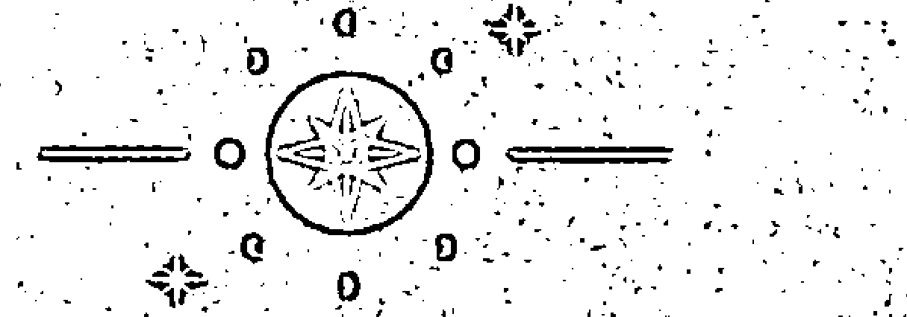

偉特塔羅：I 魔法師 The Magician、XI 正義 Justice

托特塔羅：I 賢者／魔法師 The Magus、VIII 調節 Adjustment [37]

> 在這一人航海的人生浩瀚大海中，理想是羅盤針，
熱情是疾風。
——卡爾．波普爾 [33]

## I 魔法師
The Magician

- 符號與話語的風
- 水星之行星牌
- 風之元素牌

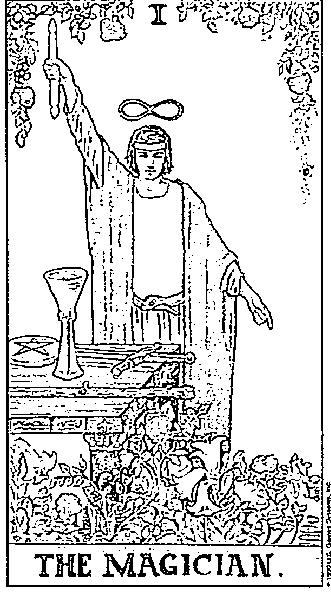

擅長煉金術、召喚術和調配魔法藥草的魔法師，以及可以溝通陰陽兩界的靈媒，在基督教掌權的中世紀時期，是很神奇的存在，此角色又以英國神話中，輔佐亞瑟王登基的「梅林」(Merlin Ambrosius) 最為知名和傳奇。傳說他們法力強大且充滿睿智，不僅能夠預知未來，還可以變換成各種形體。今日社會中，在傳承神秘學的實踐者們上，依然延續著他們的精神。

畫面中「魔法師」信心滿滿，開始要整合物質界的元素來進行創造，象徵水元素的聖杯、風元素的寶劍、土元素的錢幣和火元素的權杖於桌上並列，在象徵感性熱情的紅玫瑰與精神純潔理性的百合花園中，「魔法師」穿著暗示純潔白色長袍和象徵慾望的紅色斗篷，腰間配帶銜尾蛇腰帶，右手拿權杖高舉向天，左手指著土地，展開成為精神與物質之間橋樑的旅途。

連結水星的「魔法師」靈巧聰明，從「愚者」到「魔法師」，從 0 到 1、從無到有的能量甚巨，頭上的「∞」(lemniscate) 符號，代表著無限循環，而「自我吞食者」(Self-devourer) 以銜尾蛇的形象出現，象徵擁有無限的可能性，更是一種律動的永恆性，「魔法師代表的就是不用力的專注，意志的主宰權已經從大腦『下降』(其實是提升) 到自律系統」[39]，專注的寧靜能讓心與靈性世界有真實連結。然而，8 本身是一個循環且沒有出口的數字，在有形的創造力下，宇宙因果能量平衡，創造之時也勢必帶來業力傷害，因此倘若「魔法師」太過投機和奸巧，用聰明才智只想快速走捷徑達到成功，討厭勞力和辛苦，雖不能抹煞掉他所擁有的天賦資質，但是在因果自負原則之下，如同藥品可壓制某一病症，也可能會給其他器官帶來傷害一般，所有創造的能量終歸會順著∞符號循環歸來。

## ∞ 傳統圖像意義 ∞

## 銜尾蛇：

蛇除了象徵靈巧之外，另一個重要的象徵意義是時間循環。在古典時期，時間不是以衰敗或破壞來呈現，而是無限豐饒的象徵，其中被蛇纏繞的「艾翁」(Aion，永恆)形象即象徵時間[40]，祂創造了宇宙的銀蛋，由蛋向外迸發的神祇即「法涅斯」(Phanes)[41]，之後與「密斯拉」(Mithra)[42]的崇拜結合。「艾翁」與「法涅斯」形象融合時，在時間概念的呈現之下，成了被黃道十二宮環繞的帶翼青年，不變的是蛇依舊纏繞其身。

文藝復興與巴洛克時期，時間形象在藝術表現上大多還是帶翼青年，並與銜尾蛇一同出現[43]。銜尾蛇在煉金術中是重要的象徵，代表大自然萬物的循環，是宇宙的輪轉標記，每位煉金術士都希望自己能透過汞、硫、鹽轉化所有宇宙物質。由煉金術士「克麗奧佩脫拉」(Cleopatra，生卒年不詳，於三世紀或四世紀在世)所著的煉金學文獻《The Chrysopoeia of Cleopatra》裡，有一個著名的銜尾蛇圖像，附有希臘文字「一即一切」(Hen to Pan)。古希臘哲學家柏拉圖(Plato，公元前 429 年 - 前 347 年)形容「銜尾蛇」為一頭處於自我吞食狀態的宇宙始祖生物，通過自我吞噬來造就生命與死亡輪替。

榮格(Carl Gustav Jung，1875-1961)從 1930 年代左右開始，積極地研究煉金術，並在往後約 30 年的心理學研究上，廣泛地將心理學與煉金術概念結合，主要理論可見於《榮格全集》中第 12 冊的第三部分《心理學與煉金術》當中，此篇章承接了《煉金術之夢》中對於泡利(Wolfgang Ernst Pauli，1945 年諾貝爾物理學獎得主，亦是榮格的「患者」)夢境進行分析，並比對了煉金術的異象，再近一步從心理學角度，探討了夢境中常見的煉金術意象。在《煉金術之夢》的第三章「曼荼羅的象徵作用」中，榮格認為銜尾蛇在煉金術中為萬物的原型，是一種具有淨化力量的圖像，也是煉金術中的能量中心「曼荼羅」。銜尾蛇符號所象徵著一切重生、無限循環和無窮生命永恆融合的意涵，即為煉金術師所要致力詮釋及解放的領域，此牌「魔法師」畫面中配戴銜尾蛇腰帶，亦象徵著智慧的啟發，與其無窮的創造潛能，生生不息。

## 紅袍：

在不同的文化當中，紅色有著不同的意義，但是紅色的確在任何文化中均是醒目的信號色，有時象徵警示和危險，由於與血液顏色相同，亦有愛、勇氣、熱情與慾望的意涵。《格林童話》中的《小紅帽》穿著紅袍進入森林，離家則代表勇氣，更何況還冒險進入象徵危險的森林，也難怪她必須得是小紅帽，不能是小藍帽或是小白帽。而《安徒生童話》中的《紅舞鞋》更是令人戰慄，貧窮女孩因為自身慾望，喜愛與她身分不相配的紅舞鞋，穿上它之後竟然最後得砍斷雙腿，才得以停止舞蹈得到休憩，警告不能有過分慾望的意味濃厚。

2015 年的電影《異色童話集》(Tale of Tales)，是選自《五日談》[45]中的童話故事，血淋淋地展現了一個由慾望組成的世界，以及其後慘痛的教訓和毀滅，海報中央一位身穿紅袍、求子若渴的王后站立，對王國中所有人的愛戴不屑一顧，只對自己的慾望孤注一擲，但世間真理是，每個慾望都有相對應的代價，如浮士德得用自己的靈魂和惡魔交易，以換取慾望中的知識與權勢；《安徒生童話》中美人魚得用甜美聲音換取雙腳；《異色童話集》中的紅袍皇后，自然也走上了失去愛子陪伴並付出自身生命的代價。在物質世界中，交換與輪替，是不變的定律。

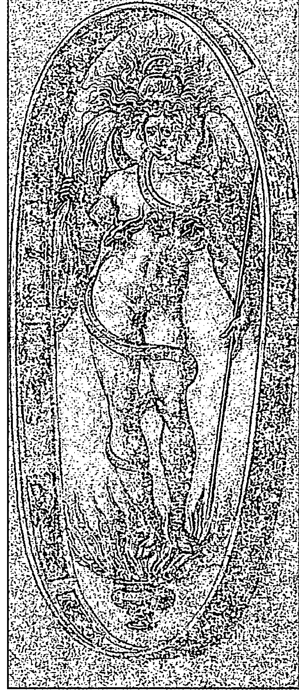

## 偉特塔羅
大阿卡納牌

## XI 正義
Justice

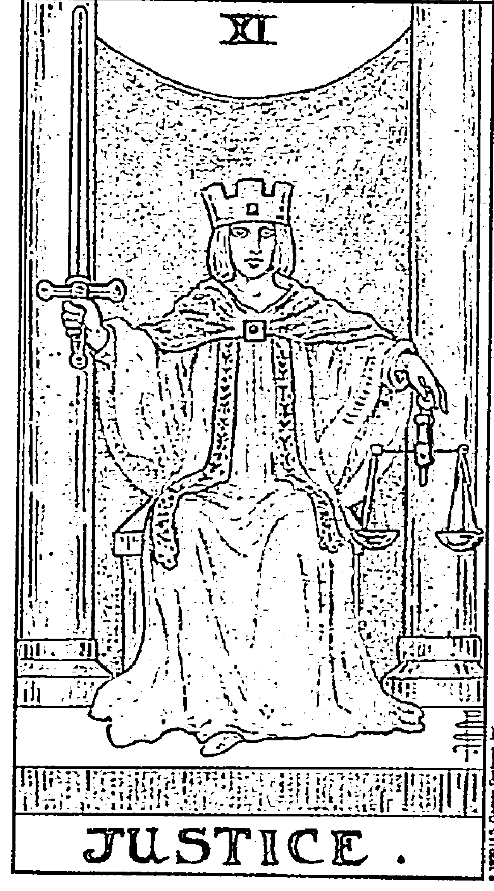

- 理性展翅的風
- 天秤之星座牌
- 風之元素牌

隨著文明的發展演進，人間有太多紛爭與無奈需要仲裁與撫平，律法由此而生。天秤的平衡、長劍的威儀，希望人間不要產生暴力彼此對待，大眾能在一個相對穩定的社會中生存。然而，律法的產生，真的能讓人世間產生正義嗎？還是只是為了維持人間運作的秩序？而所謂的正義，是真正的正義嗎？天秤存在的唯一任務是顯示平衡，達到物理界中對等的想像，但是人間的律法和所維持的正義，不代表一定是真相，而在當事者內心所產生的感受與漣漪，更是難以為外人所能體會。

天秤座的優點和盲點都是在追求和諧，相對而產生的通常只是折衷與協調，也因此常常在所謂的正義中迷惘。不是要真相，世間也沒有真相，寶劍的嚇唬和威嚇作用，一如高聳冰冷的律法殿堂，畫面中兩柱上面沒有刻印字，身後紫色布幔掩蓋起後方金色天空。當最在乎的只是達到和諧時，極有可能就為了追求這個平衡而失去了立場，或為了不得罪人而顛倒是非、自我忍耐退讓，抑或是壓抑任何一方。為了和諧而和諧，是正義牌中對天道無奈的喟嘆，也是現實中對公平最後的想望。

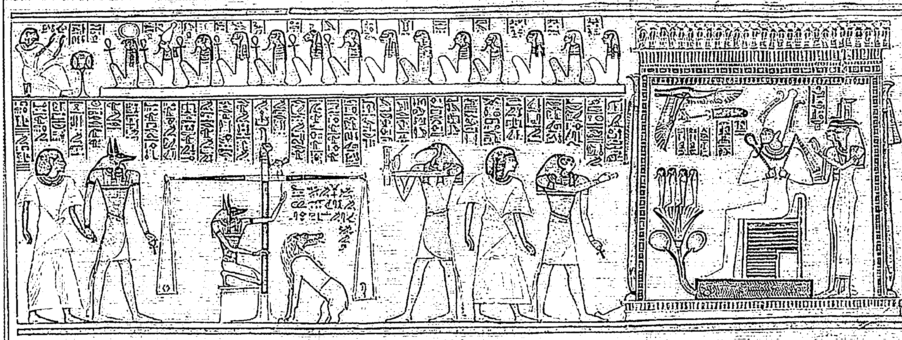

▲ 《死亡之書》為埃及繪製在物體上或莎草紙的一段古埃及墓葬文書，旨在幫助死者通過死亡之地，平安前往來世的咒語。[47]

## ∞ 傳統圖像意義 ∞

天秤：

在埃及的《死亡之書》(Book of the Dead，或譯為亡靈書、死者之書) 圖像中，死亡之神「阿努比斯」(Anubis) 透過天秤來衡量死者心臟與「瑪特」(Ma'at) [46] 女神羽毛的重量，用以評斷靈魂善惡。而在面對冥王「歐西里斯」(Osiris) 時，天秤的衡量也決定死者能否進入「樂園」(即今日天堂概念)。

在基督信仰當中，天使長米迦勒 (Michael) 延續了這樣的形象，祂手中天秤依然是上帝最後審判的正義量器。在里帕的《圖像譜》當中，「正義」(Divine-Justice) 擬人像一手持長劍、一手握天秤，維持著人間正義。也因此天秤形象一直是古今中外司法機關重要的圖像象徵，如中華民國最高司法機關司法院的標誌，依然以天秤為設計概念。

## I 賢者／魔法師
The Magus

- 力量的賢者 The Magus of Power
- 水星之行星牌
- 希伯來字母：Beth，房屋

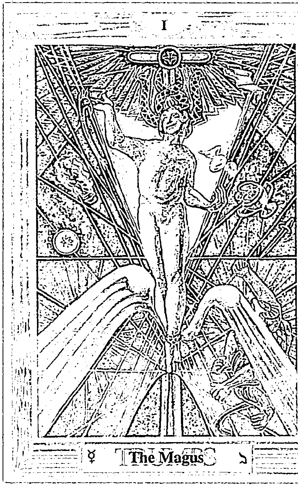

「愚者」牌中，光的意象是人類不可能憑感官經驗到的，但「賢者」牌中所呈現出的意識界，則是人類靈性所能到達與起悟的境界。ב (beth) 是希伯來文第二個字母，意指「房屋」。托特塔羅的「賢者」對應偉特塔羅的「魔法師」，實質就是煉金術師，牌面中頭上與雙腳均有雙翼的「墨丘里」(Mercury)，祂是羅馬神話中的信使之神，是神之語錄、意念與道法的人間行動顯化。[49] 祂頭上的「神使之杖」(Caduceus) 由牌面最上方貫穿直下，不斷地往牌面外延伸。水星的聰明靈巧無遠弗屆，而肢體所呈現出的「卍」(Svástika)，唐代「玄奘」將它譯成「德」字，因此在佛教中是萬德之集，強調佛的功德無量[50]，在此仍然顯現出「墨丘里」直接傳達神之信息的能力，此牌亦是一切物質創造之源。

墨丘里 (Mercury，亦是化學元素「汞」)，因為其信息流動與傳遞的本質，在占星學上代表了運行速度極快的水星，是「代表任何形式的行動，祂是活動力傳送的射流基處，而在宇宙動力學理論中，祂本身也是一種物質。在現代物理學中，祂被稱為電荷」[51]。在煉金術三大元素汞、硫、鹽中，「汞」物質具有金屬色澤，卻也是實質流體，在正常溫度下也會緩慢蒸發，因此被認為是固體 (土元素)、液體 (水元素) 和氣體 (風元素) 三種元素的合一，代表在宇宙中任何形式剛開始的動力階段。此牌中「賢者」身邊圍繞著代表地水火風的四大傳統法器，克勞利本人即說明「祂以權杖創造，以聖杯保存，以匕首破壞，以錢幣救贖」[52]，「墨丘里」以其自在的流動特質，將此四種法器懸浮於空中運用自如，表情得意光彩地即將進行偉大的創造。

其中代表風元素的「劍」，在此不是以傳統長劍表現，而是以短的匕首來代表。長劍在西洋傳統意象上代表正義，而匕首則通常代表報復、偷襲、欺騙與竊盜等負面意象，水星在占星學中的確不是凶星也不是吉星，是顆中性之星，匕首在此即表現出它可正可邪的行星特色。「賢者」牌是這物質界創造的第一步，是世界的新循環，業力亦穿梭其中，展開永恆不間斷的救贖與毀壞。

「賢者」的創造，是必須透過物質和行為才能做到，此牌希伯來字母譯為「房屋」，與《聖經》中「這等人不是從血氣生的，不是從情慾生的，也不是從人意生的，乃是從神生的。道成了肉身，住在我們中間」(約翰福音 1:13-14)，無形之「道」至此進入有形肉身，這是在成形之界中所創下的基礎，背景中呈現出常在風元素牌中出現的格子線條，因為風元素代表對任何事情都喜歡進行思考、定義、邏輯和節度，但也正因為如此，所以一切都會被框架，而框架所呈現的切割面，會進而產生更多的限制。

牌面中的綠色、黃綠色也正是風元素的顏色，脫離了「愚者」的境界，來到一個可以運用和操作物質的成形之界，進行的是有意識的創造，自然也受到物質界的限制，因此，尖嘴筆、莎草紙、火焰以及長有翅膀象徵新生與重生的「奧菲克秘卵」(Orphic Egg) 四物質隨之騰空飄浮，一切均是有形創造顯化的源頭。

「賢者」心中懷有真理與智慧，但過程可能呈現謬論與愚蠢行為，其機智靈巧的特性，可以打破任何傳統固有思考邏輯，他具有百分之百的創造力，但卻有可能為達到目的，而採取狡猾或破壞規則的做法，希臘神話中「墨丘里」從小即展現了靈巧狡詐且擅於偽裝、不按牌理出牌的特性，讓意念本質以無法描述的方式流動。牌面右下方是「托特之猿：賽諾西法拉斯」(Cynolcepbalus，The Ape of Thoth)[53]，而克勞利亦說明印度概念中的「墨丘里」是被降格為猴神 Hanuman[54]，在此他試圖從網狀隔線中攀爬，不斷地嘲諷著「賢者」，畢竟一切物質界的創造，總逃不過虛幻、偏見與物理惡。「在永恆中工作，並為永恆工作」[55] 是魔法師、煉金術師的天命，也是占星師輪迴中跳脫不開的永恆宿命，但當他們以機智展現口才與能力之時，人類所創的文字、符號和言語，也只是真理的低等再現系統，「賢者」所進行意念傳遞與穿越，亦可能是欺騙與偽裝的開端。

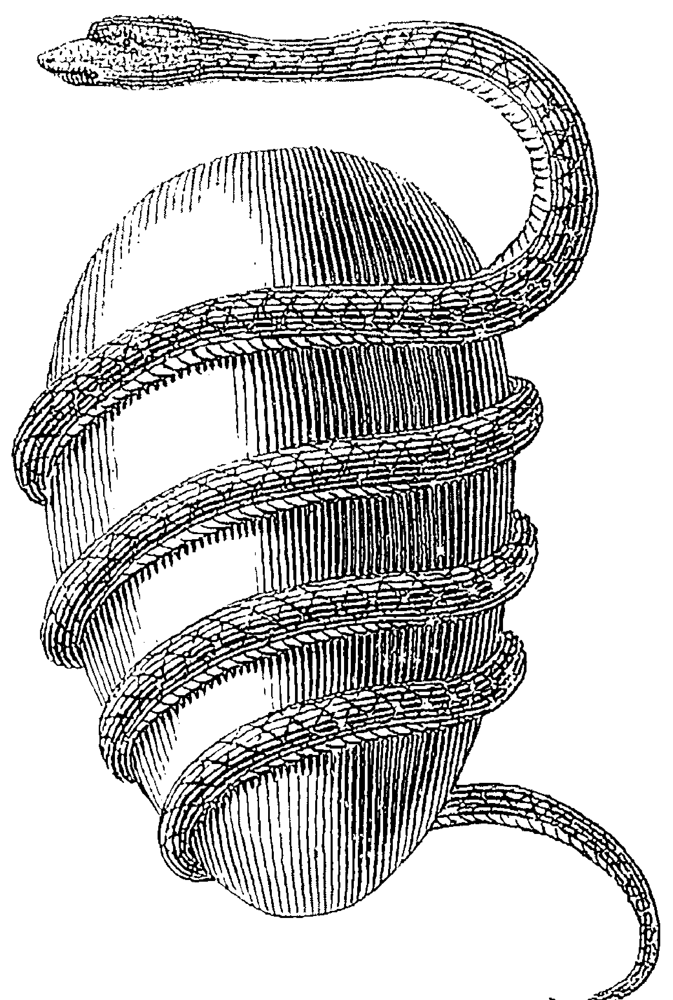

◀ 英國神話學家雅各布·布萊恩特 (Jacob Bryant，1715-1804) 於 1774 年所繪之「奧菲克秘卵」形象。[56]

## ∞ 傳統圖像意義 ∞

### 奧菲克秘卵：

在古希臘奧菲斯傳說裡，原始的雌雄間性神祇「法涅斯－狄俄倪索斯」(Phanes-Dionysus) 是從光芒耀眼的銀色「奧菲克秘卵」(又稱「宇宙蛋」) 孵化而出，祂是光明的化身。在《奧菲斯讚美詩》中，「因神聖而妙不可言的，隱藏玄祕的，輝煌卓越的繼承者，祂的動作呼呼作聲地飛，祢疏散了在祢眼前布置的這黑暗薄幕，並且拍打祢的雙翼，祢在四周飛快移動，通過這世界，祢帶來了純粹的光明。」(Ineffable, hidden, brilliant scion, whose motion is whirring, you scattered the dark mist that lay before your eyes and, flapping your wings, you whirled about, and through this world you brought pure light.)

「奧菲克秘卵」的形象通常以一條被蛇纏繞的蛋呈現，但是在托特塔羅系統中，哈里斯夫人很清楚也有以《奧菲斯讚美詩》中「拍打祢的雙翼」來發想，「賢者」牌中即是以「帶有雙翼的蛋」形象出現。在托特塔羅的大牌當中，「奧菲克秘卵」不僅出現在「賢者」牌，「戀人」牌、「隱者」牌、「藝術」牌等亦有出現，或是以蛇纏蛋、或是雙翼蛋的形象出現，隨著牌義展開了不同詮釋狀態的奇妙之旅。

## VIII 調節
Adjustment

- 真理之主的女兒
  The Daughter of the Lords of Truth
- 天秤之星座牌：金星入廟、土星入旺
- 希伯來字母：Lamed，趕牛棒

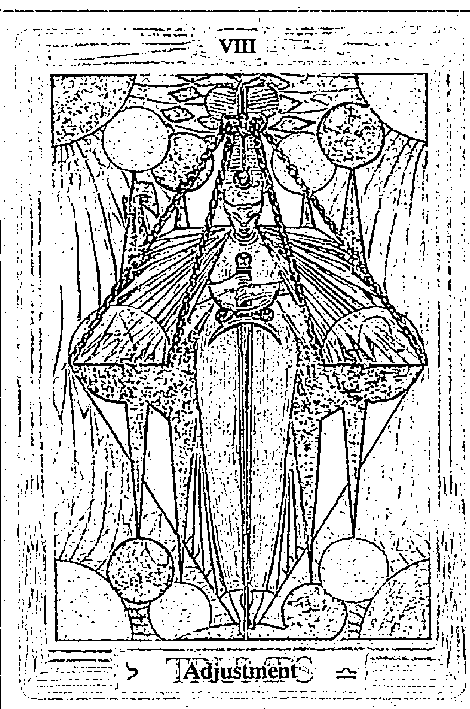

天秤座，是秋天的星座，是即將進入萬物蕭條冬季的前奏與序曲，天秤座由金星守護，也帶有土星特質，牌面上藍綠色冷色調，是時候了，頭戴埃及真理和正義女神瑪特 (Ma'at) 冕的「調節」女神，冠冕上延伸出象徵平衡與正義的天秤，手也握象徵正義的長劍，在畫面中清楚地分割出菱形。在金星守護之下，女神優雅地墊著腳尖，小心翼翼維持著和諧平和。臉戴著面具是為了讓人看不清祂有任何表情 [57]，無法閱讀祂的情緒狀態，祂不會因感官限制而被蒙蔽，也沒有任何念頭可以干擾祂。巨型天秤左右的「Alpha」和「Omega」達到了最完美的平衡。四周的圓球與菱形的線條，代表讓象徵理性思考的狀態達到極致。

克勞利認為此牌中的女神是「愚者」的陰性補充，「愚者」對應的希伯來文是 A (א : Aleph)，「調節」則是 L (ל : Lamed，趕牛棒)，兩者相合是卡巴拉中常見的神之名：AL (אל) (也正好是克勞利的簽名 Aleister)。在此表現出平衡且穩定的女神，其實也是擅長舞蹈的「哈爾利奎」小丑 (Harlequin) [58]，「她是被表現出來的幻想，她是舞蹈，她象徵人生的多姿多彩和詭計多端」[59]，所謂的真理，有可能被細微的想法所扭曲，而金星特質優雅隨和卻也事事衡量，土星常伴隨著沉重業力課題，任何事情在通過時間精密計算後，仍會得到最終的平衡，這也是東方哲學中「業」(Karma) 的真正含義。金星統治嚴肅衡量萬物命運的平衡過程，如泰勒瑪 [60] 重要教義「Love is law, love under will」，手上的天秤和長劍是土星理性的工具，但心中胸懷的是愛的律法。

然而在偉特塔羅中的「正義」，「正義的意思是純粹的人道，而不是自然法則。從神學倫理角度來講，自然是不公平的，但又是準確的」[61]，在克勞利的認知中這種概念只是「調節」，因為天秤所象徵的「正義」是人間根本達不到的境界，世間沒有絕對正義，因為這一切都只是人間的審判，這不是埃及神話冥王「歐西里斯」(Osiris) 在陰間「杜埃」的審判，亦不是《聖經》中呈現世界末日之時，手持天秤的「米迦勒」所呈現的上帝最後審判。砝碼的加減是為了抓出天秤平衡點，女神墊著腳尖的謹慎，只是求折衷下對大家有個交代的平衡，明暗圓球的圓融，平衡菱形的方正，是大家溝通的方式、原則與共識，平衡天秤的鐵鍊是束縛與威嚇，那是鐵的紀律，可綑綁人類肉體，一切和諧都只是「調節」和協調，因為這一切只是人間律法的「正義」，不是天道與輪迴中那股迴盪天地的仲裁正氣。

每一個能量的形式都必須經過人間以「正義」之名來導正，女神滿意地迎接著所謂的光明正義，天秤兩端砝碼的加減調整，都是世間單純正義觀念與實際複雜因素交織下的補償與代價而已，地球一端的黑暗，只是因為太陽此刻正照射在另一端。畢竟，「以恰恰相對的想法平衡每一個念頭，因為兩者的結合乃是錯覺的終結」，[62] 是的，人間仲裁下的和諧，都只是錯覺。

## ∞ 註釋 ∞

[37] 依照金色黎明協會的傳統，在偉特塔羅牌中，「正義」牌為編號第11的大牌，然而在托特塔羅當中，呈現相似概念的「調節」牌，克勞利認為應將黃道帶以處女座為樞紐旋轉，因此獅子座與天秤座的位置互換了，代表獅子座的「慾望」牌在托特塔羅中被安排到第11張大牌，而代表代表天秤座的「調節」牌，則被安排到第8張大牌的位置。此舉打亂了傳統大阿卡納牌的順序，也令金色黎明協會成員不安。

[38] 卡爾·波普爾（Sir Karl Raimund Popper，1902-1994），出生奧地利的猶太人，第二次世界大戰為了逃避納粹的迫害，移居英國入英國籍，是當代西方最有影響的哲學家之一。

[39] 佚名（2020.12）。《塔羅冥想：基督教信仰內在隱修之旅》（Meditations on the Tarot: A Journey into Christian Hermeticism），侯王怡文譯。台北：心靈工坊，頁37。

[40] 奧菲斯教（Orphism，亦有部分文獻採 Orphicism 一詞），為發源於古希臘時期的一支宗教，信仰中部分神祇有傳入古希臘多神教中。在其神話中，時間（Time）是一位神祇，亦被稱為艾翁（Aion，意為永恆），祂創造了宇宙蛋（又稱奧菲斯蛋），宇宙起源於此蛋中，蛋中迸發出多位初始神祇，此蛋的形象被描述為被蛇所纏繞。

[41] 奧菲斯教派信仰中，由宇宙蛋所誕生的第一位神祇，即為法涅斯（Phanes），其形象為帶翼青年並被蛇纏繞，被認為是光明神祇。

[42] 密斯拉（Mithra）為密斯拉教（Mithraism）的主神，源自於波斯人對主神密斯拉這位光明之神（亦為太陽神）的崇拜，此宗教盛行於羅馬帝國，因與奧菲斯教派的光明神祇法涅斯形象相似，後來兩者在藝術圖像呈現上有相當程度的融合。

[43] 對於時間形象的演變，潘諾夫斯基（Erwin Panofsky，1892-1968）在《圖像學研究：文藝復興時期藝術的人文主題》一書中第三章〈時間老人〉中有詳盡的研究。出自 Erwin Panofsky. (1972). *Studies in Iconology: Humanistic Themes in the Art of the Renaissance*. New York: Harper & Row.

[44] 弗朗西斯科·德·羅西（Francesco de' Rossi）十六世紀所描繪的聖畫《法涅斯》（Phanes），圖片來源：維基百科 https://zh.wikipedia.org/wiki/%E6%B3%95%E6%B6%85%E6%96%AF。

[45]《五日談》（Pentamerone）由吉姆巴地斯達·巴西耳（Giambattista Basile，約1575-1632）所著，是歐洲最早的童話文學集。

[46] 瑪特女神在埃及宗教中的死亡審判，佔有極重要的地位，在人死以後要受冥王審判的天秤上，一端放著死者的心臟，另一端則放著瑪特的鴕鳥羽毛作為砝碼，兩邊等重即無罪，心臟較重者，會馬上被鱷頭獅身怪物阿米特吞噬。

[47]《Book of the Dead: Papyrus of Hunefer - Frame3: Hunefer's Judgement》，現收藏於大英博物館，約公元前1275年作品。圖片來源：維基百科 https://commons.wikimedia.org/wiki/File:BD_Hunefer.jpg。

[48]《博納祭壇》（The Beaune Altarpiece，又名《最後的審判 The Last Judgment》）是一幅大型祭壇畫，於公元1445-1450年由尼德蘭畫家羅希爾·范德魏登（Rogier Van der Weyden）繪成，現收藏於法國博納主宮醫院（Hospices de Beaune）。圖片來源：Web Gallery of Art，https://www.wga.hu/html_m/w/weyden/rogier/08beaune/index.html。

[49]《The Book of Thoth》，p 69.

[50]《大佛頂首楞嚴經》：「即時如來。從胸卍字。涌出寶光。其光晃昱。有百千色。」

[51]《The Book of Thoth》，p 70.

[52]《The Book of Thoth》，p 71.

[53] 在古埃及宗教信仰中，托特（Thoth）為智慧與學習之神，被視為埃及象形文字的發明者，並具有兩種面貌：「鴛鴦頭」形象被視為理智與智慧的代表，而「猿猴」形象則通常出現為冥府的書寫員，並完成了《死亡之書》。

[54]《The Book of Thoth》，p 71.

[55] Lon Milo DuQuette（2014.01）。《托特塔羅解密》（Understanding Aleister Crowley's Thoth Tarot）。孫梅君譯。台北：商周出版，頁155。

[56] 英國神話學家雅各布·布萊恩特 (Jacob Bryant，1715-1804) 於 1774 年所繪之「奧菲克秘卵」形象。

## 數字 2 與 12

## 靈性直覺與消極困頓

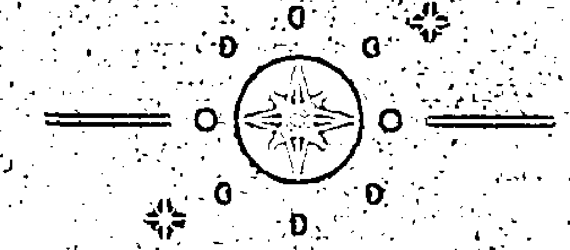

偉特塔羅：II 女祭司 The High Priestess、XII 吊人 The Hanged Man

托特塔羅：II 女祭司 The Priestess、XII 吊人 The Hanged Man

> 擯棄心中一切慾望，只有自我滿意自我。
——毗耶娑《薄伽梵歌》

## II 女祭司
The High Priestess

- 寂靜沈澱的湖
- 月亮之行星牌
- 水之元素牌

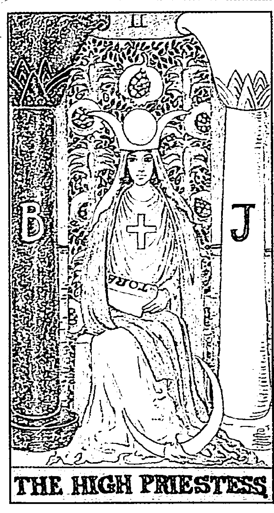

有別於 1 號牌「魔法師」的外顯創造，2 號牌「女祭司」表現出冷靜內斂，伊西斯 (Isis) 女神 [63] 的冠冕顯示出「女祭司」地位的尊貴。在基督教系統中，女性無法擔任高位階的職位，但是在古老異教與神秘學中，「女祭司」被認為具有極高靈性，擁有神秘力量，並善於守密與保有隱私。如水波般的藍白袍子在裙角勾起一彎弦月，此牌連結行星月亮，而占星學中月亮主宰情緒，與直覺有絕對的關係，她有異於旁人的感知力和直覺，手抱古老律法書《道》(Tora)。

《希伯來聖經》中記載，所羅門王在公元前 960 年於耶路撒冷修建第一座聖殿，「女祭司」身後的兩根柱子即是聖殿中的兩根銅柱，左邊的 B 代表 Boaz，是「祂必堅立」之意；右邊的 J 代表 Jachin，是「在祂裡面有力量」，柱子一黑一白、一陰一陽，上帝創世定下了最基本的規則，宇宙隨之運行。而「兩柱頂的鼓肚上挨著網子，各有兩行石榴環繞」(列王紀上 7:15-22)，與「女祭司」身後印有石榴的布幔圖形描述相仿。

「女祭司」端坐神聖殿堂，遙遠且高冷，月亮所主宰的是直覺與情緒特質，而直覺比較容易受到情緒干擾，當所有訊息傳遞之時，月亮會產生害怕惶恐、不知如何迎接訊息的狀況，不論來自黑暗或正義，這些訊息所帶來的感知迎面逼近，直覺情緒完全不自覺地一湧而上，導致了儘管靈性能力很強卻略帶憂鬱，情緒上難以產生安全感，因此雖然手持著象徵智慧的律法書《道》，卻選擇將書本闔上，一切狀況秘而不宣。胸前有希臘正十字架，身後的石榴布幔將後方水面隔開，希望不再受情緒影響，只靜默旁觀，隱藏且內斂，一切尚未到採取行動的階段。

## XII 吊人
The Hanged Man

- 低下困頓的井水
- 雙魚之星座牌
- 水之元素牌

北歐《詩體埃達》(The Poetic Edda)中〈賢者之歌〉記載，智慧知識之神「奧丁」(Odin)曾將自己倒吊在世界之樹上九天九夜，以矛刺傷自己來進行自我獻祭，「九夜吊在狂風飄搖的樹上，身受長矛刺傷；我被當作奧丁的祭品，自己獻祭給自己，在無人知曉的大樹上！沒有麵包充飢，沒有滴水解渴。我往下看，拾取盧恩文字，邊拾邊喊，由樹上掉落。」祂所有的痛苦，都只為換取盧恩文字 (Runes) [64] 中的智慧和奧祕，從此占卜與祈禱祝福儀式，終於擁有了強大的符文系統來對應。

此牌行星對應海王星，一如希臘神話中「普羅米修斯」(Prometheus) 有願意為眾生犧牲受難且承受身心試煉的精神，也讓他能帶著微笑，以世人不能理解的另一種角度來觀看世界。耶穌的誕生也象徵雙魚座時代到來，[65] 守護雙魚座的海王星能量，象徵慈悲與自願為眾人犧牲奉獻的精神，水元素的屬陰柔性，讓所有磨難都能被用以心甘情願的態度面對，只因為早已明瞭此為人生必須經歷的過程。

「吊人」衣服的藍與長褲的紅，也正是耶穌與聖母瑪利亞衣袍的代表顏色，頭上的光圈顯示其實早已開悟，因為一開始本身立場就已別無所求，而現在雖身體遭受綑綁，但心態安寧祥和，所有的不掙扎，只為能成就偉大事業，所以願意默默認受，等待著痛苦昇華。

▷ 卡拉瓦乔的《圣彼得上十字架》，描绘了圣彼得自愿以倒挂方式上十字架的情景。[66]

## ❧ 傳統圖像意義 ❧

聖彼得倒吊十字架：

天主教教義中，「聖彼得」(Sanctus Petrus，天主教漢譯「聖伯多祿」) 是耶穌的十二使徒之一，後來成爲第一代教皇。耶穌被羅馬士兵捕捉以後，聖彼得對信仰失去信心，被問及是否爲耶穌門徒時，他三次否認。當耶穌被釘在十字架上升天之後，聖彼得自認自己不配和耶穌以一樣正掛方式上十字架，因此自願請求以倒掛方式，被釘死在十字架上痛苦殉道，而此形象就逐漸演變成代表殉道時的謙虛態度。而出生於基督教家庭的克勞利，認爲倒十字架與對神恩的反駁、對耶穌救世主的遠離有關，而倒十字也被有些人視爲撒旦的符號，並成爲撒旦教的標誌之一。

## II 女祭司
The Priestess

- 銀星之女祭司
The Priestess of the Silver Star
- 月亮之行星牌
- 希伯來字母：Gimel，駱駝

與偉特塔羅的「女祭司」一樣，頭戴著埃及「伊西斯」冠冕的女神，依然坐在兩根柱子之間，此柱為埃及「西特」(Seth) 的雙柱，「西特」身為古埃及力量之神、戰神、風暴之神與沙漠之神，此牌的希伯來代表字母為「ג」(Gimel)，意指駱駝。牌面下方中央處可見到一隻白色駱駝，作為路徑 13，[67] 跨越「天界三角」與「深淵」(Abyss) 的唯一中柱路徑，「女祭司」是連結原型之界、創造之界到成形之界的唯一路徑，由原型之域的 1 號薩弗拉「王冠」(Kether)，直接連結那完美展現均衡能量的太陽之域 6 號薩弗拉「美」(Tiphareth)，這個跨越從至高光點直墜人間荒漠，而「女祭司」是唯一的引領者，一如駱駝是唯一能自帶水源，並安然橫渡沙漠的能力物種。

代表「無限大」的倒 8 符號覆蓋「女祭司」雙眼，她具有埃及「伊西斯」女神的靈性，也是羅馬神話中月神「黛安娜」的化身，然而她不選擇將這道靈魂之光耀眼呈現，反而將無限的光輝選擇隱藏在「光之紗幕」後。1795 年詩人席勒 (Friedrich Schiller，1759-1805) 的敘事詩《薩伊斯蒙著面紗的雕像》(The Veiled Statue At Sais) 中，古埃及城邦薩伊斯 (Sais) 即是「全知者伊西斯」的故鄉，蒙著面紗代表著女性啟蒙者的秘密是無法直接揭示的真理，古希臘哲學家赫拉克利特 (Herakleitus，約前 544- 前 483) 亦言「自然愛隱藏」(Nature loves to hide)，而克勞利則直接說明：「當研讀《律法之書》，並穿透『處女』的帷幕。」[68]

雙臂上揚的「女祭司」，將多重上弦月織成一張光之紗幕，「女祭司」面容神秘地深藏其後，下方的網是創造力的顯化，不同於「賢者」的創造力來自頭腦和智慧，「女祭司」的創造力則來自靈性內心，一如今日網路世界「由雲端下載」的概念，心之嚮往就會去完成和成就，而內心豐富的能量，就如同在前面展示的鑽石、駱駝、花朵、供品一般，月神雖是狩獵者，但放置大腿上方的弓箭僅是防衛，就能讓我們不知不覺地臣服於她。七重的白藍漸層式上弦月，代表著內心世界的起伏，創造力來自無形的想像和內心層面的豐富，連結月光柔和的能量，隱藏的帷幕就是她不讓人摸透看懂的內心世界，而網狀格子則呈現出顯化的過程。哈里斯夫人利用空間象限和時間象限交錯，如光束投影一般，將靈視與三度空間打開，讓人在牌面上看到靈界的能量流動。「女祭司」依舊冷靜內斂地坐著，她是真正的狩獵者，不僅擁有豐盛的內心世界，且是以清靈魅惑來狩獵，一切達到真正無為而治的境界。

## XII 吊人
The Hanged Man

- 強大水域之靈
The Spirit of the Mighty Waters
- 水之元素牌
- 希伯來字母：Mem，水

水元素的陰柔能量，在偉特塔羅中是代表無怨無悔的寬恕、犧牲與奉獻，然而托特塔羅的「吊人」牌面上下面都有象徵著聰明的蛇，四大元素中屬水的蛇是知道一切的，正如同耶穌降生到受死，祂都已然明瞭一切過程，也願意經歷和承受所有，知曉唯有透過這樣的生命劇本，才能將光明降到人間。「光降入黑暗，目的在救贖」[69]，牌面中上面是三層淡綠色的光輝，是頂輪之上的那三道光，下方的黑色是塵土，象徵從天上無意識、無物質界到人間，背景的格子線條滲出藍色，代表從上而來，中間需要經過層層過濾，人類的感官限制讓我們無法直視光源，得將光層層過濾之後雙眼才能看見其影像，而真正的真理也無法直接領悟，必須要以故事、隱喻、暗喻等說法，人類才有機會漸漸體會和了解光的境界。《聖經》也都是以故事形式記載，只為提供世人有理解真理的基石。凡所有相皆是虛妄，當世尊在靈山會上拈花示眾時，眾皆默然，能像「迦葉尊者」一樣破顏微笑者，[70]這世間又有幾人？

「吊人」懸吊的腿與彎曲的腿交叉成十字，雙手下垂呈現正三角形，這是一位即將消亡的垂死之人，像一座墳墓，也是一座紀念碑，面容堅毅地倒掛著，遭受世俗中的苦痛，頭朝下，在生死苦行中徘徊，「在伊西斯時代，他是浸在水中的男人。在中世紀的牌中的兩個絞刑架，代表自然界中的單性繁殖」[71]。透過這自我奉獻的儀式，「吊人」不願離開自己的行為舉止，因為他深知解決方式只存在於這絕望的行為當中，以自我犧牲來求得神聖復活。有如耶穌的降生人間，亦是為了讓我們能看懂並明白真理，水元素是象徵祂無怨無悔的愛，遵從上意要祂做的事情，不反抗也不拒絕，整個願意的過程就是與天地融合，如百川自然歸向大海，一切不需有個人堅持，也無需掙扎。

而在托特塔羅中，倒掛他的不再是偉特塔羅中的埃及刑具「T字架」，而是埃及的生命之符「安卡」(Ankh)——古埃及的神祇常見兩手各執生命之符，交叉雙手放於胸前，這是賦予木乃伊生命的生命之符。不再是水元素的「伊西斯紀元」，風元素的「歐西里斯紀元」也已經過去了[72]，那些尼采口中所謂的「奴隸道德」(the slave morality)如今已逝，傳統觀念中的美德不再是道德的制高點，而救贖也不再只是為了償還既存的業力，正如克勞利認為「整個獻祭的概念，便是對自然的誤解」。[73]屬於火元素的「赫魯斯紀元」來臨了，舊的吊人意義已經過時，如今救贖者真正的任務，是要引領未開悟的被救贖者，一起往啟明世界前行。

## ∞ 註釋 ∞

[63] 伊西斯（Isis）是古埃及宗教信仰中的一位女神，被視為理想的母親和妻子，為冥王歐西里斯的妻子，法老王守護神赫魯斯的母親，因此亦是幼童的保護神。

[64] 盧恩文字（Runes）為北歐字母，如今已不再為人使用於占卜之外。相傳北歐神祇奧丁（Odin），為了求取盧恩符文，於《賢者之歌》中記載，自願於世界之樹上倒吊九個日夜，才取得了盧恩符文，往後人類才能使用符文中的智慧與奧秘。

[65] 耶穌誕生為人的時間點，為西元前 6 年的 3 月 1 日凌晨一點多，出生星盤木星與土星均落雙魚座，因此耶穌的誕生亦是雙魚時代的來臨。

[66] 卡拉瓦喬（Caravaggio，1571-1610），《聖彼得上十字架》（Crucifixion of Saint Peter），約於 1600 年所繪，現收藏於義大利羅馬人民聖母聖殿（Santa Maria del Popolo）。圖片來源：維基百科，https://en.wikipedia.org/wiki/Crucifixion_of_Saint_Peter_(Caravaggio)。

[67] 22 張大阿卡納牌對應了卡巴拉生命樹上的 22 條路徑，而「女祭司」牌對應了連結 1 號薩弗拉「王冠」（Kether）和 6 號「美」（Tiphareth）的路徑 13。

[68] 《The Book of Thoth》，p 254.

[69] 《The Book of Thoth》，p 96.

[70] 《五燈會元・卷一・釋迦牟尼佛》中記載，釋迦牟尼在靈山會上說法之時，手持著鮮花示眾，但眾人皆不解其禪意而面無表情，惟有維摩詰迦葉因能理解而面露笑容，釋迦牟尼遂將心法傳於迦葉。

[71] 《The Book of Thoth》，p 97.

[72] 在人類的發展過程中，克勞利認為早期人類相信生命只源自於母親，因此將「伊西斯紀元」歸類於水元素，而再來的父權時期中，獻祭是必須得犧牲與妥協，因此「歐西里斯紀元」屬於風元素。而未來的新紀元則是「赫魯斯紀元」，水與火元素則完全不相容，因此「赫魯斯紀元」歸類於火元素，象徵啟明。更詳細的解釋請見大阿卡納牌「新紀元」。

[73] 《The Book of Thoth》，p 97.

## 數字 3 與 13

## 春暖豐盛與冰冷代謝

偉特塔羅：III 皇后 The Empress、XIII 死神 The Death

托特塔羅：III 皇后 The Empress、XIII 死神 The Death

> 春有百花秋有月，夏有涼風冬有雪；
若無閒事掛心頭，便是人間好時節。
——宋代。禪宗《無門禪師》

## III 皇后
The Empress

- 豐盛的大地
- 金星之行星牌
- 土之元素牌

身穿白色綴有石榴圖像衣袍的「皇后」，頭戴十二顆六芒星鑽皇冠，一手握金色權杖，優雅坐在長滿金色小麥的豐腴田園中，座位旁有印著金星符號的盾牌，後方有樹林、河流與瀑布。她與金星連結，是一位情緒穩定、上得了檯面的大家閨秀。優雅是她的氣質，處事圓融是必須的和諧，因此彼此間有適當距離極為重要，有些事情不需深入了解，她不想了解更多，更不想探究真相，維持表面和諧是唯一重點。

衣袍上的石榴圖像象徵豐饒多產，皇后的小腹也的確看似微微隆起。金星連結金牛座，土元素的屬性可知「皇后」本身個性務實，內在特質其實並沒有表面上看起來的陰柔，維持優雅形象的主因，是因為此形象可以幫助她得到想要的位置，有時為了吸引別人目光，也會呈現過度女性化的特質來刻意討好大眾。

擁有權杖則暗示著她在生活中有運用權力的力量，而她要的其實也只是權力，對他人的內心在考慮利害得失之後，她選擇不去介入太多。她的權杖來自於因婚姻連結而得來的權勢，她總會得到想要的一切，以母儀天下的舉止，持續吸引並鼓勵每個人更接近她，然而她是以投資的概念在衡量社交關係，場景的豐盛顯示物質生活的富裕，前面的金色小麥可供她過度揮霍無虞。微笑自信的表情，她知道她擁有這些權力地位，態度舒適自在並十分享受。後方森林是未知的無限可能性，而瀑布的宣洩是生命力的展現，麥穗豐饒閃耀金黃，又到了收成的季節，幸運的果實讓她展現出勝利甜美的微笑。

## XIII 死神
The Death

- 沉寂冰凍的河
- 天蠍之星座牌
- 水之元素牌

偉特塔羅 78 張牌當中，此牌畫面中是人數眾多的一張，面對死亡，每人均有不同的面對態度，而畫面中則忠實呈現人類心態上可能出現的幾個面向：天真的小孩因對死亡的無知而神色自若不感害怕；白灰袍少女知道無法抵抗，所以願意接受死亡到來；年邁國王因年歲老邁而自然死亡，象徵權勢的皇冠亦掉落一旁土地上；而教皇因理解人生道理，了解死神所帶走的只是肉體，這是往天國的必經之途，因此正視死神降臨不感到畏懼。當死亡來臨，人類在面對態度上的呈現，以達文西《最後的晚餐》壁畫中，最精準呈現出十三種心態，有驚嚇、有憤怒，而其中只有畫面正中央的耶穌，以超然且接受的態度來面對。

此牌與愛恨分明的天蠍座連結，屬水元素，呈現出此星座非黑即白的獨特個性，面對人世間禁忌是不會害怕的，因為他的存在本身就是禁忌所在，死神降臨都是單向的來臨，因此天蠍座在感情上，常常走向毀滅性的全然有或全然無，「死神」牌無法接受其他方向和選擇。而死亡即是真相，人通常在面對真相時，心裡均是充滿恐懼害怕，畢竟某些真相是自己不敢也不想去面對的事情，所以「死神」牌中象徵死亡的主因，是因為必須去面對自己生命中的某些真實。坦誠面對實屬不易，但是沒有死亡就不會重生！感受著生命的沉哀，萬事萬物一旦為時間與死亡吞噬，即永難挽回，當回頭時刻終於看懂了一切，從理解中得到新生，原來，這一切的痛徹心扉，都只是對人生有常狀態的恍然大悟而已，生命的推移其實都只是往生死寂滅的境地前行。

從黑暗中出來的，終究會回到黑暗中了。與骷髏共舞的人生，生與死，是人類永恆的命題，畢竟，不論人間的成就如何登峰造極，時間之牙，終究都會咬碎所有物質，並吞噬一切。

## ∞ 傳統圖像意義 ∞

## 骷髏與死亡（時間老人）：

人類歷史上一直不斷深受疾病與意外之苦，因此死亡是常見的藝術內容題材，尤其十四世紀的中世紀，瘟疫橫行，死亡從不寬待任何人，人類對死亡的無情與恐懼之心常表現於藝術作品中，最常見的就是身披黑色斗篷與頭巾的骷髏，而手持鐮刀身旁有沙漏的形象，則是與由土星「薩圖恩」(Saturn)轉變為「時間老人」所共用的圖像。

《聖經》中《啟示錄》第 6 章 8 節的經典名句：「我就觀看、見有一匹灰色馬／騎在馬上的、名字叫作死／陰府也隨著他／有權柄賜給他們、可以用刀劍、饑荒、瘟疫（瘟疫或作死亡）、野獸、殺害地上四分之一的人。」這段話帶給人類千年的深沉恐懼，其中「騎在馬上的死亡」概念，即是死神牌上所呈現的意象，因疾病與戰爭所導致的死亡威脅，讓人正視時間與死亡才是真正唯一的勝利者。

義大利人文主義之父「弗朗切斯科·佩脫拉克」(Francesco Petrarca，1304-1374)，在其著名的長詩《凱旋》(Trionfi)中，其中之一即是「死亡的勝利」，詩歌中描述車上有一骷髏手握巨型鐮刀，而死者與老人均在車輪下被無情碾壓。北方文藝復興時期「老布呂赫爾」(Pieter Brueghel the Elder)在約 1562 年所繪製的《死亡的勝利》(The Triumph of Death)，畫面中呈現一具骷髏騎在馬背上，帶領死亡大軍，手中揮舞著鐮刀，穿過原野，人類不分貴賤老幼一律被砍殺，其中有骷髏甚至演奏起了絞弦琴來慶賀死亡的發生，此畫作可說是此類主題中的經典代表。

「死亡之舞」(Danse Macabre) 亦是中世紀和文藝復興時期常見的繪畫主題。擅長油畫和版畫的德國北方文藝復興藝術家「小霍爾拜因」(Hans Holbein der Jüngere，1497-1543)，曾為「馬丁·路德」(Martin Luther，1483-1546) 翻譯的德語《聖經》繪製插圖而聞名，在 1526 年於瑞士巴塞爾期間，完成五十多份木版畫《死亡之舞》(Dance of Death)，這一系列寓言式的作品享有極高的知名度，描繪著死神一直存在於人們的生活周遭，每個生活場景均是死神輕易迫害人類的舞台。

骷髏題材除了出現在傳統繪畫作品中，也出現在音樂作品裡。浪漫主義早期音樂家李斯特(Liszt Ferenc，1811-1886)，因為在義大利遊歷期間，見到十四世紀比薩公墓廊廡(Camposanto Monumentale di Pisa)著名的《死的勝利》(Trionfo della Morte)壁畫——此壁畫以鳥瞰全景的形式，左邊描繪三位遊獵行樂的騎士，遇到三具臥於棺木中的屍體，右邊則是仕女於花園中奏樂歡聚，壁畫正中間則呈現惡魔正在驅趕靈魂墜入地獄，畫面波瀾壯闊地描繪十四世紀中葉，西歐在大瘟疫的席捲下，所有人在死亡面前一律平等的概念——李斯特見此作後，便創作了樂曲《死之舞》(Totentanz)。而身為李斯特狂熱崇拜者的浪漫主義晚期音樂家聖桑(Saint-Saens，1835-1921)，亦於 1874 年完成了交響詩《骷髏之舞》(Danse Macabre)，均是此類主題的音樂名作。

▲ 小霍爾拜因的《死亡之舞》系列版畫作品，此為目前比較常見的版本，由柏林 Verlag von Ernst Wasmuth 於 1879 年所出版，裡面有四十幅精彩木刻版畫。而小霍爾拜因最終也因感染瘟疫在倫敦去世，年僅 48 歲。[75]

◀ 十四世紀，死神以骷髏騎白馬的形象呈現已非常成熟。圖為義大利比薩公墓廊廡著名的《死的勝利》壁畫。[76]

▶ 死亡議題中，農神「克洛諾斯」吞食兒子黑暗的性格，讓代表農作物收割的作物收割的鐮刀，漸漸與「薩圖恩」和「時間老人」形象相連，象徵時間的無情與死亡的掠奪。圖為哥雅的《農神吞噬其子》畫作。[7]

歷經時間長河洗滌，死亡陰影依舊揮之不去，骷髏圖像目前仍常見於許多藝術作品中，尤其是與海盜主題相連。英國藝術家達明安·赫斯特 (Damien Hirst)，以 2156 克白金、上面鑲嵌有 8601 顆共重達 1106.18 克拉的 VVS 級高純度鑽石，歷時 18 個月所創作的鑽石骷髏《獻給上帝的愛》作品，售價曾開到高達 5000 萬英鎊，是目前最昂貴的當代藝術品。曾是時尚界的金童亞歷山大·麥昆 (Alexander McQueen，1969-2010) 是最年輕的「英國時尚獎」(British Fashion Awards) 得主，美國知名歌手 Lady Gaga 早期的誇張造型則出自其手。他對死亡議題的著迷，使得他以骷髏頭為主題的時尚作品大放異彩，尤其是骷髏頭圍巾更是受到許多人的追捧。

此外，在死亡議題圖像中，常見的骷髏手持鐮刀，則又是來自另一個源由。「薩圖恩」是羅馬神話中的農業之神，是羅馬最古老的神祇之一，他與希臘神話中的豐收之神克洛諾斯 (Cronus) 神話相容。其中，最著名的「怕自己會被孩子們給取代所以食子」的內容，常見於西洋繪畫中，並以西班牙浪漫主義畫派畫家「法蘭西斯科·哥雅」(Francisco José de Goya y Lucientes，1746-1828) 的《農神吞噬其子》(Saturno devorando a un hijo) 一幅最為知名。就是此黑暗的性格，讓代表農作物收割的鐮刀，也就是「薩圖恩」手上的鐮刀標誌，漸漸與「時間老人」(Father Time) 形象相連，而時間的無情與死亡的掠奪感相仿，骷髏形象也就拿起來鐮刀，象徵寸草不留地收割一切生命。在西方星占學上，因為土星 (即薩圖恩) 呈現昏暗不明且運行緩慢等特徵，因此將土星與孤獨、憂鬱、冷漠、遲緩、呆滯等負面的意涵相連結，在占星學上與火星同被視為凶星，古典占星中為水瓶座和摩羯座的守護星 (現代占星中水瓶座守護星改為天王星)。

## III 皇后
The Emperess

- 強者之女
  The Daughter of the Mighty Ones
- 金星之行星牌
- 希伯來字母：Daleth，門

金星之牌的「皇后」，能量展現於心輪，因此「皇后」身體呈現出上心輪粉紅色與下心輪的綠色。卡巴拉之樹「深淵」之上唯三的天界路徑，「皇后」即是代表至高男性概念的 2 號薩弗拉「智慧」(Chokmah)和至高女性概念的 3 號薩弗拉「理解」(Binah)之間的路徑 14，這條連接至高男性與女性概念的通道，是無法言喻的愛的交流管道。因為充滿了愛與母性，牌面左下方有一隻正在以喙啄胸、以鮮血哺育幼鳥的鵜鶘，是傳統社會上對女性母性形象展現的能量象徵，盾牌上有白色雙頭鷹，「牠象徵『膠液』(gluten)，即雌性用以潤滑及射出的生殖體液」[78]，鷹的口中銜著月亮，牌面左右也各有兩個月亮，這是煉金術中白色「染酊」(tincture)，即是月亮和銀的代表屬性。這第二張煉金術的大牌，[79] 是希伯來文字 Daleth，意思為「門」，以路徑 14 的意義來看，女性的確是所有靈魂由天堂到人間的「生命之門」。

「皇后」優雅地坐著，頭上蓋著薄紗，將情緒面隱藏得很好，身旁像藍色水流一樣的情緒在流動，這是一股整理好且不易被看穿的情緒，與「女祭司」一樣頭戴「伊西斯」冠冕，這代表有著一定的權威角色和地位，同時也象徵著得到一定的認同度，才能擁有這頂冠冕。她身上繡了蜜蜂圖像，象徵勤勞且孜孜不倦，她雖是最高的精神象徵，但同時也是落入塵土的肉身實體，人間的權勢必定讓她忙碌，但是她的地位又得保持優雅，在一切看起來毫不費力之下，其實下了很多的心力。黃道十二宮為腰帶，所要擔心與承擔的責任任重道遠，但在建立了的規矩體制下，身為母儀天下的模範形象，在十二星座的任一個星座當中都必須能共融，「皇后」總能找到適合自己的最佳位置和端坐姿態。在煉金術中，眾行星符號均是由三種符號組成：太陽、弦月、象徵犧牲與侵蝕的十字架，「金星的符號則是圓圈放在十字架上，據說這是代表它對外很陽光，但對內是侵蝕的」[80]，是的，所有的付出，尤其是付出「愛」，對自身都是具有犧牲性的。

克勞利明確說明，「皇后」代表煉金術中的「鹽」，她是「大自然的非主動原則，『鹽』物質必須被『硫』所激活，以維持平穩宇宙的迴旋」[81] (由此段話即可知「國王」牌為「硫」的代表)，她一手拿蓮花，一手姿勢像抱著一位不存在的嬰兒，而雙手的姿態則呈現出「鹽」物質的符號「Θ」。皇后的冠冕上有十字，與下方圓形可視為是倒的金星符號，更是煉金術中「銻」的符號，銻今日已被證實是含有毒素的重金屬，但在古埃及時代的婦女，那描繪眉毛和眼線的物質，即是由硫化物礦物輝銻礦中提煉而來，銻的拉丁文名稱 Stibium，為「美麗的眼妝」之意。「皇后」這位偉大女性的象徵，抽象思想必須透過她才能成為物質，而牌面右上方的白鴿，正是美麗金星女神維納斯的重要代表物，「皇后」那吸引人的美麗眼神，散發永恆的優雅魅力，純正且莊重，看似親民實則如天上閃耀星辰，永遠遙不可及。

◀ 傳統圖像主題「公理與鳥」，以鵜鶘正用自己的喙來啄胸，讓胸口鮮血能流出餵養幼鳥，來象徵母愛偉大。[82]

△ 《銘圖集》中的「公理與鳥」銘圖，本為母愛象徵，後基督教將鵜鶘圖像的意義延伸來比喻耶穌的捨己愛人。[84]

## ∞ 傳統圖像意義 ∞

鵜

鵜鶘：

鵜鶘 (Pelecanidae)，又稱鵜鶘，俗稱塘鵝。中世紀傳統圖像主題「公理與鳥」(pro lege et pro grege) 畫面呈現出一隻鵜鶘，正用自己的喙來啄胸，讓自己胸口鮮血能流出，以餵養鵜鶘幼鳥。因為根據歐洲的傳說，母鵜鶘若是找不到食物時，就會以此行爲來餵養自己的幼鳥，因此此圖一向都被用來象徵母愛的偉大，然而在沒有節育概念與避孕措施的年代，常有溺嬰行爲出現，此圖也會被用來譴責殺嬰的罪行。

1611 年，羅林哈根 (Gabriel Rollenhagen，1583-1619) 在出版的《銘圖集》(Nucleus emblematum) 一書中，第 134 個銘圖在左後方加上了一個十字架，並有箴言強調好的領導者會以公理行事，甚至是爲民衆捨身，如同鵜鶘啄血餵子一般。1909 年溫尼康伯 (John Vinycomb，1833-1928) 提出「如同耶穌願意爲了保護自己的孩子們，用自身鮮血換取救贖，故早期基督教採用鵜鶘圖像來比喻耶穌」[83]，圖像的意義永遠隨著時代而演變，這也是圖像研究上的困難與樂趣所在。

## XIII 死神
Death

- 偉大轉化者之子
  The Child of the Great Transformers
- 死亡之門的主宰
  The Lord of the Gate of Death
- 天蠍之星座牌
- 火星入廟、冥王星入旺
- 希伯來字母：Nun，魚

戴著埃及冥王「歐西里斯」(Osiris)冠冕的死神，手持巨型鐮刀，姿態彷彿在狂舞一般。當靈魂來到轉化的臨界點，要提升時卻必須經過靈魂暗夜，感覺一切寂靜，沒有任何人事物可以阻止靈魂陷入無止盡的絕望中，黑色的死神象徵天蠍座，在「歐西里斯紀元」時，死亡是此牌的象徵，然而克勞利強調此牌已呈現出「赫魯斯紀元」中強調的轉化、復活與重生，雖然死亡已然絕望，但同時也是新生的契機，是迎接另一個生命起始的臨界點。

「死神」牌的希伯來文字母「Nun」是「魚」的意思，牌面左邊繪有一條魚。在西方基督教系統中，魚是基督教的一個代表符號，這是最早期基督徒為了躲避羅馬帝國的迫害，而發展出來的一個暗號，因為希臘語中「魚」稱為「ΙΧΘΥΣ」，為「耶穌·基督·神的·兒子·救主」(IESOUS CHRISTOS THEOU HUIOS SOTER)的首字母，英語中多稱為「Ichthys」。耶穌在世時關心人們的生活，用魚餵飽飢餓的人(路加福音 5:6，9:10-17)；耶穌復活後，仍關心門徒的飲食，烤魚和餅給門徒吃(約翰福音 21:9)，也因此魚在西方世界中是受到尊崇的符號。儘管魚是水下生命，亦象徵復活的生命，但魚腐敗的氣味十分腥臭，此腐爛難聞之魚臭味，象徵著要進入下一個分解階段之前，勢必讓人感覺得出作嘔的腥臭味。牌中的「死神」正用鐮刀翻攪物質，使其腐敗分解後發出惡臭，一如祂自身的肉軀亦是腐化分解後僅留下的骨骼一般，「在煉金術中，這張牌表示腐敗，它代表由受精卵到生命最終形態的變化」[85]，然而生命的奧秘就是從中而生。

沒有消逝生命的腐敗惡臭，哪來新生兒的香甜味，一切都不同了，轉化後的生命如此地顯化，天地間的存有都感覺得到。蛇、蠍子、老鷹都屬於水元素，是三個天蠍座的層次。蠍子處於最低階層，在腐爛殘留物中生存，因為遇到危險絕境時會斷尾求生，「這代表最低形式的『腐敗』。當環境給予忍無可忍的壓力時，被攻擊的元素會自動願意改變」[86]，但因為蠍子斷尾後就沒有再生的能力，在失去排便的肛門後，最後依然會走向死亡，這是最低階的轉化中必定出現的過程。而蛇則是中間意象，「牠是這張牌的主題。牠的行走方式象徵了生命的生死節律波動」[87]，而從「吉爾伽美什」(Gilgamesh)那裡偷走永生藥草的那條蛇，從此開始反覆脫皮並遠離死亡，[88]因為蛇的脫皮與冬眠，象徵主宰了「生與死」兩個生命的重要面向。而最高層次的象徵則是老鷹，位於畫面中的左上角，甚至高於死神的位置，「牠代表超越固態物質的提升，根據早期化學家的解釋，在某些實驗中，最存粹(就是最纖細稀薄)的元素，會如同瓦斯或蒸汽一般飄然飛逸。」[89]

戴上了冥王「歐西里斯」的冠冕，死亡是永生生命中一場華麗的重要儀式，鐮刀旁的淡藍色靈魂虛弱癱倒，鐮刀刀刃橫過脖子後，從他頭部飄散出一縷幽魂，恍如被釋放的氣體飛昇，死神舞動鐮刀翻攪這一切，在這些過程中，釋放了一個又一個存在於肉體第三眼處的靈魂星光體，肉體腐敗了，主宰個人意識的星光體一一飛昇，像是有無形的線在牽引，這千絲萬縷的線，操控了所有人的生命。水元素能呈現固態冰、液體水，以及轉化成蒸氣三種樣貌，這一切都只是生命本質的不同樣貌，這三種層次是三重進化的過程，人擺脫了肉體束縛，進而開始腐敗，有機生物在泥土中分解後化成養料，之後再滋養生命重生，死亡和腐朽是生命弧線的巔峰，也是靈魂能永生的唯一祕方。

## ∞ 傳統圖像意義 ∞

### 13 恐懼症：

西方對於「13」這個數字，一向都認為不吉利，其中又以「黑色星期五」的相關典故最為人所知。13 恐懼症的英文為「Triskaidekaphobia」，其中「tris」是「3」之意，「kai」意思是「和」，而「deka」是「10」，而「phobia」就是恐懼症。東方在數字上亦有吉凶的想像，最為大眾所熟悉的，即是命名時所用的姓名筆劃數，以及因為諧音而產生的吉凶喜惡，例如「死」與「4」的諧音禁忌，以及「發」與「8」的諧音喜好一般。

西方從古希臘哲學家畢達哥拉斯 (Pythagoras，前 570- 前 495) 開始，即認為數學可以解釋世界上的一切事物，而如今西方「數秘學」(Numerology) 依舊常見於神秘學中。數秘學家認為 12 是完整與完美的數目，例如在一年有 12 個月、一天當中白天與黑夜也是 12 小時制、古希臘於奧林匹斯主神共 12 位、西洋占星中黃道 12 宮的重要性不言可諭、聖經中跟隨耶穌的門徒亦是 12 位，然而，13 則超越了這個完整性，象徵破壞了常規的混亂能量。

西方對 13 的恐懼由來已久，而隨著天主教的力量傳到世界每個角落，《聖經》對 13 數字的影響更為重大，因為耶穌最後的晚餐日為星期五，從此 13 號的星期五亦稱為「黑色星期五」。1307 年 10 月 13 日星期五，發生了法國國王腓力四世下令屠殺境內所有「聖殿騎士團」成員的血腥事件，又為 13 號星期五增添了更多恐怖想像。此外，1970 年 4 月 13 日美國的太空梭阿波羅 13 號，任務期間因為太空飛行器的故障，導致任務無法完成，但在眾人齊心合作下，三位太空人安然返回地球，成為「最成功的失敗任務」，「雖然差點變成悲慘的災難，但卻很可能比又一次成功登月更有力地團結全世界，表達世界人民的相互關注」。[90] 又為數字 13 的不吉利增添一話題。話題回到塔羅牌，大家都知道第十三張大祕儀牌，即是「死神」牌。

## § 註釋 §

[74] 圖片來源：Museo Nacional del Prado，https://www.museodelprado.es/en/the-collection/art-work/the-triumph-of-death/d3d82b0b-9bf2-4082-ab04-66ed53196ccc。

[75] 小霍爾拜因，《死亡之舞》系列版畫，1526 年作，現藏於荷蘭阿姆斯特丹國家博物館 (Rijksmuseum)。圖片來源：The Public Domain Review，https://publicdomainreview.org/collection/hans-holbeins-dance-of-death-1523-5。

[76] 義大利比薩公墓廊廳著名的《死的勝利》壁畫，十四至十五世紀作品，現藏於義大利西西里島城市巴勒莫阿巴特利斯宮 (Abatellis Palace, Palermo)，現在這座建築被為西西里美術館 (Gallery of Art for the Sicilian region)。圖片來源：維基百科，https://commons.wikimedia.org/wiki/File:Trionfo_della_morte,_gi%C3%A0_a_palazzo_sclafani,_galleria_regionale_di_Palazzo_Abbatellis,_palermo_(1446),_affresco_staccato.jpg。

[77] 哥雅，《農神吞噬其子》，約 1819-1823 年作，現藏於西班牙普拉多美術館 (Prado Museum)。圖片來源：維基百科，https://en.wikipedia.org/wiki/File:Francisco_de_Goya,_Saturno_devorando_a_su_hijo_(1819-1823).jpg。

[78]《托特塔羅學習手冊》，頁 47。

[79] 煉金術上重要的三大元素「汞、鹽、硫」，在塔羅牌中分別以大牌 1 號「魔法師」牌、3 號「皇后」牌，以及 4 號「國王」牌代表。

[80] Dion Fortune (2021.03)。《祕法卡巴拉：西方的身心修煉之道》(The Mystical Qabalah)。邱俊銘 譯。新北：楓樹林出版社，頁 382。

[81]《The Book of Thoth》，p 75。

[82] 圖片來源：英國安格斯圖書檔案館 (Angus Library and Archive)，http://theangus.rpc.ox.ac.uk/blog/page/6/。

[83] 原文為 "As Jesus Christ set forth the redemption through His blood, which he willingly shed for His children, early Christians adopted the pelican as an emblem of Jesus Christ." 出自 John Vinycomb. (1909). *Fictitious and Symbolic Creatures in Art*, London: Book on Demand Ltd.

[84] 羅林哈根，《銘圖集》，1611 年出版，第 134 個銘圖。圖片來源：https://www.researchgate.net/figure/Pro-Lege-et-pro-grege-Emblem-from-George-Wither-A-Collection-of-Emblems-1635-154_fig3_334370490。

[85]《The Book of Thoth》，p 99。

[86]《The Book of Thoth》，p 99-100。

[87]《The Book of Thoth》，p 100。

[88] 典故來自《吉爾伽美什史詩》，據信是來自公元前 2700 年至公元前 2500 年之間美索不達米亞的文學作品，是目前已發現的最早英雄史詩，最早版本是用楔形文字刻在泥版之上，主要講述了蘇美時代英雄吉爾伽美什的故事。

[89]《The Book of Thoth》，p 100。

[90] Jack Gould, *TV: Millions of viewers end vigil for Apollo 1*, The New York Times, 1970-04-18: 59.

## 數字4與14
強勢控制與平衡調節

偉特塔羅：IV 國王 The Emperor、XIV 節制 Temperance
托特塔羅：IV 皇帝 The Emperor、XIV 藝術／煉化 Art

> 善將者，其剛不可折，其柔不可卷，
故以弱制強，以柔制剛。
——三國．諸葛亮《將苑》

## IV 國王
The Emperor

- 霸道掌控的火杖
- 牡羊之星座牌
- 火之元素牌

身後黃褐色的岩山，腳下潺潺的河流，「國王」安坐在裝飾有羊頭的岩石寶座上，手持的埃及「安卡」(Ankh) 權杖，象徵擁有最高權位，而另一手穩穩握著地球，滿足於一切物質界都是他所擁有，表明了他不可被挑戰的權威。與牡羊座連結的能量，「國王」是貴族階級最高的統治者，王國是他自己創建下來的，身穿紅色戰甲，火元素成了重要的人格特質，具有衝動性格與兇猛爆發力，在競爭時刻不需要顧慮禮教，唯一的重點是秩序需要重整，而重整勢必會帶來必要但可接受的傷害。數字「4」代表人世間的穩定秩序，而人世間的秩序通常都是以野蠻暴力方式展開序曲，身為物質界的人間統治者，面對需要管理的民眾與人性，不計一切代價使用暴力，成為氣勢展現的必需。

然而，孤獨與憂慮成了終身跟隨的陰影，後方岩山岩層外露無植被，安座的石椅亦不甚舒適。為了自身權勢的鞏固，煩憂王國安定、擔憂萬物秩序，更焦躁於王權能量和權力巔峰如何持續，這些都成為日以繼夜的折磨，歲月帶來的課題，已然在白髮與蒼老中浮現，但憂慮卻如血液般日夜流竄全身，身披象徵慾望的紅袍，儘管坐於寶座上卻還是無法脫下的金屬戰靴，這是他隨時得準備面對任何挑戰的事實。

國王恍若無所畏懼且專橫僵硬，太過個人主義，這一切發展過度後呈現出的自私態度，容易導致傷害和意外。儘管這一切的確是辛苦征服而來，但是擁有的同時，擔憂失去的焦慮分秒隨行，則是與之相對的必然代價。

## XIV 節制
Temperance

- 健康療癒的溫泉
- 射手之星座牌
- 火之元素牌

在基督教教義中，四樞德 (Four Cardinal Virtues) 指的是四個基本的美德：智德、義德、勇德和節德，其中「節德」即「節制」(Temperance)。《舊約聖經》中陳述「若有人愛慕正義，應知道：德行是智慧工作的效果，因為她教訓人節制、明智、公義和勇敢，在此生沒有比這些為人更有裨益。」(智慧篇 8:7)。哲學和宗教思想上，「自我約束」均是被描述為重要的美德，與東方追求的中庸之道概念相似。《論語·庸也》說：「中庸之為德也，其至矣乎！」孔子把「中庸」視為最高、最極致的德性，宋代朱熹亦曾言：「中庸者，不偏不倚，無過不及，看似平常之理，實則精妙至極。」可見東方對《中庸》倍加讚揚且極為推崇。

大天使胸口的紅色三角形圖像象徵火元素，亦是火的煉金術符號，是有探索的行動力，兩個杯子相互傾倒是一種交流，祂是《聖經》中那位「右腳踩在海上，左腳踩在地上」(啟示錄 10:2) 的天使，一腳踏在水中、一腳輕點陸地，也是在精神與物質兩個不同世界的探索與融合，之後再從中折衷與妥協。面對事情，人常想要有一個確定的結果，但常因過份執著而造成苦果。人生永遠是申論題而不是是非題，其實不需要、也真的無法太絕對，人世間永遠有許多方向，懂得選擇、轉圜和調節，生命才能更自在。

「節制」牌中呈現的是一種雙向交流的能量，對應個性較開放射手座，屬於火元素，人格特質奔放開闊且不設限，也代表了交流、提升和學習，態度有可能會像脫韁野馬般無止盡地追求，儘管當中有一定有樂趣，但是忘了設定目標與界限，可能造成嚴重後果，因此此牌的設定，在於顯示任何態度過於開放是不可行的，能量太過散漫就不能集中聚焦，一切都需要節制，需將自我克制作為學習的重要課題。在避免極端的同時，保持溫和的生活態度，耐心評估眼前所有情況之後，再進行有效的平衡與調整，畢竟唯有自律，才能守得住人間繁華。

## ∞ 傳統圖像意義 ∞

節制：

「節制」在西洋藝術中的主要形象有兩種，第一種即是里帕《圖像譜》當中所呈現的「一位女士一手牽著繮索，一手握著時鐘的牽條(支架)，身後有一隻大象」[91]。繮繩是用來驅使動物，力道大小的掌控必須得宜，而時鐘指出精準時刻，時刻提醒自己不浪費時光，這兩者的確都有節制之意，而大象出現的意義在里帕的解釋中，是「大象一旦習慣於吃定量的食物，就永遠不會過量，並嚴格遵守習慣，不再多吃一點」[92]，若是以節之以食的角度來看，人類還真的得多向大象學習。

而「節制」的另一個形象，經常被描繪成一位女性，拿著兩個容器，緩緩將水從一個容器中傾倒到另一個，就如同偉特塔羅節制牌中出現的形象。也可以想像這個動作的確也需足夠的專注度並節之以力，才能讓水不溢出。目前這兩種節制的形象均可見於西洋藝術創作中。

## IV 皇帝
The Emperor

- 強者的首領
  Chief among the Mighty
- 牡羊之星座牌
- 希伯來字母：Tzaddi，魚鉤

整體牌面為橘紅色調，與人體七大脈輪 [94] 中海底輪與臍輪能量顏色相應，而橘紅色的光與熱，強調了世界的一切構築均來自於「皇帝」的直覺，所有的抉擇，也都是以自身決定為唯一考量，不論對錯。衣袍上的蜜蜂，與「皇后」牌的意義相應，依然強調權位的獲得需要以堅毅和勤奮作為代價，但衣袍上的蛇形迴旋紋路，一端都有箭頭的符號，令人聯想到與此牌牡羊座連結的火星能量，[95] 更感受到此牌的思想，自然展現在直覺的支配力上，「皇帝也是最重要的煉金術牌之一，因此也有蜜蜂和花朵的圖案出現在牌上，這種性質的能量會帶來激烈、快速而又不持久的反應。如果長時間處於這種狀態，就會帶來毀滅。」[96]

太陽在此入廟，「皇帝」後面兩隻公羊清楚呈現與牡羊座連結的象徵，克勞利解釋公羊在本質上是狂野勇敢的動物，且一向以孤獨方式存在，[97] 令人聯想到在春秋戰國時期皇帝已自稱為「寡人」或是「孤」。畫面右下方有基督教的符號「羔羊與旗幟」(Agnus Dei)，羔羊是耶穌上十字架來救贖人類原罪的象徵，當羔羊與旗幟一同出現時，代表著勝利與歡樂，因為基督的犧牲已獲得最終勝利，亦是復活節的重要標誌。因為此牌路徑 28，連結 7 號薩弗拉「勝利」(Netzach) 和 9 號薩弗拉「基礎」(Yesod)，克勞利說明在此是象徵「皇帝」在「低等行星的貢獻」[98]。

此牌希伯來字母為「Tzaddi」，意為魚鉤，與基督教教義亦有連結性，因為耶穌呼召的第一批門徒都是來自加利利海上的漁夫，耶穌對他們說：「來跟從我，我要叫你們得人如得魚一樣」(馬可福音 1:14)，而《馬太福音》所預設的方式即是垂釣法(angling)，「但為了避免觸犯他們，你要到海邊去釣魚；把第一條釣上來的魚拿起來，打開魚的嘴，你就會找到一個大銀幣。你可以拿去交給他們作你我的殿稅。」(馬太福音 17:27) 耶穌的降生的確與克勞利所說的「皇帝」牌中概念相符，在我們地球這顆低等行星，祂做出了震爍古今的犧牲與貢獻。

整張牌透露出原始能量，直覺強烈到無法被忽視，為了能量的存在所以勢必要燃燒，火元素能量在此完全展現，「皇帝」手持羊頭權杖，手握圓球，圓球上方有一「馬爾他十字架」，與「皇后」牌上的冠冕符號一樣，亦是煉金術中物質「錒」的符號，這是「表示他的能量成功地釋放，他的政權已經確立」。[99] 「皇帝」的姿勢上身雙臂呈現三角姿態，與雙腳的十字，則是「硫」元素符號，「皇帝」牌是煉金術第三張大牌，代表的正是「硫」，「硫」相當於古印度六派哲學之一的數論派重要哲學概念「Rajas」，是三特質(又稱三德)中的「激質」，克勞利說明「這是迅捷創造的能量，是一切存有的原動力」。[100]

此外，與「皇后」牌中白色盾牌相對應的，「皇帝」牌中的紅色盾牌是紅色「染釘」，屬性是屬「金」的「太陽」，「皇帝」兩側有兩顆象徵太陽的能量。從右上方來的那道光芒，是克勞利所提到的來自原型父親 2 號薩弗拉「智慧」(Chokmah) 的「神之話語」，所有在低等星球中的貢獻能力，均來自那萬有之父創造性的智慧之光，在人間，皇帝的權威和統治，均是那道神光的力量彰顯。

## XIV 藝術／煉化
Art

- 調解者之女
  The Daughter of the Reconcilers
- 生命的生發者
  The Bringer forth of Life
- 射手之星座牌
- 木星入廟
- 希伯來字母：Samekh，帳篷釘

英文「Art」一詞的來源，由拉丁語「ars」演變而來，其原意偏向製作物品之技術，與「technique」意義相近，任何與技術性相關之工作均可含括其中，例如縫紉、製作器皿、丈量土地、修補漁網、指揮督導、貿易經營等等，在當時都屬於「Art」的範圍，概念偏向具有規則性知識相關技術，因此科學、醫學與工藝等有規則可循的技術才是「Art」。在此觀念之下，某些現在認為是「Art」範圍的項目反而不被列入，例如古希臘早期認為，文學創作是謬思女神賜予靈感才能產生，並不是經人為規則訓練即可產生之技術，因此不被含括在內。直至文藝復興時期，人文主義抬頭，藝術家概念開始產生，亞里斯多德的《詩學》論點被肯定之後，才認為文學詩歌亦是有技巧規則可循，才被認定是「Art」的一種。

「Art」原始涵義，也可追溯到其字根 ar-，有物品組合之意，而煉金術的主要目的與原理，是將不完全狀態的物質，通過「溶解與凝結」的精煉過程，使物質進入完全狀態，而此牌正是呈現這個終點與目的。在偉特塔羅中的「節制」，在托特塔羅中則化身為「調節者之女，生命的生發者」。[101] 站在「奧菲克秘卵」之前，上方兩張銀弓明白指出，是月神黛安娜 (Diana) 正在進行調節與溶解的煉金術過程，「奧菲克秘卵」上有「Visita Interiora Terrae Rectificando Invenies Occultum Lapidem」(Visit the interior parts of the earth, by rectification thou shalt find the hidden stone.)，意為「探詢大地的深處，透過淬煉、提昇、去蕪存菁，將找到隱匿的寶石」。[102] 這是煉金術中的名言，而原文中每一字的字頭字母，合起來是「Vitriol」，即是硫酸之意，在煉金術中，硫酸擁有將萬物融合的強大力量，是一種宇宙的溶劑 (Universal Solvent)。

在「戀人」牌中愛神是盲目的，牌面中眾多的象徵，還是明顯呈現兩人是對立基礎上的個體，但在「藝術」牌中，「戀人」牌中的兩人終於結合在一起了，老鷹與獅子都在，火水兩大元素聚集，兩人已經結合並產生革命情感，彼此相知甚深，甚至融合一體相互協助，在製作、溶解，再度融合，無法分出你我的過程中，逐步演變成完全不同性質的第三樣物質，人是物理變化的融合，手中調製的是化學變化的融合，在「死神」牌這轉化的臨界點之後，緊接著就是「藝術」的凝結和融合，甚至連元素的屬性色都互換了，代表水元素的老鷹本應白藍色，代表火元素的獅子應該是紅橘色，現在老鷹和獅子顏色已互換，而女神將應該給老鷹的水元素給了獅子，把應該給獅子的火元素給了老鷹，能量完全對調卻也完全彼此融合，既分裂又融合，這是煉金術過程的精髓，經過去蕪存菁的純化，找到存在的本質。

經過了「魔法師」連結水星的汞，再與「皇后」牌代表的鹽和「皇帝」牌代表的硫相結合，煉金術三大元素汞、鹽、硫聚齊，「藝術／煉化」所象徵的「宇宙溶劑」終於可以進行最完美的物質分解、融合與再造。由牌面上方兩彎弦月可知，此牌連結月神阿提米絲 (Artemis)，是羅馬神話中的黛安娜 (Diana)，是太陽神阿波羅的孿生姊妹，主掌狩獵與生育，因此有些形象中她呈現多對乳房，象徵餵養與滋養，而畫面中兩人合一的雌雄同體，身上有三對乳房，是「戀人」牌中的黑國王和白皇后，兩人髮色與皇冠交換，手臂顏色也對調，綠色衣服上的蜜蜂和蛇也和諧相處。

然而，要進行這樣的變化和融合，不可能不經歷痛苦。鍋爐中沸騰的水將相反元素混合，水面冒出黃紅色蒸汽，不斷上升後才能化為彩虹，鍋上有「烏鴉站在骷髏頭」圖案，骷髏是死神，而烏鴉在古代巫書中象徵恐懼、結束和死亡，經由死神分解結束後再開始的凝結，是心領神會的藝術提升。

偉特塔羅採傳統西洋圖像，以兩個杯子液體互相交流象徵「節制」，但克勞利所呈現的「藝術／煉化」，是把「節制」牌更具體顯現，把物質融合提升到精神層面。此牌連結射手座，本就有超越自我之意，此進階是藝術與價值之間的躍昇，隱藏在物質中的靈魂，經過無可言喻的解構再重組，產生了有意識的內部轉化。化學上煉金術追求的是把賤金屬轉化成貴金屬（轉化成黃金為終極追求），而生命的煉化，是將內在精神世界轉化為黃金真理，所有奠定在分裂上的融合，「將一切完全轉化成你意志的形象，將每一滴都帶至它完美的表徵」[104]，而那顆「隱匿寶石」的追尋，從來都不是來自外顯行為的追求，而是來自內在追尋的意志淬鍊。

## ∞ 註釋 ∞

[91] Cæsar Ripa（2019.08）。《里帕圖像手冊》。趙維 編。北京：北京大學出版，頁 155。

[92]《里帕圖像手冊》，頁 155。

[93] 皮耶羅·德爾·波萊約洛（Piero del Pollaiolo，約 1441-1496），《節制》（Temperance），1470 年作，現收藏於佛羅倫薩的烏菲茲美術館（Uffizi Gallery）。圖片來源：Uffizi Gallery，https://www.uffizi.it/en/artworks/temperance-piero-pollaiolo。尼古拉斯·史東（Nicholas Stone，1586/87-1647），《節制》（Temperance），1631 年作，現藏於英國聖瑪麗教堂（St. Mary's Church）。圖片來源：維基百科 https://commons.wikimedia.org/wiki/File:Chilham,_St_Mary%27s_church,_Digges_Memorial_-_temperance_(26358619957).jpg。

[94] 在印度瑜珈的思想中，人體各部位有七個輪狀盤旋的能量中樞，由下而上分別為海底輪、臍輪、太陽神經叢輪、心輪、喉輪、眉心輪與頂輪，也分別對應了紅、橘、黃、綠、藍、靛藍、紫七種顏色。

[95] 占星學中火星的符號為「♂」，因此箭頭符號與火星符號有所連結，而「國王」牌代表牡羊座，牡羊座的代表行星則為火星。

[96]《The Book of Thoth》，p 77.

[97]《The Book of Thoth》，p 77.

[98]《The Book of Thoth》，p 77.

[99]《The Book of Thoth》，p 78.

[100]《The Book of Thoth》，p 79.

[101]《托特塔羅解密》，頁 206。

[102]《托特塔羅解密》，頁 208。

[103]《阿提米絲雕像》（Statue of Artemis of Ephesus），約公元前 2 年，現藏於義大利那不勒斯國家考古博物館（Museo Archeologico Nazionale di Napoli）。圖片來源：維基百科，https://commons.wikimedia.org/wiki/File:Artemis_of_Ephesus_MAN_Napoli_Inv6278.jpg。

[104]《The Book of Thoth》，p 258.

## 數字5與15
神性慈善與物慾魅惑

偉特塔羅：V 教皇 The Hierophant、XV 惡魔 The Devil
托特塔羅：V 大祭司 The Hierophant、XV 惡魔 The Devil

> 色即是空，空即是色。
——《般若波羅蜜多心經》

## V 教皇
The Hierophant

- 神性威權的教堂
- 金牛之星座牌
- 土之元素牌

接在「國王」牌後，「教皇」牌的出現與「國王」牌密不可分，代表人在爭奪資源求得生存勝利之後，則開始需要禮教規範，如果說「國王」牌象徵的是物質世界的威權，那麼「教皇」牌就是代表精神世界的最高指引，但是此牌與金牛座相連，物質的意涵亦浮現其中。天主教從羅馬帝國末期創教時的艱困，一直到公元 313 年，羅馬皇帝君士坦丁 (Constantinus I，274-337) 頒布了《米蘭敕令》，開始承認基督教的合法性，之後中世紀到大約十六至十七世紀新教改革之前，該教成了世界上物質財富的最大寶庫，掌握了極大的資源，而偉特塔羅「教皇」牌中屬於土元素，是物質的象徵代表，畫面背景兩根巨大石柱的出現，不僅是精神上的支持，更是財富的累積與奧援。

在天主教的教義上，人與神之間的關係，是需要透過神職人員為媒介才能與神溝通，因此教皇是所有神職人員的最高象徵，人們必須明智地遵循教皇引導，才能獲得更高的神意。「教皇」頭戴傳統紋章上代表三位一體的三重冠 (Triregnum)，右手呈現出耶穌降福世人的手勢，從鞋子到衣袍飾帶上均有十字架圖案，是傳統道德信仰的規範，也是指引人們前往天國道路的精神導師。「教皇」面前地上有兩把鑰匙交叉放置，《聖經》中耶穌說：「我還告訴你，你是彼得。我要把我的教會建造在這磐石上，陰間的權柄不能勝過它。我要把天國的鑰匙給你，凡你在地上所捆綁的，在天上也要捆綁。凡你在地上所釋放的，在天上也要釋放。」[105] (馬太福音 16:18-19) 因為耶穌將天國的鑰匙交給彼得，他因此成為了天主教的第一任教宗，而牌面中呈現出「聖彼得鑰匙」，即是象徵著往後每一位教皇，均是「宗徒聖彼得的繼位人」與「基督在世的代表」。

接在「國王」牌之後，「教皇」牌代表著物質爭奪結束、天下框定之後，人們所需要的禮教和精神性引導。兩位跪在教皇前的中年男子極為虔誠，一人身上衣服有著中世紀象徵聖母瑪利亞的紅玫瑰，另一位則是有著象徵純潔的百合圖案，這是一種上對下的絕對權威與主導，中世紀教會操縱著大量的財富，以教義在精神上掌控教徒們的種種行為，甚至從教宗「額我略九世」(Gregorius PP. IX，約 1143-1241) 於 1231 年，由「道明會」設立的宗教法庭 (Inquisitio Haereticae Pravitatis) 來審判異端，即有權利可以監禁和處死異議份子，其中又以對現代觀測天文學之父伽利略 (Galileo Galilei，1564-1642) 的審判最為世人所知。因此，在信奉宗教的同時，倫理道德的框架與控制也隨之而來，精神上的臣服與束縛也終將如影隨形。

△ 天主教教宗纹章上，即是以三重冠和双钥匙来设计。[106]

▷ 《圣经·马太福音》中记载，耶稣将天国的钥匙交给彼得，他因此成为天主教的第一任教宗，而往后每一位教皇，均是其继位人。图为皮埃尔·皮格特所创作的《手握天堂钥匙的圣彼得》。[107]

## XV 惡魔
The Devil

- 物質誘惑的寶墓
- 摩羯之星座牌
- 土之元素牌

惡魔，在歐洲文化與基督教系統中，象徵了人性無盡的貪婪和慾望，以及物質上致命的誘惑吸引力。此牌與摩羯座相連，帶有強大的土元素能量，無法立即斷捨離常是人類心智的弱點，私念慾意一旦悄悄在心海產生漣漪，些微的意志搖晃，都能馬上被空氣中能量所感應，此刻，惡魔嘴角再度微微揚起，他知道又一個沉淪靈魂逐漸往他的慾望國度靠近。

一樣的情侶，相同地充滿對愛情的慾望，然而「惡魔」牌與「戀人」牌中最大的差異，來自於情侶背後出現的是天使或惡魔。「戀人」牌是甜美情感世界，「惡魔」牌則是實際婚姻生活。今日此對情侶落入惡魔手裡，因為在感情世界中所有的枷鎖，往往來自物質界的綑綁，而物質綑綁象徵無法跳脫，只能無奈地繼續往下走，而枷鎖即是無法放棄的原因和理由。感情世界走到此程度，常是因為世俗生活上的壓力，甚至只是對一切現實層面的不甘心，都是讓一段感情從輕鬆甜美到身鍊枷鎖的最大主因。「惡魔」牌中女性身後的葡萄，象徵著想要的物質慾望，而男人尾巴已被惡魔地獄之火點燃，此種牽制，是彼此間均有想要從對方身上得到物質來滿足自身慾望的狀況，但兩人也因此被鐵鍊綑綁束縛。愛情的深刻與美好，來自於無物質和功利性介入的身心靈完美交流，然而物質界最強的土元素，已經讓此對男女失去愛情，只剩下相互提供物質所需，以及因為不甘心而產生的怨懟，靈性與感情，早已無聲無息消失殆盡。

沉溺與捆綁的出口，來自於沒有箍緊的鎖鏈，「惡魔」並沒有強制以令人窒息的方式將鐵鍊鎖緊，男女雙方的手腳仍是自由的，一切其實是有選擇的，但是此對男女卻仍深陷執念當中，對於世間虛名與物質慾望的野心，都讓「惡魔」持續能微笑著，繼續帶領他們遠離幸福美好，往黑暗深淵前進。而所有無間的折磨，也都只是剛好呈現了自身不敢斷捨離的軟弱，以及成就無法抉擇的藉口。一切都是自願的，這裡沒有受害者。

## ∞ 傳統圖像意義 ∞

## 五芒星：

傳統五芒星 (Pentacle)，是美神「維納斯」所代表的金星，擁有愛情的甜美，享受感官的極樂。金星每八年在空中的運行，軌跡正好呈現五芒星，女神崇拜象徵油然而生。其實五芒星和六芒星最早都是由蘇美人觀測天文所知，在蘇美的楔形文字上五芒星意為「宇宙之境」，在古希臘和巴比倫，也均是信仰的象徵。在古巴比倫的蘇美神話系統裡，「伊娜娜」(Inanna) 是第一代金星女神的代表，主掌性愛、繁殖和戰爭，是最早愛與正義的化身象徵，隨後在希臘羅馬神話系統中，愛情與繁殖部分與「維納斯」形象結合，而戰爭屬性則被「雅典娜」女神取代。

歐洲中世紀煉金術士承襲蘇美文明的想法，認為的五芒星是「宇宙之境」，人體就是宇宙的模型，達文西 (Leonardo da Vinci，1456-1519) 在 1490 年前後，創作的《維特魯威人》(Uomo vitruviano) 就是根據古羅馬建築師「維特魯威」(Vitruvius) 在《建築十書》(Ten Books of Architecture) 中關於比例的學說，繪出了完美比例的人體。煉金術師海因里希 (Heinrich Khunrath，1560-1605) 曾言人體這一微觀世界，其實包括了宇宙宏觀世界的全部規律，此概念與佛典《華嚴經》的「一花一世界，一葉一如來」全然相同，而英國詩人威廉·布萊克 (William Blake，1757-1827) 亦曾寫下「一砂一世界，一花一天堂，手掌握無限，剎那即永恆」[108]，看來古今中外哲人，在這個映射的世界中，對於微觀與宏觀之間，均有相同的體悟。

五芒星有分為尖角向上的「正五芒星」，與尖角向下的「倒五芒星」，兩者意義大為不同。關於正五芒星，「阿格里帕」(Henry Cornelius Agrippa，1486?-1535) 在《第四部神秘學哲學》(Fourth Book of Occult Philosophy) 當中，提供了五芒星形意義形成的說明：「這些五芒星就像某些聖號，可以保護我們免於邪惡的機會和事件，並幫助我們脫離束縛、消滅和驅離邪惡的靈魂，吸引善良的靈魂，並使他們與我們融合。」[110] 由此可知正五芒星是占星術中的重要圖案，並具有正向意義。

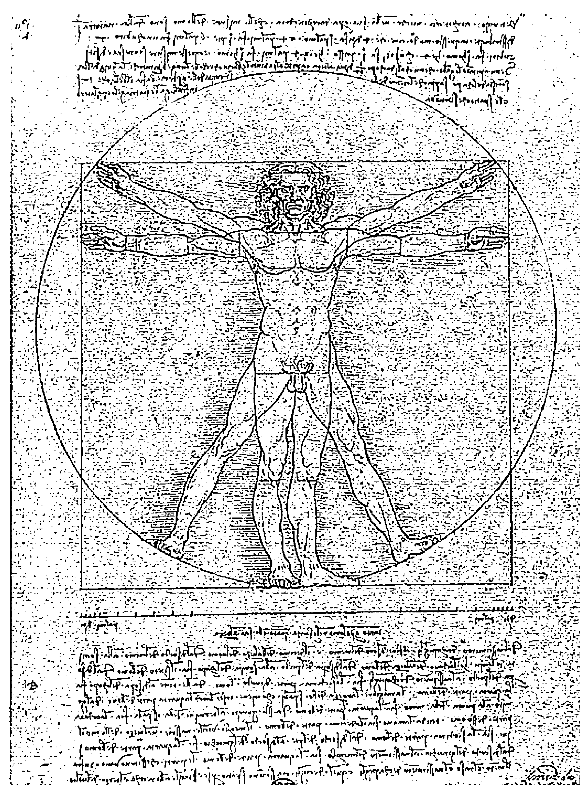

因為五芒星圖形歷史上傳承已久，因此基督教發展初期，五芒星的正向意義也會被沿用，來代表耶穌在十字架上的象徵，兩手與兩腳踝，加上右邊肋骨旁的傷口，稱為「耶穌五傷」或「聖傷」(Stigmata)。《加拉太書》第 6 章 17 節：「從今以後，人都不要攪擾我，因為我身上帶著耶穌的印記。」此一語成為表明自己是基督使徒的代表，因為身上已然帶著耶穌的印記，而《聖經》中也有多位聖人身上帶著五傷，其中以能與動物溝通的聖方濟各 (Sanctus Franciscus Assisiensis，1182-1226) 最為知名。[111] 目前約有五十個國家的國旗上有五芒星，但都是使用正五芒星。

也正因為基督教將五芒星與耶穌五傷形象相結合，延續從蘇美文明中傳下來的正向意象，所以當五芒星呈現「倒五芒星」時，尖角往下延伸，意味著人類精神的沉淪，進而成為撒旦的象徵。倒五芒星被新柏拉圖主義者視為「五角之神」，分別代表著雄山羊、雄綿羊、雄牛、雄鹿四種有角的生物，第五角即是人類。五角之神的偶像是「巴弗滅」(Baphomet)，現今世人熟知的三眼羊「巴弗滅」形象，主要是根據十九世紀，奠定近代魔法基礎的法國魔法師李維 (Éliphas Lévi，1810-1875) 在《先驗魔術：其學說和儀式》(Dogme et Rituel de la Haute Magie) 一書中所描繪的形象，與五芒星的形象相容，呈現出長有雄山羊頭人身的形象，成為撒旦的標誌。

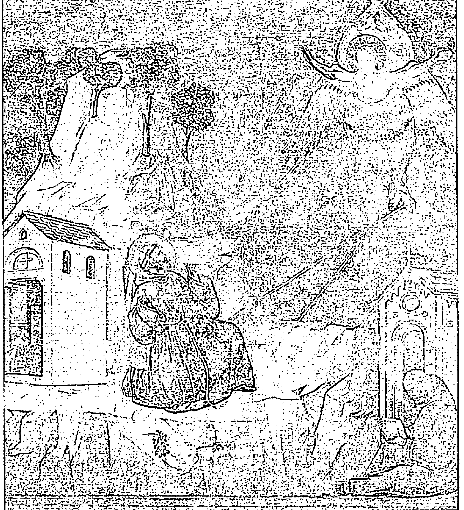

◀《聖經》中也有多位聖人身上帶著五傷，其中以能與動物溝通的「聖方濟各」最為知名。圖為喬托的《聖方濟受聖烙》。[112]

## 蝙蝠：

在中文語系中，「蝠」與「福」音同形似，因此蝙蝠逐漸成為了傳統中的吉祥寓意，在中國傳統圖案中，常見大量且造型動人的蝙蝠，「五蝠圖」即是象徵人生至高的五種福氣 —— 「壽、富、康寧、修好德、考終命(有善終)」聚齊，而其晝伏夜出的特性，傳統上稱為「伏翼」，亦與「福」同音。中國所繪之蝙蝠通常不太寫實具象，比較像意義上的傳達，因此蝙蝠展翼常與「雲紋」造型相似，雲紋多有象徵如意高升之意，是中國傳統瑞祥紋樣中相當典型的一種，其中「蝙蝠紋」更是直接將雲紋和蝙蝠造型相結合，取「進福」之意，希望福氣能像蝙蝠飛臨般從天而降。

然而，蝙蝠從十六世紀開始，在西方其形象開始和吸血鬼的形象相連，[113] 因為蝙蝠吸血、臉部有明顯獠牙，且背後有一副與身體相較下顯得巨大的翅膀，再加上它們晝伏夜出的特性，與象徵著永世黑暗的吸血鬼概念相仿。西方對神祇身上翅膀造型的想像，在藝術創作中常見，天使們擁有的是鳥翼、古希臘神話中「賽姬」(Psyche) 擁有的是蝴蝶翼，而惡魔則是因為與吸血鬼概念相連，而吸血鬼在傳說中亦可召喚蝙蝠，甚至換化成蝙蝠，因此蝙蝠也隨著吸血鬼的形象而普及，成為與惡魔特性相仿的標誌。柴可夫斯基 (Pyotr Ilyich Tchaikovsky，1840-1893) 於 1876 年所創造的芭蕾舞劇《天鵝湖》，把公主奧傑塔 (Odette) 在天鵝湖畔變成了白天鵝的惡魔，舞台上亦常見以蝙蝠造型呈現。

## V 大祭司
The Hierophant

- 永恆之賢者
  The Magus of the Eternal
- 金牛之星座牌
- 金星入廟、月亮入旺
- 希伯來字母：Vau，釘子

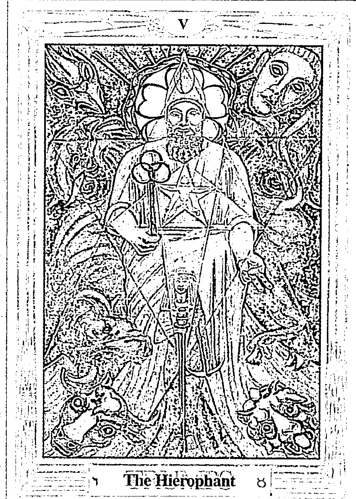

偉特塔羅中「教皇」牌有獨尊男性的特性，但是克勞利打破了這樣的設定，托特的「大祭司」牌中，呈現出「泰勒瑪」與《律法之書》中的豐富象徵，讓傳統象徵「歐西里斯紀元」的教皇退位，讓「赫魯斯紀元」的教皇在畫面中呈現。前方「伊西絲」女神手持月亮，與金牛座連結的此牌中月亮入旺，《律法之書》第 1 章第 3 節以「每一位男女都是一顆星」(Every man and every woman is a star)，清楚說明「赫魯斯紀元」中男女之間的平等位置，「她是新紀元的維納斯，不再只是她的男性的使用工具，而是武裝且具戰力的」。[114] 至此，她手中的長劍向上射出一道光芒，直線往上的光在「教皇」的胸口呈現出五芒星，靈活舞動的嬰兒「赫魯斯」[115] 出現其中，再往上映照在「教皇」滿意且微笑的臉龐，餘光向四方散發形成了一顆六芒星，神性的大宇宙六芒星中蘊含了世俗的小宇宙五芒星，男女位階沒有高低，宇宙氣場諧和運行，「這張牌主要表示的是微觀世界和宏觀世界的結合」。[116]

「國王」牌是打下江山的象徵，而滿滿橘棕色系的「大祭司」牌，則是隨之而來的信任和禮教，一切均採懷柔政策，是另一種統治的展現。「大祭司」端坐大象造型座椅，有神意的支持下，他地位自然穩若泰山，背後一強壯牛隻貫穿整個畫面，在此象徵地水火風的四個固定星座：金牛(牛)、天)、天蠍(鷹)、獅子(獅)、水瓶(人)四大元素聚齊，[117] 象徵煉金術中鹽、硫、汞聚齊的三圓圈權杖在握，「教皇」正式登基，作為象徵神界在地上的最高統治者，他伸出左手，往下降福地面芸芸蒼生。

此牌背景是黑色，因為將所有的顏色調和在一起，最終即是黑色，因此黑色的能量無所不容，是象徵天蠍座與後海底輪的顏色。[118] 黑色令人沉靜，黑色也令人恐懼，是海納百川的懷柔政策、也是禮教道德的規範束縛，是人道關懷，也是精神控制。教皇背後五瓣綻放的薔薇造型窗如光圈閃耀，而「大祭司教皇」的冠冕如同陽具般呈現在窗前，[119] 窗上的九根釘子，是此牌與希伯來字母「Vau」(釘子)的對應，這一切都是「釘」在象徵男女結合的美麗紅色花窗、釘在頂輪上的純潔白光、釘進潛意識中的暗黑慾海，鴿與蛇在窗框上永恆纏繞輪轉，[120] 世間所有都是一體兩面映射呈現，端看人類如何能虔誠做到「將自己如處子般奉獻給與你的神聖守護者之認知與對話」[121]，並能有智慧地辨識「其餘的一切皆是陷阱」[122]。

## XV 惡魔
The Devil

- 物質之門的主宰
  The Lord of the Gates of Matter
- 時間驅力之子
  The Child of the Force of Time
- 魔羯之星座牌
- 土星入廟、火星入旺
- 希伯來字母：Ayin，眼睛

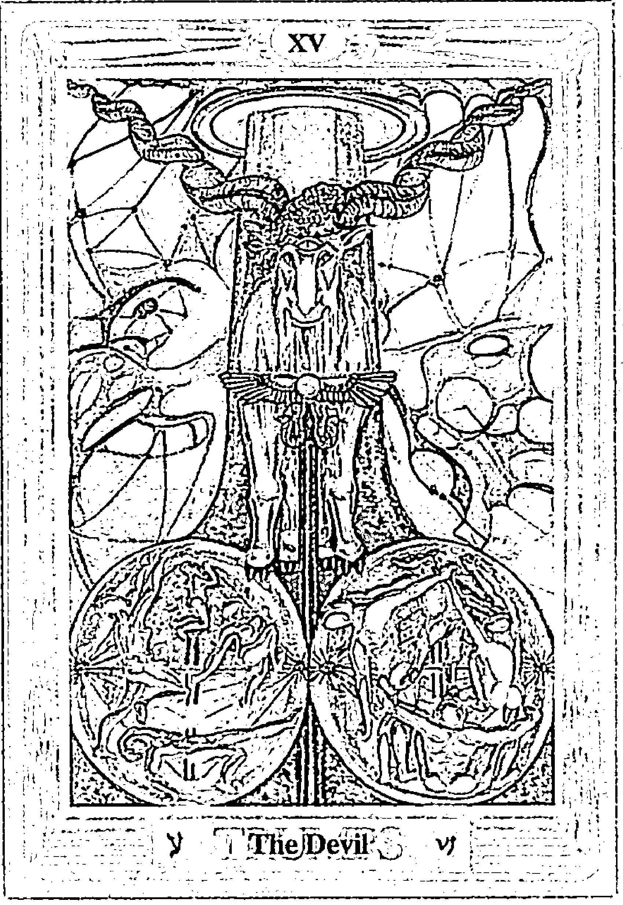

在黃道十二宮中，位於天頂(Zenith)的摩羯座，「是所有星座中位置最高的，它是在地球巔頂帶著慾力跳躍的山羊」[123]，與「惡魔」牌的能量連結，讓畫面中雄壯的三眼公羊[124]面帶微笑，自信地與我們的目光直接對視。作為物質之門的入口，「惡魔」牌象徵著世俗中所謂的強者，它是物質世界的關鍵門戶，所有人類渴求的榮華富貴，均須通過此入口才能探求，頭上扭曲的雙角是強而有力的慾望糾結，「代表能量的運作方式」[125]，是想盡所有辦法去得到物質財富，奮力一搏只為能擠進名位權力中，慾望如結實扭曲的兩角持續延伸，不間斷地蔓延至畫面外的天涯海角，不停歇地追求物質，直至生命終結。

「此牌代表創造能量的物質化形式」[126]，作為物質之界最強勢的牌，眼睛犀利的三眼羊是希臘神話裡半人半羊的牧神「潘恩」(Pan)的化身，克勞利稱它為「萬物生發之父」(All-Begetter)[127]，它不僅有希臘神話中赫密斯的「卡杜西斯」權杖(Caduceus)，它更擁有世間人類所追求與嚮往的能力和能量，這是一種偉大的衝動與創造，背後粗壯的「生命之樹」樹幹，如男性生殖器般向上穿過摩羯座守護星土星的星環，「在這個星座，火星耀升，顯示火的最佳形式，創造物質的能量」[128]，下方直達地球中心，「我是秘密之『蛇(Snake)』，盤起身體即將躍起，我的纏繞之中有愉悅。當我揚起頭，我和我的努特(Nuit)女神[129]合一。若我垂下頭並往前噴出毒液，則地面將會狂喜，我與土地合一。」[130]

前方兩顆球體是睾丸的橫截面，當中各有四對男女，男左女右，斷裂的雙線條是人類的染色體，新的生命開始萌芽，人類生命至此從睾丸和性行為中誕生，物質門戶的終極創造為萬人崇拜。背景的淡紫色，是代表靈性的紫色能量淡化，是物質能量「智慧」的彰顯，其上慾望本身的線條如精液噴灑，未受束縛陷入狂愛，原始的創造力量在空間中綿密展開。

這頭三眼山羊在開心地笑了，此牌對應的希伯來字母是「Ayin」(眼睛)，牠額頭的第三眼看穿了人類的一切，牠的創造力被後人指責為污穢、齷齪、噁心與不潔，但牠知道再怎麼污穢，也是生命創造的源頭。

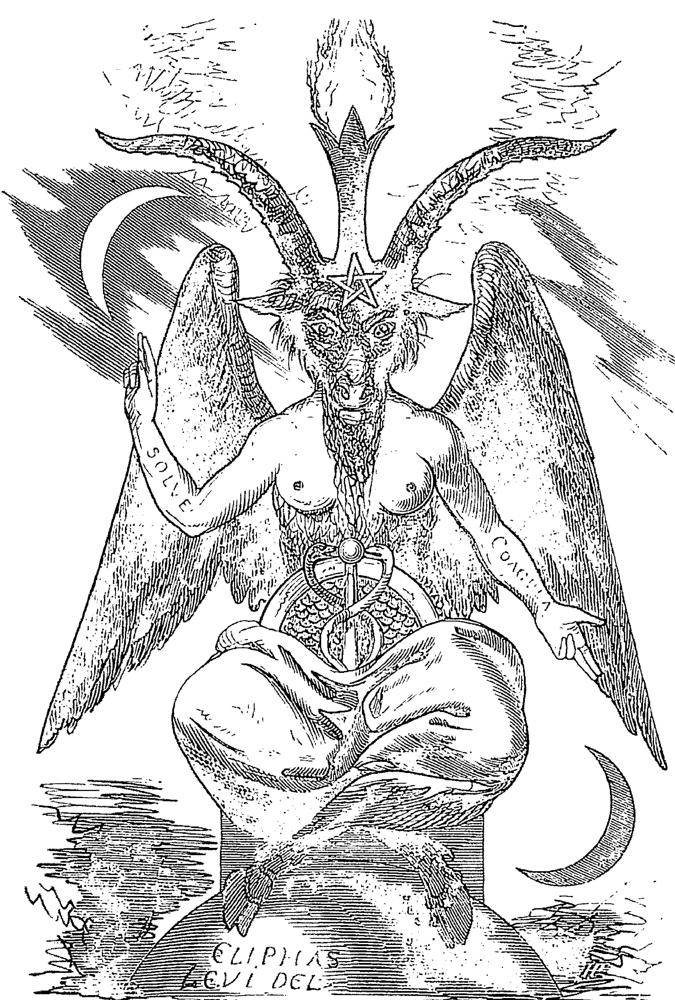

▲ 將五芒星與公羊頭型相結合的「巴弗滅」形象，出自法國神秘學家李維的書《先驗魔術：其學說和儀式》第二卷 [132]，是有名的基督教惡魔之一。此形象在托特塔羅的「惡魔」牌中有第三隻眼睛，而偉特塔羅牌中則沒有呈現。

## ∞ 註釋 ∞

[105] 其實在《聖經》中，通篇未說明耶穌交給彼得是幾支鑰匙，不過當《聖經》中的文字要以圖案來呈現時，就必須得清楚地畫出是幾支鑰匙，這一向都是文學與視覺藝術上因媒材不同所必須面對的課題。從設計上來說，單獨一隻鑰匙，在畫面上構圖不易達到視覺上平衡，因此可以合理推測，若是呈現兩支的話，可解釋成一支就是「綑綁的鑰匙」，另一支就是「釋放的鑰匙」，而兩者交叉放置，又可形成一十字架，讓教皇代表圖案更具有宗教上的識別度。

[106] 圖片來源：維基百科，https://commons.wikimedia.org/wiki/File:Emblem_of_the_Papacy_SE.svg。

[107] 皮埃爾·皮格特 (Pierre Paul Puget, 1620 -1694)，《手握天堂鑰匙的聖彼得》(St Peter Holding the Keys of the Paradise)，約作於 1653 至 1659 年，現藏於法國格蘭德坎普教區教堂 (Parish Church, Grandcamp)。圖片來源：維基百科，https://commons.wikimedia.org/wiki/File:Pierre_Puget_-_St_Peter_Holding_the_Key_of_the_Paradise_-_WGA18482.jpg。

[108] 此為徐志摩翻譯版本，原文為「To see a world in a grain of sand, And a heaven in a wild flower, Hold infinity in the palm of your hand, And eternity in an hour.」

[109] 達文西，《維特魯威人》，約 1487 年所作，現藏於義大利威尼斯的學院美術館 (Gallerie dell'Accademia)。圖片來源：維基百科，https://commons.wikimedia.org/wiki/File:Da_Vinci_Vitruve_Luc_Viatour.jpg。

[110] "But we now come to speak of the holy and sacred Pentacles and Sigils. Now these pentacles, are as it were certain holy signes preserving us from evil chances and events, and helping and assisting us to binde, exterminate, and drive away evil spirits, and alluring the good spirits, and reconciling them unto us." Anonymous (1655) [c. 1565]. "Concerning Pentacles and Sigils". Fourth Book of Occult Philosophy. Translated by Turner, Robert. Retrieved 29 August 2006.

[111] 關於聖方濟各對與動物之間，最有名的故事是成書於十四世紀末的《聖方濟各的小花》(Fioretti di San Francesco) 一書中提及，尤其是他對鳥傳教的故事更常見於西洋藝術中。該書蒐集了在聖方濟各死後的多種傳聞，摘取精彩片段集合而成。由於聖方濟各與動物間的愛與親密，所以他的生日 10 月 4 日，即是現在的世界動物日。

[112] 喬托 (Giotto di Bondone, 1267-1337)，《聖方濟受聖烙》(Stigmatization of St Francis)，1297 至 1300 年間作，為蛋彩濕壁畫作品，現藏於義大利阿西西 (Assisi) 的聖方濟教堂 (Basilica di San Francesco)。圖片來源：維基百科，https://en.wikipedia.org/wiki/Saint_Francis_Receiving_the_Stigmata_(Giotto)。

[113] 《牛津英語詞典》(Oxford English Dictionary)，頁 95-96。

[114] 《The Book of Thoth》，p79.

[115] 《The Book of Thoth》，p78.

[116] 《The Book of Thoth》，p78.

[117] 在克勞利《靈視與靈聽》(The Vision and the Voice) 一書 67 頁中，說明在第二十三重天中，老鷹變成代表風象的水瓶座，而天蠍座則變成水象的天使人頭。因此此牌的四元素排列與「命運之輪」和「世界」中不同。

[118] 人體的脈輪中，海底輪位於脊椎骨底部肛門附近的腺體中心，一般來說海底輪代表色為紅色，但接近肛門處的後海底輪，代表色為黑色。

[119] 《The Book of Thoth》，p79.

[120] 「我的星辰下懇告吧！愛即是那律法，憑藉意志去愛吧。你也不要讓愚者誤解了愛；因為愛和愛又是彼此不同。有鴿，也有蛇。」(Invoke me under my stars! Love is the law, love under will. Nor let the fools mistake love; for there are love and love. There is the dove, and there is the serpent.) 出自《律法之書》第 1 章第 57 節。Aleister Crowley. (1987). The Book of The Law. San Francisco, CA: Weiser Books.

[121] 《The Book of Thoth》，p255.

[122] 《The Book of Thoth》，p255.

[123] 《The Book of Thoth》, p105.

[124] 現今世人熟知的「巴弗滅」（Baphomet）惡魔形象，主要是根據法國魔法師李維在《先驗魔術：其學說和儀式》一書中所描繪的形象。

[125] 《The Book of Thoth》, p107.

[126] 《The Book of Thoth》, p105.

[127] 《The Book of Thoth》, p105.

[128] 《The Book of Thoth》, p105.

[129] 埃及神話中象徵夜空或星星之女神。

[130] 《律法之書》第 2 章第 26 節。

[131] 《The Book of Thoth》, p106.

[132] 圖片來源：維基百科，https://commons.wikimedia.org/wiki/File:Baphomet.png。

## 數字 6 與 16

## 溫情依偎與無常驚懼

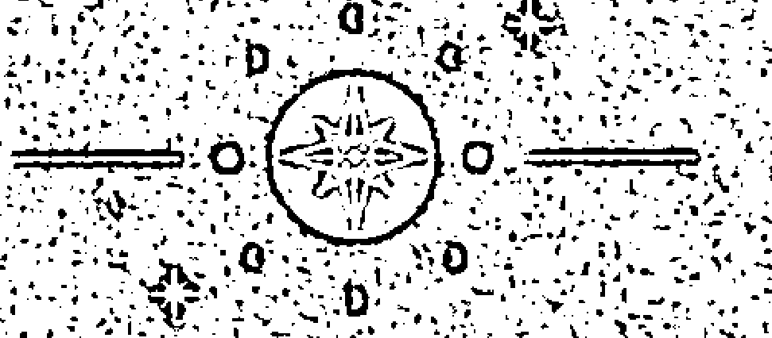

偉特塔羅：VI 戀人 The Lovers、XVI 塔 The Tower

托特塔羅：VI 戀人 The Lovers、XVI 塔 The Tower

> 情不知所起，一往情深；恨不知所終，一笑而泯。
—— 金庸《笑傲江湖》[133]

> 真愛之路永不平坦。
—— 莎士比亞《仲夏夜之夢》[134]

## VI 戀人
The Lovers

- 亮麗桃花的機緣
- 雙子之星座牌
- 風之元素牌

伊甸園中的亞當與夏娃，還沒有吃下「知善惡樹」上的果實前，「當時夫妻二人赤身露體，並不羞恥」。(創世紀 2:24-25) 他們在有四道河流滋潤的伊甸園中，在有金子、珍珠和紅瑪瑙的哈腓拉全地，在無需工作的情況下，享用著園中樹上源源不絕的各式果實，單純相愛相互陪伴，關係平衡且情感相繫。擁有治癒術的總領天使聖拉斐爾 (Saint Raphael the Archangel)，在畫面上方守護著伊甸園的生命之樹，兩人擁有天使拉斐爾的祝福，以及上帝無盡的寵愛。

然而一切美好的現況下，卻隱藏著重重恐怖危機。與雙子座連結，其實這場尚未經過亡魂與煉獄烈火考驗的和諧並不深入，如風元素般的渙散特質，讓一切美好淪為夢境般的表面假象，隨時可能被驚醒。後方山脈光禿，地上也不見豐盛的樂園花草，「知善惡樹」上撒旦化身的蛇已然出現，牠緊緊纏繞樹幹，頭部前傾開始向夏娃輕聲低語，亞當身後的「生命之樹」火焰燃燒，令人聯想到不久後，上帝即將「在伊甸園的東邊安設基路伯和四面轉動發火焰的劍，要把守生命樹的道路」(創世紀 3:24)，把通往生命樹的道路向墮落人類全然封閉，人類至此喪失了獲得永生的資格，從此「女人懷胎的苦楚加增，生產時要受苦楚；要戀慕丈夫，及被丈夫管轄，男人則要受咒詛，要汗流滿面才得餬口，直到他歸了土；從此需終身勞苦才能從田地裡得到食物，而地會長出荊棘和蒺藜」。(創世紀 3:16-19)

十七世紀英國詩人米爾頓 (John Milton, 1608-1674)，取材自《聖經·創世紀》，創作了宏偉文學史詩《失樂園》(Paradise Lost)，磅礴又哀愁地展開這段人類的墮落史，天使長米迦勒 (Michael) 長劍一揮，人類再也回不到過去的短暫燦爛。「此情可待成追憶，只是當時已惘然」成了此牌的最佳註解，也成了人類涉遍此生的懊悔與苦痛。

▲ 德國文藝復興巨擘杜勒，於 1504 年所創作的銅版畫《亞當與夏娃》。由此圖中兩人已用無花果葉遮身，以及亞當清楚的喉結來看，可知此時兩人已吃下「知善惡樹」果實。

## XVI 塔
The Tower

- 晴天霹靂的無常
- 火星之行星牌
- 火之元素牌

不在計畫中，也沒有預告，「死神」牌象徵人世間有常的折磨，但「塔」牌是象徵在一切美好的狀況下瞬間無常崩解。玄秘的冥王星還會在呈現一個層次的創傷與苦痛之後，帶給人轉化後的淬煉清醒，而代表限制與壓抑的土星，在這位「嚴格督促者」的鍛鍊和考驗之後，還能在辛苦努力的領域中有所成就。然而與「塔」牌對應的火星，一如畫面中暗夜空中，那帶有箭頭的強力閃電，這是絕對性的破壞，無常的特性令人靈魂崩解，毫無心理上的準備期，所有震撼性的毀滅爆發力，帶給人莫名被掠奪一空的驚嚇，驚悚中只留下惶恐與空洞。

高塔，是人類讓它拔地而起的；皇冠，也是人類相互競爭與爭奪而來的，但是莫名的天災與無常，瞬間讓所有的努力立即崩解。高塔的三道窗戶均冒出火焰，象徵人類身心靈三部分全部著火，再也無處可逃，只能從高樓墜下。暗黑空中二十二道火焰漂浮，灰色煙霧吞沒了天空。在物質之界中，象徵權威的皇冠，此時非但無法保護自身免於兇惡，建築在懸崖上的高塔，此時反而成為奪走生命的最終場域，一切像是一場沒有邏輯的玩笑，摔落地面時讓過往所有價值觀與信仰一併崩塌。

然而，建造這座高聳於山且深入雲端的山巔之塔，人類沒有為了實踐夢想而排除萬難奮力前行嗎？獲得這頂金黃閃耀、無比權威的皇冠，人類沒有極盡競爭費盡心智嗎？為何經歷過所有的努力，還是得到上天如此的對待呢？這座「塔」是人造建築，意在通天，人被蒙蔽在自以為是的象牙塔中，如井底之蛙般地沾沾自喜眼前成就，以為已經站上了巔峰，在制高點上凌駕一切，進而能與造物主和自然界的力量抗衡，卻忽視了如此作法所可能會招致來的危難與後果。自然界有一道看不見的天秤，因果關係和宿命現象自然有其徵兆，時機到它自然會出手平衡一切，「眼看他起朱樓，眼看他宴賓客，眼看他樓塌了」，人類輕率驕傲所致的業力，讓有些無辜之人遭受無妄之災，但是更多時候還是全人類為自己種下了罪，必然承受隨之而來的天來的天譴，巔峰與跌落，一步之遙而已。

## ∞ 傳統圖像意義 ∞

## 巴別通天塔：

這是《希伯來聖經》（或稱《舊約全書》）中一個駭人又深具警惕意味的故事，本來享有共通語言的人類，決定修建一座城市，和一座能通天的高塔。「來吧，我們要建造一座城和一座塔，塔頂通天，為了揚我們的名，免得我們被分散到世界各地。」（創世紀 11:4）上帝見此情形，就打亂他們的語言，讓他們再也無法順暢溝通，「我們下去，在那裡變亂他們的口音，使他們的言語彼此不通。於是耶和華使他們從那裡分散在全地上；他們就停工，不造那城了。」（創世紀 11:7-8）人類從此不能再聚集一地，並因為語言的分歧，而時常造成彼此間的不理解，甚至釀成誤解。

◀ 老彼得·布勒哲爾（Pieter Bruegel de Oude，約 1525-1569）於木板上創作的《巴別塔》（The Tower of Babel），1563 年作，現藏於維也納藝術史美術館。

其實我們現在所稱的「巴別塔」（Babel）一詞，《聖經》中只以「那座城和那座塔」稱之，並無提及「巴別塔」。根據《聖經·創世紀》第 11 章第 8 節中的解釋，因為該城的名字「巴別」（意為「混亂、變亂」），所以在「巴別」城中的塔，後人就自然稱為「巴別塔」。人類承受天恩，擁有共通語言並能齊力團結，自信滿滿地擘劃建築藍圖，這一切本應受到上帝認同，但卻因為高漲的慾望，妄自想蓋「通天塔」，幻想從此人類的生活就可與天等齊，與上帝同功，這樣的態度使人類走向滅亡，自然得到了五雷轟頂、無法逆轉的終極懲罰。

儘管「巴別」的故事出於西元大約前一世紀，但是此概念現在還是廣為世人所知，不僅仍存在口語運用中，當代影視作品也常常出現以此概念而生的劇本，例如 2006 年的電影《火線交錯》（Babel）電影中，長達 142 分鐘片長，以三個故事交織出人性的惡，闡述人類必先面對醜陋黑暗之後，才願意去看清彼此的盲點，這是人性無法避免的悲哀。而 2021 年的韓國電視劇《黑道律師文森佐》（韓語：빈센조，英語：Vincenzo），劇中「巴別集團」的掌權者，一心想建造「巴別塔」來掌控權勢，那野心為社會帶來的紛亂亦是取自《聖經》中的概念。

荀子言：「人性本惡。」也許經過試煉，並歷經喪失與痛苦之後，人類才願意節制自己的慾望，嘗試矯正試圖步入正軌，但是目前看來，人類還是時常在重覆蓋巴別塔的悲劇，忘了「人定勝天」永遠只是個幼稚的讖語。

## VI 戀人
The Lovers

- 強大諸神之聖諭
  The Oracle of the Mighty Gods
- 雙子之星座牌
- 水星入廟
- 希伯來字母：Zain，劍

1616 年在史特拉斯堡所編輯完成的德文書《克里斯汀·羅森克洛茲之煉金術婚配》(Chymische Hochzeit Christiani Rosencreutz anno 1459)，以七個旅程描述了克里斯汀被邀請去一個城堡，協助國王皇后的歡樂婚禮。此書被視為玫瑰十字會的第三份宣言，而這場「化學婚禮」象徵了煉金術中的「溶解」(solve) 步驟（「凝結」(coagula) 則會在「藝術」(煉化) 牌呈現），而托特塔羅的「戀人」牌，即是呈現了這場「化學婚禮」的場景。

作為煉金術中的第四張大牌，畫面中呈現出眾多的寓意。身披蛇紋衣袍的黑國王 (即「皇帝」牌中的國王)，與身穿蜜蜂衣袍的白皇后 (即「皇后」牌中的皇后) 正要進行婚禮，婚姻是「溶解」的儀式，但真正重要的是代表「凝結」的小孩，以蛇纏繞為形象的「奧菲克祕卵」，出現在牌面中央正下方，這顆古希臘奧菲斯傳說裡的宇宙蛋，其中能孵化出原始神祇的祕卵，出現在「皇帝」與「皇后」牌中的紅白染缸，現在以紅獅與白鷹的形象出現在祕卵兩旁，這雄性與雌性的象徵並陳，清楚呈現經過這場儀式，「代表歸屬於雌雄原則之下的一切生命本質」即將誕生。

給予兩人婚禮祝福的神祇是淡紫紅色，淡紫紅是藍、紅和白的混合色，代表著一切尚在模糊朦朧與摸索的階段，兩人戴著不同形式的皇冠，因此並還沒有達成共識或具有堅固的革命情感，兩人膚色一黑一白，雖試圖想融合但是還是有些過程需要歷練。老鷹 (水元素) 跟獅子 (火元素) 是兩個不同的能量體，儘管水和火是情感元素，但兩者分站兩旁對望沒有融合，在一切都看似應該會很不錯的狀況下，還是很有朦朧距離感。

前方兩個小孩的膚色與結婚雙人互換，一個拿矛和棍子 (象徵實際層面有可能因為個性不同而產生的痛楚)，一個拿聖杯和玫瑰 (象徵情感中必須存在的浪漫和感性)，此四個物件亦是四大元素的代表 (矛象徵風元素、棍子象徵火元素、聖杯為水元素、玫瑰由泥土中生長而出，象徵土元素)，強調看起來美好條件齊聚，但是其實還有很多變數存在，或是更殘酷一點，「賢者」牌中的四大元素也是齊聚但一切尚未啟程，「戀人」牌中未來會面臨的磨難也根本還沒真正開始。

畫面左右上角各有一位女性，左上角那一位皮膚看起來比較髒一點的是「莉莉絲」(Lilith)，右邊皮膚比較乾淨的是「夏娃」。「莉莉絲」最早出現於蘇美神話，同時在猶太教文學中也有記載，她被指為「亞當」的第一個妻子，由上帝直接用泥土所造，因不願雌伏於「亞當」身下而自行離開伊甸園。儘管《聖經》中完全沒有提到「莉莉絲」，但是根據《創世紀》第 1 章第 27 節中，上帝於第六日「就照著自己的形像造人，乃是照著他的形像造男造女」，是否意指在第六日即造出女性？直到《創世紀》第 2 章第 22-23 節中，「神就用那人身上所取的肋骨、造成一個女人、領他到那人跟前。那人說、這是我骨中的骨、肉中的肉、可以稱他為女人、因為他是從男人身上取出來的」，至此「夏娃」才正式出現。約七至十一世紀成書的聖經外典《便西拉的字母》(Alphabet of Ben-Sira)中，亦有記載「莉莉絲」是「亞當」的第一個妻子一說，此牌畫面中同時將兩位最初的女性一同呈現，「莉莉絲」象徵真實的情感，「夏娃」象徵是我們期待中的情感，此牌中的兩人揭示了愛情的人性面和童話面。

主持這場婚禮的「隱者」(即是「隱者」牌中的隱者) 臉孔，而畫面中結婚的兩人和身後兩個小孩，面容均無法被正視，戀愛就是從未知開始，其實這張牌就是呈現出一個問號，尤其是「隱者」頭上準備射箭卻還朦著雙眼的邱比特，這箭的方向會是正確的嗎?此牌的希伯來對應字母是「Zain」，意指「劍」，這場婚禮也的確在彎曲長劍所架構的拱門下進行的，主婚者「隱者」雙手扭轉著一個「梅比斯環」，確切知道的，只有這會是一場無間的循環，難以跳脫。

## ∞ 傳統圖像意義 ∞

## 盲目的邱比特：

英國文學家莎士比亞 (William Shakespeare，1564-1616) 關於愛情的經典名句，不論是《威尼斯商人》(The Merchant of Venice) 中的「愛情是盲目的，戀人們瞧不見他們自己所幹的傻事」(Love is blind and lovers cannot see the pretty follies that themselves commit.)，還是《仲夏夜之夢》(A Midsummer Night's Dream) 中的「愛不是用眼看，而是用心探，因此有翅膀的邱比特是朦眼的」(Love looks not with the eyes, but with the mind, And therefore is winged Cupid painted blind.)，都讓我們看到邱比特戴著朦眼布，在拉開愛之弓準備射箭的形象。

其實在古典文學中，邱比特是沒有朦眼的，古羅馬後期的著名詩人「普魯登修斯」(Aurelius Prudentius Clemens，約於公元四至五世紀) 在《靈魂的鬥爭》(Psychomachia) 一書插畫中，邱比特是睜著明亮雙眼。而到了喬叟 (Geoffrey Chaucer，1343-1400) 的《坎特伯雷故事集》(The Canterbury Tales) 中，「現在你得誠心聽我講來，他的確對你生了憐憫心，因為長時期以來你一心一意地侍候著他的瞎眼孫兒邱比特和美麗的維納斯」一文，可知在十四世紀，已經有「瞎眼邱比特」的概念出現。皮耶羅·德拉·弗朗西斯卡 (Piero Della Francesca，1415/20 -1492) 的著名教堂壁畫《朦眼邱比特》(Cupid Blindfolded)，則清楚呈現「朦住雙眼的邱比特」之造型，傳達出「愛情是盲目的」。

其實愛情的毫無邏輯性與無常，常讓人嚐盡甜美與苦痛，人類把愛情的管轄權，歸於一個朦著雙眼亂射箭的小天使，自然是對愛情有一番深刻體會，才會創造出這樣的愛神形象。在西洋藝術作品上，不乏有維納斯把邱比特弓箭折斷，訓誡他「不可再盲目亂射箭導致人間愛情大亂」之作，也有直接拿剪刀要剪邱比特翅膀的驚悚畫作，讓他不能再隨意飛翔擾亂人間情感。其中兇狠對待邱比特的一張作品，是「阿基莫維奇」(Ivan Akimovich Akimov，1754-1814) 於 1802 年所作的《薩圖恩割掉邱比特翅膀》(Saturn Clipping the Wings of Cupid)，只見邱比特被壓在薩圖恩腿上，一臉恐懼哀戚，弓箭散落一地，而薩圖恩臉上反而出現一抹深沉的微笑，看來這位俄國的藝術家應該也曾深受愛情折磨，才會將此主題表達得如此傳神。

△ 弗朗西斯卡的《朦眼邱比特》壁畫，現存於義大利的聖弗朗切斯科大教堂 (Church of San Francesco)。

▷ 阿基莫維奇，《薩圖恩割掉邱比特翅膀》，現存於莫斯科的特列季亞科夫畫廊 (State Tretyakov Gallery)。

## XVI 塔
The Tower

- 強者東主之主
  The Lord of the Hosts of the Mighty
- 火星之行星牌
- 希伯來字母：Pé，嘴

是一場瓦解與驟變，火星破壞之力全然展現。不同於偉特塔羅的「塔」牌破壞力道來自天上的閃電，在托特塔羅中，此牌連結的希伯來文為「Pé」，是「嘴」的意思，在此烈火由冥府之口噴射出九道火焰摧毀高塔基座，吞噬人世間，「牌的底部顯示舊的時代被閃電、火焰、戰爭毀滅，右邊是一張大嘴，噴出火焰射向建築物的地基」。《托特之書》中提到「濕婆之眼」(the Eye of Shiva)已然張開，二十七道火焰勢必燃毀滅絕一切，高塔上的守衛們已不成人形紛紛掉落，黑色背景的絕望，是因為人無法接受已知的東西被毀壞，是人對毀滅產生了預期心態而無法接受，在在加強了「塔」這張牌的力道，無常的無可迴避性造就了錯愕與無可名狀的恐怖。

《律法之書》中著名的第 1 章第 57 節中，提到的鴿子與蛇，在此牌中一同呈現，下方的塔亦然就是偉大奧祕的「神之屋宇」(House of God)，右方獅蛇「克奴比斯」(Xnoubis)或「阿博拉克斯」(Abraxas)這是慾望的兩種形式，一個為求生，一個渴求死，「它們代表陰性與陽性的衝動，後者之高尚，或許是基於對前者徒勞的認知」。而象徵毀滅的「塔」牌中，也出現了象徵和平和希望的鴿子咬橄欖枝圖像，代表了人類自己的重整，這又是一死一生的兩股拉扯力道。

心理學家佛洛伊德(Sigmund Freud，1856-1939)提出「死之本能」(Thanatos) 是人生存最基本的動力，為了抗拒死亡，人才衍生出了「生之本能」(Eros)，物種為了求生而進行生殖繁衍時，會衍生分化出各種慾望，然而對慾望的追求，會讓人面臨重大壓力與焦慮，因此原始的「死之本能」隨之浮現，並會產生傷害自身(自傷自虐造成身心創傷)，或傷害社會(小到傷害他人大到發動戰爭)的攻擊行為。這燦爛的「生與死」、「建構與破壞」對立，榮格在其著名論述「阿尼瑪／阿尼姆斯」(Anima/Animus)原型概念，亦然再現人類心理對立與融合的要素，恍若中國陰陽符號中，陰中有陽，陽中有陰，萬物生於死，而有死才能生。

求生是所有物種最基本的生物本能，人類庸庸碌碌於世間奔走，為的不外乎就是讓自己在世間的數十年中，能夠有更好的生存環境、條件與機會，甚至能滿足自由尋歡作樂這種「放縱的生」的慾望，然而在所謂積極奮鬥努力的過程中，我們一刻不停地往死的境地前行，隨之而來的過度辛勞，與現實壓力所帶來的身心創痛，更加速把自己的脖子往死神鐮刀靠近，這一切「求死」的過程，反思背後動機其實還是「保生」，我們努力奮鬥的一切存有，全都奠基在死亡概念之上。

不論隱居深山或漂浮紅塵，誰都逃不過這樣的輪迴宿命，梵天(Brahma)、毗濕奴(Vishnu)和濕婆(Shiva)依然不斷地創造、維持和毀滅宇宙。「塔」牌的力道單純表現出這樣的宇宙恆常，畫面呈現重建之前的毀滅，「擊毀你個人的自我的堡壘，你的真理將會從廢墟中自由湧出！」

## ∞ 傳統圖像意義 ∞

## 白鴿：

在基督教教義中，鴿子一向是聖靈的標誌，「我曾看見聖靈，好像鴿子從天上降下來，停留在他的身上」（約翰福音 1:32）。在許多西洋畫作中也常見此異象出現在基督受洗、三位一體或天使報喜等主題當中，可知其形象在基督教中的重要性。

關於銜咬著橄欖枝的鴿子形象，主要是來自於《聖經》挪亞方舟的故事，當洪水一直未退，挪亞「他又等了七天，再把鴿子從方舟放出去。到了晚上，鴿子回到他那裡，嘴裡叼著一個新擰下來的橄欖葉子，挪亞就知道地上的水退了」（創世紀 8:10-11）。也因此白鴿又與「希望」概念相連。

至於今日大眾所熟悉的白鴿「和平」意象，主要是因為西班牙畫家畢卡索 (Pablo Ruiz Picasso, 1881-1973)，他對鴿子形象的創作相當早，在 1901 年即有《手捧鴿子的孩子》(Child With a Dove) 一作，在體驗了過世界大戰的暴力與殘酷，他在 1949 年為巴黎第一屆國際和平會議，創作了版畫作品《和平鴿》，1950 年 9 月，畢卡索又畫了一隻鴿子給在華沙召開的第二屆世界和平大會作為紀念，至此白鴿成為了宣揚和平的重要圖像標誌。

## ∞ 註釋 ∞

[133] 前半句應改自明代湯顯祖的《牡丹亭》：「情不知所起，一往而深，生者可以死，死可以生。生而不可與死，死而不可復生者，皆非情之至也。」

[134] 此譯文選自莎士比亞·瑪麗蘭姆 (2017.04)。《仲夏夜之夢》。蕭乾 譯。台北：格林文化，頁 3。原文：The course of true love never did run smooth.。

[135] 這四條從伊甸流出滋潤園子河，《聖經·創世紀》第二章記載分別是比遜河、基訓河、底格里斯河、幼發拉底河。

[136] 天使拉斐爾之名意為「神已治癒了」，能救治眾人於疾病的痛苦，並療癒人的信仰，由於也是祂傳授了挪亞建造方舟的知識與技巧，因此在挪亞方舟主題藝術上，可見到藝術家在作品中表達祂的形象。

[137] 出自唐朝詩人李商隱（813-858）的七言律詩《錦瑟》。

[138] 杜勒（Albrecht Durer，1471-1528），《亞當與夏娃》（Adam and Eve），1504 年所作，現藏於美國大都會博物館（The Metropolitan Museum of Art）。圖片來源：美國大都會博物館，https://www.metmuseum.org/art/collection/search/336222。

[139] 出自於清代文學家孔尚任在劇本《桃花扇》中的作詞。

[140] 圖片來源：維基百科，https://commons.wikimedia.org/wiki/File:Pieter_Bruegel_the_Elder_-_The_Tower_of_Babel_(Vienna)_-_Google_Art_Project_-_edited.jpg。

[141] 「玫瑰十字會」英文名為 Rosicrucianism，起源於中世紀末的一個歐洲的秘傳組織，以玫瑰和十字作為象徵代表。

[142] 《The Book of Thoth》，p83.

[143] 潘諾夫斯於 1939 年出版的《圖像學研究：文藝復興時期藝術的人文主題》一書中，第四章〈盲目的丘比特〉，對此主題有精闢研究。Erwin Panofsky. (1972). Studies in Iconology: Humanistic Themes in the Art of the Renaissance. New York: Harper & Row.

[144] 圖片來源：維基百科，https://commons.wikimedia.org/wiki/File:Piero_della_Francesca_-_Cupid_Blindfolded_-_WGA17587.jpg。

[145] 圖片來源：維基百科，https://commons.wikimedia.org/wiki/File:Ivan_Akimov_Saturn_.jpg。

[146] 《The Book of Thoth》，p107.

[147] 《The Book of Thoth》，p108. 濕婆（Shiva）為印度教三大主神之一，神話中祂額上的第三隻眼，能噴出毀滅一切的神火。

[148] 《The Book of Thoth》，p108.

[149] 「克奴比斯」是埃及「諾斯提克」（Gnostic）的太陽能圖標，常被置於寶石和護身符上防治疾病與被毒害，造型是一個由獅子的頭和蛇的身體組成的複合體，從頭部發出光束，有時還帶有黃道十二宮的標誌。

[150] 基督教認為「阿博拉克斯」為創造出邪惡物質界的元兇，等同惡魔。

[151] 《The Book of Thoth》，p108-109.

[152] 《The Book of Thoth》，p259.

[153] Mosaics in the Cathedral of Monreale，約 1180 年代，位於義大利西西里島，巴勒莫市蒙雷阿萊教堂（Duomo di Monreale）。圖片來源：Web Gallery of Art，https://www.wga.hu/html_m/zgothic/mosaics/5monreal/。

## 數字 7 與 17

## 冥頑好勝與平淡超然

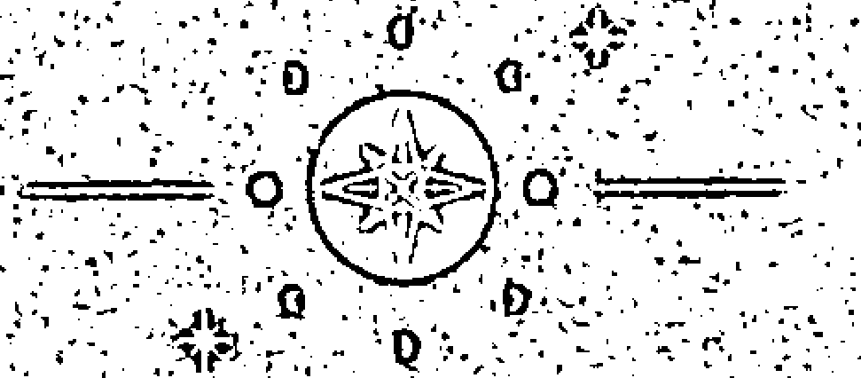

偉特塔羅：VII 戰車 The Chariot、XVII 星星 The Star

托特塔羅：VII 戰車 The Chariot、XVII 星星 The Star

> 窮通皆命也。得又何歡，失又何愁，恰似南柯一夢。
——元·馬致遠《女冠子·枉了閒愁套·么篇》

## VII 戰車
The Chariot

- 敏感好勝的艦隊
- 巨蟹之星座牌
- 水之元素牌

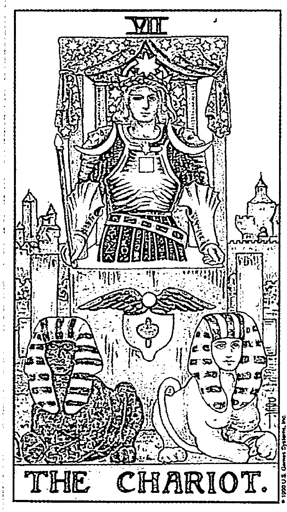

聳立於埃及卡夫拉金字塔旁的人面獅身像，是為世人所熟知的「史芬克斯」(Sphinx)形象，它的出現於古埃及神話中，是長有翅膀的雄性怪物。但是真正讓大眾所熟悉的，是希臘神話中的史芬克斯，它坐在底比斯城的懸崖上，過往行人必須回答它著名的謎語：「什麼動物早晨用四條腿走路，中午用兩條腿走路，晚上用三條腿走路？」而只有伊底帕斯 (Oedipus)猜中了正確答案，免於被撕裂吞食的命運(但卻也落實了他殺父娶母的宿命)。

偉特塔羅的「戰車」牌，連結了巨蟹座，戰車並沒有前行，後面呈現的是城池而不是戰場，雙輪戰車同時跨越了護城河與陸地，象徵「謎」的史芬克斯一黑一白，趴臥於地，捍衛特質遠勝過征服特質，而清楚的二元對立如何抉擇，端看駕車的將軍，如何在現實中的謎團中作出具有智慧的駕馭。他身上有著國王的盔甲、戴著象徵勝利的阿波羅桂冠、肩上有女祭司的弦月、腰配帶有占星符號的金帶，在金黃色的天空下，備戰狀態就緒，意志堅強、勇敢且自制，願意面對艱困工作。

將軍右手緊握長矛，這是一次關鍵性的動身啟程，他手上沒有控制人面獅身的僵繩，一切僅憑強大的意志力來駕馭。他雖充滿毅力準備好面對戰場，但面對未知的未來，若是意志力無法控制一切，建功立業的夢想仍是遙不可及。辛苦是通往成功的必經之途，但再多的勞苦，也不代表保證一定能到達成功彼岸，勝利者的靈魂，註定永遠只在永不放棄的時空中奔波前行。

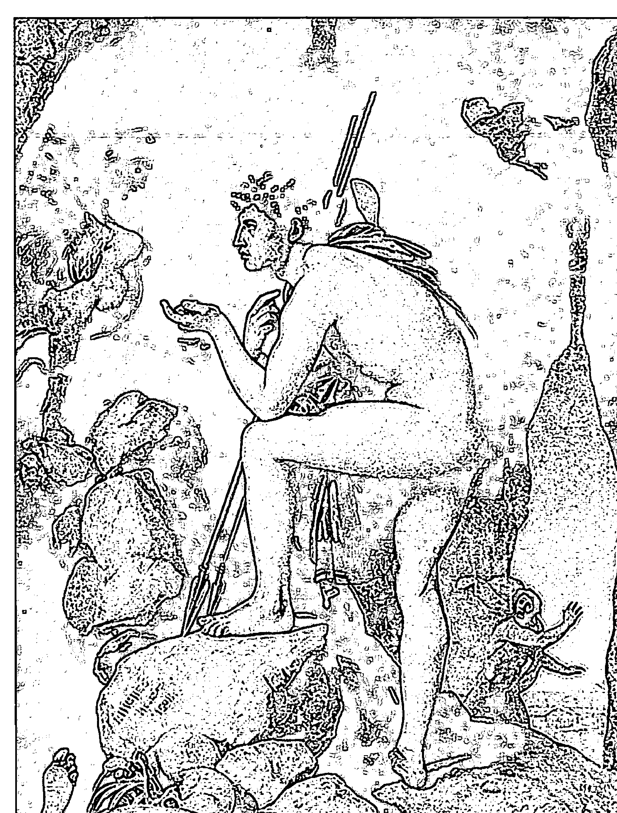

▶ 《伊底帕斯和斯芬克斯》（Oedipus and the Sphinx），並中呈現出史芬克斯（圖左）在底比斯城，提出「什麼動物早晨用四條腿走路，中午用兩條腿走路，晚上用三條腿走路？」謎題，而伊底帕斯（圖中）成功解答出答案「人」。[154]

## ∞ 傳統圖像意義 ∞

## 史芬克斯：

史芬克斯 (Sphinx) 形象源自於古埃及，為獅身人面，而亞述人把史芬克斯的形象描述成長有翅膀的公牛，人類面孔上蓄有絡腮鬍，通常會戴著皇冠。然而最具故事性的史芬克斯，則出現於古希臘神話「伊底帕斯」(Oedipus) 故事當中。伊底帕斯是底比斯王國的王子，因出生時神諭顯示他會長大後會殺父娶母，被丟棄野外，然而卻意外地被科林斯王國的國王收養。長大後，伊底帕斯離開科林斯國，來到底比斯城即被史芬克斯所困，但伊底帕斯成功回答出了史芬克斯的謎題。後在不知情的情況下，伊底帕斯娶了國王的遺孀（即親生母親）為妻且登基為王，落實了出生時神諭中的「殺父娶母」不幸命運。在希臘神話中，史芬克斯則呈現出擁有女性頭部與胸部的帶翼形象。

## XVII 星星
The Star

- 療癒沉寂的夜空
- 水瓶之星座牌
- 風之元素牌

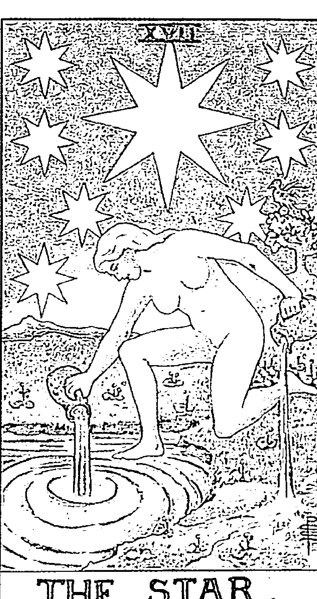

「塔」牌的破壞力道之後，人需要重建和療癒，並想辦法繼續活下去。「星星」牌是呈現一種在所有理想和假設之中的美好，儘管在實現之前，所有的願景與美好都還是很飄渺。與水瓶座連結的此牌，有著摸不到也觸不及的距離感，如偶像劇與現實當中的落差，一切只能靠想像力來彌補現實缺憾。這種疏離感是水瓶座的特點，它傾向不用經過考驗，就希望可以達到理想的天下太平狀況，人在面臨未知之事時，的確常常給予過度美好的想像，從地球上仰望的月球很美，但現實與理想總是衝突，實際登上月球後，「廣寒宮」的意象從神話終於變成了現實。

「星星」牌的美好讓人覺得人世間一切都完美到與世無爭，但是這高遠理想難免出現空洞感。經過了「惡魔」牌的束縛、「死亡」牌的轉化、「塔」牌的無常之後，在此呈現的是一個裸體女性形象，一腳跪在池塘邊的陸地上，另一腳則踩踏在水面上，雙手的陶壺將水倒出，倒在陸地上的水緩緩流入池塘，而倒進池塘的水則激起了同心漣漪。這種物質與精神的美好平衡狀態，有可能來自先苦後甜的恬靜，也有可能是擘劃中的契機與願景。此牌只代表理想層面，不代表現實狀況，風元素的渙散性，讓心中擘劃的藍圖還是需要有過經歷，之後境界才能揚昇。因此，短時間的刻意力道是無用的，不管是預言救世主誕生的伯利恆之星 (Star of Bethlehem)，或是在曠野中永遠可以指引方向的北極星，真正的目的地都還在遠方，捧著黃金、乳香和沒藥的賢士們，依然在朝聖的路途上負重前行。

觀星自古即是體察天意的路徑，萌發的靈感可以滿佈創造力，對未來美好的想像和假設，一切都是有希望的。兩個陶瓶的水，恰如「節制」牌中兩杯水的調節循環，象徵對未來抱持著好的理念和規劃。裸體女性以毫無偽裝的真實自我意識，倒出了水蘊孕了生命。而右方枝頭上埃及聖鷲「朱鷺」站立，象徵受到埃及智慧之神「托特」的眷顧，能讓這些調節力道有智慧地平衡。人在遭遇了很大的挫折困頓後，痛苦之餘有時會完全消極被動，有時也會突然無理由地意外樂觀，而這股如吸食嗎啡後產生幻覺般的無限樂觀狀態，正是「星星」牌的寓意。

## VII 戰車
The Chariot

- 水之力量之子
  The Child of the Powers of the Waters
- 巨蟹之星座牌
- 月亮入廟、木星入旺
- 希伯來字母：Cheth，籬笆

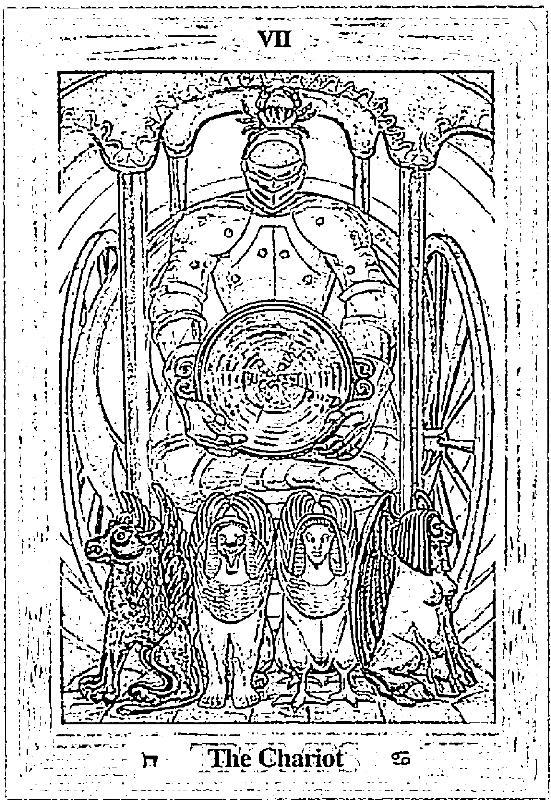

一位戰車馭者，以瑜珈修行者的盤腿姿勢而坐，儘管他的姿勢顯示尚未進入戰爭，但他早已全身穿著金色戰甲，一切準備就緒。金色鋼盔遮掩著他的面容，我們見不到他的表情，他手捧裝有聖血的聖杯，那是裝盛著耶穌右肋下方被長矛刺穿所流下的鮮血。紅色車輪象徵開創星座的動力，藍色車頂天棚連結了水象巨蟹座，並有藍色螃蟹出現在鋼盔上方。紅色車輪代表巨蟹座不是軟弱無力，他早已準備好了隨時可以前進，常常處在備戰狀況是巨蟹的基本功力，看似有親和力其實全身均已整裝完畢，「戰車」目前看起來是停滯的，但種種跡象可知其實一切已為戰鬥做好準備。

四大元素老鷹、人頭、公牛和獅子已在戰車前方齊聚，但是鷹與人的腳是互換的，都公牛和獅子的腳也是錯置的，因此一切備戰狀態都只是一種儀式般的展現，非到必要時還不需要引起戰爭。看似柔弱是他最強的競爭力，一切伺機而動，平常的沙盤推演只為等待一個可以前進的理由，水象星座不像火象星座般直接，他們以意志力做長期對抗，延滯是必然的狀況，眾多思慮也使他們裹足不前。

但是這一切準備所等待的理由是什麼呢?藍色天篷上有著「ABRAHADABRA」，代表了雌雄的結合，[155] 克勞利稱「戰車」的棚頂為「Binah 的夜空藍」(the night-sky-blue of Binah)，3 號薩弗拉「理解」(Binah) 是卡巴拉之樹上賦予萬物形體的母親，而「藍色乃是瑪麗亞聖衣的顏色，她是土地，被天空的藍覆蓋著」[156]，榮格的形容中藍色是聖母瑪麗亞 (亦即陰性能量) 的代表，陰性可承載血脈並賦予形體，是所有精神力量能夠成功於物質之界落實著床的重要介質，基督教中三位一體中並不存在女性的概念，而唯一被承認的女性則是聖母瑪麗亞，是上帝偉大人類救贖工作中最為關鍵的唯一管道，像是「戀人」牌與「藝術」牌中的紅白獅子、老鷹一般，這煉金術中的「結合」意象概念，在此由戰車馭者手中的聖杯中所呈現，「兀鷹的子嗣，二合一，被傳達了，這是力量的戰車」[157]。戰車馭者抱著聖杯，戰車載運著他們，這結合兩者的神秘力量，如同丹·布朗於 2003 年出版的《達文西密碼》一書中，提出聖杯不是物件，其實是一個女性的概念，聖血於聖杯中孕育，這偉大的創造工程正在發生，而這台戰車可視為「有輪子的聖杯教堂」。[158]

卡巴拉之樹的路徑 18 跨過深淵 (The Abyss)，在嚴柱上連結 3 號「理解」(Binah) 與 5 號「力量」(Geburah) 兩個薩弗拉，「表示神性的瞬間墮落」，[159] 戰車駕者沒有在戰場上駕車奔馳，身上鎧甲鑲了十顆象徵卡巴拉之樹十顆薩弗洛斯的星辰，他唯一的任務就是緊緊抱好並守護著聖杯，這是宇宙賦予的偉大創造驅動力，如巨蟹座的星座符號 ♋，像是瑜珈技巧中的完美結合，是天地宇宙的原始能量，低著頭的戰車馭者是對聖杯最深層的凝視對望、忘情交融、合一創造。

## XVII 星星
The Star

- 蒼穹之女
The Daughter of the Firmament
- 水瓶之星座牌
- 土星入廟
- 希伯來字母：Hé，窗

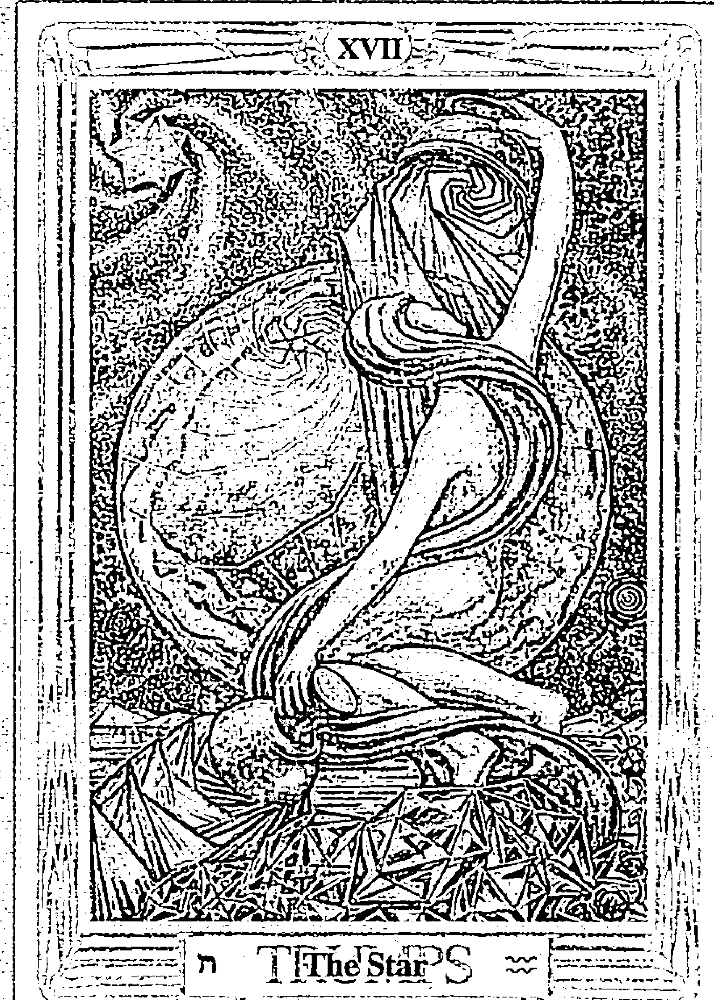

這是一張充滿了「泰勒瑪」教義的牌，整張牌畫面為美麗的淡紫藍色，呈現出《律法之書》中：「我愛你！我盼你！我是蒼白抑或紫色，我是遮掩住臉抑或大膽撩人，我是眾多愉悅和紫色，我是最深處的酩酊知覺，我渴求你。」[160] 在此愉悅的紫色中，埃及的天空女神努特 (Nuit) 與「泰勒瑪」中一切快樂的「處女娼妓」女神「巴巴隆」 (Babalon) [161] 形象結合，畫面中三顆七芒星是「巴巴隆之星」 (The Star of Babalon) 的不同樣貌，女神「巴巴隆」是卡巴拉之樹上的 3 號薩弗拉「理解」 (Binah)，是無邊宇宙中的尊貴女神，克勞利同時也把這七芒星稱為「維納斯之星」，由此可知這整張牌的重要特質，就是「愛」。

「在我的星辰下懇告吧！愛即是那律法，憑藉憑藉意志去愛吧！」[162]、「我把無可想像的愉悅帶來人間。」[163]「愛我就已經是超越了一切的好事：若汝在沙漠中星光下我面前為我燃起香木，以純真之心懇求於我，則在那火『蛇 (Serpent)』裡汝將投入我的懷抱。汝將情願以一切換取一吻。」[164]、「女神官站在我的隱秘廟宇中裸身歡慶，兩眼中燃燒欲火，每當我與你相會，她會說：到我這來！到我這來！她的愛歌喚起所有人心中的火焰。」[165] 克勞利在《律法之書》第一章中，已清楚呈現這位女神的形貌，她手中握著金銀兩個杯子，倒出旋轉的水灌注著自己和整個宇宙，象徵夢幻美好的粉紫色，讓「塔」牌毀滅後重建的虛擬，賦予無限的期望和期待，「畫面上的每個圖形都是螺旋狀的」[166]，漩渦是無限迴旋的能量，此能量來自互相交融、創造，且從不停滯，旋轉的光芒符號感覺像佛教卍字的光輝，愛與療癒之力油然而生。

這場旋轉天地的燦爛重造，上天又將設定了新的世界給我們，畫面中的虛幻和美好來自於期待和嚮往，「巨大的天球發出旋轉的精神之光，天空不過是女神的面紗」[167]，在朦朧且不食人間煙火的階段，因為連結水瓶座所以十分理想化，希望和過往完全不同，「星星」牌中也帶著我們強烈的期待，儘管想像和實際呈現的往往會有不同。克勞利說紫色是愉悅的，但紫藍色同時也是脈輪上三輪的顏色，在此象徵精神上恬靜美好。畫面下方是水晶鑽石，是物質界的美好，右下方有蝴蝶和薔薇，蝴蝶是完全變態的生物，要到達這境界終究得經過完全變態的蛻變歷程，薔薇是克勞利所屬的神秘學組織「金色黎明協會」 (Hermetic Order of Golden Dawn) 標誌上的那朵薔薇十字 (Brotherhood of Rosy Cross) 標誌上的那朵，而煉金術的目的，就是要帶來物質全面性的改變。

「星星」牌是對未來無形的美好給出希望與允諾，這希望是「我把無可想像的愉悅帶來人間」[168]，而允諾則是「汝將聚斂財貨，妻妾成群；汝將穿金戴銀；汝之榮光將超越一切地上的國度；然而汝要常時愛我，則我將賜汝愉悅。我令你頭戴奢華頭飾、身著簡單袍服到我面前。我愛你！我盼你！」[169] 然而，美好的女神「巴巴隆」依然長髮飄逸地在宇宙中安坐，而在人間的我們，依然只能懷著對美好願景的期盼，在塵土世界中持續想望。

## ∞ 註釋 ∞

[154] 尚·奧古斯特·多米尼克·安格爾 (Jean Auguste Dominique Ingres, 1780-1867)，《伊底帕斯和斯芬克斯》(Oedipus and the Sphinx)，1808 年繪製，現收藏於法國巴黎羅浮宮。圖片來源：維基百科，https://zh.wikipedia.org/wiki/%E4%BF%84%E7%89%8B%E6%96%AF%E5%92%8C%E6%96%AF%E8%8A%AC%E5%85%8B%E6%96%AF#/media/File:IngresOedipusAndSphinx.jpg。

[155] 此為煉金術意象的表現。詳見《托特塔羅解密》，頁 181。

[156] Carl Gustav Jung (2020.09)。《榮格論心理學與宗教》(Psychology and Religion)。韓翔中 譯。台北：商周出版，頁 108。

[157] 《The Book of Thoth》, p256.

[158] 《托特塔羅解密》，頁 180。

[159] 在卡巴拉之樹上，路徑 18 在嚴柱上由位於天界三角中的 3 號薩弗拉「理解」(Binah)，直接跨過深淵 (The Abyss)，與下方位於倫理三角中的 5 號薩弗拉「力量」(Geburah) 相連，因此往下方的連結，克勞利稱為「神性的瞬間墜落」。《The Book of Thoth》, p85.

[160] 《律法之書》第 1 章第 61 節。

[161] 「巴巴隆」為克勞利所創的泰勒瑪神祕系統中的女神，主要出現在《律法之書》當中，以抽象的形式，代表了一位解放的女性原型。

[162] 《律法之書》第 1 章第 57 節。

[163] 《律法之書》第 1 章第 58 節。

[164] 《律法之書》第 1 章第 61 節。

[165] 《律法之書》第 1 章第 62 節。

[166] 《The Book of Thoth》, p110.

[167] 《The Book of Thoth》, p110.

[168] 《律法之書》第 1 章第 58 節。

[169] 《律法之書》第 1 章第 61 節。

## 數字 8 與 18

## 慾望壓抑與情緒釋放

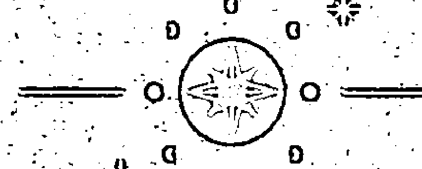

偉特塔羅：VIII 力量 Strength、XVIII 月亮 The Moon

托特塔羅：XI 慾望 Lust [170]、XVIII 月亮 The Moon

> 人生其實就是在痛苦與無聊之間像鐘擺一樣擺動。
——叔本華 [171]

## VIII 力量
Strength

- 壓抑恐懼的自信
- 獅子之星座牌
- 火之元素牌

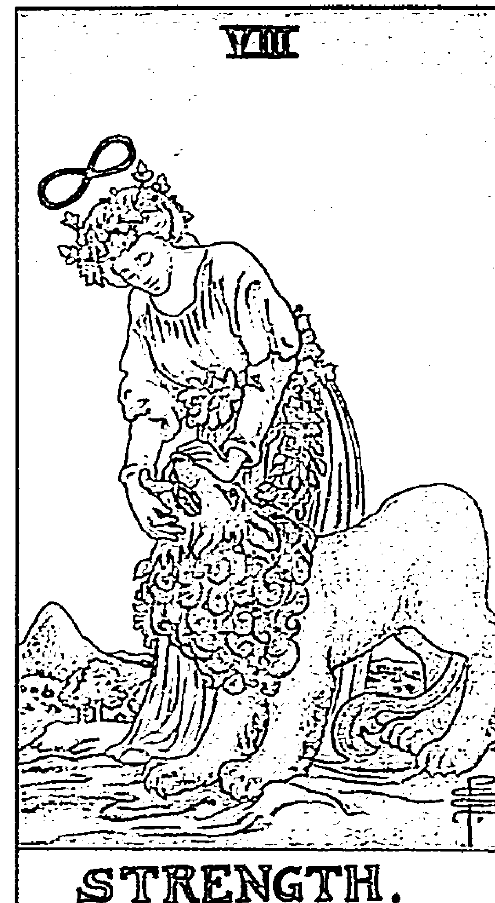

獅子自古就被視為是森林之王，擁有強大的力量，在埃及神話中，戰爭女神及醫療女神「塞赫麥特」(Sekhmet) 即是一頭母獅，是埃及人公認最兇猛的獵手。偉特塔羅中的「力量」牌，是一位身穿白色長袍頭戴花冠的女性，在金黃色的天空下，撫摸著獅子嘴部與下顎，她站在草地上，背景是一座藍色的山脈，她臉部表情寧靜，頭頂有一個象徵無限的「∞」(lemniscate) 符號漂浮。

天際晴朗無雲，花環圍繞於她的腰間，頭上的無限符號代表她的能量源源不絕，溫馴的獅子不代表沒有力量，「戰車」牌中牠們趴在戰車前方，但是現在牠已站立，內在的獸性其實已開始有所展現。女子沒有否認獅子隱含的兇猛力道，儘管她身處險境，但她以心平氣和的態度與獅子互動，兩者間力量與精神都達到平衡狀態。

獅子座是十二星座中最具權威感的星座，身上通常自帶貴族氣息與王者風範，這位女性氣質高貴無所畏懼，接受並勇敢地傾聽陰暗面的訊息。這位女性仿若文明禮教，與非理性的野蠻相抗衡，是兩種相反力量的調解者，她並不只是以蠻力將獅子緊緊壓制，而是更進一步將這頭野獸的兇猛轉化為平靜和諧的存有物，這一切顯示了道德的勝利。

但是這種以精神層面來壓制野蠻暴力的象徵，儘管就是此牌想要呈現的「以智慧成功駕馭獸性」概念，但是其中還是隱藏了微微的不穩定感。此一秒的平衡不代表就是下一秒的和平，這是一種時時刻刻都得如履薄冰的狀況，畢竟獅子的力量從不曾真正消失，而這位女性也從未真正可以放心並鬆懈下來。文明可以壓制野蠻，理智可以壓抑慾望，但這「一念天堂、一念地獄」之間的幽暗界線從未真正清晰，她「似乎」已經成功地馴服了牠，但僅在此刻。

## ∞ 傳統圖像意義 ∞

獅子：

動物出現在圖像中十分常見，然其所象徵之意義不僅會因為時代、地域、文化等因素而產生差異性，就算在相同文化中，同一種動物也有可能有多種象徵意義，這是圖像學研究者很不容易掌握動物象徵意義的原因。

獅子是很常出現在宗教藝術和世俗藝術上的動物形象，光文藝復興一個時期，獅子的象徵意義就有三十四種之多，[172] 在西洋紋章學 (Heraldry) 上，獅子亦是最常出現在設計中的圖案，例如威尼斯的標誌，即是以一隻手握長劍的獅子形象來設計。獅子在基督教中的象徵意義，不僅是四活物之一，四部福音書的作者更是各有象徵物，長有翅膀的人象徵馬太、長有翅膀的牛象徵路加、鷹象徵約翰，而長有翅膀的獅子則是象徵馬可。獅子甚至是「基督復活」的標誌，「在祂的升天裡，基督是獅子羔羊」。(啟示錄 5:5-6) 在基督升天以後，祂主要的啟示是獅子，而不是一般所熟悉的羔羊，在當約翰發現「沒有能展開、能觀看那書卷」(啟示錄 5:4) 而大哭時，長老說：「不要哭；看哪，猶大支派中的獅子，大衛的根，祂已得勝，能以展開那書卷，揭開牠的七印。」(啟示錄 5:5)

在擬人像方面，歐洲源自柏拉圖思想中四個經典的基本美德「智慧、公正、剛毅、節制」中，「剛毅」(Fortezza) 的擬人像，即是由一位身穿盔甲、手拿有獅子圖像盾牌的女性來表示，喬托 (Giotto di Bondone，約 1267-1337) 在帕多瓦的斯克羅維尼教堂 (Cappella degli Scrovegni) 中著名的「七善七惡」這十四幅擬人化的寓言壁畫中，「剛毅」依然是維持了這個傳統形象。源自古希臘的性格分類、根據體液學說所發展出來的四氣質說 (Four temperaments)[173]，其中「膽汁質」(Colletico) 的擬人像，即是一位臉色蠟黃的瘦弱年輕人，旁邊有頭兇猛獅子一起行走，「獅子則象徵他的敵意」。[174] 這世界有六大洲，其中「非洲」的擬人像，即是一頭髮捲曲的黑人女子，頭上頂著一頭象，身邊有一隻獅子，另一邊是一條毒蛇。

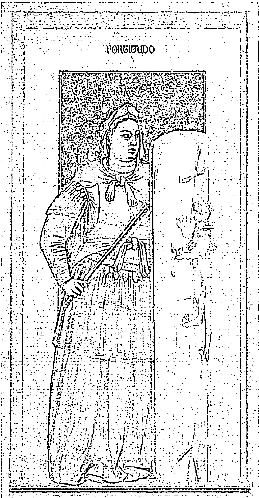

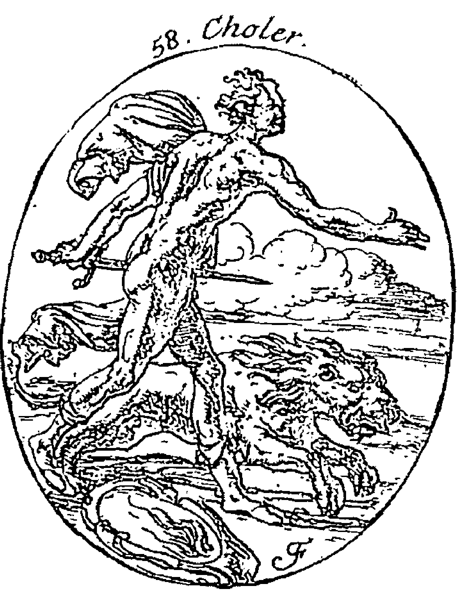

◀ 「剛毅」是七美德之一，喬托的擬人像中，以身穿盔甲、手拿有獅子圖像盾牌的女性來表示。[175]

▲ 里帕《圖像譜》中「膽汁質」(Colletico) 的擬人像，身旁有頭獅子一起行走。

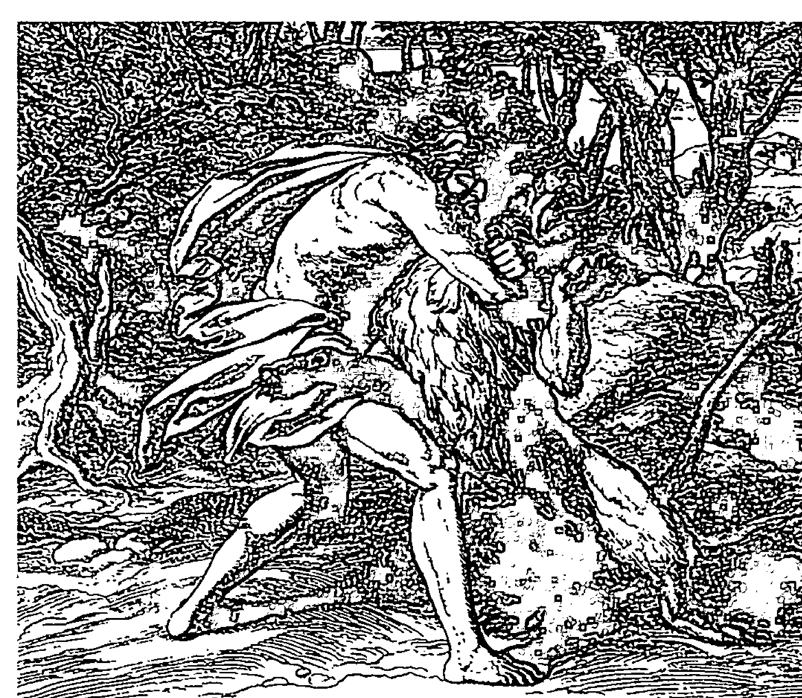

此外，有些图像中，也藉由其中呈现的狮子形象，来判断画中主角是谁。与狮子搏斗的众英雄当中，若是一位长发力士，那即是《圣经》中的「参孙」(Samson)，「参孙跟他父母下亭拿去，到了亭拿的葡萄园，见有一只少壮狮子向他吼叫。耶和华的灵大大感动参孙，他虽然手无器械，却将狮子撕裂，如同撕裂山羊羔一样。」(士师记 14:5-6)；若是主角形象是年轻人，那有可能是《圣经》中的「大卫」(David)，「大卫说：『陛下，我是为父亲放羊的。有时候狮子或熊来了，抓去小羊，我就追赶牠，击打牠，救回小羊。如果狮子或熊袭击我，我就抓住牠的鬃，把牠打死。我会打死狮子和熊，同样可以杀死那个藐视永生上帝军队的非利士人。』」(撒母耳记上 17:34-36)。

若是主角造型比较像中东人士造型，那就有可能是英雄「吉尔伽美什」(Gilgamesh)，根据《吉尔伽美什史诗》(The Epic of Gilgamesh，公元前 2150- 公元前 2000)，泥版上记载这位人类最古老的英雄，他曾与狮子打斗，并和野人「恩奇杜」(Enkidu)交手，之后成为好友后开始踏上了冒险征程，他们打死了森林怪兽芬巴巴。当然，不一定要和狮子搏斗才能是英雄，爱护狮子的人也是真英雄。神学家圣杰洛姆(St. Jerome)知识渊博，晚年时(大约西元 370 年)曾在叙利亚沙漠中隐居苦行，期间曾为一只受伤的狮子拔除脚掌上的刺，从此狮子成了他隐居时的伴侣。

▲ 卡洛斯菲爾德（Julius Schnorr von Carolsfeld）於 1860 年所創作的版畫《參孫屠殺獅子》。[176]

▶ 典藏於法國羅浮宮的《吉爾伽美什》。[177] 關於吉爾伽美什捕獲獅子的主題作品，頗受貓奴們的喜愛，因為就像是自己抱著一隻健康雄壯的貓咪。

▽ 杜勒約於 1514 年所做的版畫《書房中的聖傑洛姆》，描繪了獅子相伴的形象。[178]

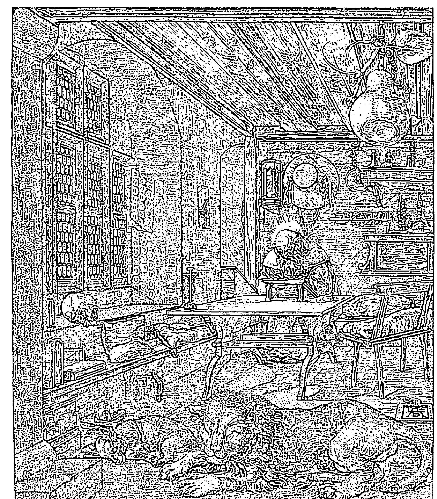

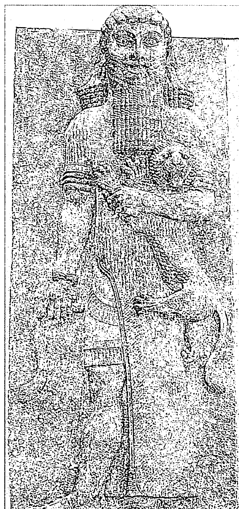

## XVIII 月亮
The Moon

- 起伏不穩的情緒浪潮
- 雙魚之星座牌
- 水之元素牌

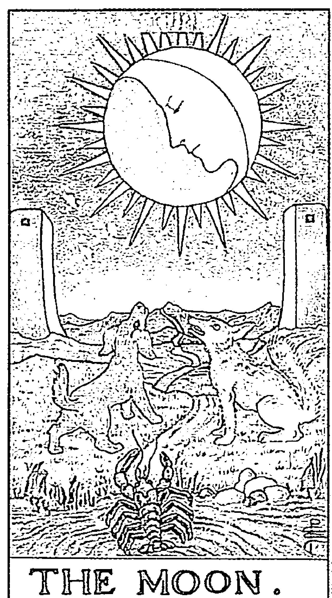

如果「星星」牌是代表夢想中的計畫，而「太陽」牌是代表已然成功，那「月亮」牌就是在這一連串的實現過程當中，那「才下眉頭，卻上心頭」的憂慮意念與不安定感。天文學上證明，在地球上看到的都是月球的同一面，它永遠不會把另一面轉過來面對地球，而地球上的我們，也因此永遠無法親眼看見它的另一面，那是它永遠藏起不想被了解的那一面。「月亮」牌強調著人對未知之事物所會產生的害怕、陰鬱、擔心、與曖昧不明的狀況，就像在看在恐怖片一般，未知的世界最容易讓人有直覺性的幻覺和恐懼，再加上自己的豐富想像力，就像配上恐怖音效和燈光一般，無可名狀的史詩級恐怖片開始在自己的內心中上演。

連結海王星與木星同時守護的雙魚座，象徵水元素的蝨子正緩緩地從水中爬上陸地，人的感知能力與感受直覺正式開啟，但是直覺性的感知能力，與是否能真正理性闡釋清楚，是兩件完全不同的事，如夢境中意義不明的畫面，即使看似與現實上有連結，卻實則曖昧不明。夢境的確與海王星連結，而海王星與內分泌、上癮、自我麻醉、甚至自我逃避等都相關，雙魚座在很多狀況下只能呈現感受，卻沒有正確答案，有能力感知且感受能力廣泛，但卻又一直無法抓住真實，如畫面中被一條蜿蜒的小路分成兩邊，人生理想與現實終究是兩個層面，而準備上岸的蝨子只能惶惶前行。

兩隻狗狂吠著月亮，這是人對未知事物的恐懼，以及人恐懼時所產生的表現，因為不知道未來會發生什麼事，但總感知到一定會有事，一如月亮中那張愁苦不安的側面臉孔。想像是人的本能反應，自我保全是人類的原始生存能力，當現況只能活在感受的世界裡，漂浮且不切實際，若再加上對未知的茫然，有時會在情緒與行為上面臨崩潰。這場潛意識的活動，太陽給我們光明白日，而月亮就只能在黑暗和夜晚的世界中反射著微光，雖然周圍的一切似乎正常運行，但是不安全感和懷疑也同步發酵醞釀，儘管想像力具有創造性，但根據「月有陰晴圓缺」的事實，就來推測未來一定會有不幸發生，這是缺乏理解的清晰度，但詭譎模糊的幻象不斷浮動內心，一旦自我控制力和自信喪失，情緒因恐懼而發出淒厲哀嚎，現實會將人四分五裂地推入低迷的惶然幽谷。

## XI 慾望
Lust

- 火焰寶劍之女
  The Daughter of the Flaming Sword
- 獅子之星座牌
- 太陽入廟
- 希伯來字母：Teth，蛇

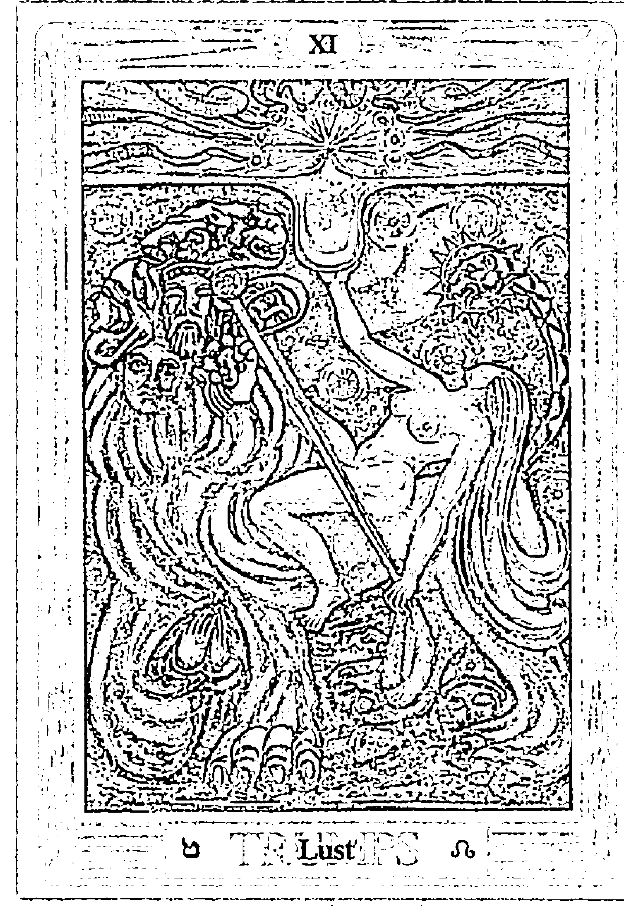

此牌在傳統形象上，是以一女性壓制住獅子的頭和下顎，代表以意念壓抑獸性，但托特塔羅中，克勞利則是將那位女性直指為女神「巴巴隆」[179] (Babalon)，獅子變成了女神的坐騎，她不僅壓制著牠，更是成功地駕馭牠，進而合而為一了。其實這張牌是最讓人對於托特塔羅產生誤解的一張牌，主要由於《聖經》中「我看見一個女人騎在一隻深紅色的獸上，這獸有七個頭，十隻角，遍體布滿了褻瀆的名號。那女人身穿紫色和深紅色的衣服，以金子、寶石和珍珠為裝飾。她手裡拿著金杯，杯中盛滿了可憎之物和她淫亂的汙穢。」(啟示錄 17:3-4) 這段對「巴比倫淫婦」的描述，與此牌畫面有一定程度的相契性之外，更與克勞利本身在《律法之書》中出現的「到那時汝等將看見，哦有福的『獸』啊，還有汝，屬他的慾望的『猩紅膚妾』(Scarlet Woman)」[180] 意象，不避諱用詞，讓許多人認為此張牌「污染」了托特塔羅。

紅色是慾望與生存的顏色，是海底輪的代表色，但牌面的紫色是智慧和頂輪的顏色，紫色與紅色交融之下，兩個顏色的結合，這些都代表從最原始深沉的慾望來到智慧提升階段。蛇象徵靈巧狡詐，牌面最上方出現蛇群，這是個法門，女神「巴巴隆」清楚地明白自己要什麼。牌中七頭獸與女神的身體中亦多呈現黃色，這是太陽神經叢輪的顏色，象徵有自信地想要彰顯自己、想要被看見與被肯定，與獅子座的特徵連結。上方紅色的光是象徵聖杯，滿滿紅色的光是原始的慾望，這是到達的路徑之一，如果否定與壓抑自己，狀況只會困頓消極；如果決定不再壓抑，這是解脫的途徑，而上方代表心輪的綠色，也透露出生生不息的訊息。

克勞利的「泰勒瑪」，強調的是新紀元的開始，女神「巴巴隆」則是新世代的女神，人的七情六慾該怎麼面對、駕馭與控制？端看人類自己如何掌控，後下方灰暗不明的背景都是象徵了過往歷程，我們在朦朧混沌中的所有碰撞，是走上真正天命前難免會經歷的苦痛。背景中許多圓圈是受精卵，上面像孔雀開屏的天空是驕傲與美麗的展現。「慾望」牌的概念，即是人類與外部世界的互相拉扯、校正與平衡過程的最終極概念，所有過往歷程，一定都會有灰暗不明的存在，所以如果一開始就完全打算否定一切，等同於跳過跌倒與摸索的過程，那終將會如懸空般沒有施力的支點，哪裡都去不了。

七頭獸的尾巴是獅蛇，這生與死的象徵，彰顯了我們常常會去做很多刻意的區別，例如生即喜悅、死即悲傷等二元相對概念，但事實是生就是死，死就是生，這只是宇宙設定的正常循環，人類設下太多的分界與批判，痛苦與執著藉此油然而生。《金剛經》中提到：「凡所有相，皆是虛妄。若見諸相非相，即見如來。」其實所有的對立都是自己所設，甚至會硬拉別人來配合我們要的劇本演出，然而沒有人能直接知道自己真正的道路，只能在當下體驗所有的傷悲喜樂，並在享受當下的過程中，儘管過程有傷痛，但也因此才能漸漸釐清自己未來的生命藍圖。

東西方傳統均喜愛以道德壓制下所呈現出來的純潔，來象徵女性至高的典範，然而女神「巴巴隆」是新世代的女神，呈現出完全不同的觀念，她在七頭獸上「小我」的狂喜，與右手向上碰觸的聖杯「大我」所結合，痛徹心扉的愛情是小愛，普世人道關懷是大愛，兩者並不對立，也無需二擇一。周星馳電影《西遊·降魔篇》(2013)中，玄奘如此說道：「男女之愛，也包含在所謂大愛之內。眾生之愛，皆是愛，沒有大小之分。有過痛苦，才知道眾生真正的痛苦。有過執著，才能放下執著。有過牽掛，了無牽掛。」道盡了小我與大我的終極融合，才是我們回饋給神的最高獻祭，「以愛來緩和能量，但要讓愛吞噬一切」[181]，放下設限返璞歸真，是人與神共同的渴望。其實所有的世俗過程與靈性修行，為的不是要見到如來佛祖，而是要見自己。

## XVIII 月亮
The Moon

- 潮起潮落的主宰
  The Ruler of the Flux and Reflux
- 雙魚之星座牌
- 木星入廟、金星入旺
- 希伯來字母：Qoph，後腦

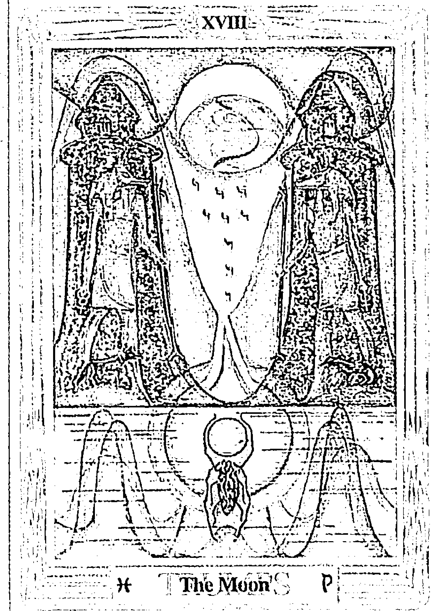

如果說「女祭司」牌是月亮高貴靈性的亮面，那「月亮」牌即是另外那鬼影幢幢的夢魘面。連結薩弗拉7號「勝利」(Netzach)至10號「王國」(Malkuth)，這條路徑29直通卡巴拉之樹的底層，月亮僅能反射太陽的光，反射著他人的明亮智慧，而本身沉默的坑疤與陰暗，才是真實的自我。傳統偉特塔羅中，「月亮」牌下方是一隻從水域要爬上陸地的蝦子，在托特塔羅當中，前腳環抱太陽的埃及聖甲蟲還在水中，而上方卻是有晦暗雙塔的禁忌國土，其上那不知是路徑還是水道，但確定是由天上滴落的血滴匯聚山谷而下，這不會是一條坦途，兩旁暗黑高塔由「阿奴比斯」(Anubis)守護，這位與木乃伊製作並和死後生活相關的埃及神祇，是喪葬之神，突然驚覺原來上方是死亡之城，阿奴比斯是亡魂的牽引者，守護著高塔亦是維護了整個宇宙的循環。

此牌畫面雖幽暗卻又蘊含綺麗，下方藍色和紅色如腦波般的起伏，不穩定卻又美麗，聖甲蟲推動著太陽的運行，然而太陽已經在水下面，尚未浮出水面的光明，讓上方的地下世界、一個我們看不到的潛意識與無意識世界，如噩夢中呈現出未知恐懼，在這個太陽永遠照不到的幽冥，它遠遠大過於我們理性理解的現實世界，連結雙魚座的能量，一切有如浩瀚無垠的大海深不可測，海王星的陰暗面，那些幻覺、懸疑、恐懼、不安與陰鬱，正在此無意識的領域中浮沉擺盪。此牌代表之希伯來字母為「Qoph」，意義為「後腦」，這是腦海中存在於無意識美好幻象(星星牌)和有意識光明奮鬥(太陽牌)之間，一句句內心的混亂語意，一道道心靈的幽渡暗夜。

如同潛意識裡的夢境，我們從不知道畫面到底是代表了什麼，從眉心輪傳遞下來的訊息，是否可能從海底輪來接收？夢中我們完全無法去意識、了解與連結這一滴滴從月亮滴落的紅色希伯來字母「Yod」到底是象徵什麼，只直覺九個「Yod」彷彿像是呈現了閃電符號，而「Yod」所代表的「隱士牌」與處女座連結，在黃道十二宮上正好是雙魚座的對宮，彼此遙遙相對卻相互牽扯。

「在舊紀元中，太陽的甦醒不僅來自冬天，也來自夜晚，此牌代表的就是午夜」[182]，太陽還在進入光明前的無意識深海中，上方陸地仍屬於「阿奴比斯」所守護的亡者之地，但是畢竟「月亮」牌是代表內心對夢囈的恐懼，並不是實際層面上的砍殺力道，若是能把它揭開來，狀況並不一定會恐怖到那麼令人無法解決，但是要面對和經歷這些過程中所呈現的憂鬱與驚怖，心理層面有可能還是無法突破。

但這經歷「是劇毒的黑暗，是光明重生的條件」[183]，這條由「禁忌」(Tabu)所守衛的「劇毒黑暗」道路，奧秘的雙塔是驚怖與恐懼的象徵，死亡不僅是許多文化言談中的禁地，更是人類千古無解的莫名恐懼黑洞，「一切迷信，死去的傳統和先祖的厭憎，全部結合起來，令她的面孔在世人眼中更加陰鬱。要踏上這條道路，需要百折不撓的勇氣。」[184] 但是我們每天都懷著不安的情緒走在這條路上，生死都來自同一個起點，世間有眾多事物令人迷惑狂亂，但總有一天誰都得面對這一刻，無法例外更不可能逃脫。聖甲蟲懷抱中的太陽，總有浮出水面的一刻，當它浮出黑水之時，暗夜也會同時宣告結束。

地球出現在牌面上方的弦月與下方的太陽之中間，而生活在地球上的我們，也只不過是在這光明與黑暗中間地帶，體驗靈魂永生旅途的一部分過程而已。人生中不管是「怎樣的恐怖折磨著靈魂，怎樣的可憎物引起心中厭惡，怎樣的驚駭攻擊心靈，在每個階段，他的回答都是一樣的：『這是多麼精彩的冒險！』」[185]

## ∞ 註釋 ∞

[170] 依照金色黎明協會的傳統，在偉特塔羅牌中，「正義」牌為編號第 11 的大牌，然而在托特塔羅當中，呈現相似概念的「調節」牌，克勞利認為應將黃道帶以處女座為樞紐旋轉，因此獅子座與天秤座的位置互換了，而代表獅子座的「慾望」牌在托特塔羅中被安排到第 11 張大牌，代表天秤座的「調節」牌，則被安排到第 8 張大牌的位置。

[171] 叔本華 著 (2018.09)。《人生智慧箴言》，李連江 譯。台北：新雨出版。

[172] 陳懷恩 (2008)。《圖像學：視覺藝術的意義與解釋》。台北：如果，頁 135。

[173] 起源於古希臘的體液學說，認為人體是由四種液體所組成，分別是血液（對應多血質）、黏液（對應黏液質）、黃膽汁（對應膽汁質）和黑膽汁（對應抑鬱質）。這四種液體平衡發展時，會讓人體功能正常運作，當體液不均衡，則會造成疾病。而混合在冷熱和乾濕之間達到平衡，是最理想的人格。此學說之概念，融入在西洋藝術中，常以顏色、人物外觀造型等等方式呈現。

[174] Cæsar Ripa. (2018). Iconogia. London: Gale Ecco., p89-90.

[175] 喬托 (Giotto di Bondone)，《剛毅》(Fortitude)，1306 年作，現存義大利帕多瓦 (Padova) 的斯克羅維尼教堂 (Cappella degli Scrovegni)。圖片來源：http://index-of.es/Art-Gallery/G/giotto/padova/vicevir/。

[176] 卡洛斯菲爾德 (Julius Schnorr von Carolsfeld, 1794-1872)，《參孫屠殺獅子》(Samson Slays a Lion)，1860 年所作，出自《Die Bibel in Bildern》一書。圖片來源：https://www.freeimages.com/es/premium/samson-slays-a-lion-328692。

[177] 作者不詳，《吉爾伽美什》，約於公元前 713-706 年所作，現藏於法國羅浮宮。圖片來源：維基百科，https://commons.wikimedia.org/wiki/File:Hero_lion_Dur-Sharrukin_Louvre_AO19862.jpg。

[178] 杜勒，《書房中的聖傑洛姆》(St Jerome in his Study)，1514 年作，現存於蘇格蘭國家藝廊 (National Galleries of Scotland)。圖片來源：維基百科，https://commons.wikimedia.org/wiki/File:D%C3%BCrer-Hieronymus-im-Geh%C3%A4us.jpg。

[179] 「巴巴隆」為克勞利所創的泰勒瑪神祕系統中的女神，代表了代表女性的解放。

[180] 《律法之書》第 3 章第 14 節。

[181] 《The Book of Thoth》, p257.

[182] 《The Book of Thoth》, p111-112.

[183] 《The Book of Thoth》, p112.

[184] 《The Book of Thoth》, p112.

[185] 《The Book of Thoth》, p113.

## 數字 9 與 19

## 孤獨匱乏與真我自在

偉特塔羅：IX 隱者 The Hermit、XIX 太陽 The Sun

托特塔羅：IX 隱者 The Hermit、XIX 太陽 The Sun

> 愛總是帶來孤獨，孤獨帶來愛。
—— 奧修 [189]

## IX 隱者
The Hermit

- 孤高寂寞的尋道
- 處女之星座牌
- 土之元素牌

選擇於雪地中站立，選擇了艱困的環境，遺世而獨立的孤獨，是很難讓世人了解的層面，所有一切作為已不必再為任何人所呈現，不需要華麗的儀式，也不需要展現智慧以被人崇拜的尊榮，如今一切反求諸己，默默追求自己的道路。手提著明燈卻雙眼緊閉，唯有暫停了身體與感官的所有行為，靈魂深處的聲音才可能被自己傾聽。古今中外，均有隱者選擇到高山峻嶺或是酷熱沙漠中修行，這是一場企圖透過身體折磨，來達到靈性提升的行為，「教皇」是入世的修行，而「隱者」選擇的出世苦修，如同宗教中虔誠信徒的朝聖之路，甚至沿途三跪九叩，透過身體的受苦來強化心靈意念。

然而這一切並不是真正的放下，其中其實還有追求，仍然有忘不了執著，追求隱居生活仍是外顯的行為，執著於只有身體受苦內心才能清澄，這種刻意的行為，顯示了靈性尚未完全頓悟，內心離真正的大自在還有很遠的距離。中國古代的道家哲學思想，有「大隱住朝市，小隱入丘樊。丘樊太冷落，朝市太囂喧。不如作中隱，隱在留司官」思考[187]，道盡修行之路的過程。依賴周遭清幽環境才能忘卻世事，是形式上的隱，為「小隱」；身處在臥虎藏龍的市井當中，排除塵世喧囂依然能修行，為「中隱」；而在各類頂尖人才聚集的政壇面對政局，依然能達到物我兩忘自得其樂的平靜，這是心靈昇華的同時，繼續將自身才能貢獻蒼生，為「大隱」。

「隱者」牌中的畫面，背景空曠，站在雪山高點上已是高處不勝寒，這位刻意與世俗隔絕、離群所居的修行者，未來真正面對的課題，是這世上再無更高山峰，那形式上的追求要如何突破？而因此所獲得的成就和成長，孤立仍是重點行為，距離感依然揮之不去。而習慣孤獨之後，是否也就無法實行修行的最高宗旨：施予「愛」的情感給世人呢？

## ∞ 傳統圖像意義 ∞

## 世界之光：

「隱者」牌中，「隱者」提著一盞明燈的畫面構圖，很容易令人聯想起霍爾曼·亨特 (William Holman Hunt，1827-1910) 在 1854 年所創作的名作《世界之光》(The Light of the World)。這位前拉斐爾派 (Pre-Raphaelite Brotherhood) 的英國畫家，常在畫面上呈現精緻細節與豐富色彩，而畫面中呈現之象徵意義，更是受到研究者的討論。這幅畫作描述在黑夜中，耶穌提著一盞燈站在月光下，面露真摯情感，身披華麗袍子卻穿著草鞋，祂正在敲一個爬滿雜草、沒有門把只能從裡面打開的門。「耶穌說：看哪，我站在門外叩門，若有聽見我聲音就開門的，我要進到他那裡去，我與他，他與我一同坐席。」(啟示錄 3：20) 以此來象徵耶穌喚醒人們沉睡的良知。

如何辨識上帝一直是一個廣被討論的議題。瓊·奧斯本 (Joan Osborne，1962-) 一曲〈One of Us〉隨著 2003 年的電影《王牌天神》(Bruce Almighty) 而流行全世界，這首獲得第 38 屆葛萊美獎七項提名的歌曲，討論的也是上帝是否只有特定面貌？還是祂可能是任何一個路人？重點是每天手中比著聖號、口中唸著經文的我們，在祂出現的時刻真的有能力辨識祂嗎？神，因為人的信仰而變得真實，但是整個信仰的追尋不會只是行為外顯的過程，而是反求諸己的覺醒。「認識自己的靈，應該是作一個守望者最要緊的事，因為一旦自己有偏差，所領受的上帝的話語，統統都扭曲了，也看不清楚仇敵的作為。」(路加福音 22:31-32) 每個人的內心，都是這扇沒有門把的門，耶穌不會因為滿佈的野草，就不伸出敲門的手，但是祂也不會破門強行進入。沒有任何條件，沒有任何要求，這位善牧者認識祂的羊，這是一種愛到底的交付，「我就是世界的光。跟從我的人，絕不會在黑暗裡行走，卻要得到生命的光。」(約翰福音 8:12)

▶ 霍爾曼·亨特，《世界之光》，現典藏於牛津大學基布林學院 (Keble College)。[188]

## XIV 太陽
The Sun

- 耀眼普照的太陽
- 太陽之行星牌
- 火之元素牌

太陽是萬物生長的源泉，幾乎所有的原始宗教都有太陽崇拜的概念蘊含其中，古埃及有太陽神「拉」(Ra) 在白天和夜晚分別乘坐「曼傑特」(Mandjet) 和「麥塞克泰特」(Mesektet) 的二艘太陽船航行天際。日本有「天照大神」傳說，在神道傳統上，被視為天皇及日本皇室的始祖。但最為人所知的即是古希臘神話中的「阿波羅」(Apollo)，祂是宙斯的親子，神譜上祂是泰坦神「菲比」(Phoebe) 的外孫，祂還有一個名字「Phoebos」，此字的來源是希臘語的「Phōs」(光)，因此神話中祂時常被稱為「閃亮的阿波羅」(Phoebos Apollo)，是希臘神話中的光明、醫藥、音樂、預言與文藝的代表神祇，不僅多才多藝且長相俊美，是象徵著男性典型之美，駕馭著金黃色日車的意象，太陽隨著軌道運行，時間掌管於祂的手裡，而時間即是生命，祂掌握了時間與生命，等於掌握了宇宙萬有。也正因為如此，當出現日蝕現象時，在科學尚未發展的古代，常會造成令人想像力無限發揮的恐慌驚悚，例如漢明帝於永平八年(西元 65 年)冬十月，即因日蝕現象的產生而下詔罪己。[189]

在所有偉特塔羅牌中，「太陽」牌呈現出最令人感受到希望的畫面，象徵所有事情心想事成的美好。此牌畫面發想與《聖經》描述意象相連結，呈現出與天上的歡呼、獸的軍隊戰敗以及騎白馬的主出現有關，「接著，我看見天開了，看哪，有一匹白馬。騎馬的那一位被稱為『信實的』和『真實的』；他以公義去審判、去作戰。他的眼睛像火焰，頭上戴著許多王冠。」(啟示錄 19:11-12) 這是一場期待已久的勝利，這位「騎白馬的主」在此牌中是一位開心揮舞旗幟小孩，大紅旗幟與「他身穿一件浸過血的袍子」(啟示錄 19:13) 顏色相仿，這一切的美好是因為終於完成了規劃中的進度，裸體的小孩表現了與世無爭的態度，因為此時此刻勝利在望，感覺不需再作任何競爭，盛開的向日葵一如心中對未來發展的樂觀態度，天上閃耀的太陽映射著心中的光芒萬丈。

「愚人」牌那愚人頭上的紅色羽毛，現在配戴在這小孩的頭上。「愚人」是不知天高地厚的任意遠颺，「太陽」牌是幾乎認定可以完成沒有問題，象徵樂觀地把事情看得美好單純，生命目標已近在眼前，成功甜美果實仿若伸手可及了，小孩臉上的表情喜悅難掩，即將到手的幸福散發著芬芳，但這一切有可能只是當事人的主觀感受，與事實現況還是有點距離。

驚覺白馬上是沒有馬鞍的，「愚者」的羽毛也還在頭上揮之不去，這美好的來源是因為把事情想得太單純並可很快完成，白馬是騎上去了，但是沒有馬鞍能舒適地長遠前行嗎?不用韁繩控制、甚至連雙手也放開，這樣做能量完全能掌控嗎?還是只是過度幼稚樂觀?「愚者」的變動性真的不會再突然出現嗎?若這一切只是完成了階段性的心願，那後續是否還有其他挑戰即將逼近?白馬身後是石頭砌成的圍牆，儘管樂觀地繼續前行，其實現實中也是已經沒有後路了，也只能積極正面地繼續前行。天上閃耀的太陽散發著二十一道光芒，是的，是二十一道，是那二十一張大阿卡納牌，我們都知道，還少了一張。

## IX 隱者
The Hermit

- 永恆的先知
  The Prophet of the Eternal
- 處女之星座牌
- 水星入廟、水星入旺
- 希伯來字母：Yod，手

那位出現在「戀人」牌中、站在刀刃拱門下主持婚禮，卻因為罩帽而看不到面孔的人物，現在出現在「隱者」牌中，此次他側後方對著觀者，依舊沒露出面容。他彎曲著身子站在生長茂密的麥田中，與土象星座中的變動星座處女座連結，麥子因飽滿而沉重，流動的麥稈線條不僅僅是土元素的豐沛能量，更是像精子的遊動路徑，全部朝著畫面左下方的蛇杖 (the Serpent Wand)，那是顆內含一蜷曲姿勢嬰兒胚胎的精子。這是克勞利所稱的「偉大工程的實踐模式」[190]，土元素是卡巴拉之樹中的低中之低，而在地球上所有的生命創造，也是這低中之低的曠世宏偉巨作。

「隱者」專注凝視著「奧菲克祕卵」，他緊盯著這創造生命的宇宙蛋也不願意轉過身來。此牌連結的希伯來字母「Yod」，是「手」之意，也是神名的第一個字母，代表著智慧之父，而「隱者」不論是在「戀人」牌或在此，也都僅露出手而已，那顆曾經出現在「愚人」牌中愚人鼠蹊部的太陽，現在依然出現在隱者的手上，如傳統牌面中所呈現，「隱者」依然是一個提燈者，光線四處照耀，而他依然不願意看著燈火，只不過偉特塔羅中的「隱者」是緊閉雙眼孤僻沉思，而托特塔羅的「隱者」卻因為緊盯著「奧菲克祕卵」，而明顯地展現出他的意念與慾望，他非常在意這場在最為隱密運作中所進行的「生命全盤奧祕」[191] 的儀式。

水星守護的是處女座，這廟旺的狀況讓土元素在此能量更強，加上「隱士」手提著一顆作為創造之光的太陽，如宮廷牌中的公主牌，這「降入物質界的高潮，即是精神重整的信號」[192]，黃色的燈光與象形的蛇杖精子，紅色的衣袍是海底輪最原始的能量，隱者本應清高修行，但在此卻呈現出他源源不絕的慾望、要求和原始能量，儘管他本身不想面對、去克服、甚至不想承認這些感受，但飽滿的原始慾望依然存在於飽滿麥穗中流淌，「隱者」，在此一點也不隱者。

地獄之門也是象徵人的慾望源頭，本應守護地獄入口的三頭惡犬「克爾柏洛斯」(Cerberus)，現在從地底跑出來，牠喜好甜食的習性眾所皆知，水星「墨丘里」就曾經以蜂蜜蛋糕餵食來滿足牠的口腹之慾，以便讓牠怠忽職守，拯救冥后「波瑟芬妮」(Persephone)。「引導靈魂穿越地獄，符號以他的蛇杖來指示，從地底深淵中實際冒出，此時波瑟芬妮已有毒胎兒的體現。」[193] 終究在一片黑暗中，還是需要手提黃色燈光來照亮前面的路，還是需要象徵水星的光明來引導，而蛇纏蛋形象的「奧菲克祕卵」是未知，只是不知這會是新生？還是必先經歷死亡的重生。

「隱者」其實自身還是有所求，而且都以找尋更宏偉的目標、塑造更完美的標準為藉口。若以更高維度的角度來看這一切，這些人為的標準，完全沒有存在的必要性。一直強調自身修行的追尋，也代表身心還處於不平靜的狀態，還是需要拿有形的行為和物質來填滿心靈空洞，因此，「拿著燈籠和手杖，讓那燈光如此明亮，以至於無人看見你」[194]，「隱者」只想讓世人看見象徵修行的提燈隱者形象，也讓世人因為此燈光太過明亮，而看不見「隱者」內心想隱蔽的真正慾望，這才是唯一的真相。

## XIX 太陽
The Sun

- 世界之火的主宰
  The Lord of the Fire of the World
- 太陽之行星牌
- 希伯來字母：Resh，頭

根據克勞利的描述，連結卡巴拉之樹上 8 號薩弗拉「宏偉」(Hod) 和 9 號薩弗拉「基礎」(Yesod) 的這條路徑 30，「下方有一道牆，在它的前方，有一個精靈環，兩個小孩毫不感到羞恥地肆意擁抱」。[195] 這兩個小孩，是「愚者」胯下中的雙生嬰兒，是「戀人」牌中的黑白小孩，更是埃及太陽神「赫魯斯」(Horus，Heru-ra-ha 為其特殊名號) 的雙面性「胡爾－帕－克拉特」(Hoor-pa-kraat) 和「拉－胡爾－庫特」(Ra-Hoor-Khut)，[196] 他們互相擁抱，兩位天使是太陽崇拜概念的再現，身後的蝴蝶翅膀，暗示當毛毛蟲蛻變為蝴蝶過程中，所有可以想像的辛苦，那是得曾經渡過灰暗狀態才可見到的光明。唯有蛻變後才有可能迎接太陽，只有燃燒化為灰燼後才可能到達天堂，這是神設下的先決條件與路徑。

在一神教的系統中，宇宙萬物的創造者是至高無上的存在，在天主教宗教系統中，這股能量稱為「上帝」(God)。在歷史紀錄中最早的「一神教」信仰，是出現於公元前 1352 年至前 1333 年，古埃及新王國埃及第十八王朝國王阿蒙霍特普四世「阿肯那頓」(Akhenaten，去世於西元前約 1336/1334 年) 的「阿肯那頓改革」，他為此遷都「阿瑪納」(Amarna)，並獨尊神祇的「阿頓」(aten)，而「阿頓」即是太陽。

不管人類文明如何演進，從傳統對太陽的崇拜，至今日科學驗證下，太陽對生命的重要性依舊不可言喻，但克勞利在此指出了太陽的雙面性。今日我們的太陽系中太陽是主角、是恆星，但天文學上對於太陽誕生之時，很可能有一個「孿生兄弟」行星的推測時有所聞，而人類早期對於太陽出現時的感恩、與太陽憑空消逝時的惶恐，以及感受太陽帶給我們溫暖的同時，它也正用刺眼的光芒讓我們無法直視，太陽以氫核聚變的方式來產生能量燃燒的同時，原子不斷對撞也意味著，太陽終有一天會漸漸走向黑洞。在此牌中「胡爾－帕－克拉特」(Hoor-pa-kraat) 是嬰兒時期的「赫魯斯」，而「拉－胡爾－庫特」(Ra-Hoor-Khut) 則是鷹頭的沉默與力量之王，「戰神和復仇之神」[198]，兩股力量相依相生。

這張牌的畫面，是把我們的位置拉高到宇宙中來觀看地球，黃道十二宮如梅比斯環般生生不息地循環四周，透過這個循環，我們往下看到的是以薔薇為中心的太陽，以及綠色山脈。我們都知道「金色黎明協會」(Hermetic Order of the Golden Dawn) 的標的標標的標誌是「薔薇十字」(Rosae Crucis)，在此，十字架的四臂換成了十二道光芒，射向黃道十二宮，而傳統十字架形象則出現在小天使們腳下的圓盤中，克勞利刻意將「薔薇十字」的四臂消融，將薔薇的能量能 360 度更自由張狂地擴張，而山上的那圈圍牆，則代表了傳統觀念在物質之界中仍然適用。但他所創的這個太陽光芒十字架，是與先前的薔薇十字不同，是與「天體建立緊密而明確的聯盟」[199]，連協會的標誌都被克勞利改成自己的想法，還拿掉最重要的十字架形式，他這樣的性格不難令我們理解，當初克勞利於 1898 年天份滿溢地加入該會，而 1900 年卻被拒絕進入更高層，間接造成之後他心傷離開英國，四處旅遊。

此牌不僅是「現代的太陽崇拜」[200]，位在「新紀元」牌之前，這更是一張克勞利宣告「赫魯斯時代」來臨的一張牌，「人類就是太陽的心靈、智慧、身體。他是光、生命、自由和愛的主人，這一時代的主旨就是要完成人類的解放」[201]，很明顯的，此牌等同是成功，時機對了，所有一切自然將會水到渠成。然而弔詭的是，這張牌的成功定義，是來自於別人的肯定，不一定是來自紮實的自我確認，但不管如何，成功甜美果實也的確是享受到了。這是一種佔對時機的成功，恍如順水推舟般，雖不代表一定最有實力，但當天時地利俱在，人和自然會來，被推上舞台聚光燈下的你，「對一切萬物放送你的光，毫無遲疑，陰雲和暗影對你都無所謂」。[202]

◀ 埃及開羅博物館收藏的古石板，描繪了阿肯那頓與家人崇拜阿頓神（Aten，埃及中的太陽神）的場景。[197]

## ∞ 註釋 ∞

[186] 奧修 著 (2015.01)。《奧修談蘇菲大師卡比爾：印度偉大靈性師父的智慧奧祕》。Veet Gagan (嘎根) 譯。台北：麥田出版。

[187] 唐代·白居易，五言古詩《中隱》。

[188] 圖片來源：Web Gallery of Art，https://www.wga.hu/frames-e.html?/html/h/hunt/index.html。

[189] 《顯宗孝明帝紀》中記載，漢明帝下罪己詔，「朕以無德，奉承大業，而下貽人怨，上動三光。日食之變，其災尤大，春秋圖讖所為至譴。永思厥咎，在予一人。群司勉修職事，極言無諱。」

[190] 《The Book of Thoth》, p89.

[191] 《The Book of Thoth》, p89.

[192] 《The Book of Thoth》, p89.

[193] 《The Book of Thoth》, p89.

[194] 《The Book of Thoth》, p257.

[195] Aleister Crowley. (1909). Libre 777. London and Felling-on-Tyne, The Walter Scott. Reprinted with much additional matter, 777 Revised, (1955), London: The Neptune Press., p40.
《Libre 777》為克勞利於 1909 年在倫敦出版的一本論文集，以表格的方式，為西方金色黎明協會的魔法符號和卡巴拉主義符號，與印度教、佛教、回教、道教的符號作出比較與對應，可視為是這些宗教符號的比較圖表。該書有利於對某一宗教系統熟悉之人，用來對應其他教義中的符號並進行理解。

[196] 《律法之書》第 3 章第 35 節。「赫魯斯」為埃及太陽神，但一直被認為有雙重特性，「孿生太陽」的教義從古一直相傳，在早期諾斯底 (Gnostic) 教徒，也曾經認為基督的孿生兄弟是撒旦。出自《托特塔羅解密》，頁 226。

[197] 作者不詳，《崇拜阿頓神》（Panel with a Scene of the Adoration of Aten），約於公元前 1356-1340 年所作，現存於埃及開羅博物館（Museum of Egyptian Antiquities）。圖片來源：維基百科，https://commons.wikimedia.org/wiki/File:La_salle_dAkhenaton_(1356-1340_av_J.C.)_(Mus%C3%A9e_du_Caire)_(2076972086).jpg。

[198] 《律法之書》第 3 章第 3 節。

[199] 《The Book of Thoth》, p114.

[200] 《托特塔羅解密》，頁 225。

[201] 《The Book of Thoth》, p113.

[202] 《The Book of Thoth》, p259.

## 數字 10 與 20

## 業力輪迴與覺醒超脫

偉特塔羅：X 命運之輪 Wheel Of Fortune、XX 審判 Judgment

托特塔羅：X 命運 Fortune、XX 新紀元 The Aeon

> 生命中的全部偶然，其實都是命中註定。是為宿命。
——東野圭吾《宿命》[203]

## X 命運之輪
Wheel Of Fortune

- 因果循環的輪替
- 木星之行星牌
- 火之元素牌

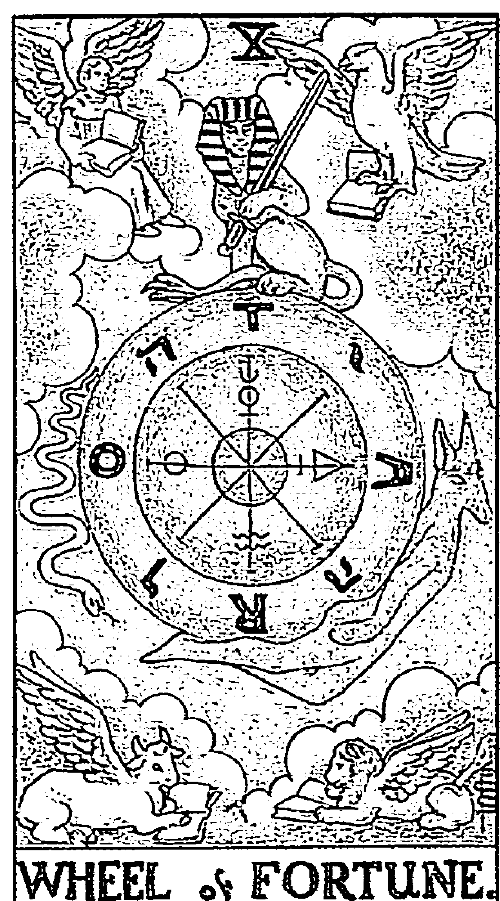

在塔羅大阿卡納牌中，這是唯一一張沒有人物的大牌，「Fortune」意指幸運或財富，由於此牌又與木星相連結，若是單純以為此牌是字面上的「幸運」之意，那就真的太樂觀了。在火元素的推動下，確定積極的變化即將到來，四大元素齊聚牌面四角落漂浮雲端，這四個固定星座的象徵圖像：人、牛、獅與鷹，此刻都呈現還在讀書學習的階段，一切才剛剛開始，智慧才剛要開始累積，背上的翅膀讓他們能在未來的變動中，有迅速應變的能力。輪子的中心是如同托特塔羅中「愚者」的概念，那是不可言說的宇宙創造力，也是「深淵」之上人類無法理解的那三顆薩弗洛斯，這空無又象徵萬物的創造力，如颶風眼般，在狂風暴雨中永遠維持清澈，並穩定運行。

輪心中沒有任何符號，那是無可言喻的宇宙能量在中心引導，不論是順時鐘或逆時鐘，這是因果論中一切已定的宿命。輪子中層是煉金術中重要的汞、硫、水、鹽四元素的符號，煉金術狹義的定義，是把賤金屬轉化為成貴金屬，廣義上則希望能普遍地把各種物質進行本質性的轉化，這是化學與哲學思想的開端，象徵了萬物的形成。煉金術的英文「Alchemy」，而化學「Chemistry」一字的字根 chemi，即是來自煉金術的 chemy，這套物質轉化理論，為的是「扭轉」物質的本質，命運之輪本意，也提醒人的境遇會因為遇到了不同的機緣，而不斷地產生人生中的蝴蝶效應。

儘管煉金術是人類自古一場實踐春秋大夢的化學實驗，但是在西洋哲學上，相信的不僅是物質間的轉變，更是萬事萬物均在不停變化。古希臘哲學系統中，亞里斯多德以「形質說」、「潛能實現說」、「四因說」，說明了所有物質實體都是形式與質料的結合，形式是物體的外觀，物質之所以轉變，是因為形式與質料的結合，產生一連串的物質轉變。當元素的實體形式被複合後，所產生的新形式給替代了，更新形式的產生必須回歸到更高層次的力量，也就是宇宙中智力的力量，亦即上帝本身。一如最早的唯物主義者「赫拉克里特」(Heraclitus，公元前 540-480 年)所認為一切都在流動，沒有任何東西是靜止不動的，且唯一不變的是變的本身，至今依舊是真理。

輪子的最外一圈則是象徵物質世界，車輪上的希伯來字母 YHVH (Yod/Heh/Vau/Heh)，那是「四字神名」(Tetragrammaton)，是《希伯來聖經》中上帝那不可發音之名，也是在《出埃及記》中，上帝回答摩西以色列人應該如何稱呼祂時所言「我是自有永有的」（出埃及記 3:14）。而中間的字母若逆時針來看，是偉特塔羅中「女祭司」靜坐手持的那本神聖律法「TORA」，ATOR 則是關懷蒼生充滿療癒能量的「哈托爾女神」[204]。但是若是順時針來看，TORA 意為「轉動之輪」[205]，TARO 之後再回到 T，一個從開始的地方再回到相同的起點，是的，那即是「塔羅」（Tarot）。

三位神祇圍繞著命運之輪，左方希臘神話中象徵風暴的妖魔「提豐」（Typhos），蛇信在此依然伸縮吞吐，正以暴風之力往下拉扯命運，那是加強的沉淪力道；右方喪葬之神「阿奴比斯」（Anubis）則是扛著輪子給予往上拉提，那是背負命運的渴望；上方「斯芬克斯」（Sphinx）手持代表著正義的長劍，坐在頂端，依然出著那眾人難以解答的人生課題，每個人都需要以智慧面對人生，如果沒回答出正確答案來獲取命運之輪的正向旋轉，即有可能會被撕咬吞食。

四大元素和三位神祇齊聚，這其中有天時地利，也有機會和命運，木星持續張顯它擴張與膨脹的能量，這是出生時呼吸第一口氣就定下的課題，是宿命中的不可抗力，但一切都只是此生體驗的過程，對抗通常都只是徒勞。「命運之輪」中心所蘊含的偉大力量，是我們必須要努力去面對的人生路徑，畢竟人都想從無數個現象中去尋找真相，然而真相只有一個，即是從種種不可知當中得到痛苦，並從中學到接受與釋然。

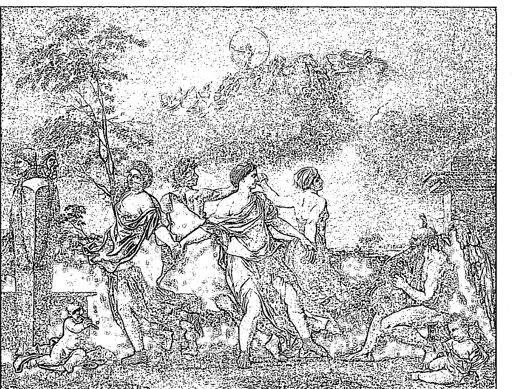

▲ 尼古拉斯·普桑的《隨著時間之神的音樂起舞》，[206] 畫面中「圓舞」的概念呈現出人生歷程每個階段的相互影響與循環，沒有好壞善惡，一切都是果因都互為因果。畫中四位舞者象徵貧窮、勞動、財富和奢華，當隨著時間的變幻，人們因為貧窮而努力勞動，因勞動而得到財富，因擁有財富而開始奢華，又會因為過度奢華而導致貧窮。這是人生不可跳脫的經歷輪迴，每個人生命會結束在哪一個狀態，端看個人智慧。

## XX 審判
Judgment

- 超渡重生的號角
- 冥王之行星牌
- 火之元素牌

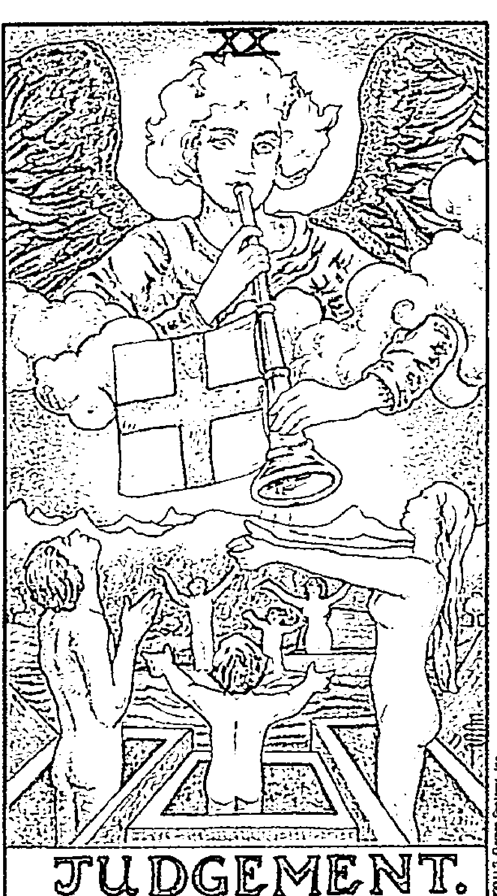

傳統佛道教的教義中，輪迴的概念深植其中，《法華經》有云「六道眾生生生死所趣」，《觀佛三昧經》亦有「輪迴六趣，如旋火輪」之觀念，靈魂在肉體死亡之後，會在另一個肉體中裡重生，並承接著上世行為的善惡果報。然而在基督教教義中，當時有人認為耶穌就是像耶利米 [207] 一樣的先知轉世，耶穌回答「因為眾先知和律法說預言，到約翰為止。你們若肯領受，這人就是那應當來的以利亞。」（馬太福音 11:13-14）是的，在基督教教義中，每個人的生命都只有一次，當下就是一切，必須珍惜所有，因為永別之後不再重逢。

「最後審判」是基督教教義中重要的宗教思想，在世界末日之時，上帝會出現，將死者們從地上喚醒，並對他們進行終極裁決，天堂與地獄概念油然而生，而此種審判概念在古埃及宗教中，即以審判廳 (Hall of Judgement) 中死者心臟與「瑪特」女神羽毛相秤重的方式進行。《聖經》中對世界末日的預言做出未來預警，其中又以天使吹響號角來揭開整個過程，「羔羊揭開第七印的時候，天上寂靜約有二刻。我看見那站在神面前的七位天使，有七支號賜給他們」（啟示錄 8:1-2），這七支號角分別象徵著每階段的毀滅：

### 第一支號角：世界的毀壞

「第一位天使吹號，就有雹子與火摻著血丟在地上。地的三分之一和樹的三分之一被燒了，一切的青草也被燒了。」（啟示錄 8:7）

### 第二支號角：海中活物毀滅

「第二位天使吹號，就有彷彿火燒著的大山扔在海中。海的三分之一變成血，海中的活物死了三分之一，船隻也壞了三分之一。」（啟示錄 8:8-9）

### 第三支號角：供生命的水毀滅

「第三位天使吹號，就有燒著的大星好像火把從天上落下來，落在江河的三分之一和眾水的泉源上。這星名叫『茵陳』。眾水的三分之一變為茵陳，因水變苦，就死了許多人。」（啟示錄 8:10-11）

### 第四支號角：日月星宿毀滅

「第四位天使吹號，日頭的三分之一、月亮的三分之一、星辰的三分之一都被擊打，以致日月星的三分之一黑暗了，白晝的三分之一沒有光，黑夜也是這樣。」(啟示錄 8:12)

### 第五支號角：星球撞擊地球

「第五位天使吹號，我就看見一個星從天落到地上，有無底坑的鑰匙賜給他。他開了無底坑，便有煙從坑裡往上冒，好像大火爐的煙；日頭和天空都因這煙昏暗了。」(啟示錄 9:1-2)

### 第六支號角：世上三分之一人類被殺

「第六位天使吹號，我就聽見有聲音從神面前金壇的四角出來，吩咐那吹號的第六位天使，說：把那捆綁在伯拉大河的四個使者釋放了。那四個使者就被釋放；他們原是預備好了，到某年某月某日某時，要殺人的三分之一。」(啟示錄 9:13-15)

### 第七支號角：上帝得勝的國度

「第七位天使一吹號角，天上就發出大聲音說：世上的王權已歸屬我們的上主，和他的基督，他要為王，至於無窮之世！」(啟示錄 11:15)

此牌畫面即是描繪第七號角響起時，那場死而復生的曠世場景。在克勞利的《Liber 777》對卡巴拉之樹路徑 31 的描述中，對此傳統「最後審判」主題呈現出清楚畫面，一位天使吹響別有旗幟的金色號角，死者紛紛從棺木中甦醒，地上亡魂伸出雙手迎接，舉在肩膀和額前高度的雙手，姿態正好與此牌的希伯來字母「Shin」象形。在歷經了六聲號角的苦難，第七聲號角的審判與終於來臨，而上帝的王國在期盼中終於來到。

肉體早已消逝，這是一場靈性的復活，而此「靈性的復活」與「正義」牌中所呈現的差異，在於人世間的律法，只為追求人世間應遵循的規矩和法則秩序而已，而不是真正的真理。

「審判」牌追求的則是靈性的規則，真的審判不發生在肉體而在靈魂，與冥王星連結的深沉，讓一切回歸真相。人真正面對到的真相，不會是來自法律的約束，而是真實的感受，

「感受」正是人間法律無所規範的範疇。「審判」牌是甦醒、是轉念，對舊的過往已經沒嚮往，也再也沒有期望，心中的轉念與放下才是人世間真正的結束，《啟示錄》中的烈焰，燃燒的已不再是物質界的一切，而是燃燒掉舊有的自己，進而產生新的靈魂，這是人生在經歷一切之後最強的後座力。

## X 命運
Fortune

- 生命驅力之主
  The Lord of the Force of Life
- 木星之行星牌
- 希伯來字母：Kaph，手掌

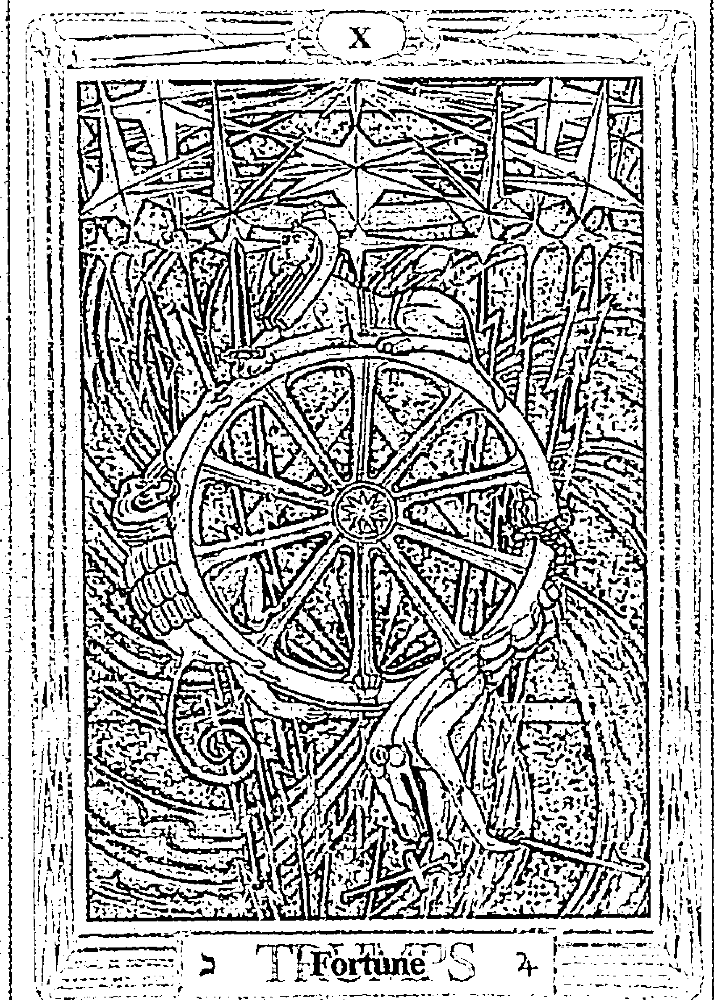

與木星相連的「命運」牌，為卡巴拉之樹上連結聯結 4 號薩弗拉「仁慈」(Chesed) 與 7 號薩弗拉「勝利」(Netzach) 的第 21 條路徑。天上降下陣陣閃電，而「斯芬克斯」頭頂上的十芒星，與輪心的十芒星相互對應，這人間的現象，即是如同由埃及智慧之神「托特」和希臘信息之神「赫密斯」所書寫的「翡翠碑」(The Emerald Tablet) 中，「如其在上，如其在下」(That which is above is like to that which is below) 的概念，隨著宇宙中心的能量流動，人間命運之輪亦然開始轉動。[208]

克勞利清楚指出，輪子左方的是「赫曼努比斯」(Hermanubis)[209]，是古希臘信息之神「赫密斯」與埃及喪葬之神「阿努比斯」的聯合形式，這兩位神祇均能在各限界中穿梭，祂試圖在命運之輪上往上爬升。右方希臘神話中的妖魔「堤豐」(Typhos) 以其強而有力的蛇尾緊緊勾住輪子，如暴風般讓輪子往下方沉淪。在我們不能理解的「天界三角」中，一切的變化與創造，均如「愚者」般無法窺探邏輯與脈絡，但在「深淵」之下，與此牌連結之木星為第四顆薩弗拉，為「深淵」位階最高的星球，就在「宙斯」(Zeus) 逃脫了父親「克洛諾斯」(Cronus) 食子的輪迴後，混沌的洪荒之力終被破解，天地開始爬梳出人類可以理解的物質之界，而這物質界的驅動力啟動後，「命運」亦然開始被推動，輪子頂端的斯芬克斯，像是「慾望」牌中巴巴隆女神與七頭獸的合體，代表了人間物質融合的狂喜，也是為人生出課題的智慧。

克勞利在《Liber 777》中對於這條路徑 21，指出這是印度哲學中「Sattva」、「Rajas」與「Tamas」三種屬性 (gunas) 與傾向：「薩特瓦」(Sattva) 是善良、積極、平靜和諧的品質傾向；「拉賈斯」(Rajas) 是自我為中心、個性化、動感、興奮與活力的屬性品質；而「塔馬斯」(Tamas) 則是忽略後果而採取的行動，是黑暗、無知與死亡等屬性。命運之輪說出了人生就是這三股力量的均衡與拉扯，一切都在「深淵」中以顯化的能量進行運作，精彩地如同後面燦爛的十道旋轉迴旋能量，這三種屬性配合著三位神祇，同時象徵著煉金術中三種屬性——「赫曼努比斯 -Sattva- 汞」、「堤豐 -Tamas- 鹽」、「斯芬克斯 -Rajas- 硫」，[210]「深淵」之下三種力道研磨輪轉出綿延的生命軌道，這是精彩的生命計畫圖稿。而在輪子後方的三角形，是能量的象徵，是「我是輪之軸，圈中方」[211] 的「哈地德」(Hadit)[212]，牌面的紫色是「哈地德」的衣飾，這是代表頂輪智慧的紫色，象徵著穿透所有課題的智慧。

「命運」牌面圖案的呈現，都和冥界與破壞有關的神祇，人生很多事情由不得你，機會是否來臨也由不得你，要不要把握機會端看自己的智慧裁決。「命運之輪」是機會的啟動，人人都會被後方的漩渦捲進去。木星雖然代表幸運，但也一向和各種形式的賭博有關聯，好運厄運都蘊含其中。代表皇家顏色的金黃色輪子和閃電，是不可抗拒的神聖命運安排，此能量象徵天既然給了這個使命，就代表你一定有能力完成，否則上天不會這樣安排。閃電一向突如其來無法抗拒，我們不能賦予這些過程正面或負面的想法，因為命運的輪轉沒有好壞。

「斯芬克斯」依然拿著寶劍提出問題，會是「赫曼努比斯」靈巧聰明地往上攀爬？或是「提豐」式的下沉毀滅破壞？大家都只能保持沈默——面對，紫色是因為經歷過而產生的智慧光芒，正如同「宙斯」因劇烈思考而頭裂，才會產生出智慧之神「雅典娜」一般，「依循你的命運，不論它將引領你至何方」[213]，這一切無法終止，除非我們跳脫輪迴。

## XX 新紀元
The Aeon

- 原初火焰之靈
  The Spirit of the Primal Fire
- 火之元素牌
- 希伯來字母：Shin，牙齒

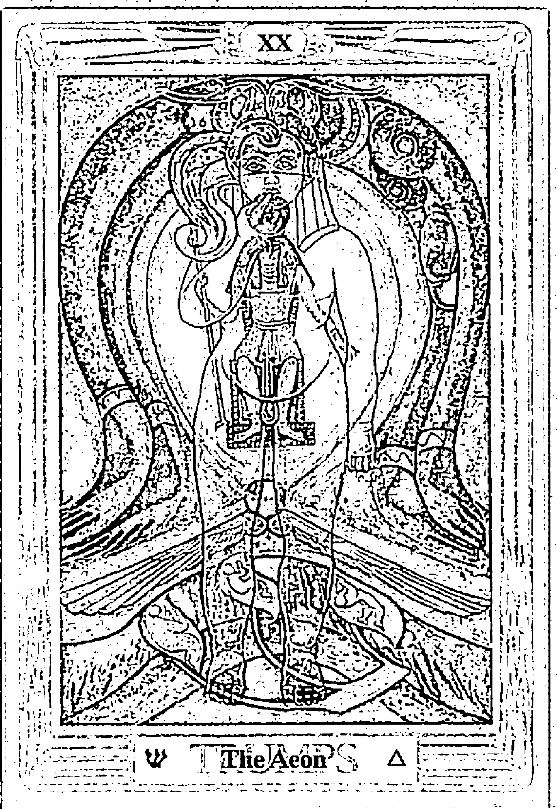

1904年3月20日，克勞利與新婚妻子羅絲·伊迪絲·凱麗 (Rose Edith Kelly) 在埃及開羅，見到了「昭示之碑」[214] (Stele of Revealing)，這塊木祭碑是大約公元前680至670年之物，本來位於前布拉瓦克博物館 (Boulaq Museum)，典藏編號為666 (是的，克勞利相關理論的研究者都知道這數字666對克勞利的意義) [215]，並於1902年左右移至埃及的開羅博物館 (目前典藏編號為A 9422)。之後在4月8日，克勞利聽見了靈性的聲音，接連三天寫下了《律法之書》(Liber L vel Legis, The Book of the Law)，此書最重要的宣告，即是「歐西里斯紀元」(The Aeon of Osiris)的結束，以及「赫魯斯紀元」(The Aeon of Horus)的來臨。

在遠古時期，人類以小團體進行採集維生，過著居無定所的日子，在那個時期，女性是神奇且奧秘的存在。她們會定期流血數天但是不會死亡，並在某一時間點後，身體會開始出現變化，肚子逐漸隆起，一段時間後分泌出透明液體，之後伴著血水流出一個嬰兒，而女性胸部也會分泌出白色液體來哺育新生命。在尚未有任何醫學知識的年代，此過程太過神奇並無法理解，這一切又與大地滋養萬物概念連結，因此女性等同於大地，女性等同於生命創造，「大地之母」概念形成，女性崇拜成為了宗教儀式的基礎，這就是克勞利《律法之書》所謂的「伊西斯紀元」(The Aeon of Isis)。

著名的《維倫多爾夫的維納斯》(Venus of Willendorf)，是舊石器時代的一尊女性石灰岩雕像 (有部分專家學者推測其可能是當時的地球之母女神像)，作品強調豐滿的胸部、小腹與臀部，顯然與旺盛的生育能力有密切相關，而與生殖無關的手臂明顯短小，臉部五官更是被嚴重忽略，可猜測當時生殖與繁衍是最重要的追求。

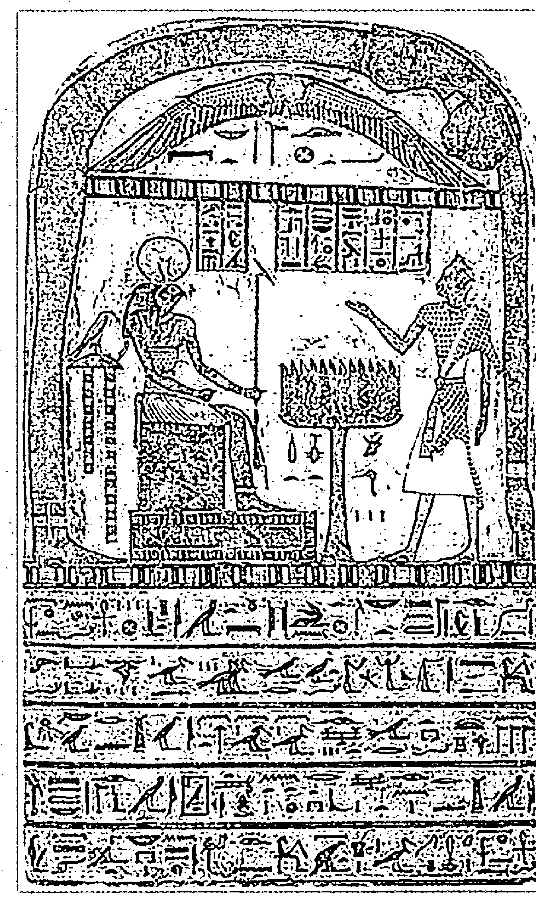

▶ 影响克劳利重大的「昭示之碑」。[216]

大约到一万两千年前，人类找到了驯化植物和动物的方式，开始发展农业与畜牧业，因为食物来源稳定，可以不用再过着四处采集的生活，人类也因此可以开始聚集较多人数于同一地点，文明因此开始得以发展。这是人类发展史上重要的转变历程。农业的发展，让人类开始观察白昼黑夜长短的变化，以及春夏秋冬四季的轮替，渐渐地发现，植物的生长不全然只是因为土地肥沃，另一个重要的生命力来源，是在天上燃烧发光的太阳。当太阳光射向地面，这是重要的创造来源，而此时人们也开始意识到，女性在生殖的过程中，不全然是自体的创生能量而已，精液的射入亦是拥有重要角色。至此人们望着天空，了解没有阳光就没有生命，一切都是天赐，而太阳每天均会因为「死亡」而带来黑暗，如何维持太阳愿意持续给予光热，成了最重要的宗教追求。此即为克劳利《律法之书》的「赫鲁斯纪元」(The Aeon of Horus)。

关于太阳的崇拜，在位于墨西哥的阿兹特克(Aztecs)文明的宗教信仰中，有着令人坐立难安的崇拜方式，此文明大约存在于十四至十六世纪，阿兹特克人尊崇太阳神「Tonatiuh」，并认为太阳的红热光芒是祂的血液，因为祂必须通过牺牲自己来为人类提供生命之能，因此人类也必须用自己最重要的鲜血作为回报，才能偿还这份庞大的神恩债务。1487年，在阿兹特克人对大金字塔重新奉献时，献祭者自行步上阿兹特克金字塔的殿顶，躺在祭坛上，四肢被其他祭司压住，胸膛被一名祭司剖开，直接掏出还在跳动的心脏，心脏即刻被献给太阳神，尸身则被推下金字塔，超过二万名俘虏和奴隶，在四天内丧失了生命。[218]

尽管现在已经不可能再用人命来祭天，但是「用生命祭天」的概念依然存在，不论是供桌上的三牲五果，或是台湾特定祭典上的「神猪」祭祀，也都持续延续着「用无价生命换取天恩」的想法，基督教则将耶稣的血与肉转化为将教堂祭坛上的酒与面饼。这种「上对下施与恩惠」以及「下对上牺牲奉献」的概念，即是「欧西里斯纪元」中所呈现出来「对死亡的执念」，不管是埃及神话中成为冥王前先被分尸的「欧西里斯」，或是基督教中为了帮人类洗净原罪，而死在十字架上的耶稣，死亡都是一定要付出的代价。

从已消逝的埃及信仰，至今日仍然活跃的基督教和佛道教信仰中，都呈现「死亡」后才是人生价值的终极定论，判断后的结论让天堂与地狱的概念随之而生，而宗教中处理「死亡」议题，在在均以安抚人心为最终目的，死亡成爲生命的一個過程，是宇宙循環的一個步驟，並傳播著藉由對信仰的虔誠與對教義的服從，即能夠與死亡達成和諧狀態，而這是唯一能克服死亡的方式。

此牌「新紀元」畫面的呈現，即是象徵「赫魯斯紀元」(The Aeon of Horus) 的來臨。此牌畫面上方與「昭示之碑」畫面相同，埃及智慧女神「努特」(Nuit) 彎拱著身體，呈現出希臘文「Omega」的字型，懷中有一顆巨蛋，上半身有著星辰和流雲，而「太陽」牌中的埃及太陽神「赫魯斯」(Horus，Heru-ra-ha 爲其特殊名號) 的雙面性「胡爾 - 帕 - 克拉特」(Hoor-pa-kraat) 和「拉 - 胡爾 - 庫特」(Ra-Hoor-Khut) [219] 在此一同呈現。前方透明孩童形象是「胡爾 - 帕 - 克拉特」(Hoor-Paar-Kraat)，綁著埃及兒童髮辮吸吮手指的他，稚嫩的表情代表著雖然無知但蘊含強大能量，還是小孩子的他，像是「愚者」牌中的愚者，一切還在混沌階段，儘管強調世代的轉換，但新世代才剛開始。

在巨蛋中間端坐者即是「拉 - 胡爾 - 庫特」，而努特女神的身軀呈現子宮形象，她是「偉大母親」，是一切事物最根本的來源，在子宮口處那帶有雙翼的太陽，即是《律法之書》第二章的主角「哈地德」(Hadit)，「我是寰宇之中存在於一切地方的圓心，而她是不存在於任何地方的圓周。但她將爲人所知，而我永遠不被知曉」[220]，畫面下方是與此牌連結的希伯來文字母「Shin」的象形，顏色上橘紅色是臍輪象徵信任，也是自我安全感的連結，三叉中各孕育有一個成形的嬰兒胚胎，即將誕生。

「所有的典儀，所有的裁判，所有的文字和符號都是無用的」[221]，「赫魯斯紀元」時代到來，舊日的權威準則不再，《啓示錄》中毀滅世界的烈火，燃燒的已不再是真實的物質世界，真正發生的劇變乃在於思維上，這條 31 號路徑，8 號薩弗拉「智慧」(Hod) 到 10 號薩弗拉「王國」(Malkuth)，要燃燒掉所有舊思維裡面跨不過的橋樑，新時代的關鍵信念，在於宗教信仰並非根植於毀滅與災難，而是基於靈性能夠持續成長。我們每個人都是發光發熱的太陽，而黑夜並不代表太陽的死亡，它只是到了地球的另一邊，在經過女神崇拜時代、接續著男神崇拜時代過後，人類將進入覺醒，燒掉生命中所有不值之人事物與觀念想法，生命因此得以永續成長。

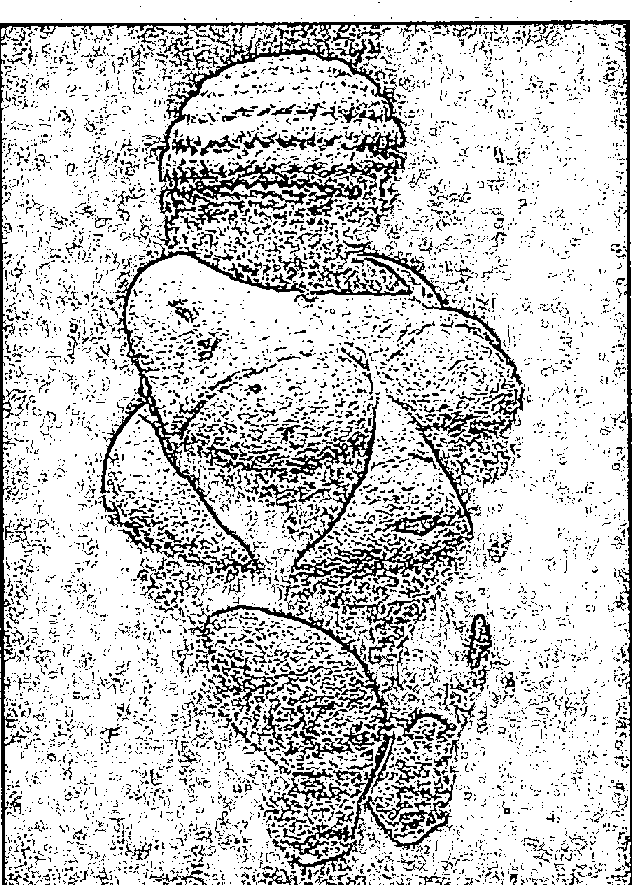

▶ 《維倫多爾夫的維納斯》[217] 之身體造型，顯示出採集時期人類，在面對大自然的無常中，對於能生殖繁衍與成功養育的強烈嚮往。

## 傳統圖像意義

## 埃及兒童髮辮：

埃及地處沙漠地區，氣候十分炎熱，在水源珍貴又不是便利的年代，根據「希羅多德」(Herodotus，約公元前 484 － 前 425 年) 的《歷史》(Histories，又稱《希臘波斯戰爭史》) 第 2 卷第 37 章第 2 節中主要介紹古埃及的篇章，曾說明埃及人非常注重清潔，並喜愛亮麗打扮，神殿祭司得每三天剃一次全身的毛髮，主因是為了不讓蟲子等其他髒東西，在他們做儀式侍奉神時出現。因此古埃及成人幾乎都剃光頭並戴假髮，而皇室的兒童四歲前在頭側邊會留一撮真髮編成髮辮，擁有真髮是奢華與尊貴的代表。在許多小赫魯斯雕像中，經常可見兒童髮辮形象的出現。

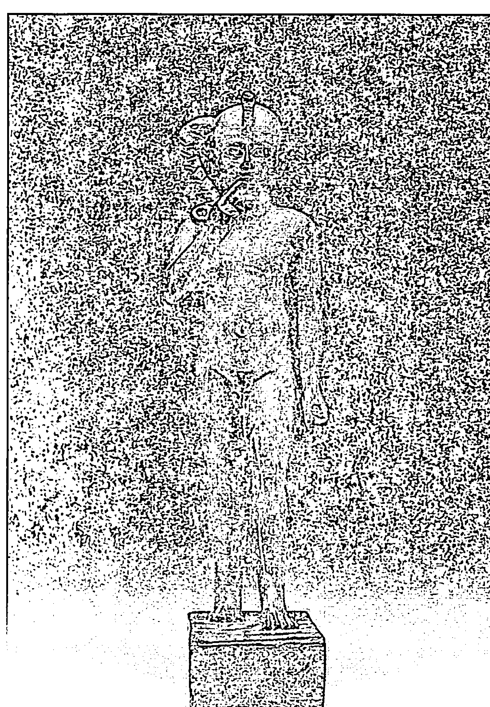

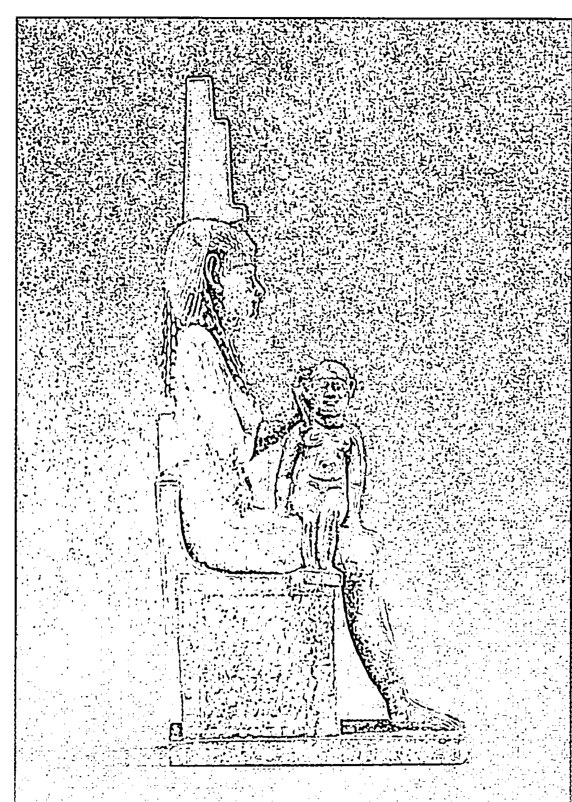

△ 《孩童赫魯斯》青銅雕像，其動作與造型即是「新紀元」牌中「胡爾 - 帕 - 克拉特」的形象相仿。[222]

▷ 《伊西斯與其兒赫魯斯》青銅雕像，其兒童髮辮清楚可見。古埃及時期只有皇室兒童，會留兒童髮辮。[223]

## 註釋

[203] 東野圭吾著 (2017.03)。《宿命》，張智淵 譯。台北：獨步文化。

[204] 「哈托爾女神」是古埃及神話中的愛神、美神與富裕之神，常見化身母牛形象。

[205] Susan Levitt (2020.04)。《塔羅初心者》(Introduction to Tarot)，楊舒涵 譯。台中：左西新創藝，頁 33。

[206] 尼古拉斯·普桑 (Nicolas Poussin, 1594-1665)，《隨著時間之神的音樂起舞》(A Dance to the Music of Time)，約 1634-1636 年所作，現存於英國倫敦華萊士收藏館 (Wallace Collection)。圖片來源：維基百科，https://commons.wikimedia.org/wiki/File:The_dance_to_the_music_of_time_c._1640.jpg。

[207] 耶利米在《舊約聖經》中，是猶大國的先知。

[208] 在希臘神話中，普遍認為古埃及的神祇托特 (Thoth) 就是後來古希臘的赫密斯 (Hermès Trismégiste)，並認為此碑文為兩位神祇所著，內容是關於人生和宇宙間的終極解密，亦是西方煉金術起源的重要著作。

[209] 《The Book of Thoth》，p90。

[210] 《The Book of Thoth》，p90。

[211] 《律法之書》第 2 章第 7 節。在印度三德性中，Sattva 為有情眾生，情感流動與汞的液態金屬流動性質相仿；而 Tamas 屬於遲鈍、不活動的特性，與於海水蒸發後穩定的結晶體「鹽」性質相仿；Rajas 則具有活動、運動的傾象，與硫的易爆炸屬性連結。

[212] 哈地德為泰勒瑪神譜中的一位神祇，也是在《律法之書》三位敘述者神祇中的一位。

[213] 《The Book of Thoth》，p257。

[214] 「昭示之碑」為一埃及的木祭碑，第十八王朝法老「哈特謝普蘇特」的陵墓中發現，後成為克勞利所創之泰勒瑪宗教的重要啟示核心。

[215] 《聖經》提到有一隻七頭十角的野獸從海裡上來，這隻野獸的名字 666 (啟示錄 13:1, 17-18)，克勞利小時因頑皮好動被母親訓斥為 666 野獸，後來他就常以 666 數字自稱。

[216] 作者不詳「昭示之碑」(Stele of Revealing)，現存於埃及開羅博物館 (Museum of Egyptian Antiquities)。圖片來源：維基百科，https://commons.wikimedia.org/wiki/File:Stelae_of_Ankh-af-na-khonsu.jpg。

[217] 作者不詳，《維倫多爾夫的維納斯》，推測距今約 25,000 年，現藏於奧地利維也納的自然史博物館 (Natural History Museum Vienna)。圖片來源：維基百科，https://commons.wikimedia.org/wiki/File:Vienna_-_Willendorf_Venus_Natural_History_Museum_-_6190.jpg。

[218] Ross Hassig (1988), Aztec Warfare, University of Oklahoma Press:Norman. 此書中認為此次活人獻祭的人數還有待商榷。

[219] 《律法之書》第 3 章第 35 節。

[220] 《律法之書》第 2 章第 3-4 節。

[221] 《律法之書》第 1 章第 49 節。

[222] 作者不詳，《孩童赫魯斯》(Harpokrates, Horus the Child) 青銅雕像，約於西元前 664-342 年所作，現典藏於美國沃爾特斯藝術博物館 (The Walters Art Museum)。圖片來源：The Walters Art Museum，https://art.thewalters.org/detail/22710/horus-the-child-4/。

[223] 作者不詳，《伊西斯與其兒赫魯斯》(The Goddess Isis and her Son Horus) 青銅雕像，約於西元前 332-330 年所作，現藏於美國大都會藝術博物館 (The Metropolitan Museum of Art)。圖片來源：The Metropolitan Museum of Art，https://www.metmuseum.org/art/collection/search/548310。

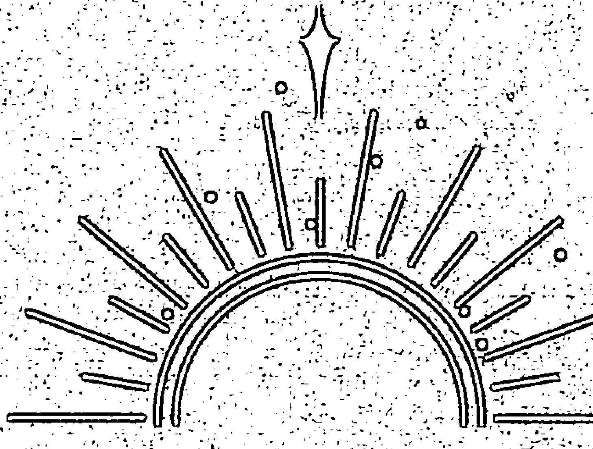

# 小阿卡納牌—數字牌
## Minor Arcana — Small Cards

> 在數學的天地裡，重點不在於我們知道些什麼，
> 而是我們如何去知道。
> ——古希臘哲學家。畢達哥拉斯 (Pythagoras)

在塔羅牌的世界中，22 張大阿卡納牌象徵的是宇宙哲理與精神世界的狀態，而 56 張小阿卡納牌則像一場場人生實境秀中的實況演出，是日常生活中接地氣的不同範疇狀況，顯示出人生旅程中零碎片段的生活，場景生動活潑、五花八門，在這些牌面意義所呈現的細節中，不出你我每天所要面對的人生百態。

在 56 張小阿卡納牌中，分為「錢幣、聖杯、權杖、寶劍」四個系統，每個系統中各有由數字 1 到 10 組成的 10 種數字牌 (small cards)，以及由國王、皇后、騎士、侍從 (在托特塔羅系統中則是騎士、皇后、王子與公主) 組成的 4 種宮廷牌 (court cards)。本章將先針對數字牌做探討。

其實關於數字牌，大眾最熟悉的是遊戲用的撲克牌。一副撲克牌中，有方塊、紅心、梅花、黑桃四種系統，數字也都是從 1 到 10，人物牌也對應到宮廷牌 (「J」融合了侍從與騎士)，與塔羅牌有驚人的相似度。其實兩者是本源相同的牌組，象徵意義自公元前 3 世紀至 14 世紀中逐漸發展累積，但在中世紀時期，天主教為多數的歐洲地區主要宗教，由於基督教系統著重祈禱禁止占卜，因此牌卡在占卜形式上逐漸式微，變成只具有遊戲功能，直至今日此功能仍由常見的撲克牌形式繼續承載。[1]

約在 18 世紀中後期開始，法國神秘學家李維透過研究，將卡巴拉哲學系統與塔羅牌結合，往後的神秘學主義者開始集合了基督教、埃及神話、希臘神話與星座概念、煉金術、數字靈數等系統，並加入圖像象徵，成為自成一格的占卜體系。不過，一開始的使用只存在像「金色黎明協會」這樣的神秘學團體。世界上最暢銷的塔羅牌「偉特塔羅」之發明者，即是該協會的成員。

所謂神秘學，自然有其神秘不為外人知的道理。金色黎明協會的會員需遵守協會中規定的保密誓言，針對協會所使用的塔羅基礎框架資料《Book T》[2] 內容也不多作透露，這也是偉特塔羅由牌面中可看出的訊息遠少於托特塔羅之緣故。由此也可以想像，托特塔羅的發明者克勞利為何會不受到金色黎明協會的歡迎，後來甚至另立神秘團體，因為該副牌系統龐雜而且可能透露了太多教義 (甚至是指正傳統教義)。

## 卡巴拉之樹與數字 1 到 10

小阿卡納牌的數字牌分為 1 到 10，一併參考靈數和數字學，才會知道目前情況與步驟到哪裡，並用生活經驗去定義現階段的狀況，然而提到這十個數字，我們還是得回到「卡巴拉之樹」來討論。卡巴拉之樹亦稱「生命之樹」 (Etz haChayim)，是猶太教哲學傳統中所使用的神秘符號，透露出不僅是人類在靈修道路上通往上帝的路徑，亦是上帝如何從空無中創造出世界萬物的方法，是身為「上帝揀選之民」的猶太人，在一神信仰的整體創造性演進過程中，所呈現的豐富性與多樣性架構。一般相信這棵生命之樹相當於《聖經》中提及位於伊甸園中央的那棵生命之樹，「耶和華神在東方的伊甸立了一個園子、把所造的人安置在那裡。耶和華神使各樣的樹從地裡長出來、可以悅人的眼目、其上的果子好作食物。園子當中又有生命樹和分別善惡的樹。」(創世記 2:8-9)

卡巴拉之樹圖形最早出現於 1652 年，刊登在德國耶穌會修士「亞撒納修斯·基徹」(Athanasius Kircher，1602-1680) 最著名的作品《俄狄浦斯的埃及神話》(Oedipus Aegyptiacus) 當中，書中呈現出豐富的占星術、卡巴拉哲學、埃及學、煉金術與希臘神話等等。最古老的卡巴拉文獻為《創造之書》(Sefer Yetzirah，據傳約成於西元三至六世紀)，這本關於冥想且具有強烈魔法色彩的書籍，第一章第一段即是卡巴拉之樹圖形概念的解釋：「In thirty-two mysterious paths of Wisdom, Yah, Eternal of Hosts [Yod-Vav-Yod], God of Israel, Living Elohim, Almighty God, High and Extolled, Dwelling in Eternity, Holy Be His Name, engraved and created His world in three Sefarim: in writing, number and word. Ten Sefirot out of nothing, twenty-two foundation letters, three mothers, seven doubles and twelve simples.」[3] 內容先是呼喊全能上帝之各聖名，說明上帝透過三種標記來創造世界，他們是出自於「空無的 10」和「22 個基本字母」所組成，這 22 個字母又分為三組，「3 個母字母」、「7 個雙重字母」以及「12 個簡單字母」。這「空無的 10」與「22 個字母」總共正是 32 條神秘的智慧路徑，而此 32 條路徑與那三種創造世界的標記，在祂之內是完全相同的。

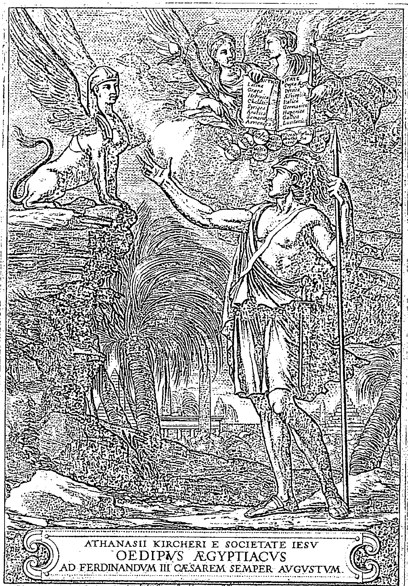

▶ 亞撒納修斯·基徹的《俄狄浦斯的埃及神話》[4] 一書，畫面中「俄狄浦斯」站在「斯芬克斯」面前，他已成功解答出謎語，亦代表基徹本人透過此書已解答出謎團。

## 負向存在的三道帷幕

Ayin : 否在、無
En Soph : 無限
Or En Soph : 無限光

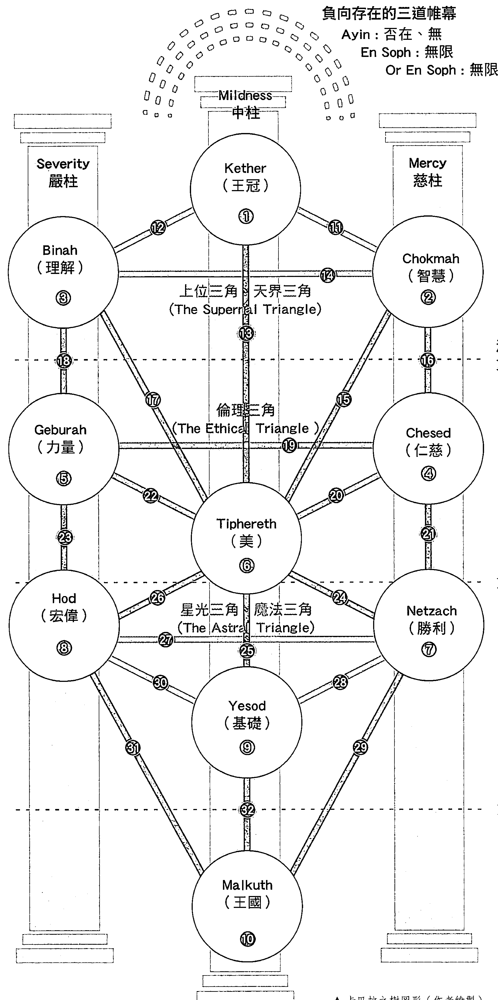

△ 卡巴拉之樹圖形（作者繪製）

22 個基本字母 (Twenty-Two Foundation Letters)：即為 22 張大阿卡納牌，可分成三組。

- 3 個母字母 (Three Mothers)：Aleph (風)、Mem (水)、Shin (火)。
- 7 個雙重字母 (Seven Doubles)：Beth (水星)、Gimel (月亮)、Daleth (金星)、Kaph (木星)、Pe (火星)、Resh (太陽) 以及 Tau (土星)。
- 12 個簡單字母 (Twelve Simples)：對應黃道十二宮的十二個星座。

空無的 10 (Ten Sefirot Out Of Nothing, Ten Sefirot Of Nothingness)：卡巴拉之樹上的 10 顆「薩弗洛斯」(Sephiroth，單數時稱為「薩弗拉 Sephira」)，由上至下、由 1 到 10 依序為：Kether (王冠)、Chokmah (智慧)、Binah (理解)、Chesed (仁慈)、Geburah (力量)、Tiphereth (美)、Netzach (勝利)、Hod (宏偉)、Yesod (基礎)、Malkuth (王國)。它們分別存在也一起存在，是上帝的一部分。在「神就是光、在祂裡面毫無黑暗」(約翰一書 1:5) 概念下，薩弗拉亦被稱為是「發光體」或是「輝耀」，因為它們僅由能量組成，反映了宇宙中所有能量的來源，也就是唯一的上帝。

上帝沒有被描繪在卡巴拉之樹當中，祂是其上的三重發光能量環，最高層稱為「無」(Ayin)；再下一層稱為「無限」(En Soph)；最下層是「無限光」(Or En Soph)，這三層光是人類無可想像的萬物源起範疇，在這三層光之下，才是卡巴拉之樹的十顆「薩弗洛斯」，這卡巴拉之樹上的三層面紗，在猶太教中常常被稱為「負面存在的面紗」(The Veils of Negative Existence)，各位於「深淵」(The Abyss)、第六顆薩弗拉「美」(Tiphareth) 和第九顆薩弗拉「基礎」(Yesod) 上，一切無以名之。關於這個最高的創造奧秘，若不使用神 (God) 一字，可以理解成造物 (Creator)，人在經過靈性上的靈想與修行之後，光可以被人所感受，有如面紗被微風吹起時，我們可以稍微窺視，但終究無法見到全貌，這是造物者的終極奧秘。

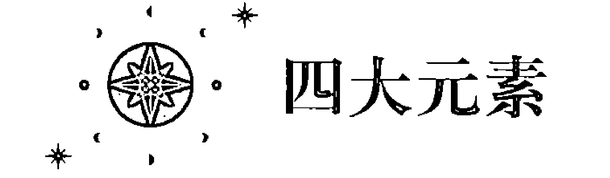

## 四大元素

上帝是唯一，但是希伯來「神秘主義」(Mysticism，亦稱為「密契」) 學者認為這位神之聖名有四個字母「YHVH」，因此卡巴拉將整個宇宙分成了四個「世界」(Olamot / Olamos)，每一個世界都是由聖名四字母中的一個字母所發展而出。四字神名的原始發音目前早已失傳，它是「神」公布的自稱，因此要思考「唯一」的這位神相關特質，需要分成「四」個方向來思考，這是四棵卡巴拉之樹，也就是塔羅中的四大元素。

> 「就是凡稱為我名下的人，是我為自己的榮耀創造的，是我所做成，所造作的。」
> ——《賽亞書》43：7

### 1. 原型之界 – Atziluth【Yod】

「凡稱為我名下的人」為「Atziluth」，是第一顆薩弗拉「王冠」(Kether)，位於「天界三角」的頂端，對應的神名為字母為「Yod」。這是可以激活並顯化出其他世界的純粹的精神能量，是原始的「火元素」能量。

陽性－火元素：權杖

火元素在偉特塔羅與托特塔羅中，均以權杖 (Wand) 為代表符號 (在托特塔羅中或稱為「魔杖」)，是有形無體、有中之無的概念，本身不具任何形象，它的存在只是「存在」，像是基本星座 (又稱作開創星座) 一般。火元素屬於原型之界，在卡巴拉之樹上象徵第二顆薩弗拉「智慧」(Chochmah)，是原型之介中的一道光，完全看不清它真實的樣貌，一種無來由的爆發力，是那種捨我其誰一馬當先的衝動力，為了目的與擁有權力，一定要自己去爭取的資源。它不喜歡別人施予，因為被施予的過程會讓得到本身喪失獲得的意義，正所謂風火燎原，烈焰燃燒過後，最大影響力是物質全面更換了本質，再也無法恢復到原來的型態。讓物質面目全非是它最大的影響力，但前提一定得有媒介可以燃燒，作用力雖大但是作用時間不會太持久。

### 2. 創造之界 – Binah【Heh】

「是我為自己的榮耀創造的」為「Beriah」，從第二顆薩弗拉「智慧」(Chokmah) 到第三顆薩弗拉「理解」(Binah)，是介於「原型之界」和「成形之界」中間的「流溢世界」，對應的神名為字母為「Heh」。在這裡有純粹的智慧，是大天使的住所，是原始的「水元素」能量。

陰性－水元素：聖杯

水元素在偉特塔羅與托特塔羅中，均以聖杯 (Cup) 為代表符號，是無形有體、無中之有的概念，而水的多變性在此也展露無遺。以宇宙規律前後拍打沙灘的海浪像基本星座，凝結成固體冰塊的水元素像固定星座，而瀑布和變化萬千的水流則像極了變動星座。水元素屬於創造之界，在卡巴拉之樹上象徵第三顆薩弗拉「理解」(Binah)，象徵和諧、療癒與滋養，沒有人我之分別。水是可以生長萬物的重要生命要素，而其不同狀態也展現出不同特質的水元素，必定是帶來完全不一樣的感受。看似柔弱無力是水元素的最大特徵，但其實這是水元素最強大的武器偽裝，水的滲透力無孔不入，只要給予時間即可滴水穿石，鋒刃度更勝刀劍，就像人心中的情感，一旦受到了感動而產生美感之後，不論是對人對己產生療癒能力，或是因情感濃烈導致過渡付出，都會讓人過於感性甚至生意志薄弱的狀況，一但進入了情感產生的階段，這種不知不覺、綿綿密密的滲透力，會讓當事人有了完全不同以往的感受，它可強力療癒人心的同時，也可把人逼進情緒黑洞，萬劫不復。

### 3. 成形之界 – Yetzirah 【Vau】

「是我所做成」為「Yetzirah」，覆蓋了第四顆「仁慈」(Chesed) 至第九個薩弗拉「基礎」(Yesod)，對應的神名為字母為「Vau」。這是一個物質微妙且不穩定的領域，它不是天使永久居住的世界，是當胎兒成形時的那一刻，滿溢著原始之「風元素」的渙散能量。

陽性－風元素：寶劍

在塔羅牌中，風元素代表著人類的思考和情緒，在圖像方面的對應即是寶劍，而寶劍牌組也很清楚地展現出人在心理或思想層面上的種種方式與情緒。寶劍為人造物件，在塔羅牌上的圖像以雙面刃來展示，清楚的表現出人的思考呈現出「水能載舟，亦能覆舟」的特性。

也因此寶劍牌面上常常展現出負面的情緒。人的一生會出現無數的低谷與泥濘時刻，而我們也通常儘量用理性和客觀的思考方式來面對這些課題。但我相信所有的人都曾經體會過思考過度而導致負面情緒對自己身心所造成的影響，寶劍牌組中說展現出的那些迷惘和混亂的場景，成為生命中一道一道的傷痕，而風元素的渙散特質，與自己在情緒上面的難以控制、變化莫測的特質相符，有時候事實並不會毀滅我們，而我們卻毀於自己過度的思考和無法自拔的負面情緒當中。風元素屬於成形之界，領域在卡巴拉之樹上從第四顆薩弗拉「仁慈」(Chesed) 延伸到第九顆薩弗拉「基礎」(Yesod)，在卡巴拉哲學系統中此六顆薩弗洛斯屬於「大宇宙」的宏觀世界觀，在圖形上常以六角星來呈現。

寶劍象徵人類的「Ruach」[6]，也就是人類頭腦中的心智運作。然而在靈性相關的哲學觀念上，這通常代表小我、自我意識與知識的部分，而此部分若是運作太過的話，會產生傲慢和野心，「地球人類理性體的元素，大多數是非常晦暗沉重的，因為理性體是人類意識思想模式的產物，並且是人對周圍事物的理性思想的反應，因此理性體被許多負面能量所包裹著，成為宇宙的垃圾場」[7]，在此概念之下，寶劍牌在塔羅中多呈現較為負面的意涵，在數字牌中，可見到數字越大，壓力越是沉重。風元素這把兩面刃，理性思考與負面情緒兼具，建設與毀滅同存，如何善用自己的心智，在遭遇困頓和瓶頸時，能沉著思考，並跳脫無邏輯性的負面情緒糾纏，成為人生的重要課題。

### 4. 物質之界 – Asiyah 【Heh】

「所造作的」為「Asiyah」，覆蓋了最後一個薩弗拉「王國」(Malkuth)，對應的神名為字母為「Heh」。這是我們稍能理解的物理宇宙，是整個世俗世界的創造系統，靈性在此被賦予了物質性，是個黑暗不潔的所在地，為穩定的「土」元素能量。

陰性－土元素：錢幣／圓盤

土元素在偉特塔羅中以「錢幣」(Pentacle) 為代表符號，在托特塔羅中則以「圓盤」(Disk) 為代表符號，是有型有體、有中之有的概念，一切都要眼見為憑，相較下比較沒有彈性，型態也比較無法改變，彷彿是所有已固定好、不用自己去積極爭取資源。一般來說，與固定星座的特性比較相似。在卡巴拉之樹上為第十顆薩弗拉「王國」(Malkuth)，是維度最低的「物質之界」，也是人類目前生存的空間，在卡巴拉哲學系統中被稱為是「小宇宙」，圖形常以五芒星為代表，因為位於低中之低，魔法基因受到污染，因此儘管人類感官粗糙昏昧，卻仍事事都堅持一定要眼見為憑，比較沒有彈性，若是以資源為例，傾向可掌握之世襲或遺產等已固定承接之積累，不用自己爭取，但相對之下也必須負擔揮之不去的包袱感。

每一個維度都有一個主宰的能量，我們人類目前生活在最低層的土元素物質之界當中，自然看不到也無法理解「天界三角」維度上運作的原則，但看不到不代表能量不存在。小阿卡納牌中呈現的四大元素，不是只用來產生作用力而已，它們更是一種意識、維度、意識、能量與境界，或許我們可以用「戴有色鏡片來看世界」的概念來理解——當我們戴上玫瑰色鏡片，眼前世界自然呈現出玫瑰特調氛圍；當我們以土元素的角度看世界時，這世界必定呈現安祥穩定、平靜且務實的面貌。

這四個世界都擁有著向下的能量，隨著神光從虛無到具象。儘管每一個元素的卡巴拉之樹組成都相同，但是因為是不同思考方向，世界自然會呈現出不同色調角度。因此，這四棵卡巴拉之樹上，總共會有 40 顆薩弗洛斯，這即是塔羅牌中為何會是 40 張小阿卡納牌中的數字牌，由 1 至 10 編號著。必須提醒的是，這 40 張數字牌並非真的就是完全對應薩弗洛斯，與之相較，薩弗洛斯的地位神聖得多，不是每張小牌可以去代表的，不過作為「次元素」(sub-Elemental) [8]，「是盲目的驅力，僅僅是濾降至元素宇宙的『薩弗洛斯』之共振感應的回聲」[9]，人類透過相當有限的感知力，藉由聆聽這些共振的回聲，試圖能對薩弗洛斯有些微理解。

除了 10 顆「薩弗洛斯」的概念之外，小阿卡納牌還需要跟數字的文化性結合。這其中，數字 1 是尚未以其物質的形式做出顯化，還不是四元素本身，「它們是這四元素的種子」[10]，而權杖代表火象星座、聖杯代表水象星座、寶劍代表風象星座、錢幣代表土象星座，此為黃道的「三方」概念。接下來的 2 至 10 號這九張牌，2、3、4 號為代表黃道十二宮中的「基本星座」，5、6、7 號代表「固定星座」，8、9、10 號牌則是代表「變動星座」，為黃道的「四正」概念。在托特塔羅當中，牌組的數字加上黃道星座中的行星，就是小牌的意義。

## 數字 1
### 獨立與未知的極限
薩弗拉「王冠」(Kether) 之對應數字

「1」是單數，亦是陽性數字，「1」的能量最純粹、最不受干擾、也最沒有雜質的，在卡巴拉之樹上與第一顆薩弗拉「王冠」(Kether) 對應，是「絕對純粹的至高的單子」[1]，是地水火風元素的至高基本傾向，正如同宇宙源起與演化中重要的起點「大爆炸」(the Big Bang)，儘管這理論是科學理論，但是作為一個闡述「實在物質世界」起源的理論，它在神學和哲學中也明顯產生了作用。「王冠」作為第一顆薩弗拉，位於「天界三角」的制高點，如此獨特又無可比擬，它是物質界一切顯化的源頭。「王冠」的魔法形象是一位古老國王的側臉，他永遠只以半邊臉朝向我們，而那另外的半邊臉是我們永遠「不可知」的面貌，「已知」的是我們已經意識到一種存在，但是如何讓此意識顯化，那還尚存於「未知」領域，在顯化的世界中，就如同科學無止盡地探究宇宙來源一般，我們永遠只能見到一部份的奧秘，要理解全貌是不可能的。

以偉特塔羅的圖像來看，每一張數字 1 的數字牌(亦稱「王牌」)，元素後面都有一朵雲，呈現出來的畫面也都是最乾淨的，意念才剛開始萌芽，一切都還只是一個架構的起點，是一種發想、源頭與感覺，剛開始意識到某些事，這是一種突發奇想，因為根本還沒有辦法預測任何結果，因此產生了一馬當先、捨我其誰的姿態，一切只強調個體和自我，不考慮合作，沒有辦法被取代也不想被超越，是最原始單純想邁向成功的動力。

這是一個開創數、創始數，如同太陽般，是宇宙能量的開始，也同時是具備最基本「自我」概念的數字，喜愛領導、不喜依賴與合作，衝勁十足，時時充滿活力和精力，擁有自己的獨立意識，一切都是以自己的想法為方向，正如「神對摩西說：『我是自有永有的。』」(出埃及記 3:14)，即是此種「我存在所以我存在」的純粹。在圖像上，它一如英格蘭守護聖者聖喬治 (Sanctus Georgius) 手上的那一把長槍，他單打獨鬥，我們聽不見被稱為「惡龍」的獨自和感受。它亦是埃及耀眼的方尖碑，旭日東升之時，碑尖如同耀眼太陽般閃亮，樹立它們的法老王展示著無人可以忽視的權威。它亦是台北的 101 大樓，在台灣這塊小島嶼上，在 2004 年至 2010 年年間，為台灣撐著「我就是世界第一高樓」的美名，這是一種希望能吸引世界目光的心態展現，亦是數字 1 的姿態呈現。

「1」是一個起點，是一張籌畫下個階段的藍圖，並對未來抱持期望和自信，相信這是重要的契機，儘管此時四元素的能量種子尚未破土萌芽，冬天留下來的寒意還在時時提醒著不要過度樂觀，這個起心動念是一種意願和認同，可能是重新思考曾經未完成的目標，或是進發了全新的方法或心態，但能真正顯化的直覺其實並不多，端看日後格局與造化。

## 偉特塔羅
## 小阿卡納牌 — 數字牌
## 權杖王牌
### Ace of Wands

雲端中突然出現一隻握有權杖的手，此權杖上帶有數個分岔枝芽，畫面中呈現出十八片葉子，手的後方有白色光芒。畫面下方是一道紫色山脈，那是連綿的靈性力量。一座如同城堡般的建築立於山丘上，穩固而堅定，下方藍色汨汨河水流淌，是流動的生命力量。未經雕琢的天然山水充滿著原始能量之美，未經雕琢的權杖有著無窮的可能性，恍如魔法棒一般，雖行動還尚不可見，但已備齊燎原態勢。

火的能量直接明確，此時做事一切憑直覺，不假思索往前行動是最大特色，這迸發而出的直覺沒有所謂的前因後果，立即起而行的特性明確，願意用行動、身體與時間來進行這場實驗，不知結果如何但仍有滿滿地嘗試意願。直覺性的衝動，是一種生命與意志的展現，是個機會與命運的轉捩起點，這股爆發力，在思想層面上可無止境地蔓延，想要達成所要的夢想願望。然而，這種想法畢竟是個冒險，也有可能因還沒什麼確切方向性的衝動，而造成行動力短暫，原本強烈的興趣，後來卻消逝無蹤，畢竟火是需要有物質為媒介才能燃燒，當可燒之物質消失殆盡後，火焰也會隨即消逝於瞬間。

## 權杖王牌
Ace of Wands

- 統轄著北極之上巨蟹、獅子、處女
- 三星座象限 [12]
- 代表亞洲地區

此牌畫面呈現出在混沌宇宙中，莫名出現的一股洪荒之力，這是火能量原始的根源，「這是一種從各方向噴射閃電的太陽般／陽具式火焰爆發」[13]，是卡巴拉之樹上「王冠」(Kether)的能量，亦是「YHVH」中的「Yod」。這是一場生命起源的展現，如同四十多億年前，剛開始地球上的液態非常渾濁且溫度極高，裡面含有大量的有機分子，即是科學家稱為「原始湯」的概念，而之後在晝夜不停的閃電擊打下，由天下打下來各種形成生命所需的有機分子，這些有機分子在高溫下開始組合，形成了地球上最初的原始生命。

畫面中無法忽視的鮮紅色，是海底輪的代表色，非常具有動物性的直覺、衝突與原始能量，閃電雷火打到「原始湯」後，如同精子打入卵子而創造出生命，這不是透過感官經驗學習而來的能量，這是與上天連結所產生的爆發力，是上帝與人類靈魂、精神界與物質界間的橋樑。權杖王牌畫面呈現一支烈火燃燒的三叉棍棒，左右兩邊的棍棒各有三道火焰，中間棍棒有四道火焰，這時到火焰的排列，呈現出卡巴拉之樹與十個「薩弗洛斯」的圖形，托特塔羅中四張 1 號牌，只有「權杖王牌」有卡巴拉之樹隱藏其間，卡巴拉之樹是那「三層面紗」的倒影，而「權杖王牌」雖是第一顆薩弗拉「王冠」(Kether)，但它也只是倒影的最高層級，所有物質從這裡開始複製，神的火花像火焰和閃電憑空出現，宇宙的創造也突然爆發，呈現的力量原始且粗糙，如直覺一般根本無法掌控。

在托特塔羅系統中，「權杖王牌」不僅僅只是火元素的第一張牌，它位於所有小阿卡納牌之上，由另一個角度來看，它蘊含了其他所有的小阿卡納牌，四字母聖名屬性中的「Yod」，是所有演化與一切創造之父。

## 聖杯王牌
Ace of Cups

「聖杯王牌」是水元素的根源，雲端伸出一隻白色的手，捧著刻有倒立M字母的金杯，杯中流出五道水柱，流進了開了蓮花的海水中，杯口上方有一白鴿，口銜著聖體麵餅，往下朝聖杯杯口飛入。在佛教思想當中，蓮花是聖潔、清淨的象徵，佛座更稱為「蓮花座」，《阿彌陀經》中陳述有另一個世界，名字叫「極樂」，「池中蓮花，大如車輪」，因此極樂世界也稱為「蓮花世界」或「蓮邦」，而開了蓮花的水面，傳達出在靈魂與精神層面上愉快和滿足的境界。

《聖經》中描述約翰在約旦河為耶穌施洗時，「聖靈降臨在祂身上，形狀彷彿鴿子」（路加福音 3:22），本來人類感官不可見的聖靈，在此呈現出視覺上可見的樣貌，而「馴良像鴿子」（馬太福音 10:16），傳達出鴿子象徵了純潔和無害，而聖靈更是聖潔和純真的。在天主教儀式中，聖杯是裝盛著象徵耶穌血液的葡萄酒，祝聖之後的聖餅和杯中的酒混合，象徵耶穌身體和鮮血的結合，也就是耶穌的復活。在此牌畫面中，白鴿銜著象徵耶穌身體的聖餅自上而下，飛入象徵情感源起的聖杯王牌，這時靈魂開始進入物質世界。

水元素屬陰性，與數字 1 的陽性概念似乎有點衝突，雲端出現的這隻手，與「權杖王牌」和「寶劍王牌」中緊握的手截然不同，在此它輕捧聖杯，而非用力緊抓，恍如想對情愛對象細心呵護的心，目前階段若是緊抓必然窒息。這是突然對愛情有了興趣，但又不馬上進入感情的情境，很接近情感剛起漣漪的時候，還沒有到利害關係的產生。數字 1 本來十分強調個人的自我中心，但「聖杯王牌」是所有王牌中最不強調自我的，目前呈現的是一種滿滿想給予的情緒，類似大愛般源源不絕，但畢竟 1 是陽性數字，還是代表了行動力，因此也有可能藉由「給予愛」的行為上，來從中樹立自己的形象。

◀ 安德烈·德爾·委羅基奧（Andrea del Verrocchio，約 1435-1488）和當時為學生的達文西一起創作的《基督受洗》（Baptism of Christ），約在 1472 至 1475 年間所繪，據說左邊的天使即是出自於達文西之手。並作中清楚呈現出象徵聖靈的白鴿，而偉特塔羅聖杯王牌中的白鴿飛行姿態與該作一樣。作品現典藏於佛羅倫斯的烏菲茲美術館。[14]

## 聖杯王牌
Ace of Cups

- 統轄著北極之上天秤、天蠍、射手
- 三星座象限
- 代表太平洋地區

西元 33 年，耶穌受難前逾越節的最後晚餐上，吩咐門徒喝下象徵祂血液的紅葡萄酒，塔羅牌中的「聖杯」(Holy Grail)，的確指的就是在當時曾經裝著葡萄酒的杯子。而對於聖杯的追尋，最為世人所知的，是英國凱爾特神話中亞瑟王與騎士們的史詩篇章。在塔羅牌中，聖杯是水元素的象徵，「聖杯王牌」更是水力量的根源，背負了創造之界的不設限能量。「神愛世人，甚至將祂的獨生子賜給他們，叫一切信入祂的，不至滅亡，反得永遠的生命。」(約翰福音 3:16) 上帝愛人，耶穌親身降臨人間示人以愛，因此塔羅系統以聖杯圖像和概念來代表水元素所呈現出來的愛與情緒。

這是情感滿溢的畫面，來自於天上的白光，這是所有色光的總和，這創造的光芒穿刺而下，與「生著蓮花與睡蓮」[15] 的水面融合共創能量，聖杯出現在蓮花池面上方，四周恍如扇貝造型的水波紋，呈現豐富色彩。克勞利說明「杯中液體以水呈現，也可被轉化成酒或是耶穌聖血」[16]，因此四周有水的漸層藍色色階，也有酒與血的紫紅色色調。聖杯上有曾經出現在「教皇」牌中的三環交疊圖案，「上環是代表『赫魯斯紀元』，下面兩環分別是『伊斯西紀元』和『歐西里斯紀元』」[17]，文獻中無記載此圖案為何會出現在聖杯王牌畫面中最中央的位置，但可確定的是，人類在漫長的發展史上，愛一向是最強韌的連結，也是一切奇幻創造的基礎根源，是體現通往內心最高形式的行動方式。

此牌的呈現，在於如何讓自己的情感能引發大眾共鳴，能否在虛空中抓住能量是關鍵。創造之界的屬性比原型之界較為溫和，與慈悲大愛、大我能量連結共鳴，擁有滿滿的陰性能量，「它是『權杖王牌』陰性的互補，衍生自象徵陰戶的『尤尼』(Yoni) 和月亮，正如『權杖王牌』是衍生於象徵陽具『林伽』(Lingam) 和太陽」[18]。水是所有生命的泉源，對一切萬物展現無私(無意識)的滋養灌溉，是具療癒力的同理心，也是源源不絕的創意和創造力，更是奧秘「愛」的產生，與生命創造的情感流淌。

## 寶劍王牌
Ace of Swords

塔羅牌系統中，風元素的飄忽多變，讓寶劍牌組所呈現出的，大多是變動與衝突的不穩定感，也使得寶劍牌的牌義時常散逸出負面訊息，並提醒需要保持冷靜，用理性智慧去面對課題。此牌畫面中，空中的厚重烏雲，出現了一隻白色的手，緊握著一把雙刃銀色長劍指向上空，「劍尖穿刺了一頂有燦爛的皇冠，一條橄欖枝從王冠右方垂落，一條棕櫚枝則從左方垂落，六個希伯來字母 (Vau) 從劍尖飄落到王冠頂上」[19]。在《聖經》中，為了清洗世上罪惡，耶和華降下了日夜連續四十天的大雨，在大雨過後，挪亞放出鴿子，「到了晚上，鴿子回到他那裡，嘴裡叼著一個新擰下來的橄欖葉子，挪亞就知道地上的水退了」(創世紀 8:11)，鴿子帶回來好消息，而橄欖枝也成為了和平的象徵。在希臘神話系統中，雅典娜將長矛刺入大地，把綠油油的橄欖枝散落碧水白沙間，橄欖樹為人民遮擋著炙熱太陽，橄欖油不但可食用，更可為雅典人民帶來了財富，橄欖樹從此也就多了神聖色彩。

關於棕櫚枝，在猶太文化中被視為欣喜過節的象徵，天主教中有棕枝主日 (Palm Sunday，亦稱聖枝主日)。《聖經》記載，耶穌復活前的那個星期日，祂騎驢入耶路撒冷，「第二天，有許多上來過節的人聽見耶穌將到耶路撒冷，就拿著棕樹枝出去迎接他，喊著說：『和散那！奉主名來的以色列王是應當稱頌的！』」(約翰福音 12:12-13)，如迎君王般的禮遇。而「此後，我觀看，見有許多的人，沒有人能數過來，是從各國、各族、各民、各方來的，站在寶座和羔羊面前，身穿白衣，手拿棕樹枝，大聲喊著說：『願救恩歸與坐在寶座上我們的神，也歸與羔羊！』」(啟示錄 7:9-10)，因此棕櫚枝亦是勝利的象徵。

在四張王牌中，只有寶劍為銳利的人造物，使用得宜時可救人或自衛，使用不慎時會傷人傷己，皇冠的出現是表示精神清晰，持劍緊握的手象徵著挑戰的慾望與想法已然產生，保持直立的劍身，是在提醒智慧和果斷的重要性。儘管在心靈層面上，用想法來推演，用頭腦去構思，已設定好成功的目的地，心中帶著必勝的氣勢，如已在弦上的弓箭，有強烈的進取心與攻擊心，但是成功的因子仍掌握在物質層面，如何在現實世界中去落實心中想法，才是能否成功的關鍵因素。

## 寶劍王牌
Ace of Swords

- 統轄著北極之上摩羯、水瓶、雙魚
- 三星座象限
- 代表美洲地區

寶劍是風元素和成形之界力量的代表標誌，在「四字母聖名」中為「Vau」的本質，為「Ruach」的整體化。[20] 在卡巴拉哲學系統中，認為人的靈魂有三個要素，而希伯來文「Ruach」是「中間靈魂」，它包含道德、美德和區分善惡的能力，主要存在的位置是在心臟，是人類靈魂的智慧和知識面向。寶劍牌組中令人沮喪的牌義居多，主要是由於在神秘主義中，認為上帝是絕對一切的超越，祂超越了人類所有因理性、思想和心智所展現的能力和形式，因此所有人類心智中所繪呈現出來的情緒，例如煩惱、挫折感、憂鬱焦慮等，都會影響上帝所安排的靈魂層面的運作，它「在人類的階級上缺少了優越的純粹性，也正因為如此，它是第一張被人類意識所制約的牌」[21]，因此能否好好運用寶劍的能量，會成為成敗的關鍵因素。

出現在雲端的寶劍，「頂端有 22 道純粹光芒的冠冕」[22]，此 22 道光芒與卡巴拉之樹 22 條路徑對應。它這是大阿卡納牌中「賢者」（偉特塔羅稱為「魔法師」）的佩劍，綠色的銅鑄寶劍，看起來異常冷靜，護手是由初昇之月和虧蝕之月組成，月亮的盈缺需要時間推移，而思想也需要很多時間來架構，上下弦月是一個月的循環，代表一切都還需要時間醞釀。劍柄上蛇的纏繞也意味著還需時間累積才能獲得啟發。此兩面刃從劍尖至劍刃都很銳利，這是人類智慧和行動實踐配合一起打造出來的寶劍，是把理想落實到物質世界的過程起始，儘管牌面上寶劍是筆直朝上，但真實情況是「劍柄頂端的圓球是在『深淵』中，護手延伸至『慈愛』與『力量』，而劍尖則是在『王國』中」[23]，在卡巴拉之樹中這是一道筆直往下的落實能量，並在劍上鑲有阿拉伯波紋字體「泰勒瑪」(Thelema)，而「泰勒瑪」教義正是表達「個人的真實意志」。

背景中呈現了克勞利所描述的「風是承接火與水之下的結果」[24]，象徵水的藍色水面中昇起了象徵火的太陽，這像是一場頓悟的過程，在不經意之間，頓時想到了新的方向，承載自信的寶劍刺穿皇冠，在暗藍天空中綻放光芒，散發象徵獅子座金黃能量的光芒。自信是來自於實踐某事後的成果，把心中智慧施行在現實生活中，儘管四周仍有烏雲，成形之界在於要如何把想法變成現實，過程即是將月亮這份深沉情感，透過人智力能力所造之寶劍，前往最高的 22 道光芒意識。風元素的飄散傳播力道，象徵一切均以無形思想意念主導，這是位於人類表層的顯意識，是想擁有能力去做想要進行的事件，且不論善惡。

## 錢幣王牌
Ace of Pentacles

在銀白色的天空，一隻捧著正五芒星金幣的手，從雲朵中出現，而下方的景觀，有別於其他三張王牌，是偉特塔羅四張王牌中土壤最為肥沃、花園景觀最美的，可以想像這裡應該有一座豪邸，擁有一個生長著百合花和綠草的造景花園，四周環繞矮樹圍籬，一個綠葉滿蔭的拱門，是花園通往山脈的出入口。

土元素是穩定的象徵，是人間最想追求的世俗意象，而世俗生活最在意的，不外乎就是經濟層面的穩定，故金幣象徵人間最實際的東西，是財富也是金錢。在此，肥沃的花園象徵著經濟成功與生活幸福，而與外通聯的拱廊平坦踏實，可想像在此生活的輕鬆自在。物質上的豐盛的確可以帶來安全感和幸福感，是繁榮與成功的體現，「錢幣王牌」平鋪出一條機會之道，但土元素畢竟是陰性元素，儘管開始意識到未來世俗價值觀和金錢的重要性，但行動力目前還偏弱，畢竟積累財富需要時間，而由拱門中被所窺見的山脈，暗示著未來仍充滿挑戰，不論是追逐財富的過程，或是飛黃騰達之後如何避免頹廢，並能節制慾望的擴張，均是人生重大課題。

◀ 金色的錢幣通常象徵著世俗物質上所肯定的榮耀。波提且利（Sandro Botticelli，1445-1510）大約於1475年所完成的《持勳章的男人》（Portrait of a Man with a Medal of Cosimo the Elder），圖中男子手持一枚印有文藝復興時期大商人科西莫·德·麥第奇（Cosimo de' Medici）頭像的金色獎章。這名男子的身分雖然有不同說法，但是他手持這枚「金獎章」臉上表情盡是驕傲也是榮耀，而這枚「金獎章」亦是麥第奇家族富貴逼人的象徵。麥第奇家族驚人的藝術貢獻，使其獲得「文藝復興教父」的美名。作品現典藏於佛羅倫斯的烏菲茲美術館。[25]

## 圓盤王牌

## Ace of Disks

- 統轄著北極之上牡羊、金牛、雙子三星座象限
- 代表歐洲與非洲地區

穩穩的土能量，「圓盤王牌」象徵著稱為「地球」的各式能量，畫面美麗細緻且複雜，像極了紙鈔上那些密密麻麻的細密線條背景，這是物質之界中土能量的根源，是四字聖名中屬性中的「He」。像一顆種子般，未來要開花結果的所有能量一切都是配置好了，這是命運對我們此生的安排，所有必經的路程都已規劃完成，多想無益，象徵著第十顆薩弗拉「王國」(Malkuth)，在此所有的一切均是倒影中的倒影，所有的人生過程，不外乎就只是反映著此顆種子中，早已存進 DNA 的遺傳指令，例如醜小鴨之所以會變天鵝，是因為他的父母本來就是天鵝，一切只需等待時機。

中間的圓是此牌中最重要的諭示，外圈的希臘文「To Mega Therion」是「致偉大的野獸」之意，這是在《律法之書》中「汝將知曉，被選為無窮空間的神官和侍僧的乃是『獸 (Beast)』之神官王」(律法之書 1:15) 中的獸，也是《聖經》中「龍在海邊的沙上站著。我看見一隻野獸從海裡上來」(啟示錄 13:1) 中的七頭獸，而《啟示錄》中更明確地指出「誰洞悉隱情，就該算一算野獸的數字。這是人的數字，就是 666」(啟示錄 13:18)，故「666」是獸的代號，該組數字對於克勞利更是別具意義。他身於虔誠信奉普利茅斯教友會 (Plymouth Brethren) 的基督教家庭，在青春叛逆期時，母親在衝突嚴重中曾稱他為「啟示錄之獸」，從此他把這名詞與 666 數字和視同於自己，直到 1904 年在埃及見到「昭示之碑」(Stele of Revealing)，當時此碑的展覽編號亦是 666，數日後根據聽到空靈的「艾華斯」(Aiwass) 的聲音，如獲天啟，因此寫下了《律法之書》(Liber L vel Legis)，奠定了「泰勒瑪」教義。

把自己和 666 劃上等號的克勞利，在其心中，666 不僅不是《啟示錄》中的惡獸，其實是一個神聖數字。太陽對應位居卡巴拉之樹中心的第六顆薩弗拉「美」(Tiphareth)，在這太陽之域中，呈現出的是完全均衡能量的展現。在 1935 年 2 月克勞利被宣布破產之前，他曾經對認為誹謗過他的人提起了訴訟，克勞利在 1934 年的一次法庭辯論中，他對法官提問為何自稱啟示錄之獸 666，他回答 666 是太陽的數字，意指陽光，並對法官說可稱自己為「小陽光」(Little Sunshine)。在此「圓盤王牌」中心，即有三個圓圈，上方為太陽的符號「圓心點」(circumpunct，圓圈中央一個點)，此「圓心點」被一個弦月所托捧著，下方兩個圓圈中即有 666 數字，這三個圈即是「野獸印記」(the Mark of the Beast)，在此印記外有兩個五邊形內含一個七芒星，這是「泰勒瑪」教中「巴巴隆」女神之星，而「巴巴隆」女神則是「第 11 號大牌(慾望牌)中的那位女士」[26]，再回到中央外圈的外圈的希臘文「To Mega Therion」(致偉大的野獸)，這張牌不就是克勞利本人的簽名印記嗎！

「圓盤王牌」的概念是一顆落入物質之界的種子，任何一個種子均有能量並來自上天的創造，但是種子種入物質土壤瞬間，未來會生長成的品種與樣貌，其實都已經被確定好了，所以在物質之界中有一切都是被安排好的，其他原型、創造與成形三界能量是可以相互轉化，只有物質之界的能量穩定到所有事件均依照因果定序，什麼行為就是導致什麼結果，一切無法轉換。這顆種子偉大又卑微，偉大是因為生命本身即是波瀾壯闊獨一無二的史詩旅程，卑微則是因為一切劇本都被設定好，所有事情都由人無法控制的力量所促成，不論看似順理成章地發生，還是出於純粹的偶然，最終都只能配合命運往前走，人之意志有如蚍蜉撼樹，是無法改變任何環節的。

## 數字 2

## 合作與平衡的極限

薩弗拉「智慧」(Chokmah) 之對應數字

數字 1 與數字 2 的主要差別，在於「1」是以自己為出發點。在數字學上，1 和 2 是對立的，這是 180 度完全相反的概念和做法。「1」強調獨立自我，而「2」會開始想到合作、累積、相互與配合。陽性元素和陰性元素隨著數字的增加開始產生不同表現，有如分水嶺一般，因為陽性元素最終仍強調自己，硬要跟他人合作還是會產生尷尬情狀，如果在「必有所取捨」與「配合他人」之間擺盪，強迫自身去抉擇之時，陽性元素的個性必定適應不良，而陰性元素性個柔和，也喜歡與人配合，所以數字增加時比較不會產生問題。

數字「2」具有協調和平衡之意，在卡巴拉之樹上，由 1 號薩弗拉「王冠」(Kether) 流溢出的第一個動力象徵，即是 2 號薩弗拉「智慧」(Chokmah)，為第一個向外發散性的陽性原則，陽性原則既然出現，陰性能量必然隨之產生，一切開始在本質上有了相對性。數字「2」具備有兩面的特性，因此常會被視為是二元對立，然而二元儘管對立，卻是維持宇宙平衡的必要狀態，例如天地之間的白黑、日月、晝夜、暑寒、上下、左右、動靜、剛柔等等，彼此相互依靠也相互制約，在相互轉化的存有當中，萬物才得以在自然循環當中豐盛與代謝，一切才能生生不息。《周易·繫辭傳》中「一陰一陽之謂道」，中國傳統哲學中的二元論觀念「陰陽」，即是此概念的彰顯，而禪宗六祖惠能的《六祖壇經·付囑品》中，三十六對法通貫一切經法教義，強調世間諸法皆為對待之法，唯有平衡的中道才能超越，進而隨緣自在。

萬物不外乎如此，有地獄的存在，天堂才會令人嚮往與追尋，任何想要搖晃地獄支柱的力量，運作之時天堂也會隨之晃動。數字「2」被視為是合作與平衡的極限，接在開創能量的數字 1 之後，呈現準備好狀態，並要面對接下來的進程，也必須開始周旋於過程之間兩邊的平衡與銜接。數字「2」是陰性數字，因此不太喜歡成為領導者，反而比較有和他人合作之意願，並喜愛藝術與美感，性格敏銳纖細，也常因情感豐富，而比較容易感性懷舊。由於其內斂合群的特性，有時會喜愛依賴他人，甚至因為敏感體貼的性格，而導致情緒不定、優柔寡斷，因此數字「2」可借助相關資源與之協調和互動，並適當發揮其擅長溝通協調的天性，為自己在未來衝刺前準備好和諧能量。

## 權杖 2

## Two of Wands

一個頭戴紅色帽子、身穿橙色外衣與暗紅罩衫的男子，站在城堡上馳目望向遠方，他右手拿了一個圓形物件爲地球的縮影，是力量的基礎，左手握著一根木棍，緊盯著被山巒環繞的海灣，而他的右方有另一根木棍，牢固地安裝在牆上。鑲有彩色花紋的石墩，象徵著他的位階與智慧。

面對「2」的選擇，是意味著多了可以比較的選擇，但火元素不會因爲選擇而猶豫不前，比較之下他還是得做出決定，在此「2」裡面象徵著抉擇和取捨，一切憑直覺來做出選擇，也預示著即將把大多數想法都轉化爲行動，這是火元素帶來的魄力，一定會決定走出舒適區，若做不了決定，甚至會對自己感到極度不耐，且願意承受取捨後的盈虧。

紅帽代表著熱情和慾望，橙色衣裝則象徵歡樂，雖然目前大部分精力，都還集中在眼前情狀，但是這一切都是在爲即將跨出的腳步而準備，新世界會讓人獲得嶄新體驗，需要在爲時已晚之前，決定好路徑並採取下一步行動。在此之前，取捨，是唯一需要的步驟。

## 權杖 2：統御

## Two of Wands: Dominion

- 統御之主 Lord of Dominion
- 火星在牡羊座區
- 牡羊座 0 度到 10 度
- 3 月 21 日至 3 月 30 日

依據金色黎明協會《Book T》中設計的模型，牡羊座的守護星火星入廟於自己的星座，此牌是火象精神的展現，「不帶有功利性、不沾染對於成果的慾望的意志，是純淨的意志，它是完美無瑕的」(律法之書 1:44)。背景是火星的紅色，以及生命之樹當中 2 號薩弗拉「智慧」(Chokmah)的淡藍橙色，在兩根西藏金剛杵碰撞的剎那，六道火焰迸發，暗示著 6 號薩弗拉「太陽」(Tiphareth)，而太陽在牡羊座是入旺，此形式呈現出的破壞力勝於創造力，因為「處女之卵必須被攻破 (破壞) 才能受精 (創造)」[27]，這堅固的星象聯盟，讓此牌成為「火能量代表的最佳及最高形式」[28]。

金剛杵是法器，上方有金剛怒目的面貌，從「權杖王牌」的雷霆萬鈞，到「權杖 2」火星特質與能量的充分發展，「權杖王牌」因為能量純粹所以還不需要做決定，而「權杖 2」在一些想法之後必須開始做出決定。此牌象徵了決斷性，像是人在最危急之下做出了決定，也在最短的時間之下得做出直覺判斷，火元素的能量讓人勇往直前，星象廟旺象徵能量純粹，情緒的出發勢如破竹，不管對錯也不需商量，已經做好取捨，也準備好要進行的方向。

金剛杵由於材質堅固，能擊破各種物質，是如來護法神「密跡力士」手中的武器，亦是象徵如來金剛的智慧大用，能避邪驅魔，破除諸魔障礙。此牌定位為「統御」，一種強大的心靈力量準備將行動啟動與出擊，並決定好能量集中的方向，因為願望無法全部均攬，這一切無需有批判性與愧疚感，也沒有包袱和猶豫，只有如實地執行已決定好要做的，並用行動來證明自身的智慧和直覺。

## 偉特塔羅

## 小阿卡納牌 — 數字牌

## 聖杯 2

## Two of Cups

數字「2」和水元素是最和諧的適當搭配，陰性數字基本上和水元素都能產生和諧關係，願意分享才是聖杯所帶來的意思。畫面中一男一女四目相望，並願意將自己手上的聖杯與對方互換，這是坦誠的誓約。兩個人站立的沙地上寸草不生，但在遠方背景中則有青綠山坡草地，以及一棟小房子出現，儘管距離有點遙遠。男性頭上戴著紅花環，象徵火元素的衝動與熱情，而女性佩戴著綠色葉冠對應土元素，代表經過思考，會務實地去評斷現實狀況，理性地評估因為感情而生的利益和安全感。

兩人中間有古希臘神祇「赫密斯」(Hermes) 的「雙蛇杖」(亦稱商神杖，Kerykeion)，赫密斯是訊息傳遞的信使，手杖被視為是商業和國際貿易的象徵，亦是協商與權衡的符號，手杖上方出現帶翼獅頭，這棕紅色的獅子，恍如「力量」牌中的獅子，給予這對男女加持的力量。而類似土壤的棕紅色，讓關係不只建立在愛情上，更要建立在共同的利益與目標。

儘管聖杯 2 經常被視為是「戀人」牌的小牌版本，但畫面中男女兩人相敬如賓，處於一種互敬互愛的平等關係，一切的和諧和對等，奠基於溝通良好與相互配合，這是即將步入穩定和諧關係的前期，比起戀愛的親密互動，此牌更顯現出同盟伙伴間合作聯盟的美好。但值得注意的是，此階段確實還沒有到許下重要承諾的階段，目前僅止步於禮貌對待，情感上並不深刻，所以若是後面關係是逐漸淡化，彼此間也較不會產生傷痕印記。

## 聖杯2：愛

## Two of Cups: Love

- 愛之主 Lord of Love
- 金星在巨蟹座
- 巨蟹座 0 度到 10 度
- 6 月 21 日至 7 月 1 日

此牌定名為「愛」，畫面中也呈現出粉紅和綠色上下心輪的顏色，而早春的翠綠與玫瑰色，是金星的色彩，整體畫面顏色平和穩定，寧靜中呈現和諧氛圍。這是創造之界 2 號薩弗拉「智慧」(Chokmah) 加上金星在巨蟹座的代表，儘管金星在巨蟹座能量不強，但是亦有代表美好、舒適、自在，是水元素的初次顯化，亦是水能量最佳和最高的形式表現。

在金色黎明協會對此牌的模型定義為：「一隻手從下方的雲和水中伸出，握著一蓮花的莖，上方開有兩朵蓮花，一朵從另一朵的上方升起，在兩朵蓮花之間的莖上，兩隻海豚相互交叉，兩股(金銀)水從上方的蓮花中湧出，水落在海豚上，然後像金銀射流一樣落入兩盞杯中，直到杯中滿溢，淹沒了牌底部。」[29] 這兩朵蓮花原是由同一源所創，之後才衍生出二元對立，因此沒有高低大小之別，並藉由兩端的融合，來創造出更完整的體驗。當中兩條海豚，克勞利強調與煉金術相關，[30] 儘管克勞利未曾提過其相關性，但有一說法是海豚會出現在《漢密特大奧秘》(The Great Hermetic Arcanum) 這幅畫中，而此畫是金色黎明協會的「中門儀式」(The Ritual of the Portal)[31] 中，一定會展示給候選人的，因此可推測克勞利應該見過。[32] 但一可能之方向為，海豚與太陽神阿波羅相關，因為阿波羅是「德爾斐神廟」(Delphi Temple) 的守護神，而「德爾斐」地名也就是海豚的意思。

兩條海豚相互交纏，是結合與和諧之意，兩者藉由相遇來體驗更高層次的成長。性感金星落入注重安全感的巨蟹座，此牌象徵是萌生愛意的開始，但可以想見這樣的愛還沒有太深入，只是感覺和印象不錯，一切停留在欣賞的階段，金星的慵懶讓兩方都沒有太強烈的衝動力，在互相仰慕之間沉醉於愉快氛圍，這是一段關係信任的開始，目前僅止於精神本能的層次，在感受到愛所帶來的幸福時，這一切的和諧，其實是來自兩極端間拉扯下所產生的平衡。

## 寶劍 2

## Two of Swords

一名年輕女性朦上雙眼，坐在微光粼粼的海邊灰色石長凳上，海上有礁岩，遠方有島嶼。這位朦眼女性雙手各持一把長劍，在新月當空的夜色下，她保持雙臂交叉姿態，劍的長度已超過畫面邊框，令人有無盡延伸的想像。她身穿白色長袍，朦眼布刻意也是使用一樣的顏色。

獨自一人坐在夜晚的海邊，這是一個需要孤獨與平靜才能思考的時刻，儘管此時海面風平浪靜，無船隻靠近，但是出現在海上的礁岩，亦可能成爲阻礙船隻順利前行的障礙，完全朦眼的夜晚讓風元素的活躍思考開始亂竄，然而頭腦進行思考之時，身體卻毫無行動力地端坐，朦眼代表不願意面對現實評估，只希望憑自己的思考來做出決定，但因爲抉擇中勢必有取有捨，卻也因爲不想要有所損失，所以優柔寡斷地不具魄力，終讓自己陷入痛苦掙扎的胡思亂想地獄，完全無法真的去做出適當決定。

儘管是因爲想持續現狀生活上的和平與和諧，因而刻意避免做出重要的決定，但是持沉重雙劍的雙手，對身體與精神上而言是極大的負擔，無一刻可稍微放鬆。爲了避免此種折磨的生活，遲早必須得做出決定，因爲身心不可能長期保持在危險平衡的緊張狀態，然而造成此種局面的，是當事人不願睜開雙眼看看四周的風平浪靜，其實周遭並無真的危險存在，真正帶來痛苦的，只有自己心中的我執。

## 寶劍 2：和平

## Two of Swords: Peace

- 重獲和平之主 Lord of Peace Restored
- 月亮在天秤座
- 天秤座 0 度到 10 度
- 9 月 23 日至 10 月 2 日

金色黎明協會對於此牌的模型敘述為「兩柄劍在牌面中央交叉，交會處開出一朵五瓣的紅薔薇，射出白色的光芒」[33]。月亮落在天秤座，是幾乎沒有能量的，天秤座的最大特徵就為了保持某種立場的中立，而不想去做出任何決定，因為不想得罪任何一個人，兩把寶劍的劍柄，均裝飾著有鴿子和呈現跪姿的天使浮雕，鴿子是和平的象徵，而屈膝的天使，或許正是為了能維持這樣的和平而正在祈禱。

背景是常常會出現在風元素牌卡畫面中的幾何線條，恍若翅膀、也像風車般的造型架構出一個白色十字架，風格感強烈的線條呈現搖擺不定的狀況，代表著人的思考就像是線條思緒，它們可以被任意組成任何形狀，但一切的拆解和重組均只著重在思考層面，而不是著重在決定的層面。思考不代表會真正起而行動，而線條架構出的白色十字架，是所有色光的總和，代表是將所有顏色都納入，現階段也就是什麼都可以接受，不需要任何立場，一切都還在思考階段而已，情緒月亮落入一直在尋找平衡的天秤，保持現有狀態不捲入紛爭，是目前唯一的心態。

然而現階段的和諧，是否是真的找到了真理平衡點？上方的月亮有一把匕首頂刺著，下方的天秤也呈現在一樣的境遇中，畢竟風元素是一股恆常變動的思考頻率，「它總是複雜且毫無規律」[34]。暴風雨來臨前總是這般平靜，目前這一切只是一場「非典型的暫時休戰時期」[35]，風元素是人類心智的象徵，而心智永遠是人類在靈性修行上的最大勁敵，兩把沉重長劍要靠一朵薔薇花緊束劍身中心來維持平衡，這只象徵著一件事，就是完全沒有可能性。

## 偉特塔羅

## 小阿卡納牌 — 數字牌

## 錢幣 2

## Two of Pentacles

在晴朗無雲的天空下，一個男子在玩弄他手中的兩個金幣，這枚金幣由象徵「沒有邊界」的倒 8 型「無限」(infinitas) 所銜接，他舞動身體時仍然緊盯著金幣，十分地投入關注，背景中海浪波濤洶湧，兩艘船在高低起伏的浪中航行。

金幣象徵著物質世界，是穩定的土元素，在世俗觀念當中，任何穩定的事物均是覺得多多益善，金幣由一變成二，此刻讓此男子感到享受，因為有更多資源去掌握，所以他呈現出自在運籌帷幄的姿態。數字 2 與土元素均屬陰性，此變化的步驟就開始強調出過程，而無限循環的符號，象徵著現世物質生活中，有著永無止境的問題得解決，畢竟海浪永遠是有高低起伏，波濤再洶湧也得想辦法繼續行駛。

物質的擁有與增加是否對於人生而言是全然的正面？儘管答案見仁見智，但可確定的是，增加的過程一定會造成生活上更複雜的狀況，再和諧的合作關係未來結果也有可能是利弊參半，然而錢幣 2 只是過程的開始，運命之輪才剛開始滾動，現階段還無法評斷優劣好壞。無限符號，是個沒有出口的符號，一切只會持續循環無始無終，目前此男子態度專注於遊戲而不是工作，且動作感到輕鬆自在，對於現階段的動盪狀態，男子小心平衡自己的力道，來處理生活上的波動與交流，畢竟兼顧兩顆圓形滾動金幣，用輕鬆的外表包裝內心時刻的戒慎恐懼，面對人生無止盡的世俗慾望，在潮起潮落且變化多端的人生旅程，要從容應付眾多狀況的產生，的確是沒有一時可自我放鬆的。

## 圓盤 2：變化

## Two of Disks: Change

- 和諧變化之主 Lord of Harmonious Change
- 木星在摩羯座
- 摩羯座 0 度到 10 度
- 12 月 22 日至 12 月 30 日

金色黎明協會對於此牌的模型敘述為：「一金綠色的銜尾蛇，構成阿拉伯數字 8 的圖形，一隻手自畫面左方的雲中伸出，在兩環交接處握著那條蛇，在每個圈中各有一個圓盤，類似圓盤王牌中的樣貌，此牌中沒有薔薇。牌面上方和下方各有木星和摩羯座的象徵。它是一個旋轉的符號。」[36] 可見到在此牌中哈利斯夫人大致上還是遵照《Book T》的模型來繪製。一條蛇張開紅色眼睛，口銜著尾巴，整張牌顏色凝重，運用許多象徵頂輪智慧的紫色，但顏色卻不明亮，這也是代表摩羯座的介於靛藍和趨近黑色之間的深藍紫色。

此牌是土元素能量的初次顯化，這是一種非常「真實」的境界，銜尾蛇身軀所呈現出的 8 字型，繞出兩個圓圈，上方白色區塊有木星符號，下方黑色區塊為摩羯座符號，木星落魔羯座能量呈現入弱，原本木星擴張的能量在此無法展現，因此能量的開啟進度勢必非常緩慢，甚至會有看不出能量、也毫無任何進展的狀況，這是一段相當消耗自身能量的過程，是因為思考權衡已設想到未來，目前很多過程都還在基礎階段，因此速度在此刻無法順利彰顯，只是當局者迷，在此刻當下，當局者不會知道自己的局限。

中國的太極「陰陽」顏色本為黑與白，在此黑色與白色被分到 8 字型的上下兩區塊，上方的太極中有「火」和「水」符號，下方的太極中有「風」和「土」符號，在此四大元素聚集，但仍呈現在醞釀階段。當土元素藉由圓盤的顯化來到了卡巴拉之樹的底部，「土是靈的寶座，既然來到了底部，立刻會在頂端再度出現，因此，此牌呈現了蛇之無盡循環的象徵」[37]。而中國《易經》的英文譯本名為《The Book of Change》，生命之樹中的 2 號薩弗拉「智慧」落入了物質之界，「根據教義，『變化』是穩定的基礎，因此此牌為『變化』」[38]。

此牌中所呈現的是，世間萬事萬物均會變易，唯有改變本身從不會停止，因此流動之間的平衡是不斷變化的，端看所有情況下要以哪一角度切入。蛇身的兩個黑白區塊，是兩個極端同時存在，意味著人世間所有的事情都是反射，想要有所延伸拓展，就一定需要時間醞釀，木星入弱於此，倘若即刻積極行動，可能瞬間就會消聲匿跡。「圓盤 1」已準備許久，「圓盤 2」仍然行動力不強，畢竟落在摩羯座，雖然聰穎但是個性深思熟慮、謹慎敏感，醞釀的過程通常都是不起眼的，改變也是能量的彰顯。

8 字型的綿密循繞在此極致發揮。「8」是所有數字中，圖像上唯一沒有出口的數字，這是因果自負的表徵，銜尾蛇是自己吞食自己，在能量極度放大的同時，也會損耗自身，這是一個鏡射的宇宙，在可預計的未來發揮過程中，錯用能量是會付出自耗的代價。銜尾蛇戴著不見得一定適合它的皇冠，眼神中透露出權力慾望，周遭混濁的紫色離智慧的清明亮紫還有距離，木星的擴張能量，再度加強了想持續拓展出去的自信，蛇之靈巧性也自認為不會有問題，但落入物質之界的土元素，只著墨在物質的擁有。本是出自於形而上的能量，在被凝聚而下成為思想後，一念一世界，人類的意識創造了眼前這如真似幻的物質世界，每個人都是自身體驗的世界創物者，每個人也都活在自我意識中的宇宙，這會是一場無止盡的浮士德交易，而世人均被翻攪於其中，或享受、或無奈，但均無法逃脫。

## 數字 3

## 理想與完整的極限

薩弗拉「理解」(Binah)之對應數字

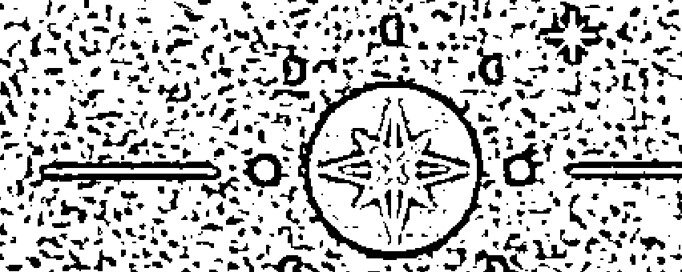

數字「3」，卡巴拉之樹上的薩弗拉「理解」(Binah)，這是被認為最原始的陰性能量，宇宙神聖之母接受了源自 2 號薩弗拉「智慧」(Chokmah) 的能量，這是「天界三角」的最後一顆薩弗拉，就像上帝所言「那人獨居不好、我要為他造一個配偶幫助他」(創世紀 2:18)，而為了能平衡薩弗拉「智慧」的能量，以及滋養後續七顆薩弗拉，成為貫穿宇宙的諸多物質存在形式 [9]，「3 號牌的存在乃是出自於穩定 2 號牌的必要，並構成孕育所有其他小牌的子宮」[10]，因此薩弗拉「理解」不只是土星之域、是至高女性的概念、是克勞利「泰勒瑪」中的「巴巴隆」女神、是完全了「天界三角」的偉大母親，亦因為具有土星特性，所以被認為是時間的起源。

數字「3」是第一個「完整」的概念，埃及的金字塔不僅是形式上的穩定，更是象徵整個埃及社會階層由上而下不可跨越的極權穩定制度。中國的天地人三界概念，即是「全部」，而在古代神話中，三神一體是常見的特徵，如希臘神話中的三美神和命運三女神，北歐神話中有諾倫三女神，而基督教的「三位一體」更是將此概念極致化，「所以你們要去，使萬民作我的門徒，奉父、子、聖靈的名給他們施洗」(馬太福音 28:19)，聖父、聖子、聖靈共用上帝的名，三重力量合一之後，力道順勢更為加強。此概念延伸至文藝復興時期伯羅梅歐 (Borromeo) 的家徽圖形，三個彼此均部分重疊的圓圈，形成現在常見的「伯羅梅歐環」(Borromean Ring)。而法國作家大仲馬 (Alexandre Dumas, 1802-1870) 在 1844 年出版的小說《三劍客》(Mousquetaires) 中，著名的座右銘「人人為我，我為人人」(tous pour un, un pour tous)，亦呈現數字「3」是完整團體的概念。連日本跨媒體製作的作品《寶可夢》(Pokémon)，訓練師雙方對戰時，也是由三隻寶可夢組成小隊來挑戰。

匱乏是一種空缺，但是如果得到更多的話，人會怎麼去反應呢?數字「3」是增生，也是合作，政局上三國鼎立的狀況，是合作也是牽制，會讓局勢處於較為穩固狀態。在卡巴拉之樹上，「3」代表著一個節點，完整了「天界三角」。3 號薩弗拉「理解」的概念，一切開始要進入相互溝通階段，並站在對方立場來看事情，因為跳脫了二元對立概念，一切都非再呈現直線對應，彼此之間的關係，也非單純的直線性思考，它面對著「它們」的同時存在，人生不再只是是非題，而是一道道的申論題，因此被稱為「理解」。

## 權杖 3

Three of Wands

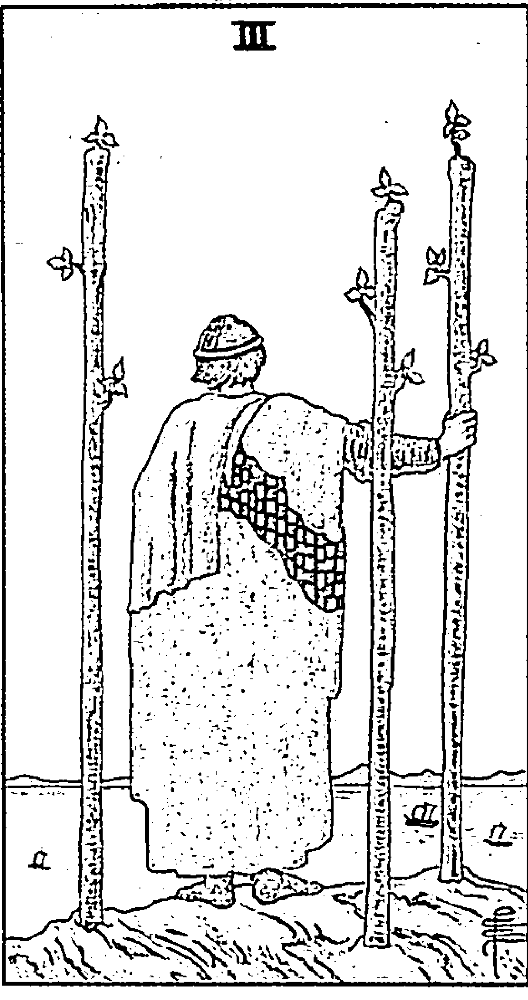

在一片金色的天空下，一名男子站在岸邊高處，身著紅色長袍與綠披肩，看著面前的大海，遠方有紫色山脈，海上有三艘船隻行駛著，天空萬里無雲，大海風平浪靜。他身後左右各有一根木棒豎立，而他右手緊握右前方的木棍。火元素的權杖代表著行動力，但是此男子明顯地只是靜站岸邊沉默觀望大海，往外看，代表有更多的選擇。數字 2 和 3 其實都代表了選擇，但只是「2」時要做決定還簡單一些，「3」就代表了他必須開始思考、瞭解與規劃，開始去想像未來有何發展性，更多的選擇與機會，已經帶給他更多的野心。在火元素的驅動之下，在機會展現的瞬間，決斷力和野心會慢慢會被呼喚出來，數字 3 的完整性開始覺得自己好像準備好了，可以開始去串聯更多資源，心中的慾望和野心，讓所想像的世界變得開闊。

邁向下一步需要勇氣，畫面中男子正在等待，計畫尚未實施，此刻的觀望是等待時機成熟，計畫也正在逐步形成當中。海面遼闊寧靜，是否此刻正是時機點？天空金黃閃耀，是否象徵未來光明？占星學中的三宮，是基礎學習、基本資訊以及短程旅行的宮位，儘管山脈和大海的展望視野寬大，男子姿態呈現出的自信和抱負不可言喻，但是當下的能量顯現上似乎還不能太躁進，站在高處眺望是為了洞悉全局，儘管胸有成竹，計畫還是得謀定而後動，才有機會得到美好豐盛的果實。

## 托特塔羅

小阿卡納牌 — 數字牌

## 權杖 3：美德

Three of Wands: Virtue

- 已確立的力量之主 Lord of Established Strength
- 太陽在牡羊座
- 牡羊座 10 度到 20 度
- 3 月 31 日至 4 月 10 日

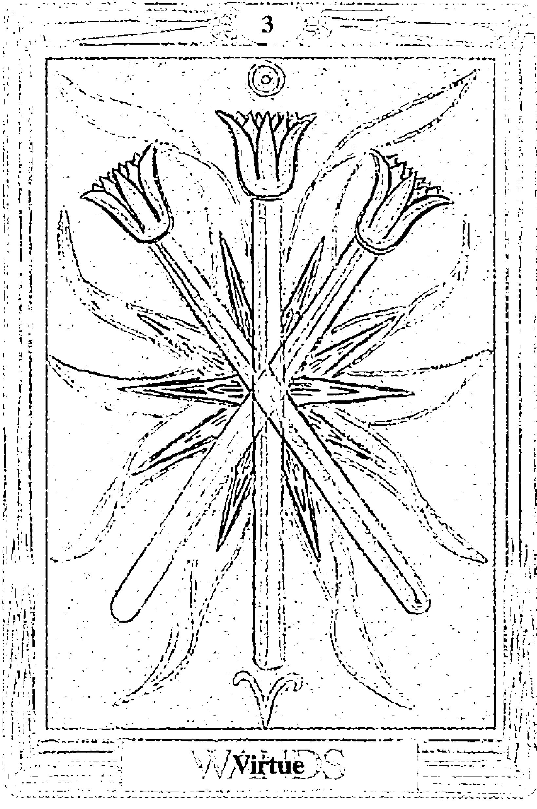

灼熱的橘色與紅色點燃畫面，散發出強大了光燦，太陽對應牡羊座為入旺，是一種放大的能量。金色黎明協會對於此牌的模型敘述為：「一隻手從雲中伸出，抓住三根權杖的中央處，（兩根交叉，第三根直立），三根權杖交叉處冒出火焰。」[41] 此牌畫面與《Book T》中設定的模型相去不遠，十道筆直火焰與另外十道彎曲火焰，牡羊座是黃道十二宮中第一個星座，一切有如春天的第一聲轟隆春雷，驚曉了沉睡的萬物。這張牌與《易經》中第十一卦的上坤下乾「泰卦」意義相符，[42] 《象》曰：「泰，小往大來。」《象》曰：「天地交，泰。」代表著陰陽的能量相互交合調節，克勞利解釋「這是被授精的概念，此三角已然成形，每張 3 號牌，絕對的穩定性在此永不會被顛覆，從中孩子得以生長」。[43]

以代表和平的蓮花為權杖的杖頭，這一切發生在崇高的「天界三角」中，滿滿的火能量滲入了陰性的滋養，在火熱光環下蓮花盛開，細膩的情感與謹慎的思考隨之產生，「太陽扮演了偉大母親的角色」[44]，這不只是「創造」，更是一場「發生」。儘管太陽入旺代表能量強烈，但是不一定代表一切確實能夠完全受控，「3」是一個多數與整體的概念，中國俗諺所云：「三個臭皮匠，勝過一個諸葛亮。」太陽入旺牡羊座有聲勢浩大的概念，三根權杖的碰撞引發後面火花乍現，能量場的出現代表著此三根權杖分別都有它的能量，而入旺的概念，乍看之下恍如牡羊座是太陽的主場，但其實不然，這是一種可以輕鬆自在作客的概念，但對於真正的主人之於這個家樣樣清楚明白的操持，其實還有段距離。

任何一個團隊都需要綁上信任，此牌中三根權杖之所以能碰撞出火花，是這三股能量彼此力道相仿能夠配合，再加上相互信任才有現況的成就，願意一起和諧合作，是因為鎖定了共同目標和理念，所以願意相互協調與合作，且願意因有共同要完成的理念，所以毅然放下個人己見。個人內在慾望和外部經驗之間，一切都以團體利益為唯一考量，因而出現了對和諧的渴望，「美德」因此而產生。

## 聖杯 3

Three of Cups

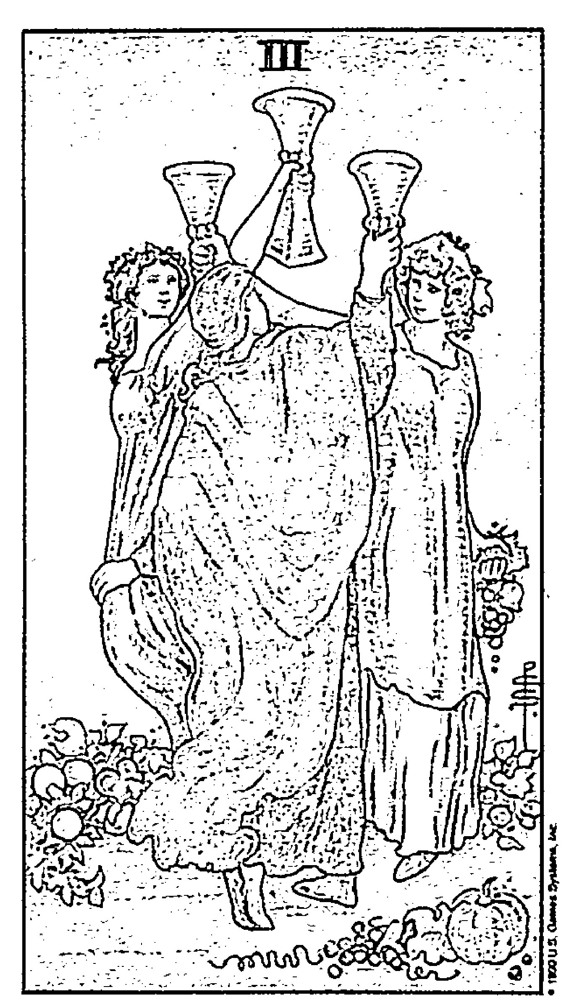

三個身穿長袍的女子，高舉聖杯彼此圍繞，呈現出享樂與慶祝的氣氛，她們頭戴象徵豐收與勝利的花環，其中一位手提著一串葡萄，地上有收成而來的蔬果，這也都是豐盛的景象，空間中洋溢著幸福飄蕩。三位女子髮色不同，衣著顏色也各異，均是獨立的個體，彼此間的地位無高下之分，散發均等能量的和諧磁場。

「3」是陽性元素，但聖杯所代表的水元素包容性強，此種友好性格讓人容易得到他人協助，關係因此和諧且資源更多，此陰性的包容特質，讓畫面中是由三位女性來呈現，這是以情感作為聯繫的小團體，不帶有太大的利益關係，這場結盟與合作，是友誼的象徵。然而「聖杯 3」本身也是象徵一種社交場合，若彼此間的對待只是以應酬心態來面對，那這一切只會淪為一場表面功夫，彼此間只是為了和諧而展現出禮貌姿態。

## 聖杯3：豐盛

Three of Cups: Abundance

- 豐盛之主 Lord of Abundance
- 水星在巨蟹座
- 巨蟹座 10 度到 20 度
- 7 月 2 日至 7 月 11 日

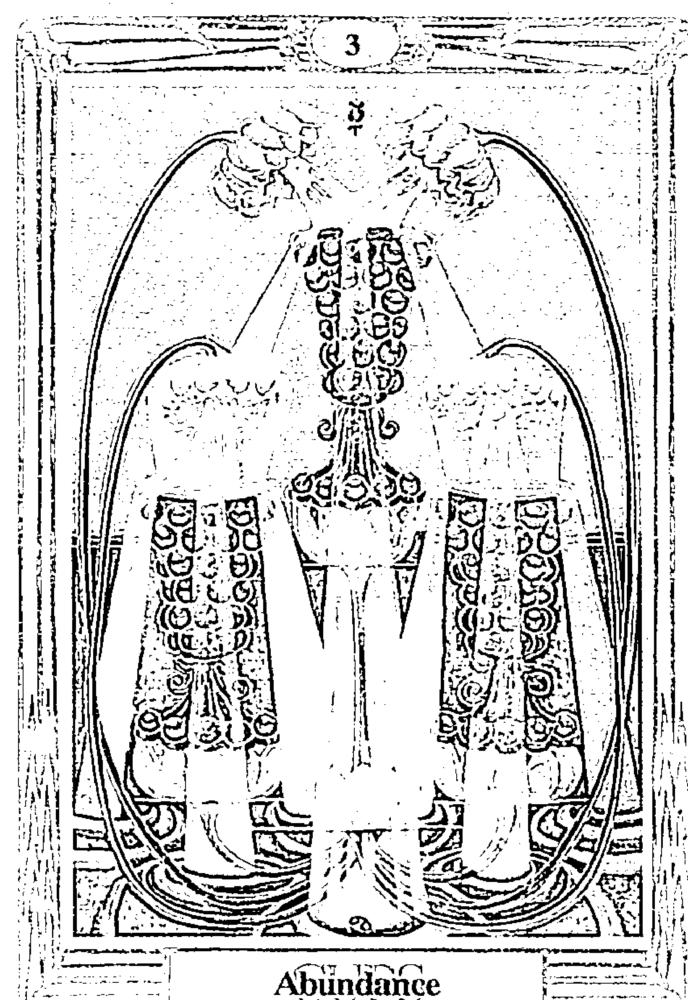

此牌面以靛藍色與紫紅色為基調，呈現出滿溢的水能量。金色黎明協會在《Book T》中對於此牌的模型敘述為：「一隻手從牌面下方的雲中伸出，抓住四朵蓮花的莖，其中兩朵向兩旁伸展，並在兩個聖杯上方懸垂傾注白色的水，蓮花們以同樣的方式著水至下方聖杯，最上方的杯中水分為兩道漫溢出來，分別將下方杯子注滿，杯子被安排成直立等邊三角形。」[45] 此牌主題既然是豐盛之主，畫面自然呈現出豐沛的情感能量。此三個聖杯以石榴顏色和造型所設計，石榴有花有果，且結實纍纍，在講究的德行圓滿修成正果的佛家，《瞿醯經》奉請供養品中有云：「其果子中，石榴為上；於諸根中，毘多羅根為上。」石榴被視為吉祥果實，而其籽多豐滿的形象，在安土重遷的傳統中國農業社會中，象徵著多子多福與金玉滿堂的好寓意。天后赫拉 (Hera) 在希臘神話中掌管婚姻和生育，其特徵即為一隻手托著象徵秋季豐碩的石榴，在《世界文化象徵辭典》一書中記載：「石榴是生殖力強，多子多孫的象徵：古希臘時期，他是赫拉和阿佛洛狄忒的標誌，古羅馬時，用它的樹枝做新娘的帽子。」[46]

既然古今中外石榴均與婚姻和生育意象連結，此牌面的設計可知這也是一場神話中的婚姻。希臘神話中，普西芬妮 (Persephone) 是掌管豐收和農業的女神狄米特 (Demeter) 與主神宙斯的女兒，冥王黑帝斯 (Hades) 一日綻裂開地面抓住在原野採花的普西芬妮，再躍入綻裂的地洞，從此普西芬妮成了地府冥后，西方傳統上稱這一幕為「被強暴的普西芬妮」(the Rape of Persephone)。身為頓時失去女兒母親，狄米特無心工作而大地一片荒蕪。宙斯曾請可在冥界自由出入的赫密斯 (Hermes) 前去說服黑帝斯，將普西芬妮還給狄米特，好讓大地得以重生。黑帝斯要求普西芬妮吃下四顆石榴籽，因此每年注定要回冥界四個月，而人間也因此一年中有四個月份萬物凋敝不利農耕。

一個無辜少女、一位沉痛母親，人間因此有了豐盛與代謝的四季輪迴。從各個角度看，這的確是一場婚姻，克勞利為此牌面下的定義為：「這是『愛之意志』在豐盛中實現，是根植於繁殖力之上的靈性。」[47] 紅色石榴造型的聖杯，這是豐盛富裕生活的象徵，「3」為多數，是一切豐餘富足、不虞匱乏的生活狀態。水星落巨蟹座儘管頂多只有「界」的能量，但是一切舒適自在，水星 (即「赫密斯」) 承接了「萬有之父」(All-Father， 在此指宙斯) 之「意志與話語」進出冥界，[48] 因此一切均視為理所當然。聖杯的紅色如此明顯，石榴的象徵如此強烈，此種過度強調的直接表現，讓事情赤裸裸地展現，明白此時生存的意義只是想要放鬆，感受到自己天生適合過這種生活，一切毫無違和感，自在的心態下不需要去掩飾。海水的深藍是眉心輪的顏色，或許心中知道如此活在當下並不能長久，但是一切卻也還沒有到達真的得做出決定的時刻。

3 號薩弗拉「理解」(Binah) 是「天界三角」中那偉大的母親，是可孕育出有形萬物的偉大海洋概念，然而所有各種有形之生命形態一旦形成，也就意味終有一天均會死亡消散，她是「一方面是月亮，另一面是土星」[49]，畢竟在具有形式的世界，給予生命者，亦同時給予了死亡。這是一年必定要有的那四個月荒蕪，是連主神宙斯出面都無法更改的現實，「此事件的訓誡是，生命中的美好，儘管被享受著，但卻不該被信任」，世間一切繁華轉瞬即逝，這的確是需要被「理解」的真實與無奈。

## 寶劍 3

Three of Swords

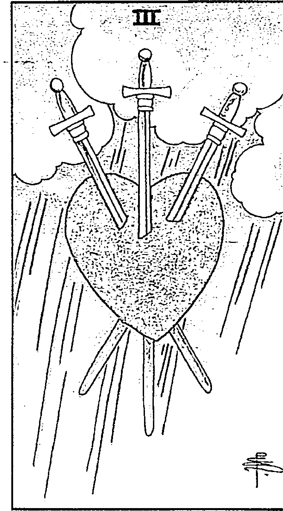

在充滿烏雲並下著大雨的空間，三把利刃分別由三個方向，一同刺穿一顆紅色心臟，這三把劍交會在心的中央深處。這是從不同方向卻一同而來的傷害，劍劍命中要害。此牌雖沒有人物出現，但卻是想像力最強、傷害性最高的一幅畫面，人人皆知真心被銳利刺傷的痛苦，而隨之而來的內心創傷和悲觀負面，常會久久無法消散。

這可被認為是一張精神層面的「高塔」牌，可能是聽到了某句傷害內心情感的話語，「3」是陽性數字且象徵多數，遇到思想活躍的寶劍，內心折磨開始出現，「寶劍 2」可視為在內心的胡思亂想，但「寶劍 3」開始出現決定性的折磨感，焦慮倍增，追根究底，原因出自於始終不願意做出決定，慾望的延伸讓內心完全不想放棄任何選擇。寶劍的野心是一種貪念，壓力自然而然隨之出現，感受到一切毫無意義，且感到沒有任何可以復原的希望，但若能漸漸為心理上做好準備，那麼所有打擊來臨時就能比較釋懷。

## 寶劍 3：憂傷

Three of Swords: Sorrow

- 悲傷之主 Lord of Sorrow
- 土星在天秤座
- 天秤座 10 度到 20 度
- 10 月 3 日至 10 月 12 日

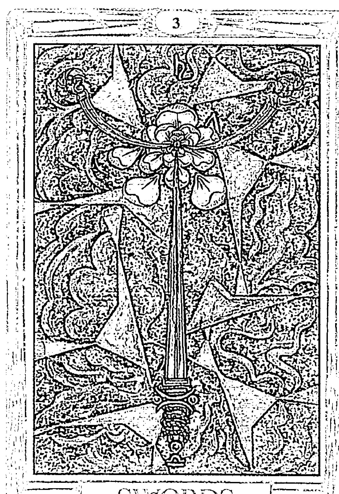

「寶劍 2」中那朵緊扣兩把長劍中央位置的薔薇，在此「薔薇被摧毀，五片花瓣飛散風中，白色光芒也不見了」[50]，牌面中沉重的藍黑與深墨綠色令人喘不過氣，曾出現於「寶劍王牌」中的長劍，在此抵住上方兩把已然彎曲的劍，背景恍若夢魘般鬼魅浮現的風暴夜晚。3 號薩弗拉「理解」(Binah) 在組織形式生命之時，同時又限制了生命型態，這偉大的母親則處「深淵」之上的嚴厲之柱頂端，一一賦予了所孕育的各種型態那不可避免的死亡。「寶劍」代表『成形之界』(Yetzirah)，……但在『理解』或是『深淵』之上的任何地方都不能有形式，『寶劍』也代表『人類心智』(Ruach)，但心智和理性都無法在『深淵』之上的『理解』存在。」[51]

此牌如實顯現出內心世界的掙扎和痛苦，這是一場醒不過來的惡夢，土星相對於天秤座是入旺，所有的能量如果沒有辦法維持在平衡狀態，就很容易過與不及的失衡。克勞利由顏色來呈現心理狀態，象徵自信的黃色，如今呈現在花瓣上紛紛掉落，土星入旺的能量，會讓很多感覺困難之事擺在眼前，讓人失去信心，背後扭曲的深藍、墨綠與黑色，像在惡夢裡什麼都變了，扭曲的兩把利刃代表內心極度的不想面對、甚至極度想逃避。寶劍的思考能量很容易自己欺騙自己，並給予自己無形壓力，此為最無解的問題，越多的想法代表越無法整合，痛苦毅然產生時誰也幫不上。此牌「憂傷」代表還是處在無法做決定的情狀，找不到問題真正的源頭，可能讓在現實中不想面對恐懼，在夢境中一一浮現，3 號薩弗拉是「理解」，而風元素的能量在此呈現過度理解，一切就如同此牌的背景般，痛苦揮之不去。

這張牌的確呈現出「憂傷」的真正本質，當生命之樹 3 號薩弗拉「理解」，本在「天界三角」的無形世界中，接納來自 2 號薩弗拉「智慧」這萬有之父的純陽創造之光，「智慧」了解本質，一切如同直線般清楚明白。但是「Binah」是「理解」，數字 3 代表一切已不再直線性的單純關係，在此與風元素對應，心智極度發揮之後，卻無法理解來自更高層的靈性訊息，往下之後的「深淵」分隔開無形與有形，也同時讓有形世界遺忘了部份靈性。

心智無法理解「天界三角」，因而產生「憂傷」，這一切必須往更高層次的意識去追尋，如同嬰兒出生時的哭嚎，這是靈體由高至低沉降後而產生的憂傷，這也是聖母瑪利亞在耶穌釘十字架下的哭泣，只為了全人類精神層次的救贖，這更是佛法中「四法印」的「諸行無常，諸漏皆苦」。這張牌是德國作家尚·保羅 (Jean Paul, 1763-1825) 在 1827 年的小說《賽琳娜》(Selina Posthum) 中的「世界性痛苦」(Weltschmerz)，是柏拉圖《費德魯斯篇》中認為的「憂鬱」迷狂狀態。經由憂鬱的痛苦，靈魂的翅膀再次長出，是靈魂返回上界的第一步，而此狀態其實是一種天賜，是人類接收至福的唯一管道。英國神秘學家狄翁·福瓊 (Dion Fortune, 1890-1946) 稱「理解」(Binah) 的靈性經驗為悲傷之景 (Vision of Sorrow)，而「寶劍 3 代表最初令佛陀開悟的奇妙、恍惚的悲傷」[52]，此牌的憂傷本質，會是生命靈性開悟的起點。

## 錢幣 3

Three of Pentacles

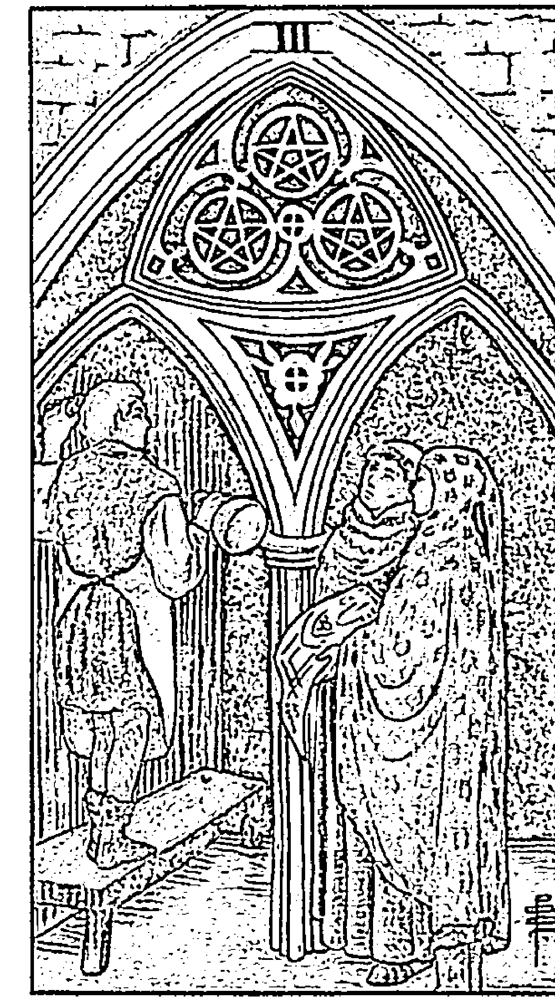

三位男子在一座大教堂的門拱下，左邊站在長凳上的是一位年輕學徒，他手裡拿著雕刻用的工具並望向其他兩人，由服裝判定，這兩人一位是教堂的神職人員，另一位可能是建築師，他拿著一張建築設計稿，三人彼此討論與分享經驗，此牌之重點「錢幣 3」，以三枚五芒星錢幣化為柱頭裝飾雕刻來呈現。

這是一個為了實現共同新目標或計畫，所呈現出來一和諧團體正在工作的狀況。男性學徒擁有專業技能與知識，並持續努力學習，他所站的長凳堅硬穩固，一切均是在有基礎下進行實務工作，神職人員為教堂的代表，站在神學的高度上來體現為宗教服務的目標，而建築師也恰如其分地盡職工作，將畫好的設計稿與兩人一同討論。土元素的穩定能量，讓此牌展現出嚴謹的工作態度，面對每一個步驟，均是經過謹慎地討論過後才進行，而三人每位都擔任好自己的角色，彼此之間的權力相較下對等，各司其職。陰性數字「2」象徵還在摸索熟悉中，即將開始運籌帷幄，而數字「3」為陽性數字，開使找到著手的起點，經驗也開始得以累積，並在團隊中找到適合自己的工作方式，儘管還沒有那麼多的經驗，儘管一切都還需要討論再進行，但是這整體的合作步調，給了團隊穩健的務實未來，此牌也暗示著成功即在未來彼方。

## 圓盤 3：工作

Three of Disks: Work

- 物質工作之主 Lord of Material Works
- 火星在摩羯座
- 摩羯座 10 度到 20 度
- 12 月 31 日至 1 月 9 日

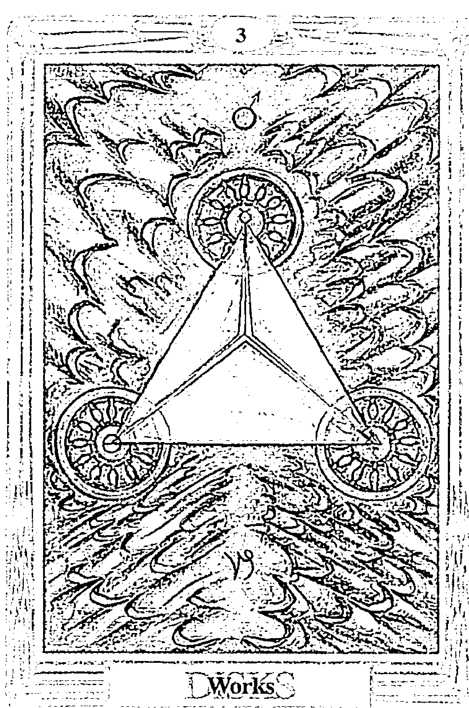

在《The Book of Thoth》一書中，克勞利稱此牌為「Work」[53]，然而不確定是何種因素，目前市面上購買的托特塔羅牌，此牌下方都是以複數「Works」來命名印製。在《Book T》當中，此牌被稱為是「物質工作之主」(Lord of Material Works) [54]，依然是以複數來命名此牌的「工作」。在此「理解」(Binah) 呈現出偉大的海洋母親形象，背景中的海波浪潮是孕育物質世界萬物之母，在土元素穩定的能量之下，火星入旺於摩羯座，行動力展現在步步精益求精的軌道上，是一個展開通往理想達成的過程，為了世俗的目的，必須要不斷地運用火星的動力來前進。

數字「3」有啟動之意，再加上火星入旺於此（其實所有三號牌除了聖杯之外，其他全部都是入旺相位），更是有股被放大的概念。畫面中三個圓盤的中心，清楚地呈現了汞、硫、鹽的符號，這是一場煉金術往物質融合的啟動儀式，過程中雜質會被清除，並且正要整合成另一個純粹且不可分割的物質，這是「命運之輪」牌中開始啟動物質輪轉的要素，此三股能量匯聚鼎力成白色金字塔，力量已被開啟，此三角錐（隱含有數字「4」的穩定性質）即將投射向「深淵」，在「天界三角」之下，無窮潛力即將開始形成現實形式，物質世界逐漸被架構成形。

我們彷彿是站在上帝的角度，從制高點來鳥瞰這片「理解」(Binah) 之黑暗大海，三大元素支撐著物質運轉的能量，而能量的高峰、也就是金字塔的頂端尖角，直逼我們眼前，這是平凡人類肉眼可感知的極限。這不僅是煉金術中的汞、硫、鹽，也是印度哲學系統「the three gunas」中的 Sattva (有情)、Rajas (驅動) 與 Tamas (毀滅)，是希伯來字母中 Aleph (風)、Shin (火)、Men (水) 三個元素 [55]，此為「宇宙物質建構的概念，它基本形式的基礎」[56]，這同時也是靈魂與精神下降至身體與之合一的狀態。薩弗拉「理解」的能量在此跨過了「深淵」鴻溝，往下的延展開始有足夠的能量建構物質世界，而「Work」在此是通往現實世界的路徑，「Works」是物質世界中各項具體形式的偉大作品，亦是精神世界的轉化展現。

## 數字 4

## 安全感與穩定的極限

薩弗拉「仁慈」(Chesed)之對應數字

卡巴拉之樹上的4號薩弗拉「仁慈」(Chesed)，它接受了3號薩弗拉「理解」(Binah)穿透過「深淵」而來的光，是第一個在「深淵」中有形顯化的薩弗拉。它連結了木星之域，是物質顯化的法律規則。木星統整所有慷慨和擴張的能量，追求安定平穩的安全感，像是一位端坐在王座上的國王，是制度建立者、維持者，也是領土保護者。然而此「仁慈」不代表一定和諧，因為和諧是需要與他人配合和協調，在此追求安全感的動力超過追求和諧，換個角度來說，要先得到安全感後，才可能有意願和他人配合，而木星的樂觀與正面性，與4號薩弗拉「仁慈」這個慈愛的國王性格相當。

「深淵」之下，靈性逐漸喪失，數字4代表著穩固的力量，具有濃厚的安全感意識，並有務實進行的能力。「仁慈」不以創造為特色，因為「天上如是，地上亦然」(As above, so below)，「深淵」只是「天界三角」的反映，一切結果均反映原因，所有原因也導致了結果。物質的最高層次是精神，精神的最低層次為物質，所有高低均是彼此之間的映射與象徵。因此，數字4並不需要靈性為源頭，在物質世界中只需要從物件中去做選擇，一切以安穩為主要意念，事事較不願意承受冒險所帶來的風險，自我防衛心重，也容易顯得固執。

與「天界三角」的分離，「深淵」是無可逾越的界線，第一層面紗於此覆蓋，這顆沒有顯示出來的薩弗拉「Daath」[5]，是意指知識。在此一切無形的光，開始轉為知識本體，意識開始出現，「仁慈」是「深淵」有形顯化的第一個薩弗拉，所有有形顯化的幻象，皆可回溯到「仁慈」這最初的原則。這是物質世界紮根的階段，是建立穩定未來的藍圖，安全地穩紮穩打是關鍵根基，面對未來的挑戰，這位穩坐王位上的國王，已做好萬全準備，儘管統治之域的疆土不容動搖，但數字4的確是落入「深淵」這微觀的神之面容後，「所有限制與局限的詛咒，是盲目與荒蕪的等價十字」[5]。

## 權杖 4

## Four of Wands

因為象徵火元素的「權杖」具有行動力，它隨著判斷力和行動力去創造屬於自己的領域，所以數字的增加不一定是不好的狀況。權杖用自己的做法去創造，並在創造中極度張顯自己的能量。此畫面呈現在金黃色的天空下，四根權杖穩穩豎立在地面上，上方懸掛著花環和彩帶。四根權杖後方是兩位性別不是很明確的人物，他們頭戴花環、手拿花束，朝著我們觀賞者的方向舉手揮舞，像是在招手與歡呼，他們的右後方還有一群人物聚集。背景是一棟城堡樣式的建築，建物體積延伸到畫面之外，可見此宅邸佔地面積寬大，屋頂多呈紅色尖塔狀。

這是一幅令人感到安心與歡樂的畫面，而穩健的建築物形象展現出這一切有其穩固基礎，屬於自己的領域界線也清楚劃分，這像是一場愉悅的慶典，也滿溢著家的溫暖和樂之感，數字 4 的穩定和安全感在此牌中表現無遺，而火元素讓這穩定中滲入生命力，畫面中央兩位人物的動作充分展現了活潑與熱情，一切均朝自己所設下的方向穩定發展，並小有成就。

權杖上方的蔬果植物豐盛，象徵已到達生命中某階段性的成功點，而之前的做法與決定，在現實層面上是可以被肯定的，然而畫面中四根權杖將觀賞者與畫中人物隔出一段距離，他們臉上的表情不甚清晰，城堡更是在最後方，目前一切所成絕對還不是終點站。雖還沒真正達到理想中的完成境界，但是此刻的確是可以享受當下，並歡慶自己的心願已階段性完成，並繼續往預期夢想境地邁進。

## 權杖 4：完成

## Four of Wands: Completion

- 完美工作之主 Lord of Perfected Work
- 金星在牡羊座
- 牡羊座 20 度到 30 度
- 4 月 11 日至 4 月 20 日

位於「深淵」下的第一個薩弗拉「仁慈」(Chesed)，有形世界開始運轉，如第 10 號大阿卡納牌「命運之輪」中所呈現的，「屬性」(Gunas) 開始轉動。木星在希臘神話中即是宙斯，是權力與榮耀連結的王，是牌組首次具體顯化的一張牌。儘管宙斯在宇宙中是所謂「造物主」(Demiurge) 的存在形象，[59] 但他所統御的領域，僅是在有形顯現的宇宙中，他為這個宇宙帶來了秩序，結束了古老神族「泰坦」那混沌的洪荒混亂時期，儘管他只是其上三顆薩弗拉所創造出的存在表象。

此「造物主」的概念也與耶穌的降生相似，儘管世人視耶穌為救世主，為世界帶來和平與愛，但是他畢竟曾是血肉之軀，他只是最原始的無形能量（也就是上帝）所降至有形世界中的顯化物質，為的是讓在最低的 10 號薩弗拉「王國」(Malkuth) 中的人類，有機會用真實感官去體驗上帝的存在。而事實證明，絕大部分的人類低等到連眼見耶穌，仍無法感知上帝。在此牌中，這位「造物主」的出現啟動了有形世界的「輪」開始轉動，在此四根權杖的中央處相互接疊，「權杖交會處冒出火焰」[60]，形成了那顆轉動的「輪」，「此刻原始能量被建造入堅固的系統：秩序、法律與統治」[61]。既然是在有形世界，儘管金星進入牡羊座呈現了落陷的能量，但是只要能相互協調退讓，行事機智與溫文，便有機會建功立業。[62]

牌面中呈現明顯的暗綠色，顏色深到沒有綠色本來該有的生機，在此象徵了木星的擴張過度，以及金星落牡羊座的落陷能量。落陷能量需要用此暗綠色來掩蓋，因為能量處在一種壓力和緊張所架構出的平衡當中，因此才需要用象徵和平的綠色來掩蓋，讓外界看起來一切安好。綠色是天秤座的顏色，也是心輪的顏色，在在要向全世界顯示目前一切都在和諧狀態，是否真的和諧在此刻已不重要，重點在於自知只有過度強調和諧，才能呈現這彷彿一切都非常平和的表象，儘管有可能只是假象。

權杖是火元素的標誌，每根權杖的兩端是羊頭與鴿子的圖像，分別代表著牡羊座與金星的能量。在畫面上看似平衡的能量，卻明顯削弱了火元素的行動力，權杖象徵的火元素是不可能全然配合的，他們最終還是得做回自己。四根權杖相互交疊還是有火花產生，但是事實呈現火花力道瞬間變小，在此，木星能量彰顯，這位位於造物主之家的「仁慈」國王，強調出整體團隊性的重要。「仁慈」在權杖 4 的概念象徵中，是要把所有獨特性抹掉，道理與真相在此已然不是重點，妥協才是唯一，也因此各個獨特的能量均被畫下了限制，只剩自我有所保留。在沉重墨綠色中，權杖交疊呈現出一個黃色圓輪，這是此牌「完美工作之主」(Lord of Perfected Work) 能量的「完成」，但同時也是此「完美工作之主」能量的「限制」。原始「意志」在此並沒有再擴增範圍的意圖，「然而此『限制』本身承擔了失序的種子」[63]，畢竟金星的和平與牡羊的自私，是兩股完全不同的能量，衝突必然會存在，和諧只是一時的假象。

## 聖杯 4

## Four of Cups

牌面中一位男子雙臂交於胸前，背靠著樹幹盤腿坐在樹蔭下的草地上，他明顯地呈現出冷漠的防衛姿態，視線低垂，態度顯示出對萬事萬物毫不關心。他的前方有三個聖杯排列，而雲端伸出一隻手，遞了第四個聖杯給他，但這位男子似乎毫無興趣，徹底表現出冷淡和漠不關心。

對於陰性水元素聖杯與陰性數字「4」的搭配來說，數量增多完全是可以接受的，但是在聖杯的世界中比較容易呈現自我滿足的心態，而數字 4 所給予的穩定能量，會讓人在沒有太大挑戰性的情況下，覺得自己維持原有姿態即可，沒有必要再去多做追求。雲朵中伸出的握著聖杯的手是象徵著給予新的機會，但是男子態度消極，在對事物缺乏動力的心態下，雖機會喪失卻也不覺得可惜，因為對他而言認為這機會原本就是多餘的，不在他的追尋當中。

這是一種失望，也是一種不滿足感，有可能是因為仍陷於往事迴旋中不想跳脫，也是呈現自我放棄的狀態。穩固的確會導致無趣，令人產生疲乏感，對自己手中所擁有的已不感興趣，但又對新來的機會漠不關心。他沒有歡欣接受，但也沒有明確拒絕，顯示出可有可無的心態。這種拖延的態度，有可能錯失新的契機，也延緩了自我對適應新事物的成長。周遭的環境清幽寧靜，綠草茵茵，無任何立即的危害出現，遠方有山脈蟄伏。他內心消極與退縮，不懂得珍惜舊有與新臨，一切得等到當他懂得感恩的那一刻起，內心才會真正得到想要的幸福。

## 聖杯 4：奢華

## Four of Cups: Luxury

- 各種享樂之主 Lord of Blended Pleasure
- 月亮在巨蟹座
- 巨蟹座 20 度到 30 度
- 7 月 12 日至 7 月 21 日

在薩弗拉「仁慈」(Chesed)的木星領域中，木星入旺於巨蟹座，而此牌呈現月亮入廟於巨蟹座，在此月亮擁有了實權，而木星擁有了榮耀，是超級巨蟹座的一張牌，能量彰顯至極致，終於享受到心中盼望已久的愜意與放鬆。而此牌定位為「奢華」(Luxury)，畫面中呈現出滿足現狀的安逸狀態，這是在之前所有付出的努力過後，一場中場休憩的沉醉。

「奢華」一詞深具享樂之意，甚至有過分享樂的意涵隱藏其中。「中央的莖在牌面上方開出一朵蓮花，向左右分別流出水源，注滿上方兩個杯子，水流溢出來，注滿下方兩個杯子。」[64] 然而在一切都很滿意現況的同時，水流在依序注滿了四個聖杯後，卻沒有再流入大海水中循環，儘管杯子下方的底座是穩固的方形，但是水的沉重，讓下方兩個勉強於蓮花莖上站立的聖杯，有隨時會站立不穩的危機。「聖杯 3」有四朵蓮花在注水澆灌三個杯子，然而現在是一朵蓮花澆灌四個杯子，「它看來似乎即將被榨乾。我相信它的確如此」[65]。

蓮花流下來的水深具灌溉和滋養意涵，在此入廟旺的行星能量中，照理應該一切都是在最好的狀態，然而灌溉的水源在此沒有和海面連結，反而自成一格。巨蟹是最容易內心情緒不安的星座，只因為擔心付出之後會掏空自己，所以直接採取截斷的做法，從此水是水、海是海，而我是我。月亮落巨蟹座強調認同感的重要性，水杯內是個循環，但只是內部循環，剛好流進杯中的水流不出去，水無法增多而導致杯中空洞。然而在木星領域的「4」，強調豐盛的奢華之感，儘管水量無法變多，但是膨脹感會讓有限的水在表徵上看似豐富，概念類似把很少量的黃金，利用工藝技巧打成很薄的一大片金牌，努力強撐讓外表豐盛，其實只是為了讓他人觀賞。

橘黃色所代表的信任，是此牌最大的課題和考驗，無法對世間的擁有產生信任，因此只讓手中資源內部循環，不敢和外部龐大資源連結，一切只因為害怕失去。蓮花莖蔓在下方盤繞，心思纏繞出「∞」(無限)的符號，彼此間沒有出口。上方蓮花中心有一個黃色圓形，四個聖杯亦是太陽的金黃色，薩弗拉「仁慈」在「深淵」的頂端，它制定了其下每一個薩弗拉所執行的法規，然而它本身也無可避免地只是「天界三角」的反映。「這份太陽的影響並非直接，而是反射而來，正如同月球表面反射著太陽。」[66] 守護巨蟹座的月亮永遠無法自體發光，行星入廟也象徵著包袱，此牌恰如其分地演繹了此行星進入這個星座的狀況，是「愉悅果實中的衰變種子」[67]，此刻天上已烏雲密佈，這是自我感到愉悅後的輕慢，實質上的心靈窒礙。

## 寶劍 4

## Four of Swords

權杖與寶劍同為陽性元素，然而當「權杖 4」已經創造了家園，「寶劍 4」卻很明顯地還在休息。這像是一場中場休息，因為「寶劍 3」的震驚剛過，此刻覺得乾脆一切都先暫停才是上策。畫面中男子平躺休息，但是從他手部的姿勢呈現出他並未安穩入睡，三把長劍指著他上半身，畫面中瀰漫一股焦慮與緊張的情緒。這位男子故作鎮靜，清醒的他不是真的不去想，只是裝作我不去想，第四把寶劍放在身邊地上，一切思緒還是沒有平穩下來，儘管自己不想再被混亂思緒困擾。

所有陽性元素在數字「4」的領域上，均稍微可以安定，這是一場刻意強調減輕精神壓力和緊張的表現。旁邊的花窗玻璃圖案呈現出宗教意涵，顯示出這個空間有可能是教堂，男子躺臥的姿態，也不免讓人聯想起歐洲教堂中，那一具具長方形棺木，以及其上的平躺亡者雕像，而此男子身上的確沒有活人該有的色彩。墳墓，是一個讓靈魂暫息之地，三把牆上的長劍劍指上半身，象徵著實際問題其實依然沒有解決，只是他把自己僵化掉來麻木痛苦情緒，而花窗玻璃所呈現出的彩色光景，象徵著此依然呈現焦慮卻能片刻躲藏慰藉的平靜時光，在一段時間過後，仍有可能產生新的契機。

## 寶劍 4：休戰

## Four of Swords: Truce

- 停止紛爭之主 Lord of Rest from Strife
- 木星在天秤座
- 天秤座 20 度到 30 度
- 10 月 13 日至 10 月 22 日

在「寶劍 3」中歪曲的劍已不復見，儘管問題尚未解決，但是選擇了封閉自己不去面對，內心已通過最焦慮的黑夜，畫面上四把劍的劍鋒共同指向薔薇綻放的中心，造型有如蘇格蘭國旗圖案的「聖安德烈十字」(Saint Andrew's Cross) [68]。這是四把在劍柄處均擁有不同紋路的寶劍，有水波紋的「水」、火焰行的「火」、線條形的「風」，以及圓盤紋的「土」，四大元素各有不同能量，在此聚齊並劍鋒相對，這是「固執與僵化」[69] 的排列方式。只因在薩弗拉「仁慈」(Chesed) 的木星領域中，木星落入事事講求平衡與和諧的天秤座，這是毫無能量的行星位置，而在有形的「深淵」中，一切的規範是順著「教條的建立，以及相關法律」[70] 來進行，那中央擁有四十九片花瓣的薔薇，是「社會和諧的象徵，在此，它也是妥協」。[71]

四大能量彼此性質各異，卻又能量強大，而寶劍被人類創造出來的真正存在意義，均是為了爭戰，永遠不會是為了和平。人若直接對決問題核心，往往焦慮感倍增，因此寶劍 4 呈現的是一種逃避，也是一種轉念，儘管問題依舊沒有解決，但至少得先放過自己。在此「休戰」的意義在於不再跟自己的內心爭戰，在木星落天秤這毫無能量的位置，先把自己封閉在象徵天秤座和平的綠色疆域中，也先將所有混亂線條全部都隔絕在外。

「寶劍」永遠不會解決問題，而這朵象徵社會和諧的薔薇，被固定在一個物質世界時空中的十字架上，這是顯化在有形世界的薔薇十字，「它展現著外顯宇宙的奧秘——有著種種原則、能量和驅力」[72]，在「Chesed」的「仁慈」領域，這是在背負社會教條下，透過妥協和服從所呈現出的和平，人世間的朦朧永遠沒有標準答案，只能從人性上去思想，傾向自我和解。木星樂觀的能量容易讓自己逃避，不想面對的問題，進而封閉自己，將所有能量暫時平放在不會互相干擾的位置，寧願盲目地忽視問題，儘管此刻並沒有可以真正平靜休憩的理由，逃避挑戰的態度僅是被強制下而出現的行為，平和假象註定無法長久，而混亂的背景透露出預言式的信號：數字 5 即將爭端再起。

## 錢幣 4

## Four of Pentacles

土元素代表累積，而數字的增加代表累積數量攀升，在穩定的土元素當中，此牌呈現出一位穿著紅色長袍的男人，披著深紫色披肩，頭戴王冠，坐在一塊穩固的灰色立方石上，雙腳各踩一個五芒星金幣，胸口緊抱著第三枚金幣，姿態充滿展示的意味，而第四枚金幣則是頂在王冠上面。他的臉上淡抹微笑，表情滿足且踏實，背景是建築物林立的城市景觀，上方淡灰色天空在畫面中佔了最大比例的空間。

這是一種完全佔有的姿態，他已充分利用肢體去緊抓住三枚錢幣，而王冠上的第四枚則炫耀意味濃厚。儘管像守財奴般對於物質執著性重，但不能否認在物質之界中，擁有實質的物件是可以產生快樂的。他態度不主動去貪求，但是該他擁有的好處他一定拿取，且當下的心態是希望能夠擁有更多。

這是慾望的展現，也是象徵著對權力、地位和財富的固執態度，以自我為中心，對自己的物質收益具有高度的佔有欲。由他的穿著可知他擁有富裕的基礎，手部抱持金幣的姿勢，像是要運轉金幣讓其可以源源不絕地繼續增長。物質層面上他是小有成就的，但他一人獨坐於城市之外，在精神層面上展現出孤獨的可能性，而背後的繁華的城市離他還有很遠的距離，這也代表他儘管現階段物質生活上充足與穩定，但是離真正的巨大財富狀態，還是有一段得繼續努力的路程。

## 圓盤 4：力量

## Four of Disks: Power

- 世俗力量之主 Lord of Earthly Power
- 太陽在摩羯座
- 摩羯座 20 度到 30 度
- 1 月 10 日至 1 月 19 日

這是一個由空中鳥瞰的城堡，圓盤概念在此化為城堡的四大方形支柱，上面各自呈現了四大元素符號，外圍有綠色的護城河保護著城池。太陽落魔羯座代表著鞏固的能量，而摩羯座的特性也的確是嚴謹，習慣採取一步一腳印的方式踏實前進，不喜投機取巧。畫面中呈現的一切均偏向靜態，這是一座建設在「深淵」邊境的堅固城池，高度表現出穩定的結構性，以及被迫下的一致性，但是看不到實際有任何此牌牌名「力量」的形式展現。

然而太陽落於此星座的能量為游離，因此在木星之界，只能將自己轉化為一方城池，強調木星放大的能量，因為知道自己其實並沒有力量，所以必須建一個城池外加護城河來保護自己，這與《孫子兵法》中「自保而全勝」的概念相通：「不可勝者，守也；可勝者，攻也。守則不足，攻則有餘。善守者，藏於九地之下；善攻者，動於九天之上，故能自保而全勝也。」善於防守藏深的人，是最有可能獲取全面勝利的一方，自知自己實力偏弱，因此唯有全面防禦才能勝敵。

畫面中四個城池端端正正的，「它是『法律』與『秩序』的代表，以不間斷的權威和機警來維持一切」[73]，上方的城垛每邊均有六個，隱含著卡巴拉之樹上「太陽」是第六顆薩弗拉的意涵。其實每個城池均是有出路，但是其中三條刻意被封住，只留前方一條路跨過護城河，防守意味濃厚，「子宮是此形式的軟化表現」[74]，而這種刻意的分離，彼此間守著嚴格的規律，也是實力虛弱下展現出的另類「力量」。木星之界的擴張能量在此完全傾注於強調防守，執著於現有的一切，不變動、不溝通也不妥協，限制的「力量」展現於傾盡所有能力把自身與環境隔離，這種「鎖國」的概念，一方面是穩定現況的「力量」，但也會是一股阻礙外部資源連結的力道。

## 數字 5

## 自由與規範的極限

薩弗拉「力量」(Geburah)之對應數字

「5」為單數是陽性數字，但是和數字「3」最大的不同點，在於必須要開始面對外在的變化。在世俗對事物的認定上，穩定是最佳的選擇，而數字「5」是在最為穩定的「4」之後衍生出來的另一個「1」，原本的穩定性遭到破壞，因此在塔羅牌中所有的五號牌牌義均不佳，內容呈現無常、不穩定與變動，並透露出掙扎的意味。「這是一個革命性的構想，結果是完全破壞了靜態的穩定系統，現在風暴和壓力終於產生。」[7]

每一個薩弗拉都有它在卡巴拉之樹中創造能量的位置，而第五顆薩弗拉「力量」(Geburah)往往呈現出令人恐懼的面貌，它可以是正在思考如何往下建設的能量，形象上則是像在戰馬上東征西討的將軍。「力量」以武力來伸張正義與保護王國中的子民，與4號「仁慈」(Chesed)所強調的以平和和慈愛來包容，是完全不同的概念。「力量」為火星之域，是「對物質有幫助的動力」[7]，掌管運動、風暴與壓迫。「力量」必須與「仁慈」相互制衡，在失衡時「力量」會成為破壞的力道。在卡巴拉之樹上「力量」位於3號薩弗拉「理解」(Binah)之下，「深淵」之上「理解」為死亡黑海之母，「深淵」之下「力量」則為死亡黑海之子，兩者各以土星和火星為代表，在占星術中被視為兩大凶星，均帶有負面意涵。

但正如同所有的自然規律一般，新生與代謝輪迴，生與死不斷循環，這是宇宙能生生不息、永恆運轉的不變法則。當破壞是為了建設，如手術割除腫瘤是為了延續生命，道教中八家將的兇惡猙獰是為了捉鬼拿妖，以維持宇宙磁場穩定；在基督教中，「在天上就有了爭戰。米迦勒同他的使者與龍爭戰，龍也同他的使者去爭戰」(啟示錄 12:7)，天使長米迦勒(Michael)大戰化身為惡龍的撒旦邪靈，為的也是維持光明能持續存在的可能性；這也是佛教《雜阿含經》中，佛陀在世時對弟子所說的，人生須從「無常」、「苦」、「空」當中去了知一切法，才能得到真正解脫的道理。

這就是火星之域「力量」存在的意義，儘管再也沒有足夠的力量來維持四大能量的和平，鬥爭已然爆發了，這也意味著失敗與傷害即將產生，但是它帶有濃厚的自由意志，這是一種斬釘截鐵的能力，不喜固步自封的態度，內心常想要顛覆既有的規則與想法，十分擁有自己的主見。它選擇以破壞暫時的和諧，來服務於追求的永恆，就像法國育碧娛樂公司 (Ubisoft Entertainment SA) 在 2007 年發行的《刺客教條》(Assassin's Creed) 遊戲中，那經典的台詞「我們在黑暗中行事，為光明效力」(We work in the dark to serve the light.)，深得無數玩家的心。

## 權杖 5

Five of Wands

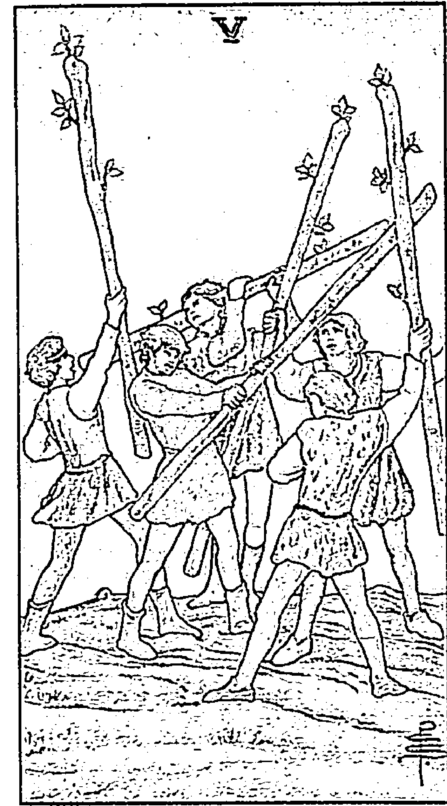

此牌是偉特塔羅小阿卡納牌中，人物最多的一張，畫面呈現五位身著不同服飾的男子，每人均舉起比自身身高還高的權杖，各以不同的姿勢揮舞棍棒，躁動感充滿整個畫面，這像在打架鬥毆，也像在進行激烈的比賽，地面崎嶇不平坦，草地顏色也不一，卡巴拉之樹這第五顆薩弗拉「力量」(Geburah)的混亂能量在此展露無遺。

這是所有權杖牌中，權杖位置最混亂的畫面，看得出來他們的確用盡全力地揮舞木棍，但卻沒有人真正受到肢體上的傷害，能量從原本「4」的穩定，來到了「5」的變動，開始有想往外去接觸其他資源，但又處在不是非常明確的心理狀態，一切都在嘗試接觸當中。這會是內心的衝突與緊張情緒，但是當人面對未知狀況，總是容易呈現強烈的防禦心態，而混亂的狀態也是隱藏自身缺陷的方式之一，結果容易導致疲憊不堪，並承受沮喪和壓力。

紊亂的狀況已然產生，從畫面中沒人真的受傷來看，這次的行動力隱含著虛張聲勢的狀態，這只是一場虛擬的戰爭、虛假的打鬥，在面對變化的來臨，不想讓他人看穿自己實力，也不想讓他人覺得自己無所行動。「這是一場對追求未來財富與幸運的艱苦競爭」[77]，解決之道來自於能否儘速觀察到一切問題的關鍵點，才能避免能量的空轉與虛耗。

## 權杖 5：衝突

Five of Wands: Strife

- 衝突之主 Lord of Strife
- 土星在獅子座
- 獅子座 0 度到 10 度
- 7 月 22 日至 8 月 1 日

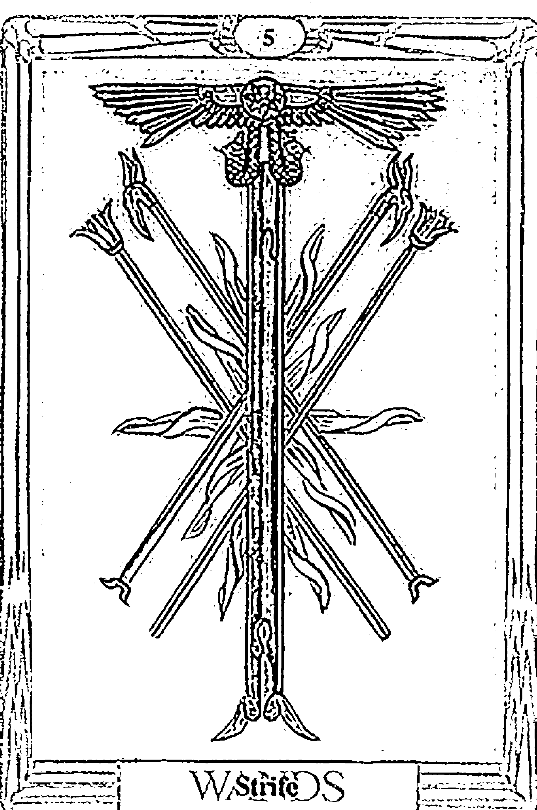

火象星座獅子座落在薩弗拉「力量」(Geburah)所管轄的火星之域，這種熾熱的純粹活躍力量，能量理應強大無法控制，然而土星象徵權威傳統價值觀和勢力，這與獅子座喜歡以行動力證明自己、並透過證明自己達到抵抗權威、挑戰傳統價值觀的態度嚴重產生矛盾，「這張牌所描繪的局面是火熱、增壓的岩漿，掙扎著要來到火山的表面，但卻受挫於火山本身的重量」[78]。

關於薩弗拉「力量」的能量彰顯，雖然主要來自於看似反動與無理的動亂能量，但它其實是反映於 3 號薩弗拉「理解」(Binah)陰性的良性溫柔所影響，此牌面中有五根權杖，忠實地呈現出薩弗拉「力量」的義理。五根權杖分為三種型制，形式不統一，元素也不和諧。兩根藍色的權杖，是與「權杖 3」中相同的「蓮花杖」，為陰性水元素的代表，而兩根橘色的「鳳凰杖」為火元素代表，但杖頭的鳳凰卻是水元素的藍灰色，明顯地呈現兩種不和諧能量合為一體時，所必須經過的煉獄毀滅，而鳳凰的面部正對著蓮花，這兩股不和諧的能量是直接面對著。中間直立的權杖是以土星的沉重與權威，來暫時壓制住這些衝突與矛盾，它是埃及的蛇杖，上方的兩隻眼鏡蛇象徵著權力，是法老權杖和王冠上的保護者，上下兩對紫色翅膀，是水元素藍色與火元素紅色的混合色，克勞利稱它為「酋長的權杖」。[79]

背景的黃色是代表太陽神經叢輪的皇家黃，是完全自信的象徵，五杖交會產生十道火焰四射，目前情況架構能量穩定，尚未有立即性的爆炸性衝突，當土星完全制約住獅子座自我表現的機會，但展現領導性格是獅子座無法擺脫的天性，矛盾的衝突感就此發生。但此些爭執並不會是無意義的，而是為了達成共識而爭執，鳳凰杖象徵浴火鳳凰的毀滅，以及從灰燼中所獲得的新生，而蓮花杖象徵著溫柔與和平，當衝突過後能量趨於穩定，事情自然會有所轉圜。畢竟所有權杖均有彼此間程度相仿的能量，在此力量的獲得絕對不是憑空而來，而是透過爭執、相互對抗才得以呈現。

此牌另一精彩之處，即是中間直立權杖的上方，在兩翼之間有一圓型，上面有「巴巴隆」女神的七芒星，以及三圓合一的「野獸印記」，這在「圓盤 1」牌面中出現過。克勞利在此又將他的魔法簽名安置在權杖上方，上升星座在獅子座的他，「強烈地認同於獅子座，他甚至以獅子座的占星符號，來取代他的簽名中『Aleister』的『A』」。[80]

## 聖杯 5

Five of Cups

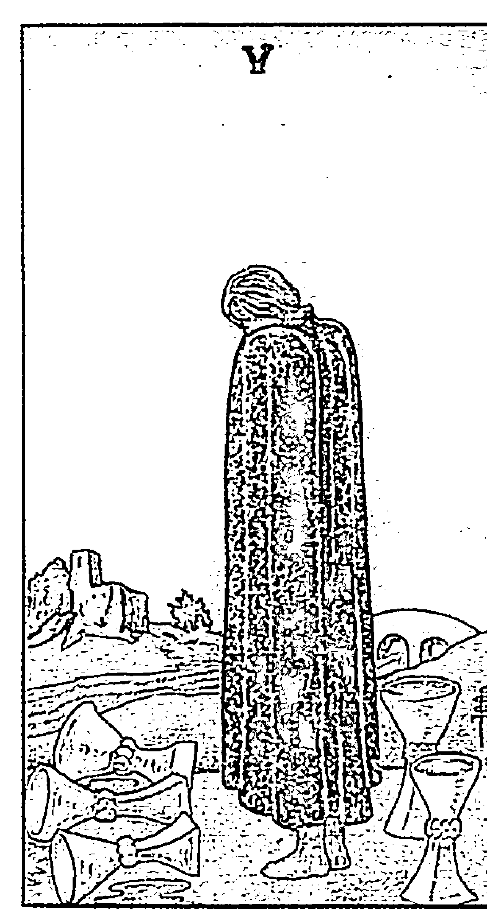

一位身披黑色斗篷的男子站在河流邊，垂頭看著眼前三個傾倒的杯子，而身後有兩個站立著的杯子，河的對面有棟建築物，而河面上有一座堅固的石橋。對於陰性元素來說，理論上數字的增加是會往好的方向發展，但是聖杯代表情感和心緒，情緒越多的人比較感性，通常跟著感覺前行時，很容易被過多的情緒吞沒，此位男子正處於情緒沉沒的人生階段，聖杯越多也越容易感到散漫，面對事情不會想要再繼續努力。

他的悲傷某個程度上來自於被情緒牽絆而不想振作，數字「5」是在小阿卡納數字牌的中間，有如分水嶺般，各元素的特色表現會越來越清晰，且各自如何運用自己的能量情況亦開始明顯變化。在此，「聖杯 5」是一種沉浸式的悲傷，他沒有打算讓自己揮別情緒，他不關心還站立的兩個聖杯，也不想跨步離開這個情境，恍如失戀者自溺式地沉浸在個人想像的悲傷世界裡，他可以離開但卻不想離開，被情緒牽絆是因為眷戀，而深深的匱乏感，讓他看不見手中所擁有的，只執著於眼前失去的。這是一種自我放逐的心態，面對變化他覺得無力承受，但也沒有毅然抵抗的勇氣，對他而言，試圖退縮到一個彷彿讓自己不想做出任何決定的心態，再回到自我保護狀態的同時，情緒滿滿淹沒一切。

雖然面前有一道河流，但堅固的石橋意味著只要願意起身離開，跨過河流即可到對岸去，預示著其實是有選擇另一個生活狀態的機會。然而眼前的三個杯子倒了流出紅色的液體，像自己尚在淌血的心，儘管身後還有兩個杯子站立，但不願意轉過身也是一種選擇，將自己放在自認為孤立無援的境地，沉溺於失落的哀戚，也是一種人生轉折處的美麗。

## 聖杯 5：失望

Five of Cups: Disappointment

- 失落歡樂之主 Lord of Loss in Pleasure
- 火星在天蠍座
- 天蠍座 0 度到 10 度
- 10 月 23 日至 11 月 1 日

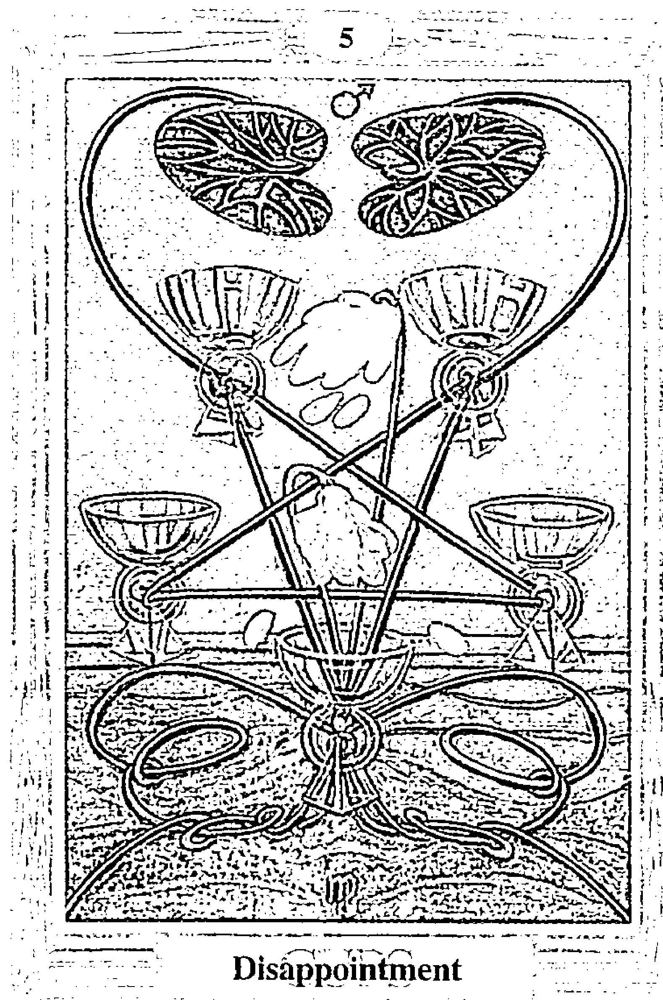

在「力量」(Geburah) 所管轄的火星之域中，火星的能量入廟天蠍，入廟狀態能夠把原始行星個性不論好壞均完全呈現。天蠍座中的負面性是帶有腐敗力量的嫉妒與控制慾，想掌控的慾望導致出深沉的心機。「在此強大的男性影響力並沒有顯示出衰敗面向，而是一切都是破壞的開始。」 [81] 火星入天蠍在此表現出慾求不滿的狀況，烈火將天空染成了橘紅，象徵水元素的聖杯，如今均呈現出空杯的狀態，熱焰在此乾涸了水源，這是乾旱來臨，花莖下垂，花朵的花瓣在焚風中開始凋謝。

五個空杯在牌面上呈現倒五芒星的圖案，「象徵著物質戰勝了精神」[82]，這是代表著在情感面中的不知感恩，本該是流動的水(情感)，如今不僅不流動，甚至出現乾涸，而兩片本應是配角的墨綠色蓮花葉片 (此兩葉形似腎臟，也與天蠍座相應)，如今高過了花朵，在此情境下表現出過於刻意強調自己的匱乏，本該被重視的如今得不到重視，而不該重視的卻拼命強調，並對自己所擁有的沒有感覺，導致讓自己陷入對現況完全不滿意的心理狀態。這是種情緒勒索的狀態，乾涸的杯子是因為只看重自己的匱乏，卻沒有能力去愛別人，忘記自己手上所擁有的，只覺得自己應該值得擁有更多。在沒有水源循環滋養之下，水展現了它最壞的能力——腐爛，水元素的陰性靈動氣質不復存在，水淺是滋養能力的衰落，乾涸更是反映了內心世界的枯竭。

然而這失落，並不是真正物質的缺乏，而是來自於慾求不滿的慾望。浸泡在墨綠色死水中的蓮花莖蔓，曲繞出了一隻蝴蝶形象，這是自認為自己是毛毛蟲，希望能蛻變成蝴蝶的心態，渴望自己能擁有更多，非常嚮往更高層次的生活，需要透過填滿慾望和實際擁有才會感覺滿足，因此不斷地向別人抱怨和要求，甚至需索無度。火星入廟天蠍忠實地體現了天蠍的慾望和掌控，想追求更高享樂的結果，只會導致不斷把心中的底線往下推，最後深深的無奈感油然而生，真正的單純快樂已難獲得。

## 寶劍 5

Five of Swords

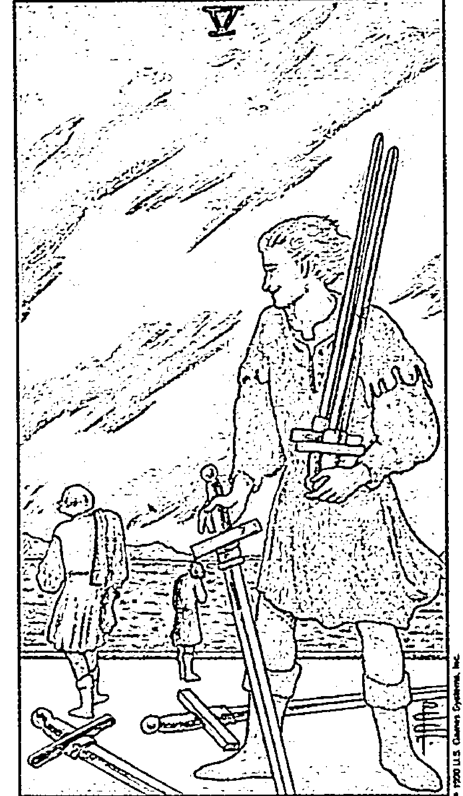

畫面中一位男子，左手將兩把劍靠在肩上，右手則是將一把劍的劍尖朝下，刺向地面，身邊還有兩把長劍掉落沙灘上。「寶劍」是思緒的象徵，來到了數字「5」，男子如此聰明，他搶奪了五把寶劍，不僅拿不完還掉在地上，這象徵著一場不公平的競賽，所有一切規則由他自訂，此男子需要權力與掌控權，因此運用自己的小聰明，設計了一場為了贏而沒有公平對待的遊戲，認為自身的機智聰明，可以讓自己不須立即有所取捨，他不想辛苦地背負成敗勝負，只想盡辦法讓自己立於不敗之地。臉上的一抹訕笑是得意自己如此聰明，懂得藉由訂遊戲規則讓自己可輕鬆獲勝，卻也藉此掩飾了自己思想上的焦慮，忘卻了這只是暫時性的成果，其他背對著觀者的兩人，未來亦可儲備能力再次抗爭。

因自知自己勝之不武，這位男子臉上並沒有勝利者應有的滿足與莊重，天空雲朵灰黑，快速的流動感代表這一切都還在變動中。這可以是競爭後的慘烈勝利，當衝突化為餘燼，非真實實力所帶來的勝利，代價可能是失去人際關係，蠻橫的態度雖然能暫時壓制住局面，但的確失去了周遭的肯定，獲得的僅是虛空的沾沾自喜。

## 寶劍 5：挫敗

Five of Swords: Defeat

- 挫敗之主 Lord of Defeat
- 金星在水瓶座
- 水瓶座 0 度到 10 度
- 1 月 20 日至 1 月 29 日

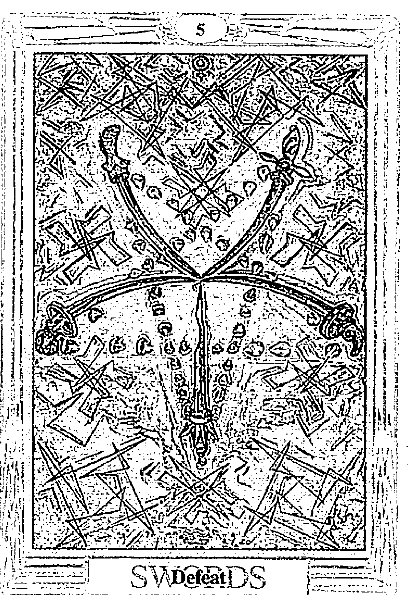

紛亂的線條，歪曲的寶劍，此牌定義為「挫敗」，金星此刻落入水瓶座，這是一個深具本領卻找不到自己位置的狀態。優雅金星喜愛社交並和人群互動，然而水瓶座的愛是清冷疏離，甜美金星在水瓶領域中突然感覺無法自在，因為自身最擅長的社交力，在此完全無用武之地，「挫敗」感因此產生。整張牌的顏色從紫色往下退到藍色，再到綠色，牌面下方藍綠色中綠色居多，藍色已經快要退光，這是一路往下走的狀況，且顏色呈現髒污感。紫色是智慧，綠色象徵財富和自我平衡，當上面智慧已經沒辦法操作運作時，自然會影響了下方喪失平衡點，這是看不見自己優點卻因此放大自己缺點的狀態，上方紫紅色已經失去了對自己的判斷認知，也無法銜接由上而下的靈感和想法，原本應該可以有信心的領域，如今挫敗感十足。

薩弗拉「力量」(Geburah) 在此依然持續地散發破壞的能量，金星掌管了水瓶座，這是能量無法彰顯的位置，「所以災難的根源似乎是因為軟弱而不是力量強大，因為理智已經被情緒削弱」。[83] 在火星之域中，失敗是由於和平主義與其能量不和諧，數字「5」連結火星也代表能量容易消耗殆盡。已經沒有足夠的力量，來維持「寶劍 4」中四大元素的表面武裝和平，五把劍柄形成了象徵沉淪的倒五角星，「這裡的情況更糟，因為沒有一個刀柄與其他刀柄相似」[84]，它們是完全不同的能量，現在其中四把刀刃均已彎曲，唯一一把還筆直的劍，在此卻因為劍身殘破，已成為最無用的武器。紅薔薇現已完全凋謝，只剩一片片的花瓣，無力地癱軟於倒五芒星中，此局已是大勢已去，再想盡什麼辦法也都藥石罔效，只能認輸與放棄。

寶劍象徵著人智慧的結晶，理應聰明到懂得躲災避劫，但倒五芒星除了已讓靈性無法發揮，時勢如此也只能順從。水瓶座的疏離一向與大眾市場本質有所違背，而金星的社交特質順應著大眾市場，金星雖很好，但無法在此得到掌聲。爭吵實際上已經爆發，這意味著註定失敗，背景那堆破碎扭曲的殘破線條，當中呈現出「卐」字符號，「此牌繪製的時期，正是英國與納粹德國對抗最劇烈之際」[85]，或許哈利斯夫人真的是刻意地將「挫敗」概念與納粹符號相連。

水瓶座的和平理想主義，與金星的慵懶優雅，在爆烈的「力量」火星領域，有著本質性根深蒂固的不同，形勢已經無法控制，再也找不到屬於自己的思路，而落入固定星座，也時常在面對競爭時容易只堅持自己的想法無法變通，這不是還有轉圜餘地的暫時性失落而已，這是空有一身武藝，卻明瞭已無力回天的項羽霸王卸甲式「挫敗」。

## 錢幣 5

Five of Pentacles

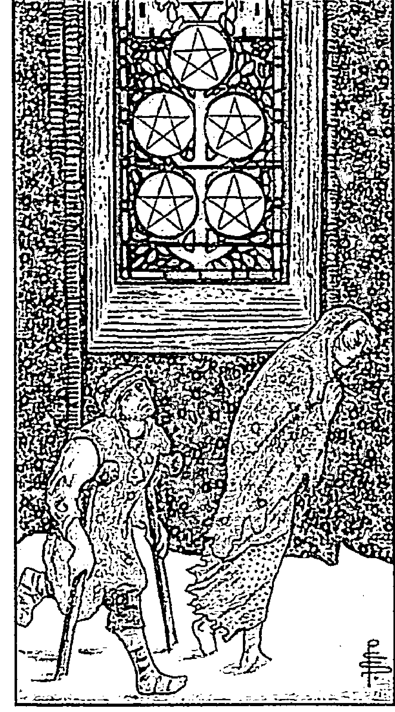

土元素爲陰性元素，理論上隨著數字的增加，等同於財富的累積，在世俗層面上的認知是好的，然而此牌中呈現兩人在寒冷的風雪中行走，一位瘸腿、一位駝背，身上並沒有可以面對這場冰雪嚴寒的保暖衣物。他們行經一座具有美麗花窗玻璃的教堂，卻完全沒有想要進去尋求庇護，只是視而不見逕自路過，拖著沉重疲憊身軀繼續前行。

由兩人的肢體疾病和身上衣物看來，這是深深的匱乏感，疲憊更是確定的事實，而後方莊嚴美麗的教堂，在精神與物質上都是豐盛的象徵，與前面兩人的情境形成了強烈的對比。然而教堂只有美麗花窗，卻沒有看到可以進入的門廊，這象徵兩人在物質與精神上可以去尋求的豐富資源，但卻因爲自己的疏忽、或是因知識不足而錯失了求援的機會，亦有可能是因爲被拒所以根本沒有資助來源。

這是一張象徵貧窮的牌，「它預言了物質上的困擾，如圖中所示，是赤貧，與其他相關概念」[86]，而不願意接受外部資源，更是會讓自己陷入困頓中。占星術中五宮宮位也代表了投資，強烈匱乏感亦有可能是在金錢方面，帳面上看都在，但卻因爲投資，錢還沒回本或無法運用自如而產生。此牌呈現的匱乏感是事實，但若是認爲在經濟上卻不一定是事實，兩人乞丐的造型是強化匱乏感的象徵，身邊的宏偉教堂，也暗示著沒有適時尋求資源，導致事情被拖延，但不代表不能完成。

這些困頓在某種程度上來看，其實是自己所造成的，或許是因爲貪欲，也有可能是因爲匆忙間一時的疏忽。偉特提到這牌與「不協調、混亂、毀滅、不和、放蕩」相關，至於往後的命運變化，是真實地在物質上更加艱困？還是在運勢上還能轉圜而逢凶化吉？端看自身如何彈性地面對當下議題，以及適時調整心態來面對。此外，兩人在漫天飛雪中蹣跚前行，這是一種陪伴的情懷，人生旅途上人人都會有「歲月長，衣衫薄」[87]的感慨，只有在人生低谷，冷意透骨直擊心扉之時，才可分辨人心真偽，這無疑也是一種生命旅程上的珍貴收穫。

## 圓盤 5：憂慮

Five of Disks: Worry

- 物質憂擾之主 Lord of Material Trouble
- 水星在金牛座
- 金牛座 0 度到 10 度
- 4 月 21 日至 4 月 30 日

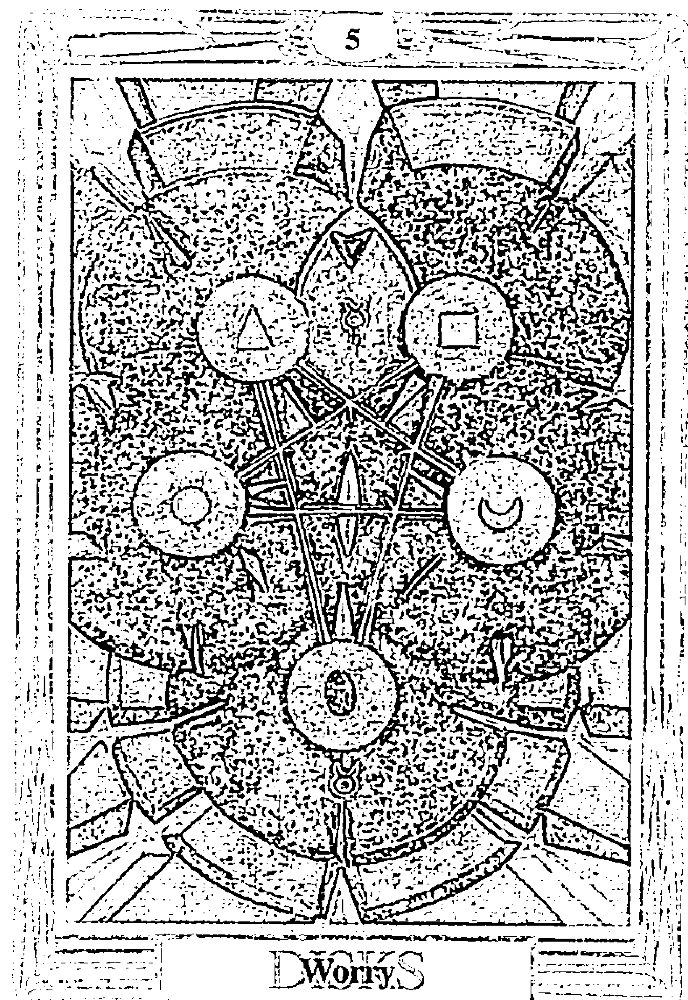

「圓盤 4」從堅守規律中獲得穩定，「圓盤 5」開始從一成不變中產生苦惱。金牛座本性務實，不喜太多的溝通話語，呈現出固定星座不想改變的心態，而水星聰明靈巧，具有流動的速度性，兩者相合能量並不和諧。水星在金牛座中呈現無法自在表現自我，甚至傾向有苦難言的狀況，情況有如此牌中「畫面無法容納五個笨重齒輪的完整圖像，它們層層相疊，像是一部詭異巨鐘的內部構造」，[88] 這是一個被卡緊無法順利運轉的心境。而在此位於火星之域的「力量」(Geburah) 破壞力道，再讓原本已喘不過氣的沉重能量，增加了變數，至此寧靜感已被完全推翻，這是一種被緊箍的窒息感，「像擔心著綿羊的牧羊犬」[89]。

五個圓盤呈現倒五芒星的型態排列，是「物質基礎的不穩定性」[90]。古印度認為組成天地萬物的元素有「火、土、水、風、空」五種，構成人類所有經驗基礎。「火」是等離子態物質，「土」是固態物質，「水」是液態物質，「風」是氣態物質，而「空」是「乙太」、「虛空」的概念，是無法透過科學電磁波觀測的「暗物質」，也就是「靈」的概念。此牌畫面上五個圓盤，清楚呈現印度「五行」(Tattva) 的符號，藍色圓形象徵風元素，淺紅色正三角形為火元素，黃色方塊為土元素，銀色新月為水元素，而倒五芒星正下方黑色橢圓則為靈，這是「意味著五角星較為險惡的意義，也就是物質壓倒了精神」[91] 的象徵。而代表火的三角形本應是鮮紅色，在此呈現出褪了色的色調，火能量本應帶來的行動執行力，在此被延緩遲滯。

牌面前方雖然是灰黑色為主調，但後方隱約透露出黃橘色，這象徵著其實經過溝通還是克服不了困擾的「憂慮」，內心依然是烏雲罩頂。金牛座對於物質性的重視是本能，其固執與愛面子而不求援也是本性，「憂慮」著是否真的是無力回天？還是只是不願意嘗試突破？長時間的逃避，讓許多本是小細節的疏忽，因長久的固執釀成了問題。物質是永遠無法填滿慾望的坑洞，唯有遵行《道德經》中的「見素抱樸，少私寡欲，絕學無憂」，才是解決「憂慮」的最佳路徑。

## 數字 6

### 責任與感性的極限

薩弗拉「美」(Tiphareth)之對應數字

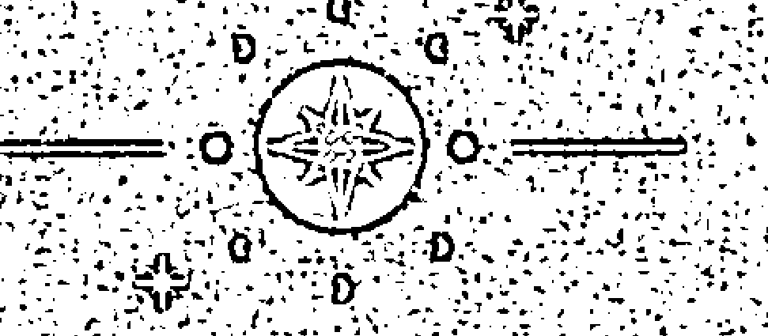

薩弗拉「美」(Tiphareth) 為太陽之域，呈現出能量均衡展現的美感，在某個層次上來說，它位於卡巴拉之樹上最重要的位置。它是「深淵」下唯一一個與 1 號「王冠」(Kether) 相映的薩弗拉，它直接被 2 號「智慧」(Chokmah) 和 3 號「理解」(Binah) 滋養，其「美」來自於成功地和諧平衡了 4 號「仁慈」(Chesed) 的規則和 5 號「力量」(Geburah) 的破壞，它是卡巴拉之樹的中心，不論是垂直面向或是水平面向。

數字「6」強調透過和諧合作而達到互補雙贏的狀態，在此太陽的領域中，陰性數字的柔和能量完全展現，對彼此關係的珍惜，對所有對立能量的平衡調節，呈現出溫暖且和諧的氣質。從伊甸園中躍出的沉淪之蛇，無法超越「美」(Tiphareth) 的界線，這是神一次次利用犧牲來給予 10 號「王國」(Malkuth) 機會，將墮落之力昇揚，讓宇宙再度達到平衡。因此它是基督教的奧秘特質，《聖經》中「人看見了我，就是看見了父」(約翰福音 14:9)、「我就在父裡面，父也在我裡面」(約翰福音 14:10)，這是由 6 號薩弗拉「美」可窺見 1 號薩弗拉「王冠」的最佳理解與證明，展現於神子承聖父意志。

薩弗拉「美」位於「溫和之柱」(中柱) 之中，所有不同意識在此溝通與調和，並照耀著「深淵」下其他所有「薩弗洛斯」(Sephiroth)。它為眾行星所圍繞，是地球萬物的生命之源，也是人類靈魂中的「Ruach」(智性)，其自我燃燒的奉獻精神，呈現出為他人考慮的親和力，重視情感且具同理心。數字「6」代表上半階段的結束，是下半階段的開始，如一年之中，夏天已到尾端，即將要邁入期待豐收的秋天季節。

## 權杖 6

Six of Wands

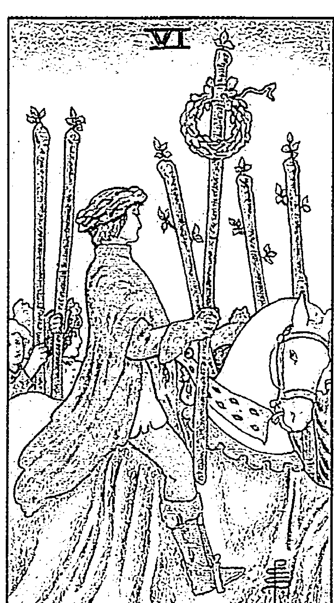

一名年輕男子，騎著身披綠色華麗布料的白色戰馬，頭戴象徵勝利威望的桂冠，緩緩遊行於人群之間，畫面中的六支權杖均長出新鮮綠葉，一切都有了生機，而騎士手中的權杖上更是用紅緞帶綁了另一頂桂冠。他獲得眾人的擁戴，也展現出領導能力，後方五支權杖令人聯想到「權杖 5」中的混亂狀況，如今所有紛爭已得到完滿解決，連白色馬匹臉上也露出驕傲神情。

他是象徵勝利的光輝榮耀，此時他的地位無可被挑戰，儘管呈現勝利之姿，但姿態莊重仁慈，他是此刻萬眾矚目的焦點，而非凡地氣勢平靜前行，也代表了以和諧的態度掌控大局。太陽神的代表物桂冠在身，一切彷如太陽一樣普照無私，這是成功不必在我的概念，願意將榮耀分享大眾，展現出優雅美好的高遠視野。

儘管火元素一向比較自我，但是進入數字「6」這個薩弗拉「美」(Tiphareth) 的太陽之域，毅然呈現出比較願意給予和分享的姿態。此外，數字「6」的成功和榮耀，也象徵與過去的累積有關，現在所有的一切是因為過去所造，艱辛奮鬥雖已然過去，此刻的榮耀則絕非偶然。

## 權杖 6：勝利
Six of Wands: Victory

- 勝利之主 Lord of Victory
- 木星在獅子座
- 獅子座 10 度到 20 度
- 8 月 2 日至 8 月 11 日

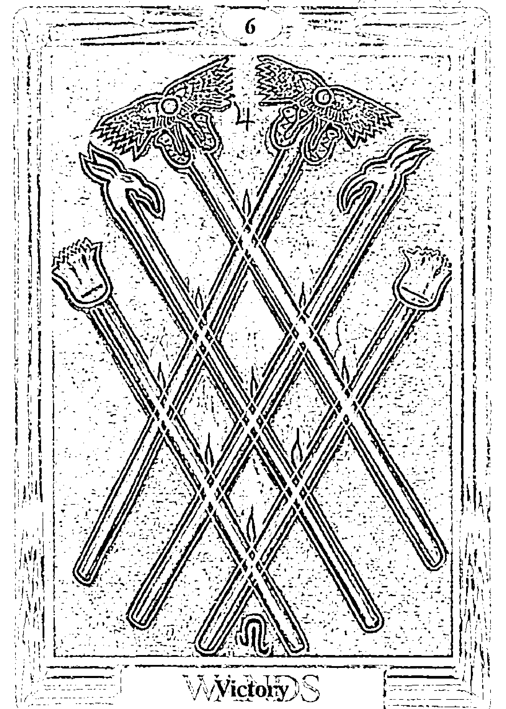

火元素的純粹能量常會造成事件呈現不平衡的狀態，只有回到中柱後才能有和諧發展，「權杖 6」位於太陽領域，畫面呈現出淡紫色的夢幻感，權杖交會的方式，與金色黎明協會《Book T》書中所設定的模型相似：「六柄權杖，三柄三柄交叉。權杖交會處冒出火焰。」[93]「權杖 5」中所爆發出的爭鬥能量，如今已完全平息。木星的擴張能量，與獅子座的領導意識相搭配，讓木星落入獅子座展現出愉悅和諧的能量，這是內在力量充滿之感，在各個方面都得到「勝利」，完整體現了「勝利」的璀璨外觀。

畫面中六根權杖分為三組倆倆相對，最外側的是象徵陰柔力量的「蓮花杖」，中間為象徵火能量的「鳳凰杖」，這兩組權杖都有出現在權杖 5 牌面中，然而在此與權杖 5 不同的是，鳳凰杖杖頭臉部的方向背對蓮花杖，水火元素不再直接像權杖 5 那般劍拔弩張，而中間兩支埃及帶翼圓盤的權杖，為「宗師之杖」，圓盤的紅色與翅翼的藍色，清楚呈現本相對的「火」與「水」在此融合，成為此權杖的能量所在。

陰性的偶數具有陰柔本質，不會呈現急於突破的態度，此六根權杖成雙成對，交會出小而穩定的火花（不再是向四面八方射出的火焰），這是強調「勝利」的和諧感覺，競爭已過，也不會再有任何爭執，這是身體與靈性上的寧靜，自己的定位瞭然於心。「權杖 4」黃色圓圈已不復見，每個能量無需刻意被限制，亦能達到最完美的境地。

太陽的確象徵著一切的美好，獅子座的領導自信搭配木星的擴張能量，這是在既得勝利中的醺然與陶醉，因為自我良好的感覺會呈現一切都好像準備好、也在掌握中的心態，有可能會令其失去戒心，以為一定會順利得到勝利，也會讓人失去競爭力。此牌很能體現行星落在太陽領域的氛圍，這種金碧輝煌，在享受勝利所帶來的表面虛榮之時，可以確定的是，此刻並沒人在乎背景那象徵智慧的紫色，正逐漸褪色淡化。

## 聖杯 6
Six of Cups

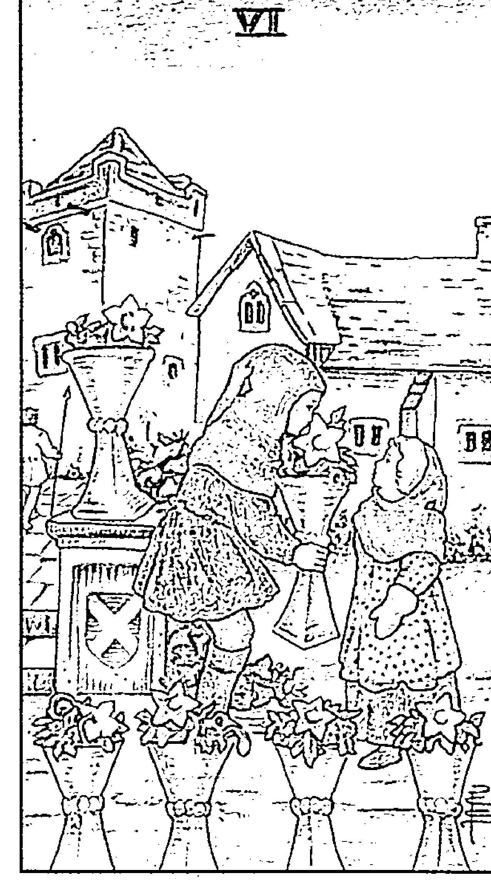

「聖杯 6」的畫面，恍如童話故事書中的美麗插畫，一切都呈現在和諧的狀態，畫面中央呈現的兩位人物，是一位大孩子正在遞聖杯給一位較年幼的孩子，四個聖杯排列在畫面最前方，而另一個則是置放於刻有「聖安德魯十字」(St. Andrew's Cross) 浮雕的柱子上。偉特清楚說明：「此牌代表過去與回憶，例如回溯的童年時光。」[94] 既然是童年時期的回憶，那表示所有真實已然逝去，此畫面僅是印象中的虛構場景，每個聖杯中的白色花朵代表著童年的純潔，兩人彼此間的贈予無實質的功利目的，一切單純而美好。畫面最左邊有個手持長矛的男子，往後方的城堡建物走去，這美麗莊園中有鮮花、有歡笑、有單純的情感，毫無憂慮摻雜其中。

這是一段不想被打擾的回憶，一切有如城堡的堅固，還有守衛的保護。美好的回憶對比了當下的現在，呈現出一股多愁善感的不穩定情緒，過度的緬懷過去即是對現下產生匱乏感，回憶的漩渦容易讓人捲入過去經驗中，無法舉步向前。成長必然伴隨著挑戰與挫折，也因此更容易讓人躲進過往美好回憶中沉溺，在有其他情緒的時候，我們得逼著自己嘗試以微笑來面對，並樂觀處理，但或許童年的美好只是記憶揀選下的片段，並非全部的真實，而美好記憶之所以還能留在腦海，是因為有逝去的痛苦伴隨。當回憶離開了原本真實的位置，只是隔著玫瑰色鏡片的呈現，也正是人類這種記憶的複雜性，才能構成了每位獨特而又真實的成人。如何調配心與頭腦，在無法活在當下的時刻，讓時光篩網濾去需斷捨離的過去，留下剛剛好的回憶，來成為推動生命前進的動力，是重要的人生課題。

## 聖杯 6：歡樂
Six of Cups: Pleasure

- 歡樂之主 Lord of Pleasure
- 太陽在天蠍座
- 天蠍座 10 度到 20 度
- 11 月 2 日至 11 月 12 日

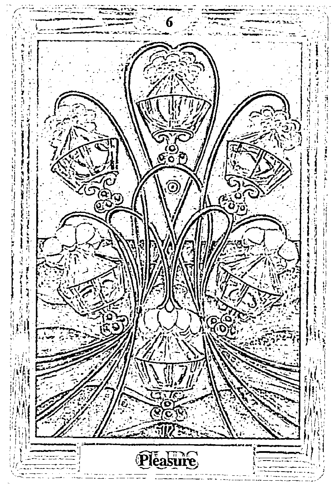

此牌中，太陽回到屬於自己的薩弗拉「美」(Tiphareth) 的太陽之域當中，這種雙倍歸屬感讓畫面呈現溫馨氣氛，再加上天蠍座提供了感官享受的面向，這不是在派對中那種暫時的表現歡樂，而是在屬於自己的愉快自在空間中，內心所浮現的和諧舒適感。在「金色黎明協會」的模型中如此陳述：「六朵蓮花低垂向下，各自垂在一個杯子的上方，水從蓮花中流出，如噴泉般注入杯中。」[95] 此牌的畫面呈現相當忠實於模型的原始設計概念。

此牌是所有 6 號牌中，畫面最愉悅、意義也最美好的，這是一種豐盛的呈現。太陽以其強大的能量，來平衡了「聖杯 5」中因為水不流動而產生的腐爛能力，而太陽在此落於強調生殖能力的天蠍座，太陽光束照射入深沉的水域使其產生生命力，流動的水「呈現了生育創造力，這是所有生命的基礎」。[96] 聖杯 5 在死水底部纏繞的蝴蝶狀根莖，在陽光能量的滋養下，現在升高至海面較高處，生長力再度出現，一切顯得輕鬆而滿足。此牌展現自在地滿足了慾望，無需努力也沒有壓力，經過了聖杯 5 的乾涸與枯萎後，蓮花再次綻放，此刻的愉悅是因為修正了過往失敗經驗，而「杯子並未被注滿」[97]，未央的概念也呈現出一切尚有更為提昇的空間。

畫面展現黃色偏橘色的愉悅能量，水亦呈現出舒服的海浪，杯子像即將盛開的花苞，而黃金花苞又相似金黃太陽。聖杯 5 是火星入廟天蠍座，因此星型特質一覽無遺地被彰顯。儘管聖杯 6 太陽落入天蠍座並沒有能量，每個杯的水也都未滿，明顯代表每件事情都以謹慎保守的態度來對待，但因為太陽此刻落到屬於自己的領域，一切均和諧歡樂，無需刻意張揚或包裝，甚至願意包容忍讓來平衡所有能量。因此，雖然每個杯子都感覺豐富，但無外溢的水代表能量保守不濫用，身心靈在平和滿足中達到和諧。

克勞利認為此牌對應了《易經》的第二十卦「風地觀」，「觀」代表展示與觀看，「盥而不薦，有孚顒若」，《象》曰：「風行地上，觀；先王以省方，觀民設教。」偉大的德行被展現讓萬民觀仰，天下人均因此順從美好教化，此為上行下效之光明意象，是渡過「聖杯 5」中的低谷後再次見到陽光，在久旱逢甘霖的愉悅中，仍記取先前的失敗教訓。因此在此刻的享樂氣氛中，謹慎拿捏分寸，並呈現誠敬之心，如同牌面中的蓮花根莖長出海面一般，不斷自我提升，達到靈性高度之時仍展現保守謙卑，對深刻的安全感表達感激。

## 寶劍 6
Six of Swords

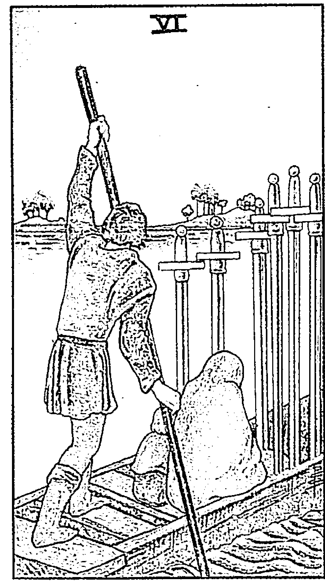

一艘船緩緩地朝對岸划行，而此端的水波洶湧，彼方的水面卻呈現寧靜狀態。六把長劍插在船身，三位人物均是以背影面對觀賞者，坐著的成人緊抓身上黃色斗篷，顯示出孤獨之狀，身旁小孩則是緊緊依靠。擺渡者並沒有要快速行駛之意，反而是呈現緩慢地推竿，讓船隻慢慢前行。

三個主角哀傷的背影，構成此牌「寶劍 6」緩慢低迴的基調。沉重的劍身讓擺渡人只能緩行，船身被六把長劍穿刺卻不能在此刻拔除，否則會即刻進水翻船。這是一段療傷的過程，若把過去的傷痛連根拔起，傷口會再度冒血，因此只能輕輕地撫平。人物均沒有生氣，數字「6」有和諧之意，但用在風元素中，象徵只想讓自己心緒沉澱，因為畢竟風元素象徵聰慧，覺得一切再重新整理後，可以再出發（儘管只是心理層面的出發，並沒有實際的行動）。擺渡者划行水面，將一切傷痛推往心理層面去過濾，這是內心情緒的自我調整，而不是以實際對外行事來處理問題（外顯的行為從來就不是風元素的事），所以在太陽之域中的和諧，對寶劍而言是知道要重新調整腳步，沉澱自己，甚至以暫時消失或歸隱來整合自己思緒，完全不想涉入現實中其他事件。然而越想用力試圖讓自己平靜，則動盪的心情往往會更加強烈，在極度想壓抑下自己思緒的同時，卻忘了真正該慶幸的，是這六把寶劍的穿刺，並沒有使船真正沉沒。

## 寶劍 6：科學
Six of Swords: Science

- 贏得成功之主 Lord of Earned Success
- 水星在水瓶座
- 水瓶座 10 度到 20 度
- 1 月 30 日至 2 月 8 日

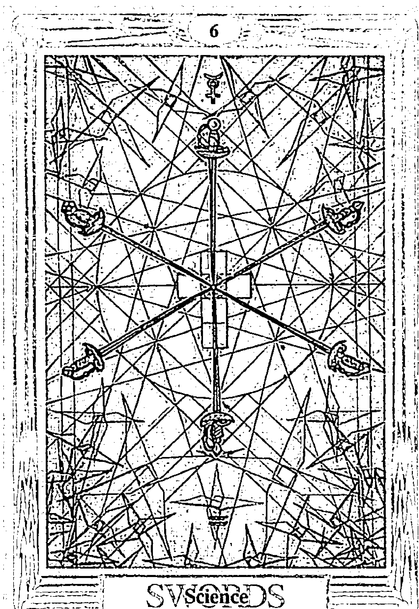

每位看過托特塔羅牌的人，對這金色黎明協會的「薔薇十字架」標誌一定不陌生，因為它出現在每張牌的背面，在那大十字架的薔薇當中，還有一個小十字架，中心仍有一朵薔薇，薔薇中心有一個小白點——「這個白點象徵純粹存在的光燦原點，沒有體積，也沒(尚未)有位置」[98]。這即是卡巴拉哲學系統中所討論的「空無」(Nothingness)的概念，表現在「負向存在的三重帷幕」中，為「Ayin」(否在，亦稱「無」)、「En Soph」(無限，亦稱「無限的空無」)以及「Or En Soph」(無限光)。在此的「無」概念並不是真正的沒有，「無」是因為人類心智上根本無法理解與想像其存在的本質，在無法以經驗呈現的形式，所以我們只能稱為「無」。「根據我們對於存在的概念而言，它不存在，然而根據它本身的存在概念來說，它存在。」[99] 因此，人類要掌握這個「原點」是不可能的。

根據卡巴拉哲學，這個點像是一個立方體，因為是立方體，所以會有長寬高三個維度，是一種潛能的孵化狀態，而此立方體要進行創造的步驟，當潛能要轉化為現實形式之時，「它必須自我獻祭在十字架上」[100]。所以當展開此立方體，成為一個六個正方形所排列而成的十字架，而中間出現一朵五瓣薔薇花。數字「5」在文化脈絡上，一向與人類肢體相關聯，例如人有五官五感，手腳也各有五隻手指頭，因此「5」是象徵人類這個「小宇宙」。而數字「6」代表位於太陽之域的第六顆薩弗拉「美」(Tiphareth)，因此象徵著「大宇宙」。在此，兩者相和，那純粹存在的「點」，從迸發開來的薔薇和十字架開始，一連串的創造循環被啟動，而人類「小宇宙」和神性「大宇宙」的緊密聯結，也正反映了「如其在上，如其在下」(as above, so below)的宇宙真理。

從寶劍 5 到寶劍 6，混亂的局面已慢慢整理出脈絡，此牌面中，六把筆直的寶劍，劍尖共同指向薔薇十字的正中心。作為風元素的代表，此六把顏色各異的寶劍，代表了六顆行星之思想能量，共同朝向「偉大工程」的中心，分裂和爭吵的想法已遠離，是智慧讓一切顯現出和諧平衡的狀態。儘管背景還是眾多思緒線條分佈，但落在太陽領域還是充滿美感，線條思慮雖繁複卻清晰，寶劍擺放整齊，能量達成共識。

十字架與太陽均象徵光和真理，而科學的概念是試圖在現實現象中找到規律和方向，水星的靈巧在風象水瓶座中，更強化了智性的特質。在漫長的歷史縱軸上，宗教扮演著解釋自然與知識權威角色，遠比科學發展來得久遠，科學以理智、邏輯、經驗和實證為方法；宗教以啟示、信仰為路徑。儘管在十六、十七世紀科學的發展曾經撼動了教會的宇宙觀，但以今日之角度來看，兩者均是在追求宇宙真理，殊途而同歸。某些科學家，例如眾所皆知的牛頓(Isaac Newton，1643-1727)和瑞士醫生帕拉賽瑟斯(Paracelsus，1493-1541)，均投入煉金術的研究。牌面上六把劍直指薔薇核心，象徵著以科學的思緒和角度來探究宇宙神秘本源，這正是煉金術中所進行的一連串化學實驗的意涵，也是人類為尋找隱藏真相所做的種種努力，而這一切進程，正是獲取所有智慧的終極探索。

## 偉特塔羅
## 小阿卡納牌 — 數字牌
## 錢幣 6
Six of Pentacles

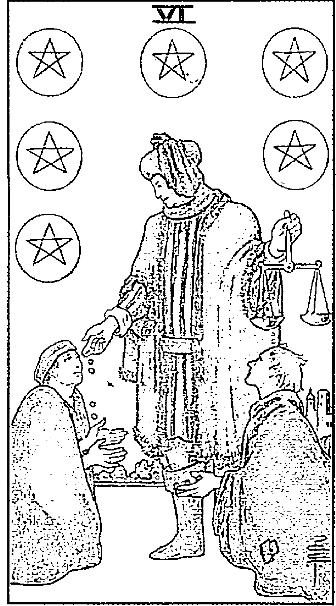

兩位乞丐跪伏在一位富貴男子面前，乞求施捨。站立的富貴男子右手正在施捨錢幣，左手卻提著一只天秤。土元素一向呈現務實的本性，而數字「6」位於和諧的太陽之域，因此不可能將全部能量獨自掌控，平衡與調節是「美」(Tiphareth) 領域的特性。在經過「錢幣4」的緊握，到「錢幣5」的困頓中意識到錢非萬能，以及被金錢細綁的不適之後，此刻「錢幣6」已懂能量的調節和循環、懂得施捨和給予。然而，左手拿天秤畢竟也呈現出土元素務實面向，這不會是聖杯式的無條件大愛給予，而是會權衡施捨的程度，有相對應的回饋狀態之後，再進行適當施捨。

評估著利害得失的情形下，自然不會讓自己陷於財務困境，六枚金幣高掛空中，遠方有園林和城堡，這是財務穩定的象徵。而在物質上仍具有給予之心，是一種權衡佔有和分享間的心態，並運用理智在進行資源配當，讓彼此間有良好的相互影響。儘管牌面中明示著一種支配的情況，以及有強烈上下主從的位階關系，但是兩方均呈現滿意現狀，雙方各取所需，這是資源的支配力，而施與受之間，施捨與迎合之異，也正體現了數字「6」薩弗拉能平衡不同能量的特性。

## 圓盤 6：成功
Six of Disks: Success

- 物質成功之主 Lord of Material Success
- 月亮在金牛座
- 金牛座 10 度到 20 度
- 5 月 1 日至 5 月 10 日

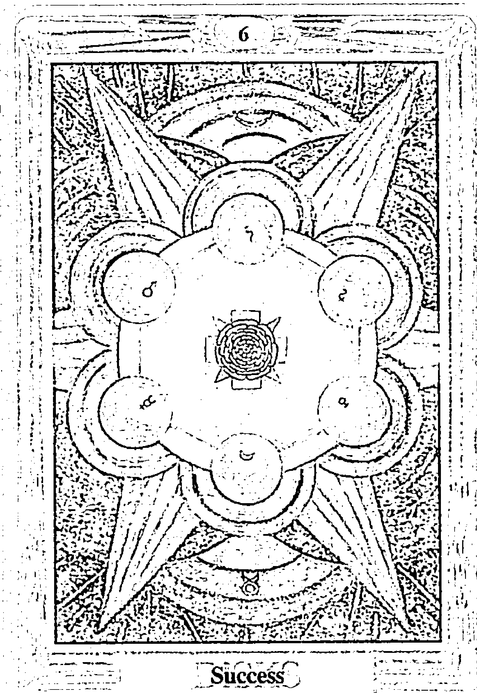

月亮入旺於金牛座，在占星術中這是個財富豐盛的位置。「入旺」代表內心世界的彰顯讓外在圓滿，因此很強調內心世界，本應不強調外在的擁有，然而月亮屬性陰晴多變，在薩弗拉「美」(Tiphareth) 的太陽領域中，會展現出以實際上的擁有，來穩定情緒上的不安全感。

在整張牌面的正中心，四十九片花瓣的大薔薇呈現其中，克勞利在「寶劍 4」中解釋過此為「社會的和諧」[101] 的象徵，象徵「美」的太陽則出現在大薔薇的正中心，和大薔薇一起出現在一個四臂等長的十字架上。而在「漢密特薔薇十字架」(Hermetic Rose Cross)[102] 上，大薔薇正下方白色區塊，有一顆無法完整納入畫面的六芒星，中間則是一顆太陽符號，周圍圍著六顆行星 (月球、水星、金星、火星、木星、土星) 符號，它們均被溫暖的太陽照應。這即是「大宇宙」的概念，也正是此牌中的構圖排列，太陽在牌面的中心，散發出粉紅色的暖光。

金牛座為固定星座，不喜改變，而土元素的穩定感又會呈現想擁有但不想失去的心態，生活上過去的一切努力，是為了確保物質豐盛。但是如果所謂的成功，是以得到的物質為衡量標準時，慾望會不斷湧出，並成為綑綁的束縛力量。因此，這是一張沉重的安定牌，沉重到缺乏想像力，牌面後方背景的深棕色賦予整張牌畫面往下沉的拉力。只在乎實際目的亦是一種偏頗，然而「美」太陽之域在此給予了它一個可以暫時平衡的能量。月亮帶給金牛座的昇華質量也只是暫時，物質的重量終究會拖垮一切，若是又以固執不知變通的方式，來面對所有未來未知的局面，縱使目前仍具有優勢，但仍無法走得長遠。「請記住，所有的成功都只是暫時的，而在勞動路途中的停頓是多麼美好。」[103]

## 數字 7
### 直覺與情緒的極限
薩弗拉「勝利」(Netzach) 之對應數字

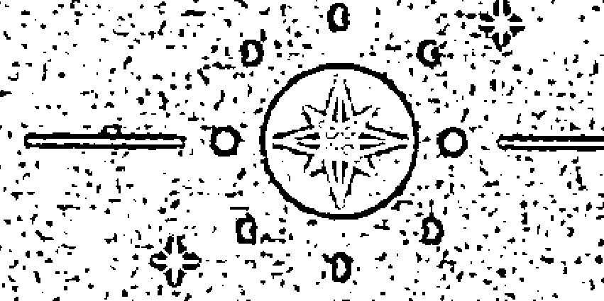

數字「7」在卡巴拉之樹上，對應到第七顆薩弗拉「勝利」(Netzach)，位於金星之域，它象徵著人類在本性中屬於直覺、情緒、情感、詩意與藝術的部分，而金星即是愛神維納斯(Venus)的行星，在魔法形象(Magical Image)[104]是「美麗的裸體女性」[105]。7 號薩弗拉是開始進入「星光三角」(The Astral Triangle)的範圍，而人的心智在此開始運作，6 號薩弗拉「美」(Tiphareth)位於太陽之域，它將其上的薩弗洛斯傳下來的光，轉化分散為眾多光束到達 7 號「勝利」，像棱鏡一般將能量投生於心智形式，從此象徵已變成具體，例如愛神維納斯與金星和玫瑰之間的象徵關聯。

6 號薩弗拉的「美」不是金星而是太陽，因為太陽的美渾然天成，是天生的王者；而維納斯之所以被稱為美神，是在與天后赫拉、智慧女神雅典娜競逐「最美女神」封號的「帕里斯的裁決」(The Judgement of Paris)中，以史上最美麗的女人海倫、以及其後十年的「特洛伊戰爭」所換取的。因此，金星象徵著要「爭」的那個名位，並強調「勝利」這件事。在四大元素與它的關聯中，「勝利」與火元素連結，5 號「力量」的火星透過 6 號「美」反射到 7 號「勝利」的金星，這是與火元素對應的熱烈能量，「而它關聯到金星輝耀的火星面向」[106]。在希臘神話中，金星維納斯與火星馬爾斯也的確有著情愛關聯。在下位四個薩弗拉領域中，「勝利」顯示出在靈性層面為「勇氣」，愛的力量的確可以讓人克服重大困境，但它的能量若不能根植於靈性，則會呈現相當不穩定的狀態，「愛的較低層次屬於情緒，基本上並不可靠」。[107]

薩弗拉「勝利」的位置在魔法三角，也就是在卡巴拉之樹的低階位置，且因為它具有直覺和情緒屬性，「冒了很大墜落於幻想的風險，且最重要的，它是通過瘋狂的鬥爭來做到這一點」[108]，而因為它已靠近物質之界，又離開了中柱，這讓它在與下方薩弗拉能量流動與映射時，容易喪失它天堂般的本性並造成災難。數字「7」不是一個像數字「6」般舒適的位置，至此它的最大弱點會在四大元素的屬性中展現，一切來到一個瓶頸處，是一種應付不暇的狀況，且與真相或欺騙相關。

## 權杖 7
Seven of Wands

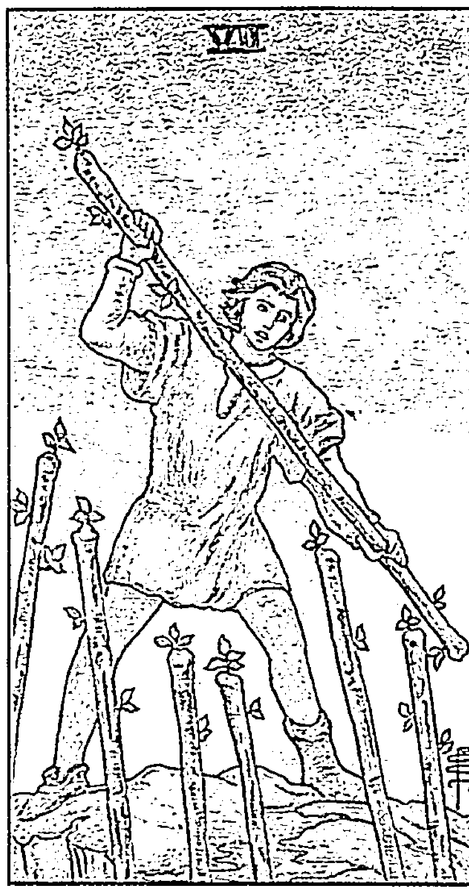

一位綠衣男子，站在高處拿著一根權杖，對抗著下方出現的六根權杖，他不是在防禦就是在進攻，很明顯地應付得相當吃力。但是權杖的火元素能量性格是不會認輸的，儘管可能是形勢比人強，狀況已超過自己的負荷，但還是想去挑戰且不放棄行動。努力是為了不服輸的信念，再吃力也還是不能夠認輸。

這的確是一個重大瓶頸，下方六根權杖來自一致的方向，局勢呈現出反對意見，僅剩男子一人奮勇堅持，且腳下土地凹凸不平整，兩腳間還得跨過一條小河水，努力奮鬥之餘，自身亦處在一個不舒適或基礎不穩固的位置，全力應戰是事實，但慌張神情中透露，對大局來說是否一切付出僅杯水車薪亦不可知。

一人對抗六根權杖，雖然痛苦但是潛力會爆發，畢竟選擇應戰而不逃避是確定心態，高舉權杖站在較有利位置，堅守崗位不放棄抵抗，一切勝負為未定之數。對於火元素來說，爆發力是優勢，但持續力卻是巨大挑戰，如何用堅強的意志力支撐堅守的信念，會是決勝關鍵。

## 權杖 7：勇氣
Seven of Wands: Valour

- 勇氣之主 Lord of Valour
- 火星在獅子座
- 獅子座 20 度到 30 度
- 8 月 12 日至 8 月 22 日

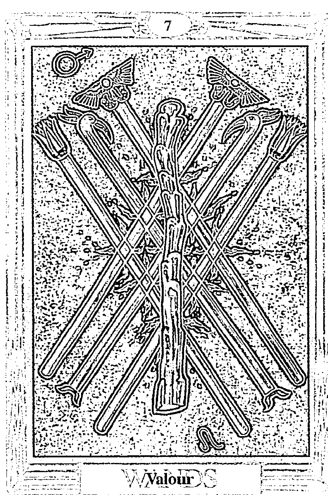

此牌畫面權杖的結構，與「權杖 6」的排列相同，但中間多了一根扭曲歪斜的權杖，寧靜和諧已不在，一切都起了變化。火星落於獅子座，雖能量不強，但火熱的能量還是在一定程度上的氣流當中，然而落在薩弗拉「勝利」(Netzach) 的金星之域，與卡巴拉之樹下方的物質之界如此靠近，而金星的慵懶、優雅與和平特質，與火星的能量並不協調，兩個領域位於中柱的兩端，這是完全不平衡的狀態，牌面上火星符號與獅子座符號都不在牌面中線位置，我們嗅到了混亂的氣息，獅子座的力道在此失去了統御的領導力，火星的衝動呈現出「愚蠢無腦的鬥毆混戰」[109]。

當一切的爭奪只淪為意氣用事，實質並不會帶來任何意義，但所有經歷仍必須走過才能真正體會。此牌強調體會，深紫色的背景代表體會的過程中，智慧不斷地被打開，而這一連串的過程一定相當痛苦。純粹的堅持能量讓中間權杖已扭曲變形，當不顧一切去爭奪的時候，就得把自身的心智扭曲成中間的權杖，這是在極度掙扎往上之時，不斷把自己能量持續抽出的概念，這是一段非常痛苦的過程，但此痛苦才能彰顯憑著個人勇氣而爆發出的真正能量，「軍隊陷入混亂，如果要贏得勝利，那將是靠個人的勇氣——一場『士兵之戰』」。[110]

獅子座的領導與爭奪慾望，在象徵和平與詩意的金星領域呈現出艱困惑，「搖搖欲墜的火焰彷彿召喚了火星的殘酷能量來支持它，但這還不足以完全抵消初始能量的退化和偏離平衡」[111]。「權杖 7」在爭奪的喘息中體驗自己，這是人在爭奪勝利時心中扭曲的那股能量，蓮花杖的顏色褪去，鳳凰杖的顏色暗沉，和平消逝之時只剩競爭，而火星特質本來就自帶缺陷，至此，權杖相交的火焰狂亂搖擺，慌亂四竄，恍若那搖搖欲墜的自尊。

人生很多時候也不能不爭，也只有透過爭奪的過程才能體會，是否真的需要這些事物。中間那根權杖，像已經側彎的脊椎，卻仍堅持要支撐著沉重身體架構，散發的勇氣令人折服。但事實證明，單純、甚至是盲目的勇氣，會贏得光榮尊嚴，但從未是無情戰場上的勝利保證。

## 聖杯7
Seven of Cups

一位以背影呈現的人物，面對著浮雲上的七個聖杯，他全身黑影籠罩，表示身處陰暗之處。聖杯中的七件物件：蓋在岩山上的城堡，是身分地位的象徵；滿溢的金銀珠寶，是物質層面上的富足豐盛；桂冠是勝利的化身；蛇代表心智上的智慧和靈巧；人頭為思緒與潛能；中央蓋著白布的人像，呈現出位於的巴西里約熱內盧的「救世基督像」(Cristo Redentor)姿勢，象徵著對神性的追求與救贖；右下方的聖杯著有一條吐著舌的龍，象徵著邪惡所散發的誘惑。

這是人生中七大渴求之物，也因此會是人生中七大瓶頸之處。「七個聖杯中的異視，這些影像是幻想的情緒」[112]，一切如玻璃般的映射，是自身與想像的投射，也是自身與夢想間的隔閡。充滿情緒的「聖杯」，其實並沒有能力、想法、條件以及預備心態去面對所有瓶頸，吐舌的龍依然透露著誘惑的凶險，裝著桂冠的聖杯杯面上更是隱約映射著一骷髏頭陰影，代表慾望本身即是滿滿的陷阱，與死亡並肩而行，而象徵救贖聖靈的「救世基督像」依然被覆蓋著。

這是對慾望的迷惑與失落，所有的沉浸只因為不切實際的幻想，當失落於無法擁有之時，從夢幻泡影中去尋求暫時性滿足，以逃避在真實世界中所需面對的一切。聖杯一向傾向不願意去面對俗世的要求，儘管這些慾望的確是內心所企求的。此牌強調以醉生夢死的態度去面對人生現實瓶頸，但畢竟現實的狀況與想像的映射完全不同，不切實際的幻想，只是呈現出沉溺和頹廢的真實人生面向。

## 聖杯7：沉淪
Seven of Cups: Debauch

- 虛幻成功之主 Lord of Illusionary Success
- 金星在天蠍座
- 天蠍座 20 度到 30 度
- 11 月 13 日到 11 月 22 日

金星來到了屬於自己的「勝利」(Netzach) 金星之域，本應自在愉快，但任何事情若是過猶不及，都會呈現出致命問題。性感的金星維納斯，位於代表幻象與情感的低階魔法三角薩弗拉「勝利」領域，再落入掌管人體生殖器官的天蠍座，此落陷能量讓金星的負面性質完全彰顯，「她的影響力絕不會往『清楚看見』的方向作用。如果處在金星的影響之下，我們會相信自己想要相信的事物，而她在這層面的箴言就是『愛是盲目的』」[113]。

畫面中「每盞杯子上方都垂著一朵蓮花，但卻沒有水從任何一朵蓮花中流出，所有的杯子都是空的」[114]，這裡又出現了因為過度失衡而導致的嚴重問題，金星在煉金術中是銅的代表行星，「外在輝煌而內在腐敗」[115] 是在此顯現的特質。從聖杯中流溢出的濃稠黏膩綠色膏液，讓大海呈現出有毒的狀態，這是一潭沒有流動的死水，儘管如此還是有些生物在裡面滋養，這是金星落天蠍座容易沉溺的狀況。聖杯的排列是兩個倒三角形，形似女性子宮，「它代表陷入虛幻享樂的泥沼，這張牌中有著自我毀滅的成分」[116]。倒三角象徵沉溺，是一種彷彿上癮的狀況，然後會找正當理由來掩飾，不承認自己的行為是放縱與沉溺。

此牌糟糕的地方，在於沒有其他有力的行星來支持與提升這沉淪能量，金星又落入金星之域讓感性加倍，但位置如此下階，讓錯覺與虛幻等負面能量加倍，再落入天蠍泥沼中，情慾更容易流於自私與廉價的放蕩。倒五芒星的物質戰勝精神意涵是很確定的，但此牌面只是兩個倒三角形，儘管所有的蓮花都往下垂，是一種奄奄一息的妥協與配合，但克勞利從不呈現批判性，只會呈現出事物真實的樣貌，一切沒有好壞之分。當如此沉溺的生活成了習慣，依賴的對象也隨之產生，「它代表酒精中毒和藥物上癮的錯覺」[117]，渴望獲得巨大迷幻歡樂的慾望，像在七彩迷霧中盲目追逐與奔跑，心中方向必定麻痺且迷惘，並呈現出身心沉淪的失衡。只要願意清除依賴之物，一切還可得救，但當事人可否願意離開腐化身心的感官極樂，端看他是否願意回歸現實中的智性意念，讓一切履險如夷。

## 寶劍 7
Seven of Swords

一個男子懷中抱著五把寶劍，而他身後遺留了兩把寶劍插在地面上，從後方的帳篷以及牌面左方的三個黑色人影、其中一人還拿著長矛形象看來，這地區很有可能是軍隊的營帳。這名男子臉上有著沾沾自喜的表情，躡手躡腳的姿態令人聯想到，他應該是在軍隊營帳中偷出了七把寶劍，利用無人看守的契機，悄悄離開營地。

此牌爲「寶劍 7」，而此男自懷中抱著五把寶劍，不禁令人聯想到寶劍 5 所代表的「自訂遊戲規則以取得勝利」的意義。而遺留在地上的兩把寶劍，代表著他一人的力量是有限度的，在沒有實力與敵人光明正大正面交鋒之際，他決定耍小聰明，以一時的小聰明來突破眼前的困境；當面臨到挑戰和所謂的瓶頸時，他選擇竊取，以採取此種狡猾且不正當的手段，來削弱敵人的實力。

這代表著欺騙、狡詐、詭計與對他人信任的背叛，而遺留在地上的兩把寶劍，依然讓對方擁有了反擊的力道與工具，儘管畫面上看似他此次已經成功地進行了他的計畫，但是「此牌的設計並無確定的意指，因爲呈現的意義廣泛地彼此間不相符」[118]。儘管是不正當的偷竊行爲卻看似成功可行，雖然是成功了卻遺留了弱點，雖遺留了弱點但是尚無人發現，而此時的無人發現不代表此舉永遠可行，此行爲雖不能永久可行，但此刻的確是正在順利進行。而遺留的兩把劍可以是被發現偷竊的證據，也可以是未來對方追擊時的有利屏蔽路障。

但不論如何，他是一人計畫獨自行事，不與敵人正面衝突，選擇以投機取巧之方式試圖獲得勝利。他的確擁有自信和謀略能力，但這一切只是一時的勝利，昏黃的天色之後黑夜即將隨之降臨，距離理想中的全面性勝利，還有一段路，需要在不確定中摸黑前行。

## 寶劍 7：徒勞
Seven of Swords: Futility

- 失穩的努力之主 Lord of Unstable Effort
- 月亮在水瓶座
- 水瓶座 20 到 30 度
- 2 月 9 日到 2 月 18 日

數字「7」的瓶頸能量，來到名為「勝利」(Netzach) 的薩弗拉金星之域，在成形之界中彷彿「溺水的人抓住稻草」[119]，然而月亮的不安和變化特性，落於充滿理想性的水瓶座，呈現出一種可被修正的影響力，這是一種妥協的可能性。畫面中七把寶劍都沒有連在一起，其中六把各代表了土星、水星、木星、火星、金星、月亮，但他們共同指向象徵太陽的寶劍。不同的寶劍代表著各行星間獨特各異的能量，不同的觀點讓大家的思緒越趨複雜，而背景中象徵風元素思考能力的線條不停轉動，中間的太陽寶劍與其他六支寶劍形成抗衡之姿，但劍身已被其他行星寶劍傷害到傷痕累累。

月亮的本質是最需要被理解與關懷，並擁有專屬他個人的情緒模式，然而水瓶座的概念是一視同仁、天下為公，對月亮呈現「對我而言你並沒有任何特殊性」的姿態，月亮落水瓶座呈現毫無能量的狀況，月亮在此是個不舒服的位置。水瓶座是理想主義者，永遠有太多的理念，但重點是往往在現實中不知道如何實現，理想高遠但找不到可以實際進行的路徑，呈現出此牌「徒勞無益」的能量。此牌展現出冷色調，這是水瓶座的理性，也是水瓶座的疏離，此牌是強調用所謂的高遠理想，去實踐疏離的事實。

太陽寶劍以一己之力，敵眾我寡之姿對抗六把行星寶劍，正如水瓶座一向曲高和寡的理想特性，在世俗中常呈現常人不能理解的面向，但寶劍畢竟是象徵思緒的風元素，不是以行動力取勝的火元素，再加上月亮那股夢境式的能量，蒙蔽且弱化了成形之界的智性，而獨立對抗其他能量的太陽，在水瓶座中更是呈現落陷力道，又更進一步弱化「心智」(Ruach) 中的聖靈。

這是努力對抗比自己能力強大的過程，背景的藍、寶劍的紫都淡化掉了，儘管白色是頂輪之上的光，白化的狀況亦呈現不切實際的疏離，如同「一位患了風濕的拳擊手，在離開拳擊圈多年之後，試圖再復出」[120]，「有過遲疑，也嘗試妥協，更有一定的寬容。但是，在某些情況下，結果可能比以往任何時候都更加具有災難性」[121]。中間的太陽寶劍已經片體鱗傷，代表著事情當中最重要的中心思想與關鍵時機，早已消失殆盡，任何孤注一擲的努力，只會呈現出力不從心的事實，一切只會是徒勞。

## 錢幣 7
Seven of Pentacles

一位男子雙手放在工作用的鋤頭上，杵著鋤頭看著自己右手邊的植物。這位男子呈現勞動者的樣貌，神情些許疲憊，身旁的藤葉植物生長豐盛，其上掛著六顆金幣，這是過去所有辛勤勞動的累積與成果，而還在藤蔓上代表著還在滋長，雙腳中間的第七枚金幣，彷彿如同收割下等待被享用的果實，這是一個值得欣慰的成果，也證明著自己過去的努力有著輝煌成績，現狀令人感到欣慰。

這是一個富足的畫面，此男子的動作神情也顯示出他對一切現狀感到滿意，但數字「7」畢竟代表著瓶頸狀態，從藤蔓上「結實累累」的金幣看來，他目前停止了耕耘的動作，土元素呈現出來的務實特性，可知他並不是開始怠惰，而是現狀讓他有機會暫時停止過往的勤奮模式，此刻他已有條件可以停頓工作，來換取對未來資源運用的思考和規劃，他不會如「錢幣 4」般緊抱著金幣，而是認真思考如何調整資產，以及是否可以有效運用資金。

他只摘下了一枚金幣，六枚還讓他們繼續於藤蔓上生長，這是小有所成的階段，也是需要再做調整的人生路口，肯定自我之前持續辛勤工作的心態，以及隨著歲月逝去，檢視持續此種做法所即將會帶來的瓶頸，與其全部收割殆盡，不如利用其他管道來擴展資源，正視自己已經到了應該改變過去做法的時間點，並面對現在停滯的狀況，思考如何能夠在現有累積下更加提昇。現在的確是可以肯定自己過往的累積，也該是開始思考其他人生方向可能性的時機，面對目前可能是心態上或是現實狀況上的停滯不前，攜帶著原有的成果與資源，與目前的問題和平共處，的確是到了需要解決問題的時候，但也不需要太著急馬上找到未來方向，先踏實過好當下每一分秒，還有時間可以釐清思緒，畢竟過往的扎實基礎，讓現階段在生命中，擁有一片可供小小休憩的花圃。

## 圓盤 7：失敗
Seven of Disks: Failure

- 未實現成功之主 Lord of Success Unfulfilled
- 土星在金牛座
- 金牛座 20 度到 30 度
- 5 月 11 到 5 月 20 日

畫面呈現一片灰暗，土星的限縮能力進入了土象固定星座金牛座中，雙層的能量有如重力加速度，把固執的能量極限擴大。數字「7」象徵著瓶頸，在慣常令人有虛弱效果 [122] 的薩弗拉「勝利」(Netzach) 金星之城的四張數字牌，的確均無法令人心悅。七枚「鈍重如鉛錢幣」[123]，四枚印有土星符號，另外三枚則印有金牛符號，被分配安置在一片所有的葉子都往下掉的灰暗死寂植物中。這是土元素中最令人不悅的負面能量，土星的沉重與限制特性，搭配上金牛座重視物質的緩慢與固執，「更為專橫、好戰的冰雪上，添加了缺乏想像力嚴霜」[124]。

「地占術」(Geomancy) 是一種撒泥於地，觀其形來推測吉凶的占卜方式，屬於「分佈占卜」中的一種，已流行上千年的歷史，19 世紀時神秘學組織「金色黎明」協會的成員會進行此種占卜術的訓練。此占卜中呈現的十六種卦象，以「魯伯卦」(Rubeus) 最為凶險，與火星逆行和渙散的風元素有關，以空氣旋風為其象徵型態，不接地氣也無法被引導，呈現簡短且膚淺的性質，表現出混亂輕浮的特色，此為「最為醜陋且險惡的」[125] 卦象。而此牌畫面中七枚圓盤所呈現出的組合排列位置，即是此「魯伯卦」，也由此可知克勞利對此牌大凶意義的強調。

薩弗拉「勝利」在公主層級的代表色為橄欖綠，畫面中此色調已經灰黑到令人不舒服的窒息感，所有橄欖葉均無生機，儘管有粉紫色隱約出現在圓盤周圍，但整體固執嚴肅氛圍沉重，這不是沒有能量，而是能量的負面性強大，但是因為沉重的固執性格不知轉圜，才讓自身有窒息性的能量枯萎，並在能量運轉中把自己牢牢困住不得動彈。「此處沒有努力，更沒有夢想，已然孤注一擲但也輸了，所有的勞動均被放棄，一切沉沒於懶惰中。」[126]

3 號薩弗拉「理解」(Binah) 的土星「黑暗貧瘠母親」面向，在此擊垮了「勝利」的金星維納斯，或換個角度說，當重視感性情緒的維納斯，遇見了重視現實與世俗的土元素時，「勝利」在物質層面上的能量發散，在現實俗世中的認知上，金星能量只會帶來擾動人心的不穩定情緒，自然會產生一連串的悲劇。「我們只要去看埃及艷后克利歐佩特拉、亞瑟王之妻關妮薇、伊索德公主及哀綠綺思的生平，就會了解金星在影響物質層面時，會有這樣的箴言：『為愛賭一切，必失全世界。』」[127]

## 數字 8
成長與慾望的極限

薩弗拉「宏偉」(Hod)之對應數字

中國文化中，數字「8」被視為吉祥數字，主要是因為與「發」字諧音所致，代表能量的爆發與擴張，但同時也代表著臨界點。8號的能量讓情緒轉變，有可能呈現極度焦慮，而此能量的開發，在陽性元素中是比較積極的，而陰性元素通常都代表是一種能量的累積和展現，而當「8」極致擴展時，要看當事人是否能夠承受得起這股能量。

根據卡巴拉之樹的義理，目前人類的意識發展，大部分存在於第六到第十顆薩弗拉「美」(Tiphereth)、「勝利」(Netzach)、「宏偉」(Hod)、「基礎」(Yesod) 及「王國」(Malkuth)領域，而7號「勝利」和8號「宏偉」分別代表著星光意識的「力量」及「形態」。這是人類心智的較低層級，而人類的各種想像與幻想則真實存在於星光層面，此些現象與人類文化上的想像有關，例如天使存有著翅膀、惡魔頭上長著雙角，這是人類心中的幻想所投射在高等靈而來的形象，幻想與文化間是雙向的流通共振，幻想中的形象往往會被文化所影響，而感知到的形象，也會進而影響文化更動原本的想像面貌。

當人類意識在面對自然現象時，其產生的能量會讓人開始產生想像，例如風有風神、水有水神，人類給予這些能量姓名，並賦予了故事與形象，進而讚頌與崇拜，希望除了能夠免除現實層面上的災禍，更希望能夠從這些能量上獲得祝福與能力，這是多神教的主要心理來源，當儀式工作被一次次地重複舉行，人類意念一而再再而三地聚焦於其上，就有機會引起這些「自然存有」的注意力，甚至可以與之聯繫，進而獲得協議。這些由人類心智一再反覆投射而強化出來的「形體」，隨著文化變遷或改朝換代，若人類崇拜者逐漸消逝於宇宙洪流中，聚焦的意念慢慢散去，此些「形體」亦會因為被淡忘而消散，所謂消散並不是意指消失，而是離開人類的心智，回到它們原有的場域。

從古至今，這些崇拜的過程，儀式是必須的步驟，不論是在古老的魔法神秘學院，還是在今日可見到的教堂與廟宇，這些儀式進行的方式可視為一種知識，掌握在各宗教派的神職人員中。而8號薩弗拉「宏偉」(Hod)即是代表輝煌壯麗的靈性意象，為機智靈巧的水星之域，它是所有魔法的基礎，神職人員或魔法師利用心智所架構出的各種「形態」儀式步驟，就是在「宏偉」進行，這是利用智性梳理自然力量的脈絡，並進而取得溝通連結管道的過程，薩弗拉的力量也因此可以傳達給施行崇拜的人類，人類也藉此將心智帶往更高境界。

為了能與此些「自然形體」溝通，人類運用智性發展了符號和象徵，這就是「宏偉」水星之域的發揮，例如祈禱詞與咒語，而當藉由念珠計數的方式再三重複念誦咒語時，會對心智產生影響，類似自動暗示的特殊形式[20]，這些經文和咒語，可被視為是哲學與宗教上的方程式。當7號薩弗拉「勝利」(Netzach)散發出無限情感之時，人類內在的「Netzach」與之對應，「Hod」將這些能量與願望接收，運用智性轉為具有形式的符號、文字、溝通方式(儀式)，讓人類可以有具體形式運用，以更接近我們想要聯繫的「自然形體」。

點一炷香進行跪拜，這是儀式，必然承載著人類想與「自然形態」溝通的願望與慾望，然而為了讓能與「自然形態」取得聯繫而爬梳出來的規則，自然也變成一種限制，一切得照著章法施行才能具有效力。各文化中更是設下種種限制，例如普渡是在中元節，以及每週日上午的彌撒，都是來確保民眾在「正確」時間進行「正確」步驟，確保一切呈現達到極其精準，因此數字「8」在塔羅牌的呈現上，均帶有不同層面的壓抑與約束力道。

## 偉特塔羅
小阿卡納牌 — 數字牌

## 權杖 8
Eight of Wands

這是一張完全沒有人物出現的畫面，八根長著新生綠葉的權杖，在一片灰藍天空中平行飛過，遠方地面上有一條河流，綠色山丘上有一棟建築物站立。此牌畫面中沒有提供太多的線索可供予解讀，唯一的焦點即是那八根飛行的權杖，在一片平靜的空間中，劃破了原本的寧靜。八根權杖僅部分顯露在畫面上，另一端在畫面外隱而不顯，因此不確定它們是剛好飛過天際？還是處於即將降落之姿？但可確定的是，它們彰顯著數字「8」的火元素能量，具有行動力，也呈現出壓迫感。

「權杖 7」畫面中呈現的奮力一搏，在「權杖 8」中只剩滿天權杖飛行，人物已消失無蹤影，在此行動力可視為正面積極的傾盡所有最後一搏，心態上有戰到最後一兵一卒的心理準備，也因為自身心態的狀況，對應在事務上會呈現出乎意料的一致性快速發展與變化，能量在時空中迅速轉換，訊息也在其間快速傳遞，這是給人一股勢如破竹的氣場。

當人已將未來目標思考得足夠清晰，恍如將導航設備已設定好目的地一般，接下來只剩下毫無猶豫地暢通前行，此八根權杖已非只靠蠻力硬撐著局勢，而是順風而起，沒有被立在地上或被人握住，事件的發展已經不是任何事物可掌握與限制。這是「沒有阻礙」之意，在過往努力與思考為基礎下，當事人已可以投注全部熱情與心力去追求理想事物，確定目標前的沉澱與省思是最重要的環節，畢竟只有往對的方向努力才會有成果，往錯的方向努力只會讓自己越努力越陷於窘迫之境。

## 權杖 8：飛逝
Eight of Wands: Swiftness

- 飛逝之主 Lord of Swiftness
- 水星在射手座
- 射手座 0 度到 10 度
- 11 月 23 日到 12 月 2 日

在金色黎明協會對此牌畫面設定的模型中，陳述「四隻手 (牌面兩方各伸出兩隻) 從雲端伸出，以『第一會』的手勢在中央兩兩交會，它們握著八支權杖，四支四支交叉，權杖交會處冒著火焰」[129]，由此牌面來看，哈利斯夫人完全沒有納入相關概念。這是火元素牌組中，唯一沒有傳統「火焰」與「權杖」形象出現的一張畫面，而以視覺化的「電波」感，來詮釋與思想有關的所有事物，在轉變為物質之時，火元素所呈現出的真實衝動過程，在此「火不再與燃燒和破壞的概念聯繫在一起，它代表了最崇高和最脆弱的能量；這暗示其形式如電流；幾乎可以說是物質意義上的純光」[130]，權杖所代表的火能量，在此轉化為更高維度的光來穿透世界。

水星落入射手座能量為落陷，數字「8」又位於薩弗拉「宏偉」(Hod) 水星之域，在此因而有了更高昂的能量，火元素所有粗俗的元素都消失，其概念更為空靈原始，儘管薩弗拉「宏偉」位於卡巴拉之樹下階的魔法三角位置，但還是提供了水星那光速般思維能力一個舒適的位置。「光之權杖變成了電波，通過它們振動的能量維持、甚至構成物質」[131]，這是一種思想突然間獲得靈感，呈現出豁然開朗的狀態，並揚起了立即起身而行的念頭。

金字塔在原始文明中，代表著與天地共生存的原始能量，畫面中有三個象徵能量的金字塔鳥瞰圖，其上有八道紅色閃電，牌面上方「在這個復原的宇宙之上閃耀著彩虹；將最大值的純光劃分為光譜的七種顏色，這些顏色表現出相互作用和相關性」[132]，至此原本傳統權杖牌中會出現的「火焰」形象，被提升轉換為蘊含七色的色光，這是將靈性的層次，落實到感官可見的現實世界。此牌名為「飛逝」(Swiftness)，象徵著突然爆發的力量，很有決心賭一把的氣魄，讓能量在各個方向如閃電般瞬間爆發，然而火元素的能量一向無法持久，能量爆發之後瞬間飛逝，一閃而過稍縱即逝。

射手座的表現方式，就是真的會讓事件發生，但是沒有要思考長遠的未來，這是一種當下即永恆的概念。而水星的想法和行動也都呈現快速交流，牌面上所有的閃爍，是人類對慾望追求時激情之火的象徵，轟隆閃電劃過天際，吸睛程度任誰都無法忽視，然而閃耀過後瞬間流逝無蹤，也是如手中沙般無人可以緊握。

## 聖杯 8
Eight of Cups

在一個黑夜，月亮閃著明亮光輝，牌面前方有八個聖杯排列，四周環境有堅硬山脈與不流動的池沼，一位紅衣男子手拄著木杖，轉身跨過河流往前方山坡離去。八個聖杯是他過去的經驗和累積，象徵水元素的聖杯代表著情感，在黑夜中，月亮閃耀著不安思緒，淤塞的池沼恍如心中不清明的狀態，儘管不可能決然放下，但就算無法完全切割情感，仍決定轉身進入下一個階段。

身後的八個杯子排列，為上三下五，視覺上總覺得少了一個，過往的累積已經到一定程度，但是不願意從此過著一塵不變的生活狀態，因而在心理情緒上需要一種轉換，對過去的生活、情感和情緒已經不再滿足，人生勢必要再進入下一個階段，但這不是現實層面上全然的切割，而是在情緒面上轉換另一種心境與角度來看待同樣的現況，在計畫與務實之間，先從某個情境中撤離，只為再找到熱情與感覺來重新面對生活。

之前的累積儘管豐盛，但卻隱約透露著失望情緒，情緒上再也無法回到過去的臨界點，需要適當的轉換心情，以克服自己精神上的疲憊，儘管未來總有一定程度的不確定性，前方的路還是漫長，手中持好手杖是為了克服前方險阻，並做好與之長期對抗的準備。面對嚴峻的現實變化，自己已經呈現出被超支的身心狀態，轉身離去並不是要放棄所有一切，而是為了能讓自己的靈魂再度點燃熱情，有能量再走得更長遠。這是一個該是離開的時間點，只為了更好的視野，儘管內心當中背負著遺棄與孤立的內心衝擊，對外則需要面對社會上其他人的不理解。

## 聖杯8：怠惰
## Eight of Cups: Indolence

- 放棄成功之主 Lord of Abandoned Success
- 土星在雙魚座
- 雙魚座 0 度到 10 度
- 2 月 19 日到 2 月 28 日

此牌畫面呈現出令人不愉快的氣氛，克勞利甚至用「基督教神秘主義的德國麻疹」[133] 來形容此牌。水雖有在流動，但是好像是家裡久未清理的水族箱，產生出黏膩綠色的水。天空中烏雲密佈，上方三個與下方中央的聖杯，無裝承水，杯口也缺了角，「花莖上只有兩朵蓮花，他們低垂下來，朝中央的兩個聖杯注水，直到水溢出，溢出的水柱流往下方三個杯子，但並未注滿，中央兩個聖杯的上方還有三個空杯」[134]，此牌畫面相當忠實於《Book T》中的設計模型。水是情感創造的源頭，當代表土星、位於天界三角中的 3 號薩弗拉「理解」(Binah) 創造意識與靈感已乾涸，而下方的水源雖仍企圖有所作為，但中央兩個聖杯的水源也只有一半注入下方聖杯，一半直接流入海中，這只是無力轉圜的徒勞。

土星緊縮限制的沉重特性，限縮了本來應該有創意、浪漫與想像力的雙魚座，原本該無邊無際的創造之海，被限制到產生了制約與停滯的意象。水元素所象徵的聖杯，在此沒有任何能量可以對抗這泥濘狀態，到最後就呈現出畫面的樣子，畫面中水無法活潑流動，雲朵也憂鬱凝重。土星和雙魚座的不和諧產生並非激烈衝突，而是呈現出怠惰狀態，因為看不到希望，感覺有一種「做了也只是盡義務責任，因此不該我做的我也不會去多做」的心態，事事心如槁灰、毫無樂趣，情感上滿滿的倦怠。

對土星落雙魚座此不幸的狀況，克勞利形容這張牌像極了「一個已經做好一切準備的聚會，但主人卻忘記邀請客人，或是餐飲供應商沒有提供良好佳餚。但這還是有區別，它在某種程度上是主人自己的錯。他策劃了一個稍微超出他能力範圍的餐會，或許也可能是他在最後一刻大意了」[135]，這不是兩軍交鋒的那種衝突狀況，而是一種無法啟動使其順利運轉的停滯感。土星的限縮能量會讓本身的情感和認同感消逝，而「8」又是一個極限數字，有肆意追求慾望的任性，兩者一起產生了想追求卻又被制約的極度痛苦，若又無法發洩則會變成極度怠惰。

這不是為了爭奪的衝突，而是認為做了也沒有用的怠惰，水流小甚至不轉動，黑灰色烏雲讓雨要下不下，杯子是臍輪的橘色，是期望能夠被自己信任的人所信任。在此看不到希望，是因為自己根本得不到肯定，不被重視甚至是被忽略，自己在意的人都不認同自己，橘色杯子呈現出渴望認同的心態，所以無法再去進行想做的事，因為情感不被認同是最大的致命傷。

這像是一種失敗後，又被家人朋友背叛打擊之後的一蹶不振，「卡片的背景顯示了在非常廣闊的國家中無法耕種的水池或潟湖，只有疾病和瘴毒才能在那些廣袤的荒地中肆虐」[136]，天上烏雲是情緒，儘管情緒已經滿溢，但是還沒下雨，如同強忍含在眼眶的淚水，這是對於本來有能力給予滿足的本能反應加以抑制。而 8 號薩弗拉「宏偉」(Hod) 領域的力量關鍵在於昇華，「理性心智會對靈魂的動態動物本性施加抑制的影響」[137]，在這樣先天缺乏的環境中，一切創造力均難以滋長，甚至連存活都有困難，自然喪失了生存的目標與熱情，導致產生怠惰心態，面對當下所有事物均感到無趣，也沒有任何人事物值得再付出熱情，只能持續承受著，這是一種只因還在呼吸，所以只好持續生命的莫可奈何。

## 寶劍 8
Eight of Swords

八把幾乎與身等高的寶劍插立於地上，分布在一片紅土泥濘的低窪水坑處，荒蕪且潮濕，一位身穿紅袍的女子，身體被白色布條綑住，眼睛也被白布朦著，遠方天空和山壁均是灰白色的，山壁上有紅色爲高塔屋頂的城堡聳立。此女子表情並沒有很痛苦，雙腳也踏在土地上並沒有沾濕，這是一個作繭自縛的狀況，寶劍並沒有真的圍困她，雙腳也沒有被綑綁，沒有人拘束著，她是可以選擇離開此處，但是風元素的心思到數字「8」顯示出發揮智性的特性，將自己置於還在想辦法與思考當中，這是一個被自我限制思維的畫面，看似被困住，但其實是她自己不願意、也並沒有打算要離開。

「寶劍 2」中的朦眼女子，端坐在寧靜海洋旁的石椅上，感覺還能做決定，但「寶劍 8」連身上都被綑綁，站立於更複雜的地形上，一切相形之下更爲困擾，這是更多的利益牽扯與不甘願，因此她把眼睛朦起，爲了不讓其他事物干擾想看清楚真相，並想盡辦法來找答案，並不想離開現下困境。這是一種自我束縛的象徵，因爲過多的紛亂思慮，因而設限住了自己的視野，落入自己所劃下的框架當中，八支寶劍可以是內心各種執據一方的思緒，也可以是外界的紛亂聲音與想法所給予的負面能量，至此讓自身陷入內心衝突，產生了茫然與困思。

「寶劍 8」是自我固定在目前的狀況下，不願意前進或是突破。一個內心恐懼不敢往前的人，會關閉感官過起朦眼生活，覺得鄰近四周環境險惡，更遑論望向遠方真相。此種選擇性的自我干擾，讓自己放棄了想看清楚真相的想法。身著紅色衣袍，代表內心還是有情感與熱情，但卻被其實可以自我解開的白色布條限制與綑綁，這只是暫時的作繭自縛，而不會是永久的絕望。思維方式的確會影響行動與決策，她的雙腳姿態與「節制」牌相仿，一腳踏在土地上、一腳輕觸水面，在關鍵地方暫時保持限制，減低世俗複雜事務的參與程度，平靜紛亂的內心思緒，善用心智頭腦的理性力量，之後再提起勇氣，重新去設定自己的道路方向。畢竟，風元素思想多變且具渙散能量，自我束縛心態的解除，需依靠自身思想的轉變，此種看似無路可走的狀態，其實並不會持續太久。

## 寶劍 8：干擾
## Eight of Swords: Interference

- 力量減損之主 Lord of Shorten Force
- 木星在雙子座
- 雙子座 0 度到 10 度
- 5 月 21 日到 5 月 31 日

這真的是一張畫面配色很美麗的牌，若不管牌義的話，此牌色調美得令人目眩神迷，在沒有電繪技巧的年代，哈利斯夫人的畫技真的是登峰造極。寶劍造型各異，且在紫紅色背景中透露出冷冽寒光，常在寶劍牌背景中出現的線條紋路圖形，紅色紋路像被刀割裂開了的傷痕，而背景色也像極了瘀青時的受傷皮膚，一種美麗與傷害並呈的感受。

占星術上的大吉星木星，在此落入了雙子座，呈現落陷的能量，雙子座是一個靈巧且聰明的星座，而木星一向是友善和樂觀的，薩弗拉「宏偉」(Hod) 又是水星之域，為雙子座的守護行星，一切看似均呈現出幸運的組合，有「在智性追求上的幸運成分」[138]。然而人若太安逸則不會有爆發力，而「宏偉」位於卡巴拉之樹如此低下的位置，讓數字「8」都展現出悲劇和戲劇化的能量。木星有擴張的能量，同時也代表著自我超越，但是自我超越的過程中如果忽略了人性，就一定會產生互相拉扯，拉扯到極致就會出現不可理喻的行為。此牌名「干擾」的狀態有點像走火入魔，木星自我超越的想法落在雙子的能量當中，木星一味想走超然的境界，但雙子座的人性面向沒有消失，極大折磨開始產生。

「寶劍 8」牌中看到了人性中掙扎，但通常都是呈現當局者迷的現象，其瘋狂來自混亂和掙扎，而混亂來自於太多的選擇與方法，牌中除了垂直的兩把長間長劍之外，其他是六把造型與用途完全不一樣的匕首，這是了解很多卻也因此無法給出一個最簡單答案的狀況，多慮的情況阻礙了去瞭解事物「本質」的理性清澄，「太專注於小細節，因過於注重細節而忽略了最主要的重點」[139]。因過多的思慮，木星落雙子座本應讓意志不會因內外部來的壓力而受影響，但是在某些情形下，「善良會呈現災難性」[140]，「在寶劍牌組中，戰鬥就是一切」[141]，因為一旦決定出手，最好的就是得擊出致命一擊。而「8 號薩弗拉『Hod』在這裡表示在智力和競賽方面缺乏堅持」[142]，因此，思慮過多的心態，會產生見樹不見林的狀況，而瑣碎的事件會一直出現來干擾意志，過度的追求細節，則會使得進度延緩並失了大方向，產生的混亂與浮躁，也會阻礙細膩的心思運作，導致僵局出現。

## 偉特塔羅
## 小阿卡納牌 — 數字牌
## 錢幣 8
Eight of Pentacles

「錢幣 7」是還在思考如何妥善運用資源的心態，到了「錢幣 8」決定展開實際態度來好好面對自己的務實生活。一位穿著工作服的男子坐在長木板凳上，一手拿著鐵鎚，另一手握著鑿子，忙著雕刻一枚五芒星金幣，在他左前方有一個直立的長木樁，不確定是建物的柱子，或是一棵大樹的軀幹，上面掛著五枚金幣，另有兩枚金幣放置地上。天空清朗，遠景中有道路可通往城鎮。

這是全心投入專注和努力工作的體現，經過「錢幣 7」中不知如何處理金錢的茫然體驗，「錢幣 8」則是重新找到工作能量，也找到了金錢的意義，願意再重新回到工作崗位，認為一份穩定的工作是重要的，只要努力就一定能得到回饋。這是一種願意穩紮穩打、腳踏實地的態度，這心無旁騖地專注感，暗示著未來會得到實質上的良好進展。不過也有可能因為工作內容的重複性強，收益又呈現穩定，所以心態上也會少了一份對理想追求的慾望，只以落實行動和踏實精神，來面對當下生存的務實面向。

## 圓盤 8：謹慎
## Eight of Disks: Prudence

- 謹慎之主 Lord of Prudence
- 太陽在處女座
- 處女座 0 度到 10 度
- 8 月 23 日到 9 月 1 日

太陽落於處女座雖沒能量，但是薩弗拉「宏偉」(Hod) 為水星之域，而水星又廟旺於處女座，圓盤代表著土元素的務實與穩定性，而處女座為土象宮位的變動星座，這是一張能量安穩到不能再安穩的牌，最後，太陽光一照射，畫面中出現了這棵長得工整謹慎、甚至對稱到有點刻意的高大植物，「這些圓盤可以表示為一棵大樹的花朵或果實，它紮根在肥沃的土地上」。[143]

水星一向很能展現出它靈巧機智的一面，在土象宮位的處女座中，它的靈巧技能又更加被揚升，「它意味著聰明才智被親切地應用於物質事物上，尤其是農業、工匠和工程師方面的事物」[144]，因此，畫面中呈現一顆高度對稱性的植物，感覺人工到完全沒有半點僥倖成分，背景是黃色、紫紅色的花朵，儘管被照顧得很好，連該往下垂的葉子也都一致性往下。太陽落處女座雖沒有能量，但不是因為太陽沒有產生生命的能量，而是因為植物已經失去生命力，失去原本該活潑熱情冒險犯難的精神。許多野生的花草植物與動物，會具有原始的生命力道，因為完全不被設限，所以有無限的可能，然而在此一切事情都被過度安排，面對冒險和改變的能力也隨之喪失，背景後面的山是光禿的，卻只有這棵樹長得特別強旺，顯示不能被刻意安排生長的植物，已遭全數刮除。

有些時候，人只在意最後成果是否符合原先目的上的設定，而不介意中間過程得犧牲掉哪些風景，只要成果是可以拿來對大眾誇耀，即使生命活力消失了也沒關係，一切只用條件來設定軌道，卻已經完全失去自我意志。這是一張非常消極的牌，克勞利認為與《易經》中第三十三卦「遯卦」(天山遯) 意義相同，[145]「遯」表退守、退步之意，牌面上所有的消極意義，化名為「謹慎」，一切都在精心計算當中。如處女座所代表的大地一般，種植之後開始等待，並認為一切都會照著自己計畫中的方向生長前行，對未來的規畫，必然以絕對的耐心與堅持，去著手最後的理想實現。「邊等邊瞧，下賭注，但只在你穩操勝算之時。」[146]

## 數字 9
## 物質與心智的極限

薩弗拉「基礎」(Yesod) 之對應數字

「基礎」(Yesod) 位於月之域，為能量的偉大結晶之座，它接受了其他八個薩弗洛斯的流溢能量，是卡巴拉之樹上唯一一個與 10 號薩弗拉「王國」(Malkuth) 直接連繫的薩弗拉。也因為如此，所有影響「王國」工作的，必然也與「基礎」相關，可視為是物質世界的原材料，也是當人類意識提升時，所第一個到達的薩弗拉。

當能量在理性的 8 號「宏偉」(Hod) 與感性的 7 號「勝利」(Netzach) 之間拉扯而造成不幸之後，此時「基礎」又回到了中柱位置。而「基礎」之意，可視為是啟動「王國」的動力，是代表了潛意識(不論是個體潛意識還是集體潛意識)，也是亞里斯多德提出了古希臘古典四元素地、水、火、風四元素說之後，在《論天》(De Caelo，公元前 268 年) 等著作中所提出的第五元素「乙太」(Luminiferous aether，又被稱為「精質」，是一種沒有和物質分離的虛空)。他認為天體是最完美的現實物質，然而所有物質都是會腐壞衰敗，但天造的事物是會永恆存在的，因此，它們的運動是永恆且完美的，作為物質，天體具有物質(乙太)和形態(一定的循環週期)。

在占星術中，行星的週期何其重要，沒有週期表，所有的占星工作幾乎無法進行。「根據秘術理論，月亮與地球雖然是分開的兩個實質球體，但它們共享同一個乙太分身，而且月亮是有主導權的一方。」[147] 在此，9 號薩弗拉「基礎」反映著 6 號薩弗拉「美」(Tiphareth)，月亮是因為反射著太陽之光所以才有光亮，月亮的盈缺反應著乙太能量的高低，而週期也讓月亮影響著地球的潮起潮落，這些月亮與地球的互動非常重要，進而影響了地球上動物與植物的生長週期。「所有的心靈力量與感受能力都能感知到這些宇宙潮汐，甚至不是那麼敏感的人們所受到的影響，也遠超過一般理解的程度」[148]，因此魔法的進行與月亮週期息息相關，例如學習魔法的第一課，也就是不要在月空期間進行儀式。

月亮有兩個面向，一個是迎向太陽反射的亮面，一個是永遠陰沉的暗面，而在希臘神話當中月神黛安娜 (Diana)，亦呈現出兩個截然不同的面向。當獵人阿克提翁 (Actaeon) 無禮窺視她在泉水中沐浴時，黛安娜先是把他變成了一隻鹿，並剝奪了他說話的能力，之後他隨即被自己所帶來的獵犬撕咬致死，因為獵犬們不認識變成鹿的主人。黛安娜對不悅者是如此決斷不寬恕，但另一方面她又是掌管女性生產的女神，被想像為多對乳房的生殖女神來崇拜，意在繁衍。月神黛安娜之所以有時是貞節處女神祇，有時又象徵豐盛多產的生殖，與月亮的雙面性有關，而所有的週期變化為的是穩定狀況。

來到了「基礎」的月之域，所有的元素仍是在成形之界當中。「9」是個位數中的最高數字，古老的伊朗先知「瑣羅亞斯德」(Zoroaster) 認為數字「9」是神聖且到達完美頂峰的，因此所有的數字「9」塔羅牌，各元素都發揮到極致，每一張都提供了元素力量的全部影響力道。[149] 數字「8」已經來到臨界點，而數字「9」象徵著已經到聽天由命的階段，而到月亮的領域中，等同於已經在最後的階段，月亮本身完全沒有抗拒能力。「9」象徵著道義、責任、傳統、責任感，是一個屬於英雄的數字(不是英雄)，是後天的引導者，所有的責任與義務均要一力承擔。事實上，除了聖杯 9 比較好之外，其他沒有哪張牌義有世俗上的正面性質。

## 權杖 9
Nine of Wands

「權杖 8」那八根在天上飛行的權杖，現在全部穩穩地插立於地上，像柵欄一樣整齊排列。一位男子額頭上綁著繃帶，雙手握著第九根權杖獨自杵立，背景為連綿青綠山丘，天空清朗無雲。

這是歷經了非常艱困的過去，在「權杖 8」的奮力一搏之後，體力已用到極致，在此「權杖 9」呈現出疲憊不堪的身心狀態，像一個不動的人型立牌站著喘息，他已經停止了奮鬥與戰爭狀態。火元素畢竟是一個短線爆發的能量，長期抗戰絕非此元素的強項，在此已經撐到數字「9」的階段，頭上的繃帶是身體上的傷痕，更是心靈上的折磨。儘管目前情況似乎呈現靜止狀況，但是他的表情與姿態仍然頑強，這是終點線前的最後障礙，他依然積極備戰中，此堅毅與韌性讓他持續著戰戰兢兢的心情，充分做好防衛動作。

九支權杖象徵著過往的所有累積，而所有的累積也代表著眾多的責任與壓力，疲憊是一定有的，讓自己過分辛苦的同時，能不能有放過自己的心態是未來路徑上的重要指標，此刻還有「放下」的最後機會，因為只要再多一根權杖，代表極致負擔的「權杖 10」即將出現。

## 權杖 9：力量
Nine of Wands: Strength

- 強大力量之主 Lord of Great Strength
- 月亮在射手座
- 射手座 10 度到 20 度
- 12 月 3 日到 12 月 12 日

此牌忠實地呈現出《Book T》的設計模型：「四隻手從雲中出現，以『第一會』的手勢在中央兩兩交會，它們握著八支權杖，分別四四交會，第五支從牌下方出現，握著第九支直立的權杖，穿過其他八支的交會點，權杖處閃耀著火焰。」[150] 在此八支「第一會」姿態交會的權杖，有如箭的造型，箭端是一枚新月，箭尾是八枚新月排列成劍羽樣式，而中間直立權杖則是頭尾兩端各自呈現出太陽和月亮。

此牌為月亮落於射手座，在此月亮來到了薩弗拉「基礎」(Yesod) 的月之域，在舒適的領域中自然會產生無比自信。但月亮一向容易念頭與思緒紛亂，儘管八支箭看起來排列整齊扎實，但箭端已沒有箭頭，只剩下一枚新月，象徵著一切只剩意志力在支撐。月亮同時也凸顯了胡思亂想的思緒與能量的耗盡，「月亮是最弱的行星，落於射手座這個最難以捉摸的星座，在此卻膽敢自稱為『力量』，代表防禦要有效，就必須是機動的」[151]，月亮的確一向均是「機動地」、每日快速地陰晴圓缺變化著，順應著射手座的樂觀態度，儘管月亮本性多呈現出不安全感，但落入射手座則不會完全悲觀。

在卡巴拉之樹上，連結 6 號薩弗拉「美」的太陽與 9 號「基礎」的月亮，為 25 路徑，對應著射手座(對應希伯來字母 Samekh〔敞篷釘〕)，即是以中間直立權杖來代表，箭端為月亮，箭尾的驅動力為太陽，太陽散發出九道直線、九道彎曲的光芒，呼應著此牌的數字「9」。「與它上面的其他力量關係相較，9 號永遠代表著原力最充分發展。從實際和物質角度來看，9 也被認為是所涉及的所有類型中，最好的狀況。」[152]

樂觀的射手座能量不會輕易甘於現狀，月亮與太陽連結表示還是抱有一絲希望，背景黑灰色本身強調此刻為黑夜，目前還沒看到光明，從月亮落下到太陽升起黎明前，一切都是黑暗的，當由陰暗漸漸轉向光明之時，力量也由內在逐漸轉化為外在能量運作。眾多的新月到了「基礎」月之域，這是個雙重月亮不斷發生變化的狀況，而古希臘哲學家赫拉克利特 (Heraclitus，公元前 535-475 年) 提出「流變說」，指出萬事萬物均是一直處於變動狀態即是真理，這就是生命的真相，也是這個有秩序宇宙 (Cosmos) 的基礎。「變化即是穩定」[153]，月亮在此呈現出此靈巧變化的能力，「力量」的來源從不是來自於被保證的勝利，而是出自於自己願意認同自己，並給予自信和希望。

## 聖杯9
Nine of Cups

這是一張快樂且富足的牌，一位男子雙臂交叉地坐在木頭板凳上，身著條紋長袍頭戴紅帽，這是一個金色的房間裡，後方是覆蓋著藍色布料的圓弧形台座，台座上整齊排列了九個聖杯，聖杯多到牌面沒有辦法完全容得下。這些不僅是社會對他個人過往積累的肯定，更是他自我內心中的自信與滿足，自己的理想已經達成，展現在大眾面前的成就亦得到肯定。

數字「9」是經過長期努力與累積而有所成就的數字，美夢成真即是此牌的最佳寫照，願望滿足的當下，其洋洋得意之神情，顯示出在物質與精神上均呈現自負的心態，並流露出濃厚的炫耀意味。牌面的台座上放置滿滿聖杯，但他雙手交叉，這是一種拒絕交流的肢體語言，數字「9」亦是象徵著一種炫耀心態，但其實他完全不想與人分享。滿足與歡樂的層次絕對在，但在某程度上亦是象徵著自私人格，對他而言根本不想要別人參與他的成就，並十分沉醉在個人的享受與情緒。這可視為一種單純的滿足，但無形中他已經與外界隔絕，而驕傲的姿態，亦有可能造成他與別人無法真心相處。

## 聖杯 9：快樂
Nine of Cups: Happiness

- 物質快樂之主 Lord of Material Happiness
- 木星在雙魚座
- 雙魚座 10 度到 20 度
- 3 月 1 日到 3 月 10 日

9 號薩弗拉「基礎」(Yesod) 所呈現的月亮之域，又回到了卡巴拉之樹的中柱，不僅平衡了 7 號薩弗拉「勝利」(Netzach) 與 8 號薩弗拉「宏偉」(Hod) 間的能量擺盪，且此牌為木星落於雙魚座，雙魚座為水象變動星座，月亮的領域跟水元素非常和諧，是對陰性能量的穩定，再加上木星入廟於此，「這是一個明確的祝福，因為木星是『仁慈』(Chesed) 的行星，它代表水的最高物質表現，而雙魚座帶出水的平靜品質」[154]，這張牌面呈現出歡樂豐沛樣貌，「是水原始力量的高潮和完美的盛會」[155]。

為了能呈現出聖杯 9 這張「整副塔羅牌中最棒的牌之一」[156]，哈利斯夫人忠實呈現《Book T》中「花莖上有九朵蓮花，每一朵都懸於一個聖杯上方，並注入白色的水，這些杯子以三乘三的方式排列」[157] 的敘述，九個聖杯各個杯身完整，數字「9」象徵多數，而水元素象徵情感，情感能量滿溢到所有蓮花中連溢出的水均呈噴射狀的直線，彷彿從頂端就加壓將水射出，富足豐沛地流過整張牌面直至底部。這是一個沒有地方可稍作空白的牌面，圖像豐盛到擠滿整張畫面，連木星與雙魚座的符號也僅能勉強擠入空隙中呈現。

克勞利認為此牌與「16 風水符號」(16 geomantic figures) 中的「Laetitia」意義相似，[158] 「Laetitia」在拉丁文中意為歡樂，在占星學上，它與雙魚座和木星逆行有關，外治水、內治火，表示幸福或喜悅。而「聖杯 9」中的水所呈現出的愉悅，彷如是希臘神話中水瓶座命名典故的蓋尼米德 (Ganymede) 持瓶所倒出的美酒，為「純正的神明甘露，滿溢而流淌，有序的歡樂盛宴，真正的智慧在完美的幸福中自我實現」[159] 之意，為能量最完美之水泉源。

有著豐沛水源的海洋，汪洋廣闊地呈現出雙魚座的夢幻感，水元素以愛為開端，然而愛也是最致命的一種幻覺，雙魚座以飢渴的激情持續著這本性。牌面中的紫紅色，為藍色偏紅色的紫，眾多的歡樂但卻缺乏了靈性，蓮花往下灌注的水能量無法節制，木星於雙魚座是入廟，的確呈現出好運氣，也恰如其分地展現出歌舞昇平、酒池肉林的場面，滿滿地想像和幻覺，所營造的氣氛也令人迷惑，恰如其分地展現出享受的極致。然而「最充分的滿足不過是進一步腐爛的基質」[160]，畢竟花無百日紅而人無千日好，此為永恆之理，飛龍在天之後即會是亢龍有悔隨之，畢竟宇宙的所有變化為的是維持穩定，而所有的穩定現況，也是為了保證無常必定存在的真理。

## 寶劍 9
Nine of Swords

「9」是數字中最高的個位數字，與象徵人心思緒的風元素連結之下，「寶劍 8」已經出現疑心生暗鬼的狀況，「寶劍 9」出現了焦慮到極致的自我責怪情緒，此情此景完全無法放過自己，在面對所有事情之下，此般自責的情緒已到臨界點讓自己再也無法前進，自己被自己深囚，活於恐懼當中。

畫面中人物彷如「垂死病中驚坐起」狀態，雙手搗著臉坐在床上，牆上掛了九把長度已經超出畫面的寶劍，緊密地上下平行橫向排列，給人滿滿的窒息壓迫感。而從下方數來的三把寶劍，剛好穿刺了畫面人物頭、頸、胸要害部位，而被自我夢魘追殺的他，覆蓋著裝飾有花朵和棋盤格狀圖案的棉被，上方呈現排列紛亂錯置且不規律出現的星座與行星符號。棉被垂落遮蓋住半邊床板，而露出的另一半床板上，出現令人恐懼的暴力事件，呈現出其中一方已被毆倒的圖像。

這是一個痛苦不堪的狀態，在夜晚時分，從噩夢中驚醒，被悲傷和悔恨折磨到徹夜難眠，感覺尤其強烈，正所謂日有所思夜有所夢，這種揮之不去的自我內心煎熬，是猜忌、是悔恨、也是極端焦慮恐懼。整個背景均是黑色空間，是內心的深層痛楚的寫照，此痛苦與「寶劍 3」的不同在於，寶劍 3 的痛苦來自於外界的傷害，但在此「寶劍 9」的恐懼則是來自於內心中不想承受與面對的身心創傷。寶劍的能量終極狀況是不希望有任何冒險情事發生，而處在一直被自我指責的狀況下，讓整個情緒和狀況都呈現崩潰邊緣，也讓自己現狀卡於沒有出口的瓶頸處，而後悔，的確是人生中難以抹去的紅腫烙痕。

## 寶劍 9：殘酷
Nine of Swords: Cruelty

- 絕望與殘酷之主 Lord of Despair and Cruelty
- 火星在雙子座
- 雙子座 10 度到 20 度
- 6 月 1 日到 6 月 10 日

偉特塔羅中的「寶劍 9」背景是已不敢去面對的黑暗，而在此托特塔羅的「寶劍 9」，背景已呈現焦土一片，在寶劍牌中常見的齒輪線條紛亂黯淡，不規則地分佈在背景中下方，像是已龜裂的累累傷痕。數字「9」是個位數的極致，薩弗拉「基礎」(Yesod) 位於中柱之上，理應都是平衡愉悅的狀態，然而當心緒滿溢潰堤而出，「理性一直在不斷退化，寶劍不再代表純粹的智力，而是自動湧出的無情與激情，意識已經落入了一個沒有被理性啟蒙的領域。這是無意識的原始本能、精神病患者和狂熱分子的世界」[161]。

一切都已經被高昂的原始情緒能量控制，在才思敏捷的雙子座領域，火星的狂暴肆無忌憚地在此粗暴運轉，有如中世紀的宗教法庭迫害與女巫獵殺行動，看似表現出知性的邏輯，事實卻是以「心智極端痛苦」[162] 方式實際來操作運行，這種表面看似理性的審判，卻是在進行極端粗暴、嚴厲與無情的心智摧殘。

這是一張可以嗅到血腥味的牌，天空中滴下黃色毒液，而殘破劍身的九把寶劍隨之流下滴滴鮮血，刀確定已破碎不能用，象徵心智與想法已經在不斷地承認和否認之間嚴重消耗，這是寶劍中固有破壞力被提升到了最高層次的顯示，情緒上對自身的猛烈衝撞讓心緒陷入極度焦慮，毒液由天降下無處可躲，鮮血從身上冒出亦然無處可逃。寶劍 9 殘酷火星落入雙子座，此時火星能量呈現出對著空氣喃喃自語的現象，像是跳了針的唱盤，說什麼都不重要了，但那種無來由的發洩和自我對話方式真是令人印象深刻，這是精神層面的脆弱。倘若此刻「寶劍 9」還願意放棄的話是件好事，但就怕折磨與被欺騙的經歷，讓一切其實已經到了無法阻止階段，在精神瘋狂的邊緣，反覆往自己的內心一刀刀穿刺流血，只因已然完全不知世間有什麼是可以相信的了。

## 錢幣 9
Nine of Pentacles

因爲陰性元素不會去做積極抗爭，因此在數字的搭配上，通常數字越大意義越好，而象徵土元素的錢幣，即是用累積的態度，來不斷累積財富和金錢，不用刻意極力追求，就只默默地持續本來就在進行的努力，即會看到真實存在的效果。此牌畫面呈現在一片金黃天色之下，一個身穿華麗長袍女子，氣質嫻雅態度悠閒地在葡萄園中間行走，葡萄藤上結滿了成熟可摘的葡萄，下方有九枚金幣堆疊。她右手輕撫金幣，左手帶著手套有一獵鷹站立其上，背景爲有樹木和房屋的寧靜莊園。

此牌當中沒有任何令人感到不安的元素，連象徵不好駕馭的獵鷹在此也被女子成功控制著，這是一張非常安穩的牌，強烈暗示著過去的勤勞與努力，帶來了今日的成功與自信。數字「9」是個位數中最高者，「錢幣 9」在此毅然象徵著在金錢物質上的自由無虞，成熟的葡萄串代表著豐盛有餘，且會源源不絕地持續生長，對於獵鷹控制得宜，也等同於在財富自由之下，當任何物質都已然是隨手可得之時，會有的衝動慾望終已歸於平靜。

此女子身上的長袍圖案，乍看甚像金星符號，而她也的確呈現出優雅慵懶氣息，金星維納斯一向代表美麗與愛情。然而，牌中女子是獨自一人在享受富裕生活，這彷彿是一座與世隔絕得寧靜莊園，本應翱翔天際的獵鷹，如今也被人類控制住自由本性，甚至還被戴上頭套來防止本能動作，這些因爲安穩富足生活而必須付出的代價，也同樣應證到女子身上。從女子寧靜堅毅的表情上，可知她已然知道萬事萬物均有其相對應的代價，這選擇是一種智慧，這孤獨也是一種自律，這富裕更是一種用犧牲與限制條件交換而來，如同被眷養的獵鷹一般，人世間無法事事盡如人意，所有現況均是生命進程中不斷折衷而來。畢竟當慾望滿足地佔有想佔有的事物時，自己也同樣被此些事物所佔有和綑綁。人生就是由一場場選擇和交換所累積而成的，一切都是自願的，這裡沒有受害者。

## 圓盤 9：獲得
Nine of Disks: Gain

- 物質獲得之主 Lord of Material Gain
- 金星在處女座
- 處女座 10 度到 20 度
- 9 月 2 日到 9 月 11 日

六枚鑲有行星符號的錢幣，以上下各三枚的方式（上方由左至右：火星、土星、木星；下方由左至右：水星、月亮、金星），圍繞著中央三枚圓盤。在離第十顆薩弗拉「王國」(Malkuth) 最近的「基礎」(Yesod) 月之域中，位於四個卡巴拉世界中最低的物質之界，陰性的土元素在此成為「物質界的最高報償」[163]，此牌由金星守護，但儘管位於處女座呈現落陷能量，卻「表示在物質上有好運，受到青睞和受歡迎」[164]。

此牌是哈利斯夫人最沒有依照《Book T》所設定的模型來創作的一張牌，不僅不見「九朵白薔薇，每朵薔薇都碰觸到一個圓盤」[165]，連圓盤排量方式也都完全不同。畫面中除了六枚有行星符號的圓盤之外，中間三枚則分別是玫瑰色象徵日輪的火元素、藍色象徵風元素、綠色象徵水元素，而背景中的暗灰色則是象徵地球的土元素。在此四大元素聚齊，然而處女座加金星的能量，容易呈現出故意挑剔他人枝微末節之事，以刻意彰顯自己的品味。儘管過往是慢慢一步一腳印的積累，今日也小有成就，但是「9」是個位數的極致，雖此牌名為「獲益」，落陷的行星能量還是有所缺陷，因此自知還沒有得到最適合的位置，只差臨門一腳了。世間總是十年寒窗無人問，直到一舉成名才能天下知，儘管過往眾多積累，但是目前仍欠缺了一個證明自己能力的地方。

最後的關卡永遠才是最難完成關卡，稍有不慎即可能功虧一簣，因為行星能量差，但還是有想要去應證的事物，就像經年的學習需要學歷的證明與肯定一般，努力已經到最後一刻，「獲得」代表內心還是很想社會能夠認定自己，「獲得」在此是準備即將獲益，也準備好即將要被肯定和證明，但在完全被肯定之前，所有的努力還是得繼續前進。陰性元素在此牌中忠實呈現出穩定的特性，「這張牌由金星掌管，它為收穫而播種並且滿足，它搓手安心地坐著，……一個人變得越來越呆滯」[166]，在此層次上這是一張內心很沉悶的牌，畢竟十年寒窗與百年寒窗在物質界都是相同的，因為都尚未獲得實質的物質肯定。土元素的能量遲鈍到當一切都只是計算著未來可能入手的獲益，卻忘了去擔心當真的得到預設的一切時，是否真的有贏得任何東西。

## 數字 10

### 完成與結束的極限

薩弗拉「王國」(Malkuth)之對應數字

數字「9」與數字「10」的差別，在於「9」為個位數的極限，而「10」是雙位數的開始，而雙位數本身亦象徵另一個新開始。來到 10 號薩弗拉「王國」(Malkuth)的位置，人類所處的地球亦在其範圍之內，在此所有物質均顯化並擁有慣性特質。「王國」(Malkuth)不屬於卡巴拉之樹中任何一個大三角，而它承接上面九個薩弗拉的所有流溢，在此最後結晶成果實。「Malkuth 的組成性、凝固性功能使得原本處在較高層面的不複雜且不確定的事物，轉變成複雜且確定的事物，而這就是它對於具現過程最大的貢獻，也是它獨有的力量。」[64]

「王國」是卡巴拉之樹上唯一一個不屬於任何功能性三角形的薩弗拉，也是唯一一個具有多色的薩弗拉，因為它被分為四個部分，與地、水、火、風四元素，也就是物質之界中四種具現的模式相對應，這不僅與塔羅牌的四個牌組對應，與希臘哲學家恩培多克勒 (Empedocles，約公元前 495-前 435 年)的「四根說」、古希臘人希波克拉底 (Hippocrates，公元前 460 年 - 前 370 年)的「四體液說」、黃道十二星座等等也都與之對應，而四元素也以檸檬黃、橄欖色、赤褐色和黑色來象徵「王國」這個一切能量盡頭的地球之域。

四大元素若在平衡的狀態下，屬於薩弗拉「王國」(Malkuth)的地球之域即會呈現在完美，靈性力量也在此領域中，完成了一切事物的形式層面，「而藉由拿取並『犧牲』這些已然完整的形體，我們就能將他們變回到靈性力量」[65]。因此塔羅牌對應到數字「10」，特定靈性種類意義的好壞也會呈現出極致，例如其中代表風元素的寶劍，其受限制的力量在此就呈現出一切物質毀壞與犧牲的狀態。物質事物本就一定有毀壞的日程，塵世間所有的頂點都會緊隨著摔落，而每一個谷底也終將因為星球運行而得到陽光採照。數字「10」呈現出每一個靈性能量在卡巴拉之樹最底層的厚重物質中極致運作的狀況，不論是哪一個元素，在此都是最高點或最低谷，每個精神的顯化都必然跟隨物質的死亡消散，而在此之後，另一個宇宙悄然開始運行。

## 權杖 10
Ten of Wands

權杖的能量從一而終其實都在消耗自己，此事實從未改變過，持續力一向是火元素的弱點。「權杖 9」還在勉強痛苦支撐，「權杖 10」呈現出將所有事情和責任都一肩挑起，剛開始或許還可以，但是到後面體力與能量已經消耗盡。一位男子手上抱著十根比身高高出許多的權杖，十分艱辛地嘗試往前邁進，前方有目的地以綠樹房屋呈現，那是終於可以休憩的地方，也代表了終點。此男子舉步維艱，視線也完全被高大的權杖遮擋，這巨大的壓力已超過體力所能負荷，儘管終點似乎就在眼前，但是在心理層面上卻顯示出目的地還在相當遙遠的距離。

「10」是雙號數的開始，在火元素的能量下呈現出苟延殘喘的狀況，但現實已經是無法轉圜的局面，這是一個無法回頭的境界，有努力也有壓力，面對所有無法推辭的責任，體力與心智上均是巨大的折磨，這一秒的尚可支撐有可能即是壓垮駱駝的那根稻草，過多的責任和超額的重擔，不確定在前方不遠處目的地所等待的，會是夢想中的成功，還是現實中的崩塌。

## 權杖 10：壓迫
Ten of Wands: Oppression

- 壓迫之主 Lord of Oppression
- 土星在射手座
- 射手座 20 度到 30 度
- 12 月 13 日到 12 月 21 日

在《Book T》中所設定的「權杖 10」模型中，陳述「兩根直立權杖，穿越其餘八根權杖的會合點，權杖交會處有火焰閃爍」[169]，文中的描述是兩根權杖「穿越」(traverse) 八根權杖，但畫面上曾經出現在「權杖 2」的兩根西藏金剛杵，現在不但尺寸加長，更是重重直接壓制著八根權杖。這是土星沉重且嚴厲的力道，即是此牌「壓迫」的意義所在，而火象星座中樂觀、智慧、輕盈的射手座，被此無可抗拒的能量窒息式重壓，背景橘色的一片火海已燃燒開來，火能量過度的發展即將吞噬一切，「它是最具破壞性的火」[170]。

這是「殘酷而霸道的力量與能量，出於物質和自私的目的」[171]，在「王國」(Malkuth) 這個終結所有能量的地球之域，所有能量完全離開了成形之界，所有物質形式中的四大元素，「就已經偏離了最初的完美，10 是一個警告，看看它會向何方邁出錯誤的第一步」[172]。在此，厚重與鬱悶壓制著熱情與空靈，只能接受此能量的破壞性，不再彼此相互消耗，也不再猶豫不決，野火即將燎原，該承受的就承受，最壞的一面已經呈現，一切無法逃脫。權杖至此終於完成了所有工作，結果是殘忍地愚蠢又頑固，選擇不再逃避，而是直接延伸能量來面對，火元素的能量終於引發大火，盡頭是自己吞噬與葬送了自己。

## 聖杯 10
Ten of Cups

情感滿溢的水元素，到了雙位數「10」所求之物已經不限於個人，聖杯的能量不強勢且圓滿柔和。數字「9」是對個人生活的樂趣探索到極致，對聖杯而言角色的轉換和人生樂趣追求的轉換，並不是困難的事。「聖杯 10」的能量中依然延續著聖杯 9 的歡樂，只是在此換了一種方式歡樂。一對男女和樂融融，男方摟著女方的腰，兩人張開手臂迎向天空中以十個聖杯排列而成的彩虹，兩個頗健康的孩子在旁快樂遊戲，前方山丘上是溫馨的家，旁有清翠的樹木與小溪流，這是一種內心完全滿足的豐盛感，而此種完滿不僅來自個人內心，更來自與他人喜悅歡樂地分享。

這份和諧的滿足來自無條件的愛，沒有金錢利益的糾葛。十個聖杯來到了「王國」(Malkuth)，情感已經到達成熟階段，快樂來自相關聯的團體，獨樂樂不如眾樂樂，這份滿足可以來自於班級同學、家人、知心好友、甚至是參與興趣相投的社團，這是一種人際關係中的知足，相處起來大家都很滿意，像家人一樣地自然對待。這是彼此關係緊密的生活寫照，就算有利益關係，也是共同經營打拼的概念，而不是相互競爭。感受這一切無比富足的重點，來自於了解背後有著支撐著自己的溫暖力道，明瞭自己並不孤獨。

## 聖杯10：餍足
Ten of Cups: Satiety

- 完美快樂之主 Lord of Perfected Happiness
- 火星在雙魚座
- 雙魚座 20 度到 30 度
- 3 月 11 日到 3 月 20 日

聖杯到了數字「10」，一切彷彿都是如此地順其自然，火星落於雙魚座本身能量並不強，這是兩股能量不能相容的能量，「火星是一種粗暴、暴力和破壞性的力量，它不可避免地攻擊每一個假設的完美，它的能量與雙魚座的能量形成了最大的對比，雙魚座既平靜又精神化」[173]。火星永遠只截取它想要的部分，在此火星相對於雙魚座並沒有廟旺的對應，因此象徵著一種尚可接受的情況，雖有獲得但卻不是最想要的那個事物。「聖杯 10」有魚目混珠的可能性發生，情感還是豐沛但是已經用另一種形式去取代了，在此情況下若調整好心態，其實無傷大雅，雖不滿意但尚可接受，只是內心明白這不是真正所欲求的結果。

這十個聖杯排完整列成卡巴拉之樹十個薩弗洛斯的位置，只是杯子小了點，兩排的六個聖杯也略歪斜。豐沛噴射的水源滿溢十個杯子，水源流到牌面下方並無海洋承接，「它只被『飽脹』的概念填滿，杯子滿溢出來，玷污了地毯」[174]。畫面背景中的卡巴拉之樹是以紅色線條呈現，整張畫面也是橘色偏紅色，這是接近下三輪的顏色。歪斜聖杯其實已經暗示著失去了判斷能力，卡巴拉之樹的出現，清楚揭示所有一切已經到結尾，但是真切所求並沒有真正的獲得，在此牌中我們看到了近乎完美的快樂，也看似豐盛，不過火星落雙魚座顯示了這份勝利有如虛擬幻象般。「對快樂的追求獲得了臻於完美的成功，並且不斷發現，得到的一切終究不是想要的，現在必須付出代價。」[175]

## 寶劍 10
Ten of Swords

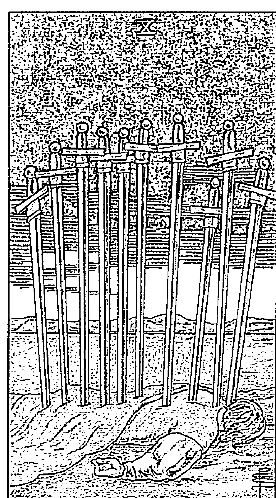

「寶劍 9」已是焦慮痛苦的極致，而「寶劍 10」已呈現意念死亡狀態。一位男子的屍體以臉部朝下的姿勢趴臥於海邊，背上由後腦開始沿著脊椎而下插了十把長劍，這是令人觸目驚心的慘死情景，天上濃厚到窒息的黑雲佔了畫面近二分之一，這是全面性的災難降臨，無法扭轉的局面伴隨著情緒嚴重崩潰。

當風元素的能量泛濫和過度發展之下，慘痛與絕望的不適情緒已徹底將人擊垮。數字「10」代表著是前一階段的結束，且是另一個階段的開始，十把插在脊椎上的劍，不僅是最嚴重的傷害，也是呈現無法自行拔除的狀態，這不僅是一種被傷害的呈現，更徹底的絕望來自自身也喪失了自救的意願和能力，連反擊的機會一同捨棄，彷彿世間萬物再也與自身無關。

正所謂哀莫大於心死，插滿了劍的軀體等同意念完全死透，當真受夠了。度過無法避免的痛苦過程後，在屬於靈魂暗夜的沉重黑雲之下，這是人生處在一個最痛苦絕望的時期。但也是在此情況下，人往往才會看清楚並體會到這種接受自己生命已來到終點的境界，其實有可能就是生命轉化的起點。這次真的能夠轉念了，靈性也開始覺醒了，要完全放下執著，不再拿這些事物來將自己綑綁，痛徹心扉後所產生的另一番透徹，是畫面遠方出現的那片黃色天空，眼前的遭遇將會是靈性上的福報。

## 寶劍 10：毀滅
## Ten of Swords: Ruin

- 毀滅之主 Lord of Ruin
- 太陽在雙子座
- 雙子座 20 度到 30 度
- 6 月 11 日到 6 月 20 日

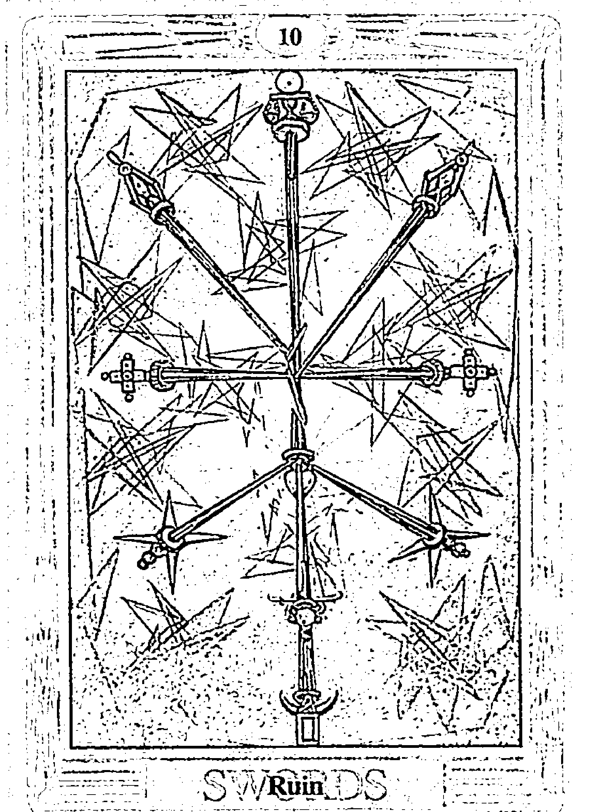

十把寶劍排列成卡巴拉之樹的形態，而代表中軸上、為整棵卡巴拉之樹中心及平衡點重要位置的 6 號薩弗拉「美」(Tiphareth)，在此牌中以一顆紅心劍柄來呈現，而這把劍竟然已經斷成三截。此牌為太陽能量落入雙子座，「太陽位在水星守護的雙子座，帶來對心智與思維的完全認同」[176]，然而數字「10」象徵著「過度」，而寶劍所象徵的風元素代表著人類心緒思維，在此「過度」的結果，心智運作已經出現崩壞狀況，克勞利認為「它是智性的毀滅，甚至是所有精神和道德品質的淪亡」。[177]

上方五把寶劍把位於「美」之間的寶劍擊碎成三截，而位於 2 號「智慧」(Chokmah) 和 3 號「理解」(Binah) 位置的寶劍，劍柄為沙漏造型，暗示著時間概念，為土星的象徵。而位於 4 號「仁慈」(Chesed)、5 號「力量」(Geburah)、7 號「勝利」(Netzach) 和 8 號「宏偉」(Hod) 位置的劍柄，為「Tau」十字[178]，也象徵著土星，十把寶劍中有位於卡巴拉之樹嚴柱和慈柱的六把均蘊含土星能量，為此牌增加了緊縮、限制、衰敗及死亡的沉重感。而位於 1 號「王冠」(Kether) 的劍柄為一天秤，土星入旺於天秤座，至此更彰顯了此牌中土星的兇惡能量。

背景已是一片燎原的火海，位於薩弗拉「美」的心型劍柄所放射的黃白光芒，是毀滅的實相顯化，寶劍都折斷成數截，代表拒絕抗爭了，這已是最後階段。從「寶劍 9」的火星走至「寶劍 10」的太陽，一切已到了承認的階段，不必再費力論辯，因為一切已毫無意義，這是心靈上的瓦解，在這風元素能量下降到卡巴拉之樹的終點，一切發展已達過於極端的形勢，信念的過度發展只會導向瘋狂靈魂被烈焰吞噬。

克勞利認為此牌意義對應《易經》第四十三卦「澤天夬」[179]，《說文》：「夬，分決也。」[180] 是古代一種環形而有缺口的玉，此卦意在必須剛斷地排除決去，是一種始吉終凶之象，大運將過，困難將至，需提高警覺、謹慎自重。而「寶劍 10」上方的天秤與夬卦，均有猶豫不定的本質，而這也正是精神與心緒上最折磨之處，當此種狀況持續久了，「一切都會以毀滅告終」[180]。

儘管雙子座的多變性會分散掉太陽的光芒，但太陽畢竟身為恆星，有它的重要影響力，災難永遠有被終結的一刻，因此所有的毀滅也不會完整，一旦事情演變成極端糟糕的狀況，人類自然會開始思考其他方式來支撐與應對。因為當人生落入谷底，一切都沒什麼可以再失去之後，反而是唯一可以毫無畏懼地放手一搏的起點。

## 錢幣 10
Ten of Pentacles

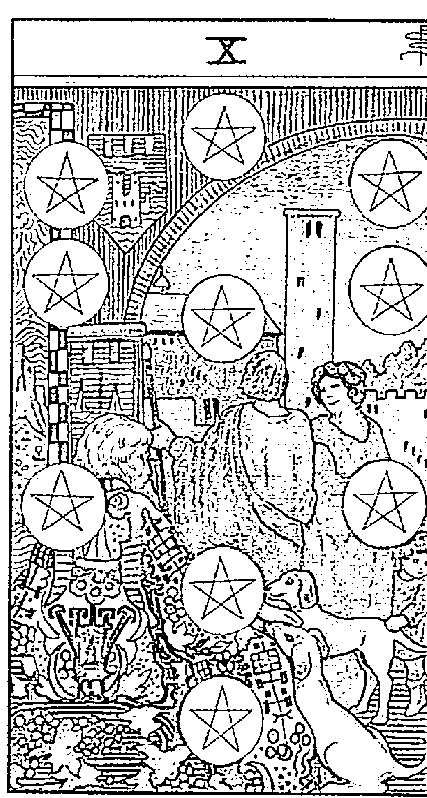

若是說「錢幣 9」是個人榮耀的最高點，亦是享受、財富和能量的累積，那「錢幣 10」就是一種分享的概念，象徵金錢的意義是大家共同享有。一位白髮長者，身著豐富圖案與符號的華麗衣袍，正坐在一個繁榮的小鎮拱門外，身旁有兩隻白狗陪伴，旁邊有兩位成人和一位小孩，極有可能是和樂的一家人。拱門上鑲有貴族的家徽，拱門後方有城鎮廣場和樹林，一切場景明顯呈現此為富貴家族。

十枚正五芒星金幣以卡巴拉之樹的型態排列於畫面當中，象徵著這已是一個過程的完成，一切呈現財富自由穩固的狀態，而所有努力的累積不僅僅只是為了提升自己的生活品質，在此能讓家人感到安穩愉快才是重點，也因為此種樂於分享的態度，讓自身心理上產生極大的滿足感。

然而此張牌十分強調金錢事務，有可能造成太過強調責任和義務，而缺乏情感交流，此團體擁有共同的經營目標，但在個別關係中可能就沒那麼重視情份。但在物質之界中，穩固安全的物質生活是一切其他理想追求的基礎，而此牌正是展現出自我物質達成滿足的階段，而這一切都是生命至此理應所得的。

## 圓盤 10：財富
## Ten of Disks: Wealth

- 財富之主 Lord of Wealth
- 水星在處女座
- 處女座 20 度至 30 度
- 9 月 12 日至 9 月 22 日

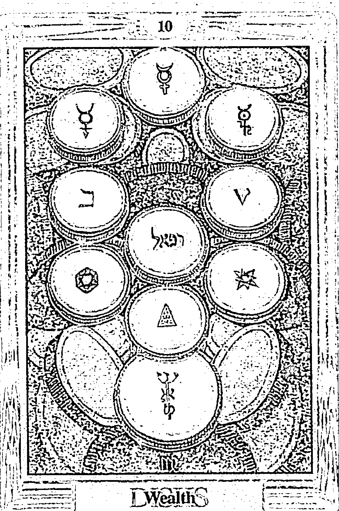

一如既往，數字「10」代表了能量已到了最後一階段，是在卡巴拉之樹上最低階的「王國」(Malkuth) 土元素領域。「寶劍 10」是砍掉重練的概念，「權杖 10」是因為過度消耗能量所以還有需要去經歷，而「聖杯 10」雖已經失去初衷方向但是仍呈現出另一種圓滿。唯有「圓盤 10」，水星入廟於處女座，處女座是土象星座中倘若要到達終極目的性，最能展現能屈能伸態度的星座，它能夠死咬目的不放但過程中仍持續彈性調整，此堅持到底的態度，與「圓盤 10」這低到無處可再低、沒有其他管道可以轉圜的狀況相符，也因此在卡巴拉之樹所有薩弗洛斯的最底部，是唯一堅持到拿到寶藏的，「圓盤 10」以真正能量入廟之姿，得到卡巴拉之樹當中的智慧。

十枚黃金圓盤以卡巴拉之樹薩弗洛斯的位置呈現，而最底下位於「王國」(Malkuth) 位置的那枚體積特別碩大。「圖像表明物質利益是徒勞的」[181]，因為能量到最後階段呈現出偉大的凝固狀態，這是接近死亡的階段，「這可能意味著，獲得的財富是凝滯的，除非通過力量將其投入到單純的積累之外的對象來進一步利用，否則將被消散」[182]。這觀念與常聽見的建議「金錢不要只單純置放銀行帳戶，需進一步做理財與投資來對抗通貨膨脹」等相關概念相符，整個宇宙至此將所有雜質沉澱在一個倦怠不堪的底部位置，物質呈現出泥濘淤積的腐爛氣質，「這張牌像宇宙便秘的寫照，當務之急是施一劑魔法的瀉藥」[183]。由牌面上十枚黃金圓盤上清楚顯示，只有水星能夠以魔法鏈結，將塔羅循環的最底端，再次翻轉至另一個重生循環。

克勞利認為當財富極大化後，其能量發展必然發生在與繼續累積物質財富無關的領域，例如卡內基 (Andrew Carnegie, 1835-1919) 在建立舉世無匹的鋼鐵王國之後，貢獻大約九成的個人財富進行各類慈善事業，並設立了 2,509 所圖書館館舍於歐美各國，因此獲得了「圖書館的主保聖人」(Patron Saint of Libraries) 美譽；石油大亨洛克菲勒 (John Davison Rockefeller, 1839-1937) 以四十年時間致力捐助教育和醫藥領域，[184] 而台灣民眾熟悉的奇美博物館，亦是奇美集團創辦人許文龍在累積龐大財富之後，將金錢物質能量轉化為社會精神泉源的最佳代表之一。

由此牌畫面中十個薩弗洛斯的位置，有九個呈現出水星相關符文 (詳見下文)，水星的聰明靈巧的確是唯一的解藥，當財富積累到一定程度時，只會呈現出遲鈍惰性的物質堆積，除非借助智慧來正確運用，才能讓財富發揮能量。而水星赫密斯 (Hermes) 的特性確可擔此大任，他不僅是能穿越各個邊界領域 (包括天界與冥界) 的訊息傳遞者，其機靈心智更是成為商業的守護神。在塔羅牌中，「魔法師」牌即是代表赫密斯；在「天界三角」中，他是那透明智慧的第十二條路徑；在煉金術中，他是令人崇拜與信仰的液體金屬汞元素，而在中國道家的煉丹術也無獨有偶地將汞視為相當重要的藥用物質，赫密斯在羅馬神話中的名稱 Mercury (墨丘里) 即是汞元素之命名。他是《翡翠碑文》[185] 原作者，更是埃及智慧之神托特 (Thoth) 的聯繫者，而托特神即是塔羅宇宙的發明者。

此牌畫面其實就是一幅對水星能量的召喚祈禱象形文：

- 1 號「王冠」(Kether) 位置為水星的行星符號。
- 2 號「智慧」(Chochmah) 位置為水星的魔法師符號，與托特塔羅大阿卡納第一號牌「魔術師」姿態相同。
- 3 號「理解」(Binah) 位置為煉金術上元素汞的符號。
- 4 號「仁慈」(Chesed) 位置為字母「Pa」，在以諾魔法體系 (Enochian Magic，又稱天使魔法) [186] 中等同字母「B」[187]，與水星希伯來字母「Beth」(房屋) 的開頭「B」對應。
- 5 號「力量」(Geburah) 位置為水星希伯來字母「Beth」(房屋)，此字母亦呈現在托特塔羅代表元素汞的「魔法師」牌的下方。
- 6 號「美」(Tipherath) 位置為大天使拉斐爾 (Raphael) 的希伯來文，是水星的守護天使。
- 7 號「勝利」(Netzach) 位置為一顆八芒星，是墨丘里的代表星，數字「8」亦是水星在卡巴拉之樹上「宏偉」(Hod) 的薩弗拉數字。
- 8 號「宏偉」(Hod) 位置為六邊形中的六角形，數字「6」為太陽在卡巴拉之樹上的代表數字，克勞利認為此牌「圓盤上刻有各種水星符號，只是樹上代替 Hod (水星) 的圓盤標有太陽密碼。這表明所有元素力量耗盡所產生的僵局中，(太陽是) 唯一的可能性出口」[188]，而「六邊形中的六角形」象徵著 6 乘以 6 為 36，而 36 為水星的神祕數字 (1+2+3+4+5+6+7+8=36)。
- 9 號「基礎」(Yesod) 位置為一個由數字組成的金字塔，是畢達哥拉斯學派的「四元體」(Tetractys) [189]，其中「8」為「Hod」水星之城的數字，「64」為水星的「魔方陣」(kamea，即長寬各八格，8 乘以 8 為 64 格)，「260」為魔方陣任一行列或對角線的數字總和，而「2080」則是魔方陣中所有數字總和。
- 10 號「王國」(Malkuth) 位置是以「Shin」(牙齒，代表火元素，象徵托特塔羅「新紀元」牌)、「Aleph」(公牛，代表風元素，象徵托特塔羅「愚人」牌)、「Mem」(水，象徵托特塔羅「吊人」牌) 三個希伯來字母所做成的赫密斯水星「雙盤蛇帶翼權杖」(Caduceus)。「Malkuth」為土元素能量的地球之城，配合此三個字母，象徵火、風、水、土四大元素在此聚集。

這是一顆水星入廟處女座、且滿滿水星能量的卡巴拉之樹，並暗示著太陽為這一切終點的唯一出路，十個薩弗洛斯，也是一個完整的宇宙，完美呈現一個「完成」的概念。土元素的穩定讓圓盤呈現最不知改變、最不會投機取巧、也最不選擇逃避，因此唯一最後能獲得的圓滿結果的，只有以水星的純粹能量，提醒著行事要如同「圓盤 10」一樣，有固執的堅持不放棄，亦有水星的機靈彈性。此牌背景是代表頂輪智慧的紫色，深紫色背景是為了襯托十枚金黃圓盤，此配色也誠實地象徵著，畢竟財富獲得終究還是在人生在世間這場體驗中至關重大的目標，而對於智慧與理念的追求，在物質之界的混沌能量中，均只能建立在財富穩定之上，才能踏實完滿地去實踐精神追求。

## ∞ 註釋 ∞

[1] Franco Pratesi. (1989). *Italian Cards: New Discoveries*, no. 9. *The Playing-Card*, 17(4), p136-145.

[2] 《Book T》是金色黎明協會中以卡巴拉系統為原則，針對每張塔羅牌所用的圖像象徵意義，以及每張卡的相關用語所設定的模型說明。本書的《Book T》引文來自網路資料 MacGregor Mathers and Harriet Felkin，《Book T-The Tarot》，https://benebellwen.files.wordpress.com/2013/02/mathers-and-felkin-golden-dawn-book-t-the-tarot-1888.pdf。

[3] From Saadia ben Joseph (al-Fayyumi), *Commentaire sur le Séfer Yesira ou Livre de la Création par Le Gaon Saadya de Fayyoum*, trans. & ed., M. Lambert, Paris, Emile Bouillon, Editeur, (1891); translated into English from the French & Hebrew by Scott Thompson and Dominique Marson, San Francisco, 1985. P.2.

[4] 圖片來源：Athanasius Kircher, *Oedipus Aegyptiacus: hoc est, Universalis hieroglyphicæ veterum doctrinæ temporum iniuria abolitæ instauration*, Vitale Mascardi, (1652-54)，出自維基百科 https://en.wikipedia.org/wiki/Oedipus_Aegyptiacus。

[5] 為聖經繁體中文和合（CUV Traditional）譯文。

[6] 在卡巴拉哲學系統中，對於靈魂的概念有分為三個等級，分別為 Nefesh、Ruach 和 Neshamah。Nefesh 屬於人類情感和慾望的靈魂，也包含了潛意識；Ruach 則是人類的心靈，是意識的自我；而 Neshamah 是精神的靈魂，也是人類在靈性道路上所追求的「高我」。

[7] Antoinette Moltzan (2019.06)。《光的課程：開啟內在生命之光的途徑》（A Course in Light: A Spiritual Path to Enlightenment）。杜恒芬 譯。光的課程資訊中心，頁 74。

[8] 《The Book of Thoth》，p.189.

[9] 《托特塔羅解密》，頁 104。

[10] 《The Book of Thoth》，p.177.

[11] 《托特塔羅解密》，頁 103。

[12] 在卡巴拉生命樹上，由上至下的行星排列順數為土星、木星、火星、太陽、金星、水星、月亮，然後從獅子座零度開始重複性排列，於是行星在 36 張數字牌中（王牌不列入）輪流被分配個了十二個星座。

[13] 《The Book of Thoth》，p.188.

[14] 圖片來源：維基百科 https://en.wikipedia.org/wiki/The_Baptism_of_Christ_(Verrocchio_and_Leonardo)。

[15] 金色黎明協會對於聖杯王牌模型設定的描述。

[16] 《The Book of Thoth》，p.195.

[17] 《The Book of Thoth》，p.79.

[18] 《The Book of Thoth》，p.195.

[19] 金色黎明協會《Book T》對於寶劍王牌模型設定的描述。

[20] 《The Book of Thoth》，p.202.

[21] 《The Book of Thoth》，p.202.

[22] 《The Book of Thoth》，p.203.

[23] 《托特塔羅解密》，頁 255。

[24] 《The Book of Thoth》，p.202.

[25] 圖片來源：維基百科 https://en.wikipedia.org/wiki/Portrait_of_a_Man_with_a_Medal_of_Cosimo_the_Elder。

[26] 《The Book of Thoth》, p.110.

[27] 《The Book of Thoth》, p.189.

[28] 《The Book of Thoth》, p.178.

[29] 《Book T》, p.45.

[30] 《The Book of Thoth》, p.196.

[31] 金色黎明會對於學習者，分為三個學習階層，學習者必須嚴格依照其規定的進程修習。中門儀式為進入第二階層修習的啟蒙儀式。

[32] 《托特塔羅學習手冊》，頁 177。

[33] 《Book T》, p.31.

[34] 《The Book of Thoth》, p.203-204.

[35] 《托特塔羅解密》，頁 346。

[36] 《Book T》, p.36.

[37] 《The Book of Thoth》, p.178.

[38] 《The Book of Thoth》, p.212.

[39] Israel Regardie. (2000). *The Tree of Life: An Illustrated Study in Magic*. St. Paul, MN: Llewellyn Publications, p. 49-54.

[40] 《托特塔羅解密》，頁 104。

[41] 《Book T》, p.41.

[42] 《The Book of Thoth》, p.190.

[43] 《The Book of Thoth》, p.178.

[44] 《The Book of Thoth》, p.190.

[45] 《Book T》, p.45.

[46] 管筱明 編 (1994.07)。《世界文化象徵辭典》。湖南：湖南文藝出版社，頁 855。

[47] 《The Book of Thoth》, p.196.

[48] 《The Book of Thoth》, p.196.

[49] 《The Book of Thoth》, p.196.

[50] 《Book T》, p.32.

[51] 《托特塔羅解密》，頁 348。

[52] 《托特塔羅解密》，頁 348。

[53] 《The Book of Thoth》, p.212.

[54] 《Book T》, p.36.

[55] 《The Book of Thoth》, p.213.

[56] 《The Book of Thoth》, p.212-213.

[57] 在卡巴拉生命之樹上，「Daath」是一顆隱形的薩弗拉，位於「深淵」之上，而和兩薩弗拉之間並沒有路徑連結，因此在修行道路上如何由第四顆薩弗拉「仁慈」(Chesed) 跨過「深淵」往天界三角的第三顆薩弗拉「理解」(Binah) 前進，也就是如何自創路徑通過隱形的薩弗拉「Daath」，成為重要課題。

[58] 《The Book of Thoth》, p.197.

[59] 《The Book of Thoth》, p.179.

[60] 《Book T》, p.41.

[61] 《The Book of Thoth》, p.190.

[62] 《The Book of Thoth》, p.190.

[63] 《The Book of Thoth》, p.191.

[64] 《Book T》, p.46.

[65] 《托特塔羅解密》, 頁 322。

[66] 《托特塔羅學習手冊》, 頁 182。

[67] 《The Book of Thoth》, p.197.

[68] 聖安德烈是耶穌第一個門徒，「聽見約翰的話跟從耶穌的那兩個人，一個是西門彼得的兄弟安德烈」（約翰福音 1:40）。他在 X 形十字架上殉道後，成為守護蘇格蘭的聖人。

[69] 《The Book of Thoth》, p.205.

[70] 《The Book of Thoth》, p.205.

[71] 《The Book of Thoth》, p.205.

[72] 《托特塔羅解密》, 頁 81。

[73] 《The Book of Thoth》, p.213.

[74] 《The Book of Thoth》, p.214.

[75] 《The Book of Thoth》, p.180.

[76] 《The Book of Thoth》, p.180.

[77] Arthur Edward Waite. (2005). *The Pictorial Key to The Tarot*. New York: Dover Publications, p133.

[78] 《托特塔羅解密》, 頁 316。

[79] 《The Book of Thoth》, p.191.

[80] 《托特塔羅解密》, 頁 316。

[81] 《The Book of Thoth》, p.198.

[82] 《The Book of Thoth》, p.198.

[83] 《The Book of Thoth》, p.205.

[84] 《The Book of Thoth》, p.205.

[85] 《托特塔羅解密》, 頁 352。

[86] 《The Pictorial Key to the Tarot》, p.175.

[87] 唐五代的韋莊《菩薩蠻》中的「當時年少春衫薄」，傳達了年少的美好瀟灑，而「歲月長，衣衫薄」是林夕在〈再見二丁目〉的歌詞，將其意義轉換為「人生旅程是件單薄衣裳，抵擋不了歲月風霜」，意境甚美。

[88] 《托特塔羅解密》，頁 370。

[89] 《The Book of Thoth》，p.181.

[90] 《The Book of Thoth》，p.214.

[91] 《托特塔羅解密》，頁 370。

[92] 卡巴拉之樹分為左、中、右三柱，中柱連結第一、第六、第九與第十等四顆薩弗拉。

[93] 《Book T》，p.28.

[94] 《The Pictorial Key to the Tarot》，p.146.

[95] 《Book T》，p.33.

[96] 《The Book of Thoth》，p.198.

[97] 《Book T》，p.33.

[98] 《托特塔羅解密》，頁 73。

[99] 《祕法卡巴拉：西方的身心修煉之道》，頁 67。

[100] 《托特塔羅解密》，頁 76。

[101] 《The Book of Thoth》，p.205.

[102] 「漢密特薔薇十字架」（Hermetic Rose Cross）即是托特塔羅 78 張牌牌背的十字圖案，此十字架與塔羅牌的義理息息相關，例如四臂末端的紅藍黃綠色塊象徵「權杖」、「聖杯」、「寶劍」、「錢幣」，22 片薔薇花瓣則與 22 張大牌對應等等。

[103] 《The Book of Thoth》，p.182.

[104] 「魔法形象」為每一顆行星在魔法界中的具體形象想像。

[105] 《祕法卡巴拉：西方的身心修煉之道》，頁 296。

[106] 《祕法卡巴拉：西方的身心修煉之道》，頁 310。

[107] 《祕法卡巴拉：西方的身心修煉之道》，頁 315。

[108] 《The Book of Thoth》，p.182.

[109] 《托特塔羅解密》，頁 320。

[110] 《The Book of Thoth》，p.193.

[111] 《The Book of Thoth》，p.192.

[112] 《The Pictorial Key to the Tarot》，p.145.

[113] 《祕法卡巴拉：西方的身心修煉之道》，頁 314。

[114] 《Book T》，p.34.

[115] 《The Book of Thoth》，p.199.

[116] 《The Book of Thoth》，p.182.

[117] 《The Book of Thoth》，p.182.

[118] 《The Pictorial Key to the Tarot》，p.159.

[119] 《托特塔羅解密》，頁 356。

[120] 《The Book of Thoth》，p.183.

[121] 《The Book of Thoth》，p.207.

[122] 《The Book of Thoth》, p.215.

[123] 《托特塔羅解密》, 頁 374。

[124] 《托特塔羅解密》, 頁 374。

[125] 《The Book of Thoth》, p.215.

[126] 《The Book of Thoth》, p.183.

[127] 《祕法卡巴拉：西方的身心修煉之道》, 頁 314。

[128] 《祕法卡巴拉：西方的身心修煉之道》, 頁 331。

[129] 《Book T》, p.34.

[130] 《The Book of Thoth》, p.184.

[131] 《The Book of Thoth》, p.193.

[132] 《The Book of Thoth》, p.193.

[133] 《The Book of Thoth》, p.200.

[134] 《Book T》, p.39.

[135] 《The Book of Thoth》, p.184.

[136] 《The Book of Thoth》, p.200.

[137] 《祕法卡巴拉：西方的身心修煉之道》, 頁 327。

[138] 《托特塔羅解密》, 頁 358。

[139] 《The Book of Thoth》, p.207.

[140] 《The Book of Thoth》, p.184.

[141] 《托特塔羅解密》, 頁 358。

[142] 《The Book of Thoth》, p.207.

[143] 《The Book of Thoth》, p.216.

[144] 《The Book of Thoth》, p.216.

[145] 《The Book of Thoth》, p.216.

[146] 《托特塔羅解密》, 頁 376。

[147] 《祕法卡巴拉：西方的身心修煉之道》, 頁 341。

[148] 《祕法卡巴拉：西方的身心修煉之道》, 頁 343。

[149] 《The Book of Thoth》, p.185.

[150] 《Book T》, p.35.

[151] 《The Book of Thoth》, p.186.

[152] 《The Book of Thoth》, p.194.

[153] 《The Book of Thoth》, p.194.

[154] 《The Book of Thoth》, p.201.

[155] 《The Book of Thoth》, p.201.

[156] 《托特塔羅解密》, 頁 342。

[157] 《Book T》, p.39.

[158] 《The Book of Thoth》, p.201.

[159] 《The Book of Thoth》, p.201.

[160] 《The Book of Thoth》, p.186.

[161] 《The Book of Thoth》, p.208.

[162] 《The Book of Thoth》, p.186.

[163] 《托特塔羅解密》, 頁 378。

[164] 《The Book of Thoth》, p.216.

[165] 《Book T》, p.30.

[166] 《The Book of Thoth》, p.187.

[167] 《祕法卡巴拉：西方的身心修煉之道》, 頁 369。

[168] 《祕法卡巴拉：西方的身心修煉之道》, 頁 381。

[169] 《Book T》, p.35.

[170] 《The Book of Thoth》, p.194.

[171] 《Book T》, p.35.

[172] 《The Book of Thoth》, p.187.

[173] 《The Book of Thoth》, p.202.

[174] 《托特塔羅解密》, 頁 344。

[175] 《The Book of Thoth》, p.187.

[176] 《托特塔羅解密》, 頁 362。

[177] 《The Book of Thoth》, p.209.

[178] 希伯來字母「Tau」意「十字」, 與占星符號「土星」對應, 在托特塔羅牌中則是和「宇宙」牌對應。

[179] 《The Book of Thoth》, p.209.

[180] 《The Book of Thoth》, p.188.

[181] 《The Book of Thoth》, p.217.

[182] 《The Book of Thoth》, p.217.

[183] 《托特塔羅解密》, 頁 380。

[184] 《The Book of Thoth》, p.188.

[185] 傳承於西方遠古文明, 是一本解密宇宙和人生的天書, 作者據說是埃及智慧之神托特與古希臘的赫密斯神。

[186] 「以諾魔法體系」為一神祕學系統, 主要內容在由十六世紀約翰·迪(John Dee)與艾德華·凱利(Edward Kelly)所寫成之《天使書》中呈現, 此書據說是由天使親自指導授予人間, 以天使文(Angelic)寫成, 因此又稱天使魔法。

[187] 《托特塔羅學習手冊》, 頁 221。

[188] 《The Book of Thoth》, p.217.

[189] 《托特塔羅解密》, 頁 381。畢達哥拉斯學派崇拜數字10, 認為是最高秩序的數字, 並有一個神聖的三角形圖形標誌, 被稱為「四元體」(Tetractys), 其中包含四行十個點, 象徵著宇宙組織, 此牌中第九顆薩弗拉上的三角形圖形即是。

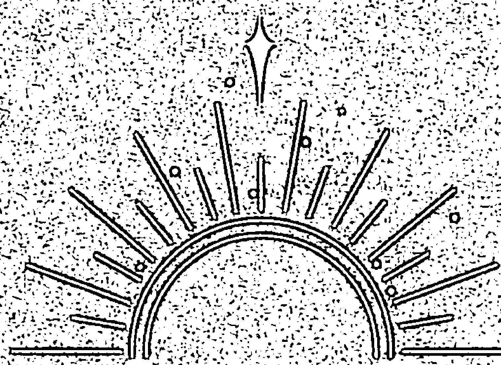

## 小阿卡納牌—宮廷牌
Minor Arcana — Court Cards

> 在元素的世界中，萬物都是混雜的。[1]
> ——《托特之書》

小阿卡納牌中有「火、水、風、土」四大元素的特性。在「數字牌」中，需要與數字的文化性相互配合了解；在「宮廷牌」中，則是以元素重疊的概念去了解。

## 四大元素的重疊性質

在宮廷牌中，因為有兩種能量的聚集，因此雙元素讓宮廷牌在論述上複雜度稍高，用元素的面向去探討宮廷牌，很像占星學裡面行星合相的概念，例如若是金星與火星合相時，會呈現出誰駕馭誰的狀況？這兩股作用力的結果通常需要經驗來驗證。宮廷牌共有 16 張牌，在元素倆倆搭配下就會出現 16 種不同的想法、態度、性格與感受，而因為在社會化下，每個人均在不同時空中會扮演不同角色，以偉特塔羅系統來舉例，工作時的錢幣騎士，假日在孩子面前有可能就轉變為聖杯侍者的性格，而宇宙的顯化，即在元素的混合與重組中不斷變化並維繫現象。

由於宮廷牌元素的混雜，有位階的概念與作用力的搭配，因此相形之下較難解釋牌義。「這些牌卡構成了對四聖名 (YHVH) 和四個元素對此四個字母力量的圖解分析」[2]，因此四大元素為原本的個性，而位階可視為作用力來理解。每一個維度都有一個主宰的能量，人類目前處在最低的土元素物質之界中，所以看不到上面其他維度的世界，但看不到不代表著不存在，而四大元素也不是只有「作用」而已，它們更是一種意識、維度、能量與境界。

## 薩弗洛斯與四界之間的分配方式

塔羅牌中大阿卡納牌講的是意識面，代表著人生核心的價值與意念，而宮廷牌比較像是建議採用什麼方式去應對。卡巴拉哲學體系清楚地將宇宙分成了四個不同的「世界」，每個世界都由聖名「YHVH」四字母中的一個字母來代表，一切能量從虛無逐漸開始具象。在每個世界中，「Yod」代表原型之界 (Atziluth)，與火元素屬性相連，是「我們對它的覺知之外、自性存在的現實本身」[3]；「Heh」為創造之界 (Briah)，與水元素屬性相連，是「存在於『限制了人類(與其他)』覺知的各要素當中的現實，因此它能影響現實被經驗的方式」[4]；「Vau」為成形之界 (Yetzirah)，與風元素屬性相連，代表「前兩個世界的互動，即我們感知到的任何事物，在抵達我們的覺知之前所要經歷的那段很長的轉化過程」[5]；最後一個字母「Heh」 (Assiah) 為行動之界，與土元素屬性相連，是「所有這些轉化的結果，即我們實際經驗到的現實版本、人類依其本性所居住的象徵性的存在領域」。[6]

關於十顆薩弗洛斯與四界之間的分配方式，目前見到的有兩種分法：

分法一：
原型之界：1 號「王冠」 (Kether)。
創造之界：2 號「智慧」(Chokmah) 到 3 號「理解」(Binah)。
成形之界：4 號「仁慈」(Chesed) 到 9 號「基礎」(Yesod)。
行動之界：10 號「王國」(Malkuth)。

此種分類方式主要來自於克勞利《托特之書》中的分法，[7] 而約翰·麥克·格里爾 (John Michael Greer) 在《生命之樹卡巴拉》(Paths of Wisdom: A Guide to the Magical Cabala) 一書中的〈生命之樹的特殊幾何學〉[8] 篇章中，也是採取此種分配方式，並強調「這樣的不平衡是刻意的，並且是來自於實際運作的考量」[9]。格里爾和克勞利早期都是在「金色黎明協會」中學習魔法，而格里爾在書中〈如何使用本書〉篇章也強調他是遵循金色黎明協會的傳統，因此此種分配方式，極有可能就是金色黎明協會內部神秘學傳授時的方式。

分法二：
原型之界：天界三角——1 號「王冠」(Kether) 到 3 號「理解」(Binah)。
創造之界：倫理三角 [10]——4 號「仁慈」(Chesed) 到 6 號「美」(Tiphareth)。
成形之界：魔法三角 [11]——7 號「勝利」(Netzach) 到 9 號「基礎」(Yesod)。
行動之界：10 號「王國」(Malkuth)。

此種分配文獻量不少，重要的修行巨著《塔羅冥想》(Meditations on the Tarot: A Journey into Christian Hermeticism) 即採用此種分配方式。[12]

在另一重要文獻《秘法卡巴拉》(The Mystical Qabalah) 一書中並無清楚說明，是採上述哪一種方式來分配這十顆薩弗洛斯給四界，但畢竟靈修的旅途不會只有一種，上述兩種分配方式在文獻上均可找出論述，因此修行者可回歸本心，親自感受哪一種方式，會是最適合己身的靈修路途。

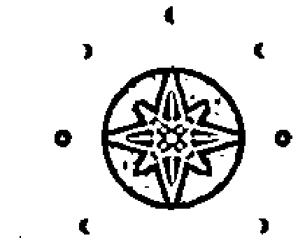

## 宮廷牌的四個位階

每個世界都有原始元素 (作用力) 和特殊元素 (位階) 的結合，這就是宮廷牌的基礎。在金色黎明協會所設定的原始塔羅模組中，宮廷牌的標題設定為「國王」、「皇后」、「王子」與「公主」，「每個牌組都有一位騎在馬上的國王、一位坐在寶座上的王后、一位駕著戰車的王子和一位站立的公主」[13]，但是偉特系統與托特塔羅系統在此都有所更動。

以偉特系統來說，分為國王 (King)、皇后 (Queen)、騎士 (Knight) 與侍者 (Page) 四個位階，各自再與四大元素相搭配：

國王：代表成年期，人生已到了個性老成階段，且對世事經驗扎實老到，與「土元素」相連，主要職責為統御與領導，並且深刻明白「欲戴其冠必承其重」的道理，對於自身的責任義務絕不逃避。此股陽剛的能量，是權力與秩序的代表，某個層次上帶有專斷獨行的特色，但因為人格與個性老成，所以會按部就班地指揮他的王國，但有時亦會流露出霸道與侵略性。

皇后：代表成年期，在性格上較為柔和，呈現出母性生育與教養的角色概念，與「水元素」相連，包容的態度常呈現出面面俱到的特質，在牌組中擁有維繫平衡的中介角色，她不僅是女性化的象徵，更是情感、情緒與感覺上的表達呈現，以照顧的心態來執行她的職責，在人格上也較為成熟大度，愛與同理心是她的最強本性與最強的利器。

騎士：中世紀的歐洲，有許多源於宗教或政治立場不同的爭戰，因此國與國、城邦與城邦之間，出現了從事可貼身保衛王公貴族的兵役服務人士，儘管擁有爵位，但卻不屬於貴族家庭成員，這些人物即是「騎士」的原型。他們均是男性，行動力與流動性很高，直接聽命於被保護的貴族成員，也正因為他們擔當的職務需要有絕對的信念與忠誠度，因此騎士也常被賦予了正義、果敢、剛毅等正面形象，必積極地執行所賦予的任務，常呈現出志氣高昂、無所畏懼的性格。當英勇、憐憫、榮譽與奉獻等騎士精神出現，「騎士文學」也成了歐洲文學重要的一支，重大影響著現代歐洲在民族性格上的塑造。

在偉特塔羅牌上，騎士位階代表為青年時期，雖非孩童但是個性上來說亦不太成熟，年輕力壯，對很多事情呈現出較為衝動的行動力，在情緒上也比較不容易控制，會呈現衝突與不和諧的特質。與「火元素」相連，行為獨立又自在，他通常也會表現出具有決斷力的一面，並有勇氣與意志去面對挑戰，在態度上主動度高且相當積極，但所作出的選擇與處理態度常難以預料，一切都在持續地進化當中。

侍者：在宮廷牌中，侍者牌是代表位階最低的人物，位階代表孩童時期，充滿好奇心，對很多事情也還沒有發展出穩定的性格與見解，一切尚處於摸索與學習階段，因為還沒有明白確定自己真正想要的方向，因此與「風元素」相連。風的影響力廣而渙散且無形無體，象徵所有資訊都還在收集的階段。在摸索探討的同時，一邊持續學習與觀察，是知識學習的過渡與轉變過程，一切尚在無法被定型的情狀中，他擁有發展的各種可能性和潛能，結果無法在當下預料。

在托特的系統中，則是用「騎士」來取代「國王」，克勞利認為「騎士較為活躍且富男子氣概的概念」[14]，因此宮廷牌分為騎士（Knight）、皇后（Queen）、王子（Prince）、公主（Princess）四個位階，各自再與四大元素相搭配：

騎士：「火元素」位階，屬於原型之界，主導變動星座，代表四聖名中字母「Yod」的力量，象徵所有的原始與活躍能量，以及最大的變動狀態。「出於這個原因，他們在馬背上穿著完整的盔甲，他們的行動迅速而猛烈，但轉瞬即逝。」[15]

皇后：「水元素」位階，屬於創造之界，也因為其創造的特性，因此主導開創星座，代表四聖名中字母「Heh」的力量，他們坐在寶座上，象徵無所不容且源源不絕的創造能量。「他們是騎士的附屬，他們接收、發酵和傳輸騎士的原始能量。」[16]

王子：「風元素」位階，屬於成形之界，主導固定星座，代表四聖名中字母「Vau」的力量，是聯合國王與皇后的表現，為想法、意識、心電感應、思考、思緒等象徵。「因此，他被描繪成一輛戰車，前往執行他父母的聯合能量，……他是他們聯盟的知識分子形象，因此，他的行為比他的先輩們更持久，的確，在一方面，他獲得了一種相對的永久性，因為他是秘密進行事件的公開紀錄。」[17]

公主：「土元素」位階，屬於物質之界，代表四聖名中最後一個字母「Heh」的力量，最低層但最穩固，是一種塵埃落定的概念，已無法改變，一切的執行均木已成舟，所有的界定也必須明確，而且並非只是在意識界，更是真切地存在現實中，例如法律。「她代表了原始能量在其完成、結晶、物質化中的終極問題，也代表能量的平衡和重新吸收，以及萬物回歸的寂靜。因此，她是永久的，同時也是不存在的。」[18]

騎士、皇后和王子這十二張宮廷牌，是屬於「時間象限」，均掌管著黃道帶某星座 20 度到下個星座的 20 度 (共 30 度) 的區塊，呈現出一種直線前進之感。「皇后」主導開創星座 (權杖皇后主導牡羊座、聖杯皇后主導巨蟹座、寶劍皇后主導天秤座、圓盤皇后主導摩羯座)，「王子」主導固定星座 (權杖王子主導獅子座、聖杯王子主導天蠍座、寶劍王子主導水瓶座、圓盤王子主導金牛座)，「騎士」則主導變動星座 (權杖騎士主導射手座、聖杯騎士主導雙魚座、寶劍騎士主導雙子座、圓盤騎士主導處女座)。換個角度來看，這十二張宮廷牌，每一張都在黃道帶上，都主導某一星座的前 20 度 (佔此星座領域的三分之二)，並向前一個星座「認養」[19] 了最後的 10 度 (一旬)，例如寶劍王子雖主導了水瓶座 (「主導」說法是因為它只統轄了水瓶座前面 20 度，而不是「統轄」整個水瓶座)，但還認養了前一個星座摩羯座的最後 10 度，這種混搭原則讓宮廷牌更具有複雜度。

而公主牌在四字神名「YHVH」中最後一個字母「H」，為行動之界 (Assiah)，也就是卡巴拉之樹上的第十顆薩弗拉，與土元素屬性相連，就因為這四張「公主」們扎扎實實地被困在所謂「低中之低」的行動之界，也就是我們人類實際經驗到由地水火風所搭配組合而成的現實世界，因此「公主」牌屬於「空間象限」，沒有黃道屬性，以一個擴展至四面八方的範圍和領域的概念來呈現。[20]

## 火元素家族
——好勝與掌控

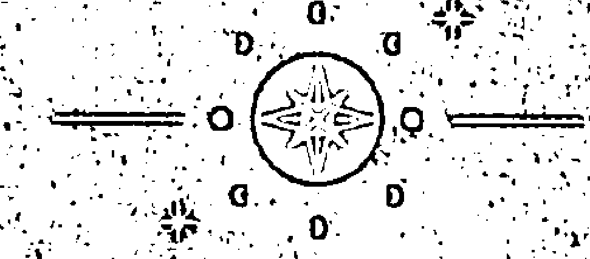

## 權杖國王
### King of Wands

- 火元素性格
- 土元素位階
- 偏執特質

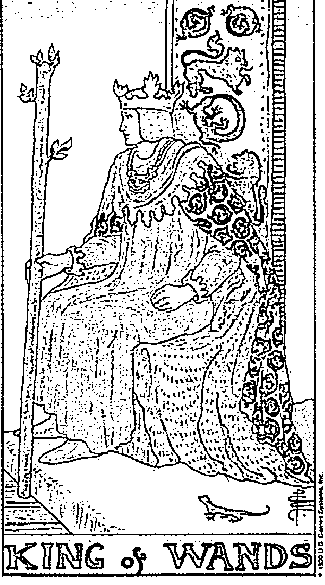

位階作用力爲土元素，個性屬於火元素。國王身著橘紅色的長袍，披著長披風，右手中持著冒出鮮嫩綠葉的權杖，頭戴象徵權威與威嚴的金黃色火焰狀皇冠，其披風上與椅背上印滿了銜尾火蜥蜴的圖騰，在古代煉金術傳統中，蠑螈 (又稱火蜥蜴) 象徵四大元素中的火元素，「煉金術士把蠑螈視爲食火者和火精靈，因爲它們可以毫髮無損地穿過火焰」[21]，也因爲傳統圖像上蠑螈有此種形象象徵，因此被認爲能以堅定的熱情來通過危難和考驗。他端坐在寶座上，腳下的平台上有一隻小蜥蜴。國王是一位開拓者與建國者，他微微傾向前方的上半身，加上望向右邊遠方的目光，彷彿隨時都已經準備好可以起身行動，雄心萬丈。土元素代表他在務實層面上不會停下腳步地積極進行事務，並擁有良好的領導統御能力，性格沉穩剛毅。但因爲火元素爲其主要性格代表，因此也呈現出膽大無畏的霸氣性格，具有領導者的魅力，雖穩重但控制慾強，在情感上面會相形忽略對方感受。

## 權杖皇后
### Queen of Wands

- 火元素性格
- 水元素位階
- 感性特質

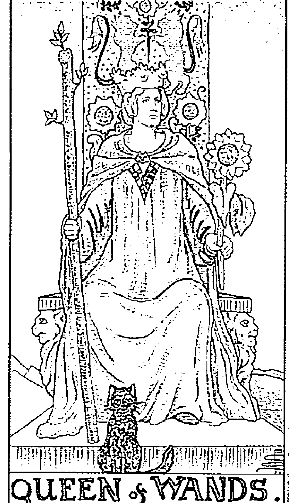

位階作用力為水元素，個性為有強烈存在感的火元素，本身是感性元素的組合。身著黃金長袍的權杖皇后，在清朗無雲的天空下，頭戴金冠端坐於寶座之上。因為屬火元素，因此畫面上除了象徵性的代表物權杖之外，還出現了與太陽意象相連的向日葵、椅背上的獅子紋章、座椅下方兩隻獅子雕刻基墩，以及象徵能量的三座金字塔，而牌面上的亮點之一，即是坐在權杖皇后正前方一臉淘氣的黑貓，而貓在埃及神話中化身為巴斯特 (Bastet) 女神，為下埃及的戰爭之神，此形象與權杖皇后本質火元素的性格相對應，而在現實生活中，貓的鮮明獨立性格，也常讓貓奴們難以招架哭笑不得。

儘管皇后是屬於水元素的位階，但是本質個性的火元素並沒有改變，因此權杖皇后會呈現出個性獨立有自信的特質，作風負責但是會顯出強勢風格，為人熱心且社交能力強，做事主動積極且具個人風格，對生命的過程展現樂觀的態度，是一位企圖心較強的女性。但因為水元素一向比較偏向情緒與感性，因此權杖皇后通常會懂得用別人喜歡或可以接受的方式去執行，但亦可能讓自身陷於火元素急於行動的特性與水元素以情感用事的矛盾之中，此權衡若掌控不得宜，一開始儘管會呈現有魅力的性格，但本身能量有可能因脾氣使然，呈現驕縱任性的狀態，畢竟水元素擁有感性特質，也會讓人覺得常是以情緒在決斷事務進行。

## 權杖騎士
### Knight of Wands

- 火元素性格
- 火元素位階
- 衝動特質

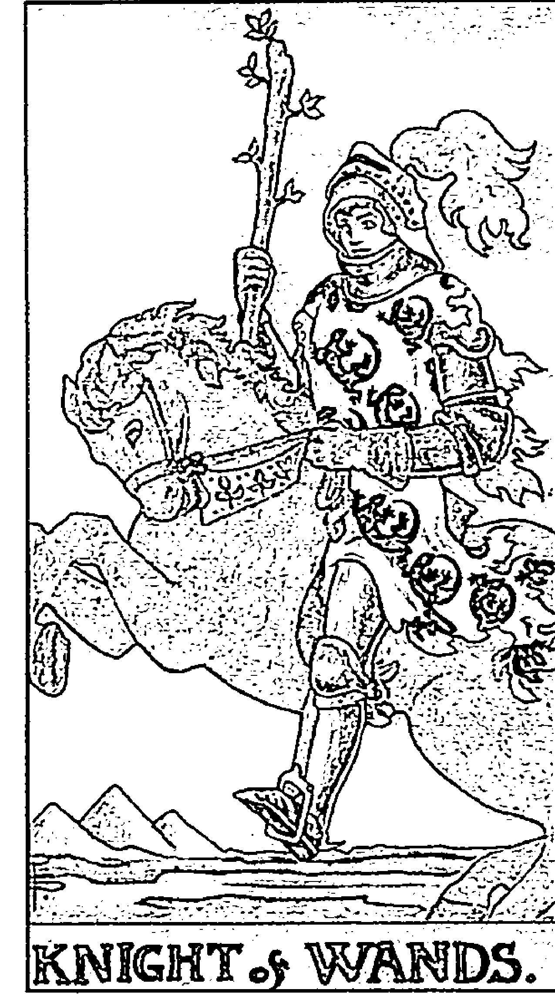

位階作用力和個性均屬於火元素，是極富有行動力並且血氣方剛的一張牌。一位全身武裝戰甲的騎士，披著黃底印有火蜥蜴圖案的外袍，衣袍尾端迎風翻飛的造型，與頭盔及身後的紅纓均呈現出火焰燃燒的型態，馬匹前面雙腳騰空，象徵隨即要躍蹄奔騰。雙重火元素以燃燒為主，畫面中的確顯現出火一般的態度和氣勢，腳下的土地也呈現寸草不生的荒漠狀態。

騎士文學中的重點之一「冒險」，即是權杖騎士的寫照。雙重火元素讓他爆發力加倍，在不先計算好利害得失之下，隨即展開行動，常呈現缺乏耐心的狀態，甚至出現缺乏深思熟慮即衝動行動的狀況，儘管結果輸了個徹底也沒關係。幼稚是個人特色之一，不停地探索與講義氣是他成功的主要因素，對現況的不滿足也的確讓他時刻都有著強烈學習新知的動力，心中的熱情可馬上轉為積極的行動能量，喜愛自由並時時刻刻精力充沛。然而，此種性個若是沒在正確領域中發揮，往錯誤的方向積極，只會越努力越陷入窘迫困境，甚至成為打架鬧事的社會頭痛人物。

## 權杖侍者
### Page of Wands

- 火元素性格
- 風元素位階
- 善變特質

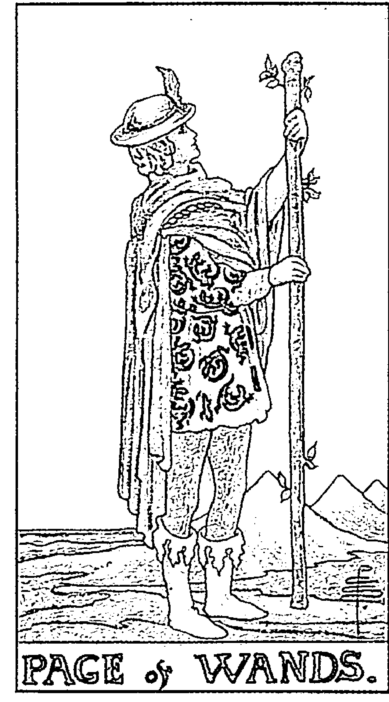

位階作用力為風元素、個性為火元素，畫面中權杖侍者身著印有火蜥蜴的黃色衣裝，站在寸草不生的荒漠土地上，他雙手握著權杖專注凝視，表情嚴肅認真，頭上戴有紅色羽毛的圓帽，微微昂首的姿態表達出心中的自信，全身橘黃色的穿搭也象徵著熱情與自信。天空一片清朗無雲，遠處三座山脈並陳，乍看恍若埃及金字塔般陳列。

侍者位處初階，在宮廷牌中屬基層人物。火元素使其性格充滿熱忱，對未知之事物常呈現出熱情之心並渴望學習，但因為心中想法常常高過實際生活中的經歷，因此在火加風元素的加持之下深具行動力。他穿著與「愚者」一樣的黃色靴子，充滿信心地展開人生中即將面對的各種課題與學習。然而，風元素畢竟有其渙散性，而火元素常常呈現出爆發力而非持久性，因此有可能會產生虎頭蛇尾的三分鐘熱度現象，再加上因為前進方向不甚確定，因此有可能常被其他事物吸引，產生專注力不則的狀況，極有可能只是為了當下一時的衝動而做，並在開始之時並無強大的良好計畫，導致風元素的渙散能量更強，而出現過度樂觀的風險性。

## 權杖騎士
### Knight of Wands

- 火元素個性
- 火元素位階
- 天蠍座 20 度到射手座 20 度
- 11 月 13 日到 12 月 12 日
- 掌管數字牌：聖杯 7、權杖 8、權杖 9
- 《易經》：第五十一卦「震為雷」

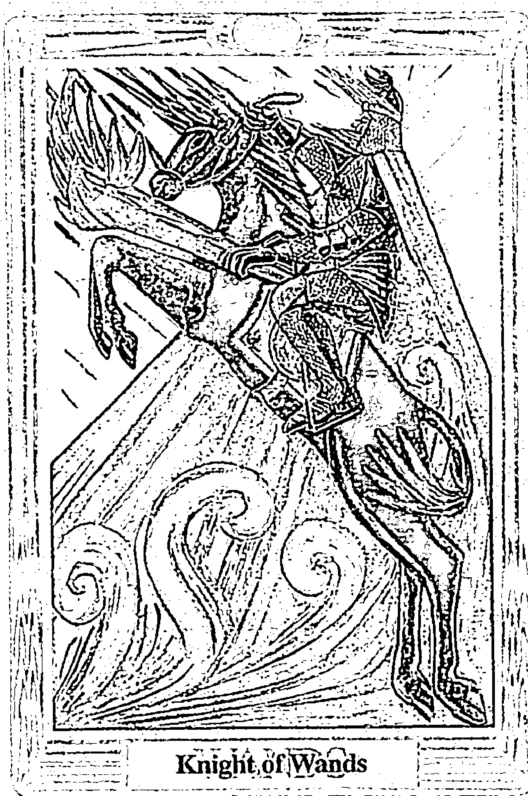

雙重的火能量，讓權杖騎士成為宮廷牌中最炙熱的烈火。由畫面中可看出他信心滿滿地騎在黑馬的背上，驚人的行動力與衝動的性格，一切已呈現箭在弦上不得不發的狀態，頗有「壯士一去兮不復還」的氣勢。天蠍座的代表黑色呈現為躍起的馬匹，具有明確的愛恨分明性格，想一切均靠自己實力進行。然而連結到射手座，代表他此次作為有可能是為了某些人而去做，不純然只是意氣之爭，而此榮耀也不是單單只為了自己，射手座能量代表他可能是為社稷、道義、正義而爭，具有一定程度的理想性。

畫面中不乏出現烈焰意象，從騎士的頭盔、馬鬃毛的造型、手中的燃燒權杖等均有呈現，騎士的披風不論在顏色或圖案上，更是強烈顯示出雙重火能量的威力，恍若直立聳天的金字塔一般，有黃色所強調的自信和氣勢，亦有橘色所傳達出的信任感。儘管畫面中的動態乍看是一位一躍而起的騎士，但是由權杖火焰、頭盔烈火與馬鬃和馬尾的方向上看來，強烈感受到在畫面外右方那股爆炸力道，讓畫面中的人、馬與意志力直接噴射狀向前爆發。克勞利認為此種人在道德上有「活躍、慷慨、兇猛、衝動、驕傲、衝動、在不可預測的行動中迅速」[22]，但也清楚指出若是作用力錯誤發揮，則會導致「邪惡的、殘忍的、偏執的和野蠻的」[23] 行為發生。

火元素的爆發力不容忽視，但是持久度就常常成為弱點，若是一開始果斷進行的方向錯誤，之後常出現因為後續資源不足的狀況，導致理想未能完成。但若是一開始立場設定得當，這一場壯闊旅程將會是燦爛壯麗。克勞利指出權杖騎士與中國《易經》第五十一卦「震為雷」意義相似 [24]，「震：亨。震來虩虩，笑言啞啞。震驚百里，不喪匕鬯」，在聲勢浩大的奮發盛泰之下，隱然呈現衝動不安穩的現象，為主大好大壞之卦象。然而這一切均是為自己的理想和行為付出行動與勇氣之時，在擲鐵餅選手開始旋轉身軀之際，一切已然沒有退路，也沒有考量失敗的機會，眼前緊盯的那個目標點，即是唯一的唯一。

## 權杖皇后
### Queen of Wands

- 火元素個性
- 水元素位階
- 雙魚座 20 度到牡羊座 20 度
- 3 月 11 日到 4 月 10 日
- 掌管數字牌：聖杯 10、權杖 2、權杖 3
- 《易經》：第十七卦「澤雷隨」

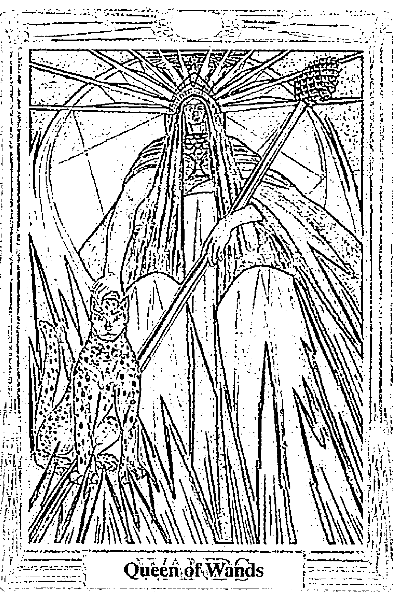

看著權杖皇后這張牌，有如渺小的我們站在一尊高聳入雲的雕像前。哈利斯夫人利用構圖手法，讓我們仰望著高高在上的皇后，同時也給了皇后俯視與睥睨鄙視一切的姿態。她代表了烈火中流動性的水，如此地有氣勢，且權威更勝權杖騎士。紅色能量來自原型之界，而皇后本身屬於創造之界，兩者合一能量強大，有如回歸到了「伊西絲時期」的母系社會權威當中。她手持松果體權杖，頭戴有埃及太陽神翅膀造型的皇冠，這一切均代表著她有古希臘酒神「戴歐尼修斯」的神秘力量，大家均得臣服於她。

整張畫面的顏色強調著權杖皇后的氣焰，頭上的強勢烈焰光環、金紅色長髮垂於鱗甲盔甲直到腰際，她坐在有幾何圖形的火焰寶座上，腳下火光四射烈焰燃燒。身旁的花豹儘管是陸地上的頂級掠食者，動作敏捷快速且象徵權威，但在權杖皇后右手的能量控制下，乖巧地安坐在身旁，隨時可供皇后指揮調度。儘管權杖皇后能量不亞於權杖騎士，但是因為位於水元素位階，陰柔特質成為她重要特質，「女王的特點是適應性強、精力旺盛，權威且冷靜，她知道如何利用這些特質來增強自己的吸引力」[25]，火元素的個性讓她總是主動地慷慨付出，對友誼和愛情有著巨大的主控能力。由另一個角度來看，她也習慣強勢地讓別人都得配合她的意願與想法，在具有能量和執行力的同時，有可能會任性地對他人頤指氣使，畫面中她抓著花豹，想制伏塵世中兇猛的物種，表達出想維持世俗尊榮感的內心世界，並可能散發出自滿虛榮甚至是勢利的氣質。

然而權杖皇后的原始火焰能量，讓她不會使用陰險手段，所有問題喜歡直接面當面釐清，儘管在氣勢上有讓人無法招架的狀況發生，但是這一切的確都建立在她的能力之上，而不是只靠外表漂亮或撒嬌態度而已。以自我為中心的她若是做出錯誤決策，個性中的愚蠢、固執和專橫有可能導致她的情緒爆裂，或是一時衝動而做出無理由的報復行為。儘管這些黑暗性格與權杖皇后如影隨形，但一位女性在社會上面對所有生存競爭的遊戲規則時，她這些堅強面向則是必備的生存條件，能讓自己免於被霸凌欺侮。

克勞利認為權杖皇后與《易經》的第十七卦「澤雷隨」相應[26]，《象》曰：「隨，剛來而下柔，動而說，隨。」意指事事均可依自己的心思計畫來執行，而會順利地達成。她深具皇后水漾創造本性，又帶有衝動熱情性格，是一位堅強而又充滿魅力的女性，展現出成熟自信的態度，而她巨大的內在力量和動力，則來自於那份不願意認輸的驕傲。

## 權杖王子
### Prince of Wands

- 火元素個性
- 風元素位階
- 巨蟹座 20 度到獅子座 20 度
- 7 月 12 日到 8 月 11 日
- 掌管數字牌：聖杯 4、權杖 5、權杖 6
- 《易經》：第四十二卦「風雷益」

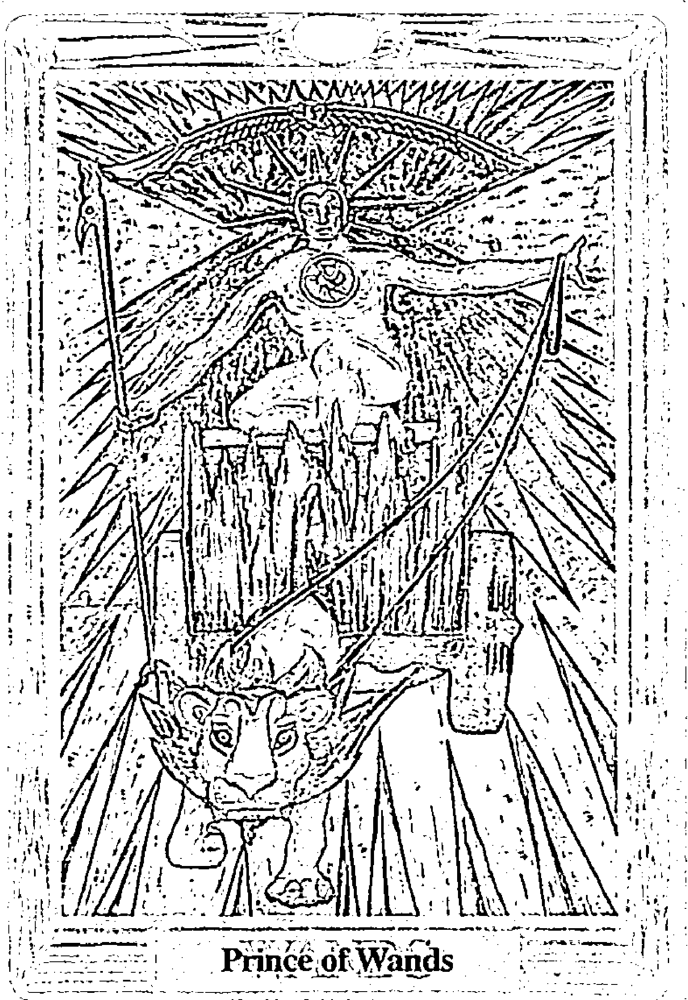

具有火元素的熱情積極，又有風元素外向性格，權杖王子是一位討人喜歡、喜愛熱鬧與分享的溫暖大男孩。有 20 度的區間在位於固定星座的獅子座上，因此會展現出穩定的持續力，黃色的背景也代表著擁有滿滿自信。由權杖王子胸口上的「野獸印記」上可知，克勞利本身常認同權杖王子的所有呈現，一來是因為克勞利上升星座為獅子座 3 度，剛好與此牌有所對應，再來是王子那滿滿的自信心、理想性與善於表達自我的特質，也與克勞利的性格上相符合。

權杖王子以瑜伽「閃電式」姿勢蹲坐於車上，右手拿著鳳凰權杖，前方有一頭獅子拖車前行，看起來很氣勢、很威猛，騎乘於一片火海當中。若是反觀「權杖皇后」牌面，王子像極了皇后手下控制的那頭花豹，他像酋長一樣把所有仗勢都端出，隱隱浮動著一種炫耀的概念，但此炫耀比較像是初生之犢無所畏懼的生命階段。自身雖具有理念，但是在人生經歷上尚為年輕不經世事，喜愛事事朝正面方向思考，缺乏歷練也代表擁有著無限潛能。前面拖車的獅子亦是王子的象徵，感覺刻意要展現出跑很快、性格很兇的態勢，但車輛前方的綠色透露出還不經世事的事實，下心輪的顏色代表生機與尚未定型的摸索，不過人生在此階段時常常可能具有些許的狂妄，會認為自己已經是無所不能。

權杖王子在本性上是有理想且正義的，「這個人物的道德品質是敏捷且有力量的，但有時傾向於衝動行事，也容易受外部影響，尤其是在瑣事上，容易成為優柔寡斷下的犧牲品」[27]，火元素的性格也很難讓他在問題上徹底下定決心，在陳述自己意見時又常展現出強烈自我觀點，「他可能是一個高調的吹噓者，同時狡猾地嘲笑他吹噓的對象，也嘲笑作此吹噓的自己。他性格浪漫，但是在歷史和傳統問題上，他到了愚蠢的地步」[28]。

而巨蟹座最後那 10 度也讓權杖王子具有神秘性格，獅子座的 20 度也暴露出他最大的缺點之一：驕傲。權杖王子與我們對「富二代」傳統刻板印象相似，他若能善用與生俱來的優勢與特質，可以踩在前人的基礎墊腳石上，產生巨大的工作能量，在現實中與困難搏鬥時，更有機會贏得長長久久的勝利；但若是這些優勢導致他出現安逸與驕傲性格，對人事物則容易產生主觀偏見，整天無所事事且相當怠惰，成為遇事只會表面吹噓，卻無實際能力面對人生挑戰的懦夫。

克勞利認為權杖王子與《易經》的第四十二卦「風雷益」相應[29]，「益：利有攸往，利涉大川」，這是一種由上對下的好處給予，也因為得貴人相助扶持，因此可諸事順暢、家業有成。此種具有家勢優勢的人，容易成為眾人矚目的焦點，在他人的觀感中，他若認真做事取得成功則只是實屬應當；若是稍有不慎則常常會被許多人刻意攻擊，如何通過上天賦予與生俱來的烈火淨化，再從塵世的灰燼與社會上人們嚴苛的目光中傲然升起，成為權杖王子最重要的人生課題。

## 權杖公主
### Princess of Wands

- 火元素個性
- 土元素位階
- 偕同「權杖王牌」
- 管轄星座象限：北極之上的巨蟹座、獅子座、處女座
- 管轄地區：亞洲地區
- 《易經》：第二十七卦「山雷頤」

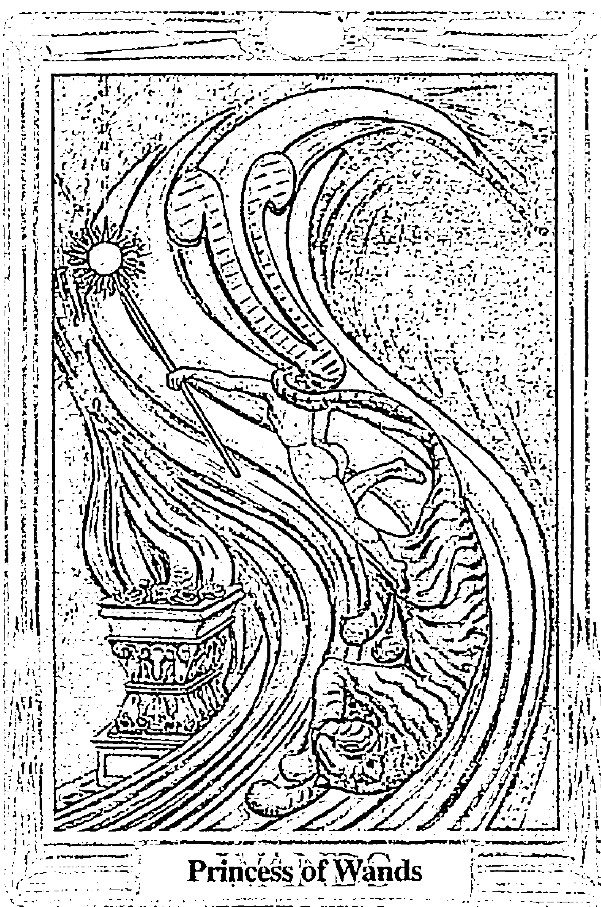

權杖公主連結巨蟹座、獅子到處女座的空間象限，她是所有權杖的寶座、是一個領域的概念，也因為公主牌的呈現與描述，成為托特塔羅會比偉特塔羅更為細膩的證明之一，因為克勞利知道宇宙的形成不只有時間的動線，還有空間領域，因此把空間象限的象徵分配給了公主牌。

權杖公主頭上有像牡羊頭的雙角，她「出現在裝飾著象徵春天之火的公羊頭金色祭壇上」[30]，她手握有太陽圓盤的權杖，在搖曳晃動的火焰中跳躍，其奔放的肢體動是處女祭司的舞蹈，裸體的她如此自信與活力充沛，這代表著「只有當元素完全自由地與其夥伴結合時，才會發生化學作用」[31]，而此段敘述也明白顯示她不僅是一個獨立個體，更是在面對不可抗拒的化學吸引力時，會縱身把自己當為燃料地「與其夥伴結合」。

老虎在文化上一向象徵著強大與兇猛，而權杖公主拖著一隻巨型老虎在火焰中玩樂與舞蹈，這代表她已掌控全局，並且自由地暢遊四方，手拿權杖象徵悠遊自在且無所畏懼。因為公主牌象徵空間象限，因此她可以發揮的空間很大，畢竟時間具有不可逆的單向性，而空間卻是一種無限寬廣的概念。也就是這種自發而天真的性格，讓她具有膽識的同時仍深具女性魅力，與皇后的威嚴崇高相較，公主擁有了更廣大的自由度，讓她在理想的追求上更為大膽開放，也因此在世俗對理想女性在道德上的認定，讓公主出現了不端莊（裸體舞蹈）、膚淺且戲劇化、甚至是虛假的負面性。「她消耗所有進入她領域的物質，她雄心勃勃，有抱負，充滿熱情，但所呈現出的往往是非理性。她永遠不會忘記受傷，她唯一擁有的耐心，就是當她等待報復時。」[32]

所有的公主牌均代表著第十顆薩弗拉「王國」（Malkuth），這是所有流溢能量的最後結晶，因此儘管公主在此擁有源源不絕的探索力量，但也已是一切均成定局的狀態，公主會使用空間的靈活度，以實際的行為累積物質。克勞利認為權杖公主的特性與《易經》的第二十七卦「山雷頤」相應[33]，火中之土的特性，主小吉帶凶，「象曰：頤貞吉，養正則吉也」，「養」跟飲食有關，也有養育、教育的意思，認為對當前情勢需要再行充實與瞭解，不要貿然下任何的決定，並且要慎言語，且頤卦的卦形如同人的口腔，為了滿足生存需求而需要頤養，就自然界而言，頤養是一種純粹的生物生理行為。人類在社會中的許多情緒都是複雜的，因此在各種社會行為當中，對道德準則應當有所遵循，不可為了物質與慾望的獲得而完全不計後果，這針對權杖公主那可能呈現出的「殘忍、不可靠、不忠、專橫」[34]性格，此卦的確提出了警語。

## 水元素家族
——感性與魅力

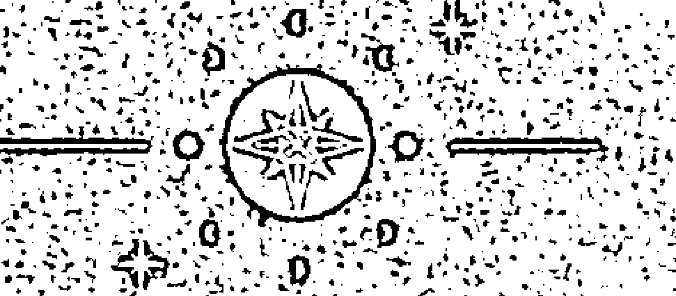

## 聖杯國王
### King of Cups

- 水元素性格
- 土元素位階
- 被動特質

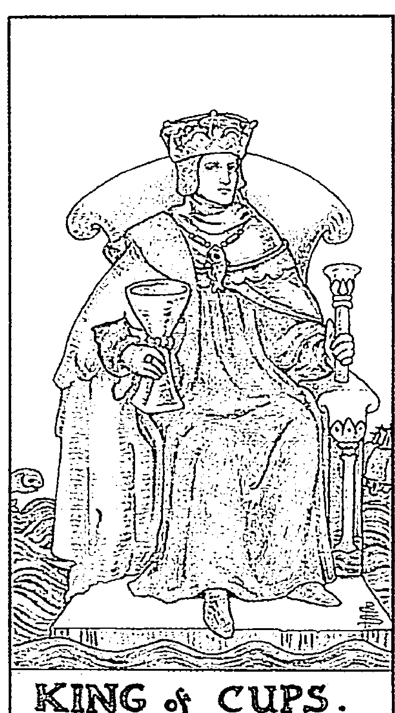

水元素的性格位於土元素的位階，聖杯國王個性具豐富想像力又充滿包容性，因為是兩種陰性元素的結合，因此展現出善於溝通且充滿慈悲心的特質。國王端坐於波濤洶湧的海面上，儘管位於基座上的寶座看似穩固，但是國王的表情顯示出一縷憂愁與沉思。國王後方的海面上有魚躍出海面，象徵著創意浮現，而另一方則有紅帆船隻於海面航行，有繁榮之意。他身著象徵水元素的藍色長袍，頸上掛著魚墜項鍊，他左手拿著象徵地位權力的權杖，右手則握著聖杯，頭頂印有波浪與水母圖案的皇冠更是尊榮的代表。聖杯國王雖身處四面環海的寶座上，但全身均無碰水，畢竟身為領導者，儘管擁有再多的想像力與創造力，且深具慈悲與同理心，但還是必須適當壓抑自己真實情緒，並不能全然表達實際感受。然而水元素的特質讓聖杯國王還是具有溫暖成熟的性格，能圓融處理人情世故，其細膩敏感的特質常常呈現出浪漫且靈性特質，適切地以和平冷靜與值得依賴的態度，掌管著精神性的感性王國。

## 聖杯皇后

## Queen of Cups

- 水元素性格
- 水元素位階
- 陰柔特質

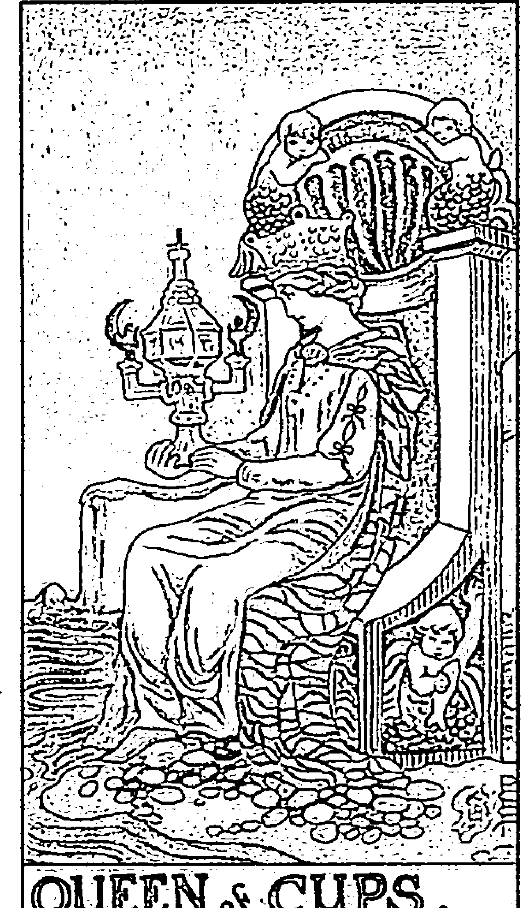

雙重水元素的影響下，流溢出滿滿的情感特質，其提供支持與傾聽的性格，容易讓人感覺療癒和溫和。身著銀袍頭戴金冠的聖杯皇后，坐在位於海岸沙灘邊的寶座上，寶座上有人魚和海貝浮雕裝飾，皇后腳踩著彩色的圓潤鵝卵石，雙手捧著金色聖杯，此聖杯造型獨特，形式仿若一華麗十字架，雙邊有祈禱中的天使雕像護佑，上方有類似歌德教堂的尖頂為蓋。大海寧靜平和，僅有微微波潮輕拍海岸，皇后雙眼專注地凝視聖杯，態度專一、神情愛慕，彷彿正在進行精神層次的交流對談。

這是一張豐沛的水元素牌，在某個層次上，水的特性有點過於滿溢，呈現出自身的情感與創造力，極有可能在實際物質層次上的運用被過於放大，腳下的繽紛鵝卵石也象徵著處事圓融，但有可能會感情用事。而華麗雕琢的聖杯，也點出了性格中滿滿創造力與思考力的特色，不過其奇特造型，也可能造成在實際使用上的不便，呈現出感性遠大於理性的狀態，重視直覺且性格太過浪漫。「水中之水」的元素力量讓一切顯得太過感性，重視情感且多愁善感，若無法以理性來平衡奉獻與付出愛的原則，則有可能在感情世界中容易因愛而迷惘且無法節制，產生過度付出的狀況。

## 聖杯騎士

Knight of Cups

- 水元素性格
- 火元素位階
- 感性特質

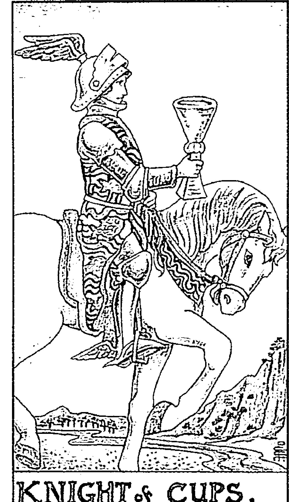

水元素的個性於火元素的位階上，這張牌常被稱為「白馬王子」牌，具有很得人緣與觀眾緣的特質，恍若大眾的夢中情人一般，滿滿的感性元素，令聖杯騎士呈現出人見人愛的迷人魅力。牌面上一位騎馬姿勢端正的年輕騎士，身穿裝飾著魚與水符號的盔甲外袍，右手持著一個聖杯，穩定緩慢地騎馬前行，前方一條平靜小溪，完全沒有阻擋他們前進的關卡，遠方有山脈與樹叢。

由聖杯騎士騎馬的姿勢與速度上的呈現，可知他處於一個年輕且溫柔的人生階段，水元素的特質讓他充滿創造力與浪漫個性，不疾不徐地在人生旅途上，尋求靈感和情緒發想，態度優雅且深具紳士風範。但在馬背上手持聖杯，不免暗喻了在態度上有點消極，與前方蜿蜒的平靜小溪相呼應，而其姿態與穿著，已顯示出對於自我形象與外貌的重視。在騎士文學中，對於愛情的追求亦是該文學領域的重點之一，他的姿態與外貌散發誘人氣質，但是其果斷行動力卻遠遠不及權杖騎士。聖杯騎士代表著一種童話式的愛情理想，夢幻又遙不可及，若放在世俗中可能會有不盡理想的愛情對待與關係，畢竟自身滿懷夢想與纖細敏感情緒，可能會導致情感氾濫，或明知道自己有迷人優點，因此理所當然地享受他人的付出與給予，甚至出現過度渴求他人情感，或是出現自戀並沉迷於某些負面情緒當中。

## 聖杯侍者

Page of Cups

- 水元素性格
- 風元素位階
- 渙散特質

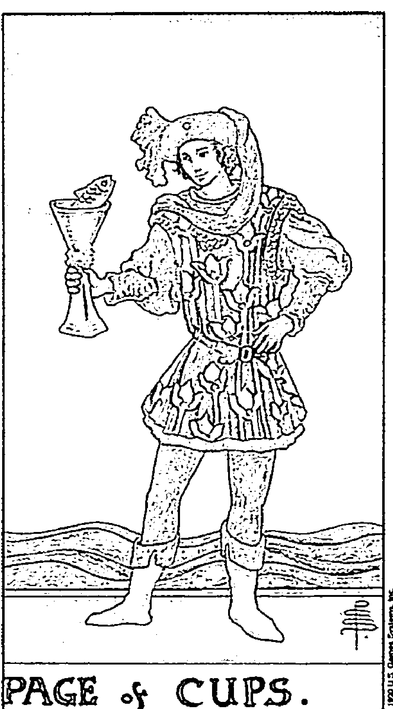

水元素的性格於風元素的位階，為兩個渙散元素的結合。一位年輕男性站在海邊，臉上泛起微笑專注凝視手上所持聖杯中的魚，他身穿紫色上衣與長褲，外面罩著印有白色花卉的淺藍短袍，頭戴披有藍色長巾的帽子，一手叉著腰彷如在與聖杯中的魚進行精神層次的對話。這是一個充滿想像力的性格，而侍者牌代表為青少年時期的人物，水元素的特性容易使其多愁善感，對於他人的愛與關懷感受力強，並且在情緒反應上起伏較大。

聖杯中的魚象徵著創造力與靈感，這位青少年水元素的個性使其天生敏感度強，如孩童般具有調皮與歡樂個性，也喜歡吸引他人注意力，為四位侍者中最注重打扮與外貌的一位。但因為性格還不成熟，因此當事情無法到達他理想中的標準時，有可能他纖細敏感的情緒即感受到傷害，且不容易透過溝通讓情緒在短時間內復原。一般說來水元素性格者，常呈現出態度包容、好商量、不易與他人起衝突的特質，但對於聖杯侍者而言，因為兩個渙散元素結合的原因，因此他所承諾的事物極有可能無法全部實際兌現，也無法負擔起之前承諾的所有責任義務。

## 聖杯騎士

Knight of Cups

- 水元素個性
- 火元素位階
- 水瓶座 20 度到雙魚座 20 度
- 2 月 9 日到 3 月 10 日
- 掌管數字牌：寶劍 7、聖杯 8、聖杯 9
- 《易經》：第五十四卦「雷澤歸妹」

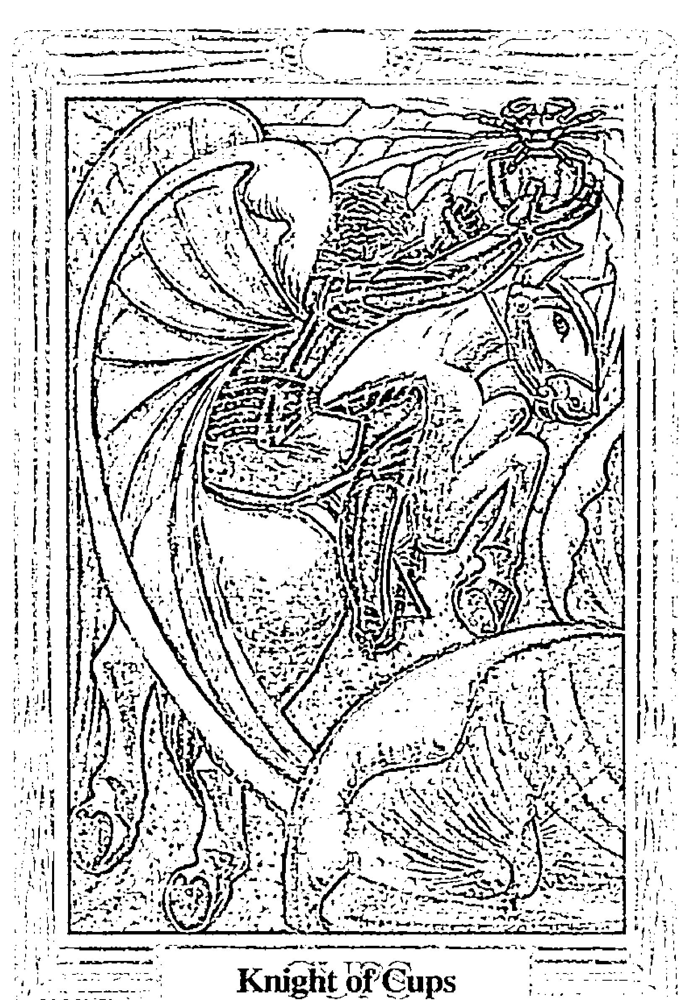

與權杖騎士中爆裂跳躍的黑馬相較，聖杯騎士這匹漂亮的白馬，在輕躍飛行的瞬間，張著深具魅力的藍眼睛嫵媚回眸相望，與此牌帶有水溫柔與火行動力的意義極為相符。騎在馬背上的騎士，右手拿著一只聖杯，上方有一象徵巨蟹座的螃蟹，這是重要的水元素標誌，不僅具有水元素創造與傳遞生命的能力，其神秘的特質也使其在四位騎士中露出最少的面部。騎士身穿盔甲，背上如水波般穿透亮的雙翼往下延伸，帶出了一隻如煙似霧的謎樣孔雀，有如德國作曲家華格納(Richard Wagner)的歌劇作品《帕西法爾》(Parsifal)中，Klingsor 的魔法花園中那些迷人的美麗外表與容顏。

常言情感有如水，可以像暴雨和噴泉般奔湧，但同時也具有緩慢地侵蝕和溶解能力，第一眼鍾情的浩瀚汪洋依然震撼著記憶，日久天長的平凡也著實點滴滲透心靈，這是水元素最強悍的影響力，聖杯中的螃蟹即是代表了基本星座的侵略面向，光線之下淋漓水光也永恆散發著耀眼的螢光，水中之火的聖杯騎士「是優美，風雅，帶著金星或一點點木星的特質，他在被動的方式中是和藹可親的，會快速地回應吸引力，且容易在這些興奮的刺激下變得十分熱情，但卻並不持久」[35]，他具有童話中白馬王子的所有特性，但卻如一灘淺水般不深刻。

的確，孔雀均有代表自戀之意，而代表聖杯騎士的人不論男女，長相都很具靈性，漂亮得不世俗，聖杯一向與靈性概念相連結，是非常具有理想性的代表，因此所有作為都會是為了理想，而因此顯得在事實或現實生活中的架構呈現甜美虛幻特質，「他是感官的、閒散的、不真誠的，雖然他所擁有的無邪和純真，都是他的天性本質，但整體來說，很難達到人性深刻層面」[36]，他的名字有如水面漣漪，風吹即起，風停即消散無蹤。

從水瓶座跨越到雙魚座，讓整張牌面的藍色蔓延無邊際，有白馬回眸嫵媚的眼神，有孔雀開屏的自戀，聖杯王子對美的迷戀可以讓他忽略現實一切，也知道用自身的美來得到他想要的一切。但是火元素與水元素本質就有衝突對立性，這讓聖杯王子在看似活在雲端的生活，仍須背負著偶像包袱的光環壓力。「迅捷和暴烈並不適合一個自然平靜的人格，而能成功協調這些衝突因素的人，也確實很少見。」[37]

克勞利認為聖杯王子的火中之水特質，與《易經》的第五十四卦「雷澤歸妹」相應，典故來自商王帝乙嫁女兒和親之事，「歸妹：征凶，無攸利」，為小妹急著出嫁，有感情衝動、不理智之現象，婚姻感情基礎薄弱，一切行事只基於任性並欠缺考慮，儘管可輕易結合，但實際婚姻狀況卻是有待商榷，也正如克勞利對於聖杯王子所下的註解：「他往往對自己的所有事務處理不當，除非他擁有絕對的好運，否則整個生涯都將是一部不間斷的失敗和災難紀錄，他對立且內耗的精神狀態，常會導致精神分裂或嚴重憂鬱。」[38]

## 聖杯皇后

## Queen of Cups

- 水元素個性
- 水元素位階
- 雙子座 20 度到巨蟹座 20 度
- 6 月 11 日到 7 月 11 日
- 掌管數字牌：寶劍 10、聖杯 2、聖杯 3
- 《易經》：第五十八卦「兌為澤」

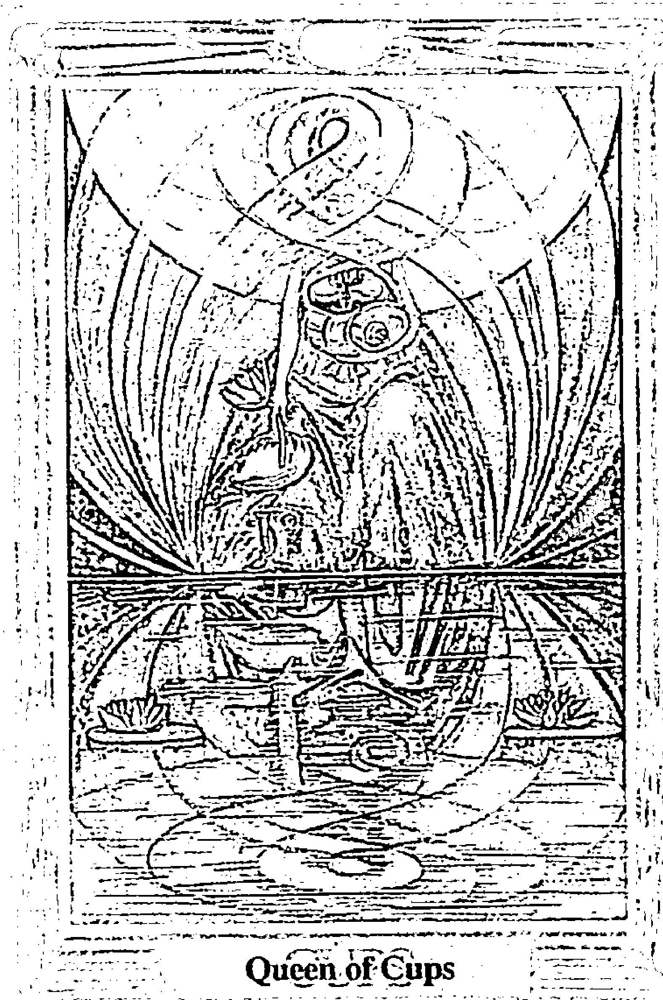

從雙子座跨越到巨蟹座，這水中之水的聖杯皇后，是所有皇后牌中最具有神秘飄忽感的。她是水中顫動的月亮，也是霧裡搖曳的花朵，將自己的臉龐與情緒置於層層薄幕之後，沒人能觀察到她的心思，她刻意讓自己隱藏，美輪美奐的畫面，是她朦朧的內心世界，喜愛在自己的世界中顧影自憐，對很多事情欲言又止，不讓人輕易窺見的同時，卻也時時刻刻在以細膩心思觀察別人。

聖杯皇后靜坐在水面上，欲拒還迎是她們吸引他人的方式，她手持貝殼狀的聖杯，杯中有一隻小龍蝦，另一手她拿著象徵偉大母親的伊西斯蓮花，送子鳥單腳佇立，與其母愛形象連結。在無盡的曲光和遮掩之下，一切有如鏡花水月一般，要「看到她的真相幾乎是不可能的，因為她只完美地反映了觀察者的本性」[39]。這就是她想要傳達出來的形象，她以夢幻、寧靜和幻覺，來包裝她不想被瞭解的事實，她只想像鏡子一樣成為一個反應的介面，在成為中介者這方面，她達到了完美的境界，她「能夠接收和傳輸一切，而自身卻毫不受到影響」[40]。當你以為正在面對她時，其實你看到的只是自己，也因此她看似很受人歡迎，因為大家剛開始都會以為是認識一位與自己個性相仿的人，但事實卻是你只認識一張會隨之映射變換的臉孔，她永遠都會是一位陌生人，她與她刻意呈現的面貌毫無關係。

不可否認的，很多人是視不破她那層層疊疊的遮掩帷幕的，並認為她的形象極度純淨甜美，而巨蟹座也的確有愛裝可憐與裝沒事的特性，而聖杯皇后凝視著水中倒影，也意味著她的自我催眠與自戀狀態，她所在意的一切都只存在自己想像出來的世界中，這或許可以解釋為是一種與世無爭的心態，因為她只在乎自己的情緒和感覺。

刻意讓人感覺溫婉柔順，實則讓人看不懂、也不想人看懂，聖杯皇后還是會不小心露出破綻，在一切朦朧曖昧的經營之下，卻伸出輪廓很清晰的右手持拿蓮花，這是她隱微地在刷自身存在感，所有的低調友好只是為了能攻破他人心防，卻不容許我們真正忽略了她的存在。在「通過她之後，一切都被折射和扭曲」[41]，雖表面呈現出無害特質，但其負面性出現時，「她可以是危險又殘酷的，扭曲了倒影再投射回毫無疑心的受害者身上，那時他們在鏡中就只看見怪物了」[42]。

克勞利認為聖杯皇后與《易經》的第五十八卦「兌為澤」相應，「象曰：兌，說也。剛中而柔外，說以利貞，是以順乎天，而應乎人。說以先民，民忘其勞；說以犯難，民忘其死說之大，民勸矣哉！」這是非常複雜而充滿內在矛盾的卦，有如秋天是豐收季節，也是萬事凋敝肅殺的時節，為六沖卦象，大好大壞，憂喜參半。通常聖杯皇后這種類型的人格，在刻意呈現出自己「根本沒有自己性格」之下，用柔軟的身段處於眾人意識的深淵中，讓大家紛紛遵循她所引導的模糊曖昧方向，卻又不知原因為何。

## 聖杯王子

Prince of Cups

- 水元素個性
- 風元素位階
- 天秤座 20 度到天蠍座 20 度
- 10 月 13 日到 11 月 12 日
- 掌管數字牌：寶劍 4、聖杯 5、聖杯 6
- 《易經》：第六十一卦「風澤中孚」

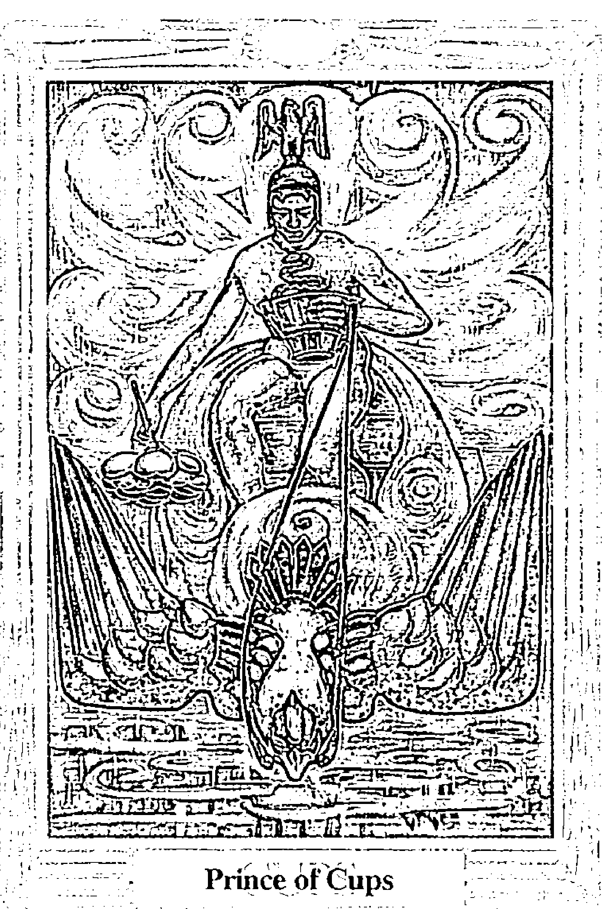

藍色系通滿了整張畫面，聖杯王子可說是一張詭譎的牌，從天秤座跨越到天蠍座，一開始姿態優雅的謙謙君子，隨後而來的是黑灰色天蠍座的陰沉。在此不論是王子的頭冠造型，或是騎乘的戰車動物，老鷹均是重要的水元素象徵，本應翱翔天際的老鷹，在此選擇低飛於水面上，此時他不需要快速飛行，而是得緊盯下方目標物，敏銳地觀察每個人，然後瞄準目標並進行掠奪。王子右手拿著一朵象徵水元素聖物蓮花，左手拿著一個裝有蛇的聖杯，有如低頭緊盯獵物的老鷹一般，聖杯王子眼睛也是緊盯著杯中的蛇，蛇的形象靈巧狡詐，這是聖杯王子潛藏的內心世界，水的柔和度在天秤座中呈現出優雅君子的形象，但是天蠍座的水元素卻把一切強化了，他強化了自己的感受和情緒，也因此產生謹慎小心、甚至是懷疑不信任的心態，世界寬廣但是他只注視杯中之蛇，暗示他只活在自己的世界中，若心思過盛，亦有不自覺往壞處鑽牛角尖的狀況發生。

「風元素的活躍特質，與水的消極環境，卻構成一種不穩定的組合。就像一瓶不夠冰的香檳，不斷汨汨冒出氣泡，這兩種元素才不在乎是否會毀掉派對或傢俱，它們只想脫離對方」[43]，也是因為這種不穩定，在人格特質上看似無害，其實內心城府極深且詭計多端，畫面上空氣中蘊含豐沛水氣，大雨不斷地打在平靜的死水湖面，這滂沱大雨象徵了聖杯王子喜愛以悲劇人物、悲劇英雄角色來詮釋自己，並十分享受在這種自行營造出來的氛圍。在執迷於想當悲劇英雄的過程中，他呈現出自己想像的某種偉大，並將自己創造出成戲劇中的悲劇英雄。

天蠍座是所有星座中最神秘深沉的，因此聖杯王子「表面上顯得冷靜沉著，但這卻是掩蓋最強烈激情的面具，他表面上對外部影響感到多愁善感，但只有在轉化它們到他秘密構思的利益中，他才會接受它們」[44]，這樣一位心思細膩且熱情溫柔的人，有可能存在著虛假到令人難以置信的一面，也難怪克勞利直言他們通常不為人所信任，也就是這種兩面性，讓人感到驚異與衝擊，而也正是因為這樣，聖杯王子才往往引起我們的注意力。

縝密的心思、眾多的考量，讓聖杯王子其實擁有巨大的能力與能量，他善計畫也攻心計，千變萬化的面貌有可能讓人覺得他不講情面，因為儘管他提出優良建議，通常不是出自好心，而是為了自己的利益。但不容否認的，聖杯王子能力過人，只是不容他人駕馭。克勞利認為此性格與《易經》的第六十一卦「風澤中孚」相應，《象傳》：「澤上有風，中孚，君子以議獄緩死」，此卦戒君子須以誠信感化他人。這的確是給聖杯王子一個中肯的人生建議，以他的能力，若能充滿善意和真誠地行事，才會是成功致勝的關鍵。

## 聖杯公主

## Princess of Cups

- 水元素個性
- 土元素位階
- 偕同「聖杯王牌」
- 管轄星座象限：北極之上的天秤座、天蠍座、射手座
- 管轄地區：太平洋地區
- 《易經》：第四十一卦「山澤損」

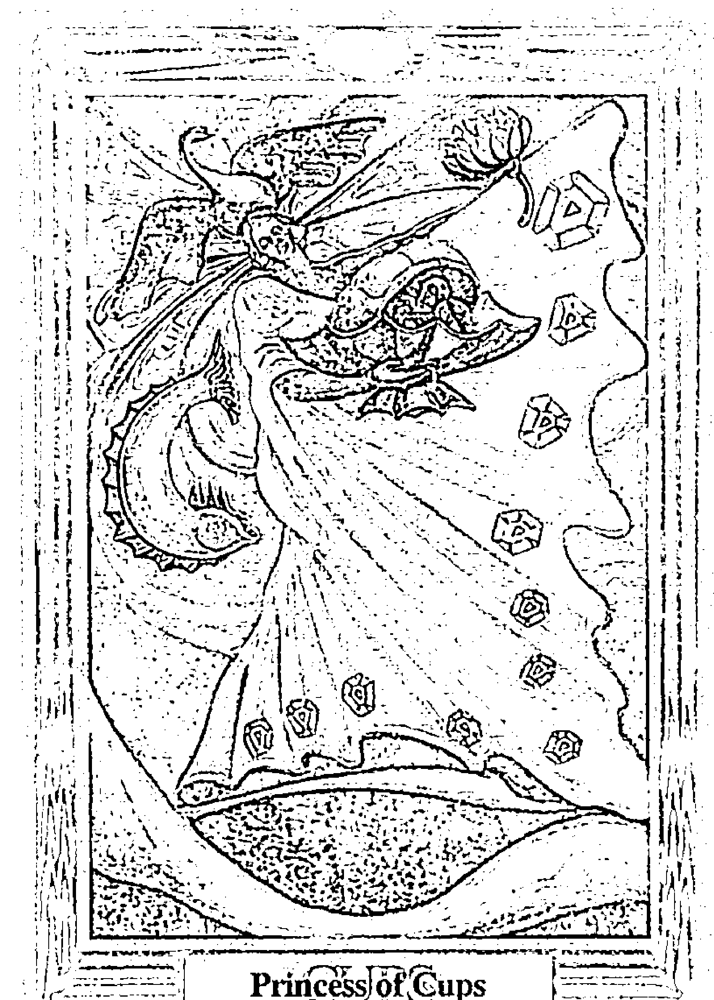

當有創造力的溫柔之水，落實到穩定扎實的土元素上，終於賦予思想有了實質的生命。聖杯公主在湛藍的深海中翩翩起舞，頭上有一隻展翅的天鵝，這一來更確認聖杯公主的位置是位於海面下方，而克勞利指出天鵝與東方哲學中「AUM」一詞有關。此詞為印度教真言，即是「唵」，也是大家所熟悉出自《佛說大乘莊嚴寶王經》六字真言「唵嘛呢叭咪吽」(Om Ma Ni Bä Mè Hum)的第一個詞，象徵印度教「三位一體」的三相神——梵天、毗濕奴與希瓦——他們在宇宙中的能量運作。

此牌面上的天鵝即象徵著如此崇高的寓意，克勞利的確給了聖杯公主極高的地位，她是「聖杯王牌」純粹潛能的具體形式顯化，有如水中逐漸浮現出的結晶體，而她身著的飄逸服裝也的確是由水晶鑲飾裙邊，所有的飄忽、浪漫、幻想與甜美夢境，現在全部都有了可具體架構並安然生長、廣受滋養的載體，也難怪公主臉上呈現出滿足安定的神情。她手中聖杯中的烏龜，是反映著古印度人的世界觀，他們認為世界是像盤子或圓盾形式，由四隻大象馱負載於背上，而大象又站在一個大烏龜的背上，烏龜的下方有一條大眼鏡蛇盤繞整個世界，而聖杯公主旁的海豚則是象徵著煉金術——這麼多重的偉大創造象徵意義，均於此牌面出現。的確，在物質之界中，有什麼比真的可以將夢想落實還更令人雀躍欣喜的呢。

聖杯公主傳達出水元素重要的創造能量，並能具體顯化於物質之界，儘管她生活在浪漫的夢幻海洋，但從未自私或懶惰，「公主的性格是無限親切的，所有的甜蜜、性感，溫柔，善良都在她的性格中」[45]，她輕鬆自在地默默進行顯化工作，橫跨了天秤、天蠍、射手三個星座象限，她的天真無邪其實是有大智若愚的智慧，她把所有心思放在自身的自在悠遊，不追逐他人的追逐。克勞利認為此性格與《易經》的第四十一卦「山澤損」相應，有「塞翁失馬、焉之非福」的開闊視野，且有心地善良、悲天憫人、善於照顧體貼他人的性格，「山」代表靜止，「澤」是喜悅，懂得損失自己的深度來成就山的高度，才是造成雙贏的大智慧。

## 風元素家族

## ——理性與自我

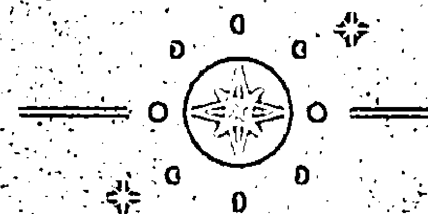

## 寶劍國王

King of Swords

- 風元素性格
- 土元素位階
- 理性特質

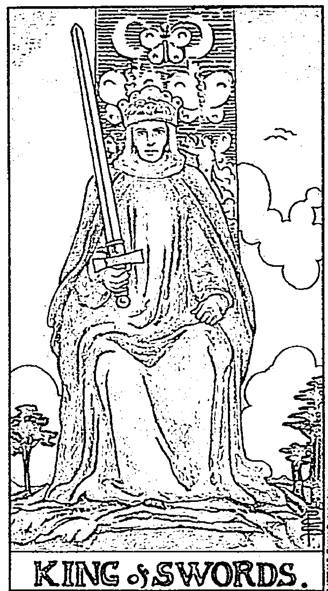

擁有風元素的個性，並以土元素為位階行為，是兩個理性元素的結合。正面正視著畫面外觀賞者的國王，身著淺藍長袍於寶座上正襟危坐，他右手持象徵著風元素的長劍，劍尖直指向天，表情嚴肅且不苟言笑。國王的寶座位於堅實大地之上，雙邊沒有扶手，但椅背高聳至畫面外，上方有蝴蝶、新月與天使圖案顯示，背景遠方有樹木、湖泊和山丘，天空清朗，有飛鳥翱翔。

寶劍為人造之武器，可防衛自身安全，因此風元素的人格特質常顯現出聰明理性的性格。寶劍國王代表一位擁有成熟心智與清晰思考的冷靜成年男子，在其領域中屬於有統禦力的領導人物，代表著專業力量的呈現。土元素的作用力象徵務實與固執，讓寶劍國王的專業擁有著實際務實的問題解決能力，其理性智性也常會讓他在團體中有著強烈的紀律與意見，也正因為如此，當主見太過時會出現無法變通的狀況，甚至會不允許團體去接受新的想法。而其清楚的邏輯力也讓他優勢過人，敏銳的理性讓他在混亂狀況下能發揮巨大的判斷力，但過於理智的頭腦常會淡化掉內心情感，而呈現出自我且冷酷的態度。儘管如此，他的能力與理性是不容否定的，只是他的個人原則也不容易被撼動。

## 寶劍皇后

Queen of Swords

- 風元素性格
- 水元素位階
- 渙散特質

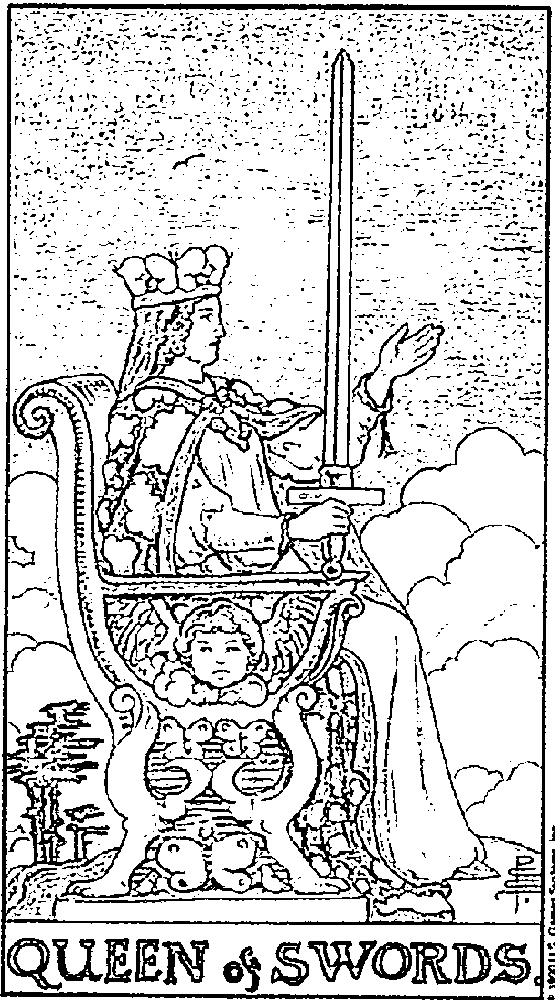

個性擁有風元素的聰明靈巧，位階具有水元素的作用力，兩者呈現出渙散元素的特質，是一位非常聰明且深具主見和判斷力的人物。身穿白色長袍，頭戴金冠，寶劍皇后端坐在仿如雲端的高臺，身上的藍底披風亦佈滿白雲圖案，她臉部表情冷靜，右手執著一把長劍，左手手勢仿若正在提供或給予他人指導，背景天空有鳥飛翔在湧現於地平面之上的巨大雲層上方。

寶劍皇后處處流露出知性的美感，像是一位生命導師，以風的睿智智慧和清晰判斷力，配合水的直覺性，呈現出自我情緒掌控良好的理性特質，話語深具條理，具優秀的思辨能力，但是在情感上不會顯示多餘的交流，她只給經驗和意見，如理性的旁觀者般不會實際去參與任何情狀，只會冷靜分析並給予睿智導引，其冷漠孤高的性格，讓她可以持續保持理性並做出不被情緒左右之正確判斷。然而，其沉浸於理智的狀態，會顯現出難以親近的距離感，畢竟風元素是她的個性，太過強調理性讓她不易與人產生親密感。

寶座上的人頭像浮雕即是風元素的象徵 [46]，下方的蝴蝶亦為寶劍宮廷牌的象徵圖案，是一種蛻變交織的狀態。遠方有一小段河水呈現出寶劍皇后在情感面的緊縮，天上飛鳥也呈現出孤獨單飛狀態。清朗的天空正如同她清晰的理性，不苟言笑的神情則是她將情感隔離在外後的理智與冷靜。

在里帕的《圖像譜》一書中，擬人像「學院」(Academia) 的呈現與寶劍皇后相似，一樣是一位面容冷靜堅毅的女性，坐在寶座上，她右手持一把象徵經過打磨而犀利的劍，左手拿著象徵勝者榮耀的花環。「她男子氣態的面容表示可靠而深刻的判斷力，純金之冠則表示通過實驗與觀念進行提煉，色彩紛呈意味著學院中豐富多樣的知識」[47]，此段描述與寶劍皇后的圖像造型和概念呈現十分相似，也強調了過往經驗和學習能讓思慮清晰理性，並做出睿智判斷，此也正是學院教育的最終目標。

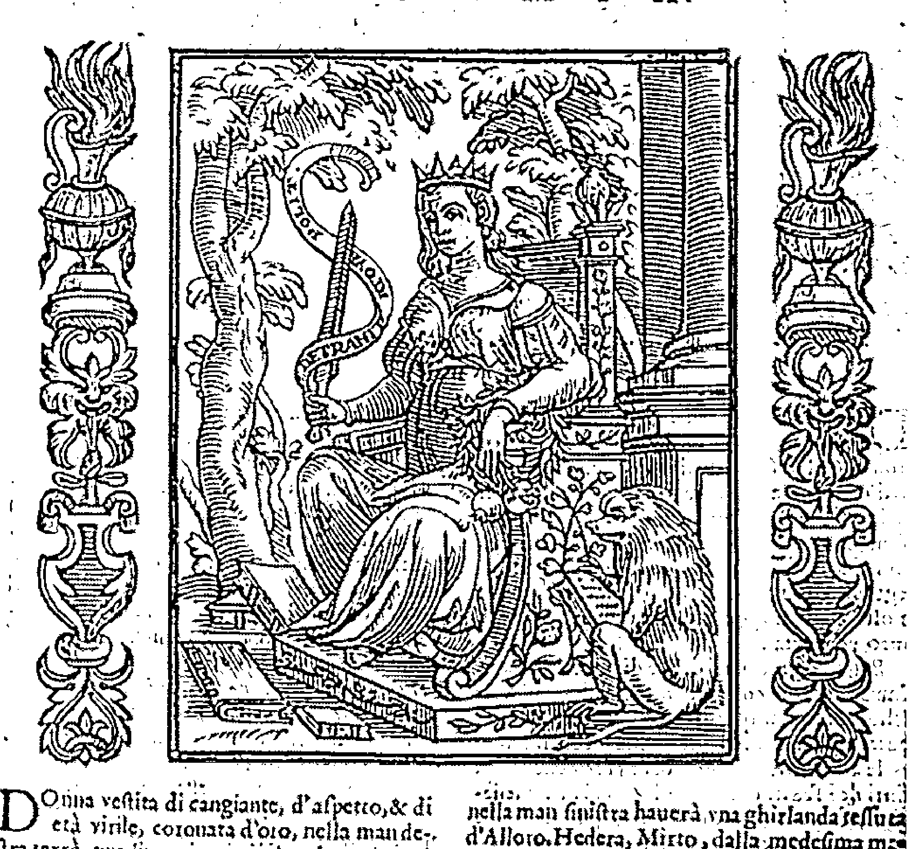

此擬人像畫面中，在寶座左方有一隻蹲坐的猴子正在認真閱讀，試圖學習知識。此正是每位真正進入研究領域的人會產生的共同感受，在浩瀚無垠的知識領域中，我們以有限的時間和智力，企圖能一窺該領域的奧秘，雖自知窮盡一生均難以明瞭其中萬一，卻仍汲汲營營地希冀能在魯鈍的此生中、在有興趣的知識裡，能領悟到些微神光，以圓滿此生。

◀ 里帕《圖像譜》一書中的擬人像「學院」，其呈現與偉特塔羅的「寶劍皇后」相似。

## 寶劍騎士

## Knight of Swords

- 風元素性格
- 火元素位階
- 主動特質

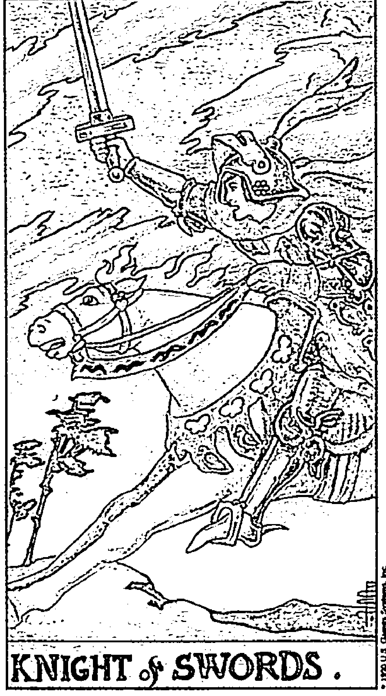

位階於火元素具有行動力，而個性屬於風元素，火加風兩種元素讓寶劍騎士的行動力比起權杖騎士較有方向，而風元素所顯現的聰明靈敏氣質，也讓寶劍騎士是最符合歐洲傳統「騎士精神」的人物。畫面上寶劍騎士騎在瘋狂奔騰的馬背上，右手高舉著寶劍，臉部呈現出衝鋒陷陣的表情，一副已經卯足全力奮勇往前的情狀。由飛揚的馬鬃和騎士身上披肩可知，這是速度極快的衝刺，天空的雲朵混亂，陸地上的大樹也被風吹得歪斜，天空的鳥失序飛翔。騎士戰袍上出現鳥的圖案，馬韁上也出現鳥與蝴蝶標誌，一切均展現出風元素的靈活與快速，再加上火元素的作用力，一切狀態有可能會呈現失控現象。

然而寶劍騎士的聰明本質，會讓他在人生賽道上，呈現出邊做邊改的狀況，在行進的過程中若發現有問題出現，即刻可調整方向，畢竟因為行動力強。只是一直適時調整方向的狀況，會讓在後面跟隨他的人出現應對上的無所適從，不過正因為方向一直在調整，所以他的靈巧也會使其規避掉許多風險。火與風的特性若是搭得很好，會讓寶劍騎士呈現出充滿機智傲氣的爆發力；但若是達不到良好的平衡，會呈現互相牽制造成混淆，或是言辭過於犀利帶有侵略性，讓人無法親近，也可能為了規避風險所以不斷修正方向，讓自己變得無目標也缺乏前進動力。

## 寶劍侍者

## Page of Swords

- 風元素性格
- 風元素位階
- 幻想特質

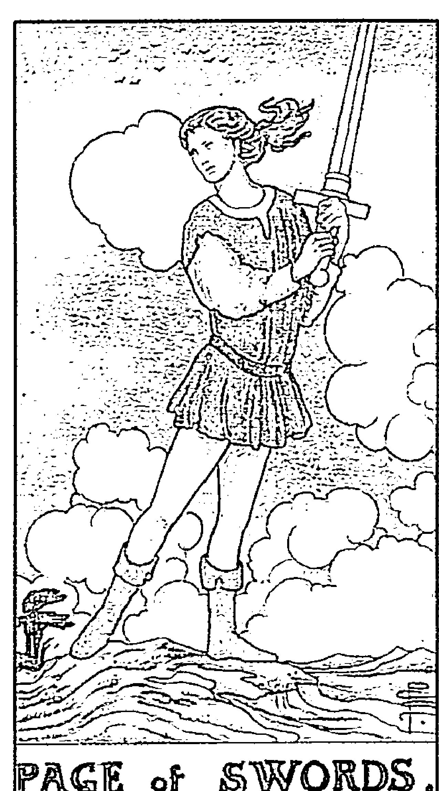

寶劍侍者為典型的風元素風向人物，畫面中雙手握持寶劍的青年，站在晴朗的天空下，表情專注嚴肅地望向遠方。由他紮起的長髮髮梢與遠方樹木，可知此時氣流並不穩定，大風正吹過這片崎嶇的山脈與丘陵，天上十隻飛鳥群飛，寶劍侍者的身體姿態呈現扭轉姿勢，彷彿一位緊盯投手丘的棒球員，腦中正在快速思考接下來如何應對訊息萬變的人生課題。

畢竟此牌風元素特質太過強烈，因此會呈現出思考與規劃的能量遠大於實際行動的狀況，換個角度來看，有可能出現所有的動作都還只是存在於精神層面上的思考而已。收集資訊與打聽訊息為此階段的重要任務，儘管心思敏捷、態度機靈，而寶劍侍者也的確在心中認為已規劃好可應付一切變化的準備，但雙重風元素常讓他無個人主見，彈性地隨時滾動式調整方向，也容易出現牆頭草的性格，在團隊中只負責收集資訊卻無法做出判別，再加上位階相對低階，所以其本身的意見陳述也不太會被他人採納。無中心思想的結果，會以當下的直覺判斷做出決定，而後也可能因為他人引導而出現常常調整抉擇的狀況。

## 寶劍騎士

## Knight of Swords

- 風元素個性
- 火元素位階
- 金牛座 20 度到雙子座 20 度
- 5 月 11 日到 6 月 10 日
- 掌管數字牌：圓盤 7、寶劍 8、寶劍 9
- 《易經》：第三十二卦「雷風恆」

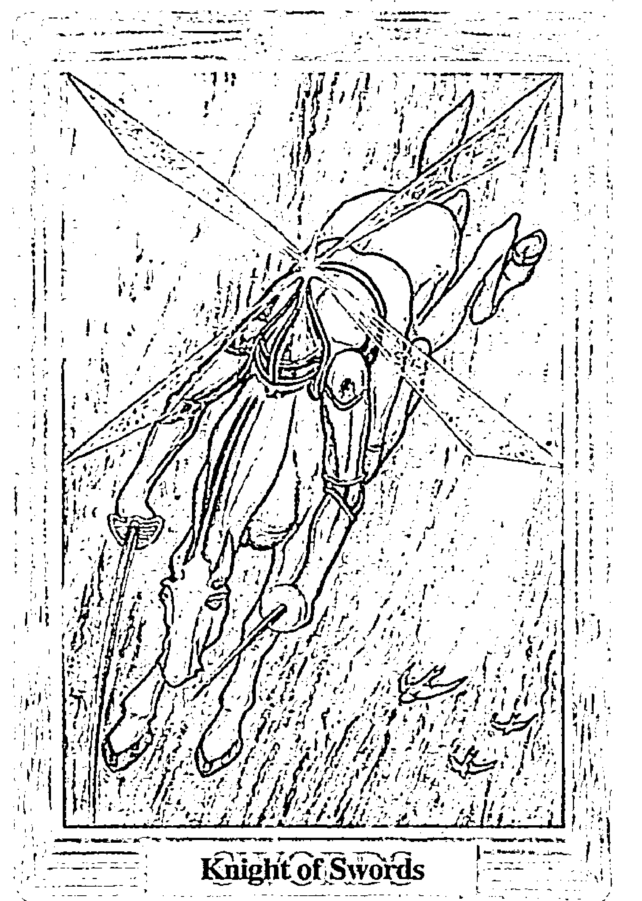

風中之火，寶劍騎士是一股狂暴的疾風，哈利斯夫人以一名身騎駿馬全身盔甲的騎士來代表。他除了雙手各拿著象徵風元素的寶劍之外，更重要的是那風元素牌面都會出現的翅膀圖形，有時是以幾何化的線條來表示，在此牌面中則是有如蜻蜓翅膀般具象，「在騎士尖尖的頭盔頂上，乍看之下像是四支螺旋槳的東西，其實是從他背後冒出的四支三角形的翅膀，……或許只有兩支，但因為舞動太快，看起來像四支」[48]。而從背景中雲層的狀態與鳥群飛翔的姿態，均可知道這是一匹高速向前奔翔的駿馬，騎士「騎上一匹發狂的發狂的駿馬，駕馭著風暴之靈的天國」[49]。

儘管風元素象徵思緒敏捷，高速轉動的螺旋槳翅膀象徵心智快轉有力，所有行動都是在頭腦演練過後才去執行（儘管頭腦的演練遠勝過實際執行的行動力），雙手的寶劍則象徵著攻擊。但寶劍畢竟是人造的攻擊武器，他「富於思考行動和技能，敏銳而伶俐。他是勇猛好鬥的，嬌貴而英勇，但他會是他意念的犧牲品，因為一切行為來自他未經反思的靈感」[50]。

也因為他含括 20 度雙子座的象限，風元素本身的散播能量於無所不至，騎士以機靈的頭腦，和大量資訊取得的效率和速度，來希望贏取大眾對他的信任，兩支寶劍也代表資訊量過於龐大，但寶劍騎士非常樂於讓自己忙碌，卻不一定具有實質深刻實用的目的性。克勞利認為寶劍王子與《易經》的第三十二卦「雷風恆」相應，顯示一種會持續很長久的一種狀況，其中好壞情形參半，並建議不宜在此時做任何的計畫或變動，只有恆心才能成功。「雷風者，知守常則吉，妄動者則不能亨通。」而「妄動」卻是寶劍騎士最大的特質，「一支理念光箭，將整個人生吸入專注的願望中，從樸實的金牛座穿越到擢昇的雙子座」[51]，將整個生命重心，由土象固定星座，集中轉變成風象變動星座。若有在修習西洋占星知識的你，一定知道這程度有多麼的驚悚。

## 寶劍皇后

## Queen of Swords

- 風元素個性
- 水元素位階
- 處女座 20 度到天秤座 20 度
- 9 月 12 日到 10 月 12 日
- 掌管數字牌：圓盤 10、寶劍 2、寶劍 3
- 《易經》：第二十八卦「澤風大過」

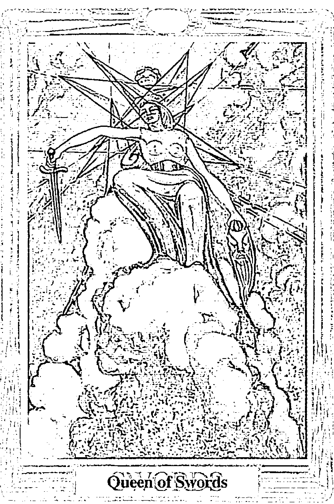

牌面以藍色和白色來強調天空中的氣流與雲朵，水氣和雲朵是一體兩面，水氣可凝結成雲，雲朵可以散落成水滴。寶劍皇后赤裸著上半身，一手執寶劍，一手提著一個蓄有長鬍的男子頭顱，她的氣勢在此令人生畏。她頭上依然呈現出風元素牌面會出現類似翅膀的幾何線條銳角造型，是銳利的光芒，「是對理念的清晰、有意識的感知」[52]，這其上則有一個孩童的頭顱，儘管畫面看似呈現暴力場景，但其實是卡巴拉哲學理念中，對於「寶劍」所對應的成形之界 (Yetzirah) 之圖像化。

寶劍為風元素的象徵，在成形之界中對應著人類的心智「Ruach」，為卡巴拉哲學中人類靈魂的三要素之一，《聖經》中多次出現，意指「靈」，例如「地是空虛混沌，淵面黑暗；神的靈運行在水面上」(創世紀 1:2)，其中「神的靈」即是「Ruach Elohim」，在人類的精神上，卡巴拉哲學中指的是靈魂的中部，為較低的靈魂下部「Nephesh」(即「動物靈魂」) 提供更高價值，為最高的靈魂「Neshamah」提供基礎。在榮格的概念中，「Ruach」與自我有關，是腦部運作的思維方式。寶劍皇后涵括了 20 度的天秤座，為了能非常理性地斷定是非與正義，不要被自身情緒干擾，她割下象徵「動物靈魂」的「Nephesh」，並將孩童般清澈的「最高靈魂」「Neshamah」置於光芒的上方，這一切都只為了成為「心智的解放者」。[53]

畢竟天秤座是基本宮，無法允許自己不往前邁進。寶劍騎士牌的雲朵分散，一路狂奔的騎士也的確沒有讓雲朵凝結的能量，但寶劍皇后的凝結雲朵代表氣場穩定，她清晰的思路讓她「極具覺察力，是敏銳的觀察者、精湛的詮釋者、具有強烈的個人主義，可快速準確地記錄想法，在行動上展現自信，在精神上親切而公正。她的動作優美，舞蹈和保持平衡能力出眾」[54]，但也因此她會成為一位完全不可被說服之人，在理性與冷靜的決斷之時，亦有可能展現出冷酷的一面。

克勞利認為寶劍皇后與《易經》的第二十八卦「澤風大過」相應，儘管本身性格優秀，但舟重則覆，若有不如意之事卻又強意而行，必將後悔。建議對於自己性格應收斂自省，畢竟世間因果相連、世事複雜，人類心智又何嘗有能力洞見萬有真相，一意孤行作出自以為正義的批評與論斷，是相當危險的行為，有可能因此將他人推往人間地獄而不自知。

## 寶劍王子

## Prince of Swords

- 風元素個性
- 風元素位階
- 摩羯座 20 度到水瓶座 20 度
- 1 月 10 日到 2 月 8 日
- 掌管數字牌：圓盤 4、寶劍 5、寶劍 6
- 《易經》：第五十七卦「巽為風」

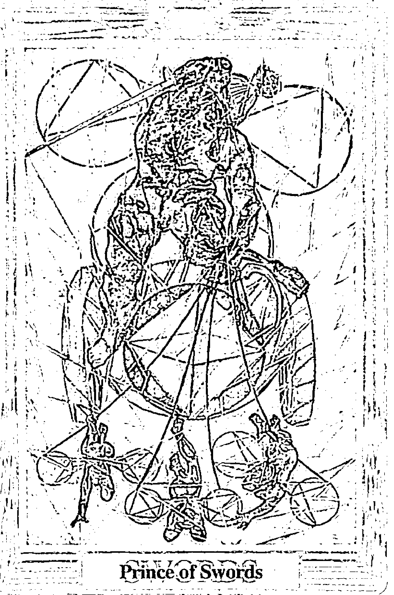

綠色的人體與黃色的幾何圖形翅膀，此牌畫面具有野獸派的狂野風格，也是哈利斯夫人用來形容風中之風人格特質的表現方式。由謹慎踏實的摩羯座，跨越並涵蓋到 20 度的思想跳躍水瓶座，寶劍王子完美地呈現出風象星座類型的頭腦運作，水瓶座最關心大眾議題，但是議題範圍太大而想做的事情太多，腦中的紛亂思緒開始呈現無法控制之勢。寶劍王子坐在以幾何圖形架構而出的造型式戰車上，前方有三位長有黃色雙翼的人在拉這部戰車，但卻呈現出各自自由地往不同方向使力，「他們沒有韁繩套住，是全然地靈活且善變。這戰車必然很容易就能夠移動，但是不能明確地前往任何特定的方向前進」[55]，這是完美的人類心智運作寫照，更明確點出寶劍王子的人格特質。

身為風中之風的代表人物，寶劍王子將雙重的風元素牢牢包裹在自己理性心智歷程當中，王子與王子的座駕儘管有行動的意念產生，卻完全沒有明確的前進目標，看似王子在駕馭前面三位奔跑小人，但其實這是對自己混亂思緒無法控制的表徵。然而在這一切的紛亂之下，卻存在著一個不容忽視的事實，即是寶劍王子心智運作能到達此種程度，「這是純粹的知識分子的象徵，他充滿了相互撞擊的意念和設計，並立基於實際利益無關的美好理想上，他是最高程度的細緻理想聚集之地。他擁有在高層級上的一切思想的設備，極為聰明伶俐，並擁有令人欽佩的理性」[56]。這完全點出水瓶星座的特質，從太空垃圾到海底生物，均可以是水瓶座關注的大眾議題，但是在某個想法還沒有完全穩定之下，下一個議題又出現，環環相扣之下，朝令夕改、出爾反爾，寶劍王子已經將自己的精神耗弱到面目不清、肢體扭曲的狀態。

水瓶座是善變的風向星座，卻是屬於固定宮位，他們自知要凝聚能量必須有所取捨，但是這個取捨當中卻也都不捨放掉任何一個意念。固定星座一向甚有理念，但卻很難說服他們考慮現實面，去做出排序與取捨。寶劍王子一手拿劍、一手持鐮刀，寶劍是用來開創，鐮刀則是用來收割，對所有不想放棄的理念是因為均是重要議題，但代表有割除才有收穫的鐮刀，卻是他無法執行的一面，這是「沒有明確目標的心靈力量展示。右手拿劍，用來創造，左手拿著鐮刀，所以他創造的東西會立即被摧毀」。[57]

慈悲是心中珍貴的大愛之樹，寶劍王子的頭盔，是卡巴拉之樹的 6 號薩弗拉「美」(Tiphareth)，為中介的轉化之點，與為大愛而犧牲相關，此種心靈是何等的超越，但如何在塵世執行慈悲卻需要無上的智慧，否則只會是一道存在理想中的美好之光，美好得很不真實，甚至美好到與現實無所關聯。純粹智性的高度運作的確令人欽佩讚賞，但思想之泡此起彼落地迅速成形與崩塌，也不得不令人感嘆只存在於思考中的思考是何等徒勞無益。克勞利認為寶劍王子與《易經》的第五十七卦「巽為風」相應，表所有事物的不定之象，有時柔順、有時狂暴，有大好大壞之象，所有的局面與運勢均不易控制，並充滿波折和變化。

## 寶劍公主

## Princess of Swords

- 風元素個性
- 土元素位階
- 偕同「寶劍王牌」
- 管轄星座象限：北極之上的摩羯座、水瓶座、雙魚座
- 管轄地區：美洲地區
- 《易經》：第十八卦「山風蠱」

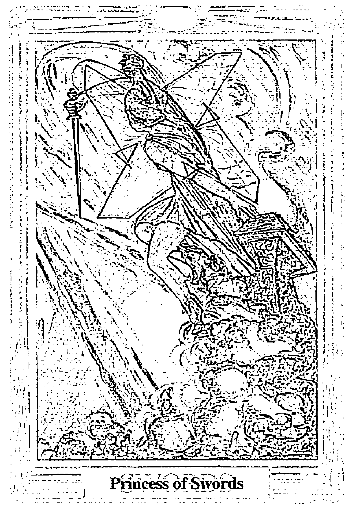

位於卡巴拉之樹最下層的物質之界，連公主牌都逃脫不了形式最終具體化的呈現，而在此處，儘管是最無形無體的風元素，也必須面對所有在塵土中的凝固現象，雲朵變髒汙了，牌面顏色也變混濁了，土元素的污濁性在此展現，一切已經成為凝固的現象，要改變也不容易了。象徵風元素的翅膀造型線條，在現象界中也已經無能為力，公主坐在灰黑城堡及烏雲之上，這是一種被困住後的掙扎，連結黃道星座中最後的三個星座，一切木已成舟，儘管寶劍公主在一片荒蕪中持著長劍繼續抗爭與搏鬥，但是從她的衣著與坐姿上看來，她也知道自己所處的位置再搏鬥也是徒勞。

然而若是把寶劍公主視為嬌嫩的弱者，那可就大錯特錯了，有什麼比把抽象思想落實成具象形式更為強大的力量呢？公主頭上的頭盔有蛇髮魔女梅杜莎 (Medusa) 的頭像，梅杜莎雖被伯修斯 (Perseus) 割下頭顱，但是依然具有把直視雙眼之人變成石像的駭人能力。寶劍公主雖處於最低層的物質之界，但是「公主的性格是嚴厲且有仇必報的，她的邏輯具破壞性，她堅決巧好鬥，具有強大的實踐智慧和對物質的敏銳洞察力，她在實際事務的管理中極為聰明和靈巧，尤其是在具有爭議性的事務中，她有非常熟練的解決技巧」[58]。

身為風元素的一員，寶劍公主自然也擁有強大的心智運作能力，而梅杜莎頭像的頭盔，更象徵著公主擁有土元素中「將一切虛有轉為具象」的凝固能量。然而，「Ruach」(心智) 一向不是好控制的，一旦它運作起來，儘管會把我們從動物靈魂「Nephesh」中提升上來，但同時也會把人性中最高的精神層次「Neshamah」降低下來。佛教中所說會使人造作惡業的五毒心「貪、嗔、癡、慢、疑」，即是心智運作的結果。「因此，『Ruach』會盡其所能，緊緊抓住我們的認同。這就是東方密契修行者為何提醒我們，心智乃是人之大敵，必須被戰勝。」[59]

這是任何一位修行者均必須面對的艱難戰役，而身為「寶劍王牌」中純粹能量端坐的「寶劍公主」，是力量強大的心智戰士，這位個性鮮明、主觀強烈的意念實踐者，有善於解決紛爭的靈巧心智，也有寶劍能量所產生的破壞式紛爭製造能力，她所在之處現已烏雲沉積遮蔽天空，狂烈風暴即將來襲。

公主牌是位於卡巴拉之樹最下面的薩弗拉「王國」(Malkuth)，但是人類心智總是充滿了慾望，事事與人相較並認為自己事事匱乏，但忘記儘管位於下方，還是處於薩弗拉「王國」領域，並不是真的一無所有，當怨懟自己憑什麼位於最下方之時，忘了其實接受現況才是對自己最有助益的。克勞利認為此牌與《易經》的第十八卦「山風蠱」相應，呼嘯的風盤旋向山上吹，吹亂了草木果實，這是開始衰敗的跡象，因為掉落的果實日久即會腐敗蟲生，這是百事不順的大凶卦相，建議需謹始慎終。

## 土元素家族

## ——物質與穩定

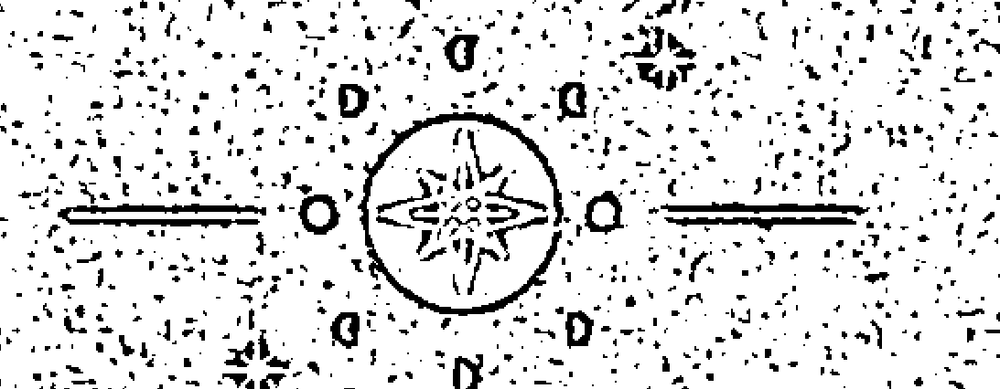

## 錢幣國王

## King of Pentacles

- 土元素性格
- 土元素位階
- 務實特質

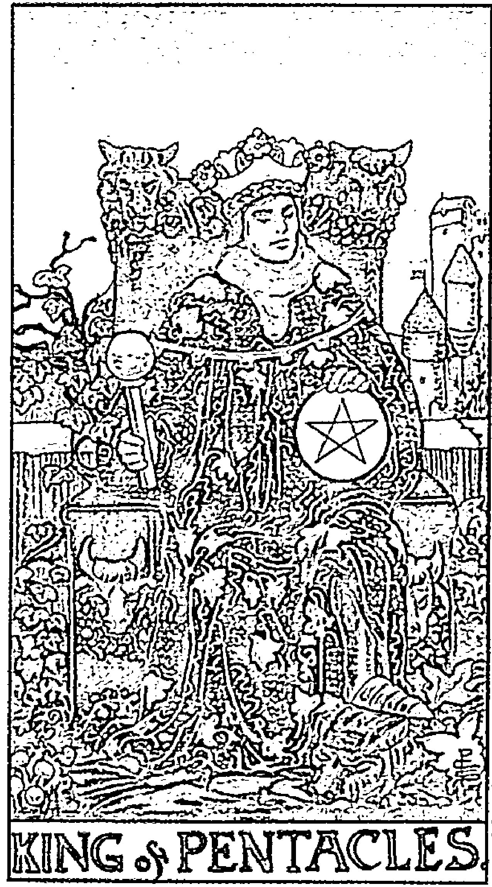

雙重土元素的加持下，讓錢幣國王呈現出十分重視務實利益的特質，物質財富與穩定生活是他的性格主題。錢幣國王無疑是一位在物質之界中的成功統治者，他表情自在安穩地坐在寶座上，雙手各執象徵權力的權杖與代表財富的金幣，由大地中生長而出的綠色藤蔓，豐盛地佈滿寶座四周，深色長袍上亦是充滿藤蔓植物的花紋，這是大地能量的果實。他的寶座上共有四隻金牛，代表著務實的金牛座，是物質穩定的重要象徵，而氣定神閒的閉目姿態，呈現出對身邊所有物質性擁有的滿足與自信，一切都在他的掌控之中。

在偉特的四張國王牌中，這是唯一一張背景出現城堡建物的牌面，可知錢幣國王為四位國王中，資產最豐盛、態度也最務實執著的一位，在世俗上的成就也最大。在土元素的完全發揮下，他性情呈現內斂穩定，會以克己且有修養的負責態度，去按部就班完成任務，也正因為物質生活的穩定與自信，讓他在情緒上更能表現出踏實狀態，且願意在物質方面展現出大方的態度。但儘管已在如此穩定與富足的生活中，國王腳上穿著的還是戰時才會穿的鎧甲鞋，這也顯示出他固執不知變通的一面，且有可能出現將一切事物均以金錢來衡量的狀態，在其專業領域上也有可能相當固執，不願意跨出穩定圈去嘗試新的事物，而其務實傾向也會大大減低情感層次上的浪漫表現，世俗的性格會匱乏了情調。

## 錢幣皇后

## Queen of Pentacles

- 土元素性格
- 水元素位階
- 被動特質

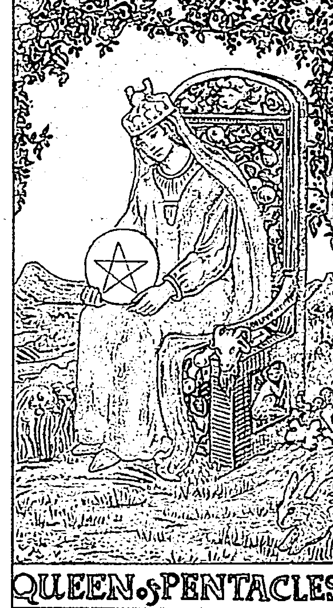

皇后牌通常代表已經有一段社會歷練且懂得人情世故的女性，在此水元素的位階和手法也可以讓人更柔軟地去看待事物，是屬於配合順從的那一方，象徵著性格柔順配合。錢幣王后個性為穩定的土元素，為陰性元素，相似於傳統婦女的角色，能踏實地堅持守住的本分。錢幣皇后的牌面，是四張皇后牌中最能呈現出物質豐盛的狀態，她坐在雕滿植物與動物浮雕的寶座上，身穿象徵物質慾望的紅色長袍，而頭上則有象徵權威的金冠，與代表生生不息的綠色頭紗，雙手安穩地抱著一枚巨大的金幣，寶座上方為玫瑰花叢，土地上則盡是象徵豐饒的植物花卉，遠方有山脈與河川，畫面右下方有一隻棕色兔子，棕色與土地意象連結，而兔子則代表繁殖與肥沃。

這張畫面充滿植物豐盛與生機盎然的牌，將土元素的物質豐盛呈現在一片寧靜祥和的氣氛中，錢幣皇后專注地凝視中金幣，這是她唯一專注之事物，是一位極具有穩定安全感的女性角色，能柔和許多實際層面上的不安與躁動，滋潤並養育著身邊的人事物，是所有皇后牌中最腳踏實地的專注力道，深具傳統婦女勤儉持家的特性。也因為其穩定個性，容易讓人感覺到較不擅長人際關係的經營，一旦脫離了一般制式性的傳統工作，則有可能產生無法彈性應對的狀態，比較無社交能力，不懂也不喜歡發揮自己的魅力，對於適應社會潮流呈現被動的狀態。而其「給予安全感」的特長若平衡得當，則會是偉大的照顧者，但若失衡則可能導致過度溺愛，造成他人對她的付出不感珍惜。

## 錢幣騎士

## Knight of Pentacles

- 土元素性格
- 火元素位階
- 偏執特質

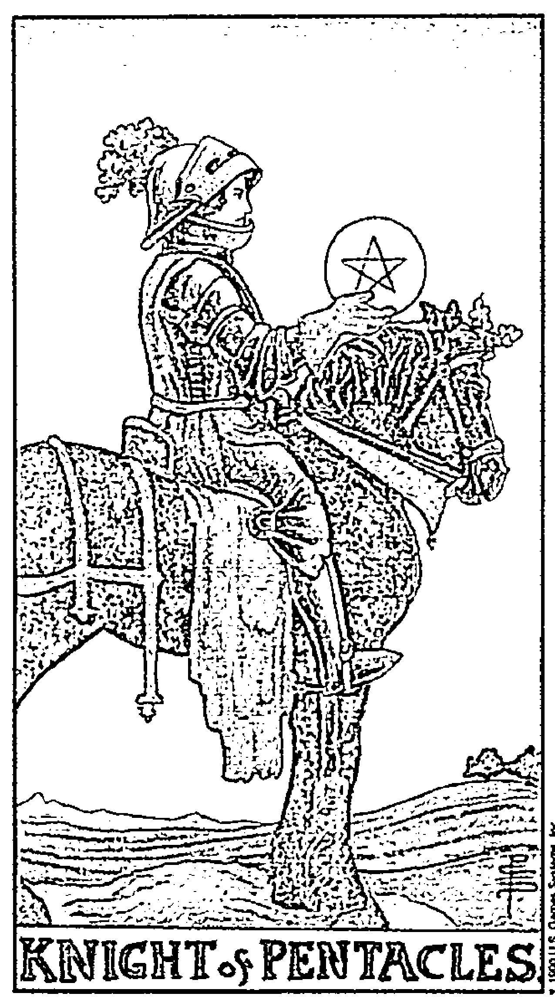

位階為火元素而個性為土元素，兩者搭配屬於偏執元素，目標一旦設定，即會以高度的穩定性一步一腳印前進，是所有騎士中速度最為緩慢的一位。畫面中馬匹僅是站立，毫無前進的姿態，而身穿鎧甲的騎士手捧一個金幣，亦毫無要戰鬥或是前進的形貌，一切呈現出平靜安穩的狀態。錢幣騎士神態自若地坐在馬上，眼光望向前方的土地，低調又負責是他的本質，儘管性格過於保守，但也隨之呈現出實際可靠的處事態度。土元素的穩定性牽制了火元素的暴衝力，以緩慢並延長時間的態度來進行人生累積，耐心與持久的專注力，成為錢幣騎士最大的優勢。

穩定性高又緩慢的步調，讓他的個人特色雖穩定成長，但在生活上也比較無趣一點，而務實的個性也不會為了沒有實際效益的情緒或是浪漫情懷，而做出不切實際的徒勞事功。就如同牌面上沉著冷靜的不動站立，這是行事謹慎的態度，而一片金黃色的天空背景，也暗示了這一切的作為是因為他已經有了強烈的自信。持續下去的毅力是錢幣騎士成功的關鍵點，但保守性格亦可能產生固執與偏執的狀況，儘管有能力完成事務，但有可能會出現過於計較經濟效益，而產生唯利是圖的態度。

## 錢幣侍者

## Page of Pentacles

- 土元素性格
- 風元素位階
- 理性特質

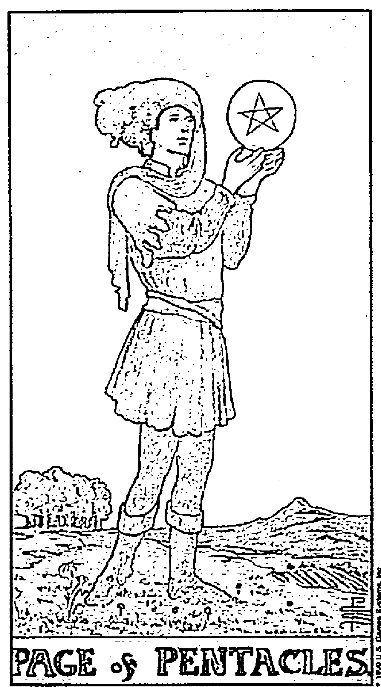

身爲土元素個性的一員，錢幣侍者爲四位侍者中最認真踏實的一位，性格也呈現出穩定保守的特質，因爲位階最低的緣故，因此學習爲錢幣侍者的重要人生課題。一位青少年站在綠草如茵鮮花綻放的原野上，身著象徵生生不息的綠色袍子，頭戴鮮紅帽子，一條由帽頂延伸而下的圍巾隨意披在肩上，他雙手捧著一枚大型金幣，專注地注目與凝視。由遠方樹木樣貌可知環境爲穩定狀態，無風無雨，已犁好的田地正在等待著播種，也暗示著這是一個農作物即將生長的幻境與季節。

這是一位未來可以將熱情和理想以理性態度落實的人物，現階段雖然了解的事物還不多，但是學徒的性格使他願意開始一步一腳印去學習，是所有侍者牌中比較值得信任的一位。其土元素的個性有時會呈現出頑固與保守的一面，務實特性也有可能因爲考慮過多，而卡在一個階段中停滯太久，導致因爲太理性而什麼都不敢做的狀況。但是畢竟是錢幣家族成員，物質層面上必然較爲豐盛，穩紮穩打的做事態度，讓未來就如同腳下這片茂盛田園，一切終將有成，只要等待足夠時間的努力和積累。

## 圓盤騎士
Knight of Disks

- 土元素個性
- 火元素位階
- 獅子座 20 度到處女座 20 度
- 8 月 12 日到 9 月 11 日
- 掌管數字牌：權杖 7、圓盤 8、圓盤 9
- 《易經》：第六十二卦「雷山小過」

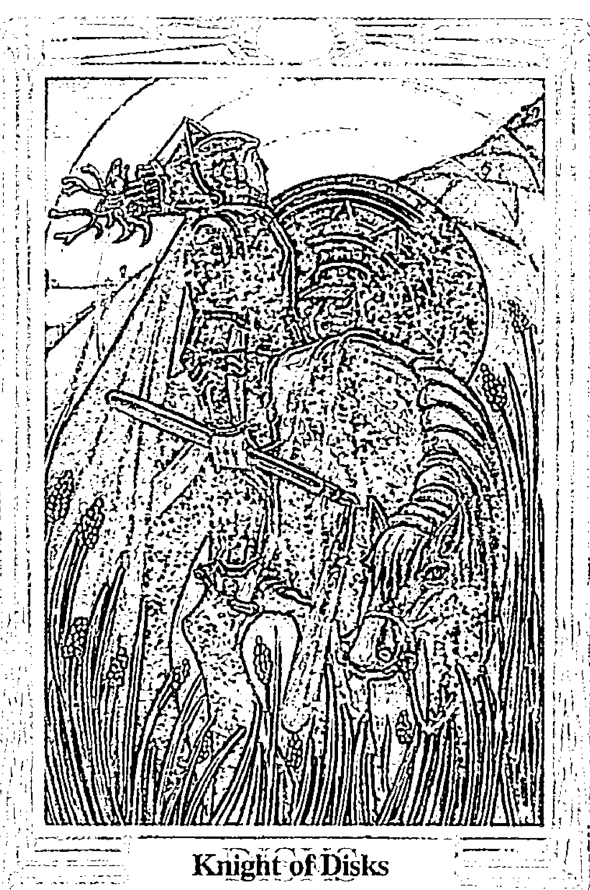

和「權杖騎士」相較，一樣都騎著一匹黑馬，「權杖騎士」代表征戰經驗豐富的老練將軍，而「圓盤騎士」的黑反而是想隱藏自己的象徵，像是一位喜愛隱藏在幕後佈局的幕僚。在所有的騎士當中，圓盤騎士是個子最矮小的一位，騎的是勞役馬而不是戰馬，也是馬匹唯一呈現靜態的一張牌。

的確，以圓盤騎士的身形來看，他絕對不會是一位戰功彪炳的將軍，整張牌面呈現出大地的咖啡色，鹿頭造型頭盔是與大地的連結且象徵幸運，圓盤騎士在乎的不是征戰，而是穀物的豐盛。換個角度詮釋，他完全不在意繼續開疆闢土與無意義的輸贏征戰，只在意所擁有的實際物質，他著眼望向面前所擁有的土地，心中意念只思索耕耘以及相關農作事務的安排事宜。「目前他的功能完全只限於生產食物，出於這個原因，他配備了連枷。此外，他攜帶的圓盤非常堅固，它代表營養。」[60]

此牌統轄了 20 度的處女座，自然與希臘神話的穀神狄米特意象緊緊相連。而該星座喜歡管理秩序和細節的特性，也應證在對於農業事務上的細膩態度，土中之火的圓盤騎士，多了土元素的穩定，因此步調和緩踏實，削弱了火元素的激進動力下，「他們缺乏主動性，他們的火是成長過程中的悶燒之火」[61]。他身穿黑色盔甲，黑色本身蘊藏了對很多事物的掌控慾望，特別肥沃的土壤也會呈現出黑色，他心思馳騁在對這片肥沃土地的掌控上，擁有滿滿的自信。然而此種熱衷工作的實際之人，穩定踏實人格的另一面，通常呈現出「沉悶、沉重、沉迷於物質，他們勤勞而具耐心，但即使面對與他們最密切相關的事務，也幾乎沒有機智的心思去應對」[62]，對細節的關心也會讓他們儘管煩躁也要插手小事，重點是他們完全不想對自己的做法有所改變。不過只要是他們認為與自己不相關之事，馬上喪失所有興趣。克勞利認為此牌與《易經》的第六十二卦「雷山小過」相應，直接對應了圓盤騎士對於繁文縟節與瑣碎之事，都會親自面對處理，情願做超過也不能做不夠的態度，有矯枉過正之勢，並直指此種性格只能做小事，不能做大事。

## 圓盤皇后
Queen of Disks

- 土元素個性
- 水元素位階
- 射手座 20 度到摩羯座 20 度
- 12 月 13 日到 1 月 9 日
- 掌管數字牌：權杖 10、圓盤 2、圓盤 3
- 《易經》：第三十一卦「澤山咸」相應

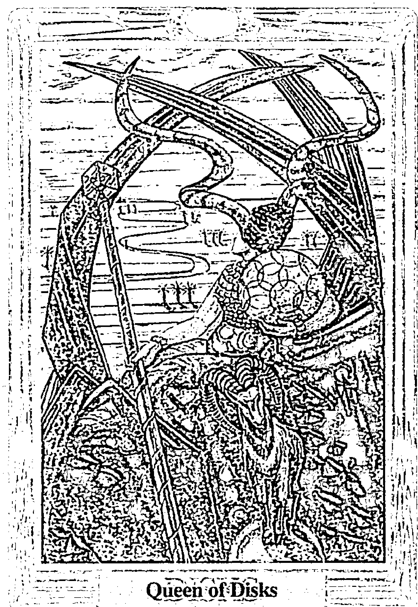

在地球上，土壤中的水是創造生命的基本元素，儘管水元素爲陰性元素，但在此它展現出它最高層次的能量，克勞利稱之爲「被動的最高面向」[63]。圓盤皇后從射手座連結到摩羯座 20 度，側坐在寶座上，眼神凝視著遠方一條平靜的蜿蜒河流，穿過白灰色的沙質沙漠，水爲這片荒漠帶來了肥沃，植物在綠洲中顯露出來生機，透過與大地連結而來的力量，這是摩羯座那持久踏實與包容的土元素能量。皇后身穿由金幣組成的盔甲，手持地球儀和內含象徵大宇宙的三維度六芒星[64]立方水晶權杖，這內外富足且滋養衆生的能力，展現了摩羯座雖沉穩踏實卻仍是開創星座的特色，「她代表了物質參與創造偉大工作的雄心」[65]。

這是何等的雄心，與不可忽視的力量!皇后頭盔上有巨大捻角山羊的螺旋角，扭曲的雙角象徵著在過往歷程中所費盡的所有心思，開創星座一開始就已經設定明確的目標，一路過來的心機、巧智與規劃，讓她如今能穩坐於此。眼前白灰色遠景代表過往經歷已是前塵往事，過去曾經豐富轟轟烈烈造就今日的豐盛穩定，感念簞路藍縷的同時，更感恩現在所擁有的。如今一切已勝券在握，手上的權杖不僅只是權位的代表，其上水晶魔方爲開展的十字架變成六方體的概念，一切有連結宇宙源頭之意，身邊的山羊也暗示著，攀爬陡峭山壁、走過崎嶇地形，如今終於安穩自在地站上階段性巔峰。

但此時的圓盤皇后態度依然低調踏實，不在乎外界給予的掌聲與光芒，安靜地將臉轉開，背對著我們，只安靜地注視著自己過往的努力積累，此種自制能力是陰性元素將外在資產轉爲內心富足的珍貴變化。安穩沉靜是圓盤皇后的特質，「這張牌所代表的人擁有最安靜的特質，他們雄心勃勃，但僅限於設定好的目標，他們擁有關愛、善良和偉大的心理，他們並不特別聰明，但本能和直覺足以滿足他們的需要。這些人安靜、勤奮、務實、明智、有教養」[66]，但性格若是呈現負面時，也容易出現遲鈍與不知變通的狀況，只安於他們分內的職務，「他們不能超越，甚至無法超越他們所設定的宿命」[67]。克勞利認爲圓盤皇后與《易經》的第三十一卦「澤山咸」相應，深邃山谷與深廣大澤，天地感而萬物化生，以謙虛態度待人，一切均順其自然，穩固而堅定地發展。

## 圓盤王子
Prince of Disks

- 土元素個性
- 風元素位階
- 牡羊座 20 度到金牛座 20 度
- 4 月 11 日到 5 月 10 日
- 掌管數字牌：權杖 4、圓盤 5、圓盤 6
- 《易經》：第五十三卦「風山漸」

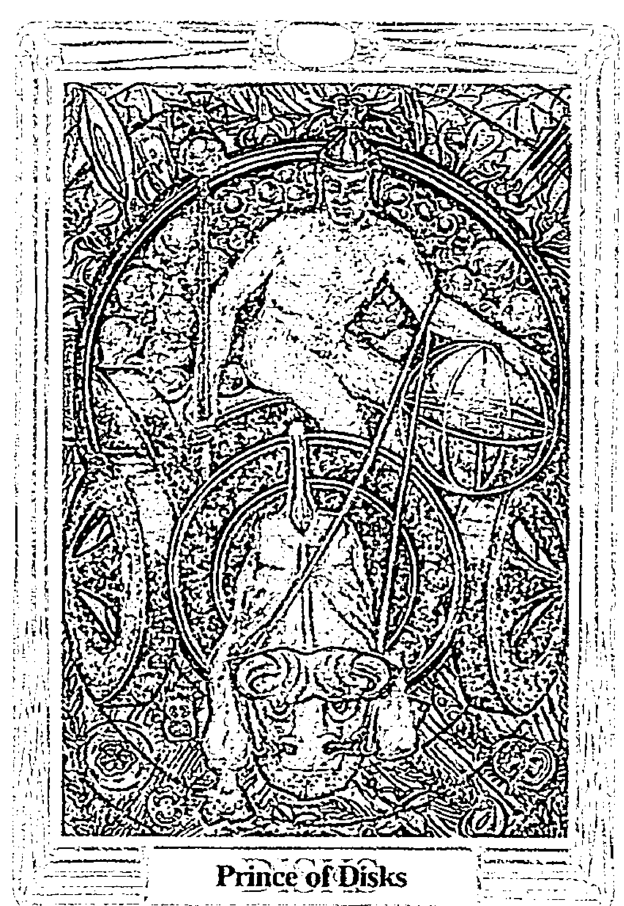

這是圓盤系列中顏色最為暗沉的一張畫面，圓盤王子乘坐著黑色的戰車，而黑色是象徵慾望的顏色，此牌中以很多黑褐色來表現圓形圖案，這是一種慾求不滿，多還要更多的概念。金牛座在此完全展現固定星座的特質，以牛來拉戰車，可知速度對於圓盤王子來說不是重點，他要求的是一點一滴的持續累積。王子左手抱著一顆中空的地球，「上面標有數學符號，似乎暗示著農業的規劃」[68]，對圓盤王子而言，一切都還只處於規劃期，並呈現出期待被繼續填滿的心態，然而不難發現王子身後擁有許多彷彿是累積出來的球形種子與果實，這是隨時可以幻化成植物的能量與配備，牌面背景更是一片充滿植物圖形的金色華麗。但是很明顯地，對王子而言這一切是還不夠的，他把所有物件放置在身後車上，刻意讓自己前面感覺空曠，而金牛座的確有非常重視物質的特性，很會守成，但同時還是一直想要擁有更多物質累積，可說是非常物慾的代表星座，而此特質也完全展現在圓盤王子牌的意義中。

王子右手拿著一根上方有圓形球體的權杖，其上有一個馬爾他十字架，「他的職責是從元素的材料中，產生作為聖靈本身養料的植物」[69]，這真的是偉大又神聖的工作。王子雙眼緊閉彷彿進入冥想階段，「仿如正在以念力指揮這整個宇宙孵育中的豐饒多產」[70]，身為物質界的掌控者，他的性格會對最實際的事物施加巨大能量，呈現出穩定且緩慢的深思熟慮，「不斷地為普通事物尋找新的用途」[71]，然而任何不實際的事物，他則會出現缺乏情感的冷酷面向，甚至會對於精神類型的事物表現出漠然。

掌握著物質世界法則的圓盤王子，處理著物質界最嚴肅的實際事務，因此他通常會有不易被人看出內心的傾向，內心中彷彿住了一個惡魔般，有其陰暗面向。而他在物質界的強大能量，即使是最深奧形上學的哲學也無法忽視，儘管宗教思想中常常將物質和肉體視為罪惡，甚至與「魔鬼」概念相連，但在宇宙運行的精密計畫當中，所有的環節安排均是至關重要的，缺一不可，因為「偉大運作在安排事務上，即使是令邪惡萌芽的物質，也將是有用和有助益的」[72]，畢竟沒有邪惡相隨，又怎知天堂的可貴。克勞利認為圓盤王子與《易經》的第五十三卦「風山漸」相應，木生於山上，會逐漸循序生長，絕非一朝一夕可成，事事漸漸前進，一點一滴累積後，必有所歸。

## 圓盤公主
Princess of Disks

- 土元素個性
- 土元素位階
- 偕同「圓盤王牌」
- 管轄星座象限：北極之上的牡羊座、金牛座、雙子座
- 管轄地區：歐洲地區、非洲地區
- 《易經》：第五十二卦「艮為山」

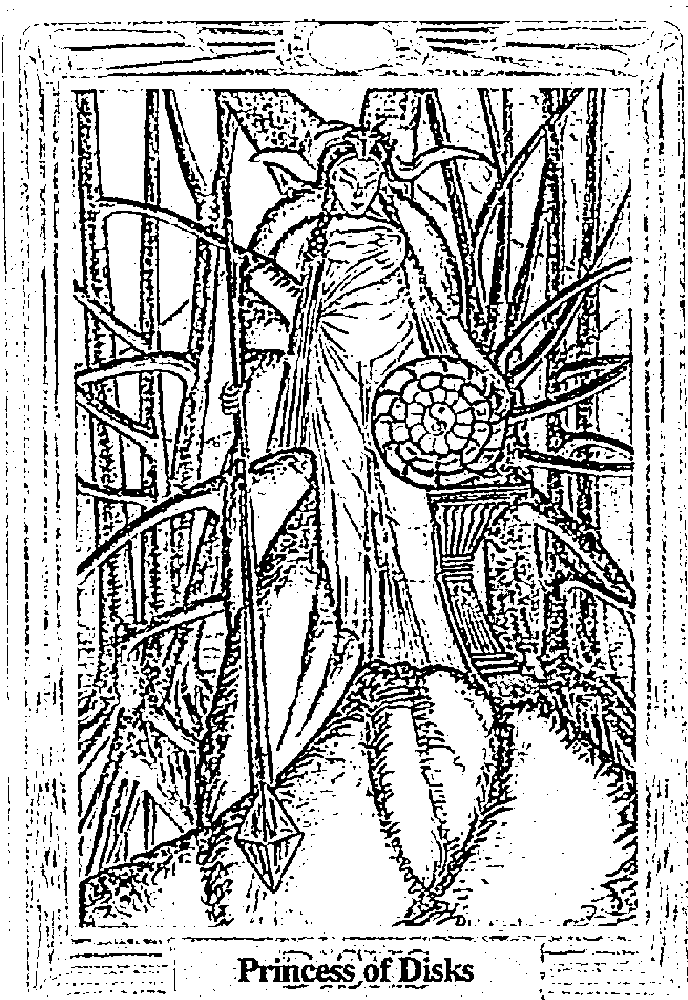

身為土中之土，圓盤公主真的就是落入物質的塵土。由於公主牌均是以空間呈現，在此框架當中，這是一種往下墜落的概念，她手中的權杖擁有和圓盤皇后權杖一樣的能量，但是這次她將權杖上下顛倒持拿，翡翠碑文中的「天上如是地上亦然」概念在此完美展現，不管身處哪一界，都是過同樣生活，都是得為事而努力，沒有例外，只是每一界所追求的事物不同而已。

在卡巴拉之樹上，土星位於天界三角，「高中之高」，然而公主代表物質界的第十顆薩弗拉「王國」(Malkuth)懸宕於最下方，為「低中之低」。她身披長版皮草披肩，手抱有三十六個區塊組成的圓盤，圓盤中有太極圖形，這是最原始的行為和模式，公主透過這個行為和模式運作並往上攀爬，依然豐盛非凡。「她強壯美麗，神情凝重，彷彿即將察覺到秘密的奇蹟」[73]，是的，她的權杖鑲有象徵第一顆薩弗拉「王冠」(Kether) 的寶石[74]，「象徵著最深最黑暗的元素中，誕生了最高和最純淨的光，她站在聖樹叢中一座象徵麥穗的祭壇前，因為她是農神德墨忒爾 (Demeter) 的女祭司，她的身體內蘊藏著未來的秘密」[75]，圓盤公主的腹部不斷孕育能量，與上層世界有所連結，並落實能量。

原型之界以光之概念存在，不是物質界能觀之，但圓盤公主落於塵土在下中之下的「王國」，是為了具體化天界三角的三顆薩弗洛斯，此創造的能力是終極女性特徵的所有投射。她統轄了黃道十二宮中前三個座：牡羊座、金牛座與雙子座，此三個星座象限，象徵宇宙循環中從開始回到原始，又開始進行凝結的能量，有如宇宙的多次滅絕又重生。她是大地的氣息，也是自然的脈動，所有精神能量匯聚流溢於此，就要再次踏上回歸路程，目前在此她只需耐心沉潛，等待與醞釀，畢竟物質是個宇宙能量偉大創造中不可或缺的環節，公主在此，是物質界最自在的主宰者。

克勞利認為此牌與《易經》的第五十二卦「艮為山」相應，一山已能鎮止，此卦兩山重疊，停止之義更大。圓盤公主此時的確進入事物相對靜止的，位於「低中之低」，圓盤公主可以被視為是所有塔羅體驗旅程中，代表結束的一張牌。面對這樣的一個酸甜苦辣夾雜的塵世，佛教教導我們破除桎梏超脫輪迴，上帝則是以耶穌基督的身分降生世界來拯救我們。而在地球上的每位修行者，儘管我們被日趨腐爛且充滿限制的沉重肉體外衣所緊密包裹，但我們的內心仍望向星空汲汲渴求，希望有朝一日能聽到天使的歌聲，聞到伊甸園的氣息。就讓克勞利在此牌中的敘述，作為對所有靈性修行者的祝福：「每位學習者的內心和頭腦中，都要牢牢謹記這個最簡單、最深遠的教義，願他探索了宇宙的每一個隱秘處後，可以在其中找到真理之光，能與神聖守護天使進行知識的對話，並將偉大的工作完成且達於至善，從而獲得真正的智慧和完美的幸福！」[76]

## ∞ 註釋 ∞

- [1] 《The Book of Thoth》, p.149.
- [2] 《The Book of Thoth》, p.149.
- [3] John Michael Greer (2017.01)。《生命之樹卡巴拉：西方神秘學的魔法根本》(Paths of Wisdom: A Guide to the Magical Cabala)。蕭漢婷 譯。台北：橡實文化，頁 40。
- [4] 《生命之樹卡巴拉》，頁 40。
- [5] 《生命之樹卡巴拉》，頁 40。
- [6] 《生命之樹卡巴拉》，頁 40。
- [7] 《The Book of Thoth》, p.20.
- [8] 《生命之樹卡巴拉》，頁 42-44。
- [9] 《生命之樹卡巴拉》，頁 44。
- [10] 在此種將薩弗拉平均分配的方式中，創造之界的三顆薩弗洛斯所組成的三角，又稱為倫理三角。
- [11] 在此種將薩弗拉平均分配的方式中，成形之界的三顆薩弗洛斯所組成的三角，又稱為魔法三角。
- [12] 《塔羅冥想》，頁 931。
- [13] 《托特塔羅解密》，頁 124。
- [14] 《托特塔羅解密》，頁 124。
- [15] 《The Book of Thoth》, p.149.
- [16] 《The Book of Thoth》, p.150.
- [17] 《The Book of Thoth》, p.150.
- [18] 《The Book of Thoth》, p.150.
- [19] 「認養」說法參考自《托特塔羅解密》一書的翻譯。
- [20] 宮廷牌中，公主牌所管轄的地球空間分配，是以沿著埃及金字塔所在的子午線往東，再以「火、水、風、土」的順序來進行分配，「權杖公主」和「權杖王牌」與亞洲對應、「聖杯公主」和「聖杯王牌」與太平洋地區對應、「寶劍公主」和「寶劍王牌」與美洲對應，而「圓盤公主」和「圓盤王牌」則是與歐洲和非洲對應。
- [21] Marty Crump (2020.01)。《兩棲爬行動物的神話與傳說》(The Lore and Mythology of Amphibians and Reptiles)。黎茵 譯。貴州：貴州人民出版社，頁 153。
- [22] 《The Book of Thoth》, p.151.
- [23] 《The Book of Thoth》, p.151.
- [24] 《The Book of Thoth》, p.152.
- [25] 《The Book of Thoth》, p.152.
- [26] 《The Book of Thoth》, p.153.
- [27] 《The Book of Thoth》, p.153.
- [28] 《The Book of Thoth》, p.154.
- [29] 《The Book of Thoth》, p.154.
- [30] 《The Book of Thoth》, p.155.
- [31] 《The Book of Thoth》, p.155.
- [32] 《The Book of Thoth》, p.155.
- [33] 《The Book of Thoth》, p.155.
- [34] 《The Book of Thoth》, p.155.
- [35] 《The Book of Thoth》, p.156.
- [36] 《The Book of Thoth》, p.156.
- [37] 《The Book of Thoth》, p.156.
- [38] 《The Book of Thoth》, p.156.
- [39] 《The Book of Thoth》, p.157.
- [40] 《The Book of Thoth》, p.157.
- [41] 《The Book of Thoth》, p.157.
- [42] 《托特塔羅解密》, 頁 276。
- [43] 《托特塔羅解密》, 頁 278。
- [44] 《The Book of Thoth》, p.158.
- [45] 《The Book of Thoth》, p.159.
- [46] 塔羅牌中四大元素連結了以西結四活物的象徵，人頭象徵風元素、鷹頭代表水元素、獅頭象徵火元素、牛頭象徵土元素。
- [47] 《里帕圖像手冊》, 頁 11。
- [48] 《托特塔羅解密》, 頁 282。
- [49] 《The Book of Thoth》, p.160.
- [50] 《The Book of Thoth》, p.160.
- [51] 《The Book of Thoth》, p.160.
- [52] 《The Book of Thoth》, p.161.
- [53] 《The Book of Thoth》, p.161.
- [54] 《The Book of Thoth》, p.161.
- [55] 《The Book of Thoth》, p.162.
- [56] 《The Book of Thoth》, p.162.
- [57] 《The Book of Thoth》, p.162.
- [58] 《The Book of Thoth》, p.163.
- [59] 《托特塔羅解密》, 頁 288。
- [60] 《The Book of Thoth》, p.164.
- [61] 《The Book of Thoth》, p.165.
- [62] 《The Book of Thoth》, p.165.
- [63] 《The Book of Thoth》, p.166.
- [64] 在我們生活的這個外顯的物質世界中，四大元素均是彼此相互合作與協調的，沒有任何一個元素是單獨存在的，而「靈」則被視為第五元素，在圖像象徵的語言中，以五角星來代表，因此五角星被視為「小宇宙」。而古希臘人所知道的六顆行星，在圖像象徵中以六芒星來表示，則是被視為「大宇宙」。
- [65] 《The Book of Thoth》, p.166.
- [66] 《The Book of Thoth》, p.166.
- [67] 《The Book of Thoth》, p.166.
- [68] 《The Book of Thoth》, p.167.
- [69] 《The Book of Thoth》, p.167.
- [70] 《托特塔羅解密》, 頁 294。
- [71] 《The Book of Thoth》, p.167.
- [72] 《The Book of Thoth》, p.168.
- [73] 《The Book of Thoth》, p.169.
- [74] 《托特塔羅解密》, 頁 296。
- [75] 《The Book of Thoth》, p.169.
- [76] 《The Book of Thoth》, p.170-171.

## 參考文獻

### 中文專書

天空為限 (2011)。《藏在塔羅裡的占卜符碼》。台北：大雁出版。

陳懷恩 (2008)。《圖像學：視覺藝術的意義與解釋》。台北：如果。

張紹強 劉紀顯 (2014.07)。《托特塔羅入門》。台北：商周出版。

管筱明 編 (1994.07)。《世界文化象徵辭典》。湖南：湖南文藝出版社。

### 翻譯書

Aniela Jaffé (2020.07)。《榮格的最後歲月：心靈煉金之旅》(From the Life and Work of C. G. Jung)。王一梁、李毓 譯。台北：心靈工坊。

Anonymous (2020.12)。《塔羅冥想：基督教信仰內在隱修之旅》(Meditations on the Tarot: A Journey into Christian Hermeticism)。侯王怡文 譯。台北：心靈工坊。

Antoinette Moltzan (2019.06)。《光的課程：開啟內在生命之光的途徑》(A Course in Light: A Spiritual Path to Enlightenment)。杜恒芬 譯。光的課程資訊中心。

Arthur Edward Waite (2017.05)。《塔羅牌經典手冊：跟著偉特進入塔羅占卜的秘密花園》(The Pictorial Key to the Tarot)。文軒 曾新惠 編譯。台北：達觀出版。

Carl Gustav Jung (2017.07)。《紅書》(The Red Book)。劉宏信 譯。台北：心靈工坊。

Carl Gustav Jung (2017.11)。《榮格論心理類型》(Psychologische Typen)。莊仲黎 譯。台北：商周出版。

Carl Gustav Jung (2019.11)。《煉金術之夢》(Chapter 12 Alchimy)。楊韶剛 譯。北京：譯林出版。

Carl Gustav Jung (2020.07)。《心理學與煉金術》(Psychology and Alchemy)。楊韶剛 譯。北京：譯林出版。

Carl Gustav Jung (2020.09)。《榮格論心理學與宗教》(Psychology and Religion)。韓翔中 譯。台北：商周出版。

Cæsar Ripa (2019.08)。《里帕圖像手冊》。趙維 編。北京：北京大學出版。

Dion Fortune (2021.03)。《祕法卡巴拉：西方的身心修煉之道》(The Mystical Qabalah)。邱俊銘 譯。新北：楓樹林出版社。

John Michael Greer (2017.01)。《生命之樹卡巴拉：西方神秘學的魔法根本》(Paths of Wisdom: A Guide to the Magical Cabala)。蕭漢婷 譯。台北：橡實文化。

James Hall (2005.05)。《西方藝術事典》(Dictionary of Subjects and Symbols in Art)。遲軻 譯。南京：江蘇教育出版社。

Lon Milo DuQuette (2014.01)。《托特塔羅解密》(Understanding Aleister Crowley's Thoth Tarot)。孫梅君 譯。台北：商周出版。

Michael Osiris Snuffin (2018.05)。《托特塔羅學習手冊》(The Thoth Companion)。孫梅君 譯。台北：達觀出版。

Pierre Hadot (2019.04)。《伊西斯的面紗》(The Veil of Isis)。張卜天 譯。上海：華東師範大學出版社。

Sarah Durn (2021.11)。《煉金術新手指南》(The Beginner's Guide to Alchemy)。羅亞琪 譯。台北：楓樹林出版。

Susan Levitt (2020.04)。《塔羅初心者》(Introduction to Tarot)。楊舒涵 譯。台中：左西新創藝。

Thoth\Hermès Trismégiste (2021.06)。《翡翠碑文：宇宙與生命的終極答案大解密》(Les XV Tablettes De Thoth [L'atlante])。鄭斯堯 譯。台中：白象文化。

## ❧ 外文書目 ❧

Aleister Crowley. (1986). *777 and Other Qabalistic Writings of Aleister Crowley: Including Gematria & Sepher Sephiroth*, York Beach, ME: Weiser Books.

Aleister Crowley. (1987). *The Book of The Law*. San Francisco, CA: Weiser Books.

Aleister Crowley. (1909). *Libre 777*. London and Felling-on-Tyne, The Walter Scott. Reprinted with much additional matter, 777 Revised, (1955), London: The Neptune Press.

Aleister Crowley. (1998). *The Vision and the Voice with Commentary and Other Papers*. York Beach, ME: Weiser Books.

Aleister Crowley. (2020). *The Book of Thoth*. San Francisco, CA: Red Wheel/Weiser.

Arthur Edward Waite. (2005). *The Pictorial Key to The Tarot*, New York: Dover Publications.

Cæsar Ripa. (2018). *Iconogia*. London: Gale Ecco.

Erwin Panofsky. (1972). *Studies in Iconology: Humanistic Themes in the Art of the Renaissance*. New York: Harper & Row.

Israel Regardie. (1989). *The Eye in the Triangle*. Scottsdale, AZ: New Falcon Press.

John Vinycomb. (2013). *Fictitious and Symbolic Creatures in Art*. London: Book on Demand Ltd.

Lon Milo DuQuette. (1999). *My Life with the Spirits*. York Beach, ME: Weiser Books.

Susan Roberts. (1978). *Magician of the Golden Dawn*. Chicago: Contemporary Books.

## ❧ 參考網站 ❧

- Tal9（對數種塔羅牌牌義進行詳細分析）
  https://tal9.site

- MacGregor Mathers and Harriet Felkin. Book T-The Tarot.（金色黎明協會塔羅牌模型）
  https://benebellwen.files.wordpress.com/2013/02/mathers-and-felkin-golden-dawn-book-t-the-tarot-1888.pdf

- Nes' Tarot 塔羅自修手冊（塔羅總論與牌義教學）
  https://www.nes-tarot.com/tarot-self-study-guide-archives.html

- 一個台灣巫師的影子書（西方巫術與魔法精闢探討）
  https://www.facebook.com/wiccawizard

- 太陽塔羅日誌（偉特塔羅牌牌義分析與牌陣教學）
  https://myscith.com/blog/

- 玄享－私人神話的紀錄者（托特塔羅牌與卡巴拉哲學學術性探討）
  https://privatemyth.blogspot.com

- 青森林塔羅花園（塔羅牌生活化案例分享）
  https://www.facebook.com/profile.php?id=100069952089642

- 直覺式塔羅牌線上占卜（提供線上抽牌占卜與解說）
  https://tarot.cornerwonder.com/

- 神祕學研究社 (Taiwan Occult Club)（對西方魔法相關綜合探討）
  https://www.facebook.com/groups/1038274042878878

- 晨音神祕學（托特塔羅牌義精闢解析）
  https://occultsound.com

- 塔羅筆記（塔羅牌總論與牌卡義理分析）
  https://www.tarnote.com/blog

# 塔羅凝視

學習者的圖像對話之旅

作者 潘青林
社長 林宜澐
總編輯 廖志盛
編輯 楊先妤
書籍設計 紀知儀
占星學理顧問 蘇菲亞的靈數世界
東方學理顧問 高國欽

國家圖書館出版品預行編目 (CIP) 資料

| 塔羅凝視：學習者的圖像對話之旅 ／ 潘青林著 . -- |
| --- |
| 初版 . -- 臺北市：蔚藍文化出版股份有限公司，2022.07 |
| 面；19x26 公分 |
| ISBN 978-986-5504-75-5 (平裝) |
| 1.CST: 占卜 |
| 292.96 111005640 |

印刷 世和印製企業有限公司
ISBN 978-986-5504-75-5
定價 台幣 560 元
初版一刷 2022 年 7 月

出版｜蔚藍文化出版股份有限公司
110058 臺北市信義區基隆路一段 167 號 5 樓之 1
電話｜02-2243-1897
臉書｜https://www.facebook.com/AZUREPUBLISH/
讀者服務信箱｜azurebks@gmail.com

總經銷｜大和書報圖書股份有限公司
248020 新北市新莊區五工五路 2 號
電話｜02-8990-2588

法律顧問｜眾律國際法律事務所 著作權律師｜范國華律師
電話｜02-2759-5585
網站｜www.zoomlaw.net

Universal Waite Tarot images used with permission of U.S. Games Systems, Inc., Stamford, CT 06902.
© 1990 by U.S. Games Systems, Inc. Universal Waite is a registered trademark of U.S. Games Systems, Inc.
All rights reserved.

Aleister Crowley and Lady Frieda Harris Thoth Tarot images used with permission of Ordo Templi Orientis
© Ordo Templi Orientis. All rights reserved.

本書的偉特塔羅牌圖像經 U.S. Games Systems 正式授權、托特塔羅牌圖像經 Ordo Templi Orientis(O.T.O.) 正式
授權，未經授權，禁止使用。

版權所有・翻印必究
本書若有缺頁、破損、裝訂錯誤，請寄回更換。