# 塔罗博物馆
超过百幅珍稀牌卡大公开
第一本塔罗图像研究专书
Archangel OCCULT COLLEGE 天使神秘学院 http://www.ac2011.cn
Lacrida Barbier 拉克莉妲·巴比耶—— 著 林仑 ——
神秘的艺术形式、充满诗意的仪式，通过牌卡神秘的预言力量，我们可以有效地挖掘内心，完成一场内外转化的旅程。

## 塔羅博物館
## Tarot and Divination Cards: A Visual Archive
作者 拉媞西亞·巴比耶 (Laetitia Barbier)
譯者 林金源

# 起初是声音
初是聲音。這句話在夜半時喚醒了我，那不像個夢境或口頭陳述，而是等待著我的某種訊息。從白天到傍晚，我讀著這本奇妙的書，思忖書中所列舉的，從許多世紀以來的許多文化中種種令人感到驚奇的事物，以及它如何在文藝復興、古典藝術、民俗圖像、煉金術和魔法符號、時裝秀及神秘訊息，乃至於電影、電視和漫畫書之間翩翩起舞——我尤其想著，作者拉媞西亞如何悠遊穿梭於書中的每個角落。

俯拾皆是的趣味貫穿了整本書，每一頁都顯而易見，作者展現出對牌卡占卜所有的形式表現、變化轉折及無窮花樣的喜愛。多年前，一位名叫約安娜·薩拉揚（Ioanna Salajan）的希臘裔美籍教師告訴我們這群在阿姆斯特丹的學生：「凡事得在樂趣中學習。」她還說，很多人都不相信這句話，但我相信。我也納悶是否因為塔羅已經滲入了我的生活，所以即便這些牌卡帶來的訊息揭露出痛苦和挑戰，我總能從各種發現中獲得樂趣。

拉媞西亞深諳此道。我們看得出她對每幅圖像和每個故事的熱愛，而且從一開始便感受得到。她告訴我們，她和塔羅就像美國導演吉姆·賈木許（Jim Jarmusch）的電影《吸血戀人》（Only Lovers Left Alive）裡的那對吸血鬼情侶，每當她再次拾起塔羅牌，他們就會彼此吸引，忘卻悠悠歲月。請注意，她並非單純說她受到塔羅的吸引，而是，她與塔羅彼此吸引。這是一個天大的秘密，拉媞西亞不僅知曉，還再三昭示於我們眼前——塔羅以及統稱為「占卜牌」的各種占卜遊戲傳統至今仍然存在，生動地表現在圖像和牌意之中。

讓我說得更清楚一點。我指的不是經常出現在圖像裡的天使、惡魔或幽靈。我們確實在牌卡、塔羅或其他事物中見到許多上述例子，它們透露了來自「天使和引導者」的口頭訊息，就像當代許多靈媒喜歡說的那樣。我說的是比較簡單、也許更奇怪，或者，至少是更直接的事。對許多人而言，想瞭解牌卡的意義，並不需要藉助某種外在的神靈。若干世紀以來，藝術家、作家和解讀者致力於哺育這些圖像，而圖像本身就是我們的導師、朋友和愛人。在這本精彩的書中，從每組圖像和每個饒富趣味的故事裡，我們都能發現這點。

我們大可這麼說——以前從來沒有人做過類似的事！就我所知，甚至從來沒有人嘗試過對占卜牌卡的通盤歷史進行如此深入和深情的調查。我們可能會想到卡普蘭（Stuart Kaplan）四冊一套的《塔羅百科全書》（Encyclopedia of Tarot）。不過卡普蘭作品的特點是搜羅詳盡，而非展現鑑賞力。《塔羅百科全書》勇敢嘗試囊括了古來第一副到現今的所有塔羅牌，當然，這是個不可能達成的目標，因此最後一冊發行前，內容甚至尚未齊備。再者，卡普蘭將範圍侷限於塔羅，而非開放地探索從古至今、牌卡占卜廣大的「多重宇宙」（拉媞西亞無疑會喜歡的漫畫系列用語）。

左页 《女祭司》（The High Priestess），亚瑟·哈克（Arthur Hacker），十九世纪。

在本書中，拉堤西亞也沒有企圖要涵蓋當代數不盡的牌卡，無論塔羅或神諭牌，也因此，我們非常期待第二冊的問世。然而，她確實探討了非塔羅占卜牌傳統的世界，不光我們所知的許多牌卡，還有一副又一副奇蹟般出現的不知名牌組，因其獨一無二的預言系統和豐富絕倫的藝術性而令人著迷。然而，除此之外，書中還有別的東西。所以我在半夜因為這句話而醒來：**起初是聲音。**

書中告訴我們的第一件事是：「我是個用英語寫作的法國女子。」以此「舌」寫作的人有其特出之處，這個舌頭，是指他們入籍的國家所使用的語言聲音。我們從而想到以撒·辛格（Isaac Bashevis Singer，出生於波蘭的美籍猶太作家，1987年諾貝爾文學獎得主），他一開始以意第緒語寫作，後來改用英語。或者，著名的納博科夫（Vladimir Nabokov，俄國作家與昆蟲學家），起初他將自己的俄語原文作品翻譯為英語，後來直接以英語寫作。這兩個人，尤其是納博科夫，都設法尋求流利地運用一種新語言，試圖達到母語使用者的程度。拉堤西亞欣然越過了邊界，跨立於兩個語言世界，帶來一種玩耍似的機智感。那是愉悅之聲，注入了書中的每一頁，即便這些頁面多半以圖像為主，有時全然是圖像。牌卡占卜的傳統豈不正是一種對著我們說話的圖像傳統？它們一如本書作者，訴說著跨越文化的事。

當我寫這篇序文時，網際網路這個跨越於實體與非實體資訊領域的異世界，已經產生出新一代的牌卡占卜媒介。這個有點笨拙的說法，指的是上述那些提及「天使和引導者」的心靈牌卡解讀者。他們利用塔羅，而且經常同時使用好幾副牌——有這麼多種塔羅牌可供選擇，你如何能抗拒？——就像本書往往混合了塔羅和神諭卡。同時，他們所接收到的訊息可以來自圖像或語句。由於網際網路比什麼都更能促進平等和機會的取得，因此這些媒介希望我們明白，我們自身也具備了這項能力，只要願意敞開心胸去信任、去聆聽。

拉堤西亞認為牌卡本身就是天使和引導者，而他們的語言、他們的敘事之舌正是圖像，也就是美。縱觀全書，不管從哪裡開始讀起，往前翻或往後翻，書中無疑傳遞出昭然若皆的訊息，那近乎感同身受的滋味告訴我們，美，就是占卜的真正語言。牌卡事實上蘊含著準確的意義（十九世紀的占卜牌最為真確，例如勒諾曼〔Lenormand〕牌），有時甚至直接寫在牌面上，但它們是真的透過圖像的力量在和我們說話，即使只是最簡單的話語。

許多塔羅和牌卡占卜作家，特別是在處理相關歷史時，都會嘗試採取一種超然「客觀」的寫作風格，想從文字中抽離掉那些起初吸引他們投身於該主題的熱情和好奇心。但是，拉堤西亞從不這麼做，因為說到牌卡占卜和塔羅，其核心不正是最主觀和最個人的體驗？不光歷史學者，還有許多寫到關於特定牌組和傳統的作家，比方說，牌卡占卜的勒諾曼或塔羅的埃特拉（Etteilla），他們提供了一套如何解牌的指示。我記得某次在看埃特拉牌時，我注意到如果 A 牌毗邻 B 牌出現，「你會去野餐，但會因下雨而取消。」令人驚訝的是，我唯一一次讓人用埃特拉牌替我占卜，這兩張牌竟然全都出現了。最後，這位解牌者選擇從心理角度來進行解讀。

拉堤西亞的確超越了客觀意義與主觀解讀之間的假分界。她以自身為載體，藉以瞭解牌卡及它們在我們生活中可能代表的含意；而她所使用的兩種語言，好比一黑一白拉著塔羅戰車的兩頭斯芬克斯。

她指出，image 這個英文單字的回文，可以變成法文的 magie，意思是「魔法」。她說，圖像在我們心中會自我神聖化，「圖像之美，擦亮了我們的靈魂。」兩個單字中發生改變和位移的是 i 字母，從 image 的開頭移到 magie 近乎結尾的位置。英文字母的 i 不僅變成「我」這個解讀者，其發音也意指眼睛（牌卡占卜除了被說出來和聽見，同時也被看見），眼睛看見圖像，並引領它們進入我們的心靈。

拉媞西亞看見了這一切，但憑藉的是一雙詩人和舞者的眼睛（她自己）。

這個可愛的魔法圖像出現在本書的開頭部分，緊接著描述牌卡占卜「遍及世界的高端和低端文化，是一座便於攜帶的藝術史博物館」，每攤開一個牌陣，亦即每一次解牌，就像「一場小規模的臨時展覽。」當然了，這個短暫的博物館展也是某人的靈魂肖像及其人生地圖。她還告訴我們，對她而言，牌卡變成一種神秘的藝術形式和充滿詩意的儀式，一種輕盈舞動著（拉媞西亞的動作絕不笨重）「惡作劇精靈的藝術形式」。身為說故事的人，我會加以想像，換言之，我能看見心眼中的我、歌手奧菲斯（Orpheus，希臘神話中彈豎琴的名家）和魔術師暨騙子之神赫密士的故事，他們一起在做解讀。誰會是他們的客戶？也許是拉媞西亞·巴比埃，在這個輝煌旅程的一開始——以及直到結束。

本文作者為瑞秋·波拉克

瑞秋·波拉克（Rachel Pollack）以世界一流的塔羅專家而知名，她也是經典之作如《78度的智慧》（78 Degrees to Wisdom）和《新手塔羅手冊》（The New Tarot Handbook）的作者。她是《閃亮的部落塔羅》（The Shining Tribe Tarot）的創作者，並與普萊斯（Robert Place）共同創作了《燃燒的巨蛇神諭卡》（The Burning Serpent Oracle）和《拉齊艾爾牌組》（Raziel Deck）。

身為多產作家，瑞秋·波拉克寫了四十餘本小說和非小說，當中有許多為冒險和科幻類型作品，包括贏得亞瑟·克拉克獎（Arthur C. Clarke Award，英國最佳科幻小說獎項）的著作《不可遏制的火》（Unquenchable Fire），以及獲選世界奇幻獎（World Fantasy Award）的《教母之夜》（Godmother Night）。瑞秋·波拉克作為漫畫書作家和先驅，在一九九〇年代為 DC 漫畫出版社（DC Comics）而寫的著作《毀滅巡邏》（Doom Patrol），因為引進了世界第一位跨性別的超級英雄因知名。

瑞秋·波拉克的作品已被譯成十六種語言，她在美國、加拿大、歐洲、英國、澳洲、紐西蘭和中國等地教授並推廣關於塔羅、創意寫作、性別與其他主題的知識。直到退休時，她是哥達德學院（Goddard College）藝術創作碩士寫作課程的資深教員。

# 目錄
## 推薦序 起初是聲音 4
## 引言 10
## 作為靈性工具的牌卡簡史 16
## 大阿爾克納 28
-   愚者 30
-   魔術師 38
-   女教皇-女祭司 46
-   女皇 54
-   皇帝 62
-   教皇-祭司長 70
-   戀人-戀人們 78
-   戰車 86
-   正義 94
-   隱士 102
-   命運之輪 110
-   力量 118
-   吊人 126
-   死神 134
-   節制 142
-   惡魔 150
-   塔 158
-   星星 166
-   月亮 174
-   太陽 182
-   審判 190
-   世界 198
# 小阿爾克納
| 花色 | 頁數 |
| :--- | :--- |
| 錢幣花色 | 212 |
| 寶劍花色 | 224 |
| 聖杯花色 | 236 |
| 權杖花色 | 248 |
## 牌卡占卜與占卜遊戲
| 遊戲/牌組 | 頁數 |
| :--- | :--- |
| 方塊花色 | 266 |
| 黑桃花色 | 276 |
| 紅心花色 | 286 |
| 梅花花色 | 296 |
| 埃特拉 | 306 |
| 勒諾曼小姐 | 318 |
| 杜羅拉·德拉·阿耶夫人的《象形文字塔羅》 | 328 |
| 《沙龍女預言家》 | 332 |
| 《上帝之眼》 | 336 |
| 《阿拉伯遊戲》，或稱《算術遊戲》 | 340 |
| 《塔羅占星》 | 346 |
| 《手相大遊戲》 | 350 |
| 《古代命運遊戲》 | 354 |
# 現代塔羅
| 牌組 | 頁數 |
| :--- | :--- |
| 《布雷迪塔羅》 | 360 |
| 《塵 II 編瑪瑙塔羅》 | 364 |
| 卡恩與塞萊斯尼克 | 368 |
| 《貧民區塔羅》 | 376 |
| 《巴甫洛夫塔羅》 | 380 |
| Uusi | 384 |
## 注釋 392
## 精選參考書目 394
## 誌謝 397

## # 引言
叫拉媞西亞·巴比埃（Laetitia Barbier），是個身兼多職的法國人。近十年來我定居紐約的布魯克林，之前往返於巴黎和柏林兩地，過著類似波希米亞人的生活。我自小與塔羅結下不解之緣，然而我得坦承，直到成年很久之後，我才敢說自己精通塔羅的解讀。我與塔羅牌的關係隨著時間日益緊密，它們進出我的生活，就像跌宕起伏的熱情。我與我的第一副馬賽塔羅，有如吉姆·賈木許（Jim Jarmusch）的電影《噬血戀人》（*Only Lovers Left Alive*）中的吸血鬼情侶，在分離多年之後，只為重回彼此的懷抱，彷彿時光未曾流逝。

我在塔羅中找到一種紮實、舒適且十分私密的關係，這種關係融合了審美和靈性的追求，並在危機時刻帶給我慰藉。塔羅原型人物的群像提供了角色模範，這些象徵性的同儕公正地評斷我，他們用暗黑但機智的幽默感來揭露壞消息，讓我一面大翻白眼，一面拼湊出細微的線索。但不知怎的，我可以信賴它們，即便我們之間沒有太多話可說。

與塔羅的無聲對話助長了我內向的天性。我最早接觸的是馬賽塔羅，然後是萊德－韋特－史密斯（Rider-Waite-Smith）塔羅，這些牌卡之美以一種非常直接而透明的方式，對著我的內心深處說話。彷彿阿爾克納擁有自身詩意的語言，清楚明確，他們美妙的聲音讓我能立即領略、並與之產生連結。從這場奇妙的遭遇中，我學著去瞭解並勘測周遭的世界，表達我意外沉浸其中的情緒，以及認清人類天性中的矛盾之處。這些牌卡一直幫助我解開和捨棄某些事物，以及確認我是這樣的人，而不是那樣的人。

藉由觀賞這些美麗圖像，我們能學到什麼，誰又是我們學習的對象？如果我們輕輕牽動那些圖像迷戀的繩索，又能從中獲得多少訊息？當我第一次以塔羅進行實驗，並未認真在腦中構思這些問題，但想找到答案的欲望無可避免地成為我一頭栽進藝術史研究的原因。我在天主教家庭長大，約略瞭解到視覺表現中含有神聖的火花，還有我們可以藉由圖像作為管道，透過它們去創造一種與神聖事物的超越關係。「圖像」（“image”）這個英語單字的回文構字是法語的「魔法」（“magie”），我如實地看待這件事。我就像一名在人體構造中找尋意識中心的解剖學家，我渴望瞭解圖像所具備不可思議的特質，想知道是什麼造就了它們。無論這個魔法藏於何處，那些我們所創造、或佈置於自身周遭的圖像，都能在我們心中被賦予生命力，當它們的美拂掠過我們的靈魂。

住在巴黎時，美術館對我來說成為某種替代性的教堂，尤其是奧塞美術館和巴黎現代藝術博物館。我記得在人生的某個關鍵時刻，我在兩幅特定的畫作之間游移，後來內省之下才明白，我為什麼會受到這兩幅畫的吸引、它們代表的意義，以及內心那些象徵性地被它們填滿的空缺。我喜歡這些被視為文化物件的藝術品，它們被銘記於宏偉的文明史之中。話雖如此，我也從中看見了超乎創造者意圖的東西，那是一種自我投射，一種除此之外我無法觸及的盲點，同時，一部分的自我顯現於畫布上，赤裸裸地毫不遮掩。當我穿行於各個展間，在我的理智之眼與靈魂之眼睛之間，產生了某種分裂。

我與塔羅的關係，因為這種解讀圖像的方式而產生了轉變。此時我瞭解到，牌卡意涵的忽隱忽現是透過雙重的凝視，而非公式化的詮釋系統。無論這些牌卡的本意是用於遊戲或者秘傳目的，在它們歷經六個世紀的存在期間，終歸是自身時代的產物，被注入它們所處時代的精神、藝術、社會或政治價值觀。這些層面包含了設計它們的藝術家、它們所欲娛樂的顧客的憧憬；它們適用的製造技術和經濟行業，以及在某種情況下，將它們加以概念化的神秘主義者。

當我在為自己或別人解牌時，所有這些不同層面都能在我心中激起火花。近來，我開始大力探尋這些牌卡的圖像譜系，它們的象徵宗譜、文化重要意涵與實務歷史。不出意料，我發現了一個不停變動的文化，它有機地成長，透過與不同社群的接觸而產生變化，同時含括高端和低端文化，遍及了所有時代和全世界。

這是一個奇特現象，由於具備強而有力的圖像，牌卡遊戲被綁架成為占卜或冥想的工具。我們無法以決定性的標準來斷言這些圖像到底代表什麼意思，然而，或許有解讀者試圖這麼做了，他們相信自己已經識破了塔羅「真正的秘密」，並試圖鞏固這個一直變動的傳統，使之符合某些教義。如我們所見，十五世紀的維斯康提－斯福扎（Visconti-Sforza）塔羅的「教皇」，與萊德－韋特－史密斯塔羅的「祭司長」（Hierophant）鮮有共通之處，然而，這兩張牌所包含的故事肯定都值得一 提。

牌卡是象徵和化身的最終容器，當我們在舒適的模擬狀態下，為了好玩而使用牌卡時，這些大道理顯得平易近人，它們就印在手掌大小的紙片上，感覺不那麼兇巴巴的。它們的黑色鏡面本質，反映出我們自身的文化和私密性。我們利用牌卡進行占卜，希望遇見我們內在的陌生人，這已超出它們原本的表面用途。接下來的篇幅，我們將見到許多非常美麗的圖像。一盒盒牌卡不只是好玩的裝置——它們與藝術領域有著諸多關聯。一副塔羅牌，舉例來說，就像一座便於攜帶的博物館。本質上，它呈現了遵照線性開展原則的靜態收藏品。編上號碼的大阿爾克納及其敘事順序，本身便可當成一部藝術史來閱讀。

「愚者」的旅程是個連續體、一個啟蒙故事，合乎規範且以經驗為依歸，如歌劇般高低起伏的相互接替。當我們洗牌和擺出牌陣，牌卡就變成了小規模的臨時展，由機率負責優雅地策展。每張牌都保有自身完整的敘事，它們被重新創造，透過與其他牌的接觸，建構出一個新的故事。

在這個象徵性的積累中，我們看見它們似是而非地完全相同，卻有著微妙的差別和變形。超現實主義者稱這種現象為「客觀機會」——出自不可預測的遭遇（比方說，解剖台上的一把傘和一部縫紉機），新的想法自動浮出，意想不到的答案呈現在我們眼前。某種顏色會失去它的本義，而帶給我們不同的感受。摩擦力和其他動力將我們的注意力牽引到客觀可見的事物之外。突然間，我們看過上千次的牌卡以一種新的觀點出現了！身為解讀者，我們應當研究牌意，但也要留意存在於牌與牌裂隙之間的東西。

這些年來，我學會將塔羅視為一門神秘的藝術，而不只是算命工具。它是一種充滿詩意的儀式，在這個儀式中，言語和圖像被交織到時間和空間之中，提供我們慰藉、基礎或建議。它也是一種彷如惡作劇妖精式的藝術形式，因為牌卡並非要告訴我們真相，而是透露出那些需要被聽見、被看見和瞬間使之為真的眾多真相之一。這聽起來非常抽象，不過在科幻電影《駭客任務》中有個極為典型的例子，片中那難以置信的神諭場景正可以說明這個過程。在經典的連續鏡頭中，主角尼歐被帶到先知面前，她可以確認尼歐正是「救世主」。

我一直很喜歡這個橋段，因為這位由葛洛莉亞·福斯特（Gloria Foster）所飾演的當代女先知是這般的不搞神秘和違反預期，而以如此極端和激勵人心的方式，重新定義女預言家的概念。她渾身散發出現代感和「女皇」的氣質，溫暖且平易近人。身為觀眾，我們肯定很快就能明白她是真正的高手：她知道尼歐一來就會打破一只花瓶，她也談到他與莫菲斯（Morpheus）的關係等詳盡細節。接下來的「解讀」部分表現得相當滑稽，就像在進行一場體檢：她戴上眼鏡，像個醫生那樣對他聽診，叫他張開嘴，查看他的眼睛和手掌。她對於自己這套表演的戲劇效果樂在其中，她一面抽著菸，一面烘焙餅乾，然後致命性地宣布結果：尼歐不是救世主——當然，後來的劇情會透露尼歐就是救世主。是她弄錯了嗎？還是她知道，但不能說出來？

正如劇中的母體神諭，牌卡往往得對我們說「不」，才能創造出「是」。倘若神諭告訴尼歐他的真實身分，那會發生什麼事？他可能因恐懼而崩潰，被身為網路彌賽亞的重責大任壓垮。或許，他會因為身負如此重要的任務，吹捧出膨脹的自我，結果造成失敗？當神諭說「不」時，她替他奠定了基礎，展開啟蒙和變成救世主，進而實現他的天命的過程。藉由牌卡，我們知道，我們必須靠自己修築自己的路以回應牌卡傳達的訊息——不管順從或違背這個訊息。

《塔羅博物館》（Tarot and Divination Cards: A Visual Archive）這本書的實際內容為何？它主要在探討牌卡占卜文化，涉及解牌的藝術與實務——包含各式各樣的牌卡。我們在書中檢視六個世紀以來的牌卡製作，並探索這種利用牌卡求取預兆或進行內省的衝動源自何處，誰在做這件事？以及，為何這麼做。我們試著去發現，這些圖像說明了關於人們的什麼事，以及我們如何執著於玩遊戲、將圖像化為文字，並從混亂中創造秩序。

當我們檢視這些來自過去的圖像，並探索它們隨著時間轉變所傳達的意義時，我們也會試著理解這種文化如何透過新的經濟體系、溝通工具和塔羅解讀法的改變，而正在被復興。我們將見識各個世代、性別和種族的藝術家、解讀者與學者，如何默許這種以牌卡為中心的作法，以求發現新的合理性，並使牌卡本身變得大眾化。

儘管本書奠基於歷史，但如果你以為它出自塔羅歷史學者之手，那可就錯了。我不能假裝自己就像麥可·達米特（Michael Dummett）、塔羅學者瑪麗·格里爾（Mary K. Greer）、保羅·赫森（Paul Huson）、羅伯特·普萊斯或安德里亞·維塔利（Andrea Vitali）等知名學者，這些人花費了數十年功夫研究這個主題，我十分欣賞他們的著作。接下來，我們將一同見證塔羅與牌卡實務豐富複雜的歷史，其中點綴著異議和猜測，這正是我在書末必須加上一份冗長的參考書目的原因。無論本書有哪些不足，你都能在此找到大量的網站、出版品、書籍和許多好玩的兔子洞，讓你發掘出自己的結論。

我願意謙卑地承認，我的說法總是帶有偏見。雖然我具備學術背景，但我也是一位塔羅解牌師，而且，我自詡詩意之眼永遠凌駕於理智之眼。因此，本書不是一部百科全書，我並不妄求呈現塔羅世界中最具代表性的例子，或者最密切的歷史關聯。我憑藉著自己專屬的感覺來策劃本書，展示那些我覺得因其美麗、系統原創性，或因其訴說的離奇故事而迷人的收藏品。

這本書誕生自我與牌卡本身的雙重關係。牌卡是秘傳之物，也是通俗的東西，既是詩意的預兆，也是文化的產物。我願意相信本書的存在介於兩者的閾限中，我正是因為這個空間而撩起了好奇心。我的最終目的是展現牌卡之美及豐富性，並讓更多人能接觸到牌卡，無論他們是否熱中占卜，或只是喜愛美麗的圖像。

本書作者 拉媞西亞·巴比埃

> 右頁
「星星」，《布雷迪塔羅》（Brady Tarot），
艾米·布雷迪（Emi Brady），2018 年。

## 作為靈性工具的牌卡簡史

研究牌卡占卜的歷史，猶如檢視一件美麗的香蒂莉蕾絲（Chantilly lace，以法國城市香蒂莉為名的棒槌蕾絲織品）：一種奇異的撩人經驗，覺察那忽隱忽現的不透明與透明感，交織的故事線以及大量的孔洞與神秘，引領我們去想像隱藏在朦朧面紗之後的東西。想要撰寫一部周翔且以經驗為依據的牌卡占卜史，是件棘手和必須不斷改變觀點的大工程，其理由多到數不清。一方面，這個故事存在於其他更具體的記述的陰影中，例如有充足證據的牌卡遊戲的發展、印刷媒材的演進，或者中世紀後期歐洲紙張的易於取得。

然而，不管我們討論塔羅牌、皮克牌（piquet）或明奇亞特牌（minchiate），我們都必須明白，這些牌卡是發明用來玩樂的，僅此而已。用這些牌卡來解讀命運，就像主要用途之外的私生子，是一種出於直覺的綁架行為。我們難以劃分牌卡作為文化物件，以及用於在地巫術或占卜用途的明確歷史。如我們接下來所見，商業發行作為秘傳工具的牌卡，時間最早可追溯到十八世紀直至今日，由於缺乏實質證據或書面紀錄，歷史學者仍在爭論牌卡的占卜用途是否早於十八世紀。

不過，就如同受到天主教會譴責的其他許多民間占卜形式，我們可以輕易地想像，為何這些習俗一直難以被記錄或宣揚，所以它們只能在口述和夾縫中偷偷摸摸地生存。話雖如此，我們很難相信牌卡占卜和後來的塔羅占卜——人們不斷執迷於從生活的一團混亂中創造出意義的產物——在牌卡流通了數世紀後突然誕生，但同時卻有其他這麼多的運氣遊戲，例如擲骰子，被用於某些玩樂式的卜算吉凶。

另一方面，牌卡本身的脆弱材質使得它們不易保存，使其研究侷限於少量禁得起時間考驗的僅存牌卡。現存的每一副牌，可能都曾有其他好幾百副同時在流通，然而目前已經被毀損，甚至永遠消失了。就塔羅牌而言，留存至今的最早期牌卡彌足珍貴，它是由十五世紀義大利北部貴族委託製作，如寶貝般存放在圖書館厚重的大門之後。不過這些非比尋常的牌卡被設計作為地位的象徵，只能告訴我們當時某個小層面的牌卡文化，無法觸及大量生產的通俗牌卡的流行玩法，及假設中的占卜用途的內在世界。這些短暫存在的牌卡從不被認為具有價值，並且很快就變成歷史的塵埃，只留下少數幾種遊戲反映出每個時代極小片段的真實。

在牌卡占卜的學術領域，我們掌握了少量的歷史證據，是絕大部分被遺忘所淹沒的冰山一角，留下許多供人猜測和建構浪漫理論的空間。許多神秘主義者將牌卡及其神聖的起源歸納為神話，有時是為了合理化某種教義，藉以證實他們的精神權威，或者作為評定夢寐以求的「真正的塔羅」的決定性依據。對於牌卡真實歷史的掌握於二十世紀開始得到鞏固，這時學者們陸續解開虛構與真實的糾結，開拓出不同的故事，遠離秘傳的事物，但總是一步踏入黑暗中。儘管他們努力還原這些歷史，但這段歷史中仍充滿了騙子和傳說。每當某位學者發現了某個遺失的環節——某機構裡被遺忘的抽屜中的某個文本或某張牌，能夠串連起這個歷史之謎的兩個要素的某項證據——理論便可隨時改變。在此，我將盡我所能的以綜合的方式拆解這個被封裹的故事，檢視我們已知的事實，以及關於每個時代不同的周邊看法。但請你小心，我不過刷開了永遠在變動中的歷史的表層。

牌卡遊戲約在十四世紀後期抵達歐洲。如果說中國人發明了用印刷的紙張來玩耍的概念，那麼貿易的連結就幫助了這些遊戲以不同的方式，在波斯、印度或北非被散播和改造。其中一個最為確立的理論認定，所謂的馬木路克（Mamluk）牌組是我們的遊戲牌卡的正統祖先。這個牌卡遊戲約在十三世紀起源於埃及斯伊蘭君主國的馬木路克，具備四種花色（杯子、馬球杆、短彎刀和錢幣），以及四張一組非抽象的宮廷牌（國王、第一總督、第二總督和助手），這樣的結構和花色系統被西方的牌卡遊戲繼承。

這些由商人和水手帶來、承襲自伊斯蘭世界的遊戲，經由地中海的門戶被引介到歐洲。西班牙和義大利根據與馬木路克牌相似的命名法發展出自己獨特的遊戲，調整花色名稱成為杯子、錢幣、劍或箭，以及棍棒。一眨眼的時間，牌卡遊戲大肆流行，藉由木板印刷術在歐洲其他地區大量製造和流通，其數量如此之龐大，逼得當地政府必須制定禁止賭博的法律。教會也出手了，將玩牌這種行為列入能腐化靈魂的一長串罪行名單中。

到了十五世紀，義大利人將一種新型牌組加以概念化，包括了第五種花色，這一組稱作王牌（trionfi）花色的寓意牌，目的是為了替吃墩的遊戲（trick-taking games，這類遊戲如橋牌，牌分大小，每方輪流出一張牌，必須出與引牌同一花色為優先的牌，最大的牌吃下該墩牌並成為下次引牌者）增加一些複雜度。正所謂越多張牌，越多樂趣，目前留存下來供我們欣賞的，包括米蘭公爵委託製作的幾副維斯康提牌，以及出自義大利北部的其他幾副牌。這些鍍金的手繪牌卡是極具價值的財物和豪奢的資產，往往描繪出委託者家族成員的浮雕畫或家族紋章。

在接下來的篇幅中，我們將檢視這些早期的王牌，並欣賞它們絕佳的圖像多樣性。起初，這些王牌具備非固定的圖像順序。它們就像一座圖畫實驗室，呈現已知世界的視覺矩陣，按照小宇宙到大宇宙的順序排列，呈現出當中的世俗人物遇見哲學的寓言、古代神祇和宇宙的代表圖像。在這個時期，關於牌卡的圖像要如何選擇，提醒我們一種態度：那就是，即使不是出於秘教傳統，這些圖像必須連結到深刻的象徵意義的微妙態度。

十六和十七世紀期間，牌卡文化的觸手藉由大量的新遊戲、牌組和系統，遍及整個歐洲。牌卡遊戲在義大利大行其道，在法國也變成極受歡迎的消遣，並發展出自己的花色系統（紅心、梅花、方塊和黑桃），就像德國一樣（紅心、葉子、鈴鐺和橡實），這兩個國家完全地投入了王牌的行列。如果「塔羅」（“tarau”）也列入拉伯雷（Rabelais，文藝復興時期法國作家）的十六世紀小說中食人魔卡岡都亞（Gargantua）所玩的兩百種遊戲之一，那麼我們至今所能取得的最早的法國塔羅牌出自十七世紀。《維耶維爾塔羅》（Viéville Tarot）、早期的《讓·諾貝雷塔羅》（Jean Noblet Tarot）或《不具名巴黎塔羅》展現了多元的圖像，而且王牌的順序依牌卡製作師的不同而有所改變。

在類似的概念主軸啟發下，每副牌根據製作者各自的品味和破格自由發揮，在視覺效果上重新被詮釋。所有這些變異都在大約十八世紀時被一個標準化的模式給僵固住，而這個模式日後稱作《馬賽塔羅》(Tarot de Marseille)。然而，如果說這個福西亞城市(指現今的馬賽，由來自福西亞(Phocaea)的希臘殖民者建立的城市)滿是牌卡製作匠人(馮斯華·布利翁(François Bourlion)、馮斯華·喬松(François Chosson)、讓·馮斯華·杜卡提(Jean François Tourcaty))，那麼在貝桑松、第戎或巴黎以及瑞士和比利時的其他牌卡製造者，則以稍微不同的圖案促成了通俗塔羅牌的誕生。

一七八一年，塔羅國度發生一個轟動事件：法國博學之士安東萬·庫爾·熱伯蘭(Antoine Court de Gébelin)的百科全書式巨著《原始世界》(Le Monde Primitif)第八冊出版。在這個野心勃勃、包羅萬象的寫作計畫的最後一冊中，新教牧師暨共濟會員熱伯蘭首度宣稱塔羅為一種秘傳工具，是失傳的奧妙知識的寶庫，他的說法戲劇化地重塑了當時人們對於塔羅的感覺，使塔羅牌在往後西方世界的秘傳事物中佔有一席之地。

在書中的牌卡遊戲專章，熱伯蘭講述一個命中注定的事件帶來的啟示。某天傍晚，熱伯蘭受邀到某私人沙龍，一位被他稱作「H夫人」的女士說服他參與一行人的塔羅遊戲。這副牌令他感到困惑，因為他以前從未見過類似的東西，他將這些牌卡描述成「怪異、放肆的人物狂想曲」。然而，如同他的說明，他花了十五分鐘便破解了牌中的寓意畫，並斷然宣布塔羅牌起源於埃及。儘管他憑藉的是著魔似的自我啟發，而非根據歷史事實，但熱伯蘭的斷言在牌卡解讀的世界裡產生了蝴蝶效應，使得塔羅牌在未來的世紀重新被發明。除此之外，由於《原始世界》中也包含了《馬賽塔羅》插畫，因此熱伯蘭的文本強行賦予馬賽模型一個暫時性的霸主地位，使之成為出類拔萃的「真正的塔羅」。

熱伯蘭的確描述了《最神聖的埃及人之書》（*Most Sacred Book of the Egyptian*）如何隱藏在一種粗俗的容器中——亦即某一副牌裡——以防被破壞，但他獲得啟蒙的敏銳雙眼不曾被愚弄。這章的內容也探討了早期牌卡中神聖的命理學層面，以及寓言作家式的某些「塔羅」詞源的起源。繼這個文本之後，出現了同等重要、且有討論空間、關於塔羅作為一種占卜工具的文章，作者是孔特·德·梅爾（Comte de Mellet）（寫作“C. de M.***”）。他描述了王牌作為三個時代——黃金時代、白銀時代和鐵器時代——寓意畫的敘事順序，並將順序顛倒，以「世界」牌作為開始，用「街頭藝人」牌來結束。但最重要的是，德·梅爾將以更專門的術語來討論遊戲牌卡的占卜用途，並在史上首度指稱塔羅為《托特之書》（*Book of Thoth*）。

儘管從歷史觀點而言，這是個錯誤，但相信塔羅起源於埃及，則純粹是十八世紀時代精神的產物，當時是諸如考古學等學科的草創時期，甚至早於商博良（Champollion，法國歷史學者與語言學家，最早破解埃及文字，為埃及學的創始者）的年代，此後商博良便破譯了埃及象形文字，並發展出更嚴謹的歷史研究方法。當時，古埃及被視為神秘的異國文明，其精緻複雜的喪葬儀式、動物造型的諸神及令人困惑的神話，為試圖仿效古代世界神秘學派的秘傳團體提供了想像力的燃料。熱伯蘭和梅爾雖然缺乏歷史正確性，很可能被二十一世紀的我們解讀為荒謬，但他們在當時並非離經叛道者。

十八世紀是牌卡藝術與解讀最早的黃金時代，有許多理論和出版品為這個文化的前景鋪路。亦稱作「埃特拉」（Etteilla）的讓-巴普蒂斯特·阿利埃特（Jean-Baptiste Alliette）於一七七○年代出版了第一批關於牌卡占卜的書籍，首度在出版品中提供了技術指導，說明如何使用一般的皮克牌來陳列牌陣和公式化地解讀牌意。埃特拉的例子相當有趣，我們稍後會有完整的專章來討論，並檢視他於一七九○年代創製的牌卡。阿利埃特是出了名的容易變節，這位受到熱伯蘭和德·梅爾影響的「代數」大師，在讀過《原始世界》後，將徹底重訪他的牌卡神話，幫助傳播「塔羅作為埃及人秘傳遺產」的概念。身為精明的商人和多產作家，阿利埃特創造出自己的解牌系統，還進一步發行了第一副完全作為占卜工具的牌組，裡面包含一組根據他自己的《托特之書》的詮釋，並且重新安排了順序的王牌。

阿利埃特留下來的遺產在許多層面上，讓更多的讀者得以去解讀牌卡。更重要的是，連同勒諾曼小姐（Mademoiselle Lenormand）的努力，阿利埃特在为牌卡占卜师建立起受到公众欢迎的形象上，也发挥了重大影响，使得牌卡占卜从露天商场里的余兴节目，变成有教养的神秘主义者所从事的活动。他试图将这门行业「正当化」，使之至少成为准学者的业务，即便仍然称不上是「科学」。勒诺曼作为第一位牌卡占卜名人和法国大革命时期的偶像，他在欧洲的名声到达颠峰，日后成为牌卡占卜中家喻户晓的名字。勒诺曼死后，有几家牌卡制造商改造了旧游戏，形成冠上「勒诺曼」名号的新占卜系统，有时还附上这位著名巴黎女预言家经过修饰美化之后的图像，以满足人们对算命游戏与日俱增的渴望。

整个十九世纪期间，通俗与秘传牌卡占卜之间的区别日渐扩大，明显分隔出通俗牌卡占卜的散播与奥秘塔罗的发展。一方面，牌卡制造随着工业革命而兴盛，加速了供大众使用的神谕卡的创造和流通。在法国，《沙龙女预言家》（*La Sibylle des Salons*）、《命运之书》（*Le Livre du Destin*）和其他的大量牌组，被设计用来迎合尚无实务经验的牌卡占卜者的新市场。这些新手不具备任何秘传知识，他们只管挑选此类神谕游戏，遵循着游戏所提供的简单说明，或依照直接印在牌面上的指示或关键字，给自己来一个轻松愉快的解读。在德国和东欧，《小勒诺曼》（*Petit Lenormand*）或《基博牌》（*Kipper Karten*）成为受欢迎的算命游戏，而每个国家也各自发展出类似的系统。

冥想自己的未來，是一種用於消遣的沙龍活動。「婚姻」、「金錢」、「背叛」、「出生」、「流言蜚語」、「求愛」——這些牌卡的設計通常呈現了具體而微的十九世紀時間膠囊，展現出這個時代的風尚、建築或生活方式。最重要的是，這些民間系統所賦予的意義，反映出一般百姓想知道這個混亂時代將帶給他們什麼樣的希望和恐懼，當時代持續在政治動盪、經濟發展和新社會階級的誕生之間更迭，以牌卡為基礎的占卜遊戲變得非常普遍，從巧克力的附贈品到書報攤，人們只消花幾個錢就能買到一本不起眼的小冊，將一副普通的遊戲牌變成預測家庭命運的工具。

在這些由唯物主義和技術進步所主導、並對傳統宗教日漸起疑的時代，人們回應以一種深刻的奧秘感，以及產生了新的靈性形式，這些形式因為渴望以不同方式與神聖事物連結而興盛起來。十九世紀中晚期，許多新的哲學體系和思想蓬勃發展，多半混合了古代魔法傳統和較現代的觀點。塔羅當然也是這個故事的重要部分，而且絕非一個小角色，因為艾里法·李維（Eliphas Levi）的作品做出了重大貢獻，使得通俗的牌卡遊戲變成絕佳的秘傳容器。

李維或許是他的時代中最具影響力的神秘學思想家，他一度名為阿爾方斯－路易·康斯坦（Alphonse-Louis Constant），曾經擔任副執事，後來因為被他辜負的情婦而離開了天主教會，隨後鑽研高魔法，透過一種經過統合的秘傳形式，開始發表介於宗教與科學之間的折衷之道。他的巨著《高魔法教義與儀式》（Dogme et Rituel de la Haute Magie），在一八五四至一八五五年間分成兩冊出版，成為下個世紀法國秘傳教義的基石，也是未來幾代神秘主義者的重要文本。

艾里法·李維的貢獻之所以如此重要，在於他設法在幾種古代傳統和《馬賽塔羅》的王牌之間，建立了一個連貫的對應系統。突然間，煉金術、占星學或赫密士神智學在（李維也分派給一個希伯來字母的）牌卡中，找到了前後一致的表達方式，將塔羅與卡巴拉研究連結了起來。憑藉著他對牌卡占卜的尖酸看法，李維促使這些世俗實務呈現兩極化，並建立了秘傳的塔羅研究。這種理性事物與形而上事物無懈可擊的綜合體，被包含在二十二張大阿爾克納中，對於能解讀內容的人來說是一種赤裸裸的昭示，以及通向過往神聖智慧的神秘入口。

《高魔法教義與儀式》為往後數百年定調，而李維留下的作品將對帕普斯（Papus）、奧斯瓦德·維爾特（Oswald Wirth）、法爾科尼耶（Falconnier）的作品，以及法國好時代（Belle Epoque，第一次世界大戰前歌舞昇平的時代）的眾多秘傳學者發揮了重大的影響力。值得注意的是，這時的奧秘塔羅通常被視為一種用於冥想的物件和神聖的書籍，而不盡然是以世俗形式呈現的一副牌卡。這二十二張牌被想像成一組象形文字畫像，從此被指稱為「大阿爾克納」，通常是緊緊捆在手抄本中，按其原本的順序漸次出現。可以說，這些牌卡及其象徵故事引導著對寓意的啟蒙過程。

一八八六年，在英吉利海峽的另一邊，在紐約布魯克林出生、英國成長的一名年輕學者，早幾年發現了李維的作品，他首度為以英語為母語的世界發表了概要版的法國星術學家秘傳理論。《魔法的秘密：艾里法·李維著作摘要》（The Mysteries of Magic: A Digest of the Writings of Eliphas Levi），由時年二十九歲的亞瑟·愛德華·韋特（Arthur Edward Waite）編輯，大大衝擊了已經在自己的神秘學復興運動中全速旋轉的英國文化。同年，神智學者暨儀式魔法師威廉·溫·威斯科特（William Wynn Westcott）在李維作品的說明性描述引導下，素描了一組圖畫。除了戰車和兩隻斯芬克斯是直接模仿李維的《高魔法教義與儀式》插畫，威斯科特牌卡呈現了獨一無二、如聖像般具備神聖的風格，以及一絲不苟的象徵性，但是完全沒有法國遊戲牌卡的經典圖像。

事實上，塔羅牌在英國不是真的用來玩樂，而且在維多利亞時期的英國很難找到一副《馬賽塔羅》，因而留下了許多想像空間，讓人猜測大阿爾克納及其神奇的畫外之意所造成的視覺衝擊。威斯科特與同行的神秘主義者麥克達格·馬瑟斯（McGregor Mathers）和古德曼（Woodman）後來成立了金色黎明赫密士會（Hermetic Order of the Golden Dawn），這是一個啟蒙組織，其學說融合了秘傳哲學與儀式，並納入許多古代傳統，當中，塔羅大阿爾克納的研究成為其核心。如同塔羅歷史學者海倫·法利（Helen Farley）所言，馬瑟斯是將塔羅研究置於金色黎明魔法學說的核心人物，他重塑了相當多的詮釋並為某些牌更名，以配合參雜了古代哲學的教義。在他的推動下，「街頭藝人」變成「魔術師」，「教皇」變成「祭司長」，而「女教皇」成為月亮「女祭司」。馬瑟斯發明出「正義」和「力量」牌，如今分別編號為 XI 和 VIII，以此調整牌卡的順序來符合他那對應卡巴蘭的系統。

金色黎明會變成一個孵化器，後來將孕育出發展成熟的盎格魯撒克遜塔羅傳統，我們會發現這個傳統是由它的兩位前會員所促成。內部的宿怨使得金色黎明會自一八九九年開始慢慢解散，排擠掉阿萊斯特·克勞利（Aleister Crowley）─麥克達格·馬瑟斯集團，並迫使各派系形成一個附屬團體。李維作品的早期翻譯者韋特逐漸成為一名卓越的神秘學學者，他從金色黎明會的政治鬥爭中脫身，開創了自己的第一副塔羅牌的概念。為了設計牌卡，他尋求非凡的藝術家潘蜜拉·柯爾曼·史密斯（Pamela Colman Smith）的幫助，潘蜜拉也曾是金色黎明會的會員。

被暱稱「小精靈」（“Pixie”）的潘蜜拉·柯爾曼·史密斯是普瑞特藝術學院（Pratt Institute）的學生，她是一位放蕩不羈、多才多藝的天才，當時身兼多職。她與伯蘭·史托克（Bram Stoker）和艾倫·泰利（Ellen Terry）為倫敦的萊塞姆劇院（Lyceum Theater）擔任舞台背景和服裝設計師，同時兼職寫作、她自己的出版生意，並從事插畫家、民俗學研究者和說書人。她是極富遠見的藝術家，發展出一種透過音樂觸發的共感繪畫法。聲音的經驗啟發了她對形狀和顏色的觀點，使她能自動將聲音的音調轉換成史詩般的場景。她大膽獨特的視覺風格極其微妙，受到新藝術（art nouveau，十九世紀九〇年代流行的一種裝飾於建築的藝術風格）、象徵主義和日本浮世繪的影響，能以極少數的線條和細節傳達出複雜的敘事深度。她的遺作在二十世紀幾乎被人遺忘，但她的名字在過去幾十年來重新被記住，成為塔羅世界中遭到埋沒的英雄，她的藝術貢獻變成在英國和美國創製的許多塔羅牌的經典樣板。

韋特委託史密斯於一九〇九年四月至十月間繪製的七十八張原創塔羅牌圖畫，以均一的價格付費。如果說，韋特高度參與了大阿爾克納的視覺概念規劃，那麼，他似乎交給了史密斯一張白紙，以便讓她根據自己的所見所想去創造小阿爾克納的各組花色牌。在十五世紀義大利遊戲牌《索拉·布斯卡塔羅》（Sola Busca Tarot）的啟發下，她產生了設計出一整套寓意人物圖像的想法，

> 左頁
「太陽」牌，潘蜜拉·柯爾曼·史密斯，
萊德－韋特－史密斯塔羅，1909年。而非幾何圖案的點數牌，她的創新為傳統的抽象圖案牌注入戲劇和心理層面的力道。這個開創性的改變堪稱革命，讓任何一個塔羅新手都能直覺地連結到牌卡所喚起的層面，進而明白其中的秘傳意義。這個動能十足的第一對塔羅雙人組，韋特和史密斯的合作，日後成為英語世界牌卡占卜的黃金準則，並使得塔羅牌成為水瓶世紀的必備品。的確，在一九七〇年代，斯圖亞特·卡普蘭和他新成立的公司美國遊戲系統（U.S. Games Systems），曾與韋特的女兒西比爾（Sybil）洽談在美國發行這副塔羅牌，大大鞏固了潘蜜拉·柯爾曼·史密斯在大眾想像中的非凡形象。

如前述，韋特不是金色黎明會中唯一一位進行塔羅生產實驗的鄉紳。如果說，韋特－史密斯雙人組製造出一副經典塔羅牌，那麼《托特塔羅》的受歡迎程度並未踵乎其後。《托特塔羅》作為至高魔法師阿萊斯特·克勞利和藝術家哈里斯女士（Lady Frieda Harris）的合力創作，是另一個藉由通靈藝術家的靈視，為複雜的秘傳系統注入生命力的例子。

近來於二〇一二年巴勒莫收藏品（Collection of Palermo）中的發現顯示，克勞利在西西里島切法盧時，早已有意組裝他自己的塔羅詮釋，他在那裡建立了他的魔法烏托邦社區「泰勒瑪修道院」（Abbey of Thelema）。在這位英國星術學家於一九二〇年代繪製的一小組油畫作品中，其中兩幅公然地描繪了塔羅牌：一張從埃及獲得靈感的「月亮」牌呈現兩個像阿努比斯（Anubis，古埃及神話中長著胡狼頭的死神）的神祇，他們面對面站立在夜景中；還有一幅克勞利作為「祭司長」的自畫像，編號第五，與這張牌的關聯清楚可見。

克勞利與哈里斯兩人從一九三八至一九四四年合力推動這項計畫。藝術家哈里斯運用她的現代主義線條和偏暗的色調，設法為克勞利更新的塔羅系統注入力量，融合他的卡巴拉、占星學和他自己的教義系統的詮釋。對許多人而言，朦朧不明且高度複雜的《托特塔羅》是克勞利作品的巔峰，綜合了他一生秘傳研究的視覺概要。克勞利與哈里斯合而為一的才能顯現成為《托特之書》，當時僅印製了數量有限的兩百副。雖然他們兩人都未能活到看見自己的作品被提煉成一副牌，但《托特塔羅》仍被視為經典的秘傳工具，大受歡迎程度足以與它的韋特－史密斯表親一較高下。

進入一九六〇年代，隨著隱秘文化（occulture，由occult和culture合鑄成的字，西方現代文化中的神秘學主題次文化）的發展，塔羅和牌卡占卜在適應與變化中打造出具有特色的平行途徑，拓展成用於自我探索和內省的工具，以及心理反射的起點。諸如伊登·格雷（Eden Gray，美國女演員、塔羅作家）、瑞秋·波拉克、亞歷杭德羅·霍多羅夫斯基（Alejandro Jodorosky，智利導演、製片、詩人）和瑪麗·格里爾等作家對於牌卡實務的大眾化做出了貢獻，同時提升了它的完整性，並讓更多讀者容易理解牌卡的複雜程度。接近二十世紀末時，解讀牌卡轉變成一種常態化儀式，既神聖又世俗，為許多人帶來了探索自我和重新改造的啟發性。

自一九九〇年代起，新型態牌卡的出現見證了來自所有靈性光譜和社會結構中，各式各樣的實務與執業者間出現的極大差異。塔羅轉變成一種政治神諭，慢慢醞釀出爭取自身代表權的迫切要求，並展現出那些想藉由這種多功能工具來收復靈性的人們的多樣性。他們利用專屬的象徵形式，為塔羅長存的傳統灌輸了巨大的創造力。

在電視、電影、漫畫和情色文學的推波助瀾下，新奇的塔羅在書店和生活風格零售商店迅速地大量出現，讓塔羅的純粹主義者大翻白眼，但也深刻證明了我們的流行文化中如何充斥著古代原型，並創造出我們能認同的新萬神殿。而且就像其他的每個面向，網路徹底改變了我們體驗牌卡文化、研究歷史、製造牌卡、學習如何解牌，以及組成相關興趣團體的方式。

千禧年的占卜文化可謂真正的文藝復興，在顯微技術革命的協助下，朝向神秘的藝術形式推進：圖書館和博物館的數位收藏品，例如 Gallica／法國國家圖書館或大英博物館，突然開放歷史上牌卡和主要來源的免費取用，極度地擴展了我們理解和研究牌卡的方式。資訊的可取得性，加上人們有能力在論壇或社群媒體上創造平台分享理論，不但能刺激持續的對話，還能讓牌卡實務及研究繼續作為一個有活力並可拓展的領域。我們大可認定這種資訊的易於取得，部分要歸因於人們對舊時系統的重新燃起興趣。一度只有極少數熱中者才知道的勒諾曼系統，如今成為每年接觸上百副新牌的牌卡占卜者心儀的替代選項。我們現在可以猜想，或多或少已遭冷落的埃特拉是否很快便會迎向相同的命運。還有，多虧有數位技術，出自十六和十七世紀的古代牌卡往往被不求回報的牌卡製造者加以復原，他們渴望與塔羅光榮的過往重新接上線，更進一步地將這些原本被廢棄的牌組介紹給新一代的占卜者。

過去十年來，Kickstarter 募資平台網站的發展，完全重塑了牌卡印製的籌資方式，讓某些牌組甚至在尚未製造前就成為潮物。Kickstarter 是許多具革命性的牌卡的秘密締造者，它替一大群牌卡藝術家和製造者充當助產士，讓他們找到自己的觀眾支持他們的計畫，以及定期為他們創造財務上可維持的生活。Witchstarter 於二〇一九年由「音樂與許多神奇事物」（Music and Many Magickal Things）的內部總監格拉弗（Meredith Graves）公諸於世，這個募資平台大力幫助定義何者將成為當代牌卡製造的商業典範。

透過該系統，一種由藝術家創造的新型牌卡大量出現。這些牌卡更具實驗性，維持嚴格的審美標準，挑戰規範，或者乾脆極度地小眾化，擺脫取悅主流品味的商業需求，告別在精神追求上一體適用的觀念。在牌卡的歷史上，我們首度具備了能夠看清過去、現在和未來全貌的视野。還有，如果之後書中提到的過往榮光讓你著迷，我希望當你讀完這本書，你和我一樣相信它有同樣令人感到振奮的未來。

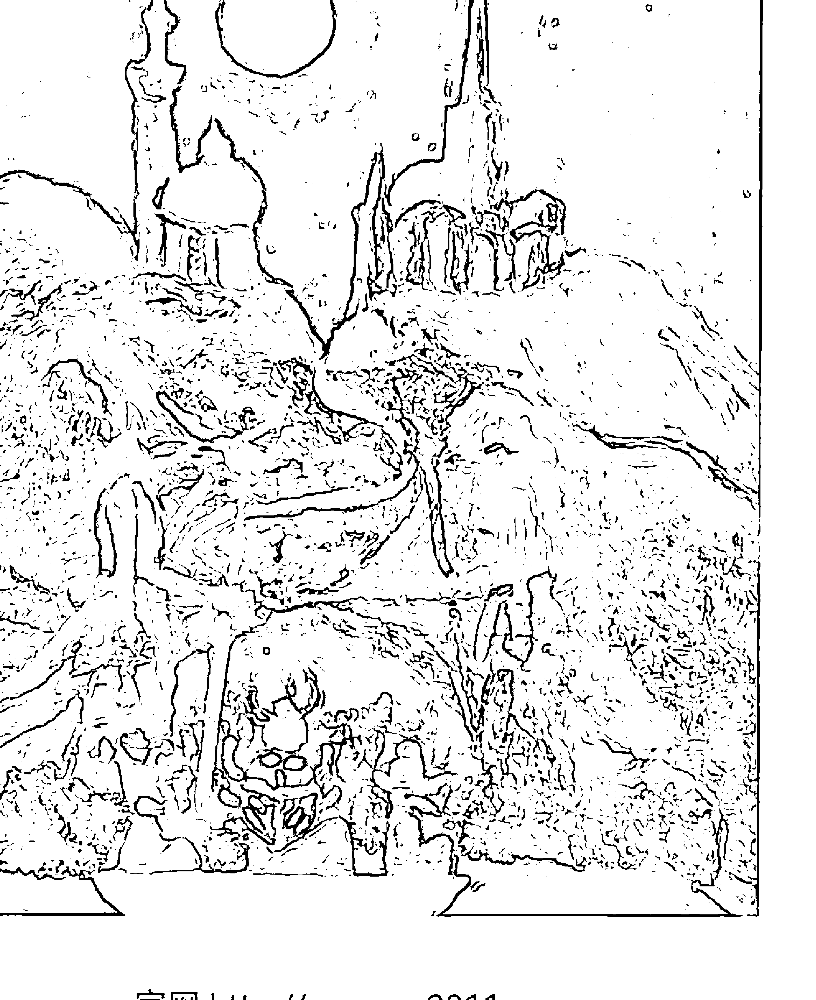

右
「月亮」，阿萊斯特·克勞利，出自巴勒莫收藏品，1920至23年，OTO提供。

# 大阿爾克納

## 愚者

乱嘈杂（tohubohu）——这个用语常被法国人用来描述难以理解的噪音。这是一种响亮、持续且往往令人感到烦躁的声音，无法辨识其来源。该用语源自希伯来语“Tohu wa-bohu”，出现在《创世纪》的开头，被古老的《旧约圣经》用以定义在时间伊始，神尚未创造万物之前太初的混沌和黑暗。

在大阿尔克纳牌所构成的叙事序列中，“愚者”正是这个“混乱嘈杂”，这股原始而未成形的能量是万物的浮现和回归之处。我们的“愚者”与数字0或22有关，它是一张有着几分狂野的牌，在塔罗大牌的象征故事里成为充满动能的开头和走钢索的结尾。“愚者”是炼金术士的原料，接下来依序与牌中的其他原型人物遭遇，这些经验将使他变得形象鲜明，并引领他超越自我。

他像天地初开的霹雳声和宇宙大爆炸那般吸引我们的注意，将我们吸入此后即将遇见的原型人物行列中。在《塔端塔罗》（Tarocchi Fine dalla Torre），我们看见他跳着吉格舞，同时吹着笛子和打鼓。在《索拉·布斯卡塔罗》，这位“疯子”（Matto）在演奏风笛，对于管乐器的才能和热忱，可从他的名称中发现其词源学的溯源。“愚人”（“Fool”）这个字源自用于描述风箱和空皮囊的拉丁文“follis”。在这个脉络下，基于“愚人”是中空的、装满空气和膨胀浮夸的事实，我们可以得出一个贬抑的评价——就像人们说的：“空桶的声响最大”。

“愚者”的呶呶不休使我们想起中世纪的《万愚节》，由于巴黎新教神学会（Protestant Faculty of Theology of Paris）认为这些淫猥的异教活动会危害善良风俗，该节日遂于一四四五年被废除。¹ 以往在一月一日的《万愚节》，人们每年会有一天的时间可以踰越教会和国家所制定的种种规范。从这一整天的颠倒正常和无法无天的狂欢中，我们可以想像“愚者精神”，也就是暂时的疯狂、放荡，以及藐视已确立的秩序。

因此，在《普瓦伊明奇亚特牌》的“莫墨斯”（Momus）牌中，那位全身叮当作响的弄臣装扮成罗马的讽刺和嘲弄之神莫墨斯，他嘲笑诸神，还讥讽宙斯是个爱使用暴力的神明，没有能力克制对女人的淫欲。莫墨斯的毒舌害他被逐出奥林巴斯山（Mount Olympus，希腊诸神居所）。他接下来发生了什么事？在失去奥林巴斯的神位后，他是否变得居无定所，漫无目的地四处流浪？如同莫墨斯，“愚者”不属于任何地方，因此他走到哪里都觉得很自在。

在“悲惨”牌（Misero）和声名狼藉的《让·诺贝雷塔罗》中，“愚者”以穷苦流浪汉的形象出现，这次他的裸露并非一种下流的行为，他那毫无衣物遮蔽的身体表明了他与环境的格格不入。这两

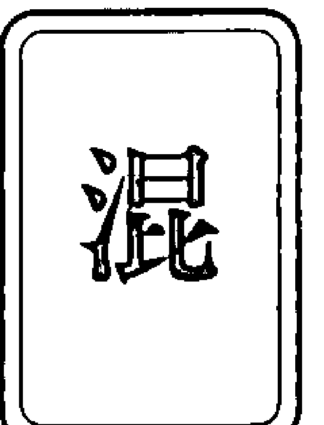

左页
《发笑的弄臣》（Laughing Fool），据称作
者是北尼德兰画家雅各·范·奥斯特沙南
（Jacob Cornelisz van Oostsanen），十六世纪。

个牌中人物的敏感肉体遭受到小动物的攻击，牠们露出犬齿和爪子。第一个人物没有表现出畏缩的样子，他若有所思地凝望地平线，陷入冥想之中。另一个人物则沉浸在狂喜的朝圣旅途，自顾自地继续前进，不受被动物扑咬的影响，仿佛有种使命在召唤他向前。这两人都脱离了现实，更贴近于一种神圣境界。「愚者」那与生俱来、不可思议的智慧让他变成异议份子，促使他游走在社会边缘，他如同身旁的动物那般不受束缚、无忧无虑、未被驯服，他是一个野人。

在《中世纪画家塔罗》中，奥斯瓦尔德·维尔特描绘了某种有点不搭调的生物作为「愚者」的动物寓言，那是一只鳄鱼2，隐藏于一根细长的柱子旁。这位瑞士神秘主义者如此描述该图像：「目光锐利的猞猁追赶着那位没有警觉的流浪汉，来到一根倒转过来的方尖碑旁。碑后方有一只正在等待的鳄鱼，准备吞下注定要回归于混沌的任何事物，这些事物回归成为这个有秩序的世界所赖以诞生的原料。」3

「愚者」的鳄鱼一直以来作为一种寓意图像，直到传说中塔罗的埃及起源被历史给否决。这种狼吞虎咽的爬虫类动物让人想起吞噬灵魂的阿米特（Ammitt，埃及神话中拥有鳄鱼头、狮子上半身与河马下半身的生物），牠是危险的象征，与「愚者」的天真和缺乏经验恰成对比。我们也可以将之视为埃及丰饶之神索贝克（Sobek）的化身（鳄鱼），他从努恩（Nun，埃及神话中原水和混沌之神）的原水中自我创生浮现。「愚者」精力充沛地走向索贝克，我们可以视之为凯斯（Paul Foster Case，二十世纪初美国神秘学学者，著有许多塔罗和卡巴拉书籍）所称「存在先于实际显现的主动法则」4。「愚者」或许天生狂野，或许为狂野而生，他篡改规则、自我嘲弄、失败了然后微笑以对。「愚者」关乎天赐的丰饶而非本能的恐惧，他绝不会跟别人交换一个停下闻闻路边玫瑰的机会。

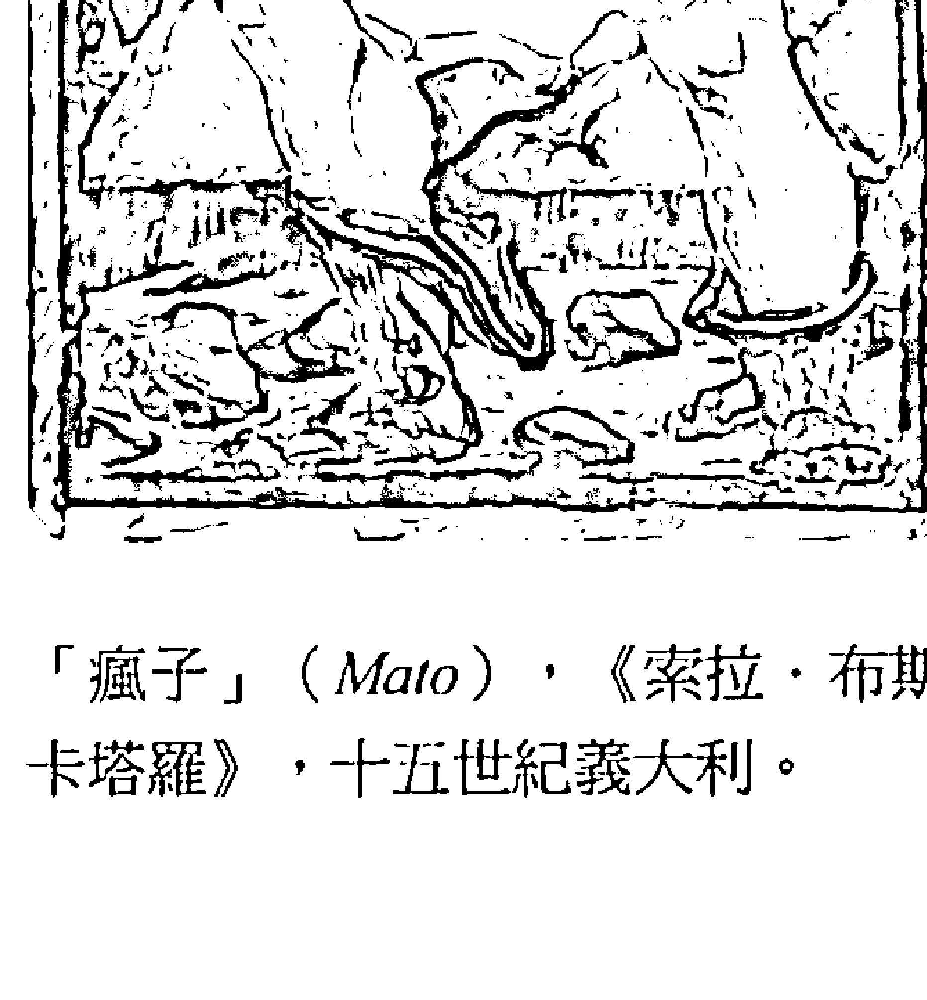

「疯子」（Mato），《索拉·布斯卡塔罗》，十五世纪意大利。

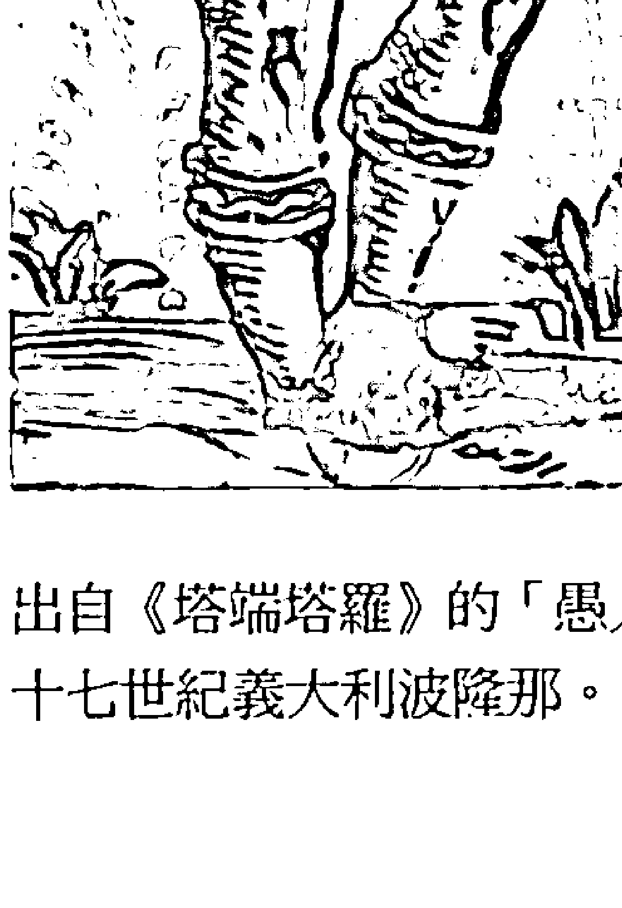

出自《塔端塔罗》的「愚人」牌，十七世纪意大利波隆那。

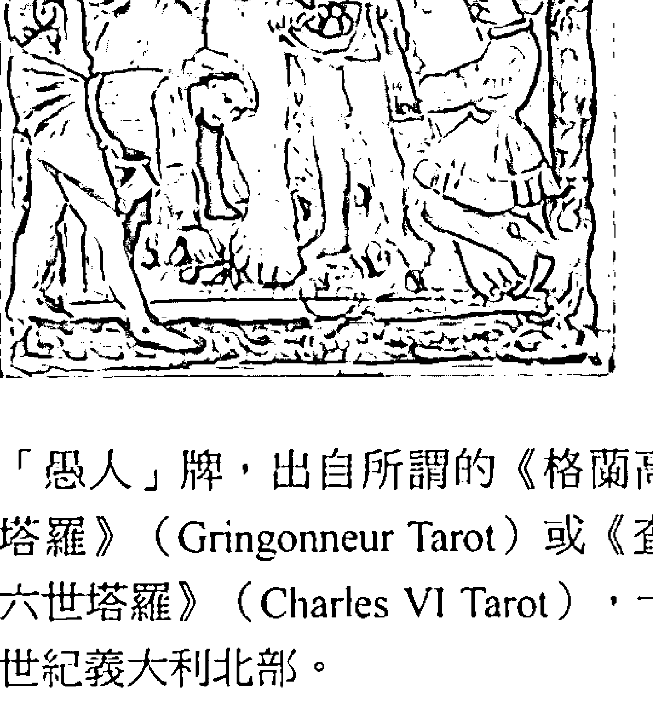

「愚人」牌，出自所谓的《格兰高尼塔罗》（Gringonneur Tarot）或《查理六世塔罗》（Charles VI Tarot），十五世纪意大利北部。

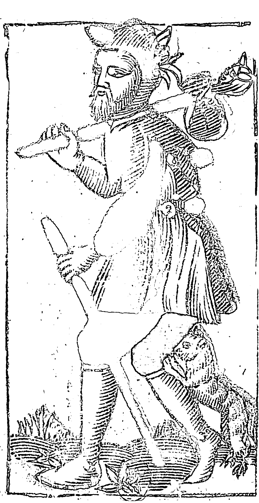

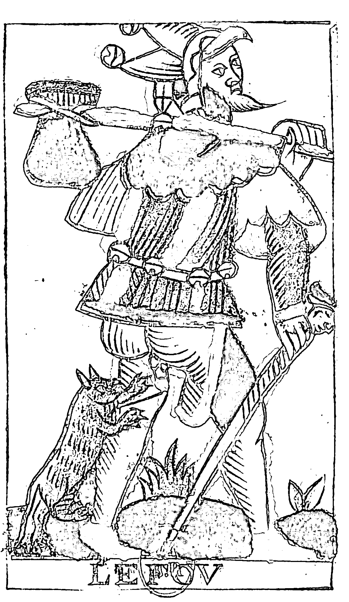

上左
出自《维耶维尔塔罗》的「愚人」牌，十七世纪，法国。
上右
「愚人」，《诺贝雷塔罗》，1659年，法国。

下页·左
「莫墨斯」牌，出自《普瓦伊明奇亚特牌》，冯斯华·普瓦伊（François de Poilly），约于 1712 至 1741 年发行。

下页·右
《小丑与执事的宴会》（La fete des fous et des diacres），出自《跨越时代的巴黎》（Paris a travers les siècles），古尔东·热努亚克（Gourdon de Genouillac），1881 年。

### Momus

### LA FÊTE DES FOUS ET DES DIACRES
(XVIIe SIÈCLE)

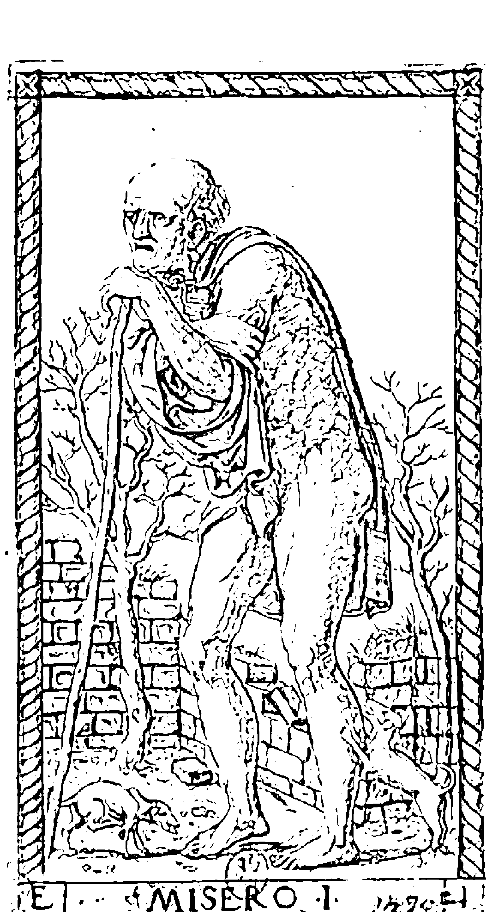

「悲惨」，所谓的《孟特尼那塔罗》(Mantegna Tarot) E系列，由约翰·拉登斯佩德 (Johann Ladenspelder) 雕版，1540至1550年间发行。

左
「愚人」牌，出自《维斯康提－斯福扎塔罗》，十五世纪意大利米兰。

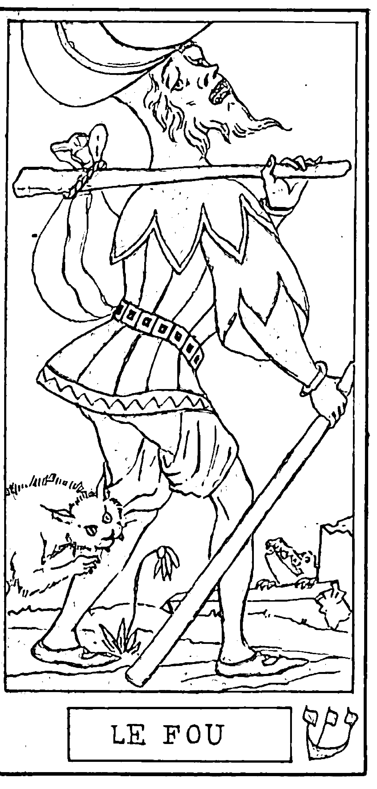

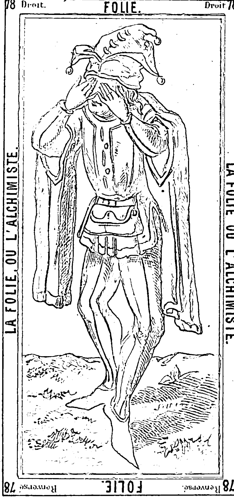

上左
「愚人」，《中世纪画家塔罗》，奥斯瓦尔德·维尔特，1889年。
上右
「疯狂」，或「炼金术士」，出自《夫人大谕大游戏》（*Grand jeu de l‘Oracle des Dames*），由雷加米（G. Regamey）设计，1890至1900年法国。

## 魔术师

在你看见它，接下来它不见了：在这幅据称为波希（Heironymous Bosch，十五至十六世纪荷兰画家，大量使用象征手法）或其助手的一五〇二年画作中，一名街头表演者在繁忙城区的某个角落摆放了一张桌子。那男人的腰带上挂着篮子，里面有一只探出头来的猫头鹰。在中世纪的动物寓言中，猫头鹰象征着欺骗。男人跟前蹲着一只装扮成弄臣的狗，小小的棕色身躯围了一圈铃铛带。他迅速完成布置，在面前的桌上摆好各种东西——平底无脚杯、锥形的杯子、小弹珠（和他手上那颗一样）、一个金色的环、一根小竿子，还有看似不协调的一只小青蛙。

这位魔术师以熟练的手法表演一个把戏，各式各样的观众，包括男人、女人、贵族、商人、孩童和一名修女，慢慢聚集到他的摊子旁。当他用拇指和食指转动弹珠，有个男人不由自主地发生不正常的反应，并呕出另一只青蛙。这件不可思议的事让他反应不及，没有意识到他身后的男人正在偷他的钱袋，只留下挂在腰带上的那把精美的钥匙。

这幅画虽然不是塔罗牌，但它与维斯康提－斯福扎牌组绘制于约莫相同的时期，并描绘相同的文化比喻，目的都在颂扬中世纪后期的想象力。这位魔术师的确与大阿尔克纳的第一位主角有相同的叙事和原型本质，他的英文名称——魔术师（Magician）——稀释掉了它本身的图像根源，也减损了这张牌的含义。传统上，魔术师这个形象包含了更多世俗意义——街头艺人／耍把戏者／工匠／舞台魔术师——他是地位卑微的人，能凭借一整套的巧艺创造出美和一种惊奇感，让观众感到惊叹，并且使人想起变形。

他可能是那种四处流浪的人，很像「愚者」，但他会中断旅程并摆出桌子，设立起一间临时商店。这张桌子是一座舞台，一间视觉经验的实验室，如黑洞般吞噬人们目光的焦点。在桌上，你可以看见他所使用的工具——塔罗的工具——每种都对应了四元素：刀子，象征性的宝剑；树枝或棍杖，权杖；神奇酒杯，圣杯；而弹珠则是钱币。

街头艺人往往与盗贼和旅人之神墨丘利有关。他的姿势为一臂指向下方，一臂指向上方，模仿古典雕像作品中的罗马神祇。有了这样的靠山，我们可以预期我们的主角占有优势，而且具备墨丘利的某些特性。作为骗子，他能扭曲表象，挑战界限。他可以在我们眼睁睁的注视下改变真实。

左页
「魔术师」，〈耶罗尼米斯·波希或他的作坊〉，
1502年，圣日耳曼昂莱市立博物馆（Musee Municipal de Saint-Germain-en-Laye）。

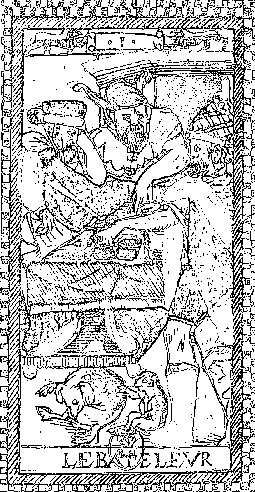

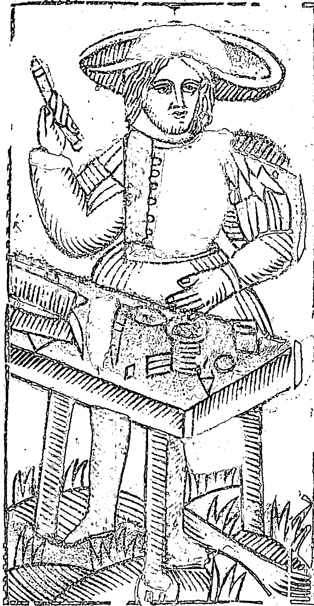

他是塔罗师，负责占卜和解读牌意，这种技能隐藏凸显于飞舞的手势中，并以言语表达一种永恒精妙的艺术形式。他是艺术家和诗人，如同古希腊七弦竖琴手奥菲斯能穿行于两个界域，用站立的身体为导体，有如天线般接受来自其他维度的振动，揭开真实的面纱。他是江湖郎中，也是先知，他的把戏未必是真的，却能产生真实的效果。

如同在波希的画中，舞台上的魔术是受控制的幻象，让奇异的事来戳破我们的现实。如果把戏是假的，那么观众吐出的青蛙却非常真实。埃特拉牌组中，有一张牌显示一位魔术师站在他的魔术道具或者一尊木偶前，这张牌与疾病和治疗疾病有关。魔法表演影响了观众，就这层意义而言，魔术师本身就在呈现一幅塔罗寓意画——一种让内在发生转变、非常诗意的奇观——它是一种启蒙的艺术形式，以挑衅且有时令人不安的方式操纵着象征。在波希的画中，男人吐出青蛙并且被打劫，然而，那把神奇的钥匙依旧在那里。在塔罗中，不管站在桌子的哪边，我们都是在跟灵性事物博弈。只要是塔罗容许我们去见识的，我们便输不了。

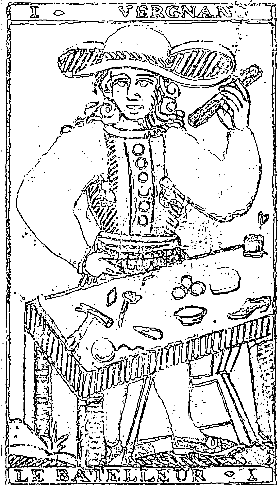

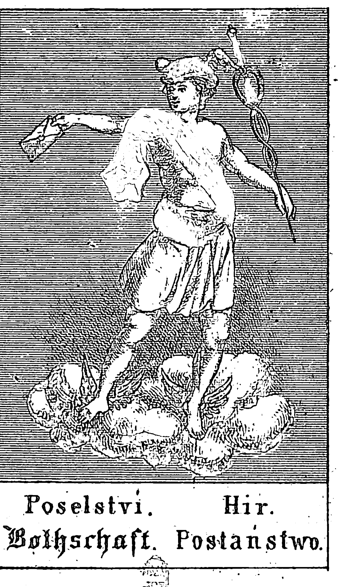

左页，左
从具有特色的棋盘格边缘来看，《不具名巴黎塔罗》(Tarot Anonyme de Paris) 对我而言是易于辨识的。它是过去最非典型的塔罗牌之一，它的大牌富于原创性，极具价值，此外也是十七世纪留传下来少数完整的牌组之一。图中的魔术师相当的非典型，他是从侧面被描绘，而非正对我们。视角的些微改变让观看者见到他与两个观众的互动。其中一个戴着驴耳帽，用手指着桌上他认为藏着球的杯子，而他的同伴似乎被刚刚目睹的把戏给彻底弄糊涂了。

左页，右
《雅克·维耶维尔塔罗》，约创制于 1650 年，画面上是一个典型的马赛街头艺人，加上一张三脚桌、大型双纽线帽，以及用呈现蛇形的双臂连接天与地，沟通两个世界。

本页上左
「街头艺人」(Le Batelleur)，《维尔加诺塔罗》(Vergano Tarot) 的第一张牌，在类型上属于经常援用马赛式塔罗图像的皮埃蒙特 (Piedmontese) 牌，1827 年。

本页上右
「墨丘利」牌，出自 1860 年代的德国占卜牌《上帝之眼》(Das Auge Gottes)。墨丘利被描绘成一名速度飞快的使者，手持节杖，是职掌沟通、预兆和占卜的罗马神祇，时常担任阴间领路人的角色，在此传达他能联系不同界域的概念。如同魔术师，墨丘利也是骗子和演说家。

「墨丘利」，弗朗索瓦·普瓦伊创制的《明切亚特塔罗》第一张牌，发行于1721至1742年。

「江湖郎中」（The Charlatan），出自客厅占卜游戏《象征的神谕》（L'Oracle Symbolique），1890年瓦蒂利奥（Watilliaux）在巴黎发行。

上
「墨丘利」，所谓的《蒙特塞拉特塔罗》E系列第四十二张牌，由约翰·拉登斯佩德雕版，1540至1560年。

上左
「墨丘利」红心杰克，出自1847年由维克多·蓝格（Victor Lange）绘图的《英雄牌卡》（Cartes Héroïques）游戏牌。

上右
「奥德翁」（Odéon），出自某游戏牌的「黑桃国王」，该副牌描绘巴黎不同的剧院，以及十九世纪初期的剧院环境类型。奥德翁，例如奥德翁剧院（l'Odéon-Théâtre），以严格讲究表演而闻名，日后莎拉·伯恩哈特（Sarah Bernhardt，法国舞台剧女演员，担纲演出十九世纪后期到二十世纪初期最受欢迎的法国戏剧）将于奥德翁的某家剧院登台，首度演出拉辛（Jean Racine，十七世纪法国剧作家）的《费德尔》（Phèdre）。图中这位富有魅力的男士在爆炸的烟雾中登场，让观众敬畏有加，这种超自然的演出使人想起魔术师原型的烟雾和镜子特性。

上左
「疾病」（Maladie），《大埃特拉埃及塔罗》，1879至1890年巴黎。

上右
「魔术师或街头艺人」（疾病），《大埃特拉埃及塔罗》，1850至1890年巴黎。

「假先知」（“The False Prophet”）出自埃及式复古的《大埃特拉》牌，1875年在巴黎发行。这张牌编号15，与「忧郁症」和「缺乏先见之明」有关。

《德拉罗卡塔罗》（Tarot Della Rocca），这张双头牌描绘一个相当顽皮又勉强维持清醒的耍把戏者，他举着酒杯而非棍杖。1887年由阿玛尼诺兄弟（Fratelli Armanino）创制，意大利热内亚。

「琐罗亚斯德」（Zoroastro），佛罗伦斯明切亚特牌，1725年，描绘伊朗先知琐罗亚斯德正在举行仪式。

## 女教皇－女祭司

2018年，巴贝多歌手蕾哈娜（Rihanna）现身大都会艺术博物馆慈善晚宴（Met Gala），盛装踏上红地毯。她身穿一套从「教皇」牌获得灵感的服装，包括镶满珠宝的斗篷和超短连衣裙，露出踩着十二吋高跟鞋的双腿。目睹她这身隆重的装扮，有谁能不当回事？在这场天主教主题的时尚盛会中，蕾哈娜撩人的装扮不仅非正式地赢得「最佳服装」¹，也在炫丽的哗然争议中引发了骚动。蕾哈娜一夜之间改造了西方世界最重要的精神领袖之一、罗马天主教教宗的标志，并利用机会创造出她自己的象征性服装，而这种服装在此前的许多个世纪，只有白人男性穿过。

如此强有力的形象令舆论界震惊、倾心和着迷，我也不例外。她浑身散发权威的魅力，从容不迫、大步跨上大都会艺术博物馆的红色阶梯，与摄影机保持坚定的目光接触，迷死了眼前的一大票摄影师。她大胆的服装造型和随后引发的喧腾十分有趣，立即使我想起塔罗女教皇／女祭司的格言。这张牌是许多读者最喜欢的牌之一，编织出与蕾哈娜禁忌的外表完全相同的文化矛盾——女性、智慧和权力的爆炸性碰撞，证实了家父长秩序中的女性神秘。

历史上在塔罗中被称作「女教皇」的这个女性人物是谁？她后来如何变成「女祭司」？她的身份、角色和重要性一直令许多学者着迷，也使得她成为大阿尔克纳中最富争议性的人物之一。她首度出现在十五世纪的意大利王牌中，被描绘成一名穿着宗教服装的女子，戴着教皇冠冕，即便在今日我们现代人的眼中看来，似乎也显得不适宜。直到如今，梵蒂冈统治集团里仍然没有女性的位置，这样的形象让人感觉格格不入。女教皇显然让人想起「教皇琼安」（Pope Joan）的迷人传说，这个传说在中世纪晚期的欧洲日益受到欢迎。

传说是这么说的：第九世纪时，这位博学的女子成功地假扮男人，一步步往上爬，最后被推举为教皇。她的托辞据说维持了好几年时间没被拆穿，直到某天，身怀六甲的女教皇在行进的队伍中分娩，让身旁的红衣主教们大吃一惊，或者应该说是惊恐万分。「教皇琼安」的故事在中世纪手抄本中大量被描绘作为插图，但这似乎并不合适。早期的王牌是受意大利北部贵族的委托而绘制，我们难以相信目的是为了嘲弄罗马天主教当局的正当性。更可能的情况是，这位戴着三重冕的少女代表了拟人化的「教会之母」，是虔信教徒的保护者和养育者，或者这是意大利教堂里一幅罕见的「信仰」寓意画。

> > 左页 蕾哈娜于2018年5月7日参加大都会艺术博物馆慈善晚宴，庆祝「天体：时尚与天主教想象」展（*Heavenly Bodies: Fashion and the Catholic Imagination*）的开幕。（照片由 John Shearer 拍摄／Getty Images 提供给 *Hollywood Reporter*）

直至十九世纪，塔罗「女教皇」的配备并无太多的改变，她总是戴着具有特色的教皇冠，通常手里还拿着一本书。

在《维斯康提·斯福扎塔罗》，蓝色的书是画面焦点，紧紧握在她手中，仿佛为了表明她不仅是知识的保卫者，也监督知识的取用。透过《马赛塔罗》原型，「女教皇」图像在十七世纪巩固了下来，她不仅手持书本，而且还认真地阅读，大大的书本摊开在膝上。当我们注视她时，几乎感觉会打断她的阅读，那是一种经年的仪式、孕育想法的冥思。她抬起头，但不是在看我们。神秘的「女教皇」令人生畏且难以窥测，她的难以亲近使她更教人信服。她脱离常规、颠覆欢愉和母性，她的女性气质挑战了社会对她和一般女性的期待。她饱读书中的难解之谜，成为孕育神圣知识的容器，她的亲切只保留给灵性、直觉和秘传的事物。

在她身后，卷曲环绕的帷幔张开在两根柱子之间。这些图像细节，以及十八世纪秘传圈子里所发展出来、关于塔罗源起于埃及的想法，最终将导致「女教皇」被诠释为乔装的伊西斯（Isis，埃及神话中农业和生育女神）。她的三重冕逐渐被新月形头饰给取代，并透过反射来产生照明。她变成跨越两界的女性人物，是普西芬尼式的存在，不同于凡尘俗世里的教皇。她能来去于不同的世界并提供启示，她不只是精通神秘仪式的学者，还变成神圣领域的守门人，从而让人类经验与神产生了连结。共济会的传统宣称她的柱子为雅斤（Joachim）和波阿斯（Boaz），那是所罗门圣殿入口的两根柱子，使她成为两极之间的中心点。她以非现实的方式揭开帷幕，让感知在客观和主观之间摇曳。

从这点来说，在十九世纪和二十世纪初期，当她找到新的象征身份而成为「女祭司」，她的身体已然丧失了实质的密度。在莱德-韦特-史密斯塔罗中，这位月亮女先知只是一个坐在立方体上的躯体，从瀑布般流动的灵质长袍中升起。她坐镇于她所守护的圣殿，手持圣律，当我们注视她，我们看见的是一个虚影，一幅精神的全像图，如同韦特的描述，她是为上帝以女性示现的「神之显现」（Shekinah）²，以及「大阿尔克纳中最崇高和最神圣的一张牌」。³

# 右页

「女教皇」，出自《维斯康提一斯福扎塔罗》，据称为博尼法乔·班波（Bonifacio Bembo）所作，约1450年。

这张维斯康提一斯福扎塔罗牌描绘的「女教皇」是谁？这个问题困惑着许多塔罗学者。纽约图书馆员莫克利（Gertrude Moackley）通过她影响深远的研究，首度摒除了「乔装的伊西斯」理论，从信史中追溯图中的形象，结果在迂回曲折的维斯康提家谱中找到「麦芙烈达·皮罗瓦诺修女」（Sister Maifreda di Pirovano）这个名字⁴，这位被指控信仰异端邪说虔信女子被烧死在火刑柱，只因为她所掌控的一个基督教宗派质疑了教皇的价值观。史密斯（Sherryl E. Smith）在某篇精彩的文章中提出看法⁵，认为这张牌描绘的并非麦芙烈达，而是她所信奉的对象，一位名为「米兰的古列尔玛」（Guglielma of Milan）的十三世纪熙笃会（Cistercian，一个改革派的天主教修会）修女，她因为具备领袖魅力和虔诚信仰而受人敬重，被视为女圣灵。这张牌收藏于纽约摩根图书馆（Morgan Library）。

「教皇琼安」的分娩。木刻画，出自薄伽丘《名女人传》（*De Mulieribus Claris*），海因里希·史泰因霍韦尔（Heinrich Steinhöwel）德文译本，约翰内斯·蔡纳（Johannes Zainer）在德国乌尔姆发行，约1474年。大英博物馆馆藏。

「信仰」：《维斯康提·迪·莫德隆塔罗》（Tarocchi Visconti di Modrone）中所描绘、连同「慈善」和「希望」在内的神学美德之一。这副牌的作者据称为博尼法乔·班波，时间是1460年代。「信仰」被描绘成采坐姿的寓意人物，跟前有一名国王。她的金色服装几乎与同样金碧辉煌的背景融合在一起。她左手持一根权杖，右手指向天空，圣餐杯和圣餐在她身旁飘浮。这张牌卡收藏于美国康乃迪克州纽哈芬市耶鲁大学，班内基善本与手抄本图书馆（Beinecke Rare Book and Manuscript Library）。

「信仰」，原始文艺复兴大师乔托·迪·邦多纳（Giotto di Bondone）描绘的七大美德之一，出自意大利帕多瓦（Padua）的斯克罗威尼礼拜堂。

勒诺曼牌封套，1868年，法国国家图书馆馆藏。这张勒诺曼牌暗示「牌卡占卜者」可能是「魔术师」与「女祭司」的共生体。「牌卡占卜者」在召唤宇宙能量，并以第一张大阿尔克纳的著名手势触碰桌上的牌卡，她站在一大片天鹅绒帷幔前，守护着两界之间的世界。

这张「女教皇」之所以特别，有许多原因。它在1839年发行，是出身马赛的塔罗牌大师苏珊·博纳汀（Suzanne Bernardin）的作品。她的作品常与尼古拉·康威（Nicola Conver）塔罗相提并论，然而博纳汀的「女教皇」呈现一个非常独特的图像手法：她身后有个用绿水墨水上色的半圆形，这个细节是其他马赛式塔罗没有的。这个圆形后来被邪典电影导演暨塔罗学者亚历杭德罗·霍多罗夫斯基诠释为一颗蛋，并且完全复制到他与梅松·卡穆安（Maison Camoin）一同创制的牌组。这颗蛋藏在正在偷偷孵蛋的「女教皇」背后，让人想起怀孕的主题，以及与怀孕所意指不可阻挡的积累。

双头意大利塔罗，由亚历山卓·维亚索纳（Alessandro Viasonne）设计，1888年在杜林发行。

「朱诺」，《贝桑松塔罗》（Tarot de Besançon），十八世纪晚期法国。法国大革命期间，随着政权和当权者的更迭，牌卡制作者从他们的牌中抹去了罗马教皇人物的参照，改以罗马神祇取代：朱诺（Juno，罗马神话中司婚姻的女神，朱比特之妻）代表「女教皇」，而朱比特代表「教皇」。

波希米亚人塔罗（Le Tarot des Bohemiens），此为作者帕普斯·迪维尔（Durville）于1911年发行的第二版。牌卡图案由让-加布里埃尔·古利纳（Jean-Gabriel Goulinat）设计。

「圣殿」，罗伯特·法尔科尼耶 (Robert Falconnier) 的《奥秘塔罗》 (Hermetic Tarot) 的第二张牌，奥图·韦格纳 (Otto Wegener) 设计，1896年。

「圣杯皇后」，出自十九世纪晚期创制的西班牙游戏牌《神秘巴哈拉》 (Bajara Mistica) ，呈现嬉戏玩乐中的修女和神父。

莱德-韦特-史密斯塔罗的「女祭司」，由亚瑟·爱德华·韦特予以概念化，潘蜜拉·柯尔曼·史密斯设计，1909年。「女祭司」背后的帷幕在两根柱子之间展开，上方出现了石榴，使得这个背景与普西芬尼神话产生了联系。

「女祭司」，《贫民区塔罗》 (Ghetto Tarot)，创作者为爱丽丝·斯梅茨 (Alice Smeets) 和艺术团体「反抗的艺术家」 (Atis Rezistans)，2015年。这个惊人的女祭司版本是在向潘蜜拉·柯尔曼·史密斯的作品致敬，如流水般的女祭司凭借她的存在感，将一切变得朦胧。

右页
戴着三重冕的女子，这个因为让人感觉难以亲近而常被色情化的人物，作为一系列诉诸感官的短篇故事《巴登浴场》 (Les Bains de Bade) 的卷头插画。故事作者为颓废派作家勒内·布瓦莱夫 (René Boylesve)，由阿尔芒·拉森福斯 (Armand Rassenfosse) 绘制插画，1911年。图片由博杜安国王基金会／菲利浦·福马诺工作室 (King Baudouin Foundation/Studio Philippe de Formanoir) 提供。

## EMBLEMA II. De secretis Natura:
## Nutrix ejus terra est.

## PIGRAMMA II.

Romulus hirta lupa pressisse, sed ubera capræ
Jupiter, & factis, fertur, adesse fides:
Quid mirum, tenera SAPIENTUM viscera PROLIS
Si ferimus TERRAM lacte nutrisse suo?
Parvula si tantos Heroas bestia pavit,
QUANTUS, cui NUTRIX TERREUS ORBIS, erit?

C Apud

## 女皇

说，罗穆勒斯（Romulus）是由母狼哺育长大，而朱比特是由山羊哺育长大， 如果这些传说被塑造成可信的事实，那么我们是否也能相信，并且声称地球用 它的奶水哺育了温柔的「哲学家之子」？如果一只无足轻重的动物能哺育出如 此伟大的英雄人物，那么，有地球当奶妈的人，岂能不伟大？1

「地球是他的奶妈」（“Nutrix Ejus Terra Est”），在《亚特兰妲奔逃》（Atalanta Fugiens）第二幅插画上方有以上题词。米夏埃尔·迈尔（Michael Maier）在他这本著名的象征图画书中，利用图像、音乐和诗来描述炼金术的过程。这幅手工着色的插画显示了以婴儿为象征的元素，在变形成为哲学家之石的早期阶段吸吮着地球乳房，以喻获得了哺育。在这个惊人的描绘方式中，自然被拟人化，显示成女性的滋养力量，这个概念将在稍晚重新出现，成为「女皇」。

在《维斯康提·迪·莫德隆塔罗》中，「女皇」显得年轻亮丽，拥有玫瑰花瓣般的嘴唇，身着光芒四射的纯金长袍。她坐在宝座上，头戴王冠、手持权杖，身旁有四位年轻的侍从。其中两位穿着相称的红袍，在画面中被抬高位置，位于女皇美丽的脸庞两侧，另两位站在她跟前祈祷，朝她膜拜。他们是她的孩子或仆人？其中一位刻意指着铸在她盾牌上的帝国黑鹰——这是代表罗马帝国的纹章标志——提醒我们，我们不应因为她的美丽和温和的态度而搞错重点。毫无疑问，她是当权的女子，她的角色再清楚不过，因为她手持王权象征物——她是一位政治人物。

从创制这张牌的历史脉络来看，这代表她通过婚姻创造出足以维持两国间和平的强大政治联盟。 这个如此身份地位的女子藉由替她的皇帝配偶提供一个儿子，来确保她对王朝的持续影响力，在两个政治氏族间维持并巩固共生的关系，同时连结起她整个家族的过去和未来。权力从她的子宫里成形，在世界中兴盛发展，届时她便是一名政治主妇，这个概念对现代人来说难以理解，而且相当不浪漫，却深植于十五世纪意大利北部人士的心中。

然而在这副牌中，「女皇」被描绘成温柔和卓越的女族长，不过她还碰见了另一个「母亲」，一个象征性的母亲，以「慈善」寓意画的样貌呈现。这个寓意人物的乳房从花团锦簇的服装裸露出来，正哺育一个站立的孩童，表明了阿奎那（Saint Thomas Aquinas，欧洲中世纪经院派哲学家和神学家）所公布的七个神学美德之一，当中爱、保护和关心别人，被视为奉献上帝的一种形式。

左页 《亚特兰妲奔逃》（Atalanta Fugiens） 的第二幅象征图，作者为米夏埃尔·迈尔（Michael Maier） 绘制插图。1618年约翰·特奥多尔·德布里（Johann Theodor de Bry）出版商于德国奥本海姆发行，法国国家图书馆馆藏。

在整幅图像中，“女皇”和她的原型化身徘徊于上述两个受到外在世界所支配的女性面向之间，与她的姐妹“抽象事物的主宰者”（Sovereign of the Abstract）“女教皇”分庭抗礼。“女教皇”沉默无语、空灵飘逸且深不可测，但“女皇”则心胸开放、主动积极、热心肠且可以亲近。在《马赛塔罗》，我们看见她正面朝前、坐在宝座上，用严厉的目光看穿我们，对比于莱德-韦特-史密斯版本，画面中的她优雅淡然地倚着宝座，背后舒服地垫着色彩鲜艳的靠枕。

后者这种性感的描绘方式，同如塔罗学者玛丽·格里尔所指出，灵感可能来自1338年洛伦泽蒂（Ambrogio Lorenzetti）绘于西恩纳（Siena）市政厅的壁画《和平寓意画》（Allegory of Peace）。画中穿着半透明白袍的女子手持橄榄枝，头顶上写着“PAX”，可认定她是一位调停者。在《不具名巴黎塔罗》，活力充沛的女皇在起伏的山坡上疾走，手里紧握着权杖。无论身负何种任务，她都积极投入，脸上露出微笑。为了妥善统治国家，你得处事圆滑、维持和睦，这便是“女皇”所扮演的角色。

十八世纪发生了微妙的图像变化，或许因为有几个欧洲国家开始厌恶君主政体，因此这位贵夫人失去了她的象征性领导权。这位象征的母亲似乎在某些牌中乔装易容，跟“女皇”搭上了线，或干脆取而代之，成为大牌中的女性领导者。她们在牌中称作“慈善”、“夏娃”、“爱”或“自然”，总是被描绘成太古人物，或裸体、或袒胸露背，她们在哺育孩童，甚至拥有好几个乳房，像是母狼和跨物种的褓姆，喂养着古代世界神话里的英雄和诸神。

“自然”牌（La Nature）中的图像让人想起以弗所的阿特弥斯（Ephesian Artemis），她是掌管荒野和生育力的女神，以弗所人膜拜她以祈求获得保护和粮食。她的胸部是由许多乳房状的突起所构成，其光滑程度使得考古学家相信，它们可能代表公牛的睾丸而非乳房。这位身上塞满种子的女皇包罗万物，身为女造物者，她体现了大自然的滋养力，她是狂野的女爱神，结合我们这个世界的复杂化学元素，培养并诞生了形形色色的事物。

二十世纪初，韦特和柯尔曼结合女性的这两个表现，使得“女皇”成为她此后努力争取的形象。一方面，她如同她的意大利先祖“公正命令的皇后”（Queen of Fair Command），一个慈悲的统治者和有爱心的保护者，她的盾牌上有金星标志。另一方面，她是狄蜜特（Demeter，希腊神话中司农业、丰饶和婚姻的女神）式的人物，是我们这个可见、可触知世界的构成元素的灵魂和源头。她身穿石榴图案的衣服，上面的每颗种子清晰可见，承诺她所能产生的一切辉煌——生生不息的生命奇迹。

# 右页
“女皇”，出自《维斯康提-斯福扎塔罗》，据称为博尼法乔·班波所作，约1450年。

在《中世纪画家塔罗》，奥斯瓦尔德·维尔特首度引进天主教图像中的象征元素，使他的“女皇”——星星王冠、在她左边的白百合和脚下的新月——与圣母玛利亚产生了关联，成为“基督徒的无玷圣母，希腊人会从而认出那是他们的维纳斯-乌拉尼亚（Urania，维纳斯的别称），从黑暗的狂涛巨浪中光芒万丈地诞生。”这些新的图像元素源自圣约翰的《启示录》，当中“启示录中的女子”圣母显现，“一个妇人身披日头，脚踏月亮，头戴十二星的冠冕。”

这位急匆匆、忙个不停的“女皇”身穿洋红色服装，在山槛间奔跑，使我们想起“女皇”是有行动力和采取主动的人。出自《不具名巴黎塔罗》，巴黎，约1650年，法国国家图书馆馆藏。

寓意人物“和平”（Peace），出自一系列的三幅壁画《好政府与坏政府寓意画》（Allegory of Good and Bad Government）局部，1339年安布罗乔·洛伦泽蒂绘于意大利锡耶纳市政厅。这些画是接受锡耶纳共和国九人委员会的委托而制作，目的是在委员会成员间激发身为市民的道德责任感，提醒他们在替全体市民做出重大决定时所冒的风险。

这张没有名称的《贝桑松塔罗》牌被抹去了王冠和用花装饰的盾牌，于1794年发行，时间就在法国大革命和废除君主立宪政体之后。如同该时期的许多牌组，寓意牌卡上的贵族标志会遭到审查，而且常被称作《革命游戏》（Jeu Révolutionnaire）以显示图像的变化。法国国家图书馆馆藏。

“女皇”和“慈善”牌，出自不齐全的《维斯康提·迪·莫德隆塔罗》，通俗的说法是“卡瑞-耶鲁”（"Cary Yale"）牌组，它的六十七张牌目前保存于耶鲁大学的班内基善本与手抄本图书馆。该牌组创制于十五世纪中期，连同《维斯康提·斯福扎塔罗》，被认为是包含成套王牌的最早期塔罗牌之一。据推测，《维斯康提·迪·莫德隆塔罗》是受菲利波·马利亚·维斯康提（Filippo Maria Visconti）的委托而制作，由意大利画家暨壁画艺术家博尼法乔·班波绘图，他为维斯康提家族绘制了无数的肖像画。

《普瓦伊游戏》（Jeu de Poilly），牌中女子手里牵着一个孩子，同时正哺育着另一个孩子，以传统但温柔的方式描绘神学美德“慈善”。此为冯斯华·普瓦伊所创制的明奇亚特牌组，时间为1712至1741年。法国国家图书馆馆藏。

类似“女皇”的人物，在这幅牌中称作“大妈妈”，此为冯斯华·伊斯纳尔（François Isnard）在法国大革命期间的雕版作品。这位女性人物被剥除了王冠，但仍手持一面盾牌，变形成为保护人民的母亲。法国国家图书馆馆藏。

“微笑的女皇”，出自手工着色的意大利牌组，约于1860年在意大利米兰发行。法国国家图书馆馆藏。

左“慈善”——与慈善美德有关的另一张寓意牌，出自所谓的《孟特尼那塔罗》。图中的人物一手揹着胸口，另一手倒空了一袋钱币，以证实她的慷慨。与此形象有关的“发育”图像隐藏在左下角的鹌鹑图中。在这个经常被用于基督教图像的主题中，鹌鹑妈妈会用喙刺穿胸口，将血喂给幼鸟，为了不让幼鸟挨饿而不顾自身安危。“慈善”为《孟特尼那塔罗》第三十八张牌，属于E系列，约在1540年代由约翰·拉登斯佩德发行。法国国家图书馆馆藏。

第一个女人“夏娃”在伊甸园里，画面呈现出一派田园风光。《夫人神谕大游戏》，绘于1890年代后期。

“女皇”倚在柔软的宝座里，她是母亲，也是和平的保护者。置身金色的小麦田，“女皇”处在早期塔罗的“政治的母亲”与“象征的母亲”的十字路口；后者是自然的丰饶及养育力的象征。这张“女皇”牌出自莱德一韦特一史密斯塔罗，由亚瑟·爱德华·韦特委托制作，潘蜜拉·柯尔曼·史密斯负责设计。该副牌于1909年首度发行。

“野女人与独角兽”（"Wild Woman and Unicorn"），这是十五世纪某游戏牌卡，出于不具名的德国艺术家之手，大都会艺术博物馆馆藏。她身披柔软毛皮，只露出手、脚和赤裸的胸部。野女人在中世纪德国是受欢迎的寓意形象，她们被认为是原始的森林精灵，经常淘气地恶作剧，有时被描绘成在哺育“野孩子”，例如在马丁·绍恩高尔（Martin Schongauer）著名的纹章盾。野女人与生育力有关。

出自《算术游戏》（*Jeu Arithmetique*）的“自然”牌，由布夏尔（Bouchard）设计，1820到1830年。

“以弗所的阿特弥斯”与吹排箫的牧羊人。诺维利（P.A. Novelli）蚀刻，十八世纪，伦敦惠尔康收藏品（Wellcome Collection）。这幅田园景象让人想起以弗所的阿特弥斯膜拜仪式，图中显示一名男子在阿特弥斯塑像前吹奏排箫，自然的生育力弥漫于不同的蔓藤花样。构成阿特弥斯身体的圆柱上呈现着种种哺乳动物的形象，上面有两头立于她手上的狮子。

动物褓母！一张相当诙谐的牌，出自1840年代的德国牌组《颠倒世界》（*Verkehrte Welt*），描绘一头拟人化的豹穿着女仆装，在新古典主义风格的卧室里照顾人类孩子。

## 皇帝

佬能量！她是“皇帝”，肯定是“皇帝”！某次我的一位学员看着迪斯可和新浪潮巨擘葛瑞丝·琼斯（Grace Jones）的肖像，高兴地大声宣布，这张照片是葛瑞丝的伴侣古德（Jean-Paul Goude）在大约四十年前替她拍摄的。这幅超大的图像出自一本摊开的书，我们大伙儿从高处鸟瞰这幅图，当时我们正在玩一种自由联想游戏。这是我很喜欢的游戏活动，玩法是让学员根据自己对于形状、颜色、对象所做的象征性联想，以及细节中浮现的意义，找出与之相匹配的一张或数张塔罗牌。照片中的葛瑞丝·琼斯穿着一件散发八○年代庄重氛围的有垫肩黑色外套上装，全身的装扮完美地映衬她直角造型的发型。她直视我们的双眼，似乎在逼问我们，严厉的目光与她的魅力相得益彰。她的脸稍稍转向，嘴里叼着一根未点燃的香烟，整个人散发出强大的气场。该图像是由许多以完美的九十度角相交的线条所构成，除了外套上往下露出胸部弧线的V字形开叉外，整个形象彻底粉碎我们对于性别的预期。

除了“皇帝”牌，还有什么牌能与葛瑞丝·琼斯如此完美地相配？她是出了名的不爱循规蹈矩，只遵从自己的决定，所以拥有这样一种挑衅意味极浓的阳刚形象是再适合不过的事。这种概念也在寇特妮·亚历山大（Courtney Alexander）独特的《尘 II 编玛瑙塔罗》（Dust II Onyx Tarot）中的“酋长”（Chief）牌被赞颂着，它提醒我们，在性别角色和属性一分为二的塔罗世界，事情远比表面上看起来有弹性得多。

在所谓的《查理六世塔罗》“皇帝”牌，手中的皇帝权杖和金球是用来表明他的政治职责，他也穿着看起来不太相称的古怪服装。他的上半身披戴全套的盔甲，但腹部以下却是一袭垂地的蓝色长袍。可说是上半身英武威猛，下半身轻松随意。眼前两个形体较小的人物映衬出他较为柔软的面向，我们不妨想象这两人是他的子女。

皇帝权力与超越君权的至高权威是在意义上相同的概念，这是一种制定规则和领土范围的权力。在战争与征服的历史中，还有在不顾一切追求绝对霸权的渴望里，我们都见识过这种权力的膨胀。然而我们会发现，塔罗的“皇帝”是相当不同的，不应只将他视为身任家长的君主和滥用统治权的政治人物。尽管他常被描绘成身着胸甲，但并未佩带任何武器，而且已经被比作一名保护者，而非好战者。“皇帝”与马尔斯（Mars，罗马神话的战神）有关联，他虽然嗜血但很谨慎，他的胡子证实了他的年纪和经验，这些迹象给予我们线索，说明经验如何让他放下复仇的本性。他善运逻辑和策略，是讲求理性的人，也是以身作则进行统治的领导者，他明白提供安全感和维持存续是他的职责所在。

许多世纪以来，“皇帝”牌的造型几乎没有改变：在马赛牌组，他的男性威严展现在光秃秃的背景中，我们看见他倚着皇帝盾牌，一旦发生紧急事故，随时准备一跃而起。本质上他是个行动派，摆出朝右（“主动”边）的姿势，散发权威的气质。

在《让·多达尔塔罗》（Jean Dodal Tarot），牌中的数字四出现了两次，分别为罗马数字的“ⅢⅢ”和阿拉伯数字“4”。牌中为何会有多余的标记？我们可以推测，图中人物自然是呼应着“皇帝”的象征性特质。在《塔罗之道》（Way of Tarot）中，邪典电影导演暨塔罗学者亚历杭德罗·霍多罗夫斯基将数字四解读成“物质安全的象征”。他解释：“桌子或教堂祭坛的四条腿与数字四有关。四不会倾倒，除非发生革命性的剧变。”这个数字当然得藉由“皇帝”夸张的叠腿动作来强调，整个身体往往构成数字4的形状，这个招牌姿势在《托特塔罗》表现得最为夸张。牌中“皇帝”的一只脚稳稳踩在地上，吸取大地的能量，这种稳固性展现强大的威吓力，同时又教人感到放心。

在《奥斯瓦尔德·维尔特塔罗》，“皇帝”的宝座被一个立方体给取代，使我们想起克卜勒（Johannes Kepler）的正多面体研究。在他的著作《宇宙奥秘》（Mysterium Cosmographicum）中，这位德国天文学家阐释柏拉图立体（即正多面体）与元素之间的柏拉图关联。他的立方体与土元素有关，其中的三个面呈现一株根植于土地的树、萝卜、十字锄和瓦罐等用来耕作的农具。维尔特的“皇帝”坐在他的立方体台座上，提醒我们他不是一位全能的造物主，顶多管辖着有形世界的有限领域，他的统治仅及于看得见的领域，而非精神世界。他严厉且强大，看起来像一座沉睡中的火山，以合理的接地姿势平衡他的破坏力。

### 上
两张“皇帝”牌，出自意大利佛罗伦斯发行的明奇亚特牌，作者为彼得·阿立果（Pietro Alligo），1725年，二十世纪时大量发行成为曼内格罗与史卡拉比欧（Il Meneghello and Lo Scarabeo）的《伊特鲁利亚明奇亚特》（Etruria Minchiate）。他们通常被称作“东部皇帝”和“西部皇帝”，让人想起罗马帝国历史的一段插曲：西元289年，戴克里先（Diocletian）皇帝将领土一分为二，擢升马克西米安（Maximian）为奥古斯都（Augustus，罗马皇帝的称号），授予他控制帝国西半部和戍卫东部的霸权。

伫立于原野中，罕见地身着全副盔甲的“皇帝”。他的红色斗篷稍稍遮住了鞘中的剑。出自《不具名巴黎塔罗》，十七世纪。

“皇帝”，出自冯斯华·布利翁创制的《马赛塔罗》，约1760年。

《维斯康提·迪·莫德隆塔罗》的“皇帝”牌极似西吉斯蒙德 (Sigismund) 皇帝的浮雕像，他那具有特色的双股胡子出现在他的许多肖像中，包括在他死后由杜勒 (Albrecht Dürer，德国文艺复兴时期著名画家及艺术理论家) 绘制的一幅肖像画。西吉斯蒙德于1431年接受伦巴底铁王冠 (Iron Crown of Lombardy)，我们可以看到这个细节也被描绘在牌中：他跟前的一名男童捧着第二顶王冠。西吉斯蒙德亦于1437年由教皇安日纳四世 (Eugene IV) 授予“神圣罗马皇帝”称号，使他成为担任最高国家元首的第一人，统治权大于欧洲其他天主教国家的君主。从这张牌我们可看见帝国鹰在西吉斯蒙德头顶上展开黑色的双翼。

粉红色胸甲和王冠，《贝桑松塔罗》中以蚀刻方式精心描绘的“皇帝”，由皮耶·伊斯纳尔 (Pierre Isnard) 发行，1746至1760年。

“皇帝”牌，戈代 (J. Gaudais) 于1860至1889年间发行的双头牌。

# 右页
神圣罗马皇帝西吉斯蒙德，作者为阿尔布雷希特·杜勒，1511至1513年，德国纽伦堡日耳曼国家博物馆 (Germanisches Nationalmuseum) 馆藏。

出自所谓的《查理六世塔罗》中的“皇帝”牌，《查理六世塔罗》也被称作“格兰高尼”牌。这副手绘牌卡的作者曾被误传为雅克·格兰高尼，他是受雇于查理六世国王的中世纪画家，在1392年创制了几副“金色牌组”。事实上，这些保存于法国国家图书馆、独特性高、可惜不齐全的牌组，可能出自十五世纪的意大利北部。

出自帕普斯的《波希米亚人塔罗》的“皇帝”，复制了之前的马赛塔罗的姿势，穿着古埃及帝王服装，包括象征统治上埃及和下埃及的双重冠。帕普斯描述双重冠的意义为“表示顺应神旨的统治”，而置于头饰正面的鹰则代表“创造生命是普世的作为”。

## 皇帝

4 和 IIII，出自让·多达尔牌组的双数字马赛式“皇帝”牌，法国里昂发行。

“红皇帝”全身着军装，坐在立方形宝座上，出自《奥斯瓦尔德·维特塔罗》，被描述成统治“有形物质事物”的“尘世王子”。

“中国皇帝”，出自为了出口到交趾支那（Cochinchina，中南半岛的历史地名，位于现今越南南部）而创制的牌组，1870年在法国马赛发行。

“衰老的皇帝”和他茂密的白色胡子，出自牌卡形状瘦长的《塔端塔罗》，十七世纪在波隆那创制的意大利塔罗牌。

出自意大利的双头塔罗牌，属于《索普拉菲诺塔罗》（Soprafino Tarot）的变种，由阿玛尼诺兄弟于1887年在意大利热那亚发行，由卡洛·德拉·罗卡（Carlo della Rocca）设计，这张牌卡已经稍微变色。

## 教皇－祭司長

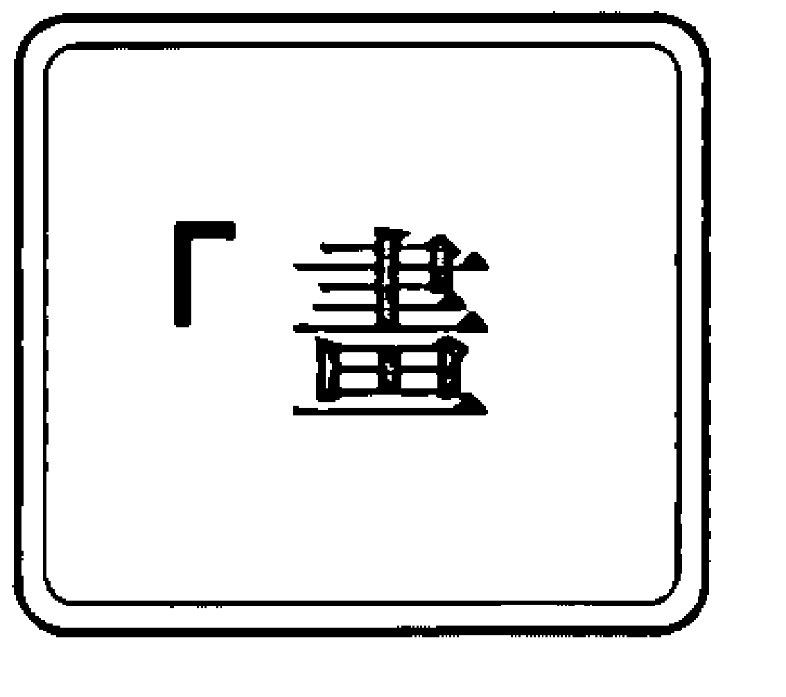

得太真實！實在太真實了！」教皇伊諾增爵十世（Innocent X）倒抽一口氣說道。傳說是這麼說的：當他第一次細看西班牙宮廷肖像畫家維拉斯奎茲（Diego Velázquez）在一六五○年為他畫的油畫肖像，連聲驚嘆！羅馬教皇雖然無法否認維拉斯奎茲的高超技巧，但他發揮自然主義式的大膽畫風，以如此非傳統的方式來處理這種正式肖像，多少還是讓教皇感到驚嚇。畫面中坐在寶座上的教皇戴著絨帽和最不起眼的教皇身分標誌——戴在他放鬆的手上、伸向畫面前方的「漁夫」圖章戒指，這是唯一清楚表明其權威地位的物品。然而，這正是這幅畫的構圖方式，教皇望著觀看者的銳利目光，彷彿正仔細打量著觀看者。幾抹快速的筆觸捕捉住驚人的真實，使得這幅肖像畫如此獨特，常被認為是有史以來最好的作品之一。

維拉斯奎茲運用任性的真誠，將深具威望的教皇稀釋成世俗之人。維拉斯奎茲畫中所傳達的不只是上帝特使的高貴形象，還描繪出一個野心勃勃的精明男子的心理寫照，他那有穿透力的雙眼透露出，只有深諳自身影響力的人才配擁有的聰明才智。在這幅大膽的肖像畫中，維拉斯奎茲畫出的「真實」是——這點似乎令伊諾增爵十世感到相當困惑——在他的神聖職責屬性下，人們其實可以視他為凡人。在塔羅中，這種二元性——人類和上帝代理者、教導者和接受教導者、統一者與群體——是教皇／祭司長／大祭司的基本原則。

作為羅馬天主教會的管理者，教皇是西方世界最古老的制度之一，而且教皇在塔羅的圖像造型幾乎沒有改變過，直到十九世紀後期，「教皇」才慢慢變成「祭司長」。如果我們將義大利文藝復興時期的王牌，想像成代表已知世界的價值觀和權力的寓意畫，那麼我們便不會弄錯在精神層面擔任「皇帝」的「教皇」。當時，教皇擁有不容置疑的無邊權力，其宗教權威和政治勢力足以匹敵歐洲君王和皇帝的威信，因此教皇也戴王冠，稱作三重冕。但和那些貴族不同的是，教皇站在物質和精神世界的十字路口。在若干塔羅牌中，我們看見他手持一對特大的萬能鑰匙，表示他是聖彼得的使徒後繼者，根據《福音書》的說法，聖彼得是從耶穌本人那裡接下這天國之鑰。這兩把作為教皇標誌的鑰匙，賦予他「束縛和解開」（禁止和允許）的權力，並任命他為精神律法的塵世擔保人。就這層意義而言，教皇代表安置教義的「磐石」，讓傳統得以延續，歷經許多世紀而不變。

在《諾貝雷塔羅》，教皇手持牧杖，那是一種像牧羊杖的鉤形權杖，似乎要表明他的職責不只是發號施令，還有聚集他的會眾，維持他們成為一個群體的身分。當我們在研究馬賽塔羅的原型時，會發現「教皇」舉起右手的食指和中指，這個手勢常被解釋成賜福的手勢。這個手勢也讓人想起拜占庭藝術中類似的寓意畫，畫中的基督或聖徒被描繪成伸出兩根手指，並將拇指按在其他手指上。受羅馬手勢藝術和意義的啟發，這種手勢被解讀成意指「我宣告」，而「教皇」也是如此，他發出神聖的言語供我們聆聽，將上帝國度的語言傳達給我們。

作為適於公眾、用以代表精神事物的原型，教皇的形象在十八世紀毀壞，隨著歷史而改變的身分使得他的政治正當性遭受質疑。在一七八〇年代創製的比利時《范登博雷塔羅》（Vandenborre Tarot），教皇被酩酊大醉、欣喜欲狂的羅馬酒神巴克斯（Bacchus）給取代，被描繪成跨坐在酒桶上飲酒。法國大革命期間，若干遊戲牌用朱比特來代替教皇。或許是因為牌卡製造商認為，像教皇這樣崇高的精神領袖圖像，可能會抹煞了玩牌卡遊戲時世俗化的輕鬆樂趣？或許教皇那種嚴厲剛直和高高在上的裝模作樣，給現代初期的人們一種時代錯置的感覺？

十九世紀《索普拉菲諾塔羅》中令人目不暇給的「教皇」，是我最喜歡的「教皇」牌之一。他穿著豪華的刺繡法衣，就像其他塔羅牌中的「教皇」，座前有一眾僧侶跪在地上。但其中一個穿著黑袍的僧侶像是宣布不祥消息的人，將他表情嚴峻的臉轉向我們，彷彿在暗示什麼。我喜歡將他想成一個吹哨者，向我們指出教皇的宗教卓越地位與其傲慢態度之間的矛盾。這位黑袍僧有如尼采式的惡作劇妖精，正在哀悼上帝之死，告訴我們那個披紅斗篷的男人只是在愚弄自己，還妄想在他極盡所能展示的財富中找到神聖的事物。他似乎在說，理性思維的發展和對傳統宗教的質疑，將很快地削弱教皇的地位。

至於「祭司長」這個用語，最早是與安東萬·庫爾·德熱伯蘭的第五張大阿爾克納產生關聯¹，他認定這張牌的主角為「大祭司長」（“Great Priest of the Hierophants”），首度暗示與希臘世界的秘密宗教儀式「伊琉欣斯秘儀」（Eleusinian mysteries）的圖像關聯，當時人們相信塔羅起源於古代世界。在古希臘，大祭司長是主持秘儀的人，為人們提供解說，好讓他們明白儀式活動的象徵性內容。他透過吟唱和示範來演示普西芬尼被冥王黑帝斯（Hades，希臘神話的地府神）擄走，以及後來上升回到生人之地的神話。為了成為祭司長，他必須拋棄先前的身分，效力於他的神聖職責。整個十九世紀期間，這個引發人們對古代世界產生一絲迷戀的用語，逐漸被引進秘密結社和共濟會的集會所，變成與高階主事者有關，例如在舉行「孟斐斯一麥西儀式」時（Rite of Memphis-Misraim，一種共濟會儀式）。然而，這張牌找到它的新名稱，是透過麥克達格·馬瑟斯在金色黎明赫密士會的推動。馬瑟斯援引牌卡占卜者埃特拉、艾里法·李維和熱伯蘭為證，摒除某些中世紀的圖像含意，選擇了與埃及一卡巴拉有關的全新詮釋，將「教皇」更名為「祭司長」。²

左頁
《教皇伊諾增爵十世肖像》，作者為維拉斯奎茲，約1650年，
羅馬多利亞·潘菲利美術館（Galleria Doria Pamphilj）館藏。

右頁
全能基督（Christ Pantocrator）和他的奇特手勢，被解讀成賜福和發話的信號。出自西西里島的切法盧主教座堂（Cathedral of Cefalù），約1130年。
安德里亞斯·瓦拉（Andreas Wahra）
拍攝和潤飾。

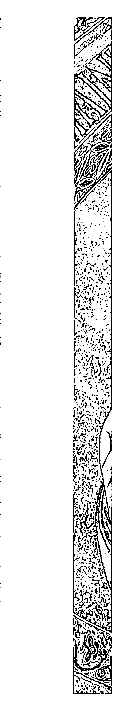

上左 「教皇」，出自《維斯康提－斯福扎塔羅》，據稱作者為博尼法喬·班波，約1450至1480年在義大利米蘭創製。

上右 色彩豐富的「教皇」，出自所謂的《格蘭高尼塔羅》或《查理六世塔羅》，畫面中央的主角身旁有兩位穿紅衣的樞機主教。

上左
在某幾副牌中，包括《諾貝雷塔羅》和《維耶維爾塔羅》，「教皇」手持牧羊杖，彷彿為了表明他負責聚集眾的角色。在他跟前的兩名僧侶是從背後描繪，露出他們剃光的頭頂。出自《諾貝雷塔羅》，1659 年。

上右
出自《維耶維爾塔羅》的「教皇」牌，約於 1650 年發行。

下左
尼古拉·康威的《馬賽塔羅》，1809至1833年發行。在康威和其他許多牌組中，「教皇」戴著有黑色十字記號的手套，這個細節可以用來表明他用來賜福／發言的手，是屬於他所代表的機構而非他自己。

下右
雙手都握著閃電的朱比特站在金色的鷹翼上，披帶環繞著他的身體飄動，形成色彩豐富的渦狀物。這張標示羅馬數字「五」的《貝桑松塔羅》「教皇」牌出自 1820 年代，以朱比特取代了傳統的教皇。

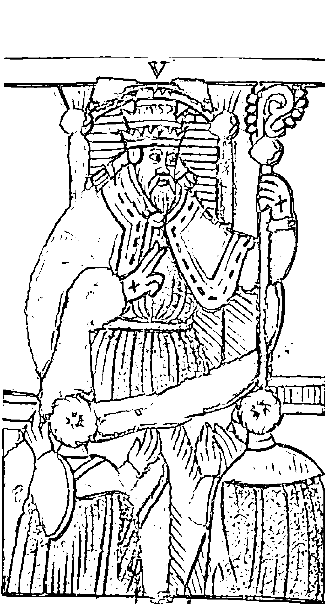

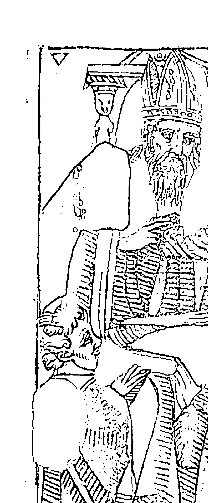

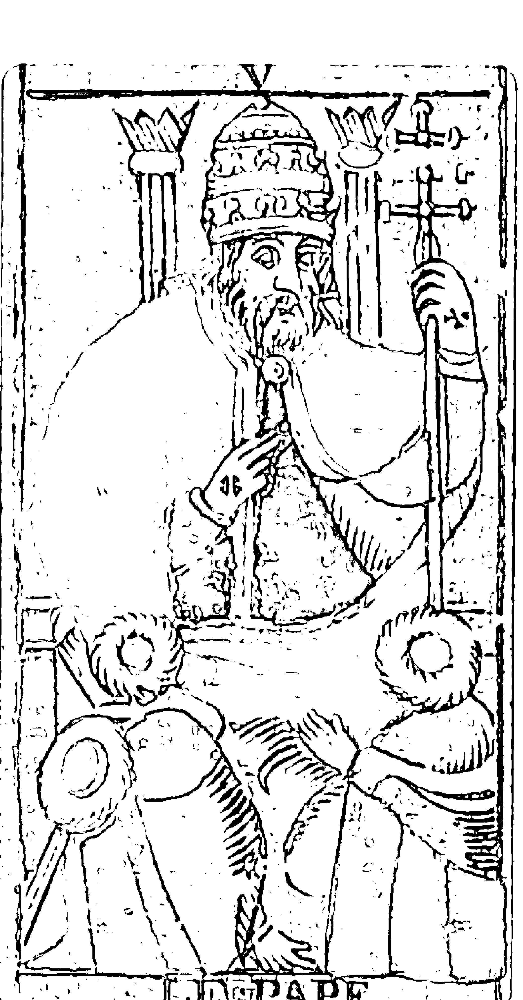

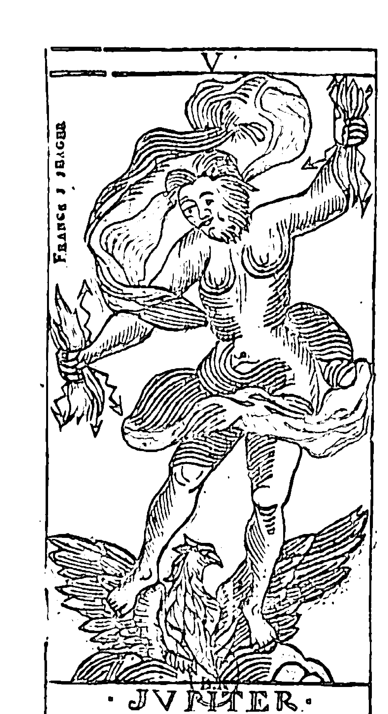

沒有標示數字的「教皇」牌，出自《米泰利塔羅》（Tarocchini Mitelli），粉彩色調的波隆那式牌組，約1670年在羅馬發行，朱塞佩·馬利亞·米泰利（Giuseppe Maria Mitelli）雕版。

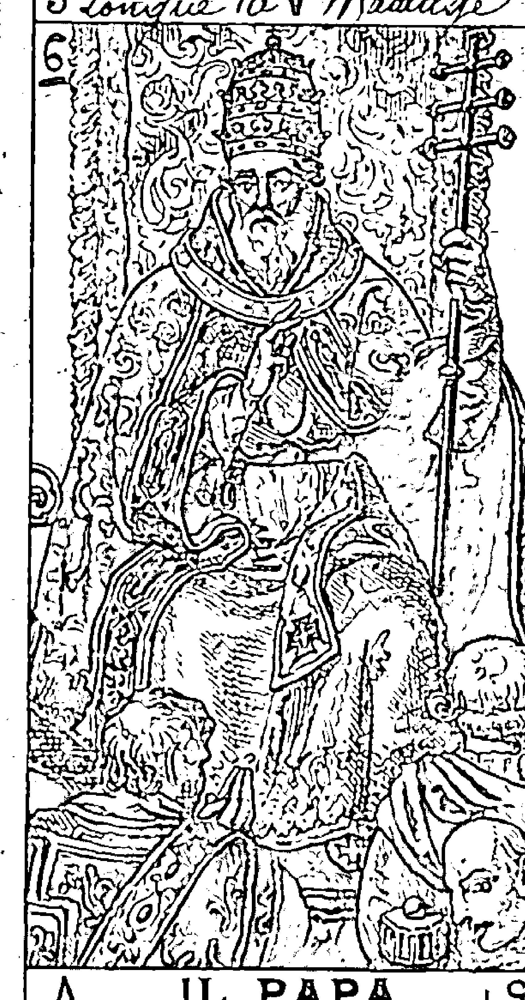

「教皇」，出自1880年代的《索普拉菲諾塔羅》，由亞文多兄弟（Avendo Brothers）發行的義大利塔羅牌，牌的頂端和底端顯示手寫的筆記。頂端寫著「長壽、婚姻」，另一端是「很快敲定一筆買賣。」本圖由麥克洛斯基古籍與牌卡（McClosky's Antiquarian Books & Cards）提供。

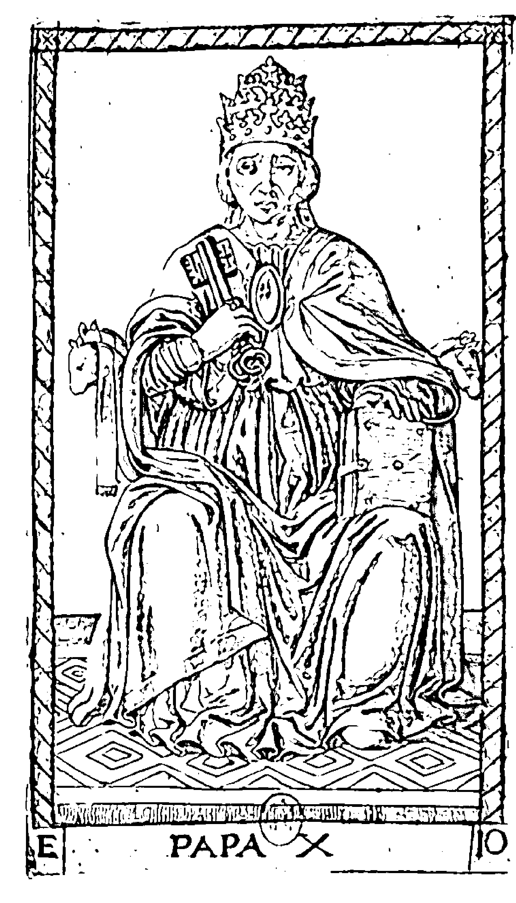

「教皇」，所谓的《孟特尼那塔罗》的第十张牌，出自E系列，约翰·拉登斯佩德雕版，1540至1560年。教皇将圣彼得之钥握在心口，左膝上还放着一本阖起来的书，这是塔罗图像中罕见的属性，因为「律法」通常与他的女性同僚「女教皇」有关。

右頁
這幅小型油畫的作者是神秘主義者阿萊斯特·克勞利，繪於1920年代，當時他在西西里島的切法盧創設了泰勒瑪修道院，作為一個烏托邦式的心靈社區和魔法學校。身為視覺藝術家，克勞利的西西里時期是他最多產的時期之一，當時完成的若干作品，包括了這件畫作在內，曾失蹤數十年之久，後來神奇地在2000年代初期重現。在這件色彩鮮明的小型木板油畫中，克勞利創造出作為祭司長的自畫像，以及似乎是為了日後的《托特塔羅》所做的初期研究，從頂端的羅馬數字V可見端倪。

## 戀人—戀人們

伊甸園蒼翠繁茂的荒野中，亞當和夏娃溫柔相擁，用一個吻封印他們的愛情。透過這幅圖像，我們想起《創世紀》中那對太古的情侶曾經是一體的。在許多中世紀手抄本的裝飾圖中，夏娃被描繪成「取自亞當的肋骨而形成」，她從亞當的身側平靜地浮現，軀體穿出他的胸腔，而上帝輕輕將她拉出來，在這個古怪的分娩儀式中擔任助產士。巴爾托洛齊 (F. Bartolozzi，義大利雕刻家，1927~1815，以「粉彩」雕刻法而聞名) 描繪這對情侶被獨自留在夜裡的天國叢林，身旁圍繞著鸚鵡和兔子，他們渴望合而為一。驅使著他們恢復以往完整狀態的情感拉力，將兩人結合在一起。畫中沒有內疚或羞愧感，也不存在邪惡的蛇。透過用肉體表達出來的愛與親密感，亞當和夏娃再度合為一體，逆向地讚頌賦予他生命的神蹟。在塔羅中，該圖像包含了兩個原型——戀人和戀人們，而對於這種結合的渴望，無論內省的、浪漫的或精神層面，是這幅圖像令人悸動的核心。然而，我們首度發現在大阿爾克納的敘事序列中，其牌意是透過心理戲劇的情境和不只一個人來表達。「戀人」牌最終在說明一個危機，一旦危機獲得解決，將產生截然不同的觀點。

文藝復興初期，塔羅牌所描繪的「愛」寓意畫中，兩人的結合是透過婚姻制度達成。在《維斯康提·迪·莫德隆塔羅》，面對面的戀人在色彩鮮豔的頂篷下含蓄地牽著手，頂篷上寫著金色的「愛」("Amor")字，字跡僅勉強可辨。在他們上方，蒙住眼睛的邱比特展開綠色的翅膀，準備射出他的愛之箭。更仔細地看，你會認出維斯康提家族的盾形紋章——巨蛇 (biscione)：吞人的藍蛇，以及帕維亞鎮 (Pavia) 的紋章——紅色底圖上的白色十字架。這個細節使學者們相信，這張牌是一個結婚紀念物，由米蘭公爵菲利波·馬利亞·維斯康提委託製作，送給女兒比安卡·馬利亞·維斯康提 (Bianca Maria Visconti)，祝賀他的女兒和女婿法蘭西斯科·斯福扎 (Francesco Sforza) 結為連理。

好幾個世紀以來，「戀人」寓意畫存在於許多牌組中，通常被描繪在極小的景框裡：一個男人和一個女人緊緊相依偎，兩個豌豆般大小的東西彼此吸引，被裹在隱形的豆莢裡。從肉體上的到帶有神秘性的種種求愛方式，預示著兩個個體將在交嬪中彼此交融。許多人認為「戀人」牌讓人想到煉金術中的結合，在這種深奧難解的高潮中，兩個對立的原理統合為一，以「太陽國王」和「月亮皇后」的象徵性結合體出現在煉金術的專著中。大阿爾克納來到「戀人」牌，曾經分離的事物重歸於好、再次結合並體驗到一種完整。

從十七世紀開始，隨著馬賽原型的出現，第六張大阿爾克納展開一個更為複雜的故事，此後這張牌往往被命名為「（男性）戀人」（“l’Amoureux”，此為法語陽性形容詞和名詞）——因為焦點放在此刻身旁多了一個伴的男主角身上，這時，有翅膀的愛神伊洛斯（Eros）盤旋在一小群人上方。俗話說得好：兩人好作伴，三個人變太擠，畫面中央的男人被夾在兩個想得到他關注的女人之間，而他的身體語言說明了這種緊張關係正折磨著他。這第二種寓意畫不是在談神秘結合的詩意召喚，而是一種兩難的困境，一種協商。他看著右邊的女人，用手臂擋著她的身體，同時對另一個女人伸出手。這些女人是誰？他的母親和他的新娘？舊愛和新歡？安逸地遵循前人的經驗之路，或者踏上冒險的實驗旅程？對我們的主角來說，這種對立的不平衡只能透過選擇而非協商來解決，他必須親自做出決定，捨棄兩個選項中的一個。

在《78 度的智慧》一書中，瑞秋·波拉克描述「戀人」是給青春期的寓言，在這個生命階段，我們逐漸明白世界的遼闊，而且視野不再侷限於長輩教導我們的東西。我們變成自己，發現我們所愛的事物，以及為何愛它們，有時候，要確認這些事情，間接地形塑了我們的叛逆性。直到這時，我們的主角已經遇見過四個原型人物，他們是精神和物質層面的領袖。他直視他們的眼睛，透過他們所具備的種種知識，他看到了真實。現在他來到十字路口，他必須決定是要留在他們所建構的有限框架裡，或者切斷連結，透過自己的眼界和第一手經驗去看待這個世界。我認為「戀人」牌是一個沒有回頭路的界限，一個我們決定跨出舒適圈，義無反顧走向自我的門檻。

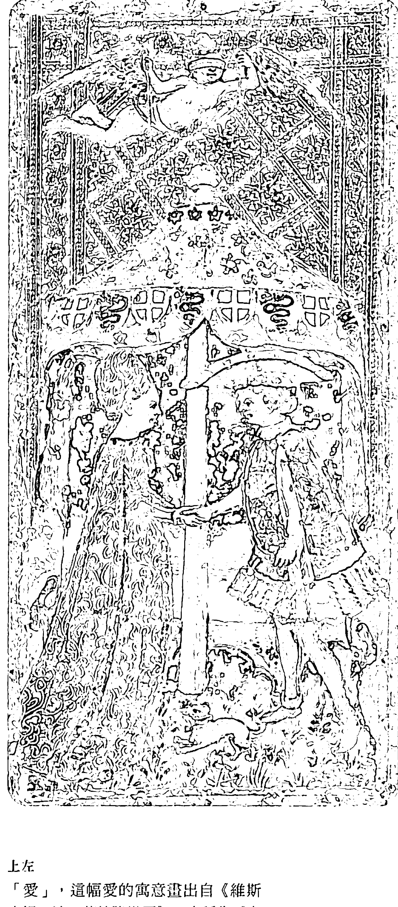

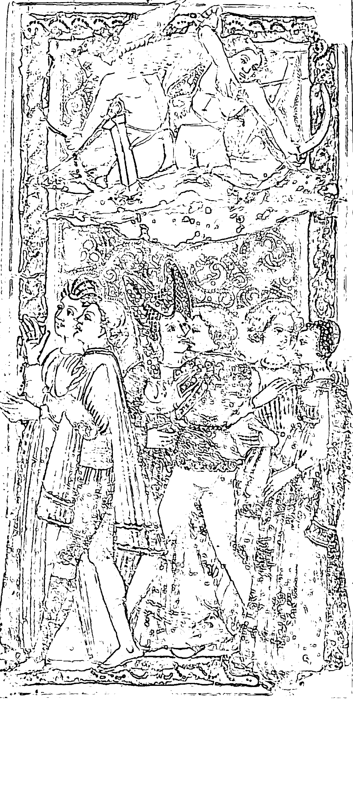

### 上左

「爱」，这幅爱的寓意画出自《维斯康提·迪·莫德隆塔罗》，也称作《卡瑞-耶鲁塔罗》，收藏于美国康乃狄克州纽哈芬市耶鲁大学，班内基善本与手抄本图书馆。

### 上右

浪漫的行列，这张独特的牌出自所谓的《查理六世塔罗》，确定年代为十五世纪，创制于意大利北部。亲密关系程度不等的三对情侣连袂行进，中间那对位于邱比特的正下方，正在亲吻彼此。

《月亮皇后與太陽國王》（The Lunar Queen and the Solar King），描繪水銀與硫磺結合的煉金術寓意畫，哲學家利用它們達成「偉大的成果」。這幅插畫出自《太陽的光輝》（Splendor Solis）這部壯觀的煉金術專著，據稱作者為薩洛蒙·特立斯蒙辛（Salomon Trismosin）。這本書多次被複製，以色彩鮮豔的煉金術插畫而聞名。該插畫版本的年代為1582年，出自《大英圖書館》（British Library）的Harley 3469手抄本，為現今最美觀的手抄本之一。

《雅克·维耶维尔塔罗》中身份不明的第六张牌，由于编号和相似的构图，可知与“恋人”有关，尽管没有名称。然而图中人物都留短发，而且丘比特的弓和箭似乎不见了。我们猜测这张牌在描绘争执而非恋爱难题，推定为1650年代的版本。

有伤风化的“恋人”，出自《不具名巴黎塔罗》，显示一对情侣淫猥地相拥，女子的双手伸进男子两腿间，十七世纪。

出自马赛式塔罗的“恋人”，让·多达尔发行，约1710年代。

让·冯斯华·杜卡提《马赛塔罗》的“恋人”牌，上面有手写的法文字。虽然第一行字无法辨识，但第二行提到“年轻女子”、“婚姻”和“怀孕”等字。该副牌约在1740年发行。

“恋人”，出自奥斯瓦尔德·维尔特的1899年《中世纪画家塔罗》。这张“恋人”牌类似马赛塔罗原型，但在画面中央，准备做出最终决定的恋人正在沉思。就像那身红蓝交错的服装，他的心也在两个对象之间摇摆不定。

《夫人神諭大遊戲》中，名為「祭司長」的第十三張牌，事實上是在描繪婚禮以及結合與婚姻的概念。這副埃特拉式占卜牌由雷加米繪圖，將近 1890 年代時在法國發行。

「婚姻一結合」，出自《小神諭牌》（Le Petit Oracle），十九世紀晚期發行的占卜牌組。

喬凡·莫里內利（Giovan Molinelli）的佛羅倫斯明奇亞特牌的第五張牌，1710 年代發行，顯示一名女子為她的愛慕者加冕，而邱比特正瞄準他的頭射出愛情之箭。

「婚姻」牌，出自 1830 年代在法國發行的占卜牌。

「錢幣五」，出自阿魯埃特牌，1880年由勒夸爾 (Lequart) 發行。

「錢幣五」，出自阿魯埃特（Aluette）牌，1810至1860年。

「錢幣五」，出自阿魯埃特牌，1840至1850年。阿魯埃特牌的靈感來自西班牙的遊戲牌，阿魯埃特牌是一種用來玩「母牛遊戲」（Jeu de La Vache）的法國遊戲牌卡，同隊的隊友要謹慎運用編成密語的暗號和手勢，將手裡的訊息傳遞給隊友。阿魯埃特牌的圖像稍稍不同於西班牙遊戲牌，當中某些花色點數牌（pip cards，在本書中指除宮廷人物牌之外，以花色圖案表明數值的牌，例如「黑桃二」、「紅心十」、「寶劍五」等）具備精心描繪的圖像。因此，「錢幣五」也稱作「深吻」，通常描繪一對情侶（往往是君王）在親吻、擁抱，甚至裸體躺在床上。

## 戰車

「名望，你喜歡的是豪華禮車，你得到的是沒有明天。」大衛·鮑伊（David Bowie）在他一九七五年的歌中唱道。名望也是在佩脫拉克的詩作《勝利》（I Trionfi）中遊行的六輛馬車之一，這組詩作寫於一三五一至一三七四年，獻給他一生的摯愛蘿拉（Laura）。出身托斯卡尼的佩脫拉克，以他的史詩眼光喚起一種沉思，這種沉思超越他的浪漫情懷，並借用靈感來自羅馬凱旋儀式（triumphus）的寓遊行，將之化為永恆的祝福。在古代，這種慶祝勝利的遊行半為軍容展示，半為宗教儀式，在軍事將領在外國打勝仗歸來時，用以表揚他的英勇。勝利者在部隊的簇擁下，高坐在由馬匹牽引的戰車上，穿行於城市大街，接受民眾的熱烈歡迎。佩脫拉克從這種輝煌的盛況中獲得靈感，想像出同樣意氣風發的遊行，當中坐在花車上的擬人化美德將一一取代彼此。首先，「愛」敗給了「貞潔」、「時間」、「死亡」、「名望」和最終的「永恆」。

坐在車上的寓意人物一個接著一個展現原型。有一個細節引起葛楚德·莫克利（Gertrude Moakley）的注意，她是紐約公共圖書館（New York City Public Library）館員，在一九五〇年代曾嘗試徹底破解大阿爾克納的起源之謎。這些塔羅大牌源自何處？莫克利提出看法：這套寓意人物牌，是否可能不像神秘主義者所說的是來自古埃及，而是在反映義大利文藝復興的實況，另外，這種儀式性隊伍的風尚及它們的象徵性盛會，其實是呼應佩脫拉克詩作中所反映的現實。莫克利所奠定下的基礎日後將為塔羅學做出重大貢獻，她排除秘傳起源的偏見，將大阿爾克納想像成嘉年華的花車，使「戰車」如實地讓人想起這種象徵性的盛會。

就牌意來說，「戰車」涉及了前進、自詡的驕傲和展示勝利。在卡瑞一耶魯「戰車」牌中，一名女子坐在有頂篷的馬車上遊行，可能使人想起鋪張的遊行隊伍，以及家族舉辦用以慶祝重大事件的公開活動，例如結婚典禮。來到「戰車」牌，我們的旅程在勝利的激情中推進，好似要宣佈一個新方向；但這次是出於我們自己的意願。有某種看不見的力量驅使百夫長跨進未知，然而他不知道什麼叫作恐懼。這是個好徵兆嗎？可以說是，也可以說不是。如我們所知，我們的主角在「戀人」牌宣告他的獨立自主，而他的冒險行動所獲得的獎賞是自信心大增，以及獨立狀態所帶來的短暫幸福感。然而，就像《孟特尼那塔羅》「太陽」牌和上述大衛·鮑伊的歌曲中所示，「戰車」也能表達你自命不凡的態度、自滿的危險，還有你可能面臨的、誤以為贏了一場戰役就贏了整場戰爭的嚴重後果。

（圖注：左頁「名望的勝利」，出自佩脫拉克的詩作《勝利》，西蒙·布爾古安（Simon Bourgouin）翻譯，十六世紀。法國國家圖書館館藏。）

（圖注：上：「戰車」牌，出自維斯康提·迪·莫德隆／卡瑞—耶魯牌組，據稱作者為博尼法喬·班波，繪製於1428至1447年間，班內基圖書館館藏。）

（圖注：右頁：出自所謂的《孟特尼那塔羅》E系列的「太陽」牌，1465年在義大利費拉拉（Ferrara）發行。這張牌顯示希臘太陽神赫利奧斯駕駛他的四輪馬車奔馳在弧形的天空，促使太陽上升和落下。圖中描繪了赫利奧斯神話的一段插曲，故事說到他那任性的兒子法厄同（Phaethon）想要駕駛他的戰車，儘管赫利奧斯勸阻並警告他這輛戰車難以操控，十分危險，然而這個年輕氣盛又傲慢的青少年依舊偷走了老爸的酷車。結果，最後因為無法駕馭馬匹發狂似的強大力量而墜地喪命。法國國家圖書館館藏。）

（圖注：「戰車」牌，出自所謂的《查理六世塔羅》，十五世紀時在義大利北部創製，法國國家圖書館館藏。）

（圖注：出自《馬賽塔羅》的「戰車」牌，作者為馬斯華·布利翁，1760年代。法國國家圖書館館藏。）

（圖注：上：出自《塔端塔羅》的「戰車」牌，十七世紀。法國國家圖書館館藏。）

（圖注：右頁：《馬克西米利安一世的凱旋戰車》（The Triumphal Chariot of Maximilian I），作者為阿爾布雷希特·杜勒，1522年，華盛頓特區國家藝術館（National Gallery of Art）館藏。）

（圖注：由鵝曳引的戰車，描繪在《不具名巴黎塔羅》第七張牌，創作於十七世紀初期。牌中的勝利者戴著桂冠。）

（圖注：作為「戰車」的天國車輛，這回是由兩隻鴿子牽拉，而非由馬牽拉。出自《米泰利塔羅》，十七世紀。）

（圖注：右頁：「戰車」及其頂篷，出自奧斯瓦爾德·維爾特的《中世紀畫家塔羅》，1899年。）

（圖注：「戰車」牌，顯示一名裸體女子和拉車的兩匹白馬。出自某副佛羅倫斯明奇亞特牌，作者為喬凡·莫里內利，1712至1716年。）

（圖注：描繪馬車的「方塊九」，出自某副占卜牌，十九世紀初維奧莉（Violet）在巴黎發行。這是占卜牌中常見的比喻，「戰車」牌或其他類似車輛意味著旅行、離開；活動或改變的能力。）

（圖注：7 LE CHARIOT）

## 正義

到了「正義」牌，我們進入第二組七張為一群的大阿爾克納，開啟它們包羅萬象的敘事中的新動能。從「魔術師」到「戰車」，我們依循著裝扮成「愚者」的古老人物的啟蒙旅程，他是個沒有章法的演員，從一張牌跳到下一張牌，像個枯槁的靈魂，從噴泉裡大口喝水，讓秘傳的財富變得完整。漸漸的，我們的主角開始成形，他將最初的關注投向「魔術師」。接下來他將一一遇見四個身負世俗和精神力量的人物——「女教皇」、「女皇」、「皇帝」和「教皇」，他們將做為他的架構，幫助他瞭解物質與精神之間的界限，並形塑他，讓他們透過他的眼睛去理解關於這個世界的真實，從可觸知的物件到最縹緲無蹤的概念。

透過「戀人」牌，我們的主角首度在他的冒險故事中遭受戲劇化的挑戰，經歷一個危機。在這個困境中，他必須選擇是要在這些權威人物的庇護下停腳步，或者改變方向，繼續前往未知的地方。他會選擇停留在「母親」給予安慰但緊抱不放的懷中，或者跟著性感的「少女」逃走，在歷險中甘冒起起伏伏的風險，前往可能有意外發現的新世界？透過「戰車」牌，如我們所知，他選擇了離開，在放下自己的個性和力量時改頭換面。犧牲使他振奮起來，變得獨立，可以說我們的主角現在獲得了解放，並在自由意志的驅使下，準備處理經過他選擇的觀點。

從「正義」到「節制」，這一連串新的七張牌中，我們的主角必須發展出他自己的道德羅盤，定義自己的內在價值觀，認清和說明在他內心發揮作用的、物質與精神之間的緊張關係。在第二個序列中，以「女皇」和她的三個侍從的形象出現的統治者四人組，換成了另一組人：基本美德——正義、審慎、堅毅和節制。柏拉圖《共和國》中提及的這四種美德，日後將成為十三世紀阿奎那道德哲學的基石。基督教神學中經常出現的主題基本美德，將變成中世紀和文藝復興時期的道德主軸之一，作為後世遵循的正直規範的四根基本支柱。

「正義」牌圖像歷經了許多個世紀卻鮮有改變，呈現出我們所熟悉的寓意畫，讓人聯想到法律機構。我們發現她矗立在法院大樓和律師辦公室：右手持劍、左手持天平的女性人物。她是古代女神西彌斯（Themis），希臘神話的女泰坦，也是負責解讀最古老神諭的女預言者，包括德爾菲（Delphi）神諭。她的青銅劍據說能砍斷謊言，讓真相浮現，因此使她成為真理追求者。在古代世界，她與神的律法和正義有關，能分析對錯、從混亂中理出秩序以及規範倫理，這些都是她體現的事物。

（圖注：左頁：擬人化的「正義」登上一朵雲，雲團中裹著「教皇」、「皇帝」和三個戴王冠的人物。這件圓盾形彩繪玻璃的年代為1586年，在瑞士蘇黎世製作，倫敦維多利亞與艾伯特博物館（Victoria and Albert Museum）館藏。）

在塔羅裡，我們發現「正義」牌與基本美德有直接的關聯，連同節制和力量，在大阿爾克納序列中被明白地描繪出來。「正義女士」的劍最常呈現垂直高舉的姿態，以證明她不偏不倚，是在全然公正下用來防禦和破除的工具。她的天平拿在代表接納的左手，可以解釋成她維持平衡的能力。最重要的是，天平也告訴我們，我們應該隨時評估我們的行動可能造成的影響，並試著去預見結果會如何影響世界。要小心你的蝴蝶翅膀，以及你可能在未來引發的龍捲風。準備好去承擔你的行為所造成的後果，並為你所做的改變負責。

隨著馬賽牌原型的逐漸常態化，呈現神聖風格、正面直視的「正義」出現了。她坐在寶座上，以質疑的目光穿透我們的眼睛，試圖打破第四面牆。這種典型圖像持續存在于許多秘傳塔羅中，堅忍的「正義」用雷射般的雙眼鎖定我們的注意力，逼近到讓人不太舒服的程度。「正義」被描繪得無比鮮活，迫使我們去思考自己是否有能力遵守法律和自我管理。我們對自己和別人是否能做到不偏不倚，是否公正無私？我們是憑藉錯誤的道德觀或自己的真理來為事情下決定？「正義」牌逼使我們去找到內在的西彌斯，並與她的神聖秩序達成一致的振動。

（圖注：上：正義的寓意畫，出自《精選寓意畫》（Emblemata Selectoria），馮斯華·范德·普拉茨（François van der Plaats）於1704年在阿姆斯特丹發行的寓意畫書本，法國國家圖書館館藏。）

（圖注：上左：「正義」牌，出自所謂的《格蘭高尼/查理六世塔羅》，十五世紀創制於義大利北部。）

（圖注：上右：「正義」，所謂的《孟特尼那塔羅》E系列第三十七張牌，可能在義大利費拉拉雕版和發行，1465年。）

（圖注：擁有兩張臉、蒙住眼睛的「正義」，出自通常被稱作《不具名巴黎塔羅》的法國塔羅牌，十七世紀。）

（圖注：「正義」牌，出自「馬賽式」牌組《護·多達爾塔羅》，於1701至1715年間在里昂發行。）

（圖注：「正義」，《貝桑松塔羅》第八張牌，於1845至1860年間發行。）

（圖注：「正義」牌，出自馮斯華·普瓦伊的明奇亞特牌，1658至1693年間在法國發行。）

（圖注：出自《米泰利塔羅》的「正義」牌，於1660至1670年間在義大利羅馬發行。）

（圖注：「作為正義的西彌斯」，出自《夫人小神諭》，寡婦蓋菲耶（La Veuve Gueffier）於1807年在巴黎發行。）

（圖注：「正義」，《大埃特拉／埃及塔羅》的第九張牌，十九世紀後期在法國發行。）

（圖注：上左：「方塊 A」，顯示手持劍和天平的西彌斯，出自《四大洲豪華遊戲牌》（Luxus-Spielkarte Vier-Erdteile），登多夫（B. Dondorf）於1875至1899年間在德國法蘭克福發行。）

（圖注：上右：出自「德拉·羅卡」雙頭皮埃蒙特塔羅的「正義」牌，由阿瑪尼諾兄弟在義大利熱內亞發行，1887年。）

（圖注：右頁：「正義」，《克蘇魯暗黑藝術塔羅》（Cthulhu Dark Arts Tarot），福提芬（Fortifem）繪圖，2020年。）

（圖注：VIII. Justice）

（圖注：EMBLEMA XLII. De secretis Naturæ. In Chymicis versanti Natura, Ratio, Experientia & lectio, / sunt Dux, scipio, perpicilia & lampas.）

（圖注：EPIGRAMMA XLII. Dux Natura ibi, tuque arte pedissequs illi / Esto lubens, erras, ni comes ipsa via est. / Det ratio scipionis opem, Experientia firmet / Lumina, quò possit cernere posta procul. / Lectio sit lampas tenebris dilucida, rerum / Verborumque strues providus ut caveas.）

## 隱士

在斷裂的溪流環繞下，我據此為家。我不需要食物，可以單靠空氣維生。

鳥兒為我帶來花朵，佈置在我身旁，我生活在另一個世界，那正是我隱居的原因。

我是「隱士」，但我的心並非如此。是的，我是「隱士」，神遊物外是我的拿手好戲。

肯尼思·安格（Kenneth Anger，美國地下實驗影片製作人、演員和作家）的六分鐘短片《紫褐色時刻》（Puce Moment）描繪一名女子慢慢變成「好萊塢異教徒」的女神，展現欣喜若狂的穿衣儀式。首先，她從眾多閃閃發亮的長袍中挑選了一件禮服，像聖甲蟲般閃耀著綠色虹光。接著，她在皮膚上塗抹香水，令人暈眩的氣味使她陶醉不已。她閃動著一雙誘人的大眼睛，躺進長沙發椅後，開始神奇地閃現在不同的空間，芬芳的香味激發出如夢如幻的波德萊爾式狂喜。如同安格的許多影片，片中配樂是用來強調影像所傳達的神祕訊息。強納森·哈爾普（Jonathan Halper）的歌曲〈我是隱士〉（“I Am a Hermit”）的歌詞出現在畫面上方，表示這個女人的穿衣打扮，其實是一種帶有啟蒙意味的驚人表演。如同「隱士」，她登上神聖之巔。神遊物外是她的拿手好戲，但是她利用的是香水和催眠的連衣裙擺，而不是燈籠和朝聖者的手杖。

（圖注：左頁：「對他而言，自然、理性、經驗和閱讀，必定如同從事化學工作時所使用的指南、手杖、眼鏡和燈籠。」一名手持燈籠、手杖和戴眼鏡的男子在追尋象徵知識的女性人物蘇菲亞（Sophia）。儘管他看不見她，但他的工具讓他得以追尋她的腳步。米夏埃爾·邁爾的著作《亞特蘭妲奔逃》，由馬蒂亞斯·馬利安繪製插圖，約翰·特奧多爾·德布里發行，1618年，德國奧本海姆。法國國家圖書館館藏。）

這首迷幻民謠和哈爾普讓我著迷了許多年，他為人所知的只有這首歌曲，加上同樣有遁世意味的《拋開我的老年》（“Leaving My Old Life Behind”），兩首曲子構成《紫褐色時刻》的全部配樂。這兩首空靈的歌曲是哈爾普讓人留念的僅有記憶，他就像現實生活裡的隱士，此後便永遠消失於搖滾界，封存在影片的兩首歌曲之中，如謎般講述心靈的孤獨，成為他唯一的遺產：同樣的，昇華、孤獨、啟蒙之旅和違反本性，正是「隱士」牌之所以迷人的要素。

就圖像研究而言，「隱士」並非一直都像早期塔羅的「隱士」那樣。別被義大利的早期範例給愚弄了，這些牌卡將類似的人物描繪成遊方僧侶——緊裹著衣服的蓄髯老者，彷彿表示他準備踏進寒冷的荒野，遊歷遠方，有時還帶著一根木杖，好幫助他前進。事實上，與朝聖者有關的傳統燈籠在文藝復興初期的塔羅中，原本是一隻沙漏。我們從中看見的不是一個男人，而是異教神祇。的確，這些圖像描繪的是希臘神話中最初的時間之神克羅諾斯（Kronos），他被視為吞噬一切的毀滅力量。沙漏是他理所當然的象徵物，柺杖和刀子也是，提醒人們他閹割掉自己的父親烏拉諾斯（Ouranos）並取而代之。所謂的《孟特尼那塔羅》顯示克羅諾斯吞食了自己的子女，他這麼做是因為害怕被他的後裔給取代。這些早期描繪的時間之神被賦予跛腿族長的形象，提醒我們葛楚·莫克利的大阿爾克納理論的靈感，是來自義大利詩人佩脫拉克（Petrach）的詩作《勝利》（Triumph），以及詩中的象徵性行列。當然，作為明顯的特色，「時間」是行列中倒數第三的戰車，後面跟隨著「永恆」。如同佩脫拉克所描述的景象，這輛由幾頭雄鹿牽引的遊行車輛被描繪在手抄本和蝕刻畫中，上面載著以克羅諾斯為雛型，手持沙漏、枯槁衰老的時間化身。

並沒有明顯的道理或理由導致隱士取代了克羅諾斯，但隨著馬賽牌組的發展，僧侶似的人物在牌卡中變得普遍。在維耶維耶牌組中，朝聖者用一根手指指向天空，暗示靈性提升途徑的方向。在一七七五年的《桶匠談話》（Hooper’s Conversation）牌卡遊戲中，「沉思」牌描繪一個上了年紀的苦行者在思索自己不可避免的死亡，他獨居洞穴，一手拿著人類頭骨，一手拿著鞭子。這張牌的圖像漸漸從選擇遁世隱居的苦行者，轉變成尋求與神聖事物連結的追尋者。從塔羅被視為一種秘傳工具的那一刻起，「隱士」原型變成踏上玄妙之旅以探究神祕的追尋者，而燈籠的光則成為通往超越境界的指引，同時照亮前方道路和心靈。

「隱士」牌是否與塔羅大阿爾卡納中付之闕如的基本美德「審慎」有關？神祕主義者艾里法·李維是這麼認為的，而其他的許多神祕主義者，例如帕普斯或奧斯瓦爾德·維爾特，後來都為了令「隱士」牌連結到這個道德觀，而調整了它的意義。神學家阿奎那描述「審慎」為一種聰明睿智的態度，能讓人在求善的過程中預見所需採取的最佳行動。代表「審慎」的寓意畫往往描繪一個雙面女子，她看向鏡子，「預見」每一個方向，並依據她的所知所覺來做決定。許多人視燈籠為這種實用智慧的象徵，燈籠照亮了前路，好讓我們覺察潛在的危險，在突如其來的黑暗中為自己找到正確的方向。

在《格蘭高尼/查理六世塔羅》，老男人是「時間」的象徵。他手持沙漏，站在山腳下，岩體延伸到牌面右側和上方。

## 命运之轮

上左
罗马神话的萨图恩（Saturn），相当于希腊神话的克洛诺斯，正在吞食他的子女。萨图恩被描绘成年长男性，右手握着手杖站立，杖头是一条吞食自己尾巴的蛇。《孟特尼那塔罗》E系列第四十七张牌，约翰·拉登斯佩德雕版。

上右
年老的「时间」拄着拐杖跳行，出自佛罗伦萨的明奇亚特牌，乔凡·莫里内利发行，1712至1716年。

左页
「时间」，出自《维斯康提-斯福尔扎塔罗》，据称为博尼法乔·班波，约1450至1480年创作于意大利米兰，摩根图书馆馆藏。

右
「时间」，践踏着「名声」及其破碎的号角，他坐在战车上，手持沙漏。出自佩脱拉克的《胜利》插画，夏尔·勒·维古勒 (Charles le Vigoureux) 在巴黎发行，1579至1605年。

「隐士」，出自法国里昂发行的塔罗牌，1475 至 1500 年。

皮埃蒙特式《索莱西奥塔罗》（Solesio Tarot）微笑的「隐士」平和且满足地行走着，他的灯笼散发出金光，反映在他的斗篷之中，1865 年。

《维耶维尔塔罗》的「隐士」尚未拥有灯笼，但用左手指向他在天上的目的地，1650 年。

出自《大埃特拉／埃及塔罗》的「叛徒」牌，1875 至 1899 年创作于巴黎。埃特拉牌组缺少「吊人」，此外，具备了与「吊人」人物有关的某些旧有象征属性，例如背叛。

「审慎」，意大利艺术家安德雷亚·德拉·罗比亚（Andrea della Robbia）制作的陶圆盘，1475年。

「隐士」，出自《不具名巴黎塔罗》，于1600至1650年间发行。图中心隐旅人的旅程刚刚展开，他方才跨出城门，手持标灯和念珠。十七世纪。

上左和右
出自《夫人神谕大游戏》和《埃及埃特拉》（Egyptian Etteilla）的两张「审慎」牌，两者皆出自十九世纪晚期。在埃特拉系统中，重新描绘的四大基本美德与经典图像的诠释方式稍有不同。缠绕在镜子或蛇杖上的蛇召唤着奥秘的智慧。在地板上爬行的蛇，让我们留意那些可能需要靠审慎来避免的危险。

> 噢，福图纳，
你如同月亮般
变化无常，
时而满盈，
时而亏缺；
可憎的生活
先是压迫着人，
然后带给人安慰，
玩弄清明的心智；
贫穷
与权势
像冰一样被它融化。

1937 年，作曲家卡尔·奥福（Carl Orff）将十三世纪诗作《噢，福图纳》（“O Fortuna”）改写成夸大的清唱剧《布兰诗歌》（Carmina Burana）的唱词，结果引发争议。一如焦虑的古希腊合唱队，这些唱词警告我们命运女神的反覆无常，「时而满盈，时而亏缺」，她利用月亮及其运行作为一种比喻，表示福图纳对于我们的人生发挥了势不可挡的力量，以及她如何任意使用这种力量。福图纳有她自己的节奏，行星的运行和我们的生活也是如此，对此中世纪思维往往藉由轮子概念的主题，来表达时间流逝和人生起伏完整周期的抽象过程。

在罗伯特·里耳（Robert de Lisle）的诗歌集《人生十个时期之轮》（Wheel of the Ten Ages of Man）中，我们见证了人类的生命期限。每个圆形小图按时间先后顺序显示着人生的进程，从跚跚学步的幼儿到孩童，到浑身是劲、凶狠好斗的骑马少年。接着来到理想中的成年期，此时他戴着王冠，登上自己故事回圈的顶端——到达巅峰和最高点。一点钟位置的老人，现在拿着手杖走路并举起一只手，从他的身体语言看来，他正悲苦地回头望向曾经的自己。故事从这里开始走下坡——圆圈的另一半将带领他踏入坟墓，坟墓正好位于他的全盛时期的对立点，颇有预言的意味。在圆圈中心，奖章代表上帝是这个轮子的轴心，呼应天主教徒想像中的事实，那便是这位神圣的钟表匠是人类命运的缔造者，决定了我们的人生道路。

在中世纪的宇宙论中，轮子以类似的方式将「无限」予以概念化——天体领域和它们有节奏的运行。在《爱的简论》（Breviari d’Amour）中，有两名天使奋力地用曲柄转动天空，启动群星的运转，这是我们身处其中且无力控制的大宇宙动能。最终，我们终将了解到我们的生命之轮、天球的运行，以及其间许多象征性的圆，都是由同一个神圣的能量所驱动。塔罗的「命运之轮」也是如此，面对这个宏大的能量流，我们全然无以应对。

左页 罗伯特·里耳诗歌集中的《人生十个时期之轮》，1310 年在英格兰绘制。

塔罗的「命运之轮」主题，灵感来自罗马女神福图纳，她是拟人化的机会和运气，通常具备两种属性——其一以丰饶角作为她的丰富象征。她也负责掌控「命运之轮」，任意决定将恩惠赐予何人。尽管福图纳的形象有古老的起源，但在整个中世纪一直到文艺复兴初期，仍是受到欢迎的命运寓意图，从文艺复兴初期之后，福图纳遂成塔罗牌的特色图像。在《维斯康提-斯福扎塔罗》，蒙住眼睛的福图纳站在轮子中心操作这个圆形装置，双臂置于轮辐上。当中的四个人物拼命想留在原处，却不得不在这个圆形结构中上升或下降。掌控这个轮子的是一位身着王袍的金发男孩，他古怪地长出一对驴耳。如同阿尔布雷希特·杜勒的《万愚节》里那位反复无常的兽形弄臣，他无疑也像驴一样没头没脑的，视自己优越的地位为理所当然。很快的，从天国操纵着轮子、如幽灵般的上帝之手将把他逐出这个暂时的掌权位置。无论我们怎么做，主控权都不在我们手上，所以当最好的机会来临，我们必须把握住，因为机会快速变化，稍纵即逝。

在马赛塔罗原型，人类从轮中消失，取而代之的是长得像猴子的生物，就如同命运本身那样善变和反复无常。到了十八世纪，轮子顶端的人物被诠释为斯芬克斯（Sphinx），当时人们坚信塔罗展现了古埃及的神圣智慧。就像不朽的吉萨金字塔，塔罗的斯芬克斯被视为这个轮子的守护者，守护其神秘的动能和掌控我们的命运。

> 「什么东西在早晨用四条腿走路，中午用两条腿走路，傍晚用三条腿走路？」斯芬克斯问伊迪帕斯（Oedipus），伊迪帕斯回答是人，因为婴儿处于人生时期的早晨，成人处于中午，而在生命的日落期则拄着手杖。斯芬克斯掌控一切轮形物，从掌管人生时期的小宇宙之轮到广大无垠的天球，就像一位熟练的管弦乐团指挥。当我们的人生如同三角铁被敲响，所发出不引人注意的声音尽管声调高亢，但在来世的杂音中却几乎听不见。

解读塔罗时，「命运之轮」是在质问我们的宿命与自由意志之间的紧张关系，让我们说出是谁在掌控改变，还有是什么创造出我们藉以建立人生的机会。如同赛璐珞电影胶片，这张牌也告诉我们，唯一存在的真实，就夹在两个连续镜头之间。虽然我们可能无法改变人生故事的情节，但我们需要了解造成悲伤的那个无形概念，或者让我们能够把握机会，使我们的故事摆脱多余的回圈，以免身陷其中。我们全都可以成为电影《今天暂时停止》（Groundhog Day）中的比尔·莫瑞（Bill Murray）。最终，「命运之轮」预示我们对周期循环产生的觉察，知晓开始和结束，以及要如何驾驭这些节奏以寻求更新或终止。

右页
天使在转动天球，出自贝济耶的马特佛瑞·埃曼高（Matfre Ermengau of Béziers）的《爱的简论》，十四世纪后半期在西班牙创制。

res tov eto domo en auyiyileu l'ell l'eauduyie vll'e yu
autis ua en ch plou en plu: a te plois fau ten noum ia. ca
momarles cumans dits chp.ys q dainir ios le direls an ene
lavl equoviam Cafo son aluns chines ab que els pouen
enomri dammel gila ciau clespay quar es d'ffamnncir tir
alat nqun luquulabia Enaqla miha car crgnis qes uei
es fia capiouada Emp aqits miusus gheia delin ecfeium
los uns los wit petaidis qve qes aei oul uina ehnis pas los
als los wit anuleis los alirs los wit avlas Q Dras wr cs.i .aiu
au: Q ulla drs chpays allnion:

左页
《维斯康提－斯福尔扎塔罗》的「命运之轮」，据称为博尼法乔·班波，约1450至1480年创作于意大利米兰。

上
蒙上眼睛的「双重命运女神」，她具备的彩色面和阴影面显示出她的双重性，既能给予、也能收回她的恩赐。出自《高尚男女的命运之书》（Livres des Cas des Nobles Hommes et Femmes），作者为艾蒂安·科洛德（Étienne Colaud），1530年于法国。

「命运之轮」，《不具名巴黎塔罗》，法国，1600-50 年。

三个长得像驴子的弄臣拼命抓着轮子。在左上方，从云里伸出的神之手正转动轮子的曲柄。这幅蚀刻画的绘制者是阿尔布雷希特·杜勒，出自塞巴斯蒂安·布兰特 (Sebastian Brandt) 的《愚人船》 (Stultifera Navis) ，1498 年。

出自《塔瑞塔罗》的「命运之轮」，十七世纪在意大利波隆那发行。

狡猾奸诈的狐狸逆着轮子转动的方向，设法向上爬。从冒烟的壶和溅出的金银财宝可以看出轮子正朝顺时针方向转动。出自双头的德拉·罗卡／索普拉菲诺式塔罗牌，阿玛尼诺兄弟在意大利热内亚发行。

「秩序」—「命运之轮」，上面有占卜的手写铭文，出自以尼古拉·康威塔罗为本的马赛牌，1890至1900年于梅松·卡穆安发行。

福图娜和她的轮子在散播财富。出自《米泰利塔罗》，1660至1670年于意大利罗马发行。

盘踞「命运之轮」顶端的斯芬克斯，出自奥斯瓦尔德·维尔特的《中世纪画家塔罗》，1889年。

「万物的主宰」(Omnium Dominatrix)，出自十六世纪意大利《莱伯-卢昂塔罗》(Leber-Rouen Tarot)的一张牌。卢昂图书馆(Bibliotheque de Rouen)提供。

### 力量

我们先来看看这张古怪的塔罗大牌，作为本章力量篇的开场。这张寓意牌编号十五，属于某副双头德国塔罗游戏牌。这张牌之所以引起我的兴趣，也许纯属巧合，但它总结了许多我所认为切中大阿尔克纳力量牌核心的想法。进一步细看，会发现牌面上相互对映的两个图像：其一是圣布兰迪娜（Saint Blandina），她展现虔诚的态度，身旁是一头显得格格不入的温顺狮子。在对映边，是一幅令人不安的画面：斗牛场上的斗牛士给予无助的公牛致命的一击。斗败的公牛倒在剑下。

这两幅插画的焦点集中在人与猛兽的关系。对照下产生了两极对立，其中一边和睦相处，另一边则是致命的对抗，这正是一体两面的事。如果第一幅画使人想起圣布兰迪娜的传说，那么最重要的或许是要提醒我们，这张牌跟这位天主教殉道者有关的故事。圣布兰迪娜在第二世纪时遭受罗马人的迫害，她连同一群早期的基督徒被丢进了斗兽场，等着活生生被狮子吃掉。如同故事所述，她的信念、贞洁和正直是如此的强大，这些食肉的大猫竟然温顺地趴在她眼前，不愿吃掉她。不知怎的，这些内在特质以看不见的方式，有效驯服了凶猛的野兽。

在塔罗中，力量牌与大阿尔克纳所召唤的基本美德「坚毅」有关。力量牌的图像多样性令人吃惊，值得我们花时间去解锁这张牌的可观之处和丰富变化，以及它所讲述的惊人故事。无所不包的「坚毅」概念分裂成两个平行的图像比喻，在十五世纪同时存在。少女握住断裂的柱子，或用双臂环抱完全垂直的圆柱，又或者刚猛的英雄徒手或手持棍棒击杀狮子。如同「正义」牌，「坚毅」主题与中世纪时早已流行的许多寓意画重叠。少女和圆柱的比喻提醒我们，阿奎那是如何描述「坚毅」这种特质：一种基于理性的考量，勇于承担或拒绝苦难的道德勇气。坚毅唤起我们为了追求善而像柱子一样直挺挺屹立不摇的能力，即便遭受到粗暴的对待。我们可以推想，圆柱是这种道德正直、坚定不移和始终如一的视觉诠释，即便恐惧逼近，我们也不会因此感到害怕。

在所谓的《孟特尼那塔罗》，「力量」牌上的寓意人物披戴豪奢的狮皮头巾，而活生生的狮子就躲藏在她的背后。她是保持冷静的女王，只凭单手就能握住断掉的柱子。破碎的柱子和凶猛的大猫——这幅景象和「力量」牌中出现的其他许多范例，加上《旧约圣经》里的超人始祖参孙（Samson）的故事，我们得以将之连结到「坚毅」这个概念。参孙的故事把看起来不相干的惊天力量与对上帝的虔诚交织在一起。根据某个史诗故事，参孙在前往亭拿（Timnah）迎娶一位非利士女子时突然遭到狮子攻击，结果事情发生了不可思议的转折，上帝赐予参孙非凡的体力，让他不仅杀死狮子，还徒手撕裂了牠。

这个暴力的记述在艺术作品中大量被描绘，在老卢卡斯·克拉纳赫（Lucas Cranach the Elder）的版本达到残暴的顶点。参孙一脚踩住因痛苦而扭曲的狮子背部，同时徒手撑开牠的上、下颚。在最后一次决定命运的事件中，参孙也惩罚了非利士人，因为他们崇拜偶像，膜拜大衮（Dagon），他抱住非利士神庙的柱子，直到柱子倒塌摧毁了神庙，而这位英雄也迎向自己的死亡。在这个例子中，坚毅这个美德透过参孙对上帝信仰的转化而表现出来，升华成为肉体的力量。一种内在的精神体验变成他行动能力的燃料。

另一个图像上的细微差异，也存在于《维斯康提－斯福扎塔罗》和其他几种塔罗。《维斯康提－斯福扎塔罗》描绘一名男子手持木棍击打狮子。这个人非海克力斯（Heracles）莫属，他是古希腊出类拔萃的人物，勇敢的化身，曾击败尼米亚之狮，成就了他十二大功绩的第一件事迹。在这个例子中，坚毅是对真正的英勇行径和刚强之力的注解，并未呼应到内在经验。

具有象征意义的「少女与狮子」是最为人熟知的主题。这个主题在十八世纪的《马赛塔罗》中被固定下来，并在十九和二十世纪广泛出现，使得象征性的力量原型被具体化了。这个形象最早见于十五世纪的《维斯康提·迪·莫德隆塔罗》。乍看之下，该形象纵使与参孙相似，但人狮对抗的残暴场面已经被抹除。如果更仔细地看，我们会发现图中女子坐在狮背上，狮子的尾巴小心地蜷绕在她的脚边。态度从容的女子显得平静和庄严，她柔和的身体语言传达出全然的放松，绝无一丝紧张。她将双手放进狮嘴里，狮子露出的尖牙凸显该举动的危险性，但我们可以察觉这种亲密接触的和善意。为了挨在狮子身旁，以及做出打开狮嘴这种相当具有侵略性的动作，我们可以推断她已经与这头猛兽建立了信任的关系。少女并非透过侵犯的行为和致命的战斗来展现她对狮子的掌控，从而得到支配权。图中有更微妙的事物在发挥作用，让狮子得以顺从，从而保全自己，这可谓一场藉由协商而非冲突来产生能量的交手。

我们可以推测「少女与狮子」的寓意随着时间而流行起来，因为它透露出更深刻的含意，更胜于不动摇的柱子所传达的道德正直比喻，或者仪式性的痛击和削弱敌人势力。坚毅，如阿奎那所言，是一种内在的力量，有了这股力量，我们便能勇敢地面对令我们恐惧和可能伤害我们的东西，以维护美好的事物。这股力量不同于有形的能力，它来自于无穷无尽的源头，因此许多塔罗学者将马赛牌中的少女帽子诠释为形成双纽线，亦即无限能量的象征。我们可以利用这个没有竭尽之时的力量源泉。事实上，狮子往往代表我们自己的某个层面，亦即被宣泄出来的兽性，既高贵又贪婪，具有猛烈的毁灭性。「力量」牌表明我们需要评估狮子自相矛盾的本质，方能加以处置。想要拥有强大的支配力，意味着得建立连结，而不是为了获取力量而进行压制。

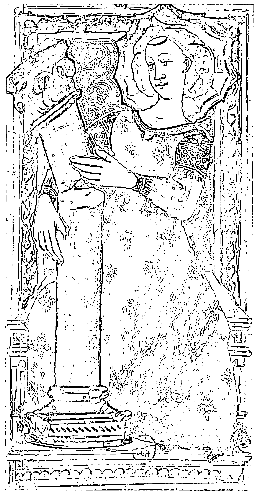

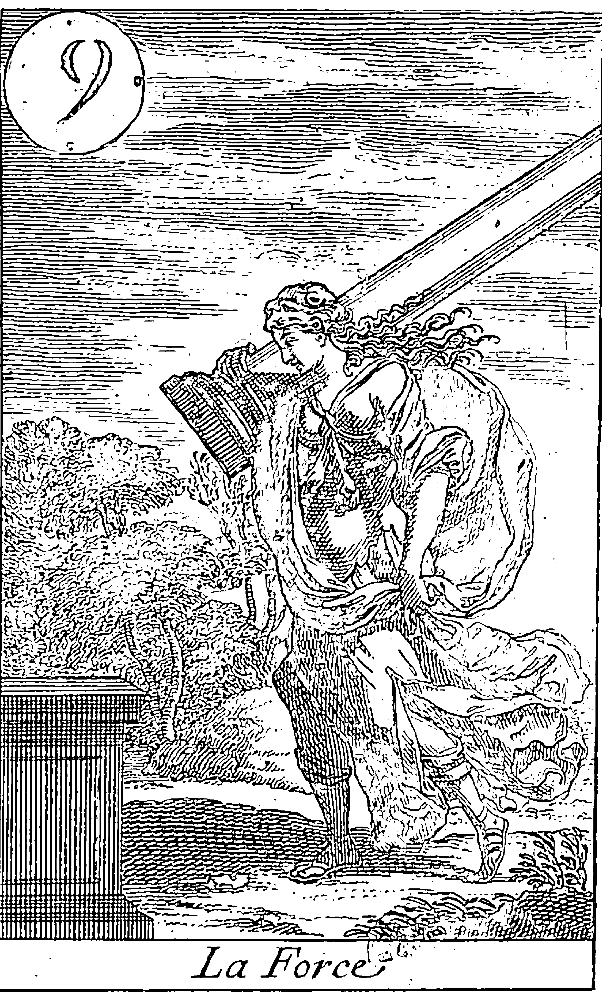

上左
一名女性寓意人物用手臂扶著斷裂的柱子，試圖保持柱子的完整。堅毅牌，出自所謂的《格蘭高尼／查理六世塔羅》，義大利北部，1475–1500 年。

上右
我最喜歡的「力量」牌之一，出自馮斯華·普瓦伊的明奇亞特牌，牌中人物有如亞馬遜女戰士般，若無其事地將圓柱扛在肩上。1658 至 1693 年在法國發行。

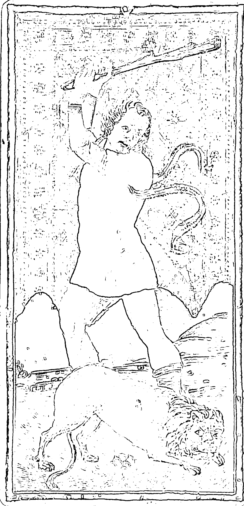

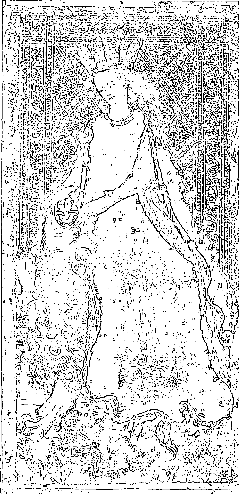

上左
「堅毅」，出自《維斯康提－斯福扎塔羅》，據稱作者為安東尼奧·奇科尼亞拉（Antonio Cicognara），1480至1500年，義大利米蘭。

上右
看起來溫和的女性人物坐在獅背上，她扳開獅子的上、下顎，讓牠露出尖銳的牙齒。「堅毅」，出自維斯康提·迪·莫德隆／卡瑞－耶魯塔羅，據稱作者為博尼法喬·班波，1428至1447年，義大利米蘭。

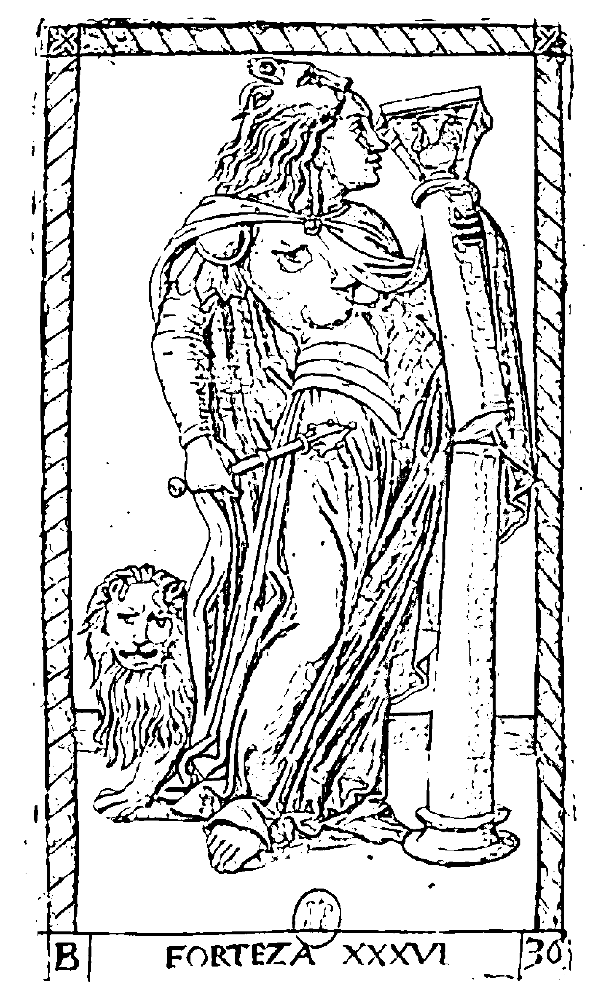

「堅毅」（Forteza），所謂的《孟特尼那塔羅》的第三十六張牌，出自E系列，約翰·拉登斯佩德雕版，1540到1560年。

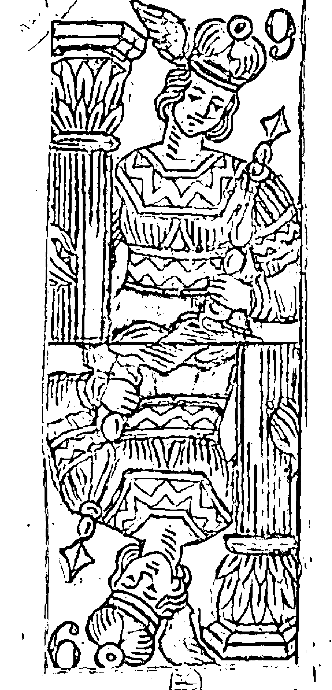

少女與完整的圓柱，作為「堅毅」的寓意畫，出自某副雙頭塔羅牌，1850年發行。

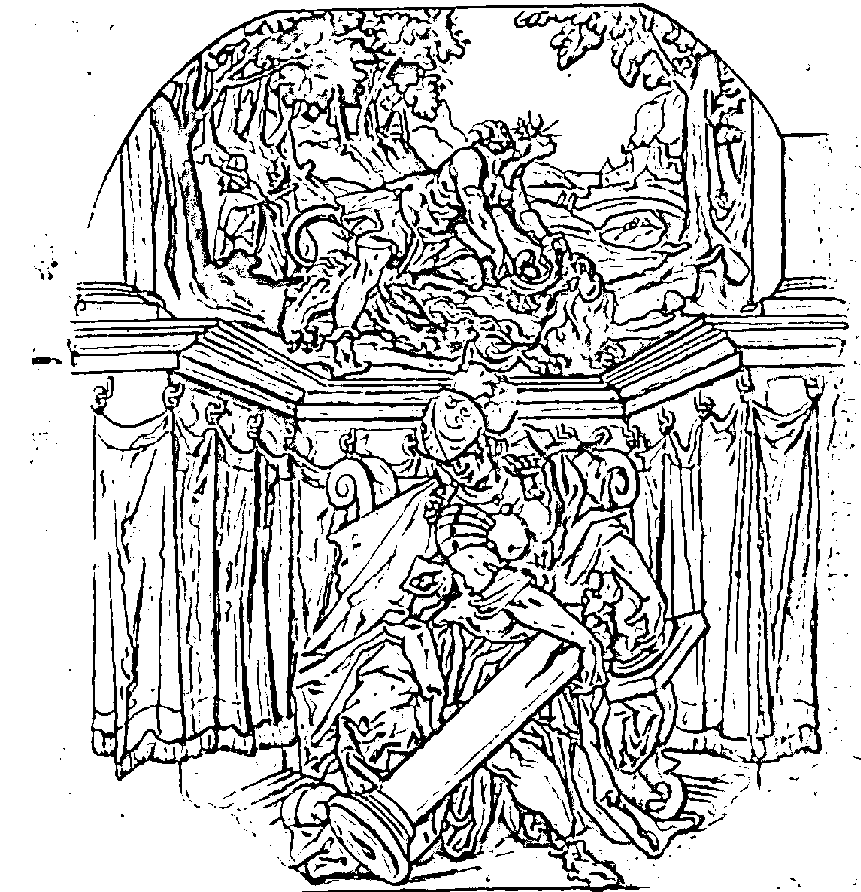

「堅毅」的寓意畫，上方顯示參孫消滅亭拿的獅子，對比下方堅毅美德的典型呈現方式，描繪一名穿著盔甲的女子抱著柱子的碎塊。

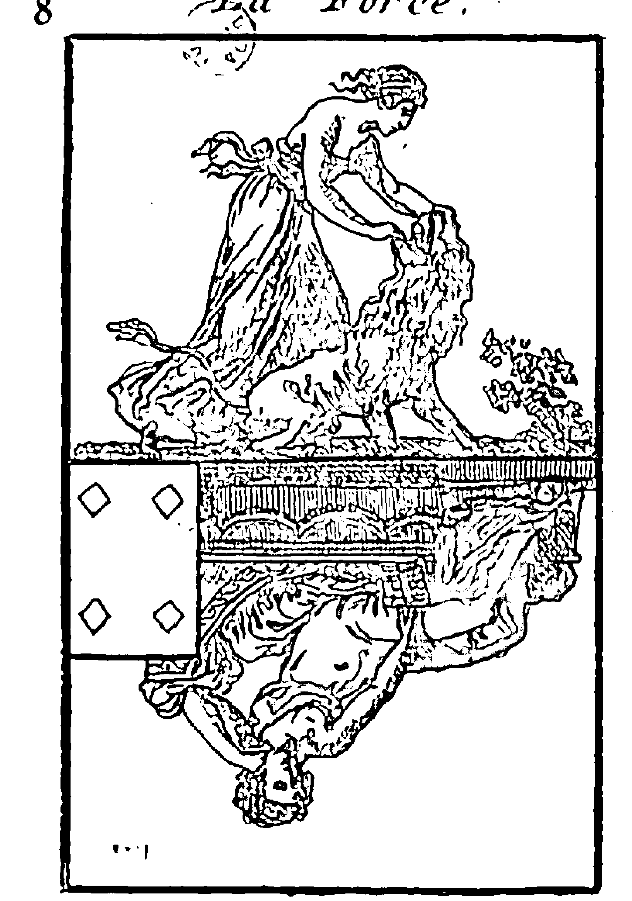

「力量/倦怠-憎惡」。《夫人小神諭》第八張牌，1807年由寡婦蓋菲耶在巴黎發行。

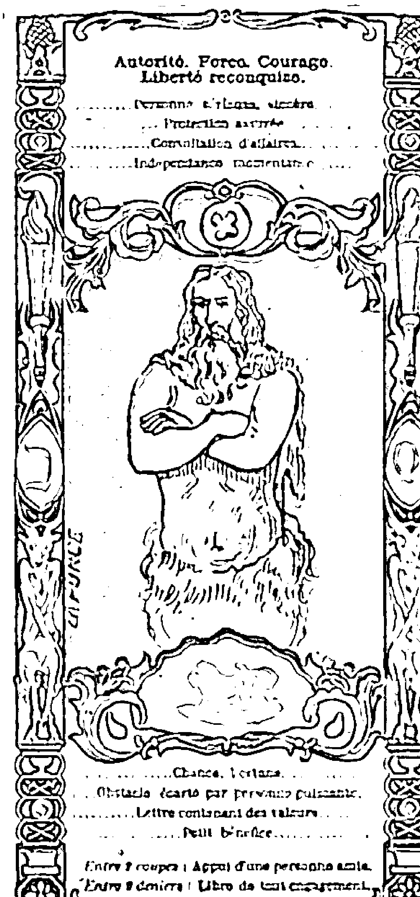

披著獅皮、顯露陽剛之氣的「力量」，出自《象形文字塔羅》（Tarot Hieroglyphique），作者為杜羅拉·德拉·阿耶夫人（Madame Dulora de la Haye），1897年在巴黎發行。

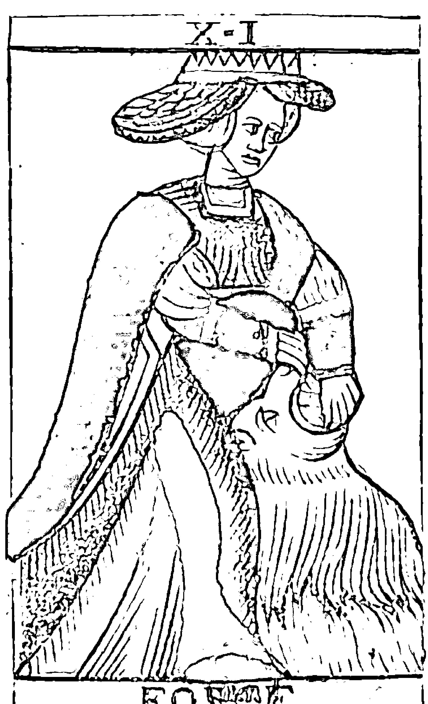

出自《識·諾貝雷塔羅》的「力量」牌，1659年在巴黎發行。

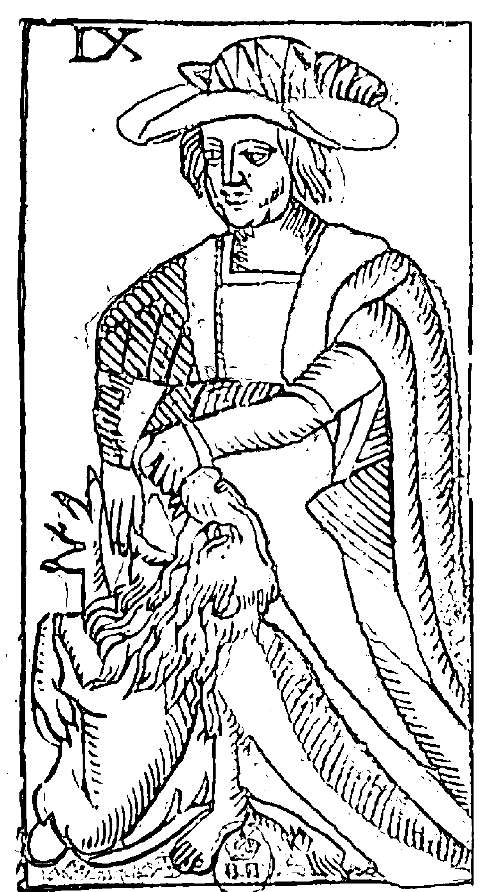

出自《雅克·維耶維爾塔羅》的「力量」牌，1650年在巴黎發行。

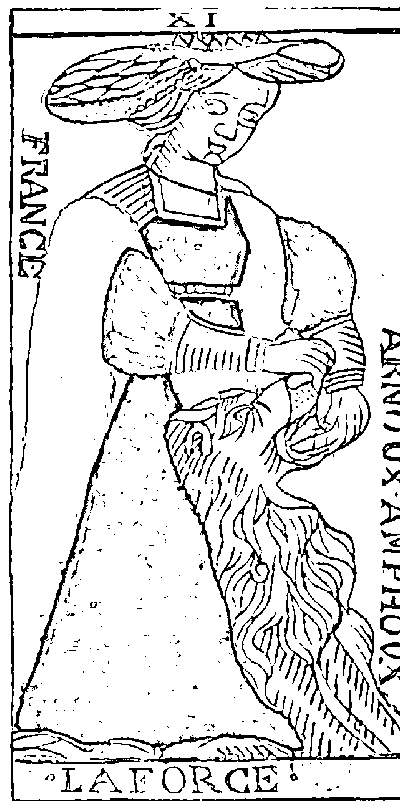

出自《阿爾努與安普霍克斯塔羅》（Arnoux and Amphoux Tarot）的「力量」牌，1801年在馬賽發行。

右頁《參孫鬥獅》（Samson's Fight with the Lion），作者為老盧卡斯·克拉納赫，1525年，德國。

## Merry

## Christmas

## 吊人

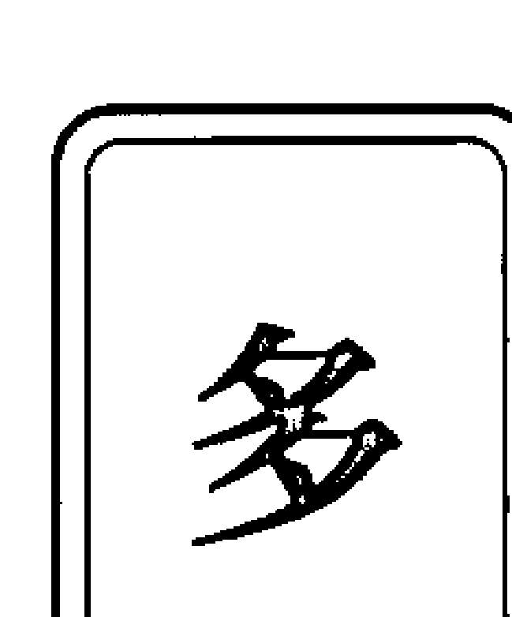

年前的冬天，我在紐約市的榮格學會（C.G. Jung Institute）瀏覽圖書館的書架，企圖僥倖發掘可以探索的新兔子洞，在這樣的機構裡確實有機會。我瞇著眼睛掃視塞滿書籍的水平線，最終目光停留在一本書——《吊人》——的藍色書脊上，不禁喜出望外！這是浮現在精神分析專著汪洋中一個熟悉的名字。我立刻抽出這本書，書封上印著顏色黯澹的潘蜜拉·柯爾曼·史密斯的「吊人」。這本意外發現的書是著名精神治療師謝爾頓·考普（Sheldon Kopp）的作品，其標題如同邪惡的魔法書般挑起我的好奇心——吊人：精神療法與黑暗力量。肯定是一本大有看頭的書！一回到家，我立刻花了些時間在網路上搜尋待售的同一本書，令我困惑的是，我還發現以下這則相當離奇的顧客評語。「胡謬之下令人信以為真的說法：在二〇〇二年電影《紅龍》（*Red Dragon*）裡，這本書出現在漢尼拔·萊克特（Hannibal Lecter）醫師的牢房，電影劇本改編自湯瑪斯·哈里斯（Thomas Harris）的同名小說。我沒讀過，所以無法置評。」

雖然我看過這套驚悚片三部曲好幾次，但從未發現那個說法是真的，然而我真希望是我錯了。當我們在思索「吊人」圖像可能代表的意義時，漢尼拔·萊克特——頂尖的精神分析學家、心性殘忍的鑑賞家、義大利文藝復興熱中者，他自認是維斯康提家族的後裔——是位古怪但機敏的候選者，適合陪伴我們去理解這張大阿爾克納牌所呈現令人不安的景象。其中一個值得提出來的理由是，萊克特醫師在二〇〇一年的電影《人魔》（*Hannibal*）中，曾對這個主題發表看法。《人魔》在義大利佛羅倫斯拍攝，在這裡，故事中那位虛構的食人魔選擇隱姓埋名，自我放逐。萊克特最近剛「除掉」卡珀尼圖書館（Capponi Library）的某位圖書館員並且冒名頂替他，開始過起他長久以來夢寐以求的文藝復興人生活，完全沉浸在十四和十五世紀的義大利藝術、詩作，以及描述政治權力遊戲和戲劇性死刑判決的信件中。在電影中的某個場景，漢尼拔以圖像研究為題，針對「吊人」牌的形象描繪發表了高度浪漫化的藝術史講演。他解釋說，吊人與背叛的罪行有關。為了支撐他的論點，萊克特醫師向著迷的聽眾出示但丁〈地獄篇〉裡的插畫，當中詩人在「自殺者」的森林發現遭貶謫的法學家彼得·德拉·維格納（Pietro della Vigna），以及出賣耶穌給羅馬人的猶大，他們之前都是上吊自殺的。

在冗長的介紹和離題很遠之後，我們回歸正傳：「吊人」牌及其圖像歷史反常地難以消化，卻是最迷人的塔羅牌之一。「吊人」完美體現了一個已知歷經極少修改的形象，但它所代表的意義卻一直隨著時間而改變。我們詮釋「吊人」的方式，無論從文化或秘傳的觀點，都受到社會發展的影響，由此我們可以推定，當作為道德奇觀的死刑慢慢從十九世紀的歐洲廢除時，「吊人」與叛徒的關聯也跟著逐漸消退。

左頁「吊人」，被他手裡拿著的兩個袋子給束縛住。出自所謂的《格爾高尼／查理六世塔羅》，十五世紀，義大利北部。

從十五世紀到近來的版本，「吊人」牌幾乎都描繪相同的圖像元素。一部木製的絞刑架，由兩根樹幹和一根水平橫跨樹幹的木頭構成；一名單腿懸掛於絞刑架的男子，視版本而定，他的另一條腿以較自然的角度彎曲。圖中的主角有時拿著袋子，袋子的重量將他往下拉，用意是增加他的痛苦。在不同的牌卡上，「吊人」的臉部表情從痛苦猙獰，到我所說的「如如不動的殉道者表情」，平靜地不帶一絲情緒。如今我們往往將「吊人」視為對極大苦難逆來順受、平靜以對的典範，因此格蘭高尼牌組「吊人」的手勢，或者索普拉菲諾牌組「吊人」的掙扎，會帶給我們一種近乎不適的感覺。我要明白地提醒各位，「吊人」牌的圖像起初隸屬於死刑的領域。在十五世紀的義大利和歐洲各地，公開行刑作為一種嚴厲的懲罰，依照罪行輕重和罪犯的社會地位高低，會有不同的殘忍程度。在召集民眾見證下，拷打折磨犯人的場面負有道德教化的功能，這種殘暴的行為足以警誡觀刑者。值得注意的是，在天主教的想像中，肉體受苦也提供了救贖的效果。忍受痛苦被視為與釘在十字架上受苦的基督產生連結的一種方式。

死於絞刑會令人蒙羞，因為那是專屬於下層階級的刑罰。被單腳吊起來是更痛苦、更丟臉的事，這種屈辱通常保留給叛徒和涉及貪污和詐騙者，尤其是受貪念驅使的人。在法國孔克村（Conques）聖斐德斯教堂（Abbey of Sainte-Foy）的山牆三角面上，「貪婪」被擬人化為一名倒吊的男子，脖子上還掛著一袋沉重的金子，他的物質欲望變成他遭受譴責的一部分原因，體現出「使他向下沉淪」的事物。這幅圖畫或許道出了這個頭下腳上的受苦者所持袋子的象徵性解釋之一，就是對於罪孽深重的行為的一種諧仿。

這個主題也讓人想起義大利的羞辱畫現象——這類受城邦政府委託而繪製的圖畫，被用來象徵性地懲罰那些做出醜事的市民。這些圖畫刻意放在街上，好讓大家都能看見，受罰者被描繪成單腳倒吊，藉由玷污名聲來懲罰他們。在依舊受封建禮法規範的義大利文藝復興時期，丟失臉面和人格謀殺意味著社會性死亡。同樣的，透過被視為兩次背叛的叛徒猶大的例子，可以看出背叛和絞刑的概念。這位腐敗的門徒收下一筆錢，便將基督交給羅馬人，後來出於內疚而自殺。按天主教教義，自殺是對信仰的背叛。

十八世紀時，安束萬·庫爾·德熱伯蘭寫下了他一貫認知不足的塔羅結論。他錯將「吊人」上下顛倒，於是以為看見了一個用單腿站立的男人，他的另一隻腳被繩子綁在地上，這位博學的新教牧師將這張牌與「審慎」聯想在一起，用這個錯誤解讀解決了關於基本美德的難題。某些遊戲牌卡確實畫出了站立的「吊人」，至少稱得上是一種超現實畫面。

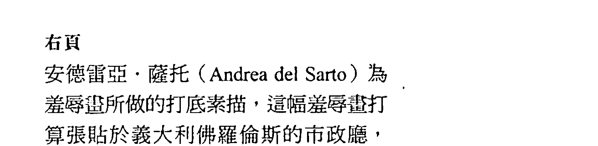

十九世紀時詮釋的方式開始改變，這時也是神秘塔羅的尖峰時期。此時，《馬賽塔羅》的圖像已經充分確立，「吊人」懸在空中擺盪。但這不是唯一的改變。舉例來說，在法國，法國大革命後，死刑的行刑方式歷經了改革，使用斷頭臺成為標準措施，在當時被認為是更為人道的手段，而折磨犯人則被視為是一種病態的作法。行刑場面也逐漸不再公開展示，回復到在監獄的天井執行。「吊人」及其所受的羞辱失去了原本的意義，而且叛徒消失，變成了我們應予以同情的殉道者。神秘主義者艾里法·李維知道熱伯蘭做了錯誤解讀，在一八五六年曾描述「吊人」象徵獻祭達到高潮，他在肉體上的超越是一大成就²。對奧斯瓦爾德·維爾特而言，或者在韋特－史密斯塔羅，「吊人」的頭部發散屬於聖徒所有的光環。「吊人」用一條腿指向天球，彷彿指出他所關切的重點，他已經超越了肉體的疼痛，擺脫肉體存在的形式，向上獲得啟蒙。所以，別將他的面無表情錯認為漠不關心，我們看到的是一個平心靜氣、處於放棄狀態的人。他的信仰正在接受考驗，但他的良知位於別處，已經昇華交付給心靈。形成角度的身體姿勢呼應了萬能鑰匙的形狀，進入高維境界。「吊人」無視於有關自己目的地的一切，但接受自己正處於一種無法控制的狀態，他懸盪在交界之處，很快便要與「死神」會合。

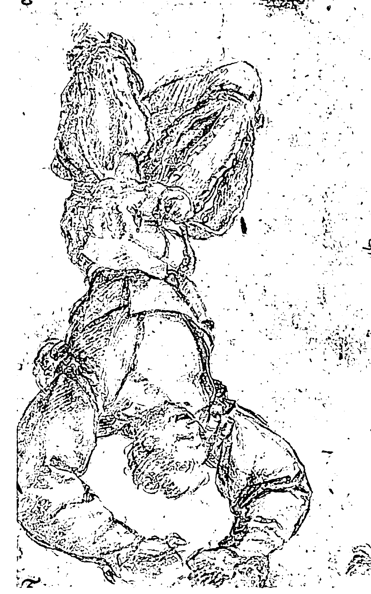

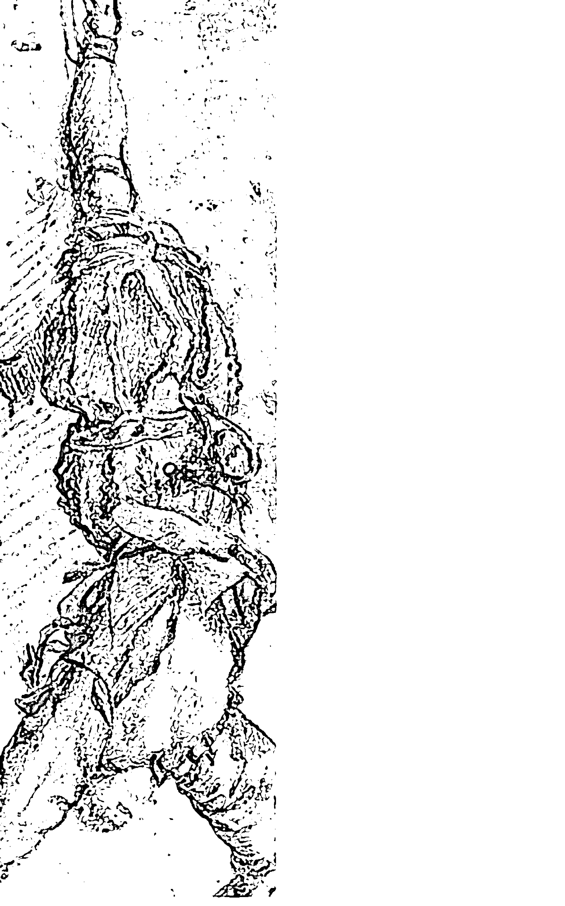

12

XII

12

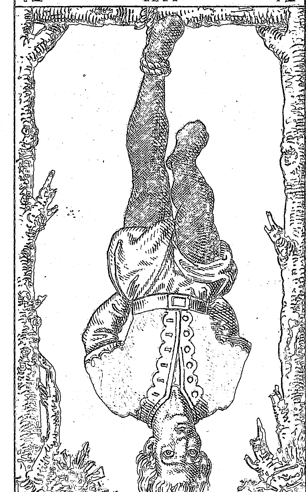

L'APPESO

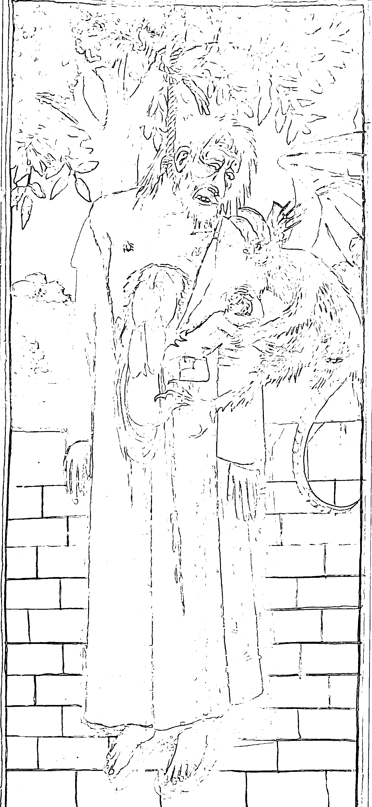

左頁「吊人」，出自義大利的索普拉菲諾牌，十九世紀晚期，麥克洛斯基古書籍與牌卡館藏。
右《猶大的自殺》（The Suicide of Judas），喬凡尼·卡納維西奧（Giovanni Canavesio）繪製的壁畫局部內容，法國拉布里格（La Brigue）楓丹聖母教堂（Chapelle Notre-Dame des Fontaines），1492年。畫中的猶大吊死在一根莓果樹下，他被開膛破肚，內臟流淌出來。在右邊，一個人形惡魔正在收取猶大的靈魂。

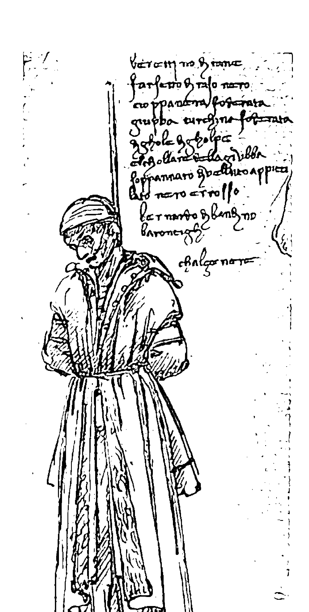

左《伯納都·班迪尼·巴隆切利素描圖》（Drawing of Bernardo di Bandini Baroncelli），描繪巴隆切利被吊死的模樣，作者為達文西，繪於1479年。巴隆切利煽動同謀對付梅第奇（Medici）家族，之後在君士坦丁堡被捕，押送回佛羅倫斯，因背叛罪而被處以極刑，吊死在巴傑羅宮（Palazzo del Bargello）。當中手寫的文字是達文西出名的鏡像字，以相當簡潔的方式進行說明，列出巴隆切利的衣服顏色。

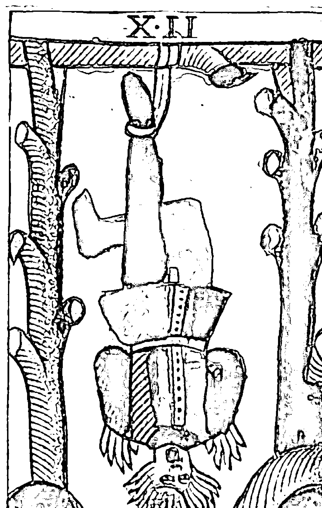

嘴上一大滴墨水意外地使這個表情豐富的「吊人」顯得近乎滑稽，失去了他傳統上的平靜態度。出自《尚·諾貝雷塔羅》，十七世紀後期在巴黎發行的一種馬賽式塔羅。

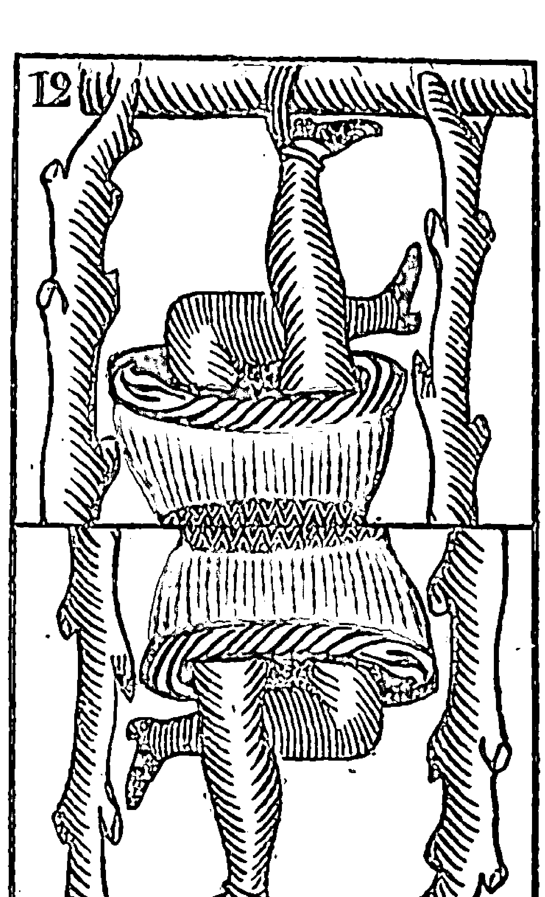

這副雙頭馬賽牌的「吊人」命運悲慘，在吊死的過程中也掉了腦袋。巴普蒂斯特－保羅·格里莫（Baptiste-Paul Grimaud）於1860至1899年間發行。

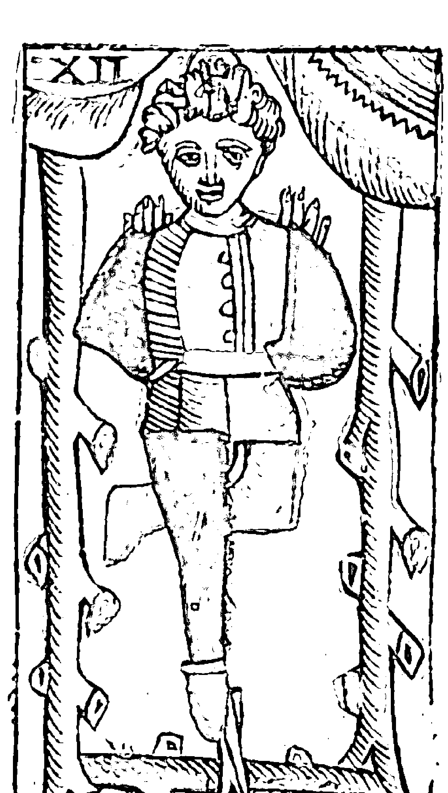

這個上下顛倒的「吊人」違反了地心引力，看起來好像在跳舞。出自《維耶維爾塔羅》，1650年。

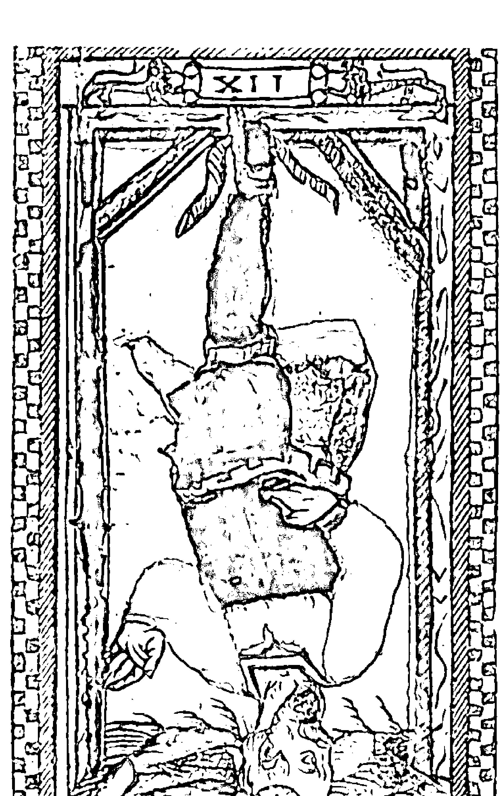

出自《不具名巴黎塔羅》的「吊人」，1600到1650年。

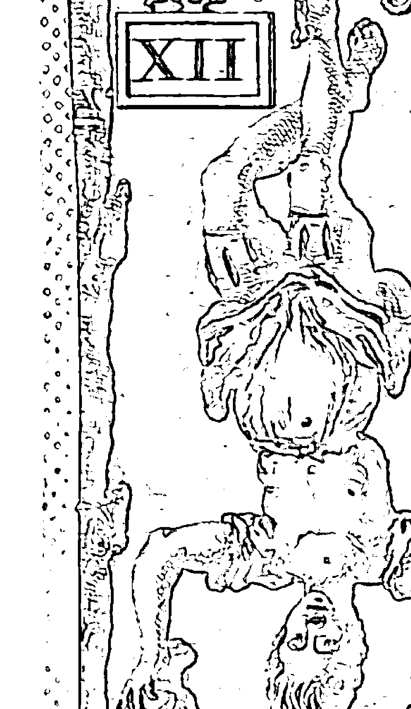

出自某副明奇亞特牌的「吊人」，印刷在絲綢上，作者為喬凡·莫里內利，佛羅倫斯，1712 到 1716 年。

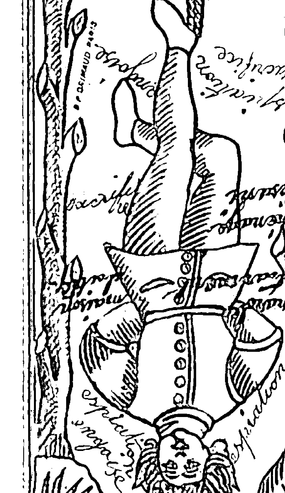

出自《馬賽塔羅》的「吊人」，上面有一些手寫的占卜題詞：「贖罪」、「痛苦」、「言語」、「憂慮」，以阿爾諾（Arnoult）的牌組為範本，格里莫發行，1891 年，巴黎。

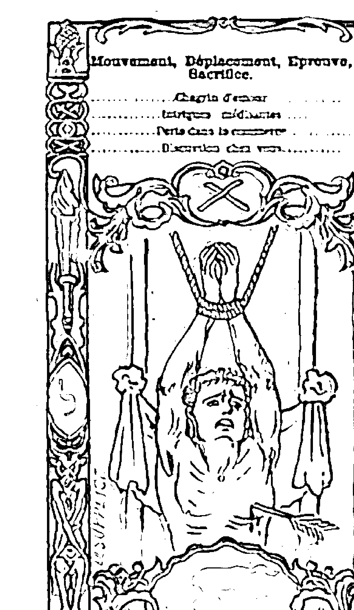

「酷刑」，靈感得自聖賽巴斯蒂安（Saint Sebastian）的「吊人」，圖中殉道者的胸膛像天主教聖徒賽巴斯蒂安那樣中箭。出自杜羅拉·德拉·阿耶夫人的《象形文字塔羅》。


在奧斯瓦爾德·維爾特的 1899 年《中世紀畫家塔羅》中，可以看見金塊從塞在「吊人」手臂的袋子裡掉出來，在他臉部四周形成了金色光暈。

### 死神


COVID-19 封鎖隔離期間，我策劃了一個名為「如繆思般死亡與復活」（Death and Resurrection as Muse）的塔羅課程。我與學員從藝術、歷史和創意發想的觀點，來探討大阿爾克納的敘事序列。這個研討會的目的是為了邀請大家仔細思索塔羅所傳達的生、死和復活的隱喻，並探究如何利用這些發現，在危機發生時再次點燃他們的創造力。為期四週的課程結束時，學員必須創造一張自己發明的塔羅牌，或重新設計一張他們不由自主受到吸引的塔羅牌。手藝高超的女裁縫維琪·塞斯克（Vickie Scescke），創造出左頁這件美麗的刺繡作品，作為最後的作業。她的靈感來自十九世紀勒夸爾《馬賽塔羅》中的無名稱牌卡。她的作品附帶以下一小段文字：

> > 身為裁縫師，我有時候會翻製祖母或曾祖母所製作的被子圖案，最重要的目的是為了向她們致敬。除此之外，在這個過程中，我的手指也會重覆她們幾十年前做過的動作，這麼一來，生者與已故者之間便產生了連結。我在製作「死神」牌時想到這個過程，見證了十九世紀的一個藝術家和圖像。我選擇使用刺繡手法，對我來說這是一種慢功夫，能延長學習和記住圖像的活動。我採用明亮的粉紅色和裙子的紫色，讓人物顯得女性化。她腰間的花和地面的植物代表重生的希望，即便她揮舞著長柄大鐮刀。

維琪的作品特別打動我，因為它寓意深刻且不矯揉造作，清楚地傳達了關於我們有限生命的複雜概念、我們如何與祖先的舊習慣產生連結，還有像刺繡或縫紉這類庶民的工藝，如何能變成一種冥想方式，賦予我們面對悲傷的力量、紀念和頌揚過往的事物。這件「死神」刺繡，如同維琪富於詩意的描述，透過不受限於時間的手指、針和線的共舞，將過去、現在及未來的幾條故事線交織在一起。一旦完成敘事，打上結、修整絨花，這個圖像便成為紀念這些故事的載體，脫離我們而繼續存在，傳承給未來的世代。

到了「死神」牌，類似的事情會發生。隨著大阿爾克納包羅萬象的故事來到這張「死神」牌，我們會相信生命就像一條線。一個線性且緊湊的連續體，編織出故事，在開始與結束之間繃得緊緊的。然而，塔羅的「死神」牌是一旦跨過便沒有回頭路的界限，它並非結束，而是一種深刻的啟示，一種揭露。那是《我們所知道的世界末日》（“End of the World as We Know It”），就像這首在疫情期間重新走紅的 REM 樂團金曲。這條經驗的長繩一旦中斷，事情會以決定性的方式徹底改變，而我們將面對所有無法理解、說不清道不明的事態發展。這種變化可能讓人感到極不舒適和恐懼，但在塔羅圖像中，描繪死亡的寓意畫往往提倡一個經過修改、更樂觀的死亡概念，是一個轉捩點，而非收場白。在注視這個骨骼人形時，我們正跨越一個引領我們通往一長串神秘冒險的門檻。我們的壯闊之旅絕未結束，事實上可能才正要開始。

左頁刺繡「死神」牌，維琪·塞斯克，2020年。

不管被稱作「死神」或者沒有標示名稱，這張塔羅大牌總是與數字十三有關——我們迷信地將之與惡運聯想在一起。這個數字本身富含意義，使人想起與一整個歷年有關的十三個陰曆月，暗示當我們到達這個點，我們就完成了一個完整的週期，在結束一個篇章後開始了另一個篇章。就圖像學的觀點，「死神」牌依循兩個主要的差異而演進，這兩種差異在十五世紀的塔羅牌中皆已顯現，受到當時的視覺文化影響：我們把第一種稱作「『入侵者』死神」（“Death the Invader”），第二種是「『另我』死神」（“Death the Alter Ego”）。

「入侵者」死神散發殘酷的氣息，他高高坐在馬背上，有時身披全套盔甲。在《查理六世塔羅》「死神」牌中，面目猙獰的死神摧毀、消滅其座騎行經之處的一切生靈，以相同的氣勢踐踏教皇和紅衣主教。這種好戰的態度和渴望任意肆虐，讓人想起十四世紀歐洲爆發瘟疫時出現的天啟式光景。「入侵者」死神與《啟示錄》（Book of Revelation）中的白馬騎士有關，這個殘暴的原型非常普遍，從畫家老布勒哲勒（Bruegel the Elder）的《死亡的勝利》（Triumph of Death）到《邪惡的黑暗大軍》（Evil Dead's Army of Darkness）——描繪既生機蓬勃又恐怖的死神，他統領著骷髏軍團大舉圍攻活人。在這些圖像裡，時間軸的結束呼應著世界末日，我們中看見從事侵略和破壞的大軍有系統地消滅腳下的萬物。死神和他的軍隊沒有敵手，因為他們早已死亡。他們毫不留情地劫掠生命，迫使我們屈服，在他們的集體威勢下無力可施。

另一方面，第二個或許也是最重要的寓意圖像，是作為「另我」的死神。從《維斯康提－斯福扎塔羅》到各種馬賽式塔羅，「死神」再一次被人格化，這回他只是手持長柄大鐮刀站立著，這是一個普遍化但有意義的細節。他和我們位居同樣的高度，站在與我們一同立足的地面上，顯得較不嚇人且更有人性，他那溶解的屍身展露無遺，反映出我們身體的樣子。這種死神形象雖然恐怖和異樣，卻是可以親近的，足以讓我們去思索，他彷彿在說，「現在的我就是日後的你。」

模樣陰險的「另一個我」使人想起「死亡之舞」，這是屬於中世紀後期的主題，也出現在瘟疫蔓延期間。在這些圖像中，一具快活的屍骸會搭配一個套路人物——教皇、騎士、流浪漢、修女、隱士……以及其他許多我們在塔羅中會發現的類似人物。擔任靈魂嚮導的屍骸牽起他們的手，邀請他們加入這個著了魔的不祥行列，跳起通往往世的最後一支舞。各個社會階層的代表都會出現在死亡之舞中，彷彿暗示經歷死亡是不分貴賤的事。無論你是貧窮或富有、顯貴或卑微，在今生積累或失去的東西再也不重要，因為我們很快就會被迫放下一切。不同於第一個例子，死亡之舞呈現了與死神的人際關係，當我們見到那些護送我們走進墳墓的人，我們會思考自己在身後留下了什麼。

大阿爾克納序列的高潮之一「死神」牌，標示出故事的轉折點，以及通過儀式的起點。在這張阿爾克納中，我們從處理時間的短暫本質，進展到首次瞥見壯闊恢宏的無限。往往令人害怕的「死神」牌，事實上是在描述我們欣然接受改變，或者將之體驗為一種入侵的能力，這種入侵就像死亡本身，是普世的經歷。從我們的所在之處，我們緊抓著所知的事物不放，過了這張牌之後，我們感覺一切都超出了我們的舒適圈，難以企及或令人害怕。這位面目猙獰的收割者帶著溫和的冷笑和令人生畏的鐮刀，在生者與亡者的領域之間劈砍出一道入口，謹慎地引導我們脆弱的靈魂前往彼岸。


出自所謂的《格顱高尼／查理大世塔羅》的「死神」牌，義大利北部，十五世紀。


出自某副明奇亞特牌的「死神」，印製在絲綢上，作者為喬凡·莫里內利，1712到1716年，義大利佛羅倫斯。


騎馬的死神，出自《塔端塔羅》，十七世紀於義大利波隆那發行。

出自《維斯康提－斯福扎塔羅》的「死神」牌，據稱作者為博尼法喬·班波，十五世紀義大利米蘭。


右《死亡的勝利》，不知名藝術家，出自巴勒莫的《阿巴特利斯宮》（Palazzo Abatellis），1446年。


喬裝成紅衣主教的死神說「我即是結束。」，據稱作者為安東尼奧·奇科尼亞拉，1490年代，義大利。倫敦維多利亞與艾伯特博物館館藏。


「死神與女修道院院長」（“Death and the Abbess”），《死亡之舞》系列的一部分，據稱作者為雅克-安東尼·肖萬（Jacques-Antony Chovin），創作於十八世紀。我特別喜歡出自肖萬的《死亡之舞》的這幅畫。畫中半腐的骸骨彎下身，用枯槁的手指撫摸女修道院院長的道袍，用一小片皮膚感受布料的柔軟質地。這具骸骨狀的身體成功傳達出此次碰觸所產生的愉悅和驚奇。這種感覺喚起活生生的記憶，就像普魯斯特的瑪德蓮（法國作家普魯斯特在《追憶似水年華》中仔細描述瑪德蓮帶給他的暫時回憶）——彷彿他正在想：「我記得這個，我記得它摸起來的感覺。」骸骨沉浸在回憶中，忘記了他在死亡之舞中引導女修道院院長的職責。他陷入一種感覺，想起他一度曾經是我們。


「死神」牌，《馬賽塔羅》，史帝法諾·維格納諾（Stefano Vergnano），1827年，義大利北部。


「死神」牌，《馬賽塔羅》，格里莫發行，1890年。


出自《維耶維爾塔羅》的「死神」牌，約1650年發行。


「梅花四」，出自夏洛特·馮·雅尼森-沃爾沃特（Charlotte von Jennison-Walworth）設計的牌組，1808年發行。


死神從墳墓中現身，手持長柄大鐮刀和一個有翼的沙漏，指涉「時光飛逝」這句拉丁文格言。出自埃及式《大埃特拉》，1850至1875年在法國發行。


擺弄手勢的死神之舞近乎滑稽。圖中的死神包裹著滑順的血紅色紗巾，與「結束」的概念相去甚遠，這張牌是與生命力對立的象徵。出自《夫人神諭大遊戲》，由雷加米設計，十九世紀晚期在巴黎發行。


出自《米泰利塔羅》的「死神」牌，1660至1670年在義大利羅馬發行。


「凡人必死」和「悲傷」。死神埋伏於墳地，在牌面另一邊，一位寡婦為心愛的人哭泣，握著墳上的骨灰罈。出自《夫人小神諭》，寡婦蓋菲耶在巴黎發行，1807年。


作為醫師的死神，正把藥倒進臥床病人的湯匙裡。死神的背後盤著一條蛇。出自1840年代的德國塔羅牌《顛倒世界》。


## 節制

「節制」牌讓人認清「過量」所帶來的危害，代表一種淨化過程和終極的恢復平衡。在左頁這件布里格斯（Brygos）紅色人物的陶器複製品上，我們看見一位正在嘔吐的病人，身旁的女子（常被描述為侍妾）輕輕扶著他的頭。男人站立著，從口中嘔出一長串液狀物體到地板上，由於侍妾扶著他的頭，所以他沒有弄髒自己。這幅令人莞爾的圖畫諷刺地被畫在赤陶酒杯裡，讓我們不禁將它看成是一幅以儆效尤的插畫：「小心！放縱自己會讓你變成和他一樣！」

我們心目中的古希臘人形象，往往被好萊塢電影和希臘羅馬主題變裝派對給扭曲了。我們常想像他們縱情於聲色，頹廢墮落，並且喜愛縱酒狂歡。事實上，古希臘人對於放蕩的行為頗有警覺，平時會避免酪酊大醉，只有在出神忘我的宗教儀式中才會喝醉酒，例如科莫斯（Komos）醉酒遊行和酒神戴奧尼索斯儀式，這些儀式可能正是這件酒器插畫的主題。事實上，除了因宗教需求而醉酒，古希臘人對於過度攝取酒精尤其在意，他們會用水將酒稀釋（一份酒兌上三份水）。此外，他們也對那些飲酒不懂節制的人有負面的評價，認為飲酒過量是一種野蠻行為。

「節制」的概念源自古希臘，是最後一個出現在大阿爾克納中的基本美德。節制牌往往與適度和自制有關，因此將酒稀釋的比喻被選作「節制」牌的圖像象徵。牌中擬人化的女性人物看起來像一位神聖的調酒師，她使用名為九頭蛇（hydra）的盛水容器，往用來調和酒水的巨爵裡注水。有時也使用小水瓶、高腳淺杯或酒杯。

古希臘人在稀釋酒的過程中保持自我節制，我們可以想像得到，這些近乎透明的液體如何讓他們看見描繪在酒杯裡的那個嘔吐的男人。我們也不妨在酒杯裡想像這幅景象，藉以巧妙地告誡自己，再喝一小口就要過量了，最後可能會讓你嘔吐。

古代世界裡還存在另一個重要的特殊文化，那便是人們認為水具備了淨化的力量，能啟動神聖的衛生循環。許多現代的衛生習慣和系統都承襲自古希臘人和羅馬人，他們發明了污水系統、公共浴場、原始的淋浴器和公共噴泉。我們時常忘記現代「水療」文化其實是這些古人的遺產，例如二十世紀浴療觀光業和保健專家決定採用「spa」這個字，作為拉丁文格言「藉由水保持健康」（sanis per aquam）的首字母縮略語。

左頁
畫中女子扶著正在嘔吐的男子的頭，出自描繪該主題的雅典酒杯水粉畫複製品，作者署名為布里格斯。創作於西元前第五世紀初期，德國符茲堡（Würzburg）收藏。這件水粉畫屬於倫敦的惠爾康收藏品。

我們如何在大阿爾克納的脈絡中解讀這張牌？「節制」繼「死神」之後迎接我們，像一名使者、嚮導、但丁〈地獄篇〉的維吉爾（Virgil）那樣的歡迎著我們進入來世。她容光煥發的美麗與死神屍骸般的可怖外表形成了強烈的對比，我們可以猜想這是有意的安排。在若干塔羅牌中，包括大多數的馬賽牌和萊德-韋特-史密斯塔羅，「節制」呈現出天使的樣貌，這種超自然生物是一種令人感到安慰的存在，也傳達出我們離開舊世界、進入一個尚未完全瞭解的新次元的概念。在《托特塔羅》，相當於「節制」的牌名叫「藝術」，呈現一個在坩堝中混合水與火的雙頭人。在這個普遍存在的人物背後，一個橘色光圈顯露出著名的煉金術格言，這段文字出自巴齊爾·范倫廷（Basile Valentine）的十五世紀著作《哲學家的阿佐特》（L'Azoth des Philosophes）：「進入地球的核心，經過精煉後，你便會得到這種隱藏的石頭。」

的確，到了接下來的「惡魔」牌和「塔」牌，我們將造訪深淵，進入地球內部。節制「帶著」兩個溝通的容器，這個招牌姿勢可以理解成接受和淨化的能力。如同《聖經》裡的洗腳禮，這種洗禮儀式具備神聖的性質，說明我們不應該害怕這個陌生之地，並且幫助我們做好準備，洗淨我們先前的殘渣。如同畫在那件赤陶酒杯上的侍妾，「節制」以隱喻的方式扶著我們的頭，讓我們拋下不再適用於我們的東西，好讓我們有機會重新啟動。她用她的水滌淨我們，讓我們為即將發生的下降做好準備。


左頁
出自《維斯康提-斯福扎塔羅》的「節制」牌，據稱作者為安東尼奧·奇科尼亞拉，1480至1500年，義大利米蘭。


「節制」，出自所謂的《格蘭高尼/查理六世塔羅》，十五世紀，義大利北部。


「節制」，出自某副明奇亞特牌，印製在絲網線上，作者為喬凡·莫里內利，佛羅倫斯，1712至1716年。


「節制」，出自某副明奇亞特牌，巴拉喬里（A. Baragioli）在義大利佛羅倫斯發行，1860至1890年。


「節制」，出自某副明奇亞特牌，葛塔諾（Gaetano）在義大利波隆那發行，1763年。


天使形態的「節制」，出自某副馬賽式塔羅，阿爾努與安普霍克斯在法國馬賽發行，1801年。


「結合－改變」，附有手寫占卜詞的「節制」牌，出自《馬賽塔羅》，格里莫在巴黎發行，1890年。


「節制－夜晚」，出自《夫人小神諭》，由寡婦蓋菲耶在巴黎發行，1807年。


出自某副雙頭塔羅牌的「節制」，由格里莫在巴黎發行，1880年。


出自奧斯瓦德·維爾特的《中世紀畫家塔羅》的「節制」，1889年，巴黎。

右頁「藝術」，《托特塔羅》的「節制」牌，阿萊斯特·克勞利和哈里斯女士，1944年。

## XIV


### Art

## 惡魔

認為在喬凡尼·迪摩德納（Giovanni di Módena，中世紀後期義大利畫家）所描繪的地獄裡，那個形態噁心的惡魔是有史以來所創造最迷人的圖像之一，因為它具備了十足的表現張力。這幅畫雖然讓人難以直視，覺得反胃至極，卻不可能不被它吸引。他的臉上長著像生殖器開口的畸形模樣，在醜惡中顯得既猥褻又滑稽。被陰間之主吞食的這些人，將等待著何種難以形容的命運？辣醬瓶標籤上的惡魔與之相較之下，根本完全相形失色。

他那有點藍色的皮膚泛出腐朽的銅綠，就像腐敗的屍體顏色。捲曲的螺旋形毛髮表明了他的獸性行為。高大魁偉的身材配得上他吞食靈魂的旺盛食慾，他從軀體的兩端進行吞噬，其中包括第二張「嘴」，嚴格來說稱作「胃－頭孔」（gastrocephalic hole）。這個怪異的特徵出現在描繪惡魔的許多中世紀圖像，從視覺上傳達出他狼吞虎嚥的胃口，以及他的本能勝過智能的表現。在注視這幅可怕的圖像時，我們會明白他的身體就像地獄本身那樣錯綜複雜，扭曲且多重。惡魔既是折磨者，也是折磨的場所。當我們仔細思索惡魔的身體，不難相信他本身就是進入陰間的門戶，通往地球中心的地獄之嘴。這場下降之旅完全等同於一個消化的過程，是進入黑暗深處的逆向入會儀式。

此外，這個惡魔也饒富趣味，因為他是在十五世紀初期被構想出來，大約相當於塔羅牌卡的創製期。這是一個重要細節，因為文藝復興時期描繪這個惡魔的牌卡沒有任何一張留存至今。為什麼會這樣？我們不得而知。它們可能已經遺失，或者如某些人所認為的，它們遭到了毀壞，以免被運用於邪惡活動。塔羅學者瑪麗·格里爾在部落格文章中也提出相同的疑問，她推測這些早期牌卡可能被用於施咒。她引述安德雷亞·維塔利的文章，而後者則援引十六世紀威尼斯宗教裁判所的審訊謄本。文中描述在某個案件中，一名女子被法庭控以行使巫術，試圖對瀕罪的靈魂施行祈禱儀式，藉以獲得某男子的愛意，她在祭壇上擺放了塔羅「惡魔」牌。

我樂於想像早期的「惡魔」牌就如同喬凡尼·迪摩德納所描繪的可怕生物。在十七世紀的法國，某些《馬賽塔羅》中的「惡魔」牌確實畫著胃－頭臉，彷彿為了方便讓這個吃人的妖魔在往後流傳下來。他那毛茸茸的外表自有道理，讓人想起中世紀歐洲喜歡描繪的野人（Wild Man）主題。野人擁有一身濃密的毛髮，這種原始的林地生物過著遠離文明的生活，隔代遺傳的本能需求使得他顯得生氣蓬勃。我們的大阿爾克納惡魔也算得上是他們的近親，與好色的羊男薩堤爾，還有希臘的自然生命力之神潘（Pan）系出同源。

左頁
惡魔，出自喬凡尼·迪摩德納的《地獄》壁畫，1410年完成於義大利波隆那的聖白托略聖殿（Basilica of San Petronio）。

塔羅中的「惡魔」向來是個模稜兩可、介於兩者之間的人物。他是一種嵌合體，半人、半羊，有時半鷹。在《馬賽塔羅》中，他往往同時具備男女兩性的性徵，對此我們可以透過基督教的觀點，將之解讀成象徵惡魔不可遏制的性慾。這位地獄之王高踞臺座上，是個誘惑者和縱容者，而被鎖在他跟前的兩個寵僕，則是模稜兩可的奴隸和護衛。將他們繫在柱子上的繩索，使人聯想到關於偶像崇拜的寓言。在喬托繪製於斯克羅威尼禮拜堂（Scrovegni Chapel）的《不信神寓言》（Allegory of Infidelity）中，畫中人物被繩子拴在他錯誤膜拜的塑像上。他閉著眼睛表示他的否認，因為他受制於他所崇拜的對象。如同「惡魔」那兩個順服的隨從，他是自願並盲目地受到限制。

到了十九世紀，惡魔的文化地位從不光彩的怪物變成浪漫的反英雄人物。在米爾頓（John Milton，十七世紀英國詩人及思想家）寫於十七世紀的史詩作品《失樂園》（Paradise Lost）中，撒旦是對抗造物主上帝的造反者。他的反抗將使他成為後世眼中不服從和解放的象徵，在理性覺醒以及懷疑天主教會和政治權威的普遍氛圍下，給予藝術家和神秘主義者創作的靈感。路西法（Lucifer），詞源學上意指「帶來光明者」，取代了「上帝之敵」撒旦，這種觀點的徹底改變致使惡魔擺脫了作為乖僻偶像的身分，進而成為不滿的啟蒙人物。

在塔羅中，惡魔的圖像和意義往往受到艾里法·李維的巴風特（Baphomet）研究的啟發，巴風特是羊頭惡魔，據說是聖殿騎士的膜拜對象。艾里法·李維也參與了這個復興運動，寫下名為「女巫安息日」（“The Sabbath of the Witches”）的篇章，文中描述這位有角的神祇是泛神論裡的維持平衡者，透過對立的兩極來找到合諧的復原¹。值得注意的是，將李維作品翻譯成英語的不是別人，正是萊德－韋特－史密斯塔羅的倡始者和共同創造者亞瑟·愛德華·韋特。儘管韋特對巴風特的看法不同於法國神秘主義者李維，但他的「惡魔」牌是從李維本人繪製的原型中找到靈感，如同在他之後的許多人。

在當代塔羅實務中，「惡魔」不像以往那樣被視為一張窮兇極惡的牌。「惡魔」牌依舊代表我們落入自己造成的困境和模式，例如成癮行為和相互依賴，它往往被解讀為邀請我們去探察自身的黑暗面或被壓抑的欲望，以及對抗社會規範。惡魔常被比作「教皇」牌的陰影人物。除了簡單的構圖相似，教皇還創造出被惡魔逆轉和廢除的道德架構，要求我們注意自己的盲點和偽善，並透露出通往真實自我之道，就在光與影的交會處。


上左
《不具名巴黎塔羅》的「冒一头恶魔」，具备蝙蝠翅、鹰脚和山羊头的嵌合体怪物，1600至1650年。

上右
多彩的恶魔和他的随从，《让·诺贝雷塔罗》，十七世纪后期在巴黎发行的马赛式塔罗。


出自《維耶維爾塔羅》的「惡魔」牌，約於 1650 年發行。


「偶像崇拜」。男子順從跪拜基座上的「假神」塑像。出自《伊斯托里克明奇亞特》（Minchiate Istoriche），1725 年在義大利佛羅倫斯發行。


毛茸茸的惡魔，出自《貝桑松塔羅》，皮耶·伊斯納爾雕版，1746至1760年。


「強奪靈魂者」（Perditorum Raptor），出自十六世紀在義大利創製的《萊伯盧昂塔羅》。這張牌展現了明顯的獨創性，靈感得自希臘神話，描繪希臘冥王黑帝斯神話的一段插曲：他綁架了狄蜜特的女兒普西芬尼為妻，作為他在陰間的配偶。大阿爾克納所描繪進入深淵的旅程，在這張牌中呈現為令人印象深刻的下降過程，受害者往往是裸體的，而且無力抗拒強奪者。


手持靈提圖案盾牌的野人，馬丁·紹恩高爾繪製，1435至1491年。


艾里法·李维著名的巴风特，作為他1856年版《高魔法教義與儀式》的卷頭插畫。


費迪南多·岡彭格伯（Ferdinando Gumppenberg）在義大利米蘭發行的義大利塔羅，1830至1845年。


惡魔模樣的「黑桃國王」，出自賽雷斯汀·南特伊（Celestin Nanteuil）設計的遊戲牌，約1838年，法國。

右頁
「路西法與小惡魔」（Lucifer und Kleine Teufel），出自夏爾·弗雷杰（Charles Fréger）的「野人」（Wilder Mann）系列，2010年，奧地利。

在《塔羅的神秘起源：從古代根源到現代運用》（Mystical Origins of the Tarot: From Ancient Roots to Modern Usage）一書中，塔羅學者保羅·赫森認為，中世紀神秘劇裡扮演惡魔的演員所穿的「蓬亂的狼毛皮和小牛皮褲」，與某些「惡魔」牌的奇特描繪方式有關聯，例如《羅森沃爾德塔羅》（Rosenwald Tarot）的「惡魔」牌，似乎是披著毛皮而非全然為嵌合的結果。雖然我們現在無法目睹中世紀的神秘劇，但是那些在歐洲各地流傳至今，讚頌大自然狂野面的變裝傳統，可能遙遠得到回響，為此攝影師弗雷杰在他的「野人」計畫中進行了多年的記錄。


迷人的惡魔，他輕輕拍著手下的頭，出自戈代發行的雙頭塔羅，1860到1889年。


阿斯摩太（Asmodeus），猶太-伊斯蘭傳說中的惡魔王子，經常與淫慾有關聯。在這副從猶太人獲得靈感的遊戲牌中，他成為石榴國王，澤夫·拉班（Ze'ev Raban）於1920年繪製。


Da lies der herr schwefel und feuer regnen von dem Herrn von himel herab auff sodoma uon mora und verbrannt die stat und die ganzen gegend und alle einwonere der stat und was auff dem lande gewachsen was und sein weib sahe hinter sich und was seiner fellen seile

## 塔


閃電擊中的塔」、「上帝之屋」、「雷電」、「火」、「惡魔之屋」、「地獄」：我們有為數眾多且經常對立的名稱，用來指稱「塔」這張不受喜愛的牌，以上名稱僅列舉其中一小部分。自十五世紀起，這種設計見於幾種王牌遊戲，同時遍及歐洲，通常（但非一成不變）呈現一座堡壘般的高聳建物，因為被天火直接命中而毀壞。種種名稱和同等數量的描繪方式全都圍繞著一個共同的軸心：某種被視為堅固、難以穿透的事物，因為從天降下的衝擊而崩塌。

在天氣災變和實質的爆炸襯托下，「塔」相較於其他大多以靜態呈現的大阿爾克納牌，總是因其強大的動能而令人吃驚。那裡發生了驚天動地的事，但到底是什麼事？這是一座什麼樣的建築，它為什麼被摧毀？牌中常見到的，從這個混亂的現場墜落或逃離的人是誰？是誰造成這場毀滅之禍？我們知道，來到「塔」牌時，我們進入了交織著毀滅與解放的摩尼教概念領域。

「塔」牌描繪硫磺火雨和天啟式的地平線，這個主題讓人想起《舊約聖經》和轉喻的天譴神罰。本章的開篇圖出自《奧格斯堡奇蹟之書》（Augsburg Book of Miracles），這部精美的泥金裝飾手抄本處理了我最喜愛的兩個題目：怪物和天空異象，全都收錄在這本十六世紀的新教故事書裡，作為神明表達不滿的清楚預兆。這本書預言說，如果看見彗星，或者天空出現多個天體等異象，隨後就會發生災害、戰爭或饑荒。的確，許多這類美麗的水粉畫小插圖都強調，在關鍵時刻，我們頭上的那片天空是上帝表達憤怒的告示板。

根據《舊約聖經》的說法，當人類行為不端，全能的上帝就會對我們釋放硫磺火，就像左頁圖中描繪的索多瑪（Sodom）和蛾摩拉（Gomorrah）不幸事件，當時蔚藍的天空變成血紅色，火雨將城市燒成一片火海。在塔羅和其多許多牌卡中，這個概念以圖像重現——在某些馬賽牌或萊德一韋特一史密斯塔羅中，火矢和雷電摧毀建築物和人類以示懲罰，它們毀掉塔頂，彷彿為了懲罰人類的藐視上帝、缺乏人性或妄稱權威。

> > 左頁
> 羅得（Lot）和他的女兒（右下角）逃離索多瑪和蛾摩拉廢墟，出自《奧格斯堡奇蹟之書》，1552年。

在明奇亞特牌中，我們看見一名驚恐的裸體女子衝出堡壘，火焰跟著竄出門外，追逐她那脆弱的身體。在《不具名巴黎塔羅》，一群惡魔熔化在渦形的黃色火焰裡。事實上，「塔」會不會就是地獄本身？它毗連「惡魔」牌，提供我們一個線索。這座懷有敵意的建築物使人想起中世紀期間，陰間被描繪成一座火燒的堡壘，這可能是另一個線索。既是如此，那麼神的介入便是從毀滅轉變成試圖拯救。若干學者指出，明奇亞特牌的這些裸體逃難者可能與《基督降臨地獄》（“Harrowing of Hell”）的圖像有關聯。按天主教傳統，該事件發生在基督於聖週六被釘死在十字架上，緊接地獄降臨之後。在這個相當難以置信的故事中，耶穌得意洋洋地破開冥府大門，釋放無罪的受害者，包括被描繪成裸體的亞當和夏娃。

毀滅與解放之間的矛盾，使得「塔」牌成為大阿爾克納敘事序列的一大高潮，以及「惡魔－塔－星星」三聯牌的最高點，在歷經好幾個世紀後，即使牌卡順序變動頗大，但此事已然確立下來。來到「塔」牌時，事與願違，變故突生，導致某件事物被摧毀，看似基本和堅固的東西竟然分崩離析。

亞歷杭德羅・霍多羅夫斯基在《塔羅之道》裡談到，他把第十四張大阿爾克納想成「拔出瓶塞」。我一直很喜歡這個形象化的比喻，我開過不少瓶香檳酒，有時這會是件棘手的事。到了「塔」牌，累積的壓力終於被釋放。有時它冒出泡泡，滴得滿地都是。有時噴出的瓶塞意外打破了窗戶玻璃。來到「塔」牌時，你在最意想不到的時機點喪失自己的某些基本要素，可是一旦你度過這個意外，便能尋得莫大的智慧。


上左
雷電擊中堡壘，沿著破碎的石頭曲折而下。這是最古老的「塔」牌之一，出自所謂的《格蘭高尼／查理六世塔羅》，十五世紀，義大利北部。

上右
天空發生爆炸，如雨水般落下的火花點燃樹木，讓牧羊人大吃一驚，還驚嚇到他的羊。出自《維耶維爾塔羅》，約1650年發行。


箭矢狀的雷電毫無預警地擊中男人。出自《米泰利塔羅》，1660 至 1670 年間在義大利羅馬發行。


兩個男人從著火的建築物墜落，出自《塔端塔羅》，十七世紀在義大利波隆那發行。


出自佛羅倫斯明奇亞特牌，作者為喬凡·莫里內利，1712–16 年。


「閃電」——《不具名巴黎塔羅》的第十六張牌，顯示惡魔在與純黃色的光交戰，1600 至 1650 年。

右頁
基督帶領元老們離開地獄，前往天堂。麥修撒拉、所羅門、示巴女王、亞當和夏娃領著義人的行列跟在基督身後。巴托洛梅奧·貝爾特霍（Bartolomeo Bertejo）繪製，木板蛋彩畫，1480 年，收藏於西班牙巴塞隆納的西班牙藝術中心（Center for Hispanic Art）。


「天火」——出自奧斯瓦爾德·維爾特的《中世紀畫家塔羅》，1899年。


「塔」——雙頭《索普拉菲諾塔羅》第十六張牌，阿瑪尼諾兄弟在義大利熱內亞發行，1887年。


左頁 地獄之嘴和燃燒的地獄堡壘。出自《凱瑟琳·克萊沃的時光》手抄本（Hours of Catherine of Cleves），凱瑟琳·克萊沃的拉丁文泥金裝飾手抄本，1440年荷蘭烏特勒支。

「塔」牌，出自保羅·沃格勒（Paul Vogeler）的《我頭頂上的星星塔羅》（Stars Over Me Tarot）。我認為這個當代觀點十分有趣：注視這座建築時，我們彷彿從建築物上掉落——如此極簡的風格卻令人感覺暈眩。保羅解釋，這副誕生自幫助他度過喪父之痛（愛德溫·比格斯·沃格勒〔Edwin Biggs Vogeler〕）的宣洩過程。

## 星星

在
畫作《早晨》（Der Morgen）中，德國浪漫派畫家菲利普·奧托·龍格（Philipp Otto Runge）創造出一副描繪早晨的寓意畫，完美傳達了我們每天不經意體驗的、從黑暗轉為光明這個象徵性過渡所蘊含的深邃神秘感。晨星是圖畫頂端一個不起眼的白點，引導著太陽從地平線上升起，清晨的陽光漸漸驅散夜的陰暗。這個白色光點周圍有三顆小天使的頭，指揮全場的曙光跳起空靈的舞蹈，在畫中被描繪成最完美的典型，復活的象徵。

「星星」是塔羅中同樣可觀的牌，常被視為最重要的大阿爾克納敘事序列之一。「星星」接續在「惡魔」和「塔」牌所構成的混亂事件後，引領我們脫離遇見「死神」和「節制」時被丟入的深淵。歷經淨化的下降過程之後，我們被拉回了地表，再度迎向光明，帶著翻新的希望和觀點。

在《艾斯特塔羅》（Tarot d’Este），我們遇見兩個正在研究天象的男人，他們指著上方一顆金色的大星。同樣的，在《維耶維爾塔羅》和其他許多塔羅牌中，「星星」牌也出現了待在戶外或工作室裡的天文學家，身旁有書籍和圓規。他們抬頭望向天空，專心解讀星空的詩意語言。「星星」牌使人想起一直到十七世紀，天文學和占星學仍被視為同一個學術傳統。觀察星座有助於瞭解上帝如詩的計畫、時間與空間的神聖幾何學，以及星座如何具體影響人們的生活。按中世紀和文藝復興時期的看法，星辰隱藏著「偉大創造者」的藍圖，因此仔細審視星辰在天空中的運行，會使人更接近神。直到現在，羅馬天主教世界的大本營梵蒂岡仍營運著一個天文學研究中心，那裡距離羅馬約一個小時的車程，並且在美國亞利桑那州也設置了一具望遠鏡。觀星是我們與造物主溝通的一種方式。

這顆獨特的星星比其他星星更明亮，出現在許多塔羅中，它是什麼星？當然，它是金星，以羅馬愛與美的女神命名的星體，連同月亮和太陽，是肉眼可見最明亮的天體。金星有許多名字，富於傳奇色彩的亮度經常使它成為一個導引者。例如「帶來光明者」路西法，羅馬傳統中的曙光女神奧羅拉（Aurora）之子。我們也稱它為牧羊人之星（Shepherd Star），在基督誕生的故事裡，它引領東方三博士前往朝拜聖嬰。如同我們常說的「隧道盡頭的光」，這個明亮燦爛的星體足以激發我們的信任，為我們指引方向並提供安全感，當我們在最深的夜裡，從最黑暗的旅程中歸來。

左頁
德國畫家菲利普·奧托·龍格繪製的
《早晨》，1808年。

在各種版本的「星星」牌圖像中，最廣為流傳的圖像描繪了一個跪立於夜景中的寧芙（神話中的山林水澤女神），她倒空了兩個容器，一個倒在陸地上，另一個則倒進附近的水裡。這是否是維納斯本人正進行著生育力儀式以滋養土地，好讓大地準備迎接新的生長期？雖然我們不清楚畫中人物是誰，但可以將她解讀成促進新生和恢復和平的角色。

我認為「節制」與「星星」牌圖像有著密切的關聯，即便不是同一人，這點從她們神聖與褻瀆的形象可以看得出來，我稱之為「死亡與復活繆思」的謎樣人物。這個幽靈般令人感到安慰的存在，在「死神」牌之後以仁慈的天使樣貌出現，迎接我們前往彼處。她用瓶子裡的水執行淨化儀式，溶解掉我們前一世的痛苦，使我們準備好踏上「造訪地球核心」的啟蒙旅程。在這場折磨人的歷險過後，她會擔任嚮導，將我們從黑暗中拉出來，讓我們見到她最自然的形態。就像我們見到裸體的她，我們自身也是赤裸靈魂的變形。在我們下降的之前和之後，她教導我們，死亡是為了讓土地變得肥沃。


上左
占星师与天文学家，出自《艾斯特塔罗》，约创制于 1450 年的意大利，卡瑞一耶鲁收藏品。

上右
举起圆规的天文学家正在研究上方的天体，出自《维耶维尔塔罗》，1650 年，法国。

获取更多好书请加微信号: strcdts

官网 http://www.ac2011.cn


追循伯利恒之星的東方三博士，出自《塔羅塔羅》，十七世紀義大利波隆那發行。


「閃亮的星星」和「紅心八」，出自《夫人小神諭》，埃姆蓋菲耶在巴黎發行，1807年。

右頁
東方三博士之一的梅爾丘（Melchior），指著引領他們找到聖嬰的牧羊人之星。
《三博士來朝》（The Adoration of the Magi），喬治·特律貝爾（Georges Trubert），約1480至1490年創作於法國普羅旺斯，這件藝術品使用了蛋彩畫顏料、金葉、金色和銀色顏料，以及羊皮紙上的墨水。


「星星」，出自馮斯華·普瓦伊的明奇亞特牌，1658至1693年在法國發行。


「顯著的星星」（Eminent Star），出自萊伯—盧昂塔羅，據信是創製於十六世紀的義大利牌組。在這張非常特別的牌卡上，星星再度成為指引者。明確地說，它與航海時用於導航的北極星有關。這幅圖畫也讓人想起與聖母瑪利亞有關的「海之星」，她被視為幫助迷路者找到方向的精神嚮導。法國盧昂圖書館（Bibliotheque de Rouen）館藏。

DEVS.IN.ABSIVTORIV.MEN.INTENDE.BENE


「星星」，出自《貝桑松塔羅》，1845 至 1860 年。


在這張牌中，你數出了多少顆星星？八顆，就像大多數馬賽式牌組？請確定你將隱藏在圖中人物肚臍裡的星星也加進去了。出自《諾貝雷塔羅》，1659 年，法國。


「永生不死」，上面有手寫卦相含義的「星星」牌，出以《尼古拉·康威塔羅》為本的馬賽牌，梅松·卡穆安於馬賽發行，1890 至 1900 年。


「星星」牌，出自奧斯瓦爾德·維爾特的《中世紀畫家塔羅》，1899 年。「節制」牌（p.148）中的天使和寧芙與《中世紀畫家塔羅》中的「星星」是同一個人嗎？這兩張牌有許多相似之處：金髮、兩隻水瓶、以及這朵在「節制」牌中垂死的紅花，到了「星星」時重新復活且盛開。


出自《小勒諾曼》牌組的「星星」牌，與「紅心六」有關。達弗呂（Daveluy）在比利時布魯日發行，1875至1880年。

「星星」，與埃及風格的《大埃特拉》「和平」牌有關的一張牌，1850至1875年在法國發行。


《小勒諾曼》式牌組的「星星」牌，恩斯林與萊布林（Ensslin and Laiblin）在德國（Reutlingen）發行，1875至1899年。

「星星」，出自《倫巴底索普拉菲諾塔羅》（Soprafino Lombard），亞芳多兄弟（Fratelli Avondo）發行，1874至1879年。本圖由麥克洛斯基古籍與牌卡提供。

## Mond.

## 月亮

在漢斯·湯瑪斯（Hans Thomas）的這幅畫裡，閉著眼睛的月亮夢見了什麼？被層層雲霧包裹的虧月漂浮於空中，迷失在睡神的懷抱。月亮是否知道，即便在沉睡中，它的銀光依舊照亮我們的夜晚，促使某些物種繁衍後代，讓狼群嚎叫，使人們發脾氣或者迷信地去理髮。這顆衛星是否明白，即便它陷入催眠狀態，也會讓大量的水移動，它的牽引力造成了潮汐變化？月亮是否瞭解，當它入睡時，它仍繞著地球起舞？

到了「月亮」牌，我們再度於黑暗中相會，然而這跟「惡魔」和「塔」所統治的反烏托邦、綢瑪瑙似的黑暗，兩者顏色大相逕庭。此刻，時間突然來到塔羅的午夜，我們進入神奇的夜之維度，雖讓人感到熟悉，卻也荒謬地顯得如此特殊而不同。在這裡，我們視為理所當然的要素已經翻轉並顛倒過來了。我們位於愛麗絲鏡子的另一邊，《怪奇物語》（Stranger Things，2016年在Netflix首播的美國科幻恐影集）裡的「顛倒世界」，這地方使我回想起法國哲學家傅柯（Michel Foucault）所說的「異托邦」（heterotopia）。在《詞與物》（Les Mots et les Choses）一書中，傅柯描述這種另類的地點或散漫之地，它們真實存在，但卻是矛盾的，因為它們位於我們世界中它們自己的世界。由夜和月亮所統治的這片含糊領域，也逼使我們服從此處原生的怪異指令，而這套法則顯然違反了理性。在這個環境下，潛意識裡難以言喻的景象得以孳生，就像馬賽塔羅裡爬出池塘的甲殼動物般浮出表面。它們在黑暗中向我們現身，並不是它們表面上的樣子。

呈現早期「星星」牌風格的《格蘭高尼／查理六世塔羅》，以及其他幾種塔羅所描繪的天文學家，抬頭望向了天空，觀察頭頂巨大的弦月。這次，他不是在探究上帝的宏偉設計或天球機械學，而是在鑽研造成潮汐漲退的月亮。月亮是謎一般的女主人，掌控著潮汐能量、週期力量，以及大自然最女性化的表現。月亮是天上的節拍器，向我們透露時間消逝的節奏。在肉眼觀察下，月相構成具體的里程碑，告知我們處於大宇宙的動能之中。在《莫里內利塔羅》，科學家一手拿著圓規，一手放在沒有指針的鐘盤上。月亮的變形是視覺化的節拍，讓觀看者捕捉到時間無限的抽象概念，引導我們發明了日曆和時鐘。

月亮每晚改變形狀的傾向使得它顯得很神秘，而且往往與愚蠢和反覆無常產生關聯。因此，我們用例如「瘋狂的」（“lunatic”，該語彙源自拉丁文 luna，意思是「月亮」）這個用語，以貶抑的意味描述那些失去理智的人，以及我們也相信暴露在滿月的月光下，可能會影響心理健康。按照塔羅傳統，「月亮」牌往往與妄想行為、煙霧和鏡子、心理投射以及我們如何建立自己的幻覺有關。

若干塔羅牌將黛安娜（Diana）描繪成優雅的狩獵女神、荒野女神和月神，因為她在古羅馬時代被尊奉為與希臘黑卡蒂（Hekate）女神有關的三位一體女神。她涉及天空、陸地和陰間領域的三重表現，這符合她不斷改變、盈而復虧的存在狀態。她身旁的狗既是獵犬也是陰間領路者，這個細節反映在許多典型的牌卡上，這些描繪呈現了月光照射下的地景，有兩隻犬科動物，一隻狼和一隻狗；前者是野生動物，後者是家畜，兩隻都在嗥叫，服侍神聖的月亮。

在大阿爾克納敘事序列的脈絡下，我們應該從這張牌學到什麼功課？這個答案可能見於一段據稱作者為聖雄甘地（Mahatma Gandhi）的引文：「每晚上床睡覺時，我便死去。隔天早上醒過來，我又重生。」月亮的黑暗對我們而言，不像「惡魔」和「塔」那樣的戲劇化，因為故事說到這裡，我們理應瞭解死亡不只是結束，也是一種轉化。拋下對結束的恐懼，我們便能輕鬆過渡到夜之國度，因為我們確信會再度見到白晝的天光。「月亮」牌道出「命運之輪」所引介的事：當我們認為時間是一種線性的連續體，那其實是種錯覺，一個不存在於自然世界的抽象概念，因為自然世界中的一切都是循環往復的狀態。自從在第十三張大阿爾克納遇見死神後，在等待與宇宙整體重聚之前，我們的故事不停地循環，並且繼續發展中。我們在每晚入睡時失去意識，但並不感到恐懼，因為我們會醒來。「月亮」牌是我們輕鬆以對的短暫黑暗時刻，並明白從這裡開始，我們可以相信黎明會再度升起。


上左 「觀月者」，出自所謂的《格蘭高尼／查理六世塔羅》，十五世紀，義大利北部。

上右 《艾斯特塔羅》的天文學家，月光之下完美的圓，1450年，義大利。


上左 佛羅倫斯明奇亞特牌的「月亮」牌，作者為喬凡·莫內利，發行於1710年，顯示一名男子用圓規指著月亮，他的另一隻手握住象徵時間循環推移的鐘盤。
上右 狩獵女神黛安娜和她的狗。出自波隆那式牌組《米泰利塔羅》的「月亮」牌，約1670年在義大利羅馬發行，朱塞佩·米泰利雕版。


下左 顯示拿著紡紗桿的女子的「月亮」牌。我們可以猜想這張牌代表命運三女神（Moiras）之一克洛若（Clotho），這是一張描繪時間流逝的獨特寓意畫，出自《維耶維爾塔羅》，1650年代，法國。
下右 手持弓箭的羅馬月亮女神暨狩獵女神黛安娜。出自《瑪斯華·德·普瓦伊明奇亞特牌組》，1658至1693年間在法國發行。

右頁
附有日曆和顯示月相刻度盤的鐘錶，由鐘錶大師讓·瓦里耶（Jean Vallier）製作，1630年於法國里昂。

179

获取更多好书请加微信号：strcdts

官网 http://www.ac2011.cn

## I-《夜的化身黛安娜》(Diana as Personification of the Night)，安東·拉斐爾·門斯 (Anton Raphael Mengs)，約1765年。


「月亮」牌，出自蘇珊·博納汀發行的塔羅牌，1816至1868年法國馬賽。


「月亮」，出自《讓·多達爾塔羅》，1701至1715年在法國里昂發行。


「月亮」牌，描繪了伸出舌頭的狗，出自某副雙頭塔羅，1880年代發行。


雙頭德拉羅卡式塔羅，阿瑪尼諾兄弟發行，義大利熱內亞，約1887年。

## 太陽

> > 理，一切盡是秩序和美，
> 豐盈、平靜和歡愉。
>
> ——波特萊爾（Charles Baudelaire），
> 《惡之華》（Les Fleurs du Mal）之〈邀遊〉（“Invitation au Voyage”）

終於，我們上升回到地面！在深入昏暗迷宮的無盡歷程後，我們再度迎向耀眼的金色光芒，以及令人再感激不過的宜人土地。我一向認為「太陽」牌關係到從亡者之地返回的極點回歸，因為我讀出這張大阿爾克納與一五一五年格呂內瓦爾德（Mathias Grünewald）所繪製的《伊森海姆祭壇畫》（Isenheim Altarpiece）「復活」圖之間的關聯。在這個驚人的畫面中，容光煥發的基督從容納他屍身「三日三夜在地裡頭」的墳墓中現身。基督浮在空中，張開雙臂露出手上的釘痕，他的臉擴大並消散成一顆巨大的太陽光球。畫中的一切都使人想起一種超自然的勝利，一場神秘轉變的尾聲，當中一度為人子的耶穌被改造，重生為神，可謂基督教版的阿波羅。當他的身體消融成一團如空氣般輕盈的火球，我們可以看見他輕輕地對我們微笑。憑藉這幅散發光芒的圖畫，不管我們是不是基督徒，都應該明白，「復活」作為一個似是而非的隱喻，代表了一種爆發式的恢復平靜，一種令人喜悅的消解，一種個人和集體對於光、敬畏和狂喜的體驗。

我們就像基督一樣，被埋入「惡魔」與「塔」的陰間勢力範圍。在「星星」的引導，以及「月亮」天鵝絨般的黑暗撫慰下，現在我們上升回到充滿情感溫度的巍峨之地。一個單純、遼闊和不具挑戰性的領域，距離我們剛剛留下的謎題數里之遙。來到「太陽」牌，理性的時鐘已經往回走。我們被投射回到一個黃金時期、如孩子般天真的年代，不受恐懼的牽累。這個主題被描繪在許多「太陽」牌裡，呈現一個無憂無慮的幼童，在所謂的《孟特尼那牌》中是少年赫利奧斯，或者，在《象形文字塔羅》中則是一名青年，在此僅列舉幾例。「太陽」牌激發了大量的恢復力，在圖像上經常藉由血的顏色紅色來傳達，讓生命力回流到我們身上。在典型的維耶維爾「太陽」牌，圖中孩童騎著一匹套上猩紅色胸帶的馬匹，他們馳騁的速度讓男孩手持的旗幟跟著在空中飄動。

- 左頁
「基督的復活」，《伊森海姆祭壇畫》
局部，格呂內瓦爾德繪製，1515年，
法國阿爾薩斯省科爾馬（Colmar）恩特
林登博物館（Unterlinden Museum）

在馬賽塔羅和其他牌組的「太陽」牌中，那兩個面對面的人物是誰？對此似乎無人達成共識，而且我們發現，在不同的牌卡上，會有不同的圖像學解釋，這不是沒有道理的。亞當和夏娃、亞伯和該隱、一對戀人，還有根據智利詩人亞歷杭德羅·霍多羅夫斯基的說法，他們甚至是惡魔般的人物。某些「太陽」牌上的兩個裸體嬰兒或男童，讓許多人認為他們事實上是卡斯托（Castor）與波路克斯（Pollux）。兩兄弟是朱比特的兒子，被納入黃道帶星座雙子座——某個有趣的詮釋是這麼闡釋的：據說這對天上的雙胞胎騎術絕佳，因此通常會跟馬一起出現，而馬也見於若干的「太陽」牌。

我最喜歡的大阿爾克納「太陽」牌或許出自《艾斯特塔羅》，這副十五世紀的牌組收藏於班內基圖書館，我特別欣賞它的獨特設計和它所述說的故事。圖中男子坐在圓形容器裡，高舉著一隻張開的手，伸向站在他面前的那個花花公子般、衣著高雅的人物。這名男子不是別人，正是希臘思想家錫諾帕的第歐根尼（Diogenes of Sinope），犬儒派哲學的創建者之一，他多姿多彩的人生中不乏怪異的故事。據說他過著流浪漢的生活，遵循自然法則，極度鄙視世間財富。傳說講到他住在一個大土桶中，而且經常被描繪成坐在這個桶子裡，四周被狗包圍，分享他那受到本能驅使的奇怪習慣。第歐根尼是著名的哲學家，但也充滿了爭議，因為他的猥褻噱頭而惡名昭彰，例如在宴會上朝賓客撒尿，還有對榮譽和權力的漠視，以及運用機智去挑戰傳統的事蹟。

這張與太陽有關的牌描繪了關於第歐根尼最出名的故事：某次，亞歷山大大帝前來拜訪他，要提供他經濟上的協助。「你儘管開口向我要求任何恩惠。」亞洲之王亞歷山大說。故事說到當時第歐根尼正躺在地上享受晨光，他回答亞歷山大：「站到一旁去，別擋住我的太陽。」第歐根尼揮手趕走了亞歷山大，就像我們揮手驅趕法式糕餅上的蒼蠅，表明他壓根不在乎亞歷山大能給他什麼東西。對他來說，陽光才是大自然的真金。這張「太陽」牌引領我們充分沐浴在陽光裡，接受它所帶來的純粹喜悅和豐饒。

### 右頁

出自《維斯康提－斯福扎塔羅》的「太陽」牌，據稱作者為安東尼奧·奇科尼亞拉，1480至1500年義大利米蘭。


太阳骑兵队的幼童骑着一匹披戴着红色挽具的马，出自《维耶维爾塔罗》，十七世纪，法国。

「伊里亚科」(Iliaco)——年轻的太阳神赫利奥斯——手持太阳光球，出自所谓的《孟特尼那塔罗》B系列第三十一张牌，约翰·拉登斯佩德发行，十六世纪。


罗马太阳神「阿波罗」手持七弦竖琴，出自《米泰利塔罗》，1660至1670年在意大利罗马发行。

出自《贝桑松塔罗》的「太阳」牌，1845至1860年。


仿倣《阿爾諾塔羅》的「太陽」牌，格里莫發行，1891年，巴黎。


出自明奇亞特牌組的「太陽」牌，十七世紀在義大利佛羅倫斯創製。


佛羅倫斯的明奇亞特牌組的「太陽」牌，喬凡·莫里內利發行，1710年代。


「太陽」牌，顯示一名身穿多彩服裝的男子和赤裸著上半身的女子，出自《諾貝雷塔羅》，1659年。


盛裝打扮！出自某副馬賽式塔羅的「太陽」牌，由加斯曼 (Gassmann) 在瑞士日內瓦發行，1850至1870年。


桶中的第歐根尼在嘲弄亞歷山大大帝，出自《艾斯特塔羅》，1450年，義大利。


上
《第欧根尼》，让－李奥·杰洛姆 (Jean-Leon Gerome) 绘制，1860年，美国马里兰州巴尔的摩，现藏于华特斯美术馆（Walters Art Museum）。


與凱撒有關的「太陽」牌，出自一種天文學和地理主題的教育遊戲牌。


烈日下伊甸園裡的亞當和夏娃，出自戈代設計的雙頭塔羅，1860至1889年在巴黎發行。


星辰主題的占卜牌《十九世紀巴黎術士塔羅》（*Sorcier du xixe Siècle Tarot Parisien*）的「太陽 As」，由帕拉·赫密士（A. de Para d‘Hermes）予以概念化，1867年在巴黎發行。


「太陽」牌，出自奧斯瓦爾德·維爾特的《中世紀畫家塔羅》，1899年。

## 审判

> Levez-vous, Morts, et venez au Jugement.

> A ÉPINAL, CHEZ PELLERIN, IMPRIMEUR-LIBRAIRE

「死者，站起来，前來接受你的審判！」這張埃皮納勒（Epinal）塔羅底端的一小行印刷文字，說出這句帶有威脅意味的話，旁邊點綴著一個骷髏圖。上方呈現一幅令人不安的景象，我們看見上帝現身於天空中，手持著象徵全能權柄的神聖律法。這位留著鬍子的天主身旁有他的兒子耶穌基督、聖母瑪利亞、施洗者約翰，以及《聖經》中的眾多族長和其他班底成員，包括在這個天國法庭擔任大陪審團的使徒。色彩鮮豔的法庭座落在蓬鬆的雲層上，向下俯視我們——這場審判的確非常公開。地面上一片混亂，死者紛紛復活，被天使喧騰的號角聲喚醒。赤身裸體的人一臉茫然，狂衝出他們的墳墓，在原野上奔跑，直到被天使或惡魔逮住。這些奇怪的密使像牧羊人那樣，將無知無覺的羊聚攏成群，根據要前往的最終目的地把人群分成兩組，有時顯然不顧他們的意願。

畫面中央，大天使聖米迦勒（Saint Michael）同時在鎮壓邪惡大軍，保護脆弱的受審判者。米迦勒配備一柄劍和一具天平，這兩種屬性讓人想到象徵公平公正的「正義」牌。在這個充滿張力的壯觀場面中，他的任務是替靈魂秤重，計算善行和惡行的數量，並為那些獲准進入天國的候選者闖出一條安全通道。

在塔羅中，「審判」牌的創造靈感顯然來自「最後審判」的圖像，這個主題直接借用基督教的「末世論」，以及預示末日來臨時我們將會面臨的災難。「最後審判」的情景在中世紀和文藝復興期間被大量描繪，出現在許多教堂和祭壇，數量之多和陰沉的特性使它們獲得「毀滅畫作」（“Doom paintings”）這個不祥的稱號。如同任何藝術比喻，它們也遵循著一套視覺規則，而且最顯而易見的是，我們並非在見證一個快樂的結局。成群的靈魂要嘛得救，要嘛被打入地獄，他們懇求的手勢傳達出直觀的恐懼。斯特凡·洛赫納（Stefan Lochner，約1415-1451年，國際哥德式藝術時期後期的日耳曼畫家）繪製的《最後審判》中，我們看見天堂與地獄的寓意畫，分別呈現為完美的大教堂和著了火的堡壘。當我們注視這些嚇人的畫面，肯定會將違反神聖律法時必須冒的風險銘記在心。

話雖如此，我們在塔羅中遭遇的情景突然變得不同了，「毀滅畫作」的傳統視覺手法已經消退。「審判」牌重新架構出一條獨特的故事線，「審判」牌沒有「毀滅畫作」中狂亂的沉重感，也沒有太多令人不安的喻意，畫面裡不存在憤怒的上帝，而且焦點多半放在吹響號角喚醒死者的天使。大多數的「審判」牌呈現了從墳墓中現身的人們，但他們的身體語言傳達出對此事的平靜態度。有人雙手交十，肅穆地在祈禱，有人欣喜欲狂，對著天上的音樂家舉起雙臂。他們模樣和平和，看似一直在等待這件事的到來，也有一些人貌似藏不住內心的激動。最重要的是，這些圖像絕不會顯示地獄或惡魔，或許這能說明為何「審判」牌中的靈魂從來不令人感到害怕。說來奇怪，我們已經穿越過地獄之路，去了一趟地獄又回來。如我們所見，在大阿爾克納的敘事中，出現惡魔和相關的虐待場景是屬於「惡魔」和「塔」牌的領域，而我們已經去過這些地方，並且倖存下來。

「審判」牌作為寓意畫，以獨特的方式最後一次呼應塔羅中清楚表達的生、死和重生的議題。不同於我們的期待，「審判」牌展開一個快樂結局，預告了「世界」牌的高潮尾聲。隨著本章緩緩結束，現在我們明白，被稱作「死亡」這種令人害怕的東西，只不過是通往其他許多牌、許多故事的過道。「審判」牌是一張要你放下恐懼去體驗「死亡」的牌，在這當下，我們坦然面對轉變。我們鼓起勇氣欣然接受它，即使我們不知道在舒適圈之外等著我們的是什麼。


- 左頁 「最後審判」，佩爾蘭（Pellerin）在法國埃皮納爾發行，1876年。法國國家圖書館館藏。

### 右頁

「最後審判」，斯特凡·洛赫納·板面畫，1435年。


起來！《格蘭高尼／查理六世塔羅》「審判」牌，聽到天使的號角後，許多復活的死者跳出墳墓。


出自《不具名巴黎塔羅》的「審判」牌，1600至1650年在巴黎發行。

- 左頁
這是一張罕見的「審判」牌，上帝高高在上俯視底下發生的事。出自《維斯康提－斯福扎塔羅》，據稱作者為博尼法喬·班波，創作於義大利米蘭，約1480至1500年。


出自《尼古拉·康威馬賽塔羅》的「審判」牌，1809至1833年間發行。


獨特的手繪牌組，仿效《阿爾諾塔羅》，1850至1900年間創製。

出自某副雙頭牌的「審判」牌，戈代發行，1860至1889年。

「審判」牌，出自史帝法諾·維格諾的塔羅牌，1827年義大利北部。

出自《貝桑松塔羅》的「審判」牌，1820至1845年由耶爾格（J. Jerger）發行。

「最後審判」牌，出自《大埃特拉／埃及塔羅》，1876至1880年在巴黎發行。

上左 出自《大埃特拉/埃及塔罗》的“最后审判”牌，1850-75年在巴黎发行。

上右 木乃伊从石棺中复活，奥图·韦格纳绘制，作为《占卜塔罗的二十二张奥秘牌》（Les XXII Lames Hermetiques du tarot Divinatoire）的插图。书的作者罗伯特（Robert Falconnier）试图复原（或想像）《托特之书》图像原本可能的模样。

## 世界

> 跳著舞，跳出子宮外
我跳著舞，跳出子宮外
舞跳得這麼快，不會很奇怪嗎？
我跳著舞，跳進了墳墓。
然而接下來再一次
又一次
我跳著舞，跳出子宮外
——《宇宙舞者》，馬克·波倫，1971年

在馬克·波倫（Marc Bolan）一九七一年的空靈民謠《宇宙舞者》（“Cosmic Dancer”）中，這位性向不明的頑童、傳奇樂團 T. Rex 光芒四射的主唱，給了塔羅師們樂於思索的東西，當我們試著解讀最後一張大阿爾克納牌「世界」。波倫在他那異想天開的寓言中運用第一人稱觀點，以迷幻的歌詞描述「存在」本身就像能量的流動之舞，來自宇宙，從天而降，透過和諧流暢的動作將生命注入我們的身體。這個不間斷的循環，波倫在他迷人的搖滾經典中輕聲低唱，漠然地帶領他從子宮走向墳墓，再回到子宮。當我試著取出「世界」牌——我們的圖像之旅的最終影像，或者看來如此——這首我打從年輕時就聽過的溫柔迷幻歌曲浮現在腦海中。

事實上，「世界」是塔羅的開始和結束。雖然第二十一張牌將大阿爾克納的敘事序列帶到終點，但這個尾聲卻隱含了新循環的伊始，是高潮的結局和孕育的休止。如同在各歷史時期的「世界」牌中所見，我們全都走在一條繃緊於兩根對立的柱子間的繩索上，在成熟與更新、男性與女性、一切與無有……等看似矛盾的狀態中優雅地行走。大阿爾克納的「宇宙舞者」就像波倫歌曲裡的人物，以最優雅的方式在兩個極端之間款款起舞。對他來說，沒有什麼事是不可能的，他調停和平衡一切。他天真單純且全知全能，輕輕鬆鬆就將不可能的現實結合在一起。

「世界」牌的主題十分有趣地隨著時代而改變，最終才以宇宙舞者為核心固定下來。在最早的塔羅牌中，「世界」牌描繪了城市，亦即世俗世界，像圓形獎章中的一顆寶石。在卡瑞－耶魯「世界」牌中，我們可以看到義大利北部某海港熙攘的生活，港灣裡的船隻說明了活躍的貿易活動和財富的流通。「世界」牌往往呈現這類世俗景象，由提供庇佑的神明或寓意人物護持著，或現身於它們的上方。我們的世界看起來就像被容納在神的世界裡。如同在「命運之輪」中，我們的現實看起來像個小宇宙，而這個小宇宙含納於一個更大的神聖大宇宙，是某種精神力量和強大的神明所主宰的眾多同心圓裡的一個彈丸之地。

某些經常讓我們聯想到「世界」牌的圖像，似乎約於十七世紀才出現。圖中被桂冠環繞的中央人物手持一根權杖，有時是兩根，四周則是容身於壁龕裡的一頭獅子、一頭公牛、一隻鷹和一位天使。我們的現代眼睛已習慣了翠綠花圈中的女性人物，但早期「世界」牌裡的長髮舞者遠比二十世紀的「世界」牌舞者更加顯得雌雄同體。我們可以想像他們就像那首 T. Rex 樂團的歌，回復到一種宇宙性別不明確的化身。

在《維耶維爾塔羅》的「世界」牌，站在花圈裡的人物頭上出現金色的光環，那是一種在基督教脈絡下重構了的聖徒屬性。這人可不可能是基督？在由四個部分組成的構圖中，這個形象援引了描繪基督坐在寶座上的「莊嚴基督」，此設計正出現在基督教草創時期。圖中被杏仁形光環包圍的神子舉起手賜福，周圍環繞著「以西結四活物」，他們是福音傳播者的象徵性替代物：聖馬可是獅子、聖約翰是鷹、聖路加是公牛，聖馬太是天使。

許多人相信「莊嚴基督」的視覺結構，事實上借用了較早期描繪羅馬神祇法涅斯（Phanes）的藝術手法，在基督教的草創期，法涅斯仍然在奧菲斯秘教（Orphic，相傳為奧菲斯所創的古希臘神秘宗教）的傳統下受人膜拜。法涅斯從一顆銀蛋中孵化，是太古的創造和生育力之神，通常被描繪成從破裂的殼中跳出，身上纏繞著蜷曲的蛇，一手持雷電，一手持權杖。他的身體包含在另一個蛋的世界裡，風神的四張臉吹拂著這個蛋形黃道帶，因此產生了無止境的運動。雖然被畫成帶有男性屬性，但生有金翅的法涅斯在奧菲斯讚美詩中被描述成雌雄同體，既是男性也是女性，含有「所有神明的種子」，能將靈魂注入無生命的物體中。

由於命運的奇怪轉折，法涅斯似乎陰錯陽差地與雌雄同體的「宇宙舞者」產生了關聯，後者同樣也將結束與開始密切結合，使相反的力量達到一個完美平衡。「世界」牌裡這位女性人物的出現，我們不妨推測，可能是為了從牌卡遊戲中抹除對基督形象的參照。她的女性特質被一條環繞著身體的飄揚披巾適度地遮蓋住，如同法涅斯，她被包含在由月桂枝葉編成的花環中，花環象徵勝利，同時也象徵子宮似的神聖領域。這是大阿爾克納的勝利結局，對比出結束與開始的自相矛盾，喻示完整、孕育和永恆，也是高潮來臨的時刻。經由這段旅程，我們達到一種優雅的狀態，銜著自己的尾巴並結束這個迴圈，漂浮在充滿喜樂願景的羊膜液中。

左頁 羅馬浮雕，描繪法涅斯從蛋中現身，四周環繞著黃道帶，西元第二世紀。收藏於義大利摩德納的伊斯坦西美術館（Gallerie Estensi）。

右頁 騎士和水手，塔和渡海的船。這張牌將義大利北部忙碌的大都市描繪成「世界」，出自《維斯康提·迪·莫德隆／卡瑞一耶魯》牌組，據稱是博尼法喬·班波於 1428 至 1447 年間繪製，班內基圖書館館藏。

由城堡城市和起伏的山峦所构成的世俗世界，悬浮在天國的藍色雲層中。出自所謂的《查理六世／格爾高尼塔羅》牌組，十五世紀義大利北部。

失落在無窮無盡的「時間」——以小天使手中的沙漏作為象徵——中的「世界」。出自《普瓦伊明奇亞特牌》，由馮斯華·普瓦伊創作，1712至1741年在巴黎發行。

出自《艾爾·利昂塔羅》（Al Leone Tarot）的「世界」牌，十七世紀後期發行，作者為法蘭西斯科·伯蒂（Francesco Berti），在倫敦大英博物館被裝訂成一本小書。

《維耶維爾塔羅》中形似基督的人物，約於1650年代在法國發行。

赫密士／墨丘利站在桂冠獎章上，透過舷窗，我們好像看見了四元素。水與風在上，火和土（以城市的兩座塔為象徵）在下。出自《塔端塔羅》，十七世紀。

「世界」，出自《讓·多達爾塔羅》，1701至1715年在法國里昂發行。

「世界」，《讓·帕揚塔羅》（Jean Payen Tarot），1743年在法國亞維農發行。

旋轉的球體上有四個正在吹氣的小天使，充當基座的球體頂端站著看起來像邱比特的天使。這張「世界」牌出自萊副佛羅倫斯明奇亞特牌，喬凡·莫里內利於 1712 至 1716 年間發行。

「莊嚴基督」，被以西結四活物構成的杏仁形光環所環繞。出自中世紀泥金裝飾手抄本《布魯赫薩爾抄本》（Codex Bruchsal），1220 年。

出自《貝桑松塔羅》的「世界」牌，1793 至 1799 年。

出自《阿爾努與安普霍克斯塔羅》的「世界」牌，1801 年。

類似阿特彌斯（Artemis，希臘神話中的月神和狩獵女神）的女神戴著新月王冠，出自雙頭皮埃蒙特塔羅，由瓦卡·吉昆托（Vacca Giacunto）於1875至1880年間發行。

「旅程－地球」：《小神諭牌》的第一張牌，從埃特拉牌獲得靈感的占卜牌，1890年發行。

下左 「人與四足獸－旅程－地球」：《夫人神諭大遊戲》的第五張牌，埃特拉牌的另一個衍生物，由雷加米設計，十九世紀末在巴黎發行。

下右 「世界」牌，出自《路徑重要象徵畫集：致聖玫瑰紅與金色十字教團儀式插圖》（Album of the Great Symbols of the Paths; Illustrations to the Ritual of the Most Holy Order of the Rosy and Golden Cross），亞瑟·愛德華·韋特委託藝術家威爾弗里德·皮佩特（Wilfried Pippet）和約翰·特里尼克（John B. Trinick）製作，常被視為韋特的第二副塔羅牌。

# 小阿爾克納

如果说，大阿尔克纳是奥秘塔罗头顶上的珠宝，那么五十六张小阿尔克纳的重要性也不遑多让，它们透过圣杯、权杖、钱币和宝剑花色中包罗万象的四倍叙事，构成了一个象征性的坚实网络。这些日常生活事物的四重奏，每一部分都由十张称作“花色牌”的数字牌构成，加上四个不同阶段的宫廷人物——侍从、骑士、皇后和国王。从历史角度来看，上述数字牌和宫廷牌的出现早于塔罗大牌，构成了许多牌卡游戏的核心，这些牌卡形成于十四世纪的地中海欧洲，并迅速传播到其他地区。这些富含比喻意涵的人工制品出自何处？其中一个最可靠的假设是由迈克·达米特等学者所发展，而他们认为这些牌卡的起源可能是埃及马穆鲁克王朝统治期间的某种阿拉伯牌卡游戏，时间最早可追溯到十三世纪。根据这个理论，这个摩尔人的游戏已随着苏丹国与意大利和伊斯兰西班牙的贸易活动而进入西方世界。虽然这些早期牌卡并没有留存下来，但有一套不齐全的十五世纪牌组在四〇年代被考古物家利奥·迈尔（Leo Mayer）从伊斯坦堡托普卡帕宫博物馆（Topkapi Palace Museum）的档案馆发掘出来。这套装饰极尽华丽的马穆鲁克牌组，以钴蓝、金、红和绿色颜料手绘而成，同样具备四种花色——圣杯、钱币、马球杆，以及中世纪伊斯兰世界所使用的短弯刀。看见这些牌卡，我们容易理解为什么人们相信它们是原型图样，可以衍生出诸如西班牙游戏牌或马赛式塔罗花色牌这类产品。

卡普兰在他的《塔罗百科全书》中提到，二十世纪初期的艺术家暨充满诗意的开拓者潘蜜拉·柯尔曼·史密斯——受神秘主义者亚瑟·爱德华·韦特的委托，绘制出一套神秘难解的塔罗牌——她当时已经能看得到保存于大英博物馆的索拉·布斯卡牌组的复制品。这个早于一九〇九年莱德－伟特－史密斯塔罗牌的十五世纪意大利牌卡游戏，似乎是已知唯一一个全部运用寓意图像来呈现的花色牌组，牌中描绘多采多姿的罗马帝国人物，还有神圣万神殿中的诸神，以费拉拉的风景为背景，展示了他们栩栩如生的日常活动。某些牌卡，例如“圣杯皇后”或“宝剑三”中被刺穿的心脏，在在说明这副牌的影响力。

亚瑟·爱德华·韦特一丝不苟地将大阿尔克纳秘传的内容予以概念化，但在他的《塔罗图像之钥》（Pictorial Key to the Tarot）中，对于小阿尔克纳却没有太多着墨，而且表面上看来，他对牌面的设计也较不感兴趣。有可能，他只给潘蜜拉下达了极少的指示，或者完全没有指示，授意潘蜜拉自由发挥，将抽象的花色牌转变成她属意的前拉斐尔式图像寓言。潘蜜拉凭借着生气蓬勃的优美造型和精湛的艺术造诣，成功为这套被忽视的花色牌系统注入了生命，用简洁的线条传达有力的故事。透过她的作品，无数窥得门径者能够全面了解这些牌，并理解它们深刻的象征意义。如此一来，潘蜜拉为往后世代彻底改革了解读塔罗牌的作法，她的作品做出了巨大的贡献，使莱德－伟特－史密斯牌组成为畅销百余年的经典塔罗牌，并让往后世代的许多塔罗艺术家获准在小阿尔克纳上进行视觉实验。“潘蜜拉·史密斯大笔一挥，”瑞秋·波拉克说，“成就了一个新传统。”¹

前一页 显示未裁切的十二张花色牌的满版印刷，包括宝剑花色牌、“宝剑一”、“宝剑侍从”、“权杖国王”和“圣杯一”，出自比利时的范登博雷牌组，1790至1850年间创制。

下个跨页，从左到右 “马球杆第三代人”、“圣杯七”、“短弯刀五”和“钱币国王”，出自复原的马穆鲁克牌组，于尔里克·凯尔滕博恩（Ulrich Kaltenborn）／Trzes-Art创制，2019年。

在占卜塔羅中，傳統上每個花色各自散發一種特定的能量，具備自己的象徵領域。如同羅盤上四分之一個圓周上的四個基本方位，這四種花色在擁有無限可能性的光譜中，各自指出一個清楚的方向。小阿爾克納從一到十的完整順序，捕捉住流動中的敘事的十個片刻，在升降和推拉之間的緊繃過程中，形塑或引導我們。它們好比人類學家坎伯（Joseph Campbell）予以理論化的單一神話模板，用來訴說一個故事，利用出發、遭遇、通過閾限空間（liminal space），以及在主角回歸現狀之前，形成讓他一路上學到教訓的一連串障礙。在當代塔羅實務中，編上號碼的花色牌被認為反映出我們內在與外在的日常經驗。我們那世俗但極其實在的生活透過小阿爾克納逐一展開，當中存在著許多障礙和歡樂、希望和恐懼，以及種種偶然發生的事，然而，我們有能力採取行動來面對現實情況。

同样的，侍從、騎士、皇后和國王也受到其花色、以及他們所具備的特定敏感性所支配。在當代塔羅實務中，他們往往（但並非絕對）與心理化的人物和人格類型有關，無論用來表示我們的人格片段，或社會群體、制度，以及受我們吸引的人。

下一頁，我們將探索這四種花色、受這些花色庇護的十四張牌，還有它們所代表的原型力量，並利用屬於遊戲和占卜領域的美麗牌卡——全都具備西班牙-義大利花色系統——來闡明這些觀點。許多世紀以來，我們有多種詮釋塔羅的方式，諸如占星學、命理學、煉金術、卡巴拉或基督教神秘主義等傳統，都曾被用來瞭解和解開塔羅的象徵意義。我們相信這世上有多少塔羅師，就有多少種解牌的方式，接下來的詮釋應該視為僅供個人思索的起點，絕非想要妄稱是決定性或教義式的詮釋。

## 錢幣花色

我的某堂課裡，我安排了自由聯想遊戲，邀請學生依據他們對牌卡的認識和直觀的感覺，將小阿爾克納「數字一」牌與四季中的某個季節配對。雖然他們提出許多想法，但常常不由自主地將「錢幣一」與秋天聯想在一起，那是因為「錢幣一」與土元素的關聯，以及對於收穫季節的聯想，從而產生了這種配對方式。傳統上，錢幣關乎勞動和對金錢的關切，錢幣也支配一切有形的、或講求實際的事物，例如作為一種官能領域的人體、我們與大自然及其週期循環的關係，還有更大規模的物質經驗。許多塔羅師想利用跟農業有關的比喻，來瞭解和傳達那些在錢幣花色中起作用的東西，某些塔羅牌，例如萊德－偉特－史密斯或《費奧多爾·巴甫洛夫塔羅》（Fyodor Pavlov Tarot），非常直接地利用農業寓意人物（好比耕作土地的人）來感激土地所創造的豐饒。在看完整個錢幣序列後，我們應該自問：你播種了什麼，還有你收穫了什麼？你如何照顧自己的田地？有多少計畫和念頭被你棄之不顧，現在正在枯萎？誰在享受你辛勤工作的成果？現在是否應該讓田地再度變成荒野，讓你自己古老的那一面接管以待復原？在仔細考慮牌中那些黃金圓盤時，我們深入思索事物顯化的過程，以及等待緩慢的成熟。我們耐心學習，瞭解到事物的實現需要時間和努力，方能在有形世界中產生價值。

錢幣花色也代表我們想要吸收、沉迷和消化的慾望，並幫助我們探索這個過程如何餵養自己的各個部分。當然，唯物論所引發的消化不良，或貪婪造成的胃酸過多等這類陰影，隱約籠罩著每一個人，但我們應當記住，事情會有兩種結果，照顧自己的需求是必要的。畢竟，我們是有形的血肉之軀，受制於對滋養、安全感和愉悅的統一需求，其餘的時候則靜靜地尋求如何去平衡消耗，而不被消耗掉。

最後，我樂於相信這些經過壓鑄、閃閃發亮的金屬片，道出了我們象徵性地依附於物體或物質的文化價值，還有這些金屬片如何用來表現身份地位。它們可以被解讀成我們生來想要歸屬於某個群體，而非另一個群體的需求。錢幣的另一面，當然了，使人想起我們害怕被流放，被逐出這些群體的恐懼，因為這麼一來，我們將無法完成或產生社會期待我們做到的事。就此而言，錢幣花色要求我們去定義繁榮興旺對於個人的意義，以及要產生如此深刻的想法，需要什麼能量和方法。

左頁 十月，一年中的第十個月份，圖中人物撒出大把種子，播種在他的土地上。圖為十二個赤陶圓盾的其中一個，大約在1450年由義大利陶瓷藝術家盧卡·德拉羅卡大師（Master Luca Della Rocca）創製，用以裝飾佛羅倫斯銀行家皮耶羅·迪·科西莫·德·梅第奇（Piero di Cosimo de' Medici）的工作室。收藏於倫敦維多利亞與艾伯特博物館。

### 錢幣一：

像一個填滿大部分牌面空間的太陽圓盤，金色的錢幣球體以樂觀的光芒照亮整張牌。如同其他所有的數字一牌，「錢幣一」允諾一個新的開始，並向我們展示一片肥沃的土地，在那裡可能出現新的財富。就視覺和比喻的角度來看，錢幣像一粒種子，一個緻密的物質微粒，不起眼地藏身於潮溼的土壤，慢慢飽吞四周的營養。某天，它的外殼會迸裂，分化出生命。觸手狀的根會將這個新生的、且不斷變得更複雜的生物扎進更深的土裡，而它的芽會突破地面，現身陽光下。「錢幣一」在相當大的程度上預示著意外且往往不可見的過程，在這個過程中，物質面的機會——新的職業跑道、獲利、新關係、價值千萬的點子——可能在任何時刻降臨在我們身上。然而，就像種子具備了強大的生殖力，偶發的事件也一樣，我們有責任餵養它們，幫助它們度過難關，並明確規劃我們的願景，這麼一來它們才能慢慢浮現，變成可觸知的現實。

### 錢幣二：

一加一等於二，數字二代表兩個各自存在的實體之間，透過積累的過程而發展出一段新關係。就此意義而言，「錢幣二」在談這兩個對立的選項，以及底下流動的東西。一件接一件的事情，彼此之間有一種節奏式的間隔。萊德一韋特一史密斯塔羅，甚至更早的西班牙遊戲牌的「錢幣二」，都描繪了拋擲錢幣或鈴鼓的雜耍藝人，當中的不平衡和意外為這個節奏增添腎上腺素。有時這張牌似乎在談一個進退兩難的困境，兩者擇其一。有時它涉及一種必須進行的協商，其間兩股力量部分和諧地融合在一起，同時又保有各自的完整性。為了在跳舞時跟上這個不可預測的節拍，我們必須具備適應力，明白自己的優先順序，就像日本舞蹈舞者優雅地與自己的僵硬動作奮戰。

### 錢幣三：

在命理學中，數字三代表創造和最初的完成。隱匿懷孕的時刻已經結束，埋藏的種子此時扎根在土裡，朝天空伸出新芽！傳統上，「錢幣三」結束了第一個完成階段，顯現一個人努力、犧牲和工作所獲得的結果。從一個念頭和一幅藍圖中誕生的房子，現在開始拔地而起，向上佔據空間；為了不倒塌，它需要投注比以往更多的關注。「錢幣三」的能量感覺起來巨大和脆弱，需要不只一個人的專門知識才能加以鞏固，迫使我們得去仰賴別人的經驗，或者培養新的技巧。只要一陣風，幼苗就可能被連根拔起，一旦不敢開口求助或借重別人的長才，下場正是如此。「錢幣三」是協力合作的縮影，結合在一起的元素，會創造出大於部分之總和的成果。

### 錢幣四：

穩定性與安全感是「錢幣四」表明的概念，牢固的平衡透過四方形的合理性展現出來。這張牌總是由緊湊的設計所支配，顯示事情按部就班時的完成狀態。當我們終於找到正確的圖塊來完成讓人傷透腦筋的拼圖，我們自然而然會獲得滿足感。這種感覺可能正是「錢幣四」的要義，也就是我們想追求終極完美的欲望，會使得我們感到無力，到頭來不利於行動。所以，只管去做，總比追求完美來得好。如果我們找不到遺失的那片拼圖，也許是因為它必須先找到我們。過度執著於我們所沒有的東西，可能會使我們無法解決問題。八〇年代頂著鮑魚髮型的超級天才馬蓋先（MacGyver），這位解決問題的大師也是個行動派，而不是純理論派。給他一把牙刷和一條橡皮筋，他就能找到一個將就但有效的辦法走出迷宮。

「錢幣四」的另一個意義，展現在每個錢幣都完美固定在自己的角落，遵循牌本身的幾何形狀，佔據各自的空間。就此而言，「錢幣四」往往在說明我們的寓居之處，以及在四周所創造出來的界限。在這種比喻性框架的四個角落，「錢幣四」要求我們去質疑我們用來包圍住自己、並宣稱為自己所擁有的東西，它們決定了這些界限被慷慨大方或佔有慾給滲透的程度，使我們像走在一條從過度保護到缺乏彈性的繩索上。

### 錢幣五：

「錢幣五」迎來掙扎和逆境。如同歪曲的第五個輪子，這張牌宣告自然流動的能量的中斷，這個阻礙導致我們害怕匱乏和飢餓。酷寒的冬天突然襲擊農作物，凍結了地面，可能毀掉我們的一切努力。我們造了什麼孽，才會受這個罪？在先前的牌中，我們得知我們擁有整體的一部分，我們天生就有儲存和獲得安全感的迫切需求。「錢幣五」也教導我們，伊索寓言中螞蟻的個人饗宴雖然豐盛但並不開心，如果我們沒有培養出慷慨的態度，或在富有時意識到別人的需求，我們將獨自用餐，只有鏡中自己孤獨的映像陪伴我們。在「錢幣五」，一陣風吹走我們所擁有的一切，並粉碎了那面鏡子。透過這張牌，我們學會即便無法對抗大自然的不公平作風，我們也不會失去一切，只要我們擁有彼此。在悲慘的時刻，同情與關心起來比任何貂皮大衣都來得溫暖。

### 錢幣六：

「給人一條魚，只能餵飽他一天。教人學會釣魚，能餵飽他一輩子。」傳統上，數字六與領悟有關，而「錢幣六」談到方法與知識的自然均等。如同連通器現象，各個容器的液面都保持在一樣的水平，沒有高低不同的餘地。「錢幣六」告訴我們，一如在有形的現實中，概念和想法也存在著可見的價值。將技術傳授給別人，並不會減損它本身的價值。

### 錢幣七：

七是代表優秀傑出的煉金術數字，涉及了變形，就此意義而言，「錢幣七」使人想起辛苦的工作轉變成甜美多汁的果實。我們為了一個抽象目標所付出的努力和能量突然產生了成效，結果完全地顯現出來。在蘋果累累的重量下，樹枝被壓得彎垂，我們注視著已經達成的結果。就像聖經〈創世紀〉神話所說的，我們在第七天休息，思索著我們所創造出來那不可思議的財富，明白了如何憑藉著意志，從無形的事物中產生有形的事物。

### 錢幣八：

「錢幣八」被安排成構成兩個四方形和兩個圓柱形，它談到讓傳統和技術得以建立的長期架構。百年功夫的累積，讓一家公司發展興盛並因此建立名聲，精心製作出美觀與耐用相得益彰的產品。透過這張牌的過程，學徒現在面面俱到，他瞭解從頭到尾的每項工序不僅能成功創造產品，還能傳授他的知識，以及這個行業中的秘密。他可能渴望獲得大師的頭銜。「錢幣八」定義了什麼叫真正樂於挑戰困難的工作，只為了追求紀律與熱情交融的巔峰境界。

### 錢幣九：

我們來到物質花色牌的頂峰，「錢幣九」是代表成功和富饒的一張牌。在馬賽式牌組中，那枚奇數的錢幣位於由其他金幣所構成的兩個正方形之間，我喜歡稱之為「位於平衡之中的心」。如果這張牌道出豐足和財富，那麼它也談到為此付出努力的覺悟，包括眼淚、汗水還有所有的風險。熱情的種子已經綻放美麗的花朵，回應我們身為創造者的信心。當我們與大自然攜手合作，獲得勝利時應心懷謙卑。

### 錢幣十：

我們用這張最極致的牌來結束錢幣花色。現在十個光芒四射的球狀物塞滿了牌面空間，金色代表擺脫蒙昧的成就和喜悅的豐足。當代煉金術士派崔克·布倫史坦那斯（Patrick Burensteinas）常說，「想要找尋黃金的煉金術士找不到黃金，而知道如何煉製黃金的煉金術士則不需要黃金。」我認為這段話完美傳達了「錢幣十」的訊息。在沒有精神基礎下追求財富，絕對無法令人滿意。萊德─韋特─史密斯塔羅呈現一個微妙之處，在「錢幣十」我們看見一位年長男士在思索一生的建樹：一棟房子、頭頂上紋章飾板所代表的名聲，以及在他所創造的財富中熙攘往來的幾代人口。牌面上的十枚五角星錢幣再現了生命樹的形狀，可以解讀成象徵他一生中所經歷的、在社會地位和精神層面上的提升。

### 錢幣侍從：

在宮廷牌的世界，侍從常被視為強大的能量來源，缺乏界限和成熟度，「錢幣侍從」也不例外。「錢幣侍從」野心勃勃，能看見無數條完成任務的途徑，他是熱烈的行動派，似乎不害怕（或未察覺）挑戰。一提到展開計畫，他總是說好！然而當事情開始變得吃力，需要紀律來推進時，他得用上所有最初的力氣並找到專注力。「錢幣侍從」也是個會暫時擱置舊計畫的大王，把手上的冒險活動拋到腦後，轉而追求刺激的新計畫。他是一個善於接納的人，在透過第一手經驗學習如何承擔和打理自己的需求時，會有最好的成效。

### 錢幣騎士：

如果騎士老是忙個不停，那麼「錢幣騎士」就是為了錢幣的重量而專心致志。傳統上，「錢幣騎士」代表可靠的人格類型，在決定下一步行動之前，會先花時間評估情況，尤其事涉金錢時。他極有耐心，辦事有條不紊，喜歡按自己的方式制定計畫，容易被意外的事情弄得疲憊不堪。如果有人認為「錢幣騎士」的本性單調無趣，我會說他讓我想起拉威爾（Ravel，法國印象樂派作曲家）的《波麗露》（Bolero）樂曲，一段標準化但複雜的旋律無限次重複，越來越強烈。「錢幣騎士」為人忠誠且值得信任，他是絕不出錯的演算法，性格穩定的人能為手上的事全力以赴。

### 錢幣皇后：

在現代塔羅書籍中，「錢幣皇后」照例與「職場老媽」有關，她有一份朝九晚五的工作，同時得確保家中的環境舒適怡人，孩子吃了午餐，貓也餵過藥。「錢幣皇后」是務實和慈愛的女性，溫柔且公平。她有神奇的力量，在你感覺心情低落時，會自動邀請你來過夜，還能用冰箱裡的剩餘食材做出五道菜的一頓飯。許多草藥師和治療師都找到一個像她這樣的庇護人。她知道物質能如何療癒靈魂的病痛。在機構和社區裡，「錢幣皇后」代表了那位核心人物，成為一塊肥沃的土地，讓離散的群眾聚集，再度彼此連結起來。

### 錢幣國王：

「錢幣國王」深諳自己的財富和權力，還有他作為供應者及決策者的傳統角色。他心地仁慈、寬大為懷，有見識且務實，能預見計畫完成過程中的每一步，事先評估所有可能的挑戰，早一步找到解決之道。身為統治者，他是可靠和可預測的人，泰然接受他的職責，但不必然一身珠光寶氣。如果「錢幣國王」要買車，他會偏好設計精良、堅固耐用的車款，例如賓士或雪佛蘭科爾維特（Corvette）。

## 錢幣一


左「錢幣一」，《貝桑松塔羅》，1878至1891年。

右「圓盤一」（Ace of Disc），編號為七十七，出自《夫人神諭大遊戲》，屬於埃特拉風格的牌組，雷加米繪製，1865 年由德拉呂·埃迪托（Delarue Editeur）發行。

## 錢幣二


左繪有一個小丑將兩個鈴鼓拋擲到空中的「錢幣二」。這張牌出自《西班牙遊戲牌》，發行作為約瑟夫·巴杜父子公司（Joseph Bardou & Fils）煙捲紙的廣告，1880 年，菲律賓馬尼拉。

右「信件·難堪」（“Lettre. Embarrass.”）。「圓盤二」，《大埃特拉埃及塔羅》的第七張，1870 年代由格里莫發行。

## 錢幣三

左「錢幣三」，出自蘇珊·博納汀於 1839 年創製的馬賽牌組。作者真的是蘇珊·博納汀嗎？這張牌的繪製者性別不明，蘇珊是女性的名字，這讓許多學者感到不解。例如梅松·卡穆安等專家，都不認為這位牌卡製造者是一位女師傅：「女性是罕見的，因為幾乎所有的牌卡製造者都有一個男性名字。」快速鑽研了法國國家圖書館所建立的宗譜，讓他們確認這張牌的作者於 1790 年在歐巴涅（Aubagne）出生，是瑪斯華·韋迪耶（Françoise Verdier）和讓－巴普蒂斯特·蘇珊（Jean-Baptiste Suzanne）的兒子，他本身是遊戲出版商。


右出自阿呂埃特牌組的「錢幣三」，創製於十九世紀初期。

## 錢幣四

左「錢幣四」與漂浮在平靜無波海面上的深紅、金色獨角獸。出自《精美遊戲牌》（Naipes Finos），約 1850 年在西班牙發行。


右「錢幣四」，出自《不具名巴黎塔羅》，具備特有的棋盤格邊框，十七世紀初期發行。

## 錢幣五


左《西班牙遊戲牌》，1810年由荷西·馬丁尼茲（Jose D. Martinez）在馬德里發行。

右誕－馮斯華·杜卡提的十七世紀中期馬賽塔羅牌組，牌面上似乎是前一位擁有者留下的占卜意義。數字「78」可能錯誤地被等同到埃特拉系統（「錢幣五」的編號是七十三）。手寫的題詞是「別揮霍金錢」。

## 錢幣六


左出自某副塔羅牌的「錢幣六」，朱塞佩·米泰利創製，約1860年，義大利羅馬。

右「現在。野心」「圓盤六」，出自《大埃特拉埃及塔羅》的第七十三張牌，1850年代發行。

## 錢幣七


左出自某副雙頭塔羅的「錢幣七」，1860 至 1899 年由戈代發行。

右出自某副明奇亞特牌的「錢幣七」，喬凡·莫里內利發行，1712 至 1716 年創作於義大利佛羅倫斯。

## 錢幣八


左出自某副西班牙遊戲牌的「錢幣八」，由菲利浦·奧賽霍 (D. Felipe Ocejo) 在馬德里發行，約 1810 年。這副牌由魯伊斯和阿塔利巴 (J. Ruiz and J. Atarriba) 設計，豐塞卡拉斯 (J. Fonsecals) 雕版。

右出自某副塔羅牌的「錢幣八」，讓·多達爾在法國里昂發行，十八世紀初期。

## 錢幣九


左出自《威尼斯陷阱》（Viennese Trappola）遊戲牌的「錢幣九」，內耶德利（Joh. Nejedly）發行，十九世紀中期至後期。

右出自《維斯康提／卡瑞－耶魯塔羅》的「錢幣九」，創製於十五世紀，此為最早的義大利塔羅牌之一，作者可能是博尼法喬·班波，他是任職於米蘭法庭的肖像畫家。

## 錢幣十


左《索拉·布斯卡牌》的「錢幣十」，十五世紀後期。

右出自《諾貝雷塔羅》的「錢幣十」，1650年代發行。

## 錢幣侍從


左出自《尼古拉·康威马赛牌》的「錢幣侍從」，梅松·卡穆安發行，十九世紀後期。


右出自某副塔羅牌的「錢幣侍從」，以往據稱作者為安東尼奧·奇科尼亞拉，1490 年代。克羅夫特－里昂遺贈／倫敦維多利亞與艾伯特博物館提供。

## 錢幣騎士


左半人半馬怪作為「錢幣騎士」，出自巴拉喬里在義大利佛羅倫斯發行的明奇亞特牌，約 1860 至 1890 年。


右出自 1830 年代某副塔羅牌的「錢幣騎士」，費迪南多·岡彭格伯發行。

## 錢幣皇后


左「錢幣皇后」，編號六十五，出自埃特拉式牌《夫人神諭大遊戲》，雷加米納圖，德拉呂·埃迪托發行，1865年。

右出自某副皮埃蒙特式塔羅的「錢幣皇后」，格里莫發行，二十世紀初期。

## 錢幣國王


左出自《維耶維爾塔羅》的「錢幣國王」，約1650年代在法國創製。

右頁「錢幣國王」作為辛努塞爾特·雷姆斯大帝（Sesostris Rhames the Great），出自《大埃特拉埃及塔羅》，十九世紀後期在法國發行。

HOMME DANGEREUX.
Homme pir.
64


Sésostris (Rhamsès Meïamoun le Grand). 79
VICTOIRE.

L. Gaultier fecit.

DUTUIT

> Apres l'honneur des Martiaux Combats Faire Iustice et trancher les Debats
Garder les bons et punir les Cautelles Des Plaidereaux, Sont vertus immortelles.

## 寶劍花色


有什麼比希臘神話中的「戈爾迪之結」（Gordian Knot）更適合作為解析寶劍花色的開場白？這個傳說中的繩結是由絞扭成股的繩索構成，緊實地纏繞於戈爾迪的牛車的兩根木梁。根據古老的傳說，神諭預示佛里幾亞人（Phrygia，佛里幾亞是小亞細亞中西部的一個古國），他們的新指揮官將乘著貨車入城，結束該地區的政治紛亂。當時，出身卑微的農夫戈爾迪剛好應了預言，他駕著牛車來到城裡的公共廣場，最終被宣告為國王。為了表達對諸神的感激，他的兒子麥得斯（Midas，手指能點物成金的佛里幾亞國王）將預言中的這輛車獻給天空之神薩巴茲烏斯（Sabazios），作為誠心奉獻的供品。牛車的軛與梁被一個繩結緊緊捆綁在一起，這個結被描述成無始無終的概念。一圈套一圈的繩索交纏出另一個女預言家的故事：解開這個複雜的結的人，將統治全亞洲。

在這個受歡迎的想像故事中，亞歷山大大帝成功解開了結，並於後來將帝國拓展到遠至從巴基斯坦流入尼泊爾的印度河，讓預言成真。西元前第四世紀，當時年輕衝動的亞歷山大進到戈爾迪烏姆（Gordium），戈爾迪之結依舊留在衛城中，它的傳說活生生地存在於世。這位馬其頓征服者無法赤手解開梁上緊拴的繩結，於是另闢蹊徑。重點不是解開繩結本身，而是用另一種更實用的方法去解決問題？如果靈巧的手指派不上用場，那麼他的理智和劍——這是他所擁有的最重要的兩項工具——斷然不會讓他失望。亞歷山大揮劍一舉將繩結砍成兩段。這是作弊行為或贏家的風範？然而這種運用跳脫框架的思考和策略，仍舊使得亞歷山大蒙受諸神的恩寵，祂們認可他是征途上的勝利者，並使他成為古代世界最重要的統治者之一。

我認為這正是寶劍花色的精神所在。傳統上，寶劍被認為是才智之士的積極原則，他們大膽無畏，擁有解決問題的強大能力，足智多謀，化抽象概念為實際的行動。我喜歡想像寶劍花色是我們的左半腦，掌管語言溝通、批判性思考、方法論和理性思維。如同亞歷山大大帝這個發人深省的故事，寶劍喻指他所產生的思考模式鋒利而敏銳，讓他得以重新架構問題，在不同的變數下重新想像局勢，以便解決問題。

透過比較悲觀的觀點，我們可以說，摧毀戈爾迪之結的力量，也正是創造它的力量。寶劍花色的情況也是如此，劍有雙面刃，這是它與生俱來的矛盾本質。寶劍牌的圖像是出了名的令人感到不安，一張小阿爾克納同時能引發高貴和腐敗、雄辯和操縱、內省和偏執的感覺。某個概念及其極端的反面，兩者共存。包括心智的虛構、（過度）分析和概念化的能力，一旦被濫用，可能反過來對付我們，有如繩索的結：死死捆綁在我們腦中，無始無終，讓人無從逃脫。風元素往往與寶劍花色有關，見證思考過程的迅速，以及一種生氣勃勃的心靈勇氣。正念冥想時所呼吸的空氣讓我們可以接通大地，然而在暴風季節，相同的空氣分子也能將樹木連根拔起並吹掀屋頂。

> > 左頁
> 身著鎧甲的亨利四世切斷了「戈爾迪之結」。李奧納德·高繆耶（Leonard Gaultier）繪製（1561–1641年），巴黎美術館，小皇宮，1598至1610年。

## 寶劍一

很久很久以前，在西拉鳩斯（Syracuse）公共浴場的某處，一名男子脫掉衣服，慢慢坐進一個裝滿水的小浴缸。噢，愉快的沐浴讓人多麼滿足！當身體漸漸下沉，他注意到身旁的水位隨著他的下降而同步上升。突然間，他有了個想法。可以這麼說，這時他的大腦線路被接通，電流發出火花，照亮他的心。「我發現了！」他大喊，「我發現了！」他跳出浴缸，這個發現讓他欣喜若狂，發瘋似地跑進他所在的希臘城鎮街道，沒有察覺自己忘記穿衣服，令路人莞爾。「任何物體，只要完全或部分浸泡在流體或液體中，就會被與所排出液體等重的力量向上浮推。」裸體的阿基米德說著；跑得上氣不接下氣的阿基米德剛剛闡述了後來以他的名字命名的物理學原理。

「寶劍一」的能量非常類似於「我發現了！」的時刻，亦即漫畫書裡在頭頂亮起的燈泡。在這個片刻，我們心中的迷霧被驅散，得以望見清晰的地平線。它可能是一個尖銳的字眼、啟發靈感的一句話、在耳中迴響的一個重大突破，或者振聾發聵的全新觀點。

傳統上，「寶劍一」也關係到追求真理和正義、捍衛價值觀的力量，以及創造未來，讓世界變得更好的能力。如同查理曼大帝的傳說名劍「迪朗達爾」（Durendal），一個好點子是不死不滅的，能破除在進步和改變的路上如巨礫般的障礙。

## 寶劍二

注意！你沒聽見對決中的心靈，正發出叮叮噹噹的吵雜聲嗎？在「寶劍二」，兩個極端相互對抗，演變成一場無形的鬥爭。如果所觸發的情緒和混亂被內化了，那麼這張牌就是在說我們可能成為自己的勁敵，在與名為「猶豫不決」的這個幽靈戰鬥，逃避著自我懷疑的劍。

如同塔羅每種花色的第二張小阿爾克納，這是一張關於關係的牌，並且需要我們改變觀點，捨棄戰鬥而致力於外交工作。最終，「寶劍二」指出我們運用心智能量去促成敵意和建立停戰協議的傾向。

### 寶劍三

每當看到「寶劍三」，我便想起雅克一路易·大衛（Jacques-Louis David）在一七八四年所繪製的《荷拉斯兄弟的誓言》（Oath of the Horatii），這幅畫收藏於羅浮宮，描繪了三兄弟的結盟，承諾為他們的家族復仇，摧毀敵對的庫里亞蒂（Curiatii）家族。

如果你不熟悉這個羅馬傳說，可以把它類比為莎士比亞的《羅密歐與朱麗葉》兇殘版，只不過，它不是從這對戀人的觀點，而是透過想要復仇的提伯爾特（Tybalt，《羅密歐與朱麗葉》劇中的朱麗葉表兄弟）來看事情。這是一場被極有害的「同態復仇法」（lex talionis，即以眼還眼的復仇方式）所助長的悲劇。

在路易·大衛的這幅傑作中，荷拉斯三兄弟正在發誓，他們伸直右臂，向父親手中握住的三柄劍致意。傳說說到，他們即將與庫里亞蒂家的三名成員決鬥，最後只有荷拉斯（Publius Horatius）會活下來，勝利復仇歸返。這幅畫以雙曲線構圖而聞名，視覺焦點集中在透視漏斗中的劍。

但在畫面右邊的次要部分，我們看見兩名哭泣的女子——母親，眼看著兒子去決鬥，擔心他們的生命安危，還有三兄弟的姐妹卡蜜拉（Camilla），她已經與其中一名庫里亞蒂兄弟訂婚，也知道自己的兄弟無疑會殺死她所愛的男人。

這幅畫的重點在於誓言，不過卻讓人想到卡蜜拉的悲傷，在未婚夫被普布利烏斯殺死後，她在傷痛中崩潰。在某個更悲慘的收場故事中，卡蜜拉被自己的親兄弟殺死，因為這個兄長無法忍受卡蜜拉悼念可惡仇敵的悲情。

畫中的三柄劍被不同的張力給裂解，說明熱烈誓言的完成與違背、背叛的模稜兩可、失去我們所愛之人的恐懼和悲傷，以及痛苦的折磨如何使我們失去理智。

### 寶劍四

數字四在本質上象徵不讓步的穩定性，在寶劍花色中，我們首度發現自己處於相當平靜的境地。四柄劍現在靜止不動，彷彿植入地底，佔據四個基本方位。劍的兇性達到均等，輕輕將它們的熾烈消散到大地的陰冥層面。

我們靜止下來，在冥想內省佔上風的神聖領域受到保護，心靈的話匣子終於變得沈寂。在寶劍花色中，我們第一次、可能也是唯一一次花時間反思、歇息和重新進入我們的內心，摒除不必要的思考過程。

## 寶劍五

塔羅的數字五經常宣告一個具有挑戰性的事件，導致故事發生不愉快的轉折，這往往起因於外在因素影響了內在的穩定性。主角、問卜者、解牌者或上演中的局勢，發現本身正遭受挑戰，承受意志的考驗。

在寶劍花色中遇到這個數字時，我們得知心靈力量和穩定性會如何因為接觸其他事物而失去平衡——當個人或群體運用其領袖魅力來支配整個空間，脅迫我們並使我們靜默時，我們會如何退縮到內心深處。

在我的想像中，「寶劍五」是一種強烈的不適感，在膽怯與深入內心的屈辱感之間擺盪，播種在所謂的權力遊戲裡，身處其中的我們於是失語，被剝奪了自尊。

## 寶劍六

在萊德一韋特一史密斯塔羅中，「寶劍六」描繪包裹在衣服裡的一名女子和她的孩子，兩人搭船航向一段傷心的旅程，這似乎更像離開，而不是回家。許多解牌者將這張牌論述為「遷徙牌」——它明顯在演示我們心知肚明的失落，這失落之物一度構成隱喻的家鄉。

更傳統的解釋是，「寶劍六」表示一種過渡期，一個模稜兩可、充滿希望與未知的新方向。如同塔羅的其他數字六的牌，「寶劍六」談到暫時恢復平衡狀態的和諧，但沉重的情緒削弱了樂觀精神。

## 寶劍七

目的決定手段？這是傳統上「寶劍七」所提出的問題之一，它是奇數牌中最積極的牌。如同數字五，數字七也涉及衝突，但這一次，戰鬥對象不是具備領袖魅力的對手，而是存在於我們內心的敵人，一種根植於道德原則及其遭顛覆的不和。

我們能否凌駕於法律之上？羅賓漢是罪犯或英雄？狡猾胡鬧的足智多謀，是在侮辱我們的智商嗎？碰上「寶劍七」，在找到自己的答案之前，我們的道德羅盤會指向各種可能的方向。

## 寶劍八

「寶劍八」使心理的套索又多勒出一個凹痕，在馬賽塔羅的「寶劍八」，大量武器被佈置成幾何圖形，暗示幽閉恐懼的緊張和令人窒息的能量。太多的劍，稀薄的空氣。

就數學角度而言，八等於二乘以四，比喻性地加倍了這張牌的原本意義。從孤獨的「寶劍四」的冥想性質中，我們慢慢退化到強加於己的與世隔絕，過著懲罰般的痛苦生活。我們被自己給疏離，無法游回水面，除非設法找到掙脫自我內心陷阱的意願。

有時，從我們口中發出共鳴而傳到外界的一句話，就能讓我們重新取得連結。

### 寶劍九

尖刻的「寶劍九」插得如此之深，使我們只能感覺到精神上的極端痛苦。身體感官已全然麻木，即便視覺也已被焦慮和絕望的濃霧給取代。疼痛、內疚、苦惱讓我們盲目，我們的思維能力像被浮油沾黏住的海鷗。

當這張牌出現，我們必須做一件不可能的任務：想像一個有希望的未來，運用創造力來開啟自我，重新創造發明，而非利用這股能量來對抗自己。

### 寶劍十

寶劍花色中漸漸增強的荒涼感，在第十張牌達到極點。隨著最後這張小阿爾克納的出現，我們被自己的陰影糾纏，感到麻痺、不知所措，被凍結在恐懼中，如同鬥牛場上的公牛。

在「寶劍十」所觸發的感染力中，有某種如歌劇般的東西，那是像黑洞一樣吞噬周遭一切事物的過度痛苦。我對這張牌深感著迷，我發現它有浮士德的況味而且相當有趣，寓意我們的邪惡分身被揭露，成為我們的迫害者。

它使我想起莫泊桑（Maupassant，十九世紀法國小說家）的短篇故事〈奧爾拉〉（“The Horla”）。故事中的男人是受鬼魂迫害的人？或者鬼魂就存在於他心中？他是否逐漸精神錯亂，而他那鬧鬼的房子已經變成他心智的迷宮？

這張牌精確指出自我最黑暗的部分，當它掌控了局面，對我們玩弄起讓惡夢做得更久一點的把戲。

## 寶劍侍從

我打從心底認為「寶劍侍從」讓人想起沙林傑（J.D. Salinger）小說《麥田捕手》的主角霍爾頓·考爾菲德（Holden Caulfield）——一個聰明但無經驗且笨拙的人，卡在兩個生命階段之間，更喜歡待在這個熙攘世界的外圍，不知道自己的歸屬，以及如何表現得「自然」。

如同霍爾頓，「寶劍侍從」堅持己見，擁有敏銳的頭腦，不停地進行內心對話，隨時在分析和吸收周遭的能量，但不一定能夠好好消化。衝動的侍從常常忘記開口之前要三思，所以容易出口傷人。

然而，個性笨拙和討人喜愛的他們是忠誠的朋友，我們每個人或多或少都認識和喜愛某個「寶劍侍從」，也許是兩個。他們不是真正能給你送上大禮的人，但總是陪在你的身旁，努力幫你解決問題、展開計畫，或者在別人面前說你的好話，即使他們往往不好意思當面誇讚你。

## 寶劍騎士

本質上，勇敢的騎士是代表行動和移動的宮廷牌，常被視為信使或密使，而「寶劍騎士」充滿速度和激情，毫無畏懼地勇往直前。在好日子裡，他的自信會讓我們大為驚奇；當事情不順利，他照樣滿不在乎，而且會與現實脫節。

他隨時準備跟別人爭辯一番、採取防衛姿態，將抽象概念變成滔滔不絕的論述。「寶劍騎士」聰明的言論和快速產生的想法，就像他的馬一樣飛快地傳播。然而，他不是理想的團隊合作者，往往無法與人交流、傾聽，甚至無法採納別人的辦法。

## 寶劍皇后

善於接納、從容沉著的天性是她的本色，「寶劍皇后」經常被認為是嚴厲的權威人物，她待人公平，細心關照每個人的需求和說法。身為具有同理心的外交高手，她能「感知」每個人，準確判斷他們的性格，而且她不受自己的情緒影響，能做出不偏不倚的決定。

「寶劍皇后」務實且嚴格，她能輕易區分她所察覺到的情勢，先處理應該做的事。她是高明的策略家，可厭的聰明人，像棋手那樣算計對手的棋局，預見別人接下來的幾步棋，事先考慮到阻礙和陷阱。

「寶劍皇后」的誠實令人難以忍受，她認為說實話比禮貌或寬大更重要。她秉持桃樂絲·帕克（Dorothy Parker，以機智而聞名的美國詩人、作家）的風度和沉著，勇敢地擺盪在惹人的機智和傷人的言語之間。

## 寶劍國王

「寶劍國王」象徵清晰的心智能夠產生付諸行動的強大思維力量。在大眾眼裡，他往往被視為理性的保證人，他會為了自己，也為了眾人的利益，運用他的邏輯和修辭技巧。他強大的力量伴隨著巨大的責任、充滿激情的決策、清楚表達的華麗演說，以及如何保存過去、現在和未來的知識，使之得以存續和取用。

## 寶劍一


左
「寶劍一」，出自皇家工廠(Real Fabrica)發行的葡萄牙遊戲牌，約1840至1860年。

右
出自義大利明奇亞特牌的「寶劍一」，印刷於絲綢上，喬凡·莫里內利創製，約1712至1716年。

## 寶劍二


左
出自馬賽式牌組《讓·多達爾塔羅》的「寶劍二」，1710年代在法國里昂發行。

右
出自義大利波隆那某副明奇亞特牌的「寶劍二」，1763年由葛塔諾發行。

### 寶劍三


上左
具有特色的《索拉·布斯卡塔罗》「寶劍三」，十五世紀後期創製於義大利北部。連同例如「聖杯皇后」和「寶劍十」在內的幾張牌，在亞瑟·愛德華·韋特和潘蜜拉·柯爾曼·史密斯兩人將他們現已成為經典的塔羅牌組予以概念化時，可能參考了這張「寶劍三」。的確，如同卡普蘭的提示，他們可能看過七十八張《索拉·布斯卡塔羅》的一系列未上色照相板，這些牌卡由布斯卡·賽貝爾洛尼（Busca Serbelloni）家族於1907年捐贈給大英博物館，就在《萊德─韋特─史密斯塔羅》發行的前兩年。

上右
西班牙的遊戲牌組，豐塞卡拉斯雕版，仿效魯伊斯和阿塔利巴的設計。這副牌由菲利浦·奧賽霍（D. Felipe Ocejo）在西班牙馬德里發行，1810至1820年。

下
《荷拉斯兄弟的誓言》，雅克─路易·大衛，1784年，收藏於巴黎《羅浮博物館》（Louvre Museum）。

### 寶劍四


上左
法國牌卡製造商格里莫為了出口到義大利和西班牙而發行的遊戲牌，1858至1890年。

上右
出自皮埃蒙特塔羅牌的「寶劍四」，1830年在義大利創製。

## 寶劍五

左
使用西班牙花色系統的遊戲牌，1801年由皇家工廠在西班牙馬德里印製。

右
出自某副義大利明奇亞特牌的「寶劍五」，印製在絲綢上，顯示狐狸列那（Reynard the Fox，中世紀法國諷刺故事中的狐狸名字）在向臨時講臺後方的雞說教。這副牌由喬凡·莫里內利創製，約1712至1716年。


## 寶劍六

左
「寶劍六」，出自以《朱塞佩·米泰利塔羅》為範本的某副波隆那塔羅，1660至1670年發行。

右
「寶劍六」，描繪騎馬的唐吉訶德和另一個男人「狐狸列那」在進行長槍比武，出自從塞萬提斯（Cervantes）的經典小說得到靈感的西班牙遊戲牌，創製作為天使巧克力（Angelical Chocolates）的促銷禮物，派斯特（E. Pastor）設計，1900年。


## 寶劍七


左
《維耶維爾塔羅》的「寶劍七」，創作於十七世紀。


右
義大利遊戲牌，1840 至 1850 年。

## 寶劍八


左
出自《不具名巴黎塔羅》的「寶劍八」，1600 至 1650 年間發行。


右
「批評－事件」。「寶劍八」，出自《夫人神諭大遊戲》，雷加米設計的埃特拉式牌組，十九世紀後期在巴黎發行。

### 寶劍九


左
「折衷的法律－正當反抗」。出自埃特拉／埃及式塔羅牌的「寶劍九」，約於 1890 年發行。

右
法國的雙頭塔羅牌，戈代在巴黎發行，1860 至 1889 年。

### 寶劍十


左
出自《維斯康提·迪·莫德隆／卡瑞一耶魯塔羅》的「寶劍十」，據稱作者為博尼法喬·班波，十五世紀中期至後期在義大利米蘭創製。

右
「寶劍十」，出自以《尼古拉·康威塔羅》為本的某副《馬賽塔羅》，1890 年由梅松·卡穆安在法國馬賽發行。

## 寶劍侍從


左
「寶劍侍從」，出自所謂的《查理六世／格蘭高尼塔羅》，十五世紀末在義大利北部創製。

右
「寶劍侍從」，出自《塔端塔羅》，十七世紀在義大利發行。

## 寶劍騎士


左
「夫人騎士」，出自《維斯康提·迪·莫德隆／卡瑞一耶魯塔羅》，該副塔羅牌的特點是具備兩種性別的騎士和侍從，這可能表示是為了米蘭宮廷的女性成員而製作，據稱作者為博尼法喬·班波，於十五世紀中期至後期在義大利米蘭創製。

右
持短彎刀的騎兵，出自波斯的 As-Nas 遊戲紙牌，1750 至 1850 年間在伊朗發行。

## 寶劍皇后


左
朱迪思（Judith，朱迪思是古犹太寡妇，相传斩杀了亚述大将荷罗孚尼而解救全城）手持荷罗孚尼（Holofemes）被砍断的头颅，作为「七灯烛台皇后」。这副游戏牌的设计灵感来自犹太人物。泽夫·拉班于1920年绘图。

右
《贝桑松塔罗》的「宝剑皇后」，1878至1891年间创制。（编注：此图疑错置为「权杖皇后」）

## 寶劍國王


左
强大的「宝剑国王」，出自《让·诺贝雷塔罗》，1659年在法国发行。

右
出自阿鲁埃特游戏牌的「宝剑国王」，1810至1860年间在法国发行。

## 富嶽三十六景 神奈川沖浪裏

## 聖杯花色


抵抗。水會流動。當你將手探進水裡，你只感覺到一種撫摸。水不是一道液體的牆，它不會阻擋你。但水總是流向它想去的地方，最終沒有任何東西能對抗它——滴水可穿石。「記得這句話，我的孩子，記得你有一半是水。如果你穿不過障礙，就繞過去。水就這麼做的。」這段話摘錄自瑪格麗特·愛特伍（Margaret Atwood，加拿大詩人兼小說家）的中篇小說《佩涅羅珀》（Penelopiad），讓我總是深刻地覺得「如杯子般」，因為它替我定義了聖杯花色所意味的動作，以及它與水的傳統關聯。

這個步調緩慢的元素力量能用舒適的感覺令我們著迷，億萬年來滋養著我們，但也能平靜地摧毀擋在它路上的一切事物。這種流質不同於土、風和火，它是我們自身熟悉的一部分，形成我們柔軟的血肉，在我們血管中像潮汐的血漿波濤裡循環流動。

在塔羅中，聖杯傳統上涉及情感和想像力的領域、我們的創造力，去愛人、與人形成關係，以及累積情愛的能力，還有我們藉由它流動的能量，將一切變成沃土的神奇方式。水在順流和逆流中運行，因此許多聖杯牌都在處理我們如何等化這些內在的敘事，就像葛飾北齋（日本江戶時期的浮世繪大師）畫中的怒濤，它們的強度漸增，能變成巨大的威脅，將我們沖走。

如同水一樣，我們透過聖杯花色學習如何具有適應性，並察覺出那些足以形塑我們的事物，這樣能幫助我們決定流向，以及我們想要變化的狀態——堅硬如冰山，或縹緲如雲霧。水有許多面具，我們的情感生活同樣也有千張面孔。

左頁 《神奈川沖浪裏》，作者為葛飾北齋，繪於 1831 年。

### 聖杯一：持續給予的贈禮

——往往描繪成活水噴泉，源自基督教的洗禮圖像和聖餐神秘儀式，「聖杯一」是宣告情感重生的牌，在一個與愛產生連結的非凡、喜悅時刻，讓人突然感覺到內心的平靜與滿足。噴泉寓意畫完美描繪了這張牌的動能。我們需要伸出雙手、捧成杯狀，才能從它無限流瀉的瀑布中汲取新鮮的水來解渴。我們需要主動敞開自我來接納愛，並接受這股正向能量流的饋贈，以接觸它的療癒屬性和恢復力。逆位時，展現最負向層面的「聖杯一」可能道出我們難以接納強烈的情感，並拒絕別人給予的愛。

### 聖杯二：吸引力法則

——這張向來被視為「戀人」牌的小阿爾克納姊妹牌，因為「聖杯二」象徵性地宣告了連結的過程，糾纏的情感形成兩個實體之間堅實的溝通管道。這張牌時常使我想起「乾杯」這項互碰酒杯和歡呼的傳統習俗的神話起源。傳說告訴我們，維京人為了預防被下毒，他們會互碰酒杯，這麼一來，受到震動而激起的酒滴便會噴濺到對方的杯子裡。事物的流通讓信任得以建立，這張牌顯示出形成夥伴關係的動能、異性相吸、元素被磁化，以及透過相互尊重而達成連結。

### 聖杯三：三角戀情

——「聖杯三」以多采多姿的方式，揭開充滿活力、一起享受感官之樂和親密交流的時刻。與自己圈子裡的人一同盡情吃喝。女性聯誼會和女巫的集會。非比尋常的興旺。三個容器召喚來女預言家的集會，會中我們一起舉杯慶祝，看著月亮映照在杯中流動的深色葡萄酒上。除此之外，傳統上這張牌是在慶祝那些非傳統的事物：夾帶利益的友誼、不受約束的婚姻、不正當的戀愛關係和通姦，那些我們在不懷著罪惡感的情況下所度過的激情時刻，有時也代表犧牲了別人，來與我們自己所愛之人尋歡作樂。「聖杯三」讓人想起一班酒神女祭司，讚頌著任性的熱情、精神上的狂歡，以及在群體中經歷的、讓人欣喜欲狂的無節制活動。

### 聖杯四：頌缽

——每當我想起「聖杯四」，便會感覺到西藏頌缽那令人陶醉的振動，一路傳遍全身。一種催眠的共鳴使我們專注於自省、轉而向內，注視著心鏡中的自身映像，同時保有觀照鏡框外事物的能力。冥想是否肯定對我們有用，如果它能切斷我們覺察現實的管道？這張牌指出，我們可能過度關注自己如何透過情感來體驗這個世界，而沒有設法抽離到自己的思緒之外。別讓感覺污染了你的洞察力，否則你會察覺不到送上門的改變和機會。

### 聖杯五：杯子是半空或者半滿？

在「聖杯五」，我們得到機會去衡量所失去的東西、剩下的東西，以及我們一度以為理所當然的東西，並凸顯出某些事物一旦失去或遭受破壞後，我們才會認真重視其價值的心態。就像其他的敗字五牌，「聖杯五」宣告帶來負面影響的分裂瓦解，這次是作用在情感領域。在最悲傷的時刻，治療過程中有一部分需要我們轉換思維，去相信悲傷是一種短暫的狀態。在「聖杯四」，我們見到情感上的自溺可能欺蒙我們看待生活的方式。而「聖杯五」在我們耳邊輕聲呢喃，告訴我們悲傷是一種疏離的經驗，並力勸我們回歸社交連結，對別人開放，重新架起溝通的管道。我們的脆弱，一經信任的夥伴證實，就能幫助我們度這個黑暗的週期，再度看見半滿的玻璃杯。

### 聖杯六：很久很久以前

——「聖杯六」對我而言是時光旅行牌，塔羅中的迪羅倫（DeLorean，電影《回到未來》（Back to the Future）中的時光機器，便是以這款车型作為改造的基礎），將我們投射回到過去，調查我們如何透過理想化的記憶和創傷經驗，建立我們的情感身分。在「聖杯六」，黃金年代的幻想依舊鮮活，有時促使我們明白，我們將目光集中在時間軸錯誤的一邊。我們用月球漫步的方式穿越生活，向後退行，迷戀古老的回憶。此外，這張牌有時顯示從過去外溢到現在的時刻，有時是甜美的經驗，有時是酸澀的經驗。我們的過往歷史——家庭的或教養上的——形塑了我們，所以我們必須瞭解它如何形塑我們，才能抵銷或意識到其影響。

### 聖杯七：延遲與報償

在萊德－韋特－史密斯塔羅中，「聖杯七」描繪一個人面對若干高腳酒杯，當中顯化出如幽靈般的元素——勝利花環、發光的女子頭像、珠寶和珍珠、蒙面神秘人物的側影——全都排成兩列，從牌中人物困惑的身體語言看起來，我們正面臨一個抉擇，「聖杯七」暗示我們需要考慮什麼東西對我們有用，並在需求的前提下分析我們的慾望，以達成目標為前提，去分析我們的幻想。在各種情況下，我們都需要努力延遲滿足，因為在伸手可及的第一列杯子裡盛裝的東西可能反咬我們一口，而且它們所給的報償可能是短暫的。等到我們學會要有耐心，等到我們能運用想像力和情商來瞭解我們真正的滿足藏在何處，便能輕易指出可以為我們解渴的杯子。

### 聖杯八：繼續向前走

「聖杯八」是聖杯牌組中最積極的牌卡之一，證明我們總能將自己從沉重的情緒麻木中區分或抽離出來。如果說聖杯與水元素有關，那麼這張小阿爾克納喚起溺水的感覺，當中我們讓自己被情感給淹沒，並突然了解到我們需要浮出水面，或面對嚴肅的結果。「聖杯八」是讓人恢復身體活動能力，以便游回岸上的第一口新鮮空氣。在求生本能的刺激下，由這第一口氣所激發的無意識動作正是「聖杯八」所代表的意義。一種象徵性的破除行動，使我們脫離自身陷阱的實際動作，轉而追尋心靈的自由並更進一步地洞察自我。

### 聖杯九：情感上的慰藉

在「聖杯九」，我們坐享舒適的行程。這張牌卡的數字與完成和實現有關，回顧某一經驗，並學習欣賞那些我們已經學會或已經獲得和克服的事物。「聖杯九」以簡單、坦率的方式訴說快樂是什麼。我們知道何謂知足，不會無止境地追求更多。「聖杯八」的沉重被「聖杯九」的堅實給取代，那是一種恢復安定與平和的感覺，由靜止和滿足取代了對「更多東西」或「新事物」的渴望。

### 聖杯十：啊！多麼美好的一張牌！

在「聖杯十」，我們全然沉浸於愛和所湧現的真正喜悅當中。在這張小阿爾克納，我們達到田園詩歌般的和諧狀態，沐浴在生命的恩典之中。處於這段和睦期，黑暗似乎與我們相距甚遠。與這張牌相關的完美能量，部分是來自於我們在當下充分體驗了這種令人喜悅的結合，使我們不費力地抱持著樂觀態度。

### 聖杯侍從：可愛的「聖杯侍從」言語詼諧且極富想像力

性情溫順和善，傾向於將情況理想化，最擅長透過意象和譬喻來進行溝通，而且會迷失在白日夢裡。「聖杯侍從」深具直覺力，就像一個擁有預言能力的幼童，尚未真正被身旁的成人塑造成形。他是野生詩人、寓言作家，偏愛一個好故事勝過真實的故事。他那顆浪漫的心和無窮的創造力，讓他得以運用巧妙的方式來表達流過全身的情緒浪潮。「聖杯侍從」近似吟遊詩人的原型，擅於並渴望透過精心講述的詩篇，表達那些可以描述共通情感的詞彙。

### 聖杯騎士：英勇的「聖杯騎士」在出任務，追尋著不如說是幻想中的抽象事物

如同脫離現實、過著幻想中的騎士生活的唐吉訶德，他的心安於其所，但有時可能顯得不切實際。他的勇氣無窮無盡，有時被視為騎士精神的化身，結合了行動力和純精神的愛情，以及堅定不移的忠誠。

在比較非字面的意義上，「聖杯騎士」時常傳達一個訊息，說明以真心誠意、開誠布公的方式來表達的愛、友誼或和解。對於這種直率的表達，我們應該給予最大的敬意，並以同等的坦率來回應。

### 聖杯皇后：深具同理心的「聖杯皇后」不像她的年輕侍從，她坐鎮在她所掌管的兩個領域的界限

她擁有真正的同理心，能夠看透你的一切，在正確的時刻問出正確的問題，讓你敞開心扉，坦認你的煩惱。她能與全世界分享她的天賦，藉由無私地癒療和滋養身旁的人來表明她的看法。她的作法像是一種緩慢、性感的愛撫。她寓居於美，透過不同形式的表現來培養美感，並且知道藉由提升感受力，能提供多麼大的療癒力。

### 聖杯國王：「聖杯國王」的心清澈通透，一如他杯中透明的水

他小心翼翼，在不壓抑天性的情況下控制深邃的情感，從而精通此道。「聖杯國王」讓人想到握有統治權的貴族，這表現在他身兼維持秩序的角色，以及運用創意、想像力和同理心的領導者。好的點子能克服萬難，「聖杯國王」的發明能力與想像力讓他得以解決問題。解牌時如果出現「聖杯國王」，可能表示你將迎來成就和成功的時刻，這時你的衝勁和創造力相輔相成，將野心勃勃的想法顯化為真實。

## 聖杯一


左
傳教士「聖杯一」，出自某副英國遊戲牌，洛利公司 (Rowley & Company) 於 1772 年發行。

右
「聖杯一」作為流動的噴泉，兩側有兩名天使，過往據稱作者為安東尼奧·奇科尼亞拉，1490 年代。

## 聖杯二


左
「愛－欲望」，《大埃特拉／埃及塔羅》的第四十八張牌和「聖杯二」，1875 至 1899 年於巴黎發行。

右
鳥、藤蔓和聖杯，出自西班牙的遊戲牌，1800 至 1830 年發行。

## 聖杯三


左
這張「聖杯三」繪有三隻金色的高腳酒杯，出自《維斯康提·迪·莫德隆／卡瑞一耶魯塔羅》，據稱為作者博尼法喬·班波，1428至1447年義大利米蘭。

右
某副阿魯埃特牌的女主人牌，當中「聖杯三」經常描繪從其中一個容器現身的性感女子，1810至1860年。

## 聖杯四


左
描繪皇家飾帶的「聖杯四」，出自某副阿魯埃特牌，1783至1803年在法國南特（NANTES）發行。

右
倚在豹皮上的宮女，身旁被藤蔓圍環。出自某西班牙遊戲牌的「聖杯四」，荷西·馬丁尼茲在馬德里發行，1810年。

## 聖杯五


左
出自《維耶維爾塔羅》的「聖杯五」，1650 年代。

右
一個男人沿著荒涼的小徑前行，搖來晃去地帶著五隻雙耳細頸瓶。在被狗攻擊時，他設法抓住他的洋紅色褲子。看起來十分滑稽的「聖杯五」，出自《索拉·布斯卡塔羅》，據信是在義大利費拉拉創製，時間接近十五世紀末。

## 聖杯六


左
出自某副英國遊戲牌的「聖杯六」，1771 年洛利公司發行。

右
出自某馬賽式塔羅的「聖杯六」，格里莫在巴黎發行，1860 至 1899 年。

## 聖杯七

左
「聖杯七」，出自印在絲綢上的明奇亞特牌，喬凡·莫里內利在佛羅倫斯創製，1712至1716年。

右
「聖杯七」，《貝桑松塔羅》，1878至1891年。


## 聖杯八

左
「聖杯八」，出自《皮埃蒙特·德拉·羅卡塔羅》（Piedmontese Della Rocca Tarot），阿瑪尼諾兄弟在義大利熱內亞發行，1887年。

右
第四十二張牌「金髮少婦」——滿足」，「聖杯八」，出自《大埃特拉／埃及塔羅》，格里莫與夏蒂埃（Chartier）發行，1890年，巴黎。


## 聖杯九


左
「勝利－成功」，附有手寫占卜註解的「聖杯九」，出自以阿爾諾牌組為本的某副馬賽塔羅，格里莫在巴黎發行，1891年。

右
某副西班牙遊戲牌的「聖杯九」，由魯伊斯和阿塔利巴設計，菲利浦·奧賽霍在西班牙馬德里發行，1810-20年。

## 聖杯十


左
優美的「聖杯十」，出自《讓·諾貝雷塔羅》，1650年代在法國發行。

右
「城市－天罰」。第四十張牌，出自埃特拉式占卜牌《夫人神諭大遊戲》的「聖杯十」，雷加米設計，1890至1900年在巴黎發行。

## 聖杯侍從


上
「聖杯侍從」手持蒙上面紗的高腳酒杯，出自《讜·多達爾塔羅》，1701至1715年在法國里昂發行。

右
溫良的「聖杯侍從」，他的手輕輕伸向金色的杯子，出自《維斯康提·迪·莫德隆／卡瑞－耶魯塔羅》，十五世紀，義大利米蘭。

## 聖杯騎士


左
「到達－欺騙」。孟斐斯王子作為「聖杯騎士」，出自某副埃及大埃特拉牌，1850至1875年在法國發行。

右
出自《西班牙遊戲牌》的「錢幣二」，發行作為約瑟夫·巴杜父子公司煙捲紙的廣告，1880年菲律賓馬尼拉。（編按：此處圖說錯置）

## 聖杯皇后


左
特洛伊國王普賴姆（Priam of Troy）和皇后赫卡柏（Hecuba）的女兒波呂克塞娜（Polyxena）被描繪成「聖杯皇后」。她用一隻手輕輕握著酒杯，注視著從杯裡出現的蛇。這位皇后據信是韋特和史密斯用作他們的「聖杯皇后」的圖像範本。

右
「聖杯皇后」和她的毛皮披風，出自1878至1891年在法國發行的《貝桑松塔羅》。

## 聖杯國王


上
出自某副義大利塔羅牌的「聖杯國王」，費迪南多·岡彭格伯在米蘭發行，1830至1845年。

右
「金髮男子－適得其所的人」。天使臉蛋的「聖杯國王」，出自《夫人神諭大遊戲》，由雷加米設計的一種埃特拉式占卜牌，1890至1900年在巴黎發行。

## 權杖花色


> 「每個人生來體內都帶著一盒火柴，但我們無法靠自己將它們全部點燃。」
——蘿拉·埃斯基韋爾（Laura Esquivel），《巧克力情人》（Like Water for Chocolate）

快讓開！在權杖的領域，一切都熱騰騰且充滿了能量。小心，如果你握在手裡太久，這些牌會燙傷你的指尖。你可以稱它為「生命力」、「力比多」（Libido，或譯「欲力」）或「幹勁」，塔羅中的權杖描述了這股猛烈的能量，它賦予我們的靈魂生命力，使得我們這具骨肉皮囊神奇地擁有夢幻的經驗和詩意的思維能力。

連同寶劍，權杖構成了塔羅牌中的「主動花色」，它們的陰莖形狀非常的象形。木頭——我們敲打它以祈求好運，我們用它作為男性性慾的隱喻。在泰國，木製陰莖被放在店家門口，或被用作招引吉祥能量和繁榮興旺的護身符。塔羅牌中的棍棒也有相似的作用，因為它們天生具備揭穿變形的能力。神奇的權杖是創造力和發明的同義詞，它們道出我們創造、發明和顯露事物的能力。

權杖與火元素有關，它的能量可以詮釋為——如同蘿拉·埃斯基韋爾優美的描述——我們從體內燃燒的現象。在生活和塔羅中，我們都是一盒盒熱情的火柴，渴望著摩擦，準備被點燃和燒盡。就此意義而言，熱情的權杖常常讓人開始思索自身神聖的火、如何維持這把火、如何煽動靈感的火焰，以及如果感覺被那熾熱的光給吞噬，那時我們該怎麼辦。權杖本質上是關乎真實性的花色，它是每個人都具備的一部分，使我們閃耀出自身獨一無二的光芒。權杖代表本能與衝勁，熱情奔放，無法撲滅。

左頁
《火》（Fire），朱塞佩·阿爾欽博托
（Giuseppe Arcimboldo，義大利文藝復興時期著名的肖像畫家），1566年。

**權杖一：** 火柴被點燃時，突然冒出火來的霹啪聲！「權杖一」是浪漫的迷戀、腎上腺素的飆升、突然點燃了靈魂的創造能量。從前，當我們處於一個陷入黑暗的環境，透過燃燒的「權杖一」，光便突然充斥整個空間。快點，在火焰被吹滅之前點燃那根蠟燭，這獨特的光來得迅速、強烈和脆弱。你得把握住機會，打鐵趁熱，利用這股能量塑造出心中想望的事物。

**權杖二：** 在「權杖二」，欲望與野心交錯，創造出向前的第一步。憑藉它，專注於一個方向的能量，這張牌讓人想起古老的中國諺語：千里之行，始於足下。「權杖二」是塔羅的轉折點，這時，休眠、累積的能量不僅開始展現自我，還創造出客觀上可見的可計量改變。「權杖二」已經有了進展，釋放出火花，讓你將自己推出舒適圈外，用自己的腳踢著你的屁股，以某種荒謬但有效的特技方式移動。

**權杖三：** 當我們在開車時，假使我們能產生供引擎運轉的燃料讓車子無止境地行駛，那會如何？「權杖三」暗示當我們經歷種種處境和處理過意料之外的事情後，我們的創造力、尋求解決之道和運用想像力的能力，就會隨著需求而增加。對我來說，這張牌體現了「紐約創造性」的人格類型，或者像俗話說的，「如果你想完成什麼事，就把它交給你所認識最忙碌的人。」如果將想像力當成一種肌肉，在定期的使用下，它的記憶力會持久且不停地成長。

**權杖四：** 對我來說，「權杖四」是代表集體想像力的牌，是集眾人才能、想法和辛苦工作而形成的藝術實體。同度音共振的時間如果足夠長久，當這股抽象的力量顯現出來，產生的能量可以震碎窗戶和玻璃酒杯，或者點亮燈泡。在我的想像中，「權杖四」與音樂有極為相似之處，這是典型的搖滾樂團牌：吉他、貝斯、鼓、主唱人聲——絕妙搖滾四人組。你當然可以獨自演奏所有的樂器，但是當它們合奏時，我們可以一個享受跳舞、開趴和盡情揮霍生命的夜晚。

**權杖五：** 「廚房裡有太多廚師！」這句流行的諺語如是說——不幸的是，對我們而言，這個廚房可以是許多地方，寓指工作場所、我們的愛情生活，有時是我們自己的腦袋。在「權杖五」，電線交叉造成短路，在可能導致火災的大量火花中，中斷了它們所傳送的能量流。賦予我們生命的那股衝勁是神聖、充沛的，也是危險的，如果沒有透過適當的容器加以提煉，它可能如實地放出逆火。意見、需求和優先順序，都必須被平等地表達和聆聽，才能和諧地找到它們的出路。

**權杖六：** 一如其他的數字六牌，在第五張牌的衝突之後，我們找到一種和解與再度結盟的方式。傳統上，「權杖六」與勝利和成功有關，表達一種讓我們鶴立雞群的風采，一種使我們具備領袖魅力、吸引力，或者在別人眼中顯得出類拔萃、功成名就的光芒。這張牌是一面奇怪的鏡子，在奉承我們的同時，也質問我們是否對這種矚注感到舒適自在，還有當簾幕闔上之後，會發生什麼事。

**權杖七：** 塔羅中的數字七往往道出內在的衝突。就像我們藉由創造之火來做好準備，這張牌可以詮釋成我們自己發展出來的恐懼，用以對抗自己的創造力。有時，與其跟別人分享，不如把那道光私藏起來，這樣更加令人覺得舒服。膽怯、漠不關心、害怕別人的評斷……這是一張難以隨便應付的牌，因為它逼使我們去面對自己的濫用想像力，以及為自己設置障礙的能力。這張牌質疑我們的藉口的正當性，並要求我們找出為什麼不讓計畫徹底完成的原因。

**權杖八：** 到了「權杖八」，能量以彗星的步調快速行進。行動、事件、想法和機會，風風火火地從我們面前疾馳而過，讓我們目瞪口呆。基本上，這張牌叫我們要跟上環境改變的速度，它告訴我們，周遭的現實環境可能讓事情進一步發生變化，我們應該準備好加快腳步，否則會因手忙腳亂而錯失機會。就像開得恰到好處的玩笑，「權杖八」也涉及時機之妙處，還有我們有責任認清什麼時候最適合有計畫地往前走、做出決定，並說出未來會產生重大影響的主張。

**權杖九：** 在黑夜中發光的餘燼，「權杖九」就像一簇沒有火焰的火，堅持將一切燒成灰燼。這張牌看起來低調，近乎死亡，描述這個無法撲滅的生命力，使我們即便在虛弱的時刻也能保持警覺，雖然受了傷，但沒有被擊敗。我認為「權杖九」在談入會儀式和神聖的考驗——火的洗禮（喻指嚴峻的考驗）——那些摧毀掉部分自我，好讓我們能復活的時刻，就像鳳凰浴火重生，超越那些曾經殘餘的自我。

**權杖十：**「權杖十」類似視覺暫留的現象。如果我們盯著一個閃爍的光源，它的影像會印在我們的視網膜，改變我們看待世界的方式，使我們目盲。在「權杖十」也有同樣的過度刺激，結果讓我們失去了掌控。就像壓垮駱駝的最後一根稻草，我們漸漸屈服於我們所願意擔負的無窮事物的重擔之下。這張牌背後可能存在著我們對於控制的不理性需求，以及否認自我的極限。在與自己交手的殘酷競賽中，當我們直視太陽，我們無法看清為什麼不應該犧牲自己的幸福，只因我們誤以為多即是豐盛。

**權杖侍從：**噢！「權杖侍從」，你是如此討人喜愛的怪咖。總是敢於進行最奇異的實驗，隨時準備從事自發性的冒險。你興奮、熱烈的發言和不知疲倦的幹勁，使你成為火熱的繆斯。透過你的雙眼，我們以不同的方式看世界，將它當成一個意外發現的國度，孕育出最荒謬點子的孵化器。

**權杖騎士：**「權杖騎士」如火一般的魅力教人難以抗拒！大膽且充滿活力，這張宮廷牌散發開拓者的能量，為追隨著開路，定義了勘測世界的新方法。他們的野心配得上他們勢不可擋的決心，當心中出現某個想法，他們絕不會打退堂鼓。身為團隊的一份子，他們是最佳的領導者，會讓每個人跟上他們的速度和提升強度。身為夥伴，他們精力充沛又熱情，而且我知道他們是絕佳的情人。

**權杖皇后：**生氣勃勃的「權杖皇后」總讓我想起史蒂薇·尼克斯（Stevie Nicks，美國歌手和詞曲作家）。一個讓人難以忘懷的人，渾身散發波希米亞氣質，流露非凡的領袖魅力——她是十足的藝術女巫。她總是在派對上迷倒眾生，活躍的風采吸引了大家的目光。她天生具有直覺力，有幾分像先知，會接著說完你想說的話，或者在你想起她的時候，正好打電話給你。

**權杖國王：**像太陽一樣耀眼的「權杖國王」是光芒四射的天才，以及有遠見卓識者。他獨特的創造能力，讓他發明出許多即將成為新常態的事物。我稱他為「自成一格的鉅子」（Sui Generis Prince），因為他具備從頭創造新事物的能力，以及作為煉金術寶庫的頭腦，能將平凡的東西變成無比神奇之物。「權杖國王」定義了何謂里程碑，在我們之前與之後的時代，用他們透過靈感產生的願景，來留下自身所處的標記。

### 權杖一

左 「權杖一」，出自某副雙頭塔羅，1850年發行。

右 出自《維耶維爾塔羅》的「權杖一」，1650年，法國。

### 權杖二

左 出自阿魯埃特遊戲的「權杖一」，傳統上也被稱作「橡樹二」(Deux de Chenes)，牌中顯示一個孩童在兩棵樹之間保持平衡，底下一隻小狗開心地跳向他。戈代設計，安西安娜·梅松·泰斯杜(Ancienne Maison Testu)發行，1875年，巴黎。

右 「懊惱」、「惱怒」、「妒忌」。「權杖二」，出自以馮斯華·伊斯納爾的牌組為本的某副塔羅，1792至1799年發行。

### 權杖三

左
擬人的「權杖三」，出自義大利那不勒斯發行的某副塔羅，1902年。

右
「權杖三」，出自十五世紀後期的《索拉·布斯卡塔羅》，義大利。

### 權杖四

左
「箭四與權杖四」，出自《世界的四部分》(Quatre Parties du Monde) 遊戲牌，達弗呂在比利時布魯日發行。

右
出自《讓·諾貝雷塔羅》的「權杖四」，1659年，法國。

### 權杖五

左
「黃金」、「訴訟」。「權杖五」，
出自《夫人神諭大遊戲》，雷加米設計，1890至1900年，巴黎。

右
出自《西班牙遊戲牌》的「權杖五」，
發行作為約瑟夫·巴杜父子公司煙卷紙的廣告，1880年，菲律賓馬尼拉。

### 權杖六

左
出自某副遊戲牌的「權杖六」，1800
至1830年在法國發行。

右
用以宣傳天使巧克力的遊戲牌，1880
年在西班牙巴塞隆納發行。

### 權杖七

左
以賽萬提斯為主題的遊戲牌組，發行用以宣傳天使巧克力，派斯特設計，1900 年在西班牙巴塞隆納發行。

右
出自《維斯康提·迪·莫德隆／卡瑞-耶魯塔羅》的「箭七」，據稱作者為博尼法喬·班波，1447 至 1478 年，義大利米蘭。

### 權杖八

左
出自某副遊戲牌的「權杖八」，紀堯姆·格羅薩（Guillaume Grossard）在法國波爾多發行，1760 至 1780 年。

右
「權杖八」，出自以尼古拉·康威的牌組為本的馬賽塔羅，梅松·卡穆安發行，1890 至 1900 年。

### 權杖九

左
「權杖九」，出自為了慶祝建立君主立憲政體而發行的西班牙塔羅牌，1882年，巴塞隆納。

右
出自明奇亞特牌的「權杖九」，巴拉喬里在義大利佛羅倫斯發行，1860至1890年。

### 權杖十

左
出自《貝桑松塔羅》的「權杖十」，1878至1891年發行。

右
「背叛」，「障礙」。出自《大埃特拉／埃及塔羅》的「權杖十」，十九世紀後期在巴黎發行。

### 權杖侍從

左
手持燃烧的“yod”字母（yod 是希伯来语的第十个字母）的「權杖侍從」，出自某副雙頭義大利塔羅，1900 至 1930 年由格里莫在巴黎發行。

右
「好心的陌生人」，「消息」。阿波羅「權杖侍從」，出自《夫人神諭大遊戲》，雷加米設計，1890 至 1900 年，巴黎。

### 權杖騎士

左
女性「權杖騎士」側坐騎著馬，出自《維斯康提·迪·莫德隆／卡瑞－耶魯塔羅》，據稱作者為博尼法喬·班波，1447 至 1478 年，義大利米蘭。

右
英勇的「權杖騎士」騎著人立起來的馬，出自西班牙遊戲牌組，荷西·馬丁尼茲在馬德里發行，1810 年。

### 權杖皇后

左
優雅的「權杖皇后」，出自《朱塞佩·米泰利塔羅》，約1670年在羅馬發行的波隆那式牌組，朱塞佩·米泰利雕版。

右
出自某副馬賽塔羅的「權杖皇后」，1930年由格里莫在巴黎發行。

### 權杖國王

左
「權杖國王」，出自《大埃特拉／埃及塔羅》，1875至1899年在巴黎發行。

右
出自阿魯埃特牌的「權杖國王」，波威（Beauvais）在法國南特發行，十九世紀初期。

# 牌卡占卜
與占卜遊戲

# 牌卡占卜

卡占卜的歷史既迷人又難以記述，而且充滿了自相矛盾之處。解讀遊戲牌卡以找出預示的訊息或資訊，這種行為歷來只出現在少數學者、詩人和藝術家的記述之中，他們多以見證人的身分加以描述，而非本身是個占卜者。如果這些事蹟提供了我們一點線索，說明一般遊戲牌卡已經被改變了用途，成為一種預知事物的工具，那麼我們也必須考慮到，它們只是民間占卜風尚的冰山一角。在看不見的冰山裡，牌卡占卜是一種在地化且具備多種用途的傳統，透過口傳或自學的方式傳授，多半私下進行，以免遭受迫害。

最早提及牌卡占卜的紀錄之一，來自費爾南多·德·拉·托雷 (Fernando de la Torre) 發明的遊戲，以詩的形式寫於一四五○年代。在他獻給卡斯達尼達伯爵夫人 (Countess of Castaneda) 門西亞·恩里奎茲·德·曼杜沙 (Mencia Enriquez de Mendoza) 的作品《牌卡遊戲》 (“Juego de Naypes”) 中，這位卡斯提爾 (Castile，西班牙的一個古王國) 詩人以韻文描述了一種想像中的西班牙遊戲的四十八張牌。在這副牌中，每張牌都讓人想起一種道德價值、象徵的情境，或出自歷史或神話的著名人物。他在詩中解釋，為什麼這個遊戲可以用來算命和瞭解某人的浪漫意圖。一個世紀後，牌卡解讀連同擲骰子和投骨頭 (古代的一種占卜方式)，將在喬凡尼·法蘭西斯科·皮科·德拉·米蘭多拉 (Giovanni Francesco Pico della Mirandola) 的《論預知事物》 (De rerum praenotione) 一書中被大肆批判，這是義大利文藝復興時期反對魔法和占星推算最具代表性的文本之一。

我們必須等到十八世紀和孔特·德·梅爾的作品問世，他在庫爾·德·熱伯蘭著名的百科全書《原始世界》中發表了一篇名為〈塔羅與占卜塔羅牌研究〉 (“Recherches sur les Tarots, et sur la Divination par les Cartes des Tarots”) 的文章，探討塔羅與遊戲牌卡兩者的花色及占卜用途的相似之處，還有它們如何實際普及用於「查看命運」。德·梅爾的作品將啟發一位神秘主義者，也就是稱作埃特拉的讓－巴普蒂斯特·阿利埃特，後者贏得塔羅和牌卡占卜史上「第一人」的封號，我們稍後將以專章進行討論。

埃特拉常被認為是意外地創造了「牌卡占卜」 (“cartomancy”)、並將這門技藝的最早出版品和牌卡給商業化的功臣。埃特拉的作品之所以重要，是因為它提供了史上第一份關於牌卡占卜法的書面記述和架構記錄。他的作品被後來的許多解牌者重新檢閱。然而，一個世紀後，埃特拉深受艾里法·李維的鄙視，李維用最尖酸的語氣描述他是個「無法正確說好和拼寫法語的前美髮師」。這種態度體現在十九世紀神秘學圈子裡，普遍看不起牌卡占卜的情況，有別於他們對秘傳塔羅深奧複雜的評價，牌卡占卜總是被視為下流粗俗的東西。牌卡占卜是給那些不適應社會者，找人算命的女子，作者為某不知名藝術家，可能出自十八世紀，倫敦惠爾康收藏品。给女性、被驱逐者和普罗大众所从事的活动，而这正是我如此喜欢牌卡占卜的原因。

解牌的方法因地区不同而有极大的差异。牌卡占卜传统从摩洛哥延伸到俄罗斯，跨越墨西哥，所有在地的预言游戏牌都很有趣。在法国，传统上会使用皮克牌，这种游戏牌包含了三十二张牌（二、三、四、五、六阙如），还有勒诺曼小姐建议的方法，以上乃根据她在自传中的说法。你可能也会发现当中有三十六张牌（加入二或六）。当然，占卜时会用上一整副五十二张牌。一般而言，牌卡会摊开成一幅幅画面，具备各自的意义，而且牌意的演变取决于毗连的牌。

以下的诠释方式是我从前使用过的一种，相互参照了与法国牌卡占卜有关的不同经典方法，加上我个人直观的感知。这些诠释方式旨在提供一些资讯，但可能让某些读者感到惊讶，因为他们找不到任何关联点，能将牌意连结到出自德·梅尔的牌卡占卜书面传统，或早期的埃特拉技巧。当中被落实的一个诠释方式之一，是抑制传统性别角色（侍从代表年轻男子，皇后代表妇女……）和头发颜色（黑桃是黑发民族，红心代表金发），对此我个人视之为一种过时的做法，而且感到相当气馁。

「吉普赛算命师」，杰恩医师（Dr. D. Jayne）的滋补驱虫药（Tonic Vermifuge）
附赠的收集牌卡，约1880年。伦敦惠尔康收藏品。

## 方塊花色

統上，方塊花色讓人想起陸地和陸地之間的通道。方塊在法語中稱作「方磚」（carreau），有時被想像成那種覆蓋地板的地磚，並且經常被延伸成與土元素有關。在十八和十九世紀，這些紅色方格牌往往與鄉村生活掛鉤，因為過著鄉村生活的人必須與土地和季節的節奏同步，專注於農事以及與大自然合作，從中獲取糧食。在這個面向，方塊可以詮釋為我們喚起的能量和努力，用來培育某個想法，使之實現或產生具體的改變。將田園的隱喻加以延伸，方塊按慣例也代表了旅行和溝通管道，就像農夫必須每週進城去販售他的勞動成果。面對方塊花色，我們須設法瞭解，為了獲得成功，我們需要完成什麼事情。

在法國牌卡占卜中，你會發現方塊花色的另一個詩意的類比方式：它們被想像成箭。在這個情況下，它們被詮釋成代表計畫、快速移位和目標取向。法語的 carreau 確實也意指十字弩所射出的「方鏃箭」，因此這個花色常被用於指涉箭術的寓意畫，隨著數字一一展現拉弓、瞄準目標、向空中放箭或射中靶心的隱喻。

- **方塊A：** 「太陽底下的新鮮事。」一個信息或一封信；取得新知識；一種出乎意料但正面的發展。邀請你改造自己或翻新某事物。
- **方塊二：** 專業領域中真正的合作，例如進行鋼琴四手聯彈時，兩位音樂家共用一排琴鍵。每個人演奏各自的部分，分享他們的技術。從兩層樂音中浮現的旋律合而為一。
- **方塊三：** 初期的成功。數量雖少，但具有重要象徵意義的金錢報酬。這張牌使我想起許多商店老闆將賺來的「第一塊錢」釘在他們的櫃檯後面，作為好運的象徵，以確保生意興隆。
- **方塊四：** 順暢的工作流程、達到財務穩定。這張牌也讓人想起要建立名聲、家族企業或賭上深植於過去的聲譽（或好或壞，取決於毗連的牌）。
- **方塊五：** 欲求與期待之間的緊張狀態。物質控制欲。權力的瘋狂或貪婪的行為。太急著想得到太多東西。難以傳達的欲望。追求財富的錯誤消息。流言蜚語、偏見和嚴苛的評斷。可能的溝通失誤或有隱藏的訊息。
- **方塊六：** 新動機、新活動和新能量。戳破現實的力量，以及因採取主動而有所作為。不害怕去嘗試。寬宏大量。
- **方塊七：** 突然走運，獲得與工作有關的意外機會。路上的障礙被清除，意想不到的收穫。冒險所得到的回報。
- **方塊八：** 旅程、旅行，遷移到熟悉但遙遠的地區。風景改變。戶外活動，回到陸地上。規劃事情和打包行李。
- **方塊九：** 耽擱和障礙。計畫遠遠落後於規劃的時程，情況岌岌可危。必須克服諸如挫折和不耐煩的情緒。
- **方塊十：** 成功的冒險，人生的黃金年代。物質財富和終結與貧窮有關的焦慮。這張牌也可能宣告一場在異國或遙遠之地的旅行，在那裡你會發現自己迷失在改變中。
- **方塊J：** 信使，以客觀或主觀的方式傳達重要消息的人。學生，尚未擁有太多權威和地位的人，會在未來的局勢中扮演關鍵角色。
- **方塊Q：** 「築巢」型的人，會利用她的聰明才智和權力來建立財務和物質安全感。個性堅強的人，如果穩定性受到威脅，她可能會變成女狼人，或者，如果你的處境更好，她會嫉妒。
- **方塊K：** 強大、明智和堅持己見的人，他是敏銳的領導者，也可能是做事有遠見的人，能跳脫框架思考並改寫規則。過度活躍而難以安定下來。潛在的工作狂。

### 方塊A

左
在木桶上打牌的三個男人。「方塊A」，出自所謂的華倫斯坦（Wallenstein）變形牌組，這套寓意遊戲牌於 1807 年在德國創製。該牌組的靈感來源自弗雷德里希·席勒（Friedrich Schiller，十八世紀德國詩人、哲學家和劇作家）的三聯劇，由克里斯蒂安·威廉·馮·法貝爾·杜弗爾（Christian Wilhelm von Faber du Faur）繪製插圖。

右
一隻幽靈似的手在法國郵筒投進一封信，這張牌出自占卜牌組《小巫師遊戲》（Jeu du Petit Sorcier），1880 年由格里莫發行。

266頁
「方塊八」，出自配有插圖的牌組，
1840 年代在德國法蘭克福創製作者為約翰·安東·史坦伯格（Johann Anton Steinberg）。

### 方塊二

左
兩顆美洲南瓜作為「方塊二」，出自某副所有方塊牌都以蔬果描繪的遊戲牌組。1650 年於巴黎發行。

右
出自某雙頭牌組的「方塊二」，1853 年尼古拉－瑪麗·加托（Nicolas-Marie Gatteaux）和安那托爾·于洛（Anatole Hulot）在巴黎發行。

### 方塊三

上左
「版畫店」。「方塊三」，出自精美的《四大洲豪華遊戲牌》，一副描繪四大洲、配有插圖的牌組，1875年由登多夫在德國法蘭克福發行。

上右
「方塊三」，出自配有插圖的牌組，由夏洛特·馮·雅尼森-沃爾沃特設計，1808年在德國發行。

### 方塊四

左
四隻鸚鵡作為「方塊四」，這副遊戲牌組用於慶祝法國路易十四國王的統治，整個牌組都使用鳥類畫作為插圖。1662至1715年在巴黎發行。

右
水果「方塊四」，出自所謂的雅克曼·格爾高尼（Jacquemin Gringonneur）牌組，這副從中世紀獲得靈感的遊戲牌組，1864年由歐托女士（Mademoiselle Hautot）在巴黎發行。

### 方塊五

左
這張 1804 年的「方塊五」呈現青翠的怪誕圖樣。約翰·安東·史坦伯格在德國法蘭克福發行。

右
「謙遜—賣弄學問」。有三色堇標記的「方塊五」，這副具有教育意義的「波士頓」式遊戲牌組，靈感來自於植物分類法。該牌組由路易－馮斯華－亨利·勒菲碧 (Louis-François-Henri Lefebure) 予以概念化，1820 年在巴黎發行。

### 方塊六

上左
「方塊六」，在獎章形圖框中顯示亞維農橋，上方是羊男薩堤爾，出自夏洛特·馮·雅尼森-沃爾沃特繪圖的寓意遊戲牌組，1806 年。

上右
「快樂的戶外時光」，出自某占卜牌組的「方塊六」，十九世紀末由帕羅 (Pairraux) 在法國波爾多發行。

### 方塊七

左
新藝術風的「方塊七」，亨利·穆尼爾（Henri Meunier）設計，1900 年在比利時布魯塞爾發行。

右
站在冬青枝上的喜鵲。「方塊七」，出自配有插圖的某副遊戲牌組，創作於十九世紀後期。

### 方塊八

左
羅馬花神芙羅拉（Flora），出自神話主題的遊戲牌《英雄牌卡》，由維克多·藍格繪圖，1847 年。

右
「鄉間道路，田園小徑」。出自某占卜牌組的「方塊八」，帕羅在法國波爾多發行，十九世紀末。

### 方塊九

左
「你認識你的情人嗎？——拖延。」
「方塊九」，出自具備問題和引文的占卜牌組，1770至1820年間在法國創製。

右
「旅程」。出自《命運之書》的「方塊九」，夏蒂埃-馬爾托與布丹 (Chartier-Marteau and Boudin) 發行，格里莫在巴黎印製，約1900年。

### 方塊十

上左
顯示駕車孩童的「方塊十」，出自所謂的《聖女貞德遊戲》(Jeu de Jeanne d'Arc)，以席勒的三聯劇為本的變形遊戲牌組，夏洛特·馮·雅尼森-沃爾沃特設計，由路德維希·費迪南德·胡貝爾 (Ludwig Ferdinand Huber) 於 1804 年發行。

上右
司智慧與貿易的羅馬女神密涅瓦 (Minerva)，出自神話主題的遊戲牌《英雄牌卡》，由維克多·藍格繪圖，1847年。

### 方块J

左
特洛伊士兵作为「方块J」，出自从古希腊获得灵感的游戏牌组，1900年由格里莫发行。

右
森林精灵西尔凡（Sylvan），手持著长柄大镰刀，站在一辆农用货车附近。出自十七世纪中在巴黎发行的游戏牌组。

### 方块Q

左
西瑞斯（Ceres）作为「方块Q」，罗马神话中司谷类作物和肥沃力的女神，出自十七世纪中期在巴黎发行的游戏牌组。

右
「方块Q」，出自加斯东·凯纽（Gaston Quenioux）设计的中世纪主题游戏牌组，1900年由格里莫在巴黎发行。

### 方块K

出自某双头牌组的「方块国王」，1853年由尼古拉-玛丽·加托和安那托尔·于洛在巴黎发行。

强大的「方块国王」，出自以四种花色代表四大洲的游戏牌组。方块牌组与非洲有关。十八世纪末在德国发行。

# # WILLIAM FOX presents THEDA BARA in a photoplay version of CARMEN

produced by R.A.WALSH

FOX FILM CORPORATION

## 黑桃花色

劳乌·沃尔希（Raoul Walsh，美国电影导演和演员）的一九一五年电影《卡门》（Carmen）的宣传海报中，饰演主角的西达·芭拉（Theda Bara）被描绘成正在解读占卜牌。西达·芭拉瞪大一双招牌的铜铃大眼，当她发现牌阵中的最后一张牌是最不祥的牌，也就是预言灾难的明显征兆——「黑桃 A」，这位好莱坞荡妇面露恐惧和惊吓的表情。

在牌卡占卜中，尽管它的传统因文化不同而有极大差异，但黑桃花色一向揹负着不祥的名声，昭示着极糟的意外灾祸、瘟疫和一切介于两者之间的事物。黑桃是一个奈米碳管黑体（Vantablack，目前已知最黑的物质之一）旋涡，会吸走我们身上剩余的任何一丝光亮，像个极其曼妙迷人的凶险女妖死缠着我们不放。但它不全然只有诅咒和罪过，黑桃也关系到法律和秩序、司法体系、权威、政治、军事力量，以及我们为了求生存而攻击或防御的方式。

- 黑桃 A：死亡与复活的循环。变形。彻底的改变和未预见的障碍。
- 黑桃二：与伴侣或家庭成员的冲突。有建设性但痛苦的言语争执。导致分手的背叛。
- 黑桃三：不贞和三角恋情，压垮骆驼的最后一根稻草，恶毒的揭露、流言蜚语，以及第三者曝光。
- 黑桃四：受困于疾病或某种局势。身体受苦，以及成为痛苦根源和无法逃离的家。限制。不可能移动或改变结果。精疲力竭、无生气、怠惰。
- 黑桃五：愤怒和沟通困难，怒吼。需要迁移。失落和感觉被抛弃、挫折和悲伤。
- 黑桃六：一个完整的循环。一个篇章的结束。快乐的结局。自然的结束感。
- 黑桃七：不幸和运气不佳，为错误的决定或短视的眼界付出代价。造反行为及后果。恶作剧。
- 黑桃八：精神不稳定、妄想和否认。失衡。
- 黑桃九：悲伤，挫败感以及缺乏自信。失望和背叛。
- 黑桃十：灵魂的冬天。抑郁的插曲和缺乏渴望。沮丧和没有展望。
- 黑桃 J：精明干练的人——通常被想像成年轻人——情感不成熟且乖僻。古怪、有迫切感的人，喜欢做实验，尤其如果他们乐于冒险或打破禁忌。隐藏的黑暗在蛮勇的精神中升华。
- 黑桃 Q：独立自主、野心勃勃的人——被想像成比较女性化的人物——具备许多才能，特别是修辞方面及和语言有关的任何事物。在她最黑暗的表现下，她会被视为是个操纵狂。在最好的情况下，她是优秀的战略家，知道如何说服别人和进行协商。
- 黑桃 K：掌握权力的人，具备领袖魅力，有时傲慢自负。渴求和贪取别人的能量。控制和受控制。精明的领导者、说话刻薄的人，以及占有欲强的情人。

左页
1915 年电影《卡门》的海报，以普罗斯佩·梅里美（Prosper Mérimée）的中篇小说作为故事基础，由哥德偶像始祖西达·芭拉扮演偶尔会用牌卡进行占卜的吉普赛（罗姆）女子卡门。

### 黑桃A

左 「黑桃 A」，描繪普西芬尼被羅馬冥神普魯托（Pluto）擄走（頂部），以及卡戎（Charon）駕著他的船，載著亡靈渡越冥河（底部）。出自神話主題的遊戲牌組《英雄牌卡》，維克多·藍格繪圖，1847年。

右 愛鬱——孤單的女子殷切地望著月光下的海，整個人陷入沉思。「黑桃 A」，出自所謂的《聖女貞德遊戲》，以席勒的三聯劇爲本的變形遊戲牌組，夏洛特·馮·雅尼森－沃爾沃特設計，路德維希·費迪南德·胡貝爾於 1804 年發行。

### 黑桃二

左 兩個男人彼此被對方的劍刺穿。「黑桃二」，出自某副詼諧的遊戲牌組，1870 至 1888 年在德國法蘭克福印製。

右 挖掘者和他的鏟子。「黑桃二」，出自某副《巴爾布耶牌》（Cartes Barbouillees）牌組，由戈特利布·季斯林（Gottlieb Kissling）雕版，以揚·拉斯坦（Jan Rustem）爲範本。1814 至 1815 年在立陶宛維爾紐斯發行。

### 黑桃三

在棺材上哭泣的女人。「黑桃三」，出自所谓的《圣女贞德游戏》，以席勒的三联剧为本，夏洛特·冯·雅尼森-沃尔沃特，由路德维希·费迪南德·胡贝爾於1804年發行。

### 黑桃四

四门大炮作为「黑桃四」，出自庆祝法国路易十四国王军事胜利的牌组，1735至1751年。一个老男人裸体在雪中行走，出自一副配有插图的游戏牌组，绘制于十九世纪后期。

### 黑桃五

左
出自華倫斯坦遊戲牌組的變形牌，以席勒的三聯劇為本，克里斯蒂安·威廉·馮·法貝爾·杜弗爾設計，1807年。

右
女子謹慎地將一封情書遞給躲在樹後方的信差，沒有令抱著她的男士起疑。
出自1840年代在德國法蘭克福創製的某牌組，作者為約翰·安東·史坦伯格。

### 黑桃六

左
「黑桃六」，出自中世紀主題的某遊戲牌組，加斯東·凱紐設計，1900年由格里莫在巴黎發行。

右
在林中行走的孤獨朝聖者，出自夏洛特·馮·雅尼森-沃爾沃特設計的牌組，1808年發行。

### 黑桃七

左
「黑桃七」，出自阿道夫·畢洛多 (Adolphe Bilordeaux) 的攝影牌組，1865 年在巴黎發行。

右
「堅定帶來好運。」「黑桃七」，出自附有問題和引文的占卜牌組，1770 至 1820 年間發行。

### 黑桃八

左
惡魔「黑桃八」，出自賽雷斯汀·南特伊設計的遊戲牌組，法國，約 1838 年。

右
新藝術「黑桃八」，亨利·穆尼爾設計，1900 年在比利時布魯塞爾發行。

### 黑桃九

左
横臥於哥德式墳墓裡的人物。「黑桃九」，出自夏洛特·馮·雅尼森-沃爾沃特設計的牌組，1808年發行。

右
「他似乎變得更富有，即使我們身處危機時刻，他所擁有的一切都是新的，就連襯衫也是。」出自法國大革命期間某牌組的「黑桃九」。這張牌描述安東萬-約瑟夫·戈爾薩（Antoine-Joseph Gorsas），他的名字出現在上右角。戈爾薩是個煽動群眾的新聞記者，他的文章引發了數起暴動和叛亂事件。他與吉倫特黨（Girondins）人士往來，後來被革命法庭（Revolutionary Tribunal）判刑，死在斷頭臺上。

### 黑桃十

左
沉沒在暴風雨中的船。「黑桃十」，出自配有插圖的遊戲牌組，十九世紀後期。

右
「閱兵典禮」，「黑桃十」，出自華倫斯坦遊戲牌組的變形牌，靈感來自席勒的三聯劇，克里斯蒂安·威廉·馮·法貝爾·杜弗爾設計，1807年。

### 黑桃J

左
「這些無賴真的死不了，他們能說服別人當朋友。」出自某諷刺牌組的「黑桃J」，十七世紀末在英國發行。

右
「黑桃J」，出自用來教授紋章學的教育牌組。這張牌顯示出騎士的頭盔如何用在盾形紋章中。勒布倫 (Lebrun) 創製，十七世紀後期。

### 黑桃Q

左
描繪讓娜·阿謝特 (Jeanne Hachette) 的「黑桃Q」，這位中世紀的女英雄領導起義，阻止勃艮地公爵的軍隊佔領波威市。出自以《讓娜·阿謝特遊戲》 (Jeu de Jeanne Hachette) 為本的《變形遊戲》 (Jeu Transformee)，約 1860 年在德國達姆施塔特發行。

右
「寡婦－暴食－不信神－酩酊大醉」。根據這副早期小埃特拉牌組所描繪、「黑桃皇后」的不祥名聲，1860 年由格里莫和夏蒂埃發行。

### 黑桃K

上 身上有刺青的馬克薩斯群島（Marquesas Islands）部落酋長作為「黑桃K」，出自以《讓娜·阿謝特遊戲》為本的《變形遊戲》，約1860年在德國達姆施塔特發行。

右頁 這位脆弱、近乎裸體的國王掉落了他的王冠，因為有一隻龍蝦在攻擊他。出自某副配有插圖的遊戲牌組，十九世紀後期。

## 紅心花色

> 「比葡萄酒更香甜，比夏夜更輕柔。」紅心花色表面上看起來盡是樂觀和愉悅，顯然主宰著我們的社交和官能活動，以及與外界的情感交流。紅心牌一張接著一張，說明我們如何讓自己的情緒智商在最好（或者，有時是最壞）的情況下，定義我們的身分、我們所愛的東西，以及我們如何去愛。這個花色所呈現的典型主題，當然是戀情、友誼和家庭，但應該要延伸到所有藉由熱情將我們結合在一起的事物——嗜好、藝術投資、職業。紅心花色為促進和平與和諧奠定了基礎，而在這個基礎上，我們建立起信仰之路沿途的紀念碑。

- **紅心 A**：喜悅，並且在樂觀積極的能量中徹底復原。好消息或新戀情。期待中的懷孕。成功的點子或帶來快樂的意外事件。愉快優雅地表達感官之美。
- **紅心二**：對伴侶的愛，深情的交流或談話。和好或雙方同等著迷的新關係。合作、結合或婚姻。
- **紅心三**：熱烈的創造力。生育力。求偶儀式和通過儀式。兒童成熟步入成年期。對獨立和自由的需求。象徵性的開花。
- **紅心四**：舒適和協調。建立長久的關係，一種找尋巡航速度節奏的行動。
- **紅心五**：官能、肉體的能量，以及我們對於這些壓倒性的感覺有多少掌控力。對別人感到渴望和悸動。那些使我們想要抓住、碰觸、品嚐和尋求親密感的事物。作為多種感官經驗的愛。
- **紅心六**：和諧與至福。真正恢復平靜的感覺。信任與勇氣。重新感覺信任某人。
- **紅心七**：一種迷戀！一種煞奇！一個突發事件！打破慣例，對你的生活造成驚人影響的反常要素。就像地毯在你腳下展開，這張牌非好非壞，而是取決於問卜者如何處理突如其來的事件，以及應付如潮水般湧來的意外事物的能力。
- **紅心八**：家庭傳統、價值觀和遺產。出身的力量。社會群體作為一個被信賴和穩定的所在的概念。忠誠和友誼。名聲的重要。合適與不合適的東西。
- **紅心九**：短期的勝利，維持住確實的成果的熱切需求。這張牌道出夢想的構成材料，以及夢想如何為我們的未來提供燃料。如果我們不抱希望，不信任自己的熱情，便無法真正有所成就。
- **紅心十**：心的完美典型！快樂的結局和實現，恢復關係、情感穩定以及快樂的相聚。
- **紅心 J**：阿波羅式的類型，傑克牌通常象徵聰明機靈且有點理想主義的人，沉迷於自己的創造才能。可是你得小心，他們外向的天性中可能隱藏著一顆敏感、情緒化、缺乏安全感的心。
- **紅心 Q**：有愛心且深情，「紅心皇后」通常象徵不由自主地想去付出或給予滋養的人，她往往與「母親」的原型有關。在最好的情況下，她們親切體貼，而最壞的情況下，她們可能性格專橫和具有侵略性。
- **紅心 K**：「紅心國王」關切保護別人且寬宏大量，如同當母親的「紅心皇后」，他被視為牌卡中的父親人物。一個意志堅定的領導者、但心慈手軟的指揮官，可能在危機時刻縱容下屬。他的黑暗面涉及過度寵溺，以及快樂導向的優先順序。

### 紅心A

左
「滿足、喜悅、信件或愛的禮物」。「紅心A」，出自帕羅在法國波爾多發行的占卜牌組，時間接近十九世紀末。

右
伸出舌頭的羊男薩堤爾作為「紅心A」，出自某副《巴爾布耶牌》，戈特利布·季斯林雕版，以揚·拉斯坦為範本，1814至1815年在立陶宛維爾紐斯發行。

### 紅心二

左
野豬和「紅心二」，出自某德國牌組，十六世紀後期。

右
「紅心二」，顯示被兩支箭射穿雙翼的邱比特，出自配有插圖的遊戲牌組，十九世紀晚期。

### 紅心三

上左
西弗勒斯（Zephyrs，希臘神話的西風之神）擄走賽姬（Psyche，希臘神話中人類靈魂的化身）。「紅心三」，出自某副變形遊戲牌組，約1815至1830年在法國發行。

上右
紅色背景中的白心。「紅心三」，出自某雙頭牌組，1853年由尼古拉－瑪加托和安那托爾·于洛在巴黎發行。

### 紅心四

左
玩耍中的兒童。「紅心四」，出自以《護娜·阿謝特遊戲》為本的《變形遊戲》，約1860年在德國達姆施塔特發行。

右
一位年長女士被兩個擁抱的戀人所驚嚇，出自1840年代在德國法蘭克福創製的牌組，作者為約翰·安東·史坦伯格。

### 紅心五

左
安靜的午後，出自所謂的《聖女貞德遊戲》，以席勒的三聯劇為本的變形牌組，夏洛特·馮·雅尼森-沃爾沃特設計，由路德維希·費迪南德·胡貝爾於 1804 年發行。

右
所謂的「雅克曼·格蘭高尼」牌組，一種從中世紀獲得靈感的遊戲牌組，1864 年由歐托女士在巴黎發行。

### 紅心六

左
坐在繩索上的走繩索者。「紅心六」，出自 1830 至 1837 年間在德國創製的遊戲牌組。

右
在實驗室裡工作的煉金術士。「紅心六」，夏洛特·馮·雅尼森-沃爾沃特設計，1806 年發行。

### 紅心七

左
出自某德國牌組的音樂主題「紅心七」，約創製於1830年代。

右
「年輕女子、金髮、甜美」與「思想和愛的感覺」，由黃紫色的三色堇作為象徵，在法國，這種花與渴望有關。
「紅心七」，出自帕羅在法國波爾多發行的占卜牌組，時間接近十九世紀末。

### 紅心八

左
一頭熊用來福槍在獵捕獵人。「紅心八」，出自某「古巴伐利亞」（"Alt-Bayerisch"）遊戲牌組，1757年發行。

右
繪有古怪的邱比特裸體像的古瓶。「紅心八」，出自夏洛特·馮·雅尼森-沃爾沃特設計的牌組，1808年發行。

### 紅心九

左
《慕尼黑青年》（Münchner Jugend）期刊發行的遊戲牌組，1898 年，德國慕尼黑。

右
在蒼翠的花園裡閱讀的女子，出自 1804 至 1815 年間發行的德國遊戲牌組。

### 紅心十

左
被一支箭刺穿的兩顆心，以藍色緞帶綁在一起，外面環繞著代表愛無止盡的銜尾蛇。「紅心十」，出自維奧莉在巴黎發行的占卜牌組，約 1814 年。

右
性感的水中繆斯，「紅心十」，出自約翰·安東·史坦伯格創製的牌組，1840 年代繪製於德國法蘭克福。

### 紅心J

上左
羅伊特 (C.H. Reuter) 發行的《弄臣牌組》 (Narren-Karte) · 1860 至 1870 年繪於德國紐倫堡。

上右
色彩點麗的「紅心J」· 出自從中世紀獲得靈感的遊戲牌組 · 加斯東·凱紐設計 · 格里莫發行 · 1900 年。

### 紅心Q

左
《四大洲豪华游戏牌》红心牌中美艳的印度皇后，这副描绘了四大洲、配有插图的牌组，于1875年由登多夫在德国法兰克福发行。

右
出自《小巫师游戏》的「红心皇后」/「温柔」，1880年由格里莫发行的占卜牌组。

### 紅心K

左
「艺术天才」取代了「红心国王」，这副游戏牌出自十八世纪后期法国大革命期间。牌组中的国王换成了天才。该副牌以若姆与迪古尔克（Jaume and Dugourc）创制的类似牌组为范本。

右
特洛伊国王普赖姆被描绘成「红心国王」，出自每个宫廷人物都骑着马的某副牌。这副游戏牌由弗朗索瓦·德莱特（François Deletre）于十七世纪在巴黎发行。

## 梅花花色

傳統上，梅花牌談到我們對經濟層面的關注及其可能性，從我們與金錢的關係，到定義什麼東西對我們而言具有價值。梅花除了代表財務力量的實質增損，也可視為在描繪精神和人際關係上的慷慨大方，以及我們的幹勁如何讓我們與他人產生連結。它涉及了實際的事務，也關係到我們對於與人來往的渴望，以及想要在共同的價值觀上，與他人一起創造那些我們認為重要的事物。

-   梅花A：有利可圖的投機活動或職業機會。你渴望的事終於如願以償的幸運時刻。計畫成功完成。突然且短暫的進帳、額外的好處、不可思議的運氣翻轉。
-   梅花二：正面的交流或夥伴關係，工作上的結盟、合作。這張牌也表示慷慨的舉動，問卜者不求回報地大方付出或獲得饋贈。因此，「梅花二」涉及寬宏大量的行為，以及暗示我們可以慷慨地付出。
-   梅花三：擴張和成功。開枝散葉。培養新技巧或運用不同的工具。加薪或晉升。
-   梅花四：達成或確認穩定性。財務上的審慎，寧可保守安全而不顧冒險。
-   梅花五：需要採取行動以恢復平衡。閃避子彈。快速解決問題和做決定。對我而言，這張牌在談英雄氣概。一個吹哨者或某人自動介入，幫助陷於危險之中的人。
-   梅花六：理想的群體動能。團隊精神。差異獲得協調。處世圓滑。
-   梅花七：「倉鼠轉輪」。失控。勢不可擋的活動。生活與工作之間缺乏界限。越多錢財帶來越多問題。
-   梅花八：構思工作計畫，需要堅持不懈、動力和「馬拉松」的節奏，慢慢走到終點。
-   梅花九：應得的成功，隧道盡頭的亮光。樂觀和清晰。
-   梅花十：完成。慶祝。公開受到肯定的時刻。
-   梅花J：聰明、野心勃勃和外向，「梅花J」的精神是動機強烈且積極的實習生精神，他們採取主動，最終使自己變得不可或缺。他們好競爭而且喜歡單打獨鬥，不過他們是可信賴的朋友，也是派對中的靈魂人物。
-   梅花Q：性情和藹、腳踏實地，「梅花皇后」的領導方式，是優待那些共同承擔風險的人，並確保將獲利公平分配給每一個人。她工作勤奮，默默在幕後操縱，可能不願公然擔負起她作為領導者的責任。
-   梅花K：有實際能力、有遠見，「梅花國王」的精神是白手起家的精神，他們本能地擅長為自己創造機會和遵循生意直覺。有時被視為怪咖，因為他們用獨特的方式來看世界，但這會轉變成他們設法解決問題的創造力。「梅花國王」多少具備了領袖魅力，如果他們能影響別人，那是因為他們所散發的可信賴感。

### 梅花A

左
環繞著藤蔓的「梅花A」，出自1791 至1794年在巴黎出版的遊戲牌。

右
以康乃馨裝飾的「梅花A」，出自中世紀主題的遊戲牌，加斯東·凱紐設計，格里莫在巴黎發行，1900年。

### 梅花二

左
希比（Hebe），希臘青春之神和諸神的斟酒人作為「梅花二」，出自約於1815年在法國發行的變形牌組。

右
作為「梅花二」的親密邂逅，出自約翰·安東·史坦伯格創製的水果牌組，1840年代德國法蘭克福。

### 梅花三

左
「成功的起點」、「出生」。「梅花三」，出自帕羅在法國波爾多發行的占卜牌，時間接近十九世紀末。

右
粉紅色的花和三個梅花，出自某副配有插圖的遊戲牌，十九世紀後期。

### 梅花四

左
耍刀的雜技表演者用手和下巴維持刀子的平衡。「梅花四」，出自以《讓娜·阿謝特遊戲》為本的《變形遊戲》，約 1860 年在德國達姆施塔特發行。

右
乾杯！兩個男人在對飲。「梅花四」，出自夏洛特·馮·雅尼森-沃爾沃特設計的牌組，1808 年發行。

### 梅花五

左
宮闈，「梅花五」，出自夏洛特·馮·雅尼森-沃爾沃特設計的牌組，1808年發行。

右
「三色堇」，「梅花五」，出自以中世紀為靈感來源的雅克曼·格蘭高尼牌組，1864年由歐托女士在巴黎發行。

### 梅花六

左
「黑暗天使被大天使米迦勒制伏。」 「梅花六」，出自約 1815 年在法國發行的某變形牌組。

右
兩個抽菸斗的男人。「梅花六」，出自華倫斯坦遊戲牌組的變形牌，以席勒的三聯劇為本，克里斯蒂安·威廉·馮·法貝爾·杜弗爾設計，1807 年。

### 梅花七

左
穿靴子的猫作为「梅花七」，出自童话故事主题的游戏牌组，十九世纪后期由勒夸尔和米尼奥 (Mignot) 在巴黎发行。

右
这张「梅花七」描绘一只绿色恶魔，正拉扯著一个手持一袋金子的男人的头发，藉以表示「受诅咒的钱」。出自《小巫师游戏》，格里莫于 1880 年发行的占卜牌。

### 梅花八

上左
昆虫学主题的「梅花八」，出自所谓的《圣女贞德游戏》，以席勒的三联剧为本的变形游戏牌组，夏洛特·冯·雅尼森-沃尔沃特设计，1804 年由路德维希·费迪南德·胡贝尔发行。

上右
一张牌两个头（编按：请将牌卡倒过来看），这张「梅花八」里有两顶帽子，1850 年在法国发行。

### 梅花九

左
音樂主題的「梅花九」，出自約於1830年代創製的德國牌組。

右
「美洲獅」。貓科「梅花九」，出自描繪了四大洲、配有插圖的牌組，1875年登多夫在德國法蘭克福發行。

### 梅花十

左
倒空豐饒角，「梅花十」，出自配有插圖的遊戲牌組，十九世紀後期。

右
「梅花十」，出自以《護娜·阿謝特遊戲》為本的《變形遊戲》，約1860年在德國達姆施塔特發行。

### 梅花J

上左
吹響號角的崔坦（triton，希臘神話中人身魚尾的海神），出自神話主題的遊戲牌組《英雄牌卡》，維克多·藍格繪製，1847 年。

上右
「種族平等」作為「梅花 J」，出自十八世紀後期法國大革命時期的遊戲牌組。在這副牌中，傑克牌描繪與平等有關的各種進步概念。該牌組以若姆與迪古爾克創製的類似牌組為範本。

### 梅花Q

上左
紅頭「梅花Q」，出自從新藝術獲得靈感的遊戲牌組，亨利·穆尼爾創製，1900 年在比利時布魯塞爾發行。

上右
「我不記得／棕髮女子」，「梅花Q」，出自十八世紀後期的某副占卜牌。

### 梅花K

上左
「安茹的勒内（René of Anjou），西西里的王冠放在他脚边。」“梅花国王”，出自所谓的《圣女贞德游戏》，以席勒的三联剧为本的变体游戏牌组，夏洛特·冯·雅尼森‑沃尔沃特设计，由路德维希·费迪南德·胡贝尔于1804年发行。

上右
马其顿国王亚历山大大帝作为「梅花国王」，出自阿道夫·毕洛多的摄影牌组，1865年在巴黎发行。

# Coup de la roue de fortune.

上
讓-巴普蒂斯特·阿利埃特所宣介的「命運之輪」，萊斯克拉帕特（Lesclapart）發行，1770年。

## 埃特拉

巴普蒂斯特·阿利埃特被德克爾（Ronald Decker）、德波里（Thierry Depaulis）和麥可·達米特封為「第一位專業牌卡占卜師」，他是占卜牌卡歷史中最令人著迷的謎樣人物之一。他是否當得起這個封號？如我們所見，阿利埃特有足以自豪的理由，因為他創造了許多占卜牌，能當之無愧地宣告自己在這方面的權威，儘管後來他遭受到其他神秘主義者的批評，甚至嘲弄。然而他所留下的遺澤，也就是將通俗的牌卡占卜與早期的秘傳塔羅連結起來，至今仍影響我們解讀牌卡的方式。這些經由阿利埃特加以理論化的系統，就以他的筆名「埃特拉」（逆向拼寫其姓氏 Etteilla）來命名。我們對他的早年生活所知非常有限，但埃特拉對於虛構自我的愛好，滲入了他所寫的幾本書中，尤其在前言部分，裡面充滿許多被他修改過的人格設定。

一七三八年，阿利埃特出生在巴黎的小康家庭，父親以承辦酒席為業，母親是個種子商人，阿利埃特早年也以此為業。某個有趣的傳說聲稱阿利埃特還是個假髮製造商，不過這已證實為訛傳，起源於他曾住過的某間房子為某一位假髮製造商所擁有。阿利埃特約在一七六三年與讓娜·旺尼耶（Jeanne Vannier）結婚，兩人育有一子，但在幾年後離婚，留下了陷入財務困難、傷心欲絕的阿利埃特。在《一盒邪惡牌卡》（A Wicked Pack of Cards）中，德克爾、德波里和達米特¹推測這些不安穩的時期，可能引發了阿利埃特對於超自然科學和使用遊戲牌來找尋預兆的興趣。

此後，阿利埃特的生活逐漸恢復穩定，他成為一名版畫商，在拍賣會上買賣珍稀文件和蝕刻畫。一七七○年，阿利埃特出版了他的第一本書《如何以遊戲牌自娛》（Maniere de se recreer avec le jeu de cartes），他在書中探討牌卡占卜的意義，利用經典的《皮克牌遊戲》（Jeu de Piquet）發明出自己的神諭法，並使用了長達十六年之久。當然，其間他自詡為大師。他在前言裡描述牌卡占卜既是一種遊戲，也是一種科學，只要遵循若干簡單的步驟，任何人都能實際操作。雖然阿利埃特明確描述，牌卡占卜是一種能讓任何人窺見自己命運的預言活動，但他顯然不願意稱自己是預言家，並幽默地表示，所謂的預言家應該被視為可疑份子。²

《如何以遊戲牌自娛》這本書經常被遺忘，而且未曾被翻譯出來，但卻是牌卡解讀史的一個里程碑，因為它似乎是將解牌方法全面系統化的第一個出版品。在此之前，解牌僅被視為一種口傳的民間傳統，解牌者有他們各自的方法。我們無法得知他到底創造出什麼樣的方法，還有他從其他解牌者那裡得到了什麼東西，但是他的牌卡占卜書為日後這門行業建立了許多基本原則。如果每張牌都有各自的含義，可以概括成少數幾個關鍵字或概念，那麼解讀時便可依據牌卡的位置——逆位或正位——以及毗連的其他牌而改變。牌卡結合成對時，它們會透露成套的新訊息，但也應置於大群組或行列（阿利埃特稱之為一「擊」[“Coup”]）的脈絡下進行解讀。書中有幾個圖表，示範如何解牌或將牌卡擺成牌陣。這些插圖也非常清楚地呈現了另一個細節：塔羅不在這本書的討論之列，因為埃特拉的方法只聚焦於古典的法國遊戲牌。

無論如何，有史以來第一本解牌書的銷售相當成功，再版了好幾次，直到安東萬·庫爾·熱伯蘭於一七八一年發行了《原始世界》第八冊。這部百科全書（內含孔特·德·梅爾撰寫的一篇具有影響力的文章）——文中這位新教牧師著名地探討到塔羅作為埃及奧秘科學的秘傳概要是阿利埃特的轉捩點，他徹底改變了人們看待牌卡的方式，並自稱他一直知道那副塔羅，事實上就是《托特之書》。從那時開始，阿利埃特將自己「重新包裝」為一名學者，可以說，他把鎖定廣大讀者的目標拋到一旁，換上了研究秘傳知識的學者角色。此後，他自封為「代數學教授」，並在一七八三年，亦即熱伯蘭與孔特·德·梅爾對塔羅研究做出貢獻的兩年後，出版了《自娛的方法及名叫塔羅的遊戲牌》（Maniere de se recreer avec le jeu de cartes nommees tarots）一書。

阿利埃特的塔羅書是出了名的難以閱讀，因為充斥著艱澀的數學術語和拼字錯誤³，然而內容卻相當有趣，讓星術學家有機會透過新的埃及化觀點，徹底重新思考他的體系。在引言中，現在名叫「埃特拉」的他，說明了他正計劃復原塔羅大牌的圖像。由於版畫複製者的粗心草率，這些圖片的正確形象隨著時間流失⁴，所以埃特拉打算重建這些牌卡的完整性，並傳達它們深奧的秘傳意義。他還以充滿詩意的熱情詳細敘述了《托特之書》的傳說，提到《托特之書》是十七位星術學家的發明⁵，包括為首的赫密士·特利斯墨吉斯忒斯（Hermes Trismegistus，埃及智慧之神托特的希臘名，其職司與希臘神話的赫密士相似，相傳著有魔術、占星術、煉金術等書籍）。《托特之書》包含了二十二片刻有象形文字的金葉⁶，保存在埃及孟斐斯附近的「心與火」神殿。埃特拉也追溯他的三墨丘利·阿托提斯（Tri Mercure Athotis）的譜系，認定他是瑣羅亞斯德的後裔。埃特拉示意讀者，由於他太過敏感，不願屢屢提到名人的名字以自抬身價，所以就不贅述他的消息來源，因為他認為會買他的書的人，都是一些剛入門的讀者。

埃特拉利用〈創世紀〉的隱喻，就像孔特·德·梅爾所引介的那樣，他修改了塔羅的順序，自認破解了它的神聖命理學，並且重新引進「審慎」牌，連同「堅毅」、「節制」和「正義」，恢復成套的四大基本美德。《埃特拉／埃及塔羅》由此誕生，作為一個具有特色的容器，在理論上呈現神聖算術所建立的創造規則矩陣。此時，只有兩張牌確實重新被創作為書中的插畫，但精明的埃特拉頗具生意頭腦，而且擅長短線獲利，他隨書一起零售馮斯華·杜卡提的塔羅⁷，當時這類牌組即便在法國首都巴黎也難以尋獲。

出版了他的第一本塔羅書後，埃特拉成為小有名氣和多產的秘傳作家，撰寫有關占星學、煉金術題材的書籍、甚至是手相書，還有若干更新版本的《托特之書》研究。自一七八八年起，他成立了自己的「塔羅學校」：托特之書詮解者協會（La Societe des Interpretes du Livre de Thot），因而累積到足夠的訂閱戶和學員，以資助印刷一部由他復原的完整豪華版埃及塔羅。這是有史以來第一副為占卜目的創製的牌卡。這副訂正過的塔羅牌被用作《大埃特拉／埃及塔羅》及其後續衍生版本所參考的範本，而其他版本則在一七九一年埃特拉去世後持續印製，至今仍受到歡迎，定期重印，並且被現代牌卡占卜者給改造。


# ALPHA

# TABLEAU
DES LAMES DU LIVRE DE THOT QUI ÉTOIT PLACÉ DANS LE TEMPLE DU FEU A MEMPHIS.

A large grid of tarot-like cards arranged in a cross pattern. The grid features suits including cups on the left, swords at the top, wands on the right, and coins at the bottom, with central major arcana cards depicting various figures and symbols.

A small square grid labeled with letters and numbers, possibly a divination or reference table.


埃特拉是否是「第一位專業牌卡占卜師」？我們難以證實。不過他的確是個精明的生意人，而且肯定能藉由他的秘傳出版品維生。晚年的埃特拉身任教師，但我們無法得知他是否真的在私人諮詢時為人解牌，真正從事著牌卡占卜師的工作。如果是，他並沒有做宣傳，此事雖可理解，但並不符合他的個性，因為他總是隨時準備亮出他的產品目錄和相關價目表，甚至將廣告印在牌卡的包裝紙上。

# 左頁

「置於孟斐斯的火之聖殿的《托特之書》頁面」，由巴桑與波伊格南特（Basan and Poignant）在巴黎發行，1788年。


# 大埃特拉－托特之書

以1791年的原版作為範本的十九世紀後期版本。

+   埃特拉／詢問
+   依靠／保護
+   埃特拉／詢問
+   審慎／羞恥
+   婚姻／結合
+   重要力量
+   必死性／無
+   瘋狂

# MARIAGE.


# FORCE MAJEURE.


# MORTALITÉ.


# FOLIE.


## 小埃特拉

《小埃特拉》不同於為了占卜而改變用途的遊戲牌卡，它是最早專門設計用於占卜的牌卡，重現埃特拉在他1770年第一部牌卡占卜書中所建立的對應關係和意義，時間早於他涉足塔羅之前。《小埃特拉》以古典皮克牌為基礎（一、七、八、九、十、J、Q和K），還包括一張稱作「埃特拉」的額外「空白」牌，這張牌常被阿利埃特擺在牌陣的顯眼位置，象徵問卜者本人。《小埃特拉》的外觀顯得樸素，而且與阿利埃特生前發行的《大埃特拉／托特之書》的埃及化圖像相去甚遠。在他死後，《小埃特拉》牌如果想迎合一般大眾的審美喜好，似乎生錯了時代。

+   紅心K
+   紅心A
+   梅花Q
+   梅花七
+   方塊J
+   方塊八
+   黑桃Q
+   黑桃九


# Militaire

N°4. Fierté

R. 27. Généalogie

J........ On nous attend

4 Valets. Prudence
3 T........ Taresse
2 T........ Société


# Campagne

N°8. Ruche

R. 23. La Foi

E........ Sagesse

8 Huit. Erreur
4 Huit. Spectacle
3 Huit. Taurisse
2 Huit. Taurisse


# Femme veuve

N°16. Vie

R. 13. Irognéerie

E........ Cocuage

4 Dames. Malaise sociale
3 D........ Gourmandise
2 D........ Ouvrier. Ouvrage


# Prêtre

Chagrin

E. Mumanité

4 Huit. Bon Choeur
3 Huit. Grande réussite
2 Huit. Petit argent

# 右页

大埃特拉／埃及塔羅

重新被徹底埃及化的牌卡，在巴黎發行。

+   守護神
+   和平／智能
+   至福／黑暗
+   美德／溫柔
+   幸運／失寵
+   謹慎／話語


# 左页及本页

《夫人神谕大游戏》

从埃特拉获得了灵感的最典型牌组之一，创制于十九世纪后期，由雷加米设计，在巴黎发行。

+   话语/水
+   旅程/大地
+   白天/夜晚
+   依靠/保护
+   节制/祭司
+   疾病
+   叛徒/假虔信者
+   悲惨/监狱


# 勒諾曼小姐


七九三年，巴黎正處於法國大革命期間，更明確地說，是恐怖時期（Reign of Terror）。在圖爾農路（Rue de Tournon）的某處，革命支持者聚集在一間小客廳裡等待，彼此怒目相視，當中一名女僕和一名貴族可能是喬裝的，以確保身分不被發現。這聽起來像某種玩笑的開場白，事實上卻經常在勒諾曼（Marie Anne Adelaide Lenormand）的辦公室上演。在算命師勒諾曼家的候客室裡，憂心忡忡的群眾有的扯著喉嚨相互叫嚷，有的耐心按住怒火，等待輪到他們去諮詢勒諾曼。史上最知名的牌卡占卜師難道不值得這一時半刻的和睦？

一七二二年，勒諾曼出生於阿朗松（Alençon）一個買賣織品的家庭，從小被送到聖本篤修會的女修道院¹受教育。根據她某部自傳的說法²，她開始擁有預見事物的能力，是當她收到修女們送給她的一本《伊里亞德》（L'Iliade），作為在校成績優異的禮物。某天，勒諾曼模仿她最喜歡的這本書中的神諭時，同學聚集在她身旁，她扮演起千里眼神童，像她想像中的德爾菲同僚那樣地說出了預言。這個小小的聚會很快引起修道院長的疑心，並打斷了這場瀆神的表演。根據該故事的說法³，此時勒諾曼首度擁有了靈視經驗，並預言那位女院長將失去她的頭銜和聲望，且將被教會囚禁。這個不祥的預言讓勒諾曼被逐出教團，然而果真如同傳說的那樣，後來命運變幻曲折，這位與勒諾曼為敵的女院長的確被教團判了罪。勒諾曼的第一個預言成真！

長大後，勒諾曼前往熙來攘往的城市巴黎成為一名女裁縫師，並以牌卡占卜師的身分出名，在她的縫紉作坊櫃檯上替顧客解牌。也有資料描述她是一個體態豐滿的鄉下女孩，有一雙銳利的黑眼睛，總是穿著黑色服裝。她師從「天體數學家」居榮（Bonaventure Guyon）⁴，學習占星學。故事說到她曾經讓骨相學家加爾（Franz Joseph Gall）檢視她的頭顱，後者證實了她具備「千里眼的能力」⁵。隨著革命如火如荼地展開，推翻掉君主政體，這位諾曼女孩已經穩穩建立起女預言家的名聲，擁有自己的辦公室，這地方很快便有革命的「大人物」光顧。

在二十二歲之前，她曾預言馬拉（Jean-Paul Marat，法國大革命時期著名的政治理論家和科學家）的不幸命運，向他透露他將被科黛（Charlotte Corday，共和派支持者）刺死在浴缸裡。羅伯斯比埃爾（Maximilien Robespierre，法國大革命中具有影響力的知名律師）和聖茹斯特（Saint Just，雅各賓時期的政治領袖之一）也被告知他們同等悲慘的命運。此外，著迷於戲劇的勒諾曼也結交了法國喜劇中的演員和其他成員⁶，為他們看星象，並提供各種多姿多采的預言。

一七九四年，勒諾曼的人生發生了戲劇般的翻轉，這位巴黎女預言家遭指控涉入政變，密謀釋放了失勢入獄的瑪麗皇后。然而她在拉弗斯監獄的短暫居留變成她最重要的事業契機，她顯然跟殘餘的法國貴族牽上了線。勒諾曼親切的語氣和令人放心的預言，安慰了這些前宮廷精英和陷入絕望的貴夫人。私下流傳的預言很快便傳出拉弗斯監獄密不透風的牆外。某天，她收到来自某位少婦的秘密訊息，這位注定要上斷頭臺的女囚犯名叫約瑟芬（Rose-Joséphine de Beauharnais）。她就要死了嗎？她問。不，勒諾曼反駁。她不但會活著，而且這位寡婦會再嫁，還注定東山再起。

當然，約瑟芬嫁給了科西嘉將軍波拿巴（Bonaparte），他日後將成為拿破崙。約瑟芬從沒忘記那個吉兆，一當上皇后便找上勒諾曼，並稱她為心靈顧問，定期派人請她來皇居馬爾邁松堡（Château de la Malmaison）。勒諾曼有如此出名的一位顧客保證她預言的臨床準確度，於是她變成了活生生的傳奇。她小心翼翼維護這個妥善經營的名聲，並在歷年出版的幾部自傳中加以鞏固。這位多產的牌卡占卜師極少談論她的技術或業務，而將重點放在她與名流客戶之間的親密往來。她詼諧的熱情和浪漫的筆調及極具娛樂性的口無遮攔簡直是絕配，等到這些歷史上的名人去世後，她就開始洩露秘密，並講述他們有趣的私事。她的書相當迷人，以聳人聽聞的方式講述她的人生，可能是為了宣傳效果，這些直白露骨的故事顯然讓現今的衛道讀者不太吃得消。

根據這些書的說法，勒諾曼是一位傳統牌卡占卜師7，使用三十二張的《皮克遊戲》牌。著名的尚帕涅（Jules Champagne）的石版畫8，似乎是在勒諾曼死後完成的，將她描繪成一名臉頰紅潤，皮膚微黑的優雅女子，桌上擺放著法國遊戲牌，而她手持一張紅心皇后。還有丹豪（Josef Danhauser，十九世紀奧地利畫家）的鉅作，畫中的勒諾曼看起來就像一名歇斯底里的老嫗，因為預見皇帝配偶的不祥前景而受到打擊，掀掉了擺放牌卡的桌布。

勒諾曼似乎也使用過埃及版的埃特拉牌9，並且提及了一副塔羅牌10。此外，勒諾曼也是出了名的手相家，她的書附錄了她曾看過的名人手相插圖。現在，我們有個腦筋急轉彎的問題：勒諾曼會用勒諾曼牌替人解牌嗎？不，她沒有，因為冠上了她名字的牌卡全都是在勒諾曼於一八四三年去世之後才被創製出來，為的是利用她的名號來流通。勒諾曼一生未婚，也沒有子女，財產都留給她的外甥亞歷山大·雨果（Alexandre Hugo），據說他燒掉她的所有財產、信件和文件檔案。然而，在法國國家圖書館，曾屬於馬爾托（Paul Marteau）收藏品的一副馬賽牌，目錄記載著上面寫有「據稱為勒諾曼筆跡的占卜題詞」——這是否是這位巴黎女預言家最後的遺物？真相不得而知。


> > Je voyais s'avancer à grand pas l'espoir de prophétie qui me
> fut faite à l'époque de mon divorce. Elle annonçait que du moment
> où Napoléon me délaisserait, il cesserait d'être heureux.......

318頁
勒諾曼小姐肖像，繪者為朱爾·尚帕涅（Jules Champagne），
1857年。

右
勒諾曼小姐在馬爾邁松堡裡替約瑟芬解牌時，拿破崙走了進
來。本作品由讓·馮斯華·里鮑爾（Jean François Ribault）
繪製，1827年。這幅插圖出自《約瑟芬皇后的歷史與秘
密回憶錄》（Memoires historiques et secrets de l'imperatrice
Josephine）第三冊，書中勒諾曼小姐也回顧了拿破崙不祥的
最終命運——他被流放到聖海倫娜島。

# 從希望遊戲到小勒諾曼

勒諾曼占卜系統在勒諾曼死後蓬勃發展，我們或許應該先從《希望遊戲》（Game of Hope）的「品牌再造」，開始說說它的奇談。這是一種獨一無二的可摺疊式棋盤遊戲，分成三十六張牌，在 1799 年最早由紐倫堡作家和工廠老闆黑克特爾（Johann Kaspar Hechtel）所發展，他花費了部分生涯創造出這個巧妙的室內遊戲。起初，牌卡擺放在構成棋盤的四乘九張牌矩陣中，用骰子和籌碼來玩遊戲。每張牌都有編號，描繪與日常生活有關的簡單核心圖案——房子、錨、心、獅子、貓——兩側角落畫上小型遊戲牌卡，左側是德國花色，右側是相對應的法國花色。勒諾曼過世幾年後，這副小型牌組被改造成算命遊戲[1]，中心的人物則換成占卜解說。牌中每個元素都必須按照字面解讀，有時與其他幾張牌有關，這是個看似簡單、實則需要大量練習的系統，不過據說為解牌者提供了非常清楚的訊息。這些具有普遍性的插畫明顯不像塔羅那般隱晦，因此增加了適用性，有助於確保《希望遊戲》在不同時代依舊是最容易上手和受歡迎的牌卡之一。

下
《希望遊戲》（Das Spiel der Hofmung），這副牌卡似乎是這類型最古老的版本之一，由比林岡德（G. P. J. Bielingand）於十九世紀中期在紐倫堡印製，保存於大英博物館。


上
「爭吵、暴卒」，對這張由讜·馮斯華·杜卡提創製的《馬賽塔羅》牌的手寫詮釋，據說是勒諾曼小姐本人的筆跡，於 1734 至 1753 年間發行。該牌組一度曾是保羅·馬爾托的收藏品，目前存放於法國國家圖書館。

從左至右，由上而下

《解牌師勒諾曼小姐的第八副算命牌》（Die achten Wahrsagekarten des Kartenschlägerin Mlle Lenormand），《小勒諾曼》的德文版，於1875至1899年間創製，恩斯林與萊布林在德國羅伊特林根發行。這副牌的原創性來自它神祕難解、如符咒般的銘文，取代了每張牌上標準的占卜數值。

- 太陽
- 月亮
- 房屋
- 鑰匙
- 樹
- 棺材
- 花束
- 長柄大鐮刀
- 鳥
- 熊
- 狐狸
- 孩童
- 蛇
- 騎兵
- 信
- 船

從左至右，由上而下
比利時的《小勒諾曼》，大約於1895 年由戈伊恩斯·索斯 (Geuens-Seaux) 在比利時布魯日發行。

高塔／花園／山／小路
老鼠／心／戒指／書

19. Annonce une longue et heureuse vieillesse mais entourée de nuages elle annonce une maladie même selon les circonstances aussi la mort

### HAUTE-TOUR

20. Annonce une bonne et grande compagnie où l'on entrera; tout près, elle assure encore une amitié constante mais éloignée c'est un signe pour de faux amis.

### JARDIN

21. Près de la personne nous fait craindre un ennemi puissant mais dans l'éloignement nous pouvons compter sur de forts amis.

### MONTAGNE

22. Entourée de nuages est signe de malheurs mais si cette carte est loin de la personne il y a des voies ou des moyens que nous trouverons pour échapper à un danger.

### CHEMINS

23. Signifie vol si elle est près on retrouvera l'objet perdu et si elle est éloignée la perte est irréparable.

### SOURIS

24. Signe de joie, de bonheur et de concorde.

### COEUR

25. A la droite de la personne annonce un heureux mariage avec une dot brillante mais éloignée et à la gauche elle annonce rupture d'une fiancaille ou séparation de deux amants.

### ANNEAU

26. Communique un secret sa position nous fait juger ce qu'il concerne cependant il faut agir avec circonspection à cet égard.

### LIVRE

上
勒諾曼小姐的秘術，《大社會遊戲》(Grand Jeu de Société)，富凱曼(Fourquemin)繪製，1945 年。

326-327 頁
《大勒諾曼遊戲》（Le Grand Jeu Lenormand），格里莫於1845 年發行，布蘭迪·奈特收藏品（Collection of Brandie Knight），由布蘭登·哈居（Brandon Hodge）拍攝。

# 大勒諾曼遊戲

這副牌卡在勒諾曼去世兩年後，於 1845 年由格里莫發行，「布雷托夫人」(“Madame Breteau”)予以概念化，這位女士宣稱自己是著名的千里眼勒諾曼的學生。《大勒諾曼遊戲》是與《小諾曼遊戲》截然不同的表親，事事難以看穿，極盡一切能事地大搞神秘。五十二張超大的牌卡，每張都運用了大量的占卜元素，提供最熟練的解牌者一個可以遵循傳統解釋和發揮直覺的平台。每張牌分成七個小圖，包含一個中央場景（稱作「大主題」），以及與特洛伊戰爭、亞哥號船員（Argonauts，與傑森出海歷險尋見金羊毛的船員）傳奇、煉金術作品或擬人化的黃道帶等有關的種種參差不齊的群組。還有一些主題取材自各式神話，或描繪自然世界及其動物群。中央主圖上方有置於中間的星座，提供占星學方面的冥想。右邊角落裝飾著一個拉丁文字母，它的形狀或發音具備某種象徵意義。其中某些字母也附上探地術標點（geomantic figures，類似風水術，將標示的點連成線或圖像以占吉凶），為解牌增加了另一種可參考的古老魔術傳統。

等等，事情還沒完！大主題底部提供了一個訓練你對花卉圖像知識的機會，其安排方式援引自花卉和植物的寓意。這個花草圖案的兩側還有兩幅呈現十九世紀日常生活種種主題的插畫，奧維德（Ovid）的《變形記》（Metamorphoses）、紋章學和地質構造等……不消說，《大勒諾曼遊戲》被視為有史以來最複雜、最難以理解的占卜牌卡系統，號稱「第三眼的烙爐」，這可能解釋了它的圖像一直保持原封不動的原因。這些具有原創性且無比美麗的一八四五年圖畫，歷經多次重印依舊沒有改變，有誰會想去重新詮釋一副本質上如此難以詮釋的牌組？要勝任《大勒諾曼遊戲》的解牌者，他必須是一個熟知各種秘傳傳統的博學之士，才能解讀這些牌卡。與這幅牌、牌的圖像及解牌技巧有關的文獻，大多以法文寫成，而且只有極少的合適翻譯人選，因此它顯得難以親近，也無法成為主流的塔羅與占卜牌文化。然而在法國，《大勒諾曼遊戲》仍是「專業人士」的必備品，經驗老到的牌卡占卜師人手一副，並且廣為人知地出現在布拉塞（Brassai）的人像攝影作品「預言者」（La Voyante）的桌上，或者阿涅斯·瓦達（Agnès Varda）的電影《五點到七點的克萊歐》（Cléo from 5 to 7）裡令人難忘的塔羅解牌蒙太奇。

受拷打的受害者，「移动、移位、考验和牺牲。」

恶魔，「压倒性力量的事例、强风、伤口、疾病。」

顾问国王，「好人、保护者、友好的重聚、冒险成功、命运。」

命运，「必要性、死亡、命运。」

银河，「好消息、希望、商业、交流。」

女祭司，「明智的女子、安静、秘语、圣殿。」

## 杜罗拉·德拉·阿耶夫人的《象形文字塔罗》

形文字塔罗》（Tarot Hieroglyphique）展现华美的新艺术风，带着柔和的粉彩色调。《象形文字塔罗》自成一个世界，只透过二十二张牌呈现，意涵上既是大阿尔克纳，也是小阿尔克纳。虽然每张牌都有一个常见于塔罗牌的相等原型数值，但它的象征讯息相当明确，有时也不同于帕普斯的《波希米亚人塔罗》，这是阿耶夫人所援用的占卜模型，目的是为了加以简化¹。当中的最佳实例可能是“被拷打者”（Le Supplicie）——呼应“吊人”，但呈现一个甚似圣赛巴斯蒂安的人物，乱箭穿胸，面露痛苦。归属这张牌、并写在牌顶的占卜意义说明了它与“移动、移位、考验和牺牲”有关。

尽管名称中有“象形文字”，但这副牌本身并不具备当时神秘学背景下盛行的埃及复兴感。牌中没有蒙着面纱的伊西斯或挥舞着古埃及十字架的神明：“象形文字”一词应该理解成“秘传之钥”，整体意涵多于各个部分的总和，以及需要加以分解的插画。奖章形图像被装饰性的外框分隔出来，具备语言和视觉上的暗示——增添了诠释上的象征层次，让新手或经验丰富的解读者去破解，例如一个希伯来字母和与之相等的罗马字母、与牌卡有关的黄道星座或行星影响力等等……就在主图正上方，有个小标志使得每张牌能连结到某个小阿尔克纳的花色，扩大了含义，而且这个含义会随着毗连的牌卡不同而改变。

《象形文字塔罗》的作者，那位难以捉摸杜罗拉·德拉·阿耶夫人是什么样的人？她似乎是在十九世纪末期移居巴黎之前，就将这副牌加以概念化了。还有，我们也找不到为这副牌绘制插画的艺术家记录。在她的介绍文字中，描述了阿耶夫人努力使牌卡占卜和塔罗解读走向大众化，以创造出具备综合性系统的极简牌组，这么一来，新手只需了解二十二张牌，而非七十八张牌。

在她的一则报纸广告中，阿耶夫人自封为“同时代中最强大的梦行者”²，她的身份经确认为一名学者，拥有千里眼，也是秘传书籍的出版商。某些精采生动的文章³描述了她利用灵媒天分帮助当地人认尸和讲述死者意外身亡背后的故事。人们认为她通晓涉及神秘领域的一切事物，在第一次世界大战前的升平时代，她似乎是巴黎秘传圈子里的核心人物，在他们的集会中举办了一场神秘的诗歌竞赛⁴，并写出多部洋洋洒洒的著作，当中交织着秘传的神秘学事物和女性主义者的敏感性。

節制，「節制、經濟、重要結果、收益、懷孕。」

打雷，「失望、意外事件、金錢損失。」

月亮，「激情、隱藏的敵人、危險、破裂。」

顧問，「有權威的男性、保護、確定的地位。」

十字形，「快樂的關係、信念、聰明才智、生命、健康。」

死亡，「改變、繼承、死亡。」

### 天平
「法律、正义、平衡、审判、争论、矛盾。」

### 力量
「权威、力量、勇气、重获自由。」

### 意志
「意志力、决心、改变观点。」

### 太阳
「母性的快乐、多产的婚姻。」

### 爱
「感官的启蒙、肉体之美、不自觉的吸引力、卖弄风情的女人。」

### 大地
「平衡、和谐、可预期的好结果。」

「大筆金錢」

「忠誠、愛慕」

「流言蜚語」

「愉快、娛樂」

「希望」

「和解」

# 《沙龍女預言家》

一次，勒諾曼小姐的巨大影響力在《沙龍女預言家》（La Sibylle des Salons）找到迴響，這副牌首度於一八二七年發行，它的名稱讓人產生浪漫的念頭：當時仍非常活躍的巴黎女算命師，據推測正是這些阿爾克納牌，被她輕輕地拋擲在首都最精挑細選的獨腳小圓桌上。這五十二張牌的作者署名「孟松」（Mansion），但已被證實是出自天才諷刺畫家、王子格朗維耶（J.J. Grandville）之手，在他《擬人化的花》（Fleurs Animees）這本怪異但迷人的植物集中，以花瓣為衣裳的花之女郎在荒野中嬉戲，身旁有人格化的昆蟲為伴。

《沙龍女預言家》的每張牌都呈現一幅生動的中央主圖、遊戲牌卡數值，以及用一兩個字描述命運的小橫幅。觀看這些牌卡，你會見識到巴黎日常生活的片段，連同其舊時習慣和詼諧的情境，足以探究新興中產階級的服裝時尚，以及將人們推向工業革命的都市動能。《沙龍女預言家》分成四組各十張牌，外加三張宮廷牌，每種花色往往與它所援引的牌卡占卜傳統密切相關，可謂提供了一種觀察的角度或是一個實用的工具箱，以呈現十九世紀人們所關注的事物。

紅心牌似乎專注於戀情的前景、家庭生活、友誼，還有問卜者的情緒如何受到他人的左右：收到情書、在盧森堡公園被約會對象放鴿子、在首都郊區的鄉間宅第，或羅浮路的高級公寓建立生活的希望。別忘了，還有婚姻！

梅花花色反映了一旦我們離開私人領域，在日常生活中會遭遇的風險和世俗的喜樂，它們被紅心花色喚起，進一步成為社會意識：財務上的獲益和損失、信守承諾和忠誠，此外還有對敵人或偽君子的恐懼。

方塊花色暗示了表達的領域——人們說的話、話語背後的意圖，以及表達的方式。根據《沙龍女預言家》的看法，語言能癒合友誼和促成和解；歌唱和跳舞正是表達喜悅的一種方式。可惜，語言也可能遭到曲解，無法善盡其用途。「流言蜚語」牌顯示兩名女子張口瞪目，警告問卜者她們可能在說別人的壞話。在她們背後，有一隻關在籠子裡的異國鳥類，象徵私下的消息可能被複述、誇大和諧仿。

最後，不祥的黑桃預告著懼怕、瘟疫和衝突的景象。一個小女孩在哭泣，她的腳邊躺著一條狗，而她知道她的狗同伴已經死亡。根據這張牌，黑桃國王是一位「法律界人士」，衣冠不整，而且作風腐敗，他在長袍裡做手勢，顯示他是個鬼鬼祟祟但無情的薩爾·古德曼（《絕命律師》影集中的壞律師角色）式人物，沒有幽默感，也沒有《絕命毒師》（美國犯罪電視影集）中的鮭紅色西裝。

有人可能認為這副牌顯得古雅，也缺乏秘傳的深度，但它卻極受歡迎，直到現在已經流傳超過一個世紀，再版了好幾次，在德國和東歐也出現許多相同的牌。《沙龍女預言家》至今仍由格里莫發行，保持原封不動的樣貌，展現格朗維耶所繪製的生動插畫，是牌卡中不可多得的視覺珍寶，將沙龍占卜的黃金時代傳送到我們的桌上。書中這部分的所有牌卡都出自一八九〇年發行的格里莫版《沙龍女預言家》，保存於法國國家圖書館。

# OKO BOŽÍ. Das Auge Gottes.

「卑鄙的女人」

「赌徒」

「忠诚、爱慕」

「死亡」

「懊悔、眼泪」

Une Veuve. 「寡妇」

Maison de ville. 「联建住宅」

Homme de Loi. 「律师」

Mariage. 「婚姻」

Amour. 「爱」

Pensée. 「思想」

M SEVERA'S NACHFOLGER, PRAG

ANT. KRATOCIVIL

Pátrán se vylučuje PRAŽE

Vorbehalt gegen Nachdruck.

Stálost. Allandosá.

Beständigkeit. Podwierdzenie.

Pšaní. Levél. Brief. List. 「信件」

Myslenky. Gondolatok. Gedanken. Rysnost. 「思想」

Cesta. Utazás. Reise. Podrosz. 「旅程」

336 — 塔羅博物館 TAROT AND DIVINATION CARDS

# 《上帝之眼》

《上帝之眼》（Das Auge Gottes）約在一八六〇年代，由塞韋拉（M. Severa）的接班人和安東·克勞托奇維爾（Anton Kratochvil）在布拉格發行。《上帝之眼》體現了十九世紀在中歐和東歐創製、配銷的「寓意算命遊戲」的大眾化，讓更多普羅大眾能抱著好玩的心態用紙牌來算命。

連同在奧地利由皮亞尼克（Piatnik）發行的比德邁（Biedermeier）牌和吉普賽（Zigeuner）牌，或者德國的基博牌，這些牌卡不是提供直覺式地解讀，而是透過圖像來進行解讀。不同於《小勒諾曼》和由《小勒諾曼》所衍生的牌組，這類牌卡沒有遊戲牌小圖，也不真正需要具備占卜知識才能解牌。解牌者會在長方格裡擺放一組六張或九張牌，逐一解讀每張牌，並結合與之毗連的牌，從而找出當中的重要意義。解讀訊息的方式，往往是如實去理解整個牌陣的圖像文法。為了幫助使用者，每張牌上會顯示一個表示意義的單字，在本書的例子中被翻譯成斯洛伐克語、匈牙利語、德語和波蘭語。

「婚姻」

「敵人」

「軍官」

Rychtář Biro Richter Sędzia 「法官」

Neštěstí Szerencsétlenség Unglück Nieszczęście 「不幸」

Touha Vágy Sehnsucht Tęskność 「欲望」

Věrnost Hűség Treue Wierność 「忠诚」

Peníze Pénz Geld Średniadze 「财富」

Milenea Kedves Geliebte Kochanka 「心上人」

Vdova Özvegy Witwe Wdowa 「寡妇」

Nečekaná radost Véletlenőröm Unverhofftes Freude Niespodziana Wida 「意想不到的喜悦」

Dar Ajándék Geschenk Podarunek 「禮物」

「鳏夫」

「信息」

「運氣」

「困境」

「死亡」

「兒童」

「疾病」

「愛人」

「悲傷」

# Apollon

# La Loi

# L'Occasion

# Le Travail

# L'Age d'airain

# L'Age d'argent

# L'Age d'or

# La Renommée

# La Fraude

# La Santé

# La Foi

# La Volupté

JEU DE CARTES DE BONNE AVENTURE

gravé par Bouchard, rue Saint-Christophe, 7, à Paris (époque Restauration).

> (BIBLIOTHÈQUE NATIONALE. — ESTAMPES.)

# 《阿拉伯遊戲》，或稱《算術遊戲》

有哪副牌能比這副牌更神秘？獨一無二的《阿拉伯遊戲》（Jeu Arabe）依舊像隱藏在巴黎法國國家圖書館偏僻角落裡的寶藏，在其他圖書館或博物館的收藏中，或者在過去的拍賣紀錄裡，似乎再也找不到相同的東西。這副謎樣的三十二張蝕刻牌卡，精美程度與它令人困惑的程度不相上下，曾經是格里莫牌卡製造公司合夥人暨共同董事馬爾托（Georges Marteau）的收藏品。由於它是大量生產的遊戲牌中唯一留存下來的孤品，而且同時期的目錄和書籍的相關資料相當稀少，因此引發了許多問題。這是為誰設計的？它是被創製用來占卜的嗎？如果不是，又有什麼用途？

首先，讓我們探查一下這些事實：《阿拉伯遊戲》約於一八二○年在巴黎由布夏爾（Bouchard）設計和雕版，這位現今已被遺忘的雕刻師，他的版畫店坐落於以往的克里斯多夫街（Saint Christophe Street）。在如今保存於法國國家圖書館的硬紙盒裡，有一張小傳單描述它是用來「供兒童玩樂」，說明這些牌卡是為了教育目的而製造，而由圖書館備註的標籤說，它是一種「算術遊戲」。這套牌最初包含五粒骰子，上面刻著羅馬字母，可惜現今的收藏品中已經沒有骰子。

在玩《阿拉伯遊戲》時，遊戲參與者會被發給同等數量的牌卡。他們依序擲骰子，顯露出對應到每張牌中被圈起來的五個字母。剩下的部分讓人有點不明所以——參與者的牌雖然會減少或增加，但學習拼字、造字或算數，似乎都不可能是這個遊戲的目的，反而將這個遊戲所承諾的教育意圖減至了最低。

後來故事發生了奇妙的轉折，《阿拉伯遊戲》出現在亨利－勒內·達勒芒（Henry-Rene D'Allemagne）的遊戲牌專著的第二冊，被列為一種算命牌。達勒芒是一位歷史學者、檔案保管員和多產的作家，一生都在研究玩具和遊戲，並撰寫出龐大的巨著《十四至二十世紀的遊戲牌卡》（Les Cartes a Jouer du xive au xxe siecle），這本書在一九○六年出版。雖然他的某些理論遭到現代學者的質疑，但他的研究異常豐富，為現代的牌卡歷史研究奠定了基礎。關於《阿拉伯遊戲》的目的，他是否說錯了？若說達勒芒是牌卡方面的專家和權威，那麼我們能否相信他的說法？畢竟，他的作品並沒有探討牌卡占卜或奧秘塔羅之類的題材。

當我們檢視這副牌，可能心生疑惑。每張牌上右角的小遊戲牌數值，是一種經常用於秘傳遊戲牌卡的視覺設計，以便告知解牌者可能的占卜關聯。在《阿拉伯遊戲》中，這些《皮克遊戲》標記驚人地對應到十九世紀牌卡占卜的指示，有時還配合了牌面的寓意人物。舉例來說，傳統上淒涼的黑桃花色代表了「欺騙」、「女乞丐」、「恐怖」、「法律」、「怠惰」和「朱比特」，全都讓人想起艱困的處境、令人不安的行為，以及可能出手懲處他們的紀律管理者。

《阿拉伯遊戲》的圖像選擇也同樣有趣，它引進了源自古代世界幾個神話世系的諸神和價值觀，但絕非一個無所不包的群組。當中有些男神、基本美德、基督教中的罪惡、人類的歷史時期……全都以美麗的擬人化寓意人物現身，引發深刻的聯想，處處充滿象徵的屬性。它的多樣化讓人覺得彷彿經過精心挑選，目的是為了模仿一套塔羅的大阿爾克納。我們可以輕易地從「天意」牌聯想到「命運之輪」、從「信仰」牌聯想到「女教皇」，或者從「馬爾斯」（羅馬神話中的戰神）聯想到「皇帝」。如果《阿拉伯遊戲》是為了遊戲目的而創製，那麼塔羅牌也是如此，它的算命用途能夠反映出當地的使用習慣，作為對牌卡用途的改造。如果歷史無法解決環繞著《阿拉伯遊戲》的謎題，那麼只要它重新發行，這件能啟發靈感的美麗藝術作品無疑會成為一種重要的神諭牌，我們不難想像，將有許多解牌師和牌卡愛好者希望能夠恢復這副牌的往日榮光。

> 左頁
「算命牌遊戲，布夏爾雕版，巴黎聖克里斯多夫街7號（復辟時期）。」插畫頁出自亨利－勒內·達勒芒詳盡探討遊戲牌卡的專著——《十四至二十世紀的遊戲牌卡》——阿歇特（Hachette）於一九○六年出版。在最後兩冊，作者討論了玩遊戲牌的歷史和起源、歐洲各地牌卡製造者不同的製造技巧，以及使用遊戲牌的相關社會層面。

# La Volupté 「性感」

# La Vérité 「真理」

# La Pudeur 「謙遜」

# La Santé 「健康」

# La Vertu 「美德」

# La Félicité 「幸福」

# Apollon 「阿波羅」

# La Foi 「信仰」

# La Providence 「天意」

「水星：改變、專門知識、移位、商業」

「金星：和諧、愛、怪癖、女人」

「土星（羅馬神話的農業之神）：老年、耐心、驕傲、忠告」

「海王星（羅馬神話的海神）：平靜、孤獨、堅定不移」

# 《占星塔羅》

《占星塔羅》（*Tarot Astrologique*）是我最喜歡的塔羅牌之一，因為它柔和的暗色調和絕佳的設計看起來十分美麗。它的創作者是亨利·阿芒戈爾（Henri Armengol），主要以設計電影海報和系列小說封面而聞名，而非鑽研秘傳知識。¹ 這副牌似乎是牌卡製造商格里莫於一九二七年引進，由法國占星家米謝利（Georges Muchery）進行概念指導。由哈寇特出品（Studio Harcourt，美國老牌照相館）、模樣優雅的肖像，是僅存幾幅讓我們認識米謝利長相的圖像之一，該照片可能拍攝於一九六〇年代，顯示一位看起來相當堅忍，噘著嘴、散發威嚴的銀髮男子。米謝利出生於一八九八年²，他在數學老師的帶領下接觸占星學，並發展出對占星學和手相術的極大才能，還為名人和科學家解牌看相，包括里歇（Charles Richet，1913 年獲頒諾貝爾獎的法國生理學家）、布朗利（Édouard Branly，法國物理學家）、女詩人科萊特（Colette，法國女作家兼演員）、美國演員范朋克（Douglas Fairbanks），甚至還有在費亞德（Louis Feuillade，法國製片和導演）的電影《吸血鬼》（*Les Vampires*）中扮演女吸血鬼伊爾瑪·韋（Irma Vep）的米希朵拉（Musidora，法國女導演兼演員）。米謝利在一戰期間奇蹟般躲過幾次死劫，也建立起手相家和新聞記者的名聲。一九二七年，他創辦了「四輪馬車出版社」（Les Editions du Chariot），並發行數本秘傳書籍，包括《塔羅概論》（*La Synthèse Du Tarot*）、《占星塔羅》（*Tarot Astrologique*）和《占星專論》（*Traite d'Astromancie*），從而產生了這副牌。

《占星塔羅》的構成方式十分獨特，包含一組十二張的大阿爾克納，分別代表十二顆行星，在對角邊顯示它們的象徵星座和羅馬雕像風格的化身。小阿爾克納描繪黃道星座，三張一套，每套十二張，遵循十度分隔法。第一張呈現以傳統方式描繪的星座，但其他兩張的原創性卻教人震驚，有時直接反映某個神話事件。舉例來說，雙魚座牌顯示傳統的兩條魚彼此交纏在一起，在十度牌則是一隻天鵝滑行過水面，二十度牌是一個沼澤綠男，讓人想起普拉托里諾別墅（Villa Di Pratolino）湖畔的羅得島太陽神銅像雕塑。每張牌底部的小白框標示行星數值和可能的元素影響，為解牌者提供更多指示。最後，有三張牌對應上升／下降月亮交點和福點。

這套牌包含一本薄薄的小冊子，內容雖少但讀起來很有趣。當然，米謝利提供了一些指南和關鍵字，幫助新手瞭解他所發明的這個系統，但勸告他們別試圖記住這些極度簡化的指示，而要順著直覺來解牌。這本小白書為初學者提供幾個牌陣，例如與韋特凱爾特十字有些類似的十二張牌輪形陣，還有為下一周預做準備的七張牌牌陣。當中最迷人的段落是米謝利精心提供的指示，關於如何在最吉利的條件下解讀塔羅牌的合適儀式。在解讀《占星塔羅》時，解牌者必須面向北方，穿著舒適寬鬆的衣服，米謝利如此解釋，「進行占卜時不得有任何心理或身體上的不適」——而前來諮詢的人必須面向南方而坐。接下來解牌者需要握住問卜者的手，注視他們第三眼所在之處，並在心裡默唸這幾句話：「我祝願你一切安好，希望你快樂且滿足地離開這裡。」歷時約三十秒。解牌者接著洗牌，然後讓問卜者切牌。透過這個清楚說明的基本指南，我們發現這些牌是要讓專業人士來解讀，而非自行解牌。解讀這副牌的最佳解牌者應當熟知占星學，並且直覺地從阿芒戈爾的圖畫象徵意義中找到方向。

> 「進行占卜時不得有任何心理或身體上的不適」

# 10 TAUREAU

「金牛座10度：停止、妒忌、蛻變。」

# CANCER

「巨蟹座：不一致、被隱藏的事實、機會、家。」

# 20 CANCER

「巨蟹座20度：支持、變明亮、暴力。」

# 20 LION

「獅子座20度：困難、麻煩、中毒。」

# VIERGE

「處女座：不育、孤獨、反省、疾病。」

# 20 VIERGE

「處女座20度：愛情機會、完美的婚姻。」

「天秤座10度：成功、智能、崇高。」

「天蠍座10度：健康、狡猾、結束和復原。」

「水瓶座：善良、忠誠、理性、友誼。」

「雙魚座20度：無生氣、自信、連續性。」

「上升月亮交點：幸運、財富。」
「下降月亮交點：痛苦和障礙。」

「福點：改變、有形的增加。」

# 《手相大遊戲》

手相家愛黛兒・莫羅（Adèle Moreau）曾與另一位知名的手相家「不朽的勒諾曼女士」在同一棟建築裡執業¹。她在位於圖爾農路（Rue de Tournon）的辦公室裡接待每天的客戶，但是透過新近發明的攝影技術（照片）來觀察手掌的紋路，也允許人們將手掌的石膏模印寄給她看相。莫羅雖然不像勒諾曼那樣出名，但她留給我們一部重要的手相術經典：《揭開未來的面紗。新手相術。雙手的研究》（Avenir devoile. Chiromancie nouvelle. Etudes des deux mains），這本書寫於一八六九年，她連同如巴羅爾（M. Des Barolles）等其他的手相家，一起開拓了同時看雙手掌紋的革命性概念。

時值面相學和骨相學——如今我們視之為可疑的學科——的發展期，莫羅一心想提升手相術的地位，將它帶出露天遊樂場，使她的行業成為一門正當的科學行業²。由於兩隻手各有不同的褶痕、紋路和環圈，根據莫羅的說法，因此能極大程度地決定一個人的性情、個性還有命運。

十九世紀後期，知名牌卡製造商格里莫從莫羅創造的「手相解讀系統」獲得了靈感，發展出《手相大遊戲》（Grand Jeu de la Main），這副牌的每張牌都描繪著一隻手，根據與之相關的行星對應而有不同的特性。七顆行星，七種花色，各有八張牌。它們全都與某張牌匹配，以便為解牌增加占卜上的意義，並包含了一些文字、象徵，以及與這隻手有關的描述、這人的身體和心理特徵，還有可供解牌者使用的其他占卜元素。

水星十：「水星手，膽汁質型。神經質。棕色。商業和工作上的成功。逆位：買賣上小有損失。」

水星侍從：「水星手，膽汁質型。神經質。棕色。商業和工作上的好消息。逆位：在生意或金錢利益受到背叛或欺騙的威脅。」

木星八：「木星手，膽汁質—多血質型。深亞麻色。法律界人士來訪。逆位：與法律界人士交涉努力未果。」

典型的水星手：「長型手，長而平滑的手指。封閉的手掌，略硬。耳指或小指是水星手指，通常是尖的，即使其他手指是圓的。長拇指，兩節等長。小指明顯突出。」 水星皇后：「水星手，膽汁質型。神經質。棕色。聰明、技術高超的棕髮男子。有商業頭腦。逆位：聰明、貪婪的女子。遭自私女子欺騙的威脅。」

木星一：「木星手。膽汁質—多血質型。深亞麻色。局勢大幅改善。逆位：極為讓步的位置。」

# 28 GAIN D'UN PROCÈS OU D'UNE PÉTITION.

JUPITER DIX MAIN JUPITERIENNE Type bilieux SANGUIN Châtain PERTINE DEVANT LA JUSTICE

木星十：「木星手，膽汁質－多血質型。深亞麻色。受審或請願成功。逆位：受審失敗。」

# 35 PETITE SATISFACTION DE CŒUR

VENUS NEUF MAIN VENUSIENNE Type NERVEUX lymphatique Blond Brun DOITE INQUITUDE Jalousie

金星九：「金星手，神經質－黏液質型。金色和棕色。戀情上的小滿足。逆位：懷疑－擔心－妒忌。」

# 48 ROUE DE FORTUNE Triomphe de chance

SATURNE CHANCE AS MAIN SATURNIENNE Type BILIEUX Brun-Noir FORTUNE EN PERIL

土星一：「土星手，膽汁質型。棕、黑色。命運之輪，運氣的勝利。逆位：岌岌可危的運氣。」

# 33 JEUNE FILLE BLONDE douce et aimante

VENUS SEPT Douces Pensées bonne sympathie du cœur MAIN VENUSIENNE Type NERVEUX lymphatique Blond à Brun INDIFFERENCE Ploideur

金星七：「金星手，神經質－黏液質型。金和棕色。年輕金頭髮女孩，溫柔深情。逆位：漠不關心－冷淡。」

# 42 APPROCHE ou RETOUR DE CHANCE

SATURNE HUIT Petit argent inattendu MAIN SATURNIENNE Type BILIEUX Brun-Noir FACHEUX CONTRE TEMPS dans une affaire d'argent

土星八：「土星手，膽汁質型。棕、黑色。運氣到來或回來。逆位：金錢交易上的煩惱或挫敗。」

# 51 FORTUNE PAR MARIAGE ou par aide et concours d'amis

SOLEIL NEUF MAIN APOLLONIENNE ou SOLAIRE Type HARMONIEUX et Artistique Blond-doré MAISON INTÉRIEURE ou de chez-SOI

太陽九：「阿波羅或太陽手，和諧和藝術型。亞麻、金色。透過婚姻或朋友幫助獲得的財富。逆位：室內時光。」

# 《古代命運遊戲》

初約在一八六○年代由莫林（Maurin）發行，此處呈現的《古代命運遊戲》（*Jeu du Destin Antique*）是格里莫於一八九○至一九一○年間創製的彩色石版印刷版。多虧了迪塞爾出版（Editions Dusserre）和皮亞尼克在二十世紀末發行的兩個摹本，《古代命運遊戲》現在依舊是流通中的可收集牌組。它那由不知名藝術家所創造的迷人設計，至今仍擄獲了當代解牌者的想像力，讓人渴望穿梭時空回到沙龍占卜的黃金年代。

我們可以想像，當時像這樣一副由法國最大的牌卡製造商所工業化生產的一副牌，《古代命運遊戲》看樣子是容易取得的，它會出現在書店和文具店。然而，這副牌並不新穎。《古代命運遊戲》不同於為更主流的讀者所創製的牌卡，它的插畫不像流行的牌卡占卜遊戲那樣具備誇張（而且往往很迷人）的特質，有時牌面上還有直接可以上手的占卜法。相反的，《古代命運遊戲》的三十二張阿爾克納，每張都呈現一個隱秘的中央圖像，配上微妙的故事或心理動力，供解讀者進行詮釋。

這幅圖像被包裹在金色巴洛克式渦形圖框中，頂端嵌入兩個小圖：左側一張皮克牌，還有右側的小圖，描繪羅馬萬神殿中的某位神祇、黃道帶圖騰，或者與傳統塔羅原型有關的人物。這種具有特色的混合方式，將來自不同時代、穿著不同時裝的歷史人物、生動的場景、占星學和牌卡占卜，通通混合在一起，構成一個獨特的系統，雖說難以引證¹，卻能在解牌時產生極具深度的詮釋。以下對於牌中圖像的描述，或許能提供讀者一些幫助，以及若干如何進行詮釋的關鍵，但絕非這副牌最初創製時所建議的使用方式。它們的典型聯想取自迪塞爾出版公司於一九九一年發行的小冊子²，提供我們關於《古代命運遊戲》最簡明的資訊。

### 「紅心 Q — 金牛座」。

希爾德加德皇后（Queen Hildegarde，查理曼大帝的第二任妻子）站在石頭露臺上，她的左手貼著衣領，另一手指向地面。在她身後是一座法國花園的入口，花園被鐵柵欄圍起來，上面長著野化的紅玫瑰灌木叢。

### 「紅心 J — 雙子座」。

貴族騎士羅蘭・德・隆塞斯瓦（Roland de Roncevaux）手持短柄小斧，另一隻手放在他那把傳奇名劍「迪朗達爾」的劍柄上。多岩石的背景使人想起他與巴斯克人（Basques）決一死戰的庇里牛斯山。

### 「紅心 A — 丘比特」。

一名年輕男子用手臂摟著他心愛的人，兩人倚在籬笆上歇息。在他們頭頂上，樹的末端朝他們彎曲，彷彿想提供一些涼蔭或保護。

### 「紅心七 — 神秘主義者」。

一名年輕旅人坐在大石頭上休息，突然被某個聲音驚起，他轉過身，擺出警戒的姿勢。

### 「紅心九 — 朱諾」。

一位農夫在田裡播種，為下個季節做準備，他扭轉身體以便使力施作。

### 「紅心十一 — 朱庇特」。

沉思中的哲學家坐在一片荒蕪中，一部卷軸書從他手裡展開，垂向地面。

「梅花K - 天蠍座」。
頭戴佛里幾亞頭盔的亞歷山大大帝一身軍裝，手持盾牌和長矛，得意洋洋地站立著。

「梅花Q - 獅子座」。
波斯皇后羅克珊娜（Queen Roxanne，出身巴克特利亞貴族，被亞歷山大俘虜後，成為他的第一位王皇后）和她的羽毛王冠，她的一隻手怯怯地藏在背後，顯得靦腆而溫柔。

「梅花J - 處女座」。
魯莽的佩爾狄卡斯（Perdicas，亞歷山大大帝的麾下大將，是跟隨他遠征的左右手）將一隻手藏在背後，目光迷離。

「梅花七 - 隱士」。
男人在平靜的潟湖上輕輕撐著小船前進。衣著優雅的女人手捻著一朵紅玫瑰。在她身後有一整籃蘋果和梨子，一條白色簾幔似乎要落出船外，部分被水沾濕。

「梅花八 - 天使」。
剛上岸不久的水手兀自坐著，彷彿正等待某事或某人，他的一隻手放在心口。

「梅花九 - 維納斯」。
在滿是花叢的圈子裡，一名年輕農婦接過宮廷紳士送給她的玫瑰花，他對她唱情歌。

# 現代塔羅

## 隐士

## 恋人

## 命运之轮

## 世界

# 《布雷迪塔罗》

我们从哪里来？我们是谁？我们要去哪里》（“Where Do We Come From? What Are We? Where Are We Going?”）这一连串提问是我最喜欢的高更（Paul Gauguin，法国印象派画家）画作的标题，每当我洗著艾米・布雷迪（Emi Brady）所创造的塔罗牌，这幅画时常浮现在我脑海中，挥之不去。《布雷迪塔罗》（Brady Tarot）从北美洲动植物和地质环境获得灵感，面对上述三个大哉问，它提出一个简单的答案：野性的大地母体。一但我们短暂的存在状态结束，孕育我们并定义我们的大地将再度吞噬我们，分解我们的身体细胞去喂养受它所庇护的其他生物。这是一片我们已经与之失去连结、无法解其语言和节奏的大地；一片我直到近来才逐渐适应的大地，就在我约二〇一一年移居美国后，一片我透过这副塔罗牌本身难以置信的深度，而慢慢学会去理解的大地。在以动物为核心的众多牌卡中，布雷迪的牌组独树一帜，因为她的视野放在自然科学与秘传知识的交会之处。在《布雷迪塔罗》，大自然没有被人格化或神秘化，就只是单纯的大自然，以猛烈和充满诗意的方式展现其强大、它非凡的内在生命，以及苍翠繁茂之美和残忍冷酷的诚实。

多年前我在纽约结识艾米，至今仍念念不忘，她曾带我去参观她位于普瑞特艺术学院（Pratt Institute）的校园，她在那里钻研版画的复制工程。她拉着我到处欣赏美丽的建筑，指著艺术品为我解说故事，还介绍我认识著名的普瑞特校猫，它们似乎全都被她驯服了。我讶异于她对任何动物知识或动物行为的博学多闻，特别是她所熟知的鸟类，她能辨识出许多鸟鸣声和羽毛类型。她成长于田纳西州，曾花费许多时间独自待在森林里，享受自然世界的奇观，吸收那种对我来说显得相当陌生的语言。

当我们聚在一起讨论她的塔罗牌，她告诉我，她曾前往科罗拉多州，那时她差点放弃她的艺术抱负，而转换到医学跑道，学习成为一名超音波技师。她非常开心地描述，能利用仪器看见藏在人们身体里的东西是件令人著迷的事！可惜（但对我们而言是幸运的），命运对她有不同的安排。当她一时兴起用塔罗替自己占卜和解牌，她重新点燃了多年前的念头，她要创造一副属于自己的塔罗牌组。经过一番咨询，塔罗给出了非常简单的讯息：她不应该害怕去深入探索她的创造力，医学领域并非她的归属，当个艺术家才是。在即将跨出重要一步的当下，有鸟儿来访——一只大角鸮和两只红尾鵟——带给她喧闹的吉兆，它们笨拙地停栖在她的都市住所，好像在暗示，如果牠们都被说服了，她应该也是。

两年后，她一丝不苟地雕刻并以手工著色七十八块浮雕板，赋予《布雷迪塔罗》一种像从前的牌卡那样在精心掌控下的粗糙生猛感。她的牌组是真正的宝藏，无论在绝对的艺术成就上，或者是她所融入每幅图画中的丰富知识。艾米就像个记载神圣生物多样性的圣徒传作者，呈现出没有被扭曲、最贴近真实的大自然，以她独一无二的、喜悦和敏锐的图像风格传达观察大自然的感觉。掠食动物和牠们的大餐、两个物种间的秘密协定、水獭的幽默感、山羊寻觅有精神药物效果的地衣、鹤的激烈爱情仪式……这副牌妙就妙在让人好像在探索大自然，它请你静下心来抱持开放和好奇的态度，以便吸收和连结到当中包含的每一个故事。艾米也在牌中融入了一些原住民故事，这些故事颂扬美洲原住民保有的智慧，以及我们与所占领的大地之间已然中断的对话。为了促进成效，每副《布雷迪塔罗》牌的部分收益归属于几个致力于保护原住民遗产和自然保育的协会。艾米的计划不只是替一个流传许多世纪的占卜工具绘制插画，她还要提供一个管道，让我们看见隐藏在我们内心深处的东西，瞭解我们人类群体必须扮演的角色和所处地位，以及如何去修补我们与大地之间最神圣的关系。

祭司長

死神## 《尘与玛瑙》

在精心制作《尘与玛瑙塔罗》之前，寇特妮·亚历山大（Courtney Alexander）发现自己来到一个十字路口，在这个敏感时刻，她的创作与她的心之所向几乎重叠，但又不尽然如此。她去上艺术学校，攻读视觉行销，同时经历了个人的天启，她将之描述为某种自我启示：她正走在一条从设计师变成艺术家的人生道路上。她明白她的行业和创作的成果，让她得以连接到内心深处的自我。渐渐地，她有了妥协的想法，认为艺术能用来表达自我，并发现图像可做为一种深刻的治疗工具，让她清楚说明和展现“她在世间走跳的方式”，修补、黏合长久以来在社会期待下变得支离破碎的自己。

寇特妮描述自己是“又黑又胖、敬神的酷儿”，她告诉我，催生出这些图像、雕塑和拼贴作品，让她得以定义她自己的空间、听见自我的声音，以及分辨哪些是属于她自身的东西，哪些是投射在她身上的东西。在这个内省的过程中，她开始直觉地运用神谕卡和塔罗牌，却发现这些工具没有一样符合她心目中想要的设计。塔罗图像缺乏种族多样性，这并非一个新鲜话题，它们极少描绘黑种人的身体，何况由有色人种所发展出来的塔罗牌，数量甚至更加稀少。“创作者和创作一样重要。”寇特妮告诉我。“你不会错认某人的能量，因为他们的生活经历和承继的东西，造成他们在文化上展现微妙的差异。”

在这个空缺处，寇特妮设计出《尘与玛瑙塔罗》，即使说不上“被接受”，至少在占卜牌卡的领域争取到代表性，但最重要的是，给这个世界一部作品，让我们去思考黑皮肤所代表的许多意义。《尘与玛瑙塔罗》大多是由“黑上加黑”的肖像所组成，这些肖像是藉由拼贴画、混合绘画和画像创造出来的，是一场黑色的飨宴，凝聚起流散到世界各地的非裔人口的破碎片段、他们的文化财富和鲜明活泼的精神遗产。这副牌复原了一种丰富和完整性，反映出非洲文化在自身的错综复杂中繁荣发展，将它的根深深植入我们的永恒世界。妮姬·米娜（Nicki Minaj，出生于千里达及托巴哥的饶舌和唱作歌手）的眼睛、艾尔戈巴（Elegba，奈及利亚约鲁巴人神话传说中的恶作剧神）神圣的凝视，或者桑迪面具（Sande mask，桑迪结社存在于西非文化，是为女孩进入成年期做准备的女性团体，她们会穿戴面具和特别服装在桑迪入会仪式中跳舞）的整体美——寇特妮的塔罗牌将黑人文化提升到非常高的集体层次，虽说不算新颖，但对于她从“异世界祖先”那里接收到的事物，的确表达出深刻的敬意。

《尘与玛瑙塔罗》无疑是杰作，正因如此，这副新时代的塔罗令我着迷。它超越占卜的作用，邀请我们去思考是什么构成了我们的身分、我们的身分建立在什么样的基础上，以及需要什么样的养份，并确认这是否为我们所选择的。虽然我本人不是时间旅人，但我真心相信此后的一百年内，《尘与玛瑙塔罗》将打造出自己的传统，就像《莱德－韦特－史密斯塔罗》一样。

# 尼古拉斯与塞莱斯尼克

二〇一七年起，尼古拉斯·卡恩（Nicholas Kahn）和理查·塞莱斯尼克（Richard Selesnick）这个跨学科的艺术二人组，便以虚构摄影和装置艺术作品而闻名，他们创造出两副占卜塔罗牌——图像精美的《世界末日嘉年华会塔罗》（Carnival of the End of the World Tarot）和运用摄影技术的《淹没的世界塔罗》（Tarot of the Drowning World）。这两副无懈可击的牌组运用了他们擅长的手法，透过自然主义的抒情技巧，以及呈现气候变迁所产生的反乌托邦冲击的生态寓意，将天启式的氛围和被遗忘的魔法传说交织在一起。像个带有讽刺意味和些许病态的玩笑，尼古拉斯和塞莱斯尼克的作品呈现了过去、现在和未来之间的张力，展露一个难以固定在时间和空间中的叙事。所有这些成分都被当作这两副牌的背景，诙谐地探讨一种自作自受而迎来末日的荒谬感。

在这个以人类为宇宙中心的时代，解读塔罗牌有什么意义？在我们摧毁地球的同时，我们为自己建构了什么样的未来？这两副牌尝试以诗意的方式，为这两个引人注目的问题提供清楚的图像解答，伴随着一大堆奇怪的原型人物，在“明天”这个概念似乎遭受威胁的当下，激励我们改正对生态所造成的不良影响。这两副塔罗的灵感来自这个二人组历来对塔罗牌的着迷，牌中也充满了两人所受到的艺术影响力，从卡斯巴·大卫·弗雷德里希（Caspar David Friedrich，十九世纪德国浪漫主义风景画家）对于主题的冥想态度，到朱塞佩·阿钦博托的复合肖像。这些塔罗牌讲求极致的美，掳获了牌卡爱好者和热衷占卜者的心，他们在独一无二的图像中，发掘了无比深刻的象征意涵。

Dmitri II

Cooper IV

Cooper VIII

Blems VIII

Epiz IX

La Rose de Ferrare X

# Tempérance XIV

# 《贫民区塔罗》

二〇〇八年，比利时艺术家爱丽丝·斯梅茨（Alice Smeets）以前一年在海地拍摄的一幅照片，赢得了著名的联合国儿童基金会（UNICEF）摄影奖：照片中的小女孩来自太子港最穷困的地区之一太阳城（Cité Soleil），她正小心地提起干净洁白的连衣裙，赤脚涉过一个布满碎石的大水坑。她奋力穿越污泥，背景中的垃圾堆旁有两头正在进食的猪，牠们不惊不扰地盯着她看。这位六岁女孩的那股狠劲和坚决极其明显且动人。爱丽丝·斯梅茨发现海地人生活的复杂程度远超出她对贫穷的偏见，包括他们所倚赖的伟大精神财富，这或许是激发她灵感的众多因素之一。爱丽丝一再回到这个加勒比海岛国，后来在首都太子港定居了两年，参与几个社区计划，主要是为有抱负的当地青年教授摄影。

曾以直观方式学习塔罗的爱丽丝，很早就起心动念想创制一个她曾使用过的莱德-韦特-史密斯塔罗牌的摄影版，但时机一直不凑巧。在遇见了以大街（Grand Rue）社区为营运基地的艺术团体“反抗的艺术家”（Atis Rezistans）之后，这个计划被发展成为一个合作案。这个团体中的许多成员是雕塑家，主要以他们在贫民区附近找到的回收材料进行创作。他们改造了“贫民区”这个用语，消除它的贬抑层面。“反抗的艺术家”邀请艺术家来营造一种社区共同感，并使之成为当地文化生活中的一个重要部分。他们每隔一年举办一次“贫民区双年展”（Ghetto Biennale），在这场盛会中可以直接体验到富于创意的灵感。如同爱丽丝的说明：“他们立刻跳下来一起创造《贫民区塔罗牌》。他们本身都很有灵性，而且大量运用巫毒教的象征，所以马上便明白了这些牌卡可以传达的精神。”

《贫民区塔罗》是从这场合作中创造出来的一颗明珠，使得海地最危险的地区成为这群艺术家展现非凡创造力的场域，他们从一团混乱中采集艺术材料。爱丽丝藉由挑选图像原型，将潘蜜拉·柯尔曼·史密斯的所见变成活生生的人物。他们带来 DIY 精神和创造力，在引发联想的活人画（tableau vivant，由活人在台上扮演的静态画面）中当演员摆出各种姿势，也为每张牌制作道具和服装。克洛岱尔（Casseus Claudel）装扮成“正义”；“反抗的艺术家”创办人尤金（Andre Eugene）被描绘成“死神”，身旁是他那令人不安的雕塑作品；布隆丹（Herad Blondine）扮演“权杖皇后”；波利卡普（Racine Polycarpes）充当“魔术师”；昂布瓦斯（Nathalie Amboise）扮演“星星”；丹尼斯（Mario Halito Denis）在“月亮”和“权杖皇后”牌中创造一些黑色轮廓；还有巴齐尔（Wesner Bazil）、钱布林（Claudy Chamblin）、帕伦凯（Jean Robert Palanquet）和更多的“反抗的艺术家”成员都为《贫民区塔罗》做出贡献！

销售这副牌的收益平均分配给所有的合作者，而每位艺术家的成功则提供了更多机会，来支持王子港贫民区的艺术和创作活动。你可以通过 ghetttarot.com 购买这副牌共襄盛举。

# I. The Magician

# II. The High Priestess

# III. The Empress

# VII. The Chariot

# XIII DEATH

## 《巴甫洛夫塔罗》

有胡须的节制天使面带合群的微笑，将水从一只罐子倒进另一只罐子。圣赛巴斯蒂安头下脚上地吊在一棵树上，他的身体插着箭，部分被裹尸布遮住。一位冷眼无情的女算命师身处于涡形的烟雾中，她揭开她的面纱，露出无限的景象。在《费奥多尔·巴甫洛夫塔罗》（Fyodor Pavlov Tarot）中，赫密士诱惑伊洛斯，这些寓意人物如同他们本人亲临，被赋予悦目的形体，浑身散发出人味，使用大胆流动的线条是费奥多尔·巴甫洛夫（Fyodor Pavlov）作品的特色。费奥多尔展现了如此惊人的才能和技巧，难怪他备受期待的塔罗牌甫发行，几个小时内就把它的 Kickstarter 募资活动给掀翻了天。像“恋人”牌这类图像在网上一再被分享，已然拓展了塔罗的象征语汇。

巴甫洛夫出生于莫斯科，十三岁时赴抵美国，此后落户在华盛顿高地（Washington Heights），在那里成为一位多产的艺术家，多方面的天才使得他能够从事插画、肖像和漫画工作。有好几年的时间，费奥多尔热衷记录底层社会的滑稽场景，近来他开始学习当一名纹身艺术家。巴甫洛夫摆荡在前拉斐尔派的忧郁与世纪末颓废运动的壮丽之间，他的作品走唯美主义路线，成果总是大于部分的总和。他花费四年时间用黑色墨水和水彩，一个接着一个，绘制出七十八个重新想象的潘蜜拉·柯尔曼·史密斯遗产。巴甫洛夫的塔罗牌无比优美，感觉像一部史诗，当中的英雄和辉煌的人物沐浴在大自然的慷慨大度中。它不只是一件精美的艺术品，作者费奥多尔·巴甫洛夫——被认定是一个变性的双性恋男子——挑战了依性别分类的原型标准概念，以及它们在塔罗中的视觉呈现方式。从历史角度而言，塔罗在十九世纪末僵化成一个秘传系统，而它所呈现的男性／女性象征的两极对立也跟着僵化。然而，较早期的塔罗牌图像并非总是不言可喻，它们往往描绘了性别模糊的寓意人物。传统上，如果“恶魔”具备全部的性征，那么像“星星”和“世界”这样的人物，向来也经常以更接近雌雄同体的方式被描绘。

巴甫洛夫藉由将胡子给予了传统上无性别的节制天使，或者选择将亚当和夏娃诠释为两个变性人，并通过炼金术方式在更新后的伊甸园里结合，作为他的“恋人”牌，巴甫洛夫的牌中人物消融了塔罗系统中传统的男性／女性二元组合。巴甫洛夫有趣地扭转和改变了以往所有关于性别、种族和年龄的文化刻板印象，美化那个介于两极之间的模糊地带，让性感的女性体现和占有空间，而男性则变得柔弱、年轻人有智慧、老年人被赞颂。

巴甫洛夫创造出如此美丽的塔罗牌，可谓赠予了解牌的社群一项大礼，颂扬酷儿为普世人类经验中的一部分，将具备多样风貌的人体展现为一个渴望完整、神秘难解又富有诗意的容器。

# 43 TECHNETIUM Tc

# UUSI

Uusi——四个字母组合起来，形成一个听起来像咒语的东西。这个字在芬兰语的意思是「新的」，被艺术二人组丽妮尔·季茨（Linnea Gits）和彼得·杜罕（Peter Dunham）用来当工作室的名字。他们的作品一如Uusi这个字眼：有种古怪的陌生感，但不知怎的却散发某种魅力，看起来极简且优美。

「新工作室」（Uusi Studio）创设于二〇一〇年，透过Kickstarter募资平台制作出几副精美的扑克牌，然后掉进占卜牌卡的兔子洞。这项冒险让我们有幸得到《异教另类世界塔罗》（Pagan Otherworlds Tarot）、《伊洛斯塔罗》（Eros Tarot）、《在前》（Supra）和《原料》（Materia Prima），全都是这两位艺术家大费心思想象出来的。「生命值得我们去做有意义的努力，它给的回报是让你发现新东西。」他们的传记中有一段充满诗意的话这么说。他们所创造的每一副牌组都是在邀请你进行一场视觉和象征的实验，这是在他们作品核心中发挥作用的概念，当中传统技艺和创新图像找到了完美的平衡点。季茨和杜罕拥有一双获得启示的眼睛，成功调和了高端和低端文化，在简单中注入了贵气，我认为他们达成了挑起玩心、但不带一丝稚气的不可能任务。

这些牌卡无论用于玩乐、冥想或占卜，每一副都具备各自的能量，充满奇特的美感，赋予许多解牌者灵感，并帮助他们在牌卡爱好者高要求的世界里，成为派别的创造者。Uusi优雅地证明无需执著于教条或讲求菁英主义，也能获得洗练的视觉效果。如果美能激发直觉，那么它们对于现代占卜牌卡历史的贡献将无可估量。

# 《异教另类世界塔罗》

以下是个故事。从前我在我的布鲁克林（Brooklyn）小公寓里教授塔罗。某天傍晚，一名我从未见过的学员带了这副塔罗来给我们大家看，他小心翼翼地解开一面靛蓝色丝巾，从里面取出他的宝贝牌卡，仿佛它们是水晶做成的。
一摊开在桌上，我随即明白这副牌是当代作品。这位北方大师调色盘的视觉飨宴使我昏头转向，误以为这些图画来自另一个世纪。《异教另类世界塔罗》牌卡创制于二〇一六年，出自丽妮尔·季茨的一系列油画，结合了呼应耶罗尼米斯·波希的人物的庄严，或者威廉·莫里斯（William Morris，十九世纪知名的英国艺术家）中那种来自大自然平静欣喜的灵感。尽管这副牌保有大半的塔罗传统结构，而且经常在图像上向潘蜜拉·柯尔曼·史密斯的作品致敬，但它以其艺术原创性而驰名，同时也尊重塔罗的传统象征和叙事。这副牌包含了额外一张名叫「追寻者」（Seeker）的大阿尔克纳，仿做出自卡米耶·弗拉马利翁（Camille Flammarion，法国天文学家和作家，1842~1925年）1888年的《大气：通俗气象学》（Atmosphere: Popular Meteorology）中的著名插画，显示这名男子刺穿他的世界的界限，到达最高天。这副牌还有五张月亮牌，

显示这颗银色卫星的不同月相，似乎被牌卡占卜者用来指示时间，以及影响他们解牌时渐盈／渐亏的叙事流动。

### II

## 《原料》：物质的表现

「在自然中，没有东西消失，没有东西生成，一切唯有转变。」这句熟悉的格言往往被说是出自十八世纪科学家、化学之父安万-罗伦·拉瓦节（Antoine-Laurent Lavoisier）之口，非常适合作为 Uusi 的作品《原料》的引言。这副独一无二的牌组提议以秘传方式解读元素周期表，当中每种化学元素都被拟人化、心理化并赋予象征的属性。黑色、白色和金色的球体，以及它漂浮其中的最初形状，使得这些牌卡彼此相连，就像大自然的古老谜题。而这些基本成分互相连结，构成了我们的身体、我们行走的陆地、我们呼吸的空气，还有在我们头顶上闪耀的星辰。我认为《原料》是一种炼金术谋略，目的是为了让我们思索微宇宙的真实，以及透过物质本身所隐藏的灵魂。

# 《伊洛斯塔罗》，爱的花园

我们不可能不爱上《伊洛斯塔罗》的活泼俏皮，这副撩人的马赛式牌组由 Uusi 在2017年创制。别被花色牌的古典样貌给愚弄了：宫廷牌和他们的王牌配偶被逮到在「爱的花园」里放纵自己。嘴唇和乳头在洋红色调中和谐地律动。在伊洛斯的国度，肿胀的宝剑被紧握在手中。裸体的酒神女祭司 (Maenads) 雀跃等待着最后的审判。成群的矮胖小天使吹着号角，皇后身上流动的衣纹，展露出以一气呵成的书法线条所描绘出来的性感形体。带我去那里！这地方，这副牌，实在令人难以抗拒。

# 注释

## 愚者

- 1. Max Harris, Sacred Folly: A New History of the Feast of Fool (Ithaca, NY: Cornell University Press, 2011).
- 2. 鳄鱼的寓意似乎出自保罗·克里斯钦（Paul Christian）1870 年的著作《魔法历史与实务》（History and Practice of Magic）。在书中的「金字塔之谜」（“The Mysteries of the Pyramids”）一章，克里斯钦描述了二十二张据传由埃及人创制的阿尔克纳，以便隐藏「意志的科学」。虽然没有插图，但对于称作「鳄鱼」的阿尔克纳 0 的描述，可作为法尔科尼耶的《占卜塔罗的二十二张奥秘牌》的「无神论者」牌的基础，这张牌似乎是最早的一张。
- 3. Oswald Wirth, Tarot of the Magicians: The Occult Symbols of the Major Arcanas that Inspired Modern Tarot (Newburyport, MA: Weiser Books, 2012), 149.
- 4. Paul Foster Case, “The Fool,” The Tarot: A Key to the Wisdom of the Ages (New York: Penguin, 2006), 31.

## 女教皇和女祭司

- 1. Tariro Mzezowa, “Rihanna Reigns with Pope-Inspired Dress at Met Gala,” New York Times, May 7, 2018.
- 2. Arthur Edward Waite, The Pictorial Key to the Tarot, 1910 (U.S. Games System Inc., republished in 1995), 79.
- 3. Waite, The Pictorial Key to the Tarot, 79.
- 4. Gertrude Moackley, The Tarot Cards Painted by Bonifacio Bembo (New York Public Library, 1966).
- 5. Sherryl E. Smith, Is the Visconti-Sforza Popess a Heretic?, tarotheritage.com, November 18, 2020.
- 6. Naomi Ozaniec, The Watkins Tarot Handbook: The Practical System of Self-Discovery (New York: Sterling Publishing Company, Inc., 2005), 174.

## 女皇

- 1. 米夏埃尔·迈尔的《亚特兰姐奔逃》第二个誓句的翻译者是亚当·麦克莱恩（Adam Mclean），alchemywebsite.com。
- 2. Instagram Post, May 31, 2019, @marykareer
- 3. Lynn R. LiDonnici, “The Images of Artemis Ephesia and Greco-Roman Worship: A Reconsideration” The Harvard Theological Review 85, no. 4 (Oct. 1992): 393.

## 皇帝

- 1. Alejandro Jodorowsky and Marianne Costa, The Way of Tarot, The Spiritual Teacher in the Cards (Rochester, VT: Destiny Books, 2004), 145.

## 教皇—祭司长

- 1. Antoine Court de Gébelin, “The Vth represents the chief of Hierophants, or the Great Priest,” Le Monde Primitif ( . . . ) (Paris, 1773–82), translation by the author, 370.
- 2. S.L. McGregor Mathers, The Tarot: A Short Treatise on Reading Cards (Weiser Books: first published in 1888, republished in 1993), 15.

## 吊人

- 1. 就历史角度来看，彼得·德拉·维格纳据信并没有上吊自杀，更有可能是死于严刑拷打。然而传闻坚称他是自杀的，加重了他的污名。
- 2. Eliphas Levi, Dogme et Rituel de la Haute Magie, 1856 (Unicursal: 2018), 523.

## 恶魔

- 1. Levi, Dogme et Rituel de la Haute Magie, 422.
- 2. Paul Huson, Mystical Origins of the Tarot (Rochester, VT: Destiny Books, 2004), 125.

## 小阿尔克纳

- 1. Rachel Pollack, 78 Degrees to Wisdom, Part II: Minor Arcana and Readings (The Aquarian Press, 1983), 12.

## 埃特拉

- 1. Ronald Decker, Thierry Depaulis, and Michael Dummett, A Wicked Pack of Cards: The Origins of the Occult Tarot (Duckworth, 2002), 77.
- 2. Etteilla, Manière de se récréer avec le jeu de cartes nommées tarots (Amsterdam : BNF, 1783), 9.
- 3. 艾里法·李维以及他献给埃特拉的小传记中，让·巴普蒂斯特·米歇尔·圣皮耶（Jean Baptiste Millet-Saint-Pierre）的笔记，或多或少证实了这个文本因为离奇的文法和拼字而遭污染。
- 4. Etteilla, *Manière de se récréer avec le jeu de cartes nommées tarots* (Amsterdam: BNF, 1783), 7.
- 5. Etteilla, *Manière de se récréer*, 9.
- 6. “lame”这个单字至今仍在法语中用于指称塔罗牌。
- 7. Decker, *A Wicked Pack of Cards*, 90.

## 勒诺曼小姐

- 1. Dicta Dimitriadis, *Voyante de Louis XVI à Louis-Philippe* (Paris: Editions L'Harmattan, 1999), 22.
- 2. Dimitriadis, *Voyante de Louis*, 23.
- 3. Dimitriadis, *Voyante de Louis*, 23.
- 4. Dimitriadis, *Voyante de Louis*, 42.
- 5. Dimitriadis, *Voyante de Louis*, 44.
- 6. Dimitriadis, *Voyante de Louis*, 62.
- 7. 「我使用一副有三十二张牌的《皮克牌游戏》，切三次牌，然后摆成八乘八的牌阵，特别留意查看位于末端的牌面」。Mlle. Lenormand, *Les oracles sibyllins, ou la suite des souvenirs prophétiques* (Paris: BNF, 1817), 150.
- 8. Illustration by Jule Champagne in Frank B. Goodrich, *The Court of Napoleon: Or, Society Under the First Empire* (New York: Derby & Jackson: 1857), New York Public Library.
- 9. Louis De Bois, *De Mlle Le Normand et de ses deux biographies récemment publiées*, Paris, Chez France,, 1843).
- 10. 在她的自传记述中，她指出某些嘲讽圣物的无名人士：「我能……（此处缺字）为什么有人会批评圣阿玛博（Saint Amable）的牙齿、显现者的眼睛和阿基米德的镜子，但请发发慈悲，放过塔罗一马。」 *Les Souvenirs prophétiques d'une sibylle sur les causes secrètes de son arrestation, le 11 décembre 1809*, Mlle M.-A. Le Normand, 1814, Paris, Bibliothèque nationale de France, iii.
- 11. 这个关联最早被 Detlef Hoffmann 和 Erika Kroppenstedt 在 *Wahrsagekarten: Ein Beitrag zur Geschichte des Okkultismus* 一书中强调，引述于 Decker, Depaulis, and Dummett, *A Wicked Pack of Cards* (Bristol Classical Press, 1996).

## 杜罗拉·德拉·阿耶夫人的《象形文字塔罗》

- 1. Madame Dulora de La Haye, *Le Tarot Hieroglyphique*, deck booklet, 1897, 1.
- 2. Morning of February 7, 1910, Paris, Bibliothèque nationale de France.
- 3. “Le Noye de Southampton,” *Le Travailleur Normand*, October 11, 1910, Rouen, France, Bibliothèque nationale de France.
- 4. La Petite Presse, October 10, 1900, Paris, Bibliothèque nationale de France.

## 《占星塔罗》

- 1. 阿芒戈尔也曾为了他在 1927 年出版的《塔罗概论》，制作了一幅米谢利的木刻画肖像。
- 2. 欲知更多信息可造访网站 g-muchery.com，由乔治·米谢利（Georges Muchery）的子女所创设的这个网站提供了丰富的资料。

## 《手相大游戏》

- 1. 莫罗声称自己是她的学生之一。*L'Avenir dévoilé, Chiromancie nouvelle. Études des deux mains* (Paris: Adèle Moreau, 1869), 5.
- 2. 相学家拉瓦特通过一组面部特征来识别一个人的性格。 Gall、Spurzheim、Iggies、Castle 和其他人从颅相学中得出了有利于教育传播的确定性。手相术与这两种科学相结合，为十九世纪带来了它的预言和启迪。

## 《古代命运游戏》

- 1. 1986 年皮亚尼克版具备 J.F. Simon 于 1944 年撰写的小册子，主要包含传统的牌卡占卜解说和组合，但并未提供关于牌组的丰富图像的讯息。
- 2. 1991 年迪塞尔版小册子的图像，承蒙杰出的收藏家暨牌卡占卜师伊恩·莱科克（Ian Laycock）惠赐。

## 《巴甫洛夫塔罗》

- 1. 在 1650 年《维耶维尔塔罗》中，举例来说，「世界」牌描绘一个基督般的人物，虽然赤身裸体，但并未呈现乳房或肚脐，也沒有壮脐和生殖器。十八世纪初期《凯·多达尔塔罗》中的长发人物也是如此。1700 年代后期发行的玛斯华·伊斯纳尔塔罗中，「星星」牌上的人物同样暧昧不明。

## 《原料》：物质的表现

- 1. 尽管作者不明，这段引文的灵感来自拉瓦节于 1789 年出版的《化学基础论》（*Elementary Treatise on Chemistry*）的一小段内容，当中描述物质改变状态时，产生了质量的转变。

# 精選參考書目

## 書籍

- Adams, Peter Mark. *The Game of Saturn: Decoding the Sola-Busca Tarrochi*. Scarlet Imprint, 2018.
- Depaulis, Thierry. *Tarot, Jeu et Magie*. Paris: Bibliotheque Nationale,1984.
- Dummett, Michael, and Ronald Decker. *A History of the Occult Tarot*. London: Duckworth, 2013.
- Dummett, Michael, Ronald Decker, and Thierry Depaulis. *A Wicked Pack of Cards: Origins of the Occult Tarot*. London: Duckworth, 2002.
- Farley, Helen. *A Cultural History of Tarot: From Entertainment to Esotericism*. London: Bloomsbury Academic, 2019.
- Hundley, Jessica. *Tarot: The Library of Esoterica*. Koln: Taschen, 2020.
- Huson, Paul. *Mystical Origins of the Tarot*. Rochester, New York: Destiny Books, 2009.
- Jodorowsky, Alejandro, and Marianne Costa. *The Way of Tarot*. Rochester, New York: Destiny Books, 2009.
- Kaplan, Stuart R. *The Encyclopedia of Tarot*. New York: US Games Systems Inc., 1978.
- Kaplan, Stuart, Mary K. Greer, Elizabeth Foley O'Connor, and Melinda Boyd Parsons. *Pamela Colman Smith: The Untold Story*. Stamford, Connecticut: US Games Systems Inc., 2018.
- Nadolny, Isabelle. *Histoire du tarot: Origines, Iconographie, Symbolisme*. Escalquens, France: Trajectoire, 2018.
- Nichols, Sallie. *Jung and Tarot: An Archetypal Journey*. York Beach, Maine: Weiser Books,1984.
- O'Neill, Robert V. *Tarot Symbolism*. Lima, Ohio: Fairway Press, 1968.
- Place, Robert. *The Tarot: History, Symbolism, and Divination*. New York: TarcherPerigee, 2007.
- Pollack, Rachel. *78 Degrees of Wisdom: A Book of Tarot*. York Beach, Maine: Weiser Books, 2007.
- Talbot, Jude. *Fabuleuses cartes a jouer: Le monde en miniature*. Paris: Gallimard, 2018.

## 網站

- Mary K. Greer's Tarot Blog: https://marykgreer.com/
- Sherryl E. Smith's Tarot Heritage: https://tarot-heritage.com/
- Le Tarot Cultural Association, presided by Andrea Vitali: http://www.letarot.it/index.aspx?lng=ENG

右頁「月亮」，出自《異教另類世界塔羅》，Uusi，2016年。

The Moon


I O HYDROGEN O H

# 致謝

首先，由於本書撰寫於 COVID-19 疫情漫延的封城期間，我想要感謝那些默默無聞的圖書館員和檔案保管員，他們負責數位化作業，使我能夠取得圖書館和博物館的線上收藏，並提供許多主要的資料來源、文本和牌卡，讓我得以完成本書。他們是文化世界不可或缺的一員，讓許多研究人員在機構關閉後還能繼續工作，成為我從事研究時的寶貴盟友。我還要大力感謝 Rodolphe Lachat、Amelie Retorre、Lucille Kroenlein 和 Benjamin Brard，以及 Cernunnos/Abrams 團隊在撰寫本書過程中的耐心與支持。沒有他們的奉獻，就沒有這本書。我要向我的朋友、學員和家人致敬，特別是我的雙親 Janou 和 Michel，還有 Adrienne Simone、Chloe Sugden 和 Amy Slonacker，謝謝他們的支持與鼓勵。

感謝所有參與的藝術家、收藏家和塔羅專家，他們慷慨惠賜寶貴的時間，感謝 Brandie Knight 和 Brandon Hodge；Meredith Grave；Eugene Vinitski 以及麥克洛斯基古籍與牌卡。

最後，我要特別感謝親愛的 Joanna Ebenstein 和 Judy Ebenstein，他們贈予我終身的生日禮物和改變一切的塔羅解讀。

本書謹獻給我的紅心國王 Spencer Lamm。

## 圖像來源

書中所有圖像翻製自法國國家圖書館／ Gallica，以下除外：

- p. 11: © 2021 Kahn & Selesnick
- p. 15: © 2021 Emi Brady
- p. 19: collection of the Museum of Fine Art, Boston
- p. 36: left, collection of the Morgan Library, New York
- p. 49: collection of the Morgan Library, New York
- p. 50: top left corner, collection of the British Museum, London; top right corner, collection of the Beinecke Rare Book Library, Yale, New Haven, Connecticut
- p. 53: courtesy of the Fondation Roi Baudoin / Studio Philippe de Formanoir
- p. 57: collection of the Morgan Library, New York
- p. 61: top left corner, collection of The Metropolitan Museum of Art, New York; bottom left: Wellcome Collection, London
- p. 62: © 2021 Courtney Alexander
- p. 67: collection of the Germanische Nationalmuseum, Nuremberg
- p. 73: photo © 2021 Andreas Wahra
- p. 74: left, collection of the Morgan Library, New York
- p. 76: top right corner, courtesy of McClosky's Antiquarian Books & Cards
- p. 78: Wellcome Collection, London
- p. 82: collection of the British Library, London
- p. 88: collection of the Beinecke Rare Book Library, Yale, New Haven, Connecticut
- p. 94: collection of the Victoria & Albert Museum, London
- p. 101: courtesy of Fortifem and Bragelonne Games
- p. 106: collection of the Morgan Library, New York
- p. 109: top left corner, collection of The Metropolitan Museum of Art, New York
- p. 113: collection of the British Library, London
- p. 114: collection of the Morgan Library, New York
- p. 117: bottom right corner, courtesy of the Bibliotheque de Rouen, France
- p. 122: right, collection of the Beinecke Rare Book Library, Yale, New Haven, Connecticut
- p. 123: bottom left corner, collection of the British Museum, London
- p. 138: top left corner, collection of the collection of the Beinecke Rare Book Library, Yale, New Haven, Connecticut; bottom left corner, collection of the Victoria & Albert Museum, London
- p. 142: Wurzburg collection, Germany / Wellcome Collection, London
- p. 148: courtesy of the Ordo Templis Orientalis
- p. 154: bottom left corner, courtesy of the Bibliotheque de Rouen, France
- p. 169: left, collection of the Beinecke Rare Book Library, Yale, New Haven, Connecticut
- p. 170: bottom right corner, courtesy of the Bibliotheque de Rouen, France
- p. 177: right, collection of the Beinecke Rare Book Library, Yale, New Haven, Connecticut
- p. 179: collection of the British Museum, London
- p. 187: bottom right corner, collection of the Beinecke Rare Book Library, Yale, New Haven, Connecticut
- p. 201: collection of the Beinecke Rare Book Library, Yale, New Haven, Connecticut
- p. 202: bottom, collection of the British Museum, London
- p. 205: bottom right corner, collection of the British Museum, London
- p. 212: courtesy of the Victoria & Albert Museum, London
- p. 221: top right corner, courtesy of Croft-Lyons Bequest / Victoria & Albert Museum, London
- p. 234: bottom left corner, collection of the Beinecke Rare Book Library, Yale, New Haven, Connecticut
- p. 236: collection of the British Museum, London
- p. 245: right, collection of the Beinecke Rare Book Library, Yale, New Haven, Connecticut
- p. 255: top right corner, collection of the Beinecke Rare Book Library, Yale, New Haven, Connecticut
- p. 257: bottom left corner, collection of the Beinecke Rare Book Library, Yale, New Haven, Connecticut
- p. 262: Wellcome Collection, London
- p. 265: Wellcome Collection, London
- p. 296: © 2018 Lou Benesch
- p. 325: collection of Bandie Knight, photo c Brandon Hodge
- p. 360: © 2021 Emi Brady
- pp. 362–363: © 2021 Emi Brady
- p. 364: © 2021 Courtney Alexander
- pp. 366–367: © 2021 Courtney Alexander
- pp. 368–369: © 2021 Kahn & Selesnick
- pp. 370–375: © 2021 Kahn & Selesnick
- pp. 376: © 2021 Alice Smeets / collectif de la Grand Rue, Atis Rezistans, Haiti
- pp. 378–379: © 2021 Alice Smeets / collectif de la Grand Rue, Atis Rezistans, Haiti
- p. 380: © 2021 Fyodor Pavlov
- pp. 382–383: © 2021 Fyodor Pavlov
- pp. 384–391: © Uusi (Linnea Gits and Peter Dunham)
- pp. 396–395: © Uusi (Linnea Gits and Peter Dunham)

# 作者簡歷

拉媞西亞·巴比埃（Laetitia Barbier）出生於法國，是一位獨立的學者與策展者，也是專業塔羅解讀師和教師。她在巴黎的索邦大學（Sorbonne Université）取得藝術史學士學位。巴比埃自二〇一二年起在病態解剖學（Morbid Anatomy）擔任計劃主任和首席館員。她的作品見於 *Atlas Obscura*、*Vice* 網站和《死神：墳墓邊的同伴》（*Death: A Graveside Companion*）（Thames & Hudson 出版社）。她近來撰著了《今日耶穌：藝術＋流行文化》（*Jesus Now: Art + Pop Culture*），檢視當代藝術中的基督肖像發展史（Cernunnos / Abrams books 出版社）。她透過 Instagram 帳號 @laetitia.cartomancy，與人分享她對塔羅和深奧的算命牌技巧的熱愛。你可以在網站 www.laetitiacartomancy.com 連繫到她。

若干世紀以來，牌卡遊戲被當作算命工具和內省的鏡子，我們可以藉由它來探索我們的道路、衝動和欲望。牌卡作為一種視覺神諭，已成為適用於各行各業中探尋者的冥想媒介，更是從時裝設計到流行歌曲等主流文化的靈感來源。

在本書中，拉媞西亞·巴比埃邀請讀者一同凝視數百副塔羅和占卜牌，沐浴於它們的視覺之美，並探索圖像和它們難以形容的說故事能力是如何產生的。這些圖像在它們被創造出來的時代中代表了什麼意義，以及，我們現在從中看見了什麼？從蕾哈娜到維拉斯奎茲繪製的教皇肖像，從晦澀難解的文藝復興牌組到當代大師的傑作，《塔羅博物館》分析這些牌卡所描述的豐富歷史和輝煌的故事，證明牌卡占卜的長盛不衰和持續改變。

## 塔羅博物館
Tarot and Divination Cards: A Visual Archive

- 作 者 拉媞西亞·巴比耶 (Laetitia Barbier)
- 譯 者 林金源
- 封面設計 莊謹銘
- 內頁排版 高巧怡
- 行銷企劃 陳慧敏、蕭浩仰
- 行銷統籌 駱浵琦
- 業務發行 邱紹溢
- 營運顧問 郭其彬
- 責任編輯 李嘉琪
- 總編輯 李亞南
- 出 版 漫遊者文化事業股份有限公司
- 地 址 台北市松山區復興北路331號4樓
- 電 話 (02) 2715-2022
- 傳 真 (02) 2715-2021
- 服務信箱 service@azothbooks.com
- 網路書店 www.azothbooks.com
- 臉 書 www.facebook.com/azothbooks.read
- 營運統籌 大雁文化事業股份有限公司
- 地 址 台北市松山區復興北路333號11樓之4
- 劃撥帳號 50022001
- 戶 名 漫遊者文化事業股份有限公司
- 初版一刷 2023年5月
- 定 價 台幣1800元

Text copyright © 2021 Laetitia Barbier
First published in the English language in 2021
By Cernunnos, an imprint of ABRAMS, New York
ORIGINAL ENGLISH TITLE: TAROT AND DIVINATION CARDS
(All rights reserved in all countries by Harry N. Abrams, Inc.)
This edition is published by arrangement with Harry N. Abrams
Inc. through Andrew Nurnberg Associates International Limited.

國家圖書館出版品預行編目 (CIP) 資料

| 欄位 | 內容 |
|---|---|
| 題名 | 塔羅博物館/ 拉媞西亞. 巴比耶(Laetitia Barbier) 著；林金源譯. – 初版. – 臺北市: 漫遊者文化事業股份有限公司出版: 大雁文化事業股份有限公司發行, 2023.05 |
| 資料型態 | 面； 公分 |
| 譯自 | Tarot and divination cards : a visual archive |
| ISBN | 978-986-489-775-9( 精裝) |
| 主題 | 1.CST: 占卜 2.CST: 歷史 |
| 分類號 | 292.96 |
| 統一編號 | 112003887 |

ISBN 978-986-489-775-9
有著作權・侵害必究
本書如有缺頁、破損、裝訂錯誤，請寄回本公司更換。

- 漫遊，一種新的路上觀察學
- www.azothbooks.com
- 漫遊者文化


- 大人的系統課，通往自由學習之路
- www.ontheroad.today
- 迴路文化・線上課程

