# 塔羅占卜101

艾菲爾 著

讓你驚呼連連的塔羅心測遊戲

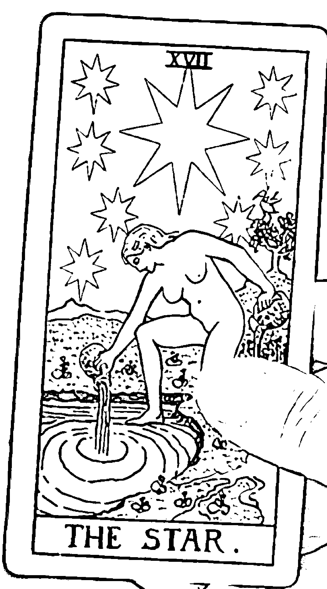

解決101個你生活中會遇到的難題

- 如何成為萬人迷？快來翻塔羅
- 下個月有什麼好運？一秒就知道
- 真命天子在那裡？自己就能算

TAROT GAME 101

## INDEX

## 愛情篇

- Q01 你的愛情 EQ 是高還是低？ 007
- Q02 我未來的另一半會是哪種個性？ 009
- Q03 沒人追，看看你的體貼程度有多高？ 011
- Q04 我最近會不會收到「好人卡」？ 013
- Q05 下一個情人是什麼星座的？ 015
- Q06 我會不會注定單身一輩子？ 017
- Q07 為了愛情你會無怨無悔嗎？ 019
- Q08 心儀的對象為何不主動追我？ 021
- Q09 下一個曖昧對象是什麼職業或特質的人？ 023
- Q10 未來的一個月，我有可能蜜運嗎？ 025
- Q11 情人常哄你還是騙你？ 027
- Q12 你的情人是惡魔還是天使？ 029
- Q13 在情人面前你會裝清純嗎？ 031
- Q14 近期戀情加溫指數有多少？ 033
- Q15 你在情人面前的白目指數有多高？ 035
- Q16 在情人面前你的愛撒嬌指數有多高？ 037
- Q17 你對愛情的忠誠指數有多少？ 039
- Q18 在情人心中你是「A咖」還是「B咖」？ 041
- Q19 在愛情中你的依賴程度有多高？ 043
- Q20 在男人眼中你是夏娃還是青蛙？ 045
- Q21 選擇情人我會不會看走眼？ 047
- Q22 情人對我沒反應，他是不是很介意我的身材？ 049
- Q23 我會被情人騎在頭頂上嗎？ 051
- Q24 如何讓情人難忘你的吻？ 053
- Q25 最近是不是有人偷偷暗戀我？ 055
- Q26 現在我的戀愛指標是紅燈 or 綠燈？ 057
- Q27 你是為愛主動出擊的肉食女嗎？ 059
- Q28 我的戀愛倦怠期多久會出現？ 061
- Q29 身邊的情人究竟是不是我的菜？ 063
- Q30 我今天是否適合向情人示愛？ 065
- Q31 你是情人的受氣包嗎？ 067
- Q32 情人偷吃被抓包你會隱忍嗎？ 069
- Q33 情人腳踏兩條船的指數有多高？ 071
- Q34 你的情人是家貓還是野貓？ 073
- Q35 面對愛情，你是愛挑三揀四的女人嗎？ 075
- Q36 情人不碰我，他在想什麼？ 077
- Q37 遇見奧步情人，你該怎麼馴服他？ 079
- Q38 你是情人的提款機嗎？ 081
- Q39 什麼樣的個性讓我被情人嫌棄？ 083
- Q40 情人劈腿偷吃你會原諒他嗎？ 085
- Q41 情人為何對我不理睬？ 087
- Q42 你允許情人到夜店鬼混嗎？ 089
- Q43 你會過濾情人的交友狀況嗎？ 091
- Q44 情人藉酒澆愁我該怎麼辦？ 093
- Q45 哪裡是可以搞曖昧的溫床？ 095
- Q46 情人醋勁大發時我該怎麼辦？ 097
- Q47 面對情人的缺點你敢當面嗆聲嗎？ 099
- Q48 愛上別人的情人我該怎麼辦？ 101
- Q49 談戀愛會讓我失去自己嗎？ 103
- Q50 最近我的身邊會有適合結婚的對象出現嗎？ 105
- Q51 要交往多久我才適合結婚？ 107
- Q52 我和目前的情人會結婚嗎？ 109
- Q53 我未來會不會變成糟糠妻？ 111
- Q54 我最近是不是動了想婚的念頭？ 113
- Q55 對婚姻恐懼的指數有多高？ 115
- Q56 你挑另一半的眼光準嗎？ 117
- Q57 我有可能發生「忘年之交」的戀情嗎？ 119
- Q58 我的婚姻是騙局還是賭局？ 121
- Q59 情變、婚變、兵變我最怕什麼？ 123
- Q60 你的檔礙是美眉還是人妻？ 125
- Q61 情人提分手我該怎麼辦？ 127
- Q62 這年頭情人說的話我還能信嗎？ 129
- Q63 我是他的山寨版情人嗎？ 131
- Q64 我該給花心的他再一次機會嗎？ 133
- Q65 我該繼續耗下去還是快點分乾淨？ 135
- Q66 什麼原因讓我的愛情一再落空？ 137
- Q67 我的情人是不是被別的女人盯上了？ 139
- Q68 什麼原因會導致你們分手？ 141
- Q69 陷入苦戀，你會選擇繼續還是離開？ 143
- Q70 我輸了，談戀愛讓你舉白旗的原因。 145
- Q71 我的愛情致命傷是什麼？ 147
- Q72 已經變質的愛情會好嗎？ 149
- Q73 我可以把身邊的情人甩掉嗎？ 151
- Q74 談戀愛，我的戀心指數有多高？ 153
- Q75 舊情人帶給你的痛苦指數有多高？ 155
- Q76 舊愛來找我，他在想什麼？ 157
- Q77 如果收到舊情人的喜帖，我的反應是什麼？ 159
- Q78 我是容易從感情中復原的人嗎？ 161
- Q79 你會用哪一句話形容你的前任情人？ 163
- Q80 感情中我有敗部復活的機會嗎？ 165
- Q81 如何用塔羅牌招桃花。 167

## 工作篇

- Q82 拼人氣，你是職場的萬人迷嗎？ 169
- Q83 職場中你的好命程度是高還是低？ 171
- Q84 未來找到好工作的機率有多高？ 173
- Q85 職場中你的抗壓性有多高？ 175
- Q86 未來三個月工作中會出現哪些倒楣事？ 177
- Q87 我惹到誰？最近在職場中是不是被人排擠？ 179
- Q88 我最受不了同事在辦公室幹嘛？ 181
- Q89 最近轉職會不會馬上成功？ 183
- Q90 職場中你的熱血指數有多高？ 185

## 個性篇

- Q91 你是朋友眼中的福星貴人嗎？ 187
- Q92 未來一個月有何好運會發生？ 189
- Q93 預測你的品味不凡指數 191
- Q94 最近生命不順，老天是在考驗我什麼碗糕？ 193
- Q95 下個月我會惹誰不高興？ 195
- Q96 未來一個月最想擺脫哪種煩人情緒？ 197
- Q97 我容易吸引到哪一種網路男蟲？ 199
- Q98 感覺變老了，是中年危機到了嗎？ 201
- Q99 你的借酒裝瘋指數有多少？ 203
- Q100 未來我想收到誰的悔過書？ 205
- Q101 我的幸福人生在那裡？ 207

### # START

准到不行的心測遊戲就從這裡開始

## Q1

你的愛情EQ是高還是低？學歷高不一定代表你處理愛情的能力也高，想知道你的愛情能力是高還是低嗎？放鬆心情由下列塔羅牌選擇一張，看你的愛情EQ究竟是高來是低。

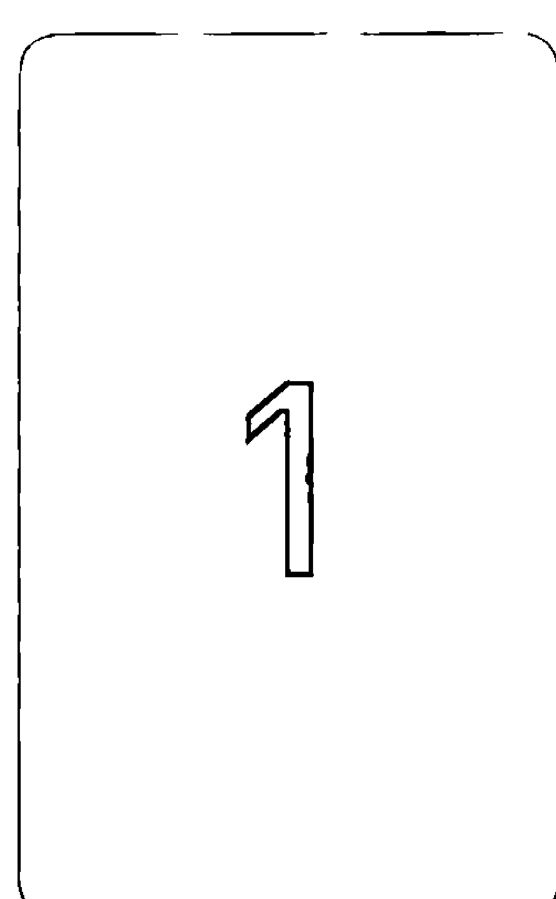

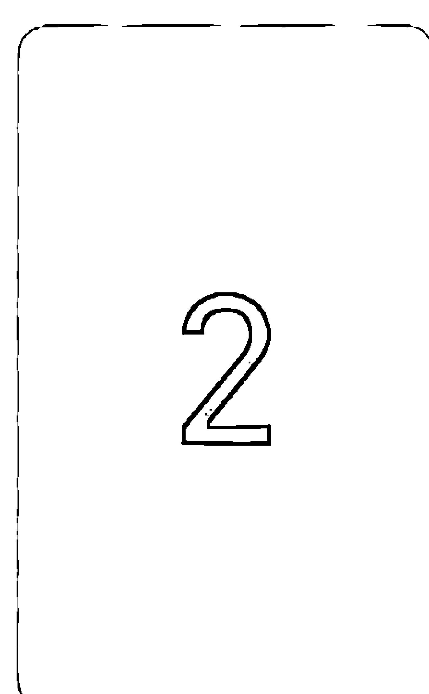

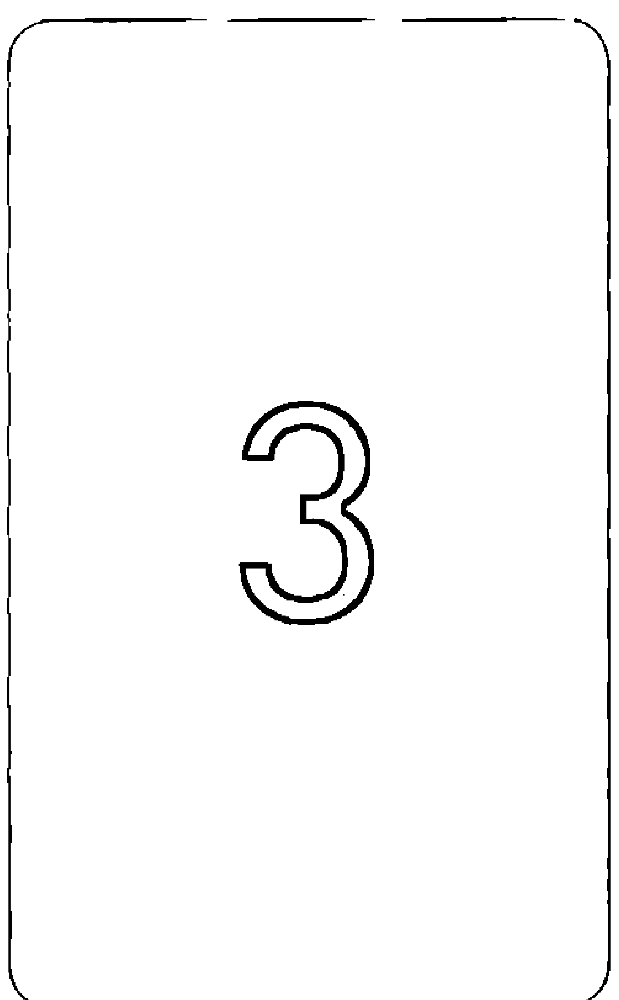

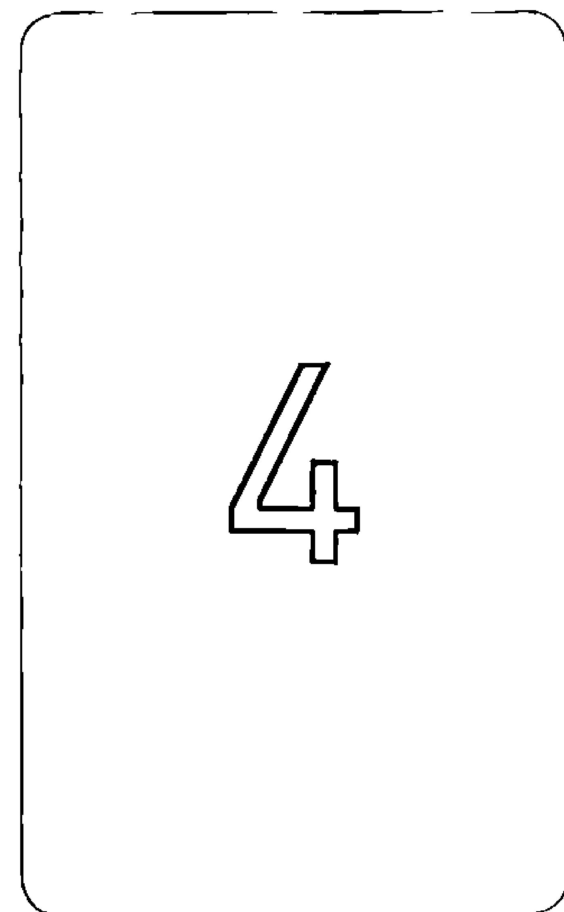

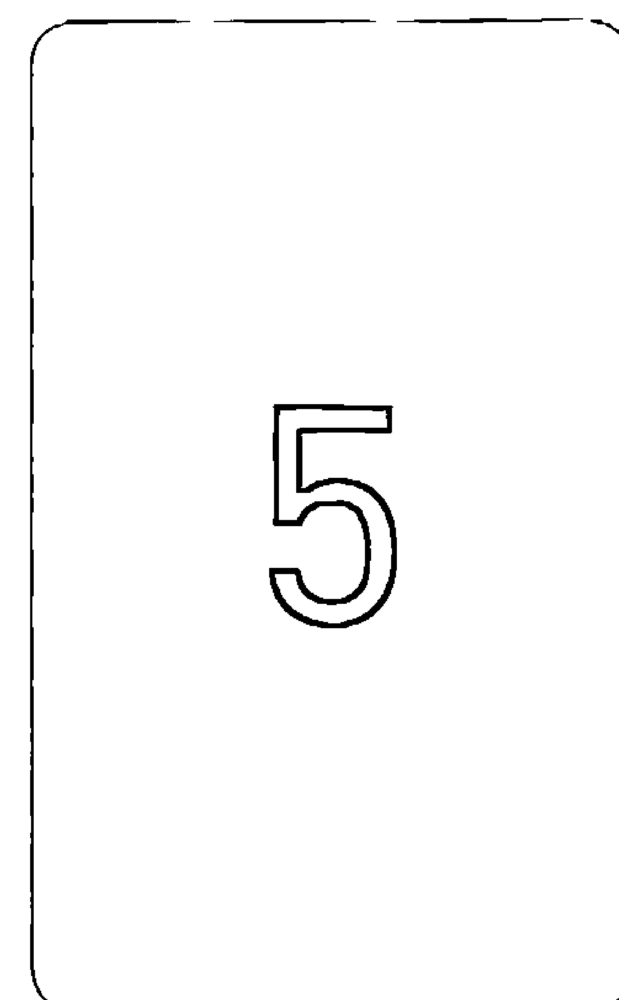

### 1 權杖四 愛情 EQ100 分

選擇這張塔羅牌暗示，你的個性似乎有種不服輸的個性，在戀愛的過程中不怕麻煩，就算與情人之間的相處是遠距離的關係或是雙方的父母反對你們的交往，你也會拚了命在情人面前證明，你們的愛是可以攜手走下去的。這種勇於接受挑戰的勇氣，不會輕言說放棄，因為你總是對自己說「未來一定會有轉機的」。艾菲爾老師建議你，走向幸福的道路，沒有人知道它的距離是遠還是近，但選擇持續不放棄的人，一定可以得到真愛的果實。

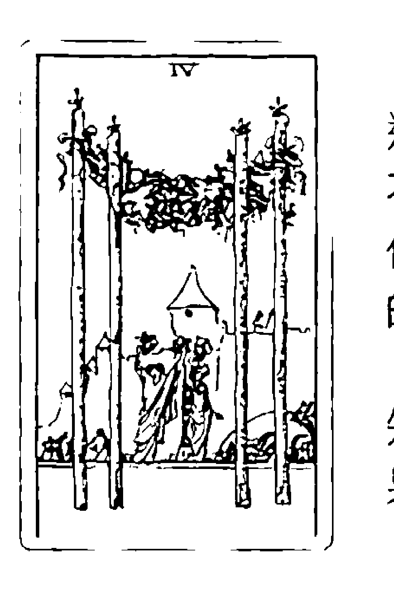

### 2 聖杯一 愛情 EQ80 分

選擇這張塔羅牌暗示，你的個性似乎有種浪漫性格，在戀愛的過程中，總是可以立刻投入一段深刻的感情中，因此和你談戀愛的情人會覺得你表現出來的感情讓人「深刻難忘」。只可惜有時候你付出的愛太多，到了有點氾濫的狀況，連你自己都無法控制自己感情的情緒，則會變成多愁善感，或是歇斯底里。艾菲爾老師建議你，像你這樣特質的人，在情人眼中絕對是善良又溫柔的，只是你的「愛」可不能讓對方無限制的予取予求。

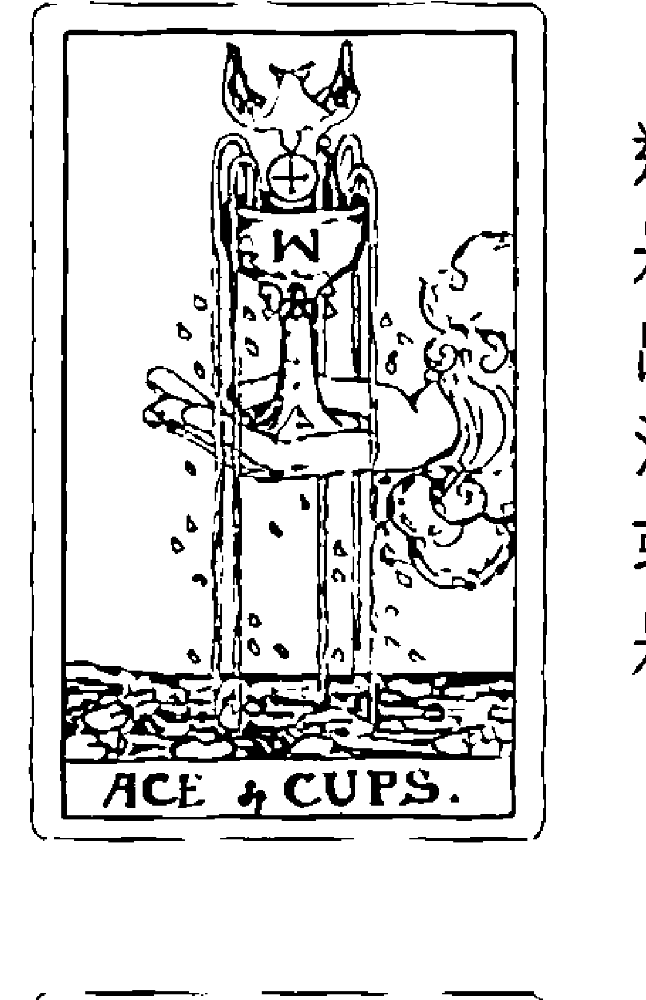

### 3 錢幣六 愛情 EQ60 分

選擇這張塔羅牌暗示，比較感情與事業，你的個性似乎認為只有穩定的經濟條件，才是感情中可靠的基石，因此每次你選擇情人時，會衡量對方的金錢能力、社會地位甚至是未來的發展性。如果追求你的對象，沒有這些亮麗的條件，你一定會擺個難看的臉色給對方，甚至把這個追求你的情人，跟過去的對象作比較，這種想要「佔便宜」的心情，其實一點也不高明。艾菲爾老師建議你，感情的可貴在於創造美好的未來，而不是現在就挑一個「有價值」的情人。

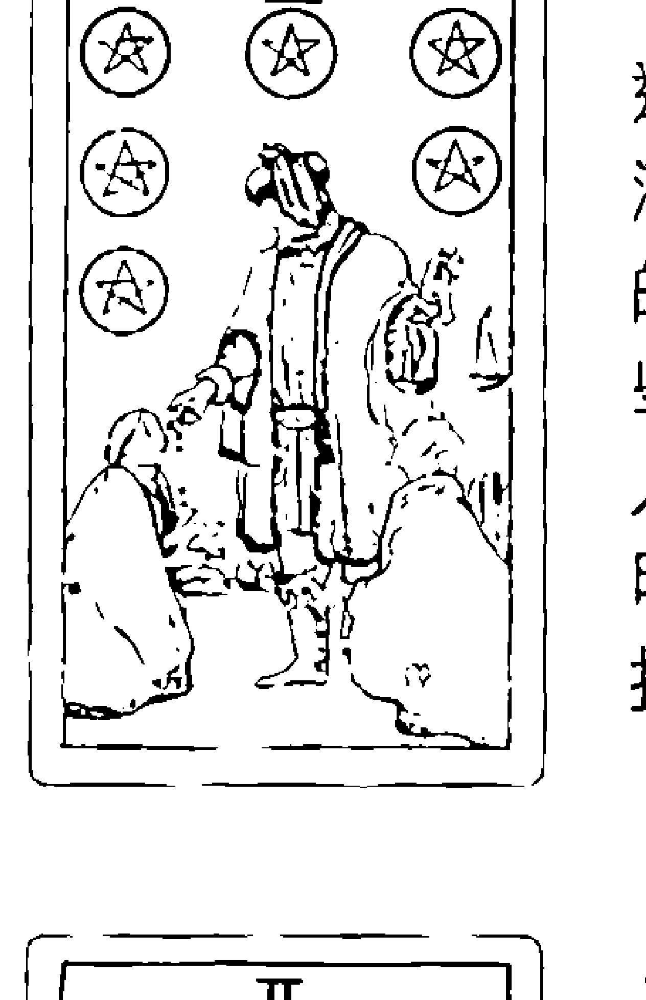

### 4 寶劍二 愛情 EQ40 分

選擇這張塔羅牌暗示，你的個性似乎有種猜疑與不安定的性格，在戀愛的過程中，總是覺得沒有安全感，只要情人不在你身邊你就開始胡思亂想，就算情人24小時都在你身邊，你也能鬥嘴吵翻天。換成是其他人，也許還會撒嬌裝可愛，可是你就是太有自己的想法，非要對方凡事都聽你的，以致於過去的戀愛故事，有如用盡心機的「愛情間諜戰」。艾菲爾老師提醒你，如果用「猜忌」作為兩人相處的出發點，那麼就算兩人交往三、五年，仍然是原地踏步。

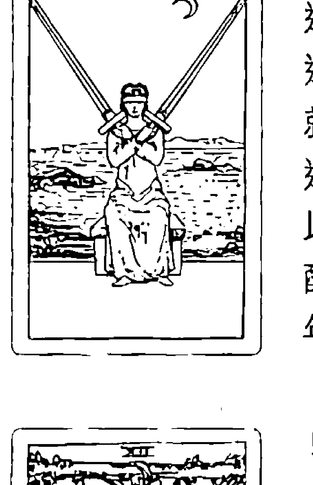

### 5 吊人 愛情 EQ20 分

選擇這張塔羅牌暗示，你的個性似乎有種悲劇性格，在戀愛的過程中，總是把自己的命運引導到為了情人作出無止境的「犧牲、奉獻與等待」的結果。換成是其他人，也許早就理性的「莎優娜啦」了，可是你就是喜歡鑽牛角尖、不聽勸，以致於過去的戀愛故事，有如可歌可泣的愛情悲劇。艾菲爾老師建議你，感情如果已經走到了分手的地步，「別離」並不可怕，重要的是要學習持續的愛你自己。

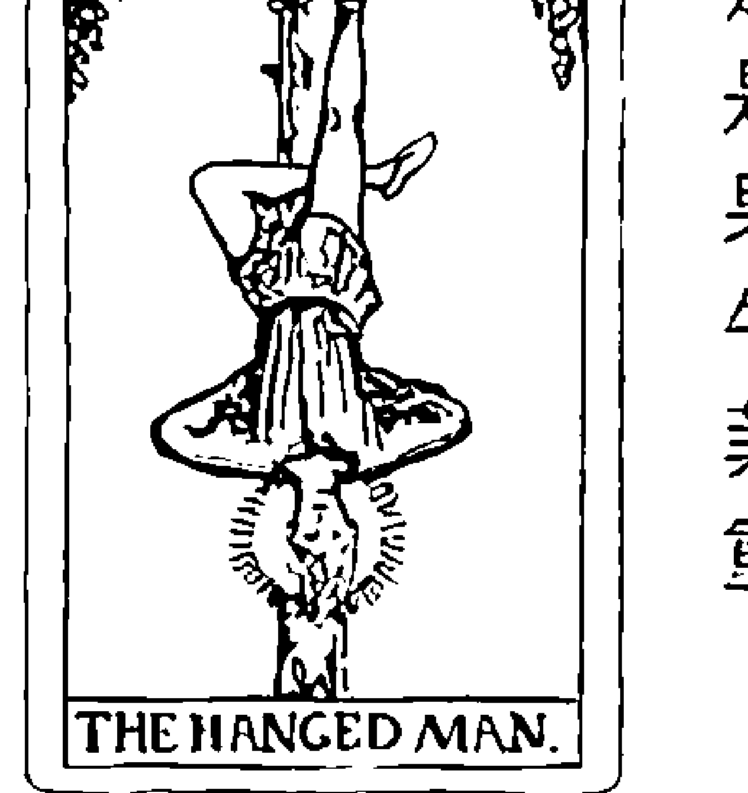

## Q2

### 我未來的另一半會是哪種個性？

神奇的塔羅牌，讓我知道未來老公的個性，到底是努力堅持型的創業者，還是整天嘆氣埋怨的懶惰蟲。放鬆心情，選一張塔羅牌艾菲爾老師要告訴你，未來的夫婿會是哪種個性。

- 1
- 2
- 3
- 4
- 5

### 1 寶劍一 生活簡單低調，不懂情趣沒情調

你選擇這張塔羅牌暗示，未來你的老公在生活上是一個忙碌的上班族，每天庸庸碌碌的為了柴、米、油、鹽、醬、醋、茶的生活早出晚歸。這種認真工作的態度確實讓人感動，但是如果你是傻抱著對婚姻甜蜜恩愛的懂憬，而選擇下嫁給這樣的丈夫，面對這種現實的生活考驗，恐怕你會非常失望。因為未來你們的夫妻生活中，要面對不只是生活經濟的考驗，還有與先生家人、公婆相處是否和諧的問題。因為你未來的夫婿是屬於「生活簡單低調，不懂情趣沒情調」類型的男人。

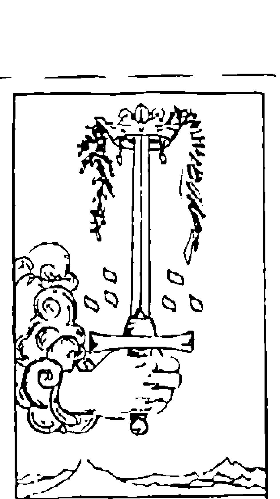

### 2 命運之輪 生活中規中矩，沒有野心與魄力

你選擇這張塔羅牌暗示，未來你的老公在生活上是一個顧家、愛家的好男人，他會疼愛自己的小孩，也會珍惜感情的另一半，他以擁有一個幸福的家庭生活為人生最大的滿足。對於事業野心，他沒有太大的期待，也許在職場上人際關係的經營和維持，還需要仰賴你的協助。如果你嚮往這樣平淡的生活，那麼這種類型的先生，很能滿足你的期待，但是如果你想當個身穿名牌、貴氣逼人的富太太，這種沒有遠大事業抱負的男人，可能被你嫌棄得一文不值。

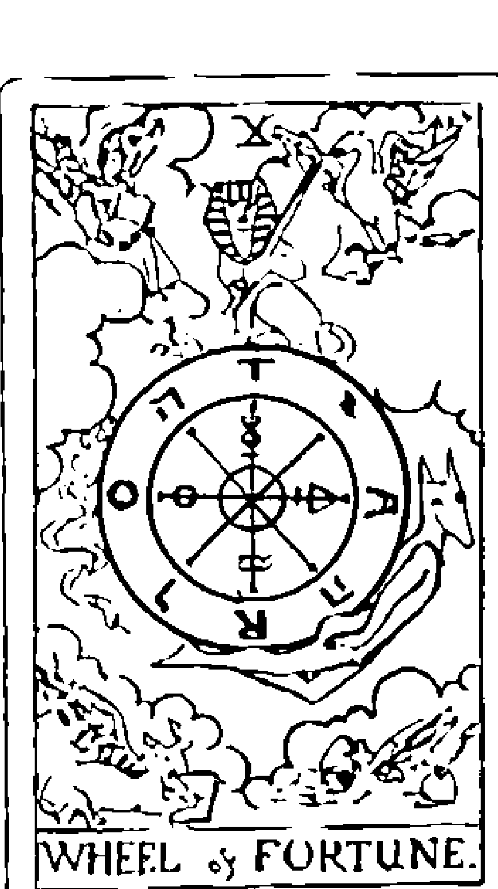

### 3 世界 事業平步青雲，討人喜歡嘴巴甜

你選擇這張塔羅牌暗示，未來你的老公在生活上是一個得人緣、讓人喜歡、值得信任的好男人。不但對你恩愛體貼、對小孩也非常的慈愛，在上司與同事眼中他是一個值得託付責任的好夥伴，由於你未來的夫婿深具許多可貴的優點，因此未來在事業上可以平步青雲。能就嫁給這種事業、感情與家庭都成功的男人，你應該是最幸福甜蜜的好妻子。

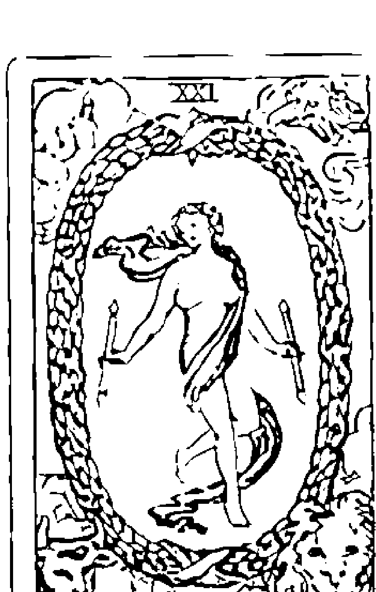

### 4 皇帝（逆位） 事業英雄氣短，生不逢時沒志氣

你選擇這張塔羅牌暗示，未來你的老公在生活上是一個擁有才華，但是時運不濟、生不逢時的人。也許你的另一半有很好的家世背景、也有不錯的學歷，但是缺點就是驕傲自大、嘴巴不甜，不懂得經營自己的人際關係，以致於生活職場中的貴人，漸漸離他遠去，讓他空有一身好本領，卻是英雄無用武之地。如果你未來的夫婿遇到這樣的事業瓶頸，還需要仰賴你的支持和鼓勵，他才有機會跨越人生的考驗。

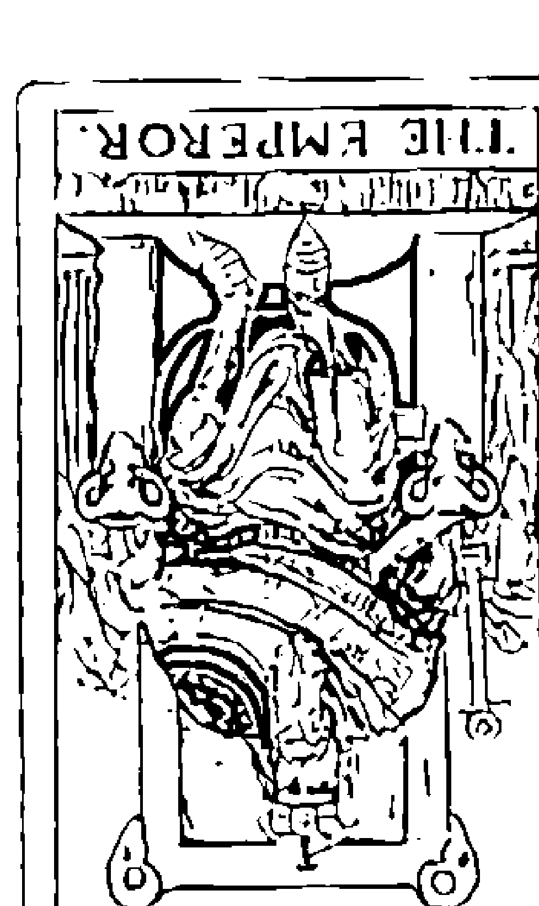

### 5 愚者（逆位） 懶散好吃懶做，無病呻吟惹人嫌

你選擇這張塔羅牌暗示，未來你的老公在生活上是一個只想要享受、很難吃苦的懶惰鬼。他每天就喜歡天馬行空的想像，怎樣才是賺錢的捷徑，如何透過股市買賣，錢滾錢、利滾利，再不然就是整天只想著發財致富的春秋大夢，但是他就是不願意一步一腳印，用努力和專業來換取收穫。不是整天跟你抱怨工作好辛苦、老闆好豬頭、就是跟你埋怨受到同事的打壓與無情對待。遇到這種老公，還真的讓人不知道該說什麼才好，只能現在勸你睜大眼睛，仔細觀察現在的男友，將來會不會變成這種好吃懶做，無病呻吟的討厭鬼。

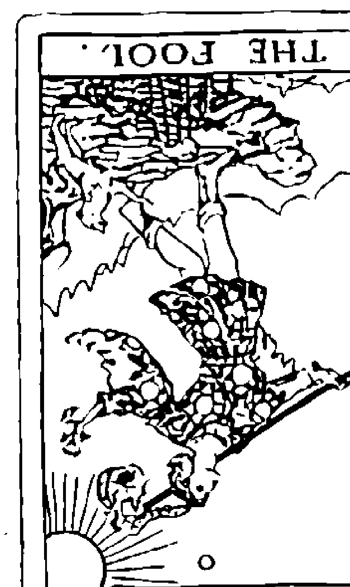

## Q3

### 沒人追，看看你的體貼程度有多高？

西洋情人節、白色情人節、中國情人節，一年之中三大情人節都過完了，還是沒有找到半個適合的感情對象嗎？艾菲爾老師建議你，該測量一下你的「體貼程度」，看看是不是因為不夠體貼的原因，讓你成為愛情絕緣體。請由下列五張牌中憑直覺選一張！測試自己的體貼程度有多高？

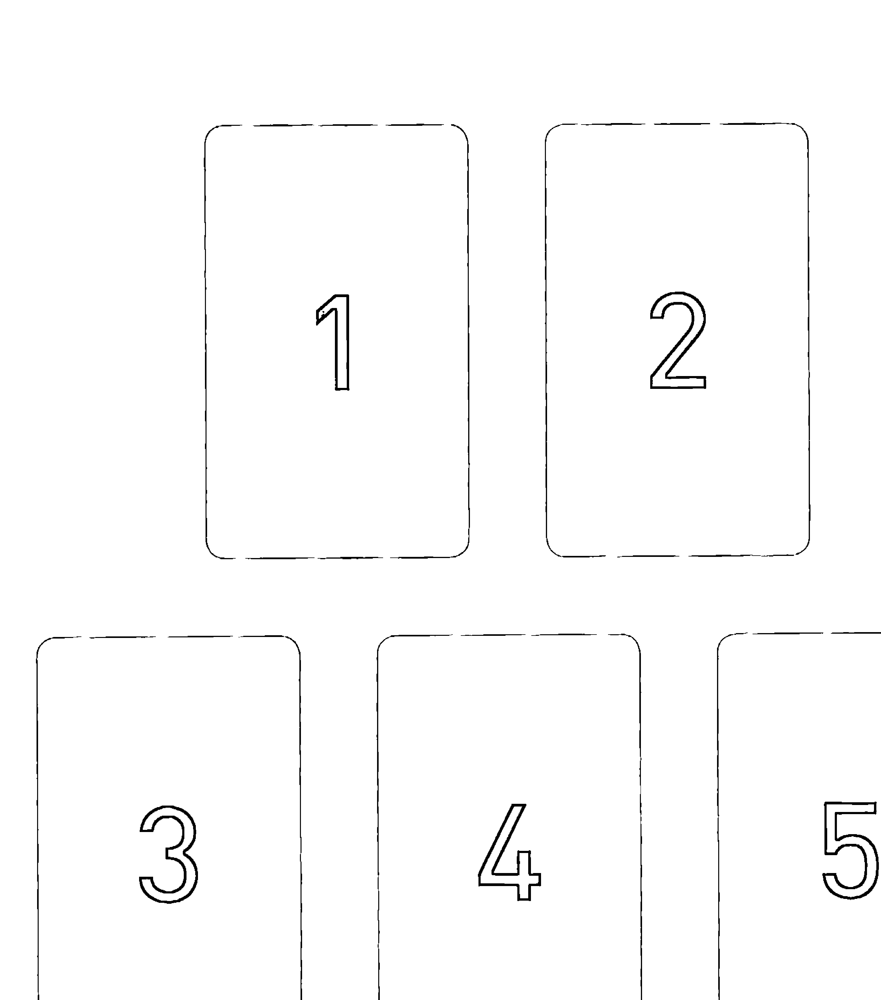

### 1 愚者 體貼程度 80 分

選擇的這張牌暗示，你的體貼程度和幽默感是第二名，你是一個喜歡跟朋友一起聚會的人，當然你也不會吝嗇的向朋友介紹自己的情人，因為你也希望情人可以跟自己的朋友融入在一個和樂的氣氛中。為了避免初次見面的陌生感，你會非常貼心的顧及到情人的感受，讓彼此都有一個舒服愉快的經驗，而不會只顧到跟朋友聊天，而讓情人孤零零的冷落在一旁。你的善解人意則是情人喜歡你的原因之一。

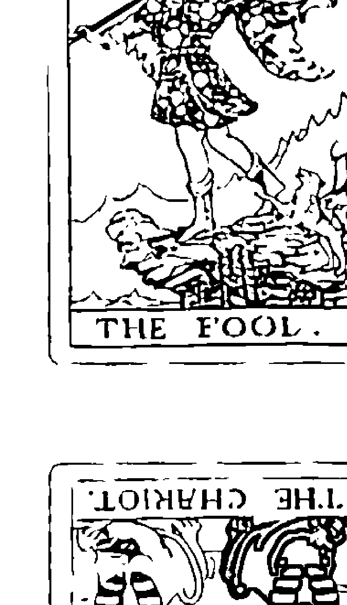

### 2 戰車（逆位） 體貼程度 60 分

選擇的這張牌暗示，你的體貼程度是比上不足，比下有餘。尤其當情人對你溫柔呵護多一點的時候，或是送你禮物的時候，你的體貼程度就會上升，對情人獻殷勤，但是當情人冷落你的時候，你也不會熱臉去貼對方的冷屁股，會立刻變臉，冷眼旁觀的對待對方。由於你不會平白無故的浪費自己的「熱情」，這個情人值不值得讓你付出更多的心力，基本上你是隨時在評估衡量的。因此你的體貼程度有點平淡。

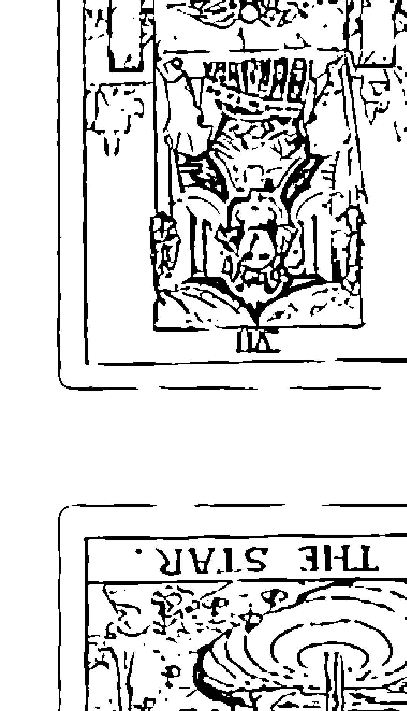

### 3 星星（逆位） 體貼程度 20 分

選擇的這張牌暗示，你的體貼程度是最差的，而且還常常對情人大呼小叫，甚至把情人當苦力，要他幫忙分攤工作中的壓力與負擔，因為你是一個抗壓性非常弱的人，能夠把自己份內的事情做好就非常難得了，根本沒有餘力顧及到情人的感受與需求，相反的，你還會不斷的抱怨情人不夠貼心，所以跟你談戀愛的情人，恐怕是這輩子註定來還感情債的。

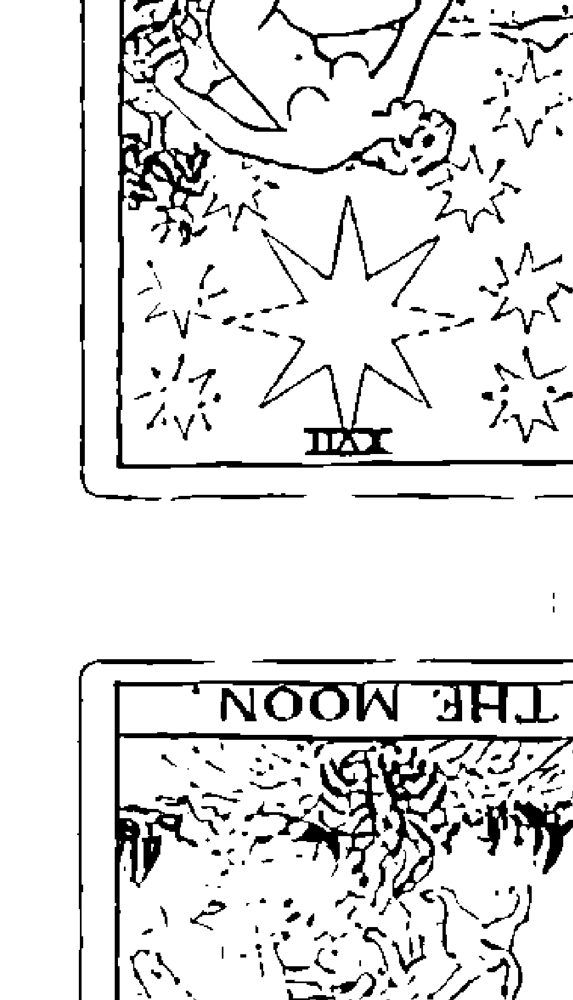

### 4 月亮（逆位） 體貼程度 40 分

選擇的這張牌暗示，期待你表現出溫柔幸福小女人的樣貌，基本上是非常困難的事情。因為你本身就是非常有個性，你認為在情人面前說「我愛你」是非常難為情的感覺，你們生活中的相處模式，大概就是「吵吵鬧鬧」吧，因為這種狀況也持續一段時間，也很難去改變雙方的態度，如果勉強要求自己做到「溫柔體貼」，那大概就是維持一週「不吵架」吧。

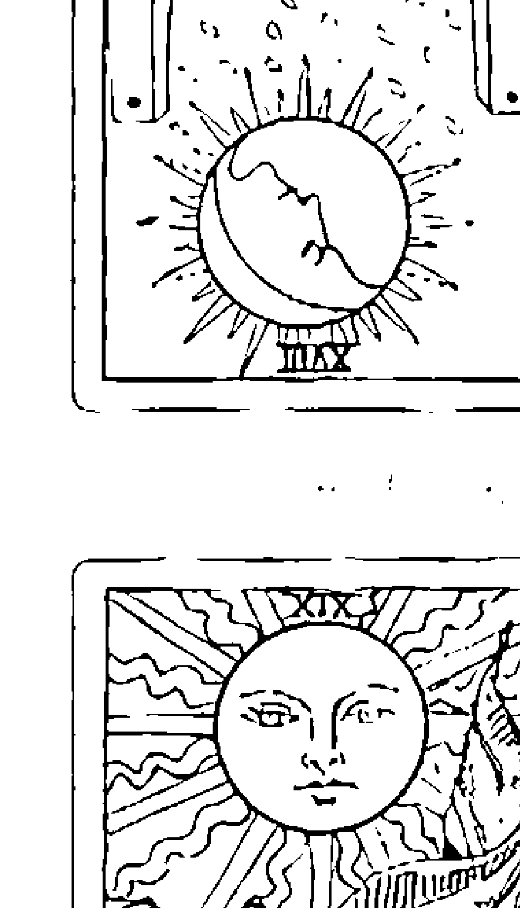

### 5 太陽 體貼程度 100 分

選擇的這張牌暗示，你的體貼程度是最高的，而且「一路走來，始終如一」。這代表你有著非常會照顧人的個性，例如你會幫情人準備宵夜，或是幫情人整理工作需要的文件檔案，甚至在學生時代還會幫情人抄筆記，整理考試的重點，由於你把學生時代熱心助人的好習慣，一直保持到現在，所以你總是會願意多犧牲一點自己的時間，讓情人感受到溫暖與幸福的感動，所以任何人跟你談戀愛，就好像多了一個家人在身邊照顧，是非常浪漫的事情。

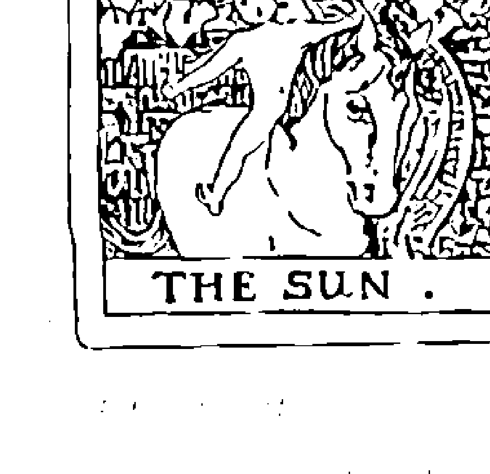

## Q4

### 我最近會不會收到「好人卡」？

「好人卡」文化在台灣可以說是非常的流行。在愛情中如果你獲得好人卡，即代表被人拒絕，成為「好人」而非「情人」。所以想要談戀愛的單身男女最怕收到「好人卡」。放鬆心情由下列塔羅牌選擇一張，艾菲爾老師要告訴你，最

- 1. 卡片1
- 2. 卡片2
- 3. 卡片3
- 4. 卡片4
- 5. 卡片5

### 1 聖杯十 收到「好人卡」的指數 0 分

選擇這張塔羅牌暗示，如果你最近有暗戀身邊的朋友，你可以趁著目前關係順利甜蜜的時刻，給對方一個小小的驚喜與暗示，因為你們之間的默契與感情，已經接近了「戀愛的溫度」。因為「聖杯十」這一張牌包含著「幸福、分享愛意與維持承諾」的意涵，這些都是有助於感情發展的元素。所以艾菲爾鼓勵選擇這張牌的朋友，大方示出愛意，你會收到一張同意交往的「情人卡」。

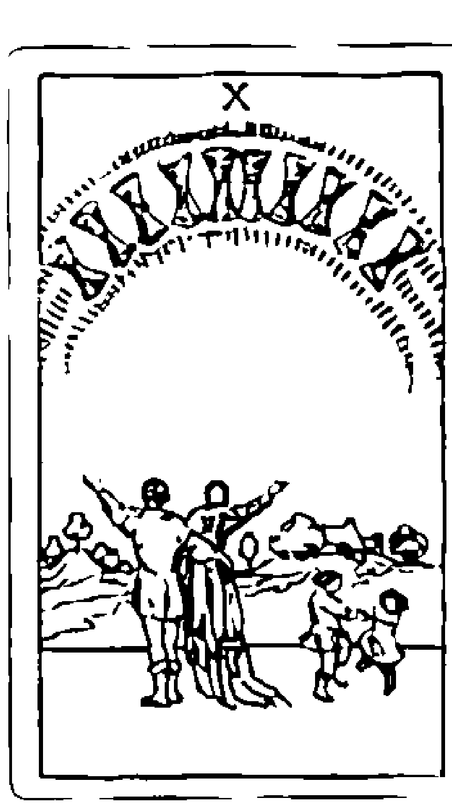

### 2 死神 收到「好人卡」的指數 100 分

選擇這張塔羅牌暗示，如果你最近有暗戀身邊的朋友，要小心千萬不要告白，否則你將收到一張「好人卡」，因為死神這一張牌代表著「結束、分手與終止」，幾乎所有不利於感情發展的事情，都包含在這張牌的意義中，所以選擇這張牌的朋友，現在你有兩條路可以選擇，第一是自動放棄這段感情；第二是鼓起勇氣告白，順便接受一張「好人卡」當作是告白失敗的禮物。

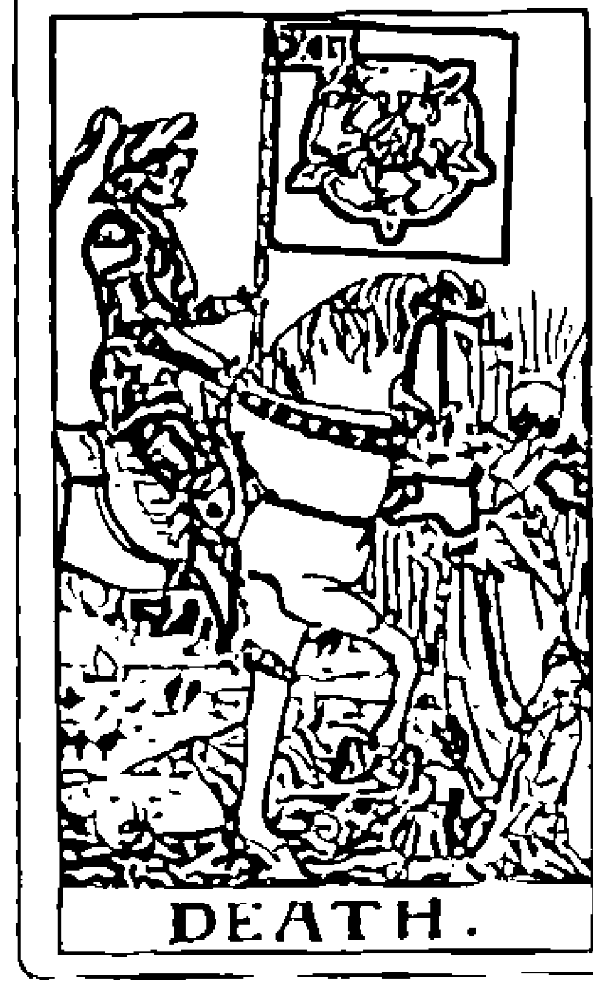

### 3 權杖九 (逆位) 收到「好人卡」的指數 60 分

選擇這張塔羅牌暗示，如果你最近有暗戀身邊的朋友，你應該多探聽一下對方的背景與條件，小心只是你一廂情願的喜歡對方。因為對方目前給你的感覺，恐怕只是維持在「這個人好相處、不討厭」的階段。由於戀情還沒有進入濃烈的階段，因此你最好不要輕舉妄動，以免太快告白反而嚇到對方，如果你真的忍不住向他告白，註定會收到一張「好人卡」。

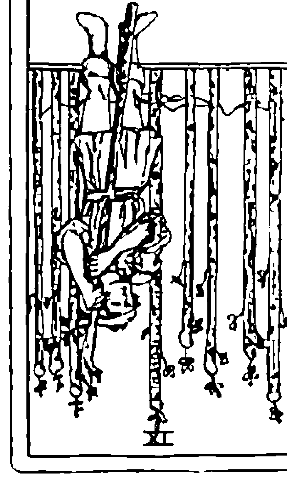

### 4 寶劍六 (逆位) 收到「好人卡」的指數 40 分

選擇這張塔羅牌暗示，你應該更積極一點，尤其是你的態度應該更誠懇、專注一點，因為你這種曖昧的行為，其實對方也在仔細的觀察與了解你，如果你自己的愛情還有糾葛不清的關係，或是你還有舊感情沒有處理完畢，小心這些行為，都會被對方當作是評估兩人是否適合交往的條件，如果你已經確實放棄舊的感情與關係，那麼對方才比較有可能答應你的告白。

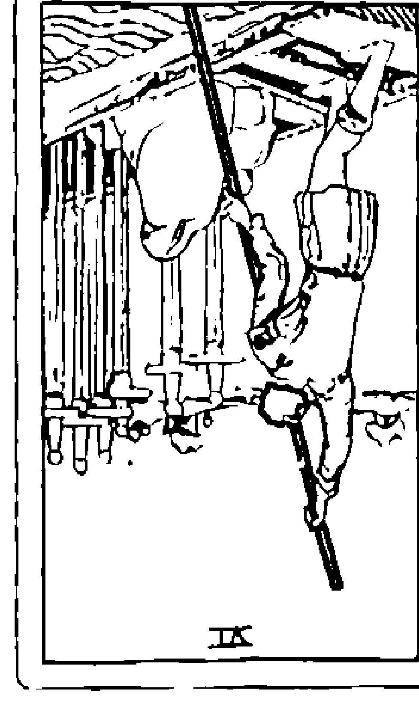

### 5 皇帝 收到「好人卡」的指數 80 分

選擇這張塔羅牌暗示，如果你最近有暗戀身邊的朋友，記得身段放柔軟一點，不要總是給人一種「嚴肅、權威」的感覺，因為皇帝這一張牌代表著「冷漠、高傲與固執」，這些都是情人討厭的特質，所以選擇這張牌的朋友，如果你正在追求一位心儀的對象，請記得把你溫柔的心意和態度表現出來，如果因為「愛面子」而不敢告白，小心暗戀對象對方先被別人拐騙走，你連收到「好人卡」的機會都沒有。

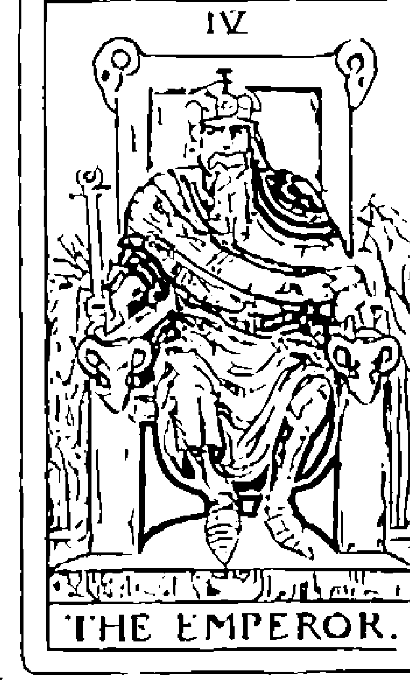## Q5
### 下一個情人是什麼星座的？

想談戀愛嗎？可是不知道下一個情人，會是什麼星座的，以及他的個性好不好。應該多留意身邊火象星座的朋友，還是土象星座的朋友呢？放鬆心情由下列塔羅牌選擇一張，看看未來的情人究竟是什麼星座的。

### 1 權杖一
選擇這張塔羅牌暗示，你認為心目中的理想情人，應該具備開朗、思維活躍的個性、崇尚自由的特質，那麼表示你比較欣賞「熱情又幽默」的情人。在十二星座當中火象星座的情人（牡羊、獅子、射手）剛好可以滿足你的愛情期待。想要遇到這樣的情人，你可以採用「曖昧暗示」的策略，因為火象星座的情人，大部分都禁不起誘惑，所以只要在燈光美、氣氛佳的環境中，再加上酒精催化，那麼一定可以輕而易舉的吸引火象星座情人的追求。

### 2 聖杯一
選擇這張塔羅牌暗示，你認為心目中的理想情人，應該具備神秘浪漫又多情的個性、最好還有細心與體貼的特質，那麼表示你比較欣賞「帥氣又斯文」的情人。在十二星座當中水象星座的情人（巨蟹、天蠍、雙魚）剛好可以滿足你的愛情期待。想要遇到這樣的情人，你可以採用「主動告白」的策略，因為水象星座的情人，大部分都很害羞，對於新的感情，他們是期待又怕被傷害，所以只要你勇敢的主動告白或是向他們要電話，一定可以擄獲他們的心。

### 3 錢幣一
選擇這張塔羅牌暗示，你認為心目中的理想情人，應該具備內向靦腆，沉穩理智的個性、最好還有旺盛的事業心，那麼表示你比較欣賞「穩重有責任感」的情人。在十二星座當中土象星座的情人（金牛、處女、魔羯）剛好可以滿足你的愛情期待。想要遇到這樣的情人，你可以採用「時間戰術」的策略，因為土象星座的情人，大部分都很被動，而且死要面子，他們明明心裡面愛的要死，但是還是會選擇苦苦等候，所以想要認識這一類型的情人，就是要採取「放長線釣大魚」的時間戰術，跟他們耗下去。

### 4 寶劍一
選擇這張塔羅牌暗示，你認為心目中的理想情人，應該具備反應靈敏、多才多藝的個性，隨時都能說出浪漫的情話，那麼表示你比較欣賞「聰明有才華」的情人。在十二星座當中風象星座的情人（雙子、天秤、水瓶）剛好可以滿足你的愛情期待。想要遇到這樣的情人，你可以採用「言語調情」的策略，因為風象星座的情人，都具備著良好的人際關係與公關能力，所以想要擄獲風象星座的注意，建議你可以跟他們先從朋友關係建立起，這樣藉由平時的噓寒問暖，一定可以獲得他們善意的回應。

### 5 吊人
選擇這張塔羅牌暗示，你認為心目中的理想情人，應該具備任勞任怨、犧牲奉獻的特質，最好能夠愛你比較多，讓你能夠在愛情中予取予求，完全享受「被愛」的樂趣。如果你想要體驗一次，被人照顧與關心的戀情，那麼在十二星座中，「雙魚座」絕對是你的真愛首選。因為雙魚座的人，不論是男生或是女生，一旦決定在愛情中付出之後，他就會死心塌地完全投入，因此在這樣的戀情中，你可以享受「雙魚座式纏綿悱惻」的愛意。只是想要享受這樣的愛情故事，你也必須做出一點犧牲，那就是放棄你的「自由」，因為雙魚座可是非常「黏人」的。

## Q6
### 我會不會注定單身一輩子？

好久沒有談戀愛了，目前也是單身，而且也沒人追，這樣的命運到底會持續到什麼時候？該不會成為孤單老人吧！別擔心，艾菲爾老師用塔羅牌占卜幫你解答你最想知道的問題，由下列塔羅牌選擇一張，就可以知道你會不會注定單身一輩子，默默的接受你的命運吧！

### 1 錢幣五 注定單身一輩子
如果你選擇這張塔羅牌，建議你先穩定自己的情緒，因為這張牌的占卜結果，未來恐怕將走向「單身」的命運。錢幣五暗示「孤單」、「絕望」、「一無所有」，所以你該反省一下，究竟是什麼原因導致你走向單身的人生，是不是你已經抱持著「單身主義」，或是你的個性導致你走向孤獨。艾菲爾老師建議你，面對這樣的結果，你有兩種解決的方式，一種是宿命的接受命運的安排，另外一種是不認輸，積極的「改變」自己的命運。

### 2 教皇 心靈滿足、單身也不寂寞
如果你選擇這張塔羅牌，暗示在未來的生命中，無論你是否單身或者你有一個美滿的家庭，最後你都會慢慢發展出「宗教情懷」。也許你是一個對於「宗教」、「靈修」、「身心靈療法」非常有慧根的人，或者你身邊就有這樣的管道，可以讓你去接觸這樣的知識，由於你能藉由這樣的宇宙智慧來安撫心靈、豐富生活，因此未來無論你是否有自己的婚姻生活，都可以獲得心靈滿足，就算是單身也不寂寞。

### 3 聖杯五 不會單身一輩子，但是現在卻是愛情空窗期
如果你選擇這張塔羅牌，暗示在未來的生命中，你並不會走向「單身」，因為你還是有機會遇到合適的對象，步入婚姻，甚至是組織家庭，這些都是未來可以實現的期待。只不過你目前的感情比較不順利罷了。面對愛情空窗期，你也無須煩惱，只要你保持愉快的心情，那麼戀愛的自信就會很快的充滿著你的心靈，到時候你就可以幸福的經營自己的愛情。艾菲爾建議你，不要氣餒。目前只是愛情遇到波折，不代表以後也會孤單一輩子。

### 4 寶劍五 與情人吵鬧不休，還不如單身比較愉快
如果你選擇這張塔羅牌，暗示目前你雖然身邊有情人陪伴，或是有交往穩定的情人，甚至已經有了自己的家庭，但是目前與另外一半的感情，真的是差到極點，吵鬧不休的生活，幾乎填補了你們所有的生活空間，與情人之間像是「諜對諜」一樣，總是猜想著對方下一步會有什麼動靜，處處提防著情人不安份的情緒。艾菲爾老師建議你，既然與情人的相處，失去了溫柔甜蜜的本質，還不如恢復單身生活比較愉快。

### 5 世界 放鬆心情，你會擁有幸福的感情
如果你選擇這張塔羅牌，暗示你可以大大的鬆一口氣，因為未來並不會走向「單身、獨身」的命運。你會遇到一位跟你心意相通、感情融洽的另一半，因為「世界牌」象徵「和諧」、「融洽」與完美的生活。因此艾菲爾老師建議你，保持樂觀的心情，主動的開拓你的社交生活，相信你的情人將會在命運的安排下，出現在你的身邊。

### 為了愛情你會無怨無悔嗎？

有人為了愛「赴湯蹈火在所不惜」，也有人為了愛「不惜粉身碎骨」，不管我們為了愛會做出多少瘋狂的舉動，這一切都是為了愛。你呢？會為了愛情做出多少令人感動的事嗎？想知道你在愛情中是否也會為愛無怨無悔嗎？透過塔羅占卜，艾菲爾老師要測驗一下你的無怨無悔指數！

- 卡牌1
- 卡牌2
- 卡牌3
- 卡牌4
- 卡牌5

### 1 錢幣十 為愛無怨無悔指數 80 分
選擇這張塔羅牌暗示，當你和情人之間共同遇到難關的時候，你為愛付出的指數是非常高的。因為「錢幣十」象徵一個完整又安全的家，這個「家」不只提供你一個遮風避雨的場所，也是你心靈的港灣。因此為了繼續保有這個安全的家，你會不顧一切的支持著另一半，共同度過難關。因為你知道，在好不容易建構起來的家庭中，其實存在著許多彼此的回憶，為了不讓幸福的記憶煙消雲散所以當感情中的另一半遇到難關時，你為愛無怨無悔指數的有80分。

### 2 聖杯二（逆位） 為愛無怨無悔指數 40 分
選擇這張塔羅牌暗示，當你和情人之間遇到難關的時候，也是一次嚴重的「信心危機」。因為夫妻或是情侶之間，本來就要建構在「誠實與信任」的基礎上，今天如果另外一半發生「偷吃、劈腿」的危機，而影響了他的事業或是前途，對你來說，這完全是他「咎由自取」，但是你的內心仍然受到「念舊」的情緒影響，而變得左右為難。因為你一方面思考，要如何幫助他，另一方面卻是在氣憤，為什麼他可以這麼的狠心，欺騙了你的感情，所以當感情中的另一半遇到難關時，你為愛無怨無悔指數不高只有40分。

### 3 隱者（逆位） 為愛無怨無悔指數 60 分
選擇這張塔羅牌暗示，當你和情人之間共同遇到難關的時候，你反而會化身變成另一半的「智多星」，幫助他進行溝通、協調，甚至出面解決問題。這一點比較像是我們熟悉的「政治人物的另一半」。每一次當先生受到八卦、緋聞困擾的時候，你就可以看到他們的妻子挺身相助，雖然他們的表情百般不願意，但是他們卻還是臨危受命扮演「救火隊」的角色，有時候靠著溫情攻勢，反而可以贏得更多同情票的支持，由於你堅持盡全力扮演好自己的角色，因此為愛無怨無悔指數也是很高的有60分。

### 4 世界 為愛無怨無悔指數 100 分
選擇這張塔羅牌暗示，當你和情人之間共同遇到難關的時候，你會為了愛情犧牲或是自願奉獻的程度是最高的，因為「世界」象徵經過苦難與磨練之後的完整與和諧。你們堅定的相信，兩個人在一起，必定是前世註定的緣分，就算此刻遇到了人生中的關卡，只要同心協力一定可以克服，甚至衝破這道關卡。由於你的心被一道和諧的光包圍著，因此為愛無怨無悔指數最高有100分。

### 5 寶劍十（逆位） 為愛無怨無悔指數 20 分
選擇這張塔羅牌暗示，當你和情人之間共同遇到難關的時候，所謂「夫妻本是同林鳥、大難來時各自飛」大概就是在形容你的心情。因為「寶劍十」象徵著你失落絕望的反應，彷彿看不見未來的陽光，這也指出當你面對生命的難題時，所呈現出人性中脆弱的面貌。因此你可能會發生持續的憂鬱情形，甚至失眠。由於你對自己的信心不足，以至於根本沒有辦法用勇氣來支持另外一半，所以你為愛無怨無悔指數最低只有20分。

## Q8
### 心儀的對象為何不主動追我？

我們彼此都有一點感覺，可是為什麼他遲遲不追求我，遲遲不說愛我。到底是什麼原因，讓我的心儀對象遲遲不主動追我，真是費疑猜。選擇一張塔羅牌，讓艾菲爾老師告訴你，究竟是什麼原因讓心儀的對象不主動追我。

### 1 聖杯四
你喜歡的這個人他的個性很不喜歡搞曖昧，他現在對你的愛慕遲遲沒有任何的回應，也許是因為他對某人苦苦追求未果，在短暫的療傷期內，任性的他們多半會選擇封閉自己或是孤獨的療傷，等心情完全平復之後，才會重新考慮新的戀情。所以多給對方一點時間，你可以在對方需要別人關心的時候，適時的給予溫暖，最好讓他產生移情作用，讓他自然的愛上你。因此在他主動跟你告白之前，你也只能先「靜觀其變」。

### 2 寶劍五
你喜歡的這個人，他對感情是慢熱型的，喜歡有規劃循序漸進追求對方。因此從你們認識的第一天開始，他就在慢慢觀察你的個性、想法與觀念，是不是跟他有默契。也許你認為彼此已經認識了很久的時間，但是在他的觀念中，這反映了他的理智和謹慎。但是如果這樣的「感情僵局」持續了半年以上，對方還是不主動對你說出他內心的感受時，也許就是因為你的性格讓他還是覺得不太合乎他的戀愛口味，所以他才沒有告白行動。40分。

### 3 聖杯三（逆位）
你喜歡的這個人，他在感情的行為中是屬於「圓滑善變」型的，特別是他喜歡玩「敵進我退、敵退我進」的愛情追逐，在他的觀念中感情就是一場遊戲，因此他們的熱情通常是不耐久的。而你是否成為他最後追逐的目標才是重點。也許當你的心儀對象注意你的時候，他也同時對不同的對象有好感。即使他曾經對你拋媚眼，或是曾經送你上下班，你也不要高興太早，因為也許他突然一個 180 度大轉彎又愛上了別人，也不是不可能的事情。

### 4 女祭司
你喜歡的這個人，他對於親情、友情、愛情的感動是一種很舒服的被關心的感受，他希望這種關心能夠順其自然地在不經意之間表達。他希望一個溫馨可人又能讓他著迷的伴侶。所以他不追求的原因就是可能在你身上還沒得到這種「共組家庭」的溫馨感。

### 5 魔術師
你喜歡的這個人，在他的觀念中不會輕易產生「追求」或者「不追求」的念，因為他會很客觀很通達地看待與人的關係。即使是異性，一般會先從朋友做起。他不希望友誼轉變成愛情後再轉變成傷害，最後大家都做不成，搞不好犧牲了多年的友情，還要變質成陌生人。所以他會儘量以超然的眼光看待這一切。不輕易的跨越友情的界線。

### 下一個曖昧對象是什麼職業或特質的人？

下一個可以搞曖昧的對象到底是誰？是他，還是他？選擇一張塔羅牌，讓艾菲爾老師告訴你，下一個曖昧對象是什麼職業或特質的人。如果你身邊剛好有這樣的對象，千萬不要讓煮熟的鴨子飛了。

### 1 世界 網路科技業或是媒體、行銷的相關行業
針對下一個曖昧對象，請你留意身邊從事網路科技業或是媒體、行銷相關行業的朋友。所以不要錯過任何聯誼與交往的機會，特別是如果家中長輩要幫你介紹對象時，你可以先打聽一下，對方的身分是不是從事上述職業。唯一要注意的事，從事網路科技業或是媒體、行銷相關行業的對象，異性緣比較好，本身的桃花也比較多，這是你在未來交往的時候要多觀察的地方。

### 2 錢幣七 金融貿易業或是會計、業務的相關行業
由於你選到的這張塔羅牌有明顯的暗示可以接觸這一類型的朋友，所以有參與活動時可以多多留意。唯一要注意的事，金融貿易業或是會計、業務的相關行業的對象，本身可能個性比較拘謹、缺乏幽默風趣的特質，而且工作的挫折感和業績壓力比較大，這是你在未來交往的時候，需要多諒解的地方。

### 3 權杖騎士 白手起家或是餐飲、飯店的服務行業
想要搞曖昧的朋友無論你現在是什麼工作，請你留意身邊白手起家或是餐飲、飯店管理的服務行業的朋友。唯一要注意從事這類服務行業的對象，工作非常的辛苦，而且未必週末都能放假陪你，搞不好你還需要配合他的時間才能約會。特別是白手起家的人，大部分的心力都投注在事業上面，也可能因為忙碌工作而忽略你，這些條件都是你在未來交往時要多評估的地方。

### 4 節制 百貨零售或是貿易、健康食品的相關行業
選擇這張塔羅牌暗示，你身邊從事百貨零售或是貿易、健康食品的相關行業的朋友可能是你下一個曖昧對象。唯一要注意的事，從事的對象百貨零售或是貿易、健康食品的相關行業，因為工作的關係需要常常跟異性接觸，再加上他們本身的桃花、人緣比較豐富，這是你在未來交往的時候要有心理準備的地方，但仍別錯過任何交往的機會。

### 5 權杖四 房屋仲介或是設計、裝潢的相關行業
由於你選到的這張塔羅牌有明顯的暗示可以接觸這一類型的朋友，所以不要錯過任何聯誼與交往的機會。唯一要注意的事，從事房屋仲介或是設計、裝潢的相關行業的對象，藝術性格比較強、個性可能難以捉摸，有時候會有點情緒化、或是突然變成冷漠的大男人，這些個性的適應與了解是你在未來交往的時候要多體諒的地方。

## Q10
### 未来的一个月，我有可能蜜运吗？

「蜜运」是一句香港的惯用语代表「命运中感觉最甜蜜的时段」，也就是「谈恋爱」的意思。艾菲尔老师听见你内心的呼唤了，放松心情，选一张塔罗牌艾菲尔老师要告诉你，未来一个月有没有机会「蜜运中」。

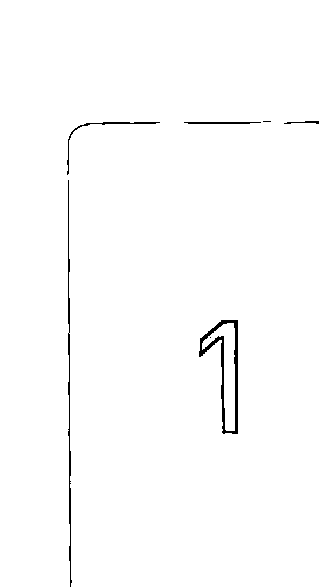

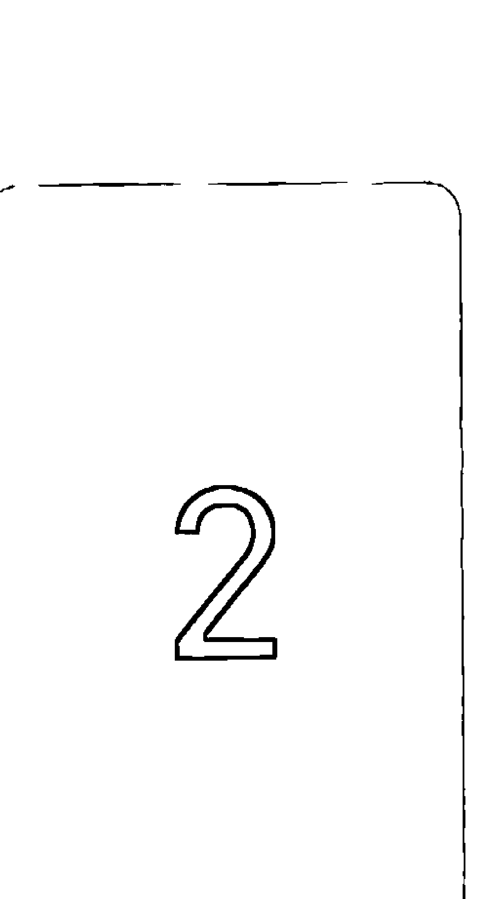

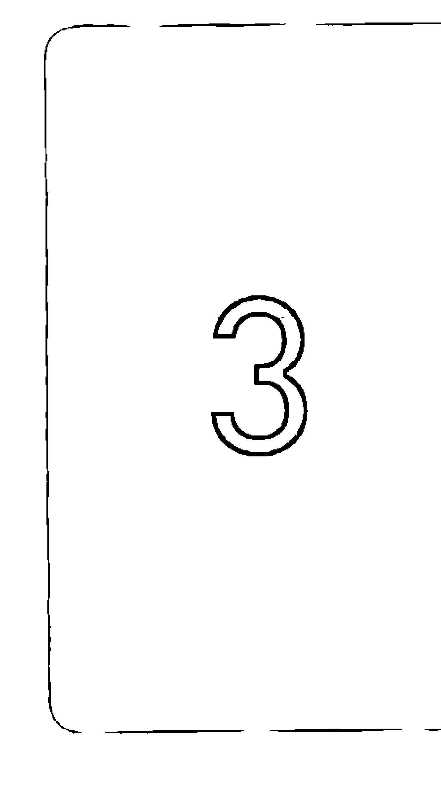

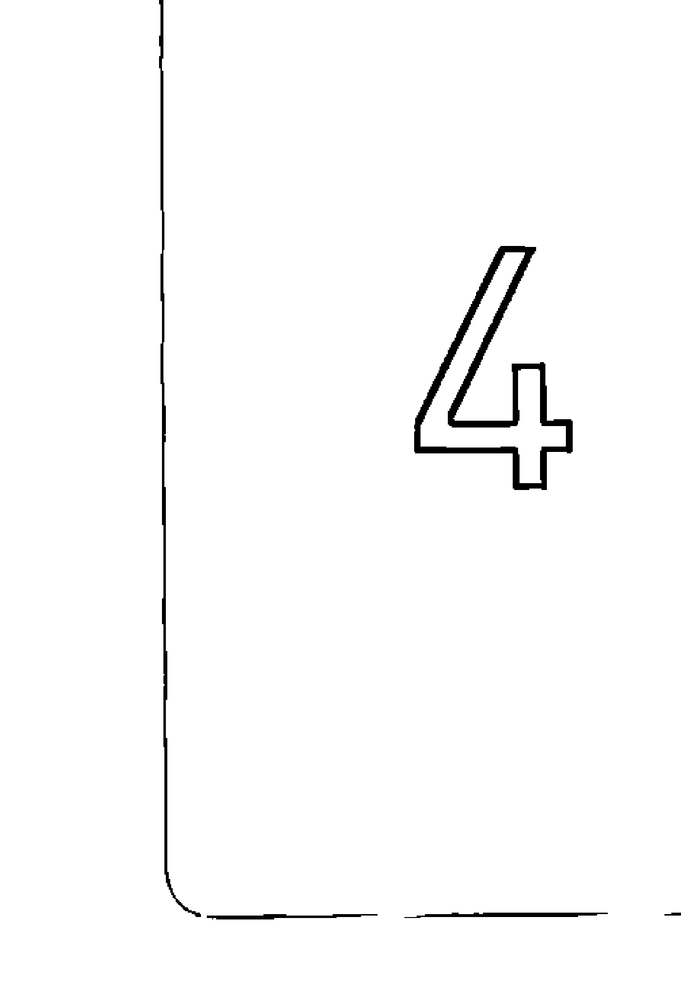

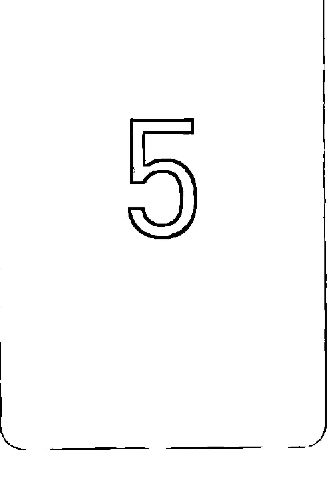

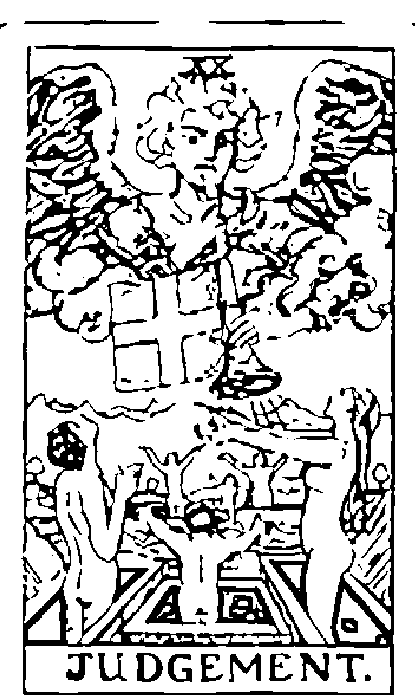

### 1 審判 忘記舊愛，勇敢作自己，「蜜運」機會還會再來

你選擇這張塔羅牌暗示，目前的愛情能量持續上揚，如果期待「蜜運」更濃烈一點，你可以學習「專注」、「專一」的態度，忘記舊愛，把目前的情緒和心惱都投入身邊的這段感情。既然你選擇了身邊的這個情人，就應該細心呵護，因為愛情是需要滋潤的，只有用真心灌溉，愛情才可以盛開出更美麗的花朵。因此未來還是有機會享受「蜜運」的樂趣。

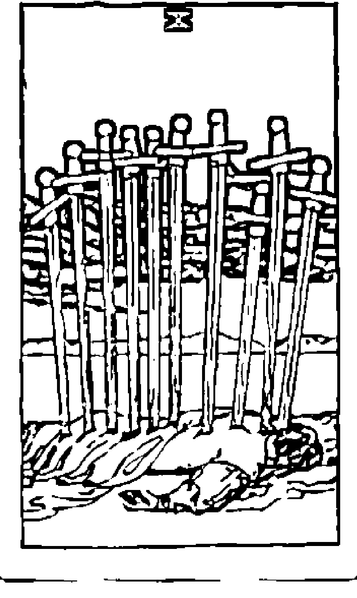

### 2 寶劍十 錯過戀愛最佳時間，「蜜運」機會不可能

你選擇這張塔羅牌暗示，目前的愛情能量有點低迷，甚至錯過了告白或是挽回對方的最佳時間。也許你現在每天都生活在痛苦與懊悔中，因為你剛剛失去了一段甜蜜的戀情，由於「誤會」無法在短時間釋懷，以至於現在每天都抱著痛苦的情緒入眠。艾菲爾老師建議你「失戀」並不可憐，重要的是，要學會「愛惜自己」與「珍惜對方」的人生課題。

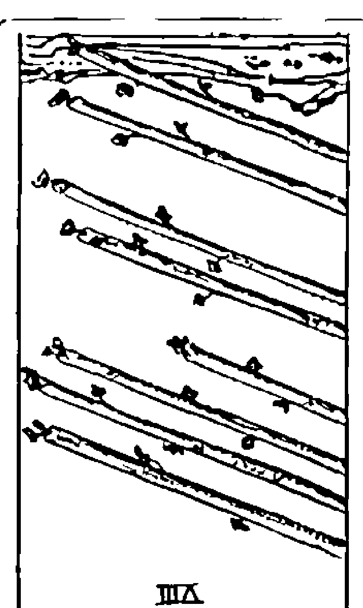

### 3 權杖八（逆位） 勇敢追求和告白，仍然有機會「蜜運中」

你選擇這張塔羅牌暗示，目前的愛情能量有點害羞，有點膽怯，由於你不敢在情人面前坦白說出內心真實的感受，以至於未來一個月洋溢在戀愛氣氛的機會有點艱難。如果你目前仍然是單身的狀況，應該思考一下，究竟是什麼原因讓你不敢主動追求對方或是向對方告白，是擔心自己無法給對方幸福嗎？還是擔心自己的性格沒有穩定下來？無論你擔憂的原因是什麼，都應該先克服自己的恐懼，這樣你才可以享受「甜蜜的愛」。

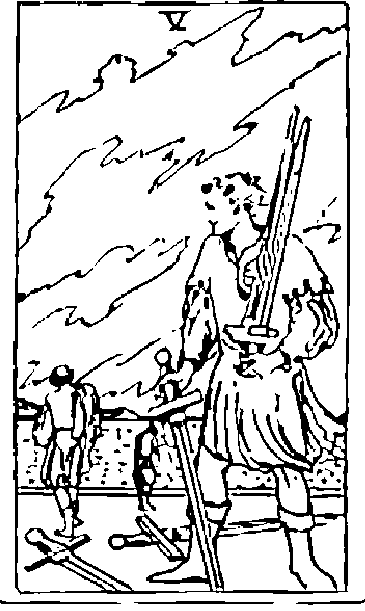

### 4 寶劍五 與情人之間充滿猜忌與爭吵，「蜜運」機會渺茫

你選擇這張塔羅牌暗示，目前的愛情能量有點尷尬，由於彼此對感情的未來無法達成共識，因此談戀愛的時候，充滿了許多猜忌與爭吵，也許是因為溝通的障礙越來越多，以至於你們每次講電話或是約會都需要拉高分貝。由於感情的能量每下愈況，讓你重溫「蜜運」的機會越來越渺茫。艾菲爾老師建議你，在未來一個月中，學習尊重和包容對方的缺點，這樣觀念的改變也許有機會讓你們的愛「起死回生」。

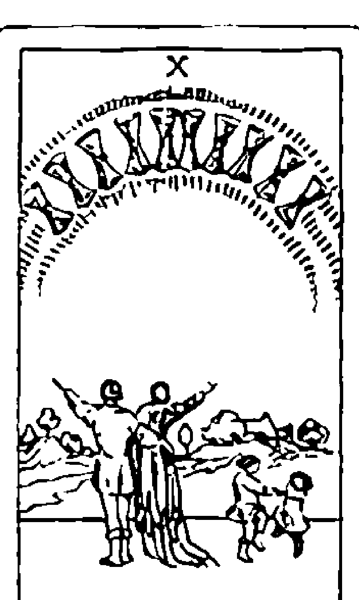

### 5 聖杯十 恭喜你，戀愛能量大好，敬請期待「蜜運中」

你選擇這張塔羅牌暗示，目前的愛情能量持續上揚，由於彼此對感情的共識越來越高，可以分享生活中的感受與經驗，使得彼此的心更加靠近，不但化解了猜忌與隔閡，還有機會享受浪漫的甜蜜時光。艾菲爾老師建議你，在未來一個月中，可以為情人準備一個小禮物，無論是鮮花還是巧克力，都可以讓愛情增溫，讓他知道你對他的愛是無止境的體貼與關懷。

## Q11
### 情人常哄你還是騙你？

艾菲爾老師發現有些人的感情故事真的是一部「被欺騙的血淚史」，甚至有人從初戀開始就一直被騙到結婚。在談戀愛的過程中，你覺得情人常哄你還是騙你？過去的戀情，你總是被一路呵護，還是一再被人欺騙？由下下列塔羅牌選擇一張，艾菲爾老師要告訴你現在這個情人，常哄你還是騙你。

- 1
- 2
- 3
- 4
- 5

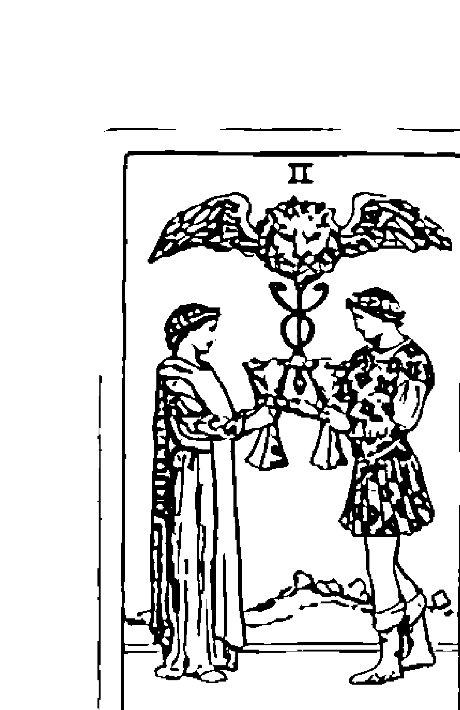

### 1 聖杯二 情人花心成性，許多甜言蜜語都是在騙你

選擇這張塔羅牌，暗示你在談戀愛的過程中必須要特別小心，因為你好像常常遇到「愛情的騙子」。或許是因為你談戀愛的經驗不多，或許是因為你太單純，再不然就是你的運勢真的太倒楣了。接連幾次戀愛經驗，都是因為欺騙的問題，導致兩人的關係破滅。建議你，下次在談戀愛的過程中，最好放大眼睛，不要立刻輕易的答應對方交往，再不然就是把情人介紹給朋友們，讓他們幫你鑑定看看，或許可以減少你被騙的次數。

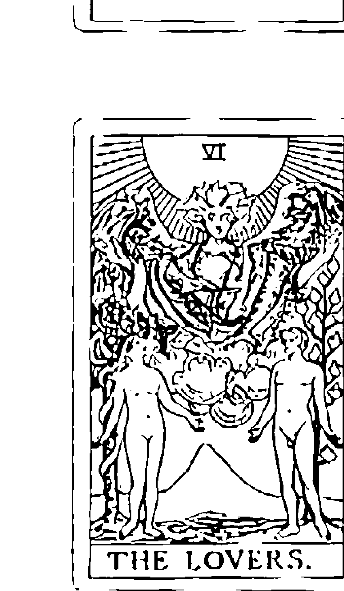

### 2 戀人 情人非常珍惜這份感情，最近常哄你

如果你選擇這張塔羅牌，暗示你最近的愛情運勢真的非常強，不但兩個人恢復了從前戀愛時期的浪漫，而且最近情人也常常哄你。例如問你有沒有記得吃飯，有沒有穿足夠的衣服保暖，有沒有在睡前想他之類。總而言之，情人最近好像是嘴巴抹上了蜂蜜，講出來的話都特別讓人覺得窩心甜蜜。艾菲爾老師覺得，既然情人常常哄你，你也應該特別珍惜這份關係，這樣才可以遇見「幸福的青鳥」。

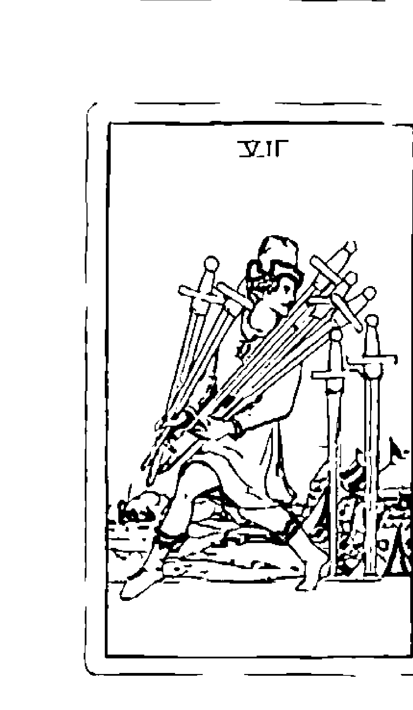

### 3 寶劍七 其實你也沒有對情人誠實，所以兩人互相欺騙

如果你選擇這張塔羅牌，暗示也許你常在朋友面前數落你的情人不是個好東西，因為他常在外面拈花惹草，甚至跟辦公室的同事、客戶眉來眼去，讓你覺得很不舒服。但是仔細想想，你好像也沒有百分之百的誠實喔，因為你雖然有了這個情人，可是你的心態上，卻好像還在等待更好的情人出現，這種騎驢找馬的心態，你也只敢偷偷的藏在心中。總之不要一直抱怨情人對你不好，你也應該思考一下，自己是不是也隱瞞了情人很多事情。

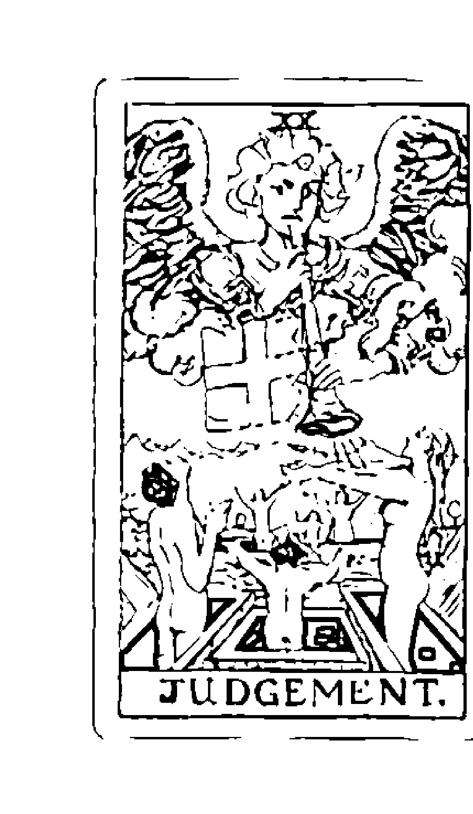

### 4 審判 情人以前常騙你，被拆穿之後，現在收斂許多

如果你選擇這張塔羅牌，暗示情人的內心確實藏有許多秘密，也許是因為當初交往的時候，兩個人還不太熟，或者是為了贏得你的好印象，所以情人心中的秘密都選擇隱藏起來。可是你也不是省油的燈，情人心中鬼靈精怪的想法以及和同事搞曖昧的小技巧其實都難逃你的法眼，特別是你超敏銳的直覺和第六感，簡直可以預測情人的下一步動作。由於情人假借「加班」、「電話沒電」的藉口，總是被你猜穿，現在他的行為，已經收斂許多。

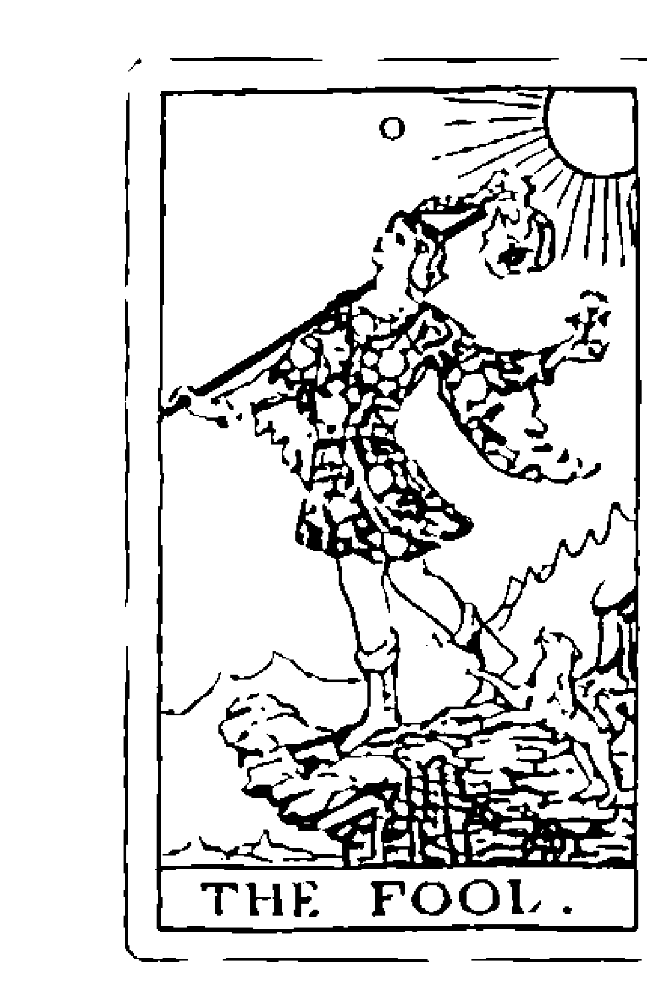

### 5 愚者 現在處於熱戀期，所以對方會哄你開心，以後就不知道了

如果你選擇這張塔羅牌，暗示現在你或許正陷入剛談戀愛的浪漫當中，你覺得生命的一切都是這麼美好，特別是情人總是對你呵護有加，甚至三不五時還會哄你開心。現在的你總是幻想著，和情人的未來是這麼美好，可是你卻對這個情人的「過去」感覺到很陌生，例如他以前交過幾任對象？他過去的戀情都是什麼原因導致分手的？他為什麼不邀請你去他家見父母呢？難道是已經結婚了。艾菲爾建議你，在這些疑問還沒有獲得解答之前，你還是多比較觀察，免得現在哄你，以後把你騙得團團轉，那就慘了。

## Q12
### 你的情人是惡魔還是天使？

想知道情人最真實的面貌，選張塔羅牌看穿他的心思和個性，看看在他平實的外表下，隱藏著什麼樣的個性，是惡魔還是天使？或者是個喜歡電動玩具更勝情人的宅男。

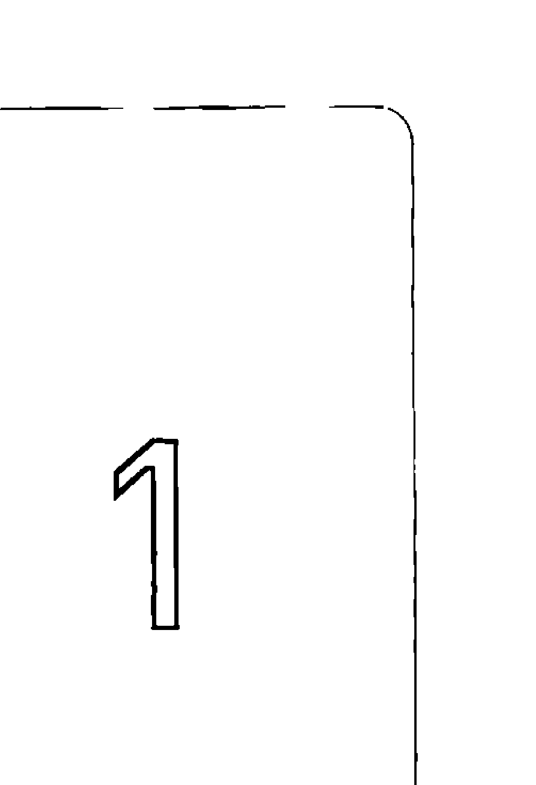

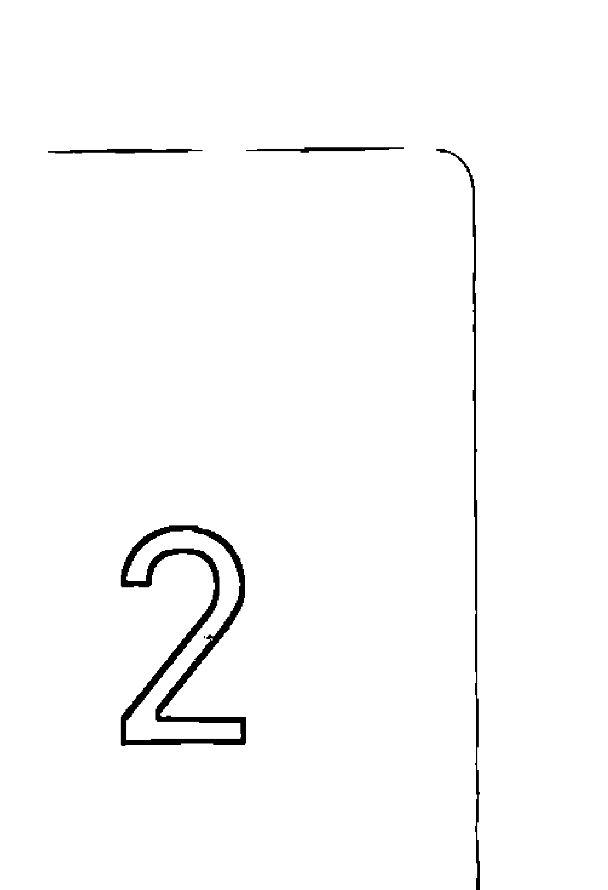

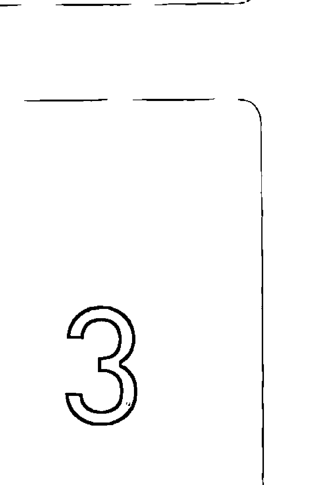

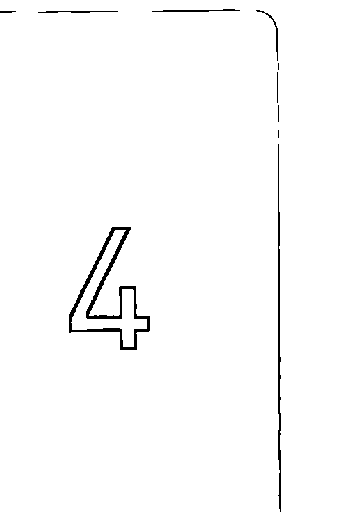

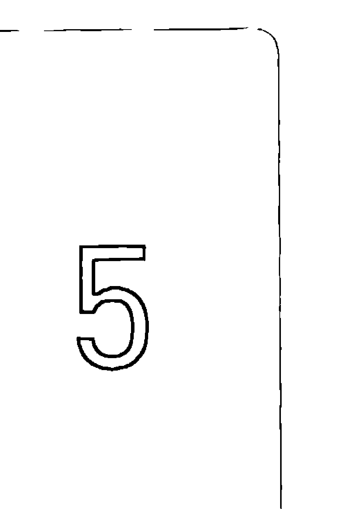

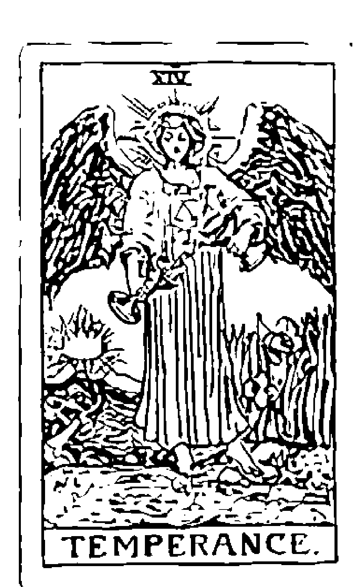

### 1 節制 情人是屬於乖乖聽話型的人

如果你選擇這張塔羅牌，暗示你的情人是屬於乖乖聽話型的人，也許在你們交往的時候，他是比較順從你的意見，而且很多事情都會先找你商量，你們之間理性又多元的溝通，看在朋友的眼中確實讓人非常羨慕，只不過情人偶爾會鬧一點牛脾氣，或是跟你吵反調，其實是為了要你更在乎他。所以在你眼中情人就像一個頑皮的天使。

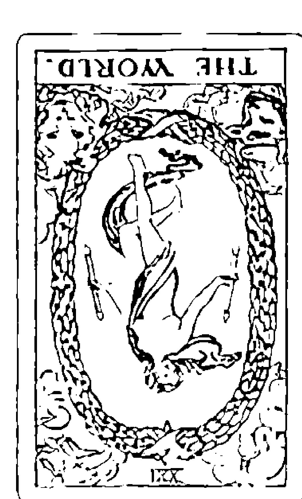

### 2 世界（逆位） 情人是聒噪愛碎碎念的人

如果你選擇這張塔羅牌，暗示你的情人是屬於非常聒噪愛碎碎念的人，在你們交往的時候，情人比較沒有安全感，所以當你不在他身邊的時候，他會不停的用電話查勤或是打電話來趁機跟你聊天打屁。有時候就算在上班，也會利用 MSN 講的不停。看在朋友的眼中確實覺得你們是常常熱線的情侶。只不過有時候你卻覺得他實在是夠煩的了。

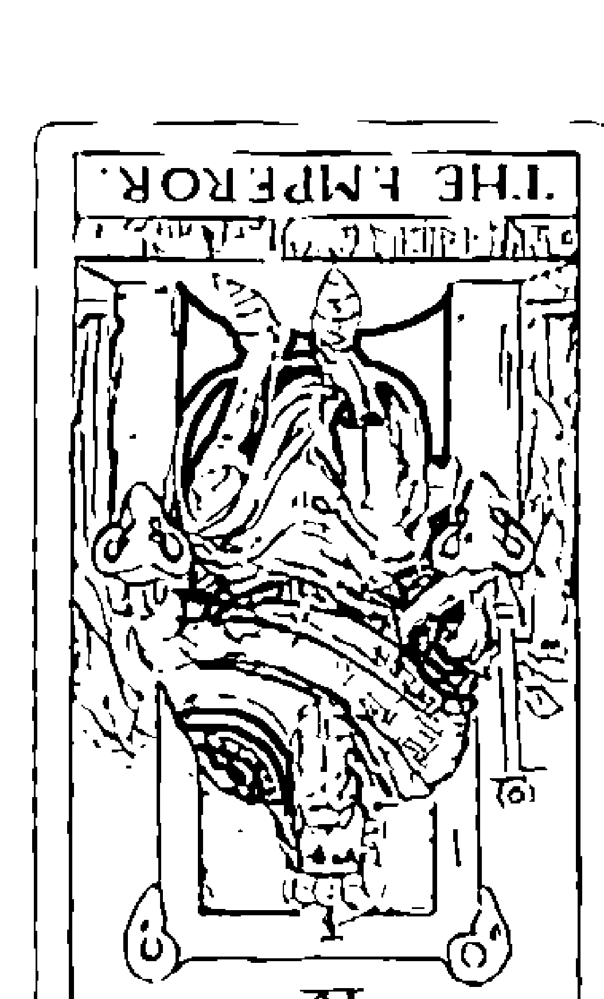

### 3 皇帝（逆位） 情人是脾氣暴躁生氣變臉的人

如果你選擇這張塔羅牌，暗示你的情人是屬於脾氣暴躁、生氣就變臉的人，在你們交往的時候，情人的個性比較固執，只要你不順從他的建議，對方就會擺出一副臭臉給你看，甚至在電話中不斷的咆哮、出言恐嚇。這種情緒能量的爆炸，有時候就像是火山爆發一樣，讓人覺得非常恐怖。所以在你眼中，情人生生氣的時候簡直就像是來自地獄的惡魔。


### 4 力量（逆位） 情人是憨厚又居家的人

如果你選擇這張塔羅牌，暗示你的情人是憨厚又居家的人，在你們交往的時候，情人平常除了上班以外就是喜歡待在家裡。例如在家中看電視或是在家打電動、聽音樂，有時候你也會懷疑情人是不是個宅男。不過就算是宅男也會有顧家和溫柔的一面，至少他不會沒事到夜店趴趴走。所以在你眼中情人是個喜歡待在房間裡面的「趴趴熊」。


### 5 愚者 情人是搞笑又體貼的人

如果你選擇這張塔羅牌，暗示你的情人是搞笑又體貼的人，在你們交往的時候，情人與生俱來的幽默感，讓人覺得非常有趣。他總是喜歡蒐集一些KUSO的影片或是玩具，讓人覺得他像個永遠長不大的小孩。不過看在別人的眼裡，卻覺得你們相處的方式就像是個熱戀中的男女，打打鬧鬧的永遠都不會厭煩。所以在你眼中情人像是個來自歡樂國的天使。

## Q13
### 在情人面前你会装清纯吗？

每個情人都喜歡「清純、無知、乖巧」的情人，為了迎合情人的喜好，你會刻意的在談戀愛的時候裝清純，以掩飾自己已經歷風霜的愛情創傷？選張塔羅牌就可以知道，你在情人面前裝清純的指數有多高。


### 1 聖杯侍者 裝清純指數 80分

如果你選擇這張塔羅牌，暗示你知道情人是比較喜歡乖乖聽話型的人，為了在感情中討好情人，你會刻意的掩飾自己的脾氣與個性，盡量去迎合情人的需求。但是你這樣的犧牲可能未必會為自己帶來幸福的感情，因為你的朋友總是覺得你這樣「裝清純」究竟可以偽裝到什麼時候。但是你就是改不了，因此在談戀愛的初期為了給情人一個好印象，你還是會假裝清純，以搏得情人的歡心。


### 2 星星 裝清純指數 60分

如果你選擇這張塔羅牌，暗示你屬於愛幻想的人，跟情人交往的時候，比較沒有安全感，所以當情人不在你身邊的時候，就會不停的用電話關心或是傳簡訊表達問候，希望情人可以多陪陪你。由於你把愛情看得很重要，因此也會比較「黏」。艾菲爾老師建議你，最好給情人留一點呼吸的空間。否則等到情人覺得你很煩了，那麼無論你怎麼裝清純、裝可愛、裝無辜，情人還是會嚇得躲的遠遠的。


### 3 塔 裝清純指數 100分

如果你選擇這張塔羅牌，暗示你的個性是屬於脾氣暴躁、生氣就變臉的人，在感情交往的時候，為了掩飾自己個性的缺點，你絕對會義無反顧的「裝清純」。所以在聯誼、相親或是與網友初次見面的時候，不但會壓抑自己的個性還會藉由服裝、化妝與流行配件，表現出可愛、清純、體貼的面貌。只可惜再多的假裝，還是有露出馬腳的一天。最後當你跟情人吵架或是等到感情穩定之後，你就會表現出個性中比較固執的情緒，也會擺出一副臭臉給情人看，甚至在電話中不斷的咆哮。由於你的個性太極端，如果不裝清純，恐怕沒人敢接受你的愛情。


### 4 權杖國王 裝清純指數 40分

如果你選擇這張塔羅牌，暗示你的個性太男性化，也許是能力太強、自信心太高，所以在朋友眼中你都是一個「一言九鼎」、「意氣風發」的人。這種強勢的態度與個性，如果還要你裝清純，那簡直是折磨你。因此在感情中，你是學不會溫柔與體貼的話語，總是粗枝大葉的。不過這種爽朗的個性也沒什麼不好，一樣可以認識喜歡你這種「坦白、直率」個性的情人。因此艾菲爾老師建議你，無須「裝清純」因為也裝的不夠像，很快就會被別人看出破綻。


### 5 聖杯五 裝清純指數 20分

如果你選擇這張塔羅牌，暗示你是一個體貼又善解人意的人，在感情交往的時候，你所散發出天生的幽默感，讓情人覺得非常有趣。你表現的可愛與甜美都是自己的本質，因此不需要「裝清純」就可以獲得情人的歡心。由於你是一個感情豐沛的人，唯一的缺點就是你比較「愛哭」，不管是開心還是悲傷的事情，都能夠感動你，這種多愁善感的情緒，常常為你贏得情人更貼心的關懷與照顧。

## Q14
### 近期戀情加溫指數有多少？

看著朋友們恩愛的戀愛發展，你是不是也期待，暖和的春風為你帶來「戀情加溫」的好消息呢？放鬆你的心情艾菲爾老師要用塔羅牌預測你的戀愛，在最近是不是有加溫的可能性。

- 1
- 2
- 3
- 4
- 5


### 1 錢幣五 近期戀情加溫指數 20 分

選擇這一張牌卡暗示，最近期待戀情加溫的機會不大，甚至還有分手的危機，由於在你們的關係中充滿誤會與嫌隙，導致任何一方想要試圖改變這樣的處境，都顯得有點使不上力。仔細想想你會發現，彼此之間的差異性越來越大，很難再找到聯繫感情的機會，因此你們的戀情可能會像飄落的櫻花，在短期之內就要凋零，戀愛關係恐怕無法再持續維持一個月。


### 2 權杖六 近期戀情加溫指數 80 分

選擇這一張牌卡暗示，最近期待戀情加溫的機會非常高，只要稍微調整一下你與情人之間相處的默契就好了。回想一下你是不是一個喜歡發脾氣而且愛擺臭臉的人，會不會常常當著情人面前就發牢騷呢，如果情人曾經嫌棄你，認為你的個性太過強勢霸道，那麼建議你在未來的日子裡，應該軟化自己的態度，表現和平、體貼的特質，同時多聆聽對方的意見，這樣你所期待的戀情加溫，就可以順利實現了。


### 3 寶劍六 近期戀情加溫指數 60 分

選擇這一張牌卡暗示，最近期待戀情加溫的機會平平，要改善你們的關係絕對不是一朝一夕就可以達到的，所謂冰凍三尺非一日之寒，過去你們兩個人的相處中累積了許多恩恩怨怨，如果兩個人都希望改變這個困境，彼此就應該打開心胸，並且原諒對方曾經對你造成的傷害，這樣雲淡風清之後，兩人關係才可以真正雨過天晴，戀情也才有加溫的機會。


### 4 權杖八 近期戀情加溫指數 100 分

選擇這一張牌卡暗示，最近期待戀情加溫的機會大有可為，只是你們必須安排一趟浪漫之旅，回想一下，平時忙碌勞累的工作是不是把你訓練得像個機器人，讓你沒有時間跟情人分享心中的感受。為了讓戀情加溫，建議你們可以利用即將到來的連續假期和情人一起到海邊、郊區走走，體驗一下初戀時的感動，再幫情人準備個小禮物，戀情回溫指日可待。


### 5 寶劍四 近期戀情加溫指數 40 分

選擇這一張牌卡暗示，如果你期待戀情可以在最近加溫，這個願望恐怕會是一場白日夢。也許在你的潛意識中，早就已經決定要放棄這段感情，只是你還找不到分手的時間點，目前你們的關係應該算是「苟延殘喘」，如果最近出現了更適合的情人，也許你就會下定決心分手，因此目前的你只期待平靜的生活，並不期待這段感情還有回溫的機會。

## Q15
### 你在情人面前的白目指數有多高？

反應遲鈍、搞不清楚狀況，是一般人對白目鬼的既定印象，他們通常不太會看人臉色，常導致說錯話的情況發生，請憑直覺選出一張你最喜歡的塔羅牌，看看你在情人面前的白目指數有多高吧！


## 1 寶劍騎士（逆位） 白目指數 40


選擇這張塔羅牌暗示，在情人心中認為你白目的原因，在於你總是學不會看場合說話，例如約會的時候，情人希望聽到你溫柔又甜蜜的情話時你反而認為幹嘛這麼肉麻，或是當情人希望能聽聽你的意見時，你反而打著哈欠說想要睡覺。由於你總是不會在正確的場合作對的事情，以至於到現在你們總是三不五時的鬥嘴，雖然不是大吵架，但是情人一定在私底下偷偷的抱怨過。

### 2 世界 白目指數 20


選擇這張塔羅牌暗示，你與情人之間在現階段生活中，已經能夠慢慢的適應彼此，雖然過去的相處過程中，你們總是不間斷的爭吵與對抗，但是經過這幾年的相處之後，你們彼此的差異已經磨合的差不多了。就算現在有時候想法與觀念仍然不同，但是不至於互相埋怨對方，所以你在情人心中的白目指數是最低的。

### 3 錢幣四 白目指數 60


選擇這張塔羅牌暗示，你在金錢的使用上和情人的習慣會有明顯的不同，因為你是個非常節省的小氣鬼，一定常常為了不同的消費習慣而起爭執。由於你過度的節儉，總是保持著「省錢能致富」的想法，這一點恐怕情人不能認同，而且你有時候會耍賴皮，要情人送你生日禮物或是情人節禮物，可是你卻故意忘記回送禮物，因此在情人的心目中，你一定是個小氣又白目的人。

### 4 魔術師（逆位） 白目指數 100


選擇這張塔羅牌暗示，你在聊天講話的時候，常常有口無心，喜歡針對某些特定的議題大發牢騷，例如跟朋友比較哪一個情人比較溫柔，或者哪一任的舊情人比較有錢或是帥氣等等，這些尷尬的議題，總是在聊天聚會中，不經意的洩露出來。面對這些與舊情人比較的話題，其實在談戀愛的時候，絕對是一項大忌，可是偏偏你就是大嘴巴愛八卦，因此情人一定私下抱怨你真是個有點白目的情人。

### 5 愚者（逆位） 白目指數 80


選擇這張塔羅牌暗示，你的個性有點調皮愛開玩笑，幽默的特質是生活中的開心果，只是有時候你過度的頑皮，反而在需要正經的場合中變得有點孩子氣，這一點可能會讓情人感到非常的不適應。因為在正式的場合中，你漫不經心的行為和態度，情人會覺得你好像是個無理取鬧的人，而且也丢了情人的面子。所以艾菲爾建議你和情人私下相處時可以裝可愛，但是跟情人一起參加正式聚會時，你還是要優雅端莊一點，否則情人私下會抱怨你有點白目。

## Q16

在情人面前你的愛撒嬌指數有多高？

男生都喜歡喜歡會撒嬌的女生，問題是有些女生就是天生學不會撒嬌，放鬆心情由下列塔羅牌選擇一張，看看你在情人面前受撒嬌的指數有多高。

- 1. 选项 1
- 2. 选项 2
- 3. 选项 3
- 4. 选项 4
- 5. 选项 5

Career Romance


### 1 寶劍國王 愛撒嬌指數 20

選擇這一張塔羅牌暗示，情人想要聽到你在他面前撒嬌可能會困難點。因為你們大部分時間都花在挑剔對方，由於你的個性比較像是女強人，因此跟情人約會的時候怎麼可能低頭向人撒嬌呢。所以跟你談戀愛的情人，一定私底下抱怨，被你嘮叨、碎碎唸很容易，要你撒嬌比登天還難。


### 2 戰車 愛撒嬌指數 40

選擇這一張塔羅牌暗示，你是非常獨立有個性的女生，有時候也會表現出冷酷的特質，生活中你比較著重在工作中的表現，你認為憑藉自己的努力，也可以跟男同事一起打拚，至於你的潛意識中到底有沒有撒嬌的基因呢，艾菲爾老師覺得，偶爾會吧，也許在喝醉酒的時候。


### 3 正義（逆位） 愛撒嬌指數 60

選擇這一張塔羅牌暗示，在你的個性中，其實同時存在著兩種人格，一種是中規中矩樸實的作風，另一種則是浪漫的情懷，就好像少女漫畫裡面楚楚可憐的女主角，總是在期待白馬王子的解救。你這種愛撒嬌的個性，平時不會表露出來，只有當你遇到心儀的對象時，在兩人甜蜜相處的時候，你才會展露小女人的一面。


### 4 聖杯侍者 愛撒嬌指數 80

選擇這一張塔羅牌暗示，你的個性非常的古靈精怪，經常用撒嬌、耍賴等惡劣手段戲弄男生，因為你覺得只要在男生面前耍一點小手段，他們就會乖乖的聽你的話，甚至在態度上讓步，但是有時候你這種撒嬌的暗示，並不一定是愛情的象徵，反而比較像是同事之間打情罵俏的戲弄。


### 5 聖杯十 愛撒嬌指數 100

選擇這一張塔羅牌暗示，你的個性非常的溫柔賢淑，你認為想要得到男生的愛情追求，就要學習如何撒嬌來討情人的歡心。而且你也常常幻想自己是童話故事中的公主，既然是公主，那就應該具備靚麗活潑，開朗大方，熱情天真又善良的氣質。因此你無時無刻，都散發著「嬌嬌女」的氣質，可以說是把愛撒嬌的天份，落實到生活中的第一人。

## Q17

你對愛情的忠誠指數有多少？每個人都希望另一半在感情中，對自己是忠誠的，不要在外沾花惹草，或是背著自己和異性調情，既然要求別人在感情中的標準，不妨先看看自己對感情的忠誠度有多高吧，由下列塔羅牌憑直覺選擇一張，就可以知道你的答案！


### 1 聖杯侍者（逆位） 愛情忠誠指數最低 20 分

選擇這一張塔羅牌暗示，你在愛情中是最沒有理由要求情人斬斷桃花的，因為你本身就是一個容易招惹曖昧關係的爛桃花。尤其是你對待感情的態度不成熟，時常在情人面前撒嬌和鬥嘴，甚至趁著情人不注意的時候，就傳簡訊給曖昧的對象。由於你對感情的期待是熱切和多元的，因此潛意識還抱持著騎驢找馬的心態，因此就算身邊有個情人陪伴，你還是會嫌他不能滿足你全部的愛，所以你的愛情忠誠指數最低 20 分。


### 2 隱者（逆位） 你的愛情忠誠指數 40 分

選擇這一張塔羅牌暗示，你是一個常常陷入愛情遊戲當中的人。當你孤單時，你是一個很渴望愛情生活的人，可是當愛情敲門的時候，你理性的那一面就完全消失，變得手足無措和太過夢幻，尤其是你不知道要用什麼樣的態度來接受和面對感情的發展，以致於常常在愛情跌倒，甚至成為介入別人感情的第三者，由於你總是無法克制住自己脫序的感情行為，因此你對愛情忠誠指數不高只有 40 分。


### 3 教皇 你的愛情忠誠指數 80 分

選擇這一張塔羅牌暗示，你是個性保守的人，時常把「家庭」、「婚姻」與「夫妻生活」的觀念掛在嘴邊，因為你是一個高道德標準的人，你認為無論是男生還是女生，這一生中最重要的還是要有一個「美滿的家庭」，由於你對未來的婚姻生活充滿期待，自然你也會約束自己，不要變成一個感情的背叛者。由於你對婚姻生活具有高度的信仰，所以也比較不會亂搞劈腿關係，因此你的愛情忠誠指數 80 分。


### 4 聖杯六（逆位） 愛情忠誠指數 60 分

選擇這一張塔羅牌暗示，你的個性非常富有同情心，對愛情忠實，但也難免因為同情心與多情，而捲進一些男女是非之中，當然也有可能使你不得不移情別戀。而且因為你的善良與好人緣，自然吸引異性圍繞在你身邊，艾菲爾老師建議你，因為你的個性活潑開朗，比較不懂得拒絕別人，因此容易與同事、同學甚至老闆成為紅粉知己，由於這種感情的是非很多，自然會讓你對愛情的忠誠度大打折扣，因此你的愛情忠誠指數 60 分。


### 5 寶劍一 你的愛情忠誠指數最高 100

選擇這一張塔羅牌暗示，你對愛情非常的理智而且固執，幾乎到了有點小心眼的地步，由於你非常在乎感情的穩定度，因此一旦認真投入感情之後，你的生活就會以這份情感為主，不易有任何外遇的機會發生。而且這張牌也暗示你對目前的情人相當滿意，只是你和情人之間也會「約法三章」例如規定彼此之間的最低底限，如果有人任意的觸碰「拈花惹草」的禁忌，你可是會暴跳如雷，甚至以分手相逼，由於彼此都很在意對方，因此你的愛情忠誠指數最高 100 分。

皇家圣学院 http://strc.taobao.com

## 在情人心中你是「A咖」还是「B咖」？

每一個人都希望佔自己在情人心中佔有非常重要的位置，但是情人的心，深似海難以看穿，究竟在情人的心中，你的重要性有多高呢？在他心中你是「A咖」還是「B咖」，或者是個揮之既來，呼之既去的「F咖」？放鬆心情由下列塔羅牌選擇一張，艾菲爾老師要告訴你，在情人心中你是「A咖」還是「B咖」。

- 1.
- 2.
- 3.
- 4.
- 5.


### 1 寶劍騎士 在情人心中你是「D 咖」

選擇這張塔羅牌暗示，在情人心中你是「D 咖」，你的存在讓情人每天都悶悶不樂，因為你的一舉一動，情人都看不順眼，總是不斷的想跟你吵架或是冷戰。因為寶劍騎士牌，象徵著「尖銳冰冷的言語對抗」，不停的吵架彷彿是你們戀愛的宿命。由於彼此看待愛情的角度，始終無法用「關心、體諒」的心情來互相適應，因此憤怒的語言取代了甜蜜的情話。由於情人覺得你也不溫柔，你在他心目中的地位，只是個「無聊吵架的小角色」，絕對只能排在「D 咖」這個位置。


### 2 錢幣四 在情人心中你是「A 咖」

選擇這張塔羅牌暗示，在情人心中你是「A 咖」，你的存在讓情人每天都非常開心，因為情人覺得跟你相處生活中充滿快樂幸福的感動，也許是因為你的氣質，也許是因為你的個性，情人都非常的喜歡。就好像是遇到白馬王子、遇見白雪公主一樣，在情人眼中你就是他尋覓已久的理想情人，由於情人渴望跟你廝守一生，你是情人心中的「心肝寶貝」當然是最重要的「A 咖」角色。


### 3 聖杯王后 在情人心中你是「C 咖」

選擇這張塔羅牌暗示，在情人心中你是「C 咖」，你的存在讓情人每天都開開心心的，因為打情罵俏的生活，讓情人有戀愛般的好氣色。也許是你善良的個性，或是特別溫柔的言語，還是體貼的神情，讓情人跟你相處就非常的開心愉快。不過情人本身的異性緣太好，你只不過是他「花名冊」中的一盤小菜，因為情人跟你交往的同時，也可能跟別人「眉來眼去」，甚至「暗通款曲」，如果情人花心的個性不稍微克制一點，就算他給你的承諾再多，在他的「尋芳錄」中，你也只算是個配角「C 咖」。


### 4 權杖六 在情人心中你是「B 咖」

選擇這張塔羅牌暗示，在情人心中你是「B 咖」，你的存在是情人「信心與勇氣」的來源，因為「權杖六」這張牌，象徵著「和諧的搭配」與「忠誠的夥伴」。所以當情人遇到困難需要幫手的時候，一定會第一個想到你，或者當情人需要意見諮詢的時候，也會徵詢你的意見，當作是他決策時的參考，由於你總是能站在「支持、鼓勵」的這一方，那麼情人和你的默契當然是非常融洽的。由於你在情人發生困難的時候，不吝嗇的給予支援，所以你就像是他的私人秘書或是貼身幕僚，是個不可或缺的「B 咖」。


### 5 錢幣五 在情人心中你是「E 咖」

選擇這張塔羅牌暗示，在情人心中你是「E 咖」，因為你的存在可有可無，就算不聯絡了，情人也絲毫不會感覺到可惜與難過。因為錢幣五，象徵著「夫妻本是同林鳥、大難來時各自飛」的宿命，也許在兩人關係和諧的時候，彼此還可以打打鬧鬧，增加戀愛的情趣，但是如果某人遇到了新的戀情，或是更適合的對象，你們的交往就會出現阻礙，這張牌暗示，由於彼此之間存在著「私心」，因此和諧共渡難關的可能性是最低的，由於你在對方中心只是一個很普通的朋友，因此絕對只是個不起眼的「E 咖」。

### 在愛情中你的依賴程度有多高？

「生活獨立」可不代表「個性獨立」，在愛情中你是一個總是依賴對方、沒有對方陪伴就會覺得空虛寂寞的人嗎？放鬆心情由下列塔羅牌選擇一張，看看你在愛情中的依賴程度有多高。


### 1 皇帝（逆位） 依赖指数 80 分

选择这张塔罗牌暗示，在你的个性当中有一种无理取闹的特质，特别喜欢跟对方唱反调，因此在谈恋爱的过程中，你们常常斗嘴、甚至吵到冷战。朋友都感觉你们的相处像是一对欢喜冤家，但是其实你内心当中的真实反应，却是「非常依赖对方」，只是你们表达的方式，是由「争吵与对峙」来突显彼此在自己心目中的重要性，所以你与情人之间，虽然常常争吵，但是彼此还是非常依赖对方的。


### 2 教皇 依赖指数 60 分

选择这张塔罗牌暗示，在爱情中你兼具感性与理性，你认为真正的感情，最好是能够达到「身、心、灵」三方面的和谐。你期待感情的另一半，可以是你的情人、也可以是你的朋友、甚至可以成为你的家人。你也期待情人可以拥有自己的事业与想法，你并不会强迫对方，为你做出牺牲或是改变，因为你知道，只有在「身、心、灵」三方面完全达到和谐的状态，那么爱情才能够长久经营。


### 3 权杖王后 依赖指数 40 分

选择这张塔罗牌暗示，你热情又精力充沛，在生活当中就像是每天都有用不完体力的「傻大姐」，由于你大方又好客，在异性朋友眼中都把你当作是「自己的哥儿们」。由于你对于事业的投入度极高，让大家都感到非常的佩服，不但具有独立作业的能力，甚至可以站在管理者的角色，发号司令。由于你的潜意识就是一个「女强人」，所以在爱情中你的依赖指数也是非常低的只有 40 分。


### 4 圣杯十（逆位） 依赖指数 100 分

选择这张塔罗牌暗示，你对爱情的需求度非常的大，因为你觉得在谈恋爱的时候，就是希望能够得到对方所有的爱，而且你认为情人就是应该「主动照顾你」，最好对方拥有好脾气，可以让你予取予求。因为在潜意识当中，你是非常「脆弱」的，甚至有点像长不大的孩子。由于你在爱情中，期待另一半能够时时刻刻陪伴在你身边，像是一双温柔的手，不断的呵护著你，所以你的依赖指数最高 100 分。


### 5 宝剑国王 依赖指数 20 分

选择这张塔罗牌暗示，你有精明干练的形象，这是你的优点，却也是你在感情中的败笔。由于你给别人一种「睿智、理性」的气质，所以很多人跟你初次见面，都会被你冷漠、高傲的气质给吓到，大家在职场中比较佩服你的专业能力，也对你的意见充分的尊重，由于你必须时时刻刻维持这样的形象，以致于在私底下或是在谈感情的时候，你也不知不觉的被这种思维模式「制约」。由于你总是拉不下脸来「撒娇、装可爱」，所以你在感情中的依赖指数最低只有 20 分。

### 在男人眼中你是夏娃還是青蛙？

每個女生都想成為情人眼中的「戀愛夏娃」，用真實的個性來做自己，那麼我們現在就來用塔羅牌測驗一下，在情人眼中你是具有什麼特質的夏娃，或者你是讓情人不想聯絡的「聒噪青蛙」。


### 1 聖杯一 個性專情、行為害羞的真摯夏娃

你選擇這張塔羅牌，暗示你的個性開朗，但是在感情面前卻也非常的脆弱和無助，尤其你屬於「愛在心裡口難開的個性」，面對愛情總是表現出專注的神情，視愛情為你的「唯一」，你也希望情人可以用盡一切的力量來呵護你，但是在戀愛初期，除非對方先開口表達愛意，不然你也是會在暗戀對象的身邊苦苦守候。由於你是個性專情，但是行為卻非常害羞的真摯夏娃。適合情人：牡羊座、獅子座、射手座。


### 2 星星 花心的多情夏娃

選擇這張塔羅牌，暗示你的自主而獨立，感情面前具有掌控和控制戀愛熱度的主導性，尤其你屬於「周旋在百花之間的花蝴蝶個性」，面對愛情洋溢著青春無敵的氣息，視愛情為你豐富人生經驗的小插曲，在戀愛的過程中，你並不會為了哪個對象而專注的在他身邊守候，因為你知道愛情是一種會退去的「激動」，當熱戀降溫之後，你就會把戀愛目標轉移到別人身上，不斷尋求新的感覺。由於你是個擁有不安定靈魂的多情夏娃。適合情人：天秤座、雙子座、水瓶座。


### 3 戰車 捍衛愛情、為愛走天涯的勇敢夏娃

選擇這張塔羅牌，暗示你的個性非常的強勢又直率，在感情面前就算你的外表非常的柔弱，但是內心卻是非常堅強，由於你具有「捍衛愛情的本質」，如果感情中出現了情敵與第三者，你絕對不會輕易的將情人拱手讓人，相反的還會積極爭取，去捍衛你的愛情疆域。就算戀人因為工作或是讀書的關係必須遠行，你也願意為了真愛，陪同情人遠走他鄉，由於你是一個願意為愛走天涯的勇敢夏娃。適合情人：巨蟹座、天蠍座、雙魚座。


### 4 力量 個性溫柔又有智慧的夏娃

選擇這張塔羅牌，暗示你的個性兼具著溫柔與強勢的雙面特質，在職場中你是一個獨立又專業的粉領族，但是在情人面前，你卻是喜歡撒嬌、渴望被照顧的浪漫女孩。你懂得配合適當的場合而表現出女人多變的面貌，就好像是百變女郎，讓情人可以不斷的欣賞你細膩、敏感的心情故事。由於你對待情人非常的貼心，和你交往的情人，可以盡情享受你的照顧，卻又不必擔心你「黏人」的負面特質，所以你是個個性溫柔又有智慧的雙面夏娃。適合情人：金牛座、處女座、魔羯座。


### 5 死神 個性有點聒噪吵架喋喋不休的青蛙

選擇這張塔羅牌，暗示你的個性有著讓情人懼怕的黑暗力量，例如脾氣暴躁、性格倔強、喋喋不休的特質，有點讓人退避三舍。也許你認為率性呈現自己個性，是一種真性情的表現，但是你這種不加修飾與收斂的行為，在情人眼中卻是非常可怕的負面能量，尤其是當你遇到與自己觀念、想法有落差的事情時，表現出據理力爭的衝突個性，真的非常恐怖，艾菲爾老師奉勸你，就算你是一個講求正義真理的人，在愛情中也要用溫柔的行為和輕柔的話語包裝，千萬不要從「夏娃」變成男人眼中只會喋喋不休、不斷抱怨的「青蛙」。

## Q21
### 選擇情人我會不會看走眼？

社會新聞常常報導藝人婚姻失敗的例子，多半都是因為情人婚前、婚後性格大不同，讓人難以適應。有些情人則明明是個窮小子，卻誤把他當成公司小開；有的又有暴力性格，卻又將他當「好MAN」。放鬆心情選一張塔羅牌，艾菲爾老師要告訴你，選擇情人你的看走眼指數。看你究竟會選到一個好蘋果還是爛蘋果。

- 1.
- 2.
- 3.
- 4.
- 5.


### 1 錢幣四　錯把窮酸情人當小開　看走眼指數 40

你選擇這張塔羅牌暗示，每一個人都期待自己的另一半如果是某家上市公司的小開或是千金小姐，那麼未來的人生應該可以少奮鬥十年。但是小心你選擇的戀愛對象是個「一毛不拔」的鐵公雞或是沒有現金，信用卡刷爆有名無實的「假小開」、「假千金小姐」，如果你懷抱著嫁入豪門的期待，可是最後交往的情人卻是個吝嗇到不行的「小氣鬼」，這樣的感情還真是讓人跌破眼鏡，艾菲爾老師建議你，交往之前還是要睜大眼睛，觀察一下對方所謂的「家世背景」是真是假。


### 2 寶劍侍者　錯把嘮叨情人當詩人　看走眼指數 20

你選擇這張塔羅牌暗示，談戀愛的時候接到情人甜蜜又溫馨的電話，一定讓你小鹿亂撞，就算放下手邊的工作，也要跟情人情話綿綿，也許情人會提醒你要吃午飯，晚上要記得早點睡，出門要記得帶雨傘。但是戀愛的熱戀期一過，或是兩人結婚之後，如果另一半還是跟婚前一樣，提醒你生活中的瑣事，你不免大發牢騷「你這樣會不會太囉唆？」、「你這樣嘮叨到底有完沒完？」。建議你，其實情人只是保持著原來關心你的態度而已，是你對他的忍受度降低了，該檢討的不是對方的行為，而是你的心態。


### 3 權杖國王　錯把暴力情人當 superman　看走眼指數 100

你選擇這張塔羅牌暗示，你潛意識根深蒂固有很強「崇拜英雄」的情節，你喜歡看英雄拯救美女的戀愛故事，也幻想自己的另一半有著強健的體魄與陽剛的個性。談戀愛時對方衝動火爆的個性，成為吸引你的特質之一，但是小心婚後對方的個性還是不收斂，變成易怒火爆的拳腳情人。艾菲爾老師建議你，如果你喜歡的情人是這一類特質的人，最好三思，不然就是婚前找你的親朋好友幫忙鑑定一下，否則你看走眼的指數是很高的。


### 4 月亮　錯把出軌狼人當情聖　看走眼指數 80

你選擇這張塔羅牌暗示，你喜歡個性浪漫、細心體貼的情人，最好對方可以天天唱情歌，在你耳邊說情話，這麼肉麻的互動，在你眼裡卻是感情恩愛的象徵。但是這種奶油小生的本性，卻是最容易出軌的族群，也許憑藉著俊俏的外表，也許靠著甜死人不償命的花言巧語，他們總是遊走在不同的情人之間，過著「劈腿、偷吃」的生活。建議你，如果你的情人曾經傳出「素行不良」的花邊新聞，千萬不要以為你可以百分之百的感化他，因為你很容易在感情中看走眼，小心你最後吃悶虧。


### 5 皇帝　錯把自大情人當性格小生　看走眼指數 60

你選擇這張塔羅牌暗示，你喜歡有個性的情人勝過有才華的對象，你認為談戀愛的時候，對方桀敖不遜、意氣風發的個性最吸引你。如果可以跟這樣性格小生談戀愛，那麼感情生活中，應該充滿不同的刺激和樂趣。尤其是這種性格乖張的情人，願意拜倒在你的石榴裙下，你會有一種征服對方、馴服對方的成就感。但是艾菲爾老師覺得，你選擇情人的眼光也不見得多高明，小心對方本性就是個「冥頑不靈」的怪咖，你還錯把對方的「自大」當成是有個性，把對方的「咄咄逼人」當成是正義感。交往之前，最好請親友代為鑑定一下。

## Q22
### 情人对我没反应，他是不是很介意我的身材？

当你还是年轻瓜子脸的年纪，情人每天都想跟你搂搂抱抱，但是当你肥油上身，情人对你的「性趣」就越来越少。放松心情，选一张塔罗牌艾菲爾老师要告诉你，情人对你不闻不问，是不是因为心理很介意你的身材，却不敢说。如果是，看来你可以考虑减减体重了。

- 1. [选项 1]
- 2. [选项 2]
- 3. [选项 3]
- 4. [选项 4]
- 5. [选项 5]


### 1 寶劍二（逆位） 就怕帶你出門被朋友、同事看見 介意指數 40

這張塔羅牌暗示，面對你身材的變化，情人心中很能體諒你因為忙碌的關係而沒時間運動，或者是因為健康的問題，而讓身體稍微發福。但是在情人同事或朋友眼中，他們那張惡毒又八卦的嘴，可就是不饒人的揶揄。因此情人害怕你胖胖的樣子，被他的同事、朋友看見，隨口說出「你女朋友是不是懷孕了？」或是「你那個胖胖的女朋友最近還好嗎？」這種拿身材當作玩笑的言語，其實情人聽在自己耳裡，還是會小小的介意一下。


### 2 聖杯一 情人喜歡你的內涵，身材胖瘦他不介意 介意指數 20

這張塔羅牌暗示，面對你身材越來越胖的事實，情人其實是很能接受的。畢竟他真正喜歡的是你的個性，欣賞你的內涵，情人喜歡你善解人意的特質，面對你最近身材變胖，其實他比較心疼的是，只要你的健康不要受到傷害就好，至於體重或是身材因為年紀的增長或是懷孕生產而發生的變化，他很清楚這是每個人都必須經歷的過程，體重的變化並不會影響他對你的愛。


### 3 聖杯國王（逆位） 沒有腰身的身材，真的很不性感 介意指數 100

這張塔羅牌暗示，如果你覺得情人最近抱你的次數越來越少，摟著你睡覺的感覺好像是在敷衍，那麼你真的要小心，該仔細的量一下自己的體重和腰圍，看看是不是有超重的問題。雖然情人嘴巴說，對你的身材胖瘦一點也不介意，對你的美貌都能包容，恐怕都是違心之論。艾菲爾老師建議你，既然情人是很重視「視覺感官」的動物，你更應該努力維持自己的「水蛇腰」，這樣你才不會有被拋棄的危機感。


### 4 權杖一（逆位） 臀圍上的肥油是不是快滿溢出來了 介意指數 80

這張塔羅牌暗示，雖然火鍋很好吃、麻油雞很可口，冬天進補還是要稍微節制一點。你不覺得最近在穿牛仔褲的時候，褲子有點穿不下了嗎？尤其秋冬到了衣服越穿越多，走在街上你的背影看起來就像是一隻企鵝。再加上在辦公室一整天坐著，不覺得肚子、屁股越來越大了嗎？艾菲爾老師建議你，如果要維持愛情的溫度，除了與情人彼此間貼心的小動作之外，你也應該克制一下自己的飲食，小心等到情人哪天分手變心，「你的身材走樣」成為對方最好的理由與藉口。


### 5 聖杯八（逆位） 嬰兒肥的圓臉，真的越來越像「月餅」了 介意指數 60

這張塔羅牌暗示，最近是不是都沒有運動，隨著年紀越來越長，身體的新陳代謝越來越慢，肥胖的問題也已經悄悄的困擾著你。由於體質的關係，你只要一發胖，就會先胖在臉上，讓你的「瓜子臉」像吹氣球一樣變成「月餅臉」，不論你现在有沒有戀情，只要隨著你體重變重，你的異性桃花就相對的越來越少，雖然情人不敢抱怨你的體重變重，但是比較起彼此剛認識的時候，你輕盈苗條的身材，跟現在越來越圓的身材，情人還是在心中不免小小抱怨一下「你或許該少吃一點了」。

## Q23
### 我會被情人騎在頭頂上嗎？

談戀愛本來就應該貼心問候、理性對待，但是偏偏有些情人就是性格太暴躁，氣勢凌人到讓人害怕。 放鬆心情，由下列塔羅牌中憑直覺選擇一張，艾菲爾老師要告訴你，談戀愛的時候你是不是常常被情人折磨，讓他騎在你的頭頂上。

- 1.
- 2.
- 3.
- 4.
- 5.


### 1 力量（逆位） 情人氣勢凌人，你常受委屈沒人疼

選擇這張塔羅牌暗示，你真是「人善被人欺，馬善被人騎」，談戀愛的時候，情人就是吃定你的好脾氣，常常對你做出過份的要求，因為就是看準了你的「好脾氣」。例如約會的時候，你要遷就對方的喜好，還要犧牲自己的假期來配合對方的時間。如果你對情人的決定有所抱怨，情人就會擺一副「臭臉」給你看，讓你覺得好像是自己犯了什麼滔天大罪。由於你的個性太過柔順、沒脾氣，不敢跟對方爭取你的權益，以致於情人習慣把你的意見當空氣，所以你也只能默默承受這一切。


### 2 權杖王后 是你氣勢凌人，常把情人當狗罵

選擇這張塔羅牌暗示，無論你是男生還是女生，在愛情中你永遠都是王者，要你在戀愛或是婚姻關係中，犧牲或是委屈自己「門都沒有」。在你的觀念中，你認為如果情人愛你，就應該要學會「犧牲自己的權益，全心的討好和照顧你」。因為你比較享受那種「別人為你奉獻和付出的愛情關係」，由於過去的戀愛經驗中，你在情人面前始終保持著「強勢態度」，如果情人不給你面子或是否定你的意見，你絕對把對方當小狗一樣狂罵，因為在你的觀念中「我可以欺負人，別人不可以欺負我」。


### 3 戰車 雖然你口不出惡言，但是性格一樣倔強

選擇這張塔羅牌暗示，在談戀愛的過程中，雖然你不曾經表現出暴躁的個性，但也絕對不是「省油的燈」。尤其你覺得戀愛的過程是有階段和步驟的，在初戀的時候，雙方雖然甜蜜恩愛，但是也有很多的生活習慣需要磨合和彼此適應。因此你會不厭其煩的慢慢告訴對方你生活中的喜好與禁忌。但是當你們進入感情的穩定期之後，如果對方還是表現的如此白目與神經大條，你就會表現出不耐煩的情緒，甚至變得煩躁。因為你覺得對方連這一點小事情都做不好，將來還指望他做什麼大事業，雖然你口不出惡言，但是性格一樣倔強。


### 4 權杖國王 情人喜歡擺架子，在他身邊你只能當個小媳婦

選擇這張塔羅牌暗示，你的情人似乎天生就是一個喜歡「擺架子」的人，跟他相處你永遠只能乖乖在他身邊當個小丫環，必須專心的以情人的意見為主，最好不要有意見相左的時刻，免得你們又要大吵一頓了。童話故事描寫幸福恩愛的戀情與婚姻關係，幾乎不可能發生在你身上。所以艾菲爾老師建議你，當你遇到這種喜歡「擺架子」的情人，你最好能配合他，就算是心不甘情不願的「配合演出」也無所謂，等到他心情好了，你們再理性溝通一下，這樣你就不會有一種被人騎在頭頂上的挫折感了。


### 5 寶劍國王 情人不懂得包容和體諒，常常得理不饒人

選擇這張塔羅牌暗示，你的情人真的一點情調都沒有，尤其常常「得理不饒人」，一點也不懂得「體貼」和「浪漫」，真的讓人覺得很挫折。對方就是喜歡翻舊帳，或是喜歡跟你唱反調、挖苦你。例如你有什麼關於事業發展的想法與規劃，當你找對方討論的時候，對方就是喜歡潑你冷水，或是直接的「唱衰你」，讓你覺得心裡很受傷，覺得總是被打壓。艾菲爾老師建議你，如果你的情人是這種很沒情調又愛挖苦你的人，你只能奮發向上，用事實證明，你是更優秀的，對方「唱衰你」真的「瞎了眼」。

## Q24
### 如何讓情人難忘你的吻？

「一吻定終生」的滋味不知道你有沒有嘗試過，如果可以當個烈火情人，也許情人會更愛你多一點。 放鬆心情，選一張塔羅牌艾菲爾老師要告訴你，如何讓情人難忘你的「烈火之吻」。


### 1 戀人 直接又熱情的吻，像極了新鮮的櫻桃滋味

女生在談戀愛的時候，為了馴服情人花心的個性，也是需要一點小技巧的。畢竟百分之九十以上的男生都是視覺型的動物，他們看到美好的事物都想要自私的佔有，針對男生的這項弱點，你可以「將計就計」。建議你跟情人約會的時候，在兩人獨處的私密空間裡，可以大方展示你的好身材，同時換上「性感睡衣」，當你的身材比例達到專業模特兒的標準，讓男友充當你最甜蜜的私人攝影師。相信再笨拙的情人，也能幻想兩人擁吻親密的畫面，再加上你的熱情之吻，相信一定會讓情人終生難忘。


### 2 聖杯二 用聲音滿足情人的想像與遐思

女生在談戀愛的時候也是需要一點裝可愛的行為，畢竟男生都自以為是拯救世界的英雄，如果你可以在情人面前適時表現出甜蜜可愛的風情，相信情人一定會深深為你著迷。建議你每天晚上在睡覺之前，記得打電話給情人，告訴他你今天的工作心情，同時用甜美的聲音告訴男友，為了成為他心目中的完美情人，你每天睡覺都在情人的照片上，輕輕的留下唇印。相信富有想像力的情人，一定可以幻想你躺在床上講電話的嬌羞模樣，最後你再對著電話筒，發出親吻的聲音，相信一定會讓情人終生難忘。


### 3 戰車 在情人的襯衫上留下熱情的唇印

女生在談戀愛的時候也是需要一點性感和野性的氣質，因為男人都是感情世界的獵人，他們富有冒險與征服的慾望，希望能找尋今生的最愛。建議你在約會的時候，換上最貼身的禮服，噴點令人目眩神迷的香水，情人一定整個晚上視線都不會離開你，當他用手指放縱的在你身上遊走的時候，別忘了在情人的襯衫上留下熱情的唇印，最後情人一定會拜倒在你的石榴裙下，相信情人一定終生難忘。


### 4 聖杯侍者 被動的接受情人的吻，讓對方有征服的快感

女生在談戀愛的時候也是需要一點狂野和誘惑的魅力，因為女生天生就是「謎樣般的動物」，她們可以純真也可以狂野，由於女生天生下來就有多變的靈魂，因此在感情世界中，每段故事都是最精采的劇情。建議你在平常的生活中，讓你的心情與年齡永遠保持在 20 歲最完美的階段，在約會時被動的接受情人的吻，這樣對方更有一種征服的快感，相信情人一定終生難忘。


### 5 權杖王后 在對方手臂上留下「暗示之吻」

女生在談戀愛的時候也是需要一點小手段的，尤其是面對個性被動悶騷的情人，如果不使出女生獨特的心機和小手段，那麼怎麼激發情人強烈的衝動與激情呢。建議你在約會的時候，可以主動挽起情人的手，溫柔的靠在對方的肩膀上，靜靜數著對方的心跳，然後用很嬌情語氣告訴他，對方正是你幻想中的「理想伴侶」，然後牽起對方的手，輕輕的在對方手臂上留下「暗示之吻」，相信情人一定終生難忘。

## Q25
### 最近是不是有人偷偷暗恋我？

内心中有一种情绪，总觉得最近好像有人在偷偷暗恋我，为了求证这种直觉是否正确，只好问问塔罗牌了。放松心情，选一张塔罗牌艾菲老师要告诉你，最近是不是有人在偷偷暗恋你。


### 1 命運之輪 戀情有機會「化暗為明，持續加溫」

你選擇這張塔羅牌暗示，最近這種「好像戀愛了」的感覺，應該是真的喔。因為「命運之輪」這張牌在感情方面的解釋是非常完美、順利的經驗。如果你也很喜歡這個暗戀你的人，建議你的態度可以再大方一點，因為對方也很在意你對他的感受。所以無聊的時候，就寫個簡訊給對方，關心一下他的近況，你們的戀情一定可以化暗為明，持續加溫。


### 2 寶劍王后 「暗戀的感覺」應該是自作多情的幻想吧

你選擇這張塔羅牌暗示，最近這種「暗戀的感覺」，恐怕是你「自作多情的幻想吧」。因為「寶劍王后」這張牌在感情方面的解釋是「冷靜、嚴厲、猜忌和對立」。或許該改變一下你對感情的成見了。並不是每個情人都是天生的壞人，還是有人堅守著「專注與真誠的態度」，如果你期待「桃花朵朵開」的生活早日降臨在你身邊，建議你可以由內而外的改變，也許親切和迷人的笑容，可以幫你迎來好戀情。


### 3 聖杯一 恭喜，愛情是現在進行式

你選擇這張塔羅牌暗示，最近這種「好像戀愛了」的感覺，應該是真的喔。因為「聖杯一」在感情方面的解釋是「醞釀一段感情的開始、即將投入熱戀中，或是愛情是現在進行式」。如果你也很喜歡這個暗戀你的人，記得保持良好的溝通和默契，因為愛情是需要灌溉，需要分享的生活態度，當然此刻對方對你的印象也是非常良好的。把握每一次一起約會的夜晚，在情人身邊說悄悄話，他會更愛你。


### 4 權杖三 目前的暗戀氣氛是最尷尬、難熬的

這張塔羅牌暗示，最近這種「好像戀愛了」的感覺，確實是有點曖昧、這種「似有若無」的感覺真是不好受。想要知道對方的態度，可是又怕太直接會嚇到對方，又怕自己只是「一廂情願」的癡情。因為這張牌在感情方面的解釋是「期待對方的回應」，建議你可以先釋出善意，例如藉故約對方和朋友一起看電影，如果對方會你有意思，自然會答應你的邀請。至於後總的狀況，就只能耐心等候了。所以這種暗戀的氣氛是最尷尬、難熬的。


### 5 錢幣王后 情慾優先、感情隨緣

你選擇這張塔羅牌暗示，最近這種「好像戀愛了」的感覺，確實存在你的身邊，但是對方的戀愛意圖可以再「確定一下」。因為這張牌在感情方面的解釋是「情慾優先、感情隨緣」，在這種富有「性吸引力」的互動之下，很容易發生乾柴烈火的互動，但是彼此也可能因為沒有感情的基礎，而變成「一拍兩散」，為了避免發生「船過水無痕」的下場，在彼此態度都不明朗的情形下，也只能壓抑心中「暗戀的衝動」。

## Q26

### 現在我的戀愛指標是紅燈 or 綠燈？

經濟有景氣循環燈號，愛情也有戀愛指標的循環燈號。尤其是「分分合合」的愛情，現在到底是紅燈、黃燈還是綠燈。放鬆心情，選一張塔羅牌艾菲爾老師要告訴你，現在的戀愛指標是紅燈 or 綠燈。


### 1 錢幣二 愛情目前亮黃燈，半年以後變紅燈


你選擇這張塔羅牌暗示，回顧感情的點滴和遇過，不禁讓你感嘆愛情的發展真是一場不可預測的球賽，雖然以為已經掌握對方的心，愛情的結果應該可以勝券在握，但是緣分就是這麼奇妙，突然又殺出一個程咬金，讓你糾纏在舊愛與新歡之間。這樣的的感情距離忽明忽滅，你就像是一個帶著面具的「假面人」，在不同情人面前，需要扮演不同的角色。由於你沒有「分手」的決心，因此這種糾纏的愛，還要持續半年以上吧。

### 2 寶劍騎士 愛情目前亮黃燈，二至三個月以後變紅燈


你選擇這張塔羅牌暗示，想起現在和情人相處的模式，就讓你覺得有點氣餒，因為你總是感嘆「為什麼情人不諳我的心」，雖然你知道自己是愛對方的，但是「越愛對方也越容易翻臉吵架」。也許在情人面前賭氣、翻臉，只是想換來情人可以哄哄你、或是安撫你，但是一想到每次吵架，情人的態度卻又讓你心寒，因為對方的反應似乎更激烈。不是「口出惡言」就是「冷漠以對」。這種不協調的關係，應該還要持續二至三個月，至於往後彼此的關係，是否可以和平相處，就要看你們是否可以在愛情中彼此成長和適應。

### 3 權杖五 愛情目前亮黃燈，一至三個月以後變紅燈


你選擇這張塔羅牌暗示，在愛情中彼此都太會計較、也都太過於強勢了。愛情本來就應該自己犧牲多一點，包容對方多一點，但是這種「和諧」的精神，你們似乎怎麼也學不會，你們總是「比較常抱怨對方、少反省自己」，由於處處看到的都是對方的缺點與小毛病，這樣的愛情當然不會有甜蜜的感覺。如果你也希望像電影般浪漫、美滿，或許你應該多花點心思，讓對方在你身上留下感激與難忘的回憶。如果不能趁現在作出改變，你們之間的戀愛關係，只會在彼此對抗的狀態中，消磨殆盡，大概也只能在維持一到三個月。

### 4 聖杯八 愛情目前亮黃燈，二至三個月以後變綠燈


你選擇這張塔羅牌暗示，回想起這段感情發展，一路走來真是有驚無險，雖然過去幾個月曾經發生很嚴重的口角衝突，也曾經發生互相不信任的猜忌，還好最後都可以在彼此的寬容與原諒之下，得到了好的發展。現在正是愛情傷口復原與磨合的階段，應該多給對方一點耐心和時間，仔細想想對方還是有很多不錯的優點，值得你去珍惜的。由於已經經歷了愛情最顛跛的「黃燈期」，未來二至三個月以後可以進入順利的「戀愛綠燈期」。

### 5 錢幣七 愛情目前亮綠燈，可以持續半年以上


你選擇這張塔羅牌暗示，目前的戀愛氣氛是在穩定中求發展，由於彼此已經累了許多的默契和生活經驗，因此已經順利度過最容易分手的「戀愛觀察期」。在愛情順利平靜的階段，你們除了可以享受這一段時間的甜蜜相處之外，最重要的是開始規劃未來的終生大事，無論是考慮同居或是接受求婚，都是可以思考和規劃的事情。由於此刻的愛情發展是順利的，也可以藉由這一段時間，多與對方的家人互動累積好印象。這種和諧的關係應該可以再持續個半年以上。

### 你是為愛主動出擊的肉食女嗎？

日本興起的新名詞「肉食女」，可不是單純指愛吃肉的女生唷，傳統的兩性關係是「男尊女卑」，但現在男性對於戀愛、結婚都比女性消極，導致女性化被動為主動，就像是草原上獅子看到獵物，絕不會失手，彷彿母螳螂求愛成功後，一口將公螳螂咬死一樣的態勢，將對於追求男性展現出旺盛的企圖，也會積極展開行動。放鬆心情，選一張塔羅牌艾菲爾老師要告訴你，你是否也會變成為愛主動的「肉食女」。

- 1
- 2
- 3
- 4
- 5

### 1 欄杖三 目前是害羞女，30歲以後變成「肉食女」


這張塔羅牌暗示，在感情中應該主動還是被動，這樣的抉擇你還滿困擾的。因為你認為女生還是應該要矜持一點，尤其是當自己還是年輕貌美的學生族或是輕熟女，最好是態度被動一點，才可以享受被追求的樂趣。而且如果自己在談戀愛的過程中，採取主動的態度，有可能被情人認為是「感情老手」，這樣「戀愛行情」就會變得沒有價值。不過艾菲爾覺得，30歲對女生來說也是一個關卡，當你過了30歲之後，你對戀愛的態度或許也會有所改變的。因此目前你是害羞女，30歲以後就會變成「肉食女」。

### 2 惡魔 自始自終你都是「正宗肉食女」


你選擇這張塔羅牌暗示，在戀愛的過程中，自始自終你都是「正宗肉食女」，你是一個標準的大女人主義者，在感情世界中，採取主動的姿態，敢愛敢恨。你最受不了那種為了愛情整天哭哭啼啼的女生，你認為在兩性關係中當個弱者，留下再多眼淚，也未必會得到男人更多的愛，由於你早看破現代都市中的「情感遊戲」是一個人吃人的社會，因此你寧願當個愛情強者，也不希望自己是個弱者，整天被男人騙得團團轉，所以自始自終你都是「正宗肉食女」。

### 3 聖杯一 自始自終你都是「正宗害羞女」


你選擇這張塔羅牌暗示，在戀愛的過程中，自始自終你都是「正宗害羞女」，你是一個標準的小女人，談戀愛的時候，總是委屈自己，犧牲自己來成全心愛的人。你認為男生都是喜歡溫柔、貼心、善解人意的女人，因此你總是在感情世界中，採取被動姿態，小鳥依人，就是希望男人可以看見你矜持、賢淑的可愛。由於你對男女情愛還是抱持的很傳統的想法，因此你根深蒂固的相信自己比較適合當個「正宗害羞女」。

### 4 皇后 婚前是乖乖女，婚後變成「肉食女」


你選擇這張塔羅牌暗示，在戀愛的過程中，你是屬於婚前婚後不一樣的女性。在婚前你期待自己可以當個居家、顧家的小女人，但是結婚之後，經歷身份角色的轉變，你會變得越來越有自信。你認為現在是一個男女平權的社會，即使是在婚姻中，女性也不應該作為一個被動消極的身份，因此就算你現在是個乖乖女，結婚之後也會變成一個強勢的「肉食女」。

### 5 錢幣王后 不願當孤單老人，35歲以後變成「肉食女」


你選擇這張塔羅牌暗示，在戀愛的過程中，你深知「青春」才是一個女人美麗幸福的資產。當你隨著年齡慢慢步入「熟女」階段的時候，你對愛情與兩性的態度，會有很明顯的差異，為了避免淪落「美人遲暮」的命運，你會讓自己在更年期來臨前，好好的談一場戀愛。由於不願意當個孤單老人，當你年齡漸長之後，你對「愛」的態度也越來越大方勇敢。因此你在35歲以後，就期盼自己可以當個快樂自信的「肉食女」。

### 我的戀愛倦怠期多久會出現？

當愛情的「賞味期」結束之後，隨之而來的就是難熬的「戀愛倦怠期」。算算看你的戀愛倦怠期何時會出現，是一年？兩年？還是更久呢？放鬆心情，選一張塔羅牌艾菲爾老師要告訴你，經歷多久你將面臨「情人變室友」的戀愛倦怠期。


### 1 錢幣騎士 婚後一年以內，出現戀愛倦怠期。


你選擇這張塔羅牌暗示，大約在婚後一年以內，就會出現「戀愛倦怠期」，讓你產生倦怠感的原因當然還是跟「經濟環境」與「金錢壓力」有關，畢竟「濃蜜的感情」還是無法取代「現實的麵包」。因此在婚後一年之內，你們夫妻値就要共同面對「柴、米、油、鹽、醬、醋、茶」的生活，消磨在這些實際的現實生活中，讓你們夫妻値忙的不可開交。經濟壓力是你們生活的重擔，讓你們提早面臨戀愛倦怠期。

### 2 聖杯騎士（逆位） 談戀愛超過兩個月，出現戀愛倦怠期。


艾菲爾老師預測你談戀愛超過兩個月，就會出現「戀愛倦怠期」。原因是跟「情人的個性」與「彼此的相處」有關，由於你是一個很需要「戀愛感覺」的人，往往一個眼神、一句甜蜜的告白、一首感性的歌曲，就可以左右你的情緒，如果你遇到的情人是屬於「悶葫蘆」類型的，你就會覺得跟他談戀愛是很無聊的事情。由於你渴望在感情中享受「嬌羞」、「任性」、「被寵愛」的感覺，如果身邊的情人無法提供你這種戀愛需求，那麼你在談戀愛超過兩個月左右，就會開始出現戀愛倦怠期的反應。

### 3 錢幣十 婚後七年之後，出現戀愛倦怠期。


當你選擇到這張塔羅牌，艾菲爾老師預測在婚後七年左右，就會出現戀愛倦怠。讓你產生倦怠感的原因當然還是跟「中年危機」與「缺乏新鮮感」有關。尤其是當你結婚七年之後，與另一半的關係，早就已經昇華成「親友關係」，當「愛情」變質為「親情」，等於宣告你必須接受「戀愛死刑」，相信這對很多人來說是無法接受的事情。尤其結婚七年之後，無論是年紀、體力、心靈都已經漸漸邁入中年，這時候就算情人每天叫你「小甜心」、「honey」，大概都當耳邊風沒有任何反應。

### 4 愚者（逆位） 當小孩誕生的時候，出現戀愛倦怠期。


你選擇這張塔羅牌暗示，大約當小孩誕生之後與另一半的關係就會出現「戀愛倦怠期」。原因當然還是跟「心理因素」的轉變有關。尤其當家庭中有了一個小孩之後，夫妻倆的生活重心全部放在照顧小孩身上，相對的你們給另一半的時間就會減少或壓縮。特別是當小孩還小的時候，要照顧他吃、要照顧他睡、還要陪他玩，忙碌在這些事情上面，夫妻之間也無心「甜言蜜語」了。

### 5 戀人 每天都不是倦怠期。


你選擇這張塔羅牌暗示，艾菲爾老師預測你善於經營戀愛生活，每天都不是倦怠期。你真是非常幸運的人，由於你在感情中時而神秘、時而性感、時而溫柔、時而強勢，多變的風情，讓情人對你著迷。你知道愛情就像是一朵「鮮花」需要時時刻刻的照顧與呵護，由於你懂得分享生活中的樂趣，也願意聆聽對方的心聲，善於經營戀愛生活，無論多久都不會出現戀愛倦怠感。

## Q29

### 身邊的情人究竟是不是我的菜？

「這種類型的人，絕對不是我的菜」約會聯誼的時候，我們常常在心中OS「怎麼都沒有我的菜」，到底怎樣的情人才是你的菜呢？放鬆心情，選一張塔羅牌艾菲爾老師要告訴你，你期待怎樣的戀愛對象，又嚮往怎樣的戀愛模式呢？我們先來看看「身邊的情人到底是不是你的菜」？

- 1
- 2
- 3
- 4
- 5

### 1 寶劍王后（逆位）


如果和朋友聊起「身邊的情人到底是不是你的菜」這個話題，相信你在心中一定會 OS「身邊情人不是我的菜，遲早會把對方換掉」。或許是受夠了情人怪異難搞的個性和脾氣，讓你深深覺得和情人的關係越來越疏遠，也許在夜深人靜的時候，你反而覺得或許保持單身，生活應該更自在，只是現在還沒有辦法狠下心跟對方談分手，只能等待未來的日子，如果情人犯下了「不可原諒的錯誤」，一定會鼓起勇氣跟對方談分手。

### 2 權杖三


你選擇這張塔羅牌暗示，和朋友聊起這個話題時，相信你一定會 OS「我目前單身，暫時不挑菜」。其實你維持單身狀態也有好一陣子了，雖然過著「一人飽、全家飽」的生活很輕鬆，但是你不免覺得有點「孤單」，也很期待有個人可以陪你說說話，聊聊心事。由於厭倦了單身生活，因此只要目前有人願意追求你，只要個性好相處、年紀不要差太多，你都不排斥，所以「暫時不挑菜」。

### 3 聖杯四


一聊起「身邊的情人到底是不是你的菜」這個話題，相信你在心中一定會 OS「身邊追求的太多了，不知道該如何選擇自己的戀愛口味」。由於最近走戀愛運，身邊出現許多幽默風趣、體貼的朋友，不時給你關心的問候，這種幸福的感覺，讓你喚起了青春的記憶。這種小鹿亂撞的感覺，真是讓人興奮。但是你卻不急著從中選擇單一對象，因為你想要享受這種被追求的樂趣，所以不急著確定自己的戀愛口味。

### 4 錢幣王后


你選擇這張塔羅牌暗示，如果和朋友聊起這個話題，你在心中一定會 OS「認識他越深入，越覺得身邊的對象不適合我」。有一句經典台詞「情人因了解而分開」，這句話套在你的身上，真是太貼切了。你覺得跟目前戀愛的對象，是越了解、認識對方的個性，越覺得對方不適合自己。無論是人生觀、金錢觀、價值觀等等，彼此都存在著很深的落差，與其兩人不斷因為衝突而爭吵，不如分手離開或許會更痛快。

### 5 力量（逆位）


如果和朋友聊起「身邊的情人到底是不是你的菜」這個話題，相信你在心中一定會 OS「我很清楚自己的戀愛口味，但是沒人追，也只能無奈等待」。你喜歡被疼愛的感覺，喜歡在感情中當個小女人，或者找一個可以無怨無悔付出的情人，你很清楚自己的戀愛想法和態度，甚至可以清楚的描述自己欣賞的類型，只是無奈身邊沒有人追，對於這些戀愛期待，也只能抱著希望等待。所以當別人聊著自己的戀愛故事時，你只能默默的聆聽，並且祈禱下一個情人趕快出現。

### 我今天是否適合向情人示愛？

「今天不回家，想住情人家」。今天究竟適不適合向情人告白示愛呢？放鬆心情選一張塔羅牌艾菲爾老師要告訴你，今天有沒有機會與情人共譜浪漫夜，還是必須乖乖回家睡覺。

- 1
- 2
- 3
- 4
- 5

### 1 聖杯四（逆位） 情人還沒準備好，直接示愛會嚇到對方


建議你還是不要「過於急躁」，免得情人完全沒有心理準備，這樣莽撞的舉動可能會嚇到對方。也許旁人也注意到你對他「有意思」，但是在對方還沒有完全接納你之前，或許矜持、嬌羞的態度，更能讓對方珍惜。艾菲爾老師建議你，既然對方還沒準備好，那麼今天還是傳簡訊、打個電話問候就好，千萬不可要求「過夜」，以免造成雙方困擾。

### 2 聖杯國王 情人與你情投意合，示愛的時機剛好


最近因為你與情人之間的感情十分甜蜜，趁著彼此情投意合，向對方約會示愛，情人臉上會洋溢著幸福快樂的微笑。最近對你來說是戀愛磁場最強的時候，由於你的熱情感動了對方，你的理性和貼心深受對方肯定，再加上穩定又踏實的個性，讓對方覺得跟你相處，未來一定可以幸福愉快。艾菲爾老師建議你，既然對方已經準備好，那麼今天就邀對方出來見面約會吧，就算你要求「過夜」，對方也會欣然答應。

### 3 吊人 對方與你不熟悉，示愛好像很尷尬


建議你還是不要「唐突失禮的搶著示愛」免得情人完全沒有心理準備，這樣莽撞的舉動可能會嚇到對方，也會質疑你交往的動機，究竟是為了「愛」，還是為了「性」。愛情的發酵是需要一些時間醞釀的，千萬不可以抱持著玩玩的心態，因為這種輕浮的態度，實在很幼稚。艾菲爾老師建議你，既然對方還沒準備好，那麼今天還是傳簡訊、打個電話問候就好，千萬不可「明明不熟還裝熱絡」。

### 4 死神 對方與你少聯絡，突然示愛會尷尬


建議你還是不要「莽撞」，以免對方開始質疑你的心態，究竟是打著什麼算盤。當你期待對方跟你約會的時候，你應該先想想自己是不是一個合格的情人，自己是不是常常關心對方、掛念著對方，如果你是一個我行我素或是一個自私的人，當你有「情慾需要」的時候，才想著對方，那麼可能會引起對方的反感與排斥。艾菲爾建議你，今天還是傳簡訊、打個電話問候就好，千萬不可「傳了簡訊就要求發生關係」，這樣會讓對方懷疑你交朋友的動機。

### 5 戀人 情人期待浪漫，示愛需要多一點技巧


你選擇這張塔羅牌暗示你需要「花點心思」。艾菲爾老師建議你，既然對方期待浪漫的約會，那麼你約會的時候，可以透過鮮花、香檳、巧克力，營造出對情人的重視和體貼，那麼告白示愛就一定會順利成功。也許彼此都期待有一個溫暖穩定的情人可以依靠，因此在近日告白示愛，剛好可以滿足彼此對浪漫感情的期待。艾菲爾老師建議你，既然對方已經準備好了，你可以再多花點心思，讓你們的浪漫夜，成為彼此甜蜜的回憶。

## Q31
## 你是情人的受气包吗？

谈恋爱让你感觉到情人的「宠爱关心」，还是让你成为情人的受气包「受尽委屈」？艾菲尔老师已经听见你幽暗无奈的叹息，放松你的心情，由下列塔罗牌选择一张，就可以预测你在爱情中的委屈指数，看看你是不是情人的「受气包」。


### 1 权杖七 受气指数 80 分

如果你选择这张塔罗牌，暗示这段感情你与情人的相处，其实存在着很大的矛盾与摩擦，最重要的问题就是情人不喜欢跟你沟通，特别是很多心事都藏在自己的心中，不愿意主动讲出来，非要在你旁边不停猜想或是干着急。而且情人心情不好的时候，就喜欢生闷气，怪你不体贴、不温柔、很啰唆、爱乱猜。其实你也不是爱自找麻烦的人，只是情人什么都不跟你说，你当然会担心。因此面对这样的相处发展，让你觉得自己只能眼泪往肚里吞，心情的受气指数很高有 80 分。


### 2 宝剑四 受气指数 60 分

如果你选择这张塔罗牌，暗示面对目前的感情挫折，你有一点无能为力，仿佛只能随着命运的发展，一点左右感情情势的机会都没有。也许你们的关系已经濒临分手边缘，只是双方都在苦撑，谁也不愿意当罪人，但是试图叫你改善这段关系，你又显得「无能为力」，所以面对这样的感情僵局，你也只好以拖待变，只能期待爱情还有奇迹出现，由于你也不再强求，因此受气程度普通约 60 分。


### 3 圣杯一 受气指数 20 分

如果你选择这张塔罗牌，目前你与另一伴的感情还算是非常的顺利与幸福，也许是在热恋中，或是已经度过了感情危机，此刻的心情是轻松愉快的，能感觉到情人对你的体谅与包容。对方虽然有时候粗枝大叶的，但是在关键时刻还是非常重视与在意你的想法。这种贴心的关怀让你觉得「谈恋爱真幸福」。由于此刻的心情与状态都处在和谐顺利的情境中，因此你当然不会成为受气包，因为情人舍不得让你生气。


### 4 世界（逆位） 受气指数 40 分

如果你选择这张塔罗牌，目前的感情发展虽然顺利，但是潜意识中仍然觉得这份感情还有一些隐忧存在。或许是因为过往感情经验中的伤害还没有复原，或是情人的一些私事、秘密还藏在心中，只要想到对方有可能对你欺骗或是不诚实，就让你觉得浑身不舒服。还好这些事情不是常常发生，因此这段感情，表面上的相处是和谐愉快的，只是在你的心灵角落，还是对情人充满着戒心，因此目前的感情关系，你的受气指数是 40 分。


### 5 权杖十 受气指数 100 分

如果你选择这张塔罗牌，在感情中你还真委屈，不但常常受气，而且委屈还要往肚里吞，原因就是情人对这段感情爱理不理的，让你觉得没有受到重视，对这段感情担心受怕。只可惜现在你的这份心情，没有得到情人的重视，所以感到非常的无力，你不禁感叹对方真的太自私、太不近人情了。由于你已经忍耐很久，却得不到适当的发泄与安慰，因此觉得自己在感情中，都快变成压力锅，是个十足的受气包。

## Q32
情人偷吃被抓包你会隐忍吗？「偷吃和劈腿」像是「烟瘾」一样，在不知不觉中，就会慢慢的上瘾，面对有劈腿前科的情人，如果发现他又和别人搞七捻三，你会抓狂吗？还是会让你的脾气不发作呢？放松心情，请由下列五张牌中凭直觉选一张～让艾菲尔老师告诉你的想法如何？


### 1 宝剑一 立刻要求分手，这股怒气绝对忍不下来

选择这一张牌暗示，你的个性非常的刚烈火爆，对很多事情都非常有原则和想法。你认为在感情中，最重要的就是两个人必须互相尊重与信赖，因此在谈恋爱初期，你就会在你们的爱情中，划一条「红线」，例如和前任情人搞暧昧或是偷吃劈腿的这些荒唐事，都是绝对禁止的。如果发现情人偷吃劈腿的事实，你一定会二话不说的要求分手，因为你觉得自己的「爱情自尊」不容许对方践踏。再加上你认为「背叛」这种事情，就像是连锁反应一样，只要被发现一次之后，还会有第二次，为了杜绝后患，你会立刻要求分手，因为这股怒气绝对忍不下来。


### 2 隐者 心灰意冷，让感情各奔西东

你的个性非常的理性成熟，对很多事情都非常有主张和见解。你认为在感情中，最重要的就是两个人必须彼此坦白，因为你厌倦那种「捉迷藏」的恋爱关系。你喜欢在爱情中那种「清清爽爽」的感觉，虽然没有热恋时的悸动，但是却有更成熟的信仰与认同。如果发现情人偷吃劈腿的事实，你会发现你所期待的完美世界仿佛出现了缺口，既然两个人已经没有共同的生活目标和需求，你会让热情的心慢慢冷却，心灰意冷的看待感情的演变，最后让感情各奔西东，各自寻找自己的心灵方向。


### 3 死神 把这股怨气忍下来，准备以牙还牙

你的个性非常的强烈，在爱情当中占有欲和控制欲都非常强烈。你认为在感情中，最重要的就是「全心投入、没有隐瞒」，因为你是一个把爱情看得比工作、生活、生命还要重的人，一旦你发现情人偷吃劈腿的事实之后，你的挫折感与报复欲会立刻飙到最高。由于这股怒气无法平息，你甚至会想要「报复对方」或者「以牙还牙、以眼还眼」，让心中的怒火可以得到发泄。由于你的个性非常极端，所以也常常在爱情中伤害自己。


### 4 圣杯四 你会心软，接受对方的道歉

你的个性非常心软，在爱情当中总是把对方看得比自己重要。甚至你在谈恋爱的过程中，总是依赖对方比较多，因为你是一个渴望被照顾、被关心的人。一旦你发现情人偷吃劈腿的事实之后，你第一个反应应该是「以泪洗面」或是「食不下咽」，甚至是哭哭啼啼的要求对方可以回心转意，由于你的个性缺乏狠劲，所以也只能用「低姿态」来挽回情人的心。如果情人也愿意回头，我想你们的关系应该还是可以雨过天晴的。


### 5 正义 立刻找第三者出来谈判，要求他退出

你的个性非常强势而且自主性很高，由于你处处提防着情人的一举一动，所以跟你谈恋爱还有机会发生偷吃劈腿的事情应该是「微乎其微」。因为你认为情人的心是非常脆弱的，如果受到一点点诱惑或是暗示，他就可能被别人拐跑了。所以你「查勤、监视」的功夫也是一流的。如果真的不幸发生「偷吃劈腿」的事情，你当然不会轻易的饶恕这样的行为，一定会立刻找出第三者谈判，要求他退出这段关系。

## Q33
情人脚踏两条船的指数有多高？

谈恋爱的情侣最怕的就是情人「劈腿」，因为一旦情人养成劈腿的习惯之后，那么他就会周期性的发作，真是让人防不胜防，还好现在有一个神奇的塔罗牌可以知道情人的心思与习惯。放松心情，默想着情人的名字与样貌，凭直觉选择一张，就可以知道情人脚踏两条船的指数有多高。如果没有情人的朋友，也可以拿暗恋的对象测试看看，这样你就可以决定是不是要继续付出感情了。


### 1 教皇 情人属于「有色无胆、胆小怕事型」


如果你选择这张塔罗牌，暗示你的情人其实不太敢背着你脚踏两条船，因为他属于「胆小怕事型」。也许当艳遇的机会来临时，情人会怦然心动一阵子，但是他毕竟属于「有色无胆、胆小怕事型」，他也会衡量一下，如果这样的恋情曝光，他自己也会害怕受伤的，而且对他来讲万一事情爆开之后，他会非常担心后果的承担，因此可以说是典型的「色大胆小」。所以艾菲尔老师觉得，你的男友对于艳遇会抱着期待的心理，只不过基于勇气的关系，他一定不会脚踏多条船。

### 2 魔术师 情人属于「花言巧语、认干妹妹型」


如果你选择这张塔罗牌，暗示这样的情人非常会脚踏两条船，然而他搞暧昧的原因很简单，就是为了证明他自己很有人缘，对他来讲朋友和情人的界线很模糊；而红粉知己和很好的朋友和女朋友之间，这个之间的间隔呢，都是非常的模糊不清，可能一个动作就跨越了。也因此呢！这样的情人常会在不知不觉当中脚踏两条船。只有他们自己心里知道，男女之间是根本没有纯友谊存在的。

### 3 皇帝（逆位） 情人属于「喜新厌旧、朝三暮四型」


如果你选择这张塔罗牌，暗示情人属于喜新厌旧、朝三暮四型，因为他们容易见一个，爱一个，但是通常他们都不会承认这是脚踏两条船，为什么呢？因为他们觉得自己也有「追求快乐的权利」，套一句广告词「生命就应该浪费在美好的事物上」，这种潇洒的感觉，就是他们恋爱的心态，有点「自大」、有点「不负责任」。所以如果你的情人是属于这一型的，那么要他们为感情负责是非常不容易的事情。因为他们像是「随时准备偷腥的猫」，不会长久守候停留在你身边的。

### 4 恶魔 情人属于「天生爱玩，脱缰野马型」


如果你选择这张塔罗牌，暗示情人属于「天生爱玩，脱缰野马型」，因此脚踏两条船的机率非常高。为什么情人会有这种心态呢？因为对他来讲，人生最大的目的就是要谈恋爱；因为在情人的潜意识中认为「恋爱生活」可不等于「婚姻生活」，所以对于恋爱的机会，他是多多益善，反正又不论及婚嫁，自然没有「要不要负责任的问题」。由于情人在恋爱的功力上，有着强烈的欲望与兴趣，只要他看的上眼的，就会想要去招惹对方。所以艾菲尔老师建议你，对付这种情人，你可要随时睁大眼睛，不然又不晓得情人溜到哪里去撒野了。

### 5 恋人（逆位） 情人属于「同情弱者，由怜生爱型」


如果你选择这张塔罗牌，暗示情人属于「同情弱者，由怜生爱型」，因此脚踏两条船的机率非常的高。其实情人也不是故意的，因为他是一个非常有同情心的人，基于「由怜生爱」的情况之下，刚开始只是同情对方、照顾对方，像是「同情弱者」一样的本能，觉得对方很可怜，需要人家的呵护，没想到照顾到后来居然动了感觉，动了感觉就完了。由于你的情人是属于性情中人，因此当他的同事在装可怜的时候，或是朋友心情不好的时候，你的情人就很容易「迷失心智」，不小心发生脚踏两条船的情形。

## 你的情人是家猫还是野猫？

都说男人像只猫，个性神秘又不可捉摸，现在艾菲尔老师就要用塔罗牌占卜，预测一下你的情人，潜意识究竟是什么猫？是家猫还是野猫？由下列塔罗牌选择一张，就可以让你的情人立刻现出原形。


### 1 圣杯三 好奇心强，情人是一只花心猫

如果你选择这张塔罗牌，暗示情人的个性真的是一个好奇宝宝，尤其对于美丽的事物，特别的感兴趣。陪情人走在街上逛街，你会发现情人的眼睛不时飘向身旁的辣妹，或是总是盯着擦肩而过「美眉」的身材，让你不禁醋劲大发。当你跟情人抱怨的时候，他又耍赖不承认，还会怪你「疑心病重」。面对这种「好奇心强」的情人，你可要管紧一点，小心趁你不注意，立刻变成「花心猫」。


### 2 恶魔 偷腥成性，情人是一只野猫

如果你选择这张塔罗牌，暗示情人的个性，真的像一只原始的野兽，所谓「哪有猫儿不偷腥」，细数情人的恋爱史，真的让人大开眼界。由于情人的异性缘超强，无论过去在学校求学，还是现在职场工作，总是有数不清的花边新闻，再加上情人心智不坚，受到诱惑就露出欲望的本性。所以情人的本质真的是「偷腥成性」，是一只很难约束的野猫。


### 3 宝剑骑士 疑神疑鬼，情人是一只神经质猫

如果你选择这张塔罗牌，暗示情人的个性超级敏感，而且疑心病重，常常怀疑东怀疑西，甚至会到你上下班的地方查勤盯哨，如果看到有陌生的男生跟你聊天或是打电话给你，他就立刻醋劲大发，质问你是不是有对不起他的事情。由于情人在爱情中没有安全感，所以他会随时要掌握你的行踪。如果你不接他电话，或是留言不回，情人就会立刻使出「死缠烂打」的功夫，逼着你交代一天的行踪。


### 4 圣杯四 依赖性强，情人是一只家猫

如果你选择这张塔罗牌，暗示情人的个性超级懒散，下班在家就喜欢看电视、打电动，再不然就是睡觉。而且情人对你的依赖性超强，任何整理房间、打扫房间的事情，都要你来帮忙，甚至有时候赖皮，连买三餐、宵夜的事情都要你亲自出马。而且只要你一不在他身边，情人就会不断喊着「好无聊」。由于情人在私底下是个没有主见的大男孩，再加上对爱情的依赖性很强，所以情人的潜意识是个「很宅」的家猫。


### 5 愚者（逆位） 我行我素，情人是一只流浪猫

如果你选择这张塔罗牌，暗示情人的个性是个自由派，而且来去一阵风，当他需要你陪伴的时候，他就会自动的找上门，显露出渴望爱情的眼神，但是当他获得安慰之后，情人又像一阵风，消失的无影无踪。有时候不联络，几乎让你快要忘记他的存在时，他又会神不知、鬼不觉的回到你身边，但终究是「露水姻缘」，让你不禁感叹，情人真是我行我素，像是个没有教养的流浪猫。

## Q35
面对爱情，你是爱挑三拣四的女人吗？

面对爱情，你是温柔婉约的女人，还是一个喜欢挑三拣四的女人呢？先别急着给答案，先选张塔罗牌，看看你潜意识中的个性吧，也许你会发现自己原来还有不为人知的个性喔。


### 1 正义

你选择这张塔罗牌，暗示你在感情中，面对另一半的身高、体重与外貌、甚至是谈恋爱的表现其实你的批评是满自制的。因为你在评论对方的时候，非常懂得为对方保留一些「面子问题」，这样可以避免更严重的冲突，不过在爱情中你还是有属于你自己坚持的原则，那就是你要求绝对的「诚实与信任」，只要对方不踩到这条红线，任何事情你都可以理性沟通。


### 2 宝剑五

你选择这张塔罗牌，暗示你在感情中，面对另一半的外貌、经济状况、卫生习惯甚至是生活中的细节，你的批评是丝毫不带情面的。你只要看到对方做出一些令你不满意的事情，你就会当着对方的面前，无情的数落甚至是嘲笑他的失败，这种尖锐又直接的反应，也许你觉得「非常痛快」，但是却可能在你们心中留下难以复原的伤痕。如果你有这样的潜在个性，或许你该思考一下，下一次再批评对方时，能顾及到他也可能是个「容易受伤的情人」。


### 3 圣杯七

你选择这张塔罗牌，暗示你在感情中，面对另一半的感情态度、家庭观念、经济条件甚至是社会价值等，你几乎没有理性判断和思考的能力，因为你容易被爱情冲昏头，甚至看不清楚你们之间相处的真相。有可能你们的爱情发展，是个无法成真的梦；有可能你爱着是一个已经有对象的情人；有可能你喜欢的人，永远无法真正的爱你，面对这些问题，你完全无法理性的分析，因此在一个模糊又飘渺的爱情关系中，你连自己在对方心目中的地位，究竟摆在什么位置都搞不清楚，更别说是要批评对方了。


### 4 钱币十

你选择这张塔罗牌，暗示你在感情中，面对另一半的外貌、卫生习性、生活中的细节和习惯你是比较宽容的，你唯一挑剔的事，就是对方未来是不是一个会成为「事业有成」的人。因为你非常受不了一个没有事业心的情人，如果对方只是谋求一个生活的温饱，这么没有企图心与冲劲的人，你可能会发挥「三娘教子」的精神，不断的对他碎碎念，要求他应该担负起生活、家庭与照顾的责任，因为 you 可不希望将来参加同学会的时候，情人的社会地位输给你的姊妹淘吧。


### 5 审判

你选择这张塔罗牌，暗示你在感情中，面对另一半的外貌、经济状况、卫生习惯甚至是生活中的细节，你是站在互相尊重的立场，因为你知道没有谁天生下来就是百分之百符合对方的要求的。你之所以有这个成熟的想法，也许是因为受到过去恋爱经验的洗礼，或许是因为曾经历经恋爱的波折，已经让你学会珍惜对方，因为你知道唯有「承认差异、包容妥协」，才是让爱情可以得到幸福的金钥。

## Q36 情人不碰我，他在想什麼？

情人最近的表现怪怪的，態度變得沒有以前積極，也變得比較不熱情，下班後，也不像以前會來接我或陪我吃飯，真想知道「情人不碰我，他到底在想什麼」，放鬆你的心情，心中默念著男友的名字，由下列塔羅牌選擇一張，就可以預測男友心中的想法。


### 1 欖杖二（逆位）

你選擇這張塔羅牌，暗示如果你覺得情人最近對你變得冷冰冰，不像過去那樣的熱情與積極可能是「熱戀期已過，新鮮感降低」。因為愛情就好像是一塊巧克力蛋糕，當你吃第一口的時候，你就想著吃第二口，可是當你發現接下來的日子裡面只有巧克力蛋糕，那麼你的愛情敏感度可能會變得麻痺和遲鈍。如果你的情人對於愛情已經麻木了，你就應該多給他一點刺激，或許可以改變你們的相處方式。


### 2 欖杖三

你選擇這張塔羅牌，暗示著「這是考驗，情人也想喚醒你對他的重視」。或許過去都是情人單方面的付出，對方總覺得在感情關係裡付出的心力比較多，可是他的努力，卻沒有得到你等量的回饋，讓他覺得頗感灰心。現在他放慢了自己的步調，在愛情關係採取冷處理，這或許是一次考驗。考驗著你的誠意與態度，因為他想喚起你對他的重視。艾菲爾建議你，放下矜持再給情人一次溫暖的擁抱吧，讓情人感覺到你對他的重視與關心。


### 3 聖杯侍者

你選擇這張塔羅牌，暗示著「要小心，情人在戀愛中有點分心」。也許你已觀察出情人最近的行為似乎有點反常，好像變得神經兮兮的，晚上總是藉口要加班，假日也常常手機關機，再不然就是電話不接，這些詭異的行為，好像都是出軌偷吃的徵兆。先別急著大吵大鬧，艾菲爾覺得理性的溝通找出問題的癥結點，或許還有挽回的餘地，千萬不要使出「跟蹤」或是「抓猴」的手段，免得替兩人的關係直接判了死刑。


### 4 錢幣五

你選擇這張塔羅牌，暗示著「事業挫折，前途與信心都降谷底」。很多人都說，男生在事業最發達的時期，也是他的桃花最旺的時候，相對的，當他的事業遇到挫折，或是人生方向徬徨不知所措的時候，他的自信性也降到了谷底，當然也沒有心思談戀愛，所以身為他的女朋友，你可以觀察一下，是不是對方最近遇到人生與事業的難關。艾菲爾老師建議你，為了你們的未來，請你扮演一個樂觀堅定的啦啦隊，因為就算是才華洋溢、意氣風發的人也有運氣不順的時候，而且男人是需要鼓勵的。


### 5 寶劍七

你選擇這張塔羅牌，暗示著「愛情降溫，他恐怕有事情瞞著你」。或許你跟情人的相處已經有一段時間了，可是你們的關係與互動卻越來越少，甚至已經很久沒有溝通了。由於生活作息與專業領域的差異性，讓你的相處像是同住一個屋簷下的陌生人。這樣的發展如果持續下去，就算沒有第三者介入，恐怕也會有分手的危機。艾菲爾老師建議你，無論最後情人作出什麼樣的決定，你目前能做的大概只剩「體諒」與「寬恕」了吧。

皇家圣学院 http://strc.taobao.com

## Q37 遇見奧步情人，你該怎麼馴服他？

艾菲爾老師發現，在很多女生的眼中，總是把男友當成自己的小孩，因此小孩一旦做錯事了，就必須嚴厲的管教。所以每一個女生的潛意識中，都藏有很多獨門的馴夫術。現在就放鬆你的心情，由下列塔羅牌選擇一張，艾菲爾老師要告訴你，如果遇到「愛耍奧步」的情人，你會想怎樣馴服他。


### 1 錢幣一（逆位）

你選擇這張塔羅牌，暗示如果情人白目又「愛耍奧步」，該怎麼馴服對方呢？你一定會用最傳統也是最有效的方法，就是控制他的零用錢。所謂「有錢的男人就想作怪」，為了約束一下情人不安份的行為，你可以試著掌握對方的經濟大權，這樣情人想要買東西或是出去玩，都必須先經過你的允許，而且你也可以從他的消費習慣中觀察，男友究竟喜好什麼興趣。所以想要馴服一個人，這張牌的暗示就是管住他的荷包，管住他的錢。


### 2 魔術師（逆位）

你選擇這張塔羅牌，和這樣的情人談戀愛有時候真的會讓氣得牙癢癢的，你一定會用最直接而且是最有效的方法，那就是每天晚上在他耳邊吹「枕頭風」，為了改變情人的想法或是導正他的觀念，你一定會不厭其煩的每天晚上睡覺的時候，在他耳邊碎碎唸，就算你們沒有住在一起，你也會透過手機，不斷的灌輸你的想法。利用這種方式，不但可以查勤，也可以清楚的了解對方的想法，所以想要馴服一個人，這張牌的暗示就是常在情人身邊「耳提面命」吧。


### 3 聖杯侍者

和這樣的情人談戀愛，你一定會用最原始的本能，而且是最柔情的方法，在情人面前裝可憐和撒嬌。為了馴服粗心不體貼的情人，你一定會用溫柔攻勢，例如在情人面前表現出風情萬種的個性，在私底下則表現出小女人的無助，讓情人不自覺的產生更多想要照顧與疼惜你的動力。利用這種方式，不但可以減少彼此的衝突而且可以讓對方體會到照顧一個人，應該全心全意付出。


### 4 權杖七

選擇到這張牌，你一定會運用人類的原始本能，「對抗、吵架和衝突」，跟情人爭得你死我活，完全沒有退讓的打算。為了馴服壞脾氣的情人，你可不是省油的燈，為了保持自己的自尊和面子，最算撕破臉你也在所不惜，艾菲爾老師覺得擁有這種個性的人，真的是天生的火爆浪子，遇到像你這種個性的情人，「愛耍奧步」的人也只能自認倒楣了。


### 5 寶劍九

遇到情人白目又「愛耍奧步」，你的命運算是比較慘的，因為「道高一尺、魔高一丈」，就算你把所有「馴夫術」演練一遍，但是情人還是依然故態復萌，完全不把你放在眼裡，因此讓你感到憂鬱又沮喪。艾菲爾老師覺得選擇到這張塔羅牌，面對情人的個性雖然你氣得臉紅脖子粗，恨不得他立刻下到第十八層地獄，你也只能默默承受、吃悶虧，完全拿他沒有辦法。

## Q38 你是情人的提款機嗎？

物價不斷上漲，覺得存不住錢嗎？除了管好荷包之外，也應該管管你的情人，搞不好就是因為交了一個敗金情人，幫你一起花錢，所以導致你的口袋空空，放鬆心情，請由下列五張牌中憑直覺選一張！讓艾菲爾老師告訴你，究竟是不是情人的提款機？


### 1 力量 成為提款機的機率 80%


選擇這一張牌暗示，你是有可能成為情人的提款機，因為你是屬於愛面子型的情人，總是希望在情人面前表現自己最有能力、實力的一面，因為在你的潛意識中認為「未來一定要給情人最大的幸福」。由於這種不服輸與愛面子的個性，當你看到情人因為經濟壓力受到委屈的時候，你就會主動幫情人一肩扛起他的負債。甚至還向家人朋友借錢，為的就是幫情人一起度過難關。艾菲爾建議你，你這種一肩扛起行為，確實讓人非常感激，但是如果沒有實力而「打腫臉充胖子」，小心把自己搞得很難看。

### 2 權杖九（逆位） 成為提款機的機率 60%


選擇這一張牌暗示，你是有可能成為情人的提款機，但是你比較像是「救急不救窮」的哪一型，因為你知道每一個人難免有手頭比較緊的時候，或者是忘記帶錢出門的時候，所以如果遇到情人要買東西而忘了帶現金，或是信用卡出現問題時，你可是非常樂意伸出援手的。但是如果情人把這種行為當作習慣，你可是會大發牢騷的。艾菲爾建議你，就算是朋友也有通財之義，你們還是要把握著「清清楚楚」的原則，因為你可不希望情人是因為「零用錢」而跟你維持朋友關係。

### 3 錢幣四 成為提款機的機率 20%


選擇這一張牌暗示，你不太可能成為情人的提款機，因為你是屬於「守財奴」型的人，你平常就對自己非常的節儉，再加上最近物價不斷的上漲，更讓你覺得賺錢不容易，所以跟情人一起約會時你都會刻意選擇餐廳進行優惠或是價錢便宜的小吃店，因為你覺得和情人在一起，兩個人都應該更有規劃，不應該再亂花錢，你反而會約束情人應該省一點。艾菲爾建議你，在特別的節日或者碰到情人節的時候，要記得表現大方的態度，否則情人會私底下埋怨你是個小氣鬼。

### 4 正義 成為提款機的機率 40%


選擇這一張牌暗示，你認為談戀愛最重要的就是誠實和公平，所以和情人在一起，你對於雙方的金錢還是會分的非常清楚，你並不在意被情人認為是個小氣鬼，因為你覺得自己賺錢也非常的辛苦，而且你還要負擔家計與生活開銷，所以如果情人談戀愛是為了找一個可以白吃白喝的人，那麼你一定會把這個人掃地出門。艾菲爾建議你，理性的相處對彼此都是好事情，因為每個人都有不同的金錢觀，千萬不要強迫對方請客否則可能造成情人的反感。

### 5 聖杯國王 成為提款機的機率 100%


選擇這一張牌暗示，你是屬於容易被愛沖昏頭的那一型，當愛情來臨的時候，你是會完全的奉獻和犧牲，因為你認為既然兩個人談戀愛，雖然還沒結婚，但是也算是一家人，所以當情人需要用錢的時候，你出手可是非常的大方，你之所以為這做，除了是幫助情人解決經濟上的困難之外，另一個層面也是向情人證明，在你的內心中，早已認定兩人親密不可分的關係。艾菲爾建議你，像你這一型的人，一遇到喜歡的情人，智商就開始退步，小心被情人當成免費的提款機，被情人掏空還問他會不會覺得不滿足。

### 什麼樣的個性讓我被情人嫌棄？

究竟是什麼原因讓情人總是看我不順眼？是什麼樣的個性，讓我一直感情不順，被情人嫌棄呢？放鬆心情，選一張塔羅牌吧！


### 1 寶劍王后 兇巴巴、母老虎的個性，被嫌棄指數 80

你選擇這張塔羅牌暗示，你認為自己很溫柔體貼嗎？看在情人的眼中可能覺得你有點「恰北北」，你私底下非常的強勢，個性又極端，常常對著情人劈頭亂罵，讓情人至今依然對你「凶惡和男性化」的舉動，產生莫名的恐懼。再加上你不喜歡化妝，回到家裡，整個房間弄得亂糟糟的，情人深怕把你娶進家門之後，會無法忍受你這種母老虎的氣焰。所以趕快在情人面前證明你也可以當個溫柔貼心的小女人吧！


### 2 惡魔 朝三暮四的個性，被嫌棄指數 100

你選擇這張塔羅牌暗示，你認為自己很專情嗎？看在情人的眼中可能覺得你有點「不單純」，由於你過去曾經發生偷吃、劈腿、不專注的事情，讓情人至今依然對你的誠信抱持著懷疑的態度。捫心自問恐怕你也是抱著只要還沒結婚之前都是「單身」的信念。由於你的個性有點朝三暮四，情人當然對你的產生信心危機，如果不趕快在情人面前證明自己對愛情的專注與忠誠，小心有一天情人先把你換掉。


### 3 寶劍七 說謊又愛搞失蹤的個性，被嫌棄指數 60

你選擇這張塔羅牌暗示，你認為自己很坦白、好相處嗎？看在情人的眼中可能覺得你有點「不老實」，由於你始終不願意清楚交代過去的戀情，對於舊情人的態度始終無法清楚的割捨，似乎有「藕斷絲連」的嫌疑，而且在你的衣櫥或抽屜裡面還存放著舊愛的照片與禮物。這種曖昧不明的關係，情人當然會嫌棄你。再加上你偶爾電話會關機搞失蹤，情人當然會合理懷疑，你是不是還有什麼秘密沒有坦白。


### 4 女祭司（逆位） 冷戰又愛吵架的個性，被嫌棄指數 40

你選擇這張塔羅牌暗示，你認為自己很善解人意嗎？你認為自己很窩心嗎？看在情人的眼中可能覺得你有點「難相處」。由於你過去經常莫名其妙的生氣，而且動不動就關機不連絡，再不然就是莫名其妙的查勤和冷戰，讓情人至今依然對你的個性依然「猜不透」。捫心自問一遇到愛情習題，你就容易變得情緒化，生氣暴躁。艾菲爾老師建議你，趕快向情人證明，你願意好好溝通，而且不會再歇斯底里的抓狂。


### 5 聖杯六 體貼又溫和的個性，情人超級喜歡，被嫌棄指數 20

你選擇這張塔羅牌暗示，你認為自己很體貼溫和嗎？沒錯，情人目前也是這麼樣覺得的。不然你們的感情怎麼可以一路走到現在呢？艾菲爾老師祝福你們，畢竟「感情」就像一顆會發芽開花的小樹，需要細心的灌溉和關懷。既然情人喜歡你善良、誠實、孝順、顧家的那一面，你就應該積極的表現出來，讓他知道你的個性是成熟穩重又體貼。只要彼此都可以好好的溝通，我相信你們的愛情，一定可以順利的開花結果的。

## Q40 情人劈腿偷吃你會原諒他嗎？

「那個貓兒不偷腥」如果情人劈腿偷吃被你發現，或是捉姦在床，你會原諒他嗎？放鬆心情，選一張塔羅牌艾菲爾老師告訴你！


### 1 聖杯一 容易心軟，最後還是會原諒對方

當你知道情人劈腿偷吃的事情，說是「不生氣」、「真心接納對方」這樣的言論恐怕是騙人的。但是如果對方一再苦苦哀求，你還是會容易心軟，而給對方一次機會。沒辦法，你的個性就是那麼樣的「好打發」，只要看著情人裝可憐，你自己也會於心不忍。像你這種個性的人，往往都是情人先犯錯，你還要在情人背後，幫他善後擦屁股的人。


### 2 寶劍九 鐵石心腸，絕對不接受對方道歉

情人劈腿偷吃，一定會讓你氣到火冒三丈，尤其你是一個保守執著的人，因為你對感情執著又專一，所以絕對無法忍受偷吃這種事情，只要另外一半偷吃你就只有分手這條路了。你對愛非常地執著而且非常地完美，面對愛情也是全心全意付出，你希望另外一半也應該一樣地愛你。所以無論對方偷吃劈腿有什麼理由和藉口，你一定拒絕接受，鐵石心腸，寧願選擇分手離婚，也不原諒對方。


### 3 寶劍八 表面上原諒，但是內心還是很受傷

你選擇這張塔羅牌暗示，你真的是氣到快要哭出來，因為默默承受情人的背叛，真是一件非常心痛的煎熬。尤其欺騙、偷腥的陰影像是夢魘一樣讓你陷入失望、無助的掙扎。如果情人在這個時候祈求你的原諒，雖然你表面上願意原諒寬恕對方，但是內心還是覺得「隱隱作痛」。不過你的個性比較豁達，認為人非聖賢、孰能無過，如果情人願意改過自新，還是願意再給彼此一次機會。


### 4 死神 無法原諒對方，會選擇報復對方

你的個性強勢又愛面子，不太容易因為心軟而原諒對方偷吃，反而會看對方偷吃的嚴重度，要對方付出相對的代價「孰可忍？孰不可忍？」，你認為感情的維繫就是靠「信任感」，如果對方違背了承諾，你也不必再留戀什麼。所以一旦另外一半偷吃被抓包的時候，你會非常現實，立刻要對方「捲鋪蓋走路」或者主動要求對方給「贍養費」、「遮羞費」，絕對不會手軟。


### 5 皇后（逆位） 接受對方道歉，願意再給對方一次機會

當你知道情人劈腿偷吃的事情，第一時間你會要求「不聲張」。畢竟「情人外遇」不是一件光彩的事情，你覺得知道內情的人越少越好，這樣一方面可以避免流言蜚語的干擾，一方面也可以為家人留一點面子。在這種「息事寧人」情形下，你會為了孩子或者家人而心軟地接受對方的道歉，忍住脾氣再給對方一次機會。雖然你覺得自己在感情中是最直接的傷害者，但是考慮到孩子跟家人不要再受到第二次傷害，你會選擇原諒接受對方道歉。

## Q41
### 情人為何對我不理睬？
感覺最近情人的情緒好像怪怪的，莫非是情人對你的感情「冷掉了」，你是不是常常有這樣的煩惱。別擔心，放鬆心情選一張塔羅牌艾菲爾老師要告訴你，究竟是什麼原因導致情人對你的感覺忽冷忽熱，難道是你的魅力流失？還是情人對這份感情後悔了？選一張牌就可以知道真實的答案。


### 1 錢幣國王 可能是情人最近工作壓力太大了
當你開始懷疑情人對你的情感越來越淡薄的時候，造成這樣的原因並不是因為情人有外遇，而是因為當前經濟環境不佳，導致情人的工作發展遇到瓶頸，由於業績持續不佳，使得情人的健康和體力負擔太大，所以才會忽略你的感受。其實情人也是希望能夠讓你過好日子，所以他才更加努力的在事業上打拼，因此你必須多體諒和包容對方，給他一點時間去克服工作中的挑戰和壓力，或者你也可以一起幫助他度過目前的工作危機，相信你在他心中的重要性將無可取代。


### 2 權杖八 應該是你們過去的恩怨沒化解
你選擇這張塔羅牌暗示，其實你應該先自我反省一下，是不是自己之前對情人太兇了，是不是情人現在還在生你的氣，是不是因為你過去的不講理，導致現在情人對你的關心愛理不理。所以如果你希望情人可以跟你重修舊好或是燃燒起濃烈的愛情關係，你可先針對情人對你的建議「好好反省」，例如更加溫柔、更加貼心、誠實溝通、尊重對方等。相信只要你先釋出善意，未來一定有機會改善目前冷淡的愛。


### 3 錢幣二 可能是情人感情玩膩了，你要小心
當你有這方面疑惑的時候，你要有警覺心，畢竟情人不是聖人，小心在他對你的感情玩膩之後，漸漸找機會疏遠你。因為你們當初答應在一起，並沒有建立起穩定的感情基礎，也許是風花雪月的浪漫邂逅或是酒精音樂的催化，讓兩人迅速陷入愛河，但是當這些條件都喪失之後，你才發現彼此的關係「陌生又尷尬」。特別是當情人覺得你的存在不再令他心動的時候，小心這就是分手的前兆。


### 4 權杖二 恐怕是情人不安分，開始三心兩意了
所謂「無風不起浪」在情人的血液裡恐怕有著「花心、劈腿」的基因，當好不容易在一段感情中穩定之後，他們又會開始不安份，似乎是「劣根性」作祟，情人把感情的注意力投射到其他年輕貌美、身材姣好的異性身上時自然對你的關註就會越來越少。情人這樣做應該是希望在新的感情關係中重新獲得生命的價值，總而言之，你應該把對方盯緊一點，免得情人整天不安分，遊走在新歡和舊愛之間。


### 5 聖杯侍者 應該是你喜歡做白日夢，胡思亂想
你選擇這張塔羅牌暗示，應該是你自己想太多，胡思亂想。由於你的個性浪漫嚮往甜蜜的生活方式，這種有點迷糊又可愛的性格，讓你對愛情的需求是非常大的。你常常幻想情人應該像日劇、韓劇中的男主角，那樣的痴心專情，甚至願意為你做出行為瘋狂的舉動。但是那些讓人熱淚盈眶的情節畢竟只是偶像劇的劇情，千萬不要用那樣的標準來要求你的情人，否則對方會被你這樣瘋狂的舉動嚇到。艾菲爾老師建議你，應該學習在平淡穩定的生活中，享受可以彼此學習、進步的戀愛關係。

## Q42
### 你允許情人到夜店鬼混嗎？
情人一下班就吵著要去夜店狂歡或是偷偷溜到夜店去開眼界。當你的情人決定週末到夜店和朋友聚會放鬆心情，你會答應嗎？或者你會有什麼反應。放鬆心情選一張塔羅牌艾菲爾老師要告訴你，如果情人到夜店鬼混，你會有什麼反應。

| 序號 |
| :--- |
| 1 |
| 2 |
| 3 |
| 4 |
| 5 |

### 1 棍杖一
如果情人到夜店鬼混，被你逮到或是這樣的行為被你察覺，依照你強悍又直拗的脾氣，一定是有樣學樣，為了就是讓情人知道，如果不珍惜這段感情，那麼你也會用「只是玩玩」的心態來面對彼此的關係。你在感情中雖然內心很溫柔，但是表現出來的戀愛行為卻屬於激烈衝動型的。如果情人屢勸不聽，你一定也會「有樣學樣」，讓情人知道你不是好惹的，讓情人好看。


### 2 寶劍五
如果情人到夜店鬼混，你一定會表示嚴重的抗議，認為情人是不是交到壞朋友或是最近有筆「橫財」所以才到夜店當凱子。除此之外，你也會對情人的戀愛態度產生很多的疑惑，情人到夜店鬼混，有沒有跟別的女生搞曖昧？有沒有做出對不起你的事情？在這些問題沒有得到解決之前，情人說的任何解釋或是道歉，你都會把它當成「卸責的藉口」。由於你對愛情有潔癖，如果情人到夜店鬼混被你捉到，你一定會向他表示嚴重抗議。


### 3 寶劍騎士
你選擇這張塔羅牌暗示，情人這般的行為，你會依照你們感情發展的進度給對方不同的建議與反應。如果你們是在交往初期，遇到情人到夜店這樣的情形，你會撒嬌生氣，要情人多在乎你一點。如果你們已經正式交往一段時間，情人還到夜店鬼混你就會給對方嚴重的口頭警告，甚至是約法三章，如果情人再去夜店被你抓到，那麼下次可就沒有這麼容易相信對方了。


### 4 聖杯四
如果情人到夜店鬼混，第一時間你會很生氣，認為情人這樣的行為是不可取的。但是你也會平衡自己的心態，也許情人到夜店只是單純的去聽音樂，也許情人到夜店只是跟客戶去談生意，或者去享受美食放鬆心情。但是作為情人的伴侶，你還是會要求情人如果下次到夜店去玩的時候，你會要求同行，就近照顧與觀察。


### 5 死神
情人到夜店鬼混若被你逮到，你一定會立刻把所有對情人不滿的情緒爆發出來。依照你對情人的認識或是憑著女生本能的第六感，這類事情你一定覺得「事態嚴重」，而且事情沒有想像的單純，你開始會疑神疑鬼，如果情人手機莫名其妙的關機或是電話常常有奇怪的曖昧簡訊，你絕對不會就此不管，而且一定不會善罷甘休，會把情人什麼時候去夜店？去夜店遇到哪些人？去夜店喝了什麼酒？跟那些人交換過電話？所有細節都逼問個水落石出。

## Q43
### 你會過濾情人的交友狀況嗎？
從偶像劇的劇情或是現實生活的情節中，情人會偷吃劈腿的對象，都是圍繞在自己身邊的朋友或同事，為了杜絕情人跟自己的同事或朋友發生曖昧的友情，你會過濾情人的交友狀況嗎？放鬆心情選一張塔羅牌艾菲爾老師要告訴你，面對情人的交友態度，你是採取「寬鬆政策」還是「緊縮政策」。

| 卡片編號 |
| :--- |
| 1. 卡片1 |
| 2. 卡片2 |
| 3. 卡片3 |
| 4. 卡片4 |
| 5. 卡片5 |

### 1 寶劍王后
你選擇這張塔羅牌暗示，你基本上是屬於「保持彈性但略為緊縮的控制」。你並不是一個喜歡緊迫盯人的人，但是有時候你嚴格過濾情人的交友狀況，也是迫於無奈，這完全是根據情人過去的紀錄與表現而定的。如果情人一直都是保持著乖巧、聽話，而且按時報備自己的行蹤，那麼你對他的交友狀況，就會略為寬鬆，給他很大的自由；相對的，如果情人開始不接電話，或是常常躲在廁所、樓梯間偷偷的講電話、傳簡訊，那麼你就會開始默默的採取監控的策略，一定要找出他偷吃背叛的證據不可。


### 2 愚者
你選擇這張塔羅牌暗示，基本上你是屬於「放任、樂觀與自信的方式」。你是一個很懶得花時間去盯著一個人行蹤的人，你認為談戀愛最重要的基礎就是「信任與獨立自主的空間」，因為兩個人都是成年人，應該要為自己的行為負責，特別是在談戀愛的過程中，互相尊重是很重要的事情，你不希望別人來干涉你的交往狀況，當然你也不會限制或是過濾情人的人際關係。相反的，你認為如果彼此都情投意合，反而應該互相交流、認識彼此的生活環境與人際關係，這樣才可以擴大感情穩定的基礎。


### 3 聖杯二
選擇這張塔羅牌暗示，基本上你是屬於「自私、獨享、有點緊、有點黏的方式」。你是一個依賴性很強的人，當你談戀愛的時候，你希望對方可以全心投入經營彼此的戀愛關係，所以你會要求對方，放學或是下班之後，都陪伴在你身邊。如此一來，你會慢慢的要求對方減少跟朋友、同學、同事開會或是相處的時間。這種期待情人可以一天 24 小時都隨傳隨到，或是盡量以你為主的心態，其實反映出你對自己沒有自信，所以你會過濾情人的交友狀況。


### 4 聖杯九（逆位）
你選擇這張塔羅牌暗示，你基本上是屬於「監視、不信任與嚴格控管的方式」。也許是根據過去不愉快的戀愛經驗，或者你的另一半天生就是個異性緣超好的萬人迷，讓你不得不嚴格過濾情人的交往狀況。如果情人是跟自己的同性朋友出去聚會，你會很放心，但是如果情人跟異性朋友連絡，哪怕只是講個電話，你都會疑神疑鬼，由於你認為情人跟異性關係太好，將來一定會種下「難分難捨」的孽緣，所以你寧願「錯殺一百，也不願意放過一個」讓情人有偷情出軌的理由或藉口，因此只要是情人的異性朋友，你一定全部過濾篩選，不給情人有劈腿機會。


### 5 錢幣七
你選擇這張塔羅牌暗示，你基本上是屬於「精算策略與斬斷爛桃花的方式」。你是一個很要面子，也是一個傳統的人，你認為如果自己的另一半事業發展順利，或是在社會上功成名就，作為他的另一半，你也覺得非常光榮。所以在剛交往的時候，你就會幫情人規劃或是篩選，應該結識怎樣的名門貴族，或是應該累積怎樣的人際關係，這樣當朋友，有一天在事業上成功之後，也許你們也可以獲得不少的資源與好處。由於你是一個比較有頭腦、用心機的伴侶，因此會幫忙過濾情人的工作同事或事業夥伴，遠離小人廣結善緣。


## Q44
### 情人藉酒澆愁我該怎麼辦？
選擇情人、伴侶，眼睛一定要睜大一點，如果選到了一個愛喝酒的情人真不知道該如何是好。尤其最近景氣不佳，真是讓喝酒澆愁愁更愁。放鬆心情選一張塔羅牌艾菲爾老師要告訴你，如果情人有酒癮或是常常藉酒澆愁你該怎麼辦。


### 1 正義
選擇這張塔羅牌暗示，如果情人有借酒澆愁的壞習慣，就算對方的形象、條件再好，但是想到對方因為意志力薄弱，所以才會酒杯不離手，這樣好逸惡勞的情人真是讓人很難放心把幸福的未來託付給他。在你的擇偶條件中，你比較傾向努力進取、奮發向上的青年，如果對方是個整天埋首在酒精中的酒國英雄，建議你還是慎重思考是否分手比較保險。


### 2 聖杯四
面對情人借酒澆愁的壞習慣，恐怕你會很失望，因為酒醉之後滿口胡言亂語、無理取鬧的行為讓你看了失望透頂。雖然你會苦口婆心的不斷勸告情人應該改掉這樣的壞習慣，但是如果情人自己意志不堅定，不管你怎麼勸也是無濟於事的。艾菲爾老師建議你，面對情人喜好飲酒貪杯，你恐怕最後還是會選擇默默的遠離他。


### 3 皇后
選擇這張塔羅牌暗示，發現情人的借酒澆愁，會讓你的「母愛」特質得到發揮，讓你更想要去照顧對方、安慰對方心情的苦悶與不愉快。你是一個有點雞婆但是卻非常有愛心的人，你希望自己可以幫助對方度過此刻的難關，但是又不希望對方因為喝酒買醉而傷身體，因此你會選擇其他排解壓力的方式，讓情人可以解除心中的苦悶，同時避免染上酒癮。艾菲爾老師認為，你是一個非常善良而且願意幫助別人的人，在你樂觀的祝福下，相信對方應該可以順利戒酒。


### 4 權杖九
你雖然很心疼難過，但是對他喝酒買醉的行為你也有一點無能為力。或許情人內心承受很大的工作壓力，或著內心有些心事不知道如何排解，因此只好選擇「借酒澆愁」釋放自身的壓力。由於你的個性比較開明，你認為如果藉由酒精可以放鬆一天的疲勞或是消除短暫的不愉快，你也願意跟情人一起乾杯，因為愛情就是要去承擔並且幫助對方度過人生的低潮，只要情人不喝酒鬧事就好。


### 5 寶劍一
情人借酒澆愁的壞習慣，無論是在最近才養成的，還是本身的個性喜好應酬貪杯，當情人喝酒或是酒醉的次數越來越頻繁，可能會讓你產生排斥或是厭惡的感覺。面對這樣的情人，只能說你的運氣真的很不好，當初答應交往時，怎麼不仔細觀察一下對方的品行，由於你無法接受一個整天醉茫茫，不潔身自愛的伴侶，因此隨時準備提分手，而且不再給對方機會。艾菲爾老師建議你，如果情人常常喝得爛醉如泥回家，為了未來的幸福，你可以準備換對象了。

## Q45
### 哪裡是可以搞曖昧的溫床？
想搞曖昧嗎？其實是很容易的，因為在你我的身邊，處處都有可以搞曖昧的溫床。放鬆心情選一張塔羅牌艾菲爾老師要告訴你，哪裡是你最期待搞曖昧的溫床。已經有情人或是伴侶的朋友，記得要好好約束你的另一半，不然你的感情可能就要頭痛了。


### 1 魔術師
選擇這張塔羅牌暗示，打開你的 MSN 即時通訊，就可以跟剛認識的朋友或是曖昧的舊情人打情罵俏、眉來眼去。如果彼此情投意合甚至可以開視訊看看對方的樣子。這麼香豔的對話，這麼養眼的畫面真是搞曖昧關係的最佳溫床。由於 MSN 即時通訊具備方便、及時與隱密性，所以就算是在網路上發展「網戀」，應該也很少人會發現。既然你也認同，MSN 即時通訊是發生曖昧關係的溫床，那你可要好好約束你的情人，因為他也可能趁你不注意的時候，偷偷的利用 MSN 跟他的網友搞曖昧。


### 2 錢幣四
選擇這張塔羅牌暗示，那些每天跟你朝夕相處的同事和辦公室工讀生就是你發生曖昧關係的最佳夥伴。這些公司的同事，大家每天工作生活在一起，除了早上可以搭便車上班之外，中午還可以一起相約來個午餐約會，到了晚上孤男寡女的在辦公室加班，很難讓人不懷疑，這樣親密的相處，難保不會擦出相互依賴的愛情火花。既然你也認同「辦公室是搞曖昧的溫床」，那你可要好好約束你的情人，因為他也可能趁你不注意的時候，慢慢的跟辦公室同事培養出激情愛苗。


### 3 權杖六
選擇這張塔羅牌暗示，趁著星期五週末夜或是同事聯誼，就是發生曖昧關係的最佳溫床。大家在職場中難免要去拜訪客戶，有時候認識了新的客戶或是工作夥伴，總是要介紹一下給大家認識，就在這樣的環境中，也許就培養出很深的默契或是擦出意外的愛情。再加上大家在職場中，總是穿著整齊乾淨，展現出熱情的活力，讓任何人看了都會產生愛慕之意。既然你也認同「同事聯誼是搞曖昧的溫床」，那你可要好好約束你的情人，小心你們苦心經營的戀情，就在這些看似正當的「職場聯誼」中被徹底破壞了。


### 4 惡魔
選擇這張塔羅牌暗示，現在大家很流行到夜店跳舞、喝酒、聽音樂，在酒精與燈光的催化之下，特別容易與陌生人發生曖昧的情愫。如果你期待發生一段戀情，記得到夜店裡跳舞，搞不好就有陌生人遞紙條給你。既然你也認同「夜店是搞曖昧的溫床」，那你可要好好約束你的情人，特別是趁你出國出差、旅遊的這段時間，千萬不要讓他獨自去夜店，否則情人可能會在搞曖昧的溫床中，偷偷發生秘密戀情。


### 5 世界 (逆位)
選擇這張塔羅牌暗示，現在最夯的網路遊戲，就是引發「網愛戀情」的溫床。現在宅經濟發燒，大家在家上網玩電動、玩網路麻將遊戲，在這些網路虛擬的情境中，很容易跟你的網友培養出深厚的情誼，特別是網路遊戲一玩，就超過五、六個小時，如果每天都上線玩電動，哪有時間跟正牌情人約會呢？恐怕戀情只會因為情人沉溺在網路世界中而變得越來越疏遠。所以，你可要好好約束你的情人，不要讓他每天沉溺在網路世界中，以免深陷網戀而不可自拔。

### 情人醋勁大發時我該怎麼辦？
情人真是一個醋罈子，不但規定每天要跟他報備，而且戀愛規矩一大堆，不許我東、不許我西。選擇一張塔羅牌，讓艾菲爾老師告訴你，如果情人是一個醋罈子，而且常常對你醋勁大發時該怎麼辦，跟他鬧彆扭嗎？還是軟弱妥協？

| 選項 |
| :--- |
| 1. 1 |
| 2. 2 |
| 3. 3 |
| 4. 4 |
| 5. 5 |

### 1 寶劍五

選擇這張塔羅牌暗示，在感情的初期，如果情人偶爾對你表現出「戀愛吃醋」的行為，真的讓人覺得很窩心，有一種被照顧、被呵護的感覺。但是進入了婚姻或是感情的穩定期，情人還動不動就莫名其妙的抓狂吃醋，真的讓人覺得精神緊張受不了。尤其是要求每天都要通電話、或是收到簡訊立刻回、或者出門回家要報平安，又不是「戒嚴管制」，這麼嚴格的監控與限制，真的想大喊「誰受得了呀～」！


### 2 聖杯九

選擇這張塔羅牌暗示，當你在戀愛的時候或是婚姻階段，如果情人偶爾吃醋，這種被人重視和在乎的感覺真的非常的甜蜜有趣，你會覺得身邊有一個穩定又持續的力量在關心自己，特別是你們分隔兩地的時候，還有一個貼心的人，可以為自己送上滿滿的祝福與情義，會讓你有一種戀愛的滿足感。所以每當你想起情人對你吃醋的片段或經歷，其實你的內心還是充滿著「暖暖的甜蜜回憶」。


### 3 權杖一（逆位）

當你在談戀愛的時候，大家一定常常會討論自己的情人或是伴侶的相處模式，以及對方是如何的對待自己，當你要跟朋友分享你的情人「醋勁大发」的故事時，真的讓你覺得很沒面子。因為你覺得情人自己因為沒有安全感，就處處限制你的行為和舉動，這種幼稚又不理性的個性，是你們感情發展中，最大的絆腳石，如果情人自己不能自覺改進，那麼往後的戀愛路勢必常常為了「吃醋」的事情爭吵不休。


### 4 愚者（逆位）

在談戀愛或是進入婚姻的時候，如果情人偶爾對你表示過度的關心，甚至是「吃醋」的行為時，第一次、第二次，你會覺得很新鮮有趣，因為被人重視與關注的感覺表現上好像很「虛榮」。但是如果情人這種吃醋的行為，一而再、再而三的發生，就會讓你感覺到困擾，甚至覺得情人的行為很「幼稚」。尤其是當情人因為一些莫須有的事情在大发醋勁的時候，說實在的你還真的沒有閒工夫去跟他解釋，你只會想要冷處理，懶得理他。


### 5 節制

不論是在戀愛的哪一個階段，當情人表示不願意我參加有機會認識異性的聚會時，在內心的感受上，一定會覺得他很霸道，甚至覺得他「無理取鬧」。但是在感情中，為了不要因為雞毛蒜皮的小事而起口角，你大部分的心情和情緒，是選擇用壓抑自己的方式來回應情人的要求。你知道情人這樣限制你，其實他的出發點就是因為「愛護你」，由於你的個性屬於逆來順受型的，為了避免與情人起口角，當情人在吃你的醋時，你會選擇顧及情人的感受而委屈自己。

## Q47

## 面对情人的缺点你敢当面呛声吗？

說起情人的缺點，簡直是多到數不完，無論是生活習慣、感情誠懇態度還是態度品行，很多細節你都看不順眼。面對情人數不完的缺點，你敢當面嗆聲嗎？還是只敢悶在心裏，不敢表達出來。放鬆心情，選一張塔羅牌艾菲爾老師要告訴你面對情人缺點你敢當面嗆聲嗎？


## 1 钱币四

面对情人生活上的小缺点，有些行为是你看不惯的，例如卫生习惯不好、饮食不正常或是讲话态度不好，这些两人相处上的问题，你有诸多不适应之处，但是为了当个「明理又有包容心的情人」，你还是会选择「忍、忍、忍」！或许在经历两个人生活相处之后，你才发现原来维系两人的感情世界，是这么的不容易。由于你愿意为爱情牺牲，因此面对情人的缺点，你会选择忍、忍、忍，全力包容他。


## 2 宝剑骑士

你选择这张塔罗牌暗示，情人有些行为是你不能忍受的，例如吃饭的礼仪不佳、对待长辈的态度傲慢、或是职场发展的企图心不足、好吃懒做等等。这些关于个人习惯与企图心的事情，你对情人有很深的期许。如果情人总是表现得「轻慢、不在乎甚至游手好闲」，你绝对会当面呛声。因为你认为两人相处之后，彼此都应该为未来的生活尽一点责任和心力。如果继续「我行我素、不求上进」你铁定会管他三七二十一，直接呛声。


## 3 圣杯八

选择这张塔罗牌暗示，碍于不想增加彼此的冲突与隔阂，你也只敢「善意提醒」。你是一个个性脾气都很温顺的人，如果不是什么严重的错误，面对情人偶尔行为失常，还是可以忍受包容的。再来你在爱情中，相对比较弱势，害怕情人因为小事情而跟你生气斗嘴，所以当情人因为生活习惯不佳，而跟你产生摩擦的时候，你会因为害怕情人生气，不敢当面呛声，只会拐弯抹角的「善意提醒」。


### 4 塔

面对情人生活上的小缺点，你的容忍指数非常的高，你会采取「静观其变」的迂回态度，等到累积一定的能量之后，一次的爆发出来。特别是当你们两个人发生争执的时候，有关情人过去犯了哪些缺点，生活习惯上有哪些无厘头的缺失，都会一一列举出来。除了可以宣泄自己心中的怒气外，这种「积少成多」的能量，也刚好可以成为你吵架时的攻击武器。所以你算是比较有心机的个性，会等到吵架时一次呛声。


## 5 宝剑一（逆位）

你选择这张塔罗牌暗示，为了在情人面前塑造完美形象，你绝对不敢当面跟情人呛声。但是面对情人古怪的个性和行为，你还是忍不住在心中抱怨，甚至会把情人的缺点当作是跟姊妹聊天、八卦时的话题。你忍不住在朋友面前抱怨自己的情人「怎么会有人有这么奇怪的习惯与想法！」但是当你真正面对情人的时候，又会伪装自己的情绪。所以你是一个比较有心机的人，面对情人的缺点，选择背后八卦而不是当面呛声。

### 愛上別人的情人我該怎麼辦？

「怎麼辦！我該怎麼辦，愛上別人的情人真是一件痛苦的愛」放鬆心情，選一張塔羅牌艾菲爾老師要幫助你解決目前的困境，同時告訴你「愛上別人的情人，究竟會不會有完美的結局」？


### 1 寶劍十


你選擇這張塔羅牌暗示，未來的結局應該是「一段孽緣，恐怕沒有好結果」。當你介入別人的感情或是婚姻，特別是這種不能公開的情愛關係，所有的辛酸和苦悶的心情只能夠偷偷藏在心裡，你不能夠在對方面前掉淚，也不能夠要求對方給你什麼幸福的承諾。這種委屈的關係，就好像明明是自己心愛的人，卻必須要跟別人一起分享。艾菲爾老師建議你，如果你是別人的第三者，勸你趁早結束這樣沒有未來的等待。

### 2 寶劍一


選擇這張塔羅牌暗示，「不要自找麻煩，快點慧劍斬情絲」。畢竟如果你把你目前的戀愛處境，讓你的朋友知道，相信應該沒有人會支持你的決定。因為介入別人的感情或婚姻，勢必要上演「女人何苦為難女人」的劇碼，與其選擇破壞一段感情，還不如選擇祝福一段感情，這樣的心情，也許若干年後，在心中至少還能留下美好的回憶。如果你選擇「橫刀奪愛」，將會是一個錯誤的決定。

### 3 寶劍二


如果你「愛上別人的情人」，那種尷尬與不知道如何自處的處境可以說相當為難，你可以仔細想想身邊所有的戀愛故事，究竟有哪一段「第三者的感情」最後真正能夠獲得幸福的發展，就算你把別人的情人搶到身邊，這樣的過程，也會在彼此心中造成某種程度的陰影與罪惡感。如果未來的兩人世界，是建立在他人的傷心眼淚之上，相信你們的心中也是很難受的。艾菲爾老師建議你，千萬不要當別人的第三者，還是快點急流勇退吧。

### 4 寶劍九


你選擇這張塔羅牌暗示，未來的結局應該是「自己要陷入兩難，誰也幫不了你」。有時候愛情的衝動，就像是一輛突然失速的列車，在愛情的道路上橫衝直撞，雖然享受了飆速的快感，但是最後的結果是安全的抵達目的地？還是在半途就失速受傷，這樣的結局真是難以預料。艾菲爾老師建議你，談戀愛最忌諱「感情用事」，你還是應該理智一點，這樣才不會陷入感情的糾纏。

### 5 聖杯八


你選擇這張塔羅牌暗示，如果你「愛上別人的情人」，雖然想要不顧一切的投入把對方搶到你身邊，同時卻又怕背負「橫刀奪愛」的罵名，想要放棄？自己又沒有面對孤單的勇氣，糾葛在情愛的十字路口，真是非常辛苦的事情。艾菲爾老師建議你，愛上別人的情人，真的是自找苦吃的決定，你應該「眼睛睜大一點」，或許還有更適合你的對象即將出現。

## Q49

### 談戀愛會讓我迷失自己嗎？

「談戀愛常常讓你迷失自己的個性嗎？」「很多人一談起戀愛，就忘記自己，總是對方的意見為主，有時候為了討好對方，不斷的犧牲甚至委屈自己。你是這樣一談戀愛就迷失自己的人嗎？放鬆心情選擇一張塔羅牌，艾菲爾老師要告訴你，在戀愛中你是一個清楚掌握自己個性的人，還是一個不斷迷失自我的人。


### 1 錢幣五

選擇這張塔羅牌暗示，每次只要談戀愛，你總會一下子就和情人熱絡起來，愉快的情緒讓周遭的朋友都很明顯的感受到你戀愛的好心情。但是你屬於那種熱得快、冷得也快的類型，交往前一個月彼此關係還如膠似漆，可是不到三個月之後，與情人的關係就變得冷漠。由於彼此的緣份非常的短淺，讓你連失去自我的機會都沒有，也只能說你選擇情人太隨便，讓你很難歸納出自己戀愛的個性。


### 2 聖杯三（逆位）

選擇這張塔羅牌暗示，你是典型的重色輕友，一旦戀愛就會將家人、事業乃至於學業，一切拋至腦後。眼中只有情人，完全無法顧及周遭的事情，以至於連朋友也忘了。雖然全心投入戀愛並沒有什麼不對，但如果超出正常的範圍，就可能被周遭的人孤立。愈是在熱戀期，愈要冷靜的觀察四周的情況，不要因為戀愛而失去知心的朋友。


### 3 吊人（逆位）

選擇這張塔羅牌暗示，你一旦戀愛，就很容易受到對方強烈的影響，在戀愛中你會為了讓對方高興或開心，不斷的奉獻和犧牲，甚至連自己的喜好、休閒興趣都盡量配合情人。你這種由內而外的改變，連週遭的朋友都可以察覺出「談戀愛」為你帶來的變化。艾菲爾老師認為，適度的配合對方是體貼的表現，但是如果怕情人生氣而遷就對方就不是一件好事。而且太缺乏自我的特質與個性，也會令對方感到無趣。


### 4 寶劍一

選擇這張塔羅牌暗示，當你墜入愛河的時候，雖然你的心是愛著對方，但是內心的本質依然是「理性、冷靜」的，你是一個不容易被愛情沖昏頭的人，因此在戀愛之前，會先去評估這個情人適不適合你，無論對方的年紀、學歷或是家庭背景和生活觀念等等。因為你認為一個想法觀念差距太多的人，彼此相處只會給對方帶來更多的麻煩與不快樂，由於你是一個懂得溝通、反省與進步的人，因此談戀愛和選擇情人方面，很懂得保護自己。


### 5 聖杯九

選擇這張塔羅牌暗示，你很清楚知道自己個性的優點和缺點，就算談戀愛陷入愛河，仍然堅持做個有個性的人，不會為了討情人歡心而喪失本性。相反的，如果情人希望你處處遷就或是為了對方而改變，你反而會覺得不高興，認為在戀愛中沒有得到應有的尊重，而選擇與對方保持一定的距離。因為在你的觀念中，如果情人是真心愛你，應該選擇包容你個性的缺點，甚至應該嘗試接受你的一切，如果對方沒有想要改變的決心，還是趁早分手比較乾脆。

## Q50

## 最近我的身边會有適合結婚的對象出現嗎？

每年到了六月，總是看到好多準備邁入禮堂的「六月新娘」，但是單身的朋友，面對週遭朋友紛紛結婚生子，除了抱以「忌妒」的眼光之外，還可以趕快找尋適合的對象談戀愛。最近身邊有適合結婚的對象出現嗎？透過塔羅占卜，艾菲爾老師要幫你預測一下，千萬不要讓「好對象」又被別人搶走了！


### 1 戰車 出現適合結婚對象的機會 80%

你選到了一張塔羅牌裡面最有行動力的一張牌「戰車」。這張牌也有成功的暗示，所以未婚的朋友選到這張戰車牌，代表著在未來的三到六個月之內，在你的身邊會有許多適合談論婚姻的對象出現，只是當你的選擇機會變多，你也會變得有點猶豫不決。究竟什麼樣特質的人才會是真正適合結婚的對象呢？選擇這張牌暗示你可以多注意身邊水象星座的朋友，特別是巨蟹座。如果在接下來的日子裡出現了一位這樣特質的朋友向你告白，或許他就是你苦苦等待的真命天子或天女。


### 2 錢幣四 出現適合結婚對象的機會 60%

最近身邊可能已經出現了一位還滿適合的結婚對象，因為你選到了一張代表「穩定存在」的塔羅牌。你可以仔細思考一下在目前週遭以及職場中是不是有一位默契十足的夥伴，可以跟你分享許多工作中的辛酸苦辣、也懂得你的心，如果確實如此，那麼艾菲爾老師建議你不用「捨近求遠」這個跟你有業務關係或是在職場中的夥伴，未來也有可能成為你生命中的伴侶。所以找個機會跟他示好或是告白，有機會在不久的未來譜出戀曲。


### 3 聖杯七 出現適合結婚對象的機會 20%

如果你目前是個單身女郎，那麼可能從你一出生就懷抱著「披著白紗」的夢想，只可惜抽到這張代表「白日夢」的塔羅牌，暗示你想要在近期內遇到結婚對象的想法有如「空中樓閣」還是無法成真。艾菲爾老師覺得，該反省一下自己，是不是擇偶的眼光太高了？還是不解風情？以至於適合結婚的對象遲遲無法出現。所以未來的幾個月之內，恐怕還是要唱著孤單的情歌，一個人喝著「孤單的紅酒或咖啡」，因為適合結婚的對象暫時不會出現。


### 4 太陽 出現適合結婚對象的機會 100%

你選到了塔羅牌裡面最好的一張牌「太陽」，基本上這張牌有心想事成的暗示，所以未婚的朋友選到這張太陽牌，代表著在未來的三到六個月之內，身邊應該會出現一位新的追求者，而且這個新的朋友，有可能是火象星座的人，特別是獅子座。另外艾菲爾老師建議你，既然你選到一張最幸運的牌，那麼在未來的日子裡，你就應該多去參加戶外的活動，增加認識朋友的機會，相信一定可以認識到適合結婚的對象。


### 5 寶劍八 出現適合結婚對象的機會 40%

面對結婚生子這樣的人生規劃，你顯得有點矛盾和不知所措，也許「結婚」這件事情是你所期待的夢想，但是礙於自己已經過了適婚年齡，或著事業沒有成就，讓你對結婚的規劃感覺到「壓力沉重」和「信心不足」。看著同學朋友都一一步入禮堂，自己還是孤家寡人，這樣的差異，確實讓你頗為心煩。眼見青春歲月向流沙一般消失，徘徊在「結婚」與「不婚」的十字路口，你也亂了方寸。由於最近的戀愛的緣份還沒到來，因此渴望婚姻的朋友們，還是要再多耐心的等一等了。

## Q51

要交往多久我才適合結婚？
每回新年到了，很多人的新年新希望就是趕快找個合適的對象結婚，但是在你的潛意識中你傾向閃電結婚還是先經過一段時間的相處再談論婚姻呢？由下列塔羅牌選擇一張，艾菲爾老師要告訴你內心的想法，認為交往多久才適合結婚呢。

- 选项1
- 选项2
- 选项3
- 选项4
- 选项5# 1 戰車 勇氣決定一切，婚姻就該百米衝刺「閃電結婚」

選擇這張塔羅牌，在你的潛意識中認為，結婚就應該有點衝動，有點激情，因為「婚姻」對每一個人來說都是自己的人生大事，雖然是幸福洋溢的美事，但是考慮到準備婚期的複雜程序，包括婚紗挑選、婚禮佈置、蜜月旅行，每一件事情都需要費心評估，如果考慮太多，也許婚姻就變得遙遙無期。所以你認為，婚姻就該百米衝刺一樣快速完成，因為勇氣決定一切。反正就是先結婚，等將來遇到問題再慢慢解決。

# 2 死神 能拖多久就拖多久，等有小孩了再說

選擇這張塔羅牌，在你的潛意識中認為，戀愛的過程是比較自由自在的，如果對方跟你求婚，希望跟你共組家庭，這件事情反而讓你興趣缺缺。因為在你的觀念中覺得，婚姻就是責任感的加重，必須犧牲自己的事業、時間與興趣，而無條件的把自己，奉獻給對方的父母、家人甚至是兩人的子女，這對你來說是一件「無法想像」的挑戰，只要想到這一點就讓你感到害怕。因此婚姻對你來說，能拖多久就拖多久，最好拖到懷孕了再說。

# 3 權杖王后 尊重父母的意見，婚姻是滿足父母的期待

選擇這張塔羅牌，在你的潛意識中認為，談戀愛是非常私人的事情，但是婚姻卻是關係到父母的面子問題。所以在談感情的時候，你所尋找的另一半，比較會參考父母的意見，甚至盡量滿足父母的期待，包括對方的人品、學歷與家世背景之類的。至於你們何時結婚，也完全尊重父母的意見，如果父母不急著抱孫子，你們小倆口應該也不急著步入禮堂，但是如果父母開始催婚了，才會著手規劃婚姻大事。

# 4 月亮 對婚姻沒安全感，早婚、晚婚都一樣

選擇這張塔羅牌，在你的潛意識中認為，看到身邊友人與同事的婚姻生活似乎沒有想像中的幸福美滿。再來看到社會上許多婚姻暴力的寫實案件，也加深了你對婚姻的恐懼與不信任。由於本身對「婚姻」這項制度缺乏安全感，所以不論早婚還是晚婚，其實內心都是充滿焦慮與不安的。因為你害怕自己的婚姻會不幸福，害怕另外一半未來會劈腿，害怕自己的小孩將來不優秀，諸如此類的問題，讓你一想到「結婚」就開始頭皮發麻。

# 5 錢幣四 經濟實力決定一切，有自己的房子就結婚

選擇這張塔羅牌，在你的潛意識中認為，一旦結婚之後就希望能夠完全達到經濟獨立的生活條件，不再寄人籬下，也不想繼續在外面租小套房過日子。如果想到未來還要跟對方的父母同住，就覺得壓力沉重，畢竟跟老一輩的人生活在同一個屋簷下，總是有些習慣興趣是不一樣的。而且你認為結婚之後，就希望不再給家人帶來經濟上面的負擔，所以在婚姻規劃上面，你認為經濟實力決定一切，有自己的房子就結婚。

### 我和目前的情人會結婚嗎？

結婚是每一個戀愛中情侶最期待的事情。因為婚姻是美好的回憶，也是一段幸福生活的開始。現在請由下列五張牌中憑直覺選一張！讓艾菲爾老師告訴你，和目前的情人有沒有結婚的可能。


### 1 教皇  結婚可能性 100 分

選擇的這張牌，恭喜你和目前的情人可是有結婚的大好運。因為教皇牌暗示，與情人之間的感情關係已經進入非常穩定的狀態，深入了解彼此的個性與人生觀，日常生活的習慣也適應得非常好，二個人就像老夫老妻般的相互關心彼此，只要對未來有所共識，就能開始計劃結婚典禮的到來，一同迎向幸福的婚姻生活囉。艾菲爾建議你，可以著手規劃未來的結婚典禮了。

### 2 星星  結婚可能性 40 分

選擇這張牌暗示，你的內心有著不安定的靈魂，即使目前有一段穩定的感情，你似乎還沒有想要安定的期待。因為目前的你，對於婚姻還沒有任何的期待與想法。大多時候你仍舊是有著孤單寂寞的靈魂，由於與情人之間的生活非常忙碌，彼此見面相處的時間也太少，還需要一段時間經營培養彼此的了解與適應生活。再來就是你對婚姻似乎有點「騎驢找馬」，所以暫時還不適合邁入婚姻的殿堂。

### 3 錢幣侍者  結婚可能性 80 分

選擇這張牌暗示，你們的感情發展已經逐步開始以結婚為目標邁進囉！結婚已在你們的計劃內，不過為了讓彼此未來的家庭生活可以更為寬裕，目前你們正同心協力在經濟與工作上努力打拼，等待生活穩定後，就會馬上踏入禮堂，完成結婚計劃。所以現階段最重要的事，就是先搞定未來的新房和住所，一旦買了幸福的小窩，你們就可以籌畫婚禮了。

### 4 權杖十  結婚可能性 20 分

選擇這張牌暗示，目前的生活似乎還處在一個非常焦慮的狀況中，由於工作的發展不如理想，再加上又有經濟方面的負擔，導致與情人之間在婚禮的舉行與規劃上，遲遲沒有共識，甚至連談論結婚的喜悅心情都沒有。由於感情的發展遇到瓶頸，讓你們對於婚姻的規劃一延再延。艾菲爾老師建議你們，先穩定彼此的事業和生活吧，在沒有穩定的基礎之前，不適合做更長遠的婚姻規劃。

### 5 聖杯八  結婚可能性 60 分

選擇這張牌暗示，目前你很渴望趕緊結婚，希望能早日實現幸福的婚姻生活，但是你也期待能找到一位各方條件都非常優質的對象。雖然目前的情人或追求者表現得不錯，但內心仍舊懷有一絲期待，希望能與情人的家人也保持著和諧與愉快的相處，只是在實現這個目標上面，還有努力的空間，因此接下來的日子裡，你會花點心思在對方的家人與朋友身上，希望能夠得到對方家人的支持，如果對方的親友團也接納你了，你就會立刻點頭答應結婚的。

## Q53

### 我未來會不會變成糟糠妻？

每個人都擔心年華老去之後，是否還可以獲得情人完整的愛，社會上不時地傳出婚變情傷的事情，真擔心未來會變成糟糠妻。現在放鬆心情，選一張塔羅牌艾菲爾老師要幫助你解決目前的擔憂，同時告訴你「未來會不會變成糟糠妻」？

- 1.
- 2.
- 3.
- 4.
- 5.

### 1 審判 擔心指數 40%

如果因為自己的皺紋變多、青春不再，而被情人嫌棄，你會用道德勸說、訴諸良心的方式，要求情人回頭。畢竟“一日夫妻百日恩”如果彼此又有小孩子要照顧，你會努力地維持整個家庭的和諒，原諒情人過去那些對不起你的事情。因此你未來還是會擔心自己有朝一日變成糟糠妻。

### 2 聖杯王后 擔心指數 20%

隨著年齡增長，你卻越能散發出“熟女魅力”，你把情人或另一半照顧得“服服帖帖”的，懂得討好情人的心思，也知道迎合情人的興趣，把對方捧得高高的，讓情人覺得跟你在一起生活，非常舒服有趣。你時而嬌羞、時而冶豔，就像是一朵盛開的玫瑰花，自然大方。情人跟你在一起相處，可以充分享受生活樂趣。由於你充滿信心，因此未來並不擔心自己會變成糟糠妻。

### 3 寶劍王后 擔心指數 80%

每個人都有年華老去的一天，再加上你對人心缺乏信心，你認為“情人一定有什麼事情隱瞞你”，因此在結婚之前，你們可能會訂下某種“婚前協議”，例如“婚後誰先出軌，那麼財產應該歸屬另一方擁有，以作為賠償”；“婚後誰先提分手，小孩的撫養權就歸另一方所有”。有了這些法律的保障之後，就算年老色衰，你也不怕情人找麻煩。不過，如果情人真的是個負心漢，再多的法律約束也是枉然。

### 4 月亮 擔心指數 100%

談起擔心情人的背叛你就有種莫名的恐懼，從戀愛開始，你就覺得情人好像有事情隱瞞你，很多事情都神秘兮兮，不讓你知道。就算兩人結婚之後，有了法律上的約束和保障，你還是覺得情人跟舊感情似乎還有聯絡、藕斷絲連，由於內心恐懼的陰影沒有辦法除去，因此你無時無刻不擔心，有朝一日會被情人拋棄背叛。

### 5 戰車 擔心指數 60%

感情就是這麼樣的現實，當青春消失之後，很多浪漫的情愛與誓言都會變質。特別是現在很多年輕的辣妹喜歡有婦之夫，這樣的戀愛模式，真是讓人非常困擾，你也擔心自己的另外一半會把持不住，而受到年輕美眉的誘惑。不過你也不是省油的燈，一旦有第三者侵入你的家庭生活或是婚姻領域，你就會堅強地捍衛自己的家庭和婚姻，為了自己的幸福與小孩，你是不可能輕言放棄的。雖然你有自信可以挽回先生與家庭，但是卻無法消除內心對變成糟糠妻的恐懼。

皇家聖學院 http://strc.taobao.com

### 我最近是不是動了想婚的念頭？

「婚活族」是日本最近流行的熱門話題，眼看身邊的朋友一個一個結婚、生子組成家庭，自己是不是也動了想結婚的念頭呢。放鬆心情選一張塔羅牌，艾菲爾老師告訴你，最近有沒有機會告別單身邁向婚活族。

- 1. 1
- 2. 5
- 3. 2
- 4. 4
- 5. 3

### 1 聖杯一

你是個相當樂觀、懂得生活、外表看起來永遠比實際年齡年輕的人。你認為結婚和年齡根本無關。任何時候都可能結婚，而且結婚之後你仍舊堅持自己的夢想與人生目標，不會因為結婚就放棄自己的自由與理想，所以你在選擇伴侶的時候，兩人一定要有很明確的共識和充分的了解。兩人與其說是夫妻，還不如說是好朋友，因此婚後你仍然有很大的空間在職場中發揮、互不約束對方，甚至不太想生小孩，可說是標準的「頂客族」！

### 2 寶劍王后

你是個不把婚姻當一回事的人，因為在你的人生中有太多比婚姻更重要的事。也許你認為創業經營，擁有自己的事業比結婚重要，或是出國留學享受異國文化的遊學體驗比結婚重要，為了把握實現這些人生目標的黃金時間，你只會想要晚婚，絕對不想要早婚。但是隨著年紀漸長，如果一直沒有出現適合的伴侶，你可能會持續抱持著單身的狀態，因為在你的觀念中，當個「女強人」或是「獨身貴族」總比遇到不適合的伴侶來的逍遙自在。

### 3 教皇

你是相當保守傳統的人，在你的觀念中最好的結婚年紀，是在大學畢業之後就可以跟心愛的人組織家庭。因此隨著年紀增長，如果你還沒有穩定的戀情或是適合結婚的對象，你就會開始發慌、甚至覺得沒面子，因此在就學、工作時，就很留意周遭的異性朋友，用盡全力去達成人生中最重要的結婚目標。婚後的你是一個賢妻良母，只是要注意的是，由於你太想結婚了，所以容易被有心人欺騙。記得挑選伴侶要睜大眼睛。

### 4 錢幣九

愛情對你而言雖然重要，但並不是那麼急，因此即使愛情穩定，但要步入紅毯的那一端也必須是三十歲左右的事，如果男方急著要結婚，可能彼此就要好好的溝通了。這類型的你在三十歲之前會全力做自己想做的事，可是結婚後，如果有必要的話，則會捨棄一切全心投入家庭中，你是拿得起放得下的人，常讓周遭的人跌破眼鏡。由於你對婚姻始終抱持著美麗的夢想，只要適合的對象出現，你就願意跟他廝守終生，甚至閃電結婚都有可能。

### 5 權杖八

你可能比同齡的人早婚，大概在二十歲之後就結婚生子，這讓你變得比較成熟，但是懵懵懂懂就奉兒女之命結婚，所以未來發生離婚、婚姻挫折的機率也滿高的，或者因為父母親不愉快的結婚經驗，也讓你對婚姻缺乏信心。雖然現在流行「婚活族」的人生體驗，但是個性成熟、理智的你，並不會被這浪漫的口號給迷惑。因為你看清了婚姻生活的真實面貌，並非全部都是浪漫的氣氛，也要經歷許多黑暗與灰色的內心交戰。所以你時時警惕自己，面對婚姻、伴侶、子女，不能單憑浪漫的幻想，還是要理性的面對。

### 對婚姻恐懼的指數有多高？

現代有許多不婚主義者，他們事業有成、外型姣好、頭腦聰明，但卻徘徊於感情世界中，似乎永遠無法成家安定下來。請憑直覺挑選一張塔羅牌，讓艾菲爾老師幫你解析，看看你的婚姻恐懼指數有多高吧！


### 1 錢幣王后 婚姻恐懼指數 100


選擇這一張牌暗示，你在感情上常常會去壓抑自己，在愛情裡總是表現得很內斂，但其實你野心與企圖十足。除非對方是成就非凡、獨立能幹的個性，你才會認真考慮結婚，如果對方在談戀愛的時候，表現出濃厚的孩子氣與不成熟，甚至把愛情當遊戲，那麼你可是沒有時間陪他玩下去。

### 2 聖杯四 婚姻恐懼指數 80


選擇這一張牌暗示，你對感情認真，像大海一般的深情，卻常常害怕付出的感情最後沒有回報。所以，就算明明已經到了適婚年齡，你還是不敢走進婚姻的生活，讓幸福溜走。因此你的外表冷靜，對婚姻不想刻意經營，只希望能與另一半持續在愛情中尋求兩人在親情、友情、愛情間協調的可能。

### 3 隱者 婚姻恐懼指數 60


選擇這一張牌暗示，面對婚姻，你要求一切完美，所以在談論婚姻生活這件事情時，你會事前仔細考慮到事業、興趣、甚至彼此家庭的適應等層面，冷靜機智又含蓄小心，是你面對婚姻的基本立場，但是有時候過度小心和謹慎，反而讓你變得不敢突破和冒險。因此除非事非得已，例如未婚懷孕，否則你不會輕易接受結婚的。

### 4 權杖四 婚姻恐懼指數 40


選擇這一張牌暗示，喜歡穩定踏實的生活，同時認為談戀愛的目的就是要攜手走向婚姻，因此在談戀愛的時候，你就是抱持著以婚姻為前提的交往，一旦鎖定對象，就會發揮堅毅耐力，去經營彼此的感情。面對婚姻，你不是理想主義者，會實際考慮未來彼此的需要，也會先評估對方的實力、外型、年齡、職業等，看看對方是否合乎結婚的條件。

### 5 教皇 婚姻恐懼指數 20


選擇這一張牌暗示，理性思考與感性回應都是你性格中的一部分，有異性追求，你會很快給對方答案，讓彼此都能夠在有共識的狀況下，一起為自己的幸福打拼，同時讓伴侶感覺舒服自在。雖然你嚮往婚姻，但是你可不是結婚狂，即使是面對婚姻，也不希望給對方絲毫的壓力。如果未來結婚之後，你會希望雙方都能溫柔的呵護彼此，同時誠實、浪漫的經營婚姻生活。

### 你挑另一半的眼光准嗎？

你在挑選情人的時候，憑藉著是你的觀察還是第六感呢？你認為自己在選擇情人時候的眼光準不準，選一張塔羅牌，讓艾菲爾老師告訴你，在過去的戀情中，你都是憑藉著什麼樣的感覺選擇另一半的。


### 1 錢幣九


選擇這張塔羅牌，暗示當你在挑情人的時候，除了要求對方的外表之外，也非常重視對方的職業與薪水條件，除非對方有優渥的經濟狀況，不然即使交往了你也不敢跟對方討論結婚的規劃，因為你很清楚貧賤夫妻百事哀的下場，所以你在兩人交往之前，一定會做好規劃，在挑情人的眼光上，你一定會選擇「經濟績優股」，因此你挑選情人的眼光是非常獨到的。

### 2 審判


選擇這張塔羅牌，暗示你是非常務實而且理性的女生，即使在戀愛的初期被愛沖昏頭，但是一旦交往到一段時間，發現對方不是理想對象時，你也會讓自己冷靜下來。所以在你的戀愛模式當中，你屬於「先熱情、後理性」型的人，絕對不會為愛瘋狂，而你在挑選對象，主要的考量還是在「未來的相處是不是愉快」為評量的重點，不過如果這個情人有習慣性的說謊或是欺騙，你一定會直接了當的分手。

### 3 聖杯王后（逆位）


選擇這張塔羅牌，暗示你是個容易被「愛情」沖昏頭的人，只要戀情一旦展開，你就像是被催眠一樣，被這段感情深深的著迷。當你陷入愛情的迷宮中，往往看不清楚自己所身處的位置，也容易迷失自己的價值與方向，有時候甚至會被對方耍得團團轉，像你這種有了感情就失去理性的人，在挑選另一半的時候，眼光其實是非常「瞎」的。艾菲爾老師建議你，如果你覺得談戀愛的過程中，只剩下眼淚陪伴你入睡的時候，那麼大概就是你必須分手的時機了。

### 4 女祭司（逆位）


選擇這張塔羅牌，暗示你是屬於認命型的人，因為你清楚的知道一旦答應交往之後，就必須對自己的感情或是婚姻負責任，所以你在挑選對象的時候，也是非常的宿命和認命。你可能會到處去求神問卜，算算你跟情人的八字未來是不是會幸福的，或是你們的未來有沒有結婚的可能。如果得到的結果是正面的，就會加深你的信心，如果得到的結果是否定的，你則可能認命的接受這一切，等待分手的時機來臨。

### 5 聖杯四


選擇這張塔羅牌，暗示你是選擇情人的眼光全憑「運氣好壞」。也就是在過去的戀愛經歷中，曾經遇過真心愛你的人，也曾遇到花心背叛的人，雖然這些對象在剛交往的時候，都表現出真心誠意的心態，只可惜你的運勢有好有壞，在運勢上升的時候，就會遇到態度比較誠懇的人；相反的在運勢比較低落的時候，就會遇到爛桃花。所以你挑選情人的眼光沒有什麼準確與不準確的問題，全部都是機率運氣啦。

### 我有可能發生「忘年之交」的戀情嗎？

「有人說結婚時年齡不是問題」，但真若相差20多歲的戀情或婚姻，你接受嗎？現在放鬆你的心情，由下列塔羅牌選


### 1 寶劍侍者 發生忘年之交的指數 40%

選擇這張塔羅牌，你未來發生「忘年之交」的機會，似乎低了一點。因為你本能的排斥年齡差異太大的對象，你認為年齡差距太大可能會造成溝通、相處與習慣的摩擦和對立。特別是年長的人性格呆板，而且老成，應該沒有辦法跟你以及你的朋友們「玩在一起」，而你可能也比較無法融入對方的社交生活當中，由於你覺得「忘年之交」所產生的問題還真是一籮筐，所以未來發生「老少配」的機會應該是不高的。


### 2 寶劍六 發生忘年之交的指數 60%

選擇這張塔羅牌，你未來發生「忘年之交」的機會，也不是沒有機會的，因為你是一個相信緣份的人，你認為感情的事情，有時候真的很難說，有時候我們不喜歡的對象，卻有可能是真正適合我們的人。當然這種想法需要一點豁達的「大智慧」，也許在你經歷人生歷練之後，你對於愛情的看法會有越來越成熟的期待，由於「緣份」這件事情真的很奧妙，所以未來發生忘年之交的指數也是滿高的。


### 3 皇后 發生忘年之交的指數 100%

選擇這張塔羅牌，你未來發生「忘年之交」的機會，是非常有可能的，因為你特別容易與年長的朋友或同事發生日久生情的關係。基本上你是一個比較「念舊、惜情」的人，所以當你決定愛上一個人，並不是因為他的條件或是社會地位比較優渥，而是真真實實的兩個人之間，確實發展出「愛情與默契」，所以當對方非常照顧你，不論對方的年紀是否比你大，你都有可能深受感動的。


### 4 惡魔 發生忘年之交的指數 80%

選擇這張塔羅牌，你未來發生「忘年之交」的機會，是非常有可能的，因為你本身就不排斥與年紀稍長的對象交往，甚至你認為年紀比你大的情人，代表他們的社會歷練或是社會閱歷非常的豐富，而且似乎年紀大的情人，比較會疼惜和照顧另一半。由於你對於「老少配」的組合有所期待，所以未來發生「忘年之交」的可能性滿高的。不過艾菲爾老師要提醒你，和年紀大的情人交往時，最好先打聽一下對方是不是維持著單身的狀況，小心成為介入別人婚姻的第三者喔。


### 5 塔 發生忘年之交的指數 20%

選擇這張塔羅牌，你未來發生「忘年之交」的機會，可能性是非常低的。第一你覺得「忘年之交」的情侶關係可能要承受許多社會的異樣眼光，第二可能你的家人會反對這段關係。由於你的個性保守，而且也比較在意社會的觀感，所以一段年紀差距太大的戀愛關係，對你來說是一個艱峻的考驗。所以就算現在演藝圈流行老少配，或是首富的「郭曾戀」，還是無法改變你對於「忘年之交」的擔心與疑慮，因此你未來發生「忘年之交」的機會是最低的。

## Q58 我的婚姻是騙局還是賭局？

每到了歲末年終，來預約婚姻諮詢的朋友變多了，有的人正掙扎的要不要結婚，有的人則是被「退婚」的事情困擾，有些人的婚姻發生了「七年之癢」，有的人則是正面臨離婚的考驗。在現在高離婚率的時代中，婚姻往往不是穩定的保證，反而有可能是人生當中的重大修練。放鬆心情，由下列塔羅牌選擇一張，艾菲爾老師要告訴你未來你的婚姻是一場騙局還是賭局。


### 1 魔術師（逆位） 小心未來的婚姻是一場騙局

選擇這張塔羅牌，暗示也許你的戀愛經驗不是這麼豐富，可能現在的情人就是你的初戀，也許你認為嫁給初戀情人是理所當然的事情。但是感情其實需要學習也需要成長，如果你以為結婚之後，一切的模式就要在一成不變的狀態下生活，那麼你就大錯特錯了。因為就算結婚之後，也要常常帶給對方戀愛般的幸福感，如果不懂得創意生活和愛情保鮮的問題，小心婚姻在數年之後，有第三者介入或是發生「七年之癢」的憾事，讓婚姻變成一場互相隱瞞的騙局。


### 2 錢幣七（逆位） 多溝通了解對方的家庭關係，以免婚姻變賭局

選擇這張塔羅牌，暗示在戀愛相處的過程中，雖然你和情人在溝通上面沒有問題，但是未來結婚之後，你要適應與接受的卻是對方家族的歷史與價值。如果你在戀愛的過程中，只在乎對方是否常常說情話而忽略了與對方家長或是兄弟姊妹的相處，那麼有可能在不了解對方家庭生活的狀態下結婚，等到兩人朝夕相處之後，很多家族的衝突與摩擦就會出現，所以艾菲爾老師覺得，在不了解對方生活習慣的狀態下結婚，簡直是把婚姻幸福當賭注。


### 3 錢幣十（逆位） 為了小孩最後還是要和平相處

選擇這張塔羅牌，暗示如果一旦組成家庭之後，你就會把自己的生活重新調整，由一種只在乎個人的價值，轉變成更重視家族成員的感受，也就是犧牲自己的時間和樂趣來成就整個家庭的美滿。雖然可能跟另一半發生衝突或是口角，但是你也會選擇忍耐與原諒，因為你覺得為了下一代子女的照顧，仍然會盡力維持這段婚姻關係，所以你是會為了小孩，而堅強的守護著自己的婚姻。


### 4 節制 彼此體諒減少愛情中的不安全感

選擇這張塔羅牌，暗示你是個心態與智慧都非常成熟的人，你知道兩人婚姻生活的相處，是前世修來的緣份，因此當你步入家庭之後，會盡量的和對方「異中求同」。甚至藉由培養共同的興趣與嗜好來增加生活中的互動與默契。就算婚姻生活中出現了挫折與困難，也能用「體諒」來減少彼此關係中的不安全感。


### 5 隱者 婚姻的賭注太大，可能抱持單身主義

選擇這張塔羅牌，暗示你覺得現在不論是演藝人員還是時尚名媛常常爆出婚姻不順的新聞，再加上身邊許多離婚或失婚的例子，確實讓你對「婚姻生活」產生不少恐懼感，由於你覺得幸福的生活，不一定非要建立在婚姻的基礎上，因此你可能會憑藉著專業能力，讓自己成為經濟獨立，生活充實，可是感情生活卻平淡的新人類。因為你認為「婚姻的賭注太大，可能抱持單身主義過一輩子」。

### 情變、婚變、兵變我最怕什麼？

每每聽到演藝圈與社會名人人間爆發出「情變、婚變」的消息，真的讓人聽得怵目驚心，不知道哪一天自己也會遭遇這樣的事情。放鬆心情，選一張塔羅牌艾菲爾老師要告訴你「情變、婚變、兵變」你最怕哪一個？

- 1
- 2
- 3
- 4
- 5


### 1 戀人（逆位） 最怕遭遇情變。

你最怕在感情的發展上遇到「情變」，因為感情並不是說忘就可以忘記！尤其跟自己喜歡的人在一起的日子裡充滿許多回憶！不管是快樂的、還是悲傷的！在心裡永遠是真實的回憶！因為付出過真愛，所以懂得什麼是失去的悲傷、痛苦！更無法忘懷那曾經讓自己刻苦銘心的感情！因為愛的深，所以失去後的傷痛是無法言語的！在遭遇「情變」之後人才會更顯得憔悴。除此之外，幫別人養老公、老婆的尷尬也是讓你最無法釋懷吧！


### 2 寶劍侍者（逆位） 最怕面對兵變。

男生當兵就是要盡責任保衛國家、保護身邊的愛人，可是卻在當兵的時候發生兵變，真是有點讓人哭笑不得。因為當兵的時候，不能常常跟情人情話綿綿，除了要忍受思念之苦外，還要整天提心吊膽，深怕情人會跟別人跑掉。雖然現在當兵的時間越來越短，但是仍然無法給你一個安全的保證，因為感情的發展是很難料想的，如果真的不幸在當兵的時候發生兵變，真的想跟政府申請國賠。


### 3 教皇（逆位） 最怕弄出婚變。

你最怕「婚變」的魔咒有一天會發生在自己身上，現在翻開報紙每天都有鬧離婚的演藝八卦和社會新聞，看到這樣的新聞讓你也不禁擔心起來，自己會不會將來也變成「婚變」受害者。結婚、離婚如果只是兩個人的事情，那或許可以簡單一點。但是現在離婚，往往還糾纏著家族情感、婆媳恩怨、親子關係等等複雜關係。特別是一想到多年苦心經營的關係，有一天會結束，幸福婚姻會成空，你就全身顫抖。因此最怕將來「婚變」會發生在自己身上。


### 4 聖杯一（逆位） 最怕情人個性突變。

跟情人相處的過程中最怕對方的性格突如其來的改變，因為你無法適應前一秒還高高興興有說有笑，後一秒就擺臭臉的情人。尤其情人陰晴不定的個性，常常讓你覺得莫名其妙。特別討厭情人關機不連絡，或者「心裡有事故意不說出來，還要你猜，究竟是哪裡得罪他」。你認為感情的相處應該是「無話不談」、「真心對待」。因此談戀愛最怕遇到情人個性「突變」，一下熱、一下冷的關係，最難相處。


### 5 寶劍騎士 情變、婚變、兵變都很害怕。

當你選擇到這張塔羅牌暗示，談起「情變、婚變、兵變」說實在的都很害怕，或許自己還沒有足夠的勇氣來面對分手的事實，或許到現在仍然對主動分手的舊愛無法釋懷，因此一聊起「情變、婚變、兵變」的回憶，心中就隱隱作痛。現在時下的戀愛發展真的是太沒有保障了，尤其情人變心比翻書還快。遇到情變的傷害，戀愛中的另一方往往都是最後一個才知道實情的人，而婚變更要忍受親友好奇的窺探與巨大的生活壓力，因此聊起這個話題，其實都很害怕有一天會發生在自己身上。

## Q60 你的情敵是美眉還是人妻？

『男人愛美眉』這是眾所皆知的事情，但是現在除了要防範年輕美眉之外，你還要小心，另一個可能成為你情敵的族群，就是『人妻』。隨著話題節目的盛行，現在『人妻』正熱門，而且聽說該節目累積了不少死忠男性觀眾。你擔心情人也迷戀人妻嗎？請由下列五張牌中憑直覺選一張一讓艾菲爾老師告訴你一你的情敵是美眉還是人妻？


### 1 聖杯王后 情人眼中「人妻」才是溫柔鄉

你選擇的這張牌暗示，雖然情人的外表看起來堅強，但是潛意識卻是一個渴望被人照顧的小男人，或許是礙於面子問題，平常看到他的樣子，都是一付個性堅強、性格倔強的樣子，其實情人的內心也是非常渴望被溫柔的對待。由於「人妻」多半生過小孩，所以隱約散發出「很會照顧人的氣質」，特別他們常常「哄」老公和小孩，這些特質恐怕是你所欠缺的。你覺得自己夠溫柔嗎？小心在情人眼中，「人妻」才是溫柔鄉。


### 2 愚者 情人偏好年輕美眉「顧眼睛」

你選擇的這張牌暗示，情人脫下了上班的西裝，換上休閒服，遠遠看上去，就像是一個身體長大的「小孩」。仔細觀察他的行為，不管是休閒興趣還是觀念想法，有時候還真的很像一個大男孩。他喜歡跟同年紀的朋友一起出去鬼混，也喜歡到PUB喝酒跳舞，流連在這樣的場所，當然要小心年輕美眉「倒貼」你的情人。特別是炎炎夏季，美眉穿的一個比一個火辣，這種大膽與青春洋溢的氣質，恐怕是你所欠缺的。你覺得自己夠青春嗎？小心在情人眼中，還是偏好欣賞年輕美眉「顧眼睛」。


### 3 惡魔 情人很不挑，美眉、人妻都可以

你選擇的這張牌暗示，情人的內心世界恐怕是非常複雜狂野的。也許他外表斯文但是內心卻是非常熱情。仔細觀察他的行為，你會發現他特別容易被嗅覺、味覺和視覺等感官性強的頻道吸引。他喜歡在電腦中收藏清涼的明星寫真照，也喜歡聽熱門動感的舞曲，有時候甚至喜歡與朋友喝上幾杯紅酒或啤酒，對於收藏與興趣他有自己的品味和嗜好，但是唯獨在感情的層面，情人似乎很不挑，只要能夠引起他的性奮或是有曖昧交集的對象，都有可能成為情人劈腿偷吃的對象。


### 4 戀人 別擔心，情人中心只有你

你選擇的這張牌暗示，情人對你可以說是百依百順的，只要你開口要求，他一定會盡量滿足你的願望。雖然他不是每一件事情都作到盡善盡美，但是至少情人有這份心意，因為在對方的心中，你是他目前最想要照顧與關心的人。所以你也應該對他的行為與態度，多一點鼓勵與關懷。最重要的是，你也要對自己多一分信心，所以不要再猶想美眉或人妻誰是你的情敵，別擔心，情人中心只有你。


### 5 錢幣王后 人妻「主動的溫柔」，情人無法擋

你選擇的這張牌暗示，你對於情人的職場關係究竟熟不熟呢？情人的工作環境中，是不是常常需要幫客戶解決問題，甚至有時候還要常常全台走透透、大陸往返出差。由於情人的工作屬性比較自由，因此總是能夠遇到不同感情狀況的人妻，有些職場中的人妻或許與你的情人有著業務關係，因此打著應酬開會的機會，主動對你的情人關心獻殷情，特別是這些有著寂寞芳心的「人妻」，尤其懂得男生的心理。面對溫柔又主動示好的關心，我想任何人都很難抗拒。

## Q61 情人提分手我該怎麼辦？

人生中最慘的事情，應該就是「情人主動跟你提分手」，如果你面臨到這個尷尬又困窘的狀況時，你會怎麼辦。放鬆心情，選一張塔羅牌艾菲爾老師要告訴你，如果情人主動跟你提分手，你該怎麼辦。


### 1 正義 你們之間大概已經玩完了

你選擇這張塔羅牌暗示，如果「情人主動跟你提分手」，我想你們之間的愛情關係，大概已經玩完了。或許彼此之間的緣分已經消減，原來讓你們互相吸引的磁場也已經停止，遇到這種人生最無奈的時刻，你也只能默默承受。由於你也不是個喜歡「糾葛、糾纏」的人，因此你應該會順著對方的意思，就讓你們的戀情痛快的告一段落。


### 2 聖杯一 沒關係！對方應該只是在試探你

你選擇這張塔羅牌暗示，如果「情人主動跟你提分手」，先不要反應大激烈，因為搞不好對方是在試探你的反應。有些情人就是很無聊，喜歡「沒事找事做」，他們會製造出不同的情境，來測試你對愛情的決心。例如情人會很無聊的問你，如果有一天他跟你的初戀情人同時掉落水中，你會先救誰？或是他假裝跟你提分手，看看你是不是會很努力的挽回你們的關係。所以當你聽到情人跟你主動提分手，千萬不要慌張，搞不好對方只是在試探你。


### 3 權杖二 請用溫柔的心把對方挽回，應該還有機會

你選擇這張塔羅牌暗示，如果「情人主動跟你提分手」，先不要太絕望，因為搞不好事情還有轉圜的機會。回想一下是什麼原因導致情人想要跟你提分手，是不是有第三者介入呢？還是遠距離的關係，讓你們彼此都沒有安全感呢？或者只是因為情人嫌你不夠溫柔體貼。沒關係，艾菲爾老師建議你，用最溫柔的心再試試看，只要你誠心誠意的感動對方，你們之間應該還會有機會再續前緣的。


### 4 寶劍王后 逼問「為什麼？」要他給你一個答案

你選擇這張塔羅牌暗示，如果「情人主動跟你提分手」，你的第一個反應絕對是「晴天霹靂」無法接受，因為你覺得與情人相處的戀情中，並沒有先做出對不起對方的事情，可是為什麼對方突然要提出「分手要求」。你是一個絕對會「打破砂鍋問到底」的人，不斷的逼問對方「為什麼？」因為你認為兩個人會在一起就是因為「緣分」，如果真的不能繼續相處，也一定要有一個合理的理由。如果情人說不出一個讓你滿意的答案，你就無法接受，情人提出的分手要求。反而還會不斷的問對方「為什麼…」。


### 5 聖杯五 船過水無痕，只能在心中咒罵「情人是個負心漢」

你選擇這張塔羅牌暗示，如果「情人主動跟你提分手」，你第一時間一定會感覺非常倒楣，心想為什麼又遇到一個「負心漢」。感情的事情本來就像「猜燈謎」一樣，你只有等到最後一天，才會知道，情人會跪下來親吻你，告訴你「我們結婚吧」，或者選擇用傳簡訊的方式告訴你「我們分手吧」，因此當感情的發展走向分手的道路時，或許你會很失望，但大部分的時候，你還是會很幽默的告訴自己，真是「船過水無痕」，又遇到一個負心漢。

## Q62
### 這年頭情人說的話我還能信嗎？

「情話跟謊話往往只有一線之隔」，很多開開心心的情侶，到後來變成彼此傷害的怨偶，就是因為戀愛關係中充斥的騙局與謊言，特別是這年頭大家都忙，總不能24小時守在情人身邊，當情人不在你身邊的時候，情人說的話還能信嗎？

放鬆心情，選一張塔羅牌，艾菲爾老師要幫助你了解情人的心態，同時告訴你「這年頭情人說的話還能信嗎？」


- **1. 寶劍八 情人說話連篇，如果你還愛他，最好自求多福**

這張塔羅牌暗示，對於身邊的情人或是先生並非你想像的那麼「完美」。關於情人過去的情史和緋聞，恐怕他選擇避重就輕，並沒有完整的向你交代，特別是他現在對你的態度有點閃爍並不誠懇，再加上動不動就對你大發牢騷非常的情緒化。艾菲爾老師給你的忠告是，最近多找一些親朋好友來幫你鑑定你的情人，再不然你也可以藉由融入對方的家庭和社交朋友圈，來認識這


- **2. 寶劍三 情人敷衍成性，如果你還信他，小心被耍**

你選擇這張塔羅牌暗示，對於身邊的情人或是先生，你應該保持更多的理性。特別是情人的態度有時候表現得「輕忽、散漫又敷衍」，這種不負責任的行為，發生在小事情上面或許還可以忍受，但是如果在做重要的決定或是承諾的時候，仍然保持這種「自私」的行為時，那就讓人非常不能認同和接受。艾菲爾老師給你的忠告是，當你遇到情人又在敷衍你的時候，記得把這些證據都保留下來，到時候再一筆一筆的跟他算帳，讓他知道，做人不可以不負責任。


- **3. 愚者 情人很誠懇，他有一顆赤子之心**

你選擇這張塔羅牌暗示，對於身邊的情人或是先生，你可以很放心的交往，因為對方雖然有時候糊塗又搞笑，但基本上他沒有惡意，只是有時候太頑皮，讓人覺得他是一個長不大的小孩，不過他並沒有害人之心，所以你應該學習接受他犯錯的幽默感。仔細觀察你會發現情人還是有細心、體貼的那一面，這樣的特質並不會因為他年紀變大而消失，相反的他隨時保持著「赤子之心」是非常難能可貴的精神。艾菲爾老師給你的忠告是「你的情人很誠懇，他說的話是值得相信的」。


- **4. 力量（逆位） 情人偶爾會怪怪的，但本質還算 OK**

你選擇這張塔羅牌暗示，對於身邊的情人或是先生，雖然是一個個性平凡單調的人，但是本質上還不錯，並不是一個會作惡多端的壞人。雖然他偶爾會遲到、發脾氣、或是吵架的時候會找藉口、翻舊帳，但是他不會騙人。說實在的情人有時候還滿怕你，他怕你生氣、怕你不高興、怕你對他碎碎念，只要你願意多給他一些耐心和機會改進，相信你們未來的相處模式會很和諧愉快的。


- **5. 世界（逆位） 你為愛付出太多，情話、謊話傻傻分不清楚**

你選擇這張塔羅牌暗示，對於身邊的情人或是先生，你似乎處在一個相對不利的角色中，因為你愛對方的成分比較多，對他的付出比較不計較，所以你一而再、再而三的受到傷害。由於你們的互動並不平等，所以在情人面前氣勢似乎矮了一截。由於你比較在乎對方，對方的一舉一動你都小心翼翼呵護，深怕惹得對方不高興，因此情人的「謊話」，你也錯把他當情話或是聖旨一樣的看待。

## Q63
### 我是他的山寨版情人嗎？

好像感覺情人對我的態度有點敷衍，從以前到現在對我的關心和愛可有可無，我到底是不是他的最愛，或者只是他感情中的替代品。我是情人心目中的完美情人嗎？或者我只是排遣無聊時的山寨版情人？別擔心，放鬆心情選一張牌就可以知道真實的答案。


- **1. 戀人**

目前你與情人的關係愛意正濃，兩個人都在熱戀中，這種談戀愛的好心情還可以再持續一段時間，所以你不用對他懷疑，也不用患得患失，因為情人也很渴望每天都可以跟你膩在一起。因為你在這一段時間表現出呵護、尊重、體貼的特質，情人自然會更疼愛珍惜彼此的緣分，所以你可以安排浪漫的晚餐或是一起到戶外踏青，為彼此累積更多快樂的能量，這樣你就是他心目中完美的 A 級情人。


- **2. 聖杯九**

目前你與情人的關係在穩定中持續發展，這種信任又像家人的關係，是非常令人羨慕的。由於彼此的互動和觀念、想法，已經產生了強烈的默契，你們只要一個眼神或是舉動，就可以馬上心靈交流，在這樣和諧的關係中，你深刻了解到，平淡的生活就是一種最大的幸福。你們的相遇，好像是前世修來的緣分，如果你們未來有考慮結婚的規劃，身邊的這個人，有可能就是你未來的伴侶。


- **3. 塔**

目前你與情人的關係已經漸漸的在惡化當中，你覺得情人對你的態度變得愛理不理，似乎迫不及待的想要把你打發走。這樣感覺非常糟糕，好像情人一夜之間突然變了一個人。現在這種狀況，讓你覺得情人戀愛時的甜言蜜語都像是欺騙你的謊話。也許對方現在已經找到了新的對象，你現在在他身邊的這段日子，就成為他打發時間的山寨版情人。


- **4. 寶劍六**

目前你與情人的關係逐漸加溫，之前的誤會也已煙消雲散，未來兩個人還是可以回到恩愛幸福的關係中。過去也許是因為遠距離的戀情、或是因為工作、課業關係沒有辦法常常聯絡，使得彼此關係一度陷入困境，還好現在最困難的考驗已經接近尾聲，接下來出現的會是一段順利和諧的戀愛時光。記得你們彼此都是對方生命中最重要的人，多聽聽對方的意見，維持包容、真心、誠意的溝通，一定可以再次成為對方的 A 級情人。


- **5. 錢幣四**

目前你與情人的關係出現一些隱憂，或許是這樣的生活方式太枯燥乏味，或者是你對對方的個性越來越感覺到不能適應，或是情人開始抱怨你的脾氣跋扈又愛猜忌，總而言之，一個屬於戀愛的考驗正在試煉著彼此對於這份感情的決心。你可以轉換一下自己的個性，給情人更多的時間和空間，不要動不動就生氣或是懷疑、查勤。如果雙方都不改變或是調整自己對於戀愛的想法態度，小心未來你會淪為 C 級情人。

## Q64
### 我該給花心的他再一次機會嗎？

相信這是所有談過戀愛的人都曾經過類似的矛盾和抉擇。面對一個有劈腿紀錄的情人，可以再相信他一次嗎？應該再給他一次彌補過去錯誤的機會嗎？或者只是因為你不捨得，所以選擇自我安慰呢？面對心中的難題，放鬆心情，選擇一張塔羅牌，讓艾菲爾老師告訴你「這個決定會不會賭很大」。


- **1. 聖杯王后（逆位）**

選擇這張塔羅牌暗示，面對花心情人，你還念念不忘，真是天下最痴心的人了！如果情人偷吃劈腿被你抓到，相信你的心情一定非常的焦躁痛苦，但是你是個一旦付出感情之後，就很難回頭的痴情人。在談戀愛的過程中，你是比較宿命的，你認為今生愛上花心的人，應該就是上輩子欠他的吧！所以現在才會一而再、再而三的被這個負心漢欺負。由於用情至深所以面對花心情人回頭要求復合，你還是會心軟，還是會接納對方的。


- **2. 寶劍七**

面對花心情人，雖然心中感覺到憤恨，但是看著情人道歉，你還是會心軟，選擇給情人一個自信改過的機會。雖然你心中決定給對方一個重新經營感情的機會，但是你的潛意識卻無法保證自己所作的這個決定是正確的吧。畢竟面對一個會說謊、會隱瞞、藏秘密的情人，要把自己未來的幸福交給對方，這個賭注未免也太大了。你總是樂觀的相信，對方應該會痛改前非吧！艾菲爾老師建議你，千萬不要自欺欺人，偶爾還是要謹慎一點，偷偷查勤一下對方是不是又開始搞七捻三了。


- **3. 寶劍五**

面對花心情人，談到他你就一肚子火，如果他在偷吃分手之後，還敢來要求復合或是想有腳踏兩條船，這種愛情痞子，你可是一點也不會給對方好臉色。你是一個愛恨分明的人，在談戀愛的時候，可以無條件的付出，但是當情人花心背叛之後，那麼就沒什麼好說的，如果對方還要回來跟你扯東扯西的，你反而會更加的看不起這個人。在你的觀念中，面對花心情人回頭要復合，你是那種「要分就分，老娘沒有捨不得的」的超級完美理性的人，不給對方一絲感情希望。


- **4. 愚者**

面對花心情人回頭要求復合，你的個性太過軟弱，有可能在不想失去對方的前題下，選擇「睜一隻眼、閉一隻眼」。你個性的出發點就是「與人為善」。你覺得既然對方知道錯了，而且也願意回到你身邊，那麼你就會「盡釋前嫌」再給對方一次機會。畢竟兩個人當初在一起的時候，多多少少一定是有感情的默契與基礎，所以你是一個懂得惜福、惜緣的人，如果花心情人決定收山回頭，還是會大方的接納對方的過去。


- **5. 命運之輪（逆位）**

如果真的遇到這樣的問題，相信你內心的衝擊是非常強烈的，畢竟「破鏡重圓」是需要花更多的精神力氣去填補彼此內心的傷口。雖然想要答應讓對方重新回到你的身邊，但是你又會焦慮，對方會不會有一天又從你身邊離開，如果這種分分合合的感情關係是你們戀愛的常態，那麼你不禁要感嘆，為什麼每次你的感情隨緣，但卻都招來孽緣，這難道是我今生戀愛的考驗嗎？什麼時候才能完成這樣的修煉呀。

### 我該繼續耗下去還是快點分乾淨？

不管你現在身邊有幾個情人，或是你的戀愛名單中有「某甲」、「某乙」、「某丙」的名字都不用擔心。面對這些情人讓你無法下定決心付出珍愛嗎？不必煩惱，趕快選擇一張塔羅牌，讓艾菲爾老師告訴你，這些「某甲」、「某乙」、「某丙」的戀愛人選應該如何選擇。是應該繼續耗下去還是快點分乾淨。針對身邊不同的情人，你分別選擇不同的牌，就可以知道該如何幫你做決定了。


- **1. 聖杯四（逆位）**

你選擇這張塔羅牌暗示「矜持」是你給想要追求你的朋友的第一印象，在兩性交往的時候，你有時候明明是很喜歡對方，卻總是怕受傷而一步一步的後退，到最後把自己的最愛讓給了其他的人。最後才懊悔為什麼當初不堅持，不勇敢的跨出自己心裡的障礙。在感情中「過度獨立」也是影響你感情交往的原因，也許經歷過去的戀愛經驗，你發現自己很難在異性身上找到安全感，所以你總是很獨立，希望自己能夠保護自己。這樣的情況下，當然很多追求者望而怯步，因為他們害怕跟你交往之後，還要忍受你無法陪伴在自己身邊的寂寞。

- **2. 寶劍王后**

你選擇這張塔羅牌暗示對情人「心直口快」的你，個性大辣辣的，常常讓情人覺得在你面前，完全無法掌握感情發展的主導權，而且你的態度和脾氣表現得太強勢，也讓很多個性溫順的情人覺得，兩人的個性差異太大而不敢恭維。如果是一次兩次的話還可以接受，但是時間久了，會讓那些對你懷抱著戀愛期待的朋友離你越來越遠。「神經質」這一點是也是讓周圍的人接受不了的另一個原因，因為你有時候太過敏感，甚至一點小事都會感覺到受傷，一開始還會激起別人的保護感，但是時間久了，就會覺得你又在發神經了，而懶得理你。

- **3. 寶劍七**

你選擇這張塔羅牌暗示「多疑」的性格會給你在戀愛或是婚姻中帶來一定程度的影響。在某些方面上，你的依賴性太強，所以會給情人帶來「很黏人」的感覺。如果你能意識到自己的問題，並且儘量的改正，那麼這種「有點黏、有點不黏」的特質才會受到情人歡迎。「愛恨分明」也是你個性中另一個無法改變的缺陷，你無法忍受情人的冷漠與背叛，你總是要求情人要用最高的熱情，最高的標準來經營這段感情，當情人的有所改變時，你又疑神疑鬼，這樣極端的性格恐怕是造成你感情落空幾率大增的原因吧。

- **4. 正義（逆位）**

你選擇這張塔羅牌暗示「固執」是你的戀愛特點，你的固執表现在很多方面，金錢、事業、擇偶，只要是認定了的原則，你改變的機率就很渺茫。無論是在談戀愛的時候或是婚姻中，你總是要另一半來配合你，你願意為對方改變的機率是很少的。除此之外你的「挑剔」也是出了名的，當然，每個人都有其做人的原則。但是，一些生活中不必要的就儘量不要讓自己去在乎，沒有人是十全十美的，如果你無法去接納情人的缺點與意見，那麼你在感情上面落空的機率是很大的。

- **5. 權杖王后（逆位）**

你選擇這張塔羅牌暗示「爭強好勝」是你的戀愛特點，尤其是在情人面前，你認為只有在各方面都能超越自己的對象才有資格得到你的愛。但是，也會因此而錯過很多愛著自己的人。不妨試著改變一下自己的想法，也許在感情上會有意外的收穫。「不可理喻」的發脾氣，也是你談戀愛時的特性，你忽而熱情，忽而霸道，這種性格的改變，在情人眼中好像是不可理喻的事情，更讓別人難以接受，當然也會讓一些喜歡你的人望而怯步。

## Q66
### 什麼原因讓我的愛情一再落空？

感情就像是水中的泡沫一再的在眼前幻滅，究竟是什麼原因，讓我無法得到真實的戀愛果實，卻只在心中留下幻滅的殘影，難道是我的個性造成的嗎？放鬆心情選一張塔羅牌，艾菲爾老師告訴你，什麼原因或是什麼樣的個性，讓你的愛情一再落空。


- **1. 聖杯四（逆位）**

你選擇這張塔羅牌暗示「矜持」是你給想要追求你的朋友的第一印象，在兩性交往的時候，你有時候明明是很喜歡對方，卻總是怕受傷而又一步步的後退，到最後把自己的最愛讓給了其他的人。最後才懊悔為什麼當初不堅持，不勇敢的跨出自己心裡的障礙。在感情中「過度獨立」也是影響你感情交往的原因，也許經歷過去的戀愛經驗，你發現自己很難在異性身上找到安全感，所以你總是很獨立，希望自己能夠保護自己。這樣的情況下，當然很多追求者望而怯步，因為他們害怕跟你交往之後，還要忍受你無法陪伴在自己身邊的寂寞。


- **2. 寶劍王后**

你選擇這張塔羅牌暗示對情人「心直口快」的你，個性大辣辣的，常常讓情人覺得在你面前，完全無法掌握感情發展的主導權，而且你的態度和脾氣表現得太強勢，也讓很多個性溫順的情人覺得，兩人的個性差異太大而不敢恭維。如果是一次兩次的話還可以接受，但是時間久了，會讓那些對你懷抱著戀愛期待的朋友離你越來越遠。「神經質」這一點是也是讓周圍的人接受不了的另一個原因，因為你有時候太過敏感，甚至一點小事都會感覺到受傷，一開始還會激起別人的保護感，但是時間久了，就會覺得你又在發神經了，而懶得理你。


- **3. 寶劍七**

你選擇這張塔羅牌暗示「多疑」的性格會給你在戀愛或是婚姻中帶來一定程度的影響。在某些方面上，你的依賴性太強，所以會給情人帶來「很黏人」的感覺。如果你能意識到自己的問題，並且儘量的改正，那麼這種「有點黏、有點不黏」的特質才會受到情人歡迎。「愛恨分明」也是你個性中另一個無法改變的缺陷，你無法忍受情人的冷漠與背叛，你總是要求情人要用最高的熱情，最高的標準來經營這段感情，當情人的有所改變時，你又疑神疑鬼，這樣極端的性格恐怕是造成你感情落空幾率大增的原因吧。


- **4. 正義（逆位）**

你選擇這張塔羅牌暗示「固執」是你的戀愛特點，你的固執表现在很多方面，金錢、事業、擇偶，只要是認定了的原則，你改變的機率就很渺茫。無論是在談戀愛的時候或是婚姻中，你總是要另一半來配合你，你願意為對方改變的機率是很少的。除此之外你的「挑剔」也是出了名的，當然，每個人都有其做人的原則。但是，一些生活中不必要的就儘量不要讓自己去在乎，沒有人是十全十美的，如果你無法去接納情人的缺點與意見，那麼你在感情上面落空的機率是很大的。


- **5. 權杖王后（逆位）**

你選擇這張塔羅牌暗示「爭強好勝」是你的戀愛特點，尤其是在情人面前，你認為只有在各方面都能超越自己的對象才有資格得到你的愛。但是，也會因此而錯過很多愛著自己的人。不妨試著改變一下自己的想法，也許在感情上會有意外的收穫。「不可理喻」的發脾氣，也是你談戀愛時的特性，你忽而熱情，忽而霸道，這種性格的改變，在情人眼中好像是不可理喻的事情，更讓別人難以接受，當然也會讓一些喜歡你的人望而怯步。

## Q67
### 我的情人是不是被別的女人盯上了？

最近情人對我的感覺有點冷淡，好像愛理不理的，而且情人打電話給我的次數越來越少。難道是被哪朵「野花」給盯上了嗎？選擇一張塔羅牌，讓艾菲爾老師告訴你，究竟情人最近在搞什麼鬼。

### 1 權杖八（逆位）
選擇這張塔羅牌暗示，情人最近似乎跟舊情人還有偷偷的聯絡，他們可能藉由朋友傳話，或是利用你不知道的手機在連絡，或者用了一組你不知道的網路帳號在暗通款曲。總之，你應該用點心思滿足情人的情感需求，在互信又能彼此尊重關懷的氣氛下談戀愛，感情發展才可以長長久久。如果你們常常忽略對方，而總是用敷衍或是虛情假意的方式溝通，小心總有一天，情人會再次回到他的舊愛身邊。

### 2 聖杯三
選擇這張塔羅牌暗示，情人最近似乎把你當成熟悉的陌生人。而且情人手機常常有莫名其妙的簡訊與沒有來電顯示的電話，如果這些跡象一再的發生，那麼要小心，你的情人可能在外面還有一個「伴」。這個伴可能是跟他有業務往來的客戶或者是他的同事，在朝夕相處的情境下日久生情。建議你，可以要求情人在手機螢幕放上兩人的甜蜜合照，或是在情人的辦公室電腦，換上你的大頭照當桌布。不過還是要細心觀察情人的舉動，小心他們的曖昧遊戲弄假成真。

### 3 寶劍二
情人這種找各式理由刻意保持距離的手法，可以說是「別有心機」，因為他想要製造有利於「分手的情境」。也許你的情人是一個不敢正面回應你的意見的人，所以他只能以被動、消極的態度，來應付你的存在。他想要製造一種「感情漸漸變淡」的假象，但是說穿了，應該是情人對這段感情「有點膩了」。建議你，如果你仍然想挽回過去的甜蜜回憶，那麼你就應該主動的跟情人溝通，但如果只剩下彼此仇恨的「約束與限制」，那麼還不如放開對方，單飛比較自在。

### 4 聖杯四
如果你感覺到情人最近對你的態度日漸冷漠，應該是你自己太胡思亂想了。你是個性很細膩敏感的人，對情人心思的波動和頻率，自然也有神秘的第六感。但是選到這張牌真的暗示，目前你對情人的懷疑，應該是你對自己的戀情沒有信心，所以才會整天胡思亂想、患得患失。艾菲爾老師建議你，不要整天愁眉苦臉的談戀愛，應該對自己多一點自信，這樣情人看到你也會有更想愛你的原動力。

### 5 寶劍一
如果感覺情人最近對你的態度日漸冷漠，先不要埋怨對方感情變卦，你也應該反省自己一下，是不是最近把情人盯得太緊了，是不是平時照三餐打電話、簡訊查勤，讓情人已經有點招架不住。結果，你的情人並不是被外面的女人拐跑，而是受不了你緊迫盯人的壓力而給嚇跑的。建議你，談戀愛要學習「有點黏又不太黏」的智慧，這樣感情才可以互相尊重，愛情才可以長長久久。

## Q68
### 什麼原因會導致你們分手？

情人之間談戀愛不需要原因，但是分手就有千百種理由。有人是嫌情人太吝嗇、有人是嫌情人太花心、有的人甚至嫌情人睡覺會打呼。現在放鬆你的心情，由下列塔羅牌，憑直覺選擇一張，艾菲爾老師要告訴你什麼原因會導致你們分手。

### 1 錢幣五
你不但吝嗇、又小氣，情人覺得沒必要陪你吃苦。
如果你選擇這張塔羅牌暗示，你的個性非常的節儉又謹慎，特別是在平常生活的開銷上面，也屬於能省則省的個性。所以情人常常期待你可以送他個小禮物或是名牌的皮包，但是你吝嗇的行為，讓情人感覺到不能接受。雖然在你的觀念中，認為「不送禮物，是不想要讓情人養成這個壞習慣」，但是你這種想法，情人卻很不能苟同，認為你只是一個對自己大方，卻對情人小氣的人。所以感情會走向分手的結局，恐怕跟你的用錢的習慣和小氣的個性有關。

### 2 聖杯國王（逆位）
你的異性緣太好，情人常常吃醋。
如果你選擇這張塔羅牌暗示，你的個性非常活潑、又擅於交際應酬，特別是在職場關係上，你的好人緣，讓朋友同事有什麼好康都會找你分享，或者他們需要幫助的時候，也會第一個想到你。這樣就造成你大部分的時間和精神，都要花在解決同事、朋友的問題，或是與工作上的夥伴開會。由於你的異性緣太好，讓情人感覺到非常的沒有安全感，在他心目中，你把工作的事情和同事、老闆的事情都擺在第一位，而感情的事情反而沒有這麼重視。所以感情會走向分手的結局，恐怕跟你的異性緣太好有關。

### 3 聖杯四
你對愛情不專注，騎驢又想找馬。
如果你選擇這張塔羅牌暗示，你的個性多愁善感、對愛情不夠專注。雖然你期待對方可以多愛你一些，但是你這種對幸福愛情的期待，像是一個沒有盡頭的黑洞，由於在愛情中你缺乏自信，所以只要感情遇到瓶頸或是兩人相處的默契變淡了，你就會覺得沒有安全感。而這份不安全感也會讓你變得在感情中不專注，有點像是在「騎驢找馬」，你會為自己找一個愛情的備胎，因為一旦感情不穩之後，你就可以立刻展開新的戀情，絕對不讓自己獨自面對分手的孤寂。所以感情會走向分手的結局，比較多的成份是自己造成的。

### 4 聖杯五
舊情人的存在，是你們感情的背後靈。
如果你選擇這張塔羅牌暗示，你的個性是個沒有脾氣的人，對人非常真誠也很念舊。在你的觀念中，你認為與舊情人分手之後，還是可以保持著「互相連絡的朋友」關係。只可惜你認為這種與舊情人「和平相處」的標準，在現任情人的眼中，是非常不可原諒的事情，因為情人勢必會為了你與舊情人連絡，而感到「醋勁大發」。如果你不能夠妥善處理，現任情人與舊情人之間的關係，那麼舊情人的存在，絕對是你們感情的背後靈。感情會走向分手的結局，恐怕是因為「舊情人」這三個字太沉重。

### 5 寶劍一
愛吵架的結果，愛神也幫不了你。
如果你選擇這張塔羅牌暗示，你的個性是個愛計較，動不動就喜歡發脾氣，擺架子的人。歷任與你交往的情人，沒有一個是不吵架的。而且你們吵架的理由，總是一些生活中的小細節，例如要不要去看電影？要看什麼電影？或是有沒有接你上下班？諸如此類芝麻綠豆的小事情。由於情人也不是省油的燈，因此你們只要一見面就吵架。艾菲爾老師認為，既然兩個人都愛吵架，那麼幹嘛還要當情人呢？不如當個仇人比較痛快。所以愛吵架的習慣不改一改，愛神也幫不了你。

## Q69
### 陷入苦戀，你會選擇繼續還是離開？

艾菲爾老師覺得感情如果順利，它的滋味就像是蜜糖一樣，但是如果感情如果受挫，那麼滋味就會像是燒焦的咖啡一樣苦澀，如果你的愛情關係陷入了苦戀的掙扎，你會選擇繼續還是離開呢？放鬆心情，艾菲爾老師要用超準的塔羅牌幫你預測。

- 1
- 2
- 3
- 4
- 5

### 1 聖杯四 你會選擇苦苦等待對方回頭
選擇這張塔羅牌，暗示如果感情受挫，按照你的個性會選擇「苦苦等待對方回頭」，因為你覺得過去的戀情，雖然對方有很多生活上面的小缺點，甚至是個常常忘東忘西的冒失鬼，但是對方也有可愛單純的一面，也許對方細膩的時候很浪漫，或是對方也有貼心與善解人意的時候。所以當你們的關係觸礁，你除了惋惜之外，也會選擇給對方一點冷靜思考的時間，就算只剩下苦戀，你還是不會輕易分手，艾菲爾老師覺得這種心有千千結的感覺，想必是非常難受的。

### 2 死神（逆位） 你會怪自己運氣不好，流淚抱怨對方無情
選擇這張塔羅牌，暗示如果感情受挫，按照你的個性會選擇「流淚抱怨自己倒楣」，因為過去的戀情也不是一天兩天的事情，或許在彼此心中已經認定對方為未來理想的伴侶，現在遇到了愛情的難關，使得甜蜜的戀情只剩下痛苦的回憶，確實讓你頗為傷神，甚至會影響你的工作與讀書的規劃。在沒有得到情人親口證實是什麼原因造成兩人的感情受阻，你只會把這股情緒悶在心中，怪自己運氣不好，流淚抱怨對方無情。

### 3 正義 你會直接放棄，因為不想浪費時間
選擇這張塔羅牌，暗示如果感情受挫，按照你的個性會選擇「直接放棄，不想浪費時間」。因為你覺得每一次戀情的發展，都是期待能夠得到美麗幸福的結果，甚至是以結婚為前提的交往，如果不幸吵架分手，你會用理性的方式，分析這段感情的優缺點，雖然你心中還是會臭罵這個對象，但是為了不浪費青春在無聊的等待上面，你會選擇直接放棄，因為不想浪費時間為他感到傷心。

### 4 愚者 你會用阿 Q 精神，期待下次遇到真愛
選擇這張塔羅牌，暗示如果感情受挫，按照你的個性會選擇「抱持阿 Q 精神，期待下次遇到真愛」，雖然你覺得過去的戀情，兩個人相處有很多甜蜜的回憶，例如一起散步回家，一起穿情侶裝或是一起去看夜景，可是現在感情不幸走到分道揚鑣的結果，你也覺得莫可奈何。還好你的心胸比較豁達，會用阿 Q 精神安慰自己，也許這次是最後一次受傷，下次就可以遇到真愛。

### 5 吊人（逆位） 你會執著，要對方把事情交代清楚
選擇這張塔羅牌，暗示如果感情受挫，按照你的個性會選擇「執著，要對方把事情交代清楚」，因為你覺得過去的戀情，是真心的付出，仔細的呵護彼此的愛，現在對方一聲不響的消失或是拒絕溝通聯絡，就想讓這段感情隨風而逝，或是自然而然的互相不連絡，對方這種逃避的心態，說什麼你都不願意接受，就算目前的感情只剩下苦澀的回憶，你仍然會非常執著，一定要對方面對面，當面把分手的事情交代清楚。

## Q70
### 我輸了，談戀愛讓你舉白旗的原因

什麼原因讓你在愛情中一再的「舉白旗」主動放棄？是因為自己不相信愛情嗎？還是有其他更現實殘酷的考驗，不要再為這個問題焦躁失眠了，快選擇一張塔羅牌，就可以知道內心真實的想法了。看看究竟是什麼原因，讓你在感情中一再敗陣。

- 1
- 2
- 3
- 4
- 5

### 1 寶劍二
這張塔羅牌暗示，造成你們感情分手的真正原因，其實就是你們在談戀愛的過程中，不斷的誤會與起衝突。雖然你們彼此是愛著對方的，但是有時候就是忍不住為了個人情緒的問題或是芝麻綠豆的小問題，就是要找對方「吵架」或是「鬧彆扭」。請記住感情是禁不起一而再的吵架與對峙的，所以與情人不停的吵架與拌嘴，是讓你在感情中舉白旗投降的真正原因。

### 2 戀人（逆位）
還遺憾著自己曾經主動放棄某段感情嗎？如果你釐清自己內心的真實感受，也許你就不會一再的痛苦失眠了。回憶一下跟情人交往的過程中，你是不是一再為對方感情不專注的行為感到痛苦，或者因為對方有超好的異性緣，而吃醋不安，甚至曾經逮到對方偷吃搞曖昧的行為。由於你無法容忍自己的情人伴侶是個感情不忠貞的人，所以最後會在理智的基礎下，提出分手。因此情人不斷的搞曖昧與偷吃，這是讓你想要舉白旗投降的真正原因。

### 3 聖杯四（逆位）
選擇這張塔羅牌暗示，回憶一下自己的感情是不是都是斷斷續續的不能長久，究竟是什麼原因導致這樣不順利的短暫情史一再上演。由於你是一個對愛情信仰薄弱的人，你常常無法堅持自己對感情的初衷，以至於自己就常常先背棄愛情的誓言與承諾，所以自己「三心兩意」的愛情態度，就是讓你在感情中，不斷退縮的真正原因。也許你容易衝動的愛上一個人，但是經過冷靜思考之後，你會發現你們其實在個性、行為、想法與觀念的溝通上，都有很大的差距，由於你是一個不願意改變觀念態度接納對方的人，因此戀情常常無疾而終。

### 4 權杖八（逆位）
選擇這張塔羅牌暗示，過去的戀情不順利的主要原因，是因為你每次都顧忌太多，而且在意家人眼光和容易妥協的個性，也是導致你戀愛經常主動放棄的原因。你在談戀愛的時候，非常重視家人與親戚的看法，你希望自己的情人可以獲得週遭朋友的認同與祝福，如果你的對象最終無法通過家人的考驗，那麼你可能在「家庭之愛」與「情人之愛」的抉擇中，選擇你所信任的家人。

### 5 教皇（逆位）
選擇這張塔羅牌暗示，過去的戀情讓你舉白旗，主要的原因在於很現實的因素，就是你們的觀念和相處，有很大的距離。因為甜蜜的感覺，最後還是抵擋不住現實環境的壓力，如果兩個人長期因為生活的觀念而起衝突或是面臨到遠距離的考驗，這種無法突破的沮喪感，會讓兩人在談戀愛的階段受盡折磨與考驗，所以讓你們在感情中舉白旗的原因，跟現實環境的考驗，有很大的關聯性。

## Q71
### 我的愛情致命傷是什麼？

每個人或多或少都有自己的戀愛盲點，有的人一談戀愛就「沒自信」，有的人一遇到感情就「失心瘋」，還有的人一談遠距離愛情就「疑心病」，到底你的愛情致命傷是什麼。放鬆你的心情，由下列塔羅牌選擇一張，就可以知道你的愛情致命傷是什麼，記得要療癒內心的傷痕喔。

### 1 皇帝（逆位）
你選擇這張塔羅牌暗示，你的脾氣真的很倔強，而且從來不知道加以掩飾。心情好的時候，看情人就格外順眼，對情人出奇的好。要是你心情不爽，就會把臉拉下來，而且散發出一股陰冷之氣。如果情人在你心情極差時觸怒了你，你一定會興師問罪並且翻舊帳。想想看過去戀愛不順利的原因是不是都是敗在你的「壞脾氣」，如果答案是肯定的，記得要改變一下你的氣質，這樣你才會得人疼愛。

### 2 聖杯五
你選擇這張塔羅牌暗示，與其說你對待感情太過執著，倒不如說你是有點執迷不悟。你從來不肯主動地放棄舊感情，雖然理智上你明白感情已不再，但是在情感上，就是不肯承認這個現實，非要鑽牛角尖不可。你也許會很容易陷入獨自並沉浸在失戀的痛苦中，也許會把痛苦轉為瘋狂的報復行為。就算你日後開始了新感情，你仍然會把之前不愉快的戀愛經驗投射在現在的情人身上，讓現任情人背負你的戀愛傷痛。想想看過去戀愛不順利的原因是不是都是敗在你「對失去的情感執迷不悟」。艾菲爾老師建議你，當舊愛已不在，能夠瀟灑的放手，也是一種懂得幸福的態度。

### 3 錢幣二（逆位）
你選擇這張塔羅牌暗示，你做事情欠缺果斷，總是會瞻前顧後，就連挑選情人，你也像買菜一樣挑三揀四，由於你的心態三心二意，所以常常錯過真心的好情人。讓你常常抱怨為什麼別人都有情人陪伴你卻總是一個人。其實，你對自己還是蠻有信心的，但是，你並不清楚知道自己要的是什麼情人，想想看過去戀愛不順利的原因是不是都敗在你的「猶豫不決」。艾菲爾老師建議你，談感情就必須學習相信自己的判斷。

### 4 聖杯四
現在，不妨思量一下，你的人生到現在為止談戀愛，有幾次是從一而終、始終如一的呢？還是每次戀愛都是三分鐘熱度，投入一半感情就想換人，遇到挫折就想放棄？如果你是一個喜新厭舊的人，那麼你總是在愛過之後才後悔，在付出之後，卻要求收回感情。這種對愛情不夠堅定的行為不但傷害對方，同樣的也傷害你自己。想想過去戀愛不順利的原因是不是都是敗在「對愛情的不夠堅定」。艾菲爾老師建議你，談感情必須要有「有福同享、有難同當」的豪氣，這樣才不會一再的在愛情路上跌倒。

### 5 惡魔
思考一下自己的戀愛模式，是不是從第一次談戀愛以來就不斷的「挑戰各種愛情的禁忌」，例如師生戀、姐弟戀、不倫戀，由於你總是抗拒不了這些禁忌愛情的誘惑，因此一而再、再而三的陷入畸戀，不但扭曲了你的價值觀，也讓你在戀愛的道路上遍體鱗傷，你因為總是擔心這樣的關係會不會曝光，這樣的關係是不是可以維持下去。想想看過去戀愛不順利的原因是不是都是敗在你「挑戰禁忌之愛」。艾菲爾老師建議你，談戀愛是很神聖的事物，還是單純一點，才可以享受純真的愛。

## Q72
### 已經變質的愛情會好轉嗎？

愛情已經變質，情人可能對你有深深的誤會，獨自面對這段已經變質的愛，未來的結局該怎麼辦呢？是繼續維持，還是忍痛分手呢。選擇一張塔羅牌，讓艾菲爾老師告訴你，當愛情有了雜質，該怎麼淨化彼此的關係。

### 1 魔術師

面對感情的變質你真的非常的心痛，畢竟兩個人過去是怎麼的甜蜜、百分百的信任，如今卻因為一些口角誤會，讓兩人的關係急凍。由於你對這段感情還抱持著希望，你還沒有打算放棄，因此你會用盡全力挽回、祈求複合，再給彼此一次機會。無論愛情的雜質因誰而起，你都願意釋出善意包容對方的缺點和過錯。由於你努力不懈，因此變質的愛在你的努力之下，會逐漸好轉的。

### 2 聖杯八

回憶當初在一起的承諾與約定，現在看起來都像是空中樓閣，有點滑稽可笑。但是你不甘心，因為從兩人交往開始，你就不斷的為對方奉獻寶貴的時間、金錢和青春，如今兩個人的關係，卻無端的從雲端跌落谷底，無論是什麼原因造成彼此互相猜忌、相互攻擊、彼此埋怨，你都還想奮力一搏，希望找出彼此都可以接受的最大公約數。由於個性好強、愛面子，因此面對變質的感情，你目前還在掙扎，還沒放棄，希望有戀愛奇蹟出現。

### 3 命運之輪（逆位）

面對感情變質這幾乎沒有任何的徵兆，突然之間情人對感情的忠誠度莫名其妙的消失了。過去以「老公」、「老婆」稱呼對方，現在則是電話聊天都覺得厭煩，約會相處更是虛應故事。面對感情由「純粹」變成「誤會」，內心的辛酸和苦痛，可說是與日俱增，但是你就是狠不下心主動提分手，所以面對感情的變質與無法挽回，你也只能消極面對，能拖一天，是一天。

### 4 寶劍三

或許真是如別人所說「感情因誤會而相愛，因了解而分開」。當初兩個人交往的時候，以為彼此都找到了可以依靠、傾訴、信賴的對象，沒想到隨著時間的交往，才發現彼此在愛情觀念、理財想法和家庭期待，都有著天南地北的差異。隨著誤會增加，戀愛的溫度每況愈下。感情從純白無瑕走向質變，也許彼此對另一半都有隱瞞和抱怨，面對這一段已經變質的愛情關係，艾菲爾老師也只能說，恐怕是「破鏡難圓」了。

### 5 隱者

選擇這張塔羅牌暗示，當兩人的感情出現問題，過去你會非常的緊張激動，覺得好像是天要塌下來似的，但是經過數次的經驗之後，你覺得沒有一個人是絕對完美沒有缺點的。現在的你，懂得用理性和智慧去化解彼此的矛盾和衝突點。因為你已經不是十七、八歲的青少年，現在懂得去包容和適應對方，儘量不去看對方的缺點與毛病，因為你覺得「生活」才是最真實的，至於現在對方還會不會搞浪漫，對你來說，已不計較這些小事情了。所以面對變質的愛，說真的你也覺得無所謂。該是你的，就會是你的，如果不是你的，強求也沒用。

## Q73

### 我可以把身邊的情人甩掉嗎？

當發現期待中的愛情沒有想像的甜蜜時，不知道可不可以順利的把身邊的情人甩掉。艾菲爾老師聽見你內心的呼喚了，放鬆心情，選一張塔羅牌艾菲爾老師要告訴你，既然情人給的愛不夠甜，是否應該把對方甩掉。


### 1 死神 受夠情人的嘴臉，早想把他甩開

選擇這張塔羅牌暗示，說起情人給的愛意，只能夠用三個字形容，那就是「不夠甜」。面對這種沒有品質的感情關係，真希望可以像買水果一樣「不甜包換」。由於自己對浪漫愛情有很深的期待，可惜情人目前的表現，實在有點大失所望，真是受夠情人的嘴臉，早想把他甩開。


### 2 權杖三 期待情人做出改變，願意再給對方機會

選擇這張塔羅牌暗示，說起情人給的愛意，只能夠用四個字形容，那就是「差強人意」。面對這種沒有品質的感情關係，仍然願意給對方一次機會。畢竟「感情」是可以學習和進步的。由於自己對浪漫愛情有很深的期待，因此希望情人可以在平常的生活中和特別的日子裡，更貼心一點，或是藉由一些小動作來表達他的心意。因為目前還是非常珍惜身邊的情人，所以願意再給對方機會，不會狠心的把對方甩掉。


### 3 聖杯六 感情正濃，享受此刻的甜蜜時光

選擇這張塔羅牌暗示，說起情人給的愛意，只能夠用四個字形容，那就是「備感溫馨」。雖然情人平常忙碌於事業工作之中，但是從他的行為和態度中可以感覺到，情人對這段感情是具備責任感和想要好好經營的決心。雖然彼此在觀念中，多少會有一些見解的不同，可是對方依然願意深度溝通彼此包容，由於目前的感情正濃，正是享受甜蜜時光的好時機。


### 4 寶劍一（逆位）把情人甩開的念頭曾經想過，只是還不到攤牌時刻

選擇這張塔羅牌暗示，說起情人給的愛意，只能夠用八個字形容，那就是「食之無味、棄之可惜」。面對這種沒有品質的感情關係，已經沒有什麼信心和力氣去經營了。真希望自己可以把心中的感覺很誠實的告訴對方，只是怕這樣的告白會傷了對方脆弱的心。「把情人甩開」這樣的念頭當然曾經在腦海中浮現過，只是現在還不到攤牌時刻，所以決定消極的應付對方「以拖待變」。


### 5 聖杯四 該不該把情人甩開呢？這個決定，真令人猶豫

選擇這張塔羅牌暗示，說起情人給的愛意，只能夠用三個字形容，那就是「不滿意」。看著別的情侶開開心心過著每一天，為什麼你的感情生活卻是充滿的吵架與不愉快的陰影。也許你認為自己為對方的付出已經夠多了，對方也應該知足或是適時用感情回報你，但是你遲遲等不到對方決心改變的誠意。看著陷入瓶頸的感情生活，連自己都變得沒有信心，到底該不該把情人甩開呢？這個決定，真令人猶豫呀。

### 談戀愛，我的變心指數有多高？

談戀愛要保持什麼樣的特性和彈性，才可以適度的保持自己原來的特質，又不會讓情人嫌我們是個愛情變形蟲。放鬆心情選一張塔羅牌，艾菲爾老師告訴你，談戀愛你的變心指數有多高。


### 1 愚者（逆位） 變心指數 80 分

你天生就是一個被狂熱所驅使的情人，在你的潛意識中認為「婚姻」並不是感情唯一的道路，你比較重視戀愛的感覺，只有「戀愛時觸電般的興奮」，才是你此生追求的目標。比起經營穩定的婚姻，你或許更期待談情說愛，曖昧又刺激的氣氛，因此在開始談戀愛之後，你可能同時間不只有一個交往的對象。對你而言，你不認為這是「變心」的表現，因為你始終相信感情其實就是一場「遊戲」，如果想要成為「贏家」或許有時候應該「狡猾」一點。


### 2 教皇 變心指數 40 分

你天生是個牛脾氣，不喜歡太多的變化，比起嬌豔的對象或是樸實的伴侶，你比較傾向選擇性格跟你一樣踏實低調的人，如果有情人符合你「居家、持家、顧家」的特質，他才會是你所想要交往的對象，一旦被你認定之後，你就會把感情全心的投放給對方，不願做任何的改變。由於你對兩性、婚姻的想法比較保守，因此對人對事都特別的謹慎，要想讓你真正付出感情不是容易的事情，因為你會在戀愛的過程中理性思考與判斷，不過一旦被你認定之後，你就會對他死心塌地的付出。


### 3 女祭司（逆位） 變心指數 100 分

你在戀愛時性格彈性特別大，許多事說變就變，情緒改變常常令人摸不著頭緒。也許昨天你還形容喜歡另一半健康的小麥色，今天就開始嫌棄對方的膚色太暗沉，你之所以態度轉變這麼大，完全就是因為你「喜新厭舊」、對新奇事情的好奇心永遠高於對舊事物的留戀。你在戀愛中最大的特色就是「革新」，凡是新鮮的東西都能讓他產生三分鐘的熱度，談戀愛交往也是如此，剛開始新對象可以讓你充分感受到愛的激情燃燒，可是當你的興趣冷卻下來，也就意味著對方即將被無情的打入冷宮。


### 4 聖杯三 變心指數 60 分

你可謂是情場上的高手，和你相愛會是一件很享受的事情，你是一個會用浪漫哄騙情人的人，你可以清早帶著情人去看日出，夜晚還會推著鞦韆陪情⼈數星星，讓對方每天彷彿就活在羅曼蒂克的世界裡。由於你特別會製造浪漫、享受浪漫，視「愛情」為生活快樂唯一來源，其結果就是心性非常的浮動，這會是件很危險的事情，你的興趣廣泛，廣交朋友，其中也不乏異性朋友，但是你常常輕易的許下承諾，糾葛在眾多情人之間，反而為自己製造更多的戀愛麻煩。


### 5 隱者 變心指數 20 分

你對待愛情非常的純真，特別要求感情的穩定性，在你潛意識中是把「愛情關係」建立在「家庭概念」之上。加上你很戀舊，或許你在自己的衣櫃裡還能找到初戀情人送給你的「圍巾」，由於你喜歡舊的回憶、珍惜舊感情，所以「喜新厭舊」、「見異思遷」不會成為你要擔心的事。再加上你個性有點保守，對於「網戀」、「劈腿」、「腳踏兩條船」這些有違世俗的事你是絕不能容忍的。你把愛情看得比較淡，要麼就不愛，寧願當個「敗犬」或「剩男」；但是如果愛了就要盡善盡美，一絲不苟，這樣才是你信奉的「戀愛原則」。

## Q75

### 舊情人帶給你的痛苦指數有多高？

「舊情人」這個既陌生又熟悉的名詞，因為這個人曾經是你最熟悉、最值得信賴的人，如今卻變成最陌生又最不願意想起的回憶。現在請你放鬆心情由下列塔羅牌選擇一張，艾菲爾老師要告訴你，舊情人帶給你的痛苦指數有多高。


### 1 世界（逆位） 舊情人是枕頭上滑落的淚痕 痛苦指數 100 分

選擇這張塔羅牌暗示，只要一想起舊情人的名字與你們曾經相處過的回憶，你就一陣「心頭酸」，因為到現在你還是難忘舊愛。說起這個舊情人你的心中滿是傷痕，也許當初沒想清楚，錯愛舊情人，以為自己遇到了可以托付幸福的對象，沒想到最後的結局卻是如此的不堪與傷痛。由於潛意識中還留有舊情人對你造成的傷害，所以舊情人帶給你的痛苦指數最高100分。


### 2 死神 舊情人是腦海中殘缺的影像 痛苦指數 20 分

選擇這張塔羅牌暗示，如果不是像情人節這種特殊節日或是旁人提起過去的戀人，其實你早就把屬於「舊情人」的這段回憶，封鎖在潛意識的最深處。因為你基本上還算是一個樂觀積極的人，不會為了一個已經不聯絡的人，而感到有任何的喜樂，你覺得自己的生命中還有更多想要完成的夢想，等待你去實踐，而且每天讓忙碌生活填補你的空虛，所以談起舊情人帶給你的傷痕，大概只剩下腦海中殘缺的影像吧。


### 3 隱者（逆位） 舊情人是三聲無奈的嘆息 痛苦指數 60 分

選擇這張塔羅牌暗示，只要一想起舊情人的名字與你們曾經相處過的回憶，你的心中就不斷「OOXX」，因為面對過去的感情，你曾經為對方無怨無悔的付出，可是卻得到「真心換絕情」的對待，得到這樣的愛情結果，你也非常的無奈。畢竟情人的想法與行為，也不是你能完全控制的。不過你自覺在過去的感情中，沒有做出對不起情人的事情，所以舊情人帶給你的痛苦指數60分。


### 4 皇后 舊情人是翻照片才會想起的回憶 痛苦指數 40 分

選擇這張塔羅牌暗示，所謂「人非草木」你當然是一個性情中人，所以面對舊情人所帶給你的回憶，你還是願意去回想起對方曾經帶給你幸福與快樂的記憶，但是你卻不會沉浸在過去的浪漫情懷中，因為既然兩人已經分開了，你也只能大方的祝福對方，因為你也有自己的事業要去奮鬥，也有自己的情人要去關心。所以談起舊情人曾經對你的傷害，你寧可將所有的「是是非非」都丟進時間的流沙中，而保留心中的一份感動。


### 5 塔（逆位） 舊情人是已經被封鎖的 MSN 帳號 痛苦指數 80 分

選擇這張塔羅牌暗示，只要一想起舊情人的名字與你們曾經相處過的回憶，你就一把「無名火」，因為對方的所作所為讓你感到「非常氣憤」。尤其是为了避免勾起任何有关旧情人的回忆，你甚至把對方的 MSN 封鎖或刪除。一方面是避免自己再對他有期待；另一方面則是宣示自己必須徹底忘記對方的決心。只可惜看著舊情人被封鎖的帳號，你還是不免感到惆悵，甚至看著入神發呆，同時想像著「不知道對方現在過的怎樣？」由於覆水難收，目前只剩下留白記憶與模糊畫面。

## Q76

### 舊愛來找我，他在想什麼？

「收到舊情人的禮物」、「接到舊情人的電話和簡訊」，當舊情人重新回到你身邊，他究竟葫蘆裡賣了什麼藥？是單純的問候？還是情慾的暗示？還是良心的發現？放鬆心情，由下列塔羅牌中憑直覺選擇一張，艾菲爾老師要告訴你，


### 1 星星 動機曖昧，值得觀察

選擇這張塔羅牌暗示，舊情人不管是以什麼理由回頭找你，基本上兩人協議分手了，還要回頭攪動你已經平靜的心靈，這樣的動機頗令人好奇。但究竟對方是不是希望「舊情復燃」呢？艾菲爾老師認為這個答案，非常曖昧。因為「星星牌」在感情中的態度是不夠專注的，也許他是因為難忘過去的恩情，以致於又回來找你，但卻不能給你什麼愛情誓言。艾菲爾老師建議你，面對舊情人這種曖昧的舉動，你還是先冷眼旁觀，仔細觀察。


### 2 錢幣九 吃喝玩樂，情慾關係

選擇這張塔羅牌暗示，不論你跟舊情人過去的戀情維持了多久，這次他又回來找你，恐怕動機不單純。他並不希望用「情侶」、「情人」的關係來限制彼此的發展，因為他想要在吃喝玩樂的關係中還保持絕對的「自由」。因為「錢幣九」在感情中的態度是純粹的「享樂主義」，他對於過去的戀情早就拋到九霄雲外去了，而只想要維持著單純的情慾關係。建議你，面對舊情人這種曖昧的舉動，你可要看透徹，千萬不要被花言巧語迷惑了。


### 3 聖杯六 難忘舊情，良心發現

選擇這張塔羅牌暗示，曾經一起相處過的情人，多多少少都會懷念著對方，或許在他內心深處覺得過去對你虧欠太多，因此始終無法釋懷，這次他回來找你，應該是終於了解，過去你的苦心與付出。因為「聖杯六」在感情中的態度是懷念的、溫馨的，由於他深知過去在感情中虧欠你太多，因此對方良心發現，希望可以在未來彌補你過去所受的傷害。艾菲爾老師建議你，面對舊情人這種曖昧的舉動，就看你願不願意再給對方一次機會，因為這次是否交往的決定權在你手上。


### 4 魔術師 知己重逢，單純溝通

選擇這張塔羅牌暗示，當舊情人又再次和你聯絡，多多少少會讓人「春心蕩漾」一下，該不會是舊情人希望舊情復燃吧。如果你抱持著這樣的想法，恐怕是想得太美好了。因為「魔術師」在感情中的態度是理性多於感性的，也許在舊情人的心目中，你是很好的聆聽者，也是最佳的意見分享者，因此每當他有思緒上的問題時，他總是第一時間想到你，希望聽聽你的建議。艾菲爾老師建議你，面對舊情人這種曖昧的舉動，你可不要想太多，因為對方目前只把你界定成「好朋友」，可不是「好情人」。


### 5 權杖三 準沒好事，必有所求

選擇這張塔羅牌暗示，當舊情人又再次和你聯絡，你要先搞清楚對方的動機，搞不好對方是「無事不登三寶殿」，他是為了生意上的事情來求你幫助的。因為「權杖三」在感情中的態度是對別人有所期待的，是等待對方的幫助的。尤其現在不景氣，舊情人主動上門聯繫，準沒好事，搞不是要向你推銷新產品，或是要跟你拉業績，再不然就是要你在工作上幫他介紹人脈關係。艾菲爾老師建議你，面對舊情人這種另有所圖的行為，你最好直接拒絕他，因為實在太令人難過了。

## Q77
### 如果收到旧情人的喜帖，我的反应是什么？

你对「旧情人的怀念」还剩下多少甜蜜记忆呢？如果某天突然收到旧情人寄给你一张结婚对象不是你的「结婚喜帖」，要如何面对这个尴尬的状况呢，究竟是当作一般朋友的婚礼？还是拒绝参加？放松心情，选一张塔罗牌就可以告诉你潜意识中的答案？


### **1 圣杯四（逆位） 采用消极的态度，刻意回避好奇眼光**

选择这张塔罗牌，当你得知曾经相爱的旧情人，如今即将步入结婚礼堂，这对你来说是多么晴天霹雳的事情。因为曾经梦想着共许承诺能够白头偕老的恋人，却没有办法将此梦想付诸实施。因此当你得知这个消息之后为了逃避亲朋好友的关心与问候，会采取消极的态度，甚至在生活中退缩到一个角落中，刻意的回避大众的眼光以免尴尬。


### **2 节制 用成熟的智慧献上祝福**

你是一个相信分手之后还可以当朋友的人，以你的智慧与人生历练相信你可以妥善地处理这种情形，但是重感情的你，还是想要亲自的献上祝福，你会在适当的时候，亲自向前任情人道贺，并和他分享目前的感情生活与生活点滴，只是你在犹豫自己是不是能够完整的表达出自己内心的真实感觉。


### **3 世界 心中只有感激与祝福**

当你收到前男友或前女友寄来的婚礼喜帖时，看着昔日恋人脸上洋溢着幸福的笑容，你也能开心的分享他的喜悦与感动。虽然步入礼堂的人不是你，可是你却不会有一丝忌妒或是不满，因为你相信昔日恋人能够遇到一个真正想安定，想照顾的伴侣，你也能大方的送上祝福与问候。


### **4 权杖八 心中百感交集**

收到朋友的「红色炸弹」是一件令人开心的事情，但是收到已分手恋人的喜帖，相信你应该是很难笑的出来，毕竟曾经和你有着甜蜜回忆的恋人，现在反而要牵着别人的手步入人生的另一个阶段。面对这样的人生变化相信你一定会陷入究竟要大方的献上祝福还是冷淡回应的两难。


### **5 圣杯六 珍藏美好记忆在心中**

你是一个态度保守而且心态务实的人，当你接到情人的喜帖时，你最有可能的做法就是默默的为他祝福。你不像有些个性激烈的情人可能因为受不了这样的刺激，跑到对方的婚礼现场去抗议；或是把你们以前的亲密录影带、照片向媒体公布；还是干脆出本日记向社会大众爆料。相反的你会在心中珍藏这份逝去的回忆。

## Q78
### 我是容易从感情中复原的人吗？

「情伤、失恋」，每个人在一生中总是有几次这样的经验，但是你是遇到感情挫折就自信心一败涂地的人，还是一个容易从爱情中疗伤止痛、复原的人呢？放松心情选一张塔罗牌艾菲尔老师要告诉你，在情伤之后你复原的速度有多快。


### 1 宝剑一

选择这张塔罗牌暗示，面对情伤你的「怨念」真的非常强烈，常常一个人在孤单独处的时候会想起过去跟情人相处的点点滴滴，看着旧照片或是情人送你的礼物，内心就有一种「为什么孤单寂寞的总是我」。因为你在恋爱时投入的感情是毫无保留的付出，也曾经以为会跟着过去的恋人白头到老，只可惜感情的发展就是那么不可预料。所以当你一个人看着街上情侣双双对对在街头散步，就会加深你的惆怅与怨恨，然后开始抱怨为什么我总是认识「负心汉」，为什么我总是在爱海中得不到真爱陪伴。


### 2 权杖三

选择这张塔罗牌暗示，面对情伤你的「重生」能力真的非常惊人。刚开始面对失恋的时候，你也会像一般人一样哭哭啼啼，甚至心情难过到不想上班，但是随着情绪发泄之后，每个人都有复原疗伤的天性，刚好你的这一方特质又特别强烈，你可以重整内在的能量，用乐观、自信与包容让自己快速从失恋中平复过来。你认为每一次失恋都是让自己进步、前进的动力，让你更加珍惜难得的缘份和爱情。由于你不会让自己持续处在不快乐的失恋状况中，因此未来总还会有新的恋情出现。


### 3 圣杯五

选择这张塔罗牌暗示，面对情伤你的「执着」能力真的很强，因此往往让自己处在不开心的状况中，面对那些无缘的旧情人，你心中存在着无限的疑问，「为什么他们要提分手」、「难道当初在一起是骗我的吗」、「分手之后，他曾经后悔过吗」，由于你爱钻牛角尖，所以自己常常被这些问题困扰着很不开心。你也常常跟你的朋友或是姊妹淘诉苦，要他们给你一些恋爱上的建议和咨询，艾菲尔老师建议你，当感情结束了，请你不要停留在当时的情绪中，还是要勇敢一点面对失恋难关。


### 4 女祭司

选择这张塔罗牌暗示，面对情伤你「自我伤害」的特质似乎有点强，很多人在与情人分手之后，就开始自暴自弃，甚至大吃大喝、疯狂消费购物，希望藉由这些情绪满足，转移心情沮丧的状况，但是他们选择的行为，不一定是对自己最好的，反而有可能造成反效果。例如大吃大喝，可能增加健康负担与身体压力，而疯狂消费反而让自己变成卡债一族。艾菲尔老师建议你，由于你的自信心比较脆弱，因此当你面对失恋伤痛的时候，记得可以找专业人士沟通，或许可以化解你的心结与负面情绪。


### 5 圣杯八

选择这张塔罗牌暗示，面对情伤你「原谅对方」的特质很明显，当你的感情没有办法继续下去的时候，你的想法比较豁达开朗，你认为或许是彼此的缘份尽了，不如就好聚好散吧。虽然你偶尔会有舍不得的情绪，但是如果哭哭啼啼的牵绊对方，这样的行为也不是你乐意见到的，所以你会选择用成熟的态度来处理分手与失恋的情绪，当然你也会好好的照顾自己，毕竟天涯何处无芳草，何必单恋一枝花。

皇家圣学院 http://strc.taobao.com

## 你会用哪一句话形容你的前任情人？

电视上的谈话节目，常常邀请明星艺人上电视，谈论自己过去的恋爱经验。看他们哭得一把鼻涕一把眼泪，聊起往事恋情就是让人感慨万分。现在你也可以回忆一下你的旧情人，然后试图选择一张塔罗牌，看看你会用哪一句话形容自己的前任情人。


### 1 魔术师（逆位） 不懂爱情的火星人

如果你选择这张塔罗牌，回想起过去的恋情，你会用「不懂爱情的火星人」来形容你的前任情人。因为彼此的个性有着本质上的差异，一个渴望独立自主，一个却要求甜蜜贴心。一个感情冲动，一个害羞保守，所以恋爱的过程中，才会造成这么多的误会与冲突，就好像是大师李敖与旧情人之间的爱情。没想到才子佳人的感情会在分手之后掀起这么大的波澜与口水战，所以李敖才会说「前妾是世界上最可怕的动物」，一旦感情破局了，最大的原因就是因为你们都不懂对方想要怎样的「爱情」。


### 2 圣杯三 死性不改的花心男

如果你选择这张塔罗牌，回想起过去的恋情，你会用「死性不改的花心男」来形容你的前任情人。科学家针对这种屡劝不听、死性难改的「花心男」真应该去研究一下他们的基因，是不是基因中的缺陷，导致他们对「花心劈腿」的行为一犯再犯。虽然不至于天下的男人都有这个毛病，但是你就是比较倒霉，偏偏都遇到这一型的。因此感情一旦破局，你就会用「死性不改的花心男」形容前任的情人。


### 3 圣杯六（逆位） 有缘无份的无缘人

如果你选择这张塔罗牌，回想起过去的恋情，你会用「有缘无份的无缘人」来形容你的前任情人。其实对方的个性也没有什么不好，只是你们在「不对的时间」相遇，也许当初两个人的年纪都小，对爱情态度不成熟，或是因为距离的关系，迫使两人的感情由浓转淡，或者是当初你太害羞没有把握住这段感情，又或是当时两个人都各自有男女朋友，所以无法相爱。因此面对这个让人心酸酸的旧感情，你也只能摇头叹息。


### 4 恶魔 打雷时要小心的负心汉

如果你选择这张塔罗牌，回想起过去的恋情，你会用「打雷时要小心的负心汉」来形容你的前任情人。谈起这个旧情人你就一肚子火，想当初全心全意的为爱奉献，为爱牺牲，没想到换来的却是「欺骗与背叛」这种伤痛，就好像是心脏被人用利刃穿透，撕心裂肺的痛苦，到现在都记忆犹新。尤其是在感情中被对方隐瞒，自己却是最后一个知道真相的人，这种感情的结局，让你不禁大声咒骂对方是个「打雷时要小心的负心汉」。


### 5 恋人（逆位） 船过水无痕的薄情郎

如果你选择这张塔罗牌，回想起过去的恋情，你会用「船过水无痕的薄情郎」来形容你的前任情人。感情之所以让人怀念回忆，就是因为恋爱过程中，充满着无限美好的记忆，也许情人特别贴心，也许情人特别温柔，但是有些人的情人却是非常的小气吝啬。不但谈恋爱的过程中，不曾送过浪漫的礼物，甚至连出去吃饭，都要各付各的，让你在约会的时候感觉到非常的扫兴。

## Q80
### 感情中我有败部复活的机会吗？

热门的歌唱选秀节目，正要举行万众瞩目的『败部复活赛』，能不能够重返荣耀，就看这一战了。可是在感情中，已经分手的情人，或者感情由浓转淡的情人，有机会败部复活，重燃爱情的火花吗？放松心情，由下列塔罗牌选择一张，艾菲尔老师要告诉你在感情中的败部复活赛，你有机会胜出吗？

- 1

- 2

- 3

- 4

- 5


### 1 月亮

如果你选择这张塔罗牌，暗示想要和旧情人重燃恋情或是重新追求已经分手的对象，其实你是非常没有把握的，虽然在你心里面，对于过去的回忆和两人曾经相处的点点滴滴，都历历在目，但是你就是缺少了一点「勇敢与自信」。也许是因为之前的感情创伤还没有复原，也许是因为心中还会担心再次分离的恐惧，以至于你虽然想再次告白，但是却迟迟没有行动的勇气，所以想要在感情的败部复活赛中成功，机率只有60%。


### 2 权杖国王（逆位）

如果你选择这张塔罗牌，暗示想要和旧情人重燃恋情或是重新追求已经分手的对象，其实你是大有机会的，但是唯一要修正的是你冲动又急躁的个性。因为感情的相处有时候是需要时间酝酿的，可以说是等待爱情的完美发酵，因为在这之前，爱情的味道都是苦涩、酸辣的。只可惜你总是沉不住气，往往在感情还没有回归到最佳状态的时候，就忍不住要对方给你一个答案，或是死缠烂打的，让对方感觉到你的告白只剩下压力和负担，所以想要在感情的败部复活赛中成功，机率只有40%。


### 3 圣杯五

如果你选择这张塔罗牌，暗示想要和旧情人重燃恋情或是重新追求已经分手的对象，其实打从心里，你已经放弃了。造成你放弃的因素很多，但是最重要的原因就是你们双方都不愿意为对方作一些改变，也许你认为对方应该接受你的不完美，可是情人也可能觉得你不肯为对方作牺牲和让步，由于两人都缺乏关怀与自省的能力，所以就算有机会重新追求旧情人，你还是会在感情的败部复活赛中失败，因此成功的机会20%。


### 4 权杖四（逆位）

如果你选择这张塔罗牌，你需要表现出更多的诚意。过去的恋爱关系之所以会触礁，主要的原因还是跟你没有办法带给对方一个更稳定或是更有安全感的生活有关。让情人处在没有未来与希望的爱情中，难怪你们的关系会由浓转淡，因此为了让恋情起死回生，最好的办法就是给对方一个「家庭」的承诺，让对方不只安心还能深受感动，所以想要在感情的败部复活赛中获胜，就给对方更多的承诺与热情，因此成功的机会100%。


### 5 皇后（逆位）

如果你选择这张塔罗牌，你需要表现出更多感性与激情。因为爱情关系如果发展久了，其实很容易让「情人关系」变成「亲友关系」，这样的情感虽然变得更加紧密，但其实是恋爱的一种警讯，因为情人可能只能从你身上获得「亲情」而不是他所渴望的「爱情」。而这也是造成很多爱情长跑的情侣，最后无法结合的原因。所以如果有机会重新追求旧情人，你应该想办法重燃彼此恋爱的激情，带给对方坠入爱河的感动，那么成功的机会应该有80%。

皇家圣学院 http://strc.taobao.com

## Q81
### 如何用塔罗牌招桃花

塔罗牌在中古世纪本来就是吉普赛人占卜、预言与施法的工具。不论什么时候，很多人都会担心自己的爱情桃花与人缘桃花究竟旺不旺，放松你的心情，由下列塔罗牌选择一张，艾菲尔老师要预言你目前桃花的现状，还要教你秘法招桃花啦。


### 1 圣杯九 情人的优势「受宠的桃花」


如果你选择这张塔罗牌，暗示你目前最想获得的爱情力量，应该就是「受宠的桃花」，这是一种人缘磁场增强，也是一种个人魅力的累积。如果你能够获得这种无形的能量，就可以帮助你在事业发展、人际关系方面能够更顺利。因此艾菲尔老师建议你，随身佩戴蓝色的物品，例如蓝玛瑙或是蓝色水晶，可以帮助你改善你目前最欠缺的能量，让你能够在新一年的朋友运势中，享受那种「受人宠爱」、「受人照顾」的人缘桃花。

### 2 恋人 情人的最爱「恋爱的桃花」


如果你选择这张塔罗牌，暗示你目前最想变得的爱情力量，应该就是「恋爱的桃花」，这是一种幸福洋溢与恋爱的冲动，也是单身的朋友最渴望得到的力量。如果你能够增加这种无形的能量，就可以帮助你在未来的生活中，注入恋爱般的好气色。因此艾菲尔老师建议你，可以在办公室或是家中卧室的中间位置，摆放盆花或是在室内居中的绿色植物上面，绑上红线，一样可以达到招来桃花与爱情的效果。

### 3 圣杯骑士 情人的梦幻「暗恋的桃花」


如果你选择这张塔罗牌，暗示你目前最想获得的爱情力量，应该就是「暗恋的桃花」，这是一种恋爱的期待和对理想情人的想象，不论你现在是否有稳定的感情，或者你已经结婚了，事实上每个人都还是会渴望能够遇到更符合自己个性，或者能够成为心灵沟通的伴侣。这样的桃花比较属于心灵层面，是以两人的默契为基础。因此艾菲尔老师建议你，可以在你的随身包包中，放入「珍珠」（维纳斯的信物）或是「莱姆树的叶子」（莱姆树传说是诸神献给维纳斯的礼物），应该可以帮助你增加遇到理想伴侣的好运。

### 4 教皇 情人的责任「婚姻的桃花」


如果你选择这张塔罗牌，暗示你目前最想获得的爱情力量，应该就是「婚姻的桃花」，这是一种以家庭为基础的爱，是更深刻的爱情，也是有责任的对待。或许你现在已有一段稳定交往的感情，或者你已经到了适婚年龄，你也开始思考如果将两个人的爱恋，转化成稳固与安全的家庭之爱。毕竟维持一个温暖舒适的婚姻关系除了需要勇气以外，还要高深的智慧。因此艾菲尔老师建议你，可以在你随身包包中放一枚「铜戒」（铜在炼金术的分类中代表金星），应该可以帮助你增加迈入婚姻的好运。

### 5 圣杯五 情人的最怕「落泪的桃花」


如果你选择这张塔罗牌，暗示你未来这一年的爱情可能有点波折或是不顺利，有可能遇到态度不专的情人，或是你现有的感情可能由浓转淡。因为落泪的桃花，代表孤单，也象征在爱情中孤立无援。或许你现在的感情品质，就常出现争吵的情况，也许你们还有冷战与欺骗对方的嫌疑。如果目前的感情生活并不理想，艾菲尔老师建议你，还是理性的尝试跟对方沟通，如果真的走向分手的结局，这对你而言也是一种轻松的解脱。

## Q82
### 拼人氣，你是職場的萬人迷嗎？

每一個人都想成為受歡迎的職場生力軍，可是有人就是天生喜歡孤僻，有人天生就是霸氣十足，你是這樣特質的人嗎？或者你是受人歡迎的職場萬人迷。放鬆你的心情，由下列塔羅牌選擇一張，艾菲爾老師要告訴你，你是令人嫌棄的「臭蟲」？還是受大家喜歡的「職場萬人迷」，大家一起來拼人氣吧。


### 1 月亮 個性陰晴不定

如果你選擇這張塔羅牌，暗示你的個性「陰晴不定、喜怒無常」，有時候會沒有原因的憂鬱或是沮喪，也許是因為你天生比較悲觀或是負面，凡事都是從壞的角度去思考，這樣的行為模式，也讓你變得比較有警覺性，所以在職場上你比較不喜歡跟別人打交道，久而久之，同事也會慢慢的疏遠你。還好你仍然非常認真的工作，只是在人際關係上面，可以再熱絡一點，這樣才可以成為讓大家都喜歡的人。


### 2 聖杯四 個性有點反覆，缺少主見

如果你選擇這張塔羅牌，暗示你的個性「反覆、難以捉摸」，特別是在做決定的時候拖拖拉拉，非常不果斷。基本上你的性格並不明顯，也許自己覺得還沒有找到自己的舞台，所以在目前的工作環境中有點隨波逐流。總之你的工作能力也不錯，就是少了一點個人的風格與特色。


### 3 寶劍騎士 個性有點強勢急躁，愛管東管西的

如果你選擇這張塔羅牌，暗示你的個性「強勢急躁」，在辦公室裡面總是有些人喜歡扮演糾察隊的工作。或許你認為已經得到主管足夠的授權了，或許是因為責任感使然，總之你對公司內部的大小事情，都非常的想要參與，也喜歡發表自己的意見，這樣的特質，其實沒有什麼不好，只是在表達與溝通的技巧上，可能過於直接，讓人覺得你態度有點「咄咄逼人」，注意稍微修飾一下自己的言語，避免被貼上「刀子嘴豆腐心」的標籤。


### 4 節制 個性隨和友善、開朗活潑

如果你選擇這張塔羅牌，暗示你的個性「隨和友善、開朗活潑」，沒有威脅性的作事風格，讓人覺得你是一個單純可靠的朋友，特別是在爾虞我詐的職場環境中，這種隨和友善的個性，反而容易突顯出來。由於你是一個值得信任的夥伴，自然也是大家都喜歡合作的對象，所以你想當個職場萬人迷，絕對是實至名歸。


### 5 惡魔 個性善謀略心機深

如果你選擇這張塔羅牌，暗示你的個性「善謀略心機深」，特別懂得在辦公室裡面察言觀色，會針對主管與上司的意見投其所好，因為你與生俱來的洞察力，也特別容易看穿別人的心思與權力慾望。所以在職場上你比較像是公司內部的主流派，針對主管的意見和主張，絕對會貫徹到底，這樣不但可以鞏固你的權利，也可以增加你的價值。只是這樣的行為如果不加修飾，看在其他同事的眼裡，可能認為你過於權謀與世故。

## Q83

職場中你的好命程度是高還是低？職場中你常常受到別人的幫助嗎？是不是常常受到老闆關愛的眼神照顧呢？或者你是一個公司的燈管、水電壞掉要你來修；公司業績不佳，還會怪到你頭上的勞碌命呢？選張塔羅牌測試一下，你在職場中的好命程度是高還是低。


### 1 權杖十 沒救了，你是天生勞碌命

你真是天生的勞碌命，由於能力太強，所以什麼事都要靠自己，常常做到累的半死還要被人家嫌，在職場上老是無法受到主管的關注與疼愛。艾菲爾老師認為「能者多勞」，你的勞碌可能也是來自於大家對你的期許吧。不過如果你願意改變一下你的個性，多體貼一點，散發體諒與智慧，多少可以改善職場的人際關係，對你在職場上都會有很大的幫助，你的好命指數才可以大幅提升。


### 2 聖杯三 恭喜你，你是職場人氣王

你真的超級好命，無論是在學校求學還是職場工作，處處都有貴人幫助，因為你個性溫和，懂得感恩及運用人脈，所以和你相處過的同事都對你讚賞有加。分析一下你的好命原因，除了先天的個性善良之外，當然還有後天的努力，因為你多才多藝，又樂於助人，也喜歡分享生活中的喜悅，自然大家都願意跟你結善緣，所以職場上沒有敵人和小人阻礙你的發展，自然好命指數滿分。


### 3 聖杯七 小心點，做事積極勤快一點

在職場工作中，你常常有不切實際的幻想，「錢多、事少、離家近」雖然是很多人的夢想，不過對於這個工作標準，你表現的也太明顯了，常常抱怨工作超時，再不然就是心情不好就請假，偶爾也曾「遲到早退」，所以在老闆眼中覺得你好逸惡勞，而且每次偷懶或和情人講電話的時候，都被老闆或主管抓包。像你這樣工作態度不佳的員工，老闆沒有減你薪水已經是不錯了，小心不要被炒魷魚才好。


### 4 寶劍一 放輕鬆，笑容再開心一點

在職場中你有強烈的企圖心，不過卻「樹大招風」老是犯小人，所以就算做的再好，遇到多好的主管，總是很容遇到想要加害你的小人，這不是因為你的人際關係不好，而是你在老闆眼中是個大紅人，又是個細心負責任的人，所以看在小人的眼裡，已經眼紅到了極點，他的目的就是要先讓你難過，你想要當職場好命人，可得先過小人這一關。要怎麼對付小人呢？就是姿態放軟、態度親和，所謂「伸手不打笑臉人」，時而堅強、時而柔弱，用智慧來化解小人環伺的危機吧。


### 5 戰車（逆位） 別衝動，要學習看場面說話

如果你選擇這張塔羅牌，在職場中你是一個容易神經緊張的人，而且是個標準的「人來瘋」，常常大驚小怪的「自 high」，由於你的個性鮮明坦率，常常口無遮攔，有可能因此得罪人。但是跟你相處久了之後，都知道你的個性屬於「有口無心」，並不是真的惡意要批評別人。你這種直來直往的性格，喜歡的人，就覺得跟你相處超級輕鬆，但是遇到個性細膩的主管或同事，就覺得你個性太衝動。不過整體來說，你的好命程度還是在正常值的範圍之內。

### 未來找到好工作的機率有多高？

最近被裁員、被迫轉行的朋友非常多，在這一波求職潮的過程中，你可以找到好工作嗎？幸運之神會眷顧你嗎？如果你過去投寄的履歷表都石沉大海，別氣餒放鬆心情，選一張塔羅牌，艾菲爾老師要告訴你未來找到好工作的機率有多高。


### 1 錢幣三 求職機會大好，主管也會賞識你

你選擇這張塔羅牌暗示，如果你最近在求職找工作，別擔心，幸運之神會眷顧你的。由於你對自己的才華與工作能力充滿信心，而且你對於職場中應該具備的「溝通能力」、「協調能力」、「理解能力」有很優秀的表現，因此面試主管只要跟你懇談之後，就會發現你是個可以一起打拼的好員工。因此未來找到好工作的機率 100%，非常恭喜你，可以擺脫求職之苦。


### 2 權杖騎士 主動出擊，沒有什麼困難可以阻礙你

你選擇這張塔羅牌暗示。如果你最近在求職找工作，艾菲爾老師建議你，可以再積極主動一點，如果你目前只鎖定三家面試的機會，那麼不妨再給自己多一些選擇的機會，任何有興趣的工作職缺都不要錯過，就算是工作地點可能比較偏僻，也不要放棄。因為你目前的求職運勢逐漸上揚，只要你不氣餒主動出擊，相信你不需要超過兩個月，就可以謀得一份不錯的職缺，因此未來找到好工作的機率 80%，非常恭喜你。


### 3 錢幣五 最近的求職機會還是稍微弱了一點

你選擇這張塔羅牌暗示，如果你最近在求職找工作，艾菲爾老師建議你，你除了努力之外，還需要一點好運和貴人運的加持，由於最近的運勢好事多磨，以致於無論你面試了多少機會，投遞了多少公司，最後都落得失望空等待。建議你有機會多作好事，再不然藉由宗教力量改善自己的磁場，或者佩帶屬於自己的顏色和數字的幸運物，也許可以幫助你改善目前求職上遇到的阻礙。未來找到好工作的機率百分之 20，需要再接再厲。


### 4 寶劍八 面試時可以稍微「包裝一下自己」，散發強烈自信

你選擇這張塔羅牌暗示，如果你最近在求職找工作，面試的時候可以稍微「美化自己一下」。所謂的美化自己不是單純的指「面試時的外貌」還包括你履歷表上的求職經驗是否豐富、你的職場異動狀況是否屬於穩定型、你過去的主管是否願意幫你連署「推薦函」等等。如果你可以把握這些要點，艾菲爾相信，未來的新主管也會比較放心任用錄取你。再次提醒你，把握最近的面試機會，並且在面試時有條理的敘述過去工作經驗與才華，散發強烈自信，相信未來找到好工作的機率也是很高的有百分之 60。


### 5 聖杯七 不要眼高手低，要放下身段

你選擇這張塔羅牌暗示，如果你最近在求職找工作，艾菲爾老師建議你，無論你過去做過什麼高階工作，或是曾經在外商公司服務過，或是曾經創造百萬年薪的紀錄，那些都是你過去的資產。現在你既然要重新找工作，就要放低身段重新開始。千萬不要眼高手低，否則你會發現為什麼自己懷抱著無比的熱情，卻一再受到打擊。所謂「萬丈高樓平地起」，如果你願意從基層開始，未來一定有機會攀上高峰的。目前找到好工作的機率有點低百分之 40，還需要加把勁。

## Q85
### 職場中你的抗壓性有多高？

不景氣的時候在職場中要忍受沒有工作的煎熬，當景氣轉好的時候，又要承受超時工作的壓力，現代的職場關係真是一個壓力鍋。放鬆心情選一張塔羅牌，艾菲爾老師告訴你在職場中的抗壓性有多高。


### 1 權杖騎士 你的抗壓性指數 80 分

選擇這張塔羅牌暗示，你的外表上給人感覺並不那麼堅強，因為當你認為壓力很大承受不了的時候，會用哭泣來卸除心理壓力，但是好勝心強的結果，就是你面對困難最後還是會咬著牙堅持下去，用刻苦耐勞的精神來克服一切。你的抗壓性是屬於內在型的，當壓力臨門的時候，你會咬緊牙關先把事情做完再說，最後才處理情緒問題。


### 2 世界 你的抗壓性指數 60 分

選擇這張塔羅牌暗示，你的忍耐力很強，你認為只要能夠堅持到最後一刻，老天爺一定不會辜負你的努力的，未來的人生一定可以美夢成真。因此當壓力到來的時候，你會咬牙承受現在一切的苦，由於你的心胸寬大，情緒的彈性也比較強，雖然經歷很多痛苦，可是天性樂觀的你認為只要心中保持美好的夢想，就有源源不絕的信心來對抗壓力。


### 3 權杖十 你的抗壓性指數 100 分

選擇這張塔羅牌暗示，你是一個越挫越勇，浴火重生的人，當你承受壓力時一定會有自我轉化的機制，會不斷的砥礪自己的想法與行為，並且化悲憤為力量，意志力堅強的你，在困難中都選擇相信自己，絕對不能讓人打倒，因為被打倒就等於過去的信仰和自信崩盤了，無論如何都要撐住。


### 4 權杖七（逆位） 你的抗壓性指數 40 分

選擇這張塔羅牌暗示，你是一個很在意他人意見的人，你希望自己可以人見人愛，所以當別人對你有些不理性的批評或毀謗時，你就會把自己封閉起來，讓自己變得鬱鬱寡歡，所以，當你在工作、家庭、愛情中遇到挫折而產生壓力的心情時，記得要請身邊的家人朋友多給你支持與認同，那麼你的壓力也就不復存在了。


### 5 愚者（逆位） 你的抗壓性指數 20 分

選擇這張塔羅牌暗示，你是一個很在意自己形象的人，你總是活在大家的鎂光燈之下，當大家討論在批評或是指責你的時候，你的心裡會感到非常不是滋味。因為你無法活在被人詆毀或是批判的生活中，當這股排擠的情緒越來越強烈的時候，你有可能產生酗酒、抽煙、飆車或是沉迷網路來封閉自己，以逃避生活中的不順與壓力。

## Q86
### 未來三個月工作中會出現哪些倒楣事？

「同事可以再白目一點」，「老闆可以再機車一點」，這些抱怨的情緒是不是常常圍繞在你的心中呢？
由下列塔羅牌選擇一張，艾菲爾老師要告訴你目前的工作處境，還要幫你預言未來三個月工作中會出現哪些倒楣事。


### 1 正義 (逆位) 情人跟你鬧彆扭，愛情事業兩頭燒

如果你選擇這張塔羅牌，受到工作不公平與權責分配不平均的烏龍事件影響，連帶影響你與人際間的互動，由於業務進展不順的窘境讓你更是悶翻了！雖然你想要幫別人解決善後，但是事情又超越你掌握的情況下，嚴重影響你跟人相處時的心情。特別是工作中的煩悶再加上不能獲得情人的諒解，更是讓你覺得「愛情事業兩頭燒」。艾菲爾建議你，未來三個月你的情緒總是處於滿點將爆的狀態，就算情人跟你鬧彆扭或是發牢騷，都要多多忍耐，不然一不小心禍從口出，說了什麼刺傷對方的氣話，可就划不來囉！


### 2 死神 想要換工作的人，時候到了

如果你選擇這張塔羅牌，工作中不順利、不公平、不快樂的情緒已經完全籠罩你，讓你動了想要離職和換工作的念頭。由於你選擇到「死神」這張牌，它暗示著「分離和結束」，因此艾菲爾老師也會支持你的離職決定。只是要提醒你，在提出辭職之前，你必須先想清楚未來的工作興趣與方向，千萬不要只是意氣用事，不然就算你離職了，你還是有可能找到一份無法讓你真正發揮長才的工作。所以想要離職就去做吧，只是要想清楚離職的動機與目的，這樣你才能找到真正適合你的工作類型。


### 3 愚者 吃虧就是佔便宜，傻人有傻福別怕

如果你選擇這張塔羅牌，未來幾個月的工作發展，不至於發生太大的難關，雖然偶爾有一些令人煩心的小事，但是那畢竟是個小插曲，不至於影響你的心情與工作能量。未來幾個月在工作中，你只要秉持著「樂觀、奉獻與開朗」的心態去作事情，自然可以吸引願意幫助你的貴人相助，尤其是要學習「阿 Q 精神」，所謂傻人有傻福，因此未來在工作中你所能夠獲得與擁有的，絕對比你失去和奉獻的還要多。


### 4 權杖八 (逆位) 生活吹起九降風，想力挽狂瀾很困難

如果你選擇這張塔羅牌，未來幾個月生活低迷無趣的感覺持續不斷，工作上會有事情不順遂，但卻不是你可以力挽狂瀾的，最多只能盡力而為。尤其這段期間，你很想改變既有的作息步調，讓生活開始有點變化，因為工作上的煩心加上日子的苦悶，搞的你心定不下來！由於運氣不順，只能擺出一副苦瓜臉或是撲克臉，情緒低落的負向效應太大，讓情人都想離開你，建議你可以去做些開心的事，買個漂亮衣服或是看場喜劇，快樂的心情可是會帶來好能量，別讓你的烏雲閃電打到別人，甚至連愛情都翻船！


### 5 戰車 (逆位) 愛情遇到瓶頸，你像一顆耗盡電力的電池

如果你選擇這張塔羅牌，未來幾個月工作中要做的事情就很多，讓你無法輕鬆得起來，尤其每到了週末，你就像顆耗盡電力的電池一樣，很想好好休息，沒有力氣去理會情人，等到上班日工作又開始忙，搞得你暈頭轉向，有可能連早就定好的約會也忙到忘記，讓另一半在那邊癡癡的等，等得火冒三丈，等得七竅生煙，就算道歉也不能緩和他心中的怒氣。甚至對方開始懷疑你不愛他了，由於你被工作壓力搞得團團轉，讓你在未來的愛情中會出現「情人誤會你、情人抱怨你、甚至跟你作對」的倒楣事！

## Q87

### 我惹到誰？最近在職場中是不是被人排擠？

「家庭不順、工作不順、愛情不順」最近真的諸事不順。
放鬆你的心情，由下列塔羅牌選擇一張，艾菲爾老師要告訴你，


### 1 權杖國王（逆位）　同事眼紅你的成就，受到同事排擠

如果你選擇這張塔羅牌暗示，最近的職場表現似乎遇到了瓶頸，尤其是同事眼紅你的成就和人緣，因此在你背後偷偷的排擠你。雖然目前彼此都維持一個表面的和諧關係，但是你心理明白，有些同事就是忌妒你與上司、客戶的關係，處心積慮地想要挖你的業績和客戶，再不然就是更急切的在主管面前邀功爭寵。有句話說「不遭人妒是庸才」，面對遇到同事排擠的處境，也只能用這句話安慰你。


### 2 權杖三（逆位）　得不到客戶的支持，沒有業績

你選擇這張塔羅牌暗示，最近職場業績似乎遇到了瓶頸，看著每個月的業績報告，自己的成績遲遲沒有開花結果，在業績掛帥的競爭環境中，心情真是備受煎熬。雖然你也知道目前外在環境條件每下愈況，但是主管似乎不接受這個理由。有句話說「沒有不景氣、只有不爭氣」，面對持續低迷的業績表現，一想到就讓你晚上睡不著。艾菲爾建議你，該思考一下對於這份職務，是否可以持續燃燒你的工作熱情，如果整天愁眉苦臉的，相信不但沒有辦法贏得客戶支持，反而會受到客戶排擠。


### 3 權杖騎士（逆位）　得不到上司關愛眼神、孤軍奮戰

你選擇這張塔羅牌暗示，最近的職場表現似乎遇到了瓶頸，你覺得在工作中，並沒有受到應有的重視，最可憐的是無法得到上司關愛的眼神，讓你工作的情緒低迷不振。你感嘆自己是一個有才華的人，可惜沒有舞台可以表現自己的優點，如果上司、主管願意給你機會，你一定會表現得更傑出。有句話說「美中不足、好事多磨」，你現在在職場中的處境，就是在等待一陣「上升氣流」，但是在機會來臨之前，也只能先孤軍奮戰了。


### 4 聖杯三（逆位）　被職場流言干擾，懶得回應八卦事件

如果你選擇這張塔羅牌暗示，最近的職場表現似乎遇到了瓶頸，讓你覺得疲於應付的事情，恐怕跟揮之不去的職場流言和個人八卦有關。這個流言有可能跟金錢、感情或是個人信用問題有關。會遇到這樣的麻煩事，你也覺得很倒楣。因為在職場中就是有些好事者喜歡「嚼舌根」。艾菲爾老師覺得，你可能是得罪了同事，不然他們怎麼不斷的流傳著關於你的八卦。建議你有機會還是要做一下「表面功夫」，畢竟「三人成虎」、「人言可畏」。


### 5 寶劍二　爾虞我詐的職場關係，彼此勢均力敵

最近你在工作中遇到瓶頸，但是絕對跟是否受到同事排擠這件事情無關，因為在爾虞我詐的職場環境中，你也不是省油的燈，如果有人敢在公司中搞小團體，一定會被你個個擊破，想要排擠你，應該不是這麼簡單的事情。因此目前的不順利，可能是因為自己的工作熱情被繁瑣的事情消磨的有點疲態。建議你給自己放一天假，當你有了充足的休息之後，應該就可以持續發光發熱。對於「遭人排擠」這種事情，你是根本沒想過，你覺得自己沒有排擠別人，就很偷笑了，「遭人排擠」根本是不可能的事情。

## Q88

### 我最受不了同事在辦公室幹嘛？

今天火氣特別大，在辦公室看到同事無論做什麼事情，都是越看越不順眼。選擇一張塔羅牌，看看你在辦公室最受不了同事

- 1
- 2
- 3
- 4
- 5


### 1 寶劍七

選擇這張塔羅牌暗示，最討厭看到那些沒有什麼工作能力，但是單憑一張「會拍馬屁」的嘴，和挑撥是非的「心眼」就可以升官的同事。可惜自己就是學不會「放下身段」和「逢迎長官」，以至於很多資源都被那些受長官喜愛的員工給掌握了。使得自己常常在辦公室的人際關係中「吃悶虧」。建議你，辦公室的生存之道，就是做個「保持彈性、又能堅持原則的人」。


### 2 錢幣七（逆位）

選擇這張塔羅牌暗示，如果自己有做不完的工作，再加上無限期的夜間加班與開會真是讓人感到疲倦。可是有些同事就是喜歡公器私用，不但利用辦公室的資源作私人的業務，甚至就在辦公室裡上網購物、搞血拼團購，真的是有點讓人傻眼。你最看不慣的就是，同事上班不上班，只會在工作中偷雞摸狗搞休閒。建議你，辦公室的生存之道，就是做個「隱惡揚善」。


### 3 聖杯五（逆位）

工作業務量大，同事間彼此的情緒都很緊張。你最討厭的是那些沒有擔當又喜歡爭功諉過的人，特別是明明對公司的貢獻有限，可是每次到論功行賞的時候，就擺出一副「這都是我的功勞」的臉色，真是讓人看了很不舒服。尤其有些同事喜歡在老闆面前，扯別人後腿，或是挖洞給別人跳，這種行為真是讓你一整個「不順眼」。建議你，辦公室的生存之道，就是做好「盡自己的本分」。


### 4 聖杯三（逆位）

選擇這張塔羅牌暗示，現在如果還有人天天在辦公室裡面談戀愛或是跟客戶搞曖昧，這樣八卦的情節如果一而再的發生真是讓人不能接受。好好的辦公場所非要搞成一個「桃花窩」，真該提醒那些「犯桃花」的同事克制一下自己的行為。畢竟在職場中大搞辦公室戀情，恐怕會影響大家的工作情緒。建議你，辦公室的生存之道，就是做個「不談論八卦的人」。


### 5 錢幣八（逆位）

選擇這張塔羅牌暗示，如果還有同事天天上班遲到早退，或是常常藉口「生病請假」這種混水摸魚的心態真是讓人感到不能接受。很多辦公室同事不知道抱持著什麼樣的心態來上班，完全沒有責任心，而且遲到早退的次數越來越誇張，這種行為真是讓人看不下去。建議你，辦公室的生存之道，就是「堅持作對的事」。

# Q89 最近轉職會不會馬上成功？

想要換工作的朋友，最近是不是覺得快要爆炸了，覺得非得「馬上提出辭呈」不可，因為在目前的工作中，實在已經沒有興趣再做下去了。放鬆你的心情，由下列塔羅牌選擇一張，艾菲爾老師要告訴你，最近轉職會不會「馬上就成功」。


### 1 戰車

選擇這張塔羅牌，暗示最近想要換工作的心情是非常的急切的，而且你也有「天時、地利、人和」的大好運，也許最近剛好有機會讓你有空閒的時間找工作，或者你最近想要去的公司剛好有職缺，或是有人願意幫你推薦、說好話之類的，總之「非常幸運」。所以想要轉職的朋友，可以勇敢一點，努力的衝刺和表現，相信你一定可以順利的轉職成功，至於換了新工作之後的狀況將會是如何呢？艾菲爾老師建議，只要持續表現出「積極、進取」的精神，應該會變得更順利的。


### 2 權杖三

選擇這張塔羅牌，暗示最近想要換工作的心情是非常的急切，但是你似乎還處在「觀望局勢、等待機會」的狀態。雖然你對目前工作的興趣已經降低，但是你好像還在思考未來的方向在哪邊，由於目前的心中存在著不只一個選擇的工作機會，以致於你處在「以靜制動」的狀態。艾菲爾老師建議你，如果想要轉職換工作，你可以先思考一下，究竟什麼樣的工作性質與內容，才是最適合你的。只要清楚的思考這一點，那麼就可以鼓勵勇氣，勇往直前。所以你最近換工作的機會，也是很高的。


### 3 聖杯國王

選擇這張塔羅牌，暗示最近想要換工作的心情是非常的猶豫，雖然對目前的工作內容，越來越覺得沒有興趣，整個人的工作能量懶洋洋的，但是卻對現在的同事與工作夥伴感覺到非常捨不得，畢竟已經建立起工作的默契與感情，所以這份難得的情感會讓你有點捨不得換工作。不過最近似乎也有人願意幫你介紹工作，甚至主動的推薦你擔任新職，這個「貴人扶持」的機會也非常的難得，讓你有點想躍躍欲試。所以猶豫在舊的同事情誼與新的職場機會中，讓你進退維谷。艾菲爾覺得，目前你的轉職機會還不成熟，所以還可以再等一等。


### 4 命運之輪 (逆位)

選擇這張塔羅牌，暗示最近想要換工作的心情雖然非常的強烈，但是整個時機還不明顯，所以你想要換工作的想法，恐怕是你想逃避責任的念頭吧。由於最近在工作中精神不濟，面對新的客戶或是專案，你表現得有點「懶洋洋」的，好像提不起精神，面對這樣的工作狀況，可能已經引起你上司的不滿和抱怨，所以你才有想要「一走了之」，只不過你轉職的運氣可能還差了一點，因此勢必要在這份工作中再撐一段時間。艾菲爾建議你，面對工作的不順利，最重要的是，千萬不要氣餒，應該持續保持著信心，這才是正確的工作態度。


### 5 寶劍六 (逆位)

選擇這張塔羅牌，暗示最近想要換工作的心情與日俱增，甚至期待能夠遠調到其他的部門，或是外派到其他分公司裡面工作，只可惜你這種想法，太過天真，恐怕是不會成真的。因為畢竟受到大環境經濟景氣的影響，以致於你目前所處的這份工作的發展性，似乎非常的有限。雖然你很想轉換跑道，甚至是自己創業，只可惜你目前的經驗、資金與訓練，都還滿欠缺的，所以你的轉職想法恐怕有如「南柯一夢」。艾菲爾建議你，由於你轉職換跑道的時機，還不成熟，所以還是忍一忍吧，最近要的是先把你的專業能力再持續的提升，那麼你才可以累積未來的競爭力。

# Q90 職場中你的熱血指數有多高？

近年來，每年夏季的氣溫都創下新高，在炎炎夏日中你的工作情緒是不是也跟著溫度計一樣不斷的攀升「熱血GO！GO！GO！」呢？或者是熱到快中暑，根本無力也無心工作呢？艾菲爾老師已經聽見你的呼喚了，放鬆你的心情，由下列塔羅牌選擇一張，就可以預測看看最近職場中你的熱血指數有多高。

- 1
- 2
- 3
- 4
- 5


### 1 戰車 工作就是清涼的啤酒花 熱血指數80 分

選擇這張塔羅牌，暗示在炎炎夏日中你渴望過著緩慢的生活步調與內心的自由，無奈工作或企劃、業務評比的活動還真不少，只好努力在生活與工作中找尋平衡點。不過忙碌工作之餘能和朋友一起到居酒屋或是熱炒店聯誼，放鬆一下緊張的心情，這一點卻讓你感受到夏天的熱情和活力。由於你懂得調適和放鬆心情，就算工作壓力越來越重，你還是可以承擔的，為了美好的明天你還是要熱情的工作 GO ！ GO ！ GO ！


### 2 權杖三 工作就是等待熱帶氣旋的日子 熱血指數60 分

選擇這張塔羅牌，工作上渾身是勁，職場上也有貴人相助，樂觀開朗的朋友能幫你克服重重挑戰。財務上「要怎麼收穫先怎麼栽」是賺錢的不二法門，投機與僥倖不容易在你身上發生，由於成功是一步一腳印的累積，所以不用羨慕別人現在的成果，因為她們也是苦過來的。由於你有正確的認知，你就像是一隻蟄伏中的大鳥，只要有熱帶氣旋來到，就可以展翅高飛。因此艾菲爾老師建議你，這段時間可以培養休閒活動和建立人際網絡，在忙碌的工作之餘，也可以成為你未來職場生活的重心。


### 3 權杖十 工作就是被人捅上一刀的涼意 熱血指數20 分

選擇這張塔羅牌，暗示最近工作運勢烏雲罩頂，由於溝通不良的關係，讓你莫名其妙被人放冷箭，或是幫人背了黑鍋，還無法澄清，這種無奈的心情，不僅無助還很冤枉，眼見工作中的倒楣事接二連三的發生，讓你無心工作。有點想「雙手一攤」讓問題持續擴大，不去收拾善後。此刻在你潛意識中只想趕快放假，或是飛到海外轉運、避風頭。由於你在職場中，對內對外溝通不良，導致深陷離職、轉職的風暴中，想要熱血卻沒有動力，因為職場熱血指數是最低的。


### 4 世界 工作就是燃燒你的熱情 熱血指數100 分

選擇這張塔羅牌，暗示最近工作中將有意外的好運，朋友好康道相報，身邊可以賺錢投資的消息不虞匱乏。對於工作的發展抱持著強烈的期待，由於自己的努力與收穫能夠成正比，這一點讓你感到非常的欣慰。眼看升官加薪的機會來臨，當然不可能讓這上門的生意從手中溜走，所以就算天氣再熱，也無法阻擋你澎湃的情緒，因此未來你的職場熱血指數是最高的100分 GO ！ GO ！ GO ！


### 5 權杖七 工作就是36度高溫中額頭低下的汗珠 熱血指數40 分

選擇這張塔羅牌，暗示最近真的無心工作，因為要煩惱的事情太多了，而且運勢好像不斷的碰壁。讓你不禁懷疑，究竟老天爺的用意是什麼，為什麼要你遇到這些倒楣事，為什麼要用這些不公平的事情考驗你，為什麼不斷的把你的機會之門關閉。由於一切的不順利像是一波波的熱浪來襲，讓你有點虛脫快要招架不住。就算是在工作中找個幫手也不足以減輕你的壓力和負擔，尤其最近的業務亮起紅燈，小心老闆隨時找你去「喝咖啡」。

## Q91

### 你是朋友眼中的福星貴人嗎？

每一個人都希望能夠遇到對自己有幫助的「事業貴人」，但是你是否曾經想過，你是不是對方渴望的「福星貴人」呢？艾菲爾老師已經聽見你的呼喚了，放鬆你的心情，由下列塔羅牌選擇一張，就可以預測你是不是別人眼中的「福星貴人」。默想著你與某人的關係，就可以看出在他眼中，你對他的幫助有多大。


Personality

Romance


### 1 權杖四 幫友運指數 80分

選擇這張塔羅牌，艾菲爾老師要恭喜你，你是朋友或上司眼中的好幫手，由於你們同在一個屋簷下工作，自然必須和諧相處，尤其要培養團隊合作的默契。還好你與同事、朋友的向心力都非常強，在朋友需要幫助的時候，你絕對會挺身而出，因此同事自然也把你當「事業貴人」一樣的看待。


### 2 錢幣六 幫友運指數 60分

選擇這張塔羅牌，恭喜你，你是朋友眼中的「福星貴人」兼「帳房」，由於你不擅長拒絕別人的要求，所以朋友只要對你開口，你一般都會答應接受，由於你很好講話，因此朋友如果手頭上有點緊，或是需要「借錢、調頭寸」的時候，都會第一個想到你。由於你個性軟弱，而且富有同情心，不懂得說「不」的藝術，自然朋友有金錢壓力的時候，就會立刻想到你。艾菲爾老師建議你，錢是辛苦賺來的，還是要謹慎一點，雖然說朋友有「通財之義」，但是還是要小心，不要被別人當成「凱子」就好了。


### 3 寶劍八 幫友運指數 20分

選擇這張塔羅牌，提醒你，你所在的這個人，在他的眼中，你不是他的「貴人」，反而是他的「小人」。面對這樣的占卜結果，你要思考一下，是不是你的能力在對方的眼中被低估了，或是你常常麻煩對方，造成對方的困擾。由於你是一個依賴性很強的人，很多事情都無法獨立完成，所以跟你共事的夥伴，自然覺得你的存在是一種負擔。建議你，趕快去加強自己的專業能力，同時培養解決問題的能力，這樣你才有可能從仰賴別人幫助的依賴者，變成可以主動幫助別人的「福星貴人」。


### 4 權杖九 (逆位) 幫友運指數 40分

選擇這張塔羅牌，奉勸你，在你朋友、同事的眼中，你並非他們的「福星貴人」喔。面對這樣的結果，你也不用感到意外，因為原因很簡單，一定是你們之間過去曾經發生什麼樣的誤會與衝突，而沒有被化解開，所以在彼此的內心都造成不小的陰影與疙瘩。因此艾菲爾建議你，既然你重視這個夥伴，那麼就卸下心中的假面具，真心誠意的跟對方合作，不只友誼關係會越來越穩固，你也可以從對方身上得到更多寶貴的經驗。


### 5 星星 幫友運指數 100分

選擇這張塔羅牌，艾菲爾老師真的要恭喜你，因為你真的是朋友眼中的「福星貴人」，尤其是當朋友需要安慰與鼓勵的時候，你就會不厭其煩的給對方信心，而且三不五時也會幫朋友介紹或是拉攏一些資源，讓朋友的事業運有比較好的表現。由於你幫助朋友不求回報，也沒有私心，因此朋友都喜歡把心事跟你分享。再加上你幽默風趣的言談，可以幫助朋友解除心中的壓力，正因為你結合了樂觀、鼓勵與正面思考的能量，所以你的「幫友運」指數100分，絕對是朋友眼中的「福星貴人」。

## Q. 未来一个月有何好运会发生？

「好预兆、好运到」不知道未来一个月会发生什么样的好运，真令人期待。放松心情，选一张塔罗牌艾菲尔老师要告诉你，未来一个月会发生什么令人期待的好运。


### 1 愛人 愛情好運不要錯過

你選擇這張塔羅牌暗示，未來一個月的好運就是你的桃花運勢非常旺，這個「桃花」主要是感情方面的，而且你還有機會吸引到年紀比較小的情人，所以如果現在沒有情人的朋友，在未來的一個月，建議你可以把戀愛的眼光投射到身旁比較年輕的朋友身上，如果他們想要追求你，你倒是可以試試看，因為「姐弟戀」也會有令人期待的好結果。


### 2 聖杯六 人際好運無往不利

你選擇這張塔羅牌暗示，未來一個月你的人際關係會處在一個幸福與喜悅的環境中，由於你懂得分享自己有形的與無形的價值，使你在朋友中贏得最佳人緣獎的殊榮。但是要注意你為朋友的付出必須是不求回報的，如果是為了交換某種利益或是爭取這個業務機會，你這樣的動機遲早會被揭穿的。艾菲爾老師給你的建議是大方地分享你的愛與價值，將讓你獲得更多來自於朋友的支持與鼓勵。


### 3 世界 健康好運也令人開心

你選擇這張塔羅牌暗示，未來一個月的健康運勢非常的順利安康，由於身體無恙，精神也處在非常飽滿的狀態，神采奕奕的狀況，整個人紅光滿面，非常的健康。「健康就是財富」這句話真的一點也不假，因為在身心靈都保持和諧的狀況下，你才能發揮源源不絕的創作力，也才能奮力的實現人生理想，因此在未來一個月，你的好運就是「身體安康、無病無憂」，真是令人羨慕。


### 4 錢幣八 金錢好運很值得期待

你選擇這張塔羅牌暗示，未來一個月的偏財運機會不錯，在變動的局勢中你還是有機會賺到別人賺不到的錢，因為這張牌暗示著一種「穩定」與「分散風險」的力量。所以你可以選擇定期定額的投資基金或是股票分散風險，同時強迫自己儲蓄和存錢，這是一種積少成多、積沙成塔的力量。所以艾菲爾老師建議你，想賺錢可不是要你天天盯著股票指數，用一種放長線的方式，也可以釣到大魚。


### 5 錢幣十 家庭好運最應該珍惜

你選擇這張塔羅牌暗示，未來一個月的家庭關係處在一個和諧融洽的環境中，尤其可以感受到家人的愛，在這個經濟衰退的環境中，有可能家人有人正面臨失業、減薪或是無薪假的現實考驗，此刻更應該發揮家庭和諧的力量，給家族成員無比的信心和祝福。你會發現在家人的支持之下，任何的困難都可以順利解決，因此未來一個月家庭好運最應該珍惜。

## Q93

### 預測你的品味不凡指數

型男靚女滿街跑，看看他們的穿著打扮，或是身上的名貴行頭，就可略知他們的品味有多少。請憑直覺選出一張塔羅牌，來瞧瞧自己品味不凡的指數有多少吧！


### 1 魔术师 「引人目光型」品味不凡指数 80 分

选择这一张塔罗牌暗示，你的穿着品味是属于技巧型的，你擅于使用旧东西或是小物件，搭配自己的整体造型，例如别针、帽子或是眼镜，这些有着强烈个人特色的饰品，其实帮助你在造型上有着画龙点睛的效果，就好像这张「魔术师」牌所蕴含「创意与学习」的概念，只要经过尝试之后，你就可以找到代表性的饰品或风格。甚至这些小配件，也可以慢慢成为你个人的招牌特色。


### 2 恶魔 「贵气逼人型」品味不凡指数 60 分

选择这一张塔罗牌暗示，你的穿着品味基本上，就是只看衣服的价钱。只要是越贵的你就认为越有价值，因为你认为服饰和包包皮件就是一种荣耀的表征，如果你发现周遭的朋友，身上穿着的衣服，全部的价值超过你目前身上的「行头」，那么你一定会感觉非常挫败，因为你的内心隐藏着「恶魔」牌所蕴含「炫耀、奢华」的概念，因此这种想法也影响你的时尚品味，你认为唯有「限量、精品、名牌」才能满足你那骄傲的灵魂。


### 3 正义（逆位） 「抄袭拷贝型」品味不凡指数 20 分

选择这一张塔罗牌暗示，你的穿着品味，基本上没有什么个性，反而比较像是「完全拷贝型」，因为你天生就不擅长搭配颜色，因此每一季的流行杂志模特儿身上穿着的衣服，就是你学习和模仿的对象，这种完全拷贝的穿衣哲学，也容易发生撞衫的尴尬状况，仔细回想一下，你在逛百货公司的时候，是不是与大家的穿着都非常类似，好像都是从同一家公司制造出来的衣服。


### 4 愚者 「带动风潮型」品味不凡指数 40 分

选择这一张塔罗牌暗示，你的穿着实在谈不上「品味」这两个字，就好像「愚者」这张塔罗牌所蕴含的个性「随性与舒服」就是你的本色，不过有时候不修边幅的打扮－「混搭」－结果，大概只有「夸张」两个字能够形容，还好在你的观念中，认为被大众关注，也不是什么丢脸的事情，因为这样反而可以满足你那小小的虚荣感，也许在你的潜意识还会乐观的认为，自己其实是走在流行的尖端。


### 5 节制 「极简风格型」品味不凡指数 100 分

选择这一张塔罗牌暗示，你的穿着朴实低调，却也兼具品味；你不喜欢夸张的造型和花花绿绿的装饰，就好像「节制牌」所象征的意义「调和与和谐之美」，那简单略带禅意的外表，其实也蕴含自然的坚持，就好像你所向往的生活，希望自己无时无刻都活得愉快和满足。因此这种信念当然也影响着你的穿着，因为你是最能体现自己个性的品味造型师。

## Q94

## 最近生命不顺，老天是在考验我什么碗糕？

最近的心情就好像是屋漏偏逢连夜雨，仿佛被幸运女神抛弃，到底不顺的日子要到何年何月才结束。别担心，也许目前的考验对你来说是深具意义的。那么到底最近生命不顺的原因究竟是在考验什么东西。放松心情选一张塔罗牌艾菲尔老师要告诉你，最近烦到爆的原因是什么？以及你将在考验中得到什么样的智慧，选一张牌就可以知道真实的答案，别再烦了。

- 一张编号为 1 的塔罗牌
- 一张编号为 2 的塔罗牌
- 一张编号为 3 的塔罗牌
- 一张编号为 4 的塔罗牌
- 一张编号为 5 的塔罗牌

### 1 錢幣一

最近生命中的不顺利，就是「要你学习施比受更有福的道理」。你总是抱怨自己的贵人比较少、每天遭遇的挫折比别人多、自己面对的考验比较严酷，但是你是否曾经想过，面对这些人生的关卡，也许正是你学习进步的地方。所以你应该停止自怨自艾的生活方式，赶快敞开心胸用乐观、布施、分享、奉献的心情，面对生活中发生的各种挑战，艾菲尔老师真心祝福你活得健康有智慧。


### 2 女祭司

这张塔罗牌暗示，「要你学习平静内心，接近大自然」。你总是抱怨自己每天不知道生活是为谁而忙，是为了老板、还是为了家人、还是为了一口饭吃。所以你应该停止每天忙碌、拥挤、焦虑、失魂落魄的生活方式，赶快敞开心胸，走进大自然的怀抱中，你可以去爬山、观云、听风、亲水，转变你的磁场与心情，当你变得有自信之后，自然能够散发正面的能量，并回归宁静的本性。


### 3 死神

最近生命中发生的不顺利，「要你学习包容和接受自己的不完美」，你总是抱怨自己很可怜、很无辜、很自卑，觉得自己在人群中不完美。但是你是否曾经想过，面对这些人生的关卡，也许正是老天爷希望你学习进步的地方。所以你应该停止伤害自己，羞辱自己，学习接受生命中的不完美，去原谅包容曾经发生的一切不愉快经验，也许放下防卫之心，去接受这个生命的挫折，你会变得更勇敢坚强，当你变得有自信之后，自然能够散发正面的能量。


### 4 正義

你选择这张塔罗牌暗示，「要你学习谦虚和合作沟通的意义」。你总是抱怨自己没有贵人帮助、同事扯你后腿、工作一筹莫展、事业遇到瓶颈。但是你是否曾经想过，面对这些人生的关卡，也许正是因为你还没有准备好，同时也是老天爷希望你学习进步的地方。所以你应该努力、学习、精进、沟通，当你重新在工作中找到自信的态度之后，自然能够散发正面的能量，同时你也可以在经验中累积更多的智慧和自信。


### 5 國王

这是老天爷「要你体会为人父母的辛劳与压力」。你总是抱怨自己没有显赫的家世背景、自己的父母过于唠叨、干涉你的生活与行为，没有给你好的栽培，让你成长背景比别人辛苦。但是你是否曾经想过，面对这些人生的关卡，也许是老天爷刻意的安排，要你了解到持家的责任和辛劳，同时要你体会「家庭美满」的重要性，所以当你有能力之后应该回馈家人，珍惜亲情，并且重视家庭和谐，当你重新在家庭中找到自信的态度之后，自然能够散发正面的能量，同时你也可以在经验中累积更多的智慧。

## Q95

## 下个月我会惹谁不高兴？

「千万别得罪人？」相信每一个人都希望自己可以获得别人的喜爱和欢迎，但是真不巧，下个月你有可能就是会跟别人犯冲。放松心情，选一张塔罗牌艾菲尔老师要告诉你，未来一个月，有可能惹得谁不高兴？会是你的老板、客户？还是你的情人、家人对你抱怨连连。


### 1 死神

未来一个月你特别要小心维持跟「老板、上司」的关系，小心达不到主管要求的业绩标准，惹得老板很不爽。没办法，现在就是不景气，大家都不愿意消费，就连广告预算，都比去年砍了一半，想要达到主管要求的业绩，真是难上加难。可惜你的这个「不景气」的理由，老板是不会接受的。他只会不停的要求你加班，要求你拜访客户，要求你还要再努力。因为在老板眼中「是你不争气，别怪经济不景气」。


### 2 聖杯二（逆位）

未来一个月你特别要小心维持跟「情人、夫妻与秘密情人」的关系，小心不够浪漫、不勤打电话甜言蜜语或是约会的时候不贴心，这样会惹得情人对你的爱「嫌弃厌恶」。情人就是希望听到你的声音，就算没事传传简讯，情人收到了也会感觉到你的「关心和在乎」。如果你总是以「忙碌、没话题或是没时间」当作没时间约会的借口，小心情人「怒火中烧」对你抱怨不断。建议你可以约情人喝下午茶或是夜游看电影，情人应该会感受到你真心交往的诚意的。


### 3 權杖六（逆位）

未来一个月你特别要小心维持跟「同事、业务助理和幕僚」的关系，小心因为你在团体中骄傲自恃、不够合群、不够团结，这样鹤立鸡群的结果就是同事认为你「不够友善」惹得同事排挤你。千万不要因为自己的学历比较高，或是在职场中的资历比较深，就摆出「倚老卖老」的样子，这样可能会惹得同事觉得你「难相处」甚至是刻意冷落、孤立你。艾菲尔建议你，职场相处其实是一门大学问，建议你放低身段、虚心学习、懂得回馈，这样同事才会慢慢认同接纳你。


### 4 錢幣六（逆位）

未来一个月你特别要小心维持跟「客户、厂商、消费者」的关系，小心因为你做事效率漫不经心，电话咨询没有服务热忱或是摆了一副臭脸应付，而惹得客户对你的服务态度抱怨连连。现在大家工作都很忙碌，紧张的生活型态，让每个人的压力都很大。但是你身为公司的联系窗口，还是要表现出应有的服务热忱与亲切态度，千万不要爱理不理，或是敷衍了事，否则只会增加解决问题的难度。艾菲尔建议，藉由客户的意见，你才知道未来自己可以改善进步的空间在哪里，所以还是要抱着感恩的心，这样就可以得到正向的回馈了。


### 5 聖杯十（逆位）

未来一个月你特别要小心维持跟「父母以及家中长辈」的关系，小心因为你对家人不够体贴，很少关心家庭的经济状况，对于父母长辈的健康也疏于嘘寒问暖，而可能惹得父母对你碎碎念。不管你现在有没有跟家人同住，跟父母的关系都应该细心照顾，对他们的意见多一些尊重，对他们的健康多一分关心，这样就可以联系起深厚的亲情。如果你总是处处顶撞、对他们的生活起居冷眼旁观，那么小心父母天天在你耳边「碎碎念」，念得你心烦意乱、火冒三丈。

## 未来一个月最想摆脱哪种烦人情绪？

烦死人，真想摆脱这种恼人的情绪。到底内心里面受到哪一种情绪煎熬？别担心选择一张塔罗牌，让艾菲尔老师告诉你，未来一个月最想摆脱哪种烦人情绪。


### ## 1 戰車（逆位）

最近恼人的情绪是在职场上，找不到自己的定位、看不到自己的未来。最近在工作中已经懒懒的没有动力，可是又找不到适合自己兴趣与专业的理想工作。虽然有人介绍工作机会给你，可是都是一些直销或是保险、业务的工作，到底要不要答应呢？或许再苦撑一段时间，等待事业贵人的出现。但是又要等到何时才会有真正让我能够发挥才华而且又有稳定报酬的工作出现呢？因此在未来一个月最想摆脱这种生命没有重心、生活没有目标的烂情绪。


### ## 2 世界（逆位）

最近恼人的情绪是因为工作中累积了太多的不爽和无奈，这种不顺心的心情已经造成你情绪压力与健康负担，每天早晨拖着疲惫的身体上班，傍晚回家之后又拖着沮丧饥饿的身躯回家，这种周而复始的忙碌生活，让你不禁怨叹，为什么你总是为公司付出的多，可是却还是赚少少的钱。待在一个处处竞争、处处比较和处处考验的职场，已经把你年轻时候的梦想给消磨殆尽了。这让你不禁忧郁了起来，开始怀疑是不是永远都要过着这种没有希望与远景的生活。


### ## 3 錢幣五

最近恼人的情绪跟你的业绩、绩效与订单锐减有关，因为业绩不顺利收入又减少，而且还莫名其妙的破财。想要跟家人开口借钱或是请求朋友在业绩上帮忙，又开不了口，这种「寅吃卯粮」收入不稳定的现象，让你不禁怨叹，为什么自己的工作运势没有起色，似乎发财的机会永远都轮不到你。看着每月的帐单与信用卡费用，让你不禁忧郁了起来，什么时候才可以脱离这种被追债的生活。这种对自己失望的心情，你真是想马上立刻甩开。


### ## 4 寶劍九

一路走来感情中的不顺利与孤独感已经造成你的压力与挫折，这种羡慕别人爱情顺利，自怨自艾为什么总是爱情不长久的阴影，让你不禁怨叹，到底爱情的伤痕还要持续多久，为什么你总是没有一段稳定长久的关系。眼见年复一年，又将独自度过没人取暖的夜晚，这种寂寞的情绪，让你变得忧郁和多愁善感。尤其看着别人写着「感情稳定交往中」的自我介绍，整个人的心都要破碎了，到底我还要受孤单之苦折磨多久呀。这种郁闷的心情是最想摆脱的烦人情绪。


### ## 5 權杖八

最近恼人的情绪跟你的健康体力渐渐消耗，而且变得羸弱不堪，或是肥胖体虚有关。很想要花一点时间调养自己的健康，可是每天例行的工作量与家庭的负担如此沉重，想要好好请假休息或是拒绝加班，还要看老板的脸色，这种为工作卖命，却换得健康与体力一点一滴流失的现象，让你不禁怨叹，为什么自己的命运这么不顺。看着青春岁月就在一瞬间消失，换来的却是身材走样、健康不再，让你不知不觉的变得忧郁又失眠。

我容易吸引到哪一種網路男蟲？

網路上不但有病毒還有很多的「男蟲」，為什麼我談戀愛總是遇到「網路男蟲」呢？選擇一張塔羅牌，讓艾菲爾老師告訴你，究竟是什麼原因讓你不斷吸引「網路男蟲」的追求。


- 寶劍侍者 容易吸引到網路宅男 吸引力指數 60
選擇這張塔羅牌暗示，你的個性活潑又愛找人聊天，特別你喜歡聊八卦，也喜歡窩在家裡玩線上遊戲。你的興趣就是上網、打怪和網購享受美食。你最不喜歡出門運動，也不喜歡曬太陽，由於你比較喜歡靜態的休閒方式，因此常常吸引跟你有同樣興趣的網路宅男追求。


- 聖杯四 容易吸引到花心男蟲 吸引力指數 100
你的個性溫柔又可愛，再加上你喜歡在部落格中上傳自己美美的大頭照，當然吸引很多人到你的網路日記中留言。只可惜你選擇朋友與情人的眼光有點誤差，很容易吸引到「感情玩咖」或是「不專情」的人。奉勸你，交朋友之前要睜大眼睛。這些花心男蟲，談戀愛沒什麼本事，就只會花言巧語裝可憐，可是很多女生就吃他們這一套，而且被吃得死死的。


- 錢幣王后 容易吸引到小氣男友 吸引力指數 40
選擇這張塔羅牌暗示，你的個性大方又率直，再加上你對待朋友非常的親切慷慨，很容易讓第一次見面的朋友產生信賴感，因此跟朋友參加聯誼，大家知道你的個性之後，都非常想成為你的情人。你認為當情人之後，如果對方有金錢上的困難你也不會吝嗇幫助對方，所以吸引到小氣男友。


- 寶劍王后（逆位） 容易吸引到「網蟲」 吸引力指數 80
選擇這張塔羅牌暗示，你的個性迷糊又警覺性低，再加上你喜歡上網玩電動或是透過網路平台交朋友，因此你總是期待有一天美滿夢幻的網路戀情可以發生在你身上。只可惜你的真心卻換來「怪咖」的糾纏，特別是容易吸引一些好吃懶做，又愛花言巧語的「網路男蟲」。


- 錢幣六 容易吸引到有婦之夫 吸引力指數 20
你的個性敢愛敢恨，追求屬於自己的愛情不遺餘力。由於你的個性兼具火熱的感情與冰冷的氣質，因此很容易吸引到有婦之夫的喜愛。這些已婚的情人，總是情不自禁的注視著你的身材曲線，然後用煽情的言語說「你的一切都很誘人」。這些有婦之夫在交往之初，都會隱藏自己的婚姻狀況，等到別人上勾之後，才告訴對方已婚的事實，真的是蓄意欺騙。

## Q98

### 感覺變老了，是中年危機到了嗎？

忙忙碌碌的生活，是不是讓你比實際年齡看起衰老許多。一年將過，又邁入新的一年，你是不是也提前感受到「中年危機」的壓力呢？放鬆心情，由下列塔羅牌中憑直覺選擇一張，艾菲爾老師要告訴你，究竟是什麼原因讓你提前感受到中年危機的問題。


### 1 寶劍三 體力大不如前，感受到中年危機

選擇這張塔羅牌暗示，在邁入新的一年之際，自己多了一歲，眼看時光的列車，像是一條不會回頭的火車疾駛向前，你也不免開始擔心自己的容貌和健康，一點一滴的流逝，尤其是在寒冷的冬天，特別感覺到體力大不如前，不但晚上睡眠的品質不佳，白天體力也特別容易疲倦，看著滿櫃子的健康食品，你不免開始擔心「中年危機」的問題，提早發生在你身上了。艾菲爾老師建議你，如果你是因為體力健康問題的下降，而讓你驚覺中年危機的問題，你更應該維持正常的作息，保持適度運動，這樣身心才可以保持在最佳狀態。


### 2 愚者（逆位） 對人生感到無奈，對新事物的興趣降低

選擇這張塔羅牌暗示，在迎接新年的到來時，你對於這些熱鬧、節慶、派對的慶祝活動越來越感覺不到興奮的樂趣，你覺得日子一天一天的過去，就好像是撕去的日曆，並沒有什麼特別值得性奮與期待的事情。只是感嘆人生的考驗與不順利的挫折與日俱增，讓你頗感無奈。由於你對新奇事物的興趣與新鮮感降低，所以覺得「中年危機」的問題，提早發生在你身上。艾菲爾老師建議你，對抗中年危機最好的辦法，就是找回「赤子之心」，這樣你才可以時時刻刻保持年輕。


### 3 審判（逆位） 工作發展遇到瓶頸，難道是中年危機的考驗

選擇這張塔羅牌暗示，你感嘆事業、工作與人際關係的考驗越來越多，尤其是在整體經濟環境不佳的時代，你覺得個人的價值與能力，倍受不景氣環境的考驗。再加上工作中面臨失業、裁員、合併、裁撤、無薪假、減薪、沒有年終獎金等負面消息不斷，讓你覺得未來一年的考驗真是前所未見。由於工作發展遇到瓶頸，讓你不禁感嘆「中年危機」的問題，提早發生在你身上。艾菲爾老師建議你，景氣循環也是有規律的，只有堅持到最後的人，才可以克服自己的「中年危機」。


### 4 隱者 樂觀面對，享受著人生的智慧與經驗

選擇這張塔羅牌暗示，雖然年紀一年比一年大，但是在你的人生閱歷與經驗上，也累積不少寶貴知識。你越來越清楚自己的個性，也越來越懂得如何跟自己溝通和相處，你感受到自己內心當中存在的潛能和特質，並且讓自己的獨特風格，成為職場中受到大家信賴與喜歡的重要角色。雖然年紀增長，但是你對未來的發展，頗具信心，相信可以應付未來的考驗。由於你對新年的展望，充滿自信的期待，現在的你正迎收著過去努力所累積的果實，同時享受著人生的智慧與經驗，因此你並沒有「中年危機」的問題。


### 5 聖杯四（逆位） 青春消失，對感情的發展感到失望

選擇這張塔羅牌暗示，在你的想法中「青春才是王道」，因此隨著新年來臨，看著自己又老了一歲，你顯然非常介意。尤其是面對一場不夠浪漫、體貼的愛情，讓你覺得青春的時光，就跟不能保鮮的花朵一樣，時間久了就會枯萎失去光澤。雖然你受限於忙碌的生活中，卻仍然渴望勇敢的追求一次真愛。只是不知道這樣的決定是不是太冒險了。感嘆青春歲月短暫又不能重來一遍，你不免開始擔憂起感情、婚姻的「中年危機」是不是已經悄悄的成為你最大的夢魘。

### 你的借酒裝瘋指數有多少？

每逢農曆年將近，尾牙、春酒、聯歡會等吃吃喝喝的聚會變多，席間難免喝酒助興；又或是碰到生日Party、各式慶祝宴會，為了炒熱氣氛幾乎都少不了喝點酒。有些人酒品不錯，就算喝醉也不會給旁人添麻煩，有些人則是會借酒裝瘋，酒一喝多，就開始大呼小叫，整個人好像變了一個人，酒品差得不得了。透過塔羅占卜，艾菲爾老師要測驗一下你的借酒裝瘋指數！


### 1 隱者 低調害羞，酒醉後一邊涼快

選擇這張塔羅牌暗示，你的個性屬於比較拘謹穩重的，就算在這樣歡樂的氣氛中喝點小酒，也不會讓自己失態。因為你知道在朋友面前維持形象是非常重要的事情，而且你也不願意把自己的醜態暴露在親友面前，成為他們的笑柄。所以當你喝醉之後，你會「低調害羞，坐在沙發上一邊涼快」，借酒裝瘋指數20分。


### 2 權杖十 發洩情緒，借酒裝瘋第一名

選擇這張塔羅牌暗示，你的個性屬於比較「愛面子」和「人來瘋」那一型的，在燈光閃爍，有點音樂的歡樂氣氛中，只要喝點小酒，你就變得反應超誇張。不但大聲喧嘩，而且還會拿著酒杯四處敬酒，就好像是「濟公活佛」上身，完全不顧別人的感受。但其實你這樣的做法是在抒發情緒，同時放鬆平日緊張的心情。所以當你喝醉之後，你會「發洩情緒，一吐怨氣」，借酒裝瘋指數100分。


### 3 寶劍九 悲從中來，哭哭啼啼訴悲情

選擇這張塔羅牌暗示，你的個性屬於比較「悲情命苦」型的，在歡樂的氣氛中，反而讓你對照起平日所受的委屈和辛酸是多麼的挫折，因此只要喝一點小酒，你就會開始「借酒澆愁」，對別人抱怨生活、感情中所受到的委屈，完全不管尾牙活動或是歡樂的聚會正在舉辦。由於你的「哭點很低」，所以只要喝酒之後，你就會悲從中來，跟你的朋友或是同事哭哭啼啼訴悲情，借酒裝瘋指數80分。


### 4 寶劍六 漸入佳境，把酒言歡稱兄弟

選擇這張塔羅牌暗示，你的個性屬於比較「開朗、容易交朋友」型的，在歡樂的氣氛中，喝一點紅酒、白酒，反而容易拉近與陌生朋友之間的距離。也許你們可以找到彼此有興趣的話題，或是發現原來在過去的職場關係中彼此有很深的淵源，藉由酒精的催化，讓彼此更覺得輕鬆和有話題可聊。所以只要喝酒之後，化解了彼此的疏離感，讓你在歡樂的氣氛中，漸入佳境，與同行的友人，把酒言歡稱兄弟，借酒裝瘋指數60分。


### 5 錢幣侍者 中規中矩，宴飲時坐懷不亂

選擇這張塔羅牌暗示，你的個性屬於比較「中規中矩」型的，在歡樂的氣氛中，最多也只是喝點啤酒、雞尾酒或是水果酒，因為你的酒量並不好，所以不敢胡亂的跟別人乾杯。但是基本上你還是很享受這種歡樂的聚會，只是你個性拘謹，就算別人起鬨要你乾杯，也會想盡所有的理由和藉口加以婉拒的，由於你宴飲時坐懷不亂，因此借酒裝瘋指數40分。

## Q100

### 未来我想收到谁的悔过书？

「人非聖賢、孰能無過」無論是你的家人、情人、兄弟、朋友還是同學，或多或少都曾經傷過你的心，如果未來有機會，你想收到誰的悔過書。放鬆心情，選一張塔羅牌艾菲爾老師要告訴你目前的期待，以及未來如果有機會，你希望誰可以真心的在你面前懺悔『I am sorry』？


### 1 寶劍九

說起舊情人對你造成的傷害，你到現在還不能原諒對方。當初就是因為相信對方的情話，你才毫無保留百分百的投入愛情、甚至借錢給對方，但是你這樣一片痴心卻換來「狠心背叛」，這樣的遇遇到現在你的內心還是憤恨難消。這樣的傷害也影響了你往後的戀愛心情，變得非常脆弱，也害怕相信愛情。如果將來有一天你可以收到一封「悔過書」，你要那個傷害過你的舊情人，在你面前下跪懺悔「I am sorry~~」


### 2 聖杯二（逆位）

你真是受夠身邊目前的情人了，如果可以動用「惡勢力」，你真的恨不得找人教訓他一頓。第一、現任情人真是「白目」，有人對他好，他竟然還不知道珍惜，動不動就知道擺架子、發脾氣。第二、現任情人真的是「太欠揍了」既然已經答應交往，就應該自動自發的與那些網路上的曖昧網友，斷絕無聊又有意義的聯繫。第三、對於未來不敢去規劃，只知道玩電動、看電視、聽音樂。如果未來如果你可以收到一封「悔過書」，你衷心的期待有一天，現任情人可以良心發現，趕快寫信跟你說懺悔。


### 3 聖杯侍者（逆位）

你受夠身邊那些喜歡「打嘴炮」又不專情的花心鬼了，他們無聊的時候就知道找你尋開心，但是當你很認真的問他們「我們是什麼關係的時候」，對方就一溜煙的消失。由於這種喜歡搞曖昧，又不敢負責任的花心情人，不斷的在你身邊出現，真的是多到不勝枚舉，也確實造成你生活與情感的困擾。因為每次你好不容易想要投入感情，就會被他們打斷。你該最期待那些花心情人，趕快跟你懺悔說，「I am sorry~~」。


### 4 寶劍國王（逆位）

你選擇這張塔羅牌暗示，你真是受夠身邊那些「自以為是」的上司和主管，他們真的以為當主管就是單憑「一張嘴」嗎？有困難的時候，他們叫的比誰都大聲，等到要扛責任和壓力的時候，他們就「撇的一乾二淨」，這些上司和主管在公司內存在的意義，好像就是「說三道四」和「拍馬屁」，讓你們這些基層人員拼了老命工作，也只能得到微薄薪資。你最期待你的上司可以良心發現，不要再這麼愛計較和挖苦別人。


### 5 教皇

你受夠身邊那些「斤斤計較」、「趨炎附勢」的同事了，他們只有在需要幫忙的時候才會想到你的存在，當他們的危機解決，不再需要你的時候，就把你忘得一乾二淨，等到他們再次遇到麻煩的時候，他們才又想到你。這種不尊重別人的行為，你實在是很失望，並且感嘆「難道交朋友不能真心相待嗎？」如果你可以收到一封「悔過書」，最期待那些「勢力眼的朋友」、「曾經利用你的同事」寫信跟你懺悔。

## Q101

我的幸福人生在那里？

生活過得好無聊喔，到底幸福的人生在哪裏？別擔心，天使已經聽見你的呼喚了，選擇一張塔羅牌，讓塔羅天使找出你目前最困擾的情緒，並且為你獻上無私的愛。


### 1 审判

選擇這張塔羅牌暗示，你現在欠缺的就是一顆「下決定的心」，當你意識到自己需要改變的時刻，天使就會在你的眼前出現，他存在你的心中，你只要去相信這股溫暖光明的力量，任何阻礙都會像雲霧般瞬間消失。天使為你帶來的祝福是保護，他會 24 小時守護在你的身邊，讓你不再被人欺負，沒有人可以傷害你，沒有人可以打擊你。


### 2 世界

選擇這張塔羅牌暗示，為了讓自己可以迎接更美好幸福與平靜的人生，此時就是你積極處理問題的關鍵時刻，未來一切會如你期待的那樣順利美好。天使要告訴你的是，面對心中猶豫不決的煩惱，已經到了該做決定的時候了，對於怎樣的決定對你來說是最恰當的，答案已經深深的印在你的腦海中，只要你願意相信自己，那麼天使將持續的祝福你。


### 3 節制

選擇這張塔羅牌暗示，為了讓你的胸口不再鬱悶、讓你的頭腦不再焦躁，你應該多接近大自然，森林中的花草植物，會吸附你的負面情緒，轉換你的能量。天使要告訴你，此刻心中的焦慮與身體的不舒服反應，都來自於封閉的心靈。由於你對事情的看法非常堅持狹隘，以至於你的判斷充滿負面情緒，眼中看到的所有事物都有缺點。


### 4 戀人

選擇這張塔羅牌暗示，喚醒記憶中那些美好的時光，那些榮耀的時刻，記住當時的心情，就可以激勵自己迎接任何發生在此刻的挑戰，你要記得你也是一位有能力照顧別人的天使。天使要給你的訊息是，面對事業毫無進展與感情的不愉快，其實你有比生氣還更好的方法，那就是在部落格或是網誌日記中，寫下你最近的心情反應，無須害怕讓別人知道你的心事，因為騰出一些時間寫日記，也可以讓你保持理性與情緒的安靜，甚至可以激發你的創意。


### 5 力量

選擇這張塔羅牌暗示，記得效法大自然中動物的能量，你可以自信的像一隻獅子，可以美麗的像一隻孔雀，可以勇敢的像一隻不畏強風的老鷹，喚醒內心最自然純真的天性，你可以無往不利。天使要告訴你，你是最有力量的人，有源源不絕的能量與自信，如果此刻你的內心因為事業不順利而產生恐懼或是因為感情的挫折而喪失了自信與生命的力量，千萬不要讓負面的情緒遮蔽了心中的光亮。

## 全面提昇你的愛情、工作和生活運勢

- 情人為何對我不理睬？
- 未來一個月有何好運會發生？
- 我是他的山寨版情人嗎？
- 拼人氣，你是職場的萬人迷嗎？
- 最近是不是有人偷偷暗戀我？

上百種解答，讓你一手掌握自己的幸福未來

| 项目 | 标记 |
|------|------|
| 百態偵探 | ✓ |
| 進階教材 |  |
| 延伸教材 |  |