# MIRRORING MANTRA

# 塔罗牌基础

[美]萨莎·格拉哈姆 主编
钟 玲 译

欢迎查阅

北京联合出版公司

黑版贸审字08-2018-157号

# 图书在版编目（CIP）数据

塔罗原理 / (美)萨莎·格拉哈姆 (Sasha Graham) 主编; 钟玲译. — 哈尔滨: 哈尔滨出版社, 2019.10
书名原文: TAROT FUNDAMENTALS
ISBN 978-7-5484-4432-9

I.①塔… II.①萨… ②梁… III.①扑克 – 基本知识 IV.①G892.1

中国版本图书馆CIP数据核字（2018）第279157号

Manufactured under licence © LO Scarabeo s.r.l. All rights reserved.

# 书 名: 塔罗原理
TALUO YUANLI

作 者: [美] 萨莎·格拉哈姆 主编
译 者: 钟 玲
责任编辑: 颜 楠 李金秋
责任审校: 李 战
封面设计: 尚上装帧设计

出版发行: 哈尔滨出版社 (Harbin Publishing House)
社 址: 哈尔滨市松北区世坤路738号9号楼 邮编: 150028
经 销: 全国新华书店
印 刷: 鹤山雅图仕印刷有限公司
网 址: www.hrbcbs.com www.mifengniao.com
E-mail : hrbcbs@yeah.net
编辑版权热线: (0451) 87900271 87900272
销售热线: (0451) 87900202 87900203
邮购热线: 4006900345 (0451) 87900256

开 本: 787mm×1092mm 1/16 印张: 36.25 字数: 650千字
版 次: 2019年10月第1版
印 次: 2019年10月第1次印刷
书 号: ISBN 978-7-5484-4432-9
定 价: 298.00元

凡购本社图书发现印装错误, 请与本社印制部联系调换。
服务热线: (0451) 87900278

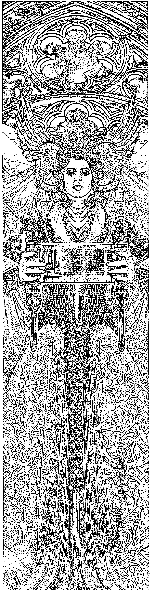

## # 编委会

主 编：萨莎·格拉哈姆（美）

副主编：
- 乔尔达诺·贝尔蒂（意）
- 塔利·古德温（英）
- 萨莎·格拉哈姆（美）
- 马克斯·卡茨（英）
- 马克·迈克尔罗伊（美）
- 里卡多·米内蒂（意）
- 芭芭拉·摩尔（美）

统 筹：吴 雪

译 校：
- 钟 玲
- 梁青云
- 赵 涵
- 周 霞
- 黄文炯
- 张 露

除在重要的文章和评论中简要引用（并注明出处）之外，未经意大利圣甲虫公司和成都阿卡纳文化传播有限公司书面许可，不得以任何方式（包括互联网）使用或转载本书的任何部分。

## 译者序

《塔罗原理》这本科普教材适用于任何对塔罗有兴趣的读者，它也是一本塔罗解读者必备的指南书，它理应出现在中国每一位塔罗爱好者的手中。

本书汇集了欧美七位塔罗学者的多年心得，他们客观严谨、精益求精地撰写了这部正本清源的教科书，介绍了塔罗的牌面意义的来源和解读塔罗牌的基本原理，以史实为镜详述了塔罗的发展历程，展示了诸多珍贵的古塔罗史料。

二十多年前，塔罗在中华大地疯狂生长，之后的几年内，塔罗牌和相关书籍如雨后春笋般出现，可惜这些刊物大多是出于商业考量而匆忙成书，其专业程度令人扼腕。而这些刊物的出现造就了中国第一批开始了解、学习和研究塔罗的爱好者，我就是其中之一。在这之后，我以“黎明船长”的笔名从事塔罗创作并将塔罗视为我的毕生事业，这也是出版《塔罗原理》中文版的原动力。

本书自原作者撰写到发行近十年，经阿卡纳公司策划、编译、审校已有三载，但译者们仍甘之如饴。谨以此书对原作者、意大利圣甲虫公司、各位译者、哈尔滨出版社和幕后工作者致以最高的敬意。

因本书所涉内容广博，洋洋洒洒数十万字，又间杂多种外语和专有词汇，译者们所见与所学有限，书中错讹在所难免，敬希读者批评指正。

不可否认的是，《塔罗原理》中文版的发行已经翻开了中国塔罗历史的新篇章。

吴雪（成都阿卡纳文化传播有限公司）

## 主编简介

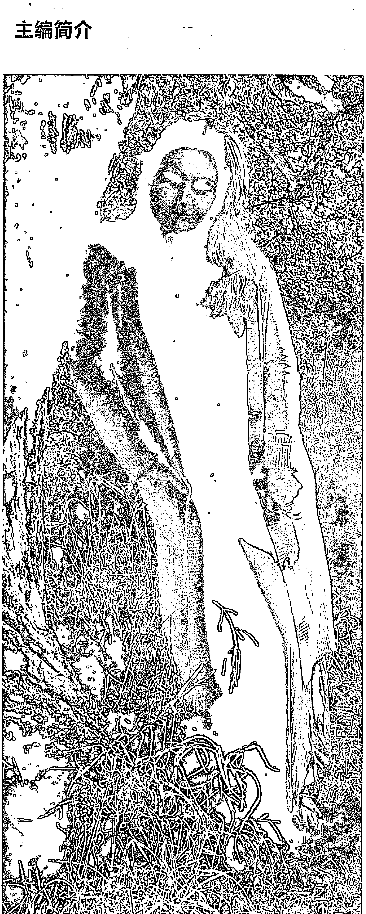

萨莎·格拉哈姆（Sasha Graham）

> “塔罗即生活。世间确有魔法存在，只要你懂得如何观察，符号便无处不在。”

萨莎拥有纽约市亨特学院文学与宗教艺术专业的学士学位。她有着丰富的塔罗解读经验，曾多次在大都会艺术博物馆和摩根图书馆举办过塔罗主题活动。她还教授塔罗课程，做塔罗主题演讲和讲座，足迹遍布世界各地。

萨莎和她的著作经常出现在各大媒体，如SiriusXM电台、《华尔街日报》和《每日新闻》等，还会定期到WPIX 11频道的早间新闻节目做客，用塔罗牌解读文化热点和明星。

她还是首位登上《克莱恩纽约商业杂志》封面的塔罗师。她还与Heyou Media平台合作，创作并主持了一档6集短篇烹饪系列节目——“魔法厨房（the Enchanted Kitchen）”，将塔罗魔法融入到日常烹饪之中。

萨莎的很多作品已经被翻译成意大利语、法语、西班牙语、波兰语、葡萄牙语及中文。她的作品包括：《塔罗天后（Tarot Diva）》《365个塔罗牌阵（365 Tarot Spreads）》《365个塔罗咒语（365 Tarot Spells）》《卢埃林莱德维特塔罗牌全解（Llewellyn's Complete Book of the Rider Waite Smith Tarot）》《塔罗原理（Tarot Fundamentals）》《塔罗经验（Tarot Experience）》《塔罗综述（Tarot Compendium）》《卢埃林魔法年鉴2020（Llewellyn's Magical Almanac, 2020）》（特约作者），以及《鬼屋塔罗牌》《幽暗森林塔罗牌》（2020年发行）。

乔尔达诺·贝尔蒂（Giordano Berti） 是一位意大利作家，意大利波伦亚伯爵协会的主席。他在研究艺术与神秘主义的结合领域里享誉盛名。在塔罗历史研究方面拥有至高权威。他组织过数十场风格各异的魔法与神秘主题的历史展览，出版了30多部历史、诗歌及叙事相关的作品。他的许多著作被译成英语、法语、西班牙语、德语、荷兰语、波兰语和日语。作品包括：《天使之声（Angel voices）》《启蒙塔罗牌（Initiatory Tarot of the Golden Dawn）》《拉美西斯塔罗牌（Ramses Tarot of Eternity）》《埃及人塔罗牌（The Egyptian Tarot）》。

塔利·古德温（Tali Goodwin） 与马克斯·卡茨共同创立了塔罗学塔罗协会、塔罗行业协会以及“塔罗小镇”。他俩还合著了多本书籍，包括：《维特史密斯塔罗牌的秘密（Secrets of the Waite Smith Tarot）》《环游塔罗78天（Around the Tarot in 78 Days）》《塔罗面对面（Tarot Face to Face）》和《简单利诺曼（Easy Lenormand）》。

马克斯·卡茨（Marcus Katz） 与塔利·古德温共同创立了塔罗学塔罗协会、塔罗行业协会以及“塔罗小镇”。他俩合著了多本书籍，包括：《维特史密斯塔罗牌的秘密》《环游塔罗78天》《塔罗面对面》《简单利诺曼》。

马克·迈克尔罗伊（Mark McElroy） 把塔罗牌称作“一种完全利用视觉来进行头脑风暴的工具”，乐意与大家分享如何更好地提问、如何寻求更多选择以及达到目标的技巧。他拥有20年以上的公开演讲和公司培训经验，并凭借其富有创造力的写作方式获得了美国南密西西比大学作家协会的文学学士、文学硕士学位。如今，马克·迈克尔罗伊不仅是位作家，还是配音演员和创意顾问。他的作品包括：《把塔罗运用到工作中（Putting the Tarot to Work）》《铭记塔罗（Taking the Tarot to Heart）》《塔罗牌对你来说是什么（What's in the Cards for You?）》《易经入门（I Ching for Beginners）》，以及《塔罗牌新手指南（The Absolute Beginner's Guide to Tarot）》。

里卡多·米内蒂（Riccardo Minetti） 是圣甲虫公司（Lo Scarabeo）的首席塔罗牌编辑。一副全新的塔罗牌从创意、设计直到出版，里卡多都会全程参与并进行指导。他就像一个中间人，在作者、设计师、画家以及圣甲虫公司之间扮演着协调者的角色。迄今为止，里卡多参与开发的塔罗牌与书籍项目已经超过了100个，其中较为著名的有：《哥特吸血鬼塔罗牌（Gothic Tarot of Vampires）》《伊特鲁里亚塔罗牌（Etruscan Tarot）》《漫画塔罗牌（Manga Tarot）》《精灵仙子塔罗牌（Fey Tarot）》《壮阔史诗塔罗牌（Epic Tarot）》。

芭芭拉·摩尔（Barbara Moore） 是塔罗领域的领军人物。她认为写作是相对孤独的，但通过在世界各地的演讲和教学，她的孤独得到了解脱。芭芭拉还喜欢用塔罗牌为人们提供指引与洞见。她创作过许多塔罗牌和塔罗书籍，其中包括：《塔罗入门（Tarot for Beginners）》《塔罗牌阵（Tarot Spreads）》《蒸汽朋克塔罗牌（Steampunk Tarot）》《炫金塔罗牌（Gilded Tarot）》《神话梦者塔罗牌（Mystic Dreamer Tarot）》，以及《秘境塔罗牌（Tarot of the Hidden Realm）》。

## # 前言

数年前，我在曼哈顿的家中接到了我的好友兼同事芭芭拉·摩尔的电话。在这个电子邮件满天飞的年代，她从遥远的明尼阿波利斯市给我打电话，一定有着非同寻常的意义。没有任何原因，拿起电话的那个瞬间，我就知道，某个重大的事情即将发生。我听着芭芭拉的声音，不由自主地屏住了呼吸，她在电话里问我，是否有兴趣加入一个相当庞大的计划：意大利圣甲虫的同事经过长年的积累，搜集了不计其数的意大利语和英语的塔罗文献资料、文章和资讯，他们想用这些珍贵的资料完成一部鸿篇巨制。芭芭拉问我，想不想要担任这本书的汇编者。我毫不犹豫地答应了。正因为这次通话，才有了你们手中捧着的这本书，以及即将问世的后两部塔罗巨著。

市面上的塔罗书籍可以大致分为三种。第一种是通篇充满了历史考证资料的书籍，这种书不仅又厚又重，读起来也索然无味。第二种是满是插图的精装书，这种书籍的出版商规模较大。这些书的外表讨人喜爱，但内容要么缺乏深度、乏善可陈，要么是一味地堆砌神秘学、故作深沉。第三种是被统称为塔罗使用指南的平装书，这种书的市场份额最多。这三种书在塔罗的学习与应用领域内各有优势，但不得不说，我从没见过哪本塔罗书籍既有精美的印刷，又兼具可读性与趣味性，还都是真材实料。

如今，出版这样一本大部头的塔罗书籍是相当冒险的事情。那些持反对意见的人声称，实体书在现代社会已经过时了。在实体店里找书籍的那种乐趣在现在这一代青少年的身上已经看不到了，所以出版这种精装书是需要莫大勇气的。在科技时代的背景下，为认真学习塔罗的人及卡牌收藏家创作这套塔罗系列丛书的意义就显得十分特殊。毕竟，网络上的各种塔罗资讯应有尽有，在这个通过立即下载就获得知识的时代，这本书真的有存在的必要吗？会有人想要读吗？

圣甲虫在网络上的塔罗社区里提出了这个问题，马上引发了网友的热烈讨论，大家的答案都是：Yes！一边拿着牌，一边翻阅精美的图书，沉浸在浩瀚的知识海洋里，那种愉悦和满足是无法从电脑屏幕的影像中得到的。一章一节，慢慢阅读，读者跟随书中的线索渐渐深入，就像翻开一张张塔罗牌，进入神奇的世界。祖母的食谱之所以比互联网上的菜谱更珍贵，是因为那上面满是岁月的痕迹：页边写满了密密麻麻的批注，油渍、糖渍与烟火的气息。就算网络已经可以搜索到所有的塔罗资讯，但仔细品味一本关于塔罗的纸质书也是独一无二的体验，就像不论科技再怎么发达，也无法取代一副实实在在的塔罗牌。应用软件、电脑屏幕和视频永远无法给你实体的书和牌的真实感，还有那种手捧它们沉浸其中的快乐，而这套由圣甲虫出版、汇集多位大师智慧的塔罗百科三部曲则更甚。

我还发现，梳理塔罗的历史资料不仅十分有趣，而且极富挑战性。我觉得还可以这么说：塔罗是属于女性的艺术。在过去，女性使用塔罗牌（和其他纸牌）进行占卜、预言、疗愈和娱乐的方法从来都是秘而不宣的。我们都知道，在世界上许多地方，人们会用纸牌、手相和茶叶进行占卜，这种文化在全世界已经流传了千百年。每种文化都有各自的“大智慧”，而且不管你身处何方，你都有办法去发现和了解它。但有些民间巫术和预言秘术，它们从未被记录在册，只通过口耳相传的方式存在于世间或代代传承。绝大多数情况下，历史都是由男性撰写的，而大量关于塔罗的珍贵信息和系统的占卜知识，都被男权统治下的主流文化排挤在边缘，流于文献史册之外。

那些会去研究塔罗、发表自己见解与研究成果甚至创作塔罗牌的男性，都是伟大的神秘学者。本质上，塔罗即“奥秘”，即“神秘”。回顾塔罗历史，你总能看到一些神秘组织和神秘行为的影子，它们与塔罗有着很深的渊源。若你对它们不甚了解，那么在学习塔罗相关的神秘学历史，或是尝试搞懂赫耳墨斯·特里斯墨吉斯忒斯（Hermes Trismegistus）与炼金术士的关系以及它们是如何与“圣杯骑士”相联系的时候，你绝对会晕头转向或摸不着头脑。在《塔罗原理》中讲述塔罗历史的章节里，我们把重心放在了这上面，力求用通俗易懂的语言，深入浅出地介绍何谓神秘学、有哪些神秘学者以及他们的成就如何，也对如何创作一副引人深思的塔罗牌进行了详述。

《塔罗原理》，书如其名，将从最基础最简单的理论基础说起，一步一步为你组建起塔罗知识的架构，让你真正进入塔罗的世界。我衷心地希望，当你在阅读本书时，能够沉浸其中，真正感受到塔罗的魅力所在。希望你在这本书中发现一些新东西，对你以后的塔罗实践有所启发。也许在某个阴雨天，你的孩子会突然注意到这本书，一头扎进博尼法西奥·本博（Bonifacio Bembo）所创造的智慧世界里，或是被某个神秘学院宣扬的理念所吸引，或是盯着“女祭司”的牌面一动不动，似乎从牌上看见了自己的影子。和塔罗牌一样，书本不仅引导你解开迷惑，还为你打开了另一个充满无穷想象的异世界之门。即使合上书本，很久以后，我们已经能随心所欲地洗牌和解读塔罗牌了，但它们在我们内心留下的印记也不会被抹去，若是仔细倾听，你仍能听见它们的喃喃私语。

萨莎·格拉哈姆
2015年写于纽约

## 目录

- 4 译者序
- 5 主编简介
- 6 作者简介
- 7 目录
- 8 前言
- 11 简介
- 13 欢迎来到塔罗牌的世界
- 19 塔罗牌牌意
- 21 遇见阿卡纳，遇见奥秘
- 36 塔罗牌牌意详解
- 293 怎样解读塔罗牌
- 295 两个关键步骤
- 296 塔罗用途
- 304 如何挑选一副塔罗牌？
- 309 你的塔罗专属陈列柜
- 316 对完美的追求
- 321 遇见一副新塔罗牌
- 325 塔罗与仪式
- 333 塔罗的象征符号
- 341 一牌多意
- 344 塔罗牌的结构
- 382 塔罗牌的逆位解读
- 389 塔罗解读
- 391 什么是“解读”？
- 396 基础牌阵
- 397 一张牌牌阵
- 398 三张牌牌阵
- 403 凯尔特十字牌阵
- 408 每日读牌
- 412 如何提问
- 417 自我解读
- 421 塔罗技巧
- 423 什么是塔罗技巧？
- 425 牌阵平衡法
- 432 塔罗日记
- 441 直觉式解读
- 448 象征符号解读
- 452 负面牌
- 457 牌面差异性
- 462 性别与年龄的运用
- 467 塔罗冥想
- 471 塔罗牌的指代功能
- 473 塔罗历史
- 475 塔罗历史简述
- 478 塔罗历史时间轴
- 492 塔罗的早期历史
- 504 塔罗的神秘学历史
- 524 塔罗的先辈
- 564 新塔罗的复兴
- 571 附录
- 573 牌名参考表
- 577 词汇表

## # TAROT FUNDAMENTALS

## 塔罗牌理

[美] 萨莎·格拉哈姆 主编  
钟 玲 译

黑版贸审字08-2018-157号

# 图书在版编目(CIP)数据

塔罗原理 / (美) 萨莎·格拉哈姆 (Sasha Graham) 主编; 钟玲译. — 哈尔滨: 哈尔滨出版社, 2019.10
书名原文: TAROT FUNDAMENTALS
ISBN 978-7-5484-4432-9

I. ①塔… II. ①萨… ②梁… III. ①扑克 – 基本知识 IV. ①G892.1

中国版本图书馆CIP数据核字 (2018) 第279157号

Manufactured under licence © LO Scarabeo s.r.l. All rights reserved.

# 书名: 塔罗原理
TALUO YUANLI

作者: [美] 萨莎·格拉哈姆 主编
译者: 钟 玲
责任编辑: 颜 楠 李金秋
责任审校: 李 战
封面设计: 尚上装帧设计

出版发行: 哈尔滨出版社 (Harbin Publishing House)
社 址: 哈尔滨市松北区世坤路738号9号楼 邮编: 150028
经 销: 全国新华书店
印 刷: 鹤山雅图仕印刷有限公司
网 址: www.hrbcbs.com www.mifengniao.com
E-mail : hrbcbs@yeah.net
编辑版权热线: (0451) 87900271 87900272
销售热线: (0451) 87900202 87900203
邮购热线: 4006900345 (0451) 87900256

开 本: 787mm×1092mm 1/16 印张: 36.25 字数: 650千字
版 次: 2019年10月第1版
印 次: 2019年10月第1次印刷
书 号: ISBN 978-7-5484-4432-9
定 价: 298.00元

凡购本社图书发现印装错误, 请与本社印制部联系调换。
服务热线: (0451) 87900278

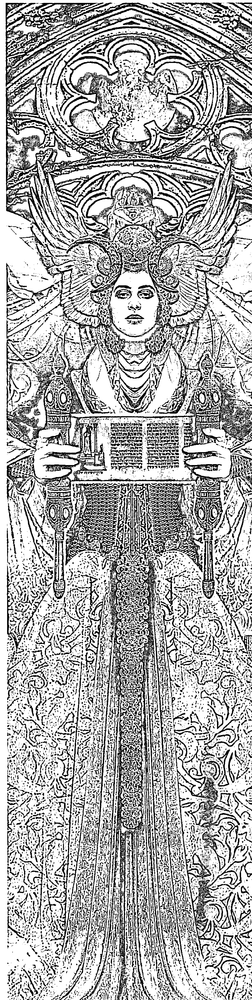

## # 编委会

主 编：萨莎·格拉哈姆（美）

副主编：
- 乔尔达诺·贝尔蒂（意）
- 塔利·古德温（英）
- 萨莎·格拉哈姆（美）
- 马克斯·卡茨（英）
- 马克·迈克尔罗伊（美）
- 里卡多·米内蒂（意）
- 芭芭拉·摩尔（美）

统 筹：吴 雪

译 校：
- 钟 玲
- 梁青云
- 赵 涵
- 周 霞
- 黄文炯
- 张 露

除在重要的文章和评论中简要引用（并注明出处）之外，未经意大利圣甲虫公司和成都阿卡纳文化传播有限公司书面许可，不得以任何方式（包括互联网）使用或转载本书的任何部分。

## 译者序

《塔罗原理》这本科普教材适用于任何对塔罗有兴趣的读者，它也是一本塔罗解读者必备的指南书，它理应出现在中国每一位塔罗爱好者的手中。

本书汇集了欧美七位塔罗学者的多年心得，他们客观严谨、精益求精地撰写了这部正本清源的教科书，介绍了塔罗的牌面意义的来源和解读塔罗牌的基本原理，以史实为镜详述了塔罗的发展历程，展示了诸多珍贵的古塔罗史料。

二十多年前，塔罗在中华大地疯狂生长，之后的几年内，塔罗牌和相关书籍如雨后春笋般出现，可惜这些刊物大多是出于商业考量而匆忙成书，其专业程度令人扼腕。而这些刊物的出现造就了中国第一批开始了解、学习和研究塔罗的爱好者，我就是其中之一。在这之后，我以“黎明船长”的笔名从事塔罗创作并将塔罗视为我的毕生事业，这也是出版《塔罗原理》中文版的原动力。

本书自原作者撰写到发行近十年，经阿卡纳公司策划、编译、审校已有三载，但译者们仍甘之如饴。谨以此书对原作者、意大利圣甲虫公司、各位译者、哈尔滨出版社和幕后工作者致以最高的敬意。

因本书所涉内容广博，洋洋洒洒数十万字，又间杂多种外语和专有词汇，译者们所见与所学有限，书中错讹在所难免，敬希读者批评指正。

不可否认的是，《塔罗原理》中文版的发行已经翻开了中国塔罗历史的新篇章。

吴雪（成都阿卡纳文化传播有限公司）

## 主编简介

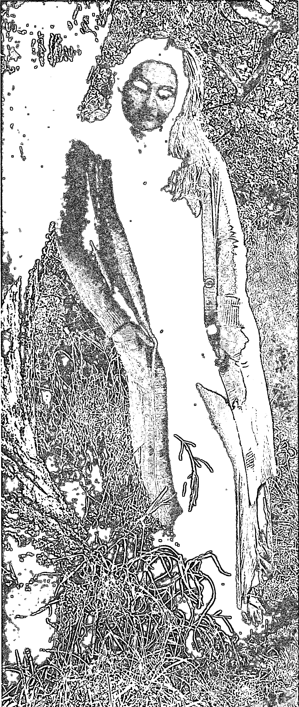

萨莎·格拉哈姆（Sasha Graham）

> “塔罗即生活。世间确有魔法存在，只要你懂得如何观察，符号便无处不在。”

萨莎拥有纽约市亨特学院文学与宗教艺术专业的学士学位。她有着丰富的塔罗解读经验，曾多次在大都会艺术博物馆和摩根图书馆举办过塔罗主题活动。她还教授塔罗课程，做塔罗主题演讲和讲座，足迹遍布世界各地。

萨莎和她的著作经常出现在各大媒体，如SiriusXM电台、《华尔街日报》和《每日新闻》等，还会定期到WPIX 11频道的早间新闻节目做客，用塔罗牌解读文化热点和明星。

她还是首位登上《克莱恩纽约商业杂志》封面的塔罗师。她还与Heyou Media平台合作，创作并主持了一档6集短篇烹饪系列节目——“魔法厨房（the Enchanted Kitchen）”，将塔罗魔法融入到日常烹饪之中。

萨莎的很多作品已经被翻译成意大利语、法语、西班牙语、波兰语、葡萄牙语及中文。她的作品包括：《塔罗天后（Tarot Diva）》《365个塔罗牌阵（365 Tarot Spreads）》《365个塔罗咒语（365 Tarot Spells）》《卢埃林莱德维特塔罗牌全解（Llewellyn's Complete Book of the Rider Waite Smith Tarot）》《塔罗原理（Tarot Fundamentals）》《塔罗经验（Tarot Experience）》《塔罗综述（Tarot Compendium）》《卢埃林魔法年鉴2020（Llewellyn's Magical Almanac, 2020）》（特约作者），以及《鬼屋塔罗牌》《幽暗森林塔罗牌》（2020年发行）。

乔尔达诺·贝尔蒂（Giordano Berti）是一位意大利作家，意大利波伦亚伯爵协会的主席。他在研究艺术与神秘主义的结合领域里享誉盛名。在塔罗历史研究方面拥有至高权威。他组织过数十场风格各异的魔法与神秘主题的历史展览，出版了30多部历史、诗歌及叙事相关的作品。他的许多著作被译成英语、法语、西班牙语、德语、荷兰语、波兰语和日语。作品包括：《天使之声（Angel voices）》《启蒙塔罗牌（Initiatory Tarot of the Golden Dawn）》《拉美西斯塔罗牌（Ramses Tarot of Eternity）》《埃及人塔罗牌（The Egyptian Tarot）》。

塔利·古德温（Tali Goodwin）与马克斯·卡茨共同创立了塔罗学塔罗协会、塔罗行业协会以及“塔罗小镇”。他俩还合著了多本书籍，包括：《维特史密斯塔罗牌的秘密（Secrets of the Waite Smith Tarot）》《环游塔罗78天（Around the Tarot in 78 Days）》《塔罗面对面（Tarot Face to Face）》和《简单利诺曼（Easy Lenormand）》。

马克斯·卡茨（Marcus Katz）与塔利·古德温共同创立了塔罗学塔罗协会、塔罗行业协会以及“塔罗小镇”。他俩合著了多本书籍，包括：《维特史密斯塔罗牌的秘密》《环游塔罗78天》《塔罗面对面》《简单利诺曼》。

马克·迈克尔罗伊（Mark McElroy）把塔罗牌称作“一种完全利用视觉来进行头脑风暴的工具”，乐意与大家分享如何更好地提问、如何寻求更多选择以及达到目标的技巧。他拥有20年以上的公开演讲和公司培训经验，并凭借其富有创造力的写作方式获得了美国南密西西比大学作家协会的文学学士、文学硕士学位。如今，马克·迈克尔罗伊不仅是位作家，还是配音演员和创意顾问。他的作品包括：《把塔罗运用到工作中（Putting the Tarot to Work）》《铭记塔罗（Taking the Tarot to Heart）》《塔罗牌对你来说是什么（What’s in the Cards for You?）》《易经入门（I Ching for Beginners）》，以及《塔罗牌新手指南（The Absolute Beginner’s Guide to Tarot）》。

里卡多·米内蒂（Riccardo Minetti）是圣甲虫公司（Lo Scarabeo）的首席塔罗牌编辑。一副全新的塔罗牌从创意、设计直到出版，里卡多都会全程参与并进行指导。他就像一个中间人，在作者、设计师、画家以及圣甲虫公司之间扮演着协调者的角色。迄今为止，里卡多参与开发的塔罗牌与书籍项目已经超过了100个，其中较为著名的有：《哥特吸血鬼塔罗牌（Gothic Tarot of Vampires）》《伊特鲁里亚塔罗牌（Etruscan Tarot）》《漫画塔罗牌（Manga Tarot）》《精灵仙子塔罗牌（Fey Tarot）》《壮阔史诗塔罗牌（Epic Tarot）》。

芭芭拉·摩尔（Barbara Moore）是塔罗领域的领军人物。她认为写作是相对孤独的，但通过在世界各地的演讲和教学，她的孤独得到了解脱。芭芭拉还喜欢用塔罗牌为人们提供指引与洞见。她创作过许多塔罗牌和塔罗书籍，其中包括：《塔罗入门（Tarot for Beginners）》《塔罗牌阵（Tarot Spreads）》《蒸汽朋克塔罗牌（Steampunk Tarot）》《炫金塔罗牌（Gilded Tarot）》《神话梦者塔罗牌（Mystic Dreamer Tarot）》，以及《秘境塔罗牌（Tarot of the Hidden Realm）》。

## 目录

- 4. 译者序
- 5. 主编简介
- 6. 作者简介
- 7. 目录
- 8. 前言
- 11. 简介
- 13. 欢迎来到塔罗牌的世界
- 19. 塔罗牌牌意
- 21. 遇见阿卡纳，遇见奥秘
- 36. 塔罗牌牌意详解
- 293. 怎样解读塔罗牌
- 295. 两个关键步骤
- 296. 塔罗用途
- 304. 如何挑选一副塔罗牌？
- 309. 你的塔罗专属陈列柜
- 316. 对完美的追求
- 321. 遇见一副新塔罗牌
- 325. 塔罗与仪式
- 333. 塔罗的象征符号
- 341. 一牌多意
- 344. 塔罗牌的结构
- 382. 塔罗牌的逆位解读
- 389. 塔罗解读
- 391. 什么是“解读”？
- 396. 基础牌阵
- 397. 一张牌牌阵
- 398. 三张牌牌阵
- 403. 凯尔特十字牌阵
- 408. 每日读牌
- 412. 如何提问
- 417. 自我解读
- 421. 塔罗技巧
- 423. 什么是塔罗技巧？
- 425. 牌阵平衡法
- 432. 塔罗日记
- 441. 直觉式解读
- 448. 象征符号解读
- 452. 负面牌
- 457. 牌面差异性
- 462. 性别与年龄的运用
- 467. 塔罗冥想
- 471. 塔罗牌的指代功能
- 473. 塔罗历史
- 475. 塔罗历史简述
- 478. 塔罗历史时间轴
- 492. 塔罗的早期历史
- 504. 塔罗的神秘学历史
- 524. 塔罗的先辈
- 564. 新塔罗的复兴
- 571. 附录
- 573. 牌名参考表
- 577. 词汇表

## 前言

数年前，我在曼哈顿的家中接到了我的好友兼同事芭芭拉·摩尔的电话。在这个电子邮件满天飞的年代，她从遥远的明尼阿波利斯市给我打电话，一定有着非同寻常的意义。没有任何原因，拿起电话的那个瞬间，我就知道，某个重大的事情即将发生。我听着芭芭拉的声音，不由自主地屏住了呼吸，她在电话里问我，是否有兴趣加入一个相当庞大的计划：意大利圣甲虫的同事经过长年的积累，搜集了不计其数的意大利语和英语的塔罗文献资料、文章和资讯，他们想用这些珍贵的资料完成一部鸿篇巨制。芭芭拉问我，想不想要担任这本书的汇编者。我毫不犹豫地答应了。正因为这次通话，才有了你们手中捧着的这本书，以及即将问世的后两部塔罗巨著。

市面上的塔罗书籍可以大致分为三种。第一种是通篇充满了历史考证资料的书籍，这种书不仅又厚又重，读起来也索然无味。第二种是满是插图的精装书，这种书籍的出版商规模较大。这些书的外表讨人喜爱，但内容要么缺乏深度、乏善可陈，要么是一味地堆砌神秘学、故作深沉。第三种是被统称为塔罗使用指南的平装书，这种书的市场份额最多。这三种书在塔罗的学习与应用领域内各有优势，但不得不说，我从没见过哪本塔罗书籍既有精美的印刷，又兼具可读性与趣味性，还都是真材实料。

如今，出版这样一本大部头的塔罗书籍是相当冒险的事情。那些持反对意见的人声称，实体书在现代社会已经过时了。在实体店里找书籍的那种乐趣在现在这一代青少年的身上已经看不到了，所以出版这种精装书是需要莫大勇气的。在科技时代的背景下，为认真学习塔罗的人及卡牌收藏家创作这套塔罗系列丛书的意义就显得十分特殊。毕竟，网络上的各种塔罗资讯应有尽有，在这个通过立即下载就获得知识的时代，这本书真的有存在的必要吗？会有人想要读吗？

圣甲虫在网络上的塔罗社区里提出了这个问题，马上引发了网友的热烈讨论，大家的答案都是：Yes！一边拿着牌，一边翻阅精美的图书，沉浸在浩瀚的知识海洋里，那种愉悦和满足是无法从电脑屏幕的影像中得到的。一章一节，慢慢阅读，读者跟随书中的线索渐渐深入，就像翻开一张张塔罗牌，进入神奇的世界。祖母的食谱之所以比互联网上的菜谱更珍贵，是因为那上面满是岁月的痕迹：页边写满了密密麻麻的批注，油渍、糖渍与烟火的气息。就算网络已经可以搜索到所有的塔罗资讯，但仔细品味一本关于塔罗的纸质书也是独一无二的体验，就像不论科技再怎么发达，也无法取代一副实实在在的塔罗牌。应用软件、电脑屏幕和视频永远无法给你实体的书和牌的真实感，以及亲身实践带来的深刻的、独一无二的体验。

还有那种手捧它们沉浸其中的快乐，而这套由圣甲虫出版、汇集多位大师智慧的塔罗百科三部曲则更甚。

我还发现，梳理塔罗的历史资料不仅十分有趣，而且极富挑战性。我觉得还可以这么说：塔罗是属于女性的艺术。在过去，女性使用塔罗牌（和其他纸牌）进行占卜、预言、疗愈和娱乐的方法从来都是秘而不宣的。我们都知道，在世界上许多地方，人们会用纸牌、手相和茶叶进行占卜，这种文化在全世界已经流传了千百年。每种文化都有各自的“大智慧”，而且不管你身处何方，你都有办法去发现和了解它。但有些民间巫术和预言秘术，它们从未被记录在册，只通过口耳相传的方式存在于世间或代代传承。绝大多数情况下，历史都是由男性撰写的，而大量关于塔罗的珍贵信息和系统的占卜知识，都被男权统治下的主流文化排挤在边缘，流于文献史册之外。

那些会去研究塔罗、发表自己见解与研究成果甚至创作塔罗牌的男性，都是伟大的神秘学者。本质上，塔罗即“奥秘”，即“神秘”。回顾塔罗历史，你总能看到一些神秘组织和神秘行为的影子，它们与塔罗有着很深的渊源。若你对它们不甚了解，那么在学习塔罗相关的神秘学历史，或是尝试搞懂赫耳墨斯·特里斯墨吉斯忒斯（Hermes Trismegistus）与炼金术士的关系以及它们是如何与“圣杯骑士”相联系的时候，你绝对会晕头转向或摸不着头脑。在《塔罗原理》中讲述塔罗历史的章节里，我们把重心放在了这上面，力求用通俗易懂的语言，深入浅出地介绍何谓神秘学、有哪些神秘学者以及他们的成就如何，也对如何创作一副引人深思的塔罗牌进行了详述。

《塔罗原理》，书如其名，将从最基础最简单的理论基础说起，一步一步为你组建起塔罗知识的架构，让你真正进入塔罗的世界。我衷心地希望，当你在阅读本书时，能够沉浸其中，真正感受到塔罗的魅力所在。希望你在这本书中发现一些新东西，对你以后的塔罗实践有所启发。也许在某个阴雨天，你的孩子会突然注意到这本书，一头扎进博尼法西奥·本博（Bonifacio Bembo）所创造的智慧世界里，或是被某个神秘学院宣扬的理念所吸引，或是盯着“女祭司”的牌面一动不动，似乎从牌上看见了自己的影子。和塔罗牌一样，书本不仅引导你解开迷惑，还为你打开了另一个充满无穷想象的异世界之门。即使合上书本，很久以后，我们已经能随心所欲地洗牌和解读塔罗牌了，但它们在我们内心留下的印记也不会被抹去，若是仔细倾听，你仍能听见它们的喃喃私语。

萨莎·格拉哈姆

2015年写于纽约

## 简介

## 欢迎来到塔罗牌的世界

欢迎来到奇妙的塔罗世界。把外套挂好，掸掸鞋上的灰尘，然后请坐下来。我保证，你坐下就不想起身离开。你第一次注意到塔罗是什么时候呢？你小时候玩过塔罗牌吗？是否曾经有神秘的吉普赛人给你解读过呢？你是否曾在满是尘埃的书架上无意中找到过一副塔罗牌呢？你在大学里尝试过研究塔罗吗？你还记得第一次将一整副塔罗牌握在手中的感觉吗？那种兴奋刺激、小心翼翼又略带疑惑的感觉，实在是让你欲罢不能。细细品味每张牌的牌意，就像在异国城市里旅行观光，有一种既熟悉又陌生的新鲜感。那随意交会的街道，昏暗的小巷，陌生的路径……从市中心向外望去，似乎无边无际，没有止境。这里特有的神秘气息带给了你一种从未有过的感官体验。这就是塔罗给你的最初印象。

接触塔罗，就像进入了一个全新的世界，一个由潜意识、直觉、心灵感受、幻景与想象力共同搭建起来的世界。这个世界里虽然没有任何指引方向的路标，但通过每张塔罗牌上丰富的象征符号与特定的图案所代表的特殊含义，你可以很容易地摸清牌与牌之间的脉络，从而知晓潜藏在塔罗牌表面下的精致繁复的结构和系统。要知道，塔罗牌不是凭空存在的，所有的一切都有迹可循。

圣甲虫的这本《塔罗原理》就是你的向导。跟着它，你既能漫步于平坦大道，欣赏壮阔风景，也能穿梭于幽僻小径，倾听山涧鸟鸣，看遍塔罗世界的角落。只要你有一颗开放包容的心，那一张张神秘的图案就能触碰到你的内在，让心灵之花瞬间盛放。也许你对塔罗的方方面面都了如指掌，但就像你在巴黎、纽约或是罗马这样的地方，即使你对那里的大街小巷早已烂熟于心，但转角处新开的美味餐馆，或陌生人的惊鸿一瞥，都足以带给你惊喜。

我们将许多不同流派的观点都囊括到了这本书中。作为本书的主编，我对读者们仅有一个小小的要求。那就是，对待塔罗书籍不要阅完即止。如果你只是阅读书中的信息而不进行实际操作，就像钻研、熟记了一个城市的地图，却从未真正去探索这座城市一样。你应该主动实践，将塔罗融入你的生活，任它们触动你，激发你的灵感，甚至挑战你的逻辑思维。当你陷入迷茫也不要慌张，若塔罗牌向你揭示了让人不悦的事情也不要逃避。学以致用，学习塔罗才会事半功倍。对塔罗牌越了解，使用越熟练，越能打破陈规，这样一来，你不仅能得到成长，纸牌解读艺术也会因你而更加丰富多彩。

让我们继续用神秘的异国他乡来比喻塔罗。在某种程度上，塔罗的确像一座陌生城市。对于包括你在内的大多数人而言，在真正接触塔罗之前，对塔罗都有一些先入为主的看法。人们相信自己所了解的塔罗就是真正的塔罗，也有人认为使用塔罗需要遵守许多条条框框。不幸的是，大多数人在刚开始使用塔罗牌的时候都因为生怕弄错规则而束手束脚，他们在开始享受和探索塔罗的乐趣之前就戛然止步了。

关于塔罗，道听途说的信息看似很有道理，但在绝大多数情况下都有其谬误之处。为什么会这样呢？因为不论塔罗的历史多么悠久，它终归是人类文明的产物。人类创造了它，用它来娱乐或占卜，只要想象力足够丰富，你能用塔罗牌做任何事。别忘了，正因为人类，塔罗牌才存在。而你，必须投入其中，开始真正地使用它。所以，打开你的牌盒，让我们一起玩塔罗吧！

我要加快步伐了，跟紧我。请牵住我的手，让我们一起进入这座塔罗之城。让我们以你手中的牌为起点，重新出发，穿过那快要被人遗忘的蜿蜒小巷，追忆那流逝的岁月。让我们回顾塔罗在过去的几百年里是如何被使用的，每一段、每一处、每个地方都是基于史实和事实的。大量的史实、故事与传说共同造就了塔罗。而你，准备好迎接这一场塔罗盛宴了吗？

### 塔罗之城

> “欢迎来到美丽的塔罗之城。让我们一起踏上这条辉煌的皇家大道。你看见前方若隐若现的城堡了吗？” 我问道。

“沿着这条铺满鹅卵石的大道一直向前，就是国王、王后、骑士与侍从生活的地方。纵情时舞蹈欢笑，安静时站在高墙之上俯瞰整个城市，偶尔发号施令，就是他们宫廷生活的全部。女孩们为宝剑骑士神魂颠倒，这个全身充满危险气息的坏男孩总是对她们有着致命的吸引力。女人们都想成为权杖王后，她绰约的风姿和非凡的领导力惹人羡慕。孩子们一边跑一边笑，追着圣杯侍从不放，吵着要他再翻一个精彩好玩的跟头。而男人们则对星币国王高超的理财天赋万分推崇。很快，你会在自己身上发现他们每一个人的影子。他们是你，是我，也是我们身边的所有人。” 我说道。

这时，不远处传来一阵嘈杂声。顺着声音望过去，你会看见一支缓缓前行的游行队伍。我俩推开人群，挤上前去一探究竟。只见塔罗之城的市民们个个兴高采烈地向经过的花车挥手致意。一辆红色花车上，帅气男人和美丽女人相互凝望，胖胖的小天使轻拍着雪白的双翅在他们周围盘旋，将手中神奇之箭射向周围的人群。人们突然躁动起来：“那是爱之胜利！看，丘比特！”这时，我低声对你说：“瞧，恶魔来了。”

往队伍后方一看，一辆黑色的车缓缓移动。舞者们旋转跳跃，血红色的衣衫象征着恶魔身后的熊熊火焰。恶魔面目狰狞，他赤裸着上身，背上的蝙蝠翅膀不停扑闪着。他眉头微皱看着人群，饶有兴致地邀请人们到花车上和他相邻而坐，却遭到一片嘘声。

一个装扮夸张和花哨的小丑在各个花车之间穿梭，在车轮旁跳起了吉格舞，逗得小孩们咯咯直笑。

“这是愚人。他不坐任何车，想去哪儿就去哪儿。”我说道。

一个巨大的热气球牵着最后一辆花车向我们缓缓而来。杂技演员身着亮片，打扮得像闪着金光的天使，在空中飘来荡去。

“这是世界，也被称作名望。他比前面的任何一个都气派。他就像凯旋门，而整个队伍就是原汁原味的中世纪凯旋游行。这种游行仪式在古罗马时期就出现了，而它似乎对现代塔罗产生了极大的影响。这里每个寓言故事似乎都比前一个‘强’了不少。”我一边说着，一边抓紧了你的手。

“游行结束，走，我们去那边的博物馆大道。”我说。

我们穿过花岗岩的科林斯柱，来到了令人惊叹的艺术长廊。只见人们一边欣赏着墙上的艺术作品一边低声交谈着。

“快看！这就是世界上第一副塔罗牌，它叫《维斯康蒂-斯佛尔查塔罗牌（Visconti-Sforza Tarot）》。它不仅画面精美别致，而且那上面金光闪闪的是货真价实的金箔哦！能有那么多钱一定感觉很好吧？这副牌是文艺复兴时期的艺术家博尼法西奥·本博（Bonifacio Bembo）专门为某个贵族家庭创作的。他是仅次于里昂那多·达·芬奇（Leonardo Da Vinci）的画家。塔罗牌诞生于文艺复兴时期，它在历史长河中一直在发展着，所以它有很多版本和变体。而现在，它们全部都在我们眼前。不论塔罗牌如何变化，大阿卡纳是无论如何也不可缺少的。这是塔罗牌之所以是塔罗牌的唯一标准。不过你看，还是有一些牌不走寻常路，比如这副神秘兮兮的明科亚特牌。(Minchiatte), 它有25张大阿卡纳! 塔罗牌并没有唯一的正统, 它存在多种形状和形式, 而现在, 它们都展示在你眼前。" 我抓住你的手, 溜进了长廊一旁的侧门。转瞬间, 眼前这斑驳的木地板将之前的华丽壮美一扫而空。清新的空气从窗外扑面而来, 轻抚着你的肌肤。长长的走廊两边有许多道门, 有的半掩, 让人有机会一窥门后真容。你悄悄走进一个房间, 油画颜料的刺鼻气味飘了过来。一位艺术家正在帆布上挥洒色彩。

"他在思考如何将圣杯五呈现得更淋漓尽致。" 我小声对你说。

> "这些艺术家正在创作新的塔罗牌。"

偷瞄旁边的房间, 你看到一位艺术家伏案而坐。电脑屏幕的冷光映在她脸上, 她专心致志地在屏幕上创作着一副全新的牌。而另一个门内空空荡荡没有一丝声音, 似乎在欢迎着你的造访。

"说不定某天你也会在这儿创作属于你自己的牌呢。" 我说。这时, 传来了关门的声音。你抬头望去, 那位在帆布上创作的艺术家眉头紧锁, 正在抹去额头上的汗水。他的画笔穿透了你的身躯, 仿佛你只是个飘忽不定的魂魄。我们好像失去了自控力, 在他的笔尖下四处游走。

夕阳西下, 金色的阳光描绘出了这座陌生城市的轮廓。华灯初上, 每一道墙都被染上了柔软的光, 这是那么的令人惬意。艺术家停止了作画, 猛然推开了门, 一瞬间, 喧闹声涌入房间, 你嗅到了整个城市的烟火气息。刹那之间, 我们已置身于空荡的小巷中。沁凉的空气中有一丝街边小酒馆传出的温热香气。你掀开门帘, 走了进去。酒馆里, 男人们瘫坐着, 绯红的脸颊出卖了他们的酒量。突然, 那边打起架来。一个男人撞到了桌子上, 酒和食物被撞得满天飞洒。酒保利索地将他扔了出去, 酒馆内重新恢复常态, 人们该玩牌的玩牌, 该喝酒的喝酒, 吵吵嚷嚷, 热热闹闹。

"最初, 塔罗牌就是在这种地方被普通人熟知的。过去, 在这些酒馆、巷弄、游戏场所里, 塔罗不过是运气与技巧的游戏, 在这里, 也没有所谓预测未来一说。" 我说道, 然后喝了一大口冰镇啤酒。

"现在, 我希望你别紧张, 勇敢起来。" 我说。

我们从酒馆的后门走了出去。幽暗的小路向前延伸, 嘈杂声渐行渐远。路灯忽明忽暗, 一只老鼠蹿了过去。周围空无一人, 寂静无比, 只听得见我俩的脚步声。突然，阴影中浮现出一个美丽的面庞。她的大眼睛忽闪忽闪，鲜红的双唇娇艳欲滴。这张脸引得你不禁凑近一看，却被吓得后退一步。她水灵的双眼突然变得浑浊苍白，嘴唇外翻，露出里面被蚀坏的牙齿。你觉察到阴影中有更多的动静，好像许多蟑螂正在爬过。这条小径不知何时挤满了影子般的人，有的暴露于昏暗灯光之下，有的却始终匍匐在黑暗之中。

那都是些江湖骗子。他们利用雕虫小技和花言巧语取得人们的信任，以此骗取钱财。比如，他们在预测未来的时候会给客人说一些不吉利的话，比如说你的命运无法摆脱、不久之后会发生大灾祸之类的，然后再顺水推舟说只要客人肯付钱，他们就有法子帮助客人消灾避难。客人会因为急于驱邪避秽而花钱向他们买一些符纸、蜡烛、咒语之类的东西。不过，停下来思考一下这些骗子是如何行骗的，再回过头审视下自己：你解读是为了钱吗？你与求问者的界限在哪里呢？当别人把信任交到你的手上，你应该如何对待这份信赖呢？走，我们走。" 我们转身离开了这条幽暗的小巷。

转过街角，一块明亮的灯牌将前路照亮。灯牌下是一座古老的剧院。你握住冰冷的门把手，推开沉重的玻璃大门。剧院大门无人看守，也不用门票，你径直走了进去。红色的天鹅绒毯铺在地板上，墙上的挂毯也是天鹅绒的，空气中弥漫着刚出炉的甜腻诱人的爆米花香气。你穿过走道，挑了个位子坐下。舞台上有一位绅士，戴着头巾，穿着袍子，站在一张桌子上，他面前的魔法道具闪着微光。一群身穿长袍的人围着他，嘴里念叨着一些奇怪的咒语，像是在进行某种神秘的仪式。

"你刚刚闯进了魔法师的舞台。" 我小声说着，抓了一大把爆米花塞进嘴里："这些魔法师用塔罗牌来施展魔力，与神明对话，在各个世界中自由地穿梭，操纵现实。他们在象征符号与诗歌的世界里随心所欲，他们可以随意改变自己的形状，像萨满教徒般四处游走，塔罗牌就是他们施法的工具。19世纪是魔法师们的全盛时期。而现在，人群之中仍有他们的存在。"

当你正将一把爆米花往嘴里送时，我拉着你的手走出了剧院后台小门。出了门，你看见一条两边全是办公室的大街。"这里是这个城市的疗愈区，在这里工作的都是研究荣格学说的学者和心理治疗师。这些专业人士将塔罗的各方面与人类的心灵关联起来。他们用塔罗来分析人们的思想、动机和冲动。他们专注于研究符号世界里的'原型'。原型基于人类的共同经验，在集体潜意识中发展进步。原型就是塔罗的根基。他们会用塔罗牌来解读你的梦境，从而将那些你不能觉察但潜意识又想要传递的信息告诉你。"

"我带你去见女巫！" 我们顺着河流一直走，空气变得潮湿而厚重，充满了忍冬与蔷薇的香气。我们来到一座小屋前，透过锈迹斑驳的窗户，我们看见了一位身材娇小、有着乌黑头发的独居女巫。她在面前摆出三张牌："魔术师""星星""月亮"。"她在用塔罗牌强化符咒。每张牌都有特殊能量。她用魔法与潜意识抽牌，以实现愿望。"

小屋外，一位老妪坐在木桩上。她口中一边念叨着西班牙咒语，一边戳破了一只白鸽的心脏。你这才意识到那洁白羽毛上的黑色污点竟是血迹。她正将白鸽心脏流出的鲜血滴到什么东西上。定睛一看，原来是"恶魔"这张牌。"她正在破除另一个女巫对她施行的诅咒。" 我说着，抓起你的手离开了这里。

"这里还有很多你未曾见过的事物，比如吉普赛人、炼金术士、神话创造者，等等等等。但之前的所见所闻对目前的你来说已经足够了。现在你知道了吧，书店里塔罗牌和塔罗书籍经常都被放在收银员身后的橱窗里是有原因的。它们是店里最容易被偷的东西。它们是充满知识与智慧的魔法书，它涵盖了人类的一切经验，反映出了我们的灵魂与人性。我们是谁？我们渴望什么？我们想要成为什么？所有的答案都在这78张塔罗牌中。谁能相信，一张小小的卡片居然能如此包罗万象，拥有哲学、艺术、历史和心理学等各方面的意义？然而塔罗却真的做到了。塔罗牌与塔罗书籍会为你打开这座神奇城市的大门，在这个城市里，你能遇见无数的未知与可能。问题只在于，你愿意走多远。"

萨莎·格拉哈姆

## 塔罗牌牌意

## 遇见阿卡纳，遇见奥秘

78张牌构成了一副完整的塔罗牌。钥匙已在你手里，请进入阿卡纳的世界，去打开78扇神秘之门。

想要对塔罗牌的方方面面都了如指掌可不是一件易事。阿卡纳虽未将一切道尽，但你可以主动去了解它。塔罗牌不是实验室里待解剖的蝴蝶，它是一个整体，你不能把它拆成碎片来分析研究。但只要仔细观察，阿卡纳就会以象征符号和原型的方式将自己袒露在你的面前。它会将那些可知的和不可知的、可见的和不可见的、具象的和抽象的东西一一展现在你眼前。

每张牌都是一个起始点，它蕴藏着无数的可能。一个符号，不管它是来自人类的集体潜意识，还是只单纯地吸引了你的注意力，在最初，你无论如何都无法预见它的重要性。这种未知性，这个"X 因素"，会让你不断挖掘出新的东西。塔罗之所以在诞生至今的400多年里还能持续存在和发展，就是这个原因。

本书第一章将详细介绍大阿卡纳，这22张大阿卡纳是塔罗的核心要素。第二章是小阿卡纳的详解，在这一章，读者可以对这些描绘日常生活的牌有更深入的了解。第三章讲的是宫廷牌，宫廷牌描述的是人物的性格。他们是塔罗世界里的常住居民。

为了让读者能够更深入地了解阿卡纳，《塔罗原理》设计了不同的叙述模式，用生动的方法让读者对每张牌的内涵有更直观的感受。我们将牌面的象征符号一一列出，并就此展开讲述，好让读者更快地融入到每张牌的情境里。本书图文并茂，还将不同时期、不同主题的塔罗进行对比，诠释出每张牌在不同历史背景下、不同流派中的各种意义。从现代塔罗牌中列举的例子也能帮助我们回顾那些古老的观点，以此温故而知新。当每张阿卡纳对你"诉说"或是给予你"启示"的时候，形而上学之门也随之打开。这些基本内容，是你阿卡纳之旅的第一步。

## 十副精选塔罗牌

塔罗牌品类繁多，我们以其中十副为例，为后文的牌意解析做参考。

《圣甲虫20 周年塔罗牌 (Lo Scarabeo Tarot)》
这副塔罗牌结合了三副经典的塔罗牌 (即《马赛塔罗牌 (Tarot of Marseille)》《莱德维特史密斯塔罗牌 (Rider Waite Smith Tarot)》及《透特塔罗牌 (Thoth Tarot)》) 中的图像与象征符号，十分特别。
作者：马克·迈克尔罗伊 (Mark McElroy)
画家：安娜·拉扎里尼 (Anna Lazzarini)

作者：希尔瓦娜·阿拉希亚 (Silvana Alasia)

《异教徒塔罗牌 (Pagan Tarot)》
这副牌不仅反映了当代巫师与异教徒的传统习惯，也反映了他们的生活方式。它用78张牌讲述了一位年轻的巫师在旅行中的点点滴滴。她在灵性成长的道路上前行，将心灵的修行付诸实践。神圣与世俗交织在她的生活中。
作者：吉娜·M.佩斯 (Gina M.Pace)
画家：卢卡·雷蒙多 (Luca Raimondo)
上色：克里斯蒂亚诺·斯帕多尼 (Cristiano Spadoni)

《奈妃特芮塔罗牌 (Nefertari's Tarot)》
这副牌上充满了埃及文化符号。牌中讲述的埃及神话可以让你感受到埃及的神秘与魅力。牌面图案扁平简洁，背景镶有金箔，散发着太阳般的金色光辉。

《堕天使塔罗牌 (Dark Angels Tarot)》
这副画风阴郁的牌将带领读者进入吸血鬼的世界。那个世界诡异却又让人愉悦。堕天使拥抱了读者内心阴暗的自我。黑色翅膀的天使们眼睁睁地看着人性坠入黑暗的深渊。
作者：卢卡·拉索（Luca Russo）

## 《普及范特西塔罗牌（Universal Fantasy Tarot）》

它反映的是想象的景色，这副塔罗牌描绘了文学作品里的幻想世界。这副天马行空的牌不仅画出了野兽、女巫和英雄，还画出了神明与魔鬼。
作者：保罗·马丁内洛（Paolo Martinello）

## 《精灵仙子塔罗牌（Fey Tarot）》

这副塔罗牌给人一种轻松快乐、积极向上的感觉。那些神奇的生灵让每张牌都充满了生机。每一张牌都像一扇门，让读者能迈着轻快的步伐走进一个充满神奇奥秘的魔法世界。
作者：里卡多·米内蒂（Riccardo Minetti）
画家：玛拉·亚罕（Mara Aghem）

## 《萨满塔罗牌（Shaman Tarot）》

这副牌是你了解萨满文化的起点。你可以看见不同文化背景下的萨满教徒的生存状态。每张牌都包含了取自于现实的元素，通过整合原型，对现实、自然与灵性世界的关联进行了重建。
作者：马西米利亚诺·菲拉多罗（Massimiliano Filadoro）
画家：萨布丽娜·阿里加内洛（Sabrina Ariganello）
阿勒西娅·帕斯托雷诺（Alessia Pastorello）

## 《异教徒猫咪塔罗牌（Tarot of Pagan Cats）》

这副牌的独特之处在于它完美结合了猫咪的特质与异教符号。猫咪与女巫关系最为密切，它们游走在魔法与神秘的边缘，为神秘故事注入了不可预知的灵性。
作者：芭芭拉·摩尔（Barbara Moore）
画家：罗拉·阿拉吉（Lola Airaghi）

## 《黑魔法塔罗牌（Dark Grimoire Tarot）》

这副牌描绘了一个真实存在魔法的世界。在这个黑暗的世界里，住着巫师与各种奇形怪状的动物。这副牌的灵感来自于魔法书，特别是一本叫作《死灵之书（Necronomicon）》的著作。这副黑暗系的塔罗牌表现了黑暗之中透出的点点光亮，同时也将那层保护我们免受残酷现实影响的面具狠狠撕下。
作者：米歇尔·彭柯（Michele Penco）

## 《漫画塔罗牌（Manga Tarot）》

这副牌是典型的日本漫画风格，带着一种扑面而来的青春气息。牌面紧紧围绕着塔罗传统核心意义，并结合东方的阴阳概念，将传统牌面上人物的性别全都调换了。每张牌的主色调对应着不同的元素。
作者：里卡多·米内蒂（Riccardo Minetti）
画家：安娜·拉札里尼（Anna Lazzarini）

## 大阿卡纳的牌意要点

## 1 基本意义

### 2 象征图案

### 3 牌面图案

## 0 愚人

### 1 天真—疯狂

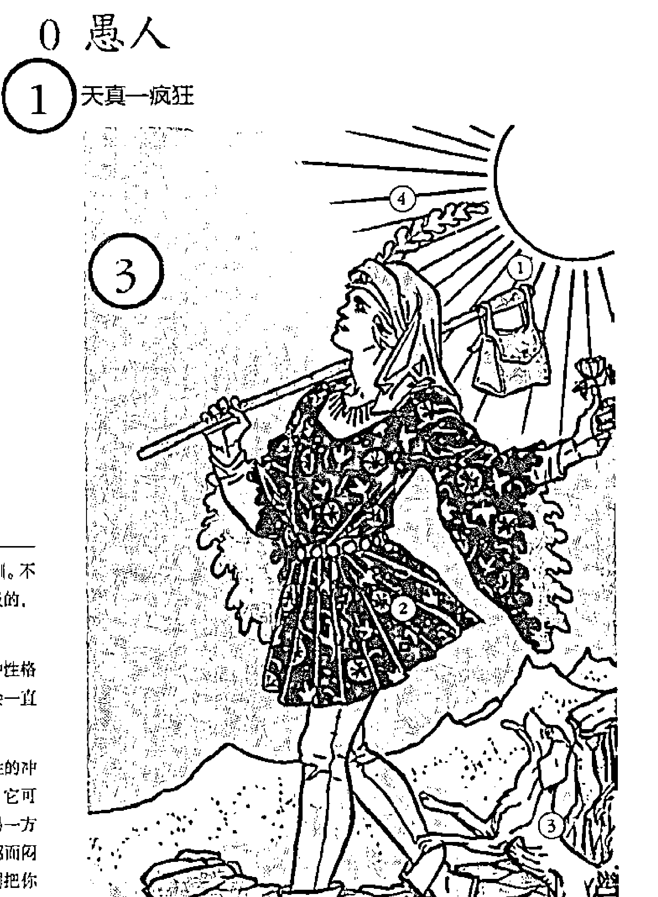

### 2 象征图案

- 1. 肩上的包袱:代表经验、教训。不管这些经验是积极的还是消极的，都将伴随我们走向未来。
- 2. 服饰:放纵反叛的性格。这种性格的人不论面临怎样的遭遇都会一直闪闪发光。
- 3. 动物:本能。这是一种非理性的冲动。它是一把双刃剑:一方面，它可能帮助你克服艰难险阻:但另一方面，它有时也会让你因为挫败感而闷闷不乐。它既可能在危急时刻把你拉住，也可能推着你走进未知。或者若，它可能代表忠诚的跟随者。
- 4. 羽毛:红色的羽毛代表激情与活力、无忧无虑、天真无邪。

### 4 内涵意义

### 5 大阿卡纳的诉说

### 6 传统意义 (含正逆位)

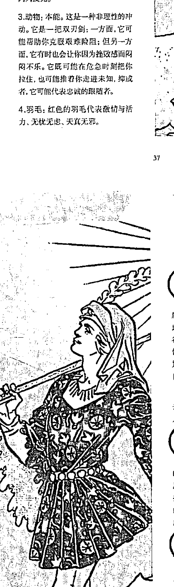

"愚人"的灵魂是自由的。在塔罗牌游戏里，"愚人"是一张万能牌。"愚人"不会理会任何社会习俗的约束，也无视任何限制和束缚，自顾自地向前去。"愚人"通常会打扮像个乞丐，但靠近一点，仔细看，在他衣衫褴褛的外表下，说不准是个地气的王子。他远离人群，独自踏上旅程，去创造自己的命运。他的自由、快乐和热情是他最好的武器。他不管世俗，对别人的看法毫不在意。"愚人"代表自由:爱的自由、旅行的自由、思想的自由。他意味着纯粹的潜能。
"愚人"所反映出的入类的悲哀在于，他的自由过于绝对，这让他看上去是在尽情享受生命中所经历的一切，却又像个局外人一般冷眼旁观。"愚人"的序号为0。在现代发行的塔罗牌中，"愚人"常被放在最前面。

### 5 诉说

在你尚未显现于尘世之前，我是你的精神体/我是你在物质世界里的全部潜能、独一无二的天赋和特质/这世上能束缚你的，只有你自己/每一刻，皆是新生之初/每一步，切勿惧怕行至何处/不论何时何地，你将永远被保护/请不要忘却我的仓养与冲动，继续前行/你就能触摸新鲜的空气、新奇的机会和超乎想象的可能性/来，牵我的手，让我们一起跃动，不要有丝毫的胆怯。

### 6 意义

正位:新的起点;新事物的出现;绝对的潜能;你有重新来过的能力;无论大错还是小卷，你都踏上了全新的旅途;摆脱贫恼，逃避责任。
逆位:鲁莽的行为;消极的选择;被困在同一个地方;不愿离开，或不愿尝试新事物;因恐惧和困境而变得麻木;拒绝真相。

**1 基本意义**

这部分试图用两个简单的词语表达每张大阿卡纳的核心意义。它们是解读牌意的起点，通常意义相近，但还是有微妙的差异，能帮助你更好地理解牌意。

不论你是把它们当作解读的切入点、一种思考的角度或是单纯地去记住它们，就算你对一张牌一无所知，只要知道这两个词语，仍然可以解读这张牌。

**2 象征图案**

看懂象征图案，你就能了解牌面表达的意义。象征图案会把牌面上的主要元素都展示出来，比如它们有什么意义，该如何解读等。通过学习象征图案，你能够对这张牌有更深的理解。当然，你也可以把它们当作深入研究大阿卡纳的突破口。

**3 牌面图案**

《塔罗原理》中所有大阿卡纳的图案都源于罗伯托·德·安吉利斯（Roberto De Angelis）在亚瑟·爱德华·维特（Arthur Edward Waite）的创意基础上重新绘制的《意大利普及塔罗牌（Universal Tarot）》。这副牌采用我们熟悉的塔罗图案和场景，以简单而不繁复的方式，用非凡的色彩将其呈现出来。《意大利普及塔罗牌》是学习塔罗牌传统意义的绝佳参考物。特别对于初学者来说，这副牌是塔罗入门的首选。

**4 内涵意义**

这是隐藏在每张大阿卡纳中的基本故事。它们被解读师、神秘学者和神秘主义者们代代相传。故事中对于牌面的描述非常详细，绝不会遗漏任何一个重要线索。

**5 大阿卡纳的诉说**

与塔罗牌保持交流沟通是很重要的事。这个部分引进了一种实践方法，读者可以从字面上读到，如果塔罗牌会说话，它会对你说些什么。

**6 传统意义（含正逆位）**

不管是正位还是逆位，这一部分都会成为解锁牌意的关键钥匙。这部分资料是从古老的塔罗牌文献或资料中搜集而来，主要内容是如何解读塔罗牌。我们可以在解读中直接使用这些与传统意义有关的词组。

## 大阿卡纳的牌意要点

### 7 关键词

在塔罗牌的发展历程中，"愚人" 常被描绘成两种形象：一种是衣衫褴褛的乞丐，一种是小丑。

### 8 牌面对比

**[图片]**：韦特塔罗牌中的"愚人"是一个天真活泼的青年，他穿着华丽的衣服，头上戴着桂冠，一只脚抬起，好像正准备迈出愉快的一步，对前方的悬崖毫无察觉。身旁的小白狗正试图提醒他，但他似乎并不在意，充满了对未来的憧憬和冒险精神。

**[图片]**：马赛塔罗牌中的"愚人"是一个衣衫褴褛、赤着脚的流浪汉。他拄着拐杖，背着一个包袱，神情迷茫。他看起来更像一个在现实世界中挣扎的乞丐，充满了对未知的困惑和生活的艰辛。

**[图片]**：托特塔罗牌中的"愚人"则是一个充满灵性的形象。他站在云端，身体由火焰和光芒构成，象征着纯粹的能量和创造力。他完全不受物质世界的束缚，代表着精神层面的觉醒和无限的可能性。

*(注：以上是对三张不同版本塔罗牌中"愚人"牌面形象的描述和比较。)*

## 9 启示

"愚人" 这张牌告诉我们，要像孩子一样，用单纯的眼光来看待这个世界；放开心怀，以游戏的态度去迎接每一次冒险。

### 10 不同塔罗牌的侧重点

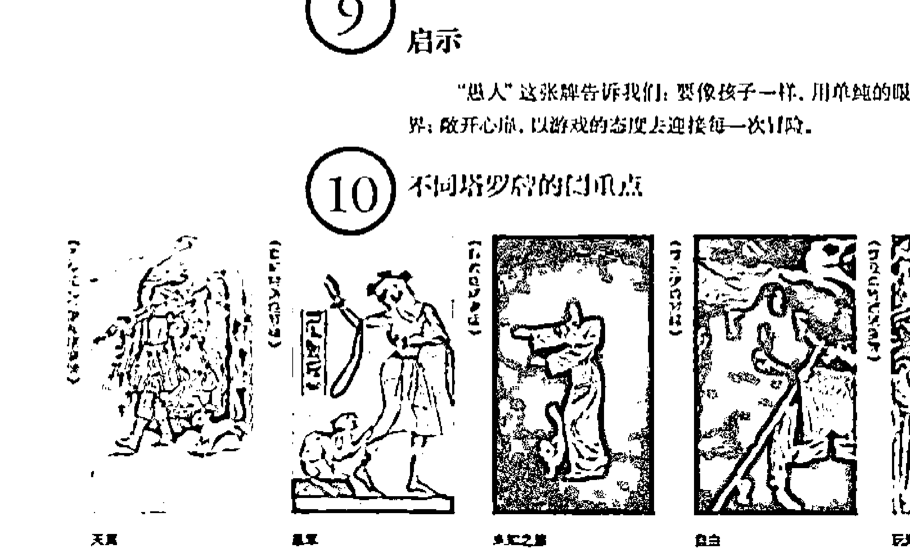

### 11 别名

丑角 (The Joker)、小丑 (The Jester)、疯子 (Madman)、逃亡者 (The Fugitive)、表演者 (The Entertainer)、狂人 (The Lunatic)、天真之人 (The Innocent)

### 12 外延名词

骗子 (Trickster)、丑角 (Joker)、荒唐事 (Folly)、愚人节 (April Fool's Day)、各节之灵 (Spirit of Lent)、万能牌 (Wild Card)、莎士比亚戏剧作品人物福斯塔夫 (Shakespeare's Falstaff)、小丑 (Clown)

7 关键词
关键词是基本意义的延伸。沉浸在这些关键词里，就像在清凉的池子里游泳，你可以随时停下来，欣赏周围的景色。使用这些关键词的时候，你可以用上联想法，将它们和牌意有机结合起来。

8 牌面对比
在这个部分，《塔罗原理》以影响最为深远的三副塔罗牌为示例，简要叙述了同一张牌在不同时期的不同画风。按照历史时间轴，这三副牌分别是《维斯康蒂塔罗牌》《马赛塔罗牌》，以及维特系的《图匙塔罗牌 (Pictorial Key Tarot)》。

9 启示
这部分将告诉你应该如何看待这个世界，如何看待人与人之间的关系以及如何更加了解自己。

10 不同塔罗牌的侧重点
每副塔罗牌都只能重点展现阿卡纳的某些方面。就像同一件事，我们可以从多种角度来看它，对于解读者来说，通过不同的牌面，可以多角度理解大阿卡纳。将同一牌名和不同的图案联系起来，可以对这张牌有更完整的理解。

11 别名
同一张牌可以有许多别名。本书将这些别名一一列出，这样当你遇到那些使用非传统名称的牌时不至于感到迷惑。

12 外延名词
你可以通过查询这些外延名词，来更加全面地理解这张牌。

# 数字牌的牌意要点

- 1. 基本意义
- 2. 关键词
- 3. 牌面描述
- 4. 牌面图案
- 5. 关联性
- 6. 内涵意义
- 7. 不同塔罗牌的侧重点
- 8. 传统意义（含正逆位）
- 9. 启示

## 1 权杖一

### 1. 基本意义

### 2. 关键词
创造力、进取心、新芽、创新、才华、朝气、想象力、冒险、积极、生机、幼苗、闪亮、阳刚气质、能量、激情迸发、发明才能、起源、潜力、力量、权势

### 3. 牌面描述
一只发光的手从翻腾的云中伸出来，紧抓着一根长着绿芽的树枝。树叶从树枝上脱落，散落到地上，好似这根树枝充满了能量。远处，古老的城堡静静地伫立在蜿蜒的河旁。

### 5. 关联性
数字：1
萨菲洛斯：王冠 (Kether)
元素：火
季节：秋
性格：积极

一张代表火元素的根：火之力量的根 (The Root of the Power of Fire)

### 6. 内涵意义
**主动激励即是活着**
“权杖一”是力量、活力和能量的象征。它让我们通过自我的欲望去行动，并改变世界。它是力量、物质和身体活力的代表。“权杖一”同样象征着欲望、热情和决心。生长的枝叶代表生命和繁殖力，而它们的生命力是由权杖的能量提供的。
“权杖一”代表了人类的欲望。它将欲望从纯粹的需求转变成实际的行动，并通过行动显化成命运。相比其他牌来说，“权杖一”表达的重点在于，个体的意义是由自己的意念而决定。只有带着勇气和力量去追寻自己的欲望，一个人才能真正地活着。和所有的一号牌一样，“权杖一”代表了还未实现的潜能和可能性。

### 7. 不同塔罗牌的侧重点
（图片下方有三行小字，从左到右分别为：“新的创意”、“生产力”、“火焰之光”，但字迹模糊难以完全辨认。）

## 1 基本意义
这部分试图用两个简单的词语表达每张小阿卡纳的核心意义。它们是解读牌意的起点，通常意义相近，但还是有微妙的差异，能帮助你更好地理解牌意。不论你是把它们当作解读的切入点、一种思考的角度或是单纯地去记住它们，就算你对一张牌一无所知，只要知道这两个词语，仍然可以解读这张牌。

## 2 关键词
关键词是基本意义的延伸。沉浸在这些关键词里，就像在清凉的池子里游泳，你可以随时停下来，欣赏周围的景色。使用这些关键词的时候，你可以用上联想法，将它们和牌意有机结合起来。

## 3 牌面描述
数字牌和宫廷牌上的象征符号没有大阿卡纳那么影响深远，所以这个部分没有对单个的象征符号进行解析，而是对牌面图案做了整体描述。这样不仅有利于你理解牌意，也能帮助你做出更好的解读。

## 4 牌面图案
《塔罗原理》中所有数字牌的图案都源于罗伯托·德·安吉利斯在亚瑟·爱德华·维特的创意基础上重新绘制的《意大利普及塔罗牌》。这副牌采用我们熟悉的塔罗图案和场景，以简单而不繁复的方式，用非凡的色彩将其呈现出来。《意大利普及塔罗牌》是学习塔罗牌传统意义的绝佳参考物。特别对于初学者来说，这副牌是塔罗入门的首选。

## 5 关联性
这部分列出的一些高阶术语是你即将在其他两本书中会读到的。对这些术语进行前瞻性的了解，有助于你更好地为深入学习塔罗做好准备。其中“秘传术语”这一项对这张牌的本质和本意做了强有力的诠释。

## 6 内涵意义
这是隐藏在每张数字牌中的基本故事。它们被解读师、神秘学者和神秘主义者们代代相传。故事中对于牌面的描述非常详细，绝不会遗漏任何一个重要线索。

## 7 不同塔罗牌的侧重点
每副塔罗牌都只能重点展现阿卡纳的某些方面。就像同一件事，我们可以从多种角度来看它，对于解读者来说，通过不同的牌面，可以多角度理解阿卡纳。将同一牌名和不同的图案联系起来，可以对这张牌有更完整的理解。

### 8. 传统意义（含正逆位）
**传统意义**
正位：创造力、进取心、行动力以及所有由此生出的力量；开始、起源、出生、家庭以及其背后的男性生殖能力；任何行动、成功或目标的出发点。
逆位：徒劳的努力；失败、堕落、毁灭、诅咒；腐朽；甚至一种模糊的乐感；性问题、疾病。

### 9. 启示
- 强大的创造力和力量之源在每个人的体内蕴藏成长。
- 认知个人的能力，当你感受到它时，要主动去了解它。
- 你就是那只拥有这支热情权杖的手。
- 让你的热情变成你的指引明灯，照亮你前进的道路。
- 表现出你的创造力、感染他人，并保持初心。

### 7. 不同塔罗牌的侧重点

## 8 传统意义（含正逆位）
不管是正位还是逆位，这一部分都会成为解锁牌意的关键钥匙。这部分资料是从古老的塔罗牌文献和资料中搜集而来，主要内容是如何解读塔罗牌。解读中，我们可以直接使用这些与传统意义有关的词组。

## 9 启示
这一部分将告诉你应该如何看待这个世界，如何看待人与人之间的关系以及如何更加了解自己。

# 宫廷牌的牌意要点

- 1. 基本意义
- 2. 关键词
- 3. 别名
- 4. 牌面描述
- 5. 牌面图案
- 6. 内涵意义
- 7. 在你身上的体现和影响
- 8. 传统意义（含正逆位）
- 9. 人物形象

## 权杖侍从
### 开创性—活力

**关键词**
生命力、创造力、陪伴者、爱、忠诚、旅行、支持、友谊、承诺、忠贞、信任、依赖、洞察力、充满活力、适应力、好奇心、冒险精神、活泼爱玩、外向的、风险性、坦率、富有野心、冲动

**别名**
- 侍从 (Knave)
- 公主 (Princess)
- 发明家 (The Inventor)

**牌面描述**
这是一个衣着色彩鲜艳的年轻人。他侧站着，专注地凝视着地平线。他手中所持的木杖根植于大地。他双手握着木杖，敏锐地观察着上面萌发的新芽。权杖侍从立于一片火热的沙漠景象之中，与火元素相互呼应。在他身后，高耸的山峰直指天穹。

**热烈的追逐**
“权杖侍从”是个一心致力于需要激情和创意的事业的年轻男孩或女孩。他可能沉浸于一份工作、一项运动或是某种需要与人直接打交道的学术领域，也可能对某人一见钟情。他被一切展露新奇和潜在可能性的事物吸引。他总是坚信明天会更好，哪怕穷困潦倒。
他对创造、投入、参与都尤为着迷，以至于忘记了保持必要的警惕。“权杖侍从”是开路先锋，容易被影响。那些他为之付出激情的事物让他成长并趋于成熟。他的天赋是将一切经验转化为个人化的东西。他很独立，无须他人的指导，但乐于寻求一切能激发创造力的事物。“权杖侍从”有着永不干涸的热忱。

**在你身上的体现和影响**
上一次当你激动地涨红着脸庞，上跳下蹿是什么时候？那便是“权杖侍从”在你身上作用之时。当你经历着激动人心的时刻，把未来的长远规划抛在脑后时，这都是“权杖侍从”的作用。

**传统意义**
正位：令人激动的不期而至的消息；信使；年轻人的创意和热情；重新开始的机遇；等待自我揭露的勇气；对生活充满热情的年轻人；旅行。
逆位：闲言碎语、忠告和坏消息；犹豫寡断以及随之而来的不稳定感；被压制。

**人物形象**
职业：学生、创意工作者、运动员、电话接线员、销售、记者、行政助理、实习生、调查员、旅行作家、飞行员、船夫、替身演员、自由职业者
外貌：年轻女孩，红发，皮肤白皙，浅色眼眸。

## 1 基本意义
这部分试图用两个简单的词语表达每张宫廷牌的核心意义。它们是解读牌意的起点，通常意义相近，但还是有微妙的差异，能帮助你更好地理解牌意。不论你是把它们当作解读的切入点、一种思考的角度或是单纯地去记住它们，就算你对一张牌一无所知，只要知道这两个词语，仍然可以解读这张牌。

## 2 关键词
关键词是基本意义的延伸。沉浸在这些关键词里，就像在清凉的池子里游泳，你可以随时停下来，欣赏周围的景色。使用这些关键词的时候，你可以用上联想法，将它们和牌意有机结合起来。

## 3 别名
同一张牌可以有许多别名。本书将这些别名一一列出，这样当你遇到那些使用非传统名称的牌时不至于感到迷惑。

## 4 牌面描述
数字牌和宫廷牌上的象征符号没有大阿卡纳那么影响深远，所以这个部分没有对单个的象征符号进行解析，而是对牌面图案作了整体描述。这样不仅有利于你理解牌意，也能帮助你做出更好的解读。

## 5 牌面图案
《塔罗原理》中所有宫廷牌的图案都源于罗伯托·德·安吉利斯在亚瑟·爱德华·维特的创意基础上重新绘制的《意大利普及塔罗牌》。这副牌采用我们熟悉的塔罗图案和场景，以简单而不繁复的方式，用非凡的色彩将其呈现出来。《意大利普及塔罗牌》是学习塔罗牌传统意义的绝佳参考物。特别对于初学者来说，这副牌是塔罗入门的首选。

## 6 内涵意义
这是隐藏在每张宫廷牌中的基本故事。它们被解读师、神秘学者和神秘主义者们代代相传。故事中对于牌面的描述非常详细，绝不会遗漏任何一个重要线索。

## 7 在你身上的体现和影响
虽然宫廷牌有时代表的是你生命中的某些人，但更多时候它代表的是你的核心人格的某些方面。这个部分展示了单张宫廷牌如何在你日常生活的不同时刻影响你的内在，在这些时刻中你恰如其分地表现出了这张宫廷牌的本质。

## 8 传统意义 (含正逆位)
不管是正位还是逆位，这一部分都会成为解锁牌意的关键钥匙。这部分资料是从古老的塔罗牌文献和资料中搜集而来，主要内容是如何解读塔罗牌。解读中，我们可以直接使用这些与传统意义有关的词组。

## 9 人物形象
宫廷牌不仅象征着你自己，也象征着其他的人。也是因为这个原因，每张宫廷牌上的人物都有其对应的职业，以及相应的外貌形象。

# 宫廷牌的牌意要点

## 10 传统意义（含正逆位）
这一部分运用图表作了辅助说明，从策略、行为及态度三个方面讲述了宫廷牌的牌意。本书后半部分着重讲解技术性问题，将对宫廷牌的解读进行全方位的阐述。
图表可以帮助你对比不同的宫廷牌，理清它们之间复杂的关系。

## 11 不同塔罗牌的侧重点
每副塔罗牌都只能重点展现阿卡纳的某些方面。就像同一件事，我们可以从多种角度来看它，对于解读者来说，通过不同的牌面，可以多角度理解阿卡纳。将同一牌名和不同的图案联系起来，可以对这张牌有更完整的理解。

### 10 创造行为与态度

| 坐标系 |
| :--- |
| 横轴：外放性 |
| 纵轴：接纳性 |
| 象限：潜能（接纳性+外放性）、创造行为与态度（外放性+外放性） |

**创造性学习**
学习力：学习、感觉、体验、发现、发明、发散、改变和提升
创造力：思考、心愿、想法、激情、行动、商业、流行、转化、理想和信仰
塑造性：倾听、等待、耐心、理性、深思熟虑、内化、内省和女性特质
潜力：未来、年轻、机缘、创造性、欲望、期望、成长和开拓

# 塔罗牌牌意详解

- 大阿卡纳：见第37—124页
- 数字牌：见第125—244页
- 宫廷牌：见第245—292页

## # 0 愚人
### 天真—疯狂

### ## 象征图案
1. **肩上的包袱**：代表经验、教训。不管这些经验是积极的还是消极的，都将伴随我们走向未来。
2. **服饰**：放肆反叛的性格。这种性格的人不论面临怎样的遭遇都会一直闪闪发光。
3. **动物**：本能。这是一种非理性的冲动。它是一把双刃剑：一方面，它可能帮助你克服艰难险阻；但另一方面，它有时也会让你因为挫败感而闷闷不乐。它既可能在危急时刻把你拉住，也可能推着你走进未知，抑或者，它可能代表忠诚的跟随者。
4. **羽毛**：红色的羽毛代表激情与活力、无忧无虑、天真无邪。

## # 愚人
“愚人”的灵魂是自由的。在塔罗牌游戏里，“愚人”是一张万能牌。“愚人”不理会任何社会习俗的约束，也无视任何限制和束缚，自顾自地走向前去。“愚人”通常会打扮得像个乞丐。但靠近一点，仔细看，在他衣衫褴褛的外表下，说不定是个帅气的王子。他远离人群，独自踏上旅程，去创造自己的命运。他的自由、快乐和热情是他最好的武器。他不修边幅，对别人的看法毫不在意。“愚人”代表自由：爱情的自由，旅行的自由，思想的自由。他意味着纯粹的潜能。

“愚人”所反映出的人类的悲哀在于，他的自由过于绝对，这让他看上去是在尽情享受生命中所经历的一切，却又像个局外人一般冷眼旁观。“愚人”的序号为0。在现代发行的塔罗牌中，“愚人”常被放在最前面。

## # 愚人的诉说
> “在你尚未显现于尘世之前，我是你的精神体/我是你在物质世界里的全部潜能、独一无二的天赋和特质/这世上能束缚你的，只有你自己/每一刻，皆是新生之初/每一步，切勿惧怕行至何处/不论何时何地，你将永受庇护/请不要忌惮我的鲁莽与冲动，继续直行/你就能簇拥新鲜的空气、新奇的机会和超乎想象的可能性/来，牵我的手，让我们一起跃动，不要有丝毫的惧怕。”

## # 传统意义
- 正位：新的起点；新事物的出现；绝对的潜能；你有重新来过的能力；无论大街还是小巷，你都踏上了全新的旅途；摆脱烦恼，逃避责任。
- 逆位：鲁莽的行为，消极的选择；被困在同一个地方；不愿离开，或不愿尝试新事物；因恐惧和困境而变得麻木；拒绝真相。

## 关键词
愚蠢、没有经验、潜能、开端、冒险、玩笑、自由、行动、旅行、开始、漫游、本质、疯狂、空想、天真、无邪、原创、不可思议的行为、陌生、粗心大意、旅程、远足、朝圣、欠考虑、灵魂触碰、恶作剧者

## 牌面对比
在塔罗牌的发展历程中，“愚人”常被描绘成两种形象：一种是衣衫褴褛的乞丐，一种是小丑。

《维斯康蒂塔罗牌》：《维斯康蒂塔罗牌》中的“愚人”是一个衣衫褴褛的乞丐。他光着脚，穿着破烂的衣服，头上插着的羽毛与基督教的封斋节有关。从他的表情可以看出，他有些精神失常。

《马赛塔罗牌》：《马赛塔罗牌》中的“愚人”是一个衣着古怪的小丑。他拄着拐杖，走路的姿势很别扭。这里的“愚人”和维特牌里的“愚人”一样，都扛着一个包袱。一只野狗（也可能是野猫）抓破了他的裤子，挠着他的大腿。

《图匙塔罗牌》：《图匙塔罗牌》里的“愚人”看起来积极多了。他仰着脸沐浴着温暖的阳光。他正迈向悬崖的边缘，却没有一丝的畏惧。维特牌里有一个秘密：“愚人”每踏出一步，他脚下的悬崖就会向前延伸一步，所以“愚人”并没有危险。就算他继续向前走，也不会掉下悬崖。

## 启示
“愚人”这张牌告诉我们：要像孩子一样，用单纯的眼光来看待这个世界；敞开心扉，以游戏的态度去迎接每一次冒险。

## 不同塔罗牌的侧重点

## 别名
- 丑角 (The Joker)
- 小丑 (The Jester)
- 疯子 (Madman)
- 逃亡者 (The Fugitive)
- 表演者 (The Entertainer)
- 狂人 (The Lunatic)
- 天真之人 (The Innocent)

## 外延名词
- 骗子 (Trickster)
- 丑角 (Joker)
- 荒唐事 (Folly)
- 愚人节 (April Fool's Day)
- 封斋节之灵 (Spirit of Lent)
- 万能牌 (Wild Card)
- 莎士比亚戏剧作品人物福斯塔夫 (Shakespeare’s Falstaff)
- 小丑 (Clowns)## I 魔术师

### 意志—能力

## 象征图案

- 双纽线：一个横向的数字“8”的符号，它象征无穷无尽，也象征思想的灵活变通。
- 权杖：它的形状像一根两头燃烧的蜡烛。权杖代表火元素，是欲望和权力的象征，也是魔术师沟通天地间能量的法器。
- 工具：桌上的圣杯代表水元素，也代表知识；宝剑代表风元素，也代表勇气；星币代表土元素，也代表大自然的奥秘。它们摆放的位置暗示着：你需要的东西都在你触手可得的地方。
- 桌子：桌子代表魔术师在现实层面可以随心所欲地使用他的工具。桌腿代表着魔术师所处的身、心、灵三个世界。

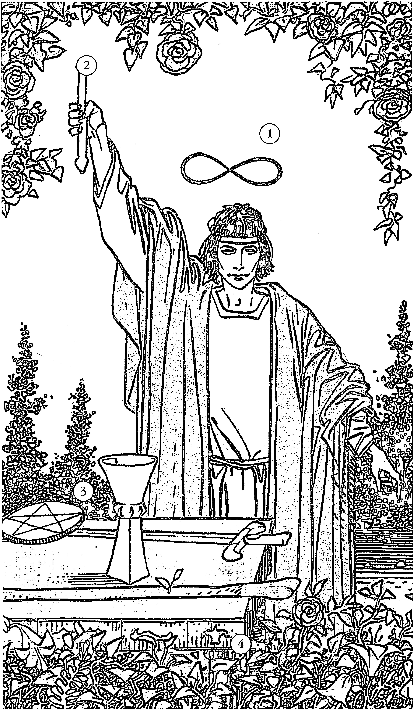

## 魔术师

“魔术师”可以是手工艺人、有天赋的年轻人，也可以是艺术家。就道德层面而言，这张牌有种模棱两可的意味。一方面，“魔术师”因为他超乎常人的心智能力、身体协调性和自信心而受到人们的尊崇；另一方面，你又很难去信任“魔术师”，他是如此善变，极易混淆真理与虚伪。“魔术师”真正的力量在于，他能运用大量的资源、丰富的想象力和敏捷的应变能力，轻松面对和处理任何棘手的局面。

“魔术师”的根基在于看似玩笑般的野心、意愿和适应精神。维特牌中，“魔术师”的姿势就像一个通道，将能量、慈悲、美德和光从天空导向地面，进入物质世界，正呼应了那句神秘的短语：“如在其上，如在其下。”通常，“魔术师”面前的桌子上放着四元素，象征着小阿卡纳的四个牌组：节杖是权杖，代表火元素；杯子是圣杯，代表水元素；圆盘是星币，代表土元素；匕首是宝剑，代表风元素。“魔术师”可以随心所欲地使用这四种元素。他头上的无穷符号与腰间的蛇形腰带形成呼应。花朵与绿叶代表“魔术师”日渐膨胀的野心和迅速施展魔法的能力。

### 魔术师的诉说

> > “我就是支撑你凸显于天地的能量/我们筑起精神与物质间的桥梁/我们一起显现，点燃这世界，在挑战和操控中改变天地万象/我们拥有一切，资源总是应有尽有，期望总是如愿以偿/我就是你的意志力，发掘出自有力量的你，必将势不可当/来，让我教你如何行动，一起创造奇迹。”

## 传统意义

- 正位：创造新事物、促成事情发生的能力；个人魅力和掌控力；“如在其上，如在其下”的“上”与“下”相结合所反映出来的人的神圣动机；更强的力量和能量。
- 逆位：力量削弱；软弱，无法果决地下决心；倦怠且沮丧，害羞且安静；力不从心；被压抑或隐藏的天赋。

## 关键词

才能、力量、欺骗、精明、开始、天赋、专注、能量、精确、操纵、聚焦、决心、行动、掌控、野心、策略、能力、技巧、主动、外交、沟通、意志、欲望、联结、通道

## 牌面对比

通常“魔术师”的面前都会放着一张桌子。他打扮得十分华丽，手握权杖，而宝剑等其他元素则被放在桌上。

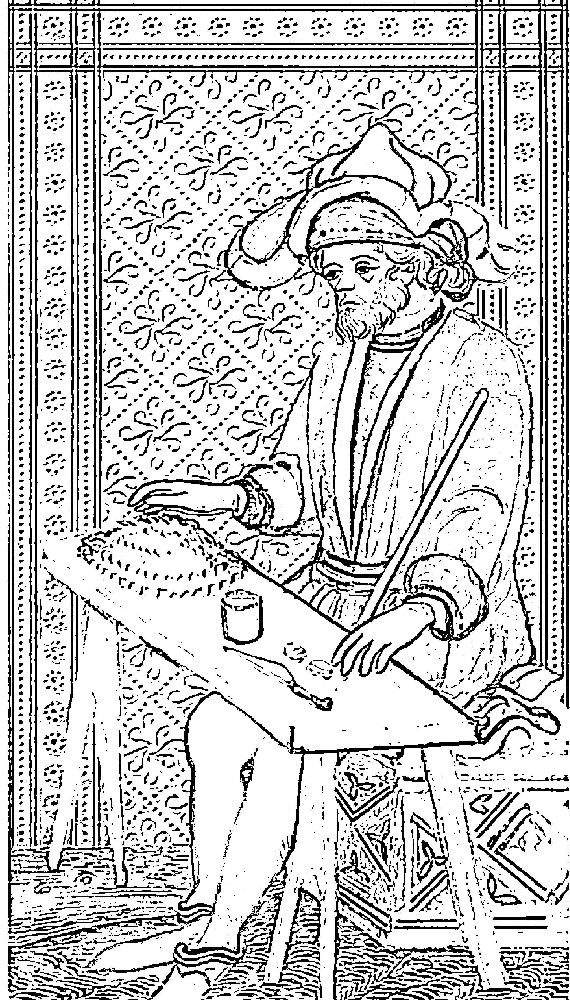

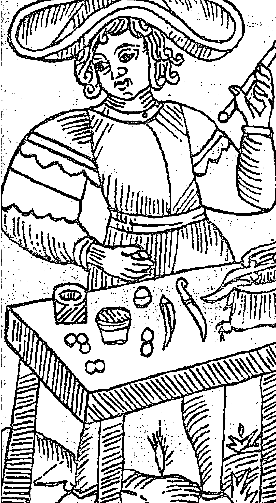

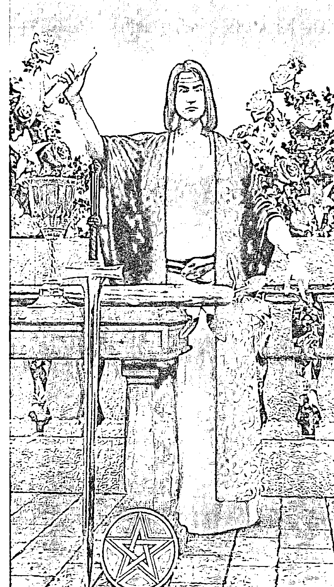

《维斯康蒂塔罗牌》
“魔术师”坐在桌后的金色箱子上面。他穿着红色外衣，里衬是绿色的，表情严肃、凝重且专注，动作轻柔灵巧

《马赛塔罗牌》
“魔术师”站在桌后，摆出一副积极主动的姿态。他的服装色彩鲜艳，帽檐的样子像一个象征无穷无尽的双纽线。他站在春天的草地里，专注于面前的一切

《图匙塔罗牌》
“魔术师”有种掌控全局的气场。他穿着礼袍站在那里，仿佛在连通天与地。玫瑰与百合欣欣向荣，四元素的器物全部准备就绪

## 启示

“魔术师”这张牌想要告诉你：想要做什么，就行动起来，你会发现或培养出你不曾察觉的新才能。

## 不同塔罗牌的侧重点

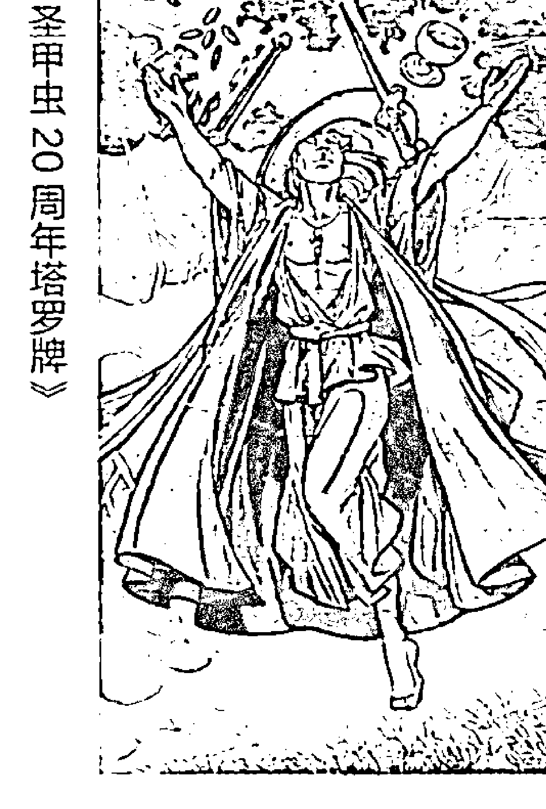

力量之主

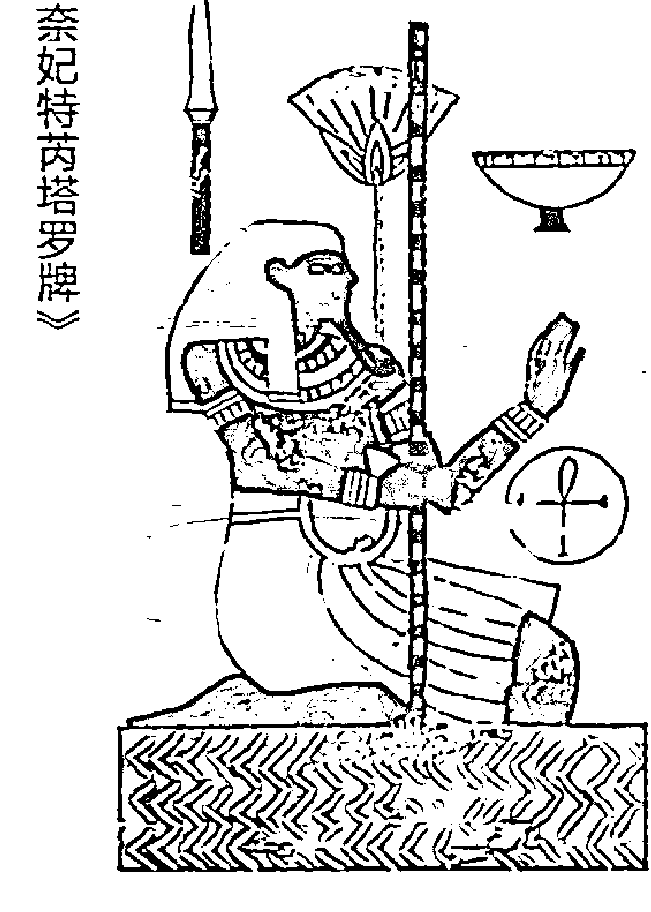

技巧

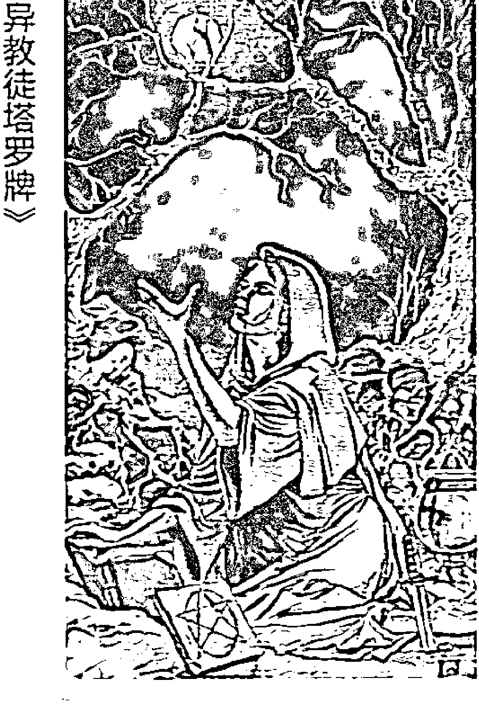

传递能量

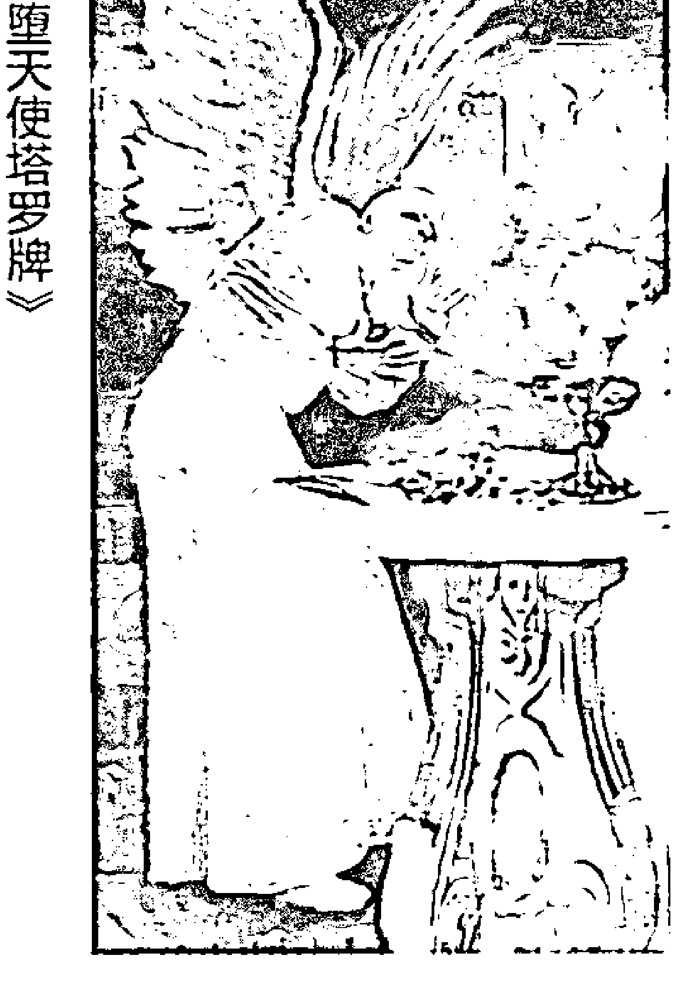

力量

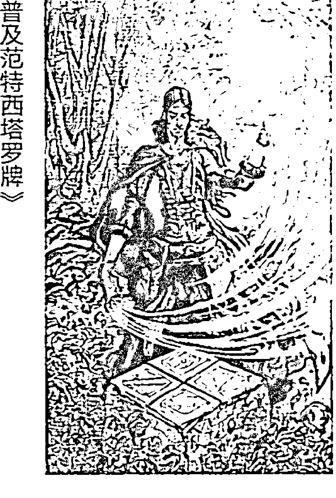

四元素统治者

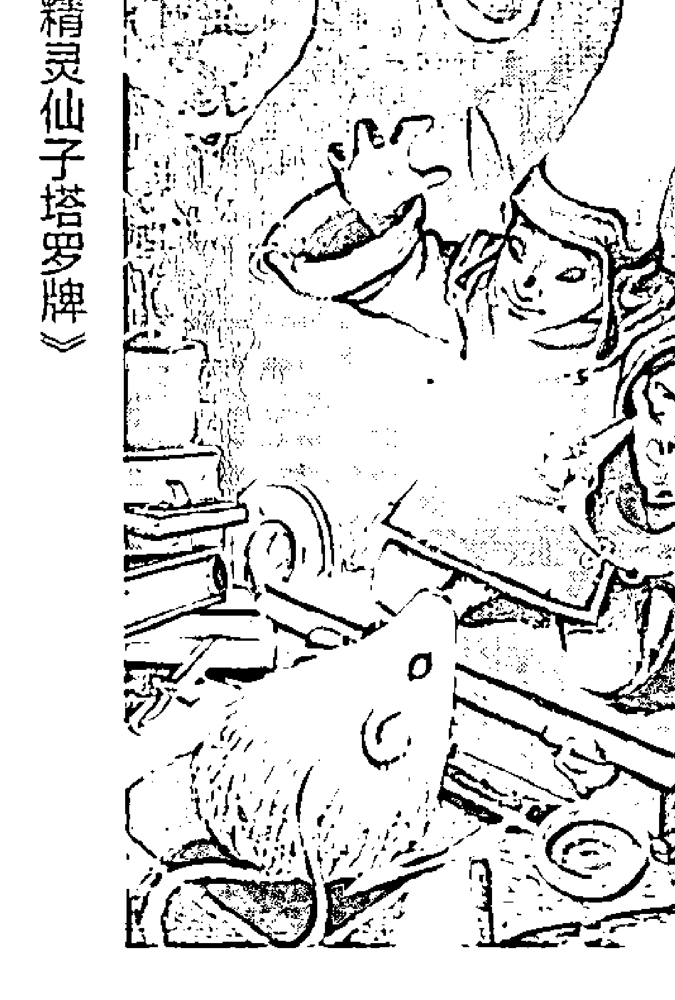

创造力

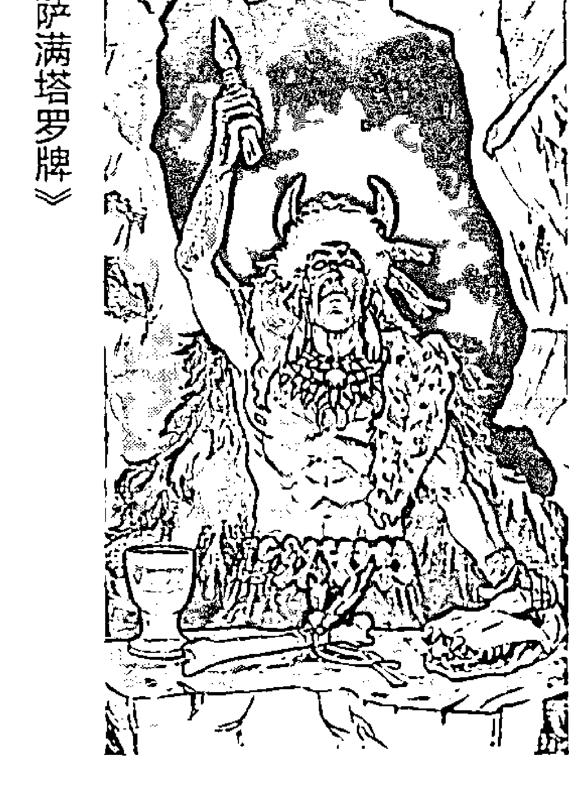

启发

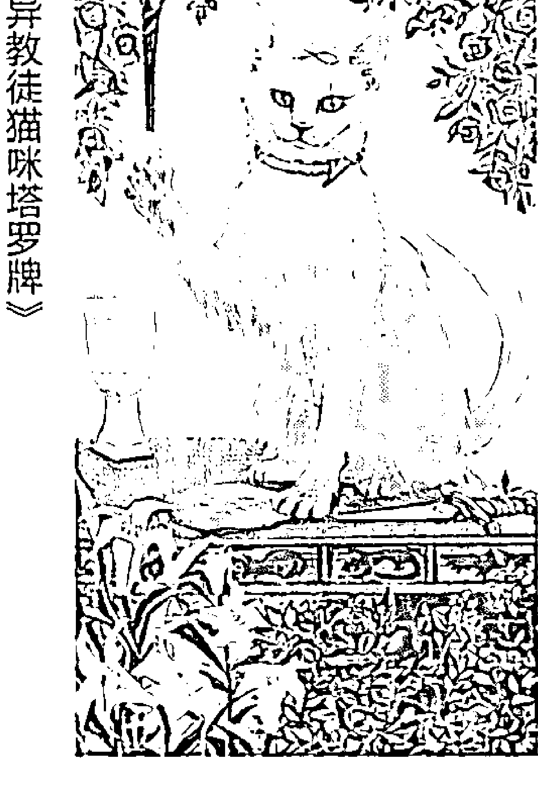

技巧与资源的利用

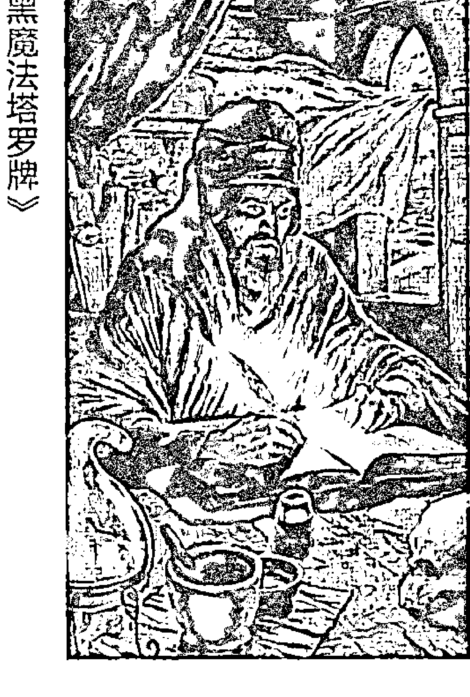

专注

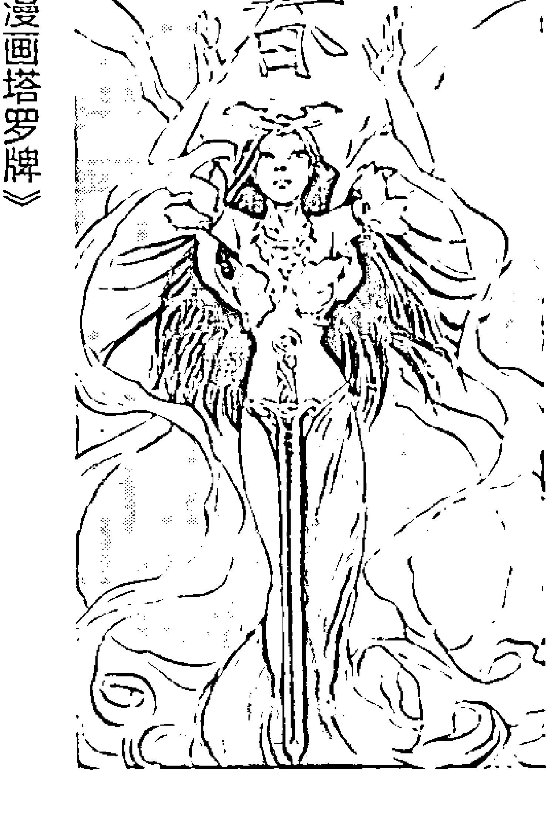

行动中的潜能

## 别名

- 变戏法的人 (The Juggler)
- 魔术家 (Magus)
- 萨满 (Shaman)
- 占卜者 (Diviner)
- 巫师 (Wizard)
- 戏法师 (Conjurer)
- 先知 (Prophet)
- 驱魔师 (Exorcist)
- 术士 (Warlock)
- 炼金术士 (Alchemist)
- 神秘学者 (Occultist)
- 古鲁 (Guru)

## 外延名词

- 魔术师之能量 (Trickster Energy)
- 莎士比亚戏剧中的人物普洛斯彼罗 (Shakespeare's Prospero)
- 赫耳墨斯 (Hermes)
- 阿波罗 (Apollo)
- 梅林 (Merlin)

## II 女祭司

### 知识—智慧

## 象征图案

- 帷幕：绣满棕榈叶和石榴的帷幕挂在女祭司身后，遮住了我们的视线。帷幕后是女祭司守护的难以企及的智慧。这里的帷幕象征着通往隐秘智慧的入口。
- 头冠：女祭司头戴的三重冕象征了“身、心、灵”三个层面，也象征着蛾眉月、满月、残月三种月相。
- 圆柱：这里的圆柱代表所罗门圣殿前的两根圣柱：波阿斯（B，即Boaz）和雅斤（J，即Jakin），分别代表力量和基础。
- 月亮：阴性的秘密、变化、幻觉。
- 书籍/卷轴：不论书籍、卷轴是打开还是闭合的，都指的是知识之书。
- 十字架：聚集天地（上下）、阴阳（左右的黑白两色）的力量。

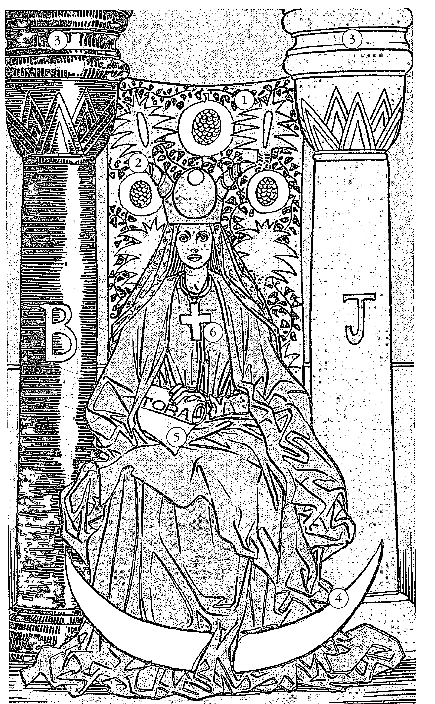

## 女祭司

从她膝上的卷轴可以看出，“女祭司”是知识的掌管者。头上的三重冕象征着她掌握卷轴奥秘的能力。“女祭司”是“研究、学习、分析”的代表，她的理论研究的天赋远远高于实践应用能力。众所周知，我们可以利用知识来做许多事：引诱、攻击、防卫、教导或解决问题。拥有太多知识的“女祭司”就像身处孤岛一样与人群产生了隔阂。当你想要向“女祭司”寻求答案时，是否将奥秘分享出来的主动权并不在于你，而在于“女祭司”。她会将秘密告诉她认为最值得的人，而对其他人则保持缄默。

塔罗牌的发展演变与“女祭司”所对应的阴性神圣能量息息相关。她很敏感，对灵性奥秘有着极高的领悟力。她知道你所知道的一切，对你的直觉和你最真实的内心了如指掌。她保守着这些秘密，并提醒着你，总有一天，你会像她一样，将所有秘密参透。

### 女祭司的诉说

> > “我是潜藏在你内心深处的知识之井中涌出的清泉/我熟知你的过往、当下和未来的秘密与真理，我就是你幻化的那本经卷/若你寻求答案，我在内心回应你，若你凭直觉行动，我在方向上引导你/你要学习我的表达方式/你所见的符号、经历的同步性、油然而生的念头——我在用这些方式与你交流/也只有在经历过这些事以后，你才会明白这种交流的意义/我和你的交流也向来不流于表象/你脑中响起的喃喃细语声、耳语声、暗示的喊声——我在用这些方式与你交流/请相信我发给你的这些音讯/你是永远不会误入歧途的，因为，我就是你的直觉与潜意识。”

## 传统意义

- 正位：隐藏的秘密与神秘智慧；阴性能量与月之魔力的守护者；等待揭示的未来与不为人知的影响力；柏拉图式的爱情；永恒真理。
- 逆位：忽视你的本能；欺骗你的人；自负、狂乱和不理智的行为；拒绝真相；恐惧与诱惑。

## 关键词

保密、神秘、未知事物、纯洁、直觉、女性、潜意识、黑暗、保守秘密者、知晓、平静、内省、神秘视界、秘密、沉默、孕育、顺从、信仰、严肃、隐私、学习、智慧、机密、自制力、极端、二元性、有智慧的女性、知识

## 牌面对比

通常，“女祭司”是一位坐在宝座上、膝上放着书的女性。

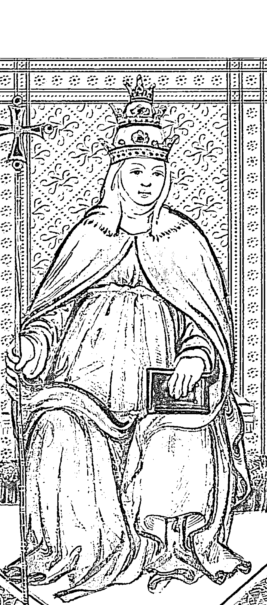

《维斯康蒂塔罗牌》里的“女祭司”（或者称为女教皇）有一段有趣的历史。虽然她是女教皇，穿的却是修女的衣服。历史上认为她是马窦·维斯康蒂（Matteo Visconti）的小堂妹，被称作曼弗雷德修女（Sister Manfreda）。许多人把她视作忠贞的象征

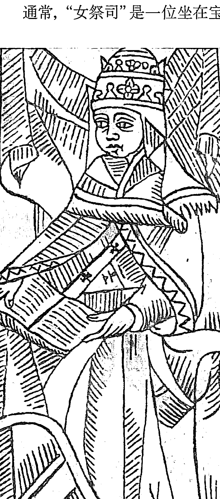

《马赛塔罗牌》中的“女祭司”身着教服，头戴三重冕，坐在宝座上，她的膝上放着一本打开的书

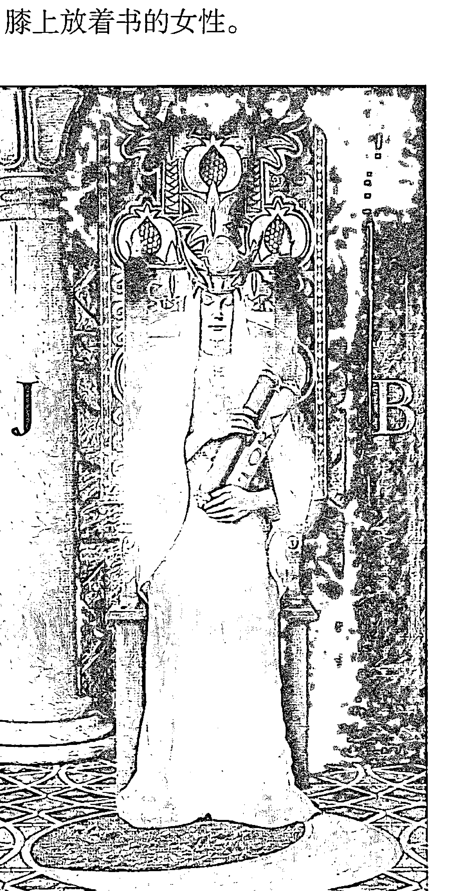

“女祭司”头上的皇冠象征着月亮的三种月相。她怀里的卷轴上写着“TORA”，意思是犹太律法。她端坐于两根圣柱之间。这是两根矗立在耶路撒冷所罗门圣殿门口的圣柱，圣柱上刻着字母B和J，分别指波阿斯和雅斤。“女祭司”的身后，垂着一张绣满石榴与棕榈叶的帘幕

## 启示

“女祭司”这张牌想要告诉我们：要留意生命中所发生的事件的迹象和它们背后的意义。

## 不同塔罗牌的侧重点

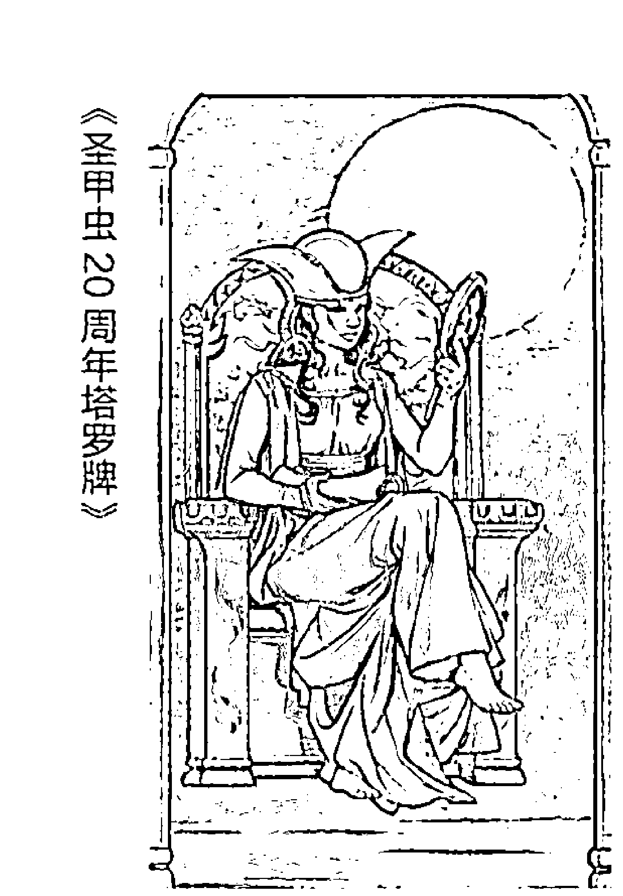

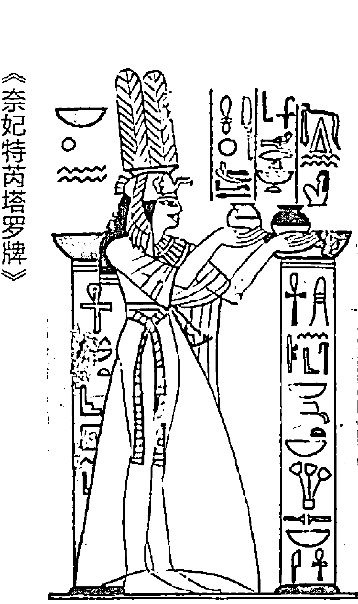

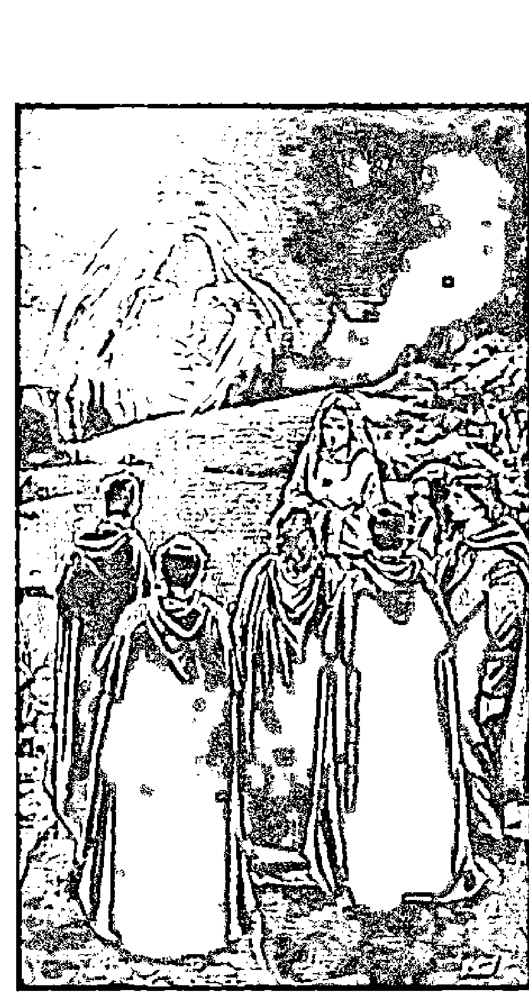

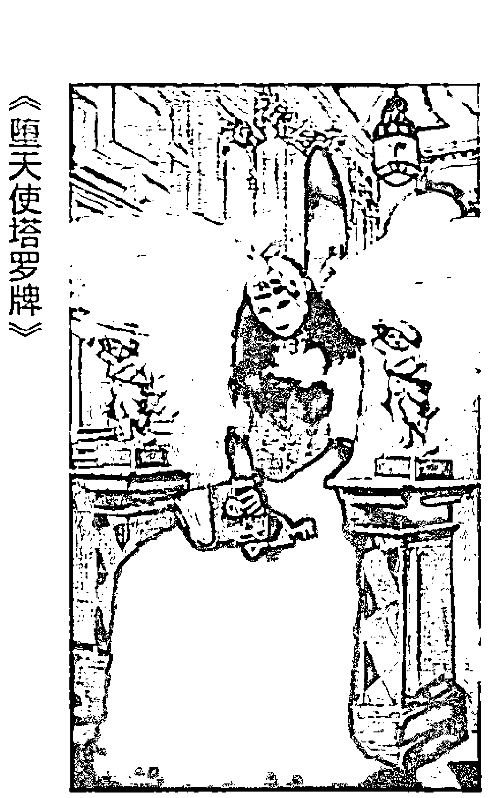

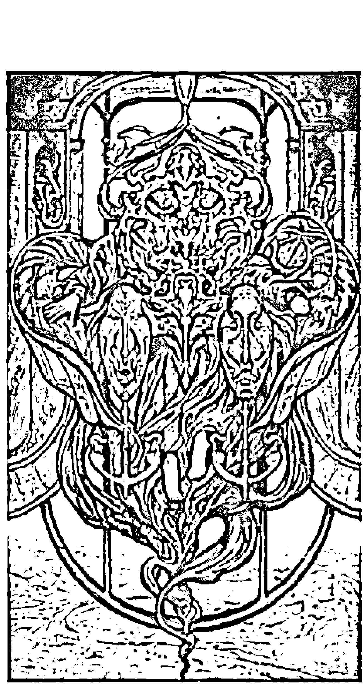

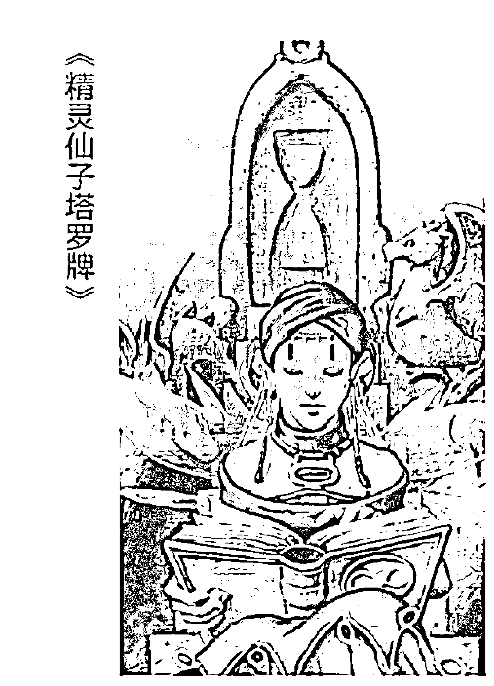

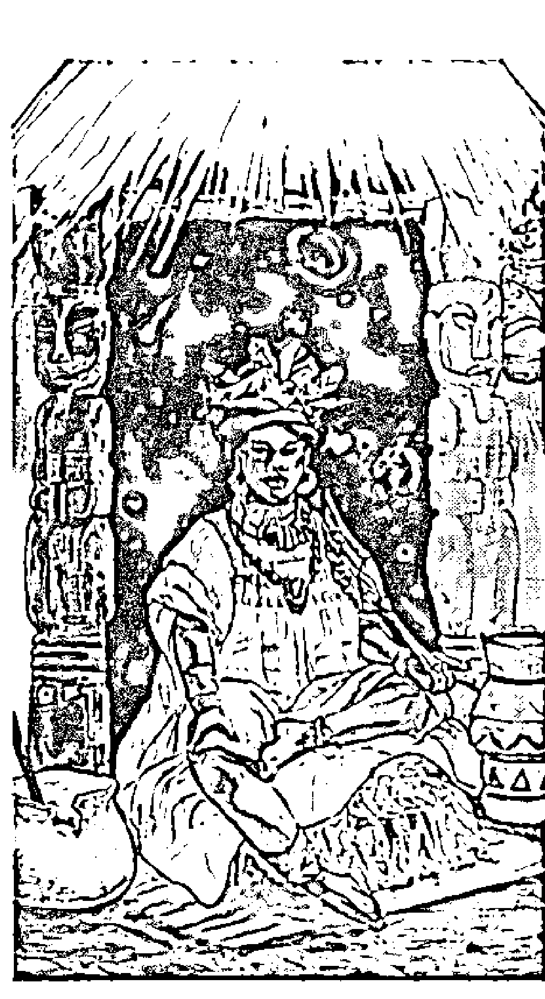

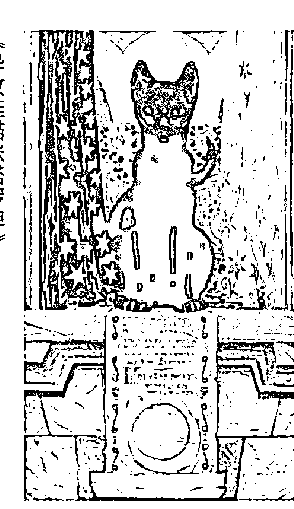

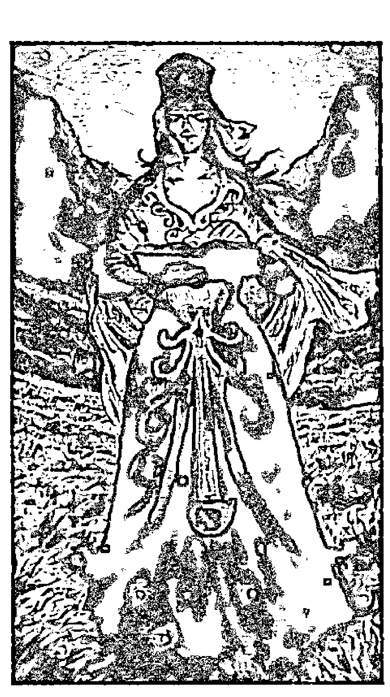

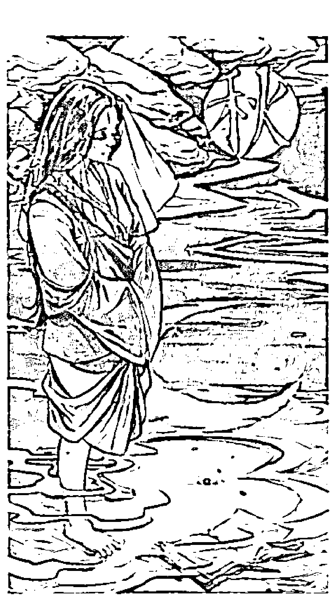

别名
女教皇（Papess、Popess、Female Pope）、智者（Wise One）

外延名词
教皇琼（Pope Joan）、曼弗雷德修女（Sister Manfreda）、圣母玛利亚（Virgin Mary）、古埃及丰饶女神伊西斯（Isis）、神秘学院（Mystery Schools）、女牧师（Female Clergy）、女性的奥秘（Female Mysteries）

## III 女皇

### 养育—生产

## 象征图案

- 皇冠：象征至高无上的智慧。据说，这是“太阳为女皇加冕”，给她戴上了金色的皇冠。有时候女皇的皇冠上会镶嵌许多星星。
- 王座：代表稳定，也说明了女皇的智慧超乎常人。
- 权杖：代表统治物质世界的权力，同时也象征着理智与情感的结合。
- 心形与金星（维纳斯）符号：代表女皇的阴性本质，也象征着她有能力统治和滋养这个世界，消除冲突和暴力，这两个符号展示出了女皇的母性特质。
- 自然景色、水流与植物：表现出她与生命力量和生命能量之间的紧密关系。

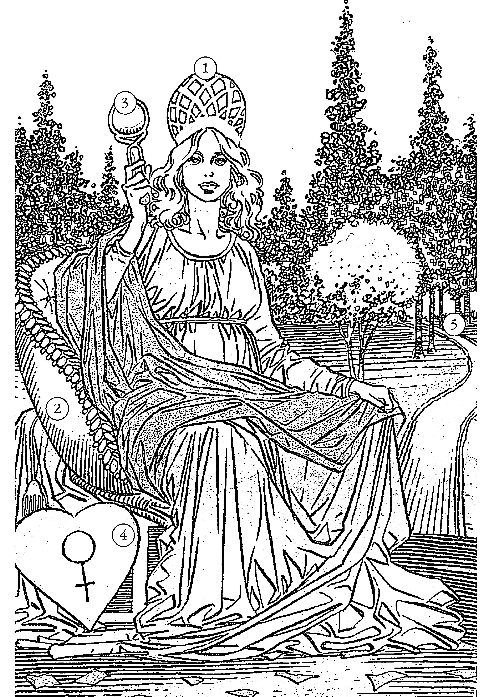

## 女皇

“女皇”是绝对智慧的象征。只要涉及创造力，这种绝对智慧就会体现得淋漓尽致。她身上浓缩了所有女性的特质。“女皇”的原型是母亲，她不仅孕育和创造生命，还保护、支持、教育、关心世人。在她身上，我们可以同时看到强大的力量、坚定的信仰以及崇高的权威。“女皇”代表知识转化为行动的状态。“女祭司”紧守知识，而“女皇”则将这些知识表达出来并加以运用。

“女皇”在孕育生命的同时，还孕育着思想。她和“皇帝”是互为补充的，就像世间阴和阳、男和女，都是相辅相成，和谐共存的。“女皇”是两股强大力量中较为情绪化、更柔和、更滋润的一方。

### 女皇的诉说

> > “我是你心底柔软的那部分，也是你体内那旺盛生长的创造力/永远不要质疑你的力量，就按照你的预想，去改变、去创造/我是你强大的后盾，你人生之旅中的每一步，都有我的鼓励/你会感受到我的呵护，安心地依偎在我的臂弯里/我是你忠实的听众，我会永远爱着你/我能看见你内在的潜力/我们交织在永恒的生命织锦之中/ 让我们一起创造那非凡的奇迹。”

## 传统意义

- 正位：一个富有创造力且多产的女性；财富、婚姻、生产；通常指极度奢华；一切皆有可能；创造力和日益增长的丰盛；怀孕、肉欲；肯定的答案。母亲，母亲似的人物；对生命、爱、家庭的热情。
- 逆位：被扼杀的艺术家；资源的分散；一切事物的贫瘠状态；导致不安的心理问题。激情减少，理性增加。

## 关键词

多产、生产力、创造力、自然、丰富、物质丰盛、愉悦、欢乐、舒适、性欲、感官享受、美丽、满足、表现力、欲望、力量、优雅、丰收、大母神、母系、女性、智力、保护、认同感、正能量

## 牌面对比

通常，“女皇”端庄优雅，手握权杖，头戴皇冠，安坐于王座之上。

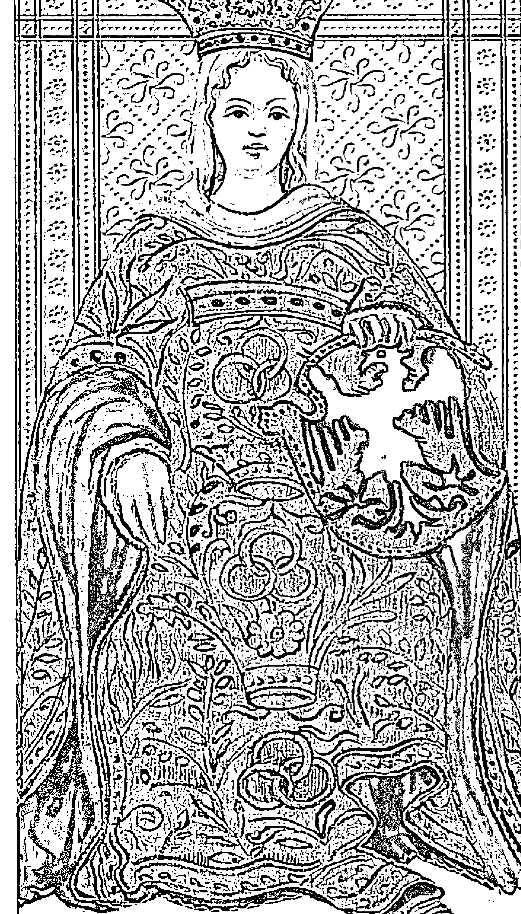

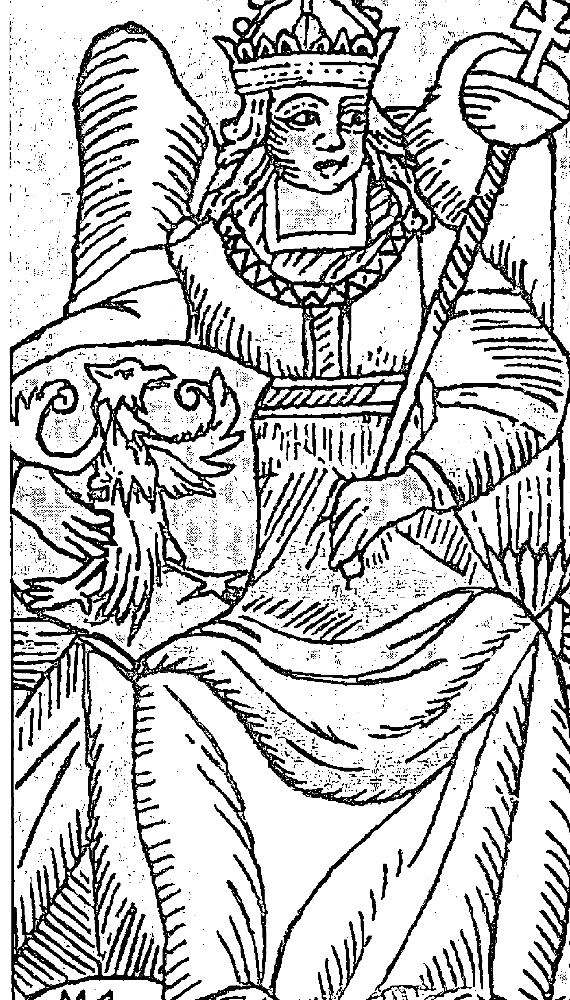

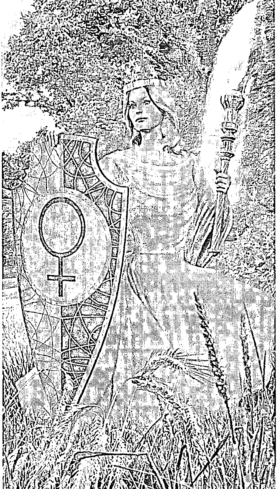

《维斯康蒂塔罗牌》
“女皇”的华服上绣着弗朗西斯科·斯佛尔查家族（Francesco Sforza）的族徽——三个圆环两两相扣的花纹

《马赛塔罗牌》
“女皇”皇冠顶端的样子就像太阳的光芒。皇冠象征她的创造力，也象征她的破坏力

《图匙塔罗牌》
“女皇”的皇冠上镶嵌有十二颗星星，分别代表黄道十二宫（即十二星座）。她倚坐在麦田里，象征普遍意义上的丰富多产。她的盾牌上嵌刻有金星（维纳斯）的符号

## 启示

“女皇”这张牌想要教会我们：不论我们做任何事，都应该倾注自己无限的创造力和激情。

## 不同塔罗牌的侧重点

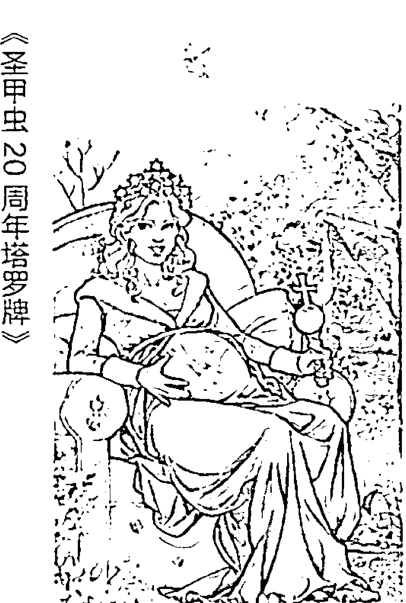

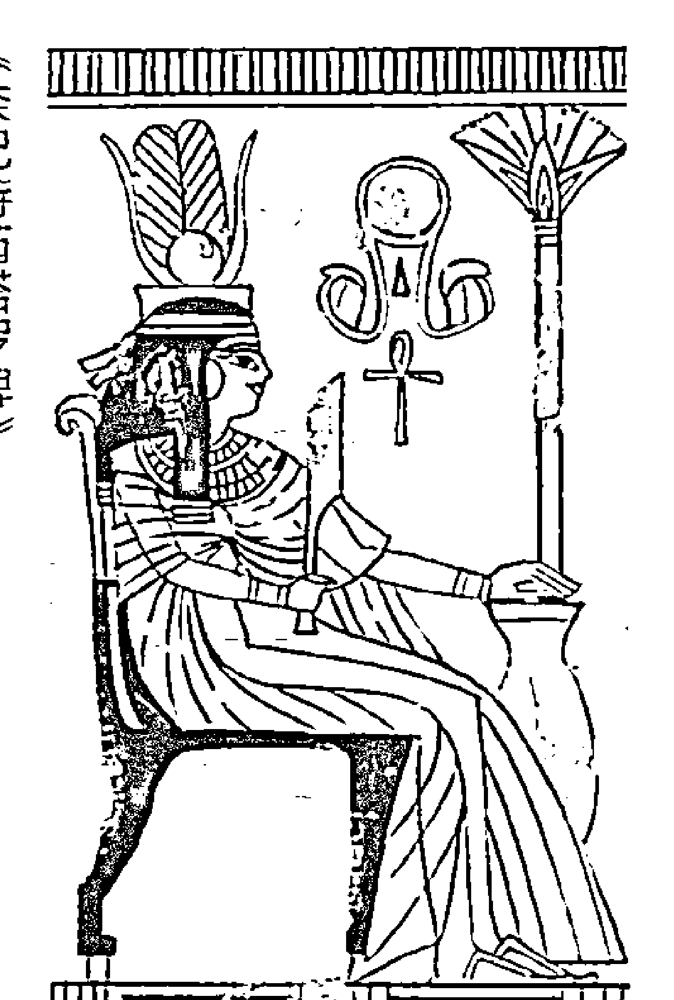

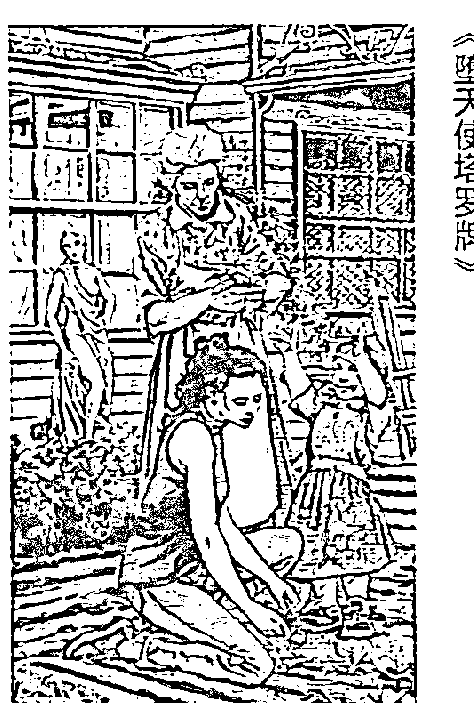

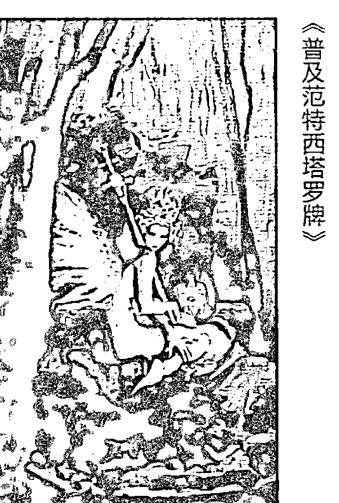

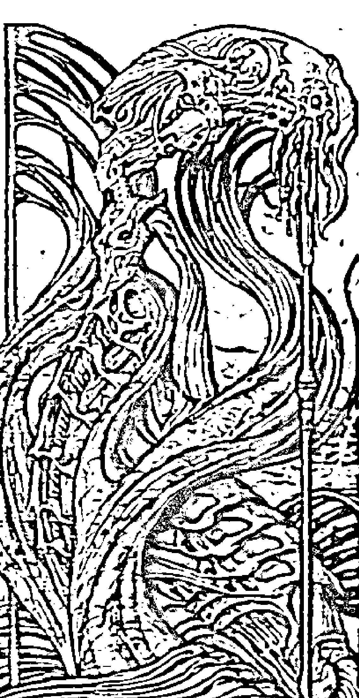

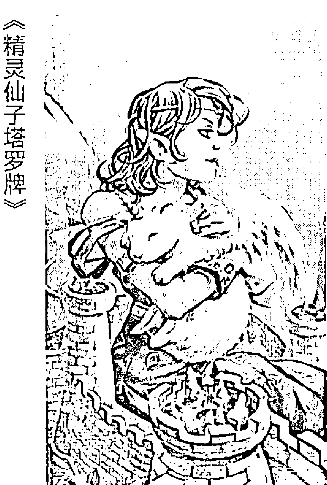

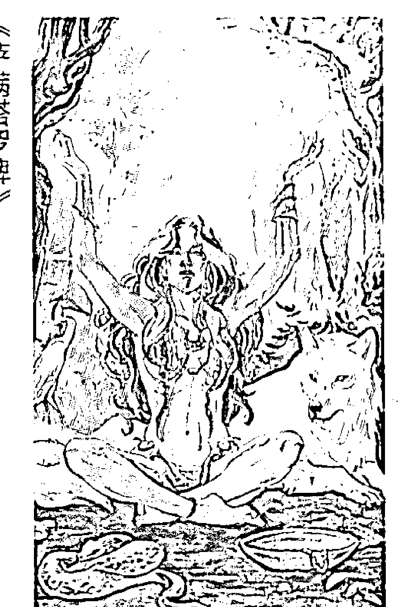

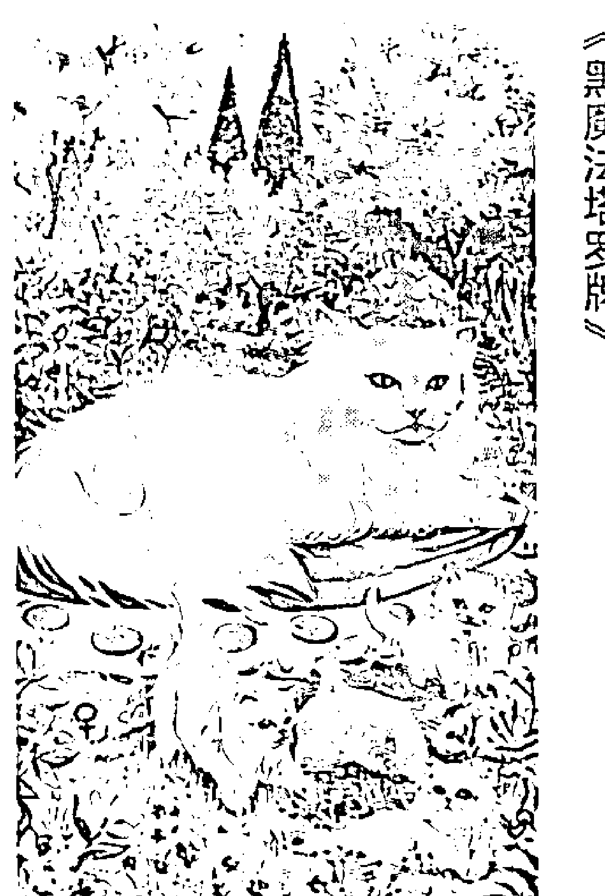

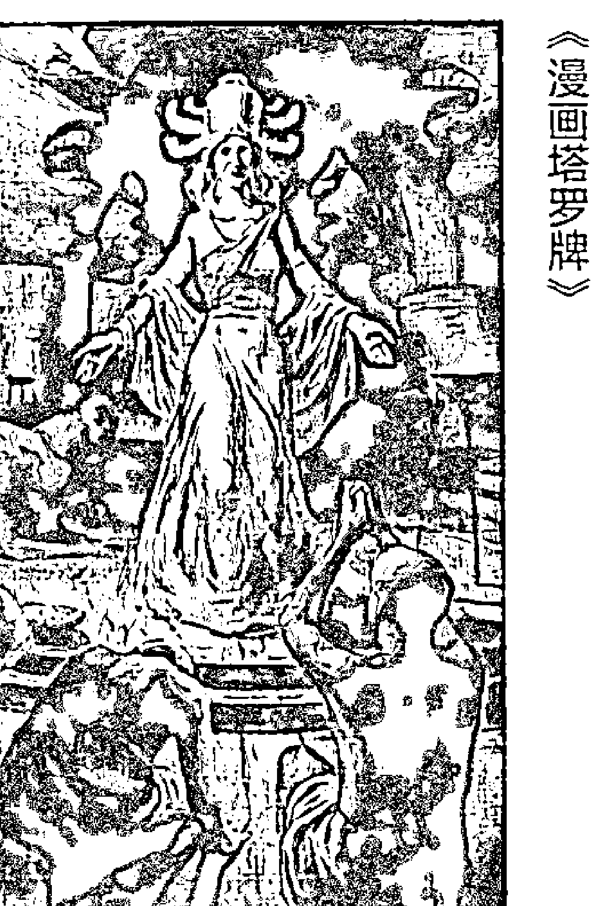

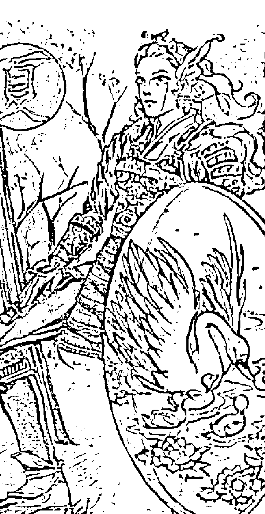

别名
- 母亲 (The Mother)
- 高贵的女皇 (The High Queen)

外延名词
- 维纳斯/阿佛洛狄忒 (Venus/Aphrodite)
- 得墨忒耳 (Demeter)
- 造物主 (Creator)
- 养育者 (Nurturer)
- 仙女教母 (Fairy Godmother)
- 收成之母 (Corn Mother)
- 大地之母 (Mother Earth)
- 母亲 (Motherhood)

## IV 皇帝

### 领域—权威

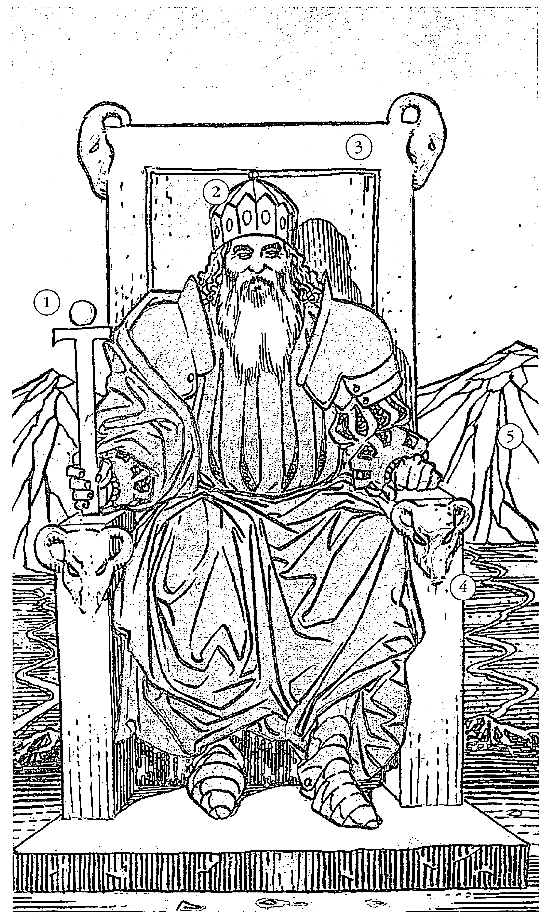

## 象征图案

- 权杖：十字架和上端的球体象征着统治物质世界的力量。
- 皇冠：驾驭情绪和本能的意志力与控制力。
- 王座：不可动摇的权威。
- 公羊头：与白羊座相关联。代表强大的创造力和意志力。
- 山川与沙漠：无法撼动的权力和能够改变物质与精神世界的力量、意志力与权威。


### 皇帝

“皇帝”代表了统治阶层的管理理念。是对统治阶层最有利的权威象征。通过中间人和下属来行使强权。他表现了男性自信、创造性的能量、有针对性的行动和解决问题的能力。“皇帝”代表了最高的父权统治，他的原型是父亲。在现实社会中，“皇帝”可能是民间领袖、军事将领或行政主管、监护人或担保人。

有别于“女皇”所展示的热情，“皇帝”反映了父权统治下的纪律性。他既能理性地制订计划，又能果断地采取行动，是值得信赖的。他安于条条款款带来的秩序感，也享受努力达成目的后的成就感。他就像一个固定的参照物，总是以不变应万变。他不会刻意去表现自己的权威，但你每时每刻都会从他周围感受到这一点，这也体现了“皇帝”超然的心态。他惯于在远处发号施令，很少亲自去做某件具体的事情。“皇帝”是公正的，也代表了纯粹的男性气质。“皇帝”的权力主要体现在物质范畴，而精神领域则属于“教皇”的管辖范畴。

### 皇帝的诉说

> > “你养成的那些习惯和行为模式都受到我的影响/从我们构筑的世界观为出发点，去表达我们的思想/我为你的决策、估量和判断提供动力/那些原本难以驾驭的存在被我赋予了形状与形体/我是你心中想主宰这个世界的那一部分/你我合而为一，让我们去改变，去求证。”

## 传统意义

- 正位：领导力强、克己严谨的人；极度稳定；你的行动结果和劳动果实；强强联手。父亲或扮演父亲角色的人；设定界限，并据此防守。
- 逆位：突然的不稳定；逐渐失去的力量；失控，失态；财产损失。对前路感到迷茫；失控的权威形象。

## 关键词

权威、严格、精确、领导力、自大傲慢、控制支配、统治权、责任、稳固、秩序、权力、政府、父亲、理性主义、纪律、命令、唯我主义、经验、组织、法律、保守、顽固、传统、优势、主权、至高无上、约束、管理、要求、最高统治者、技能

## 牌面对比

这么多年过去了，“皇帝”这张牌几乎没有什么变化。他总是满脸胡须，庄严地端坐在王座上。


《维斯康蒂塔罗牌》
和这副牌里的“女皇”一样，“皇帝”的衣服上也绣着斯佛尔查家族的三环标志。他的左手捧着一个球状物


《马赛塔罗牌》
“皇帝”用侧面对着我们。他身处田园，给人一种朴素且成熟老练的感觉。他双腿交叉站立，这与“倒吊人”和“世界”两张牌里的人物有共同之处


《图匙塔罗牌》
这张牌上，“皇帝”的银色盔甲被他华丽尊贵的袍子完全覆盖。他的王座上装饰的公羊头是白羊座的标志

## 启示

“皇帝”这张牌想要告诉我们: 若你想要提高办事效率、变得更加沉着稳重、成为一个可以依赖的对象, 就必须学会控制自己的情绪。

## 不同塔罗牌的侧重点


## 别名

父亲 (The Father)、至高之王 (The High King)

## 外延名词

父亲 (Father)、宙斯 (Zeus)、战神马尔斯 (Mars)、帝王 (Monarch)、沙皇 (Czar)、首领 (Chief)、莫卧儿 (Mogul)、上帝 (God)、造物主 (Creator)、伟人 (Giant)、暴君 (Tyrant)

## 教皇

### 引导—教条主义

## 象征图案

- 1. 圣柱: 教皇身后的所罗门圣殿的圣柱是严厉与宽容的象征。
- 2. 三重十字架 (又称教皇十字架): 这三横一竖、三横自下而上依次变短的十字架, 代表神学三德: 信 (信仰教义), 望 (祈祷希望), 爱 (慈悲善行)。
- 3. 三重冕: 代表三位一体, 以及在身、心、灵三个层面的指引能力。
- 4. 教皇袍: 在他所关注的精神领域中, 教皇有着十足的权威性。
- 5. 传教士: 通过祈祷和恳求, 与灵性权威对话。
- 6. 裸露双脚: 象征谦逊与远离世俗烦恼。
- 7. 钥匙: 代表指引他人的能力, 也象征着打开知识与智慧之门的钥匙。


如果说“女祭司”是奥秘的守护者，那么“教皇”就是向众人传授这些奥秘知识的普及者。在日常生活中，“教皇”可能是一位向导、老师、顾问，或者是一个道德典范。他传播知识与智慧，也给人真诚的建议，他是传统、习俗和教义的守护者。“教皇”严厉的品质让这张牌有点死板和狭隘的感觉，但同时这些品质也被“教皇”的仁慈、善良和非凡的同理心弱化了。

“教皇”是精神导师，是凡人与神圣之间的桥梁。他是传播者，也是翻译者。信仰是“教皇”一生的选择和事业，是他与生俱来的使命。如果没有足够的宽容，“教皇”的严厉就会变成消极的排斥。但无论如何，最主要的是，“教皇”始终都代表着那扇通向广博知识的大门。

### 教皇的诉说

> “我是灵性知识与物质学问之间的连接通道/这广阔世界里的所有知识我无不知晓/我提供了客观的观点帮你学习/作为回报，我要求你为别人做同样的事情——我教你什么，你就教别人什么/我是你的良师益友，我对你恩重如山/我鼓励你用任何方式向我提问/我的答案时常是从问题中展现的。”

## 传统意义

- 正位: 坚守传统制度规则与道德规范；导师与学生的角色；渴望融入社会；知识学问的大门；迷信；盛大典礼，盛况；并非看到的那样简单；智者；演讲与好的建议；对细节的重视。
- 逆位: 无视忠告；不愿学习；拒绝服从社会规范；抛弃规则；不尊重长辈；非常规；对已有的信仰与传统社会价值观失望。

## 关键词

宗教、信仰、指引、教育、指导说明、导师、教学、知识、制度习俗、信仰系统、传统、教条主义、遵从、祝福、调停者、桥梁、向导、圣洁、沟通、理想典范、智慧、纪律、灵感、建议、宽恕、仪式、和平、帮助、仁慈、等级制度、精神真谛

## 牌面对比

一般而言，“教皇”作为精神世界的最高权威，常常被描绘成头戴三重冕，身穿宽大外衣，做着祝福手势，坐在教皇宝座上的人。


## 启示

“教皇”这张牌想告诉我们：要跟随榜样，并以实际行动带动他人。

## 不同塔罗牌的侧重点


精神领袖


宗教信仰（奥西里斯）


宗教上排斥异己


指引


教条主义


时间的智慧


灵力


导师，讲故事的人


教化


精神遗产

## 别名

- 教皇 (The Pope)
- 主教 (High Priest)
- 萨满 (Shaman)
- 巫医 (Medicine Man)
- 教宗 (Pontiff)
- 圣父 (Holy Father)
- 智者 (Wise One)

## 外延名词

- 罗马教皇职位 (The Papacy)
- 宗教领袖 (Religious Leaders)
- 精神导师 (Spiritual Advisors)
- 古鲁 (Gurus)
- 忏悔告解 (Confession)
- 传教士 (Clerics)
- 元老 (Patriarch)
- 哲人 (Philosopher)
- 救世主 (Savior)

## 恋人

### 选择—爱

- 1. 天使: 圣洁、至高无上的力量、祝福。
- 2. 蛇: 它代表人性的二重性和选择的本质。它一方面代表诱惑与反抗, 另一方面也象征获得智慧和成长。
- 3. 裸体: 在对方面前彻底放下防御, 变得非常脆弱。
- 4. 智慧之树: 智慧让人有辨别善恶的能力, 也让人懂得何为责任。
- 5. 生命之树: 人类的天性、内驱力、上进心。
- 6. 山: 独自做出选择并承担后果。
- 7. 夏娃: 阴性、女性、接纳性。
- 8. 亚当: 阳性、男性、创造性。


这张牌主要表达了自由意志和人类自由选择的能力，这张牌不会告诉你什么是“正确”的选择。任何决定都有好与坏两个方面。有时“恋人”意味着一个必经阶段，比如最初的痛苦的经验。有时，这张牌也代表某种考验或应该拒绝的诱惑。

“恋人”带着强烈的感情和性的意味。它暗示恋爱关系、外表吸引力和一见钟情。爱人之间相互结合，彼此发誓，许诺忠贞，即使在诱惑与妒忌的危险之下依然坦诚相对，绝不离弃。

### 恋人的诉说

> > “我们就是你在生活中做出的选择/我们是普天下所有对立事物的结合体/我们表露了你对人、事、物的渴望和吸引力/我们桥接了对立的事物/你的情爱与欲望都可以激发出创造力/你应该做出明智的选择，用强烈的渴望去感受生命给予的一切。”

## 传统意义

- 正位: 选择；爱情，肉欲与激情；生活中迎来新恋情；兴奋与愉悦；诱惑与吸引力；生命内外的和谐统一。
- 逆位: 一个事件或一段关系发生问题；分手；争吵，需要稳定情绪；出于匆忙或恐惧做出的选择。

## 关键词

激情、性欲、肉欲、选择、联结、愉悦、欲望、吸引力、亲密关系、结合、诱惑、浪漫、爱情、感情、身体、紧张、醉心迷恋、性爱、欢乐、渴望、色情、誓约、联合、决定、协定、联盟、感觉、喜爱

## 牌面对比

通常，这张牌都会被设计成空中有一位天使，它与下面的人物形成了三角形的稳定结构。


《维斯康蒂塔罗牌》
长着翅膀，全身赤裸的丘比特被蒙上了双眼。他手持弓箭，站在基座上。一对王室夫妇在他前面紧握着双手

《马赛塔罗牌》
丘比特飞翔在空中。一个男人站在两个女人中间，他必须做出选择。牌上的人物形象地将人们面对多种选择时的犹豫和疑虑表现了出来。两个女人代表两种完全不同的抉择和结果，象征着选择的二元性本质

《图匙塔罗牌》
这张牌完整地体现出了基督教的本质。牌中讲述的是亚当(Adam)与夏娃(Eve)的故事。两人一丝不挂地站在伊甸园之中。夏娃身后有一条蛇盘在智慧之树上，预示着她即将做出选择。亚当身后的生命之树上结着12颗果实

## 启示

“恋人”这张牌想告诉你：总有一天，你会找到那个可以分享你所有热情的人，在他/她面前你能毫无保留地展现自己。

## 不同塔罗牌的侧重点


## 别名

爱 (Love)、恋情 (Amour)、伊甸园 (Garden of Eden)

## 外延名词

罗密欧与朱丽叶 (Romeo and Juliet)、亚当与夏娃 (Adam and Eve)、罪恶与美德 (Vice and Virtue)、丘比特与普赛克 (Cupid and Psyche)

## 战车

### 胜利—自负


## 象征图案

- 1. 车篷帘饰：星空图案象征着上天对驾车者的关注和护佑。
- 2. 头冠：灵性尊严的高尚。
- 3. 盔甲：盔甲上刻有代表太阳和月亮能量的炼金术符号，象征着战车的动力来自于力量与征服。
- 4. 双翼日盘与盾牌：阴阳平衡，也代表内在的驱动力。
- 5. 狮身人面兽 (Sphinxes)：两种截然相反的选择和方向。虽然两者都在驾车人的掌控之下，但它们也会拉着驾车人进入未知。
- 6. 城墙内的城市：代表驾车人的力量与活动范围被限制在人类领域之中。

“战车”代表通过自己的努力与才华获得成功的人，他享受着成功带来的喜悦。“战车”表明了向前运动的状态。它强调你需要掌控全局。它要求你引导自己（或者他人）的意志和行动，朝着一个既定的方向或目标前进。“战车”这张牌指的就是：清楚地知道自己想要什么，并且知道如何达成目标的人。

“战车”有许多特点，他精力充沛，意志力强，足智多谋，自信十足，热爱冒险且勇于进取。车前的狮身人面兽代表外界对驾车人的影响。这些影响可能存在于驾车人的性格之中，也可能来自外部，比如：其他人对你的影响。“战车”的力量能让你克服所有困难，扫清前路上的一切阻碍。

### 战车的诉说

> > “我就是你的原动力——了解自己想要什么并为之奋斗的力量/我的力量就是你的动机与行动，它助你去往任何你想去的地方/你要制定路线并开始行程，否则我会失去动力/一旦你开始行动，我会变成你的车轮、道路和引擎/你来掌控方向，我为你提供所需的能量/你势不可挡，因为你知道自己必须要做什么。”

## 传统意义

- 正位: 掌舵; 清楚知道自己的方向并采取行动; 选择方向，并坚定前行; 确保成功和胜利; 向着目标前进。
- 逆位: 控制欲过于强烈; 只考虑自己; 受阻、失控; 很难做出正确选择; 偏离轨道; 受困或受制。

## 关键词

进步、奉献、承诺、胜利、能量、自信、纪律、成功、勇气、骄傲、命令、意志力、自我主张、行动、凯旋、旅行、战士、伟大、运动、征服、野心、指令

## 牌面对比

通常，“战车”这张牌上画的是两只色彩对比鲜明的动物拉着一辆车前行。


两匹白马拉着马车，王后手拿金球，坐在车上。这个画面是在向古罗马和文艺复兴时期意大利举行的胜利游行致敬。当时那些饱含寓意的胜利游行，可能就是塔罗牌意象的基础。游行的花车一辆比一辆华丽，就像大阿卡纳的意义一张比一张更加深远重大


马赛牌和维特牌画的都是一个人站在金色战车之上，头戴王冠，手握权杖。他穿着坚硬的铠甲，新月形的肩带上装饰着人脸形肩章。一黑一白两匹马拉着战车向前疾驰。车上有四根柱子，支撑着四方形的华盖


《图匙塔罗牌》比《马赛塔罗牌》的意象更进一步，将拉车的动物改成了两只狮身人面兽，让驾车者的姿势看上去更像一个霸气威武的征服者

## 启示

“战车”这张牌想要告诉我们：要想达成目标，不妨经常加入一些新的创意。“战车”将激励你克服障碍继续前行。

## 不同塔罗牌的侧重点


驾车者的座位


精神与物质的演变


旅行


胜利天使


发展与奉献


向着目标前行


成功的行动(旋转的盾牌)


胜利凯旋


速度


胜利

## 别名

- 速度(Speed)
- 凯旋的战车(Triumphal Chariot)
- 战车驾驶者(Charioteer)
- 胜利(Victory)
- 百夫长(Centurion)
- 灵车(Hearse)

## 外延名词

- 具有煽动性的行动(Inciting action)
- 精神胜利(Triumph of Spirit)
- 目标设定(Goal Setting)
- 航行(Voyage)

## VIII 力量

### 力量—坚韧


## 象征图案

- 1. 双纽线：无限大符号，象征着精神与肉体合二为一产生出平和但坚定的力量。
- 2. 少女的双手：少女双手动作轻柔而有力，代表了她的谦逊和自信。她握住狮子的嘴，显示了她对暴躁和愤怒的控制力。
- 3. 少女：象征道德、正义、理性的力量。
- 4. 狮子：代表肉体和野性的力量，也代表本能与激情的力量。
- 5. 被城墙围住的城堡：显示出真正的力量存在于世俗的权力之外。

## 力量

“力量”这张牌以非暴力的形式表达了能量、冲突与争斗：柔弱的女子驯服了充满野性和危险的狮子。她体现出了理性驾驭本能、宁静胜过暴行、秩序支配混乱的能力。这张牌代表了完成当前任务的能力。你的精力、资源和能力都是为这一目标服务的。这张牌表现的是性格的坚毅、品德的端正、精力的充沛以及身体的健壮。

这张牌常被视作相互对立的欲望或动机出现冲突。它们其中一方必须击败另一方，才能让事情出现转机。而这也许恰恰就是那种能让你克服阻碍、直面恐惧的力量。这种力量即使面对再大的压力也决不会退缩和屈服。它代表着一种智慧，能让人们在不使用暴力的情况下克服那些看似无法逾越的障碍。牌中驯服野兽的少女代表了我们内心最强大的、能够战胜一切的力量。

### 力量的诉说

> > “我是你日益强大的内心力量的源泉，所有事情你都能处之泰然/我为你开路，帮你克服种种困难/不要焦急，你的气质、魅力、优雅和聪慧就是你最好的武器/你要放下兵戎，停止唇枪舌剑/我时刻都在提醒你，你比想象中更强大/回首往昔，你已远涉千里/你能做的远不止于此，就让我们一起去征服这个世界吧！”

## 传统意义

- 正位：精神力量胜过物质力量；运用策略与温和的手段达到目的；比肉体欲望更高的天性；引导巨大力量的能力；性格的坚强；良好的健康状态；温柔。
- 逆位：感觉失去控制；争端、恐惧；滥用权力；残忍、不成熟；屈服于本能。

## 关键词

- 力量、权力、魄力、仁慈友好、自控、自律、温和、耐心、同情怜悯、沉着镇静、坚韧、忍耐、强健坚固、活力、潜能、耐久、健康、优势、平静、精力、慰藉、对立面

## 牌面对比

现代的塔罗牌中，“力量”通常是8号牌，但在许多较为古老的牌里，“力量”是11号牌。


## 《维斯康蒂塔罗牌》

“力量”的牌面上通常画的是一头狮子或一根断裂的柱子。这张牌画的是希腊神话中大力神赫拉克勒斯（Hercules）制服邪恶的尼米亚雄狮的场景。牌面中的人物形象很可能就是根据斯佛尔查本人创作的。它暗示了斯佛尔查家族在米兰及周边地区取得的军事胜利。


## 《马赛塔罗牌》

马赛牌和维特牌中的“力量”都画的是一位衣着华丽的女子徒手掰开了狮子嘴的画面。狮子的尖牙是野兽凶猛残暴的象征。


## 《图匙塔罗牌》

维特牌和马赛牌中，“力量”牌人物的头上都有一个代表无限的“双纽线”符号。《图匙塔罗牌》中，这个符号飘浮在少女的头顶。

## 启示

“力量”这张牌想要告诉我们：提高自控力，战胜我们的弱点，了解真正激励我们的是什么。

## 不同塔罗牌的侧重点


## 别名

- 坚韧 (Fortitude)
- 欲望 (Lust)

## 外延名词

- 坚韧的美德 (Virtue of Fortitude)
- 尼米亚雄狮 (Nemean lion)
- 基本美德 (Cardinal Virtues)
- 大力神赫拉克勒斯 (Hercules)

## IX 隐士

### 觉悟—退隐

## 象征图案

- 1. 胡须：代表隐士随年岁积累起来的智慧，也表明他已经放弃了一切形式的虚荣。
- 2. 头巾：象征了守住隐秘思想的能力，也代表他放弃了自己的本来身份。
- 3. 袍子：代表了隐士的谦逊。他专注于内在的东西，而不在意外表。
- 4. 朴素的鞋：象征路途艰辛。为了求得证悟，他必须做出牺牲。
- 5. 手杖：类似牧羊人的手杖，它象征隐士心甘情愿指引他人。
- 6. 提灯：象征内心之光照亮前路，代表隐士对知识与觉悟的不懈追求。
- 7. 沙漠：象征隐士独自隐居。


### 隐士

“隐士”是保守的。他从不急于下判断和做决定，总是谨慎行事，慎重权衡。他抛弃了一切形式的虚荣，对穿衣打扮或追名逐利毫无兴趣。他完全专注于事物的本质，十分享受孤独所带来的内心的平和。人们都将他视作导师，对于他静默的姿态十分崇敬。

“隐士”是主动选择了孤独，而不是因为恐惧或者不善交际，他只是把这种孤独看作一种探索心灵的必要条件。试想，若身处喧嚣，又怎能安静倾听呢？若不了解自己，如何了解他人呢？“隐士”远离了尘世喧嚣，向内心探索。对于世间的一切，只是知道还远远不够，他还力求去理解并转化为内在的了悟。

### 隐士的诉说

> > “我就是你思考与检视精神真谛、学习智慧和分析知识的所在/你是如此沉迷，以至于忘却了自我/这世上，唯有你才能真正地了解自己/通过反思与自我审视，你将得到全新的自己/当你觉察了内在的真理，智慧将化为光芒，照耀他人/你以身作则，为世人树立榜样/ 而我是上古的智者，永伫于此，为你指引方向。”

## 传统意义

- 正位：向内探索，远离俗世，寻求真理；远离物质世界的纷扰；追寻灵性与真理之光；为自己的人生寻找答案；需要安静独处的时间。
- 逆位：逃避恐惧与责任；过分依赖他人；忽视真相；孤立感或孤独感阻碍你前进；令人精疲力竭的社交活动。

## 关键词

- 孤立、抽离、撤回、内省、孤独、经验、古老、指引、追求、朝圣、缄默、反省、哲学、自省、自给自足、睿智、审慎、苦行、谦逊、冥想、探求、年长的智者

## 牌面对比

通常，“隐士”被描绘成一个右手提灯、左手柱杖、留着白色胡须的老人。


《维斯康蒂塔罗牌》的“隐士”右手持一个时间沙漏。在创作这张牌的时代，“时间老人”这个概念十分流行。“时间”被视为一种能够征服一切的元素。


马赛牌和维特牌里，“隐士”提着一盏灯，它代表智慧之光。


“隐士”站在高原上，被群山环绕，一颗六芒星在他的提灯里闪闪发光。

## 启示

“隐士”这张牌想要告诉我们：去重新发现宁静、冥想、祈祷与感恩的喜悦。

## 不同塔罗牌的侧重点


## 别名

- 驼背者 (Hunchback)
- 时光老人 (Old Man Time)
- 时间老人 (Father Time)

## 外延名词

- 克洛诺斯 (Cronus)
- 时间老人 (Father Time)
- 圣人 (Sage)
- 尤达大师 (Yoda)
- 本·克诺比 (Ben Kenobi)
- 守护使 (Sophos)
- 哲学家 (Philosopher)
- 长者 (Senex)
- 奥丁 (Odin)
- 瑜伽信徒 (Yogi)

## X 命运之轮

### 变革—重复

## 象征图案

- 1. 狮身人面像：代表未被觉察的，处于永恒变化之中的“宿命”力量。
- 2. 上升的人物：埃及死亡之神阿努比斯（Anubis），他掌管死亡及人在死后的命运。
- 3. 坠落的人物：蛇形生物堤丰（Typhon），象征着破坏，也暗示了创造力与破坏力之间的平衡。
- 4. 四个角落上的人物：福音四人像（the Tetramorph），四个空间方向的守护者，他们也是防止世界重归混沌的护卫者。
- 5. 轮盘及炼金术符号：可以看到汞、硫、水、盐四个炼金术符号，轮子象征命运和机遇都在不断循环往复。
- 6. T.A.R.O.四个字母：可以分别读作TARO（Tarot，即塔罗），TORA（Truth，即真理），或ROTA（Wheel，即轮子）。
- 7. 希伯来字母：四字圣名（即表示上帝名字的四个字母），它们分别是：Yod，Heh，Vau，Heh。


## 命运之轮

“命运之轮”转动，所有人的命运都随之下跌宕。“命运之轮”上的符号在塔罗牌问世之前就已经出现，你可以在中世纪的文献手稿和古老的欧洲教堂壁画上发现它们的踪迹。旋转的“命运之轮”预言着所有的权力都将转瞬即逝，一切都是过眼云烟。轮子预示着世间的一切都是暂时的——幸福或悲伤，成功或失败。

轮子象征时间的不断流逝。它的旋转代表时间的周期性和事件的连续性。这张牌描述了大阿卡纳中的过渡与转变阶段。随着轮子的转动，大阿卡纳从人格类型转变为经验力量，那些是我们无法控制的力量。简单地说，它代表一个人运气变得好起来，而在深层次的含意中，它提醒人们要从内在开始做出改变。

### 命运之轮的诉说

> “我是推动时间的永久之力/我今日月星辰无尽延伸，使生命无限延续/命运如潮涨潮落、四季更迭，得意之时升上天际，失意之时坠入海底/唯有以不变应万变，保持平衡，才能处之泰然/在这命运的转折点，你我合为一体。”

## 传统意义

- 正位：新一轮循环的开始；命运的召唤；提醒你一生有起有落；命运发生变化；好运来临；时间流逝；没有什么是永恒的；因果业力；外力的保佑；无法预料之事。
- 逆位：能量阻塞；一连串厄运；必须移除某些事物；自然循环的中断。

## 关键词

- 循环、命运、变迁、周期、改变、变革、可能性、机会、命中注定、发展、活动、扩张、运气、业力、天命、交替、外力

## 牌面对比

“命运之轮”的轮子四周环绕着四位福音传道者。它象征着人类命运的起起落落。轮子里面，刻着T、A、R、O四个字母。


## 《维斯康蒂塔罗牌》

《维斯康蒂塔罗牌》中，卷轴上写着：“我将统治，我正统治，我已统治，我未统治。”我们在这张牌上可以看见时间老人与正义，这也从侧面反映出了那个时代的传统。

## 《马赛塔罗牌》

《马赛塔罗牌》上的人物长着一副兽类的样子。而那使轮子转动的力量是什么，并无人知晓。

## 《图匙塔罗牌》

这张牌有着诸多的神秘学符号。轮盘上面写着“Taro”，也可以被读作“Rota”或“皇家之路”。四个希伯来字母是上帝之名的缩写。塔罗牌中代表四元素的四个生物也在四角上体现了出来。狮身人面像象征着轮子的平衡。而维特牌的构图则将解读者的关注点聚集在正中的轮子上。

## 启示

“命运之轮”这张牌想告诉我们：要去适应命运赋予我们的角色。它允许我们去改变自己的运气，影响自己的未来，创造自己的命运。

## 不同塔罗牌的侧重点


旋转运行


自然循环


圆形


一切都将坠入下方


永恒的时间


旋转的命运


命运之召唤


业力


中心点


变化中的连续性

## 别名

- 命运之轮 (Wheel of Fortune)
- 宿命之轮 (Wheel of Fate)

## 外延名词

- 天意 (Providence)
- 天命 (Kismet)
- 神圣意志 (Divine Will)
- 因果业力 (Karma)
- 宿命 (Fate)
- 命运女神福尔图娜 (Fortuna)
- 六道轮回图 (Bhavacakr a)

## XI 正义

### 正义—律法


## 象征图案

- 1. 头冠：象征着阳光、清醒的头脑以及光明的存在。
- 2. 柱子：正义圣殿的神圣不可侵犯。
- 3. 宝剑：象征理性、逻辑、决定及公正的判断。
- 4. 天平：代表照料、关心、均衡以及精心维护的平衡。
- 5. 帷幕：它将正义背后的东西隐藏起来，因为有时候正义的原因和方式是难以理解的。帷幕也指“女祭司”背后所隐藏的知识精髓。

## 正义

“正义”就是在推动人类灵魂进步的种种冲突与矛盾中寻求平衡的过程。它是思想的独立，是表达想法、寻求答案、知行合一的能力。通过协调不同的需求、愿望与可能，我们都能在自己身上找到这种能力。

“正义”指出，法律与道德并不仅仅取决于个人的主观意见。它们来自于更普世的观念或业力。“正义”手上的天平象征对立面的平衡：头脑与心灵，物质与精神，有意识与无意识。天平反映了判断和辨别是非的能力。她手中的剑直指更高的思维，也象征着分辨正义与否并为之行动的能力。

### 正义的诉说

> “我提醒一下，你得到的那些都来自于你之前的付出/在任何情形下，要保持开放的心态，要秉持公正的态度/当你做出抉择和判断时，也要为他人考虑/若你想寻找答案，我会为你揭晓谜底/我将呈现你的道德之心、毕生事业与努力。”

## 传统意义

- 正位：在法律事务上的良好结果；播下未来的种子；不论面对多大的挑战，都坚持做正确的事；公正客观，全面看待问题；工作、事业与职业；恢复平衡。
- 逆位：法律事务上的负面结果；被蒙蔽了双眼；看不见全部真相；被隐藏的事实；对你而言不公平的优势。

## 关键词

- 守法主义、做决定、调整、公正、公平、平等、感觉迟钝、严格、思维能力、逻辑、平衡、法院、判断、英勇、风度、认可、精确、法律术语、顽固、规则、分配、工作、法律

## 牌面对比

“正义”这张牌保留了它传统的特点：这三张牌上的人物都手持天平与宝剑。一些比较现代的牌，会将“正义”与“力量”的位置对调。


在15、16世纪，代表四大基本美德（即节制、坚韧、审慎、公正）的女性形象十分常见。

在马赛牌与维特牌中，“正义”牌中的人物坐在由两根柱子支撑的王座上。人物头戴王冠，衣着光鲜亮丽，神情坚定不移。

这张牌上的长帘让人联想到“女祭司”，其身后的帷幕挡住了神秘幽深的智慧。牌中女皇的红色衣服象征世俗行为在精神上产生的结果。方正的皇冠代表她坚定的信念以及条理清晰的思维。

## 启示

“正义”这张牌教会我们：保持开放的心态，在面对各种事情时都要保持客观公正，在各种意见中取得平衡。在追寻真理的道路上，“正义”指引着我们，并确保我们对自己的行为负完全责任。

## 不同塔罗牌的侧重点


## 别名

- 平衡 (Balance)
- 公正 (Impartiality)

## 外延名词

- 律法 (Law)
- 业力法则 (Karmic Law)
- 回归法 (Law of Return)
- 相互作用 (Reciprocity)
- 黄金法则 (Golden Rule)
- 法院 (Hall of Justice)
- 雅典娜 (Athena)
- 法律体系 (Jurisprudence)
- 真理正义之神玛特 (Maat)
- 正义女神忒弥斯 (Themis)

## XII 倒吊人

### 超越—惩罚


## 象征图案

- 1. 悬吊梁：象征两种观点或两种状态的分界线。也象征着面对三岔路口，需要做出选择。
- 2. 双腿交叉，双手相交：双手放在背后是无能为力的象征，这意味着他可能是自愿接受惩罚或者自愿做出牺牲。而双腿摆放的姿势则是“世界”这张牌的先兆。
- 3. 树枝：树是生命与知识的象征，它象征了天地合一。
- 4. 倒吊：相反的观点，用全新的视角看待世界。
- 5. 光环：代表通过受难与坚持而获得的启发与智慧。这个古老的符号象征着神圣、力量与英勇。

## 倒吊人

“倒吊人”表现了我们生活中那些艰难、痛苦却又无能为力的时刻。但行动困难只是暂时的。“倒吊人”似乎是主动接受这项考验的。通过这张牌，你所付出的所有牺牲都会引导你走向成长、进步，让你获得对这个世界更深的了悟。“倒吊人”交叉叠放成十字的双腿影射着苦难与牺牲。这是大阿卡纳中第一次涉及“受难”这一主题，但这种不适感正是成长和发展的必经阶段。

“倒吊悬挂”象征某种开始。“倒吊人”代表从一种意识状态到另一种意识状态的转变。他处于两种不同层次的意识状态之间。“倒吊人”象征着换个角度看问题以及能与不同观点产生共鸣的能力。

## 倒吊人的诉说

> “当你用新的眼光和新的视角去接触和看待世界，我会因此而重生/我是你在牺牲自我并在超越舒适的界限后所拥有的一切/倒悬的环境并非理想的休憩之地，但这对你的成长将大有裨益/但你也不能滞留得太久，否则你会因此故步自封，裹足不前/只需定期来拜访我，我就会为你揭晓全新的世界。”

## 传统意义

正位：必要的暂停时刻；对自我与世界的全新认识；自我牺牲时刻的到来；暂停，不确定的状态，停滞；令人惊奇的景象；对某种境况妥协；等待正确的行动时机；进入重要人生阶段的仪式。

逆位：突然爆发的行动；顿悟的时刻；改变方向；灵光乍现；徒劳地挣扎；高明的决定；迅速前进。

## 关键词

倒置、逆转、洞见、停滞、冥想、牺牲、酝酿、胎儿、推迟、怀疑、休息、悬而未决、放弃、被动、接受、沉思、等待、超然、理想主义、过渡、启蒙、漠不关心、乌托邦、惩罚

## 牌面对比

“倒吊人”始终头朝下悬在空中。他双腿交叉，姿态看起来十分放松。


## 《维斯康蒂塔罗牌》

一位衣着光鲜的年轻男子一只脚被拴住，整个人倒挂在横梁上。当时，人们经常把在逃的犯人、小偷或恶棍画成被倒吊的样子，但在现实中不会把他们真正倒吊起来，在那个年代只会偶尔把处决的尸身用倒挂的方式来警示大众。

## 《马赛塔罗牌》

维斯康蒂、马赛和图匙这三副牌的“倒吊人”，都是一只脚被吊起来，另一只脚在后面自由弯曲，形成十字形状。而他的手似乎被绑在了背后。

## 《图匙塔罗牌》

这张牌中的人被悬吊在T字形的绞刑架上。而这T字架是一棵仍在生长着的献祭之树。树上的“倒吊人”面容平静，金光在头顶闪耀，就像基督教殉道者一样。

## 启示

“倒吊人”这张牌教会我们：要挑战自己，在逆境中学会成长，用另一种眼光去看待世界和自己过往的经历。

## 不同塔罗牌的侧重点


## 别名

- 叛徒 (The Traitor)

## 外延名词

- 耶稣受难记 (The Crucifixion)
- 奥丁与世界之树 (Odin and the World Tree)
- 牺牲 (Sacrifice)
- 倒置 (Inversion)

## XIII 死神

### 转变—结束

## 象征图案

- 1. 穿着盔甲的骷髅：收割者、黑骑士都是死亡的化身。
- 2. 印有神秘玫瑰的黑色旗帜：这是生命的象征，预示着死亡是如何与生命相联结的。
- 3. 初升的太阳：象征希望、不朽，肉体的死亡是灵魂全新的开始。
- 4. 倒下的国王：象征着物质世界的所有一切都注定毁灭，不论是国王、孩童或是少女，死神都对他们一视同仁。
- 5. 主教：在祈祷中，向死神的到来投降。
- 6. 掉落的王冠：被打破的陈规。
- 7. 河上的船：生命在永恒的变化中前行。


## 死神

“死神”是一个通用的象征符号。骨骼是我们身体的基础结构，也是物质生命最基本的部分。在很久以前，这张牌被看作是万物终结、黑暗笼罩一切的象征。这里的死亡寓意着人世间一切浮华终将不可避免地走向终结。因着人类不朽的灵魂，我们最终会摆脱物质的束缚，转向精神世界。

如今，“死神”这张牌被当作开始的象征。一切终结中都孕育着新生。它不是字面意义上的死亡，而是关于变化和进化的。死亡总是在不断地发生，尽管它有时候是如此激进、出人意料而又不可阻挡。“死神”将那些琐碎短暂之物，与重要、永恒且真实的存在截然区分开来。

当你看到“死神”这张牌，感觉失落是很正常的。它破坏了安全感，迫使人们去冒险。恐惧源于无法预测接下来会发生什么。只有直面恐惧并且超越它，我们才能得到发展。如果我们能去感受它并允许它的发生，这就是“死神”给予我们最伟大的礼物：它教会我们如何生存。

## 死神的诉说

> “我就站在你身后、你眼前、你身边，注视着你和你所爱之人/我就是：你会感到恐惧却永远无法否认的终结之力/你不能阻挡我的枯骨之手的触碰，正如你也无法阻止季节的更替/结束，亦是开始/请拥抱我，不要害怕/请看着我，接受这结局/当你停止挣扎，你会发现接受这一切就容易多了。”

## 传统意义

正位：事情结束之后的一段悲伤和失落的时期；突然的变化和中断导致新的增长；让人不适的变革；通往另一种生活层面的大门，进入另一个现实的门槛；突然且彻底的改变；释放。

逆位：某些需要改变的东西；延缓不可避免的事物；对未知恐惧；你需要变得勇敢；你正在抗拒某些事物；被恐惧压迫到窒息。

## 关键词

到期、转变、转换、演变、通路、进步、结论、重生、损失、释放、转化、净化、消灭、变革、不可逆转、起始点、彻底、通往另一世界的入口、宿命

## 牌面对比

“死神”迈着他稳健的步子，不可阻挡。每个人都在他面前倒下，无论他们的地位、权力或本质如何。


一具骨骼纤细的骷髅，握着一张弓，很随意地站着。他的身后，是一片起伏不平的山峦。


“死神”拿着一把用来收割庄稼的锋利镰刀向前走着。在基督教文化中，“死神”被看作“灵魂的收割者”。所以塔罗牌中的“死神”总是拿着一把镰刀。在他脚下，人的头、手、脚散落一地。其中一个人头上戴着王冠，象征着被摧毁的权威。


“死神”穿着黑色的袍子，像个法官一样坐在骷髅做成的宝座上。在两座高塔之间，金色的曙光如同太阳一般升起。对这张牌的理解，很大程度取决于你认为太阳是在升起还是在落下。

## 启示

“死神”这张牌想要教会我们：放下过去，珍惜现在。当改变来临之时，张开双手去拥抱它吧。

## 不同塔罗牌的侧重点


## 别名

- 无名之卡 (The Unnamed Arcana)
- 结束 (End)

## 外延名词

- 死亡 (Death)
- 死亡仪式 (Dying Rites)
- 自然循环 (Nature's Cycles)
- 园艺 (Gardening)
- 残酷收割者 (Grim Reaper)
- 死亡天使 (Angel of Death)
- 冥王哈迪斯 (Hades)
- 死亡圣神 (Saint Death)
- 光明与黑暗的天使 (Angel of Light and Dark)
- 死亡之舞 (Danse Macabre)

## XIV 节制

### 调节—妥协

## 象征图案

- 1. **白色翅膀**: 长着翅膀的天使代表着宇宙给予人类的治愈与抚慰的仁慈意图。
- 2. **小径**: 在理性思考与灵性认知之间的行程。
- 3. **太阳与山峦**: 挣脱物质与理性世界的束缚，升华到灵性层面。
- 4. **水**: 象征生命、情绪及净化。天使一只脚在岸上，另一只脚踩在水中，代表着在精神与物质能量之间取得平衡的能力。
- 5. **太阳符号**: 炼金术中象征太阳的符号，代表着转化的力量。
- 6. **花**: 代表和平、交际与耐心。
- 7. **转化**: 象征温和的变化，去掉一切多余的东西。


## 节制

“节制”给人一种平和的感觉，象征着柔和、纯真与和平主义。天使的每一个动作都传递出无限的甜美与优雅。通常大家都认为，天使倾倒杯中的水，是在将水变作酒。随着混合而带来的能量交换是“节制”这张牌的本质。以更加克制的方式表达激情，使之远离暴力和无度，也代表相互对抗的事物在彼此的关系中生存、交流和兴盛。“节制”也象征着治愈与恢复。

许多人都会按照“节制”的字面含义来理解这张牌，比如社会运动中颁布的“禁酒令”。这种解释对于减少不健康的东西是很有用的。这也是我们下一张“恶魔”牌所要面临的主题。

这张牌还包含了“磨炼”某个事物的含义。这意味着为了提高能力和技巧而做出的努力，比如说锻造一把宝剑，让它变得更加锋利。这张牌中所表现的勤奋工作和下一张“恶魔”牌中所表现的守株待兔形成了有趣的对比。

## 节制的诉说

> “我就是你的欲望与需求、思维与情绪的均衡交点/若你需要磨砺技巧、增进任务或完善才能，我就在你身边/你在凡事中都能找到平衡点的能力就是我的展现/我提醒你要找到心如止水的核心所在/我们一起坚守在模棱两可的境地，直到新机会的到来/当前路清晰而真实，让我们一起行动，你带着天使的恩典。”

## 传统意义

正位：协同作用、平衡、均衡；适应，将对立面合二为一的能力；重生与实践；调和；关心、恢复、治愈。

逆位：不平衡，感到紊乱；感染或被暴露于疾病之中；在很多方面妥协；不要试图取悦所有人。

## 关键词

- 磨炼
- 恢复活力
- 调和
- 循环
- 和谐
- 治愈
- 仁慈
- 健康
- 恢复
- 综合
- 均衡
- 匀称
- 适度
- 适应
- 重生
- 混合
- 耐心
- 炼金过程

## 牌面对比

“节制”是四大基本美德之一，它的图案是自古以来流行的标志性形象。因此，许多塔罗牌中对“节制”这张牌的描述都非常相似。


这张牌中的人物站在陡峭的悬崖边。文艺复兴时期，四大基本美德的人物通常是女性形象，而非天使，所以没有翅膀。


马赛牌和维特牌中，“节制”被描绘成长着翅膀的天使。她手中罐子里的水像是一股神奇的能量，可以不受重力法则的限制。


“节制”穿着长长的衣服，胸前印着金色的符号。他/她一只脚在水中，一只脚在岸上。一条小径从水边蜿蜒到远处的山顶，这个意象会在“月亮”牌中再次出现。一顶金黄色的王冠在远处闪闪发光。

## 启示

“节制”这张牌教会我们：将生活的方方面面和谐地结合起来，不要带着紧迫感和焦虑去行动。

## 不同塔罗牌的侧重点

- 《圣甲虫20周年塔罗牌》
  
  调和
- 《奈妃特芮塔罗牌》
  
  适度
- 《异教徒塔罗牌》
  
  全身心地工作
- 《堕天使塔罗牌》
  
  无中生有
- 《普及范特西塔罗牌》
  
  耐心
- 《精灵仙子塔罗牌》
  
  共存
- 《萨满塔罗牌》
  
  灵性治愈
- 《异教徒猫咪塔罗牌》
  
  恢复
- 《黑魔法塔罗牌》
  
  疗愈
- 《漫画塔罗牌》
  
  净化

## 别名

- 疗愈者（The Healer）
- 仁慈宽容（Mercy）

## 外延名词

- 基本美德（Cardinal Virtues）
- 印度教（Hindu Dharma）
- 原谅（Forgiveness）
- 谦逊（Humility）

## XV 恶魔

### 激情—过度


## 象征图案

- 1. 恶魔：代表缺乏教化的、邪恶的意图和被黑暗的欲望所奴役。
- 2. 倒置的五芒星：路西法的符号，象征着权力和德行的堕落。
- 3. 枷锁：我们会因沉溺于自己的欲望与恐惧而失去自由。
- 4. 向下的火炬：因无知和愚昧被奴役。
- 5. 人类：“恋人”牌中的人物的写照。
- 6. 石块：对物质世界的关注阻碍了人类的觉悟和灵性觉醒。

## 恶魔

“恶魔”代表了人类堕落的形象:愤怒、懒惰、欲望、贪婪、嫉妒与傲慢。“恶魔”是邪恶的化身,他会诱惑你走向毁灭。他宣扬唯我独尊,忽视责任,屈服于软弱,只跟随欲望行事。“恶魔”将个人自私的需求凌驾于他人的需求之上,他代表人类的缺点。

“恶魔”无度的放纵和享乐,让人产生严重的依赖,甘愿为之驱使。沉溺于毒品、酒精和性爱,对自己和他人的操控,毁灭性的行为,都在这张牌上有所体现。他动物本能般的吸引力是如此让人神魂颠倒,却又盲目空虚、乏善可陈。“恶魔”是人类内心阴暗面的真实写照。

## 恶魔的诉说

> “我是人们只顾自己享乐和放纵的那一面/人们痴迷于我,崇拜我,甘愿做我的替罪羊/来,靠近一点,让我好好端详你/没错,快过来/我要跟你说些悄悄话/我就是你能想象到的最诱人的尤物/我会让你的每一个痴心妄想和欲望都心想事成/金钱、名誉、性、爱情甚至是复仇,如果你想要,我就通通给你/你只需付出一丁点的代价/我告诉你,生活中发生的那些事情你都可以无动于衷,但享乐是绝对不能停下来的/切记,是我们内心的光明与黑暗的并存使我们趋于完整/来吧,再近些。”

## 传统意义

- 正位: 关于权力和控制的议题; 做出对自身不利的选择; 做一些完全错误的事情; 被他人欺骗; 上瘾、屈服; 虐待他人; 当局者迷; 从好奇到痴迷。
- 逆位: 克服某种瘾; 跨越过去的障碍; 不再沉迷于某物而变得自由; 谨慎行事。

## 关键词

阴影、虚假、禁止、物质主义、沉迷、焦虑、享乐主义、愤怒、诱惑、怀疑、邪恶、徒劳、控制、权力、性欲、创造力、依赖、冲动、禁忌、滥用、不道德、嗜好、自私、魅力、情绪、激情、本能、利己主义、欺骗、阴暗面

## 牌面对比

“恶魔”残暴可怖，他将一男一女变成了自己的奴隶。这一男一女让人联想到“恋人”这张牌中的亚当和夏娃。

原版的《维斯康蒂塔罗牌》中的“恶魔”“高塔”“星币骑士”和“宝剑三”这几张牌已经遗失。现在我们看到的“恶魔”是现代塔罗设计师后来重新补绘的。

马赛牌和维特牌里的“恶魔”，都长着一对蝙蝠翅膀，站在石座上。“恶魔”的脚两边各站着一个人，他们能轻易地挣脱脖子上的枷锁，却甘愿被奴役。《马赛塔罗牌》的“恶魔”有着女性的乳房和男性的生殖器，脚趾像爪子一样。

“恶魔”的头上长着两只角，顶着一个倒置的五芒星。“恶魔”左手拿着火把，照亮了他脚下的两个人。这两个人长着尾巴，全身赤裸着被拴在“恶魔”脚下的底座上。维特系的“恶魔”牌影射了“恋人”牌的阴暗面。

## 启示

“恶魔”这张牌想要告诉我们：不要受到负罪感的影响而沉溺放纵，它会帮助你读懂自己内心的黑暗。

## 不同塔罗牌的侧重点

阴影

服从

压力与控制

引诱

强烈的欲望—莉莉丝（Lilith）

饥饿与贪婪

欺骗

徒劳

黑暗面

使人麻痹的恐惧

## 别名

- 撒旦（Satan）
- 路西法（Lucifer）
- 别西卜（Beelzebub）
- 伊比利斯（Iblis）
- 利维坦（Leviathan）
- 靡非斯特菲勒士（Mephistopheles）
- 暗黑王子（Prince of Darkness）
- 黑魔王（Dark Lord）
- 诱惑者（The Tempter）

## 外延名词

- 魔罗（Mara）
- 骗子（Trickster）
- 恶魔（Demons）
- 堕落天使（Fallen Angel）
- 替罪羊（Scapegoat）
- 歌德的《浮士德》（Goethe’s Faust）
- 弥尔顿的《失乐园》（Milton’s Paradise Lost）

## XVI 高塔

破坏—摧毁

## 象征图案

- 1. 闪电: 来自上天的愤怒击中了这座人类之塔。
- 2. 火: 破坏的力量是通过吞噬一切而获得的。
- 3. 坠落的人: 一个个生命掉进无序的混沌之中。他们所知道的一切都被摧毁了。
- 4. 高塔: 正如《圣经》中的巴别塔, 这座塔是由傲慢与自私搭建起来的。这是人们修造来给自己提供安全保障的, 但实际上它更像是一座灵魂的监牢。
- 5. 窗户: 象征着我们对于人类存在的三个层面（即身、心、灵）的理解是如何分崩离析的。

## 高塔

“高塔”被认为是我们为囚禁自己而修建的牢笼。我们像俘虏一样被禁锢在铁窗和高墙之后，却不自知。也许是为了安全，或者是出于无知，我们选择了继续留在“高塔”里。一旦“高塔”倒塌，我们就能从废墟中爬出来，进入更广阔的世界。因此，“高塔”就是沟通与变革的开端，它的倒塌就意味着宣泄和能量的释放。

“高塔”暗示你要离开你的安全区，改变你的想法和周遭的环境，去开拓未知的领域。不论“高塔”让你多么不安，想要到达最终的“世界”牌，你就必须要穿过它。“高塔”矗立在那里，就像唤醒人们的警钟，像瞬间的顿悟，或是宣告生命即将迎来重大改变。

## 高塔的诉说

“我是你内心的破坏王，那些从一开始就不合适的事物被我摧毁得荡然无存/我是如此地出其不意，如此地才华闪现，我是那平地一声惊雷，令一切事物发生/我不轻易现身，但只要我一出现，现有的那些事物都会被我撼动，直至崩塌，这样一来，你就可以重建那些原本没有发挥出应有作用的事物了/你不必惧怕我带来的摧毁，这对你的成长是至关重要的/经历摧毁与重建之后，你的人生会变得更好，意志更坚定，头脑更清晰/来吧，请拥抱全新的自己！”

## 传统意义

正位：令人震惊的问题；在遭遇意外的彻底摧毁之后，迎来新的成长；抛弃某个重大但对你来说已不再重要的事物；势在必行，必须有所改变。

逆位：经历悲惨事件之后变得麻木不仁；事情、境况不像看起来那么糟糕；内在的冲突需要被激发并显现出来；戒掉旧习惯。

## 关键词

- 摧毁
- 下降
- 崩溃
- 通路
- 震惊
- 闪电
- 泄露
- 爆炸
- 离婚
- 争端
- 阉割
- 揭露
- 解放
- 大灾大难
- 启示
- 极度兴奋
- 颠覆
- 惩罚
- 失和
- 分开
- 谦逊
- 混沌
- 碰撞
- 爆发
- 幻灭
- 放逐
- 囚禁
- 搬迁
- 破碎
- 残暴

## 牌面对比

即使在最现代的塔罗牌中，“高塔”这张牌都保留了它最初的特质。

《维斯康蒂塔罗牌》
早期的《维斯康蒂塔罗牌》中是没有“高塔”这张牌的。这张牌有可能在很早的时候就遗失了（一起遗失的还有“恶魔”“星币骑士”与“宝剑三”这三张牌），也有可能在最初的时候根本就没有创作这张牌。这张“高塔”是由现代艺术家重绘的。

《马赛塔罗牌》
马赛牌与维特牌中，火焰烧毁了（或是弓箭射中了）本就危机四伏的高塔，两个人从“高塔”上跳下来不幸身亡。塔身有三扇窗户。天空中，五颜六色的雨滴纷纷坠落。

《图匙塔罗牌》
来自上天的愤怒击中“高塔”，塔上燃起熊熊大火，国王与王后（傲慢与骄傲的化身）径直落下，一命呜呼。

## 启示

“高塔”这张牌帮助我们去接受生命中的失去，去克服外在的阻碍和内心的重重顾虑，为新的成长和发展腾出足够的空间。

## 不同塔罗牌的侧重点

崩溃

倒下

拒绝

推翻

启蒙

解放

消除

混沌

巨大的灾难

东山再起

别名

教堂(House of God)、霹雳(The Thunderbolt)、摩天大楼(Skyscraper)

外延名词

通天塔/巴别塔(Tower of Babel)、地狱的折磨(Harrowing of Hell)、拙火经验(Kundalini Experience)、突破(Breakthroughs)、断裂点(Breaking Points)

## XVII 星星

### 希望—无限

## 象征图案

- 1. 八角星：象征精神世界中灵魂的纯洁。
- 2. 七颗星星：象征传统占星学中已知的、影响人类世界的七大星体：太阳、月亮、水星、金星、火星、木星和土星。
- 3. 树与鸟：鸟指的是赫耳墨斯之鸟，树与鸟将人间与天堂连接起来。
- 4. 水：象征最纯粹、最原始的生命与精神能量。
- 5. 水壶：一只水壶中的水被倒进池塘中，另一只水壶中的水流到了岸边的土壤里。寓意着：如在其上，如在其下。
- 6. 裸体的女人：阴性能量在灵性层面的最高体现，不仅仅代表母亲，也代表着万事万物之间的内在联系。

## 星星

“星星”代表了美丽与智慧的至纯形式，这张牌是真理与悟性的象征。“星星”排列在极具冲击力的“恶魔”与“高塔”之后，就像一道光，将黑暗照亮。它是愤怒之后的沉默，是抚慰灵魂的良药，是暴风雨后晶莹剔透的平静。这就是终极的平和。

“星星”的解读较为积极向上。它象征着头脑清晰明了的状态，能够有先见之明，预见一个美好的未来。这张牌是艺术家与第六感的联结：灵感的源泉和源源不断的创造力，而这缓缓流动的水，便是希望。

## 星星的诉说

“我是暴风雨后的安宁/这种安宁给人静谧、广袤、空灵、祥和与疗愈的感受/在经受了巨大的挑战后，你就会找到我/我手中的清澈水流将荡涤你的灵魂/当你证明了自己，我会告诉你，你的潜力会造就出任何的可能性/宁静如我，柔软而脆弱，但从这里会滋生出快乐与自由/拥抱我吧，你会在清凉的灵感中感受到一丝暖意。”

## 传统意义

- **正位：** 被激发的魅力、信仰与希望；复兴与美丽；完美的平衡，灵感闪现；允许自己放开心态；和谐之道，积极正面并有远见的工作；伟大的爱。
- **逆位：** 堵塞与阻碍；拒绝了指引与帮助；需要放松和休息；允许自己变得脆弱；令人窒息的黑暗。

## 关键词

希望、乐观主义、开放、平静、信任、快乐、安宁、实质、重生、灵感、和谐、信仰、慷慨、宁静、理解、清晰、洞悉力、复兴、宇宙、灌溉、净化、美丽、远见、指引

## 牌面对比

“星星”是塔罗牌中第一张天体牌，在它之后，还有“月亮”“太阳”与“世界”。它们象征着整个宇宙，也代表着行星和恒星对我们的影响。

牌中人物伸出左手握着“星星”。她身穿优雅的蓝色长袍，站在悬崖边上。美丽的天堂和浩瀚的宇宙也仿佛被她拉近了。

马赛牌与维特牌里都描绘了一名年轻的女性。她赤身裸体，长发披肩，单膝跪在地上工作。她将手中罐子里的水分别倾倒在池中和地上。一只鸟栖息在她身后的树上。天空中有一颗巨大的星星，闪耀出八道光芒，七颗小星星闪烁着灿烂的星光点缀在周围的夜空中，将她照亮。

女人右手罐子里的水流进了池塘，左手罐子中的水则被倾倒在地上，她身后的生命之树上站着一只白色羽毛的鸟。一颗巨大的星星被许多小星星围绕着，闪耀着八道光芒。

## 启示

“星星”这张牌想要告诉我们：要坚信一切皆有可能。这将帮助我们带着希望和正面的能量去展望未来。

## 不同塔罗牌的侧重点

## 别名

- 星星 (The Stars)

## 外延名词

- 占星术 (Astrology)
- 水瓶座 (Aquarius)
- 缪斯 (Muse)

## XVIII 月亮

### 秘密—幻想

## 象征图案

- 1. 月亮：阴性特质的象征。阴晴圆缺、潮涨潮落，都是自然的更迭。
- 2. 光线：对应了生命之树。
- 3. 夜晚：象征着意识的阴暗面，理性的沉睡，也象征梦和无意识。
- 4. 高塔：分别象征着夏至与冬至。它们像“门”一样将一年分成了两个部分。
- 5. 狗：幻觉与直觉之间的二元性。
- 6. 小龙虾：暗示心智正在形成并且变得更加真实。
- 7. 道路：最初的道路将引领你通往更深的奥秘。

## 月亮

“月亮”这张牌寓意着女性特质、水体以及自然循环。它唤起不同程度的变化和转变（比如狼人或涨潮）。“月亮”总是来来去去，不停地运转，照亮了夜晚的风景。在月光中，事物看起来总有些奇怪、诡异或者超自然。但如果没有她，我们将独自陷入无边的黑暗之中。月亮，是梦境，是隐秘的欲望，是灵魂生动的想象。

月光是一种反射，是未知的神秘。它照亮了我们兽性的本能—狗、狼以及从河底爬上来的小龙虾。一切都是幻象，虚假而短暂，就像烟雾一般，消失又再现。月亮代表创造的能力，以及通过直觉（非理性的方式）去接收信息从而发现隐秘事物的能力。她象征着一切神秘、魔法和超自然。

## 月亮的诉说

> “我在你的潜意识里说话，我造就了梦境、幻觉和幻想/潜意识里的一切都是子虚乌有、镜花水月，唯有在这里我们才能避开白昼那刺眼的强光/来，抱我一下，让我看看你面具之下的真实模样/无论你压抑与否，你心中的原始冲动和情绪都会在我这里找到出路/因为，我是你心灵的阴影。”

## 传统意义

- **正位**: 直觉感知；精神失常，梦境与欺骗；事件的古怪之处，奇怪的感觉，月狂症；强烈的通灵意识的闪现和冲动；不稳定的境况。
- **逆位**: 某人在说谎；你需要倾听直觉的声音；远离本性。

## 关键词

梦境、周期、无意识、不安、怀疑、幻想、幻觉、想象、浪漫主义、奇怪、疯狂、危险、欺骗、头脑清晰、挣扎、迷信、秘密、感受、颠覆、吸引力、本能、幻象、洞察力、敏感、应用、通灵能力、魔法、界限、神秘学、自我阴影

## 牌面对比

“月亮”这张牌最初的牌面上画的是一位女子，后来慢慢演变成月亮照亮了一汪池水。

《维斯康蒂塔罗牌》的“月亮”牌和“星星”牌比较类似：少女站在悬崖边，右手持一弯新月，左手牵着自己的腰绳。

马赛牌和维特牌的“月亮”图案中，一轮巨大的月亮在夜空中散发着光芒，照亮了大地。月光是阳光的反射。大地之上，两只狗对着月亮嚎叫；一只虾从池中慢慢爬上岸。两座高塔矗立在画面的左右。

与水中浮现的怪物相比，用狗来表示内心的恐惧显得更加温和。“月亮”就像是一段从黑暗的水域深处延伸到最高山峰的旅程。它让人联想起“节制”牌中那条同样的路径。这张牌所发出的召唤是不能也不应该被忽视的。

## 启示

“月亮”这张牌想要告诉我们：不要在意别人的想法，自由地表达自我，探索自己内心的欲望。

## 不同塔罗牌的侧重点


二元性


神秘学


施展月之魔法


挣扎


幻觉与真实


情感与直觉的世界


欺骗与谎言—月之幻象


月光阴影下的奇异感


精神失常，潜在的怪物


梦境

## 别名
神秘（Mystery）、女神（The Goddess）

## 外延名词
月狂症（Moon Madness）、心理现象（Psychic Phenomenon）、精神错乱（Insanity）、睡眠（Sleep）、梦（Dream）、幻想游戏（Fantasy Play）

## XIX 太阳

## 光明—真理

## 象征图案
- 1. 太阳：象征阳性能量，真理与智慧。光明总能战胜黑暗。
- 2. 向日葵：代表寻求光明、跟随光明的意愿。
- 3. 墙：自我觉察与自我忽视这两个维度之间的界限。
- 4. 儿童：象征着纯粹的简单、天真与无忧无虑。
- 5. 马：人类的动物性、物质性与更高的自我和谐共处。
- 6. 红色的旗帜：象征着荣耀、力量、创造力及生命力。


## 太阳

“太阳”是白昼的主宰。他的光芒是如此炫目且独一无二，所及之处，没有黑暗，没有阴影。我们能凝望月亮许久，却从来不能直视太阳。在塔罗中，阳光总是和生命、真理、正义、正直联系在一起。充足的阳光常被理解为财富、幸福与健康。而“太阳”本身也被视作一切形式的胜利、生活的欲望和喜悦。如果说“月亮”象征着阴柔层面和接纳的本质，那么“太阳”则代表了阳性层面，广阔而积极。

在智慧层面，“太阳”代表着真理和沟通能力；在现实层面，他象征着胜利、成功、认可或荣耀。“太阳”就是保持觉察的精神和状态，是重新建造的一个天真无邪的世界。他也象征着强健的身体与正常的妊娠。

### 太阳的诉说

> “我为世间所有生命提供了光芒、快乐与能量/我象征着孕育与生长/我在你的思想里注入活力，给你的内心赋予爱/我知道你的一切，所以你无法对我隐瞒/我的能量足以让你的愿望与美丽得以展现/不要急于走进暗夜，你可以昼夜驻足，感受我的光芒照射在你肌肤之上的能量/我是夏日的炽热艳阳和冬日的和煦暖阳/记住，我是你的太阳，而你也是他人的太阳/好了，请和我一起闪闪发光吧。”

## 传统意义
- **正位：** 源源不绝的能量；清澈明晰、充满快乐的时光；扩张与生长；健康的身体，良好的怀孕状态；真理与光明；通透、庆典；童年之乐；完全的丰盛富足。
- **逆位：** 筋疲力尽；失去外界的支援与帮助；沮丧；因处于某种盲目的状态而陷于危险之中；太过耀眼，光芒太盛。

## 关键词
成长、能量、清晰、荣耀、丰盛、幸福、成功、婚姻、热量、爱、觉察、光辉、光明、进化演变、财富、夏季、童年、友谊、扩展、光彩、才华、欢乐、热情、乐观主义、启蒙、和谐、诚实、团结、慷慨

## 牌面对比
在以下三张“太阳”中，都将健康的身体、洋溢的热情以及活力四射的青春表现了出来。


维斯康蒂版的“太阳”上，画了一个长着小翅膀的小天使。这个小天使偷走了天空中的太阳，踩着云朵飞过高山峻岭


《马赛塔罗牌》上画了两个翩翩起舞的小孩。阳光洒落在他们裸露的肩头


这张牌上画了两个全身赤裸的小男孩。其中一位骑着白马，另一位赤脚站在草丛中，他们在阳光普照的大地上，将一面红色的旗帜展开

## 启示
“太阳”这张牌告诉我们：要直截了当，看到问题的核心，保持清醒的头脑，理性地解决问题，而不应该自欺欺人或掩盖真相。

## 不同塔罗牌的侧重点


乐观主义


和谐的光芒


夏日


察觉


团结与发展


沐浴阳光


日光之舞


和谐与分享


光芒驱散黑暗


生活在光芒之中

## 别名
光（The Light）、神明（The God）

## 外延名词
太阳能（Solar Energy）、阿波罗（Apollo）、大自然（Nature）

## XX 审判

## 重生—觉醒


## 象征图案
- 1. 天使：更高层次的秩序，不可否认的真理。
- 2. 云朵：象征未知领域及精神世界，暗示了想要洞悉一切是不可能的。
- 3. 十字架：象征空间、方向、宇宙的秩序以及对立事物之间的平衡。
- 4. 号角：信息的沟通交流，警钟敲响，我们必须做出回应。
- 5. 人：象征家庭、人类，也象征具有不同身、心、灵的独特个体的重组。
- 6. 坟墓：死亡与复活的象征。

## 审判
“审判”象征意识的觉醒。天上的神灵吹响号角，它反映了人类的灵魂对来自上天的召唤做出回应。显而易见，这张牌指的是基督教所提到的最终审判：神的使者向世人宣告，世界将要毁灭。时日无多，善恶终将分明。这是一个简单的比喻：寓意着我们可以通过审判来实现人生的蜕变和重生。

这张牌有时也代表信使。其中最重要的是它意味着终结。“审判”是大阿卡纳倒数第二张牌，它吹响了最后的号角，预示着一切都将终结。不管是好是坏，此时此刻，都已成定局。这张牌意味着等待结束，奖赏到来，以及另一个世界的大门打开。那是一个如同织锦般精美、复杂而又丰富多彩的世界。

### 审判的诉说
> “我的出现标志着你的生活发生了巨变/你正在经历转变，你已经无法回头了/你身后的道路已经坍塌/即使我令你感到不舒服，你也要拥抱我/发生变故时，人们常常暴露出自己的弱点/请聆听我的召唤，你会达到一个全新的高度，不要往下看，也不要害怕/你是安全的，你是闪耀的，你正在获得新生。”

## 传统意义
- **正位：** 聆听并回应了那即将带领你进入新世界的号角；彻底的内部转变；放飞自我，生活在更高的层次；世间事物不会一成不变；响亮的警世钟。
- **逆位：** 应该做的事情没有做；违背真实的本性；隐瞒真相；抗拒变化。

## 关键词
启示、复活、考验、重生、赦免、救赎、希望、和解、释放、重新开始、拯救、召唤、复兴、超越、出现、家庭、觉醒、更新、召唤

## 牌面对比
在所有早期的塔罗牌中，“审判”的牌面都保留了相似的意象。


《维斯康蒂塔罗牌》：这张牌的原名叫作“天使”，它带来了最终审判。因此，后来这张牌慢慢演变成“审判”。在上帝的监督下，两位天使吹响号角，唤醒了坟墓中的亡者。


《马赛塔罗牌》：马赛牌与维特牌里，一位长着翅膀的天使吹着号角从金光闪闪的云朵中出现。号角上系着的旗帜画有红色十字架。地面上，全身赤裸的男女老少从墓穴里坐了起来。


《图匙塔罗牌》：一家人在半空中，他们抬头望向天堂，伸出双手迎接着来自神圣之域的天使。

## 启示
“审判”这张牌想要告诉我们：发展和变化是无法避免的。去拥抱变化，我们的生活必将变得更加丰富和强大。无限扩展我们的边界，我们就能拥有无限的潜能。


## 别名
天使（The Angel）、号角（The Trumpet）、末日（The Last Day）

## 外延名词
- 世界末日（The End of Days）
- 天启四骑士（The Four Horsemen of the Apocalypse）
- 最终审判（Final Judgement）
- 死后重生（Life After Death）

## XXI 世界

## 完整—平衡


## 象征图案
- 1. 象征四福音使徒的符号：人、牛、鹰和狮子代表宇宙的秩序及其意义。
- 2. 花环：椭圆形的桂冠象征着生命与荣耀。它环绕并保护着“万物之灵（Anima Mundi）”。
- 3. 裸体的女子：她是“万物之灵”的化身。她翩翩起舞，象征着创造的乐趣以及天堂的和谐。
- 4. 权杖：女子双手握住的权杖就像两端都在燃烧的蜡烛。它们象征着四元素，也表达出宇宙的复杂性。

## 世界
“世界”是大阿卡纳旅程的最后一步。它体现了万事万物的幸福，圆满以及和谐统一。这是一种超凡的表现，意味着突破人类的局限，触摸到神性。

这张牌表达出的完美状态是真实并且永恒的。四个角落的福音四使徒符号意味着他们所代表的四个元素在这张牌上，也在你的生命中找到了各自的定位和位置。“世界”牌代表了成功、收获、幸福以及问题已经得到解决。

### 世界的诉说
> “沉浸在生命的独舞之中，这一刻，我就是你的神性/为了在工作中展现才华、保持欢笑、恣意而活、紧随天性，你都已经付出了代价/你的本质就是独一无二的你/外在事物皆是你内心的投射，内外之间是没有界限的，它们是融合的整体/当魔力环绕着你，世界与你合而为一/你不再有任何渴望、向往、需求、意愿和奢求，除了体验当下，你无欲无求/因为你已经到达了终点。”

## 传统意义
- **正位：** 成功完成目标；兴高采烈、欢欣鼓舞、旅行、万物合一；在如歌的生命中翩翩起舞；为取得成就而自豪；你是这世界的主宰。
- **逆位：** 停滞不前；躲在自己的舒适区内；没有抓住重点。

## 关键词
- 完成
- 实现
- 运转
- 旅行
- 成就
- 成功
- 完整
- 满足
- 整合
- 全部
- 普遍
- 满意
- 狂喜
- 一致
- 完美
- 奖赏
- 幸福
- 终结
- 结局

## 牌面对比
通常，“世界”这张牌上描绘的要么是上帝的宝座，要么是一个裸体女子（“万物之灵”）在椭圆形的桂冠中心起舞。


《维斯康蒂塔罗牌》：牌中有两个小天使托着一座中世纪的城市，就像在宣告未来的某种可能性。这座城市坐落在星空下，被护城河所环绕。


《马赛塔罗牌》：马赛与维特牌所表达的意义更加直接，更加贴近人性。我们可以在这张牌中发现自己。一位赤裸的女人手握权杖在空中起舞。环绕在她周围的，是一个巨大的椭圆形花冠。在牌的四角，是四福音使徒的符号。


《图匙塔罗牌》：维特牌中的符号与马赛牌稍有出入。牌中的女子看上去很温柔，她在蔚蓝的天空中翩翩起舞。

## 启示
“世界”将会帮助我们理解幸福的真正意义。让我们无论在哪里，和谁在一起，都能找到属于自己的位置。

## 不同塔罗牌的侧重点


## 别名
宇宙（The Universe）

## 外延名词
万物之灵（Anima Mundi）、涅槃（Nirvana）、审慎（Prudence）、抵达（Arrival）

## 1 权杖一

## 创造力—主动权

## 关键词
- 创造力
- 进取心
- 萌芽
- 创意
- 才华
- 朝气
- 想象力
- 冒险
- 初级
- 生机勃勃
- 闪烁
- 阳物崇拜
- 能量
- 汹涌澎湃
- 发明才能
- 起源
- 潜力
- 力量
- 权势

## 牌面描述
一只发光的手从翻腾的云中伸出来，紧抓着一根长着绿芽的树枝。树叶从树枝上脱落，散落到地上，好似这根树枝充满了能量。远处，古老的城堡静静地伫立在蜿蜒的河流旁。

### 关联性
- 数字：1
- 萨弗洛斯：王冠（Kether）
- 元素：火
- 季节：秋
- 性格：忧郁
- 秘传术语：火之力量的根源（The Root of the Powers of Fire）


## 被激励着即是活着
“权杖一”是力量、活力和能量的象征。它让我们通过自我的欲望去行动，并改变世界。它是力量、物质和身体活力的代表。“权杖一”同样象征着欲望、热情和决心。生长的枝叶代表生命和繁殖力，而它们的生命力是由权杖的能量提供的。

“权杖一”代表了人类的欲望。它将欲望从纯粹的需求转变成实际的行动，并通过行动显化成命运。相比其他牌来说，“权杖一”表达的重点在于，个体的意义都由自己的意念而决定。只有带着勇气和力量去追寻自己的欲望，一个人才能真正地活着。和所有的一号牌一样，“权杖一”代表了还未实现的潜能和可能性。

## 不同塔罗牌的侧重点


## 传统意义
- **正位：** 创造力、发明、进取心以及所有由此生出的力量；开始、起源、出生、家庭以及其背后的男性生殖能力；任何行动、成功或目标的出发点。
- **逆位：** 徒劳的努力；失败、堕落、毁灭、诅咒；腐朽、甚至一种模糊的乐趣；性问题、残忍。

## 启示
- † 强大的创造力和力量之源在每个人的体内茁壮成长。
- † 认知个人的能力，当你感受到它时，要主动去了解它。
- † 你就是那只握住这支热情权杖的手。
- † 让你的热情变成你的指引明灯，照亮你面前的道路。
- † 表现出你的创造力，激励他人，并保持初心。

## 不同塔罗牌的侧重点


## 2 权杖二

### 抱负—不安定

## 关键词
抱负、不安定、项目、欲望、冒险、计划、设计、期望、嗜好、能量、热情、向往、渴望、动力、探索、好奇心、双重性、飞行、傲慢

## 牌面描述
男人站在城堡的城垛上，看着眼前开阔的景色。他将世界捧在左手，右手握着一支权杖。在他左边，还有另一支权杖被固定在城墙上。两支权杖上长出嫩绿的新芽。城垛的墙上雕刻着呈十字架形状的玫瑰与百合花。

### 关联性
- 数字: 2
- 萨弗洛斯: 智慧（Chokmah）
- 元素: 火
- 星体: 火星
- 星座: 白羊座
- 秘传术语: 统御之主（Lord of Dominion）


现在正是制订计划的时刻

“权杖二”表达的是一种想要开阔视野、探索世界知识的欲望。这个男人渴望将整个世界握在手中，他渴望了解这个世界，控制它，并且将它据为己有。城垛高且牢固，是他直面外面世界的第一步。在冒险之前，城垛是必备的安全保障。“权杖二”表现了抱负心、对荣誉和征服的渴望以及对权势的幻想。

这个男人以一种谨慎的姿态握着发芽的权杖。这支权杖被牢牢地固定在城垛上，它不仅代表物质，也代表精神。它表达了生命力、成长和创造潜能。这个男人渴望拥有全世界，但是他还不知道要怎样去得到它。他来到这里沉思，整理思绪，并且为了可能实现的远大抱负制订计划。

## 不同塔罗牌的侧重点


机会平等


物质供应


重新开始

## 传统意义
正位: 制订计划; 开始一个令人兴奋的创业、合作关系和规划; 实现一份长期计划的第一步行动; 大胆且自豪; 世俗欲望; 坚持你自己的意见, 并向世人展示你是值得认真对待的; 超出某人能力的沉思。

逆位: 惊喜、奇迹和魔法; 过度担忧、甚至恐惧; 自满、傲慢自大; 为自己编造各种理由; 责备他人; 梦想破碎; 目光短浅; 盲目; 冲动。

## 启示
- † 为未来制订一份计划，任何时候都不算晚。
- † 想象你想要的是什么，然后再实现它。
- † 这个世界就是你的财富。

## 不同塔罗牌的侧重点


寻找勇气


遇见另一个自己


规划

## 3 权杖三

### 进取心—延迟

## 关键词
- 等待、观察、注意、
- 预感、耐心、关心、希望、
- 帮助、商业、意向、行动、
- 创造力、贸易、相互依赖、
- 努力、协助、远见、膨胀、
- 沉思、冥想、探究

## 牌面描述
在向外延伸的城垛上，一个衣着体面的男人眺望着海天相接的地平线。三支长长的权杖植根于地上，已然发出新芽，他伸出左手紧紧握住其中一支。我们看不见他的表情，但从他的动作上我们可以感觉到他是以一种主动的姿态在等待和观察。

### 关联性
| 属性 | 内容 |
| :--- | :--- |
| 数字 | 3 |
| 萨弗洛斯 | 理解（Binah） |
| 元素 | 火 |
| 星体 | 太阳 |
| 星座 | 白羊座 |
| 秘传术语 | 已确立力量之主（Lord of Established Strength） |


没有回头路

“权杖三”象征着行动的时刻。为实现自己的雄心壮志，你已经投入了各种资源，但没有立竿见影的成效。你必须等待。积极地等待能培养你的耐心，教你在缓慢沉淀中感受日益强烈的期盼和渴望。耐心能培养自信和冷静。男人在岸边等待着，然而他的船已经远航。这论证了他在实践自己规划时的无能为力。事情已经开始运行，不论结果是好是坏，他除了等待，什么也不能做。

“权杖三”的创造力是与生俱来的，而且“权杖三”提供了第三种选择。牌中的男人将会继续运作好手中的项目，或者当事态发展不受他控制时，他会将注意力转移到另一件事情或者项目中。

## 不同塔罗牌的侧重点


提供援助


分享和交换


日常魔法

## 传统意义
正位：主张武力、事业心和努力；交换，贸易，发掘并开始一个钟爱的项目；它表示熟练的商业合作；一些事情一旦开始就不能再回头；权杖三以权杖二为依据制订计划。

逆位：一段关系的结束或者一个灾难的终止；现在不是时机；需要更多的计划；检视你最初的想法；重新审视和考虑你的合作伙伴和同事；欺骗。

## 启示
- † 耐心，让我学会以积极的心态等待合适的时机。
- † 数字三的神奇法则：你的付出将会获得三倍的回报。

## 不同塔罗牌的侧重点


## 4 权杖四

### 准备—完美主义

## 关键词
平静、庆祝、细节、和平、稳定、放松、和谐、一致、繁荣、成功、幸福家庭、稳固、组织、欢乐、自发性、自由、祝福

## 牌面描述
四支权杖被固定在地上，串串硕果累累的葡萄藤围成花环挂在杖顶。两个女人在准备果篮。不远处，她们可爱的家和城堡在召唤着她们。芳香的药草点缀了夏日的风景。

### 关联性
数字：4
萨弗洛斯：仁慈（Chesed）
元素：火
星体：金星
星座：白羊座

秘传术语：完美事业之主（Lord of Perfected Work）


庆祝的时刻

“权杖四”表达了一种与“权杖三”不同的等待。“权杖四”对特定的事件抱有期待，且毫无疑问，时机就在当下。没有焦虑，而是充满能量地忙着、准备着。所有细节上的检查都已完毕。这张牌反映了聚会前的时刻，它是成功和美好时光的象征。

这张牌鼓励注重细节，留意微小的事情。它象征了为达成欢乐共享的愿景所必备的耐心和细致，也代表了人们在缓慢地朝着某个难以达到的目标前进或追求完美或理想状态的过程中会遇到的困难。你应该时刻做好准备，但也应记住，世上没有绝对的完美。

## 不同塔罗牌的侧重点


## 传统意义
正位：避难所、休憩之地、和谐环境；繁荣、和平，这些元素的完美结合；你计划已久的事情开始逐渐实现；可能步入婚姻的殿堂。

逆位：同正位含义；成功、奖励和幸福；美好的东西，只是可能较正位程度有所降低。

## 启示
- † 分享能让你的欢乐和幸福安定更加醇美甜蜜。
- † 稳定是幸福的基础。
- † 如果你不能享受这件事，那么这件事就不值得你去做。
- † 小细节，大成效。

## 不同塔罗牌的侧重点


## 5 权杖五

### 竞争—冲突

## 关键词
- 模仿
- 假装
- 训练
- 战斗
- 对抗
- 行动
- 争吵
- 轻率
- 竞争
- 挑战
- 挣扎
- 游戏
- 小规模战斗
- 活力
- 混乱
- 骚动

## 牌面描述
五个男人正忙于一场军事模拟战斗。没有真正的威胁和愤怒，但是所有的竞争元素均被表现出来了。从某些角度来说，这张牌代表了一个男人对抗其他四个男人的争斗；但从另一个角度来说，这张牌表现的是两个男人的斗争，而其他三个男人是被煽动而来的竞争者。总而言之，斗争必定会激发肾上腺素和热情。

### 关联性
- 数字：5
- 萨弗洛斯：力量（Geburah）
- 元素：火
- 星体：土星
- 星座：狮子座
- 秘传术语：斗争之主（Lord of Strife）


行动中的热情

“权杖五”突出体现了训练、行动或竞争活动，而所有这些都有助于你未来的技能提升。权杖代表了你面对、克服挑战和与同行竞争比较的这些成长经历。对抗造就了最好的你，无所畏惧，不卑不亢。从比较消极的角度来说，这张牌表现的是无止境的冲突，这种斗争无处不在，毫无意义，终会将你的体力耗尽。

我们在观察“权杖五”的牌面时会惊奇地发现，聚在一起的五个人用权杖组成了一个五芒星图案。从这点看来，牌中出现的骚动是其本身具有创造合作性的证明。

## 不同塔罗牌的侧重点


分歧


挑战


不和谐

## 传统意义
正位：模拟战斗、激烈地竞争；为了财富和命运的斗争；为生活而战；一群戏剧表演者；竞争使人强大，做好面对生活挑战的准备；一系列激烈的行为。

逆位：争吵、辩论、欺骗、矛盾；征服后的胜利；每个人都沉着冷静；激情消失；斗争结束，所有参与者都已归家；最后的斗争。

## 启示
- † 你用极具感染性的热情点燃了人群，激发了他人最好的状态。
- † 合作与创造能制造魔法。
- † 竞争孕育灵感。
- † 见贤思齐。
- † 懂得取舍，心中有数。

## 不同塔罗牌的侧重点


## 6 权杖六

### 胜利—虚荣心

## 关键词
名望、万众瞩目、成功、奖励、凯旋、显赫、外交、成就、完成、派遣、宣传、信息、新闻、公告、游行、欢呼、宣布、和谐、供奉


## 牌面描述
一个男人骑着骏马凯旋。他头上戴着代表荣誉的王冠，手握一支挂有桂冠的权杖。人们举着长满新叶的权杖，围着他欢呼雀跃。骏马被巡游服饰完全覆盖，它的眼中露出了意会的神色。

### 关联性
- 数字：6
- 萨弗洛斯：美（Tiphareth）
- 元素：火
- 星体：木星
- 星座：狮子座
- 秘传术语：胜利之主（Lord of Victory）

你做到了

“权杖六”表达了成功的含义。这里的成功可以从多个不同角度来理解：马背上的男人可能是胜利者，也可能是为欢呼的人们带来胜利好消息的信使。但不论怎样，骑士的到来都标志着转变和问题的解决。“权杖六”还意味着一些被隐藏的事物最终得以被大众知晓。

这张牌的第二层含义与名望、虚荣心和魅力有关。把大家的注意力集中到你的爱好、计划和想法上来是一种能力。这张牌提醒着你不要沉迷于名望和他人的崇拜。名望本是虚幻之物，但把它用在传播信息时，它的力量又是巨大的。

## 不同塔罗牌的侧重点


使者


雪中送炭


和谐

## 传统意义
正位: 这张牌代表了胜利和成功; 重大消息; 完成目标、出色的工作得到了认可; 出名、受人敬仰; 得到了朋友的帮助; 获得大家的支持。

逆位: 恐惧、害怕; 兵临城下; 暴露、背叛; 计划未能如愿完成; 失望而归。

## 启示
- † 名望转瞬即逝, 努力却是一辈子的事。
- † 沐浴在荣耀的光芒下, 享受你的成功。
- † 每个人都仰慕胜利者, 喜欢听到凯旋的故事。
- † 勿杀使者。
- † 谁有功, 谁受赏。
- † 为伟大的事物让道。

## 不同塔罗牌的侧重点


一个具有生命力的礼物


遇见同盟


信息

## 7 权杖七

### 反对—防守

## 关键词
- 鼓舞、不一致、竞争、
- 自信、建议、反对、防御、
- 攻击、战争、谈判、定位、
- 斗争、抵挡

## 牌面描述
战士抵御着六个不知名的攻击者。他用自己的权杖击退他们的权杖。虽然对方数量占了优势，但他依然占据着高地。

### 关联性
| 项目 | 内容 |
| :--- | :--- |
| 数字 | 7 |
| 萨弗洛斯 | 胜利（Netzach） |
| 元素 | 火 |
| 星体 | 火星 |
| 星座 | 狮子座 |
| 秘传术语 | 英勇之主（Lord of Valor） |


不惜一切代价，顽强抵抗

这张牌描述了一个强大的战士对抗众多兵力的情景。他身后的退路越来越少，他却并没有失去信心。他的行为表现出了力量、能力和安全感。这张牌反映的是力量和勇气：表达不同见解的勇气，坚持己见的勇气，敢于思考、不惧于色的勇气。

这张牌表达的是敢于说“不”的能力，反映了他人的自大与傲慢，也反映了那些未被记载的行为、传统和律法。想要捍卫自己喜爱的事物，最难的就是找到勇气：一旦你拥有勇气，便会拥有捍卫的力量。

## 不同塔罗牌的侧重点


突破障碍


直面危险


接收帮助

## 传统意义
正位: 在有利位置进行攻击和对抗; 实际上, 这是张与讨论和争吵有关的牌; 在商业方面, 它代表贸易、竞争、争斗和挑战; 它还代表成功, 因为牌中之人居于敌人无法企及的高位。

逆位: 混乱、窘迫、焦虑; 对优柔寡断的警告; 愚昧无知和吹嘘炫耀; 远离对峙和战斗。

## 启示
- † 从长远看，你的努力终究是值得的。
- † 支持自己，就是支持他人。
- † 有些事是值得一搏的。
- † 你不能取悦所有人。
- † 知道什么时候离开。

## 不同塔罗牌的侧重点


## 8 权杖八

### 速度—行动

## 关键词
- 运动
- 飞
- 高潮
- 反应
- 快速
- 速度
- 行进
- 猛冲
- 新闻
- 意见
- 勇气
- 盟友
- 响应
- 信息
- 发展
- 流动
- 演变
- 旅行
- 迅捷
- 远征
- 前进

## 牌面描述
八支带着新叶的权杖越过美丽的群山，从空中飞速穿过。远处有座城堡。八支权杖朝着同样的方向以相同的速度平行前进着。

### 关联性
- 数字：8
- 萨弗洛斯：荣耀（Hod）
- 元素：火
- 星体：水星
- 星座：射手座
- 秘传术语：迅捷之主（Lord of Swiftness）


全速前进

八支权杖穿行过天空，就像一张动态照片，显示有什么东西正快速到来。牌中的每件事物都代表着移动与行动。牌面就像一张抓拍的照片。这一刻的行动预示着未来有无数种可能性。有些事必然会发生，只是结果仍未确定。

八支权杖朝着相同的方向前进，代表了能量汇聚以及事态朝着相同方向发展，如同百川入海。这张牌代表某种境况之中的关键点；发生重大事件之前的肾上腺素飙升和极度紧张。这张牌也是对结果的预期。

即使隐喻意味十足，这张牌于最高层面而言反映出了所有与速度和动态相关的事物。于较低层面而言，这张牌代表了某种速度占主导的场景，可能指向匆忙、直觉反应或者是恐慌。

## 不同塔罗牌的侧重点


天降甘霖


长途旅行


得到需要的东西传统意义
正位：格外活跃；开展活动，加速工作；效率、匆忙；长途旅行；突飞猛进；爱神丘比特之箭；信息。
逆位：嫉妒、内部矛盾、停滞；伙伴之间的争论和辩论；负能量；精神涣散，无法集中。

启示
- 想法变为现实。
- 看不见的因素正在起作用。
- 静观其变。
- 每件事都在以自身的节奏发展。
- 言语和行动会导致一定的后果。
- 你正在寻找的东西，也正在寻找你。

不同塔罗牌的侧重点


## 9 权杖九
### 保护—固执
## 关键词
- 固执
- 保卫
- 防御
- 边界
- 冒险
- 警觉
- 逆境中的力量
- 障碍
- 劳作
- 工作
- 到达
- 集成
- 经历
- 实用主义
- 冒险家
- 门槛
- 障碍物
- 边缘

## 牌面描述
一个戴着帽子的男人拄着一支权杖。他等待着，并保持着十足的警惕。他的背后有八支发芽的权杖，它们筑成栅栏，将男人围住。

### 关联性
- 数字：9
- 萨弗洛斯：基础（Yesod）
- 元素：火
- 星体：月亮
- 星座：射手座
- 秘传术语：强大力量之主（Lord of Great Strength）


## 开辟新天地
“权杖九”中的人物看起来像一个时刻保持警惕的警卫。在不知道是否或何时会发生什么的情况下，他必须时刻准备防御。这张牌表明了一段在生活中被防备的、缺乏信任的关系。他可能关闭心门将自我和外界隔离，以此来保护自己。

“权杖九”还充当着两个世界的分界：神圣和世俗，成功和失败，或是进步和停滞。这张牌还象征着决心、韧性和倔强，它提醒着我们走出自己的舒适区，进入未知领域。

## 不同塔罗牌的侧重点


传统意义
正位：经验的力量；反作用力；历经多次战争的强大对手；逆境中的力量；可能的延迟或者停滞；打破障碍；进入新领地和未知领域；为自己新的开始而奋斗。
逆位：仍然不接受新思想，不认清新现实；不费力；一帆风顺；成功太早，没有积累足够必要的经验。

启示
- 所有努力都没有白费。
- 在黑暗中，人们常常能认识自我。
- 不入虎穴，焉得虎子。
- 清楚自己的界限在哪里，不然别人就会帮你划清界限。

不同塔罗牌的侧重点


## 10 权杖十
### 疲劳—压抑
## 关键词
- 辛苦
- 表里不一
- 坚固
- 力量
- 聚集
- 终结
- 竞争
- 采集
- 工作
- 燃尽
- 超负荷
- 压倒
- 完成
- 结束
- 终止

## 牌面描述
一个男人抱着十支发芽的权杖。远处有一座设防的村庄。这个男人背对着我们前行，朝着村庄走去。他弓着背，很显然已经精疲力竭了。

### 关联性
- 数字：10
- 萨弗洛斯：王国（Malkuth）
- 元素：火
- 星体：土星
- 星座：射手座
- 秘传术语：压迫之主（Lord of Oppression）


你有成功的力量
“权杖十”代表为了实现目标所需要付出的努力。此时此刻，疲劳和不安萦绕着你，而且你也不确定自己是否强大到能完成自己的目标。尽管如此，村庄也好目标也罢，它们依然在那里，屹立不倒，并且不断鼓励你前行。

发芽的权杖表明需要处理的问题表面看起来会更加严重，但牌中人没有把权杖抱得那么紧，说明这些权杖并没有表面看起来那么沉重。它们可能不轻，但是你能找到另一种方法去承受这些重量，处理好你的问题。它也代表了一个项目、一种热情或者一项工作的终结。

不同塔罗牌的侧重点


背着火炬
努力完成工作
手忙脚乱

传统意义
正位：负重过大；承受太多；凡事过剩；来自财富、名利和成功的压力；燃尽；好运、赢利和任何形式的成功，以及随之而来的问题。
逆位：有些事情需要了结，而你还是不肯放手；痛苦地投降；需要通过结局来看透某件事；问题很快就会被解决；徒劳而终。

启示
- 每个人体内都有着强大的创造力和无限潜能。
- 学会有取舍。
- 有始有终。
- 学会分配任务，减轻自己的压力。
- 放手。

不同塔罗牌的侧重点

背起成功的负担

愿景的代价

心甘情愿进入黑暗境地

## 1 宝剑一
### 力量—纪律
## 关键词
责任、成就、确信、想法、义务、清晰、真理、正义、概念、开始、诚实、客观、明确、机遇、思想、起源、才智、光辉、决心、洞察力

## 牌面描述
神秘之手握着一把宝剑从云中浮现。由棕榈叶和橄榄枝装饰的皇冠悬在宝剑顶端。这是一幅胜利的图案。


### 关联性
- 数字：1
- 萨弗洛斯：王冠（Kether）
- 元素：风
- 季节：春
- 性格：乐观
- 秘传术语：风之力量的根源（The Root of the Powers of Air）

一个明智的想法
“宝剑一”是力量、权力和思想的象征，还是才智、理性思维和交流能力的象征。宝剑的剑锋代表了才智、语言和分析解决问题的能力。这张牌表达的是力量的另一种形式：王冠象征神性、王权和物质力量。橄榄枝是和平的象征，棕榈叶是精神胜利的象征。这些都来自于“宝剑一”所呈现出的那一瞬间的洞见。

谁有能力为自己的行为承担责任？宝剑并不建议非要使用武力斗争，恰恰相反，它提倡用智慧与头脑来维持和平。这张牌表现了敢于突破极限的超凡决心。

不同塔罗牌的侧重点


传统意义
正位：极好的想法、受启发的洞察力；胜利、成就、兴奋；一举成功；一个待实现的好主意；脑力；灵光闪现；最高成就。
逆位：白白努力；失败、堕落、毁灭；诅咒、腐朽、失去快乐；性方面的问题；无情；思维受限、思想闭塞。

启示
- 思想源于现实。
- 第一个想法就是最好的想法。
- 相信你的直觉。
- 你知道该做什么。
- 凡事留一手。
- 做最好的自己。

不同塔罗牌的侧重点


## 2 宝剑二
### 讨论—仲裁
## 关键词
平衡、适应、斗争、冥想、干涉、调整、二元性、否认、堵塞、蒙蔽、盲目、不安、调解人、衡量、僵局、敏锐、优雅、妥协

## 牌面描述
一个女人双眼被蒙住，坐在海岸边。她握着两把宝剑，将它们交叉放在身前。月悬高空，海面平静。

### 关联性
- 数字：2
- 萨弗洛斯：智慧（Chokmah）
- 元素：风
- 星体：月亮
- 星座：天秤座
- 秘传术语：重获宁静之主（Lord of Peace Restored）


从容不迫
“宝剑二”中的人手里握着武器，好像有一些潜在的危险，但我们却无法得知。她坐在画面中央，就像扮演着调解人的角色，用公平中立的视角观察着眼前的一切。她向内心寻求着解决办法。为了看得更清晰，她有目的地远离了物质世界。冲突不一定和武器有关，在这里更像是对各种想法与事情轻重缓急的一种讨论或比较。冲突对她的成长是一种刺激，但她仍必须决定接下来该如何行动。

牌中人物与大海、月亮、人性特征和情感斗争相关。大海和月亮代表对于两种完全对立的选择和力量的抉择与思考。这张牌反映了对于“选择”这一行为的深层次思考。它表明，当你遵从内心认真做出选择时，两个对立面将合二为一。

不同塔罗牌的侧重点

《圣甲虫20周年塔罗牌》
争斗的裁决者

《奈妃特芮塔罗牌》
双胞胎

《异教徒塔罗牌》
不依赖你的感官

传统意义
正位：适应和均衡；平衡，勇气，争斗中的友谊与和谐；极度温柔，喜爱，信任；是时候该离开，隐居并思考当下了。
逆位：欺诈，谎言，表里不一，背信弃义；解除，放弃；不经思考做决定；未做好充分准备就匆忙应对。

启示
- 做出好的选择，才能产生好的结果。
- 真理在心中。
- 从你开始。
- 祸从口出，想好再说。
- 铸造你内心的真理。

不同塔罗牌的侧重点

被愤怒蒙蔽了双眼

超脱

独具魅力的宏大旋律

## 3 宝剑三
### 悲伤—绝望
## 关键词
- 不忠
- 疼痛
- 受伤
- 私事
- 心碎
- 困难
- 愧疚
- 后悔
- 受难
- 三角恋
- 分析
- 综合
- 超常体验
- 内省

## 牌面描述
这颗鲜红的心飘浮在空中，它是人类情感的源泉。天空乌云密布，狂风暴雨。这颗心被三把呈对称状的宝剑穿过，却没有流血。

### 关联性
- 数字：3
- 萨弗洛斯：理解（Binah）
- 元素：风
- 星体：土星
- 星座：天秤座
- 秘传术语：悲伤之主（Lord of Sorrow）


那些没有击倒你的，会让你更加强大
“宝剑三”被认为是最消极的一张塔罗牌。被刺穿的心脏和疾风骤雨都代表混乱、痛苦和折磨。太过鲜明的痛苦难以被理解、接受和治愈。疼痛来自外界，伤口也是他人给予的。体会这种情感，就像经受着百般折磨，疼痛似乎永无止境。但实际上，这种痛苦只是暂时的。

这种思维状态是不可逆、受限和令人恐惧的。可事实是，它并没有看起来那样糟糕。暴风雨会停止，这张牌会朝着“宝剑四”中的风平浪静方向发展。“宝剑三”代表缺乏沟通，暂时找不到解决办法。这是让人感到希望渺茫和万分心痛的原因。

不同塔罗牌的侧重点


传统意义
正位：彻底心碎；伤心；需要同情和勇气；想要的迟迟无法得到；三角恋；损失。
逆位：顽愚或误会；较小程度的损失、心烦意乱和困惑；曾经对你影响巨大的事物变得无关紧要；你已能自由前行。

启示
- 宁愿深爱后失去，也不愿从未爱过。
- 爱越深，痛越深。
- 与其压抑痛苦，不如将其释放。
- 福祸相依。
- 有些伤从未愈合，但疼痛感却会日益减轻。
- 伤口是勋章，是它造就了现在的你。

不同塔罗牌的侧重点


## 4 宝剑四
### 沉思—关闭
## 关键词
反省、等待、稳定、抽离、睡觉、独处、结束、孤独、休息、撤退、停战、警戒、隔离、退休、平静、重生、保护

## 牌面描述
修行中的骑士藏身于安静的教堂。他躺在彩色玻璃窗下的床上，双眼紧闭，双手合十，做祈祷姿态。他虽身穿铠甲，可彩色窗棂上却画着虔诚修道的场景。墙上悬挂着三把剑锋笔直朝下的宝剑，而他身上也横放着第四把宝剑。

### 关联性
- 数字：4
- 萨弗洛斯：仁慈（Chesed）
- 元素：风
- 星体：木星
- 星座：天秤座
- 秘传术语：平息纷争之主（Lord of Rest from Strife）


平静地思考让你进入温柔梦乡
“宝剑四”中的男人通常被描述为睡在一座坟墓里，然而他并没有死。沉寂、冥想和期待成为这张牌的中心。在“宝剑三”中充满了嘈杂和痛苦的怒吼，而这张牌的宁静与之形成了鲜明的对比。现在这些情绪开始变得淡薄而游离，只是还可以察觉和感受到它们的存在。安静、等待和情绪上的抽离感反映了情感平衡的重建。这是新的开始之前的休息时刻。

牌中的骑士专注于平和的祈祷，摆脱了一切外界不必要的杂念。他找回了耐心，甚至在恶劣的环境下也能平衡自己的思绪。这张牌中没有表现出任何焦躁或草率决定的意思。它反映了你需要休息，这不是一种纵容，而是一种需求。每一次成就和功绩都需要适当地准备和休整，以便进行自我革新。

## 不同塔罗牌的侧重点


传统意义
正位：坚定的意志和思想；睡个好觉；警戒、必要的抽离；流放、坟墓、棺材；再度抑郁。
逆位：不信任你的决定；意志不坚定；不敢迎接最终结局；困惑不已，非常需要休息。

启示
- 和平的力量在你的心里已经根深蒂固。
- 没有什么比得上睡个好觉了。
- 积极的生活需要劳逸结合。
- 相信自己。
- 从梦与夜间幻想中获得你生活的灵感。

不同塔罗牌的侧重点


## 5 宝剑五
### 自私—自满
## 关键词
- 耻辱
- 放逐
- 战胜
- 报复
- 戏剧
- 权力
- 斗争
- 失败
- 堕落
- 不公平
- 诽谤
- 残酷
- 胆怯
- 悲伤
- 虚弱
- 控制
- 不确定
- 困难
- 挑战

## 牌面描述
一个战士轻蔑地看着两个站在他身后的男人。暴风雨即将过去，白色的云层卷过天空。显然，这里刚刚发生了暴力争斗。背对着我们的两个男人已然失败，而面前这位战士则拿着争斗的战利品。

### 关联性
- 数字：5
- 萨弗洛斯：力量（Geburah）
- 元素：风
- 星体：金星
- 星座：水瓶座
- 秘传术语：胜战之主（Lord of Defeat）


邪恶即将到来
“宝剑五”是一张表现极端冲突的牌。胜利的战士驱逐了敌对力量。虽然是以少敌多的场面，战士一方仍取得了胜利。宝剑表示边界争端、竞争或者脑力斗争。这张牌代表无法沟通，以及自鸣得意所招致的失败。

“宝剑五”的胜利并没有带来喜悦和热情。两位失败者失去了一切，胜利的一方也没有感到开心和自豪。依旧保持着现状，其中付出的代价是什么呢？除了武力和权威，是否还有其他获胜的方式呢？从个人角度来看，这张牌代表的是用残酷语言当作武器，伤了别人或自己。

不同塔罗牌的侧重点

和他人断绝联系

胜利与失败

同仇敌忾传统意义

正位: 堕落、毁灭、废弃; 不同形式的声名狼藉、耻辱和失败; 这张牌让你反思: 你是如何对待别人的? 你允许别人怎样对待你呢? 建议你对自己的想法进行再次审视。

逆位: 埋葬、葬礼; 避免了一件糟糕的事情; 没有卷入旧的争执; 你已经改掉了不好的习惯。

启示

- † 暴力语言会变成武器。
- † 亲近你的朋友，更要亲近你的敌人。
- † 别人只会拥有你给予他们的权力。
- † 避免无理由地冲突。
- † 成王败寇。

不同塔罗牌的侧重点

理解胜利只是一时的

扮演个不同的角色

奔跑着求助

## 6 宝剑六

旅行—逃避

## 关键词

- 过渡
- 推论
- 好奇
- 转移
- 探索
- 障碍
- 恢复
- 旅行
- 行动
- 放弃
- 路线
- 权宜之计
- 远足
- 途径
- 通道
- 运输
- 不断地变化
- 进展

## 牌面描述

小船在河中央行驶。船上的乘客披着大大的斗篷，好像有意隐瞒他们的身份。他们向河对岸驶去。船的周围插着六把宝剑。

### 关联性

- 数字：6
- 萨弗洛斯：美（Tiphareth）
- 元素：风
- 星体：水星
- 星座：水瓶座
- 秘传术语：获得成功之主（Lord of Earned Success）

打开的通道

如果说“宝剑五”反映了一条难以跨越的边界线，那么“宝剑六”表示跨过这条边界线，实现一个状态到另一个状态的转变，如地域的更改，或是告别过去、拥抱未来的旅行。水反映了情绪波动以及意识的各个层面。

这张牌可被视为逃跑或流放，但它也可能是去某个目的地。这趟旅程变成了一次发现、探索和发展的机会。总的来说，这张牌象征着跨越边界和障碍，异国他乡的诱惑在耳边萦绕，但远方仍是远方。这张牌显示了对新环境的不同感受与陌生感，你需要暂时忘记自己，专注于其他事物。这场旅行并不是你独自一人的旅行，它是在告诉你需要适应新的生活方式、思考方式和交流方式。

不同塔罗牌的侧重点

安全之旅

掌控方向

逃离废墟

## 传统意义

正位：开端与改变；一次驶向全新可能性的航行；航海旅行、路线、船运、海上指挥；驶过未知水域；美好时光即将来临。

逆位：一成不变；想要向前却不知如何实现；无力逃出悲惨境地；拒绝为他人负责；逃避问题而不处理问题。

## 启示

- † 重要的是过程而不是结果。
- † 清楚你自己的方向。
- † 行动有力。
- † 机会来了就及时抓住。
- † 跟随路标前行。

## 不同塔罗牌的侧重点

## 7 宝剑七

诡计—轻率

## 关键词

- 隐藏、机密、计划
- 流言蜚语、企图、收集
- 密谋、暗中监视、捷径
- 欺骗、秘密行动、孤立、逃跑、秘密、决断能力

## 牌面描述

戴着帽子的男人抱着五把宝剑。他徒手抓着刀锋。在他身后，还有两把宝剑插在地上。大帐篷和旗帜表明这是个军营。然而，似乎没有人注意到这个男人拿走了宝剑。

### 关联性

- 数字：7
- 萨弗洛斯：胜利（Netzach）
- 元素：风
- 星体：月亮
- 星座：水瓶座
- 秘传术语：不稳定的努力之主（Lord of Unstable Effort）

没有捷径

“宝剑七”中，聪明才智转变成了诡计花招。它反映了计谋、骗局、欺骗和所有非直接形式的行动。不惜一切代价、煞费苦心地避免任何正面冲突。这通常反映出一个人的演说才能很好，能够转移别人的注意力。这张牌提醒你要小心谨慎，避免不必要的冒险。

这张牌反映的是细心培养和编辑、整理。因为牌上的男人将不需要的东西留在了身后，即他身后的两把宝剑，他认为那是没必要的事物。这张牌提醒你，只有舍弃那些不重要的东西，才能轻装上阵。

## 不同塔罗牌的侧重点

《圣甲虫20周年塔罗牌》

隐患

《奈妃特芮塔罗牌》

难以理解的智慧

《异教徒塔罗牌》

意外发现的庇护之所

## 传统意义

正位: 设计、尝试、欲望；希望、自信、可能失败的幻想；不明确或未被制订好的计划；不完全的成功；你身边的某些人可能在撒谎；丢掉不需要的东西；蹑手蹑脚地逃跑。

逆位: 好的建议、警示或教学；心愿达成；无须隐藏；摊牌、交流；完全揭发。

## 启示

- 只带走你需要的东西。
- 确保计划值得实施。
- 行动之前对情况进行评估。
- 聪明、迅速、机灵。
- 力求万全。

## 不同塔罗牌的侧重点

## 8 宝剑八

限制—无力感

## 关键词

- 昏昏欲睡、呆滞迟缓、毫无生气、麻痹、呆若木鸡、目瞪口呆
- 链接、陷阱、恐惧、困难、妨碍、障碍物、束缚、审查、蒙蔽、背叛、暂时的束缚

## 牌面描述

女人双眼被蒙住，全身被束缚着。她的表情坚决，没有丝毫恐惧。插在地上的八把宝剑如牢笼般将她围了起来。

### 关联性

- 数字：8
- 萨弗洛斯：荣誉（Hod）
- 元素：风
- 星体：木星
- 星座：双子座
- 秘传术语：被消损的力量之主（Lord of Shortened Force）

### 唯一的限制是你给自己设定的

对于“宝剑八”，人们持有两个矛盾对立的观点：一方面，牌上这个囚犯一般的女人好像被外部力量束缚着，无法说话和行动。但她也可能是被自己的想法和算计困在了原地。

另一方面，这张牌反映的并不是一个无助的受害者，而是一个自愿的参与者。她虽然被困于原地，却并没有陷入恐慌，就像一只茧中的蝴蝶，正在经历一场转变。以这种方式，这张牌可以解释为盲目的行动。一旦蒙蔽双眼的布条掉落，她就会用全新的视角看待世界。阻碍会转变成机遇，她也会意识到身边的限制。越过限制，束缚的绳索也即将被挣脱。

## 不同塔罗牌的侧重点

## 传统意义

正位: 被劫为人质, 受到约束; 危机、审查制度和他人权力; 斗争、诽谤甚至疾病; 沉思、变形、准备期; 终极转化。

逆位: 坐立不安、困难、反对; 无法预料的事情; 没有什么能束缚你; 言行自由; 不被他人观点所左右; 自由、放弃。

## 启示

- 我们身上唯一的束缚是我们自己为自己设定的。
- 内心敢于冒险, 才能重获新生。
- 认可你自己。
- 耐心等待改变。
- 由内而外改变自己。
- 如果你不喜欢现在, 那么就改变它。

## 不同塔罗牌的侧重点

## 9 宝剑九

痛苦—危机

## 关键词

- 绝望、噩梦、失眠
- 内疚、关心、困境、困惑
- 欺骗、失望、担心、备受打击、受苦、失败、不幸、忧伤、怀疑、不确定、危机、费解

## 牌面描述

女人坐在床上，痛苦或恐惧地捂着脸，就好像刚从噩梦或者恐怖的想法中惊醒。在她头上，九把势不可挡的长宝剑剑锋直指朝下，危险地悬挂着。

### 关联性

- 数字：9
- 萨弗洛斯：基础（Yesod）
- 元素：风
- 星体：火星
- 星座：双子座
- 秘传术语：绝望与残酷之主（Lord of Despair and Cruelty）

倍加警醒，深感担忧

“宝剑九”表现的是睡梦中的恐惧情绪，或是我们的孤独所带来的不适感。这张牌反映出各种形式的焦虑。九把宝剑象征压抑感，它是人们意识中的不安和低迷情绪。现实中，例如经济或者生理问题，都可能产生焦虑、不安全感和恐惧，但是这些物质层面的问题通常是因为思想中其他一些根深蒂固的恐惧而引起的。

压抑感可能来自于对未来的不确定，因为不知道未来会经历什么而产生的空虚，或者是因为后悔或同情而对良心的谴责。从象征意义上来说，夜间的焦虑反映出我们该如何认识这些问题。为什么一点点噪音却被无限放大？为什么一个阴影却如同可怕的怪兽？黑夜和我们的思想玩起了恶作剧，它让困境变得更加恐怖，让它们变得比实际看起来更加令人害怕。我们还要这样日复一日地欺骗自己吗？

## 不同塔罗牌的侧重点

## 传统意义

正位: 纠结于问题之中; 死亡、失败、损失; 流产、拖延、失望; 苦难忧伤; 深深的负罪感; 无法放松; 怀疑自己的想法; 自我折磨。

逆位: 耐心、治愈和慷慨; 克服问题和毛病; 不再纠结。

## 启示

- † 学会与自己和平相处。
- † 最大的战争是思想上的战争。
- † 控制你的思想就控制了你的世界。
- † 伤人的不是思想本身，而是你在它驱使下做出的行动。
- † 你越是抗拒的东西，越会缠着你不放。

## 不同塔罗牌的侧重点

## 10 宝剑十

### 超然—毁灭

## 关键词

- 困扰、障碍、悲伤
- 眼泪、忧伤、空虚、恐惧
- 殉道、悲哀、结局、结束
- 完成、实现、折磨、隐藏的疼痛

## 牌面描述

一个男人躺在水边，十把宝剑刺穿了他的身体，却没有血流出来。背景中黑色的乌云翻腾，就像风暴即将来临。

### 关联性

- 数字：10
- 萨弗洛斯：王国（Malkuth）
- 元素：风
- 星体：太阳
- 星座：双子座
- 秘传术语：毁灭之主（Lord of Ruin）

故事的结尾

“宝剑三”的疼痛是撕心裂肺的，而“宝剑十”则显示出外部的明显的伤痛。宝剑带来的疼痛和困难并不能真正地杀人或者终结性命，却阻碍了人们继续前进。这张牌代表了停滞不前、麻痹或者是无法逃避的一段消极时期。

从思维层面来讲，“宝剑十”表现的是一种过度的行为，比如嫉妒，伤害了自己也伤害了别人。传统的“宝剑十”明显带有莎士比亚复仇剧式的血腥屠杀意味。为了避免传统牌面中的血腥场景，很多牌都对“宝剑十”进行了各种改动和重印。并且，有人还将“宝剑十”与脉轮、针灸疗法联系了起来。

不同塔罗牌的侧重点

失败后的放手

哀痛

打破恶性循环

## 传统意义

正位：疼痛、悲伤、眼泪；悲哀、凄凉、迷失；某种思考方式和存在形式的终结；智力活动的完成、摒弃陈旧思想。

逆位：有利条件、利益、成功；未完成的生意；处理好之前的收尾工作，再轻装上阵。

## 启示

- † 在开始新征程前，结束之前的进程。
- † 试着放下。
- † 结束是为了新的启程。
- † 开启你的脉轮。
- † 置之死地而后生。
- † 凡事必有其终结之方式。

## 不同塔罗牌的侧重点

## 1 圣杯一

感受—直觉

## 关键词

- 浪漫、直觉、感情、爱、机遇、泛滥、心理活动、情感关爱、无意识、记忆、适应、净化、繁殖力、丰富、高兴、开放、流露

## 牌面描述

一只手托着圣杯从云雾中伸出来。圣杯下方，莲花池泛着平静的涟漪，圣杯中溢出四根水柱，流入池中。一只白鸽头朝下飞向圣杯，嘴里衔着刻有十字的圆盘。

### 关联性

- 数字：1
- 萨弗洛斯：王冠（Kether）
- 元素：水
- 季节：冬
- 性格：冷淡
- 秘传术语：水之力量的根源（The Root of the Powers of Water）

一切源于生命，生命孕育一切

水是生命，“圣杯一”是万物之源。它是所有支配人性灵魂的情感与感觉的核心。白鸽是基督教圣灵的象征，如同圣杯之于圣主。因此，“圣杯一”代表着神圣以及人类接受神性启示的能力。

和其他王牌一样，“圣杯一”是整个圣杯牌组的象征符号。杯中装着的源源不断流出的水，象征着纯净、潜意识和梦境。这些相互联系的元素代表了每个人的内心和灵魂。在某种意义上，“圣杯一”是体验所有情感的能力，从喜爱到厌恶，从快乐到痛苦。

## 不同塔罗牌的侧重点

## 传统意义

正位: 伟大之爱的开始; 真心、快乐、幸福的标志; 食物、丰富、繁殖力; 美丽、快乐; 溢于言表的幸福; 真情流露。

逆位: 情感障碍; 错爱、说谎的心、改变; 不稳定、变革、对感情犹豫不决; 无法表达情感, 不论是悲是喜。

## 启示

- 爱是一切的答案。
- 我们就是圣杯。
- 让感情如流水般自然流淌。
- 尽情生活, 毫无保留。
- 让阳光照进来。
- 生如莲花。
- 如杯中溢水般自然流露你的情感。

## 不同塔罗牌的侧重点

## 2 圣杯二

### 联盟—吸引力

## 关键词

- 吸引力、快乐、同意、密切关系、理解、热情、成双成对、干杯、爱情、友谊、亲缘、联盟、一致、同理心、婚姻、新友谊、平衡、和谐、相互关系

## 牌面描述

年轻男人和年轻女人正在干杯。男人的身体倾向女人。他们的上方是希腊神话中的赫耳墨斯节杖——双蛇杖。一个张着双翅的狮头悬驻在相互缠绕的双蛇上方。

### 关联性

- 数字：2
- 萨弗洛斯：智慧（Chokmah）
- 元素：水
- 星体：金星
- 星座：巨蟹座
- 秘传术语：爱之主（Lord of Love）

合二为一

“圣杯二”是两股水源的结合。它们流动、交汇并融合成了一股新的力量。这两股结合的力量虽然并不一定十分相似，但是它们分享共性，相互补充不足之处。

“圣杯二”表现的是兴奋、惊奇与好奇，它驱使着双方合二为一，和谐相融。因此，两条蛇代表了个人潜能的逐渐合一，狮头代表了在双方连接中被放大的和共享的热情及感情。

## 不同塔罗牌的侧重点

结合

婚姻联盟

与理想自我之间的关系传统意义

正位：阴阳平衡；二元性构成完美整体；观点一致并走到一起；完美搭配。

逆位：错爱、困惑、误解、失之交臂；固执；强烈反感另一个人。

启示

- 敞开心扉，任爱生长。
- 最棒的礼物是你自己给的。
- 二元性中的平衡。
- 当你找到了寻觅已久的东西，就努力去得到它。
- 你是被爱着的。

不同塔罗牌的侧重点


分享


真挚情感


执子之手

### 3 圣杯三

### 共享—嬉戏

## 关键词
团体、快乐、分享、兴奋、陶醉、舞蹈、解放、为友谊庆祝、宴请、爱之硕果、好的结果、欢喜、胜利、舒适、治愈、诞生

## 牌面描述
三个女孩装扮优雅，头饰鲜花绿叶，在葡萄藤下欢舞。她们共同举杯，好似在为她们的友谊或某件重要的事情而庆祝。在她们周围，繁草丛生，葡萄满藤。

### 关联性
- 数字：3
- 萨弗洛斯：理解（Binah）
- 元素：水
- 星体：水星
- 星座：巨蟹座

秘传术语：富饶之主（Lord of Abundance）


### 舞出自我，以舞传爱

“圣杯三”表达的是整体的满意程度。三只圣杯以一种感恩与庆祝的姿态被高高举向天空，这种激动并不是喝醉后失控的激动，而是抵达一个“不同”的真实世界大门的激动。舞蹈会让人精神欢快、头晕目眩，但最重要的是，它是表达快乐的方式。在舞蹈、音乐中跟着感觉共同庆祝吧！

在与别人分享快乐的同时，快乐也在你们之间创造了一种深层次的连接。这是一种持续的纯粹的连接，它是无意识、自由而短暂的。这张牌代表了一种能够对任何事情毫无顾虑、能受人启发并把握当下的能力。

## 不同塔罗牌的侧重点


创造快乐


乐舞之语


真挚友谊

传统意义

正位：硕果累累；完美且幸福的结局；胜利、成就、慰藉；乐于助人；伟大友谊和友情。

逆位：食物和饮料过剩；拒绝朋友的帮助；因过度放纵而乐极生悲。

启示

- 友谊是最棒的礼物。
- 以人为镜，可知得失。
- 团结是关键。
- 物以类聚。
- 真正的友谊是没有界限的。
- 欢声笑语，爱的光芒，无拘无束。

不同塔罗牌的侧重点


### 4 圣杯四

### 预兆—醒悟

## 关键词
期望、失望、无聊、气馁、新想法、恶心、饱和、拒绝、受耻辱、习惯、不满意、不满足、心烦意乱

## 牌面描述
男人坐在枝繁叶茂的大树下。他注视着面前草地上的三只圣杯。一只手从云中伸出，握着第四只圣杯。尽管这个男人显得冷漠而无聊，这只手还是将圣杯递给了他。也许男人并没有看见这第四只圣杯。

### 关联性
- 数字：4
- 萨弗洛斯：仁慈（Chesed）
- 元素：水
- 星体：月亮
- 星座：巨蟹座

秘传术语：集结欢愉之主（Lord of Blended Pleasure）


### 生命如白驹过隙

坐在树下的人物冷淡的态度可以从几个方面去理解。你能从中感受到无聊、生理与精神上的惰性。他看似对任何事物都不感兴趣，他失望的态度导致了他的沮丧和不信任感。这棵树表明了扎根于一个地方并取得成果的能力。牌中人物表现出了拒绝帮助的态度，对主动提供的事物不看重也不抱希望，而且还想获得更多东西。

男人对待三只圣杯的态度也可以代表淡然面对世俗快乐的心态。云中的圣杯象征着男人等待真爱的出现。这张牌提醒人们，如同那些早已被知晓或经历过的事物一样，梦想与欲望也是现实的一部分。许多人将这张牌视作佛陀在树下静待开悟。

## 不同塔罗牌的侧重点

### 《圣甲虫20周年塔罗牌》


无聊

### 《奈妃特芮塔罗牌》


被习惯和工作拖累

### 《异教徒塔罗牌》


没有注意到最珍贵的东西

传统意义

正位：对周围事物毫不关心；心烦意乱，因而逃避无视；错失机遇；冥想、静止；无聊、厌恶、反感；和谐快乐。

逆位：从安逸的日子中惊醒；获得机遇；和世界建立新的关系；雄心壮志与目标已定。

启示

- 放眼生活，拓宽视野。
- 当你开始用心观察，启示无处不在。
- 寻求机遇。
- 创造属于你自己的快乐。

不同塔罗牌的侧重点


把事情视作理所当然


净化环境


改变四处皆是

### 5 圣杯五

### 后悔—失去

## 关键词
短缺、困难、后悔、歉疚、悲观主义、自我牺牲、失望、醒悟、后悔莫及、悲伤、悲哀、沉溺、绝望、恐惧、拒绝

## 牌面描述
男人披着黑色的斗篷。他面朝河流垂着头，好像在看着贫瘠的大地。不远处，三只圣杯倒在地上，杯中的水流淌出来。在他身后，还有两只圣杯直立着。远处，右边有座曲桥，左边是一座城堡。

### 关联性
- 数字：5
- 萨弗洛斯：力量（Geburah）
- 元素：水
- 星体：火星
- 星座：天蝎座

秘传术语：失乐之主（Lord of Loss in Pleasure）


### 不要为没有的东西分心

男人斗篷的颜色暗示着悲哀、不信任与悲观的想法。他身后那三只倾倒的圣杯代表错失的机会、失去的友谊和以前的情感。圣杯中流出的水代表失去的事物。牌面图案表达了明白过去犯下的过错之后感受到的悔意与反思，懊悔当时没有采取不同的行动。

两只立着的圣杯代表提供给这个男人的其他选择。他并没有看见这些机会。或许，他没有理解到它的真正含义。虽然还是有潜在的机会，但是因为它们都在男人身后，所以他并没有察觉到它们的存在。他那强烈的失落感和迫切的渴望导致他的悲观与放弃。要想真正改变当下情况，男人必须意识到，其实他是有选择的。桥梁象征着出路和可能性，它让旅人有机会可以挥别回忆，继续前行。

## 不同塔罗牌的侧重点


传统意义

正位：虽然这张牌代表失去，但是还有留下的东西；失去了三只圣杯，但仍有两只圣杯完好无损；这也是一张代表遗产、继承和传承的牌；因为得到而哀伤；徒然悔恨；沉溺于想法、人、物质或行为。

逆位：新闻、联盟、密切关系；血统、亲属关系、怀旧；克服瘾性，向前行进。

启示

- 细心勘察；把握现有的一切，奋勇向前。
- 你拥有选择权。
- 释放自我，寻求自由。
- 抛弃无用的，学会取舍。
- 无所谓失去。
- 寻找不同的桥梁，它们会带你抵达新的世界。

不同塔罗牌的侧重点


### 6 圣杯六

### 分享—怀旧

## 关键词
- 礼物
- 给予
- 信息
- 和平
- 回忆
- 过去
- 童年
- 玩伴
- 快乐记忆
- 交换
- 安全
- 家乡
- 壁炉
- 分享
- 乡愁
- 怀旧
- 多愁善感
- 憧憬
- 遗产
- 捐赠

## 牌面描述
小男孩伸手将装满鲜花的圣杯交给伸出双手迎接的小女孩。他们身处与世隔绝的托斯卡纳村庄。在画面前方，四只装满鲜花的圣杯排成一排，立在观者与孩童之间。第六只圣杯立于楼梯末端的柱子上。

### 关联性
- 数字：6
- 萨弗洛斯：美（Tiphareth）
- 元素：水
- 星体：太阳
- 星座：天蝎座
- 秘传术语：享乐之主（Lord of Pleasure）


### 幸福伴回忆长存

经历了“圣杯五”的失落，“圣杯六”代表甜蜜的回忆与对未来的希冀。孩子代表未来，而这个理想化的小镇代表着过去。牌中到处都是鲜花，代表着童年礼物：从“家族血缘”中遗传来的道德品质和才智天赋，从长辈和好友处获得的知识与智慧。小男孩主动将鲜花递给小女孩象征着传递信息和分享秘密。这个信息对小女孩的未来发展十分重要。

五只载满鲜花的圣杯代表了五种感官，楼梯象征了存在的不同阶段。梯柱上的圣杯代表新知识和新经验。在“圣杯六”中，新事物与旧事物和谐共处，一派欢乐和慷慨的气氛。

## 不同塔罗牌的侧重点


## 传统意义

正位：回忆、过往；童年的幸福和快乐；新关系、新知识、新环境；来自爱慕者的礼物；回忆往昔；传递知识。

逆位：未来、重新开始；还有什么是应该做的？停滞不前或沉浸在过去的美好回忆中；遗传的可能性。

## 启示

- 从前的我们造就了现在的我们。
- 发自内心的馈赠受用一生。
- 我们虽会老去，可是灵魂却是不朽的。
- 爱不需要付出代价。
- 继承了伟大的天赋，就要明智地运用它们。

## 不同塔罗牌的侧重点


被遗忘的充满可能性的花园


园与你的心灵恢复连接


漫长的等待

### 7 圣杯七

### 幻想—诱惑

## 关键词
选择、幻想、诱惑、幻觉、欲望、幻象、妒忌、欺骗、梦想、白日梦、挑选、多样性、想象力、施魔法、显现

## 牌面描述
这是一个只看得见大体轮廓的男人。他看着悬在空中的七只圣杯，它们飘浮着，好像是从梦境中被召唤出来一般。每一只圣杯都装着一样独特的东西：人头，被盖住的人偶，蛇，城堡，金银珠宝，桂冠与龙。

### 关联性
- 数字：7
- 萨弗洛斯：胜利（Netzach）
- 元素：水
- 星体：金星
- 星座：天蝎座

秘传术语：虚幻成功之主（Lord of Illusionary Success）


### 敢于梦想

“圣杯七”中的人已经被完全暴露。他全部的内在世界赫然呈现在他面前。他的欲望和恐惧都反映在七只圣杯中的事物上：诱惑的脸（美丽或者爱情）、蒙面的人偶（怀疑、预感、担忧）、蛇（性欲、欲望、引诱）、城堡（家人、个性）、金银珠宝（财富、虚荣心、贪婪）、桂冠（渴望知识与成功的雄心）与龙（毫无节制、侵略、憎恨）。

“圣杯七”反映了潜意识所显露的不同面貌。而与此同时，理性思维则在试图控制、引导和净化它。梦与幻觉有着保持心理平衡的功能。无须你付诸任何风险性或危险的行动，它们便能对你内心深处的创造性刺激与冲动进行转化与升华。它们展示着一切可能性。

## 不同塔罗牌的侧重点

### 《圣甲虫20周年塔罗牌》


从潜意识中出现的幽灵

### 《奈妃特芮塔罗牌》


睁眼做梦

### 《异教徒塔罗牌》


学习隔绝纠纷

传统意义

正位：梦、感觉、想象；水晶球中的幻象；实现或成功，但是没有一件事能够持久；海市蜃楼；犹豫不决；利欲熏心；意识到欲望。

逆位：完成一个项目的欲望、决心与意愿；良好的解决方式；明智之举；全新的决心；不假思索、勇往直前。

启示

- 小心捷径，因为它可能会利用你的贪婪使你沦陷。
- 不惧你内心的欲望。
- 不要受限于选择，发掘生活中的可能性。
- 选择永无止境。
- 自由选择。
- 选你想选，做你想做。

不同塔罗牌的侧重点


失控感知


追求幻想


梦之旅

### 8 圣杯八

### 释放—放弃

## 关键词
抛弃、旅途、重新开始、自由、投机、旅行、改变方向、转变、行动、放弃、羞怯、远见、冒险

## 牌面描述
男人低着头，手握拐杖，沿着小路前行。前路似乎延伸至高山峻岭。他头顶平静的天空中出现了罕见的日食现象。水湾平静的水面映射出日食奇特的光芒。


### 关联性
- 数字：8
- 萨弗洛斯：荣耀（Hod）
- 元素：水
- 星体：土星
- 星座：双鱼座

秘传术语：放弃成功之主（Lord of Abandoned Success）

### 人生即旅行

八只圣杯整齐地摆放在男人身后。他也许是想磨炼自己的技能，也许想释放自己的所有潜能。我们可以看出这个旅行者摒弃了世俗，他身后的八只圣杯代表着他鼓足勇气所远离的那些早已尘埃落定的事物。

群山的高耸并不仅仅体现在我们的视觉感官上，还体现在心智、道德和精神上。山峰的高度就像人们追求的精神高度一样。这张牌代表朝着更好的未来和更成熟的心智发展。这反映了对过去已然确定的事物的放下，而毋庸置疑，前方的旅途必然充满未知。

## 不同塔罗牌的侧重点


改变路径


过于注重细节


离开

## 传统意义

正位：抛弃已有的，找寻更好的；欣喜、节制、胆怯；羞怯、荣誉、谦逊；孤独之旅的开始；放下过去，继续前行；向下一阶段进发。

逆位：快乐、幸福、庆祝；为追求物质放弃精神；停滞之旅；不愿前行。

## 启示

- 你不能带走它。
- 我们都在独自冒险。
- 让人生成为旅行。
- 当听到冒险召唤，便以行动回应。
- 生活就像徒步旅行，虽充满了起起落落，但从长远来看是值得的。
- 生活就是一场旅行。

## 不同塔罗牌的侧重点


## 关键词
满意、幸福、愉悦、饱和、实现、纵欲、成功、美好生活、寄予希望、美德、喜爱、羡慕、表示肯定

## 牌面描述
一个身材肥胖的男人平静而满足地坐在精雕细刻的长凳上。他的胳膊交叉放在身前。男人身后的高桌上并排陈列着九只圣杯。

### 关联性
- 数字：9
- 萨弗洛斯：基础（Yesod）
- 元素：水
- 星体：木星
- 星座：双鱼座

### 秘传术语
物质幸福之主（Lord of Material Happiness）


### 享受你所拥有的

“圣杯九”代表对外貌、服装与环境的富足和满意之感。他满意的微笑表明他的目的已达成，而他慵懒的姿势表现出他平静的内心。

长凳代表财富、财产，但这张牌不仅仅表现了这些简单的幸福。他的肢体语言和圣杯下的帷帐都显示他在隐藏着什么。他只展示出了九只圣杯，这是他的物质财富。他愿意分享圣杯中的东西，却不愿意分享帷帐下隐藏的东西。被隐藏起来的是一些很珍贵的，关乎情感和情绪的东西。这张牌还表现出一种感觉，好像这个家伙是个显形的精灵，你的愿望将要实现了。

## 不同塔罗牌的侧重点


## 传统意义

正位：你的愿望实现了;得到你想要的东西;瓶中精灵;和谐、快乐和繁荣;胜利、成功、获利;个人满足;物质上的成就;生活之乐。

逆位：虚假的自由、错误、不完美;暴饮暴食;请求被拒绝;否定。

## 启示

- † 一切皆有可能。
- † 留心，你的愿望很可能即将实现。
- † 接受所有礼物。
- † 惊喜在等待那些勇于摘星的人。
- † 承认“肯定”的力量。

## 不同塔罗牌的侧重点


充实你的身、心、灵


取得平衡


饮下纯净之物

# 10 圣杯十

# 幸福—和谐

## 关键词

幸福、和谐、成功、家庭、结局、满足、调解、友谊、快乐、圆满、完成、承诺、熟悉、团体、赏识、休息

## 牌面描述

男人与女人彼此相拥，凝视着远方的地平线。两个孩子快乐地旋转着舞蹈。房子坐落于山丘之上，小河流淌。半空中，十只圣杯闪着彩虹般的光芒，映衬着这片美景和这些欢愉的人。

### 关联性

- 数字：10
- 萨弗洛斯：王国（Malkuth）
- 元素：水
- 星体：火星
- 星座：双鱼座

秘传术语：完美成功之主（Lord of Perfected Success）


## 风雨过后会有彩虹

“圣杯十”反映了物质上的幸福。夫妻俩彼此拥抱，幸福、和谐、团结。生机盎然的村庄是繁殖力的象征。天空中彩虹般闪闪发光的金色圣杯象征对未来生活的乐观与自信。两个玩耍的小孩代表了夫妻俩已经创造的成果、他们的未来以及与这个世界的关系。房子代表了家和安全感。

这张牌中的幸福感反映在情感和关系方面，也反映在职业领域、友谊的范畴和个人的内在。当一个人心态平和且能与他人和平相处时，便能感受到这种满足感。这种感觉通常受积极的观点和感受激发而生。“圣杯十”暗示了积极向上的结局与重要的成就。它代表各个方面的进步与满足感。和其他十号牌一样，“圣杯十”预示着事件终于告一段落。

## 不同塔罗牌的侧重点

《圣甲虫20周年塔罗牌》


汇集能量

《奈妃特芮塔罗牌》


极乐

《异教徒塔罗牌》


共享和谐完美

## 传统意义

正位：快乐、心灵休憩；美好的情境；人类爱与友谊的满足感；幸福家庭；天伦之乐；积极的能量流；“从此幸福快乐地在一起”。

逆位：错误的信任，愤怒，暴力；背叛，失去友谊，浪费；把事物理想化，而不愿面对现实。

## 启示

- † 你值得且能够拥有巨大的幸福。
- † 你能活成你想象的样子。
- † 谱写你自己的结局。
- † 追逐彩虹，相信魔法。
- † 它也可以是你的。

## 不同塔罗牌的侧重点


发现特殊的联系


自我疗愈


通往幸福之地的旅行

# 1 星币一

获得—物质主义

## 关键词

增加、物质主义、获得、成功、财产、物质性、机遇、礼物、开始、机会、起源、丰富、财富

## 牌面描述

画面左边，半空中的云朵翻卷，从云中伸出一只手，托着一枚星币。星币上刻着一个封闭圆环，环中有一颗五芒星。那只手的下方是一个茂盛的花园，园子被高高的树篱包围着。一条小路穿过树篱的拱门，远处可看见山峦起伏。


### 关联性

- 数字: 1
- 萨弗洛斯: 王冠 (Kether)
- 元素: 土
- 季节: 夏
- 性格: 暴怒

秘传术语: 土之力量的根源 (The Root of the Power of Earth)

## 为商业做准备

“星币一”是机遇。它象征经济活动的成功。这种成功来自商业贸易的技能与抓住机遇的能力。物质成就产生于积极的心态，而积极的心态是指坦然接受各种可能性，且尽力追求切实的结果。这张牌与物质、客观事物和实体事物紧密相关。它还代表身体的健康。

“星币一”是通往世俗成功的大门。它代表了财务成功的幸福。虽然金钱不能买来幸福，但是在现代社会，金钱能够提供大量的机遇和重要的安全感。因此，“星币一”也代表稳定，它是我们生活各个层面的坚实基础。

## 不同塔罗牌的侧重点

《圣甲虫20周年塔罗牌》


财富创造财富

《奈妃特芮塔罗牌》


经济观念

《异教徒塔罗牌》


土之圣坛

## 传统意义

正位：完美幸福、狂喜、才智；获取所需事物的能力；财富和物质增加的开始；高兴、繁荣、快乐美丽；物质世界的机遇；新的开始。

逆位：大量财富带来的消极影响；贪婪；扔掉你的钱；拒绝礼物。

## 启示

- † 接受你身边的机会和礼物。
- † 穿过大门。
- † 如果出现了魔法种子，你就应该把它种下。
- † 生活就是你的花园，好好培育。
- † 大自然知道一切答案。

## 不同塔罗牌的侧重点


创造者之魂


振动


财富之书

# 2 星币二

二次元—反复无常

## 关键词

- 愉快、跳舞、节奏、灵活性、优柔寡断、选择、踌躇、勤勉、变戏法、敏捷、平衡、永恒之舞、起伏、分界线

## 牌面描述

男人身着节日盛装站在舞台上。他将两个刻有五芒星的星币玩转于双手之间，它们在他的手上形成了一个对称的双纽线。

### 关联性

- 数字：2
- 萨弗洛斯：智慧（Chokmah）
- 元素：土
- 星体：木星
- 星座：摩羯座

秘传术语：和谐变化之主（Lord of Harmonious Change）


## 异性相吸

“星币二”表达的是嬉戏玩闹，乐趣和无忧无虑的青少年时期。它忽视了成年人生活的责任感。牌中人沉溺于玩乐与消遣。这张牌还代表已经适应了生活节奏的人们。他们能够在生活的需求与困难中自我协调，还能在平衡中滋养自己的心灵，满足自己的需求。

这个男人一只脚如舞蹈般轻轻抬起，是部分超脱的表现，而另一只脚置于地面，脸上露出“轻松”的表情。他头上高高的帽子让他看起来像个空想家或不切实际的人。星币从一边滚到另一边表明了不稳定的情绪和感觉，以及在做决定的过程中的不确定性。

## 不同塔罗牌的侧重点


## 传统意义

正位: 在两种愉快的选项之间做抉择; 同时兼顾两件事的能力; 从远处传来的新闻和信息; 无忧无虑、兴高采烈; 分离。

逆位: 强颜欢笑; 不能同时兼顾多件事; 回归平庸; 选项消失; 没有选择的余地。

## 启示

- † 生活就是一场舞蹈。
- † 随遇而安。
- † 看清脚下的路。
- † 每件事都有两面性。
- † 不要冲动地做出决定。

## 不同塔罗牌的侧重点


对立之舞


倾听


挣扎

# 3 星币三

工程—规划

## 关键词

- 创造性、手艺、天赋、项目、设置、灵感、艺术、合作、咨询、贸易、技术、工作、建造、宣传、团队合作、结合

## 牌面描述

工匠正在教堂里完成自己的作品。他站在基座上，上方的墙面上镶嵌有三枚星币。工匠身后，两个人在讨论着建筑计划。


### 关联性

- 数字：3
- 萨弗洛斯：理解（Binah）
- 元素：土
- 星体：火星
- 星座：摩羯座
- 秘传术语：物质工作之主（Lord of Material Works）

## 创造性合作的力量

“星币三”表现的是合作，以及不同观点间的比较。建筑物象征了集多方投入、智慧与力量而造就的复杂商业行为、艺术作品以及协作。

刻有三枚星币的拱门象征着通往三种世界的大门：物质、精神和灵性世界。为了完成项目，所有参与者必须团结一致。

不同的建议和观点能够指引并启发雕刻家的艺术灵感，但是千万不要妄想通过这些来控制他。正如牌上，前方两人讨论着，而雕刻家则背过身继续工作。

## 不同塔罗牌的侧重点


增加细节


财务自由


三合一

## 传统意义

正位: 手艺、贸易、精通技术; 高尚、贵族、名望; 买卖交易; 这张牌也标志着共济会、工会和秘密社团成员; 迸发的创造力。

逆位: 平庸的工作; 平凡、吝啬、软弱; 缺乏技能; 没有计划, 不愿意和他人合作。

## 启示

- 敞开心怀接纳他人的意见和建设性批评，你的工作业绩会节节高升。
- 让他人激发你的创造力。
- 即使你离开之后，你的工作仍在彰显成效。
- 成为通向创造力源泉的大门。
- 温柔地指导别人。

## 不同塔罗牌的侧重点


清晰的灵感


生活节拍


描绘黑暗

# 4. 星币四

财产—贪婪

## 关键词

控制、获得、节俭、储存、专心、停滞不前、稳固、坚实、占有、坚强、脉轮、继承遗产、决心、实现、投资

## 牌面描述

男人神色忧郁地坐在一个方凳上。他紧紧抱住一枚星币，脚下踩着两枚星币，第四枚星币则立在他头顶的皇冠上。在他身后依稀可见一座城市。

### 关联性

- 数字：4
- 萨弗洛斯：仁慈（Chesed）
- 元素：土
- 星体：太阳
- 星座：摩羯座
- 秘传术语：世俗力量之主（Lord of Earthly Power）


## 没有什么是永恒的

牌中人物孤独地坐着，紧紧抓住自己的财富，看起来充满敌意。这张牌直接表现出了对物质的依赖。他的双脚把星币踩住，而头冠上的星币似乎在压抑着他的思维和情绪。这个男人的方方面面似乎都被物质所控制。他害怕失去自己已经得到的东西。这种恐惧充斥了他的整个内心。远方有一座城池，他便是从那里逃出来的。这张牌象征着贪婪和恐惧让生活变得黯淡无光，快乐全无。

从积极角度来看，“星币四”意味着储存、节俭和谨慎。基于此，我们可以积累财富、克服经济困难，并免受因外界影响而造成的损失。但我们不该长久停留于这种状态下，因为我们不能自我封闭，也不能失去感受生活酸甜苦辣的乐趣。

## 不同塔罗牌的侧重点


自我约束


贪婪


寻找便宜货

## 传统意义

正位：财富所带来的安全感和对它的执着与依赖；礼物、遗产、继承；已确定的物质收获；对物质事物抓得太紧；守财奴；世俗力量强大，但精神与道德匮乏；积累牢固的财政资产。

逆位：暂停、拖延、障碍；财政状态不稳定；觊觎他人之物；失财；形势不稳定导致巨大改变。

## 启示

- † 抓住不放不一定会带来安全感，还可能会导致失去。
- † 不是你的终究不是你的。
- † 金钱有它自己的能量。
- † 别让不重要的东西使你消沉。
- † 经营好你的财富，别让它们控制你。

## 不同塔罗牌的侧重点


放弃自由


与节奏融为一体


忘记生活

# 5 星币五

需求—贫困

## 关键词

需求、贫困、匮乏、缺陷、渴望、寒冷、黑暗、悲伤、绝望、受害者、困苦、挣扎、抛弃、物质烦扰、障碍物、无谓的花销、挑战

## 牌面描述

男人和女人迎着肆虐的暴风雪艰难前行。他们衣衫褴褛，步履蹒跚。男人腿缠绷带，跛着脚，拄着拐杖。女人裹紧披肩取暖。这对夫妻经过一扇明亮的窗户，窗户上装饰着五枚星币。

### 关联性

- 数字：5
- 萨弗洛斯：力量（Geburah）
- 元素：土
- 星体：水星
- 星座：金牛座

秘传术语：物质匮乏之主（Lord of Material Trouble）


## 金钱可以买到房子，却不能买到家

这张牌反映的是需求、困苦和贫困。暴风雪表明这是一段困难时期。即使每件事都变得越来越糟糕，这两个无助的人依然没有停下前进的步伐，不过，他们并没有寻找解决办法。彩色玻璃窗代表了光明、温暖和富有。这扇窗也许会引起嫉妒，激发牌中人物对不公平世界的不满情绪。又或许，他们根本没有看见这扇窗户。

这扇窗代表希望之源，是援助与舒适之所。同情和帮助就在那里。窗户代表了一个人口，一旦打开窗户，寒冷、渴求和困难都将得到缓解。地上厚厚的积雪是纯洁的象征。经历了贫困，夫妻俩终于找到了自我，并发现了事物的价值。他们在个人物质与心灵的自我需求中找回了平衡。

## 不同塔罗牌的侧重点


## 传统意义

正位: 令人不愉快的冬天; 感到悲伤和失败; 物质上的顾虑; 爱情和爱人 (一段关系, 妻子、丈夫、朋友或者恋人), 甚至商业合作伙伴; 它代表了所有长期关系中的跌宕起伏。

逆位: 灾难之后钱财的恢复; 向前行进; 改变夫妻或人际关系中的旧习惯或相处模式。

## 启示

- 那些没有击倒你的都将使你更强大。
- 车到山前必有路。
- 逆境塑造性格。
- 黑暗中寻找希望。
- 给自己一些时间。

## 不同塔罗牌的侧重点


# 6 星币六

恩惠—施舍

## 关键词

慷慨、礼物、分配、公平、同情、正义、援助、捐献、获得、利他主义、成功、安慰、供奉物

## 牌面描述

一个衣着华丽的男人一只手分发着钱币，另一只手让天平保持平衡。穷人们祈求着，跪在他的脚边，等待着他的施舍。六枚星币悬在空中。

### 关联性

- 数字：6
- 萨弗洛斯：美（Tiphareth）
- 元素：土
- 星体：月亮
- 星座：金牛座

秘传术语：物质成就之主（Lord of Material Success）


## 给予即接受，反之亦然

仁慈、公正和慷慨大方是“星币六”所表达的全部重要元素。平衡的天平反映了量入为出的施舍标准。跪着的人们象征着对慷慨大方、财富运气或意外之财的依赖。它还反映了需要财富和其他方面的援助。

这张牌展现了男人实现他人需求的能力。这时候，这张牌就变成了适应、关注和敏感之牌。跪着的人代表了寻求帮助时的谦卑感。这张牌体现出的等级层次提醒着人们，帮助他人不是为了获得优越感，所有的礼物都应当出自真心。

## 不同塔罗牌的侧重点


## 传统意义

正位：奖励、礼物、关注；监督、接受成功；付出什么便会收获什么；慷慨的潜质；确保你的善举不是为了获取权力。

逆位：欲望、贪婪、嫉妒；猜忌、幻觉；贿赂；吝啬且不愿意帮助他人。

## 启示

- 收益规律：你付出什么，就会收获什么。
- 如果有人对你伸出援手，就坦然接受帮助。
- 善有善报，恶有恶报。
- 你将永远拥有你所需要的。
- 赠人玫瑰，手有余香。

## 不同塔罗牌的侧重点


## 7 星币七

### 评估—不满

## 关键词

- 发展、交易、清点、核对、交换、计划、成就、沉思、慈善、公民义务、商业、扩张、开花壮大、成熟结果

## 牌面描述

一个年轻男子，也许是个农夫，一边拄着劳作的工具，一边沉思着。他身处繁茂的花园中，身边是长势喜人的植物。七枚星币已经成熟，而卷曲的嫩芽仍在生长，这表明以后还会长出更多的星币。

### 关联性

- 数字：7
- 萨弗洛斯：胜利（Netzach）
- 元素：土
- 星体：土星
- 星座：金牛座
- 秘传术语：为实现的成功之主（Lord of Success Unfulfilled）


## 不要着急

“星币七”表现的是一个人在清点自己的财产，而他对清点结果感到不满，并不是他拥有的不够多，而是结果没有显示出足够的意义。或许成功来得太过容易，没有足够的挑战性，以至于牌中人得到的满足感还不够强烈。又或许，他在思考接下来的行动方案。

在那些非常看重财富或者特殊权力的人眼中，这种态度常被误解成骄傲自大。这张牌正应验了那句老话：“钱不能买来幸福。”但它不应被视作对物质成功的鄙视。相反，它告诉我们，你应该在“拥有”与“需要”间找到平衡。

## 不同塔罗牌的侧重点


## 传统意义

正位：创业中停下来反思的时刻；因不满而进行重新估值；你没有想到过的东西最能给予你存在感；发挥你擅长的一面；对你来说很容易的，对别人来说可能是种挑战；接下来该做什么？

逆位：对钱财感到担忧；你可能需要借款；努力工作，却没有看到相应的回报；不耐烦、焦虑。

## 启示

- 成长是世间的自然规律。
- 让事情自然发生。
- 发挥你的天赋。
- 事情总是存在另一种可能。
- 接受意外。

## 不同塔罗牌的侧重点


## 8 星币八

### 工作—习惯

## 关键词

承诺、奉献、技能、日常工作、重复、敏捷、技艺、精致、灵巧、自主、学习、个人极限、技术、精通

## 牌面描述

工匠用锤子和凿子雕刻着黄金做的星币。他身边的墙上展示着五枚已经雕刻好的星币，而剩下的最后一枚星币则躺在他脚边，等待被雕琢。

### 关联性

- 数字：8
- 萨弗洛斯：荣耀（Hod）
- 元素：土
- 星体：太阳
- 星座：处女座
- 秘传术语：谨慎之主（Lord of Prudence）


## 为创造而生活，为生活而创造

这张牌向我们展示了如何开心地完成工作。它反映出了劳动的各个层面，以及通过重复与实践而获得的回报。这张牌提醒你，要找一种方式，使你觉得每天做的事情都是很特别的。因为这样做的话，你将能获得极大的满足感。不然，工作将使你感到疲劳、压抑与悲观。

反过来，骄傲与渴求卓越的意志对任何领域中的任何一个人来说都是十分重要的。你的每一步行动都是一个小小的挑战，它会让你获得成长与提升。这张牌还要求你审视，你是否把自己的努力用到了正确的地方。你应为真正值得努力的事物而努力。

## 不同塔罗牌的侧重点


有意识地努力


收获回报


神奇的帮助

## 传统意义

正位：愉快工作和就业；一个好任务，很强的执行能力；活动、手艺、贸易，或许还在准备期间；做自己喜欢的工作会让你忘却时间的存在；劳逸结合；训练一项新技能。

逆位：没有志向、虚荣、贪婪；失去雄心壮志；狡诈和卑鄙的行为；想把别人的工作当成自己的来完成；无法从工作中得到骄傲感。

## 启示

- 时间宝贵，好好利用。
- 充分发挥你的才能。
- 每个行业都需要创意。
- 认真工作，身心愉悦。

## 不同塔罗牌的侧重点


## 9 星币九

### 富有一培养

## 关键词

洞察力、谨慎、安全、典雅、极美、自我确信、安全感、快乐、成就、优雅、自力更生、独立、新项目、投资

## 牌面描述

女人身着华丽的服饰独自站在她的葡萄园中。星币挂在硕果累累的葡萄藤上。她的左手上停着一只蒙住头的猛禽——猎鹰。远处有座城堡，而她身后左右两边各有一棵树。

### 关联性

- 数字：9
- 萨弗洛斯：基础（Yesod）
- 元素：土
- 星体：金星
- 星座：处女座
- 秘传术语：物质受益之主（Lord of Material Gain）


## 享你真正所想

“星币九”表现的是一个女人拥有了一切：财富、智慧、美丽、年轻和健康。她完美地在欲望、野心与成功之间找到了平衡。她代表“我们想要的”和“我们已经拥有的”这两者之间的和谐。因此，真正的财富是由你的心灵与智慧造就的，它能让你珍惜并享受那些你已经拥有的一切。

城堡代表继承而来的财富，葡萄酿的酒使人陶醉、愉悦且放肆。被罩着头的猎鹰表示缺乏志向和霸气，不过根据不同情况，它既可以被视作优点，也可以被视作缺点。这张牌还提醒我们，永远不要把财富视作理所当然，要感激我们的天赋。它还反映了一个人完美放松的状态，并表现出真实且优雅的自我。

## 不同塔罗牌的侧重点


## 传统意义

正位：享受宝贵的独处时间；享受物质并不是因为它们的昂贵或能衬托出你的地位，而是因为你享受精美的工艺；善待自我；美好生活；继承遗产；利用你的天赋；认识自我；热爱园艺，热爱家。

逆位：可能失去家园或者友谊；对拥有的东西不满意；未规划好的项目；没有足够的时间恢复；急需独处；可能有人试图夺走你所拥有的东西。

## 启示

- 好的生活是简单而美好的。
- 爱别人之前先爱自己。
- 黄金时光。
- 发现意外之乐。

## 不同塔罗牌的侧重点


## 10 星币十

### 财富—继承

## 关键词

- 财富
- 遗产
- 家园
- 家人
- 通路
- 连接
- 安全感
- 连续性
- 周期
- 安全
- 物质所得
- 家族
- 宝物
- 顶点

## 牌面描述

老人穿着精美的服装坐在小孩与小孩父母和一对白狗的旁边。他们身处小镇的入口。空中悬挂着十枚星币。

### 关联性

- 数字：10
- 萨弗洛斯：王国（Malkuth）
- 元素：水
- 星体：水星
- 星座：处女座
- 秘传术语：财富之主（Lord of Wealth）


## 生活永远循环往复

“星币十”代表物质财富以及你分享之后所获得的其他形式的财富。牌中画的是同一家族中不同年代的人：老人象征智慧，年轻夫妇代表了能量和行动力，小孩代表了未来、成长和希望。

家庭是一个强大的整体，它经得起时间的考验。如果牌中的某个元素消失了，那么其他元素将会取代它，并保持其连续性。这张牌说明了物质是如何将人连接起来的。每一代人都有其角色与责任。这张牌不仅代表家人，还代表所有因为同一项目或共同经历而连接起来的团体。

## 不同塔罗牌的侧重点


统一的形式和目的


最珍贵的东西


与记忆相关的物品

## 传统意义

正位：收入和财富；家庭事务、家庭档案；住宅、家族房屋；完成与成功。
逆位：机会、命运、亏损；盗窃和赌博；礼物、捐赠、津贴；家庭破裂。

## 启示

- 在丰富多彩的生活中找到你自己。
- 没有开始或结束。它就是本身的样子。
- 接受安放你心灵的处所，无论它是什么。
- 到处都是财富。
- 这是你的时刻。

## 不同塔罗牌的侧重点


## 权杖侍从

### 开创性—活力

## 关键词

生命力、创造力、陪伴者、爱、忠诚、旅行、支持、友谊、承诺、忠贞、信使、信任、洞察力、充满活力、适应力、好奇心、冒险精神、活泼爱玩、外向的、风险性、坦率、富有野心、冲动

## 别名

- 侍从（Knave）
- 公主（Princess）
- 发明家（The Inventor）

## 牌面描述

这是一个衣着色彩鲜艳的年轻人。他侧站着，专注地凝视着地平线。他手中所持的木杖根植于大地。他双手握着木杖，敏锐地观察着上面渐露的新芽。权杖侍从立于一片火热的沙漠景象之中，与火元素相互呼应。在他身后，高耸的山峰直指天堂。


## 热烈的追逐

“权杖侍从”是个一心致力于需要激情和创意的事务的年轻男孩或女孩。他可能沉醉于一份工作、一项运动或是某种需要与人直接打交道的学术领域，也可能对某人一见钟情。他被一切展露新希望的潜在可能性所吸引。他总是坚信隔岸风景好，邻家芳草绿。

他对创造、投入、参与都尤为着迷，以至于忘记了保持必要的谨慎。“权杖侍从”的耳根甚软，容易被影响。那些他为之付出激情的事物让他成长并趋于成熟。他的天赋是将一切经验转化为个人化的东西。他很独立，无须他人的指引，但乐于寻求一切激发创造力的事物。“权杖侍从”有着永无止境的热忱。

## 在你身上的体现和影响

上一次当你激动地涨红着脸颊，上蹿下跳是什么时候？那便是“权杖侍从”在你身上运作之时。当你经历着激动人心的时刻，把未来的长远规划抛在脑后时，这都是“权杖侍从”的作用。

## 传统意义

- 正位：令人激动的不期而至的消息；信使；年轻人的创意和热忱；重新开始的机遇；等待自我揭露的勇气；对生活充满热情的年轻人；旅行。
- 逆位：闲言碎语、忠告和坏消息；优柔寡断以及随之而来的不稳定感；被压制。

## 人物形象

- 职业：学生、创意工作者、运动员、电话推销员、销售、记者、行政助理、实习生、调查员、旅行作家、飞行员、船夫、替身演员、自由职业者
- 外貌：年轻女孩，红发，皮肤白皙，浅色眼瞳。

## 策略、行为与态度


### 创造性学习

**学习力：** 学习、感觉、倾听、实验、发明、发现、探索、改变和提升

**创造力：** 消息、心愿、欲望、激情、行动、商业、旅行、转化、理想和信念

**接纳性：** 倾听、等待、耐心、理解、深思熟虑、内化、内省和女性特质

**潜 力：** 未来、年轻、机遇、独创性、欲望、希望、成长和革新

## 不同塔罗牌的侧重点


## 权杖骑士

### 勇气—不顾一切

## 关键词

勇气、不顾一切、旅行、距离、冒险、理想主义、探险、鲁莽而冲动、大胆、缺乏耐心、激情、先见之明、关怀备至的、戏剧化、能干、富有骑士精神、乐观主义、性格外向、有事业心、才华出众

## 别名

- 王子（Prince）
- 旅行者（The Traveler）

## 牌面描述

“权杖骑士”骑着马行走在炽热的沙漠中，身下的马儿前蹄扬起，蠢蠢欲动，他却早已胸有成竹地预见到马儿的突发行动，一切尽在掌握中。他右手持握一根已发新芽的权杖，左手紧抓缰绳。他身穿盔甲，外披一件装饰有象征火元素的火蜥蜴图案的长袍。他的头盔上装饰着红色的羽毛，黄色的披风犹如奔跑的火焰般在他身后随风摆动。远处若隐若现着三座金字塔，那是法老们的墓地，同时也是通往冥界门。


## 无畏的探索

“权杖骑士”代表自豪与开创。因此他经常做出令人难以捉摸的决定和行为。他通常会从事那些看起来不可能实现的冒险事业。极度勇敢和自立是他最基本的特征要素。他常在还没有明确目标或做好必要准备时，就开始了一项任务，好在他的精神力量和来自灵魂的活力弥补了这些不足。他与生俱来的求知欲驱使着他不断远走游历，不仅是为了探索和发现，更是为了那些切实且迥异的收获。

“权杖骑士”的特质注定了他不愿稳定扎根，虽然他总会携带着旧物，提醒自己来自何方。他的旅行或许并不只是为了自己，很多时候，也是在为那些追随和效仿他的人开辟道路。“权杖骑士”是无所畏惧的。

## 在你身上的体现和影响

当你打情骂俏，尽显社交魅力之时，便是进入了“权杖骑士”的控制领域。感觉冲动鲁莽？想要冲破束缚？这也是“权杖骑士”产生的影响。当你悄然出动，走遍天涯并满足自己对冒险的渴望之时，他的一言一行早已充分在你身上体现了。

## 传统意义

- 正位：旅行、离开或缺席、航行或迁徙；刻不容缓地救援；速度的重要性；居住地的改变；期望陪伴。
- 逆位：忧虑和停滞；分手、分离或分裂；不一致、白费力气；欲进却退；极端主义的激情。

## 人物形象

- 职业：运动员、社工、消防员、演员、喜剧演员、作家、建筑工人、推销商、经理人、所有艺术类专业人士
- 外貌：年轻男子，红发，皮肤白皙，浅色眼瞳。

## 策略、行为与态度


### 创造性行动

- 行动力：决定、行动、实施、相信、推断、冒风险、公开、前进、选择、争斗和分裂
- 创造力：消息、心愿、欲望、激情、行动、商业、旅行、转化、理想和信念
- 外放性：商业、主动性、进取心、信念、信心、外向性、果断和男子气概
- 潜 力：未来、年轻、机遇、独创性、欲望、希望、成长和革新

## 不同塔罗牌的侧重点


## 权杖王后
## 吸引力—灵感
## 关键词
- 诱惑力
- 尊贵
- 感官享受
- 激情
- 权力
- 吸引力
- 生殖力
- 自信
- 魅力
- 自主自治的
- 富有生机的
- 乐观的
- 富有磁性的

## 别名
缪斯女神 (The Muse)

## 牌面描述
“权杖王后”姿态舒展而又威严地安坐于宝座上。她的宝座雕刻着装饰性的叶瓣和帝王之狮。她左手持一支向日葵，右手握的权杖上正萌发新芽，象征生命和活力。她凝视的目光穿越了沙丘与大漠，落在广阔的国土上。忠诚的黑猫伏在她的脚边，注视着观看牌面的你。

## 极具吸引力的灵感
“权杖王后”有着强烈的个性及道德感。在她外表之下隐藏着的是她本能而激烈的强势性格。一旦有人打破她快乐世界里的宁静，这种极具攻击性和强势的性格便会被释放出来。她有着猫一般的优雅，贵族般的仪态举止，富有魔力的外表和独特的魅力。她犹如树木花草般随四季更迭而变化，却能始终忠于自我。

她对周围的一切都很关注，对目标很坚定，对她想要接触的人十分友善和慷慨。一旦发生冲突，她会迅速变得难以对付和耿耿于怀，还可能与你为敌。权杖和花象征着“权杖王后”的活力和美貌。她的力量贯穿在灵感中。“权杖王后”的态度倾向于直截了当，她将自己的魅力发挥到极致，微妙而耐心地激励人们，激发起人们的创造力。

## 在你身上的体现和影响
当你感觉被唤醒，勇于接受这世界扔给你的任何挑战之时，你即是“权杖王后”。当你感觉身心自在舒适，自信而性感，散发着活力和灵性，你即是“权杖王后”。“权杖王后”所到之处，激烈的力量角逐也随之而来，当你被激励时，她就在你的心中。

## 传统意义
- **正位**: 商业成功；心想事成；丰盛的身心；对激情和成功的热爱；仁慈和慷慨；性爱和感官享受。
- **逆位**: 放纵和热情；表示反对、嫉妒、甚至是欺骗和不忠；不忠实于自我以及情感的人。

## 人物形象
- **职业**: 商人、表演艺术家、女演员、舞者、政客、电视工作者、广告经理人
- **外貌**: 金发碧眼。

## 策略、行为与态度
### 创造性感知
- **感知力：** 接收、理解、倾听、思考、适应、接受、接纳、忍耐、转化和包容
- **创造力：** 消息、心愿、欲望、激情、行动、商业、旅行、转化、理想和信念
- **接纳性：** 倾听、等待、耐心、理解、深思熟虑、内化、内省和女性特质
- **经验：** 能力、技能、知识、惯例、保障、冷静、头脑清晰、必然性和习惯性

## 不同塔罗牌的侧重点
灵感的源泉
精美的生活
火之操控师
等待未完成的许诺
野性女皇
生命替代愤怒
蜕变
令人振奋的好奇心
动态中的稳定
暖而不烫之火

## 权杖国王
### 领导力—经验
## 关键词
- 安全感、傲慢、企业家、经验、主动权、赞助、易爆发、大胆、生机勃勃、鼓舞人心、老板、激励人心、勇敢、有说服力、独裁、风趣、受人尊重、忠诚、狂热、活力四射

## 别名
领导者 (The Leader)

## 牌面描述
国王侧坐着，右手持一根正发新芽的权杖。他的双腿坚实而有力，两腿微微分开，踩在宝座两侧。宝座以皇家狮子和头尾相连、象征永生的火蜥蜴图案为装饰。在他脚边还有一只活的火蜥蜴。他的皇冠被精心制作成向上跃动的火焰形状，而衣服和鞋子上的绿色则恰好与手中权杖上新芽的颜色相呼应。在与火元素息息相关的热带大草原景观中，他稳坐在那片属于自己的领土里。

## 以身作则
“权杖国王”与生俱来就带有安全感，这一点从他的姿势就显而易见。他的优势在于其性格，他有一种千方百计审查每一个细节的精神态度。象征着自然更迭的冒着新芽的权杖，以及宝座上装饰着的和出没于宝座周围的蜥蜴证明了他与自然的步调保持一致，和谐融洽。“权杖国王”就像一只老年雄狮。他无须再战斗，他的权威和专业性早已众所周知。

面对人群，他表现得正直且友善温和；而在这彬彬有礼之下，对于那些不忠诚者，他却展现出一种严厉批判和惩罚的性格。因此，当他周围的人彼此发生冲突时，“权杖国王”会扮演仲裁者的角色。他能以他的方式向你展示一个仁慈独裁者的阴暗面，但这绝非为了个人的私利。最重要的是，他热爱他的生命和事业。

## 在你身上的体现和影响
当你以万分热情和自我信念付诸行动时，便是“权杖国王”在发挥作用。凡事以身作则，去落实你所希望达到的改变。当你表达来自灵魂深处的激情时，自然会变得深具感召力。你的表现足以赢得众人注目。

## 传统意义
- 正位：友好、热情而诚实的男子；勤勉而负责；支持他人的男子；需要做正确的事；有关意外继承遗产的消息；巨大的吸引力；有力的存在感；承担风险者。
- 逆位：严厉、艰苦和难以忍受；过度的热情；即将引爆的火药桶。

## 人物形象
- 职业：政客、经纪人、主持人、演员、舞者、非营利机构主办者、摇滚明星、销售员、发明家、积极分子、运动员
- 外貌：金发或红发的成熟男人，肤白，浅色眼瞳。

## 策略、行为与态度
### 创造性掌控
- 掌控力：决定、驱动、知识、教育、评估、判断、安排、计划、挑选和管理
- 创造力：消息、心愿、欲望、激情、行动、商业、旅行、转化、理想和信念
- 外放性：商业、主动性、进取心、信念、信心、外向性、果断和男子气概
- 经验：能力、技能、知识、惯例、保障、冷静、头脑清晰、必然性和习惯性

## 不同塔罗牌的侧重点

## 宝剑侍从
## 学徒—热切
## 关键词
- 关注、小心谨慎、天赋、领悟力强、间谍、助手、警惕的、大胆、冷静、聪明、一丝不苟、狡黠、敏锐、谍报活动、保密性、学者、深思熟虑、机敏、逻辑性

## 别名
- 侍从 (Knave)
- 公主 (Princess)
- 学生 (The Student)

## 牌面描述
一个动作敏捷而活跃的年轻人双手举着长剑。他衣着精良，轻快敏捷地走在崎岖的岩石地带，背后不远处便是一座乡间小屋。大风卷着云拂过天际，“宝剑侍从”保持着警惕，环顾左右时刻准备着，好像有什么人或东西会突然出现一样。

## 无尽的好奇心
“宝剑侍从”代表一个年轻的男孩或女孩，从事学术或科学研究、分析或调查一类的事务。他的特征是好奇心强，充满活力，冲劲十足。他思维敏捷，非常情绪化，又富有激情。但同时，“宝剑侍从”又是一个内向的人，他总是言行谨慎，会运用一些策略和小花招，并且不喜欢引人关注。

旺盛的求知欲以及日益增长的热爱与沉迷催使他不断阅读、学习和旅行，掌握了无数知识。当需要寻求外来帮助时，他会非常谨慎。无论是教师、导师还是权威人士，都得先证明自己的能力才能得到他的认可。在任何情况下，他都探寻事物的深层含义。他相信任何境况背后都有潜在的真相，并为此积极地寻求能给自己带来更深刻领悟的证明与洞见。

## 在你身上的体现和影响
当你用巧妙的手腕发掘真相，这即是大胆的“宝剑侍从”在你身上的体现。当你决心解决一个谜一样的难题，没有什么能够阻碍你时，你就是“宝剑侍从”。当你与你内在的“宝剑侍从”建立联系时，你的智慧之火会加速燃烧，世界都为你而折服。

## 传统意义
- 正位：监督、管辖和关注；隐私；谍报和秘密行动；酝酿中的密谋；好戏上演；以外交手腕吸引想要的；体会言外之意。
- 逆位：丧失洞察力；无法预见；毫无防备；过早论断；无须言外之意；事实一如所见。

## 人物形象
- 职业：间谍、外交官、数学家、作家、技术协助、设计师、特工人员、律师、学生、小说家、科学家
- 外貌：年轻女性，黑发，肤色白皙，深色眼瞳。

## 策略、行为与态度
### 思维性学习
- 学习力：学习、感觉、倾听、实验、发明、发现、探索、改变和提升
- 思维：想法、概念、文字、研究、理论、定义、问题、关注点、冲突和分析
- 接纳性：倾听、等待、耐心、理解、深思熟虑、内化、内省和女性特质
- 潜力：天资、未来、年轻、能力、独创性、欲望、希望、成长和革新

## 不同塔罗牌的侧重点

## 宝剑骑士
## 勇气—攻击
## 关键词
- 战士、冲动、勇气、勇敢、愤怒、敌意、报复、坏脾气、草率、富有技巧性、风趣、机智的、尖锐的、英勇、叛逆、暴躁、强大而富有影响力、勇猛、捍卫、自信、缺乏耐心、唐突、一根筋、鲁莽、直率、极端性

## 别名
- 王子 (Prince)
- 战斗者 (The Fighter)

## 牌面描述
“宝剑骑士”策马奔腾，好像在追赶着什么。他是骑士时代中浪漫的理想主义式英雄的基本原型。如同圣杯传奇里那位挥剑又快又准的英雄加拉哈德爵士一样。他有着一颗纯洁的心。他穿着轻便的盔甲，红色披风随风飞扬，伴着空中奔涌的流云，他飞速疾驰越过贫瘠荒凉的野地。

## 永不回头
“宝剑骑士”带着他强烈的个性特点，犹如飓风般卷入你的生命。每当他达成一个目标，就马不停蹄地奔向下一个。他如强大旋风一般势不可挡，不到精疲力竭绝不停下。他在世间的行为起源于他内心的驱动之力，那是一股极端又纯净的力量，又或许还包含着强烈而持久的狂热。单凭理性已经无法阻止他，在达到目的之前他绝不会满足。

他行动力十足，只要想到就能付诸行动。如同一支开弓离弦的箭，除了纯粹而专注地勇往直前，没有任何犹豫和沉思。

## 在你身上的体现和影响
当你匆忙开始行动或者从口头上、行动上不假思索地严厉呵斥某人时，便是“宝剑骑士”在影响你，他赋予你这些本能反应和快速防御。当“宝剑骑士”的精神注入到你的血液之中，你会自信坚定、动力十足，感觉没有什么可以阻挡你完成手中的任务。

## 传统意义
- 正位: 技能、勇气和能力；防御、动作灵活；敌意、愤怒和对立；不假思索地采取行动；需要不计付出地为他人辩护；快速地行动。
- 逆位: 粗心大意、无能为力和荒唐夸张的言行；备受束缚、想要突破；压抑、缺乏表达。

## 人物形象
- 职业: 战士、保镖、刺客、执行官、法官、科学家、作家、股票经纪人、电脑程序员、律师、代理人、数学家、咨询师、教师、诉讼律师、发言撰稿人
- 外貌: 年轻男子，黑发，肤色白皙且深黑眼瞳。

## 策略、行为与态度
### 思维性行动
- 行动力：决定、行动、实施、相信、推断、冒风险、公开、前进、选择、争斗和分裂
- 思维：想法、概念、文字、研究、理论、定义、问题、关注点、冲突和分析
- 外放性：商业、主动性、进取心、信念、信心、外向性、果断和男子气概
- 潜力：天资、未来、年轻、能力、独创性、欲望、希望、成长和革新

## 不同塔罗牌的侧重点

## 👑 宝剑王后
### 正直—唐突
## 关键词
- 正直、力量、无情、直接、简单明了、一丝不苟、寡妇、决心、诡计多端、现实主义、直截了当、谦逊、策略家、心思缜密、有鉴别能力、自律、有组织、冷静客观、公正的、敏锐、尖锐、机智、合乎逻辑、代理人

## 别名
评论家(The Critic)

## 牌面描述
这位王后穿着华贵服饰，右手握着长长的宝剑，直指天空和无上真理。她头上戴着一顶皇冠，宝座上装饰着象征风元素的蝴蝶。一件红色披肩披盖在她绿色的长裙上。宝座后面是一方宁静的水域，有风吹过，只见树木随风而动。她向外伸展的左手不知究竟是想要表示欢迎还是展现掌控和统治。

## 真理的力量
“宝剑王后”是一个极具洞察力的人物。她非常敏感，也很善于观察。她推论细致，一旦开始就能坚持到底。她极度正直，在任何情况之下都能做出迅速反应。对于那些待她不公的人，她会用前所未有的猛烈力量给予反击。和“宝剑王后”进行辩论的最好方法是让你的情绪平静下来，不卑不亢，她会给你提供与之对话和对峙的机会。然而，如果她察觉到欺骗和背叛，便可能会发生冲突。

她的正义感有过之而无不及，对亲近的人也是如此。“宝剑王后”言行公正，从不挟私，她对别人很苛刻只是因为她对自己也同样苛刻。

## 在你身上的体现和影响
当你能非常缜密而滴水不漏地表达自己的想法时，是“宝剑王后”在对你产生影响。正直无私地进行商业活动，分担责任和沟通交流，即是“宝剑王后”的精髓。当你没有丝毫犹豫地以智慧的方式对外界做出反应，你就是她。

## 传统意义
- 正位：一个谨慎、敏锐而反应敏捷的女人；仁慈而坚定；寡居、悲哀和陷入困境的女人；以精准的语言进行清晰表达的能力；激烈的表述、有见地；一个需要小心对付的女人；强大的代理人。
- 逆位：恶意、偏执和欺骗；低调而安静的本质；谎言；不说出你的真相。

## 人物形象
- 职业：律师、建筑师、物理学家、学者、药剂师、经济学家、外科医生、风险投资者、研究员、作家、编辑、首席执行官、军事家、政客、生产者、主管、平面设计师
- 外貌：深黑发色的女人，深黑眼瞳，肤色白皙。

## 策略、行为与态度


# 思维性感知

感知力：接收、理解、倾听、思考、适应、接受、接纳、包容、转化和忍耐

思维：想法、概念、文字、研究、理论、定义、问题、关注点、冲突和分析

接纳性：倾听、等待、耐心、理解、深思熟虑、内化、内省和女性特质

经验：能力、技能、知识、惯例、保障、冷静、头脑清晰、确定性和习惯性

## 不同塔罗牌的侧重点


无法宽恕的缘由


权力加身


风之操纵师


不愿等待


难以企及之峰的女王


伤痕累累，依然向前看


化独为众


学会思考与观察


无尽的残酷


挣脱内在冲突的束缚

# 宝剑国王

分析—审判

## 关键词

分析、判断、权力、权威、魅力、命令、果断、清楚、善于分析、不偏不倚、合理性、富有外交手腕、精准、善于策略、合乎逻辑、高智商、专注、能说会道、权威性、指引、公正、父亲、才华

## 别名

审判官 (The Judge)

## 牌面描述

“宝剑国王”端坐于宝座上，右手握着宝剑，斜指天空。他穿着盔甲，全副武装，审视着周围一切。他的宝座上刻着象征风元素的翅膀与仙子图案，周围遍布着灌木丛和飘落的树叶，看起来刚被强风席卷过。他的神情虽严厉，但也很平静。他的胡须全白，眼中透出因持续不断的审视所导致的疲惫感。


## 责任的重担

“宝剑国王”具有复杂的个性。他外表看起来似乎有些不太友善，甚至有些吓人和令人生畏。然而，一旦他与你建立了某种诚挚的关系，你就会发现原来掩藏在那勇士胸盔之后的，是一颗敏感、高贵而友善的心。这个男人热爱正义和秩序。他希望一切事物都在掌握中。他是一个很好的思考者，能进行理性的分析，并愿意花时间去钻研。

而关于“宝剑国王”的负面特质，这位君主有些多疑，尤其是对他不认识或不熟悉的人，他甚至可能会显得尖酸刻薄。那把宝剑是他不可或缺的一部分。面对他，你不能掉以轻心，因为他不会耐着性子和蠢人纠缠。他是所有牌里最直接的一张牌。他是一个知识渊博的男人，对他来说原则重于一切，甚至胜过他自己和他所热爱的人民。

## 在你身上的体现和影响

当你在宣讲、撰写、安排并非常清晰地陈述你的感觉、愿望以及对事物的理解的时候，“宝剑国王”便在你体内被激活了。当你在判断和评估一个情况并期望对其产生影响时，他就在你心里。当你高效地改变你所处的世界和环境时，你就是这位主导力非凡的国王。

## 传统意义

- 正位: 一切与判断性想法有关联的事物及其相关事物; 权力、控制和权威性; 政治态度、法律和皇家的无上权力。
- 逆位: 残酷无情、败坏和粗野举止; 恶意、来者不善。

## 人物形象

- 职业: 老板、法官、警官、学者、政府、律师、军官、执行官、独裁者、医生、公共演讲者、分析员、顾问、科学家、小说家
- 外貌: 男性，深黑头发，深色眼瞳，皮肤白皙。

## 策略、行为与态度


## 思维性掌控

掌控力：决定、驱使、知识、教育、评估、判断、安排、计划、挑选和管理

思维：想法、概念、文字、研究、理论、定义、问题、关注点、冲突和分析

外放性：商业、主动性、进取心、信念、信心、外向性、果断和男子气概

经验：能力、技能、知识、惯例、保障、冷静、头脑清晰、确定性和习惯性

## 不同塔罗牌的侧重点


# 圣杯侍从

热忱——一知半解

## 关键词

- 热忱
- 信使
- 消息
- 直觉
- 超自然的
- 目的
- 主意
- 接受力
- 促进者
- 朋友
- 浪漫主义的
- 亲切和蔼的
- 欢快的
- 情感强烈的
- 沉思的
- 温和的
- 甜蜜的
- 开放的
- 洞察深刻的
- 专注的
- 本能的
- 情绪化的
- 觉知性的
- 发自内心的
- 非认知性的

## 别名

- 侍从(Knave)
- 公主(Princess)
- 梦想家(The Dreamer)

## 牌面描述

年轻的“圣杯侍从”穿着色彩艳丽的服装站在平原大地上。他身后是一片翻涌的水域。他右手握着一只圣杯，左手指向外伸展，指向脚下的沙土。从样式简洁的金色圣杯中，一条鱼正在往外跃起。“圣杯侍从”似乎正亲密地倾听着鱼儿的提示信息。


## 陷入爱河

“圣杯侍从”是一个非常敏感、有教养且貌美的年轻男孩或女孩。他体现了健康与平和。他具有深度的超自然能力。因为他的古怪秉性、服饰、语言或其他的表达方式使得他可能看起来有点儿肤浅甚至轻佻。

他有着温柔的诗人般的性格特质。他并不一定有意要吸引别人，但他以乌托邦式的视角从生活与人际关系中感知美的行为却着实迷人。他是一个理想主义且慷慨的人，对于他所爱之人能全心付出。也可以说他具有牺牲精神。“圣杯侍从”或许有时会消失，但不会完全失踪。他为爱而生，为爱而死，浪漫的恋爱是他不可或缺的一部分。

## 在你身上的体现和影响

当你有梦幻般的感觉，或迷失在想象的世界中时，是“圣杯侍从”在影响着你。美妙的情绪，比如爱上一个人、一个地方或是某种艺术，都会唤醒你内在的“圣杯侍从”。他总是在你耳边呢喃着超自然力量的神秘私语，你只需静静聆听。

## 传统意义

- 正位: 超自然活动; 接受内在指引的人; 年轻的艺术家或诗人; 预示消息、信息、运用; 沉思和冥想; 对美和艺术的生动回应。
- 逆位: 失望和虚伪; 忽视和压抑内在的情绪感受; 忽视某些信息。

## 人物形象

- 职业: 特异功能者、灵媒、一切富有创造力的艺术品、舞蹈者、表演者、作家、摄影师、预言家、疗愈师、服务人员、牧师、指导顾问
- 外貌: 年轻女孩，浅褐色头发，白皮肤，浅色眼瞳。

## 策略、行为与态度


## 情感性学习

学习力：学习、感觉、倾听、实验、发明、发现、探索、改变和提升

情感力：感知、感受、灵性、情绪、梦想、激情、直觉和无意识层面的记忆

接纳性：倾听、等待、耐心、理解、深思熟虑、内化、内省和女性特质

潜力：未来、年轻、机遇、独创性、欲望、希望、成长和革新

## 不同塔罗牌的侧重点


# 圣杯骑士

感觉—吸引力

## 关键词

- 诱惑力、阿谀奉承、诱惑者、方法、直觉、鼓舞、赞美、骑士精神、喜爱享乐、想象力、富有同情心、反省、内省、敏感性、温暖、理想化、喜怒无常

## 别名

- 王子 (Prince)
- 情人 (The Lover)

## 牌面描述

“圣杯骑士”骑着马停在一湾湖泊前，不远处是一处瀑布。他全身穿着盔甲，但是头盔上的护目是打开的。他的金属盔甲闪着蓝光，那是水元素的象征。他右手握着一只纯金色的圣杯，左手握着缰绳，似凝视着手中的圣杯，又似越过圣杯凝视着远方。


## 被引诱的诱惑者

有趣的是，“圣杯骑士”身体里容纳着两种截然相反的性格。他可以如湖水般安详而宁静，也可以如波涛般反复无常、激动雀跃。他同时兼具了战士与和平主义者的特质。

那颗敏感的心让他能去理解和帮助周围的人和朋友。而当他觉察出某些人冷酷无情时，也坚决不会忍气吞声。他热爱艺术和大自然，心系家庭和他在乎的人。然而，他也会是先行背叛和违反这一切的那个人。出于征服欲，他享受诱惑，然后又在他自己扣上的镣铐里苦苦挣扎。他既不尊重也不在乎那些所谓的规则制度、条条框框，不仅如此，他还极端自负。他颇像一个令人无法自持又难以抗拒的负心汉。

## 在你身上的体现和影响

当你为了接近某人而大展魅力，当你用一种浪漫的方式对他人表达感觉，或当你情绪高涨的时候，便是“圣杯骑士”在你心中激活了。你所具有的一切魅力和艺术品位都来自于他。

## 传统意义

正位: 信息即将或已到达; 信使; 示爱、有意而引人注目的态度; 邀请和鼓舞; 为梦境而心神不宁; 梦幻的、诗人般的行为; 眼高手低; 一见钟情。

逆位: 欺骗、虚伪和狡诈; 欺诈和表里不一; 过度活跃的想象力; 夸大妄想。

## 人物形象

职业: 销售员、所有创造性的艺术职业、演员、舞者、作家、治疗师、教师、医疗领域和病患护理相关的各种职业、小企业家、时尚造型艺术家、哲学家

外貌: 年轻男性，浅褐色头发，白皮肤，浅色眼瞳。

## 策略、行为与态度


## 情感性行动

行动力：决定、行动、实施、相信、推断、冒风险、公开、前进、选择、争斗和分裂

情感力：感知、感受、灵性、情绪、梦想、激情、直觉和无意识层面的记忆

外放性：艺术、主动性、进取心、信念、信心、外向性、果断和男子气概

潜力：未来、年轻、机遇、独创性、欲望、希望、成长和革新

## 不同塔罗牌的侧重点


# 圣杯王后

敏感—感性

## 关键词

敏感性、易动情感、妻子、情人、朋友、移情、同理心、倾听、有感情、爱、喜悦、积极回应、有同情心、梦想家、艺术家、有魅力、照顾、倾听者、平静、沉思、迷人、感情脆弱、温暖的、神秘、亲切、甜蜜、支持、心肠软、仁慈

## 别名

朋友（The Friend）

## 牌面描述

“圣杯王后”专注地凝视着手中那只珍贵的黄金圣杯。她坐在海边，双脚落在光滑的礁石上，鞋子几乎要触到平静的海面。她的裙边随着潮汐摆动，她仿佛是水中的泡沫。她的宝座像是贝壳做的。她身后的巨大悬崖堪比直布罗陀海峡，巍巍矗立在带着咸味的海风中。究竟是她梦见了如此景色，还是她本身就是梦的化身？


## 以心聆听

“圣杯王后”是极致魅力的化身。她最诱惑人的不是她外表的美丽，而是她内在的优雅。她清楚地知道自己的诱惑力，能轻易掌控全局。她总是表现出一种夸张的浪漫主义态度，并假装自己毫无弱点。实际上，她的灵魂永远都在梦幻和现实、感性和自控之间来回摇摆，保持着平衡。

“圣杯王后”乐于交际，但不喜欢与那些阴暗负面的人纠缠在一起。有时她对外界的影响实在太敏感了，因此对自己的每一个决定都万分小心。她是一个真诚的朋友、忠实的妻子，也是乐于奉献的情人。她甜蜜温柔，天性慷慨，但也会三心二意或是反复无常。她有着很强的共情能力。

## 在你身上的体现和影响

当你能体会他人的感受，并设身处地为对方着想，你就成为了“圣杯王后”。给予他人情感上的滋养、富有新意的支持、鼓励或是调笑，都表示你心中的“圣杯王后”被唤醒了。有一点很重要，就是当你承载了“圣杯王后”的共情和同理心的美德时，不必把属于他人的情绪和态度背负在自己身上。

## 传统意义

正位：诚实正直的行为；支持的、乐意的；知心好友、富有爱心的性格、洞察人心的天赋；成功、欢乐和愉悦；智慧、美德和好父母；强烈的同理心。

逆位：不值得被信赖的人；邪恶、崩溃和堕落；情绪多变；拐弯抹角的操控；得不到表达的情绪和令人窒息的需求。

## 人物形象

职业：艺术家、诗人、通灵师、灵媒、疗愈师、治疗师、手工艺匠人、花商、所有的公众服务职业者、医生、护士、助产士、产妇陪护、塔罗师

外貌：金发女郎，肤色白皙，浅色眼瞳。

## 策略、行为与态度


## 情感性感知

感知力：接收、理解、倾听、思考、适应、接受、接纳、包容、转化和忍耐

情感力：感受、感觉、灵性、情绪、梦想、热情、直觉和无意识层面的记忆

接纳性：倾听、等待、耐心、理解、深思熟虑、内化、内省和女性特质

经验：能力、技能、知识、惯例、保障、冷静、头脑清晰、确定性和习惯性

## 不同塔罗牌的侧重点


爱之源泉


安于家庭


水之操控师


等待爱人归来


宫闱王后


坚守并实现你的梦想


疗愈你途经之处


抒发自己的情绪


渴望平和与稳定


水下宫殿的奇景## 圣杯国王

## 魅力一沉着

## 关键词

- 感召力
- 沉着冷静
- 资助者
- 保护者
- 创意的
- 视野
- 洞察力
- 支持
- 魅力
- 同理心
- 直觉的
- 平和的
- 合作
- 机智
- 慈爱
- 和蔼
- 忠诚
- 深情
- 保护性
- 平静
- 敏锐
- 有同情心
- 贵族气质
- 有教养
- 骑士精神

## 别名

艺术家 (The Artist)

## 牌面描述

在波涛汹涌的海上，“圣杯国王”端坐在宝座中。海浪拍打着王座，国王却依然保持平稳与平静。他右手拿着一只金色圣杯，左手握着金色节杖。项链上的鱼形吊坠垂落在他的胸前。他的宝座上装饰着贝壳和海马。国王的右脚几乎要没入海水。一只海豚正朝他右手边方向游去，而一只帆船则在他左手边起伏地航行着。


## 陶冶情操

“圣杯国王”强势且威严。他可以完美地将自己的好脾气隐藏起来。他的性格让他能够指挥和控制周围的一切。他的优势来源于自信心和能够全然地感受情感却不被它左右的能力。

在家庭中，他的爱是真挚的。他目光长远，善于规划未来，制定长远目标。而一旦被激怒，他便会表现出暴躁好战的一面。总的来说，他倾向于使用练达的交际手段解决一切问题。那些富有学识涵养之士或艺术家都愿意寻求他的陪伴与保护，因为他根本就是个为艺术而生的人。他是个成功的艺术家，能将他的创意事业坚持到底，看着它们开花结果，绽放出独特的生命力。

## 在你身上的体现和影响

当你怀揣梦想，并看着它丰盛壮大时，就是“圣杯国王”在你体内起作用。这位国王以“令心之所往美梦成真”而著称。若你也在做这样的事，你便是“圣杯国王”。

## 传统意义

正位: 非常正直且愿意帮助你的人; 艺术、科学或神学领域获得成功的人; 艺术界、法律界的成功人士; 一个富有梦想远见又能将此付诸行动的人。

逆位: 不诚实、欺骗和勒索; 不公正的、抢劫和相当大的损失; 遭受精神痛苦的人。

## 人物形象

职业: 电影导演、作曲家、各种类型的艺术家、医疗人员、咨询业人员、教育行业人员、水产业人员、环保人士、销售人员

外貌: 发色较浅或白发、灰白发色的成熟男子, 肤色白皙, 浅色眼瞳。

## 策略、行为与态度


## 情感性掌控

接管力：决定、驱动、知识、教育、评估、判断、安排、计划、挑选和管理

情感力：感受、感觉、灵性、情绪、梦想、热情、直觉和无意识层面的记忆

外放性：商业、主动性、进取心、信念、信心、外向性、果断和男子气概

经验：能力、技能、知识、惯例、保障、冷静、头脑清晰、确定性和习惯性

## 不同塔罗牌的侧重点


水之王


被和谐众生环绕之王


水之长者


在激情中迷失


以忍耐和坚持为傲


慷慨之王


疗愈大师


最好的幸福并非以自我为中心


渴望统治权位


足以改变生活的智慧

## 星币侍从

## 实践—努力

## 关键词

- 学生
- 应用
- 研究
- 学习
- 务实
- 实际
- 稳定
- 好学
- 温暖
- 审核
- 查探
- 好奇
- 坚定
- 可靠
- 小心谨慎
- 确定
- 新手
- 学徒
- 学龄孩童
- 大学生

## 别名

- 侍从 (Knave)
- 公主 (Princess)
- 学徒 (The Apprentice)

## 牌面描述

年轻人将金色的星币稳在指尖，并专注地凝视着它。他站在一片阳光和煦的夏日景色里。远处有一方耕田正待施肥。葱葱郁郁的树丛挺拔竖立在远方连绵起伏的群山中。


## 日复一日地努力

“星币侍从”代表一个投身于工作和实践活动的年轻男孩或女孩。他常常想要寻找一位行业老手帮助自己磨炼技巧，他的目标是靠自己的能力获得最终成功。“星币侍从”能从身边一切事物中学到东西，并通过日复一日的工作夯实属于自己的知识积淀。

“星币侍从”也可以很健忘、粗心、对实际问题毫不在意。他对学习的热忱和活力有时会让他忽略其他应承担的责任，这只是因为他过于投入手中的工作，以至于忘却了世事流转。“星币侍从”是目标至上的。在为自己设定的方向和目标里，“星币侍从”展现出一种令人钦佩的毅力和不屈不挠的精神。他是个活到老，学到老的人。

## 在你身上的体现和影响

如果你发现自己陷入学习或创造中难以自拔，或当你迷失在这令人着迷的万千世界，这就是“星币侍从”在你体内起作用。

## 传统意义

- 正位：求知欲强的学生；学习、思考和知识；消息以及传送消息的人；一切事务的实践应用；热爱学习。
- 逆位：奢侈、放纵和挥霍；厌烦学习。

## 人物形象

- 职业：学生、农夫、花商、簿记员、社工、秘书、图书管理员、实习生、保育员、调研员、化学家
- 外貌：褐色头发的年轻女性，深色皮肤，深色眼瞳。

## 策略、行为与态度


## 实质性学习

**学习力：** 学习、感觉、倾听、实验、发明、发现、探索、改变和提升

**实质性：** 有形的、事物、现实、目标、物质、真相、稳定性、稳健性、可靠性、执着和质朴

**接纳性：** 倾听、等待、耐心、理解、深思熟虑、内化、内省和女性特质

**潜力：** 未来、年轻、机遇、独创性、欲望、希望、成长和革新

## 不同塔罗牌的侧重点


## 星币骑士

## 现实主义—实用主义

## 关键词

- 现实主义者
- 专业精神
- 实用主义者
- 可信赖的
- 服务
- 传统主义者
- 奉献
- 坚定的
- 武断
- 忠实
- 工作努力
- 诚实
- 现实
- 坚持不懈

## 别名

- 王子 (Prince)
- 建造者 (The Builder)

## 牌面描述

“星币骑士”骑在一匹高大温顺的马上。他右手握着一枚金色星币，左手拉住缰绳，穿着盔甲，全副武装。他的头盔上跳动着一簇羽毛，犹如燃烧的火焰。不知他是在凝视手中的星币还是凝望远方。马儿站在耕种整齐的田野边。四周一派万物生长的景象，湿润的土壤正等待着播种。


## 创造繁荣兴盛

“星币骑士”最引人注目的特质莫过于他在自己所专注的事物上所投入的辛勤努力和承诺与担当。他会认真而持久地关注每一件事情，将每一次的任务都看作是自己的职责所在。

“星币骑士”在物质与经济上有种与生俱来的雄心壮志，并且他坚信自己的智慧与毅力能助自己达成所愿。这位骑士愿意长时间连续性地工作，甚至可以放弃休息和假期，只为得到能让自己满意的结果。当然，这势必会影响他的人际关系。他是一个独行侠，一个将自己内心的脆弱深深隐藏在成功背后的孤独的人。他是正直而诚实的，负责任且值得你信赖，并总是愿意向你伸出援手。

## 在你身上的体现和影响

当你静下心来开始工作的那一刻，你就成为了“星币骑士”。这位骑士干起活来可以不眠不休、通宵达旦，直到工作完成为止。他深思熟虑又谨小慎微，可谓慢工出细活。

## 传统意义

- **正位**：乐于助人、行动迅速且责任心强的人；诚实；所见即所得；仔细考虑并做好准备才行动。
- **逆位**：惰性、慵懒和休止；阻滞、甚至静止不动、沮丧和冷漠。

## 人物形象

- **职业**：手工艺者、企业家、体育教练员、农场主、主厨、冒险家、狩猎者、兽医、零售从业人员
- **外貌**：深黑发色的年轻人，深色皮肤，深色眼瞳。

## 策略、行为与态度


## 实质性行动

行动力：决定、行动、实施、相信、推断、冒风险、公开、前进、选择、争斗和分裂

实质性：有形的、事物、现实、目标、物质、真相、稳定性、稳健性、可靠性、执着和质朴

外放性：商业、主动性、进取心、信念、信心、外向性、果断和男子气概

潜力：未来、年轻、机遇、独创性、欲望、希望、成长和革新

## 不同塔罗牌的侧重点


耕种者


以繁荣昌盛为傲


土之学徒


影子哀悼者


小天地里的国王


归家之乐


强大的地球能量


仔细选择位置


居住地的保护者


远离冲突的宁静之乡

## 星币王后

## 丰盛—保护

## 关键词

- 女继承人
- 财富
- 慰藉
- 家庭生活
- 保护
- 储存
- 怡人的
- 慷慨
- 热心肠
- 守护者
- 室内装潢师
- 务实
- 有能力
- 传统
- 细致周到
- 有序的
- 关怀
- 意识清醒
- 追求感官享受
- 滋养
- 照料

## 别名

- 保护者 (The Preserver)

## 牌面描述

“星币王后”低头俯视着双手捧着的金色星币。她的宝座沉甸甸的，刻有各种花纹：小天使、花花草草和象征土元素的公羊。她头戴皇冠，一袭纱笼住了她的整个身体保护着她。王后周围的景色葱葱郁郁，花朵芬芳扑鼻，似正值盛夏光景。她光着脚，脚趾轻触大地。远处的群山依稀可见，近处的小树林里各色鲜花盛开，美不胜收。


## 关注细节

“星币王后”是一个竭尽所能做到物尽其用的女人。她能发现一切事物的价值所在。她有一种与生俱来的独特能力，能够充分发掘自己与他人的宝贵天赋。她虽然极度务实，但也能发现事物间的细微差别。她能够小心且机智地避开那些因过度行为而导致的陷阱。

一旦“星币王后”或是她所爱之人被冒犯，她也会如同公牛一般进行防范和保护，尤其是涉及孩子时，她的言行会变得特别小心。即便她看到了某件事的可能性优势，但不到万不得已，她绝不会轻易冒风险。比起冒险，她更喜欢安全保守的路线。她喜欢让一切事物具有可测性，她是一个出色的行政管理人才。她是家庭的守护女神。

## 在你身上的体现和影响

当你正以一己之力让你的周遭环境一点点变得更美好时，便一定是你内在的“星币王后”在给你力量。“星币王后”是玩转物质世界的高手，她能把所到之处尽皆变成美好而舒适之地。

## 传统意义

正位：富裕慷慨、华贵庄重；安全和自由；照料家庭；帮助他人；对一切事物都很感性；值得信赖、热心肠。

逆位：邪恶、怀疑；恐惧、不信任、冷漠。

## 人物形象

职业：园艺师、看门人、教师、护士、金融业人员、疗愈师、主厨、企业主、室内装潢师、设计师、雕塑家、餐馆老板

外貌：深黑发色女人，深色皮肤，褐色眼瞳。

## 策略、行为与态度


## 实质性感知

感知力：接收、理解、倾听、思考、适应、接受、接纳、包容、转化和忍耐

实质性：有形的、事物、现实、目标、物质、真相、稳定性、稳健性、可靠性、执着和质朴

接纳性：倾听、等待、耐心、理解、深思熟虑、内化、内省和女性特质

经验：能力、技能、知识、惯例、保障、冷静、头脑清晰

## 不同塔罗牌的侧重点


## 星币国王

## 管理—贸易

## 关键词

- 生意人
- 雄心壮志
- 金钱
- 实践能力
- 成功
- 物质主义
- 事业心
- 安全感
- 成功
- 实实在在
- 稳定
- 商业
- 行政管理
- 务实
- 可靠
- 成熟
- 创造

## 别名

- 供给者 (The Provider)

## 牌面描述

“星币国王”周围枝繁叶茂、花团锦簇，一片美妙、生机盎然之色。他是丰收与富足的化身。他的王座装饰有公羊和枝叶，衣服上点缀着葡萄和树叶。一枚星币稳稳地立在他的左膝与左手间。他右手握着节杖，身后靠着一堵堡垒，越过墙头可以看见城中的塔楼。


## 共享丰盛

“星币国王”是一个能干的管理者。他通过优质的投资理财和实业项目来获取金钱。偶尔，他也会对各种商业和金融领域里的投机买卖有点冲动。但不管做什么项目，他都不是那种唯利是图、只想着赚钱的人。他避免奢侈浪费，却也注重生活品质。也正是因为他的节俭有度，他不但自己能拥有优质的生活，更能让他的家人和合作伙伴也富足安乐。

“星币国王”在他生活中的每一个领域都熠熠发光。他努力获得一定程度的财务安全感，但从不贪婪无度。他懂得事物的价值所在，追随自己的本能，但也不会忘却务实的一面。他总能结合实际，合理地规划经济事务，也总在寻找有利条件以及利润来源。在他的字典里，没有放弃和享乐当下，也很少出现情难自己、忘乎所以的情况，因为他总是如此脚踏实地、注重实际。

## 在你身上的体现和影响

当你获得成功并享受成功果实的时候，便是你正与“星币国王”产生联系。你看着自己亲手创造的事物开花结果，享受它们带来的乐趣，然后再去追寻下一个目标。你在资金、理财方面的才能都来自于你“星币国王”的那一面。

## 传统意义

- 正位: 建立在内在固有价值上的强大安全感和重要性; 实践能力; 擅长所有各种商业操作和脑力运作; 在数学和文化方面的进取心; 巨大的成功。
- 逆位: 恶习、弱点和卑劣; 堕落、腐化或危险; 过分贪婪的人。

## 人物形象

- 职业: 首席财务官、银行家、风投家、房产代理、企业主、餐馆老板、收藏家、监护人
- 外貌: 深黑发色的成熟男人, 深色眼瞳, 橄榄色皮肤。## 策略、行为与态度


## 实质性掌控

掌控力：决定、引导、了解、指导、评估、判断、安置、计划、挑选和指引

实质性：有形的、事物、现实、目标、物质、真相、稳定性、坚固性、可靠性、统一性、质朴

外放性：积极性、主动性、进取心、坚定的信仰、相信自己、外向性、果断和男子气概

经验：能力、技能、理解、有条不紊的、安全感、冷静、头脑清晰、确定性和习惯性

## 不同塔罗牌的侧重点


## 怎样解读塔罗牌

你的旅程将从这里开始走入森林，去探寻象征符号、神话奥秘和塔罗

### 两个关键步骤

在学习解读塔罗牌的过程中，解读者必须要经过两个重要步骤，才能养成积极主动的解读习惯和掌握行之有效的解读方法。这两个步骤是一个整体，缺一不可。只要按照这两个步骤练习，你便可以在解读过程中掌握主动权，不带任何偏见地进行勇敢的尝试。当然，在练习过程中，你也需要将感性与理性、直觉与逻辑结合，才能达到事半功倍的学习效果。

### 步骤一：建立专属联系

建立起你与塔罗牌之间的专属联系，是学习解读塔罗牌非常关键的一步。世界上之所以有花样繁多的塔罗体系，就是为了实现这一关键步骤。《塔罗原理》《塔罗经验》及《塔罗综述》作为塔罗三部曲，将为你解锁各种塔罗体系，让塔罗符号与塔罗牌意变得生动有趣且浅显易懂。随着学习的深入，你对塔罗也会有更加个性化、直觉化的理解。将传统的塔罗牌意与个人化的理解相结合，会大大丰富你的塔罗实践。牌与牌之间存在着复杂的联系，如何摸清其中的脉络并将之理解透彻，是一个十分有趣的过程，值得你用一生去探究。塔罗牌意虽然有体系可循，但只能为你提供学习的线索。可以这么说，塔罗牌意是无穷尽的。每个人都从自己的视角来看待塔罗、理解塔罗。正如莎士比亚所说：一千个读者眼里有一千个哈姆雷特。塔罗亦是如此，世上没有两个人会对塔罗牌做出一模一样的解读。建立起你与牌之间的专属联系，是解读者必经的最重要的步骤。

### 步骤二：主动联系解读

现在就拿起手中的牌开始练习吧！仅仅死记硬背塔罗的牌意和体系是远远不够的，不断地实践，不断地练习，才是学好塔罗的唯一方法。光学不用，就像手中握着超级跑车的钥匙，却不知道如何点火启动。拿起你手边的塔罗牌，洗牌切牌，提出一个问题，开始练习解读。

## 塔罗用途

### 占卜与纸牌占卜

可以说，塔罗牌是应用最广泛的占卜工具。占卜或者说算命，是人们谈到塔罗牌时最常联想到的词语。事实上，全世界的人都会通过占卜来探究未来之事。占卜的历史和人类自身的历史一样久远。占卜这个词是源自拉丁词语“divinare”，意为“预知，受上帝启示”。

占卜是指通过一系列固定的程序或仪式来预见未来，“占卜”是对这一系列程序或仪式的概括，包括了：茶叶占卜法、手相术、灵数学、占星学等等。最初塔罗属于纸牌类的占卜。随着时代的发展，人们越来越清楚地认识到未来并不是一成不变的，塔罗牌也不只是用于占卜的工具。为了区别于传统的占卜，现代人更习惯将解牌的人称为解读者，而寻求解读的人被称为求问者或客户。


纸牌解读师正在使用凯尔特十字牌阵

## 心理学家朱利安·杰恩斯提出的四大占卜类别


朱利安·杰恩斯 (Julian Jaynes, 1920—1997), 美国心理学家

### 预兆占卜法

这是历史最悠久也经久不衰的一种占卜方法。所有观察到的事件或不寻常的事情都可以作为预言未来的依据。通常，这类占卜可能被看作是迷信。

### 外应占卜法（外应预测）

可以说，这是最自由的一种占卜形式。用这种方法，占卜者可以从任何他偶然间看到的事物、听到的声音中得到答案。“《圣经》占卜法”就是用书本来进行外应占卜的典型例子。占卜者先提出一个问题，然后随手翻开《圣经》。他随机读到的或手指指到的段落中就包含着他问题的答案。外应占卜法的一个很有趣的例子就是，占卜者走到拥挤的人群中，大声地提出他的问题，然后侧耳倾听，他所听到的路人无意间说出的第一个完整句子就是他要的答案。

### 抽签占卜法（骰子占卜法）

骰子占卜法不仅包括掷骰子，还包括抽签等。使用到的工具可以是小棍子、石子、豆子、钱币、骰子之类的。这是一种古老的占卜形式，甚至在《圣经》中都有所提及。现在人们所玩的扑克牌和某些桌游就衍生自骰子占卜法。

### 形态占卜法

这是一种将一系列已知的可能性重新排列组合并进行分析的占卜艺术。比如，人们会根据大雁飞过时的队形来占卜，用探矿杖来定位地下水源、矿藏和其他宝藏。再比如，伊特鲁里亚人、巴比伦人和赫梯人会观察祭祀牲口的内脏来预言吉凶。

而塔罗牌则是一种结合了骰子占卜法和形态占卜法的预言占卜方法。

## 塔罗牌，不只可以占卜

尽管大多数人仅仅把塔罗牌当作占卜的工具，但实际上，塔罗牌还可以被用来做许多其他的事情。一个有经验的塔罗研习者甚至会有意识地加强塔罗在某方面的应用，以此加深对塔罗的理解。

## 了解过去与未来

人们最常用塔罗牌来回答关于过去与未来的问题。然而，未来将发生的事情并非板上钉钉无法改变，未来的结果取决于你的选择和行动。塔罗之所以有用，是因为它能帮助人们一步一步筑起他们想要的未来。

下页图意：
昔日时光造就了现在的你
而当下，你正创造着未来


## 预测未来 vs. 改变未来

运用塔罗牌，你会学着预测未来，还能从中得到许多乐趣。但你知道吗，塔罗牌还能帮你改变未来。正如你可以从牌中获取关于未来的信息，你也可以从牌中获得指引，比如说，塔罗牌能告诉你如何才能游刃有余地解决一件棘手的事情。

事实上，只要认真把握住现在的每分每秒，你完全能够改变你的未来。最棒的是，你的潜意识早就给出了你要的答案。运用常识，再着重注意一下牌中所强调的重点，塔罗牌其实是一个很好的工具，它能潜移默化地影响你，让你在生活中做出积极正面的改变。

虽然塔罗能为你提供多种选择，但未来的路需要你自己去走

## 为什么要了解过去？

对于塔罗，人们总是热衷于用它来预测即将发生的事情。你现在就可以翻开一张牌，来看看明天将会如何。但我们常常忽略掉了一点，那就是：过去发生的事情对我们此时此刻所做出的抉择和采取的行动有着最为直接的影响。用塔罗牌检视过去，想想当初为什么要那样做，这对于更好地面对生活，更好地做出选择有很大的帮助。

## 获得建议，做出选择

塔罗牌能在你感到犹豫不决时给予帮助。它能帮你分清轻重缓急，让你明白什么是首要的，比如“如何向伴侣表达自己对婚姻现状的不满”，什么又是次要的，比如“今天晚餐吃什么”。不管是简单还是复杂的问题，塔罗牌都能告诉你答案。

## 自我反思

我们每个人都会通过自我反思来检视自己的行为。在进行自我反省的同时，我们对自己本身的天性、动机和本质也会有更加深刻的了解。自我反省的行为源自人类对自身的好奇。当人们开始反思，便会提出一系列关于人性的问题，继而延伸出许许多多有趣且富有哲学性的想法。当你问自己“我为何存在？”或“我活着是为什么”的时候，你已经开始自我反思了。对于这类问题，塔罗牌虽不能立刻给你一个满意的答案，但一张牌，或牌上的某个原型，将指引你走向更高的精神层面，得出属于你自己的答案。

## 冥想

冥想是一种安抚心灵、对自我意识进行积极诱导的练习。它常常需要一个冥想对象来帮助集中精力，而不论从精神上还是视觉上，塔罗牌中的图案、符号与原型都能为冥想者提供一个很好的集中点。冥想能唤起你的某种感觉或某种内心状态，在这种情况下，某张特别的塔罗牌所具有的能量可以把你的灵感激发出来。有规律、有目的性地冥想也是一项探索塔罗牌本身的技术。在冥想中全身心地进入到某张牌的情境中，你可以探索出这张牌深层次的意义，从而对它有更深刻的理解。利用塔罗牌进行冥想可以由你自己单独练习，练习过程中可以使用录音机，也可以找一个信得过的朋友或专业的催眠师帮你记录冥想的结果。

## 集中精力

现实常常压得人喘不过气。生活中有无数件事情等着你完成，但同一时间你的大脑只能专注于一件事。这时，塔罗牌上那些意味深长的图案和符号便能够成为你的至圣之地。它为你提供了一个绝好的空间，让你有机会能够反省、思考、寻求指引和获得更多信息。塔罗让你匆忙的世界慢了下来，你终于可以从繁杂的思绪中抽出身来，倾听来自内心的声音。

## 魔法

通过操控自然界的能量来创造出想要的结果，这就是魔法。魔法需要通过仪式或咒语才能实现。咒语是人为创造出来的，它可以用来达成想要的结果。在施展咒语、魔法和修行中加入塔罗牌是非常棒的一种选择。塔罗牌中的原型、能量与潜在的故事情节能让这些仪式更加丰富多彩。

## 卡牌收集

正如藏书家收集书，集邮爱好者收集邮票一样，有许多卡牌收藏家收集各种不同的塔罗牌。根据不同年代、不同艺术风格划分，可以选择的塔罗牌非常多。还有一些私人出版或已经绝版的塔罗牌，它们的价值随着岁月的流逝日益上升。塔罗牌的种类繁多，塔罗收藏家的喜好也各不相同。有的收藏家喜欢把所有能得到的牌都买到手，但有的则只会偏向于某一种类型的塔罗牌，比如年代久远的老牌或艺术性很强的牌，还有的人会根据不同的主题来收集塔罗牌。

## 培养直觉，修筑心灵

解读塔罗牌不仅仅要阅读牌面的图案，还需要运用到直觉，或者说心灵。这两者在解读中是相辅相成，缺一不可的。积极进行塔罗解读实践可以激发你的直觉和天生的感应潜力，因为塔罗解读能同时锻炼到这两方面的天赋。只有不断地练习，解读才能更加熟练和精准，塔罗牌才能真正激发你的想象力，让你接近超我，开发你潜在的能量。

## 娱乐消遣

许多派对都会邀请塔罗占卜师来为客人提供消遣娱乐，客人还可以在这种派对上观看戏法表演、做美甲、看手相或进行茶叶占卜。在一些主题餐厅、夜店、狂欢节、街头集市或是闹市街边，你有时也会偶遇到塔罗占卜师。

## 激发创作灵感

历史上，有许多画家、作家、电影人、诗人都在自己的作品里融入了塔罗元素，有的是直接提取了塔罗的意象，有的则是使用了塔罗的原型。


> “索索斯翠丝夫人，著名的占卜师，
虽身患重感冒，然而众所周知
她是整个欧洲最有智慧的女人，
她有一副邪恶的纸牌。来，她说，
淹死的腓尼基水手，这是你的牌，
（那些珍珠就是他的眼睛。快看！）
这是贝拉冬娜，岩石之女，
善变的女人。
这张是男人与三支权杖，这张是命运之轮，
这是独眼商人，还有这张牌，
是万能牌，牌上的人背着什么东西，
我看不见。我没找到
倒吊人这张牌。害怕被水溺死。”
—— T.S.艾略特（T.S.Elliot）《荒原》

塔罗牌可以用来启发艺术灵感。比如说，剧作家有可能在创作剧本的时候突然卡壳了，要怎样做才能让主角逃离坏人的魔掌呢？于是他抽了一张牌来寻找答案。

塔罗牌上的符号图案有时被视作精致艺术的拼接素材。意大利托斯卡纳的尼基·桑法勒塔罗主题公园是对公众开放的，这个公园里有22张大阿卡纳的雕塑，由不计其数的马赛克镶嵌而成。


依傍于法国萨雷布山的阿芙尼耶庄园（Le Chateau des Avenieres）是由玛丽·华莱士·史利托（Mary Wallace Schillito）和她的丈夫阿桑·法里德·迪那（Assan Farid Dina）共同建造的。在建园之初，这对不走寻常路的夫妻就把目光投向了神秘学的领域，在他们的庄园中规划了一个塔罗礼拜堂。其礼拜堂的墙上有用马赛克拼成的《马赛塔罗牌》的图案中，夫妻两人还加入了奥斯瓦德·怀斯塔罗牌（Oswald Wirth Tarot）的元素。

一些戏剧性的表演，比如帕迪·卡诺瓦（Pattie Canova）在纽约演出的“灵魂出窍”就把塔罗牌当作一个和观众进行交流的工具。在时尚产业中，不论是服装设计师还是调香师，也都会从塔罗牌中寻求灵感。而许多现代艺术家、音乐家和作家都会在自己的作品里引入塔罗的元素。以塔罗为主题的珠宝、服装和民间艺术品每天都在不断涌现。


塔罗解读的霓虹灯在黑夜中发光

## 卡牌游戏

在最初，塔罗牌作为一种纸牌游戏，一度盛行于欧洲宫廷与民间酒馆。而现在，仍有许多人把塔罗牌当作纸牌在用。每年，许多由塔罗牌衍生出来的游戏纸牌进入桌游市场，为市场注入新鲜的活力。塔罗牌种类繁多，在供人消遣娱乐的同时，也加深了人们对塔罗的了解，甚至有人在核心牌意的基础上发展出了独特的个人牌意。

## 专业塔罗师

专业塔罗师为客户提供塔罗解读的方式有很多种，比如线上解读、一对一解读或在咖啡厅、私人工作室解读。塔罗师也常常被邀请到许多特殊的场合为大家进行塔罗解读，比如产品发布会、新娘婚前派对以及生日派对等。人们也常把塔罗与其他的形式结合起来，比如：生活指导、按摩、灵气疗法、占星学、催眠等等。专业塔罗师经常撰写塔罗专业文章，进行塔罗专题演讲，教授塔罗课程，除此之外，他们也会为客户定制塔罗解读方案。

## 神秘学科入门

塔罗牌还可以作为神秘学与形而上学的入门工具。占星学、卡巴拉哲学、魔法、灵数学、萨满等等，都与塔罗的独特结构有关。

## 通常，塔罗解读者也可以是：

- 哲学家
- 神秘学专家/卡巴拉学者
- 艺术历史学家
- 炼金术士
- 符号学家
- 占星师
- 预言家
- 生命数字学家
- 治疗师/心理治疗师
- 作家/小说家
- 通灵师
- 疗愈者
- 比较宗教学者
- 神秘主义者

## 如何挑选一副塔罗牌？

随着每年上百种新塔罗牌进入卡牌市场，塔罗牌的种类也日益增多。当你为了学习塔罗，练习解读或者其他个人用途想要选购一副牌时，面对琳琅满目的塔罗牌，你一定会挑得头昏眼花。其实，在选牌时，你只要保持大方向不变，再注意一些小细节，那么，选到一副称心如意并且可以用上很久的牌，也不是什么难事。不仅如此，你还能在选牌的过程中得到许多乐趣呢！

如果你刚开始接触塔罗牌，那么请你不要急着盲目地去选牌。对于初学者来说，选到一副图案引人入胜、让你爱不释手的好牌是非常重要的，它会让你在塔罗牌学习的过程中受益匪浅。

### 选牌前，问自己几个问题

#### 你的目的是什么？

不论你是要买牌，还是选牌来进行解读，在这之前，你都需要问自己三个问题：


- † 我想要达到什么目的？
- † 我打算怎么使用这副牌？
- † 我希望得到什么效果？

#### 仅仅是想拥有一副牌？

有的人只是想拥有一副牌，但具体是什么样子的牌，他们倒是不太在乎。这些人拿着一副牌，不为解读、不为学习，纯粹只把塔罗牌当成一个好玩的摆设，或者是当成恐怖主题派对上的一个噱头。如果是这种情况，那么任何一种塔罗牌都可以，尤其是那些牌面图案脑洞大开、名字耸人听闻的牌，更是上上之选。

塔罗就像烹饪，每副牌都有其独特的风味。选择权在你手中，什么牌是你的菜呢？

### 成为塔罗解读师？

如果你立志成为一个会读牌、解牌的人，那么这副牌里符号意义的深刻程度、画面是否精美丰富、能否激发你的直觉洞察力，则应该成为你选牌的重中之重。找到一副足够吸引你，并能让你沉浸其中的牌是相当重要的。因为在以后的漫长岁月里，你会在这副牌上倾注大量的心血。谁会愿意在一副毫无吸引力的牌上浪费时间呢？一副好牌，能把你一次又一次拉回牌的世界里。

### 成为认真学习塔罗牌的人？

如果是基于此目的，那么选择一副历史悠久的牌就至关重要了。因为这类牌是塔罗学者们争相研究的对象，你可以在许多书籍和参考文献中找到关于一副广为流传的塔罗牌的相关资料，从而极大地方便你的研究。许多牌都有配套的长篇说明书，可以帮助你洞悉每张牌上每个象征符号的含义。

### 其他需要考虑的因素

#### 整副牌都有情境图案

虽然很多塔罗牌的每张牌面上都绘有生动的图案，但也有一些塔罗牌只有大阿卡纳和宫廷牌上有表达情境的图案。如果一副牌的数字牌牌面上只有牌组标志（权杖、圣杯、宝剑和星币）而没有别的图案，那么解读起来是会非常困难的。对于想要依靠直觉进行解读的人来说，最好选择整副牌牌面都有表达情境图案的塔罗牌。

#### 画风

不同的牌有不同的画风。有人觉得，复古风格塔罗牌的粗重线条和柔和色彩能给人一种安全感，而有的人则觉得，复古风的牌老旧过时。有人偏爱精美的水彩或彩铅牌面，有的人却更爱那些电脑制作出来的具有迷幻色彩的画风。画风无所谓对错，只在于你是否喜欢。

#### 尺寸

如果是为了学习，那么大尺寸的牌，画面更加清晰，细节更加明显，是最好的选择。若是平时用来解读，那么尺寸小一点的牌，洗牌切牌都会更加方便。

如果你没有一双大手，却用了一副大牌，久而久之，你一定对它心生倦意。在下决心购买之前，你应该多试几种尺寸的牌，看哪种尺寸的牌比较称手，再决定是否购买。

## 主题

各种各样的主题不仅为塔罗牌增添了许多趣味性，还在牌的核心意义之外增加了无数的延伸含义。很显然，《黑精灵塔罗牌（Tarot of the Elves）》吸引到的是那些对精灵童话特别感兴趣的人。对这些人来说，使用这副牌解读或冥想更加得心应手。

如果你选这副牌只是为了自用的话，那么你完全可以按照自己的喜好来选择。反之，如果这副牌是用于为他人解读，那么你就应该考虑求问者的喜好，他/她会不会和牌里的凯尔特文化，那些精灵、仙子和小矮人之类的形象产生共鸣。


各种各样的主题大大丰富了塔罗牌的种类

就像沃土开出繁花，一副主题得当的塔罗牌，也能让解读变得更加精致细腻

## 所谓“完美”的牌？

一副牌并不能满足所有的需求。不同时期，你应该选择不同的牌。一个明智的解读者，不应该执着于寻找一副能满足所有需求的“完美”的牌，而应该理智地去尝试各种不同的牌。只有对牌有了更多的见闻，解读者才能对牌有自己独到的见解。所谓“完美”的牌，应该被定义为“当下最适合你的牌”。当这副牌已经满足了你的目的，那么你或许该开始寻找下一副新牌了。

《圣甲虫20周年塔罗牌》的“节制”牌，作者为马克·迈克尔罗伊，画家为安娜·拉扎里尼。这副牌融合了三大传统经典塔罗牌的精髓，即《莱德维特史密斯塔罗牌》《马赛塔罗牌》《透特塔罗牌》。即使这样，你也不能说，这副牌就是一副“完美”的塔罗牌。

## 为什么你需要不止一副塔罗牌？

有很多因素促使你去同时拥有不止一副塔罗牌，一位资深的解读者会利用各种风格的牌来丰富她/他的解读经验。而她/他的解读风格，也会因这些各有特色的牌，得以不落窠臼。

你可以根据心情来选择不同的塔罗牌。打个比方，你可以挑一副与你当下心情最符合的牌来进行解读。当你心绪低落，你可以选择像《黑魔法塔罗牌》这样阴郁的牌。反之，若你感觉轻松无忧，那么《快乐塔罗牌（Happy Tarot）》也许是你最好的选择。遇上灵感涌现的时刻？不要犹豫，就用这副《新视点塔罗牌特制版（New Vision Premium Tarot）》吧！

不同的牌能满足不同的需求。你可以自行规定，一副牌用来做魔法，一副牌用来冥想，一副牌用于疗愈，另外一副牌则专门用来为别人解读之类的。

## 将解读按主题分类

你可以根据不同的解读需求选择对应主题的塔罗牌。将你的心情，或者求问者的需求，与牌一一对应起来。比如，面对一个有基督教背景的求问者，你选择的牌应该带有基督教的象征符号。如果你想让自己和恋人的关系更进一步，那么你可以选择《印度爱经塔罗牌（Kamasutra Tarot）》。如果你的小侄女无法抗拒吸血鬼的魅力，那你大可用《哥特吸血鬼塔罗牌》来为她解读。若是求问者想要轻轻拥抱她内在的如孩童般的自我，那么就选择《童趣塔罗牌（Children Tarot）》吧。这类的情况还可以列举很多很多呢。

### 塔罗牌与儿童

想要寻求一张塔罗牌的新定义或新解读吗？那就去问问身边的小朋友们，看看他们是怎么理解这张牌的吧，你会得到出其不意的答案哦！以小朋友的视角和他们懵懂却勇敢的天性，他们通常会语出惊人，给你一个看似简单却耐人寻味的回答。

用塔罗牌与小朋友交流，是一种新颖而独特的方式。一些塔罗桌游会通过提出问题，设定主题，以牌面图案作为切入点，把话题引入更深的层次。当你告诉小朋友一张牌画了什么，想要表达什么的时候，你也在用一种新的方式和他们交流。

不论你以哪种方式将小朋友带进塔罗的世界，不要忘了，要选择适合小朋友年龄，且没有偏离核心价值观的塔罗牌。

小朋友非常好奇他们的父母都在做什么。如果你玩塔罗牌的时候被他们看见了，要做好心理准备哦，一大堆稀奇古怪的问题会向你袭来，而你也会惊讶于他们对塔罗的兴趣和天赋呢。

## 你的塔罗专属陈列柜

你可以用不同的方式来布置你自己的塔罗陈列柜。大多数人会凭感觉来排列塔罗牌的顺序，然而，将塔罗牌分门别类地摆放，有助于你更好地理解每副牌以及它们潜在的可能性，也有助于你早日成为一个成熟的解读者。在下文中，我们将根据牌的本质以及用法将牌分成五大类，分别进行详述。但有许多牌，特别是那些经典且好用的牌，常常会涵盖不止一个类别。

## 历史类塔罗牌

历史类塔罗牌是指对一些伟大的古老塔罗牌进行复制、修复或在其基础上加入全新诠释而成的塔罗牌，通常选取的都是一些具有历史意义的牌。通过研究和理解它们，你会对塔罗的起源有深刻的了解，与此同时，对于牌上那些原始的象征符号与图案，你也会有自己独特的理解。

> 三副不同历史类塔罗牌中的“世界”。从左到右依次为：《马赛塔罗牌》(尼古拉·康弗(Nicolas Conver),马赛,1760)；《黄金文艺复兴塔罗牌(Estensi Tarot)》(费拉拉,1470)；《索拉布斯卡塔罗牌(Sola Busca Tarot)》(威尼斯,1491)

## 神秘学类塔罗牌

著名的神秘学家及现代神秘学组织受到神秘学思想以及象征符号的启发，创作了大量具有神秘学色彩的塔罗牌。这些塔罗大师用秘传的哲学思想建立起了神秘学的知识殿堂。

五副不同神秘学类塔罗牌中的“世界”：
从上到下，从左到右：
上：《永恒之星塔罗牌 (Liber T: Tarot of Stars Eternal)》《意大利普及塔罗牌》《光明先知塔罗牌 (Tarot Illuminati)》
下：《神秘螺旋塔罗牌 (Tarot of the Mystic Spiral)》《启蒙塔罗牌 (Initiatory Tarot of the Golden Dawn)》

## 艺术类塔罗牌

艺术类塔罗牌的解读关键在于它们的艺术与美学。欣赏这些牌，是一种视觉上的享受，它们撩拨着你的心弦，让你拥有不一样的感官体验。在艺术类塔罗牌创造出的梦幻世界里，塔罗符号的深奥含义以一种优美姿态完全融入到画面中。它们打破了你对塔罗所设想的所有限制，将所有只能意会不能言传的东西表达了出来。

五副不同艺术类塔罗牌中的“世界”：
从上到下，从左到右：
上：《新艺术塔罗牌(Tarot Art Nouveau)》《黄金克林姆塔罗牌(Klimt Tarot)》《水晶塔罗牌(Crystal Tarot)》
下：《黄金波提切利塔罗牌(Botticelli Tarot)》《印象派塔罗牌(Impressionist Tarot)》

## 文化类塔罗牌

文化类塔罗牌在传统塔罗原型与人类集体想象之间搭起了一座桥梁，这些牌就像一面镜子，我们凝视着牌面，就像凝视着我们存在的这个世界。把牌一张张摊开，我们像是走上了一段令人激动不已的发现之旅，在各种令人目眩神迷的文化中寻找我们所熟悉的塔罗象征符号。

五副不同文化类塔罗牌中的“世界”：
从上到下，从左到右：
上：《普及范特西塔罗牌》《玛雅塔罗牌 (Mayan Tarot)》《哥特吸血鬼塔罗牌》
下：《凯尔特仙子塔罗牌 (Tarot of the Celtic Fairies)》《神圣领域塔罗牌 (Sacred Sites Tarot)》

## 形而上学类塔罗牌

现代许多人把塔罗牌当作灵修与冥想的工具。很多时候，个人领悟与启迪的旅程就是从体验形而上学类塔罗牌开始的。这类牌有助于提高你的个人洞察力，深化自我探索，打开心与灵的格局。在这个范围内，塔罗牌变成了一个超越物质世界的精神探索工具。

五副不同形而上学类塔罗牌中的“世界”：从上到下，从左到右：上：《黑猫塔罗牌 (Black Cats Tarot)》《瑜伽塔罗牌 (Yoga Tarot)》《新天使塔罗牌 (Tarot of the Angels)》下：《精神世界塔罗牌 (Tarot of the SpiritWorld)》《异教徒塔罗牌》

### 塔罗牌之外

许多可以用于占卜或解读的牌却并不能被称之为“塔罗牌”。严格来说，只有那些包含大阿卡纳和小阿卡纳的牌才能被称作“塔罗牌”。塔罗牌可以被当作神谕卡或占卜卡使用，但并非所有的神谕卡或占卜卡都是塔罗牌。占卜者和解读者不应该将塔罗牌与神谕卡或占卜卡混为一谈。这些神谕卡或占卜卡包括：利诺曼卡、天使卡、神谕卡、扑克牌、吉普赛预言卡等等。如果一副牌中没有大阿卡纳和小阿卡纳，那它就不是一副真正意义上的塔罗牌。

> > 精神世界是无边无界的。塔罗为你打开了它的大门，带你走入无限的可能之中

### 一份关于塔罗牌主题的简短清单

- 外星人
- 埃及
- 古希腊
- 天使
- 动物
- 中外动漫
- 艺术风格
- 亚瑟王与圆桌骑士
- 初学者
- 猫咪
- 凯尔特
- 儿童
- 基督教
- 黑暗与哥特
- 龙
- 梦
- 东欧
- 情色
- 仙子
- 童话
- 幻想
- 花、植物与大自然
- 食物
- 同性恋
- 女神
- 金色黎明
- 历史
- 幽默
- 易经
- 业力
- 爱
- 马赛及马赛衍生
- 中世纪与文艺复兴
- 现代
- 月亮
- 多元文化
- 印第安
- 神秘学
- 异教徒与巫术
- 卡巴拉
- 俄罗斯
- 南美与中美
- 运动
- 超现实
- 圣杯
- 透特复制品及其衍生
- 电视、书籍与电影
- 吸血鬼
- 维斯康蒂
- 女性

“宝剑三”细节图，来自《普及范特西塔罗牌》，画家为保罗·马丁内洛

## 对完美的追求

也许你曾听说过，在世界某个角落，有一副牌，它完美无瑕，集聚了世上所有牌的优点……

真有所谓完美的牌存在吗？我们先不要对此抱有太大期待，而根据自身的不同需求去选择不同的牌，那么我们选到一副“对”的牌的概率会大大提高。而追求完美，会让我们在寻找好牌的过程中获得许多惊喜。

不要让自己迷失在塞壬的歌声里。

这副牌属于什么画风？它采用的是何种编排系统？边框上的文字（如果有）是什么意思？它借鉴了一些什么牌？它又有何种创新？它参考了哪个神秘学系统、哪本神秘学书籍、哪套神秘学思想？

以上这些问题一旦被提出，一定会引起许多争论。不过，在回答这些问题之前，我们必须首先要回答另外一个重要的问题：应该以什么标准来判定一副牌是否完美呢？

## 激发创作灵感

在评判一副牌的好坏之前，你必须知道，有一副看不见也摸不着的牌，虽然它常常被忽略，但你却实实在在地将它作为你评判其他牌的标准，这副牌就是想象塔罗牌。

每一个塔罗爱好者的脑海里都有一副想象塔罗牌。对于塔罗新手来说，这副牌通常是他们刚接触塔罗时用到的那副牌。对于神秘学者来说，这副牌应该能够反映出解读者独特的神秘哲学观点。这副想象中的塔罗牌有时并不一定是指某副特定的牌，而是聚集了人们各自的喜好于一身，存在于人们脑海中的一副牌。

与此同时，这副想象塔罗牌中的图案、每张牌的名字以及牌意的关键字，都通过每个人独特的个人经验与联想方式，深深地铭刻进了各自的记忆里。

塔罗练习中，比如在关于“离开去下一座城市”这类问题里反复出现了愚人这张牌，那么解读者便会自然而然地认为愚人是一张关于“移动”的牌。而对你自己来说，同样一张愚人，会因为你独特的个人解读经验而产生不同的释意。而你对每张牌的每次联想，都会不停地帮你塑造那副存在于你脑海中的想象牌。

实体塔罗牌是指现实中你会实际用到的牌。它是实实在在可触摸到的、可洗可抽的牌。

## 实体塔罗牌

如上文中提到过的，一副想象中的塔罗牌，由于它汇集了解读者的一系列联想、期待、洞见与回忆，所以对解读者评估一副新牌有很大的影响。这副想象中的塔罗牌有可能会限制住解读者按照自己的目的去选择、欣赏一副新牌。

每副塔罗牌都是一件艺术品：一件经过印刷、切割、压制而成的，凝结了作者、画家、设计师、出版者心血与努力的艺术品。在这个世界上，有成千上万件这样的艺术品存在，它们每一个都反映了不同的主题、哲学和设计理念。

那些对某种牌有强烈偏好的人或抱着极大热情去研究神秘学思想的人，常常会忽视新出版的塔罗牌，甚至觉得新牌都是令人失望的。有人觉得，魔术师就应该穿着红色袍子，右手指天，左手指地，在这样的固定印象下，他是无法接受一个穿着西装的魔术师的。魔术师应该是充满灵性的，而不是这样的一个平凡人。有人认为两个僧侣跪伏在教皇脚边是传达出了某种秘密教义，因而他可能就会觉得将教皇描绘成在山洞里的老者形象这样的新塔罗牌是一种误导，或者甚至会认为是一种冒犯。

出现这些反应与解读者自身有关。对一副新牌持有怎样的期待完完全全取决于每个人各自心中想象出的是一副怎样的塔罗牌。

《图匙塔罗牌》中的红袍“魔术师”的一些细节：他的皮带是按乌洛波洛斯（Ouroboros，意为衔尾蛇）的形象精心制作的。一条吞噬着自己尾巴的银蛇，映射出永恒的回归和再创造的本质。

## 把期待放到一边

只有丢掉心里那些条条框框的束缚，你才能恰当地用好每一副牌。塔罗牌种类繁多，它们的构思、构图与风格各有特色，并非产生于同一种创作模式。也正因如此，你才能更加随心所欲地选择适合自己的牌，并欣赏不同的牌所带来的乐趣。

但这也需要你付出一点时间与精力。首先，你必须敞开心扉，去接受一副新牌的与众不同之处，也必须思量和评估这副有着全新面孔的塔罗牌，它的内容新在哪里，它有怎样一种新的使用方法，从而判断出它的潜在价值。其次，你得去翻阅牌盒里的手册，了解这副牌的文化背景与哲学思想，以及这副牌的设计者想要传达给你的信息。

与此同时，你不能受制于自己的情感或直觉反应，而必须要完完全全融入进这副牌的世界中。只有这样，你才能够纯粹地从牌的角度去评判它的好坏。

## 完美之牌

找寻一副完美之牌并非易事。第一步，你需要清楚了解自己的个人期待，也就是说，你要知道你脑海中那副想象塔罗牌是什么样的。第二步，这副想象塔罗牌是你寻找完美之牌的线索，但它却不应限制你去发现一副新牌的美丽与神奇。

经过以上两个步骤，你应该和许多塔罗爱好者都有了一个共识，那就是：所谓完美之牌，并非指某一副具体的牌；只要能满足使用者的需求与目的，任何牌都能是一副完美之牌。

## 遇见一副新塔罗牌

### 开牌是一种艺术

撕裂的玻璃纸发出细碎清脆的声音，从光亮的包装盒里把一副依照序号、元素分别排列放好的牌拿出来。试问，谁能够拒绝一副崭新的塔罗牌的诱惑呢？

每次收到新牌，都是令人十分激动的事情。你也许跃跃欲试，想要马上开始使用它，但实际上，先花点时间看一看牌，检查一下有无错漏，多了解一下这副牌的内涵，会让你的第一次解读更加富有成效！

在接触了很多牌以后，许多塔罗爱好者便发展了一套他们独特的新牌熟悉程序。有的人会按照牌的顺序一张张地看，有的人会把新牌和自己熟知的老牌做对比，有的人则会头脑一热直接开始解读。热情满满总是好事，但稍花一点耐心去做一些准备，能让你最大程度地用好这副新牌。

### 打开一副塔罗牌

现在的大多数塔罗牌都采用硬纸盒包装，外面还会裹上一层玻璃纸作为额外保护。在包装盒里，你能够找到一副牌和一本小手册，手册上面有关于这副塔罗牌的背景信息以及每张牌牌意的简要叙述。一般来说，这本小手册可以作为这副牌的说明指南。当然，除了纸盒，还有铁盒和塑料盒等包装，有时，小手册还可能被换成一本较厚的书。

当你轻柔地打开一副牌，一股淡淡的油墨香气会幽幽地飘进你的鼻腔。这股在印刷过程中遗留下来的香气会随着包装的打开而很快散去。如果不喜欢这种气味，你可以把牌摊在桌上晾上几天，或是焚香，或用鼠尾草的烟气把牌熏一熏。

每副牌在原有牌的基础上还会多出两张牌：标题牌和广告牌。通常这两张牌的牌背和牌盒中其他牌的牌背并无二致，所以在使用的时候很容易把它们和原有的牌混在一起。为了避免这种情况，在洗牌之前，一定要把这两张牌拿出来放到一边。

### 检查塔罗牌是否完好无损

在把小手册和两张额外的牌放到一边之后，你需要做的是把每张牌逐一检查一遍。这样做，除了能立即满足你强烈的好奇心之外，还能确认是否有缺牌或是其他问题。若牌的顺序是乱的，那么你应该将它们分成五组（大阿卡纳、权杖、圣杯、宝剑和星币），并按照序号和等级依次叠放。

虽说一副牌在到达你手里之前，经过了印刷、剪切、分拣、包装等一系列程序，一般来说问题不大，但是失误也在所难免，所以还是检查一遍比较稳妥。事先检查，总比以后在做重要解读时才发现牌有问题要好！

### 打乱牌序

有时，新牌由于太硬或太滑，不便于洗牌。在检查了牌的完好性之后，你也许需要多花点时间把牌充分洗开。通常五分钟就够了，用你喜欢的任何方式，将牌的顺序打乱。若你想要让牌拿起来更顺手，那么你还可以多洗几遍，让粘在一起的牌全都分开。

### 新牌首解

当你开始解读，你便是在用心去感受它上面的符号与图案。对你来说，第一次解读新牌也许会很奇怪，也许会很困难。一个专业的塔罗解读者也许会避免用从未用过的新牌为求问者解读。

许多塔罗解读者喜欢向自己的牌发问：“你能教会我什么呢？”或“我应该了解你什么呢？”有的人则偏爱用专为新牌设计的牌阵来进行解读。


一副新的塔罗牌就像一位新的朋友，你们之间有无数的可能性等待你去探索，而这也是一个渐进的过程。上页图意：打开一副新的塔罗牌就像打开了一扇新的大门。

## 聆听塔罗牌的声音

每副塔罗牌都有一个独特的声音。只要聆听这个声音，你就能知道这副牌的结构、主题，每张牌的名字、关键词、图案和符号等一系列信息。有些牌是在某副塔罗牌的基础上做出的延伸或变形。“克隆牌”，专门形容的是那些以莱德维特塔罗牌为基础而创作的塔罗牌。然而，有一些艺术家会刻意将塔罗牌设计得与众不同。他们开拓着塔罗牌的疆域，探索着塔罗牌更多的可能性。

在解读新牌的时候，最好不要先急着对这副牌下定论，也不要怀疑这副牌的设计者所做出的选择。只有这样，你才能够从这副塔罗牌本身出发，来了解它想对你表达的一切。抛下成见，才能听清这副牌独特的声音。

一个聪明的解读者会尽力避免用同样的模式去对待不一样的牌。试想，若不再创新，每一副新牌与旧牌大同小异，你也许就会失去对新塔罗牌的热情了吧。

## 塔罗牌的动力之源是什么？

是你自己！

虽然一副牌的主题和艺术可能会将你引向某个方向，但最终的意见和方向却源自你自身。

## 几个小方法，让塔罗和生活更亲近：

- 把在你生活中的人当作塔罗牌来读。他们是哪张牌呢？
- 回想那些生活趣事。你会用哪张牌来表达这些事呢？
- 把小说、电影和塔罗结合起来。每本书/每部电影都有开头、发展和结尾，如果用三张牌来表达这三个部分，会是哪三张牌呢？
- 在清晨，思考一下你想为自己的生活加入哪种特质。找出一张带有这种特质的牌，并将这张牌整天都置于比较显眼的位置。
- 读一些与塔罗有关的东西。
- 尽可能尝试为他人解牌。
- 把自我怀疑抛到脑后。这不应成为一句空话。如果你自己都不信任你自己，又如何能相信自己做出的解读呢？

## 塔罗与仪式

在如今这个年代，已经没有多少人会在拿到一副新牌后进行开牌仪式和净化仪式了。当人们都已习惯于匆忙的生活节奏，我们有时会急迫地向塔罗寻求一个具体的答案。在以前出版的一些塔罗解读指南中，会详细地讲解如何更好地使用塔罗牌，其中就会提到如何准备、净化、储藏塔罗牌。虽然说如何使用塔罗牌完全取决于你自己，但忽略那些塔罗仪式，你也许会失去许多玩塔罗牌、用塔罗牌的乐趣。

### 什么是仪式

仪式是指为了表达某种象征性价值观而所做出的一系列行为。仪式行为包括一些宗教行为，比如天主教徒做弥撒，犹太教的逾越节家宴，也包括一些从集体传统中衍生出来的行为，比如说新奥尔良的忏悔星期二和里约热内卢的嘉年华狂欢节。不论是在公众场合还是私下，集体和个人都可以举行仪式。

有时，个人仪式可以成为一种习惯，反之，习惯也可能成为一种个人仪式。习惯与仪式之间没有明显的界限。比如，严格意义上，刷牙不能算一种仪式，因为若是出于卫生原因，它不具有任何象征性意义。然而，若你的个人卫生遭到了别人的质疑，那么刷牙对你来说很快就会变成一种为了证明你很爱干净的仪式性行为。

庆祝生日是一种仪式性行为。蛋糕上的每一支蜡烛代表一岁（或十岁）。节日和节庆装扮都是带有仪式意义的。体育比赛也会举行赛前和赛后仪式。我们都知道，塔罗是象征符号的语言，所以将塔罗牌上的象征符号与仪式相结合本来就是一件十分自然的事情。只要你愿意，塔罗也可以变得更加富有仪式感。

### 塔罗为什么要有仪式

进行塔罗仪式不是出于塔罗牌本身的考量，而是为了调整解读者的心理状态。随着经验的增加，每当解读者进行塔罗仪式，他/她的直觉之门就会开启，意识的层次也会提高。许多解读者在他们的塔罗仪式中体验到了别样的乐趣。

点一支线香也许是最简单也最有效的塔罗仪式之一。

塔罗仪式能让解读者对塔罗牌产生尊重感，有助于在解读者与每张牌之间建立起比较稳固的情感纽带。同时，这些塔罗仪式也能向求问者传达出解读者对牌的重视之情。让我们来对比一下，一个把塔罗牌从塞满收据、纸巾和零钱等满是污垢的包中掏出来的解读者，和一个把裹着精美丝巾的塔罗牌从细心雕琢的木盒中拿出来的解读者，你会选择向谁寻求解读？

只要对你自己、对塔罗牌有帮助，那么塔罗仪式的具体操作形式就无所谓对错。你可以创造属于你自己的塔罗仪式，如果你愿意，也可以调整它，改变它。塔罗仪式可以根据解读者的个人喜好和信仰体系而进行变化。

### 一些简单的塔罗仪式

#### 开牌仪式

开牌仪式是为了让你和一副牌建立起专属于你们之间的联系。不管这副牌是全新的还是二手的，将它开启以及对它祈愿都是十分重要的一件事。如果你得到的是一副二手但很稀有的牌，那么你应该先仔细将这副牌检查一遍，确保没有缺牌等情况。

将你的牌在面前摊开，然后把手放到每一张牌的上方，同时大声地说出自己的爱与感恩。你可以将牌放到桌面或圣坛上，当然，你也可以将牌放在地上摆成一个大的圆形，自己则坐在这个圆的中央进行这个仪式。

#### 熏香

为了净化身心灵，人们会焚烧药草进行熏香。熏香能够清除人体、场所或物体中的负面能量，并将洁净的能量注入其中。熏香也可以用来促进精神能量的和谐与流动。许多干燥的药草都可以被用来焚香，而鼠尾草是人们最常用到的一种。


通常，仪式只是一些简单的象征性手势。在这个过程中，请不要期待能亲眼看见魔法的发生。

对塔罗牌进行熏香有两个好处。从神秘学的角度来说，熏香能将牌神圣化。其次，熏香能减轻因现代印刷技术而残留在牌上的浓烈气味。熏香的材料可以是线香、塔香或成捆的干燥鼠尾草。

许多塔罗解读者会在为别人解读的前后通过熏香来净化其所处的空间。熏香不仅能洁净心灵，对周围的环境也有消毒净化作用。

#### 基本的净化仪式

将牌一张一张按照顺序小心慎重地叠放好，这个做法被许多解读者视作非常有效且基础的塔罗净化仪式。

#### 月光或阳光能量仪式

让你的牌充满月光或阳光的能量。选一个满月之夜，将你的牌摊开放在月光之下一整夜，好让牌吸收足够的能量。或是在一个阳光充足的日子，以同样的方式让每一张塔罗牌都接受阳光的照射。进行阳光净化仪式最好的时机就是夏至日，因为这天的白昼是一年中最长的。

#### 白布包裹法

当你觉得有必要净化或清洁你的塔罗牌时，用白色布料将之包裹十二到二十四个小时就可以了。

#### 水晶净化法

白水晶和紫水晶可以用作激活或消除塔罗牌能量的工具。定期将水晶置于牌堆上，或将水晶用丝绸包裹放于牌袋中，都是可行的做法。


#### 与牌同眠

把塔罗牌放在枕头下面，在你睡觉时，深层潜意识就会与塔罗牌相连接。你可以放一副完整的塔罗牌，但你若想得到某张牌的能量，也可以单放那张牌。比如说，如果你要在明天早上开始新的工作项目，那么你今晚就可以把魔术师这张牌抽出来放在枕头下，让魔术师的磁场为你明天的工作注入能量。

#### 塔罗牌的清洁

要清洁一副牌，去除牌上的指纹、油脂与轻微污垢，最安全稳妥的方法是用滑石粉或爽身粉。滑石粉或爽身粉清洁塔罗牌的效果非常好，它能让用过的牌像新牌一样熠熠生辉。

## 别人不能碰我的塔罗牌？

每个人都有自己的喜好，有的人不允许别人碰他的牌，但有的人对此却觉得无所谓。有神秘学倾向的解读者觉得每个接触过牌的人都会在牌上遗留下他们的能量印记（虽然这些印记可以通过净化仪式消除），另一些人则认为，让求问者接触塔罗牌，可以建立起一种信任关系，消除求问者对于塔罗牌会被解读者操控的恐惧。其实，别人是否能触碰你的塔罗牌，决定权全在于你自己。

## 塔罗牌的保存

塔罗牌一般会被放在硬纸箱里进行运输。鉴于牌的收藏价值，一些塔罗爱好者会用专门的方式来保存牌。有时，他们会买两副牌，一副拆封拿来把玩，另一副则原封不动用于收藏。

许多塔罗爱好者把他们心爱的塔罗牌放进丝绒或绸缎牌袋里，以便携带或保存。因为普通牌盒（尤其是用久了的牌盒）放在公文包或手提袋里时可能会很容易就自己打开了，而用抽绳袋就不会这样。这种方式可以保护塔罗牌，使其完好无损。

有些塔罗牌爱好者会用实木牌盒来装一些特别的、珍贵稀有的塔罗牌。这些实木牌盒可以像手提箱那样打开，盒身雕刻着繁复精美的花纹，温润的包浆有着岁月的光泽。从神秘学的角度来说，从大自然中取材制作而成的牌盒能保护牌的能量平衡，同时也能抵御负面能量的侵入。从实际的角度来说，用这种方式保存塔罗牌，反映出了塔罗爱好者对牌的尊重与珍视。

## 废旧塔罗牌的处理

当一副塔罗牌出现破损或严重磨损时，你应该用恰当的方式来处理掉它。有的塔罗爱好者对塔罗仪式的力量非常重视，所以他们常常会采取烧毁的方式来处理磨损严重的牌。焚毁一副牌从象征意义上来说是将这副牌中凝结的能量释放回苍茫宇宙。按照传统，焚烧后留下的灰烬应倒入湍急的水流中。有的塔罗爱好者还会把旧牌或古董牌当作艺术品珍藏多年。

## 如何洗牌？

有一部分解读者会用洗扑克牌的方式来洗塔罗牌，另外一部分则是轻拿轻放、小心对待塔罗牌。美术中有一个名词叫作“指画法”，在塔罗牌的领域中，我们借用这一名词来代表用指尖如洗麻将般洗塔罗牌的手法。

洗牌时动作轻柔，一方面表现出了解读者对塔罗牌的尊重，一方面也有利于延长塔罗牌的使用寿命。轻拿轻放，不仅能时刻保持牌面光洁如新，也能让你对这副牌的每一分付出都能有更多的回报。有些牌会因为频繁使用而被磨损，但这种带有时光印记的塔罗牌却更添一份历史的韵味。

你可以将一副塔罗牌牌面朝下在桌面上铺开，用手指轻轻地像洗麻将那样把牌打乱，然后合拢聚成一堆。从仪式的角度来看，这个过程代表了混沌与机遇混合后出现的秩序与智慧。当你把牌合拢后，再经过数次切牌，这副牌就变成了一堆有着全新顺序的牌。

不论你用什么方式洗牌，在洗牌时说一些祈祷、祝福、咒语或表明心愿的话也许会对你的解读有帮助，比如“为了至善的求问者”，“为了他们更好的未来”或“智慧指引我的解读”等等。这样做可以为你和求问者创造出一种庄重的感觉。

> 洗牌
> 除去仪式的因素，洗牌是出于实际的需要，而粗暴地洗牌迟早会毁掉一副牌


## 附加的仪式因素

### 专属塔罗空间

首先需要明确这个空间指的不是物理空间，而是指你与塔罗牌之间的心理空间。不过，如果条件允许，请在你的家中挑选一个专门的地方用来进行塔罗牌解读。专门的塔罗空间能让你在塔罗解读中体验到一份庄重感。在你开始解读之前，应该先把桌面整理好，保持干净整洁。这样做，不仅是对塔罗牌的尊重，对解读的尊重，更是对你自己的尊重。

### 蜡烛

蜡烛是种圣物。烛光渗入黑暗的方式是电灯光所无法企及的。烛光是为某种可能性、灵性和魔法而照亮空间。在历史的长河中，不同文化之间，甚至于今日，蜡烛与火元素仍在扮演着重要的仪式角色。点燃蜡烛的动作会给你的潜意识一个信号，让它意识到你正在准备解读塔罗牌。而当烛光闪动的瞬间，你的直觉越发地敏锐了。

> > 不要忘了，空间本身就是仪式的一部分。这不是说你要在空间内放置许多物品，而在于你将这些物品甚至你自己置于空间中的何种位置

### 音乐与声音

音乐有着鼓舞人心的强大力量。它能影响人心跳的速率，能舒缓你的呼吸，也能激扬你的情绪。现代科技让你可以轻松地收听到各种类型的音乐，也让你可以很容易地搜索到各个冥想频道。选一曲你喜欢的音乐，让身心都舒展开来。当然，你可以让音乐贯穿整个解读的过程。你也可以运用铃铛、钟、鼓或磬来作为解读塔罗牌的序幕。


## 塔罗的象征符号

当我们对牌意迷惑不解，转而向塔罗书籍、手册和网络寻求权威解释，却发现它们说法不一甚至相互矛盾的，应该如何是好呢？其实这时，最正确的做法就是抛开一切纷纷扰扰，把注意力集中到塔罗牌本身，让象征符号无声的语言向你揭示每张牌的秘密。

只要一家书店品种齐全，那么它的陈列架上一定会有与塔罗相关的书籍。正如一千个人眼里有一千个哈姆雷特，从古到今，每个塔罗爱好者对于塔罗的理解和体验不一样，他们对塔罗做出的解读就各不相同，也许这就是市面上不同的塔罗书籍对于同一问题的解答差别如此之大的原因。那么我们如何能一劳永逸地确定某张牌的真正含义是什么呢？

### 象征符号就是依据

当意识到书本的局限性，一个态度严谨的塔罗研修者会选择忽略他人的流言蜚语，专注到塔罗牌上去。他们必须亲自去体验每一张塔罗牌带给他的感受。

> > 正如19世纪的塔罗大师埃利法斯·列维（Eliphas Levi）在自己的笔记中写的：“只要懂得运用塔罗，一个与世隔绝的人仅仅通过塔罗牌，而不需要借助其他任何书籍，就能在短短几年时间内获得普遍真理。”

列维在这里所指的只是塔罗牌本身，而不是塔罗书籍或什么形而上学老师。如果你愿意倾听，塔罗牌便会在你手中焕发生机。但凡经过精心设计的塔罗牌，牌面之下那取之不竭的珍贵信息通过符号的方式被编织成了精巧的视觉语言，等待你去了解，去发掘。

把不同塔罗牌中的大阿卡纳依次排开，仔细观察，你会发现，这些牌面上的符号不仅取自炼金术、占星学，还来自宗教文献和古代神话。只要稍加努力，任何人都能破译这些符号。一旦你开始了塔罗符号解码之旅，每个图案都会化作无声的语言引导着你去看见、听见符号背后的秘密。对于那些生性敏感的人，符号对他们的影响尤为明显：等他们熟悉了牌上那些神秘的符号之后，当他们在日常生活中再看到它们，便会尤其注意。

## 基本象征符号

不知道你有没有发现，某些特定图案会在不同的牌中反复出现。一些聪明的解读者会把这些象征图案当作突破口，作为解读的起点。下面的这些例子介绍了一部分常见的符号。你可以通过它们，来进行更深入的了解。


### 动物

各种动物代表着不同的特定品质。“愚人”身边经常伴有一只狗，通常认为狗代表着“愚人”的本能。《怀斯塔罗牌》里，一只体型似猫的猞猁咬住了“愚人”的左腿。怀斯说，这个小动物“加速了愚人的进程”，使“愚人”更快地奔向自己的命运。当然，你也可以在这副牌中看到诸如威武的雄鹰、机警的蛇、凶猛的狮子和嚎叫的狼。这些动物形象在向你或求问者暗示着什么呢？“月亮”这张牌是否意味着需要在午夜外出“嚎叫”一番？“愚人”身旁狗的存在是否代表着忠诚？蛇是不是标志着诱惑？


### 肢体语言

牌上的人物，是向左看，看到过去，还是向右看，看到未来呢？“力量”这张牌中的人物是低头看着前方的狮子，还是神情坚定地望向远方呢？如果牌上的人物背对着你，是暗示着求问者向你隐瞒了什么吗？“命运之轮”上的人跑得很快，但哪儿也去不了，是否意味着求问者也处于同一种徒劳的境地呢？正位的“高塔”上有人坠落下来；但倒过来看，逆位的“高塔”上人们却在向上飞翔，这又代表着什么呢？


### 四元素

想要评估求问者的精神状态，有一个简便的方法，那就是看他抽的牌中，有多少张牌表现了同一特性。土元素（星币）和“现实”有关。水元素（圣杯）则代表不断地衰退和流动，牌上与水有关的图案也许暗示着不稳定的情绪或潜意识里的动机。火元素（权杖）是生机和能量的象征，它表示你需要一个突然的改变或彻底的转型。风元素（宝剑）与思想、感知有关。那对于头朝下、悬在半空中的“倒吊人”来说，这又意味着什么呢？


### 器物

牌上的人们手上都拿着些什么呢？他们手中的器物也许在暗示求问者：你早就拥有了问题的答案。锋利的宝剑代表着果断下决定，拐杖象征依赖，帷幕意指隐藏的奥秘，而帽子的样式则暗示着求问者的想法和心态。

## 身体与服装

《怀斯塔罗牌》中，愚人半裸的臀部可能是在暗示求问者处于一种尴尬的境地，也许他想隐藏某些隐秘的事情，但事与愿违被暴露了出来。“审判”中，人们复活过来，重获新生——求问者是否也在重拾他那失落的纯真呢？“星星”里的女人一丝不挂，提醒着我们保留天真无邪；而“死神”里的人没有鲜活的血肉，暗示着我们，就像死神褪去血肉只剩裸露的骨架，我们看待事物也要看到它们的本质。


## 成对出现

两头野兽拉着“战车”前行，通常它们的色彩对比鲜明，这暗指什么呢？好些牌中，主要人物坐在两根柱子的中间，象征着他们是中间人，是传递者。其他人物形象通常两人一组地处于画面的两边，代表着需要保持平衡，或进行选择势在必行。“节制”中的人将两个器皿中的水混合；而“星星”正好相反，牌中人将器皿中的水往外倾倒。若解读者能注意到这些细节的区别，就会推荐两种不同的行动方案。


## 象征符号

符号即概念。符号甚至胜过语言机制。它们经由关联、联想和概念起作用。符号通过视觉图案能将那些无法言说的讯息表达出来。举例来说，狮子是勇气的象征。

## 从联想到实践

一副经过精心设计的塔罗牌，牌面上每个图案都是一个符号，不仅如此，每个符号都有自己存在的意义。通过不断的练习，你能够学会熟练地用这些符号来丰富你自己的牌意，从而得到与众不同的解读。


《普及范特西塔罗牌》画家：保罗·马丁内洛。这三张牌分别是“星星”、“恋人”、“倒吊人”。

## 开始实践

进入塔罗这个充满象征符号的世界吧。根据上文所列出的那些基本的象征符号，挑选其中一类符号来进行分类解读。举个例子，准备好五个问题，然后抽三张牌，来以此解读每个问题。第一个问题，只通过观察牌面人物的肢体语言来解读。第二个问题，只用四元素来解读。第三个问题，只用牌面人物的身体与服饰来解读，等等。

# 万能的三步塔罗

清单——联想——综合，简单三步，便能轻松解读任何塔罗牌。


塔罗和生活一样，蕴藏着无数种可能性等待你去探索，去发现

# 第一步：清单——列出符号

任意拿一副牌，抽一张，然后观察牌面上的图案。慢慢来，从上到下仔细看，然后用笔记下所有吸引你目光的图像。以《普及韦特塔罗牌（Universal Wirth Tarot）》里面的“正义”这张牌为例，你也许会列出下面这些图案清单：头冠、王座、宝剑、天平。有时候，同一张牌，不同的人注意到的东西是不一样的。这很正常，因为，能吸引到你的，必定是那些对你的问题有帮助的图案和细节。

# 第二步：联想——发挥想象

这时候，你的手边已经有一系列“正义”的符号清单了。那么，你便可以将这些符号与求问者的问题联系起来，进行一些联想。

# 占星学

有些牌会强调占星符文，而有些牌则只暗示与占星术的关联。“正义”人物手里的天平对应天秤座。那么求问者或者与所问问题相关的某人是天秤座的吗？或者说，天秤座的特质暗示着处理该情况的某种方法吗？

# 《圣经》或神秘学

尽管“正义”经常被画成女性，但是，头戴王冠坐在王座上，手握利剑的人物形象指代的却可能是《圣经》中的所罗门王（King Solomon）。在这种情况下，智慧和果断会怎样发挥作用呢？面对同样的情况，所罗门王会怎么做？

# 情感

牌面图案给你一种什么感觉？“正义”这张牌通常传递出一种客观、有理有据的感觉。这提醒着你，要把个人情绪放到一边，而把注意力放到那些确凿的证据上面。


这个《圣经》中的场景难道不会让你联想到塔罗牌中某个国王吗？

# 个人历史

“正义”也许能让你或求问者回想起之前的某次法律小纠葛或某个诉讼案件，或某个曾经令他/她觉得正义得以/未得以实现的时刻。这些记忆或许对你现在的问题有着直接的影响。

# 字面意义

求问者是否正在出庭或受审？是否涉及法律或司法系统？这种情况是否涉及天平上的砝码或宝剑影射的武器？是否存在某位权威人士（王冠的代表意义），求问者应该向其求助？

# 隐喻

求问者是否正处于一种类似被审讯的状态呢？比如说，有人不切实际地指责你或求问者。在工作中，是否有人对你做出了不公正的评判？

# 私人领域

对于你或求问者来说，“正义”意味着什么呢？怎样才算是一个公平又公正的结果？在当前境况下，“正义”怎样才能最好地得以伸张？

# 现实领域

牌上的人物有没有让你或求问者想起某个认识的人？如果没有，那么牌上人物的形体姿态是否传达出一种态度或方法能让你借鉴呢？


有些符号，比如说“正义”上的图案，人们对它们有着共同的认知，所以解读这类符号较为容易

# 视觉画面

这张牌上的人物是否和别的牌有些相像呢？从构图上来说“正义”“女祭司”和“教皇”这三张牌惊人地相似。这几张相似度极高的牌又有哪些值得深入探索的主题呢？

# 将塔罗符号融入你的生活

当你对解读塔罗符号已经非常熟练后，你会将这种习惯转移到你的生活中，常常不自觉地去解读现实生活中出现的一些其他符号。而任何能吸引你注意力的符号，其实都是值得你去探索，去解读的。

一些比较敏感的解读者会把自己的生活当作塔罗牌来解读。比如，当春天绿树发新芽，他会将这种现象当成生命、延展、生根、强健、万物和谐的象征。他会把象征主义以他觉得合适的方式融入到生活中，比如，喜欢玫瑰花的人，会把玫瑰花的特质吸收提炼，将它当作爱情、情欲、纯洁、青春或是胜利的象征；而有的人，会把某扇普通的门当作一种步入转化过程的神圣入口，或是区分生活的“内在性”与“外在性”的界限。

那么那些形形色色的符号，对你来说又意味着什么呢？

# 第三步：综合——提出策略

必须将每种联系都转化为某种策略。基于符号的解决方案可以代表求问者在思想、感觉、行动或环境方面所能做出的改变。

在上面的例子中，将“正义”这张牌与天秤座联系起来，也许就在提示着行动上的某些改变：就像天秤座暗示的，要避免冲突。若将这张牌与客观性联系起来，也许就是在提示着感觉上的改变，提示某人要花更多的心思，用更客观的眼光来看待事物。要是把这张牌和司法系统联系起来的话，也许就是在提示环境上的改变，暗示你干脆对簿公堂得了！

虽然在一开始，这种方法很费时间，因为你要记下各种符号，对于每一个符号都要进行联想，还要提出策略。但是很快，在你熟练这些步骤之后，就会变成自发性的行为了。这种方法能让解读更加具有互动性，更加水到渠成。如果你足够熟练，也对自己足够自信，那么你将会最大程度地从那些吸引你目光的符号中挖掘出最多的意义。

# 一牌多意

迄今为止，塔罗牌已经有六百多年的历史了。现代塔罗爱好者可以轻易获悉并运用每一套独特的解读体系。你会发现，有些传统的塔罗牌意虽然常常看似自相矛盾，但其实它们都是正确的。这是怎么回事呢？这是因为塔罗牌的牌意会根据不同的问题与不同的解读情境发生一定的变化。


最终，一张牌所表达的意义取决于解读者的个性与个人经验。

# 塔罗牌解读的不同类型

个人生活


解读的主题通常包括爱、工作、金钱或健康。但关于健康的问题最好交由专业的医生来解决。

占卜

若求问者想知晓未来，那么解读者应该给他一个简明扼要的答案。仅用大阿卡纳，解读者就可以进行一个简短的占卜。如果以占卜为目的，塔罗解读可以分为三个部分：

1.  能看出未来可能发生的事件的线索。
2.  当事人应采取何种行动的建议。
3.  事件发生的时机。

心灵

定期的塔罗解读可以更为深入和复杂。在此类塔罗解读中，心理和灵性因素常会被纳入考量。运用你自己或求问者的灵性，有助于对核心信念和价值观进行更深入的检视。

占星

在神秘学层面，占星学对于塔罗牌非常有帮助。根据你所选择的占星体系，每张牌可以对应相应的星座、星体、黄道、春秋分、冬夏至、黄道十二宫等。占星学对于回答时间类的问题十分有用。

### 炼金术

将炼金术融入塔罗的最好方式是理解透彻牌中的四元素：土元素、风元素、火元素及水元素。

## 卡巴拉

塔罗牌里的每一张牌在卡巴拉生命之树上都有相对应的位置或路径，可以将它们与塔罗解读结合起来。


生命之树图示

> 每张牌的牌意就像文具盒里的彩色铅笔一样多。跟着直觉，挑选出你认为最正确的那一支

## 如何选择正确的解牌角度？

传统的塔罗牌意融入了多种观点。要分析一张牌全部可能的牌意会导致思绪极度混乱。那么，如何从传统意义、炼金术、卡巴拉或占星术中去寻找恰当的信息？其实，随着解读练习的次数增多，你的经验会告诉你：跟着直觉走是最正确的方法。很多时候，你的第一感觉就是最正确的。

## 挑战自我

训练直觉的最好方法就是多用几副不同的塔罗牌进行解读。比较不同牌中同样一张大阿卡纳之间的细微差别，比如说将《马赛塔罗牌》《质变塔罗牌（Tarot of Metamorphosis）》《精灵塔罗牌（Fairy Tarot）》中的三张“女祭司”做对比。先把你的直觉暂时置于一边，把注意力放到这些牌共有或相似的基本象征符号上。永远不要摒弃每一张阿卡纳的基础理论知识。这样的练习方法可以为你以后的直觉发展打下坚实的理论基础。

熟练运用传统牌意能让你的直觉变得更加精准。就拿“倒吊人”这张牌来说，一般它有以下几个传统意义：一种需要忍耐并克服的疼痛试炼；从不同的角度看问题；来自两个完全不同世界中的认知与观念间的碰撞。熟知了这些意义后，在观察一张牌的时候，你就能很快地挑选出最合适的牌意。

塔罗牌就像被埋藏地底数千年的化石。日复一日，年复一年，尘土、砂砾一层一层地将它覆盖掩埋，在原始的塔罗牌上增添了一层又一层的信息和意义，还发展出了不同的体系。增加的每一层都丰富了它的价值，拓展了它的深度与广度。当你拂去尘埃去发掘塔罗牌本来面目的同时，也留下了自己的印迹。

你所做的一切都让你的塔罗实践更有生命力。与此同时，你也在扩大着塔罗领域中集体潜意识的范围。每张牌都是一个全新的世界，翻开它，你会得到前所未有的体验。

# 塔罗牌的结构

塔罗牌是一种纸牌。它一共包含78张牌，牌面的复杂图案蕴藏着巨大的信息量，有时候会让人望而却步。不过幸好，这78张牌并非杂乱无章。塔罗牌有其固定的结构，在这种结构下，牌与牌之间有着紧密的内在联系，像精密仪器中的齿轮一样相互配合，相互影响。所以只要遵循这种结构，任何体系、思想与主题都可以套用在塔罗牌上。只要了解塔罗牌的结构，随便抽出一张牌，你都能快速识别出这张牌在整副牌中所处的位置。这就是许多学者经常把塔罗牌与神秘学、哲学和魔法系统相结合的原因。塔罗牌有着精巧的结构，这让无数不同主题的塔罗牌与塔罗书籍的存在成为可能。不仅如此，正是因为塔罗牌的这种特质，任何思想、教条、图形和主题都能与塔罗牌完美结合，并且变得更为生动。

《堕天使塔罗牌》中大阿卡纳第19号牌“太阳”的细节图。画家为卢卡·拉索


# 大阿卡纳（共22张）

大阿卡纳是指除四组数字牌与宫廷牌之外的22张塔罗牌。一般说来，如果一副牌含有22张完整的大阿卡纳，那么这副牌就可以被定义为塔罗牌。

# 小阿卡纳（共56张）

小阿卡纳被分成了四组，每组包含10张序号从1到10的数字牌以及4张宫廷牌。这四组牌分别为：圣杯、权杖、星币与宝剑。但在不同的塔罗牌中，这四组牌的名称也不尽相同。这四组牌和扑克牌有点类似，扑克牌也是四组：红桃、梅花、方片和黑桃。

# 宫廷牌（共16张）

每组宫廷牌都描绘了四个宫廷人物：侍从、骑士、王后和国王。

# 当你看到它们，你能联想到……

| 类别 | 联想内容 |
| :--- | :--- |
| 大阿卡纳 | † 原型 † 凯旋游行 † “英雄”之旅 † 灵魂主题 |
| 牌 组 | † 圣杯就是红桃 † 权杖就是梅花 † 星币就是方片 † 宝剑就是黑桃 |
| 小阿卡纳 | † “英雄”的日常生活 † 日常事件 † 平凡的时刻 |
| 宫廷牌 | † 自我 † 他人 † 态度与策略 |

# 大牌、凯旋游行与大阿卡纳

塔罗牌不仅像标准扑克牌一样包含四组牌，它还包含另一组非常特别的牌，那就是被称为“大牌”的22张大阿卡纳。

## 大牌：力量之牌

在塔罗游戏中，大牌是所有牌中最强大的，在所有牌中它的地位最高。只要大牌一出现，那些带有数字的小阿卡纳便黯然失色。随着序号的增加，每一张大牌的能量也随之增加，同时也更加璀璨耀眼。序号为0的“愚人”比不过序号为2的“女祭司”，“女祭司”又比不过序号为10的“命运之轮”，而序号为21的“世界”是最强的大牌。

大牌中每张牌的顺序从哲学的角度为世人展开了一张世界地图，它反映出了文艺复兴时期人们对世界的理解。我们可以从那些古老塔罗牌华丽精致的画面里读到乞丐与魔术师、皇帝与皇后、恶魔与天使等等的故事。

## 凯旋游行

欧洲文艺复兴时期盛行的一种名叫“胜利凯旋”的游行活动很可能是塔罗牌创作的灵感源泉。在这个游行活动中，演员们盛装打扮，扮演着各种各样的角色，比如当局权威（皇帝与教皇）、基督教美德（包括力量与正义）、人生事件（诸如死亡与复活）甚至天空天体（包括星星、月亮和太阳）。

在凯旋游行中，每个新的角色都力压前一个角色。相应地，塔罗牌中的22张大牌就像是“纸上游行”，描述着世界上一系列重要的事物。文艺复兴时期，书籍十分稀有珍贵，是王公贵族和神职人员的专属，再加上普通民众喜欢看图胜于阅读文字，所以塔罗牌上那些描绘了凯旋游行的图案对于一般人来说是十分熟悉的。

# 从大牌到大阿卡纳

19世纪，大牌的图案引起了秘术家和神秘学者的注意。这些读者知道大牌胜于塔罗牌中的其他牌，但对于其灵感来源不甚确定。

当时的神秘学者推断，这些图案是一连串视觉密码，封藏着古代的奥秘。因此，他们将大牌称作“大阿卡纳（Major Arcana）”，意为“伟大的秘密”，并将塔罗牌中的其他牌称作“小阿卡纳（Minor Arcana）”，意为“微小的秘密”。

在现代，出版社不仅会发行78张完整的塔罗牌，还会发行只有22张大阿卡纳的特殊塔罗牌。有的解读者喜欢只用大阿卡纳来解读问题，而这种方法对于初学塔罗的人来说是十分有用的。

# 大 vs. 小

选择一个至少要抽7张牌的牌阵，然后洗牌、抽牌。先不要理会小阿卡纳，只解读牌阵中出现的所有大阿卡纳。在清晰解读了所有大阿卡纳之后，再解读小阿卡纳。

你会发现，大阿卡纳对小阿卡纳的解读影响甚大。

# 意义逐渐丰富的大阿卡纳

神秘学者与解读者将一些特别的主题与每张大阿卡纳联系起来。一些众所周知极具代表性的牌，从牌面图案就可以很直观地看出它们的牌意。例如：

- **“力量”**：一个人正在与一头野兽搏斗。这张牌与身体的力量以及牌上人物的力量有关。
- **“高塔”**：发生了一场灾难。这张牌与巨变和意外有关。
- **“死神”**：一副骷髅，骷髅头上露出一丝笑容。这张牌不仅与肉体的死亡（生命的结束）有关，也与象征性的死亡有关，比如一段关系的结束或某个生活阶段的结束。

一直以来，神秘学者们不断将塔罗与其他的主题相关联，比如占星学、炼金术、卡巴拉、神话与宗教寓言等。日积月累，塔罗牌和大阿卡纳逐渐可以和西欧神秘哲学范畴下的任何一种主题相联系。

《维斯康蒂塔罗牌》中的“力量”“高塔”“死神”


# 英雄之旅

学者约瑟夫·坎贝尔（Joseph Campbell）进一步发展了通用符号的研究，他发现，几乎所有文化下的神话故事都反复揭示了一个相同的原型故事：英雄之旅。

# 一个相同的故事

“英雄之旅”是一个彻彻底底的冒险故事。虽然故事情节和角色都不尽相同，但故事的结构基本是相同的。由于塔罗的神话起源，“英雄之旅”在大阿卡纳的脉络与结构中被完整体现出来。当你为自己解读，你就成了英雄，塔罗牌反映的就是你的旅程。为他人解读，他人便成了英雄，塔罗牌反映的便是他人的旅程。

# 个人之旅

将“愚人”这张牌置于左边，将剩余的大阿卡纳按照以下顺序分成三行：

- 愚人：英雄
- 序号I到VII：世俗之旅、物质世界、性格矛盾
- 序号VIII到XIV：旅程的第二阶段，进入灵性世界
- 序号XV到XXI：旅程的最后阶段，天堂

# 世俗之旅：序号I到VII

故事的幕布拉开，涉世未深的青年（“愚人”）踏上旅程，开始探索自己的命运。她遇见了许多世间的权威人士，一个比一个地位更高：街头表演的魔术师、贞洁的女祭司、母亲般的皇后、手握强权的皇帝，以及庄严的教皇。当她遇见了自己的真爱（“恋人”），便如同穿上了盔甲，坚强无比（“战车”）。从世俗的角度来说，她的这一段旅程结束了。

# 世俗之旅：征服物质世界


# 灵性之旅：寻找灵性启蒙


# 天堂之旅：与圣灵对话


# 灵性之旅：序号Ⅷ到XIV

当愚人了解到，世间还有一种力量远远超越了物质的掌控（“力量”），她远离人群，与世隔绝（“隐士”），用直觉感受现实世界之下神秘的运转变化（“命运之轮”），了解到在宇宙中还有更为高尚的目标（“正义”）。她经历了残酷的考验（“倒吊人”），变得一无所有（“死神”）。历经艰难险阻，她终于懂得了生活的意义（“节制”）。于此，她的灵性成长暂告段落。

## 天堂之旅：序号XV到XXI

当克服了内心深刻的恐惧（“恶魔”），自尊碎了一地（“高塔”），愚人升上了天堂（“星星”“月亮”“太阳”），迎接最后的考验（“审判”）。最后，她终于功德圆满（“世界”）。

## 我们的故事

这是每一位英雄的故事。虽然细节有所不同，但故事的本质却不会改变。不管是亚瑟王（King Arthur）还是卢克·天行者（Luke Skywalker），不管是凯特尼斯·伊夫狄恩（Katniss Everdeen）还是贝拉·斯旺（Bella Swan），他们的故事都是相同的。故事情节就像是一种隐喻，暗示着成长、考验和生活所带来的经验。每个独立的生命都是一次英雄的旅行。我们在酸甜苦辣中成长，离真实的自己越来越近。这是一段智慧的旅程，也是一段领悟的旅程，而大阿卡纳就是这段旅程的象征性呈现。在日复一日，年复一年的启发与顿悟中，这些牌以一种优雅的方式向我们展示着自己在旅程中所处的位置。

## 原型

大阿卡纳的图案中充满了原型。原型，是指人类的集体思想，是所有相似事物的原始模型。尽管这一概念不是荣格发明的，但荣格心理学首次阐述了这种原本就存在于宇宙间的联系。柏拉图的理型论（Theory of Forms）中说道：物质世界中事物的本质是以某种潜在形式保持不变的。原型是我们集体意识的载体，它潜藏在我们理性认知之下的潜意识之中。不论你有没有意识到，那些原型都深深地刻在你的脑海之中。

举一个关于原型的典型例子：“母亲”和“父亲”的形象。我们每个人都拥有生理学意义上的母亲与父亲，我们都知道这两个词代表着怎样的意义。在塔罗中，“女皇”这张牌的原型就是母亲，“皇帝”这张牌的原型就是父亲。而“有智慧的男人”和“有智慧的女人”则是另一个例子。在塔罗中，“教皇”代表有智慧的男人，而“女祭司”则代表有智慧的女人。


鸽子的原型是和平。同时它也是基督教中圣灵的象征。


原型可以是一个反复出现的符号，比如基督教思想中代表永生的十字架。原型也可以是文学或艺术中一个反复出现的主题。伊甸园中的亚当和夏娃、罗密欧和朱丽叶都是“恋人”原型的例子。

塔罗原型能够以象征符号为手段塑造人类的认知。塔罗是一种能够被表达的心理结构。你可以将原型当作一种固定印象。虽说在日常生活中我们应该尽力避免产生固定印象，因为它会限制我们对世界的认知，但对于学习塔罗牌牌意来说它却有很多好处。原型可以被理解为你能用最典型的例子来阐释的某种特质或人格类型。“星星”这张牌可以代表一个人，他身上有着他们那类人所共有的率真与脆弱。“高塔”这张牌则是摧毁与毁灭的集中体现。

## 大阿卡纳的演变

虽然自古以来大阿卡纳在塔罗牌中的地位一直屹立不倒，但是，随着历史的发展，大阿卡纳也发生了一些变化。

在古代的塔罗牌中，“正义”是8号牌，“力量”是11号牌。金色黎明的神秘学者们将这两张牌的顺序对调，将8号牌变成“力量”，11号牌变成了“正义”。许多现代的塔罗牌都沿用了这种排序。

在现代塔罗牌中，“女教皇（The Papess）”常被称作“女祭司（The High Priestess）”，人们也常用“The Hierophant”来称呼“教皇（The Pope）”。在希腊语里，“The Hierophant”意为“奥秘的解读者”。

“命运之轮”（The Wheel）常被写作“The Wheel of Fortune”。而“恋人（The Lovers）”与“星星（The Stars）”会以英文的单数形式呈现（The Lover, The Star）。“愚人”在许多塔罗牌中的序号是0，但在有些牌中它的序号是22。


随着历史的发展，神秘学传统也发生了改变，塔罗因此受到影响。不管是塔罗牌牌意，还是一些与塔罗相关的东西，比如卡巴拉和占星学，也因此产生变化。所以对初学者来说，选择那些表述简单直接的学习素材是十分重要的。当你掌握了塔罗最基础的东西，再去更深入地学习其他方面也不迟。

## 小阿卡纳

小阿卡纳揭示的是日常生活的奥秘。如果说大阿卡纳揭示了宇宙的巨大影响力，那么小阿卡纳则彰显了我们在日常生活和过渡性事件中的惯性运作方式。小阿卡纳分为4组，每组包含10张数字牌和4张宫廷牌。

## 平凡生活中的英雄之旅

与大阿卡纳一样，小阿卡纳描述的是日渐成熟的过程。大阿卡纳的英雄之旅中，主角迈向成长与进步，小阿卡纳仍然保持这一目标，只不过它描述的范围更加有限，也更具个人特色。4组牌分别代表生活的四个方面，每组的数字牌依次描述出了一个人走向成熟、取得成就的十个阶段。每组的第1张牌代表这个过程的开始，10号牌代表这个过程的结束。宫廷牌可以代表你做事与思考的方式，也可以代表别人的处事风格。


跟随小阿卡纳，深入探索日常生活。

## 数字牌

### 从一到十

每组小阿卡纳都有10张数字牌，序号从1到10。每组第一张牌的牌面上标注的是Ace，他们通常被称为王牌、首牌。古代塔罗牌里，数字与牌组符号共同表达了一张牌的独特价值，例如，“圣杯六”上是6个圣杯。有的小阿卡纳不仅有数字和牌组符号，还画着具有象征意义的图案。每组的10张牌都代表了走向成熟的10个阶段，其中，权杖与欲望有关，圣杯与情感有关，宝剑与思想有关，星币与物质有关。

### 每个数字都有独特的含义。

-   1：开始或起源
-   2：选择
-   3：行动
-   4：基础与结果
-   5：冲突
-   6：合作或改变
-   7：展望
-   8：进步
-   9：克服挑战
-   10：完成

小阿卡纳将每组牌的象征符号与每个数字在成长过程中所代表的阶段联系起来。“圣杯二”象征着将所有情感范畴（圣杯）中的可能性纳入选择的范畴（数字2）。“权杖三”代表跟随内心的想法（权杖）采取相应的行动（数字3）。
例：圣杯二（2 + 情感）= 情感选择。
例：权杖三（3 + 创造力）= 创造性的行动。

### 数字与“英雄之旅”

数字牌中，1到10这一连续的过程与英雄的旅程也是相对应的。故事“开始”，你做出“选择”，采取“行动”。这会让你得到一定的“结果”，但也会产生“冲突”。当“合作或改变”带来和谐，你会开始“展望前路，想象新的可能性”，并取得更大的“进步”，也“直面更多的挑战”，最终实现“成长或成功”。


《奈妃特芮塔罗牌》中的“圣杯王后”。画家为希尔瓦娜·阿拉希亚。如果牌面画的内容与我们的日常生活息息相关，那么我们对于牌面的理解也会相应容易许多。就像图中“圣杯王后”这张牌画的是一位母亲在与她的孩子玩耍。

## 数字牌展现的四条道路

### 权杖之路

激情与创造促成欲望的成熟。


### 宝剑之路

沟通与逆境促成心智的成熟。


### 圣杯之路

直觉与感情促成情感的成熟。


### 星币之路

现实体验与经济管理促成物质的成熟。


## 四个牌组

塔罗牌中小阿卡纳的四个牌组与扑克牌类似。有人错误地认为塔罗牌是扑克牌的衍生产物。实际上，它们是共同发展的。

那么，权杖、宝剑、圣杯、星币这四个牌组分别有什么意义呢？人们对此有许多种说法。有人认为它们代表的是中世纪欧洲社会的四个阶层，其中权杖代表在森林田野中劳作的农民，圣杯代表神职人员，宝剑代表贵族，星币代表商人。古·德·杰柏林 (Court de Gebelin) 是第一位把塔罗与神秘学联系起来的人。他认为四个牌组代表的是埃及社会的四大阶级。他在社会阶层分化的理论中也得出了同样的论断。


以炼金术的观点，四个牌组与四元素有着密不可分的关联：星币是土元素，宝剑是风元素，权杖是火元素，圣杯是水元素。每个牌组都与其对应的元素有着相同的特质。星币如同充满生机的花园，宝剑舞动如风，权杖燃起烈焰，圣杯流出汩汩清泉。元素的特质能够帮助你快速地抓住每组牌最核心的意义。


## 四小阿卡纳的名称

在不同的牌中，四组小阿卡纳的名称也不尽相同。尽管如此，它们各自代表的象征性含义是不变的。

## 权杖
梅花、木棒、节杖、树枝、法杖、火、火炬

## 宝剑
黑桃、匕首、风、短剑、箭、云、短刀

# 圣杯
圣餐杯、爱、水、容器、心

# 星币
钱币、钻石、盘子、圆球、金钱、土、水晶


大阿卡纳中‘魔术师’的桌上通常放着四个牌组的象征性器物。

## 权杖

**代表元素**
火

-   **特点**
    -   向上
    -   爆发
    -   有创造力
    -   具有男性特质

**关键词**
欲望、激情、灵性、工作、道德、成长、行动、演变、性欲、灵感、意图、目标、事业、洞见、创造、热情、兴奋、热烈、兴高采烈、奉献、召集、追求、渴望、嗜好

> 她是如此疯狂，却又如此充满魔力。她燃起熊熊烈火，让一切谎言灰飞烟灭。
> —— 查理·布可夫斯基 (Charles Bukowski)

权杖拥有发现目标、表达创造力与保持激情的能力。权杖代表火元素，象征色是红色，象征季节为春季，与性、商业、一个人的职业生涯有关。如果一个牌阵中出现多张权杖牌，说明需要采取果断的行动。如果牌阵中缺少权杖牌，则代表虚弱，无能为力或不安。

火元素有着容易爆发的特性，因此，能量强大的权杖是具有破坏性的。盲目的热情会招致秩序的混乱，但如果没有权杖点燃创造力的火花，世界将会一片死寂，毫无生机。

权杖代表我们所渴望的东西，也解释了为何我们渴望这些东西。它是灵感，是意图，是方向与行动。权杖代表着行动背后的驱动力。它代表所有道德与传统的行为，比如家人之间互相关爱、教育、法律与信仰。权杖也代表进步与才华。权杖具有火元素的所有动态特质。

## 直觉力

权杖提供即时而简单的洞见，它们源自无意识，是不可预料的。如果你正在进行创造性或极具专业性的工作时，请务必注意它们给出的建议。

## 思考与决策

权杖能够启迪洞见，推动现实事件与脑力工作的进程。辨析地使用它，权杖能让你在每个选择中保持清醒，掌握主动权。

### 权杖牌对比

权杖表现了与自然生态系统和寻求扩张的能量和谐共存的能力。它联系着大自然以及进化的本质。权杖促进发展的本质常常通过一支带来光明的火把或长满新芽的树枝来表现。


《精灵仙子塔罗牌》中的“权杖一”。牌中的权杖被赋予了鲜活的生命，上面长满枝叶与花朵。在这个力量日益强大的生灵身上我们可以看见激情、驱动力和欲望。


《星座塔罗牌（Zodiac Tarot）》中的“权杖一”。这张牌中画了一支火把。它表现出了火元素充满创造力与破坏力的一面。


《异教徒塔罗牌》中的“权杖一”。这张牌上画的就是字面意义上的权杖，表现出了这组牌与魔法、意志力、进取心、欲望和激情的密切关联。

## 宝剑

**代表元素**
风


-   **特点**
    -   理性
    -   分界线
    -   目标明确的
    -   具有男性特质

-   **关键词**
    思想、语言表达、交流、决策、理智、想法、故事、表达、冲突、思考、理性、分析、合理性、思索、理解、转化

> 前路虽艰，却是正道。
> ——特里·古肯德 (Terry Goodkind)

宝剑代表我们的思维方式，它能让我们周遭的世界趋于理性化和条理化。宝剑基于思维，注重实效。它体现了人与人之间的交流，并延伸到了个人责任的范畴，它是我们表达自我的一种方式。宝剑组的牌阐释了我们对个人现实的解读。我们如何讲述自己的故事，我们如何看待自己的过去，等等这些都由宝剑来体现。宝剑代表学习、融会贯通和表达。宝剑是语言，是数学，是冲突，是责任，也是故障排除。

宝剑代表我们的思考方式，也解释了我们为何会这样思考的原因。它表示的是逻辑、理性、智力、条理性和分析能力。锋利的宝剑还表示冲突、痛苦和防御。宝剑代表风元素，象征色是黄色，象征季节为秋季，与人的行为有关。如果一个牌阵中出现多张宝剑牌，说明需要深思熟虑，采取精准的行动。如果牌阵中缺少宝剑牌，则代表困惑、不确定和不理解。

## 直觉力

宝剑能为复杂深奥的问题提供简便而又行之有效的解决方案。跟随直觉，你会在众多的可能性中抽中最佳选择。专注于宝剑牌有助于提高你的直觉式逻辑与推理。

## 思考与决策

宝剑提倡从全局出发，多方评估成功与失败的概率，考量每种情况中你的优势与劣势，深思熟虑，理性谨慎地做出选择。

### 宝剑牌对比

宝剑象征人类的集体潜意识，它存在于艺术、神话与文学之中。代表宝剑的象征符号多种多样。有的塔罗牌用宝剑表示冲突斗争中的武器或是理性的表达。


《精灵仙子塔罗牌》中的“宝剑一”。宝剑代表思想。它是一种分析问题、判断行为、根据现有规则采取行动的能力。当然，作为战争中的武器，它也代表伤痛与斗争。


《星座塔罗牌》中的“宝剑一”。这张牌中的宝剑是一朵云。它象征着一种将想法转变为现实的意愿，这种意愿基于决心、力量、智慧与更有效的交流之上。


《异教徒塔罗牌》中的“宝剑一”。牌中的宝剑是一把用于巫术仪式的短刀。它象征着宝剑牌组的魔法力量，以及沟通天地间阳刚之气、加强交流与保持专注的能力。

# 圣杯

代表元素
水

特点
包容性
适应性
灵活性
具有女性特质

关键词
情感、感受、爱、感觉、直觉、感同身受、感性、精神能力、了解、关爱、细心周全、深思熟虑、多愁善感、艺术、忠诚、喜爱、敏感

> 真挚的感情总是无法掩饰。
——马克·吐温（Mark Twain）

圣杯牌组表现了一个人的灵性与情感。圣杯代表直觉感受以及灵魂最深处的那一部分。它涵盖了从高到低的所有情感频率。圣杯牌包括艺术、音乐、视觉图像，也包括感同身受与爱。

圣杯不仅涉及直觉，也涉及精神领域，它表达了一种情绪层面上的交流能力，与语言和理性没有太大的关系。

圣杯代表我们感受到什么，以及为何会有这样的感受。它表示的是本能、情感、情绪、共鸣、直觉与感知。圣杯代表水元素，象征色是蓝色，象征季节为夏季，与情绪气场、人际关系有关。如果一个牌阵中出现多张圣杯牌，说明有必要进行自省。如果牌阵中缺少圣杯牌，则代表疏离、冷淡或厌倦、需要与人交流。

## 直觉力

圣杯常让你获得意料之外的洞见。它让你能够完全静下心来思考和理解所发生的一切。这组牌对应的是人们内在的感情生活。圣杯就是不需要语言和文字的交流方式。有时，真理是超越语言的，它只能被看见，被感知，却无法用语言表达。而圣杯代表的就是这些真理。这也是圣杯涵盖了艺术、音乐与爱的原因。

## 思考与决策

圣杯鼓励人们跟随直觉或感觉做出行动。它让人们把注意力放到自己的主观感知上。它要求我们通过同理心而不是主观判断去和他人相处。

## 圣杯牌对比

圣杯，也被称作圣餐杯或容器，从这一点，你就可以感受到它的包容性和适应性。如同水元素一般，圣杯表现出了清澈流动和包容万物的能力。

《精灵仙子塔罗牌》中的“圣杯一”。在这张牌中，圣杯是一个容器，代表适应周遭环境、深刻理解和体谅他人，用心解决实际问题的能力

《星座塔罗牌》中的“圣杯一”。这张牌把圣杯描绘成波浪状，表达了水元素包容和滋养万物的特性，也代表着人类的灵魂，是情感之源

《异教徒塔罗牌》中的“圣杯一”。牌中的圣餐杯代表着精神活动、人类情感、丰富的情绪以及灵性。圣杯与水元素和女性都有紧密的关联

# 星币

## 代表元素

土

## 特点

- 稳定
- 物质
- 空间
- 具有女性特质

## 关键词

财物、金钱、身体、物质、健康、价值、奢侈、财政、物体、自然、商品、实体形态、财产、土地、稳定、秩序、缓慢、传统、耐力

> 传统就是对持久性的幻觉。
——伍迪·艾伦 (Woody Allen)

星币牌表现的是所有实实在在的，能被我们看到、触摸到、感觉到的事物。它代表着身体活动、土地、钱财、实物和一切能被感知的事物。人类与物质之间的联系为其内在一致性奠定了基础。这种内在一致性让团体内部产生深刻的共鸣，也让其与周围环境产生情绪上的连接。

星币也代表我们与其他任何事物的关系，比如人与科技、人与交通工具等，特别是日常生活中的事物。

星币代表我们所拥有的一切，也解释了我们为什么会拥有它们。它代表人体、物质主义、感官享受、实际问题、价值、节俭与奢侈。星币代表土元素，象征色是绿色或棕色，象征季节为冬天，与环境有关。如果一个牌阵中出现多张星币牌，说明对健康或金钱过度在意。如果牌阵中缺少星币牌，则代表贫困、虚弱或匮乏。

## 直觉力

星币与触觉有关。星币的直觉是通过五种感觉共同参与的。烤箱里弥漫出你最喜欢的菜的香味让你心情舒畅，轻轻抚摸柔软的猫咪令你心满意足，广播中传来的一首老歌让你陷入快乐的回忆之中。

## 思考与决策

星币鼓励人们沉下心来，深思熟虑。不要着急，不要仓促行事，但是一旦做出决定，就别再动摇。放慢节奏可以让你不受转瞬即逝的情感的影响，避免被贪婪和欲望所诱惑，或因一时的心高气傲而做出错误的决定。

## 星币牌对比

星币牌代表一个人体验与科技、物质、金钱等事物的关系的方式。

《精灵仙子塔罗牌》中的“星币一”。这张牌中是用钱币来代表星币。它并非是指物质世界本身，而是指我们与物质世界的关系，以及我们创造稳定性的能力

《星座塔罗牌》中的“星币一”。这张牌是用石头来代表星币，它象征着世间万物的深厚根基。当万物生长变化，斗转星移，石头也依旧岿然不动，不曾有丝毫无变化

《异教徒塔罗牌》中的“星币一”。这张牌中画的就是星币本身，代表那些实际的、具体的物质，展现了我们人类与地球本身的深刻联系，也表现了它那滋养万物的力量

# 宫廷牌

《意大利普及塔罗牌》中的“圣杯国王”，由罗伯托·德·安吉利斯创作

## 传统解读技巧：

### 宫廷牌指代真实人物

如果牌阵中出现宫廷牌，通常意味着这张牌指向了一个真实存在的人，以及这个人的行动或这个人对某种境况的影响。宫廷牌指代的人物可以用以下方式识别：

- 侍从 = 少年
- 骑士 = 青年
- 王后 = 女性
- 国王 = 成熟男性

每张宫廷牌所对应的人物形象：

- 权杖 = 红色头发、白皙皮肤
- 宝剑 = 黑色头发、白皙皮肤
- 圣杯 = 金色头发、白皙皮肤
- 星币 = 黑色头发、橄榄色皮肤

例如，“权杖国王”代表的是那种有着红色头发和白皙皮肤（权杖的特点）的成熟男人（国王的特点）。这是一个较为简单的解读体系，但也有许多局限之处。

侍从、骑士、王后与国王，这四组宫廷牌在塔罗牌中有着特殊的象征意义。宫廷牌有两种常用的解读方法，一种是传统技巧，另一种是现代技巧。

## 现代解读技巧：

### 宫廷牌指代行动策略

一种更为有效的解读技巧是区分每个人物的特质：

- 侍从 = 学习
- 骑士 = 行动
- 王后 = 感知
- 国王 = 控制

将宫廷牌人物的行为与小阿卡纳四个牌组相结合：

- 权杖 = 激情与欲望
- 宝剑 = 想法与交流
- 圣杯 = 情绪与感觉
- 星币 = 物质与现实

‘圣杯国王’代表需要控制情感：

国王（控制）+ 圣杯（情感）= 需要控制情感

‘星币骑士’代表需要务实的行动：

骑士（行动）+ 星币（实际）= 务实的行动

一般来说，宫廷牌代表应对事件的方法或策略。这种表达方式和内在含义摒弃了对种族、年龄和性别成见，可以应用于任何人群和情景。

## 宫廷牌的不同解读体系

每副塔罗牌都有16张宫廷牌（也称为“人头牌”“花牌”或“人物牌”）。对于塔罗新手来说，解读宫廷牌的难度很大，常常会找不到解读的方向，但是不用害怕。你第一眼可能会把宫廷牌中的“国王”跟“骑士”或大阿卡纳中的“皇帝”相混淆。由于牌面相似，这种情况同样发生在“王后”与大阿卡纳的“女皇”之间。其实，宫廷牌里通常只有一个人物，或坐在宝座上，或骑在马上，远不像其他牌那样场景丰富、故事性饱满。如果不仔细看，你甚至很难发现他们的动作或正在发生着什么。

那么，宫廷牌有何种功能呢？它们有怎样的解读体系呢？谁对这些牌的含义有最终的解释权呢？

幸运的是，有许多方法可以帮助你解读宫廷牌，而每种方法都有其优点与不足之处。选择探索每一种解读方法，对解读者而言也是一个自我认知的过程。最终，你只需要选择最适合你的方法。

### 花点时间，研究宫廷牌

在进一步解读之前，将宫廷牌从牌堆中单独拿出来，仔细审视并分类摆放。先将四张王后牌放在一起，仔细对照比较。再对国王、骑士和侍从也进行同样的操作。然后再按牌组重新将它们分类。每个牌组都按国王、王后、骑士和侍从的顺序依次排列。

通过对比，你发现它们的相似之处与不同之处了吗？你被哪张牌所吸引，又对哪张牌的感觉不太好呢？如果要选一张宫廷牌来代表你自己，你会选择哪张呢？

## 传统解读法:

一般来说，宫廷牌代表的是牌中特定类型的人物：

- 侍从=少年
- 骑士=年轻人
- 王后=年长的、成熟的女人
- 国王=年长的、成熟的男人

而不同的牌组则代表不同的人物形象：

- 权杖=红色或褐色头发、皮肤白皙
- 宝剑=黑色头发、皮肤白皙
- 圣杯=金色头发、皮肤白皙
- 星币=棕色头发、皮肤黝黑

运用此种解读方法，‘星币侍从’这张牌就代表棕色头发、古铜色皮肤的年轻人。

公式示例：侍从（年轻人）+星币（棕色头发）=拥有棕色头发的年轻人

以上是一种较为容易掌握的宫廷牌解读方法，但这种方法对性别和种族有较为严格的限制，所以渐渐被人们所淘汰。

《意大利普及塔罗牌》中的三张圣杯宫廷牌，由罗伯托·德·安吉利斯创作。宫廷牌可以视作家庭的原型：侍从是小儿子，骑士是大儿子，王后是母亲，国王是父亲

《白巫术塔罗牌（Silver Witchcraft Tarot）》中的“星币侍从”，画家为佛朗哥·里沃利（Franco Rivolli）。在许多现代塔罗牌中，侍从被塑造成女性形象，以保持宫廷牌中的性别平衡

## 平衡解读法：

使用这种方法，你可以不用把牌面人物表面的年龄与性别作为唯一标准，而是用以下标准来区分：

- 侍从 = 年轻的女人
- 骑士 = 年轻的男人
- 王后 = 年长的女人
- 国王 = 年长的男人

而不同牌组则代表了不同的人物性格：

- 权杖 = 热烈、激情、浪漫、积极、进步
- 宝剑 = 有想法、有头脑、精于计算、爱说话、善于分析
- 圣杯 = 爱沉思、被动、多愁善感、情绪化、直觉力
- 星币 = 脚踏实地、物质、爱运动、务实、强壮

在此，“权杖国王”代表了一个十分有进取心、急躁、充满激情、年纪较大的男人。与此同时，即使牌上画的是个男孩，但“星币侍从”代表的是一个强壮、务实、爱运动的年轻女人。

平衡解读法对传统解读法进行了改进，使宫廷牌能达到性别平衡，缩小对年龄、性别和民族的限制。

## 功能主题解读法:

现代解读法根据宫廷牌的功能（基于阶层）与主题（基于牌组）两方面来解读宫廷牌，这就完全避免了性别与种族问题。

- 侍从 = 学习或尝试
- 骑士 = 行动或反应
- 王后 = 咨询或疑问
- 国王 = 控制或保护

牌组不仅决定了宫廷牌的主题，也拓展了它的范围:

- 权杖 = 目标、活动、成就、激情
- 宝剑 = 思想、交流、逻辑、分析
- 圣杯 = 情绪、直觉、沉思、感受
- 星币 = 物质、财政、感官、实际

因此，与年龄、种族和性别无关，“权杖国王”可以代表任何一个想要控制他人行为、打压他人成就的人，而“星币侍从”则代表一个正在学习某种体力工作或正在学习理财的人。

虽然解读者无法用这种解读法描述出有关人物的年龄或性别，但它却提供了一个具体的形象，能让大多数求问者轻易识别出来。

## 宫廷牌的指代对象：

### 当宫廷牌指代自己

你的行动、感受以及行为模式每时每刻都在发生变化。宫廷牌则代表了你的性格和行为的不同侧面。“权杖王后”可以表现出你外向和热情的一面，而“圣杯侍从”显示出了你害羞的倾向。“星币国王”掌控着财政，而“宝剑骑士”则代表你为需要帮助的朋友挺身而出。

### 当宫廷牌指代他人

同指代你自己一样，宫廷牌也可以指代那些在你的生命中扮演某些角色的人。“权杖王后”有可能代表你的母亲，“星币骑士”有可能代表某个为你付出许多的帅气男子，而“宝剑国王”则可能代表你最喜欢的哲学教授，诸如此类。

### 经典示例：核心家庭

理解宫廷牌最简单的方法就是将它比喻成一个核心家庭。传统的核心家庭是由哪些人组成的？是由以下四人：

- 侍从 = 小女儿
- 骑士 = 处于青春期的儿子
- 王后 = 母亲
- 国王 = 父亲

典型的核心家庭：母亲、父亲和处于不同年龄阶段的两个孩子

《精灵之光塔罗牌(Fairy Lights Tarot)》中的宫廷牌。由露西娅·马蒂奥利(Lucia Mattioli)创作

## 选择一种解读方法

除了上文所述的几种方法，你还可以运用许多其他方式来解读宫廷牌。每种解读方法都有其优势与局限。解读者应该选择一个可以最大程度与自己的整体风格相适应的解读方法。

你可以通过以下途径：

- **先采用一种解读方法。** 你可以在某一段时间内只使用某一种解读方法，然后再换另一种解读方法。最终你会发现最好用的一种方法，并持续使用下去。
- **比较不同的解读方法。** 用不同的方法去解读同一个牌阵。经过多次比较，你会产生自己的偏好，或者还会发现，有针对性地为不同的求问者选择不同的解读方法，其效果会更好。
- **参考随牌手册。** 每副牌的随牌手册上都注明了最基本的牌意。通过随牌手册，你可以深入了解设计者的理念，以及他在赋予这些牌意义时所使用的设计手法。
- **建立自己的解读体系。** 你可以根据自己的喜好选择一种解读方法，也可以将几种解读方法融会贯通，甚至设计你自己的解读体系。通过不断尝试和积累，你终将找到解读宫廷牌的最佳方法！

### 三个有趣的练习

#### 将传奇人物比喻成宫廷牌

比如，“宝剑王后”挥舞着权杖，像不像J.K.罗琳(JK Rowling)手拿钢笔，奋笔疾书呢？“星币国王”有没有让你联想到唐纳德·特朗普(Donald Trump)或理查德·布兰森(Richard Branson)呢？将宫廷牌与现实中的人物，甚至是一些名人或小说人物联系起来，可以加深你对它们的理解。

#### 全家福相片

用宫廷牌创作一张你童年时期或现阶段的全家福照片，按照宫廷牌的不同特质，用它们来代表不同的家庭成员。如果你觉得某位成员的能量流动不太顺畅或极其压抑，也可以用宫廷牌的逆位来表示。

#### 宴会

想象你正在举办一场宴会，你想要邀请谁来呢？不论是你的好朋友、明星名流还是文学或历史人物，将他们的名字列成清单，再用宫廷牌将他们每一个人都标识出来，而你会选哪一个做你的约会对象呢？

不仅仅是宫廷牌，你也可以将大阿卡纳和小阿卡纳与明星名人联系起来，这样有助于记住牌意

《古典猫塔罗牌 (Cat Tarot)》中的“女皇”牌，灵感来自伊丽莎白·泰勒 (Elizabeth Taylor)。由 C.A.恩斯肯纳奇 (C.A.Eschenazi) 设计，D.卡马拉诺 (D.Cammarano) 绘制

## 宫廷牌四象限图

象限图有助于帮你厘清不同宫廷牌之间的复杂关系，让塔罗牌学习与解读变得更加简单。

### 解读宫廷牌四象限图

有时，宫廷牌代表解读中的矛盾与难点，四象限图用简单的方法将牌与牌之间的关联表示出来，让你一目了然，知晓其中的意义。

宫廷牌四象限图由两条垂直的坐标构成：横坐标轴表示从接纳到外放的变化过程，纵坐标轴表示由潜力到经验的变化过程。

通过坐标四个端点所描述的属性，你能够清晰地辨析出宫廷牌的意义。象限图分成四个部分，每个部分对应一个宫廷角色。

每张宫廷牌的属性如下：

|       | 潜力 | 接纳性 | 外放性 | 经验 |
|:------|:---:|:---:|:---:|:---:|
| 侍从 | √   | √   |     |     |
| 骑士 | √   |     | √   |     |
| 王后 |     | √   |     | √   |
| 国王 |     |     | √   | √   |

### 侍从与王后的接纳性

与接纳性有关的关键词：
倾听、等待、耐心、理解、关心、重生、反省、内化、责任、记忆、想法、女性化、情绪化

从实际情况来看，接纳性是指一个人适应环境、学着了解和倾听他人的表现。这是一种关于变化和变通的态度。

侍从和王后都具有接纳属性：当接纳性与潜力相结合，人就进入了学习状态（侍从）；而当接纳性与经验相结合，人就拥有了洞察力和智慧（王后）。

《和谐塔罗牌 (Harmonious Tarot)》中的“权杖侍从”与“权杖王后”。画家为沃尔特·克莱恩 (Walter Crane) 和欧内斯特·菲茨帕特里克 (Ernest Fitzpatrick)。接纳性是“权杖侍从”和“权杖王后”共同的主要属性。

接纳性与外放性是对立互补的。

### 侍从与骑士的潜力

与潜力有关的关键词：
天赋、零经验、承诺、未来、青年、可能性、天真、渴望、希望、期待、成长、创新、恢复

从实际情况来看，潜力是指某件事在未来发生的可能性。它是一种尚未被表达或定义的能量，所以，同样的潜能可能会发展出不同的未来。

侍从与骑士都具有潜力属性：当潜力与接纳性相结合，人就进入了学习状态（侍从）；而当潜力与外放性相结合，人就可以进行探索和尝试了（骑士）。

潜力与经验是对立互补的。需要注意的是，虽然潜力都可以发展成经验，但经验却不能回退为潜力。

### 骑士与国王的外放性

与外放性有关的关键词：
活动、行为、主动、进取、行动、力量、权威、真实性、方便、表达、男性化、理性化

在实际情况中，外放性指的是把自己的影响力施加给某种境况和周围环境的能力。秉持这种外放态度，可以让人得到发展，拥有交流的能力，捍卫自己的观点和生存方式。外放型的人甚至不惜强迫他人改变，也要在任何情况下都保持自我。这需要拥有强大的力量和决心。

骑士与国王都具有外放属性：当外放性与潜力相结合，人就开始采取行动（骑士）；当外放性与经验相结合，人就会产生控制欲（国王）。

外放性与接纳性是对立互补的。

《和谐塔罗牌》中的“权杖骑士”与“权杖国王”。画家为沃尔特·克莱恩和欧内斯特·菲茨帕特里克。外放性是“权杖骑士”和“权杖国王”共同的主要属性## 国王与王后的经验

与经验有关的关键词：

- 能力、技巧、知识、传统、安全、确定、习惯、平静、自信

在实际情况中，经验指的是变得成熟。他们已经走完了整个旅程，积攒了许多经验，拥有了足够多的知识，有能力去解决众多问题。经验给人以力量，它是当你足够自信后才会表现出的平静与淡然。它是指你要相信自己的能力，让你用更加成熟的视角观察问题。

王后和国王都具有经验属性：当经验与接纳性结合，人就拥有了洞察力与智慧（王后）；当经验与外放性相结合，人就拥有了力量与控制力（国王）。

经验与潜力是对立互补的。需要注意的是，经验可以是被表现出来的潜力或潜力发展的结果。

## 从四象限图到宫廷牌的解读

一旦你理解了宫廷牌彼此之间的关联，那么解读宫廷牌就变得十分简单了。

《快乐塔罗牌》中的四张圣杯组的宫廷牌。画家为塞雷纳·菲卡（Serena Ficca）。现在有许多塔罗牌会将同一元素的宫廷牌设计得具有关联性，这种关联性不仅体现在牌意上，也体现在牌面上。

下页展示了《快乐塔罗牌》中的四张星币组宫廷牌的黑白线稿。画家为塞雷纳·菲卡。


你可以简单地将宫廷牌理解成一种态度或者是一种行动方案。它代表一个人如何应对问题、困难或周遭环境。

宫廷牌四个层级的意义简单地总结如下：

- 侍从：学习——以求知的态度去处理某种境况，对事物进行评估，收集信息。
- 骑士：行动——以果敢的态度去处理某种境况，采取行动，掌握主动权。
- 王后：感知——以理解的态度去处理某种境况，倾听不同的观点，保持好奇心与同理心。
- 国王：控制——以居高临下的态度去处理某种境况，体现权威性，做出决策，驱使他人行动。

上图：《维斯康蒂-斯福尔扎塔罗牌》中的“宝剑国王”。大约于1450年创作于米兰。

## 两条坐标轴

如果细心一些，你会发现宫廷牌四象限图有两条坐标轴：接纳性/外放性、潜力/经验。这两条坐标轴代表着不同的意义。


《光明先知塔罗牌》中“圣杯骑士”（也叫作“圣杯王子”）的细节图。画家为埃里克·C.邓恩 (E.C.Dunne)。

纵坐标轴（潜力/经验）展示的是一种连续性的状态：国王是骑士的成年版，骑士是国王的年轻版，而侍从与王后之间也有相似的关系。而横坐标轴（接纳性/外放性）的两端是两种完全相反却又互补的特质。

鉴于此，宫廷牌也可以被定义为：

- 侍从: 低阶的接纳性——为了成长和更好地发挥出潜力，侍从努力从外界接收各种信息，汲取各种知识。
- 骑士: 低阶的外放性——为了成长，为了在世界上留下自己的痕迹，为了让世人知道他是谁，他想要的是什么，骑士对外界施加自己的影响。
- 王后: 高阶的接纳性——为了理解他人、帮助他人和给他人更好的建议，王后从外界接收各种信息。
- 国王: 高阶的外放性——为了指引他人和掌握主动权，国王需要对外界施加自己的影响力。因为拥有经验与力量，他能左右局势的发展，确保其往最有利的方向发展。

## 塔罗牌的逆位解读

拿出一副塔罗牌，从中任意抽出一张，牌面朝上正放于桌面，不要让牌离开桌面，将牌旋转180度。这样做的话，这张牌的图案、名称和数字就颠倒了，现在，摆在你面前的就是一张“逆位”的塔罗牌（以下简称“逆位牌”）。


《精灵仙子塔罗牌》中“隐士”的细节图。画家为玛拉·亚罕。一张牌，从不同的角度看会有不同的含义。

在解读中，逆位不是一个必需的选择。但如果你选择使用逆位解读法，那么牌阵中出现的所有逆位牌就有其特殊的意义。在某种程度上，逆位的使用能极大地丰富和细化塔罗牌的解读。

## 逆位是如何形成的？

塔罗牌可以由多种途径变成逆位牌：

- 洗牌时，塔罗牌可能从牌堆中掉落出来。在将这张牌重新放入牌堆的过程中，牌有可能变成逆位。
- 切牌时，牌被切成两堆后又重叠到一起。在这个过程中，牌有可能变成逆位。
- 有的人喜欢用洗麻将的方式洗牌（牌面朝下，将塔罗牌在桌面上摊开，随机打乱洗牌，然后叠到一起）。在这个过程中，一些牌肯定会变成逆位。

## 如何辨别逆位牌？

识别逆位牌非常简单。

如果牌面上的文字、人物与图案都反转了，那这张牌就是逆位。如没有颠倒，就不是逆位。


正位牌


逆位牌

## 使用逆位的好处

使用逆位解读塔罗牌有许多好处，最主要的好处有两个。

### 多样化

随着解读时间与经验的积累，解读者很容易陷入自己的解读惯性之中。在这种情况下，使用逆位会迫使你采用全新的视角去理解一张熟悉的牌，避免你落入解读惯性的窠臼中。

### 清晰化

塔罗牌本身包含了各种各样的含义，而在解读时，我们还要加上自己的直觉解读。逆位牌使整个牌阵的格局变得分明，能够更清晰地反映出求问者的状态。

从本书讲解牌意的章节中我们可以得知，每张塔罗牌都有两个核心意义。比如，“魔术师”的核心意义是“意志”与“能力”。人们很容易将第一个(更为个人化的)关键词与正位的“魔术师”相关联，而将第二个(更为实用性的)关键词与逆位的“魔术师”相关联。

## 小贴士

即使现在你在解读中不会用到逆位，以后也很有可能用到它。当你在摆牌阵时，请养成抽牌后将牌按从左到右的方向翻转（就像翻书的动作）的习惯。固定这种翻转习惯，可以避免因上下方向翻牌而导致牌的原本正逆位发生混淆。

## 决定是否使用逆位的人是你自己

请记住，不是所有的塔罗解读者都使用逆位。如果你决定不使用逆位，那么在解读中，把牌阵中出现的逆位牌转成正向就可以了。这是一种由来已久的做法。如果你对正位有着强烈的偏好，那么你完全可以不用理会翻出来的牌的正逆位，直接用正位来解读牌即可。

许多塔罗解读者发现，逆位让解读的层次丰富了起来，让解读更有深度，能更多地激发解读者的灵感。如果你正在学习塔罗，就有必要去尝试一下逆位解读。如果觉得使用逆位后解读变得更加有层次了，那么你可以放心地使用逆位。

## 逆位使用的一致性

是否使用逆位并非是那种“一次决定一生”的事情。也许前段时间你在使用逆位，但这段时间没有使用，过段时间心血来潮又继续使用逆位了。当然，你也可以今天使用逆位，明天就不用逆位了。或者，只在某些特定牌阵的时候使用逆位，或者完全不使用逆位。

但是需要记住，每次解牌，从解读开始直至结束，是否使用逆位需要从头到尾保持一致。并且，在洗牌之前，就要决定好，这次解牌是否要使用逆位。如果你在解牌过程中一会儿使用逆位，一会儿又不使用逆位，那么这不仅会造成解读出现偏差，还会导致你自己的混乱，最终失去求问者的信任。


## 逆位的解读

逆位牌的解读方法有很多，其难易程度各不相同。虽然逆位的使用会增加解读的难度和深度，但我们的目的不是把解读复杂化，而是为了让解读更加清晰并真正地帮助到求问者。

所以，你需要经过斟酌，选择对解牌有帮助的逆位解读方法。

请务必记得，一次解读只能采用一种逆位解读方法。

## 反义法

反义法是最简单的一种逆位解读法：在反义法中，逆位牌的意义与正位牌恰巧相反。

例如：

- 正位“愚人”的核心意义为“天真”与“疯狂”，其逆位牌意则为“罪恶”与“严肃”。
- 正位“战车”的核心意义为“胜利”与“自大”，其逆位牌意则为“失败”与“谦卑”。
- 正位“高塔”的核心意义为“拆除”与“破坏”，其逆位牌意则为“建造”与“保存”。
- 正位“圣杯一”的主要意义为“感情丰富”与“不枯竭的精神能量”，其逆位牌意则为“刻板”与“精神疲惫”。
- 正位“宝剑八”的主要意义为“限制、恐惧与障碍”，其逆位牌意则为“自由、无畏与一往无前”。


逆位“高塔”

用反义法解读逆位牌，可以帮助你进一步理解正位牌的意义。比如“高塔”这张牌，其核心意义为“拆除”与“破坏”。这两个词常常被看作同义词。然而，一旦“高塔”变成逆位牌，它的意义就转变为“拆除”与“破坏”的反义词——“建造”与“保存”。


《漫画塔罗牌》中“世界”这张牌的细节图。作者为里卡多·米内蒂，画家为安娜·拉扎里尼。“世界”代表某些事物的完整与完满，“世界”的逆位代表事物在达到完满的状态之前，还欠缺了某些东西。

## 意义削弱法

你可以将逆位牌理解为正位牌的意义有所减弱。在这里，逆位牌所传达的信息就是：为了使这张牌被阻塞的能量能够再次顺畅地运转起来而必须对特定的情况采取一定的弥补措施。

- 正位“女皇”是指一位具有创造力的女性，她的艺术能量自由流动。逆位“女皇”则表示，她的创造力没有顺畅地表达出来，还失去了往日的自由与奔放。
- 正位“隐士”是指一位将大部分时间都花在自己身上的人。而这张牌的逆位代表着这个人的社交过多，没能将更多的休闲时间用于独处，心境也不够沉着。
- 正位“恶魔”是指与过度、堕落和控制有关的事件。逆位“恶魔”则代表一个人已经走出了曾经困扰他的境遇，现在重获心灵自由了。
- 正位“圣杯一”是指自然流露的情感。逆位“圣杯一”则是指被堵塞的情感正在异常地流动，必须要找个出口让情感宣泄出来。


有时候，上下颠倒也未必是坏事。

## 重点解读法

逆位牌比正位牌更能吸引人们的注意力，特别是在那些有三张牌以上的牌阵中。它们高举着红色小旗帜，对你眨着眼，试图抓住你的目光。如果你把目光聚焦在这些牌上，那么在解读时，请不要改变这些牌本来的含义，而是把这些牌当作解读的重点，更深入地去分析它所表达的意义。大胆去解读逆位牌，它们也许能帮助你注意到那些曾被你忽略掉的事物。

## 逆位颠倒法

当你或求问者面前出现一张逆位牌时，可以把它视为一种阻塞。当你发现这张牌象征着某个问题，请像施魔法一样对这张牌进行一次疏通，创造出一段积极的引导语并大声宣读。然后将这张牌从逆位转过来，这个方法可以为你或求问者进行释放。

例如，在牌阵的现在时刻位置上出现的逆位“节制”牌代表了个人能量的失衡。事物失去平衡意味着你过分地为他人担忧，却无暇照顾好自己。创造出一段积极的引导语并大声宣读：“从此刻开始，我的生活会重归平衡！”现在把牌从逆位转到正位吧！

> “从此刻开始，我的生活会重归平衡！”

如果你不太喜欢使用上面的“魔法”方式，你还是可以将逆位牌视作求问者需要疏通一些被阻塞的能量。让求问者说出阻塞之处，并让他表达出想要改变当下境况的意愿。这种做法也是非常有效的。

例如，解读者可以让求问者大声宣读：“我的个人精力被分散了。我需要让我的生活重归平衡的状态。”同一牌阵中的其他牌通常也会为你提示达成该目标需要采取的步骤。

> “我的个人精力被分散了。我需要让我的生活重归平衡的状态。”

## 塔罗解读

## 谁能解读塔罗牌

## 什么是“解读”？

任何人，只要愿意，都可以掌握塔罗的解读艺术。除了好奇心与主动学习的意愿，不需要其他任何先决条件。

几千年来，占卜预言艺术在人类文化中占据着特殊的地位。伊特鲁里亚人曾教罗马人以看动物内脏的方式知晓未来。特尔斐祭司预言了希腊的历史发展。维多利亚时代的女巫在秘所之内举行降神会。原住民观察飞鸟阵型和云朵变化预测雨季来临的日期。占卜预言原本是萨满巫医和祭祀们才懂得的事情，如今再也不那么遥不可及。只要通过学习和实践，你也能通过塔罗牌来进行类似的解读。

通常，人们为了寻求一个答案，才会求助于塔罗牌。提出问题，选好牌阵，然后抽牌、解牌。有些问题能促使你推测未来，有些问题能帮你自我审视，有些问题与直觉、想象、创造或印证想法有关。通过解读者的娓娓道来，塔罗牌的答案也随之而出。

当然，提出的问题不同，所得到的答案就会不同。解读者能决定自己如何去使用一副塔罗牌，而他所做的决定与其个人信仰、处事哲学、受过的教育、被激发的灵感有关。塔罗是一件非常个人化的事情，所以，正如一千个人眼里有一千种哈姆雷特，一千个人眼里也有一千种塔罗。

繁华的街道上，塔罗师正在为求问者解读塔罗牌。


## “解读”的六大核心要素

一次完整的解读包含六大核心要素。虽然它们在解读中占的比重各不相同，但缺一不可。如果你想要在塔罗知识与经验方面有较大的进步，需要对这六大要素给予适当的关注。

1. **牌意**
每张塔罗牌都具有丰富的意义。解读者在了解每张牌的牌意之后，应选择与每次解读最相关、最适用的那种含义。
2. **牌阵**
解读时，需要将抽出的牌按照特定的顺序和位置摆放，形成牌阵。牌阵中的每张牌，其牌意都并非完全独立，它们彼此关联、互相影响。有了牌阵，你抽出的这些塔罗牌才有了脉络，才能形成一个故事，表达出完整的意义。每一次抽牌，抽出的牌不同，讲述出的故事也不相同。
3. **问题**
好的问题能成就一次好的解读，它是每次精准解读的基础。解读者应紧紧围绕求问者提出的问题进行解读，必须要能够将牌面所示内容与求问者所提问题关联起来进行解读。如果没有提出任何问题，那么如何解读牌面所示故事的自主权就全在解读者个人手里了。

> > 一次解读，就像建造了一个丰富的世界，而构造这个世界的，可不仅仅只是那78张塔罗牌和玄妙的牌意。


### 技巧

对于塔罗牌解读技巧的学习是无止境的，不同的技巧解释了如何兼顾牌意、牌阵和所提的问题，以便得出最有用的答案。

### 塔罗牌

每副塔罗牌都是独特的，就算风格相同的牌，它们之间也存在差异性。即使两副一模一样的牌，因为持有者的不同，它们所具有的能量也是不同的。另外，不同主题也会导致不同的解读结果。比如，拿一副吸血鬼主题的塔罗牌与一副女性神明主题的塔罗牌相比，它们所具有的能量就大不相同。每位解读者在使用不同的塔罗牌时，都会与牌产生非常个人化的联系，赋予牌不同的能量。

### 直觉

当以上五大要素都具备后，解读者就需要运用他/她敏锐的直觉感知去解读塔罗牌。当你开始解读，你不仅需要找到每张牌所分别表达的含义，还需要整合牌意、牌阵、技巧与问题，来找到最终的答案。

## 解读该从何开始？

解读的第一步是建立起你对牌的信心。塔罗是一种珍贵而又极其个人化的事物。每当你拿起它，将它分开又收拢，塔罗牌感受着你双手的动作。你的指纹印在了塔罗牌上，你的能量也传递到了牌中。

即使是第一次见到塔罗牌的人也会发现，牌上的图案有似曾相识之感。这其实是原型在起作用。牌面的符号能够唤起人们的记忆，引发联想与想象。

## 依次看牌

把牌拿在手中，一张一张地浏览。如果愿意，你可以放飞想象力，对牌面加以联想，将看到的东西大声描述出来。如果可以，最好将一本写有核心牌意与关键词的小书放在身边，而新牌牌盒里的小手册就是一个很好的参考工具，它可以帮助你学习如何解读这副牌。


## 魔法联络？心理联系？

塔罗解读者常常感觉自己与手中的牌间有着强烈的关联。但要将这种关联很确切地描述出来可不是一件简单的事情。有的人会把自己的精神能量注入塔罗牌，在牌上留下印记，用仪式来建立自己与牌的链接。有的人会认为，自己的牌与自己有某种冥冥之中注定的关联，这些牌使用的时间越长，这种关联也就会越牢固。

## 提出问题

提一个问题，手指划过这堆牌，看看会发生什么。如果你不知道该问什么，那么可以尝试以下问题：“我能从塔罗牌中学到什么呢？”

## 抽牌

洗牌，然后从牌堆中随机抽取一张牌。将牌翻过来，看着它。跟着直觉，想一想，这张牌可能预示着什么呢？看看这张牌都有些什么含义，然后选择其中你觉得最恰当的牌意。

## 解读结束

在解读正式结束之前，问自己几个问题：

- 我学到了什么？
- 对于牌意，我有没有什么新的收获？
- 哪些牌最难解？

这类问题能够帮助解读者自我成长。


## 基础牌阵

你至少需要掌握四个最基础的牌阵。这四个牌阵各有特点，即使对于资深的解读者而言也是十分好用的。

- 一张牌牌阵
- 三张牌牌阵
- 凯尔特十字牌阵
- 每日读牌


## 一张牌牌阵

这是所有塔罗牌牌阵中最基础的一个牌阵。一张牌牌阵的重点在于这张牌的牌意。这张牌的牌意可以为解读者或求问者提供一个清晰简明的答案。

## 三张牌牌阵

顾名思义，三张牌牌阵，指的就是从牌堆中抽出三张牌，依次排成一行，翻开然后解读。因此，你将学会多张牌的解读技巧。通过练习，你会懂得如何理解牌阵中每张牌互相之间的关系，以及过去如何成为现在，现在如何影响将来的。


## 凯尔特十字牌阵

这个包含10张牌的牌阵是世界上最有名、应用也最广泛的牌阵。这个牌阵是个万能牌阵，可以用于解读任何问题。

### 每日读牌

与一张牌牌阵类似，但每日读牌能让你每天的生活与塔罗牌之间建立起更紧密的联系。这也是一个极其好用的个人解读牌阵。

## 一张牌牌阵

一张牌约三分钟一次快速而精准的解读


一张牌能提供你想要的所有答案，即使是经验最老道的塔罗师也能从一张牌牌阵中获得真知。单张牌的解读有极强的特殊性，它对于如何帮助自己、如何提升自我非常有用。解读单张牌的时候，你只需要把从这张牌中所看到的、知道的、感受到的如实描述就可以了。

### 解读前的准备

解读者和求问者共同将牌洗匀。求问者用左手将牌堆的一部分牌移开，解读者将剩下的牌堆最上面的那张牌翻开。

> > 解读
>
> 解读者心中默念：“这张牌里有我想要的所有答案。”

## 解读范例

抽到的牌：“圣杯王后”
核心意义：敏感性—情绪性
关键词：敏感、情感主义、妻子、恋人、朋友、共情、理解、倾听、深情、爱、快乐、响应能力、同情心、梦想家、艺术家、魅力、关切、倾听者

### 解读

圣杯王后是一个情绪外放、心怀他人的人。她是忠诚的恋人，称职的养育者。如果求问者想要求得一份爱情，那么这张牌给出的答案就是，保持现在的状态，顺其自然。两人关系中，在相互需要的同时不要迷失自己是十分重要的一件事。
解读的时候，不论遇到怎样的问题，你都要相信自己的感受。

一张牌牌阵的魅力在于它的简单和精准。仅用一张牌就能得到一个非常精简的答案。在解读过程中，你也不易分心，减少了发生困惑的可能性。

## 三张牌牌阵

三张牌

约五分钟

一窥过去、现在与未来的奥秘


解读者必须让求问者知道，命运并非是不可改变的，未来仍有许多可能性。我们看向‘未来’，是为了了解‘现在’即将前往的方向，但主动权仍在我们手上，我们可以通过改变自己的选择，创造出不一样的未来。

所谓占卜，只有在帮助人们通过选择与努力创造出自己所想时，才真正起到了它应有的作用。

不论你是塔罗研习者还是塔罗大师，三张牌牌阵都是最重要的一个基础牌阵。它指的是“时间线”牌阵，也叫“过去、现在、未来”牌阵。这个牌阵基于“过去形成现在，现在创造未来”这一逻辑。解读者通过这个牌阵来消解过去，理解现在，展望未来。

在这个牌阵中，每张牌都是相互影响、相互关联的。这种组合（过去—现在—未来）也经常出现在更为复杂的牌阵中。如果能清楚解读导致现状的原因（过去）、现状本身（现在）与可能产生的结果（未来）这三者之间的关联，你便能从中找到重要的答案。

### 解读前的准备

解读者与求问者依次洗牌。求问者用不写字的那只手将牌堆的一部分牌移开，解读者从剩下的牌堆顶部依次将三张牌从左到右摆成一行。

### 解读

解读者按顺序解读每张牌的意义，并将那些互相关联的牌意记在心里。解读完所有单张牌后，解读者应对牌阵中的所有牌进行一个总结，形成一个完整的解读链条。

### ①过去

处于最左边的这张牌代表现实现状的原因及根源。对这张牌的解读会对后两张牌产生影响。

解读者在翻开这张过去之牌时，心里默念：“这是过去。”

### ②现在

处于中间位置的这张牌代表现状，它代表了求问者目前的状态。

解读者翻开这张现在之牌时，心中默念：“这是现在。”

### ③未来

处于最右边的这张牌代表着可能发生的未来。

解读者翻开这张未来之牌时，心中默念：

“虽是未来，但并未尘埃落定。这张牌代表的只是可能发生的事，它是指如果求问者不改变现状，最有可能出现的结果。”


### 总结

“过去、现在、未来”牌阵揭示的并非明天就会发生的事情，我们的行动可以对未来的走向产生直接的影响。求问者求助于解读者，是为了得到关于如何行动、如何更好理解现状的建议。通过这个牌阵，解读者能帮助求问者反思曾经做过的事是如何让自己走到现在的地步；向求问者展示，如果继续现状，未来将可能发生什么。如果塔罗牌呈现出未来的走向是积极的，解读者可以安抚求问者，一切都处于良好状态。如果呈现出不太好的走向，解读者就应该劝解求问者去改变和调整自己处理问题的方式。

## 解读范例

这个牌阵非常简单，我们以《快乐塔罗牌》中的大阿卡纳为例，从中抽出三张牌依次放置。可以根据解读者的喜好决定何时翻牌，例如，在解读之前，你可以将牌全部翻开通看一遍。

### 抽牌如下：

- 1、愚人（过去）
- 2、皇帝（现在）
- 3、隐士（未来）

《快乐塔罗牌》中的“愚人”，创作者为塞雷纳·菲卡


《快乐塔罗牌》牌盒图案。画中，大阿卡纳中的人物快乐地漫步在山丘上。这个场景的灵感来自于英格玛·伯格曼（Ingmar Bergman）的电影《第七封印（Seventh Seal）》

## 若干关键词

查询每张牌的牌意表，你会看到许多关于这张牌的关键词。如果你是个塔罗新手，看到这些词，一定会觉得头大：怎么选择适合的关键词呢？要是我把重要的关键词忘记了怎么办？

关键词的作用在于帮助解读者更好地解读塔罗牌。在心里默默阅读这些关键词，形成一个牌的完整概念，然后，你的直觉会帮你挑出一个关键词——它可以是任何一个关键词——来作为这张牌的解读重点。

如果你是新手，那么，你可以暂时抛开诸多的关键词，而聚焦于两个核心牌意。解读时，你只需二者择其一。这两个核心牌意词其实是从正反两方面描述了同一个意思。你的选择无所谓对错：你只需要选择与其他两张牌关系更为紧密的核心牌意词就好。

通过不断练习，你会越来越得心应手。


### 愚人

核心意义：天真—疯狂

- 关键词：愚蠢、无经验、潜能、开端、冒险、玩笑、自由、行动、旅行、开始、漫游、本质、疯狂、空想、天真、无邪、最初、费解的行为、陌生、粗心大意、旅程、远足、朝圣、欠考虑、骗子、灵魂触碰

### 皇帝

核心意义：领域—权威

- 关键词：权威、严格、精确、领导力、自大傲慢、控制支配、统治权、责任、稳固、秩序、权力、政府、父亲、理性主义、纪律、命令、唯我主义、经验、组织、法律、保守、顽固、传统、优势、主权、至高无上、约束、管理、要求、最高统治者、技能

### 隐士

核心意义：开悟—孤独

- 关键词：孤立、抽离、撤回、内省性、孤独、经验、古老、指引、追求、朝圣、缄默、反省、哲学、自省、自给自足、睿智、审慎、苦行、谦逊、冥想、探求、古代大师


### 你在思考什么？

- 你会如何解读这三张牌呢？
- 面对不同的人，解读的结果是否会发生改变呢？
- 如果使用另一副不同的塔罗牌是否也会影响解读呢？
- 解读塔罗牌不是一门科学。这就是解读者必须跟随自己的直觉，欣然接受事件的主观性的原因。有些东西，如果用纯理性的思维去思考，就会失去它原有的价值。

### “愚人”象征过去

求问者曾经有过很长一段无忧无虑的生活。那段时间，她非常快乐，没有目标，没有方向，不用担心未来，也能坦然接受每一天。

### “皇帝”掌控现在

之前的生活太过悠闲，导致求问者现在需要合理地安排好自己的时间去处理许多事情。可以说她已经整理好自己的思绪了。

### “隐士”揭示未来

毫无疑问，求问者变得更加成熟，内心也更加充实，但风险依然存在。如果稍不注意，求问者会有可能失去往日的友谊，并发现自己的生活没有一点乐趣。

未来有许多种可能，人们可以通过不同的选择去改变它，所以作为一个塔罗解读者，当你谈到未来的时候，一定要斟酌字眼，不要说“将会”，而要说“可能会”。若在“未来”这个位置上出现的是比较消极负面的牌，求问者从中获益会更多，因为这张牌只是说明了她面对的现状可能会产生的结果，她有机会以更积极的姿态来改变现状，去迎接更美好的未来。

### 综述

这三张牌象征的是一个成熟的过程。无忧无虑的过去让一种新的责任感凸显出来。现状对求问者来说似乎更有建设性，她看起来是快乐的。然而，照此下去，她也许会失去一些朋友和重要的人。解读者可以询问求问者，这些友谊在她心中有着怎样的地位。如果求问者对失去友谊毫不在乎，那么照目前状态生活也并非不可。但若那些友谊在她心中有着举足轻重的地位，那么求问者需要做出一些努力来维持这些友谊。她的这个举动会改变此前“隐士”所预示的未来。

解读者还可以指出，“愚人”与“隐士”看起来似乎是两个完全相反的人物，而“皇帝”在他们之间起到了一个平衡的作用。

- 十张牌
- 约二十分钟
- 解答任何常规问题

## 凯尔特十字牌阵

诞生于20世纪初的凯尔特十字牌阵可以说是应用面最广、难度与深度平衡得最好也最受欢迎的牌阵之一。你几乎可以在所有的塔罗书籍中发现它的踪影。

### 解读前的准备

解读者与求问者依次洗牌后，求问者用左手切牌三次，解读者从牌堆中以牌面朝下的方式抽出十张牌，按照凯尔特十字的形状放于桌上。

### 解读

解读者先解读每张牌的意义，并将相关牌意记在心里。解读完所有单张牌后，解读者应对牌阵中的所有牌进行总结，形成一个完整的解读链条。

### ①底牌

底牌向解读者揭示了求问者所提问题的本质。翻开这张牌时，解读者要明确：“这张牌是求问者现在的处境。”

### ②覆盖牌

覆盖牌代表了求问者目前的阻碍，以及面临的挑战。翻开这张牌时，解读者要明确：“这张牌是求问者的挑战。”

### ③皇冠

皇冠代表求问者的目标和他所期望得到的理想结果。翻开这张牌时，解读者要明确：“这张牌是求问者乐于见到的结果。”

不要忘记，牌阵是一个整体。在浏览完每一张牌之后，请再看看，牌阵中出现了几张大阿卡纳？出现了几个牌组？缺了什么牌组？出现了哪些数字？数字有没有重复？牌上人物视线是看向哪个方向的？

### ④根源

这张牌代表的是现状的根源或者基础。翻开这张牌时，解读者要明确：“这张牌指的是一个较为久远的事件，这个事件是造成现状的根源。”

### ⑤过去

这张牌代表的是跟现状相关的近期发生的事件。翻开这张牌时，解读者要明确：“这张牌是导致现状的近期事件。”

### ⑥未来

这张牌代表的是近期的未来。翻开这张牌时，解读者要明确：“这张牌是即将到来的未来。”

解读者会注意到，接下来的这四张牌被摆成了一座升序的高塔。第七、八、九张牌共同促成了最终结果（第十张牌）。

### ⑦自我/态度

这张牌代表了求问者的自身形象。翻开这张牌时，解读者要明确：“这张牌是求问者心中的自己。”

### ⑧他人

这张牌代表了他人眼中的求问者。翻开这张牌时，解读者要明确：“这张牌是他人眼中的求问者。”

### ⑨希望与恐惧

这张牌代表求问者的希望与恐惧。翻开这张牌时，解读者要明确：“这张牌代表求问者的愿望，也代表了求问者的恐惧。”

### ⑩最终结果

这张牌代表了现状会产生的最终结果。翻开这张牌时，解读者要明确：“这张牌揭示了问题终将如何解决。”


### 总结

在这个牌阵中，构成十字的前六张牌让解读者对求问者的处境有一个简单的总体了解。这是求问者生活的一种写照。后四张牌可以启发求问者的精神洞见，更有效率地处理手边的事务。


## 解读范例

求问者是一个四十多岁、黑头发、看起来很严肃的女人，做理财顾问的工作。

- 1. 底牌是“星币五”：求问者没能处理好某个财务问题。
- 2. 覆盖牌是“星币八”（逆位）：求问者现在的工作岌岌可危。
- 3. 皇冠是“星币六”：求问者想要做出弥补。
- 4. 根源是“正义”（逆位）：造成现状的原因是，求问者一直以来对规则一清二楚，但是没有遵守它。
- 5. 过去是“宝剑七”：最近，求问者试图掩盖自己的错误。
- 6. 未来是“审判”：求问者的错误行为将会被揭露，她的人生因此会发生大变故。
- 7. 自我是“倒吊人”：求问者视自己为社会大环境的牺牲品，是受害人，她完全没有准备好担负起自己应担负的责任。
- 8. 他人是“恶魔”：他人眼中的求问者是一个极度自私而又不诚实的人。
- 9. 希望与恐惧是“圣杯”：求问者希望“醒来”后发现过去几个月所经历的事件都只是一场梦。
- 10. 最终结果是“权杖八”：最终，求问者会面临突如其来但不足以改变一生的变动。

### 综述

除开牌面表达的内容之外，一个有经验的解读者会注意到，这个牌阵几乎被星币主宰（这也侧面在强调“财务”这个主题），而缺失了权杖、宝剑和圣杯等元素（意思就是求问者没能做好计划，没考虑好其他方法，也没能控制好自己的情绪）。

好消息是：在最终结果位置上的牌是一张小阿卡纳，表明求问者也许能够保住自己的工作（如果这个位置上是“死神”，也许意味着被解雇）。而坏消息就是：如果求问者继续以受害者自居，她将无法在这件事上得到教训，获得成长，并且在未来还会遇到类似的困扰。

### 你学到了什么？

凯尔特十字牌阵能够从整体上呈现出求问者的境况全貌，但在行动方面可能无法提供充足的建议。也就是说，当你为求问者用凯尔特十字牌阵进行解读之后，求问者也许会说：“是呀，这就是我现在的状态，但是，我应该采取什么行动呢？”

如果想让这个牌阵更具行动指导性，一些解读者会将最后四张牌的位置意义做一些修改：

- 7. **建议**：求问者可以采取的直截了当的、积极正面的行动。
- 8. **第一步**：为了让事情往好的方向发展，求问者可以立即做出的微小改变。
- 9. **消极后果**：如果求问者维持现状将会导致的后果。
- 10. **积极结果**：如果求问者按照牌阵给出的建议去做，会得到的结果。


《意大利普及塔罗牌》中“权杖八”的细节图。如果将这张牌解读为“积极结果”，则可以视作它极度鼓励行动，动起来，不要再浪费时间

### 每日读牌

- 一张牌
- 约五分钟
- 了解每天的事件

每日读牌是一种能量强大的塔罗日常解读仪式。它能够让你获得巨大的个人成长，帮你提高解读的精准度。每日读牌是一个非常强大的转换工具，不应仅仅将其视作简单的初学者练习。

每日读牌的巨大价值在于能够将解读者的日常体验与塔罗牌相结合，它是运用塔罗为自己解读的第一步，也是最重要的一步。

每日读牌的频率应该是一天一次，每天进行练习。你可以随便选一副牌，从中任意抽取一张，翻开牌面，凭直觉进行解读。

每日读牌有两种不同的用法，可以互为补充。在一天之始（通常是清晨）使用，以及在一天之末（通常是晚上）使用。

如果你选择在清晨抽牌，你可以问：“今天会发生些什么？”或者你也可以换种方式这样问：“我今天有什么需要注意的？”或“今天可以学到什么让我成长呢？”

如果你选择在晚上抽牌，你可以问：“今天都发生了些什么？”或者“我今天学到了什么可以帮助我成长？”之类的问题。

每日读牌适合用于做自我解读或冥想。解读者的注意力不应该放在“发生了什么”上，而应该放在塔罗牌本身的解读、牌意和解读体验的重要性上。每日读牌能帮助解读者更加留心身边的事物，进行更多思考。

### 解读前的准备

解读者将牌洗匀，并用非惯用手切牌，后将牌合成一沓。将牌堆顶端的第一张牌翻开，放到桌面上。

如果是在早上，那么应该在刚醒来就立即抽牌，因为从睡梦中醒来的那一刻，潜意识最强烈。如果是在晚上，解读正式开始之前，你应该先进行几分钟冥想，这样有助于你通过牌意来理解消化当天的事件。


解读者也可以在一天中做两次每日读牌，一次早上，一次晚上。早上的这次，你可以当作一般的单张牌来解读，但晚上这次，你应该把抽到的牌放在早上抽的那张牌旁边，把它们当作一个两张牌的牌阵来进行解读。

### 解读

使用这个牌阵，解读者需要仔细记下所有跳入脑海中的想法。你可以将每日读牌所抽出的牌解读为下列各项：

- 即将发生的事的预览
- 今日主题
- 日志或日记条目的灵感来源
- 冥想的主题
- 需要克服的挑战
- 学到的东西
- 某种可能性
- 鼓励的话语
- 今日的重点

在考虑过这些第一印象形成的想法之后，解读者可以从中选择一个方面，然后心中默念：“我相信这就是塔罗牌传达给我的信息。”

将自己的解读记录进笔记本后，将本子暂时放到一边。这个记录的过程叫作总结。


在晚上睡觉前，解读者根据当天发生的事情对早上的总结进行一次回顾。为了促进自身成长，解读者可以选择就早晨解读的准确性和有效性做些笔记。或者，晚上也可以再抽一张牌，与早上所抽的牌放在一起解读。

### 总结

许多解读者会以自己对牌的印象形成对牌意和牌面信息的理解。牌的性质可能每天都会发生变化，今天可能是对即将发生的事件的预览，明天则可能变成鼓励的话语，后天又可能变为冥想的主题。

也有一些解读者在抽牌之前会先想好这张牌所代表的意义，比如：“这张牌代表今日我将学到的东西。”

许多人会忘记要在每天睡前回顾自己的塔罗笔记。其实，这种每天进行的“自我检查”能够在很大程度上验证你解读的精确度，对于塔罗学习与成长来说是十分重要的。


## 解读范例

解读者抽到的是一张“命运之轮”。他在日记中写道：“命运之轮：改变、时间、季节、周期、循环、旋转、回归。今天，我将平静地接纳那些改变，将它视为我生命中的一部分。但我也不会放弃希望，继续寻找好运。”

这一天，解读者发现自己工作的部门进行了人员重组。许多同事感到非常沮丧，但是解读者仍坚信，境况也许会有转机。

### 总结

在这天结束之时，解读者回顾自己写的笔记，对照日记内容，看自己的解读是否有效、精准，对自己是否有帮助。

### 你学到了什么？

虽然每天抽一张牌解读并非什么难事，但日积月累，它的作用是不可忽视的。坚持记录，解读者不但可以在记录中看到自己的成长，并且还顺便建立起了一个专属的解读资料库。


## 如何提问

如何提问在塔罗牌解读中是一个核心部分。一个好的问题比选哪副牌、处于怎样的解读氛围更关键，有时甚至比最终答案更有价值。提出好问题以及围绕问题进行阐述的能力在解读中可谓是至关重要的。

### 提问与措辞

好的问题会引发好的答案，所以如何字斟句酌的组织一个好的问题就显得十分关键了，因为这关乎你得到的答案是否清晰、准确。

只需三个简单的步骤就可以提出一个好的问题。

问题不存在对错之分

对于求问者来说，要想得到一个好的解读，必须要先清楚自己真正想问的是什么。因为，当他/她开始了解自己的困惑所在，其实一团乱麻的头脑已经开始逐渐清晰了。

**1. 承认你在自己的未来所扮演的角色**

我们都不是命运的奴隶。要注意你的行为所需担负的责任。没有什么比你自己更能影响你的未来。

**2. 说出你想要的结果**

如果你对某件事没有一定的期望，那么你也不会询问塔罗牌了。大声说出你想要的是什么，为什么想要它。

**3. 构建你的问题**

现在，通过深思熟虑，你已经能构建起一个经得起推敲的问题了。要以一种积极参与自己未来的方式去构建你的问题。

**精准的提问能创造精准的答案**

提出精准的问题并确保用同等的精准度作答，能为你的任何问题或困惑提供积极的解决方案。但要记住，避免提出非黑即白、需要用 “Yes” 或 “No” 来回答的问题。

比如，求问者想要找到真爱，她也许会问：“我会找到自己的灵魂伴侣吗？” 这时候，为了让答案更具实际操作意义，你应该帮助求问者修正这个问题，比如：“我该如何做才能收获一段美好的恋情呢？”

对比两个问题，前一个是典型的以 “Yes” 或 “No” 回答的问题，而后一个问题对应的答案才具有实际可操作性，是关于求问者实际能采取什么行动的。


## 提问要力求简单明了

提出的问题越简明扼要，它的效果就会越好。特别是在你为自己解读时，这一点显得尤为重要。千万不要期望仅仅用一个问题或一次解读就能解决你所有的担忧与烦恼。最好的方法是，问一个简单扼要的问题，解读，然后再问一个，以此类推。这样做不仅能让你的答案更加清晰，还能让你摸索出塔罗牌的模式。

## 避免“为何”与“何时”，学会用“怎样”与“什么”

如果你诚心想求得一个答案，那么就不要用“为何”或“何时”这类提问词，因为这种提问形式对你得到一个好的答案毫无帮助。将这些问题换成“怎样”或“什么”，你得到的答案才可能精准且实用、具有建设性意义。

比如：“我什么时候才能加薪？”与“我该怎样做才能得到该有的加薪？”看出这两个问题的区别了吗？以“怎样”开头的提问才能让你得到具有实际操作性的答案。

## 一般性问题

有时，你与求问者坐在桌前，面对桌上的塔罗牌，却不知道该问什么问题才好。求问者也许是因为紧张或困惑所致，也可能由于害怕而脑袋一片空白。幸好，塔罗牌是一位耐心而明智的朋友，在这种时候，你只需要说：“请告诉我，我此时此刻应该知道些什么？”而这，也是一个不错的问题，不是吗？

## 寻求答案

你提出一个问题，答案就藏在塔罗牌浩瀚的牌意海洋中，它会在数字、牌名、关键词、牌面图案还有象征符号中显露出来。解读者从每个要素中提取答案的片段，在境况、问题和牌面所示信息之间创建起某种联系，从而破译阿卡纳的奥秘，这就叫作解读。虽然解读塔罗牌需要时间和耐心，但其实任何人都可以做到。即便是塔罗新手，也有机会挖掘出深层次或极具共鸣性的答案。在解读时，你必须要充分相信自己，相信自己的本能与直觉。不论你的塔罗解读水平如何，这都是极其重要的。

**“紧扣主题”是什么意思？就是不要离题**

## 紧扣主题

在解读中一直紧扣主题可不是一件容易的事。有时，解读者会被某张牌或牌中某一点所吸引，突然就偏离主题了。除非你决定不再围绕原问题展开阐述，否则将视线移回原先的问题上是很重要的。

想要紧扣主题有一个很简单的方法，那就是把最终问题写在一张纸上。美国塔罗师斯科特·M·马丁（Scott M.Martin）建议大家为每个问题各配一张索引卡。将各个问题分别写在每张索引卡的顶端。按照牌阵抽牌后，将含有答案信息的塔罗牌放在索引卡上面，但不要遮住问题，以便能一直参照问题进行解读。此外，在学习凯尔特十字这类比较复杂的牌阵时，利用索引卡也是一个很不错的选择。在牢记整个牌阵之前，你可以将每张牌在牌阵中所对应的位置写在每张索引卡上，帮助记忆。

## 不道德的问题

许多解读者都认为，未经同意用塔罗牌窥探第三方的秘密是一件不道德的事。有些提问会涉及窥视别人的内心，比如：“我丈夫现在的心境是怎样的？有没有外遇？他真的爱我吗？”

遇到这种问题，最好的处理办法就是将这些问题对象转到求问者自己身上。“对于两人的相处，我和丈夫是不是都保持了正确的心态呢？我是不是遇到了感情骗子？对我来说这是一段良好的长期关系吗？”

最好将问题的焦点放在求问者自身和他/她能直接掌控的事物上。不要问这样的问题：“蒂姆是怎么看我的呢？”而应该问：“鉴于蒂姆对我的看法，我该怎样做呢？”这样一来，问题的对象就变成了求问者自己，而不是第三方，而得到的答案也会更有意义，可以帮助求问者采取某种行动或确定某种策略。

当然，每个人对此有不一样的看法，你可以自己去判断用塔罗牌窥探第三方内心这件事的伦理性。话虽如此，但最好还是把问题的焦点放在求问者及其自身的生活上。

**意外之喜总是好的**


## 自我解读

在这个时代，用塔罗牌给自己解读是很流行的一件事，但纵观历史长河，这却是近代才发展出的结果。为自己解读塔罗牌有许多不言而喻的好处，不过有件极其重要的事，那就是在为自己解读时，不能把“自我解读”与“自我希冀”混为一谈。这是十分考验人的一点，因为当我们把自己作为解读对象时，要保持客观性是非常不容易的。

**给自己解读，最难的就是保持足够的客观性**

你能为自己解读吗？当然能。对于现代塔罗解读者来说，自给自足是理所当然的。解读者通过塔罗牌与自己的直觉对话，因此，也可以说塔罗牌解读是一种自我反思的行为。而保持客观性是自我解读中最难的一部分。在这个过程中，要时刻牢记“正义”这张牌，以确保你的观点不存在偏见。

### 恐惧未来

古代塔罗书籍上记载了大量塔罗预言性与禁忌方面的定论，比如，书中警告解读者，千万不能为自己解读，却从来不说明为何不能这样做。书中严禁塔罗师以解读塔罗牌为手段谋取利益，还记录了许多充满迷信色彩的无稽之谈。

在这些书籍被创作的时代，人们是真的相信，人在出生之时命运就已经注定，无法更改，并且认为，只有那些拥有极强灵力的人才能成功运用塔罗牌。

### 现代的自由

如今早已不是那个人人笃信宿命论的时代了。求问者对于未来、命运早已不再畏惧，人们开始以开放包容的姿态来对待塔罗牌。求问者向塔罗牌寻求帮助，是为了看清自己的处境，更加了解自己。当然，现在仍有许多人会用塔罗牌来预测未来，但他们眼中的未来已不再是注定不变。未来，不是基于塔罗牌的预测结果，而是取决于人们自身的行动。比起面对塔罗牌的预言结果无能为力，现代人更多的是透过塔罗牌看清自己，衡量抉择的对与错。塔罗牌终于走出了黑暗的角落，被更多的人所接受。


**塔罗牌是一个工具，它能让你的目光更加清晰**

## 为什么要为自己解读？

### 便利性方便

好的塔罗解读师并不是在你每次需要找他的时候都会恰好有空。但如果你能为自己解读，你不但能够从19世纪塔罗师们可用的智慧与知识中受益，还能收获现代解读带来的便利。

### 金钱方面

咨询专业的塔罗师，特别是多次咨询，其费用较为高昂，因此自我解读便成为一种好的途径，既能省下这些高昂开支，又能帮助你在不依赖他人的情况下提升自我意识。

### 隐私方面

有时，你的问题太过复杂，太过私密，难以向他人启齿。如果不靠别人的帮助，你自己就能解牌，那么必须与他人分享或解释内心秘密的压力就完全不存在了。

不仅是在塔罗解读中，冥想在其他很多方面也对你大有裨益

### 实践方面

每当你翻开塔罗牌，从牌中获得洞见、指引或智慧的同时，你也加深了对牌意、对你自己的了解。为自己解读，你不仅能对塔罗牌的使用方法产生许多新的见解，还能逐渐发现不同的塔罗牌之间的特点和区别。

### 冥想方面

不论你是多么有天赋的解读者，面对同一困惑，向别人提问与对自己提问可能会是完全不一样的概念。向自己提问，更像是开启了一段冥想、自省、自我探索的过程。这个过程中的一切都会成为你独有的、无法与人分享的个人经历。

### 自我解读的挑战性

只要拥有正确的态度，做好充分的准备，你就能自如地应对一切自我解读的挑战。

### 客观性

也许我们从未意识到，我们每时每刻都在投射着自己对这个世界的看法与态度。塔罗也不例外。特别是面对情感问题时，你也许会带着偏向性，尝试从好的或坏的方面来解读抽出的牌。

### 新鲜感

塔罗牌解读的基础是传统牌意。有时，同一副牌用久了，会落入惯性思维的窠臼。时常换新的牌来用，可以让你一直保持新鲜感。


**只需你自己、一个问题和一副塔罗牌就可以开启一次塔罗解读**

### 相依性

塔罗牌解读让我们在享受生活的同时，也能启发我们的灵感，让我们保持独立性。不断练习解读塔罗，你能学会如何提出新问题。还记得提出一个好问题能达到的效果吗？它能够锻炼你的大脑，帮助你找到最适合的答案。

### 保持专注

面对情感问题，人们在进行自我解读时思绪常常会飘到远处。你抽出一张牌，接着再抽一张，就算抽了十五张，仍对答案毫无头绪。其实，不论你为自己解牌，还是为别人解牌，保持专注都是极其重要的。

要保持专注，最好的方法就是用纸笔把自己的信息写下来。首先，字斟句酌，将自己的问题清楚明白地写下来，然后，尽自己所能，翻开牌并写出尽可能清晰简明的答案。把自己的解读写下来的过程会让你的思绪慢下来，翻涌的思绪化作涓涓的细水，引导你一步一步得出清晰简明的答案。当你专注于一个比较清晰的思路时，思维就不容易失控。


**自我解读与为他人解读之间是相辅相成的**

## 塔罗技巧

## 什么是塔罗技巧？

解读塔罗牌并不难。提问，洗牌，抽牌，然后根据牌阵把牌依次放到桌面上。牌阵中每个位置都代表不同的意义，而每张牌的牌意不同，你只需要把两者相结合，就能得出答案。

这个过程简单且直接，跟着直觉走，就能达到令人难以置信的深度与广度，让你的思绪万分清晰明了。然而，塔罗解读的艺术并不是到此便结束了。


### 不同的技巧

越来越多有经验的塔罗解读者会使用不同的牌阵、阐述和解读技巧来更好地解答求问者的问题，或为求问者提供一些额外的信息。

逆位的使用也可以被视为一种技巧，而且可能是最广为人知的一种技巧。当然，你可以根据自身需求来选择是否使用技巧和使用何种技巧，比如逆位。但毫无疑问，塔罗技巧对解牌是有好处的。还有一些其他的技巧，比如写塔罗日记。它们的作用不会直接体现在解读上，但可以帮助你学习塔罗，加深对塔罗的了解，牢记牌意，以及成长为一名成熟的解读者。当你的解读遇到瓶颈，塔罗技巧的使用可以帮你从困顿的泥沼中挣脱。比如，求问者因为抽到了一张“不祥”的牌而感到惊恐时，你便可以用到一些解读技巧来快速有效地处理这种情况。

塔罗技巧多种多样，有的非常复杂，比如在20世纪初由金色黎明赫耳墨斯教团提出的“元素权重”法则，也有的需要用到占星学或卡巴拉方面的知识。这类高阶技巧要求解读者博闻强识并且有长期的解读实践积累，所以并不适合塔罗初学者。

然而，也有相当一部分塔罗技巧简单、易学、好上手，它们才是塔罗解读原理的核心部分。

- 牌阵平衡法
- 塔罗日记
- 直觉式解读
- 象征符号解读
- 负面牌
- 画面差异性
- 性别与年龄的运用
- 塔罗冥想
- 塔罗的指代功能

## 牌阵平衡法

从整体的角度去观察牌阵，就算不把每张牌的牌意单独解读出来，也能从中获得重要的信息。将所有的塔罗牌视作一个由单张牌关联而成的独立整体，检视牌组、数字、大阿卡纳和小阿卡纳之间的关系，以确定解读的基调，这种方法就叫作“牌阵平衡法”。

这个方法与一些高阶塔罗技巧（如“元素权重”法则）有相似之处，但牌阵平衡法更注重解读者的直觉性，有时候刚抽完牌，就能得出结论。

### 需要纳入考虑的因素

使用牌阵平衡法有一个前提，那就是认同“牌面图案与牌意只是解读的一个方面”这一观点。在平时解读中你也可以使用这一方法。你可以从各个方面获取重要信息，例如：

- 大阿卡纳或小阿卡纳
- 牌组
- 宫廷牌等级
- 数字


**牌阵平衡法特别适用于牌数很多的牌阵，而对那种牌数很少的牌阵，这个方法并不能提供太多信息**

### 大阿卡纳与小阿卡纳之间的平衡

解读者可以数一数，牌阵中大、小阿卡纳各有多少张。大阿卡纳越多，表示求问者在其境况下所受到的影响越大；小阿卡纳较多，则表示当前境况并没有给求问者的生活带来很大的影响。不论问题多困难，多棘手，只要看到大量的小阿卡纳，你就会知道，当下的困境只是暂时的。

然而，如果牌阵以大阿卡纳为主导，那么剩下的寥寥几张小阿卡纳反而应该成为重点关注对象，因为它们或许代表了当下境况的弱点所在，或求问者未给予足够重视的某些事物。

反之亦然，如果小阿卡纳占主导，那么仅有的几张大阿卡纳就显得尤为重要了。它们通常清楚地说明了当前情境下求问者需要重视的方面。


**一般来说，解读中大阿卡纳比小阿卡纳的分量更重**

### 牌组与问题

在某些特定类型的问题中，通过观察牌阵中的主导牌组和缺失牌组，就能获取非常重要的信息。比如，求问者前来询问工作方面的问题，一般来说应该抽到权杖牌或星币牌。如若这两组牌有任意一组的缺失，那么我们便能一眼看出问题的关键所在。

### 牌组透露了什么？

数一数牌阵中不同牌组的小阿卡纳的张数，你也许会有所领悟。如果牌阵中出现了全部牌组且各牌组的牌数量相当，那么我们可以将其视为一个平衡的牌阵。这样的牌阵说明求问者所处的境况较为稳定，不太可能发生什么剧烈的变化。它也表明，求问者处于一个良好的环境，各方面刚刚好，没有什么过分或缺失的地方。

然而，如果各牌组间的数量失衡，便会暴露出一些问题。

- 权杖过多：强调行动: 浓烈的激情、良好的意图、狂热的行动。
- 宝剑过多：强调思想: 冗长的讨论、意见的交换、无尽的分析。
- 圣杯过多：强调情感: 无法言说的本能、排山倒海的感受、情绪上的巨大起伏。
- 星币过多：强调物质: 财政的稳固、健康状况、家庭与事物的重组。


**圣杯很多? 仿佛嗅到了强烈情感的涌动和戏剧性事件的气息**

> 唯独缺少圣杯。没有情感，我们真能好好的吗？

## 牌组缺失

如果牌阵中某个牌组缺失或数量极少，那么就应该引起注意了。

### 权杖缺失

表明缺少欲望：直觉力、激情减弱，被忽略的事物逐渐消失；有必要建立新的目标。

### 宝剑缺失

表明缺少分析：不清晰的论证，偏见，困惑，交流不畅，非理性行为。多分析和保持客观很重要。

### 圣杯缺失

表明缺少情感：匮乏、疏离、拒绝承认情感或意料之外的直觉；有必要加强直觉力的培养。

### 星币缺失

表明缺少关注：贫困，无法支撑物质需求，对物质事物失去兴趣；需要使用实用的方法，做出务实的承诺。

《萨满塔罗牌》中的“弓箭侍从”。作者为马西米利亚诺·菲拉多罗，画家为萨布丽娜·阿里加内洛和阿勒西娅·帕斯托雷诺。有一些塔罗牌没有用传统名字来命名四元素牌组。但四个牌组各自代表的意义没有变化。在《萨满塔罗牌》中，风元素对应的是弓箭牌组，而非宝剑牌组。但风这一元素仍保留沿用

### 宫廷牌的建议

宫廷牌通常能为求问者提出建议，例如该以怎样的策略与行动推动事情往好的方向发展。如果牌阵中出现了好几张等级相同的宫廷牌，也许说明解读者需要向求问者提出一些问题，以便帮助求问者应对当前的状况。

### 侍 从

强调学习的必要性。可引导求问者回答以下问题：

- 需要什么类型的信息？
- 哪些技能是必备的？
- 什么信息有助于解决问题？
- 我怎样才能从中得到乐趣？

### 骑 士

强调行动的必要性。可引导求问者回答以下问题：

- 我可以做哪些选择？
- 我第一步该做什么？
- 怎样做才能从根本上改变现状？
- 我能怎样展开？

### 王 后

强调理解的必要性。可引导求问者回答以下问题：

- 怎样才能换个角度来看待这件事？
- 应该向什么样的专家寻求咨询？
- 要往哪方面深入才能找到解决问题的方法？
- 我怎么做才能对此有所帮助？

### 国 王

强调操控的必要性。可引导求问者回答以下问题：

- 我应该施加怎样的限制？
- 我应该有哪些义务？
- 要制定怎样的规则才便于我掌控局面？
- 我应该怎样去操控？

### 重复的数字

牌阵中多次出现的数字常常有额外的含义。

1. 代表面对两个互相冲突的选择时的犹豫不决。
2. 代表需要在不同选择间谨慎衡量。
3. 建议立即采取行动。
4. 强调需要做出改变。
5. 表现出冲突的重要性。
6. 代表需要与他人合作。
7. 建议走创新型路径。
8. 说明需要付出努力。
9. 表示为了达到目标需要积攒力量，做最后奋力一搏。
10. 建议避免过度与夸张。

### 大阿卡纳中的数字

有时，牌阵中大阿卡纳上的数字也有着特殊的意义。例如：“魔术师”这张牌的序号为1，与小阿卡纳中的所有王牌（Ace）相对应。如果牌阵中大阿卡纳的序号与小阿卡纳的数字有重复，那么你就要引起重视了。在对牌阵进行总结时，也应该把这些重复的数字的含义纳入考虑。

### 平衡牌阵

在对牌阵整体有了大致的了解之后，解读者便可以尝试在总结时为求问者平衡牌阵。解读者可以指出牌阵中主导与缺失的因素，并给出建议，告诉求问者应该采取怎样的行动来重建牌阵的平衡性。

例如，如果牌阵中缺少了圣杯牌（情感），在总结时，解读者就应该向求问者说明，并且建议求问者将更多的注意力放在生活中的情感方面。又例如，如果牌阵中只有圣杯牌，解读者应该指明，求问者情感过剩，需要将注意力转移到理性（宝剑）、实际事物（星币）或欲望（权杖）方面。


## 技巧与传统解读

牌阵平衡法的优点在于，在解读单张牌之前，你就已经可以对牌阵整体有一个较为精准的判断。使用牌阵平衡法的难点在于，它不能完全取代传统的解读方式（即逐张解读牌阵中的每一张牌），这两种方法是相辅相成的。牌阵平衡法可以帮助解读者找出牌阵中的解读关键，以此为切入点可以找出每张牌最正确的牌意。牌阵平衡法的应用只是第一步，有助于你理解牌阵中所有牌之间的相互关联，从而加深对牌阵的整体理解。


## 塔罗日记

塔罗日记，一个用来书写你的想法、观点与塔罗经验的重要工具。通过记录，你可以看到自己在塔罗之路上的成长，以及塔罗解读精准度的日益提高。塔罗日记的魔力在于，随着日积月累的记录，它汇集了你对塔罗的洞见，让你可以从中发掘出一些解读模式。

许多塔罗爱好者都会随身携带塔罗日记，随时记录与塔罗相关的各种事情，比如为自己或为别人所做的解读，每日对牌面的冥想与感悟，关于喜欢的牌阵的笔记，尝试做出的预言与后来实际的结果，以及已经拥有或想要拥有的塔罗牌的名字等等。

### 塔罗日记的好处

- 你在对比以前与近期所记的日记内容时，可以看到自己成长的足迹。
- 只有长期持续地记录所做的解读和对牌意的点滴理解，你才会发现其中的模式与循环。
- 每次按照牌阵抽牌后，你都可以在每张牌的旁边写上自己的理解。这些记录将会变成非常个人化且极其有用的参考。
- 塔罗日记会变成你的“魔法书”，一本极具你个人特色的灵性教科书。几年之后，当你积累了足够多的塔罗经验，你的这本日记将会成为那些想要跟随你学习塔罗的后继者的绝好礼物。


随身携带塔罗日记，你会发现它大有用处

将自己的塔罗实践转化成文字需要集中精力，以精准的视角去描述每一张牌。尤其是当你为自己解读时，这会是一种极其有用的方法。

将塔罗解读记录下来，可以方便你以后带着新的灵感再次回顾，或者反思之前解读的过程与结果。在给自己解读的过程中，这样做对你来说会非常有用。

### 怎样选择塔罗日记本

其实，笔记本、日记本或者任何空白本子，你都可以用来记塔罗日记。本子的尺寸与重量最好是适合随身携带的。纸质也是需要纳入考量的因素。因为太薄的纸会洇墨，导致书写和阅读不便。

一本好的塔罗日记本能让你保持记录的习惯，也能让你在书写的时候自由而酣畅淋漓。对于很多人来说，一本能轻松放入口袋的本子（如阿卡纳或圣甲虫公司出品的日记本）就是最好的选择。当然，现在市面上有各种各样的本子任你选择，有的人会觉得太过独特的设计容易让人分心，有的人却会觉得这样恰好可以激发灵感。


要记得，你的塔罗日记本反映出的是你的心灵，所以一定要选你喜欢的本子

不要忘了在你的日记中加入一点点魔法！

另外，你也应该考虑到隐私保护，尤其是当日记本里记录了你为他人解牌的种种细节时。这意味着仅仅给日记加上一道锁无法真正起到保护隐私的作用，你应该将你的塔罗日记本保存在一个安全又私密的地方。

有的解读者会选择用电脑、其他电子设备（如Microsoft OneNote或Mac Journal）或者手机应用来写日记，这样既方便整理又能防止别人的窥探。对某些人来说，这也许是个不错的选择，因为我们不能过分夸大纸与笔对冥想与思考的作用。如果你选择了用电子格式写日记，请记得在文档或外置存储器中备份所有信息，以防信息丢失。你也可以考虑把它打印出来装订成册。

### 书写与记录的过程

日记，是非常个人化的东西。世界上没有哪两个人能写出一模一样的日记。日记的长短、内容和格式都不尽相同。一般来说，在刚开始的时候，日记简短一些比较好，因为这样你不用把写日记当成费时费心的任务来完成，有助于养成长期的写作习惯。你可以为每一张牌都留几页空白页，相信总有一天上面会填满笔记和各种有用的信息。

## 如何写塔罗日记？

### 每日读牌

每天早上，你可以从牌堆中抽出一张牌，简要记下这张牌给你的感觉。等忙碌的一天过去，晚上空闲下来，你再将这一整天里体现出这张牌的事件写成小文章记录下来。比如，你可以这样记录：

清晨：抽到“权杖八”。这些权杖在空中快速地飞行着，是不是预示着今天是个匆忙的、令人精疲力竭的一天？

晚上：今天上班的时候，老板交给我一个平时至少需要三天时间才能完成的任务，要求在三小时之内必须完成。我拼死拼活终于把事情做完了，但是却感到很不开心。这不就是“权杖八”的真实写照吗？不过今天幸运的是，下班之后，我刚走到站台，没等两秒地铁就来了，很快就到达了目的地。我想这也是“权杖八”在今天的另一种体现吧！


塔罗牌不仅能指出问题所在，在一个熟练的解读者手中，塔罗牌还能给出恰到好处的建议

### 解读记录

一份完整的解读记录需要你记下解读的日期、时间、抽到的牌、用到的牌阵（如果有）、牌的方位（如果使用了逆位的话）、解析笔记以及你对牌的其他任何想法。比如，你可以这样记录：

解读对象：我自己
时 间：2009年3月1日，中午
牌 阵：钥匙牌阵
塔罗牌：《78道门塔罗牌（Tarot of the 78 Doors）》
抽到的牌：“恋人”（逆位）“星币六”“宝剑一”（逆位）“宝剑侍从”（逆位）“圣杯九”（逆位）。

第一印象：缺少权杖牌，说明缺少行动的意愿；大部分牌都是逆位，说明我有一种在糟糕的境况中“被困住”的感觉。看到“宝剑一”上画的迷宫，我笑了，因为我昨天才跟朋友说，感觉自己被困在迷宫中找不到出路。

之后，你可以对牌阵中的每张牌进行分析与记录，并根据牌阵中所有信息做出总结。一段时间过后，你便可以再次回顾这次的记录，并对解牌的精确度做出评估。

若你是为别人解读，那么你还可以在日记中写上自己的感受。保持记录的良好习惯，不仅可以帮助你更快地成为一个合格的解读者，也可以帮助你形成自己独特的解读风格。除了记录每一次的解读过程，你还可以将解读中做过的仪式也记录下来，看看哪些仪式对解读有用，哪些没有用，是否能激发你的灵感，让你充满能量。这些仪式能让你与求问者产生共鸣吗？你读的是牌还是人？还是人与牌同时都在解读呢？

### 一页一牌

有的解读者会在塔罗日记中为每一张塔罗牌分配一页（或几页）的空白页。当空白页慢慢被填满，你就拥有了一整本记录了你所有笔记、解读经验、冥想思考的索引资料书。就像这样：

#### 星币九

##### 2009年3月4日

以前从未注意到，牌上画了一只蜗牛。看到它，我意识到：慢下来，稳扎稳打，就能在竞争中取胜。

##### 2009年7月5日

今天在为一位运动教练抽事业问题的牌时抽到了“星币九”；一定要记得，这张牌表达的不仅仅是金银财富。

### 临摹一张牌

一些对艺术感兴趣的人会发现，在日记本的空白页临摹塔罗牌，可以增进自己对牌的理解。为什么要去临摹一张别人已经创作好的塔罗牌呢？其实，临摹的过程也是观察与思考的过程。你可以从中发现牌中许多从未注意到的细节，这是多么令人兴奋的一件事！临摹不要求你有高超的艺术天赋，你也不用非要把自己的画拿给别人看，所以就算画得不好，也没有关系。

也许你没有专业画家画得好，但从自己画的牌中，你却可以看出对你来说究竟什么才是最重要的

> 一些简单的线条就能表达出一张牌的核心意义

### 共时性/心灵现象

你也许会注意到，当你越频繁地使用塔罗牌，你就越发能感受到共时性现象，有时候还可能会出现一些其他突发的心灵现象。当然，这也取决于你使用塔罗牌的方式。在这种时候，将这些情景和感受记录下来是十分有必要的，因为：

- 共时性/心灵现象能帮助你更加肯定你所选择的道路。
- 记录下这些事情能让我们重视并尊重我们的直觉。
- 有意识地去发掘和培养我们直觉方面的灵性是十分有趣且有用的一件事，尤其是共时性——它表示你真正地投入到了塔罗之中。

### 习惯的力量

要把写塔罗日记变成日常习惯，还需要你的自我约束。自我约束会促使你每天都花一点时间去使用和学习塔罗牌。能否每天坚持写塔罗日记，是衡量你是否热爱塔罗的标准之一。只要坚持写塔罗笔记，你解牌技术绝对可以日益精进。


## 直觉式解读

直觉式解读是一种关于图案与牌意之间玄妙关系的塔罗解读技巧。它通过观察牌面，引发联想，进而使人做出高度个人化的解读。在直觉式解读下，解读者做出的解读是独一无二的，可能与其他解读者完全不同。直觉式解读是现代解读者用得最多的一种方法，它能让重要信息直达解读者的顶层意识。

### 被神秘学者赋予的牌意

19世纪末至20世纪初，西欧曾经历过一次深刻的文化转型，传统塔罗牌意就在那时被代码化了。

当时人们普遍认为，人类能运用思想和理性去区分、解释甚至操控万事万物。这种信念影响了众多领域，包括科学、艺术、哲学甚至魔法界。所以20世纪初的神秘学家们试图用明确的规则和含义去定义塔罗的各个方面也就不足为奇了。神秘学家们所做出的努力确实也卓有成效，但他们忽略了塔罗的一个关键特征，这个特征的价值是无法被量化的，那就是解读者的直觉！直到很多年以后，人们才开始意识到塔罗牌是个人成长的工具。

### 图案与直觉

直觉式解读的核心是牌面图案与牌意之间的发展关系。视觉图像能够引发人的思考，唤起人的联想与自省。有时，一个简单的因素可能会触发你漫天的思绪，比如牌中人物的姿势或者某个特定的象征符号。但更多情况下，你情绪和直觉上的感受是来自于一幅完整的画面。

在直觉式解读中，请切记，如若遇到表达情绪较为负面的牌，例如“宝剑三”“星币五”或“高塔”等，千万不要让它们对自己产生过深的影响。

每张牌都隐藏了大量的信息。抽一张牌，凝视牌面图案，然后问自己：

- 看着这张牌，我感受到了怎样的情绪呢？悲伤或是快乐？充满力量还是虚弱无力？有没有被安全感包围？有没有被需要？想与人交流吗？还是想一个人独处？感到兴奋激动吗？
- 我能把自己设想成牌中的某个图案吗？
- 这张牌向我揭示了怎样的场景呢？

潘蜜拉·柯曼·史密斯 (Pamela Colman Smith) 是自《索拉布斯卡塔罗牌》诞生之后第一位为小阿卡纳绘制情境图案的艺术家。在她之前，塔罗牌中小阿卡纳的牌面图案都只有牌组的元素符号。潘蜜拉·柯曼·史密斯创作了《莱德维特塔罗牌》，直觉式塔罗解读也由此应运而生

- 这个场景之前发生了什么？之后又会发生什么呢？
- 我要怎样解读牌中人物的表情与姿态呢？

虽然单靠以上问题的答案并不能界定这张牌的确切含义，但却能帮助你在头脑中形成一系列的印象，构建属于你自己的直觉式牌意。

### 向直觉发问


盯着这张牌看几秒钟, 你的直觉就会开始对你所看到的东西作出解读。然而, 绝大多数牌的意义都取决于你看待它们的方式。

- 你认为求问者是身处温暖明亮的房间里的某个人物吗? 还是说, 求问者是那个站在寒冷夜晚中的不明生物?
- 窗外生物的存在是一个威胁或敌人吗? 还是只是一个流浪者? 又或许是一只毛茸茸的、正在寻找友情的“可爱小怪物”?

答案没有对错, 只有你的直觉才能给你回答。

> 《精灵仙子塔罗牌》中的“星币五”。作者为里卡多·米内蒂, 画家为玛拉·亚罕

### 联想

画面中, 每一个元素都可能触发你的自由联想。例如, 牌上一朵盛开的花可能会让你想到: 花朵、春天, 从而联想到开始、黎明、苏醒。以抽牌者的印象为起点, 解读者的大脑可以跟随这段思绪, 自由飞舞。

### 直觉式解读的两个不同类型

直觉式解读可以被分为两个不同的类型:

#### 直觉式的塔罗牌学习

如果你有写塔罗日记的习惯, 那么它会成为你储存直觉联想记忆的大仓库。对于同一张牌、同一符号、同一画面, 你看第一次和看第一百次, 感受有何不同呢? 它会唤起你怎样的感受呢? 快乐还是忧愁? 在写日记时, 把这些感受如实记录下来。日积月累, 你的个人牌意就会与塔罗牌的核心牌意产生联结, 解读就会越发得心应手。


#### 直觉式的塔罗牌学习

在解读实践中，有时你必须要从众多牌意中选出最适合的一个，来对抽到的牌做出解读，这就是另一种类型的直觉式解读。在这种情况下，你的联想、各种念头和直觉式印象将会改变这些牌的解读方式。塔罗牌在你眼中鲜活了起来，牌与牌之间产生联结，故事由此展开，真相得以揭露，你的直觉开始歌唱。这就是运用直觉来解牌的魔力。当一切汇总在一起，你能够为自己和他人提供有用的信息时，这是多么让人兴奋的事情啊！

### 求问者的直觉

当运用直觉式解读时，你可以让求问者也仔细观察牌面，分享你们对牌的印象，这通常能激发出一些有价值的信息。你可以向求问者提出下列问题：

- 你对这张牌有什么看法？
- 你觉得自己是牌上的哪个人物？
- 这张牌让你想到些什么？
- 牌上的哪些图案吸引到了你？
- 你对这张牌有什么感受？

当解读者发现自己大脑一片空白或完全不知道说什么的时候，这一技巧和工具是很有帮助的。

而且如果求问者能主动参与到解读中来，自己寻找答案，而不是一味地聆听解读者的讲解，这本身也是极具价值的。

### 不同塔罗牌之间区别

正是因为直觉式解读的存在，世界上才有那么多不同类型的牌。解读者通常更喜欢跟自己比较合拍的牌，还可以根据自己或求问者的心情以及所提问题的类型来选择使用哪副塔罗牌。有时，某副特定的牌会让直觉更加清晰明了。运用直觉式解读法，你可以领悟到不同塔罗牌之间的差异，会发现对于不同塔罗牌中的同一张牌，有的会对你“滔滔不绝”，而有的却对你“沉默不语”。有些塔罗牌会让你产生接近传统牌意的联想，有些则会把你引向一个全新的方向。


《和谐塔罗牌》中的“愚人”。画家为沃尔特·克莱恩和欧内斯特·菲茨帕特里克
这是一副严肃而静谧的牌。在每一次的解读中，你都能感受到它的这一特质


《神奇动物塔罗牌（Mibramig Magical Tarot）》中的“愚人”。画家为麦布莱米格（Mibramig）
这是一副欢快且充满能量的牌，能在逆境中为你点亮一束光，让你醍醐灌顶，顿悟出解决办法


《罗佑黑暗塔罗牌（Royo Dark Tarot）》中的“愚人”。画家为路易·罗佑（Luis Royo）
这是一副黑暗哥特风格的牌。这类牌特别适合用于关于恐惧、负面情绪和阴影工作的问题和牌阵


> > 有时候，当解读者将个人投射与直觉相混淆，或者因直觉导致注意力不集中时，直觉可能反而会阻碍解读或对解读造成不好的影响

### 直觉式解读的挑战性

对解读者来说，运用直觉来解读塔罗牌，主要会面临两个方面的挑战。如果不处理好，它们不仅会对解读产生负面影响，还会阻碍解读者的成长。

### 投射机制？

你的直觉是只属于“你”的。我们每个人都拥有自己的直觉，且无法与别人分享。如果你依靠直觉，在解读中因为某种因素（也许是一张牌）被激发了强烈的情绪反应或回忆，你很可能会马上对抽出的牌做出非常清晰的解读。可是，在这种情况下，你并不是真正地在“读牌”，而是在心理的自我保护机制下，用自己的回忆、看法或人生经验重写这张牌。

如果你发觉这张牌确实引起了你直觉上过于强烈的共鸣，那么请暂缓一下，做一个深呼吸，待心情平静下来，再重新开始读牌。

### 脱离塔罗架构？

单纯依靠直觉，解读者很可能会偏离塔罗的传统意义，另辟蹊径，走到人迹罕至的地方去。有时，这是非常棒的一件事，它说明解读者很好地运用了自己的天赋，走上了一条只属于自己的塔罗之路。但更多的时候，情况正好相反。解读者在跟随直觉的过程中，忘记了塔罗真正的意义。仅凭直觉走，你会像断了线的风筝四处飘荡。直觉的界限很模糊，它踪迹难寻，也无法被定义。如果没有明确的界限，也意味着迷失的可能。

## 象征符号解读

象征符号的解读本身不是一种技巧，而是一种解读塔罗牌的手段。运用你积累的象征符号知识来读牌，你会发现其中一些固定不变的意义。

### 象征符号解读与直觉式解读的区别

你可能会混淆象征符号解读与直觉式解读。虽说两者都基于牌面图案，有一些共通之处，但它们实际上是既对立又互补的两种塔罗解读方法。直觉式解读提倡解读者根据当下心境，抓住从牌中感受到的核心情绪，以一种极为主观的形式去解牌。而象征符号解读则创造了一个象征符号体系，让我们可以对每一张牌做出理性的解读。

### 象征符号所蕴含的意义

一些塔罗牌的作者和画家会将精确的象征符号系统加入到设计中，所以他们创作出来的塔罗牌对于象征符号解读大有助益。不过这些牌往往也是最神秘的。在19世纪末20世纪初，象征符号解读在各个神秘团体中得以发展起来。得益于此，现在即使不曾阅读过当时原始的秘密文献，人们也能很轻易地运用这种技巧。象征符号塔罗牌的兴起正是基于那些秘密文献。现在去阅读那些文献，虽然有时候会觉得晦涩难懂，但也能从中收获许多乐趣与启发。

不过，无论塔罗牌作者或画家的本意到底如何，象征符号解读技巧都可以应用于所有类型的塔罗牌。

每一个象征符号都有意义


## 解读象征符号

用直觉读出的牌意随时都在变化，但象征符号的意义却始终不变。塔罗牌中的符号可以是一个器物，比如魔术师身前桌面上的圣杯；可以是一个手势，比如教皇的祝福手势；甚至还可以是一个普通的图案，比如女祭司身后的帷幕。

或许你已经对塔罗牌中的某些象征符号有了一定的了解，并且很乐意继续学习新的符号。学习象征符号知识的乐趣之一就在于：许多符号不仅出现在塔罗牌里，你也可以在其他领域发现它们的存在，比如在艺术、建筑领域、广告和文学中。你会发现，因为象征符号，世界变得豁然开阔了。

### 象征符号关联领域

- 占星学
- 色彩
- 神话学
- 炼金术
- 共济会
- 灵性/宗教
- 数字

解读者对象征符号越熟悉，就越容易在牌中辨认出它们，并记住它们的意义。


## 解析一张塔罗牌中的象征符号

以“女祭司”这张牌为例，我们来解析一下其中的象征符号。


## 列出象征符号清单

1. 黑色和白色的柱子
2. 帷幕
3. 十字架项链
4. 写着“TORA”的卷轴
5. 月亮
6. 字母B和J
7. 棕榈树与石榴
8. 月形头饰

## 符号的关联意义

1. 阴阳
2. 受阻的视线或道路
3. 收敛
4. 知识
5. 奥秘
6. 力量与坚韧
7. 男性与女性的精神果实
8. 灵性权威

## 综上所述

这是一位坚决不动摇的知识守护者。她能够让不同的能量和谐共处。她拥有知识，也了解世间奥秘。她保护着身后的一切。她存在于精神世界与物质世界的交界处。

即使你对“女祭司”这张牌一无所知，象征符号解读技巧也能让你以惊人的准确度解出这张牌的牌意。

## 象征符号的实际应用

用象征符号解读塔罗牌的过程如下：

1. 仔细浏览牌面，将牌中出现的象征符号列成一份清单。请记住，一切都可以被视作象征符号：手势、器物、颜色、表情、姿态等等。你可以将构成这张牌的所有因素都拆解开来。在你的清单上，一切被拆解的因素都可以成为符号。

2. 展开联想。每个象征符号都可以与特定的含义相关联。比如，当看到“正义”中的天平，我们很自然地就会联想到星座中的天秤座。而宝剑也许代表着力量和逻辑。赤脚也许象征着谦卑。

3. 进行综合。将牌面切割成若干部分后，你需要将他们重新整合，将你的符号意义融合进牌意的解读中去。有时，牌中每个符号分别代表了这张牌某一方面的牌意，这些牌意看似截然不同，难以融合，但其实它们是完全说得通的。比如，“死神”这张牌，你会看到一个骷髅架（结束的象征）以及一轮初升的太阳（开始的象征）。这是因为“死神”既不是结束也不是开始，它代表着生死之间更加深刻而又复杂的关系。


> 象征符号不是直觉的敌人。解读中必须运用直觉，才能将牌上的象征符号融会贯通，解读出其真正的意义

## 负面牌

解读者必须要学会接受令他们感觉不舒服或讨厌的那些牌，必须要能理解自己对于这类牌所产生的情绪反应，要知道在自我解读中遇到这些牌时该如何去合理利用它们。同时，对于解读者来说，知道如何处理求问者对这类牌或牌面图案所产生的负面情绪反应也是很重要的。

### 对自我解读中出现的负面牌的应对

理想情况下，当你学习塔罗牌时，你会无所畏惧地接受和面对塔罗牌告诉你的关于自己的一切，无论好坏。你会了解到，“死神”并非字面的意思，“宝剑五”讲述的不单是败在他人手里，而“宝剑八”代表着挣脱禁锢获得自由的能力。但有一些解读者还是会觉得这几张牌或另外一些牌非常棘手，会让他们产生强烈的恐惧或负面情绪反应。


《普及怀斯塔罗牌》中的“死神”“恶魔”和“高塔”三张牌。设计者为奥斯瓦德·怀斯 (Oswald Wirth)，画家为斯特法诺·帕隆博 (Stefano Palumbo)

在学习阶段，你完全可以将那些不喜欢的牌从牌堆中移除。同样，你在“每日读牌”的抽牌练习中也可以这样做。作为塔罗初学者，你可能不希望在清晨刚睡醒就抽到一张“死神”。不过，能坦然接受这些具有挑战性的牌的时间越短，你的塔罗能力就提高得越快。假以时日，你便可以逐渐将这些牌都融入到你的塔罗实践中去。如果你在学习过程中发现某些图案让你感到困扰，不用着急，放松心情，多给自己一点时间去适应。

### 为什么最终必须要正确处理负面牌？

塔罗牌中的挑战就如同我们生活中的挑战，其存在的意义是为了促使我们不断成长。将塔罗融会贯通的最佳方式就是把整副牌看作我们的78个生活镜像。塔罗是人类的生活体验，如果没有挑战，也就不会有改变。接受具有挑战意义或负面感觉的牌能使我们在生活中更加充满力量。我们应该去接纳挑战，将它们视作能激发你发展的礼物，去欢迎它们，而不是拒绝它们。


### 代号：幽灵牌

因为每张塔罗牌都包含正面和负面两个方面，所以绝大多数解读者不太喜欢使用“负面”这个字眼来形容某张牌。为了具有一定的实际意义，又不显得那么生硬，多数人更喜欢把负面牌叫作“幽灵牌”。

常见的幽灵牌有：

- “死神”
- “恶魔”
- “高塔”
- “宝剑三”
- “宝剑九”
- “宝剑十”

奇怪的是，在很多人眼中，“教皇”这张牌也很负面（这真是非常冤枉）。虽然不是一张幽灵牌，但因为它涉及到某种有组织的宗教，所以许多塔罗解读者或求问者会对这张牌产生一种本能的厌恶感。在遇到这些情况时，应付负面牌的技巧就能派上用场了。


### 求问者抽到负面牌的应对方法

求问者带着对未来的恐惧与忑忑向你寻求帮助，所以在解读中，他很可能会把自己的恐惧投射到抽出的牌中。所以，作为解读者，你必须要做好面对以下牌的准备：

死神：一般来说与“死亡”的字面意义有关，还可能代表身体疾病或求问者最恐惧的事情发生了。

高塔：暗示着毁灭、破坏、绝望。

恶魔：因其名声在外，他常被视为纯粹的邪恶和毁灭的象征，还代表黑暗与消极负面的能量。

星币五：展现了贫穷、失败。

宝剑三：展现了心痛、背叛和心碎的画面。

宝剑九：通常表现了不幸、噩梦、懊悔、悔恨与伤悲。

宝剑十：这张牌上常常画的是一个人被十把剑刺穿，象征着死亡、暴力、背叛与残忍。

宝剑王后：人们常把这张牌与寡妇、哀悼、复仇、恶意和不孕不育等联系起来。

回想一下，不同的塔罗牌对于同一张牌有不同的描画方式。有时候过于负面的并不是某些牌，而只是牌面图案。比如“宝剑国王”与“宝剑王后”，有的塔罗牌中，宝剑国王与王后手里会提着一个砍下的人头。虽然这在20世纪初作为一个神秘学符号是完全说得通的，但是放到现在，这幅图像却可能会让一些解读者或求问者产生强烈的负面感受，这一点也不让人意外。


负面牌经常运用强烈的负面感受、黑暗系色彩和恐怖的符号去描绘牌面图案，但是牌本身传达的信息最终却可能是积极正面的。

## 摆正解读心态

不要让那些带有负面意义的牌在你的解读中产生过多的影响，不然你的解读会变得悲观而消极。

为预防这种情况出现，你最好将负面牌视作一系列的象征符号，并向求问者传达这一观点。既然是象征符号，那么就不应该从表面上来理解。通常，虽然它们的牌面图像会给人留下负面的印象，但它们更深层次的意义都是积极向上的。

示例：

死神：某种事物的结束，但引发的转变会让你获得自由。

高塔：打破物质或精神上的牢笼。也指得到了重要的教训。如果以情色的眼光来看，高塔也可以代表男性的性兴奋。

星币五：代表某种需求、审慎、经济节约。也代表一对夫妻所经历的起起伏伏，以及他们渡过艰难困苦时期的能力。

恶魔：代表激情、本能、内心被隐藏的部分。“恶魔”也代表释放某种被压抑事物的好时机。

《启蒙塔罗牌》中的“宝剑三”“宝剑九”“宝剑王后”，画家为帕特里齐奥·伊万格里斯蒂 (Patrizio Evangelisti)


## 趣味练习

即使面对最积极乐观的牌，也试着去挖掘它们的黑暗面。选出一张你最喜欢的牌，想一想它能激发出的最具挑战性的问题会是什么。

- 宝剑三：代表克服疼痛，浴火重生，并能够因此而变得更加坚强。
- 宝剑九：代表和自己的意识进行对话的能力，慎重地负担起自己的责任。也代表心理负担过重，但现实其实并没有那么糟糕。
- 宝剑十：代表精神上的发泄与释放，困难的解决，难题的终结。
- 宝剑王后：代表力排众议，做自己认为正确的事情。智慧超群。

将你和求问者所遇到的艰辛和负面情境都当作是成长的工具，以及能将普通生活转变为非凡生活的变化的先兆。


## 牌面差异性

随着经验的积累，用过的塔罗牌越来越多，你会发现，即使同样一张牌在不同的塔罗牌里也是有区别的。这种区别从何而来？如果一副新牌的牌面与你记忆中的“常规”塔罗牌相差甚远，你该如何应对？

解读者记牌意的时候，总喜欢用一个或若干紧密相关的词语来帮助记忆。解读者心中的牌意有的源自于书上记载的传统牌意，有的是师承于值得信任的塔罗导师，有的来自于日积月累的个人经验。解读者将这些牌意融会贯通，编成自己的牌意辞典，便可以形成自己的解读风格。


> 有时候看不同的塔罗牌，就像看晾衣绳上挂着的袜子，本质相同，却形态各异


《黄金克林姆塔罗牌》中的“愚人”。创作者为 A. A. 阿塔纳斯沃 (A. A. Atanassov) 牌面上的这个人双手抱头，骨瘦如柴，让人很难将他与愚人那喜欢嬉戏、天真无邪、无忧无虑的明快形象联系起来

在使用不同的塔罗牌时，你会发现，有的牌面与传统牌意、你曾学习到或通过实践积累到的牌意相抵触。当这种情况发生时，有的解读者会试图将自己脑海中的牌意强加到这些他/她所不熟悉的牌面上来。更糟糕的是，如果你真的这样做了，求问者也许会打断你的解读，说：“你一直在说这张牌代表快乐幸福，但为什么牌上这个人瘦骨嶙峋，双手还把自己的脸捂住？我看他一点儿也不快乐，一点儿也不幸福！”

### 牌面差异性的原因

为何有的塔罗牌画得和传统塔罗牌大相径庭？

### 糟糕的设计

有些塔罗牌是仓促生产出来的快销品，它们的设计者对塔罗牌几乎一无所知。举个例子：一副与香水搭配售卖的塔罗牌，它的创作者误以为随便什么塔都可以叫作高塔，所以这副牌里“高塔”上居然印的是埃菲尔铁塔。

### 基础体系、传统的不同

不是所有牌都是基于同一占星学或灵数学体系。由于创作者有不同的文化背景，他们创作出的塔罗牌也会反映出不同的解读传统。例如：按照《意大利普及塔罗牌》的传统背景，“宝剑六”与旅行有关，而在《大师塔罗牌 (Tarot of the Master)》中，由于前提不同，这张牌体现的则是胆量与勇气。

### 强调重点的不同

就算是相近的牌意，由于表现的侧重点不同，牌面也会有很大差异。比如“宝剑六”，在《意大利普及塔罗牌》中，用“旅行”来解读这张牌一点也不牵强，而在《78道门塔罗牌》中，就会有解读者问：“为什么一个年轻人在网上冲浪也可以叫作‘旅行’？”仔细看后，解读者才会注意到墙上的地图和面罩：“啊！原来他是在查旅行的目的地！”或者“原来‘旅行’只是一种比喻，上网也是另一种形式的旅行”。

### 设计目的不同

19世纪初，神秘学家亚瑟·爱德华·维特与艺术家潘蜜拉·柯曼·史密斯共同创作了一副塔罗牌。而《意大利普及塔罗牌》的创作目的就在于重新解读这副特别的塔罗牌。相比之下，《黑精灵塔罗牌（Tarot of the Elves）》的创作目的则是为了探索如何以原创手法表现相似的塔罗主题。虽然这两副牌都是塔罗牌，但它们的设计初衷却有着巨大的差别，并且，它们之中对应的牌的共同之处也少之又少。


上图：《快乐塔罗牌》中“魔术师”这张牌的细节图。有的牌，场景虽然相似，但却能给人完全不同的感受

下图：从左到右：《意大利普及塔罗牌》、《马赛塔罗牌》、《永恒之星塔罗牌》中的“魔术师”。同一张牌，在不同的传统背景下，画面各不相同


## 应对牌面差异性的方法

当你遇到一副与你熟识的塔罗牌完全不同的牌时，你至少有五种方法来应对它：

### 忽略差异性

许多解读者在脑海中建立了一个“牌意库”，并分门别类地存好了每一张牌的牌意资料。他们并不愿轻易地将自己脑中熟悉的牌意舍弃掉。当遇到那些非常规的、与已熟知的牌有巨大差异的塔罗牌时，他们会自动将这种差异性忽略掉，把这些牌当作自己熟知的牌来解读。

这样做可以加快解读的过程，但有时会使求问者感到疑惑，因为他们可能会注意到，你对牌的解读与牌面本身有明显的出入。同时，这样也不利于解读者进行直觉式解读。鉴于此，还是建议选择一副与你的“牌意库”更为相符的塔罗牌。


### 寻找共性

一些解读者会试图在两副不同的塔罗牌之间建立起牌面与牌意的联系。他们会仔细研究新牌，找寻它与自己熟知的塔罗牌之间的共性，幸运的话就会发现，两副看似大相径庭的牌其实区别并不如想象中那么大。这虽然是个不错的方法，但却很耗时费力，而且如果两副牌之间的区别真的非常大，那么使用这种方法收效甚微。

### 混合牌意参考资料

解读者也许会选择把不同牌的牌意相混合。例如：《大师塔罗牌》中的“宝剑六”可以被解读为“勇气之旅”，或者“寻找勇气之旅”。虽然这种方法对解读者的经验要求较高，但是效果却十分好。将不同的牌意混合，解读者常常能对牌做出十分清晰的解读。

### 参考资料

解读者常常会从各种途径获取使用一副牌的方法：查阅随牌手册，向导师求助，在网上查资料，和使用这副牌的人交流，或直接去问这副牌的设计者：“你这样设计这张牌的原因是什么？”

这种方法虽不是每次都奏效，但一旦成功，解读者将得到许多意料之外的收获。解读者能从中受到启发，得到一次有意义的读牌体验，还能完善自己的个人哲学。

## 接受差异性

面对不同的塔罗牌，许多解读者会把自己熟悉的牌意放到一边，尊重每一副牌的独特性，敞开心怀，坦然接受全新的牌意。这不仅能让解读者从一个全新的视角去看塔罗牌，同时还能丰富自己的个人牌意库。


接受差异性，等于给了自己一次成长的机会

## 性别与年龄的运用

解读师们会利用长时间的经验积累去打磨各种塔罗技巧。而在众多塔罗技巧中，根据牌中人物性别与年龄来推断牌意这一技巧无疑是具有应用价值的，因为它可以随时随地应用于任何塔罗牌解读中。

刻板印象会限制我们的眼界，因此，在日常生活中，我们不应该落入刻板印象的桎梏。但在塔罗的学习中，用上一点点刻板印象，却会让塔罗解读变得更容易。在宫廷牌中，你常常可以发现性别上的固定模式，而实际上由这种模式所形成的刻板印象可以推及至每一张牌的解读中。在这种情况下，刻板印象有一个好处，那就是：简化交流，便于共享。作为解读者，我们的责任不仅仅在于解读塔罗牌，还在于以最好的方式与求问者交流。而将塔罗牌里的性别与年龄作为切入点，是一个不错的选择。

> > 一些神秘学者把调和阴阳能量视作人生的追求。他们相信，若阴阳调和，灵魂便能达到极致的完美。从这个角度，你或许就能了解，为何“世界”这张牌上的人常被画成雌雄同体的样子。阴阳调和，就能达到生命的平衡与和谐


> > 刻板印象，特别是性别刻板印象，是一把双刃剑。在你谈到一些基本概念时，它能帮你提高交流的速度与效率，但也会因为过度简化而造成对别人的误导与冒犯


# 塔罗牌中的性别与年龄

## 牌组

塔罗牌的四组小阿卡纳包含了一套性别结构。光凭看，你能分辨出哪组牌代表女性，哪组牌代表男性吗？按照元素将小阿卡纳分成四组放于桌上，猜一猜它们分别代表的性别。事实上，代表男性的是宝剑和权杖牌组，因为宝剑和权杖那尖利凸起的形状就像男性的生殖器。代表女性的则是圣杯和星币牌组，因为它们圆润且具有包容性。

## 塔罗牌的阴与阳

塔罗牌中，宝剑与权杖牌组之所以被认为是男性牌组，是因为它们符合男性的生理学结构，谓之“阳”。男性牌组的象征符号有着如男性生殖器一般的突出外形。这一类牌组有着男性所代表的阳性特点：外向，行动力强，目标性强且敢于冒险。相比起来，女性牌组更多的是关心他人，性格柔软，慈悲善良，包容性强，谓之“阴”。

宝剑或权杖可以被包容于圣杯或星币之中。只要稍加注意，你就可以发现，水和土都是柔和且具有延展性和包容性的，而风与火则能强有力地改变这个世界。

### 阳性与男性

权杖和宝剑被视作具有阳性特质的男性牌组。它们有着突出的类似于男性生殖器的外形。


## 人物的性别

一副塔罗牌中具体的人物性别取决于其画家和作者。但正如牌组有阴阳性质之分，牌中的人物也有男女之分。女性人物有着关心他人、具有滋养力和治愈力等女性的典型特征，而男性人物则控制力较强，有着坚定的决心和意志力，充满活力，同时具有线性思维。

如何从性别的角度来解读抽到的牌呢？请记得，不论一张牌上画的是男是女，它反映的都是人性。魔术师不一定非得指男性，而女祭司也不一定非得代表女性。当认识到这一点，你在解读中头脑就会更清晰，才会知道牌中说的到底是谁。

## 阴性与女性

圣杯与星币被视作具有阴性特点的女性牌组。它们的形状有着女性子宫般圆润的特质。


# 人物年龄

你可以像解读性别一样解读牌上人物的年龄。例如，维特塔罗牌中的“太阳”这张牌上画了一个小孩。你看到了他年轻的面孔，于是可以得出这样一个结论：年轻的人物形象代表着一种现代的态度，乐观，积极，热情。不过，任何人，不论老少，都可以拥有这种年轻人的特质。比如，在爱情问题的解读中出现了这张“太阳”，也许意味着重拾遗失已久的童年之爱后，求问者心中的感受。这让求问者变得乐观，充满希望，得到成长。相反，年长的人物代表的是丰富而成熟的经验与世界观。

> 衰老与外在的美貌和妆容无关，它是每时每刻发生在每个人身上的自然进程

在你学习塔罗牌的过程中，加入你自己对性别、年龄的思考与想法也是一个很不错的选择。举个例子，“力量”这张牌通常都会被画成一个女人驯服一头狮子的画面。但若换成了一位老者驯服了这头狮子呢？或者是小孩呢？这种转变会对牌意造成怎样的影响呢？“星币骑士”中的骑士如果是一位衣不蔽体的女子呢？这张牌的意义又会怎样变化？给你的感觉会不同吗？


## 这些牌指代的都是谁？

在刚开始的时候，先不要急着下定论。这些牌指的并不一定都是求问者身边的人。你可以先假设这些抽出的牌指代的是求问者自己的心理状态。随着解读经验的积累，你会慢慢发觉，有些特定的牌指代的是求问者以外的人。当你认为某张牌指代某个人时，不要怀疑，要相信自己的直觉。

## 年龄与解读

抽完牌后，看一下牌阵中有多少男性、多少女性，以及他们都处于什么样的年龄段。性别与年龄确实能说明一些事情。它们的分布是否平均？有男多女少或女多男少的情况吗？牌阵中年轻人或小孩是否占了大多数？如果是这样，也许说明问题之中的人表现得太过于孩子气，他需要变得更成熟一点，才能与他人达成共识。不要光是看图说话，而要专注于牌中的象征意义，才能成就一次好的解读。


> 《漫画塔罗牌》中，“隐士”这张牌上画的是一位失明的老妇人。这副牌的特别之处在于，所有牌中人物的性别都与传统维特塔罗牌相反

# 塔罗冥想

塔罗牌是一个绝好的冥想工具。你可以通过探索某张牌的本质，进入到一种内心宁静的状态，从而去慢慢感悟人生。这是你从其他途径无法获得的一种体验。放缓呼吸，让心平静下来，沉浸到塔罗世界之中。一张牌，就像一扇门，打开它，你就能进入一个全新的世界。

最近有研究显示，冥想对于人的身心灵有许多好处。它可以减缓压力，打开思维，让人感到身体和心灵的双重放松。用塔罗牌进行冥想时，解读者应专注于牌面本身。塔罗冥想可以按照以下步骤进行。

随时随地，你都可以进行塔罗冥想


# 塔罗冥想的十个步骤

- 1. 找一个不会被打扰的安静之地。关掉所有的电子设备。你可以参考本书中关于塔罗仪式的章节，选择你需要的仪式器物，如蜡烛、香薰物品或音乐，以帮助自己达到放松的平和状态。也有一些人会刻意避免使用到这些器物，因为他们认为，仪式器具并不是塔罗冥想中的必需品，他们应该学会随时随地都能进入冥想状态，而非借助这些外力。
- 2. 以舒服的姿势坐下。你脑海中可能已经积累了无数个想法，把它们清除干净，或是直接不予理会，将注意力集中到你的呼吸上来。一呼一吸间，逐渐放松自己，不用在乎时间的流逝，你只需要达到深层次的宁静即可。这个步骤的重点在于：清除杂念，松开脑中那条紧绷的弦。在这个过程中，外界的杂音不仅不会打扰你，还会帮你达到更深层次的放松。
- 3. 当内心安静下来后，就可以开始洗牌了。将那些嘈杂的想法暂时抛在一边，让自己放松。洗牌的过程中，保持内心的安宁。这样做是为了让你逐渐接近自己的内心世界。
- 4. 从洗好的牌堆中抽出一张牌。
- 5. 要是抽到一张你不太熟悉的牌，也不用焦急。冥想的目的在于探索。尽你所能地去汲取塔罗牌带给你的所有。这张牌给了你怎样的感受？它看起来像什么？你喜欢这个图案吗？看着它你想到了什么？慢慢去感受这张牌。
> 冥想会让你觉得自己非常渺小，但同时也能让你真真切切地感受到自己与宇宙的联系

- 6. 当一切就绪，你就可以轻轻闭上眼睛了。你需要在脑海中将之前看到的画面尽可能详尽地重现出来。不过，在脑海中重现的过程中，你可能会往牌面上添加一些牌面本来没有的细节。这不仅是很正常的一件事，还对你的冥想颇有好处，我们不要妄自菲薄。
- 7. 在脑海中把这张牌里的世界建造出来，你会发现更多的东西。用你的所有感官去探索牌里的世界。在这个世界里，你会听到什么呢？会有音乐吗？天气如何？空气中有怎样的味道？牌中人在说话吗？他们说了什么？是在回应着什么吗？他们正在做什么呢？
- 8. 当你的大脑处于一种放松且专注的状态时，便可以对牌提出一些要求，向塔罗牌表达你想要与之交流的愿望。敞开心扉地问：“你能向我展示些什么？”或者“你会给我带来怎样的消息呢？”
- 9. 你必须专注于此刻，因为此刻你很有可能进入一个“真实的”世界。有时，牌中人会开始对你说话。有时，你会感觉自己情绪泛滥，有时也可能什么都不会发生。不论遇到怎样的状况，都不需要气馁，坦然接受此时此刻的宁静，继续观察牌面。
- 10. 当你真切地体验了牌里的世界，就该缓慢轻柔地从牌中抽离出来，回到现实世界中了。想象一下，如果这张牌有边界，这个边界在哪里？入口又在哪里？从入口出来，就可以回到现实世界，继续你每天的生活了。


# 冥想之后

你需要完完全全地回到现实物质世界。塔罗的世界就在你身后，安然无恙地存在着。深呼吸三次，让身心随着呼吸再一次得到净化，然后慢慢睁开眼睛。不用急，整个过程应该是安静而平和的。然后，你可以对冥想做一些分析，就像自己平时解牌一样，解读自己在冥想中的感受。然后，一定要将你的体验记录到你的塔罗日记中，因为冥想就像是一场梦境，很容易就会随着时间的流逝而被忘却。
> 冥想不是逃离现实世界。冥想应该让我们更加珍惜现在的生活，而不是受到生活的束缚


# 塔罗牌的指代功能

塔罗牌的用途远不仅答疑解难这么简单，你还可以用它来指代生活中的一切人事物。若你感到语言匮乏，你完全可以找出一张牌来表达你的内心感受。如果你能够自如地用不同的牌表达不同事件的本质，那么恭喜你，你已经开始建立起自己的符号表达系统了。如果你在某段时间内的每日读牌练习中反复抽到同一张牌，这张牌很可能描述的就是你当时所面临的难题或挑战。遇到这种情况，一定要记录到你的塔罗日记本中。

## 主题

塔罗牌会直指你当下的生活。打个比方，假如你的职业是小说家，自从你开始创作一部新的小说，你在每日读牌练习中总是抽到“皇帝”这张牌，这就说明塔罗牌想告诉你，你需要坚持自己的写作计划，克服恼人的情绪，坚持不懈，才能有所成就。另一方面，这张牌也表明你清楚地知道自己在做什么。

再举个例子，如果你正面临爱的抉择，在两个人之间犹豫不定，该如何采取行动呢？若在这段时间你总是抽到“隐士”这张牌，也许就说明你需要一个人独处一段时间，想清楚自己究竟想要的是什么。反复出现的牌描述的是你当下所处的某种主题和情境，同时也为你提供心灵与行动上的建议。


“星币十”的主题是家庭、年纪与不同年代的人

## 人物

你可以用塔罗牌来指代生活中的任何人。比如，你女朋友有一种神秘不可知的气质，你对她深深着迷，这时你可以用“月亮”这张牌来指代她。不幸的是，她有一个非常挑剔的闺蜜，总是找各种机会挑你刺。她那种吹毛求疵的态度让你每次见到她都会情不自禁地想到“正义”这张牌。

同一个人面对不同的对象会展现出不同的面貌。举个例子：有一个女人，她的职业是护士，当她面对病人时，她是“星星”（充满了治愈的能量），关心病人的一切需要；当她面对丈夫或恋人，她是“权杖王后”（性感而自信）；在她的母亲眼里，她永远是“圣杯侍从”（年轻、开朗、好奇的女孩）；当她成为一位母亲，在孩子面前，她是“皇后”（把孩子抚养长大，带给孩子安全感）；对于她的好朋友来说，她是“圣杯一”（永远都在那里，敞开心扉，支持着朋友）；而对于嫉妒她的人来说，她就是“恶魔”。

你见过有人同时表现出多种样貌吗？

## 练习

面对不同的人，你也在扮演着不同的角色。把你扮演的这些角色列成清单。如果需要，可以用上你的电话通讯录。用不同的牌来指代扮演着不同角色的自己。这些牌分别都代表了你怎样的一面。

再换个角度。不同的人在你面前表现出的都是怎样的一面呢？也试着用塔罗牌来指代他们。


你认识的人中谁最符合“节制”这张牌的特质？如果这张牌对应你的朋友、家人或熟人，最可能是谁？你可以随便抽一张牌，问自己同样的问题

# 塔罗历史

# 塔罗历史简述

塔罗牌既神秘又玄妙，总是让人沉迷其中欲罢不能。塔罗牌是如何发展演化的？它又为什么充满神秘色彩？这些同样也是非常吸引人的研究课题。虽然塔罗的历史资料有诸多缺失，但我们仍能从其他方面去一窥塔罗的历史全貌，比如历史上不同的塔罗牌、塔罗艺术作品、与塔罗有关的文化和塔罗历史中的关键人物等。

塔罗的发展与西欧的文化是不可分割的。如果想要了解塔罗的历史，你就必须回溯到中世纪末期，去会一会文艺复兴时期的宫廷贵族。你得与过去300年间的魔术师、共济会成员以及各种神秘组织的成员打交道。你还必须回到嬉皮文化盛行的20世纪60年代，在那个被称为“宝瓶时代”的年代，自由与爱的观念草长莺飞，也给塔罗带来了根本性的变化。

《恺撒大帝凯旋》，雕刻家：安德里昂·克莱尔特（Andriaen Collaert），创作年代：16世纪。这个场景是“战车”这张牌的原型


# 一切都始于文艺复兴

与达·芬奇同时期的一位画家创作了世界上第一副塔罗牌——一副为意大利贵族而制的手工艺术品。在成为预言工具之前，塔罗牌只是市井酒馆中供人们玩乐消遣的工具。那些著名的神秘学家，如列维、巴布斯（Papus）、维特和阿莱斯特·克劳利（Aleister Crowley），都没有专门为塔罗牌著书立说。对于他们来说，塔罗牌仅仅是神秘学的一个分支，而他们的研究领域则更为广阔。

预言占卜的历史与人类历史一样久远。大众在过去普遍把塔罗牌当作一种“文化产物”，他/她们对塔罗的认知和运用，与第一位撰写塔罗学说的作者的观念之间其实是有很大差距的。早期有关塔罗的文献资料中所运用的都是复杂精细的神秘学系统，但在过去，一些聪慧的家庭妇女还把一些独特的民间符号体系用于茶余饭后的解读与预言。她们不单单使用塔罗牌，甚至还能用普通扑克牌完成解读。不过由于这些历史未经文字记载，全都无从考证，只有些许知识和传闻仅仅经过口耳相传的方式流传了下来。

> 塔罗的历史就像一条长长的河流，从过去到现在，它不断奔流向前，永不停歇


历史只存在于其记录者的笔下。除了从历史文献中搜寻与塔罗有关的蛛丝马迹以及从出版刊物和不同的塔罗牌中一窥神秘学真容之外，其他的我们也无能为力。

这意味着什么呢？

它主要意味着两点。

- 1. 第一：大部分塔罗牌、塔罗解读的故事与发展历程都已不得而知，只有某些观点被人们所知悉。
- 2. 第二：目前塔罗仍然在不断发展。你的每一次解读和使用，都对其发展做着微小的贡献。就像那流动的河流一样，塔罗牌会随着人类的历史长河继续流传下去。

塔罗起源自意大利，随着历史的长河，流经了法国和英国，然后流到了美国


# 塔罗历史时间轴

虽然可以在书中读到塔罗的历史，但因为资料繁多，人们很容易迷失其中。所以，不如将塔罗历史看作一根长长的时间轴，我们选取其中的重要事件作为里程碑，将历史分为若干段。这样一来，塔罗发展的脉络就会清楚得多。

人们对于塔罗历史众说纷纭，比如有人认为塔罗的诞生早于文艺复兴。虽然这些说法和理论在很长一段时间里被相当一部分神秘学家所推崇，但到目前为止并没有任何史实资料能为这些说法的真实性提供有力的佐证。下文将以史实为证，讲述塔罗的发展历程。

> 《大力士参孙与雄狮》，木版画，维吉尔·索利斯(Virgil Solis)创作于16世纪。早期“力量”牌的图面，其含义与“力量”牌相同：精神力量胜于蛮力


## 需要记忆的重点

- 塔罗牌在诞生之初只是一种游戏工具，而不是用来预测未来或施展魔法的工具。
- 早期，塔罗牌的牌名、大阿卡纳的顺序甚至小阿卡纳的序号都是没有固定模式的。
- 目前发现的最早的塔罗牌是《维斯康蒂-斯佛尔查塔罗牌》（或叫《维斯康蒂塔罗牌》）。这副牌大约诞生于1451年的意大利米兰，仅有74张牌现存于世。
- 作为消遣娱乐工具，塔罗牌最早流行于意大利北部的宫廷贵族阶层，后来渐渐普及到了平民之中。
- 塔罗牌曾作为赌博工具被教会谴责。但有趣的是，正因为牌面图案包含了许多伦理道德因素，塔罗牌得到了大众的认可，并被认为具有极高的精神价值。现在，教会仍然对塔罗有所不满，或者说，教会反对一切形式的占卜与魔法。
- 随着法国军队入侵米兰公国，法国士兵们将塔罗牌的文化带回了法国。自此，塔罗牌从法国开始传遍了整个欧洲。

# 塔罗历史里程碑

| 年份 | 描述 |
|------|------|
| 大约1440年 | 塔罗牌诞生于意大利北部，地点可能是米兰或费拉拉城。 |
| 1440—1500 | 文艺复兴时期，塔罗牌在意大利贵族间盛行起来。 |
| 1500—1650 | 塔罗牌作为赌博等投机游戏的工具进入了普通人的视野之中。 |
| 1650—1750 | 《马赛塔罗牌》里的图案成为了某种范本，在全欧洲广泛传播。 |
| 1750—1900 | 塔罗开始被用于占卜。神秘学家也开始对塔罗牌进行研究和改造。 |
| 1900—1910 | 神秘组织“金色黎明”定义了现代塔罗牌的意义。1909年，著名的《莱德维特史密斯塔罗牌》问世。 |
| 1970— | 塔罗文化渐渐遍及世界各个角落。得益于直觉式解读，现在任何人都可以解读塔罗牌，而这也是无数新的塔罗牌能被创作出来的原因。 |

建造于15世纪意大利费拉拉城的斯齐法诺亚宫。建筑内部的壁画上描绘有占星学和塔罗的符号


# 神秘学范畴内的塔罗里程碑

- 1770 艾特拉(Etteilla)出版了第一本将塔罗应用于占卜的书籍《以牌娱己》。
- 1855—1856 埃利法斯·列维将塔罗牌与卡巴拉文化联系了起来。
- 1870 让·巴蒂斯特·皮图瓦(Jean-Baptiste Pitos)以保罗·克里斯蒂安(Paul Christian)为笔名发表了著作《魔法学史(Histoire de la Magie)》。书中记载了塔罗牌与古埃及宗教的关系。
- 1888 神秘组织“金色黎明”成立。
- 1889 巴布斯发表了《波希米亚塔罗》一书，在列维的理论上做了进一步研究。
- 1889 奥斯瓦德·怀斯受到德·瓜伊塔(De Guaita)的启发，发行了一副只有22张大阿卡纳的塔罗牌，牌中采用了共济会和卡巴拉的象征符号。这副牌的彩色版本于1927年正式发行。
- 1909 亚瑟·爱德华·维特发表了《塔罗图匙(The Pictorial Key to the Tarot)》。他与潘蜜拉·柯曼·史密斯合作创作的塔罗牌也同期问世。由于书与牌的首发时间均为1909年12月，所以常把它们归为1910年的著作。
- 1938—1942 弗里达·哈里斯小姐(Frieda Harris)按照阿莱斯特·克劳利的指导，创作出了《透特塔罗牌》。


## 现代塔罗里程碑

1971   《莱德维特史密斯塔罗牌》再版，发行商为位于美国斯坦福的美国游戏公司。

1987   彼埃特罗·阿利古创建了圣甲虫公司，一家位于意大利都灵的出版公司。在后来的20多年里，这家公司发行了许多杰出且新颖的塔罗牌。

1991   美国卢埃林公司发行了《罗宾伍德塔罗牌 (Robin Wood Tarot)》。这是塔罗牌历史上非常关键的一副牌，它以异教徒、巫术等象征符号代替了绝大部分基督教符号。

1995   印度哲学家奥修 (Osho)，本名巴格万·什里·拉杰尼希 (Bhagwan Shree Rajneesh)，将禅宗、佛教神秘学与塔罗结合，创作了《奥修禅卡 (Osho Zen Tarot)》。

1970— 以美国为首，包括英国、意大利在内的许多国家的新学者和塔罗专家都致力于塔罗的研究与发展。其中最具影响力的学者包括玛丽·K.格里尔 (Mary K.Greer)、瑞秋·波拉克 (Rachel Pollack)、芭芭拉·摩尔、马克·迈克尔罗伊、马克斯·卡茨和塔利·古德温等人。除他们之外，还有许多人对塔罗的发展都做出了不可磨灭的贡献。

在20世纪，塔罗已经从神秘学的分支变成了与灵性和心理学相关的形而上学工具。

过去，生产一副塔罗牌的工序有：雕刻木板、手工上色、手工切割等。插图来自《狄德罗-达朗贝尔百科全书(Diderot-D'Alambert Encyclopedia)》(巴黎, 1770)

## 现代塔罗里程碑

### 约1440
塔罗牌诞生于意大利北部，地点可能是米兰或费拉拉城

### 1440-1500
文艺复兴时期，塔罗牌在意大利贵族间盛行起来

### 1500-1650
塔罗牌作为赌博等投机游戏的工具进入了普通人的视野之中

### 1650-1750
《马赛塔罗牌》里的图案成为了某种范本，在全欧洲广泛传播

### 1453
拜占庭帝国灭亡

### 1492
哥伦布(Columbus)发现新大陆

### 1611
伽利略(Galileo)发明望远镜

### 1776
美国宣布独立

## 需要记忆的重点

- 塔罗牌起源于意大利，后传播到法国和英国。
- 塔罗学说大致可以分为两大学派：以列维、巴布斯和怀斯为代表的法系学派以及以萨缪尔·李德·马瑟斯（Samuel Liddell Mathers）、维特和克劳利为代表的英系学派。
- 这两大学派仍在影响着现代人对塔罗的解读以及对牌意的理解。法系学派的影响力主要体现在大阿卡纳的牌意上，而英系学派则主要影响小阿卡纳的牌意。

1750-1900: 塔罗开始被用于占卜。神秘学家也开始对塔罗牌进行研究和改造。

1900-1910: 神秘组织“金色黎明”定义了现代塔罗牌的意义。1909年，著名的《莱德维特史密斯塔罗牌》问世。

1970-: 塔罗文化渐渐遍及世界各个角落。得益于直觉式解读，现在任何人都可以解读塔罗牌，而这也是无数新的塔罗牌能被创作出来的原因。

- 1789: 法国大革命开始
- 1863: 美国《解放奴隶宣言》正式实施
- 1914: 第一次世界大战开始
- 1939: 第二次世界大战开始
- 1969: 尼尔·阿姆斯特朗(Neil Armstrong)成为登陆月球第一人

## 塔罗的神秘学时间轴

1770
艾特拉出版了第一本将塔罗应用于占卜的书籍《以牌娱己》

1855-1856
埃利法斯·列维将塔罗牌与卡巴拉文化联系了起来

1870
让·巴蒂斯特·皮图瓦以保罗·克里斯蒂安为笔名发表了著作《魔法学史》，书中记载了塔罗牌与古埃及宗教的关系

1888
神秘组织“金色黎明”成立

1889
巴布斯发表了《波希米亚塔罗》一书，在列维的理论上做了进一步研究

1889
奥斯瓦德·怀斯受到德·瓜伊塔的启发，发行了一副只有22张大阿卡纳的塔罗牌，牌中采用了共济会和卡巴拉的象征符号。这副牌的彩色版于1927年正式发行

### 1909
亚瑟·爱德华·维特发表了《塔罗图匙》。他与潘蜜拉·柯曼·史密斯合作创作的塔罗牌也同期问世。由于书与牌的首发时间均为1909年12月，所以常把它们归为1910年的著作

## 法系学派的贡献

- 将塔罗从赌博和占卜的工具转化成为一套充满魔力与灵性的信息系统。
- 将塔罗与西方神秘学体系中的占星学、炼金术、卡巴拉等联系了起来。
- 将塔罗符号学变成了一套理解人生和生命的完整体系。
- 法系学派中的代表人物有：古·德·杰柏林、艾特拉、保罗·克里斯蒂安、埃利法斯·列维、巴布斯和怀斯等。

## 英系学派的贡献

- 赋予小阿卡纳秘传名称与牌意。
- 将小阿卡纳改成了有情境的图案，为塔罗牌的直觉式解读打下了基础。
- 调换了“力量”与“正义”的顺序，改变了大阿卡纳中卡巴拉的对应关系，让塔罗中的性别成分更加平衡。
- 把以前只有神秘组织才能知道的秘密信息公之于众。
- 神秘组织“金色黎明”属英系学派，其中的每一位成员都为塔罗的发展做出了杰出的贡献。英系学派的代表人物包括：威廉·威斯克（William Westcott）、萨缪尔·马瑟斯、肯尼斯·麦肯齐（Kenneth Mackenzie）、亚瑟·维特、潘蜜拉·柯曼·史密斯、阿莱斯特·克劳利等。

### 1938-1942
弗里达·哈里斯小姐按照阿莱斯特·克劳利的指导，创作出了《透特塔罗牌》

### 1912
《真理报》在俄罗斯圣彼得堡首次发行

### 1936
查理·卓别林（Charlie Chaplin）主演了《摩登时代》

## 现代塔罗时间轴

**1971**
《莱德维特史密斯塔罗牌》再版，发行商为位于美国斯坦福的美国游戏公司

**1987**
彼埃特罗·阿利古创建了圣甲虫公司，一家位于意大利都灵的出版公司。在后来的二十多年里，这家公司发行了许多杰出且新颖的塔罗牌

**1991**
美国卢埃林公司发行了《罗宾伍德塔罗牌》。这是塔罗牌历史上非常关键的一副牌，它以异教徒、巫术等象征符号代替了绝大部分基督教符号

**1995**
印度哲学家奥修，本名巴格万·什里·拉杰尼希，将禅宗、佛教神秘学与塔罗结合，创作了《奥修禅卡》

**1973**
美国撤军越南

**1977**
电影《星球大战》上映

**1989**
柏林墙被拆除

**1994**
纳尔逊·曼德拉(Nelson Mandela)成为南非总统

以美国为首，包括英国、意大利在内的许多国家的新学者和塔罗专家都致力于塔罗的研究与发展。其中最具影响力的学者包括玛丽·K.格里尔、瑞秋·波拉克、芭芭拉·摩尔、马克·迈克尔罗伊、马克斯·卡茨和塔利·古德温等人。除他们之外，还有许多人对塔罗的发展都做出了不可磨灭的贡献。

## 需要记忆的重点

- 现代塔罗提倡直觉式解读。方便使用者在解读时结合自身的主观视角进行感知和个人理解。
- 伴随新时代哲学的发展，塔罗牌逐渐演变成了灵性与心理意识的工具。
- 不同主题和艺术风格的塔罗牌相继面世，发行量激增。
- 直觉式解读与叙事性解读正处于发展之中。
- 人们开始为自己解读塔罗牌。
- 在现代，许多人使用不止一副塔罗牌来进行解读。
- 塔罗牌不仅可以用于预言未来，还是帮助人们更好成长的学习工具。
- 绝大多数的塔罗解读者都认同这样一个观点：塔罗书籍能给你一些重要的指引线索，也能让你明确一些基本的定义，但最终，每个人都必然会形成自己的个人风格、技巧和习惯。
- 塔罗没有绝对。塔罗是什么完全取决于你如何使用它。
- 塔罗不是真理。它是一面镜子或一扇窗户。透过塔罗，运用你的感受和直觉，每个人都能获得更高层次的真理。

## 塔罗牌的时间轴

### 1451
《维斯康蒂塔罗牌 (Visconti Tarot)》
这副78张的塔罗牌只有74张现存于世。这副牌经过镀金工艺处理，精美奢华

### 1770
《艾特拉塔罗牌 (Etteilla Tarot)》
这副牌由法国占卜师艾特拉创作，于1870年在巴黎发行

### 1889
《怀斯塔罗牌 (Wirth Tarot)》
彩色版本于1927年发行

### 1909
《维特史密斯塔罗牌 (Waite-Smith Tarot) 》
也叫作《莱德维特塔罗牌》

### 1942
《透特塔罗牌 (Thoth Tarot) 》
这副牌由弗里达·哈里斯小姐在阿莱斯特·克劳利的指导下绘制而成

### 2013
《光明先知塔罗牌 (Illuminati Tarot) 》
现代直觉系塔罗牌的代表作

## 塔罗的早期历史

当人们谈到塔罗历史时，总会提到塔罗在成为占卜工具，为神秘学家和魔法师所用之前，还曾经历过一段漫长的时期。

在许多人眼中，塔罗牌早已不再是游戏的工具，但在20世纪的意大利、法国、西班牙等国家，被视作卡牌游戏的塔罗仍十分盛行。

## 维斯康蒂-斯佛尔查塔罗牌

在早期，手工绘制的塔罗牌是十分稀少珍贵的东西。至今，人们还没有发现任何一副完整保存下来的手工绘制塔罗牌。迄今为止保存最完整也是最古老的一副塔罗牌诞生于15世纪，叫作《维斯康蒂-斯佛尔查塔罗牌》。下图为其中出自意大利画家博尼法西奥·本博之手的三张牌。

《维斯康蒂塔罗牌》中的“力量”“正义”“世界”这三张牌

史学家普遍认为，《维斯康蒂-斯佛尔查塔罗牌》是为弗朗西斯科·斯佛尔查而作。这副牌的创作正与当时米兰的权势斗争息息相关。斯佛尔查是一名军事指挥官。他娶了一位名叫比安卡·玛丽亚·维斯康蒂（Bianca Maria Visconti）的女人。这个女人出生于权贵家庭，她的父亲菲利波·玛丽亚·维斯康蒂（Filippo Maria Visconti）是身居高位的米兰公爵。她的家族掌握着整个米兰的实际统治权。《维斯康蒂-斯佛尔查塔罗牌》就是为了庆祝这段联姻，即斯佛尔查家族与维斯康蒂家族的结盟而创作的。

斯佛尔查是一个极其迷恋功名利禄的人，他期待自己的岳父过世后将爵位传与他，然而希望变成了失望。后来，在妻子比安卡的全力支持下，他动用全部兵力去夺取米兰的统治权。经过一番争斗，他成功攫取了公爵之位。

弗朗西斯科·斯佛尔查与比安卡·维斯康蒂的画像。创作者：博尼法西奥·本博 创作时间：1462年

在米兰的斯佛尔查家族的城堡的墙壁上，我们可以看到维斯康蒂与斯佛尔查家族的纹章图样

斯佛尔查心中清楚，即使自己成为了米兰公爵，也不能轻易改动维斯康蒂家族在这片土地上定下的规矩与传统。斯佛尔查将维斯康蒂家族的纹章和自己家族的纹章图案相结合，画在了《维斯康蒂-斯佛尔查塔罗牌》上。你可以在这副牌的“皇帝”与“女皇”两张牌上同时看到代表斯佛尔查家族的三连环符号和代表维斯康蒂家族的月桂棕榈叶符号。而维斯康蒂家族的箴言“a bon droyt”（意为“秉持正义”）也频繁出现在这副牌中。

现存的《维斯康蒂-斯佛尔查塔罗牌》缺失了四张牌，其中包含“恶魔”“高塔”两张大阿卡纳，以及“星币骑士”“宝剑三”两张小阿卡纳。由于这副牌中的大阿卡纳没有序号，所以史学家也无法断定原牌是否本身就不包含这两张大阿卡纳。

这副牌中有68张是出自画家博尼法西奥·本博之手，而另外6张牌——“力量”“节制”“星星”“月亮”“太阳”和“世界”显然又是出自他人之手。这种区别不仅体现在艺术家的艺术造诣上，还体现在一些微妙的地方。比如，这6张牌中的人物都站在悬崖边上。

在1760年以前，塔罗牌并不是预测未来的工具，也不具备与占卜相关的牌意，它只是一种游戏卡牌。最初，塔罗牌是意大利贵族的专用物品，随后才进入普通大众的生活之中，后来还变成了酒馆里用来赌博的卡牌，它的使用规则和玩法与现代的桥牌十分相近。虽然《维斯康蒂-斯佛尔查塔罗牌》是我们现存的（几乎）最完整的古塔罗牌，但据史籍记载，最早的一副塔罗牌大约诞生于1442年的意大利费拉拉城。

自《维斯康蒂-斯佛尔查塔罗牌》之后，塔罗牌开始发展起来。随着使用的人越来越多，塔罗牌在慢慢发生着变化。正如同一道菜经过不同地域的烹饪改良，会出现细微的差别，呈现出不一样的地域风味，不同文化背景下人们对塔罗牌的理解和设计也有所不同。虽然塔罗牌的核心结构，即大阿卡纳与小阿卡纳仍保持了固定的张数规则，但各个地区在牌面设计、象征符号的使用上却逐渐呈现出了区别。

到15世纪末，塔罗牌已经传遍了整个意大利北部。费拉拉、波伦亚和米兰是当时的三大塔罗牌中心。富有的意大利贵族常常效仿斯佛尔查，请画师专门为自己画塔罗牌。这些牌几乎都会使用烫金工艺制作。制作完毕后，贵族们将牌当作艺术品进行收藏。

贵族们使用烫金工艺制成的牌十分昂贵，而大众用的游戏卡牌则是从木刻版画发展而来的。脆弱的纸张被印上图案，涂上颜色，再切割成形。

大众所使用的卡牌寿命很短，极易受损，卡牌受损后就会直接被丢弃。这也解释了为什么现在很少有18世纪之前制作的牌存在。

《玩塔罗奇的人们》，卡萨·博罗梅奥（Casa Borromeo）于1440年创作于米兰
尽管这幅画的名字已经家喻户晓了，但目前没有确切的证据表明画中人物玩的是塔罗牌而非当时流行的其他游戏卡牌

## 印刷年代

在18到19世纪期间，塔罗牌作为游戏卡牌在整个欧洲风靡一时。当时最畅销的是《马赛塔罗牌》。这副牌起源于18世纪早期的法国。在那些人眼里，塔罗牌就是《马赛塔罗牌》，他们认为这副牌上的图案就是塔罗牌的标准图案。于是很多卡牌出版商都把这副牌作为样板稿来进行生产。

在商业利益的驱使下，一些兼具艺术天赋和手工技艺的印刷行家开始生产自己设计的塔罗牌。这些人和牌的出现对塔罗的发展产生了巨大的影响。

## 著名的马赛牌印刷者

从马赛牌诞生到现在，它的牌面图案和数字序号都几乎没有发生什么变化。不同的印刷者会把自己的名字和印刷年份印在“星币二”和“圣杯二”这两张牌上。在当时，这些信息就好比税务登记号。也正是因为这些信息，数以百计的18、19世纪的卡牌才能为我们所熟知。

## 马赛牌模板

马赛塔罗牌上的图案样式从未变化过。

“恋人”，出自克洛德·罗切斯 (Claude Rochias) 在19世纪初创作于瑞士的一副马赛塔罗牌。

“倒吊人”，出自《让·多达塔罗牌 (Tarot of Jean Dodal)》，大约1720年创作于里昂。

## 重要的印刷者及其活跃年份：

- 阿尔努 (Arnoux)：马赛，1790年至1829年
- 伯努瓦 (Benoit)：斯特拉斯堡，1751年至1803年
- 康弗 (Conver)：马赛，1760年至1890年
- 弗特里埃 (Fautrier)：马赛，1753年至1793年
- 格里莫 (Grimaud)：巴黎，1748年至1950年
- 麦德尼 (Madeni)：第戎，1700年至1795年
- 图尔卡迪 (Tourcaty)：马赛，1701年至1809年

## 瑞士印刷者：

- 柏德尔（Burdel）：弗赖堡，1751年至1850年
- 罗切斯（Rochias）：纳沙泰尔，约1775年至1850年
- 夏尔（Shaer）：米姆利斯维尔，约1730年至1896年

匠人们的商业秘密世代相传，制作马赛牌的人与日俱增。在法国东南部、瑞士、意大利北部和比利时等地，都有人制作和生产马赛牌。“马赛牌”不是指产自马赛地区的塔罗牌，而是指以《马赛塔罗牌》这一固定风格为代表的系列塔罗牌。

## 重要区别

在18世纪下半叶，突然就盛行起一种风潮：把女祭司画成朱诺（朱庇特的妻子），把教皇画成朱庇特。这大概是因为天主教与新教之间的宗教争执而造成的。

法国大革命时期，新政权命令删掉一切塔罗牌中的国王牌与王后牌。

## 被改动过的牌

马赛牌里改动较大的是一些涉及西方政治和宗教元素的牌。

在《让·耶格塔罗牌（Tarot of Jean Jerger）》中，朱诺取代了女祭司。这副牌诞生于19世纪初的贝桑松市。在《亚当·德·奥多塔罗牌（Tarot of Adam De Hautot）》中，“女祭司”这张牌被改成了佛拉卡萨船长（Captain Fracassa）。

这项命令一出台，各印刷厂商便不得不用新的社会人物来替换所有牌里的国王与王后。

幸好，19世纪初，塔罗牌又恢复到了最初的样子。有一些印刷厂商效仿德国印刷商的做法，对塔罗牌做了一些改进。当时的德国印刷商因为出品了种类繁多的塔罗牌而闻名中欧。除了塔罗牌，《透特之书(Book of Thoth)》、西比拉卡(Sybille)以及利诺曼卡(Lenormand)都是当时较为流行的卡牌。

## 生产技术

《马赛塔罗牌》在商业上取得的巨大成功使人们对塔罗牌的需求量大大增加。18世纪初，法国经济强盛，工匠技艺也得到提升，进步的印刷技术让人们能以更低的成本生产出更多更好的卡牌。卡牌印刷的第一步是雕刻，雕刻师会把图案刻到木板或铜板上；接着用黑色颜料和刻好图案的模板将图案转印到纸上；待纸干透后，将一块附有彩色颜料的印版放到纸上用于染色；所有色彩都需要这样手工印制，待前一个颜色干透后，才能换另一个颜色的印版继续染制第二个颜色。

让·巴蒂斯特·加勒(Jean-Baptiste Galler)所制塔罗牌中的“恶魔”（约1780年，作于布鲁塞尔）。这张牌是从《马赛塔罗牌》的“恶魔”衍生而成的，牌中形象的灵感来自《波伦亚塔罗牌(Bolognese Tarot)》。这证明了即使在18世纪，塔罗牌的设计也不是一成不变的，而是糅合了许多不同的诠释和想法而成的。


一般来说马赛牌只有四个颜色: 红、黄、绿、棕。但不同的生产者会印刷出不同的色调。印刷完成之后，工人经过切割和分拣，把不同的卡片整理成一副完整的牌并包装妥当。意大利印刷厂商所生产的卡牌被公认为是质量最为上乘的。他们采用了一种更为精细复杂的工艺，制作周期更长，成本也更高昂。他们在每一张卡牌背后都贴上一张相应大小的纸，用来加强卡牌边缘的耐磨性。

## 雕版印刷时代的终结

19世纪下半叶，随着人们重燃对神秘学的浓厚兴趣，塔罗牌开始了深刻的转变。塔罗牌在人们眼中不仅仅是受欢迎的游戏卡牌，还成了神秘学家的研究对象。

随着新兴工业技术的发展，印刷技术经历了巨大的革新，匠人们世代相传的雕版印刷技术渐渐失去了它的价值。不过，正是由于这些匠人与艺术家的辛勤工作，塔罗牌的体系才逐渐完整，塔罗才得以在欧洲广泛传播与传承，他们的贡献是不可磨灭的。


尼古拉·康弗, 1760年在很多马赛牌的“星币二” 这张牌上，你可以看到印刷者的名字和印刷时间。

### 聚焦马赛塔罗牌

直到现在，马赛牌在意大利、西班牙和法国等地中海国家依然被认为是极具代表性的。而在世界上的其他国家，尤其是盎格鲁-撒克逊国家，塔罗爱好者们似乎已把马赛牌搁置起来，只把它看作是一种历史悠久的古董牌。然而，目前为止还没有任何一种其他类型的塔罗牌能像马赛牌这样同时兼顾并完美平衡塔罗牌两个极其重要的方面，即：普通、简单、内敛又令人熟悉的象征符号，以及充满了神秘和灵性的气质。


## 一副永不过时的塔罗牌

现在有些神秘学家觉得马赛牌已经过时了，他们认为那些图案是三百多年前创作的，牌里的人看起来还有点怪异和可笑，而且小阿卡纳过于简单的图案对那些运用直觉和视觉联想来进行解读的人来说是一个很大的障碍。

另有一些神秘学者认可这些对马赛牌的意见，但仍然觉得它有可取之处：因为马赛牌与后来的其他牌相比，有一种独特的迷人气质。

与许多现代塔罗牌相比，马赛牌的人物确实少了一些美丽与优雅，也不那么充满青春活力。虽然马赛牌在美观上有所欠缺，但它却能够将牌意的解读与文化背景和社会偏见分离开来。

马赛牌的图案非常简洁，却拥有比以前的那些牌更大的能量，因此被人们视作“塔罗牌的原型之一”。许多神秘学者和解读者从马赛牌中看到了魔法知识的精华：一种更为有效且最接近传统的塔罗牌雏形。

每一种塔罗牌都有其独特的意义，所以一个现代的塔罗解读者不会把自己仅仅局限在某一类塔罗牌中。对于塔罗初学者来说，马赛塔罗牌是一个很好的选择，这也许是因为马赛牌的牌意是从它的整体结构中提取的，而不是从牌面图案上得知的。

它的小阿卡纳上只有表示数字的图案，这就迫使解读者用上自己所学的知识，去思考一副牌的整体结构。这就是马赛牌可以独立于所有塔罗牌之外并永不过时的原因。


卡莫因版《马赛塔罗牌》中的“魔术师”与“倒吊人”两张牌。由亚历桑德罗·霍德罗斯基 (Alejandro Jodorowsky) 与菲利浦·卡莫因 (Phillipe Camoin) 所创。

《马赛塔罗牌》里经典的图案被不断改良，结合了许多19世纪的神秘学元素，比如：“倒吊人”这张牌上，倒吊人衣服上的纽扣象征着卡巴拉中的生命之树。

### 第一副马赛塔罗牌

历史学家宣称，在17世纪下半叶有一副诞生于巴黎的塔罗牌是所有马赛塔罗牌的前身，这副牌也被称作“马赛原型”。许多人认为世界上第一副马赛牌是由弗朗索瓦·沙松 (Francois Chasson) 印制的。在1734年至1736年间，沙松在法国的马赛工作。由于与这副牌相关的众多文献都有自相矛盾之处，所以我们很难确定这副牌的准确诞生日期。

在这副世界上最早的马赛塔罗牌的“星币二”上，印着印刷者的名字和印刷日期1C72年（只可能是1672年），除此之外，在这副牌中找不到任何关于发行地之类的信息。不过，在“战车”和“圣杯二”上，我们可以看到用花体字印着“GS”两个字母。于是有人推断，这可能是雕刻印刷大师纪尧姆·塞隆 (Guillaume Sellon) 的名字缩写。纪尧姆在1676年至1715年间都生活在马赛。所以有一种假说认为，是沙松使用了纪尧姆60年前制作的雕版来印刷了第一副马赛牌。

马赛牌可以分为三类：古董牌的复制版、修复版和复刻重制版。复制版是对原版牌完全且忠实的复制。复制版的牌上会保留古董马赛牌上的瑕疵与缺陷，比如因岁月流逝而造成的牌面脱落、颜色变化等。

修复版使用了现代印刷技术对几百年前的原版牌进行修复，试图将它复原成最初的样子，这个过程会涉及重新勾线、上色、修补因保存不当等原因造成的牌面损坏。

复刻重制版是在原版的马赛牌的图案、颜色上做了一些修改，并加入了一些现代的创新元素，力求将各大马赛牌的优点集于一身。现代人使用较多的就是这类马赛牌。

> 对马赛牌中“审判”这张牌的现代解读
> 《千禧马赛塔罗牌 (Le Millenaire Tarot of Marseille)》, 创作者为克里斯托弗·巴特勒 (Christopher Butler)

## 塔罗的神秘学历史

经过众多神秘学者的共同努力，18世纪后期至第二次世界大战期间，塔罗牌从法国传到了英格兰。直至今日，法系学派（以《马赛塔罗牌》为典范）与英系学派（以《莱德维特史密斯塔罗牌》为典范）仍是塔罗界两大传统学派。

## 神秘学发展与塔罗牌

要了解塔罗牌在神秘学领域的应用，首先需要对神秘学的历史及各大思想流派有一定的了解。当然，你无须做到对神秘学了如指掌，只需要对与塔罗有关的神秘学历史有基本的了解即可。


埃及吉萨金字塔群
许多法系神秘学家认为塔罗起源于古埃及。然而没有任何史实能证明此说法的真实性。实际上，这种说法更像是为了凸显塔罗的神秘性、为博人眼球而人为杜撰出来的。

### 神秘学院

古希腊曾经涌现过许多神秘学院。在古代，这些神秘学院都是被大众认可的公共机构。直到16、17世纪，它们还对社会产生着巨大影响。现代人只相信他们能看见、感受到、能用数据测量的世界，所以用现代人的思维很难去理解这些神秘学院究竟是怎样的存在。想进一步探究这些神秘学院，你必须暂时摒弃一些现代人理性、科学的思维方式，去想象五百年前古人们的生活风貌。


赫耳墨斯·特里斯墨吉斯忒斯
即三重伟大之神，他可能是希腊神明赫耳墨斯与埃及神明透特的结合体。传说他是赫耳墨斯神智学奠基文献《赫耳墨斯文集 (Hermetic Corpus)》的作者。

古代学者认为浩瀚的宇宙并不仅仅由物质构成。那广阔的非物质领域也是我们所存在的世界的一部分。这些非物质领域由众天神掌管，并且对世界的日常运转有着直接且重要的影响。

神秘学院的职责是通过分级指导与一系列复杂仪式将非物质领域的知识传授给他们新加入的成员。他们有一套完整的象征符号系统，并由此延伸出了自己的体系，所有成员都要在这种体系下相互交流。非物质领域包括梦境、创造性想象以及用塔罗牌冥想时进入的精神空间等。

神秘学院的成员也会学习世界运转的自然法则。虽然神秘学院的存在是被公众认可的，但他们的工作却时常在隐秘的地方进行。即使人们认为世间法则都有其神学起源，但神秘学院本身的工作却不被认为具有宗教性质。

古希腊的神秘学院会带领他们的新成员进入一个只能经由体验去感受却无法真实触碰的隐秘世界。对于这个世界，你无法用语言去描述，也无法通过旁人的言语去想象。仪式，是了解这个神秘世界的唯一方法。

这些仪式会引发个人意识的转变，唤醒身体里的能量与潜力。最重要的两个西方神秘学院是崇尚食物与美酒的狄奥尼索斯（Dionysian）学院和赞扬神话与女神得墨忒耳的依洛西斯（Eleusinian）学院。


左图：赫耳墨斯雕像。位于德国斯图加特市。
赫耳墨斯的象征，墨丘利（赫耳墨斯的罗马称谓）节杖。

> 谷物女神得墨忒耳庆祝宙斯之女普西芬尼 (Persephone) 归来。画家弗雷德里克·莱顿 (Frederic Leighton)。1891年作。

## 神秘学院与神秘组织

这两者均为团体组织，都需要经过一些特定仪式方能加入。神秘学院主要是指引人们通过仪式达到意识的转变。神秘组织有时候也会这样做，但更多情况下，他们的运作模式更像是一个社团或互助会。

## 神秘组织

各种神秘组织团体中，有的举世闻名，有的默默无闻。这些组织的宗旨外人无人知晓，连入会仪式和集会也都是秘密进行的。而神秘学院主要是向学生教授隐秘世界的知识，而这个隐秘世界只能被感受，不能被真实触摸。

## 最初的神秘学院和神秘组织

古希腊神秘学院众多，很多神秘组织都是从这些神秘学院中发展而来。入会在希腊语中被称为“myein”，意为“关闭”，指闭上眼睛和嘴巴以接收世间奥秘，通常新人会成员被称为“Mystēs”，而组织的领头人被称为“Hierophantēs”。


有的神秘团体会宣称自己尊崇某种宗教信仰，各种不同的祭仪即由此产生。

例如，在新成员的入会仪式上，会出现模仿死亡与复活的仪式。世界上有很多文化都存在与之类似的仪式，比如在美洲印第安和新几内亚文化中，部落的人会将他们部族的少年送到危险的丛林中完成他们的成人礼。这种“从死亡到复活”的仪式过程意味着新成员在某些方面完成了转变。

在塔罗牌中，通过愚人之旅的展开，22张大阿卡纳也体现出了这种“从死亡到复活”的转变。愚人从踏上旅程，到走完整个大阿卡纳，就如同神秘团体的新成员通过仪式或典礼获得了转变。

## 中世纪与文艺复兴

中世纪出现了许多不同的联盟、兄弟会和同盟会，例如像共济会这种行业工会以及秘密战斗军队圣殿骑士团。


这三张牌是从维斯康蒂家族收藏的三副塔罗牌中选取的。
左: 菲利波·玛丽亚·维斯康蒂的塔罗牌中的“皇帝”，可能画的是神圣罗马帝国皇帝西吉斯孟 (Sigismund)。
中: 《维斯康蒂-斯佛尔查塔罗牌》是迄今为止保存最完整的一副塔罗牌。
右: 菲利波·玛丽亚·维斯康蒂的塔罗牌中的“宝剑一”。牌中写的是他们的家族格言: 秉持正义。

文艺复兴在15世纪迎来了一个相对稳定的时期，这也是一个艺术与建筑爆发式发展的时期。在人文方面，文艺复兴时期与中世纪有着极大的区别。意大利是公认的文艺复兴起源地，也是最古老的塔罗牌的发源地。

## 意大利力量

中世纪的意大利处于一种十分独特的环境之中。当时，名为“意大利”的国家还不存在，只是在地理上有那么一片区域，从北方的威尼斯和米兰一直延伸到南方的那不勒斯和西西里岛。这些被称作“城邦”的城市使意大利一直处于松散状态。意大利的形状像一只靴子。它的地理位置很特别，处于欧洲的东南部，因而离非洲和中东都很近。所以，与欧洲其他地方不同的是，意大利没有受到封建主义的影响。

> 在16世纪，佛罗伦萨、威尼斯、热那亚和米兰是当时欧洲最强大的城市，它们的艺术与文化发展空前繁荣。


它是当时的贸易重地，世界各地说着不同语言的商人汇集于此，不同的思想在这里碰撞出各种火花。贸易蓬勃发展，财富也源源不断地流入意大利。

在中世纪，王公贵族与教皇发起了多起战争。这些战争花销巨大，需要大量的金钱投入。意大利人在其中找准了自己的优势，特别是商人。他们善于经商，日进斗金，很多人还成为了战争发起人的债主。众多意大利银行家族也因此而崛起，其中就包括了著名的佛罗伦萨美第奇家族。

这些财力雄厚的银行家族雇用艺术家们为其创作艺术品，如半身肖像、绘画、雕塑和建筑等。米兰维斯康蒂—斯佛尔查家族雇用的是当时极负盛名的里昂那多·达·芬奇，而这个家族就是现存最古老塔罗牌的拥有者。


左图：1633年对伽利略的审判是科学革命的重要事件。

## 科学革命

16至17世纪，欧洲兴起了一场科学革命，为新的科学思想铺平了道路。在这些新思想中，最重要、最具冲击力的观点就是整个宇宙是按照一套理性且可量化的法则在运行。科学革命使“地球不是宇宙的中心”这个说法深入人心，从此改变了欧洲人对世界的看法。这一新思想促发了启蒙运动——18世纪的思想运动，其重心就是在大众中进行普及教育。

## 启蒙运动

启蒙运动的目的是把人们从迷信、教条和错误的中世纪思想中解放出来。启蒙运动思想家认为，理性、实验、科学的方法可以取代魔法和封建迷信。

这些“文化知识分子”力图用知识教化所谓“上流社会”的人们。按照非官方说法，启蒙运动的中心在法国。知识分子们聚集在沙龙里，通过面对面地讨论、阅读刊物、写信和编辑百科丛书等方式交换彼此的思想观点。启蒙运动影响了诸如本杰明·富兰克林、托马斯·杰弗逊等伟大人物，并且在美国革命和法国大革命中起到了极其重要的作用。

## 赫耳墨斯神智学

赫耳墨斯神智学是由一系列与埃及名人赫耳墨斯·特里斯墨吉斯忒斯有关的宗教哲学作品构成的。赫耳墨斯·特里斯墨吉斯忒斯常常被视作埃及神明透特和希腊神明赫耳墨斯的结合体。

根据史学家的说法，以“赫耳墨斯·特里斯墨吉斯忒斯”署名的作品最少有40部，最多可达40000部。一个平凡人怎么可能有如此高的成就？其实，这些海量作品都是由赫耳墨斯神智学者们共同完成的，他们完成作品后没有签署自己的真实姓名，而是统一落款为赫耳墨斯。他们立志将赫耳墨斯的思想发扬光大并坚信通过写作就能与神明进行交流。

赫耳墨斯神智学的研究对象包括天文学、数学、地理学、炼金术、灵修学、哲学和魔法学。在古世界里，赫耳墨斯的作品无处不在，对许多宗教都产生过影响。不幸的是，这些作品中的大部分都在公元前48年埃及亚历山大港的那一场大火灾中被烧毁了。

这些消逝的书卷使得赫耳墨斯成了一个神秘和充满魔力的传说。不过，至今没有任何证据能有力地证明这些传说的真实性。

15世纪，古登堡印刷术的问世大大地降低了书籍等印刷制品的量产成本，欧洲人的识字率因此得到了普遍提高。

人们争先抢购并广泛传阅赫耳墨斯的作品。许多神秘组织都希望自己能在古老传说中找到渊源。由于赫耳墨斯神智学起源于古埃及，所以许多神秘组织都设法与之取得关联，蔷薇十字会就是第一个以赫耳墨斯主义为核心的秘密团体。


《秘密》，蚀刻版画。创作者为皮埃尔·菲利普·查弗德 (Pierre Philippe Choffard)。在发现罗塞达石碑 (Rosetta Stone) 之前，埃及被视作奥秘与魔法的国度。


右图：《水星-透特，天文学的创造者》。创作者为安东尼·路易·罗曼内 (Antoine Louis Romanet)。此雕刻作品图片来自古·德·杰柏林的书籍。

### 蔷薇十字会

蔷薇十字会的核心是基督教教义，但它受到了赫耳墨斯作品、古代哲学与东方神秘主义的影响。它的标志是一个十字架，十字架的中间有一朵白玫瑰。

这个标志包含了大量的符号象征意义，比如逐渐强大的灵性、生存与死亡等。等臂十字架代表将世界四等分为四种炼金术元素：土、风、火、水。对于炼金术士、神秘学者和灵学家来说，这个标志寓意为不朽与永生。

蔷薇十字会的创建源于这个组织的德国创始人克里斯蒂安·罗森克鲁兹 (Christian Rosenkreutz) 的相关传说。据说罗森克鲁兹生于1378年，在修道院长大。为了追求灵性知识与神秘学，他游历东方，并跟随秘术大师学习。后来，他回到欧洲，与一些神秘学人士开始了密切交往。他们的终极目标是将世间的所有知识转化为某种通用信息，以便做好准备迎接上帝的最终审判。1484年，罗森克鲁兹逝世。

1614年至1616年间，三本神秘的小册子受到极大的关注，并被人们疯狂传阅。相传这些手册是罗森克鲁兹所著，但其实这只是17世纪的一场炒作。这些手册其实是路德教会的牧师约翰·瓦朗坦·安德烈埃 (Johann Valantin Andreae) 的作品。他和几个朋友计划创立一个组织，目的是运用新学问对社会生活进行变革，推动人们对生命奥秘、大自然和宇宙进行新一轮的探索。这个组织就是后来的蔷薇十字会。

在《兄弟会传说 (Fama Fraternitatis)》《忏悔录 (Confessio)》和《克里斯蒂安·罗森克鲁兹的化学联姻 (Chemical Marriage of Christian Rosenkreutz)》这三本小手册中，安德烈埃勾勒出了一个世界性组织，让千百年来隐匿于世的神秘学实践者们得以重见天日。这个神秘组织打算利用失传的古老知识来引领一场精神与科学的革命。

## 赫耳墨斯神智学的六大基本特点：

- 万物有灵。
- 想象力有其真正的价值。
- “如在其上，如在其下”。
- 对进化的信仰。
- 共同性理论（原型）。
- 通过启蒙仪式获取真知。

传已久的古老知识与新奇的神秘仪式来改善世界。在此之后，类似的炼金术团体如雨后春笋般出现在欧洲各地。

启蒙运动坚持用科学的答案来回答宗教问题，而蔷薇十字会则很好地在迷信与科学之间找到了平衡，它很好地结合了科学、宗教、炼金术、魔法、埃及神秘学、犹太秘教及基督教。然而，随着科学技术的提高，蔷薇十字会的吸引力自法国开始到整个欧洲都在逐渐减弱。19世纪中期，埃利法斯·列维发表的《先验魔法（Transcendental Magic）》系列书籍讲述了超自然魔法的相关内容，重新激起了人们对蔷薇十字会的兴趣。

《太阳系与行星系》，由约翰·巴蒂斯特·霍曼（Johann Baptist Homann）蚀刻并手绘。在17世纪，占星学被认为是一门科学。

## 卡巴拉

卡巴拉（Kabbalah，又写作 Cabala、Kabala、Cabbalah）是蔷薇十字会的核心理论。细心的读者会发现，几乎所有西方神秘团体与卡巴拉都有着或多或少的联系。卡巴拉是犹太教的分支，它描述了宇宙的神秘起源与运作方式。经历几个世纪，卡巴拉知识被人们以口述的方式传承下来。据称，男性必须年满40岁才能学习卡巴拉。

历史上第一位通过卡巴拉书面考试的人是13世纪的犹太教学者巴亚·本·亚瑟（Bahya ben Asher）。基督教与伊斯兰教都有与卡巴拉有关的经典文献。


卡巴拉、占星术和炼金术是西方魔法传统的主要支柱。


《启蒙塔罗牌》的牌背。这一牌背结合了蔷薇十字会和卡巴拉符号学的元素，例如，十字架中间的玫瑰替换为生命之树，22个希伯来字母如花瓣般排列在生命之树周围。

卡巴拉的经典图案是“生命之树”——由10个原质（萨弗洛斯）与22条路径组成。神秘学家用一种近乎完美的方式将塔罗与卡巴拉结合起来。塔罗牌中的小阿卡纳有10张数字牌，而生命之树上有10个原质。塔罗牌有22张大阿卡纳，而生命之树上则有22条路径。在卡巴拉文化中，22条路径对应22个希伯来字母，因此这22个字母又为塔罗牌增添了额外的意义。

传统观点认为，如果不了解希伯来语，就无法真正理解卡巴拉的奥秘。对于卡巴拉学者来说，希伯来语是神圣的。《旧约全书（Old Testament）》的首五卷就是以希伯来语书写的。可以说，知晓了希伯来语就等于拿到了解开生命与宇宙之谜的钥匙。


卡巴拉生命之树图解，此版本由阿莱斯特·克劳利设计。


## 共济会

“共济会”三个字总是会让人浮想联翩。共济会是一个危险的神秘组织吗？还是只是一群喝醉的蠢人？共济会是干什么的？为什么会有那么多关于它的阴谋论和离奇的猜想？它与塔罗牌有什么关系？为什么在一些重要的塔罗牌里我们总能发现它的符号？

实际上，共济会是一个兄弟会组织。“兄弟”一词来自于拉丁语单词“frater”。共济会是一个神秘社团，内部人员有着兄弟般的关系。共济会组织分为两种：劳作型与思辨型。理解这两种共济会组织之间的区别十分重要。

在中世纪甚至更早的时期，劳作型共济会的会员中有建筑师、真正的建筑工人和石匠，他们的组织形式就像是行业协会。正是因为这些人的存在，今日的欧洲才有那么多宏伟的教堂与建筑奇观。最初，这些石匠以行业协会的形式聚集到一起，他们用一些秘密符号和仪式来保护自己的职业。在封建社会，这样的做法是非常有必要的。一般的欧洲平民们只能待在一个地方长期为当地的统治者效命。石匠却能在当时的封建社会中自由行走，因为他们的工作专业度极高，在职业的便利下，他们的行动是随心所欲的。

思辨型共济会包含了许多现代共济会团体，他们发展于16世纪末，在劳作型共济会原有符号与仪式的基础上做了改进，对共济会精神与道德进行了改良。

思辨型共济会的会员们并非真正的建筑师、建筑工人或石匠，但他们践行着共济会的精神并遵守着共济会的规则。一群建筑师和建筑工人是怎样发展精神与道德的？他们为何要这样做？没有人可以给出肯定的答案。也许，在中世纪的欧洲，人们把教堂视为“上帝的住所”，所以建造者在修筑那些伟大的教堂时，必须秉持某种精神上的准则，也同时背负起了创造“神圣空间”的使命。

思辨型共济会的出现并非为共济会蒙上的第一层神秘面纱。事实上，劳作型共济会一直相信，几何学和数学在建筑构造中的运用，其神圣本质甚至能够追根溯源至苏非神秘主义。当然，这些人能在建造伟大的教堂、寺庙和清真寺时运用到神圣几何学是一件非常了不起的事情。神圣几何学是考古学家、人类学家和几何学家用来概括宗教、哲学和精神信仰的综合性术语，它在不同文化中围绕着几何学而产生，这个词也同样被共济会成员所使用。

通过对神圣几何学的进一步研究，我们便可以了解，为何对外部世界的思考（如建筑与结构）会让人想要进一步去了解自己的内心世界。而对塔罗牌进行神秘学方面的研究，通过思考78张塔罗牌的结构，可以被视作进一步探索内心和精神世界的过程。


《维特史密斯塔罗牌》中的“星币八”。这张牌上出现了很多象征共济会成员的图符，比如围裙、长凳以及锤子。这些象征符号和形状都被巧妙地以不易被察觉的方式加入了牌面中。

## 金色黎明

现代人对宗教和魔法已经没有那么大的成见了。但在19世纪，却发生过一些令人震惊的事情。那时，欧洲与美洲的人们开始参与一些带有魔法性质的仪式，但他们却不认为这些事情具有魔法。共济会在公众中名声大振，工会和专业团体也开始采用“共济会式”的仪式。人们参与这些仪式，出入神秘场所，加入秘密组织，却只将这些行为视作社交和慈善手段而并非魔法行为。这也解释了为何在19世纪末20世纪初会有那么多共济会名人的出现，例如约翰·雅各布·阿斯特（John Jacob Astor）、温斯顿·丘吉尔（Winston Churchill）、亚瑟·柯南·道尔爵士（Sir Arthur Conan Doyle）、约翰·埃德加·胡佛（J.Edgar Hoover）、哈利·胡迪尼（Harry Houdini）、林林兄弟（Ringling Brothers）、西奥多·罗斯福（Theodore Roosevelt）等。而他们只是共济会成员的冰山一角。


共济会对塔罗的历史有如此重大的影响？在共济会仪式出现之前，几乎所有的魔术师和炼金术士都是按照古老的魔法书的教导来进行仪式的。他们往往需要独自进行漫长的仪式，才能唤醒自己的能量。

而共济会让启蒙仪式变得系统化和结构化起来。不同的等级有不同的仪式内容。神秘学者们可以把一群人集中起来，按照共济会的仪式结构来进行任何魔法仪式。

1888年，三位高等级共济会员来到了伦敦，创建了神秘组织金色黎明赫耳墨斯教团（The Hermetic Order of the Golden Dawn）。正是在这个团体中，最富影响力的现代塔罗牌诞生了。

## 塔罗的先辈

你可以在那些曾对塔罗牌的进化演变中做出过杰出贡献的神秘学思想家身上发现惊人的相似之处：
- 他们中的大多数人很早就对从传统宗教中发展出来的灵性道路表露出了浓厚兴趣，并在年纪尚轻时就已置身于灵性生活之中；
- 许多神秘学思想家在分流进入神秘学世界之前都是牧师或基督教徒；
- 几乎每一个对塔罗有过影响的神秘学者都修改了他们的教名，并在后来的某个时间节点有了新名字；
- 史上有名的塔罗学者们都与包括共济会、蔷薇十字会在内的各种秘密社团组织有着密切联系。


## PLAN DE LA LOGE

POUR LA RECEPTION D'UN APPRENTIF-COMPAGNON,

*Tel qu'il a été publié à Paris, mais inexact.*

| 编号/字母 | 描述 |
| :--- | :--- |
| 1. | Colonne Jakin. |
| 2. | Colonne Boaz. |
| 3. | Les 7 marches pour monter au Temple. |
| 4. | Pavé Mosaique. |
| 5. | Fenêtre d'Occident. |
| 6. | Planche à tracer, pour les Maitres. |
| 7. | Etoile flamboyante. |
| 8. | Fenêtre du Midi. |
| 9. | Perpendiculaire, ou Aplomb. |
| 10. | Fenêtre d'Orient. |
| 11. | Niveau. |
| 12. | Pierre brute. |
| 13. | Equerre. |
| 14. | Pierre cubique à pointes. |
| 15. | Houpe dentelée. |
| A. | Place du Grand-Maitre. |
| B. | Place du premier Surveillant. |
| C. | Place du second Surveillant. |
| D. | Autel. |
| E. | Tabouret. |
| F. G. H. | Les trois Lumières. |

一本18世纪的书籍上所绘的会所平面图，图中清楚地描绘了圣柱“雅斤”和“波阿斯”（见“女祭司”牌）。埃利法斯·列维是将共济会和塔罗象征符号联系起来的第一人。

## 塔罗牌的神秘学起点

### 安东尼古·德·杰柏林

**安东尼古·德·杰柏林**
**Court de Gébelin**
1725—1784
共济会成员、知识分子、古神话学者

塔罗牌与神秘学的联系起源于巴黎，与一位名叫安东尼古·德·杰柏林的男子有关。杰柏林自小就接受了良好的教育，极有政治远见，终身未婚。当时，在教育高度发达的法兰西，古埃及神秘之风席卷了社会各个阶层，在资本家的聚会上，在神秘组织团体中，古埃及之谜都是一个时髦话题。拿破仑的远征为欧洲带来了各式埃及古玩工艺品。当时，罗塞达石碑还没有被发现，尚未破译的象形文字散发着魔幻而神奇的魅力，吸引着大众的眼光。


在这个恰当的时机，杰柏林宣称塔罗牌是来自古埃及的艺术品。于是，他的塔罗理论毫无意外地受到了众人的追捧。后来还有一些神秘学家在他的理论基础上进行了扩充与发展。迄今为止，杰柏林的研究对现代塔罗仍产生着影响。但悲哀的是，杰柏林的理论体系都是建立在直觉性的主观臆测之上，其实是没有任何事实依据的。

杰柏林的父亲是一名牧师，也是一位新教改革者。1725年，杰柏林出生于法国尼姆，是家中的独子。家人把他祖母的名字加入到他的名字里，取名为安东尼·古·德·杰柏林。他受父亲的影响，在瑞士洛桑研究神学，并于1754年成为新教的一名牧师。

父亲去世之后，杰柏林辞去神职工作，想要追逐自己的文学梦想。他移居巴黎，沉浸在浩瀚书海之中。后来，杰柏林以极大的热情加入了共济会并成为了巴黎著名共济会会所“九姐妹会所（Neuf Seurs Lodge）”的书记员。“九姐妹”指的是九位缪斯女神，该会的成员囊括了美国开国元老本杰明·富兰克林和法国作家、哲学家、史学家伏尔泰（Voltaire）。说起来，本杰明·富兰克林和杰柏林还是伏尔泰的入会仪式引导人。这是何等有趣啊！在塔罗的神秘刚刚开始产生影响之时，杰柏林与影响了法国大革命和美国革命的两位风云人物济济一堂！

杰柏林是一名激进的知识分子、语言学家和狂热的古代神话研究者，他笃信关于“黄金时代（黄金世纪）”的论断。黄金时代指的是一个虚构的神话时代，在那个时代，所有的科学和艺术皆由神明传递给人类。在许多人类文明中，都存在一个所谓“黄金时代（黄金世纪）”的概念。杰柏林从语言学的角度研究宗教，希望能够从语言中发现某种共通模式，能让众多学者直接回到黄金时代。

不仅如此，杰柏林还想破译古埃及的象形文字，他认为象形文字能够解释世间所有的神话传说。他坚信，象形符号可以揭示潜在的真相。他的假设是正确的。心理学家卡尔·荣格（Carl Jung）也曾说过，神话原型存在于人的集体潜意识中。约瑟夫·坎贝尔认为，神话的相似性是超越文化边界的。塔罗之所以成为一种跨国界、跨文化、包容各种哲学思想的文化用品，也是出于这个原因。塔罗牌与古埃及象形文字有一个共同点：它们都是以视觉化的方式呈现信息。所以，杰柏林把这两者联系起来也不足为奇。


节制、坚韧、审慎、公正，这四大基本美德在杰柏林的著作《原始的世界》里“塔罗玩法”这一章节中被提到。这四大基本美德与塔罗牌中大阿卡纳里的“节制”“力量”“倒吊人”“正义”这四张牌呈对应关系。

杰柏林对塔罗的贡献在于他完成了一个浩大框架中的部分内容。在杰柏林的大量撰著中，塔罗的内容仅仅是沧海一粟。他花费了20年的时间进行研究，在1775到1784年间售卖了《原始的世界：与现代世界的对比分析（Monde Primitif, Analyse Et Compare Avec le Monde Moderne）》系列刊物。

这部百科全书式的人类语言学著作原计划30卷，但杰柏林在有生之年只完成了其中的9卷。在这部百科全书的第8卷中，杰柏林用60页的篇幅发表了关于塔罗的著名论述，另外还有30页有关塔罗的文章是由一位署名为“M. Le Cte de M.”的神秘作者写的，而这位神秘作者后来被历史学家们证实是梅来伯爵，即缅因和佩尔什的总督路易-拉斐尔-路克里斯·德·法约尔（Louis-Raphael-Lucrece de Fayolle）。

如果把法国皇室购入的100份计算在内，《原始的世界》总销量超过了1000份。王室成员们对杰柏林印象十分深刻，任命他为皇家学监。在18世纪的法国，皇家学监不只是书籍发行推广人，还是启蒙运动的文化引导者。他们背负着传播先驱思想文化的责任，拥有全法国范围内预先批准或是拒绝出版发行的权力。有些讽刺的是，杰柏林手握出版重权，他写的塔罗作品从创作到修改却全部建立在没有实证的主观臆想之上。

更有意思的是，在杰柏林任职皇家学监期间，曾有位名叫艾特拉的无名小卒找到他，打算出版一本关于塔罗的书。但直到杰柏林去世前，艾特拉的书始终被拒绝出版。也许杰柏林在试图打压那些跟他不一样的塔罗观念。他有没有从艾特拉那里窃取塔罗理念呢？或许有这种可能，但却无从考证。

杰柏林在文章中嘲弄了他的读者。如果让他们知道，一本古老的埃及书就藏在他们鼻子底下，会做何感想？并且就放在显而易见的地方？如果他们发现，历经动荡岁月、战争劫掠而被人们遗忘已久的古埃及的秘密居然仍未消逝，又会做何感想？杰柏林宣称，那本古埃及奥秘之书真的幸存下来了，并且被隐藏在塔罗牌里。

杰柏林解释，他是在极其偶然的情况下发现塔罗的。一次，他去拜访刚从德国来的 La C.D’H 夫人，发现她和朋友们在玩一种叫“塔罗”的游戏。虽然杰柏林对这个儿时听过的名词知之甚少，但是当他第一次亲眼目睹塔罗牌时，这些神秘图案的隐藏寓意瞬间了然于胸。他说，随便抽一张牌，他都能把这张牌的牌意解释出来。

杰柏林把塔罗和古埃及联系起来。他意识到塔罗就是埃及的《透特之书》。那是一本由埃及智慧之神透特所写的魔法秘籍。谁拥有这本书，谁就能懂得如何施行咒语，与动物沟通，甚至与神交流。杰柏林说，古埃及人将他们最有价值的知识都注入了塔罗之中，并将其隐藏在了最显眼却又是最隐蔽的地方！

杰柏林以审阅这套牌的方式来证明他的理论，但他所谓的“发现”全都是建立在假想和臆测的基础之上的。他解释道，塔罗的四个牌组象征了古埃及社会政治阶层的四种层级或职位：宝剑代表统治阶级、贵族和军队；圣杯代表神职人员或祭司；权杖代表农民；星币代表商人。

左图：埃及石柱上的古代象形文字在埃及人眼里，数字“7”是神圣的，因此杰柏林认为，不同形式的“7”组成了一套完整的塔罗牌。一组小阿卡纳有14张牌，是7的两倍；大阿卡纳（除了0号牌“愚人”之外）是21张，是7的三倍；而全套塔罗牌如果不计入“愚人”牌的话，一共是77张。

埃及月神透特有着朱鹭的头。

杰柏林称，根据法语词源学词典，“塔罗（Tarot）”一词源于埃及。他认为，“塔（Tar）”是指道路、路径，“罗（Ro）”是指国王、皇家，因此“塔罗”一词讲的是“人类生活的高贵之路”。并且，他在《原始的世界》第八卷中再次强调了这一点。

但实际上，杰柏林关于塔罗起源的理论是错误的。“塔罗”一词在法语中是“Tarraux”，而这个词来自古意大利语“Tarocchi”一词，意思是“纸牌”。

近两个世纪以来，杰柏林的追随者和仰慕者们在纯粹的假想与推测的基础上仍孜孜不倦地进一步阐述着他的观念，发展着他的理论体系。著名塔罗艺术家、作家罗伯特·佩雷斯（Robert Place）指出了一个简单的事实：古埃及是没有纸张的，因此在那时纸牌是不可能存在的。

## 塔罗牌起源的神话

### 让-巴蒂斯特·阿列特（艾特拉）

艾特拉通常被认为是欧洲第一位专业的塔罗解读者，不过，也许把他称作“欧洲第一位塔罗名人”更为恰当。他扩充了杰柏林的埃及起源论，并建立了统一的牌意体系。他创作了第一副神秘学纸牌，并成为了那个时代最著名的命理师。他以“大占卜师艾特拉”的身份常住于巴黎玻璃厂街的克里雍酒店，这是全世界最豪华的酒店之一。1778年，本杰明·富兰克林就是在这家酒店和法国签订了《美法同盟条约》。

在艾特拉之前，占卜师们都是用普通扑克牌、手相或茶叶占卜一类的技巧为别人预测。艾特拉的塔罗体系让牌意解读变得有条理和简单易懂。他成功地将以前只针对上层精英和高级知识分子开放的神秘学文化普及到了大众平民之中，而这类人群正是对牌意解读需求量最大的群体。一大群追随者付费请他进行星盘解读和卡牌解读，他还为自己的客户定制护身符，提供各类课程和灵性咨询等服务。

原图印刷于1804年。

### 让-巴蒂斯特·阿列特（艾特拉）
Jean-Baptiste Alliette (Etteilla)
1738—1791
占星家、欧洲塔罗第一人、炼金术士

人们认为艾特拉是“纸牌占卜（cartomancy）”一词的发明者。直到现在，他独创的小阿卡纳牌意仍然是许多现代塔罗的牌意基础所在。

人们对于成名之前的艾特拉不甚了解，只知道他1738年出生于巴黎，父亲是个宴会承包商/葡萄酒商。他本名是让-巴蒂斯特·阿列特，他把自己的姓氏颠倒过来，为自己取了个新名字。历史学家指出，从他的书写风格可以看出他受过一定的文化教育。

他25岁时和珍妮·瓦蒂尔（Jeanne Vattier）结婚，婚后做着贩卖种子的生意，却在婚后六年离婚，而他的商人生涯也随之夭折。在那之后，艾特拉做过艺术品经销商、作家等工作，最终成为了一名命理师。

1770年，艾特拉出版发行了自己的第一本书，《艾特拉，以牌娱己（Etteilla, ou maniere de se recreer avec un jeu de cartes）》。这本书讲解了如何解读普通纸牌（非塔罗牌）。该书自问世以来就受到了人们的极大追捧，并被冠以不同的书名多次再版。历史学家们无法甄别艾特拉是自己创造的这套理论体系还是采用了民间流传的魔法体系。根据艾特拉自己的说法，他是从一位意大利老师那里学会纸牌解读的。他的体系流程与现代塔罗相同，都是根据牌阵抽牌，再按照预设的牌意进行解读。艾特拉是对如何抽牌及如何解读著书立说的第一人。

在艾特拉的这本关于普通纸牌占卜的书中，塔罗牌也作为一种占卜工具列在其中。这本书的出版时间早于杰柏林的《原始的世界》一书，这说明在杰柏林“发现”塔罗之前，巴黎人早已知道了塔罗牌的存在。耐人寻味的是，1782年艾特拉尝试向法国皇家学监会申请审批通过他的塔罗手稿时却被拒绝了。古·德·杰柏林去世之后，他的手稿《用名为“塔罗”的纸牌自娱自乐之法门》在1785年才被学监会通过并出版。

这部作品出版后大获成功，并于次年再版。他的书之所以受欢迎，是因为此书从各个主题的角度对各种牌进行了描述，为现代卡牌解读实践打下了基础。他给不同的牌分配了特定的属性，甚至提供了逆位牌意，他还在书里讲述了如何把塔罗牌和占星学结合起来的方法等，这些都是史无前例的。

就像杰柏林一样，艾特拉也认为塔罗是古埃及人的成果。他甚至将想象力发挥得更淋漓尽致，创造了一个关于塔罗起源的神话故事。他说塔罗是在诺亚方舟大洪水171年之后，确切地说是创世记1828年以后，在孟斐斯附近的火神庙，由身为赫耳墨斯-透特后裔的五十二位魔法师创作而成，有超过3000年的历史。同样，艾特拉没有对这个说法提供任何史实证明。

1788年，艾特拉设计并出版了第一套以神秘学应用为目的的塔罗牌。这套牌打破了在此之前包括马赛塔罗牌在内的所有纸牌都是为游戏娱乐而设计的陈规。当时，艾特拉的这副牌在很多方面的地位堪比现在的《莱德维特史密斯塔罗牌》。

这套牌有22张大阿卡纳和56张小阿卡纳。他重新诠释了大阿卡纳，想要重组埃及元素。他重新编排了大阿卡纳的顺序，并赋予它们新的牌面图案和名称。他之所以这样做，是因为他认为，前七张牌应该描绘出创世神话的故事。另外，他在选出的牌里加入了星座和四元素符号。他也是第一个在大阿卡纳和小阿卡纳牌面上都写上名称的人。

在晚年，艾特拉运用自己在占星学、塔罗以及其他神秘学的学识，以出书、为人解读和给人授课为生。艾特拉培养了一批新生代的卡牌解读者，而这些解读者继续发展并传播了他的塔罗牌以及解读方法和体系。

1788年，正好是神秘团体金色黎明成立的100年前，艾特拉成立了第一个专门致力于塔罗研究的组织——“透特之书研究协会（The Societe des Interpretes du Livre de Thot）”，他在组织成立后的第三年去世，享年53岁。

| 牌名 | 正位（N） | 逆位（R） | 侧边（E） | 侧边列表 | 插图描述 |
| :--- | :--- | :--- | :--- | :--- | :--- |
| Homme blond | 20. Remarquable | 21. Illus | Cloitre | 1 Rois. Célébrité. 2 R......Commerce. 3 R......Projets. | 一个国王持剑的形象。 |
| Victoire | 14. Inconstance | 17. Irreligion | Désespoir | 1 Neyr. Esurr. 2 Neyr. Imprudence. 3 Neyr. Projet. | 多个心形图案。 |
| Femme brune | 24. Commerage | 7. Désunion | Injustice | 1 Dames. Mauvaise societé. 2 D......Gourmandise. 3 D......Ouvrier ouvrage. | 一个女性形象。 |
| Militaire | 4. Fierte | 27. Genealogie | On nous attend | 1 Valets. Medianti contempnere. 2 V......Discipline. 3 V......Injustice. | 一个军人形象。 |
| Un Homme | 2. Fidelite | 29. Valeur | Or sur vous | 1 Rois. Célébrité. 2 R......Commerce. 3 R......Projets. | 一个国王形象。 |
| Homme de robe | 17. Science | 14. Irreligion | Innocent dans les fers | 1 Rois. Grand Honneur. 2 R......Consolation. 3 R......Petit Conseil. | 一个法官形象。 |

《小艾特拉牌（Petit Etteilla）》中的六张牌，镂印板工艺制作，由B.P.格里莫（B.P.Grimaud）于1895年在巴黎发行。这副牌由艾特拉创作，共32张，首次出版于1791年。

## 让-巴蒂斯特·皮图瓦（保罗·克里斯蒂安）
Jean-Baptiste Pitois (Paul Christian)
1811—1877
图书管理员、学者、高产作家

## 塔罗牌的发展演变

## 让-巴蒂斯特·皮图瓦（保罗·克里斯蒂安）

保罗·克里斯蒂安是一位极其高产的记者、编辑、作家和翻译家，他喜欢在写作中使用自己的笔名。他重拾艾特拉的成果，继续扩充了有关塔罗起源的神话内容。

克里斯蒂安于1811年5月15日出生在法国孚日的勒米尔蒙镇，本名是让-巴蒂斯特·皮图瓦，后改名为保罗·克里斯蒂安。由于他的家族希望他能成为一名牧师，所以从小就为他营造了一种“皇家教堂神职人员”式的成长氛围。1828年，他以“唐·马丽-贝尔纳（Dom Marie-Bernard）”的名字成为特拉普教派的一名教徒。特拉普教派的修士们是与世隔绝的静修僧侣，由于经常需要秉持缄默禁语的戒律，他们只在必要时才开口说话，并且禁止闲聊。在每天的修行生活中，冥想静思是优先遵守的秩序。虽然克里斯蒂安最终放弃了宗教生涯，但宗教对他的一生都起着潜移默化的影响。

克里斯蒂安是图书出版发行商皮图瓦-勒弗罗（Pitois-Levrault）的侄子，他后来借助这层关系出版了许多自己的翻译作品。克里斯蒂安的出版生涯始于他的好友，巴黎阿森纳图书馆的馆长查理·诺迪埃（Charles Nodier）。克里斯蒂安在公共教育部成了一名图书管理员，被分配去做图书分拣工作。上岗第一年，他的全部工作就是整理那些未分类的闲置书籍。克里斯蒂安从枯燥繁重的工作中找到了乐趣，在整理过程中，他接触到了一批与超自然主义、魔法和哲学等主题有关的书。

克里斯蒂安重拾了艾特拉遗留下来的工作。他捏造了塔罗和古埃及神秘异教的关系，还找出一堆子虚乌有的证据，指出塔罗即阿卡纳，代表着“秘密”。正因为他的这一说法，神秘学家们才把塔罗的第五组牌叫作“大阿卡纳”，其他四组元素牌称作“小阿卡纳”。

克里斯蒂安在他的作品《魔法历史（The History of Magic）》第二册里描述了发生在金字塔和狮身人面像里的古埃及秘密典礼。据他所说，新入会的教徒需要应对恐怖而危险的严峻考验，然后走下78级阶梯，进入一个挂着22张神秘画像的房间。每张画像都有不同的秘教教义，每条教义分别对应一个古老的字母和数字。克里斯蒂安从始至终都没有提到“塔罗”这个字眼，但毫无疑问，他所描述的这些场景就是揭示塔罗奥秘的关键所在。

他宣称这一论述来自公元4世纪的新柏拉图主义学家杨布里科斯（Iamblichus）所著的《神秘（On the Mysteries）》一书。当然，这些所谓的证据都是克里斯蒂安想当然捏造出来的，但后来的神秘学作家们却在这些理论上进行了扩充。你可以手捧克里斯蒂安的书，略做阅读，浅尝一下他文字的诱导性和煽动性，就能理解为什么读者会对他的胡言乱语如此买账并奉其为真理了。

## 处于神秘学中心的塔罗牌

## 埃利法斯·列维

埃利法斯·列维
Eliphas Levi
1810—1875
图书管理员、学者、高产作家

19世纪后半叶，自埃利法斯·列维出现之后，无论是当代玄学传统还是塔罗应用，都与从前大不相同了。列维把塔罗牌放到了神秘学的正中心的位置。自此，神秘学的各个方面都开始以塔罗牌为媒介相互发生关联，不同的哲学理念也得以在塔罗的土壤中滋长融合。列维1810年出生于巴黎，本名阿尔丰沙·路易·康斯坦（Alphonse Louis Constant），父亲是个鞋匠。列维从小受罗马天主教的教育，于1835年被任命为圣叙尔皮斯神学院（St. Sulpice）的执事。

列维很早就展现出对神秘学的浓厚兴趣，之后他被教会驱逐，被驱逐的原因不详。据人们推测，要么是列维的个人理念与宗教教义有冲突，要么是他持有激进的政治观点，要么是他无法履行独身主义的誓言而造成的。

列维挣脱罗马天主教会的束缚后，开始着手撰写两部激进主义的书籍。因为这两部书，他在巴黎锒铛入狱，两条罪名都与违抗教会有關。1846年，列维加入法国共济会，并于1850年成为一名马丁教门徒。波兰卡巴拉学者赫内·朗斯基（Hoene Wronski）对列维的影响颇深，导致他后来把自己的法语本名改成了希伯来语的魔法名——埃利法斯·列维。

两年后，也就是1855年，列维出版了他的第一部，也是最重要的一部神秘学作品《高等魔法教义与仪式》。虽然他试着把自己的魔法观点与天主教教义相调和，但他一直将魔法看作纯粹的灵性表达，认为借助魔法，人能与神明进行直接的沟通。他深信，魔法可以克服不同宗教间的分歧。列维所做的一切标志着文艺复兴时期的魔法和中世纪的传统向现代神秘主义的终极转化。

列维诞生于启蒙运动时代，那个时代倡导人们利用科学理性和逻辑去洞察人类的现状。列维用科学实验的态度检验了他的神秘学作品。他认为，为了发现神秘学运作的普遍规律，所有的神秘体验现象都应当进行实验和研究。

从这种观点出发，占星学、炼金术或卡巴拉不再被局限于荒谬的迷信范畴之中，而是被定义为“神秘学”。这个术语由列维发明，也适用于黑魔法，比如死灵术。死灵术是以帮助求问者和亡灵进行沟通为目的的占卜方法。对于“神秘学”一词最好的表述是：它是一种试图在生与死之间架起桥梁的神圣灵性艺术。

“神秘学”一词还被应用在鬼神学上，它是神学的一个分支，与超越人类但又非神明的存在有关。列维秉持着科学家的态度，从不规避这些话题，而是以公正的科学精神去正视它。

列维在他第一部也是最重要的一部神秘学作品，即《高等魔法教义与仪式》（全书共两卷，1855—1856年成书于巴黎）一书中，表达了自己对塔罗的观点。列维曾暗示读者，阿卡纳的含义与希伯来语字母表里的22个字母有关，但他说这22个字母并非理解和运用阿卡纳的唯一方法。列维称塔罗是“最完美的占卜工具”，是可以回答任何问题的神谕。重要的是，他认为塔罗是一把打开古老教义的密钥，是一切世俗的和超自然知识的综合象征。

列维的理论对后来的神秘学者们影响巨大。法国人杰拉德·恩克斯（巴布斯）和英国人萨缪尔·李德·马瑟斯在列维的学术基础上建立了各自的学说，并由此产生了两种截然不同的流派——法国塔罗学派和盎格鲁-撒克逊塔罗学派。

列维对神秘组织金色黎明也有着深远的影响，金色黎明依据列维的学说完善了他们的仪式流程。阿莱斯特·克劳利是金色黎明组织的重要成员之一，他恰好在列维去世的那天出生，因此，他自称是列维转世。

## 走向20世纪的塔罗牌

## 杰拉德·恩克斯（巴布斯）

杰拉德·恩克斯（巴布斯）
Gérard Encausse (Papus)
1865—1916
作家、秘教主义者、医生、催眠师

西方有两大魔法传统：塔罗和卡巴拉。巴布斯通过在塔罗与卡巴拉之间建立深层次的联系来保持塔罗的发展势头。

巴布斯本名杰拉德·阿纳科莱托·文森特·恩克斯，1865年出生于西班牙的拉科鲁尼亚。他两岁时随家人一起迁居巴黎。1885年巴布斯被医学院录取，1894年获得博士学位。1882年，他加入了马丁教，并与斯坦尼斯拉斯·德·瓜伊塔（Stanislas De Guaita）和约瑟芬·佩拉丹（Josephin Peladan）一起创立了蔷薇十字会卡巴拉教团。在游历英格兰、法国、德国和俄罗斯等地的过程中，他结识了许多伟大的神秘学大师。

1889年，巴布斯在他24岁那年完成了一部塔罗巨著：《吉普赛塔罗：世上最古老之书（Le Tarot Des Bohemiens: Le Plus Ancien Livre du Monde）》，又名《波希米亚塔罗》。

## 巴布斯、塔罗和卡巴拉

自巴布斯之后，塔罗牌的阿卡纳与希伯来字母有了真正的联系。巴布斯说，希伯来字母表中的第一个字母“Aleph”对应的是大阿卡纳的1号牌“魔术师”，最后一个字母“Tau”对应的是“世界”。

英国塔罗学派对此做了修改，称“Aleph”对应的是“愚人”（大阿卡纳的0号牌）。

巴布斯认为塔罗是蕴藏着古老而神秘的智慧的预测工具。他甚至奉塔罗为“《圣经》中的《圣经》”。他说：“是的，这个属于吉普赛人的纸牌游戏叫作塔罗，它是《圣经》中的《圣经》……因此，当一个智慧与德行兼备的共济会会员丢失了传统，当德高望重的神父放弃了对神秘主义的坚持，被看作邪恶无知的吉普赛人却用塔罗这个秘诀让我们能够解释这世上所有的符号象征。”

巴布斯坚信，塔罗传承自古埃及。他宣称，塔罗包罗万象，是对卡巴拉、占星学、灵数学、神谱学（研究神的产生）、两性学（研究人类的产生）以及宇宙进化论（研究宇宙的产生）详尽而系统化的综述。他的书由奥斯瓦德·怀斯配图。

和列维一样，巴布斯也相信魔法可以像理性的科学那样用精准的方式进行表述。他认为，即使在物质世界中，超自然力量和灵性也可以被量化，并以科学的眼光被观察。

巴布斯把22张大阿卡纳和希伯来语22个字母联系起来，并描述了每张牌的牌意。他从卡巴拉里选取字母意义，为每张牌都做出了新的诠释。

巴布斯的《神秘学基本原理 (Elemental Treatise of Occult Science)》墨西哥版的封面


INRI是拉丁文“Iesus Nazarenus, Rex Iudaeorum”的缩写，意为“耶稣·拿撒勒人，犹太人的王”。

ROTA的意思是生命之轮，也可读作TARO (Tarot)，这个词通常出现在“命运之轮”这张牌上。同样的词用另一种方式书写，也暗指了TORA (犹太教法则)。

巴布斯说，那些能看懂这些缩略词的人也通晓共济会、卡巴拉、天主教象征符号和神秘主义。他认为，22个希伯来字母与“塔罗讲述的是‘宇宙之轮的奥义’”这一观点有深刻的联系。宇宙之轮反映了灵魂堕入物质世界后又上升至神性世界的过程。在他看来，塔罗就是一个让贤者重归天堂的象征之钥。

巴布斯把大阿卡纳分为五组：

- † I—VII: 神谱，即“神性起源”
- † VII—XIII: 双性同体，即“人类起源”
- † XIII—XIX: 宇宙进化，即“宇宙的起源”
- † XIX、XX、0: “灵性重生的时刻”
- † XXI: “世界”牌，整个宇宙的象征。

巴布斯还认为，塔罗牌也表现了亚当和夏娃从伊甸园被驱逐的过程。人们如果想要获得神之恩赐，可以通过回溯这些步骤来达到目的。

一战爆发后，巴布斯作为军医应征入伍走上前线。他因肺病而饱受煎熬，病入膏肓。最后，在众多友人和门徒的围绕中，巴布斯在巴黎的慈善医院病逝。

# 塔罗的象征主义者

# 奥斯瓦德·怀斯

奥斯瓦德·怀斯因《马赛塔罗牌》而闻名于世。怀斯精通象征主义手法，他在象征符号及其意义上的大量研究一直是现代神秘学者们的引路灯。

约瑟夫·保罗·奥斯瓦德·怀斯，1860年出生于瑞士布里恩茨湖畔的阿尔卑斯村。他的父亲是一名画家。也许，他就是跟随父亲学习过绘画技巧，后来才有机会在多部书籍中参与插画创作。

19岁时，怀斯在萨门 (Sarmen) 的本笃会修道院 (Benedictine Monastery) 学习，之后到伦敦从事商业会计工作，在1882年回到法国服兵役。1884年时，他满怀激情地加入了共济会，并很快成为第三级共济会会员。1886年，他回归了平民生活，重操旧业做回会计。怀斯发现自己对一种叫作“磁化”的练习十分着迷，而这种练习在现代被称为“疗愈”。

奥斯瓦德·怀斯
Oswald Wirth
1860—1943
象征主义者、作家、共济会会员、疗愈师


奥斯瓦德·怀斯的肖像

怀斯与斯坦尼斯拉斯·德·瓜伊塔有过一段十分深厚的情谊。德·瓜伊塔是一位身患重病的伯爵贵族，同时也是一名狂热的神秘学爱好者。他邀请怀斯去他巴黎的舍下一聚，希望怀斯能够治愈他的疾患。怀斯与德·瓜伊塔伯爵一见如故。德·瓜伊塔鼓励怀斯加入卡巴拉蔷薇十字会教团。这段手足般的情谊促进了高等魔法的研究和发展。

1880年，德·瓜伊塔构思出了一套“设计严谨、结构完整”的塔罗牌。在他的指导下，怀斯依循埃利法斯·列维的早期观点，恢复了22张大阿卡纳的象形文字的纯粹性。1889年，怀斯完成了这一副牌的绘制，并发行了350套限量版。这副牌与巴布斯的《波希米亚塔罗》一书同年出版。

怀斯一生创作了许多作品，对塔罗的发展有着深远影响，他撰写的《中世纪图像师塔罗（Le Tarot des Imagiers du Moyen Age）》是一部塔罗史上至关重要的著作。怀斯为共济会奉献了大量的时间和精力。由于撰写了大量相关主题的著作，他成为了共济会中思想理念最伟大的推广者之一。1943年，纳粹入侵后，怀斯作为难民逃往法国普瓦捷南部的一个小村庄，并在那里辞世。


1927年出版的《怀斯塔罗牌》里的“女皇”“皇帝”和“教皇”牌


蔷薇花加上十字架，是蔷薇十字会卡巴拉教团的象征符号。德·瓜伊塔和怀斯均为其中的杰出会员

- 肯尼斯·麦肯齐
  Kenneth Mackenzie
- 威廉·韦恩·维斯科特
  William Wynn Westcott
- 萨缪尔·李德·马瑟斯
  Samuel Liddell Mathers
  金色黎明赫耳墨斯教团创始人

# 英国的大师们

肯尼斯·麦肯齐、威廉·韦恩·维斯科特、萨缪尔·李德·马瑟斯

在英国神秘学塔罗的研究领域，英格兰蔷薇十字会处于领先地位。他们最初的理念与法国派一脉相承，后来却发生了自主性的转变。他们的学术观点对现代塔罗的发展起到了极大的促进作用。20世纪早期，在一系列社会运动的推动下，英格兰发生了一场声势浩大的神秘学变革，许多人为塔罗的演变和研究做了大量的基础性工作。英国人是将法国占卜师、神秘学观念与塔罗相结合的先驱，他们为塔罗的发展营造了良好的文化氛围。

在英格兰，第一批接受和理解这些神秘学观点的人是肯尼斯·麦肯齐、威廉·韦恩·维斯科特和萨缪尔·李德·马瑟斯，他们都是英国蔷薇十字会的成员。他们三人当中只有肯尼斯·麦肯齐（1833—1886）私下见过列维。

1861年的一次旅行中，列维教导麦肯齐要“与塔罗共事”。麦肯齐当时更喜欢另一种技巧，那种技巧结合了艾特拉的理念与另一种出处不明的意大利式技法。尽管如此，他还是搜集了大量资料，创作了《用78张阿卡纳诠释塔罗游戏与考古学中的象征手法（The Game of Tarot and Archaeological Considered Symbolically, Illus-trated with 78 Arcana）》一书，但这本书却从未出版发行过。


威廉·韦恩·维斯科特的肖像


萨缪尔·里德尔·马瑟斯的肖像

威廉·韦恩·维斯科特 (1848—1925) 出版了《神圣王国的魔法仪式 (The Magical Ritual of Sanctum Regnum)》一书，但他却把署名权给了列维，因为他认为这样做能增加作品的分量。

维斯科特有一本由文艺复兴时期的魔法师、密码学研习者特里特米乌斯 (Johannes Steganographic Trithemius von Heidelberg, 1462—1516) 所著的书，他宣称这本书曾经属于列维，因为书上满满的都是列维关于自我唤醒的魔法的笔记和注释，这些注释全都基于22张大阿卡纳。

一个包含字母、数字和符号的复杂矩阵，内容疑似为密码或占星符号系统。表格顶部有类似星座或行星的符号（土星、木星、火星、太阳、金星、水星、月亮），下方为纵向排列的字母（A到W）和对应的数字序列（从12到47）。

> In hac figura collocavimus restantium sex signorum singula per numerosa alphabeta, quemadmodum Latinorum literis per ordinem videntur subiecta, ut qui per ea voluerit, sua mysteria velare tutius possit.

Attribuimus septem planetis alphabeta singula
ex numeris post duodecim signa restantibus. Et no-
ta quando in oratione litera geminatur, non scribi-
tur bis eius numerus, sed semel et superius pun-
ctuatur.

| 行星 | 土星 | 木星 | 火星 | 太阳 | 金星 | 水星 | 月亮 |
| :--- | :--- | :--- | :--- | :--- | :--- | :--- | :--- |
| A | 12 | | | | | | |
| B | 13 | 20 | | | | | |
| C | 14 | 21 | 28 | | | | |
| D | 15 | 22 | 29 | 36 | | | |
| E | 16 | 23 | 30 | 37 | 44 | | |
| F | 17 | 24 | 31 | 38 | 45 | | |
| G | 18 | 25 | 32 | 39 | 46 | | |
| H | 19 | 26 | 33 | 40 | 47 | | |
| I | | 27 | 34 | 41 | | | |
| J | | | 35 | 42 | | | |
| K | | | | 43 | | | |
| L | | | | | | | |
| M | | | | | | | |
| N | | | | | | | |
| O | | | | | | | |
| P | | | | | | | |
| Q | | | | | | | |
| R | | | | | | | |
| S | | | | | | | |
| T | | | | | | | |
| U | | | | | | | |
| V | | | | | | | |
| W | | | | | | | |


# 塔罗占卜向塔罗魔法转化

尽管维斯科特的《神圣王国的魔法仪式》一书发行量有限，但它却昭示着塔罗从占卜正式转向魔法。

1896年，《揭秘神圣仪式之魔法 (The Magic of The Untied Holy Ritual)》在伦敦出版，在这本书中，维斯科特设立了塔罗仪式条约。这本书没有获得预期的成功，因为读者发现，除非已经掌握炼金术和占星学方面的知识，否则很难读懂那些晦涩的文章片段。不过重要的是，这本书对于用塔罗牌来进行自我唤醒的魔法仪式提供了实用性指导。

维斯科特的仪式程序是按照大阿卡纳从“魔术师”到“世界”的顺序进行的。大众对此书兴趣寥寥，或许是因为这本书出版得不是时候。在世纪之交，诸多神秘学者和共济会成员的热情都聚焦于集体魔法仪式上，这种仪式以团体形式展开，按照非常明确的等级制度进行，而维斯科特的书却主要描述了独立又个人化的唤醒仪式。

# 金色黎明的形成

伦敦的金色黎明赫耳墨斯教团对塔罗在现代的普及推广产生了最深远的影响。金色黎明于1888年由威廉·韦恩·维斯科特、麦克格雷格·马瑟斯 (MacGregor Mathers) 和威廉·K. 伍德曼 (William K. Woodman) 创建，该组织致力于秘术的研究。他们的会所设立在伦敦郊区的高档地段，成员包括诗人威廉·巴特勒·叶芝 (William Butler Yeats)、作家布莱姆·斯托克 (Bram Stoker)、剧作家奥古斯特·斯特林堡 (August Strindberg)、艺术家爱德华·蒙克 (Edward Munch)、占星家阿莱斯特·克劳利、女演员弗洛伦斯 (Florence)、亚瑟·爱德华·维特和潘蜜拉·柯曼·史密斯等。

威廉·伍德曼在伦敦一家书店中发现了一本所谓的“古代”密码手稿。当维斯科特从威廉手中得到这本手稿时，他立刻认出这是一名16世纪的炼金术士的密码手稿。手稿讲述了设立一个没有性别限制的神秘团体的计划（当时大多数兄弟会只允许男性成员加入）。这份手稿中明确提及了神秘团体的名号——金色黎明赫耳墨斯教团。

这份手稿就是金色黎明的起源。除了与17世纪蔷薇十字会所倡导的新灵性启蒙的理想有关，金色黎明赫耳墨斯教团这个名号还表明了神秘学的目标是“寻找光明”，而这个目标被视为炼金术崛起的象征。


英格兰蔷薇十字会（S.R.I.A.）的象征符号之一

这个团体共有十个等级，就像共济会员一样，每个等级分别以数字标记，分级制度参照了犹太卡巴拉生命之树，所有成员按照生命之树的进程晋级。

马瑟斯和维斯科特收集了大量神秘学资料，将它们整理成一个可以教授他人的体系。金色黎明初级成员学习炼金术、占星术、卡巴拉、以诺魔法和基础魔法的概念和符号，以及赫耳墨斯·特里斯墨吉斯忒斯的“埃及”作品以及塔罗牌。

在那本炼金术士的密码手稿中，有几页关于塔罗玩法及其属性的介绍，而金色黎明运用这些知识举行仪式，以帮助自己在精神世界中漫游、与神共舞，和其他维度的意识形态进行联系，并用意念对其进行改变。所以说，金色黎明是一个真正意义上的现代神秘团体，他们认可平行空间。他们相信，对这些领域的研究有助于转化物质实相。

由于其组织性质、社会理念以及内讧等原因，金色黎明最终土崩瓦解。但迄今为止，至少还有六个以上的类似团体存在，并且每一个团体都声称自己是金色黎明的嫡系后裔。金色黎明在塔罗演化方面有着非凡的贡献，不仅因为他们对待塔罗有一套特别的方法，还因为这个组织要求每个成员都要创造一副属于自己的塔罗牌。

金色黎明体系的塔罗牌在传统塔罗牌的基础上做了较多的改变，其中包括出于占星学目的将“力量”和“正义”的顺序进行了调换。金色黎明的成员亚瑟·爱德华·维特和潘蜜拉·柯曼·史密斯共同创造了史上应用最广泛的《莱德维特塔罗牌》，阿莱斯特·克劳利和弗里达·哈里斯创造了著名的《透特塔罗牌》。

# 莱德维特史密斯塔罗牌

# 亚瑟·爱德华·维特

亚瑟·爱德华·维特，1857年10月2日出生于布鲁克林，是艾玛·洛弗尔（Emma Lovell）和美国海军上尉查理·维特（Charles Waite）的儿子。丈夫去世后，艾玛移居英格兰，她不仅在罗马天主教会中找到了精神寄托，还让维特接受严谨的天主教义熏陶。维特曾做过弥撒祭台助理，还想成为牧师。但由于他的健康状况堪忧，精神也抑郁，成为牧师的愿望很快就破灭了。在姐姐费德丽卡（Federica）去世后，维特意气消沉，甚至放弃了读大学的想法。即使维特当时萌生了自杀的念头，他也未曾怠慢教会的工作。1877年，他撰写了支持天主教信仰的文章，批判了教会里的上层神职人员。在他20岁的时候，维特就已经对宗教生活的本质产生了许多疑惑。

潘蜜拉·柯曼·史密斯与亚瑟·爱德华·维特


# 亚瑟·爱德华·维特
Arthur Edward Waite
1857—1942
神秘学家、作家、金色黎明成员

维特的爱好之一是阅读故事周刊。这些周刊上经常会刊登一些海盗传说、恐怖故事以及侦探悬疑小说，这类题材的故事被称为“廉价的惊险小说”。虽然维特的母亲禁止他看这些书，但维特依然痴迷其中，还从中得到一些启发。后来，维特开始创作自己的小说和诗歌。1878年，他在期刊《游手好闲者 (The Idler)》上发表了自己的第一篇故事《汤姆的真心 (Tom Trueheart)》。除了发表故事以外，维特始终致力于诗歌的创作。

在大不列颠图书馆，维特开始研究魔法和神秘学。1878年，一份灵性主义报刊激发了他在神秘学方面的潜在兴趣。灵性主义运动认为，通过灵性世界仍然能够与逝者的灵魂沟通。维特在他姐姐去世后的悲伤之情恰好被这份报纸刊发的通灵信息所触动了。他沉浸在灵性主义的知识海洋中，接触不同的灵性团体，与最知名的灵媒一道在伦敦参加了降神会。

当时，降神会在英美国家风靡一时。凯特·福克斯 (Kate Fox) 和玛格丽特·福克斯 (Margaret Fox) 姐妹发明了一种字母密码表，用来破译她们住所中出现的灵魂发出的叩击声。在随后几年里，灵性主义一时风生水起。

1877年，波拉瓦茨基夫人 (Madame Blavasky) 出版了一部开创性的作品《揭开伊西斯的面纱 (Isis Unveiled)》，维特深受这本书的影响。波拉瓦茨基是神智学会的创立者，该团体的许多成员都和维特关系密切，其中就有著名的神智学畅销作家阿尔弗雷德·P.辛纳特 (Alfred P.Sinnett, 1840—1921)。维特开始致力于魔法研究，并对列维的理论十分着迷。即使列维的作品当时还未被译成英语，但其理论对神智学运动仍有着不可小觑的影响力。

维特称列维是“最早诠释西方最令人着迷的神秘哲学的最杰出人士。”尽管对列维有着狂热的崇拜，但是维特却没有因此而全盘接受这位法国神秘学者的说法，他还指责了列维拉丁文翻译版本中的史实错误和不当之处。1886年，维特在《通神之光 (Theosophical Light)》上发表了一篇名为《埃利法斯·列维和塔罗古迹 (Eliphas Levi and the Antiquity of the Tarot)》的文章，文中明确指出了列维在关于最古老塔罗牌的出现时间方面的谬误。

维特说，列维的过人之处在于他试图“在宗教和科学之间建立一种谐调关系，以调和物质与精神的能量，并在这种平衡中寻求生命和不朽”，维特尤其欣赏列维的“美妙的精神哲学”，并盛赞“（列维）第一次将意志力的伟大奥秘展示给现代社会，仅用一个词语就涵盖了整个历史与魔法的艺术”。

不过列维的学说对于那些寻求通往上帝之路的人毫无启发性。对此维特的评论是：“他是一个先验论者，而非神秘主义者。”

在大不列颠图书馆研究期间，维特不仅了解了神秘学的历史，还领会了神秘学的实践方法。19世纪80年代期间， 维特专注于研究炼金术。列维曾说：“炼金术的理论诠释了精神与肉体的演化法则，这是炼金术的基本核心，其哲学思想被运用于实验性操作的过程中。”但是维特并不认为炼金术士们是真的在想方设法制造黄金和白银，他认为，炼金术士们所做之事类似于古希腊神秘学院的运作方法和进行的各种仪式，都是“智性灵魂与神性的有意识的位格合一，以及与神共处”。

维特说：“如同其他神秘学家们一样，炼金术士们掌握着宇宙演变的奥义，并可以将其运用在思想和自然界的任何领域。”他把这条理论以图片化的方式展示在“魔术师”这张牌的象征符号中：一条吞噬着自己尾巴的蛇。


1909年12月版《莱德维特塔罗牌》里的“太阳”牌
这张牌后来进行了多次小调整和改动，我们可以通过这些改动来分辨牌的版本。比如，在它之后的版本里，右边的那朵向日葵和牌中其他向日葵一样，也有黑点

在1888年到1896年期间，维特陆陆续续发表了一些作品。再后来，他对神秘学的兴趣延伸到了其他分支领域。他继承了列维的衣钵，认为共济会、炼金术、蔷薇十字会象征主义、仪式魔法、卡巴拉、圣杯传说和塔罗奥秘等知识都应被归于某种秘密教义，这种秘密教义长久以来只掌握在一小部分的精英团体的手里，一直留存至今。

维特认为，这种传统是“由某些组织机构和神秘文学作品造成的”，不过，由于这些组织机构具有神秘主义趋向，他们会散播“运用内在生命的方式去追溯人类起源的古老知识……追随者们必须做好进入‘圣会’的准备——一个只有他们自己知道的用于灵性体验的秘密教堂。”寻找“真正守护这些传统的人”是维特文学作品的核心主题之一。


# 潘蜜拉·柯曼·史密斯
Pamela Colman Smith
1878—1951
插画师、《莱德维特塔罗牌》的
绘制者、直觉者、金色黎明成员

# 潘蜜拉·柯曼·史密斯

柯琳娜·潘蜜拉·柯曼·史密斯
1878年2月16日出生于伦敦一个艺术氛围浓厚的家庭中。10岁之前，潘蜜拉一直住在英格兰，家中经营着一个剧团。后来，她的家迁居到圣安德鲁。1896年，她的母亲在牙买加去世。

潘蜜拉和她的牙买加籍保姆十分亲近，并因此深受牙买加民间文化的影响。在成为纽约布鲁克林的普拉特学院的艺术系学生之前，她在那个热带岛屿上生活了好些年。她的外公是布鲁克林第一任民选区长。

1899年，潘蜜拉从学校毕业，之后专注于绘制插图，出版了四本书。

1899年，她随著名的兰心大剧院公司 (Lyceum Theater Company) 进行巡演。在她父亲去世后，潘蜜拉随公司一起回到了伦敦。潘蜜拉与布莱姆·斯托克和亨利·欧文来往密切。斯托克是小说《德古拉 (Dracula) 》的作者，同时也在兰心大剧院担任了27年的业务经理。潘蜜拉称斯托克为“布莱姆叔叔”，还为斯托克最后一部小说《白蛇传说 (The Lair of the White Worm) 》绘制了插图。亨利·

爱伦·特里 (Ellen Terry) 在莎士比亚《亨利八世》里扮演阿拉贡的凯瑟琳
爱伦给潘蜜拉起了个绰号——“小精灵”欧文是兰心大剧院的运营负责人，是那时最当红的演员。

这个剧院大家庭里有一位著名女演员爱伦·特里。她和潘蜜拉是莫逆之交，爱伦还给潘蜜拉起了个“小精灵”的绰号。在绘制塔罗牌的过程中，潘蜜拉也从爱伦身上得到了许多灵感和启发。

潘蜜拉是一个天赋异禀的画家，她有很强的通感能力，即：以一种感官打开另一种感官认知通道的神经功能。换言之，当她听音乐时，能确切地“看到”音乐的存在。

1901年，潘蜜拉加入了金色黎明赫耳墨斯教团。从维特邀请她绘制塔罗牌的那一刻起，她的名字便注定会镌刻于塔罗的历史之中。维特非常推崇她，认为她拥有“强大的精神力量”。维特希望这副塔罗牌能成为一副具有神秘学寓意却绝不泄露一丁点金色黎明秘密的畅销作品。在维特的指导下，潘蜜拉绘制了八十多张塔罗牌。1909年，莱德公司（Rider Company）发行了这套牌。

潘蜜拉和维特共同创作的这套塔罗牌虽然充满象征符号和浓厚的神秘气息，却简单易懂，而且小阿卡纳也具有叙事性的牌面图案。这是它能够长盛不衰，成为复刻量最多的塔罗牌的原因。经过图释的小阿卡纳为人们开启了直觉式解读的塔罗新时代。

潘蜜拉应该是参考了古老的《索拉布斯卡塔罗牌》，那是在《莱德维特史密斯塔罗牌》问世前，唯一为小阿卡纳绘制了情境图案的塔罗牌。这两副牌之间有许多相似之处。她赋予了“宝剑三”和“权杖十”更大的解读自由性。

潘蜜拉生命中的最后35年过得怎样已不为人知。1951年9月18日，她在康沃尔的布德去世。她永远不会知道，自己创作的那副塔罗牌给大众带去了如此巨大的影响。


阿拉贝拉 (Arabella) 小姐
潘蜜拉·柯曼·史密斯为布莱姆·斯托克的小说《白蛇传说》所作的插图

## 维特和史密斯的塔罗合作

没有人能够预见到《莱德维特史密斯塔罗牌》（又叫《莱德维特塔罗牌》）的成功。亚瑟·爱德华·维特，一个英国神秘学领袖，和潘蜜拉·史密斯，一个直觉式插画师，联袂打造了这副牌。1909年，这副牌正式出版发行，它完全颠覆了大众使用塔罗牌的方法。

在20世纪初，塔罗牌只被少数历史学家或神秘学者所推崇，对大众而言，它是鲜为人知的。若不是因为维特和史密斯的合作，大众对塔罗牌仍然一无所知。潘蜜拉·柯曼·史密斯用叙事性的图案诠释了所有小阿卡纳，《维特史密斯塔罗牌》因其前所未有的创新，成为了塔罗史上划时代的里程碑。

维特选用了金色黎明的《T字册（Liber T）》中用于为初级会员解释塔罗含义的内容。潘蜜拉在牌面创作时，把这些内容转化为美观且易于理解的图案。而早期，以《马赛塔罗牌》为代表的所有塔罗牌中，小阿卡纳的牌面图案都是抽象和晦涩难懂的。现在，任何人对牌意都能一目了然。潘蜜拉的塔罗绘制创新产生了非凡的影响力。最终，不仅是神秘学者和秘密团体的成员，任何普通人都能够使用塔罗了。

维特保留了78张塔罗牌的表面含义，却对这些牌的“秘密教义”秘而不宣。若你阅读了维特的其他神秘学作品，便可以破解维特所说的“秘密教义”。塔罗是使用通用符号来表达普遍观念的一种形式。大阿卡纳代表一个人的内心旅程，代表去探索更高、更深、能引起情感共鸣的灵性真理。真理往往只可意会，它存在于每一个人的心中，安放于灵魂栖息之处。

在《莱德维特史密斯塔罗牌》问世后，几乎每一副新的塔罗牌都沿用了它的路线，用叙事性的图案诠释小阿卡纳。这些牌被视作“莱德维特克隆体”。“直觉式解读”的塔罗技巧也随着《维特史密斯塔罗牌》的问世而诞生了。维特建议，初学者解读牌意时可以只看图案，稍后再参考牌的文字解释。


> > 16世纪的《索拉布斯塔罗牌》中的“宝剑十”
> 这张牌启发了潘蜜拉在《维特史密斯塔罗牌》中“权杖十”的创作

## 透特塔罗牌

## 阿莱斯特·克劳利

阿莱斯特·克劳利
Aleister Crowley
1875—1947
全世界最邪恶的人、仪式魔法师、神秘学者、秘术家

毫无异议，所有与神秘学界相关的讨论，如果未提及阿莱斯特·克劳利都是不完整的。克劳利不仅是一位秘术家、神秘学者和仪式魔法师，还是一位登山家。他在世纪之交把自己搞得声名狼藉。

克劳利的双亲都是施行严格教义的普利茅斯兄弟会的成员，克劳利对父母严厉正派的管教进行了“出色”的对抗。“最邪恶的活人”对他而言是名符其实的。有些人认为他是一个富有远见、聪明机智且甚为风趣的特立独行者，另一些人则强烈地谴责他的行径。他死于海洛因上瘾，据说他在世时对人和动物都极其残忍。

克劳利沉溺于任何他能找到的刺激精神的物质，他练习性魔法，在公共场合下进行魔法表演，他使用掺有迷幻剂药物的饮料来刺激观众，同时收取极其昂贵的门票钱。


阿莱斯特·克劳利
照片摄于1900年，克劳利身着金色黎明的仪式服装

因为不遵守规则，他遭到阿尔卑斯登山俱乐部的驱逐。克劳利在西西里岛的巴勒莫建造了一座性爱毒品修道院，他在其中骄奢淫逸，直到墨索里尼将他赶出了意大利。

1898年11月18日，他加入了金色黎明，并很快打入高层。他不喜欢诗人叶芝是因为叶芝对他的诗文全无好感。克劳利也不喜欢维特，他写了措辞激烈的文章批驳维特，包括一些冷嘲热讽的小短文，如《当你维特时的智慧（Wisdom While You Waite）》，以及嘲讽性质的“讣告”《死亡的维特（Dead Waite）》。不过，在短短的两年后，克劳利就退出了金色黎明。

当克劳利与超现实主义画家弗里达·哈里斯相遇，一场不可思议的合作就此诞生。弗里达·哈里斯是英国议员珀西·哈里斯（Percy Harris）的妻子。据说，哈里斯夫人对魔法仪式并无兴趣，但对克劳利全情投入的秘教文化饶有兴致。哈里斯夫人曾和通神会有过几年的联系，此外，虽身为女性，她却和共济会颇有渊源。她为英国共济会绘制过三幅很大的门墙嵌板，画面表现的是三个等级的入会仪式：学徒（Apprentice）、特别会员（Fellow）和大师（Master）。

克劳利与哈里斯联手，想创作一副全新的塔罗牌，他们想把魔法、卡巴拉、科学、数学、哲学以及人类学融合到一副牌之中。这个原先计划几个月就应当完成的项目最后耗费了他们整整五年。哈里斯夫人一直在根据克劳利的想法绘制草图，而克劳利也不断地往牌中加入新的想法，甚至是某些之前已经完成的牌也不例外。

所以，有些牌被重新设计过了。尽管克劳利的想法层出不穷，不断对牌进行修正，但也许多是因为这些持续的修正和完善，最终的成果是出类拔萃且空前绝后的。在具有影响力的塔罗典籍中，《透特塔罗牌》是占有一席之地的，因为它永久地改变了塔罗的面貌。

《透特塔罗牌》最初的灵感来源是《T字册》。《T字册》是金色黎明为专业人士打造、包含了各种象征符号和指导方针的一本书。克劳利就是在进入金色黎明的那两年中接触到这本书的。

《透特塔罗牌》中“星星”牌的细节图

克劳利还想更进一步，他希望每张牌上的人物形象都是“古人根据传统象征主义构想出的自然力量的图像化呈现”。实际上，《透特之书》的内容更加丰富。《透特塔罗牌》的每一张牌都混合了诺斯替教、佛教和道教等不同文化的象征符号，还综合了圣杯传说、占星学、卡巴拉和炼金术的内容。另外，他还将一些不可分割的象征符号隐藏在几何学以及每一张阿卡纳的色彩里。

哈里斯夫人整合了所有这些复杂且具有表现力的形式，她非常出色地完成了绘制工作。在创作过程中，她展现出了惊人的聪慧天资，让这套牌辐射出异乎寻常的野兽般的强大力量。

1942年，《透特塔罗牌》与克劳利以“神兽大师 (Master Therion)”这一笔名所著的《透特之书》一同完成。这个透特套装当时仅仅发行了200部。1977年，美国游戏公司与萨缪尔·韦斯特 (Samuel Weister) 合作出版了这套牌。

尽管哈里斯的兴趣广泛，但她却过着避世隐居的生活，以东方化的方式来培养自己的灵性。说起来，她生命最后的时间是在遥远的印度北部，克什米尔的斯利那加度过的。


《透特塔罗牌》意大利版里的“世界”（又叫作“宇宙”）和“星币王后”（又叫作“圆盘王后”）

## 新塔罗的复兴

20世纪70年代，北美地区出现了一次新的塔罗复兴。在60年代的嬉皮士文化中所诞生的美国与加拿大的开放性文化，为塔罗的进化翻开了新的篇章。

《莱德维特塔罗牌》的横空出世是这场塔罗复兴的第一座里程碑。这副牌及其后继者（例如《意大利普及塔罗牌》）延续了现代塔罗的图案化设计方式，整个塔罗界呈现出百花齐放的姿态。而新时代运动（又称为“新世纪运动”）的兴起为塔罗在现代社会的普及奠定了文化基础。


新时代运动是一次影响广泛的文化运动。它鼓励人们注重灵性意识，不受任何特殊宗教环境的束缚


### 塔罗来到美国

当史密斯、维特和克劳利忙于引领塔罗走向新世纪之际，一个叫作保罗·福斯特·凯斯（Paul Foster Case）的人做了一件美国塔罗牌历史上划时代的事情。凯斯在1901年开始迷上塔罗。他是当时金色黎明美国与加拿大分会的总执行官（最高长官）。辞去金色黎明的工作之后，他创建了被称为“BOTA”的“内殿建造者”隐修会，并以函授的方式进行塔罗教学。与此同时，凯斯也发明了一套BOTA牌。这副牌的独到之处在于，每个学员可以给自己的牌上色。虽然学员的上色都是在指导下进行的，但是这种艺术形式的参与，可以让人培养出对牌的专注力以及归属感。BOTA牌在20世纪20年代兴盛起来。虽然凯斯在他的牌上将秘教象征符号毫无隐藏地直接展现了出来，但它还是类似于《维特史密斯塔罗牌》。

### 新时代的历史

“新时代运动”一词指的是发生在20世纪后半叶的一场西方文化运动。它不仅借助了东西方的灵性及玄学传统，还融入了自我疗愈和动机心理学、整体健康、通灵学说、意识研究和量子力学的内容。新时代思想的目标是创造一种无边界、无特定教条的精神境界。

日益发展的全球一体化把佛教、禅宗和风水等东方神秘灵修方法带进了西方人的生活中。“新时代运动”是一个概括性词语，它涵盖了一系列复杂的哲学与宗教系统。新时代哲学不仅包含了最古老的宗教和灵修法门里的要素和影响，还结合了现代科学观念、心理学和社会生态学。其中具有主导影响力的有：唯心论、佛教、赫耳墨斯神智学、印度教、萨满教、苏非教、道教、新异教和现代巫术崇拜。

“新时代”这个词是指占星学中的“宝瓶时代”。根据占星理论，眼下，全世界进入了由宝瓶座主宰的新纪元。“新时代”一词还可以自由地运用在不同的语境里。它既可以指宗教运动，也可以泛指设计、音乐以及文学风格。

新时代哲学将塔罗牌视作人们探索更深层次的现实的工具，将它带入了一个摩登时代。19世纪那些伟大的神秘学家坚信，塔罗是通向“高等魔法”的钥匙。现代人也同样深信塔罗与魔法之间有着紧密的关联，但这种关联是以另一种形式呈现的，因为现代对魔法的定义已经发生改变了。

随着魔法思想的转变，塔罗牌也发生了改变，这是因为塔罗牌总是反映着当下的文化背景与使用者自己的实际情况。

塔罗与魔法的关联并非基于迷信的说辞，而是因为人们意识到塔罗连接着每个人的直觉和主观体验。新时代思想认为，魔法是一种不属于物质与理性的能量通道。

新时代的“魔法”是一种重获对世界本质的感观能力的方法，一种接近和检验未知事物、探索灵性、深化个人信念并融合神性的方法。


## 用塔罗了解你自己

预言师能看见未来，人是命运的奴隶，命运早已注定，这些观点都是小说和影视作品的最爱，实际上，它们跟现代塔罗彼此风马牛不相及。现代的塔罗概念中，塔罗牌是个人灵性视野的载体，也是促进个人能量增强与成长的媒介。这是现代很多人使用塔罗的主要原因，也是绝大多数塔罗牌使用者为自己进行解读的原因。

当人们为自己解读时，其实是在透过牌面与深层次的高我，或者说是灵性自我进行沟通。灵性是一个复杂且个人化的概念。大多数现代实践者把塔罗牌当作灵性成长的工具。尽管很多解读者是在求问者的授权之下进行解读，但不容忽视的是，仍然有很多人深信专业的塔罗师在巫术和魔法方面也同样有所建树。

虽然避免不了人们的猜疑，但大部分现代塔罗牌、塔罗书籍和塔罗人群都在现代“新时代”灵性理论的保护之下得以存续。这种灵性理论将责任完全交回到求问者的手中，并且关系到个人的成长。

苏格拉底 (Socrates) 在公元前400年就说了这句话：“认识你自己。”


## 现代塔罗出版商

## 塔罗重回欧洲

正如塔罗诞生于文艺复兴时期的意大利那样，第一家现代塔罗牌出版商同样也诞生于意大利。20世纪60年代末，随着嬉皮士、迷幻文化的引入和摇滚乐这些标新立异的元素的进入，维托·阿里恩提 (Vito Arienti)把改革创新引入了塔罗。阿里恩提成立了一家出版社 “索勒万 (Solleone)”。这家出版社专门发行限量版以及古董塔罗。每套牌都是独一无二的艺术珍品。

1974年，奥斯瓦尔多·梅内加齐 (Osvaldo Menegazzi)发行了《奇幻旅程塔罗牌 (Fantastic Voyage Tarot)》。现代的出版商发行塔罗牌的主要目标人群是收藏家和艺术爱好者。公众对与新时代有关的产品需求极大，因此出版商们投其所好，以迎合客户的需求。意大利圣甲虫公司在塔罗世界中开辟了一条与众不同的道路。1987年，图像艺术家彼埃特罗·阿利古 (Pietro Alligo)在意大利都灵成立了圣甲虫公司。与出版各种“新时代”主题刊物的出版商们不同，圣甲虫只专注于塔罗。他们的团队十分具有创造力，在致力于保存传统塔罗牌血统的同时，还注重开发创新性的塔罗牌。全世界最优秀的艺术家们以源源不断的灵感，为圣甲虫创作出了琳琅满目的塔罗牌。现在，圣甲虫发行的塔罗牌种类数量逾百，并因其原创性和高品质而广受好评。

西班牙出版商福尼尔 (Fournier)是已知的第一套艺术塔罗牌的发行者，而布拉格斯艺术工作室魔法现实主义出版公司 (Praguese Art Studio Magic Realist Press)近年来创作了一系列最具原创性的塔罗牌。德国伊西斯-乌拉尼亚公司 (Isis-Urania)的主要重心则放在《莱德维特塔罗牌》在欧洲的推广上。

### 美国制造

有三位出版人，为塔罗在美国的推广做出了重要的贡献，他们分别是：萨缪尔·韦塞 (Samuel Weiser)、斯图尔特·卡普兰 (Stuart Kaplan)和卡尔·威仕科 (Carl Weschcke)。

萨缪尔·韦塞在纽约从书店起家, 于1957年成立了韦塞书行(Weiser Books)。韦塞以为美国读者翻译、出版和引进欧洲和东方的玄学、魔法和超自然主义类作品为已任。他是新时代文化的先驱者。

斯图尔特·卡普兰是一位收藏家和学者。1971年, 他成立了美国游戏公司。他为美国大众带来的《莱德维特塔罗牌》对美国塔罗发展有着不容忽视的影响力, 它的发行获得了空前反响和巨大成功。时至今日, 美国游戏公司凭借其超过300种的塔罗牌产品成为全世界最大的塔罗出版公司。卡普兰在塔罗方面也是著作等身, 其中包括分别在1978年、1986年、1990年和2006年出版的四卷大部头著作《塔罗百科全书(The Encyclopedia of Tarot)》。该系列丛书列出了当时世界上所存有的所有塔罗牌的完整清单。

1964年, 卡尔·威仕科创立了卢埃林公司(Llewellyn Worldwide)。卢埃林目前已成为最大的身心灵类书籍独立出版社。在整体论和形而上学类书籍方面, 包括塔罗等产品在内, 卢埃林是真正走在世界前沿的。他们出版发行过的重要塔罗牌包括: 《罗宾伍德塔罗牌》《炫金塔罗牌》《花影塔罗牌》以及《蒸汽朋克塔罗牌》。

希弗书行(Schiffer Books)和塔罗媒体公司(Tarot Media Company)近期共同创建了一个推广新晋塔罗作家与艺术家的平台。


奥斯瓦尔多·梅内加齐在他米兰的工作室里: 一座真正的塔罗手工艺殿堂

### 中国制造

20世纪末期塔罗牌传入中国后开始了飞速成长。吴雪（黎明船长）是中国最早的塔罗学者和塔罗牌收藏者之一，他于2006年创办了中华塔罗会馆，开始在网络上推广和销售塔罗牌，并逐渐成为意大利圣甲虫公司、美国卢埃林公司、美国游戏公司和其他出版社在亚太区的重要合作伙伴。随后，吴雪创立了成都阿卡纳文化传播有限公司，立志成为东西方塔罗文化沟通的桥梁，不断地尝试把东方的人文艺术融入到塔罗牌中，通过塔罗牌来介绍中国的传统文化，给全世界的塔罗爱好者带来新的视野。

印刷技术和社交媒体的变革也对整个出版业造成了颠覆性的影响，作为分支的塔罗出版业也受到波及。艺术家和作家们不再单一地依赖专业出版社，不少独立创作人自己发行了自己的作品。这引发了新塔罗牌的激增。新的塔罗复兴的时代已经到来。

随着科技的日新月异，塔罗界也发生了翻天覆地的变革。这是令人欣喜的一件事。也许在不久的将来，我们能在视觉化的塔罗牌里漫步，享受塔罗虚拟现实的乐趣。传统的纸质塔罗牌会被取代吗？时间会证明一切……

> 意大利圣甲虫公司的墙上挂着三个钟，其中一个显示着意大利的当地时间，一个是美国明尼阿波利斯市的时间，还有一个是澳洲墨尔本的时间


## 附录

## 牌名参考表

| 牌名 | 英文名 |
| :--- | :--- |
| 奈妃特芮塔罗牌 | Nefertari’s Tarot |
| 圣甲虫20周年塔罗牌 | Lo Scarabeo Tarot |
| 异教徒猫咪塔罗牌 | Tarot of Pagan Cats |
| 新视点塔罗牌 | Tarot of the New Vision |
| 光明先知塔罗牌 | Tarot Illuminati |
| 白巫术塔罗牌 | Silver Witchcraft Tarot |
| 古典猫塔罗牌 | Cat Tarot |
| 莱德维特史密斯塔罗牌 | Rider Waite Smith Tarot |
| 意大利普及塔罗牌 | Universal Tarot |黄金文艺复兴塔罗牌
Estensi Tarot

黑魔法塔罗牌
Dark Grimoire Tarot

哥特吸血鬼塔罗牌
Gothic Tarot of Vampires

普及范特西塔罗牌
Universal Fantasy Tarot

精灵仙子塔罗牌
Fey Tarot

萨满塔罗牌
Shaman Tarot

漫画塔罗牌
Manga Tarot

异教徒塔罗牌
Pagan Tarot

秘境塔罗牌
Tarot of the Hidden Realm

图匙塔罗牌
Pictorial Key Tarot

神话梦者塔罗牌
Mystic Dreamer Tarot

奥斯瓦德·怀斯塔罗牌
Oswald Wirth Tarot

炫金塔罗牌
Gilded Tarot

黑精灵塔罗牌
Tarot of the Elves

伊特鲁里亚塔罗牌
Etruscan Tarot

快乐塔罗牌
Happy Tarot

蒸汽朋克塔罗牌
Steampunk Tarot

童趣塔罗牌
Children Tarot

壮阔史诗塔罗牌
Epic Tarot

印度爱经塔罗牌
Kamasutra Tarot

维斯康蒂-斯佛尔查塔罗牌
Visconti-Sforza Tarot

索拉布斯塔罗牌
Sola Busca Tarot

明科亚特塔罗牌
Minchiatte

启蒙塔罗牌
Initiatory Tarot of the Golden Dawn

堕天使塔罗牌
Dark Angels Tarot

神秘螺旋塔罗牌
Tarot of the Mystic Spiral

马赛塔罗牌
Tarot of Marseille

永恒之星塔罗牌
Liber T: Tarot of Stars Eternal

透特塔罗牌
Thoth Tarot

黄金波提切利塔罗牌
Botticelli Tarot

- 黄金克林姆塔罗牌 (Klimt Tarot)
- 精灵之光塔罗牌 (Fairy Lights Tarot)
- 水晶塔罗牌 (Crystal Tarot)
- 和谐塔罗牌 (Harmonious Tarot)
- 新艺术塔罗牌 (Tarot Art Nouveau)
- 马赛猫咪塔罗牌 (Marseille Cat Tarot)
- 印象派塔罗牌 (Impressionist Tarot)
- 78道门塔罗牌 (Tarot of the 78 Doors)
- 凯尔特仙子塔罗牌 (Tarot of the Celtic Fairies)
- 罗佑黑暗塔罗牌 (Royo Dark Tarot)
- 玛雅塔罗牌 (Mayan Tarot)
- 神奇动物塔罗牌 (Mibramig Magical Tarot)
- 神圣领域塔罗牌 (Sacred Sites Tarot)
- 大师塔罗牌 (Tarot of the Master)
- 黑猫塔罗牌 (Black Cats Tarot)
- 奥修禅卡 (Osho Zen Tarot)
- 精神世界塔罗牌 (Tarot of the Spirit World)
- 罗宾伍德塔罗牌 (Robin Wood Tarot)
- 新天使塔罗牌 (Tarot of the Angels)
- 艾特拉塔罗牌 (Etteilla Tarot)
- 瑜伽塔罗牌 (Yoga Tarot)
- 让·多达塔罗牌 (Tarot of Jean Dodal)
- 普及怀斯塔罗牌 (Universal Wirth Tarot)
- 让·耶格塔罗牌 (Tarot of Jean Jerger)
- 精灵塔罗牌 (Fairy Tarot)
- 亚当·德·奥多塔罗牌 (Tarot of Adam De Hautot)
- 质变塔罗牌 (Tarot of Metamorphosis)
- 利诺曼卡 (Lenormand Cards)
- 星座塔罗牌 (Zodiac Tarot)
- 透特之书 (Book of Thoth)

千禧马赛塔罗牌
Le Millenaire Tarot of Marseilles

小艾特拉牌
Petit Etteilla

皮图瓦塔罗牌
Tarot of Pitois

冥想塔罗牌
Contemplative Tarot

新视点塔罗牌特制版
New Vision Premium Tarot

奇幻旅程塔罗牌
Fantastic Voyage Tarot

花影塔罗牌
Shadowscapes Tarot

西比拉卡
Sybille Cards

波伦亚塔罗牌
Bolognese Tarot

## 词汇表

阿卡纳（Arcana）: 拉丁文, 指“秘密”或“神秘事物”, 也指代塔罗牌中的卡片(单数形式: Arcanum)。

宝瓶时代(Age of Aquarius): 20世纪60年代和70年代的新时代运动。

法系学派(French School): 20世纪初在法国兴起的塔罗学术研究。法系学派影响了大阿卡纳的牌意(代表人物: 列维、巴布斯和怀斯)。

宫廷牌(Court Cards): 塔罗牌里用来代表宫廷人物形象的16张牌, 通常由每个牌组中的国王、王后、骑士和侍从组成。

宫廷牌阶法(Court Cards Ranking): 利用同一牌阵中出现的多张同阶的宫廷牌来辅助解读的一种方法, 以此获取更多额外的信息和建议。比如说, 多张“国王”的出现暗示着“强制性地施加限制”, 而多张“侍从”暗示了“更多享乐与放松”。

赫耳墨斯·特里斯墨吉斯忒斯, 赫耳墨斯(Hermes Trismegistus, Hermes): 埃及月神透特和希腊之神赫耳墨斯的原型的结合, 是掌管写作、魔法、占星、炼金术和知识的神。许多魔法书籍和文字都被人们归为赫耳墨斯之作。

教皇琼(Pope Joan): 民间传说中一位女性在中世纪时期登上教皇之位并任职数年。她的故事可以与“女祭司”牌联系起来——在一些早期的古塔罗牌里, “女祭司”一牌就称为“女教皇(Papess)”。

金色黎明(Golden Dawn): 成立于1888年, 基于西方初始秘教体系发展而成的赫耳墨斯教团。该教团组织传授塔罗知识、占星术、卡巴拉和炼金术。其全名为“金色黎明赫耳墨斯教团”。

净化仪式(Clearing Ritual): 指针对塔罗牌本身、其所在空间, 或同时针对这两者的能量净化仪式。

赫耳墨斯神智学(Hermeticism): 一套以赫耳墨斯·特里斯墨吉斯忒斯的著作与学说为基础建立起来的宗教和哲学传统体系。

卡巴拉(Kabbalah, Cabala, Kabala, Cabbala): 与塔罗相关的犹太教神秘学体系。

凯尔特十字牌阵(Celtic Cross Spread): 由亚瑟·爱德华·维特在1909年首次公布的十张牌牌阵, 是一种被广泛使用的塔罗牌阵。

科学大革命(Scientific Revolution): 1550至1700年间, 现代科学的萌芽阶段, 此期间数学、生物、化学和物理领域的发展革新转变了人们对现实、社会和自然的观念。

莱德维特史密斯塔罗牌(Rider Waite Tarot, Waite Smith Tarot, RWS Tarot): 由亚瑟·爱德华·维特构思, 潘蜜拉·柯曼·史密斯绘制, 并于1910年发行的塔罗牌。这是自《索拉布斯卡塔罗牌》发行以来首副以图案诠释小阿卡纳的塔罗牌。《莱德维特史密斯塔罗牌》为现代直觉式塔罗解读铺设了道路。

仪式魔法(Ceremonial Magic): 也称高等魔法或学术魔法, 指赫耳墨斯派或西方密教所使用的非常复杂的魔法仪式。

利诺曼卡(Lenormand Cards): 共36张, 用于预测的纸牌, 与19世纪著名的巴黎预言师玛丽·安妮·利诺曼小姐(Marie Anne Lenormand)同名, 但实际与她并无关联。利诺曼卡不是塔罗牌。

炼金术(Alchemy): 一种历史传统体系, 在一定程度上为现代化学和医学打下了基础, 常以象征符号或隐喻的表达方式来阐述元素的转变。一些塔罗牌包含了炼金术的概念, 或完全建立在其基础之上。

灵数学 (Numerology)：关于数字的神秘涵义和数字之间的联系的研究学科。

罗塞达石碑 (Rosetta Stone)：1799 年在埃及的罗塞达一带发现的石碑。碑上的刻文使得人们有机会解开古埃及象形文字之谜。

马赛塔罗牌 (Marseille)：一种起源于法国南部的塔罗牌。它仅指牌面图案的模式，并不指牌印刷的地方。坊间有很多种马赛系的塔罗牌，它们在设计、象征符号和色彩上有一些细微变化。

曼弗雷德修女 (Sister Manfreda)：历史学家格特鲁德·莫克利 (Gertrude Moakley) 提出，《维斯康蒂塔罗牌》中的“女教皇 (女祭司)”一牌可能就是以她为灵感来源。

每日读牌 (Card of the Day)：由读牌者每天早晨，从整套牌里随机抽取一张并进行解读的一种日常实践。晚上再回顾这张牌，对照这一整天里所发生的事件，看牌意是如何显现并与生活相关联的。

秘教、秘教主义 (Esoteric, Esotericism)：通常指那些研究人与宇宙之关联的隐秘教义或教法。

木刻版画 (Woodcuts)：用来印制古塔罗牌的一种凸版印刷术。人们将设计好的图样刻在一块木板上，将木板蘸上墨汁压印在纸上，之后再给所印图案上色，切割纸材。这一系列步骤也可以用在一张牌上不同颜色的上色过程中。

牌阵的平衡 (Balance of the Spread)：检查大牌、小牌、牌组元素和数字之间的关系，以此确定解读基调，并将所有牌视为一个有联系的整体进行解读。解读者可以指出哪些因素明显突出，而哪些缺失了，并建议求问者当下可采取哪些行动以重新构造平衡。

牌组 (Suit)：一副塔罗牌分为四个牌组，分别是：星币、宝剑、圣杯和权杖。

蔷薇十字会 (Rosicrucians)：17和18世纪的秘密团体，致力于研究形而上学、神秘学和炼金术知识。

启蒙运动 (Enlightenment)：17至18世纪欧洲兴起的反对守旧和迷信，推崇理性与个人主义的文化思想运动。

神秘学科 (Esoteric Arts)：塔罗牌、占星学、灵数学、魔法、卡巴拉及萨满等等。

神圣几何 (Sacred Geometry)：在设计和建造诸如教堂、庙宇和清真寺一类的宗教建筑以及冥想迷宫、圣泉和冥想园等神圣场所时所用到的几何学。

神智学 (Theosophy)：意为“神性智慧”。这是由“神智学会”结合了众多神秘主义者、瑜伽行者和圣者的经验智慧提出的教义、传统和概念。这种“神性智慧”反映了人的内在启悟以及许多宗教和哲学的神秘面的基础。

神智学会 (Theosophical Society)：由神秘学家海伦娜·彼得罗芙娜·布拉瓦茨基 (Helena Petrovna Blavatsky) 女士和神秘学者共同在纽约创立的组织，致力于探究宇宙的本质以及理解人类在其中的位置。

生命之树 (Tree of Life)：卡巴拉学说中的核心图示，通常表现为10个同心圆环，或者表现为由10个圆形组成的阵列。阵列中的各个圆形之间由22条路径两两相连，象征着22个希伯来字母。

四大基本美德 (Four Cardinal Virtues)：四种古典的传统美德，即审慎、节制、坚韧和公正。

通感 (Synesthesia)：“多种感官的互通”，指以一种感官打开另一种感官认知通道的神经性症状。通感者可以“尝到”色彩或“看见”音乐声。绘制《莱德维特塔罗牌》的潘蜜拉·柯曼·史密斯女士就是通感者。

**透特塔罗牌 (Thoth Tarot Deck)**：由阿莱斯特·克劳利创作，弗里达·哈里斯女士绘制的塔罗牌。克劳利把这副牌称作《透特之书》。

**元素 (Elements)**：土、风、水、火四大元素，对应塔罗牌中星币、宝剑、圣杯和权杖四个牌组。

**外应预测 (Spontaneous Divination)**：不借助预测术，而是从外界随机的偶然现象中获得感知达成预测。

**维斯康蒂-斯佛尔查塔罗牌 (Visconti-Sforza Deck)**：现存最古老的塔罗牌，制作于15世纪。

**文艺复兴 (Renaissance)**：欧洲历史上14世纪至17世纪的这一段时期，标志着艺术、文学和科学的伟大复兴以及欧洲从中世纪到现代社会的演变。

**西比拉卡 (Sybille Cards)**：欧洲地区的一种基于民间传统的图像式预言卡牌，其出现时间早于塔罗牌成为神秘学工具的时间。牌组设置和卡片大小因不同的制作地区而有所差别。

**象征符号、象征主义 (Symbol, Symbolism)**：以事物或事件代表某种意义，而非仅取它们的表面或字面意义。例如：一个金属的皇冠：象征皇室和权力。一座崩塌的高塔：象征突如其来的打破常规的变化。

**王牌 (Ace)**：每组小阿卡纳中序号为1的数字牌。这张只有一个象征符号的牌常被视作价值最高或最低的牌。

**英系学派 (English School)**：20世纪初在英格兰兴起的塔罗学术研究。英系学派影响了小阿卡纳的牌意（代表人物：马瑟斯、维特和克劳利）。

**英雄之旅 (Hero's Journey)**：以美国学者约瑟夫·坎贝尔的作品为基础的一种广为流传且具有普世性的原型人物和叙事模式。从大阿卡纳一系列的进程中可见“英雄之旅”的内涵所在。

**幽灵牌 (Spooky Cards)**：一些有时被认为很阴暗或恐怖的牌，例如“高塔”“死神”“恶魔”“星币五”“宝剑三”“宝剑九”“宝剑十”以及一些逆位牌。

**原型 (Archetype)**：某种跨越时间和空间的基本概念模式或原始而普遍的形态，例如母亲、父亲、英雄和智者等等。这些原型在塔罗牌，特别是大阿卡纳中都有体现。

**月神透特 (Thoth)**：古埃及的一位神灵。他是众神的记录员，字母表的发明也归功于他。

**占星术 (Astrology)**：一种通过观测天体的运行（例如太阳在黄道十二宫内的位置变化）来进行预测的方法。每一张塔罗牌都有其对应和关联的占星意义。

> > 缺少专业的中文塔罗资料，是长期以来困扰着中国塔罗爱好者的问题。权威资料的缺失，也导致大量不实的资料广为流传，导致人们对塔罗产生误解。在这里，有众多的学者为你收集、整理、甄别关于塔罗的资料，为你解答关于塔罗的疑问。《塔罗原理》《塔罗经验》和《塔罗综述》这套三部曲，足以让你完成从新手到专业塔罗师的蜕变。
> 
> ——中华塔罗会馆创始人、塔罗导师、作家 钟玲（香香）

> > 这本书就是一所移动的塔罗学校。你可以同时师从多位风趣、睿智的塔罗名家。如果你想真正学习并掌握塔罗，那么《塔罗原理》就是一个超棒的开始！
> 
> ——塔罗作家、导师、塔罗牌作者 [美国]芭芭拉·摩尔

> > 《塔罗原理》《塔罗经验》和《塔罗综述》这套塔罗三部曲所囊括的知识、信息与素材一应俱全，堪称一套集历史、艺术与神秘学于一体的百科全书。非常荣幸能在我们的认证塔罗师训练营中，将这三部曲应用于教学实践。
> 
> ——圣甲虫塔罗总编、塔罗牌设计师 [意大利]里卡多·米内蒂

> > 《塔罗原理》是塔罗三部曲的基石。这是一本全面探索塔罗本质的教科书，其讲解深入浅出，其结构简洁严谨，内容涵盖了几乎所有塔罗主题。该书采用塔罗时间线与历史事件相结合、象征符号解码与直觉拓展相结合、知识点与范例相结合的方式，引人入胜。这是每个塔罗爱好者都无法错过的佳作！
> 
> ——塔罗学者、美国多家塔罗机构创始人 [美国]南希·安特努奇

> > 很荣幸把这本历经多年编撰而成的巨著推荐给你们。它汇集了意大利圣甲虫公司多年的心血和众多塔罗权威人士的心得，对每一位塔罗师都渴求知晓的历史、知识和要点都巨细无遗。无论是新手还是专业人士，它都能帮助你深化塔罗实践，令解读更加自如。它将是你塔罗世界行程中的绝妙旅伴。
> 
> ——塔罗学者、圣甲虫认证塔罗师训练营导师 [美国]萨莎·格拉哈姆