# 塔罗图象事典

萊德·偉特的語言
與塔羅牌神對談

當代塔羅教父
丹尼爾

## 【皇家圣学院】

- 塔罗 / 占星 / 八字 / 风水 / 七政 / 茶道 / 芳疗 / 专业培训机构
- 官方微博：@皇家圣学院（http://weibo.com/strc2011）
- 官方淘宝：http://strc.taobao.com
- 官方小站：http://site.douban.com/154927/
- 官方微信公众平台：皇家圣学院（微信号：strc2011）

## The TAROT Image dictionary
### 塔羅圖象事典

用萊德·偉特的邏輯與塔羅輕鬆對談

當代塔羅教父 丹尼爾 著

## 本書的使用方法
### 大牌刊名頁

- 牌卡作品賞析，由國內插畫家、漫畫家依偉特塔羅元素與自我想法創意繪製。
- 標準偉特塔羅與插畫作品對照欣賞。
- 中英文名稱對照的牌卡名稱，並依據標準版偉特牌順序排列。
- 牌卡圖像創作背景、由來與牌卡意涵說明。

### 大牌解說頁

- 正逆位圖解與關鍵字。
- 正逆位圖示。
- 圖像項目解說，構圖前景、中景、背景色彩標示，背景為藍色、中景為綠色、前景為黃色。
- 頁面底色及標示依大牌、權杖、聖杯、錢幣、寶劍及宮廷牌的能量，作了不同色系的區別。
- 構圖時間順序說明。

### 小牌解說頁

- 圖像項目解說。
- 構圖時間順序說明。
- 中英文名稱對照的牌卡名稱，牌卡圖像由來與意涵說明。

### 牌卡解釋頁

- 色彩意義，牌卡中出現的重點色說明。
- 占星對應，解釋牌卡對應到的行星星座或元素。
- 數字象徵，牌卡所對應的數字能量與狀態。
- 條列整理出牌面上圖像與其他牌卡重複出現的象徵，作對占卜時的對應參考，並將所有重複出現過的元素於【附錄】單元中簡要說明。

## 目錄

自序
塔羅牌圖－西方文化的寶庫
004

PART I 塔羅的象徵與解讀
作者「用圖象說故事」｜詮釋者「看圖象說故事」
005

PART II 大牌的圖形與象徵
魔術師｜女祭司｜皇后｜皇帝｜教皇｜戀人｜戰車｜力量｜隱者｜命運之輪｜正義｜吊人｜死神｜節制｜惡魔｜塔｜星星｜月亮｜太陽｜審判｜愚者｜世界
018

PART III 權杖牌組的圖形與象徵
權杖A｜權杖二｜權杖三｜權杖四｜權杖五｜權杖六｜權杖七｜權杖八｜權杖九｜權杖十
107

PART IV 聖杯牌組的圖形與象徵
聖杯A｜聖杯二｜聖杯三｜聖杯四｜聖杯五｜聖杯六｜聖杯七｜聖杯八｜聖杯九｜聖杯十
129

PART V 寶劍牌組的圖形與象徵
寶劍A｜寶劍二｜寶劍三｜寶劍四｜寶劍五｜寶劍六｜寶劍七｜寶劍八｜寶劍九｜寶劍十
151

PART VI 錢幣牌組的圖形與象徵
錢幣A｜錢幣二｜錢幣三｜錢幣四｜錢幣五｜錢幣六｜錢幣七｜錢幣八｜錢幣九｜錢幣十
173

PART VII 宮廷牌組的圖形與象徵
權杖侍者｜權杖騎士｜權杖王后｜權杖國王｜聖杯侍者｜聖杯騎士｜聖杯王后｜聖杯國王｜寶劍侍者｜寶劍騎士｜寶劍王后｜寶劍國王｜錢幣侍者｜錢幣騎士｜錢幣王后｜錢幣國王
195

附錄 圖形與象徵索引
229

## 自序

依照丹尼爾學習與教學的經驗，由圖象入手去了解塔羅牌的象徵意義是最直接而有效的方法，可惜一般的塔羅書總是只有羅列各式各樣的牌義，而忽略了牌義與圖象之間的聯結，造成許多人以為要學習塔羅牌就只能死背牌義，其實只要我們能理解圖象代表的象徵意義，那麼只要看到塔羅牌的圖象時，牌義自動就會在腦海當中浮現，根本就不需要去背任何的牌義，所以上塔羅牌課時丹尼爾常說「最厲害的學生是所有的圖都記得，所有講義上的文字都忘記」，就是這個道理。

不過若是我們更深一層來看，塔羅牌的象徵又不只限於圖象一端，在偉特先生與史密斯小姐設計塔羅牌時也結合了許多神秘學的內涵，包括色彩的意義、占星的對應與數字的象徵，都會深化豐富我們理解塔羅牌的內涵，因此在本書當中就將圖象、色彩、占星、數字這四個牌義主要的來源組合起來，讓大家從各自最熟悉的工具去切入理解牌義，若是能把這幾個部分交互比對，就能對牌義有更深入與全面的理解。由於本書著重於每張牌圖象及象徵的解讀，而對理論部分較少著墨，想要了解更多理論的讀者，可參考拙著《學會塔羅的16堂課》及《塔羅逆位精解》。

在此要感謝尖端出版社的團隊夥伴，以及一路相挺的學生及讀者，沒有你們就沒有這本書的誕生，最後也要感謝最愛的Jenny及阿元，容許我每天拼命趕書，由衷地謝謝大家。

丹尼爾

## PART I
### 塔羅的象徵與解讀

作者「用圖象說故事」

譯者「看圖象說故事」

## 塔羅的象徵與解讀
## 一、歐洲用圖像來表達意義的傳統
#### 聖像畫與宗教畫

在歐洲文化當中，使用圖像象徵來傳達象徵意義有很長久的傳統，而對歐洲中古世紀影響最大的則是屬於基督宗教的聖像畫與宗教畫；由於在基督宗教傳播的早期，信眾們識字的比例並不高，因此在傳教的過程當中，除了由識字的信眾幫忙朗讀聖經之外，運用一些宗教畫來講述聖經故事及道理就成了很重要的一部分。

以東正教這個分支為例，即發展出十分嚴謹的「聖像畫」傳統；基本上聖像畫的取材多是以《聖經》當中的人物及故事為主，但也有後世的聖者行儀及教會傳統入畫，聖像畫的繪製需要因襲特定的傳統，具有非常嚴格的規定與內涵，也被視為正統教義的一部分，不但會被放在教堂當中特定的位置，在進行宗教儀式時也經常會使用。

由於聖像畫當中不可避免地需要呈現到許多抽象的概念，因此就運用了大量的圖像象徵，從呈現畫面的特殊透視法，到人物的動作、服飾及配件都有特定的象徵意義，而每個聖像畫都有其特有的名稱、專屬的標誌及銘文，來代表特定的教義，若是沒有專門的研究，根本不可能正確完整地解讀出當中的意涵，在東正教當中，聖像畫的繪製及解讀也都成為很重要而專門的學問。

在羅馬天主教的部分，雖然沒有發展出東正教這般嚴謹的聖像畫傳統，不過同樣在教堂當中裝置了大量的宗教畫，從聖經故事、聖人、天使到教義及美德通通都成為畫作的主題；直到文藝復興時期，宗教畫仍然是最主要的藝術創作主題，包括達文西的最後晚餐、聖告圖、米開朗基羅的最後審判及為西斯汀禮拜堂畫作的屋頂，都是十分有名的傳世之作。

### 記憶之術與圖象譜

在印刷術還沒發明的時代，知識的保留與傳播主要依靠抄寫，書籍的取得極為不易，因此要進行學問的研究則非得要有超強的記憶力不可，也促成了希臘羅馬時代的哲人發展出不少幫助記憶的技術；流傳到歐洲的中古世紀，則轉化成為「場所」與「圖象」兩大部分。

所謂的「場所」，即是把要記憶的部分分門別類，並且排定出階層與順序，這個部分有點接近我們現代使用的分類學概念；另一部分是「圖象」，則是把要記憶的東西選擇一些實際可見的物體作為象徵，當我們看到這一組物體圖象的組合，即可聯想起要記憶的事物，這種幫助記憶專用的小抄，後來則發展成為「擬人像（personification）」，並且在文藝復興時期被集結成為「圖象譜」。

所謂的擬人像，即是以人物配合上特定的物品、動物或植物等象徵來表達抽象的概念，在十四世紀之前的寓意傳統當中被廣泛運用，例如阿爾薩斯侯亨堡修道院的院長希拉德，就留下了一本手繪的《極樂花園》，當中就保留了許多十二世紀時的繪本傑作，除了詩文之外也包含了三百多幅有寓意的插圖。

至文藝復興時期，里帕集結了前人的著作出版了《圖象譜(Iconologia)》，當中收錄了一千多幅的擬人像及三百多張插圖，對於巴洛克時期的藝術有重大的影響；正當里帕出版圖象譜的同時，義大利地區也開始出現塔羅牌這種紙牌，若是觀察早期塔羅牌的圖案，則會發現有許多設計與圖象譜當中的內容完全相同，兩者都是承繼了歐洲中古世紀擬人像的傳統，從另一個角度來看，我們也可以說塔羅牌其實是一套沒有裝訂成冊，也沒有文字說明的圖象譜，當中最明顯的例證則是被視為近代塔羅牌重要源頭的《曼塔納塔羅牌(Mantegna Tarocchi)》。

### 由圖象譜到塔羅牌的演化

曼塔納塔羅牌是一套五十張的圖象紙牌，共分為A B C D E五組，每組有不同的主題，並編列一到十號的順序，可以說是集中古世紀記憶術「場所」及「圖象」之大成的圖卡；E組為最低層，代表了人在塵世之間的不同階級與角色，D組為阿波羅帶領九位繆思，代表藝術的不同表現，C組為各種思想與學問，B組為十種不同的美德，A組則為天階體系的呈現。

E組：敘述中古世紀時人的十個階級，分別為乞丐、侍者、工匠、商人、紳士、騎士、爵士、國王、皇帝，最高者為教皇。

D組：有九位繆思，分別主掌敘事詩、天文、歌舞、抒情詩、頌歌、喜劇、悲劇、音樂、史詩，最後是太陽神阿波羅。

C組：代表不同的思想與學問，分別為文法、邏輯、修辭、幾何、算術、音樂、詩學、哲學、占星學及神學。

B組：代表不同的美德，包括理智、耐性、好奇、節制、謹慎、堅毅、正義、慈悲、希望、信仰。

A組：由月球天開始，接著依序為水星天、金星天、太陽天、火星天、木星天、土星天、恆星天、原動天，最高者為天外天。

### 二、近代塔罗牌图的发展
#### 義大利的藝術設計與多樣性

另一組也常被提到的古典塔罗牌則是同源於義大利地區的威斯康提塔罗牌；事實上威斯康提塔罗牌並不是單一藝術家的創作，而是歷經了兩百多年的歷史由十多位畫家接力完成；流傳至今共有兩百多張的塔罗牌被收藏在各大博物館，有許多的內容與現今的塔罗牌相同，但也有許多內容與今日所見的塔罗牌有很大的差異，由於美國遊戲公司的老闆開普蘭在塔罗百科第二冊當中花了相當多篇幅介紹，因此這副牌的歷史也廣為人知。

另一副也很有名的古典塔罗牌則為古佛罗伦斯塔罗牌（Minchiate Tarot Deck），除了目前所熟知的塔罗牌內容之外，另外還包括了四要素、黄道十二宮，慈悲、希望及信仰等美德，目前也有現代重新上色的版本可以選購。

雖然大部分塔罗牌的小牌設計只有花色符號而缺乏豐富的象徵，但是在文藝復興時期的義大利仍然有畫家為小牌設計了不遜於大牌的美麗圖案，其中最著名的即為 Sola-Basca Tarot；Sola-Basca 與威斯康提同為義大利著名的大家族，大牌部分與目前所知主流的大牌內容並不相同，但是在小牌部分影響到後世塔罗牌的設計，特別可在以下兩組牌當中看出對於偉特牌的影響。

### Sola-Basca與偉特牌的對照

### 馬賽作為遊戲紙牌的代表

若是以目前塔羅牌的標準結構來看，馬賽系的塔羅牌是演化過程當中很重要的一個版本；早期的塔羅牌並沒有固定的張數、名稱及順序，但是為了作為遊戲用的紙牌，必定要有標準的內容才方便進行遊戲，相較於義大利藝術家設計精美的塔羅牌，馬賽系的塔羅牌主要是以刻版的方式套色印刷，就精美程度而言當然大大不及，但是由於價格便宜發行量大，影響力反而超越了前者，現今所謂塔羅牌的標準內容，即以馬賽版為主。

目前所知的馬賽塔羅牌最早可追溯至十七世紀，依據格莫里公司本身宣稱，他們是至今仍然印刷塔羅牌最古老的公司，在其公司的博物館內還收藏有古代塔羅牌的木刻版。

近代的心理學大師容格與神話學大師坎伯，基本上都是以馬賽塔羅牌來作為中古世紀塔羅牌的代表版本，其影響力與代表性可見一斑。

### 神秘學家設計的塔羅牌

從十八世紀開始，西方神秘學家就想要將塔羅牌與神秘學的理論結合起來，也為了呈現更深入的神秘學思想，他們大多會在設計塔羅牌時加入許多神秘學的象徵；此時研究塔羅牌的重心仍然在法國，因此幾副有名的塔羅牌作者都是法國人。

目前所知第一副由神秘學家專門設計的塔羅牌是由伊特拉（Etteilla）所設計的埃及塔羅牌，雖然名為埃及塔羅牌，但其實主要內容還是與聖經故事有關，而且在數字牌的部分也沒有豐富的圖案象徵，只是加上了一些神秘學的符號。

另一位著名的塔羅牌研究者奧斯華·沃斯（Oswald Wirth）則是設計了一副集結煉金術、共濟會、薔薇十字會等西方神秘學傳統的魔法師塔羅牌，並且依照伊里費茲·列維（Eliphaz Levi）的想法加上了希伯來文字母的對應，有許多圖案的象徵直接為後來偉特及史密斯小姐設計塔羅牌時採用。

另一位列維的後繼者卜派斯（Papus）則是設計了另一副全部以埃及風圖案為主的塔羅牌，與偉特牌同年發行，他在每張塔羅牌當中加上了數字順序、幾何符號、法文字母、希伯來文字母、梵文字母、埃及字母及占星符號的對應，可說是到目前為止神秘學理論對應最廣泛的塔羅牌，他更早一些的名著《波希米西亞人的塔羅牌（Tarot des Bohemiens）》則被視為法國塔羅牌神秘學的集大成者。

### 三·偉特塔羅的設計特色

融合了傳統馬賽與神秘學傳統

我們可以看到偉特牌大牌的設計主要是以馬賽牌的圖案為基礎，因為馬賽牌可說是當時流傳最廣、影響力最大的版本，但若是要談到偉特塔羅牌設計背後的理念，就不能不提到黃金黎明的神秘學傳統；對於黃金黎明的神秘學家而言，塔羅牌是呈現喀巴拉的一種魔法道具，可以運用塔羅牌與生命之樹體系的對應，結合占星、色彩、數字等不同的西方神秘學系統，因此在設計時就會放入這些理念在裡面。

偉特塔羅是由偉特指導，史密斯小姐作畫，他們算是在黃金黎明同時期的同學；由於在黃金黎明當中塔羅牌的相關課程是由馬瑟斯所主講，因此偉特塔羅牌的設計不免會受到馬瑟斯的影響。一般人解讀偉特牌主要會從偉特自己寫的《圖解塔羅牌 (The Pictorial Key to the Tarot)》（1911）來解讀，事實上另外還要參考四本書才能完整解讀出偉特牌的完整內容。

若是依照時間來看，馬瑟斯在黃金黎明創立的那年（1888）年即以馬賽牌為藍本寫了一本塔羅占卜的小書《The Tarot》，這可以說是馬瑟斯早期塔羅牌理念的總集；接下來在1889 年，偉特以大東方 (Grand Orient) 的筆名寫了一本《紙牌占卜手冊 (A Handbook of Cartomancy, Redway)》（1889）」，當中的許多內容也被後來他自己寫的圖解塔羅牌所引用；另外則是黃金黎明上課的講義Book "T" ，由於Book "T" 並沒有公開出版，而是被收錄於雷加地所集的黃金黎明（1971）當中。

設計黃金黎明塔羅牌的羅伯特·王 (Robert Wang) 則是依照喀巴拉的架構將馬賽塔羅、偉特塔羅、黃金黎明塔羅及克努利的托特塔羅牌進行比較，寫出了傳世名著《喀巴拉塔羅 (The Qabalistic Tarot)》（1983），若是能把這五本書的內容總合起來看，才比較能完整呈現出偉特對於塔羅牌的理念。

## 采用隐喻的方式呈现色彩、占星及数字象征

虽然伟特塔罗牌包含了如此多的神秘学的暗示与理念，但是若是给一个完全不懂得神秘学的人来看，伟特牌仍然是一副精美的占卜牌卡，而且不会觉得有太多神秘不解的地方，这是因为伟特在设计这副牌时几乎是完全用隐喻的方式来呈现神秘学的理念。

伟特塔罗牌的着色出自设计者史密斯小姐之手，就人物或风景的部分大多采用自然的颜色，所以即使不懂色彩学的人来看也不会觉得有何神秘之处，不过若是我们深入研究，就会发现许多色彩的选择有其特定的象征意义；但是由于早期印刷技术并没有现代那么精良，因此各个版本之间也会有一些色差，现在能买到的伟特塔罗牌几乎都经过重新上色的处理，但色调的选择基本上还是大同小异。

将塔罗牌与占星能量对应的方法有许多不同的版本，伟特设计塔罗牌时主要是取用黄金黎明的对应方法，不过伟特较少把占星符号直接画在牌卡上，而是将这些象征用隐喻的方式来呈现，所以相对来说就比较不那么明显，事实上每张牌图的设计都会对应到特定的占星能量，因此也有人主张要进一步研究塔罗牌，最好也能了解基本的占星学概念，这样就可以更深入地认识塔罗牌当中隐藏的象征。

在数字象征的运用方面，伟特则是很直接地套用喀巴拉的理念，值得注意的是喀巴拉的数字象征是将数字区分成一到十，有十种不同的能量，与现在一般灵数学当中使用一到九的架构不同，特别是在小牌的数字牌部分，一到十各自有其不同的意义，若是把一到九的灵数架构硬套进来解释，就有可能曲解了伟特牌的原意。

## 以自然透视法排列丰富的象征

另一个部分则突显出史密斯小姐的设计功力，相对于传统塔罗牌经常使用特殊透视法来突显要呈现的主题，史密斯小姐几乎都是使用自然透视法，不仅让塔罗牌的图案看起来更加自然，不同的景深及图层也有助于区分出不同层次的牌义，让每张牌当中都可以容纳更多的象征意义。

以大牌的部分为例，传统的马赛牌在一张牌当中大多只有两到三个主要的象征，在伟特牌当中则暴增了一倍以上，其中又以恋人、命运之轮、死神这三张牌改动的幅度最大，象征符号最复杂的“死神”甚至塞入了超过十种以上的象征符号，使得原本就充满神秘学意义的牌图内容更加丰富。

## 不同版本的死神牌着色比较

之前大部分的塔罗牌在数字牌部分都只有简单的符号，伟特牌在这个部分则加上了更多的象征图案及人物故事，有些人批评这种把数字牌图象化的作法破坏了塔罗牌的传统，会限制甚至误导人们对于数字牌的理解，不过也因为伟特牌把数字牌图象化的作法，使得数字牌更容易被理解，牌义更容易被记忆，对于塔罗牌的普及有很大的贡献。

伟特牌当中与传统塔罗牌差距最小的则是宫廷牌，在人物部分并没有加上多少象征，而是利用环境及场景来突显某些人物特质，这对于人物特质的澄清与呈现确实有帮助，但若要将宫廷牌当作事件来解释时则又有些不够明确，这个部分就比较难只单用图案象征来理解，而需要配合其他理论来辅助。

## 四、现代塔罗图象的诠释

## 以西方文化的象征知识为基础

要了解塔罗牌的图象，就要先了解西方文化对于各种图案象征的知识，虽然有一些象征是跨文化、跨时代都能被理解，但是事实上大部分的象征都是具有特定的时代性与文化属性，由于塔罗牌是源自于欧洲中古时代的一套象征系统，因此要精准地解读塔罗牌的图象，最好的方法就是参考当时的象征知识，当中可能包括生活实况、历史典故、宗教意含等等，都是不可或缺的知识基础。

大牌的部分我们将透过相关的神话及来源作为学习的基础，并加入现代插画家的作品，从不同的赏析中进一步认识图象；在数字牌的部分我们将提到在传统当中牌义的核心；宫廷牌的部分则会举出帮助联想的人物角色。这都会帮助我们了解为何这张牌会带有这些象征意义，也可以让我们在学习时不会迷失焦点。

由于伟特牌当中出现众多不同的象征，在本书的附录当中将环境区分为<天文现象>、<室外场景>、<人造建筑>、<室内场景>这四种，将人物的象征拆解为<角色>、<服装>、<饰品配件>、<动作>四类，最后也提到<动物>、<植物>、<工具>及<图腾与符号>；在每张牌后面我们也会列出与这张牌重复使用相同象征的牌，方便大家在学习时可以相互比对。

## 找到色彩、占星、数字的脉络

由于塔罗牌的设计当中也使用了许多神秘学的象征，因此我们也可以由色彩、占星、数字等神秘学的角度切入，深入解读图象代表的意义；不过一般来说色彩与数字的象征在伟特牌当中比较明显，而占星的部分就比较隐晦，特别是神秘学当中所使用的占星象征，大部分是对应到中古世纪占星及文艺复兴占星所使用的概念，比较接近所谓古典占星的领域，而与一般所谈的现代占星有一些不同;由于本书主要是针对每张牌的象征进行诠释,关于色彩、占星及数字方面的理论解释,请参阅拙著《学会塔罗的16堂课》第十二课到第十四课的内容。

## 依照构图法与图层诠释时间线

前面提到史密斯小姐在绘制伟特牌时有运用到自然透视法来呈现牌图,不但使得画面更加自然有层次感,也能容纳更多的象征,我们在解释占卜牌义时,也可以利用构图与图层的原理,在单张牌当中诠释时间线的概念。

依照自然的方式来呈现,大部分的牌都是依照〔背景〕→〔中景〕→〔前景〕的顺序来进行,简化来说在一张牌当中背景通常代表的是过去的状况,中景显示的是现在的状况,前景则会指向未来的状况;若是有一些牌当中的图案只有两个层次,就会少掉一个时间的面向。

不过有一些牌当中人物的动态及象征物的方向会使得这种自然的状况发生变化,因此在每张牌当中都会标示出牌图的构图时间线,这样在解读时就能更加精确。

本书也将逆位的图案象征变化纳入讨论,不过是着重在“图示联想法”的运用,若是希望能了解更多逆位有关的解释及理论,请参阅拙著《塔罗逆位精解》。

## PART II

## 大牌的图形与象征

| 魔术师 | 女祭司 | 皇后 | 皇帝 | 教皇 | 恋人 | 战车 |
| 力量 | 隐者 | 命运之轮 | 正义 | 吊人 | 死神 | 节制 |
| 恶魔 | 塔 | 星星 | 月亮 | 太阳 | 审判 | 愚者 | 世界 |

### 牌卡解析

## I 魔术师 THE MAGICIAN

塔罗牌当中的魔术师，其来源为中古世纪的魔法师；在以基督教传统为主的欧洲，魔法师是很另类又神奇的角色，他们有丰富的知识，熟悉草药学、炼金术与召唤术，可以帮人治病、解惑、甚至是与死去的亲人沟通，当中不乏医术高明救人无数的行善者，但也有行骗的江湖郎中混杂在其中，传统教会组织视他们为异端邪说欲除之而后快，因此长期以来只能暗中低调行事；他们是神秘学知识的传承者与实践者，所以在塔罗牌当中的排名顺序放在第一位。

### 正位图解

自信・主动性
沟通传达・新开始
条件完备・实践

### 右手指天、左手指地

象征将天上的旨意带到人间，表示魔术师扮演了某种沟通者的角色；在占卜牌义当中经常带有沟通、传达的意思。

### 桌面上的权杖、圣杯、宝剑和钱币

象征自然界的四要素，是施行魔法必要的道具；在占卜当中经常表示各种条件都已经齐备，可以开始采取行动了。

### 纹饰的桌子

代表魔术师施行魔法时所用的祭坛，象征人类生活的物质世界；在占卜当中经常表示有掌控及实践的力量。

### 无限符号

无限符号象征无止尽的循环和变化，在头顶上则代表拥有力量及智慧；占卜当中经常表示自信和行动力。

### 蛇环腰带

由一条蛇吞吃着自己的尾巴，象征不断的新生和永恒的生命；在占卜当中魔术师也经常带有创新与创造力的意思。

### 红玫瑰与白百合的花丛

出自《圣经》雅歌当中的典故，象征男女对于情爱的热切渴望；红玫瑰经常象征热情、白百合则带有纯洁的意思。

【构图时间线】 背景 → 中景 → 前景

### 逆位图解

意志力薄弱・欺骗
沟通不良・条件不完备
不宜新开始

### 位置关系

魔术师落居下风无法再控制祭坛及其上的四要素象征物；因此在占卜牌义当中经常代表主动性降低或意志力薄弱。

### 方位指向

魔术师的手势上下颠倒代表讯息传达的管道不顺畅；在占卜牌义当中表示沟通不良，并延伸出欺骗、隐瞒的意思。

### 图形变化

桌上象征四要素的物品落下，象征目前条件并不完备；在占卜牌义当中代表目前时机还不成熟，不宜有新的开始。

### 色彩意义 ○

大片黄色背景代表光明与乐观的态度，身着白袍象征内心的纯洁，与白百合花的意义相互呼应，同时也代表了白袍法师的崇高地位，外面的红色外套则是象征实际的行动力，与红玫瑰花的意义相互呼应，同时也具有热情的意思。

### 占星对应 ☿ ∞

魔术师对应到水星。在占星学当中水星代表个人的理性思考与沟通能力，同时具有敏捷快速的反应，这些特性都与魔术师的角色和特质相符。在天阶体系当中水星是排在第八位，魔术师头上的无限符号也可以视为横向的数字8。

### 数字象征 I

魔术师的编号是一，与事物的创生与起源有关，因此在占卜当中魔术师常表示一件事情新开始的机会或状态。一是属于阳性的数字，带有主动积极的特性，一方面使得事情得以显现或存在，另一方面也暗示了独一无二的绝对性。

### 在其他牌中重复出现的象征

- 手握权杖：皇后、世界、圣杯国王、钱币国王
- 无限符号：力量、世界、钱币二
- 头上绑白布条：权杖三、权杖五
- 白色长袍：皇后、力量、节制、权杖四、圣杯二、圣杯三
- 红色外套：塔、权杖三、圣杯八、钱币六
- 蛇：恋人、命运之轮、圣杯七
- 花丛：权杖四、圣杯三、钱币A、钱币王后
- 红玫瑰与白百合：教皇、权杖二、钱币A

### 牌卡解析

### 女祭司 THE HIGH PRIESTESS

塔罗牌当中的女祭司，其来源为异教的女性心灵导师；在欧洲中古世纪的基督宗教传统并不容许女性担任的高阶神职人员，因此女祭司往往给人特别神秘的感觉。传说中女祭司是神秘智慧的掌管者，但是并没有把这些智慧向外宣扬，她守护了创世以来的秘密并且拥有神秘的力量；另外也有些人认为女祭司与女教皇的传说有关，相傳在欧洲中古世纪的天主教会，曾经有女扮男装的修女被推选为教皇，但是到最后仍然被发现而处死，在当时算是宗教丑闻。

### 正位图解

直觉·静默旁观
尚未完全显现
平衡二元对立
智慧

### 黑白双柱

代表犹太圣殿当中的两根支柱，白色的雅斤象征仁慈，黑色的波阿斯象征严厉；在占卜当中常有二元对立的意思。

### 胸前的十字架

四个边等长的十字架，代表各种力量的平衡；在占卜当中女祭司经常表示需要平衡，或是本身就具有平衡的能力。

### 头上的王冠

代表了与埃及月神的联结，象征了阴性的智慧，具有神奇的法术和医治的能力；在占卜中常代表神秘学的知识。

### 布幔及背后的水池

布幔将圣殿背后的水池隔开，象征不受到情绪的影响，可以很冷静地做判断；在占卜牌义当中常会代表静默旁观。

### 怀中的经卷

写有 TORA 的卷轴代表《摩西五经》，捧在怀中则象征拥有智慧但秘而不宣；在占卜当中经常表示隐而未现的状况。

### 脚下的新月

象征女性的直觉力，有时候也代表新生以及还不成熟的特质；在占卜牌义当中女祭司经常表示要相信自己的直觉。

【构图时间线】 背景 → 中景 → 前景

### 逆位图解

自负·失去平衡 变动·肤浅的知识·热情 潜在的危机

### 位置关系

原本在地上的新月移到了上方，象征改由直觉主导开始采取行动；黑白双柱的位置对调则象征原本的平衡被打破。

### 方位指向

女祭司将手中的经卷向外展示，象征打破沉默把事情宣扬出来；在占卜牌义当中也表示肤浅的知识或是过度自负。

### 图形变化

布幔后方的水池泛滥成灾，象征潜在的危机已经浮现，另一方面也带有热情的意思；在占卜牌义当中经常表示变动。

### 色彩意义

大片蓝色的背景及蓝色的长袍都带有冷静的意思，同时也象征消极被动的力量，表现出女祭司静默旁观的态度，黑白双柱则是呈现出强烈的对比，象征二元对立的力量，新月的黄色则是强调直觉的重要，并且与头上的王冠呼应。

### 占星对应

女祭司对应到月亮。在占星学当中月亮代表个人的情绪与安全感，也与女性的直觉有关，在女祭司这张牌当中这些都有被表现出来。脚边的新月直接指出女祭司与月亮的关联，同时也是用新月来代表新生与尚未采取行动的阶段。

### 数字象征

女祭司的编号为二，与事物的分别与对立有关，因此在占卜当中女祭司常会指向二元对立的状况。同时二是属于阴性的数字，本身带有被动的性质，经常代表等待与旁观，但是当中也带有对立的部分，隐藏着未来可能行动的张力。

### 在其他牌中重复出现的象征

- 夜空：隐者、星星、月亮、圣杯八、宝剑二
- 水池：节制、星星、月亮、圣杯A
- 布幔：正义、圣杯七、圣杯九、宝剑十
- 树木：皇后、恋人、战车、力量、吊人、星星、权杖A、权杖二、权杖十、圣杯二、圣杯四、圣杯十、宝剑六、钱币九、宝剑侍者、宝剑王后、宝剑骑士、宝剑国王、钱币侍者、钱币骑士
- 棕榈：宝剑A
- 双柱：教皇、正义
- TORA《摩西五经》：命运之轮
- 板凳：正义、圣杯九、宝剑二、钱币四
- 斗篷：隐者、塔、权杖二、圣杯五、宝剑六、钱币三、钱币五、权杖侍者、钱币王后、钱币国王
- 蓝色长袍：教皇、塔、圣杯十、圣杯王后、圣杯国王、宝剑国王
- 十字架：皇帝、教皇、审判、圣杯六
- 月亮：战车、月亮、圣杯八、宝剑二

### 牌卡解析

### III 皇后 THE EMPRESS

塔罗牌当中的皇后，其来源为生养万物的大地之母，在世界各地都有女神崇拜的传统，代表了生殖力与包容力，即使是在以父神为主的基督宗教，母神的形象也转化为圣母玛利亚而流传下来；许多版本的塔罗牌会特意把皇后画成大肚子怀孕的图像，主要是为了强调丰饶多产的象征意义，同时皇后的名称也表明了做为皇帝配偶的身份，具有母仪天下的职责；生殖是人类女性特有的能力，也是生命延续的重要关键，因此在顺序上将她刻意安排在皇帝之前。

### 正位图解

行动·未开发的
肥沃多产
享乐·爱与美

### 手上的权杖

手中握有权杖代本身拥有权力，也象征具有主动行动的能力；在占卜当中皇后牌经常带有主动出击与行动的意思。

### 头上的星星王冠

十二个星星代表十二个星座，象征不论何时大地都提供养份支持万物的生长；在占卜当中常带有丰饶多产的意思。

### 舒适的睡衣及沙发

穿着舒适的睡衣躺在柔软的沙发上，象征非常舒服而又放松的状态；在占卜牌义当中经常代表物质与感官的享受。

### 森林及瀑布

森林代表未开发的大地，象征未知及无限的可能性，瀑布象征生生不息的生命力，在占卜当中代表未开发的潜力。

### 心形的盾牌

心形代表着爱，当中的金星符号代表了爱神维纳斯，祂是爱与美的化身；在占卜当中也会代表爱情和具有吸引力。

### 黄金大麦

代表已被开发的大地，象征丰富多产的能力；在占卜当中也表示先前的努力已经有了成果，现在是收成的时候。

【构图时间线】背景 → 中景 → 前景

### 逆位图解

- 犹豫不决·奢侈浪费
- 白费力气·潜在的冲突
- 没有创造性·被动

### 位置关系

森林与大麦的位置互换，暗示只看重已经开发的部分；在占卜牌义当中常会代表没有创造性，或是过分奢侈浪费。

### 图形变化

倒置的金星符号变成传统的火星符号，象征潜在的冲突性；瀑布逆流象征行动力的减弱，也有可能表示白费力气。

### 方位指向

皇后的权杖由指向左上方转变指向右下方，象征着重内心的反省；在占卜牌义中也代表被动及犹豫不决的意思。

### 色彩意义 ○○○

大片黄色的背景与前方黄色的大麦田相互呼应，代表光明、乐观及丰收的意思，绿色的森林则带来稳定与和谐的力量，橘色的靠枕带有温暖及舒适的感觉，让人可以安心休息，红色的沙发则潜藏了热情，与行动力的牌义相呼应。

### 占星对应 ♀ ♥

皇后对应到金星。在占星学当中金星代表个人的喜好及价值观，同时也是爱与美的守护神，这些都与皇后牌的占卜牌义有关。心形的盾牌当中画了金星的符号，直接指出金星与皇后的关系，心形图案更强调了爱心与照顾的特质。

### 数字象征 Ⅲ

皇后的编号是三，与平衡、合作的状况有关，也代表开端、过程、结果的发展过程，在占卜当中皇后经常代表行动的力量。三是属于阳性的数字，也代表了扩张与幸运的意思，比起一来说是更具体的存在，同时也有创生的力量。

### 在其他牌中重复出现的象征

- 王冠：皇帝、战车、正义、死神、塔、宝剑A、钱币四、权杖王后、权杖国王、圣杯王后、圣杯国王、宝剑王后、宝剑国王、钱币王后、钱币国王
- 桂冠：战车、愚者、世界、权杖六、圣杯二、圣杯七、钱币国王
- 星星：战车、星星
- 白色长袍：魔术师、皇后、力量、节制、权杖四、圣杯二、圣杯三
- 红色鞋子：塔、权杖三、圣杯二、圣杯四、圣杯六、圣杯八、宝剑七、钱币四、宝剑王后、宝剑国王
- 手握权杖：魔术师、世界、圣杯国王、钱币国王
- 项链：皇后、权杖国王、圣杯国王
- 心形：宝剑三
- 树木：女祭司、恋人、战车、力量、吊人、星星、权杖A、权杖二、权杖十、圣杯二、圣杯四、圣杯十、宝剑六、钱币九、宝剑侍者、宝剑王后、宝剑骑士、宝剑国王、钱币侍者、钱币骑士
- 河流：皇帝、战车、死神、权杖A、权杖八、圣杯五、圣杯八、圣杯十、宝剑六、圣杯骑士、钱币王后## 牌卡解析

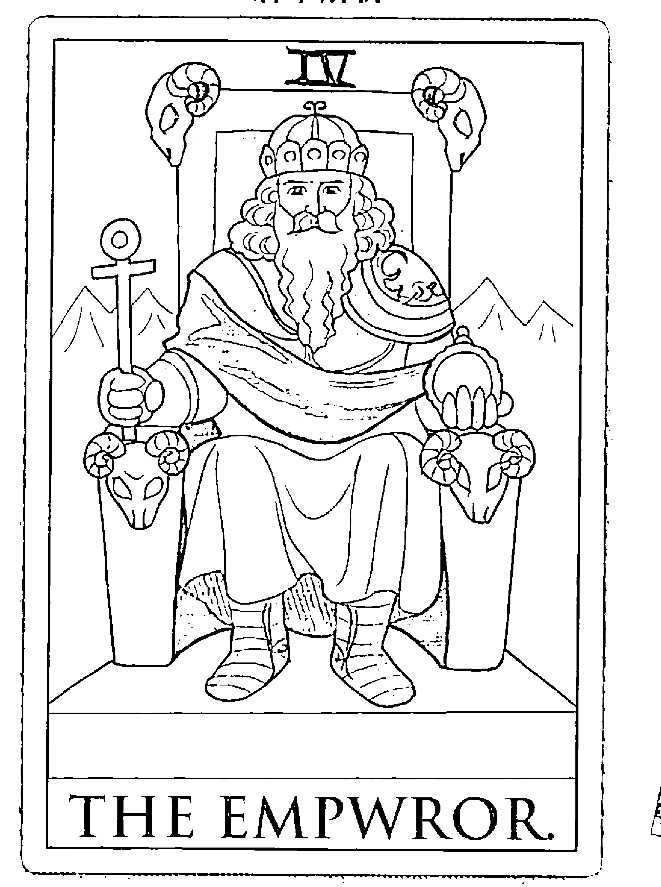

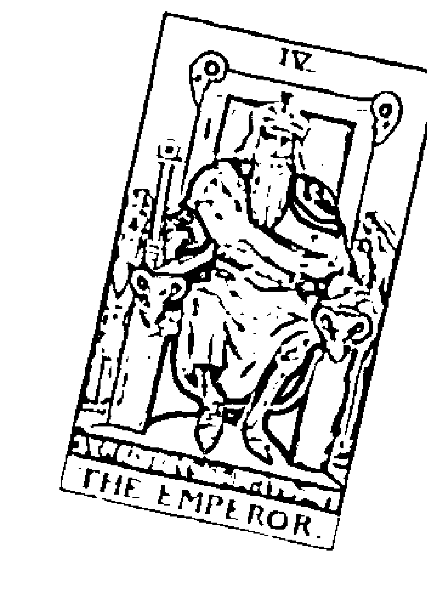

### IV 皇帝 THE EMPEROR

繪者：Left

標準偉特牌版本

歐洲古代大帝國的皇帝，代表了世俗統治的最高權力，除了能夠掌握人民的生殺大權之外，也提供了必要的保護和穩定的秩序，事實上在動亂頻繁的中古世紀，並不存在能夠維持大一統局面的皇帝，因此皇帝的形象可以說是人心望治的一種期盼和想像；就地位上來看皇帝這張牌與寶劍牌組的宮廷牌有著緊密的關係，因為皇帝可視為是所有騎士貴族階級的最高統治者，與寶劍牌組的宮廷牌人物具有上下的隸屬關係，所有的寶劍牌對皇帝來說都是有利的。

## 正位圖解

- 成熟而嚴肅・權力
- 慈愛保護
- 執行力・意志力

### 古埃及十字架

T型之上帶有圓圈的古埃及十字架，代表生命、宇宙、再生、復活和不朽，握在右手則是象徵皇帝掌握生殺大權。

### 頭上的王冠

頭戴王冠象徵尊貴與榮耀，同時也表示崇高的地位並負擔重要的責任，在占卜牌義當中經常代表實際掌握了權力。

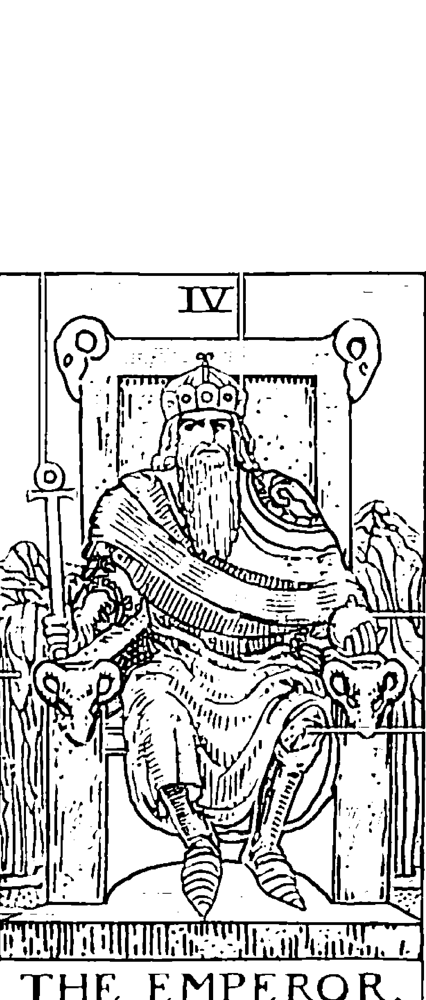

### 高山與河流

光禿禿的石頭岩山象徵現實環境的困難，需要有堅強的意志力才能克服；下方的河流則象徵皇帝慈愛保護的一面。

### 地球

握在左手當中的地球，象徵皇帝擁有的領土，那是他權力的範圍與基礎，在占卜牌義當中也經常帶有穩固的意思。

### 石頭寶座

裝飾有羊頭的石頭寶座，象徵在現實世界當中的執行力，在占卜牌義當中也經常代表有堅定的方向與強烈的使命。

### 華服與盔甲

表面的華服表現出高貴有威儀的樣子，但是裡面的盔甲象徵內心當中的不安，經常指向需要更多的保護和安全感。

## 【構圖時間線】

- 背景
- 中景
- 前景

## 逆位圖解

- 不成熟・缺乏安全感
- 權力的濫用・沒有準備
- 挫折・固執己見

### 位置關係

原本在下方的岩山移到了上方，象徵當事人遇到了更多困難和挑戰，在占卜牌義當中也經常指向挫折甚至是失敗。

### 圖形變化

長袍落下露出裡面的盔甲，強調內心當中缺乏安全感，左手捧著的地球若是掉落，則是暗示失去了掌控權。

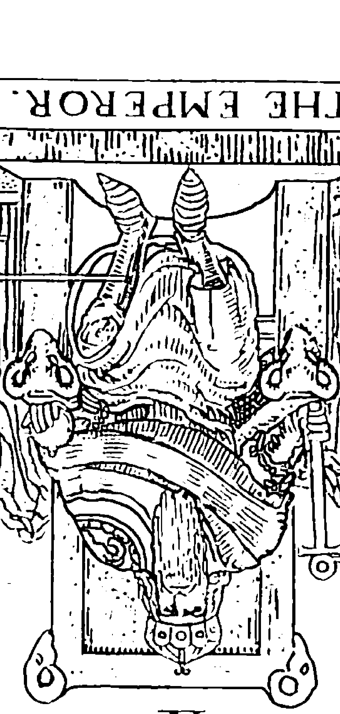

### 方位指向

古埃及十字架轉而指向下方，象徵有可能被外在環境限制或是控制；在占卜牌義當中也經常代表暴政或權力濫用。

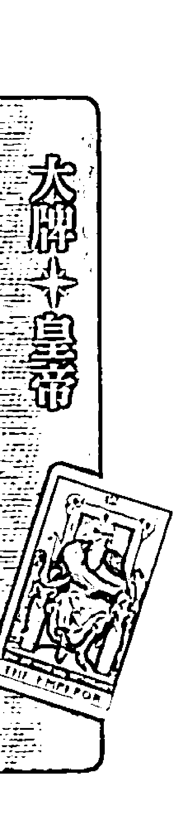

### 色彩意義 ○ ○ ○

紅色的長袍象徵皇帝具有熱情及實際的行動力，同時也暗示了血腥暴力的可能性，裡面的盔甲透出藍色的光芒，表示內在的理性與平靜，大片橘紅色的底色讓人聯想到夕陽西下的感覺，因此有時候也代表成熟甚至是老朽的意思。

### 占星對應 ♈

皇帝對應到白羊座。在占星學當中，白羊座代表自我意識比較強的特質，並且具有領導與開創的能力，這個部分與皇帝的意志力和決心相互呼應。石頭的寶座上帶有羊頭的裝飾，直接指出皇帝與白羊座的關係，同時也象徵行動力。

### 數字象徵 IV

皇帝的編號是四，與形式和穩固有關，也讓人聯想到四季的變化和組成萬事萬物的四要素，在占卜牌義當中經常代表成熟而穩定的力量。四是屬於陰性的數字，代表了組織與紀律的意思，比起二來說更加穩定，也可能缺乏變化。

### 在其他牌中重複出現的象徵

- 岩石高山 隱者、塔、審判、愚者、聖杯八、寶劍A、錢幣A、聖杯騎士
- 河流 皇后、戰車、死神、權杖A、權杖八、聖杯五、聖杯八、聖杯十、寶劍六、聖杯騎士、錢幣王后
- 寶座 教皇、權杖王后、權杖國王、聖杯王后、聖杯國王、寶劍王后、寶劍國王、錢幣王后、錢幣國王
- 羊 惡魔、錢幣王后
- 王冠 皇后、戰車、正義、死神、塔、寶劍A、錢幣四、權杖王后、權杖國王、聖杯王后、聖杯國王、寶劍王后、寶劍國王、錢幣王后、錢幣國王
- 鬍子 隱者、惡魔、錢幣十
- 盔甲 戰車、死神、寶劍四、權杖騎士、聖杯騎士、寶劍騎士、錢幣騎士、錢幣國王
- 披風 正義、錢幣四、權杖王后、權杖國王、聖杯王后、聖杯國王、寶劍騎士、寶劍王后、寶劍國王
- 紅色長袍 教皇、正義、權杖四、權杖六、聖杯三、錢幣四、錢幣十、錢幣王后
- 十字架 女祭司、教皇、審判、聖杯六
- 手持地球 權杖二

### 牌卡解析

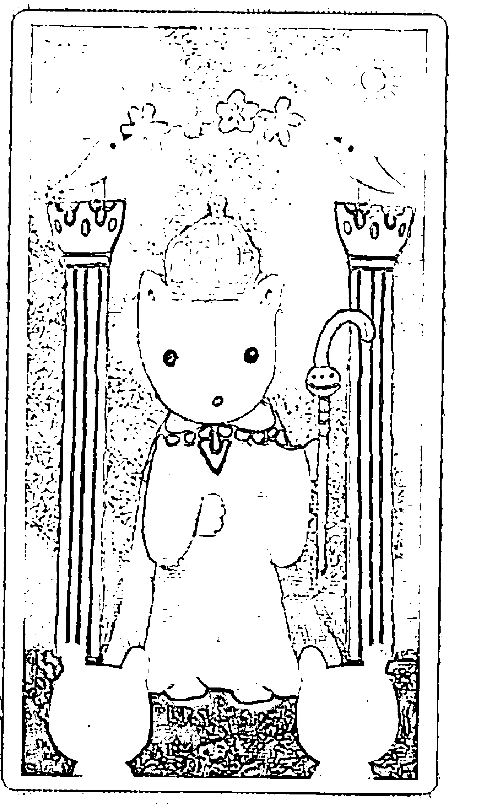

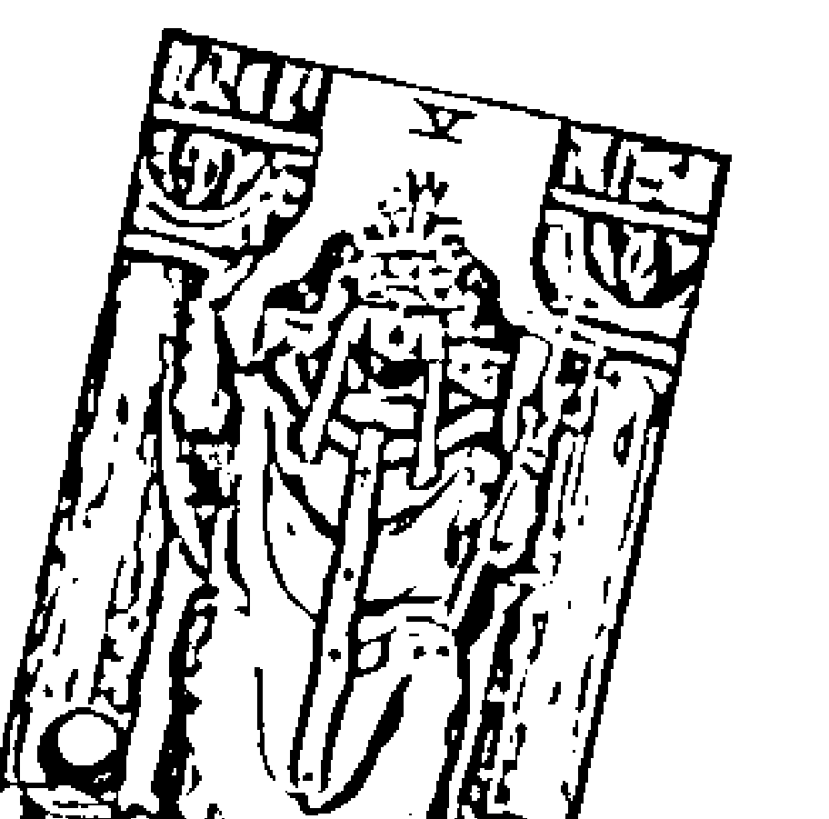

標準偉特牌版本

繪者：尼果

### V 教皇 THE HIEROPHANT

教皇是歐洲宗教重要的象徵，一方面他是宗教組織的領導者，主導了整個羅馬教廷的政策及走向，另一方面他也是受人景仰的精神導師，代表了信仰上的重要成就，也作為靈性修持的表率，神職人員在中古世紀是主要的知識階級，由於傳教與靈修的需要必須接受專業訓練，在傳教的同時也負起不少社會救助的工作；就地位上來看教皇這張牌與聖杯牌組的宮廷牌有著密切的關係，因為教皇是所有神職人員的領導者，因此所有的聖杯牌對教皇來說都是有利的牌。

## 正位圖解

- 倫理道德・靈性成長
- 慈悲・組織的秩序
- 貴人相助

### 雙柱與寶座

象徵莊嚴神聖的殿堂，教皇在此公開接見來賓及舉行儀式；在占卜牌義上經常表示宗教活動的場合及宗教的儀式。

### 三重冕與三重十字架

皆為教皇專用的器具，代表教皇的身份和權威，不僅掌握了教會組織的秩序，在占卜上也常代表倫理道德的約束。

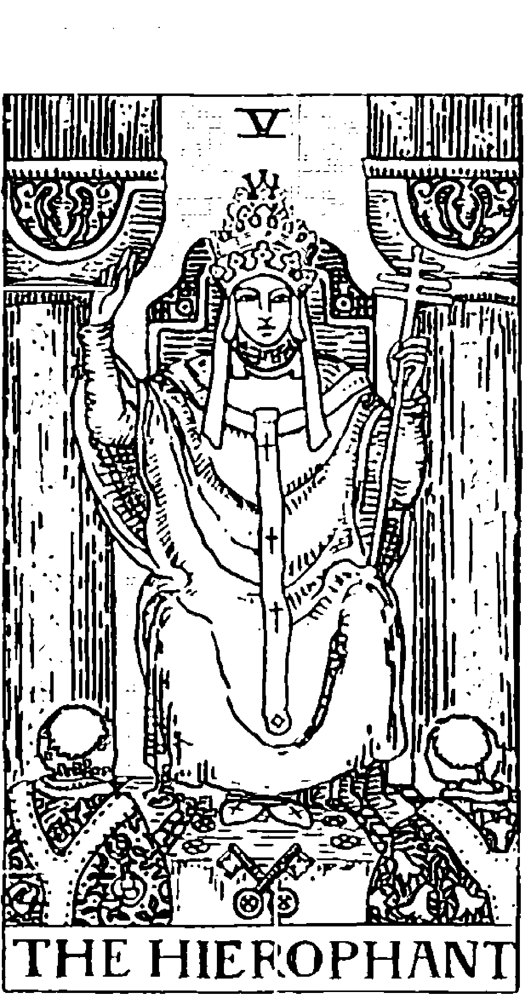

### 祝福的手勢

代表神秘主義的面向，象徵無上的智慧與神的祝福，區分出公開的教義和祕傳的教義，當中帶有靈性成長的涵意。

### 右邊的僧侶

身著有百合紋飾衣服，表現出求道者的純潔，與教皇對比顯示上下差異的階級關係，也代表對靈性教誨的臣服。

### 左邊的僧侶

身著有玫瑰紋飾的衣服，表現出求道者的熱情，有時候也是代表著尋求幫助的角色，在占卜中有貴人相助的意思。

### 兩把鑰匙

傳說中教皇擁有通往天堂的鑰匙，在此處象徵知識和教義方面解釋的權威，在占卜牌義當中經常代表找到了解答。

## 【構圖時間線】

- 背景
- 中景
- 前景

## 逆位圖解

- 價值觀混淆・心靈空虛
- 迷信・僵化的規則
- 過於心軟・幫助別人

### 位置關係

教皇與僧侶的位置對調，象徵當事人應該要主動付出，而不是被動接受別人的幫助；在占卜當中也表示過於心軟。

### 方位指向

三重十字架指向下方象徵傾向教條化的危險；在占卜牌義當中經常代表僵化的規則，有時候也代表了同儕的壓力。

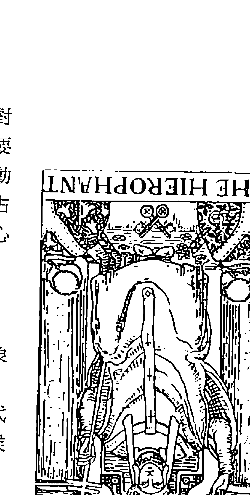

### 圖形變化

當教皇的三重冕落下，象徵在宗教與靈性的領域其實沒有權威；在占卜牌義當中也常經表示價值觀的混淆或迷信。

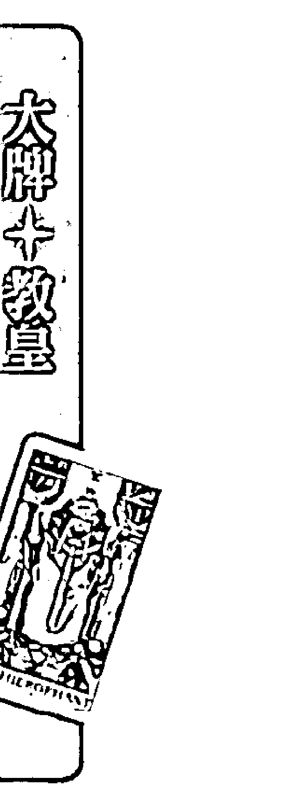

### 色彩意義

大片灰色的背景、雙柱及寶座共同塑造出莊嚴的氣氛，教皇內搭的藍色長袍表示理性與冷靜，外面的紅色長袍則展現了實際的行動力；黃色的三重冕與三重十字架都帶有光明與智慧的意思，並且與僧侶身上的黃色節帶相互呼應。

### 占星對應

教皇對應到金牛座。在座位的兩側與耳同高的位置藏有兩個類似金牛座符號的紋飾，金牛座有耐性與重視和諧的個性也與教皇有部分的相符；在地上交叉的金鑰可視金牛座守護星—金星的符號，也讓教皇在解釋上與婚姻相關聯。

### 數字象徵

教皇的編號是五，代表了靈性與超越，塵世萬物都是由四要素所組成，唯有人類多了一個精神靈性的層面，因此是一種對於物質世界的超越。五是屬於陽性的數字，也與變動的狀況有關，代表在靈性上需要自由，不能被限制住。

### 在其他牌中重複出現的象徵

- 紅玫瑰與白百合 魔術師、權杖二、錢幣A
- 藍色長袍 女祭司、教皇、塔、聖杯十、聖杯王后、聖杯國王、寶劍國王
- 紅色長袍 皇帝、正義、權杖四、權杖六、聖杯三、錢幣四、錢幣十、錢幣王后
- 雙柱 女祭司、正義
- 寶座 皇帝、權杖王后、權杖國王、聖杯王后、聖杯國王、寶劍王后、寶劍國王、錢幣王后、錢幣國王
- 十字架 女祭司、皇帝、審判、聖杯六
- 僧侶 錢幣三
- 藍色上衣 吊人、死神、權杖五、聖杯六、聖杯十、錢幣五、錢幣八、錢幣十、聖杯侍者
- 節帶 正義、聖杯國王

### 牌卡解析

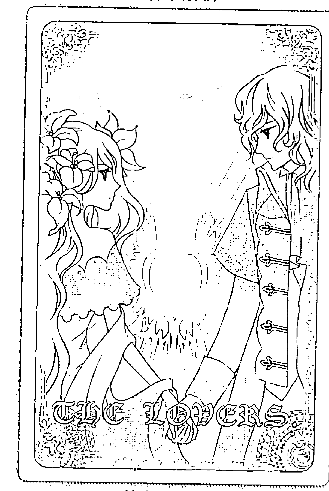

繪者：俞家燕

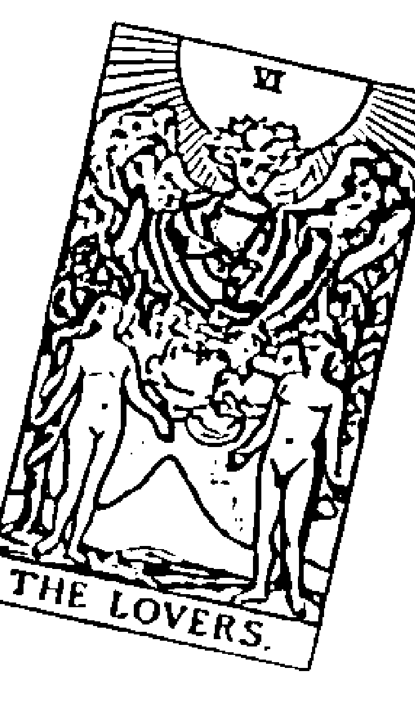

標準偉特牌版本

### VI 戀人 THE LOVER

塔羅牌戀人的圖案是取自於《聖經》創世紀的神話傳說，人類的始祖亞當和夏娃在伊甸園當中過著天真的生活，他們彼此很單純地相愛，保持非常純潔的愛戀。但是有一天他們面對了蛇的引誘，也是人類命運最大的選擇，究竟是要保持無知純真的快樂生活，或是要得到分辨善惡的智慧，再自己辛勤努力謀生；相傳戀人牌當中的天使為大天使拉斐爾，意思是「神已經療癒了」，能夠提供療癒的力量，傳統上為水星與星期三的守護天使，並統治第二重天。

## 正位圖解

- 婚姻・純真的愛
- 兩情相悅・引誘
- 選擇與考驗

### 智慧樹

夏娃身後為智慧樹，傳說中如果吃了智慧樹的果實就可以擁有判別善惡的智慧，同時也象徵人類有了自主的意識。

### 雲中浮現的天使

天使是神與人之間的使者，帶有光明的意象，常常表示遠離塵世的聖潔存在，在占卜當中也代表會受到神的祝福。

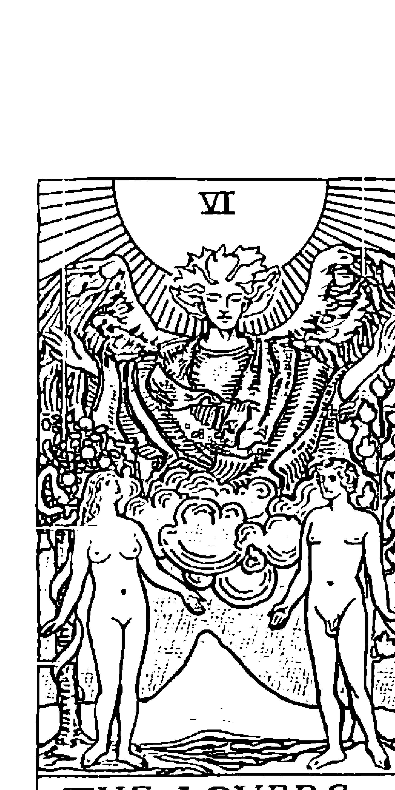

### 亞當與夏娃

傳說中人類的始祖，表示男女兩情相悅的狀況，赤裸的兩人也象徵純真的特性，在占卜當中經常會指向婚姻關係。

### 生命樹

亞當身後的生命樹有十二個果實，傳說中如果吃了生命樹的果實就可以長生不死，有時也會代表對於永生的追求。

### 蛇

纏繞在智慧樹上的蛇，代表了對於人類的引誘；另一種說法是以蛇來表示人類自主的欲望，同時也帶有性的暗示。

### 聖山

象徵靈性的高峰與神的居所，代表人類想要回歸靈性源頭的渴望，在占卜牌義上也可能帶有追求靈性成長的意思。

## 【構圖時間線】

- 背景
- 中景
- 前景

## 逆位圖解

- 不忠貞・磨擦與衝突
- 落入陷阱・避免作選擇
- 懷疑・分離

### 位置關係

人的高度超過了天使，象徵以人類的意識取代了上天的意志，在占卜牌義上經常代表分離，也會引發摩擦與衝突。

### 圖形變化

若是智慧樹上的果子掉落，則是象徵缺乏智慧和判斷力，因此在占卜牌義上經常有作錯決定或是落入陷阱的意思。

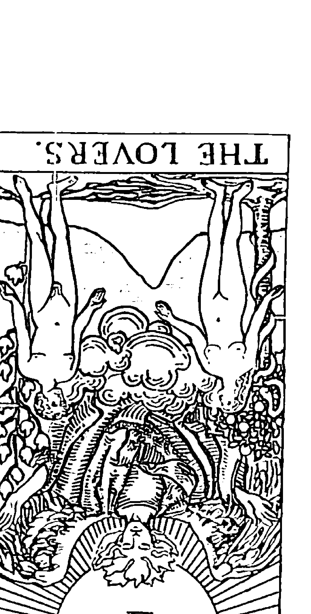

### 方位指向

蛇由上而下捲曲象徵誘惑來自於外部，也強調了人類自作聰明的一面；因此在占卜牌義上經常表示不忠貞的狀況。

### 色彩意義

上方大片黃色的陽光帶來快樂與開朗的氣氛，天使紅色的翅膀代表有熱情與行動力，紫色的衣服則具有高貴與神秘的意涵；後方藍色的天空產生平靜的效果，綠色的樹葉與伊甸園當中草地的顏色呼應，都代表大自然的清新活力。

### 占星對應

戀人對應到雙子座。由亞當和夏娃兩個人來代表雙子座的兩個人，戀人當中蛇所代表的引誘與雙子座的好奇相對應，但是也有人說夏娃的行為才代表好奇心；象徵上雙子座常常顯示出二元對立的狀況，也與戀人選擇的牌義有關。

### 數字象徵

戀人的編號為六，代表了均衡與協調，傳統上也帶有婚姻的涵意，在純潔心靈狀態下結合的婚姻，必定會受到上天的祝福，也是一種和諧與平靜的關係。六為陰性的數字，代表一種追求平衡的傾向，也可以創造良好的人際關係。

### 在其他牌中重複出現的象徵

- 太陽 死神、節制、太陽、愚者、聖杯八
- 天使 命運之輪、節制、審判
- 紫色上衣 錢幣八、寶劍侍者
- 積雲 命運之輪、塔、審判、世界、權杖A、聖杯A、聖杯四、聖杯七、寶劍A、寶劍三、錢幣A、寶劍侍者、寶劍王后、寶劍國王
- 樹木 女祭司、皇后、戰車、力量、吊人、星星、權杖A、權杖二、權杖十、聖杯二、聖杯四、聖杯十、寶劍六、錢幣九、寶劍侍者、寶劍王后、寶劍騎士、寶劍國王、錢幣侍者、錢幣騎士
- 果樹 錢幣七、錢幣九、錢幣國王
- 成對的男女 惡魔、審判、權杖四、聖杯二、聖杯六、聖杯十、錢幣五、錢幣十
- 仰望天空 審判、愚者、聖杯十、錢幣五、權杖侍者、錢幣侍者
- 裸體 惡魔、星星、太陽、審判、世界
- 蛇 魔術師、命運之輪、聖杯七
- 聖山 力量、節制
- 草地 戰車、力量、星星、月亮、聖杯四、聖杯六、錢幣A、錢幣侍者、錢幣王后

### 牌卡解析

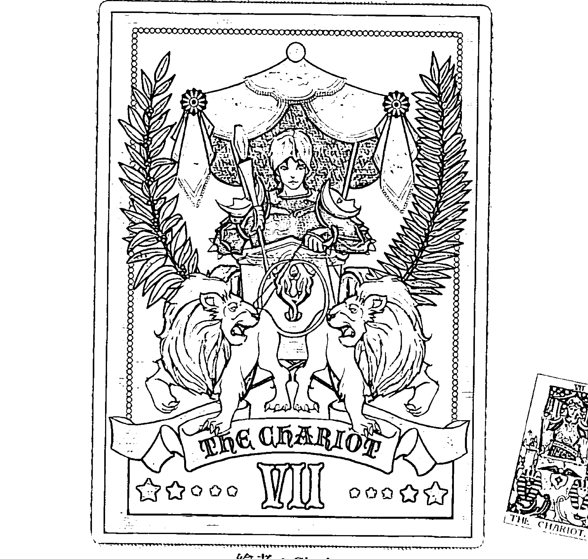

繪者：Chuie

標準偉特牌版本

### VII 戰車 THE CHARIOT

雙輪戰車對於中古世紀的歐洲而言是遙遠又古老的傳說，只存在於神秘的埃及，或亞歷山大、羅馬等大帝國，代表了強大的軍事力量和殘忍的戰爭行為，這是自己努力奮鬥得來的江山，表現出征服者的勝利成功，到處都充滿了活力與朝氣；但是實際上歐洲的地形大多屬於丘陵地，並不適合使用雙輪戰車，反而是以騎士的衝堅突刺為主，因此雙輪戰車可以說是傳說中的神兵利器，只要出動了就可以得到勝利，因此有時也代表了戰無不勝攻無不克的意思。

## 正位圖解

- 功績・戰爭行為
- 不斷努力・征服
- 以智取勝

### 星星的頂蓬

代表遠大的理想及希望，另一方面也表示披星戴月、日以繼夜地不斷努力，在占卜牌義當中代表追求勝利與成功。

### 手持出鞘的寶劍

象徵駕車者是以暴力征服，在過程中不免有血腥和傷害，在占卜牌義當中也經常暗示有些事情非用激烈手段不可。

### 背後的城堡

象徵已經被征服的領土，也是代表安全的大後方，在占卜牌義當中經常表示勝利征服，通常對當事人都是有利的。

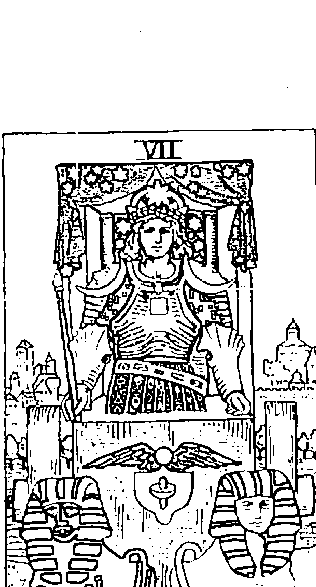

### 烏陵與士明

駕車者肩上的兩個半月為烏陵與士明，是猶太教祭司用的問卜道具，在占卜牌義當中象徵通達天意與高超的智慧。

### 護城河

代表當事人已經跨出安全的舒適區走向新的征途，在占卜當中也經常表示需要不斷努力，並不是只是維持現狀而已。

### 人面獅身

古代埃及的神獸，是智慧與力量的綜合體，在此象徵駕車者擁有比他們更高超的智慧，在占卜當中代表以智取人。

## 【構圖時間線】

- 背景
- 中景
- 前景

## 逆位圖解

- 被擊敗・紛爭動亂
- 採取守勢・彼此對立
- 過份情緒化
- 徒勞無功

### 位置關係

黑白兩色的人面獅身移到上方，表示二元對立的狀況加劇，在占卜牌義中常代表無法控制住分裂及對立的狀況。

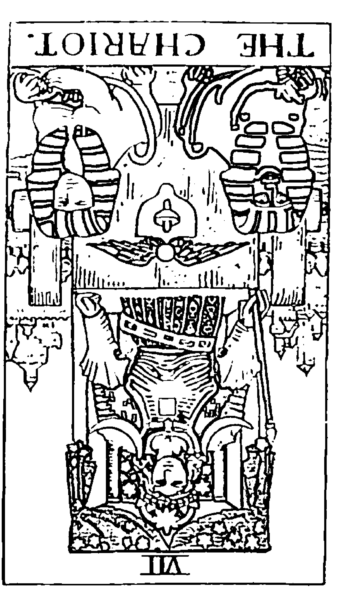

### 圖形變換

護城河的水將會淹沒大地和城堡，表示會有比較情緒化的表現；在占卜牌義也可能代表再怎麼努力也是徒勞無功。

### 方位指向

出鞘的寶劍朝向下方，象徵內部可能會發生紛爭和動亂，在占卜牌義中經常會指向被擊敗的狀況，要小心防守。

### 色彩意義 ◯◯

大片黃色的背景帶來光明與樂觀的感覺，與星星的頂蓬、八角星的王冠及肩上的烏陵與土明相互呼應，黑白兩色的人面獅身用來象徵二元對立的狀況，前面綠色的草原及後面的綠樹都帶來清新與開闊的氣氛，代表未來的發展性。

### 占星對應 ♋🌙

戰車對應到巨蟹座。可以發現駕車者的腰帶上刻有巨蟹座及其守護星月亮的符號，在肩上也以月亮的符號來裝飾；戰車表現出巨蟹座比較具有攻擊性的一面，當威脅到巨蟹座本人或是家庭的安全時，他必然不留情面地毀滅對方。

### 數字象徵 VII

戰車的編號為七，在神秘學當中常代表神聖與精神的法則，對應到七個行星與一週七天的守護關係，同時也與神秘的智慧有關。七為一個陽性數字，帶有積極主動的力量，如果自己願意努力奮鬥，就會走出一條自己獨特的道路。

### 在其他牌中重複出現的象徵

- 城堡 權杖A、權杖二、權杖四、權杖八、聖杯五、聖杯七、寶劍八、錢幣十、錢幣國王
- 河流 皇后、皇帝、死神、權杖A、權杖八、聖杯五、聖杯八、聖杯十、寶劍六、聖杯騎士、錢幣王后
- 樹木 女祭司、皇后、戀人、力量、吊人、星星、權杖A、權杖二、權杖十、聖杯二、聖杯四、聖杯十、寶劍六、錢幣九、寶劍侍者、寶劍王后、寶劍騎士、寶劍國王、錢幣侍者、錢幣騎士
- 王冠 皇后、皇帝、正義、死神、塔、寶劍A、錢幣四、權杖王后、權杖國王、聖杯王后、聖杯國王、寶劍王后、寶劍國王、錢幣王后、錢幣國王
- 盔甲 皇帝、死神、寶劍四、權杖騎士、聖杯騎士、寶劍騎士、錢幣騎士、錢幣國王
- 翅膀 命運之輪、聖杯二、聖杯騎士、聖杯王后、寶劍騎士、寶劍王后
- 人面獅身 命運之輪
- 占星符號的紋飾 寶劍九
- 輪子 命運之輪
- 草地 戀人、力量、星星、月亮、聖杯四、聖杯六、錢幣A、錢幣侍者、錢幣王后
- 星星 皇后、星星
- 蓮花 聖杯A、聖杯侍者
- 桂冠 皇后、愚者、世界、權杖六、聖杯二、聖杯七、錢幣國王

### 牌卡解析

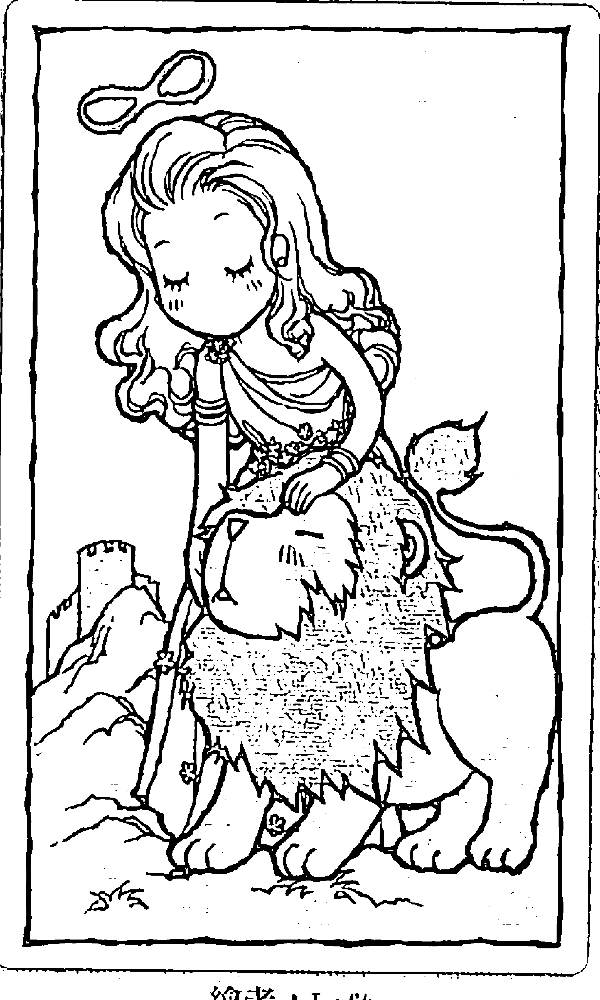

繪者：Left

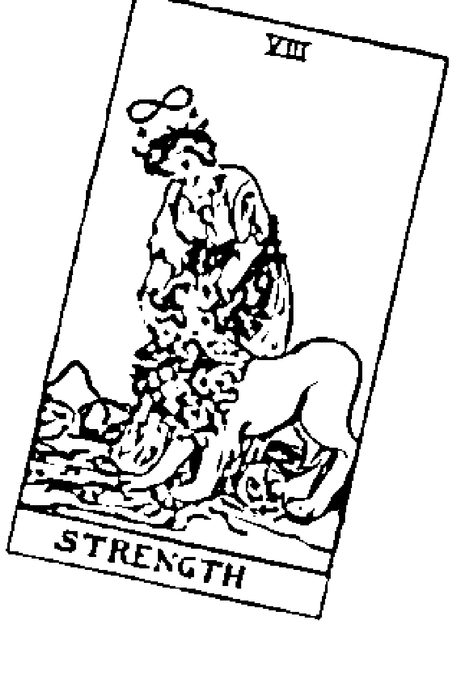

標準偉特牌版本

### VIII 力量 STRENGTH

獅子自古以來就被視為可怕的猛獸，具有很大的力氣，傳說中在古埃及時代已經開悟的入門者，具有強大的精神力量可以馴服獅子，不但能與獅子心意相通，甚至只憑意志力就可以驅使獅子拉動雙輪戰車，完全不必使用繮繩；圖中的女子可以與獅子如此親近，就表示她已經完全開悟，具有足以震懾獅子的強大力量，以女性的角色則暗示她並不是用蠻力來馴服獅子，雖然這種密傳的神功在現今鮮為人知，但是藉由塔羅牌的圖案還是將這種情境流傳下來。

## 正位圖解

- 剛毅・權力
- 勇氣・相互配合
- 以柔克剛

### 頭上的無限符號

象徵無止盡的循環和變化，也代表無限的力量及智慧，在占卜當中通常表示本人具有權力與能力可以把事情搞定。

### 女人低頭望著獅子

與獅子親暱的舉動表現出她的勇氣，象徵她已經收服了這個強大的力量，在占卜牌義當中表示有面對困難的勇氣。

### 遠方的聖山

象徵靈性的高峰，代表人類回歸源頭與靈性成長的追求；占卜牌義中也表示要透過精神修持才能獲得強大力量。

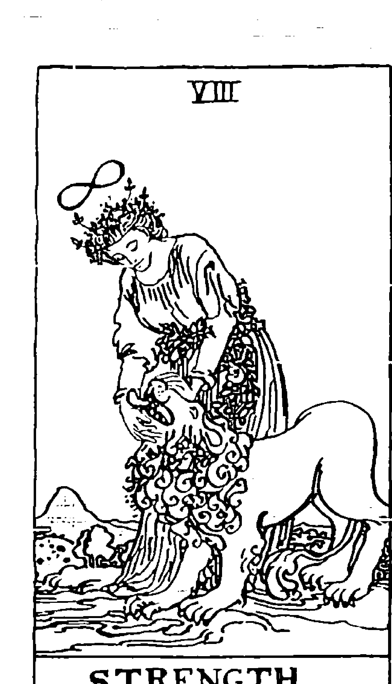

### 以花環來引導獅子

宗教當中花環常用來與上天聯結，也象徵永恆生命的秘密，在占卜牌義當中經常表示需要運用技巧與方法來處理。

### 白色的長袍

身著白色長袍象徵純潔無瑕，雖然外表看來柔弱，其實內心中十分剛毅而堅強，在占卜牌義中常代表以柔克剛。

### 被馴服的獅子

獅子象徵原始的欲望或是強大的力量，獅子已被馴服則表示理性已成功控制欲望，而且彼此互動良好。

## 【構圖時間線】

- 背景
- 中景
- 前景## 逆位圖解
欲望勝過理性·專制獨裁
無法合作·半途而廢
缺乏考慮的行動
失控

### 位置關係
獅子的高度超過女子，象徵原始的欲望勝過理性，此時容易有情緒化的表現，在占卜當中常表示缺乏考慮的行動。

### 方位指向
在上位的獅子象徵對手的權力大過於自己，因此在競爭時己方將會落下風，在占卜牌義中也經常代表半途而廢。

### 圖形變化
若是獅子撲倒了女子就會變為一面倒的殘忍殺戮，也象徵失控或無法合作的狀況；在占卜當中也會代表獨裁專制。

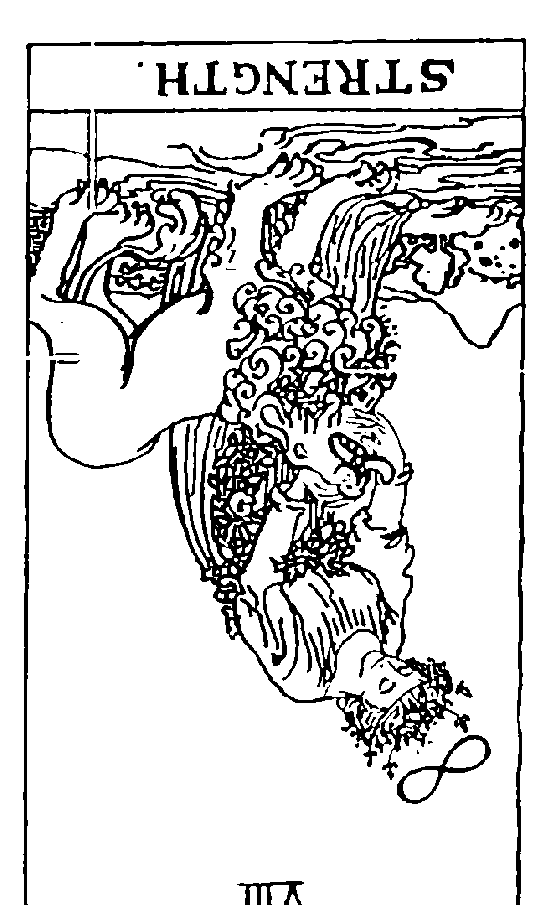

### 色彩意義
大片黃色的背景帶來光明與自信心，讓人覺得樂觀而可以控制住狀況，白色的長袍象徵女子的內心純潔無瑕，因此能無所畏懼面對困難的狀況；橘色的獅子則象徵我們都需要尋找安全感，情緒失控時也有可能像獅子一樣的兇猛。

### 占星對應
力量對應到獅子座。在力量牌的兩個角色當中，其中一個就是獅子，而力量所代表的勇氣，正好又是獅子座最重要的特質之一；獅子座的領導力則是由女子的角色來表達，表示在處理問題時不只有硬碰硬，也要運用技巧和方法。

### 數字象徵
在傳統的馬賽牌當中八號牌為正義，力量則編為第十一號，偉特依照黃金黎明的理論將力量編為八號；由於八是代表和諧與安定的力量，並且具有很強的實踐力，可以將理念和想法落實到生活當中，與力量的勇氣與權力相呼應。

### 在其他牌中重複出現的象徵
- 無限符號 魔術師、世界、錢幣二
- 花冠 死神、權杖四、聖杯二、聖杯三
- 花環 權杖四
- 白色長袍 魔術師、皇后、節制、權杖四、聖杯二、聖杯三
- 獅子 命運之輪、世界、聖杯二、權杖王后、權杖國王
- 草地 戀人、戰車、星星、月亮、聖杯四、聖杯六、錢幣A、錢幣侍者、錢幣王后
- 聖山 戀人、節制
- 樹木 女祭司、皇后、戀人、戰車、吊人、星星、權杖A、權杖二、權杖十、聖杯二、聖杯四、聖杯十、寶劍六、錢幣九、寶劍侍者、寶劍王后、寶劍騎士、寶劍國王、錢幣侍者、錢幣騎士

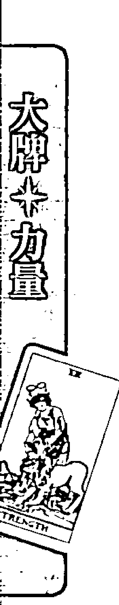

### 牌卡解析
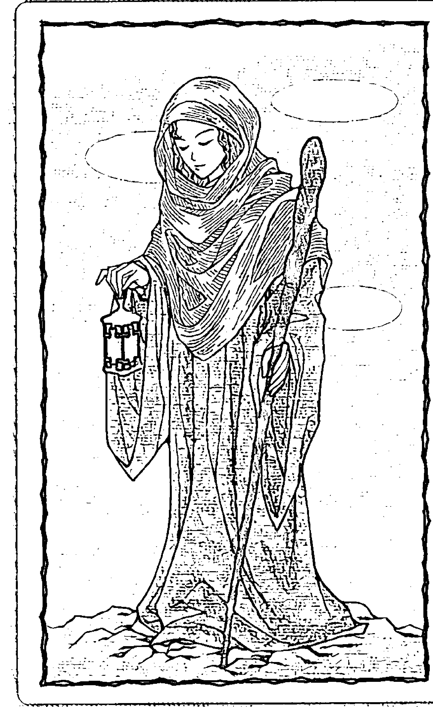

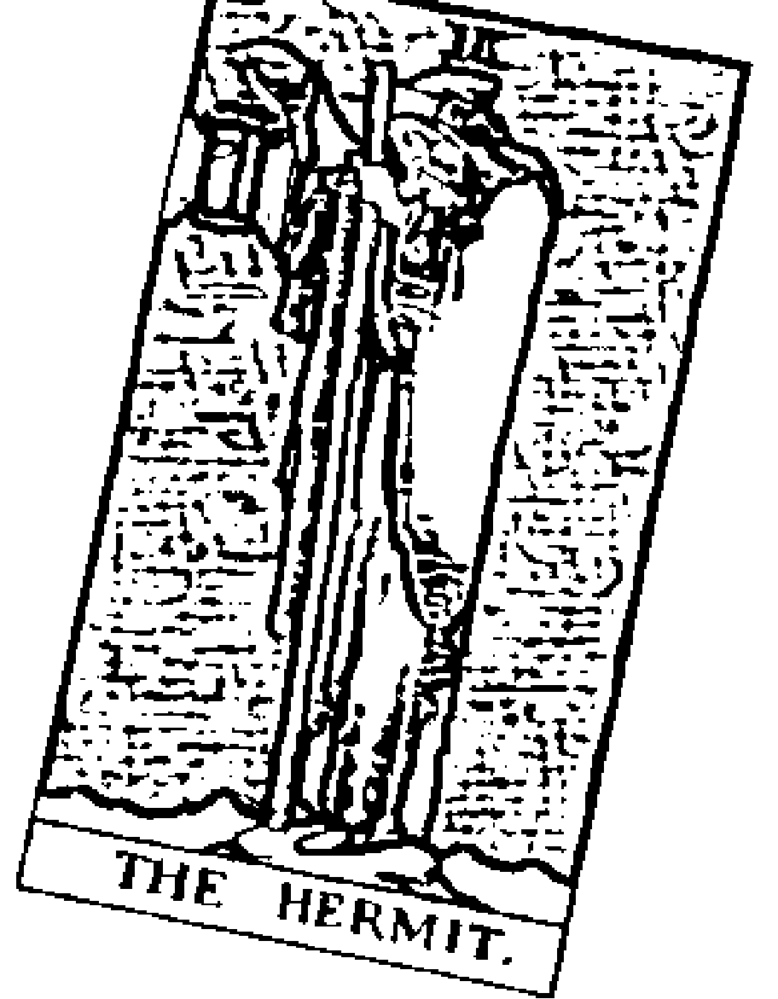

### IX 隐者 THE HERMIT
欧洲传统当中的隐者不同于中国传统的隐士，而是比较接近于的苦行僧或是在山上修道的仙人，单独去到人烟罕至的高山上或沙漠里修行沉思，他们一方面追求自身的灵性成长，同时也为访客解答各种不同的问题，所以他们同时扮演了追寻者与引导者的角色；另一方面，也有人认为隐者传承了宗教当中的神秘主义，有着不同于公开教义的神秘智慧，因此也被视为教皇的相对角色；在容格学派当中则是将隐者对应到智慧老人的原型，超越地域性与宗教。

## 正位圖解
- 達到頂峰·離群索居
- 老朽·謹慎
- 引導與教育

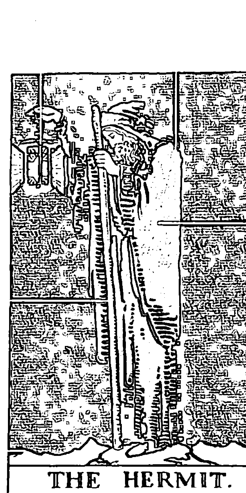

### 高舉的燈籠
燈籠當中閃出的六芒星代表智慧之光，隱者用這個燈光來引導其他人，占卜牌義當中也有教導與引導別人的意思。

### 手杖
隱者登山時要使用手杖，一方面表示年紀老邁需要依賴道具，在占卜當中也經常表示凡事都要小心謹慎以策安全。

### 四周的群山
空曠的背景展現出距離感，即使在其他的山中有人也難以聯繫，在占卜牌義當中經常代表與別人分離或失去聯繫。

### 老人
長鬍子象徵經驗豐富，低頭並閉上眼睛則是代表正在反省沈思，在占卜牌義當中也經常有老朽的意思。

### 斗篷
灰色斗篷為修士的身份象徵，穿上斗篷就表示與世俗的人生隔絕，同時在占卜牌義當中經常帶有離群索居的意思。

### 山頂
單獨一人站在山頂上給人高處不勝寒的感覺，也象徵達到最高境界，如果無法再求突破可能會由盛轉衰。

【構圖時間線】背景 → 中景 → 前景

## 逆位圖解
- 過於膽小·逃避
- 保守頑固·仍在追尋解答
- 挑剔·人際關係的問題

### 圖形變化
若是隱者由山頂落下則是暗示了由盛轉衰的狀況，當事人可能偏向保守頑固，或是用挑剔別人的手段來自我防衛。

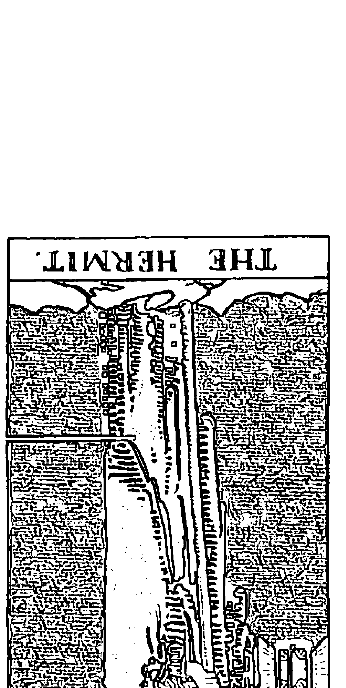

### 方位指向
燈籠與隱者都朝向右方象徵著重於內在的反省，強調追尋者的角色，在占卜牌義當中也可能代表過於膽小的意思。

### 位置關係
燈籠由上方移到下方，帶有隱藏與不願被發現的感覺，在占卜上常有逃避的意思，也代表在人際關係方面有問題。

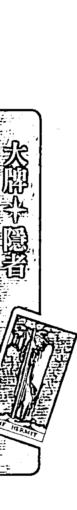

### 色彩意義 🌙 ☉
大片灰藍色的天空帶來神秘與權威的感覺，雪白的山頂則是表示精神修持上無限的可能性，灰色的斗篷代表比較被動與平凡無奇的特質，顯示出隱者比較低調的一面，黃色的拐杖及燈籠中黃色的六芒星都帶有光明及智慧的意思。

### 占星對應 ♍
隱者對應到處女座。提著燈籠的右手像是拉長了的處女座符號，西方大部分的隱者都保持單身，也與處女座守貞的意象相符，處女座重視思考和分析的特性，正好與隱者修行的過程相似，小心謹慎則是處女座與隱者共同的特質。

### 數字象徵 Ⅸ
隱者的編號為九，是個位數當中最大的數字，經常代表滿足與飽合的概念，也是達到完美之前的最後一步，隱者帶有到達頂峰的意思，與九的意思相互呼應；同時九也具有精神性與理想性，這個部分與隱者追求的靈性成長有關。

### 在其他牌中重複出現的象徵
- 夜空 女祭司、星星、月亮、聖杯八、寶劍二
- 鬍子 皇帝、惡魔、錢幣十
- 斗篷 女祭司、塔、權杖二、聖杯五、寶劍六、錢幣三、錢幣五、權杖侍者、錢幣王后、錢幣國王
- 拐杖 聖杯八、錢幣五
- 雪白的山頂 隱者、審判、愚者
- 岩石高山 皇帝、塔、審判、愚者、聖杯八、寶劍A、錢幣A、聖杯騎士
- 站在山上 愚者、權杖三、權杖七

### 牌卡解析
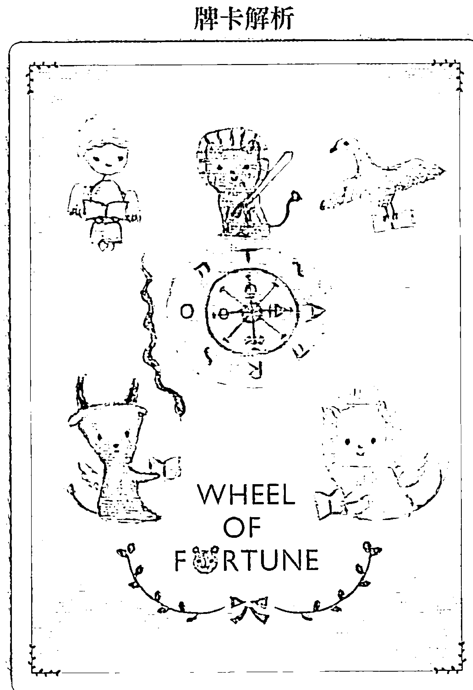

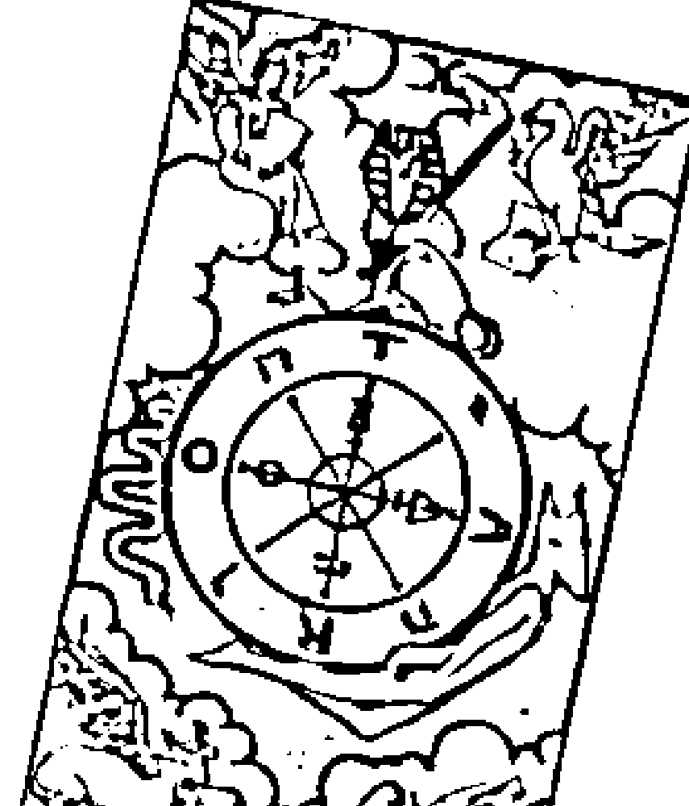

繪者：尼果  標準偉特牌版本

### 命運之輪 THE WHEEL OF FORTUNE
在西方傳統文化當中常用輪子來形容人的命運，因為在行進之中輪子總是不斷地轉動，就像整個宇宙無時無刻不在變化一樣，人的境遇也會不斷改變，輪子的每一邊都不可能永遠在上面，而是會隨著行進的過程而有起有落，就如人的命運一般不可能永遠處於順境，因此命運之輪經常是在提醒我們，成功時不要太過得意，失敗時也不要灰心喪志，若是在低潮時能做好準備，那麼當機遇來臨時就可以乘勢而起，要去適應各種不同的變化，避免僵固沒有彈性。

## 正位圖解
樂觀·命中註定 幸運·無可選擇的改變 處變不驚

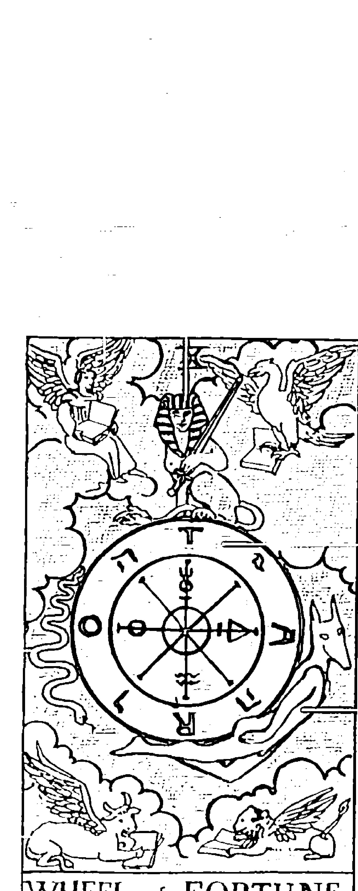

### 四個角落的生物
牛代表金牛座、獅代表獅子座、鷹代表天蠍座、人代表水瓶座，象徵四要素與四季，在占卜時常代表變化與循環。

### 蜷曲向下的蛇
代表埃及的惡神塞特，掌管了黑暗與沙漠的風暴，在這裡是象徵人類命運當中的不幸、沈淪以及會遇到的黑暗面。

### 正在看書的生物
看書表示正在學習，強調不論遇到順境或是逆境都有從當中學習的機會，在占卜當中經常表示需要從經驗中學習。

### 持劍的人面獅身
站在不停轉動的幸運之輪上，代表平衡感與穩定性，也象徵具有人類的智慧和獅子的力量，可以做出正確的判斷。

### 幸運之輪
中間的符咒是列維的以西結之輪，代表宇宙的發展與人類的命運都不斷在變化，在占卜牌義當中也有幸運的意思。

### 阿努比斯
狼頭人身的阿努比斯是靈魂的護送者，為死者打開通往另一個世界的道路，在這裡則是象徵經歷厄運之後的重生。

【構圖時間線】 背景 → 中景 → 前景

## 逆位圖解
- 盲目的樂觀・宿命論
- 厄運・意外的改變
- 失控・一錯再錯

### 圖形變化
若是四周的書本落下，則象徵不願意學習或無法學習，在占卜牌義當中也代表一錯再錯，或是遭遇意外的改變。

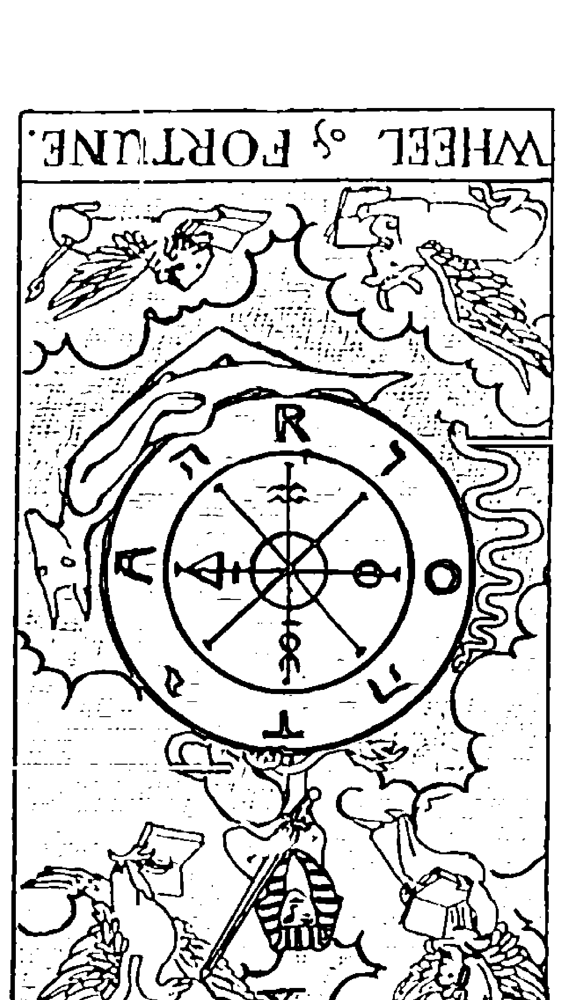

### 位置關係
持劍的人面獅身移到命運之輪的下方，表示命運的變化超過了本人的掌控，因此需要小心謹慎並避免盲目的樂觀。

### 方位指向
代表惡神塞特的蛇朝向上方，象徵厄運在此時提升，同時阿努比斯朝向下方，則象徵需要經歷死亡才有機會再生。

### 色彩意義
藍色的天空帶來理性與冷靜的感覺，加上藍色的人面獅身都在幫助我們做出正確的決定，四周黃色的四活物與黃色的蛇相互呼應，象徵知識與學習的意思，中間橘色的幸運之輪帶來豐富與滿足的感覺，與樂觀和幸運的牌義相關。

### 占星對應
命運之輪對應到木星。在特質上命運之輪掌管了人的命運，而在個人占星學當中木星則是代表生命的方向，兩者之間有相合之處，再加上木星本身就是大吉星，代表了個人的貴人及好運，也與命運之輪占卜牌義當中的幸運相關。

### 數字象徵
命運之輪的編號為十，數字十常代表完美與圓滿的意思，但是從另一個角度來看，也是到達了極限必須面臨轉變的時刻；同時十也帶有統合與包含的意思，在占卜時要注意各方面不同的因素，需要綜合的考量和判斷才能下定論。

### 在其他牌中重複出現的象徵
- 積雲 戀人、塔、審判、世界、權杖A、聖杯A、聖杯四、聖杯七、寶劍A、寶劍三、錢幣A、寶劍侍者、寶劍王后、寶劍國王
- 四活物 (由牛、獅、鷹、人組成) 世界
- 天使 戀人、節制、審判
- 鳥 星星、愚者、聖杯A、錢幣九、寶劍侍者、寶劍騎士、寶劍王后、寶劍國王
- 牛 世界、錢幣國王
- 獅子 力量、世界、聖杯二、權杖王后、權杖國王
- 翅膀 戰車、聖杯二、聖杯騎士、聖杯王后、寶劍騎士、寶劍王后
- 人面獅身 戰車
- 蛇 魔術師、戀人、聖杯七
- 輪子 戰車
- TORA《摩西五經》 女祭司

### 牌卡解析
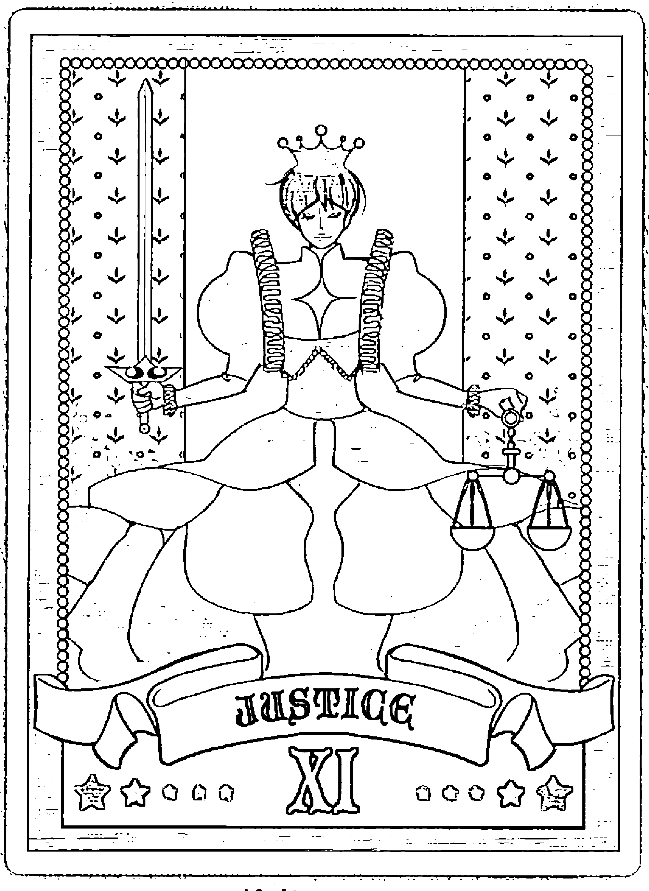

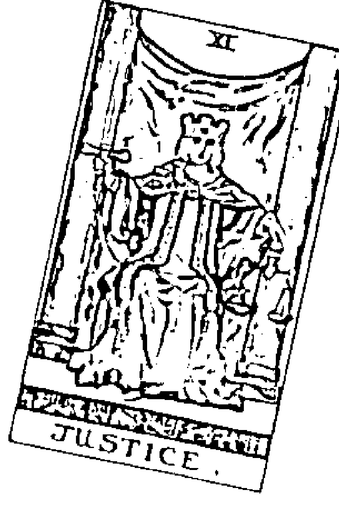

繪者：Chuie

標準偉特牌版本

### XI 正義 JUSTICE
歐洲文化當中的正義概念主要來自希臘正義女神阿斯特里亞的形象，在雕像或壁畫當中正義女神都會矇上眼睛，代表不受到外貌及表相的影響，純粹以是非曲直做出最公正的判斷，阿斯特里亞的天秤也就成了西方文化當中法律與正義的象徵；若是再往前去追溯，則會發現希臘正義女神的傳說，其實是繼受了埃及的正義女神瑪亞特，瑪亞特代表了宇宙的秩序與智慧，在埃及人的心目中唯有符合於宇宙秩序的才能稱得上正義，智慧也成為正義的核心概念。

## 正位圖解
決策權・公平正義
平衡・重要決定
以法律解決

### 寶劍
是一種武力和權力的象徵，代表除了智慧和判斷力之外，也要有實力去保障符合公平正義的結果可以確實被執行。

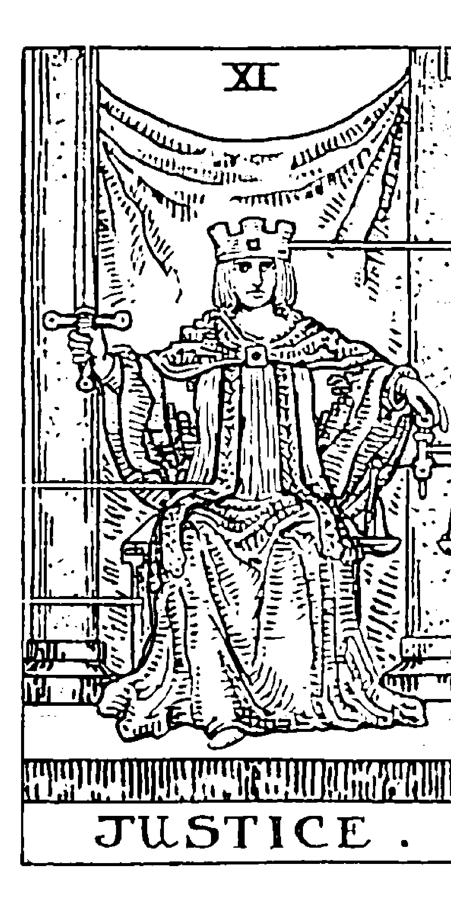

### 雙柱及布幔
象徵位於法院當中的場景，所要判斷的是很重要的事情，在占卜牌義當中也經常會與法律案件或重要的決定有關。

### 披風及飾帶
象徵尊貴與榮耀，同時也代表地位和責任，因此在占卜牌義當中經常代表具有決策權，所做的決定具有實質效力。

## 王冠
象徵權力與智慧，位在第三眼位置的寶石，顯示出具有超人的洞察力，在占卜牌義當中經常表示看清事實的能力。

### 石凳
坐在石凳上象徵仍然在等待或衡量的階段，還不適合採取實質的行動，在占卜牌義當中經常表示需要謀定而後動。

### 天平
用來衡量的器具，代表公平、公正的標準，可以用來判斷是非善惡，有時在占卜當中也表示平衡各方不同的需求。

【構圖時間線】背景 → 中景 → 前景

## 逆位圖解
- 失去決策權・不公平
- 過於嚴苛・猶豫不決
- 偏見・不合規定

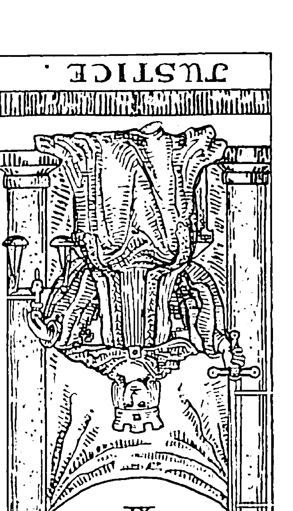

### 圖形變化
顛倒的天平象徵猶豫不決，也可能代表偏見，若是王冠落下則表示失去權力，暗示這件事你並沒有最後的決策權。

### 位置關係
寶劍移到下方象徵武力或強制力在這件事情當中並不重要，在占卜牌義當中經常表示無法透過法律途徑解決問題。

### 方位指向
寶劍朝向下方象徵對當事人的傷害性，經常表示受到不公平的對待，也可能因為違法或不符合規定而造成損失。

### 色彩意義
紫色的布幔帶有尊貴與權力的象徵，同時也有成熟世故的感覺，黃色的王冠與天平都帶有智慧的含意，綠色的披風及節帶象徵平衡與和諧，藍色的寶劍帶有理性與冷靜的意思，身著紅色長袍則是代表內在的熱情與實際的行動力。

### 占星對應
正義對應到天秤座。左手拿的天平本身就是天秤座的象徵符號，同時在天秤座的特質當中也很重視公平與正義的原則，兩者之間可以相互呼應；在正義當中帶有平衡的意思，這個部分也與天秤座們不斷在找尋平衡點的特質相符。

### 數字象徵 XI
在傳統的馬賽牌當中十一號牌為力量，正義則是編為八號，偉特依照黃金黎明的理論將正義編為十一號；十一在十位數及個位數都是一，在靈數學當中被歸類為大師數字，具有雙重的創造力，同時也能夠去平衡二元對立的力量。

### 在其他牌中重複出現的象徵
- 布幔 女祭司、聖杯七、聖杯九、寶劍十
- 雙柱 女祭司、教皇
- 王冠 皇后、皇帝、戰車、死神、塔、寶劍A、錢幣四、權杖王后、權杖國王、聖杯王后、聖杯國王、寶劍王后、寶劍國王、錢幣王后、錢幣國王
- 板凳 女祭司、聖杯九、寶劍二、錢幣三、錢幣四
- 紅色長袍 皇帝、教皇、權杖四、權杖六、聖杯三、錢幣四、錢幣十、錢幣王后
- 披風 皇帝、錢幣四、權杖王后、權杖國王、聖杯王后、聖杯國王、寶劍騎士、寶劍王后、寶劍國王
- 節帶 教皇、聖杯國王
- 天平 錢幣六、錢幣十

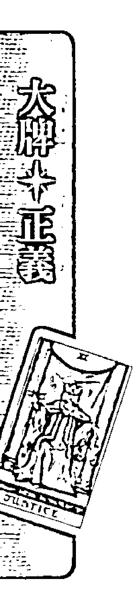

### 牌卡解析
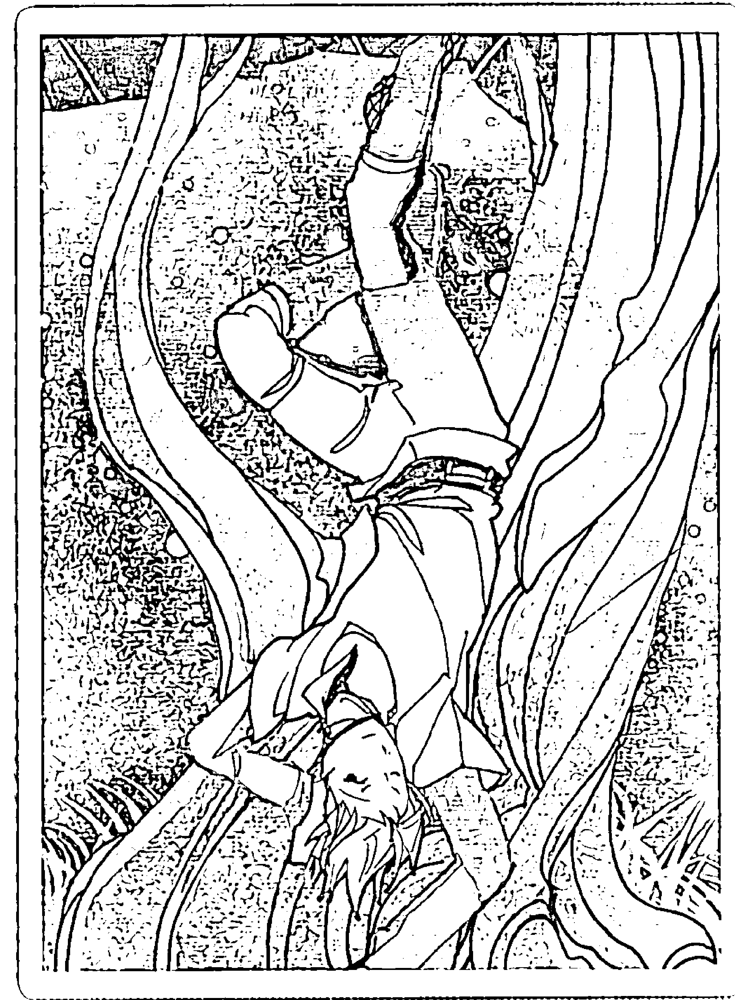

繪者：貓小渣

標準維特牌版本

### XII 吊人 THE HANGED MAN
吊人的概念最初是來自於為宗教犧牲的殉道者，他們為了堅持保有自己的信仰，不惜犧牲寶貴的生命，算是信仰堅貞的最高表現，因此在信徒的心目中有十分崇高的地位，但是同時也帶有受盡折磨苦難的意思；不過在近代塔羅牌當中畫的通常都是頭上發出智慧之光的開悟者，他在生命暫停的時刻通過嚴苛的考驗，並以與他人不同的觀點得到深刻的洞見，雖然目前受制於客觀的環境而無法有太多積極的作為，即使如此仍然無損於他內心當中的平靜與喜悅。

## 正位圖解
限制束縛・懸而未決
考驗・洞悉的能力・犧牲

### 活木的絞刑架
象徵了受苦受難，也帶有為特定事情犧牲的意思，在占卜牌義當中經常表示受到限制與束縛，因此無法自由行動。

### 吊人的姿勢
兩腳交叉並把雙手後背，代表在煉金術當中硫的符號，象徵火焰般的陽性能量，在占卜牌義中代表精神力和直覺。

### 灰黯的天空
象徵四周的環境沉悶沒有變化，雖然狀況不樂觀但也還不到絕望的程度，在占卜牌義中經常表示懸而未決的狀況。

### 倒吊
倒吊表示正在經歷困難與考驗，上下顛倒使得吊人有與眾不同的觀點，在占卜牌義當中經常表示具有洞悉的能力。

### 平靜的表情
即使在倒吊的狀況之下仍然保持平靜，表示不再受到環境的干擾而有所改變，在占卜牌義當中經常代表要再等待。

### 頭上的智慧之光
頭上發光象徵已經開悟，能體會到神聖的智慧，具有與上天直接連結的能力，在牌義當中經常帶有預言的涵意。

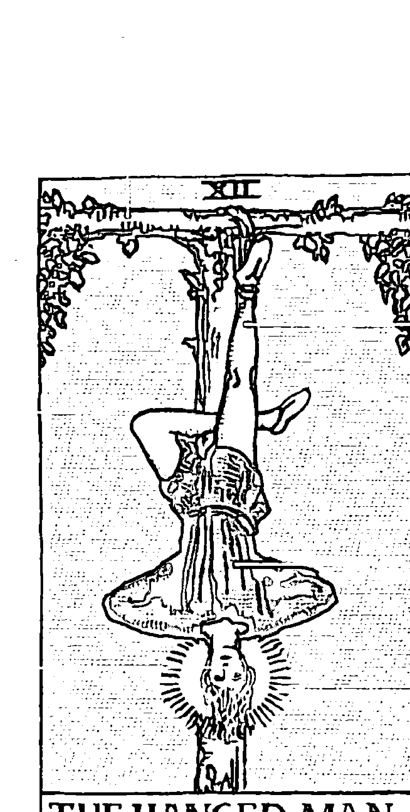

【構圖時間線】背景 → 中景 → 前景

## 逆位圖解
- 解開束縛，與他人相同
- 自私，自立自強
- 逆來順受，缺乏洞見

### 位置關係
吊人超越了活木的絞刑架，象徵已經勝過了外在的限制和束縛，但是因為腳仍然綁在樹上，所以還無法採取行動。

### 圖形變化
原本倒吊在樹上的吊人變成單腳站立在樹枝上，象徵能夠自立自強、獨當一面；有時在占卜當中也代表自私自利。

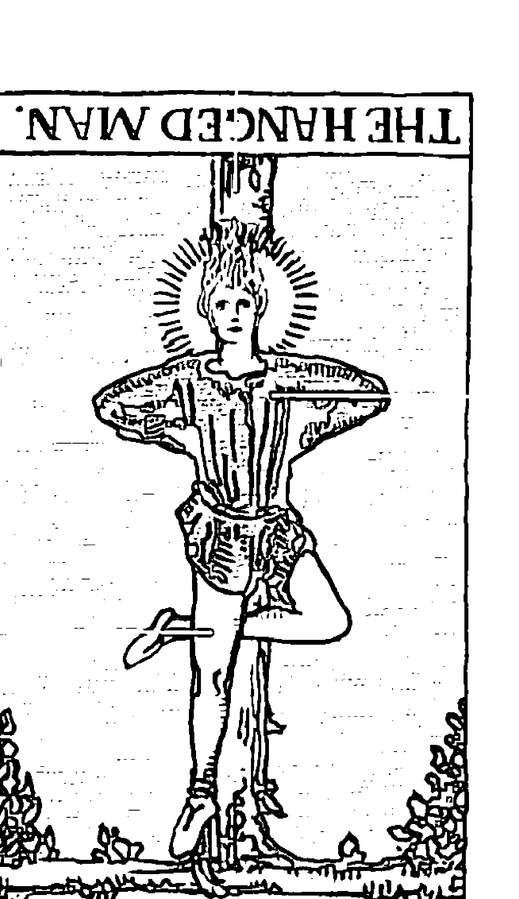

### 方位指向
逆位的吊人回復成正立的位置，變得平凡無奇而沒有特色，代表與他人相同的意見，也暗示隨波逐流和逆來順受。

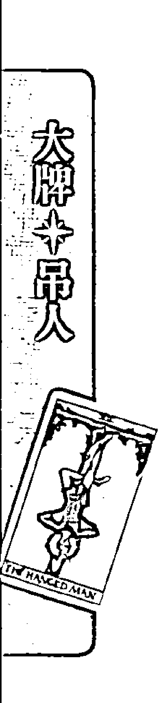

### 色彩意義 ●○○
大片灰色的背景帶來沈悶與靜止的感覺，紅色的褲子雖然雖帶有潛在的行動力，但是因為被綁在活木的絞刑架上而動彈不得，身著藍色的上衣帶有理性與冷靜的意思，頭上發出黃色的光則象徵開悟成道，具有超凡的智慧與洞見。

### 占星對應 ▽
吊人對應到水的元素。水具有柔順和向下的性質，與吊人接受現狀考驗的特質相符，水能夠改變形狀以符合各種不同的環境，吊人也可以逆來順受在當中得到新體會，神秘學當中水元素具有滋潤的作用，顯示出吊人生命力。

### 數字象徵 XII
吊人的編號為十二，與煉金術的十二個步驟相對應，表示結束所有行動進入靜修的階段，與編號為二號的女祭司同樣帶有靜止與智慧的意思。由於二是屬於陰性與被動的數字，因此在吊人的牌義中也比較鼓勵等待而非採取行動。

### 在其他牌中重複出現的象徵
- 樹木 女祭司、皇后、戀人、戰車、力量、星星、權杖A、權杖二、權杖十、聖杯二、聖杯四、聖杯十、寶劍六、錢幣九、寶劍侍者、寶劍王后、寶劍騎士、寶劍國王、錢幣侍者、錢幣騎士
- 頭上發光 節制
- 雙手後背 寶劍八
- 藍色上衣 教皇、死神、權杖五、聖杯六、聖杯十、錢幣五、錢幣八、錢幣十、聖杯侍者
- 紅色褲子 聖杯六、寶劍五、錢幣二、錢幣六、錢幣八

### 牌卡解析
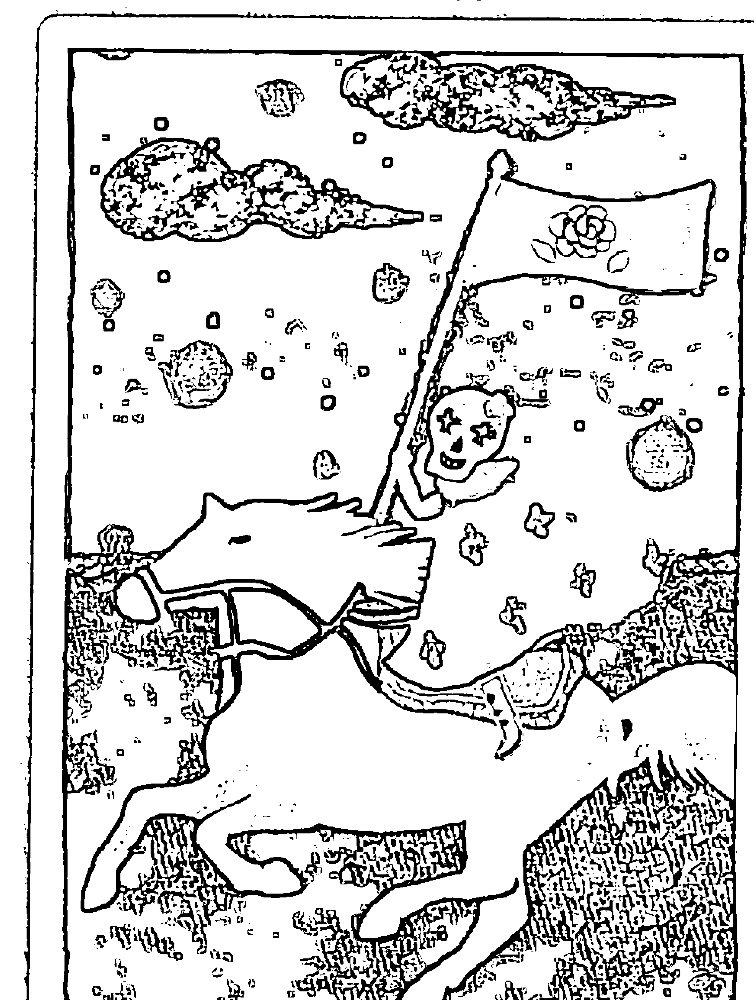

繪者：日光花

標準偉特牌版本

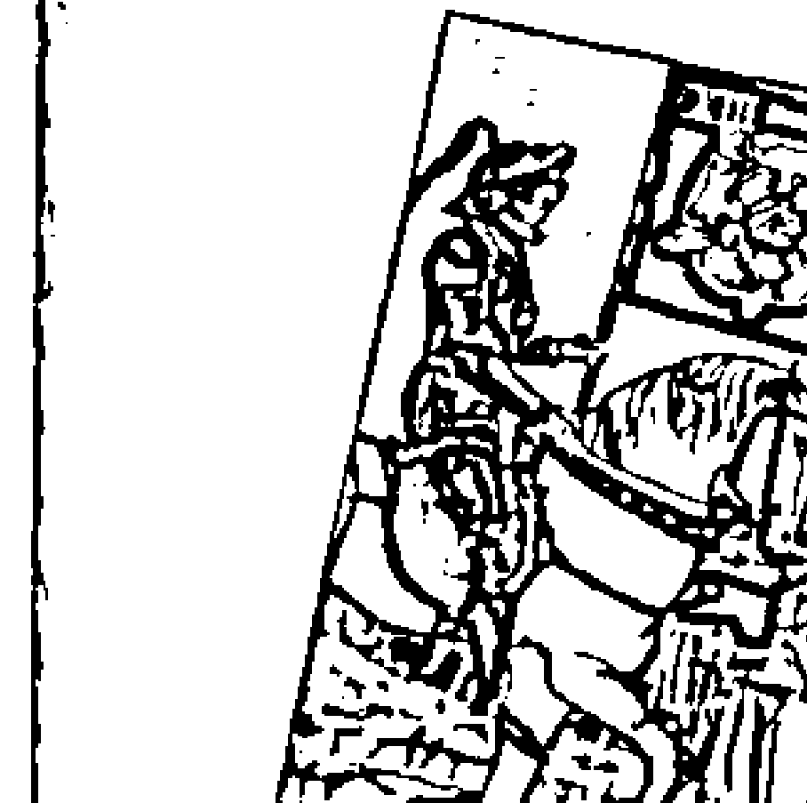

### XIII 死神 DEATH
自古以來西方文化即是以骷髏的形象來代表死亡，在塔羅牌的圖案當中骷髏有時還會拿著鐮刀、穿上斗篷，或是穿金帶銀跳著奇怪的舞蹈，但是忌諱死亡是人之常情，因此在比較古老版本的塔羅牌當中，大牌就只有死神沒有標註名字，而死神牌的編號十三，也常被視為不祥的數字；死亡表面上指的是生命的結束，但生與死是相對的概念，舊的結束才會有新的開始，因此死神也代表了除舊佈新的意義，只是大多數人遇到改變的狀況還是會有恐懼和抗拒。

## 正位圖解

毀滅·必死的命運
重大的轉變
結束與開始·解脫

### 骷髏騎士

以骷髏代表死亡，座下的白馬則象徵了死亡的使者，居高臨下代表死神的優勢地位，在牌義當中表示必死的命運。

### 河流及船

在埃及和希臘的神話當中，人死後靈魂要坐船渡過冥河，在這裡是象徵死亡的過程，同時也暗示死亡是一種解脫。

### 躺在地上的國王

即使尊貴如國王，到了生命的盡頭仍然難逃一死，象徵在死亡之前人人平等，在占卜牌義當中也帶有毀滅的意思。

### 遠方的雙柱及太陽

雙柱之間升起的太陽，代表黑夜結束後光明重臨大地，當中帶有重生的意思，也象徵由物質層面提升到精神層面。

### 雙手合十的教士

教士在面對死亡時仍能昂然站立，平靜地等待生命的結束，代表宗教能提供我們面對死亡的智慧，不必害怕死亡。

### 跪地的少女及兒童

跪地的動作代表對死亡的臣服，少女撇過頭去象徵逃避不想面對改變，兒童向死神獻花則是象徵真心地歡迎改變。

【插圖時間線】前景 → 中景 → 背景

## 逆位圖解

停滯 · 不願改變
沮喪 · 死裡逃生
重新開始
部分改變

### 位置關係

地上的人物超過死神的高度，表示勝過死亡的可能性，在占卜牌義當中常代表有機會死裡逃生或本人不願意改變。

### 圖形變化

若是小船在河中翻覆，則是象徵無法抗拒的變局，通常都是令人失望或沮喪的結果；有時候也會代表停滯的狀況。

### 方位指向

死神由朝向右方變為朝向左方，象徵到了死神要離開的時候，代表已經度過了最壞的狀況，也有重新開始的機會。

### 色彩意義

黑色的盔甲與白馬象徵二元對立，同時也與黑色旗幟當中鑲嵌白色玫瑰圖案相互呼應，身著黃色長袍的主教帶有面對死亡的智慧，與遠方黃色的太陽相互呼應，灰色的長袍表示少女逃避的心態，藍色上衣象徵兒童內心的平靜。

### 占星對應

死神對應到天蠍座。自古以來天蠍座就被賦予死亡與再生的意義，正好與死神的概念相互呼應，天蠍座強大的意志力與教士的角色有關，代表面對死亡的勇氣和智慧，死亡的國王則與天蠍座守護星火星象徵的衝突及傷害有關。

### 數字象徵

死神編號為十三，代表突破了十二的穩定狀態而有所改變，反映出數字三陽性與動態的能量，三號的皇后與十三號的死神分別代表生命的開始與結束，展現出生命必經的重要歷程，彼此的關係也暗示生與死是一個完整循環。

### 在其他牌中重複出現的象徵

- 黃色長袍 聖杯三、錢幣九、權杖騎士、權杖王后
- 手套 權杖六、聖杯六、錢幣九、權杖騎士、寶劍騎士、錢幣騎士
- 騎馬 太陽、權杖六、權杖騎士、聖杯騎士、寶劍騎士、錢幣騎士
- 馬 太陽、權杖六、權杖騎士、聖杯騎士、寶劍騎士、錢幣騎士
- 盔甲 皇帝、戰車、寶劍四、權杖騎士、聖杯騎士、寶劍騎士、錢幣騎士、錢幣國王
- 骷髏 聖杯七
- 旗幟 太陽、審判
- 白玫瑰 愚者
- 荒地 權杖五、聖杯五、寶劍七、寶劍八、寶劍侍者、寶劍騎士
- 死者 審判、寶劍十
- 王冠 皇后、皇帝、戰車、正義、塔、寶劍A、錢幣四、權杖王后、權杖國王、聖杯王后、聖杯國王、寶劍王后、寶劍國王、錢幣王后、錢幣國王
- 兒童 太陽、審判、聖杯六、聖杯十、寶劍六、錢幣十
- 獻花 聖杯六
- 花冠 力量、權杖四、聖杯二、聖杯三
- 下跪 星星、錢幣六
- 河流 皇后、皇帝、戰車、權杖A、權杖八、聖杯五、聖杯八、聖杯十、寶劍六、聖杯騎士、錢幣王后
- 船 權杖三、寶劍六、錢幣二、聖杯國王
- 太陽 戀人、節制、太陽、愚者、聖杯八
- 雙塔 月亮
- 曙光 寶劍十
- 雙手合掌 審判、寶劍四

### 牌卡解析

繪者：俞家燕

標準偉特牌版本

## XIV 節制 TEMPERANCE

節制為基督宗教的四聖德之一（另外三個為謹慎、正義與堅毅），傳統上經常以倒水的天使來呈現，天使將水倒入酒杯當中，象徵飲酒但不過量的意象，其本意相當接近中國人講的「中庸之道」，同時代表自我克制不放縱與節省，後來才由圖形的聯想延伸出交流融合的意思；相傳節制當中的天使為大天使米迦勒，意義為「與神相似者」，傳統上大天使米迦勒掌管力天使和大天使階層，為太陽與星期日的守護天使，同時可以幫助人找到自己的天生使命。

## 正位圖解

溫和·相互融合
轉化與淨化
中庸之道
管理與調控

### 發光的頭頂

發光的頭頂代表超越的智慧，頭上的太陽符號則暗示了大天使米迦勒的身份，占卜當中有時會與宗教或教會有關。

### 胸前的徽章

三角形象徵精神與原則代表塔羅牌的大牌，正方形象徵由四要素組成的世界代表塔羅牌的小牌，一切都了然於胸。

### 發光的山頂

閃光中隱約透露出王冠的形狀，象徵更高的神聖智慧，上山的道路表示人們通往智慧的方法，要從反省自身開始。

### 倒水的動作

用白色的長袍和流動的水來象徵淨化的儀式，將兩個杯中的水與酒相互混合也象徵了不同意見之間的交流與融合。

### 一腳在水中一腳在地上

由陸地象徵已知的意識層面，水池中的水來象徵未知的潛意識層面，圖中的天使可以兼顧與融合兩者的力量。

### 水邊的蝴蝶花

在希臘神話中蝴蝶花是彩虹的化身，在基督宗教中則常代表聖母瑪利亞，在占卜牌義當中也會和純潔與樸素有關。

【構圖時間線】背景 → 中景 → 前景

## 逆位圖解

- 分裂·利益衝突
- 不幸的結合
- 極端主義·小氣
- 不穩定

### 位置關係

水池由下方移到上方，會造成比較情緒化的傾向，發光的山頂超過天使的頭部，表示仍然需要去探索更大的智慧。

### 方位指向

三角形的尖端指向下方，變為象徵水元素的符號，一方面表示更加柔順有彈性，但同時也增加了變化和不稳定性。

### 圖形變化

杯中的水傾倒出來，象徵合作破局或無法達成共識，占卜牌義當中很可能代表不幸的結合，或是競爭衝突的局面。

### 色彩意義

頭上發出黃色的光芒象徵神聖的智慧，與發光的山頂相互呼應，天使紅色的翅膀象徵內心的熱情與實際的行動力，白色的長袍則帶有神聖與純潔的意涵，胸口橘色的三角形象徵溫暖與滿足，下方藍色的水池則表現出開闊與平靜。

### 占星對應

射手座對應到節制。直條的衣服紋路、杯中的水加上胸前的三角符號，組合成一個直立的射手座符號，射手座愛好冒險和旅行的特質，也與節制當中相互融合的概念有關，至於宗教有關的概念也與射手座的守護星－木星－有關。

### 數字象徵

節制的編號為十四，可視為四號牌皇帝的更高層次，是一種透過相互溝通、取得共識之後得到的穩固秩序，但是十四也可以當成七加七，具有靈性成長的意思，節制主要代表一種內在的轉化過程，若從外表來看並沒有什麼改變。

### 在其他牌中重複出現的象徵

- 聖山 戀人、力量
- 小徑 月亮、權杖二、錢幣A、錢幣八
- 太陽 戀人、死神、太陽、愚者、聖杯八
- 天使 戀人、命運之輪、審判
- 頭上發光 吊人
- 白色長袍 魔術師、皇后、力量、權杖四、聖杯二、聖杯三
- 倒水 星星
- 一腳在水中一腳在地上 星星
- 水池 女祭司、星星、月亮、聖杯A

### 牌卡解析

繪者：Lino Chang

標準偉特牌版本

## XV 惡魔 THE DEVIL

在歐洲的文化傳統當中，惡魔代表了人性當中墮落的一面，除了神所掌管的真、善、美之外，人類的貪婪、感官的享受、物質的慾望等等，都是惡魔拿來引誘人類的工具；傳說中惡魔是墮落的天使，能變成各種不同的外貌來誘惑人，十九世紀的神秘學家列維創造了綜合羊頭、人身並有翅膀及火把的圖象，廣被後世神秘學家所引用，是著名的惡魔形象之一；雖然惡魔有很強的法力，不過人類會落入痛苦的陷阱也是自己的意志力不堅定，才會被惡魔引誘。

## 正位圖解

束縛·毀壞·暴力相向
被慾望蒙蔽
短暫的享樂

### 災禍的手勢

惡魔的右手的手勢代表災禍，象徵暴力和破壞，在占卜牌義當中常會代表痛苦的折磨，甚至走上失敗和墮落之路。

### 長角與尾巴的人

角與尾巴都象徵帶有獸性的表現方式，不論是追求短暫的感官快樂或是為了名利而鬥爭，都只為滿足原始的慾望。

### 祭壇上的鎖鏈

鎖鏈象徵被捆綁和不自由，連接到惡魔的祭壇則象徵與惡魔的邪惡契約，在占卜牌義當中也代表物質世界的限制。

### 倒五角星

五角星代表了唯物主義，倒過來的五角星則象徵過份重視物質，在占卜中也表示忽略精神生活與靈性層面的成長。

### 站在祭壇上的惡魔

惡魔雖然法力強大，不過仍然要出於人類的崇拜臣服才能誘惑到人，在占卜牌義當中常代表誘惑者站在優勢地位。

### 火把

惡魔的左手拿著火把，象徵慾望的火焰，在占卜牌義當中常會表示自己被慾望蒙蔽，同時也可能代表外在的引誘。

【構圖時間線】背景 → 中景 → 前景

## 逆位圖解

- 被引誘·虛弱
- 自甘墮落·解開束縛
- 復原·道德與良善

### 位置關係

被束縛的男女移到了上方，強調被引誘者的部分，但是由於男女超過了惡魔的高度，也暗示可以逃出惡魔的掌握。

### 方位指向

惡魔的火把轉向上方，象徵內在炙烈的慾望浮現，如果不知節制就很容易誤入歧途，也經常指向自甘墮落的狀況。

### 圖形變化

若是惡魔由祭壇上落下，表示外在的引誘和束縛已經消失，在占卜當中也常表示行善或為惡只在於你的一念之間。

### 色彩意義

大片黑色的背景帶來邪惡與恐怖的感覺，同時也象徵受到引誘之後就陷入了黑暗的深淵當中，與黑色的祭壇相互呼應，被束縛的男女頭上都著成紅色，象徵滿腦子都是原始的慾望，與男子火紅的尾巴及惡魔紅色的火把相互呼應。

## 占星對應 ♑♄

惡魔對應到摩羯座。惡魔圖象中的山羊頭與摩羯座上半身的山羊象徵相同，惡魔的右手當中則出現了摩羯座的守護星－土星－的紋路；摩羯座精於計算、富於心機的特質與惡魔相關，摩羯座強大的世俗慾望也容易把自己束縛住。

## 數字象徵 XV

惡魔的編號為十五，可視為五號的另一個層次展現，數字五代表改變與復仇，也象徵人站在靈性與物質的交叉路口，面臨到引誘與考驗，惡魔引誘人走向物質慾望的方向，遠離和平良善的生活，同時也會帶來各種的爭鬥與腐化。

### 在其他牌中重複出現的象徵

- 黑暗 寶劍九
- 惡魔 聖杯七
- 羊 皇帝、錢幣王后
- 火焰 塔、權杖騎士
- 成對的男女 戀人、審判、權杖四、聖杯二、聖杯六、聖杯十、錢幣五、錢幣十
- 裸體 戀人、星星、太陽、審判、世界
- 葡萄 權杖四、聖杯三、錢幣九、錢幣十、錢幣國王

### 牌卡解析

繪者：尼果

標準偉特牌版本

## XVI 塔 THE TOWER

塔的意象源自於《聖經》創世紀當中巴別塔的故事，訴說著人類想要建造通天高塔以彰顯自己，但是最後被上帝所阻止而無法完成，從傳統宗教的角度來解釋，表明若非依照上帝的旨意所設立，一切的努力必然徒勞無功；事實上建築高塔一直是歐洲中古時期基督教世界的禁忌，一般民房甚至是皇宮的高度都不可超過教堂，整個城鎮最高的建築通常都是教堂的鐘樓，表示對於教會與上帝的崇敬，這種狀況直到啟蒙運動之後教會勢力衰退才開始有所改變。

## 正位圖解

災難・被毀滅
突來的意外・自作自受
執迷不悟

## 王冠

代表這是人類為了彰顯自己而建立的塔，但是王冠反而引導雷電擊中塔，在占卜當中常表示自己招來災害而毀滅。

### 空中的閃電

象徵由上天降下的懲罰，在占卜牌義當中經常表示不可預期的意外狀況，但是有時候也可能象徵一閃即逝的靈感。

### 著火的窗戶

三個著火的窗戶象徵身、心、靈這三個部分都面臨重大的考驗，在占卜牌義當中經常表示遭受痛苦及煎熬的狀況。

### 著火的塔頂

被雷電擊中頂端而著火，象徵由上而下的懲罰毀滅了一切，但是另一方面也可能代表受到上天的啟示而充滿靈感。

### 身著斗篷的佞臣

象徵人的墮落與掙扎，代表人在慌亂時不理性的舉動，拋下國王自己逃生的行為也象徵了不忠貞或不忠誠的關係。

### 右方跳樓的國王

在天空中作出投降的姿勢象徵臣服，表示國王心中已有悔悟之意，在占卜當中經常表示要放下痛苦執著才能解脫。

【構圖時間線】背景 → 中景 → 前景

## 逆位圖解

恐懼・慌亂 及時回頭・放棄・暴政 內部的問題

### 位置關係

跳樓的人由下方移到了上方，強調跳樓逃生的人，在占卜牌義當中表示要放下錯誤的過去才有絕處逢生的可能性。

### 方位指向

閃電變成由下方擊向上方，表示慌亂和不確定感其實是發自你的內心，有時候也指出目前的問題主要來自於內部。

### 圖形變化

跳樓的人由倒立轉為正立，象徵本人具有向上提升的意圖，塔頂傾倒的王冠則表示榮華富貴都已經成為過往雲煙。

### 色彩意義

大片黑色的背景象徵了死亡與結束，灰色的烏雲與高塔則帶有沈悶與停滯的感覺，劃破天際的黃色閃電象徵了神的警告，與黃色的王冠相互呼應，藍色的長袍表示內心冷靜，紅色的斗蓬帶有衝動的意涵，與紅色的火焰相互呼應。

### 占星對應

塔對應到火星。天空降下的閃電帶有箭頭，代表了火星符號當中箭頭的部分，在占星學當中火星帶有衝突與衝動的特質，同時也與意外傷害有關，與塔的牌義完全呼應，另一方面，火星象徵的災難性也充份表現在著火的高塔上。

### 數字象徵

塔的編號為十六，可以視為六號在另一個層次的展現，數字六代表了均衡與協調，在此我們看到的是當人類為了私利而破壞了天地間自然的秩序，必然會受到上天的懲罰，從這裡也可以聯想到因為環境污染而造成大自然的反撲。

### 在其他牌中重複出現的象徵

- 黑夜 寶劍十、錢幣五
- 積雲 戀人、命運之輪、審判、世界、權杖A、聖杯A、聖杯四、聖杯七、寶劍A、寶劍三、錢幣A、寶劍侍者、寶劍王后、寶劍國王
- 王冠 皇后、皇帝、戰車、正義、死神、寶劍A、錢幣四、權杖王后、權杖國王、聖杯王后、聖杯國王、寶劍王后、寶劍國王、錢幣王后、錢幣國王
- 火焰 惡魔、權杖騎士
- 藍色長袍 女祭司、教皇、聖杯十、聖杯王后、聖杯國王、寶劍國王
- 斗蓬 女祭司、隱者、權杖二、聖杯五、寶劍六、錢幣三、錢幣五、權杖侍者、錢幣王后、錢幣國王
- 紅色鞋子 皇后、權杖三、聖杯二、聖杯四、聖杯六、聖杯八、寶劍七、錢幣四、寶劍王后、寶劍國王
- 高舉雙手 審判、權杖四
- 岩石高山 皇帝、隱者、審判、愚者、聖杯八、寶劍A、錢幣A、聖杯騎士

### 牌卡解析

## XVII 星星 THE STAR

星星自古以來就被視為上天啟示的工具，常有夜觀星象發出預言的說法；在古波斯的神秘學傳統當中經常使用八角星來代表豐收女神伊斯塔，依照古埃及的傳統說法則認為中間的大八角星代表天狼星，四周的七個小八角星是昴宿的七姊妹星雲，是人類始祖的來源。近代神秘學家則認為中間的大八角星是北極星或伯利恆之星，象徵永恆不變的光明和希望，而四周的七個小八角星則是象徵傳統占星學當中的七個行星，代表宇宙力量對於地球及人類的影響。

## 正位圖解

天啟的靈感與智慧
目標和希望
分享與回饋·渴望自由

### 中央的大八角星

北極星是星空不動的中心，可以幫助我們辨認方向，因此在占卜牌義當中經常表示具有高遠的理想和明確的目標。

### 四周的七個星星

代表在傳統占星學當中的七個行星，象徵宇宙的客觀秩序與影響力，在占卜牌義當中也經常表示帶有光明的希望。

### 下跪的裸女

跪在地上象徵臣服與謙卑，一腳在地上一腳在水中，象徵橫跨物質和精神層面，在占卜當中代表天啟的靈感與智慧。

### 停在樹上的鳥

鳥能在空中飛行經常表示無拘無束的感覺，停在樹上則是象徵聯結天空與陸地，在占卜時也代表對於自由的渴望。

### 倒回水池的水壺

倒回池中的水代表我們與精神世界的聯結，也象徵回歸到靈性源頭的渴望，在占卜牌義當中經常帶有回饋的意思。

### 倒向地上的水壺

倒在陸地上的水分為五個支流，象徵人類透過五種感官來體驗在地球上的生命，在占卜牌義當中也有分享的意涵。

【構圖時間線】背景 → 中景 → 前景

## 逆位圖解

- 不分享・自尊自大・希望落空
- 不切實際・缺乏自由
- 主觀的錯誤

### 圖形變化

兩只水瓶都由傾倒轉變為正立，裡面的水就無法再流出來，原本樂於分享與回饋的狀況也可能會變得保守和吝嗇。

### 方位指向

裸女的臉由向下看變為向上看，象徵自尊與自傲，經常代表無法接受別人的建議，因此很可能會陷於主觀的錯誤。

### 位置關係

星星由上方移到了下方，象徵希望只存在於自己的內心當中，在占卜牌義當中也經常代表希望落空或是不切實際。

### 牌卡解析

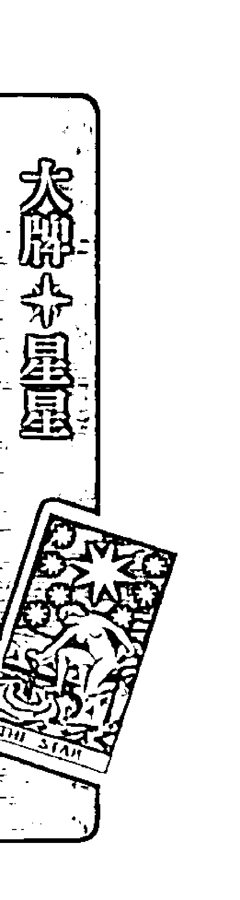

### 色彩意義

大片藍色的天空給人平靜與冷靜的印象，同時也有開闊和自由的能量，與藍色的水池相互呼應，綠色的草原則帶來和諧與穩定的感覺；黃色的大八角星帶來光明的希望，與裸女黃色的頭髮相互呼應，象徵得到天啟的靈感和智慧。

### 占星對應

星星對應到水瓶座。下方倒水的裸女正好就是水瓶座的象徵，愛好自由及喜歡與別人分享的特質與水瓶座相同，水瓶座的人經常帶有高遠的理想，並且對未來充滿光明的希望，在神秘學傳統中認為水瓶座與占星學有緊密的關係。

### 數字象徵 XVII

星星的編號為十七，可以視為七號在更高層次的展現，數字七代表神聖與精神的法則，當我們臣服於更高的秩序自然就能得到天啟的靈感與智慧，中央的大八角星可視為一號創造法則的展現，七個小八角星正好對應到七的數字。

### 在其他牌中重複出現的象徵

- 夜空 女祭司、隱者、月亮、聖杯八、寶劍二
- 星星 皇后、戰車
- 樹木 女祭司、皇后、戀人、戰車、力量、吊人、權杖A、權杖二、權杖十、聖杯二、聖杯四、聖杯十、寶劍六、錢幣九、寶劍侍者、寶劍王后、寶劍騎士、寶劍國王、錢幣侍者、錢幣騎士
- 裸體 戀人、惡魔、太陽、審判、世界
- 下跪 死神、星星、錢幣六
- 倒水 節制
- 草地 戀人、戰車、力量、月亮、聖杯四、聖杯六、錢幣A、錢幣侍者、錢幣王后
- 一腳在水中一腳在地上 節制
- 水池 女祭司、節制、月亮、聖杯A

### 牌卡解析

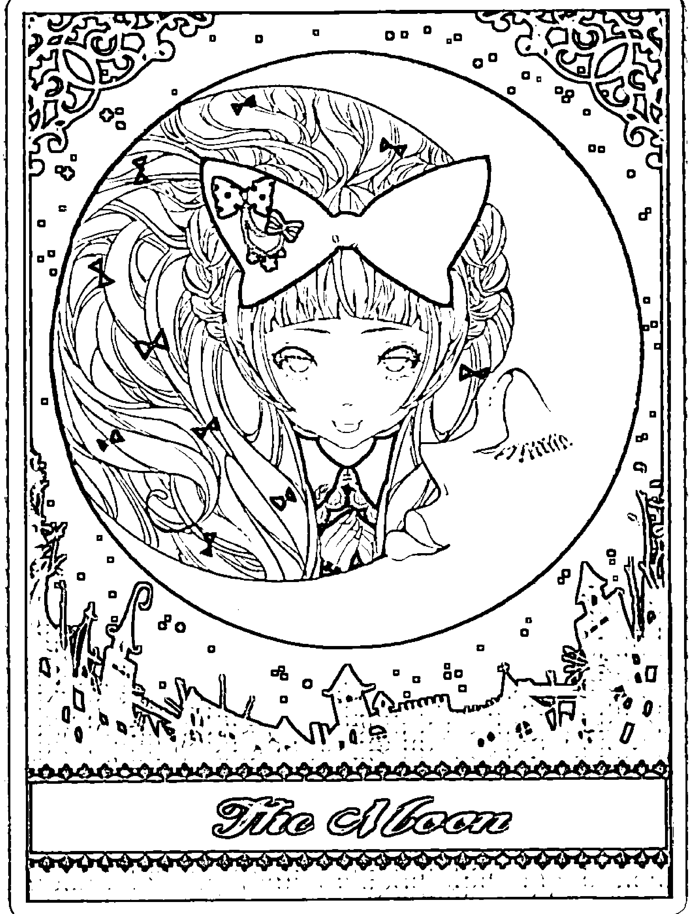

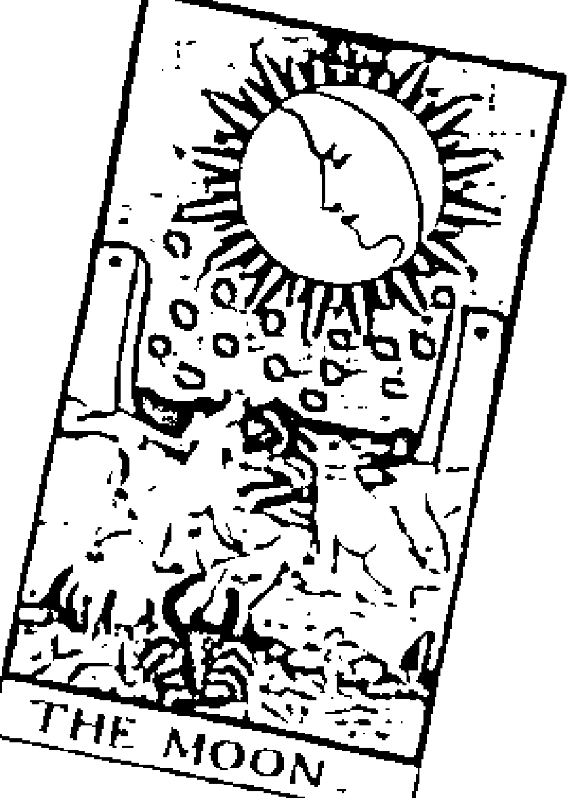

繪者：臧致怡

標準偉特牌版本

## XVIII 月亮 THE MOON

月亮是夜空中最明亮的自然發光體，也是唯一一個肉眼可見形狀會週期性變化的天體；在歐洲的神話傳統當中，月亮可以區分成三種不同的面貌和象徵－新月代表純潔的少女、滿月代表慈愛的母親、殘月代表智慧的婦人，本身就具有多層次的象徵意義；月亮牌的場景呈現出陰暗詭異的氣氛，就像是我們只依賴月光在夜裡趕路，任何風吹草動都可能會觸動內在不安與恐懼的情緒，甚至因為光源不足而無法看清楚現實的狀況，因此產生幻覺或是被誤導欺騙。

## 正位圖解

- 錯誤、不安與恐懼
- 欺騙和幻覺、隱藏的危險
- 難以捉摸的變化

### 朦朧的夜空

空氣中的霧氣及露水折射了月光，表現出夜空詭異和神秘的氣氛，朦朧中可能會出現幻覺，甚至因此而造成錯誤。

### 雙塔

雙塔象徵地界與關卡，也代表意識所造成的限制，在占卜牌義當中經常會表示因為內心不安而不願意跨出舒適區。

### 狼與狗

狼象徵未被馴化的生物本能，帶有敏銳的直覺力；狗則象徵已經被馴化的本能，只有在遇到危險時才有情緒反應。

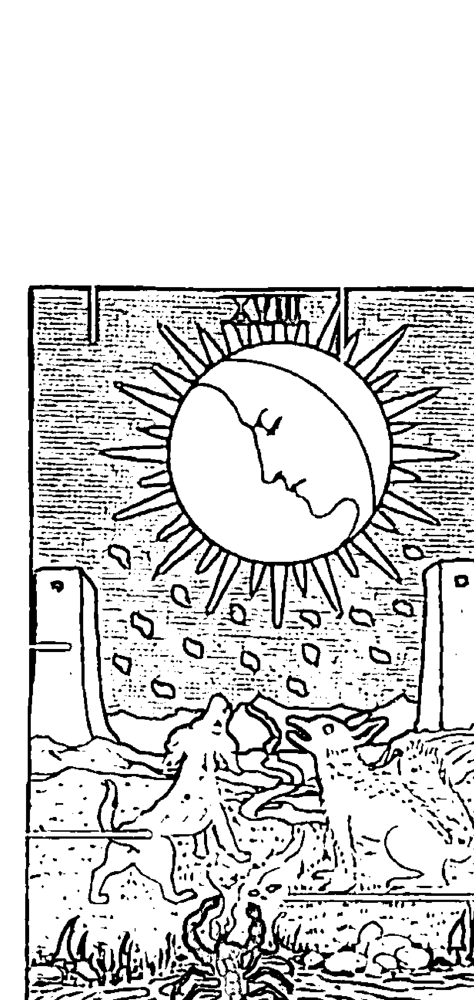

### 發光的月亮

月亮發出十六道大光芒及十六道小光芒，向下看著夜晚發生的事情，象徵在不明的狀況下內心仍然要保持平靜。

### 通往遠山的小徑

穿越雙塔的小徑象徵通往未知的道路，旅途中可能遇到隱藏的危險，在占卜牌義當中也經常表示難以捉摸的變化。

### 巨蟹

爬出水面的巨蟹象徵由無意識的深淵中離開，巨蟹的甲殼象徵了自我保護，舉起一對大螯則表示有潛在的攻擊性。

【構圖時間線】前景 → 中景 → 背景

## 逆位圖解

外在的挑戰·野性 情緒化·自我欺騙·明朗化 可以掌握的變化

### 圖形變化

若是水池淹沒大地，潛在的情緒將會爆發出來，可能會有過度情緒化的可能性，占卜時也常代表狀況的不穩定性。

### 位置關係

狼與狗超過了雙塔的高度，代表自然野性將會突破人為的限制，在占卜牌義當中也指向憑直覺做決定不要想太多。

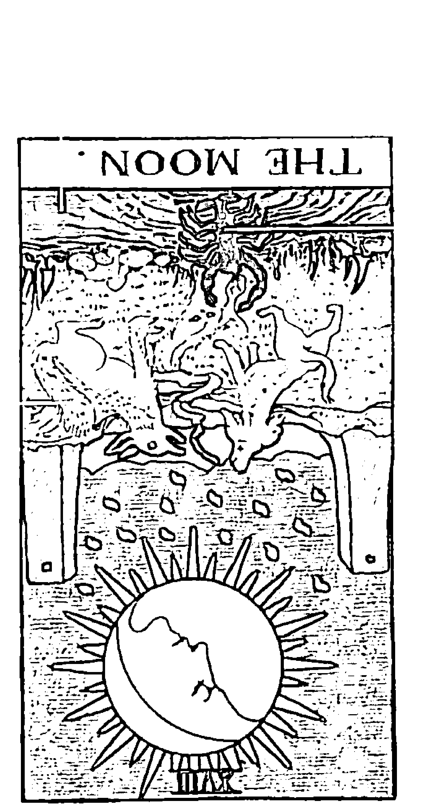

### 方位指向

巨蟹的螯指向下方，表示外在的挑戰仍然存在；山中的道路延伸到水邊，象徵事情漸漸明朗化，快要水落石出了。

## 色彩意義 ○ ○ ⊙

大片藍色的天空帶來神秘與權威的感覺，與下方藍色的水池相互呼應；黃色的月亮帶來光明，同時也照亮通往遠山的小徑，帶給我們邁向未知的勇氣；大片綠色的草地帶來和諧與平衡的力量，紫色的巨蟹則是神秘與未知的象徵。

## 占星對應 ♓ ♋

月亮對應到雙魚座。雖然在圖上找不到與雙魚座直接相關的象徵，但是月亮不安恐懼的牌義確實與雙魚座的特質相符，朦朧模糊的感覺也與雙魚座相關；由於在占星學當中月亮守護了巨蟹座，因此在圖中也有出現巨蟹座的象徵。

## 數字象徵 XVIII

月亮的編號為十八，可視為八號在另一個層次的展現，數字八象徵和諧與安定，正是我們在面對曖昧不明的狀況時最需要的力量，同時八也與本能的驅動力有關，若是我們不能發揮理性的力量，就只剩下本能的情緒反應和恐懼。

### 在其他牌中重複出現的象徵

- 月亮 女祭司、戰車、聖杯八、寶劍二
- 夜空 女祭司、隱者、星星、聖杯八、寶劍二
- 雙塔 死神
- 小徑 節制、權杖二、錢幣A、錢幣八
- 草地 戀人、戰車、力量、星星、月亮、聖杯四、聖杯六、錢幣A、錢幣侍者、錢幣王后
- 狗 愚者、錢幣十
- 水池 女祭司、節制、星星、聖杯A

### 牌卡解析

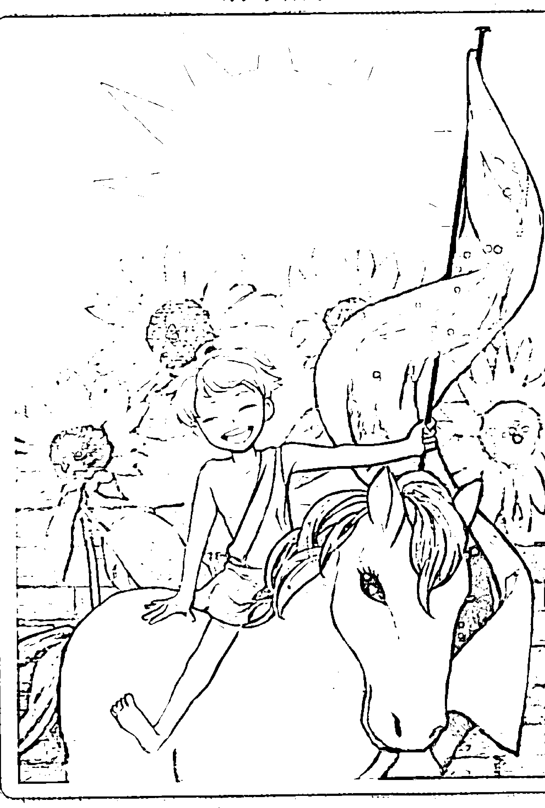

绘者：Lino Chang

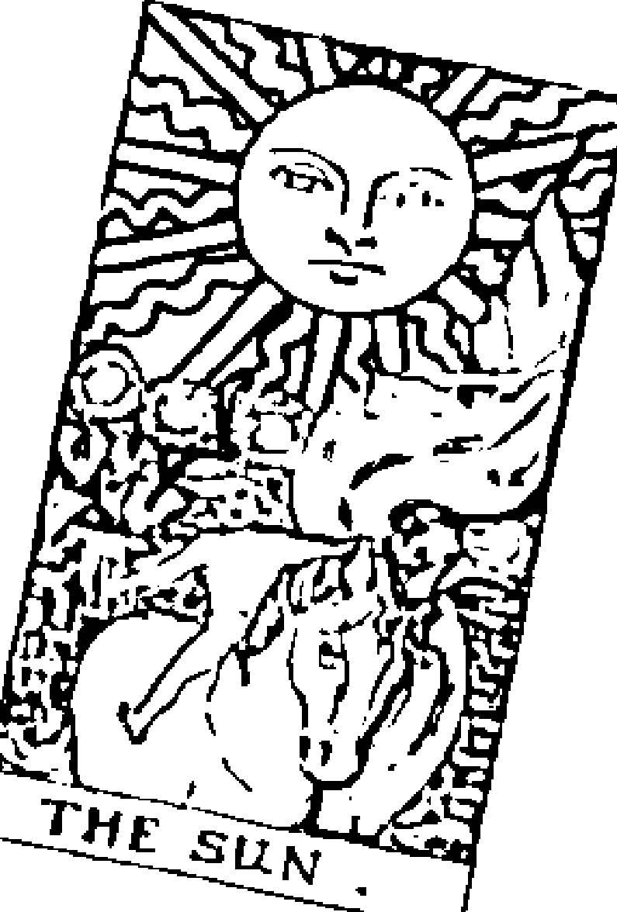

标准伟特牌版本

## XIX 太陽 THE SUN

太阳自古以来即为光明的代表，为这个世界带来生命与活力，在希腊神话当中太阳神阿波罗是光明与纯洁的象征，同时掌管了音乐、艺术、语言及诗，并且会透过德尔斐神庙来发布神谕；太阳牌的图象改编自《圣经》启示录当中的预言，神将派遣一位骑白马的神圣使者来到世上，依照公义进行战争及审判，不但战无不胜功无不克，并且能在地上行神的旨意管辖四方；有人认为裸体的小孩是代表返璞归真与雌雄同体的象征，距离回归天堂只差最后一步。

## 正位圖解

自信與榮耀・圓滿成功
快樂與滿足・一視同仁
朝向光明面

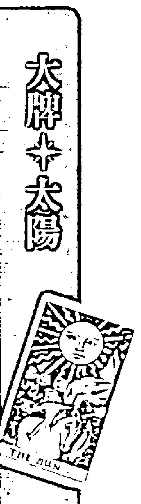

### 太陽

太陽當中的人臉象徵人類在白天帶著意識與覺知生活，人類的自我意識與理性能力也是來自於太陽靈性的啟發。

### 太陽的光芒

直線表現太陽的光芒，曲線則象徵太陽光中的熱能，在占卜牌義當中經常代表自信與榮耀，並且帶來快樂與滿足。

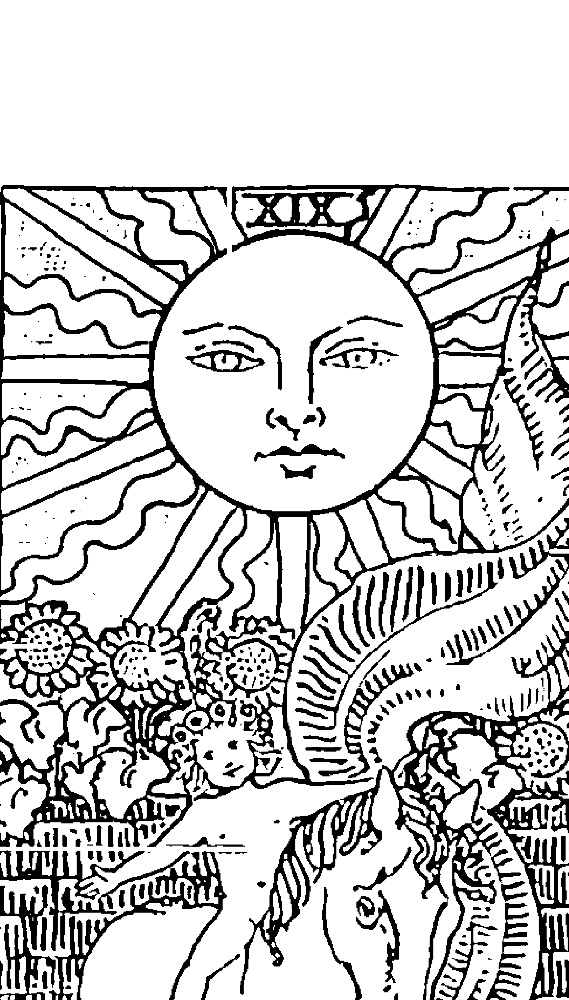

### 向日葵

四朵向日葵分別象徵有形世界的礦物界、植物界、動物界及人類，在占卜牌義當中也有不分彼此一視同仁的意思。

### 大紅旗

用來指揮作戰的工具，象徵軍事上的權威及勝利，同時帶有熱情和行動力，在占卜牌義當中也經常代表圓滿成功。

### 騎白馬的小孩

以裸體的小孩象徵純潔無瑕的心智，駕馭代表本能的白馬，代表理性與欲望的完美結合，並朝向光明的未來前進。

### 圍牆

石頭堆成的圍牆代表人類所創造的事物，同時也是象徵界線與限制，在占卜牌義當中經常表示已經跨出了舒適區。

【構圖時間線】背景 → 中景 → 前景

## 逆位圖解

過度自信・虛榮與自大
帶有小波折的成功・不夠滿意
差別待遇・面對問題

### 位置關係

石牆超過太陽的高度造成一部分的陽光被遮蔽了，象徵本人對於現實狀況不夠滿意，或是仍然有鞭長莫及的地方。

### 方位指向

白馬走向左上方象徵正走上向外征服的旅程，在占卜牌義當中經常表示勇於面對問題，或是帶有一點波折的成功。

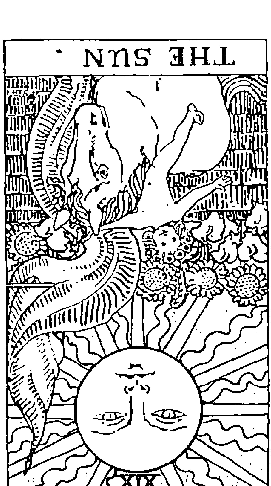

### 圖形變化

若是小孩由馬背上落下，象徵還無法掌握領導統御的秘訣，占卜牌義上也可能代表會在比賽或考試當中遭遇失敗。

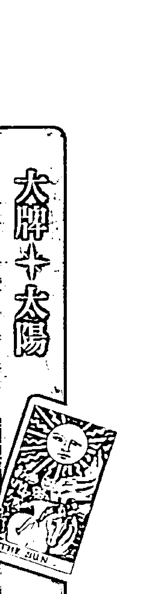

### 色彩意義

黃色的太陽放射出黃色的光芒，帶來光明和開朗的感覺，在藍天的背景前面更展現出擴張性和進取性，與黃色的向日葵及小孩黃色的頭髮相互呼應；紅旗象徵熱情與行動力，白馬帶有樸素和純潔的象徵，與裸體的小孩相互呼應。

### 占星對應

太陽對應到太陽。不論是名稱或圖形象徵都完全一致，在個人占星學當中太陽代表有意識的行為模式，與太陽牌代表的理性與覺知相互呼應，太陽強大的陽性能量會讓人積極行動並且帶來快樂與滿足，也與太陽的牌義完全符合。

## 數字象徵 XIX

太陽的編號為十九，可以視為九號能量在另一個層次的展現，數字九象徵達到滿足與飽合的狀態，在太陽當中則呈現出勝利與成功的意象，同時九也代表達到完美的過程，這個部分也與太陽積極主動和朝向光明面的牌義相呼應。

### 在其他牌中重複出現的象徵

- 太陽 戀人、死神、節制、愚者、聖杯八
- 向日葵 權杖王后
- 圍牆 權杖二、錢幣國王
- 頭上的羽毛 愚者
- 騎馬 死神、權杖六、權杖騎士、聖杯騎士、寶劍騎士、錢幣騎士
- 馬 太陽、權杖六、權杖騎士、聖杯騎士、寶劍騎士、錢幣騎士
- 裸體 戀人、惡魔、星星、審判、世界
- 旗幟 死神、審判

### 牌卡解析

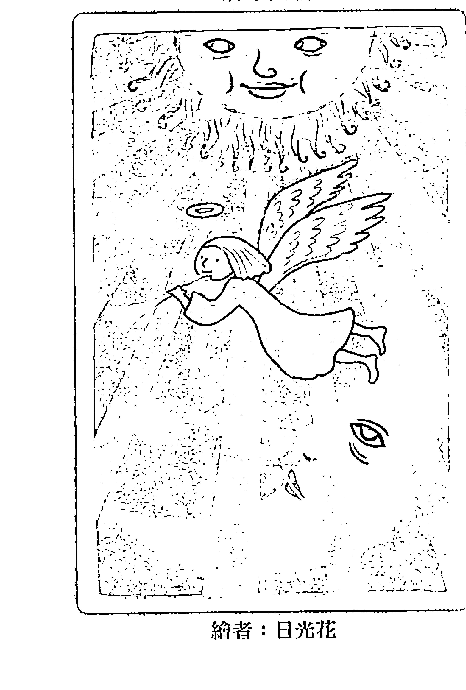

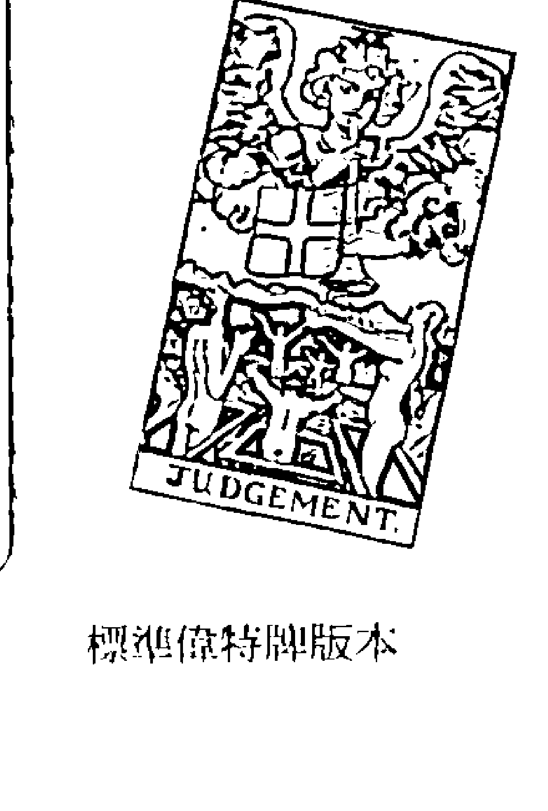

## XX 審判 JUDGEMENT

末世審判的概念主要源自於《聖經》啟示錄，當中記載了世界末日來臨時，天使將要吹響號角叫人由死裡復活，再依照生前的所作所為接受審判，被上天接納者則可以進到新天新地享受永恆的生命，其他人就會被打入地獄的火湖當中再死一次；相傳審判當中的天使為大天使加百列，意思是「神是我的力量」，由於在《聖經》路加福音當中提到，加百列向聖母馬利亞告知她已經由聖靈受孕的消息，因此天主教將祂奉為通訊與交通的主保，並尊稱為聖·加百列。

## 正位圖解

平等的機會·復活與重生
作判斷·覺醒
結算成果

### 帶有十字架的白旗

帶有十字架的白旗象徵記載了審判結果的生命冊，在占卜當中經常表示到了結算成果的階段，將走向最終的結局。

### 群山與墳場

群山象徵遠離塵世的場景，墳場則代表人死後的住所，在占卜牌義中經常表示舊的事物已經結束，無法再回頭了。

### 向上仰望並張開雙手

表示崇拜和狂喜，同時象徵已經由渾渾噩噩的狀況當中覺醒，在占卜牌義當中也表示直接對上天的召喚有所回應。

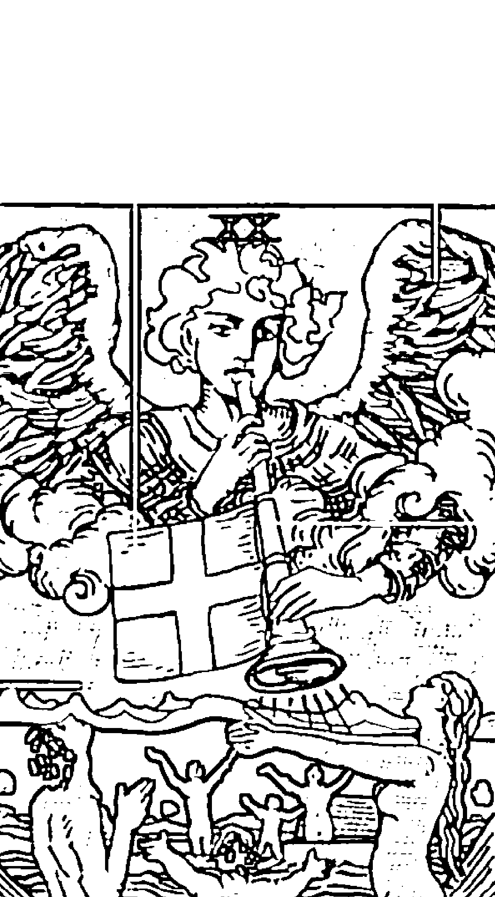

### 吹號角的天使

雲中出現的天使是神的使者，吹號角則是象徵上天旨意的召喚，在占卜牌義當中也經常表示有重大的事情要宣佈。

### 號角吹出的七個音階

七個音階象徵七種美德及相對應的七宗罪，代表了廣泛客觀的判斷標準，在占卜當中也表示可以受到公正的評判。

### 由棺木中復活的人

復活的人有男人、女人和小孩，象徵任何人都可能復活接受審判，在占卜牌義當中也表示每個人都有的平等機會。

【構圖時間線】背景 → 中景 → 前景

## 逆位圖解

- 執迷不悟、延遲
- 優柔寡斷、影響別人
- 羣衆、重新開始

### 位置關係

人類的高度超過了天使的高度，代表人類執迷不悟的可能性，在占卜當中也經常帶有優柔寡斷和猶豫不決的意思。

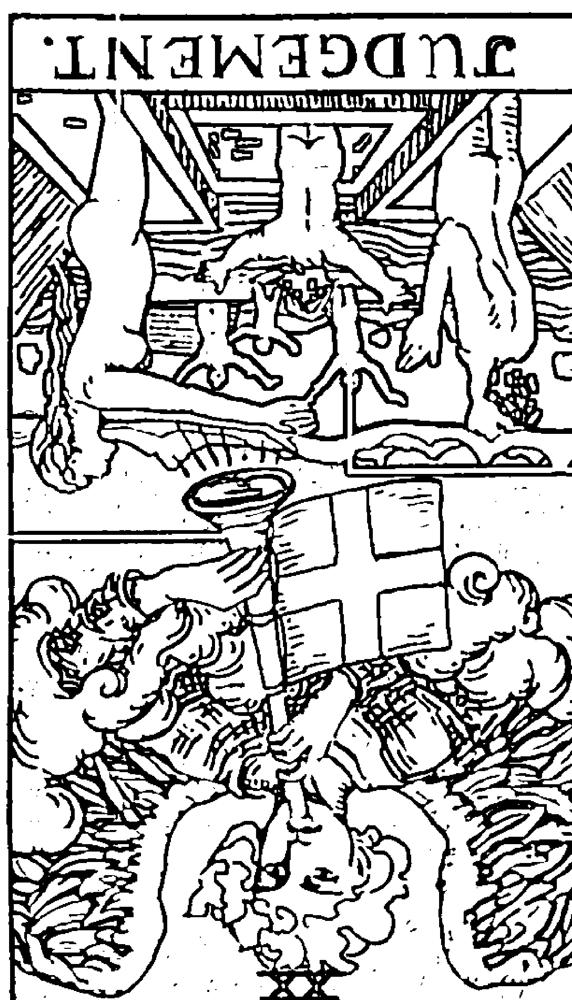

### 方位指向

號角由下而上吹奏，代表你有能力去影響別人；另一方面所有的人都向下張望，則是象徵回歸內在的觀察和反省。

### 圖形變化

若是人們由棺木當中離開，則是象徵已經復活而進行到下一個階段，在占卜牌義當中經常表示事情可以重新開始。

## 色彩意義 ○ ● ◎

大片藍色的背景帶來平靜與自由的感覺，天使紅色的翅膀則是帶有強大的行動力，灰色的死者與棺木表現出沈悶與停滯，天使的黃色號角帶有神聖的智慧與警世的意味，下方死者的頭髮染成黃色則象徵被天使的號角召喚而覺醒。

## 占星對應 △

審判對應到火的元素。火具有光明和溫暖的性質，審判當中使人由死中復活則重啟了光明與希望，火的熱度可以使東西改變特性，審判也使人改變了特性，神秘學當中火元素與淨化的功能有關，審判則象徵人因靈性淨化而重生。

## 數字象徵 XX

審判的編號為二十，可以說是加強版的數字十，十象徵完美與圓滿，在審判當中我們看到人類的最終結局，將會在末世接受神的召喚而復活，同時十也有統合與包含的意思，代表我們在判斷事情時需要從各方面去評估才會週全。

### 在其他牌中重複出現的象徵

- 天使 戀人、命運之輪、節制
- 旗幟 死神、太陽、審判
- 十字架 女祭司、皇帝、教皇、聖杯六
- 積雲 戀人、命運之輪、塔、世界、權杖A、聖杯A、聖杯四、聖杯七、寶劍A、寶劍三、錢幣A、寶劍侍者、寶劍王后、寶劍國王
- 雪白的山頂 隱者、愚者
- 死者 死神、寶劍十
- 高舉雙手 塔、權杖四
- 仰望天空 戀人、愚者、聖杯十、錢幣五、權杖侍者、錢幣侍者
- 兒童 死神、太陽、聖杯六、聖杯十、寶劍六、錢幣十
- 成對的男女 戀人、惡魔、權杖四、聖杯二、聖杯六、聖杯十、錢幣五、錢幣十
- 雙手合掌 死神、寶劍四

### 牌卡解析

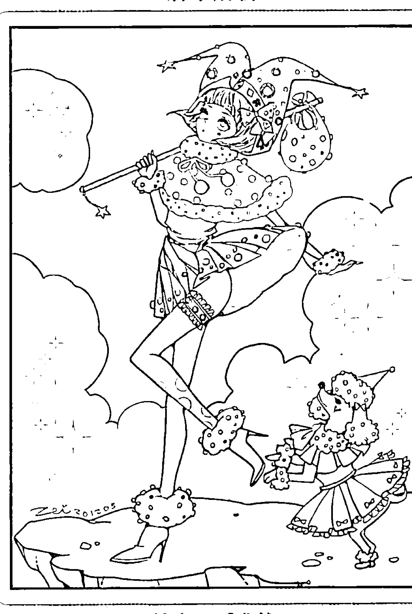

绘者：臧致怡

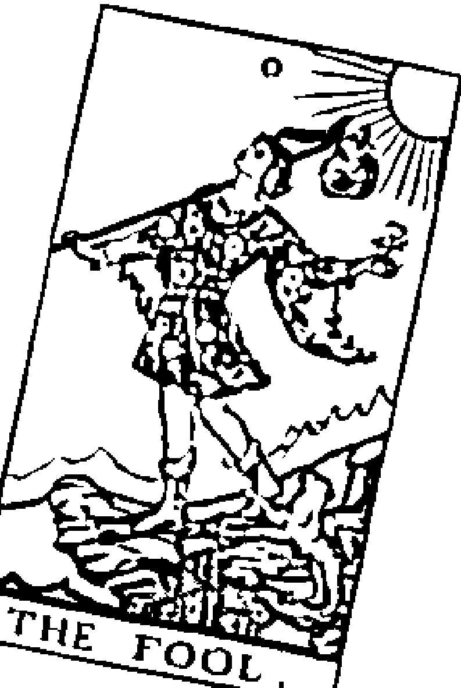

标准伟特牌版本

## 0 愚者 THE FOOL

欧洲中古世纪是个阶级分工固定的社会，大部分人都各安其位做特定的工作，但是有一些人不理会这些外在的限制，选择以流浪的方式到处旅行，这些天不怕地不怕的旅行者被大多数人视为疯子，也不被主流所社会接受，在当时算是社会底层的边缘人；还有一些吟游诗人，在旅行中会传唱古老的诗歌，散布与基督教教义不同的另类观点，有人认为这些吟游诗人其实是异教的智者，但是碍于教会的庞大势力，不得不隐藏于社会底层藉机宣扬自己的理念。

## 正位圖解

- 瘋狂·明顯的危險
- 無知·放縱的愚行
- 無限的可能性

### 竹竿和包袱

背在後方的包袱象徵壓力和負擔，但這小小一包已是他的所有的家當，在占卜當中經常代表已經放下不必要的東西。

### 陽光普照

代表光明和理性，也象徵有上天的力量在背後默默守護著他，在占卜牌義當中也表示未知的狀況和無限的可能性。

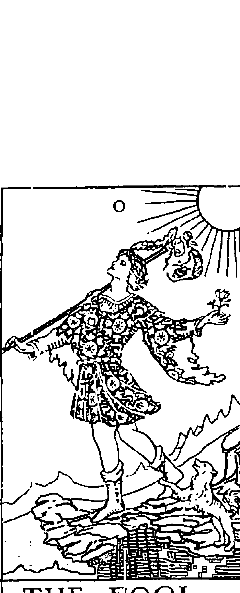

### 雪白的山頂

象徵遠方光明的前景，同時也展現出對於靈性成長的渴望，但是在占卜牌義當中經常代表對於現實狀況完全漠視。

### 白色玫瑰花

象徵內心當中的純潔無瑕，但從另一個方面看來也可能代表完全無知，在占卜當中經常表示沒準備就行動。

### 懸崖

象徵明顯的危險，但是愚者似乎對此視而不見，仍然帶著輕快的腳步前進，在占卜牌義當中經常表示放縱的愚行。

### 狗

象徵我們內在的本能，已經發現了前方的危險而向主人發出警告，在占卜當中經常表示不理性甚至是瘋狂的舉動。

【構圖時間線】背景 → 中景 → 前景

## 逆位圖解

一無所有·漠不關心
自殺行為
疏遠·不穩定
超越的洞見

### 位置關係

懸崖移到左上方象徵外在的艱難險阻增加；狗超過了愚者的高度象徵只依照本能反應，也可能代表不穩定的狀況。

### 圖形變化

若是愚者丟掉肩上的包袱，那他在物質上將一無所有，經常暗示窮困；若愚者由山崖上跳下就是一種自殺的行為。

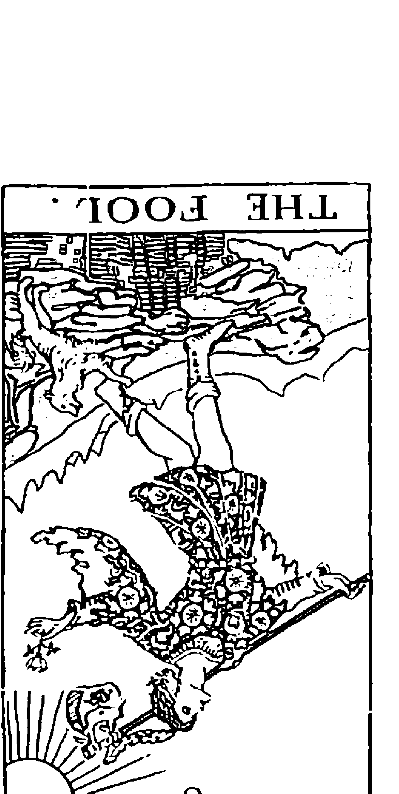

### 方位指向

愚者看向右下方象徵朝向內在探索，但是可能完全忽略了外在的環境，在占卜牌義當中經常代表逃避或漠不關心。

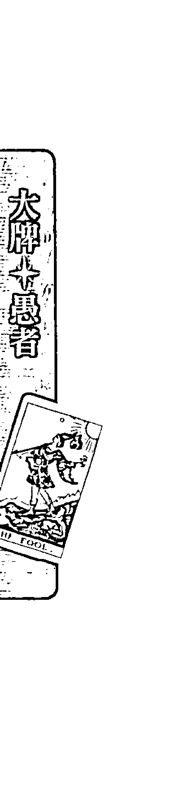

### 色彩意義

大片黃色的背景帶來光明的感覺，白色的太陽與雪白的山頂都象徵純潔無瑕，並且與愚者手上的白玫瑰相互呼應，頭頂上紅色的羽毛象徵了強烈的行動力，綠色的桂冠與愚者綠色的彩衣相互呼應，都代表心胸開闊與和諧的感覺。

### 占星對應

愚者對應到風的元素。風具有漂泊不定的性質，與愚者愛好自由的特質符合，風並沒有任何具體的顏色和形狀，愚者也可以突破所有的規範，神秘學當中風元素與呼吸和活化的作用有關，愚者這張牌正好可以解放一切的可能性。

### 數字象徵

在傳統上愚者沒有標示編號，代表了超出一切規則的無限可能性，現代也有人將愚者標示為零號，並且置於一號的魔術師之前，象徵一切還沒開始的渾沌狀態，靈性層面中，歸零是種超越，但是在世俗層面零就代表了一無所有。

### 在其他牌中重複出現的象徵

- 太陽 戀人、死神、節制、太陽、聖杯八
- 雪白的山頂 隱者、審判
- 岩石高山 皇帝、隱者、塔、審判、聖杯八、寶劍A、錢幣A、聖杯騎士
- 桂冠 皇后、戰車、世界、權杖六、聖杯二、聖杯七、錢幣國王
- 頭上的羽毛 太陽
- 白玫瑰 死神
- 站在山上 隱者、權杖三、權杖七
- 仰望天空 戀人、審判、聖杯十、錢幣五、權杖侍者、錢幣侍者
- 鳥 命運之輪、星星、聖杯A、錢幣九、寶劍侍者、寶劍騎士、寶劍王后、寶劍國王
- 狗 月亮、錢幣十

### 牌卡解析

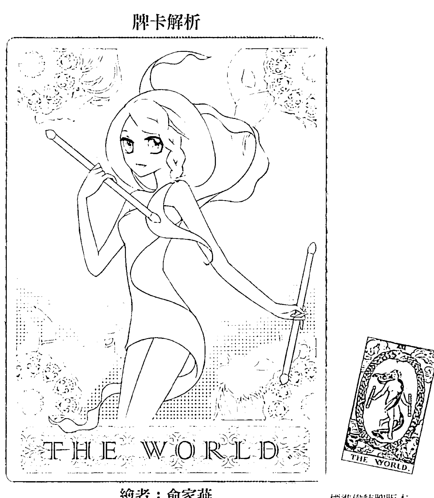

## XXI 世界 THE WORLD

源自《聖經》啟示錄當中的意象，代表了永恆的新天新地，這是通過神的審判之後人類的最終去處，在這裡的狀況完全不同於舊的世界，再也沒有黑夜、痛苦和死亡，人們可以在這裡自由快樂地享受永恆的生命，不過這也暗示了一切就到此為止，狀況不會再有任何改變；在角落出現的四活物，源自於舊約《聖經》的以西結書，先知以西結在異象中見到的四活物，在後世普遍作為天堂的象徵，另一方面，也有人用四活物的圖案來代表四位福音書的作者。

## 正位圖解

遠距的旅程·自然的規律
到此為止·完美的結局
統合

### 四個角落的生物

人代表水瓶座、鷹代表天蠍座、牛代表金牛座、獅代表獅子座，象徵組成世界的四要素，代表宇宙及自然的規律。

### 巨大的桂冠

將周圍的四要素連接起來，融合成完整的一體，在占卜當中經常代表成功統合了各種元素，達到平衡穩定的狀況。

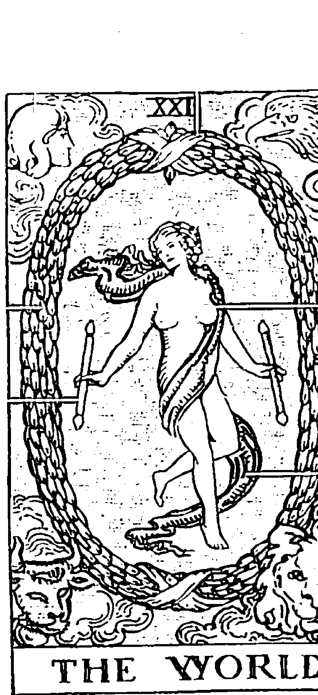

### 桂冠上的彩帶

當中隱含了上下兩個倒8字形的無限符號，象徵無止盡的循環和變化，但是在這里已經被固定下來成爲永恆的秩序。

### 跳舞的裸女

裸女象徵純潔的心靈與青春永駐，跳舞則代表她在這個復活的新天地裡十分快樂，在占卜當中也代表圓滿的結局。

### 兩手各握住一支權杖

象徵一種超越二元對立的存在，可以在更高的境界指揮物質界的一切，在占卜當中經常表示最終可以把事情完成。

### 纏繞的絲巾

象徵來自上天的靈性加持，讓她能夠了解永生的秘密，代表回歸神性的開悟狀態，即使在物質世界也能悠遊自在。

【構圖時間線】背景 → 中景 → 前景

## 逆位圖解

天地異變・不知變通
過於穩定・未完成
不完美的結局
無法合作

### 位置關係

在角落上象徵四要素的生物出現在相反的位置，表示天地異變的各種自然災害；但有時候也會代表不完美的結局。

### 方位指向

跳舞的裸女轉頭看向右方，代表保守與偏好穩定的特質，但也可能暗示缺乏遠見和未來性，只會休息或維持現狀。

### 圖形變化

若是裸女手上的權杖掉落，則是象徵無法統合二元對立的力量，有可能代表無法相互合作，或是到最後無法完成。

### 色彩意義

大片藍色的天空帶來開闊與平靜的感覺，巨大的綠色桂冠提供了和諧與穩定的力量，上面紅色的彩帶則是象徵透過行動與努力使得桂冠提供的秩序更為穩定；紫色的絲巾本身帶有靈性與神秘的象徵，白色的權杖則代表純潔無瑕。

### 占星對應

世界對應到土星。舞者張開雙臂成為十字型，加上彎曲的絲巾形成了土星的符號，傳統上土星為天階體系中最高的行星，世界則是塔羅牌當中最後一張牌，兩者都有終極與完結的意義，土星和世界也都帶有宇宙客觀秩序的屬性。

### 數字象徵

世界的編號為二十一，為兩個十加上一的組合，象徵超越各種極限之後再創造出來的統合結果，另一方面二十一也可以視為三個七相加的組合，象徵走過了神聖的過程；不過也有人把桂冠視為零的符號，代表了無始無終的狀態。

### 在其他牌中重複出現的象徵

- 四活物（由牛、獅、鷹、人組成） 命運之輪
- 積雲 戀人、命運之輪、塔、審判、權杖A、聖杯A、聖杯四、聖杯七、寶劍A、寶劍三、錢幣A、寶劍侍者、寶劍王后、寶劍國王
- 無限符號 魔術師、力量、錢幣二
- 桂冠 皇后、戰車、愚者、權杖六、聖杯二、聖杯七、錢幣國王
- 裸體 戀人、惡魔、星星、太陽、審判
- 手握權杖 魔術師、皇后、聖杯國王、錢幣國王
- 跳舞 權杖四、聖杯三、聖杯十
- 牛 命運之輪、錢幣國王

## PART III

## 權杖牌組的圖形與象徵

- 權杖A
- 權杖二
- 權杖三
- 權杖四
- 權杖五
- 權杖六
- 權杖七
- 權杖八
- 權杖九
- 權杖十

## 權杖A

ACE OF WANDS

傳統上權杖A是一張與起源和創生有關的牌，因此在逆位時會指向衰微與墮落的過程，甚至直接代表毀滅和結束。

### 關鍵字

能量・新行動・主動性・信心・無限的潛能

### 背景

遠山上的城堡象徵安全穩定的基礎，下方的河流代表能量的自由流動，在占卜牌義當中也常代表具有無限的潛能。

## 正位圖解

### 中景

樹枝上的十片葉子象徵生命之樹的十個核心，代表行動過程中的各種可能，迸發的葉子代表新生的能量與行動力。

### 中景

由心靈之雲伸出的右手緊握住權杖，象徵主動積極掌握住機會，在占卜牌義當中也經常表示擁有自信心與意志力。

【構圖時間線】背景→中景

### 關鍵字

能量不足・沒有行動・自信不足・結束・向下紮根・新的挑戰

### 位置關係

城堡移到上方象徵對於安全感的需求增加，也暗示自己的信心不足，空蕩蕩的下方則代表自己的基礎還不夠穩固。

## 逆位圖解

### 方位指向

權杖指向下方象徵向下紮根的力量，也暗示能量不足或是不宜採取主動出擊的策略，還有需要檢討與反省的地方。

### 圖形變化

若是右手無法掌握住權杖，則是象徵失去了這個機會，代表原本的狀況無法再延續下去，需要另起爐灶重新開始。

### 色彩意義

大片灰色的天空象徵渾沌未明，與灰色的雲相互呼應，白色的手代表純潔無邪，橘色的權杖帶有溫暖活潑的象徵。

### 占星對應

權杖A代表火元素力量的根源，具有強大的熱情與行動，也代表人的直覺與意志力；在時間方面則會對應到夏季。

### 數字象徵

權杖A對應到一的能量，與起源和創生有關，若是能有足夠的自信心與意志力採取行動，就可以創造出新的開始。

### 在其他牌中重複出現的象徵

- 城堡 戰車、權杖二、權杖四、權杖八、聖杯五、聖杯七、寶劍八、錢幣十、錢幣國王
- 河流 皇后、皇帝、戰車、死神、權杖八、聖杯五、聖杯八、聖杯十、寶劍六、聖杯騎士、錢幣王后
- 樹木 女祭司、皇后、戀人、戰車、力量、吊人、星星、權杖二、權杖十、聖杯二、聖杯四、聖杯十、寶劍六、錢幣九、寶劍侍者、寶劍騎士、寶劍王后、寶劍國王、錢幣侍者、錢幣騎士
- 和雲 戀人、命運之輪、塔、審判、世界、聖杯A、聖杯四、聖杯七、寶劍A、寶劍三、錢幣A、寶劍侍者、寶劍王后、寶劍國王

## 權杖二

WANDS II

傳統上權杖二與統治及控制有關，同時帶有不滿意的感覺，在逆位時則容易變成失控的意外狀況，也會造成損失。

### 關鍵字

掌控・思考計畫・猶豫不決・受限制的行動・延遲

### 背景

城堡下方的市鎮代表可以統治及掌控的地區，海灣則象徵未知的領域，但是當事人對於目前擁有的現狀並不滿意。

### 中景

城堡代表安全穩定的基礎，被栓在城牆上的權杖象徵因為缺乏安全感而行動受到限制，甚至代表不敢採取行動。

### 前景

手上拿著地球象徵掌握了權力，站在城牆上張望代表想要離開出去發展，在占卜當中也經常表示猶豫不決的意思。

## 正位圖解

【構圖時間線】前景→中景→背景

### 關鍵字

外在的阻礙・損失・失控・意外的驚喜・新的機會・個人魅力

### 位置關係

城堡移到上方象徵外在的阻礙和限制，市鎮超過領主的高度則代表無法控制的狀況，在占卜時也常表示生意外。

### 方位指向

領主轉向右方象徵想家或是旅行當中的回程，代表偏向保守及個人化的做法，有時候也表示可以發揮出個人魅力。

### 圖形變化

若是領主選擇離開城堡則是代表有新的開始，但是由於他只能帶走其中一支權杖，因此也暗示改變將會有所損失。

## 逆位圖解

### 色彩意義

大片灰色的天空帶有沈悶與停滯的感覺，與灰色的城牆相互呼應，紅色的帽子及外套則代表內心的熱情與行動力。

### 占星對應

權杖二與火星進入白羊座的能量呼應，正好進入守護關係的位置，火星帶有衝突性，而白羊座與領導的概念有關。

### 數字象徵

權杖二對應到二的能量，代表分別與對立，由於在行動上出現了分別與對立的狀況，所以容易猶豫不決或是延遲。

### 在其他牌中重複出現的象徵

- 海岸：權杖三、寶劍二、寶劍五、寶劍十、聖杯王后、聖杯國王
- 小徑：節制、月亮、錢幣A、錢幣八
- 市鎮：權杖十、聖杯六、錢幣四、錢幣六、錢幣八、錢幣十
- 城堡：戰車、權杖A、權杖四、權杖八、聖杯五、聖杯七、寶劍八、錢幣十、錢幣國王
- 圍牆：太陽、錢幣國王
- 紅色帽子：權杖六、聖杯六、聖杯九、寶劍七、錢幣二、錢幣六、錢幣九、錢幣侍者
- 斗篷：女祭司、隱者、塔、聖杯五、寶劍六、錢幣三、錢幣五、權杖侍者、錢幣王后、錢幣國王
- 紅玫瑰與白百合：魔術師、教皇、錢幣A

## 權杖三

WANDS III

傳統上權杖三是一張與商業及貿易有關的牌，也表示已經達到初步的成果，相反地逆位置則容易帶來失望的結果。

## 正位圖解

### 關鍵字

商業與貿易·初步的成果·合作及領導·積極進取·未知的旅程

### 背景

海灣象徵未知的領域，船隊出港表示具有積極進取的精神進行冒險犯難的行動，在占卜牌義當中也經常代表旅行。

### 中景

商人站在山上看著海灣出港的船隻，象徵目前已經達到了初步的成果，在占卜牌義當中也經常與商業及貿易有關。

### 前景

三支權杖矗立在山頭帶有共同合作的象徵，商人的右手握住其中一支權杖，顯示他在這個合作中佔有領導的地位。

【構圖時間線】前景→中景→背景

## 逆位圖解

### 關鍵字

風險提高·度過危機·無法合作·回顧過去·欺騙或背叛·未實現的希望

### 位置關係

海上的船隻超過了商人的高度，象徵事情的風險提高，若是沒有群策群力、積極主動去面對問題也可能會失敗。

### 方位指向

船隻朝向右方航行通常表示回程，象徵安全渡過危機或問題已經被解決，有時候也會代表回顧過去或反省的旅程。

### 圖形變化

若是商人由山頂上離開經常象徵由盛轉衰的過程，另一方面也可能暗示遭遇了欺騙或背叛，無法再繼續合作下去。

### 色彩意義

大片黃色的天空帶來明亮及開朗的感覺，同時也具有積極進取與自信的象徵，紅色外套則代表擁有熱情及行動力。

### 占星對應

權杖三與太陽進入白羊座的能量呼應，進入了強勢位置，白羊座與太陽都帶有領導的象徵，具有冒險進取的精神。

### 數字象徵

權杖三對應到三的能量，帶有合作的力量，若是想要在行動上順利合作，通常會需要一個好的領導人來帶領大家。

### 在其他牌中重複出現的象徵

- 商人 聖杯九、錢幣六
- 頭上綁白布條 魔術師、權杖五
- 紅色外套 魔術師、塔、聖杯八、錢幣六
- 紅色鞋子 皇后、塔、聖杯二、聖杯四、聖杯六、聖杯八、寶劍七、錢幣四、寶劍王后、寶劍國王
- 站在山上 隱者、愚者、權杖七
- 海岸 權杖二、寶劍二、寶劍五、寶劍十、聖杯王后、聖杯國王
- 船 死神、寶劍六、錢幣二、聖杯國王

## 權杖四

WANDS IV

在傳統上權杖四代表團體與人群，帶有團結與和諧的力量，也有人主張權杖四正逆位的意思相同，不必特別區分。

## 正位圖解

【構圖時間線】背景 → 中景 → 前景

### 關鍵字

- 團體·成功及維持現狀
- 慶祝及享受·和平相處
- 穩固及安全

### 背景

城堡象徵穩固與安全，拱橋跨越了城外面的護城河則是象徵與外界有所連結，也暗示處於和平時期不必特別防衛。

### 中景

在城堡前開宴會代表有某些事情成功了，並且正在舉行慶祝活動，在占卜當中經常表示可以盡情享受努力的成果。

### 前景

四支權杖插入土中象徵維持現狀，表示不需要額外的行動及改變，上面掛滿花環及果實則代表和諧與歡樂的氣氛。

## 逆位圖解

### 關鍵字

- 同儕壓力·發展的瓶頸
- 不穩定·享樂·傳統與積習的限制·缺乏安全感

### 位置關係

慶祝的人群移到上方象徵更強調享樂的部分，城堡移到上方代表了對於安全感的需求增加，也暗示狀況並不穩定。

### 方位指向

四支權杖都指向下方，象徵強調內部的一致性，在占卜當中可能會指向遭遇同儕壓力，或是被傳統與積習所限制。

### 圖形變化

若是掛在權杖上的花圈掉落，則是象徵只有表面的和諧，在占卜牌義當中也經常表示除了穩定之外沒有其他好處。

### 色彩意義

大片黃色的天空帶來光明與歡樂的氣氛，綠色的花圈帶有和諧與穩定的象徵，灰色的城堡在當中提供穩定的力量。

### 占星對應

權杖四與金星進入白羊座的能量呼應，進入了失勢位置，金星帶有和諧與團結的象徵，也降低了白羊座的冒險性。

### 數字象徵

權杖四對應到四的能量，具有穩固的特質，由於在行動上十分穩固，因此帶有維持現狀及與別人和平相處的力量。

### 在其他牌中重複出現的象徵

- 果實 聖杯三、錢幣七、錢幣王后
- 葡萄 惡魔、聖杯三、錢幣九、錢幣十、錢幣國王
- 城堡 戰車、權杖A、權杖二、權杖八、聖杯五、聖杯七、寶劍八、錢幣十、錢幣國王
- 拱橋 聖杯五
- 花籃 魔術師、聖杯三、錢幣A、錢幣王后
- 紅色長袍 皇帝、教皇、正義、權杖六、聖杯三、錢幣四、錢幣十、錢幣王后
- 白色長袍 魔術師、皇后、力量、節制、聖杯二、聖杯三
- 高舉雙手 塔、審判
- 跳舞 世界、聖杯三、聖杯十
- 花環 力量

## 權杖五

WANDS V

傳統上權杖五代表要透過努力與競爭去獲取金錢及財富，逆位時則指向法律訴訟及其他與訴訟相關的人、事、物。

## 正位圖解

【構圖時間線】背景 → 中景

### 關鍵字

- 爭論
- 努力進取
- 立場觀點不同
- 摩擦或衝突
- 模倣

### 背景

大片的荒地位於戰場，有可能在進行軍事演習或是實際的戰爭，在占卜牌義當中常代表有衝突或是摩擦發生。

### 中景

五個人各自高舉權杖代表積極努力行動，但是五支權杖的方向不一則象徵彼此的立場與觀點不同，也暗示了爭論。

### 中景

五個人都站在荒地上象徵並沒有任何一個人佔有優勢，每個人都看著其他人的行動而跟著行動，帶有模倣的力量。

## 逆位圖解

### 關鍵字

- 內部矛盾
- 無所適從
- 對人不對事
- 內心的掙扎
- 欺騙
- 訴訟

### 位置關係

人的位置超過權杖的高度，象徵這是針對人的鬥爭，是非對錯反而沒那麼重要，在占卜牌義當中也經常代表訴訟。

### 方位指向

五支方向不同的權杖朝向下方，表示問題來自內部的矛盾與紛爭，但是也可能象徵當事人的內心掙扎、無所適從。

### 圖形變化

若是有人選擇離開戰場，則代表放下爭強鬥狠的心態去尋找彼此和解的方法，不過也可能是暫時退縮的欺敵策略。

### 色彩意義

大片藍色的天空帶來開闊的感覺，拿著權杖的五個人分別穿著不同顏色的衣服，則是象徵彼此的立場與觀點不同。

### 占星對應

權杖五與土星進入獅子座的能量呼應，進入了失勢位置，土星象徵困難與限制，獅子座代表要堅持奮鬥的行動力。

### 數字象徵

權杖五對應到五的能量，與變化和復仇有關，由於在行動上有所變化所以更要努力奮鬥，也有可能因此發生衝突。

### 在其他牌中重複出現的象徵

- 荒地 死神、聖杯五、寶劍七、寶劍八、寶劍侍者、寶劍騎士
- 藍色上衣 教皇、吊人、死神、聖杯六、聖杯十、錢幣五、錢幣八、錢幣十、聖杯侍者
- 黃色上衣 聖杯二、寶劍十、錢幣十、權杖侍者、寶劍侍者
- 綠色上衣 權杖七、聖杯四、寶劍五、錢幣侍者
- 橘色上衣 權杖九、權杖十、聖杯十、寶劍六、錢幣二、錢幣七
- 橘色褲子 權杖六、權杖七、權杖侍者、錢幣侍者
- 頭上綁白布條 魔術師、權杖三

## 權杖六

WANDS VI

傳統上權杖六代表希望與榮耀，有時候也會與傳遞重要的訊息有關，逆位置則是會連結到欺騙與背叛方面的意思。

### 關鍵字

傳遞訊息·勝利者凱旋歸來·自信心·榮譽·讚美與支持

### 背景

五個侍從高舉權杖站在馬後面，象徵背後還有更多支持的力量，在占卜牌義當中也經常表示其他人的讚美與鼓勵。

### 中景

頭戴桂冠同時手上的權杖也掛著一個桂冠，象徵勝利者的身份，抬頭挺胸望向前方則顯示出他內心的驕傲與自信。

### 中景

騎馬朝向右方經常象徵踏上歸途，在占卜牌義上代表勝利凱旋，也暗示只有透過當事人自己的努力才能獲得成功。

## 正位圖解

【構圖時間線】中景→背景

### 關鍵字

四面楚歌·害怕·驕兵必敗·不名譽·短暫的成功·背叛

### 位置關係

侍從們超過了騎馬者的高度，象徵陷入四面楚歌的包圍當中，在占卜牌義上也指向擔心害怕或是有人背叛的狀況。

### 方位指向

馬匹朝向左方象徵出征的旅程，但是在敵人比你強大的狀況之下無異是以卵擊石，同時也會代表延遲與不確定性。

### 圖形變化

若是騎士由馬上落下則是象徵由勝轉衰的過程，在占卜當中經常代表只有短暫的成功，也暗示了驕兵必敗的道理。

## 逆位圖解

### 色彩意義

藍色的天空帶來開闊的感覺，紅色長袍代表內心當中的熱情與行動力，馬匹綠色的彩衣則帶有穩定與和諧的象徵。

### 占星對應

權杖六與木星進入獅子座的能量呼應，木星本身帶有幸運與勝利的象徵，獅子座則是與榮譽和自信心的部分有關。

### 數字象徵

權杖六對應到六的能量，代表均衡與協調，由於擁有均衡而協調的行動，所以能夠透過自己的努力取得勝利凱旋。

### 在其他牌中重複出現的象徵

- 桂冠 皇后、戰車、愚者、世界、聖杯二、聖杯七、錢幣國王
- 紅色長袍 皇帝、教皇、正義、權杖四、聖杯三、錢幣四、錢幣十、錢幣王后
- 橘色褲子 權杖五、權杖七、權杖侍者、錢幣侍者
- 手套 死神、聖杯六、錢幣九、權杖騎士、寶劍騎士、錢幣騎士
- 紅色帽子 權杖二、聖杯六、聖杯九、寶劍七、錢幣二、錢幣六、錢幣九、錢幣侍者
- 騎馬 死神、太陽、權杖騎士、聖杯騎士、寶劍騎士、錢幣騎士
- 馬 死神、太陽、權杖騎士、聖杯騎士、寶劍騎士、錢幣騎士

## 權杖七

WANDS VII

傳統上權杖七是代表成功的牌，有勇氣去面對各種不同的挑戰，逆位時則容易指向令人焦慮不安或猶豫不決的狀況。

### 關鍵字

- 英勇
- 優勢地位
- 接受不同的挑戰
- 堅持下去
- 積極抵抗

### 中景

揮舞著權杖象徵這個人正積極地抵抗，努力堅持以保有自己的優勢地位，在占卜牌義當中也經常帶有勇氣的意思。

## 正位圖解

### 中景

一個人站在高地上，象徵已經擁有了一定的基礎與成就，在占卜牌義當中也經常代表站在有利的位置面對挑戰。

### 前景

六支權杖由下而上攻擊，象徵遇到不同的問題與挑戰，但是另一方面也可能代表被自己內在的欲望與迷惑所困擾。

【構圖時間線】中景 → 前景

## 逆位圖解

### 關鍵字

- 奮勇犧牲
- 居於劣勢
- 被動
- 猶豫不決
- 焦慮不安
- 過度自我保護

### 位置關係

六支攻擊的權杖超過了人的高度，象徵這個人居於劣勢當中去面對挑戰，一不小心就有可能會被打倒而奮勇犧牲。

### 方位指向

六支權杖是由上而下攻擊，象徵所有的困難都是來自於外部因素，本人無法主導控制，遇到問題只能被動地回應。

### 圖形變化

若是這個人選擇由高地上離開，則是象徵沒有足夠的勇氣，也可能暗示內心當中焦慮不安與過度自我保護的狀況。

### 色彩意義

大片藍色的天空帶來開闊的氣氛，綠色的上衣帶有清新與穩定的象徵，但是同時也暗示內心當中正在尋找平衡點。

### 占星對應

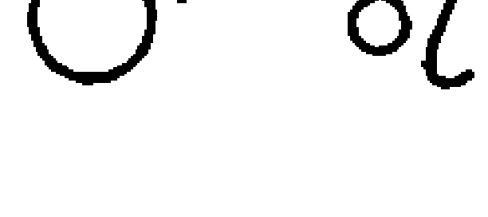

權杖七與火星進入獅子座的能量呼應，火星本身象徵衝突，獅子座則代表有勇氣面對衝突，也有堅持下去的力量。

### 數字象徵

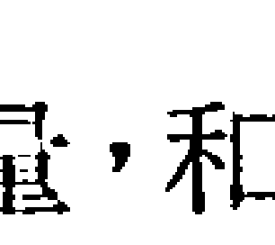

權杖七對應到七的能量，和精神與靈性的活動有關，由於在行動上注入強大的意志力，所以有勇氣面對各種挑戰。

### 在其他牌中重複出現的象徵

- 綠色上衣 權杖五、聖杯四、寶劍五、錢幣侍者
- 橘色褲子 權杖五、權杖六、權杖侍者、錢幣侍者
- 站在山上 隱者、愚者、權杖三

## 權杖八
### WANDS VIII

傳統上權杖八代表正在進行的過程，同時也與各種戶外活動有關，逆位置則容易指向內部不合或良心不安的狀況。

### 關鍵字

- 戶外活動
- 快速的行動
- 共同的目標
- 自由與空間
- 忙碌

### 背景

遠山上的城堡象徵安全與穩定，下方的河流表示能量的自由流動，大片的天空則代表仍然有自由揮灑表現的空間。

### 中景

八支權杖在空中飛行象徵快速的行動，但是當中也暗示可能會有忙碌的狀況，在很短的時間之內要完成很多事情。

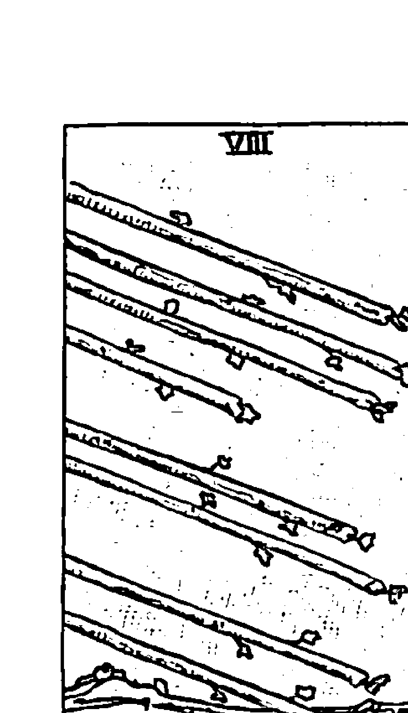

正位圖解

> > 【構圖時間線】中景→背景

### 關鍵字

- 距離成功還很遠
- 一時衝動
- 內部不合
- 失控
- 力量不足
- 太過忙碌

### 位置關係

河流超過了城堡的高度，象徵過度情緒化的狀況，一時衝動下的決定通常都不會是正確的，也暗示了缺乏安全感。

### 中景

八支權杖都朝向右下方飛行，表示有共同目標有可以齊心協力，同時也暗示已經踏上歸途，成功就在不遠的前方。

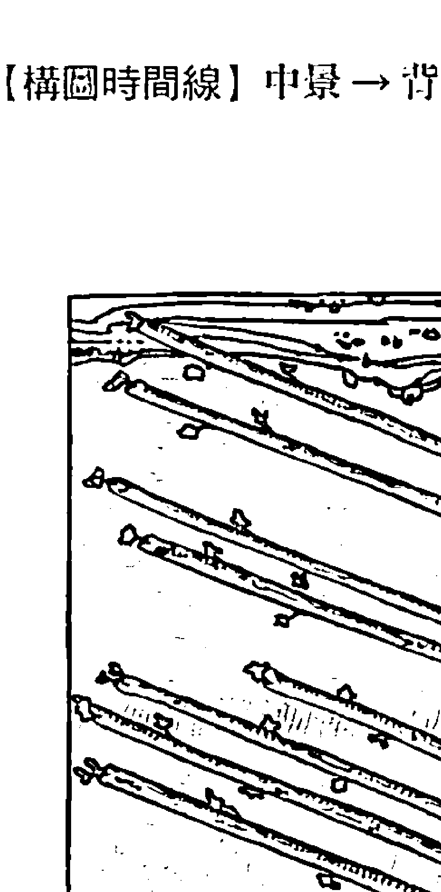

逆位圖解

### 方位指向

權杖轉而朝向左上方飛行，象徵這是一個出征的旅程，有可能增加忙碌的程度，也暗示距離成功還有很遠的路程。

### 圖形變化

若是權杖飛行的力量不足無法繼續上升，就有可能出現失控的局面，在占卜當中也常指向內部不合或爭吵的狀況。

### 色彩意義

大片藍色的天空展現出自由開闊的感覺，與下方藍色的河流相互呼應，綠意盎然的國土則帶有清新與和諧的象徵。

### 占星對應

權杖八與水星進入射手座的能量呼應，進入了失勢位置，水星與快速敏捷的概念有關，射手座象徵冒險的行動力。

### 數字象徵

權杖八對應到八的能量，本身就代表實踐的力量，由於在行動上很迅速確實，所以才能用最短的時間達成目標。

### 在其他牌中重複出現的象徵

- 城堡 戰車、權杖A、權杖二、權杖四、聖杯五、聖杯七、寶劍八、錢幣十、錢幣國王
- 河流 皇后、皇帝、戰車、死神、權杖A、聖杯五、聖杯八、聖杯十、寶劍六、聖杯騎士、錢幣王后

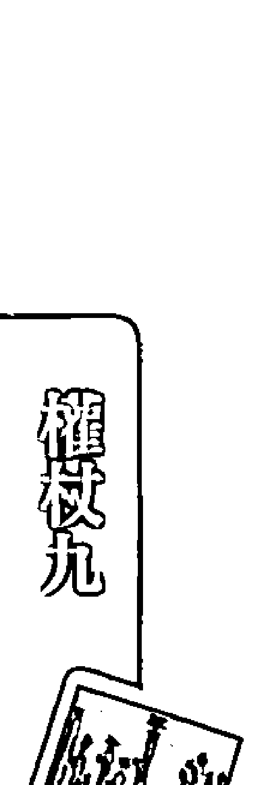

## 權杖九
### WANDS IX

傳統上權杖九代表了強大的穩定力量，同時也很重視規則與紀律，逆位時則經常指向災難、障礙以及不幸的遭遇。

### 關鍵字

- 遇到瓶頸
- 受傷
- 準備反擊
- 防守策略
- 延遲與等待

### 背景

後方連綿的遠山代表外在的困難和考驗，八支權杖圍成的籬笆則象徵採取了防守的策略，帶有延遲與等待的意思。

### 中景

頭上包著繃帶象徵受傷的狀況，代表遇到發展瓶頸，但是望向左方表示仍然保持警戒，也暗示敵人隨時可能出現。

### 中景

手上緊握住權杖代表仍然還有行動力，準備好在敵人出現時全力反擊，不過相對來說也已經沒有主動出擊的實力。

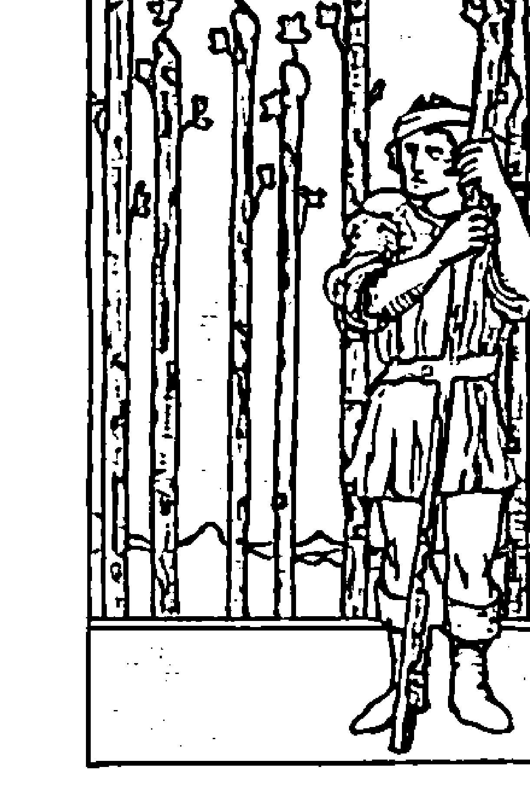

正位圖解

【構圖時間線】背景→中景

### 關鍵字

- 障礙
- 隔絕孤立
- 苦難
- 過份固執
- 停止等待去行動
- 放鬆

### 位置關係

綿延的遠山移到上方，象徵外在巨大的障礙，齊頭的權杖形成柵欄，在占卜當中也常指向被隔絕而處於孤立狀態。

### 方位指向

守衛反轉看向右方表示想要撤退回，也暗示失去了反擊的鬥志及防守的決心，有需要讓自己暫時休息放鬆一下。

### 圖形變化

頭上的繃帶掉落，是象徵之前所受的傷已經復原得差不多了，因此在占卜當中也可能指向停止等待，適合採取行動。

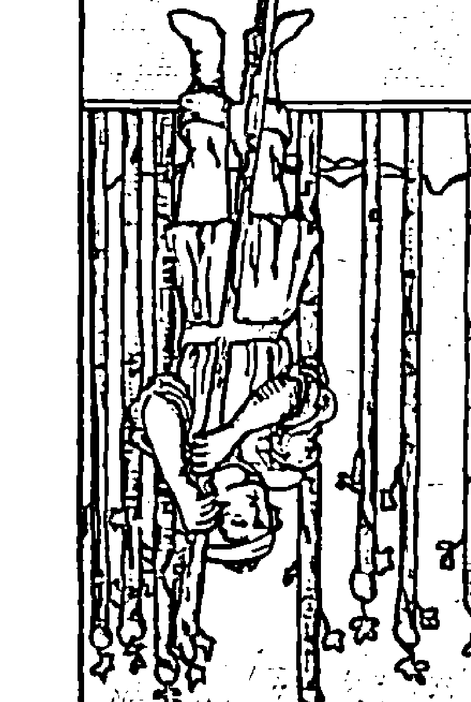

逆位圖解

### 色彩意義 ⚪ ○

藍色的天空帶有開闊的象徵，身著橘色上衣則是象徵缺乏安全感，因此即使受了傷仍然保持警戒以防止敵人來犯。

### 占星對應 ☽ ♐

權杖九與月亮進入射手座的能量呼應，月亮帶有照顧與保護的象徵，與被動防守有關，射手座具有強大的行動力。

### 數字象徵 Ⅸ

權杖九對應到九的能量，帶有滿足與飽和的概念，由於在行動上已經達到飽和，所以只好在原地採取防守的策略。

### 在其他牌中重複出現的象徵

- 繃帶 寶劍二、寶劍八、錢幣五
- 守衛 聖杯六、錢幣十
- 橘色上衣 權杖五、權杖十、聖杯十、寶劍六、錢幣二、錢幣七

## 權杖十
### WANDS X

傳統上權杖十帶有榮譽與誠實的意思，因此在逆位時則會指向相反的欺騙與背叛，並且延伸出陷阱和詭計的意思。

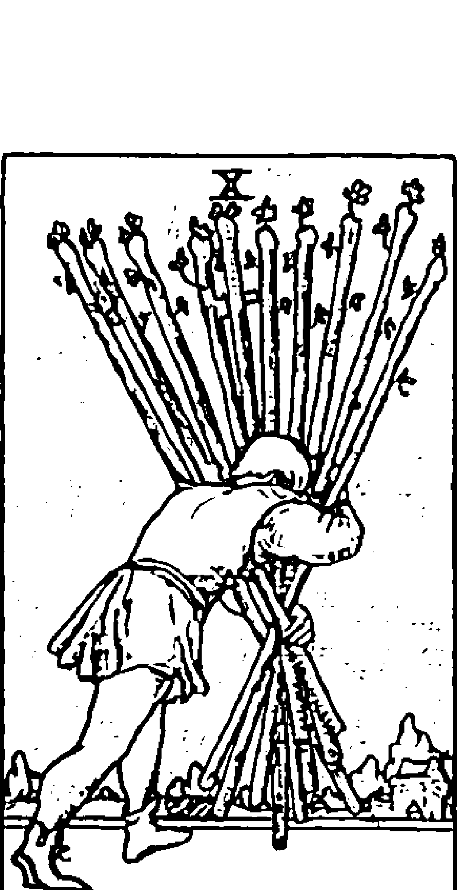

### 關鍵字

- 誠實
- 壓力與勞累
- 責任感
- 得到
- 緊抓不放

### 背景

右下角的房子象徵故鄉或家庭，是當事人將要回歸的地方，在占卜牌義上經常代表得到自己心中真正想要的東西。

### 中景

身上扛著十支權杖，象徵過多的行動帶給他十分沉重的壓力，在占卜牌義上也經常代表具有責任感或是緊抓不放。

### 中景

彎腰駝背的姿勢代表當事人有過勞的傾向，頭埋在權杖當中可能指向盲目的意思，同時經常也有埋頭苦幹的涵意。

## 正位圖解

【構圖時間線】中景→背景

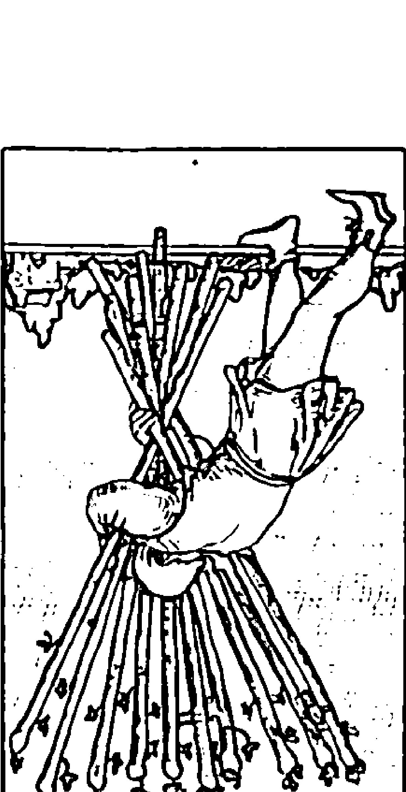

### 關鍵字

- 尚未達成目標
- 負起責任
- 陷阱和詭計
- 欺騙和背叛
- 放下
- 隱藏的困難

### 位置關係

房子由右下移到了左上，象徵重視並且想去追求外在的目標，但是高度超過了當事人則暗示了可能會遭遇到困難。

### 方位指向

當事人改朝向左上方走，象徵仍然在出征的旅程當中繼續前進，因此在占卜牌義當中也經常表示還沒有達成目標。

### 圖形變化

若是十根權杖從當事人的身上滑落，則象徵失去自己原本擁有的東西，在占卜牌義當中也表示還有放下的可能性。

## 逆位圖解

### 色彩意義 ○ ○

身著橘色的衣服象徵當事人內心缺乏安全感，因此會對於自己擁有的東西緊抓不放，大片的藍天呈現開闊的氣氛。

### 占星對應 ♄ ♐

權杖十與土星進入射手座的能量呼應，土星象徵沉重的責任，同時射手座帶有很強的行動力，把自己的責任完成。

## 數字象徵 X

權杖十對應到十的能量，與完美圓滿的結局有關，因此在行動上可以得到自己想要的東西，但也有過勞的可能性。

### 在其他牌中重複出現的象徵

- 橘色上衣 權杖五、權杖九、聖杯十、寶劍六、錢幣二、錢幣七
- 農夫 錢幣七
- 市鎮 權杖二、聖杯六、錢幣四、錢幣六、錢幣八、錢幣十
- 耕地 錢幣侍者、錢幣騎士
- 樹木 女祭司、皇后、戀人、戰車、力量、吊人、星星、權杖A、權杖二、聖杯二、聖杯四、聖杯十、寶劍六、錢幣九、寶劍侍者、寶劍騎士、寶劍王后、寶劍國王、錢幣侍者、錢幣騎士

# MEMO

# PART IV

# 聖杯牌組的圖形與象徵

| 聖杯A | 聖杯二 | 聖杯三 | 聖杯四 | 聖杯五 |
| :--- | :--- | :--- | :--- | :--- |
| 聖杯六 | 聖杯七 | 聖杯八 | 聖杯九 | 聖杯十 |

## 聖杯A
### ACE OF CUPS

傳統上聖杯A與宴會有關，同時具有情感交流與享樂的性質，逆位置則會指向狀況改變，當中也會帶有不確定性。

### 關鍵字

- 享受
- 感情的新開始
- 豐富和滿足
- 上天的祝福
- 純潔無瑕

### 背景

水池象徵豐富的情感，流回到水池的泉水代表情感的回饋，蓮花為水元素的象徵，代表追求與靈性源頭重新連結。

### 中景

由心靈之雲伸出右手捧著一只聖杯，象徵感情的新開始，聖杯中冒出的五道泉水則代表了滿足而流溢出來的情感。

### 前景

天上飛下一只鴿子口中銜著畫有十字的圓餅，象徵天上賜下的祝福，另一方面也暗示在靈性上是純潔無瑕的狀態。

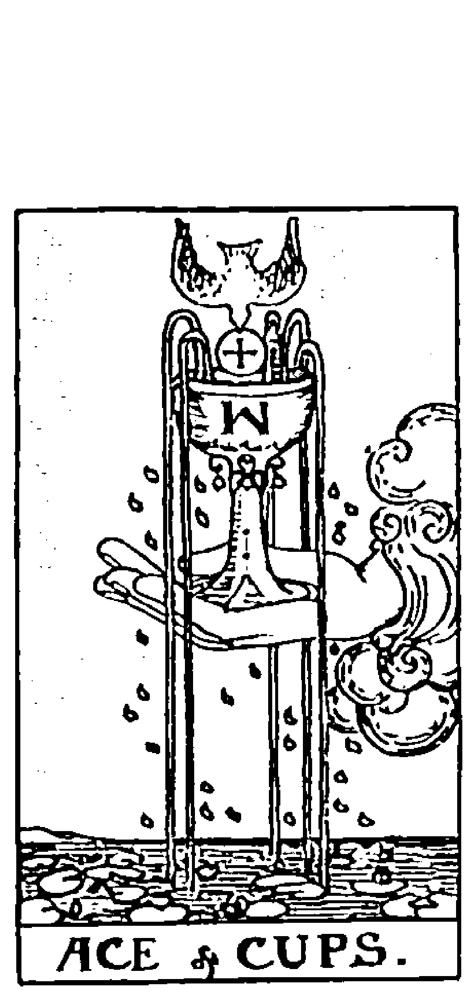

【構圖時間線】前景 → 中景 → 背景

### 關鍵字

- 改變
- 沒有回報的愛
- 不滿足
- 無法把握機會
- 不確定性
- 過度享樂

### 位置關係

水池超過了手的高度，象徵外在的改變並不在本人的控制當中，在占卜牌義當中也經常代表事情充滿了不確定性。

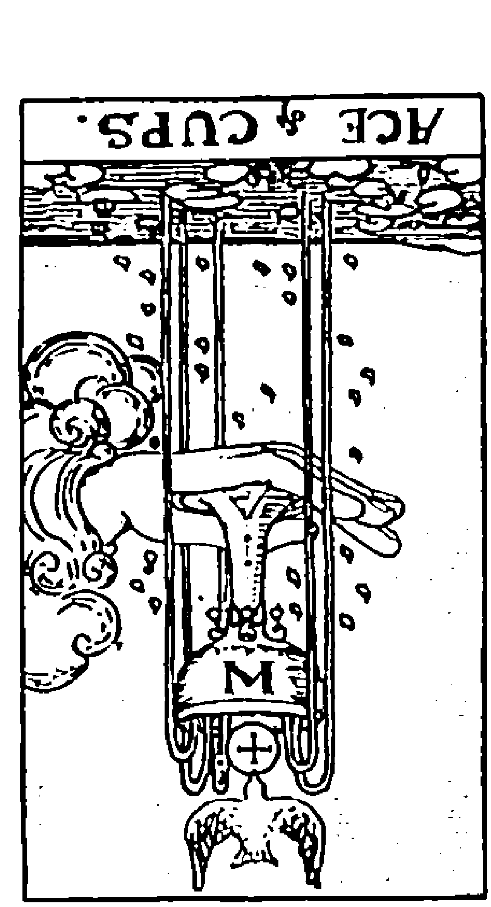

### 方位指向

向上飛的鴿子被倒過來的聖杯蓋住，象徵無法完成自己的理想，在占卜牌義當中也經常代表失望與不滿足的狀況。

### 圖形變化

杯中的水被倒空無法再流回水池，象徵只有付出而沒有回報的愛；若是手中的聖杯掉落則是代表無法把握住機會。

### 色彩意義

大片灰色的天空象徵混沌未明，白色的手代表純潔無瑕，與白鴿及圓餅相互呼應，黃色的聖杯則帶有光明的象徵。

### 占星對應

聖杯A代表水元素力量的根源，具有想像力和創造力，同時也代表人的情緒與感受；在時間方面則會對應到秋季。

### 數字象徵

聖杯A對應到一的能量，與起源和創生的概念有關，在感情方面容易有新的開始，經常代表出現了新戀情的機會。

### 在其他牌中重複出現的象徵

- 鳥 命運之輪、愚者、星星、錢幣九、寶劍侍者、寶劍騎士、寶劍王后、寶劍國王
- 積雲 戀人、命運之輪、塔、審判、世界、權杖A、聖杯四、聖杯七、寶劍A、寶劍三、錢幣A、寶劍侍者、寶劍王后、寶劍國王
- 雲中伸出的手 權杖A、聖杯四、寶劍A、錢幣A
- 蓮花 戰車、聖杯侍者
- 水池 女祭司、節制、星星、月亮

## 聖杯二
### CUPS II

傳統上聖杯二代表了愛與和諧，不只指向愛情也包含了友誼，逆位置則經常代表當事人的慾望無法完全得到滿足。

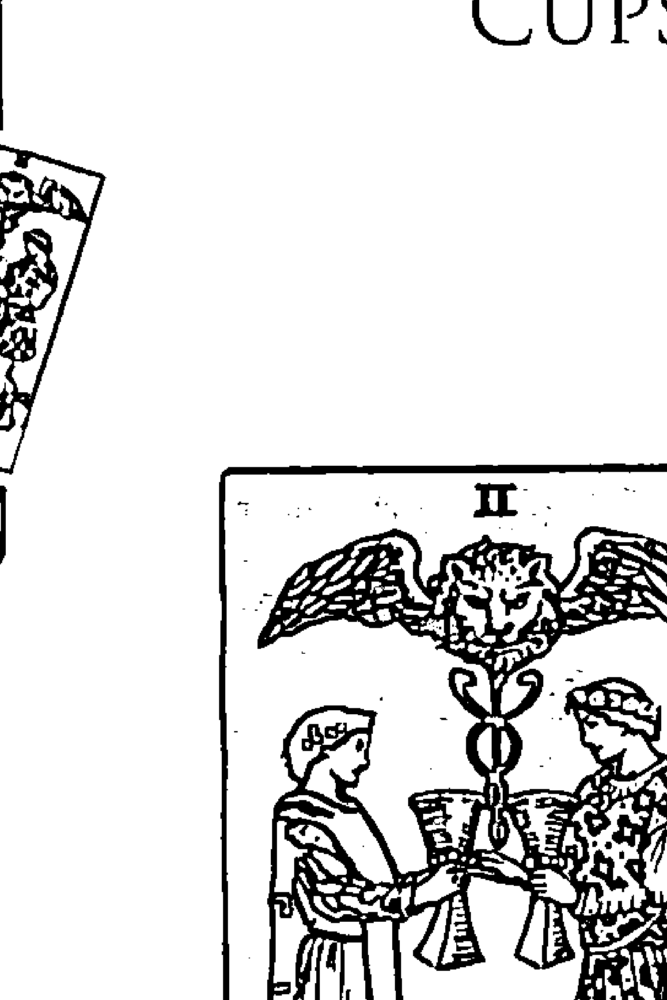

## 正位圖解

### 關鍵字

- 和諧的結合
- 平等的關係
- 主動的付出
- 強烈的吸引力
- 良好的溝通

### 背景

遠方的房子象徵安全與穩定，也暗示彼此會想要建立長期的關係，在占卜牌義當中經常代表這是一個和諧的結合。

### 中景

兩個人各持一只聖杯並舉在相同的高度上，表示彼此是平等的關係，其中一個人伸出右手象徵主動的邀約與付出。

### 前景

空中浮現的麥丘里之杖象徵兩個人的溝通良好，甚至有可能無話不談，當中的獅子頭代表彼此間的熱情及吸引力。

【構圖時間線】前景 → 中景 → 背景

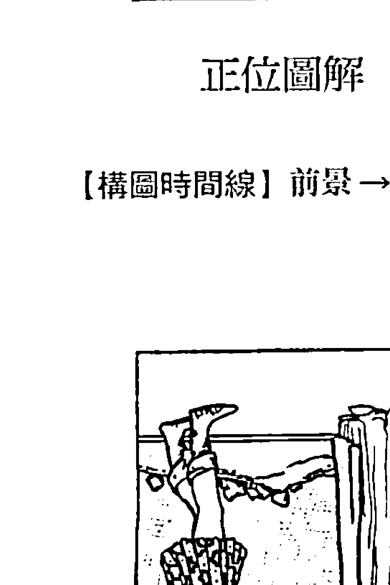

## 逆位圖解

### 關鍵字

- 分離
- 障礙
- 爭吵
- 被動回應
- 被慾望沖昏頭
- 溝通不良

### 位置關係

遠方的房子移到上方，象徵對於安全與佔有的需求增加，獅子頭移到了下方，則是暗示彼此的熱情與吸引力減弱。

### 方位指向

麥丘里之杖轉而指向下方，象徵需要更多的反省與學習，也暗示彼此之間容易溝通不良，甚至可能因此發生爭吵。

### 圖形變化

倒置的聖杯無法再裝進任何東西，象徵這是一個平等但沒有感情的關係，在占卜當中經常代表遇到障礙或是分離。

### 色彩意義

大片的藍天帶來開闊與自由的感覺，下方的綠地則具有和諧與平衡的象徵，橘色的獅子頭及翅膀則有溫暖的含意。

### 占星對應

聖杯二與金星進入巨蟹座的能量呼應，金星本身代表愛情，同時也有和諧的象徵，巨蟹座則特別重視穩定與安全。

### 數字象徵

聖杯二對應到二的能量，具有分別對立的特質，由於在感情上出現了分別，才能建立起平等的關係彼此合作互助。

### 在其他牌中重複出現的象徵

- 獅子 力量、命運之輪、世界、權杖王后、權杖國王
- 翅膀 戰車、命運之輪、聖杯騎士、聖杯王后、寶劍騎士、寶劍王后
- 成對的男女 戀人、惡魔、審判、權杖四、聖杯六、聖杯十、錢幣五、錢幣十
- 桂冠 皇后、戰車、愚者、世界、權杖六、聖杯七、錢幣國王
- 花冠 力量、死神、權杖四、聖杯三
- 白色長袍 魔術師、皇后、力量、節制、權杖四、聖杯三
- 紅色鞋子 皇后、塔、權杖三、聖杯四、聖杯六、聖杯八、寶劍七、錢幣四、寶劍王后、寶劍國王
- 黃色上衣 權杖五、寶劍十、錢幣十、權杖侍者、寶劍侍者
- 樹木 女祭司、皇后、戀人、戰車、力量、吊人、星星、權杖A、權杖二、權杖十、聖杯四、聖杯十、寶劍六、錢幣九、寶劍侍者、寶劍騎士、寶劍王后、寶劍國王、錢幣侍者、錢幣騎士
- 房屋 聖杯六、聖杯十、錢幣九、錢幣十

## 聖杯三
### CUPS III

傳統上聖杯三通常代表對當事人有利的結局，也與豐富的概念有關，逆位時則會偏向強調結算成果與結束的部分。

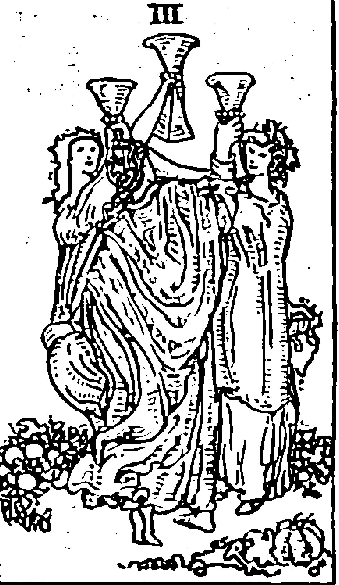

正位圖解

【構圖時間線】背景→中景

### 關鍵字

- 豐富充足
- 慶祝
- 歡樂的氣氛
- 平等的合作
- 應得的回報

### 背景

結滿果實的果園象徵充足的資源與豐收的成果，在占卜當中經常代表對當事人有利的結局，也會收到應得的回報。

### 中景

高舉聖杯表示正在舉行慶祝的儀式，不但可以明顯感受到歡樂的氣氛，手上拿著葡萄也象徵正在享受努力的成果。

### 中景

三個人環繞著中心跳舞，象徵為了共同的目標而團結在一起，彼此可以相互配合，在占卜中也常代表平等的合作。

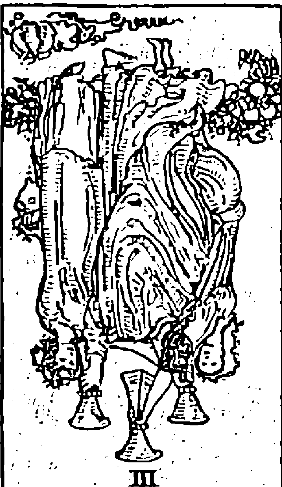

逆位圖解

### 關鍵字

- 不充足
- 過度享樂
- 樂極生悲
- 結算成果
- 結束
- 沒有得到預期的成果

### 位置關係

地上的瓜果移到上方更加強調結算成果的部分，但是也象徵資源與成果都在別人的手上，想要成功就要向外求援。

### 方位指向

交錯的三只聖杯都朝向下方，象徵把情感和資源都用在自己身上，因此在占卜牌義中經常表示有過度享樂的傾向。

### 圖形變化

倒置的聖杯無法裝入任何東西，象徵沒有得到預期的成果，有時候會強調結束的意思，甚至出現樂極生悲的結果。

### 色彩意義

大片的藍天帶來開闊的感覺，橘色的果實則有成熟與豐盛的象徵，中間的紅色長袍表示內心當中的熱情及行動力。

### 占星對應

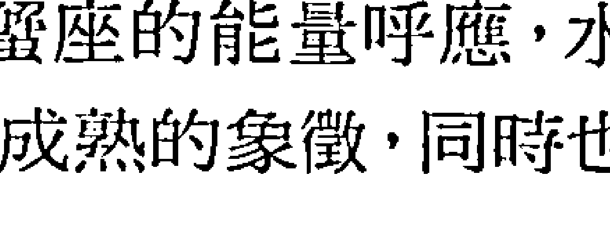

聖杯三與水星進入巨蟹座的能量呼應，水星與溝通及合作的概念有關，巨蟹座帶有成熟的象徵，同時也重視享樂。

### 數字象徵

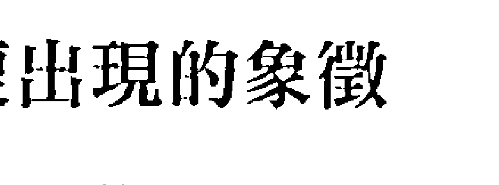

聖杯三對應到三的能量，與合作的概念有關，由於在情感上能相互合作，因此能在慶祝儀式當中享受歡樂的氣氛。

### 在其他牌中重複出現的象徵

- 紅色長袍: 皇帝、教皇、正義、權杖四、權杖六、錢幣四、錢幣十、錢幣王后
- 白色長袍: 魔術師、皇后、力量、節制、權杖四、聖杯二
- 黃色長袍: 死神、錢幣九、權杖騎士、權杖王后
- 花冠: 力量、死神、權杖四、聖杯二
- 跳舞: 世界、權杖四、聖杯十
- 果實: 權杖四、錢幣七、錢幣王后
- 葡萄: 惡魔、權杖四、錢幣九、錢幣十、錢幣國王

## 聖杯四
### CUPS IV

傳統上聖杯四代表了不滿意與倦怠，但是並沒有採取任何行動，逆位時則會相反地指向新的開始與對未來的預感。

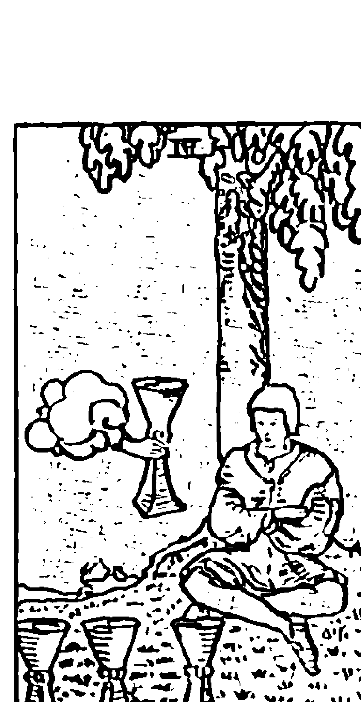

### 關鍵字

- 停滯倦怠
- 暫時休息
- 沈思
- 不滿意
- 自己的想像

### 背景

樹木象徵過去努力獲得的成果，是當事人可以倚靠的基礎，在樹蔭下還可以遮陽避雨，經常代表受到保護的領域。

### 中景

坐在樹下代表正在休息，兩手交叉在胸前則是自我防衛的姿態，低頭沈思代表對現狀不滿意，有停滯倦怠的感覺。

### 前景

草地上排列的三只聖杯象徵目前已經擁有的東西，由心靈之雲中伸出的手握住另一只聖杯，則是代表自己的想像。

【構圖時間線】背景→中景→前景

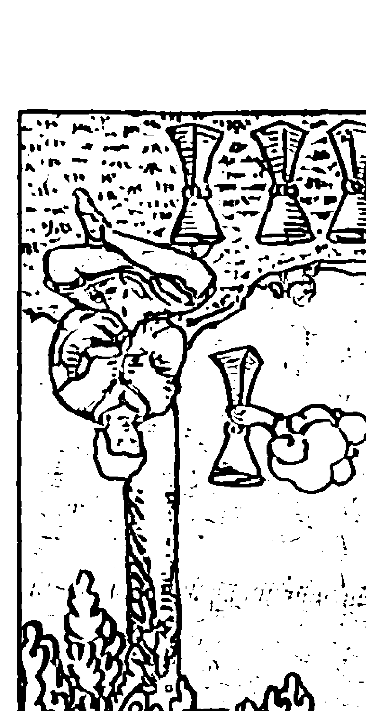

### 關鍵字

- 新的開始
- 好機會
- 前兆
- 喜新厭舊
- 消極固執
- 直覺或預感

### 位置關係

地上的三只聖杯超過了人的高度，象徵當事人已經無法掌控住狀況，同時也暗示會有新的機會出現需要新的作法。

### 方位指向

拿聖杯的手由右方的雲中伸出朝向左方，象徵內心當中有豐富的靈感，在占卜牌義當中也經常表示有直覺或預感。

### 圖形變化

若是樹下的人選擇離開，則是象徵離開舒適區去冒險和探索，在占卜牌義當中也代表新的開始或喜新厭舊的意思。

### 色彩意義

藍色的天空帶來冷靜與放鬆的感覺，綠色的草地則帶有清新的象徵，綠色與紅色衣服的組合顯示自相矛盾的特質。

### 占星對應

聖杯四與月亮進入巨蟹座的能量呼應，正好進入守護關係的位置，月亮象徵照顧與保護，巨蟹座則有保守的特質。

### 數字象徵

聖杯四對應到四的能量，代表穩固的狀態，由於在感情上處於十分穩定的狀況，也有可能因為無趣而覺得不滿意。

### 在其他牌中重複出現的象徵

- 樹木：女祭司、皇后、戀人、戰車、力量、吊人、星星、權杖A、權杖二、權杖十、聖杯二、聖杯十、寶劍六、錢幣九、寶劍侍者、寶劍騎士、寶劍王后、寶劍國王、錢幣侍者、錢幣騎士
- 積雲：戀人、命運之輪、塔、審判、世界、權杖A、聖杯A、聖杯七、寶劍A、寶劍三、錢幣A、寶劍侍者、寶劍王后、寶劍國王
- 雲中伸出的手：權杖A、聖杯A、寶劍A、錢幣A
- 兩手在胸前交叉：聖杯九、寶劍二
- 綠色上衣：權杖五、權杖七、寶劍五、錢幣侍者
- 紅色鞋子：皇后、塔、權杖三、聖杯二、聖杯六、聖杯八、寶劍七、錢幣四、寶劍王后、寶劍國王
- 草地：戀人、戰車、力量、星星、月亮、聖杯六、錢幣A、錢幣侍者、錢幣王后

## 聖杯五 CUPS V

傳統上聖杯五代表失去而帶來的痛苦，同時伴隨著悲傷與失望的情緒，逆位時則經常相對地指向放下與重新開始。

### 關鍵字

期待落空·傷心難過·失去·只看到事情的一面·仍保有部分

### 背景

城堡象徵安全與穩定，但是小河流向左方象徵逝去的情感，將人隔絕在另外一邊，拱橋則代表跨越情緒的可能性。

### 中景

低著頭注視著前方倒下的三只聖杯，象徵正為失去的東西而傷心難過，在占卜當中也經常代表只看到不好的一面。

### 中景

後方兩只站立的聖杯象徵目前仍然保有的東西，只是這些並不引起他的注意，在占卜牌義中代表忽略了好的一面。

【構圖時間線】背景 → 中景

### 關鍵字

錯誤的計畫·新的機會·聯盟合作·壞消息·一無所有·放下

### 位置關係

拱橋移到左上方象徵強調對外聯結和溝通的重要性，在占卜牌義當中也經常表示有機會找到結盟或是合作的對象。

### 方位指向

三只傾倒的聖杯朝向右方，象徵收到了壞消息，河流由左方流向右方，則是代表當事人容易受到別人的情緒影響。

### 圖形變化

原來站立的兩個聖杯也傾倒了，代表一無所有的狀況，但若是願意放下聖杯過河回到城堡，就有重新開始的機會。

## 色彩意義 ⚶ ○

大片灰色的天空帶來沈悶與停滯的感覺，為事件蒙上了一層陰影，黑色的斗篷則是象徵當事人的傷心難過與苦悶。

## 占星對應 ♂ ♏

聖杯五與火星進入天蠍座能量呼應，正好進入守護關係的位置，火星帶有衝突性，天蠍座具有死亡與再生的象徵。

### 數字象徵 V

聖杯五對應到五的能量，與變化和復仇有關，由於在情感上出現令人失望的變化，所以產生悲傷失落痛苦的情緒。

### 在其他牌中重複出現的象徵

- 城堡 戰車、權杖A、權杖二、權杖四、權杖八、聖杯七、寶劍八、錢幣十、錢幣國王
- 河流 皇后、皇帝、戰車、死神、權杖A、權杖八、聖杯八、聖杯十、寶劍六、聖杯騎士、錢幣王后
- 拱橋 權杖四
- 斗篷 女祭司、隱者、塔、權杖二、寶劍六、錢幣三、錢幣五、權杖侍者、錢幣王后、錢幣國王
- 荒地 死神、權杖五、寶劍七、寶劍八、寶劍侍者、寶劍騎士

## 聖杯六 CUPS VI

傳統上聖杯六是一張與回憶有關的牌，代表過去經歷的事物，逆位時則會相反地指向未來，以及即將遇到的狀況。

## 正位圖解

### 關鍵字

過去已經發生的事·不平等的關係·深度的承諾·回憶·真誠的愛

### 背景

位於城鎮當中的花園帶來安全而熟悉的感覺，也表示與過去的回憶有關，守衛走向高樓則是象徵提供照顧和保護。

### 中景

由較高大的人拿著聖杯獻花給另一個較矮小的人，象徵提供深度的承諾，不過同時也暗示這是一段不平等的關係。

### 前景

白色的牽牛花象徵純潔的愛，前方四只裝滿花朵的聖杯代表真誠而穩定的關係，在占卜牌義當中也會與童年有關。

【構圖時間線】前景 → 中景 → 背景

## 逆位圖解

### 關鍵字

未來·復興·重新開始·不真心的關係·失衡的關係·不穩固

### 位置關係

四個聖杯移到畫面的最上方，代表到目前為止的成果，由於發展已經到了最高點，想要有所突破就需要新的作法。

### 方位指向

較高大的人轉而朝向左方，象徵期待出征與冒險的旅程，在占卜牌義當中經常代表遇到新的變化，可以重新開始。

### 圖形變化

若是聖杯中的花朵全部都掉落，表示這並不是一個真心誠意的關係，即使自己很努力付出也無法感覺到有所回報。

### 色彩意義

藍色的天空帶來放鬆和冷靜的感覺，白色的花則有純潔無瑕的象徵，紅色帽子與紅色褲子都代表了熱情與行動力。

### 占星對應

聖杯六與太陽進入天蠍座的能量呼應，太陽具有快樂與滿足的象徵，天蠍座同時也代表穩固的關係與深度的承諾。

### 數字象徵

聖杯六對應到六的能量，和均衡與協調有關，在感情上尋求均衡而進行協調，因此會有保護的關係與深度的承諾。

### 在其他牌中重複出現的象徵

- 市鎮 權杖二、權杖十、錢幣四、錢幣六、錢幣八、錢幣十
- 房屋 聖杯二、聖杯十、錢幣九、錢幣十
- 高樓 錢幣四、錢幣十
- 花園 錢幣A
- 草地 戀人、戰車、力量、星星、月亮、聖杯四、錢幣A、錢幣侍者、錢幣王后
- 成對的男女 戀人、惡魔、審判、權杖四、聖杯二、聖杯十、錢幣五、錢幣十
- 兒童 死神、太陽、審判、聖杯十、寶劍六、錢幣十
- 紅色帽子 權杖二、權杖六、聖杯九、寶劍七、錢幣二、錢幣六、錢幣九、錢幣侍者
- 獻花 死神
- 藍色上衣 教皇、吊人、死神、權杖五、聖杯十、錢幣五、錢幣八、錢幣十、聖杯侍者
- 紅色褲子 吊人、寶劍五、錢幣二、錢幣六、錢幣八
- 紅色襪子 皇后、塔、權杖三、聖杯二、聖杯四、聖杯八、寶劍七、錢幣四、寶劍王后、寶劍國王
- 手套 死神、權杖六、錢幣九、權杖騎士、寶劍騎士、錢幣騎士
- 長矛 錢幣十
- 守衛 權杖九、錢幣十
- 十字架 女祭司、皇帝、教皇、審判

## 聖杯七 CUPS VII

傳統上聖杯七和夢境與想像力有關，也經常代表虛幻而無法持久的成就，在逆位時則會更強調事前計畫的重要性。

## 正位圖解

### 關鍵字

靈感、夢境、自己的想像、各種的慾望、不了解自己

### 背景

四週聖杯當中的東西分別象徵外貌、安全感、財富、名譽、慾望和聰明才智，代表內心當中的想像以及各種靈感。

### 背景

中間聖杯透出一個發光的人影，代表真正的自己，但是卻被帷幕蓋住而無法完全看見，象徵當事人並不了解自己。

### 中景

一個黑影注視著雲中浮現的七個聖杯，象徵被內心當中的各種慾望所吸引，在占卜時也經常表示還不穩固的狀況。

【構圖時間線】中景→背景

## 逆位圖解

### 關鍵字

清醒的頭腦、放空、表面的成功、意志與決心、缺乏靈感、計畫

### 位置關係

黑影移到畫面上方象徵超越迷霧的可能性，只有上半身的黑影並不帶有行動的意涵，還是要把重點放在計畫上面。

### 方位指向

發光的人影朝向下方，代表能夠透過內心的反省而更了解自己，因此也可能產生足夠的意志力與決心去解決問題。

### 圖形變化

若是所有聖杯裡的東西都掉出來，代表該試著放下內心當中不切實際的慾望，放空之後反而能做出更正確的決定。

## 色彩意義 ☾ ○

大片灰色的積雲帶有渾沌不明的象徵，代表仍然在幻想的階段，黑色的人影則具有沈默與靜止的意涵，並沒有行動。

## 占星對應 ♀ ♏

聖杯七與金星進入天蠍座的能量呼應，進入了失勢位置，金星本身帶有享樂的象徵，天蠍座則與靈感和慾望有關。

## 數字象徵 Ⅶ

聖杯七對應到七的能量，特別強調精神與靈性的活動，由於在感情上轉向精神層面的追求，所以也會想得特別多。

### 在其他牌中重複出現的象徵

- 積雲 戀人、命運之輪、塔、審判、世界、權杖A、聖杯A、聖杯四、寶劍A、寶劍三、錢幣A、寶劍侍者、寶劍王后、寶劍國王
- 城堡 戰車、權杖A、權杖二、權杖四、權杖八、聖杯五、寶劍八、錢幣十、錢幣國王
- 桂冠 皇后、戰車、愚者、世界、權杖六、聖杯二、錢幣國王
- 蛇 魔術師、戀人、命運之輪
- 惡魔 惡魔
- 骷髏 死神
- 布幔 女祭司、正義、聖杯九、寶劍十

## 聖杯八 CUPS VIII

傳統上聖杯八代表了不滿意的狀況，或是放棄自己已經得到的東西，在逆位時則會相反地帶有滿意及愉快的意思。

### 關鍵字

不滿意、缺乏、離開去尋找、實質的行動力、改變現狀

### 背景

岩石高山象徵艱難險阻，河流侵蝕山谷代表正在改變的現狀，滿月擋住太陽表示發生日蝕，象徵失去快樂與光明。

### 中景

一個人背向聖杯溯溪而去，象徵離開已經擁有的一切，去追尋自己真正想要的東西，經常代表具有實際的行動力。

### 前景

八只聖杯堆疊起來並在當中留下一個缺口，象徵目前仍然缺乏某個東西，在占卜牌義當中經常指向對現狀不滿意。

【構圖時間線】前景 → 中景 → 背景

### 關鍵字

滿意、愉快、和諧相處、轉捩點、維持現狀、失去

### 位置關係

八只聖杯移到畫面的最上方，代表非常重視感情與人際關係，但是頭重腳輕的堆疊方式則是象徵狀況並不太穩定。

### 方位指向

拿拐杖的人向下方走，象徵已經在回程當中，在占卜牌義當中經常會指向放不下已經得到的東西而選擇維持現狀。

### 圖形變化

當日蝕結束大地重現光明，則是象徵回到開心及滿意的狀況，同時也有可能代表失而復得的感覺及重要的轉捩點。

## 色彩意義 ⚫ ⚪

灰藍色的天空帶來消極與憂鬱的感覺，與黃色的聖杯形成強烈的對比，紅色的外套代表內心當中的熱情及行動力。

## 占星對應 ♄ ♓

聖杯八與土星進入雙魚座的能量呼應，土星象徵困難與限制，雙魚座具有豐富的情感，也容易對現狀感到不滿意。

## 數字象徵 VIII

聖杯八對應到八的能量，與實踐的力量有關，由於在情感上有實踐的力量，所以發現不滿意就可以立刻採取行動。

### 在其他牌中重複出現的象徵

- 夜空: 女祭司、隱者、星星、月亮、寶劍二
- 太陽: 戀人、死神、節制、太陽、愚者
- 月亮: 女祭司、戰車、月亮、寶劍二
- 岩石高山: 皇帝、隱者、塔、審判、愚者、寶劍A、錢幣A、聖杯騎士
- 河流: 皇后、皇帝、戰車、死神、權杖A、權杖八、聖杯五、聖杯十、寶劍六、聖杯騎士、錢幣王后
- 紅色外套: 魔術師、塔、權杖三、錢幣六
- 拐杖: 隱者、錢幣五
- 紅色鞋子: 皇后、塔、權杖三、聖杯二、聖杯四、聖杯六、寶劍七、錢幣四、寶劍王后、寶劍國王

## 聖杯九 CUPS IX

傳統上聖杯九代表能夠達成心願，通常當事人都會覺得滿意，逆位時則會相反地指向錯誤、失敗和不完美的狀況。

### 關鍵字

達成心願·豐富的成就·滿意·炫耀·不肯分享

### 背景

九只聖杯展示在高臺上，代表到目前為止豐富的成就，在占卜牌義上經常表示達成心願，同時也帶有炫耀的意思。

### 中景

商人坐在高壘之前，微笑的表情顯示出他對於自己的成就滿意，在占卜牌義當中也經常表示並沒有進一步的行動。

### 中景

雙手交叉在胸前帶有自我防衛的象徵，也暗示了不肯分享的心態，在占卜當中經常表示要堅持自己的立場和作法。

【構圖時間線】背景 → 中景

### 關鍵字

不滿意·不完美·自以為是·固執己見·失敗·分享

### 位置關係

商人超過了聖杯的高度，象徵對於擁有的東西加強掌控，可能會變得更固執己見，並使得不願意分享的傾向加重。

### 方位指向

商人兩手交叉在胸前朝向上方，將會加強自我防衛的傾向，容易讓人覺得他自以為是，甚至會有溝通不良的狀況。

### 圖形變化

若是九只聖杯由高臺上滾落，則是象徵失敗或不滿意的結局，高臺的布幔掀開有可能會顯露出背後不完美的狀況。

### 色彩意義 ○○

大片黃色的背景帶來光明與快樂的感覺，藍色的布幔則帶有平靜的象徵，紅色帽子代表內心當中的熱情及行動力。

## 占星對應 21 ⋏

聖杯九與木星進入雙魚座的能量呼應，正好進入守護關係的位置，木星代表幸運與成功，雙魚座則象徵消極被動。

## 數字象徵 IX

聖杯九對應到九的能量，代表了滿足與飽合，由於在感情上覺得滿足，因此可以把自己擁有的東西展示出來炫耀。

### 在其他牌中重複出現的象徵

- 布幔 女祭司、聖杯七、正義、寶劍十
- 商人 權杖三、錢幣六
- 紅色帽子 權杖二、權杖六、聖杯六、寶劍七、錢幣二、錢幣六、錢幣九、錢幣侍者
- 條紋長袍 錢幣六
- 兩手在胸前交叉 聖杯四、寶劍二
- 板凳 女祭司、正義、寶劍二、錢幣三、錢幣四

## 聖杯十 CUPS X

傳統上聖杯十代表故鄉和家庭，帶有熟悉與穩定的感覺，逆位時則會指向對立及爭吵，甚至有可能造成暴力衝突。

### 關鍵字

穩定·感情的圓滿·希望·和樂的氣氛·如家人的相處模式

### 背景

遠方的房子象徵安全與穩定，前方的河流則代表情感的自然流露，在占卜牌義當中經常表示和樂圓滿的感情狀態。

### 中景

彩虹當中浮現出十個聖杯，象徵希望、重生與神聖的誓約，代表這樣的關係受到神的祝福，也暗示結婚共組家庭。

### 前景

夫妻互相擁抱並舉手仰望天空中的彩虹，象徵平靜而深刻的愛，孩子們在一旁牽手跳舞，則是表現出歡樂的氣氛。

## 正位圖解

【構圖時間線】前景→中景→背景

## 逆位圖解

### 關鍵字

不穩定·爭執對立·過於理想化·表面上和諧·隱藏的衝突·與家人疏離

### 位置關係

人物移到畫面的最上方，強調人是最關鍵的因素，在占卜時經常指出只有表面的和諧，把衝突與爭執都隱藏起來。

### 方位指向

房屋移到左上方象徵離鄉背井，經常表示與家人之間疏離或是有心結，甚至可能代表家庭就是問題和阻礙的來源。

### 圖形變化

天空中的彩虹在下方形成U字型，代表過於理想化的傾向，由於缺乏務實的考量及基礎，容易造成不穩定的狀況。

### 色彩意義

藍色的天空帶來開闊與平靜的感覺，彩虹包含了所有的顏色，經常象徵各種條件都俱足或是可以交融整合的狀況。

### 占星對應

聖杯十與火星進入雙魚座的能量呼應，火星象徵潛在的衝突性，雙魚座則具有包容的特質，能夠與大家和諧相處。

### 數字象徵

聖杯十對應到十的能量，和完滿與結局有關，在感情上最完滿的結局就是如家人般的相處模式與穩定和樂的關係。

### 在其他牌中重複出現的象徵

- 房屋 聖杯二、聖杯六、錢幣九、錢幣十
- 樹木 女祭司、皇后、戀人、戰車、力量、吊人、星星、權杖A、權杖二、權杖十、聖杯二、聖杯四、寶劍六、錢幣九、寶劍侍者、寶劍騎士、寶劍王后、寶劍國王、錢幣侍者、錢幣騎士
- 河流 皇后、皇帝、戰車、死神、權杖A、權杖八、聖杯五、聖杯八、寶劍六、聖杯騎士、錢幣王后
- 成對的男女 戀人、惡魔、審判、權杖四、聖杯二、聖杯六、錢幣五、錢幣十
- 仰望天空 戀人、審判、愚者、錢幣五、權杖侍者、錢幣侍者
- 藍色長袍 女祭司、教皇、塔、聖杯王后、聖杯國王、寶劍國王
- 橘色上衣 權杖五、權杖九、權杖十、寶劍六、錢幣二、錢幣七
- 兒童 死神、太陽、審判、聖杯六、寶劍六、錢幣十
- 跳舞 世界、權杖四、聖杯三
- 藍色上衣 教皇、吊人、死神、權杖五、聖杯六、錢幣五、錢幣八、錢幣十、聖杯侍者

# MEMO

# PART V

## 寶劍牌組的圖形與象徵

| 寶劍A | 寶劍二 | 寶劍三 | 寶劍四 | 寶劍五 |
| :---: | :---: | :---: | :---: | :---: |
| 寶劍六 | 寶劍七 | 寶劍八 | 寶劍九 | 寶劍十 |

## 寶劍A ACE OF SWORDS

傳統上寶劍A代表勝利征服的力量，但是也有過度的可能，逆位置時經常指向障礙的力量，甚至帶來失敗和處罰。

## 正位圖解

### 關鍵字

理性思考·挑戰·主動出擊·榮耀與勝利·過度

### 背景

連綿不絕的山峰象徵出現在挑戰，寶劍超越了山峰的高度代表想辦法去克服困難，在占卜當中也常指向理性思考。

### 中景

由心靈之雲當中伸出右手握住一把寶劍，代表面對挑戰時拔劍應戰的動作，在占卜牌義當中經常表示要主動出擊。

### 中景

寶劍上端的王冠象徵榮耀，兩旁垂下的棕櫚葉及橄欖葉則是象徵勝利，劍尖刺穿過王冠則是表示有過度的可能性。

【構圖時間線】背景→中景

## 逆位圖解

### 關鍵字

無法理性思考·障礙與困難·被攻擊·謀定而後動·失敗·缺乏自信

### 位置關係

山峰移到畫面的最上方，象徵強調外在的障礙與困難，這個時候要謀定而後動，若是無法理性思考就容易被卡住。

### 方位指向

寶劍由上而下刺入，象徵遭到別人的攻擊而受到傷害，在占卜當中經常指向別人不合理的要求或被處罰的狀況。

### 圖形變化

棕櫚葉及橄欖葉都落下代表失敗的狀況，若是連王冠也一起掉落則是象徵失去權力，很容易打擊到當事人的信心。

### 色彩意義

大片灰暗的天空帶來沉悶與停滯的感覺，閃著藍光的寶劍帶有冷靜理性的象徵，黃色的王冠則代表了光明與自信。

### 占星對應

寶劍A代表風元素力量的根源，具有溝通與召喚的力量，同時也代表人的理性思考；在時間方面則會對應到冬天。

### 數字象徵

寶劍A對應到一的能量，與起源和創生有關，若是我們能在問題剛發生時就主動出擊，會比較容易獲得勝利成功。

### 在其他牌中重複出現的象徵

- 棕櫚 女祭司
- 王冠 皇后、皇帝、戰車、正義、死神、塔、錢幣四、權杖王后、權杖國王、聖杯王后、聖杯國王、寶劍王后、寶劍國王、錢幣王后、錢幣國王
- 積雲 戀人、命運之輪、塔、審判、世界、權杖A、聖杯A、聖杯四、聖杯七、寶劍三、錢幣A、寶劍侍者、寶劍王后、寶劍國王
- 雲中伸出的手 權杖A、聖杯A、聖杯四、錢幣A
- 岩石高山 皇帝、隱者、塔、審判、愚者、聖杯八、錢幣A、聖杯騎士

## 寶劍二 SWORDS II

傳統上寶劍二代表對立力量的暫時取得平衡，經常表現為冷戰的狀況；逆位時則經常指向欺騙、背叛與表裡不一。

## 正位圖解

【構圖時間線】背景 → 中景

### 關鍵字

無法合作·逃避·沒有行動·自我防禦·僵持

### 背景

背後的海洋象徵豐富的情感，露出礁岩的海岸代表潛在的問題和變化，背對海岸則是象徵當事人逃避現實的心態。

### 中景

當事人蒙上眼睛代表無法看清楚事情的真相，坐在石凳上則是象徵沒有採取任何行動，很有可能因此而陷入僵局。

### 中景

兩手各持一把寶劍交叉在胸前象徵自我防禦，同時也經常代表有兩股不同的力量僵持不下，正處於不穩定的平衡。

## 逆位圖解

### 關鍵字

欺騙·面對現實·背叛·打破僵局·看見真相·統合與平衡

### 位置關係

海洋超過了頭腦的高度，象徵理性已經被情緒淹沒，握住寶劍的雙手超過寶劍的高度，代表有統合與平衡的可能。

### 方位指向

手上的兩把寶劍都指向下方，象徵受到兩種不同的外力影響，在占卜牌義當中也經常代表遭受欺騙或背叛的狀況。

### 圖形變化

若是當事人願意放下寶劍並且去除蒙住眼睛的繃帶，則代表了看見真相與面對現實的可能性，也有機會打破僵局。

### 色彩意義

大片藍色的夜空與海洋帶來憂鬱和消極的感覺，灰色的衣服代表當事人被動停滯的心態，與石凳及地板相互呼應。

### 占星對應

寶劍二與月亮進入天秤座能量呼應，月亮代表了變動與個人的情緒，天秤座則帶有平衡的力量把狀況暫時穩定住。

### 數字象徵

寶劍二對應到二的能量，與分別和對立有關，由於彼此分別對立而造成傷害，因此容易有逃避及自我防衛的反應。

### 在其他牌中重複出現的象徵

| 象徵 | 在其他牌中出現 |
| :--- | :--- |
| 夜空 | 女祭司、隱者、星星、月亮、聖杯八 |
| 月亮 | 女祭司、戰車、月亮、聖杯八 |
| 海岸 | 權杖二、權杖三、寶劍五、寶劍十、聖杯王后、聖杯國王 |
| 絆帶 | 權杖九、寶劍八、錢幣五 |
| 朦住眼睛 | 寶劍八、寶劍九 |
| 兩手在胸前交叉 | 聖杯四、聖杯九 |
| 灰色長袍 | 死神、寶劍九、寶劍王后 |
| 板凳 | 女祭司、正義、聖杯九、錢幣三、錢幣四 |

## 寶劍三
### SWORDS III

傳統上，寶劍三與分離和破裂有關，也經常代表悲傷的情緒，逆位時則是指向混亂的狀況，也容易造成錯誤與損失。

## 正位圖解

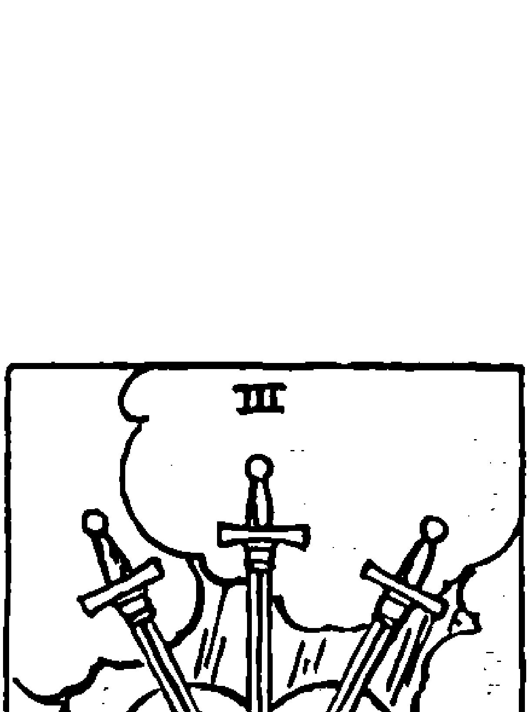

### 關鍵字

分離，心碎和憂鬱，淨化和成長的眼淚，缺乏及不完備，延遲

### 背景

烏雲象徵憂鬱的情緒，雨水則是代表悲傷的眼淚，一方面表示情緒得到適當的宣洩，同時也有淨化和成長的機會。

下方虛空的背景象徵缺乏基礎或是條件還不完備，事情有可能因此而延遲，在占卜牌義當中也經常表示內心空虛。

### 中景

懸在空中的紅心象徵豐富的情感，三把寶劍向下刺穿紅心代表心被撕裂、刺痛的感覺，也暗示分離與破裂的狀況。

【構圖時間線】背景 → 中景

## 逆位圖解

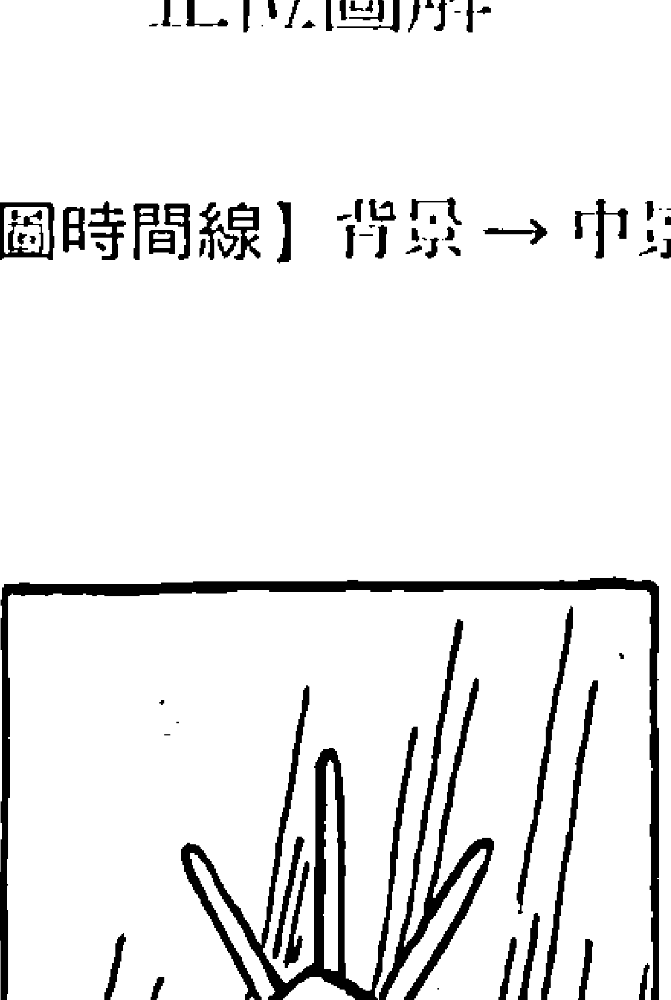

### 關鍵字

混亂，迷惑，使別人傷心，疏離，損失，衝突

### 位置關係

烏雲移到畫面下方，代表內心當中的迷惑與混亂，此時無法清晰地思考，若是妄下判斷有可能會造成錯誤及損失。

### 方位指向

三把寶劍都朝向上方，象徵當事人做了一些使對方傷心的事情，或是說話得罪了別人，很可能會發生爭論和衝突。

### 圖形變化

若是三把寶劍都由紅心當中脫離落下，則是象徵最傷心難過的狀況已經結束，接下來將開始進入療傷止痛的階段。

### 色彩意義

大片灰色的天空帶來沈悶憂鬱的感覺，與烏雲相互呼應，紅色的心代表熱情，藍色的寶劍帶有冷靜與肅殺的氣氛。

### 占星對應

寶劍三與土星進入天秤座的能量呼應，進入了強勢位置，土星帶有憂鬱及悲傷的象徵，天秤座提供了平衡的力量。

### 數字象徵

寶劍三對應到三的能量，與合作的概念有關，由於無法合作造成分離與破裂，進一步可能引發悲傷與憂鬱的情緒。

### 在其他牌中重複出現的象徵

| 象徵 | 在其他牌中出現 |
| :--- | :--- |
| 心形 | 皇后 |
| 積雲 | 戀人、命運之輪、塔、審判、世界、權杖A、聖杯A、聖杯四、聖杯七、寶劍A、寶劍三、錢幣A、寶劍侍者、寶劍王后、寶劍國王 |

## 寶劍四
### SWORDS IV

傳統上寶劍四是一張孤獨與隱居的牌，代表從衝突之中退卻休息；逆位時則表示需要小心謹慎，以防止出現危機。

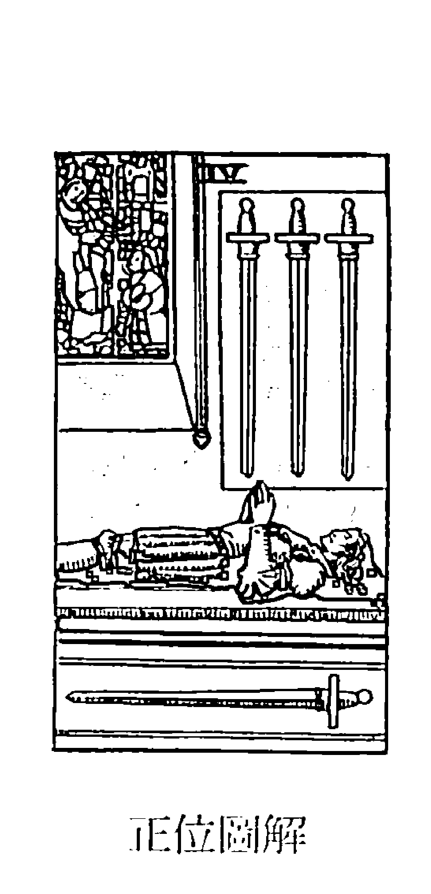

## 正位圖解

### 關鍵字

孤獨·避難與休息·沈思·外來的威脅·未來的戰爭

### 背景

左上方的彩繪玻璃代表位於教堂當中的場景，這是適合休息的避難所，在占卜牌義中也經常表示消極退卻的意思。

### 中景

三把寶劍朝向下方象徵外在的威脅，但是由於被釘在牆上所以並沒有立即的危險，同時也暗示外面戰事還沒結束。

### 前景

平躺的全身塑像做出祈禱的姿勢，象徵一個人孤獨地沈思，手邊仍然保留一把寶劍則暗示未來還有可能投入戰爭。

【構圖時間線】背景→中景→前景

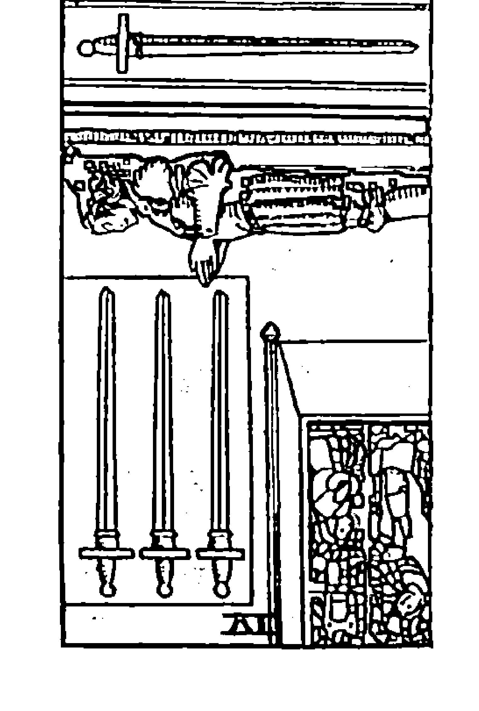

## 逆位圖解

### 關鍵字

內部的問題·重新投入戰爭·無法充份休息·謹慎·預防·節省

### 方位指向

牆上的三把寶劍由下刺向上方，代表傷害其實來自於內部問題，所以更需要小心謹慎處理，最好能先安內再攘外。

### 位置關係

手邊的寶劍移到畫面的最上方，表示爭鬥的狀況再度出現，個人迫於情勢必須重新投入戰爭，而沒辦法好好休息。

### 圖形變化

若是平躺的全身塑像落下，將會被三把寶劍刺穿，代表無法再繼續逃避問題，需要主動去處理才能防止危機發生。

### 色彩意義

大面灰色的牆壁帶來沈悶與停滯的感覺，黃色的半身塑像則具有理性與警示的象徵，與身旁黃色的寶劍相互呼應。

### 占星對應

寶劍四與木星進入天秤座的能量呼應，木星帶有宗教的象徵，天秤座則具有平衡的力量，暫時休息不讓傷害擴大。

### 數字象徵

寶劍四對應到四的能量，與穩固的概念有關，在攻擊與傷害當中尋找穩固的基礎，需要先躲起來思考再重新出發。

### 在其他牌中重複出現的象徵

| 象徵 | 在其他牌中出現 |
| :--- | :--- |
| 教堂 | 錢幣五 |
| 彩繪玻璃 | 錢幣五 |
| 雙手合掌 | 死神、審判 |

### 寶劍牌組

## 寶劍五
### SWORDS V

傳統上寶劍五是一張代表挫敗的牌，同時也有破壞與損失，也有人主張寶劍五正逆位的意思相同，不必特別區分。

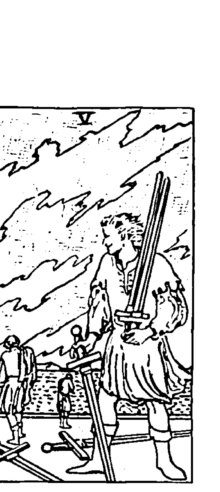

## 正位圖解

### 關鍵字

毀滅性的鬥爭·得意·爭執·只有一方勝利·一時爭勝並無收穫

### 背景

被風吹動的捲雲帶有急切與快速的象徵，後方的海岸代表內在的情緒，在占卜牌義當中經常代表無謂的意氣之爭。

### 中景

兩個失敗者的寶劍被打落在地上，並且沮喪地走向海岸，襯托出勝利者的角色，代表這是只有一方能得勝的鬥爭。

### 前景

勝利者臉上露出得意的神情，不過也無法再拿起另外兩把寶劍，代表雖然表面上得到勝利但是並沒有實質的收穫。

【構圖時間線】前景 → 中景 → 背景

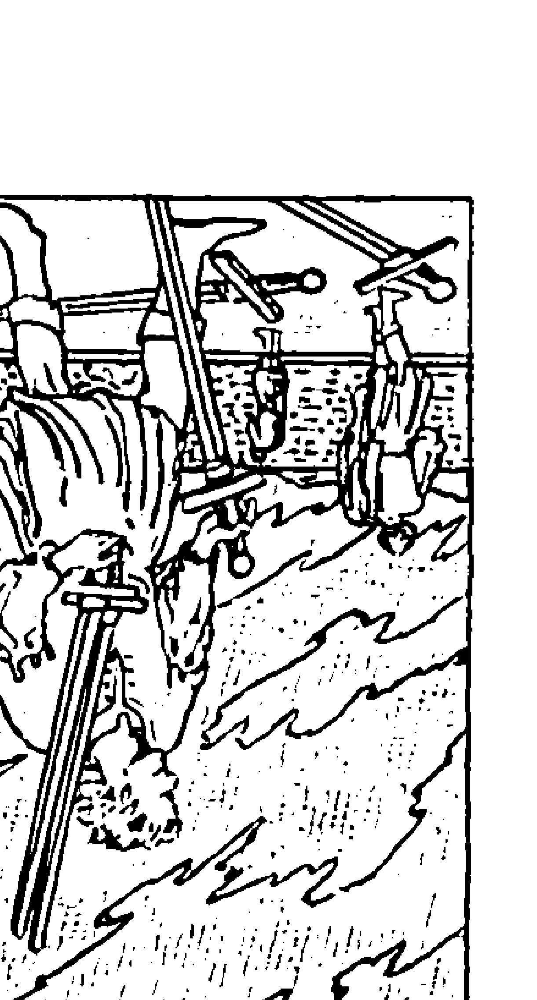

## 逆位圖解

### 關鍵字

失敗與挫折·離開·落居下風·聲名狼籍·放棄爭鬥·損失

### 位置關係

失敗者移到畫面的最上方，代表強調失敗與挫折的一面，再怎麼努力都只是白費力氣，或是有聲名狼籍的現象。

### 方位指向

勝利者手上的兩把寶劍指向下方，代表當事人落居下風，兩個失敗者走向上方，象徵結束與離開是比較好的選擇。

### 圖形變化

若是勝利者手上的三把寶劍都掉落，則是象徵放棄鬥爭的方式去尋找和平的解決方案，但是同時也暗示有所損失。

### 色彩意義

大片藍色的天空帶有肅殺之氣，與藍色的寶劍相互呼應，綠色上衣與紅色褲子的組合則顯示出對立與矛盾的特質。

### 占星對應

寶劍五與金星進入水瓶座的能量呼應，金星帶有嫉妒的象徵，水瓶座代表特立獨行，同時帶有變革及改造的力量。

### 數字象徵

寶劍五對應到五的能量，與變化和復仇有關，復仇的攻擊行動經常不計任何代價，即使沒有好處也要把對方打倒。

### 在其他牌中重複出現的象徵

| 象徵 | 在其他牌中出現 |
| :--- | :--- |
| 捲雲 | 寶劍騎士 |
| 海岸 | 權杖二、權杖三、寶劍二、寶劍十、聖杯王后、聖杯國王 |
| 綠色上衣 | 權杖五、權杖七、聖杯四、錢幣侍者 |
| 紅色褲子 | 吊人、聖杯六、錢幣二、錢幣六、錢幣八 |

## 寶劍六
### SWORDS VI

傳統上寶劍六代表長程旅行，或是透過別人私下傳遞訊息，逆位時則會相反地指向由本人公開宣告讓大家都知道。

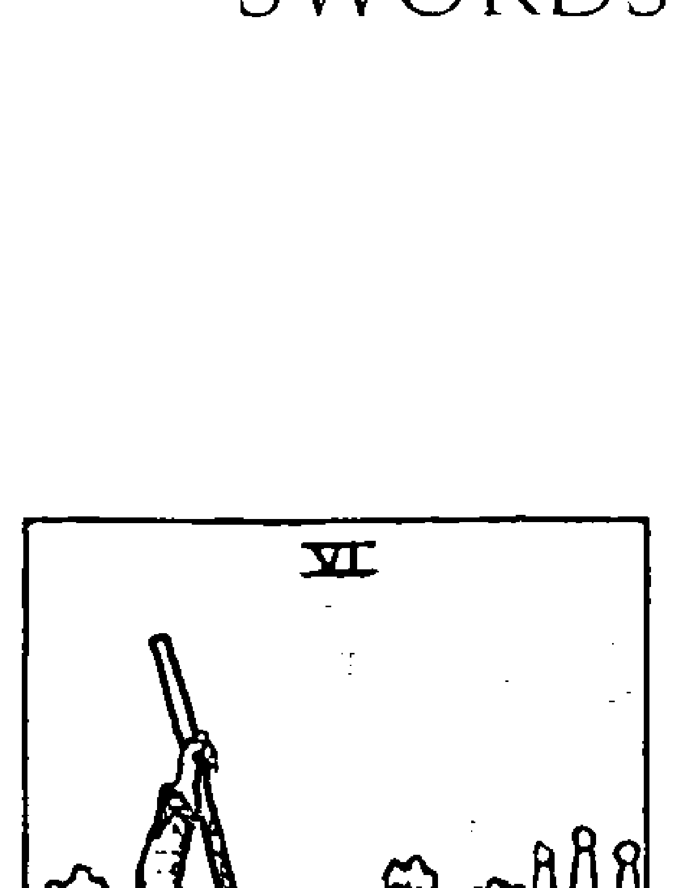

### 關鍵字

水路的旅程，療傷的行動，低調，內心的傷痛，行動上的幫助

### 背景

寬闊的河流象徵心中豐富的情感與情緒，同時也代表需要努力去跨越的障礙，對面的河岸則是希望能達到的目標。

### 中景

小船之上插了六把寶劍，象徵帶著內心的傷痛展開療傷之旅，船夫幫助他們渡到對岸，代表可能得到實質的幫助。

大人及小孩都包裹在斗篷當中，象徵保密不希望被別人發現，在占卜牌義中經常代表要像鴨子划水般低調的進行。

【構圖時間線】中景→背景

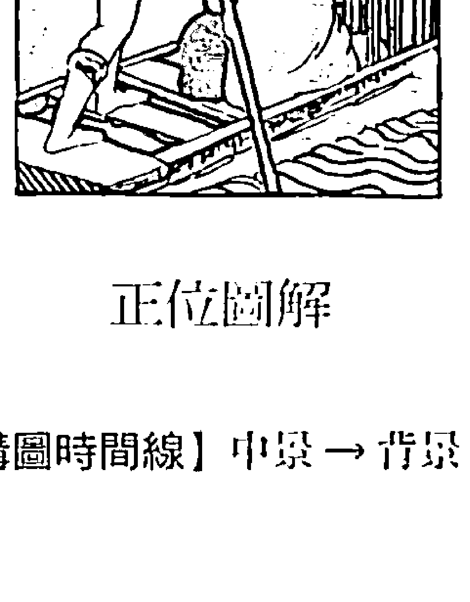

### 關鍵字

波動與變化，一致對外，意外，失誤，自立自強，公開宣告

### 位置關係

波浪移到畫面的最上方，象徵環境上發生重大的波動與變化，乘客超過船夫的高度代表需要自立自強無法靠別人。

### 方位指向

六把寶劍一齊指向土方，代表要同心協力、一致對外才能突破困境，船隻航向左方則是象徵目前還在出征的旅程。

### 圖形變化

若是在水上航行的船隻翻覆，則是代表可能發生失誤或意外狀況，在占卜牌義當中也經常代表不適合旅行及遠行。

### 色彩意義

大片灰色的天空帶有過渡的性質，藍色的河水具有憂鬱和消極的象徵，橘色的船隻則代表正在尋找內心的安全感。

### 占星對應

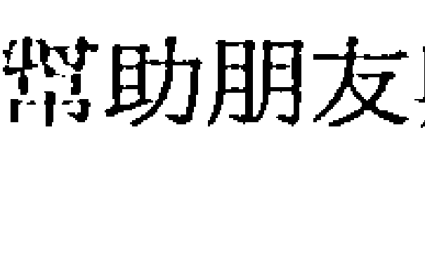

寶劍六與水星進入水瓶座的能量呼應，水星帶有溝通與旅行的象徵，水瓶座則具有幫助朋友與獨立自主的雙重性。

### 數字象徵

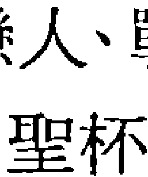

寶劍六對應到六的能量，與均衡和協調的概念有關，在傷害過後想去尋求協調與均衡，所以需要療傷的具體行動。

### 在其他牌中重複出現的象徵

| 象徵 | 在其他牌中出現 |
| :--- | :--- |
| 樹木 | 女祭司、皇后、戀人、戰車、力量、吊人、星星、權杖A、權杖二、權杖十、聖杯二、聖杯四、聖杯十、錢幣九、寶劍侍者、寶劍騎士、寶劍王后、寶劍國王、錢幣侍者、錢幣騎士 |
| 河流 | 皇后、皇帝、戰車、死神、權杖A、權杖八、聖杯五、聖杯八、聖杯十、聖杯騎士、錢幣王后 |
| 船 | 死神、權杖三、錢幣二、聖杯國王 |
| 波浪 | 錢幣二、聖杯侍者、聖杯國王 |
| 橘色上衣 | 權杖五、權杖九、權杖十、聖杯十、錢幣二、錢幣七 |
| 斗篷 | 女祭司、隱者、塔、權杖二、聖杯五、錢幣三、錢幣五、權杖侍者、錢幣王后、錢幣國王 |
| 兒童 | 死神、太陽、審判、聖杯六、聖杯十、錢幣十 |

## 寶劍七
### SWORDS VII

傳統上寶劍七代表對於自己有信心，但是狀況並不穩固，逆位時則表示忠告或好的建議，同時需要小心謹慎處理。

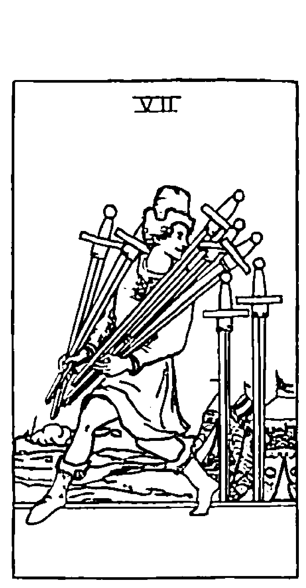

## 正位圖解

### 關鍵字

希望、趁虛而入、信心、欺騙或偷竊、不可能的任務

### 背景

軍人正在埋鍋造飯以致於營門大開，讓敵人有了趁虛而入的機會，在占卜當中也經常代表疏於防備或基礎不穩固。

### 中景

兩把寶劍留在軍營門口，象徵這是一件極為困難的任務，即使已經用上了欺騙偷竊等不正當的手段仍然未盡全功。

### 前景

這個人快速地偷走五把寶劍，代表他對自己有信心，仍然抱持希望去努力，躡手躡腳並回頭張望則象徵小心謹慎。

【構圖時間線】背景 → 中景 → 前景

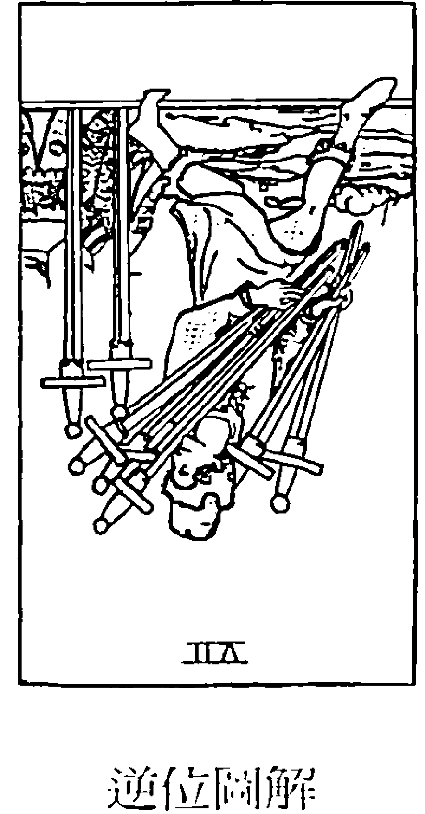

## 逆位圖解

### 關鍵字

可乘之機、欺騙別人、一時短暫的成功、謠言誹謗、按部就班完成、謹慎

### 位置關係

開放的軍營移到左上方，象徵外在的環境有可乘之機，這個時候更要小心謹慎，以避免謠言誹謗造成不利的影響。

### 方位指向

偷走五把寶劍的人走向右邊，暗示你正是那個使用不正當手段的人，也可能表示有必要使用欺騙或是偷竊的方法。

### 圖形變化

若是手上的五把寶劍都掉落，表示無法守住自己僅有的成果，在占卜牌義中也經常代表如曇花一現般短暫成功。

### 色彩意義

大片黃色的天空具有理性及自信心的象徵，紅色的帽子代表內心衝動冒險的想法，紅色的鞋子代表實際採取行動。

### 占星對應

寶劍七與月亮進入水瓶座的能量呼應，月亮有變動與不穩定的象徵，水瓶座代表特立獨行及不按牌理出牌的特性。

### 數字象徵

寶劍七對應到七的能量，與精神和靈性的活動有關，由於對自己過度自信，即使遇到不可能的任務仍然勇往直前。

### 在其他牌中重複出現的象徵

| 象徵 | 在其他牌中出現 |
| :--- | :--- |
| 紅色帽子 | 權杖二、權杖六、聖杯六、聖杯九、錢幣二、錢幣六、錢幣九、錢幣侍者 |
| 紅色鞋子 | 皇后、塔、權杖三、聖杯二、聖杯四、聖杯六、聖杯八、錢幣四、寶劍王后、寶劍國王 |
| 荒地 | 死神、權杖五、聖杯五、寶劍八、寶劍侍者、寶劍騎士 |

## 寶劍八
### SWORDS VIII

傳統上寶劍八與批評責備有關，也表示力量被束縛住而無法發揮出來，逆位時則會指向發生意外或被背叛的狀況。

### 關鍵字

批評責備·綑綁·看不見真相·被敵意包圍·壞消息

### 背景

荒地代表戰場，後方的城堡被寶劍擋住象徵無法被保護，地上的水漬暗示曾經下雨，象徵過去經歷的挑戰及苦難。

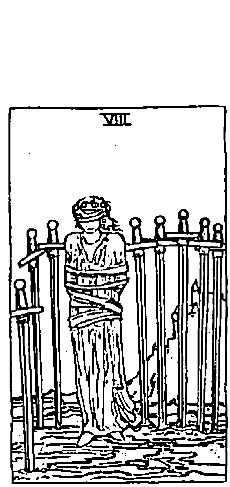

### 中景

旁邊的地上插滿了八把寶劍，象徵被敵對的人、事、物所包圍，同時也暗示反對的意見和壞消息在四周不停出現。

### 前景

雙手被反綁象徵力量被剝奪或限制，矇住眼睛代表看不清楚真相，不過雙腳並沒有被綁住則暗示了離開的可能性。

## 正位圖解

【構圖時間線】背景→中景→前景

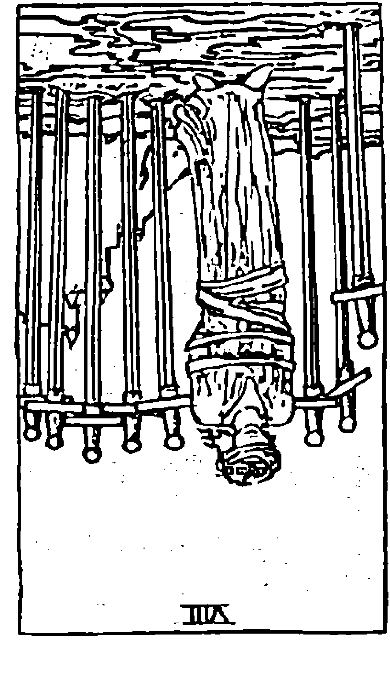

## 逆位圖解

### 關鍵字

意外狀況·被背叛·發現真相·突破的可能性·不安·激烈的反對

### 位置關係

荒地與地上的水漬都移到上方，強調未來的挑戰和苦難還沒結束，城堡移到左上方暗示環境對你有強烈的防衛性。

### 方位指向

八把寶劍都刺向上方，象徵提出反對的意見，因此可能造成激烈的爭吵和尖銳的對立，也很容易帶來不安和傷害。

### 圖形變化

若是被綑綁的人選擇走出包圍她的寶劍，表示存在突破困境的可能性，但是過程中要非常小心謹慎才能避開危險。

### 色彩意義

大片灰色的天空帶來沈悶與停滯的感覺，與灰色的城堡相互呼應，橘色的長袍則代表了內心當中十分渴望安全感。

### 占星對應

寶劍八與木星進入雙子座的力量呼應，進入了失勢位置，木星擴張的力量無法發揮，雙子座帶有二元對立的象徵。

### 數字象徵

寶劍八對應到八的能量，與實踐的力量有關，若是在傷害上發揮出實踐的力量，就能把敵人包圍捆綁並且限制住。

### 在其他牌中重複出現的象徵

| 象徵 | 在其他牌中出現 |
| :--- | :--- |
| 城堡 | 戰車、權杖A、權杖二、權杖四、權杖八、聖杯五、聖杯七、錢幣十、錢幣國王 |
| 荒地 | 死神、權杖五、聖杯五、寶劍七、寶劍侍者、寶劍騎士 |
| 朦住眼睛 | 寶劍二、寶劍九 |
| 雙手後背 | 吊人 |
| 被捆綁 | 惡魔 |
| 繃帶 | 權杖九、寶劍二、錢幣五 |

## 寶劍九
### SWORDS IX

傳統上寶劍九是一張代表絕望的牌，心裡的痛苦超過實質的傷害，逆位時則指向猜忌與不信任，有很強的防衛心。

### 關鍵字

單獨・焦慮及害怕・惡夢一場・逃避現實・無能為力

### 背景

黑暗中掛著九把平行的寶劍象徵外在的困難與傷害，穿過當事人的頭頂、肩頸及胸背分別代表焦慮、絕望及恐懼。

### 中景

掩面痛哭代表還未從惡夢的情緒脫離，朦住眼睛也象徵不願意看見事情的真相，坐在床上則代表沒有進一步行動。

### 前景

臥床側面墊劍的雕刻象徵曾經受過的傷害，帶有占星符號的床單代表混雜的力量，當事人被這些限制而無能為力。

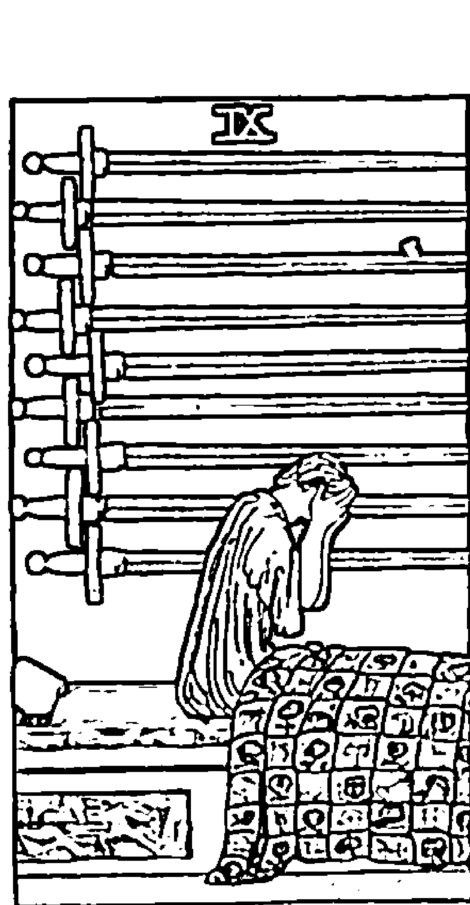

## 【構圖時間線】

前景→中景→背景

## 逆位圖解

### 關鍵字

猜疑・防衛性・靠自己努力・聲名狼藉・恐懼的限制・謹慎

### 位置關係

作惡夢的人移到上方表示更強調焦慮及害怕，但也可能是你令別人覺得恐懼，在占卜牌義中也有聲名狼藉的意思。

### 方位指向

九把寶劍一致刺向左方，象徵對外有強烈的防衛性，在占卜牌義中經常代表懷疑和不信任，無法與别人交流合作。

### 圖形變化

若是身上的毛毯掉落，一方面代表失去溫暖與安全的屏障，但是同時也解除了外在的限制，要靠自己去解決問題。

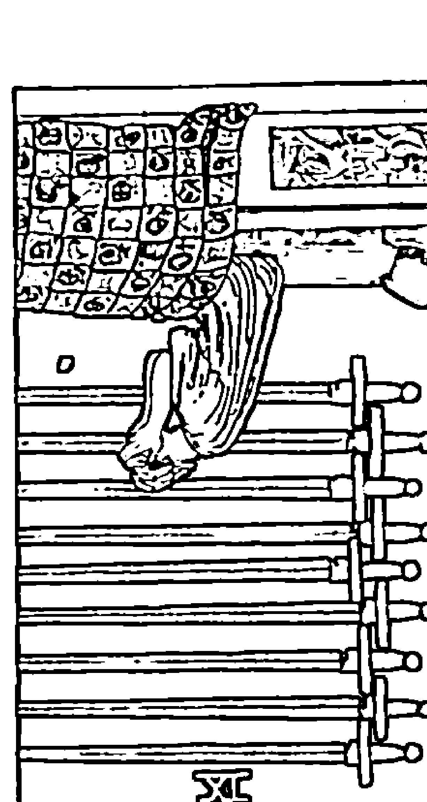

### 色彩意義

大片黑暗的背景象徵悲慘與不幸的狀況，灰色的長袍帶有消極與停滯的象徵，紅藍黃三色的床單代表混雜的力量。

### 占星對應

寶劍九與火星進入雙子座的力量呼應，火星帶有衝突與傷害的象徵，雙子座則具有二元對立以及紛亂變動的特質。

### 數字象徵

寶劍九對應到九的能量，代表滿足與飽合，在傷害上達到飽合的程度，也就只能陷入焦慮害怕的情緒而無能為力。

### 在其他牌中重複出現的象徵

| 象徵 | 在其他牌中出現 |
| :--- | :--- |
| 黑暗 | 惡魔 |
| 蒙住眼睛 | 寶劍二、寶劍八 |
| 灰色長袍 | 死神、寶劍二、寶劍王后 |
| 占星符號的紋飾 | 戰車 |

## 寶劍十
### SWORDS X

傳統上寶劍十是一張代表毀滅的牌，當中也帶有受苦的狀況及悲傷的情緒，逆位時則會指向短暫的利益或是成就。

## 正位圖解

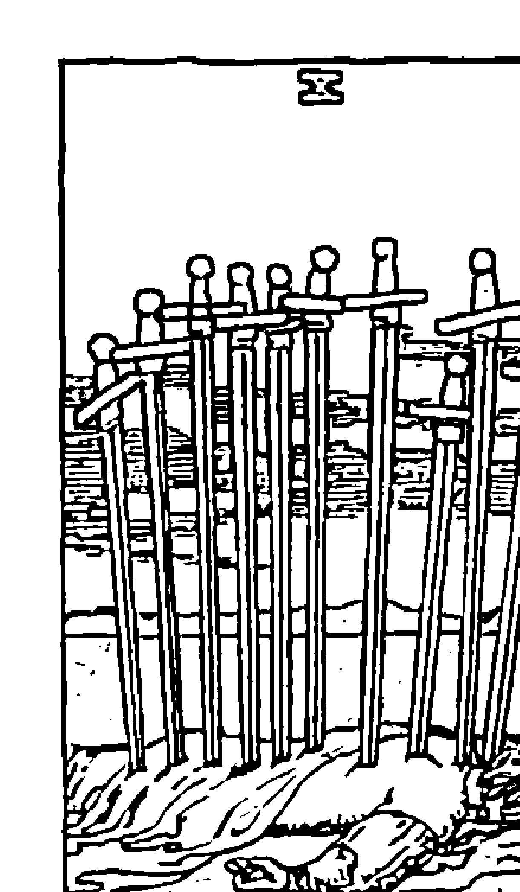

### 關鍵字

悲傷·孤獨寂寞·極大的痛苦·死亡與結束·即將有重大轉變

### 背景

黑夜象徵全然的靜止與結束，有時候也可能代表死亡，在海平面上透出一道曙光，象徵事情即將出現重大的轉變。

### 中景

廣大的海洋代表豐富的情感，被寶劍切割阻擋象徵無法順利宣洩的情緒，也經常代表內心當中悲傷或失落的感覺。

### 前景

一個人橫屍在海岸象徵孤獨寂寞，身上插滿十把寶劍則代表承受了極大的痛苦和折磨，也表示遭受到實質的傷害。

【構圖時間線】前景→中景→背景

## 逆位圖解

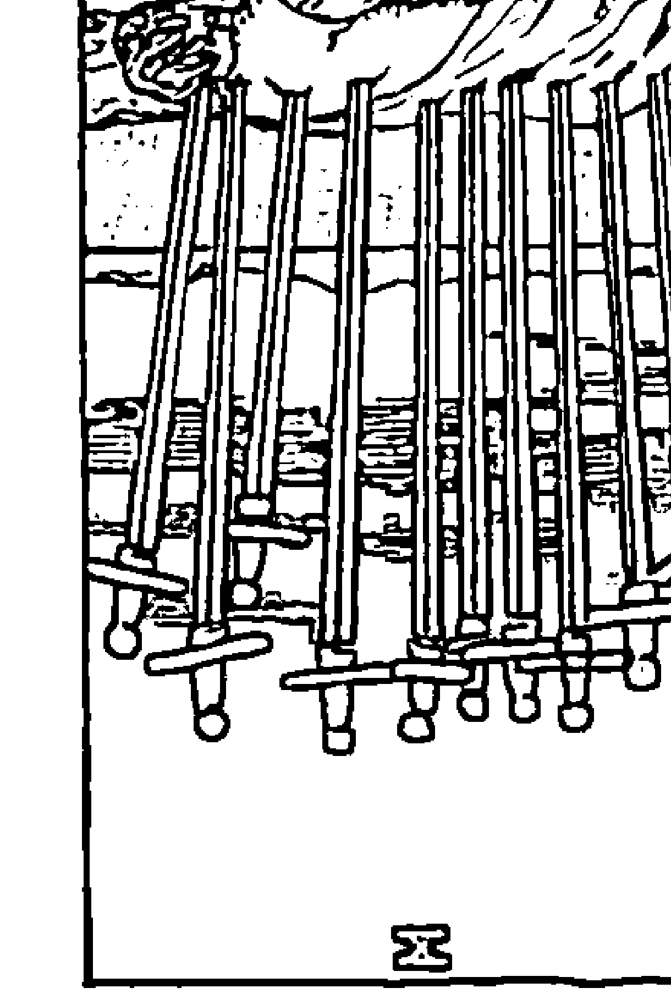

### 關鍵字

轉變中的機會·已過了最痛苦的狀況·短暫成功·自然轉變·分離·新開始

### 位置關係

黎明的曙光超過了黑夜的高度，表示光明已經開始浮現，但是死者又超過曙光的高度，暗示即使成功也不會長久。

### 方位指向

十把寶劍由下向上刺入死者的背後，象徵被內部的敵人所暗算，這時候無法再維持現狀，只能看著事情自然轉變。

### 圖形變化

若是十把寶劍由死者的身上掉落，代表最痛苦的狀況已經過去了，狀況雖然開始轉好但是仍然有很多問題要面對。

### 色彩意義 ○ ○

大片黑色的夜空象徵結束與死亡，黃色的曙光則帶來光明的希望，死者身上紅布帶有暴力衝突及流血犧牲的象徵。

## 占星對應 ⊙ ⏚

寶劍十與太陽進入雙子座的能量呼應，太陽帶有理性與光明的象徵，雙子座則代表二元對立，同時也有不穩定性。

## 數字象徵 X

寶劍十對應到十的能量，與結局的概念有關，在傷害方面的最終結局就是身心遭受重大的創傷，承受極大的痛苦。

### 在其他牌中重複出現的象徵

- 黑夜 塔、錢幣五
- 曙光 死神
- 海岸 權杖二、權杖三、寶劍二、寶劍五、聖杯王后、聖杯國王
- 死者 死神、審判
- 黃色上衣 權杖五、聖杯二、錢幣十、權杖侍者、寶劍侍者
- 布幔 女祭司、正義、聖杯七、聖杯九

# MEMO

# PART VI

# 錢幣牌組的圖形與象徵

- 錢幣A
- 錢幣二
- 錢幣三
- 錢幣四
- 錢幣五
- 錢幣六
- 錢幣七
- 錢幣八
- 錢幣九
- 錢幣十

## 錢幣A
ACE OF PENTACLES

傳統上錢幣A和物質上的滿足與享樂有關，同時也代表巨大的財富，在逆位時則會指向金錢財富來得快去得也快。

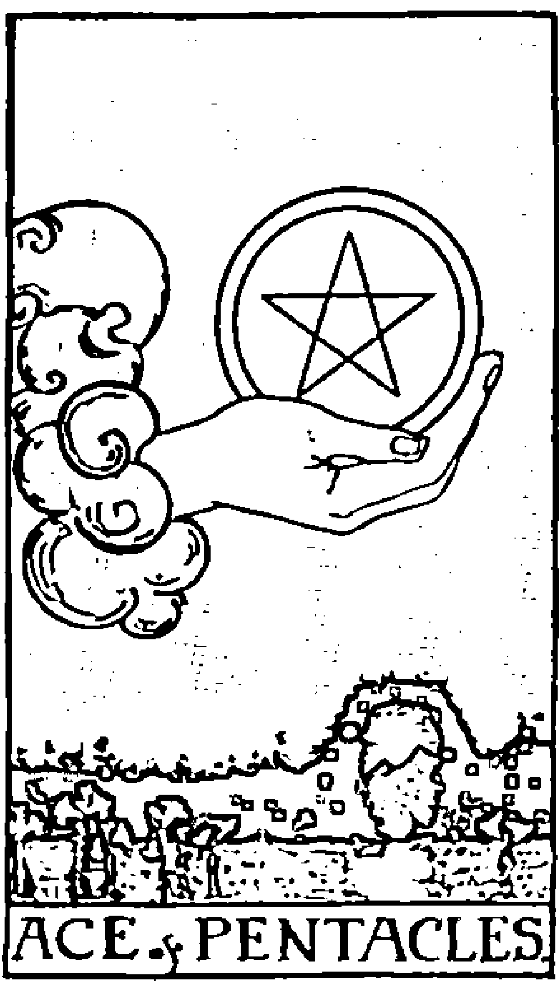

### 關鍵字

滿足·具體的成果·物質的享受·目前的方向·未來的可能性

### 背景

玫瑰花叢象徵具有熱情與行動力，拱門代表了通往未來的門戶，遠方的高山則是象徵遠大的目標及未來的可能性。

### 中景

花園代表已經達到的具體成果，百合花象徵內心純潔的動機，通往拱門的小徑則是代表目前可以預期的發展方向。

### 前景

由心靈之雲當中伸出右手捧著一枚巨大的錢幣，象徵財富與物質的享受，在占卜牌義當中也經常代表快樂和滿足。

## 正位圖解

【構圖時間線】前景→中景

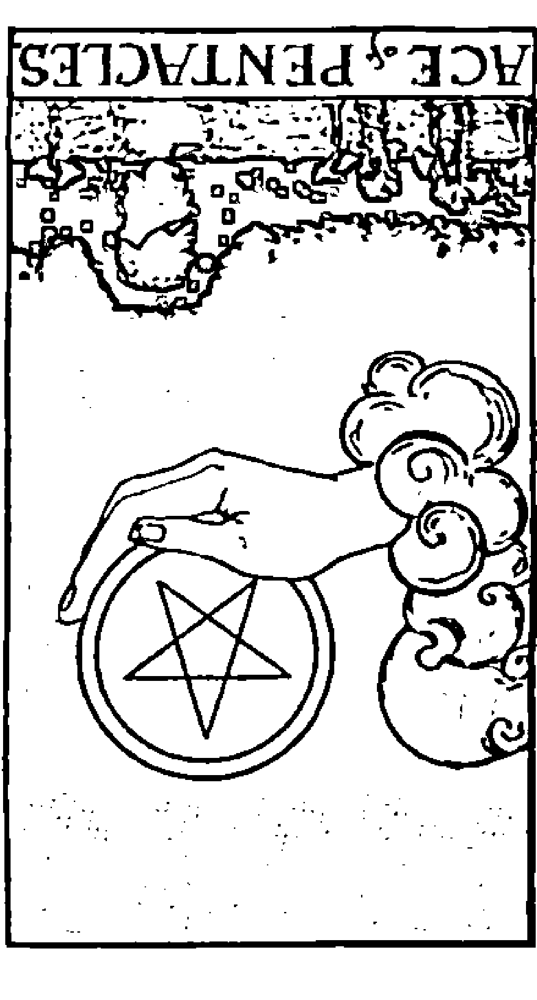

### 關鍵字

基礎不穩固·唯利是圖·過度享樂·財務問題·沒有成果·缺乏未來性

### 位置關係

花園移到畫面最上方超過遠山的高度，代表強調目前的成果而缺乏未來性，空無一物的下方則暗示基礎並不穩固。

### 方位指向

托住錢幣的手朝向下方，象徵把錢收到自己這一方來，可能會有吝嗇甚至唯利是圖的傾向，也經常表示過度享樂。

### 圖形變化

若是手上的錢幣掉落，經常表示在財務上出現問題，或是無法把握住成果，有時候也會暗示可以用錢來解決問題。

## 逆位圖解

### 色彩意義

大片灰色的天空象徵混沌未明，白色的手代表純潔無瑕，與白百合相互呼應，黃色的錢幣帶有光明與愉快的象徵。

### 占星對應

錢幣A代表土元素力量的根源，具有穩定務實和可靠的特質，也代表人的感官知覺；在時間方面則會對應到春季。

### 數字象徵

錢幣A對應到一的能量，與起源和創生有關，在物質層面創造的成果會帶來財富，也可以用來滿足感官上的享受。

### 在其他牌中重複出現的象徵

- 積雲 恋人、命運之輪、塔、審判、世界、權杖A、聖杯A、聖杯四、聖杯七、寶劍A、寶劍三、寶劍侍者、寶劍王后、寶劍國王
- 雲中伸出的手 權杖A、聖杯A、聖杯四、寶劍A
- 拱門 錢幣十
- 花叢 魔術師、權杖四、聖杯三、錢幣王后
- 紅玫瑰與白百合 魔術師、教皇、權杖二
- 岩石高山 皇帝、隱者、塔、審判、愚者、聖杯八、寶劍A、聖杯騎士
- 小徑 節制、月亮、權杖二、錢幣八
- 花園 聖杯六
- 草地 戀人、戰車、力量、星星、月亮、聖杯四、聖杯六、錢幣侍者、錢幣王后

## 錢幣二 PENTACLES II

傳統上這是一張代表歡樂的牌，不過和諧的狀況也開始變化，逆位時則會加大變動的幅度，充滿風險和不確定性。

### 關鍵字

歡樂·進與出的流動·不同選擇的衡量·波動起伏·有賺有賠

### 背景

波浪象徵情緒起伏不定，上面的大船和小船則代表有賺錢及賠錢的可能，在占卜牌義中經常表示波動起伏的現象。

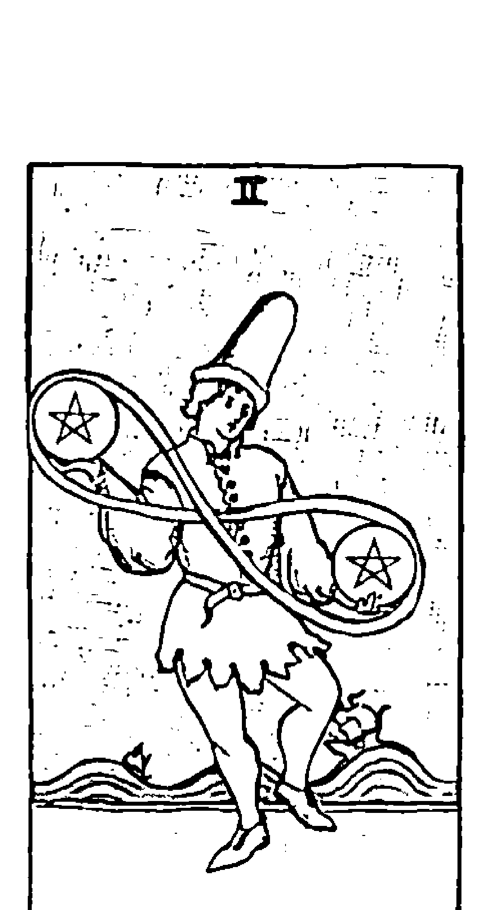

## 正位圖解

### 中景

一個人戴著高帽子跳舞，帶有歡慶與娛樂的象徵，兩手拿著錢幣雜耍，則是暗示以務實的標準來衡量不同的選擇。

### 中景

兩個錢幣被一個無限符號的繩索圈住，象徵錢進、錢出形成無止盡的循環，在占卜牌義中也代表有得有失的過程。

【構圖時間線】背景 → 中景

### 關鍵字

環境變化·風險和不確定性·過於樂觀·反覆無常·公事公辦·停滯不前

### 位置關係

波浪移到畫面的最上方，強調外在環境的變化及不確定性，波浪超過人的高度則是象徵被情緒淹沒沒辦法理性思考。

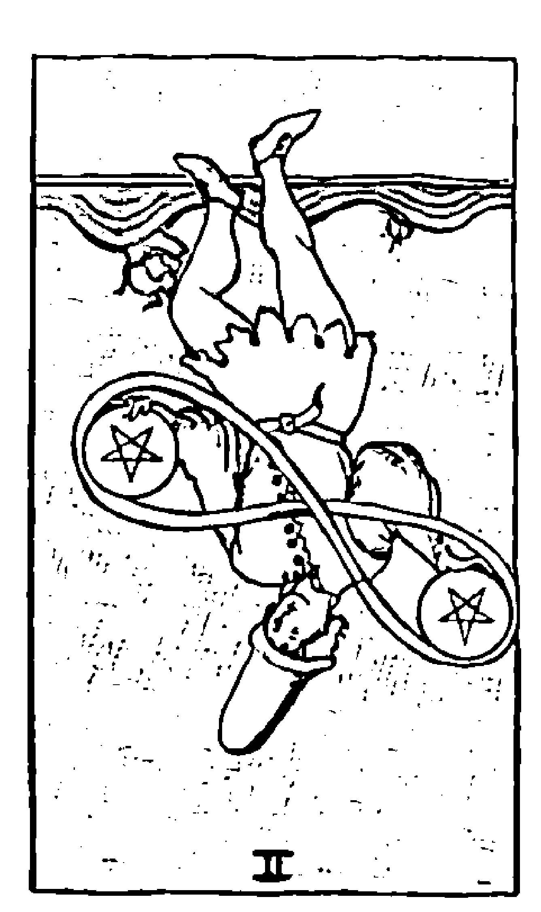

## 逆位圖解

### 方位指向

跳舞的人望向左方，代表重視冒險甚於穩定，在占卜牌義中經常代表當事人過於樂觀，無法正確評估事情的風險。

### 圖形變化

若是航行的船隻翻覆，象徵之前的努力全都化為烏有，在占卜當中也經常表示面對反覆無常的狀況最好公事公辦。

### 色彩意義 ⚪ ⚪ ⚪

藍色的天空帶來自由與開闊的感覺，橘色的衣服象徵內心缺乏安全感，紅色的帽子及褲子代表具有熱情及行動力。

### 占星對應 ♃ ♑

錢幣二與木星進入摩羯座的能量呼應，進入了弱勢位置，木星幸運的力量難以發揮出來，摩羯座帶有務實的特性。

### 數字象徵 Ⅱ

錢幣二對應到二的能量，代表分別與對立，由於在金錢財務上遇到不同的選擇，所以需要冷靜務實地辨別和決定。

### 在其他牌中重複出現的象徵

- 紅色帽子 權杖二、權杖六、聖杯六、聖杯九、寶劍七、錢幣六、錢幣九、錢幣侍者
- 橘色上衣 權杖五、權杖九、權杖十、聖杯十、寶劍六、錢幣七
- 紅色褲子 吊人、聖杯六、寶劍五、錢幣六、錢幣八
- 無限符號 魔術師、力量、世界
- 船 死神、權杖三、寶劍六、聖杯國王
- 波浪 寶劍六、聖杯侍者、聖杯國王

## 錢幣三
PENTACLES III

傳統上錢幣三代表身份尊貴或是技術卓越，具有建構與創造的力量，逆位時則相反地指向平庸及不夠成熟的狀況。

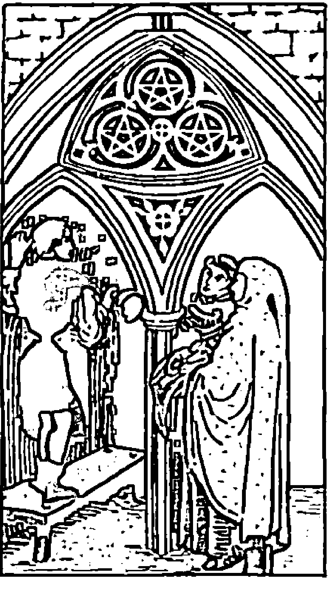

### 關鍵字

榮耀尊貴，專業上同心協力，兼顧各種需要，長久保值，穩固的基礎

### 背景

三枚錢幣被鑲嵌在修道院的支柱上，象徵已經建立起穩固的基礎，在占卜牌義中也經常代表進行長久保值的投資。

### 中景

僧侶、設計師及工匠齊聚一堂，代表在專業上共同協力的過程，大家各盡其力並且協調合作以求達到最好的成果。

### 中景

工匠站在長椅上施工，象徵在專業技術上的成熟，回頭與僧侶及設計師討論，則是為了確保能兼顧符合各種需要。

【構圖時間線】背景→中景

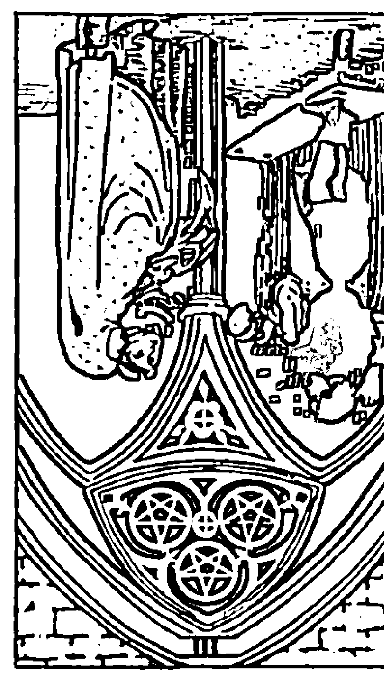

### 關鍵字

自卑，心胸狹窄，不夠成熟，平庸，短期的考量，剛起步的階段

### 位置關係

三個人移到畫面的最上方，強調互助合作的重要性，也暗示事情的關鍵在於人的因素，過於斤斤計較就很難成功。

### 方位指向

錢幣圖案組成的三角形指向下方，象徵要透過反省檢討才能建構穩固的基礎，有時候也會延伸為重視經驗的意思。

### 圖形變化

若是工匠由板凳上摔落下來，象徵在專業技術上不夠成熟，在占卜牌義當中也常表示平庸或是還在剛起步的階段。

### 色彩意義

灰色的錢幣融入到灰色的柱子當中，象徵已經投入的資金短期內無法靈活運用，工匠紫色的上衣帶有思考的象徵。

### 占星對應

錢幣三與火星進入摩羯座的能量呼應，進入了強勢位置，火星帶有競爭性，摩羯座則有為了長遠目標努力的象徵。

### 數字象徵

錢幣三對應到三的力量，具有合作的概念，如果能夠在專業上互相分工合作，必定能建立起長久穩定的財務基礎。

### 在其他牌中重複出現的象徵

- 長椅 錢幣八
- 斗蓬 女祭司、隱者、塔、權杖二、聖杯五、寶劍六、錢幣五、權杖侍者、錢幣王后、錢幣國王
- 僧侶 教皇
- 工匠 錢幣八
- 紫色上衣 戀人、寶劍侍者

## 錢幣四 PENTACLES IV

傳統上錢幣四與得到財物有關，經常是透過贈與或繼承的方式，逆位時則會遇到阻礙的力量，也可能會造成延遲。

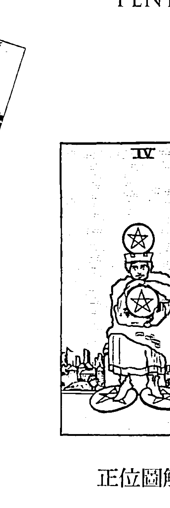

### 關鍵字

- 遺產與繼承
- 不安全感
- 極度重視金錢
- 控制的慾望
- 累積及增值

### 背景

城鎮當中高矮相間的房屋象徵已經得到的財物，具有累積與增值的前景，在占卜當中也經常代表繼承而來的遺產。

### 中景

王冠代表擁有權勢及地位，用黑色披風把全身包裹起來則暗示了內心當中的不安全感，坐在石凳上象徵沒有行動。

### 中景

頭上頂著一枚錢幣象徵對於金錢極度重視，腳下踩著兩枚錢幣、雙手緊抱住一枚錢幣，則表現出強烈的控制慾望。

【構圖時間線】背景→中景

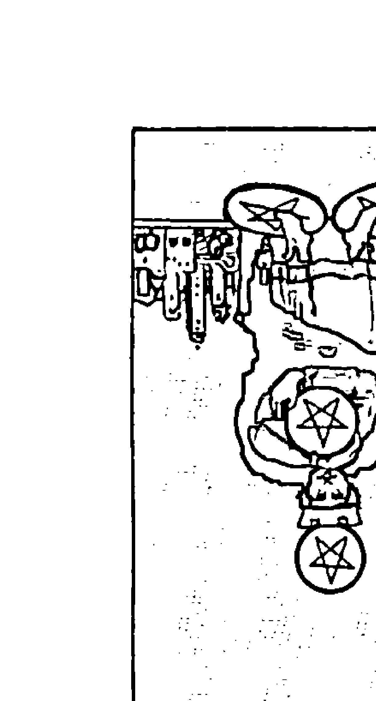

### 關鍵字

- 無法掌握的狀況
- 不願意付出
- 對立
- 瓶頸與停滯
- 把握重點
- 財務損失

### 位置關係

房屋超過了人的高度，象徵狀況已經脫離了當事人的掌握，甚至會造成嚴重的障礙，也經常代表遇到瓶頸或停滯。

### 方位指向

緊抱金錢的人朝向上方將會加強固執與佔有的傾向，變得自私自利而不願意付出，也有可能造成彼此對立的狀況。

### 圖形變化

若是頭頂上的錢幣掉落，有可能代表不再以金錢為唯一的考量，但是另一方面也經常暗示在財務上有損失的狀況。

### 色彩意義 ○○

黑色披風象徵靜止與沈默，同時也表示不安全感與自我隱藏的傾向，紅色長袍則是象徵內心當中的熱情及行動力。

### 占星對應 ⊙ ♑

錢幣四與太陽進入摩羯座的能量呼應，太陽帶有領導與掌控的象徵，摩羯座具有精打細算的特質，也很重視金錢。

### 數字象徵 IV

錢幣四對應到四的能量，代表穩固的狀況，由於在財務上十分穩固，所以會有強烈的控制慾防止別人把它們奪走。

### 在其他牌中重複出現的象徵

- 王冠: 皇后、皇帝、戰車、正義、死神、塔、寶劍A、權杖王后、權杖國王、聖杯王后、聖杯國王、寶劍王后、寶劍國王、錢幣王后、錢幣國王
- 披風: 皇帝、正義、權杖王后、權杖國王、聖杯王后、聖杯國王、寶劍騎士、寶劍王后、寶劍國王
- 紅色長袍: 皇帝、教皇、正義、權杖四、權杖六、聖杯三、錢幣十、錢幣王后
- 紅色鞋子: 皇后、塔、權杖三、聖杯二、聖杯四、聖杯六、聖杯八、寶劍七、寶劍王后、寶劍國王
- 市鎮: 權杖二、權杖十、聖杯六、錢幣六、錢幣八、錢幣十
- 高樓: 聖杯六、錢幣十
- 板凳: 女祭司、正義、聖杯九、寶劍二、錢幣三

## 錢幣五
PENTACLES V

傳統上錢幣五代表共患難的真情，但是也暗示正經歷苦難或財務上的問題，逆位時則會相反地指向不忠貞和放蕩。

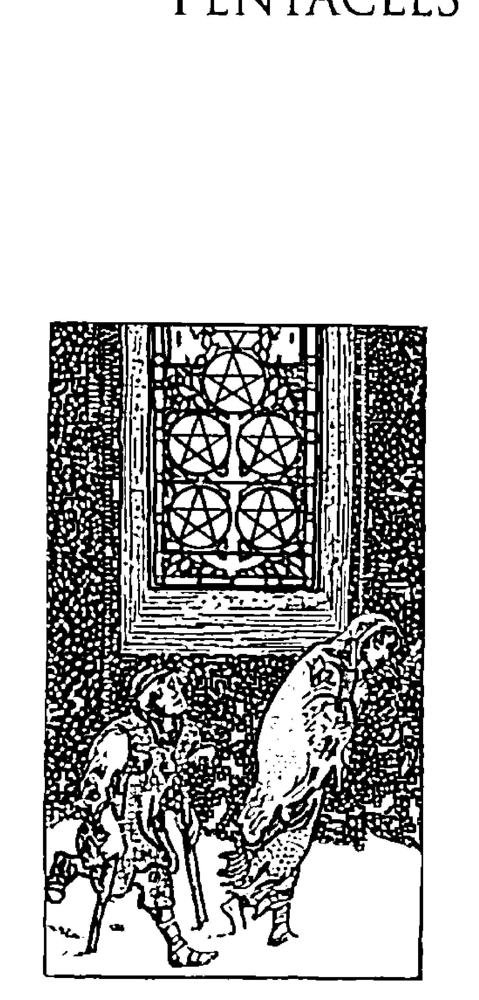

## 正位圖解

【構圖時間線】中景 → 背景

### 關鍵字

- 共患難
- 表面的華麗
- 財務上的窮困
- 受傷
- 失去能力

### 背景

教堂的彩繪玻璃上鑲嵌了五枚錢幣的圖案，代表光鮮亮麗的富裕階級，並且與窗外苦寒的暴風雪形成強烈的對比。

### 中景

頭上包裹紗布並且佇著拐杖象徵受傷，也暗示因為失去謀生能力而變得窮困，在占卜當中經常代表發生財務危機。

### 中景

兩名乞丐在暴風雪當中結伴而行，象徵即使經歷苦難仍然不離不棄，在占卜牌義當中經常代表能夠共患難的真情。

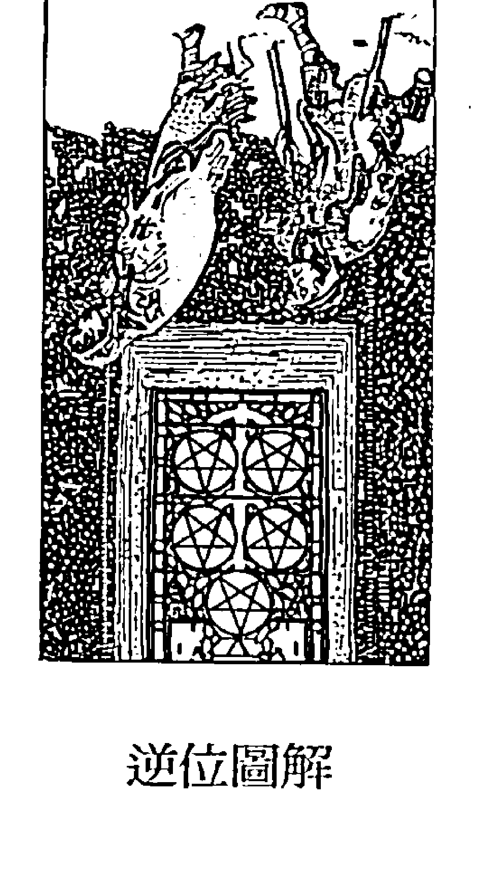

## 逆位圖解

### 關鍵字

- 爭吵
- 臭名遠播
- 混亂
- 缺乏耐心
- 新的希望
- 走出貧困的動作

### 位置關係

雪地移到畫面的最上方，強調外在的困難與阻礙，在占卜當中經常代表混亂而缺乏秩序，也容易發生爭吵的狀況。

### 方位指向

兩名乞丐走向左方，象徵採取走出貧困的動作，努力將會帶來新的希望，另一方面也可能代表壞名聲會散播出去。

### 圖形變化

彩色玻璃移到下方形成一扇門的樣子，象徵在財務上還有機會，若是積雪崩落下來則代表唯一的生路也被封死了。

### 色彩意義 ○ ○

白色的雪地象徵純潔和樸素，同時也帶來淨化的力量，橘色斗篷代表內心缺乏安全感，藍色上衣表現冷靜的特質。

### 占星對應 ☿ ♉

錢幣五與水星進入金牛座的能量呼應，水星具有敏捷與變化的象徵，金牛座代表刻苦耐勞，同時也有忠貞的特性。

### 數字象徵 V

錢幣五對應到五的能量，與變化及復仇的概念有關，物質上的變化可能帶來財務上的危機，或是受傷而失去能力。

### 在其他牌中重複出現的象徵

- 黑夜 塔、寶劍十
- 教堂 寶劍四
- 彩繪玻璃 寶劍四
- 乞丐 錢幣六
- 成對的男女 戀人、惡魔、審判、權杖四、聖杯二、聖杯六、聖杯十、錢幣十
- 藍色上衣 教皇、吊人、死神、權杖五、聖杯六、聖杯十、錢幣八、錢幣十、聖杯侍者
- 斗篷 女祭司、隱者、塔、權杖二、聖杯五、寶劍六、錢幣三、權杖侍者、錢幣王后、錢幣國王
- 仰望天空 戀人、審判、愚者、聖杯十、權杖侍者、錢幣侍者
- 拐杖 隱者、聖杯八
- 繃帶 權杖九、寶劍二、寶劍八

## 錢幣六
PENTACLES VI

傳統上錢幣六是一張代表贈與的牌，也暗示對於本身的財富感到滿足，逆位時則會指向貪心及無法被滿足的慾望。

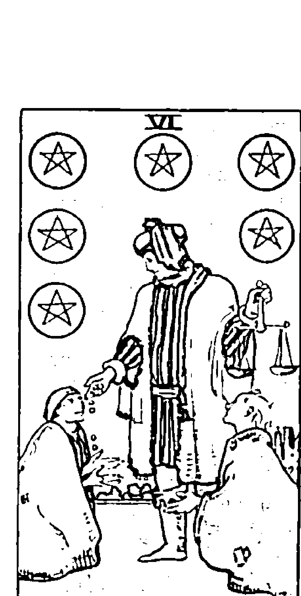

### 關鍵字

滿足·地位上的不平等·計算與衡量·慈悲心·以金錢控制對方

### 中景

富商的頭上浮現出六枚錢幣，象徵對於目前的財務狀況感到滿意，右手施捨金錢給乞丐則是代表本身具有慈悲心。

### 中景

左手拿著天秤象徵付出的金錢仍然有經過精密的計算與衡量，在占卜牌義當中也經常代表想要以金錢來控制對方。

### 前景

跪在地上的兩名乞丐對比出在財務地位上的不平等，伸出雙手接受富商的贈與，則是代表現在是適合接受的時候。

## 正位圖解

【構圖時間線】中景 → 前景

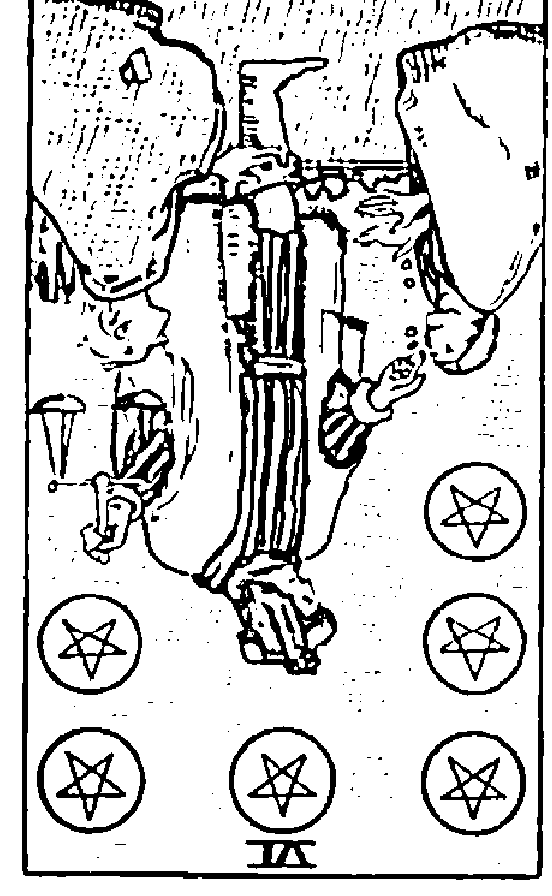

### 關鍵字

貪心·不切實際·炫耀財富·羨慕忌妒·自私·為錢煩惱

### 位置關係

兩名乞丐超過了富商的高度，暗示窮人即將得勝，也許會向富商要求更多，在占卜當中也常代表貪心及不滿足。

### 方位指向

富商的手將金錢向上付出，象徵藉由炫耀性的消費來誇耀自己的財富，但是也可能因為過分揮霍而開始為錢煩惱。

### 圖形變化

若是富商手中的天秤掉落，代表沒有經過計算衡量而不切實際，在占卜牌義當中也常表示羨慕或忌妒別人的成就。

## 逆位圖解

### 色彩意義 ○

紅色的外套代表內心的熱情及行動力，與紅色的帽子相互呼應，黃色的天秤具有理性的象徵，同時也代表快樂滿足。

### 占星對應 ♉ ♊

錢幣六與月亮進入金牛座的能量呼應，進入了強勢位置，月亮帶有照顧保護的象徵，金牛座則有穩定務實的特質。

### 數字象徵 VI

錢幣六對應到六的能量，代表均衡與協調，當對自身財務狀況感到滿足，也可以對有需要的人進行施捨以求平衡。

### 在其他牌中重複出現的象徵

- 商人 權杖三、聖杯九
- 紅色帽子 權杖二、權杖六、聖杯六、聖杯九、寶劍七、錢幣二、錢幣九、錢幣侍者
- 紅色外套 魔術師、塔、權杖三、聖杯八
- 條紋長袍 錢幣六
- 紅色褂子 吊人、聖杯六、寶劍五、錢幣二、錢幣八
- 天平 正義、錢幣十
- 市鎮 權杖二、權杖十、聖杯六、錢幣四、錢幣八、錢幣十
- 乞丐 錢幣五
- 下跪 死神、星星

## 錢幣七 PENTACLES VII

傳統上錢幣七代表可以預期即將實現的結果，但是還沒到實際收成的階段，逆位時則會指向為了金錢而擔心焦慮。

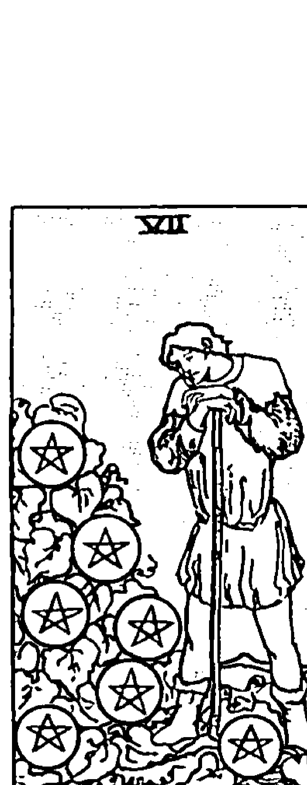

## 正位圖解

### 關鍵字

耐心等候，努力的初步成果，收成及交易，思考下一步，新的創意

### 中景

農夫靠在鋤頭上休息，象徵正在耐心等待適當的時機收成，並且準備進行交易，在占卜當中經常代表穩定的階段。

### 中景

農夫注視著樹上的果實，代表正在思考下一步應該怎麼做，如果希望有重大的突破，就需要有創新的計劃和作法。

### 前景

樹叢上結了七枚錢幣的果實，象徵到目前為止的初步成果，從另一個角度來看也可能代表當事人被現狀限制住了。

【構圖時間線】中景 → 前景

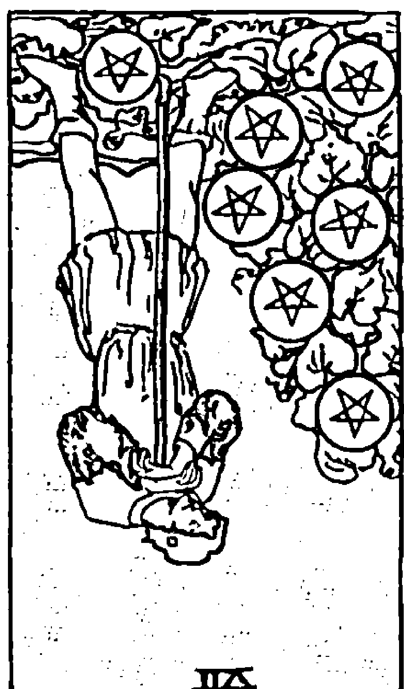

## 逆位圖解

### 關鍵字

缺乏耐性，金錢考量，損失，無法信任，擔心焦慮，錯誤的投資

### 位置關係

果樹超過了農夫的高度，象徵當事人被金錢的相關問題淹沒，另一方面也強調要以金錢及物質為主要的衡量標準。

### 方位指向

農夫轉向右方象徵偏向保守的觀點，有可能是目前已經遇到了發展瓶頸，遲遲無法突破讓當事人覺得擔心和焦慮。

### 圖形變化

若是缺乏耐心而在果實成熟之前就急著收成，反而很可能會造成損失，在占卜當中也經常代表進行了錯誤的投資。

### 色彩意義

灰色的天空帶來停滯與前途未明的感覺，黃色的錢幣帶有光明與愉快的象徵，橘色的上衣代表當事人缺乏安全感。

### 占星對應

錢幣七與土星進入金牛座的能量呼應，土星傳統上與農業有關，也是保守的象徵，金牛座則有務實及耐心的特質。

### 數字象徵

錢幣七對應到七的能量，與精神及靈性的活動有關，在物質生活上遇到瓶頸更要去反省和思考，尋求解決的方案。

### 在其他牌中重複出現的象徵

- 農夫 權杖十
- 橘色上衣 權杖五、權杖九、權杖十、聖杯十、寶劍六、錢幣二
- 果樹 戀人、錢幣九、錢幣國王
- 果實 權杖四、聖杯三、錢幣王后

## 錢幣八
PENTACLES VIII

傳統上錢幣八是一張代表小心謹慎的牌，同時也有謙遜與公正的美德，逆位時會相反地指向受慕虛榮與陰謀詭計。

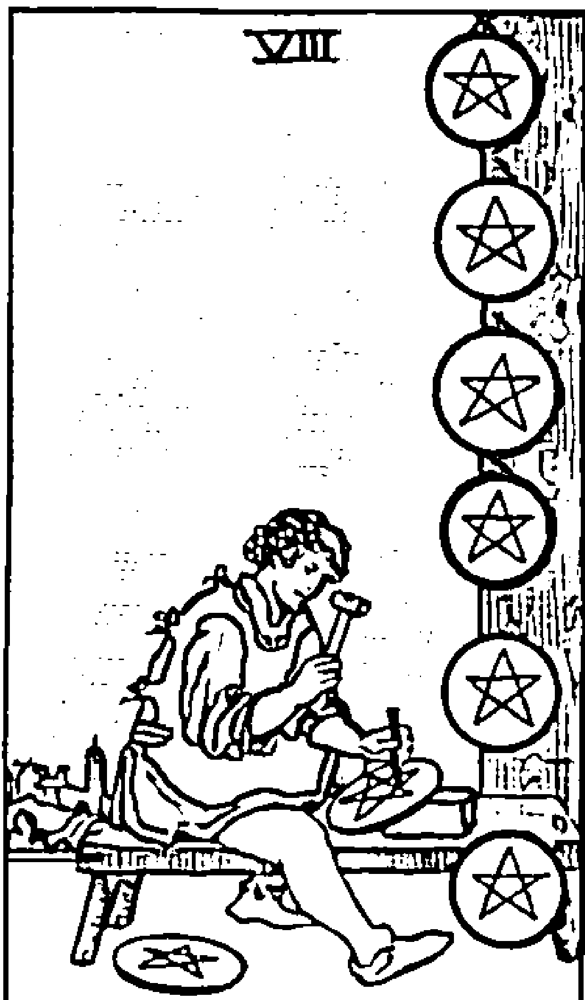

### 關鍵字

小心謹慎、專注、成熟的技術、工作才有成果、持續努力

### 背景

背後的小徑通往市鎮，當工作全部完成之後就可以把成品拿到那裡去販賣，也代表目前還在持續努力的過程當中。

### 中景

工匠坐在長椅上專注地雕刻一枚錢幣，運用工具象徵這是需要專業技術的工作，同時也代表要努力工作才有成果。

### 前景

牆上展示的六枚錢幣代表之前努力的成果，地上的另一枚錢幣則象徵還未完成的部分，經常表示有忙不完的工作。

【構圖時間線】前景 → 中景 → 背景

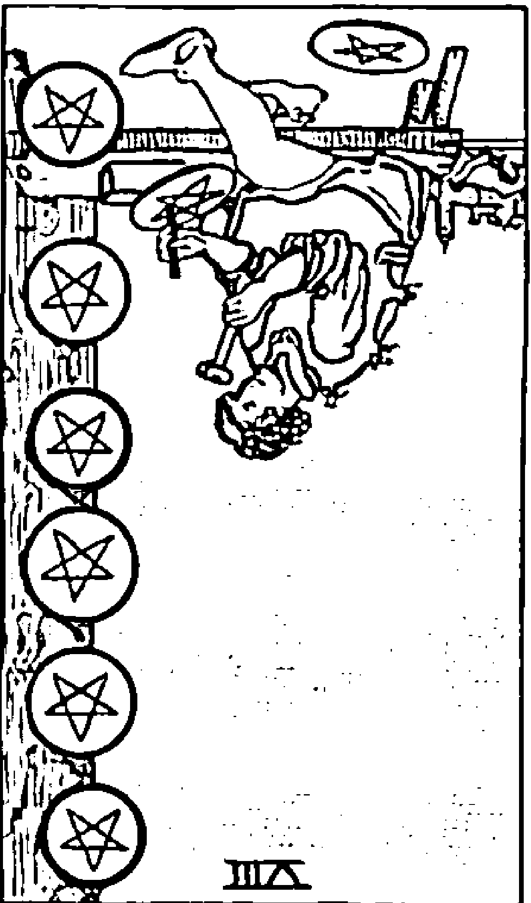

### 關鍵字

不專注、重視面子、半途而廢、太注意細節、不正當的手段、沒有實質成果

### 位置關係

未完成品的錢幣超過了工匠的高度，象徵無法達到預期的成果，在占卜牌義當中也有可能表示為達目的不擇手段。

### 方位指向

展示的錢幣移到左方，代表急於向別人證明自己，當中包含了想要炫耀的虛榮心，同時也暗示非常重視面子問題。

### 圖形變化

若是正在雕刻的錢幣落下，則是代表失去了專注的焦點，由於無法完成所有的工作，在占卜中也常指向半途而廢。

## 錢幣九
PENTACLES IX

傳統上錢幣九是一張代表洞察力的牌，同時也伴隨著物質方面的成功，逆位時則會指向騙局以及不切實際的幻想。

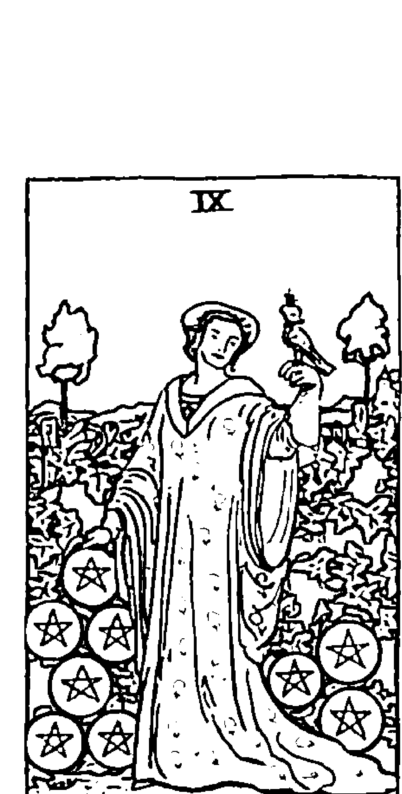

### 關鍵字
洞察力·悠閒·富裕·謹慎·小心保有理想

### 背景
廣大的莊園及豪華的房子代表過著富裕的生活，結滿葡萄的樹叢中浮現出九枚錢幣的圖案，則是象徵豐收的成果。

### 中景
一個人穿著華麗的衣服在果園中散步，象徵悠閒的心情與緩慢的生活步調，在占卜時也經常代表快樂滿足地享受。

### 中景
作戰時負責偵察及幫助狩獵的猛禽，象徵洞察力及高遠的理想，戴著手套才讓它停在手上則顯示出她的小心謹慎。

正位圖解

【構圖時間線】背景→中景

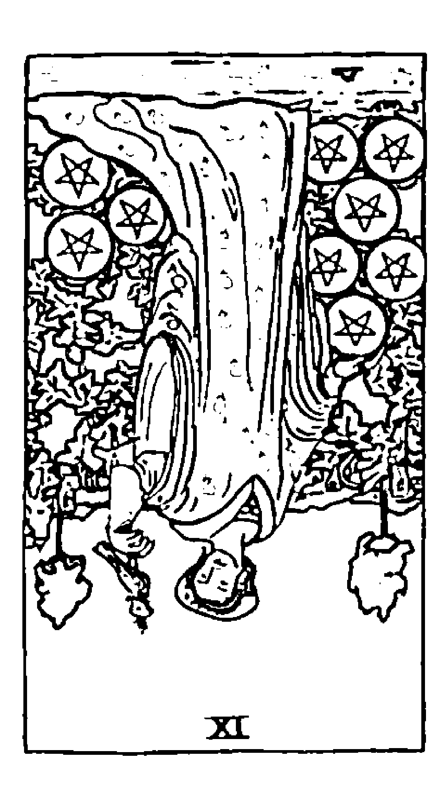

### 關鍵字
缺乏洞察力·偷懶·貪圖享受·無法達成·騙局·不切實際的幻想

### 位置關係
九枚錢幣移到了畫面的最上方，更強調貪圖享樂的一面，錢幣超過了人的高度則表示財務狀況已經超出掌控之外。

### 方位指向
穿著華麗衣服的人望向左上方，代表有冒險的野心和欲望，在占卜牌義當中也常表示腦中充滿了不切實際的幻想。

### 圖形變化
若是手上的鳥兒飛走則代表缺乏洞察力，很容易不小心落入騙局當中，如果大方向錯誤再怎麼努力也不可能成功。

逆位圖解

色彩意義

大片黃色的背景帶有光明與快樂的象徵，與黃色的錢幣及長袍相互呼應，紅色的帽子則代表心中的熱情及行動力。

占星對應

錢幣九與金星進入處女座的能量呼應，進入了弱勢位置，金星象徵富裕以及享樂，處女座則帶有小心謹慎的特質。

數字象徵

錢幣九對應到九的能量，與滿足和飽合有關，由於對自己的財務狀況感到滿足，所以可以悠閒地享受目前的成果。

在其他牌中重複出現的象徵

- 樹木：女祭司、皇后、戀人、戰車、力量、吊人、星星、權杖A、權杖二、權杖十、聖杯二、聖杯四、聖杯十、寶劍六、寶劍侍者、寶劍騎士、寶劍王后、寶劍國王、錢幣侍者、錢幣騎士
- 房屋：聖杯二、聖杯六、聖杯十、錢幣十
- 鳥：命運之輪、星星、愚者、聖杯A、寶劍侍者、寶劍騎士、寶劍王后、寶劍國王
- 紅色帽子：權杖二、權杖六、聖杯六、聖杯九、寶劍七、錢幣二、錢幣六、錢幣侍者
- 黃色長袍：死神、聖杯三、權杖騎士、權杖王后
- 手套：死神、權杖六、聖杯六、權杖騎士、寶劍騎士、錢幣騎士
- 果樹：戀人、錢幣七、錢幣國王
- 葡萄：惡魔、權杖四、聖杯三、錢幣十、錢幣國王

## 錢幣十
PENTACLES X

傳統上錢幣十代表住家及不動產，同時也指向物質條件良好的一家人，逆位置時則經常表示賭博或揮霍浪費金錢。

正位圖解

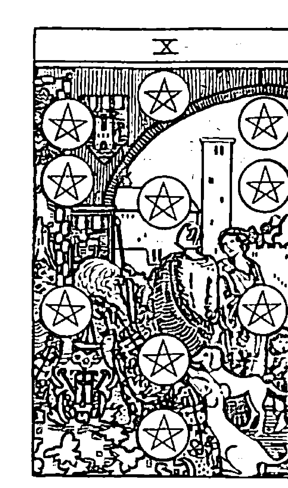

關鍵字

家庭的責任·各種角色·集體的富裕·用錢得當·實踐與完成

背景

拱門代表回家的入口，男人執行守衛的任務，女人則負責照顧與陪伴，小孩充滿了好奇心，也象徵未來的可能性。

中景

老人的經驗豐富而能明智地使用金錢，狗兒是最忠誠的夥伴，大家都能扮演好自己的角色，共同享受富裕的生活。

前景

十枚錢幣排列成生命之樹的圖案，象徵運用金錢的各種目的和方法，同時也代表所有的事情都可能被實踐和完成。

【構圖時間線】背景→中景→前景

逆位圖解

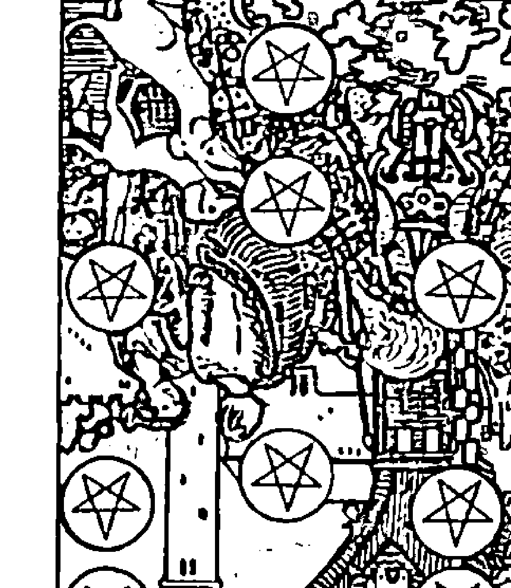

關鍵字

擺脫家庭的責任·明爭暗鬥·為錢爭吵·用錢不當·賭博·思考遲鈍

位置關係

各種人物角色移到畫面的最上方，強調人是這件事情成敗的關鍵，但是另一方面也暗示在團體當中有人明爭暗鬥。

方位指向

拱門的開口轉向左方，變成象徵對外的出口，也許可以由家庭的責任當中解脫出來，不過也可能是揮霍浪費敗家。

圖形變化

倒置的生命之樹象徵忽略了物質基礎，所以遇到有關錢的事情特別容易卡住，在占卜當中經常代表為了錢而爭吵。

色彩意義

灰色的拱門代表過渡的性質，背景的藍色天空帶來開闊與平靜的感覺，黃色的錢幣具有光明、愉快與滿足的象徵。

占星對應

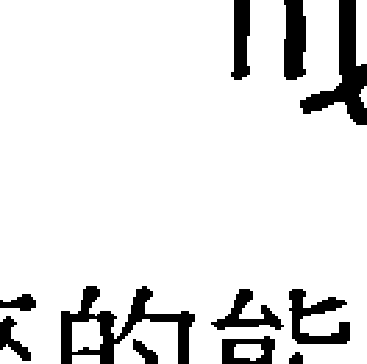

錢幣十與水星進入處女座的能量呼應，正好進入守護關係的位置，水星是理性的象徵，處女座有認真負責的特質。

數字象徵

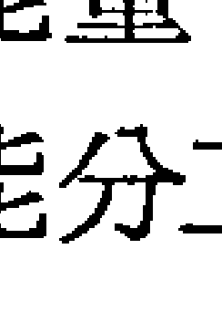

錢幣十對應到十的能量，與圓滿的結局有關，在財務上最完美的狀態就是大家都能分工合作並且共享富裕的生活。

在其他牌中重複出現的象徵

- 房屋：聖杯二、聖杯六、聖杯十、錢幣九
- 高樓：聖杯六、錢幣四
- 拱門：錢幣A
- 城堡：戰車、權杖A、權杖二、權杖四、權杖八、聖杯五、聖杯七、寶劍八、錢幣國王
- 天平：正義、錢幣六
- 獅子：皇帝、隱者、惡魔
- 葡萄：惡魔、權杖四、聖杯三、錢幣九、錢幣國王
- 成對的男女：戀人、惡魔、審判、權杖四、聖杯二、聖杯六、聖杯十、錢幣五
- 長矛：聖杯六
- 紅色長袍：皇帝、教皇、正義、權杖四、權杖六、聖杯三、錢幣四、錢幣王后
- 藍色上衣：教皇、吊人、死神、權杖五、聖杯六、聖杯十、錢幣五、錢幣八、聖杯侍者
- 黃色上衣：權杖五、聖杯二、寶劍十、權杖侍者、寶劍侍者
- 兒童：死神、太陽、審判、聖杯六、聖杯十、寶劍六
- 守衛：權杖九、聖杯六
- 狗：月亮、愚者

## 宮廷牌組的圖形與象徵

- 權杖侍者 | 權杖騎士 | 權杖王后 | 權杖國王
- 聖杯侍者 | 聖杯騎士 | 聖杯王后 | 聖杯國王
- 寶劍侍者 | 寶劍騎士 | 寶劍王后 | 寶劍國王
- 錢幣侍者 | 錢幣騎士 | 錢幣王后 | 錢幣國王

## 權杖侍者
PAGE OF WANDS

權杖侍者主要是以農家的小朋友來聯想，具有天真活潑的特質，並且會嘗試各種新鮮的事物；逆位比較強調善變及任性的一面，很容易給人喜怒無常的感覺，也可能經常猶豫不決。

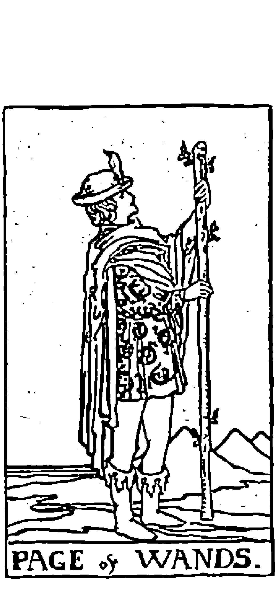

關鍵字

剛起步·天真純潔·愉快·行動的訊息·嘗試錯誤

背景

下方的沙丘象徵前方還有一些困難要去經歷，在占卜牌義當中經常代表行動，也會暗示還在剛起步的狀況。

中景

帶有羽毛的帽子象徵具有理想性，身上的斗篷則暗示了將要有所行動，在占卜牌義當中也代表透過嘗試錯誤學習。

中景

侍者望向權杖的頂端象徵天真及樂觀的想法，也暗示了有想要成長的上進心，在占卜牌義當中經常表示心情愉快。

【構圖時間線】中景→背景

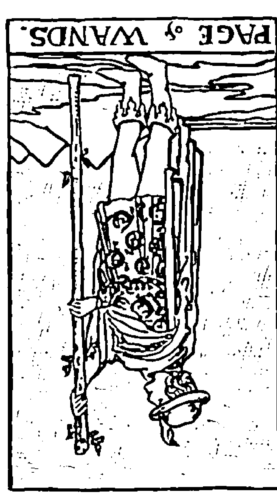

關鍵字

善變·不成熟·容易發怒·壞消息·不穩定·擔心和不安

位置關係

沙丘移到上方象徵事情的難度增加，有可能事情還處在一個不穩定的狀態，在占卜牌義當中經常表示傳來壞消息。

方位指向

權杖侍者轉變成朝向左下方看，象徵內在的擔心和不安，但是又沒有實質的行動，在占卜當中經常表示猶豫不決。

圖形變化

若是頭上的帽子和斗篷落下，則是象徵沒有經過思考的行動，有時候在占卜當中也會代表善變和喜怒無常的特質。

色彩意義

侍者身著黃色的衣服和斗篷，象徵具有光明及快樂的特質，背景大片橘色的沙丘則顯現出比較溫暖與活潑的氣氛。

占星對應

權杖侍者代表火中之風，結合了訊息與行動的力量，主要會帶來行動的新訊息；在人物特質上則會與射手座呼應。

數字象徵

權杖侍者對應到一的力量，與起源和創生有關，由於一開始行動還不夠成熟，因此經常需要透過嘗試錯誤來學習。

在其他牌中重複出現的象徵

- 斗篷：女祭司、隱者、塔、權杖二、聖杯五、寶劍六、錢幣三、錢幣五、錢幣王后、錢幣國王
- 黃色上衣：權杖五、聖杯二、寶劍十、錢幣十、寶劍侍者
- 橘色褲子：權杖五、權杖六、權杖七、錢幣侍者
- 蜥蜴：權杖騎士、權杖國王
- 沙丘：權杖騎士、權杖王后

## 權杖騎士
KNIGHT OF WANDS

權杖騎士主要是以年輕的獵人來聯想，在本質上是屬於比較質樸而又率真的類型；逆位則強調了衝動與狂熱的一面，若是過於執著，就比較容易與人發生爭吵導致合作破局。

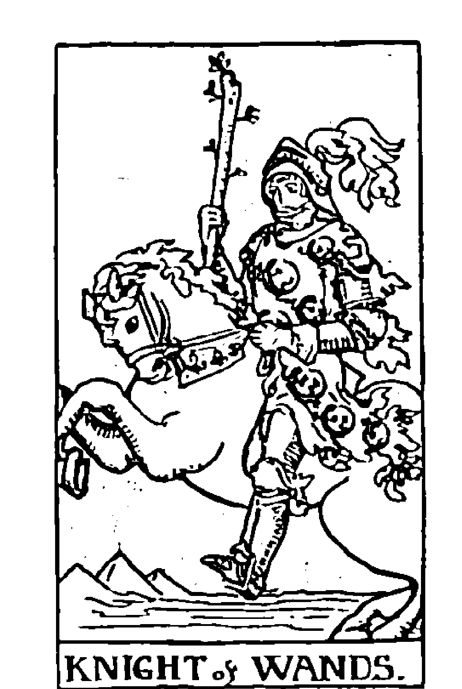

正位圖解

關鍵字

啟程旅行·勇於面對挑戰·行動力·樂觀·質樸率真

背景

下方的沙丘象徵外在的困難，權杖騎士騎馬躍過沙丘代表勇於面對挑戰，在占卜當中也常表示具有樂觀的特質。

中景

權杖騎士的盔甲上有火焰的裝飾，象徵內心當中帶有強烈的熱情，在占卜牌義當中也經常表示具有強大的行動力。

中景

騎士高舉權杖策馬向左，象徵正走向出征的旅程，在占卜牌義當中也經常代表啟程旅行，或是立刻作出某種改變。

【構圖時間線】背景→中景

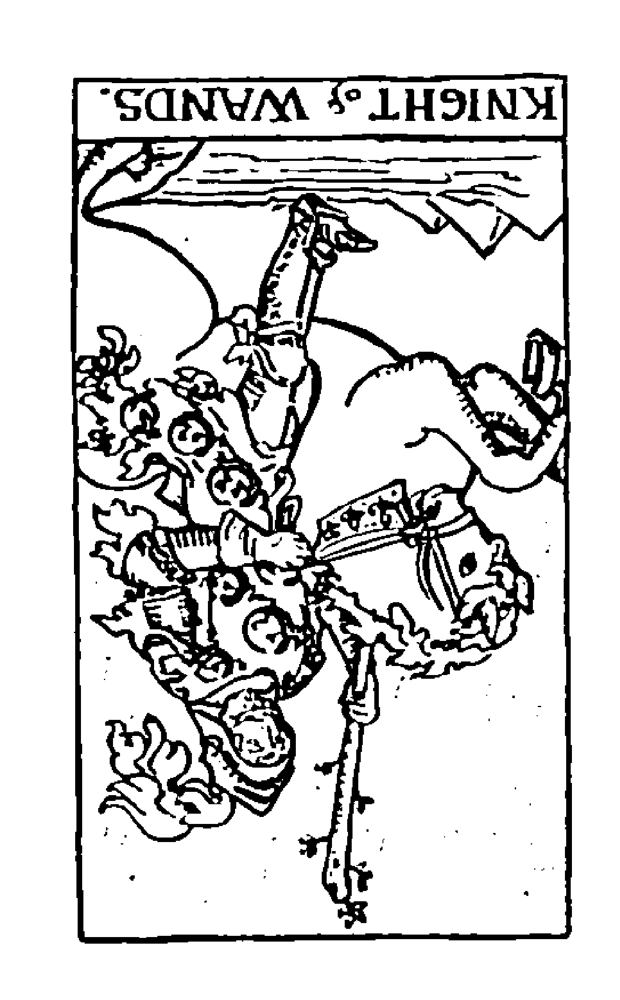

逆位圖解

關鍵字

外在的困難與干擾·失去動力·爭吵不和·分裂·過於衝動·執迷不悟

位置關係

沙丘的高度超過了騎士與馬匹的高度，象徵外在的困難已經超出你的能力之外，在占卜當中也經常表示受到干擾。

方位指向

原本騎馬向左奔馳的騎士現在變為策馬向右，表示要先回頭顧好自己原有的部分，也象徵需要反省避免執迷不悟。

圖形變化

若是騎士由馬匹上掉下來，則是象徵失去了前進的動力，騎士與馬匹分離也無法相互配合而造成分裂的局面。

色彩意義

騎士身上黃色的長袍象徵樂觀的特質，紅色的火焰則是代表熱情與行動力，橘色的馬匹則帶來活力及溫暖的感覺。

占星對應

權杖騎士代表火中之火，本身就具有強烈的行動力，可以積極主動去造成改變；在人物特質上則會與射手座呼應。

數字象徵

權杖騎士對應到二的力量，展現分別與對立的概念，由於在行動上遇到分別與對立，因此會愛好各種挑戰和變化。

在其他牌中重複出現的象徵

- 騎馬：死神、太陽、權杖六、聖杯騎士、寶劍騎士、錢幣騎士
- 馬：死神、太陽、權杖六、聖杯騎士、寶劍騎士、錢幣騎士
- 盔甲：皇帝、戰車、死神、寶劍四、聖杯騎士、寶劍騎士、錢幣騎士、錢幣國王
- 黃色長袍：死神、聖杯三、錢幣九、權杖王后
- 手套：死神、權杖六、聖杯六、錢幣九、寶劍騎士、錢幣騎士
- 火焰：惡魔、塔
- 沙丘：權杖侍者、權杖王后

## 權杖王后
QUEEN OF WANDS

權杖王后主要是以單純的農家婦女來聯想，有光明而愉快的特質；若是女地主來聯想則會有財務上的收穫；逆位通常會比較重視面子與排場，反對所有不同的意見，給人囂張跋扈的印象。

正位圖解

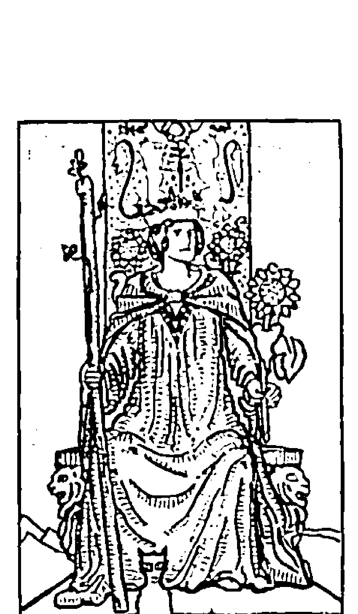

關鍵字

忠誠正直·光明而愉快·親切·善用直覺·財運的提昇

背景

沙丘象徵外在的困難，獅子的寶座則象徵具有權勢與地位，在占卜牌義當中也經常帶有忠誠與正直的含意。

中景

手持向日葵象徵權杖王后具有光明而愉快的特質，待人很真誠和親切，在占卜牌義當中也經常表示有歡樂的氣氛。

前景

坐著的黑貓象徵直覺，代表權杖王后有憑直覺去行動的傾向，在占卜牌義當中經常表示要去傾聽自己內心的聲音。

【構圖時間線】背景→中景→前景

逆位圖解

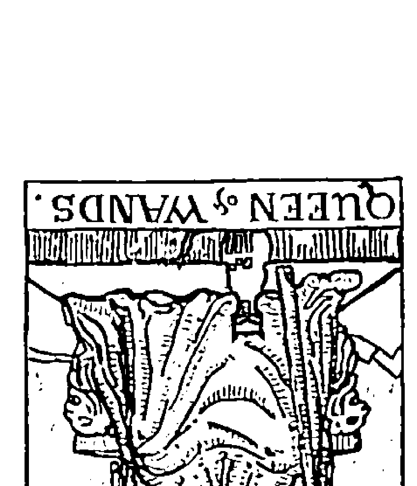

關鍵字

不忠貞·囂張跋扈·面子問題·反對與抵制·異想天開·節儉

位置關係

黑貓由下方移到了最上方，象徵直覺的力量超過了理性的判斷，但是也很可能因此變得過於異想天開而不切實際。

方位指向

權杖王后轉而望向左方，象徵十分重視面子問題，並且會去抗拒不同的看法和意見，也很容易有囂張跋扈的傾向。

圖形變化

若是手上的向日葵掉落，則是象徵失去光明和愉快的特質，容易會有情緒化的表現，有時候也代表不忠貞的意思。

色彩意義

身上黃色的長袍表示王后具有光明與快樂的特質，橘色的寶座帶來溫暖的感覺，黑貓則是帶有神秘與直覺的象徵。

占星對應

權杖王后代表火中之水，對於行動具有很敏銳的感受性，能夠善用直覺去行動；在人物特質上則會與獅子座呼應。

數字象徵

權杖王后對應到三的力量，展現出平衡與合作，重視合作能展現親切的態度，平衡則能帶給人光明而愉快的感覺。

在其他牌中重複出現的象徵

- 沙丘：權杖侍者、權杖騎士
- 獅子：力量、命運之輪、世界、聖杯二、權杖國王
- 寶座：皇帝、教皇、權杖國王、聖杯王后、聖杯國王、寶劍王后、寶劍國王、錢幣王后、錢幣國王
- 王冠：皇后、皇帝、戰車、正義、死神、塔、寶劍A、錢幣四、權杖國王、聖杯王后、聖杯國王、寶劍王后、寶劍國王、錢幣王后、錢幣國王
- 黃色長袍：死神、聖杯三、錢幣九、權杖騎士
- 披風：皇帝、正義、錢幣四、權杖國王、聖杯王后、聖杯國王、寶劍騎士、寶劍王后、寶劍國王
- 向日葵：太陽

## 權杖國王
KING OF WANDS

權杖國王主要是以經驗豐富的老農夫來聯想，本質上是屬於成熟穩定的類型；逆位則是偏向嚴肅與頑固，也容易有保守與自以為是的特質，有時代表已退休或是失去權力的人。

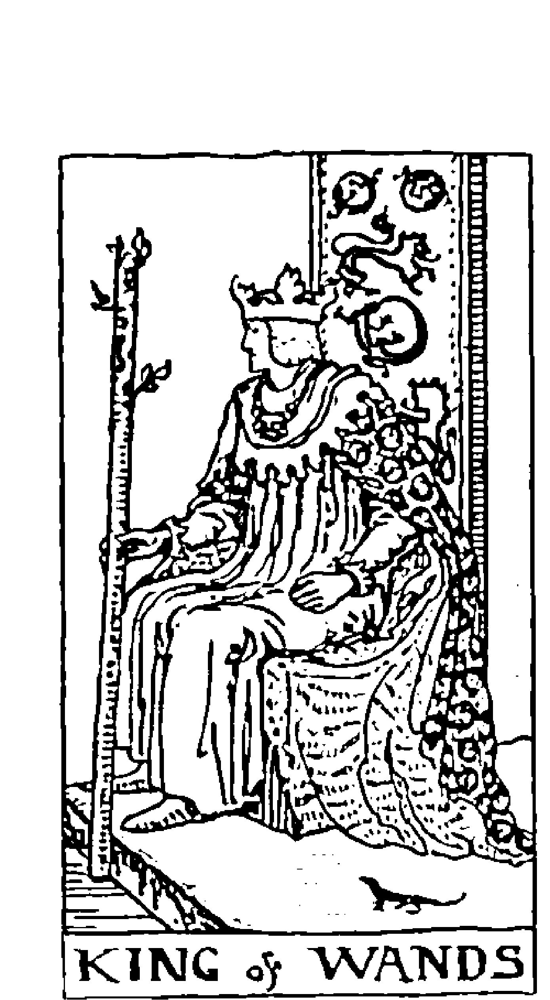

正位圖解

關鍵字

成熟穩定、經驗豐富、謀定而後動、創造力、固執己見

背景

獅子的寶座代表了權勢與地位，也可能有固執己見的傾向，吞吃自己尾巴的蜥蜴則象徵不斷的新生和永恆的生命。

中景

火焰造型的王冠象徵經驗豐富，國王望向左方身體前傾代表謀定而後動，在占卜當中也經常表示狀況很成熟穩定。

前景

在神秘學傳統當中蜥蜴是火元素精靈的象徵，一方面代表具有行動的潛力，在占卜牌義當中也常表示具有創造力。

【構圖時間線】背景→中景→前景

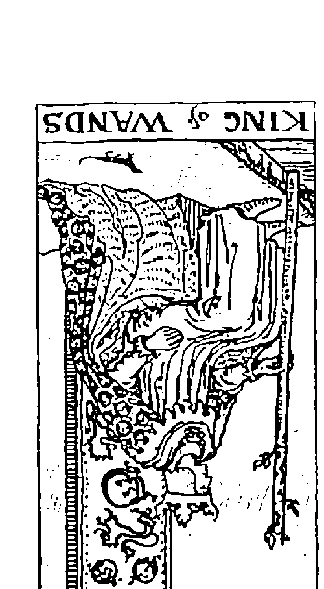

逆位圖解

關鍵字

自視甚高、失去權力、成見、穩定中求發展、守成、以別人為中心

位置關係

國王的高度超過寶座的高度，代表自視甚高的特質，在占卜牌義當中也經常表示會以權勢及地位來衡量判斷別人。

方位指向

權杖國王轉而望向右方，表示追求穩固與安定的傾向，不過同時也可能更加固執，甚至無法容忍任何反對的意見。

圖形變化

若是頭上的王冠掉落，則是象徵失去了權力，有時候也暗示了職位或狀況將會有所變動，或是當事人沒有決策權。

色彩意義

黃色的披風代表權杖國王具有光明與開朗的特質，與黃色的王冠相互呼應，橘色長袍表示內心重視穩定與安全感。

占星對應

權杖國王代表火中之土，在行動之中帶入穩定與保護的力量，代表謀定而後動；在人物特質上則會與白羊座呼應。

數字象徵

權杖國王對應到四的力量，與形式和穩固的概念有關，一方面表示實務經驗豐富，但是也容易有固執己見的傾向。

在其他牌中重複出現的象徵

- 寶座：皇帝、教皇、權杖王后、聖杯王后、聖杯國王、寶劍王后、寶劍國王、錢幣王后、錢幣國王
- 獅子：力量、命運之輪、世界、聖杯二、權杖王后
- 蜥蜴：權杖侍者、權杖騎士
- 王冠：皇后、皇帝、戰車、正義、死神、塔、寶劍A、權杖王后、聖杯王后、聖杯國王、寶劍王后、寶劍國王、錢幣王后、錢幣國王
- 披風：皇帝、正義、錢幣四、權杖王后、聖杯王后、聖杯國王、寶劍騎士、寶劍王后、寶劍國王
- 項鍊：皇后、聖杯國王

## 聖杯侍者
PAGE OF CUPS

聖杯侍者主要是以仍然在學習過程中的修士來聯想，同時也有強烈的好奇心與想像力；逆位則是偏向愛幻想和不切實際的類型，可能善於阿諛奉承，依賴別人來達成目的。

關鍵字

服侍別人、好奇心、好學不倦、想像力、人際關係的新訊息

背景

水波象徵情感的自由流動，也可能帶來上下起伏的變化；在占卜牌義當中經常會表示有人際關係或感情的新訊息。

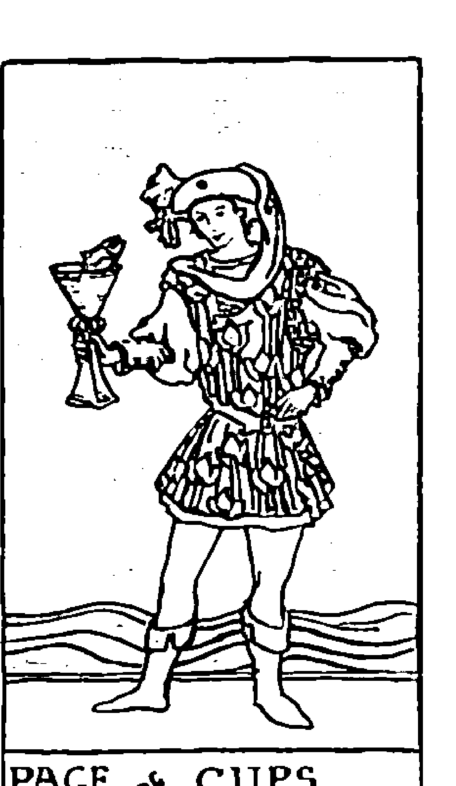

中景

由杯中探出頭來的魚象徵好奇心，侍者注視著魚則表現好學不倦的特質，在占卜牌義當中也代表有豐富的想像力。

中景

侍者身上的蓮花圖案為水元素的象徵，一方面代表照顧與服務他人的工作，另一方面也象徵對於靈性世界的追求。

【構圖時間線】背景 → 中景

關鍵字

隨波逐流、謊言、自己的幻想、奢侈浪費、誘惑、阿諛奉承

位置關係

水波的高度超過了聖杯侍者的高度，象徵容易被外在的誘惑所影響而隨波逐流，同時也暗示可能有情緒化的反應。

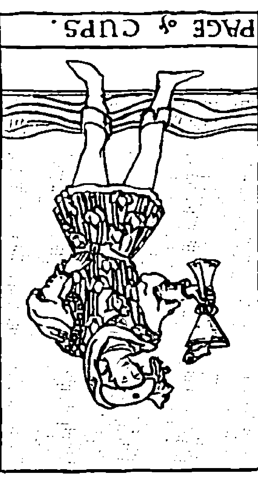

方位指向

侍者轉變朝向右方，表示比較重視自己的利益而不會為別人著想，也可能暗示不願意面對現實而陷入自己的幻想。

圖形變化

若是杯中的魚掉落出來則代表失去了好奇心，只看到事情的表象就妄下判斷，甚至有時候會容易聽信或傳播謠言。

色彩意義

藍色的水波帶來放鬆與冷靜的感覺，與侍者藍色的帽子及上衣相互呼應，粉紅色褲子則象徵具有服務他人的行動。

占星對應

聖杯侍者代表水中之風，結合了訊息與情感的力量，會帶來人際關係的新訊息；在人物特質上則會與雙魚座呼應。

數字象徵

聖杯侍者對應到一的力量，與起源和創生有關，由於還在剛起步的階段，所以需要保持好奇心並且努力認真學習。

在其他牌中重複出現的象徵

- 藍色上衣：教皇、吊人、死神、權杖五、聖杯六、聖杯十、錢幣五、錢幣八、錢幣十
- 蓮花：聖杯A
- 魚：聖杯騎士、聖杯王后、聖杯國王
- 波浪：寶劍六、錢幣二、聖杯國王

聖杯騎士
KNIGHT OF CUPS

聖杯騎士主要是以年輕的傳教士來聯想，屬於溫柔浪漫又有理想性的類型；逆位則是會利用花言巧語行詭計及詐術，只會做表面功夫，有過度浪漫、花心濫情的傾向。

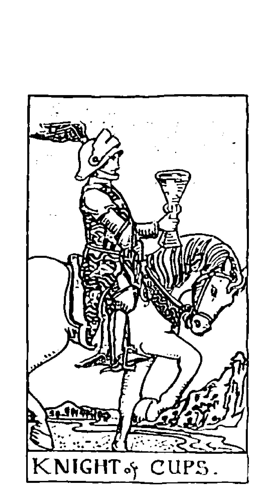

正位圖解

關鍵字

- 追求理想
- 溫柔浪漫
- 傳播理念
- 朋友來訪
- 提出建議

背景

岩石的高山代表前方的困難，下方的河流則象徵情感的自然流露，在占卜當中常表示有朋友來訪或是去拜訪朋友。

中景

聖杯騎士的盔甲上有翅膀的裝飾，象徵在心中有高遠的理想，在占卜牌義當中也表示會努力宣揚傳播自己的理念。

中景

騎士身上魚的圖案經常作為基督宗教的象徵，一方面表達其傳教士的身份，另一方面也暗示具有溫柔浪漫的特質。

【構圖時間線】中景 → 背景

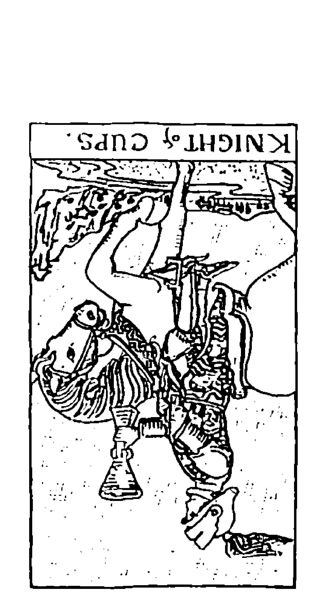

逆位圖解

關鍵字

- 騙局
- 過度浪漫
- 濫情
- 表面工夫
- 詐術和詭計
- 不良的建議

位置關係

岩石高山超過了聖杯騎士的高度，象徵被外在的困難所阻礙，在占卜牌義當中也經常表示受騙或遇到不良的建議。

方位指向

平原上的河流流向左上方，表示情感過度泛濫的狀況，在占卜牌義當中常表示花心濫情，或是過度浪漫不切實際。

圖形變化

有翼的頭盔落下，象徵失去了理想性，可能會為了個人的私利而使用各種詐術和詭計，或是只做表面功夫。

色彩意義

大片藍色的背景帶來開闊與平靜的感覺，身上紅色的魚代表內心的熱情與行動力，白馬則帶有純潔與樸素的象徵。

占星對應

聖杯騎士代表水中之火，在情感方面具有行動力，會主動拜訪朋友或提出建議；在人物特質上則會與雙魚座呼應。

數字象徵

聖杯騎士對應到二的力量，包含分別與對立的概念，由於在情感上察覺到分別與對立因此會激起救世的浪漫理想。

在其他牌中重複出現的象徵

- 盔甲：皇帝、戰車、死神、寶劍四、權杖騎士、寶劍騎士、錢幣騎士、錢幣國王
- 翅膀：戰車、命運之輪、聖杯二、聖杯王后、寶劍騎士、寶劍王后
- 魚：聖杯侍者、聖杯王后、聖杯國王
- 騎馬：死神、太陽、權杖六、權杖騎士、寶劍騎士、錢幣騎士
- 馬：死神、太陽、權杖六、權杖騎士、寶劍騎士、錢幣騎士
- 河流：皇后、皇帝、戰車、死神、權杖八、聖杯五、聖杯八、聖杯十、寶劍六、錢幣王后
- 岩石高山：皇帝、隱者、塔、審判、愚者、聖杯八、寶劍A、錢幣A

聖杯王后
QUEEN OF CUPS

聖杯王后主要是以慈愛關懷的修女來聯想，很專注於靈性方面的修持與成長；逆位則容易被情緒所淹沒，也很難專注於特定的事件或情感關係，因此經常會給別人無法信任的感覺。

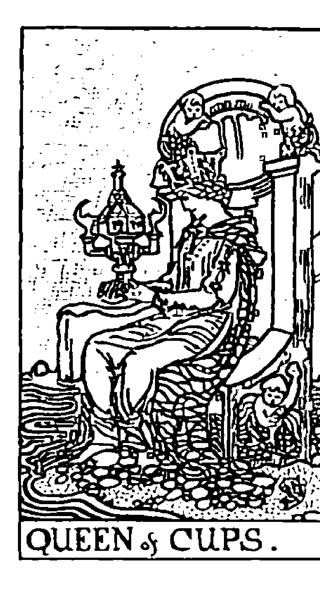

關鍵字

值得信賴·慈愛關懷·同理心·靈性上的成長·保持專注

背景

在海岸邊象徵情感豐沛，隆起的灘岸則代表受到穩固的保護，在占卜當中經常表示有安全感或是找到感情的歸宿。

中景

人魚的寶座象徵王后具有溫柔體貼的特質，有同理心可以去關懷照顧他人，在占卜牌義當中也經常表示值得信賴。

中景

華麗的聖杯代表被靈性所充滿，王后注視著聖杯象徵十分重視靈性成長，同時表示可以在工作或感情上保持專注。

【構圖時間線】背景→中景

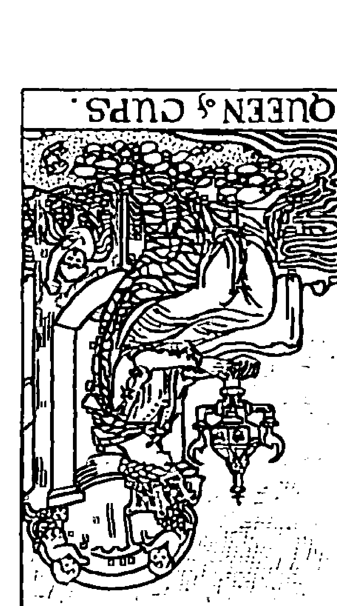

關鍵字

不值得信賴·被情緒淹沒·墮落·單獨一人·靈性上的陷阱·無法專注

位置關係

海水超過了聖杯王后的位置，象徵被情緒淹沒而喪失了同理心，在占卜牌義當中也經常表示在感情方面無法專一。

方位指向

王后轉變望向右方，象徵只看到自己的世界，甚至是陷入了自己的幻想當中，因此不容易與別人發展穩定的關係。

圖形變化

若是手上的聖杯掉下來，代表失去了專注的焦點，同時也可能暗示在靈性或是道德上的墮落，並不值得被信賴。

色彩意義

藍色的天空與海洋帶來開闊與放鬆的感覺，與藍色的長袍相互呼應，黃色的王冠及聖杯則帶有明亮與開朗的象徵。

占星對應

聖杯王后代表水中之水，對自己及別人的情緒特別敏銳，常有慈愛關懷的表現；在人物特質上則會與天蠍座呼應。

數字象徵

聖杯王后對應到三的力量，具有合作和平衡的力量，在情感上平衡才能展現出同理心，並且能團結起來幫助他人。

在其他牌中重複出現的象徵

- 海岸：權杖二、權杖三、寶劍二、寶劍五、寶劍十、聖杯國王
- 寶座：皇帝、教皇、權杖王后、權杖國王、聖杯國王、寶劍王后、寶劍國王、錢幣王后、錢幣國王
- 王冠：皇后、皇帝、戰車、正義、死神、塔、寶劍A、錢幣四、權杖王后、權杖國王、聖杯國王、寶劍王后、寶劍國王、錢幣王后、錢幣國王
- 藍色長袍：女祭司、教皇、塔、聖杯十、聖杯國王、寶劍國王
- 披風：皇帝、正義、錢幣四、權杖王后、權杖國王、聖杯國王、寶劍騎士、寶劍王后、寶劍國王
- 魚：聖杯侍者、聖杯騎士、聖杯國王

聖杯國王
KING OF CUPS

聖杯國王以成熟穩重的主教或牧師來聯想，十分慈悲寬容並且樂於助人；逆位就容易有表裡不一的問題，甚至是滿口仁義道德的偽君子，利用經驗學識來欺騙別人。

關鍵字

- 樂於助人
- 處變不驚
- 慈悲寬容
- 學識豐富
- 重視婚姻及家庭

背景

波滔洶湧的大海象徵未知的旅程，海中的鯨魚及帆船則是代表變動與風險，在占卜牌義當中也經常表示情感豐富。

中景

海中的寶座象徵聖杯國王具有處變不驚的特質，可以超脫出情緒保持冷靜，同時也暗示了在道德方面堅定的立場。

前景

魚的項鍊象徵聖杯國王內心當中具有慈悲與寬容的特質，手握權杖則是代表具有權力，能夠主動去幫助需要的人。

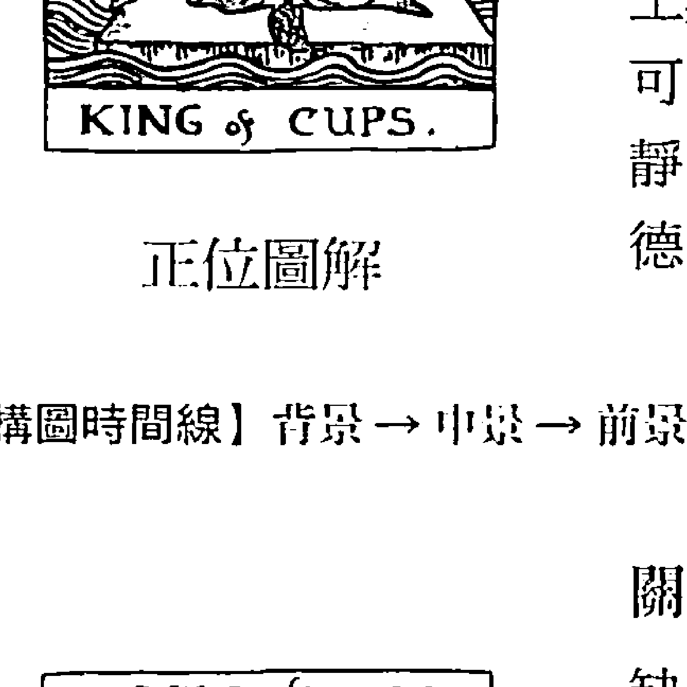

【構圖時間線】背景→中景→前景

關鍵字

- 缺乏信任
- 風險和衝突
- 恐懼
- 感情上不滿足
- 表裡不一
- 不道德與不公平

位置關係

海中的帆船和鯨魚超過了聖杯國王的高度，表示強調外在的風險和衝突，經常代表狀況已經超過可以處理的極限。

方位指向

聖杯國王轉而望向左方，象徵對外發展及控制的野心，但如果沒有確實去執行的能力，到頭來也只是一場夢而已。

圖形變化

若是海水淹沒了寶座，表示對於感情的需求非常強烈，可能會在感情上覺得不滿足，或是象徵有不安全感及恐懼。

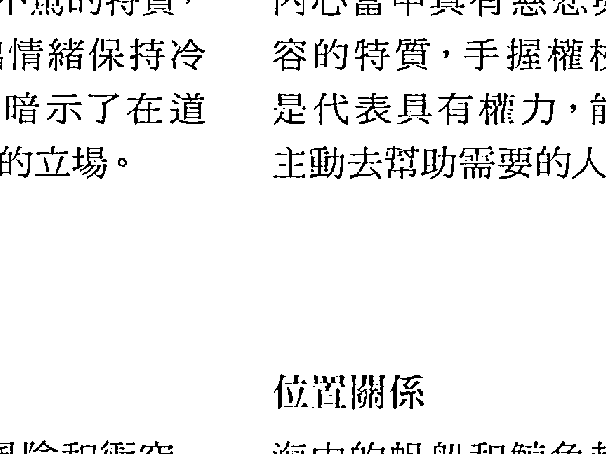

色彩意義

藍色的長袍象徵理性與冷靜的特質，黃色的披風帶來明亮與開朗的感覺，紅色的節帶則是代表具有熱情及行動力。

占星對應

聖杯國王代表水中之土，在情感上提供穩定與保護的力量，所以能夠處變不驚；在人物特質上則會與巨蟹座呼應。

數字象徵

聖杯國王對應到四的力量，與穩固和形式有關，在情感上重視婚姻與家庭的價值，並且在道德上堅守自己的立場。

在其他牌中重複出現的象徵

- 海岸：權杖二、權杖三、寶劍二、寶劍五、寶劍十、聖杯王后
- 寶座：皇帝、教皇、權杖王后、權杖國王、聖杯王后、寶劍王后、寶劍國王、錢幣王后、錢幣國王
- 王冠：皇后、皇帝、戰車、正義、死神、塔、寶劍A、錢幣四、權杖王后、權杖國王、聖杯王后、寶劍王后、寶劍國王、錢幣王后、錢幣國王
- 披風：皇帝、正義、錢幣四、權杖王后、權杖國王、聖杯王后、寶劍騎士、寶劍王后、寶劍國王
- 項鍊：皇后、權杖國王
- 節帶：教皇、正義
- 藍色長袍：女祭司、教皇、塔、聖杯十、聖杯王后、寶劍國王
- 手握權杖：魔術師、皇后、世界、錢幣國王
- 戒指：寶劍國王
- 魚：聖杯侍者、聖杯騎士、聖杯王后
- 船：死神、權杖三、寶劍六、錢幣二
- 波浪：寶劍六、錢幣二、聖杯侍者

寶劍侍者
PAGE OF SWORDS

寶劍侍者主要是以負責監視警戒的間諜來聯想，具有細心敏銳的特質，但是也會喜歡刺探別人的隱私；逆位則會比較輕率，經常在還沒有準備好的狀況下就採取行動。

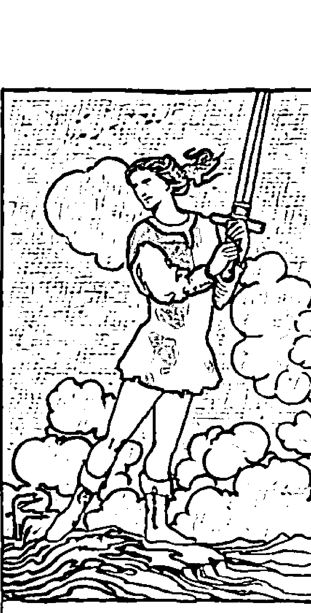

正位圖解

關鍵字

敏銳細心·監視警戒·裝模作樣·刺探別人隱私·挑戰的新訊息

背景

崎曲不平的荒地代表深入敵境刺探軍情，空中的積雲則象徵幻想或不確定性，需要敏銳細心地觀察才能發現真相。

中景

侍者身在戰場卻沒有穿戴任何防護裝備，只有高舉手中的寶劍裝模作樣，在占卜中經常代表只有想法而沒有行動。

中景

侍者望向左方象徵正在監視著敵軍的一舉一動，如果有任何異動變化就要趕緊回報，在占卜中也代表挑戰的訊息。

【構圖時間線】背景→中景

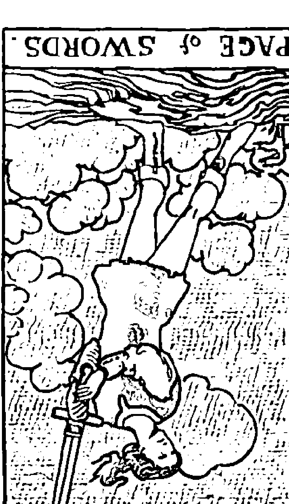

逆位圖解

關鍵字

過於輕率·沒有準備·流言蜚語·意料之外·疑心太重·壞消息

位置關係

崎曲不平的荒地超過侍者的高度，象徵外在的困難超過了本人可以處理的極限，也可能表示生意料之外的狀況。

方位指向

侍者的寶劍刺向下方，象徵本人受到謠言或壞消息的傷害，有時候也可能表示出現其他的挑戰者，需要小心防範。

圖形變化

若是侍者手上的寶劍掉落，代表未經訓練或是裝備就上戰場，也經常延伸為在沒有準備的情況下被殺得措手不及。

色彩意義

大片藍色的天空給人開闊與冷靜的感覺，紫色的上衣帶有思考的象徵，黃色的褲子則暗示了自信心及警示的性質。

占星對應

寶劍侍者代表風中之風，結合了訊息與傷害性，經常會帶來困難及挑戰的訊息；在人物特質上則會與雙子座呼應。

數字象徵

寶劍侍者對應到一的力量，與起源和創生有關，在問題發生的初期要能防微杜漸，就要保持警戒敏銳細心地觀察。

在其他牌中重複出現的象徵

- 鳥：命運之輪、星星、愚者、聖杯A、錢幣九、寶劍騎士、寶劍王后、寶劍國王
- 積雲：戀人、命運之輪、塔、審判、世界、權杖A、聖杯A、聖杯四、聖杯七、寶劍A、寶劍三、錢幣A、寶劍王后、寶劍國王
- 黃色上衣：權杖五、聖杯二、寶劍十、錢幣十、權杖侍者
- 紫色上衣：戀人、錢幣八
- 樹木：女祭司、皇后、戀人、戰車、力量、吊人、星星、權杖A、權杖二、權杖十、聖杯二、聖杯四、聖杯十、寶劍六、錢幣九、寶劍騎士、寶劍王后、寶劍國王、錢幣侍者、錢幣騎士
- 荒地：死神、權杖五、聖杯五、寶劍七、寶劍八、寶劍騎士

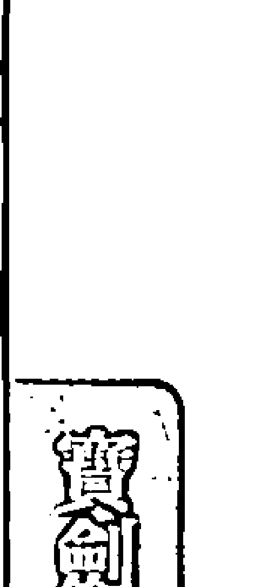

寶劍騎士
KNIGHT OF SWORDS

寶劍騎士主要是以英勇殺敵的戰士來聯想，同時也很容易有急躁易怒的傾向；逆位的寶劍騎士則比較偏向魯莽又缺乏能力，甚至有暴力傾向，容易失去控制而發生衝突。

關鍵字

英勇果決、豪爽、急躁易怒、強制手段、戰利品

背景

大片的荒地象徵戰場，被風吹動的捲雲則帶有急切與快速的象徵，在占卜牌義當中經常代表遇到問題要主動出擊。

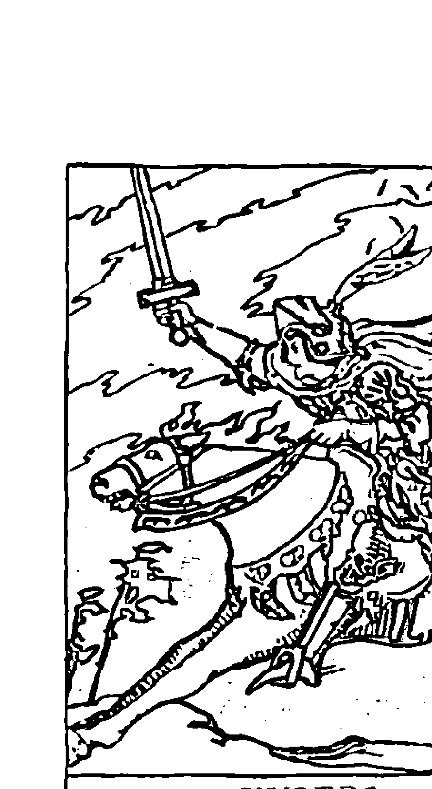

正位圖解

中景

騎士策馬向左象徵出征的旅程，也表示在競爭或衝突當中必要使用強制手段，在占卜牌義當中也代表高昂的鬥志。

中景

騎士高舉寶劍象徵其英勇果決的特質，齊全的裝備則代表準備充足並且具有專業性，通常都可以獲得最後的勝利。

【構圖時間線】背景 → 中景

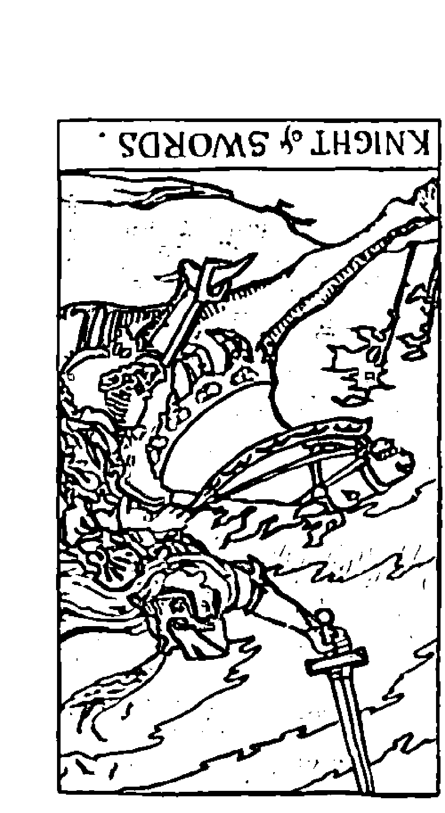

逆位圖解

關鍵字

軟弱無能、過於魯莽、衝突性、災難或毀滅、失去控制、奢侈浪費

位置關係

奔跑的馬匹超過了騎士的高度，表示事情已經失去控制，有時候也會暗示當事人並沒有足夠的能力把事情處理好。

方位指向

騎士的寶劍指向下方，象徵當事人遭遇嚴重的衝突或困難，在占卜牌義當中也可能代表重大災難或是毀滅的狀況。

圖形變化

若是騎士由馬上下摔下來，則是象徵欲速則不達，魯莽行事只會導致失敗的結果，還是要多點耐心準備充足再行動。

色彩意義

藍色的天空帶來開闊與自由的感覺，紅色的披風代表內心的熱情及充足的行動力，與頭盔上紅色的翅膀相互呼應。

占星對應

寶劍騎士代表風中之火，與傷害性的行動有關，因此也帶有衝突及毀滅的意思；在人物特質上則會與雙子座呼應。

數字象徵

寶劍騎士對應到二的力量，與分別和對立有關，因為有分別與對立的想法，才導致會戰爭與衝突的行為造成傷害。

在其他牌中重複出現的象徵

- 鳥：命運之輪、星星、愚者、聖杯A、錢幣九、寶劍侍者、寶劍王后、寶劍國王
- 盔甲：皇帝、戰車、死神、寶劍四、權杖騎士、聖杯騎士、錢幣騎士、錢幣國王
- 披風：皇帝、正義、錢幣四、權杖王后、權杖國王、聖杯王后、聖杯國王、寶劍王后、寶劍國王
- 騎馬：死神、太陽、權杖六、權杖騎士、聖杯騎士、錢幣騎士
- 馬：死神、太陽、權杖六、權杖騎士、聖杯騎士、錢幣騎士
- 手套：死神、權杖六、聖杯六、錢幣九、權杖騎士、錢幣騎士
- 蝴蝶：寶劍王后、寶劍國王
- 樹木：女祭司、皇后、戀人、戰車、力量、吊人、星星、權杖A、權杖二、權杖十、聖杯二、聖杯四、聖杯十、寶劍六、錢幣九、寶劍侍者、寶劍王后、寶劍國王、錢幣侍者、錢幣騎士
- 荒地：死神、權杖五、聖杯五、寶劍七、寶劍八、寶劍侍者
- 捲雲：寶劍五

寶劍王后
QUEEN OF SWORDS

寶劍王后主要是以女殺手來聯想，帶有沈著冷靜的特質；若是以婦婦來聯想則會代表悲傷與分離的狀態；逆位則是容易懷有敵意和偏見，經常挑起人際關係的爭端。

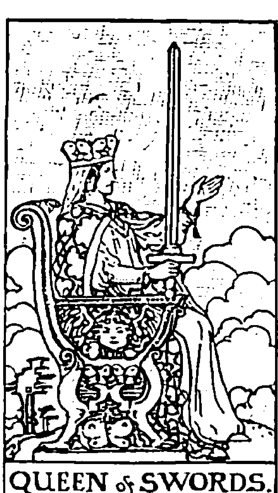

正位圖解

關鍵字

分離與悲傷·沈著冷靜·一擊必殺·異性緣不佳·思考感情問題

中景

王后伸出左手帶有接納性，但是右手舉起寶劍擋住左手則是象徵自我防衛，容易讓人有距離感而導致異性緣不佳。

背景

集中在下方的大片積雲象徵寶劍王后帶有陰鬱沈重的心情，在占卜牌義當中也經常代表在思考與感情有關的問題。

前景

風精靈的寶座象徵寶劍王后帶有冷靜理性的特質，同時也暗示有一擊必殺的決心，可以自己一個人獨立完成任務。

【構圖時間線】前景→中景→背景

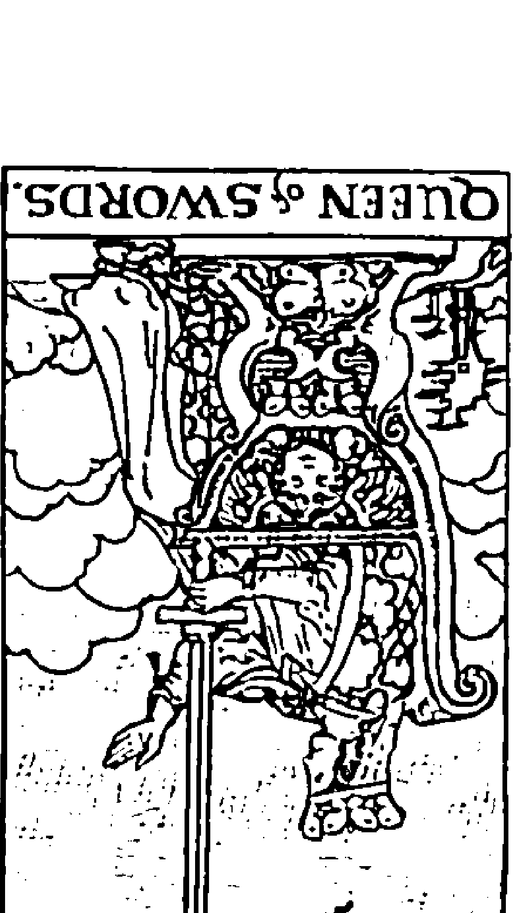

逆位圖解

關鍵字

虛偽·內鬥·偏見·惡意攻擊·詭計·冷漠

方位指向

王后轉向左方象徵重視別人的看法與面子問題，經常帶有虛偽的意思，寶劍指向下方則是象徵內部的衝突與鬥爭。

位置關係

大片的積雲超過寶劍王后的高度，象徵被情緒所干擾或是陷入自己的想像當中，很可能帶有預設立場甚至是偏見。

圖形變化

若是右手的寶劍掉落則是象徵放下防禦，或許會比正位置的寶劍王后更加平易近人，表現出比較溫柔和善的一面。

色彩意義

藍色的天空帶有冷靜的象徵，大片灰色的積雲則帶來陰鬱沈悶的感覺，與王后灰色的長袍及灰色的寶座相互呼應。

占星對應

寶劍王后代表風中之水，對於傷害具有敏銳的感受性，因此特別會思考感情問題；在人物特質上會與水瓶座呼應。

數字象徵

寶劍王后對應到三的力量，隱藏有平衡與合作的意涵，在面對傷害時能夠保持平衡，以冷靜理性的態度去面對。

在其他牌中重複出現的象徵

- 鳥：命運之輪、星星、愚者、聖杯A、錢幣九、寶劍侍者、寶劍騎士、寶劍國王
- 王冠：皇后、皇帝、戰車、正義、死神、塔、寶劍A、錢幣四、權杖王后、權杖國王、聖杯王后、聖杯國王、寶劍國王、錢幣王后、錢幣國王
- 披風：皇帝、正義、錢幣四、權杖王后、權杖國王、聖杯王后、聖杯國王、寶劍騎士、寶劍國王
- 灰色長袍：死神、寶劍二、寶劍九
- 紅色鞋子：皇后、塔、權杖三、聖杯二、聖杯四、聖杯六、聖杯八、寶劍七、錢幣四、寶劍國王
- 寶座：皇帝、教皇、權杖王后、權杖國王、聖杯王后、聖杯國王、寶劍國王、錢幣王后、錢幣國王
- 翅膀：戰車、命運之輪、聖杯二、聖杯騎士、聖杯王后、寶劍騎士
- 蝴蝶：寶劍騎士、寶劍國王
- 積雲：戀人、命運之輪、塔、審判、世界、權杖A、聖杯A、聖杯四、聖杯七、寶劍A、寶劍三、錢幣A、寶劍侍者、寶劍國王
- 樹木：女祭司、皇后、戀人、戰車、力量、吊人、星星、權杖A、權杖二、權杖十、聖杯二、聖杯四、聖杯十、寶劍六、錢幣九、寶劍侍者、寶劍騎士、寶劍國王、錢幣侍者、錢幣騎士

寶劍國王
KING OF SWORDS

寶劍國王主要是以掌握生殺大權的判官來聯想，具有公正客觀的態度及清晰的判斷力；逆位則偏向殘忍與霸道，經常會為了達成目的不擇手段，也代表失去權力或猶豫不決的人。

關鍵字

生殺大權、清晰的判斷力、公正客觀、領導統御、向專家求教

背景

蝴蝶的寶座象徵精神與靈性的轉化，風精靈的圖案則代表具有理性分析的能力，也常會涉及到與法律有關的問題。

中景

頭戴風精靈的王冠象徵具有清晰的判斷力，不會被外在的表象所迷惑，在占卜牌義當中也常代表需要專家的協助。

中景

手持寶劍象徵掌握了生殺大權，同時也暗示可能擔任領導統御的職務，在占卜當中表示能夠作出公正客觀的判斷。

【構圖時間線】背景→中景

關鍵字

失去權力、猶豫不決、偏私固執、殘忍霸道、嚴苛、自以為是

位置關係

遠方的浮雲超過了寶劍國王的高度，表示外在條件仍然有許多不確定性，因此也可能會讓寶劍國王變得猶豫不決。

方位指向

國王的寶劍傾斜向右方象徵偏私而非公正客觀的判斷，寶劍指向下方則代表過於嚴苛，也會帶有殘忍霸道的意思。

圖形變化

若是手中的寶劍掉落則是象徵失去了權力，也許會被明升暗降到一個職稱響亮的位子，實際上卻沒有任何決策權。

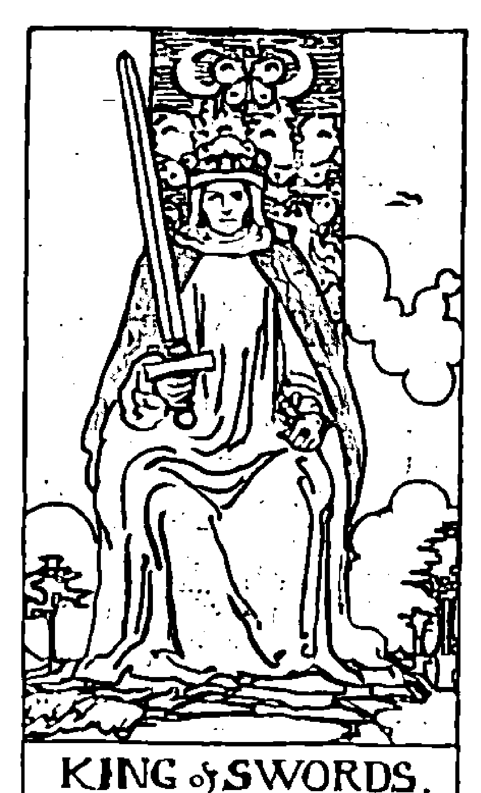

正位圖解

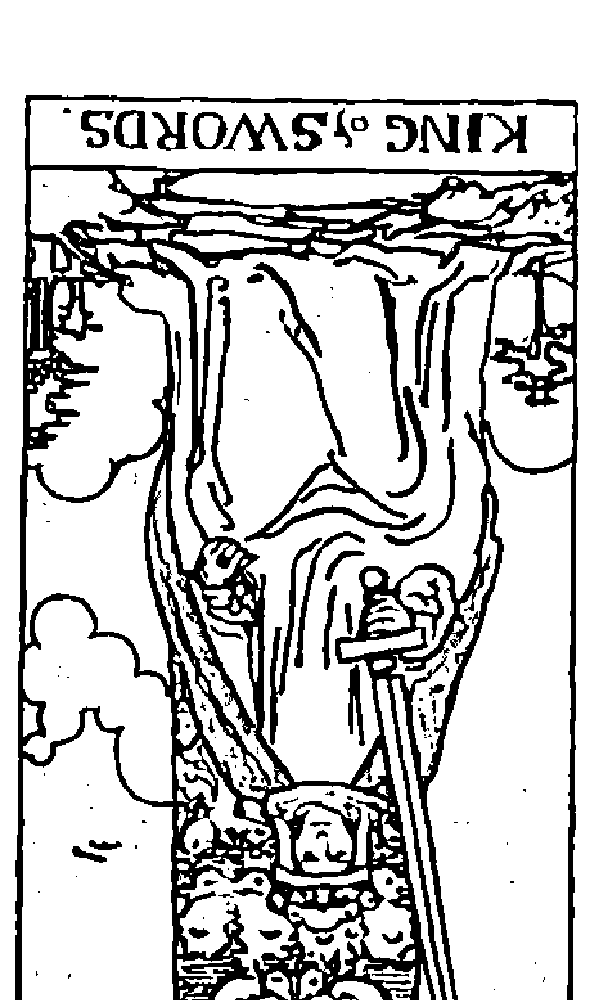

逆位圖解色彩意义

大片蓝色的天空带来冷静和理性的印象，与宝剑国王蓝色的长袍相互呼应，紫色的披风则带有高贵与权力的象征。

占星对应

宝剑国王代表风中之土，在伤害中带有稳定与保护的力量，表示需要专家协助；在人物特质上则会与天秤座呼应。

数字象征 IV

宝剑国王对应到四，代表形式和稳固，若是要建立稳固有效的统治形式，就要公正客观并且重视领导统御。

在其他牌中重复出现的象征

- 宝座：皇帝、教皇、权杖王后、权杖国王、圣杯王后、圣杯国王、宝剑王后、钱币王后、钱币国王
- 蝴蝶：宝剑骑士、宝剑王后
- 王冠：皇后、皇帝、战车、正义、死神、塔、宝剑A、钱币四、权杖王后、权杖国王、圣杯王后、圣杯国王、宝剑王后、钱币王后、钱币国王
- 鸟：命运之轮、星星、愚者、圣杯A、钱币九、宝剑侍者、宝剑骑士、宝剑王后
- 积云：恋人、命运之轮、塔、审判、世界、权杖A、圣杯A、圣杯四、圣杯七、宝剑A、宝剑三、钱币A、宝剑侍者、宝剑王后
- 蓝色长袍：女祭司、教皇、塔、圣杯十、圣杯王后、圣杯国王
- 披风：皇帝、正义、钱币四、权杖王后、权杖国王、圣杯王后、圣杯国王、宝剑骑士、宝剑王后
- 戒指：圣杯国王
- 红色鞋子：皇后、塔、权杖三、圣杯二、圣杯四、圣杯六、圣杯八、宝剑七、钱币四、宝剑王后
- 树木：女祭司、皇后、恋人、战车、力量、吊人、星星、权杖A、权杖二、权杖十、圣杯二、圣杯四、圣杯十、宝剑六、钱币九、宝剑侍者、宝剑骑士、宝剑王后、钱币侍者、钱币骑士

## 钱币侍者
PAGE OF PENTACLES

钱币侍者主要是以正在学做生意的学徒来联想，需要务实细心地观察学习；逆位的钱币侍者经常漫不经心，比较爱好自由而不喜欢被别人限制，金钱上容易挥霍浪费。

关键字

深思熟虑，务实的观察，学以致用，财务上的新讯息，少年老成

背景

左下角的树木象征未开发的潜能，右下角的耕地则象征正在学习的部分，在占卜牌义当中经常代表能够学以致用。

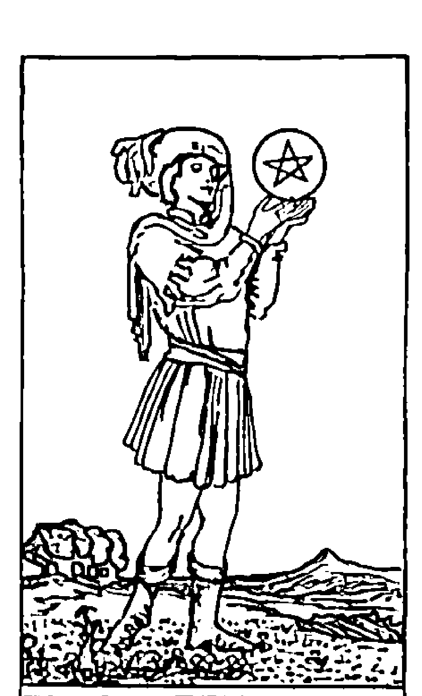

中景

包头的帽子代表侍者商人的身份，但朴实的衣服则表示其学徒的身份，在占卜牌义当中经常表示少年老成的特质。

中景

侍者双手捧着钱币象征小心谨慎，注视着钱币则代表能够务实地观察，在占卜牌义当中经常带有深思熟虑的意思。

正位图解

【构图时间线】中景 → 背景

关键字

漫不经心，无法学以致用，爱好自由，挥霍浪费，财务上的坏消息，幼稚

位置关系

树木及耕地都超过了侍者的高度，象征环境上还有许多无法掌握的地方，在占卜牌义当中经常表示无法学以致用。

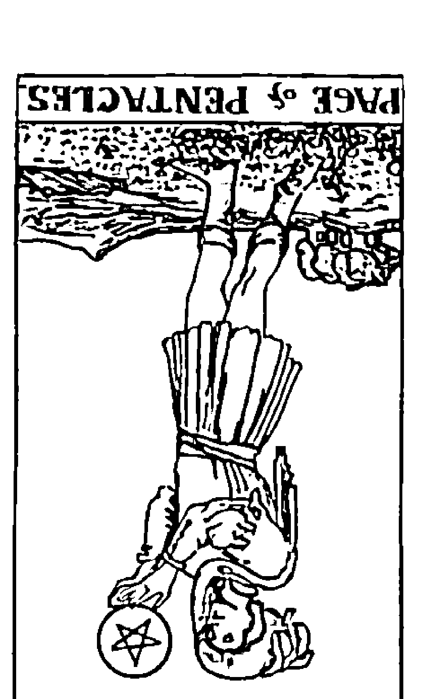

方位指向

侍者转而朝向左方张望，象征向外探索的好奇心，在占卜牌义当中经常会指向爱好自由，也可能代表幼稚的心态。

图形变化

若是侍者手中的钱币掉落，则是象征漫不经心或挥霍浪费，无法保有自己的东西，甚至还会带来财务上的坏消息。

逆位图解

色彩意义

大片黄色的背景带来乐观与光明的感觉，绿色的草地带有清新和稳定的象征，红色的帽子则代表有热情及行动力。

占星对应

钱币侍者代表土中之风，结合了物质与讯息的力量，经常会带来财务的新讯息；在人物特质上则会与处女座呼应。

数字象征

钱币侍者对应到一的力量，与起源和创生的概念有关，由于还在学习摸索的阶段，更要务实地观察才能学以致用。

在其他牌中重复出现的象征

- 红色帽子：权杖二、权杖六、圣杯六、圣杯九、宝剑七、钱币二、钱币六、钱币九
- 绿色上衣：权杖五、权杖七、圣杯四、宝剑五
- 橘色裤子：权杖五、权杖六、权杖七、钱币二、权杖侍者
- 草地：恋人、战车、力量、星星、月亮、圣杯四、圣杯六、钱币A、钱币王后
- 耕地：权杖十、钱币骑士
- 树木：女祭司、皇后、恋人、战车、力量、吊人、星星、权杖A、权杖二、权杖十、圣杯二、圣杯四、圣杯十、宝剑六、钱币九、宝剑侍者、宝剑骑士、宝剑王后、宝剑国王、钱币骑士

## 钱币骑士 KNIGHT OF PENTACLES

钱币骑士主要是以穿梭各地办货的商人来联想，具强烈的责任感，但是也比较不解风情；逆位偏向懒惰或不愿意负责任，对很多事情只是冷眼旁观，也可能正处于失业或停滞的状态。

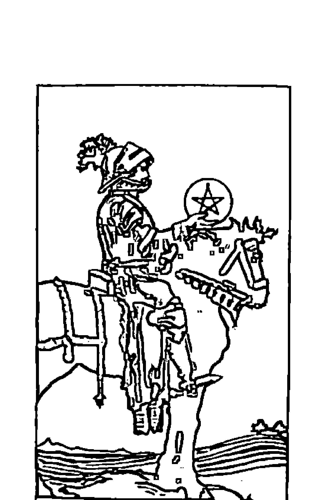

正位图解

关键字

务实细心·努力工作赚钱·负责任·实用主义·不解风情而且没有情调

背景

广大的耕地象征正在努力耕耘，在占卜当中经常表示细心务实又负责任，但也可能不解风情而且没有情调。

中景

骑士的头盔有绿叶的装饰，象征心中对于财富的渴望，骑马则代表具有强大的行动力，经常表示很努力工作赚钱。

中景

骑士将钱币捧在胸前象征重视实用性及实际利益，但是骑士望向远方则代表不会短视近利，还有更高更远的目标。

【构图时间线】中景 → 背景

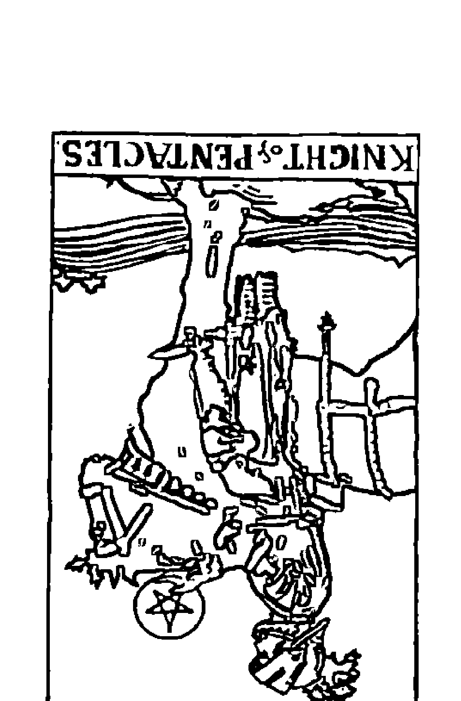

逆位图解

关键字

粗心大意·停滞·失业·冷眼旁观·无聊沉闷·懒惰

位置关系

下方的耕地移到了上方，表示更强调稳定与平静的意思，但是有时候也会变成例行公事，让你觉得十分无聊沉闷。

方位指向

骑士转而面向左方象征走向出征的旅程，有可能变成超级工作狂，但是在占卜上也经常表示距离成功还非常遥远。

图形变化

若是骑士手上的钱币掉落，则是象征失去有收入的工作，在占卜上常代表失业赋闲在家，或是留职停薪暂时休息。

色彩意义 ○

大片黄色的背景带来积极进取的感觉，骑士的黑马则象征具有稳定性，但是也经常代表比较无聊或是沉重的感觉。

占星对应 ▽ △ ♍

钱币骑士代表土中之火，在物质方面有强烈的行动力，代表非常努力工作赚钱；在人物特质上则会与处女座呼应。

数字象征 Ⅱ

钱币骑士对应到二的力量，带有分别与对立的力量，由于发现物质的分别对立，才会有强烈的责任感和工作动力。

在其他牌中重复出现的象征

- 盔甲：皇帝、战车、死神、宝剑四、权杖骑士、圣杯骑士、宝剑骑士、钱币国王
- 骑马：死神、太阳、权杖六、权杖骑士、圣杯骑士、宝剑骑士
- 马：死神、太阳、权杖六、权杖骑士、圣杯骑士、宝剑骑士
- 手套：死神、权杖六、圣杯六、钱币九、权杖骑士、宝剑骑士
- 树木：女祭司、皇后、恋人、战车、力量、吊人、星星、权杖A、权杖二、权杖十、圣杯二、圣杯四、圣杯十、宝剑六、钱币九、宝剑侍者、宝剑骑士、宝剑王后、宝剑国王、钱币侍者
- 耕地：权杖十、钱币侍者

## 钱币王后
QUEEN OF PENTACLES

钱币王后主要是以很会招呼客人的老板娘来联想，不但有商业头脑会精打细算；逆位就比较多疑和缺乏安全感，控制欲强，容易给人自私和斤斤计较的感觉。

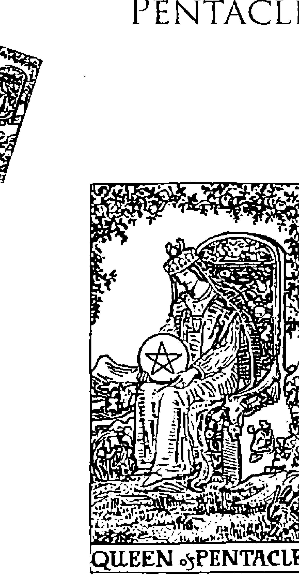

正位图解

【构图时间线】背景→中景→前景

关键字

宽宏大量·精打细算·照顾·服务他人·长期利益

背景

玫瑰花丛带有美丽及热情的象征，山羊的宝座象征有稳定的实质收益，椅背上果实的图案则是代表重视长期利益。

中景

王后把钱币捧在怀中象征具有照顾与保护的特质，注视着钱币则是代表本身十分精打细算，具有商业方面的才能。

前景

野兔象征丰饶与多产，在草地上奔跑代表具有机灵与敏捷的特质，也暗示钱币王后善于照顾动物并且喜爱大自然。

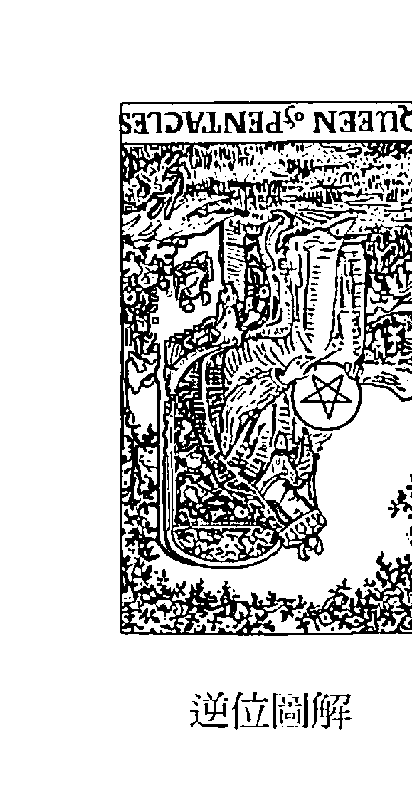

逆位图解

关键字

怀疑·无法照顾·缺乏安全感·斤斤计较·利用或控制别人·财务上的损失

位置关系

上方的玫瑰花丛移到了下方，象征钱币王后把最好的东西都留给自己，当中也隐含了自私自利与斤斤计较的意思。

方位指向

象征丰饶与多产的野兔转而向上奔跑，代表财富正在离你而去，如果不及时追赶可能会在财务上造成重大的损失。

图形变化

若是王后怀中的钱币掉落，则是象征无法负担应有的照顾责任，有时在占卜当中也会指向因为匮乏而缺乏安全感。

色彩意义 ○○

红色的玫瑰花丛象征热情，与红色的长袍相互呼应；绿色的斗篷带有和谐与稳固的象征，与绿色的草地相互呼应。

占星对应 ▽ ▽ ♉

钱币王后代表土中之水，对于物质方面特别敏锐，所以会精打细算有商业头脑；在人物特质上则会与金牛座呼应。

数字象征 III

钱币王后对应到三的力量，具有平衡与合作的力量，由于在财务上平衡才能看到长远的利益，并且关心照顾他人。

在其他牌中重复出现的象征

- 花丛：魔术师、权杖四、圣杯三、钱币A
- 王冠：皇后、皇帝、战车、正义、死神、塔、宝剑A、钱币四、权杖王后、权杖国王、圣杯王后、圣杯国王、宝剑王后、宝剑国王、钱币国王
- 斗篷：女祭司、隐者、塔、权杖二、圣杯五、宝剑六、钱币三、钱币五、权杖侍者、钱币国王
- 红色长袍：皇帝、教皇、正义、权杖四、权杖六、圣杯三、钱币四、钱币十
- 宝座：皇帝、教皇、权杖王后、权杖国王、圣杯王后、圣杯国王、宝剑王后、宝剑国王、钱币国王
- 果实：权杖四、圣杯三、钱币七
- 羊：皇帝、恶魔
- 草地：恋人、战车、力量、星星、月亮、圣杯四、圣杯六、钱币A、钱币侍者
- 河流：皇后、皇帝、战车、死神、权杖A、权杖八、圣杯五、圣杯八、圣杯十、宝剑六、圣杯骑士

## 钱币国王
KING OF PENTACLES

钱币国王主要是以事业有成的大老板来联想，除了工作之外也很重视生活的品味和享受；逆位则是工于心计并且精于算计，为了谋求利益不择手段，即使牺牲别人也在所不惜。

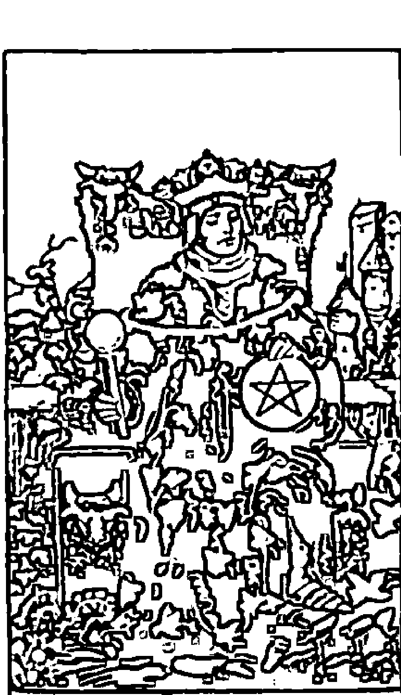

正位图解

关键字

稳定成功・有效率地用钱・良好的财务基础・常识丰富・重视生活享受

背景

城堡象征稳定，表示国王正身处于安全的范围之内，在占卜牌义当中也代表稳固的财务基础，不必担心金钱的事情。

中景

公牛的宝座象征努力勤勉的工作力，同时代表国王可以有效率地使用金钱，占卜牌义当中也表示具有丰富的常识。

前景

手持权杖象征国王拥有地位与权力，身着画满葡萄的长袍代表十分重视生活享受，盔甲则暗示了内心当中的不安。

【构图时间线】背景 → 中景 → 前景

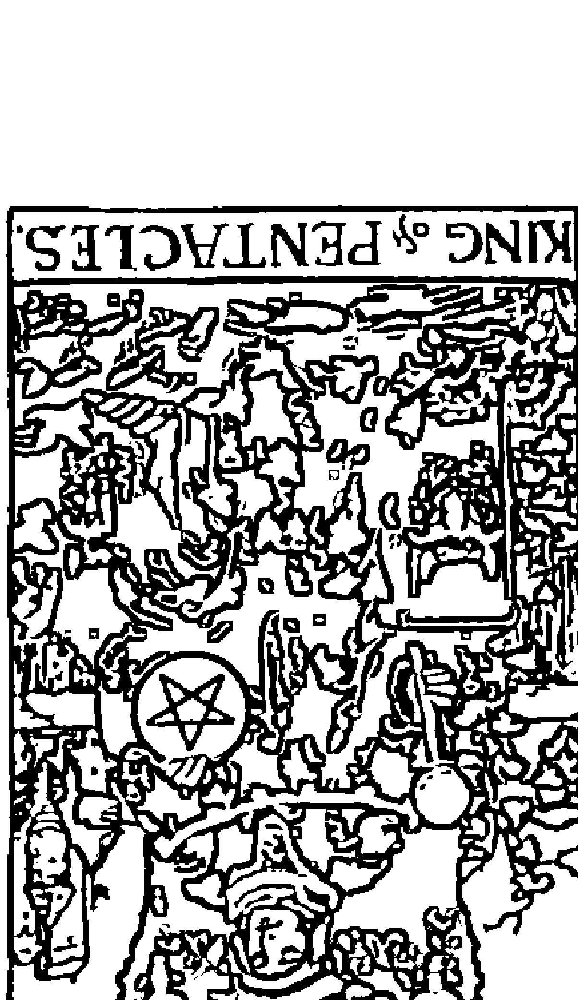

逆位图解

关键字

结构性的缺陷・软弱无力・财务上的危机・愚笨・剥削别人・铺张奢华

位置关系

防御用的城墙移到上方，代表过度防卫的倾向，同时也暗示当事人缺乏安全感或是能力不足，没办法去面对问题。

方位指向

国王转而朝向上方，象征对于他人的支配和控制，可能会为了自己的利益剥削别人，甚至把别人的东西据为己有。

图形变化

若是国王手中的钱币掉落，则是象征发生财务上的危机，在占卜牌义当中也经常表示铺张奢华及过度享乐的状况。

色彩意义 ○

大片黄色的背景带有光明与欢乐的感觉，与国王手上的权杖及钱币相互呼应，绿色的叶子则有稳定与平衡的象征。

占星对应 ▽ ♑

钱币国王代表土中之土，在物质方面具有稳定的力量，代表良好的物质基础，在人物特质上则会与摩羯座呼应。

数字象征 Ⅳ

钱币国王对应到四的力量，与形式和稳固的概念有关，由于在财务方面稳固，所以可以充分享受品味良好的生活。

在其他牌中重复出现的象征

- 城堡：战车、权杖A、权杖二、权杖四、权杖八、圣杯五、圣杯七、宝剑八、钱币十
- 宝座：皇帝、教皇、权杖王后、权杖国王、圣杯王后、圣杯国王、宝剑王后、宝剑国王、钱币王后
- 牛：命运之轮、世界
- 王冠：皇后、皇帝、战车、正义、死神、塔、宝剑A、钱币四、权杖王后、权杖国王、圣杯王后、圣杯国王、宝剑王后、宝剑国王、钱币王后
- 手握权杖：魔术师、皇后、世界、圣杯国王
- 斗篷：女祭司、隐者、塔、权杖二、圣杯五、宝剑六、钱币三、钱币五、权杖侍者、钱币王后
- 果树：恋人、钱币七、钱币九
- 葡萄：恶魔、权杖四、圣杯三、钱币九、钱币十、钱币国王
- 盔甲：皇帝、战车、死神、宝剑四、权杖骑士、圣杯骑士、宝剑骑士、钱币骑士

## 附录

## 图形与象征索引

### 环境

#### 天文现象

**[黑夜]** 象征没有希望与痛苦的处境。塔、宝剑十、钱币五

**[夜空]** 代表不明朗的状况，同时也带有神秘的象征。女祭司、隐者、星星、月亮、圣杯八、宝剑二

**[曙光]** 代表即将到来的光明，也象征改变。死神、宝剑十

**[太阳]** 象征光明与理性。恋人、死神、节制、太阳、愚者、圣杯八

**[月亮]** 象征直觉与情绪。女祭司、战车、月亮、圣杯八、宝剑二

**[星星]** 代表恒星，经常象征光明的希望。皇后、战车、星星

**[积云]** 隐藏在云中的是神的力量，但有时也象征虚幻不切实际。恋人、命运之轮、塔、审判、世界、权杖A、圣杯A、圣杯四、圣杯七、宝剑A、宝剑三、钱币A、宝剑侍者、宝剑王后、宝剑国王

**[卷云]** 象征急切与快速地行动。宝剑五、宝剑骑士

#### 室外场景

**[圣山]** 象征灵性的高峰。恋人、力量、节制

**[岩石高山]** 象征困难与阻碍。皇帝、隐者、塔、审判、愚者、圣杯八、宝剑A、钱币A、圣杯骑士

**[雪白的山顶]** 象征达到顶点。隐者、审判、愚者

**[海岸]** 象征风险及未知的领域。权杖二、权杖三、宝剑二、宝剑五、宝剑十、圣杯王后、圣杯国王

**[河流]** 代表能量流动与正在经历的过程，有时也会象征情感的表达或是隔绝阻碍。皇后、皇帝、战车、死神、权杖A、权杖八、圣杯五、圣杯八、圣杯十、宝剑六、圣杯骑士、钱币王后

**[水池]** 象征内在丰富的情感。女祭司、节制、星星、月亮、圣杯A

**[波浪]** 象征波动起伏与变化。宝剑六、钱币二、圣杯侍者、圣杯国王

**[耕地]** 象征努力才会有成果。权杖十、钱币侍者、钱币骑士

**[花园]** 象征熟悉可以控制的环境。圣杯六、钱币A

**[花丛]** 代表看到初步的成果。魔术师、权杖四、圣杯三、钱币A、钱币王后

**[小径]** 象征行动的方向与解决问题的方法。节制、月亮、权杖二、钱币A、钱币八

**[草地]** 象征安全可以控制的环境。恋人、战车、力量、星星、月亮、圣杯四、圣杯六、钱币A、钱币侍者、钱币王后

**[荒地]** 代表战场或象征有危险的地方。死神、权杖五、圣杯五、宝剑七、宝剑八、宝剑侍者、宝剑骑士

**[沙丘]** 象征困难与阻碍。权杖侍者、权杖骑士、权杖王后

#### 人造建筑

**[城堡]** 象征稳固的基础与安全感。战车、权杖A、权杖二、权杖四、权杖八、圣杯五、圣杯七、宝剑八、钱币十、钱币国王

**[市镇]** 象征人群的聚集与活动。权杖二、权杖十、圣杯六、钱币四、钱币六、钱币八、钱币十

**[高楼]** 象征警戒与保护。圣杯六、钱币四、钱币十

**[房屋]** 象征安全感与归属感。圣杯二、圣杯六、圣杯十、钱币九、钱币十

**[教堂]** 代表可以休息的避难所。宝剑四、钱币五

**[围墙]** 象征人为的限制。太阳、权杖二、钱币国王

**[拱门]** 象征门户与关卡。钱币A、钱币十

**[双塔]** 象征关卡与边界。死神、月亮

**[拱桥]** 象征跨越障碍和连接。权杖四、圣杯五

#### 室内场景

**[彩绘玻璃]** 教堂特有的装饰，同时也象征富裕和华丽。宝剑四、钱币五

**[双柱]** 代表在正式的殿堂当中，有时也象征具有权威。女祭司、教皇、正义

**[布幔]** 象征分别与隔绝，但有时也带有隐藏的意思。女祭司、正义、圣杯七、圣杯九、宝剑十

**[宝座]** 象征具有权力与地位。皇帝、教皇、权杖王后、权杖国王、圣杯王后、圣杯国王、宝剑王后、宝剑国王、钱币王后、钱币国王

**[板凳]** 坐在板凳上通常代表休息与等待。女祭司、正义、圣杯九、宝剑二、钱币四

**[黑暗]** 象征悲惨与不幸的处境。恶魔、宝剑九

### 角色

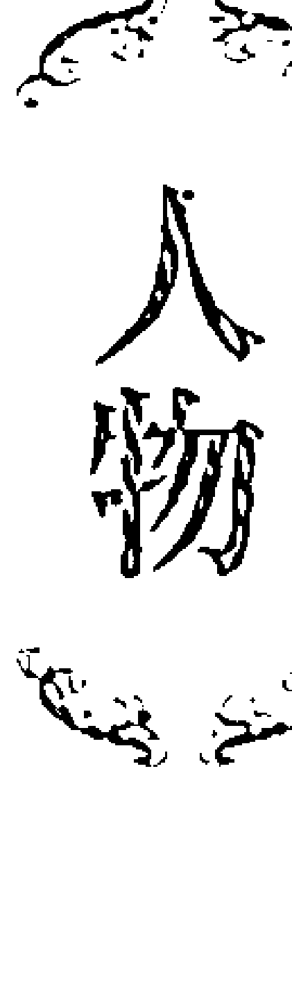

**[儿童]** 象征纯真与未来的希望。死神、太阳、审判、圣杯六、圣杯十、宝剑六、钱币十

**[成对的男女]** 象征具有感情的关系。恋人、恶魔、审判、权杖四、圣杯二、圣杯六、圣杯十、钱币五、钱币十

**[僧侣]**
通常以圆顶剃发来表现，代表追求灵性与服务。相关卡牌：教皇、钱币三

**[工匠]**
象征具有熟练的技术。相关卡牌：钱币三、钱币八

**[农夫]**
象征辛苦地劳动。相关卡牌：权杖十、钱币七

**[商人]**
象征具有商业头脑可以理性地考量。相关卡牌：权杖三、圣杯九、钱币六

**[乞丐]**
象征财务方面有问题。相关卡牌：钱币五、钱币六

**[守卫]**
象征警戒与保护。相关卡牌：权杖九、圣杯六、钱币十

**[死者]**
象征结束。相关卡牌：死神、审判、宝剑十

### 服装

**[裸体]**
象征纯洁与坦诚，但也可能代表没有防备。相关卡牌：恋人、恶魔、星星、太阳、审判、世界

**[盔甲]**
象征防卫与内心的不安。相关卡牌：皇帝、战车、死神、宝剑四、权杖骑士、圣杯骑士、宝剑骑士、钱币骑士、钱币国王

**[蓝色长袍]**
通常具有冷静的特质。相关卡牌：女祭司、教皇、塔、圣杯十、圣杯王后、圣杯国王、宝剑国王

**[黄色长袍]**
通常具有光明与乐观的特质。相关卡牌：死神、圣杯三、钱币九、权杖骑士、权杖王后

**[红色长袍]**
通常具有热情与行动力。相关卡牌：皇帝、教皇、正义、权杖四、权杖六、圣杯三、钱币四、钱币十、钱币王后

**[橘色长袍]**
代表内心渴望稳定与安全感。相关卡牌：宝剑八、权杖国王

**[白色长袍]**
象征内心的纯洁。相关卡牌：魔术师、皇后、力量、节制、权杖四、圣杯二、圣杯三

**[灰色长袍]**
象征悲伤、停滞或隔绝。相关卡牌：死神、宝剑二、宝剑九、宝剑王后

**[条纹长袍]**
象征华丽与富裕。圣杯九、钱币六

**[蓝色上衣]**
代表理性与冷静的特质。教皇、吊人、死神、权杖五、圣杯六、圣杯十、钱币五、钱币八、钱币十、圣杯侍者

**[黄色上衣]**
代表警觉与积极的特质。权杖五、圣杯二、宝剑十、钱币十、权杖侍者、宝剑侍者

**[绿色上衣]**
代表在寻求心中的平衡点。权杖五、权杖七、圣杯四、宝剑五、钱币侍者

**[橘色上衣]**
象征内心缺乏安全感。权杖五、权杖九、权杖十、圣杯十、宝剑六、钱币二、钱币七

**[紫色上衣]**
具有思考的特质。恋人、钱币八、宝剑侍者

**[红色外套]**
代表具有热情及行动力。魔术师、塔、权杖三、圣杯八、钱币六

**[斗蓬]**
代表分离或隔绝，有时也象征自我保护。女祭司、隐者、塔、权杖二、圣杯五、宝剑六、钱币三、钱币五、权杖侍者、钱币王后、钱币国王

**[披风]**
身着披风象征具有权力。皇帝、正义、钱币四、权杖王后、权杖国王、圣杯王后、圣杯国王、宝剑骑士、宝剑王后、宝剑国王

**[红色裤子]**
象征具有行动力。吊人、圣杯六、宝剑五、钱币二、钱币六、钱币八

**[橘色裤子]**
象征内心的不安全感。权杖五、权杖六、权杖七、权杖侍者、钱币侍者

### 饰品配件

**[头上发光]**
象征开悟而具有神圣的智慧。吊人、节制

**[头上的羽毛]**
象征充满理想性。太阳、愚者

**[头上绑白布条]**
象征清澈的思考及努力的决心。魔术师、权杖三、权杖五

## 王冠

头戴王冠象征权力与地位，另一方面也可能代表开悟之光。

- 皇后
- 皇帝
- 战车
- 正义
- 死神
- 塔
- 宝剑A
- 钱币四
- 杖王后
- 杖国王
- 圣杯王后
- 圣杯国王
- 宝剑王后
- 宝剑国王
- 钱币王后
- 钱币国王

## 桂冠

头戴桂冠象征胜利者的身份，另一方面也可能代表稳固的状况。

- 皇后
- 战车
- 愚者
- 世界
- 杖六
- 圣杯二
- 圣杯七
- 钱币国王

## 花冠

象征得到灵性的启示。

- 力量
- 死神
- 杖四
- 圣杯二
- 圣杯三

## 红色帽子

象征充满热情及行动力，但也可能有些冲动。

- 杖二
- 杖六
- 圣杯六
- 圣杯九
- 宝剑七
- 钱币二
- 钱币六
- 钱币九
- 钱币侍者

## 绷带

象征受伤与限制。

- 杖九
- 宝剑二
- 宝剑八
- 钱币五

## 胡子

象征成熟与智慧，有时候也会代表老朽。

- 皇帝
- 隐者
- 恶魔
- 钱币十

## 项链

象征高贵的地位。

- 皇后
- 圣杯国王
- 杖国王

## 戒指

象征判断的智慧。

- 圣杯国王
- 宝剑国王

## 手套

象征预先准备与防护。

- 死神
- 杖六
- 圣杯六
- 钱币九
- 杖骑士
- 宝剑骑士
- 钱币骑士

## 手握权杖

象征掌握了权力及主动性。

- 魔术师
- 皇后
- 世界
- 圣杯国王
- 钱币国王

### 动作

- 【红色鞋子】象征实际的行动。皇后、塔、权杖三、圣杯二、圣杯四、圣杯六、圣杯八、宝剑七、钱币四、宝剑王后、宝剑国王
- 【仰望天空】代表具有好奇心并象征对于神的期盼。恋人、审判、愚者、圣杯十、钱币五、权杖侍者、钱币侍者
- 【蒙住眼睛】象征看不见事情的真相。宝剑二、宝剑八、宝剑九
- 【云中伸出的手】象征从无到有的新开始。权杖A、圣杯A、圣杯四、宝剑A、钱币A
- 【两手在胸前交叉】象征自我防卫。圣杯四、圣杯九、宝剑二
- 【双手后背】象征无法采取行动。吊人、宝剑八
- 【高举双手】象征臣服与投降，但有时也代表庆祝。塔、审判、权杖四
- 【双手合掌】象征祈祷，代表请求神的祝福与帮助。死神、审判、宝剑四
- 【献花】象征欢迎与承诺。死神、圣杯六
- 【倒水】象征交流与分享。节制、星星
- 【跳舞】象征欢乐与庆祝。世界、权杖四、圣杯三、圣杯十
- 【被捆绑】代表被限制无法自由行动。恶魔、宝剑八
- 【骑马】象征行动力及旅行，有时候也代表领导与胜利。死神、太阳、权杖六、权杖骑士、圣杯骑士、宝剑骑士、钱币骑士
- 【下跪】象征臣服与乞求。死神、星星、钱币六
- 【站在山上】象征已经有所成就。隐者、愚者、权杖三、权杖七
- 【一脚在水中一脚在地上】象征兼顾融合有意识与无意识的层面。节制、星星

### 其他

### 动物

- 【鸟】象征自由与敏捷的行动，有时也代表圣灵与神的使者。命运之轮、星星、愚者、圣杯A、钱币九、宝剑侍者、宝剑骑士、宝剑王后、宝剑国王
- 【蝴蝶】象征人的灵魂，也代表蜕变与转化。宝剑骑士、宝剑王后、宝剑国王
- 【羊】象征权威与力量，有时也代表世俗的成就与财富。皇帝、恶魔、钱币王后
- 【牛】象征稳定的力量，有时也代表物质世界的规则。命运之轮、世界、钱币国王
- 【狮子】象征力量与勇气。力量、命运之轮、世界、圣杯二、权杖王后、权杖国王
- 【马】象征本能及情绪。死神、太阳、权杖六、权杖骑士、圣杯骑士、宝剑骑士、钱币骑士
- 【狗】是人类最忠实的朋友，也象征内在的本能。月亮、愚者、钱币十
- 【蛇】一方面象征智慧与创造力，但是也可能代表邪恶的引诱。魔术师、恋人、命运之轮、圣杯七
- 【蜥蜴】象征火元素的精灵，也代表具有创造力。权杖侍者、权杖骑士、权杖国王
- 【鱼】象征基督的精神，经常代表牺牲与服务。圣杯侍者、圣杯骑士、圣杯王后、圣杯国王

### 植物

- 【树木】象征连接天与地的支柱，同时也是大地的力量延伸和展示。女祭司、皇后、恋人、战车、力量、吊人、星星、权杖A、权杖二、权杖十、圣杯二、圣杯四、圣杯十、宝剑六、钱币九、宝剑侍者、宝剑骑士、宝剑王后、宝剑国王、钱币侍者、钱币骑士
- 【棕榈】象征胜利与征服。女祭司、宝剑A
- 【红玫瑰与白百合】红玫瑰象征热情、白百合代表纯洁。魔术师、教皇、权杖二、钱币A
- 【白玫瑰】代表圣母玛莉亚，象征纯洁无瑕。死神、愚者
- 【向日葵】象征乐观与迎向光明面。太阳、权杖王后
- 【莲花】象征水元素，也代表追求灵性成长。圣杯A、圣杯侍者
- 【果树】象征实际的成果。恋人、钱币七、钱币九、钱币国王
- 【果实】象征享受到的成果。权杖四、圣杯三、钱币七、钱币王后
- 【葡萄】象征丰饶与享乐。恶魔、权杖四、圣杯三、钱币九、钱币十、钱币国王

### 工具

- 【火焰】象征内心的欲望与热情，但也可能代表毁灭。恶魔、塔、权杖骑士
- 【旗帜】象征权威及胜利。死神、太阳、审判
- 【TORA《摩西五经》】代表神的智慧，同时也包含了创世的秘密。女祭司、命运之轮
- 【天平】象征衡量与计算。正义、钱币六、钱币十
- 【船】象征冒险及远行。死神、权杖三、宝剑六、钱币二、圣杯国王
- 【轮子】象征处于变动当中。战车、命运之轮
- 【长椅】为工匠工作的器具，象征努力工作。钱币三、钱币八
- 【花环】代表与上天联结，也象征永恒生命的秘密。力量、权杖四

### 图腾与符号

- 【人面狮身】为古埃及的神兽，是智慧与力量的综合体。战车、命运之轮
- 【四活物（由牛、狮、鹰、人组成）】象征四季及四要素，也代表变化与循环。命运之轮、世界
- 【天使】为人与神之间的使者，也象征圣洁与神的祝福。恋人、命运之轮、节制、审判
- 【恶魔】象征内心的欲望与引诱。恶魔、圣杯七
- 【骷髅】象征死亡与危险。死神、圣杯七
- 【翅膀】象征追求自由与理想性。战车、命运之轮、圣杯二、圣杯骑士、圣杯王后、宝剑骑士、宝剑王后
- 【心形】象征爱与热情。皇后、宝剑三
- 【十字架】代表基督教，同时也象征人与神之间的链接。女祭司、皇帝、教皇、审判、圣杯六
- 【无限符号】象征无止尽的循环和变化，在头顶上则代表拥有力量和智慧。魔术师、力量、世界、钱币二
- 【占星符号的纹饰】象征天意与不断变化的运势。战车、宝剑九

## TAROT Image dictionary 塔罗图象事典

- 作者：丹尼尔
- 发行人：黄镇隆
- 协理：张伟铭
- 总编辑：潘玟均
- 副总编辑：施文珍
- 美术总监：徐祺钧
- 封面设计：廖家宏
- 摄影：柳侑辰
- 公开宣传：王冉均

> 国家图书馆出版品预行编目 (CIP) 资料
> 塔罗图象事典/丹尼尔作.
> -- 初版. -- 台北市: 尖端, 2013.01
> 面; 公分
> ISBN 978-957-10-5143-7(平装)
> 1.占卜
> 292.96 101025814

出版》城邦文化事业股份有限公司 尖端出版
台北市民生东路二段 141 号 10 楼
电话／(02) 2500-7600 传真／(02) 2500-1971
http://www.spp.com.tw
读者服务信箱：spp_books@mail2.spp.com.tw

发行》英属盖曼群岛商家庭传媒股份有限公司
城邦分公司 尖端出版行销业务部
台北市民生东路二段 141 号 10 楼
电话／(02) 2500-7600 传真／(02) 2500-1979

划拨》帐号／50003021
户名／英属盖曼群岛商家庭传媒(股)公司城邦分公司
划拨专线／(03) 312-4212
※ 划拨金额未满 500 元，请加附挂号邮资 50 元

法律顾问》通律机构 台北市重庆南路二段 59 号 11 楼

- 中彰投以北（含宜花东）高见文化行销股份有限公司
  电话／0800-055-365 传真／(02) 2668-6220
- 云嘉以南 威信图书有限公司
  (嘉义公司) 电话／0800-028-028 传真／(05) 233-3863
  (高雄公司) 电话／0800-028-028 传真／(07) 373-0087

马新地区总经销》城邦(马新)出版集团 Cite (M) Sdn.Bhd. (458372U)
电话：(603) 9057-8822 传真：(603) 9057-6622
E-mail: cite@cite.com.my

香港地区总经销》城邦(香港)出版集团 Cite (H.K) Publishing Group Limited
电话：(852) 2508-6231 传真：(852) 2578-9337
E-mail: hkcite@biznetvigator.com

版次》2013 年 1 月 初版一刷
Printed in Taiwan ISBN 978-957-10-5143-7

◎版权所有·侵权必究◎
本书如有破损或缺页，请寄回本公司更换

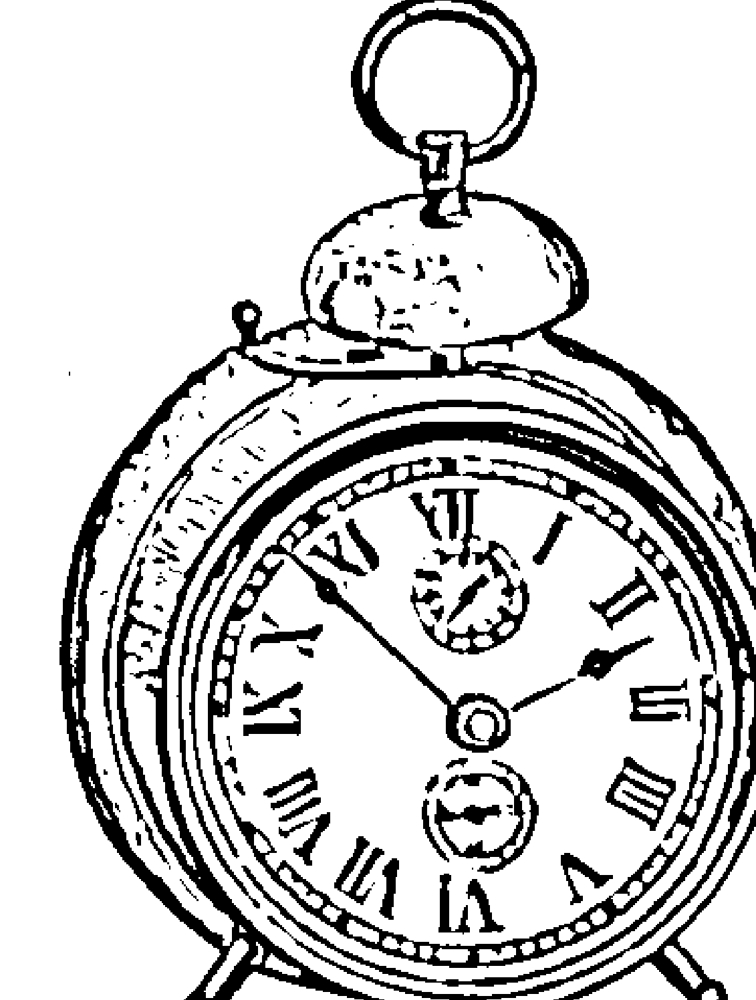

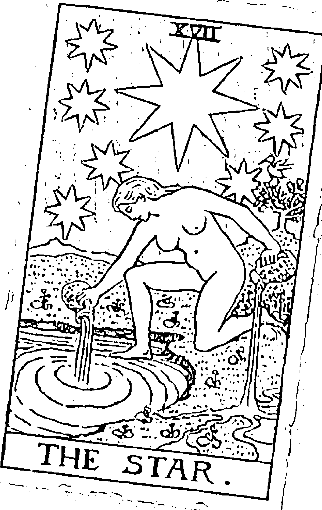

星星牌中天上为什么要有七颗星？
全裸的女郎代表的意义？
女郎身后停在树梢上的鸟儿相当可疑？！
两个水壶的水为什么倒向不同的地方？

丹尼尔老师亲自上色，
莱德·伟特78张塔罗牌标准绘制，
让读者从牌卡颜色的定义、图象元素中进一步拆解牌义。