# The Pictorial Key to the Tarot

# Being fragments of a Secret Tradition under the Veil of Divination

# 塔罗图钥

# 在神圣面纱下的神秘传统之拼图

Arthur Edward Waite [b. 1857 d. 1942]

作者：亚瑟·爱德华·伟特（1857～1942）

# With 78 Plates, Illustrating the Greater and Lesser Arcana, from Designs

# 内含 78 张大小牌全套演示插图

By Pamela Colman Smith [b. 1878 d. 1951]

插图绘者：帕梅拉·柯曼·史密斯（1878～1951）

London, W. Rider

出版商：伦敦，莱德公司

Originally published in 1910

首次出版于 1910 年

Scanned, proofed and formatted at sacred-texts.com, September, 2000 and June, 2003 by John Bruno Hare. This text and the accompanying illustrations are in the public domain in the United States of America because they were published prior to 1923.

### 本文档编者的话

中文翻译取自《直觉式占卜：塔罗牌的奥义》，译者文轩。有人说该翻译加入了译者的个人理念，但只要我这英文版没问题，那我看这译文除了文风及笔误外没多大问题，可以说基本上都是忠实原文的。我也不觉得译者能有什么个人理念，他们恐怕不是塔罗师，不然宫廷牌的名字怎么会……且以我所知只有这一现成的译文，故采用。原文照搬，包括各种错别字和台湾惯用词汇。

因为译文跟原文的分段不同，我把与译文段首对应的英文首单词换了字体颜色，方便对照。

关于伟特伯伯的这本书，众所周知他对占卜没兴趣，研究和创作塔罗也不是为了占卜而是为了别的“崇高的目的”啥啥的，书里也各种打太极，该藏私的一个也没露出来都藏得密密的，牌意他也是抄各种当时的坊间牌意的，请读者自行鉴别什么该学什么不该学哟。

### 前言

### Preface

身为一位多年来受限于心灵与其他局限条件下从事文字撰述，同时担任高阶神秘学校的指导者来说，我首先必须对个人的立场做彻底坦白的说明，这份书面的辩解，有其必要性，而非仅是我个人的习性。

IT seems rather of necessity than predilection in the sense of apologia that I should put on record in the first place a plain statement of my personal position, as one who for many years of literary life has been, subject to his spiritual and other limitations, an exponent of the higher mystic schools.

对于现今广为知名且乍看为算命预言的手法来说，我的行为将被视为怪异的。现在，史密斯先生（Mr. Smith，编按：应为绘牌者潘蜜拉·科门·史密斯的某位尊长）的见解，即使是书面的评论，也并不重要，除非这些见解符合我们本身的情况，然而，为使这项教义得到认可，我们必须注意，无论是自己的看法或是所引发出来的课题，皆只能与最崇高的旨意（上帝）相关。

It will be thought that I am acting strangely in concerning myself at this day with what appears at first sight and simply a well-known method of fortune-telling. Now, the opinions of Mr. Smith, even in the literary reviews, are of no importance unless they happen to agree with our own, but in order to sanctify this doctrine we must take care that our opinions, and the subjects out of which they arise, are concerned only with the highest.

至目前为止，仅仅如此也许看来十分令人疑惑，以当前的情况来说，不仅是对于史密斯先生，我在公正不偏的适当估量下所尊重的人，还有一些更为真实的结论，因为他们的贡献等同于我的。无论是对于这些或其他的，我必须这样说，最受启发的基督兄弟·玫瑰十字，当他在演变的神秘宫殿里（Secret Palace of Transmutation）看见化学性的紧密结合之后，他的故事就突然地中止了，据说他期盼第二天早晨就去当一个守门人。经过相同的行为之后，就更常发生这样的情况，那些曾透过圣典中最清楚的面纱看见天国之父的人，都是后来在教堂中承担最卑微职务的人。

Yet it is just this which may seem doubtful, in the present instance, not only to Mr. Smith, whom I respect within the proper measures of detachment, but to some of more real consequence, seeing that their dedications are mine. To these and to any I would say that after the most illuminated Frater Christian Rosy Cross had beheld the Chemical Marriage in the Secret Palace of Transmutation, his story breaks off abruptly, with an intimation that he expected next morning to be door-keeper. After the same manner, it happens more often than might seem likely that those who have seen the King of Heaven through the most clearest veils of the sacraments are those who assume thereafter the humblest offices of all about the House of God.

经由如此简单的手段，也能将神秘秩序中的行家与大师自一群新人中区别出来。也因此，或是在并非全然不同的方式下，我们自最外围的部分偶然与塔罗牌相遇，当中混杂着超自然神秘技艺的残渣碎瓦，在他们的观念里，没有人会因为最微小的骗局而受苦；然而这些纸牌在另一个领域中是属于它们自己，因为它们包含着一个非常高的符号象征系统，那是依据神的恩典之律法诠释的，而非仅是依靠着占卜手法的藉口托词与直觉。

By such simple devices also are the Adepts and Great Masters in the secret orders distinguished from the cohort of Neophytes as servi servorum mysterii. So also, or in a way which is not entirely unlike, we meet with the Tarot cards at the outermost gates--amidst the fritterings and débris of the so-called occult arts, about which no one in their senses has suffered the smallest deception; and yet these cards belong in themselves to another region, for they contain a very high symbolism, which is interpreted according to the Laws of Grace rather than by the pretexts and intuitions of that which passes for divination.

上帝的智慧存在于人的愚蠢无知中的这个事实，并未因此产生这样的一种推测，认为这个世界的愚蠢无知对神的智慧而言都是有意义的；所以无论是普通程度的学者或是立于崇高地位的虚荣教师都将无法迅速察觉到这个论点的可能性甚至是可行性。这个主题已经操纵在纸牌占卜师的手中，成为他们职业特有的惯用伎俩之一；我并没有试图要说服属于我圈外的任何人关于此事有否影响或后果；但是站在历史与阐释说明的角度来看，它并无进展；它也在阐释说明者的手中受到十足的轻蔑藐视，这些人拥有鉴赏证据的哲学洞察或技能。

The fact that the wisdom of God is foolishness with men does not create a presumption that the foolishness of this world makes in any sense for Divine Wisdom; so neither the scholars in the ordinary classes nor the pedagogues in the seats of the mighty will be quick to perceive the likelihood or even the possibility of this proposition. The subject has been in the hands of cartomancists as part of the stock-in-trade of their industry; I do not seek to persuade any one outside my own circles that this is of much or of no consequence; but on the historical and interpretative sides it has not fared better; it has been there in the hands of exponents who have brought it into utter contempt for those people who possess philosophical insight or faculties for the appreciation of evidence.

该是它获得救赎的时候了，我打算就此承担起这份职责，也许我所做的是偏离主题的枝节问题。如同诗歌是表达最美丽事物的最优美的表现方式，符号象征系统也是最广泛包容的形式以传达在最深奥的圣殿中所隐藏的事物，这些都还未能以口述的方式被如此丰富充分地宣告出来。我目前并不考量以沉默作为辩解，我已在其他地方留下记录，是关于这方面主题可能阐述的部分，而且是在相当近期的时候。

It is time that it should be rescued, and this I propose to undertake once and for all, that I may have done with the side issues which distract from the term. As poetry is the most beautiful expression of the things that are of all most beautiful, so is symbolism the most catholic expression in concealment of things that are most profound in the Sanctuary and that have not been declared outside it with the same fulness by means of the spoken word. The justification of the rule of silence is no part of my present concern, but I have put on record elsewhere, and quite recently, what it is possible to say on this subject.

接下来的小论著分为三个部分，首先我会谈论这个主题的古老历史，以及这当中所产生的与相关的一些议题。必须要了解的是，所提出的研究内容并不是针对游戏纸牌的历史，那是我知道却不感兴趣的题目；其动机考量是为奉献与提供给特定的神秘主义的学苑，特别是指在法国的，因为关于魔术幻象的所有资源与核心，在过去的五十年间已假借塔罗牌历史的考量之名开始传达。

The little treatise which follows is divided into three parts, in the first of which I have dealt with the antiquities of the subject and a few things that arise from and connect therewith. It should be understood that it is not put forward as a contribution to the history of playing cards, about which I know and care nothing; it is a consideration dedicated and addressed to a certain school of occultism, more especially in France, as to the source and centre of all the phantasmagoria which has entered into expression during the last fifty years under the pretence of considering Tarot cards historically.

在第二部分，我会根据一些更崇高的观点来谈论符号象征系统，这同时也有助于介绍这部完整且修订后的塔罗牌，这份塔罗牌可以个别取得彩色的版本，附加在本书内的设计是以黑白印刷的。这些纸牌都是在我的监督指导下所完成的，无论是内容属性或意义，并经由一位严谨要求的女性艺术家描绘而成。

In the second part, I have dealt with the symbolism according to some of its higher aspects, and this also serves to introduce the complete and rectified Tarot, which is available separately, in the form of coloured cards, the designs of which are added to the present text in black and white. They have been prepared under my supervision---in respect of the attributions and meanings---by a lady who has high claims as an artist.

至于占卜的部分，作为这份论文的结尾，我个人认为那是存在塔罗牌历史的一个事实；因此，我根据所有已出版的资料中，将附属于各式各样纸牌的解读，推论归纳出一份统一的意义，同时我特别提供一种尚未被公开出版的操作手法；拥有简明易懂的优点，同时也是通用的应用手法，它可以作为取代大本指南手册里累赘且复杂的系统。

Regarding the divinatory part, by which my thesis is terminated, I consider it personally as a fact in the history of the Tarot--as such, I have drawn, from all published sources, a harmony of the meanings which have been attached to the various cards, and I have given prominence to one method of working that has not been published previously; having the merit of simplicity, while it is also of universal application, it may be held to replace the cumbrous and involved systems of the larger hand-books.

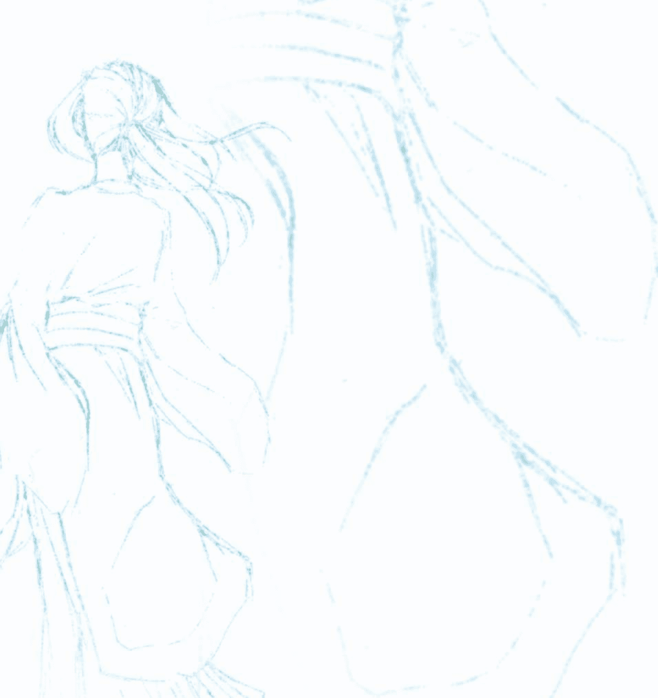

## The Contents 目录

## PREFACE 前言

与塔罗牌的偶然相遇。An explanation of the personal kind--An illustration from mystic literature--A subject which calls to be rescued--Limits and intention of the work.

### PART I THE VEIL AND ITS SYMBOLS 第一部：认识符号，揭开神秘面纱

*   § 1.--Introductory and General. 基本认识
*   § 2.--Class I. The Trumps Major, otherwise Greater Arcana. 大阿尔卡那牌开场
*   § 3.--Class II. The Four Suits, otherwise Lesser Arcana. 浅说小阿尔卡那牌
*   § 4.--The Tarot in History. 塔罗牌的历史

### PART II THE DOCTRINE BEHIND THE VEIL 第二部：神秘面纱背后隐含的教义

*   § 1.--The Tarot and Secret Tradition. 塔罗牌及其神秘传统
*   § 2.-The Trumps Major and their Inner Symbolism. 大阿尔卡那牌与它们内在的符号意象
*   § 3. Conclusion as to the Greater Keys. 大阿尔卡那牌图解之总结

## PART III THE OUTER METHOD OF THE ORACLES.第三部：揭露神谕的外部手法

*   § 1.--Distinction between the Greater and Lesser Arcana. 大小阿尔卡那牌的区分
*   § 2.--The Lesser Arcana, otherwise, the Four Suits of Tarot Cards. 小阿尔卡那牌解说
    *   The Suit of Wands.
    *   The Suit of Cups.
    *   The Suit of Swords.
    *   The Suit of Pentacles.
*   § 3.--The Greater Arcana and their Divinatory Meanings. 大阿尔卡那牌与其占卜的含义
*   § 4.--Some additional Meanings of the Lesser Arcana. 小阿尔卡那牌与一些额外的意义
*   § 5.--The Recurrence of Cards in Dealing. 发牌时会一再重复出现的纸牌
*   § 6.--The Art of Tarot Divination. 塔罗牌占卜的技艺
*   § 7.--An Ancient Celtic Method of Divination. 古老的塞尔特占卜法
*   § 8.--An Alternative Method of Reading the Tarot Cards. 解读塔罗牌的其他方法
*   § 9.--The Method of Reading by Means of Thirty-five Cards. 三十五张纸牌的解读方法

### BIBLIOGRAPHY

A concise bibliography of the chief works dealing with the tarot and its connexions.

## 第一部：认识符号，揭开神秘面纱
PART I The Veil and its Symbols
#### 一、基本认识
§ 1 INTRODUCTORY AND GENERAL

诗人的病理学说法：“一个不虔诚的天文学家，就是疯子。”；一位坦率之人的病理学说法，天才都是疯子；在这两个极端之间，存在着万种类似的不当，而且以符合最高无上的理由扮演仲裁的角色，与能力所及的事情。

我并不认为有任何关于神秘学仪式的病理学，但是其过度无节制却是毋庸置疑的，针对此项要扮演仲裁的角色，自然是吃力不讨好的。此外，若真有病理学的存在，它大概是依据经验法则，而非诊断的结果，也因此无法提供任何准则了。

现今，神秘主义不似密教组织，极少依从商业习性或日常生活的运作方式，或是将证据视为准则的智识。我知道在粗鄙的显赫技艺下，有些事情远比批评一份论文是假的，且未能明白那只装饰性的，还要来的愚蠢。我也明白，在长时间面对着令人疑惑的教义或是艰难的研究之后，能够在这项技艺的范畴内，发现明显的骗局或是全然不合理之处，总会令人感到耳目一新的。

然而就历史的观点，神秘主义的角度来说，这并非是个装饰性的原则，且还带来提振精神后的几项好处，疗愈其加诸于逻辑理解方面的损伤。

THE pathology of the poet says that "the undevout astronomer is mad"; the pathology of the very plain man says that genius is mad; and between these extremes, which stand for ten thousand analogous excesses, the sovereign reason takes the part of a moderator and does what it can. I do not think that there is a pathology of the occult operations, but about their extravagances no one can question, and it is not less difficult than thankless to act as a moderator regarding them. Moreover, the pathology, if it existed, would probably be an empiricism rather than a diagnosis, and would offer no criterion. Now, occultism is not like mystic faculty, and it very seldom works in harmony either with business aptitude in the things of ordinary life or with a knowledge of the canons of evidence in its own sphere. I know that for the high art of ribaldry there are few things more dull than the criticism which maintains that a thesis is untrue, and cannot understand that it is decorative. I know also that after long dealing with doubtful doctrine or with difficult research it is always refreshing, in the domain of this art, to meet with what is obviously of fraud or at least of complete unreason. But the aspects of history, as seen through the lens of occultism, are not as a rule decorative, and have few gifts of refreshment to heal the lacerations which they inflict on the logical understanding. It almost requires a Frater Sapiens dominabitur astris in the Fellowship of the Rosy Cross to have the patience which is not lost amidst clouds of folly when the consideration of the Tarot is undertaken in accordance with the higher law of symbolism. The true Tarot is symbolism; it speaks no other language and offers no other signs. Given the inward meaning of its emblems, they do become a kind of alphabet which is capable of indefinite combinations and makes true sense in all. On the highest plane it offers a key to the Mysteries, in a manner which is not arbitrary and has not been read in, But the wrong symbolical stories have been told concerning it, and the wrong history has been given in every published work which so far has dealt with the subject. It has been intimated by two or three writers that, at least in respect of the meanings, this is unavoidably the case, because few are acquainted with them, while these few hold by transmission under pledges and cannot betray their trust. The suggestion is fantastic on the surface for there seems a certain anti-climax in the proposition that a particular interpretation of fortune-telling——l'art de tirer les cartes——can be reserved for Sons of the Doctrine. The fact remains, notwithstanding, that a Secret Tradition exists regarding the Tarot, and as there is always the possibility that some minor arcana of the Mysteries may be made public with a flourish of trumpets, it will be as well to go before the event and to warn those who are curious in such matters that any revelation will contain only a third part of the earth and sea and a third part of the stars of heaven in respect of the symbolism. This is for the simple reason that neither in root-matter nor in development has more been put into writing, so that much will remain to be said after any pretended unveiling. The guardians of certain temples of initiation who keep watch over mysteries of this order have therefore no cause for alarm.

玫瑰十字（Rosy Cross）的会员资格几乎需要一个能主导星辰的智者兄弟（Frater Sapiens dominabitur astris），能具备耐性，在进行塔罗占卜时，其思虑符合符号象征系统的较高原则，不会因愚昧而迷失。真正的塔罗是符号象征系统；它不说其他语言，亦或是提供其他记号。其象征符号的内在涵义，已成为某种符号系统，能够无限制地组合，并因此做出真切的判断。在最高的阶段，以不武断且未被通晓的方式，提供探索神秘事物之钥。然而，关于神秘学，所阐述的是错误的符号故事，且在这项主题的每份出版品中，提供着错误的历史。有二至三位作家已暗示着这种情况的无法避免性，因为仅有少数人对此方面熟悉，而这些少数人在秘密社团的掌控下传达知识，不能违背他们的信任。这建议在表面上是令人无法置信的，似乎有着令人扫兴的提议，将预测未来的特殊解读：纸牌的解读艺术（l'art de tirer les cartes），保留成为学说的延伸。而事实仍然存在，尽管塔罗存在着“神秘的传统”（Secret Tradition），神秘学中的某些小阿尔卡那牌，总是尽可能以夸耀的宣传方式，呈现在大众面前，同样的，也会在事件发生前，警告对此类事物好奇的人，任何所揭露的天机，就符号象征系统来说，仅含天地的三分之一及天空星宿的三分之一部份。简单的原因就是，无论就根本或进展的部份，都没有放诸更多的讯息于文字中，如此一来，在任何虚假的解密揭露之后，保留更多阐述的空间。某些早期创始的庙堂的管理者，负责监管神秘学的这类秩序，就无须为相关事宜担忧。

In my preface to The Tarot of the Bohemians, which, rather by an accident of things, has recently come to be re-issued after a long period, I have said what was then possible or seemed most necessary. The present work is designed more especially--as I have intimated--to introduce a rectified set of the cards themselves and to tell the unadorned truth concerning them, so far as this is possible in the outer circles. As regards the sequence of greater symbols, their ultimate and highest meaning lies deeper than the common language of picture or hieroglyph. This will be understood by those who have received some part of the Secret Tradition. As regards the verbal meanings allocated here to the more important Trump Cards, they are designed to set aside the follies and impostures of past attributions, to put those who have the gift of insight on the right track, and to take care, within the limits of my possibilities, that they are the truth so far as they go.

我在《波希米亚人的塔罗术》这本书的前言中，已经说明哪些是合适的，或似乎是必要的。这本书在经过一段很长的时间之后，因某个意外的因素，已在近日重新发行。如我所提示的，目前的著作是特别为介绍一组修订过的纸牌所设计的，以讲述这些纸牌的原貌真相。目前为止，这在外界进行是可行的。关于一连串更重要的符号，其终极与最高涵义，深藏在图片或象形文字的表面言语之下。这部份仅能透过那些已接受到部份“神秘的传统”的人来理解。至于更重要的阿尔卡那牌所赋予的言语上的涵义，是为了驳斥过去带来的愚见与欺骗，将真正拥有洞察天赋的人才，放在正确的位置上，并在我的能力范围内，关照他们，因为截至目前为止，他们所做的事就是真理。

It is regrettable in several respects that I must confess to certain reservations, but there is a question of honour at issue. Furthermore, between the follies on the one side of those who know nothing of the tradition, yet are in their own opinion the exponents of something called occult science and philosophy, and on the other side between the make-believe of a few writers who have received part of the tradition and think that it constitutes a legal title to scatter dust in the eyes of the world without, I feel that the time has come to say what it is possible to say, so that the effect of current charlatanism and unintelligence may be reduced to a minimum.

很遗憾的是，我必须承认自己在一些观点上有某些程度的保留，因为这当中牵涉到信誉的问题。除此之外，面对着一边是愚蠢无知的人，他们对于传统一无所知，都是以自己的观点讲述神秘科学与哲学这类知识，而另一边则是少数了解传统的作者的伪装，他们认为拥有散播不实内容的合法权力，我觉得表明的时机到了，将可能的部份说明，如此一来，将目前流行的骗术与蠢见的影响，降至最低程度。

We shall see in due course that the history of Tarot cards is largely of a negative kind, and that, when the issues are cleared by the dissipation of reveries and gratuitous speculations expressed in the terms of certitude, there is in fact no history prior to the fourteenth century. The deception and self-deception regarding their origin in Egypt, India or China put a lying spirit into the mouths of the first expositors, and the later occult writers have done little more than reproduce the first false testimony in the good faith of an intelligence unawakened to the issues of research. As it so happens, all expositions have worked within a very narrow range, and owe, comparatively speaking, little to the inventive faculty. One brilliant opportunity has at least been missed, for it has not so far occurred to any one that the Tarot might perhaps have done duty and even originated as a secret symbolical language of the Albigensian sects.

我们在适当的时候会发现，塔罗牌的历史最早源于十四世纪，且大多数是负面的，当时的争议都沉溺于空想与无端的臆测，以确信肯定的方式表达。这些源自于埃及、印度或中国的骗术或自欺，将说谎的特质植入首批讲解人的言谈中，而后来的神秘学作者，在真诚的态度下，复制这些初次错误的证言，没有察觉到这些研究的问题。如此的进展，造成所有的讲解只能在非常狭隘的范围内进行，实难以归咎于创造的人员呢！不久前就有一个被忽略的绝佳机会，塔罗牌也许已善尽其责，甚而成为阿尔比教派（Albigensian）的一个神秘符号语言的来源。

I commend this suggestion to the lineal descendants in the spirit of Gabriele Rossetti and Eugène Aroux, to Mr. Harold Bayley as another New Light on the Renaissance, and as a taper at least in the darkness which, with great respect, might be serviceable to the zealous and all-searching mind of Mrs. Cooper-Oakley. Think only what the supposed testimony of watermarks on paper might gain from the Tarot card of the Pope or Hierophant, in connexion with the notion of a secret Albigensian patriarch, of which Mr. Bayley has found in these same watermarks so much material to his purpose. Think only for a moment about the card of the High Priestess as representing the Albigensian church itself; and think of the Tower struck by Lightning as typifying the desired destruction of Papal Rome, the city on the seven hills, with the pontiff and his temporal power cast down from the spiritual edifice when it is riven by the wrath of God. The possibilities are so numerous and persuasive that they almost deceive in their expression one of the elect who has invented them.

我依循着加百利罗赛提（Gabriele Rossetti）与尤金亚力克（Eugene Aroux）的精神，将此建议世袭交付给哈洛贝雷先生（Harold Bayley），成为“文艺复兴的新明灯”（New Light on the Renaissance），至少在黑暗当中还能发出微光，并充满着敬意。希望能够帮助具热情且有着全能洞察心智的古柏奥克利女士（Mrs. Cooper Oakley）。只要想想，从塔罗的教皇纸牌，与一种神秘的阿尔比教派元老的概念作联想，可以获得何种造纸浮水印的假设证明，贝雷先生已在这些相同的浮水印中，找到够多的资料完成他的目的。只要想一下女祭司牌正代表着阿尔比教派教堂；想想被闪电击中的高塔，象征着渴望罗马教皇的毁灭，这个建立在七个山丘的城市，连同它的教宗及其短暂具有的权力，从宗教的宏伟建物中倒下，因上帝的谴罚而撕裂。这些可能性是如此之多且具说服力，几乎在语意中蒙骗住一个创造它们的上帝选民。

But there is more even than this, though I scarcely dare to cite it. When the time came for the Tarot cards to be the subject of their first formal explanation, the archaeologist Court de Gebelin reproduced some of their most important emblems, and--if I may so term it--the codex which he used has served--by means of his engraved plates--as a basis of reference for many sets that have been issued.

除此之外还有更多的案例，虽然我几乎不敢提出引用。当塔罗牌成为他们首部正式的解释题材时，考古学家杰柏林（Court de Gebelin）重制部分最重要的符号，且他所使用的法典，若我能如此称之，在其令人深刻的著作下，已成为后来发行的许多牌组的基本参考。图像非常原始朴拙，且不同于亚提拉纸牌（Etteilla）、马赛塔罗牌（Marseilles），以及其他流行于法国的纸牌。关于这方面，我并不是个好的判定者，但事实上每张大阿尔卡那牌也许已经针对浮水印的研究。

目的给予答案，可以从我所引用的案例中得知，而其中最具代表性的范例是纸牌 “圣杯 Ace”。

我应该称之为一种在祭坛天盖的仪式后的圣餐符号，但此时这点并不重要。重点是哈洛贝雷先生在他的 “文艺复兴的新明灯” 中提供六个类似的图案，都是十七世纪文件的浮水印，他声称这些是源自于阿尔比教，以作为象征圣典仪式与圣杯（Graal）的符号。他是否仅知晓塔罗牌，是否知道这些作为占卜预测的纸牌、幸运之牌以及所有属于流浪者技艺的纸牌，也许曾在某段时期流行于法国南方，我认为，他那令人着迷却过于令人无法置信的假设，也许已经在他自己的想象中过度膨胀了。我们毫无疑问地应该已察觉到基督教的诺斯提派（Gnosticism）、摩尼教派（Manichaeanism），以及他透过正统原始的福音书所理解的一切，都在图像背后醒目闪耀。

subsequently. The figures are very primitive and differ as such from the cards of Eteilla, the Marseilles Tarot, and others still current in France. I am not a good judge in such matters, but the fact that every one of the Trumps Major might have answered for watermark purposes is shewn by the cases which I have quoted and by one most remarkable example of the Ace of Cups.
I should call it an eucharistic emblem after the manner of a ciborium, but this does not signify at the moment. The point is that Mr. Harold Bayley gives six analogous devices in his New Light on the Renaissance, being watermarks on paper of the seventeenth century, which he claims to be of Albigensian origin and to represent sacramental and Graal emblems. Had he only heard of the Tarot, had he known that these cards of divination, cards of fortune, cards of all vagrant arts, were perhaps current at the period in the South of France, I think that his enchanting but all too fantastic hypothesis might have dilated still more largely in the atmosphere of his dream. We should no doubt have had a vision of Christian Gnosticism, Manichæanism, and all that he understands by pure primitive Gospel, shining behind the pictures.

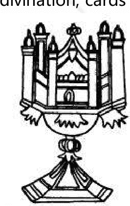

我未能看透这类现象，且仅能在后期针对他所关注的议题评论；在此提醒，关于纸牌历史的介绍，我也许会采取前所未闻且令人惊讶的专断推测。

关于它们的形式与数字，按理说几乎是没有必要一一列举出来，因为这些应该是被普遍熟知的，然而任何的预设都是不妥的，同时因着其他的理由，我仍会简要地列表说明于后。

I do not look through such glasses, and I can only commend the subject to his attention at a later period; it is mentioned here that I may introduce with an unheard-of wonder the marvels of arbitrary speculation as to the history of the cards.

With reference to their form and number, it should scarcely be necessary to enumerate them, for they must be almost commonly familiar, but as it is precarious to assume anything, and as there are also other reasons, I will tabulate them briefly as follows:--

#### 二、大阿尔卡那牌开场
##### CLASS I
##### §2
##### TRUMPS MAJOR
##### Otherwise, Greater Arcana

古波斯僧侣，魔术师，或变戏法的人（The Magus，Magician，or Juggler），丢掷钱币的人或行走江湖的卖艺人，是庶民世界的骗术。

这是宗教刊物上的解释，与塔罗牌算命中所运用的神秘符号的真正意义相似，其神秘的解释是根据符号象征系统的神秘科学而来的。我应该再补充，许多这方面学科的独立研究者，依据他们自己的观点，针对大阿尔卡那牌发展出一连串独立的解读，这些观点有时会挑动不妥的行为，并不是真正的启发见解。例如，法国的神秘学者伊莱李维（Eliphas Levi）说，古波斯僧侣代表着数字一，这是数字之母；其他人说这是神性的统一；一位新近的法国评论家认为，就其普遍意义来说，就代表“意志”。

- 1. The Magus, Magician, or juggler, the caster of the dice and mountebank, in the world of vulgar trickery. This is the colportage interpretation, and it has the same correspondence with the real symbolical meaning that the use of the Tarot in fortune-telling has with its mystic construction according to the secret science of symbolism. I should add that many independent students of the subject, following their own lights, have produced individual sequences of meaning in respect of the Trumps Major, and their lights are sometimes suggestive, but they are not the true lights. For example, Éliphas Lévi says that the Magus signifies that unity which is the mother of numbers; others say that it is the Divine Unity; and one of the latest French commentators considers that in its general sense it is the will.

女祭司，琼安教宗或女主教（The High Priestess，The Pope Joan，or Female Pontiff）；早期的解读者将这张纸牌视为“母亲”或“教宗的妻子”，这是相反于符号象征系统的。有时它用来代表着“神律”与“真知”，在此处，女祭司即相当于神的荣光（Skekinah）。她就是神秘的传统，及制式神秘学的更高阶意识。

- 2. The High Priestess, the Pope Joan, or Female Pontiff; early expositors have sought to term this card the Mother, or Pope's Wife, which is opposed to the symbolism. It is sometimes held to represent the Divine Law and the Gnosis, in which case the Priestess corresponds to the idea of the Shekinah. She is the Secret Tradition and the higher sense of the instituted Mysteries.

- 3 皇后（The Empress），有时会以正面全脸呈现，尽管其对应纸牌“皇帝”是侧面的。虽然曾有趋势打算针对这不同点给予象征的意义，但是认为这并无任何精神涵义的说法，似乎是比較令人满意。“皇后”与多产丰收的概念相关，通常是针对某个活动而言。

- 3. *The Empress*, who is sometimes represented with full face, while her correspondence, the Emperor, is in profile. As there has been some tendency to ascribe a symbolical significance to this distinction, it seems desirable to say that it carries no inner meaning. The Empress has been connected with the ideas of universal fecundity and in a general sense with activity.

- 4 皇帝（The Emperor），顶着前者的配偶之污名。他除有着代表他个人地位的衣饰佩章、某些骑士象征的星星或缎带外，偶尔呈现着疲惫。我提及这些，正是为显示纸牌混合着新与旧的符号。那些坚决主张此一证据的人，如果可以的话也许会讨论其他的部份。

- 4. *The Emperor*, by imputation the spouse of the former. He is occasionally represented as wearing, in addition to his personal insignia, the stars or ribbons of some order of chivalry. I mention this to shew that the cards are a medley of old and new emblems. Those who insist upon the evidence of the one may deal, if they can, with the other. No effectual argument for the antiquity of a particular design can be drawn from the fact that it incorporates old material; but there is also none which can be based on sporadic novelties, the intervention of which may signify only the unintelligent hand of an editor or of a late draughtsman.

要有效地论断一件特殊作品是否为古代遗物的，是不能脱离其必须包含古老材质这项事实，然而，也不能仅根据零星的新素材来否定，这些新介入物也许仅代表着某位编者或晚近制图者的无知。

- 5 主教或称为神职者（The High Priest or Hierophant），也称为心灵之父，更普遍且明显的是称教皇。它甚而被称为“南修道院院长”（Abbot），对应着女祭司，就是“女修道院院长”，或是“女修道院之母”。两者皆是独断专制的称谓。人物身上的衣饰佩章是代表着罗马教皇，因此“女祭司”仅代表着教堂，是教宗与祭司依着神职任命的宗教惯例，婚配的对象。然而，我认为，在其原始的形式中，这张纸牌并未代表罗马教宗。

- 5. *The High Priest or Hierophant*, called also Spiritual Father, and more commonly and obviously the Pope. It seems even to have been named the Abbot, and then its correspondence, the High Priestess, was the Abbess or Mother of the Convent. Both are arbitrary names. The insignia of the figures are papal, and in such case the High Priestess is and can be only the Church, to whom Pope and priests are married by the spiritual rite of ordination. I think, however,

- 6 恋人或婚姻 ( The Lovers or Marriage )

这张符号历经许多变动，从其主题或许可以得知。十八世纪的形式因考古学的研究首次为世人所知，确实是张婚姻生活的纸牌，图案有着父母亲与他们的小孩在其中；上方是异教徒邱比特携箭飞翔，这当然是一个被误用的符号。因为邱比特是属于爱情的开始，守护着爱的果实，而不是出现在爱情的成熟阶段。

这张牌被称为信仰的幻象 ( Simulacrum fidei )，作为婚姻承诺的符号，彩虹是立约的象征，因此更适合做为此图的附加物。这些图像也被指称代表着诚实、荣誉与爱，但是我怀疑这是某位评论家作为道德说教的托辞。这张排除这些意涵之外，还有这其他且更高层的观点。

- 6. The Lovers or Marriage

This symbol has undergone many variations, as might be expected from its subject. In the eighteenth century form, by which it first became known to the world of archæological research, it is really a card of married life, shewing father and mother, with their child placed between them; and the pagan Cupid above, in the act of flying his shaft, is, of course, a misapplied emblem. The Cupid is of love beginning rather than of love in its fulness, guarding the fruit thereof. The card is said to have been entitled Simulacyum fidei, the symbol of conjugal faith, for which the rainbow as a sign of the covenant would have been a more appropriate concomitant. The figures are also held to have signified Truth, Honour and Love, but I suspect that this was, so to speak, the gloss of a commentator moralizing. It has these, but it has other and higher aspects.

- 7 战车( The Chariot )

在一些现存的法典中，这张牌是以两只人面狮身像呈现，且装置设备与符号象征系统相同一致，但绝不能就此假设是原始的表现形式；变更的产生是为了支持某项特殊的历史性假设。在十八世纪，白马是套上枷锁与战车连结。至于名称的部份，通常数字越少代表越伟大；这张牌确实是国王在胜利凯旋的庆典中的典型模式，然而，是这份胜利自然促成君权的获得，而不是如同第四张牌，王位是经由授予而来的。杰柏林认为这是司阴府神欧斯里司之胜局 ( Osiris Triumphing )，春天胜利的太阳已除尽冬日的障碍。现在我们知道，从死亡中升起的司

- 7. The Chariot

This is represented in some extant codices as being drawn by two sphinxes, and the device is in consonance with the symbolism, but it must not be supposed that such was its original form; the variation was invented to support a particular historical hypothesis. In the eighteenth century white horses were yoked to the car. As regards its usual name, the lesser stands for the greater; it is really the King in his triumph, typifying, however, the victory which creates kingship as its natural consequence and not the vested阴府之神，并非由如此明显的符号象征系统呈现。除马匹外，也使用其他动物作为凯旋之车（currus triumphalis），例如狮子与豹。

Royalty of the fourth card. M. Court de Gebelin said that it was Osiris Triumphing, the conquering sun in spring-time having vanquished the obstacles of winter. We know now that Osiris rising from the dead is not represented by such obvious symbolism. Other animals than horses have also been used to draw the currus triumphalis, as, for example, a lion and a leopard.

##### 8 坚毅（Fortitude）

这是天主教最基本重要的美德之一，我稍后会对此说明。女性的形体通常会呈现接近狮子之口。在早期杰柏林所印制的版本中，她显然正打开狮口。第一个具有比较理想的象征意义，但两者皆是力量的表现，是此牌常用的解读，同时传达统治的想法。这个人物亦被认为代表着组织的力量、道德力量，以及所有信条主义的力量。

##### 8. Fortitude

This is one of the cardinal virtues, of which I shall speak later. The female figure is usually represented as closing the mouth of a lion. In the earlier form which is printed by Court de Gebelin, she is obviously opening it. The first alternative is better symbolically, but either is an instance of strength in its conventional understanding, and conveys the idea of mastery. It has been said that the figure represents organic force, moral force and the principle of all force.

##### 9 隐者（The Hermit）

在纸牌上采用其最普通的语法称呼；他也是圣方济教会的修士（Capuchin），以更哲学的说词，就是圣人（Sage）。据说他在寻找着“真理”，它远位在这系列纸牌之后，而“正义”牌已优先在寻找的路上。然而，这是一张代表达成，而非仅是探索寻找的牌，往后我们就会明白。而且据称，他的提灯有着“神秘科学之光”，他手里握的权杖是支魔杖。这些诠释都能在各项观点上，媲美占卜算命方面的解释，两者是该轮到讨论的时候了。两者的妖魔幻术是依着他们自己的手法时是真确的，但是却遗漏所有大阿尔卡那牌所具备的重要事物。

##### 9. The Hermit

As he is termed in common parlance, stands next on the list; he is also the Capuchin, and in more philosophical language the Sage. He is said to be in search of that Truth which is located far off in the sequence, and of justice which has preceded him on the way. But this is a card of attainment, as we shall see later, rather than a card of quest. It is said also that his lantern contains the Light of Occult Science and that his staff is a Magic Wand. These interpretations are comparable in every respect to the divinatory and fortune-telling meanings with which I shall have to deal in their turn. The diabolism of both is that they are true after their own manner, but that they miss all the high things to which the Greater Arcana should be allocated. It is as if a man who knows in his heart that all roads lead to the heights, and that God is at the great height of all, should choose the way of perdition or the way of folly as the path of his own attainment. Éliphas Lévi has allocated this card to Prudence, but in so doing he has been actuated by the wish to fill a gap which would otherwise occur in the symbolism. The four cardinal virtues are necessary to an ideological sequence like the Trumps Major, but they must not be taken only in that first sense which exists for the use and consolation of him who in these days of halfpenny journalism is called the man in the street.

这就如同一个人，他的内心知道所有的路皆指引至高点，且上帝就在所有高点的至高处，是否该选择地狱之路或是无知之途，作为抵达目的的途径。伊莱李维将这张牌放在“谨慎节约”的位置，但他如此做是受到激励，希望填补符号象征系统可能产生的断层。四种基本的美德对于一个思想体系的发展结果是必要的，就如同大阿尔卡那牌，但绝不能仅作用于对其初步的认知，做为普通人的使用与抚慰的目的。

对于它们的正确理解，是对完美事物的建议相关联的，当这些事物被不断地相似表达，解释如下：(a)超然的正义(Transcendental Justice)，作为天平的反均衡机制，当它们过于偏重时，就会重重地垂在上帝的一方。与其呼应的建议，则是满载的骰子，当你和魔鬼玩大风险的赌注时，原则就是神或虚无(Aut Deus, aut nihil)。(b)神圣的狂喜(Divine Ecstacy)，作为某种称之为“节欲”的平衡，其象征符号，我相信该是小酒馆熄灭的灯。所呼应的建议是，只饮用天父的国度所酿的新酒，因为上帝是所有的全部。原则是做为一个理性的人，必须与上帝同醉；这个论点的归答案例就是史宾诺沙(Spinoza)。(c)王者坚忍的领域(The state of Royal Fortitude)，那是象牙塔与黄金宫的领地，但却是上帝而非人类成为面对敌意的塔(Turris fortitudinis a facie inimici)，在宫外的敌人皆被驱离。

对应的建议是，一个人即使面对死亡，也不该饶恕自己，但却必须确定他的任何牺牲，都应该是最值得的，得以确保善终。其原理是当力量升华至此程度，一个人敢于牺牲自己生命，应该向他显示如何发现上帝，更是对此果敢行为的慰藉，并因此获得教训。(d) “谨慎节约”是依循着尽少反抗的经济状态，其精神也许会从来处恢复。这是个教义，针对占卜预言的过度节约及能量的保护，是起因于这一生的压力、恐惧，以及显著的无理不当行为。其对应的建议是，真正的谨慎节约应该是关心最需要的事物，原则就是：不浪费不贪求。整体的结论是一个基于交易法则的商业观点：关于神圣的事物，你是无法只凭寻找而获得；这是供需的原则问题。

我之所以针对此重点提出议题，因为两个简单的理由：(a) 因为同样与客观的心智相比，有时似乎难以断定是否因邪恶或粗鄙，将现今的世界破坏地更悲惨；(b) 为弥补古老见解的不完美之处，有时是非常需要将其所采纳的意义之名称与言词清空，如此他们方能接受一个崭新且更为合宜的涵义。

In their proper understanding they are the correlatives of the counsels of perfection when these have been similarly re-expressed, and they read as follows: (a) Transcendental justice, the counter-equilibrium of the scales, when they have been overweighted so that they dip heavily on the side of God. The corresponding counsel is to use loaded dice when you play for high stakes with *Diabolus*. The axiom is *Aut Deus, aut nihil*. (b) Divine Ecstacy, as a counterpoise to something called Temperance, the sign of which is, I believe, the extinction of lights in the tavern. The corresponding counsel is to drink only of new wine in the Kingdom of the Father, because God is all in all. The axiom is that man being a reasonable being must get intoxicated with God; the imputed case in point is Spinoza. (c) The state of Royal Fortitude, which is the domain of the ivory and golden towers, but it is God and not man who faces the enemy in the tower (*Turris fortitudinis a facie inimici*) and all enemies from without are cast out.

Fortitude, which is the state of a Tower of Ivory and a House of Gold, but it is God and not the man who has become *Turris fortitudinis a facie inimici*, and out of that House the enemy has been cast. The corresponding counsel is that a man must not spare himself even in the presence of death, but he must be certain that his sacrifice shall be-of any open course-the best that will ensure his end. The axiom is that the strength which is raised to such a degree that a man dares lose himself shall shew him how God is found, and as to such refuge--dare therefore and learn. (d) Prudence is the economy which follows the line of least resistance, that the soul may get back whence it came. It is a doctrine of divine parsimony and conservation of energy, because of the stress, the terror and the manifest impertinences of this life. The corresponding counsel is that true prudence is concerned with the one thing needful, and the axiom is: Waste not, want not. The conclusion of the whole matter is a business proposition founded on the law of exchange: You cannot help getting what you seek in respect of the things that are Divine: it is the law of supply and demand. I have mentioned these few matters at this point for two simple reasons: (a) because in proportion to the impartiality of the mind it seems sometimes more difficult to determine whether it is vice or vulgarity which lays waste the present world more piteously; (b) because in order to remedy the imperfections of the old notions it is highly needful, on occasion, to empty terms and phrases of their accepted significance, that they may receive a new and more adequate meaning.

##### 10 命运之轮（The Wheel of Fortune）

近来有种“纸牌占卜手册”（Manual of Cartomancy），在英格兰成为相当流行时髦的事物，混杂着大量稀奇古怪毫无意义的事物，穿插着一些重要严肃的议题。在其最新且最厚的版本中，有一部分论及塔罗牌；假若我能正确地诠释作者的意思，以我个人所理解的说法，它从头至尾以“命运之轮”称之。我并不反对如此概括且传统的描述；普遍存在于各处，我感到不解的是，何以过去并未采用它作为普通算命最恰当的称呼。它同时是大阿尔卡那牌的其中一张主题，这才是我们此刻关心的重点，如副标题所示。近年来它历经许多异想天开的表现方式，及一次假设性的重建，具不良挑逗的符号象征。车轮有七个轮条；在十八世纪，那些上升或下降的动物都没有具体的形象，其中之一还有人头。在最高处，是另一只不知何种野兽身躯的怪兽，肩膀上有对翅膀，还有一顶皇冠在头上。爪里还拿着两支权杖。在一次重建中，这些被取代为一个半神的巨兽 Hermanubis 随着车轮升起，一只人面狮身蹲踞在最高处，一只怪兽 Typhon 在下降的一方。这是另一个为支持一项假说而干涉的例子；后者如果不理会集体的部份，在符号上是正确的，便可就此方式通过。

##### 10. The Wheel of Fortune.

There is a current Manual of Cartomancy which has obtained a considerable vogue in England, and amidst a great scattermeal of curious things to no purpose has intersected a few serious subjects. In its last and largest edition it treats in one section of the Tarot; which--if I interpret the author rightly--it regards from beginning to end as the Wheel of Fortune, this expression being understood in my own sense. I have no objection to such an inclusive though conventional description; it obtains in all the worlds, and I wonder that it has not been adopted previously as the most appropriate name on the side of common fortune-telling. It is also the title of one of the Trumps Major--that indeed of our concern at the moment, as my sub-title shews. Of recent years this has suffered many fantastic presentations and one hypothetical reconstruction which is suggestive in its symbolism. The wheel has seven radii; in the eighteenth century the ascending and descending animals were really of nondescript character, one of them having a human head. At the summit was another monster with the body of an indeterminate beast, wings on shoulders and a crown on head. It carried two wands in its claws. These are replaced in the reconstruction by a Hermanubis rising with the wheel, a Sphinx couchant at the summit and a Typhon on the descending side.

##### 11. Justice.

正义（Justice）。这张塔罗牌虽是十分古老的东西，但并非远至无可考的程度，如这张牌所呈现的，应该能够以更为古体的方式表现。然而，那些在这方面具有识别洞察天赋的人，无须被告知即知晓，年代并非该关心的重点；结束的仪式与石造技艺的第三等级也许属于十八世纪末期，然而这项事实没有任何意义；这仍是所有制式神秘学的摘要重点。这第十一张牌的女性形象，据说是正义女神亚斯特莉亚（Astraea），她是个美德的拟人象征，并且由相同的符号代表。

This is another instance of an invention in support of a hypothesis; but if the latter be set aside the grouping is symbolically correct and can pass as such.

That the Tarot, though it is of all reasonable antiquity, is not of time immemorial, is shewn by this card, which could have been presented in a much more archaic manner. Those, however, who have gifts of discernment in matters of this kind will not need to be told that age is in no sense of the essence of the consideration; the Rite of Closing the Lodge in the Third Craft Grade of Masonry may belong to the late eighteenth century, but the fact signifies nothing; it is still the summary of all the instituted and official Mysteries. The female figure of the eleventh card is said to be Astræa, who personified the same virtue and is represented by the same symbols.

尽管有着俗人的爱神邱比特，这张塔罗牌并非罗马或希腊神话。其正义的表现应是四种基本美德之一，包含在大阿尔卡那纸牌系列之一。由于缺少了第四种美德的符号，评论家必须不计任何代价地找寻出来。他们循着可行的方式行动，然而研究的法则仍无法成功地在“谨慎节约”的形式中，分析出失踪的冥王之后普西芬妮。杰柏林试图透过自己的影响力解决这项难题，并相信自己已经自“倒悬者”的符号摘录所需，他这是在蒙骗自己呀。因此塔罗牌有着“正义”、“节制”与“坚毅”，但是，由于一项无法理解的疏忽，它并未提供任何形式的“谨慎节约”，虽然在某些观点上，它已承认“隐者”的孤立存在，是依着他自己提灯的光，循着一条孤独的路径去追寻，对于能感受此讯息的人来说，这意象在“谨慎节约”的观点上，表达肯定崇高的见解。

This goddess notwithstanding, and notwithstanding the vulgarian Cupid, the Tarot is not of Roman mythology, or of Greek either. Its presentation of justice is supposed to be one of the four cardinal virtues included in the sequence of Greater Arcana; but, as it so happens, the fourth emblem is wanting, and it became necessary for the commentators to discover it at all costs. They did what it was possible to do, and yet the laws of research have never succeeded in extricating the missing Persephone under the form of Prudence. Court de Gebelin attempted to solve the difficulty by a tour de force, and believed that he had extracted what he wanted from the symbol of the Hanged Man--wherein he deceived himself. The Tarot has, therefore, its justice, its Temperance also and its Fortitude, but--owing to a curious omission--it does not offer us any type of Prudence, though it may be admitted that, in some respects, the isolation of the Hermit, pursuing a solitary path by the light of his own lamp, gives, to those who can receive it, a certain high counsel in respect of the via prudentiæ.

##### 12. The Hanged Man.

这原该是表达“谨慎节约”的符号，艾利李维（Éliphas Lévi）用他最浅薄且舌灿莲花的功夫说道，这代表着他善于被自我的承诺所束缚。一个男人头下脚上地倒吊着，其中一只脚踝以绳子捆绑连结着绞刑台。臂膀捆绑在他背后，其中一只脚横跨过另一只。根据一项说法，且是最为普遍的解释，他代表着牺牲，然而现今所有针对此牌的解读，都是凭着纸牌占卜者的直觉而来的，无视符号象征系统的重要观点。十八世纪流传塔罗牌的预测未来者，描绘出一个身穿男用无袖紧身衣的半女性青年，以一只脚垂挂着，松散放荡地连结在一根矗立在地上的短木桩。

This is the symbol which is supposed to represent Prudence, and Éliphas Lévi says, in his most shallow and plausible manner, that it is the adept bound by his engagements. The figure of a man is suspended head-downwards from a gibbet, to which he is attached by a rope about one of his ankles. The arms are bound behind him, and one leg is crossed over the other. According to another, and indeed the prevailing interpretation, he signifies sacrifice, but all current meanings attributed to this card are cartomancists' intuitions, apart from any real value on the symbolical side. The fortune-tellers of the eighteenth century who circulated Tarots, depict a semi-feminine youth in jerkin, poised erect on one foot and loosely attached to a short stake driven into the ground.

##### 13. Death.

表现的手法几乎是固定不变的，符号象征系统呈现中产阶级式的风格。景象是生活的田野，穿插着普通的植物，活生生的手臂与头颅从地上伸出来。其中一具头颅带着皇冠，一具骷髅手拿一把大镰刀，正在做铲除他的动作。这明显且无庸置疑的意义就是死亡，但针对该符号的另一层意义是改变与转化。其他的头颅已在之前被清除了，然而这张牌最流传且独特的意义，就是代表死神的纸牌。它奇特的景象被认为代表着，在神圣领域内的精神升华、创造与毁灭、永恒持续的行动，以此类推。

The method of presentation is almost invariable, and embodies a bourgeois form of symbolism. The scene is the field of life, and amidst ordinary rank vegetation there are living arms and heads protruding from the ground. One of the heads is crowned, and a skeleton with a great scythe is in the act of mowing it. The transparent and unescapable meaning is death, but the alternatives allocated to the symbol are change and transformation. Other heads have been swept from their place previously, but it is, in its current and patent meaning, more especially a card of the death of Kings. In the exotic sense it has been said to signify the ascent of the spirit in the divine spheres, creation and destruction, perpetual movement, and so forth.

##### 14. Temperance.

有着一对翅膀的女性形象，在此不同于所有信条所认为的天使阶级，通常代表着此层级的神职人员的精神，将液体从一只水壶倒至另一只水壶内。帕柏博士（Dr. Papus）在他最新的塔罗作品中，放弃传统的形式，描绘一个女性戴着埃及的头饰。从表面看来，首先注意到的是，整体符号与“节制”并无特别的关联，实际上，这张牌总是采用这个命名，显然在提供解读背后的另一层意义，也是基于塔罗牌整体的观点，来思考这张牌的主题。

The winged figure of a female--who, in opposition to all doctrine concerning the hierarchy of angels, is usually allocated to this order of ministering spirits--is pouring liquid from one pitcher to another. In his last work on the Tarot, Dr. Papus abandons the traditional form and depicts a woman wearing an Egyptian head-dress. The first thing which seems clear on the surface is that the entire symbol has no especial connexion with Temperance, and the fact that this designation has always obtained for the card offers a very obvious instance of a meaning behind meaning, which is the title in chief to consideration in respect of the Tarot as a whole.

##### 15. The Devil.

在十八世纪，这张牌似乎不过是张猥亵的动物符号。除一顶古怪的头饰外，主要的形体是全裸的；硬板状的翅膀，与呈现鸟爪状的手脚。在右手中有一个终止王权的符号，被认为代表着火。整体形象并非特别的邪恶；它并没有尾巴，而有些评论家随意发表看法，认为爪子属于残酷贪婪之人的特征。没有比老鹰的爪更好的说法了。两只小恶魔，推测为一男一女，颈领以绳子被固定在一个台座上。他们有尾巴却没有翅膀。自1856年，艾利李维（Éliphas Lévi）的影响及其对于神秘学的理论，已经改变这张纸牌的面貌，现今是一个拟似巴佛美神（Baphometic）的形体，有着山羊头，在羊角间有一把大火炬；牠以坐姿替代站立，并以神秘的节杖替换生殖器官。在帕柏（Papus）的“塔罗牌占卜”（Le Tarot Divinatoire）书中，小恶魔被裸体的男女人形所取代，他们只捆绑着彼此。作者该因此项符号象征系统的改进，受到称赞。

In the eighteenth century this card seems to have been rather a symbol of merely animal impudicity. Except for a fantastic head-dress, the chief figure is entirely naked; it has bat-like wings, and the hands and feet are represented by the claws of a bird. In the right hand there is a sceptre terminating in a sign which has been thought to represent fire. The figure as a whole is not particularly evil; it has no tail, and the commentators who have said that the claws are those of a harpy have spoken at random. There is no better ground for the alternative suggestion that they are eagle's claws. Attached, by a cord depending from their collars, to the pedestal on which the figure is mounted, are two small demons, presumably male and female. These are tailed, but not winged. Since 1856 the influence of Éliphas Lévi and his doctrine of occultism has changed the face of this card, and it now appears as a pseudo-Baphometic figure with the head of a goat and a great torch between the horns; it is seated instead of erect, and in place of the generative organs there is the Hermetic caduceus. In Le Tarot Divinatoire of Papus the small demons are replaced by naked human beings, male and female, who are yoked only to each other. The author may be felicitated on this improved symbolism.

##### 16. The Tower struck by Lightning.

它还有其他的标题：财神布鲁特斯的城堡（Castle of Plutus）、上帝的宫殿（God's House）与巴贝尔塔（Tower of Babel）。以最后一项来说，从塔上掉落的人，被认为是旧约创世纪里的宁罗（Nimrod）与他的神职人员。这肯定是张代表混乱困惑的牌，广泛而言，这个设计符合以上任何一个名称，‘上帝的宫殿’除外，除非要我们理解上帝的宫殿已被抛弃，而教堂的帷幕已被拆毁。稍许令人惊讶的是，同样的手法曾使用于所罗门王神殿的毁灭，闪电也许象征着火焰与剑，是迦勒底国王（King of the Chaldees）袭击时所用的武器。

Its alternative titles are: Castle of Plutus, God's House and the Tower of Babel. In the last case, the figures falling therefrom are held to be Nimrod and his minister. It is assuredly a card of confusion, and the design corresponds, broadly speaking, to any of the designations except Maison Dieu, unless we are to understand that the House of God has been abandoned and the veil of the temple rent. It is a little surprising that the device has not so far been allocated to the destruction of Solomon's Temple, when the lightning would symbolize the fire and the sword employed on that occasion.

##### 17 星星、天狼星 ( The Star , Dog-Star , or Siren )

它异想天开地被称为东方三贤士之星 ( Star of Magi )。群聚着七颗小发光体，其下方为一名裸体的女性形象，左膝置于地面，右脚置于水面上。她正从两只花瓶中倒水。一只鸟儿栖息在她邻近的树上；关于此景，后来的一些纸牌将之改为蝴蝶停息在一朵玫瑰上。同时，星星也被称为“希望”。这是杰柏林以自己的想象，形容为完全埃及式的纸牌之一。

##### 17. The Star, Dog-Star, or Sirius

Grouped about it are seven minor luminaries, and beneath it is a naked female figure, with her left knee upon the earth and her right foot upon the water. She is in the act of pouring fluids from two vessels. A bird is perched on a tree near her; for this a butterfly on a rose has been substituted in some later cards. So also the Star has been called that of Hope. This is one of the cards which Court de Gebelin describes as wholly Egyptian-that is to say, in his own reverie.

##### 18 月亮 ( The Moon )

部份十八世纪的纸牌，会呈现微弱黯淡的月光；在受人贬谪的亚提拉版本中，呈现夜晚的满月，与满天的星斗；近年来的版本中，月亮呈现着上弦的角度。几乎所有的表现形式，月亮都是闪亮发光的，流泻着滋润丰沛的露水。下面矗立着两座高塔，其间蜿蜒着一条小径，直至地平线的尽头。两只狗，或以一只狗与一只狼替代，正对着月亮叫吠，前景则是一潭水里有只蛰虾，正往陆地前行。

##### 18. The Moon.

Some eighteenth-century cards show the luminary on its waning side; in the debased edition of Etteilla, it is the moon at night in her plenitude, set in a heaven of stars; of recent years the moon is shown on the side of her increase. In nearly all presentations she is shining brightly and shedding the moisture of fertilizing dew in great drops. Beneath there are two towers, between which a path winds to the verge of the horizon. Two dogs, or alternatively a wolf and dog, are baying at the moon, and in the foreground there is water, through which a crayfish moves towards the land.

##### 19 太阳 ( The Sun )

在比较古老的纸牌中，光芒以主要的放射线凸显出来，波浪状与突出状交替排列，并列着第二层的放射线。呈现出它流泻至地球的影响力，不仅是依靠着光与热，如同月亮，还有着露水。杰柏林将之称为黄金与珍珠之泪滴，正如同他将月之露水称为艾丝女神的眼泪（ Isis , 注：Isis 是埃及著名的女神，欧斯里斯（Osirisi）的妻子，代表埃及女性的原貌与埃及之母。她展现出自然界的母性能量，并且创造一条可定义所有问题的透明面纱，不将她的容貌显露出来。）。

天狼星下方有一道墙，意味着一道围墙，也许围着一座花园，里头有两个小孩，全裸或穿得很少，面对着一潭水，互相赌注或手牵着手奔跑着。艾利李维说道，这些有时会以一部松开命运的纺纱机取代，除此之外，替代以更好的符号，一个全裸的小孩骑在白马上，并展示着一面鲜红色的旗子。

##### 19. The Sun.

The luminary is distinguished in older cards by chief rays that are waved and salient alternately and by secondary salient rays. It appears to shed its influence on earth not only by light and heat, but--like the moon--by drops of dew. Court de Gebelin termed these tears of gold and of pearl, just as he identified the lunar dew with the tears of Isis. Beneath the dog-star there is a wall suggesting an enclosure-as it might be, a walled garden-wherein are two children, either naked or lightly clothed, facing a water, and gambolling, or running hand in hand. Éliphas Lévi says that these are sometimes replaced by a spinner unwinding destinies, and otherwise by a much better symbol-a naked child mounted on a white horse and displaying a scarlet standard.

##### 20 最后的审判 (The Last Judgment)

我已经谈论过这个符号，表现的形式在本质上来说是不变的，即使是在亚提拉的纸牌。一位天使吹奏着喇叭，在阴沉的墓园上方，然后亡者复活了。其实无关紧要的是，亚提拉遗漏了天使，或是帕柏博士以一个荒谬可笑的形象替代，然而，这正呼应着他最新的作品所附的塔罗牌组，所要表达的一般动机。在否决这符号象征系统的明显诠释前，我们对于自己的观点必须感到非常肯定，因这些诠释透过纸牌的名称，与眼睛所视的图片传达。表面看来，至少可以视为父亲、母亲与孩子三人的复活，这三人我们已在第八张牌见过了。布尔格先生（M. Bourgeat）大胆提出建议，认为其隐含着进化的象征，实际上却没有任何代表的符号。其他人则认为它象征着复活，这是显而易见的；这是人类生活的三元素；这是“地球的生产力...以及永恒的生命。”杰柏林一如既往，令人无法接受地指出，如果墓碑被移开了，则可以视为创造的象征。

##### 20. The Last Judgment.

I have spoken of this symbol already, the form of which is essentially invariable, even in the Etteilla set. An angel sounds his trumpet per sepulchra regionum, and the dead arise. It matters little that Etteilla omits the angel, or that Dr. Papus substitutes a ridiculous figure, which is, however, in consonance with the general motive of that Tarot set which accompanies his latest work. Before rejecting the transparent interpretation of the symbolism which is conveyed by the name of the card and by the picture which it presents to the eye, we should feel very sure of our ground. On the surface, at least, it is and can be only the resurrection of that triad--father, mother, child-whom we have met with already in the eighth card. M. Bourgeat hazards the suggestion that esoterically it is the symbol of evolution--of which it carries none of the signs. Others say that it signifies renewal, which is obvious enough; that it is the triad of human life; that it is the "generative force of the earth... and eternal life." Court de Gebelin makes himself impossible as usual, and points out that if the grave-stones were removed it could be accepted as a symbol of creation.

## **21 愚者，同伴或愚蠢的人 (The Fool、Mate or Unwise Man)**

其实这张牌在大部分的安排中，是张密码牌，数字零。杰柏林因零及无的关系，将它放置在整副牌的首张，以数字为排列的假设，而且因为比较简单，所以也是比较好的安排。不过早已弃置不用此法了，因为后来纸牌是依照希伯来文字的顺序，而对于能够令人满意地放置符号零在字母的顺序中，显然有些困难，因这些字母皆代表着数字。

目前这张牌的参考文字为 “shin”，相当于数字 “200”，困难与不合理的地方仍然存在。而事实的真相是，纸牌的真正排序从来都不知道。愚者带着一个皮包；它的视线穿过自己的肩膀，却浑然不知自己正站在断崖的边缘；但是有只狗或其他的动物一有时称之为老虎一正从后方袭击，而他却因此在不知不觉中奔向自己的毁灭。亚提拉给予这张纸牌合理的变动，就如大家所知的，形成一个宫廷的小丑，戴着帽子、铃铛与五颜六色的服装打扮。其他的描述说，皮夹里装着持有者的愚蠢与恶行，好似贪图享受的中产阶级与专制霸权。

## **22 世界，宇宙或时光 (The World , The Universe , or Time)**

启示录（Apocalypse）与以西结（Ezekiel）所看见的四种活生物，在基督徒的符号象征系统中，归类为福音的传播者，以椭圆形的花环聚集起来，花圈意图象征着所有能觉察到的事物；在花环内有个女人的形体，风儿将其腰部以一条轻柔的围巾缠绕包围着，这就是她仅有的覆盖物。她正在跳舞，一只手上拿着权杖。极富说服力的旋转意象，象征着敏感波动的生活，身体所获得的喜悦，灵魂狂喜陶醉在世俗的天堂，但仍然受到神的监察者的守卫，犹如在上帝之名的力量与恩泽下，代表着上帝之名（Tetragrammaton）的四个难以理解的希伯来文字YHWH，有时象征着神秘的野兽。

艾利李维将此花环称为皇冠，且报告说该人物代表真相。帕柏博士将之与“纯粹”（Absolute）及“伟大工作的实现”做连结；对其他人则是象征着人性与充实生命的永恒回馈。应该注意的是，在花环的四个部份，有四种明显标记的花朵。根据基督教牧师，此花环应该是以玫瑰所构成的，这种锁链就如同艾利李维所说，比之钢铁锁链还不容易断裂。相同的原因，但相反的说法，彼得的铁制皇冠，也许在最高主教的头上，会比君主头上的黄金王冠轻多了。

## **21. The Fool, Mate, or Unwise Man.**

This card--which, however, in most of the arrangements is the cipher card, number nothing--Court de Gebelin places at the head of the whole series as the zero or negative which is presupposed by numeration, and as this is a simpler so also it is a better arrangement. It has been abandoned because in later times the cards have been attributed to the letters of the Hebrew alphabet, and there has been apparently some difficulty about allocating the zero symbol satisfactorily in a sequence of letters all of which signify numbers. In the present reference of the card to the letter Shin, which corresponds to 200, the difficulty or the unreason remains. The truth is that the real arrangement of the cards has never transpired. The Fool carries a wallet; he is looking over his shoulder and does not know that he is on the brink of a precipice; but a dog or other animal--some call it a tiger--is attacking him from behind, and he is hurried to his destruction unawares. Etteilla has given a justifiable variation of this card--as generally understood--in the form of a court jester, with cap, bells and motley garb. The other descriptions say that the wallet contains the bearer's follies and vices, which seems bourgeois and arbitrary.

## **22. The World, the Universe, or Time.**

The four living creatures of the Apocalypse and Ezekiel's vision, attributed to the evangelists in Christian symbolism, are grouped about an elliptic garland, as if it were a chain of flowers intended to symbolize all sensible things; within this garland there is the figure of a woman, whom the wind has girt about the loins with a light scarf, and this is all her vesture. She is in the act of dancing, and has a wand in either hand. It is eloquent as an image of the swirl of the sensitive life, of joy attained in the body, of the soul's intoxication in the earthly paradise, but still guarded by the Divine Watchers, as if by the powers and the graces of the Holy Name, Tetragrammaton, JHVH--those four ineffable letters which are sometimes attributed to the mystical beasts.

Éliphas Lévi calls the garland a crown, and reports that the figure represents Truth. Dr. Papus connects it with the Absolute and the realization of the Great Work; for yet others it is a symbol of humanity and the eternal reward of a life that has been spent well. It should be noted that in the four quarters of the garland there are four flowers distinctively marked. According to P. Christian, the garland should be formed of roses, and this is the kind of chain which Éliphas Lévi says is less easily broken than a chain of iron. Perhaps by antithesis, but for the same reason, the iron crown of Peter may he more lightly on the heads of sovereign pontiffs than the crown of gold on kings.

#### 三、浅说小阿尔卡那牌

##### CLASS II

##### § 3

##### THE FOUR SUITS

##### Otherwise, Lesser Arcana

22 张大阿尔卡那牌的符号象征系统是毫无疑问的，其解读阐释的资源，即使没被耗尽，也已经被过度滥用了。余下的尚有四套花色纸牌，也就是：权杖或王权，在考古学方面，这是现代纸牌的钻石（Diamonds）的前身；圣杯，相当于现在的红心；圣剑等同于梅花，如同骑士的武器与农夫的铁头锄或是亚尔沙斯人（Alsatian）的棍棒等的关系一样；最后是五角星，也称为金币与金钱，这是黑桃的原型。

古时的纸牌如同现代的花色，都有十个数字，但在塔罗牌中，每一组花色还有四张宫廷牌，除了有国王、王后与男仆之外，还有骑士。男仆就是侍卫、仆人或士兵；最正确的说法应该是绅士，据推测应该是侍奉骑士的人；但特定少数的纸牌将侍卫改为一个纯洁的少女，如此以来，四张宫廷牌的性别就可配对。

在部份的图片上自然是有些特征，我是指“国王权杖”与“国王圣杯”里的人物并不相同，即使是容许他们之间拥有差异的特征；然而符号的象征性仍存在于他们所处的阶层与所属的花色。因此直到今天，小张纸牌仍未发行绘图式的现代版本，仅依着所属的特定花色与数字的关系，代表特定的意义。因此，我在此先保留小阿尔卡那牌的细节，直至第二部份论及修订过且较完美的塔罗牌时，会附带说明。至于大、小阿尔卡那牌公认性的占卜意义，会在第三部份讨论。

The resources of interpretation have been lavished, if not exhausted, on the twenty-two Trumps Major, the symbolism of which is unquestionable. There remain the four suits, being Wands or Sceptres--ex hypothesi, in the archæology of the subject, the antecedents of Diamonds in modern cards: Cups, corresponding to Hearts; Swords, which answer to Clubs, as the weapon of chivalry is in relation to the peasant's quarter-staff or the Alsatian bludgeon; and, finally, Pentacles--called also Deniers and Money--which are the prototypes of Spades. In the old as in the new suits, there are ten numbered cards, but in the Tarot there are four Court Cards allocated to each suit, or a Knight in addition to King, Queen and Knave. The Knave is a page, valet, or damoiseau, most correctly, he is an esquire, presumably in the service of the Knight; but there are certain rare sets in which the page becomes a maid of honour, thus pairing the sexes in the tetrad of the court cards. There are naturally distinctive features in respect of the several pictures, by which I mean that the King of Wands is not exactly the same personage as the King of Cups, even after allowance has been made for the different emblems that they bear; but the symbolism resides in their rank and in the suit to which they belong. So also the smaller cards, which--until now--have never been issued pictorially in these our modern days, depend on the particular meaning attaching to their numbers in connexion with the particular suit. I reserve, therefore, the details of the Lesser Arcana, till I come to speak in the second part of the rectified and perfected Tarot which accompanies this work. The consensus of divinatory meanings attached both to the greater and lesser symbols belongs to the third part.

#### 四、塔罗牌的历史

### ## § 4 THE TAROT IN HISTORY

紧接着要关注的是塔罗牌的历史，如此一来，就能处置诸多流传与不断增加在神秘学校的揣测与空想，就如同我在前言中所暗示的。

Our immediate next concern is to speak of the cards in their history, so that the speculations and reveries which have been perpetuated and multiplied in the schools of occult research may be disposed of once and for all, as intimated in the preface hereto.

让我们从一开始就先明白，许多古老的纸牌或系列版本仅是部分的重点。帕柏所著的《波希米亚人的塔罗牌》（The Tarot of the Bohemians）是我近来常在报纸上提到的，将不理想的描写修正后，还是有些实用的资讯与此相关，除遗漏了日期与考古学方面的证据之外，它仍能帮助一般的读者所需。我并不建议在目前的情况下延伸这个话题，这是值得考量的，然而特定的补充是非常重要的，也是突出的表现形式。

Let it be understood at the beginning of this point that there are several sets or sequences of ancient cards which are only in part of our concern. The Tarot of the Bohemians, by Papus, which I have recently carried through the press, revising the imperfect rendering, has some useful information in this connexion, and, except for the omission of dates and other evidences of the archaeological sense, it will serve the purpose of the general reader. I do not propose to extend it in the present place in any manner that can be called considerable, but certain additions are desirable and so also is a distinct mode of presentation.

在古老的纸牌中与塔罗牌有关联的，其中最早的是著名的巴尔帝尼（Baldini），归因于安德莉亚曼特纳（Andrea Mantegna）的传说，虽然这个看法在现今已不被接受了。它们的年代理应在西元1470年左右，而且据说还存在欧洲的收藏不超过四份。至于西元1485年的复制品或重制的版本或许也是很少的。完整的牌组包含五十个数，平分为五十组，或每组十张连续数字的纸牌。似乎没有记录显示这些纸牌是作为游戏的目的，无论是赌博或技艺；亦决非作为占卜或任何形式的算命，然而，将深奥的符号意义托付在浅白的象征设计，并非毫无目的的。

Among ancient cards which are mentioned in connexion with the Tarot, there are firstly those of Baldini, which are the celebrated set attributed by tradition to Andrea Mantegna, though this view is now generally rejected. Their date is supposed to be about 1470, and it is thought that there are not more than four collections extant in Europe. A copy or reproduction referred to 1485 is perhaps equally rare. A complete set contains fifty numbers, divided into five denaries or sequences of ten cards each. There seems to be no record that they were used for the purposes of a game, whether of chance or skill; they could scarcely have lent themselves to divination or any form of fortune-telling; while it would be more than idle to impute a profound symbolical meaning to their obvious emblematic designs.

-   前十张象征符号呈现不同的阶级身份：(1)乞丐(2)仆人(3)工匠(4)商人(5)贵族(6)骑士(7)总督(8)国王(9)皇帝(10)教皇。
    第二批的十张牌包含谬思女神们与其专长：(11)卡利欧皮（Calliope）：专司雄辩与叙事诗的女神(12)尤莲娜（Urania）：司天文的女神(13)特普西克莉（Terpsichore）：司歌舞女神(14)伊拉朵（Erato）：司抒情诗女神(15)波莉海姆妮雅（Polyhymnia）：司歌颂女神(16)塔莉亚（Thalia）：司喜剧与田园诗女人(17)梅尔波曼（Melpomene）：悲剧女神(18)欧特碧（Euterpe）：音乐抒情诗女神(19)克莉欧（Clio）：司史诗与历史女神克莱奥(20)阿波罗（Apollo）：太阳神。
    第三部分是文学、科学与其他人类学习的领域：(21)文法(22)逻辑(23)修辞学(24)几何学(25)算术(26)音乐(27)诗(28)哲学(29)占星学(30)神学。
    第四部分接续着文科项目，并列举一些美德：(31)天文学(32)年代学(33)宇宙论(34)节制(35)谨慎节约(36)力量(37)正义(38)慈悲(39)希望(40)信仰。
    最后一部分是天空的构成：(41)月球(42)水星(43)金星(44)太阳(45)火星(46)木星(47)土星(48)第八行星(49)第十层天(50)造物主。

-   The first denary embodies Conditions of Life, as follows: (i) The Beggar, (2) the Knave, (3) the Artisan, (4) the Merchant, (5) the Noble, (6) the Knight, (7) the Doge, (8) the King, (9) the Emperor, (10) the Pope.
    The second contains the Muses and their Divine Leader: (11) Calliope, (12) Urania, (13) Terpsichore, (14) Erato, (15) Polyhymnia, (16) Thalia, (17) Melpomene, (18) Euterpe, (19) Clio, (20) Apollo.
    The third combines part of the Liberal Arts and Sciences with other departments of human learning, as follows: (21) Grammar, (22) Logic, (23) Rhetoric, (24) Geometry, (25) Arithmetic, (26) Music, (27) Poetry,(28) Philosophy, (29) Astrology, (30) Theology.
    The fourth denary completes the Liberal Arts and enumerates the Virtues: (31) Astronomy, (32) Chronology, (33) Cosmology, (34) Temperance, (35) Prudence, (36) Strength, (37) Justice; (38) Charity, (39) Hope, (40) Faith.
    The fifth and last denary presents the System of the Heavens (41) Moon, (42) Mercury, (43) Venus, (44) Sun, (45) Mars, (46) Jupiter, (47) Saturn, (48) A Eighth Sphere, (49) Primum Mobile, (50) First Cause.

我们必须克制自己，不要试图从以上这些纸牌中找出塔罗牌的完整次序，例如，我们不应该说，阶级身份的系列是对应着大阿尔卡那牌、谬思女神们代表五角星、文学科学对应圣杯、美德等等就是王权，或者阶级身份对应圣剑。诸如此类是头脑扭曲的结果，与事实无关。但同时，单一独立的纸牌也并非无可能呈现特定，甚至令人惊异的相似类推。巴尔帝尼的国王、骑士与仆人，暗喻着小阿尔卡那的王牌。皇帝、教皇、节制、力量、正义、月球与太阳就常见于曼特纳（Mantegna）与塔罗牌的大阿尔卡那牌。同样的特质也连结着“乞丐”与“愚者”、“维纳斯”与“星辰”、“火星”与“战车”、“土星”与“隐者”，甚至是“木星”或“造物主”与塔罗的“世界”。

（注：牌中的乞丐实际上是赤裸的，类推是经由两只狗来表现，一只似乎飞在他的腿上。火星纸牌描绘一个携剑的战士在有蓬的战车里，然而却没有任何与之相连的马匹。当然，假若巴尔帝尼纸牌是属于十五世纪左右的产物，在这个议题上就不会有任何问题，因为塔罗牌早在这时期前就闻名于欧洲了。）

然而大阿尔卡那牌最显著的特征却不见于曼特纳纸牌，况且我不相信后者整齐的次序，有如建议，帮助其他纸牌的创造。法师梅林（Merlin）仍持这项观点，且肯定巴尔帝尼纸牌属于十四世纪末。

We must set aside the fantastic attempts to extract complete Tarot sequences out of these denaries; we must forbear from saying, for example, that the Conditions of Life correspond to the Trumps Major, the Muses to Pentacles, the Arts and Sciences to Cups, the Virtues, etc., to Sceptres, and the conditions of life to Swords. This kind of thing can be done by a process of mental contortion, but it has no place in reality. At the same time, it is hardly possible that individual cards should not exhibit certain, and even striking, analogies. The Baldini King, Knight and Knave suggest the corresponding court cards of the Minor Arcana. The Emperor, Pope, Temperance, Strength, justice, Moon and Sun are common to the Mantegna and Trumps Major of any Tarot pack. Predisposition has also connected the Beggar and Fool, Venus and the Star, Mars and the Chariot, Saturn and the Hermit, even Jupiter, or alternatively the First Cause, with the Tarot card of the World.

But the most salient features of the Trumps Major are wanting in the Mantegna set, and I do not believe that the ordered sequence in the latter case gave birth, as it has been suggested, to the others. Romain Merlin maintained this view, and positively assigned the Baldini cards to the end of the fourteenth century.

[注：牌中的乞丐实际上是赤裸的，类推是经由两只狗来表现，一只似乎飞在他的腿上。火星纸牌描绘一个携剑的战士在有蓬的战车里，然而却没有任何与之相连的马匹。如果这是被认同的，除了偶发或零星的案例，巴尔帝尼的象征性或譬喻的图画与塔罗牌之间仅有模糊且偶然的关联性，且无论它们最具可信度的日期为何，然后我们不仅仍在寻找这些重要符号的创始地点与时间，同时往前往后地寻找在欧洲大陆表现手法的特殊个案，以作为偏差的证据。

目前十分著名的是西元 1393 的画家查理斯葛林根( Charles Gringonneur )，我无法查到关于此人的根据，被一位不重要的英国作家称他为神秘学者与秘术哲学家，据说他设计一些鲜明彩绘的纸牌，在法王查理四世精神异常时，供做娱乐消遣之用。问题因此产生了，是否有任何证明可以确认这些事物的特质呢？唯一可得的答案是在巴黎的国王图书馆( Bibliotheque du Roi )内，有十七张鲜明彩绘的纸牌。这些纸牌非常美丽、古老且无价；画像有着黄金为背景，皆镶银饰边，却没有的任何的题字或数字。

然而可以确定的是，它们纳入塔罗的大阿尔卡那牌，包括：愚者、皇帝、教皇、恋人、命运之轮、节制、坚毅、正义、月亮、太阳、战车、隐者、倒悬者、死亡、高塔与最后的审判。

Of course, if the Baldini cards belong to the close of the fifteenth century, there is no question at issue, as the Tarot was known in Europe long before that period.

四张塔罗牌在威尼斯卡尔博物馆（ Musee Carrer ），五张在其他地方。其中包含两张侍卫或男仆、三张国王与两张皇后牌等小阿尔卡那牌。这些收藏皆被认为是葛林根所制的版本，但却引发争议，因年份为西元 1848 年，却显然在目前未被提出，甚至是那些急于证明塔罗牌的古老性的那些人。一般所持的观点认为这些全来自义大利，且部分肯定是来自威尼斯。至少就地点的偏差来说，我们持有十分重要的论点。进一步透过可靠权威的说明，认为威尼斯塔罗牌是古老且真实的版本，且是其他塔罗牌之母；但是我推测完整的大、小阿尔卡那牌应属于更晚的时期。整套应包含 78 张纸牌。

Moon, Sun, Chariot, Hermit, Hanged Man, Death, Tower and Last judgment. There are also four Tarot Cards at the Musée Carrer, Venice, and five others elsewhere, making nine in all. They include two pages or Knaves, three Kings and two Queens, thus illustrating the Minor Arcana. These collections have all been identified with the set produced by Gringonneur, but the ascription was disputed so far back as the year 1848, and it is not apparently put forward at the present day, even by those who are anxious to make evident the antiquity of the Tarot. It is held that they are all of Italian and some at least certainly of Venetian origin. We have in this manner our requisite point of departure in respect of place at least. It has further been stated with authority that Venetian Tarots are the old and true form, which is the parent of all others; but I infer that complete sets of the Major and Minor Arcana belong to much later periods. The pack is thought to have consisted of seventy-eight cards.

尽管证明是偏向威尼斯塔罗牌，然而部份的米奇亚（ Minchiate ）或佛罗伦斯纸牌却被认为应属于西元 1413 年与 1418 年之间。这些曾一度为米兰的巩扎嘉女伯爵( Countess Gonzaga )所拥有。一副完整的米奇亚有 97 张纸牌，且不管遗留的部份，一般而言，是比较晚期的产物。当中有 41 张大阿尔卡那牌，额外的数字是参考或借自巴尔帝尼的象征符号。小阿尔卡那的王牌中，骑士以人马状的巨兽呈现，男仆牌有时是战士，而有时却是仆人。另一个明显存在的特征就是基督徒守旧思想的盛行，且全然不见任何东方的思维观点。然而这个问题仍会存在，无论在塔罗牌内是否有东方的遗迹。

Notwithstanding, however, the preference shewn towards the Venetian Tarot, it is acknowledged that some portions of a Minchiate or Florentine set must be allocated to the period between 1413 and 1418. These were once in the possession of Countess Gonzaga, at Milan. A complete Minchiate pack contained ninety-seven cards, and in spite of these vestiges it is regarded, speaking generally, as a later development. There were forty-one Trumps Major, the additional numbers being borrowed or reflected from the Baldini emblematic set. In the court cards of the Minor Arcana, the Knights were monsters of the centaur type, while the Knaves were sometimes warriors and sometimes serving-men. Another distinction dwelt upon is the prevalence of Christian mediæval ideas and the utter absence of any Oriental suggestion. The question, however, remains whether there are Eastern traces in any Tarot cards.

现在要讨论波隆纳塔罗牌（Bolognese），有时会归纳为威尼斯塔罗牌，以使大阿尔卡那牌更为完整，但是数字20与21是对调的。在小阿尔卡那牌中，小张的2、3、4、5是遗漏的，因此全套仅有62张牌。大阿尔卡那牌以“最后的审判”作为结束令人难以理解，就其符号象征系统的观点是挺有意思的。但似乎是有必要提及波隆纳纸牌，除据说它曾被捏造，或更正确的说法是修改为塔罗牌外，约在十五世纪初期是由一位流亡到此地的比萨王子所做。它们的使用目的可以明白地从一项事实了解，在西元1423年，西恩纳的圣伯纳丁（St. Bernardin）以传教的形式禁止玩纸牌与其他形式的赌博。四十年后英格兰禁止纸牌进口，当时的国王是爱德华四世。这是在英国第一个关于塔罗牌的确实记录。

若要针对以上列举的纸牌找出完美的范例，是有困难的，但要找到详细与图解的叙述是不难

We come, in fine, to the Bolognese Tarot, sometimes referred to as that of Venice and having the Trumps Major complete, but numbers 20 and 21 are transposed. In the Minor Arcana the 2, 3, 4 and 5 of the small cards are omitted, with the result that there are sixty-two cards in all. The termination of the Trumps Major in the representation of the Last judgment is curious, and a little arresting as a point of symbolism; but this is all that it seems necessary to remark about the pack of Bologna, except that it is said to have been invented--or, as a Tarot, more correctly, modified--about the beginning of the fifteenth century by an exiled Prince of Pisa resident in the city. The purpose for which they were used is made tolerably evident by the fact that, in 1423, St. Bernardin of Sienna preached against playing cards and other forms of gambling. Forty years later the importation of cards into England was forbidden, the time being that of King Edward IV. This is the first certain record of the subject in our country.

It is difficult to consult perfect examples of the sets enumerated above, but it is not difficult to meet with detailed and illustrated descriptions--I should add, provided always that the writer is not an occultist, for accounts emanating from that source are usually imperfect, vague and preoccupied by considerations which cloud the critical issues. An instance in point is offered by certain views which have been expressed on the Mantegna codex--if I may continue to dignify card sequences with a title of this kind. It has been ruled--as we have seen--in occult reverie that Apollo and the Nine Muses are in correspondence with Pentacles, but the analogy does not obtain in a working state of research; and reverie must border on nightmare before we can identify Astronomy, Chronology and Cosmology with the suit of Cups. The Baldini figures which represent these subjects are emblems of their period and not symbols, like the Tarot.

的，假若作者并非神秘学家，从这些来源所引发的证据说明通常是不恰当且模糊不清的，预设的动机考量往往遮蔽了重要的议题。

已有确切的观点提出重要的建议，并放置在曼特纳法典中——如果我可以使用这样的称呼来提高纸牌的身价的话。诚如我们所见的，它已被规范在神秘的幻想中，阿波罗神与九位缪思女神是对应着五角星，然而这样的类推却不是从任何研究的工作所得来的；这样的幻想，在我们能够确认天文学、年代学与宇宙论等与圣杯牌组的关系前，都将如梦魇一般。

巴尔帝尼对于这些主题的描绘是那个时期的象征标志，不同于塔罗牌的符号象征系统。总而言之，我观察到，专家们倾向于认为，大阿尔卡那牌原先与数字花色牌并没有关系。我并不希望给予任何个人的看法，我并非是赌博历史的专家，而且我痛恨亵渎粗俗的占卜手法；但是在含蓄沉默之下，我大胆暗示，假若以后的研究能够证明这样的倾向，若非那十分古老的算命术与其所玩弄的命运，将是有助于大阿尔卡那牌。

至目前为止，关于塔罗纸牌的历史观点所必不可少的初步要件，我将不会从推测理论的方向

In conclusion as to this part, I observe that there has been a disposition among experts to think that the Trumps Major were not originally connected with the numbered suits. I do not wish to offer a personal view; I am not an expert in the history of games of chance, and I hate the profanum vulgus of divinatory devices; but I venture, under all reserves, to intimate that if later research should justify such a leaning, then--except for the good old art of fortune-telling and its tamperings with so-called destiny--it will be so much the better for the Greater Arcana.

So far as regards what is indispensable as preliminaries to the historical aspects of开始，以免导致其价值遭受考验。我在《波希米亚人的塔罗牌》一书的前言中已提到，首位发表纸牌事实的作家是考古学者杰柏林，他出现于法国大革命之前，致力于自己的著作：《古老的世界》( Monde Primitif ) 数年，出版至九大册。他在当时是个学问渊博的人、高级的石匠、一所共济会社团的会员 ( Lodge of the Philalethes ) ，且是个艺术爱好者，对于讨论世界上古老的事物，早在这项科学出现以前，就有着渊博且是终生的兴趣。

即使在今天，他的记录与论文，我已在相关主题下收集引用，都是值得了解的。在偶然的情况下，他认识了塔罗牌，当时在巴黎是鲜为人知的，就立刻认为这是一本埃及书的残骸。他对此询问调查，并确定它在欧洲大部分地区流通——西班牙、意大利、德国与南法。

它是在一般纸牌游戏之外，作为赌博或技艺的工具，他更进一步确认游戏的玩法。但它同时也运用在更崇高的占卜目的或预测未来，透过一位知识渊博的朋友的帮助，他发现这些纸牌的重要意义，以及针对这个目的所采用的发牌手法。

总而言之，他对于我们的知识提供卓越的贡献，他仍旧是参考的依据来源，但仅只针对事实。

Tarot cards, and I will now take up the speculative side of the subject and produce its tests of value. In my preface to The Tarot of the Bohemians I have mentioned that the first writer who made known the fact of the cards was the archaeologist Court de Gebelin, who, just prior to the French Revolution, occupied several years in the publication of his Monde Primitif, which extended to nine quarto volumes. He was a learned man of his epoch, a high-grade Mason, a member of the historical Lodge of the Philalethes, and a virtuoso with a profound and lifelong interest in the debate on universal antiquities before a science of the subject existed.

Even at this day, his memorials and dissertations, collected under the title which I have quoted, are worth possessing. By an accident of things, he became acquainted with the Tarot when it was quite unknown in Paris, and at once conceived that it was the remnants of an Egyptian book. He made inquiries concerning it and ascertained that it was in circulation over a considerable part of Europe--Spain, Italy, Germany and the South of France.

It was in use as a game of chance or skill, after the ordinary manner of playing-cards; and he ascertained further how the game was played. But it was in use also for the higher purpose of divination or fortune-telling, and with the help of a learned friend he discovered the significance attributed to the cards, together with the method of arrangement adopted for this purpose.

In a word, he made a distinct contribution to our knowledge, and he is still a source of reference--but it is on the question of fact only, and not on the beloved hypothesis that the Tarot contains pure Egyptian doctrine. However, he set the opinion which is prevalent to this day throughout the occult schools, that in the mystery and wonder, the strange night of the gods, the unknown tongue and the undeciphered hieroglyphics which symbolized Egypt at the end of the eighteenth century, the origin of the cards was lost. So dreamed one of the characteristic literati of France, and one can almost understand and sympathize, for the country about the Delta and the Nile was beginning to loom largely in the preoccupation of learned thought, and omne ignolum pro Ægyptiaco was the way of delusion to which many minds tended. It was excusable enough then, but that the madness has continued and, within the charmed circle of the occult sciences, still passes from mouth to mouth--there is no excuse for this.

Let us see, therefore, the evidence produced by M. Court de Gebelin in support of his thesis, and, that I may deal justly, it shall be summarized as far as possible in his own words.

的议论而言，而非他所钟爱的假说，认为塔罗牌包含道地的埃及教义。然而，他的见解直到今天仍盛行于神秘学校，认为那些神秘与惊奇的事物、属于神祇的奇异夜晚、未知的语言与无法解释的象形文字，都象征着十八世纪末的埃及，而纸牌的来源却遗失了。

只要想象一位法国典型的文人学者，就几乎能够了解并且体谅，尼罗河三角洲的国家就要开始大量侵入博学者的脑袋，成为其关心的焦点，而认为所有未知无名的事物都是属于埃及的文化，则只是许多才智之士所倾向的错觉。这在当时是可以被谅解的，然而这样疯狂的状况仍然继续着，甚至在神秘科学的圈子里继续口传着，这就不可原谅了。

所以，让我看看杰柏林为支持自己的假说而制造的证据，我必须保持公平公正，因此尽可能地以他本人的话来摘录。

- (1) 游戏里的图形与安排含有明显的寓意；
- (2) 所含寓意与古埃及的民间、哲学思想及宗教信条一致；
- (3) 假若是现代的纸牌，大阿尔卡那牌就不会有女祭司；
- (4) 有争议的图形是戴着伊西斯女神的号角；
- (5) 称为皇帝的纸牌所拥有的王权，在一个三重的十字架被终止了；
- (6) 名为月亮的纸牌，也就是伊西斯女神，以发光流泻的方式，呈现雨水或露水滴落的状态，这就是伊西斯女神的眼泪，丰沛尼罗河并滋养着埃及大地；
- (7) 第十七张牌，或称星星，也就是天狼星，奉献服侍着伊西斯女神，并象征着一年的开始；
- (8) 塔罗牌的玩法是建立在神圣的数字七的基础上，是对埃及来说十分重要的数字；
- (9) “塔罗”这个字是道地埃及文，“塔”(Tar)代表着道路，“罗”(Ro)代表国王或皇室，因此意味着生命的王道(Royal Road of Life)；
- (10) 另外的说法，它的衍伸是A=教条；起始(Rosh)=水星=古埃及智慧之神(Thoth)加上冠词T就成了Tarosh；因此塔罗就是智慧神之书，或是水星教义之图表。

- (1) The figures and arrangement of the game are manifestly allegorical;
- (2) the allegories are in conformity with the civil, philosophical and religious doctrine of ancient Egypt;
- (3) if the cards were modern, no High Priestess would be included among the Greater Arcana;
- (4) the figure in question bears the horns of Isis;
- (5) the card which is called the Emperor has a scepter terminating in a triple cross;
- (6) the card entitled the Moon, who is Isis, shews drops of rain or dew in the act of being shed by the luminary and these-as we have seen-are the tears of Isis, which swelled the waters of the Nile and fertilized the fields of Egypt;
- (7) the seventeenth card, or Star, is the dog-star, Sirius, which was consecrated to Isis and symbolized the opening of the year;
- (8) the game played with the Tarot is founded on the sacred number seven, which was of great importance in Egypt;
- (9) the word Tarot is pure Egyptian, in which language Tar=way or road, and Ro=king or royal--it signifies therefore the Royal Road of Life;
- (10) alternatively, it is derived from A=doctrine Rosh= Mercury =Thoth, and the article T; in sum, Tarosh; and therefore the Tarot is the *Book of Thoth*, or the *Table of the Doctrine of Mercury*.

上述就是证明，同时我已经摈除一些不正式的说明，因此不会造成任何形式的辩解。这些就是用来支撑这栋假说大厦的十根柱子，而相同的，这些柱子是建立在沙堆里的。

Such is the testimony, it being understood that I have set aside several casual statements, for which no kind of justification is produced. These, therefore, are ten pillars which support the edifice of the thesis, and the same are pillars of sand.

塔罗牌当然是寓言式的，也就是说符号象征的，然而寓言与符号包含一切，是所有的国家、民族与时代；并非埃及多过墨西哥；它们是欧洲亦是中国，是喜马拉雅山上的西藏，是伦敦的贫民窟。作为寓言与符号，塔罗纸牌对应着许多形式的想法与事物；它们是普遍性的，而非独特的；且事实上，它们并非特别针对埃及教义回应，无论是宗教、哲学或民间，这点可以从杰柏林在断言之后，却无法更进一步证实中得知。

The Tarot is, of course, allegorical--that is to say, it is symbolism--but allegory and symbol are catholic---of all countries, nations and times they are not more Egyptian than Mexican they are of Europe and Cathay, of Tibet beyond the Himalayas and of the London gutters. As allegory and symbol, the cards correspond to many types of ideas and things; they are universal and not particular; and the fact that they do not especially and peculiarly respond to Egyptian doctrine--religious, philosophical or civil--is clear from the failure of Court de Gebelin to go further than the affirmation.

大阿尔卡那牌女祭司的存在可以视为某种盛行的迷信的纪念活动，例如崇敬黛安娜，仍持续存在现代的意大利，由里蓝（Leland）考察出这样令人注意的结果。我们也必须记得号角普遍存在所有的礼拜仪式中，西藏也不例外。

将三重的十字架视为埃及的符号象征简直荒谬可笑的；那是主教长老的十字架，有希腊文与拉丁文，例如有威尼斯的与耶路萨冷的，那是签约的一种形式，直至今日仍为神职人员与东正教的人所使用。关于伊西斯女神的眼泪这样无根据的提示，我略过不谈，因为其他的神秘学作者已经说明那是希伯来文的原始字母；第十七张纸牌为天狼星或其他，是因为偏好的缘故。

The presence of a High Priestess among the Trumps Major is more easily explained as the memorial of some popular superstition--that worship of Diana, for example, the persistence of which in modern Italy has been traced with such striking results by Leland. We have also to remember the universality of horns in every cultus, not excepting that of Tibet. The triple cross is preposterous as an instance of Egyptian symbolism; it is the cross of the patriarchal see, both Greek and Latin--of Venice, of Jerusalem, for example--and it is the form of signing used to this day by the priests and laity of the Orthodox Rite. I pass over the idle allusion to the tears of Isis, because other occult writers have told us that they are Hebrew Jods; as regards the seventeenth card, it is the star Sirius or another, as predisposition pleases;

数字七确实在埃及是十分重要的，况且任何数字神秘主义的论著都能够证明，相同的逻辑推理适用在任何地方，即使我们忽略七个基督圣餐与圣灵天赋。至于“塔罗”的词源，则充分显示是在发现罗赛达石（注：解释古埃及象形文字的可靠线索）之前，且当时对埃及文字是一无所知。

the number seven was certainly important in Egypt and any treatise on numerical mysticism will shew that the same statement applies everywhere, even if we elect to ignore the seven Christian Sacraments and the Gifts of the Divine Spirit. Finally, as regards the etymology of the word Tarot, it is sufficient to observe that it was offered before the discovery of the Rosetta Stone and when there was no knowledge of the Egyptian language.

杰柏林的论点并非默然静置于当时的学者圈中，而是以专门的四开大书向知识分子宣扬。它在巴黎为塔罗牌创造机会，成为法国的重心，

The thesis of Court de Gebelin was not suffered to repose undisturbed in the mind of the age, appealing to the learned以及代表法国的事物。以纸牌占卜所得到的建议背后，有着意想不到的古代神秘科学的根据，整个主题的根源都是围绕在埃及的神秘学与惊奇当中，随即展现出近乎神圣的尊贵；从神秘技艺的纸牌占卜中脱颖而出，成为时尚，而且地位一度好似披上教宗衣袍般尊贵。

　　The suggestion that divination by cards had behind it the unexpected warrants of ancient hidden science, and that the root of the whole subject was in the wonder and mystery of Egypt, reflected thereon almost a divine dignity; out of the purlieus of occult practices cartomancy emerged into fashion and assumed for the moment almost pontifical vestures.

　　首先出场的角色是魔术师，也是变戏法的人，是个无知却热心积极的冒险者艾利特(Alliette)；第二位是女祭司，拥有直觉洞察力与启示的勒诺尔曼姑娘(Mlle. Lenormand)，但她属于晚期；最后是茱莉亚欧辛尼(Julia Orsini)，与皇后圣杯有关，有点像是衣衫褴褛的洞察者。我与这些称为算命的人是无关的，命运本身已沦为洗牌切牌的游戏，或是为了王室贵族如路易十八、查理四世与路易飞利浦。

　　The first to undertake the role of bateleur, magician and juggler, was the illiterate but zealous adventurer, Alliette; the second, as a kind of High Priestess, full of intuitions and revelations, was Mlle. Lenormand--but she belongs to a later period; while lastly came Julia Orsini, who is referable to a Queen of Cups rather in the tatters of clairvoyance. I am not concerned with these people as tellers of fortune, when destiny itself was shuffling and cutting cards for the game of universal revolution, or for such courts and courtiers as were those of Louis XVIII, Charles IX and Louis Philippe.

　　然而在“亚提拉”这个神秘学的称号之下，艾利特以自己名字的音译，用高度严肃认真的手段，提升自己的地位为神秘科学的牧师，而不仅只是位普通的纸牌技艺高手。即使在今天，也有像帕柏这样的人，想尽办法留住那诡异的学说，免于被遗忘的命运。

　　But under the occult designation of Etteilla, the transliteration of name, Alliette, that perruquier took himself with high seriousness and posed rather as a priest of the occult sciences than as an ordinary adept in l'art de tirer les cartes. Even at this day there are people, like Dr. Papus, who have sought to save some part of his bizarre system from oblivion.

　　《古老的世界》这本书长期且多样的报导终于在西元1782年接近尾声，同时在1783年时，亚提拉的宣传开始在报刊媒体倾泻而出，以证实他已经花费将近四十年的时间研究埃及魔法，并且终于找到决定性的答案。事实上，是解开塔罗牌之钥，那是一本哲学书籍《智慧神之书》，而同时这本书实际上是由十七位波斯僧侣在火神庙所撰写的，那是位在地中海东部沿海边界，属于曼菲斯的其中三个联盟。其中包含宇宙科学，这位纸牌占卜者开始将之应用在占星学、炼金术与算命，没有任何的怯懦或保留，他正促使着一项事业的产生。我毫不怀疑，他是认真地视它为一项真正的专长，同时自己是第一个确信并采用这套学说的人。而我们必须注意的重点是，塔罗牌的古老特质经由这样的方式被普遍宣传出去。亚提拉的小书被证明是具建设性的，即使他不甚明白自己的语言；当最后他改良重制塔罗牌时，连对他态度温和的人也认为此举已破坏它的符号象征性；同时就古老的观点而言，他仅以杰柏林作为整体的参考依据。

　　The long and heterogeneous story of Le Monde Primitif had come to the end of its telling in 1782, and in 1783 the tracts of Etteilla had begun pouring from the press, testifying that already he had spent thirty, nay, almost forty years in the study of Egyptian magic, and that he had found the final keys. They were, in fact, the Keys of the Tarot, which was a book of philosophy and the Book of Thoth, but at the same time it was actually written by seventeen Magi in a Temple of Fire, on the borders of the Levant, some three leagues from Memphis. It contained the science of the universe, and the cartomancist proceeded to apply it to Astrology, Alchemy, and fortune-telling, without the slightest diffidence or reserve as to the fact that he was driving a trade. I have really little doubt that he considered it genuine as a métier, and that he himself was the first person whom he convinced concerning his system. But the point which we have to notice is that in this manner was the antiquity of the Tarot generally trumpeted forth. The little books of Etteilla are proof positive that he did not know even his own language; when in the course of time he produced a reformed Tarot, even those who think of him tenderly admit that he spoiled its symbolism; and in respect of antiquities he had only Court de Gebelin as his universal authority.

　　纸牌占卜者相继采用我所提及的这种手法，当然这些领域的竞争高手少于微小的神秘学。然而若说该主题存在着学术上的成就，也是寄托在杰柏林的四开本中长达约六十年之久。毫无疑问地，每个人对于他在塔罗牌问题上的权威依据都十分熟悉，无论是透过理论或实务、一般或特殊的观点，皆同意它们的埃及特质。

　　The cartomancists succeeded one another in the manner which I have mentioned, and of course there were rival adepts of these less than least mysteries; but the scholarship of the subject, if it can be said to have come into existence, reposed after all in the quarto of Court de Gebelin for something more than sixty years. On his authority, there is very little doubt that everyone who became acquainted, by theory or practice, by casual or special concern, with the question of Tarot cards, accepted their Egyptian character.

　　据说人们普遍依据自己的评估，然后毋庸置疑地，这些普通且不经心的心智，肯定会依着他们大胆冒险的辨别能力，接受考古学的藉口。首位以一些有根据的标题重新思考这项主题且被听取的是法国作家杜斯（Duchesne），然而仅有极少的参考资料，我不得不将他略过不谈，同样包括英格兰的辛格（Singer）针对玩牌的一般性主题所做的有趣研究。后者相信古代威尼斯的游戏“塔波拉（Trappola）”就是欧洲最早的玩牌型式，来自于阿拉伯，因此52张纸牌也是从该地区衍伸而来的。对此看法，我并未推测出任何的重要性。

　　It is said that people are taken commonly at their own valuation, and--following as it does the line of least resistance--the unsolicitous general mind assuredly accepts archæological pretensions in the sense of their own daring and of those who put them forward. The first who appeared to reconsider the subject with some presumptive titles to a hearing was the French writer Duchesne, but I am compelled to pass him over with a mere reference, and so also some interesting researches on the general subject of playing-cards by Singer in England. The latter believed that the old Venetian game called Trappola was the earliest European form of card-playing, that it was of Arabian origin, and that the fifty-two cards used for the purpose derived from that region. I do not gather that any importance was ever attached to this view.

　　继杜斯与辛格之后，另一位英国作家恰图（W. A. Chatto）检阅任何可得的事实与成群出现在该主题上的推测。当时是西元1848年，他的作品仍是某种标准的依据来源，但是，尽管给予这样独立思考的心智公正客观的评估，它仍只是一份不重要且贫乏的成果，然而那是近十九世纪黑暗时期独特的方式。

　　Duchesne and Singer were followed by another English writer, W. A. Chatto, who reviewed the available facts and the cloud of speculations which had already arisen on the subject. This was in 1848, and his work has still a kind of standard authority, but--after every allowance for a certain righteousness attributable to the independent mind--it remains an indifferent and even a poor performance. It was, however, characteristic in its way of the approaching middle night of the nineteenth century.

　　恰图否定埃及的假说，然而他对此不甚尽心，因此他几乎不足以取代杰柏林，要是后者的假说有任何坚实的理由支撑的话。西元 1854 年，另一位法国作家柏度（Boiteau）开始研究普遍性的问题，坚持塔罗牌的东方来源，虽然从未试图去证明它。我并不肯定，但我想他是第一个作家明确认同塔罗牌与吉普赛人的关系；然而对他而言，吉普赛人来自印度，所以埃及并未列入他的推测之中。

　　Chatto rejected the Egyptian hypothesis, but as he was at very little pains concerning it, he would scarcely be held to displace Court de Gebelin if the latter had any firm ground beneath his hypothesis. In 1854 another French writer, Boiteau, took up the general question, maintaining the oriental origin of Tarot cards, though without attempting to prove it. I am not certain, but I think that he is the first writer who definitely identified them with the Gipsies; for him, however, the original Gipsy home was in India, and Egypt did not therefore enter into his calculation.

　　西元 1860 年出现艾利李维，一位才华洋溢且渊博的启迪者，是个令人难以接受，更令人无法忽视的人。在所有称颂与诠释神秘科学与魔法学说的西方言论中，从未出现过一张能发表出如此伟大事物的嘴来。基本上来说，我认为他对于奇特现象的关注与我相同，但是他以把握的语气解释这奇特的现象，认为是某个人公然将吹牛欺骗的行为视为一种达成目标的重要手段，只要是源于正确的动机。他成就了自己，同时在他自己适当的评估下，其成就也肯定他，是一个拥有渊博学问的人（以前从来不是），且展示所有以往未被发现的神秘事物。

　　In 1860 there arose Éliphas Lévi, a brilliant and profound illuminé whom it is impossible to accept, and with whom it is even more impossible to dispense. There was never a mouth declaring such great things, of all the western voices which have proclaimed or interpreted the science called occult and the doctrine called magical. I suppose that, fundamentally speaking, he cared as much and as little as I do for the phenomenal part, but he explained the phenomena with the assurance of one who openly regarded charlatanry as a great means to an end, if used in a right cause. He came unto his own and his own received him, also at his proper valuation, as a man of great learning--which he never was--and as a revealer of all mysteries without having been received into any.

　　我不认为曾见过比他更具天赋的作家，尽管拥有如此独特的本质，他却用在如此不重要的价值上。终究，他本人也只是亚提拉第二，他的变

　　I do not think that there was ever an instance of a writer with greater gifts, after their particular kind, who质带来满嘴的财富与更广泛平庸的知识。尽管如此，他撰写出最完整杰出且令人着迷的著作“魔法的历史”（History of Magic），这是从未以任何文字撰写过的主题。

put them to such indifferent uses. After all, he was only Etteilla a second time in the flesh, endowed in his transmutation with a mouth of gold and a wider casual knowledge. This notwithstanding, he has written the most comprehensive, brilliant, enchanting *History of Magic* which has ever been drawn into writing in any language.

他将塔罗牌与杰柏林的假说列为一切重点的中心，而且所有的法国神秘学与英国全部的神秘圈、马丁尼教派者（注：Martinists，马丁尼教派是一种哲学思想，关于基督教与其传统。）半学习的秘术家、自命为神智学的学校，这里、那里及所有地方都已经接纳他的看法，并以相同的自信看待他关于犹太神秘哲学的经典的诠释，事实上这些经典他只是浏览而未真正阅读过。

The Tarot and the de Gebelin hypothesis he took into his heart of hearts, and all occult France and all esoteric Britain, Martinists, half-instructed Kabalists, schools of *soi disant* theosophy--there, here and everywhere--have accepted his judgment about it with the same confidence as his interpretations of those great classics of Kabalism which he had skimmed rather than read.

塔罗牌对他来说不仅是最完美的占卜工具与神秘科学的基础，却也是古代波斯僧侣专用的原始书籍，这本神奇的书卷启发所有古代的神圣的文字作品。李维第一部作品是令人满意的，然而内容却采纳杰柏林的解释，并重制第七张大阿尔卡那牌，加入一些埃及的特征。

The Tarot for him was not only the most perfect instrument of divination and the keystone of occult science, but it was the primitive book, the sole book of the ancient Magi, the miraculous volume which inspired all the sacred writings of antiquity. In his first work Lévi was content, however, with accepting the construction of Court de Gebelin and reproducing the seventh Trump Major with a few Egyptian characteristics.

至于塔罗牌的传递是经由吉普赛人的这个问题，并未成为他的研究重心，直到瓦伦（J. A. Vaillant）的出现，一位拥有丰富的吉普赛人相关知识的奇异作家，在他的作品中提出与这些游牧民族相关的建议。这两位作者几乎不约而同的，而且后来彼此观点能够相互参考对照。然后这样的观点延续至西元 1869 年，直到罗蔓梅林（Romain Merlin）指出应是相当显明的证据，那就是某些种类的纸牌早在西元 1417 年吉普赛人到达以前，就已在欧洲流传着。

The question of Tarot transmission through the Gipsies did not occupy him, till J. A. Vaillant, a bizarre writer with great knowledge of the Romany people, suggested it in his work on those wandering tribes. The two authors were almost coincident and reflected one another thereafter. It remained for Romain Merlin, in 1869, to point out what should have been obvious, namely, that cards of some kind were known in Europe prior to the arrival of the Gipsies in or about 1417. But as this was their arrival at Lüneburg, and as their presence can be traced antecedently, the correction loses a considerable part of its force; it is safer, therefore, to say that the evidence for the use of the Tarot by Romany tribes was not suggested till after the year 1840; the fact that some Gipsies before this period were found using cards is quite explicable on the hypothesis not that they brought them into Europe but found them there already and added them to their stock-in-trade.

现在我们已经发现没有任何显示塔罗纸牌是源自埃及的证据。从其他方向研究，本地的学者曾一度提出某些种类的纸牌是在中国发明的，约在西元1120年时。杰柏林以他一贯的热情相信自己已从一个相当古老的中国碑文找到线索，据说相当于诺亚洪水平静之时。

We have now seen that there is no particle of evidence for the Egyptian origin of Tarot cards. Looking in other directions, it was once advanced on native authority that cards of some kind were invented in China about the year A.D. 1120. Court de Gebelin believed in his zeal that he had traced them to a Chinese inscription of great imputed antiquity which was said to refer to the subsidence of the waters of the Deluge.

这块碑文的文字含七十七个区块，这就构成类比的要素。印度也有自己的格式，无论是纸牌或其他方式，都意味着相似的小细节。现存的纸牌中，例如十种花色或风格一套，每款十二个数字代表着印度神毗湿奴（Vishnu）的不同化身，有鱼、乌龟、野猪、狮子、猴子、短柄小斧、雨伞或弓、山羊、神佛与马匹，这些细节无助于了解大阿尔卡那牌来源，即使是皇冠或竖琴，甚至出现适当的钱币作为代表法国古银币的同义字，也或许等同五角星，这些多数是在说明小阿尔卡那牌。

The characters of this inscription were contained in seventy-seven compartments, and this constitutes the analogy. India had also its tablets, whether cards or otherwise, and these have suggested similar slender similitudes. But the existence, for example, of ten suits or styles, of twelve numbers each, and representing the avatars of Vishnu as a fish, tortoise, boar, lion, monkey, hatchet, umbrella or bow, as a goat, a boodh and as a horse, in fine, are not going to help us towards the origin of our own Trumps Major, nor do crowns and harps--nor even the presence of possible coins as a synonym of deniers and perhaps as an equivalent of pentacles--do much to elucidate the Lesser Arcana.

如果所有的语言、人民、气候与时期都掌控支配着他们拥有的纸牌，并且以纸牌作为哲学思考、占卜与赌博的工具，这是非常有趣的事实，但除非这些纸牌都是塔罗牌，否则这也只是说明全世界人类共同的倾向，以多少相同的手法追求相同的事情。

If every tongue and people and clime and period possessed their cards--if with these also they philosophized, divined and gambled--the fact would be interesting enough, but unless they were Tarot cards, they would illustrate only the universal tendency of man to be pursuing the same things in more or less the same way.

所以我的结论是，这个主题的历史，容我再次重复，在十四世纪当第一个关于纸牌的传闻出现以前，是没有历史记录的。然而那是相当久远以前，也许它们的用途仅是提供人们尝试赌博的运气或未来的命运；另一方面，如果它们隐含着神秘主义的深奥意义，则十四世纪仍是相当久远的时间，或者至少就此观点而言，我们已竭尽所能地得到所需的资讯。

I end, therefore, the history of this subject by repeating that it has no history prior to the fourteenth century, when the first rumours were heard concerning cards. They may have existed for centuries, but this period would be early enough, if they were only intended for people to try their luck at gambling or their luck at seeing the future; on the other hand, if they contain the deep intimations of Secret Doctrine, then the fourteenth century is again early enough, or at least in this respect we are getting as much as we can.

## 第二部：神秘面纱背后隐含的教义
PART II The Doctrine Behind the Veil

#### 一、塔罗牌与其神秘传统
§1 THE TAROT AND SECRET TRADITION

塔罗牌以符号具体呈现宇宙的概念，背后隐含着关于人类心智的秘密，因此它们包含着神秘的教义，那是埋藏在所有意识背后的少数真理的体现，虽然尚未变成一般大众广为认识的主题。该理论是说，这项教义总是一直存在着，意思是说，已经藉由特定的少数人的意识探索出来的；它是一直保持神秘的状态，一对一地传递下去，并且记录在秘密文献里，如同炼金术与犹太神秘哲学；同时也包含在制式的神秘学里，其中蔷薇十字教义提供一个过去的范例，类似今日的技艺，石工技艺就是活生生的摘要，或是一般的纪念物，藉以帮助阐释其中的真正意义。

THE Tarot embodies symbolical presentations of universal ideas, behind which lie all the implicits of the human mind, and it is in this sense that they contain secret doctrine, which is the realization by the few of truths imbedded in the consciousness of all, though they have not passed into express recognition by ordinary men. The theory is that this doctrine has always existed--that is to say, has been excogitated in the consciousness of an elect minority; that it has been perpetuated in secrecy from one to another and has been recorded in secret literatures, like those of Alchemy and Kabalism; that it is contained also in those Instituted Mysteries of which Rosicrucianism offers an example near to our hand in the past, and Craft Masonry a living summary, or general memorial, for those who can interpret its real meaning.

一般认为神秘教义背后有着阅历与实践的支持，使教义正当合理。显然在目前的这份手册里，除声明这些主张之外，我还能进一步探讨，虽然在我的其他著作中已经大篇幅讨论过，书中将会针对更为重要的部份，探讨共济会与炼金术文献中的神秘传统。关于塔罗牌的主张，应该记得某些神秘教义的重要的部份，已经出现在炼金术的绘图符号中，所以“智慧神之书”就不应该被视为这种象征性种类的一种单独的手段。

Behind the Secret Doctrine it is held that there is an experience or practice by which the Doctrine is justified. It is obvious that in a handbook like the present I can do little more than state the claims, which, however, have been discussed at length in several of my other writings, while it is designed to treat two of its more important phases in books devoted to the Secret Tradition in Freemasonry and in Hermetic literature. As regards Tarot claims, it should be remembered that some considerable part of the imputed Secret Doctrine has been presented in the pictorial emblems of Alchemy, so that the imputed Book of Thoth is in no sense a solitary device of this emblematic kind.

目前，炼金术有两条支派，诚如我在其他地方已经充分地解释过，两者拥有共同的绘图式象征。素材方面，以某种蒸馏实验的奇怪符号系统呈现，印刷在曼格图（Mangetus）的高级四开纸上。这些伟大的变化工作流程，都描绘在十四块铜板雕刻上，展示不同阶段在不同化学容器内的变化。在这些容器的上方有着神话的、地球的、太阳与月亮的符号，好似是这些力量与美德——根据炼金术的教导——在指挥着这个金属国度的发展与完善，居间主动地协助下方辛苦工作的两位操作员。令人感到好奇的是，这两位操作员竟是一男一女。

Now, Alchemy had two branches, as I have explained fully elsewhere, and the pictorial emblems which I have mentioned are common to both divisions. Its material side is represented in the strange symbolism of the Mutus Liber, printed in the great folios of Mangetus. There the process for the performance of the great work of transmutation is depicted in fourteen copper-plate engravings, which exhibit the different stages of the matter in the various chemical vessels. Above these vessels there are mythological, planetary, solar and lunar symbols, as if the powers and virtues which -according to Hermetic teaching--preside over the development and perfection of the metallic kingdom were intervening actively to assist the two operators who are toiling below. The operators--curiously enough--are male and female.

炼金术的精神面在《羊泉书》（Book of Lambspring）中以非常奇特的符号表现，且对此我已经给予初步的解读。书中包含神秘的或大自然炼金药的神秘学，是灵性与精神在资深哲学家体内的结合，肉体在这样的结合下产生转变的结果。我从未见过比这本小书内更难以理解的暗示了。就事实而言，两本书的时间都属于相当晚期的，经由最激烈的评论方式认定，在塔罗牌普遍流传于欧洲的最近时期之后。它们分别属于十七世纪末与十六世纪。

The spiritual side of Alchemy is set forth in the much stranger emblems of the Book of Lambspring, and of this I have already given a preliminary interpretation, to which the reader may be referred.[1] The tract contains the mystery of what is called the mystical or arch-natural elixir, being the marriage of the soul and the spirit in the body of the adept philosopher and the transmutation of the body as the physical result of this marriage. I have never met with more curious intimations than in thisone little work. It may be mentioned as a point of fact that both tracts are very much later in time than the latest date that could be assigned to the general distribution of Tarot cards in Europe by the most drastic form of criticism.

[1. See the Occult Review, vol. viii, 1908].

They belong respectively to the end of the seventeenth and sixteenth centuries. As I am not drawing here on the fount of imagination to refresh that of fact and experience, I do not suggest that the Tarot set the example of expressing Secret Doctrine in pictures and that it was followed by Hermetic writers; but it is noticeable that it is perhaps the earliest example of this art. It is also the most catholic, because it is not, by attribution or otherwise, a derivative of any one school or literature of occultism; it is not of Alchemy or Kabalism or Astrology or Ceremonial Magic; but, as I have said, it is the presentation of universal ideas by means of universal types, and it is in the combination of these types--if anywhere--that it presents Secret Doctrine. That combination may, ex hypothesi, reside in the numbered sequence of its series or in their fortuitous assemblage by shuffling, cutting and dealing, as in ordinary games of chance played with cards. Two writers have adopted the first view without prejudice to the second, and I shall do well, perhaps, to dispose at once of what they have said. Mr. MacGregor Mathers, who once published a pamphlet on the Tarot, which was in the main devoted to fortune-telling, suggested that the twenty-two Trumps Major could be constructed, following their numerical order, into what he called a "connected sentence." It was, in fact, the heads of a moral thesis on the human will, its enlightenment by science, represented by the Magician, its manifestation by action--a significance attributed to the High Priestess-its realization (the Empress) in deeds of mercy and beneficence, which qualities were allocated to the Emperor. He spoke also in the familiar conventional manner of prudence, fortitude, sacrifice, hope and ultimate happiness. But if this were the message of the cards, it is certain that there would be no excuse for publishing them at this day or taking the pains to elucidate them at some length.

因为我无意于将注意力放在这滩幻想之泉上，去重新回顾这些事实与经验，我不建议塔罗牌开例以图片表达神秘教义，这是炼金术作家所采用的方式；但显然地，那或许是这方面艺术的最早范例。它也是最广泛包容的，因为并不属于任何神秘学院或文献的产物；不是炼金术、犹太神秘哲学、占星学或仪式魔法；但是诚如我所说，这是以世界性的象征去呈现全宇宙的概念，结合各种神秘教义的表现方式。

这样的结合也许存在其数字的排列次序，或是洗牌、切牌与发牌的幸运组合中，如同一般纸牌的赌博游戏。两位作家在对后者并未有任何的偏见情况下，采纳第一种看法，或许我也会立即赞同他们的说法。马瑟麦格先生（MacGregor Mathers）曾出版一本主要专注于算命术的塔罗牌小册子，他认为 22 张大阿尔卡那牌经由数字的顺序排列，能够构建出一个他称为“有关连的句子”。事实上，那是将一个道德论说的标题表现在人类的心意，透过“魔术师”呈现科学的启发，以行动证实——这是“女祭司”所含的一个重要意义——其体现（皇后）在慈悲与善行的功业中，这些特质则分派至“皇帝”。

他所传达的仍是熟悉的传统行为，谨慎节约、坚毅、牺牲、希望与极致的快乐。如果这就是纸牌所要传达的讯息，那就没有必要直到今时还出版，或辛苦地以长篇幅阐释说明。

In his Tarot of the Bohemians, a work written with zeal and enthusiasm, sparing no pains of thought or research within its particular lines-but unfortunately without real insight--Dr. Papus has given a singularly elaborate scheme of the Trumps Major. It depends, like that of Mr. Mathers, from their numerical sequence, but exhibits their interrelation in the Divine World, the Macrocosm and Microcosm. In this manner we get, as it were, a spiritual history of man, or of the soul coming out from the Eternal, passing into the darkness of the material body, and returning to the height. I think that the author is here within a measurable distance of the right track, and his views are to this extent informing, but his method--in some respects-confuses the issues and the modes and planes of being.

帕柏的《波希米亚人的塔罗牌》是一本以满腔热情所撰写的作品，在其独特的领域中提供艰辛努力的研究与思维，虽然没有具备真正的洞察见解，他已经针对大阿尔卡那牌提供格外详尽的摘要大纲了。这端视它们数字上的排序而定，例如马瑟麦格的，却显示出它们在占卜世界与大小宇宙里的相互关系。依着这样的方式，我们获知人类或灵魂精神方面的历史，从永恒不朽的境界逐渐变成物质肉体的黑暗状态，然后再度返回那至高的国度。我认为该作者是在正确的方向上且可测知的范围内，他的观点据此延伸发表，然而他所使用的方法，就某些方面来说，混淆了这些议题、类型与存在的阶段。

The Trumps Major have also been treated in the alternative method which I have mentioned, and Grand Orient, in his Manual of Cartomancy, under the guise of a mode of transcendental divination, has really offered the result of certain illustrative readings of the cards when arranged as the result of a fortuitous combination by means of shuffling and dealing.

大阿尔卡那牌也以其他的方法探讨，如我所提过的，大东方（Grand Orient，注：同济会组织之一）在著作《纸牌占卜手册》中，以超自然占卜的类型伪装下，确实提供了特殊的图像式纸牌解读的方法，当面对处理洗牌与发牌所构成的机率组合之后的结果。

The use of divinatory methods, with whatsoever intention and for whatever purpose, carries with it two suggestions. It may be thought that the deeper meanings are imputed rather than real, but this is disposed of by the fact of certain cards, like the Magician, the High Priestess, the Wheel of Fortune, the Hanged Man, the Tower or Maison Dieu, and several others, which do not correspond to Conditions of Life, Arts, Sciences, Virtues, or the other subjects contained in the denaries of the Baldini emblematic figures.

无论以何种意图或目的使用占卜手法，都传达着两个建议。也许会让人认为纸牌较深层的涵义是被附加上去的而非真实，但事实上仅针对特定的纸牌如此处理，例如魔术师、女祭司、命运之轮、倒悬者、高塔，以及一些其他的纸牌，这些并没有对应着阶级身份、艺术、科学、美德或是其他包含在巴尔帝尼象征符号的十进位花色纸牌中。

They are also proof positive that obvious and natural moralities cannot explain the sequence. Such cards testify concerning themselves after another manner; and although the state in which I have left the Tarot in respect of its historical side is so much the more difficult as it is so much the more open, they indicate the real subject matter with which we are concerned. The methods shew also that the Trumps Major at least have been adapted to fortune-telling rather than belong thereto. The common divinatory meanings which will be given in the third part are largely arbitrary attributions, or the product of secondary and uninstructed intuition; or, at the very most, they belong to the subject on a lower plane, apart from the original intention. If the Tarot were of fortune-telling in the root-matter thereof, we should have to look in very strange places for the motive which devised it--to Witchcraft and the Black Sabbath, rather than any Secret Doctrine.

它们同样也证明了众所皆知且自然的道德规范是无法解释排序结果的。如此，纸牌以另一种方式作自我的声明；虽然我已将塔罗牌置于某种处境，然就其历史层面来说，越是艰难就越是自由开放的情况。这些方法也显示大阿尔卡那牌至少已被改编为预言的工具，而非本属于此目的。第三部份将会提到的统一的占卜意义是独断的属性，亦或是二手且未经指导的直觉的结果，或者，至多的情况，它们是属于较低水平的主题，除却其原始的意图。如果预言是塔罗牌的本质，那我们就应该朝十分奇怪的地方寻找当初发明的动机，例如巫术与黑色安息日，而不是朝任何的神秘教义。

The two classes of significance which are attached to the Tarot in the superior and inferior worlds, and the fact that no occult or other writer has attempted to assign anything but a divinatory meaning to the Minor Arcana, justify in yet another manner the hypothesis that the two series do not belong to one another. It is possible that their marriage was effected first in the Tarot of Bologna by that Prince of Pisa whom I have mentioned in the first part. It is said that his device obtained for him public recognition and reward from the city of his adoption, which would scarcely have been possible, even in those fantastic days, for the production of a Tarot which only omitted a few of the small cards; but as we are dealing with a question of fact which has to be accounted for somehow, it is conceivable that a sensation might have been created by a combination of the minor and gambling cards with the philosophical set, and by the adaptation of both to a game of chance. Afterwards it would have been further adapted to that other game of chance which is called fortune-telling. It should be understood here that I am not denying the possibility of divination, but I take exception as a mystic to the dedications which bring people into these paths, as if they had any relation to the Mystic Quest.

塔罗牌在较高级与次等的世界中分属两个不同等级的意义，且事实上没有一位神秘学或其他的作家，曾试图指派任何出占卜上的意义以外的事物于小阿尔卡那牌，再度以另一种方式证明两套纸牌并不属于彼此的假说。两者的结合即可可能首度是出现在比萨王子的波隆纳塔罗牌，此人我在第一部分曾提过。据说他的手段，在接纳其居留的城市中为他赢得大众的认同与报偿，这几乎是不可能的事情，即使在塔罗牌产生时的光辉岁月，当时仅遗漏少数的小张纸牌；但正因为我们所面对的是关于事实的问题，必须以某种方式来解答，可以想见一份感知能力是有可能在结合次要与赌博纸牌，并配合哲学性的场景下被创造出来，同时改编两者成为赌博游戏。后来，可能更进一步将它改编成为其他的游戏，称之为预言。

在此必须要了解，我并非否定占卜的潜在价值，但是我将例外视为神秘主义者的奉献，带领着人们进入这些途径，犹如他们与这神秘的探索有关系。

The Tarot cards which are issued with the small edition of the present work, that is to say, with the Key to the Tarot, have been drawn and coloured by Miss Pamela Colman Smith, and will, I think, be regarded as very striking and beautiful, in their design alike and execution. They are reproduced in the present enlarged edition of the Key as a means of reference to the text. They differ in many important respects from the conventional archaisms of the past and from the wretched products of colportage which now reach us from Italy, and it remains for me to justify their variations so far as the symbolism is concerned. That for once in modern times I present a pack which is the work of an artist does not, I presume, call for apology, even to the people--if any remain among us--who used to be described and to call themselves "very occult." If any one will look at the gorgeous Tarot valet or knave who is emblazoned on one of the page plates of Chatto's Facts and Speculations concerning the History of Playing Cards, he will know that Italy in the old days produced some splendid packs. I could only wish that it had been possible to issue the restored and rectified cards in the same style and size; such a course would have done fuller justice to the designs, but the result would have proved unmanageable for those

与目前这份作品的小型版本一同发行的塔罗纸牌，也就是“塔罗之钥”（Key to the Tarot），是由潘蜜拉·柯蒙·史密斯小姐（Pamela Colman Smith）所彩绘制作的，我认为，论其一致的设计与执行，将会被视为相当突出且美丽的作品。它们被重新制作成现在的放大版本，以作为文本的参考工具。它们在许多重要方面皆不同于过去的传统古式风格，以及近来由义大利传来的那些令人讨厌的宗教刊物，而且我仍需要验证这些差异处的合理性，就符号象征系统而言。我仅于现今时代提出这一副塔罗牌，这是份出于一位艺术家的作品，我认为这是不容辩解的，即使是对于那些惯于形容且自称为“十分神秘学的”人来说，假若我们之中还有这样的人存在的话。

若任何人能看一看恰图的《纸牌游戏的历史推测与真相》（Facts and Speculations concerning the History of Playing Cards），该书中华丽的仆人或小厮以纹章装饰在页面插图上，就可以知道义大利在以前曾制作过一些华丽的纸牌。我只希望能够以相同的风格与尺寸发行经过修复与更正的纸牌；如此做法会对这些设计做出更充分的合理判断，然而结果也许会是难以掌控的，对于那些与纸牌有关的实际功用，且是必须容忍的，无论我对此的观点为何。至于在符号象征系统中的差异，已然影响其设计，由我独自承担负责。

关于大阿尔卡那牌，肯定引起学员们的评论，现实与附加归咎的部份。因此我希望表明，基于礼貌及对研究伙伴的高度尊重，我完全不介意任何表达的看法。塔罗牌中有个神秘传统，而同样也有个神秘教义包含其中。我已采纳其中一部份，在不僭越针对该主题所设之限制与名誉原则的情况下。这项传统包含两个部份，其中之一已经成为著作文件，似乎认为也许会在任何时候被出卖，这将不太要紧，因为第二部份，我已暗示过，目前尚未受肯定，且甚至仅得到非常少数的支持。

伪造版本的供应者与赃物的非法贩子也许会注意到这个重点，如果愿意的话。我更进一步要求与现代的几位作家区别开来，这些人自以为是地暗示着，假若愿意的话也有能力提供相当多的阐释,所以我们讲的是不相同的语言 ;同样的，我也区别自任何现在或以后凡是认为自己能够完整讲述的人，因为他们仅握有偶然的因素，而非揭露这类主题的重点必要因素。

就我而言，即使已听从罗伯本恩（ Robert Burns，注：苏格兰最著名且最受欢迎的诗人）的建议，对于绝不可能告诉任何人的部份保持沉默，我仍尽力说出所知道的部份；这就是真相，依照它自己的方式，这也许同样是那些外界的人所期盼或要求的，你是无法预期外界能有特殊研究的能力。

关于小阿尔卡那牌，它们是现代第一副除了符号的点点之外还伴随着图画的纸牌，但它并非一直都如此，也就是说，这样的设计同样应用在许多不同的牌组上。这些图画反映占卜上的意义，已从许多资料来源得知。所以总而言之，目前这部份的解释是专门针对大阿尔卡那牌，它将会以更崇高的含意，并参考纸牌的设计来阐释说明。第三部份将针对78张塔罗牌提供占卜的重要意义，且特别提及小阿尔卡那牌的设计。并将针对需要的人详细地提供使用塔罗牌的几种模式，依据我在前言中所解释的理由。接着第一部分与古代塔罗阿尔卡那牌的一般描述相关，以作为对照的目的。在这里将会看到零号牌的“愚者”，一如往常地被放置在相当于数字21的位置。

表面看来这样的安排是荒谬可笑的，虽然是无关紧要，但这样在符号象征系统上也是错误的，相同的，以此替代纸牌的22号情况也不会比较好。亚提拉发现两种作法的难处，但却选择最差的安排，将愚者放至再塔罗牌组的最后一张，这里通常是放 “五角星形 Ace”。

这样的重新安排近来已被帕柏使用于《占卜塔罗牌》( Le Tarot Divinatoire )一书中，这样的困扰在此是不要紧的，因为预言的结果是根据纸牌的偶然排列，而非一般纸牌顺序的基本位置。我还见过其他关于符号零的排法，无疑是在某些特定的情况下被使用，但因此会缺乏最高层的意象，就我们目前的需要而言，实在没有必要做更进一步的调查。

#### 二、大阿尔卡那牌与它们的内在符号意象
##### § 2 THE TRUMPS MAJOR AND THEIR INNER SYMBOLISM
##### I The Magician
##### I. 魔术师

一位身着长袍且十分年轻的形体就是魔术师，有着阿波罗神的面容，带着自信的微笑与闪亮的双眼。
在他的头顶上是一个圣灵的神秘记号，这个生命记号就像是由一条无尽的绳索绕成数字8的平行状。他的腰部缠绕着一条巨蛇，牠看来似乎要吞噬自己的尾巴。这与多数传统象征永恒不朽的符号相似，但是在这里特别表示获取灵性的永恒不朽。

在魔术师的右手是把权杖，被高举着朝向天堂，同时左手是向下指着地面。这双重的记号在制式神秘学里是属于非常高阶的知识，它显示合宜的美德、善行与光明是从上面的事物取得，而衍伸至下面的地球，所以整体的建议是圣灵力量与才能的拥有与沟通。

在魔术师面前的桌子上是塔罗牌的四种花色符号，代表着自然生活的四个要素，横躺在这位高手的面前如同筹码，而他也将之改造成自我的意志。在下面的是玫瑰与百合花，野地里的花朵、百合与金合欢都转变成花园里的花朵了，显示出文化方面的志向。这张纸牌意味着一个人的神性动机，正影射上帝，以及一直意志力从与天上的结合中释放出来。这也是在所有阶级的每个独立个体的统一体，而且被认为是在一个非常高的意识，以其固定的状态存在着。

进一步了解我称之为生命记号且与数字8有关的部份，它也许令人想到基督教的诺斯提教派（Gnosticism）所谈论的基督复活，就是一项改变“直到第 8 日”（unto the Ogdoad。注：Ogdoad 是埃及信仰中创造神话的八位神祇。在此诺斯提教派也使用它代表基督在第八天复活的寓意。）这个神秘的数字被称为耶路撒冷，那是一块流动着牛奶与蜂蜜的土地，是圣灵与上帝之国土。根据马丁尼教派，8 是代表耶稣基督的数字。

##### II The High Priestess
##### II. 女祭司

在她的脚边有一道新月，头顶上是角状的冠冕，并有一个球状物在中央，巨大的太阳十字架在她胸前。
她手里的卷轴题着“Tora”的字，代表着上帝的律法、神秘律法与世界的第二意识。被她的斗篷半遮掩着，显示有些事情是暗示的，而有些则是可说出来的。她坐在神秘殿堂的两根黑与白的柱子之间——J 与 B，殿堂的帷幕就在她的背后，绣着棕榈与石榴。
祭袍轻薄垂坠着，斗篷意味着亮光——微微闪烁着光辉。她被称为神秘的科学，是艾丝女神圣殿（Sanctuary of Isis）的发端，然而她实际上是神秘的教堂，是上帝与人类的居所。她也象征着王子的第二婚姻，他已不存在这世界上了；她是精神上的新娘与母亲，星辰的女儿与崇高的伊甸园。
她是带来光明的皇后，是照亮全体的光。她是由天上的母亲所哺乳的月亮。依此情况，她自己本身也就是天上的母亲，意思是，她就是光明本身的反射。在反射的概念下，她最真实且崇高的名就是“神的荣光”（Shekinah）——共存的荣耀。

This is the light of all. She is the Moon nourished by the milk of the Supernal Mother.

In a manner, she is also the Supernal Mother herself--that is to say, she is the bright reflection. It is in this sense of reflection that her truest and highest name in Kabalism is *Shekinah*--the co-habiting glory. According to Kabalism, there is a *Shekinah* both above and below. In the superior world it is called *Binah*, the Supernal Understanding which reflects to the emanations that are beneath. In the lower world it is *Malkuth*--that world being, for this purpose, understood as a blessed Kingdom that with which it is made blessed being the Indwelling Glory. Mystically speaking, the *Shekinah* is the Spiritual Bride of the just man, and when he reads the Law she gives the Divine meaning.

根据犹太秘术教义，神的荣光同时在上面及下面。在上面的世界称为“Binah”，这超凡的理解反映出对下面世界的散发状态。在下面的世界则称为“Malkuth”，为着这个原因，这个世界被认为是受祝福的国度，因其内在的荣光而受到祝福。依神秘学的说法，神的荣光就是一位正义男子的精神上的新娘，当他阅读律法时，她就会提供预言。

There are some respects in which this card is the highest and holiest of the Greater Arcana.

根据这些观点，这张纸牌是大阿尔卡那牌中最高尚且神圣的。

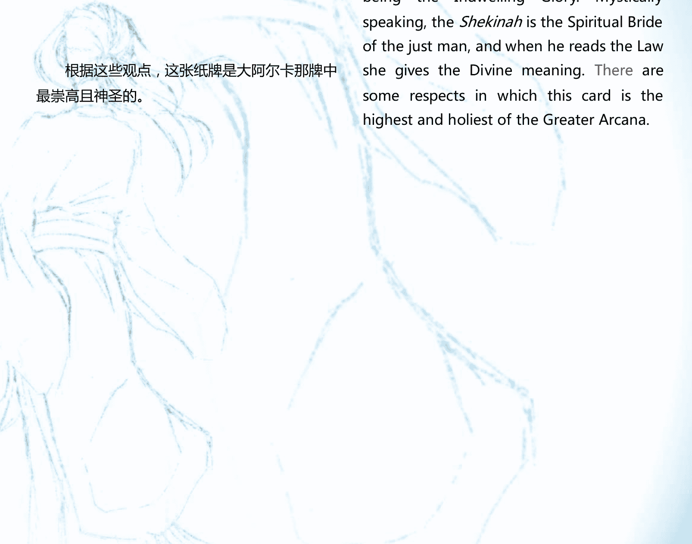

##### III The Empress

##### III. 皇后

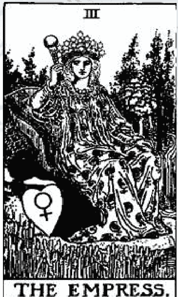

一位庄严高贵的人物端坐着，戴着奢华的祭袍与王室的外貌，是天与地的女儿。

她的冠冕由十二颗星星串连着，静置在她身旁的盾牌上有维纳斯的符号。面前呈现的是满地成熟的谷物，上方还有瀑布。

她手里的权杖顶端是一颗地球。她是下方的伊甸园与世俗乐园，一切皆由人类的居所所象征。她并不掌管天堂，但仍是避难所，是万物多产的母亲。

也有些特殊的观点认为，她的正确说法应该是欲望与其翅膀，因为她是身披太阳的女人，是世界之光与至圣所；但我应补充，她并不是获得翅膀的灵魂，除非符号象征系统归纳出其他或不同寻常的方式。

她最重要的是繁殖的意象，与世界的外在感官。这是显而易见的，因为没有比这个产自女人给男人的讯息还要直接的了；但是她本身并未传达这样的阐释。

A stately figure, seated, having rich vestments and royal aspect, as of a daughter of heaven and earth. Her diadem is of twelve stars, gathered in a cluster. The symbol of Venus is on the shield which rests near her. A field of corn is ripening in front of her, and beyond there is a fall of water. The sceptre which she bears is surmounted by the globe of this world. She is the inferior Garden of Eden, the Earthly Paradise, all that is symbolized by the visible house of man. She is not Regina coeli, but she is still refugium peccatorum, the fruitful mother of thousands. There are also certain aspects in which she has been correctly described as desire and the wings thereof, as the woman clothed with the sun, as Gloria Mundi and the veil of the Sanctum Sanctorum; but she is not, I may add, the soul that has attained wings, unless all the symbolism is counted up another and unusual way. She is above all things universal fecundity and the outer sense of the Word. This is obvious, because there is no direct message which has been given to man like that which is borne by woman; but she does not herself carry its interpretation.

从另一个角度看，皇后纸牌意指着大门或入口，是通往生命的路径，如同走进维纳斯的花园；这条道路引导至更深处，来到女祭司所知的秘密；由她传达给上帝的选民。

大多数针对此牌特质的古老说法，在符号象征方面是完全错误的，例如将它视为福音、预言特质、三位一体等等。

In another order of ideas, the card of the Empress signifies the door or gate by which an entrance is obtained into this life, as into the Garden of Venus; and then the way which leads out therefrom, into that which is beyond, is the secret known to the High Priestess: it is communicated by her to the elect. Most old attributions of this card are completely wrong on the symbolism--as, for example, its identification with the Word, Divine Nature, the Triad, and so forth.

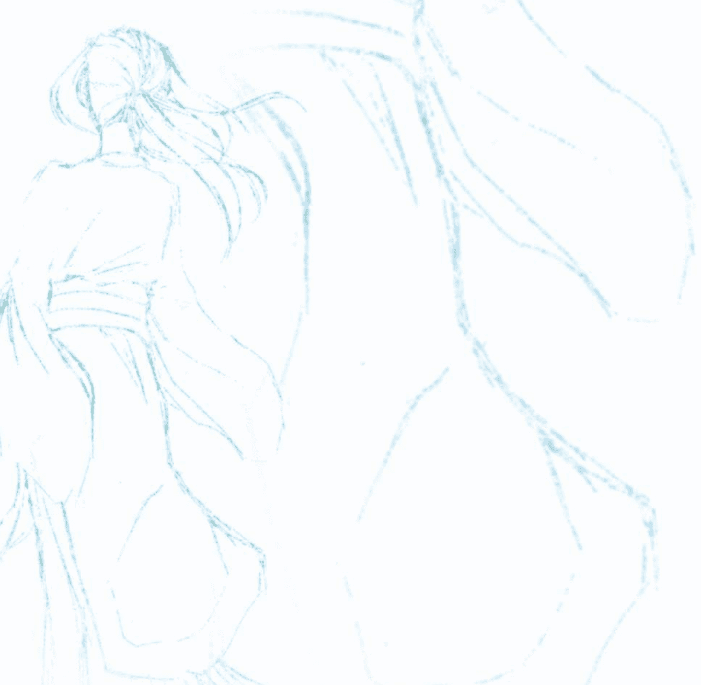

##### IV The Emperor

##### IV. 皇帝

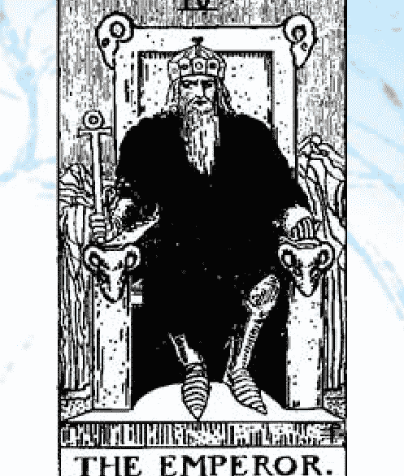

他握有埃及十字型（Crux ansata，注：象征着永恒的生命。）的权杖，左手里有颗球体物。

他是位戴着王冠的君主，居高临下且庄严地端坐在王位上，扶手前端是公羊的头像。

他是执行与实践者，掌握着全世界的力量，在此他穿着最崇高象征的衣饰。他有时会以坐在立方石头的方式呈现，然而这样的表现会混淆一些议题。

相对于皇后，他代表着雄伟的男性力量，因此他试图拿掉“艾西斯女神的面纱”（Veil of Isis），然而她仍是完好无损。

应该了解的是，这张牌与皇后并不尽然代表有婚姻的生活，虽然暗示着这样的状态。表面上看，如我所指的，他们代表着世俗的王室，被提升至伟大的位置；但是其上方暗示着有更高的存在。

他们，特别是男性的形象，也表示更高的君主身份，是拥有着智慧的君王。这里指的是思想上的贵族身份，而不是畜牲界。两者的性格，依他们的行为是“充满着奇怪的经验”，但却不是有意识地来自更高世界的智慧。

He has a form of the Crux ansata for his sceptre and a globe in his left hand. He is a crowned monarch--commanding, stately, seated on a throne, the arms of which are fronted by rams' heads. He is executive and realization, the power of this world, here clothed with the highest of its natural attributes. He is occasionally represented as seated on a cubic stone, which, however, confuses some of the issues. He is the virile power, to which the Empress responds, and in this sense is he who seeks to remove the Veil of Isis; yet she remains virgo intacta.

It should be understood that this card and that of the Empress do not precisely represent the condition of married life, though this state is implied. On the surface, as I have indicated, they stand for mundane royalty, uplifted on the seats of the mighty; but above this there is the suggestion of another presence. They signify also--and the male figure especially--the higher kingship, occupying the intellectual throne. Hereof is the lordship of thought rather than of the animal world. Both personalities, after their own manner, are "full of strange experience," but theirs is not consciously the wisdom which draws from a higher world.

皇帝被描述为（a）意志力的具体展现，但这只是其中的一个运用，以及（b）他是绝对存在所含的虚拟事物的表达，然而这只是幻想的。

The Emperor has been described as (a) will in its embodied form, but this is only one of its applications, and (b) as an expression of virtualities contained in the Absolute Being--but this is fantasy.

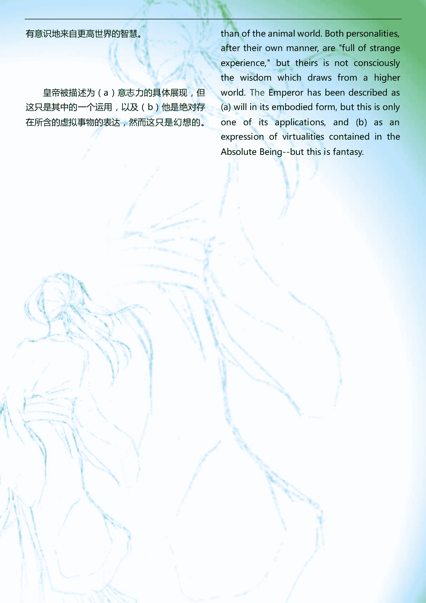

##### V The Hierophant

##### V. 教皇

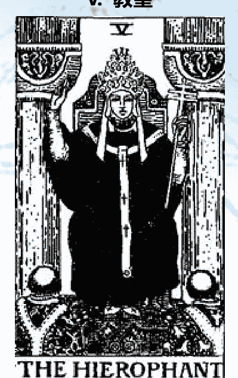

他头戴三重王冠坐在两根柱子之间，但这里不是女祭司所看管的那些圣殿之一。

在他的左手中握着一支权杖，末端是三重十字架，同时他的右手做出基督教会知名的手势，代表秘传，区分出教义中揭露的与隐藏的部份。

由此可以发现其与女祭司没有任何手势之间的关连。在他脚边是成交叉放置的钥匙，面前跪着两位身着白麻圣职衣的教士。

他经常被称为教宗，这是他应用在更一般的职务上的象征。他是外部宗教的领导力量，正如女祭司代表着秘传领域的主要精神与内在力量。

关于这张牌的适当解释，已遭受来自几乎所有人的悲惨际遇所染浊。“大东方”（ Grand Orient ）曾正确的说明，关于公开的正统教义以及导向教义的生命的外在部份，教皇是解答关键的力量；但是他肯定不是神秘教义之主，诚如另一位评论家所言，他相当于神学知识的总体。

He wears the triple crown and is seated between two pillars, but they are not those of the Temple which is guarded by the High Priestess.

In his left hand he holds a sceptre terminating in the triple cross, and with his right hand he gives the well-known ecclesiastical sign which is called that of esotericism, distinguishing between the manifest and concealed part of doctrine.

It is noticeable in this connexion that the High Priestess makes no sign. At his feet are the crossed keys, and two priestly ministers in albs kneel before him.

He has been usually called the Pope, which is a particular application of the more general office that he symbolizes. He is the ruling power of external religion, as the High Priestess is the prevailing genius of the esoteric, withdrawn power.

The proper meanings of this card have suffered woeful admixture from nearly all hands. Grand Orient says truly that the Hierophant is the power of the keys, exoteric orthodox doctrine, and the outer side of the life which leads to the doctrine; but he is certainly not the prince of occult doctrine, as another commentator has suggested.

因此，他是将神的恩典带到制度世界的管道，区别于自然界，同时他也是多数人类救赎的领袖。他是受认可的僧侣集团的秩序与领袖，这反射着另一个更崇高的阶级秩序。但也许会这么发生，教宗忘却自己的象征性地位的重要性，举止犹如所有的象征意义或显示的符号都出自于自己适当的掌控。

He is rather the summa totius theologiæ, when it has passed into the utmost rigidity of expression; but he symbolizes also all things that are righteous and sacred on the manifest side. As such, he is the channel of grace belonging to the world of institution as distinct from that of Nature, and he is the leader of salvation for the human race at large. He is the order and the head of the recognized hierarchy, which is the reflection of another and greater hierarchic order; but it may so happen that the pontiff forgets the significance of this his symbolic state and acts as if he contained within his proper measures all that his sign signifies or his symbol seeks to shew forth.

他并不代表哲学，除了神学方面之外；他也不代表灵感或宗教，虽然这是他表现的一个模式。

Philosophy--except on the theological side; he is not inspiration; and he is not religion, although he is a mode of its expression.

##### VI. 恋人

太阳在天上闪耀着并向下倾泻着影响力，其下方有个长着翅膀的巨大形体。前景是两个人类的形体，男与女，彼此未着任何遮蔽物，就如同亚当与夏娃第一次在天堂拥有世俗的肉体般。男人的背后是生命之树，上面有十二颗水果，而女人的后方则是善与恶的知识之树，一只巨蛇盘绕着。

这些形体代表着在受到粗俗物质与欲望污染以前的爱情、纯洁、天真与爱。简而言之，这张牌就是人类的爱情，在这里展现部份的情况，既真实且生动。

根据第一项原则，它取代了古代纸牌的婚姻，如我先前所描述的，后来无知的人将男人描述为在善恶之间。就崇高的意识而言，这张牌代表圣约与安息日的神秘事物。

关于女人的建议认为，她是敏感生命的诱惑，其中包含着影响男人的堕落，然而她有点是受到上帝的神秘律法的操控，而非出于自愿与意识去诱惑人的女人。经由将过错归究在她身上，男人才得以在最终时刻复活，而且也仅能透过女人，他才能使自己成为完整。

这张纸牌也因此暗示着女性伟大神秘的特质。旧时的解读都从古代的图片开始分析其必要元素，但即使是后者的阐释，部分是平凡无奇，而其他的在符号意象上是毫无根据的。

##### VII. 战车

一位直立着的尊贵人物，携带着一把出鞘的剑，且大体上来说是符合传统的描写，我在第一部分已经提供说明了。

在这位胜利英雄的肩膀上应该是乌陵与土明（注：乌陵代表着光明、火；土明则代表正直、纯真、诚实）。他带领着被囚禁的俘虏；他是所有领域的征服者——在心智、科学、发展以及某些创始的尝试。他因此回击了人面狮身像，所以根据这个理由，我接受艾利李维的变更，所以成为两个人面狮身像拖着他的战车。他在心智上，是凌驾万物的胜利。

- （a）人面狮身像的问题是与自然界的神秘事物有关，而无关神的恩典，所以战车的驾驭者无法提供任何解答；
- （b）他的征服领域是属于明显的或外在的，不是他自己本身；
- （c）他所造成的解放也许会将他自己囚禁在理性的判断中；
- （d）他开始所经历并获取胜利的考验，必须以自然规律或理性来理解；
- （e）如果他来到女祭司所坐的殿堂柱子前，他是无法打开名为“Tora”的卷轴，即使女祭司提出问题，他也无法回答。
他并非世袭传承的王权，他也不是教士身份。

##### VIII. 力量

一个女人，头顶上笼罩着相同的生命记号，我们在魔术师的纸牌已见过了，她正要闭合狮子的口。

这里唯一与传统的表现方式不同之处为她的慈善坚毅已经降服了狮子，并以花圈带领着。

令我自己满意的是，这张纸牌已经与通常是数字8的正义牌交换位置了。这样的变动对读者来说并不重要，因此也无须加以解释。

坚毅是神圣神秘学协会中最崇高的观点；这项美德当然适用在任何领域，因此可利用在所有的象征主义。它亦与天真、纯洁，以及存在沉思冥想中的力量有关。

然而这些更崇高的意思是依靠推断而来的，我并不认为它们从纸牌表明是明显可知的。这些暗示都是从花圈的隐含意义得来的，它同时也代表着许多事情，例如甜蜜的枷锁与神圣律法的轻微负担，当它成为所有精神的重心时。

这张牌与一般所认知的自信并无关系，而是力量来自于上帝，并找到上帝成为庇护所的人所拥有的自信。

另外，狮子代表热情，而称为力量的她则是解放祂的更高存在，走在毒蛇与蜥蜴上，并踩着狮子与龙。

##### IX. 隐者

这张纸牌唯一与传统模式不同的是油灯并非半遮掩在提灯者的斗篷里，他融合古代的思想与世界的光。一颗星星在油灯里照耀着。

我曾说过这是一张知识的牌，延伸这样的概念，画面里的人物在高处高举着指路明灯。因此，隐者并非如杰柏林所言，是在寻找真理与正义的智者；也并非像后来的解说所提的，是特别代表经验的牌。他的指路明灯暗示着：“我所在之处，你也可能到达。”

更有甚者，对于这张牌相当错误的理解为，认为它与神秘的孤立有关，是个人魅力的防护，相对于混淆的状态。这样轻率的描写应归咎于艾利李维，其说法已被马丁主义的法兰斯欧德（French Order）所采纳，我们当中有些人已听过许多关于“沉默与未知的哲学掩盖在他的斗篷之下，以避开外来的异端知识”一类的说法。

在马丁主义真正的教义当中，“陌生的哲学家（Philosophe inconnu）”的意义是另一个神职。它并未涉及制式神秘学或其替代物的刻意隐瞒，但是诚如纸牌本身，是关于神圣神秘事物为保障自身的防护，以防不速之客。

##### X Wheel of Fortune
##### X. 命运之轮

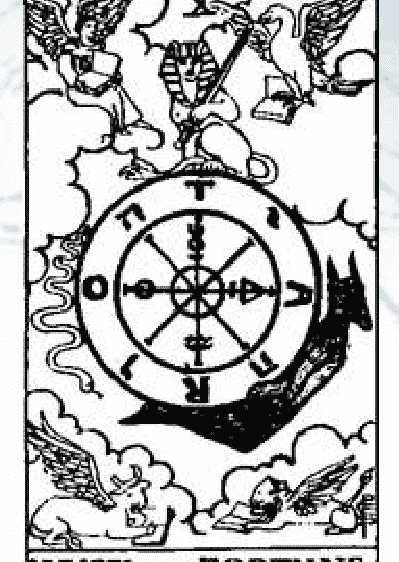

针对这个符号，我再次采用艾利李维的重修版本，他做了几处变动。使用埃及的符号系统是合乎法统的，诚如我所示宜的，只要符合我们的目的，而且在不包含来源论说的条件下。

In this symbol I have again followed the reconstruction of Eliphas Levi, who has furnished several variants. It is legitimate--as I have intimated--to use Egyptian symbolism when this serves our purpose, provided that no theory of origin is implied therein. I have, however, presented Typhon in his serpent form. The symbolism is, of course, not exclusively Egyptian, as the four Living Creatures of Ezekiel occupy the angles of the card, and the wheel itself follows other indications of Levi in respect of Ezekiel's vision, as illustrative of the particular Tarot Key.

然而我已呈现 Typhon 的巨蛇状态。其符号象征系统并非仅埃及的，正如以西结书的四种活生物占据纸牌的四个角落，且轮子本身采用李维其他关于以西结书的指示，作为特定的塔罗图例说明。

根据法国神秘学家与图画本身的设计，这张象征性的图片代表着永恒持续的动态，世界的流动以及人类生命的变动。狮身人面像代表其中的均衡。塔罗“Taro”的音译为“Rota”印写在轮子上，与神圣的名字交错着，显示天意贯穿所有过程。

With the French occultist, and in the design itself, the symbolic picture stands for the perpetual motion of a fluidic universe and for the flux of human life. The Sphinx is the equilibrium therein. The transliteration of Taro as Rota is inscribed on the wheel, counterchanged with the letters of the Divine Name--to shew that Providence is implied through all.

但这是在内部给予神性的意图，在外部的相似意图是以四个活生物为例。有时，人面狮身像会以伏蹲在上方的座台方式呈现，这是藉由废除动态中的必要“稳定”要素，欺骗符号象征系统。

But this is the Divine intention within, and the similar intention without is exemplified by the four Living Creatures. Sometimes the sphinx is represented couchant on a pedestal above, which defrauds the symbolism by stultifying the essential idea of stability amidst movement.

在符号的一般见解陈述背后，隐含着否定机会，并暗喻宿命的意思。需要补充说明的是，自李维以后，这张牌的神秘学阐释，甚或是对神秘学本身来说，都是格外地愚昧虚幻。

Behind the general notion expressed in the symbol there lies the denial of chance and the fatality which is implied therein. It may be added that, from the days of Levi onward, the occult explanations of this card are--even for occultism itself--of a singularly fatuous kind.

它被认为是普通的原则、多产繁殖力、男性尊严、统治权威等等。普通的预言在其领域内的结论，都胜过于此。

It has been said to mean principle, fecundity, virile honour, ruling authority, etc. The findings of common fortune-telling are better than this on their own plane.

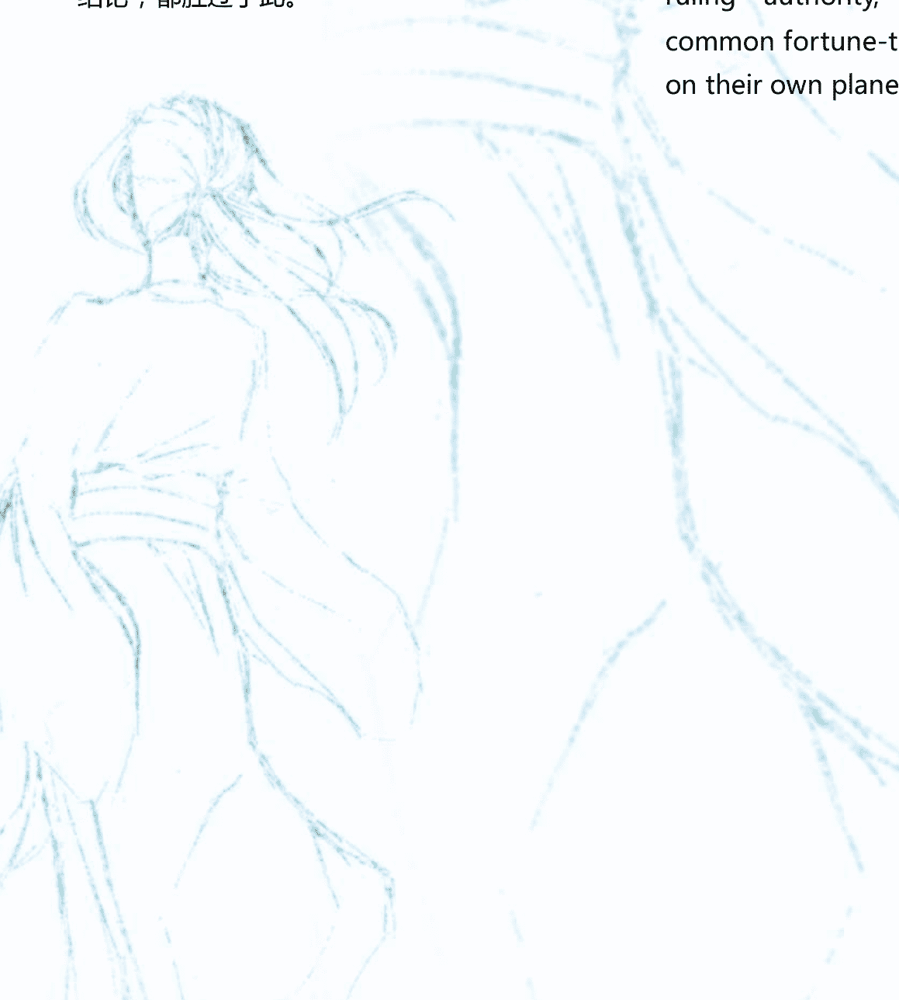

##### XI Justice
##### XI. 正义

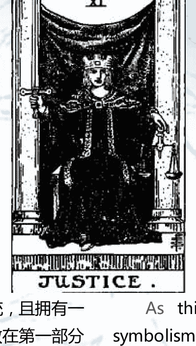

因为这张牌采纳传统的象征系统，且拥有一切对阅读者而言明显的意义，除了少数在第一部分提过的原因之外，无需多言。

As this card follows the traditional symbolism and carries above all its obvious meanings, there is little to say regarding it outside the few considerations collected in the first part, to which the reader is referred.

然而，图中的人像坐在两根柱子之间和女祭司一样，因此，似乎想要表示出这个道德原则适用于所有的人，应用于自己的行为中，当然它与更崇高的事物有绝对的类同性，尽管如此，却在本质上不同于涉及选择概念的精神正义。

It will be seen, however, that the figure is seated between pillars, like the High Priestess, and on this account it seems desirable to indicate that the moral principle which deals unto every man according to his works--while, of course, it is in strict analogy with higher things;--differs in its essence from the spiritual justice which is involved in the idea of election.

后者属于上帝的神秘秩序，这样的美德得以使某些人怀抱着信念要奉献给至高无上的事物。其运作有如圣灵的呼吸，且我们没有任何有关于此的评论标准或解释的根据。

The latter belongs to a mysterious order of Providence, in virtue of which it is possible for certain men to conceive the idea of dedication to the highest things. The operation of this is like the breathing of the Spirit where it wills, and we have no canon of criticism or ground of explanation concerning it.

这就类似诗人拥有优雅、崇高与优美的天赋才能：我们拥有它们与否，它们的存在如同消失一样地神秘。正义的律法无论如何皆非两者之一。

It is analogous to the possession of the fairy gifts and the high gifts and the gracious gifts of the poet: we have them or have not, and their presence is as much a mystery as their absence. The law of Justice is not however involved by either alternative. 总之，正义的支柱向一个世界展开，女祭司的支柱则是面对另一个世界。

In conclusion, the pillars of Justice open into one world and the pillars of the High Priestess into another.

##### XII The Hanged Man
##### XII. 倒悬者

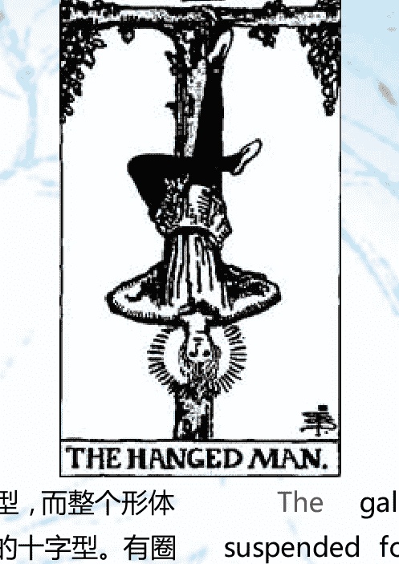

他悬挂在绞刑台上呈现 T 字型，而整个形体自腿部的位置开始呈现一个万字的十字型。有一圈光辉围绕着他的头，好似一名殉教者。

+   应注意以下几点：
    (1) 他所牺牲悬吊的树是生长着叶子的生命之树；
    (2) 他的面部呈现陶醉而非痛苦的表情；
    (3) 画像整体而言，代表生命的悬浮状态，但却是有着生命而非死亡的。

The gallows from which he is suspended forms a Tau cross, while the figure--from the position of the legs--forms a fylfot cross. There is a nimbus about the head of the seeming martyr.

It should be noted (1) that the tree of sacrifice is living wood, with leaves thereon; (2) that the face expresses deep entrancement, not suffering; (3) that the figure, as a whole, suggests life in suspension, but life and not death.

这是张蕴藏深奥涵义的牌，但是所有的涵义都被掩盖住。它一直被误认为是代表殉教、谨慎、伟大工作或义务的牌；但是即使我们找尽所有出版过的阐释，也许会发现是无用的。我只会根据自己的部分非常简单地说明，它所要表达的观点之一是神学与宇宙之间的关系。

It is a card of profound significance, but all the significance is veiled. One of his editors suggests that Eliphas Levi did not know the meaning, which is unquestionable nor did the editor himself. It has been called falsely a card of martyrdom, a card a of prudence, a card of the Great Work, a card of duty; but we may exhaust all published interpretations and find only vanity. I will say very simply on my own part that it expresses the relation, in one of its aspects, between the Divine and the Universe.

他能够明白有关于自己更崇高本质的一切都埋藏在这套符号象征系统中，也将会接收到关于一个伟大觉醒的暗示，并且知道在庄严神秘的死亡之后，会有荣耀神秘的复活日。

He who can understand that the story of his higher nature is imbedded in this symbolism will receive intimations concerning a great awakening that is possible, and will know that after the sacred Mystery of Death there is a glorious Mystery of Resurrection.

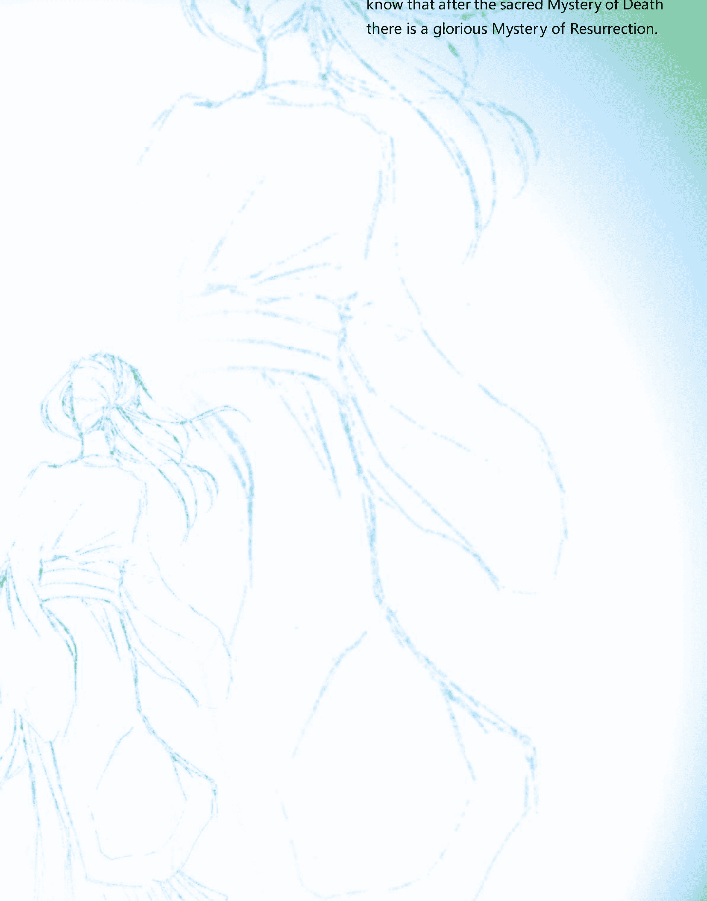

##### XIII Death
##### XIII. 死神

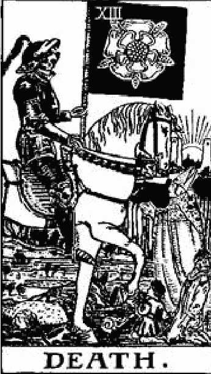

生命的面纱是永久存在于变动、转变中，以及由低层次通往高层次的过程中，修订过的塔罗牌更恰当地展现其中天启的观点，胜过收割骷髅头的粗糙概念。

The veil or mask of life is perpetuated in change, transformation and passage from lower to higher, and this is more fitly represented in the rectified Tarot by one of the apocalyptic visions than by the crude notion of the reaping skeleton. Behind it lies the whole world of ascent in the spirit. The mysterious horseman moves slowly, bearing a black banner emblazoned with the Mystic Rose, which signifies life. Between two pillars on the verge of the horizon there shines the sun of immortality. The horseman carries no visible weapon, but king and child and maiden fall before him, while a prelate with clasped hands awaits his end.

其背后隐含着全世界的精神方面提升的意思。神秘的骑马者慢慢地移动着，举着一把黑色旗帜，上面装饰着代表生命的神秘玫瑰。水平边缘的两根柱子间，代表永恒不朽的太阳在闪耀着。骑马者并未带任何可见的武器，但是国王、孩童以及妇人都倒在他的面前，同时一位主教双手合掌等待他的终结。

这里应该无需特别点出死亡的意义，就神秘主义的理解，其原因我在前一张牌已经做相关的说明了，但不适用于现在的案例。人类自然的变迁至生命的下一个阶段，也许是进化的一种形式，但是仍在现存生命中，从奇特且近乎未知的入口要通往神秘死亡的阶段，是意识形态的转变，通往一种非以寻常死亡作为路径或门槛的境界。

There should be no need to point out that the suggestion of death which I have made in connection with the previous card is, of course, to be understood mystically, but this is not the case in the present instance. The natural transit of man to the next stage of his being either is or may be one form of his progress, but the exotic and almost unknown entrance, while still in this life, into the state of mystical death is a change in the form of consciousness and the passage into a state to which ordinary death is neither the path nor gate. The existing occult explanations of the 13th card are, on the whole, better than usual, rebirth, creation, destination, renewal, and the rest.

对于第十三张的现存解读，整体来看是比较适当的，代表复活、创造、终点、重生与休息。

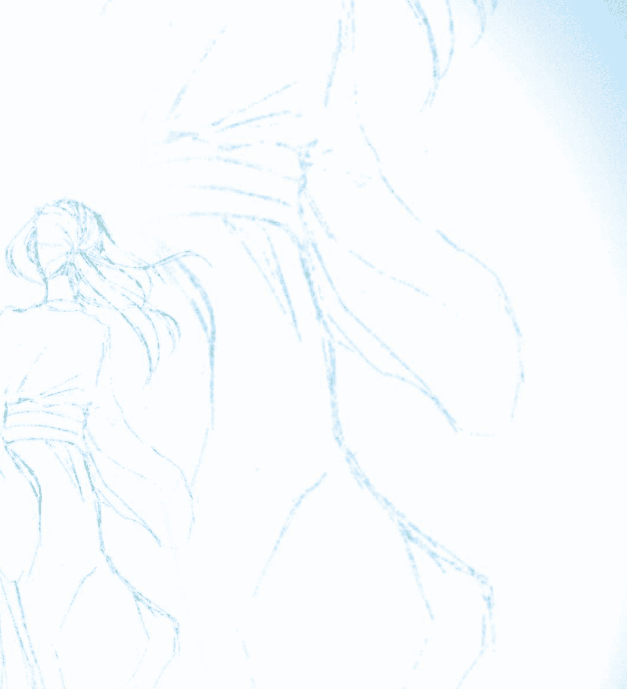

##### XIV Temperance
##### XIV. 节制

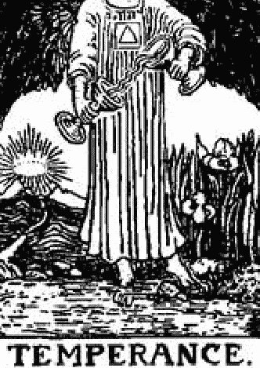

一位有双翅膀的天使，前额是太阳，胸前有代表七的正方形与三角形。

A winged angel, with the sign of the sun upon his forehead and on his breast the square and triangle of the septenary.

虽然我使用男性的概念称呼他，但是他既不是男性也不是女性。一般认为他正将生命的本质从一个圣杯倾倒至另一个圣杯，一只脚在地面，另一只脚放在水面，藉此说明自然的本质。

I speak of him in the masculine sense, but the figure is neither male nor female. It is held to be pouring the essences of life from chalice to chalice. It has one foot upon the earth and one upon waters, thus illustrating the nature of the essences.

一条直径往上通向水平的边缘，在那儿上头有道巨光，里头隐约看见一顶王冠。

A direct path goes up to certain heights on the verge of the horizon, and above there is a great light, through which a crown is seen vaguely.

这里有关于永恒不朽的生命的部分秘密，人类有可能在自己的化身中实现。在此，所有传统的象征都弃置不用。

Hereof is some part of the Secret of Eternal Life, as it is possible to man in his incarnation. All the conventional emblems are renounced herein.

因此也有些常见的解读，提到生命永恒的移动，甚至是所有概念的综合。再者，认为他象征太阳的才能在人类三位一体的第三部份里实现，也是错误的，虽然这是类同于太阳的光。

So also are the conventional meanings, which refer to changes in the seasons, perpetual movement of life and even the combination of ideas. It is, moreover, untrue to say that the figure symbolizes the genius of the sun, though it is the analogy of solar light, realized in the third part of our human triplicity.

它难以置信地被称为节制，因为当规则是取

It is called Temperance fantastically,## XV The Devil
XV. 恶魔

这个设计根据在第一部分提过的一些动机，代表适应、鄙俗或是和谐。有着山羊角的曼德斯（Mendes），戴着蝙蝠的翅膀站立在祭坛上。

The design is an accommodation, mean or harmony, between several motives mentioned in the first part. The Horned Goat of Mendes, with wings like those of a bat, is standing on an altar.

在胃部的凹处是个代表水星的符号。右手高举并张开，是第五张牌的教皇所给予的祝福的相反。右手里是把巨大的火焰转向下朝着地面，一个颠倒的五角星在前额上。

At the pit of the stomach there is the sign of Mercury. The right hand is upraised and extended, being the reverse of that benediction which is given by the Hierophant in the fifth card. In the left hand there is a great flaming torch, inverted towards the earth. A reversed pentagram is on the forehead.

祭坛的前方有个扣环，套着两条锁链圈在两个人形的颈子上，是一男一女。

There is a ring in front of the altar, from which two chains are carried to the necks of two figures, male and female.

这些与第五张牌的符号类比，如同亚当与夏娃堕落之后，代表着物质生活的锁链与宿命。

These are analogous with those of the fifth card, as if Adam and Eve after the Fall. Hereof is the chain and fatality of the material life.

这些人形都有尾巴，代表动物的特性，但脸部却有着人类的智慧，而高高在他们之上者并非永远是他们的主人。

The figures are tailed, to signify the animal nature, but there is human intelligence in the faces, and he who is exalted above them is not to be their master for ever.

即使是现在，他也是个受自己本身恶魔支撑的奴隶，且无视于自由的助益。胜过他对这些艺术的赞助，尽管他对艺术慷慨，他仍是个奴隶。

Even now, he is also a bondsman, sustained by the evil that is in him and blind to the necessity of liberty. With all his patronage of art, he is still a slave.

艺术一贯的嘲弄，一向佯装尊敬且以大师之态解读，艾利李维确信巴佛美神（ Baphometic ）的形象是属于神秘科学与魔法的。

另一位评论家认为，在神圣的世界它代表着预定的宿命，但是在那个世界里却没有等同于下面的兽性。而它确实代表着因吃下禁果而被驱逐在伊甸园门外的那两个居住者。

To the liberty of service. With more than his usual derision for the arts which he pretended to respect and interpret as a master therein, Eliphas Levi affirms that the Baphometic figure is occult science and magic. Another commentator says that in the Divine world it signifies predestination, but there is no correspondence in that world with the things which below are of the brute. What it does signify is the Dweller on the Threshold without the Mystical Garden when those are driven forth therefrom who have eaten the forbidden fruit.

##### XVI The Tower
XVI. 高塔

这张牌在神秘学方面的解释，是贫乏且令人不知所措的。

我认为它的各方面描述皆指出毁灭的观点是错误的，因为这是它表面上传达的证据。更进一步被认为含有对有形建筑物的首要暗示，但我并不以为高塔比之前三张牌所提及的柱子更为有形化或少些。

我看不出任何得以支持帕柏（Papus）的假设，认为它确实是代表亚当的堕落，然而我倒是赞同他的另一项说法，认为它象征着精神世界的具体化。基督教的书目编纂家想象那是心智的坠落，并试图勘破上帝的秘密。

我倾向赞同大东方（Grand Orient）的看法，认为那代表“生命之屋”（House of Life）的毁灭，当邪恶入侵时，尤其是一个“教义之屋”（House of Doctrine）的崩裂。然而，我了解它是指一个“虚假之屋”（House of Falsehood）。

它同时以最完整充分的方式说明圣经上的真理：“除非上帝建造这房屋，否则建造的人就枉费劳力”（ except the Lord build the house, they labour in vain that build it ）

有一种看法认为大灾难是前一张牌的反射，但并不是从符号象征的角度，这是我一直试图说明的。更确切地说，这是关于类比的问题；一是关于堕落于物质与动物的境界，另一方面是代表智性的毁灭。至于高塔则被视为一种惩戒，对于傲慢自大与试图了解上帝秘密而过度压抑理智；但是以上两者皆无法说明这两个活生生的受难者。一个只是毫无用处地照字面解释；而另一个则是错误的诠释。

更深入的观点认为它也许亦代表一项天命的结束，但在这里并无就此原因讨论相关问题的必要。

Occult explanations attached to this card are meagre and mostly disconcerting.

It is idle to indicate that it depicts ruin in all its aspects, because it bears this evidence on the surface. It is said further that it contains the first allusion to a material building, but I do not conceive that the Tower is more or less material than the pillars which we have met with in three previous cases.

I see nothing to warrant Papus in supposing that it is literally the fall of Adam, but there is more in favour of his alternative--that it signifies the materialization of the spiritual world. The bibliographer Christian imagines that it is the downfall of the mind, seeking to penetrate the mystery of God.

I agree rather with Grand Orient that it is the ruin of the House of Life, when evil has prevailed therein, and above all that it is the rending of a House of Doctrine. I understand that the reference is, however, to a House of Falsehood.

It illustrates also in the most comprehensive way the old truth that "except the Lord build the house, they labour in vain that build it."

There is a sense in which the catastrophe is a reflection from the previous card, but not on the side of the symbolism which I have tried to indicate therein. It is more correctly a question of analogy; one is concerned with the fall into the material and animal state, while the other signifies destruction on the intellectual side. The Tower has been spoken of as the chastisement of pride and the intellect overwhelmed in the attempt to penetrate the Mystery of God; but in neither case do these explanations account for the two persons who are the living sufferers. The one is the literal word made void and the other its false interpretation. In yet a deeper sense, it may signify also the end of a dispensation, but there is no possibility here for the consideration of this involved question.

##### XVII The Star
XVII. 星星

一颗巨大、闪耀着八道光芒的星星，被七个同样有着八道光芒的较小星星围绕。

位在前景的女性人像，是完全裸露的。她的左膝跪在土地上，而她的右脚踩在水面上。她从两个大口水壶中倾倒出“生命之水”（Water of Life）。

在她身后是一片往上攀升的地面，其右侧是一颗灌木或短树，上头有只鸟儿飞落。这个人像传达着不朽的青春与美丽，而星星则象征着耀眼的巨星，它出现在同济会的象征符号系统中，但却因此造成混淆困惑。

该女性所传达的生动景象，就是天堂与其元素的实体。这可以真确地从两句格言表达：“可以自由拿取的生命之水”与“心灵的礼物”。

综合一些庸俗的解释，认为这是代表希望的牌。就其他的层面而言，证实此牌为永恒不朽与内在的光。

对于大多数已作好准备的理智而言，她将呈现真理的真实样貌，荣耀存在永恒不朽的美丽中，倾倒灵魂之水在一些地方，且估量她所拥有的无价宝藏。但实际上在犹太教神秘哲学中她是伟大的母亲，拥有超凡的觉知，并向下方的生命之树（ Sephiroth ，注： Sephiroth 是远古犹太教神秘主义教义中的“生命之树”,意即真理的根源。）传递她的汇集，依他们能够接收到的方式。

A great, radiant star of eight rays, surrounded by seven lesser stars--also of eight rays. The female figure in the foreground is entirely naked. Her left knee is on the land and her right foot upon the water. She pours Water of Life from two great ewers, irrigating sea and land. Behind her is rising ground and on the right a shrub or tree, whereon a bird alights. The figure expresses eternal youth and beauty. The star is l'etoile flamboyante, which appears in Masonic symbolism, but has been confused therein. That which the figure communicates to the living scene is the substance of the heavens and the elements. It has been said truly that the mottoes of this card are "Waters of Life freely" and "Gifts of the Spirit."

The summary of several tawdry explanations says that it is a card of hope. On other planes it has been certified as immortality and interior light. For the majority of prepared minds, the figure will appear as the type of Truth unveiled, glorious in undying beauty, pouring on the waters of the soul some part and measure of her priceless possession. But she is in reality the Great Mother in the Kabalistic *Sephira Binah*, which is supernal Understanding, who communicates to the Sephiroth that are below in the measure that they can receive her influx.

##### XVIII The Moon
XVIII. 月亮

这张牌与一些常见类型的明显区别是，月亮正增强其慈悲宽容的部份，是给予观察者的权益。它有着十六道主要的光芒与十六道次级的光线。

这张牌象征想象力的生命，与心灵生活无关。在高塔之间的路径是通往未知的课题。

狗与狼代表着自然心智面对出口的地方所产生的恐惧，因为那里仅藉着反射的光给予指引。

最后的关连性是解答另一个符号象征形式的关键。智慧的光是反射的，超越其上的是无法向外显露的未知神秘事物。

它阐明我们的动物特性，并以狗、狼等形式呈现，这些从深处开始表现出来的无名且可怕的倾向，比之野蛮的兽性还低等。

它努力达到显露的地位，从深不可测的水里爬上陆地作为象征，然而依循惯例，它又会重回与沉入来处。代表心智的脸庞对着下方的骚动不安投以安详的凝视；落下思维的露水，传达的讯

The distinction between this card and some of the conventional types is that the moon is increasing on what is called the side of mercy, to the right of the observer. It has sixteen chief and sixteen secondary rays.

The card represents life of the imagination apart from life of the spirit. The path between the towers is the issue into the unknown.

The dog and wolf are the fears of the natural mind in the presence of that place of exit, when there is only reflected light to guide it.

The last reference is a key to another form of symbolism. The intellectual light is a reflection and beyond it is the unknown mystery which it cannot shew forth.

It illuminates our animal nature, types of which are represented below--the dog, the wolf and that which comes up out of the deeps, the nameless and hideous tendency which is lower than the savage beast.

It strives to attain manifestation, symbolized by crawling from the abyss of water to the land, but as a rule it sinks back whence it came.

[content]
息是：祥和平静；也许安静会因此影响动物的特性，同时位于下方深不可测的事物应会由放弃一个形式而终止。

The face of the mind directs a calm gaze upon the unrest below; the dew of thought falls; the message is: Peace, be still; and it may be that there shall come a calm upon the animal nature, while the abyss beneath shall cease from giving up a form.

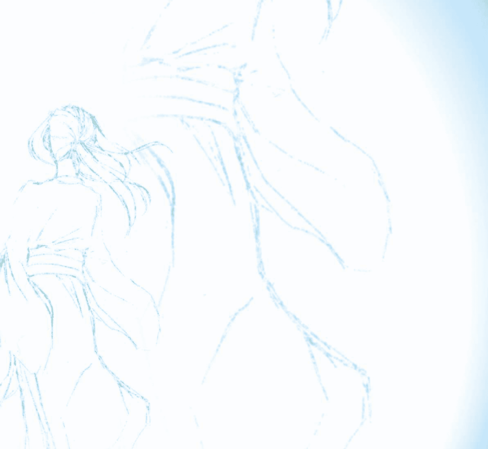

##### XIX The Sun
XIX. 太阳

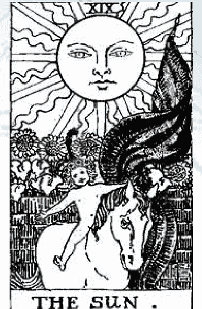

一位赤裸的孩童骑坐在白马上，展示着一面军旗，诚如前面所提，这是关于此张纸牌比较适当的符号象征系统。象征着超自然的东方 ( Supernatural East )的命运，以及伟大且圣洁的光，在人性永无止尽的队伍之前，自敏感脆弱的花园围墙内出现，并继续回家的路。

The naked child mounted on a white horse and displaying a red standard has been mentioned already as the better symbolism connected with this card. It is the destiny of the Supernatural East and the great and holy light which goes before the endless procession of humanity, coming out from the walled garden of the sensitive life and passing on the journey home.

所以这张牌表示，从地球的壮丽太阳所象征的这个世界鲜明的光，转变为未来世界之光，开始于志向抱负之前，以孩童的心作为代表的典型。

The card signifies, therefore, the transit from the manifest light of this world, represented by the glorious sun of earth, to the light of the world to come, which goes before aspiration and is typified by the heart of a child.

但是最后一项暗示，再度成为解答符号象征系统的另一个不同的形式或观点的关键。太阳代表精神的意识，意指反射之光的对照。

But the last allusion is again the key to a different form or aspect of the symbolism. The sun is that of consciousness in the spirit - the direct as the antithesis of the reflected light.

人性的独特典型成为一个内在的小孩，有着单纯天真的智慧。在这样的单纯中，他怀有自然与艺术的封印；在那样的天真里，他代表着精力充沛的世界。当自觉的心灵已开始出现在意识中，超越天生的理智，该理智就会在重建中引领动物的特质朝向理想一致的境界。

The characteristic type of humanity has become a little child therein--a child in the sense of simplicity and innocence in the sense of wisdom. In that simplicity, he bears the seal of Nature and of Art; in that innocence, he signifies the restored world. When the self-knowing spirit has dawned in the consciousness above the natural mind, that mind in its renewal leads forth the animal nature in a state of perfect conformity.

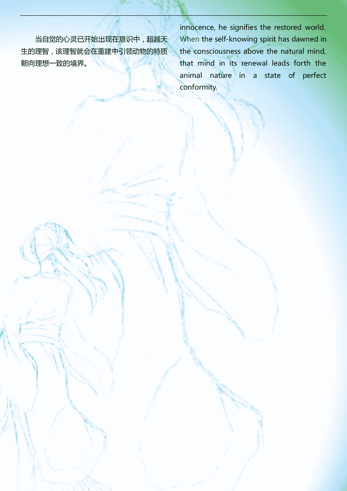

##### XX The Last Judgment
XX. 审判

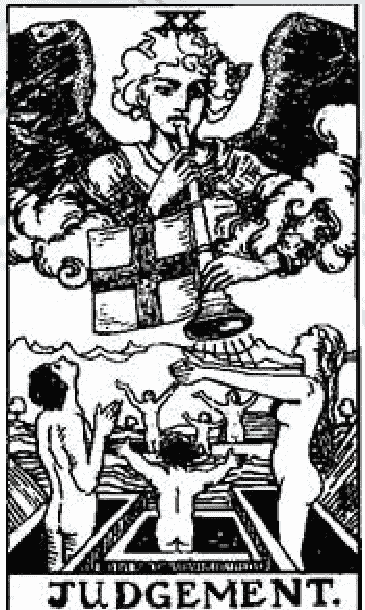

我已经说明过，这张符号实质上在所有的塔罗牌中都是不变的，或至少这些异动并不会改变其特色。

I have said that this symbol is essentially invariable in all Tarot sets, or at least the variations do not alter its character.

这个巨大的天使在此被云朵围绕着，但他吹奏着附有旗帜的喇叭，而十字架照例出现在旗帜上。

The great angel is here encompassed by clouds, but he blows his bannered trumpet, and the cross as usual is displayed on the banner.

死者从他们的墓地里站起来，女人在右手边，男人在左手边，在两者之间的是他们的孩子，他是背对着站立。但是在这张牌中还有超过三位的复原者，这项改变被认为是有价值的，以说明目前的解释之不足。

The dead are rising from their tombs--a woman on the right, a man on the left hand, and between them their child, whose back is turned. But in this card there are more than three who are restored, and it has been thought worth while to make this variation as illustrating the insufficiency of current explanations.

应该注意的是，所有的人像皆一致处于惊异、崇拜与狂喜中，从他们的姿态传达出来。这张牌在表达一项转变的伟大工作，回应来自天国的召唤，其请求被听见并从中获得回应。

It should be noted that all the figures are as one in the wonder, adoration and ecstasy expressed by their attitudes. It is the card which registers the accomplishment of the great work of transformation in answer to the summons of the Supernal--which summons is heard and answered from within.

里头暗示着一项重要的意义，却无法在目前的阶段进一步阐释。那是什么？存在我们内心中所吹响的喇叭，我们所有较低等的特质皆起而回应，近乎在一瞬间的光景或一眨眼的时间里。

Herein is the intimation of a significance which cannot well be carried further in the present place. What is that within us which does sound a trumpet and all that is lower in our nature rises in response--almost in a moment, almost in the twinkling of an eye?

就让纸牌继续说着，对于无法看见更深远意义的人，最后的审判与复活是发生在自然的躯体；但是让那些拥有内在双眼的人，随即看见并发现吧！他们将会明白，在过去它曾被真确地视为代表永恒生命的牌，因此可与节制的纸牌相比较。

Let the card continue to depict, for those who can see no further, the Last judgment and the resurrection in the natural body; but let those who have inward eyes look and discover therewith. They will understand that it has been called truly in the past a card of eternal life, and for this reason it may be compared with that which passes under the name of Temperance.

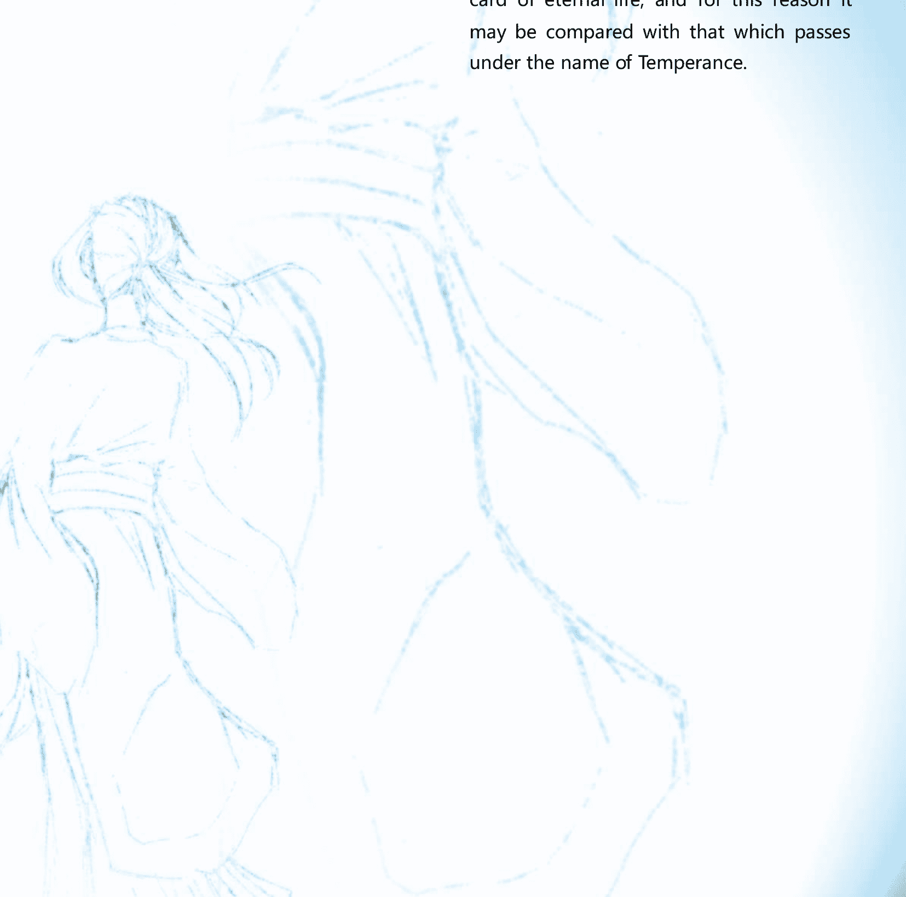

##### ZERO The Fool
0. 愚者

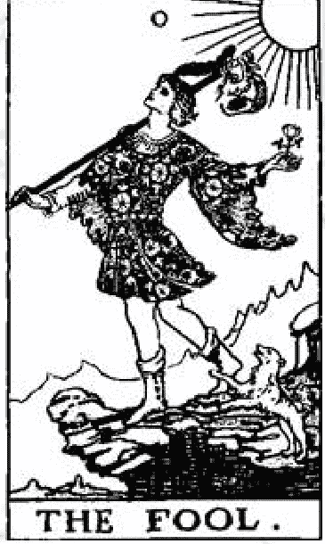

踏着轻快的步伐，犹如地球及其束缚无法对他产生控制力，这位年轻人身穿亮丽的祭袍停在断崖的边缘，处在世界的高处；他眺望着眼前的蓝色远处，那是天空的延伸而不是下面的景色。虽然此刻他是站立不动的，但仍可看出他热切的步伐；他的狗仍在跳跃着。开展至深渊的边缘并无可怖之处；就好似天使们会等在那儿接住他，如果他从高处跳跃时。他的冷静沉着，充满智慧与期待的梦想。他一手拿着一朵玫瑰，另一手则是昂贵的权杖，倚靠在他的右肩上，并有奇异绣花的旅行袋。他是来自另一个世界的王子，正旅行至此地，在早晨的光辉中，在热情的空气里。在他背后照耀的太阳，知道他从哪里来要往哪里去，以及许多天后他将由其他路径回来。

With light step, as if earth and its trammels had little power to restrain him, a young man in gorgeous vestments pauses at the brink of a precipice among the great heights of the world; he surveys the blue distance before him-its expanse of sky rather than the prospect below. His act of eager walking is still indicated, though he is stationary at the given moment; his dog is still bounding. The edge which opens on the depth has no terror; it is as if angels were waiting to uphold him, if it came about that he leaped from the height. His countenance is full of intelligence and expectant dream. He has a rose in one hand and in the other a costly wand, from which depends over his right shoulder a wallet curiously embroidered. He is a prince of the other world on his travels through this one-all amidst the morning glory, in the keen air. The sun, which shines behind him, knows whence he came, whither he is going, and how he will return by another path after many days.

他是在追寻经验的心灵。许多制定的神秘事物的符号都记录在这张牌上，并经由崇高的证明，推翻过去所造成的混淆困惑。

He is the spirit in search of experience. Many symbols of the Instituted Mysteries are summarized in this card, which reverses, under high warrants, all the confusions that have preceded it.

在大东方的《纸牌占卜手册》中有一个奇怪的联想，认为神秘愚者的职务是他通往更高部门的过程之一；但是这也许需要非比寻常的才能始能运作。我们应该观察这张牌如何依据普通的预知方法进行，对于能够分辨者，这将成为一个事实的范例，除此外也是非常明显的，那就是大阿尔卡那牌并没有出现在原始的灵媒游戏中，当时纸牌仅作为筹码或藉口罢了。这项技艺产生在这样的环境背景下，我们所知是非常微少的。

In his Manual of Cartomancy, Grand Orient has a curious suggestion of the office of Mystic Fool, as apart of his process in higher divination; but it might call for more than ordinary gifts to put it into operation. We shall see how the card fares according to the common arts of fortune-telling, and it will be an example, to those who can discern, of the fact, otherwise so evident, that the Trumps Major had no place originally in the arts of psychic gambling, when cards are used as the counters and pretexts. Of the circumstances under which this art arose we know, however, very little.

传统关于愚者的解释认为，他代表着肉体众生与敏感脆弱的生命，并在奇特的讽刺下，曾一度被附以炼金术士的旁名，描绘处在最愚钝无理状况中的愚蠢。

The conventional explanations say that the Fool signifies the flesh, the sensitive life, and by a peculiar satire its subsidiary name was at one time the alchemist, as depicting folly at the most insensate stage.

##### XXI The World
XXI. 世界

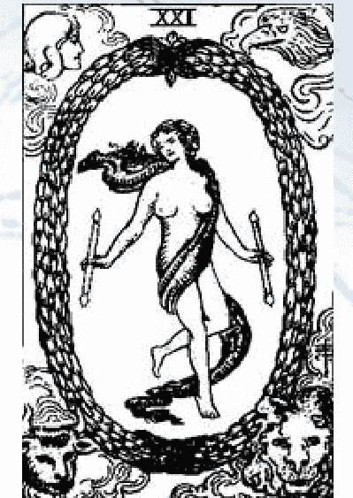

作为大阿尔卡那牌的最终讯息，其设计是不变的，而且确实是不可改变的，关于它的深层涵义已被部份地描绘出来了。它同时象征着圆满与宇宙的尽头，其中蕴藏的秘密是宇宙的狂喜，当它在上帝里了解自己时。更深一层的境界是灵魂处于神圣观点的觉醒状态，从自觉的灵性所反映而来。但是，这些意义并无关于物质面的偏见。

As this final message of the Major Trumps is unchanged--and indeed unchangeable--in respect of its design, it has been partly described already regarding its deeper sense. It represents also the perfection and end of the Cosmos, the secret which is within it, the rapture of the universe when it understands itself in God. It is further the state of the soul in the consciousness of Divine Vision, reflected from the self-knowing spirit. But these meanings are without prejudice to that which I have said concerning it on the material side.

它不只一项关于大宇宙的讯息，且举例来说，是恢复精力的世界状态，当展现自然界的尽善完美的最高境界时。但这也许是特别指过去的故事，当时所有的一切皆是美好的，当时早晨星星一同欢唱，与所有的上帝之子欢笑着。关于此点，最糟糕的解释之一是认为该人像

It has more than one message on the macrocosmic side and is, for example, the state of the restored world when the law of manifestation shall have been carried to the highest degree of natural perfection. But it is perhaps more especially a story of the past, referring to that day when all was declared to be good, when the morning stars sang together and all the Sons of God shouted for joy. One of the worst代表东方三博士之一，当他达到初始的最高阶段；另一种可笑的说法是，它象征纯粹完全。

该形体也曾代表真理，然而真理更恰当的位置是在第十七张牌。最后，它也曾被称为东方三博士之冠。

explanations concerning it are that the figure symbolizes the Magus when he has reached the highest degree of initiation; another account says that it represents the absolute, which is ridiculous.

The figure has been said to stand for Truth, which is, however, more properly allocated to the seventeenth card. Lastly, it has been called the Crown of the Magi.

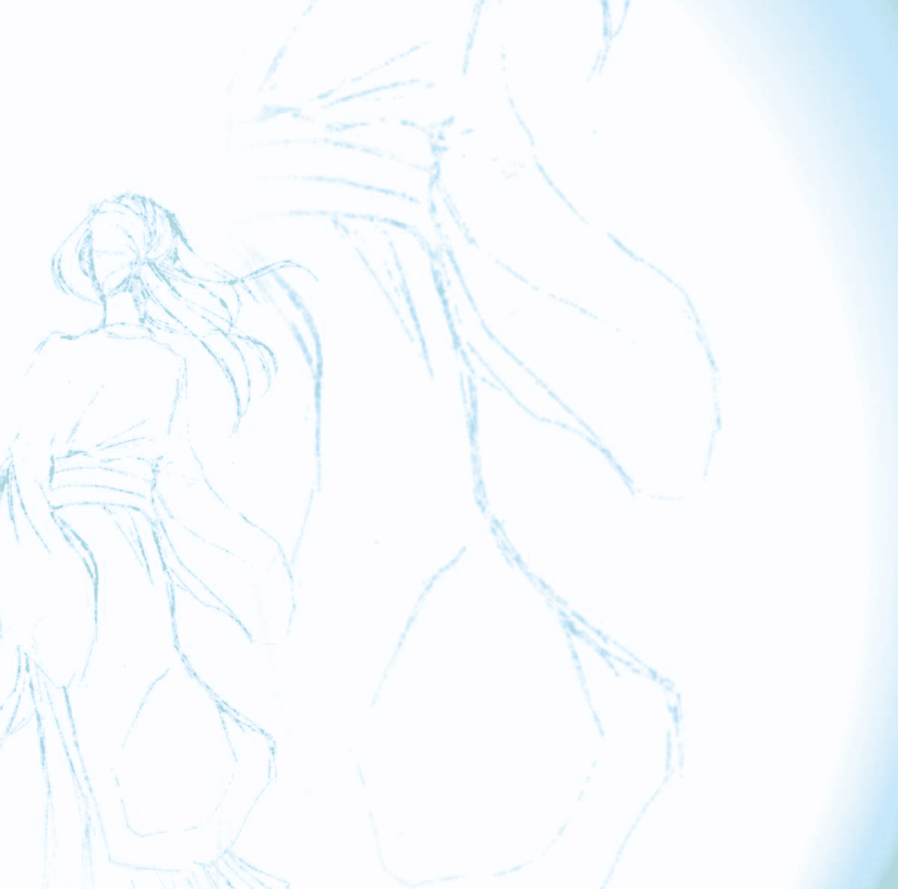

#### 三、大阿尔卡那牌图解之总结

##### § 3 Conclusion as to the Greater Keys

以往的图表中，从未试图以符号象征系统呈现三个世纪——神性的世界、大宇宙与小宇宙。这方面的发展研究，需要一部庞大书籍的撰写。

There has been no attempt in the previous tabulation to present the symbolism in what is called the three worlds--that of Divinity, of the Macrocosm and the Microcosm. A large volume would be required for developments of this kind. I have taken the cards on the high plane of their more direct significance to man, who--in material life--is on the quest of eternal things.

我已呈现纸牌与人类更为直接意义的崇高水平，他们属于物质的生命，正追循着永恒的事物。

The compiler of the Manual of Cartomancy has treated them under three headings: the World of Human Prudence, which does not differ from divination on its more serious side; the World of Conformity, being the life of religious devotion; and the World of Attainment, which is that of "the soul's progress towards the term of its research."

《纸牌占卜手册》的编纂者将他们置于三个标题下：秩序的世界，此与占卜的严肃意义并无不同；秩序的世界，属于宗教奉献的生命；秩序的世界，那是“灵魂通往研究探索之路的进展”。

He gives also a triple process of consultation, according to these divisions, to which the reader is referred. I have no such process to offer, as I think that more may be gained by individual reflection on each of the Trumps Major.

他也根据这些区分，提供读者一个结论式的三段程序。我并没有这样的程序可以提供，因为我认为依据独立个体对每张大阿尔卡那牌的反应，也许可以获取更多讯息。

I have also not adopted the prevailing attribution of the cards to the Hebrew alphabet--firstly, because it would serve no purpose in an elementary handbook; secondly, because nearly every attribution is wrong.

我也没有采用纸牌普遍的希伯来文字母属性，首先是因为它在一本基础的手册中无法发挥作用；其次是因为几乎所有的属性都是错误的。

Finally, I have not attempted to rectify the position of the cards in their relation to one another; the Zero therefore appears after No. 20, but I have taken care not to number the World or Universe otherwise than as 21.

最后，我无意修正纸牌彼此关系的位置；因此数字零出现在数字 20 之后，然而我特别注意勿将“世界”安排在数字 21 以外的其他位置。而且，无论放置的顺序如何，数字零就是一张无号码的牌。

总结第二部份 ,我将进一步谈论“愚者”牌 , 它论及最多的符号象征。他代表向外的旅程 , 心灵的第一道放射、美德与顺从。他的旅行袋印着模糊的记号 ,藉此显示许多潜意识的记忆被储藏在灵魂中。

it ought to be put, the Zero is an unnumbered card. In conclusion as to this part, I will give these further indications regarding the Fool, which is the most speaking of all the symbols. He signifies the journey outward, the state of the first emanation, the graces and passivity of the spirit. His wallet is inscribed with dim signs, to shew that many sub-conscious memories are stored up in the soul.

## 第三部：揭露神谕的外部手法

## PART III  The Outer Method of the Oracles

#### 一、大小阿尔卡那牌的区分

### § 1  Distinction between the Greater and Lesser Arcana

依据他们通常呈现的方式，以存在大、小阿尔卡那牌之间的宫廷牌作为桥梁——国王、皇后、骑士与侍从或侍卫；但是最明确的区别是从大阿尔卡那牌的传统特色展现出来。

请读者比较任何在前面排序的牌，例如愚者、女祭司、教皇等，几乎没有例外，就能领悟我的意思。

普通的宫廷牌，表面上并未包含任何特殊的想法；他们是传统的桥梁，成为简易的筹码凭借与紧接着的十个数字牌的过渡。

我们似乎已彻底地从生动图画所阐述的更高意义的领域抽离了。然而曾有段时间，数字纸牌也曾是图画，但是这样的设计仅是某些特定的艺术家偶然的发明，若不是典型代表性的设计就是寓意式的，与已知的符号象征系统有所分别，或者我们可以说他们是说明风格、习俗与时代的图解。

简言之它们是装饰物，因此重要性无法与大阿尔卡那牌相比；再者，差异变化是非常地少。

IN respect of their usual presentation, the bridge between the Greater and Lesser Arcana is supplied by the court cards--King, Queen, Knight and Squire or Page; but their utter distinction from the Trumps Major is shewn by their conventional character. Let the reader compare them with symbols like the Fool, the High Priestess, the Hierophant, or--almost without exception--with any in the previous sequence, and he will discern my meaning. There is no especial idea connected on the surface with the ordinary court cards; they are a bridge of conventions, which form a transition to the simple pretexts of the counters and denaries of the numbers following. We seem to have passed away utterly from the region of higher meanings illustrated by living pictures. There in was a period, however, when the numbered cards were also pictures, but such devices were sporadic inventions of particular artists and were either conventional designs of the typical or allegorical kind, distinct from what is understood by symbolism, or they were illustrations--shall we say?--of manners, customs and periods. They were, in a word, adornments, and as such they did nothing to raise the significance of the Lesser Arcana to the plane of the Trumps Major; moreover, such variations are exceedingly few. This notwithstanding, there are vague rumours concerning a higher meaning in the minor cards, but nothing has so far transpired, even within the sphere of prudence which belongs to the most occult circles; these, it is true, have certain variants in respect of divinatory values, but I have not heard that in practice they offer better results.

尽管如此，仍有些含糊的传言谈论小纸牌的更崇高意义，但截至目前为止并没有人知道任何事情，即使是在最神秘学的圈子内慎重的领域；这些确实在占卜价值标准上有一定的差异存在，但我还未听说他们在实际操作上提供更好的结论。

Efforts like those of Papus in *The Tarot of the Bohemians* are strenuous and deserving after their own kind; he, in particular, recognizes the elements of the Divine Immanence in the Trumps Major, and he seeks to follow them through the long series of the lesser cards, as if these represented filtrations of the World of Grace through the World of Fortune; but he only produces an arbitrary scheme of division which he can carry no further, and he has recourse, of necessity, in the end to a common scheme of divination as the substitute for a title to existence on the part of the Lesser Arcana.

努力的成果如帕柏的“波希米亚人的塔罗牌”就是其中费尽心力且值得的范例；他特别指出大阿尔卡那牌所含之神性内在的元素，而且他试图在小纸牌系列中依循相同的模式，好似藉由命运的世界呈现经筛选的神的恩典世界；但是他仅能创造一种武断的片段架构无法更深入探讨，他最终出于必要求助于一般的占卜方式作为小阿尔卡那牌的替代主题。

Now, I am practically in the same position; but I shall make no attempt here to save the situation by drawing on the mystical properties of numbers, as he and others have attempted, I shall recognize at once that the Trumps Major belong to the divine dealings of philosophy, but all that follows to fortune-telling, since it has never yet been translated into another language; the course thus adopted will render to divination, and at need even to gambling, the things that belong to this particular world of skill, and it will set apart for their proper business those matters that are of another order. In this free introduction to the subject in hand, it is only necessary to add that the difference between the fifty-six Lesser Arcana and ordinary playing-cards is not only essentially slight, because the substitution of Cups for Hearts, and so forth, constitutes an accidental variation, but because the presence of a Knight in each of the four suits was characteristic at one time of many ordinary packs, when this personage usually replaced the Queen. In the rectified Tarot which illustrates the present handbook, all numbered cards of the Lesser Arcana--the Aces only excepted--are furnished with figures or pictures to illustrate-but without exhausting--the divinatory meanings attached thereto.

针对目前这项主题的随意介绍中，仅需补充56张小阿尔卡那牌与普通游戏纸牌之间的差异实际上很轻微，因为圣杯替代红心等等以此类推，构成偶然的变动，但是由于骑士牌的出现在四组花色中，曾在许多平凡的纸牌中独具特色，当时这个角色经常替换掉皇后呢！

在修订后的塔罗牌中，也就是阐释现在这本手册者，所有编号的小阿尔卡那牌，Ace牌除外，皆提供不惹人厌烦的人像或图画来诠释所赋予的占卜意义。

Some who are gifted with reflective and discerning faculties in more than the ordinary sense--I am not speaking of clairvoyance may observe that in many of the Lesser Arcana there are vague intimations conveyed by the designs which seem to exceed the stated divinatory values. It is desirable to avoid misconception by specifying definitely that, except in rare instances--and then only by accident--the variations are not to be regarded as suggestions of higher and extradivinatory symbolism. I have said that these Lesser Arcana have not been translated into a language which transcends that of fortune telling. I should not indeed be disposed to regard them as belonging in their existing forms to another realm than this; but the field of divinatory possibilities is

某些赋有思考与识别才能的观点者，这并非谈论异常的洞察力，也许观察到许多小阿尔卡那牌因为设计的缘故，传达模糊不清的暗示，似乎超越指定的占卜价值标准。为避免错误的想法，非常值得明确地说明差异变化不应该被视为更高或超越占卜的符号象征系统，除少数偶然发生的情况之外。

我已说过，小阿尔卡那牌尚未被翻译成任一种超越算命的语言。我不该真的倾向于视他们现在的形式属于其他的范围；但是占卜的潜在价值是无穷无尽的，依据这项技艺的假设与纸牌占卜的结合系统仅能指出使用中的符号标题的意义。

当目前案例中的图片超越传统的涵义时，它们应该被视为顺着相同的方式下可能的发展的暗示；这也是为什么将绘图式手法应用在四组花色牌的原因之一，将会证明对直觉有极大的帮助。

inexhaustible, by the hypothesis of the art, and the combined systems of cartomancy have indicated only the bare heads of significance attaching to the emblems in use. When the pictures in the present case go beyond the conventional meanings they should be taken as hints of possible developments along the same lines; and this is one of the reasons why the pictorial devices here attached to the four denaries will prove a great help to intuition. The mere numerical powers and bare words of the meanings are insufficient by themselves; but the pictures are like doors which open into unexpected chambers, or like a turn in the open road with a wide prospect beyond.

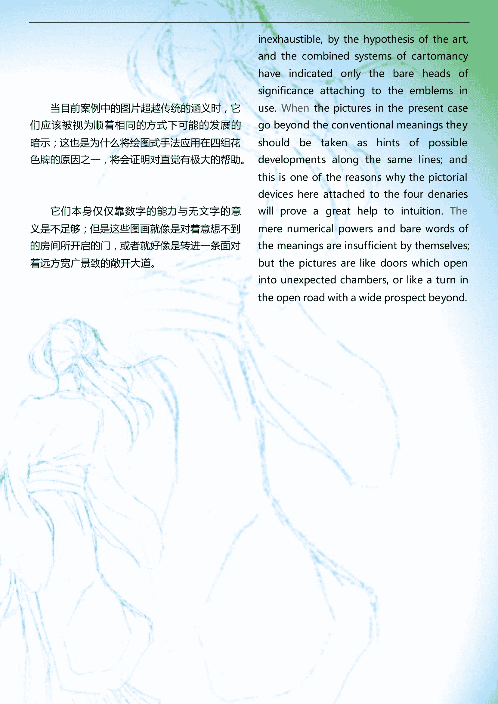

## 二、小阿尔卡那牌解说 § 2. THE LESSER ARCANA

小阿尔卡那牌或称塔罗牌的四组花色牌，会根据它们个别的等级以图像描述其各自的属性，且将整合所有资源提供整合一致的意义。

Otherwise, the Four Suits of Tarot Cards, will now be described according to their respective classes by the pictures to each belonging, and a harmony of their meanings will be provided from all sources.

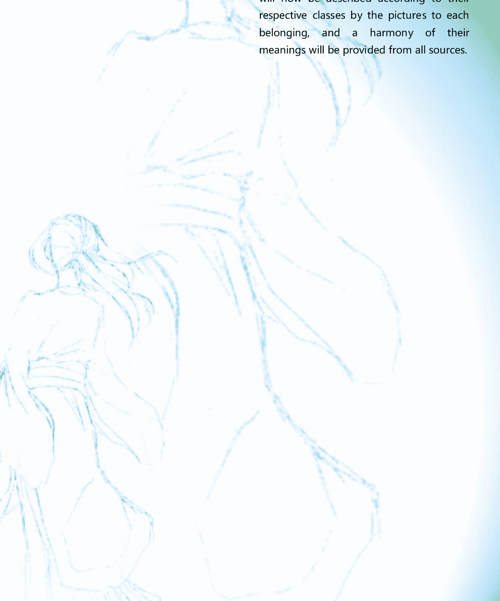

##### 权杖牌组 (THE SUIT OF WANDS)

###### 权杖国王 (King)

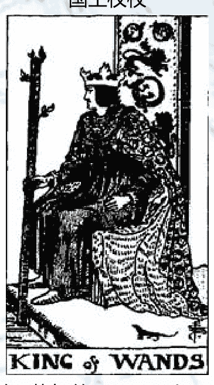

这张牌的外表与情绪特质是黝黑的、热切的、柔软的、活跃的、激情的、高贵的。国王举起一支有花的权杖，戴着一顶保护的帽子在王冠底下，与其他三个国王牌一样。他与狮子符号连结，装饰在他王座的靠背上。

The physical and emotional nature to which this card is attributed is dark, ardent, lithe, animated, impassioned, noble. The King uplifts a flowering wand, and wears, like his three correspondences in the remaining suits, what is called a cap of maintenance beneath his crown. He connects with the symbol of the lion, which is emblazoned on the back of his throne.

占卜的涵义：黝黑的男人、友善、乡下人、通常是已婚的、诚实与良心的。这张牌总是代表着诚实，且也许意味着不久即将面临的突如其来的继承消息有关。

Divinatory Meanings. Dark man, friendly, countryman, generally married, honest and conscientious. The card always signifies honesty, and may mean news concerning an unexpected heritage to fall in before very long.

逆位：良好，但严峻、严厉却宽容的。

Reversed: Good, but severe; austere, yet tolerant.

###### 权杖皇后 (Queen)

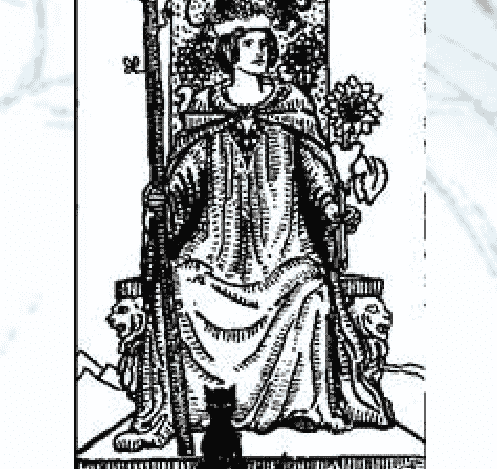

权杖在整组花色牌中总会出现叶子，因为它是代表生命与生气的花色牌。无论是情绪或其他方面，皇后的个性特质与国王相对应，却更具魅力。

The Wands throughout this suit are always in leaf, as it is a suit of life and animation. Emotionally and otherwise, the Queen's personality corresponds to that of the King, but is more magnetic.

> 占卜的涵义：一个黝黑的女人、乡下妇人、友善的、贞洁的、深情的、高贵的。假若在这张牌的旁边是张代表男人的牌，她将对他有助益；若是一个女人的牌，则她对占卜问事者（Querent）有兴趣。其他尚有，喜爱金钱，或是在事业上获致成功。

> Divinatory Meanings. A dark woman, countrywoman, friendly, chaste, loving, honourable. If the card beside her signifies a man, she is well disposed towards him; if a woman, she is interested in the Querent. Also, love of money, or a certain success in business.

> 逆位：良好、节约的、乐于助人的、有用的。另外在特定的位置与其他纸牌相邻的情况下，也代表着反对、忌妒、甚至欺骗与不贞的倾向。

> Reversed. Good, economical, obliging, serviceable. Signifies also--but in certain positions and in the neighbourhood of other cards tending in such directions--opposition, jealousy, even deceit and infidelity.

###### 权杖骑士 (Knight)

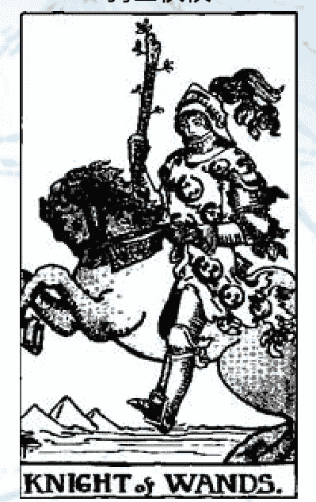

他的出现好似在旅途中，配备着一柄短权杖与盔甲，虽然并非处于军事任务状态。他正经过一些土堆或三角锥塔的东西。马匹的动作是了解坐骑者性格的关键，提示着仓卒的心情或与此相关的事物。

He is shewn as if upon a journey, armed with a short wand, and although mailed is not on a warlike errand. He is passing mounds or pyramids. The motion of the horse is a key to the character of its rider, and suggests the precipitate mood, or things connected therewith.

占卜的涵义：离开、缺席、飞行航程、移民。一个黝黑的年轻人、友善、改变居住地。

Divinatory Meanings. Departure, absence, flight, emigration. A dark young man, friendly. Change of residence.

逆位：破裂、分割、阻碍、不和。

Reversed. Rupture, division, interruption, discord.

###### 权杖侍卫 (Page)

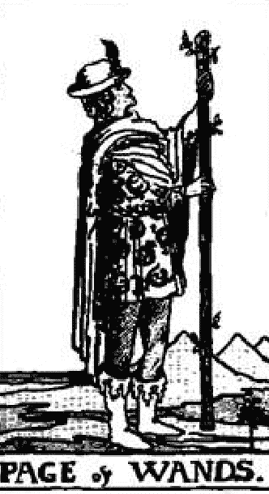

与前一张相似的场景，一位年轻人站立着做宣告的动作。他是个默默无闻的人但却忠心耿耿，且他的音信是奇怪的。

In a scene similar to the former, a young man stands in the act of proclamation. He is unknown but faithful, and his tidings are strange.

**占卜的涵义**：黝黑的年轻人、忠诚的、是个恋人、一位使节、一位信差。若出现在一个男人的旁边，他将携带对其有利的证据。若是紧跟着侍卫圣杯牌，代表危险的竞争者。拥有他所属的花色牌之主要特质。他也许代表着家族的智慧。

*Divinatory Meanings*. Dark young man, faithful, a lover, an envoy, a postman. Beside a man, he will bear favourable testimony concerning him. A dangerous rival, if followed by the Page of Cups. Has the chief qualities of his suit. He may signify family intelligence.

**逆位**：轶事秘闻、宣布、邪恶的消息。同时伴随着优柔寡断与不稳定的特质。

*Reversed*. Anecdotes, announcements, evil news. Also indecision and the instability which accompanies it.

###### 权杖十 (Ten)

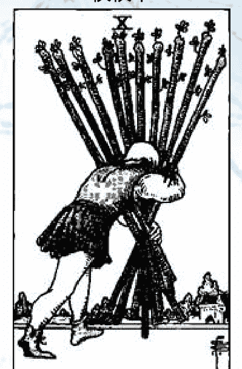

**一个男人受到他所持有的棍棒的重量压迫。**

**A man oppressed by the weight of the ten staves which he is carrying.**

**占卜的涵义：**一张纸牌拥有许多的意义，且部分的解读是无法协调一致的。我暂且对于信誉与承诺的联想不予理会。

其最主要的意义，简单的说就是压迫，但它同时也代表幸运、获利与任何形式的成功，然后就受到这些事物的压迫。它同时也是代表错误的表象、伪装、背信忘义的纸牌。图中人向所靠近的地方也许承受着这些棍棒所带来的痛苦。假若紧跟着的是圣剑九，则成功是无望的，且假若是关于诉讼的问题，则将会有一定的损失。

*Divinatory Meanings.* A card of many significances, and some of the readings cannot be harmonized. I set aside that which connects it with honour and good faith. The chief meaning is oppression simply, but it is also fortune, gain, any kind of success, and then it is the oppression of these things. It is also a card of false-seeming, disguise, perfidy. The place which the figure is approaching may suffer from the rods that he carries. Success is stultified if the Nine of Swords follows, and if it is a question of a lawsuit, there will be certain loss.

**逆位：**矛盾对立、困境、阴谋，及与以上所类似的事物。

*Reversed.* Contrarieties, difficulties, intrigues, and their analogies.

###### 权杖九 (Nine)

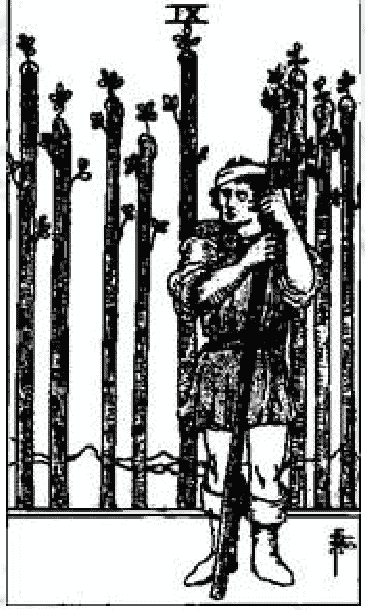

人像倚靠着他的权杖，且带着期待的神情，好似正在等待一个敌人。后方是其他八支棍棒直立着，有秩序地排列着如同一道栅栏。

The figure leans upon his staff and has an expectant look, as if awaiting an enemy. Behind are eight other staves--erect, in orderly disposition, like a palisade.

占卜的涵义：这张牌代表着对立的势力。假若攻击的话，该角色将会面临一场勇敢的突击；而他的体格显示出他也许会是个令人畏惧的对手。依据这个主要的意义，连带包含着所有可能的附属特质——延迟、暂停、延期。

Divinatory Meanings. The card signifies strength in opposition. If attacked, the person will meet an onslaught boldly; and his build shews, that he may prove a formidable antagonist. With this main significance there are all its possible adjuncts--delay, suspension, adjournment.

逆位：障碍、逆境、灾难。

Reversed. Obstacles, adversity, calamity.

###### 权杖八 (Eight)

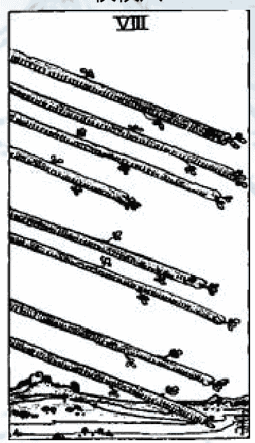

这张牌描绘静止固定的动作——权杖在空旷的郊外飞行；但是朝着他们自己的方向。他们所指的意义即将到来；甚至也许已到达门前。

The card represents motion through the immovable-a flight of wands through an open country; but they draw to the term of their course. That which they signify is at hand; it may be even on the threshold.

**占卜的涵义：**正在进行的活动、这类活动的路径、敏捷、如同一位迅捷的信息者；十分匆忙、伟大的希望、朝向一个确保幸福的终点速度；通常那都是在移动状态；也代表爱情的箭。

*Divinatory Meanings.* Activity in undertakings, the path of such activity, swiftness, as that of an express messenger; great haste, great hope, speed towards an end which promises assured felicity; generally, that which is on the move; also the arrows of love.

**逆位：**忌妒的箭；内心的争论、良心的刺痛、争论，以及已婚者的家庭争论。

*Reversed.* Arrows of jealousy, internal dispute, stingings of conscience, quarrels; and domestic disputes for persons who are married.

###### 权杖七 (Seven)

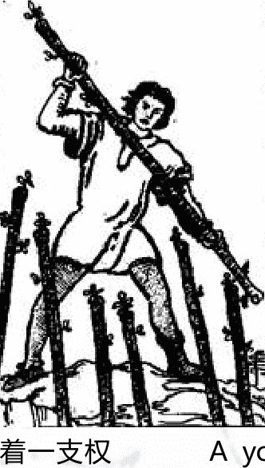

一个年轻人在崎岖的高地上挥舞着一支权杖；其他六支棍棒接高举着从下方朝向他。

A young man on a craggy eminence brandishing a staff; six other staves are raised towards him from below.

占卜的涵义：这是一张代表英勇的牌，从表面上看来，六个正在攻击一个，然而他却是处于优势的状态。就智慧层面解读，它代表讨论与言词的冲突争斗；就事业而言是协商谈判、贸易的战争、易货贸易、竞争。进一步而言，是表示成功的牌，因为战斗士是立在顶端，且他的敌人们也许无法碰触到他。

Divinatory Meanings. It is a card of valour, for, on the surface, six are attacking one, who has, however, the vantage position. On the intellectual plane, it signifies discussion, wordy strife; in business--negotiations, war of trade, barter, competition. It is further a card of success, for the combatant is on the top and his enemies may be unable to reach him.

逆位：困惑纠缠的处境、难堪、焦虑。它也是对于优柔寡断的警告。

Reversed. Perplexity, embarrassments, anxiety. It is also a caution against indecision.

## 权杖

### 六

一位佩戴着桂冠的骑士携带一柄装饰着桂冠的权杖；举着棍棒的男仆走在他身旁。

**占卜的涵义**：纸牌如此的设计包含着许多意义；表面看来，这是胜利者的欢庆活动，但也可能是由国王的信差捎来伟大的消息；以它的渴望作为所期待事物的报酬，是希望的荣冠，以此类推。

**逆位**：恐惧、忧虑，好似战胜的敌人就在门前；背叛与不忠，犹如对着敌人敞开大门；也是无限期的延迟。

A laurelled horseman bears one staff adorned with a laurel crown; footmen with staves are at his side.

**Divinatory Meanings.** The card has been so designed that it can cover several significations; on the surface, it is a victor triumphing, but it is also great news, such as might be carried in state by the King's courier; it is expectation crowned with its own desire, the crown of hope, and so forth.

**Reversed.** Apprehension, fear, as of a victorious enemy at the gate; treachery, disloyalty, as of gates being opened to the enemy; also indefinite delay.

### 五

一群年轻人挥舞着棍棒，如同在运动或争斗中。这是模拟的战争，因此连结其占卜的涵义：模仿，例如模拟的斗争，但同时也是非常激烈的竞争与努力挣扎着搜寻财富。就此观点而言，它与生命的战斗有关。因此某些说法称之为代表黄金、获利与富裕的牌。

**逆位：**
- 争讼
- 争论
- 奸计
- 矛盾

A posse of youths, who are brandishing staves, as if in sport or strife. It is mimic warfare, and hereto correspond the *Divinatory Meanings*. Imitation, as, for example, sham fight, but also the strenuous competition and struggle of the search after riches and fortune. In this sense it connects with the battle of life. Hence some attributions say that it is a card of gold, gain, opulence.

*Reversed.* Litigation, disputes, trickery, contradiction.

### 四

插立在前景的四支巨大棍棒上有着一圈大花环悬浮在空中；两位女性人物高举着花束；他们的旁边是一座跨越护城河的桥，带领至一间古老庄园的房子。

**占卜的涵义：** 仅这一次所有的意义几乎都显现在表面——乡村生活、庇护的天堂；一种当地欢庆收获的形式、休息、和睦、融洽、繁荣、和平与理想完美的工作。

**逆位：** 意义仍旧未改变；繁荣、增加、幸福、美丽与装饰。

From the four great staves planted in the foreground there is a great garland suspended; two female figures uplift nosegays; at their side is a bridge over a moat, leading to an old manorial house.

*Divinatory Meanings.* They are for once almost on the surface--country life, haven of refuge, a species of domestic harvest-home, repose, concord, harmony, prosperity, peace, and the perfected work of these.

*Reversed.* The meaning remains unaltered; it is prosperity, increase, felicity, beauty, embellishment.

### 三

一位沉着、威严的大人物背对着，从悬崖边望着船只驶过海面。三支棍棒插入土地里，他轻靠着其中一支。

**占卜的涵义：** 他象征着已建立的实力、事业、努力成果、贸易、商业、发现；那些都是他的船只，载运着他的货物，航行经过海面。这张牌也代表着事业的合作，犹如这位成功的商业巨子正从他这边观察着你并给予帮助。

**逆位：** 烦恼终止、结束逆境、苦难与失望。

A calm, stately personage, with his back turned, looking from a cliff's edge at ships passing over the sea. Three staves are planted in the ground, and he leans slightly on one of them.

*Divinatory Meanings.* He symbolizes established strength, enterprise, effort, trade, commerce, discovery; those are his ships, bearing his merchandise, which are sailing over the sea. The card also signifies able co-operation in business, as if the successful merchant prince were looking from his side towards yours with a view to help you.

*Reversed.* The end of troubles, suspension or cessation of adversity, toil and disappointment.

### 二

一位高大的男子从城垛的顶端望向海面与海岸；他右手里握着一颗地球仪，同时左手扶着一支棍棒停靠在城垛上；另一支则由扣环固定着。应特别注意左边的玫瑰百合十字架。

**占卜的涵义：**
在若干的解读中，没有婚姻的可能性；一方面是富裕、幸运与宏伟；另一方面则是肉体的痛苦、疾病、懊恼、哀伤、屈辱羞愧。这个设计提供一项见解；这里是个君主俯瞰着他的领土，并交替凝视着一个地球仪；就好像是疾病、屈辱、亚历山大的悲伤都在这个世界富有的壮观显赫之中。

**逆位：**
惊奇、疑惑、着迷、情感、烦恼、恐惧。

A tall man looks from a battlemented roof over sea and shore; he holds a globe in his right hand, while a staff in his left rests on the battlement; another is fixed in a ring. The Rose and Cross and Lily should be noticed on the left side.

*Divinatory Meanings.* Between the alternative readings there is no marriage possible; on the one hand, riches, fortune, magnificence; on the other, physical suffering, disease, chagrin, sadness, mortification. The design gives one suggestion; here is a lord overlooking his dominion and alternately contemplating a globe; it looks like the malady, the mortification, the sadness of Alexander amidst the grandeur of this world's wealth.

*Reversed.* Surprise, wonder, enchantment, emotion, trouble, fear.

### 王牌

一只手从一朵云里放出来紧握着一支肥厚的权杖或棍棒。

**占卜的涵义：** 创造、发明、冒险精神、以及产生这些结果的力量；原则、开端、来源；诞生、家族、根源，且就某种意义来说，是他们背后所代表的生殖力；事业的开始；根据另一项说法，代表金钱、财富、继承物。

**逆位：** 衰退、堕落、毁灭、消灭；也是某种程度充满愁云的成功。

A hand issuing from a cloud grasps a stout wand or club.

*Divinatory Meanings.* Creation, invention, enterprise, the powers which result in these; principle, beginning, source; birth, family, origin, and in a sense the virility which is behind them; the starting point of enterprises; according to another account, money, fortune, inheritance.

*Reversed.* Fall, decadence, ruin, perdition, to perish also a certain clouded joy.

## 圣杯

### 国王

他的左手握着一个短王权，右手是一个巨大的杯子；他的王位是放置在海面上；一边是正在航行的船只，在另一边是正在跳跃的海豚。其暗喻着圣杯的符号自然与水相关，因此出现在所有的宫廷牌中。

**占卜的涵义：** 公正诚实的人、从事生意、法律或神学的人；负责任、倾向于帮助问事请求指点迷津者；公平、艺术与科学，包括那些教授科学、法律与艺术者；创意的智慧。

**逆位：** 不诚实、双面人；欺骗、苛征、不公平、罪行、丑闻、掠夺、相当多的损失。

He holds a short sceptre in his left hand and a great cup in his right; his throne is set upon the sea; on one side a ship is riding and on the other a dolphin is leaping. The implicit is that the Sign of the Cup naturally refers to water, which appears in all the court cards.

*Divinatory Meanings.* Fair man, man of business, law, or divinity; responsible, disposed to oblige the Querent; also equity, art and science, including those who profess science, law and art; creative intelligence.

*Reversed.* Dishonest, double-dealing man; roguery, exaction, injustice, vice, scandal, pillage, considerable loss.

### 皇后

美丽迷人、梦幻般的她从圣杯中看见远景。然而这仅是她的样貌之一；她观看但是也付诸行动，且她的行动茁壮她的梦想。

**占卜的涵义**
美好、美丽的女人；诚实奉献的女人，她将为问事请求指点迷津者服务；忠诚的智慧，因此拥有洞察的能力；成功、快乐、愉悦；还有智慧、美德；一位完美的配偶与好母亲。

**逆位**
说法根据是有变化的；好母亲；另一种说法是，高贵的母亲但却不可信赖；刚愎自用的母亲；罪行、不名誉、堕落。

Beautiful, fair, dreamy--as one who sees visions in a cup. This is, however, only one of her aspects; she sees, but she also acts, and her activity feeds her dream.

*Divinatory Meanings.* Good, fair woman; honest, devoted woman, who will do service to the Querent; loving intelligence, and hence the gift of vision; success, happiness, pleasure; also wisdom, virtue; a perfect spouse and a good mother.

*Reversed.* The accounts vary; good woman; otherwise, distinguished woman but one not to be trusted; perverse woman; vice, dishonour, depravity.

### 骑士

优雅却不好战的；静悄悄地骑马，戴着一顶有着翅膀的头盔，与想象中的崇高恩典有关，有时做为这张纸牌的象征。他也是个梦想家，然而感官的影像困扰着他的洞察力。

**占卜的涵义：** 到达、接近——有时是一位信息者；前进、主张、风度、邀请、激励。

**逆位：** 欺骗、狡诈诡计、敏锐、诈骗的、口是心非、骗子。

Graceful, but not warlike; riding quietly, wearing a winged helmet, referring to those higher graces of the imagination which sometimes characterize this card. He too is a dreamer, but the images of the side of sense haunt him in his vision.

*Divinatory Meanings.* Arrival, approach--sometimes that of a messenger; advances, proposition, demeanour, invitation, incitement.

*Reversed.* Trickery, artifice, subtlety, swindling, duplicity, fraud.

### 侍卫

一位俊俏愉悦却有点柔弱女子气质的侍卫，有着勤奋好学与热切的样貌，正凝视着一条鱼从圣杯中升起并看着他。这些图描绘获取心智的方式。

**占卜的涵义：** 俊俏年轻的男子，被驱使着提供服务给予问事请求指点迷津者；一位勤奋好学的年轻人；新闻、讯息；应用、反映、冥想；还有导向商业的事物。

**逆位：** 品味、倾向、爱慕忠诚、魅力诱惑、欺骗、诡诈奸计。

A fair, pleasing, somewhat effeminate page, of studious and intent aspect, contemplates a fish rising from a cup to look at him. It is the pictures of the mind taking form.

*Divinatory Meanings.* Fair young man, one impelled to render service and with whom the Querent will be connected; a studious youth; news, message; application, reflection, meditation; also these things directed to business.

*Reversed.* Taste, inclination, attachment, seduction, deception, artifice.

## CUPS
### 十
###### 圣杯十

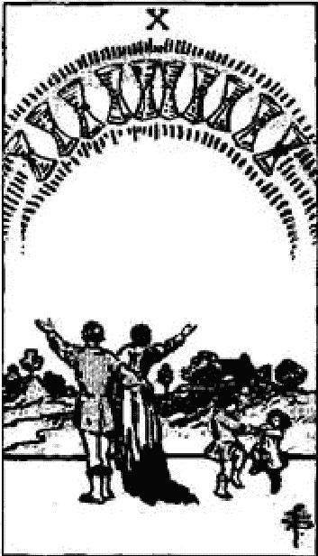

圣杯在一道彩虹中显现；下方有一个男人与一个女人正惊奇地与狂喜地注视着，显然他们是丈夫与妻子。他的右手环抱着她，左手高举着；她也高举起右手。两个小孩正在附近跳舞而没有看着这幕奇迹，却玩得不亦乐乎。远方是家园的景象。

Appearance of Cups in a rainbow; it is contemplated in wonder and ecstasy by a man and woman below, evidently husband and wife. His right arm is about her; his left is raised upward; she raises her right arm. The two children dancing near them have not observed the prodigy but are happy after their own manner. There is a home-scene beyond.

**占卜的涵义**：满足、满心安详；完美的景况；也是人类爱情与友谊的完美关系；假若同时与其它有图画的纸牌放在一起，是代表一个人负责问卜者所关心的事物；也包括问卜者所居住的城镇、村庄或国家。

*Divinatory Meanings.* Contentment, repose of the entire heart; the perfection of that state; also perfection of human love and friendship; if with several picture-cards, a person who is taking charge of the Querent's interests; also the town, village or country inhabited by the Querent.

**逆位**：虚假心灵的歇息、愤怒、暴力。

*Reversed.* Repose of the false heart, indignation, violence.

## CUPS
### 九
###### 圣杯九

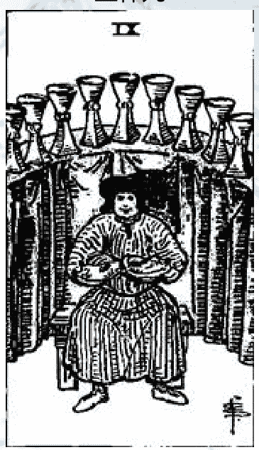

一个讨人喜欢的人物已获得心满意足的享受，而且充裕提神的葡萄酒就放在他后方的拱形柜台上，似乎说明未来已获得保障。这张图片仅提供物质层面，但尚含有其他的观点。

A goodly personage has feasted to his heart's content, and abundant refreshment of wine is on the arched counter behind him, seeming to indicate that the future is also assured. The picture offers the material side only, but there are other aspects.

**占卜的涵义**：协调一致、满足、美好的物质；还有胜利、成功、优势；使问事者或寻求咨询的人满意。

*Divinatory Meanings:* Concord, contentment, physical *bien-être*, also victory, success, advantage; satisfaction for the Querent or person for whom the consultation is made.

**逆位**：真相、忠心、自由；但是有多样的解读，也包括错误与不完美的答案。

*Reversed:* Truth, loyalty, liberty; but the readings vary and include mistakes, imperfections, etc.

## CUPS
### 八
###### 圣杯八

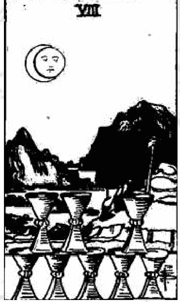

一位有着沮丧样貌的男子正遗弃装载他的幸福、事业、工作或以前所关心事物的圣杯。

A man of dejected aspect is deserting the cups of his felicity, enterprise, undertaking or previous concern.

**占卜的涵义**：这张纸牌是从表面说明自己本身的牌义，但是其他的解读却是完全相反的——给予欢乐、温和、胆怯、名誉、谦虚。事实却经常发现，这张纸牌显示事件的衰退现象，或当初被视为重要的事件实际上是微不足道的结果——无论是善或恶的。伟大的喜悦、快乐、正在享受中。

*Divinatory Meanings.* The card speaks for itself on the surface, but other readings are entirely antithetical--giving joy, mildness, timidity, honour, modesty. In practice, it is usually found that the card shews the decline of a matter, or that a matter which has been thought to be important is really of slight consequence--either for good or evil.

**逆位**：伟大的喜悦、快乐、宴飨。

*Reversed.* Great joy, happiness, feasting.

## CUPS
### 七
###### 圣杯七

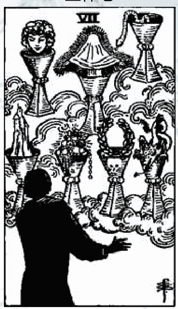

奇异的酒杯所呈现的景象，但是这些形象多数特别是想象中的精灵。

Strange chalices of vision, but the images are more especially those of the fantastic spirit.

**占卜的涵义**：偏爱幻想的、反射的影像、情绪、想象力、凝视着玻璃所看见的事物；在这些程度上有所获得，然而却没有任何事情是永久的或是实在的。

*Divinatory Meanings.* Fairy favours, images of reflection, sentiment, imagination, things seen in the glass of contemplation; some attainment in these degrees, but nothing permanent or substantial is suggested.

**逆位**：渴望、意愿、决心、计划。

*Reversed.* Desire, will, determination, project.

## CUPS
### 六
###### 圣杯六

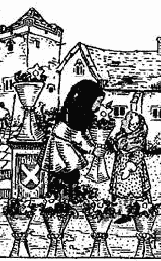

孩子们在一座古老的花园里，他们的圣杯里面装满花朵。

Children in an old garden, their cups filled with flowers.

**占卜的涵义**：一张关于过去、回忆，并回头望的纸牌，例如童年时期；快乐、乐趣，但卻都是属于过去；已经消逝的事物。另有一种解读推翻这项看法，认为是提供新的关系、新的知识、新的环境、然后孩童们正在不熟悉的环境嬉戏。

*Divinatory Meanings*: A card of the past and of memories, looking back, as--for example--on childhood; happiness, enjoyment, but coming rather from the past; things that have vanished. Another reading reverses this, giving new relations, new knowledge, new environment, and then the children are disporting in an unfamiliar precinct.

**逆位**：未来、更新的事物，但不久将会成为过去。

*Reversed*: The future, renewal, that which will come to pass presently.

## CUPS
### 五
###### 圣杯五

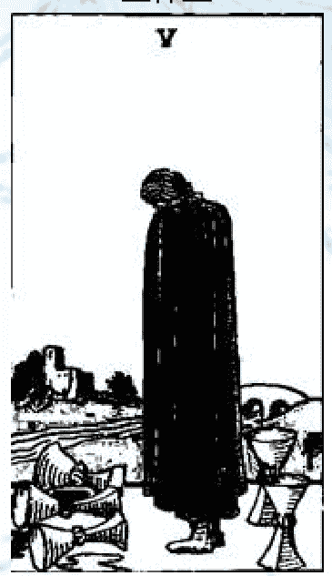

一位黝黑、身披斗篷的人正望着三只倾倒圣杯旁的小径；另外两只圣杯站立在他后方；背景还有座桥通向一个小支撑处。

A dark, cloaked figure, looking sideways at three prone cups two others stand upright behind him; a bridge is in the background, leading to a small keep or holding.

**占卜的涵义**：这是关于损失的牌，但仍有些东西遗留下来；三个已被拿取，但有两个还留着；这是关于继承、继承遗产、传递的牌，但却不符合期望；某些解释者认为这是关于婚姻的牌，但却有着痛苦与挫败。

*Divinatory Meanings.* It is a card of loss, but something remains over; three have been taken, but two are left; it is a card of inheritance, patrimony, transmission, but not corresponding to expectations; with some interpreters it is a card of marriage, but not without bitterness or frustration.

**逆位**：消息、结盟、姻亲关系、亲密关系、祖先、归返、不正确的计划。

*Reversed.* News, alliances, affinity, consanguinity, ancestry, return, false projects.

## CUPS
### 四
###### 圣杯四

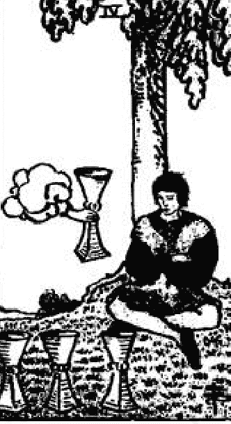

一位年轻人坐在树下正凝视着放在面前草地上的三只圣杯；一只手臂从一朵云里伸出来递给他另一个圣杯。尽管如此，他的表情显现对自己所处环境的不满。

A young man is seated under a tree and contemplates three cups set on the grass before him; an arm issuing from a cloud offers him another cup. His expression notwithstanding is one of discontent with his environment.

**占卜的涵义**：厌倦、反感、厌恶、想象的烦恼，犹如这个世界的葡萄酒仅供温饱罢了；另一份葡萄酒，好似一份美好的礼物呈现给这位挥霍者，然而他却无法从中得到慰藉满足。这也是张代表混合的乐趣的牌。

*Divinatory Meanings.* Weariness, disgust, aversion, imaginary vexations, as if the wine of this world had caused satiety only; another wine, as if a fairy gift, is now offered the wastrel, but he sees no consolation therein. This is also a card of blended pleasure.

**逆位**：新奇、预兆、新的知识、新的关系。

*Reversed.* Novelty, presage, new instruction, new relations.

## CUPS
### 三
###### 圣杯三

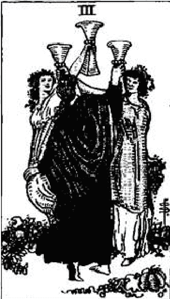

少女们在花园土地上高举着杯子，好像在向彼此敬酒。

Maidens in a garden-ground with cups uplifted, as if pledging one another.

**占卜的涵义**：任何情况的结论都是丰足、圆满与欢笑；快乐事件、胜利、充实、安慰、治愈。

*Divinatory Meanings*: The conclusion of any matter in plenty, perfection and merriment; happy issue, victory, fulfilment, solace, healing.

**逆位**：远征、派遣、成就、结束。它也代表着过度的肉体享受与感官的欢愉。

*Reversed*: Expedition, dispatch, achievement, end. It signifies also the side of excess in physical enjoyment, and the pleasures of the senses.

## CUPS
### 二
###### 圣杯二

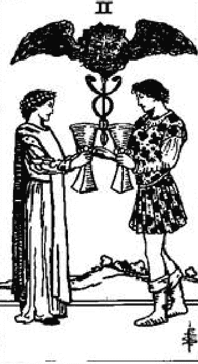

一位年轻男子与少女正彼此敬酒，在他们的杯子上方升起水星赫密士的双蛇杖（Caduceus of Hermes），并在两片巨大翅膀的中间出现一个狮子的头。这是从这张纸牌的一些古老范例中所演变而成的符号。附着一些奇怪的象征意义，但是在这里我们都不予考虑。

A youth and maiden are pledging one another, and above their cups rises the Caduceus of Hermes, between the great wings of which there appears a lion's head. It is a variant of a sign which is found in a few old examples of this card. Some curious emblematical meanings are attached to it, but they do not concern us in this place.

**占卜的涵义**：爱情、激情、友谊、亲密关系、结合、协调一致、同情心、两性的相互关系，以及与所有占卜职务无关的建议，就是非出自于自然的渴望，但自然却因此而被圣洁化。

*Divinatory Meanings*. Love, passion, friendship, affinity, union, concord, sympathy, the interrelation of the sexes, and--as a suggestion apart from all offices of divination--that desire which is not in Nature, but by which Nature is sanctified.

## CUPS
### Ace
### 圣杯 Ace

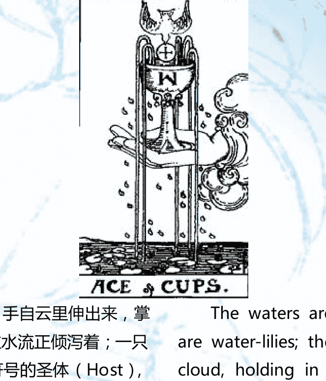

水在下面，上有荷花；手自云里伸出来，掌中扶着圣杯，圣杯里有四注水流正倾泻着；一只鸽子嘴里叼着一个十字架符号的圣体（Host），下降至圣杯里的水位，水珠降落在所有地方。这或许是隐藏在小阿尔卡那牌背后的暗示。

The waters are beneath, and thereon are water-lilies; the hand issues from the cloud, holding in its palm the cup, from which four streams are pouring; a dove, bearing in its bill a cross-marked Host, descends to place the Wafer in the Cup; the dew of water is falling on all sides. It is an intimation of that which may lie behind the Lesser Arcana.

**占卜的涵义**：真心的家、喜悦、满足、住所、滋养、丰富、繁殖力；圣坛、有关于此的幸福。

*Divinatory Meanings:* House of the true heart, joy, content, abode, nourishment, abundance, fertility; Holy Table, felicity hereof.

**逆位**：虚假心灵的家、变质、不稳定、变革。

*Reversed:* House of the false heart, mutation, instability, revolution.

## THE SUIT OF SWORDS
## 圣剑
### 国王
### 国王圣剑

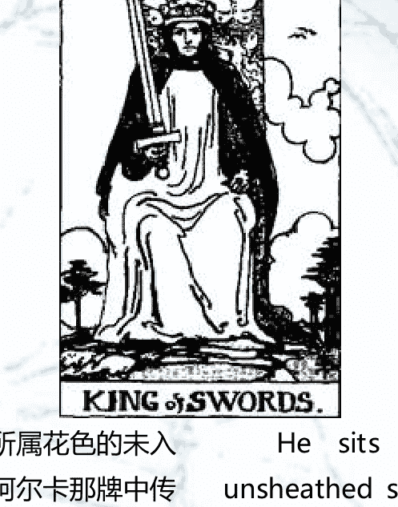

他扮演审判的角色，握着他所属花色的未入鞘的圣剑。他自然使人想起在大阿尔卡那牌中传统正义的象征，他也许多代表这项美德，但他更是主宰生命与死亡的力量，基于他职务所应有的优点。

He sits in judgment, holding the unsheathed sign of his suit. He recalls, of course, the conventional Symbol of justice in the Trumps Major, and he may represent this virtue, but he is rather the power of life and death, in virtue of his office.

**占卜的涵义**：凡是由审判所产生的任何想法或与之相关的一切——权力、命令、权威、战斗的智慧、法律、王位、与此类推。

*Divinatory Meanings.* Whatsoever arises out of the idea of judgment and all its connexions-power, command, authority, militant intelligence, law, offices of the crown, and so forth.

**逆位**：残酷、倔强刚愎、残暴、忘恩负义、邪恶的意图。

*Reversed:* Cruelty, perversity, barbarity, perfidy, evil intention.

## SWORDS
### 皇后圣剑

她的右手将武器垂直举起，剑柄轻靠在皇椅的其中一个扶手上；左手向外伸出并举起手臂；她的面容是严肃正经但和缓的；近似悲伤的状态。这张牌不代表慈悲怜悯，尽管拥有圣剑，但她决不是力量的象征。

Her right hand raises the weapon vertically and the hilt rests on an arm of her royal chair; the left hand is extended, the arm raised; her countenance is severe but chastened; it suggests familiarity with sorrow. It does not represent mercy, and, her sword notwithstanding, she is scarcely a symbol of power.

**占卜的涵义：**守寡、女性的悲伤与难堪、缺席、不孕、服丧、贫困、分离。

*Divinatory Meanings.* Widowhood, female sadness and embarrassment, absence, sterility, mourning, privation, separation.

**逆位：**敌意、顽固、狡诈、过分拘谨、大捆、欺骗。

*Reversed.* Malice, bigotry, artifice, prudery, bale, deceit.

## SWORDS
### 骑士圣剑

他骑马全力冲刺着，犹如正在分裂溃散他的敌人。在这个设计里，他是浪漫骑士精神的典型原貌。他几乎就是圆桌武士之一加拉哈特（Galahad）的化身，剑法迅捷而稳健，因为他的心是公正纯洁的。

He is riding in full course, as if scattering his enemies. In the design he is really a prototypical hero of romantic chivalry. He might almost be Galahad, whose sword is swift and sure because he is clean of heart.

**占卜的涵义**：技能、勇敢、有能力、防御、演说谈吐、敌意、愤怒、战争、毁灭、对抗、反抗、破坏。所以这张牌也另有一层涵义，代表着死亡，但仅针对邻近具有死亡宿命象征的牌时。

*Divinatory Meanings.* Skill, bravery, capacity, defence, address, enmity, wrath, war, destruction, opposition, resistance, ruin. There is therefore a sense in which the card signifies death, but it carries this meaning only in its proximity to other cards of fatality.

**逆位**：轻率、无能、无节制。

*Reversed.* Imprudence, incapacity, extravagance.

一个轻盈、活跃的人双手高举着一把剑，正敏捷地行走着。他正经过高低不平的路面，行经的路上，天空的云狂乱地排列在一起。他是警觉而轻盈的，观察这条路再看看那边，好似期待中的敌人随时会现身。

A lithe, active figure holds a sword upright in both hands, while in the act of swift walking. He is passing over rugged land, and about his way the clouds are collocated wildly. He is alert and lithe, looking this way and that, as if an expected enemy might appear at any moment.

**占卜的涵义** :权威、监视、秘密任务、警觉、暗中刺探、检查，以及其他同属性的特质。

*Divinatory Meanings.* Authority, overseeing, secret service, vigilance, spying, examination, and the qualities thereto belonging.

**逆位** :这些特质的邪恶面；未预见的事物、未作准备的状态；也有疾病的暗示。

*Reversed.* More evil side of these qualities; what is unforeseen, unprepared state; sickness is also intimated.

## SWORDS
### 圣剑十

一具俯卧的人形，被纸牌中所有的剑刺穿。

占卜的涵义：任何由此构图所暗示的涵义；还有痛苦、折磨、泪水、悲伤、孤寂。这张纸牌并不特别意味着因暴力引起的死亡。

逆位：优势、利益、成功、恩惠，但这一切皆不是永久的；还有权力与威权。

A prostrate figure, pierced by all the swords belonging to the card.

Divinatory Meanings: Whatsoever is intimated by the design; also pain, affliction, tears, sadness, desolation. It is not especially a card of violent death.

Reversed: Advantage, profit, success, favour, but none of these are permanent; also power and authority.

## SWORDS
### 圣剑九

一个人坐在卧榻上恸哭着，所有的剑都在她的上方。她知道没有任何的忧伤胜过于她所承受的。这是张表达彻底孤寂的牌。

One seated on her couch in lamentation, with the swords over her. She is as one who knows no sorrow which is like unto hers. It is a card of utter desolation.

占卜的涵义：死亡、失败、失误、延迟、欺骗、失望、绝望。

Divinatory Meanings. Death, failure, miscarriage, delay, deception, disappointment, despair.

逆位：禁锢、猜疑、怀疑、合理的恐惧、羞愧。

Reversed. Imprisonment, suspicion, doubt, reasonable fear, shame.

## SWORDS
### 圣剑八

一个女人在所有剑的包围下被捆绑并蒙上眼睛。然而这张牌代表着暂时的监禁，而非无法恢复的束缚。

A woman, bound and hoodwinked, with the swords of the card about her. Yet it is rather a card of temporary durance than of irretrievable bondage.

**占卜的涵义**

- 坏消息
- 极度的苦恼
- 危机
- 谴责
- 束缚的力量
- 冲突
- 毁谤
- 以及疾病

**Divinatory Meanings**

- Bad news
- violent chagrin
- crisis
- censure
- power in trammels
- conflict
- calumny
- also sickness

**逆位**

- 焦虑
- 困境
- 对抗
- 意外
- 背叛
- 未预见的事物
- 死亡宿命

**Reversed**

- Disquiet
- difficulty
- opposition
- accident
- treachery
- what is unforeseen
- fatality

## SWORDS
### 圣剑七

一个男人正迅速地搬走五支剑；另外两支仍插在地上。一个营地就紧邻附近。

A man in the act of carrying away five swords rapidly; the two others of the card remain stuck in the ground. A camp is close at hand.

**占卜的涵义**: 计画、图谋、渴望、期盼、信心；争吵、也许会失败的计画、困扰。这个构图的涵义是不确定的，因为其意义是很广泛地根据彼此的变化。

*Divinatory Meanings*: Design, attempt, wish, hope, confidence; also quarrelling, a plan that may fail, annoyance. The design is uncertain in its import, because the significations are widely at variance with each other.

**逆位**: 良好的建议、商议、指导、毁谤、胡言乱语。

*Reversed*: Good advice, counsel, instruction, slander, babbling.

## SWORDS
### 圣剑六

一位渡船夫用他的平底船载运旅客到远方的岸边。过程十分顺畅且可以看出所载运的货物很轻，这也示意工作并未超出他的能力范围。

**占卜的涵义：** 经由水路的旅程、路线、道路、使者、委任、权宜之计。

**逆位：** 宣布、坦诚、宣传；有一种说法认为是爱的求婚。

A ferryman carrying passengers in his punt to the further shore. The course is smooth, and seeing that the freight is light, it may be noted that the work is not beyond his strength.

*Divinatory Meanings.* Journey by water, route, way, envoy, commissionary, expedient.

*Reversed.* Declaration, confession, publicity; one account says that it is a proposal of love.

## SWORDS
### 圣剑五

一个神态轻蔑骄傲的男子看顾着两名正在退避且气馁沮丧的人。他们的剑躺卧在地上。他拿着另外两把剑靠在左肩上，右手握着第三把剑指向地面。他是拥有这块土地的主人。

A disdainful man looks after two retreating and dejected figures. Their swords lie upon the ground. He carries two others on his left shoulder, and a third sword is in his right hand, point to earth. He is the master in possession of the field.

占卜的涵义 :降级、毁灭、撤回、声名狼藉、不名誉、损失，以及所有相关变化的形容与同类辞。

Divinatory Meanings: Degradation, destruction, revocation, infamy, dishonour, loss, with the variants and analogues of these.

逆位 :意义相同；埋葬、丧礼。

Reversed: The same; burial and obsequies.

## SWORDS
### 圣剑四

一个骑士的肖像呈祈祷的姿势，全身躺卧在他的墓地上。

占卜的涵义：警觉、引退、孤独、隐士的歇息、流放、坟墓与棺材。就是最后的这些涵义启发这张牌的构图。

逆位：明智的经营管理、谨慎、节俭、贪婪、警惕、遗嘱。

The effigy of a knight in the attitude of prayer, at full length upon his tomb.

Divinatory Meanings: Vigilance, retreat, solitude, hermit's repose, exile, tomb and coffin. It is these last that have suggested the design.

Reversed: Wise administration, circumspection, economy, avarice, precaution, testament.

## SWORDS
### 圣剑三

三把剑刺穿一颗心；背后是云雨。

**占卜的涵义：**除掉、缺席、延迟、分裂、破裂、分散，以及这张构图自然而然代表的所有意义，因为这些都过于简单且明显，难以称为特别的涵义。

**逆位：**精神的疏离、错误、损失、精神分散、混乱、困惑。

Three swords piercing a heart; cloud and rain behind.

*Divinatory Meanings:* Removal, absence, delay, division, rupture, dispersion, and all that the design signifies naturally, being too simple and obvious to call for specific enumeration.

*Reversed:* Mental alienation, error, loss, distraction, disorder, confusion.

## SWORDS
### 圣剑二

一位蒙着眼睛的女性，运用她的肩膀保持两把剑的平衡。

占卜的涵义：一致与平衡，那代表着勇气、友谊与权力的和睦状态；另外的解读是温和、影响、亲近。关于和睦融洽或其他称赞的解读，必须在符合条件的手法下才能使用，因为圣剑通常在人类的事件中并非扮演有助益的力量。

逆位：诈欺、虚假、欺骗、不忠诚。

A hoodwinked female figure balances two swords upon her shoulders.

Divinatory Meanings: Conformity and the equipoise which it suggests, courage, friendship, concord in a state of arms; another reading gives tenderness, affection, intimacy. The suggestion of harmony and other favourable readings must be considered in a qualified manner, as Swords generally are not symbolical of beneficent forces in human affairs.

Reversed: Imposture, falsehood, duplicity, disloyalty.

## SWORDS
### 圣剑 Ace

一只手从云里伸出来抓着一把剑，剑端环绕着一顶王冠。

**占卜的涵义**

胜利、任何事件的过度等级、征服、胜利的势力。这是代表巨大威力的牌，无论是对爱情或敌意。这顶王冠或许涵盖着更崇高的涵义，相较于在算命的范畴内经常给予的解读。

**逆位**

意义相同，但是结果是悲惨的；另一种解说是，观念、分娩、扩大、多样性。

A hand issues from a cloud, grasping a sword, the point of which is encircled by a crown.

**Divinatory Meanings.**

Triumph, the excessive degree in everything, conquest, triumph of force. It is a card of great force, in love as well as in hatred. The crown may carry a much higher significance than comes usually within the sphere of fortune-telling.

**Reversed.**

The same, but the results are disastrous; another account says--conception, childbirth, augmentation, multiplicity.

## THE SUIT OF PENTACLES (五角星)

### 国王五角星 (King)

图中的人物无需特别的叙说；脸色有些阴暗，同时也象征着勇气，但却有些毫无生气的倾向。公牛头应特别注意是在王位上一再重复的符号。这组花色纸牌的符号都是以五角星刻画或描绘的，相当于人类特质的四个要素的典型，并因此受五角星形的影响。在许多古老的塔罗纸牌中，这套花色牌代表当时流通的货币、金钱与法国古银币。我并未创造这些五角星的替代物，且也没有特殊的理由去支持这些替代的选择。但是关于占卜上的涵义，其一致共识是支持某些变化的存在，因为纸牌并非要特别处理金钱的问题。

The figure calls for no special description. The face is rather dark, suggesting also courage, but somewhat lethargic in tendency. The bull's head should be noted as a recurrent symbol on the throne. The sign of this suit is represented throughout as engraved or blazoned with the pentagram, typifying the correspondence of the four elements in human nature and that by which they may be governed. In many old Tarot packs this suit stood for current coin, money, deniers. I have not invented the substitution of pentacles and I have no special cause to sustain in respect of the alternative. But the consensus of divinatory meanings is on the side of some change, because the cards do not happen to deal especially with questions of money.

**占卜的涵义：**英勇、智慧领悟、商业与普通智识的能力、有时是数理方面的天赋或这方面知识；在这些路线方面的成功。

*Divinatory Meanings.* Valour, realizing intelligence, business and normal intellectual aptitude, sometimes mathematical gifts and attainments of this kind; success in these paths.

**逆位：**邪恶、软弱、丑恶、刚愎倔强、堕落腐化、冒险。

*Reversed.* Vice, weakness, ugliness, perversity, corruption, peril.

### 皇后五角星 (Queen)

从面容可以看出是一位黝黑的女人，她的所有特质可以归纳为灵性的崇高伟大之总和；她同时拥有重要庄严的智慧；她凝视着自己的符号，且也许看见当中的世界。

占卜的涵义：丰富、慷慨、壮观华丽、安全、自由解放。

逆位：邪恶、猜疑、悬而未定、恐惧、不信任。

The face suggests that of a dark woman, whose qualities might be summed up in the idea of greatness of soul; she has also the serious cast of intelligence; she contemplates her symbol and may see worlds therein.

Divinatory Meanings. Opulence, generosity, magnificence, security, liberty.

Reversed: Evil, suspicion, suspense, fear, mistrust.

### 骑士五角星 (Knight)

他骑着一匹缓慢、持久、沉重的马，正与他的样貌相应。他展示着他的符号，但是却未看着他。

He rides a slow, enduring, heavy horse, to which his own aspect corresponds. He exhibits his symbol, but does not look therein.

**占卜的涵义**：效用、有用的事物、利益、责任、正直公正，以上皆属于正常与外部的层面。

*Divinatory Meanings*: Utility, serviceableness, interest, responsibility, rectitude-all on the normal and external plane.

**逆位**：迟钝、懒惰、这类型的停息状态、停滞；还有平稳沉着、气馁、粗心大意。

*Reversed*: inertia, idleness, repose of that kind, stagnation; also placidity, discouragement, carelessness.

### 侍卫五角星 (Page)

一位朝气蓬勃的年轻人热切地注视着，盘旋在他举起的双手中的五角星。他缓慢地移动着，并没有意识到周遭的事物。

A youthful figure, looking intently at the pentacle which hovers over his raised hands. He moves slowly, insensible of that which is about him.

**占卜的涵义**：专注、学习研究、学术成就、反应；另有一种说法是，消息、讯息与这些的提供者；还有统治支配、管理。

*Divinatory Meanings*. Application, study, scholarship, reflection another reading says news, messages and the bringer thereof; also rule, management.

**逆位**：挥霍、浪费、慷慨、奢华；不利的消息。

*Reversed*: Prodigality, dissipation, liberality, luxury; unfavourable news.

###### 五角星十 (Ten)

一对男女在一座拱门的下方，那是通往一栋房子与领地的入口。他们还带着一个小孩，他好奇地看着两只狗正面对着一位坐在前方的高龄长者。小孩的手放在其中一条狗身上。

A man and woman beneath an archway which gives entrance to a house and domain. They are accompanied by a child, who looks curiously at two dogs accosting an ancient personage seated in the foreground. The child's hand is on one of them.

**占卜的涵义：** 获得、财富、家族事件、档案记录、摘录、家庭的住所。

*Divinatory Meanings.* Gain, riches; family matters, archives, extraction, the abode of a family.

**逆位：** 机会、死亡宿命、损失、抢劫、冒险游戏；有时候亦代表礼物、嫁妆、津贴。

*Reversed.* Chance, fatality, loss, robbery, games of hazard; sometimes gift, dowry, pension.

###### 五角星九 (Nine)

一位女子站在一座庄园里的茂盛葡萄藤间，一只鸟儿停在她的手腕上。这是一片广阔的领土，意味着所有事物都是茂盛繁多的。也许这一切都是她的财产，这证明在物质方面的富裕安康。

**占卜的涵义：** 节俭、安全、成功、成就、确实、洞察力。

**逆位：** 坏事、欺骗、废弃的计画、不良意图。

A woman, with a bird upon her wrist, stands amidst a great abundance of grapevines in the garden of a manorial house. It is a wide domain, suggesting plenty in all things. Possibly it is her own possession and testifies to material well-being.

*Divinatory Meanings.* Prudence, safety, success, accomplishment, certitude, discernment.

*Reversed.* Roguery, deception, voided project, bad faith.

###### 五角星八 (Eight)

一位艺术家正在石头上工作，他展示出胜利纪念碑的形式。

An artist in stone at his work, which he exhibits in the form of trophies.

占卜的涵义：工作、受雇、委任、技艺、在工艺与商业方面的技术，也许是处于准备的阶段。

Divinatory Meanings: Work, employment, commission, craftsmanship, skill in craft and business, perhaps in the preparatory stage.

逆位：无用的抱负、虚幻、贪心、勒索、高利贷。它或许也代表着拥有技术，关于灵巧的心智转变为狡猾与阴谋。

Reversed: Voided ambition, vanity, cupidity, exaction, usury. It may also signify the possession of skill, in the sense of the ingenious mind turned to cunning and intrigue.

###### 五角星七 (Seven)

一位年轻人倚靠在他的棍棒上，热切专注地看着七个五角星堆放在他右方的绿色树丛上；有人也许会说这些都是他的宝藏，所以他所有的心思都在那儿。

A young man, leaning on his staff, looks intently at seven pentacles attached to a clump of greenery on his right; one would say that these were his treasures and that his heart was there.

**占卜的涵义**：这些是极度矛盾对立；主要的意义是代表金钱、生意、贸易；但是有一种解读提供争论、吵闹以及纯真、灵巧、净化的意义。

*Divinatory Meanings.* These are exceedingly contradictory; in the main, it is a card of money, business, barter; but one reading gives altercation, quarrels--and another innocence, ingenuity, purgation.

**逆位**：由于金钱而引发的焦虑，也许是因为被要求借贷予他人。

*Reversed.* Cause for anxiety regarding money which it may be proposed to lend.

###### 五角星六 (Six)

一个穿着商人装扮的人，在一组磅秤上丈量金钱并分发给贫穷与困苦的人。这是他个人生活的成功与善良心地的表征。

占卜的涵义：赠与、礼物、满足喜悦；另有一种说法是，注意、警觉；此刻是公认的时间、目前的繁荣兴旺等等。

逆位：欲望、贪心、羡慕、假象。

A person in the guise of a merchant weighs money in a pair of scales and distributes it to the needy and distressed. It is a testimony to his own success in life, as well as to his goodness of heart.

Divinatory Meanings. Presents, gifts, gratification another account says attention, vigilance now is the accepted time, present prosperity, etc.

Reversed: Desire, cupidity, envy, jealousy, illusion.

###### 五角星五 (Five)

两位乞巧在暴风雪中，经过一扇有着亮光的绞炼窗边。

Two mendicants in a snow-storm pass a lighted casement.

**占卜的涵义**：这张纸牌最重要的是预言物质方面的困难，无论是绘图所阐释的形式或其他方面，就是指贫穷。有些纸牌占卜者认为，这是张代表爱与恋人的牌——妻子、丈夫、朋友、情妇；同时也是调和一致、亲密关系。这些象征无法协调一起。

*Divinatory Meanings*. The card foretells material trouble above all, whether in the form illustrated--that is, destitution--or otherwise. For some cartomancists, it is a card of love and lovers-wife, husband, friend, mistress; also concordance, affinities. These alternatives cannot be harmonized.

**逆位**：失序、混乱、毁灭、不和、放荡。

*Reversed*. Disorder, chaos, ruin, discord, profligacy.

###### 五角星四 (Four)

一个戴着王冠的人物，他的王冠上有一个五角星，同时他的双手与臂膀紧抱着另一个；另有两个五角星在他的脚下。他坚持所拥有的。

- **占卜的涵义**：所有物的确保、固守拥有的东西、礼物、遗产、继承。
- **逆位**：悬而未决、延迟、对立反抗。

A crowned figure, having a pentacle over his crown, clasps another with hands and arms; two pentacles are under his feet. He holds to that which he has.

- *Divinatory Meanings*. The surety of possessions, cleaving to that which one has, gift, legacy, inheritance.
- *Reversed*. Suspense, delay, opposition.

###### 五角星三 (Three)

一位雕刻家正在一间修道院工作。对照着五角星八的图解设计，这是一个已经获得奖赏的学徒或业余者，此刻正诚挚地工作着。

**占卜的涵义：**专长、交易、需要技能的工作；然而，这通常被视为代表贵族、特权阶级、名望与荣誉的牌。

**逆位：**在工作或其他方面的庸才、幼稚、微小、薄弱。

A sculptor at his work in a monastery. Compare the design which illustrates the Eight of Pentacles. The apprentice or amateur therein has received his reward and is now at work in earnest.

*Divinatory Meanings.* Métier, trade, skilled labour; usually, however, regarded as a card of nobility, aristocracy, renown, glory.

*Reversed.* Mediocrity, in work and otherwise, puerility, pettiness, weakness.

###### 五角星二

一个年轻人正在跳舞，两手里各拿着一个五角星，并由一个倒着的8字形环状绳索连接在一起。

A young man, in the act of dancing, has a pentacle in either hand, and they are joined by that endless cord which is like the number 8 reversed.

**占卜的涵义：** 一方面是象征庆祝活动、娱乐与相关的事物，是这张构图的要义；但是它也可解读为书写的消息或讯息，以及障碍、骚动、烦恼、混乱。

*Divinatory Meanings.* On the one hand it is represented as a card of gaiety, recreation and its connexions, which is the subject of the design; but it is read also as news and messages in writing, as obstacles, agitation, trouble, embroilment.

**逆位：** 强迫执行的庆祝活动、假装的乐趣、如实不夸张的判断、手写、作曲、交换的信函。

*Reversed.* Enforced gaiety, simulated enjoyment, literal sense, handwriting, composition, letters of exchange.

## 五角星Ace

一样是从云里伸出来的一只手握着一个五角星。

A hand—— issuing, as usual, from a cloud—— holds up a pentacle.

**占卜的涵义：** 全然的满足、幸福、狂喜、也是迅速的情报；黄金。

Divinatory Meanings: Perfect contentment, felicity, ecstasy; also speedy intelligence; gold.

**逆位：** 富裕的邪恶面、不好的情报；庞大的财富。在任何的情况都呈现富饶、舒适的物质条件，但是对于财富的拥有者是否为优势，则得视纸牌的正逆位而定，

Reversed: The evil side of wealth, bad intelligence; also great riches. In any case it shews prosperity, comfortable material conditions, but whether these are of advantage to the possessor will depend on whether the card is reversed or not.

#### 三、大阿尔卡那牌与其占卜的涵义

##### 结论

以上这些就是小阿尔卡那牌在占卜技艺方面的示意，其真实的描绘特质似乎凭借自由的选择，可供简要迅速地传达讯息。关于这项技艺的记载都是假说性的，根据过去的经验所得的研究记录；以此而论，它们是记忆的指南，能够掌握这些元素的人，仍然假设性地，根据它们的基础给予阐释。这是一份正式且必然的工作。

Such are the intimations of the Lesser Arcana in respect of divinatory art, the veridic nature of which seems to depend on an alternative that it may be serviceable to express briefly. The records of the art are *ex hypothesi* the records of findings in the past based upon experience; as such, they are a guide to memory, and those who can master the elements may—— still *ex hypothesi*—— give interpretations on their basis. It is an official and automatic working.

另一方面，那些拥有直觉感知能力、千里眼或异常洞察力的人，随你怎么形容称呼，将会根据它们自己的能力，去增补过去经验的研究结果，并且将会凭借神谕说明他们之所见。相同的技艺同样运用在提供大阿尔卡那牌简要的占卜意义。

On the other hand, those who have gifts of intuition, of second sight, of clairvoyance—— call it as we choose and may—— will supplement the experience of the past by the findings of their own faculty, and will speak of that which they have seen in the pretexts of the oracles. It remains to give, also briefly, the divinatory significance allocated by the same art to the Trumps Major.

- 1. 魔术师
技术、外交手腕、演说、精细微妙；疾病、痛苦、损失、灾难、敌人的圈套；自信、意志；如果是男性，则只占卜问事者。

1. THE MAGICIAN.-- Skill, diplomacy, address, subtlety; sickness, pain, loss, disaster, snares of enemies; self-confidence, will; the Querent, if male.
*Reversed*: Physician, Magus, mental disease, disgrace, disquiet.

- 逆位：医生或治疗师、东方三博士之一、精神疾病、丢脸的事、不安忧虑。

- 2. 女祭司
秘密、神秘事物、尚未揭露的未来；若为男性占卜问事者，则是使他产生兴趣的女人；若为女性占卜问事者，则是问事者本人；沉默、坚持；神秘、智慧、科学。

2. THE HIGH PRIESTESS.-- Secrets, mystery, the future as yet unrevealed; the woman who interests the Querent, if male; the Querent herself, if female; silence, tenacity; mystery, wisdom, science.
*Reversed*: Passion, moral or physical ardour, conceit, surface knowledge.

- 逆位：热情、道德或身体上的热忱、自负、肤浅的知识。

- 3. 皇后
丰收、行动、主动进取、时间长短；未知的事物、暗中秘密地；困境、怀疑、无知。

3. THE EMPRESS.-- Fruitfulness, action, initiative, length of days; the unknown, clandestine; also difficulty, doubt, ignorance.
*Reversed*: Light, truth, the unravelling of involved matters, public rejoicings; according to another reading, vacillation.

- 逆位：光明、真相、解决所涉入的事物、公开的庆祝；另一种解读说法，犹豫踌躇。

- 4. 皇帝
稳定、权力、保护、实现；伟大的人物；帮助、理性、说服力；权威与意志。

4. THE EMPEROR.-- Stability, power, protection, realization; a great person; aid, reason, conviction; also authority and will.
*Reversed*: Benevolence, compassion, credit; also confusion to enemies, obstruction, immaturity.

- 逆位：仁慈善心、同情怜悯、信誉、面对敌人的混乱困惑、妨碍、不成熟。

- 5. 教皇
婚姻、结盟、束缚、奴役；根据另一种说法，慈悲与善良；灵感；占卜问事者所求助的对象。

5. THE HIEROPHANT.-- Marriage, alliance, captivity, servitude; by another account, mercy and goodness; inspiration; the man to whom the Querent has recourse.
*Reversed*: Society, good understanding, concord, overkindness, weakness.

- 逆位：社会、良好的理解、和睦、过于友善、软弱。

- 6. 恋人
吸引力、爱、美丽、克服的试炼。

6. THE LOVERS.-- Attraction, love, beauty, trials overcome.
*Reversed*: Failure, foolish designs. Another account speaks of marriage frustrated and contrarieties of all kinds.

- 逆位：失败、愚蠢荒谬的构想。另有种说法提到失意的婚姻，与所有事物的相反对立。

- 7. 战车
救援、远见；战争、胜利、冒昧放肆、报复、麻烦。

7. THE CHARIOT.-- Succour, providence also war, triumph, presumption, vengeance, trouble.
*Reversed*: Riot, quarrel, dispute, litigation, defeat.

- 逆位：骚乱、争吵、争执、诉讼、战胜击败。

- 8. 坚毅
力量、精力、行动、勇气、宽宏大量；彻底的成功与荣誉。

8. FORTITUDE.-- Power, energy, action, courage, magnanimity; also complete success and honours.
*Reversed*: Despotism, abuse if power, weakness, discord, sometimes even disgrace.

- 逆位：专制、滥用权力、软弱、争吵不和、有时甚至代表耻辱或丢脸的事。

- 9. 隐者
审慎、谨慎；又特别指背叛、掩饰虚伪、欺骗、堕落腐败。

9. THE HERMIT.-- Prudence, circumspection; also and especially treason, dissimulation, roguery, corruption.
*Reversed*: Concealment, disguise, policy, fear, unreasoned caution.

- 逆位：隐瞒、伪装、政策手段、恐惧、无理的警告。

- 10. 命运之轮
宿命、命运、成功、提升、幸运、幸福。

10. WHEEL OF FORTUNE.-- Destiny, fortune, success, elevation, luck, felicity.
*Reversed*: Increase, abundance, superfluity.

- 逆位：增加、丰富、奢侈品。

- 11. 正义
公平、公正、诚实廉洁、执行者；在律法中值得奖赏方面的胜利。

11. JUSTICE.-- Equity, rightness, probity, executive; triumph of the deserving side in law.
*Reversed*: Law in all its departments, legal complications, bigotry, bias, excessive severity.

- 逆位：法律的所有部门、法律方面的复杂层面、偏执顽固、偏见、过度严厉。

- 12. 悬吊者
智慧、慎重、洞察力、试炼、牺牲、直觉、占卜预知、预言能力。

12. THE HANGED MAN.-- Wisdom, circumspection, discernment, trials, sacrifice, intuition, divination, prophecy.
*Reversed*: Selfishness, the crowd, body politic.

- 逆位：自私、群众、运用身体的手段。

- 13. 死神
结束、死亡、毁灭、堕落；对男人来说，则代表失去捐助者；若是女人，则有许多对立相反的事物；若是少女，则代表婚姻计画的失败。

13. DEATH.-- End, mortality, destruction, corruption also, for a man, the loss of a benefactor for a woman, many contrarieties; for a maid, failure of marriage projects.
*Reversed*: Inertia, sleep, lethargy, petrifaction, somnambulism; hope destroyed.

- 逆位：懒惰、睡觉、昏睡无生气的、茫然、梦游；希望毁灭。

- 14. 节制
节约、温和稳健、管理、调和适应。

14. TEMPERANCE.-- Economy, moderation, frugality, management, accommodation.
*Reversed*: Things connected with churches, religions, sects, the priesthood, sometimes even the priest who will marry the Querent; also disunion, unfortunate combinations, competing interests.

- 逆位：与教堂、宗教、派别、教士职位有关的事物，有时甚至是关于即将与问事者结婚的教士；分裂、不幸事物的结合、鱼与熊掌不可兼得的利益。

- 15. 恶魔
蹂躏、暴力、激烈、异常的努力与成果、力量、死亡；这些命运是注定的，但这并非是邪恶的理由。

15. THE DEVIL.-- Ravage, violence, vehemence, extraordinary efforts, force, fatality; that which is predestined but is not for this reason evil.
*Reversed*: Evil fatality, weakness, insignificance, blindness.

- 逆位：邪恶的致命、软弱、渺小、盲目无知。

- 16. 高塔
悲惨、危难、贫困、灾祸、巨大的苦难、耻辱、欺骗、毁灭。这张牌特别指着预料之外的灾难。

16. THE TOWER.-- Misery, distress, indigence, adversity, calamity, disgrace, deception, ruin. It is a card in particular of unforeseen catastrophe.
*Reversed:* According to one account, the same in a lesser degree also oppression, imprisonment, tyranny.

- 逆位：根据相同的理由，代表比较轻微程度的相同意义；还有，压迫压制、监禁、专制暴虐。

- 17. 星星
损失、盗窃、贫困、遗弃；另一种解读是，充满希望与光明的前景。

17. THE STAR.-- Loss, theft, privation, abandonment; another reading says-hope and bright prospects,
*Reversed:* Arrogance, haughtiness, impotence.

- 逆位：傲慢自大、高傲、无能。

- 18. 月亮
隐匿的敌人、危险、毁谤、黑暗、恐怖、欺骗、神秘的力量、错误。

18. THE MOON.-- Hidden enemies, danger, calumny, darkness, terror, deception, occult forces, error.
*Reversed:* Instability, inconstancy, silence, lesser degrees of deception and error.

- 逆位：不稳定、易变无常、静默、轻微程度的欺骗与错误。

- 19. 太阳
物质的快乐、幸运的婚姻、满意。

19. THE SUN.-- Material happiness, fortunate marriage, contentment.
*Reversed:* The same in a lesser sense.

- 逆位：相同的意义，但是比较次要的程度。

- 20. 最后的审判
位置的改变、复活、结果。另一个解释说明诉讼的总体损失。

20. THE LAST JUDGMENT.-- Change of position, renewal, outcome. Another account specifies total loss though lawsuit.
*Reversed:* Weakness, pusillanimity, simplicity; also deliberation, decision, sentence.

- 逆位：软弱、胆怯、俭朴单纯；深思熟虑、决定、判决。

- 0. 愚者
愚蠢、疯狂、奢侈、狂喜陶醉、精神错乱、狂热、泄漏。

ZERO. THE FOOL.-- Folly, mania, extravagance, intoxication, delirium, frenzy, bewrayment.
*Reversed:* Negligence, absence, distribution, carelessness, apathy, nullity, vanity.

- 逆位：疏忽、缺席、分配、粗心大意、冷淡、无价值的事物、虚荣虚幻。

- 21. 世界
有把握的成功、报酬、旅行、路径、移民、飞行、地点的转换。

21. THE WORLD.-- Assured success, recompense, voyage, route, emigration, flight, change of place.
*Reversed:* Inertia, fixity, stagnation, permanence.

- 逆位：懒惰、固定、停滞、永久性。

除了那些表面涵义所传达的无法否决的意见之外，对我而言，从大阿尔卡那牌中所摘取的占卜技艺方面的解读，是极度的矫揉造作且武断。对于某一层级来说，是神秘事物的启发，另一方面则是幻想的结果。将预测未来的观点置于这些纸牌上，是个由来已久的不恰当举动。

It will be seen that, except where there is an irresistible suggestion conveyed by the surface meaning, that which is extracted from the Trumps Major by the divinatory art is at once artificial and arbitrary, as it seems to me, in the highest degree. But of one order are the mysteries of light and of another are those of fantasy. The allocation of a fortune-telling aspect to these cards is the story of a prolonged impertinence.

#### 四、小阿尔卡那牌与一些额外的意义
##### § 4 SOME ADDITIONAL MEANINGS OF THE LESSER ARCANA

##### WANDS.
权杖

| 牌名 | 正位解释 | 逆位解释 |
| :--- | :--- | :--- |
| **King** | Generally favourable may signify a good marriage. | Advice that should be followed. |
| **国王** | 通常是讨人喜欢的；可以代表一段美好的婚姻。 | 应该被采纳的建议。 |
| **Queen** | A good harvest, which may be taken in several senses. | Goodwill towards the Querent, but without the opportunity to exercise it. |
| **皇后** | 令人满意的丰收，可以包含许多方面的意思。 | 对于占卜问事者怀有善意，却缺乏运用的机会。 |
| **Knight** | A bad card; according to some readings, alienation. | For a woman, marriage, but probably frustrated. |
| **骑士** | 一张不好的牌；根据某些解读，有离间疏远的意思。 | 对于女人来说，代表着婚姻，但是很可能是令人沮丧挫败的结果。 |
| **Page** | Young man of family in search of young lady. | Bad news. |
| **侍卫** | 家族中年轻的男子，正在寻找年轻的女子。 | 不好的消息。 |
| **Ten** | Difficulties and contradictions, if near a good card. |  |
| **十** | 假若是邻近一张好牌，则代表着困难与矛盾抵触。 |  |
| **Nine** | Generally speaking, a bad card. |  |
| **九** | 一般而言代表不好的牌。 |  |
| **Eight** | Domestic disputes for a married person. |  |
| **八** | 针对一位已婚人士的家庭争论。 |  |
| **Seven** | A dark child. |  |
| **七** | 一位黝黑的孩童。 |  |
| **Six** | Servants may lose the confidence of their masters; a young lady may be betrayed by a friend. | Fulfilment of deferred hope. |
| **六** | 仆人们也许丧失对他们主人的信心；一位年轻的女孩也许遭到一位朋友的背叛。 | 迟来希望的实现。 |
| **Five** | Success in financial speculation. | Quarrels may be turned to advantage. |
| **五** | 财务方面的投机买卖成功。 | 争吵也许会转机为优势。 |
| **Four** | Unexpected good fortune. | A married woman will have beautiful children. |
| **四** | 意料之外的好运。 | 一位已婚的女人将会拥有漂亮的孩子。 |
| **Three** | A very good card; collaboration will favour enterprise. |  |
| **三** | 一张相当好的牌；共同合作将对企业有利。 |  |
| **Two** | A young lady may expect trivial disappointments. |  |
| **二** | 一位年轻的姑娘也许预料可能有无关紧要却令人失望的事情。 |  |
| **Ace** | Calamities of all kinds. | A sign of birth. |
| **Ace** | 所有类型的灾难。 | 诞生的象征。 |

##### Cups.
圣杯

| 牌名 | 正位解释 | 逆位解释 |
| :--- | :--- | :--- |
| **King** | Beware of ill-will on the part of a man of position, and of hypocrisy pretending to help. | Loss. |
| **国王** | 小心防范一个有地位的男子的不怀好意，虚伪地佯装帮忙之意。 | 损失。 |
| **Queen** | Sometimes denotes a woman of equivocal character. | A rich marriage for a man and a distinguished one for a woman. |
| **皇后** | 有时候代表着一个女人拥有模糊暧昧的特质。 | 一个男人拥有富裕的婚姻，而女人则是拥有高贵优雅的婚姻。 |
| **Knight** | A visit from a friend, who will bring unexpected money to the Querent. | Irregularity. |
| **骑士** | 一位朋友将会来访，并将为占卜问事者带来预料之外的钱财。 | 不规则的事物。 |
| **Page** | Good augury; also a young man who is unfortunate in love. | Obstacles of all kinds. |
| **侍卫** | 好的预兆；也代表在爱情方面不幸运的男子。 | 所有类型的障碍。 |
| **Ten** | For a male Querent, a good marriage and one beyond his expectations. | Sorrow; also a serious quarrel. |
| **十** | 若是男性的问卜者，则代表一段美好的婚姻，且是远超过他的期待。 | 忧伤；也代表一段严重的争吵。 |
| **Nine** | Of good augury for military men. | Good business. |
| **九** | 对于军方的人来说，是好的征兆。 | 好的生意。 |
| **Eight** | Marriage with a fair woman. | Perfect satisfaction. |
| **八** | 与一位美丽女子结婚。 | 完全的满足。 |
| **Seven** | Fair child; idea, design, resolve, movement. | Success, if accompanied by the Three of Cups. |
| **七** | 美丽的孩子；意见、构思、解答、行动。 | 若与圣杯三放在一起，则代表成功。 |
| **Six** | Pleasant memories. | Inheritance to fall in quickly. |
| **六** | 令人愉悦的回忆。 | 继承物数量骤减。 |
| **Five** | Generally favourable; a happy marriage; also patrimony, legacies, gifts, success in enterprise. | Return of some relative who has not been seen for long. |
| **五** | 通常是讨人喜欢的；一段快乐的婚姻；继承的事物、遗产、礼物、成功的事业。 | 某些许久未见的亲人返家。 |
| **Four** | Contrarieties. | Presentiment. |
| **四** | 反对矛盾。 | 不详的预感。 |
| **Three** | Unexpected advancement for a military man. | Consolation, cure, end of the business. |
| **三** | 一位军职身份的男子，获得突如其来的升迁。 | 安慰、治疗、生意的结束。 |
| **Two** | Favourable in things of pleasure and business, as well as love; also wealth and honour. | Passion. |
| **二** | 在乐趣与生意方面都很顺利，爱情也是；财富与名誉。 | 热情。 |
| **Ace** | Inflexible will, unalterable law. | Unexpected change of position. |
| **Ace** | 不屈不挠的意志、不可改变的律法。 | 地位或工作方面突如其来的改变。 |

##### SWORDS.
圣剑

| 牌名 | 正位解释 | 逆位解释 |
| :--- | :--- | :--- |
| **King** | A lawyer, senator, doctor. | A bad man; also a caution to put an end to a ruinous lawsuit. |
| **国王** | 代表一位律师、参议员、医师。 | 一个坏男人；也代表着一份警告，去结束一个极有害的诉讼。 |
| **Queen** | A widow. | A bad woman, with ill-will towards the Querent. |
| **皇后** | 寡妇。 | 一个坏女人对于问卜者怀有恶意。 |
| **Knight** | A soldier, man of arms, satellite, stipendiary; heroic action predicted for soldier. | Dispute with an imbecile person; for a woman, struggle with a rival, who will be conquered. |
| **骑士** | 军人、拥有武器的男人、人造卫星、领薪水的；预料军人会展现的英雄行动。 | 与一位低能弱智者的争论；一个与竞争对手争斗的女人，将会被击败。 |
| **Page** | An indiscreet person will pry into the Querent's secrets. | Astonishing news. |
| **侍卫** | 一个轻率不谨慎的人将会打听刺探占卜问事者的秘密。 | 令人震惊的消息。 |
| **Ten** | Followed by Ace and King, imprisonment; for girl or wife, treason on the part of friends. | Victory and consequent fortune for a soldier in war. |
| **十** | 若是紧跟着圣剑 Ace 与圣剑国王，则代表监禁；若是女孩或是妻子，则代表对朋友的背叛不忠。 | 一位军人在战场上的胜利与随之而来的幸运。 |
| **Nine** | An ecclesiastic, a priest; generally, a card of bad omen. | Good ground for suspicion against a doubtful person. |
| **九** | 一位传教士、一位神父；通常代表不好预兆的牌。 | 针对一位令人起疑的人，有着充分怀疑的理由。 |
| **Eight** | For a woman, scandal spread in her respect. | Departure of a relative. |
| **八** | 就一个女人而言，代表散布与她有关的丑闻流言。 | 一位亲人的起程离开。 |
| **Seven** | Dark girl; a good card; it promises a country life after a competence has been secured. | Good advice, probably neglected. |
| **七** | 黝黑的女孩；一张好牌；它承诺在拥有无虑的生活能力之后的乡间生活。 | 良好的建言，很可能被忽略了。 |
| **Six** | The voyage will be pleasant. | Unfavourable issue of lawsuit. |
| **六** | 旅程将令人感到愉悦。 | 令人不悦的诉讼争论。 |
| **Five** | An attack on the fortune of the Querent. | A sign of sorrow and mourning. |
| **五** | 指问卜当事者命运的一次袭击。 | 忧伤与服丧的征兆。 |
| **Four** | A bad card, but if reversed a qualified success may be expected by wise administration of affairs. | A certain success following wise administration. |
| **四** | 一张坏牌，但若是逆位，则经由明智的事件管理，可以预期获得适度的成功。 | 明智的管理之后确凿可靠的成功。 |
| **Three** | For a woman, the flight of her lover. | A meeting with one whom the Querent has compromised; also a nun. |
| **三** | 就女人而言，代表她恋人的飞行航程。 | 问卜者与他所妥协退让的对象会面；修女或尼姑。 |
| **Two** | Gifts for a lady, influential protection for a man in search of help. | Dealings with rogues. |
| **二** | 给一位姑娘的礼物、对一位寻求援助的男人给予有影响力的保护。 | 应付流氓恶棍。 |
| **Ace** | Great prosperity or great misery. | Marriage broken off, for a woman, through her own imprudence. |
| **Ace** | 繁荣昌望或巨大的不幸。 | 就一个女人而言，代表婚姻的中断，因为她本身不谨慎与轻率的行为。 |

##### PENTACLES.
五角星

| 牌名 | 正位解释 | 逆位解释 |
| :--- | :--- | :--- |
| **King** | A rather dark man, a merchant, master, professor. | An old and vicious man. |
| **国王** | 一个相当黝黑的男人、一个商人、主人、教授。 | 一个苍老且恶毒的男人。 |
| **Queen** | Dark woman; presents from a rich relative; rich and happy marriage for a young man. | An illness. |
| **皇后** | 黝黑的女人；从一位富有的亲戚处得来的礼物；一个年轻男子的富裕且快乐的婚姻。 | 一场疾病。 |
| **Knight** | An useful man; useful discoveries. | A brave man out of employment. |
| **骑士** | 一个有用的男人；有价值的发现。 | 一个失业的英勇男子。 |
| **Page** | A dark youth; a young officer or soldier; a child. | Sometimes degradation and sometimes pillage. |
| **侍卫** | 一个黝黑的年轻人；一个年轻的官员或军人；一个小孩。 | 有时代表着降级，有时则代表抢劫掠夺。 |
| **Ten** | Represents house or dwelling, and derives its value from other cards. | An occasion which may be fortunate or otherwise. |
| **十** | 象征房屋或住所，其价值由其他纸牌衍生推知。 | 或许是幸运或相反的情况。 |
| **Nine** | Prompt fulfilment of what is presaged by neighbouring cards. | Vain hopes. |
| **九** | 由邻近的纸牌所预知的事物迅速实现。 | 徒然无益的盼望。 |
| **Eight** | A young man in business who has relations with the Querent; a dark girl. | The Querent will be compromised in a matter of money-lending. |
| **八** | 一个从事商业的男人与问卜者有关系；一个黝黑的女孩。 | 问卜者将会在一项借贷金钱的事件中妥协退让。 |
| **Seven** | Improved position for a lady's future husband. | Impatience, apprehension, suspicion. |
| **七** | 一位姑娘，她未来的丈夫境况的改善。 | 无耐性、忧虑挂心、猜疑。 |
| **Six** | The present must not be relied on. | A check on the Querent's ambition. |
| **六** | 目前是不可依赖的。 | 问卜者的雄心抱负的抑制阻止。 |
| **Five** | Conquest of fortune by reason. | Troubles in love. |
| **五** | 合理获取财富。 | 爱情中的烦恼。 |

- Four--For a bachelor, pleasant news from a lady. Reversed: Observation, hindrances.
  四：若是一位单身汉，则代表一位姑娘捎来的令人愉悦的消息。逆位：观察监视、妨碍。

- Three--If for a man, celebrity for his eldest son. Reversed: Depends on neighbouring cards.
  三：若是针对一个男人，则代表他长子的名声。逆位：端视邻近的纸牌而论。

- Two--Troubles are more imaginary than real. Reversed: Bad omen, ignorance, injustice.
  二：烦恼多数是想象的，而非真实情况。逆位：恶兆、无知、不公正。

- Ace--The most favourable of all cards. Reversed: A share in the finding of treasure.
  Ace：所有纸牌中，最讨人喜欢的一张。逆位：分享寻获的宝藏。

由此，将会观察到：
(1) 这些增补的附加说明与所谈论的图画内容不太有关联，因为所呼应的是更重要的推测思索性的价值；
(2) 再者，这些额外附加的意义经常与先前所给予的解读不一致。所有的涵义大部分是不受彼此影响的，无论是减少、增强、或修改，有时几乎是全然相反的意义，全都是根据他们在牌阵里的位置而论。关于这方面几乎没有任何评论的准则。

It will be observed (1) that these additamenta have little connexion with the pictorial designs of the cards to which they refer, as these correspond with the more important speculative values; (2) and further that the additional meanings are very often in disagreement with those previously given. All meanings are largely independent of one another and all are reduced, accentuated or subject to modification and sometimes almost reversal by their place in a sequence. There is scarcely any canon of criticism in matters of this kind. I suppose that in proportion as any system descends from generalities to details it becomes naturally the more precarious; and in the records of professional fortune-telling, it offers more of the dregs and lees of the subject. At the same time, divinations based on intuition and second sight are of little practical value unless they come down from the region of universals to that of particulars; but in proportion as this gift is present in a particular case, the specific meanings recorded by past cartomancists will be disregarded in favour of the personal appreciation of card values. This has been intimated already. It seems necessary to add the following speculative readings.

关于此点我已经暗示过了。似乎是有必要补充接下来的推测性解读。

我认为就某程度而言，任何的系统凡是从概括性的陈述延伸至细节部份者，自然就变得更无所根据而不可靠了；而且，在职业算命的记载中，提供的多数为这方而主题残渣与零碎的内容。

同时，基于直觉与超人洞察力的占卜预测鲜少有实用的价值，除非是从普遍共通性的范畴回到个别独特的特性；但是就比例而言，因为这项天赋是展现在特定的情况中，这个由过去的纸牌占卜师所记录的特殊意义将会被舍弃，以支持个人对纸牌重要性的偏好立场。

#### 五、发牌时会一再重复出现的纸牌
##### § 5 THE RECURRENCE OF CARDS IN DEALING

##### In the Natural Position
##### 在正常的位置

| English | Chinese |
|---------|---------|
| 4 Kings = great honour ; 3 Kings = consultation ; 2 Kings = minor counsel. | 4 张国王牌=伟大的荣誉；3 张国王牌=谘商；2 张国王牌=次要的商议。 |
| 4 Queens = great debate ; 3 Queens = deception by women ; 2 Queens = sincere friends. | 4 张皇后牌=巨大的争论；3 张皇后牌=受到女人的欺骗；2 张皇后牌=真诚的朋友。 |
| 4 Knights = serious matters ; 3 Knights = lively debate ; 2 Knights = intimacy. | 4 张骑士牌=严肃重要的事情；3 张骑士牌=热烈的讨论；2 张骑士牌=亲密。 |
| 4 Pages = dangerous illness ; 3 Pages = dispute ; 2 Pages = disquiet. | 4 张侍卫牌=危险的疾病；3 张侍卫牌=争执；2 张侍卫牌=焦虑不安。 |
| 4 Tens = condemnation ; 3 Tens = new condition ; 2 Tens = change. | 4 张数字十=谴责；3 张数字十=新的条件情势；2 张数字十=改变。 |
| 4 Nines = a good friend ; 3 Nines = success ; 2 Nines = receipt. | 4 张数字九=一位好朋友；3 张数字九=成功；2 张数字九=接收到。 |
| 4 Eights = reverse ; 3 Eights = marriage ; 2 Eights = new knowledge. | 4 张数字八=颠倒相反的；3 张数字八=婚姻；2 张数字八=新知识。 |
| 4 Sevens = intrigue ; 3 Sevens = infirmity ; 2 Sevens = news. | 4 张数字七=阴谋；3 张数字七=虚弱、薄弱；2 张数字七=消息。 |
| 4 Sixes = abundance ; 3 Sixes = success ; 2 Sixes = irritability. | 4 张数字六=丰富；3 张数字六=成功；2 张数字六=敏感易怒。 |
| 4 Fives = regularity ; 3 Fives = determination ; 2 Fives = vigils. | 4 张数字五=规律一致性；3 张数字五=坚定果断；2 张数字五=警戒监视。 |
| 4 Fours = journey near at hand ; 3 Fours = a subject of reflection ; 2 Fours = insomnia. | 4张数字四=即将到来的旅程；3张数字四=反映的主题；2张数字四=失眠。 |
| 4 Threes = progress ; 3 Threes = unity ; 2 Threes = calm. | 4张数字三=进展；3张数字三=统一整体；2张数字三=镇静沉着。 |
| 4 Twos = contention ; 3 Twos = security ; 2 Twos = accord. | 4张数字二=论点；3张数字二=安全保障；2张数字二=调合一致。 |
| 4 Aces = favourable chance ; 3 Aces = small success ; 2 Aces = trickery. | 4张 Ace=有利的机会；3张 Ace=小成功；2张 Ace=奸计。 |

##### Reversed
##### 逆位的情况

| English | Chinese |
|---------|---------|
| 4 Kings = celerity ; 3 Kings = commerce ; 2 Kings = projects. | 4张国王牌=迅速；3张国王牌=商业贸易；2张国王牌=企划。 |
| 4 Queens = bad company ; 3 Queens = gluttony ; 2 Queens = work. | 4张皇后牌=拙劣的公司；3张皇后牌=暴食贪吃；2张皇后牌=工作。 |
| 4 Knights = alliance ; 3 Knights = a duel, or personal encounter ; 2 Knights = susceptibility. | 4张骑士牌=结盟；3张骑士牌=抗争决斗或个人的冲突遭遇；2张骑士牌=敏感易受影响。 |
| 4 Pages = privation ; 3 Pages = idleness ; 2 Pages = society. | 4张侍卫牌=缺乏、贫困；3张侍卫牌=懒惰闲散；2张侍卫牌=社会、社交。 |
| 4 Tens = event, happening ; 3 Tens = disappointment ; 2 Tens = expectation justified. | 4张数字十=大事、事件；3张数字十=失意、失望；2张数字十=合理的期盼。 |
| 4 Nines = usury ; 3 Nines = imprudence ; 2 Nines = a small profit. | 4张数字九=高利贷；3张数字九=轻率不谨慎；2张数字九=一份小收益。 |
| 4 Eights = error ; 3 Eights = a spectacle ; 2 Eights = misfortune. | 4张数字八=错误；3张数字八=奇景、壮观；2张数字八=不幸。 |
| 4 Sevens = quarrellers ; 3 Sevens = joy ; 2 Sevens = women of no repute. | 4张数字七=争吵者；3张数字七=喜悦；2张数字七=名声不佳的女人。 |
| 4 Sixes = care ; 3 Sixes = satisfaction ; 2 Sixes = downfall. | 4 张数字六=关怀；3 张数字六=满足、满意；2 张数字六=坠落、没落。 |
| 4 Fives = order ; 3 Fives = hesitation ; 2 Fives = reverse. | 4 张数字五=秩序；3 张数字五=踌躇犹豫；2 张数字五=颠倒相反。 |
| 4 Fours = walks abroad ; 3 Fours = disquiet ; 2 Fours = dispute. | 4 张数字四=走到国外；3 张数字四=焦虑不安；2 张数字四=争执。 |
| 4 Threes = great success ; 3 Threes = serenity ; 2 Threes = safety. | 4 张数字三=伟大的成功；3 张数字三=平静沉着；2 张数字三=安全。 |
| 4 Twos = reconciliation ; 3 Twos = apprehension ; 2 Twos = mistrust. | 4 张数字二=和解调停；3 张数字二=恐惧忧虑；2 张数字二=不信任。 |
| 4 Aces = dishonour ; 3 Aces = debauchery ; 2 Aces = enemies. | 4 张 Ace=不名誉；3 张 Ace=放荡；2 张 Ace=敌人。 |

#### 六、塔罗牌占卜的技艺
##### § 6 THE ART OF TAROT DIVINATION

我们现在进行至主题的最终与实际应用的部份，透过塔罗牌的各种手法以作为諮商与获取神谕的手段。操作的方法相当众多，其中有一些是非常地复杂。

We come now to the final and practical part of this division of our subject, being the way to consult and obtain oracles by means of Tarot cards. The modes of operation are rather numerous, and some of them are exceedingly involved. I set aside those last mentioned, because persons who are versed in such questions believe that the way of simplicity is the way of truth. I set aside also the operations which have been republished recently in that § of The Tarot of the Bohemians which is entitled "The Divining Tarot"; it may be recommended at its proper value to readers who wish to go further than the limits of this handbook. I offer in the first place a short process which has been used privately for many years past in England, Scotland and Ireland. I do not think that it has been published--certainly not in connexion with Tarot cards; I believe that it will serve all purposes, but I will add by way of variation-in the second place what used to be known in France as the Oracles of Julia Orsini.

对于上述的这些手法我不予理会，因为精通这类问题的人都相信，简单的方法就是真理之路。同时我也不采用近来重新再版的《波希米亚人的塔罗牌》中题名为“占卜预言的塔罗牌”的操作手法；基于其正统的价值观，它也许可以推荐给希望更进一步研究且会超越这本手册限度的读者参考。

我首先提供一种简短的步骤，是过去许多年来私下流传于英格兰、苏格兰与爱尔兰。我不认为它曾被公开出版过，至少肯定不是与塔罗牌相关的部份；我相信它将适用于所有的需求，但是我将会补充另一个不同的变化方法，曾经在法国被视为茱莉亚欧辛尼（Julia Orsini）的神谕。

#### 七、古老的塞尔特占卜法
##### §7 AN ANCIENT CELTIC METHOD OF DIVINATION

这个占卜的方法，最适合于回答一个明确的问题。

This mode of divination is the most suitable for obtaining an answer to a definite question.

占卜者首先选择一张牌来代表所询问的人或事件。这张牌就称为“意义指示牌”（Significator）。若他希望确认某些与他本身相关的事物，就由他可以取出一张符合他个人描述的纸牌。

The Diviner first selects a card to represent the person or, matter about which inquiry is made. This card is called the Significator. Should he wish to ascertain something in connexion with himself he takes the one which corresponds to his personal description.

一张骑士牌应被选取为意义指示牌，假若所询问的主题是一位年龄超过四十岁的男人；一张国王牌应被选取于任何年龄低于四十岁男人的情况下；一张皇后牌则是针对年龄超过四十岁的女人；而一张侍卫牌则是针对任何小于四十岁的女子。

A Knight should be chosen as the Significator if the subject of inquiry is a man of forty years old and upward; a King should be chosen for any male who is under that age a Queen for a woman who is over forty years and a Page for any female of less age.

权杖花色牌中的四张宫廷牌象征十分美丽的人，有着金黄或赤褐色的头发，白皙的肤色与蓝色的眼睛。圣杯牌组中的宫廷牌代表浅棕色或暗金色的头发，与灰或蓝的眼睛。而圣剑的宫廷牌所代表的人是拥有淡褐色或灰色的眼睛，深棕色的头发与晦暗的肤色。最后，在五角星中的宫廷牌是指拥有非常深棕色或黑色的头发的人，有着深色的眼睛与灰黄或黝黑肤色。然而，对于这些指派应有所保留，以免将之视为惯例。

The four Court Cards in Wands represent very fair people, with yellow or auburn hair, fair complexion and blue eyes. The Court Cards in Cups signify people with light brown or dull fair hair and grey or blue eyes. Those in Swords stand for people having hazel or grey eyes, dark brown hair and dull complexion. Lastly, the Court Cards in Pentacles are referred to persons with very dark brown or black hair, dark eyes and sallow or swarthy complexions. These allocations are subject, however, to the following reserve, which will prevent them being taken too conventionally.

你偶尔可以根据一个人众所周知的特质来引导；一个极度黝黑的人也许是精力非常旺盛的，或许以一张圣剑牌来代表会胜过一张五角星牌。在另一方面，一个相当白皙的人，懒散且无生气，则应该参照的是圣杯而非权杖。

You can be guided on occasion by the known temperament of a person; one who is exceedingly dark may be very energetic, and would be better represented by a Sword card than a Pentacle. On the other## 八、解读塔罗牌的其他方法
##### § 8 AN ALTERNATIVE METHOD OF READING THE TAROT CARDS

On the other hand, a very fair subject who is indolent and lethargic should be referred to Cups rather than to Wands.

将一次占卜的目的用来作为意义指示牌，也就是关于所要咨询的事件，是比较方便的做法，应挑选大阿尔卡那牌或小牌作为符合该事件的一项意义。

If it is more convenient for the purpose of a divination to take as the Significator the matter about which inquiry is to be made, that Trump or small card should be selected which has a meaning corresponding to the matter.

假设这个问题是：诉讼是必要的吗？在这个案例中，取大阿尔卡那牌十一的正义牌作为意义指示牌。因为这是与法律有关的事物。但是假若问题为：我在诉讼中是否会胜诉？就必须选择一张宫廷牌作为意义指示牌。接着，也许执行一连串的占卜以确认这项步骤本身的作法，与其对相关对象所产生的结果。

Let it be supposed that the question is: Will a lawsuit be necessary? In this case, take the Trump No. 11, or justice, as the Significator. This has reference to legal affairs. But if the question is: Shall I be successful in my lawsuit? one of the Court Cards must be chosen as the Significator. Subsequently, consecutive divinations may be performed to ascertain the course of the process itself and its result to each of the parties concerned.

Having selected the Significator, place it on the table, face upwards. Then shuffle and cut the rest of the pack three times, keeping the faces of the cards downwards.

Turn up the top or FIRST CARD of the pack; cover the Significator with it, and say: This covers him. This card gives the influence which is affecting the person or matter of inquiry generally, the atmosphere of it in which the other currents work.

Turn up the SECOND CARD and lay it across the FIRST, saying: This crosses him. It shews the nature of the obstacles in the matter. If it is a favourable card, the opposing forces will not be serious, or it may indicate that something good in itself will not be productive of good in the particular connexion.

取出第三张牌放在显示意义牌的上方位置，并说：“则是给予他的报酬。”它象征着（a）占卜问事者在这个事件中的目标或理想；（b）在这些情况之下所能达到的最好状况，但目前还未实现。

Turn up the THIRD CARD; place it above the Significator, and say: This crowns him. It represents (a) the Querent's aim or ideal in the matter; (b) the best that can be achieved under the circumstances, but that which has not yet been made actual.

拿起第四张牌放在意义指示牌的下方位置，并说：“这是在他之下的影响。”它表示这个事件的基础或根据，并已经成为事实，而且显示意义牌也已经拥有自己的基础根据。

Turn up the FOURTH CARD; place it below the Significator, and say: This is beneath him. It shews the foundation or basis of the matter, that which has already passed into actuality and which the Significator has made his own.

取出第五张牌，将它放在显示意义牌面向的同一侧，并说：“这是在他背后的。”它所给予的影响力刚刚消逝或正在消失中。

Turn up the FIFTH CARD; place it on the side of the Significator from which he is looking, and say: This is behind him. It gives the influence that is just passed, or is now passing away.

补充说明：假若显示意义牌是张大阿尔卡那牌或任何无法辨识面孔朝向的小牌，则占卜者必须在开始操作以前先决定他所面向的地方。

> N.B.--If the Significator is a Trump or any small card that cannot be said to face either way, the Diviner must decide before beginning the operation which side he will take it as facing.

取出第六张牌放在显示意义牌所面向的那一侧，并说：“这个在他前方。”它象征着即将发生作用的影响力，并且在不久的将来即将产生效果。

Turn up the SIXTH CARD; place it on the side that the Significator is facing, and say: This is before him. It shews the influence that is coming into action and will operate in the near future.

这些纸牌的配置呈现一个十字架的形状，而被第一张牌所覆盖着的显示意义牌就放在中央的位置。

The cards are now disposed in the form of a cross, the Significator--covered by the First Card--being in the centre.

取出紧接着的四张纸牌，并接续放在另一张的上方，排成一列直线在十字型的右方。

The next four cards are turned up in succession and placed one above the other in a line, on the right hand side of the cross.

其中第一张，也就是全部操作过程的第七张牌代表他自己本身，也就是显示意义牌，无论是指人或事件，同时呈现它在整个情况当中的情势或态度。

The first of these, or the SEVENTH CARD of the operation, signifies himself--that is, the Significator--whether person or thing--and shews its position or attitude in the matter.

第八张牌代表他的房子，也就是他周遭的环境与正在运作中的趋势，会影响这个事件，例如他在生命中的境况、当前的这些朋友的影响力，诸如此类等等。

The EIGHTH CARD signifies his house, that is, his environment and the tendencies at work therein which have an effect on the matter--for instance, his position in life, the influence of immediate friends, and so forth.

第九张牌给予此事件的希望或恐惧。

The NINTH CARD gives his hopes or fears in the matter.

第十张牌代表即将到来的事物、最终的结果、顶点，在占卜的过程中经由所拿取的纸牌去呈现所引发的影响力。

The TENTH is what will come, the final result, the culmination which is brought about by the influences shewn by the other cards that have been turned up in the divination.

这张牌是占卜者应该要特别贯注心力于他的直觉技能与记忆相关正式的占卜意义。它应该要具体呈现任何可能从桌面上的纸牌中占卜到的谕示，包括显示意义牌本身，以及与他或它有关的事物，且不排除这类根据更高尚涵义的启发，因为那也许就像自天上降落的火花一般，假若这张牌的目的是神谕，则提供解读的应该会出现一张大阿尔卡那牌。

It is on this card that the Diviner should especially concentrate his intuitive faculties and his memory in respect of the official divinatory meanings attached thereto. It should embody whatsoever you may have divined from the other cards on the table, including the Significator itself and concerning him or it, not excepting such lights upon higher significance as might fall like sparks from heaven if the card which serves for the oracle, the card for reading, should happen to be a Trump Major.

整个操作过程已经全部完成；但是假若发生最后一张牌是模糊未定的情况，无法从中获得最后的决定，或是未显示出针对这个事件的最终结论的指示，则最好再次重复整个操作手法，将第十张牌作为显示意义牌，以替换先前所使用的那一张。

The operation is now completed; but should it happen that the last card is of a dubious nature, from which no final decision can be drawn, or which does not appear to indicate the ultimate conclusion of the affair, it may be well to repeat the operation, taking in this case the Tenth Card as the Significator, instead of the one previously used.

整副纸牌必须重新洗牌与切牌三次，然后将前十张牌依照之前的作法一一排列。经由这个方法，对于“即将发生的事情”也许可以获得更详细的说明。

The pack must be again shuffled and cut three times and the first ten cards laid out as before. By this a more detailed account of "What will come" may be obtained.

如果在任何占卜的情况中，第十张牌为一张宫廷牌，表示所占卜的议题最终将落入一个人的掌控之中，这张牌即象征此人，询问主题的结果主要是依靠他而定。在这个事件中，将所讨论的这张宫廷牌作为新牌局的意义指示牌，也是很有帮助的，并且去发掘他的影响力在这个事件中的特质，以及他将来会为它带来如何的议题。

If in any divination the Tenth Card should be a Court Card, it shews that the subject of the divination falls ultimately into the hands of a person represented by that card, and its end depends mainly on him. In this event also it is useful to take the Court Card in question as the Significator in a fresh operation, and discover what is the nature of his influence in the matter and to what issue he will bring it.

透过这个手法可以在比较短的时间内获得优秀的技能，且总是能顾虑到占卜者的天赋才能，无论是潜在的或已成熟的，同时它还具有一项优点，能够免于所有复杂困难的情况。

Great facility may be obtained by this method in a comparatively short time, allowance being always made for the gifts of the operator-that is to say, his faculty of insight, latent or developed-and it has the special advantage of being free from all complications.

在此我附加一个图表，显示纸牌在这个占卜方法中的排列。意义指示牌在此是面朝向左方。

I here append a diagram of the cards as laid out in this mode of divination. The Significator is here facing to the left.

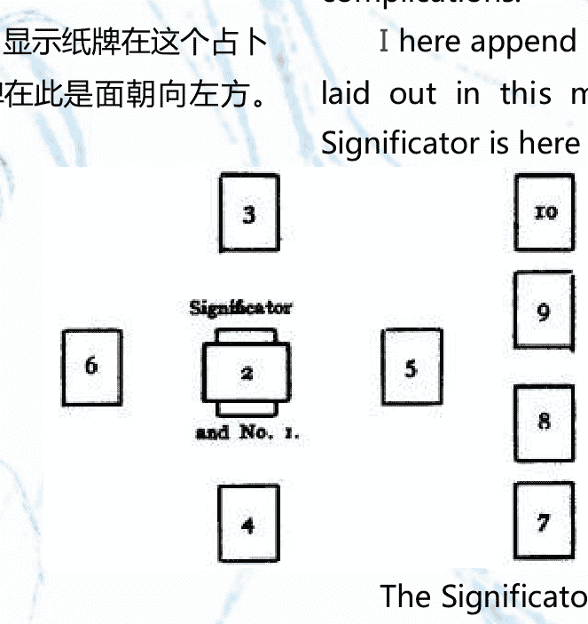

+   - 第1张牌：意义指示牌：所覆盖隐藏的事物
- 第2张牌：横跨阻挠他的事物
- 第3张牌：将给予他的报酬
- 第4张牌：在他之下的影响力
- 第5张牌：在他背后过去的原因影响
- 第6张牌：在他前方的未来状况

+   1. That covers him
2. What crosses him.
3. What crowns him.
4. What is beneath him.
5. What is behind him.
6. What is before him.

+   - 第7张牌：他自己本身
- 第8张牌：他的家
- 第9张牌：他的希望或恐惧
- 第10张牌：即将到来的事物

+   - 7. Himself.
- 8. His house.
- 9. His hopes or fears.
- 10. What will come.

将整副纸牌全数搓洗，并翻转部分纸牌以将他们的上部倒转。
然后，由问事者以左手切牌。

Shuffle the entire pack and turn some of the cards round, so as to invert their tops. Let them be cut by the Querent with his left hand.

然后将前四十二张牌分发成六叠，每叠七张牌，正面朝上，由此前七张牌组成第一叠，接下来的七张牌组成第二叠，以此类推，就形成下列的图示：

Deal out the first forty-two cards in six packets of seven cards each, face upwards, so that the first seven cards form the first packet, the following seven the second, and so on-as in the following diagram:--

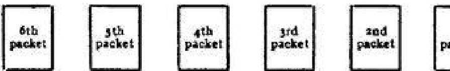

取出第一叠；将纸牌自右到左排成一列；然后将第二叠的纸牌依序放在它们上面，而仍然是成叠的状态。这样一来，你将会有新的七叠纸牌，每叠六张牌，排列如下所示：

Take up the first packet; lay out the cards on the table in a row, from right to left; place the cards of the second packet upon them and then the packets which remain. You will thus have seven new packets of six cards each, arranged as follows--

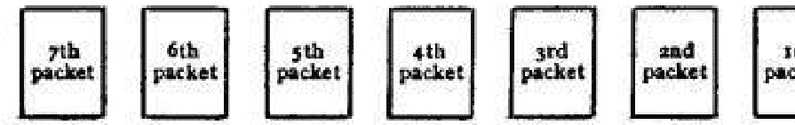

取出每叠最上方的牌，经过洗牌之后，自右到左排列，形成一列七张牌。

Take the top card of each packet, shuffle them and lay out from right to left, making a line of seven cards.

然后再从每叠纸牌中拿第二张牌，洗牌之后自右至左排列在第一列的下方，形成第二列。接着将最后的二十一张牌，重新洗牌并在下方依序排成三列。

Then take up the two next cards from each packet, shuffle and lay them out in two lines under the first line. Take up the remaining twenty-one cards of the packets, shuffle and lay them out in three lines below the others.

经过这些安排之后，你将会有六排水平行列，每行七张纸牌。

You will thus have six horizontal lines of seven cards each, arranged after the following manner.

| 7 | 6 | 5 | 4 | 3 | 2 | 1 |
|---|---|---|---|---|---|---|
| 7 | 6 | 5 | 4 | 3 | 2 | 1 |
| 7 | 6 | 5 | 4 | 3 | 2 | 1 |
| 7 | 6 | 5 | 4 | 3 | 2 | 1 |
| 7 | 6 | 5 | 4 | 3 | 2 | 1 |
| 7 | 6 | 5 | 4 | 3 | 2 | 1 |

采用这个方法时，占卜问事者若为男性，则以魔术师作为代表，若为女性，则以女祭司为代表；但是无论是上述那一种情况，所指定的纸牌都不应该先从纸牌中取出来，直到四十二张牌都已经依照上述操作过程发牌完毕。

In this method, the Querent—if of the male sex—is represented by the Magician, and if female by the High Priestess; but the card, in either case, is not taken from the pack until the forty-two cards have been laid out, as above directed. If the required card is not found among those placed upon the table, it must be sought among the remaining thirty-six cards, which have not been dealt, and should be placed a little distance to the right of the first horizontal line. On the other hand, if it is among them, it is also taken out, placed as stated, and a card is drawn haphazard from the thirty-six cards undealt to fill the vacant position, so that there are still forty-two cards laid out on the table.

如果所指定的牌并未出现在展开的四十二张牌当中，则必须从其他未分发的三十五张牌堆中寻找，并且放至在第一列水平行列的右方，并保持一点距离。

另一方面，假若这张指定牌是在四十二张牌中，也必须将它取出来，如上所述地放置，然后自未分发的三十五张牌中随意抽取一张，以填补空出的位置，如此一来，桌面上仍有四十二张展开的牌。

然后自右向左连续解读牌义，自最顶端的第一张牌开始，一直解读至最左下端，也就是最后一列的第七张牌为止。

这个方法建议使用于没有明确肯定的问题时，也就是说，当问事者希望知道一般关于个人生活与命运的课题时。如果他希望知道在一段特定的时间当中，是否会有何种恶运降临时，则这段时间必须在洗牌之前就先明确定义出来。

为了更进一步地解读牌义，则需谨记纸牌的诠释必须格外针对着主题，意思是说，所有正式与传统的牌义或许应加以修饰过以适应所讨论的这个特定案例的情况，无论是问事者的生活境况、时间或性别，或者是咨询内容的主角。

因此，愚者也许表示整个精神层面，介于仅仅是兴奋与疯狂之间，但是每一个占卜的特殊阶段都必须考虑纸牌的普通倾向来加以判断，在这样的情况下，天生的直觉能力扮演着重要的角色。

在解读的开始阶段，最好能够快速地浏览所有纸牌，如此，心智也许能接收到关于主题的笼统概念——命运的趋势——然后再重头开始，一一解读并详细地诠释。

必须记住的是，根据塔罗牌的假设前提，大阿尔卡那牌象征着更强大且具信服力的影响势力，是比小塔罗牌更值得加以参考的。

card No. 1 of the top line, the last to be read being that on the extreme left, or No. 7, of the bottom line.

This method is recommended when no definite question is asked—that is, when the Querent wishes to learn generally concerning the course of his life and destiny. If he wishes to know what may befall within a certain time, this time should be clearly specified before the cards are shuffled.

With further reference to the reading, it should be remembered that the cards must be interpreted relatively to the subject, which means that all official and conventional meanings of the cards may and should be adapted to harmonize with the conditions of this particular case in question—the position, time of life and sex of the Querent, or person for whom the consultation is made.

Thus, the Fool may indicate the whole range of mental phases between mere excitement and madness, but the particular phase in each divination must be judged by considering the general trend of the cards, and in this naturally the intuitive faculty plays an important part.

It is well, at the beginning of a reading, to run through the cards quickly, so that the mind may receive a general impression of the subject—the trend of the destiny—and afterwards to start again—reading them one by one and interpreting in detail.

It should be remembered that the Trumps represent more powerful and compelling forces—by the Tarot hypothesis—than are referable to the small cards.

关于直觉与洞察能力的重要性在占卜中是被视为理所当然的。无论这些天赋是与生俱来的或是占卜者逐渐养成的，纸牌的偶然排列在他的心智与占卜主题的氛围间形成连结，因此其他的部分都是简单的。

The value of intuitive and clairvoyant faculties is of course assumed in divination. Where these are naturally present or have been developed by the Diviner, the fortuitous arrangement of cards forms a link between his mind and the atmosphere of the subject of divination, and then the rest is simple.

在直觉失败或消失的地方，必须尽全力依靠全神贯注、理智观察与推论以获得一个令人满意的结果。但是直觉是可以经由这些占卜步骤的练习而培养出来，即使它显然是在潜伏的状态。

Where intuition fails, or is absent, concentration, intellectual observation and deduction must be used to the fullest extent to obtain a satisfactory result. But intuition, even if apparently dormant, may be cultivated by practice in these divinatory processes.

如果对一张纸牌在一个特定关联之中的确切意义感到疑惑，精通此事的人们建议占卜者，将他的手放在纸牌上，试着控制自己不去思考它原本应该表示的意思，并去注意心中所产生的印象与观感。初期这样做很可能会变成仅仅是猜测，而且也许会发现是错误的，但是透过练习去分辨有意识的猜测与潜意识所产生的印象，一切就变得有可能了。

If in doubt as to the exact meaning of a card in a particular connexion, the Diviner is recommended, by those who are versed in the matter, to place his hand on it, try to refrain from thinking of what it ought to be, and note the impressions that arise in his mind. At the beginning this will probably resolve itself into mere guessing and may prove incorrect, but it becomes possible with practice to distinguish between a guess of the conscious mind and an impression arising from the mind which is sub-conscious.

这并不在我的研究领域内，无论是提供理论的或实务的建议，全都没有我的份儿，但是下面的附加部份是由一位比全欧洲的纸牌占卜师还更具谈论资格的人所提供，假若他们能够单独使用一双手洗牌，并用一张嘴占卜预言的话。

It is not within my province to offer either theoretical or practical suggestions on this subject, in which I have no part, but the following *additamenta* have been contributed by one who has more titles to speak than all the cartomancists of Europe, if they could shuffle with a single pair of hands and divine with one tongue.

### 占卜实际操作注意事项：
### NOTES ON THE PRACTICE OF DIVINATION

1.  开始进行占卜操作以前，先有系统地且清楚地说明你的问题，并大声地重复它。
    Before beginning the operation, formulate your question definitely, and repeat it aloud.

2.  当洗牌的时候，尽量保持心智空白的状态。
    Make your mind as blank as possible while shuffling the cards.

3.  尽可能地将心中个人的偏见与先入为主的想法排除，否则你的判断将会因此受到影响。
    Put out of the mind personal bias and preconceived ideas as far as possible, or your judgment will be tinctured thereby.

4.  因此，正确地为一位陌生者占卜预言，会比帮自己或一位朋友占卜来的容易许多。
    On this account it is more easy to divine correctly for a stranger than for yourself or a friend.

### 九、三十五张牌的解读方法
### § 9 THE METHOD OF READING BY MEANS OF THIRTY-FIVE CARDS

当解读完毕之后，根据最后一个方法所提出的结构，也许会发生如前例一样的情况，仍有某些部分充满疑虑，或者非常希望能更深入地讨论这个问题，则需依照下列的方法操作。
When the reading is over, according to the scheme set forth in the last method, it may happen—as in the previous case—that something remains doubtful, or it may be desired to carry the question further, which is done as follows:—

拿起剩余未分发的纸牌，也就是不在第一次操作中所使用的四十二张纸牌之中的。将后者收成堆不予理会，正面朝上放在靠近问事者的最上方。将那三十五张牌依照前面的作法洗牌与切牌，并分发成六叠，按以下说明操作：
Take up the undealt cards which remain over, not having been used in the first operation with 42 cards. The latter are set aside in a heap, with the Querent, face upwards, on the top. The thirty-five cards, being shuffled and cut as before, are divided by dealing into six packets thus:—

第一叠由前七张纸牌构成；第二叠依序由接下来的六张纸牌构成；第三叠由接着的五张纸牌构成；第四叠包含接着的四张纸牌；第五叠包含两张纸牌；第六叠包含剩余的十一张纸牌。经排列呈现的结果如下：
Packet I consists of the first SEVEN CARDS; Packet II consists of the SIX CARDS next following in order; Packet III consists of the FIVE CARDS following; Packet IV contains the next FOUR CARDS; Packet V contains Two CARDS; and Packet VI contains the last ELEVEN CARDS. The arrangement will then be as follows:—

然后依序将每叠的纸牌取出，并分发形成六列直线，因此必然会形成长短不一的情况。
Take up these packets successively; deal out the cards which they contain in six lines, which will be necessarily of unequal length.

第一列代表房子、环境等等以此类推。
THE FIRST LINE stands for the house, the environment and so forth.

第二列代表所要占卜的这个人或主题。
THE SECOND LINE stands for the person or subject of the divination.

-   第三列代表外在经过的事物、事件或人等等。 THE THIRD LINE stands for what is passing outside, events, persons, etc.
-   第四列代表一份惊奇或未预料到的事物。 THE FOURTH LINE stands for a surprise, the unexpected, etc.
-   第五列代表慰藉的事物，而且也许能够减轻前面行列所显示的所有不利的情况。 THE FIFTH LINE stands for consolation, and may moderate all that is unfavourable in the preceding lines.
-   第六列是必须加以商议以阐明其他纸牌中难以理解的神谕；除开这些它就没有任何的重要性。 THE SIXTH LINE is that which must be consulted to elucidate the enigmatic oracles of the others; apart from them it has no importance.

这些纸牌都应该从左至右解读，从最上方的行列开始。
关于这个占卜的结论，必须要说明的是，没有任何诠释塔罗牌的方法是不能够应用在普通的游戏纸牌上，但是额外的宫廷牌与更重要的大阿尔卡那牌的存在，都是为了增加神谕的要素与价值观。
These cards should all be read from left to right, beginning with the uppermost line.
It should be stated in conclusion as to this divinatory part that there is no method of interpreting Tarot cards which is not applicable to ordinary playing-cards, but the additional court cards, and above all the Trumps Major, are held to increase the elements and values of the oracles.

至于整个主题的结论，我保留一项更深入且最后的重点，犹如结尾一般。这个观点就是，我将大阿尔卡那牌视同包含神秘教义。
And now in conclusion as to the whole matter, I have left for these last words—as if by way of epilogue—one further and final point. It is the sense in which I regard the Trumps Major as containing Secret Doctrine.

我在此并非表示说自己对于教义所寄托的规律与同行很熟悉，那是被发现更崇高的塔罗牌知识之处。我并未意味着，经由如此保存与传递的教义，能够被安排成独立埋藏于大阿尔卡那牌中。
我并不是说，那是某种塔罗牌之外的事物。关联性是存在的，这包含两个特别的意思；它有一部份是从塔罗牌中删减，而一部份是从那里排除；无论何种状况，根本的意思是相同的。但是也有保留的事物存在，并不在秩序规律或社团组
I do not here mean that I am acquainted with orders and fraternities in which such doctrine reposes and is there found to be part of higher Tarot knowledge. I do not mean that such doctrine, being so preserved and transmitted, can be constructed as imbedded independently in the Trumps Major. I do not mean that it is something apart from the Tarot. Associations exist which have special knowledge of both kinds; some of it is deduced from the Tarot and some of it is织中，但却经由另一种方式传递。

排除所有这类的传承，就让任何一位神秘主义者个别且整体地思考魔术师、愚者、女祭司、教皇、皇后、皇帝、倒悬者与高塔。然后允许他去细想那称为最后的审判的牌。他们包含着灵魂的传说。

其他的大阿尔卡那牌都是细节说明，有人也许会说，是偶然的因素。或许这样的一个人将会开始去了解深藏在这些符号的背后是什么，是谁最先发明出来的，又如何保留下来的。如果他这样做，也就将会明白为何我会如此关心这个主题，即使是冒着风险撰写有关纸牌的占卜。

> 【译文至此结束，故下面的参考书目没翻译了。】

apart therefrom; in either case, it is the same in the root-matter. But there are also things in reserve which are not in orders or societies, but are transmitted after another manner. Apart from all inheritance of this kind, let any one who is a mystic consider separately and in combination the Magician, the Fool, the High Priestess, the Hierophant, the Empress, the Emperor, the Hanged Man and the Tower. Let him then consider the card called the Last Judgment. They contain the legend of the soul. The other Trumps Major are the details and--as one might say--the accidents. Perhaps such a person will begin to understand what lies far behind these symbols, by whomsoever first invented and however preserved. If he does, he will see also why I have concerned myself with the subject, even at the risk of writing about divination by cards.

# Bibliography

A CONCISE BIBLIOGRAPHY OF THE CHIEF WORKS DEALING WITH THE TAROT AND ITS CONNEXIONS

As in spite of its modest pretensions, this monograph is, so far as I am aware, the first attempt to provide in English a complete synoptic account of the Tarot, with its archaeological position defined, its available symbolism developed, and--as a matter of curiosity in occultism--with its divinatory meanings and modes of operation sufficiently exhibited, it is my wish, from the literate standpoint, to enumerate those text-books of the subject, and the most important incidental references thereto, which have come under my notice. The bibliographical particulars that follow lay no claim to completeness, as I have cited nothing that I have not seen with my own eyes; but I can understand that most of my readers will be surprised at the extent of the literature--if I may so term it conventionally--which has grown up in the course of the last 120 years. Those who desire to pursue their inquiries further will find ample materials herein, though it is not a course which I am seeking to commend especially, as I deem that enough has been said upon the Tarot in this place to stand for all that has preceded it. The bibliography itself is representative after a similar manner. I should add that there is a considerable catalogue of cards and works on card-playing in the British Museum, but I have not had occasion to consult it to any extent for the purposes of the present list.

1.  *Monde Primitif, analyse et compare avec le Monde Moderne*. Par M. Court de Gebelin. Vol. 8, 40, Paris, 1781.

The articles on the Jeu des Tarots will be found at pp. 365 to 410. The plates at the end shew the Trumps Major and the Aces of each suit. These are valuable, as indications of the cards at the close of the eighteenth century. They were presumably then in circulation in the South of France, as it is said that at the period in question they were practically unknown at Paris. I have dealt with the claims of the papers in the body of the present work. Their speculations were tolerable enough for their mazy period; but that they are suffered still, and accepted indeed without question, by French occult writers is the most convincing testimony that one can need to the qualifications of the latter for dealing with any question of historical research.

#### II The Works of Etteilla

Les Septs Nuances de l'oeuvre philosophique Hermitique; Maniere de se recreer avec le Jeu de Cartes, nommees Tarots; Fragments sur les Hautes Sciences; Philosophie des Hautes Sciences; Jeu des Tarots, ou le Livre de Thoth; Lecons Theoriques et Pratiques du Livre de Thoth--all published between 1783 and 1787.

These are exceedingly rare and were frankly among the works of colportage of their particular period. They contain the most curious fragments on matters within and without the main issue, lucubrations on genii, magic, astrology, talismans, dreams, etc. I have spoken sufficiently in the text of the author's views on the Tarot and his place in its modern history. He regarded it as a work of speaking hieroglyphics, but to translate it was not easy. He, however, accomplished the task that is to say, in his own opinion.

#### III An Inquiry into the Antient Greek Game, supposed to have been invented by Palamedes

[By James Christie.] London: 40, 1801.

I mention this collection of curious dissertations because it has been cited by writers on the Tarot. It seeks to establish a close connexion between early games of antiquity and modern chess. It is suggested that the invention attributed to Palamedes, prior to the Siege of Troy, was known in China from a more remote period of antiquity. The work has no reference to cards of any kind whatsoever.

#### IV Researches into the History of Playing Cards

By Samuel Weller Singer. 40, London, 1816.

The Tarot is probably of Eastern origin and high antiquity, but the rest of Court de Gebelin's theory is vague and unfounded. Cards were known in Europe prior to the appearance of the Egyptians. The work has a good deal of curious information and the appendices are valuable, but the Tarot occupies comparatively little of the text and the period is too early for a tangible criticism of its claims. There are excellent reproductions of early specimen designs. Those of Court de Gebelin are also given in extenso.

#### V Facts and Speculations on Playing Cards

By W. A. Chatto. 8vo, London, 1848.

The author suggested that the Trumps Major and the numeral cards were once separate, but were afterwards combined. The oldest specimens of Tarot cards are not later than 1440.

But the claims and value of the volume have been sufficiently described in the text.

#### VI *Les Cartes a Jouer et la Cartomancie*

Par D. R. P. Boiteau d'Ambly. 40, Paris, 1854.

There are some interesting illustrations of early Tarot cards, Which are said to be of Oriental origin; but they are not referred to Egypt. The early gipsy connexion is affirmed, but there is no evidence produced. The cards came with the gipsies from India, where they were designed to shew forth the intentions of "the unknown divinity" rather than to be the servants of profane amusement.

#### VII *Dogme et Rituel de la Haute Magie*

Par Eliphas Levi, 2 vols., demy 8vo, Paris, 1854.

This is the first publication of Alphonse Louis Constant on occult philosophy, and it is also his *magnum opus*. It is constructed in both volumes on the major Keys of the Tarot and has been therefore understood as a kind of development of their implicits, in the way that these were presented to the mind of the author. To supplement what has been said of this work in the text of the present monograph, I need only add that the § on transmutations in the second volume contains what is termed the *Key of Thoth*. The inner circle depicts a triple *Tau*, with a hexagram where the bases join, and beneath is the Ace of Cups. Within the external circle are the letters TARO, and about this figure as a whole are grouped the symbols of the Four Living Creatures, the Ace of Wands, Ace of Swords, the letter *Shin*, and a magician's candle, which is identical, according to Levi, with the lights used in the Goetic Circle of Black Evocations and Pacts. The triple *Tau* may be taken to represent the Ace of Pentacles. The only Tarot card given in the volumes is the Chariot, which is drawn by two sphinxes; the fashion thus set has been followed in later days. Those who interpret the work as a kind of commentary on the Trumps Major are the conventional occult students and those who follow them will have only the pains of fools.

#### VIII *Les Romes*

Par J. A. Vaillant. Demy 8vo, Paris, 1857.

The author tells us how he met with the cards, but the account is in a chapter of anecdotes. The Tarot is the sidereal book of Enoch, modelled on the astral wheel of Athor. There is a description of the Trumps Major, which are evidently regarded as an heirloom, brought by the gipsies from Indo-Tartary. The publication of Levi's *Dogme et Rituel* must, I## IX *Histoire de la Magie*. Par Eliphas Levi. 8vo, Paris, 1860.

The references to the Tarot are few in this brilliant work, which will be available shortly in English. It gives the 21st Trump Major, commonly called the Universe, or World, under the title of *Yinx Pantomorph*--a seated figure wearing the crown of Isis. This has been reproduced by Papus in *Le Tarot Divinataire*. The author explains that the extant Tarot has come down to us through the Jews, but it passed somehow into the hands of the gipsies, who brought it with them when they first entered France in the early part of the fifteenth century. The authority here is Vaillant.

#### X *La Clef des Grands Mysteres*. Par Eliphas Levi. 8vo, Paris, 1861.

The frontispiece to this work represents the absolute Key of the occult sciences, given by William Postel and completed by the writer. It is reproduced in The Tarot of the Bohemians, and in the preface which I have prefixed thereto, as indeed elsewhere, I have explained that Postel never constructed a hieroglyphical key. Eliphas Levi identifies the Tarot as that sacred alphabet which has been variously referred to Enoch, Thoth, Cadmus and Palamedes. It consists of absolute ideas attached to signs and numbers. In respect of the latter, there is an extended commentary on these as far as the number 9, the series being interpreted as the Keys of Occult Theology. The remaining three numerals which complete the Hebrew alphabet are called the Keys of Nature. The Tarot is said to be the original of chess, as it is also of the Royal Game of Goose. This volume contains the author's hypothetical reconstruction of the tenth Trump Major, showing Egyptian figures on the Wheel of Fortune.

#### XI *L'Homme Rouge des Tuileries*. Par P. Christian. Fcap. 8vo, Paris, 1863.

The work is exceedingly rare, is much sought and was once highly prized in France; but Dr. Papus has awakened to the fact that it is really of slender value, and the statement might be extended. It is interesting, however, as containing the writer's first reveries on the Tarot. He was a follower and imitator of Levi. In the present work, he provides a commentary on the Trumps Major and thereafter the designs and meanings of all the Minor Arcana. There are many and curious astrological attributions. The work does not seem to mention the Tarot by name. A later Histoire de la Magie does little more than reproduce and extend the account of the Trumps Major given herein.

#### XII The History of Playing Cards. By E. S. Taylor. Cr. 8vo, London, 1865.

This was published posthumously and is practically a translation of Boiteau. It therefore calls for little remark on my part. The opinion is that cards were imported by the gipsies from India. There are also references to the so-called Chinese Tarot, which was mentioned by Court de Gebelin.

#### XIII Origine des Cartes a Jouer. Par Romain Merlin. 40, Paris, 1869.

There is no basis for the Egyptian origin of the Tarot, except in the imagination of Court de Gebelin. I have mentioned otherwise that the writer disposes, to his personal satisfaction, of the gipsy hypothesis, and he does the same in respect of the imputed connexion with India; he says that cards were known in Europe before communication was opened generally with that world about 1494. But if the gipsies were a Pariah tribe already dwelling in the West, and if the cards were a part of their baggage, there is nothing in this contention. The whole question is essentially one of speculation.

#### XIV The Platonist. Vol. II, pp. 126-8. Published at St. Louis, Mo., U.S.A., 1884-5. Royal 4to.

This periodical, the suspension of which must have been regretted by many admirers of an unselfish and laborious effort, contained one anonymous article on the Tarot by a writer with theosophical tendencies, and considerable pretensions to knowledge. It has, however, by its own evidence, strong titles to negligence, and is indeed a ridiculous performance. The word Tarot is the Latin Rota = wheel, transposed. The system was invented at a remote period in India, presumably--for the writer is vague--about B.C. 300. The Fool represents primordial chaos. The Tarot is now used by Rosicrucian adepts, but in spite of the inference that it may have come down to them from their German progenitors in the early seventeenth century, and notwithstanding the source in India, the twenty-two keys were pictured on the walls of Egyptian temples dedicated to the mysteries of initiation. Some of this rubbish is derived from P. Christian, but the following statement is peculiar, I think, to the writer: "It is known to adepts that there should be twenty-two esoteric keys, which would make the total number up to 100." Persons who reach a certain stage of lucidity have only to provide blank pasteboards of the required number and the missing designs will be furnished by superior intelligences. Meanwhile, America is still awaiting the fulfilment of the concluding forecast, that some few will ere long have so far developed in that country "as to be able to read perfectly... in that perfect and divine sybiline work, the Tarot." Perhaps the cards which accompany the present volume will give the opportunity and the impulse!

#### XV El Joc de Naips. Per Joseph Brunet y Bellet. Cr. 8vo, Barcelona, 1886.

With reference to the dream of Egyptian origin, the author quotes E. Garth Wilkinson's Manners and Customs of the Egyptians as negative evidence at least that cards were unknown in the old cities of the Delta. The history of the subject is sketched, following the chief authorities, but without reference to exponents of the occult schools. The mainstay throughout is Chatto. There are some interesting particulars about the prohibition of cards in Spain, and the appendices include a few valuable documents, by one of which it appears, as already mentioned, that St. Bernardin of Sienna preached against games in general, and cards in particular, so far back as 1423. There are illustrations of rude Tarots, including a curious example of an Ace of Cups, with a phoenix rising therefrom, and a Queen of Cups, from whose vessel issues a flower.

#### XVI The Tarot: Its Occult Signification, Use in Fortune-Telling, and Method of Play. By S. L. MacGregor Mathers. Sq. 16mo, London, 1888.

This booklet was designed to accompany a set of Tarot cards, and the current packs of the period were imported from abroad for the purpose. There is no pretence of original research, and the only personal opinion expressed by the writer or calling for notice here states that the Trumps Major are hieroglyphic symbols corresponding to the occult meanings of the Hebrew alphabet. Here the authority is Levi, from whom is also derived the brief symbolism allocated to the twenty-two Keys. The divinatory meanings follow, and then the modes of operation. It is a mere sketch written in a pretentious manner and is negligible.

#### XVII *Traite Methodique de Science Occulte*. Par Papus. 8vo, Paris, 1891.

The rectified Tarot published by Oswald Wirth after the indications of Eliphas Levi is reproduced in this work, which--it may be mentioned--extends to nearly 1,100 pages. There is a § on the gipsies, considered as the importers of esoteric tradition into Europe by means of the cards. The Tarot is a combination of numbers and ideas, whence its correspondence with the Hebrew alphabet. Unfortunately, the Hebrew citations are rendered almost unintelligible by innumerable typographical errors.

#### XVIII *Eliphas Levi: Le Livre des Splendeurs*. Demy 8vo, Paris, 1894.

A § on the Elements of the Kabalah affirms (a) That the Tarot contains in the several cards of the four suits a fourfold explanation of the numbers 1 to 10; (b) that the symbols which we now have only in the form of cards were at first medals and then afterwards became talismans; (c) that the Tarot is the hieroglyphical book of the Thirty-two Paths of Kabalistic theosophy, and that its summary explanation is in the *Sepher Yelzirah*; (d) that it is the inspiration of all religious theories and symbols; (e) that its emblems are found on the ancient monuments of Egypt. With the historical value of these pretensions I have dealt in the text.

#### XIX *Clefs Magiques et Clavicules de Salomon*. Par Eliphas Levi. Sq. 12mo, Paris, 1895.

The Keys in question are said to have been restored in 1860, in their primitive purity, by means of hieroglyphical signs and numbers, without any admixture of Samaritan or Egyptian images. There are rude designs of the Hebrew letters attributed to the Trumps Major, with meanings--most of which are to be found in other works by the same writer. There are also combinations of the letters which enter into the Divine Name; these combinations are attributed to the court cards of the Lesser Arcana. Certain talismans of spirits are in fine furnished with Tarot attributions; the Ace of Clubs corresponds to the *Deus Absconditus*, the First Principle. The little book was issued at a high price and as something that should be reserved to adepts, or those on the path of adeptship, but it is really without value--symbolical or otherwise.

#### XXI *Les xxii Lames Hermetiques du Tarot Divinatoire.* Par R. Falconnier. Demy 8vo, Paris, 1896.

The word Tarot comes from the Sanskrit and means "fixed star," which in its turn signifies immutable tradition, theosophical synthesis, symbolism of primitive dogma, etc. Graven on golden plates, the designs were used by Hermes Trismegistus and their mysteries were only revealed to the highest grades of the priesthood of Isis. It is unnecessary therefore to say that the Tarot is of Egyptian origin and the work of M. Falconnier has been to reconstruct its primitive form, which he does by reference to the monuments--that is to say, after the fashion of Eliphas Levi, he draws the designs of the Trumps Major in imitation of Egyptian art. This production has been hailed by French occultists as presenting the Tarot in its perfection, but the same has been said of the designs of Oswald Wirth, which are quite unlike and not Egyptian at all. To be frank, these kinds of foolery may be as much as can be expected from the Sanctuary of the Comedie-Francaise, to which the author belongs, and it should be reserved thereto.

#### XXII *The Magical Ritual of the Sanctum Regnum, interpreted by the Tarot Trumps.* Translated from the MSS. of Eliphas Levi and edited by W. Wynn Westcott, M.B. Fcap. 8vo, London, 1896.

It is necessary to say that the interest of this memorial rests rather in the fact of its existence than in its intrinsic importance. There is a kind of informal commentary on the Trumps Major, or rather there are considerations which presumably had arisen therefrom in the mind of the French author. For example, the card called Fortitude is an opportunity for expatiation on will as the secret of strength. The Hanged Man is said to represent the completion of the Great Work. Death suggests a diatribe against Necromancy and Goetia; but such phantoms have no existence in "the *Sanctum Regnum*" of life. Temperance produces only a few vapid commonplaces, and the Devil, which is blind force, is the occasion for repetition of much that has been said already in the earlier works of Levi. The Tower represents the betrayal of the Great Arcanum, and this it was which caused the sword of Samael to be stretched over the Garden of Delight. Amongst the plates there is a monogram of the Gnosis, which is also that of the Tarot. The editor has thoughtfully appended some information on the Trump Cards taken from the early works of Levi and from the commentaries of P. Christian.

#### XXIII *Comment on devient Alchimiste.* Par F. Jolivet de Castellot. Sq. 8vo, Paris, 1897.

Herein is a summary of the Alchemical Tarot, which-with all my respect for innovations and inventions-seems to be high fantasy; but Etteilla had reveries of this kind, and if it should ever be warrantable to produce a Key Major in place of the present Key Minor, it might be worth while to tabulate the analogies of these strange dreams. At the moment it will be sufficient to say that there is given a schedule of the alchemical correspondences to the Trumps Major, by which it appears that the juggler or Magician symbolizes attractive force; the High Priestess is inert matter, than which nothing is more false; the Pope is the Quintessence, which--if he were only acquainted with Shakespeare--might tempt the present successor of St. Peter to repeat that "there are more things in heaven and earth, Horatio." The Devil, on the other hand, is the matter of philosophy at the black stage; the Last judgment is the red stage of the Stone; the Fool is its fermentation; and, in fine, the last card, or the World, is the Alchemical Absolute-the Stone itself. If this should encourage my readers, they may note further that the particulars of various chemical combinations can be developed by means of the Lesser Arcana, if these are laid out for the purpose. Specifically, the King of Wands = Gold the Pages or Knaves represent animal substances the King of Cups = Silver; and so forth.

#### XXIV *Le Grand Arcane, ou l'occultisme devoile.* Par Eliphas Levi. Demy 8vo, Paris, 1898.

After many years and the long experience of all his concerns in occultism, the author at length reduces his message to one formula in this work. I speak, of course, only in respect of the Tarot: he says that the cards of Etteilla produce a kind of hypnotism in the seer or seeress who divines thereby. The folly of the psychic reads in the folly of the querent. Did he counsel honesty, it is suggested that he would lose his clients. I have written severe criticisms on occult arts and sciences, but this is astonishing from one of their past professors and, moreover, I think that the psychic occasionally is a psychic and sees in a manner as such.

#### XXV *Le Serpent de la Genese--Livre II; La Clef de la Magie Noire.* Par Stanislas de Guaita. 8vo, Paris, 1902.

It is a vast commentary on the second septenary of the Trumps Major. Justice signifies equilibrium and its agent; the Hermit typifies the mysteries of solitude; the Wheel of Fortune is the circulus of becoming or attaining; Fortitude signifies the power resident in will; the Hanged Man is magical bondage, which speaks volumes for the clouded and inverted insight of this fantasiast in occultism: Death is, of course, that which its name signifies, but with reversion to the second death; Temperance means the magic of transformations, and therefore suggests excess rather than abstinence. There is more of the same kind of thing--I believe--in the first book, but this will serve as a specimen. The demise of Stanislas de Guaita put an end to his scheme of interpreting the Tarot Trumps, but it should be understood that the connexion is shadowy and that actual references could be reduced to a very few pages.

#### XXVI *Le Tarot: Apercu historique.* Par. J. J. Bourgeat. Sq. 12MO, Paris, 1906.

The author has illustrated his work by purely fantastic designs of certain Trumps Major, as, for example, the Wheel of Fortune, Death and the Devil. They have no connexion with symbolism. The Tarot is said to have originated in India, whence it passed to Egypt. Eliphas Levi, P. Christian, and J. A. Vaillant are cited in support of statements and points of view. The mode of divination adopted is fully and carefully set out.

#### XXVII *L'Art de tirer les Caries.* Par Antonio Magus. Cr. 8vo, Paris, n.d. (about 1908).

This is not a work of any especial pretension, nor has it any title to consideration on account of its modesty. Frankly, it is little--if any--better than a bookseller's experiment. There is a summary account of the chief methods of divination, derived from familiar sources; there is a history of cartomancy in France; and there are indifferent reproductions of Etteilla Tarot cards, with his meanings and the well-known mode of operation. Finally, there is a § on common fortune-telling by a piquet set of ordinary cards: this seems to lack the only merit that it might have Possessed, namely, perspicuity; but I speak with reserve, as I am not perhaps a judge possessing ideal qualifications in matters of this kind. In any case, the question signifies nothing. It is just to add that the concealed author maintains what he terms the Egyptian tradition of the Tarot, which is the Great Book of Thoth. But there is a light accent throughout his thesis, and it does not follow that he took the claim seriously.

## XXVIII **XXVII *Le Tarot Divinatoire: Clef du tirage des Caries et des sorts.* Par le Dr. Papus. Demy 8vo, Paris, 1909.**

The text is accompanied by what is termed a complete reconstitution of all the symbols, which means that in this manner we have yet another Tarot. The Trumps Major follow the traditional lines, with various explanations and attributions on the margins, and this Plan obtains throughout the series. From the draughtsman's point of view, it must be said that the designs are indifferently done, and the reproductions seem worse than the designs. This is probably of no especial importance to the class of readers addressed. Dr. Papus also presents, by way of curious memorials, the evidential value of which he seems to accept implicitly, certain unpublished designs of Eliphas Levi; they are certainly interesting as examples of the manner in which the great occultist manufactured the archaeology of the Tarot to bear out his personal views. We have (a) Trump Major, No. 5, being Horus as the Grand Hierophant, drawn after the monuments; (b) Trump Major, No. 2, being the High Priestess as Isis, also after the monuments; and (c) five imaginary specimens of an Indian Tarot. This is how la haute science in France contributes to the illustration of that work which Dr. Papus terms livre de la science eternelle; it would be called by rougher names in English criticism. The editor himself takes his usual pains and believes that he has discovered the time attributed to each card by ancient Egypt. He applies it to the purpose of divination, so that the skilful fortune-teller can now predict the hour and the day when the dark young man will meet with the fair widow, and so forth.

## **XXVIII *Le Tarot des Bohemiens.* Par Papus. 8vo, Paris, 1889. English Translation, second edition, 1910.**

An exceedingly complex work, which claims to present an absolute key to occult science. It was translated into English by Mr. A. P. Morton in 1896, and this version has been re-issued recently under my own supervision. The preface which I have prefixed thereto contains all that it is necessary to say regarding its claims, and it should be certainly consulted by readers of the present Pictorial Key to the Tarot. The fact that Papus regards the great sheaf of hieroglyphics as "the most ancient book in the world," as "the Bible of Bibles," and therefore as "the primitive revelation," does not detract from the claim of his general study, which--it should be added--is accompanied by numerous valuable plates, exhibiting Tarot codices, old and new, and diagrams summarizing the personal theses of the writer and of some others who preceded him. The Tarot of the Bohemians is published at 6s. by William Rider & Son, Ltd.

#### XXIX Manuel Synthetique et Pratique du Tarot. Par Eudes Picard. 8vo, Paris, 1909.

Here is yet one more handbook of the subject, presenting in a series of rough plates a complete sequence of the cards. The Trumps Major are those of Court de Gebelin and for the Lesser Arcana the writer has had recourse to his imagination; it can be said that some of them are curious, a very few thinly suggestive and the rest bad. The explanations embody neither research nor thought at first hand; they are bald summaries of the occult authorities in France, followed by a brief general sense drawn out as a harmony of the whole. The method of use is confined to four pages and recommends that divination should be performed in a fasting state. On the history of the Tarot, M. Picard says (a) that it is confused; (b) that we do not know precisely whence it comes; (c) that, this notwithstanding, its introduction is due to the Gipsies. He says finally that its interpretation is an art.

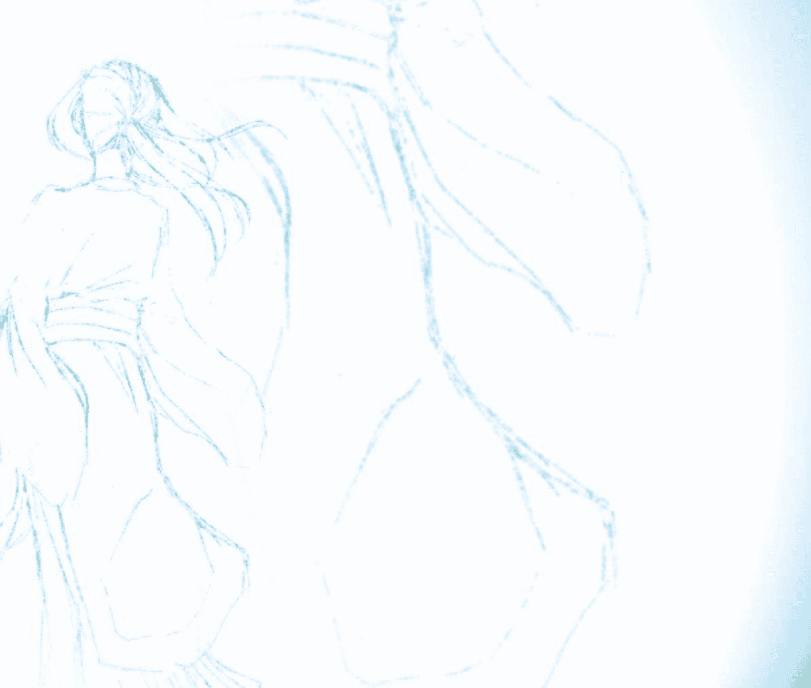