## 傅子绮 著

# 塔罗玩玩

## TAROT

最立竿见影的运势预测，最神秘莫测的塔罗力量！

“塔罗女巫”全面解说牌义，深度解析塔罗牌基本阵法。

台湾两性作家：女王、插画家：大苟羊、漫画家：水瓶鲸鱼、塔罗名人：向日葵、怀旧卡通漫画家：张哲生、时尚名媛：杨秀蓉

一致推荐

全彩印刷，赠送全副塔罗牌

武汉出版社 WUHAN PUBLISHING HOUSE

## 塔罗天天灵 TAROT

塔罗的神秘学说及推算艺术令世界称奇。它源自古埃及金字塔的精美神奇羊皮卷，古老神秘、丰富深刻、充满智慧。数千年来，透过它丰富的奥义、坚实的心理学基础和灵验的预测，忠实的玩家透视了命运的繁复、人生的无常。至今，世界上越来越多的人开始成为塔罗的追逐者。

本书由塔罗界传奇“女巫”傅子绮亲撰，附送国际标准全副塔罗牌。使用方法简单、便利，只要随手一翻，立见当日爱情、工作、金钱三大运势的预测；另外，每张塔罗牌皆由作者详细解说牌义，图文结合，深入浅出，让塔罗初学者能快速了解每张塔罗牌的内涵，书末着重列举一些塔罗牌基本阵法，让读者能立即亲自体验、学习塔罗牌占卜，并对塔罗牌基本阵法迅速上手。

上架建议：畅销书-塔罗

ISBN 978-7-5430-6578-9

9 787543 065789

定价：55.00元

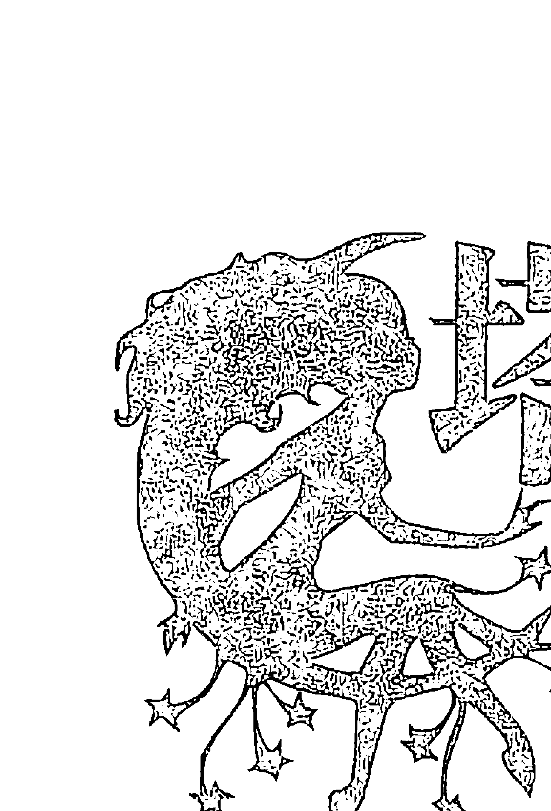

## 塔罗天天见

☆傅子绮 著

(鄂)新登字08号
图书在版编目 (CIP) 数据
塔罗天天灵 / 傅子绮著. —武汉: 武汉出版社, 2012.3
ISBN 978-7-5430-6578-9
Ⅰ. ①塔… Ⅱ. ①傅… Ⅲ. ①扑克-占卜
Ⅳ. ①B991 ② G892
中国版本图书馆 CIP 数据核字(2012)第003838号

书名：塔罗天天灵

著 者：傅子绮
特约编辑：李异鸣 杨 肖
责任编辑：王冠含
封面设计：木头羊工作室
出 版：武汉出版社
社 址：武汉市江汉区新华下路103号 邮 编：430015
电 话：(027)85606403 85600625
http://www.whcbs.com E-mail: zbs@whcbs.com
印 刷：北京九天志诚印刷有限公司
经 销：新华书店
开 本：787mm×1092mm 1/32
印 张：7.5
字 数：130千字
版 次：2012年3月第1版 2012年3月第1次印刷
定 价：55.00元

版权所有 侵权必究
如有质量问题,由承印厂负责调换。

## 《序。本书使用说明》

> “塔罗天天灵、快乐天天临”，是每个人必备的随身妙锦囊。

美国女诗人Emily Dickinson曾经写道：“Tell all the truth, but tell it slant.”（道出所有的真相，但要缓缓斜斜地说）。

我一直相信凡事皆有因果，不管是从宗教上或是从心理学来说。很多道理都是藏在细节里，许多机会也总是有隐喻的，最容易知道秘密的方法，就是倾听自己的声音，还有与塔罗牌的图像沟通。

这本书中有塔罗女巫傅子绮亲自监督构思的塔罗牌，除了根据韦特牌的传统，还有女性主义塔罗芭芭拉沃克牌的思想，女巫子绮选择Emily Dickinson的开场白，就是要告诉所有读者：

> “所有的真相都在这本《塔罗天天灵》中。”

每一位购买《塔罗天天灵》的读者，汇集起来都是伟大的念力，因为你们期望知道“今天好运的密码”在哪里，只要每次使用这本书时，心里默念你的问题……“塔罗牌呀！请告诉我今天的好运密码吧！我一定会更加努力，不会辜负老天给我的好运的。”如此用念力祈求，然后随机翻阅里面的一页，你就可以知道今天属于你的好运密码。

《塔罗天天灵》是一本属于每个人的“生活妙锦囊”，不管你有没有学过塔罗牌，都可以借助这本《塔罗天天灵》，每天随机找出自己的生活忠告。

很幸运地，因为塔罗牌让塔罗女巫子绮与你的生活有所联结，你可以每天祈求并翻牌，得到简单的预言，也可以利用随书所附的七十八张塔罗牌开始学习当个塔罗师，只要你愿意，你随时都可以找到塔罗女巫傅子绮，让我们一起用智慧、念力、伟大的潜在能量，开启自助也助人的“塔罗天天灵、快乐天天临”的幸福人生吧！

不过，初学塔罗的您，可千万不要把塔罗看作是单纯的占卜术哦，说不定，您将它看作一场透视人生的游戏，会更有利于您平静内心，集中念力。

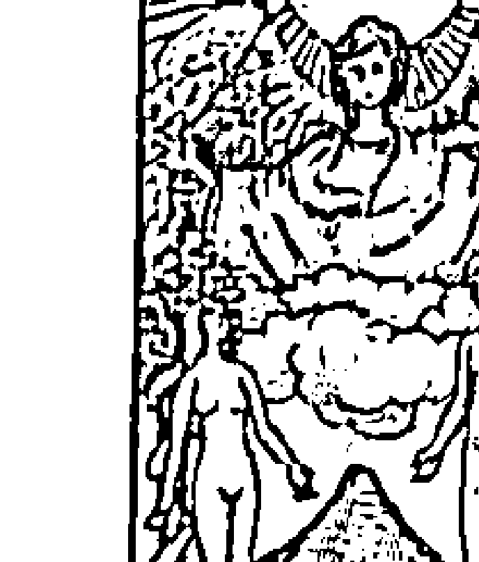

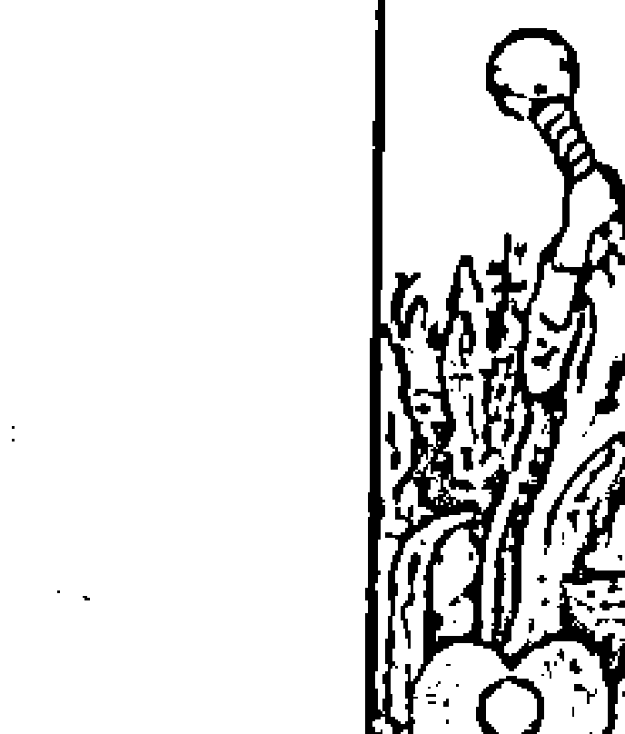

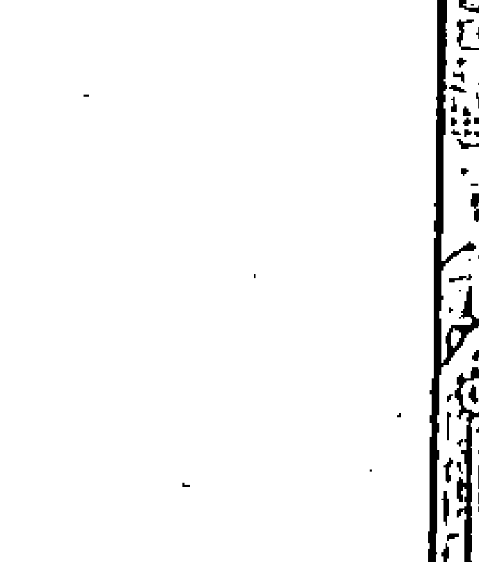

## 目录 Contents

- 宝剑国王 (正) / 1
- 圣杯侍者 (正) / 2
- 悬吊者 (正) / 4
- 钱币5 (正) / 5
- 恋人 (逆) / 7
- 高塔 (正) / 8
- 圣杯2 (正) / 10
- 权杖骑士 (逆) / 11
- 钱币9 (逆) / 13
- 皇后 (逆) / 14
- 圣杯4 (正) / 16
- 女祭司 (正) / 17
- 权杖4 (逆) / 19
- 隐者 (逆) / 20
- 权杖侍者 (逆) / 21
- 钱币10 (正) / 22
- 力量 (正) / 24
- 圣杯6 (逆) / 25
- 钱币8 (逆) / 26
- 权杖3 (逆) / 28
- 权杖8 (正) / 29
- 魔术师 (正) / 30
- 太阳 (逆) / 32
- 圣杯国王 (逆) / 33
- 权杖2 (正) / 34
- 宝剑10 (逆) / 36
- 皇后 (正) / 37
- 权杖侍者 (正) / 38
- 圣杯骑士 (逆) / 40
- 宝剑3 (正) / 41
- 权杖2 (逆) / 43
- 圣杯2 (逆) / 44
- 宝剑4 (逆) / 45
- 战车 (正) / 47
- 圣杯3 (逆) / 48
- 宝剑2 (正) / 49

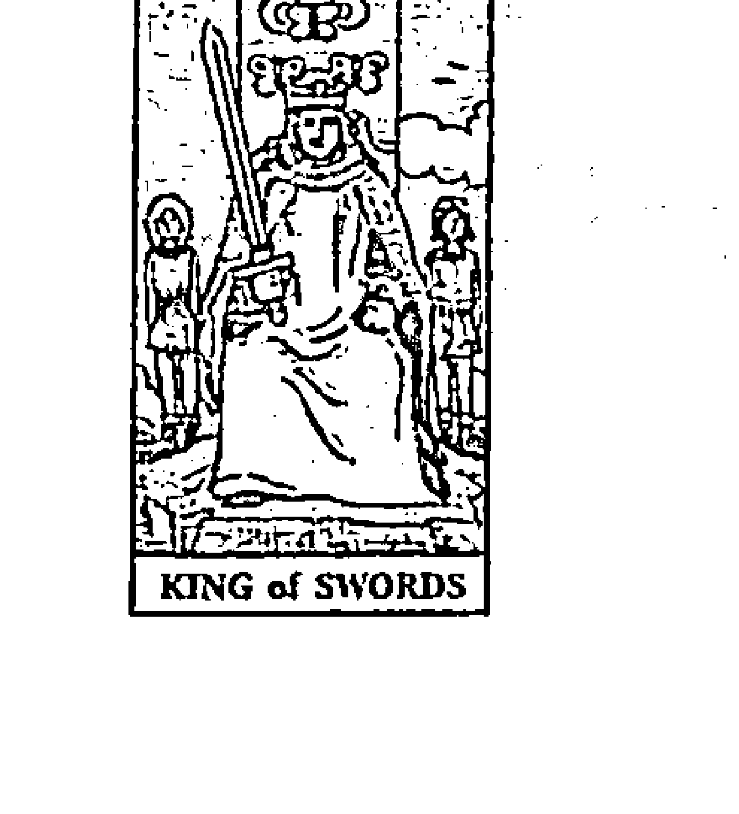

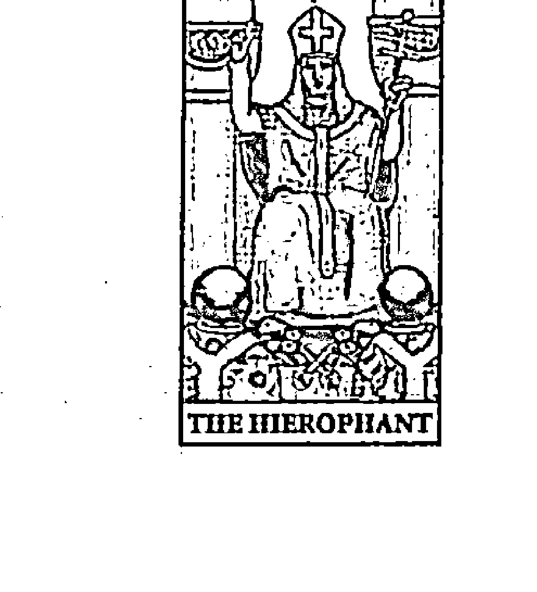

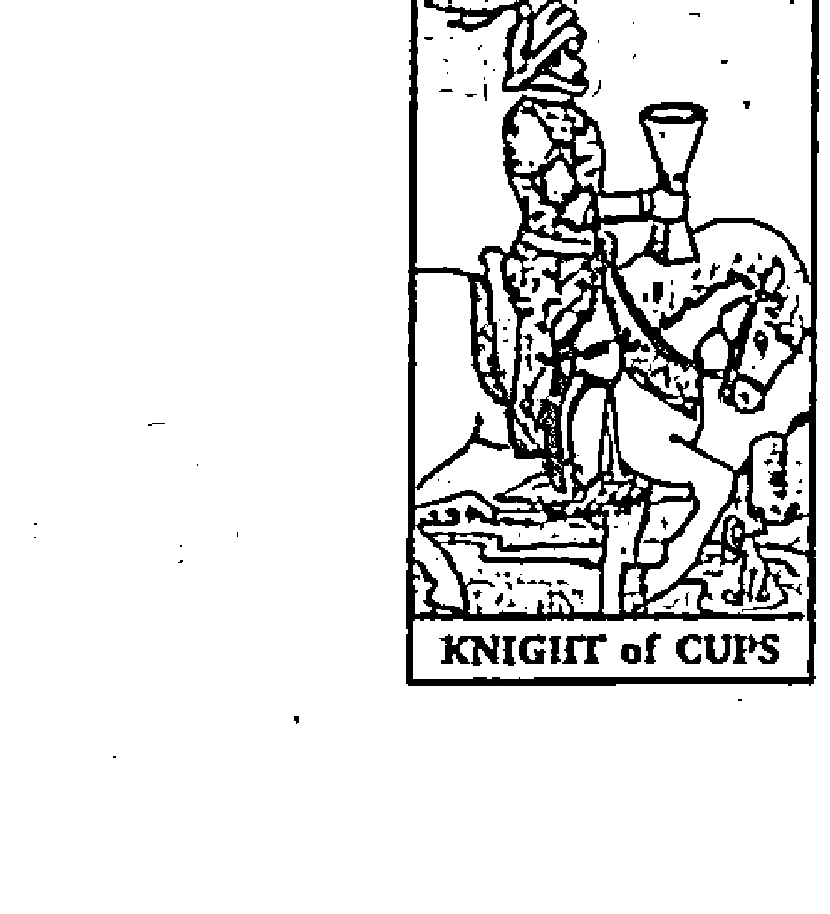

- 权杖皇后 (逆) / 51
- 权杖骑士 (正) / 52
- 钱币6 (正) / 53
- 命运之轮 (正) / 55
- 魔术师 (逆) / 56
- 节制 (正) / 57
- 圣杯1 (正) / 59
- 圣杯皇后 (逆) / 60
- 宝剑3 (逆) / 62
- 权杖皇后 (正) / 63
- 隐者 (正) / 65
- 月亮 (正) / 66
- 圣杯9 (逆) / 67
- 宝剑国王 (逆) / 69
- 钱币国王 (正) / 70
- 女祭司 (逆) / 72
- 圣杯9 (正) / 73
- 节制 (逆) / 74
- 愚者 (正) / 76
- 钱币3 (逆) / 77
- 权杖国王 (逆) / 78
- 世界 (逆) / 80

- 教皇 (逆) / 81
- 宝剑1 (正) / 83
- 圣杯5 (正) / 84
- 宝剑8 (逆) / 86
- 权杖1 (正) / 87
- 权杖9 (逆) / 88
- 太阳 (正) / 90
- 钱币皇后 (逆) / 91
- 宝剑皇后 (正) / 92
- 力量 (逆) / 94
- 钱币4 (正) / 95
- 权杖5 (正) / 97
- 星星 (逆) / 98
- 钱币骑士 (逆) / 99
- 钱币侍者 (正) / 101
- 权杖8 (逆) / 102
- 圣杯3 (正) / 103
- 悬吊者 (逆) / 105
- 死神 (正) / 106
- 宝剑2 (逆) / 108
- 恋人 (正) / 109
- 战车 (逆) / 111

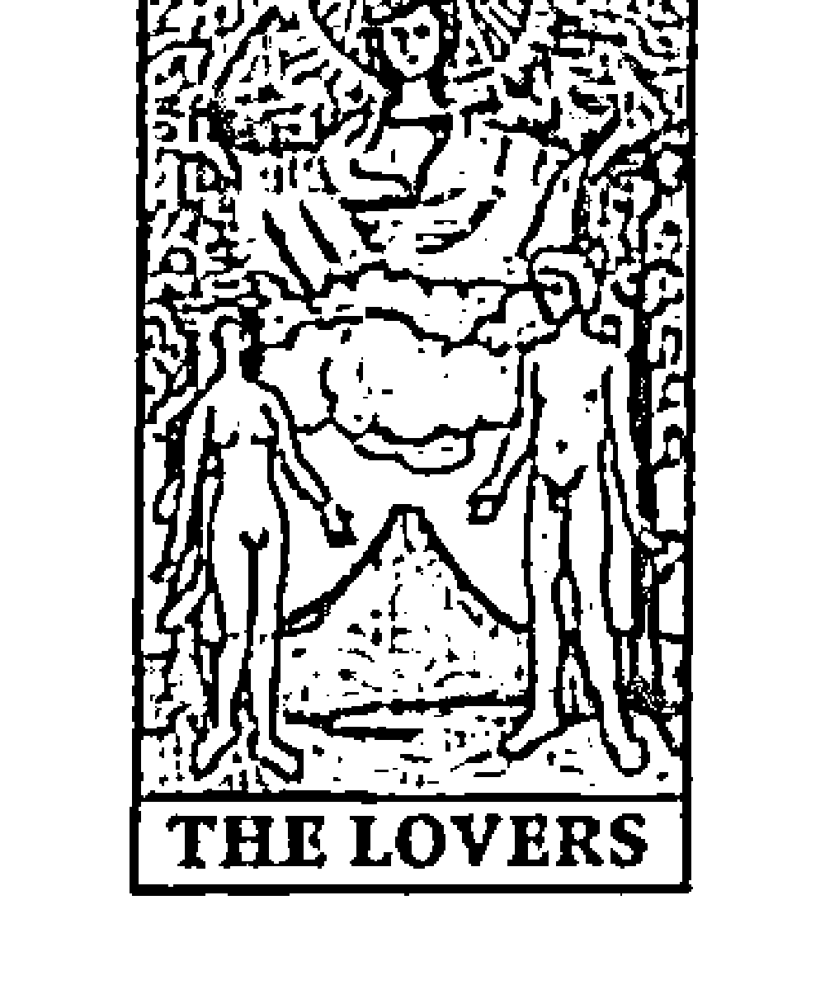

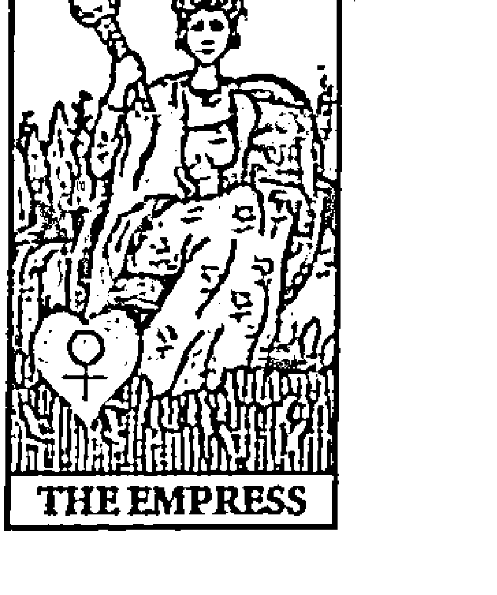

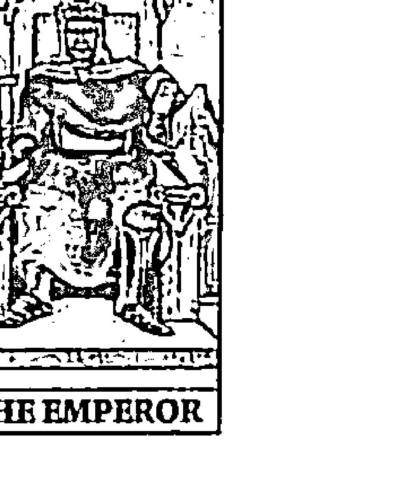

- 宝剑皇后 (逆) / 112
- 权杖国王 (正) / 113
- 钱币2 (正) / 115
- 宝剑6 (逆) / 116
- 权杖6 (正) / 118
- 钱币6 (逆) / 119
- 死神 (逆) / 120
- 宝剑7 (逆) / 122
- 宝剑7 (正) / 123
- 圣杯1 (逆) / 125
- 圣杯4 (逆) / 126
- 钱币侍者 (逆) / 128
- 权杖10 (正) / 129
- 恶魔 (逆) / 130
- 宝剑5 (正) / 132
- 权杖1 (逆) / 133
- 权杖10 (逆) / 135
- 世界 (正) / 136
- 国王 (正) / 137
- 钱币国王 (逆) / 139
- 权杖3 (正) / 140
- 圣杯7 (正) / 141

- 钱币骑士 (正) / 143
- 宝剑4 (正) / 144
- 权杖4 (正) / 146
- 权杖9 (正) / 147
- 圣杯骑士 (正) / 148
- 正义 (逆) / 150
- 国王 (逆) / 151
- 钱币9 (正) / 152
- 权杖5 (逆) / 154
- 权杖7 (逆) / 155
- 钱币2 (逆) / 156
- 命运之轮 (逆) / 158
- 圣杯侍者 (逆) / 159
- 宝剑6 (正) / 161
- 宝剑10 (正) / 162
- 圣杯5 (逆) / 163
- 教皇 (正) / 165
- 正义 (正) / 166
- 圣杯10 (正) / 168
- 钱币8 (正) / 169
- 恶魔 (正) / 170
- 钱币1 (逆) / 172

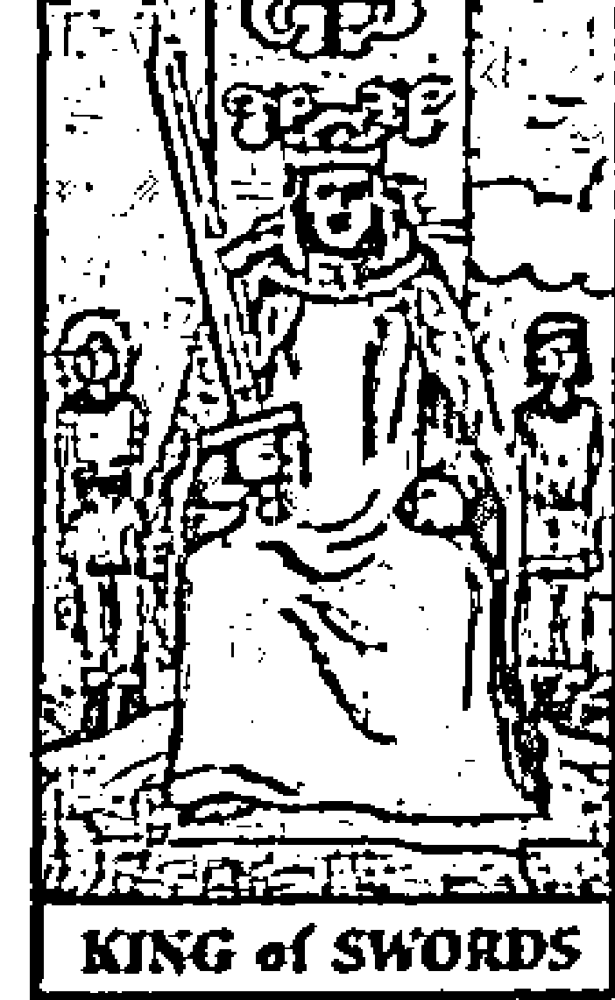

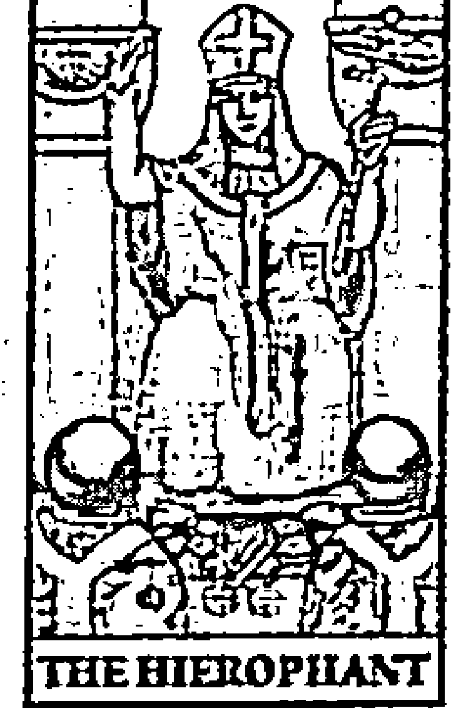

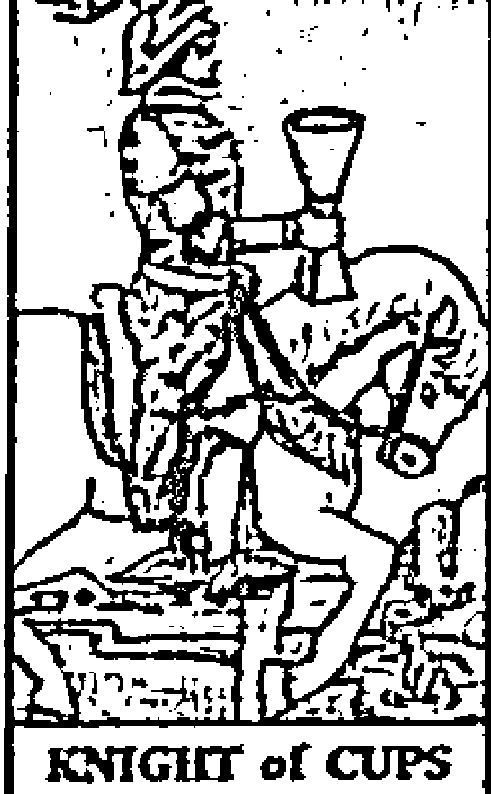

- 宝剑5 (逆) / 173
- 钱币5 (逆) / 197
- 圣杯7 (逆) / 175
- 圣杯6 (正) / 198
- 高塔 (逆) / 176
- 钱币10 (逆) / 200
- 权杖7 (正) / 177
- 圣杯皇后 (正) / 201
- 钱币皇后 (正) / 179
- 钱币1 (正) / 203
- 圣杯8 (逆) / 180
- 圣杯10 (逆) / 204
- 审判 (正) / 182
- 圣杯国王 (正) / 205
- 星星 (正) / 183
- 宝剑骑士 (逆) / 207
- 宝剑8 (正) / 185
- 钱币4 (逆) / 208
- 权杖6 (逆) / 186
- 愚者 (逆) / 210
- 宝剑侍者 (逆) / 187
- 宝剑9 (正) / 211
- 宝剑侍者 (正) / 189
- 宝剑9 (逆) / 212
- 圣杯8 (正) / 190
- 宝剑骑士 (正) / 214
- 月亮 (逆) / 191
- 钱币7 (正) / 215
- 钱币3 (正) / 193
- 钱币7 (逆) / 217
- 宝剑1 (逆) / 194
- 附录 / 219
- 审判 (逆) / 195
- 塔罗牌义快速索引表 / 231

## 宝剑国王（正） King of Swords

宝剑牌是“风”元素，象征理智、智慧、思想能力。但是理智通常伴随着情感的无情，太理智、太在乎自我聪明，缺少情感的妥协，易造成彼此情感的伤害。宝剑的宫廷牌身上都是象征风元素的蓝色云朵，所以宝剑牌也都暗示着自由。

宝剑国王坐在王座上拿着宝剑，旁边有两个站着的人听命于他手上的宝剑，代表宝剑国王不同寻常的权威。所以宝剑国王的年纪一定比权杖国王年长，因为智慧需要时间的累积。

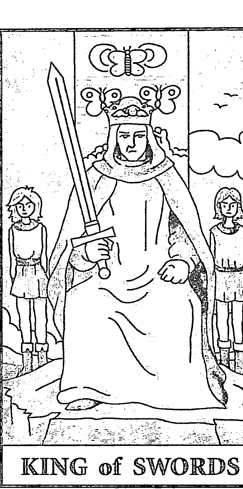

宝剑国王是一个果决理智、经验丰富的男人。如果情感占卜拿到这张牌，代表对方智力、学识丰富，可能是位交际手腕高明的外交官，或是医生、律师等专业人士。同时也代表对方是非常理智地看待你们的关系。

如果是跟工作相关的占卜，表示应该要坚持公正理智、实际的原则，需用智慧而不是用人际关系去维持工作的运作。

### 爱情：

对方理智地看待你们之间的关系，由他决定。

### 工作：

用智慧而不是用人际关系去维持工作的运作。

### 金钱：

现在是展现你智慧的时候。

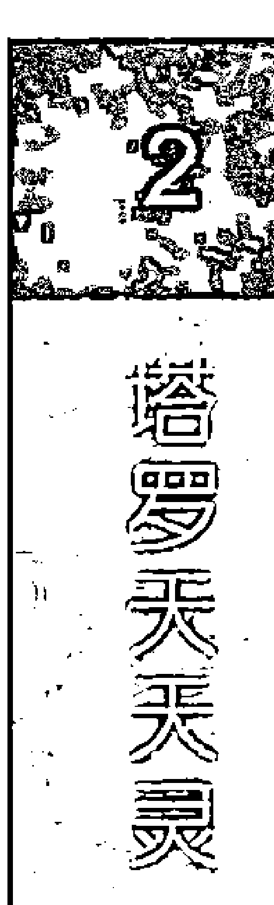

今日的幸运符：
宝剑、蓝色

## 圣杯侍者（正）
Page of Cups

侍者牌都是牌面最小的牌，不管是年纪还是经验。圣杯是“水”元素，水正是与感情、感受、潜意识相关的阴性元素。有圣杯（水）特质的人特别注重感情交流，也显示出情感面甚至是潜意识层面的问题。圣杯侍者很温暖、很可爱，但也是个因感情丰富而弄不清楚自己要什么的角色。

圣杯侍者手上拿着一个已装有鱼的杯子，代表不管是工作或爱情他都已经享有过浪漫。但他只是个小孩，沙滩上尚未被捕获的鱼也吸引着他，所以终究只是想先体验一下，好玩最重要。所以如果占卜与工作相关的问题，记得让这件事充满乐趣，比赚钱更重要。

圣杯宫廷牌的主角都是穿着与玫瑰相关的衣服，显示与感情相关的征兆，可能即将开始一场很浪漫的新恋情。

### 爱情：

期待新的恋情，但才刚刚萌芽，还不能保证未来。

### 工作：

让工作职场充满快乐是你的近期策略。

### 金钱：

做浪漫、温馨好玩的事业将有收获。

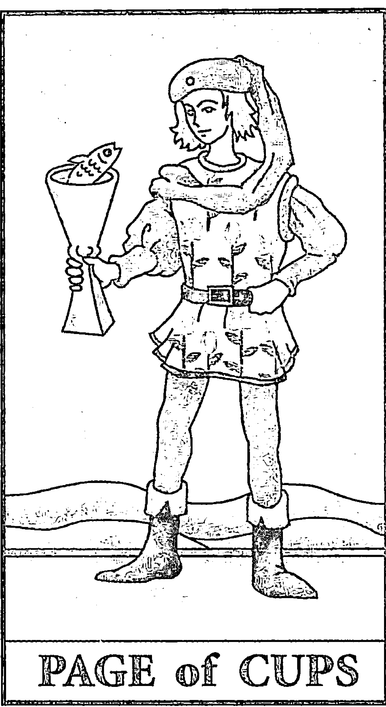

> 今日的幸运符：

鱼、海中生物

## 悬吊者（正）
*The Hanged Man*

吊人（悬吊者）对应占星上的海王星，是颗代表牺牲与理想的星。这张牌出现代表此刻有牺牲（为理想而牺牲）的意义。因为你知道随牺牲而来的将是更有价值的收获。悬吊者是一位崇高的殉道者，也许此刻你为了爱人而牺牲自己的个性与喜好，只为了成全你们的爱情。

吊人悬吊在那儿一动也不动，代表等待、拖延、悬置，或是遇到瓶颈。此时切莫急躁，因为悬吊者头下脚上就是要提醒我们：用不同的角度看世界。很多事情都是一体两面，换个角度你将看到不同的景观，就像潜水的乐趣。

因为相信会有更美好的事物降临，所以愿意牺牲自己现实的短暂享受，过程也许并不轻松，但此刻不建议你强势地推翻，应该沉着思考这些牺牲的意义。

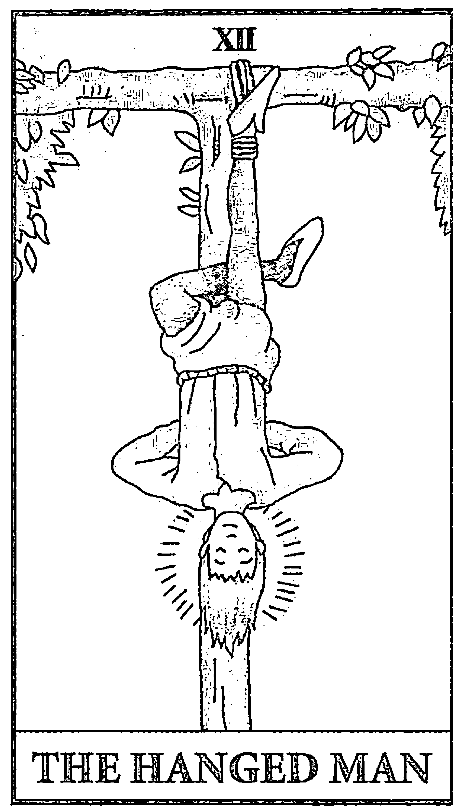

### 爱情：

在爱情中牺牲，为对方改变自己。

### 工作：

工作进度缓慢、挫折，需要耐心等待转机。

### 金钱：

为了成就某事而破财，可以当做必要的投资。

今日的幸运符：
吊灯

## 钱币5（正） Five of Pentacles

在冰寒风雪中，两个病弱乞丐的意象，立刻让人联想到物质上的贫穷。冰天雪地里两个乞丐蹒跚前行，又瘸又驼背，身上的衣服破烂不堪。尽管他们经过了象征物质与精神庇护的教堂，却不得其门而入，象征找不到方法与机会。

钱币5代表辛苦艰困的时光，显见这件事情资源不足，要成事非常辛苦，也代表你目前的能力无法达成，需要外力帮忙与资助。

正面的钱币5在爱情上代表不管路途多艰难都不离不弃，不过可以撑多久呢？就看教堂的门何时会打开。

### 爱情：
不知希望在哪。
### 工作：
资源不足，要成事非常辛苦。
### 金钱：
不足的感觉。

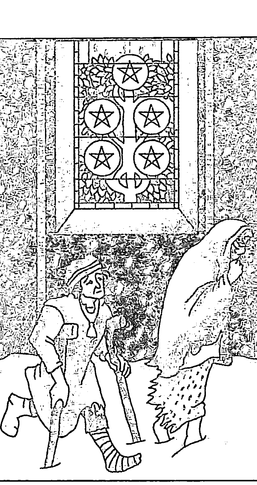

> 今日的幸运符：
发光的家饰

## 恋人（逆） The Lovers

恋人牌（双子座）逆位代表喜新但不一定恋旧，因此可能在十字路口上“选择”，也意味着抛弃。

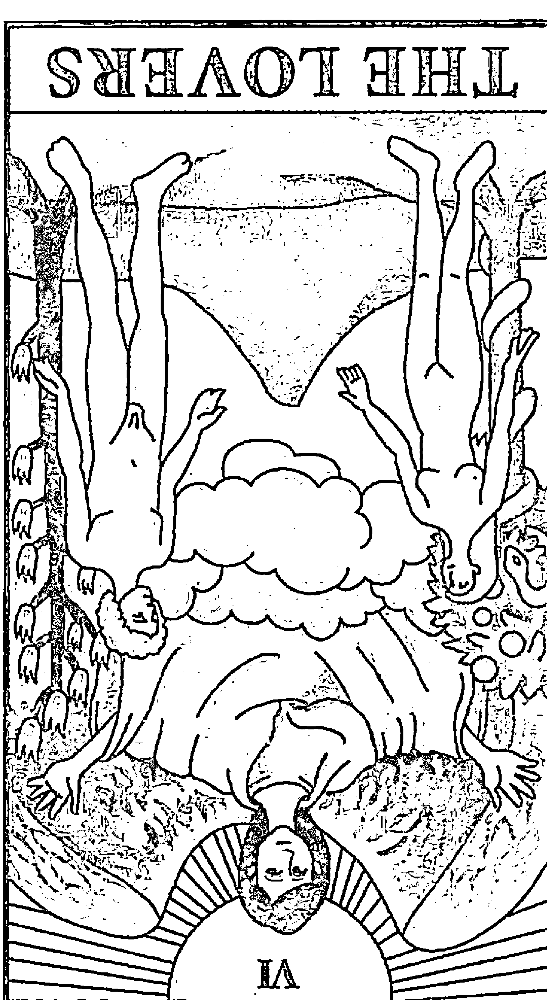

这时你必须格外谨慎，因为这是一个重大时刻，此时不要短视近利，更不可执迷于表面的利益或面子，应该仔细思考自己究竟要什么，才能做出好的决策。

这张牌的负面含意：一方面代表很多闲言闲语，太多声音影响一段关系；另一方面也代表因诱惑影响判断。请注意，虽然亚当与夏娃受天使祝福，但夏娃身后的蛇仍暗示人类堕落的故事。如果意志不坚而选择不当，伊甸园的憾事恐怕会重新上演。

### 爱情：
以一见钟情似的爱情开始，可是却有很多小事阻挠这段感情。
### 工作：
建议在工作场合营造浪漫的气氛，适合从事婚纱等爱与美的行业。
### 金钱:
可以与人合作结盟，但要小心对方的意图。

> 今日的幸运符：
粉晶、闪亮的项链

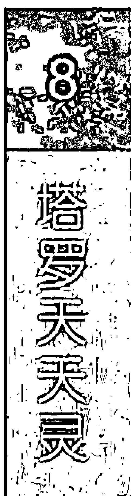

## 高塔（正）
The Tower

如果你无法抗拒恶魔的诱惑，以旧方法达成新环境中的目标，或是一厢情愿地以为虚假的梦幻会成真的话，那可要小心了，因为高塔牌就是强迫你改变的雷电，代表即将来临的巨大意外震撼。

这是以旧约《圣经》创世纪中的巴别塔为主题，代表上帝要人们好好反省，不要太自以为是。所以此刻即将面临骤变，突如其来、不可预知的改变，往往是当事人无法控制的，而且冲击深入人心，天灾人祸、失业、意外、变故、失恋等等。巴比伦通天塔的故事中，最后上帝让人们说着不同的语言以达到分化目的，让人们无法沟通、无法完成当初通天塔的目标。

图面上可看出两个坠落的人，象征合作危机，如果是一般事件占卜，暗示合作可能出现的危机，特别是言语沟通很容易出现误解，或者是自我膨胀、拒绝沟通。所以这张牌同时提醒着“沟通”的重要。

### 爱情:
不可预期的破碎，这是一个错误期待的感情。
### 工作:
计划失败，或是被迫结束。
### 金钱:
面临不可预期的财务危机。

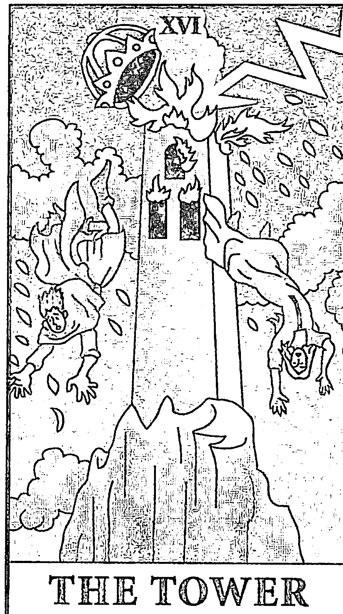

今日的幸运符:
红宝石、录音机# 圣杯2（正）
Two of Cups

圣杯2通常被视为大阿尔卡特牌中“恋人牌”的小牌版本。两张牌都与爱情产生强烈关联，但恋人牌是指真正的感情；而圣杯2的恋情近似初期的热恋状态，甚至和情爱有关。

一男一女面对彼此，向对方持杯致意。两人头上都戴着花环，对仪式有所准备。男子身躯微微向前，左脚踏出，右手也伸向女子，在两人中间浮着一根两条蛇缠绕的杖，称为“赫米斯之杖”，是治疗的象征。杖上的狮子头象征沟通，一双翅膀象征圣灵。远方有一座一片祥和的城镇。

图中男女互相纠缠又互相依赖，是平等互敬互爱的关系。因此圣杯2不只局限于男女情感，也可以指友谊，或是任何合作的人际关系。

通常圣杯2的人际关系都是和谐、对等、沟通良好、合作愉快、互相敬重的。因此问合伙、婚姻、恋爱、友谊，圣杯2都代表双方的配合将会非常愉快。

### 爱情：
人际关系都是和谐、对等、沟通良好、合作愉快、互相敬重的关系。

### 工作：
有合作结盟的好机会。

### 金钱：
靠合作关系赚钱。

> 今日的幸运符：双鱼座、双子座

## 权杖骑士（逆）
Knight of Wands

逆位的权杖骑士过于鲁莽，也许很有骑士勇敢的精神，却是个唐吉诃德，只听从自己体内血液或是肾上腺素行事，却又虎头蛇尾。

骑士一定要骑奔腾骏马，权杖骑士的马是“火”元素，有红色的光晕包围在马旁边。逆位的权杖骑士则光晕不足，无法产生行动，这是能量不够的行动。

感情上则暗示：你遇到一个没有光晕的骑士。

- 爱情：刚开始也许不错，但后来不一定是这个样子。
- 工作：有合作结盟的好机会。
- 金钱：奔波赚钱。

今日的幸运符：交通工具、旅行

## 钱币9（逆）
Nine of Pentacles

一位衣着华丽的女子站在她的庄园中，四周葡萄茂盛正是收成时节。大肚怀胎的她左手抚摸着肚子，右手还勾着一根葡萄藤，象征生命的成长跟茁壮。

正位与逆位的钱币9一样都是迎接新生命、迎接新阶段，基本上都是很幸福的牌。但是逆位多了一点焦虑感，虽然觉得即将临盆是一件喜事，但总觉得还没准备好或是不顺利，担心自己是否有那样的好运，不够踏实。

尤其这张牌是与物质相关的一张牌，如果是问合作关系，可能双方都过于重利，因此相对而言比较轻义，合作非常没有安全感。

感情上就更是建立在享受之上了。不过大体而言，仍然是很有前景的。

### 爱情：
彼此希望往更长远的未来前进，但情绪上需要磨合，物质享受是最基本的。

### 工作：
重视目的的合作。

### 金钱：
有机会获利。

今日的幸运符：小孩、葡萄果实

## 皇后（逆）
The Empress

皇后牌倒立的时候，多半代表时机还不成熟（还无法收成），无论是物质上的收成或是感情上的果实。

如果是针对物质面，可能是行动上的错误，或代表这本来就是一个吝啬的人所经营的事业，狭隘的心不可能有丰富的收获。

如果是针对感情问题，大部分因素是情绪影响的结果。情感上缺乏热忱，或是对感情没自信，不敢大方付出、担心受伤，都无法迎接伟大丰盛的爱情飨宴。

### 爱情：
想要展开爱情却不知如何行动。建议用感性、成熟、温暖的特质去吸引人。

### 工作：
适合美容业、珠宝、或是贵气产业。要适度给工作伙伴一点小欣赏，增加同事的向心力。

### 金钱：
享受花钱的乐趣。建议花钱在投资性商品上。

今日的幸运符：香水、祖母绿

## 圣杯4（正）
Four of Cups

过度的等待、无谓的期待是这张牌的写照。主角百无聊赖地坐在树下，双眼紧闭，双手双脚合在一起，形成防御姿态。云中伸出一只手给他第四个杯子，不知道他是要去拿或是犹豫要不要拿，是一个等待思考的过程。前方三个杯子是过去，第四个杯子代表新的机会，可能是如同圣杯Ace一样的大好机会。

究竟这个新杯子（新机会）主角能拿得到吗？可能他只是期待却丝毫没力气去争取这个好机会。圣杯4表示消极、不满足，觉得没人了解他，只想吃碗里看碗外，甚至觉得家花没有野花香，所以圣杯4在感情的占卜上，有时也代表心灵或是精神的不满足。

抽到圣杯4时，建议当事人不要想太多外面的世界，应该多回顾自己手上拥有的三个杯子，外面的世界可能是虚假的。但还是要把握眼前的机会，以免稍纵即逝。

### 爱情：
心灵或是精神不满足于目前的状况，还想要更多。

### 工作：
吃碗内看碗外。想找新机会。

### 金钱：
等待着新机会，可是也不能确定机会是否会来。

## 女祭司（正）
The High Priestess

女祭司式的直觉可以使你与他人心灵有所联结，现在的你非常具有直觉，相信人的心灵互动是重要的，也就是很在意“Feeling”。

现在可以试着和人分享你的经验与感受，假设碰到的伙伴、朋友也和你一样有相同的感应。现在你在意的是人际关系的和谐，以及是否互通心灵。不过，与其等待他人与你互通心灵，不如先将自身心灵打开，和别人分享你目前的感受，或是规划中的事。

### 爱情：
对爱情充满憧憬，却不敢采取行动。

### 工作：
适合教育、宗教事业。

### 金钱：
平稳中求进步。善于理财可长期投资，不投机。

> 今日的幸运符：冥想、宗教

## 权杖4（逆）
Four of Wands

四根巨大的权杖耸立在前，代表稳定、合作、成功的基础。权杖上面挂着象征胜利的花环。一对好朋友手持花束，高举在头顶之上欢庆、舞蹈，远方隐约可见庆祝的人群，这是一幅和谐且繁荣的景象。

基本上这张牌没有逆位的意思，但因为这张牌也有安稳的家、保障、成家、保护的意思，所以如果是逆位，可能代表现阶段你不太想在某段关系成家稳定，或是还不到那个地步。

- **爱情：** 起码是很忠诚的好朋友，不要要求立刻结婚。
- **工作：** 有很好的基础，可以放心。
- **金钱：** 钱景很好。

> ### 今日的幸运符：正方形的饰品、数字4

## 隐者（逆）
The Hermit

逆位的隐者暗示：还需要耐心。答案不必外求，观察一下隐者牌，隐者眼睛是闭着的，所以等待内心沉淀，寻求自己的帮助。

另外，严厉的“隐者”也会显得有点不近人情。可能是太坚持自我理想，或太追求完美，所以不愿接受别人的建议。也可能很难加入团队合作。建议你多听他人意见，不要过度固执。有时显得过度保守，只相信自己过去的经验证。

### 爱情：
目前将心封闭，是你自己拒绝爱情的机会。

### 工作：
喜欢独立工作，类似研究工作或考古学，小心不要过度孤立。

今日的幸运符：日记、怀旧商品

## 权杖侍者（逆）
Page of Wands

权杖侍者意味着急于求取新的讯息，因为对应的是双子座，双子座本身就很在意资讯，对有些资讯饥渴得浮躁。

逆位的权杖侍者象征资讯焦虑。如果是占卜一件事，暗示着资讯取得的困难，或是因资讯不足，无法行动。

如果针对感情状况，代表这段感情一点都不成熟。权杖上面的新芽正要萌发，侍者的红衣也象征行动，然而逆位的权杖侍者表示容易出现三分钟热度。

### 爱情：
感情一点都不成熟。

### 工作：
资讯传播相关的行业有利。

### 金钱：
有一些点子但都需要长辈帮助。

> 今日的幸运符：新闻媒体、传播的相关工具或人员

## 钱币10（正）
Ten of Pentacles

十个钱币的排列是有意义的，是生命之树的符号。钱币10体现了一个家庭的景象，且是财产基础稳固的家庭，有老长辈、一对夫妇、小孩、以及饲养的爱犬。

这根本就是人人向往的幸福，三代同堂，并且孕育着新的机会（有动物），更甚者，象征生命之树的钱币还十分富足。

同时，这也有“传统”的迹象，因此占卜除了显示在财务方面有安全感，还表现出手段上也倾向传统保守，甚至暗示必须向长辈或是掌权的人靠拢。此外合作伙伴都很成熟，呈现以获利为目的的一面。

- 爱情：传统的幸福，大团圆。
- 工作：合作获得利益。
- 金钱：运势很好。

> 今日的幸运符：钱、红包

## 力量（正）
Strength

力量延续战车的使命，但不是用蛮力，是以更高层次的方式来应对，即老子所说的：以柔克刚。

一个女子驯服一头狮子，绝对不是用武力，而是她迷人的特质，上善若水、以柔克刚。此刻代表迷人的魅力战胜一切，所以你需要施展你的魅力。

如果是有关感情交往或人际互动的问题，那么这暗示了以极大的魅力，征服原始的性本能。所以这张牌在爱情中通常伴有性的含意。

**爱情：** 魅力无法阻挡。

> 今日的幸运符：钻石、黄金、闪亮的东西

### 工作：
精力充沛，认真工作的人最美丽。

### 金钱：
工作会获得很好的赏识，得到很好的报酬。

## 圣杯6（逆）
Six of Cups

6表示的是第二个循环的开始，圣杯6逆位代表过度迷恋过去，怀念被母亲哺喂的时光。此刻你应把对过去被照顾的念想，转化为正面学习经验，不要惧怕长大。

长者的背后布满了五角星形状的花朵底色，背景是代表万物生长的绿色，和皇后牌的底色是一样的，这张牌也和皇后牌一样代表孕育新的一代。因此你应该思考那些以前学过的经验是可以延续的，而不只是害怕成长。同时，这张牌逆位代表旧有的问题没有解决，再度浮现。

### 爱情：
不要过度怀念过去，应该向前看。

### 工作：
要多照顾工作伙伴。

### 金钱：
原有的经济基础出现问题。从事托育或是照顾行业有好运。

## 钱币8（逆）
Knight of Pentacles

钱币8有两个主角，一个是老师（或是学长身份），一个是学生（或是学弟身份）。老师站立着将自己的能量灌输给跪着的学生，代表一种传承的过程，也是学生学习的过程。

逆位的钱币8一样是表达学习的过程，也许你还在寻觅可投靠的资深人员，或还在找老师，这个寻找的过程让你不安心。

这张牌显示有资源但自己还不知道怎么组合，或是寻找资源的过程令自己很疲劳，建议你应该更专注于工作的过程，这是最珍贵的美德，也能让别人看到你的诚恳而愿意帮助你。

### 爱情：
只是互相学习，或是互相帮忙的伙伴。

### 工作：
学习过程不顺利，建议你要更专心。

### 金钱：
必须学习更多技能才能赚钱。

> 今日的幸运符：数字8、古董

## 权杖3（逆）
Three of Wands

3是领导与平衡的数字。
山巅上站着一个成功的商人，右手握着权杖，目送自己的贸易船出海。

正位的数字3多半是成功的合作，但是权杖3逆位可能表示欠缺合作、缺乏远见，或是太多想法、野心太大、计划不周。

建议你此刻应尽快评估合作伙伴，可能要检视你的合作关系。同时也建议你应学习新的东西，包括看待这个计划的新技巧、新工作习惯。

### 爱情：
远距离恋爱，甚至旅行时可能出现艳遇，但先不要太投入。

> 今日的幸运符：数字3、海洋风、旅行

### 工作：
需要进修或接受外地的新知。

### 金钱：
多找他人提供资讯。

## 权杖8（正）
Eight of Wands

八根权杖整齐划一地在空中航行，主角在画面中间准备抓住某一枝，而且是跳跃、飞起来的姿态。权杖象征不同的机会、可能性，如果你的力量或是想获胜的意志力很强大，会因机会多而感到高兴。因为背景是蔚蓝的天空与青翠的山丘平原，甚至还有一条宁静的小溪流过，一切都是欣欣向荣。

八根权杖都是顶端向下，即将抵达地面。因此，迅速抓住机会是必要的功课。也许你会突然有个新计划或得到新工作，但可预见新的压力。（人总是无法适应太过快速的生活或改变）。感情上，可能有热情的新恋爱对象、认识新朋友，但要小心机会过多或太快速所带来的问题。

- 爱情：进展太过快速所带来的问题。
- 工作：变化还很多。
- 金钱：现在是混乱的时刻。

> 今日的幸运符：数字8、绿色、清新的空气

## 魔术师（正）
The Magician

创造、沟通是魔术师的个性，需有正向的能量。目前你就是挥舞能量的人，你是迷人的设局者，只要你更有自信。

无论你需要什么工具都可以找到。请注意，魔术师要有整合的能力，你的想象力到哪，你的潜力与机会就会到哪！千万不要给自己太多限制，尽量将你周边的事物和魔术师桌上的神奇元素联想在一起，这就是你问题的答案。（可以开发自己的潜能，让自己的魔力更上一层楼）。

魔术师头上是圣灵的神圣象征，有了这张牌，整个人立刻变得有魔力。重点是：你已经可以开一扇门了，加油！要更有自信、更有幽默感。

### 爱情：
邂逅一位令人心动的对象。有机会展开新恋情。

### 工作：
开创新的事业计划。适合公关、传播业。

### 金钱：
财运旺盛，有投资头脑。

> 今日的幸运符：游泳、万花筒

凡事过犹不及，太过也会造成伤害。太阳虽带给我们温暖与能量，但也能将人灼伤，或是太热情而吓到人。不过基本上还是非常正面，只是程度较弱些，可能代表小成功，或是虽成功但仍不满足。

太阳牌也显示某种信任，太阳牌逆位表示内心还存有对月亮牌的恐惧感。也许是一朝被蛇咬的情境，或是明明已经成功，但你还不敢相信。

### 爱情：
建议主动照顾对方，光明的爱情需要自己创造。

> 今日的幸运符：向日葵、石榴石

### 工作：
现在是需要快速行动的时候，不要对自己没信心。

### 金钱：
有新的收入。

## 圣杯国王（逆）
King of Cups

圣杯逆位代表过度滥情。圣杯是水元素，水正是与感情、感受、潜意识相关的阴性元素。有圣杯（水）特质的人特别注重感情交流，也显示出情感面甚至是潜意识的问题。逆位的圣杯国王同样是圣杯中的长者，无论对于家庭、爱情还是财产，都会付出爱与关怀。可是非常固执、情绪化，如果不如自己意、无法发挥关怀他人的层面，就会激动暴怒。

国王的背后是红白相间的玫瑰花，在塔罗牌中象征了多情、博爱。逆位的圣杯国王是四个国王中最多情、善变的，所以会显示因滥情造成的情感负担。工作上则显示感情用事造成的一意孤行。

- 爱情：滥情造成的情感负担。
- 工作：热情却独裁的情绪化会影响工作环境。
- 金钱：靠人气集结金钱机会。

> 今日的幸运符：红玫瑰、白玫瑰、玫瑰精油

## 权杖2（正）
Two of Wands

身着出发服的主角站在自己的城墙上，右手拿着一颗类似地球仪的球体，手持权杖，表现出即将出发的状态。所以你已经面临出发的决定，也代表如果有远行的计划将势在必行，容易有好的成果。

权杖2的主角，看似正看着地球仪，又仿佛在看着自己的领土，似乎还在思索方向。韦特将其比喻成亚历山大大帝——明明即将出发拥有全世界，可是又怕离开家乡的爱人。不过，挑战毕竟是很吸引人的。

### 爱情：
往外地走可能发现新的爱情。

### 工作：
有远行机会。

### 金钱：
外地带来财运。

> 今日的幸运符：地球仪、指南针、权杖

## 宝剑10（逆）
Ten of Swords

每个牌组的10号牌都代表最终的结果，风象牌象征理智或智慧的争斗已经到了极致，面临过度争斗，需要停止。

最坏的时候就是另一个阶段的开始，主角身上依然披着象征能量的红袍，而远方城堡的曙光已现，所以逆位的宝剑10反而代表了黎明前的黑暗。身后河川中的水平静无波，象征万事万物都在酝酿一个新的开始。就像我们以往学到的：没有死亡，哪有新生呢？逆位的宝剑10在终结之后，看到希望。

**爱情：** 终于结束了，不管你愿不愿意。

**今日的幸运符：** 沐浴、数字10

### 工作：
换个想法，也换个舞台。

### 金钱：
没有任何希望。

## 皇后（正）
The Empress

这个现状是丰富的。皇后是大地的母亲、具母性，代表丰收、收获和大自然。皇座旁的心形石上画了金星符号，代表拥有爱情。华丽的衣服亦给人丰富、富裕，甚至结婚的感觉，同时暗示美满，或暗示将怀孕（孕育新机会）。

皇后必定引申女性的特质，传统上有一些男尊女卑的错误观念，但皇后牌出现顺序是在象征男性的皇帝牌之前，表示先以丰厚的大地果实喂养众生，因此塔罗牌想提醒读者女性特质具有强大且重要的力量。

大的力量，尤其是女性特质总是先具备稳定感（先要有物质的现实基础，才能发展理想）。

### 爱情：
沉浸在甜蜜、幸福的爱情之中。会碰到感性、成熟、具有温暖特质的人。

### 工作：
事业顺利、目前是运气很好的时光。适合美容业、珠宝、或是贵气的产业。

### 金钱：
享受花钱的乐趣。投资运佳、生活优越。

> 今日的幸运符：
香水、祖母绿

## 权杖侍者（正） Page of Wands
权杖是“火”元素，象征行动力。在宫廷牌（国王、皇后、骑士、侍者）当中，侍者是年纪较小或位阶较小的象征。占卜暗示的事件可能是指刚开始的阶段，或是与资历浅或行动力较差的人合作。

权杖侍者本身通常是一个热情的年轻人，结合了权杖的“火”元素以及侍者本身的“风”元素，所以权杖侍者参与任何事之前较不假思索。就像是星座中的双子座，有点古怪，好玩，有创意却不稳定。

如果是感情方面的问题，占卜到权杖侍者，可能意味着这段感情才刚刚开始，还不甚稳定，或者代表你与年纪或心智年龄较小的人相处。有时也暗示着性别上是女生比较主动、期待较多。

- **爱情：** 暗示性别上是女生比较主动、期待较多。
- **工作：** 只是一个点子，但可以多宣传。
- **金钱：** 有一些点子但都需要长辈帮助。

> 今日的幸运符：
新闻媒体、传播相关的工具或人员

## 圣杯骑士（逆） Knight of Cups
逆位的圣杯骑士，当然被情感的负面因素主导。圣杯是“水”元素，水正是与感情、感受、潜意识相关的阴性元素。有圣杯（水）特质的人特别注重感情交流，也显示出情感面甚至是潜意识层面的问题。逆位的圣杯骑士会因为情绪的影响看不清楚方向。

圣杯骑士的出现，显示最近的直觉很敏锐。然而逆位的圣杯骑士，则倾向相信直觉中负面的部分，不相信正面的部分。

这张牌底下有两个人，男人对着圣杯骑士挥手，是欢迎的样子，女人悠闲地使用河水洗自己的身躯，可见圣杯骑士必须带给大家好消息。逆位的圣杯骑士可能对自己的行动和能力还没有信心，怕自己做不好这样的角色。

### 爱情：
容易遇到浪漫、情感丰富的人。但自己不宜太快让情绪受影响。

### 工作：
要相信直觉，全力以赴。

### 金钱：
工作要专注才能赚钱。

> 今日的幸运符：
小背包、水壶

## 宝剑3（正） Three of Swords
三把剑合力刺进一颗心，一定是真的伤心至极。背景是灰暗的雨和云。塔罗是一种视觉沟通，即便是对完全没接触过塔罗牌的朋友，也可以轻易感受到这张牌的含意——非常伤心。

除了单纯的伤心之外，图片中这颗心看起来是在一间格斗室，因此宝剑3还代表孤立、被隔离的心。不管是什么原因让主角伤心，更大的痛苦是来自于被隔离。

心碎却看不开、放不下，提醒你不要过度地隔离自己，这样会让伤口更无法痊愈。

- **爱情：** 受伤、心碎。
- **工作：** 不容易成功，要付出残酷代价。
- **金钱：** 绝对不要借给别人钱。

> 今日的幸运符：
心型饰品、玫瑰香味精油

## 权杖2（逆） Two of Wands
身着出发服的主角站在自己的城墙上，右手拿着一颗类似地球仪的球体，手持权杖，表现即将出发的状态。

可以观察到主角左手扶着一根权杖，但另一根权杖却离得有点远，被铁环系在墙上。因此象征主角面对选择：该离开现在的领土，还是接受新的挑战？

远方似乎有个半升半降的太阳（有人认为太阳准备升起，也有人认为将要日落），不管何者都暗示：出发的时间到了，但你还在犹豫。

### 爱情：
往外走可能发现新的爱情。

### 今日的幸运符：
地球仪、指南针、权杖

### 工作：
出发的时间到了，但是你还在犹豫。

### 金钱：
外地带来新的机会。

## 圣杯2（逆） Two of Cups
逆位的圣杯2失去了互相依赖的成熟稳定，也代表两人的合作不平等，不管是男女情感、友谊，或是任何合作的人际关系都出现了不平等。

两人中间浮着一根两条蛇相互缠绕的杖，称为“赫米斯之杖”。既然是逆位，也代表“赫米斯之杖”的治疗功能无法发挥，可能是双方还不够信任。

假设是单张牌占卜法，而你第一眼看到杖上的狮子头，代表沟通有问题；若第一眼看到一双翅膀，代表合作的时机还没到，圣灵还没有给你们指示。

### 爱情：
双方有兴趣，但还没有默契。

### 工作：
双方的合作还没确定。

### 金钱：
靠合作关系赚钱。但你现在可能不愿接受合作的提议。

## 宝剑4（逆） Four of Swords
逆位的宝剑4不像其他宝剑牌那样混乱不堪，象征在一段休息的过程中储备精力，随时可以再起身，甚至独处也可能是充电的好时机。

宝剑牌都是象征思想的牌，这里有三把宝剑挂在墙上不用，但主角身旁仍保有一把宝剑，如果主角有任何需要，随时可以拿到宝剑采取行动。

逆位的宝剑4反而具有积极的意义，主角已经休息妥当，可以马上投入生活。值得注意的是：不管正、逆位，墙上的十字架都不会改变。因此，坚定的信念会帮助你在休息之后重新出发。

爱情：
可以给彼此一些时间、空间，别太着急。

工作：
蹲下是为了下次的跳跃。

金钱：
仔细做功课是你现在的任务。

今日的幸运符：
蓝色、室内空间

## 战车（正） The Chariot
战车是具行动能力的图像，行动必定要有方向，所以这张牌就是提醒方向感的确立。黑白狮身人脸，象征相对的物质，因此虽然在正面上，现状是目标清晰、勇往直前，但过程中最重要的课题是保持两头狮子的平衡，才能迅速、积极地往目标前进。

战车牌也是一张好胜的牌，代表喜欢赢也可能会赢。但这是一个非常孤独艰辛的过程，积极的你要多加油到最后一分钟。这张牌也代表旅程，战车代表移动或改变，因此可能出差或是会有个旅程。

爱情：应该积极主动，不要迟疑。

工作：可以接受新的挑战，非常实事求是。

金钱：
投资可以有收获。

> 今日的幸运符：
蓝宝石、车轮造型物

## 圣杯3（逆） Three of Cups
无论哪种塔罗牌，都是用女性来表达圣杯3的含意，为何不用男性呢？因为女性通常有以柔克刚的阴性能 量，具有灵性，较能沟通，所以神秘学比较喜欢用女性来象征好的沟通结果。

逆位的圣杯3就是要提醒你：不善用良好的沟通，一味竞争或是使用强权，都是难以成功的。也代表团体失 和、结盟或合作的失败、友谊破裂，还有可能代表感情中出现第三者。

爱情：
团体失和，有可能代表感情中的三人行。

工作：
没有善用良好的沟通，一味竞争或是只想使用强权。

金钱：
没有聚集众人的力量因而尚未获利。

今日的幸运符：
数字3、各种颜色的 缎带

## 宝剑2（正） Two of Swords
这张牌一看就知道陷入两难。第一感观是主角双手持剑，在胸前交叉不动。这样的僵持显得很辛苦，很想选出一条路走，但身穿浅灰长袍的女人，背对大海坐在灰石凳上一动也不动，尽管海涛的声音澎湃汹涌，她双眼蒙上了白布，仿佛无法放弃什么，也不能判断。

拿到这张牌是困惑的时期，想做决定却无法判断。主角身后的水面代表感情，当主角背对感情就代表已经失去直觉。蒙上双眼，则代表目前可供分析的资讯令你盲目或无法判断。天际高挂一轮新月，恐怕距离圆满还有一段时间。工作或是感情都是两难。

- **爱情**：两者中的取舍，很难有进展。
- **工作**：两者中的取舍，很难有进展。
- **金钱**：摇摆，象征没有结果。

> 今日的幸运符：
熏衣草、迷迭香味道复方精油

## 权杖皇后（逆） Queen of Wands
皇后的脚边通常会有一只小动物，这次在旁等待讯息的是黑猫，显示皇后需要在敏锐的黑猫收集各种资讯后再行动。

权杖是“火”元素，象征行动力，权杖皇后让我们回想到大阿尔卡特牌中的皇后牌，是成熟女性、慈祥的抚育者，就像母亲一般，喜欢照顾别人。但逆位的权杖皇后就有行动上的胶着、迟疑。占卜时拿到逆位的权杖皇后，显示资讯不够完整，也可能是自己的敏捷度不够，以至于得到不完整的资讯。

感情的部分则显示占卜者过度情绪化，让情绪影响了实际行动的判断，有黑猫般任性的特质。

- 爱情：不要一相情愿地情绪化。
- 工作：这是一个行动的时机，要更仔细，女性的市场很有参考价值。
- **金钱：** 托育或是照顾他人的行业会获利，女性的市场很有参考价值。

> **今日的幸运符：**
> 皇后、向日葵

## 权杖骑士（正） Knight of Wands
权杖是“火”元素，象征行动力，结合中古世纪的骑士精神，有一些急惊风但很具行动力，这就是权杖骑士。骑士相较于国王是年轻的，也代表经验没有国王丰富，当然也还不是一个真正的国家治理人，可是更不害怕危险、更有冒险精神。

占卜到权杖骑士，除了象征冒险，也有旅行、征服、奔波的意味。感情中的权杖骑士除了以上所说的冒险、行动等精神，还有创造的能量。感情不是从天而降的，总是要自己积极创造、自己去追求的。

### 爱情：
感情不是从天而降的，要自己积极创造。

### 工作：
象征冒险，也有旅行、征服、奔波的意味。

### 金钱：
想赚钱需要冒点险。

今日的幸运符：
交通工具、旅行

## 钱币6（正） Six of Pentacles
钱币6是张慈善牌，代表慷慨的状况。一个女子平躺在高贵的躺椅上，将金币赏给刚刚表演的琴师。这有两个含意：一是这个女子富有并慷慨，一是这位琴师的专业能力获得了肯定。

这张慵懒惬意的钱币6呈现两种角度：富有的给予者和付出劳力的受赠者。占卜的时候，你可能扮演给予者的角色，也可能扮演需要受肯定的受赠者。在施与受之间，你知道自己扮演哪个角色吗？

天上那堆星星钱币，固然是要表示钱币6的基本图形，但也呼应了地上因为施与受产生的光芒。

爱情：
    照顾他人或受人照顾的感情关系。

工作：
    要寻求长辈的照顾。

金钱：
    帮助别人会得到回馈。

今日的幸运符：
    数字6、捐款布施

## 命运之轮（正） Wheel of Fortune
世事变幻无常，轮盘不断地转动，好坏都会过去，人生充满无数的变化。正位的命运之轮就是好运的到来。

图上四个角落的动物与占星学是有关的，分别代表四个固定星座和四要素，老鹰是天蝎座（水）、狮子是狮子座（火）、牛是金牛座（土）、人是水瓶座（风）。他们都在看书汲取智慧，翅膀赋予他们在变动中保持稳定的能力。因此和知识（学习、进修）相关的事都会带给你好运。

生命中的每件事都有自己的时间，顺着时间自然会有结果。只要命运之轮出现，就代表这件事的时间点到了。

- 爱情：运气来临，展开新恋情。
- 工作：工作获得提升，或是创业。

### 金钱：
财运非常好，赌运好。

### 今日的幸运符：
打电话、与人沟通、琥珀

## 魔术师（逆） The Magician
人难免软弱也难免六神无主，这时你需要冷静一点。魔术师牌要提醒你的是：小心！使出来的把戏可能很容易就被人揭穿，显示目前的准备工作不够周全，所以很容易“露馅儿”；另外，你还在踌躇不前，已经是该表现的时候却可能还在空想，根本没有行动，导致失去最好的时机。

假设遇到金钱问题，要小心这是一个被计划的骗局，可行性待质疑。在爱情方面别太轻易陷入，你可以有自信，但需要放慢脚步。

### 爱情：
邂逅一位令人心动的对象。但要小心真相和你所看到的不一样。

### 工作：
新的事业计划还不够稳定，需要再踏实规划一番。适合公关、传播业。

### 金钱：
不要沉迷赌博游戏。

- 今日的幸运符：
游泳、万花筒

## 节制（正） Temperance
节制在古拉丁文是“调和”的意思：在适当的比例下，将各种因素混合起来，使某个状态表现出最合宜的动作。天使米迦勒双手拿着两杯水，把水倒来倒去表示内心的平和及情感上的调节，是协调并融合的意思。

节制牌正巧对应占星学上的射手座。射手座是比较“动物性”的星座，所以人生课题就是在“动物性”和“神性”之间达到平衡。不能过度冲动（翅膀拍动快速不见得飞得远，因为搞不清楚目标在哪），也不能只是思考（不断地将两瓶水调和也不会有新进度，因为欠缺行动力）。思考和行动必须调和是这张牌的另一个启示。你目前的课题是包含两个人、两个不同世界、两种不同工作的调和。

爱情：和对方培养感情，顺利相处。

工作：工作进行顺利，与伙伴可以交流观念。

金钱：善于投资，有金钱观念。

> 今日的幸运符：奶茶、咖啡牛奶、多种精油调和

## 圣杯1（正） Ace of Cups
美丽的圣杯Ace开启了所有圣杯与爱和感情相关的讯息。圣杯就是耶稣在最后晚餐中使用的杯子，据说耶稣死后，他的鲜血就是由这个圣杯所承装着。图中美丽的女人喝着象征耶稣的圣血，这是芭芭拉沃克牌中的神话，象征新生命的开始、新的情感关系从此展开。

在情感刚开始的时候，爱、喜悦与关怀总是随着水的流动温和地给予正面的感受，圣杯Ace要正面地享受、正面地看待这个新的合作关系。同时，韦特牌的圣杯Ace是手捧着圣杯从云中伸出，好像把爱送给对方，提醒我们好的保持关系应该慷慨大方，了解施与受的福气。圣杯Ace经常代表新感情的开始，无论是新恋情、新友谊，还是任何一种人际关系。

**爱情：** 新感情的开始，无论是新恋情、新友谊，或是任何一种人际关系。

**工作：** 新的工作领域可能展开。

**金钱：** 经常为朋友或是公关人际交往花钱，但人际交往也是你赚钱的开始。

> 今日的幸运符：
> 圣杯、数字1

## 圣杯皇后（逆） Queen of Cups
圣杯是“水”元素，水正是与感情、感受、潜意识相关的阴性元素。有圣杯（水）特质的人特别注重感情交流，显示出和情感面甚至是潜意识层面的问题。圣杯皇后是最柔情特质的角色，因为是水中之水。

逆位的圣杯皇后则过度情绪化，因为大水泛滥，无法控制。因为逆位，所以她的双手握着杯子的部分更为执著，也就是她更有控制欲，甚至是情绪化的控制欲望。圣杯皇后的座椅上有亚当跟夏娃造型的小天使，可见圣杯皇后的种种控制都来自情感的欲望。逆位的圣杯皇后要加强理智，否则反而太情绪化导致不可理喻。

### 爱情：
真情流露会吸引正面的感情。控制欲不要太强。

### 工作：
适合发挥母爱，照顾他人。工作上母仪天下。不要有太强的控制欲望。

### 金钱：
女性产业会带来财富。

> 今日的幸运符：
红玫瑰、水瓶

## 宝剑3（逆） Three of Swords
悲伤是必然的，尽管是逆位，宝剑3也是悲伤的。此时的课题就是：接受悲伤并让时间帮你度过。悲伤是必需的，悲伤使人成长，所以请不要拒绝悲伤，只要接受并体验，它就会转化为成长的力量。

宝剑3最大的悲伤除了来自被欺骗或者破坏，更重要的是因为当事人“心理上的孤立”。孤立会造成更多的恐慌，所以女巫子绮一定要提醒你，快快脱离这种孤立的情况，尽快找别人聊聊。

- **爱情：** 孤独感。需要找朋友聊聊。
- **工作：** 不容易成功，要付出残酷代价。
- **金钱：** 绝对不要借别人钱。

> 今日的幸运符：
心型饰品、玫瑰香味精油

## 权杖皇后（正） Queen of Wands
权杖是“火”元素，象征行动力。权杖皇后可以回想到大阿尔卡特牌中的皇后牌，是成熟女性、慈祥的抚育者，就像母亲一般，喜欢照顾别人。所以权杖皇后结合了皇后特质，并以权杖的行动力作为其标记。简单来说就是一个女强人，充满热情且蕴含独立。拿到这张牌当然暗示这是一个行动的时机，更重要的是提醒你要准备好，不要三分钟热度，因为权杖皇后象征决心、独立。对于经常需要依靠别人的人，这是一个很好的提醒，因为权杖是一种考验，而你已经没有借口说不。

在工作或生活上，你可以更踏实一点。皇后的手上总会拿着一些象征关怀的物品，例如权杖皇后拿的是向日葵。感情的占卜上，你必须稳重地付出关心跟照顾，看样子你需要负担较多的主动来维持这段感情。权杖的挑战都是比较吸引人的，绝对值得一试。

- 爱情：你会碰到想照顾别人的人。
- 工作：这是一个行动的时机。
- 金钱：托育或是照顾他人的行业会获利。

> 今日的幸运符：皇后、向日葵## 隐者（正） The Hermit

隐者带着自己的路灯远离喧嚣，退隐深山。此刻隐士自我反思，内心保持沉默，但心中的理想是坚定的，孤独但稳重的隐者寻求属于自己的出路。隐者的灯光是向着左边，左边在潜意识中是指“过去”。因此这个时刻也提醒你：过去的经验对此刻的人生有很深的意义。

隐者带着自己的路灯远离喧嚣，退隐深山。此刻隐士自我反思，内心保持沉默，但心中的理想是坚定的，孤独但稳重的隐者寻求属于自己的出路。隐者的灯光是向着左边，左边在潜意识中是指“过去”。因此这个时刻也提醒你：过去的经验对此刻的人生有很深的意义。

从图面就可以看出隐者不是一个年轻人，所以给隐者这张牌的建议是：从过去的经验反省，因为经验会让你成长。隐者很容易从过去的经验累积想到新的出路。

- 爱情：
  暗恋，不敢表达。追求柏拉图式的爱情。
- 工作：
  喜欢独立的工作，类似研究工作或考古学。
- 金钱：
  谨慎理财，保守。

今日的幸运符：
日记、怀旧商品

## 月亮 (正) The Moon

狗和狼在满面忧愁的月亮下吠叫，反应人内心的恐惧、不安和悲伤。蝎子要克服恐惧，沿小径通往远方。相较于其他牌，月亮牌呈现的图面是相当诡异的。

显然这是一个不明的时机，月亮牌的出现绝对不是做决定的时刻，昏暗不明的朦胧中，资讯不够清楚，在感情上意味着过多的幻想，可能是欺骗的假象。

也许这是个想象力超越现实的状况，尤其是爱情方面。暧昧的时候最美，让人更加期待，可是这时也最没有安全感，人总是需要稳定的答案，不稳定的时刻，我们害怕先付出会造成伤害。

- 爱情：
  对爱情充满遐想，有可能是盲目的爱情。
- 工作：
  对现有工作感到迷惑，前途不明。
- 金钱：
  财务状况不清，不善理财。

今日的幸运符：
珍珠、去泡澡

## 圣杯9（逆） Nine of Cups

正位与逆位的圣杯9都是好消息，都与满足、快乐、享受有关。不过正位的圣杯9毕竟还是和圣杯的本质（爱、情感）相关。逆位的圣杯9就着重于享乐。如果是占卜感情相关的问题，则可能双方着重在物质感官上的享受。但毕竟还是一场让人放松的愉快经验。

- 爱情：
  很愉快的相处，着重于享乐的过程。
- 工作：
  无论是精神或物质面的愿望都极有可能实现。
- 金钱：
  投资可能有非常好的回报。

今日的幸运符：
糖果、珠宝

## 宝剑国王（逆） King of Swords

逆位的宝剑牌太过于在乎理智，或是太在意法理而失去了人情。宝剑牌是“风”元素，象征理智、智慧、思想能力。但理智通常伴随情感的无情，太理智、太在乎自我，会失缺情感妥协，造成彼此情感的伤害。

逆位的宝剑国王依然坐在国王的王座上，他还是想表现权威，拿着宝剑，可是太重视自己的威严，或是太希望别人听命于他，所以这个仲裁显得很无情、伤人。

同时，宝剑的宫廷牌身上都是象征风元素的蓝色云朵，所以宝剑牌也都暗示着自由。逆位的宝剑国王多半都有爱自我、爱自由的倾向，在感情上碰到这种人，他也抱持着“我就是这种人”的态度。这种人多半不太顾及别人感受，和这样的人在一起总觉得冷漠。

- 爱情：
  对方较不在乎他人的感受。
- 工作：
  太在乎法理而疏忽了人情。
- 金钱：
  可以用脑力取财，但与人相处不要太刻薄。

## 钱币国王（正） King of Pentacles

钱币是“土”元素，土地滋养万物，象征实际的物质力。土特质的人勤奋不懈，重视财富给予的安全感，经济有保障，重视享乐但也比较现实。钱币国王表现了金钱物质方面的稳定，也代表社会资历。

一般来说刚出社会的人比较没有经济能力，在社会上待较久或年纪较年长才显得有经济能力。所以钱币国王牌比起钱币其他牌来说，是年纪较大或资历较深的，当然个性也应该稳重务实。

假设你占卜到这样的对象，那代表他看待你们之间的关系比较现实，好处是他会认真思考两人如何相处；但也代表他只会以自己（国王）的观点来决定交往的走向。

年纪稳重或是资历深也代表规划事情较有远见。如果是针对事情的占卜，钱币国王理所当然与重大物品的交换或是经营有关，也提醒你在面临重要经济事务或是大型任务的同时，应该更有远见。当然，同时暗示着与这些事情相关的人和事物关系都是很现实的。

- 爱情：
  爱情的关系看起来未来光明，也有金钱运。
- 工作：
  有气势，建议要展现领导能力。
- 金钱：
  与有财务规划能力的人多相处会有好运。

今日的幸运符：
钱币、万花筒

## 女祭司（逆） The High Priestess

虽然你知道目前的现状源于你无法改变自己，但你还是很执著，你对你自己说：“因为我就是这样的人”，所以他人也很难救你。

用禅宗的“心魔”最能解释迷惑的女祭司，越是想用清澈的心灵求助智慧，越是无法静心。要避免自以为冷静的偏执，自以为客观却成了绝对的主观。先不要固守己见，建议你现在开放一点，多听听他人的声音，会让结果好一点。

- 爱情：
  现在对爱情非常恐惧，建议不要被过去的负面阴影困扰。
- 工作：
  适合教育、宗教事业。也建议多开口、多行动。

今日的幸运符：
冥想、宗教

## 圣杯9（正） Nine of Cups

看起来就是一片富足丰富的样子，主角身着黄衣，显示非常富有。他前面的小桌布置著新盛开的花朵，还有一堆宝石和糖果。在主角后面则有九个圣杯排排站。背景则是一片鲜黄。

圣杯9象征美梦成真，代表当事人的愿望极有可能实现，无论是精神或是物质方面。这张牌显示“人财两得”。

主角非常满意于这个现状，他洋洋得意的抱胸姿态，显示出某种程度的自得意满。前面桌子上的东西可视为贡品，可能是胜利成功祭祀谢天的贡品，也代表愉快的享乐。

- 爱情：
  很愉快的相处过程，有好机会。
- 工作：
  愿望极有可能实现，无论是精神或是物质方面。
- 金钱：
  投资可能有非常好的回报。

今日的幸运符：
糖果、珠宝

## 节制 (逆) Temperance

意味着目前的状况欠缺和谐，也代表你对环境还没能融合。牌面流动的水代表旅行方面的暗示，不过如果牌面能量是负面的（逆位牌），可能显示没有目的的旅行，更夸张的甚至是盲目的赶流行，迷失在对自身没有意义的潮流之中。

很遗憾的，通常这时刻的节制牌不仅没有节制，反而非常固执。如果是感情方面，可能过度沉溺在毫无节制的欲望当中，缺乏心灵的调和。

- 爱情：
  欠缺心灵调和，两个人在不同的世界。
- 工作：
  与伙伴的观念缺乏交流，建议你不要过于固执。
- 金钱：
  过度追求潮流，不知道自己适合或想要什么。

今日的幸运符：
奶茶、咖啡牛奶、多种精油调和

## 愚者（正） The Fool

愚者的中文翻译听起来很负面，但是请不要望文生义。愚者是可爱的一张牌，纯真乐观的人活在当下，什么都想尝试。即使站在悬崖边缘，有小狗提醒前面有危机，他也仰头望着天空，表现毫不畏惧的神态。

现状是想要学习新事物，展现生机。这张牌就是小孩的代表，印度大修行者奥修说：“小孩一生下来没有任何模式，只有对快乐存在很深的渴望。”因此这张牌就代表孩提时代想要寻求最基本、单纯、原始的快乐。

- 爱情：
  有机会追求自由自在的爱情。奋不顾身地投入。
- 工作：
  冒险的性质，有可能高升或出差。适合旅游业。
- 金钱：
  花钱不经思考，非常豪迈。可能有意外的工作或专案可以赚外快。

今日的幸运符：
出发、往外走、红色、黄色

## 钱币3（逆） Three of Pentacles

小牌中所有的3都代表合作。这张牌也有三个人，在一座修道院里，主角雕刻师正在工作，旁边两位修士（或是助理）拿着草图，似乎正在和雕刻师讨论工作的进度。

钱币3逆位代表这个合作产生了问题，可能是目前的工作进度有状况，或是团队成员不和，对利益的分配有争执。甚至你很有可能就是被牺牲利益的那个人。所以逆位的钱币3建议合作者彼此敞开心扉正视合作的问题，感情部分则不建议一直虚耗时间，目前时机不对，一直在等地位高的人回应。

- 爱情：
  感情中的分配问题，可能也有多角的关系。
- 工作：
  有可能干等待。
- 金钱：
  投资时机不对。

今日的幸运符：
数字3、银行、金融机构

## 权杖国王（逆） King of Wands

逆位的权杖国王象征这项工作或是这个责任，对占卜者而言恐怕有点吃不消，不是当事人目前可以想象或是担负的责任。

相较于其他国王牌，权杖国王是较年轻的，因为这张牌表现的是“火”、“行动力”，在意的问题是能否身体力行，因此以年轻的胆识作为代表，而逆位的权杖国王展现出有点不愿意承担的心情。

权杖国王的脚边有小虫抬头准备听国王发号施令，不过逆位的权杖国王没有群众听发号施令，可能也代表这位国王过于自大、专制，或者是自私，导致自己虽有能力，却没有群众跟随。

因此这时也是你调整态度的时候。

- 爱情：
  只想享受，却不知感情是一段责任的开始。
- 工作：
  小心过于自大、专制。
- 金钱：
  只有冲动没有策略。

今日的幸运符：
权杖、国王的皇冠

## 世界（正/逆） The World

世界牌正、逆位意义没有很大差别，但逆位同时暗示了另一个旅程的开始。

这是你占卜事项的一个里程碑，然后又回到愚者牌象征的“过程”，开始重新学习，经过该有的体验。

在感情的占卜上假设出现逆位的世界牌，代表世界的大门已经在你们眼前，可是你们双方还没做好准备。这时可检视以下四个元素中：“动力”（火）、“策略”（风）、“动之以情”（水）、“坚持”（土），尚需多加哪一点的补充。可以以你在这次占卜中第一个看到的图像来分析是对哪个元素没有把握。

总之这张牌正面、逆位都是好的结果，“一切完成，梦想实现”，这是追梦高手微笑的时候！

- 爱情：
  碰到知心的伴侣，但是还不到做承诺的时候。
- 工作：
  计划圆满达成，但需要多一点时间。
- 金钱：
  生意兴隆，尤其适合赚旅游财。

今日的幸运符：
圆形、肉桂香味

## 教皇（逆） The Hierophant

宗教信仰绝对尊重传统规则，因此个人的创意或变通性就不是重要考量。这也说明人的某种思想是非常传统的。例如从小老师教导走路靠右边，这就会变成教皇的一种基本信仰。

严厉一点的“教皇”（逆位牌），更会强迫他人接受他宣达的旨意，压迫性的传教方式，或是对于教条不知变通。有时难免会遇到某一种人喜欢不断宣传自己的价值或商品（有点像卖药的），这也算是一种极端的教皇。小心，这样会让人觉得你过度啰嗦，反而惹人反感。

- 爱情：
  过度信奉教条，只期待某种形象的白马王子或白雪公主，对自己追寻的爱情有很多限制。
- 工作：
  建议可以寻求长者的支持。或是寻求咨询师的建议。
- 金钱：
  宜找理财规划分析师寻求建议。

今日的幸运符：
紫水晶、佛经或是圣经

## 宝剑1（正） Ace of Swords

宝剑牌是风元素，对应思想、理智，跟宝剑牌相关的议题都是和思想或是意识形态的摩擦与磨合相关。

Ace牌则表示开始，宝剑Ace的图像是一只手从云中伸出紧紧握住宝剑，宝剑的顶端穿过一顶皇冠与桂冠，象征这个思想方面的行动是要突破既有的观念与想法。因此也有思辨斗争的含意。

一般来说宝剑是斗争，有伤害和负面争执的意味，宝剑Ace是一个新挑战，但是宝剑的困难度比权杖Ace更高，同时有较多思想面的斗争因素在里面。

这是一个艰难的开始，要有心理准备。不过毕竟宝剑Ace是突破了象征传统的皇冠，代表这个行动是很有想法的，未来究竟要如何发展，机会仍然掌握在持剑者的手中。

- 爱情：
  感情关系很具企图心，建议不要太激进。
- 工作：
  气势如虹，打铁要趁热。
- 金钱：
  擅长规划，可多加把劲。

今日的幸运符：
宝剑、数字1

## 圣杯5（正） Five of Cups

圣杯5是一张代表悲伤、失落与失望的牌。在一片模糊不清，气氛诡魅的天空下，主角身着黑色斗篷，低头哀悼地上三个倾倒的杯子，里头五颜六色的酒水流了出来。

这张牌与宝剑3的意义都是悲伤与失落，不过，圣杯5比宝剑3多了希望。三个杯子倒了，但仍有两个留下。只要主角转过身，就知道自己并非失去所有，还有一些自己忽略的东西。

而这张牌的重点是主角的前方有一条河，河上有座桥通往远处的村落。桥，象征过渡。只要拾起地上的两个杯子，跨过通往外界的桥，你就可以走向远处的房子。代表外面还是有稳固安全的生活，而桥一直都在，只要你起身大步迈前。

- 爱情：
  悲伤失落的期待。
- 工作：
  不是新计划的好时机，应该守成。
- 金钱：
  从旧有资产中找机会。

今日的幸运符：
桥、迷迭香的味道

## 宝剑8（逆） Eight of Swords

地上满是泥泞，这一条路真的是不好走。逆位的宝剑8充满了限制和困难。这种限制不全然是外界给予的压力，更常见的状况是当事人画地自限。

主角红衣女人眼睛被布蒙住，上半身被捆绑着，还被八把宝剑困在其中。其实读者应该注意这其中隐含的希望之处：画面中女子的脚并未被绑住，宝剑也没有将她完全困住，虽然你目前被蒙住了双眼，对外向走充满了恐惧以及对四周的无知。恐惧是你被困住最主要的原因。

提醒你：僵局在于你对周遭的恐惧，也许你应该多去运动让自己更有能量跟勇气。毕竟你才是自己的救星。

- 爱情：
  你才是自己的救星。
- 工作：
  应该多去运动让自己更有能量跟勇气，体弱多病无法抗战。
- 金钱：
  找新的出路。

今日的幸运符：
红色、运动或跳舞

## 权杖1（正） Ace of Wands

权杖是“火”元素，象征行动力，也有移动的潜能。所有的Ace都是一个新开始，而权杖Ace更是执杖之法，代表生命活力的启动。

因此这是一个有动力的开始，潜力无穷，你应该立刻准备。甚至在某些情况下，权杖Ace有可能意含着新生命或新计划的到来。

如果最近有新计划、新念头，可以赶快找寻适当的方向，权杖Ace出现表示前景光明，可以大胆去做。也许你已经感到自己某方面被激发了，可能是突如其来的灵感，那就快快挥舞你的权杖，无论成功与否，放弃都是最不明智的抉择。

- 爱情：
  积极交朋友，有很多好机会。
- 工作：
  前景光明，可以大胆去做。
- 金钱：
  有赚钱的点子。

今日的幸运符：
权杖、数字1

## 权杖9（逆） Nine of Wands

逆位的权杖9，压力更大。

图中主角的眼神十分警觉，姿势紧绷，肩膀微耸。因此现在的你虽然累却无法休息，但你已经非常想休息了。

主角倚着长杖，似乎在等待着什么，没有行动力。头上扎绷带显示在过去的努力中是非常辛苦的。逆位权杖9的身后竖立的八根权杖都是已有的负担而不是资产。

感情是一种疲惫。也许你早就厌弃了，食之无味、弃之可惜的关系。

- 爱情：
  感情是一种疲惫。
- 工作：
  背后的负担很多，难以承受。
- 金钱：
  超过你的负担。

今日的幸运符：
果香味的精油、数字9

## 太阳（正） The Sun

天真孩童在太阳下骑着一匹白马。赤裸的他展现出欢欣和喜悦。此牌往往带给人欢乐、率直、活力和积极。

太阳充满所有积极正面的力量，温暖而光明。这张牌出现即刻就能感受到欢欣的气氛，所有的事情都一帆风顺。

在其他的塔罗牌中（如韦特牌），太阳底下的是一对男女（或是双胞胎），因此太阳牌也有“信任感”的建立，象征合作的开始。可以建立新的信任关系，无论是哪个故事都是好的开始。

- 爱情：
  拥有非常美好的爱情关系，是光明的爱情。
- 工作：
  充满活力，计划充满光明。
- 金钱：
  有新的收入。

今日的幸运符：
向日葵、石榴石

## 钱币皇后（逆） Queen of Pentacles

钱币是“土”元素，土地滋养万物，象征实际的物质力。钱币皇后并不只讨论有钱与否，事实上此张牌是大牌中“皇后牌”的缩小版本，逆位的钱币王后也许理财头脑好，但却不会运用金钱；也许高调但却庸俗。逆位表示具有土特质的人既固执又现实。

针对事情面的逆位皇后，暗示当事人处理事情只以自己的角度为出发点，不懂得很多时候要赢得胜利必须先让别人赢；要赢得合作。

先要赢得别人的心。这张牌的背景和大牌的皇后是完全一样的，提醒你正位皇后的尊贵与温暖的人格特质，这是任何人都喜欢的，也是获胜的关键。

- **爱情：** 建议你关怀他人但不要让人觉得独裁。
- **工作：** 建议要创造双赢的局面。
- **金钱：** 有金钱运。

## 宝剑皇后（正） Queen of Swords

宝剑皇后不是传统的皇后，她是战神阿西娜，随时准备穿上盔甲，也随时准备分析他人或是战况。她既敏锐又冷静。宝剑牌是“风”元素，象征理智、智慧、思维能力；但是理智通常伴随着情感的无情。皇后身旁有人抬着棺材离开，显示这位皇后是非常严厉的。宝剑的宫廷牌身上都是象征风元素的蓝色云朵，所以宝剑牌也暗示着解决一些事情以得到自由。

宝剑皇后的敏锐是有点尖锐的，她是帮助他人分析内心的心理学家；她也是导师、领导者、鼓励者与心理分析师。如果在感情占卜上拿到这张牌，代表这段感情不是浪漫的电影，如果你很情绪化，代表你不适合这段关系。

对于感情而言，这张牌有点理智到冷漠的局面，也许是陷入这种处境的人太成熟了，所以你占卜的对象更多的是在乎对方有无事业与成功的价值观。

如果是事业方面的占卜，这张牌则代表你的成就来自于智慧与经验，但是须走一条有点孤独的路。

### 爱情：

对方比较在乎另一半是否也有事业与成功的价值观。

### 工作：

成就是来自智慧与经验，但也有点孤独。

### 金钱：

女性主管可能是你的贵人。

今日的幸运符：
皇后、手术刀、记账本

## 力量（逆） Strength

过度展现魅力体现了力量牌的失控状态。例如你极度想要用自己的魅力来征服某一件事，也许会成功，但可能显得过度强势。一时之间，他人可能会无法拒绝你的要求，但毕竟不是心甘情愿的。

力量牌逆位的状况一是显示太过用力，二是体现了外表的虚浮。内在的信心和勇气已然消失，没有自信所以只能装腔作势。这里要提醒你：因为自卑感引起的自大很容易被人发现。

提醒你不要有负面想法和恐惧，不要让狮子控制你，你才是狮子的主人，有自信的人最迷人。

### 爱情：
不要过度包装，你本身就很有魅力。

### 工作：
精力充沛，认真工作的人最美丽。但要记得适度的休息。

### 金钱：
工作中会获得赏识，不过目前还在耕耘阶段，还没得到回馈。

今日的幸运符：
钻石、黄金、或是闪亮的东西

## 钱币4（正）

### Four of Pentacles

钱币4中，主角把钱握得紧紧的，是“守财奴”的代表。图中主角戴着皇冠，身穿象征国王统治威权的红色袍子，下摆饰以蓝边，精致的服装手工设计，显示主角高贵的身份。可是他的姿势是保守不动的，头顶一枚钱币，双手紧抓着另一枚，双脚又各踩着两枚，神情紧张得深怕失去任何一点财产。正是一毛不拔的象征。

如果是占卜感情的问题，代表你目前遇到的是一个守财奴，或是在感情上非常保守自私的对象，看样子不太好相处。

如果是占卜事情，钱币4代表物质上的获利与稳定，不过你对金钱不是很满意，不见得是钱不够，反而突显了你的控制欲、占有欲。所以你觉得投入很多，但获得的却不够。

- **爱情：** 碰到对感情或金钱不大方的人。
- **工作：** 太过保守，没有大收成。
- **金钱：** 谨慎，不大方。

今日的幸运符：
黄金的饰品

## 权杖5（正）

### Five of Wands

这是一群年轻人混战的场面。五个人手上都拿着权杖，僵持不下。韦特说，这是一场模仿的战役。没有冲突的意思，权杖5以打架来代表，但毕竟是火象特质，火容易来也容易去，所以这只是小争吵，不是很严重的争执。大家打成一团既没人劝架，也没人冷眼旁观，可见得是团队之间产生了争执。意见相左的时候，需要好好沟通。

权杖5只是一个小打架，甚至可说是打着玩的，代表大家对这样的游戏不是很在意，如果是感情关系则提醒你：还没进入到认真的正题。

- **爱情：** 玩伴，大家开心就好。
- **工作：** 团队之间容易产生争执，但可以解决。
- **金钱：** 没有共识，不是很认真的研究目标。

今日的幸运符：
五角星、黑胡椒等调味料

## 星星（逆）

### The Star

倘若星星这张牌倒立，代表你没有接触到潜意识的声音，或是你有些抗拒接收这个声音。可能是从高塔的伤害中还未平复，也对未来不抱任何希望。

有一句俗谚说：“永远要相信好运就在你这边。”有时好运其实已经往这边走了但我们却不敢相信，甚至不愿开门迎接它，结果就无法从过程中得到或看到任何对你有利、可衡量的价值。

目前你需要一个假期，给自己一个新开始，让生命和世界的灵魂再次连接。学习一个新课程会是个好的机会。源源不绝的水交流，代表一种鼓励，代表“幸运的水随时可以取用”。

### 爱情：

期望的爱情最近就会出现，但你不敢迎接。

### 工作：

适合进行创意的工作，有很好的灵感。建议多学一技之长，可以为人生开启新的机会。

### 金钱：

有好运，甚至会获得意外之财。

今日的幸运符：
蓝宝石、熏衣草香精油

## 钱币骑士（逆）

逆位的钱币骑士，一定和行动力迟缓有关，尤其是与金钱相关的事情。

钱币骑士是最稳健坚定的骑士。因为钱币是“土”元素，土地滋养万物，象征实际的物质力。固执的钱币骑士在逆位的时候，代表他在行动上有疑虑，所以没有意愿立刻起身，可能是双方条件没有谈拢，也可能是对这件事的获利方式不满意。

感情上则暗示，你们对于物质的探险（享受）没有共同的期待值，也许对物质的认知不是同一种水平。

### 爱情：

两人是否不够现实呢？这会是未来的问题。

### 工作：

可能是对这件事情的获利方式不满意，所以行动力迟缓。

### 金钱：

需要更仔细的评估。

今日的幸运符：
风车
外出用餐

## 钱币侍者（正）

### Page of Pentacles

钱币是“土”元素，土地滋养万物，象征实际的物质力。在宫廷牌（国王、皇后、骑士、侍者）当中，侍者是年纪比较小、位阶较小的象征。钱币侍者是塔罗牌中最像学生身份的牌，学习内容是有组织有系统的课程，也代表财务问题的初次接触、或是刚开始找到一份工作。

钱币侍者，跟其他侍者牌相比是最为稳重的。因为他们认知到自己只是一个新的开始，但他们也知道勉励自己快快长大。如果是在工作方面占卜到钱币侍者，当然代表这是一个有机会、有前景的工作。

如果是感情方面占卜到钱币侍者，代表对方可能很重视与你谈话时是否能有所学，以及你是否是个常识丰富的伴侣。

### 爱情：

对方在乎跟你在一起是否能有所学，你是否是个常识丰富的伴侣。

### 工作：

刚涉及新领域。

### 金钱：

逢低买进，但要确定真的够低。

今日的幸运符：红帽子

## 权杖8（逆）Eight of Wands

这八根权杖都是顶端向下，因此“迅速”是这张牌的功课。逆位的权杖8代表新事物带来的压力，总是有人无法适应太过快速的生活或改变。

如果你的力量或意志力不够强大，这些机会就会变成烦忧及阻碍。可能意味着你不想要那么快的变化，或是你还没准备好要做选择。

也许有航空旅行，或是突如其来往外移动的机会，但你这时有别的事情在身，所以你不乐意接受。

### 爱情：

盲目的混乱。

### 工作：

无法适应太过快速的生活或是改变。

### 金钱：

现在是混乱的时期。

今日的幸运符：数字8、绿色、清新的空气

## 圣杯3（正） Three of Cups

圣杯3是一张有趣的牌，不管哪种塔罗牌都呈现出因为快乐的神秘力量而众志成城的喜悦。三个女子彼此紧靠围成圆圈，高举圣杯互相庆贺，她们头上都戴着象征丰收的花环，穿着色彩艳丽的袍子，脸上幸福洋溢。四周有藤蔓、葫芦及南瓜，一位女子手上提着一串葡萄……这些植物都让人联想到丰收的时节。

这三位女子分别有不同的发色、不同的肤色，似乎来自不同的世界，穿戴的衣服花环也都各有不同，代表她们都是独立的个体。但尽管来自不同的背景，却能在这个团体中尊重彼此，协助彼此成功。

圣杯3也经常代表欢庆的场合，是庆祝与丰收的象征。如果占卜事情，则代表不管过程有多辛苦，都有阶段性的结盟与合作的协定。

在占卜感情时，韦特牌认为有怀孕的可能。

### 爱情：
好默契、好的感情基础，甚至有怀孕的可能。

### 工作：
尊重彼此，协助彼此成功。

### 金钱：
众志成城而获利。

今日的幸运符：
数字3、各种颜色的缎带

## 悬吊者（逆） The Hanged Man

如果只是单纯地以为这阶段是“受苦”、是消极被动的，那不会有什么真正的成长。所以这位“悬吊者”穿着代表行动力的红色裤子，在反省跟思考之后，他还会作出正面的回应。

如果你看不透牺牲的意义，就是所谓的逆位牌，表示牺牲可能无法获得回报，或是受苦和瓶颈结束，而你却不愿再牺牲，只是苦苦挣扎，企图与命运搏斗，没有运用智慧去脱离。

逆位的悬吊者提醒我们挣扎无益，应该相信经过牺牲之后的回报会更丰硕，此刻你只能静静等待生命即将带给我们的礼物。无论如何，你都已经牺牲这么久了，最后结果不管是是不是你认为的完美，那都是真正的答案。

### 爱情：

过度牺牲自己，可是不一定有所回报。

### 工作：

工作进度缓慢，遇到挫折，需要耐心等待转机。

### 金钱：

要有为理想作长期投资的打算。

## 死神（正）

### Death

虽然死神代表事情的结束，但死亡并不代表痛苦，而是另一阶段的开始和新的机会。牌中远方的阳光正表示黎明和新机会的降临。

结束可能是指某种生涯的结束：毕业、离职；也可能是某段关系的结束：分手、离婚、合作结束。其实天下没有不散的筵席，认清现实准备开始新阶段，是这张牌最重要的含意，虽然这是个艰难的课题。

往好处想，结束其实也只是一种转变。世界上唯一不变的就是“变”的本身，突然间迅速的改变虽然让人难以接受，但马上就可能会出现新的机会或光景。最怕的是歹戏拖棚。

### 爱情：

结束一段感情，失恋或是离婚。

### 工作：

事业进展不顺利，可能要另谋他法。

### 金钱：

财务有危机，该投资失败。

今日的幸运符：
烟火

## 宝剑2（逆）

### Two of Swords

这张牌（宝剑2）正位逆位都是困惑、两难，但是逆位稍有纾解。后面的汹涌海面、密布礁石都是影响主角心情的客观状况，图面上高挂的新月就像呼应女祭司的新月，提醒你只要重新检视内心情感，就有可能突破迷障。

主角选择蒙上眼睛，不看目前的景象。手上的两把剑压力重重，但逆位的这张牌多少存有想把两边束缚都抹去的意象，所以逆位宝剑2是一张有关决定的牌，表示原本你做不出决定，甚至拒绝做决定，但此时你已经知道你必须要做决定。

因此摇摆的状况是依旧的，只是你会努力突破，甚至走出第三条路。

### 爱情：

两者间的取舍很疲惫，想有新的选择。

### 工作：

两者间的取舍很难有进展，必须寻找其他出路。

### 金钱：

摇摆象征没有结果。

今日的幸运符：
薰衣草、迷迭香味复方精油

## 恋人（正） The Lovers

一个结合或是结盟的过程。

亚当与夏娃在伊甸园中被天使拉斐尔（Raphael）祝福。这代表一段关系的开始，沉醉于爱河中。或指处于罗曼蒂克的爱情中。

爱情是狭义的结合，恋人牌还包含广义的结合。人不一定永远有伴侣，但高尚的嗜好可以让你一辈子不孤单，因此这是一个学习发展的好时机，像是找到投资目标一样的喜悦。

当然也代表与其他合作伙伴的关系，结盟、好的相处，学习、合作等等。

### 爱情：

一见钟情的爱情开始。

### 工作：

充满了浪漫气氛的工作，适合从事像婚纱业，与爱及美相关的事业等。

### 金钱：

可以与人合作结盟。

今日的幸运符：
粉晶、亮亮的项链

## 战车（逆）

### The Chariot

战车逆位，可能惨遭失败。

我想提醒你注意自己的个性。或许你因为太有野心、太过鲁莽或太急于求胜而导致不好的下场。

现在是一个冲突与平衡对立的时刻，在做决定之前要给自己几分钟考虑。

感情部分则可能出现口角争执或三角关系。旅行也可能延期或取消，甚至在旅途中遇到无法预期的意外状况或交通事故。交通方面要特别留意，不要酒后驾车。

### 爱情：对方与你目前的看法不一，不要太过积极。
### 工作：可以接受新的挑战，非常实事求是。不过行动前一定要多做评估。
### 金钱：
目前不是进场投资的时机。

今日的幸运符：
蓝宝石、车轮造型物

## 宝剑皇后（逆）

### Queen of Swords

皇后身旁有人抬着棺材离开。逆位的宝剑皇后不只非常严厉，甚至还会用强烈的手段解决一些事情以得到自由。不管这个方法是否会让人受伤或伤害到自己。

逆位的宝剑皇后也是很矜持的，因为她不会让别人看出她的感受。

宝剑牌是“风”元素，象征理智、智慧、思维能力。但理智通常伴随着情感上的无情。逆位的宝剑皇后比正位宝剑皇后更在乎权位，更理智也更无情。如果你在感情占卜上拿到这张牌，通常表示对方有风象星座的负面人格特质，也就是更有控制欲，不好亲近或更善变。

工作上这张牌代表着困难与善变，需要更多的斗志。

### 爱情：
对方有风象星座的负面人格特质，更有控制欲，更不好亲近。

### 工作：
理智但孤独地矜持着。

### 金钱：
女性主管可以决定你的财富。

今日的幸运符：
皇后、手术刀、记账本

## 权杖国王（正） King of Wands

权杖是“火”元素，象征行动力，也代表具有移动的潜能。权杖国王当然是王者，是雄心万丈的领导者，并且已经借着足够的能力达成其愿望，具有行动力。

相较于其他国王牌，权杖国王较为年轻，因为这张牌表现的是“火、行动力”，在意的问题是能否身体力行，因此这张牌以年轻和胆识作为代表。

这张牌的出现，提醒你现在就是行动和负责任的时候，权杖国王已是管理一方的人，象征人生从此要负责任。如果是工作方面，就要负起责任来展现大将之风，督促自己行动。如果与感情相关则可能代表新阶段的责任，例如即将有新的感情，也可能要结婚生子了，看起来是一件好事，不过一定是与责任相关的。

- **爱情：** 感情是一段责任的开始。
- **工作：** 负起责任来，展现大将之风，督促自己快快行动。
- **金钱：** 建立在管理方面的工作有收获。
- **今日的幸运符：** 权杖、国王的皇冠

## 钱币2（正） Two of Pentacles

这张牌显示金钱需要运转，即俗称的资金周转。主角身着红衣装扮，头戴高帽，类似街头艺人的滑稽装扮。他正在耍弄两个钱币，要把左边的钱挪到右边，右边的钱挪到左边。

钱币的外围有∞的无限符号，在魔术师和力量牌中也有这个符号，象征钱的魅力跟压力都是无限的。

主角背后的海面起伏剧烈，两艘船正在其上行驶。看起来高低起伏的海面，更显现出钱币2占卜出财务现状的不稳定。如果是问事情，这象征一个物质基础不稳定的状况。

如果是问感情，代表正在波动不稳中。当事人也许需要同时应付许多状况，可能遇到人生的抉择，摇摆不定，也代表对方还在烦心经济状况。

### 爱情：

彼此金钱观念有差距。

### 工作： 这份工作有财务问题。
### 金钱： 最近周转或金钱运有问题。

今日的幸运符： 数字8、运转的游戏或运动

## 宝剑6（逆） Six of Swords

这虽然是一个受伤的离去，但是逆位的宝剑6也代表治疗的过程。

图中披着斗篷的主角，把自己藏起来，一副很失落的样子，带着一个孩子离开，非常孤独。然而不管伤多重，你所看到的毕竟是可以复原的暗示，例如水象征情绪，这端汹涌的水是你烦扰的过去，前方大片平静的水面则是可以康复的安详情绪。船夫手持黑色长篙，黑色是一种稳定的神秘力量，代表利用心灵的神秘力量可以获得治疗。

不过，逆位的宝剑6也提醒你，船一定要离开，不能不动；如果不想离开，这种犹豫就会把自己困死。

同时逆位的宝剑6也告诉你：现在会把自己困死的就是自己的情绪。

### 爱情：抽离会是一个好办法。
### 工作：不必执著，适当地放手反而是机会。
### 金钱：想别的点子吧。

今日的幸运符：海边、湖水岸、旅行

## 权杖6（正） Six of Wands

一位年轻的主角，戴着胜利的桂冠，骑着白马凯旋而归。四周围绕着群众准备迎接他。白色代表纯洁，马象征力量，红色外衣象征积极主动与热忱。主角手持的权杖装饰着胜利的花环，这张牌代表经过努力获得的胜利。

权杖6起码代表占卜事项某方面的进展。这是代表胜利的牌，通常是形于外的胜利，例如金榜题名、衣锦还乡。因为世俗的胜利才有众人为你欢呼。

感情方面，骑着白马归来，可以当成好消息的到来。例如获悉爱慕的对象对你有意，或者两个人有可能决定共同开始一个新阶段。

### 爱情：

爱情有新进展。

### 工作：

经过努力获得胜利。

金钱：

庆祝收获的时刻。

今日的幸运符：

- 旗子、数字6

### 钱币6（逆） Six of Pentacles

慵懒惬意的钱币6，呈现两个角度：富有的给予者，以及付出劳力的受赠者。逆位的钱币6就没有那么惬意了，逆位钱币6代表受赠者没有得到该有的肯定，当然也没有好运得到帮助或是赠予。

此时建议你要关心自己的专业，即不要只求取别人的赠予，而应该加油增加自己的本事，当自己强大的时候，就不需要别人的施舍了。

此刻天上的金币不如正位时闪亮，但也提醒我们有机

会时要多布施，等自己下次需要别人帮助的时候才会碰到好人。

爱情：

需要被照顾的感情关系。

工作：

要寻求长辈的照顾。

金钱：

需要有经验者的帮助。

今日的幸运符：

数字6，捐款布施

### 死神（逆） Death

死神逆位通常表示当事人不愿接受结束的事实，不肯放手，提醒你目前沉溺在过去而不愿展望未来。

死神逆位提醒我们：不愿前进将无法成长，还会阻碍新生活的开展。倘若你无法面对现实，迟迟不放手只会让最终的结束过程更加痛苦。何必歹戏拖棚呢！

给自己一分钟深呼吸，平静下来，也许你会发觉你一直不愿结束的事物并没有原来想象的那么好，迎接“死亡”才能“超越死亡”。

爱情：

结束一段感情，但你似乎不愿面对。

工作：

事业进行不顺利，可能要另谋他法。

金钱：

财务有危机，投资失败。

今日的幸运符：

烟火

无论理由多么正当，这张牌毕竟是象征夺取他人财物的牌。最大的反差在于主角孤军奋战，主角身上虽有五把剑，但另外两把却还带不走。也就是说主角身后的两把剑暗示危险还在后头，即使成功了也不一定彻底，逆位的宝剑7象征这个交易或计划是诈欺又狡猾的方式。

宝剑7代表自己一个人扛重担，也许你现在是个独行侠，或是资源不够，建议你检视一下目前有什么寻求外援的方法。占卜时抽到这张牌，可能象征欺骗或诡计。如果与人交往，一定要看清楚周围的客观状况，不要以为当下就是绝对胜利或美好的时刻。

爱情：

与人恋爱时，一定要看清楚周围的客观状况，同时不要过快增加两人的负担。

工作：

自己一个人扛重担，也许资源不够。

金钱：

不要介入不公正的金钱游戏。

今日的幸运符：

创意的人、脑力激荡的游戏、柠檬薄荷的味道

### 宝剑7（正） Seven of Swords

宝剑7是一张极具戏剧效果的牌，背景是一片鲜明的黄色，本应是象征积极与光明的；可是前面的画面又体现了主角在孤立中夺取五把剑，看起来压力很重，似乎困难重重。

同样，此牌最大的反差在于主角孤军奋战，主角身上虽有五把剑，但另外两把却还带不走。即主角身后的两把剑暗示危险还在后头，即使成功了也不一定彻底，或许是因为主角体力不济，或是因为其身后仍有追敌。

所以宝剑7基本上象征了做一件困难的事情，想要成功就一定得付出极大的心力。甚至还要比智慧，不能只比体力，因为体力毕竟不够。这张牌也暗示你要使用另类的方法，因为传统的体力取胜是不够的，一定要想出新方式、新创意才能拿到七把剑。有时也暗示要使出一点点不正当的手段或是取巧。

爱情：

好像情况不是你想看到的。

工作：

一定要想出新方式、新创意才能成功。

金钱：

也许需要一点取巧的新意才能获利。

今日的幸运符：

创意的人、脑力激荡的游戏、柠檬薄荷的味道

### 圣杯1（逆） Ace of Cups

圣杯Ace是一段快乐满足的时光，逆位则代表当事人无法敞开胸怀，不愿拥抱喜悦，或是没有能力付出爱与关怀。

圣杯Ace代表直觉的开启与互动，因此你应该用直觉去体验这件事情的运作；若是逆位，则代表你内心太封闭，怀疑神秘事物。此时勿忽视内心的声音，各种梦境或是直觉都可能带来珍贵的讯息。

圣杯Ace逆位也代表无法享用这温和的爱欲之水，通常象征情感上的挫折，其实圣杯Ace逆位的症结在于当事人自己的心态，不愿付出，当然也不会有收获。因此要注意圣杯Ace所带来的关于精神生活是否富足的提醒。

### 爱情：

自己无法敞开胸怀，不愿拥抱喜悦，或是没有能力付出爱与关怀。

工作：

应该开拓自己的触角，不要太封闭。

金钱：

经常为朋友或是人际交往花钱，但人际交往也是你赚钱的开始。

> 今日的幸运符：
> 圣杯，数字1

### 圣杯4（逆） Four of Cups

逆位的圣杯4意味着这个主角一点都不满足，可是他又非常被动退缩，一方面拒绝机会，一方面又抱怨没有机会。

如果前后有相关的牌，可以看出主角对这件事是否积极；如果是单张牌占卜法，圣杯4逆位则象征你需要的是当头棒喝，应立即起身表现对生命的热忱。

这时候的重点是：你有没有看到空中的飞马，并从飞马的踪迹中发现什么端倪。

爱情：

心灵或是精神不满足于目前的状况，但也没有任何行动力。

工作：

吃碗内看碗外。只会抱怨却不会找新机会。

金钱：

等待新机会，切记不要只是被动等待。

今日的幸运符：

- 天使造型的装饰品、
- 飞马

### 钱币侍者（逆） Page of Pentacles

钱币侍者代表开始打算学习，逆位的钱币侍者当然代表学习不顺利，尤其不知道自己在做什么。

钱币是“土”元素，土地滋养万物，象征实际的物质力。逆位的钱币侍者可代表挥霍时间、金钱，甚至代表挥霍自己的青春，因为他们没有认真执行当下的任务，也不认同目前自己还是比较低阶的学习者身份。

如果占卜拿到这张牌，代表想得多、做得少，好高骛远。感情上也是想太多，搞不清楚彼此的差距。

**爱情：** 还是小孩子般的互动。

**工作：** 想得多、做得少，好高骛远。

金钱：

金钱运不稳定。

> 今日的幸运符：
> 红帽子

### 权杖10（正） Ten of Wands

持续疲累，压力太大喘不过气。主角奋力扛着十根沉重的权杖，朝着远方的房子（是目标的象征）前进。可是这个路程真的太远也太孤独了，主角已经被重量压得喘不过气，疲惫万分。

正位的权杖10，除了代表“压力”之外还代表“努力不懈”。这张牌还包含收获的意思，也蕴含了因为成功而引发的负担。在感情方面象征了责任大过爱情。

- 爱情：责任大于爱情，对方给自己很多束缚。
- 工作：要加倍努力才会有一点成果。
- 金钱：短期无法获利。

> 今日的幸运符：
> - 数字10、房子或城堡
> - 造型饰品

### 恶魔（逆） The Devil

恶魔牌颠倒象征下决心的时刻到了，放弃原先的执著，愿意正视心中黑暗的力量，将象征欲望的“五角星”扳成正立，套在脖子上的铁链也会脱落。也代表脱离物质的束缚，将理性的力量再度发挥，得到自由。

另一方面，恶魔逆位也可能比正位状况更加复杂，也许你一直企图打破“欲望”的锁链，但是却会设立另一种欲望的目的，借此取代之前的束缚。总之这时一定要更理智，不然会陷入一种锁链的循环。

爱情：

意识到这是一种玩乐的关系，可是不愿意挣脱。

工作：

这是一个误会的开始，充满诱惑的承诺，可你还是想赌上一赌。

金钱：

过度花费，追求虚荣。

今日的幸运符：

多去庙宇或教堂、看经书

### 宝剑5（正） Five of Swords

从地上散落的两把剑，以及图中三个人呈现出的一种对峙的状况看，这里似乎是刚刚结束的战役。

红衣服的主角右手抱着两把剑，左手还拄着另一把，他抱着战利品回头注视远方两个失败者，从嘴角的微笑看出他是胜利者。然而他的衣衫也破了，暗示这个斗争并不容易。

宝剑5在占卜上象征有可能取得胜利，但也可能因此失去朋友，因为这个斗争带有情绪化的暗示，失败的两个人当中一人怅然离去，一人用手捂着脸，都是难以接受或是伤心羞辱的感受。

宝剑的伤害性比权杖强，要取得胜利但也要给对手台阶下，不然会因此让身边多了一个小人。拿到这张牌表示拥有胜利的迹象，只是难关重重，而且显然还有伤脑筋的事情。

### 爱情：

不好的爱情游戏。

工作：

要胜利也要给对手台阶下，不然反会因此让身边多一个小人。

金钱：

有点伤脑筋，需要再酝酿一下。

> 今日的幸运符：
> 红色、微笑

### 权杖1（逆） Ace of wands

这可能是一个令自己吃不消的开始，看到白烟遮盖木杖的下半部，象征着不清晰的状况及未知之数。这时候建议你要仔细评估你所拿的权杖，究竟是茁壮健康的新生之木，还是朽木。

因为权杖是“火”元素，象征行动力，也象征移动的潜能。所有的Ace都是一个新开始，但是逆位的权杖Ace虽然有活力，却是模糊的目标。

同时要提醒你：是否太莽撞，还没准备好就爆发上路的迹象，这是实施任何一个计划前都应该做的考量。不过基本上，权杖上的新叶还是暗示你这是一个好机会，只是你必须多准备。

- 爱情：积极交朋友，但不要先入为主。
- 工作：可能是一个好机会，但是你的准备工作还不够。
- 金钱：先不要莽撞。

> 今日的幸运符：
> 权杖、数字1

### 权杖10（逆） Ten of Wands

逆位的权杖10代表虚假的配合，假装很认真想配合这个任务，可是根本没有能力执行。也不可能有好结果。

图中主角奋力扛着十根沉重的权杖，朝着远方的房子（目标的象征）前进。可是这个路程真的太远了也太孤独了。

逆位的权杖10有孤独承受压力的意思。造成压力的原因很多，可能因为不敢说“不”、没有深思熟虑、同时做太多件事、给予太多承诺等。但也代表压力真的到了临界点，快要崩溃了。

感情上则象征当事人已经意识到彼此的压力，因而想放下负担。

- **爱情：** 想放下负担。
- **工作：** 孤独承受压力。
- **金钱：** 很悲观。

今日的幸运符：

数字10、房子、城堡造型饰品

### 世界（正） The World

牌中角落出现了四大元素，代表成功要素已备齐，世界牌象征完美的阶段完成，事情的成功和宇宙继续循环不息。

终于来到愚人旅程的终点。这是塔罗牌二十二张大阿尔卡特牌的最终点，所以这个美丽的结果一定是曾经经历了不和谐、冲突、摩擦和妥协，才能得到最后的幸福。生命生生不息，万物的能量也不因冬天而停止，最后我们会合着掌心说：“谢谢”。

所以这是最后一个报恩的时刻。成功、完成，与广大的世界联结——从更宏观角度来看，这就是命运希望给你的结果。

爱情：

实现自己的愿望，遇到知心的伴侣。关系趋于稳定。

工作：

计划圆满达成。

金钱：

生意兴隆，尤其适合赚旅游财。

### 国王（正） The Emperor

国王当然是国家的统治者，掌握父权。这是一张象征权力、控制、掌权、占有欲强烈、积极进取、遵从法则的牌。他穿的盔甲、皇冠和手持的权杖都可显示国王九五至尊至高无上的特性。

目前现状是：有财富、资源，合作关系稳定可靠，如果是咨询你目前的状况，代表你对这件事的企图心非常积极，掌控欲也强，势在必得。

爱情：

权威的展现。追求轰轰烈烈的爱情。被事业成功的权威人士吸引。

工作：

具领导能力、开创性。适合创业、或是公关部门的执行者。

金钱：

物质生活稳定。社会名声会带来财富。

今日的幸运符：

石柳石、红色

### 钱币国王（逆） King of Pentacles

逆位的钱币国王代表过度固执。

钱币是“土”元素，土地滋养万物，象征实际的物质力。逆位的钱币国王以实际的观点评估每一件事，任何事情都会以实际利益为出发点。也代表整件事情只想着利益却没有远见。

因此与逆位的钱币国王相处，只能凡事听从他，但对方的固执也象征着稳定的关系。

如果是占卜事情，则意味这件事情一定要用钱来疏通，即使是问赚钱的问题，逆位的钱币国王也会提醒你：如果想要赚钱，必须要有相对的资本投入。

爱情：

对方是以实际情况思考你们的关系。

工作：

不要短视近利，要有远见。

金钱：

有可能获利，但要付出相应代价。

> 今日的幸运符：
> 钱币、万花筒

### 权杖3（正） Three of Wands

“3”是领导与平衡的数字。山巅上站着一个成功的商人，右手握着一根权杖，目送自己的贸易船出海。这是一个成功的事业机会，谈判成功、协商顺利，尤其是跟外出相关的事情，权杖3中，商人遥望远方出海的船，象征海外贸易或是对外的关系非常成功。

“3”也代表合作。图中有船、有行动、有海、有权杖，几个元素都互相协调，因此也提醒你现在必须注意团队的协调。

如果是感情方面的占卜，可能代表成功的异地恋爱，甚至在旅行时可能出现艳遇。

也鼓励出国进修或出差。

爱情：

异地恋爱，甚至在旅行时可能出现艳遇。

工作：

鼓励出国进修或出差。

金钱：

在外地与他人的合作有好运。

> 今日的幸运符：
> 数字3，海洋风，旅行

### 圣杯7（正） Seven of Cups

这张牌看起来很浪漫，但却浪漫得不切实际。七个圣杯飘浮在云雾弥漫的半空中，杯中所装就是你的梦幻，城堡（代表理想）、珠宝（财富）、桂冠（胜利）、龙（勇气和诱惑）、人头、盖着布发光的人（自己）以及蛇（欲望）。

圣杯7代表幻想与白日梦，也可以说，是针对你目前问题的点子。问题即以你目前的状况，是否会把这些幻想付诸行动。拿到这张牌，表示提醒你是否过度期待生活中的非现实层面，而没有真正行动。

圣杯7不是一张代表行动的牌，只是一种想象而已。女巫子绮要提醒你：要实际，不要再幻想了。如果是占卜爱情，代表这恐怕只是一场美丽的梦幻。

- **爱情：** 恐怕只是一场美丽的梦幻。
- **工作：** 幻想不切实际。
- **金钱：** 只空想是无法赚钱的。

> 今日的幸运符：
> 圣杯、数字7、各种精油

### 钱币骑士（正） Knight of Pentacles

钱币骑士是最稳健坚定的骑士。因为钱币是“土”元素，土地滋养万物，象征实际的物质力。钱币骑士是值得信赖且诚实的，跟他合作是可以放心的，因为土元素具备务实的基础。如果在占卜时拿到这张牌，多半和金钱任务相关，就算是占卜与感情相关的问题，也象征有金钱方面的交流，或是双方对物质方面的探险（享受）都很重视。

钱币骑士外表不动声色，虽然他骑在马上，但头盔之下却冷静而有计划，钱币骑士面对的是一望无际的金黄色稻田，因此他也是个计划者、耕耘者。如果你要快速精准地完成工作，出现钱币骑士就是一个好迹象。

如果考虑结婚，这是一个好对象，但有点古板难应付。

爱情：

愿意很实际地思考一段关系的发展。

工作：

可以赶快精确地完成任务。

金钱：

可以开始经营投资计划。

### 宝剑4（正） Four of Swords

牌中主角在类似修道院的建筑物内休息，看起来有所庇护，应该非常安全。宝剑象征思想，三把宝剑挂在墙上不用，但主角自己身旁仍保有一把宝剑，如果主角有任何需要，随时可以拿到宝剑采取行动。

墙上的十字架，除了是种保护，更是信念坚定的象征。但是宝剑4毕竟是一张主角平静的牌，所以宝剑4的出现通常代表当事人正处于一种休息的状态，不管是主观或是客观，都暗示前一阵子实在累坏了，需要慢下生活步调，好好休息一阵然后重新出发。

宝剑上有蓝丝带缠在剑上，除了方便勾拿，也是一种牵连和纠缠的象征，毕竟人不可能无牵无挂，但此刻还不能轻举妄动，因为若一剑倒下则其余都会受牵连。

爱情：

无法前进，也暂时无法割舍。

工作：

需要休息一下，思考后再出发。

金钱：

没想到好主意之前，先不要行动。

今日的幸运符：

蓝色、室内空间

### 权杖4（正） Four of wands

四根巨大的权杖耸立在前方，象征了稳定、合作、成功的基础。权杖上面挂着象征胜利的花环，一对好朋友手持花束高举在头顶欢庆、舞蹈，远方隐约可见庆祝的人群，这是一幅和谐且繁荣的景象。

“4”表示稳固，桌椅是四个脚、建筑物要四根柱子、汽车要四个轮子……就连四方形也会给人一种稳固的感觉，因此如果是计划方面的占卜，代表你有很扎实的基础，可以放心。

葡萄藤蔓环绕在权杖上，象征丰收。恭喜你，继续努力吧。

爱情：

对方起码是很忠诚的好朋友。

工作：

有很好的基础，可以放心。

### 金钱：

钱景很好。

> > 今日的幸运符：
> 正方形的饰品、数字4

## 权杖9（正）

### Nine of Wands

这个责任重到超过你所想象的，所以你已经觉得辛苦了。

主角靠着权杖，似乎在等待什么，象征没有行动力。头上包扎着绷带，显示过去的努力非常辛苦。权杖9通常表示处于压力下的备战状态，也是真正考验你的能耐和毅力的时候。

主角身后竖立八根权杖，像是栅栏，这是你既有的领土，是你守护的家园。同时也可能是你的负担。

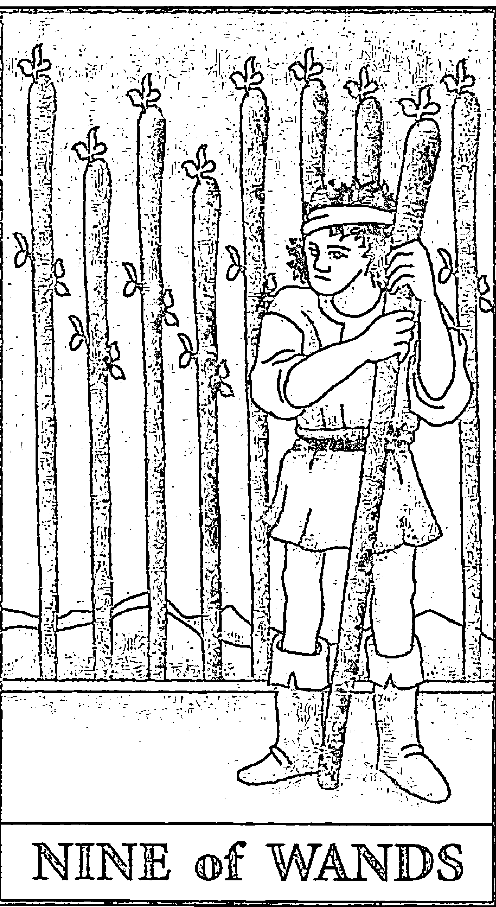

这张牌象征既要保护之前的工作，又要开拓性地防御。

在工作上，显示你目前面临压力，也很难有所举动。感情上则表示很难有进展，一不小心就会受伤。

### 爱情：

很难有进展。

### 工作：

面临压力，也很难有所行动。

### 金钱：

超过你的负担。

> 今日的幸运符：
果香味的精油、数字9

## 圣杯骑士（正）
Knight of Cups

圣杯骑士是一个好消息的征兆。

圣杯是“水”元素，水正是与感情、感受、潜意识相关的阴性元素。有圣杯（水）特质的人特别注重感情交流，也显示出跟情感面甚至是潜意识层面的问题。圣杯骑士就是这样一个浪漫、情感丰富的角色。

圣杯骑士的出现显示你最近的直觉很敏锐，要相信直觉，无论是工作或是爱情，尤其和你目前想要探险的新计划相关。

不过，圣杯骑士也有善变跟多情的一面，不止感情如此，工作上也很善变。这点从他身上的衣服可以看出端倪，他的身上是红白玫瑰相间的白袍，象征他是多心之人，无法专注工作。当占卜者拿到这张牌，则提醒你需要更多的持续力，而不只是一时的好心情。

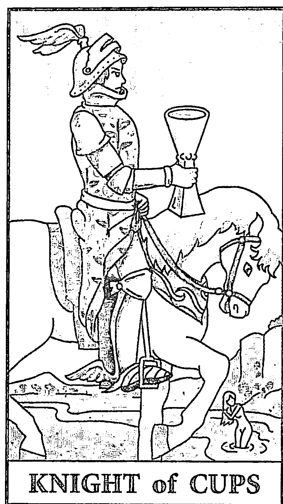

- 爱情： 容易遇到浪漫、情感丰富的人。
- 工作： 要相信直觉，全力以赴。
- 金钱： 工作要专注才能赚钱。

> > 今日的幸运符：
> 小背包、水壶

## 正义（逆）
Justice

一般人下决定的过程并不容易，心中的天秤会摇摆不定，这时正义就面临了考验。如果是逆位，则表示可能决定错误，或是违反正义。也许是你自己即将受到这样不公平的对待，或是之前你不公正的行为即将被发现了。

你目前的处境：逆位代表可能遇到怀有偏见与私心的人，如果正面临法律问题表示情势可能不利。如果面临考试，提醒你千万不要心怀侥幸，否则绝对没有所谓的好运。

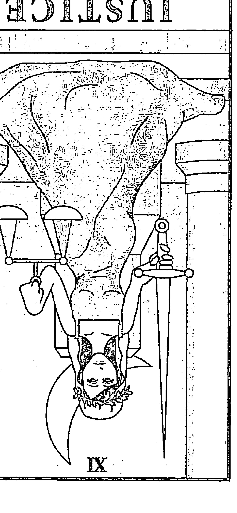

- 爱情：感情受到不公平的对待。
- 工作：目前头脑混乱，不适合做决定。
- 金钱：最近属于开支大于收入的时期，不要过度花费。

今日的幸运符：

绿色的披肩

## 国王（逆）
The Emperor

强势的国王身着红色的衣服，钢铁般的意志可能会显得过于权威，而不管他人的情绪或是意愿。如果在占卜时出现其他权杖或宝剑等具有负面含意的牌，可能代表滥用权力、超过理智判断。

“独裁的善意”，也可能代表感情失去理智、过度极端。

其他负面的阳性特征还包含太过大男人主义、威权具控制欲，或是行使统治能力时不够圆融等等。

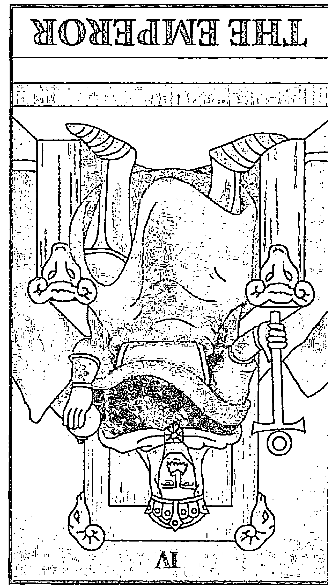

**爱情：** 容易被事业成功的权威人士吸引。但对方可能希望什么事都听命于他，控制力强。

**工作：** 虽然具有领导能力、开创性，但不宜太过强势，以免引人反感。适合创业、或是担任公关部门的执行者。

**金钱：** 可以借着社会名声而带来财富。

今日的幸运符：
石榴石、红色

## 钱币9（正）
Nine of Pentacles

牌中一位衣着华丽的女子站在她的庄园中，四周葡萄茂盛，正值收成时节。大肚怀胎的她右手抚摸着肚子，左手还勾着一根葡萄藤，象征生命的成长和茁壮。

树上有小鸟唱歌，象征准备迎接新生命。

钱币9象征完成、收成，健康快乐的环境和机会。不论是占卜工作或是感情，都是正面的果实收成期，彼此都很认真地准备为下一阶段的新生命而努力。

- 爱情：彼此希望往更长远的未来前进。
- 工作：象征完成，收成，健康快乐的环境和机会。
- 金钱：丰收的时刻。

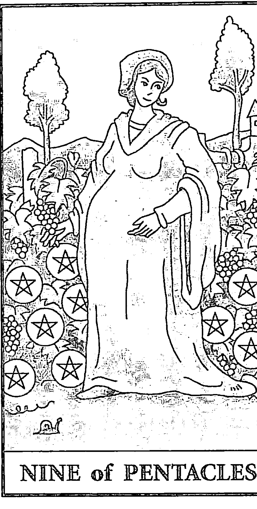

今日的幸运符：
小孩、葡萄果实

## 权杖5（逆）
Five of Wands

正位的权杖5代表这是一场公平的竞赛，逆位时则表示场面过程有点失控，这有可能是一场作弊或是有奸诈伎俩的竞赛。

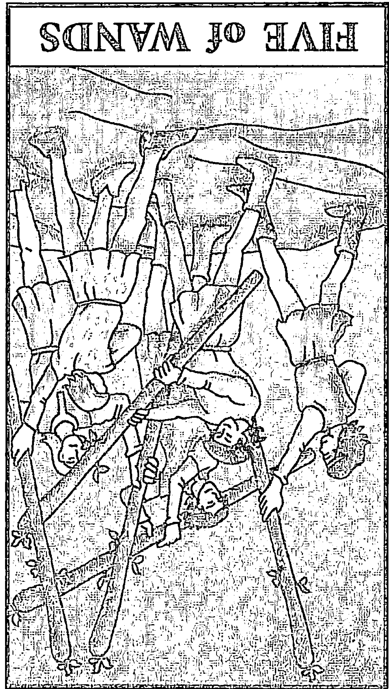

牌中是一群年轻人混战的场面。五个人手中各拿有一根权杖，彼此僵持不下。这是一场具有模仿性的战役。不过，天空的乌云只是一小朵并且很快就散了，蓝天比较多，所以表明这只是一个过渡期。

因为5有冲突的意思，所以权杖5是用来表示打架的，但毕竟是“火”象特质，火容易来也容易去，所以这只是一种小争吵，并不会发展到很严重的地步。

### 爱情：

对方只是玩伴，大家开心就好。

### 工作：

团队之间容易有争执。

### 金钱：

没有共识，不是很认真地研究标的。

### 今日的幸运符：

- 五角星、黑胡椒等调味料

## 权杖7（逆）

### Seven of Wands

这张牌正位和逆位是一样的，都是提醒你坚守岗位，继续努力耕耘。

绿衣主角站在青青的山顶上手握权杖，似乎在积极耕耘自己的领域。

关于工作或事业，这张牌代表成功属于勇于坚持的人。意在提醒你现在还没走多远，不要以为自己已经经营、努力很久了。你现在也许只在基础阶段而已。

关于爱情，逆位的权杖7代表还处在经营阶段，并没有明显的结果，所以你可以继续尝试前行。不过这件事并不是一两天就可以有明确的答案，请不用急躁，感情上还是慢步前进比较稳妥。

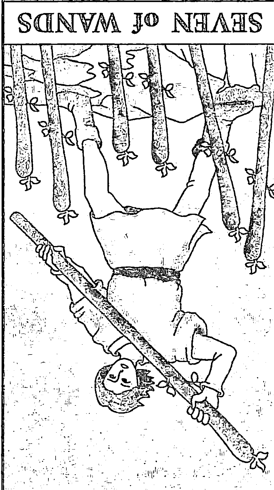

- 爱情：还是慢步前进比较稳妥。
- 工作：继续坚守岗位。
- 金钱：多做打底的事情。

今日的幸运符：
绿色、多喝水、数字7

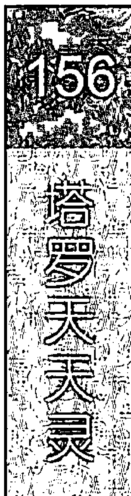

## 钱币2（逆）

### Two of Pentacles

总体来说，钱币2是张游移不定的牌，不管是正位还是逆位。一方面表明当事人可能正在为经济问题而烦恼，另一方面则表明人生步入潮起潮落、不稳定的阶段。

人生要面临的现实问题有很多，并不只是钱而已，现实的考验往往空降而至，我们就像行驶于海面上的船只，随着浪潮起起伏伏，经历各种变化。钱币逆位会让当事人像马戏团里抛球的小丑一样，既要把左边的球抛到右边，又要兼顾右边的球。

只要用平和的态度灵活处理，不呆板，就会取得平衡，将水平发挥到极致。

### 爱情：

彼此金钱观念有差距。

### 工作：

这份工作有财务方面的问题。

### 金钱：

最近周转不灵或金钱运受到影响。

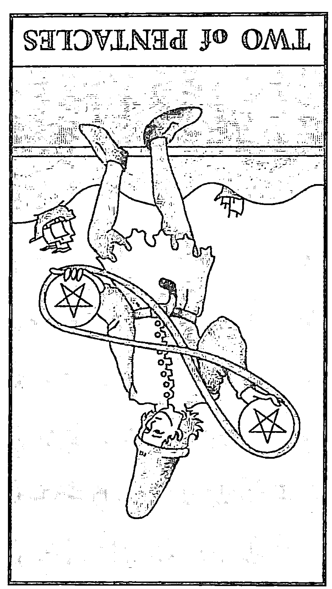

> 今日的幸运符：
数字8、运转的游戏
或运动

## 命运之轮（逆）

### Wheel of Fortune

轮子往下转代表当事人拒绝学习，或是拒绝改变，因此没有抓住命运的契机。

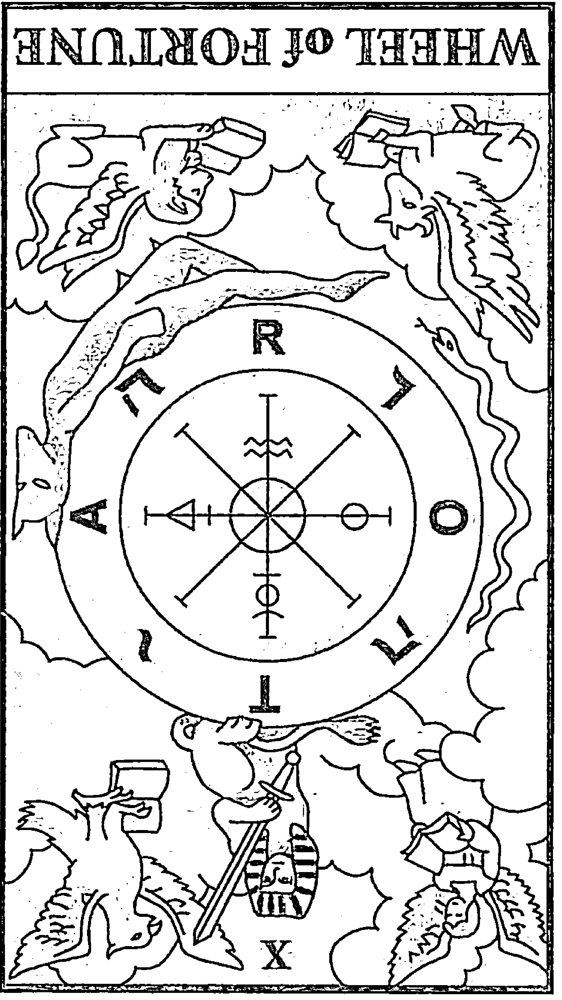

当人生面临新的转折点，就是改变命运最好的良机。人生无常，只有不断寻求进步，才能抓住机会。

此牌除了表示犹豫不决而无法把握机会，不想改变自我之外，也代表了过度投机，例如太希冀于机运，还可能意味着赌博失败。

爱情：

运气来临，但你不一定能把握得住，有可能因过度任性而毁了一段好姻缘。

工作：

有很多机缘到来，但只有更加敏锐，才能抓住时机。

> 今日的幸运符：

- 打电话、与人沟通、琥珀

## 圣杯侍者（逆）
Page of Cups

无论从年龄还是经验来说，侍者牌都是牌面最小的。圣杯是“水”元素，水正是与感情、感受、潜意识相关的阴性元素。有圣杯（水）特质的人特别注重感情的交流，也显示出情感面甚至是潜意识层面的问题。圣杯侍者很温暖、很可爱，而逆位的圣杯侍者感情虽然丰富，却不稳定。

逆位的圣杯侍者可能有点摇摆，他的手中拿着一个装有鱼的杯子，表示无论在工作或爱情方面他都已经享有浪漫的美好了。但是他只是个孩子，沙滩上还有其他没被捕捞的鱼同样吸引着他的注意力，所以他只是想先体验一下，好玩才是最重要的。所以逆位的圣杯侍者在乎乐趣更甚于稳定。

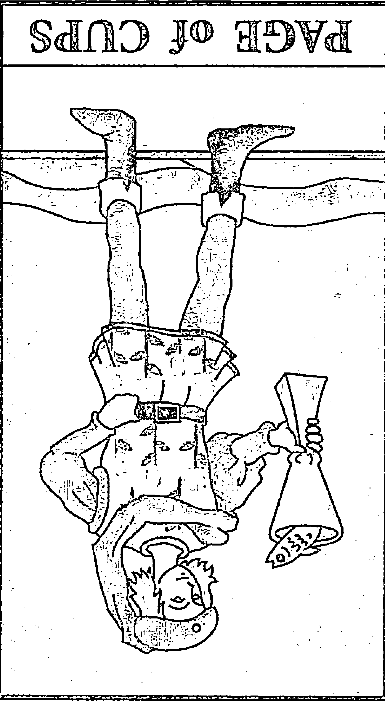

不过，就算是逆位的圣杯侍者也没有恶意，圣杯宫廷牌的主角都身穿与玫瑰相关的衣服，不管是正位还是逆位，他们都不会玩弄他人感情，只不过是多情罢了。

### 爱情：

有一点好感在萌芽中，还不能保证未来。

### 工作：

让职场充满快乐是你的近期策略，但还是提醒你态度稳定一点。

### 金钱：

浪漫、温馨好玩的事业有收获。

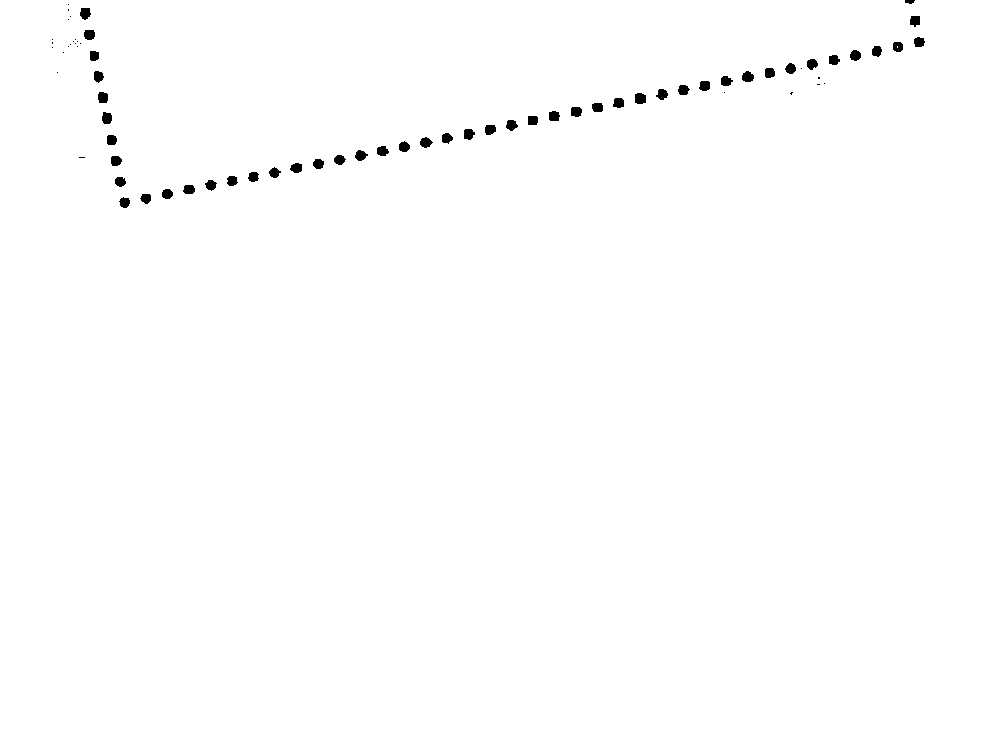

## 宝剑6（正）

### Six of Swords

宝剑6给人一种忧伤的气氛，也有远行或离开的感觉。小船上的船夫载着一个女人和一个孩子，船正在离开……船的周围还插着六把剑。

牌中的主角披着斗篷把自己藏起来，一副很失落的样子，带着一个孩子离开，看起来非常孤独。沉重的剑身让船只能缓行，但值得庆幸的是，主角还有船，还有小孩的陪伴，还能够离开。

拿到这张牌，虽然表明现在是忧郁的失望期，但也象征了可能离去或远行，还有疗伤的机会。这张牌提醒你不要在原地悲伤，不如让自己暂时离开，逃离这个阶段，也许有可能想出解决方案。

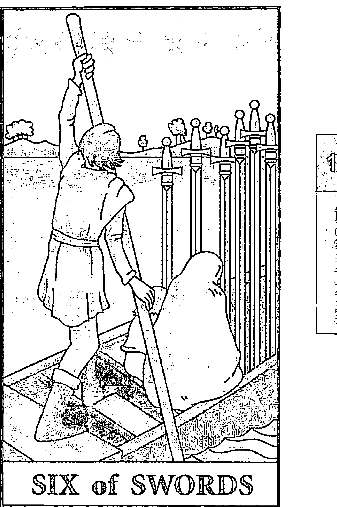

爱情：
何不让自己安静一阵子，独处一下？

工作：
暂时休息，关心别的事情，反而会会想出好方法。

金钱：不必急。

> 今日的幸运符：
- 海边
- 湖水岸
- 旅行

## 宝剑10（正）

### Ten of Swords

如果说宝剑9表明在做噩梦，充满了担心和绝望，那么宝剑10就表示确实没救了。此牌中有一个俯卧的主角，背上插着十把剑，令人触目惊心，背景是黑色的天空和乌云，很难想象这件事还有什么回旋的余地。

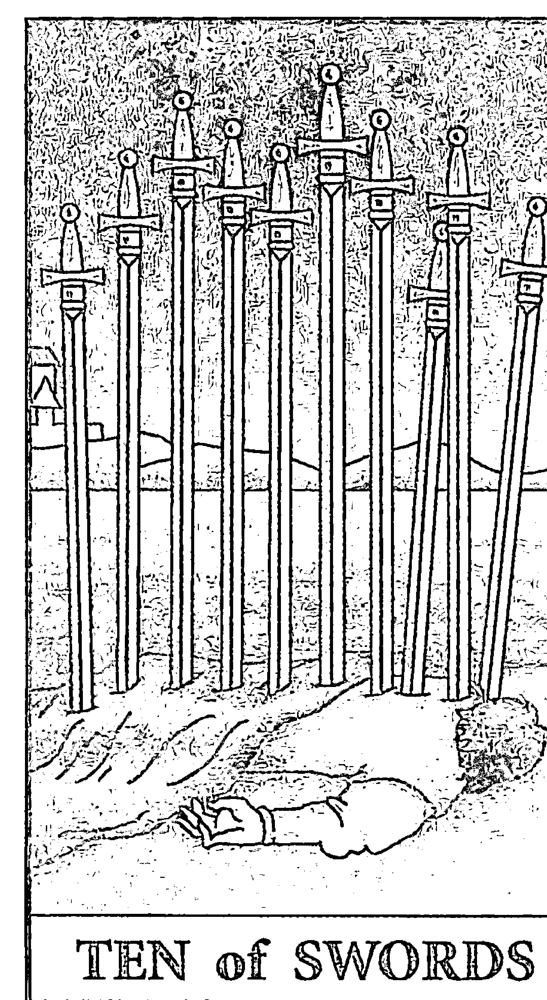

宝剑10总是带来负面的意义，惨痛的结果、背叛，没有任何希望，不但会死去，而且还是惨死在十把剑下。

不过，无论好坏，每件事总有一个结局。这件事情的意义就是一个学习的过程，每件事都要付出代价，如何从失败中学习，从痛苦中成长，才是这个阶段最重要的领悟。也才是整个宝剑牌的终极意义。

### 爱情：

惨痛的结束。

### 工作：

没有任何希望。

### 金钱：

没有任何希望。

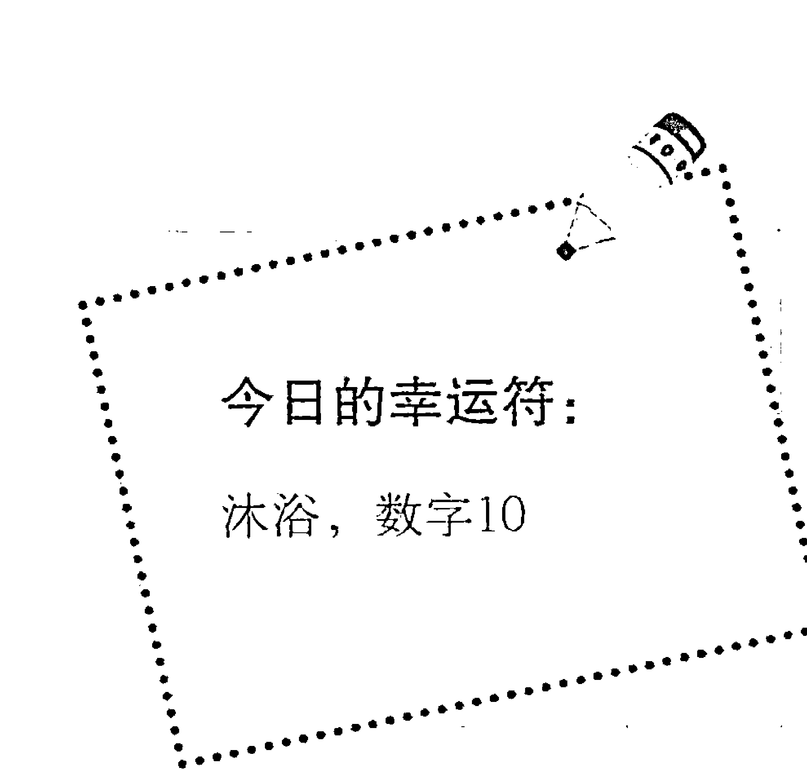

## 圣杯5（逆）

### Five of Cups

逆位的圣杯5，代表失败沮丧之后，沉溺在一片哀伤诡异的天空下，看不到任何机会。

同时也可能提醒你：这个计划一开始就不够周全，比如说你只注意到了五分之三的情形，而这并不足以成事。

更甚者是，桥外面的房子也不是你想要的，表明这个决定一开始就是错的，不过房子里的灯火代表还有一丝安慰。

- 爱情：悲伤失落的期待。
- 工作：不建议太过躁进，应该守成。
- 金钱：错误的投资。

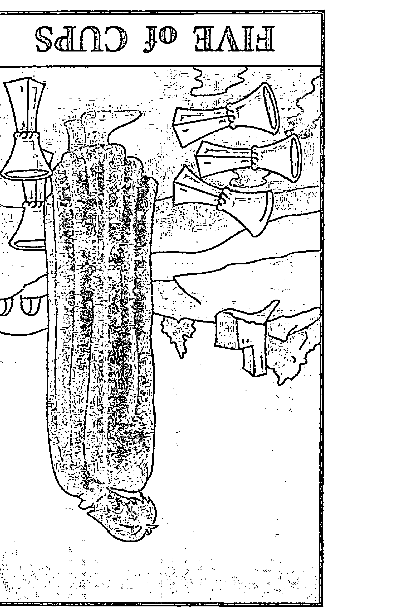

> 今日的幸运符：桥、迷迭香的味道

## 教皇（正）
The Hierophant

教皇，象征着善心和乐于助人的性格，在社会上有一定的权威性。目前你可能会遇到长辈、上司、宗教人士或令人尊敬的人物，也可能需要长辈等人的支持及建议。

教皇的右手指向上天，是在向信徒给予祝福和传达上天的旨意。因此如果是问事情的时机，则观点较主观及单向，必须等高阶的人下令，不见得是平等的关系。

如果是问关于适合的工作，则可能会是指一份负责教导别人的工作，以及宣传、公关、传播性质的工作。

### 爱情：

你所追求的是一个有知识、可信赖的人，对方比你成熟，可以给予你生活上的建议，否则你会更像他的老师，不断尝试着带领他。

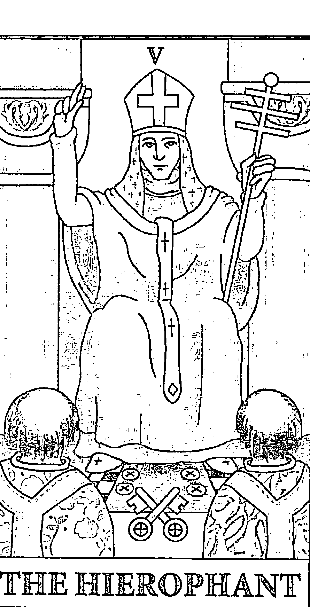

### 工作：

会得到有知识的长者的支持。善于指导别人，适合教育、心理或宗教方面的事物。

### 金钱：

有贵人运，提供赚钱之道。

> 今日的幸运符：
紫水晶、佛经或圣经

## 正义（正）
Justice

牌中，埃及女神玛特坐于两石柱之间，左手拿着天秤，右手拿着剑，象征着公平、公正、决断力及其相应的结果。

此牌的相对星座是代表平衡的天秤座。因此正义牌出现时，通常与某个决定相关。建议你此刻用理性思考的方式，仔细分析利弊，也就是你必须对自己绝对诚实。

假如你之前被误会，或是在等待一个结果，正义牌的出现代表你将讨回公道，获得道歉或赔偿。倘若你之前不属于正义的一方，这时就不用期待太多了。

左手的金色天秤和披肩的绿色都是天秤座的象征。这也是正义的颜色。

- 爱情：感情平稳发展，甚至进入结婚的阶段。
- 工作：具有冷静分析的头脑，适合法律仲裁等职位。
- 金钱：收支平衡，可理财。

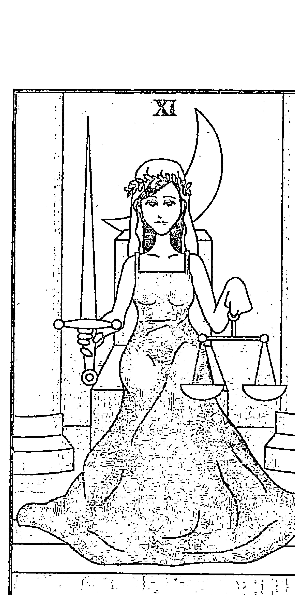

> 今日的幸运符：绿色的披肩

## 圣杯10（正）

### Ten of Cups

这是一个大团圆的场景，图中的一家人其乐融融，相爱的父母互搂着对方，并各举一只手迎向圣杯彩虹，男孩女孩快乐地手牵着手在跳舞，背景有青翠的树木、河流，还有美丽的房屋。这世上还有什么情景比这更美好呢！

圣杯10象征着大团圆，也代表着情感的最终归宿。因此如果是占卜感情相关的问题，当然是朝着稳定的关系前进。

若是关于团体合作，如社团、合作伙伴等等，都表明在其中可以得到充分的情感交流与支持，也表示合作关系的稳固，并且好事将要来临。

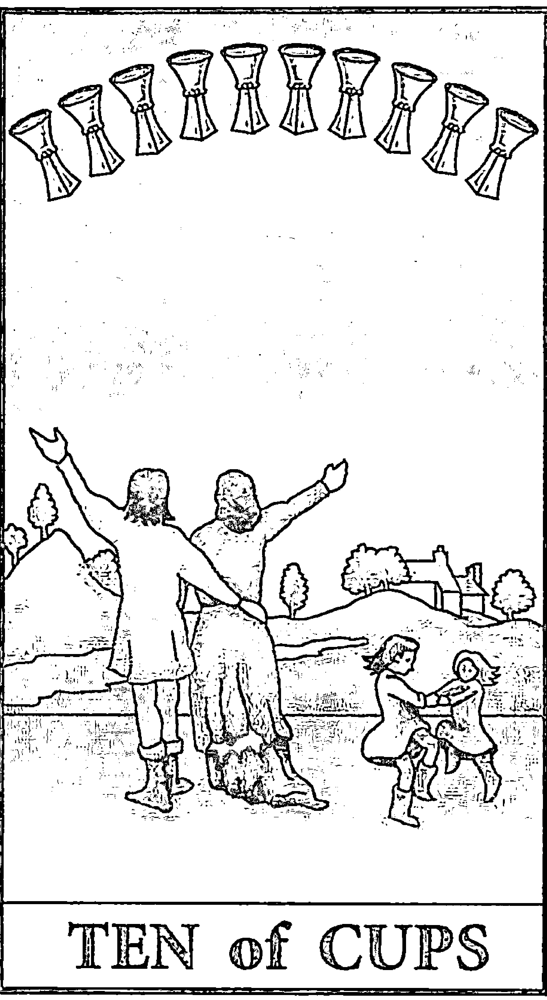

- 爱情：大团圆，其乐融融。朝着稳定的关系前进。
- 工作：合作稳固，很有默契。
- 金钱：好的投资机会纷纷来临。

> 今日的幸运符：
数字10、家庭、与相爱的人用餐

## 钱币8（正）
Eight of Pentacles

钱币8中有两个主角，一个是老师（或是学长），一个是学生（或者是学弟）。老师站立着将自己的能量灌输给跪着的学生，表明一种传承的过程，也可以说是学生学习的过程。

拿到这张牌表示对学习有好处，也表明你现在应该有很好的学习机会与环境，若是要问事情，表明应该在工作的环境中寻找长者或是资深人员的帮忙。

若是问感情，则表明对方仅把你当作合作或学习的伙伴，目前可以互相依靠，但尚缺少闪电般的激情。

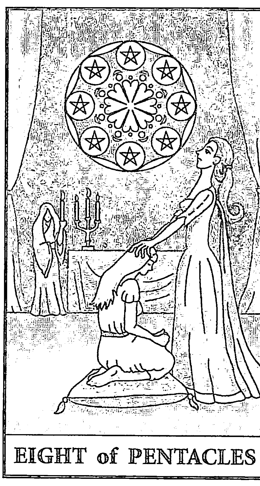

背景有几个古代的人物造型，以及酷似埃及女神的造型摆饰，是知识与历史的象征，如果从事考古或与研究相关的工作会有好运。

### 爱情：

对方仅把你当作合作或学习的伙伴，目前可以互相依靠，但尚缺少闪电般的激情。

### 工作：

应该在工作环境中寻找长者或是资深人员的帮助。

### 金钱：

必须多学习一点技能才能赚钱。

### 今日的幸运符：

数字8、古董

## 恶魔（正）

### The Devil

亚当和夏娃受恶魔诅咒。铁链捆绑着他们，但这枷锁是可松动的。魔鬼牌亦表示控制和诱惑。

恶魔象征着对外在物质的欲望，功名利禄，或是情色的欲望，此时心灵上的追求完全被忽略，只沉迷在感官的追求中。

过度追求物质的人，在追求物质感官满足的过程中，自己反而变成物质的奴隶。此时你的状况是过度沉溺物欲或性欲，而变成一种瘾，酒瘾、毒瘾、烟瘾，或是色欲的瘾，恶魔存在于每个人的心中，可是这个枷锁却可以靠自己挣脱，因为这个枷锁是自己套在自己身上的。

恶魔牌背景全黑，代表精神上的黑暗，提醒你现在须时时注意控制自己心中的欲望。

### 爱情：

受金钱、美色诱惑，陷入不正常的感情陷阱。

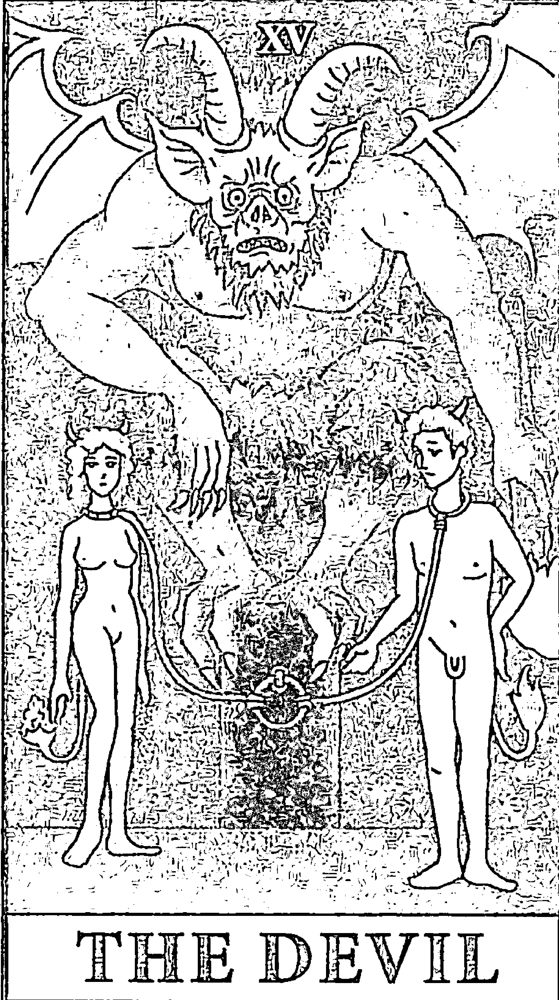

### 今日的幸运符：

前往庙宇、教堂、看经书

### 工作：

这是一个误会的开始，充满诱惑的承诺。

### 金钱：

过度花费，追求虚荣。

## 钱币1（逆）

### Ace of Pentacles

钱币1是正面的计划孕育养成期。但并不表明从此以后就飞黄腾达直到永远，也不表明一定会长出丰硕的果实，这只是一个提示，表明这个机会对你的人生是有帮助的，你应该快快上路。

但是人生奇妙的地方在于，当我们真正上路之后，才发现我们不一定会看到原本期待的风景，而是走到新的地方看到新的果实。所以钱币1逆位是在提醒你：制定计划不要畏首畏尾，也不要目光短浅、急功近利，要勇往直前，但是一定要用大地之母的踏实之心去经营。

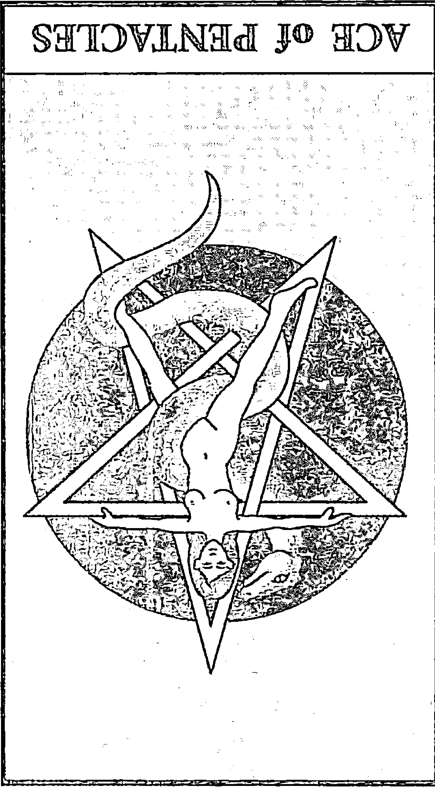

另外，也可能代表现在的计划还不够周全，要多观察市场。

### 爱情：

你或对方会以金钱物质的基础评估爱情。

### 工作：

不要目光短浅、急功近利，将眼光放远一点。

### 金钱：

金钱头脑很好，但要诚实稳健地坚持下去。

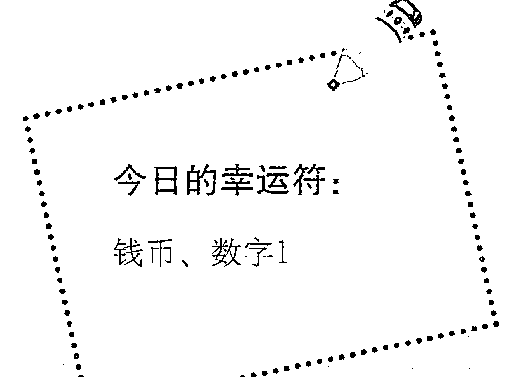

## 宝剑5（逆）

### Five of Swords

从地上散落的两把剑，以及图中三个人所呈现的一种对峙的位置来看，这里似乎刚刚结束了一场战役。

宝剑5代表着争执，与权杖5相似，但权杖5是一群人僵持不下的画面，甚至像一场好玩的骑马打仗游戏；而宝剑5却显示赢的人也受了伤，输的人心中黯然，甚至感到丢脸屈辱。

逆位的宝剑5就是在描述这样的后果，不平静的结局必须被抚平，天空中被风吹散的云朵代表可能给彼此一个云淡风轻的结局，希望不要过度的斗争。

这个逆位5的过程是要考验你如何获得胜利，并且让大家都有台阶可下，不会树立新的敌人。

爱情：
学习心平气和地处理争执，两性关系需要双赢，不是斗争。

工作：
学习心平气和地处理争执，工作上需要双赢，不是树立敌人。

金钱：
没有好的立足点。

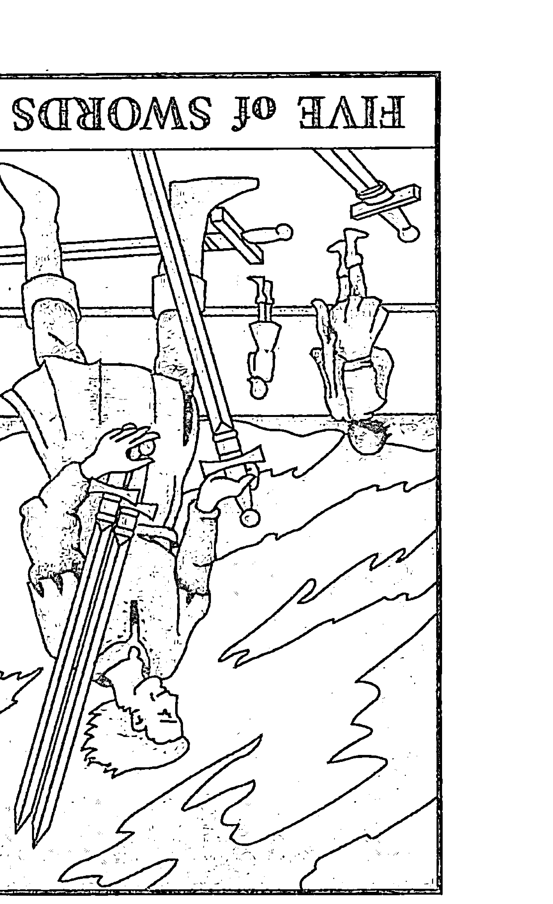

今日的幸运符：
红色、微笑

## 圣杯7（逆） Seven of Cups

这张牌的正位和逆位一样，都是提醒你要专注现实，而不是过度迷失在美丽的幻想之中。

七个圣杯飘浮在云雾弥漫的半空中，杯中所装就是你的梦幻，城堡（代表理想）、珠宝（财富）、桂冠（胜利）、龙（勇气和诱惑）、人头、盖着布发光的人（自己）以及蛇（欲望）。

请注意七个圣杯当中的桂冠下方有颗骷髅头，代表胜利的结果有可能会产生一些牺牲，美丽的梦想不会永远都穿着美丽的华服。

此外，占卜者第一个注意到的杯子图案，暗示了你目前显现的问题。

爱情：
恐怕只是一场美丽的幻想。

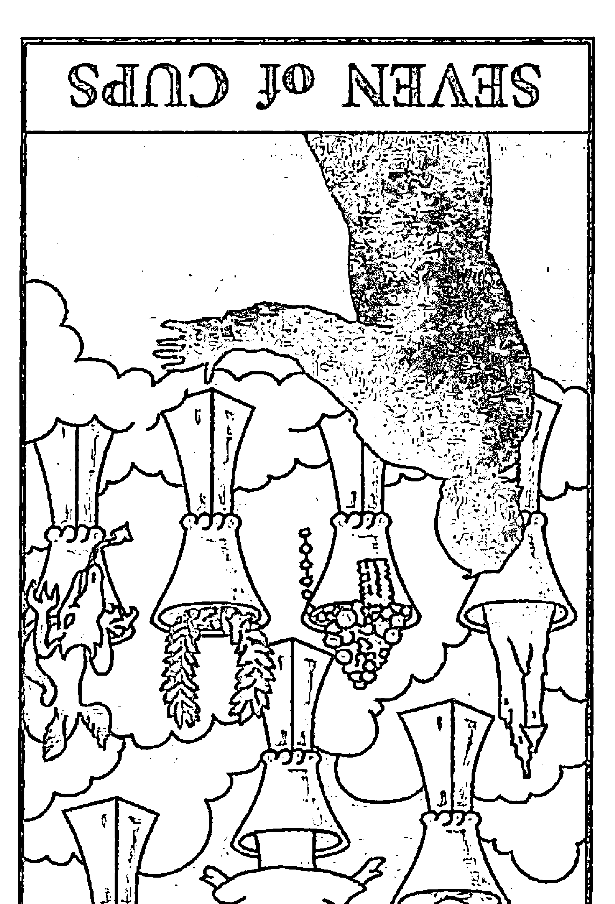

### 工作：
幻想不切实际。

### 金钱：
只靠空想是无法赚到钱的。

### 今日的幸运符：
- 圣杯、数字7、各种精油

## 高塔（逆）
### The Tower

高塔的课题是很严格的，毕竟人受限于习惯，一旦日常生活模式受到预料之外事物的破坏，将会很难接受。但是高塔也带来一种解放，极可能是难得的机缘。只是目前的你面临巨变，却还没有准备好要如何面对。

高塔逆位的意义与正位类似，不过也许你早观察到现实的状况了，所以多少可以帮助自己调整一些。但也许你一时半刻还在压抑，或是不愿意让梦幻迅速结束，所以你还扶着塔不让它倒塌。

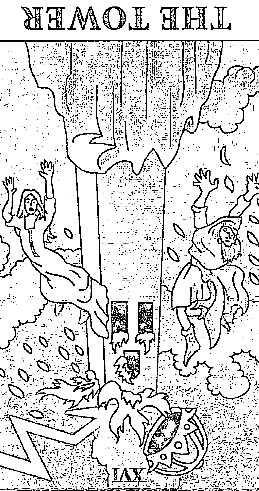

虽然想控制事态的发展，却不一定是好现象。盲目压制会让自己失去宝贵的体验机会，也可能错失改革的时机。

### 爱情：
梦幻破灭，已经做好准备。

### 工作：
计划失败或是被迫结束。

### 金钱：
面临不可预期的财务危机。

今日的幸运符：
红宝石、录音机

177
塔罗天天灵

## 权杖7（正）
### Seven of Wands

坚守岗位，善于管理，才能获得成功。

绿衣主角站在青青的山顶上，手握权杖，似乎是在积极耕耘自己的领域，有人说他是在保护自己的土地，奋力迎击敌人从山下攻上的六枝权杖。正面一点的想法则是前六枝权杖已经被放置妥当，你正在建筑第七枝权杖，现在的任务就是思考这个权杖该如何安放，同时也表明只有继续经营下去，这个房子才有可能被建好。

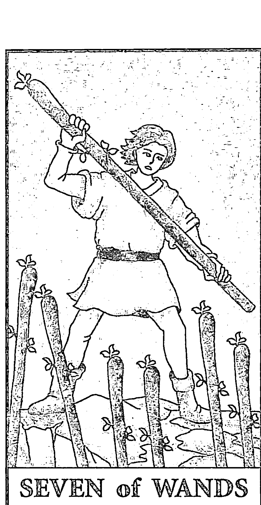

因此权杖7告诉我们：不要害怕面对挑战，也许你已经辛苦一阵子了，或者不愿你一个人继续坚守岗位，但成功将属于坚持到底的人。

- **爱情：**
辛苦地经营着，并且只有你一人准备继续经营。
- **工作：**
继续坚守岗位。
- **金钱：**
多做打底的事情。

> **今日的幸运符：**
绿色、多喝水、数字7

## # 钱币皇后（正）
### Queen of Pentacles

钱币是“土”元素，土地滋养万物，象征实际的物质力。钱币皇后不只讨论金钱，实际上也是大牌中“皇后牌”的缩小版，既重视享乐又乐善好施、助人为乐。只是他们也实际地希望以物质的满足为出发点。

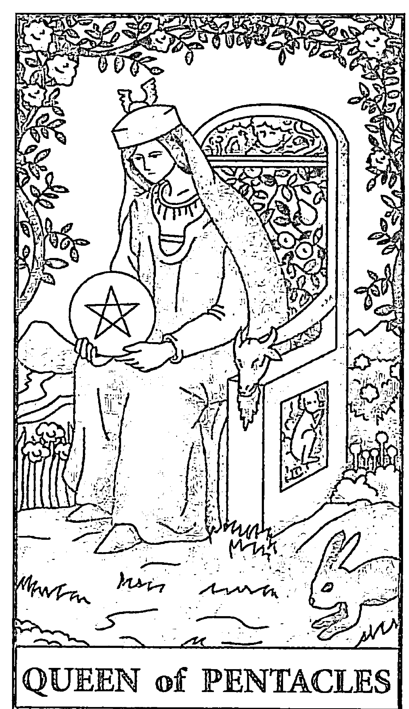

假设占卜者拿到此牌，除了代表物质的稳定与享受之外，相较于钱币国王来说，钱币皇后更能给别人快乐温暖的感觉，也更在乎生活的品质。假设是问感情对象，那么对方起码是一个愿意照顾别人，也愿意真心付出的人。但是两个人的价值观念或生活态度将是重要课题，也是决定成功与否的重要条件。

在工作或生活中，钱币皇后象征着丰硕的成果。虽然不一定和获得大笔金钱直接相关，但是一定有重大的收获，可能是你学了一个技能，或是认识了对你有好处的贵人，也可能是工作的环境很优雅，并且结识了很多高品质的人。

爱情：建议你展现尊贵与温暖的人格特质，这是任何人都喜欢的。

工作：有重大的收获。

金钱：可以稳健成长。

> 今日的幸运符：
金黄色、光明的笑脸迎人

## 圣杯8（逆） Eight of Cups

逆位的圣杯8代表主角不愿意越过河川，也表明你还没认清这场局已经玩不下去了。

四周沼泽密布，代表淤塞的窘况，似乎没有明朗的迹象。

看起来是黯然离去的状况，身穿红衣红鞋的主角自己孤独地拄着拐杖向昏暗的暮色中走去，也有人描述主角是要抛弃这八个杯子，跨过河流去寻找新的杯子（新的可能），但是逆位的圣杯8并没有显示新的杯子在哪里，也代表这趟新的旅程还是目标未明。

总之，无论是正位还是逆位，这张牌都代表失落感。

### 爱情：
应该放弃现有的感情，走自己的路吧。

### 工作：
碰到困难很难继续。

### 金钱：
当初也许过度乐观。

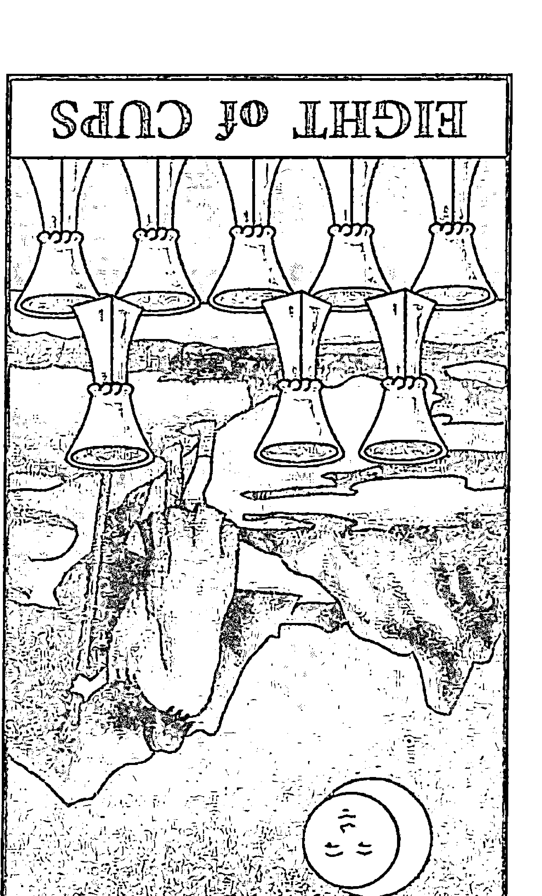

181 塔罗天天灵

### 今日的幸运符：
- 数字8
- 脚踏车
- 行动工具

## 审判（正）
### Judgement

天使加百列（Gabriel）在最后的审判中吹起号角，唤醒世人迷惘的心，他们从墓穴中欢欣地迎接重生。这张牌的出现表示过往的努力，现在是接受成果的时候了。

由于都是根据先前所做的事情，给予“判断”（奖惩），所以和“正义牌”很相近。但是天使的号角是关键时刻提醒的宣告，因为这个讯号唤起你内心强烈的觉醒。所以这张牌的内在意义更胜过“正义牌”。

当占卜者拿到“审判牌”时，多半都有考试、检验，或等待某一个结果的状况出现。在爱情中，也是考验的时刻！

这是问题的中间等待期，也可以说是迎接即将到来的转变期。

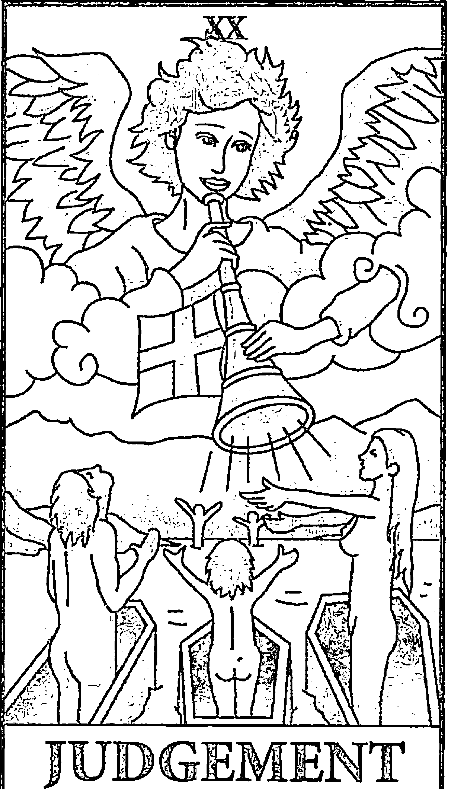

### 爱情：
双方的关系面临新的改变，应该更理智地看待。

### 工作：
新的改革，新的工作方法。

### 金钱：
可以尝试新的投资组合，会有进展。

### 今日的幸运符：
鼠尾草、柠檬精油

## 星星（正）
### The Star

这是一张充满理想和希望的牌。女子双手各执一壶水，表示心灵上的和谐与宁静。星星出现在代表毁灭的高塔之后，表示毁灭之后的新希望。

这张牌的出现代表内在的治疗有一定的新进展，这是苦尽甘来的时刻，因为你超越了“恶魔”的诱惑、克服了“高塔”时期不切实际的幻想，所以自由也是星星牌的另一个讯息。

这与占星学上的“水瓶座”相呼应，水瓶座的课题就是“自由”，倾听自己内在的声音，然后透过“将水倒出来”，让潜意识的部分展现成为意识中可以认知辨识的部分。在这个新阶段，你应当好好计划，有机会好好展现你的自由意志。

爱情：
期望的爱情会发生，会有一个新的开始。

工作：
适合进行创意的工作，有很好的灵感。

金钱：
有好运，甚至获得意外之财。

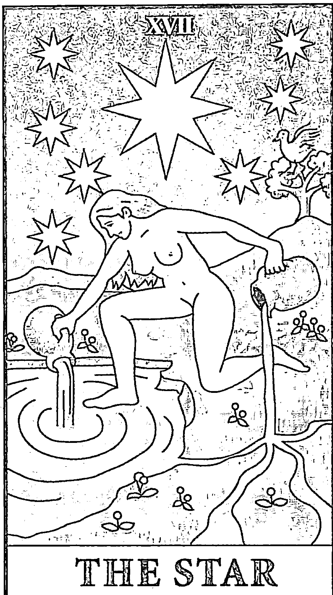

> 今日的幸运符：
蓝宝石、熏衣草香精油

## 宝剑8（正）
### Eight of Swords

黑色的背景呈现出压抑的气氛。主角在眼盲手缚的情况下，四周又都是宝剑，暗示占卜者受到重重的限制与压迫。同时处于迷茫的状况中。

这个红衣女人眼睛被布蒙住，上半身被捆绑着，还被八把宝剑困在其中，然而应该注意这其中隐含的希望之处，就是画面中的女子脚并未被绑住，宝剑也没有将她完全困住，而远方还有座矗立于峭壁之上的城堡，这表明只要有目标，建立自己的方向，即使没有人陪伴，只要肯跨出脚步，自由就在远方。

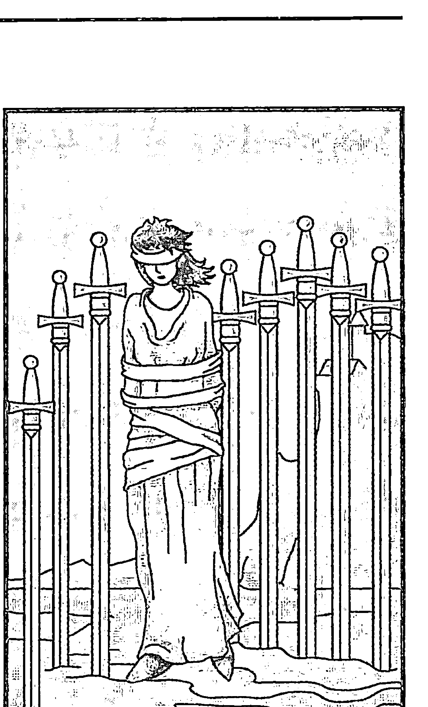

身着红衣的女子象征着主角心灵深处仍然有能量。虽然拿到这张牌一定代表着困难，但你可以像魔术师一样，拥有红衣能量。

- **爱情：**
自己必须跨出脚步。

### 工作：
令人压迫与资讯迷惑的状况。

### 金钱：
困难。

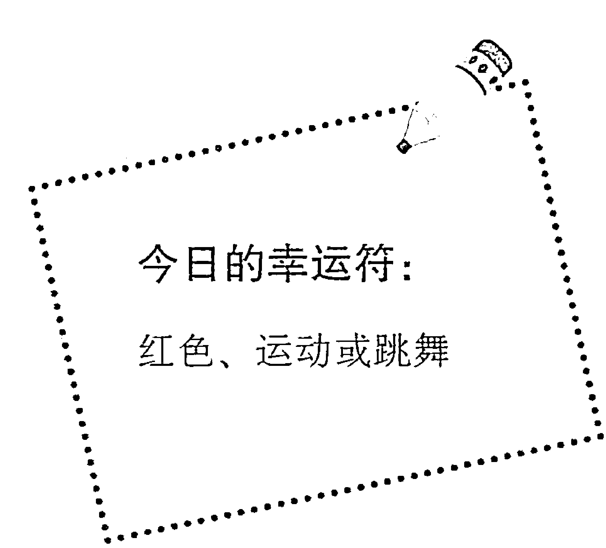

## 权杖6（逆）
### Six of Wands

一位年轻的主角，戴着胜利的桂冠，骑着白马凯旋而归。数字6所表示的是第二个循环的开始，权杖6逆位代表对出发的状况、情资收集不完备，可能是在混乱的情况下仓促成军，提醒你现在应多做准备。

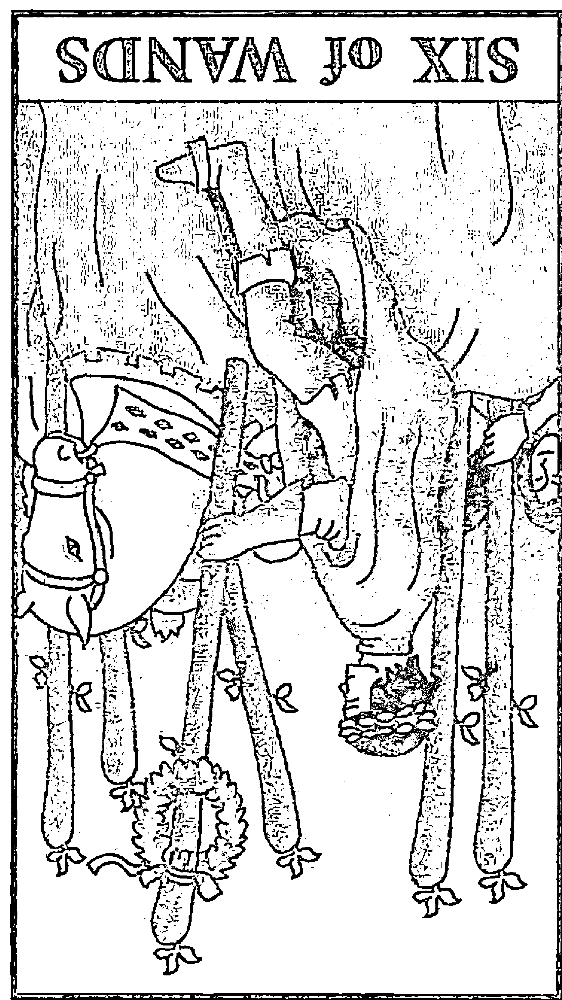

白色代表纯洁，马象征力量，红色的外衣象征积极主动与热忱。

逆位的权杖6有一些潜在的危机，可能是胜利的骑士跌到马下，因为过度自信，以为一定会成功。所以权杖6所表示的就是：不要骄傲，骄兵必败，也可能延迟成功的机会。

### 爱情：
爱情有新进展，但还不是很稳定。

### 工作：
方向是对的，但是步伐不够沉稳。

### 金钱：
钱要进了口袋才算自己的。

> 今日的幸运符：
旗子、数字6

## 宝剑侍者（逆）
### Page of Swords

逆位的宝剑侍者和正位没有太多意义的差别。宝剑牌是“风”元素，象征理智、智慧、思想能力。但是侍者是所有宫廷牌的小牌，所以就算理智，也只是自己的固执，并不会有太多能量伤害别人。

站在高冈上的宝剑侍者才刚打开他学习的宝剑，高冈上的风还有点大，逆位的宝剑侍者还不太适应，还在学习如何掌握宝剑。所以逆位的宝剑侍者有适应期的问题。

在感情上，则代表不太会掌握自己的喜怒哀乐。

### 爱情：
感情生手，情绪容易受影响。

### 工作：
展开新的兴趣或新学问，但要注意持续力。

### 金钱：
开始学习如何带来财运，但是要找对学习对象。

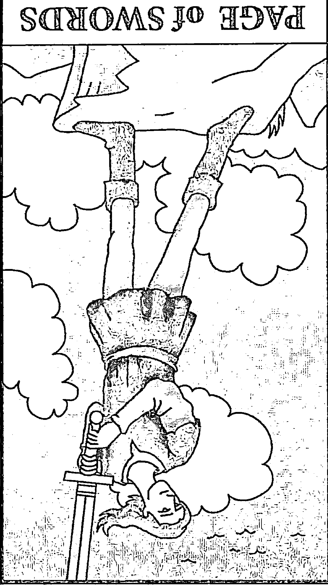

### 今日的幸运符：
益智游戏、面具舞会

## # 宝剑侍者（正） Page of Swords

宝剑的宫廷牌身上都是象征“风”元素的蓝色云，象征行动力。在宫廷牌（国王、皇后、骑士、侍者）当中，侍者是年纪比较小或位阶比较小的象征。因此宝剑侍者在行动力上，显示的只是一点小计谋，不知道有没有持续力。

通常宝剑牌是比较聪明的。如果占卜感情时拿到宝剑牌，表示你的对手比你聪明、比你会算计。但因为宝剑侍者是宝剑牌中的小牌，所以对方并不会千方百计地表现自我，只是耍点小手段让你臣服于他而已。

宝剑侍者站在高冈上，像是刺探敌情的情报初学者。虽然小心翼翼，但毕竟还是一个新手，所以在占卜工作时拿到这张牌，也表明即将展开新兴趣或新学问，尤其是和分析相关的工作。

### ## 爱情：
对方喜欢耍点小手段，让你臣服于他。

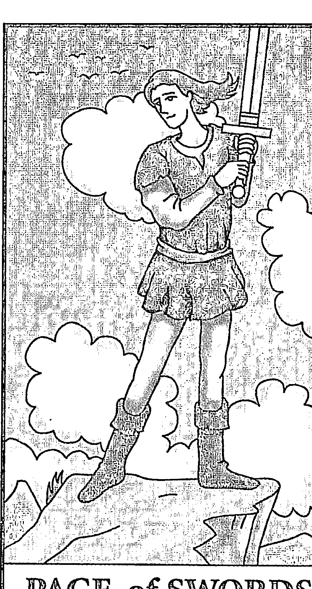

工作：展开新兴趣或新学问。

金钱：开始学习如何带来财运。

今日的幸运符：益智游戏、面具舞会

## 圣杯8（正）
### Eight of Cups

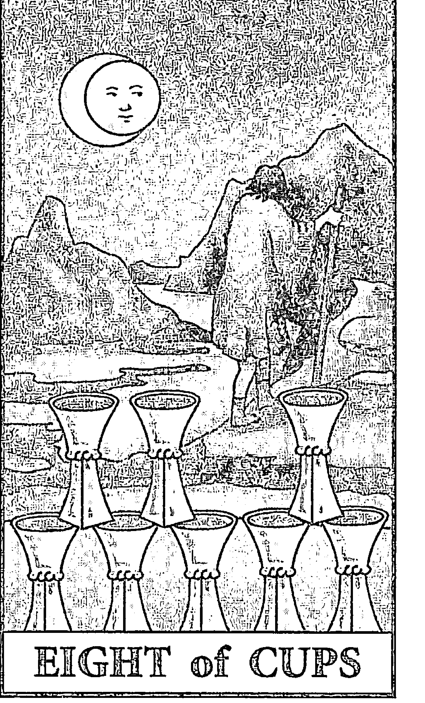

身穿红衣红鞋的主角孤独地拄着拐杖往暮色昏暗中走去，地上半倾倒的八个杯子，象征着他已经不玩了或是玩不下去了。中间那条河流，就像一条分界线，准备和过去告别。

八个圣杯中间有一个缺口，这表明这缺口无法克服，所以主角才黯然离开。红色衣鞋象征行动力，在愚者牌当中也曾出现，它表明现在才发现当初也许过度乐观。

圣杯8是要提醒你以行动打破陈规，因为这个局已经不适合继续了，拿起你的杖，放下眷恋，勇敢前行。在感情的占卜上，代表应该放弃现有的感情，走自己的路。

### 爱情：
应该放弃现有的感情，走自己的路。

### 工作：
碰到困难，很难继续。

### 金钱：
当初也许过度乐观。

> 今日的幸运符：
数字8、脚踏车、行动工具

## 月亮（逆）
### The Moon

月亮牌的正位跟逆位没有实际意义的差别，只有担心程度的差别。狗和狼在满面忧愁的月亮下吠叫，反映人内心的恐惧、不安和悲伤。蝎子要克服恐惧，沿小径通往远方。牌面上的动物象征只是更激烈地引起你对这件事情的恐惧。

月亮牌是潜意识的恐惧，尤其呼应之前的经验，别人无法帮你度过，这是很个人性的，此时通常会有很好的创造力，这是月亮牌最具启发性的地方。假设你是创意或企划方面的工作者，拿到这张牌时，混沌不明反而让你文思泉涌。

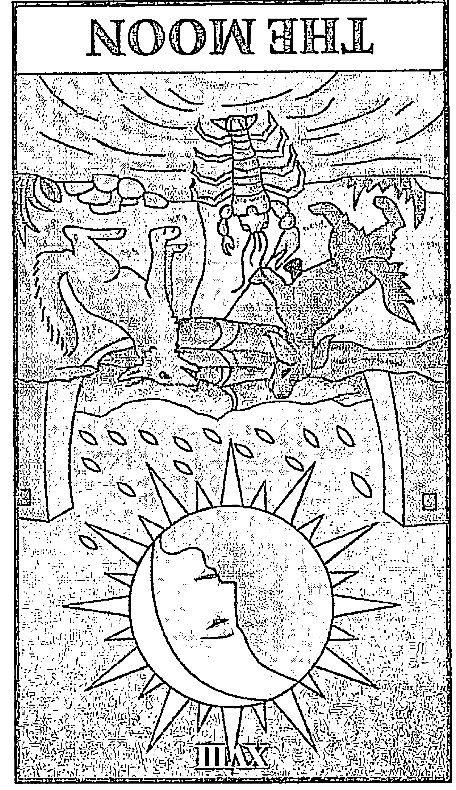

### 爱情：
对爱情充满遐想，有可能是盲目的爱情。

### 工作：
最适合创意方面的工作，但对工作判断不甚理智。

### 金钱：
财务状况不清，不擅理财。

- 今日的幸运符：
珍珠、泡澡

## 钱币3（正）
### Three of Pentacles

小牌中所有的三都代表合作。

这张牌有三个人，在一座修道院里，主角雕刻师正在工作，旁边两位修士（或是助理）拿着草图，似乎正在和雕刻师讨论工作的进度。

如果以建筑修道院当做工作目标，图中三人就是要共同合作，因此钱币3经常代表团队工作，但也代表利益分配对这个事件的重要性。

在古代，修道院往往是非常有钱的机构，所以有三个钱币在这个修道院的墙上，但合作毕竟涉及利益，所以要将利益分配的问题先处理好。

如果是感情的占卜，钱币3涉及了感情中的分配问题，也可能有多角关系。

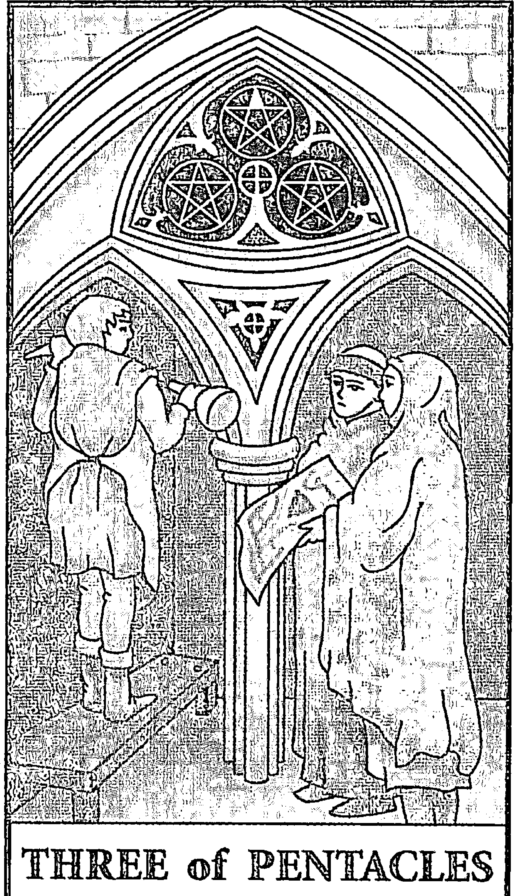

### 爱情：
感情中的分配问题，也可能有多角关系。

工作：
要将利益分配的问题先处理好。

金钱：
要顾及合作伙伴跟自己的利益分配。

今日的幸运符：
数字3、银行、金融机构

## # 宝剑1（逆）
### Ace of Swords

宝剑牌是“风”元素，象征思想、理智，和宝剑牌相关的议题都与思想或意识形态的磨合有关。

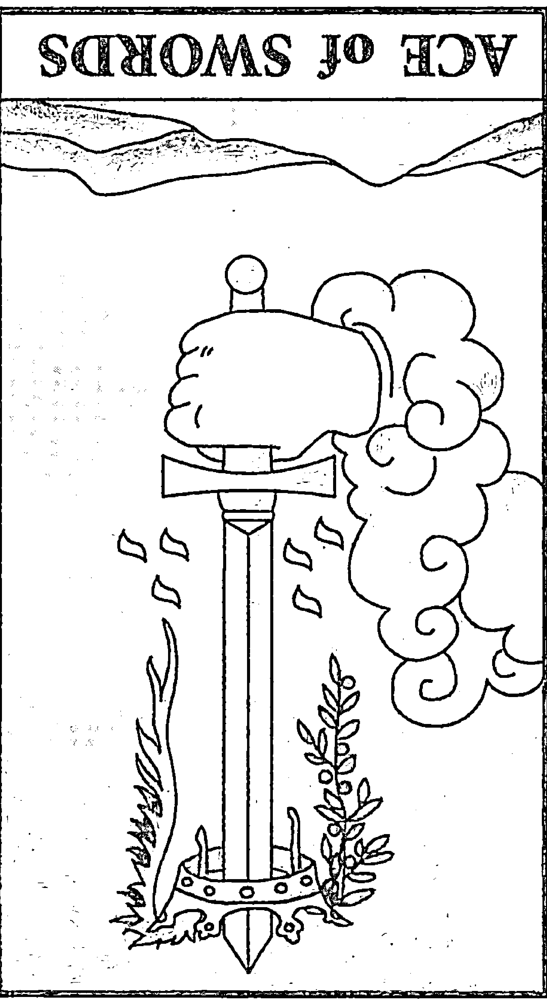

逆位的宝剑1显示一个艰难的开始，远方是毫无绿意的尖锐山头，需要力拼一场。

敏感的人会注意到宝剑穿透了皇冠，另一方面也显示出或许穿透的那一击是容易的，抽出来却不一定容易，有点像石中剑，因此这个过程象征抽身不易。当宝剑1逆位的时候，这个行动要更谨慎，计划必须更周详，才能应付新的挑战。

### 爱情：
积极的态度会吓坏对方。

### 工作：
艰难的开始，要以智取胜。

### 金钱：
需要稳定规划，否则只是短期收益。

> 今日的幸运符：
宝剑、数字1

## 审判（逆）
### Judgement

这张牌上的每个人都站起来欢呼，因为“审判”对每个人都是平等的。牌中的天使加百列（Gabriel）在最后的审判中吹起号角，唤醒世人迷惘的心，他们从墓穴中欢欣地迎接重生。所以这张牌的出现表示由于过往的努力，现在可以接受成果了。但是否接受这个结果则因人而异。

这张牌没有正位逆位的差别，“审判牌”是一个阶段性的完成，就算是不好的结局，也必定有一个理由。但是逆位的“审判牌”需要花比较久的时间才能说服自己。

爱情：
双方的关系需要多一点时间，不要急躁。

工作：
建议多收集资料，多请教他人再行动。

金钱：
不要急躁，等待一段时间再进场。

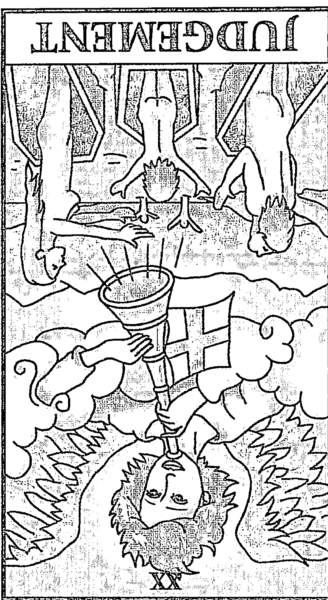

> 今日的幸运符：
鼠尾草、柠檬精油

## # 钱币5（逆）
### # Five of Pentacles

逆位的钱币5代表不协调、毁灭，受苦的情况比正位的钱币5更严重。

牌中这两个在冰寒风雪中病弱乞丐的形象，立刻就让人联想到物质上的贫穷。冰天雪地中两个乞丐蹒跚前行，又瘸又驼背，身上的衣服破烂不堪。尽管他们经过了象征物质与精神庇护的教堂，却未得门入，象征着找不到方法与机会。

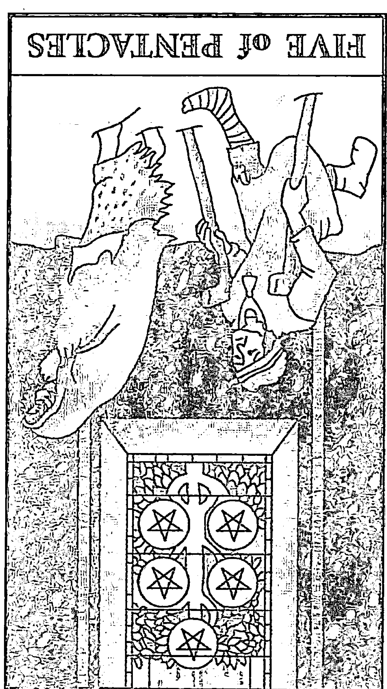

另外，空心的钱币挂在天上，也象征这个梦想不现实。瘸着脚的乞丐代表行动力有问题，占卜者可以检讨自己的行动方针，而眼睛受伤的乞丐代表洞察力有问题，你是否看清自己拥有的东西与期待目标之间的不切实际。

总之，这是一个很冷的情况，你必须走别的路，才能改变命运。

### ## 爱情：
不知希望在哪里。

工作：
行动力跟资源都有问题。

金钱：
找不着门道。

今日的幸运符：
灯饰品、发光的家饰

## 圣杯6（正）
### Six of Cups

这是一个体现关怀和照顾的情况，图中的女性看起来形象非常大，因为是从小孩的角度来看的，长者总是那么丰富，比幼者强大许多。

长者的背后布满了五角星形状的花朵底色，背景是代表万物生长的黄绿色，这和皇后牌的底色是一样的，这张牌也和皇后牌一样表示孕育新的一代。

圣杯6有过往记忆的含义，过去我们被别人照顾，现在该换我们照顾别人了。这张牌的出现意味着你偶然发现过去的一切对你极其重要，也许你在街上碰到初恋情人，也许是曾经的生命经验，种种因素让你重温旧梦，进入回忆的旋涡里。最重要的是，你体会到自己需要一种和以往一样的照顾。

爱情：
让对方觉得备受你的照顾是好策略。

工作：
要多照顾工作伙伴。

金钱：
有机会从长辈的资源中获利。从事托育或照顾行业将有好运。

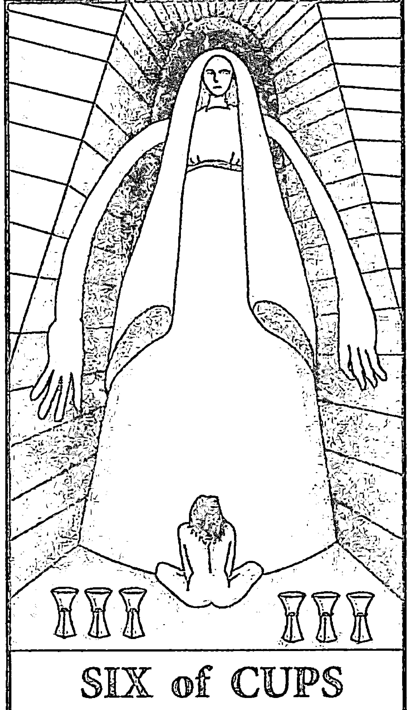

> 今日的幸运符：
长辈、数字6、食物

## 钱币10（逆）
### Ten of Pentacles

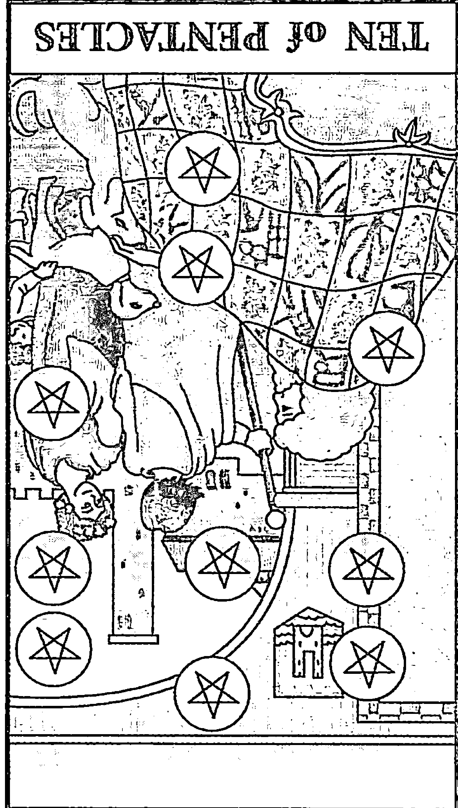

逆位的钱币10影响不大，跟正位钱币10一样都代表富裕。

十个钱币的排列是有意义的，那是生命之树的符号。钱币10给人一种家庭的感觉，且是一个财务基础稳固的家庭，有老长辈、一对夫妇、孙子，以及饲养的爱犬。

如果问及合作伙伴，逆位的钱币10代表伙伴之间是以金钱交流为目的的事业团体，但是情感交流对他们而言不是重点，也可能仅是金钱交换，所以重利轻义。

感情的占卜中，拿到逆位钱币10，则表示与长辈的交情是关键，不过还是有享乐的暗示，感情部分还要再观察培养。

**爱情：**
朝向彼此欢乐的情况前进，物质基础也很重要。

**工作：**
以互利为合作基础，定会有好的合作关系。

金钱：

运势很好。

今日的幸运符：
- 钱、红包

## 圣杯皇后（正）
### Queen of Cups

圣杯是“水”元素，水正是与感情、感受、潜意识相关的阴性元素。有圣杯（水）特质的人特别注重感情的交流，也显示出情感面甚至是潜意识层面的问题。圣杯皇后是最具柔情特质的角色，因为是水中之水。

除了善体人意，对人充满了感情，圣杯皇后的控制欲也很强，因为她的双手都握着杯子，不能放下。圣杯皇后的座椅上有亚当跟夏娃造型的小天使，可见圣杯皇后的种种控制都来自情感的欲望。

圣杯皇后身穿白袍，上面饰有红玫瑰的图案，除了感性之外，更有爱意的成分。所以这张牌在感情上的占卜绝对是非常温馨的真爱。

在工作占卜上，圣杯皇后也有家人互相扶持的象征，或是对方把你当家人一般信任。

**爱情：** 真情流露会吸引正面的感情。

**工作：** 适合发挥母爱，照顾他人。工作上母仪天下。

**金钱：** 女性产业会带来财富。

> 今日的幸运符：
> 红玫瑰、水瓶

## 钱币1（正）
### Ace of Pentacles

钱币是物质元素当中的“土”元素，万物都是大地孕育出来的，所以钱币牌也有母性的元素，具有孕育一切可能性的迹象。

这张牌中心的女人就是皇后牌的模样，但是她被一条蛇紧紧环绕，蛇代表欲望，所以这张牌当中也有欲望的束缚之意。

土元素代表人世间最真实的东西，包括金钱、财富甚至身体的欲望。当钱币1出现时，通常代表一个有关金钱或物质的新计划，不管是投资计划，还是经济方面的计划等等，都是一个正面的孕育机会，因为大地之母会帮你把计划养大。

- 爱情：在真爱当中潜藏金钱的基础。
- 工作：有关金钱或物质的新计划，有新机会来临。金钱头脑好，要好好运用。

今日的幸运符：
- 钱币、数字1

## 圣杯10（逆）
### Ten of Cups

逆位圣杯10与正位圣杯10都是圆满的代表。

这是一个大团圆的景象，一家人其乐融融，相爱的父母互搂着对方，并各举一只手迎向圣杯彩虹，男孩女孩快乐地手牵着手跳舞，背景有青翠的树木、河流、美丽的房屋。这世上还有什么情景比这更美好呢！

只是逆位的圣杯10距离圆满还有一些时间，或者说这几个合作伙伴有沟通不足的问题，所以不能够立即众志成城，因此还无法立刻迎接圆满。不过这都是可以克服的，只要增强信心，好运就不远了。

- 爱情：大团圆、其乐融融。朝着稳定的关系前进。
- 工作：合作稳固，很有默契。
- 金钱：好的投资机会纷纷来临。

今日幸运符：
- 数字10、家庭、与相爱的人用餐

## 圣杯国王（正）
### King of Cups

圣杯是“水”元素，水正是与感情、感受、潜意识相关的阴性元素。有圣杯（水）特质的人特别注重感情交流，也显示出情感面甚至是潜意识层面的问题。圣杯国王是圣杯中的长者，无论对于家庭、爱情还是财产，都付出了爱与关怀，是典型的新好男人与慈祥老人。

国王牌通常都有负责任的担当，圣杯国王除了责任，更多了情感的内涵。国王背后是红白相间的玫瑰花，在塔罗牌中这个背景象征多情、博爱。如果是问感情，那么圣杯国王具有真心，愿意为他心中的真爱付出一切。可是他也是四个国王中最多情善变的。

基本上他是负责任的，不管是感情还是工作，圣杯国王都显示出了对这件事的真正在意、认真投入。

**爱情：** 愿意为他心中的真爱付出一切。

**今日的幸运符：**
- 红玫瑰、白玫瑰、玫瑰精油

**工作：** 真诚的态度会获得肯定。

**金钱：** 靠人气集结金钱机会。

## 宝剑骑士（逆）
### Knight of Swords

宝剑骑士底下是一堆逃跑的士兵，象征宝剑骑士的勇敢杀敌。虽然显示出宝剑骑士的成功，但也显示出只有宝剑骑士一个人勇敢单独作战。逆位的宝剑骑士更是一场个人秀。

宝剑牌是“风”元素，象征着理智、智慧、思想能力。但是理智通常伴随着无情，就是太理智、太在乎自我聪明而没有情感妥协，所以逆位的宝剑骑士除了自我的问题，也有团队合作上的问题。

如果是工作上的占卜，逆位的宝剑骑士可能是优秀的，可是看不起别人，或是不能跟他人合作，也可能是经常自我表现，不顾他人的感受。

- **爱情：** 可能有惊天动地的爱情，但不见得可以维持。
- **工作：** 一场个人秀。
- **金钱：** 积极就能赚钱。

> 今日的幸运符：
> 爬山、吹风

## 钱币4（逆）
### Four of Pentacles

塔罗牌中所有数字4的牌都代表稳定与秩序相关的议题。逆位的钱币4的主角依然紧抓着钱币不放，这表明他不仅爱钱，而且没有安全感。

如果是爱情关系，那会是个忌妒心重，很爱吃醋的情人，也代表彼此关系不稳固，或是只有建立在财产信任关系上的情感，才能得以继续。

“土”元素在钱币4中更明显，因为主角的动作是封闭的，逆位的钱币4在合作关系上也显得非常保守自私。因为当牌颠倒时，他头上的钱币就落了下来，脚踩的钱币也岌岌可危了。所以合作时非常没有安全感。

- 爱情：会碰到对感情或金钱不大方的人。
- 工作：太过保守，没有大收成。
- 金钱：没有安全感。

> 今日的幸运符：
> 黄金饰品

## 愚者（逆）
### The Fool

愚者是一张可爱的牌，代表纯真乐观的人，活在当下，什么都想尝试。当然这也有危险，由于是初生之犊，对困难的评估也许有失全面考量，所以过分地大胆。

要注意，愚者对自己的“自由意志”有时只是出于好玩，他对一个梦想的新鲜感能不能超过三分钟热度？有没有积极作为能让梦想成真呢？

所以目前正面临企图心的考验。

爱情：有机会追求自由自在的爱情。但小心只是一时的新鲜感。

工作：冒险性质，有可能高升或出差。考验你的企图心与持续力。适合旅游业。

金钱：花钱不经思考，非常豪爽。目前不宜做投机性的赌博游戏。

今日的幸运符：
- 出发
- 往外走
- 红色
- 黄色

## 宝剑9（正）
### Nine of Swords

此牌的墙上悬挂着九把剑，全部都是对准床上的主角，仿佛压力和悲剧就要刺穿那女子，看起来令人紧张害怕。

午夜梦回，主角从睡梦中惊醒，将脸埋在双手中，这张牌象征着一个困难时刻的到来，宝剑9表达的就是最深的恐惧，因为主角还必须面对并加以解决，不能一走了之，真的很难，宝剑9简直就是“噩梦牌”。

塔罗牌总是可以从最深的绝望中，找到一点希望。

棉被图案是由热情的玫瑰编织而成，宝剑旁边还有灵性的星座符号，神的力量没有离开你。床侧雕刻着一人击败另一人的画面，这表明还有一丝希望，只是现在困苦的你是否愿意看看希望呢？

爱情：暂时不要继续沉迷。

工作：处于痛苦的经营过程，但这似乎是必经之路。

金钱：不要执迷不悟。

> 今日的幸运符：
> 热情的玫瑰、灵性的物品

## 宝剑9（逆）
### Nine of Swords

逆位宝剑9和正位宝剑9一样，显示了绝望，因为困在恶梦中的人，不可能立刻知道自己的出路，只能不断地承受哀伤、害怕、绝望，且不断地祈祷。

塔罗牌美妙的部分在于观者总是可以从最深的绝望中，找到一点希望，棉被图案是由热情的玫瑰所编织，宝剑旁边还有灵性的星座符号，神的力量没有离开你。床侧雕刻着一人击败另一人的画面，代表还是有希望的，只是现在困苦的你是否愿意看看希望呢？

逆位宝剑9比正位宝剑9更忽略了灵性的力量，更不会注意玫瑰、灵性的图案，或是床头的暗示，只是更执著于自己的困境。请用心祈祷吧，不要再执著于现状了。

爱情：不要继续沉迷。

工作：痛苦的经营过程。

金钱：不要执迷不悟。

今日的幸运符：
- 热情的玫瑰、灵性的物品

## 宝剑骑士（正）
### Knight of Swords

宝剑骑士英勇杀敌的样子，是所有骑士牌中最智慧、也是势在必得的。他年轻的战士或学者，也是优秀的开拓者，但却专注得有点无情。因为宝剑牌是“风”元素，象征理智、智慧、思想能力。但理智通常伴随着情感的无情，就是太理智、太在乎自我聪明而没有情感妥协，因此在感情上这种人是非常自我的，他知道自己想要什么，然而对对方而言却显得有些无情。

宝剑的宫廷牌身上都是象征“风”元素的蓝色云朵，宝剑骑士是所有宝剑牌中最爱自由的，也是最强劲的。

这样的人通常对异性具有强烈的吸引力，却无法建立长期的关系，所以这张牌最具浪漫电影的相遇元素，可能遇上惊天动地的爱情，但无法细水长流。

爱情：可能有惊天动地的爱情。

工作：可以积极一点，处于势在必得的状况。

金钱：积极行动就可以赚钱。

> 今日的幸运符：
> 爬山、吹风

## 钱币7（正）
### Seven of Pentacles

钱币7的主角是一位农夫，他既像低头看着自己长久辛勤得来的收成，又像在思考下一步该做些什么新的准备。

这是一张满足于收成的牌，因为自己先前的努力已经得到了成果。接下来的重点是你的下一步是什么？

虽然长久的辛劳已经得到丰硕的报酬，但不要以为你会从此平步青云、大富大贵，因为钱币7代表的只是过去的付出，就好像是某一阶段的努力告一段落，农家春耕夏耘，自然也就来到秋收时光，然而你应该再准备新一年的到来。

以任何问题的占卜而言，都可以解释为这已经是某一阶段的成果了，算是正面的肯定。

**爱情：** 对方已经知道你的态度，但还在思考彼此的下一步。

**工作：** 第一次面谈或第一阶段获得认可，但接下来进度缓慢。

**金钱：** 必须有积极的计划，否则只能维持原状。

今日的幸运符：
- 苦橙花精油、橙皮

## 钱币7（逆）
### Seven of Pentacles

逆位的钱币7还在耕耘期，目前工作似乎尚未完结，也许只剩下一些要收尾。从农人脚下的钱币看来，或许离成功只剩一点距离，但你就是觉得有气无力没什么劲。你可以稍微停一下，让脑中有充电的机会，但不是完全停止，休息是为了看看自己目前的成就，想想自己下一步的机会，因为你现在必须有新的刺激。

如果是感情状况，那可能代表双方到了某个阶段碰到瓶颈，缺少了共同经营的默契。

爱情：双方到了某个阶段碰到瓶颈，缺少了共同经营的默契。

工作：第一次面谈或第一阶段获得认可，但没有新的进度。

金钱：若是缺乏积极的计划，不会有所获。

> 今日的幸运符：
> 苦橙花精油、橙皮

## 附录一 常用的塔罗牌占卜牌阵

塔罗牌的牌阵有传统也有创新，这里介绍的是传统牌阵，也就是学习塔罗牌时的基本练功法。其实当你能力够强时，也可以根据你的理论自创牌型。

事实上牌型并不是最重要的。第几张牌摆放何处没有一定说法，也可自己按乱数抽牌。洗牌方式也不一定要照老师的说法去做，只要你能专心默想要问的问题。经常练习冥想，感受和牌之间的默契，你就可以利用塔罗牌找到答案。

使用牌阵占卜所得到的牌，可透过“塔罗牌义快速索引表”快速找出其牌义。

### 一、单张牌占卜法

这是最简单的占卜方法，准确度不比复杂的牌阵高，缺乏中间过程的分析。你可参考本书每张牌的图像分析，利用里面的重要塔罗元素来分析你现在占卜事项中的可能影响因素。

占卜步骤：
1. 请先准备好一副二十二张的大秘仪塔罗牌或七十八张完整的塔罗牌。
2. 第一步：心无杂念地思考你的问题，洗牌，将牌放成一叠。
3. 第二步：用左手将牌呈现扇形方式打开。
4. 第三步：用左手，随意选出一张牌。
（在每个步骤都专心一致地思考你的问题）

### 二、圣三角占卜法

圣三角占卜法也是基本牌阵，相较单张牌只显示结果，圣三角占卜法可以阐释问题的核心，以及了解未来的发展。

占卜步骤：
1. 第一步：心无杂念地思考你的问题，洗牌，将牌放成一叠。
2. 第二步：用左手将牌呈现扇形方式打开。
3. 第三步：用左手，随意选出三张牌。
（在每个步骤都专心一致地思考你的问题）

【诠释方法】
1. 过去的经验（或是对方的看法）。
2. 现在的状况（或是自己的想法）。
3. 未来的结果（双方的可能性）。

### 三、二择一占卜法

此占卜法是当你有两个方向需要选择时常用的方法。需从A、B两个选择中择一时，适合此占卜法。

占卜步骤：
1. 请先准备一副二十二张的大秘仪塔罗牌或七十八张完整的塔罗牌。
2. 第一步：心无杂念地思考你的问题，洗牌，将牌放成一叠。
3. 第二步：用左手将牌呈现扇形方式打开。
4. 第三步：用左手，随意选出五张牌。
5. （在每个步骤都专心一致地思考你的问题）

【诠释方法】
1. 本人现在的心境跟状况。
2. A的状况。
3. B的状况。
4. 选A的结果。
5. 选B的结果。

你可以评估完两边后，再根据自身状况（第一张牌）评估A、B两条路哪个选择最适合自己。

### 四、四元素占卜法

这是针对一般问题（方向比较开放的问题）以及想了解主、客观的影响因素的问题，是非常有效的占卜法。几乎任何问题都适用。

占卜步骤：
1. 请先准备一副二十二张的大秘仪塔罗牌或七十八张完整的塔罗牌。
2. 第一步：心无杂念地思考你的问题，洗牌，将牌放成一叠。
3. 第二步：用左手将牌呈现扇形方式打开。
4. 第三步：用左手，随意选出四张牌。
5. （在每个步骤都专心一致地思考你的问题）

【诠释方法】
1：问题的行动或想法的暗示（目前自己对这件事的企图心或想法）。
2：问题的客观状况（对方、环境，或是合作伙伴目前怎么看待这件事情）。
3：问题的感性、主观暗示（自己可能有什么能力或对策处理这件事情、自己怎么与对方相处）。
4：问题的现实结果。

### 五、六芒星占卜法

这也是很受欢迎的占卜法，因为能提供可能对应的策略。同样的，若是一般问题（方向比较开放）以及想了解主、客观的影响因素的问题，这是非常有效的占卜法。几乎任何问题都适用。

占卜步骤：
1. 请先准备一副二十二张的大秘仪塔罗牌或七十八张完整的塔罗牌。
2. 第一步：心无杂念地思考你的问题，洗牌，将牌放成一叠。
3. 第二步：用左手将牌呈现扇形方式打开。
4. 第三步：用左手，随意选出七张牌。
5. （在每个步骤都专心一致地思考你的问题）

【诠释方法】
1. 问题的过去状况。
2. 问题的现在状况。
3. 问题的未来状况。
4. 解决此一问题的对应策略。
5. 客观、周遭状况。
6. 主观、本人态度（希望或恐惧）。
7. 最后结果。

### 六、塞尔特十字法

所有的塔罗书都会提到这个牌阵，因为此阵法对问题的分析比较仔细，也可提供未来的可能性。同样的，若是问一般问题（方向比较开放），以及想了解主、客观的影响因素的问题，是非常有效的占卜法。几乎任何问题都适用。

占卜步骤：
1. 请先准备一副二十二张的大秘仪塔罗牌或七十八张完整的塔罗牌。
2. 第一步：心无杂念地思考你的问题，洗牌，将牌放成一叠。
3. 第二步：用左手将牌呈现扇形方式打开。
4. 第三步：用左手，随意选出十张牌。
5. （在每个步骤都专心一致地思考你的问题）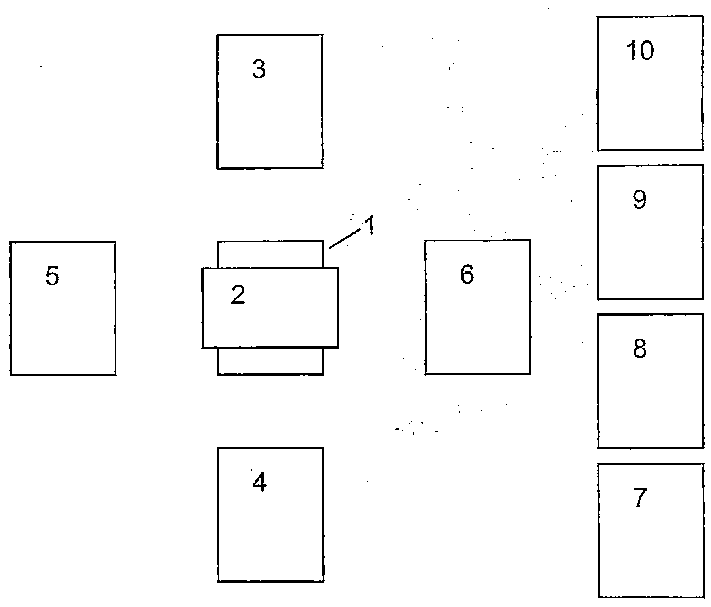

## 【诠释方法】

其中3～6的顺序有很多种说法，一言以蔽之，就是问题的周遭状况。

- 问题现况。
- 遇到的障碍（目前）。
- 过去的基础（过去）。
- 自己的意愿、理想状况（希望）。
- 问题的过去状况。
- 问题的未来状况。
- 你的现况。
- 周围环境对问题的影响。
- 本人的能力、希望、恐惧。
- 问题的最后结果。

## 塔罗牌义快速索引表

### 表A

| 牌名 | 页数 | 牌名 | 页数 | 牌名 | 页数 |
|---|---|---|---|---|---|
| 愚者 THE FOOL | 76 | 权杖5 5 of WANDS | 97 | 宝剑3 3 of SWORDS | 41 |
| 愚者（逆） | 210 | 权杖5（逆） | 154 | 宝剑3（逆） | 62 |
| 魔术师 THE MAGICIAN | 30 | 权杖6 6 of WANDS | 118 | 宝剑4 4 of SWORDS | 144 |
| 魔术师（逆） | 56 | 权杖6（逆） | 186 | 宝剑4（逆） | 45 |
| 女祭司 THE HIGH PRIESTESS | 17 | 权杖7 7 of WANDS | 177 | 宝剑5 5 of SWORDS | 132 |
| 女祭司（逆） | 72 | 权杖7（逆） | 155 | 宝剑5（逆） | 173 |
| 皇后 THE EMPRESS | 37 | 权杖8 8 of WANDS | 29 | 宝剑6 6 of SWORDS | 161 |
| 皇后（逆） | 14 | 权杖8（逆） | 102 | 宝剑6（逆） | 116 |
| 国王 THE EMPEROR | 137 | 权杖9 9 of WANDS | 147 | 宝剑7 7 of SWORDS | 123 |
| 国王（逆） | 151 | 权杖9（逆） | 88 | 宝剑7（逆） | 122 |
| 教皇 THE HIEROPHANT | 165 | 权杖10 10 of WANDS | 129 | 宝剑8 8 of SWORDS | 135 |
| 教皇（逆） | 81 | 权杖10（逆） | 135 | 宝剑8（逆） | 86 |
| 恋人 THE LOVERS | 109 | 权杖国王 KING of WANDS | 113 | 宝剑9 9 of SWORDS | 211 |
| 恋人（逆） | 7 | 权杖国王（逆） | 78 | 宝剑9（逆） | 212 |
| 战车 THE CHARIOT | 47 | 权杖皇后 QUEEN of WANDS | 63 | 宝剑10 10 of SWORDS | 162 |
| 战车（逆） | 111 | 权杖皇后（逆） | 51 | 宝剑10（逆） | 36 |
| 力量 STRENGTH | 24 | 权杖骑士 KNIGHT of WANDS | 52 | 宝剑国王 KING of SWORDS | 1 |
| 力量（逆） | 94 | 权杖骑士（逆） | 11 | 宝剑国王（逆） | 69 |
| 隐者 THE HERMIT | 65 | 权杖侍者 PAGE of WANDS | 38 | 宝剑皇后 QUEEN of SWORDS | 92 |
| 隐者（逆） | 20 | 权杖侍者（逆） | 21 | 宝剑皇后（逆） | 112 |
| 命运之轮 WHEEL of FORTUNE | 55 | 圣杯1 ACE of CUPS | 59 | 宝剑骑士 KNIGHT of SWORDS | 214 |
| 命运之轮（逆） | 158 | 圣杯1（逆） | 125 | 宝剑骑士（逆） | 207 |
| 正义 JUSTICE | 166 | 圣杯2 2 of CUPS | 10 | 宝剑侍者 PAGE of SWORDS | 189 |
| 正义（逆） | 150 | 圣杯2（逆） | 44 | 宝剑侍者（逆） | 187 |
| 悬吊者 THE HANGED MAN | 4 | 圣杯3 3 of CUPS | 103 | 钱币1 ACE of PENTACLES | 203 |
| 悬吊者（逆） | 105 | 圣杯3（逆） | 48 | 钱币1（逆） | 172 |
| 死神 DEATH | 106 | 圣杯4 4 of CUPS | 16 | 钱币2 2 of PENTACLES | 115 |
| 死神（逆） | 120 | 圣杯4（逆） | 126 | 钱币2（逆） | 166 |
| 节制 TEMPERANCE | 57 | 圣杯5 5 of CUPS | 84 | 钱币3 3 of PENTACLES | 193 |
| 节制（逆） | 74 | 圣杯5（逆） | 163 | 钱币3（逆） | 77 |
| 恶魔 THE DEVIL | 170 | 圣杯6 6 of CUPS | 198 | 钱币4 4 of PENTACLES | 95 |
| 恶魔（逆） | 130 | 圣杯6（逆） | 25 | 钱币4（逆） | 208 |
| 高塔 THE TOWER | 8 | 圣杯7 7 of CUPS | 141 | 钱币5 5 of PENTACLES | 5 |
| 高塔（逆） | 176 | 圣杯7（逆） | 175 | 钱币5（逆） | 197 |
| 星星 THE STAR | 183 | 圣杯8 8 of CUPS | 190 | 钱币6 6 of PENTACLES | 53 |
| 星星（逆） | 98 | 圣杯8（逆） | 180 | 钱币6（逆） | 119 |
| 月亮 THE MOON | 66 | 圣杯9 9 of CUPS | 73 | 钱币7 7 of PENTACLES | 215 |
| 月亮（逆） | 191 | 圣杯9（逆） | 67 | 钱币7（逆） | 217 |
| 太阳 THE SUN | 90 | 圣杯10 10 of CUPS | 168 | 钱币8 8 of PENTACLES | 169 |
| 太阳（逆） | 32 | 圣杯10（逆） | 204 | 钱币8（逆） | 26 |
| 审判 JUDGEMENT | 182 | 圣杯国王 KING of CUPS | 205 | 钱币9 9 of PENTACLES | 152 |
| 审判（逆） | 195 | 圣杯国王（逆） | 33 | 钱币9（逆） | 13 |
| 世界 THE WORLD | 136 | 圣杯皇后 QUEEN of CUPS | 201 | 钱币10 10 of PENTACLES | 22 |
| 世界（逆） | 80 | 圣杯皇后（逆） | 60 | 钱币10（逆） | 200 |
| 权杖1 ACE of WANDS | 87 | 圣杯骑士 KNIGHT of CUPS | 148 | 钱币国王 KING of PENTACLES | 70 |
| 权杖1（逆） | 133 | 圣杯骑士（逆） | 40 | 钱币国王（逆） | 139 |
| 权杖2 2 of WANDS | 34 | 圣杯侍者 PAGE of CUPS | 2 | 钱币皇后 QUEEN of PENTACLES | 179 |
| 权杖2（逆） | 43 | 圣杯侍者（逆） | 159 | 钱币皇后（逆） | 91 |
| 权杖3 3 of WANDS | 140 | 宝剑1 ACE of SWORDS | 83 | 钱币骑士 KNIGHT of PENTACLES | 143 |
| 权杖3（逆） | 28 | 宝剑1（逆） | 194 | 钱币骑士（逆） | 99 |
| 权杖4 4 of WANDS | 146 | 宝剑2 2 of SWORDS | 49 | 钱币侍者 PAGE of PENTACLES | 101 |
| 权杖4（逆） | 19 | 宝剑2（逆） | 108 | 钱币侍者（逆） | 128 |

## 塔罗牌义快速索引表

| 牌名 | 页数 | 牌名 | 页数 | 牌名 | 页数 |
|---|---|---|---|---|---|
| 宝剑国王 | 1 | 圣杯9 | 73 | 权杖4 | 146 |
| 圣杯侍者 | 2 | 节制 (逆) | 74 | 权杖9 | 147 |
| 悬吊者 | 4 | 愚者 | 76 | 圣杯骑士 | 148 |
| 钱币5 | 5 | 钱币3 (逆) | 77 | 正义 (逆) | 150 |
| 恋人 (逆) | 7 | 权杖国王 (逆) | 78 | 国王 (逆) | 151 |
| 高塔 | 8 | 世界 (逆) | 80 | 钱币9 | 152 |
| 圣杯2 | 10 | 教皇 (逆) | 81 | 权杖5 (逆) | 154 |
| 权杖骑士 (逆) | 11 | 宝剑1 | 83 | 权杖7 (逆) | 155 |
| 钱币9 (逆) | 13 | 圣杯5 | 84 | 钱币2 (逆) | 156 |
| 皇后 (逆) | 14 | 宝剑8 (逆) | 86 | 命运之轮 (逆) | 158 |
| 圣杯4 | 16 | 权杖1 | 87 | 圣杯侍者 (逆) | 159 |
| 女祭司 | 17 | 权杖9 (逆) | 88 | 宝剑6 | 161 |
| 权杖4 (逆) | 19 | 太阳 | 90 | 宝剑10 | 162 |
| 隐者 (逆) | 20 | 钱币皇后 (逆) | 91 | 圣杯5 (逆) | 163 |
| 权杖侍者 (逆) | 21 | 宝剑皇后 | 92 | 教皇 | 165 |
| 钱币10 | 22 | 力量 (逆) | 94 | 正义 | 166 |
| 力量 | 24 | 钱币4 | 95 | 圣杯10 | 168 |
| 圣杯6 (逆) | 25 | 权杖5 | 97 | 钱币8 | 169 |
| 钱币8 (逆) | 26 | 星星 (逆) | 98 | 恶魔 | 170 |
| 权杖3 (逆) | 28 | 钱币骑士 (逆) | 99 | 钱币1 (逆) | 172 |
| 权杖8 | 29 | 钱币侍者 | 101 | 宝剑5 (逆) | 173 |
| 魔术师 | 30 | 权杖8 (逆) | 102 | 圣杯7 (逆) | 175 |
| 太阳 (逆) | 32 | 圣杯3 | 103 | 高塔 (逆) | 176 |
| 圣杯国王 (逆) | 33 | 悬吊者 (逆) | 105 | 权杖7 | 177 |
| 权杖2 | 34 | 死神 | 106 | 钱币皇后 | 179 |
| 宝剑10 (逆) | 36 | 宝剑2 (逆) | 108 | 圣杯8 (逆) | 180 |
| 皇后 | 37 | 恋人 | 109 | 审判 | 182 |
| 权杖侍者 | 38 | 战车 (逆) | 111 | 星星 | 183 |
| 圣杯骑士 (逆) | 40 | 宝剑皇后 (逆) | 112 | 宝剑8 | 185 |
| 宝剑3 | 41 | 权杖国王 | 113 | 权杖6 (逆) | 186 |
| 权杖2 (逆) | 43 | 钱币2 | 115 | 宝剑侍者 (逆) | 187 |
| 圣杯2 (逆) | 44 | 宝剑6 (逆) | 116 | 宝剑侍者 | 189 |
| 宝剑4 (逆) | 45 | 权杖6 | 118 | 圣杯8 | 190 |
| 战车 | 47 | 钱币6 (逆) | 119 | 月亮 (逆) | 191 |
| 圣杯3 (逆) | 48 | 死神 (逆) | 120 | 钱币3 | 193 |
| 宝剑2 | 49 | 宝剑7 (逆) | 122 | 宝剑1 (逆) | 194 |
| 权杖皇后 (逆) | 51 | 宝剑7 | 123 | 审判 (逆) | 195 |
| 权杖骑士 | 52 | 圣杯1 (逆) | 125 | 钱币5 (逆) | 197 |
| 钱币6 | 53 | 圣杯4 (逆) | 126 | 圣杯6 | 198 |
| 命运之轮 | 55 | 钱币侍者 (逆) | 128 | 钱币10 (逆) | 200 |
| 魔术师 (逆) | 56 | 权杖10 | 129 | 圣杯皇后 | 201 |
| 节制 | 57 | 恶魔 (逆) | 130 | 钱币1 | 203 |
| 圣杯1 | 59 | 宝剑5 | 132 | 圣杯10 (逆) | 204 |
| 圣杯皇后 (逆) | 60 | 权杖1 (逆) | 133 | 圣杯国王 | 205 |
| 宝剑3 (逆) | 62 | 权杖10 (逆) | 135 | 宝剑骑士 (逆) | 207 |
| 权杖皇后 | 63 | 世界 | 136 | 钱币4 (逆) | 208 |
| 隐者 | 65 | 国王 | 137 | 愚者 (逆) | 210 |
| 月亮 | 66 | 钱币国王 (逆) | 139 | 宝剑9 | 211 |
| 圣杯9 (逆) | 67 | 权杖3 | 140 | 宝剑9 (逆) | 212 |
| 宝剑国王 (逆) | 69 | 圣杯7 | 141 | 宝剑骑士 | 214 |
| 钱币国王 | 70 | 钱币骑士 | 143 | 钱币7 | 215 |
| 女祭司 (逆) | 72 | 宝剑4 | 144 | 钱币7 (逆) | 217 |