# 塔羅擂台

這是一本：能讓初學者快速入門，讓久學者功力增強的武功秘笈

陳添賜 編著

你想成為優秀的塔羅師嗎？

「塔羅擂台」將助你達成願望

12345678910

## St. Royal College
天使神秘学院

- 专业占卜预测机构
- 神秘学培训机构
- 水晶能量研究中心
- 神秘学资料库
- 官方微信：strcdts
- 微信公众平台：src2011
- 读书交流QQ群：
  - 占星塔罗占卜师交流群：814594478（加入密码：PDF）
  - 神秘学其他综合群：659338717（加入密码：PDF）

微信号：strcdts
天使神秘学院

天使神秘学院 院长QQ：715104687

微信公众平台：src2011

## 制作说明：

本书由《天使神秘学院》出重金从台湾购入的原版书籍扫描制作完成。为达到最好阅读效果，特地把原版书全部切开后，再经由专业扫描设备高精度扫描完成，并经过一张张的PS后期处理最终成书，其间花费大量的人力、物力以及时间，只为能给大家提供经济并优质的神秘学学习资料而努力。

本学院强力谴责某些机构和个人，把本学院花心血制作完成的电子书籍，包装后直接放在自家淘宝网上低价倾销的行为，以谋取不劳而获的经济利益。如果长此以往最终将无人愿意再为大家花心思制作电子书，那以后可能大家再无新书可读。

为让大家以后能够读到更多的好书，也为了本学院的良性发展。本学院恳请大家尽量做到如下几点：

- 一、尽量在本学院的网站购买电子书籍。
- 二、请勿用技术手段把电子书内的水印及加密去掉。
- 三、在收到电子书后小范围传阅即可，千万不要公开传播，更别挂到淘宝网上低价销售。

同时为答谢广大支持者，学院电子书将做如下调整：

- 一、学院会把一些早已收回制作成本的电子书折价销售。
- 二、最新制作的电子书籍会开放打印功能，大家购买后有条件的可自行打印成书。

天使神秘学院
2019年1月

# 塔羅擂台

陳添賜 編著

获取更多好书，请加微信号：strcdts

店铺：http://strc.cr.cx

## 序

塔羅牌之種類繁多，各牌圖之畫法亦異，當今運用者換了一副不同的塔羅牌就不知所措，故有鑑於此，今未學萌生編寫此書，讓後之運用者都能提綱挈領，迅速掌握牌義。

本書係以偉特牌為根據作說明，以牌名、牌圖、靈數、四大元素、對應星座或行星推論牌義，不會因牌圖畫法不同就坐困愁城。此外，每張牌舉兩個實例讓大家見識塔羅可無所不問之眼界；每個牌陣舉兩個實例引導運用技巧，故本書實為增廣塔羅視野，增強塔羅斷驗功力不可多得的好資料，千萬不可錯過。

塔羅是一套看似簡單，但要算準也不易的學問，因為單張塔羅牌所提供的資訊不多，多張塔羅牌要串成一篇吻合當事者情境及所需的全部資訊，實屬不易，故希望藉本書之出版能讓你悟道，進入塔羅高境。

最後，我要謝謝好友 伊塔老師，及愛女 陳偲君幫忙校稿，令本書的編著過程順利和增色不少，在此一併致謝。

未學
陳添賜
序於高雄
丙申年甲午月

# 塔羅擂台 4

## 目 錄

序

第一章 塔羅概說

第一節 初學者須知

- 一 新手常見的問題
  - （一）玩塔羅牌會著魔嗎？
  - （二）塔羅占卜需要儀式嗎？
  - （三）抽牌一定要用左手嗎？
  - （四）新塔羅牌啟用前需要作「聖化儀式」嗎？
  - （五）「聖化儀式」是根據什麼而來呢？
  - （六）「帶頭牌」的暗示是真的嗎？
  - （七）塔羅牌需要「養牌」嗎？
  - （八）不可在「魔空時刻」占卜嗎？
  - （九）解牌後覺得疲累問題出在哪？
  - （十）免費為人解牌會倒楣嗎？
- 二 占卜流程概說
- 三 抽牌前絕對不可忽略的細節

一 三

一 六

一 六

一 六

一 六

一 六

一 七

一 七

一 八

一 八

一 九

一 九

一 九

二 〇

獲取更多好書，請加微信號：strcdts

店鋪：http://src.cr.cx

# 5 目 錄

- 四 抽牌過程要注意的細節
- 五 何謂「牌陣」？
- 六 「牌陣」確立之始末
- 七 逆位牌的相關問題
  - （一）何謂「逆位牌」？
  - （二）確定正逆位牌之原則
  - （三）「逆位牌」如何解義？
  - （四）抽到逆位牌一定不好嗎？
  - （五）一定要使用逆位嗎？
- 八 看圖解牌義的技巧
- 九 如何開始進入塔羅世界？
- 十 如何練功才能提升解牌功力？
  - （一）練習同一張牌解不同問題
  - （二）要懂得牌與人性結合

第二節 塔羅牌內容簡介

- 一 塔羅牌的基本架構
- 二 大牌有哪些內容？

# 塔羅擂台 6

- 三 小牌有哪些內容？
  - （一）40 張數字牌
  - （二）16 張宮廷牌
- 四 大牌、小牌之意涵與差異性
- 五 學習塔羅的捷徑
- 六 與塔羅相關之占星簡介
- 七 四大元素會相生相剋嗎？
- 八 塔羅牌與占星之對應關係
  - （一）大阿爾克納
  - （二）小阿爾克納之四花色
  - （三）小阿爾克納之宮廷牌

### 第二章 了解牌義前應具備的知識

第一節 四大元素

- 一 何謂四大元素？
- 二 元素陰陽有何特質？
  - （一）陽性元素之特質

# 7 目 錄

- （二）陰性元素之特質
- 三 四大元素特質解析
  - （一）火元素特質解析
  - （二）土元素特質解析
  - （三）風元素特質解析
  - （四）水元素特質解析

第二節 十二星座

- 一 白羊座之特性與類化
- 二 金牛座之特性與類化
- 三 雙子座之特性與類化
- 四 巨蟹座之特性與類化
- 五 獅子座之特性與類化
- 六 處女座之特性與類化
- 七 天秤座之特性與類化
- 八 天蠍座之特性與類化
- 九 射手座之特性與類化
- 十 摩羯座之特性與類化

# 塔羅擂台 8

- 十一 水瓶座之特性與類化
- 十二 雙魚座之特性與類化

#### 第三節 行星

- 一 太陽之特性與類化
- 二 月亮之特性與類化
- 三 水星之特性與類化
- 四 金星之特性與類化
- 五 火星之特性與類化
- 六 木星之特性與類化
- 七 土星之特性與類化
- 八 天王星之特性與類化
- 九 海王星之特性與類化
- 十 冥王星之特性與類化

#### 第四節 數字、色彩、配屬圖象所代表之意涵

- 一 數字所代表之意涵
- 二 色彩所代表之意涵
- 三 配屬圖象所代表之意涵

四〇
四一
四二
四三
四四
四五
四六
四七
四八
四九

# 9 目 錄

### 第三章 牌義之特性演繹與舉例

#### 第一節 大阿爾克納牌義之特性演繹與舉例

◎ 大阿爾克納牌義點睛

◎ 背記捷法

- 0 愚人
- 1 魔術師
- 2 女教皇
- 3 女皇
- 4 皇帝
- 5 教皇
- 6 戀人
- 7 戰車
- 8 力量
- 9 隱者
- 10 命運之輪
- 11 正義
- 12 倒吊人

五二
五三
五五
五七
五九
六一
六三
六五
六七
六九
七一
七三
七五
七七

# 塔羅擂台 10

- 13 死神
- 14 節制
- 15 惡魔
- 16 塔
- 17 星星
- 18 月亮
- 19 太陽
- 20 審判
- 21 世界

第二節 小阿爾克納數字牌之特性演繹與舉例

◎ 數字牌義點睛

- 一 四花色象意及對應元素、陰陽
- 二 數字之象意

權杖一
權杖二
權杖三
權杖四

一
〇
五

一
〇
三

一
〇
一

九
九

九
七

九
七

九
七

九
七

九
五

九
三

九
一

八
九

八
七

八
五

八
三

八
一

七
九

# 11 目 錄

寶劍一
錢幣十
錢幣九
錢幣八
錢幣七
錢幣六
錢幣五
錢幣四
錢幣三
錢幣二
錢幣一
權杖十
權杖九
權杖八
權杖七
權杖六
權杖五

一三九
一三七
一三五
一三三
一三一
一二九
一二七
一二五
一二三
一二一
一一九
一一七
一一五
一一三
一一一
一〇九
一〇七

# 塔羅擂台 12

聖杯八
聖杯七
聖杯六
聖杯五
聖杯四
聖杯三
聖杯二
聖杯一
寶劍十
寶劍九
寶劍八
寶劍七
寶劍六
寶劍五
寶劍四
寶劍三
寶劍二

一七三
一七一
一六九
一六七
一六五
一六三
一六一
一五九
一五七
一五五
一五三
一五一
一四九
一四七
一四五
一四三
一四一

# 13 目 錄

聖杯九

聖杯十

第三節 小阿爾克納宮廷牌之特性演繹與舉例

◎ 宮廷牌義點睛

- 一 四花色象意及對應元素、陰陽
- 二 四人物象意及對應元素、陰陽

權杖國王

權杖皇后

權杖騎士

權杖侍者

錢幣國王

錢幣皇后

錢幣騎士

錢幣侍者

寶劍國王

寶劍皇后

寶劍騎士

七五

七七

七九

七九

七九

八〇

八二

八四

八六

八八

九〇

九二

九四

九六

九八

一〇〇

# 塔羅擂台 14

- 寶劍侍者
- 聖杯國王
- 聖杯皇后
- 聖杯騎士
- 聖杯侍者

### 第四章 實用牌陣與舉例、解牌技巧及應期

#### 第一節 實用牌陣與舉例

- 一 時間之流牌陣
- 二 關係牌陣簡易版
- 三 關係牌陣
- 四 聖三角牌陣
- 五 二擇一牌陣
- 六 大十字牌陣

#### 第二節 解牌技巧

- 一 牌陣內容是否與個案有聯結？
- 二 看大小牌之數量比例

## 15 目錄

- 三 看正逆位牌之數量比例
- 四 留意同號牌重複出現
- 五 留意牌義相似或相反牌
- 六 留意名稱相似牌重複出現
- 七 由元素多現看個案運作模式
- 八 留意大牌、逆位牌現於何處？
- 九 留意獨缺之元素

第三節 應期

- 一 大牌星座對應法
- 二 大牌行星對應法
- 三 大牌數字對應法
- 四 小牌之數字牌對應法

二五
二五
二六
二六
二六
二七
二七
二九
二九
三〇
三一
三三

### 第一章 塔羅概說

#### 第一節 初學者須知

##### 一 新手常見的問題

（一）玩塔羅牌會著魔嗎？
有人說：「塔羅牌很邪門，少碰為妙，以免著魔」，其實，這是以訛傳訛的說法，不可信，因塔羅牌只是占卜工具之一，與易經、米卦、測字、……之類的占卜無異，根本沒有精靈鬼怪藏在牌中，故運用者不用多慮。

（二）塔羅占卜需要儀式嗎？
占卜準驗與否之關鍵在「心誠則靈，請勿戲占」，根本與儀式無關，更不需要穿著「巫婆裝、巫師裝，手持點化棒」之類，只要主題明確，專念於欲問之事而抽牌，就可以。

（三）抽牌一定要用左手嗎？
有人說：「左手聯結右腦，右腦與直覺相關，故用左手抽牌會較靈驗」，其實塔羅靈不靈驗與占問者心誠及塔羅師解牌功力相關，與用左手或右手抽牌根本無關，故不可妄信。

（四）新塔羅牌啟用前需要作「聖化儀式」嗎？
「塔羅牌聖化儀式」之目的在於增強塔羅牌能量，讓塔羅占卜更準驗，乍聽之下似乎有理，然細思塔羅之所以會準驗，乃因占問者心誠及塔羅師分析得當後之結果，和塔羅牌聖化與否無直接關聯，故無需在意有無作此儀式。

（五）「聖化儀式」是根據什麼而來呢？
塔羅牌聖化儀式是根據火、土、風、水四大元素而制定的，故儀式前需準備一副全新的塔羅牌，象徵火元素的蠟燭、土元素的錢幣、風元素的折信刀、水元素的杯子，將塔羅牌置於桌面中央，蠟燭、錢幣、折信刀、杯子分別置於桌面之四個角落，之後，倒入水入杯中，點燃蠟燭，拿起塔羅牌分別在燭火、錢幣、折信刀、杯水上方默念「元素牌牌合，塔羅必精準」，並繞三圈後將牌復歸原位，牌復歸原位後，專心閉目冥想一道白光射入塔羅牌中，當見白光射入牌中後，則表示聖化儀式完成，可開始運用此牌作占卜。

（六）「帶頭牌」的暗示是真的嗎？
所謂「帶頭牌」是指第一次占卜前，從22張大牌中抽出一張牌，此牌可決定此副牌占卜何類事特別精準，未學覺得塔羅牌既然是無生命的紙牌，怎麼可能會帶頭呢？故帶頭牌之說實有待商榷，請讀者勿盲信。

（七）塔羅牌需要「養牌」嗎？
聽說：「將塔羅牌放在太陽、月亮下曝曬，吸收陽光、月光能量作養牌可以增強準驗度，這是真的嗎？」其實，塔羅準驗與否與占問者心誠及塔羅師解牌功力相關，和吸收陽光、月光能量根本無關，故無需作「養牌」動作，然因塔羅牌是紙做的，很怕潮濕，因此，每隔一段時間將牌置於陽光下作短時間曝曬，以去除濕氣，延長塔羅牌之使用壽命是需要的。

（八）不可在「魔空時刻」占卜嗎？
「魔空時刻」係指陽氣最弱而陰氣最旺的時候，聽說在此時占卜除了影響占卜準確度外，易招來惡靈侵擾，其實，這種說法是沒有根據的，不可妄信，據未學多年占卜經驗，根本沒問題，不用多慮。註：下午5至7點之酉時，稱為小魔空；晚上11點至凌晨1點之子時，稱為大魔空。

（九）解牌後覺得疲累問題出在哪？
解牌後覺得疲累應是專注解牌，耗費精神能量所致，非關邪靈干擾，千萬別自己嚇自己。塔羅牌跟一般紙牌是一樣的，它不會藉此告訴你「我累了」，也無牌靈進住影響你精神狀況的問題，故應有塔羅牌僅是占卜工具，別無他物的正確觀念，才不會庸人自擾。

（十）免費為人解牌會倒楣嗎？
初學塔羅者免費為人解牌以增加練習機會與功力，是成為真正塔羅師的必經過程，我相信大家都有此經驗吧！故未學認為只要秉持助人為樂之善念，不誤導，不亂說，當前雖無實利可得，日後應有後福可享，怎會倒楣呢？

##### 二 占卜流程概說

洗牌、切牌、推牌、抽牌、解牌為占卜流程，洗牌是把全副牌打散再收回成一疊；切牌是請求占者隨意拿起一疊牌放到旁邊，取最底部那張牌以知求者提問時所抱持的心態；推牌是塔羅師將全副牌背面朝上，並在桌面推成扇形，以方便求占者選牌；抽牌是塔羅師依解析所需，請求占者抽出幾張牌，並置於塔羅師所指定之位置；解牌是塔羅師將所抽出之牌翻成正面，並開始作解析。

##### 三 抽牌前絕對不可忽略的細節

抽牌前一定要重新洗牌，洗牌一定要非常徹底，越徹底越好，如此才可避開上回抽過之牌集結於一處之弊。「心誠則靈」是占卜能準驗的最高原則，故抽牌前一定要專心默念欲問之主題。

##### 四 抽牌過程要注意的細節

抽牌者之心態要正確，否則，容易得到不正確的結果，故請勿戲占，勿以窺探解牌者功力之心態去抽牌。抽牌之環境以不令抽牌者分心之地點為佳，因分心如同亂卦，又豈能渴望準驗呢？
抽牌不一定要由問卜者親自抽，由塔羅師代抽亦可。由問卜者自抽時，不論抽幾張牌都要先蓋起來，等全部抽完後才一次翻開，以免影響抽牌時之心情。永遠要記得所抽出之牌的順序，因順序是判斷整個事件演變過程的重要依據，千萬不可弄錯而影響判斷的準確性。

##### 五 何謂「牌陣」？

因應占問事件與解析所需，塔羅師把問卜者抽到之牌擺在某特定的位置上，此種排列的方式，就稱之為「牌陣」。因此，每個位置都有特定的意涵，而此特定意涵要與放置之牌作聯結，方知所解之事所代表的意思，如牌放在過去位，就表示牌義所解析的是過去狀況；如牌放在現在位，就表示牌義所解析的是現在狀況；如：……，餘類推，不贅述。

##### 六 「牌陣」確立之始末

用塔羅牌占卜原可問一事抽一張，但塔羅師為了觀察整個事件的來龍去脈，以利於給問卜者提供建議，故才有「牌陣」之設立，為設立之始因。由此可見，現在各書所載之「牌陣」，只是前賢擺牌慣性下的產物，非為一定要依循的鐵則，所以，自己可依自身所需與習慣，重新創立新的「牌陣」。

##### 七 逆位牌的相關問題

###### （一）何謂「逆位牌」？

因洗牌過程有如搓麻將，故有些牌是正立的，有些牌是倒立的，而倒立之牌就稱之為「逆位牌」。其實，逆位之牌與正位之牌是同一張牌，只是上下顛倒而已，非另有他牌。

###### （二）確定正逆位牌之原則

塔羅牌為長方形，有一邊長一邊短，故我們只要把牌之短邊朝向塔羅師，就可確定是正位牌或逆位牌，因為塔羅師為解牌者，所以取他看牌的角度為基準。

###### （三）「逆位牌」如何解義？

逆位牌是正位意義的變化與補充，但仍然不離正位之象意，此一觀念必先確立，才不會見到逆位牌時不知所措。通常逆位牌有正位意義的相反含義，或力量的運用不當，或應驗時間之延遲，或潛在情緒之掙扎與壓抑，或……。註：正位牌代表能量運作正常，逆位牌代表能量運作異常。

###### （四）抽到逆位牌一定不好嗎？

逆位牌有正位意義的相反含義，是逆位牌解義法則之一，因此，抽到逆位牌不一定不好，得看該張逆位牌之解義對占問事有利或不利？才能確定。如占事務進行順利否？抽得月亮逆位牌，因月亮正位牌義是環境險惡，缺乏信心，曲折不順；而月亮逆位牌義是緩慢從谷底爬升，信心提升，故對事務進行反而是好的。如……，餘類推，不贅述。

###### （五）一定要使用逆位嗎？

這是一個爭議性的問題，有人認為需要，有人認為不需要，因此沒有定論。然末學常把「逆位」當成解牌技巧，由逆位牌多寡評估人之運勢高低、能量運作是否正常、事之發展是否依常態而行、……等等，可窺探出很多只用正位牌無法推論之細節，故末學建議何妨將逆位當成進階技巧練習，或可得到意想不到的收穫哦！

##### 八 看圖解牌義的技巧

牌的名稱是指標，如「愚人」可能是白痴，也可能是大智若愚；如「魔術師」可能是法力無邊的高手，也可能是騙人的傢伙；如……，餘類推，不贅述。

置於牌中央之大圖案為此張牌的主軸，背景為背後之心境、動機，或運作後可能出現的狀況，周圍之小圖案為周圍環境與影響因素，是看圖解牌義的技巧。

##### 九 如何開始進入塔羅世界？

先從一張牌看圖說故事開始，依牌的名稱，牌圖上人物之裝扮、表情、姿勢，周圍配置及背景顏色，說出你聯想到什麼練習起；熟練後再增加到兩張牌、三張牌，並說出其關聯性。

其次，將牌圖與個案作聯想，如占問財運好否？抽到錢幣侍者，表示賺錢契機初露：如占問兩人之感情？抽到寶劍騎士者，表示感情面臨抉擇，可能快刀斬斷情絲：如……，餘類推，不贅述。

##### 十 如何練功才能提升解牌功力？

###### （一）練習同一張牌解不同問題

如抽到星星，問面試某工作會錄取嗎？表示錄取的機率高；問財運好不好？表示目前無實質收穫，但未來能獲利；問出門運氣好不好？表示出門運氣佳，易得貴助；問平板電腦不開機，問題出在哪？表示電源迴路出問題；問失物能找回嗎？表示失物能找回。如……，餘類推，不贅述。

###### （二）要懂得牌與人性結合

男人與女人、年輕人與老年人、高層人士與低層勞工、商人與工人、……的想法不同，如不了解這些差異與牌作結合，想以塔羅牌為人解惑、排憂、作生涯規劃實屬不易，即使已熟練牌義，精通牌陣，亦是英雄無用武之地，因為最終去面對、去處理的仍然是人。試觀一些塔羅高手僅憑一張牌就能解析得當，解析精彩，若無豐富之人生閱歷，怎能如此，請讀者多深思。

#### 第二節 塔羅牌內容簡介

##### 一 塔羅牌的基本架構

塔羅牌共有78張，包括22大牌，56張小牌。22大牌統稱為大阿爾克納，又稱為大秘儀；56張小牌統稱為小阿爾克納，又稱為小秘儀。

##### 二 大牌有哪些內容？

- 0 愚人
- 1 魔術師
- 2 女教皇
- 3 女皇
- 4 皇帝
- 5 教皇
- 6 戀人
- 7 戰車
- 8 力量
- 9 隱者
- 10 命運之輪
- 11 正義
- 12 倒吊人
- 13 死神
- 14 節制
- 15 惡魔
- 16 塔
- 17 星星
- 18 月亮
- 19 太陽
- 20 審判
- 21 世界

##### 三 小牌有哪些內容？

###### （一）40張數字牌

- 權杖一 權杖二 權杖三 權杖四 權杖五
- 權杖六 權杖七 權杖八 權杖九 權杖十

###### （二）16 張宮廷牌

| 權杖國王 | 權杖皇后 | 權杖騎士 | 權杖侍者 |
| 寶劍國王 | 寶劍皇后 | 寶劍騎士 | 寶劍侍者 |
| 錢幣國王 | 錢幣皇后 | 錢幣騎士 | 錢幣侍者 |
| 聖杯國王 | 聖杯皇后 | 聖杯騎士 | 聖杯侍者 |

| 聖杯一 | 聖杯二 | 聖杯三 | 聖杯四 | 聖杯五 |
| 聖杯六 | 聖杯七 | 聖杯八 | 聖杯九 | 聖杯十 |

| 寶劍一 | 寶劍二 | 寶劍三 | 寶劍四 | 寶劍五 |
| 寶劍六 | 寶劍七 | 寶劍八 | 寶劍九 | 寶劍十 |

| 錢幣一 | 錢幣二 | 錢幣三 | 錢幣四 | 錢幣五 |
| 錢幣六 | 錢幣七 | 錢幣八 | 錢幣九 | 錢幣十 |

##### 四 大牌、小牌之意涵與差異性

大牌：偏向精神面，為內心變化、潛意識牽引，無法具體呈現，但會撼動內心，影響時間長而深，象徵大環境狀況，當事者無法掌控。

小牌：偏向現實面，為日常生活瑣事，能具體呈現，影響時間短而淺，象徵小環境狀況，當事者較能掌控。

##### 五 學習塔羅的捷徑

因塔羅牌之設計與占星和靈數有很深的淵源，所以只要對占星和靈數有所了解，就可以快速掌握牌義，進行占斷，是學習塔羅的捷徑，更是進入塔羅堂奧的不二法門，為未學習塔羅的心得，故特別提出來說明，願後之學者都能掌握重點，少走冤枉路。

##### 六 與塔羅相關之占星簡介

四大元素、十二星座、行星的基本特性，是塔羅占卜中需要了解與掌握的重點，因每張牌都與上述各項之一有對應關係。

四大元素：火、土、風、水。

十二星座：白羊座、金牛座、雙子座、巨蟹座、獅子座、處女座、天秤座、天蠍座、射手座、摩羯座、水瓶座、雙魚座。

行星：太陽、月亮、水星、金星、火星、木星、土星、天王星、海王星、冥王星。

##### 七 四大元素會相生相剋嗎？

中國傳統之金、木、水、火、土等五行是可論相生相剋的，而西洋之火、土、風、水等四大元素只論元素特性表現強弱而已，沒有相生相剋之說，與中國傳統五行觀念不同，請讀者在運用時勿混淆。

##### 八 塔羅牌與占星之對應關係

###### （一）大阿爾克納

- 0 愚人 — 對應天王星、風元素。
- 1 魔術師 — 對應水星、風和土元素。
- 2 女教皇 — 對應月亮、水元素。
- 3 女皇 — 對應金星、風和土元素。
- 4 皇帝 — 對應白羊座、火元素。
- 5 教皇 — 對應金牛座、土元素。
- 6 戀人 — 對應雙子座、風元素。
- 7 戰車 — 對應巨蟹座、水元素。
- 8 力量 — 對應獅子座、火元素。
- 9 隱者 — 對應處女座、土元素。
- 10 命運之輪 — 對應木星、火元素。
- 11 正義 — 對應天秤座、風元素。
- 12 倒吊人 — 對應海王星、水元素。
- 13 死神 — 對應天蠍座、水元素。
- 14 節制 — 對應射手座、火元素。
- 15 惡魔 — 對應摩羯座、土元素。
- 16 塔 — 對應火星、火元素。
- 17 星星 — 對應水瓶座、風元素。
- 18 月亮 — 對應雙魚座、水元素。
- 19 太陽 — 對應太陽、火元素。
- 20 審判 — 對應冥王星、火元素。
- 21 世界 — 對應土星、土元素。

###### （二）小阿爾克納之四花色

- 寶劍 — 對應風元素。
- 錢幣 — 對應土元素。
- 權杖 — 對應火元素。
- 聖杯 — 對應水元素。

###### （三）小阿爾克納之宮廷牌

- 國王 — 對應土元素。
- 皇后 — 對應水元素。
- 騎士 — 對應火元素。
- 侍者 — 對應風元素。

> 註：國王亦有對應火元素，騎士對應風元素，侍者對應土元素或火、土、風、水諸元素之說，然以何者為正確呢？請讀者多驗證。

### 第二章 了解牌義前應具備的知識

#### 第一節 四大元素

##### 一 何謂四大元素？

四大元素是火元素、土元素、風元素、水元素之統稱。火元素、風元素屬陽性；土元素、水元素屬陰性。

##### 二 元素陰陽有何特質？

###### （一）陽性元素之特質

剛毅衝動、外向凸顯、阿莎力、積極主動、好動健談、坦率輕浮、粗枝大葉、有自信、帶動環境、愛出風頭、反應敏捷、樂觀進取。

###### （二）陰性元素之特質

溫柔內斂、內向含蓄、消極被動、沉默寡言、城府較深、心思細密、自信不足、適應環境、低調行事、沉著慎重、悲觀多疑。

##### 三 四大元素特質解析

###### （一）火元素特質解析

火元素代表精力、活力、爆發力。精力充沛，活力十足，熱情有加，有爆發力、開創力、領導能力。野心大、企圖心強，個性衝動，缺乏耐心。樂觀自信，主動積極，但獨斷獨行，較不考慮別人的立場跟感受。有赤子之心，喜歡跟年輕人在一起，喜歡當領導、當老大。慷慨大方，缺乏儲蓄觀念，故很難存到錢。

###### （二）土元素特質解析

土元素代表務實、穩重、實際。穩重務實，誠信可靠，小心謹慎，考慮周密，有組織能力、企劃力。意志力堅強，做事腳踏實地，有始有終，但缺乏自動自發的精神。重秩序感，凡事慢慢來，一步一腳印。個性固執，缺乏變通，有時會吹毛求疵，小題大作。重視親情，但缺乏熱情，拙於表達。為人現實，觀念保守，很愛錢。重視安全感，所以沒錢會睡不著。

###### （三）風元素特質解析

風元素代表智識、思考、理念。較聰明，有智識，重思考，好奇心重，喜歡發問，腦筋動不停，容易緊張。理念新穎，有邏輯概念、推理能力，分析能力佳，見聞廣博，能舉一反三，是現學現賣的高手。愛說話，喜溝通，喜爭論，語文能力強，但個性欠穩定。堅持度不足，想法難以落實，多淪為空談。想法太理性，缺乏浪漫，讓人覺得沒有人情味。

###### （四）水元素特質解析

水元素代表感情、情緒反應。感情豐富，很在意愛情和親情，較念舊，有同情心，性能力有獨到之處。適應能力強，有包容力、恆心和毅力，但思考及反應都較慢。感覺敏銳，直覺力強，想像力豐富，有藝術天份，但想法容易與現實脫節。

#### 第二節 十二星座

##### 一 白羊座之特性與類化

正面特質：行動迅速，反應敏捷，衝勁十足，勇於開創，有正義感，樂觀自信，待人熱情，有冒險犯難精神。

負面特質：性急衝動，喜歡鬥嘴，翻臉如翻書，獨斷獨行，愛出風頭，粗心大意，虎頭蛇尾，很難接受他人建言。

物：運動器材、消防器材、外科手術器具、瓦斯爐、電磁爐、火藥、炸彈。

行業：軍警、運動員、消防隊、探險家、外科醫師、軍火商、自由業。

場所：天花板、爐火位、磚窯、乾地、沙漠、新開墾區。

時間：國曆3月21日至4月19日。

身體部位：頭部、臉部、腎上腺、耳朵。

##### 二 金牛座之特性與類化

正面特質：穩重務實，誠信可靠，毅力堅強，溫柔內斂，考慮周密，感覺敏銳，洞察力佳，善於理財投資。

負面特質：倔強頑固，拒絕改變，缺乏自動自發精神，佔有慾強，喜歡掌控，有貪婪的傾向。

物：存摺、支票、鈔票、錢幣、藝術品、美食、貴重珠寶。

行業：歌手、音樂家、金融業、珠寶商、廚師、美食專家、庭園設計。

場所：儲藏室、保險櫃、銀行、錢莊、草地、庭院。

時間：國曆4月20日至5月20日。

身體部位：頸部、喉嚨、甲狀腺、聲帶、食道、扁桃腺。

##### 三 雙子座之特性與類化

正面特質：聰明多智，見聞廣博，學習快速，理解力強，反應靈敏，能言善道，八面玲瓏，善於交際，適應能力強。

負面特質：缺乏耐性，虎頭蛇尾，言行不一，說多做少，狡猾多疑，言辭犀利，喋喋不休，有神經質，容易精神緊張。

物：報紙、雜誌、簡訊、電話、手機、網路、教材、交通工具。

行業：教師、記者、通訊、運輸、業務、出版業、旅遊業、大眾傳播。

場所：學校、走廊、電台、報社、道路、停車場、客廳。

時間：國曆5月21日至6月21日。

身體部位：手臂、手掌、胸腺、呼吸和神經系統。

##### 四 巨蟹座之特性與類化

二分法：陰性星座。 三分法：基本星座。 四分法：水象星座。

正面特質：感覺敏銳，警覺性高，應變能力強，溫柔體貼，善解人意，會主動關心和照顧別人，記憶力強，很念舊。

負面特質：多疑敏感，容易情緒化，脾氣不穩定，會護短，會記恨，會隱藏心事，以消極的方式來表達內心不滿。

物：水、房屋、古董、史冊、紀念品、日用品、女性用品、餐飲器具。

行業：超商、餐飲業、房地產、古董商、考古、歷史學家、飯店業者。

場所：飯店、餐廳、住宅、廚房、河川、湖泊、濕地。

時間：國曆6月22日至7月22日。

身體部位：胃、乳房、子宮、消化系統、膽囊。

##### 五 獅子座之特性與類化

正面特質：博愛熱情，心胸開闊，樂於助人，精明幹練，遇事果決，領導能力強，能以身作則，有群眾魅力。

負面特質：自大自負，霸道獨裁，不容異己，虛榮心強，好管閒事，愛出風頭，喜歡掌控和支配，常直話直說而惹人厭。

## 37 第二章 了解牌義前應具備的知識

##### 六 處女座之特性與類化

正面特質：聰明多智，反應靈敏，心思細密，精打細算，適應能力強，務實勤勉，任勞任怨，謙恭有禮，細心體貼。

負面特質：要求嚴苛，有挑剔心態，會吹毛求疵，鑽牛角尖，有潔癖，多愁善感，缺乏熱情，神兮兮，會嘮嘮碎碎唸。

物：營養品、保健品、清潔劑、衛生設備、工作器具、醫療器材、動物用品。

行業：秘書、會計、護士、獸醫、編輯、文書處理、清潔人員、營養師。

場所：書房、圖書館、飯廳、診所、衛生所、清潔隊。

時間：國曆 8 月 23 日至 9 月 22 日。

身體部位：小腸、脾臟、胰臟、下腹、中樞神經系統。

### 七 獅子座之特性與類化

物：證券、股票、名片、表演舞台、賭博器具、娛樂設備、老闆座位。

行業：明星、娛樂界、演藝界、賭博、電玩、老闆、官員、政治人物、證券投資。

場所：森林、舞廳、賭場、指揮中心、宴會或娛樂場所。

時間：國曆 7 月 23 日至 8 月 22 日。

身體部位：心臟、脊椎、背部、血液循環系統。

## 塔羅擂台 38

##### 七 天秤座之特性與類化

正面特質：個性隨和，談吐風趣，善於溝通協調，有正義感，處事公平穩健，聰明有智識，是優秀的業務、軍師人才。

負面特質：愛出風頭，略帶機詐，有依賴心態，處事猶豫不決，優柔寡斷，為不懂得拒絕別人請託的濫好人。

物：花卉、藝術品、協議書、結婚證書、流行服飾、美容美髮用品。

行業：公關、法官、外交官、調解委員、流行設計、美容美髮。

場所：法院、協調委員會、主臥房、美容或美髮中心。

時間：國曆 9 月 23 日至 10 月 23 日。

身體部位：腎臟、腰部、內分泌系統。

##### 八 天蠍座之特性與類化

正面特質：直覺敏銳，洞察力佳，意志堅強，耐力十足，作事專注，慷慨熱誠，濟弱扶傾，樂於助人。

負面特質：個性極端，獨斷自我，嫉妒心強，脾氣火爆，衝動易怒，頑固執著，很難溝通，佔有慾強。

物：保單、保險套、分泌物、情趣用品、喪葬用品。

行業：偵探、間諜、保險業、殯葬業、地下錢莊、資源回收、心理學家。

場所：濕地、洗手間、下水道、焚化爐、垃圾場。

時間：國曆 10 月 24 日至 11 月 22 日。

身體部位：再生和生殖系統、膀胱、尿道、直腸、攝護腺。

## 39 第二章 了解牌義前應具備的知識

##### 九 射手座之特性與類化

正面特質：待人和氣，仁慈善良，幽默風趣，樂觀進取，誠實坦白，自信大方，悟性高，會自我成長。

負面特質：隨性善變，脾氣不穩定，奢侈浪費，有點自負，獨斷獨行，目無法紀，多言好爭論，會逃避現實。

物：護照、機票、舶來品、宗教物品、運動器材、法律外文書、畢業證書。

行業：律師、神職人員、國際貿易、外語老師、大學教授、哲學家、導遊。

場所：高地、寺廟、教堂、法庭、運動場、研究所。

時間：國曆 11 月 23 日至 12 月 21 日。

身體部位：大腿、臀部、肝臟、坐骨神經、腦下垂體。

## 塔羅擂台 40

##### 十 摩羯座之特性與類化

正面特質：務實可靠，勤勉自律，有責任感，有組織企劃力，執行力佳，領導能力強，能刻苦耐勞，任勞任怨。

負面特質：吝嗇貪婪，想法悲觀，會自我壓抑，防衛心態強，疑心病重，容易疑神疑鬼，很難溝通。

物：磚瓦、石頭、皮革、農具、骨灰甕、建築工地、老舊物品。

行業：政治家、政府官員、土地買賣、建築業、土木工程、農林業者。

場所：辦公室、主管座位、辦公大樓、沙石場、礦場。

時間：國曆 12 月 22 日至 1 月 19 日。

身體部位：皮膚、骨骼、牙齒、膝蓋、關節、膽囊。

##### 十一 水瓶座之特性與類化

正面特質：友善合群，能言善道，風趣好溝通，多替別人著想，有容人之量，記憶力強，理解力佳，善於分析推理。

負面特質：特立獨行，標新立異，性情乖僻，古怪叛逆，想法偏激，頑固執著，會剛愎自用，喜歡唱反調。

物：衛星導航、智慧型手機、光纖網路、新科技產品、航空設備。

行業：航空業、科技業、占星家、革命家、創意發明、民意代表、社福團體。

場所：屋簷、俱樂部、會客室、保育或科技研發中心。

時間：國曆 1 月 20 日至 2 月 18 日。

身體部位：小腿、腳踝、血液循環系統、腦部之松果體。

## 41 第二章 了解牌義前應具備的知識

##### 十二 雙魚座之特性與類化

正面特質：仁慈善良，態度親切，有同理心，善解人意，有犧牲奉獻精神，善於融入各種環境，直覺力強，想像力豐富。

負面特質：多愁善感，心態矛盾，想法不切實際，會自欺欺人，缺乏自信，會歇斯底里，自殘，善變沒原則，會逃避現實。

物：魚缸、捕魚設備、船舶、醫藥、毒品、酒精、催眠靈修物品。

行業：漁民、藝術家、電影工作、通靈者、催眠師、水產業、醫院或監獄工作。

場所：海洋、醫院、安養院、監獄、拘留所、慈善機構。

時間：國曆 2 月 19 日至 3 月 20 日。

身體部位：腳掌、淋巴腺、腦下垂體。

#### 第三節 行星

##### 一 太陽之特性與類化

正面特質：自信、博愛、熱情、心胸開闊、有創造力、有領導能力。

負面特質：傲慢、自負、自大、專制、誇大、強人所難、有虛榮心。

人：父親、男人、子孫、老闆。

事：權力、名望、自我意識、熱能、發光。

物：身分證、印章、獎狀、獎杯、高貴物品。

行業：管理者、領導者、政客、明星。

場所：舞台、劇院、賭場、宴會廳、政府機構、宮殿。

身體部位：眼睛、心臟、背部、脊柱、體質強弱、精力恢復快慢。

##### 二 月亮之特性與類化

正面特質：想像力豐富、富同情心、有包容性、記憶力佳、有生意頭腦。

負面特質：排外、善變、情緒化、心胸狹窄、嫉妒、記恨、缺乏安全感。

人：母親、太太、女人、保姆。

事：情緒、感情、親和力、抗壓性、記憶力、生育、收藏。

物：鏡子、衛生棉、胸罩、廚具、古董、房子。

行業：算命師、餐飲、看護、家政、不動產、日常用品經銷。

場所：廚房、餐廳、雜貨店、婦產科、港灣、河流、沼澤地、水族館。

身體部位：胸部、乳房、胃部、子宮、卵巢、月經。

## 43 第二章 了解牌義前應具備的知識

##### 三 水星之特性與類化

正面特質：聰明、學習能力強、臨場反應佳、理解力好、多才多藝、辯才無礙。

負面特質：好管閒事、沒有目標、精神緊張、言行不一、光說不練、狡猾詭辯。

人：同學、朋友、兄弟、年輕人、部屬。

事：思考、表達、溝通、學習、寫作。

物：麥克風、演講稿、書信、文具、出版品、遊覽車。

行業：教師、編輯、書局、推銷員、郵差、通信業、旅遊業。

場所：郵局、電信局、車站、電台、學校、圖書館、出版社、語言中心。

身體部位：腦部、呼吸系統、神經系統、甲狀腺。

##### 四 金星之特性與類化

正面特質：和諧、友善、氣質佳、人緣好、社交能力強、有美學素養和藝術氣息。

## 塔羅擂台 44

負面特質：貪圖享樂、縱慾、奢侈、浪費、依賴、懶惰、缺乏上進心、優柔寡斷。

人：女兒、少女、愛人、淑女、外交官。

事：愛情、錢財、藝術、喜愛、嗜好、興趣。

物：貨幣、化妝台、化妝品、瘦身用品、寵物。

行業：美容師、金融業、娛樂業、公關、飾品、工藝。

場所：銀行、藝廊、美術館、協調室、娛樂場所、美容用品店、瘦身中心。

身體部位：喉嚨、腎臟、膀胱、腰部、副甲狀腺。

##### 五 火星之特性與類化

正面特質：聰明機智、勇敢果決、意志堅強、主動積極、行動力強、濟弱扶傾。

負面特質：獨斷自我、好鬥殘暴、侵略破壞、躁急魯莽、衝動草率、缺乏耐性。

人：男人、成年人、軍人、屠夫、強盜。

事：脾氣、性慾、意外、發燒、燙傷、暴力、戰爭。

物：刀槍、火藥、炸彈、切割器、消防設備、運動器材。

行業：軍警、屠宰業、消防隊、理髮業、拳擊、外科手術。

場所：磚窯、炭窯、煙囪、火爐旁、神位、戰場、消防隊、屠宰場、尖塔。

身體部位：腎上腺、泌尿及生殖系統、免疫系統、肌肉組織。

## 45 第二章 了解牌義前應具備的知識

##### 六 木星之特性與類化

正面特質：樂觀大方、仁慈善良、幸運、很有智慧、會自我成長、充滿理想。

負面特質：盲目樂觀、不當擴展、自負、奢侈浪費、放縱、賭徒、目無法紀。

人：教師、律師、法官、傳教士。

事：法律、宗教、哲學、靈性成長、長途旅行、高等教育。

物：論文、護照、舶來品、訴訟狀、法律書、宗教用品、運動器材。

行業：自由業、運動家、教育，有關法律、宗教、國際之事務。

場所：寺廟、教堂、法院、研究所、外交部、立法院、律師事務所。

身體部位：肝臟、腦下垂體、荷爾蒙分泌、中風、長瘤、肥胖。

##### 七 土星之特性與類化

正面特質：認真負責、務實可靠、謹慎、自律、節儉、有耐心、有雄心壯志。

負面特質：太保守、自我壓抑、意志消沉、冷漠無情、嚴厲專橫、卑鄙殘忍。

人：老年人、公務員、窮人。

事：責任、限制、規則、業力、悲觀想法、壓力來源、組織訓練和運作。

物：舊物、礦石、農具、農產品、不動產。

行業：土木工程、礦產開發、務農、製陶業、政治家、公務人員。

## 塔羅擂台 46

場所：山、礦場、墓地、監獄、地下室、建築工地、密閉空間、舊宅舍。

身體部位：牙齒、骨骼、關節、皮膚、脾臟、結石、動脈硬化。

##### 八 天王星之特性與類化

正面特質：友善、和氣、人道主義、獨立、意志堅定、有創意發明。

負面特質：古怪、叛逆、唱反調、標新立異、特立獨行、與眾不同。

人：奇人異士、改革者、同志、私生子。

事：科學研究、怪事、電波、催眠術、不測之災。

物：飛機、網路、通訊器材、高科技產品。

行業：科學家、占星師、飛行員、電子業、新型行業。

場所：航空站、網站、新奇建築物、保育中心、科技研發中心。

身體部位：循環系統、性變態、腦下垂體、麻痺、痙攣、突發性疾病。

##### 九 海王星之特性與類化

正面特質：仁慈、善良、浪漫有情調、想像力豐富、有藝術創造力。

負面特質：不切實際、自欺欺人、多愁善感、容易受騙、歇斯底里。

人：靈媒、解夢者、巫師、船員。

事：走私、宗教、藝術、魔術、酒精、醫藥、麻醉劑。

物：船舶、酒精、醫藥、毒品、麻醉劑、催眠或靈修用品。

行業：藥劑師、海軍、占星師、靈性導師。

場所：海洋、啤酒屋、飲料店、藝廊、藥房、醫療中心、毒品供應站。

身體部位：心理、視丘、神經系統。

## 47 第二章 了解牌義前應具備的知識

##### 十 冥王星之特性與類化

正面特質：直覺、意志力強、轉危為安、開創新局、財力雄厚。

負面特質：極端、殘暴、控制慾、虐待狂、陰險、有犯罪傾向。

人：偵探、獨裁者、恐怖份子。

事：災難、自殺、強姦、暴力、遺產、神秘事物。

物：保險套、情趣用品、喪葬用品、毀滅性武器。

行業：色情業、殯葬業、殺手、資源回收、武器製造。

場所：下水道、殯儀館、資源回收場、核子試爆場、急救室。

身體部位：生殖系統、排泄系統、細胞再生、健忘症。

#### 第四節 數字、色彩、配屬圖象所代表之意涵

##### 一 數字所代表之意涵

數字一：代表第一步，為開始、創新、唯一。

數字二：代表兩人世界，對立就分裂，協調就結合。

數字三：代表三足鼎立，為制衡可利益共享，紛亂就失利。

數字四：代表四平八穩，為安全、穩定，亦可能是靜止、停頓。

數字五：代表五味雜陳，為混亂、衝突、失落。

數字六：代表六六大順，為順利、成功，能妥協與分享。

數字七：代表七拼八湊，為突破困境而奮鬥。

數字八：代表八面玲瓏，為圓滿大局而重新評估再出發。

數字九：代表九五至尊，為至高無上的臨界點，只能獨享與孤獨。

數字十：代表十全十美，為圓滿解決與轉化，但要防「滿招損」。

##### 二 色彩所代表之意涵

白色：象徵純潔、神聖、善良、信任。

紅色：象徵熱情、急躁、自信、自我。

## 49 第二章 了解牌義前應具備的知識

粉紅色：象徵溫柔、浪漫、無壓力。

橘色：象徵親切、坦率、開朗。

黃色：象徵警告、希望、光明。

藍色：象徵希望、理想、平靜。

深藍色：象徵權威、保守、嚴肅。

綠色：象徵自由平和、新鮮舒適。

灰色：象徵誠懇、沉穩、黯淡。

黑色：象徵權威、高雅、冷漠。

紫色：象徵優雅、高貴、神秘。

棕色：象徵典雅、安定、沉靜。

註：亮色系為正面能量，如白色、黃色、……之類；暗色係為負面能量，如灰色、黑色、……之類。

##### 三 配屬圖象所代表之意涵

權杖：象徵權力、能量。

錢幣：象徵金錢、財富。

寶劍：象徵知識、傷害。

## 塔羅擂台 50

聖杯：象徵感情、情緒。

∞：象徵無限。

狗：象徵警戒、忠心。

魚：象徵水元素、感情、多產。

獅子：象徵兇猛。

燈籠：象徵照明、指引。

天秤：象徵公平。

喇叭：象徵召喚。

蝴蝶：象徵蛻變、轉化。

黑貓：象徵直覺敏銳。

孩童：象徵天真、赤子之心、新希望。

兔子：象徵多產。

蝸牛：象徵緩慢、一步一腳印。

蜥蜴：象徵捕食。

天空的鳥：象徵飛翔、自由、遠見、窺視。

鑰匙：象徵開啟、打開。

盔甲：象徵備戰狀態。

## 51 第二章 了解牌義前應具備的知識

蒙眼眼罩：象徵看不清楚，不願意面對。

翅膀：象徵飛翔、快速。

葡萄：象徵豐收、多產。

石榴：象徵渴望、多產。

玫瑰：象徵承諾、經歷刺痛。

拱門：象徵通道、門路。

城堡：象徵保護、崇高目標。

家：象徵保護、安定。

船：象徵航運、運作過程。

雲：象徵思緒。

玻璃彩繪：象徵以往的行事風格。

### 第三章 牌義之特性演繹與舉例

### 第一節 大阿爾克納牌之特性演繹與舉例

◎ 大阿爾克納牌義點睛

22 張大牌剛好分別對應十顆行星和十二星座，故我們只要記住每張牌相對應之行星或星座，就能快速掌握牌義，是解讀大阿爾克納牌特性之竅門。

◎ 背記捷法

歌訣：愚人天王魔術水，女教皇月女皇金，皇帝白羊教皇牛，戀人雙子戰車蟹，力量獅子隱者女，命運木星正義秤，吊人海王死神蠍，節制射手惡魔羯，塔火相對星星瓶，月亮雙魚太陽陽，審判冥王世界土，每句說明兩張牌，上為牌名下為應，是為背記之捷訣。

釋：愚人對應天王星，魔術師對應水星，女教皇對應月亮，女皇對應金星，皇帝對應白羊座，教皇對應金牛座，戀人對應雙子座，戰車對應巨蟹座，力量對應獅子座，隱者對應處女座，……，餘類推，不贅述。每句說明兩張牌之對應，上面寫牌名，下面寫相對應之行星或星座，是為背記之捷訣。

## 53 第三章 牌義之特性演繹與舉例

##### 0 愚人

對應星象：天王星。

元素：風。牌序：0。

正位牌義：大智若愚。

逆位牌義：裝瘋賣傻。

###### （一）以牌面作聯想

愚人身穿多花樣圖案的衣裳，象徵心思難測，行蹤無法捉摸。頭頂有往上延伸之髮束，象徵智慧高，想法與眾不同。左手持白玫瑰，象徵純潔、天真。右手握置於肩上的權杖，用權杖挑包袱，象徵肩負開拓的錦囊妙計。他仰首面向天空，一副滿不在乎的樣子，腳步逐漸往懸崖邊前進，腳邊之忠狗對他狂吠，象徵有大無畏精神，不怕危險，不聽忠告，我行我素。牌之右上角有太陽普照，象徵攤在陽光下，能看清一切。山脈都在眼下、腳下，象徵他站在高點看事物。

###### （二）以愚人、天王星、風元素、牌序 0 作聯想

愚人為思想、行為與眾不同，超乎想像，正位時可能是大智若愚，而逆位時可能是傻瓜、愚蠢、魯莽、變態、行事瘋狂。天王星有友善、和氣、人道主義、獨立、意志堅定、有創意發明之優點，但亦有古怪、叛逆、唱反調、標新立異、特立獨行之缺點。風元素在這張牌顯示的特質為想法與眾不同，隨心所欲。牌序 0 代表什麼都沒有，或有無限之可能。

###### （三）舉例說明

例：我男友是同性戀嗎？

解：妳男友同性戀的可能性很高，或者有特殊的性癖好，以下是我們對話內容，更足見其可靠性。我問：「妳為何會如此問呢？」女曰：「我們是在長輩熱情介紹之下認識的，我已 30 歲，他已 38 歲，我們已交往 3 個月，彼此互有好感，互動良好，但總覺得怪怪的，我們相處宛如好姊妹，約會多次不曾牽我的小手，到我家見我忘記收好的女性內褲，居然會臉紅加尖叫，讓我覺得很可疑，故才會如此問」。

例：我該選什麼科系就讀呢？

解：你應選與電子、網頁設計、航空相關之科系就讀，因這些科系都與愚人所對應之天王星相關。

## 55 第三章 牌義之特性演繹與舉例

##### 1 魔術師

對應星象：水星。

元素：風。牌序：1。

正位牌義：法力無邊。

逆位牌義：黔驢技窮。

###### （一）以牌面作聯想

魔術師外穿大紅袍，內穿白衫，象徵外在熱情，內在純潔。頭頂上之∞符號，象徵點子無限，法力無邊，能無中生有。腰部纏繞一條青蛇腰帶，象徵腹案多變宛如蛇形多變，亦為腹藏邪惡心機之暗示。魔術師右手持魔法棒指天，左手食指指地，象徵掌握魔法要領，是天與地間的溝通橋樑。右前方桌上放置權杖、錢幣、寶劍、聖杯四件法器，象徵魔術師法寶具足，能因時制宜，應付各種狀況。施法處之桌前有花叢遮掩，身後有藤蔓掩蔽，象徵在暗中行事。

###### （二）以魔術師、水星、風元素、牌序 1 作聯想

魔術師變化多端，反應快速，手法高超，能無中生有，故有充足能力解決問題，任何問題都能迎刃而解，而逆位時可能會有欺騙、不誠實之行為。水星有聰明、學習能力強、臨場反應佳、理解力好、多才多藝、辯才無礙之優點，但亦有好管閒事、沒有目標、精神緊張、言行不一、光說不練、狡猾詭辯之缺點。風元素在這張牌顯示的特質為智識豐富，溝通能力強。牌序 1 代表所思所想開始運作，為創造、變化的開始。

###### （三）舉例說明

例：請某人幫忙能解決此事嗎？

解：欲請之人反應快速，手法高超，辯才無礙，有充足解決問題的能力，故只要他願意幫忙，任何問題應能迎刃而解。

例：我與他們合夥好嗎？

解：對方雖然說得頭頭是道，好像對妳很有利，但建議妳最好多觀察，以免吃虧上當，以下是他們間的對話內容，及未學分析之根據。女問：「要怎麼合夥呢？」對方曰：「不用妳出錢，只借用妳的名字當人頭登記買來的房子，待房子出售後會將所得分妳一成」，其實，乍聽之下根本無不利，但細思若對方搞鬼超貸後放手不管，妳恐怕會麻煩不斷哦！

## 57 第三章 牌義之特性演繹與舉例

##### 2 女教皇

對應星象：月亮。

元素：水。牌序：2。

正位牌義：有智慧的心靈導師。

逆位牌義：一表正經，不苟言笑。

###### （一）以牌面作聯想

女教皇外穿藍袍，內穿白袍，靜默端坐，象徵祥和、純潔與沉穩。衣物全身緊緊包裹，象徵內斂、不張揚。衣物褶襉層層交疊如水樣，表示與水元素相關，象徵情感與潛意識。頭頂智慧水晶，象徵靈性悟力具足。頭戴月形帽，腳邊新月由內袍衣角所固定住，表示從頭到尾與月亮本質相關。胸前十字架，右手握TORA的卷軸，象徵與神性、神秘相關。身旁兩支黑白柱子，象徵陰陽、二元性。身後帷幕中有兩種圖案，同類圖必左右對稱，只有頭頂上方有兩圖統合之圖，象徵女教皇有不偏不倚的統合能力。

###### （二）以女教皇、月亮、水元素、牌序 2 作聯想

女教皇為女性負責教化工作的最高階，智慧具足，內斂、沉穩，律己嚴謹，不苟言笑，有統合能力，而逆位時可能是自負驕傲，虛假、膚淺。月亮有想像力豐富、富同情心、有包容性、記憶力佳、有生意頭腦之優點，但亦有排外、善變、情緒化、心胸狹窄、嫉妒、記恨、缺乏安全感之缺點。水元素在這張牌顯示的特質為有滲透力，包容性強。牌序 2 代表在二元對立中思考、剖析，進而去蕪存菁，統合出有用的智慧。

###### （三）舉例說明

例：我適合從事教育工作嗎？

解：女教皇為負責教化工作的最高階，智慧具足，有統合能力，知道如何循序漸進引導學員，故當然適合從事教育工作。

例：她會跟我們去卡拉OK瘋歌嗎？

解：她不苟言笑，一副正經八百的模樣，個性根本放不開，那可能跟我們一起去瘋狂飆歌，故邀她同去應是很難吧！

##### 3 女皇

對應星象：金星。
元素：風與土。牌序：3。
正位牌義：高尚親切，母儀天下。
逆位牌義：情慾氾濫，貪圖享樂。

（一）以牌面作聯想
女皇身穿寬鬆袍子，象徵輕鬆自在，不拘束。袍子上畫滿小圓圈，象徵圓融。頭戴星形組合帽子，象徵思想開闊，能海闊天空。脖子戴珍珠項鍊，象徵高貴典雅。手持圓頭短棒，象徵一切作為都以圓融為出發點。寶座下前方有心形基樑，心形基樑中有金星符號，寶座下後方有圓形基樑，象徵以愛心、圓融為根基。四周有林木花草，象徵女皇身上氣質是自然散發出來的，並非刻意表現。

（二）以女皇、金星、風與土元素、牌序 3 作聯想
女皇為高尚的名媛，品味高，有母儀天下的特質，而逆位時可能是失職的母親。金星有和諧、友善、氣質佳、人緣好、社交能力強、有美學素養和藝術氣息之優點，但亦有貪圖享樂、縱慾、奢侈、浪費、依賴、懶惰、缺乏上進心、優柔寡斷之缺點。風元素為有智識，善於溝通、交流；土元素在這張牌顯示的特質為穩定，重視感官享受。牌序 3 是由兩人世界進入群眾，故所接觸的層面廣，交流、互助的機會多。

（三）舉例說明

例：我適合當公關嗎？
解：妳氣質佳，人緣好，外交手腕一級棒，善於溝通、協調，處事圓融，故當然適合當公關。

例：女網友長相甜美是真的嗎？
解：對方應是氣質美女哦！大方、健談，人見人愛，宛如明星，絕對不可能是恐龍妹，故不用懷疑其照片造假。

##### 4 皇帝

對應星象：白羊座。
元素：火。牌序：4。
正位牌義：讓人臣服之領導者。
逆位牌義：專制獨斷的無道昏君。

（一）以牌面作聯想
皇帝頭戴皇冠，身穿紅袍，腳穿長靴，表情嚴肅，象徵蓄勢待發，隨時準備應戰。左手拿著圓球，象徵要掌握全局；右手拿著古埃及的十字架，象徵權柄在握，掌生死大權。寶座扶手及靠背上方左右各見白羊圖騰，象徵勇敢、積極、有野心、有自信的特質。寶座背景為略低於寶座的高山峻嶺，故可見皇帝威坐制高點，隨時伺機而動，衝鋒陷陣。皇帝周圍不見護衛，象徵孤軍奮戰，赤手空拳打天下的可能，性高，而內心的孤獨在所難免。

（二）以皇帝、白羊座、火元素、牌序 4 作聯想
皇帝為至尊，為讓人臣服的角色，象徵總統、大老闆，為父親的形象，一肩扛起大責，而逆位時可能是專制的父親，無道的昏君。白羊座有行動迅速，反應敏捷，衝勁十足，勇於開創，有正義感，樂觀自信，待人熱情，有冒險犯難精神之優點，但亦有性急衝動，喜歡鬥嘴，翻臉如翻書，獨斷獨行，愛出風頭，粗心大意，虎頭蛇尾，很難接受他人建言的缺點。火元素在這張牌顯示的特質為衝勁十足，有侵略性。牌序 4 代表四平八穩，能穩定掌握全局，並在現有的基礎上蓄勢待發，開疆闢土。

（三）舉例說明

例：他會跟我們去露營嗎？
解：他是一個工作狂，嘴裏老是談論本月業績如何，心裏老是惦記著工作推展，那有閒情逸致跟我們去露營。

例：離職原因何在？
解：職場上與人鬥嘴，無法如願升主管；或理想高遠，小廟根本留不住大菩薩，這些都是可能的離職原因。

##### 5 教皇

對應星象：金牛座。
元素：土。牌序：5。
正位牌義：慈祥傳統的精神領袖。
逆位牌義：固執誤導的虛假道學。

（一）以牌面作聯想
教皇頭戴三層皇冠，皇冠上端有三支而根底相連的飾物，身穿大紅袍，領帶繡三個十字架及最下方之菱形圖，腳穿各繡一個十字架的鞋子，腳踩繡十字架的地毯，端坐信眾面前傳法，象徵在說明身心靈三層次的教導與從根本做起。左手拿著主字形的權杖，右手食指和中指指天，象徵上天授權與祝福。教皇寶座背景為灰色相對的兩圓柱，象徵所有教導都是依經驗而來，而圓柱上的圖案象徵一體兩面。教皇腳前放兩把交叉的鑰匙，一把金色，一把銀色，象徵開啟陰與陽，內在與外在的生活智慧。教皇與信眾之衣服上都有丫字形圖案，丫字形為牛軛之形，象徵需依教導行事。

（二）以教皇、金牛座、土元素、牌序 5 作聯想
教皇是宗教領袖，以教導心靈成長與倫理道德為主，而逆位時可能是道貌岸然的假道學。金牛座有穩重務實，誠信可靠，毅力堅強，溫柔內斂，考慮周密，感覺敏銳，洞察力佳，善於投資理財之優點，但亦有倔強頑固，拒絕改變，缺乏自動自發精神，佔有慾強，喜歡掌控，貪婪的缺點。土元素在這張牌顯示的特質為依循傳統，重視紀律。牌序 5 代表承先啟後，中道精神，凝聚共識，領導眾人往對的方向前進。

（三）舉例說明

例：某上師修為好嗎？
解：某上師修得很好，應是很好的靈性導師，有扎實的實力，絕非空穴來風，故跟著他學習靈修，達成自性圓滿的可能性高。

例：邀他改信我教，他會答應嗎？
解：你們有你們的道，他有他的道，道不同不相為謀，他怎可能捨去原信之宗教而改信你們的宗教呢？故邀他改信你們宗教之事，根本是白搭。

##### 6 戀人

對應星象：雙子座。
元素：風。牌序：6。
正位牌義：關係良好，濃情蜜意。
逆位牌義：意見分歧，情變離異。

（一）以牌面作聯想
一男一女赤裸相對，象徵坦然相對，沒什麼需要隱藏的。男的表情似在詢問女方之意，男背後樹上有12片火形之葉，象徵此事十二萬分火急。女的表情似在思索，女背後樹上有5顆水果，樹葉濃密，有一條蛇纏繞著樹幹，象徵心思複雜，五味雜陳與內心糾纏。男女間之遠處有一座高山，象徵高峰會議，故由此可見，這是一個坦誠相見，面臨抉擇的時刻。高山之下方有流水，象徵經歷後可得到生活的智慧。最上方有太陽普照，象徵光明磊落。天使張開兩手似要將兩人合抱一起，象徵此事冥冥中有和事佬相助。

（二）以戀人、雙子座、風元素、牌序 6 作聯想
戀人是親密關係，為親密關係間的溝通與協調，而逆位時可能是分歧異。雙子座有聰明多智，見聞廣博，學習快速，理解力強，反應靈敏，能言善道，八面玲瓏，善於交際，適應能力強之優點，但亦有缺乏耐性，虎頭蛇尾，言行不一，說多做少，狡猾多疑，言辭犀利，喋喋不休，有神經質，容易精神緊張的缺點。風元素在這張牌顯示的特質為資訊豐富，善於協調溝通。牌序 6 為六六大順，表示彼此間只要好的溝通與配合，就能取得順暢、良好的互動關係。

（三）舉例說明

例：如何做才能增加業績？
解：多拜訪，多聯絡，多交際，建立良好的人際關係，拉近自己與客戶間的距離，是增加業績的良方。

例：此回颱風會登陸嗎？
解：此回颱風不但會登陸，還得防雙颱效應所帶來的災害，故應及早作防颱準備，才能減少財物損失。

##### 7 戰車

對應星象：巨蟹座。
元素：水。牌序：7。
正位牌義：守護防禦，征途順遂。
逆位牌義：行車不順，衝撞翻覆。

（一）以牌面作聯想
戰士身穿盔甲，頭戴盔帽，右手拿著長矛，左手握拳，正視前方，就像站崗，象徵防衛、備戰。戰車上前兩根柱子撐起有星星圖案的簾幕，後兩根柱子有星星圖案的屏風當背襯，象徵天戰。盔帽頂上有八角星圖案，象徵勝利與八方思索。盔甲左右肩上各繡月亮圖案，方向相反，象徵肩負責任務需考慮正反兩面。盔甲心位有方形圖，象徵意志堅定。斜掛腰帶上有占星符號，裙上有各種鍊金術符號，象徵會在所想盡之辦法上運作。

戰車是由一隻黑色，一隻是白色朝不同方向前進的人面獸身所拉，象徵思慮矛盾，碰到瓶頸與關卡，進退維谷。戰車前方有一對翅膀，中有圓形圖案，似一隻鳥展翅飛翔，象徵搜尋資訊。翅膀下方有盾牌，盾牌中間有陀螺，象徵是防衛進行中。整部戰車之背景為城牆與護城河，故戰車是在城牆外守禦，而非進攻。

（二）以戰車、巨蟹座、水元素、牌序 7 作聯想
戰車是戰爭時之武器，有防衛、征戰之能，而逆位時可能是爭吵、對立、行車不順，衝撞翻覆。巨蟹座有感覺敏銳，警覺性高，應變能力強，溫柔體貼，善解人意，會主動關心和照顧別人，記憶力強，很念舊之優點，但亦有多疑敏感，容易情緒化，脾氣不穩定，會護短、記恨，會以消極的方式來表達內心不滿之缺點。水元素在這張牌顯示的特質為易感情用事，凡事難下決定。牌序 7 為七拼八湊，為突破困境而奮鬥。

（三）舉例說明

例：官司會贏嗎？
解：官司會卡在原地，進退兩難，難以突破困境。

例：我與男友會復合嗎？
解：復合之路難行，碰到瓶頸與關卡的可能性高，故如果真的想要復合，則要有克服萬難的心理準備。

##### 8 力量

對應星象：獅子座。
元素：火。牌序：8。
正位牌義：能量充足，克服困難。
逆位牌義：能量錯用，欲振乏力。

（一）以牌面作聯想
女人頭戴花環，花環上方有∞符號，象徵花樣多元，點子無限，善解人意。女人腰間花環繫在獅子頸部，象徵兩者緊繫，打成一片。背景為野外，女人手無寸鐵，低頭向獅子輕聲細語，以雙手輕撫獅鼻的上下方，獅子之身體微傾，尾巴輕垂搖晃，並喜悅的伸出舌頭來舔女人的右手腕，象徵有勇氣，有耐心，以柔克剛，馴服功力一流，就連萬獸之王的獅子都徹底順服。

（二）以力量、獅子座、火元素、牌序 8 作聯想
力量就是能量充足，能解決一切困難，而逆位時可能是能量錯用，欲振乏力。獅子座有博愛熱情，心胸開闊，樂於助人，精明幹練，遇事果決，領導能力強，能以身作則，有群眾魅力之優點，但亦有自大自負，霸道獨裁，不容異己，虛榮心強，好管閒事，愛出風頭，喜歡掌控和支配，常直話直說而惹人厭之缺點。火元素在這張牌顯示的特質為熱情，引人注目，為大家注目的焦點。牌序 8 為八面玲瓏，能圓滿大局，與大家打成一片。

（三）舉例說明

例：如何化解抗爭僵局？
解：要用以柔克剛的方式進行，順應人意，安撫人心，當彼此達成共識後，才有可能化解僵局。

例：降低三酸甘油酯指數之妙方？
解：要改變飲食習慣，吃得清淡，遠離油炸物及每日作適當運動，持之以恆，才能降低三酸甘油酯的指數。

##### 9 隱者

對應星象：處女座。
元素：土。牌序：9。
正位牌義：隱藏低調，智慧高人。
逆位牌義：憂鬱延遲，孤芳自賞。

（一）以牌面作聯想
隱者身穿灰色衣帽，留著花白鬍子，象徵所有經驗都是歲月累積而來，非一蹴可成。隱者低頭沉思，左手拄著杖，腳步沒有跨出，象徵深思熟慮，小心謹慎，步步為營。獨自站在山頂，四周杳無人煙，象徵孤獨。隱者俯視山下，右手高舉一盞燈，燈內有顆發出亮光的六角星，宛如一座燈塔，象徵為世人點燈指路，樹立典範讓人效法。

（二）以隱者、處女座、土元素、牌序 9 作聯想
隱者為有智慧的世外高人，能為大家指點迷津，而逆位時可能是孤芳自賞。處女座有聰明多智，反應靈敏，心思細密，精打細算，適應能力強，務實勤勉，任勞任怨，謙恭有禮，細心體貼之優點，但亦有要求嚴苛，有挑剔心態，會吹毛求疵，會鑽牛角尖，有潔癖，多愁善感，缺乏熱情，神經兮兮，嘮嘮叨叨之缺點。土元素在這張牌顯示的特質為務實緩慢，一步一腳印。牌序 9 為轉化、蛻變、臨界點，故凡事急不得。

（三）舉例說明

例：他得了什麼病？
解：他會鑽牛角尖，整天神經兮兮，嘮嘮叨叨嗎？如果是，那他得憂鬱症的可能性高；如果他整天都關在房裡，不做事，不講話，不與人溝通，那他得自閉症的可能性高。

例：她洗澡要洗很久之因出在哪？
解：此人有潔癖，一丁點細節都不放過，不滿意之處，洗過了還要再洗，因此，洗澡的時間當然會很久囉！

##### 10 命運之輪

對應星象：木星。
元素：火。牌序：10。
正位牌義：好運機會，順勢而為。
逆位牌義：錯失良機，禍福難料。

（一）以牌面作聯想
命運之輪的輪盤是由三個圓圈構成，象徵形成命運主軸的因素，係由小圈的潛意識引發，由中圈的行為運作，造就了外圈的模式展現。中圈內的四個符號代表火、土、風、水四大元素，為形成物質世界的基本要素。外圈內的英文在說明命運的呈現。

輪盤左方有一條往下前進的蛇，象徵往下沉淪的影響力。輪盤右方有獸頭人身向上遊，象徵向上提升的影響力。輪盤上方有人面獸身持寶劍的圖案，象徵掌握命運的關鍵在於智慧判斷。輪盤背景有四片雲，雲中有四隻長翅膀的動物，四隻動物各自翻閱一本書，象徵有形的影響力左右命運，凡事冥冥中皆有註載。

（二）以命運之輪、木星、火元素、牌序 10 作聯想
命運之輪提供機會點，你要往下沉淪或向上提升？端看你智慧的判斷與運作，而逆位時可能是錯失良機。木星有樂觀大方、仁慈善良、很有智慧、會自我成長之優點，但亦有盲目樂觀、不當擴展、非常自負、奢侈浪費、行為放縱、目無法紀之缺點。火元素在這張牌顯示的特質為行動力、衝勁。牌序 10 為十全十美，為給了圓滿解決與轉化的機會，請勿錯過。

（三）舉例說明

例：命運之輪猜一物？
解：應為車子、輪船、飛機上所使用的「方向盤」吧！因其圖形與方向盤相似，其作用皆與掌握吉凶禍福相關，哈！哈！答對了。

例：此事有轉圜餘地嗎？
解：此事當然有轉圜餘地，千萬別錯失良機，只是轉圜過程需細細思索，用智慧作出明確判斷，才能做出對自己最有利的決定。

##### 11 正義

對應星象：天秤座。
元素：風。牌序：11。
正位牌義：公正平等，為所當為。
逆位牌義：偏頗不公，執法過當。

（一）以牌面作聯想
正義者身穿紅袍，頭戴古城形金冠，金冠中央有方形圖案，象徵一切行動為務實守護。右手高舉寶劍，左手提金色天秤，綠色披風用方形扣扣起，方形扣中有一圓形圖案，象徵智慧判斷，以公平正義，協調圓滿為原則。右腳微微往外踏出，左腳仍隱藏在袍子裡，象徵開始的第一步。背後有兩圓柱懸掛紫色帷幕，象徵所做之決定都有依據規範。

（二）以正義、天秤座、風元素、牌序 11 作聯想
正義為公平正義，象徵法律，為所當為，而逆位時可能是執法過當，喪失公平原則。天秤座有個性隨和，談吐風趣，善於溝通協調，有正義感，處事公平穩健，聰明有智識之優點，但亦有愛出風頭，略帶機詐，有依賴心態，處事猶豫不決，優柔寡斷，不懂拒絕別人請託之缺點。風元素在這張牌顯示的特質為思維、理性、邏輯推論、分析判斷。牌序11為二位數的開端，為新週期的開始，象徵總結過去，重新出發。

（三）舉例說明

例：工程驗收要注意什麼？
解：使用之材料有無吻合合約上之品牌、規格，施工方式有無依照規範施工，都是驗收時需留意的要點。

例：他相信因果嗎？
解：他當然相信，但不迷信，不會無限上綱，道聽塗說，總認為種瓜得瓜，種豆得豆為天經地義之事。

##### 12 倒吊人

對應星象：海王星。
元素：水。牌序：12。
正位牌義：束手無策，逆向思考。
逆位牌義：靜待解套，正向思考。

（一）以牌面作聯想
倒吊人身穿藍上衣，紅色短褲，兩腿交叉成十字形，象徵如殉道者可以為了完成崇高理想，忍人所不能忍；頭周圍有光環，象徵有智慧，想法非世俗；人倒吊，象徵具逆向思考；他右腳被綁在樹枝與樹幹之分岔處，雙手似被反綁在樹幹上，象徵事情在節骨眼上，但束手無策；他被懸吊在樹幹，卻沒有掙扎表情，象徵知道掙扎無用，要沉得住氣，靜待解套時機到來。

（二）以倒吊人、海王星、水元素、牌序 12 作聯想
倒吊人是暗示我們從另一角度看世界，識時務者為俊傑，而逆位時可能是現實困境仍然無法解套。海王星有仁慈、善良、浪漫有情調、想像力豐富、有藝術創造力之優點，但亦有不切實際、自欺欺人、多愁善感、容易受騙、會歇斯底里之缺點。水元素在這張牌顯示的特質為順應無為、靜默等待、隨波逐流、易受環境影響。牌序 12 為 1 至 2 為順勢而為，不可強求。

（三）舉例說明

例：此段感情該如何處理？
解：目前尚無解套方案，故宜順勢而為，不可強求，只能靜待解套時機到來，到時候再處理吧。

例：他會戒酒嗎？
解：目前想戒可能較困難，除非他能自我約束，遠離酒瓶及拒絕那群酒鬼朋友邀約，否則，戒酒之事將遙遙無期。

##### 13 死神

對應星象：天蠍座。
元素：水。牌序：13。
正位牌義：結束滅絕，轉化蛻變。
逆位牌義：真正重生，靈性昇華。

（一）以牌面作聯想
骷髏騎士手持花瓣圖案的黑令旗，國王倒臥死亡於馬下，象徵死亡、結束為必然現象，即使是國王亦無法抗拒。前進中的白馬頭部有骷髏繩索圖案，右方有冉冉升起的太陽，權杖置於地上，主教頭戴魚頭形帽，雙手合掌恭迎骷髏騎士到來，象徵死亡是重生的開始，是靈性的昇華，瞭解者無懼，能放下權勢面對。右下方之人跪地，臉側視，似不願見骷髏騎士，象徵不願面對死亡，接受結束的事實。右下方之小孩跪地，頭戴花環，雙手作勢擁抱狀，臉天真無邪仰視骷髏騎士，象徵接受蛻變，才能重新開始。遠方河流上有艘帆船順水而行，象徵順水推舟得轉化。

（二）以死神、天蠍座、水元素、牌序 13 作聯想
死神降臨為今生結束，亦為來生開始，是結束後重新出發，而逆位時可能是恐懼改變，不願接受結束的事實。天蠍座有直覺敏銳，洞察力佳，意志堅強，耐力十足，做事專注，慷慨熱誠，濟弱扶傾，樂於助人之優點，但亦有個性極端，獨斷自我，嫉妒心強，脾氣火爆，衝動易怒，頑固執著，很難溝通，佔有慾強之缺點。水元素在這張牌顯示的特質為淨化、轉化、昇華。牌序 13 為西洋人不祥的數字，如同華人對 4 的忌諱，具有破壞及干擾的力量。

（三）舉例說明

例：大盤慘跌中，手中持股該守或該賣？
解：目前大環境有諸多不利因素，故建議將手中持股先賣出，之後，將賣出所得款項逢低承接其他有利類股，如此做才有翻身的機會。

例：暗戀很久又互動佳，該不該向對方表白？
解：不向對方表白將永遠停留在好朋友層次，男女感情之發展遙遙無期，故建議放手一搏，才有成為男女朋友之可能。

##### 14 節制

對應星象：射手座。
元素：火。牌序：14。
正位牌義：自我約束，心靈成長。
逆位牌義：我行我素，目無法紀。

## （二）以牌面作聯想

天使頭髮中間戴一小點的圓形飾物，表情祥和，頭周圍散發智慧光芒，象徵智慧教導，以圓滿為終極目標。翅膀為紅色，象徵蓄勢待發，隨時準備衝！衝！衝！身穿白袍，心位有方形圖案，圖案中有橘色的三角形，象徵坦白熱誠。手持兩個金杯，把左手杯中之水倒入右手杯中，象徵調和。左腳踩岸邊，右腳伸入水中，象徵深入潛意識，心靈成長。

左下方背景見池塘邊有花叢開出燦爛花朵，右下方有一條路通往遠處兩山中間，雙山頂間閃耀著王冠形光芒，象徵樂觀進取，見識廣博，光芒得見。

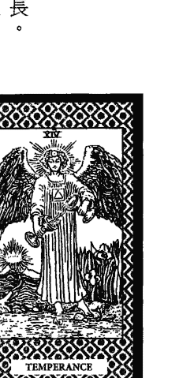

## 塔羅擂台 82

（二）以節制、射手座、火元素、牌序 14 作聯想
節制為自我約束，不逾矩，而逆位時可能是我行我素，目無法紀。射手座有待人和氣，仁慈善良，幽默風趣，樂觀進取，誠實坦白，自信大方，悟性高，會自我成長之優點，但亦有隨性善變，脾氣不穩定，奢侈浪費，有點自負，獨斷獨行，目無法紀，多言好爭論，會逃避現實之缺點。火元素在這張牌顯示的特質為動能足，非常有衝勁。牌序 14 為 1 與 4 的結合，1 為開始，4 為穩定，象徵在穩定中開創新的局面。

###### （三）舉例說明

例：我減肥能成功嗎？
解：要懂得自我約束，三餐定時、定量，不暴食，不暴飲，不嘴饞亂吃零食，再加上適當運動，減肥成功的機率將會增高。

例：該學佛或學道？
解：佛與道表面上看似不同，然就靈修的角度而言，可謂殊途同歸，因其最終之目的是一樣的，更何況現在佛道雙修比比皆是，又何必執著於該學佛或學道呢？

## 83 第三章 牌義之特性演繹與舉例

##### 15 惡魔

對應星象：摩羯座。
元素：土。牌序：15。
正位牌義：現實自私，無法自拔。
逆位牌義：擺脫束縛，掙脫枷鎖。

###### （一）以牌面作聯想

惡魔有人身、蝙蝠翅膀、羊角、羊腿、鳥足、驢耳，象徵人模人樣，但一切出發點皆基於動物本能與天性。羊角象徵山羊有堅忍不拔精神，驢耳象徵驢般的愚蠢與固執。瞪大雙眼，象徵嚴肅。嘴角向下，象徵想法悲觀。頭上的倒立五角星，象徵思維為金錢掛帥。鳥足立於小長方形板上，象徵立足點狹隘。右手張開似要抓物，掌心有土星符號，象徵要抓住利益。左手拿火炬向下照地，象徵盲目而為。背景全黑，象徵精神生活缺乏。

惡魔前方有脖子掛鐵鍊的赤裸男女，男女頭上長角，鐵鍊繫在小長方形板上，象徵以現實為前提，動物本能根深蒂固，觀念難轉移。男長火形尾巴，女長果實尾巴，象徵付出一定要有代價。掛在脖子的鐵鍊非常鬆，容易掙脫，但沒有掙脫跡象。

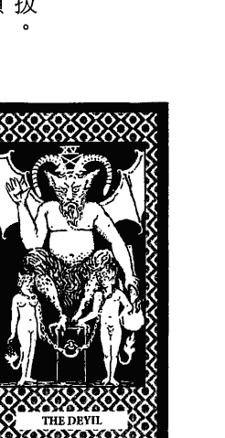

## 塔羅擂台 84

表示枷鎖是自己套上去的，故是否要擺脫束縛，端看自我選擇。

（二）以惡魔、摩羯座、土元素、牌序 15 作聯想
惡魔為揮之不去的困擾，而逆位時可能是脫離困擾或不擇手段達成欲求。摩羯座有務實可靠，勤勉自律，有責任感，有組織企劃力，執行力佳，領導能力強，能刻苦耐勞，任勞任怨之優點，但亦有吝嗇貪婪，想法悲觀，會自我壓抑，防衛心態強，疑心病重，容易疑神疑鬼，很難溝通之缺點。土元素在這張牌顯示的特質為固執、執著、阻礙、錢財利益、感官欲望、自私。牌序 15 為 1 與 5 的結合，1 為自我，5 為中央，象徵以自我為中心。

（三）舉例說明
例：此回一夜情有無後遺症？
解：有懷孕、感染性病之危機，或對方糾纏不休之困擾，故最好別去，以免給自己添麻煩。

例：當某人之保證人有無後遺症？
解：為惡夢的開始，後患無窮，故應拒絕，以免惹禍上身。

## 85 第三章 牌義之特性演繹與舉例

##### 16 塔

對應星象：火星。
元素：火。牌序：16。
正位牌義：天災人禍。
逆位牌義：絕地求生。

（一）以牌面作聯想
一座山頂高塔被雷擊中摧毀起火，象徵突如其來的無常災難，摧毀一切。王冠形狀的塔頂被雷擊中後將墜落，象徵思維徹底改觀。塔身三處竄出火苗，象徵影響深入內在。塔外兩人頭朝下，表情震驚，似乎被拋出而非自跳，象徵受震撼而自己無法掌控。塔後有三片高低不一的白雲，白雲後之背景為全黑，左邊雲上有10個火花，右邊雲下有12個火花，象徵心靈所受之負面影響，遠大於表面實質所受外，會深入根底，對身心靈之負面影響無法抹滅。

（二）以塔、火星、火元素、牌序16作聯想
塔為精神象徵，塔受摧毀為想法徹底改變，而逆位時可能是面對事實，作最壞

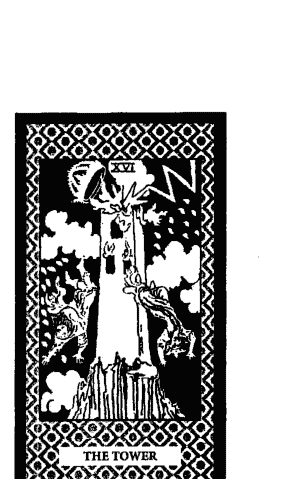

## 塔羅擂台 86

的打算。火星有聰明機智、勇敢果決、意志堅強、主動積極、行動力強、濟弱扶傾之優點，但亦有獨斷自我、好鬥殘暴、侵略破壞、躁急魯莽、衝動草率、缺乏耐性之缺點。火元素在這張牌顯示的特質為爆發、毀滅、消除。牌序 16 為 1 與 6 的結合，1 加 6 等於 7，1 為自我，6 為平順，7 為突破困境而奮鬥，故有平地起風波之意涵。

###### （三）舉例說明

例：開車去某地旅遊平安否？
解：得防範前車掉物、落石、山崩、爆胎、……等等突如其來的無常災難，防不勝防，故建議最好別去。

例：公司會倒閉嗎？
解：公司倒閉的可能性很高，宜早作盤算與規劃未來，以免屆時措手不及，六神無主，那就糟糕了。

##### 17 星星

對應星象：水瓶座。
元素：風。牌序：17。
正位牌義：憧憬未來，點亮希望。
逆位牌義：巨星隕落，希望破滅。

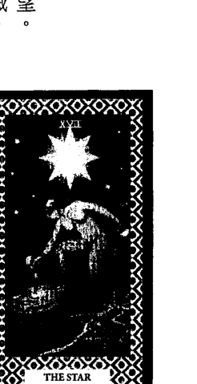

###### （一）以牌面作聯想

一位赤裸女子左膝跪地，右膝將踏入池子，象徵無所隱藏，沒有束縛，由已知領域踏入未知領域，由意識進入潛意識。將左手所提之壺水倒在草地上，水必沒入土中不見，水分流五道，其中一道流入池中，象徵一無所有後才能順天知命，情歸潛修。將右手所提之壺水倒入池中，激起陣陣漣漪，象徵投入潛修之過程，必餘波盪漾後才復歸平靜。女子後方為開滿花的廣闊草原，右後方遠處有山脈，左後方有棵樹，樹上有一隻朱鷺，象徵一片祥和寧靜，鳥語花香。天空有一顆金色八角星，其周圍有七顆白色八角星環繞，象徵光明無限，希望良多但遙遠。

## 塔羅擂台 88

（二）以星星、水瓶座、風元素、牌序 17 作聯想
星星為許願的指標，而逆位時可能是遙遠的期待，永遠無法達成。水瓶座有友善合群，能言善道，風趣好溝通，多替別人著想，有容人之量，記憶力強，理解力佳，善於分析推理之優點，但亦有特立獨行，標新立異，性情乖僻，古怪叛逆，想法偏激，頑固執著，剛愎自用，喜歡唱反調之缺點。風元素在這張牌顯示的特質為平靜思考，思緒清明。牌序 17 為 1 與 7 的結合，1 加 7 等於 8，8 為了未來能更圓滿，得重新評估後再出發。

（三）舉例說明
例：我平板電腦有亮光但不開機，問題出在哪？
解：一般電通過必產生熱能，而天上所見之星星只見亮光卻無法感受其熱能傳遞，因此，推斷此平板電腦應是電源迴路出問題，仔細檢查看看吧！結果，他送修檢查後之答案與我說的不謀而合。

例：從事雷射雕刻贈品工作有遠景嗎？
解：此工作是有遠景的，但無法立即得到大實利，因雷射雕刻贈品目前尚未普及，鮮少人知，故宜網上廣告宣傳，拜訪公司團體才利於推展。

## 89 第三章 牌義之特性演繹與舉例

##### 18 月亮

對應星象：雙魚座。
元素：水。牌序：18。
正位牌義：情緒起伏，恐懼不安。
逆位牌義：暗夜尾聲，黎明將臨。

###### （一）以牌面作聯想

近處龍蝦游出水面，象徵碰到危機欲逃離。中景見野外有狼與狗昂首頻頻吠叫，象徵示警，危機四伏；狼與狗中間有條小徑穿越兩塔之間，通往遠處山脈，象徵需克服恐懼、不安之障礙後，才能到達更遠的目標。高掛之月亮散發皎潔光輝，月亮中見新月、滿月、人在沉思，象徵瞭解月圓月缺之理，懂得進退之道後，即可見光明。月亮下方有15滴淚珠，象徵過程需經歷辛酸。

## （二）以月亮、雙魚座、水元素、牌序18作聯想

月亮代表我的心，為心靈多變與不安，而逆位時可能是情況好轉，恐懼與不安接近尾聲。雙魚座有仁慈善良，態度親切，有同理心，善解人意，有犧牲奉獻精神

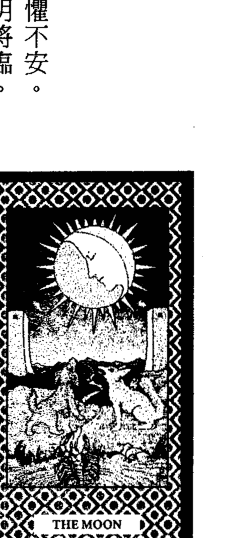

## 塔羅擂台 90

，善於融入各種環境，直覺力強，想像力豐富之優點，但亦有多愁善感，心態矛盾，想法不切實際，會自欺欺人，缺乏自信，會歇斯底里、自殘，善變沒原則及會逃避現實之缺點。水元素在這張牌顯示的特質為情緒化、恐懼、不安、神經質。牌序 18 為 1 與 8 的結合，1 加 8 等於 9，9 為臨界點、為轉化，惟有心靈轉化才能擺脫困境。

###### （三）舉例說明

例：你猜今天我碰到什麼奇特的人？
解：是碰到能說準你過去、現況，還預告你未來走向的通靈者嗎？哈！哈！沒錯，準得讓我覺得不可思議。

例：為何老是胸悶？
解：此應為心理影響生理所造成，醫藥恐怕只能治標卻無法治本，故若想解除胸悶之苦，惟有轉念及具備正確的人生觀，才能得到根治效果。

##### 19 太陽

對應星象：太陽。
元素：火。牌序：19。
正位牌義：光明積極、溫暖熱情。
逆位牌義：日趨沒落，旺不如前。

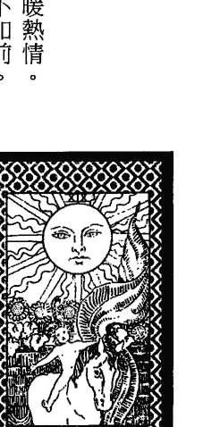

###### （一）以牌面作聯想

孩童赤裸騎在馬上，表情純真，面帶微笑，頭戴菊花環及一根紅色羽毛，左手拿著紅色旗幟，旗長而隨風飄揚，象徵坦誠、純真、樂觀、熱情散播。孩童雙手放開不馭馬，任馬自由前行，象徵讓事情自由發展，沒有人為干預。

背景有一道牆，牆頂種四棵向日葵，四朵向日葵花朝向孩童，象徵跨越困難，重獲自由，光明湧現。高掛之太陽散發曲、直交錯的兩種光芒，太陽內有人之表情安祥圖案，象徵不論事情曲直，都能安然度過。上方羅馬數字旁有一道聯結太陽頂端的黑色曲線，象徵新的挑戰即將開始。

## 塔羅擂台 92

（二）以太陽、太陽、火元素、牌序 19 作聯想
太陽會讓人感覺溫暖，帶來光明，而逆位時可能是溫暖與光明之程度降低。太陽有自信、博愛、熱情、心胸開闊、有創造力、有領導能力之優點，但亦有傲慢、自負、自大、專制、誇大、強人所難、有虛榮心之缺點。火元素在這張牌顯示的特質為光明、自信、群眾魅力。牌序 19 為 1 與 9 的結合，1 加 9 等於 10，10 為本階段結束，下階段即將開始，又要面臨下一階段的課題。

（三）舉例說明
例：此胎孕男或孕女？
解：此胎孕男的可能性高，五個月後胎動應會很明顯，孩子出生後將是人見人愛的小帥哥。

例：我們之間的秘密是否會被揭發？
解：秘密被攤在陽光下解讀的可能性高，故宜早作應變措施，以免面臨秘密被解開後無法自圓其說的窘境。

## 93 第三章 牌義之特性演繹與舉例

##### 20 審判

對應星象：冥王星。
元素：水、火。牌序：20。
正位牌義：關鍵轉振，吉凶未卜。
逆位牌義：關卡難破，在劫難逃。

###### （一）以牌面作聯想

天使現身雲中，吹著喇叭，喇叭綁著一張正方形旗幟，旗幟內有紅十字，象徵呼籲、召喚來自業力牽引，需有正確的選擇才能得到救贖；喇叭出口有七條放射狀的線，象徵七情六慾。

近處有赤裸的男人、女人、小孩站在棺中，象徵死而復生；左邊之男人昂首看天使，似在拍手，象徵意識欣然接受；右邊之女人雙手往前伸直，似要接物，象徵潛意識亦接受；中間之小孩面對天使，雙手作擁抱狀，象徵接受召喚，回歸童貞，重新出發。

遠處有赤裸的男人、女人、小孩昂首看天使，高舉雙手歡呼，小孩站在棺外，男人、女人仍站在棺中，象徵重生的喜悅，意識改變，潛意識亦將跟進。遠處背景

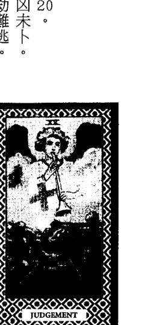

## 塔羅擂台 94

為白雲覆蓋的高山連綿，象徵經歷跋涉困境。

（二）以審判、冥王星、火元素、牌序 20 作聯想
審判為抉擇關卡，選擇正確就能得到進化提昇，而逆位時可能是關卡難過。冥王星有直覺敏銳、意志力堅強、能轉危為安、開創新局之優點，但亦有極端、殘暴、控制慾、虐待狂之缺點。水元素在這張牌顯示的特質為潛意識、業力，火元素在這張牌顯示的特質為徹底改變、摧毀。牌序 20 為 2 與 0 的結合，2 加 0 等於 2，2 為兩元激盪，性質迥異，面臨抉擇。

（三）舉例說明
例：從事何業以後能讓我大發？
解：從事色情業、殯葬業、殺手、資源回收、武器製造都能讓你以後大發，但據你目前自身條件及人事關係分析，建議你回鍋從事殯葬業，以後能讓你大發的可能性較高。

例：今天天氣如何？
解：逢遇突然變天的可能性很高，故建議出門帶把傘以備不時之需為妥。

## 95 第三章 牌義之特性演繹與舉例

##### 21 世界

對應星象：土星。
元素：土。牌序：21。
正位牌義：完整穩重，結果已定。
逆位牌義：未達完美，內心缺憾。

（一）以牌面作聯想
一位赤裸的女舞者表情輕鬆，自由跳舞，兩手各持一支權杖，象徵輕鬆自在，大權在握；身披紫色絲巾，頸後絲巾飄揚，腳跟旁絲巾垂地，象徵自始至終。舞者身旁圍繞著橢圓形桂冠，桂冠上下各有一條紅巾纏繞成 ∞ 符號，象徵無限與永恆。牌之四角有人、老鷹、獅子、牛，其表情都很安祥，象徵火、土、風、水四大元素是調和的。

（二）以世界、土星、土元素、牌序 21 作聯想
世界為完整的領域、組織，而逆位時可能是領域、組織不完整、有缺陷。土星有認真負責、務實可靠、謹慎、自律、節儉、有耐心、有雄心壯志之優點，但亦有

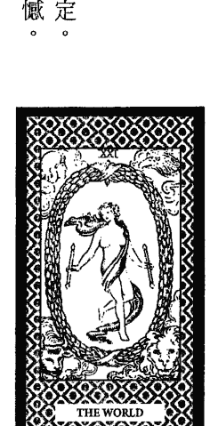

## 塔羅擂台 96

太保守、自我壓抑、意志消沉、冷漠無情、嚴厲專橫、卑鄙殘忍之缺點。土元素在這張牌顯示的特質為實質擁有、固定不變。牌序21為2與1的結合，2加1等於3，道曰：「一生二，二生三，三生萬物」，故表示有創新能力。

###### （三）舉例說明

例：本次招商能成功嗎？
解：你們的聲名遠播，計畫周詳，四方來共襄盛舉者眾多，招商成功應指日可待，故無需多慮。

例：能否通過試用期而成為正職員工？
解：妳的表現優異，行事務實，循規蹈矩，吻合公司規範與要求，故必能通過試用期而成為正職員工。

#### 第二節 小阿爾克納數字牌之特性演繹與舉例

◎ 數字牌義點睛
花色是本質，數字是展現模式，當我們了解花色象意和對應元素及數字之象意後，就能快速掌握牌義，是解讀數字牌特性之竅門。

##### 一 四花色象意及對應元素、陰陽
- 權杖：象徵權力，與掌權、決斷相關，對應火元素、屬陽性。
- 錢幣：象徵財物，與財利、金錢相關，對應土元素、屬陰性。
- 寶劍：象徵智慧，與思考、傷害相關，對應風元素、屬陽性。
- 聖杯：象徵感情，與情誼、接納相關，對應水元素、屬陰性。

##### 二 數字之象意
- 數字一：代表第一步，為開始、創新、唯一。
- 數字二：代表兩人世界，對立就分裂，協調就結合。
- 數字三：代表三足鼎立，為制衡可利益共享，紛亂就失利。
- 數字四：代表四平八穩，為安全、穩定，亦可能是靜止、停頓。
- 數字五：代表五味雜陳，為混亂、衝突、失落。
- 數字六：代表六六大順，為順利、成功，能妥協與分享。
- 數字七：代表七拼八湊，為突破困境而奮鬥。
- 數字八：代表八面玲瓏，為圓滿大局而重新評估再出發。
- 數字九：代表九五至尊，為至高無上的臨界點，只能獨享與孤獨。
- 數字十：代表十全十美，為圓滿解決與轉化，但要防「滿招損」。

## 99 第三章 牌義之特性演繹與舉例

##### 權杖一

對應元素：火。
數字：一。
正位牌義：新念頭萌生，新計畫實行。
逆位牌義：錯誤的開始，計畫取消。

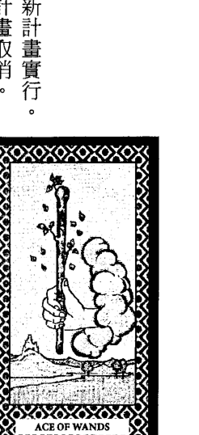

（一）以牌面作聯想
從雲中伸出一隻手緊握著權杖，象徵突發奇想，剛萌生的新意念或新計畫。權杖頂上分枝綠葉越長越多，權杖周圍有八片綠葉，象徵新意念越來越高漲，不斷向外擴展與延伸。近處為平原上有三棵樹分種兩地，溪水由右至左擴大流出，象徵由少變多，逐漸擴大延伸。遠處為連綿山脈，山頂有一座城堡，象徵理想崇高，難以抹滅。

（二）以火元素及數字一作聯想
常言：「星星之火可以燎原」，代表發展之潛力無限。初生之火最易熄滅，代表剎那火花，爆過即無。

## 塔羅擂台 100

###### （三）舉例說明

例：此行業有發展潛力嗎？
解：如果作法得當，此行業當然有發展潛力；但是若操作不當，也可能只是剎那火花，爆過即無。

例：你猜剛才我在想什麼？
解：應是有新點子萌生，或新計畫要推展之類。是，答對了，我突然想到將茶葉磨成粉末後加入欲做之肥皂中，可能帶來新的生意契機。

## 101 第三章 牌義之特性演繹與舉例

##### 權杖二

對應元素：火。
數字：二。
正位牌義：合宜計畫，大膽決策。
逆位牌義：計畫錯誤，膽識喪失。

（一）以牌面作聯想
城主右手捧著地球模型，前後面各有一支權杖，象徵行動計畫有兩個選項，仍在思考如何做最圓滿。前面權杖由左手握著，象徵握有新機會；背後權杖被鐵環固定在牆上，象徵已擁有固定的行動模式。他站在城牆上眺望牆外遼闊的土地及海洋，權杖高度前比後高出很多，象徵有雄心壯志。前面權杖立在有白百合與紅玫瑰交叉圖案的城牆上，象徵想要把握新機會，將會面臨魚與熊掌不可兼得之選擇。

（二）以火元素及數字二作聯想
火元素有非常專注之特性，面臨兩個出口也只會選擇最喜歡的投入，故最後只會朝選擇之目標前進。

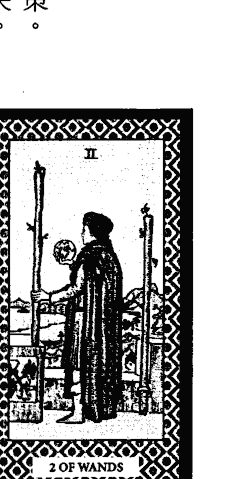

###### （三）舉例說明

例：可同時學八字與紫微斗數嗎？
解：八字與紫微斗數是兩個不同系統的算命術，基本學理雖然有些許雷同處，但運用的技巧差很多，故建議兩者擇其一學習，待一門深入後再學另一項，才不會學得四不像。

例：該去上班或自創業？
解：上班有穩定收入的好處，有發展受限的缺點；自創業有發展不可限量的好處，有需承擔的風險、人員管理及資金調度困難的問題，故該如何選擇？需衡量自身現況而定。

## 103 第三章 牌義之特性演繹與舉例

##### 權杖三

對應元素：火。
數字：三。
正位牌義：有實力、內涵，實力擴展。
逆位牌義：過度自信，退縮封閉。

（一）以牌面作聯想
商人背後有兩支權杖豎立土中，象徵有實力、內涵，有後盾可依靠。他身上背著行囊，右手握著權杖，象徵邁向嶄新的開拓旅程。他站在山巔目送他的船隊，象徵高瞻遠矚，思慮缜密後就開始行動。天空是柔和的黃色，象徵光明祥和。遠處海水平靜的，象徵風平浪靜，一帆風順。海洋中左、右邊各有一艘船，中間有兩艘船似一夥的，都朝同一方向前進，象徵有合作、整合之過程。

（二）以火元素及數字三作聯想
得與自己能力相當者當後盾，壯大實力，助長氣勢，相互合作呼應，發揮一加一大於二的力量，利於開拓。

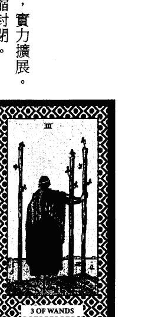

## 塔羅擂台 104

###### （三）舉例說明

例：參選立委能勝選嗎？
解：你實力雄厚，又有後盾可靠，故勝選的可能性很高，惟參選過程若能整合地方各派系支持力量，則勝選更能肯定。

例：本趟出差所為何事？
解：身為主管、業務者，拓展公司業務的可能性高；身為研發、技工者，進修考察的可能性高。

## 105 第三章 牌義之特性演繹與舉例

##### 權杖四

對應元素：火。
數字：四。
正位牌義：穩定周全，繁榮、和諧。
逆位牌義：基礎不穩，鬆動出紕漏。

###### （一）以牌面作聯想
四支巨大權杖聳立前方，前兩支權杖用紅帶子綁住花環，並繞過後兩支沒用紅帶子綁住花環的權杖，象徵勝利的局面，有再擴展之可能。兩位女子高舉花束，表情喜悅，遠方隱約可見慶祝的人群，象徵豐收歡樂。右邊女子左手指著花圃，象徵有豐收管道。右邊有通往遠處城堡的通道，象徵進入安全穩固之庇護所，續享豐碩成果。

### （二）以火元素及數字四作聯想
火勢穩定表示可安享成果，心境平和，能控制自己，在穩定中求發展。以整體利益為考量，再圖謀未來發展之方針。

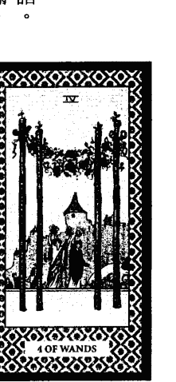

###### （三）舉例說明

例：我會中樂透嗎？
解：中樂透的可能性低，穩固發展致富的可能性高，故別異想天開，作白日夢，還是在穩定中求發展較可靠吧！

例：學校排球比賽能得勝嗎？
解：可以準備慶功宴囉！學校排球比賽不但能得勝，日後還可能代表學校出外比賽，甚至有一戰成名之可能。

## 107 第三章 牌義之特性演繹與舉例

##### 權杖五

對應元素：火。
數字：五。
正位牌義：衝突競爭，各持己見。
逆位牌義：暗潮洶湧，亂局重整。

###### （一）以牌面作聯想
五人腳部所穿之鞋各異，象徵立足點各不同。五人身穿衣服各異，象徵心理想法各不同，心態亦不同。五人所站的位置高低不一，象徵地位不平等。五人各持權杖之姿勢各異，象徵各持己見，各自表述。五人似糾結在一起，象徵事情糾結，難以解決。場景混亂如一盤散沙，象徵混亂爭鬥，沒有共識。地面崎嶇不平，象徵環境不良。天空為灰色，象徵氣氛差。

### （二）以火元素及數字五作聯想
在沒有任何庇護下接受考驗，證明自己的實力，當然所面臨的打擊必多，這是我們可意想得到的情境。

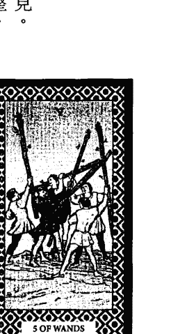

## 塔羅擂台 108

###### （三）舉例說明

例：合夥能成功嗎？
解：各持己見，各自表述，難以達成共識，氣氛差，場面混亂，故合夥破局的可能性高。

例：即將帶領之團隊好帶嗎？
解：你即將帶領之團隊是一盤散沙，運作失序，人員難管理，宜找出因應對策，以免日後被上級責罰。

## 109 第三章 牌義之特性演繹與舉例

##### 權杖六

對應元素：火。
數字：六。
正位牌義：勝利榮耀，有好消息。
逆位牌義：失誤落馬，驕者必敗。

###### （一）以牌面作聯想
騎士頭戴桂冠，右手持頂部有紅帶子綁住花環之權杖，象徵凱旋榮歸。身旁有追隨群眾並投射崇拜目光，象徵受擁戴，眾望所歸。身穿紅色披風，象徵積極熱誠。抬頭挺胸，表情淡定，象徵充滿自信，自有主張。白馬身上披著淺綠的布，表情祥和，側視路旁，象徵傳遞好消息。騎士左手握住套在馬頸上之淺綠色有橘點的布索，象徵控制良好。天空為淺藍色，象徵氣氛祥和。

### （二）以火元素及數字六作聯想
目標達成，得到肯定，為大家注目的焦點，若當事者願意謙卑帶領，將會得到更多的援助與祝福。

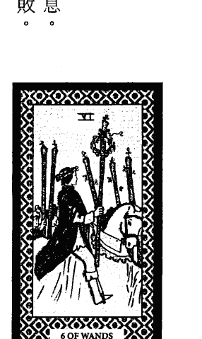

###### （三）舉例說明

例：命理界對神算命理出版書之評價？
解：所出版之書頗受好評，不但內容豐富，資料齊全，是自修者的良書益友，亦是教授此道者不可多得的好教材，值得推薦與推廣。

例：我適合當業務嗎？
解：你很有親和力，人緣好，人脈廣，喜歡分享，這些都是利於當業務的條件，故這份工作很適合。

## 111 第三章 牌義之特性演繹與舉例

##### 權杖七

對應元素：火。
數字：七。
正位牌義：以寡敵眾，英勇果斷。
逆位牌義：寡不敵眾，懦弱無能。

###### （一）以牌面作聯想
綠衣男子表情堅毅，雙手持權杖作還擊狀，前面有六支權杖似在圍攻他，象徵危機四伏，難關重重，孤軍奮戰，以寡敵眾，有勇於面對挑戰的勇氣與決心，有一夫當關萬夫莫敵的氣勢。男子站在高地，六支權杖在低處，象徵站在有利的位置作還擊，成功機率將大增。對峙的場面沒有失控，代表難題還在自己能力可解決的範圍之中。天空上半為淺藍色，下半為白色，象徵曙光可見。

### （二）以火元素及數字七作聯想
面臨挑戰與考驗，是危機處理能力的磨練，可累積經驗，自我成長，讓能力更超越，更提昇。

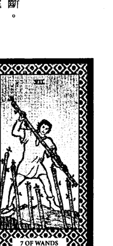

## 塔羅擂台 112

###### （三）舉例說明

例：公司能渡過難關嗎？
解：目前公司看起來好像危機四伏，難關重重，但不用過於擔心，此回應是關關難過關關過，柳暗花明又一村。

例：我命中犯小人嗎？
解：你命中嚴重犯小人，宜謹言慎行，行得直，做得正，讓小人無機可趁；遇事能妥善處理，化危機為轉機，才是因應解決之道。

## 113 第三章 牌義之特性演繹與舉例

##### 權杖八

對應元素：火。
數字：八。
正位牌義：目標一致，飛速達成。
逆位牌義：欲速則不達。

###### （一）以牌面作聯想
八支權杖像八支飛行的箭，象徵速度飛快，火力強大。八支權杖平行劃過蔚藍天空，射向大地，象徵有計畫的集結眾力，向鎖定目標前進；權杖即將射入大地，象徵有新的機會降臨，新的人事物將介入你的生活；權杖將飛越過近處小溪，象徵即將突破阻礙，抵達目標。遠處有略微起伏的山丘，山丘上有樓房，象徵理想高遠，為了建立穩固堡壘而衝刺。

### （二）以火元素及數字八作聯想
能量俱足，目標一致，彈無虛發，能在最短時間內達到最大的成果，是成功機率提升的保證。

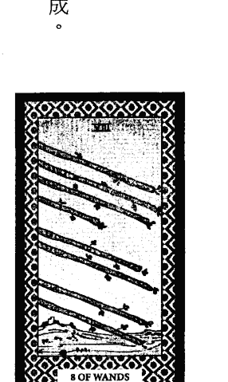

## 塔羅擂台 114

###### （三）舉例說明

例：求婚能成功嗎？
解：過去阻礙可突破，即將飛速達成目標，不但求婚能成功，且還有閃電結婚之可能，敬請把握，勿失良機。

例：計策能奏效嗎？
解：不用擔心，計策必能奏效，成果在短時間內就能示現，請拭目以待，不久就可聽到好消息囉！

## 115 第三章 牌義之特性演繹與舉例

##### 權杖九

對應元素：火。
數字：九。
正位牌義：警覺防禦，隨時備戰。
逆位牌義：百密一疏，全面倒戈。

###### （一）以牌面作聯想
壯漢頭上紮繃帶，象徵曾經受傷，記憶猶新。表情緊繃，肩膀微聳，眼觀周圍動靜，雙手緊握權杖似站衛兵，象徵氣氛緊張，有警覺心，隨時備戰。背後八支權杖，象徵有資源與靠山；權杖排列如柵欄圍繞遠處青山，象徵守護家園；頭部後方有空缺，象徵百密一疏，潛藏危機。背後左右兩邊權杖數量不均，象徵要謹慎處理，以免全面倒戈。

### （二）以火元素及數字九作聯想
能量已達頂峰，即將開始耗弱，後繼無力，故不用逞強，宜學習四兩撥千斤之技巧，才能應付各種挑戰。

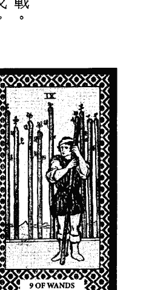

## 塔羅擂台 116

###### （三）舉例說明

例：事業能否再創高峰？
解：後繼無力，事業再創高峰的可能性不高外，還得防管理疏失，員工倒戈而造成不利影響。

例：考試成績比上回好嗎？
解：考試成績比上回好的可能性不高外，還得防看錯題目、錯填答案卷、漏寫等等疏忽而令成績不如預期。

## 117 第三章 牌義之特性演繹與舉例

##### 權杖十

對應元素：火。
數字：十。
正位牌義：責任重大，壓力沉重。
逆位牌義：壓垮崩潰，放下重擔。

###### （一）以牌面作聯想
男子雙手緊抱十支權杖，象徵責任一肩扛，或收穫後才隨之而來的負擔。身旁無協助之人，象徵沒有外援。十支權杖長短不一，象徵不論大小事都親力親為。身體前傾，步伐沉重，象徵壓力沉重，超過負荷，身體疲累，但沒有放棄。埋首於權杖之中，象徵視線不明，缺乏遠見。男子離遠處房子還有段距離，象徵還要扛一段時間才能卸下重擔。

### （二）以火元素及數字十作聯想
用最後的蠻力跟環境抗衡將無法突圍，惟有徹底改變作法才有轉機，否則，只會如油盡燈枯，得被壓垮的下場。

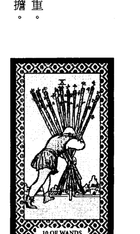

###### （三）舉例說明

例：離婚之原因為何？
解：生活壓力沉重，得不到經濟支援，精神緊崩，得不到心靈安慰，為身心俱疲下所作出的選擇。

例：他為何每天看起來都很累？
解：他事必躬親，喜歡權力一把抓，不論大小事通通要管，沒經過他親自過目、參與的事就是不放心，這就是累的原因所在。

##### 錢幣一

對應元素：土。
數字：一。
正位牌義：奠定財富基礎。
逆位牌義：財務決策失當。

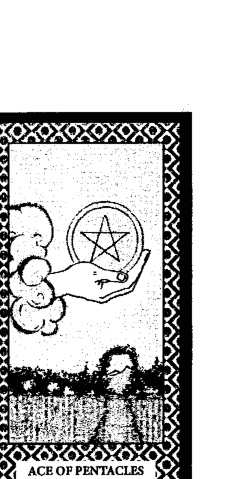

###### （一）以牌面作聯想

從雲中伸出一隻手捧著錢幣，象徵萌生與財富相關的新計畫，如投資、創業、……。手及錢幣下半部周圍比其他天空略亮，象徵掌握實質財富僅是曙光初現。背景庭園花草繁盛，象徵有欣欣向榮之遠景。庭園是由綠樹叢所組成的圍牆與外界阻隔，象徵目前尚侷限於某小範圍之中。有條小路穿越綠樹拱門通往遠處高山，象徵是通往更高理想的途徑。

### （二）以土元素及數字一作聯想

具有掌握實際層面之根基，只要穩定持續努力，將得到實質的收穫，但其過程之辛勞必不可免。

## 塔羅擂台 120

###### （三）舉例說明

例：此人可否託付終身？
解：此人務實穩定，有經濟基礎，前景看好之優點；但亦有個性木訥，缺乏情調之缺點，故是否值得託付終身，端看閣下之決定囉！

例：在此上班有前途嗎？
解：可能你會覺得公司發展受限，沒有前途，其實你若能以此為跳板，在穩定中求發展，未來將前途無量。

## 121 第三章 牌義之特性演繹與舉例

##### 錢幣二

對應元素：土。
數字：二。
正位牌義：收支平衡。
逆位牌義：周轉不靈。

###### （一）以牌面作聯想
遠處見海浪起伏劇烈，兩艘船隨浪起伏擺盪，象徵人生起伏很大，得順勢而為，以求生存。穿著像街頭藝人的男子站在甲板上，兩腳姿勢不一，似在取得平衡，象徵得隨機應變才能永立不倒。兩手各持一枚錢幣，位置高低不同，象徵實務立場不同，要兩者兼顧。兩枚錢幣外圍緊靠8形帶子作聯繫，象徵財務交流運作，需依循正軌而行才不會出狀況。

### （二）以土元素及數字二作聯想
在新舊模式中取得平衡，截長補短，相輔相成，才能得最大利益，與再創新的面貌與格局。

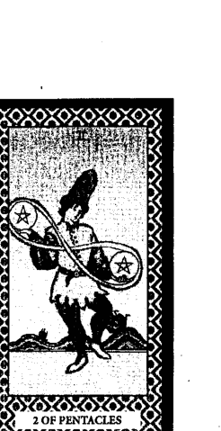

###### （三）舉例說明

例：本月收支能平衡嗎？
解：本月如果仍依原有的舊模式運作，收支應可平衡；然若逢遇突發狀況，則收支想平衡恐較困難。

例：我銀行所賣基金與客戶糾紛案該如何處理？
解：基金漲跌是正常現象，而客戶因基金虧損前來抗議，必因當初行員為了業績有口頭承諾，故今才有這些糾紛，因此，建議依基金合約及口頭承諾兼顧作協商，此事方能圓滿解決。

##### 錢幣三

對應元素：土。
數字：三。
正位牌義：分工合作，溝通協調。
逆位牌義：團隊不和，計畫不周。

###### （一）以牌面作聯想

教堂柱子上方有似三角形圖案，圖案中有三枚錢幣，三枚錢幣間有十字圓圈，象徵三方在實務面需取得共識，才能建構完成。工匠臉向修士、修女似在詢問，左手指壁，右手持鐵鎚站在長板凳上似在施工中，象徵進行之事要聽從指示。修女手持工作藍圖，象徵事前有經過計畫，需依計畫施工。修士、修女表情似在聆聽及說明，象徵各司其職，溝通協調。

### （二）以土元素及數字三作聯想

按照計畫行事，分工合作，各司其職，朝共同的目標推展，將原有的小成果變成更大的成果。

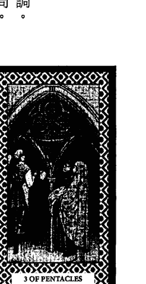

###### （三）舉例說明

例：將來是戀愛結婚或相親結婚？
解：此事有分工合作而成之象，故將來戀愛結婚的可能性不高，經由親友介紹、婚友社介紹結婚的可能性高。

例：房子自售短期可順利賣出嗎？
解：自身通路少，若短期想自售房子恐不易，還是委託通路廣的房屋仲介公司幫忙銷售，短期賣出的可能性才會大增。

## 125 第三章 牌義之特性演繹與舉例

##### 錢幣四

對應元素：土。
數字：四。
正位牌義：財務穩固，吝於分享。
逆位牌義：自私自利，顧此失彼。

###### （一）以牌面作聯想
男子神情緊張，目視前方，象徵小心翼翼，深怕有些微損失。頭戴城牆型帽子，帽緣上方鑲一枚錢幣，象徵財務穩固，守財牢靠，有貪焚特質，有錢還要更有錢。雙手緊握一枚錢幣在心位，象徵緊緊抓住資產不放，心裡想的都是錢。雙腳各踩一枚錢幣，象徵已有財務根基。遠離城市人群，孤冷坐在石椅上，象徵坐擁財富，但心靈空虛。

### （二）以土元素及數字四作聯想
將帶來富足與穩定，但保守固執，墨守成規，難以溝通，拒絕改變，生活沉悶，缺乏樂趣。

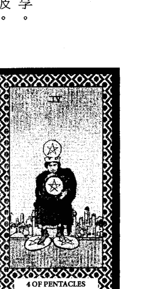

## 塔羅擂台 126

###### （三）舉例說明

例：老闆說請我們吃大餐是真的嗎？
解：你們老闆雖然很有錢，出門以高級轎車代步，但他為人很小氣，一個錢打24個結，所以可能請吃的是縮水版之大餐吧！

例：安排與我相親之對象好嗎？
解：跟妳相親者節儉務實，經濟穩固，為守財奴之典型，精打細算，花錢小氣，缺乏情調及生活情趣為其特性，至於好或不好？則端看妳自身之認定囉！

##### 錢幣五

對應元素：土。
數字：五。
正位牌義：環境惡劣，求助無門。
逆位牌義：化險為夷，度過難關。

###### （一）以牌面作聯想

場景為冰天雪地之夜裡，大雪紛飛，象徵環境惡劣，雪上加霜，還處於黑暗時期。兩個乞丐身穿破衣，在大雪紛飛的冰天雪地中躑躅前行，象徵貧寒交迫。右邊乞丐與左邊又癡又駝背的乞丐結伴同行，象徵不離不棄，相互扶持。背景見有亮光之窗戶，窗戶上有五枚錢幣，但沒有看到可入室內之門，象徵財富近在眼前，但苦無門路可入。

### （二）以土元素及數字五作聯想

財運不順，障礙困擾，事倍功半，阻力永遠比助力大，讓人有龍困淺灘，不得志之嘆。

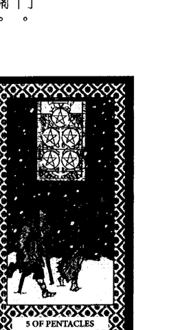

## 塔羅擂台 128

###### （三）舉例說明

例：去某地經商好嗎？
解：該地正面臨經濟不景氣，百業蕭條，大環境惡劣，故建議當前最好別去，以免受波及。

例：今年財運？
解：財運欠佳，事倍功半，阻礙重重，應是大環境所致，故只能勒緊褲帶過生活，別無他法可想。

## 129 第三章 牌義之特性演繹與舉例

##### 錢幣六

對應元素：土。
數字：六。
正位牌義：施與受拿捏恰當。
逆位牌義：施與受拿捏失當。

###### （一）以牌面作聯想

富人站立，目光下視乞丐，右手握錢幣，手心向下，並丟下四枚錢幣給左邊乞丐，象徵施捨，位居高位，有主導權。富人之左手高持天秤，象徵高標準審核，公平公正。兩名乞丐跪目光上視富人，雙手之心向上，象徵乞求，位處低位，只能看人臉色，得到憐憫。富人頭上有一枚錢幣，左邊有三枚錢幣，右邊有兩枚錢幣，象徵精於理財，知道如何分配才恰當。

### （二）以土元素及數字六作聯想

財務順暢，生意興隆，要懂得感恩與回饋，因社會為相互依存的生命共同體，應相互扶持。

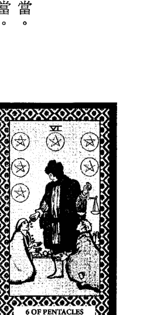

## 塔羅擂台 130

###### （三）舉例說明

例：師傅會將畢生所學傾囊相授嗎？
解：那得看你的表現是否令師傅感動，值得信賴傳承，師傅才有可能將畢生所學傾囊相授。

例：經理會關照我嗎？
解：你與經理之互動佳，只要你肯努力工作，堅守崗位，福利必然會幫你爭取，故無需多慮。

## 131 第三章 牌義之特性演繹與舉例

##### 錢幣七

對應元素：土。
數字：七。
正位牌義：審慎計畫，突破成長。
逆位牌義：評估失誤，投資失利。

###### （一）以牌面作聯想
左邊農作物叢上有六枚錢幣，象徵目前已有成果與資源。農夫低頭似在沉思，象徵在思索與計畫下一步該怎麼做。雙腳穩穩站立，沒有跨出，象徵穩紮穩打，不冒然行事。雙手撐著鋤頭，象徵有可依賴的賺錢工具。腳跟前植物上有一枚錢幣未與六枚錢幣歸成一堆，象徵目前工作即將完結，只剩收尾。背景遠處有多重綿延山脈，象徵理想高遠，追求成長。

### （二）以土元素及數字七作聯想
雖然已經擁有資產，但為了長遠打算，總得利用現有資產再創造出更大價值，才能高枕無憂。

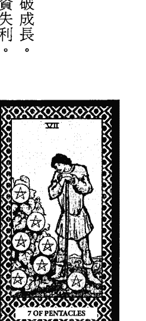

## 塔羅擂台 132

###### （三）舉例說明

例：我紡織廠移至某地有利否？
解：你紡織廠移至某地之事，相信你早有評估與計畫，該地有人力資源，工資又低廉，可節省開銷，增加市場競爭力，故應無不利。

例：申請車禍鑑定對我有利嗎？
解：你應已掌握有利證據，車禍鑑定對你有利，故宜提出申請以確保自身權益，別讓肇事者逍遙法外。

## 133 第三章 牌義之特性演繹與舉例

##### 錢幣八

對應元素：土。
數字：八。
正位牌義：認真專注，精益求精。
逆位牌義：徒勞無功，吹毛求疵。

###### （一）以牌面作聯想

工匠坐在懸一枚錢幣的長板凳上工作，象徵在創造財富的平臺上打拼。左手拿著鑿子，右手拿著鐵鎚，表情專注，正在刻錢幣中五角星的細線，象徵勤奮工作，精雕細琢，精益求精，注重細節。柱上掛五枚錢幣成一直線，象徵已有累積成果。地板上有一枚錢幣，象徵未完成的指標。背景有一條黃色道路通往遠方城堡，象徵為了達成更穩固之願景而努力。

### （二）以土元素及數字八作聯想

在既定的目標上努力推展，精益求精，可更上一層樓，再創另一波事業高峰將指日可待。

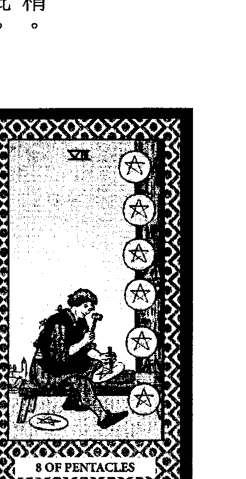

###### （三）舉例說明

例：今年可否找到比目前更好的工作？
解：你累積的工作經驗豐富，資歷夠，故今年找到比目前更好工作的可能性高，可以開始找囉！

例：請某友幫忙校稿合適嗎？
解：當然合適，他很注重細節，要求嚴格，能挑出你沒注意到的地方，提出他的看法與見解，對此書必有加分作用。

## 135 第三章 牌義之特性演繹與舉例

##### 錢幣九

對應元素：土。
數字：九。
正位牌義：享受豐收，生活安逸。
逆位牌義：財務損失，揮霍殆盡。

###### （一）以牌面作聯想
背景莊園果實累累，葡萄叢上有九枚錢幣，象徵成果豐碩，有財富。貴婦身穿金星符號衣裳，表情安逸，象徵享受生活，無憂無慮。右手扣著一根葡萄藤，扶在錢幣上，象徵已掌握成果與財富。左手戴白手套，手掌彎曲讓被紅布朦頭的小鳥站在上面，象徵與世隔絕，無法飛翔。腳前有一隻蝸牛緩緩前行，象徵生活步調緩慢，缺乏積極開創精神。

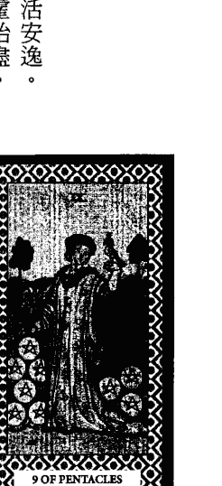

### （二）以土元素及數字九作聯想
成果豐碩，擁有財富，享受生活，但生活一層不變，找不到新的樂趣和目標，缺乏創意和動能。

###### （三）舉例說明

例：某同事會跟我一起去兼差嗎？
解：他認為白天上班所得已足夠生活，晚上兼差非他想要的生活品質，故跟你一起去兼差的可能性較低。

例：此回出海之漁獲量？
解：此回出海之漁獲量多，成果豐碩，能滿載而歸，帶來一筆財富，讓家人之生活無憂無慮。

##### 錢幣十

對應元素：土。
數字：十。
正位牌義：繁榮富有，永續經營。
逆位牌義：破產危機，難以支撐。

###### （一）以牌面作聯想

老人舒服坐著，右手摸著他的白狗，象徵安樂；衣裳上有三枚錢幣及果實累累圖案，象徵老人很有錢，可蔭後代子孫。拱門牆上有三枚錢幣，象徵擁有不動產。拱門外似有兩人在交談，背對者左手持權杖，頭之左上方有一枚錢幣，象徵財富傳承與交代；面向者右手見錢幣，頭之左上方有兩枚錢幣，背後有一小孩用左手摸著他的白狗，象徵持續發展，永享安康。

### （二）以土元素及數字十作聯想

基礎雄厚，穩固扎實，繁榮富裕，有資產保障，永續經營，永享安康，情緒不容易受到干擾。

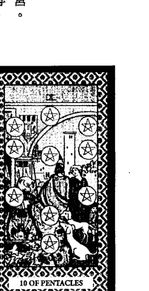

## 塔羅擂台 138

###### （三）舉例說明

例：你猜我許什麼願？
解：妳的願望應是可以賺很多錢，以錢滾錢，越滾越多，以後成為人見人羨的超級大富婆。

例：成就此婚姻之始因？
解：對方能提供安全穩固生活，是成就此婚姻的始因，絕非建立在感情之上，可謂選麵包不選愛情之典型。

##### 寶劍一

對應元素：風。
數字：一。
正位牌義：專注秉持，突破萬難。
逆位牌義：秉持失當，慘敗遭傷。

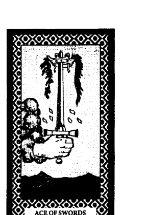

###### （一）以牌面作聯想

從雲中伸出一隻手握著寶劍，象徵傷害的開端，決鬥的開始，要有面對艱難挑戰的心理準備與勇氣。寶劍直立，不偏不倚，象徵中立正義。寶劍之劍尖穿過皇冠，象徵突破束縛與困難，進入更高層級。皇冠兩邊各掛一串枝葉，象徵既存之累贅。劍之左右兩旁各有三片枯黃落葉，象徵去無存菁。雲、天空、山脈皆為暗灰色，象徵風雨欲來之前兆。

### （二）以風元素及數字一作聯想

計畫成形，準備開展。靈光乍現，直覺清晰，思緒專一，萌生突破束縛，進入更高次元之念頭。

## 塔羅擂台 140

###### （三）舉例說明

例：左腋下腫瘤是良性的嗎？
解：左腋下腫瘤是良性與否不是重點，重點是它可能病變，故建議開刀切除，以免病變而生不利。

例：我能調職成功嗎？
解：必先突破原單位放不放你走的困境，以及欲調職之單位是否有職缺和接受你，才能決定調職能否成功。

##### 寶劍二

對應元素：風。
數字：二。
正位牌義：僵持冷戰，拒絕決定。
逆位牌義：打破僵局，做出決定。

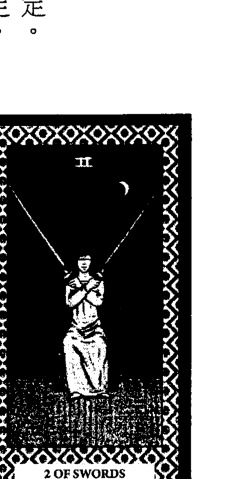

###### （一）以牌面作聯想

女人用布朦住雙眼，坐在石凳上，象徵逃避現實，選擇不看，不願面對，靜待變化；雙手持劍，交叉於胸前，象徵心靈封閉，拒絕下決定。兩把寶劍斜立於相對的方向，象徵意見分歧，陷入對峙與冷戰之僵局。背景海洋平靜但礁石密佈，象徵看似平靜但充滿危機。黑夜天空掛著一輪新月，象徵改變之開端。石凳置於海陸交界之岸邊，象徵如臨深淵。

### （二）以風元素及數字二作聯想

意見分歧，對峙冷戰，進退維谷，左右為難，難下決定。為暴風雨前的寧靜，混亂的開端。

###### （三）舉例說明

例：新搭擋好相處嗎？
解：新搭擋的防衛心太重，容易針鋒相對，故相處宜避開敏感話題，以免招來無謂的麻煩與困擾。

例：我們能復合嗎？
解：目前對方難下決定，可能有他的顧忌跟困難，才會選擇逃避，不願面對，故當前只能靜觀其變，別無良策。

##### 寶劍三

對應元素：風。
數字：三。
正位牌義：面臨打擊，錐心泣血。
逆位牌義：淡化痛苦，創傷療癒。

###### （一）以牌面作聯想

三把劍從三個方向刺入鮮紅的心，象徵面臨多方打擊，有錐心之痛，心宛如被撕裂。三把劍刺入之位置相近，象徵被打擊之要點相近。心被劍穿過為事實，痛不可免，象徵只能接受傷痛事實，記取教訓，化為成長的經驗與力量。心被劍穿過必留下傷痕，象徵有創傷之陰影。背景為烏雲、灰濛濛天空與下大雨，象徵愁雲慘霧，陰霾籠罩，氣氛凝重。

### （二）以風元素及數字三作聯想

思考方向太多，沒有核心立場。受流言蜚語中傷，內心的傷痛與煎熬，外人難以想像。

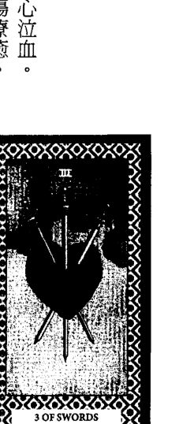

## 塔羅擂台 144

###### （三）舉例說明

例：夢境吉或凶？
解：要小心流言蜚語中傷，可能是接二連三發生，其導因為同一事所引發，宜早作心理準備。

例：某健康食品真能治我免疫系統之疾嗎？
解：別傻了，妳已被騙過好幾次，應記取教訓，若該健康食品真能治妳免疫系統之疾，目前免疫系統出問題的病人很多，為何醫院不採用，難道妳不懷疑嗎？

##### 寶劍四

對應元素：風。
數字：四。
正位牌義：暫停任務，休養充電。
逆位牌義：重新來過，東山再起。

###### （一）以牌面作聯想

戰士裝扮的男子雙手合掌，閉目平躺在類似修道院內的床上，床邊地上放一把寶劍，象徵祈求禱告，休息中但非全部放鬆，只是暫停目前事務，儲備精力，沉思下一步動向，等準備妥當後再起身完成未結束之任務。右邊牆上掛三把寶劍，劍尖向下，象徵暫時擱置未完成之任務，但時時提示未盡之責。左邊窗戶彩繪祈禱者合掌跪在聖母面前，象徵尋求呵護與建議。

### （二）以風元素及數字四作聯想

以逃避與抽離的方式作因應，進入閉關沉思，杜絕一切外來干擾，待準備就緒後再重新面對。

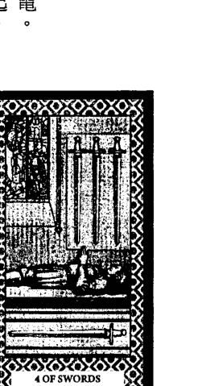

###### （三）舉例說明

例：如何解決婚姻危機？
解：目前尚無解決良策，宜先冷靜思索，待一切考量清楚後再處理，以免一失足成千古恨。

例：該離職或繼續做下去？
解：目前經濟不景氣，好工作難找，故建議先請一段長假休息，思索下一步能怎麼做後，再決定離職或繼續做下去。

##### 寶劍五

對應元素：風。
數字：五。
正位牌義：爭勝無益，贏得不光彩。
逆位牌義：收拾殘局，停止爭執。

###### （一）以牌面作聯想

男子露出得意表情，左手抱著兩把寶劍，右手拄著一把寶劍，象徵勝利得意，得理不饒人，但沒有實質好處，是損人不利己之行為。左邊之人背對勝利者悵然離去，地上劍尖仍朝勝利男子，象徵失敗者仍懷敵意，無法心服口服。中間之人用手搗著臉哭泣，地上劍尖與爭鬥場的方向相反，象徵對勝利者之表現傷心與失望，放棄爭鬥。

### （二）以風元素及數字五作聯想

意氣之爭，沒有實質意義，即使勝利亦無好處可得，為損人不利己之行為，只會讓彼此之傷害擴大。

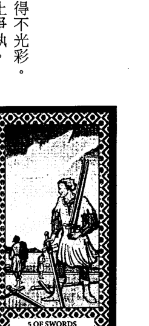

###### （三）舉例說明

例：該找某人理論嗎？
解：於情於理妳雖然較有理，但爭勝亦無實質好處，只會越描越黑，讓彼此間之傷害加大，故建議息事寧人，就此罷手吧！

例：我是否會被孤立？
解：大家對你的表現不滿，懷有敵意，所以被孤立的可能性很高，因此，你若想擺脫此困境，得先收斂行為，改善互動關係方能奏效。

##### 寶劍六

對應元素：風。
數字：六。
正位牌義：治傷療癒，擺脫困境。
逆位牌義：翻船泡湯，困境難逃。

###### （一）以牌面作聯想

小船前後有六把寶劍，象徵攜帶過去的哀傷記憶前行。寶劍插在船身上成ㄇ字形之柵欄，小船上乘客為婦女攜帶小孩低頭坐著，象徵保護照顧，沉思療傷。船夫手持黑色長篙插入波濤洶湧的湖水中，而另一面之湖水為平靜的，象徵受有力的貴人相助，逐漸脫離險境，平安光明就在前方不遠處。划船向前行，象徵有安排、有計劃，向預設目標前進。

### （二）以風元素及數字六作聯想

思緒重整，理性和諧，從混亂中整理出一套補修破壞部分的規則，走向平安光明之道。

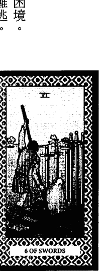

## 塔羅擂台 150

###### （三）舉例說明

例：倒楣運過了沒？
解：倒楣運快過了，過去的風風雨雨即將平息，能得貴人相助，逐漸脫離險境，故別再愁眉苦臉囉！

例：搭船吉凶？
解：目前海上雖然有風浪，但船之防護設備齊全，掌舵者訓練有術，技術高超，將會平安帶領我們至目的地。

##### 寶劍七

對應元素：風。
數字：七。
正位牌義：投機冒險，趁虛而入。
逆位牌義：鋌而走險，觸法被逮。

###### （一）以牌面作聯想

男子左手抱著三把寶劍，右手抱著兩把寶劍，象徵願望已成功。躡手躡腳逃離現場，象徵偷偷摸摸之偷竊行為，並非光明正大。頻頻回頭看後方遠處之軍營，象徵情境危急，擔心後面有無追兵。左手抱的其中一把寶劍幾乎快要無法掌握，而地上插著兩把無法帶走的寶劍，象徵自不量力，事實比想像中困難，無法全部達成。營帳上方見炊煙，左邊遠處三人聚會，象徵給人趁虛而入的機會。

### （二）以風元素及數字七作聯想

避開正規路線，喜歡走旁門左道，有投機冒險精神，膽大自信，但易自不量力，治標不治本。

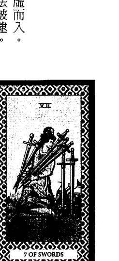

## 塔羅擂台 152

###### （三）舉例說明

例：欲租之屋安全嗎？
解：得小心小偷光顧，造成財物損失及人身危害，故建議請房東加裝監視器，作防盜措施，讓小偷無機可趁。

例：偷學師傅功夫能成功嗎？
解：你以為套師傅的話就能學而有成，省一筆拜師費用嗎？根本是痴心妄想，故還是建議照規矩拜師繳學費去學，所得之技巧應較扎實，不遺漏。

##### 寶劍八

對應元素：風。
數字：八。
正位牌義：束縛限制，盲目難行。
逆位牌義：突破困境，重獲自由。

###### （一）以牌面作聯想

女子孤獨站立而雙眼被布朦住，象徵看不見前行之路，感到無助。雙手被反綁，腳沒有被綁住，八把寶劍圍成ㄇ字形，有一個可往外走的出口，象徵只要自己肯跨出腳步，就可重獲自由，擺脫限制。女子雙腳踩在泥濘之地，象徵環境差，路難行。背景遠方有座矗立於峭壁的城堡，象徵束縛之源。

### （二）以風元素及數字八作聯想

劃地自限，顧忌太多，造成無路可走，窒礙難行，須知危機就是轉機，敢跨山就能解危。

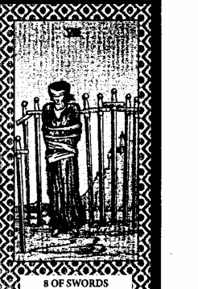

###### （三）舉例說明

例：我們能修成正果嗎？
解：妳們顧忌太多，老是在牛角尖中鑽不出來，造成阻礙，故若想修成正果，惟有跨越心中牢籠，就能迎刃而解。

例：某地適合投資嗎？
解：該地投資環境差，政府規定限制太多，不利發展，且投資案尚有很多盲點需釐清，故不可冒然投資。

##### 寶劍九

對應元素：風。
數字：九。
正位牌義：悲情憂鬱，傷心失落。
逆位牌義：走出悲情，擺脫惡夢。

###### （一）以牌面作聯想

午夜夢迴，一個女子從睡夢中驚醒，象徵壓力過大，惡夢連連，痛苦失眠。雙手掩面哭泣，象徵傷心難過，痛苦煎熬，心裡無法平復。所蓋之棉被有玫瑰花與占星符號的圖案，象徵被錯綜複雜之思緒所覆蓋。床側雕刻一人擊敗另一人的畫面，象徵信心被擊潰。黑色背景掛九把平行又同方向之寶劍，象徵一連串負面想法是累積而成的。

### （二）以風元素及數字九作聯想

壓力沉重，憂鬱恐懼，悔恨折磨，都是心魔所造而非實質威脅，只要轉念就能擺脫困境。

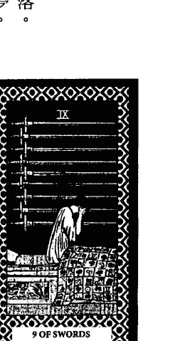

## 塔羅擂台 156

###### （三）舉例說明

例：問健康？
解：精神壓力重，腦神經衰弱，易有胸悶、頭痛、憂鬱、恐懼、失眠、作惡夢、…等症狀，宜放鬆、舒壓才能改善。

例：重操舊業好嗎？
解：重操舊業壓力大，除非你已做好心理準備，足以應付各種負面狀況，否則，還是另謀他就為佳。

##### 寶劍十

對應元素：風。
數字：十。
正位牌義：壓力崩潰，徹底毀滅。
逆位牌義：傷害降低，曙光已現。

###### （一）以牌面作聯想

男子背上插著分佈於十處的十把寶劍，象徵背後面臨多處極致的傷害，痛苦難過，非常慘烈。倒臥在地上死亡，象徵徹底被打敗，全部都已經結束。右手掌握捏著神明指法，象徵心中期望得到解救。湖水平靜無波，象徵一切復歸平靜。天空大片黑暗，而遠方山脈後見曙光已現，象徵黎明前的黑暗，事情沒有想像中那麼糟糕，死亡也是重生的開始。

### （二）以風元素及數字十作聯想

面臨壓力崩潰，萬念俱灰，要懂得接受業，對業感恩，放下一切，全盤歸零，一切重新開始。

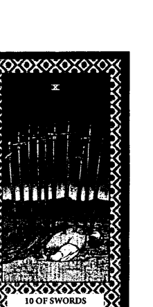

###### （三）舉例說明

例：借出之錢會被倒嗎？
解：借出之錢被倒的可能性高，最好別借出。然若錢已借出且要不回來者，不可強硬索討，以免惹來殺身之禍。

例：破產後能東山再起嗎？
解：破產後能東山再起的可能性不高，除非先前早作斷臂求生盤算，為自己預留退路，否則將面臨財破人亡，永無翻身之窘境。

##### 聖杯一

對應元素：水。
數字：一。
正位牌義：感情萌芽，靈性啟迪。
逆位牌義：感情失和，情感枯竭。

###### （一）以牌面作聯想

從雲中伸出一隻手捧著聖杯，象徵剛萌生的感情，靈性成長的開始，細心呵護著。杯中有五道水柱湧出，流入湖裡並激起少許漣漪，象徵由五官流露出源源不絕的情感，激起心靈漣漪。有25滴水珠在空中即將落下，象徵情感四溢。聖杯上方有白鴿銜著刻有十字的圓盤投入杯中，象徵純潔投入，沒有私心。睡蓮漂浮在湖面，有些已經開花，象徵情感生發。

### （二）以水元素及數字一作聯想

純潔投入，無私奉獻，有宗教家與慈善家的精神，發揮近乎神性的大愛，為全體之福祉而努力。

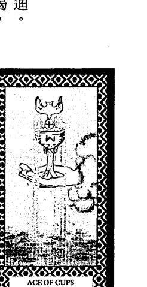

## 塔羅擂台 160

###### （三）舉例說明

例：某道場未來之發展？
解：此道場有大愛精神，無私奉獻，為眾生解惑釋疑，日後將引起共鳴，會有更多善心人士共襄盛舉。

例：解決某事有何高招可施？
解：要先動之以情，之後才說之以理，由此循序漸進切入，才能擄獲人心，圓滿解決問題。

##### 聖杯二

對應元素：水。
數字：二。
正位牌義：平等相對，交流和諧。
逆位牌義：熱情消退，交流隔閡。

###### （一）以牌面作聯想

一男一女彼此相對舉聖杯向對方致意，而兩聖杯之高度相同，象徵相互尊重，平等對待。兩聖杯間尚留間距，象徵兩人情誼尚未至親密地步。兩人頭上都戴著花環，象徵歡愉喜樂。男的踏出左腳，右手伸向女人，女的站立應對，象徵男方先釋放善意，女方作呼應。中間上方有紅色獅子頭展翅，象徵熱情溝通中。獅子頭下方有一根兩條蛇纏繞的杖，象徵纏綿交流。

### （二）以水元素及數字二作聯想

相互認同，交流和諧，氣氛歡愉，相敬如賓，關係良好，彼此都有好感，但非濃情蜜意。

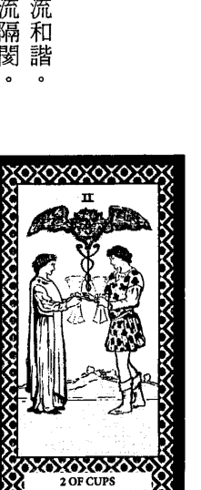

## 塔羅擂台 162

###### （三）舉例說明

例：與陌生網友聚會要注意什麼？
解：只要平等對待，相互尊重，沒有架勢，說話客氣婉轉，相處氣氛必然和諧，互動必然良好。

例：與某同業命理師一起擺攤好嗎？
解：沒問題啊！你們還可利用服務客戶外之時間相互交流，分享心得與論命技巧，彼此增長，真是一舉兩得。

##### 聖杯三

對應元素：水。
數字：三。
正位牌義：歡慶娛樂，共襄盛舉。
逆位牌義：過度享樂，樂極生悲。

###### （一）以牌面作聯想

三個女子彼此緊靠，圍成圓圈，表情祥和，象徵團結和諧，平等對待，氣氛祥和。三人都高舉聖杯，視線略朝上，舉聖杯之手相互交錯，象徵結盟交流，共襄盛舉，相互呼應。右後方女子左手提著一串葡萄，象徵已掌握部分成果。前面地上堆放豐盛的果實，象徵豐收，事情有好的結果。後面地上有結果實的藤蔓，象徵成果會擴大蔓延。

### （二）以水元素及數字三作聯想

交流和諧，共襄盛舉，享受當下生活樂趣，沒有阻礙，只要享樂不逾矩，就不會樂極生悲。

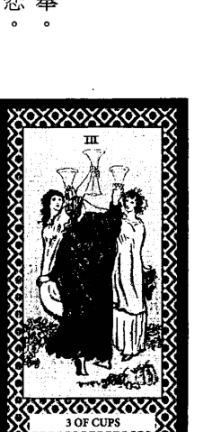

## 塔羅擂台 164

###### （三）舉例說明

例：此段時間有無第三者介入？
解：此段時間第三者介入的可能性高，宜妥善規劃安排，緊密相隨陪伴，讓第三者無機可趁。

例：如何經營才能讓社團更上層樓？
解：可與同類社團結盟交流，分享心得，炒熱社團氣氛，引來其他同好參與，才能讓社團更上層樓。

##### 聖杯四

對應元素：水。
數字：四。
正位牌義：生活無趣，不滿現狀。
逆位牌義：結束不滿，把握當下。

###### （一）以牌面作聯想

男子一人盤腿坐在樹下，象徵孤獨無聊，沒有採取行動。雙眼緊閉，雙手交合抱於胸前，象徵沉思，胸有成竹。前面擺三個聖杯，象徵已經擁有之物。左邊從雲中伸出一隻手握著聖杯，象徵有掌握新事物之夢想。男子所坐之地勢略高於前面三個聖杯，且有點距離，象徵對已擁有之物缺乏興趣，心裡無法滿足。男子背後之樹幹粗大，樹葉茂盛，象徵有崇高理想。

### （二）以水元素及數字四作聯想

生活平淡無趣，沉悶倦怠，熱情消退，無法進展，態度消極，缺乏行動力，想得多做得少。

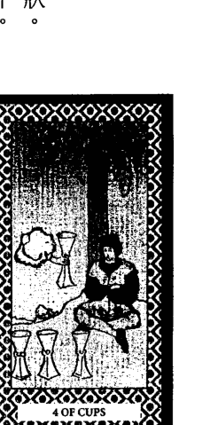

###### （三）舉例說明

例：無法成事之關鍵在哪？
解：想得多做得少，行動力不足是無法成事的關鍵，故若想改觀，總得積極推展，才有成事之可能。

例：丈夫有外遇嗎？
解：妳們的感情生活平淡無趣，若不想辦法改善，丈夫外遇的可能性將會增高，屆時將欲哭無淚。

##### 聖杯五

對應元素：水。
數字：五。
正位牌義：失意消極，憂傷鬱悶。
逆位牌義：錯誤計畫，雪上加霜。

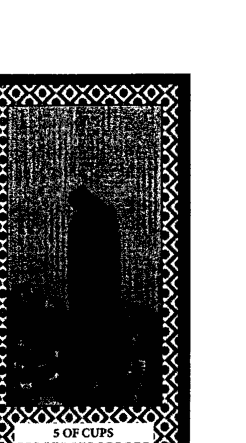

###### （一）以牌面作聯想

一個身穿黑色斗篷又面向河流的人，低頭望著左前方三個傾倒的聖杯，象徵為失去的哀悼，心情低落，憂傷鬱悶。聖杯中五顏六色的酒已流出，象徵覆水難收，失去的無法挽回。背後有兩個完好的聖杯直立，象徵背後尚有所需之物，並非一無所有，只待回頭發現即可得。遠處有一座橋可通往對岸之房子，象徵有通往庇護所之管道。

### （二）以水元素及數字五作聯想

悲觀消極，自怨自哀，憂傷鬱悶，自我否定，力不從心，惦記失去與欠缺，卻忽略現況擁有與可變通之管道。

###### （三）舉例說明

例：本日出門運氣？
解：本日出門運氣差，易逢遇令你心情低落，憂傷鬱悶之事，故凡事得小心處理與應對。

例：可得父親之遺產嗎？
解：辦理父親喪事後，應仍有遺產可得，惟遺產之數量不多，但對你不無小補，宜好好珍惜。

##### 聖杯六

對應元素：水。
數字：六。
正位牌義：懂得分享，感恩回饋。
逆位牌義：美景不在，關愛喪失。

###### （一）以牌面作聯想

六個聖杯中花朵盛開，綠意盎然，象徵溫馨與活力，為累積許久才有的成果。前面四個聖杯直立在地上，象徵過去建立或感受之深厚情誼。大女孩頭部後方有一個聖杯高立於有斜十字圖案的花臺上，象徵背後有情誼交流，回饋感恩之動機。大女孩聞著手上聖杯中的花香，並示意獻給小女孩，象徵純真無私，懂得分享。背景有城堡與警衛巡邏，象徵安穩呵護。

### （二）以水元素及數字六作聯想

真摯情誼，相互照顧，充滿善意與溫馨，懂得知足與感恩。感情深厚，身心安頓，得到呵護。

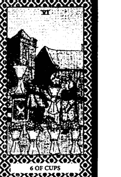

###### （三）舉例說明

例：拜會某老友會受歡迎嗎？
解：時光雖逝，情誼不變，見面後應會馬上找回以前相處的感覺，閒話家常，寒暄不斷，故受歡迎是必然的。

例：與前女友見面會舊情復燃嗎？
解：與前女友再次碰面是會舊情復燃的，故需衡量雙方是否仍有婚姻在，如果有，還是以不見面為好，以免成為破壞彼此家庭的導因。

##### 聖杯七

對應元素：水。
數字：七。
正位牌義：沉溺想像，不切實際。
逆位牌義：夢已清醒，付諸行動。

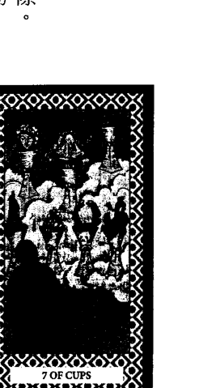

###### （一）以牌面作聯想

七個聖杯都在雲霧中，象徵遐思幻想很多，但不切實際。身穿黑衣者面對浮在雲霧中的七個聖杯，象徵所面對皆為虛幻；選項多，令人無所適從。聖杯之中高處城堡，象徵想擁有豪宅；珠寶，象徵想擁有財富；桂冠及聖杯上有骷髏頭圖案，象徵想擁有榮耀與流芳萬世；展翅之龍，象徵想擁有飛天之能；美女頭，象徵想擁有美貌；蓋布發光人，象徵想成為聖者；探出聖杯的蛇，象徵想擁有智慧。

### （二）以水元素及數字七作聯想

夢想不切實際，缺乏實際行動，想的永遠比做的多。停留在夢幻樓閣，整天只會畫大餅。

###### （三）舉例說明

例：某產品有無廣告不實？
解：該產品廣告不實的可能性高，宜多方求證，不可冒然購買，以免買後再後悔就來不及了。

例：我能學會做鐵窗、鐵門嗎？
解：做鐵窗、鐵門的技術並不難，你應能學會，惟此套技術重實務操作，非紙上談兵，故若想學成，光說不練是沒有用的。

第三章 牌義之特性演繹與舉例

##### 聖杯八

對應元素：水。
數字：八。
正位牌義：放下原有，尋求突破。
逆位牌義：處於現狀，不求突破。

###### （一）以牌面作聯想

前面下層有五個聖杯，上層有三個聖杯但留一處缺口，象徵累積攤有已上一層樓，但仍欠缺不足處。拄著拐杖者背對八個聖杯往遠處前行，象徵為了彌補不足，追求突破，放下原有，轉身離去。水中多暗礁，道路崎嶇，象徵尋覓之路難行，艱辛難免。黑夜晴空高掛弦月，弦月旁為圓形的人臉在閉目沉思，綜看似月圓，象徵在思索如何將缺憾修補得圓滿。

### （二）以水元素及數字八作聯想

不滿現狀，勇於尋覓所需。為了求突破，不眷戀現在所擁有之物，毅然踏上尋覓之旅。

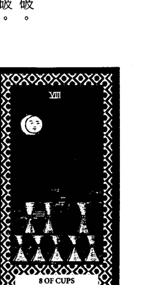

# 塔羅擂台

###### （三）舉例說明

例：男友會另結新歡嗎？
解：他有騎驢找馬心態，另結新歡的可能性高，故妳若想留住他，得改變現有的乏味生活，方能奏效。

例：邀吃以前最愛的麻辣鍋，他會去嗎？
解：應該吃膩了吧！該換換新口味才能吸引他，故若執意吃以前我們最愛的麻辣鍋，他去的可能性應不高。

第三章 牌義之特性演繹與舉例

##### 聖杯九

對應元素：水。
數字：九。
正位牌義：美夢成真，得意享受。
逆位牌義：美夢破壞，情緒低落。

###### （一）以牌面作聯想

男子安坐椅上，露出得意表情，象徵安穩富足，得意洋洋，滿足現狀，有點自負。雙手交合抱於胸前，象徵自己擁有未必肯分享，未必能敞開心胸與人溝通。背後高桌覆蓋藍色桌布，桌上擺九個聖杯，象徵高擺九個獎杯以炫耀輝煌成果，令人投以羨慕的眼光。九個聖杯排成彎抱之形，象徵成果環繞，美夢已成真。地板與背景皆為金黃色，象徵輝煌騰達。

### （二）以水元素及數字九作聯想

情感巔峰，美夢成真，心願已經達成，感到得意滿足，情緒非常美好，可安享其成果之榮耀。

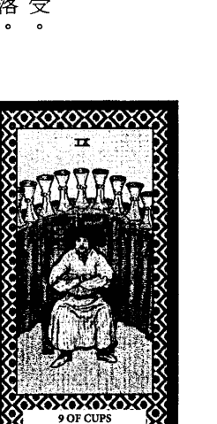

###### （三）舉例說明

例：我在業界能成名嗎？
解：你在業界能成名是肯定的，惟成名後有無收到同等的實質利益，則未可知，但至少可得榮譽，受表揚。

例：他一人得道，我們能跟著升天嗎？
解：他很自私，只會將好處攬在自己身上，炫耀他的輝煌成果，根本不會想拉拔我們，我們還是早點死心吧！

第三章 牌義之特性演繹與舉例

##### 聖杯十

對應元素：水。
數字：十。
正位牌義：和諧快樂，幸福美滿。
逆位牌義：破壞和諧，快樂喪失。

###### （一）以牌面作聯想

父親摟抱母親面向遠方，兩人各高舉一手作歡呼；兩個小孩牽手快樂跳舞，象徵歡欣愉悅，和樂融融，共享美好。遠方有緩緩的流水，青翠的樹木及茅舍豎立其間，象徵有安詳平靜的居家生活。天空中之彩虹上掛了十個聖杯，左右兩邊聖杯外有加強延伸之彩虹，象徵雨過天晴，幸福美滿，把愛放大並分享出去，獨樂樂不如眾樂樂。

### （二）以水元素及數字十作聯想

生活平靜，情感圓滿，衣食無缺，和諧融洽，已經滿足，別無所求，沒有新的創意與計畫。

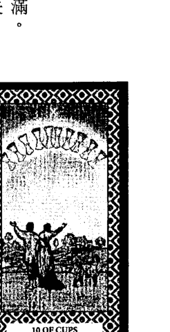

# 塔羅擂台

###### （三）舉例說明

例：事業版圖能再擴大嗎？
解：目前大環境已達飽和，故事業版圖再擴大的可能性不高，應以維繫舊客戶的情況居多。

例：我們婚後生活好嗎？
解：應為幸福美滿，人人稱羨的神仙伴侶，衣食無缺，相處融洽，和諧快樂，已達心滿意足，別無所求之境。

第三章 牌義之特性演繹與舉例

#### 第三節 小阿爾克納宮廷牌之特性演繹與舉例

> ◎ 宮廷牌義點睛
花色是本質，人物是展現模式，當我們了解四個花色和人物之象意及對應元素後，就能快速掌握牌義，是解讀宮廷牌特性之竅門。

- 一 四花色象意及對應元素、陰陽
  - 權杖：象徵權力，與掌權、決斷相關，對應火元素、屬陽性。
  - 錢幣：象徵財物，與財利、金錢相關，對應土元素、屬陰性。
  - 寶劍：象徵智慧，與思考、傷害相關，對應風元素、屬陽性。
  - 聖杯：象徵感情，與情誼、接納相關，對應水元素、屬陰性。

- 二 四人物象意及對應元素、陰陽
  - 國王：象徵領導、父親，與領導統御相關，對應土元素、屬陰性。
  - 皇后：象徵貴婦、母親，與慈愛照護相關，對應水元素，屬陰性。
  - 騎士：象徵戰士、青年，與衝鋒陷陣相關，對應火元素、屬陽性。
  - 侍者：象徵隨從、少年，與聽命學習相關，對應風元素、屬陽性。

# 塔羅擂台

##### 權杖國王

對應元素：火中之土。
正位牌義：強勢英明的領導者。
逆位牌義：霸道又專制的暴君。

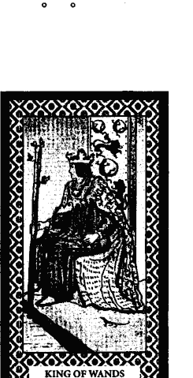

###### （一）以牌面作聯想

國王頭戴火形皇冠配紅布，象徵有帶頭衝思想的領導者。身穿紅袍及蜥蜴圖案的黃色披風，象徵熱情主動，英明穩重。身軀微向前傾，象徵彷彿要一躍而起，去找尋新目標。手握之權杖落在前一階上，象徵權勢向前一步，有開疆闢土之野心。地上有一隻蜥蜴抬頭，象徵蓄勢待發。背景屏風上有獅子奔跑圖案，象徵衝鋒陷陣的領袖；蜥蜴尾巴圍成圓形圖案，象徵圓滿。

### （二）以對應元素及權杖國王作聯想

火的本質以土的方式作表現，為有勇有謀的領導者，有長期抗戰能力，能朝目標奮戰不懈，直至成功為止。

第三章 牌義之特性演繹與舉例

###### （三）舉例說明

例：兒子常換工作的原因出在哪？
解：你兒子能力強，喜主導，不喜歡被綁手綁腳，故若所從事之工作無法給予主導權，讓他自由發揮，將待不久就會離職。

例：我能勝任該職務嗎？
解：一切狀況都在你掌握之中，勝任絕對沒問題，只是老闆能否充分授權，將是你能否久任此職之關鍵。

# 塔羅擂台

##### 權杖皇后

對應元素：火中之水。
正位牌義：柔中帶剛的女強人。
逆位牌義：兇悍潑辣的大女人。

###### （一）以牌面作聯想

皇后頭戴金黃后冠配綠葉，象徵思想開朗。身穿金黃袍及白色披風，象徵光明磊落。雙腿張開坐於刻兩隻獅子的寶座上，象徵個性大方開放，為喜歡主導的男人婆。表情鎮定，目視左邊遠處，象徵自信，眼光遠。右手握權杖，象徵掌權。左手拿面向前方的向日葵，象徵散發光明歡樂。前方有一隻黑貓，象徵直覺敏銳。背景屏風上兩獅歡欣合抱向日葵，而皇后肩後左右各有一支向日葵，象徵分享。

### （二）以對應元素與權杖皇后作聯想

火的本質以水的方式作表現，為柔中帶剛的女強人，獨立自主，熱情開朗，平易近人，喜主導分享，樂於助人。

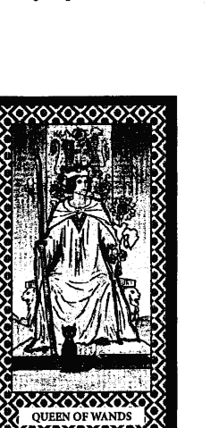

第三章 牌義之特性演繹與舉例

###### （三）舉例說明

例：新來的同事好相處嗎？
解：他個性大方，為人豪爽，熱情開朗，平易近人好相處。能力強，有雞婆性，凡是需要請益、幫忙的，找他準沒錯。

例：某飯店環境與服務品質好嗎？
解：該飯店之環境幽雅，裝潢頂級，宛如住進皇宮；他們服務品質佳，態度親切，會主動關心客戶所需，並以最快速度送達你要的東西，讓客戶有賓至如歸，下回還想再住的感覺。

# 塔羅擂台

##### 權杖騎士

對應元素：火中之火。
正位牌義：魄力十足的青年。
逆位牌義：莽撞的火爆浪子。

###### （一）以牌面作聯想

騎士頭戴盔帽配大紅飾巾，雙手戴紅手套，象徵火熱性格。表情鎮定，目視前方，右手拿權杖，左手拉韁繩，象徵自信，朝鎖定之目標前進。身穿盔甲，象徵武裝備戰；繡蜥蜴尾圍成不完整圓形圖案的金黃披風，象徵處事光明磊落，但不圓融。坐騎之紅鬃烈馬高舉前蹄，奮力往前奔跑，象徵行動迅速，勇往直前。背景為沙漠，有三座金字塔，象徵為了達到鎖定之目標，不畏困難。

### （二）以對應元素與騎士作聯想

火的本質以火的方式作表現，為魄力十足的青年，自我專制，積極衝動，缺乏耐心，鎖定目標就一頭熱，目標轉移就迅速冷卻。

第三章 牌義之特性演繹與舉例

###### （三）舉例說明

例：此趟旅遊需注意什麼？
解：在室外或海邊活動要記得擦防曬油，以免曬傷；行程看起來很緊湊，宜穿著合腳舒適鞋子，以免腳起水泡而受苦。

例：要如何做才能將某女追到手？
解：要有勤快的熱情攻勢，大膽示愛，每天都有新鮮花樣，如此持之以恆，將很快就可以把此女追到手囉！

# 塔羅擂台

##### 權杖侍者

對應元素：火中之風。
正位牌義：躍躍欲試的少年。
逆位牌義：頑劣自目的小咖。

###### （一）以牌面作聯想

侍者頭戴盔帽配朝上的小紅飾巾，象徵目前正熱忱興起；身穿繡蜥蜴頭尾圍成不完整圓形圖案的金黃衣，象徵經驗不足，處事不圓滿；紅色披風及褲子，象徵心動就會採取行動；金黃色圍巾，象徵充滿光明與希望。目光凝視權杖頂部，雙手緊握往上舉之權杖，象徵探索精進，提升所能。背景為沙漠，有三座金字塔，象徵不畏困難，跨越險阻。

### （二）以對應元素與侍者作聯想

火的本質以風的方式作表現，為躍躍欲試的少年，主動精進，喜歡探索，對未來滿懷希望，惟耐心不夠，經驗不足需加強。

第三章 牌義之特性演繹與舉例

###### （三）舉例說明

例：你猜我今天碰到什麼倒楣事嗎？
解：你可能是開車、騎車被開紅單，或遺失身分證、健保卡、識別證、會員卡、通行證、鑰匙之類。

例：我現在創業好嗎？
解：你目前經驗不足，尚需磨練，待磨練有成後，再考慮創業之事，應是比較妥當的作法。

# 塔羅擂台

##### 錢幣國王

對應元素：土中之土。
正位牌義：務實的領導。
逆位牌義：吝嗇的金主。

###### （一）以牌面作聯想

國王頭戴裹綠色稻穗的皇冠，表情怡然自得，左手拿著錢幣，右手拿著權杖，象徵收穫愉悅，掌握財富與支配權。紅色套頭圍巾及紅緞帶圍繞胸前和雙手，象徵言行會自我約束。身穿繪滿葡萄圖案的長袍，及花園中長滿葡萄和花草植物，象徵多產與豐收。寶座上有牛頭圖案，象徵有刻苦耐勞精神。左腳踩著牛頭形狀的石頭，象徵一步一腳印。背景城堡、遠山，象徵安全穩固。

### （二）以對應元素與國王作聯想

土的本質以土的方式作表現，為務實的領導人，一步一腳印，穩定固執，盡忠職守，耐力絕佳，惟不好溝通，生活無趣需改善。

第三章 牌義之特性演繹與舉例

###### （三）舉例說明

例：某男之家勢背景好嗎？
解：此男可能是土財主第二代，家勢背景非常好，富霸一方，只要稍微打聽一下，應可即知我所言不虛。

例：他值得託付終身嗎？
解：他經濟穩固，生活無虞，為人務實可靠，很有責任感，值得託付終身，但生活無趣，不好溝通為美中不足之處。

##### 錢幣皇后

對應元素：土中之水。
正位牌義：外柔內斂的貴婦。
逆位牌義：奢侈的拜金女郎。

###### （一）以牌面作聯想

皇后頭戴金黃后冠連結可覆全身的披風，象徵很會保護自己。后冠上有兩支朝上的小紅頭飾，身穿外搭紅袍，象徵熱心。低頭注視雙手捧著之錢幣，象徵重視現實與財務。寶座上有山羊圖案，象徵不畏辛苦跋涉。寶座置於花草繁盛及有青山綠水的原野，象徵溫柔富足，平易近人。右邊有隻野兔，象徵溫馴多產。頭頂上方有玫瑰花圍成的拱門，象徵浪漫。

### （二）以對應元素與皇后作聯想

土的本質以水的方式作表現，為外柔內斂的貴婦，溫柔務實，賢慧能幹，重視現實與財務，有包容力，能安定人心。

第三章 牌義之特性演繹與舉例

###### （三）舉例說明

例：送何物最合她意？
解：你若經濟狀況許可，送鑽戒、金飾之類應最合她意，然若經濟狀況不許可，送衣服、化妝品之類應亦合她意。

例：娶她對我事業有助嗎？
解：她是很好的賢內助，能將家裡安頓妥當，讓你無後顧之憂，娶她當然對你的事業有助。

# 塔羅擂台

##### 錢幣騎士

對應元素：土中之火。
正位牌義：前景看好的青年。
逆位牌義：遊蕩的紈子弟。

###### （一）以牌面作聯想

騎士身穿盔甲，外搭紅色披風，象徵有衝勁，隨時準備應戰。頭盔和馬頭上都有綠葉裝飾，象徵有蓬勃發展之潛力。右手戴紅手套捧著錢幣，象徵掌握可開拓運用之資源。目視遠方，象徵理想遠大。坐騎之黑馬停止不動，象徵作風嚴謹，行事謹慎，沒有縝密計畫，做萬全準備是不會採取行動的。遠方土地條理分明，象徵處事有條不紊。

### （二）以對應元素與騎士作聯想

土的本質以火的方式作表現，為前景看好的青年，奮發上進，耐性堅定，使命必達，發展潛力無限，惟宜懂得變通才能更順利。

第三章 牌義之特性演繹與舉例

###### （三）舉例說明

例：某冷氣行做事實在嗎？
解：此冷氣行做事實在，無庸置疑，其經銷產品開價實在，不會漫天喊價；其維修服務快速，冷氣保養不馬虎。

例：派某人擔任駐外業務合適嗎？
解：此人做事務實，不會偷懶，使命必達，派他擔任駐外業務當然合適，但是得加強他變通之道，對業務推展方有助。

# 塔羅擂台

##### 錢幣侍者

對應元素：土中之風。
正位牌義：務實學習的實習生。
逆位牌義：不切實際的初學者。

###### （一）以牌面作聯想

侍者頭纏紅布而末段垂至腰部，象徵動能傳遍身心；身穿綠衣裙及繫土色腰帶和戴土色袖套，象徵會自我約束，認真學習，務實實行；站立在長滿花朵的草地上，象徵順應自然。抬頭注視與細觀思索錢幣，象徵重視實質收益，思索如何拓展才能達成所願。雙手高舉接近手中之錢幣，象徵想掌握更高的實質成就。遠處有六棵繁茂的大樹及一座尖山，象徵希望日後能有成就。

### （二）以對應元素與侍者作聯想

土的本質以風的方式作表現，為務實學習的實習生，按部就班學習，累積實力與經驗，具務實理性分析特質。

第三章 牌義之特性演繹與舉例

###### （三）舉例說明

例：他物理老是教不會，該怎麼辦？
解：他應是基礎不穩，又不懂得變通，因此，教起來很吃力，故若想把他的物理教好，只能從基礎教起，一步步帶入才有辦法。

例：現在適合跟老闆提加薪嗎？
解：目前你提加薪的客觀條件尚嫌不足，老闆同意加薪的可能性不高，故宜多加強自身實力，待實力足夠後再提出為佳。

# 塔羅擂台

##### 寶劍國王

對應元素：風中之土。
正位牌義：專業研究的權威。
逆位牌義：剛愎自用的領導。

###### （一）以牌面作聯想

國王表情嚴肅，象徵不苟言笑。頭戴圈點圖案皇冠，象徵學識豐富的權威；身穿藍袍，象徵心思清明；紅布包覆頭和披紫色披風，象徵有智慧的採取行動。左手指帶一只戒指，象徵行事會自我約束。右手持劍尖偏右的劍，象徵具有實際執行力。椅背有灰色蝴蝶配牛角圖案，象徵以務實方式作展現。背景藍色天空上有兩隻鳥飛翔，象徵能看清一切利弊。

### （二）以對應元素與國王作聯想

風的本質以土的方式作表現，為專業研究的領導，學識豐富，理念堅持，不留情面，能一語點醒夢中人。

第三章 牌義之特性演繹與舉例

###### （三）舉例說明

例：某律師實力好嗎？
解：他學識豐富，心思清明，能一針見血，點出盲點，是很高明的律師，其實力佳是無庸置疑的。

例：如何做才能學好塔羅？
解：想學好塔羅實在不容易，除了具備應有的知識外，還得社會經驗豐富，懂得與人性作結合，解說方能貼切。

##### 寶劍皇后

對應元素：風中之水。
正位牌義：柔性有智慧的女強人。
逆位牌義：偏激情緒化的女魔頭。

###### （一）以牌面作聯想

皇后戴著蝴蝶圖案的后冠，象徵思想多變。身穿灰袍和藍底繡雲朵之披風，象徵心如浮雲，隨時更易。寶座上之天使圖案，象徵懷有愛心；兩重蝴蝶圖案，象徵多變演化。右手握著中正不偏而劍尖朝上的寶劍，象徵中立執行，公正無私，不留情面。左手伸出姿勢，象徵接受或拒絕悉聽尊便。頭頂之藍色天空上有一隻鳥飛翔，象徵一意孤行。

### （二）以對應元素與皇后作聯想

風的本質以水的方式作表現，為柔性有智慧的女強人，看似情理兼顧，但想法易受情緒影響而左右為難。

## 199 第三章 牌義之特性演繹與舉例

###### （三）舉例說明

例：此女好追嗎？
解：她是很冷漠的冰山美人，說話犀利，實在不好追，如果你真的想要追，最好先有被拒絕的心理準備，才不會覺得受傷。

例：這段戀情該如何處理？
解：如這段戀情想再經營，宜先冷靜，避免爭吵；如這段戀情不想再經營，宜當機立斷，斬斷情絲。

## 塔羅擂台 200

##### 寶劍騎士

對應元素：風中之火。
正位牌義：想到就衝的青年。
逆位牌義：可怕的極端份子。

###### （一）以牌面作聯想
騎士頭戴盔帽配飛揚的紅飾巾，象徵思想激進。身穿盔甲，外搭飛揚的紅色披風，象徵心動就馬上行動。左手戴紅手套拉繮繩，象徵急速趕馬前往目的地。右手沒戴手套握劍，象徵思慮不周就行動。騎士口喊「衝、殺」，右手高舉寶劍向敵，象徵豪氣干雲，無所畏懼。白馬繫馬和蝴蝶圖案之繮繩在奔馳，雲往後飄，樹往後斜，象徵極速前進，邊衝邊想。天空諸鳥隊形散亂，象徵雜亂無章。

### （二）以對應元素與騎士作聯想
風的本質以火的方式作表現，為想到就衝的年輕人，莽撞好強，自恃甚高，邊衝邊想，缺乏深思熟慮。

## 201 第三章 牌義之特性演繹與舉例

###### （三）舉例說明

例：此次颱風狀況？
解：此次颱風為風大雨小，行進速度很快，停留在陸地的時間很短，宜早做防早做防颱措施，綁好招牌，以減少財損。

例：他常出意外之原因在哪？
解：他個性急躁，開車、騎車速度太快，甚至會來個即興飆車、耍特技，想不出意外都難。

## 塔羅擂台 202

##### 寶劍侍者

對應元素：風中之風。
正位牌義：學識技能的見習生。
逆位牌義：學藝不精的臭屁囝。

###### （一）以牌面作聯想

侍者的長髮往後朝上飛揚，象徵智識提升，延伸思索，追根究底。神情緊張，目視周遭，象徵機警，窺探四周情勢。雙手握寶劍的姿勢，象徵隨時準備應戰，絲毫不敢放鬆。站在崎嶇不平的山巔，山風呼嘯，烏雲密布，象徵環境不佳，隨時都得保持警覺，才不會發生意外。天空上有十隻鳥在盤旋飛翔，象徵窺探情資，傳遞訊息。

### （二）以對應元素與侍者作聯想

風的本質以風的方式作表現，為學識技能的見習生，冷靜理性，邏輯概念佳，推理能力強，但不懂人情世故。

## 203 第三章 牌義之特性演繹與舉例

###### （三）舉例說明

例：我眼皮已跳了三個月，是吉或凶？
解：董耶！你要小心有心人士在收集你公司資料或有電話監聽，將來會對你不利，要小心囉！

例：我兒子適合讀什麼科系？
解：他適合讀資訊、電子、……等與新科技相關之科系，或讀英文、日文、……等與語言相關之科系。

##### 聖杯國王

對應元素：水中之土。
正位牌義：溫和又護下的好主管。
逆位牌義：臨老入花叢的老男人。

###### （一）以牌面作聯想
國王表情祥和，象徵平易近人。目視前方，左手拿權杖，右手拿聖杯，兩物之高度相同，象徵權力與感情兼顧。胸前掛魚形項鍊，象徵想像力豐富。右腳往水方向伸展但未觸及，象徵以感情為出發點，但會拿捏好分寸。寶座四周環繞海水，象徵人情包袱重。左後方有一隻跳躍的海豚，象徵溫和，善解人意。右後方有一艘帆船，象徵承載保護。

### （二）以對應元素與國王作聯想
水的本質以土的方式作表現，為溫和又護下的好主管，態度溫和，喜歡照顧人，能給人安全感，但缺乏改革魄力。

## 205 第三章 牌義之特性演繹與舉例

###### （三）舉例說明

例：如何做才能讓我產品參展？
解：你可利用人情攻勢，透過相關之高層人事引介。與負責評鑑之人接洽，你的產品才能參展。

例：里長伯會幫忙嗎？
解：里長伯平時熱心公益，只要在他能力所及的範圍內，肯定會幫忙，你可前往他的服務處求助。

## 塔羅擂台 206

##### 聖杯皇后

對應元素：水中之水。
正位牌義：順應人意的溫柔女性。
逆位牌義：一廂情願的濫情女性。

###### （一）以牌面作聯想

皇后頭戴雙幅外八小圓圍繞中心大圓圖案的后冠，象徵順應人意，過於痴迷。身穿白袍和藍白相間披風，象徵純潔溫和。目光直視雙手所捧之聖杯，象徵一廂情願。聖杯形如教堂，其頂端有十字架，兩臂各有一位天使圖案，象徵虔誠，有愛心。腳踩五彩繽紛的鵝卵石，象徵以令人圓滿為出發點。寶座有小美人抓魚和兩小美人共抱大蚌殼圖案，象徵有夢幻特質。遠處有屏障，近處有水，象徵感情維護。

### （二）以對應元素與皇后作聯想

水的本質以水的方式作表現，為順應人意的溫柔女性，真誠親切，溫柔體貼，任勞任怨，但易趨於痴迷而無法自拔。

## 207 第三章 牌義之特性演繹與舉例

###### （三）舉例說明

例：我與哪尊神明較有緣？
解：如你是信天主教、基督教者，可能與聖母瑪利亞較有緣；如你是信佛教者，可能與觀世音菩薩較有緣；如你是信道教者，可能與天上聖母較有緣。

例：某風景區好玩嗎？
解：該風景區真的很好玩，進去後會讓人留連忘返，捨不得離開，只可惜我假期有限，無法長住。

## 塔羅擂台 208

##### 聖杯騎士

對應元素：水中之火。
正位牌義：敢表達情意的年青人。
逆位牌義：四處放電的花花公子。

###### （一）以牌面作聯想

騎士頭戴羽翼盔帽，象徵輕盈飄逸，如天使般的溫柔；盔帽之罩已掀開，象徵勇於面對與表達。身穿盔甲騎在馬上，象徵隨時準備出發；盔甲外搭水紋、紅魚圖案衣服，象徵勇於表達感情。右手握聖杯，左手拉藍底水紋圖案的韁繩，象徵操控感情之行家。鞋後跟有羽翼圖案，象徵行動飛快。騎白馬在蜿蜒的河邊踱步，象徵思索是否要涉入或就此打住。對岸高山綿延，象徵涉入後要面對的阻礙。

### （二）以對應元素與騎士作聯想

水的本質以火的方式作表現，為敢表達情意的年青人，心思細膩，浪漫多情，溫柔體貼，人際關係佳。

## 209 第三章 牌義之特性演繹與舉例

###### （三）舉例說明

例：他會用什麼方式求婚？
解：他會用出其不意的方式求婚，也許會在眾目睽睽的狀況下，當眾下跪，獻上鮮花，遞上鑽戒；或……都有可能。

例：男友專情於我嗎？
解：這恐怕比較困難，他也許會騎驢找馬哦！故最好多留意他的行蹤，及跟他出門逛街時，注意眼神有無亂放電。

## 塔羅擂台 210

##### 聖杯侍者

對應元素：水中之風。
正位牌義：感情隨性的懵懂少年。
逆位牌義：初嚐感情苦果的少年。

###### （一）以牌面作聯想

侍者頭纏藍布而末段垂至右肩，象徵感情豐富與欲承擔。身穿藍底有花朵圖案衣服，內穿紅色衣裳，象徵心花怒放。右手握住平舉直立的聖杯，聖杯中有條魚欲躍出，象徵感覺新鮮，好奇探索；左手插腰，象徵期待面對。目視聖杯，與探頭之魚對望，象徵受新鮮事物所吸引。站在船之甲板上，背景有海浪起伏，象徵感情起伏，欠缺穩定。

### （二）以對應元素與侍者作聯想

水的本質以風的方式作表現，為感情隨性的懵懂少年，嚮往戀愛，隨性幼稚，不分青紅皂白，易引起誤會。

## 211 第三章 牌義之特性演繹與舉例

###### （三）舉例說明

例：今晚與男友約會要注意什麼？
解：如為認識不久者，他可能會牽妳的手，搭妳的肩或抱妳一下；如已交往一段時間者，他可能會親吻妳，或與妳發生性關係，小心囉！

例：我懷孕了嗎？
解：妳懷孕的可能性真的很高耶！宜速至婦產科作詳細檢查，以確定是否懷孕，及作後續之盤算。

### 第四章 實用牌陣與舉例、解牌技巧及應期

#### 第一節 實用牌陣與舉例

##### 一 時間之流牌陣

###### （一）適用時機
「時間之流」是一個萬用牌陣，不論占問任何事，只要你想瞭解整件事之前因後果者，都適合使用此牌陣。

###### （二）位置含意
過去位：顯示事之起因與影響因素。
現在位：顯示占問事目前之現況。
未來位：顯示整件事未來的發展趨勢與走向。

###### （三）抽牌規則
心中先默念欲問之主題，洗牌、切牌、攤開後，請求占者抽出三張牌，第一張牌置於塔羅師之左前方（過去位），第二張牌置於塔羅師之正前方（現在位），第三張牌置於塔羅師之右前方（未來位）。

三張牌置於塔羅師之右前方（未來位）。

###### （四）舉例說明

例：我與男友之未來發展？
解：依序抽到權杖皇后、女教皇、寶劍四逆位。權杖皇后在過去位，表示過去有強人之作風，凡事喜主導，是不利感情發展之前因；女教皇在現在位，表示目前缺乏戀愛情趣，不利親密關係發展；寶劍四逆位在未來位，表示未來跟男友感情之發展是不利的，故可綜斷妳雖能力強，氣質高雅，但若不改公主病的個性，妳跟男友之未來發展將面臨困境。

例：問工作之過去、現在、未來？
解：依序抽到權杖十逆位、惡魔逆位、戀人逆位。權杖十逆位在過去位，表示工作實力堅強，但及至需發揮時卻無法完全展現；惡魔逆位在現在位，表示目前工作面臨阻礙，心裏飽受掙扎與煎熬；戀人逆位在未來位，表示對此份工作有眷戀，然若欲以此工作為糊口之職似有困難，故可綜斷為自信之才華發揮未臻完美，雖喜歡這份工作但面臨阻礙，事與願違，所以去留間存困惑。

## 塔羅擂台 214

##### 二 關係牌陣簡易版

###### （一）適用時機
此牌陣適用於當事人想詢問自己與剛認識之人、新環境、新事物是否合適時，即可運用。

###### （二）位置含意
當事人位：顯示自己之狀況、心態。
對方：顯示對方之狀況、心態。

###### （三）抽牌規則
心中先默念欲問之主題，洗牌、切牌、攤開後，請求占者抽出兩張牌，第一張牌置於塔羅師之左前方（當事人位），第二張牌置於塔羅師之右前方（對方）。

###### （四）舉例說明
例：我適合學塔羅嗎？
解：依序抽到星星、寶劍國王。星星在當事人位，表示自己有水瓶座、風元素之特質，記憶力強，理解力佳，善於分析推理；寶劍國王在對方，表示塔羅是需要很有智慧才學得來的學問，故可綜斷你不但適合學塔羅，將來還可能提出很多過往所無之創見。

例：我辦公室適合擺魚缸嗎？
解：依序抽到錢幣侍者、寶劍十。錢幣侍者在當事人位，表示你可能是想擺魚缸旺財吧；寶劍十在對方位，表示不但無利可圖，還對你有危害，故可綜斷你的辦公室根本不適合擺魚缸。

例：欲買之骷髏法寶能助我發財嗎？
解：依序抽到錢幣八、教皇。錢幣八在當事人位，表示自己有增加財富之渴望；教皇在對方位，表示骷髏法寶是經法力高強之大師加持過，具有金牛座、土元素之特質，故可綜斷骷髏法寶對助你發財是有幫助的。

例：宅左前方之路燈是否對我不利？
解：依序抽到錢幣八、錢幣四。錢幣八在當事人位，表示你可能是怕出意外而損財吧；錢幣四表示資產保固良好，故可綜斷宅左前方之路燈對你無不利影響，不用擔心。

## 塔羅擂台 216

##### 三 關係牌陣

###### （一）適用時機
此牌陣適用於當事人想詢問自己與特定對象之關係狀況與發展，不論是與人、公司、寵物之緣份皆可用。

###### （二）位置含意
當事人位：顯示自己之狀況、心態。
對方：顯示對方之狀況、心態。
現在位：顯示目前兩者之相處狀況。
未來位：顯示之後兩者之相處狀況。

###### （三）抽牌規則
心中先默念欲問之主題，洗牌、切牌、攤開後，請求占者抽出四張牌，第一張牌置於塔羅師之左前方（當事人位），第二張牌置於塔羅師之右前方（對方位），第三張牌置於當事人位與對方位中間之略前方（現在位），第四張牌置於現在位之前方（未來位）。

###### （四）舉例說明

例：我與男友能複合嗎？
解：依序抽到月亮逆位、惡魔逆位、權杖四、女教皇逆位。月亮逆位在當事人位，表示我想重新開始，逐漸加溫；惡魔逆位在對方，表示對方覺得是一場惡夢與誘惑的陷阱，非真正長久的心靈伴侶，決定抽離，不再執迷；權杖四在現在位，表示目前狀況趨於穩定，不再惡化，但複合之事沒有進度；女教皇逆位在未來位，表示冷漠相對，無意願又故做矜持，故可綜斷如無法化解對方疑慮，複合之事將遙遙無期。

例：主管是否會同意我職務調動？
解：依序抽到權杖十、權杖五逆位、倒吊人、戰車逆位。權杖十在當事人位，表示我覺得事務繁多，壓力極大，做得很疲累，故想調職；權杖五逆位在對方，表示主管認為你負責的工作還有很多爛攤子要收，怎可就此離開；倒吊人在現在位，表示目前此事只能等待，職務調動是不可能的；戰車逆位在未來位，表示此事若操之過急，終將面臨破局收場，故可綜斷目前不適合提職務調動，待你負責的工作上軌道後再說吧！

## 塔羅擂台 218

##### 四 聖三角牌陣

###### （一）適用時機
「聖三角」是一個萬用牌陣，不論占問任何事，只想了解問題所在及找出因應對策，皆可運用此牌陣。

###### （二）位置含意
現在位：顯示事情現況及當事人之處境。
問題位：顯示問題癥結之所在。
建議位：為建議當事人該以何種方式處理。

###### （三）抽牌規則
心中先默念欲問之主題，洗牌、切牌、攤開後，請求占者抽出三張牌，第一張牌置於塔羅師之正前方（現在位），第二張牌置於現在位之左前方（問題位），第三張牌置於現在位之右前方（建議位）。

###### （四）舉例說明

例：某人會返還借款嗎？
解：依序抽到寶劍國王逆位、寶劍七逆位、魔術師。寶劍國王逆位在現在位，表示當事人雖聰明機智，善於分析，但仍想不出好對策；寶劍七逆位在問題位，表示問題癥結出現在不聽勸告，所以才會栽跟斗，面臨錢借出收不回來的困境；魔術師在建議位，表示要運用智慧，要點花招，對方才有還錢之可能，故可綜斷若要對方還錢，不要一點花招是不行的。

例：某友為何變得很冷漠？
解：依序抽到錢幣七、聖杯三逆位、聖杯九逆位。錢幣七在現在位，表示沉溺於自身事務，忽略關心與互動；聖杯三逆位在問題位，表示問題癥結出現在原有和諧遭到破壞而影響情誼；聖杯九逆位在建議位，表示若沒有熟絡聯絡將會失去這份友誼，故可綜斷若想恢復往日情誼，則需彼此多聯絡、多關心及將破壞和諧之始因消除，才能得到改善。

## 塔羅擂台 220

##### 五 二擇一牌陣

###### （一）適用時機
如當事人有兩個項目需作出選擇，又要求在同一個牌陣中作解讀時，即適用此牌陣。註：多項選擇亦可同法套用。

###### （二）位置含意
心態位：顯示當事人心態、想法。
A選項現在位：顯示A選項之現況。
B選項現在位：顯示B選項之現況。
A選項未來位：顯示A選項未來之發展。
B選項未來位：顯示B選項未來之發展。

###### （三）抽牌規則
心中先默念欲問之主題，洗牌、切牌、攤開後，請求占者抽出五張牌，第一張牌置於塔羅師之正前方（心態位），第二張牌置於心態位之左前方（A選項現況位），第三張牌置於心態位之右前方（B選項現況位），第四張牌置於A選項現況位之左前方（A選項未來位），第五張牌置於B選項現況位之右前方（B選項未來位）。

###### （四）舉例說明

例：自創業或回原公司當主管好？
解：依序抽到愚人逆位、權杖十逆位、錢幣三逆位、節制逆位、皇后。愚人逆位在心態位，表示拿不定主意，不知何去何從；權杖十逆位在自創業現在位，表示團隊意見分歧，配合度不佳，事務難以推展；節制逆位在自創業未來位，表示未來會遭遇阻礙，不利業務推展；皇后在上班未來位，表示未來能輕鬆、愉快，過悠閒、享受的生活，故可綜斷還是選擇回原公司當主管較好。

例：留在台南或去高雄發展何者為佳？
解：依序抽到寶劍五、月亮逆位、惡魔逆位、節制逆位、皇帝逆位。寶劍五在心態位，表示面臨挑戰，情緒緊繃，想尋求有利發展地；月亮逆位在台南現在位，表示略見曙光；惡魔逆位在高雄現在位，表示看不到有利條件；節制逆位在台南未來位，表示未來會逢遇阻礙；惡魔逆位在高雄未來位，表示未來會逢遇阻礙，故可綜斷留在台南或去高雄發展兩者皆不佳，還是另擇他處吧！

##### 六 大十字牌陣

###### （一）適用時機
此牌陣為「時間之流」牌陣的加強版，如果想瞭解整件事之前因後果，又想知道當事人的心態、想法及找出因應對策時，即可運用此牌陣。

###### （二）位置含意
過去位：顯示事之起因與影響因素。
現在位：顯示占問事目前之現況。
未來位：顯示整件事未來的發展趨勢。
心態位：顯示當事人之心態、想法。
建議位：為建議當事人該以何種方式處理。

###### （三）抽牌規則
心中先默念欲問之主題，洗牌、切牌、攤開後，請求占者抽出五張牌，第一張牌置於十字牌陣之左方（過去位），第二張牌置於十字牌陣之右方（現在位），第三張牌置於十字牌陣之上方（未來位），第四張牌置於十字牌陣之下方（心態位），第五張牌置於十字牌陣之中央（建議位）。

###### （四）舉例說明

例：是否會被裁員？
解：依序抽到力量逆位、寶劍侍者、皇帝、月亮、寶劍九逆位。力量逆位在過去位，表示工作上之表現欠佳；寶劍侍者在現在位，表示在工作上扮演非重要角色；皇帝在未來位，表示理想崇高；月亮在心態位，表示有危機意識；寶劍九逆位在建議位，表示宜當機立斷，揮別陰霾，故可綜斷離職是確定的，與其說是被裁員，不如說是自己要另謀高就而離職。

例：是否會離婚？
解：依序抽到聖杯六逆位、聖杯四、錢幣三逆位、權杖二、聖杯國王。聖杯六逆位在過去位，表示往日情懷不在；聖杯四在現在位，表示感情平淡，相處無趣，寂寞難耐，彼此有外尋意圖；錢幣三逆位在未來位，表示實務面意見不合，不滿意，產生怨懟；權杖二在心態位，表示已移情別戀；聖杯國王在建議位，表示宜請說得上話的長輩主持，用溫和的方式處理，故可綜斷離婚的可能性高，但宜用溫和的方式處理為佳。

#### 第二節 解牌技巧

一 牌陣內容是否與個案有聯結？

牌陣內容與個案有聯結時，表示個案容易有眉目，如占問能借到錢嗎？若見錢幣多現，則表示借錢事容易有眉目；如占問能升遷嗎？若見權杖，則表示升遷事容易有眉目；如……，餘類推，不贅述。

牌陣內容與個案沒有聯結時，表示個案不易有著落，如占問兩人能復合嗎？若不見聖杯，則表示復合不易；如占問鑰匙遺失能找回嗎？若不見錢幣，則表示不易找回；如……，餘類推，不贅述。

二 看大小牌之數量比例

在正常狀況下，約大牌 2 張，小牌 5 張是合理的出現比例，因為 78 張牌中 22 張是大牌，56 張是小牌。當大牌出現率超過正常範圍時，表示這個問題影響很大，當事人能掌控的範圍不大，以致不上力居多；當小牌出現率超過正常範圍時，表示這個問題影響較小，大多在當事人能掌控的範圍，只要當事人願意改變，就能扭轉局勢。

註：大牌過多是思考重於行動的暗示，故個案未必真的付諸行動；小牌過多是行動重於思考的暗示，故個案往往缺乏深思熟慮。

三 看正逆位牌之數量比例

正位牌代表能量運作正常，故正位牌比例高者，表示此事會在正常或自然的狀況下發展。逆位牌代表能量運作不正常，故逆位牌比例高者，表示此事會在不正常或不自然的狀況下發展，往往是事態艱難，變數很大的暗示。

四 留意同號牌重複出現

同號牌具有共通的特性，而重複出現即是此特性被凸顯。

- 數字一多現：表示此事還在剛開始階段。
- 數字二多現：表示此事有兩股力量在影響。
- 數字三多現：表示此事需三方制衡才有利。
- 數字四多現：表示此事之事態穩定。
- 數字五多現：表示此事發生衝突或失落難免。
- 數字六多現：表示此事能順利、成功。
- 數字七多現：表示此事仍需要突破困境。
- 數字八多現：表示此事得重新評估再出發。
- 數字九多現：表示此事發展已接近尾聲。
- 數字十多現：表示此事發展已接近尾聲。

五 留意牌義相似或相反牌

如在牌陣中出現兩張以上牌義相似之牌時，表示這些牌很可能是問題癥結所在，如占此回戀愛能成功嗎？牌陣中出現戀人、聖杯二（又稱小戀人牌），表示戀愛成功的機會高；如……，餘類推，不贅述。

在牌陣中出現兩張牌義相反之牌時，表示很可能是問題的矛盾點，如占此回創業能成功嗎？牌陣中出現太陽、月亮，表示想法和作法常對立，不利事業經營，故事業成功的機率低；如……，餘類推，不贅述。

六 留意名稱相似牌重複出現

名稱相似之牌具有共通的特性，而重複出現即是此特性被凸顯，故很可能是問題癥結之所在。如某男問感情不順其原因出在哪？依序抽到皇帝、權杖國王、寶劍一，因皇帝、權杖國王都有掌權、喜發號司令之特質，故其問題很可能是你的大男人主義作風讓女方無法接受，故易在剛開始談戀愛不久就夭折；如……，餘類推，不贅述。

七 由元素多現看個案運作模式

同一元素多現是運作模式的關鍵，是與個案合適與否的參考點。

- 火元素多現：表示個案熱情積極，行動快速，衝動火爆。
- 土元素多現：表示個案保守穩重，務實運作，缺乏情趣。
- 風元素多現：表示個案思緒多變，討厭呆板，適合企劃。
- 水元素多現：表示個案感情用事，缺乏理性，不利事業。

八 留意大牌、逆位牌現於何處？

大牌是影響較大的因素，如出現在環境的位置，則表示環境因素是關鍵；如出現在代表自己的位置，則表示自己的想法是關鍵；如……，餘類推，不贅述。

逆位牌是運作不當之處，如出現在環境的位置，則表示不懂因時制宜之道；如出現在代表自己的位置，則表示自己的想法、作法有違常理或操作不當；如……，餘類推，不贅述。

九 留意獨缺之元素

獨缺之元素可能是事情無法成事的癥結所在，宜特別留意。註：運用此法至少需抽四張牌以上方可使用，因元素有四種，故若所抽之牌少於四張，而元素缺乏乃是正常現象，因此，若只抽三張牌而有元素獨缺時，是否為事之癥結所在，其狀況實有待商榷。

- 獨缺火元素：表示衝勁不足，沒有開創力，缺乏領導能力。
- 獨缺土元素：表示缺乏執行力，事情無法落實，光說不練。
- 獨缺風元素：表示學習能力差，缺乏表達和溝通能力。
- 獨缺水元素：表示冷酷無情，沒有人情味，眼中只有現實與利益。

#### 第三節 應期

一 大牌星座對應法

十二星座剛好對應一年中之12個月，所以我們可先挑出皇帝、教皇、戀人、戰車、力量、隱者、正義、死神、節制、惡魔、星星、月亮等12張與十二星座對應之大牌，洗牌後請求占者抽出一張牌，而此張牌所對應之時間即為應期。

- 皇帝：對應白羊座，國曆3月21日至4月19日。
- 教皇：對應金牛座，國曆4月20日至5月20日。
- 戀人：對應雙子座，國曆5月21日至6月21日。
- 戰車：對應巨蟹座，國曆6月22日至7月22日。
- 力量：對應獅子座，國曆7月23日至8月22日。
- 隱者：對應處女座，國曆8月23日至9月22日。
- 正義：對應天秤座，國曆9月23日至10月23日。
- 死神：對應天蠍座，國曆10月24日至11月22日。
- 節制：對應射手座，國曆11月23日至12月21日。
- 惡魔：對應摩羯座，國曆12月22日至1月19日。
- 星星：對應水瓶座，國曆1月20日至2月18日。
- 月亮：對應雙魚座，國曆2月19日至3月20日。

二 大牌行星對應法

如用「大牌星座對應法」已確定發生之月令後，欲知發生於星期幾者可用此法，因本法源自日本對星期各日之稱呼，如月曜日為星期一、火曜日為星期二、水曜日為星期三、……，所以我們可先挑出太陽、女教皇、塔、魔術師、命運之輪、女皇、世界等 7 張與星期各日對應之大牌，洗牌後請求占者抽出一張牌，而此張牌所對應之時間即為應期。

- 太陽：對應太陽，星期日。
- 女教皇：對應月亮，星期一。
- 塔：對應火星，星期二。
- 魔術師：對應水星，星期三。
- 命運之輪：對應木星，星期四。
- 女皇：對應金星，星期五。
- 世界：對應土星，星期六。

三 大牌數字對應法

如確定事情會在 22 天之內發生者可用此法，愚人 0 為本日發生、魔術師 1 為次日發生、……，餘類推，不贅述。所以我們可先挑出 22 張大牌，洗牌後請求占者抽出一張牌，而此張牌所對應之時間即為應期。

- 0 愚人：為本日發生。
- 1 魔術師：為次日發生。
- 2 女教皇：為 2 天後發生。
- 3 女皇：為 3 天後發生。
- 4 皇帝：為 4 天後發生。
- 5 教皇：為 5 天後發生。
- 6 戀人：為 6 天後發生。
- 7 戰車：為 7 天後發生。
- 8 力量：為 8 天後發生。
- 9 隱者：為 9 天後發生。
- 10 命運之輪：為 10 天後發生。
- 11 正義：為 11 天後發生。
- 12 倒吊人：為 12 天後發生。
- 13 死神：為 13 天後發生。
- 14 節制：為 14 天後發生。
- 15 惡魔：為 15 天後發生。
- 16 塔：為 16 天後發生。
- 17 星星：為 17 天後發生。
- 18 月亮：為 18 天後發生。
- 19 太陽：為 19 天後發生。
- 20 審判：為 20 天後發生。
- 21 世界：為 21 天後發生。

四 小牌之數字牌對應法

36 張數字牌，洗牌後請求占者抽出一張牌，而此張牌所對應之時間即為應期。

權杖、錢幣、寶劍、聖杯之二至九號牌都各有對應時間，所以我們可先挑出此

| 牌名 | 國曆日期 |
| :--- | :--- |
| 權杖二 | 3月21日至3月30日 |
| 權杖三 | 3月31日至4月10日 |
| 權杖四 | 4月11日至4月20日 |
| 權杖五 | 7月22日至8月1日 |
| 權杖六 | 8月2日至8月11日 |
| 權杖七 | 8月12日至8月22日 |
| 權杖八 | 11月23日至12月2日 |
| 權杖九 | 12月3日至12月12日 |
| 權杖十 | 12月13日至12月21日 |
| 錢幣二 | 12月22日至12月30日 |
| 錢幣三 | 12月31日至1月9日 |
| 錢幣四 | 1月10日至1月19日 |
| 錢幣五 | 4月21日至4月30日 |
| 錢幣六 | 5月1日至5月10日 |
| 錢幣七 | 5月11日至5月20日 |
| 錢幣八 | 8月23日至9月1日 |
| 錢幣九 | 9月2日至9月11日 |
| 錢幣十 | 9月12日至9月22日 |
| 聖杯二 | 6月21日至7月1日 |
| 聖杯三 | 7月2日至7月11日 |
| 聖杯四 | 7月12日至7月21日 |
| 聖杯五 | 10月23日至11月2日 |
| 聖杯六 | 11月3日至11月12日 |
| 聖杯七 | 11月13日至11月22日 |
| 聖杯八 | 2月19日至2月28日 |
| 聖杯九 | 3月1日至3月10日 |
| 聖杯十 | 3月11日至3月20日 |
| 寶劍二 | 9月23日至10月2日 |
| 寶劍三 | 10月3日至10月12日 |
| 寶劍四 | 10月13日至10月22日 |
| 寶劍五 | 1月20日至1月29日 |
| 寶劍六 | 1月30日至2月8日 |
| 寶劍七 | 2月9日至2月18日 |
| 寶劍八 | 5月21日至5月31日 |
| 寶劍九 | 6月1日至6月10日 |
| 寶劍十 | 6月11日至6月20日 |

**八字擂台／陳添賜著／平裝／352頁／380元**
這是一本給欲入門者的敲門磚，給已入門者的點睛石，內容豐富，淺顯易懂，是進入八字堂奧的指南，是打開八字任督二脈的最佳利器，為我的教學講義和論命心得，應驗度很高，可短期內讓你的論命功力大大提升。

**卜卦擂台／陳添賜著／平裝／432頁／480元**
本書是開啟「卜筮正宗、天下第一卜書」論卦精微的鎖鑰，是悟通卜卦技巧的便橋，無基礎者可輕鬆入門，已入門者得以深造而入精微，為不可多得的文王卦教材，故本書可說是未來一百年的卜筮正宗。

**人相擂台／陳添賜著／平裝／464頁／500元**
這是一本解開人相神秘面紗的原理書，是幾千年來不傳之秘大公開。書中是以醫學及科學的角度來探討人相，以身體各部位配觀而論述吉凶，內容詳盡，技巧實用，是成為慧眼識人者不可或缺的最佳秘笈。

**斗數擂台／陳添賜 著／平裝／432頁／480元**
書中公開正確四化飛法，宮位移轉、重疊大法之運用竅門，三易合一之運用法則，四化飛星棋譜、觀氣和觀性心法及一四四訣、一氣生死訣、七星訣、觸機斷法、心易卦、鏡心訣、星數、宮位數和天元易宮門絕學之運用技巧。

**萬年曆擂台／陳添賜 著／平裝／336頁／300元**
本書之特色是兩色印刷，兩月之間必隔一條縱向紅線；從國曆1日起，每5日必隔一條橫向紅線作區別；每逢週日用紅色印刷，每月農曆初一用阿拉伯數字標示；逢日光節約時間或有閏月之年，在表格外有紅字標註作提示。

**命名擂台／陳添賜 著／平裝／320頁／350元**
這是一本文宇與命名探究的專書，是命名的指南與導航。書中趣味性的介紹測字技巧，並全盤托出全新的熊崎氏姓名學、天運姓名學、九宮姓名學、六十甲子姓名學的奧秘和盲點，實為學習此道者不可多得的好書。

**擇日擂台／陳添賜 著／平裝／464頁／500元**
本書為擇日精華，去蕪存菁，修正謬誤，是古賢擇日智慧的發光，內容詳盡，淺顯易懂，集四柱擇日法、七政四餘、三元紫白、八節三奇、玄空擇日法、天元烏兔擇日法、納音擇日法之精要於一書，實為進入擇日堂奧之寶筏。

**手相擂台／陳添賜 著／平裝／224頁／260元**
掌形、指形、掌丘、掌紋、配觀：……等等判斷要領全盤托出，綜合判斷之技巧不留餘蘊，是全面性、有系統介紹手相的專書，是成為手相專家者的直達車，為手相書海中的明燈，一本在握，勝讀千書。

**地理擂台／陳添賜 著／平裝／352頁／400元**
書中釋地理之眾疑，揭露先賢的生活智慧，說明正確理氣之源流，闡各家理氣之非，道盡陰陽宅運用技巧，集楊筠松、蔣大鴻先師的心法精要於一書，為縱貫古今揚真破迷的地理真書，是迷霧中的導航。

**占星擂台／陳添賜著／平裝／416頁／450元**
本書為最有系統的占星教材，淺顯易懂，能讓初學者輕鬆入門，讓入門者更上層樓，是欲深究占星者不可或缺的法寶。書中公開掌訣運用、行星佈列玄機、相位格局探究、看流年技巧、論命要訣與運用、占星卜卦和擇日要領。

**遁甲擂台／陳添賜著／平裝／544頁／500元**
書中細說轉盤、飛盤奇門之年月日時盤排法，時盤如何套用在年月日盤，和三元紫白與奇門遁甲之搭配運用，並公開奇門遁甲在擇日、佈局、占卜上之運用技巧。書末附奇門遁甲時盤、日盤、萬年曆，以方便查閱。

**六壬擂台／陳添賜著／平裝／732頁／800元**
這是一本進入大六壬堂奧的寶筏，是提升八字與文王卦功力的利器，是幾千年來未曾被翻譯出來的寶物，是欲習六壬者的最佳指南，運用者不可或缺的工具書，更是教授六壬者不可多得的好教材，千萬不可錯過。

## 服務項目

- 論命：一仟元—二仟元
- 合婚：一仟五佰—二仟五佰元
- 造流年（一年精批，十年簡批）：三仟元
- 結婚擇日：二仟元
- 其他擇日：六佰—二仟元
- 嬰兒命名、店名、改名：二仟元
- 公司、工廠命名：二仟五佰元（擇5個名字送審）
- 地理風水、安神位：三仟六佰—六仟元
- 文王卦：三佰元
- 請示佛祖：每問一事收二佰元（靈修諮詢、雜談、輔導：另議）
- 收驚：一佰元
- 制煞：另議
- 因果化解：另議（農曆每月初一、十五辦理）
- 光明燈：每盞五百元
- 氣功開脈輪：每次五百元
- 能量治療：每次三百元起
- 五術傳授：另議（八字、紫微、卜卦...）

地址：高雄市小港區永順街六八號

電話：（07）801-4764

手機：0987-749-875

電子信箱：khh078014764@yahoo.com.tw（註：臉書之帳號相同）

郵局（轉帳代號700）帳號：004-1626-100-58543

註：電話論命、卜卦...亦歡迎，但需先把潤金匯入郵局，始受理。

## 清水寺暨神算命理五術研究中心

陳添賜

國家圖書館出版品預行編目資料

塔羅擂台／陳添賜編著　初版

ISBN: 978-957-43-3656-2

## 版權所有　翻印必究

# 塔羅擂台

編著者／陳添賜
出版者／陳添賜
出版日期／2016年8月
定價／新臺幣　貳佰捌拾元整
地址／高雄市小港區永順街68號
電話／07-801-4764
手機／0987749875
初版一刷

本書如有缺頁、破損，請寄回更換。

# 塔羅擂台

這是一本能讓初學者快速入門，讓久學者功力增強的武功秘笈

你有背記塔羅牌義之困難嗎？
本書將提供解析、背記塔羅牌義之全面性技巧，讓你能提綱挈領，迅速掌握牌義。
你想學得單張牌就能答覆各類問題之技巧嗎？
看完本書所提案例，將讓你茅塞頓開，知所運用。

本書是集坊間塔羅書精要於一書，及未學斷驗心得大公開，
能讓初學者快速入門，讓久學未達高境者功力三級跳，
實為增強塔羅功力不可多得的武功秘笈，千萬不可錯過。

ISBN 978-957-43-3656-2
總經銷：商流文化事業有限公司
NT$280