# 神奇塔羅系列
# 就在你家

作者 鍾遒惠 (Deva Agyana)

這是一本兼具實用及啟發性的書籍：它的實用性在於它是一本教你如何解讀塔羅牌的實用書籍，從教室延伸到你家；它的啟發性在於它的解讀是以心靈成長為出發點，將探討問題的根源及面對問題時所需要的了解，並且在案例中加入靜心，是作者實力派的創作，更是你學習塔羅牌不可錯過的書籍。

# 塔羅教室，就在你家

六十五個真實的案例

搭配克勞力·托特塔羅牌使用

鍾遒惠 (Deva Agyana) 著

“谨以此书纪念影响我最深的人——奥修”

# **序文**

我對靜心的投入遠勝於任何智性的課程。我了解到當人們對智性課程感到侷限時，將可以開啟對靜心的渴求，於是，塔羅牌便成為那一扇門。
我由靜心走入塔羅牌，發現了它的實用性及那不可思議的反映出我當下內在世界的情緒和思想的牌。我開始對它是如何運作的感到好奇。起初，我跟一般大眾的認知是一樣的，覺得那些牌是被隨機抽出的，而那些如實地反映出當下內在世界的情緒和思想的牌，也只不過是巧合罷了。但隨著“巧合”次數的增加，它已經超出我可以用“巧合”來解釋它的準確性。記得幾年前，當我剛從印度回來時，對未來的工作方向感到十分迷惘，我希望透過塔羅牌，從中得到指引。我只記得當時的忠告牌是女祭司：直覺。我問塔羅牌，是什麼阻礙了我的直覺力，它給了我一張寶劍皇后：理智。理智阻礙了我的直覺力。我愣了一下，它又再一次擊中了我的要害，指出我沒有看到的問題。我開始對它是如何運作的感到好奇，我想要找出這股神秘的力量是來自哪裡？感謝好友錦雀引領我進入新時代的領域。我開始接觸奧修系列以外的神秘學，包括克里昂、光的課程、昴宿星光能工作、奇蹟課程、賽斯、和唐望等等，當我在吸收消化這些資料時，很自然的我會融合以前所閱讀過的奧修書籍、所走過的靜心之路，及所體驗過的奧妙經驗，我所經歷過的這些歷程讓我在領悟這些資訊時能有一些經驗性的了解。整個宇宙是一個磁性的存在，地球本身也不例外。

外，是我們本身的磁性能量，去抽出相對應於每一張塔羅牌上的能量的牌。而我們對它所感到的神秘感，是因爲它的運作模式已超出目前我們所處次元所能理解的範圍。

在我開始玩牌的同時，朋友也開始要求我幫他們解牌，每每塔羅牌所給出的建議都極富真理。它常在我讀牌中或讀牌後，那一組饒富真理的牌，就常在我的腦際迴盪著，在我的心弦上震盪著。其實，在幫別人讀牌的同時，我內在相同的問題也得到了療癒。於是，那一組由特定問題所抽出的牌，便成爲這本案例解說中的一個案例；有更多的案例是來自課堂上，學員或學員的朋友，他們想藉由塔羅牌來得到指引，而讓我在課堂上講解所抽出的牌。每一組牌，對每一位抽牌者而言，都具有個別性的特殊意義，而這本書所挑出的案例，是更廣泛的一般大衆的問題。所以，讀者可視它爲六十五個人生事件的小啓示，以一般性書籍來閱讀它，或者讀者也可以藉由閱讀這本原在塔羅教室裡進行的案例解說來學習讀牌的步驟及一般性原則。使得這本書不但具有實用性，也具有啓發性。多閱讀案例，你就愈能抓住讀牌技巧。就像寫作一樣，透過多看、多寫、多練習來求得進步。所以，在你熟悉每一張牌的牌義並閱讀數個案例後，你就可以嘗試爲自己抽牌來解讀。我建議你先從你覺得容易的牌陣開始，再依序進入複雜的牌陣。每一種牌陣有它不同的內涵及適用的問題，相關細節會在牌陣及如何讀牌這一章節有詳細的說明。

這是一本兼具實用及啓發性的書籍。它的實用性在於它是一本教你如何解讀塔羅牌的實用書籍，從教室延伸到你家，它的啓發性在於它的解讀是以心靈成長爲出發點，來探討問題的根源及面對問題時所需要的了解，它是作者走在心靈成長道路上的心得。這本書，除了以六十五個案例解說為主軸外，對每一位入門初學者或對塔羅牌感到好奇的人，所可能會面臨的問題：如塔羅牌的實用性、塔羅牌的結構、如何學習每一張牌的牌義、塔羅牌與其他方法學之差異、給初學者的建議等等，有諸多著墨，這些都是我從一個初學者到教學，一路走來的心得，是入門初學者、想了解塔羅牌的人或讀牌者可以參考閱讀的書籍。

未來，神秘學將不再是神秘的，而是一門可以被了解的科學。隨著銀河星系的改變，未來地球將成為光之城，由目前的第三次元的存在躍升為第五次元的存在。一個新的時代正在來臨。

# 目錄

序文

## 壹、追尋之旅

### 初遇神秘學

### 靜心·靜坐

### 祈禱

## 貳、塔羅牌的結構

### 塔羅牌的實用性

### 塔羅牌準不準

### 塔羅牌與其他方法學之差異

### 如何學習每一張牌的牌義

## 參、如何使用這本書

## 肆、提問問題及抽牌

### 關於提問問題

### 關於抽牌

## 伍、牌陣與如何讀牌

## 陆、案例解说指引

## 柒、案例解说

三张牌问题解法

案例：

-   一、关于写作，我应有什么了解。
-   二、目前的工作，有无升迁机会。
-   三、目前为全职及待产的家庭主妇，产后是否可以马上回到职场。
-   四、我想了解，我与前男友的关系。
-   五、前男友是否会再接受我。
-   六、目前是不是写作的成熟时机。
-   七、原在市场卖菜，是否可以转型做按摩。
-   八、今生是否可以找到灵魂伴侣。
-   九、我什么时候会有男朋友。
-   十、身为女人，为了家庭，已经耗尽了自己。我是否可以离家，独自到山上去生活。
-   十一、关于是否要送小孩去补习应有什么了解。
-   十二、在与父母的关系上，我应有什么了解。
-   十三、今生我真正想要的是什么。
-   十四、关于是否要换工作应有什么了解。
-   十五、与伙伴未来的合作关系。

四张牌关系解法

案例：

-   一、在与先生的关系上，我应有什么了解。
-   二、有沒有機會與前男友複合。
-   三、爲何與男友常爲一點小事吵架。
-   四、關於與男友的感情愈來愈淡應有什麼了解。
-   五、我與主管的關係。
-   六、在先生的不支持下，是否要堅持把女兒帶回來自己帶。
-   七、有無機會與前夫複合。
-   八、是否還要與這位已婚的男友繼續糾葛下去。
-   九、在與婆婆的關係上，我應有什麼了解。
-   十、關於擔心男友會出軌的想法應有什麼了解。

### 加牌解讀法

案例：

-   一、我總覺得自己不夠好，關於這一點，我應有什麼了解。
-   二、目前所從事的市調工作並不順利，對這份工作我應有什麼了解。
-   三、我什麼時候才可以買房子。
-   四、如何照顧我的過動兒。
-   五、我與對方有無成爲男女朋友的可能。
-   六、爲何我常在租賃上遇到麻煩。
-   七、關於目前的人際衝突應有什麼了解。
-   八、關於在今年十月份開身心靈工作室應有什麼了解。
-   九、關於去尼泊爾度假應有什麼了解。
-   十、為了撰寫論文的研究性訪談要如何進行才能順利。

### 十三張牌目前生活解讀法

案例：

-   一、我的付出，卻換來女友的背叛。對這段已結束的戀情，我應有什麼了解。
-   二、什麼時候可以交到女朋友。
-   三、關於目前的工作概況。
-   四、我與公司一位男同事的關係。
-   五、在對方父母反對的情況下，我倆是否有未來。
-   六、明年想轉型開命理與飾品店。
-   七、關於明天，因車禍需要談論的和解，我應有什麼了解。
-   八、目前與老公的感情。
-   九、工作要如何進行，才能在短期內成功。
-   十、是否要隨男友加入父母的早餐加盟事業。
-   十一、什麼是我的人生使命及課題。
-   十二、在與男人的關係上，我應有什麼了解。
-   十三、是否要繼續參加教師的甄試。
-   十四、目前感情、工作、身體都出了問題，我到底怎麼了。
-   十五、為什麼我最近心情這麼煩亂、動盪不安。

### 十五張牌問題解讀法

案例：

-   一、從這段分手的感情，我可以得到什麼啟示。
-   二、對未來的感情生活，我應有什麼了解。
-   三、我的人生課題是什麼。
-   四、關於到外縣市做精油按摩應有什麼了解。
-   五、如何拓展人際關係。
-   六、在升遷上，我可以做哪些努力。
-   七、在未來一年內是否有升遷機會。
-   八、對於可否得到那份工作，我應有什麼了解。
-   九、關於要如何賺更多錢應有什麼了解。
-   十、有關工作要往那個方向發展應有什麼了解。

### 二十張牌關係解讀法

案例：

-   一、在與同階主管的關係上，我應有什麼了解。
-   二、在與先生的關係上，我可以有什麼了解。
-   三、在與母親的關係上，我應有什麼了解。
-   四、在我與這位男性友人的關係上，我應有什麼了解。
-   五、在我與這位女性友人的關係上應有什麼了解。

### 捌、給初學者的話

### 玖、命運的主人

## 拾、七十八張牌的牌義

### 主牌

### 副牌

### 拾壹、後記與感謝

### 拾貳、課程簡介

-   塔羅牌初階課程
-   塔羅牌進階課程
-   塔羅牌高階課程
-   靜心課程
-   光的課程
-   直覺力訓練課程

## 壹、追尋之旅

一個再平凡不過的女孩，有著再平凡不過的夢想——有房子、車子、年薪百萬、過著好的物質生活。但當我擁有了這些之後，卻又十分的不快樂。你是否也曾經有過如此令人困惑不已的經驗。

或許是因為隨著物質慾望的滿足，所以，對靈性的渴求便升起了。我開始像一位探險家四處尋找答案，開始思索著，活著是為了什麼？我想要什麼？還有什麼是可以滿足我的？在人生的沙漠中，那裡有解渴的甘泉？那個追尋是如此的強烈，以致於，我想直接面對死亡。我到了火葬場，站在一具具燒出來的白骨旁，問我自己，在這一生中，我到底想要什麼。在開車的回程中，我淚流滿面，憤怒、挫折、沮喪充塞我心，因爲我真的找不到答案。活著，但卻不知道有什麼值得活下去。我對神好憤怒。

我開始睡的很多，動的很少。以前所認同的價值觀，已一片片的瓦解，內在僅有的，只剩一片敲著喪鐘的廢墟。這個價值觀瓦解的過程有如剝皮之痛，它讓我痛不欲生。幾年來，對人生意義的追尋，對真理的渴求，最後換來的卻是九個月的憂鬱症。在那段期間，我是一個很聽話，很配合的病人。但是我知道，外在的藥物並無法治癒我內在的問題。我也不會選擇自殺，因爲讓我痛苦的是我的靈魂，毀壞身體，無濟於事。

雖處在絕望中，但我內在的探尋之火並沒有因此而熄滅。有好一段時間，我浸淫在圖書館裡，或許是想從字裡行間找尋到什麼吧。那時的我，彷彿是一隻小螞蟻漂泊在大海中，想找尋一處可以靠岸的陸地。在圖書館眾多的書籍中，我無意間看到了一本奧修傳，從此，我便愛上了他的文字、他的味道。約有半年的時間，我閱讀了三十幾本奧修的書籍，可想而知，當時的我有多麼的飢渴。我知道在人生的荒漠中，我終於找到了綠洲，我終於找到了可以解我渴的甘泉。後來，我發現看書可以讓我了解一些事，但並無法深入到我的血液而帶來改變。所以陸續參加了靜心團體及治療團體。我非常喜歡靜心，好像我上輩子就知道它似的。靜心所帶給我的經驗，已超出了可以用任何文字來形容的。以我親身的經歷，我可以說：它是煉金術、它是蛻變的途徑。

後來，我在印度過了一段很平靜、寧靜的生活。印度的生活步調非常緩慢，在那樣的環境下，我的身體及腳步也隨著放鬆了下來。所以，除了社區一系列的靜心活動及課程外，閒暇之餘，我會在家泡一壺茶，點一柱香，坐在被花草樹木圍繞的庭院裡，看著照在樹葉上閃閃發亮的陽光，隨風舞動的樹葉，空氣中瀰漫著一股熱氣及寧靜，我好享受這種奢侈的生活。

原先打算在印度停留一年，後因盤纏用罄，不得不提早回台灣。以前我知道如何賺錢，但不知道如何過生活；現在我知道如何過生活，但卻忘了如何賺錢。有句諺語說的好：「錢雖不是萬能，但沒錢是萬萬不能」。我從一個極端擺盪到另一個極端，再從這兩個極端中回來學習平衡兩者。靈性與物質同等重要，牠們就像是鳥的雙翼，唯有平衡發展，才能飛的高，飛的遠。

我想在短時間內賺足了錢，除了可以應付生活費外，還可以再去印度。因此我再度選擇業務工作，但不到兩個月就辭職了。我發覺，我無法再去過以前那種匆忙、沒有覺知的生活，除非我的感覺死掉。我知道我已經無法再走回頭路了。我經歷過幾次的三托歷，即使都只有那麼一瞥，但經歷過的人，畢生永難忘懷那種最終的寧靜、最終的滿足的滋味。它首次讓我知道，什麼是存在性的片刻。如果沒有回頭路可走，唯一的路就是向前走，這一點，心裡是明白的。但在面臨經濟困境時，實在很難抉擇。走回頭路，雖不滿足，但有安全感；走靜心未知的路，雖有滿足感，但卻十分不安全。約有兩年的時間，我徘徊在兩者之間。死亡是人生最偉大的老師，它常在我們猶豫不決時，創造出強度，讓我們勇於去面對難題。所以，當我想到有一天我將面臨自己的死亡時，我怎能不冒一切的險去做我自己呢？

自助而後人助。我開始辦塔羅牌的說明會，並且傳真個人資料到教學單位。正當某一位教學機構的學辦人員，因學員的建議，正思索著要去哪裡找塔羅牌老師時，我的傳真資料剛好到達。當我們首次見面時，她帶著驚訝的眼神及語氣訴說著這整個過程，她直呼：「不可思議的巧合」。談妥了細節後，我步出門外，心中對存在有著說不出的感激。

### 初遇神秘學

我的生命數字是9，這一生要學習的生命課題，是有關信任與慈悲。第一次接觸神秘學是上巴里的靈性彩油，它是透過顏色、植物和水晶能量的治療法。由一位雙眼失明，但具靈視與辨識色彩能力，屬英國籍的維琪·渥爾女士所發明。我在相信與抗拒之間掙扎著，後來，為了平息頭腦的爭吵而去上課，而且最終目的，是要去證明它是無稽之談。後來上曼格拉的生命數字學時，我的情況還是如出一轍。

雖然內在有一個頑冥不化的不信任者，但我的親身經歷又不得不讓我相信有另一個次元的存在：在我剛接觸奧修不久，有一天在速食店裡閱讀「沙的智慧」一書時，身體是坐在椅子上的，但另一個不可見的身體卻浮了起來，當時的恐懼勝過初體驗的欣喜，因為我害怕未知的下一步和靈魂出體後可能會回不來的恐懼；另外有一次，躺在床上，身體並沒有動，但那不可見的身體，卻繼續在伸展，有時身體會膨脹到充滿著整個房間或縮小到像果蠅一樣的渺小，甚至還可以在空間中打滾；又我像是一個觀照者，看见我自己的思緒像一排字幕一樣，在空中流動著，這個看见，它創造出一個距離，让我看见我的思緒，但我又不屬於我的思緒，我是看见我的思緒的觀照者；又身體是坐在廚房裡，但卻與另一位貌似中東的男子，在一個地下的密室裡，四眼相對，那一次的靈魂出體完全不在我有意識的作為下發生，所以當我回過神來時，我簡直嚇壞了，因為我知道我是一個闖入者，而我完全不清楚自己出體的動機是什麼，但我相信，我們都比我們所知道的自己還要來的高深莫測，如要解開這個謎，只有去連結那個未知的自己，而靜心就是去連結那個未知的自己的途徑；又一次，在靜心的活動中，看见自己是一個金黃色的小光體，還停留在幾天前，被無禮對待，怒氣仍未消的飲料店內，神奇的是，就只是那個看见，我的怒氣竟然就此消失無蹤，身體上沒有一絲情緒上的重量，有的只是對這個事件的一個記憶；還有我無法用文字來形容的三托歷的經驗，它讓我想一再的回到那樣的存在狀態；還有許多許多……。我親身經歷了一次又一次的奧秘經驗，是我無法解釋的，也無法用科學的角度去理解它們。後來我了解了，我之所以不願意信任，是因為我無法用理智了解它們。所以，早期我對自己的不信任常讓我感到受苦。但慢慢的，我對神秘學已不再在信任與不信任之間掙扎，畢竟一顆小小的頭腦如何能夠去詮釋整個浩瀚的宇宙呢？我把這個問題交給存在，並且相信事情有它們自己的時間點。

我的第一副塔羅牌是奧修禪卡，當我在高雄靜心中心看見它時，是在神秘與好奇心的驅策下，開始玩牌。當時我並不清楚如何來排列它們，才可以讓我的問題得到答案。後來在印度時，有一位台灣女生帶著克勞力塔羅牌（也是本書所使用的牌）來跟我及幾位我們互不相識，但同是來自台灣的女生們玩牌。回到台灣之後，我就去買了直覺式塔羅牌的書及這副牌。我發現書中針對問題的排列法非常嚴謹，可以透過這樣的排列法，對應你所抽出的牌而得到答案。這種排列法讓我在讀牌的時候非常有成就感。加上該書的作者和我均是奧修的門徒，在奧修的薰陶下，我們有許多的共通點，這讓我在使用此書時倍感熟悉。之後，我接觸的神秘學也愈來愈廣，包括克里昂、光的課程、昴宿星光能課程、奇蹟課程、賽斯、和唐望等等。

相信神秘學，不代表你需要拋棄你的智性。只是不要讓你的智性擋住你去探索神秘學的機會。你是可以帶著你的智性去了解神秘學的。

從小我就很喜歡去參加葬禮，對死亡的過程也很好奇。在印度，離我的居住所約二十分鐘的腳程，有一個露天的火葬場，旁邊緊鄰著一處土葬場。閒來無事時，我常徘徊流連在那裡，希望有機會能觀看他們的葬禮。

印度的葬禮非常簡陋，不論火葬或土葬都沒有使用棺木。火葬的方式，是在底層鋪上牛糞及木材，然後把亡者放在上面，再鋪上牛糞及木材來燃燒並施行幾個簡單的儀式。土葬是先把前人的骨骸挖出，再把亡者置入，並施以簡單的儀式。而且他們並不收集前人的骨骸，所以，土葬場上及旁邊的河流裡，盡是人體的骨骸。女人可以參加葬禮，但不能觀禮。所以現場只有我一個外國來的女人，不受習俗的規範與印度的男人們一起觀禮。最後，他們會給參與者一些淨身及結束的儀式。從葬禮的過程中，我感覺到他們對人生很豁達。

死亡的過程是人一生中的高潮，如何有覺知，不受思緒的拉扯和污染去穿越我們仍執著的人、事、物。死亡過程的意識狀態對靈魂的進化極為重要。我不知道這個觀念從何而來，但我的內在就是知道。後來，我在西藏生死書中得到了佐證，其實我們的內在都有一個古老的靈魂，攜帶著累世的智慧，一般我們稱之為更高的知或高我或較高的自我。當我們在抽牌時，就是在跟我們較高的自我聯繫，他是我們內在的導師、指導靈。

我有一位身材魁梧、習空手道多年，能與第四次元靈體接觸的男性空中大學同學，他曾問我，希不希望有天眼通？我勸他不要去強求這些。在各方面還沒成熟之前，就擁有超自然能力，不見得是好事。讓它自然的來臨是好的，那表示你已具有成熟度能適當、適宜的來使用這些能力。靈魂的進化才是最重要的，那些通靈能力只是隨著進化而來的副產品，如果你執著於那些副產品，你將停留在那些副產品上，而阻礙了你自己的進化。千萬不要為了石頭而捨棄了鑽石！所以，我並不汲汲營營的想去發展那些所謂的超自然能力。以前我所經歷過的那些奧秘經驗，讓我對我自己更加的好奇我是誰？我想要在靜心上下功夫來探究我自己。

## 静心·静坐

在大學時期，我特別喜歡心理學及哲學，但在我經歷價值觀的瓦解，到罹患憂鬱症的那段期間，它們似乎幫不上我的忙。我並不否認這二門實用科學對人類的貢獻及所帶來的益處，只是每當探尋到某一深處的時候，我總感到好像有什麼東西不見了，所以，我認為它們的深度必須走入靜心。

記得有一次，當我在做靜心的時候，看見自己是一個金黃色的光體，還停留在數天前我被無禮對待，怒氣仍未消的餐廳裡，就只是這個看見，我的怒火竟從此消失無蹤，身體上找不出一絲情緒上的重量。我驚訝於這個看見，它略過了心理學上人格的層面，而達到了自我的消融，以及隨之而來問題的消融，它像魔術般的發生在我身上——整個靜心的精髓就是在發展如何正確的「看」。

靜心是蛻變的途徑，是探索你自己的道路，是去發現你是誰的煉金術。每一位讀牌者，都應淨化自己的心智，以便能本著良知及遵循宇宙的真理，來使用上天所賦與我們的天賦。每天一個小時或早晚各一個小時的靜坐，找一個不被打擾的時間，一個舒適的空間，不論是盤坐或坐在椅子上，重要的是，身體要放鬆。在靜坐的一個小時中儘量保持不動，這能訓練你對身體能量變化敏感度的覺察，如要移動，也要緩慢的、有覺知的移動。漸漸的，你將對自己的身體敏感，對情緒、感覺敏感，對思緒的去來敏感。敏感是進入覺知的門，覺知將為你帶來清晰度和洞見，而這兩者對你的讀牌有十足的幫助。奧修師父設計了非常多的靜心技巧，以適合現代人的生活型態，奧修建議先從動態的靜心開始是比较容易的。所以，如果靜態的靜心對你有困難，建議你先從動態的靜心開始。

你探索你自己有多深，你讀牌的深度就能有多深，它的深度依你而定。讀牌的深度似漏斗状

，初學者依照牌陣及牌義來讀牌，那是最表層的解讀。當你學習了書中所提的技巧，及讓每一張牌變成你生活經驗的一部分後，你知道第二張牌在給第一張牌忠告，而第三張牌在給第二張牌指引，牌與牌之間共同創造出了一個整體的訊息，它們並非是零散的、不相關的，而是共創出一個真理。如果你是以這種方式來讀牌，那麼你是來到了更深一層的解讀。它的深度是我無法探底的，而且，有時在讀牌的過程中，我常感受到塔羅牌所給出的真理，是那麼樣的滋養及感動，我醉心於此。

至今，踏上靜心之路已第八個年頭，我親身經歷了靜心的益處，品嚐過那最終的滿足，最終的寧靜的存在性片刻，它讓我短暫的瞥見到成道的滋味。我知道一切的好處不在靜心之外，所以我也把靜心帶入我的課程中。並謹記奧修師父的教誨：治療團體是在為靜心做準備，靜心是在為成道做準備。因此，引導學員走上靜心之路，我的塔羅牌課程才算是成功了。

以下文章是摘自奧修在心靈治療和治療師一文中的部分內容：

> > 使治療的界限那個點成為靜心的開始，使靜心的界限那個點成為成道的開始。當然，成道並不是任何事情的一個步驟，你只是消失而進入宇宙意識，你變成只是一個露珠，從荷葉溜入大海，但那是一個偉大的經驗……它使生命終於變得有意義，它讓你變成宇宙的一部分——你的自我使你跟宇宙分開。

它非常容易，跟這個寧靜一樣容易……

沒有人會想到說有好幾千人在這裡……

你只要走入正確的方向，你只要發展出一個正確方向的感覺，然後每一樣東西都可以變成達到更高意識狀態的踏腳石。我一直在使用每一種方法，但那個方向是一樣的，我使用了很多種靜心方法，表面上那些方法看起來有所不同，有一百一十二種靜心方法，它們看起來各不相同，所以你或許會認為：「怎麼可能所有這些不同的方法都導致靜心？」

但是它們的確可以引導……就好像一條線穿過一個花圈，你只能夠看到花，而看不到那條線，那一百一十二朵花有一條線穿著，那一條線就是觀照、觀察、觀看、和覺知。

所以，儘你的可能去幫助學員了解他們的問題，但是要讓他們了解清楚，即使這些問題都解決了，你還是同一個人，明天你將會開始創造出同樣的問題或許是以不同的方式，或許是帶著不同的色彩。

所以你的治療應該變成對靜心的敞開，這樣的話，你的治療就會非常有價值，否則它只是一個頭腦的遊戲。

對靜心有興趣的讀者，請參閱「靜心觀照」、「橘皮書」，由奧修出版社出版。

## 18 塔羅教室，就在你家

人生的苦在於不知道自己是誰，不知道自己今生靈魂的道路，但也唯有能安然處在不知道之中才能夠知道。而在這未知的過程中，祈禱能帶來心的安適。祈禱是將你的愛與良善向存在表達你的意願的一種溝通方式。尤其在讀牌的過程中，你需要直覺力參與運作，你可以向存在祈禱溝通，你將以愛和服務的精神來使用你的直覺力。你祈禱，但是要有耐心的等待，因爲事情總是在時機成熟時才能發生。

記得有一天，當我在閱讀阿摩拉·觀音的昂宿星光能工作時，她提到我們的地球因吸附且承載著人類因戰爭的仇恨、原住民被屠殺的血腥宿怨、及人類種種貪婪意念的沉重能量而受苦時，我為地球的受苦感到好悲傷，我悶起書本啜泣著，就在那個當下我嘟著淚水做了這樣的祈禱：「我願為愛服務，我願以地球的利益及居住在其上的人們的福祉而成為一個通道者，請存在成全我」。這個祈禱約持續了二個禮拜左右，有一天當我在靜坐並做完這個祈禱之後沒多久，我感到我的右方有一股能量正在靠近我，然後它環繞著我之後，擁抱著我。就在那個當下，我掩面而泣。我是既驚訝又感動。我驚訝於我的祈禱有被聽見，我感動於我的祈禱不但有被聽見，而且還以如此有愛及溫柔的方式回應著，我知道一切都會在時機成熟時來臨，我對我自己的責任，就是持續的在靜心中進化。成道並非遙不可及，成道是我們為人應盡的義務，成道是我們回報給地球，回報給整個宇宙存在最良善的禮物。

那是一次不可思議的經驗，是我第一次，也是到目前為止唯一的一次與高度進化不具物質體的能量體接觸的經驗。我們與宇宙之間，不論是有形體或無形體，彼此間都是互相交流著，訊息是互通的，只要你調準了頻率。所以，你的祈禱最好能持續一個月圓的週期。你的意念是可以傳送的，你的愛可以傳送，你的善念也可以傳送，整個宇宙就是一個大的通訊網。祈禱就是把你的善念或意念傳送給存在的一種表達方式，你的意念是有力量的，它可以改變外在的物質環境，它甚至可以改變整個星球。

有關意念如何影響外在物質環境的變化，有興趣的讀者可以參閱賽斯書，方智出版社出版。

## 22 塔羅教室，就在你家

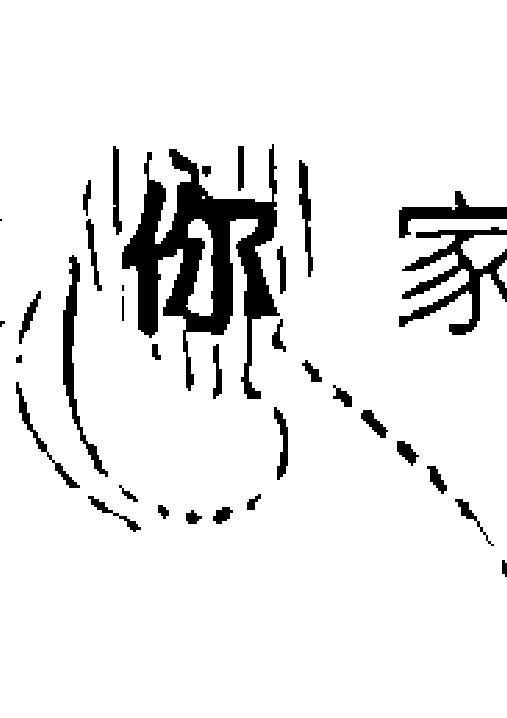

## 貳、塔羅牌的結構

塔羅牌共有七十八張，其中二十二張是主牌，五十六張是副牌。主牌代表人類心靈成長的歷程，是靈魂進化的旅程。由無知至醒悟。

副牌又可細分為四組，分別是寶劍、權杖、聖杯、及金幣，每組各十四張。

寶劍代表頭腦的各種不同的使用狀態，屬理性層面，屬性為風。

權杖代表生命力、能量的各種不同使用狀態，屬能量、動能層面，屬性為火。

聖杯代表情感、情緒的各種不同使用狀態，屬感受層面，屬性為水。

金幣代表身體和物質的不同使用狀態，屬實際層面，屬性為土。風、水、火、土既是構成宇宙存在的四個元素。

主牌是有關人類心靈成長的旅程，它依我們多麼有意識而進化著，它是階段性的邁向成熟的發展。

副牌則需要我們在這四種能量上有平衡的發展；如果頭大（寶劍），而身體小（權杖），這將是思想的巨人，行動的侏儒的寫照。反之，如果行動力強，而沒有頭腦來做規劃，則不免衝動行事。

如果情緒很多（聖杯），而沒有加入頭腦來了解（寶劍）、行動力來做抒發（權杖），那將會是個情緒化的人。

如果把塔羅牌以人體的架構來說的話：主牌是靈魂，代表靈魂進化的旅程。寶劍是頭腦，代表理性。權杖是右手，代表行動力。聖杯是左手，代表情感，金幣是身體，代表身體和物質，它們之間彼此融入為一個整體。

我們需要頭腦來思考和計劃，需要行動力來執行和完成，需要情感來滋養，需要身體物質來落實身心的安頓，缺一不可。

### 塔羅牌的實用性

塔羅牌是一個很實用的工具，你可以帶著你的問題來抽牌，而牌通常不會給你是或不是，好或不好這類簡單的回應，而讓你什麼事都不用負責、什麼事都不用做。相反的，它像一面清澈的鏡子般，如實的反應出當下我們內在的狀態。所以當我們在面對問題的同時，也正是很好的機會來面對我們自己，如果你願意給予你自己勇氣不選擇逃避，那你將開啟了探尋自己內在旅程的道路，而塔羅牌是你在探尋旅程中可以相伴的良師益友，因為它總是在必要時給予閃電般的洞見。

塔羅牌如何運用在生活上：

- 1. 當我們要決定某件事情的時候，會擔心、害怕自己的決定對不對，這時候可以來抽牌，牌可能會支持你的決定，也可能會給出不同的意見。
- 2. 當我們對某件事感到困惑而想要有一個清楚的了解，這時候可以透過抽牌來協助你看清楚真相。
- 3. 在關係中（男女朋友、夫妻、親子、同事、朋友等等）遇到
- ④ 還有更多更多……。

把生命中的每一個事件當作是協助你發展自我覺知和自我成長的契機，然後看看塔羅牌給出什麼忠告、建議以及在這件事上，你可以做什麼或覺知什麼，對你而言是最佳狀態。最後，不論你是否採用塔羅牌所給予的建議，你都要為你自己的選擇負起責任。

### 塔羅牌準不準

在一次塔羅牌的示範課程中，有一位學員提出這個問題。我認為無論我告訴他準或不準，他都不會相信。因為來自任何人的答案都無法滿足他。唯一的途徑是他親自去經驗、去參與，然後透過他自己的經驗來給他自己答案。

我邀請他，先暫且把準或不準擺在一旁，因塔羅牌是協助你成長及提升意識的工具。先敞開心胸，然後看看塔羅牌如何的反應出你頭腦的想法及它給出了什麼忠告及建議，而這些忠告及建議，對你而言，有特別的意義嗎？深入的去咀嚼，你將獲得很多。

### 塔羅牌與其他方法學之差異

舉凡探討人類命運、性格、潛能、和靈魂課題等等的方法學有塔羅牌、占星術、紫微斗數、生命數字學等等，不一而足。這些方法學大致上可以以系統性和非系統性來做區別。

### 如何學習每一張牌的牌義

塔羅牌共有七十八張牌，每一張牌都以顏色、圖案、數字、符號、象徵圖象等來傳達某一特定訊息。那些圖象是有能量的，它能跟你內在的感覺，或者說是直覺有共鳴。因此，當你拿到牌時，先不要急著去看書，花二到三天的時間跟牌相處。當你在看著牌的同時，說出你所看到的及你所感覺到的，不要去擔心說的對不對，只要帶著遊戲的心情去做它，你將會發現，當你說的愈多，你就懂的愈多。同時你可以試著去猜猜看，這張牌它想表達什麼。有些牌你會特別喜歡，你很容易就可以融入那個圖象裡，並且知道它所要表達的意思。而事後，當你查看書時，發現某一張牌的牌義與你的感覺相契合時，那是非常有成就感的。當你感覺不到牌所要傳達的訊息時，也不要氣餒，那只是你目前內在狀態的一個反應而已。有些牌，你會特別不喜歡，那也表示你可能不喜歡你自己內在這個部分的特質；在學牌的過程中，有些牌你會學得特別快，那表示這個能量狀態是你所熟悉的，或是有覺知到的；有些牌你會學得特別慢，學了又忘，忘了又學，要學好幾次，你才記得，那表示該牌的 energy 狀態是你不熟悉的或是在你的意識上比較模糊不清晰的。在學牌的過程中，塔羅牌如明鏡般的反應出你內在的狀態，透過學習塔羅牌，你也已開始使用它來探索你自己了。

還有另一個學習塔羅牌大部份學員會面臨的難題，是如何記住七十八張牌的牌義。在這裡可以告訴你一些聯想的技巧，讓你能快速且不必死記牌義的方法。既然每一張牌是透過顏色、圖案、數字、符號、象徵圖象等組成，來傳達某一特定訊息，那麼，當你在學習每一張牌的牌義時，你是否可以從牌的組成因子中與牌義間去取得一個聯想。例如，愚者這張牌，在臍帶上的小鳥是否讓你聯想到「自由的」，愚者他並不去理會咬他腳的那隻老虎，是否讓你聯想到「不畏危險、具有冒險性的」，他腳上穿的小丑鞋，是否讓你聯想到「遊戲的、天真的、自發性的」。你可以用自己的聯想方式，只要你容易記得的就對了。用這種聯想方式，既好玩，又好記，因爲你是在「看圖說故事」。

在本書78張牌的牌義那個章節將列出七十八張牌的牌義。基本上，你需要去記住每一張牌的牌義，而且，在案例的解說中，會再一次的列出每一張牌的牌義，以方便讀者了解案例的解說。但這本書主要是以案例解說爲主，讀者如果想要更深入了解每一張牌的牌義，可參看「直覺式塔羅牌」一書，由神奇塔羅出版社出版。此作者是我學習生命數字學及塔羅牌，目前在全世界巡迴教授塔羅牌的老師曼格拉所著，該書內容，在我學習塔羅牌時，受益匪淺，內容文字間常流露出真理，讓讀者倍感滋養。至今，這本書仍是我的教學用書，也是我極力推薦給學員們學習塔羅牌的工具用書，在你深入學習牌義的過程中，建議你閱讀每一張牌的內涵及象徵圖象，以利你能了解並掌握牌義的內涵，進而容易記住牌義。

除了在理性層面了解牌義外，讓牌深入你的生活經驗也是很重要的。如果每一張牌都是你生活經驗的一部分，每一張牌都是你透過生活去活過的牌，那麼，當你在讀牌時，你將是強而有力的，因為這些牌已是你生活經驗的一部分，你能夠很活生生的去敘述牌所要傳達的意義。

記得在我學塔羅牌初期，有一天晚上，我在廚房洗碗，一邊在想事情時，突然間，有一張牌進入我的腦海裡。當時我並不以為意，以為自己是在胡思亂想，後來曼格拉告訴我，這是學塔羅牌很好的經驗，因為你可以藉此去探索此時你與牌之間的意義。

所以，在日常生活中，如果無意間想起一張牌，或腦海中跳出一張牌，我會思考一下、感覺一下，這張牌與我目前當下的思緒、感受、和處境有什麼關聯；有時候，當我在閱讀書本或報章雜誌，有一些敘述非常美，讓我覺得跟某一張牌有共鳴，我知道這個敘述是在講某一張牌，所以在下次讀牌時，我就會使用這些豐潤的文字來解說牌義。

每天一張牌的靜心冥想或每天一張牌的生活體驗，均是培養以實際感受與經驗來與牌做連結的學習方法。靜心冥想藉以和牌義做連結，是在靜坐前抽一張牌，當靜坐過程中有一些特別能量變化或體驗時，讓你的直覺來告訴你，它跟牌義之間的關連。我的經驗是，有一次在靜坐中感覺到，一股能量由頭頂進入，來到我丹田的位置，它像一個滾輪在轉動著，我感覺它像是一個6的數字，同時一張金幣一在我的腦海中跳出來，金幣一的圖象中間有三個6一個1的數字，它的牌義是處在當下，處在事實之中。就如同一個人的能量處在丹田中那種著根於地的感覺，於是透過這個經驗，這張牌變成了我經驗的一部份，它比在智性上的了解要來的深刻。每天一張牌的生活體驗是在前一天晚上或當天早上抽一張牌，先感覺一下這張牌的感覺及牌義，然後你就去上班。在這一整天中或許你不會再想起這張牌，但你仍要把它養成一個學習以經驗來連結牌義的習慣，或許有一天你會體會到當天的經驗與你所抽的牌之間的關連。

這些是我學習塔羅牌既有趣又實用的方式，提供給讀者們做參考。

### 参、如何使用這本書

這本書共分為：有關作者及靜心祈禱；有關塔羅牌；牌陣、如何讀牌及提問問題；六十五個案例解說等四大項。

你可以從頭開始看，或者如果你想要先從案例解說開始看的話，那我會建議你先讀牌陣與如何讀牌及提問問題這兩個章節開始。先對牌陣與如何讀牌有一個了解後，再看案例解說指引，透過它，你能掌握案例解說的整體架構及了解解說的方式，之後，才進入案例解說。六十五個案例中分屬六種牌陣，你可以先從簡單的牌陣開始，再進入複雜的牌陣。

## 肆、關於提問問題及抽牌

### 關於提問問題

在抽牌之前，你需要先想好你的問題後再抽牌。你的問題必須精確、單一的，好讓牌可以反映出要給你的答案，如果是複合式的問題，你就必須分二次來抽牌，因爲每一次只能是單一問題。還有不要期待塔羅牌給出是或否、對不對、應不應該……諸如此類簡單的答案，因為它永遠能夠給出更多有關協助你意識成長的訊息及建議，所以問題應該以這樣來發問：關於……問題我需要了解什麼，或關於……事情我需要做什麼，或關於……事情我是處在什麼樣的狀況。只要你願意敞開心胸，你將獲得很多訊息。

### 關於抽牌

針對一個問題可以抽幾次牌；針對一個問題，如果抽兩次牌，會不會得到不一樣的答案；針對一個問題，多久可以抽一次牌等等，學員常問及諸如此類的問題。

所有的生命都是一種磁性的存在，地球本身也不例外。在女祭司這張牌上所畫出的細網是在描述地球的磁柵系統，它是如網狀般的磁力線系統。所以當你帶著問題來抽牌時，是你本身的磁性能量或是你內在較高的自我引導你去抽那些牌，它是來自你的較高自我所要給你的訊息，所以，當你在抽牌時，記得要不慌不忙，給自己一些時間、空間，引導你自己處在當下，這將為你自己創造出一個神聖的空間，可以跟內在的知或直覺取得聯繫的方式。

我建議你一個問題只抽一次牌，除非事情有了些變化或你的想法態度已有不同，才去抽第二次。記得，不要想藉由多抽幾次牌好讓你可以得到你要的答案，那就已經失去抽牌的意義。我知道頭腦永遠想要更多，頭腦沒有興趣待在當下，待在事實裡，但除了以正向、負責任的態度來面對之外，還有其他更好的方法嗎？把人生的每一個事件當作是你學習成長的機會，對每一事件的發生，負起你自己的責任。

## 伍、牌阵與如何讀牌

在塔羅牌與其他方法學之差異的章節中，已說明非系統性方法學之特性。塔羅牌屬於非系統性的方法學。而為了讓你所提問的問題可以得到答案，它需要配合牌陣相應於隨問題所抽出的牌來解讀。

本書的牌陣共有：三張牌問題解讀法、四張牌關係解讀法及為獲完整資訊的加牌解讀法、十三張牌目前生活解讀法、十五張牌問題解讀法，及二十張牌關係解讀法等六種。

以下將列出六種不同牌陣的說明：包括各種牌陣的特色及適用問題、每個位置的意義、如何排列它們及如何解讀等。

還有，不論你是使用那一種牌陣，當你在抽牌時，你所抽出的牌的順序，就是牌陣位置上的順序，所以，千萬不要搞混了那些牌。

### 一、三張牌問題解讀法

它是一個簡單的排列法。因為它只有三個位置配三張牌，所能顯示的資訊並不那麼豐富，故適合想簡單瞭解一下狀況，不需要深入來看事情的解讀法。

- 頭腦
- 忠告
- 結果

#### (二) 三張牌問題解讀法三個位置的意義：

- ① 頭腦：在某一特定的主題下，你如何看待這件事？你認為事情是如何？什麼思緒佔據著你的頭腦？這是你有意識的部分，是你自己知道的，而這張牌如實的反應出你頭腦的想法。
- ② 忠告：在目前的情況下你需要去做或去看的，這是來自更高的知給你的訊息。這個位置有時可視為是給第一張牌的註解，它道出了事實的真相，而非頭腦所認爲的事實。也就是說，第一張牌是表象的，是你認爲的，而第二張牌才是事實的真相，是你需要去看見的。
- ③ 結果：如果你遵循第二張牌的忠告將獲得的結果，或是當你看清楚真相後，所需採取的行動。

#### (三) 三張牌問題解讀法的排法：

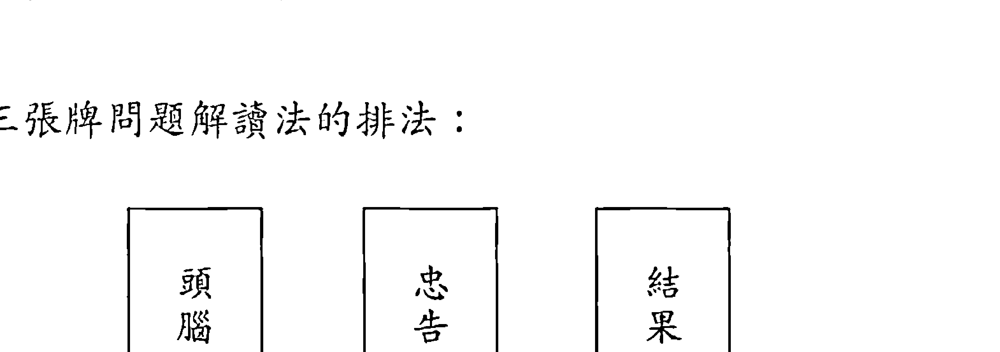

#### (四) 三張牌問題解讀法的讀牌順序：

先看第一張頭腦位置的牌，就某一特定的主題，你抱持著什麼樣的觀點或態度，先在這一張牌上取得一個基礎，好讓你更容易解讀後面的牌。然後再前進到第二張牌，看忠告的位置給第一張牌什麼樣的建議或顯示出什麼更深層的真相，它是你需要去看到的，然后再前进到第三张牌结果。有时第一张牌需蜕变到第三张牌，而第二张牌是这个蜕变需要了解的。

当你在解读三张牌时，记得这三张牌它们彼此间交互影响着并形成一幅图画。它就如同你在看一个空间，而这个空间是由天花板、地板、和墙壁所创造出来的空间，你必需以一个整体来看它们。

### 二、四张牌关系解读法

人是群居的动物，富社交性，而两性关系的议题更常被我们所瞩目。

这是一个关系的排列法，透过这个排列法，让我们了解彼此在关系中的状态，而关系也是最让我们失去客观性的地方，透过它可以协助我们去除主观的偏见，而能够以客观的角度重新来检视事实。

#### （一）四张牌关系解读法有四个位置，它们分别是：头脑、忠告、结果、关系人。这些位置将相应于随着问题所抽出的牌来解读。这是适合关系问题的解读法。

#### （二）四张牌关系解读法四个位置的意义：

-   ① 头脑：你认为你目前处在什么样的状态中，是欢乐的还是想要控制的？你处在什么样的关系中，是期待的还是失望的？对关系人抱持着什么样的看法，是有情绪的还是想放弃的？是否感到受苦。在关系中，你自己的感受及对关系人的看法将在这个位置上反应出来。
    ② 忠告：在目前的关系中，你需要看到或觉知到的。但它也有可能是给第一张牌的注解，反应出你没有看到的事实真相。
    ③ 结果：接受忠告或做了忠告所给出的建议的结果；或看清楚真相后，所需采取的行动。
    ④ 关系人：关系人与你在关系互动中所表现出的情感、思绪等状态。在这里要特别强调，用塔罗牌来窥探别人的隐私或想法是不道德的。关系人这个位置应视为彼此的因素是如何影响关系人的情感思绪的反应，所以，我们最好以这样的方式来提问：关于在与他或她的关系上，我应有什么了解？有时候，这个位置也有可能是关系人的一般状态。

#### （三）四张牌关系解读法的排列法

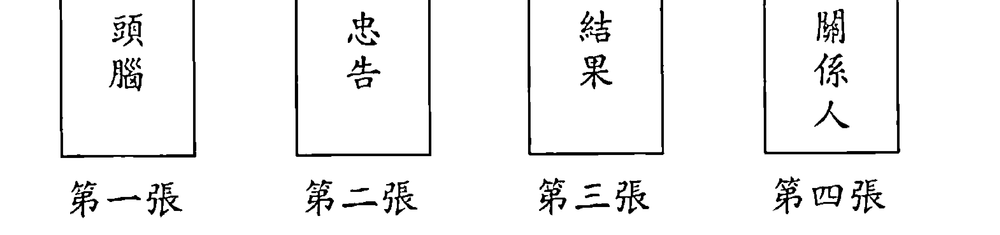

#### （四）四张牌关系解读法的读牌顺序：

前面三张牌是给抽牌者的牌。先来看头脑的牌，在关系上，抽牌者有什么想法或感受反应在这个位置上。先从这张牌取得一个基础，然后再前进到第二及第三张牌，看忠告和结果给出什么讯息。最后的第四张牌是关系人的牌，它是关系人在关系中的状态，它独立于前面三张抽牌者的牌，故不应和前面三张牌视为一个整体。关系人这个位置的牌给出了一个基础及客观性的讯息，让你可以使用它所显示出来的讯息来协调及沟通，将它视为一个在关系上的指引或帮助是好的。

### 三、加牌解读法

每一种排法均可以使用加牌，来加入原来的牌，以获得完整的讯息。

每一种排法都有其固定的形式及每一个位置上的意义，当随着某一特定问题所抽出的牌，相应于排列法中每一个位置的意义来解读时，你希望在一张牌上能有更清楚的讯息，例如：在忠告的位置上有一张英勇（有勇气的作为）的牌，但你并不清楚这个有勇气的作为是关于什么，带着这个清楚的目的来加抽牌，加入现有的牌来解读，你抽出了圣杯骑士（分享、表达、袒露自己），意指需要有勇气去表达、去袒露自己。使用加牌解读法，可以使你在读牌时更具完整性及流畅性，它是进入十五张及二十张牌解读法的跳板。

使用加牌解读法的注意事项：

-   ❶ 加牌加入现有的牌来解读是为了获得更完整的讯息，它是用来辅助现有的牌。所以，当你要加牌时，必须带着清楚的目的。如果你是因为不了解现有的牌而加牌去盖住前面的牌，那就失去了加牌的意义。
-   ❷ 如果你对所加抽出来的牌感到困惑不解时，你就停在目前的状态。掌握目前你能了解的部份，先不要去看那些你不清楚的部份，或许过些时候你再回头来看它们时，你就比较能够了解。因为在你了解的情况下，一再加抽牌只会制造更多的混乱。

-   ❸ 加牌是为了要获得完整的讯息，而非满足头脑一直想要更多的需要。例如：在加牌的案例中，忠告牌是贤者（需要去作为沟通的牌），而结果的位置却是倒吊人。我并不清楚为何忠告所给的是作为的牌（贤者），但结果却是需要处在困难与受苦中来蜕变（倒吊人）。这个作为（贤者）对案主而言有何难题？带着这个清楚的目的，案主加抽出了挫败和残酷两张牌（失败和自我怀疑）。意指案主在工作上，受到自我否定和失败的想法所影响，所以，目前这是她需要处在困难的状态中，来面对她的旧有模式来蜕变的方式。当时学员提问，是否可以抽牌来了解如何突破自我否定及失败的影响。其实，在这一组牌中，结果位置的倒吊人已经给出了讯息——处在目前的困难和受苦中，来挑战她的旧有模式是蜕变的方法，它是案主目前可以去经验最好的事。在加牌的过程中，不要让头脑把你带离了处在当下的能力。

### 四、十三张牌目前生活解读法

它是一个比较宽广的排列法，用来协助我们看到生活中不同面向的每一个状况，每一个生活面向的位置只配一张牌。例如：工作这个位置，它只用一张牌来反应出工作上的状态，是你马上能了解并解读的。

-   （一）十三张牌目前生活解读法共有十三个位置，它们分别是：一般看法、沟通与连结、工作、内在自己、性能量、身体、主要关系、新的观点、头脑、高峰经验、心灵讯息、静心、综观等，用来反应出你所抽出的牌的相对应位置的状态。你可以只是单纯的来看看在目前生活中的每一个面向的状态或是针对单一问题的解读法均适用。

#### 十三张牌目前生活解读法的十三个位置的意义：

-   ① 一般看法：你以什么样的观点、态度来看待目前所发生的事件。它比较是你认为的，而不一定有事实的基础。
    ② 沟通与连结：你以什么样的模式、态度与别人沟通。是开放的或防御的，是流畅的或小心翼翼的。
    ③ 工作：你工作上的能量或状态会反应在这个位置上。
    ④ 内在自己：你如何看待对待自己？什么事发生在你的内在？
    ⑤ 性能量：性能量它不只是关于性，也包括你对异性的态度，它意指广义的生命力，而性是生命力的源头。
    ⑥ 身体：身体处在什么样的状态中？它被什么所影响？是否有处在当下（处在当下意谓着处在真实中、处在身体中）？有时，我们身体的状态是心理层面的问题影响到生理层面上的反应。
    ⑦ 主要关系：你与你亲密关系人的情绪反应或互动状态，会反应在这个位置上。亲密关系人包括先生、小孩、父母等，是与你在生活上有紧密关系之人。
    ⑧ 新的观点：这个位置是在给第九号牌头脑的忠告。这个位置所显示的牌，可能会支持你的观点，但也可能会给出与你头脑不同想法的建议。
    ⑨ 头脑：在目前的情况下，你是如何思考的？什么占据了你的头脑？是想努力的或想逃避的？
    ⑩ 高峰经验：是你目前需要去做、需要去看的。是在此刻的你可以去经验的高峰。是对你目前所处状态或所面对的难题的建议。

    高峰经验是心理学上的一个名词，它的解释是：高峰经验是在努力后的成功，困思后的创作，信仰后的感动，以及在爱与被爱的真情表露中获致的心灵震动。亦即，在自我追寻中臻于自我实现的地步时，高峰经验就会产生（摘自张氏心理学辞典）。

-   ⑪ 心灵讯息：高峰经验是你需要去做的，需要去觉知的。心灵讯息则是你需要了解的，你可视它为存在给你更宽广的建议。
-   ⑫ 静心：这里的静心并非指静心冥想。而是就目前的问题有一个主题对你而言是最困难，但也是你需要去学习或穿越的，是你需要一直注意到的，对你而言是最大成长的事。
-   ⑬ 综观：目前你所面对的问题、处境或你要走的方向，或目前你正在经验的主题。

#### （三）十三张牌的排列方式：

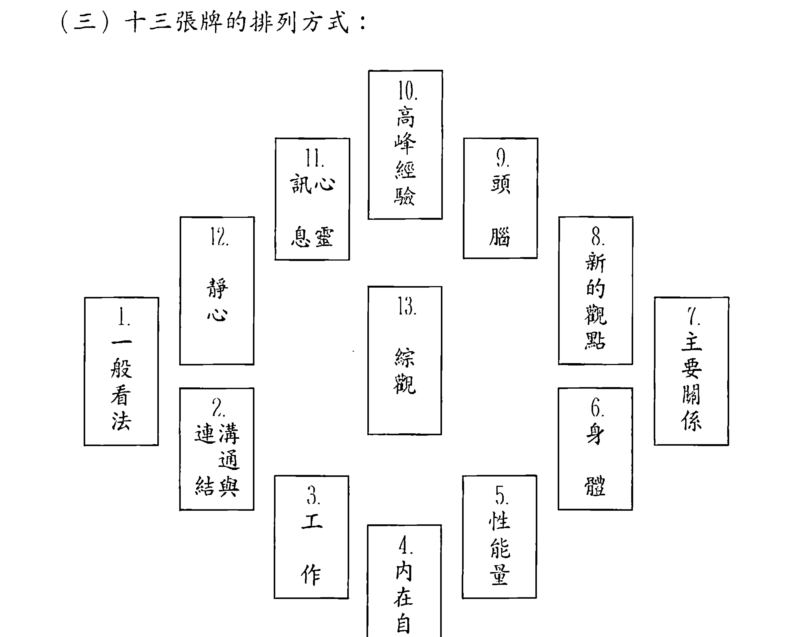

在这十三张牌中，你需要分三个层面来解读，我以鱼示意图来说明：

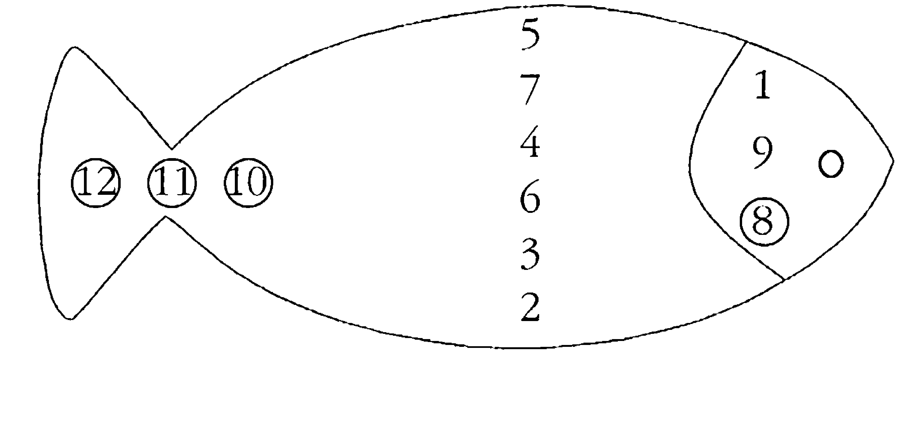

#### （四）三个层面的解读：

第一个层面是鱼头：是你目前面对的主题、思考的主题、前进的方向。

第二个层面是鱼身：是你生活各个面向的真实反应。

第三个层面是鱼尾：它像是舵，它是改变所需要了解的，或是目前需要去做的。

##### 第一个层面：头脑的层面（鱼头）。

-   1. 先看第十三号牌综观的位置，先取得一个综合观点。这是你目前正在面临的主题或要前进的方向。
    2. 再看第一号牌一般看法的位置。你以什么观点来看目前的生活，或来看第十三号牌这个主题。
    3. 再看第九号牌头脑的位置。在面对这个主题时，你头脑有什么想法。
    我们目前所看的这三张牌，它们彼此不但相关而且共创了一个思考的主题，你要以一个整体来看它们。
    4. 最后看第八号牌新的观点的位置。这张牌是在给九号牌头脑的忠告或建议。在鱼示图中，忠告牌会在数字外加框，以利区别。

##### 第二个层面：身体、内在、生活的层面（鱼身）。

在第二个层面的解读顺序，要视问题决定从哪一号牌开始。如果问题是有关于工作，你可以从工作这个位置开始；如果问题是有关于关系，那么你可以从关系的位置五或七号的位置开始。或者在这个层面上有难题牌出现时，你也可以先从难题牌开始，因为它是案主马上可以连结到的状态。关系常是我们的焦点所在，所以，我们就从它开始。

-   1. 第五号牌性能量。如果你有在关系中，这个位置将显示性能量的状态（它是敞开的或关闭的、是控制的或流畅的）；如果目前你并没有男女朋友，则它将显示出你对异性的态度。性能量是生命力的源头，当它受阻时，生命力就会下降。
    2. 第七号牌主要关系。在关系中，有什么事发生在这个位置上。它与性能量这张牌有相呼应吗？
    3. 第四号牌内在自己。有什么事发生在你的内在及你如何看待你自己、对你自己感到如何？
    4. 第六号牌身体。在目前的情况下，身体处在什么样的状态中？是急忙的还是放松的？是否有很多情绪累积在身体里？
    5. 第二号牌沟通与连结。你一般的沟通模式。或在特定的主题下，你说了很多话，还是有话不说？还是沟通时很小心翼翼的或是沟通对你而言是困难的。
    6. 第三号牌工作。你工作的能量状态会反应在这个位置上。你对目前的工作是否感到满意或是失望的或是压抑的？

    以上除了第八号牌之外，每一个位置均真实的反应出你生活的各个面向的状态，只有反应，没有建议。一到九号牌它们彼此间并非是分离的、单一的，而是互相影响。有时关系位置的状态可能影响了你如何看待你自己或在身体上呈现出情绪的反应。它们像星系般，彼此间相互影响着。

##### 第三个层面：忠告（鱼尾）

在看完第一及第二层面之后再来看第三层面的忠告，如此你才能够知道，这些忠告牌是在给哪些牌忠告。

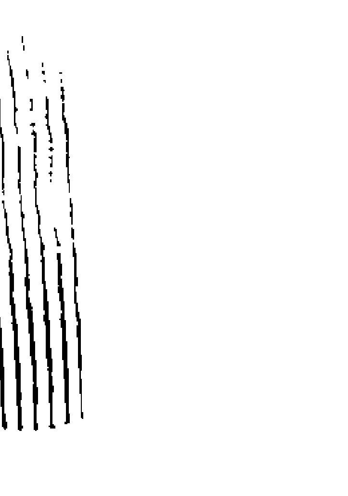

-   ① 第十张牌高峰经验。是目前你所面对的问题所需采取的行动。它或许显示出你需要主动去沟通或作为，或者是去经验你一直在逃避的悲伤情绪或是对目前的发生持友善的态度……或是目前你能为自己做什么，对你而言是最好的。
-   ② 第十一张牌心灵讯息。这个位置所给出的建议是更宽广的。它是指引、支持第十号牌高峰经验的讯息。例如：高峰经验告诉你需要抛弃旧有的思考模式、想法，因它限制了你的前进或接受新事物的意愿。心灵讯息则是给出一个宽广的讯息，指引或支持你去做高峰经验所给出的建议所应有的了解。
-   ③ 第十二张牌静心。是你需要带着觉知，去经验目前对你而言最困难，也是你最不擅长，但对你而言是最大成长的事。例如：在关系的议题中，这个位置出现了爱自己的牌，显示在关系中，去倾听自己的感觉、去爱自己对你而言是最困难的事，因此这是你需要带着觉知去学习的事。

### 五、十五张牌问题解读法

十五张牌问题解读法是三张牌解读法的展开形式。共有十五张牌，每组五张，各分属头脑、忠告、结果等位置。透过这个解读法可以获得更多的细节及资讯。它是比较复杂的解读法，虽然有固定的形式，但是给直觉很多的空间来运作。

-   （一）十五张牌问题解读法中，头脑、忠告、结果三组位置的意义，请参考三张牌问题解读法中的介绍。

#### （二）十五张牌问题解读法的排法：

抽出三组五张牌，将每一组排列成以下的号次。记得，当你在抽牌时，你所抽出的牌的顺序，就是排法位置上的顺序，所以，千万不要搞混了那些牌。

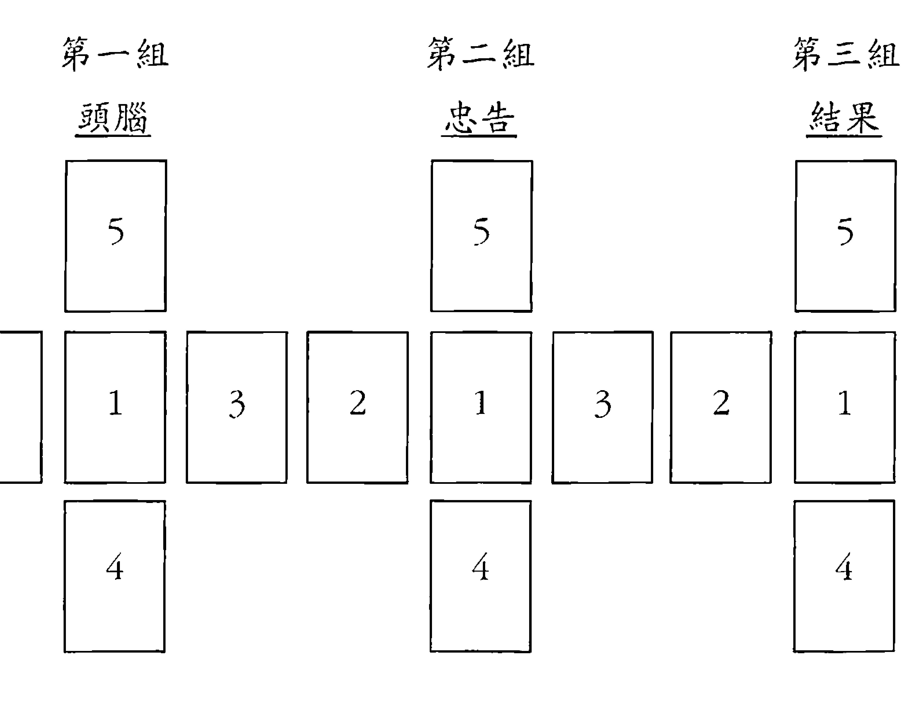

#### （三）在每一组的五张牌里，它们之间的关系如下：

先看一号牌核心主题说些什么，再前进到二、三号的影响牌，看它们对这个核心主题增加了那些色彩或影响，再前进到四号基础牌，看它来自哪里及第五号发展牌，看它们将成为的或走向哪里。

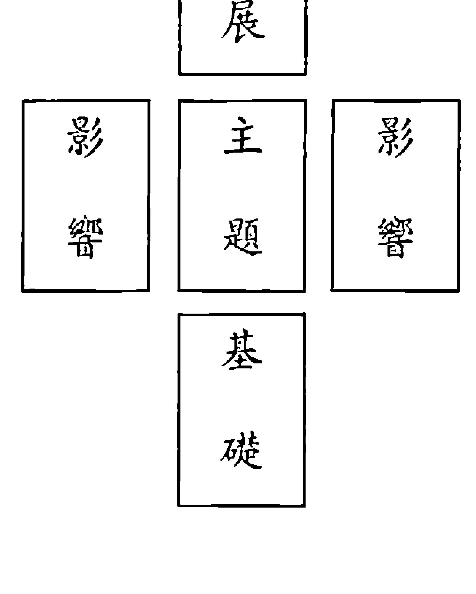

#### （四）十五张牌问题解读法的读牌顺序

每一组的一号牌是该组牌的核心主题，二、三号牌则是影响核心主题的牌，四号是产生出来的地方或基础，五号牌是将会发展的或成为的。

刚开始学习这种解读法时，建议你先看每组牌的一号牌，如此，它就是前面已介绍过的简单的三张牌解读法。先在这三张牌里先取得一个综观轮廓，再回头看第一组头脑的牌，这五张牌共创出一个什么情况，有什么感受、想法、情绪被反应在头脑的位置上，先取得一个基础，好让你更容易解读后面的牌，然后再去拓展及对应它们之间的关系。例如：第二组的二号牌它除了增加该组一号牌的深度外，在对应于第一组的二号牌时，它给出了什么忠告及对应第三组的二号牌时，结果又是什么。也就是说，每一组的某一号牌除增加了该组牌的深度外，它与其他同位置的二组牌也有相对应的解读关系。在对应的解读中，尽可能去连结你能够连结的牌，如果有些牌你连结不上，暂时就放下它们，等过些时候再回来看它们，或许你就能有较多的连结。

这种排法虽有固定的架构，但给直觉很多运作的空间，所以，它们之间的对应关系并不那么僵化。

### 六、二十张牌关系解读法

二十张牌关系解读法是四张牌关系解读法的展开形式。共有二十张牌，每组五张，各分属头脑、忠告、结果、关系人等位置。四个位置的意义，请参考四张牌关系解读法中的介绍。

#### （一）二十张牌的排法

抽五张牌，抽四组，将每一组排列成以下的号次。记得，当你在抽牌时，你所抽出的牌的顺序，就是排法位置上的顺序，所以，千万不要搞混了那些牌。

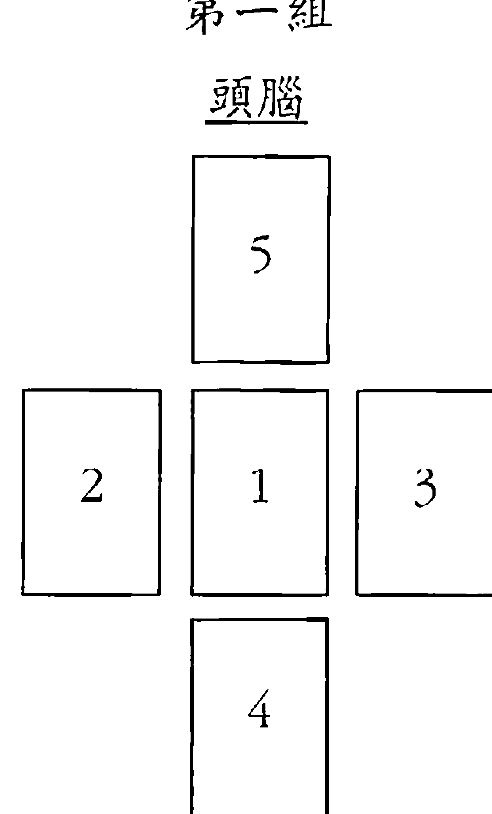

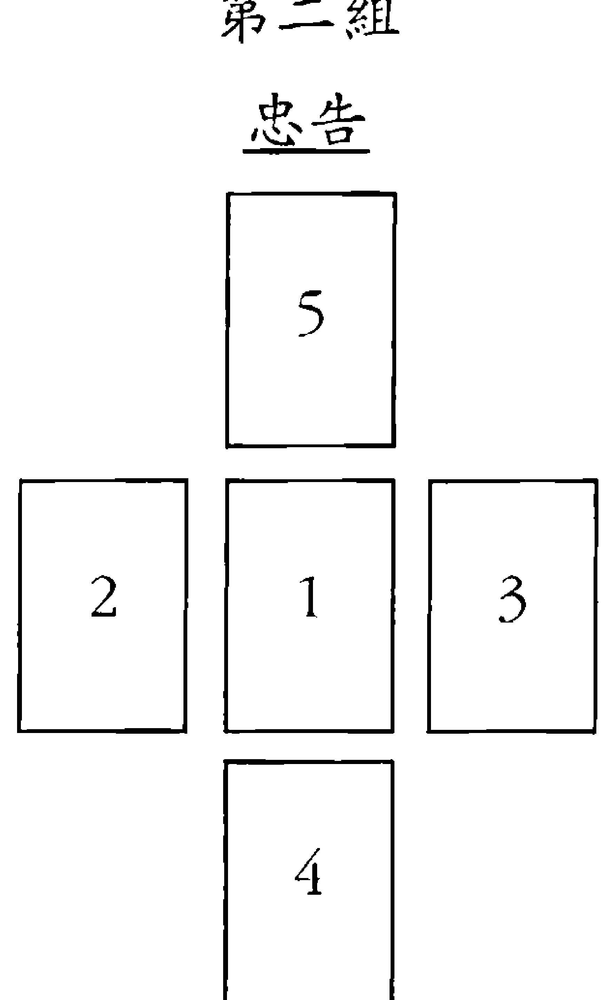

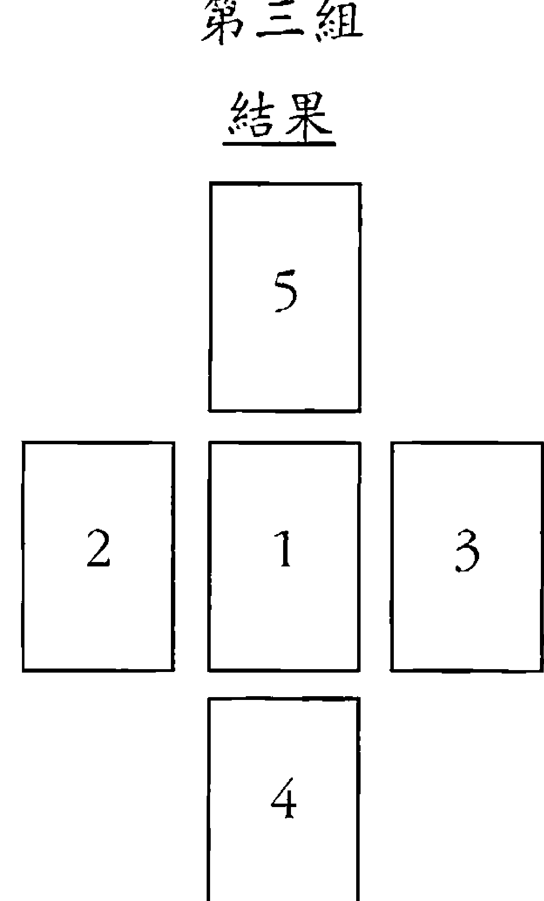

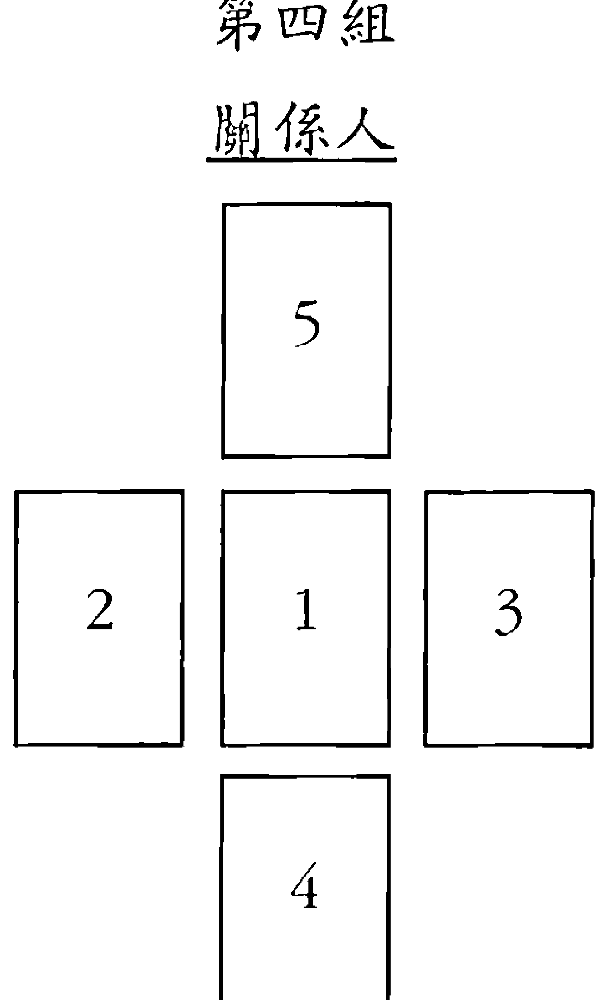

#### (二) 二十张牌问题解读法的读牌顺序

前面三组牌是属于案主的牌，最后一组是关系人的牌。

先看前面三组牌中的一号牌，先取得一个综观，再进入第一组头脑的位置，看这五张牌共创出什么情况，再去拓展及对应它们之间的关系。可参考十五张问题解读法中的介绍。

第四组关系人与前三组案主的牌，分属不同人，故第四组牌不需对应前三组的牌。这个位置反应出关系人在关系中的状态，先看一号牌核心主题，再前进到二、三号的影响牌，看这个核心主题增加了那些色彩，再前进到四、五号牌，看它们将成为的或走向。

刚开始学习这种解读法时，你是遵循着固定的对应关系，但等你愈来愈熟悉这种解读法，也对你的直觉较有信心时，你就能随着你的直觉以流畅不僵化的方式来解读它们。

以上是各种排法及如何解读的说明，你需要对它们有一个概括性的了解，但不需要去死记细节，因为在案例解说中，我会牵着你的手，一步一步的导引你去解读它们。所以，当你实际进入案例解说时，你将更清楚如何解读它们。

> 以上的排法及每个位置上的意义出自「直觉式塔罗牌」一书，神奇塔罗出版社出版。

## 陆、案例解说指引

为让读者了解案例解说的整体架构，因此，以下将列出每一种牌阵的案例解说架构及细节说明，以利读者能掌握整体，并进而了解每一种牌阵所能给出的讯息。

### 三张牌、四张牌及加牌解读法的案例解说架构及说明：

-   1. 案例：案主的背景介绍及目前案主想要来看的问题。
    2. 问题：案主所提问的问题。
    3. 随问题所抽出的牌：将以图文并列的方式，排出案主所抽出的牌，并在提示的引导之下，指出牌与牌之间的关联性，让读者能够看出该组牌所要带出的主题。
    4. 提示：将引导读者去看这些随着案主的问题所抽出的牌之中，有哪些值得特别注意的部份，它比较像一个建筑物的主要架构，或是像人体的骨干。当你在解读时，先掌握到核心的讯息是好的，因为如此一来，你就大略知道了这一组牌所要给出的讯息了。这能够在你进入细节之前，就能掌握到它的方向。
    5. 牌阵、牌义、和解说：列出牌阵里每个位置所代表的意义、案主所抽出的牌、该牌的牌义、和该牌在该案例中的解说。

    其格式如下：

    牌阵里每个位置所代表的意义，案主所抽出的牌—该牌的牌义、和解说。

    (注一)          (注二)

    (注一：该牌的牌义有时因受整组牌的影响，牌义会作一些调整，但不失其牌义的本质)。在牌义这个章节中将列出七十八张牌的牌义。

    (注二：该牌在该案例中的解说，有时因受整组牌的影响，该牌在该案例的解说有时会与牌义有些不同，但不失其牌义本质)。

    六、总结：不同牌阵的每一个案例的整体总结。四张牌关系解读法会增加一个关系人的位置的牌并讲解之，但在四张牌的总结中，还是以案主的牌为总结的内容，故不加入关系人的牌义状态。

    七、补充说明：这个部份是作者对相关议题的见解，非读牌时必须说明的。

    八、推荐静心：在每一个案例中，会视案主的问题和需要，及塔罗牌所给出的建议，适时的推荐可以尝试的静心。透过静心，案主将可以获得更多的帮助。静心的最终目标是达到三摩地（成道），静心是世界上可以带给我们最大利益的事。静心的益处是多层次的，它能使身体放松、使压力得以纾解、使思绪得以清明、同时使受阻的能量得以流畅等等诸多益处。在这里所推荐的静心是根据我个人的经验，是你可以去尝试的。但我还是希望你能够透过你自己的经验去找到真正能帮助你自己的静心。在这里所推荐的静心，除了戈齐福神圣舞蹈及光的课程之外，你可以在「静心观照」和「橘皮书」这两本书（奥修出版社）找到操作的方法。

### 十三张牌目前生活解读法的案例解说架构及说明：

一、案例：案主的背景介绍及目前案主想要来看的问题。

二、问题：案主所提问的问题。

三、随问题所抽出的牌：将以图文并列的方式，排出案主所抽出的牌，并在提示的引导之下，指出牌与牌之间的关联性，让读者能够看出该组牌所要带出的主题。

四、提示：将引导读者去看这些随着案主的问题所抽出的牌之中，有哪些值得特别注意的部份，它比较像一个建筑物的主要架构，或是像人体的骨干。当你在解读时，先掌握到核心的讯息是好的，因为如此一来，你就大略知道了这一组牌所要给出的讯息了。这能够在你进入细节之前，就能掌握到它的方向。

五、牌阵、牌义、和解说：请往前参阅三张牌、四张牌及加牌解读法的案例解说架构及说明的「牌阵、牌义、和解说」的内容。

六、三个层面的解读及三个层面的结论：
第一层面是头脑和综观的层面，依序以第十三张牌的综观、第一张牌的一般看法、第九张牌的头脑、和第八张牌的新观点来解读，并在最后做第一层面的结论。
第二层面是身体、内在、和生活的层面，包含第七张牌的主要关系、第五张牌的性能量、第六张牌的身体、第四张牌的内在自己、第三张牌的工作、和第二张牌的沟通与连结，并在最后做第二层面的结论，但只列出与问题有关或受影响的生活层面。
第三层面是忠告的层面，依序以第十张牌的高峰经验、第十一张牌的心灵讯息、第十二张牌的静心来解读，并在最后做第三层面的结论。

### 十五張牌問題解讀法及二十張牌關係解讀法的案例解說架構及說明：

- 一、案例：案主的背景介紹及目前案主想要來看的問題。
- 二、問題：案主所提問的問題。
- 三、隨問題所抽出的牌：將以圖文並列的方式，排出案主所抽出的牌，並在提示的引導之下，指出牌與牌之間的關聯性，讓讀者能夠看出該組牌所要帶出的主題。
- 四、提示：將引導讀者去看這些隨著案主的問題所抽出的牌之中，有哪些值得特別注意的部份，它比較像是一個建築物的主要架構，或是像人體的骨幹。當你在解讀時，先掌握到核心的訊息是好的，因為如此一來，你就大略知道了這一組牌所要給出的訊息了。這能夠在你進入細節之前，就能掌握到它的方向。
- 五、這個問題所帶出的主題：從提示中，作者指出牌所帶出的主題，而這個位置的說明是作者對該主題的見解。
- 六、牌陣、牌義、和解說：請往前參閱三張牌、四張牌及加牌解讀法的案例解說架構及說明的「牌陣、牌義、和解說」的內容。

### 七、各組牌的結論

十五張牌問題解讀法共分三組，分別是第一組的頭腦、第二組的忠告、及第三組的結果。每一組各有一至五號牌，依序由一至五號來解讀，並在各組牌的結尾做該組牌的結論。

二十張牌關係解讀法共分四組牌，分別是第一組的頭腦、第二組的忠告、第三組的結果、和第四組的關係人。每一組牌各有一至五號牌，依序由一至五號來解讀，並在各組牌的結尾做該組牌的結論。

### 八、總結

十五張牌將在第三組牌的結論之後，做十五張牌的總結；二十張牌將在第四組牌的結論之後做總結，但二十張牌的總結不含第四組關係人的牌義狀態。

### 九、補充說明

這個部份是作者對相關議題的見解，非讀牌時必須說明的。

### 十、推薦靜心

請往前參閱三張牌、四張牌及加牌解讀法的案例解說架構及說明當中「推薦靜心」的內容。

這兩種牌陣遠較前幾種牌陣複雜，它們有許多的對應關係，故在案例解說中，會一一指出它們。同時建議讀者在看這兩種牌陣的對應關係時，除了看文字的解說之外，一起參看書中的圖或是你的牌，你將會更清楚對應關係的解說內容。

### 忠告位置上的解讀須知

忠告位置是給出建議，需要我們去做或是去覺知的事。所以，如果在忠告的位置上出現負面牌義的牌時，你必須以正面的方式來解讀它。例如，殘酷（寶劍九）是一張負面牌義的牌，它的牌義是自我懷疑、自我否定，但當它出現在忠告的位置上時，你就必須解讀成「需要去懷疑……」。又主牌的倒吊人是一張負面牌義的牌，它的牌義是受苦或困難的，但當它出現在忠告的位置時，你就必須解讀成「需要面對或處在困難中來學習……」。我希望你可以實際的進入案例解說，來更清楚要如何解讀它們。

### 正面或負面牌義的解讀須知：

某些牌有正面和負面的雙重牌義，在案例的牌義解說中或案例解說中會指出應如何解讀正面或負面的牌義。

### 閱讀案例解說的步驟：

當你在看案例解說時，先了解案主背景及想要來看的問題，再以同樣的牌陣排出案主所抽出的牌。因為透過牌的顏色、形狀、和圖象可以帶給你另一種超出文字可以敘述的感覺或稱直覺力，它比文字可以給出更遼闊的訊息。如果你沒有同款的牌，書中也以圖文並列的方式方便你解讀。如果你是入門者，看著提示的引導後，再進入每一張牌的解說及每一個層面的結論和總結。如果在你看完提示之後，還是掌握不到方向的話，那是沒有關係的，要有耐心，給自己一些時間來熟悉它。如果你是有基礎的讀牌者，放縱你的直覺，去看整體的感覺，及與該問題有關的位置的牌反應出什麼訊息，再來看忠告牌說些什麼。你自己可以先試著解讀一次，然後當你再進入案例解說時，你將更清楚解說的內容。

## 柒、案例解說

### 三張牌問題解讀法

### 案例一：
案主為四十幾歲的女性，因第一次寫書，心中有些擔憂。她想要來看，關於寫作，她應有什麼了解。我們以這樣來提問：關於寫作，我應有什麼了解。這個問題所抽出的三張牌：1.太陽 2.失敗 3.聖杯騎士

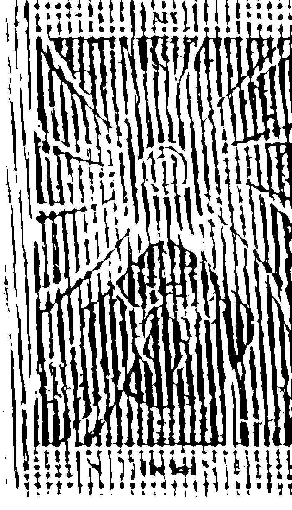

1.太陽（XTX）

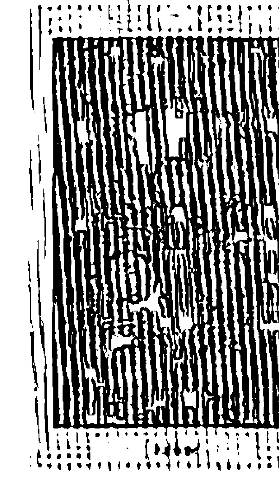

2.失敗（金幣7）

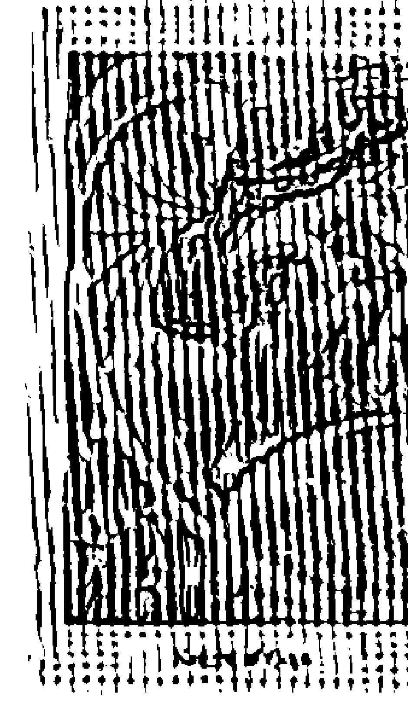

3.聖杯騎士

#### 提示：
頭腦顧慮的是，在關係（太陽）中的恐懼（失敗）。

##### 第一張牌頭腦，太陽——學習在關係中成爲完整的：
頭腦顧慮著，在別人眼中的自己。也就是說，顧慮別人會怎麼看她，如何評價她。

我們來看忠告牌說些什麼。

##### 第二張牌忠告，失敗——恐懼：進入恐懼中。
在寫作中，作者將把觀點、思想、情感等訴諸於文字，讓自己暴露於大眾媒體之下。她因顧慮別人的評價而恐懼於自我暴露（因第一張牌頭腦顧忌別人如何評價她）。她需要覺知到她的恐懼，並進入恐懼中。她如果接受了忠告，就可以去做下列的事。

##### 第三張牌結果，聖杯騎士——情感的表達、分享你的心：
目前她需要不被恐懼所限制，勇敢的坦露自己，分享她的情感。

### 總結：
關於寫作，她憂思著別人眼中的自己，顧慮著別人會如何的評價她（太陽），她需要了解，目前最好是去坦露自己、表達自己（聖杯騎士），並藉由把自己分享出去，來面對內在害怕別人評價的恐懼（失敗）。唯有進入恐懼，我們才能夠了解我們的恐懼比較多是來自自己的想像，而非來自事實的基礎。

##### 補充說明：
恐懼在他人面前暴露自己，這份恐懼是來自在人際關係中需要安全感的需求。透過坦露和分享自己，來面對內在被他人評價的恐懼，是學習如何回到自己的根，站在自己力量上的機會。

恐懼像蝙蝠一樣，總喜歡在黑暗中飛行。當我們把光（意識）帶進來時，黑暗（無意識）就不見了。

#### 推薦靜心：
進入你的恐懼、黑暗靜心。

### 案例二：
案主為三十多歲的女性，事業心強，在公司服務多年，想知道在工作上有無升遷機會？

我們以這樣來提問：在目前的工作上，有無升遷的機會？

- 這個問題所抽出的三張牌：
1. 權杖騎士
2. 毀滅
3. 月亮

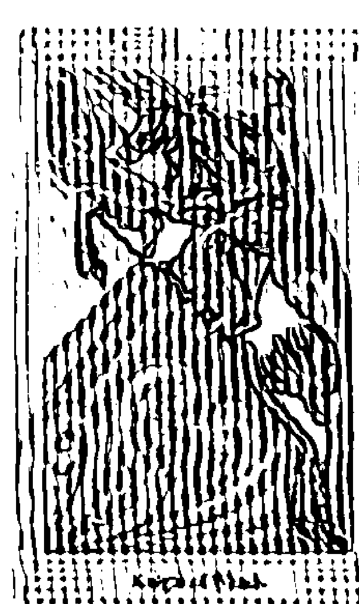

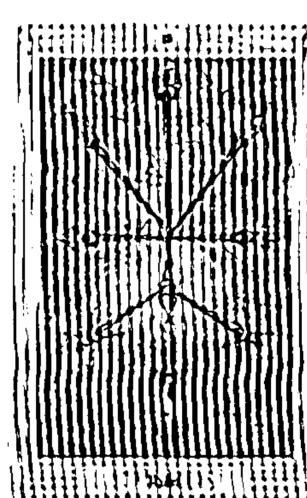

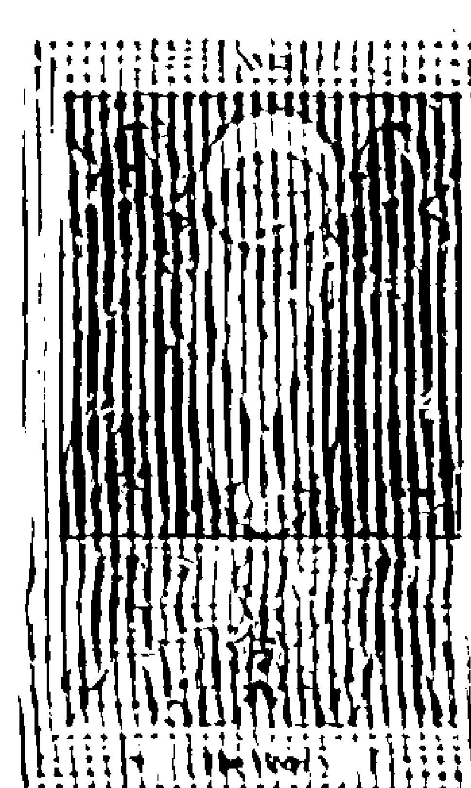

#### 提示：
一張高動能的牌，在頭腦的位置，顯示在工作上，有強烈的企圖心。在忠告位置的牌，顯示她必須要放棄。這兩張是完全衝突的牌，這對案主來說會是很大的衝擊。

##### 第一張牌頭腦，權杖騎士——動態的、向外的：
這是一張高動能的牌。她卯足全力往晉升的目標做努力，且認為以自己的能力應該可以晉升。

我們來看忠告牌說些什麼。

##### 第二張牌忠告，毀滅——放棄、放手：
縱使她對自己的能力有信心，也非常努力，但目前晉升無望，她需要放棄這個期望。

##### 第三張牌結果，月亮——未知：
她被迫處在一個無法了解的狀態。不知道事情為什麼會這樣，她做了一切努力，但卻事與願違。

### 總結：
她努力的往晉升之路邁進（權杖騎士），但她需要了解，有時我們就是會被迫處在一個不知道為什麼會這樣的狀態中（月亮），她所期望的不會發生，她需要放棄（毀滅）這個期望。

#### 推薦靜心：
如果案主有憤怒的情緒，可嘗試動態靜心或無念靜心來紓解。

#### 案例三：
該學員婚前在職場上是非常成功的女性，婚後隨夫婿南下高雄定居，目前為全職的家庭主婦。她對婚後的生活感到索然無味，而且在經濟上也不想依賴先生。她想知道生完小孩後，可否馬上回到她所熟悉的職場。

我們以這樣來提問：生完小孩後，可否馬上復出工作？

這個問題所抽出的三張牌：1.主權 2.太陽 3.金幣皇后

- 1. 主權（權杖2）
- 2. 太陽（XIX）
- 3. 金幣皇后

##### 第一張頭腦
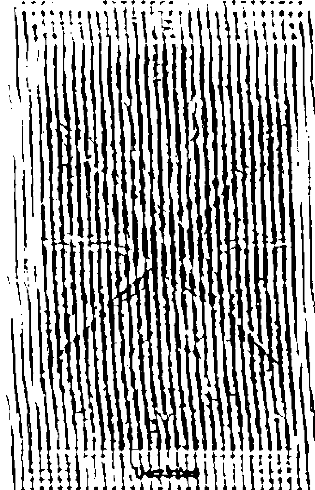

##### 第二張忠告
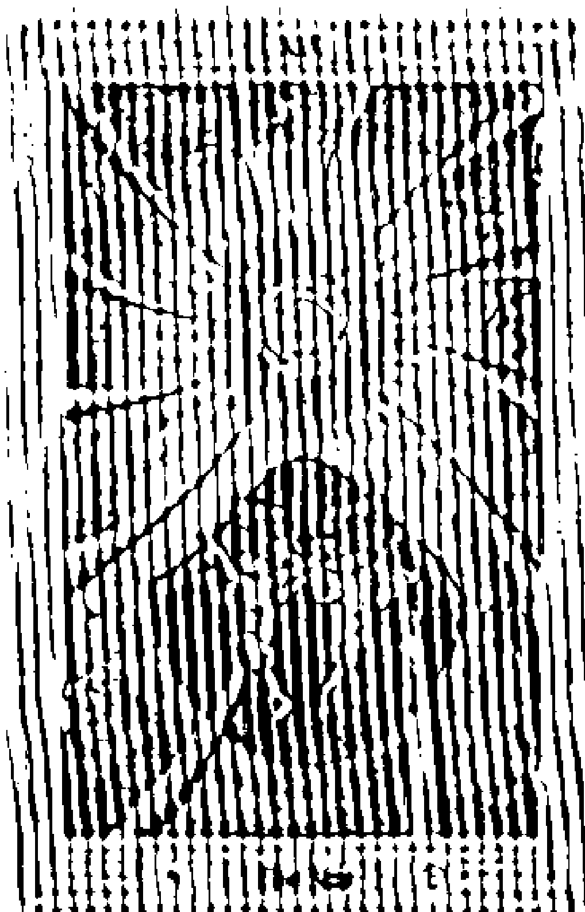

##### 第三張結果
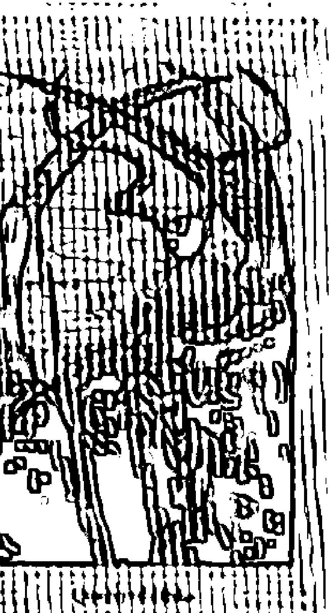

#### 提示：
雖然職場是她所熟悉及可以施展自己能力的地方，但目前關係（太陽）是她需要學習的主題。

##### 第一張牌頭腦，主權——新的方向：
她想要在生活上，有一個新方向。我們已經知道，她想由家庭主婦的角色，回到讓她有成就感的職業婦女角色。

我們來看忠告牌說些什麼。

##### 第二張牌忠告，太陽——學習在關係中成為完整的：
這是一張關係牌。她剛成為人妻不久，而且也即將成為人母。不想成為依賴的，只生活在先生小孩的圈子裡，她想回到令她有成就感的職場。但她被告知，要留在關係裡做學習，即使這樣做她並不喜歡。

##### 第三張牌結果，金幣皇后——“在”、放鬆和接受的狀態：
不要抗爭。要好好的待在目前的情況裡，透過關係來學習只有在關係中才能學到的事。或許這個過程不像她在職場上那麼上手，而且可能會讓她覺得不舒服，或不是她所習慣的方式，但目前待在關係裡對她而言會是最好的成長。

### 總結：
她想要在生完小孩之後回到她所熟悉的職場（主權）上。她需要了解關係是她目前學習的主題（太陽），她需要待在目前的情況中（金幣皇后）。

##### 補充說明：
生命之流把她帶進了關係。有時我們對自己的了解需要透過關係這面鏡子來反應出內在不為自己所知的部份。這是我們自己不熟悉的部份，甚至有時會有令人不舒服的感覺。所以大部份的我們會傾向於避開它，但是唯有透過關係我們才能夠更了解自己。

#### 推薦靜心：
德伐瓦尼（Devavani）靜心。可協助她敞開及柔軟下來，並待在關係中做學習。

### 案例四：
案主為二十七歲女性，剛結束一段令她傷心的感情，她想來看與前男友的關係。

我們以這樣來提問：關於和前男友的關係，我應有什麼了解？

這個問題所抽出的三張牌：1.倒吊人 2.愛人 3.爭吵

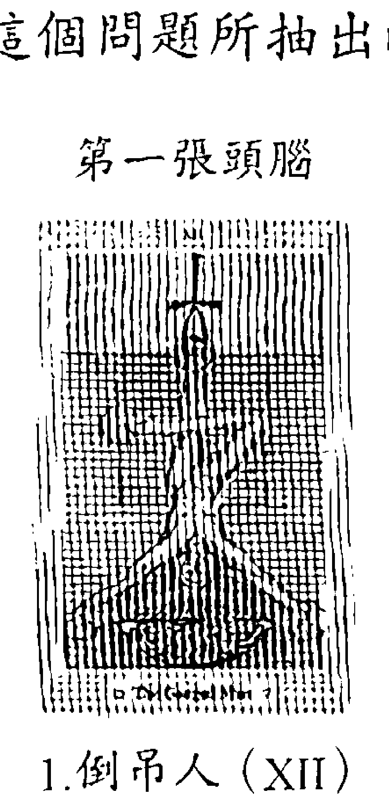

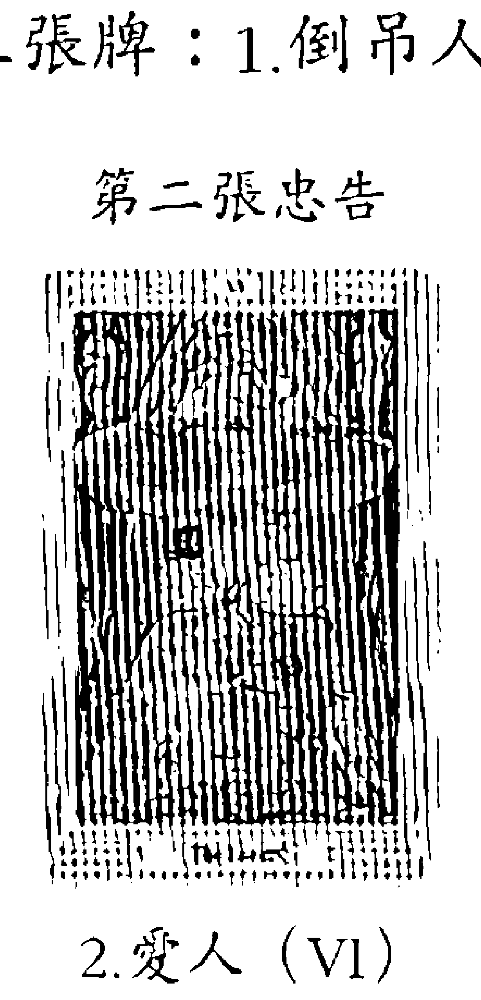

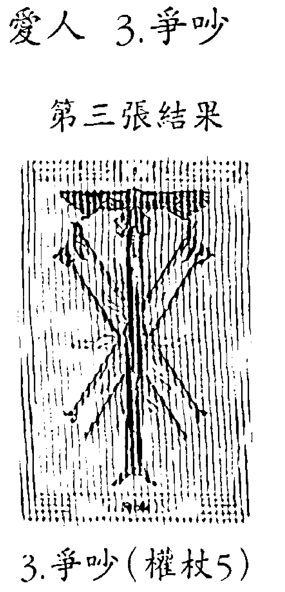

#### 提示：
從受苦（倒吊人）的關係（愛人）中，學習面對難題（爭吵）。

##### 第一張牌頭腦，倒吊人——透過痛苦或困難來蛻變：
與前男友的關係令她感到痛苦受傷。

我們來看忠告牌說些什麼。

##### 第二張牌忠告，愛人——愛：
愛本來就容易令人受傷的。不要因為受傷痛苦，就把自己封閉起來，要持續對愛敞開。在關係中，我們可以學習到很多。

##### 第三張牌結果，爭吵——困難、衝突：
她需要學習如何在關係中解決難題，而不要因為困難而避開它。

### 總結：
與前男友的感情令她感到痛苦與困難（倒吊人）。她需要了解，愛本來就容易令人受傷的，經營愛情本來就不容易的。不要因為受傷就把自己封閉起來，要持續對愛敞開（愛人），並在關係中學習如何面對和處理困難（爭吵）。

##### 補充說明：
關係是我們內在不為自己所熟悉的一面鏡子，透過關係而浮現出來的問題，正是自己不完整的部份。帶著覺知來學習這個不完整，我們才能夠在關係中是自由、單獨與完整的。

有關關係的問題，可參看——「愛、自由與單獨」，生命潛能出版；「關係花園」，心靈工坊出版。

#### 推薦靜心：
神秘玫瑰靜心。可協助她清理目前受苦的情緒並觀照在關係中的難題。

### 案例五：
這是學員的友人所抽的牌，她想來看她的前男友是否會接受她？

我們以這樣來提問：關於前男友是否會接受我應有什麼了解？

- 1. 殘酷
- 2. 完成
- 3. 謹慎

##### 第一張頭腦
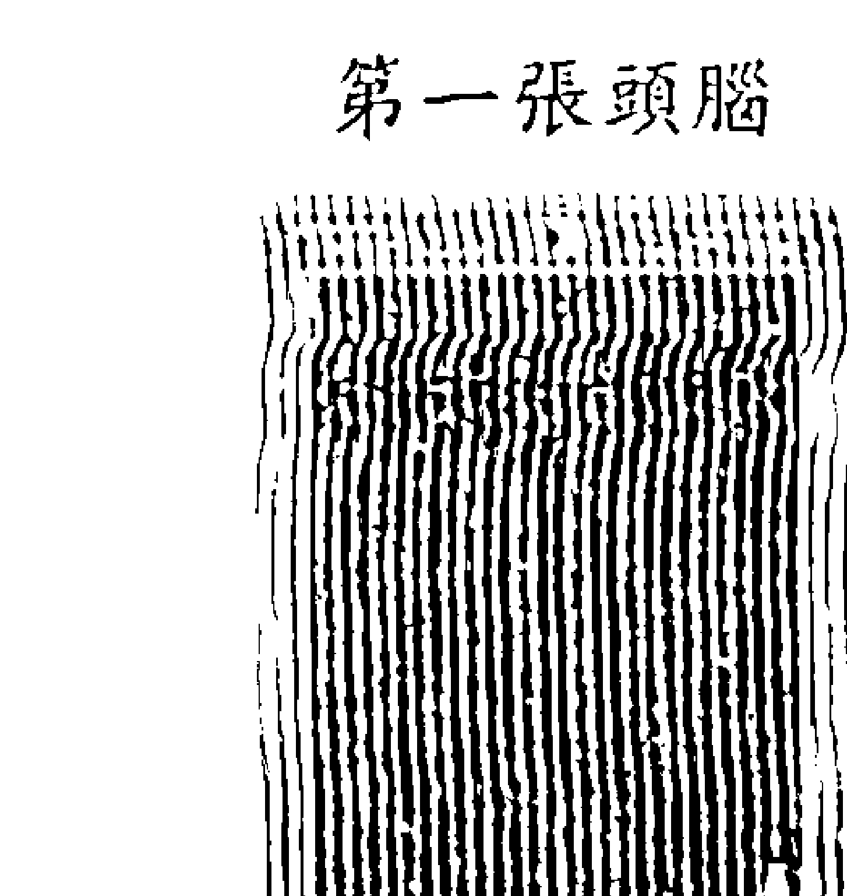
1.殘酷 (寶劍9)

##### 第二張忠告
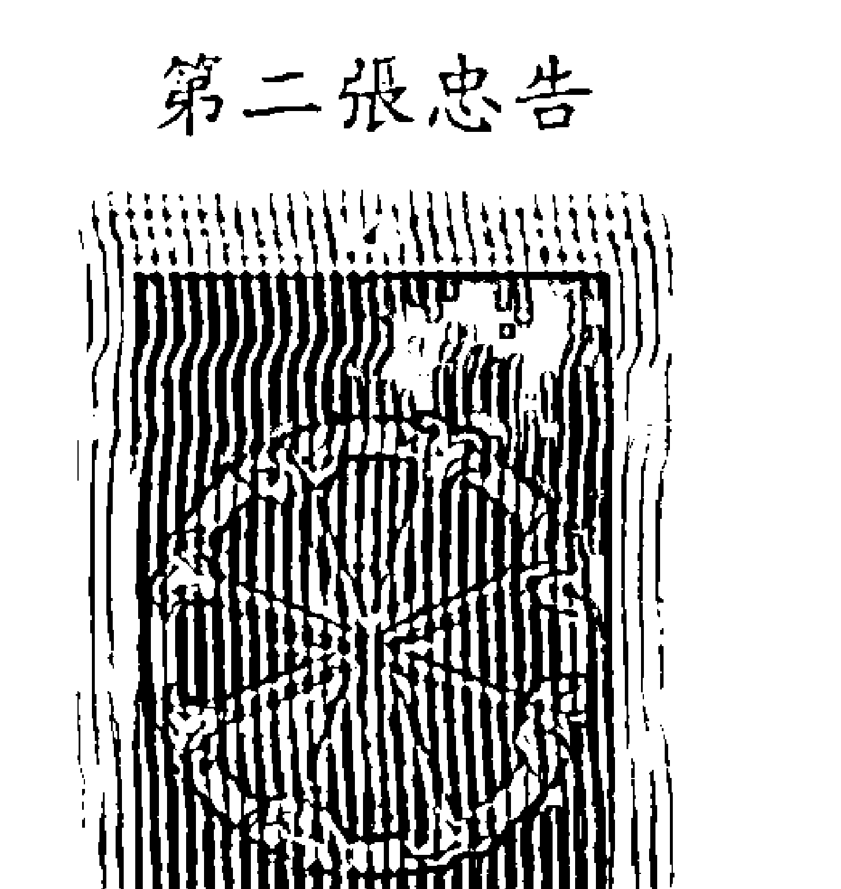
2.完成 (權杖4)

##### 第三張結果
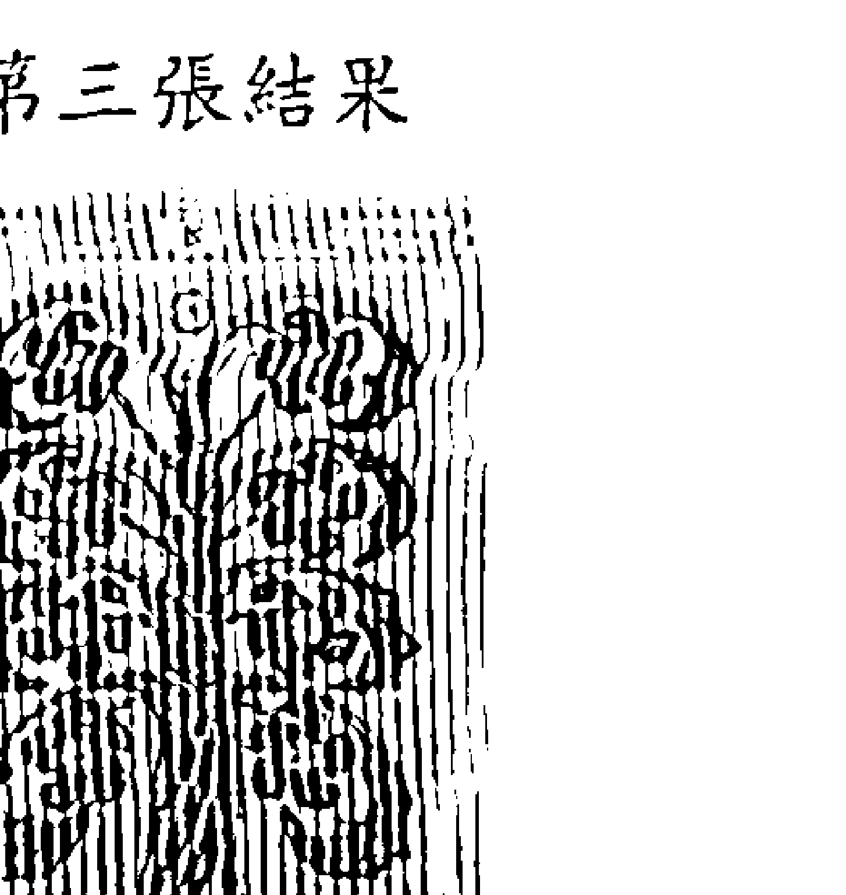
3.謹慎 (金幣8)

#### 提示：
在進行中（完成），持小心謹慎的態度（謹慎）。

##### 第一張牌頭腦，殘酷——自我懷疑、不確定：
她認為前男友不會接受她。

我們來看忠告牌說些什麼。

##### 第二張牌忠告，完成——解決、完成：
如果心中尚有未完成的事情，可嘗試著去挽回。

##### 第三張牌結果，謹慎——小心、謹慎：
慢慢的進行，不要躁進與催促。

### 總結：
她覺得前男友應不會接受她（殘酷），但如果她還不想要放手，可以謹慎的（謹慎）去試試看（完成），然後看事件會如何發展。

##### 補充說明：
未完成的事件，常會在頭腦中日夜迴盪著，縈擾著我們，造成我們的負擔。不論嘗試之後結果是如何，它都需要塵埃落定，然後我們就可以讓它離開。

#### 推薦靜心：
光的課程。

### 案例六：
案主為四十幾歲女性，從事教學工作。她想來看目前是不是寫作的成熟時機。

我們以這樣來提問：目前是不是寫作的成熟時機？

這個問題所抽出的三張牌：1.和平 2.寶劍公主 3.殘酷

##### 第一張頭腦
##### 第二張忠告
##### 第三張結果
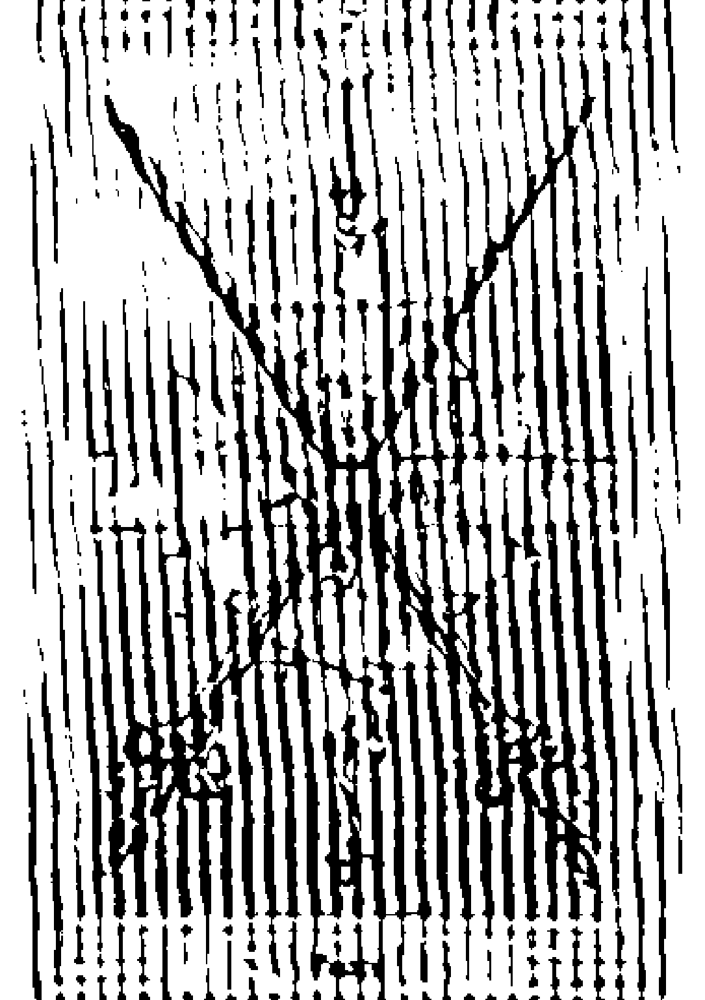

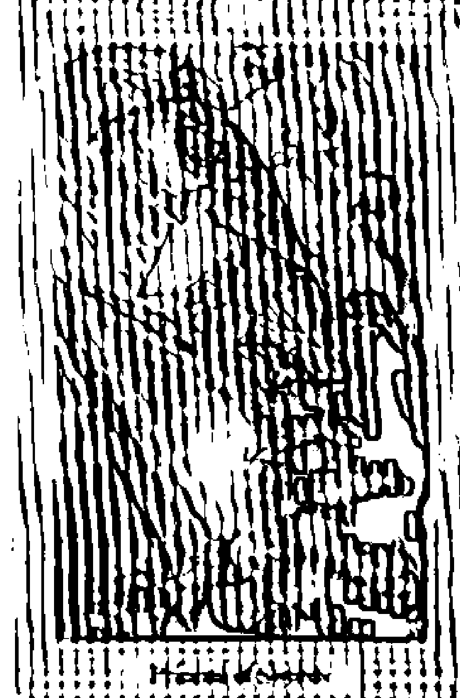

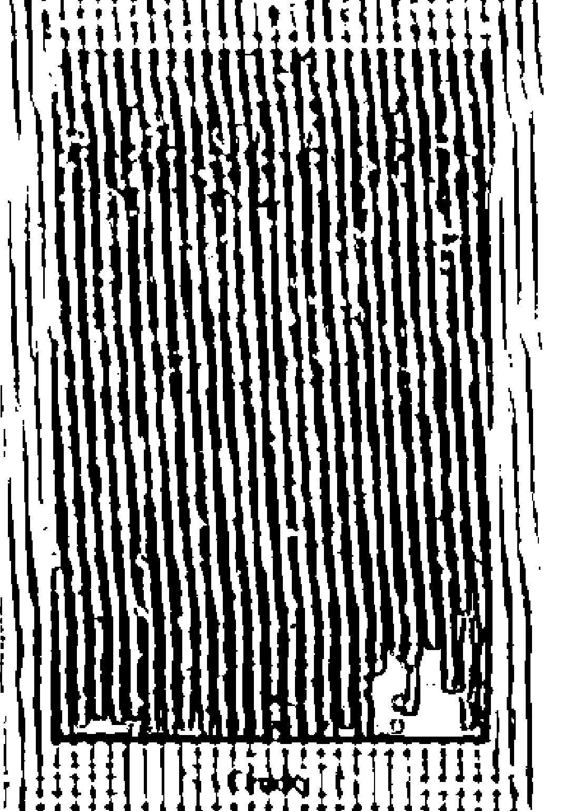

1.和平(寶劍2)

2.寶劍公主

3.殘酷(寶劍9)

#### 提示：
三張均是寶劍牌。

##### 第一張牌頭腦，和平——頭腦的和平：
她認為這個問題不是需要去解決的難題。這意謂著頭腦認為是沒有問題的，但仍思索著這個問題。

我們來看忠告牌說些什麼。

##### 第二張牌忠告，寶劍公主——掃除思想的烏雲：
她需要去掃除思想的烏雲，以便能夠看清楚，為什麼需要自我懷疑（殘酷）。

##### 第三張牌結果，殘酷——自我懷疑：
需要去懷疑，自己的負面思想、自我否定的信念。

### 總結：
她對目前是否是寫作的成熟時機，雖然認爲沒有問題（和平），但仍有一份不確定感。她目前需要去除思想的烏雲（寶劍公主），好讓她可以看見負面的思考模式（殘酷）如何影響她的前進。

#### 推薦靜心：
亂語。可協助她遠離嘈雜的頭腦。

### 案例七：
案主為二十幾歲女性，原在市場賣菜，她想轉型做按摩。

我們以這樣來提問：關於轉型做按摩，我應有什麼了解？

- 1. 殘酷
- 2. 聖杯一
- 3. 宇宙

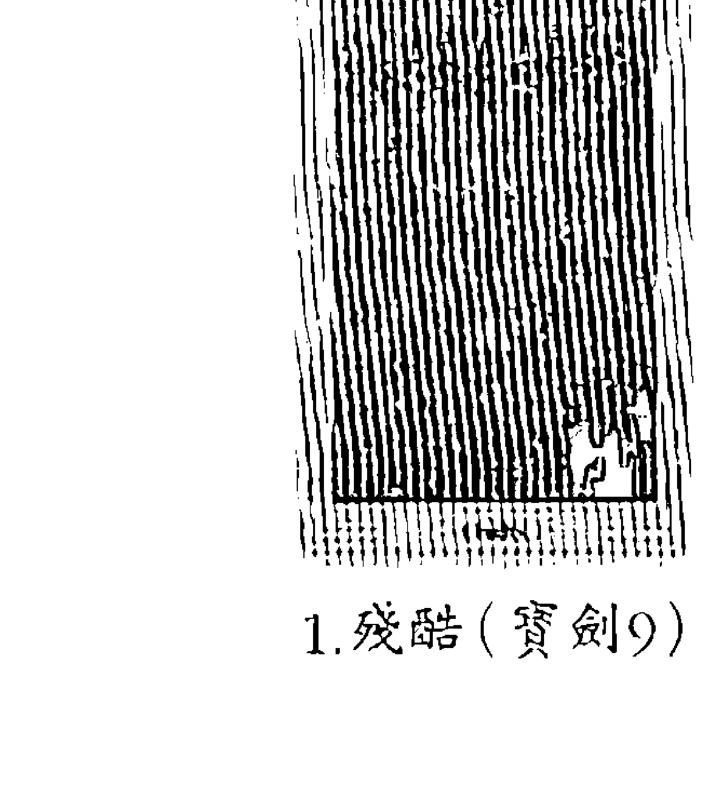

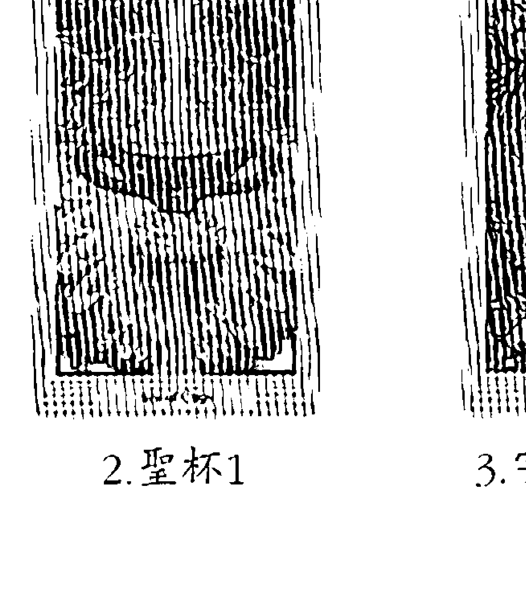

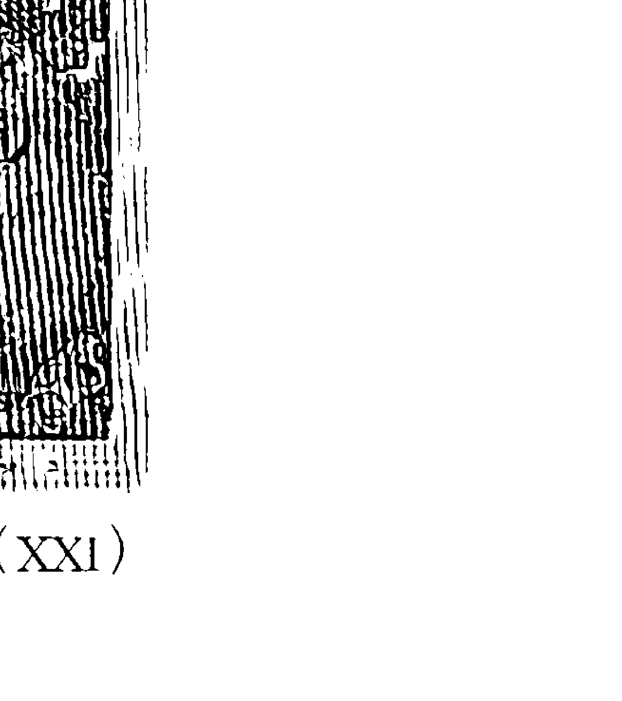

#### 提示：
她不需要聽頭腦的懷疑（殘酷），她需要聽心的聲音（聖杯一）。

##### 第一張牌頭腦，殘酷——懷疑自己、否定自己：
關於轉型，她的頭腦正在想著，我不會成功、能力還不夠、時機還未到…等等懷疑和否定的聲音。

我們來看忠告牌說些什麼。

##### 第二張牌忠告，聖杯一——肯定自己、肯定自己的感覺：
她需要傾聽她內在的聲音，跟隨內在的感覺走、肯定內在的指引。

##### 第三張牌結果，宇宙——一個情況的完成或自然的開花：
接受內在的指引，目前是可以去完成的時候。

### 總結：
她懷疑目前自己是否有能力轉型（殘酷），她需要肯定自己，跟隨內在的感覺走（聖杯一），目前是可以去完成的時候了（宇宙）。

#### 推薦靜心：
阿底俠靜心。可協助她連結心的感覺，傾聽心的聲音。

### 案例八：
案主是讀牌示範課程所邀請來的來賓，約三十歲左右的女性，她想要知道，今生可否找到靈魂伴侶。

我們以這樣來提問：關於今生可否找到靈魂伴侶，我應有什麼了解？

這個問題所抽出的三張牌：1.富足 2.科學 3.塔

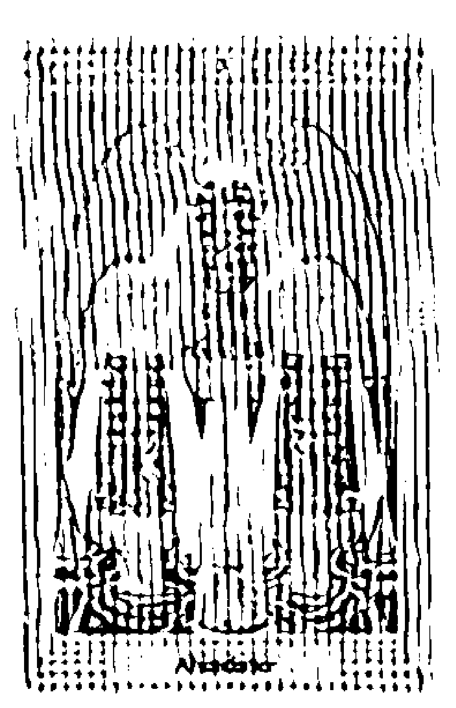

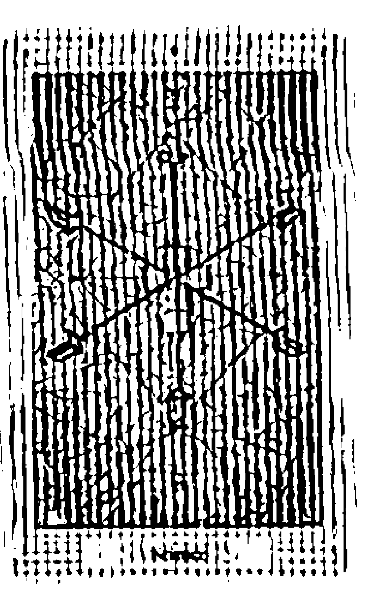

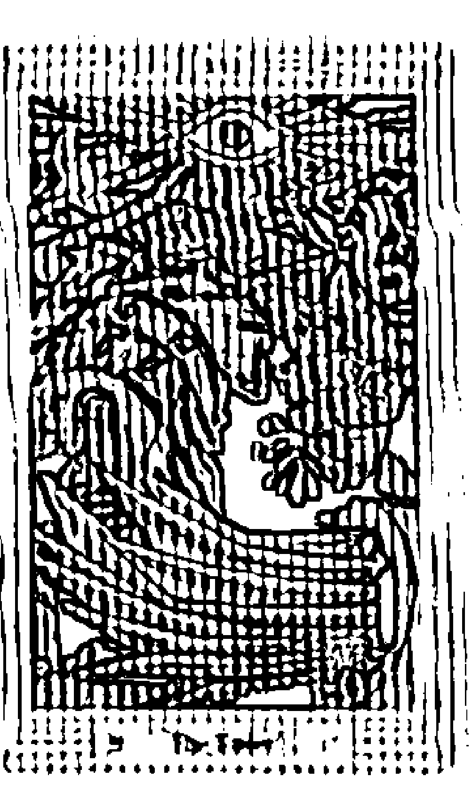

#### 提示：
頭腦是一張聖杯牌（富足），顯示關於這個主題，她沉醉在她自己期待的情感裡。忠告是一張寶劍牌（科學），她需要由沉醉的情感，走向客觀的理性。最後的結果是放掉這個舊有的思想模式（塔），以更寬廣的角度來面對人生。

##### 第一張牌頭腦
富足——遊戲的心情、洋溢的富足：她充滿著期待的喜悅，希望今生能有靈魂伴侶。或許，她認為，如有靈魂伴侶，她將過著快樂、滿足的兩性生活。

我們來看忠告牌說些什麼。

##### 第二張牌忠告
科學——客觀的清晰：她需要從她的主觀情感中退回來，進入客觀的分析。了解事實的真相（每一個伴侶都是靈魂伴侶這個事實）。

##### 第三張牌結果
塔——舊有自我模式的瓦解，以便達到更深的真理：當她了解忠告牌的建議，她就可以從這個舊有的思想模式走出來。

### 總結：
她認爲如有靈魂伴侶，生活將會是富足喜悅的（富足）。她需要以客觀的理性（科學）來檢驗這個想法，了解每一個伴侶都是靈魂伴侶這個事實，來放掉她舊有的思想模式（塔）。

##### 補充說明：
案主對未來的伴侶有“同質性”的期待。她認爲同質性在彼此的相處中，將更爲融洽，比較沒有衝突爭執。塔羅牌邀請她，不帶主觀判斷，以客觀清晰的思考來看清事實，好讓她能走出這個虛幻的假象。

沒有其他東西能像愛情這麼活化我們的存在，也沒有其他東西能像愛情這麼深入的刺傷我們的心。我們常帶著愛情夢，進入一個新的關係或期待一個新關係時，總會預期在關係中的一切，均符合自身的期待。但往往不久，便從真實中感到失望。我們在尋找最佳伴侶中，常模糊了焦點。我們需要去認清一個事實：什麼樣頻率特質的人，將吸引相同頻率特質的人爲伴侶。伴侶是彼此間的一面鏡子，如實的反映出深層內在的自己，甚至有些部份並不爲我們自己所知。透過伴侶所經驗到的愛恨情愁，不論我們如何去吸收消化這些經驗，透過淬煉，我們將明白索求的無用。之後我們便能從找尋中退回，尋求自身的獨立與完整。而當兩個愛人是成熟獨立的，關係就會由索求變爲獨立，由依賴變爲單獨。

#### 推薦靜心：
進入晴朗的天空。天空是如此的廣大，我們真的可以從狹隘、主觀的觀點退回回來，以更宏觀的觀點來看事物。

### 案例九：
案主是讀牌示範課程邀請來的來賓。當她坐在個案的位子上時，雙手抱胸，身體往後靠，當她面對團體學員時更是害羞的不發一語。我告訴她，這個活動是讀牌示範課程。在她之前，我們已經讀過許多案例了。對她將要問的問題，我們一點也不覺得奇怪。經安撫後，她說她想知道，什麼時候會有男朋友。

我們以這樣來提問：關於交男朋友這件事，我應有什麼了解？

- 這個問題所抽出的三張牌：
1. 權杖皇后
2. 聖杯騎士
3. 賢者

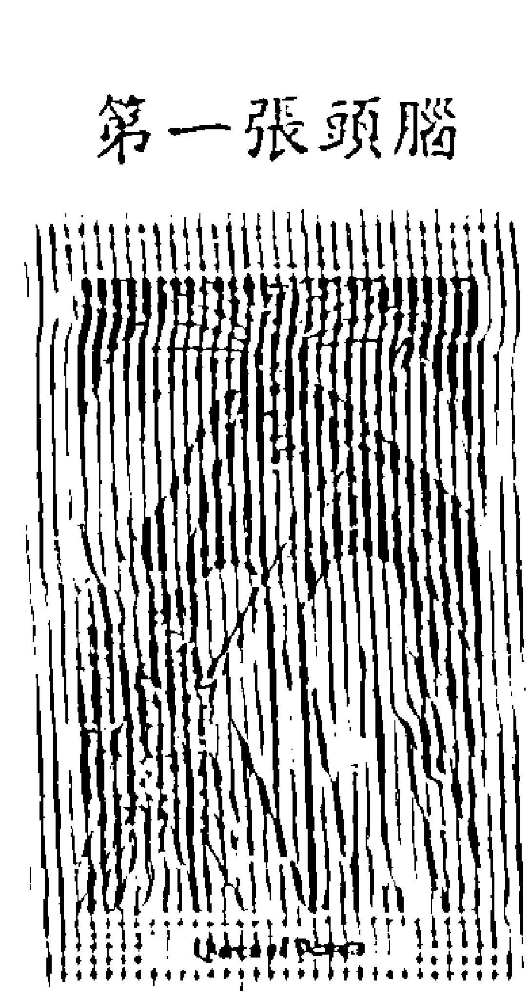

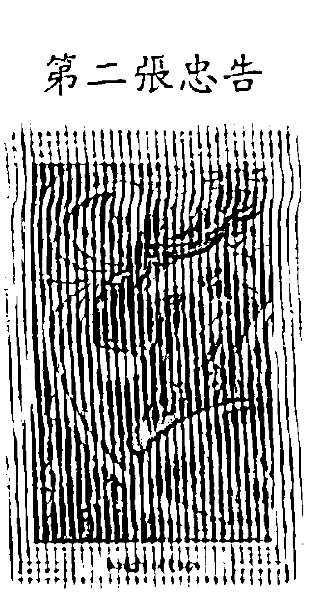

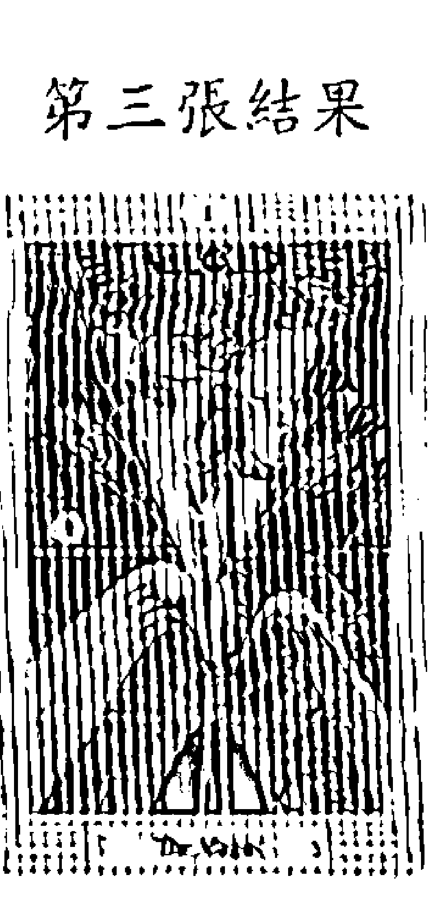

#### 提示：
頭腦位置的牌是靜態的、往內的（權杖皇后），忠告牌是主動的、向外的（聖杯騎士、賢者），也就是說她要化被動爲主動。

##### 第一張牌頭腦，權杖皇后——使用現有的能量來作自我覺知、往內走：
關於交男朋友這件事，她的能量是往內省思、思量解決之道、如何進行等，但尚未付諸行動。

我們來看忠告牌說些什麼。

### 案例十

案主为读牌示范课程邀请来的来宾，是一位育有二子的中年妇女。她诉说着为了家庭，她已耗尽了自己。她想要放下丈夫与孩子们，独自到山上去生活。

我们以这样来提问：关于想要离开家庭，独自到山上去生活，我应有什么了解？

- 1. 怠惰
- 2. 残酷
- 3. 金币皇后

#### 第一张头脑
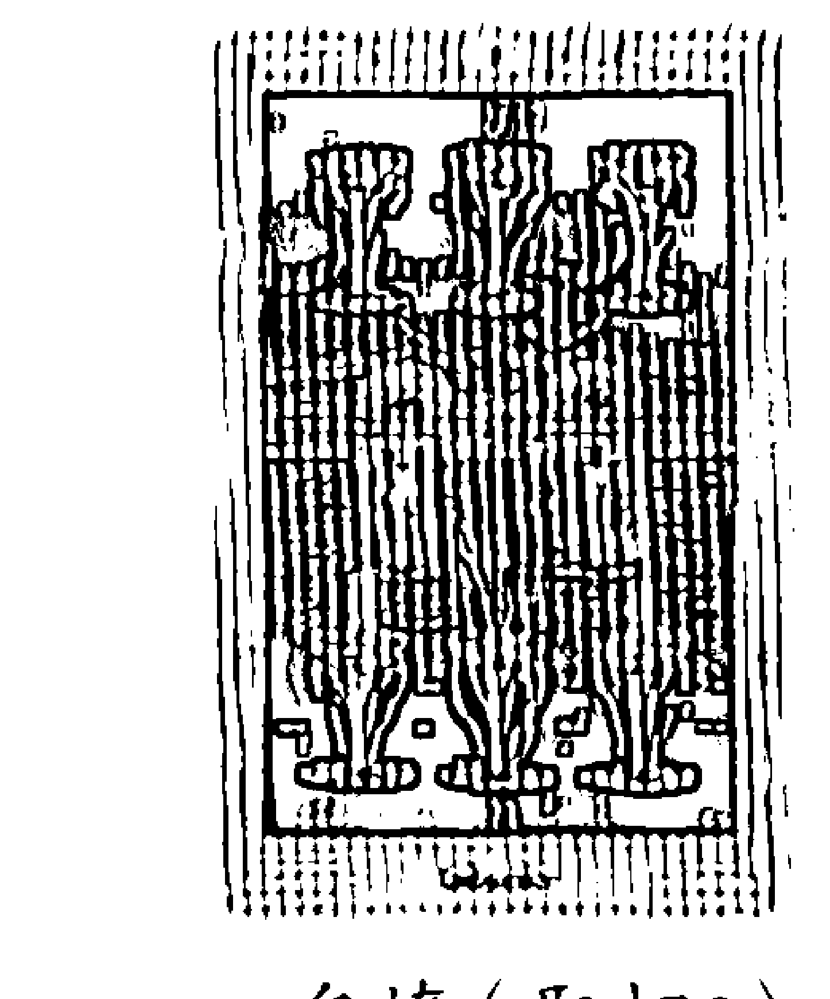
1. 怠惰（圣杯8）

#### 第二张忠告
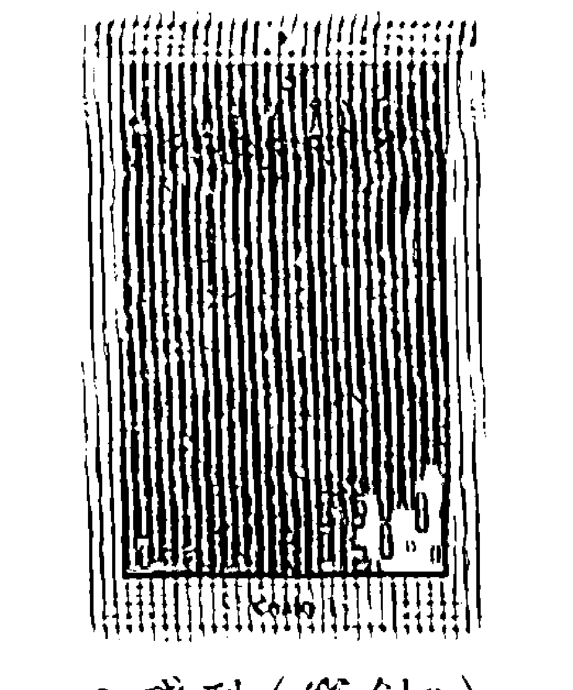
2. 残酷（宝剑9）

#### 第三张结果
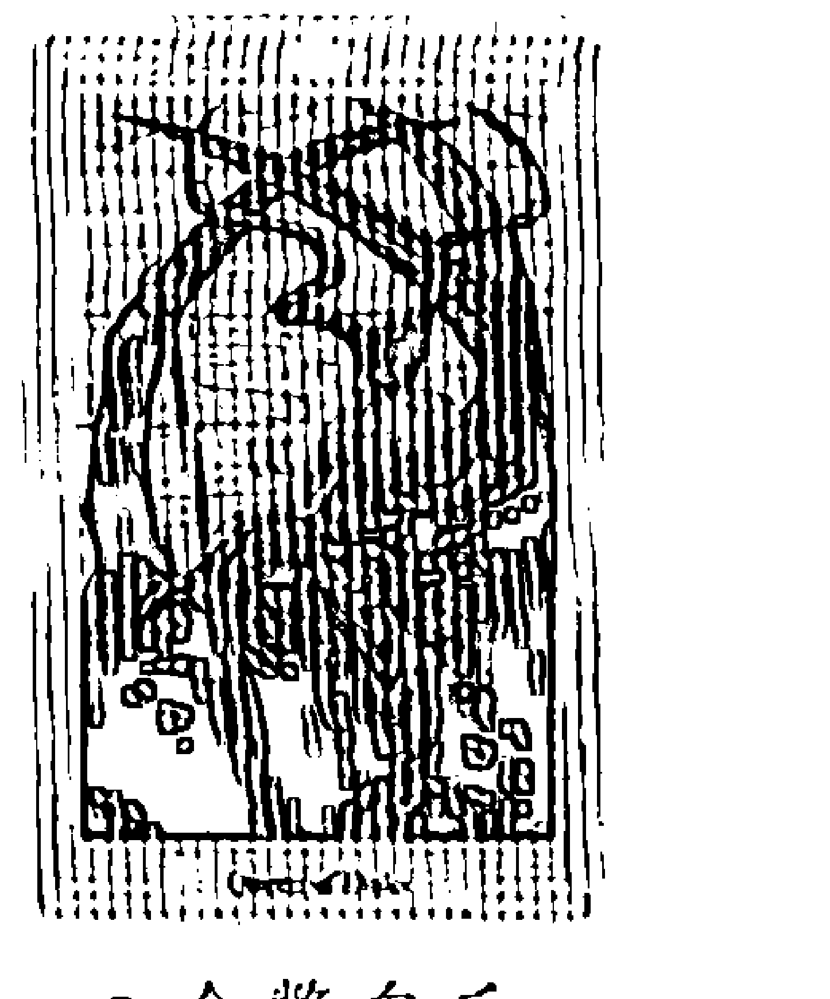
3. 金币皇后

#### 提示：
塔罗牌如实的反应出她所感到的耗竭（怠惰）。一张需要怀疑她的想法的牌（残酷），一张需要学习如何放松自处的牌（金币皇后）。

第一张牌头脑，怠惰——枯竭了、精疲力竭：对家庭的无尽付出，让她感到能量已经耗尽了，已经给到干涸了。

我们来看忠告牌说些什么。

第二张牌忠告，残酷——自我怀疑：她需要去怀疑独自逃到山上去生活，是这个问题的解决之道。

第三张牌结果，金币皇后——“在”、在自己的存在里休息：她需要学习如何在关系中，放松的自处。照顾别人时，不忘回来照顾自己，照顾别人与照顾自己可以兼顾，而且是平衡的。

### 总结：
她感觉到为了家庭，她已经耗尽了她自己（怠惰）。目前她想藉着逃到山上去生活，来改变现况。她需要了解，如果内在的认知没有改变，纵使逃到山上去，心仍然不得安适。她需要怀疑逃到山上去生活是解决这个问题的办法（残酷）。目前她需要留在家庭中，学习了解什么是自己的极限，及如何表达个人的界限——当她想给予的时候才给予，当她不想给予的时候也不需要感到罪恶感；同时，她需要去看她想藉由给予来避开什么，以致于她要不断的给到耗竭。试着往内在去找到问题的根源，如此才能在与家人相处时，自己也可以放松的自处（金币皇后）。

补充说明：我们从小就被教导，如何扮演妻子的角色、母亲的角色、女儿的角色……但从来没有人教导我们如何扮演自己的角色。长久以来自己被自己所遗忘的结果，让我们在关系中失去了平衡。直到我们耗尽自己时，才赫然发现自己的存在。

推荐静心：那达布拉玛（Nadabrahma）静心。可协助案主去感受给予与接受的不同能量状态。

### 案例十一
案主为育有一子的年轻母亲，为全心照顾小孩而辞去工作。最近小孩学测成绩不尽理想，她考虑是否要送小孩去补习。

我们以这样来提问：关于是否要让小孩去补习，我应有什么了解？

- 这个问题所抽出的三张牌：1. 宝剑皇后 2. 太阳 3. 欲
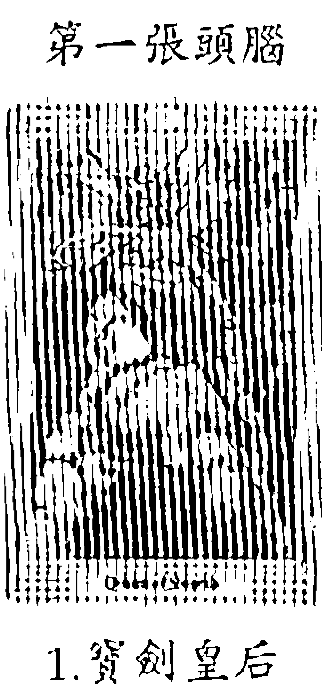
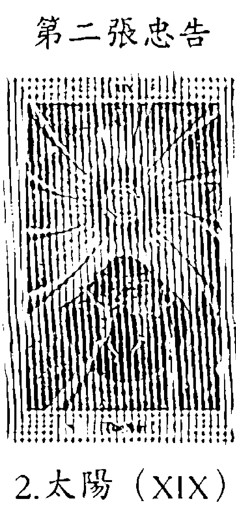
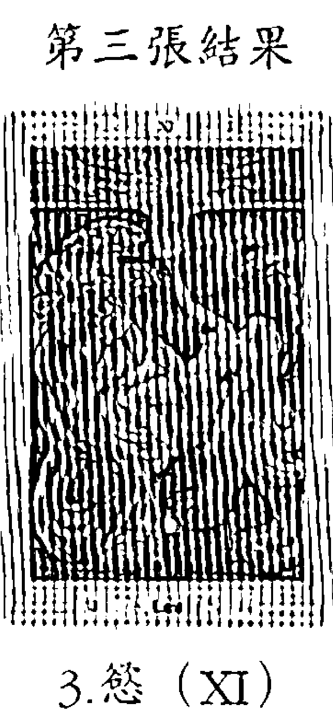

#### 提示：
忠告的位置是一张关系牌（太阳），显示这个主题与案主的关系有关（小孩学业成绩的好坏，是母亲在关系中的压力）。结果的位置，是一张活生生、不受束缚的牌（欲），显示母亲需从关系的束缚中，释放自己。

第一张牌头脑，宝剑皇后——客观清晰的思考：她想要以清晰客观的头脑来思考，是否要让小孩去补习。
我们来看忠告牌说些什么。

第二张牌忠告，太阳——在合约关系中的限制、学习在关系中成为独立的：小孩的学业成就、母亲对这件事的自我评价，及他人眼中的自己，对这位母亲形成一个三角束缚的关系。小孩成绩不尽理想与母亲辞去工作的对价性、母亲对自己角色的期待及预期家人对其角色的期待、亲戚、家长间对彼此小孩成绩的比较，是造成她在关系中的压力。这是在她想要以清晰客观的思考下，有更深一层关系上的影响是她需要看见的。

第三张牌结果，欲——活生生的、对生命的热情：如果她能了解，每一个人都是独立的个体，小孩的学业成就，并非是她唯一的成就。她需要从这个令人窒息的关系中走出来。给自己空间，也给小孩空间。就只是自由的去做自己，全然的去生活。她需要从关系中去释放她自己。

### 总结：
她想要以清晰客观的头脑来思考，是否要送小孩去补习（宝剑皇后）。她需要看到，对小孩课业的期待是来自她深陷纠结的关系有关（太阳），而这些是她在意识层面上没有觉察到的。她需要有意识的察觉到在关系中的压力，如何遮蔽了她的个体性、自主性及自我意识。通过觉察，她就能从关系中释放她自己（欲）。

### 补充说明：
我问该学员，如果小孩功课不好，有谁会责备她？她答复：我会责备我自己。我们对我们自己的认知，通常不是来自我们自己的经验、体验，而是收集在生活中，我们是如何被对待而来的经验。久而久之，它变成我们的信念和认知模式。我们活着，但遵循着不是我们自己所体验来的真理来对待自己，所以对自己所持有的信念要小心。带着觉知觉察，那是回到自己的道路。

该学员又问，那要不要送小孩去补习，我建议她尊重小孩的意愿。后来小孩选择去补习。

### 推荐静心：
那塔拉吉（Nataraj）静心。让案主感受内在那份活生生、热情的生命力（欲），这份生命力可以支持她在关系中感觉到她自己的存在。

### 案例十二
案主是课堂上的学员，女性。她叙述小时候因父亲外遇，母亲常拿她当出气筒。至今她已成年，但母亲对其态度依然如故。她想来看与父母亲之间的关系她应有什么了解。

我们以这样来提问：关于我与父母的关联，我应有什么了解？
这个问题所抽出的三张牌：1. 调整 2. 获得 3. 魔鬼
- 第一张头脑
- 第二张忠告
- 第三张结果
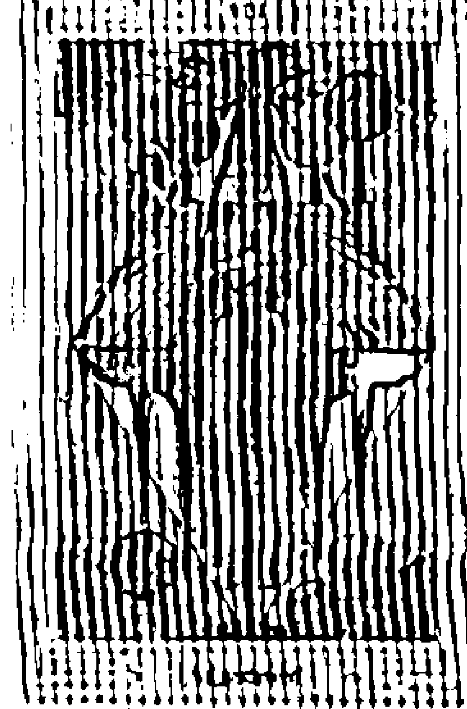
1. 调整（VIII）
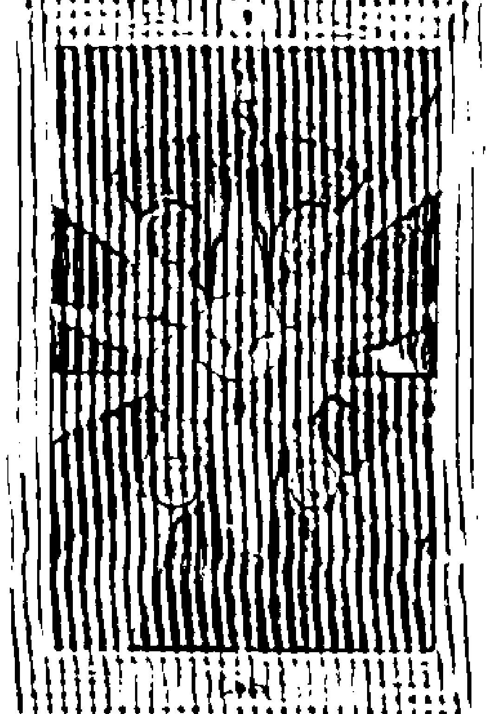
2. 获得（金币9）
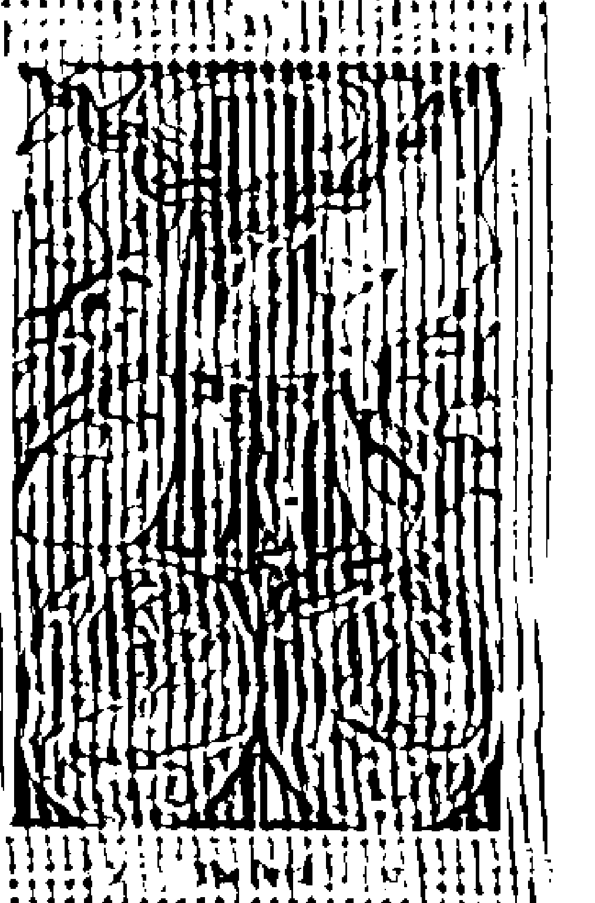
3. 魔鬼（XV）

#### 提示：
有两张主牌。由观照（调整）走向接受事实（魔鬼）。

第一张牌头脑，调整——看、观照：她想要以不涉入感情的方式、冷静的，来看她与父母之间的关系。
我们来看忠告牌说些什么。

第二张牌忠告，获得——任何的发生都是对的：我们的父母是我们自己选择来的。在我们投胎时，就已经知道通过这一世我们所要经历的事件，并选择适当的父母来促成。如果一个灵魂只想要经验胎儿期而不想经验出生后的成长期，那么他会选择一位在生产过程中发生死产的母亲。所以，一切的发生都是因为需要而发生。接受它，并试着了解在事件中我们需要学习的课题。

第三张牌结果，魔鬼——如实的接受事实：接受他们，也接受你是他们女儿这个事实。接受就是学习的第一步。接受并不是消极的认命，接受能带给我们宏观的观点，让我们对生命中所发生的事件能以创造性的方式来回应。

### 总结：
她想要以不涉入感情的方式来看她与父母之间所发生的问题（调整）。她需要了解，事情就是需要这样发生（获得），是她选择她自己的父母来学习今生的课题。当她能有这样的了解时，她就能如实的接受这个事实（魔鬼）。

补充说明：对灵魂自己选择所要经历的事件这个主题有兴趣的读者，请参看——「个人与群体事件的本质」一书（赛斯书）方智出版。

### 推荐静心：
动态静心（Dynamic）。

### 案例十三
案主是一位二十出头，就读某大学并在社团担任志工的男性。他说他不知道在这一生中内在真正想要的是什么，希望通过塔罗牌来了解。

我们以这样来提问：关于今生我内在想要的是什么，我应有什么了解？

- 1. 金币王子
- 2. 金币公主
- 3. 金币皇后

#### 第一张头脑
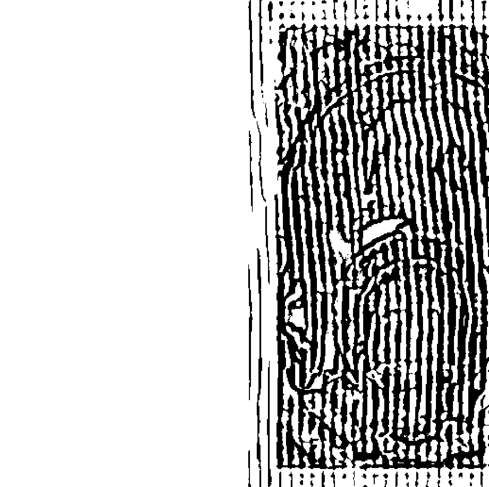
1. 金币王子

#### 第二张忠告
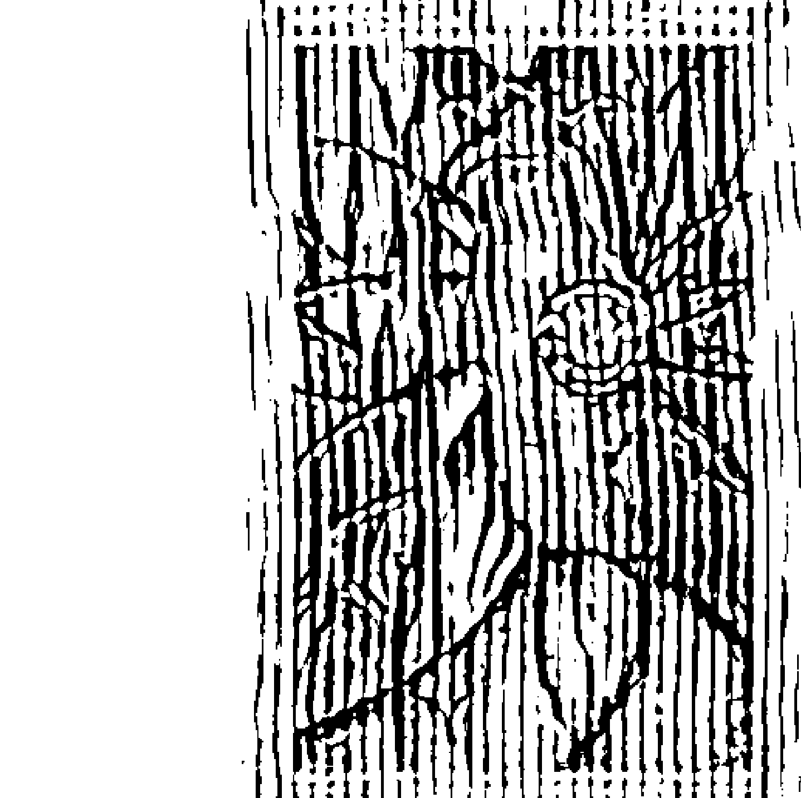
2. 金币公主

#### 第三张结果

3. 金币皇后

#### 提示：
三张牌均是金币的宫廷牌，意谓着需处在当下的能力（处在身体中才能处在当下）。头脑位置的牌是向外、目标导向的，后面二张忠告牌则是静态、等待的牌。

第一张牌头脑，金币王子——目标导向、未来取向：虽然他提问了这个问题，但似乎头脑里已有一个目标，并不像他所说的不知道。当我向他求证时，他说确实是这样。他很想像他哥哥一样，拥有他哥哥的能力，而这也是他父母对他的期许。如果他按照父母的期待去复制成为他哥哥，十年后，他依然会坐在这个位置上，问同样的问题。我问他是否有觉知到这一点，他说他知道。我们来看忠告牌说些什么。

第二张牌忠告，金币公主——耐心的等待：金币公主是一位怀孕的妇女，代表那个追寻的种子已经种下去了，目前需要耐心的等待。事情有它自己的时间点，它无法被催促，而且他已经在探寻的道路上了。

第三张牌结果，金币皇后——放松的处在当下：追寻的种子已经种下去了，目前他只要放松的，实在的去过每一天的生活。只要“在”。

### 总结：
虽然他想知道在这一生中他真正想要的是什么，但似乎心中已有一个追寻的目标（金币王子）。那个追寻的种子已经种下去了，需要给那个旅程时间去发展（金币公主）。目前不需要做什么，只要放松并待在当下，待在真实里（金币皇后）。

补充说明：看到一位二十出头的年轻人问这个问题，我内心暗自为他高兴。这股对真理追寻的热情，将让他很快的踏上静心之路。

### 推荐静心：
任何静心都适合。

### 案例十四
案主是一位四十多岁的女性。目前在一家连锁的早餐店工作。最近因与老板娘有一些冲突，正考虑是否要换工作。

我们以这样来提问：关于是否要换工作应有什么了解？

- 这个问题所抽出的三张牌：1. 宝剑一 2. 圣杯王子 3. 富足
- 第一张头脑
- 第二张忠告
- 第三张结果

1. 宝剑1

2. 圣杯王子

3. 富足(圣杯3)

#### 提示：
一张宝剑牌在头脑的位置，二张圣杯牌在忠告的位置，意谓着她需要从头脑进入心的感觉：如果我们不知道在工作上自己真正想要的是什么（圣杯王子），就无从做出决定（宝剑一）。

第一张牌头脑，宝剑一——做决定：她想做出决定。

我们来看忠告牌说些什么。

第二张牌忠告，圣杯王子——欲望、梦想：她需要去感觉在工作上她真正想要的是什么。如果这份工作是她想要的，她将会去解决工作上的难题；如果不是，那么每次换工作都只不过是为了次要的因素。

第三张牌结果，富足——游戏、轻松的心情：这里游戏、轻松的心情并不是指不负责任的态度，而是以不严肃的心情来工作。当她能够在工作上以游戏、轻松的心情去做它时，就比较能够发现自己在工作上真正想要的是什么。

### 总结：
她想要做出决定是否要离开目前的工作（宝剑一）。事实上她并不知道她想要或喜欢什么工作（圣杯王子），而去找到它的方法就是以游戏、轻松的心情去做它（富足）。

### 推荐静心：
再生。从游戏中（富足），了解自己想要什么（圣杯王子）。

### 案例十五
案主是一名舞者，她想要知道跟她舞伴未来的合作关系。

我们以这样来提问：关于和我的舞伴未来的合作关系应有什么了解？

这个问题所抽出的三张牌：1. 快乐 2. 谨慎 3. 挫败


#### 提示：
她的期待（快乐）无法成功（挫败）。

**第一张牌头脑，快乐——对幸福或希望的期待：** 她对她的舞伴有期待并希望透过期待的满足而带来快乐。我们来看忠告牌说些什么。

**第二张牌忠告，谨慎——小心谨慎：** 对这个期待要小心谨慎。期待常让我们无法看清事实的真相，尤其当那个期待是我们所渴望时更是如此。

**第三张牌结果，挫败——失败：** 她需要接受她的期待不会实现这个事实。有时我们所执着的事物让我们不愿意去看到事实的真相，但这样做并无法改变挫败的事实。

### 总结：
她对未来与舞伴的合作关系有着期待，并希望透过这个期待的满足而带来快乐（快乐）。她需要对这个期待小心谨慎（谨慎），因为它是不会成功的（挫败）。

推荐静心：动态静心（Dynamic）或神秘玫瑰静心。

## 四张牌关系解读法
### 案例一
案主是一位约四十多岁的妇女。她想来看与先生的关系。

我们以这样来提问：关于与先生的关系上，我应有什么了解？

- 1. 奢华
- 2. 魔鬼
- 3. 爱人
- 4. 失望

#### 第一张头脑

1. 奢华 (圣杯4)

#### 第二张忠告

2. 魔鬼 (XV)

#### 第三张结果

3. 爱人 (VI)

#### 第四张关系人

4. 失望 (圣杯5)

#### 提示：
这是一个感情的议题。头脑被不安全感所占据（奢华），随之而来的作为无非是索求、要求证明、或防御性的冷漠。她的关系人处在这种情况下的反应是失望（失望）。

**第一张牌头脑，奢华**——安全感、舒适的：在与先生的感情上，她想要紧抓着安全或舒适的感觉。这可能是有外在事实的基础，但也有可能是来自她自己内在不安全感的反应。
我们来看忠告牌说些什么。

**第二张牌忠告，魔鬼**——如实地看待事实：她需要好好的检验一下事情的真实性是如何。这是需要待在真实中，而不迷失在内在的不安全感里，才能有的能力。当我们看到第三位置的牌，我们可以推测她的想法比较是基于内在的不安全感，因为她被建议处于爱之中。

**第三张牌结果，爱人**——爱：待在关系中，进入爱里。在关系中要有爱，不要因为内在的不安全感、猜忌就把爱推开。

**第四张牌关系人，失望**——失望：关系人与案主相处时，是处于失望中。他的反应是可以被预期的，因为妻子对他处于紧抓的不安全感中，在这个状态下，我们可以想像会有什么事发生。

### 总结：
她担心与先生的感情是否可以维持像以往那么安全舒适（奢华），所以她想紧抓着这份安全感，深怕会失去它。她需要检验一下事情的真实性是如何（魔鬼），不要迷失在想要紧抓的安全感里，而把爱给埋葬了。要进入爱中来学习（爱人）。

### 推荐静心：
阿底侠静心。

### 案例二
案主是一位甫出社会的新鲜人，约二十来岁的女性，她想来看有无机会与前男友复合。

我们以这样来提问：关于有没有机会与前男友复合，我应有什么了解？

- 这个问题所抽出的四张牌：1. 死亡 2. 英勇 3. 圣杯王子 4. 爱伤。
- 第一张头脑
- 第二张忠告
- 第三张结果
- 第四张关系人

1. 死亡（XIII）

2. 英勇（权杖7）

3. 圣杯王子

4. 爱伤（宝剑3）

#### 提示：
一张强烈的死亡牌，在头脑的位置上，显示她有意识的头脑已知道这段感情已逝。她需要学习放手，她才能有空间来看在关系中她真正想要的是什么（圣杯王子）。

**第一张牌头脑**，死亡——死亡、结束、放手：她认为这段感情已经结束了。既然她有意识的头脑认为这段感情已经结束，为何她还想要复合？

我们来看忠告牌说些什么。

**第二张牌忠告**，英勇——努力、勇气：要有勇气接受这段感情已经结束的事实（这表示她还不想让这段感情离开，这也就是为何她有意识的头脑认为这段感情已结束，但还是来询问这个问题的原因）。

**第三张牌结果**，圣杯王子——梦想、情感的欲望：她需要去感觉，在关系中，她真正想要的是什么，而不去在乎得与失（我们比较在乎“要”而不在乎“要到什么”；比较在乎“失去”而不在乎“失去什么”，当我们只在乎“动词”，我们就看不到“名词”对我们有什么意义）。

**第四张牌关系人**，忧伤——负向、悲伤、愤怒：关系人与案主相处时处于悲伤、挫折的状态。这可能是在关系中造成的，但也有可能是他个人的一般状况。

### 总结：
她有意识的头脑知道，这段感情已经结束了（死亡）。但仍企盼能有复合的机会。她需要有勇气接受这段感情已逝这个事实（英勇）。唯有接受并让它离开，她才能有空间，超越得与失的执着，清楚的来看，在关系中，她真正想要的是什么（圣杯王子）。

推荐静心：光的课程。

### 案例三
案主是一位大学四年级的女生，最近常为了一点小事与男友吵架。她想来看与男友的关系。

我们以这样来提问：对目前与男友的关系，我应有什么了解？

- 1. 成功
- 2. 主权
- 3. 挫败
- 4. 月亮

#### 第一张头脑


#### 第二张忠告


#### 第三张结果


#### 第四张关系人


#### 提示：
这组牌的整体感是尖锐的，有一种紧迫（成功）与挫败感（挫败）。第一张想要努力成功的牌与第三张结果的失败形成强烈的对比。

第一张牌头脑，成功——成功、想要成功、做对的事：在她有意识的头脑里，她想要通过积极努力的作为来达成她所想要的关联。我们来看忠告牌说些什么。

第二张牌忠告，主权——新的方向、新方式：在这段关系中，她需要从原来努力作为的模式转向另一个新方向。我们不知道这个新方向是关于什么，加抽牌来了解。她抽出了金币王子。

加牌金币王子——决心、目标：这个新方向是朝向某一个目标，我们不清楚这个目标是关于什么，再加抽一张牌来了解。她抽出了调整。

加牌调整——看、观照：这是一张需要跳脱头脑想要努力、成功，由外在的目标转向内在的观照，非常客观冷静的牌。意指她需要停止一切的努力，保持客观冷静，不带批判的来看这段关系。

第三张牌结果，挫败——失败：她需要接受这段关系及连接的方式是行不通的。努力作为无法带来她想要的成功。

第四张牌关系人，月亮——不安、恐惧、不确定：关系人与案主相处时，是处于一种不确定、不安或恐惧的状态。这可能源于关系中紧绷努力的氛围，也可能是他个人的内在状态。

### 总结：
她想要通过积极努力来让关系成功（成功），但这反而造成了关系中的紧张与挫败感（挫败）。她需要转换方式，从努力作为转向客观的观照与接纳（主权、调整），并理解关系人在此状态下感到的不安与不确定（月亮）。接受关系的现状，停止强求，或许是新的开始。

### 推荐静心：
静坐，或任何能帮助她回到中心、观察而不干预的静心方式。

式是失败的。

第四张牌关系人，月亮——未知、不知道：关系人在这段关系中处于未明的状态。有可能是不知道如何跟她连结互动或不知道是否要处在男女关系中。

### 总结：
她想要透过努力的作为，使这段感情可以如她预期般的进行（成功）。目前她需要从努力作为的状态朝向另一个新方向（主权），这个目标（金币王子）是保持客观、不带好坏对错的判断往内观照（调整），在这个冷静客观的觉知中，她需要看到她的努力是没有用的，是失败的（挫败）。

### 推荐静心： 动态静心 (Dynamic)。

### 案例四：
案主是一位大学二年级的女生，有一位正在当兵的男友。她感到与男友之间彼此的感情愈来愈淡，她想了解目前她们的关系状况。

我们以这样来提问：对这段愈来愈淡的关系，我应有什么了解？

- 1. 艺术
- 2. 怠惰
- 3. 魔鬼
- 4. 死亡

#### 第一张头脑


#### 第二张忠告


#### 第三张结果


#### 第四张关系人


- 1. 艺术 (XIV)
- 2. 怠惰 (圣杯8)
- 3. 魔鬼 (XV)
- 4. 死亡 (XIII)

#### 提示：
这组牌中有三张主牌。一张颜色暗沉，意指不要再投资感情的圣杯牌（怠惰）落在忠告的位置。关系人的位置是一张放手、结束的牌（死亡）。你是否已经知道答案了？

第一张牌头脑，艺术——整合、改变：她想要改变目前的关系现况，把以前的热络找回来，调合目前的冷淡。

我们来看忠告牌说些什么

第二张牌忠告，怠惰——枯竭、懒惰：停止作为，不要再做任何的努力去挽回什么，不要再放感情在这上面。

第三张牌结果，魔鬼——如实的接受事实：她需要看清楚事实并接受它已经结束了。纵使这并非她想要的，但事实就是如此。

第四张牌关系人，死亡——结束、放手：关系人认为这段关系已经结束了。

### 总结：
她想要做些什么来改变目前这段愈来愈淡的关系（艺术），但事实是这段感情已经走向结束（死亡），她需要接受这个事实（魔鬼）并放掉想要再投注感情来挽回它的想法（怠惰）。

推荐静心：光的课程。

### 案例五：
案主是任职于一家百货公司的内勤职员，女性，因近日公司将评等考绩，所以她想来看与主管的关系。

我们以这样来提问：在与主管的关系上，我应有什么了解？这个问题所抽出的四张牌：1.内在的力量（权杖九） 2.爱人 3. 伤 4. 欢乐


#### 提示：
头脑是一张独立自主的牌，但结果的位置却出现一张需要进入悲伤、愤怒的牌。这意谓着表面上的坚强独立（内在的力量）是为了避免碰触内在的脆弱（伤）。

第一张牌头脑，内在的力量——反应性的独立、力量：在与主管的关系上，在工作中，她表现出独立自主的态度。但实际上她头脑的声音是「没有人可以影响我、没有人可以左右我的情绪、没有人可以伤害我」。它是属于防卫性的力量。

我们来看忠告牌说些什么

第二张牌忠告，爱人——爱、待在关系中：去除盔甲，让自己真实地进入关系并在关系中对自己真正的感觉敞开，不论它们是什么，就是去深入那个感觉。允许任何感觉浮现。

第三张牌结果，伤——痛苦、愤怒：当她敞开并进入她真实的感觉时，她将感受到她内在所压抑的痛苦、愤怒的情绪，而目前是需要去经验它们的时候，它们可以因为被经验而得到治愈。

第四张牌关系人，欢乐——欢乐：关系人在关系的互动中，处于欢乐的状态，或是她觉得需要保持愉悦的关系。

### 总结：
在与主管的互动中，她想成为独立、有力量、不受影响的人（内在的力量），所以她把在关系中挫折、愤怒的情绪压抑下来（受伤）。但这是来自不想受伤的防卫性力量，而非真正的力量。目前她需要真实地进入关系中，并对自己在关系中的感觉敞开，允许任何情绪的浮现并去经验它们（爱人）。唯有允许去经验这些情绪，它们才能因被经验而获得释放。这是目前她在关系中需要进入的新方向。

### 补充说明：
看到这里，不知你是否会觉得自找麻烦。如果不去问这个主题，或许忍一忍、压抑它们，照样可以过日子，而不必去面对那些烦人又没有生产力的情绪。其实痛苦或愤怒都是生命力的一部份，它与喜悦或欢乐是同一能量的不同状态，如果我们去压抑它们，这就等于在扼杀我们自己的生命力，身体会变得死气沉沉、没有活力，并且长期压抑这些情绪也会导致身体上的疾病。

情绪上的发泄，并非指在职场上的对峙。一个人也可以做发泄，找一个允许私密的空间，放一些协助连结内在感觉的音乐，放任内在情绪的涌现，哭、呐喊、跺脚、打枕头等，都有助于内在垃圾的清理。然后，内在就可能比较有新的空间可以来看，为什么我在关系中会这么生气，并且为那个生气负起责任。

### 推荐静心：
打枕头。可协助她放掉防卫，并对内在真实的感觉敞开。

#### 奥修谈打枕头：
当你觉得生气，你不需要对某人生气，你只要生气，让它成为一种静心。关起房间，单独坐着，尽量让愤怒升起，如果你觉得想打，那么你就打枕头。

做任何你想要做的，枕头永远不会反对，如果你想要杀枕头，那么你就拿一把刀杀它！那将会有帮助，那将会有很大的帮助，只是打它、咬它、丢它。如果你特别恨某人，将他的名字写在枕头上，或者贴一张照片在它上面。

你会觉得很荒谬、很愚蠢，但愤怒是荒谬的，你不能够对它做任何事，所以就让它这样，将它视为一个能量现象而享受它，事实上它是一个能量现象。如果你不伤害任何人，它并没有什么不对，当你这样去尝试，你将会发现那个想要伤害某人的概念渐渐消失。

每天都练习它，每天早上只要练习二十分钟，然后整天都注意看。你将会变得比较镇定，因为那些变成愤怒的能量已经被丢出，那个变成毒素的能量已经被丢出你的系统。至少做这个两星期，一星期之后，你将会很惊讶的发现，不论在任何的情况下，你都不会生气，只要试试看——摘自「橘皮书」，奥修出版社出版。

### 案例六：
案主有一对二岁及四岁的儿女，先前因工作的关系把儿女托给公婆带。目前她想把儿女接回来住但却得不到先生的支持。她怕一意孤行会破坏夫妻之间的感情。她想了解她应该如何做。

我们以这样来提问：关于接儿女回来住，我应有什么了解？

- 1. 女皇
- 2. 争吵
- 3. 宝剑一
- 4. 失望


#### 提示：
想给予的母爱遇到了困难，面对这个困难（争吵），她需要下一个决定（宝剑一）。

第一张牌头脑，女皇——慈悲、关爱：她有很多的爱想要给予子女，想要照顾他们。

我们来看忠告牌说些什么

第二张牌忠告，争吵——困难、冲突：如果她想要把儿女带回来，她就需要去面对并解决目前的难题。

第三张牌结果，宝剑一——作决定：她需要下一个决定来解决这个难题。我们加抽牌来了解这个决定是关于什么。她抽出了工作（金币3）。

加牌工作——让事情发生：她需要下定决心让这件事情发生（因为先生并不支持她把小孩接回来住，除非她坚持）。

第四张牌关系人，失望——失望：儿女们对母亲感到失望或没有得到满足。

### 总结：
她很想把儿女们带回来爱他们、照顾他们（女皇）。如果她真的想这么做（工作），她就必需下定决心（宝剑一），去面对并解决这个困难（争吵）——不去担心先生的反对，就只是去做她觉得对的事。

补充说明：当案主一边谈这个问题一边哭泣时，在一旁的妹妹却制止她哭泣。后来得知姊姊这种反应已经有一段时间了。有时哭泣是一种治疗，但如果它发展成一种补偿性策略就应该停止哭泣（因为她用哭泣来避开第三张牌要她去做的事——下定决心让事情发生）。

二岁及四岁的小孩会对母亲感到失望，这点令我感到不解。因为即使是受到不当教养的小孩，为了家庭的归属感及生存需求，儿童自己会发展出一套对父母不当行为的合理化解释，更何况案主看来并非上述之人。但因为她是读牌示范邀请来的来宾，我并没有足够的时间去做探究。但这张失望牌也有可能只是小孩对母亲感到没有得到满足。

### 推荐静心：乱语。

### 案例七：
案主是四十岁左右的妇女，因卡债问题不希望拖累先生而离婚。她想知道有无机会再与先生复合。

我们以这样来提问：关于与先生的复合，我应有什么了解？

- 1. 调整／宝剑一
- 2. 宝剑公主
- 3. 太阳
- 4. 权杖王子

#### 第一张头脑
#### 第二张忠告
#### 第三张结果
#### 第四张关系人


#### 提示：
第一张牌与第四张牌有很大的差异性。案主在关系中投以冷静思考，关系人投以热情。

第一张牌头脑，调整/宝剑一——冷静思考、下决定：她想要以不涉入情感、冷静的方式来做决定。
我们来看忠告牌说些什么

第二张牌忠告，宝剑公主——扫除思想的乌云：有一些事情她并没有看的很清楚。

第三张牌结果，太阳——学习在关系中成为完整的：她需要去看想要复合的动机是想从先生身上得到什么或想为这个关系做些什么。她需要去看见在关系中自己的旧有模式，然后再去做决定。

第四张牌关系人，权杖王子——热情：前夫对她仍有热情，会欢迎她的回归。

### 总结：
她想要在冷静的思考下（调整）做一个决定（宝剑一）。在她下决定前，有一些事情她需要看清楚（宝剑公主），就是在夫妻关系中自己的旧有模式（太阳）。这将协助她去看在关系中的模式并在觉知这个模式的情况下去做决定。如果她想复合，前夫会欢迎她回来。

推荐静心：神秘玫瑰静心。

### 案例八：
案主为一女性，与一位已婚男子已交往多年。起初该男子希望她给他一些时间来结束现有婚姻，并承诺会给她一个正式的关系。但几年下来，他一直没有作为。目前她不想再成为别人的第三者。但每次她提出分手，男友总是不愿放手。她想要来看，是否她还要继续这样下去。

我们以这样来提问：关于是否还要与这位已婚男友继续交往下去应有什么了解？

- 这个问题所抽出的四张牌：
- 1. 死亡
- 2. 权杖王子
- 3. 宝剑骑士
- 4. 英勇


#### 提示：
一张死亡牌在头脑的位置，显示案主想要结束这段感情。关系人的位置是一张努力的牌，显示他依然想尽办法要维持这个婚外情。

- 1. 第一张牌头脑，死亡——事情的结束、放掉：她想要结束这段感情。
- 2. 第二张牌忠告，权杖王子——热情的、敞开的：我们并不了解，对头脑想要放掉的这份感情需要投以什么热情或走向那里。我们加抽牌来了解。她抽出了忧伤（宝剑三）。
- 3. 加牌忧伤——痛苦、挫折：对这段想要放掉的感情，她需要走向她内在的悲伤、痛苦、挫折的愤怒情绪。
- 4. 第三张牌结果，宝剑骑士——决心、集中焦点的思考：目前她需要下定决心朝向一个方向或集中焦点来思考。我们加抽牌来了解。她抽出了怠惰（圣杯八）。
- 5. 加牌怠惰——精疲力尽，觉得在感情上被榨干了：不再给出能量。是该结束放手了。她需要下定决心不再对他投注感情。不要因为他的纠缠而再度妥协自己。
- 6. 第四张牌关系人，英勇——勇气、努力：努力的作为。我们加抽牌来了解，关系人对案主想要努力什么。她抽出了休战（宝剑四）。
- 7. 加牌休战——如实地接受事实、妥协：他努力的在妥协。我问案主，他在努力妥协什么。案主说：他在努力妥协两个关系之中。并且他也要求案主接受目前的關係現況。他也在努力要求她妥协。

### 总结：
她想要结束这段长期以来一直没有结果的關係（死亡）。她需要去看到，关系人并没有实践承诺而且还要求她跟他一起妥协目前的關係現況，她需要去看到她对这段感情的愤怒、挫折的情绪（忧伤），并下定决心，不再对他投注感情（怠惰），目前是该结束它的时候了。

补充说明：续上题——下定决心，不再对他投注感情。有时说来容易，做来不易。因为在关系中，我们都投注了太多欲望在对方身上。要对他不再投注感情，案主就需要觉知到，她的投资是想要在他身上得到什么。例如：想要有人陪、感觉我有价值、感觉有人要我等等。将它们列出来可以让我们把投放出去的能量或想与别人连结的关系转向自己的内在。列出它们，可以让我们看到并接受自己的缺乏跟需要（这通常与内在小孩的缺乏有关）。如果不能把能量带回自己，我们就会在无意识中为了满足内在的欲望而一再的对别人妥协出自己。

推荐静心：动态静心（Dynamic）。

### 案例九：
案主是一位家庭主妇，自从嫁为人妇后，十几年来就一直住在婆家的大家庭中。婆婆虽掌家中大小事物及经济大权，但很多事都会交给她来处理。婆媳之间也都一直相安无事。但只要婆婆的眉头一皱，她就会感到慌张，不知所措。所以，她想要来看在与婆婆的关系上应有什么了解。我们以这样来提问：在与婆婆的关系上，我应有什么了解。

这个问题所抽出的四张牌：1担忧 2隐士 3失望 4星星


#### 提示：
这组牌的颜色看起来有一点沉重。在头脑的位置上显示，在与婆婆的关系上，她有很多的忧思。在前三张，案主的牌中，出现了一张隐士，它是了解婆媳关系所需要走的方向。
第一张牌头脑，担忧——忧思、焦虑：在与婆婆的关系上，她有很多的忧思。这个忧思比较多是因为顾虑婆婆的观感。在这样的忧思之下，她无法有清晰的头脑来了解关系。
第二张牌忠告，隐士——单独、反省：她需要从顾虑婆婆的观感退回到自己。因为当她退回到自己的时候，她会比较有空间可以清楚自己想要什么，及在婆媳关系中自己想要连结的方式。这是从以婆婆的观点走向以自己的观点来看关系的能力。这个能力只有当我们可以单独时才能够发生。
第三张牌结果，失望——失望、心的渴望：她需要在关系中感到失望或是在关系中看自己想要什么。这是当她做了第二张忠告牌所给予的建议后，才能够知道的。如果她自己不存在，那当然也不会知道自己想要什么。

第四张牌关系人，星星——信任自己：婆婆是信任自己，也是信任她的。这个信任的品质，使婆媳之间可以有很好的沟通。

### 总结：
在婆媳的关系中，她忧思着婆婆对她的观感（担忧）。她需要去看在婆媳的关系中，她自己想要什么（失望）。而去找寻它的方式就是从忧思婆婆对自己的看法中退回，转向自己的内在，去找寻什么是自己在关系中想要的（隐士）。

### 推荐静心：
亢达里尼（Kundalini）。协助她着根于地，并连结自己的感觉。

### 案例十：
案主是大学二年级的女性，目前与男友相隔南北两地。她很担心男友会出轨，所以常打电话查行踪，两人也因此而常吵架。她不知道要怎么办，我当然也不知道要怎么办。所以，我们就以关于担心男友会出轨的这个想法可以有什么了解来看塔罗牌。

我们以这样来提问：关于担心男友会出轨的这个想法，可以有什么了解？

- 这个问题所抽出的四张牌：1 愚者 2 调整 3 美德 4 隐士

第一张头脑 第二张忠告 第三张结果 第四张关系人


#### 提示：
案主在头脑位置的牌与关系人的牌出现愚者与隐士。从这二张牌的牌义中，你联想到什么。你看出端倪了吗。愚者在关系中的特质是不愿受束缚，喜欢自由，当然也是不愿给出承诺的人。关系人的牌是隐士，表示在关系中是比较冷淡的，大部份的时间会想要单独。这两个特质加在一起，出现在一对恋人身上。他们之间的情况是可想而知了。

**第一张牌头脑，愚者——自由、活在当下：** 在关系中她想要自由，可以做她自己。她也不喜欢有束缚的关系。

**第二张牌忠告，调整——观照：** 冷静下来，往内在去看，自己真的想要用这种方式来维系关系吗？自己不是也喜欢自由吗？可以给彼此空间吗？如果真的因为距离的因素而分手，我可以接受这个发生吗？当我们愈往内在去观照，远离那嘈杂的头脑时，就愈能联系到自己的本性，也愈能清楚自己想要什么。

**第三张牌结果，美德——真实、自然：** 往内在观照，并对自己想要的真实，也对目前的關係現況真实。她不需要透过关系去证明什么。

**第四张牌关系人，隐士——单独：** 在关系中，目前他比较想要单独。有时，关系人会因自己的个人因素而想要单独。但对案主而言，她或许会认为他的冷淡是因自己的因素而有所误解。所以，在关系中坦诚的沟通是很重要的，而且要有信任的基础，及敞开接受任何发生的勇气。关系真的是最佳公案！

## 总结：## 加牌解讀法

案例一：案主為一位高中英文女老師，說話時帶有一種柔和平順的語調。她訴說著，她的情緒常受困於「我覺得自己不夠好」的內在認知中。她想來看看塔羅牌可以給她什麼建議。

我們以這樣來提問：關於我覺得自己不夠好這件事，我應有什麼了解？

-   這個問題所抽出的三張牌：
- 第一張頭腦：爭吵 (權杖5)
- 第二張忠告：金幣皇后
- 第三張結果：英勇 (權杖7)

#### 提示：

對這個主題頭腦反應出她所說的，是困難的（爭吵）。對於這個難題，她需要有勇氣（英勇）去做一些事情。

**第一張牌頭腦**，爭吵——難題、困難：關於這個主題，她的意識層面所感覺到的是一種困難、被壓抑的感覺。她的熱情及創造力，常受阻於「我不夠好」這個小時候的制約中，造成每當她想表達自己時，她不得不去壓抑自己的想法、表現慾。表達自己變成是困難的。

我們來看忠告牌說些什麼。

**第二張牌忠告**，金幣皇后——「在」、放鬆接受的狀態：目前她已經達到一個成熟度，可以來面對這個主題（你絕對不會抽出你尚未有能力面對及學習的牌）。

**第三張牌結果**，英勇——勇氣、努力：關於「我覺得自己不夠好」這個信念，她需要有勇氣和努力去做一些事情。我們不清楚需要有勇氣和努力去做什麼。我們加抽一張牌來了解。她抽出了聖杯騎士。

**加牌聖杯騎士**——情感的分享、坦露：這意謂著她需要有勇氣，去表達她內心緊抓的秘密。然後看事情會有什麼變化。

### 總結：

關於「我覺得自己不夠好」這個信念，她所感覺到的是困難、被壓抑的（爭吵）。目前她已經有足夠的成熟度，可以來面對這個主題（金幣皇后），那就是勇敢的（英勇）去表達出內在這個緊抓的秘密（聖杯騎士）。

補充說明：塔羅牌給出了一個心理學的技巧——自我坦露。她如果聽取建議，去表達她自己不夠好這個魔咒，她就能卸下內心這個緊抓的重擔。同時，內在也會比較有空間，去看這個制約對她的人生所造成的負面影響。

推薦靜心：亂語或無念靜心（No-mind）。這個靜心可協助她去釋放被壓抑的表達慾望。

案例二：案主為二十幾歲女性，任職於一家市場調查的機構。她的職責是負責人員招募、市場分配及有效問卷訪談。目前在工作上並不順遂。她想了解，要如何突破工作上的難題。
我們以這樣來提問：關於這份市調工作，我應有什麼了解？
這個問題所抽出的三張牌：1.藝術 2.賢者 3.倒吊人


提示：
三張牌均是主牌，表示目前有重要事情是需要學習的。忠告牌是一張作為的牌（賢者），及一張需透過困難與受苦來蛻變的

##### 第一張牌頭腦，藝術——整合、改變

頭腦在思索著如何做整合、改變或解決工作上的衝突、矛盾。我們來看忠告牌說些什麼。

##### 第二張牌忠告，賢者——溝通或作為、運用資源有目的的做

這是一張高作為的牌。她需要動起來，實際去執行工作上所需的一切活動，像是明確的溝通，清楚的意圖。

##### 第三張牌結果，倒吊人——透過困難或受苦來蛻變、挑戰制約的模式

她需要處在目前的困難中，而不試圖逃開。因為目前有需要學習的事情，需透過它發生。她被建議去作為，但結果卻是需要處在受苦中。這個被建議的作為，對她而言，有什麼難題。我們並不清楚，所以帶著這個問題，我請案主加抽一張牌來了解。她同時抽出了殘酷（寶劍九）及挫敗（寶劍五）。

##### 加牌殘酷／挫敗：自我懷疑／失敗

我們了解了她在自我認知的部份是自我懷疑、自我否定及挫敗感，這個認知污染了她在職場上的作為。難怪她需處在困難與受苦中，好讓她可以看見，自我懷疑、否定、失敗的內在信念，是如何以破壞性的方式影響了她的工作。

### 總結：

在工作上，她想做些調整改變，好讓工作可以順利進行（藝術）。她需了解清楚的溝通及明確的目的，是她需要去溝通或有所作為的（賢者）。而這種方式挑戰了她內在舊有的制約模式（殘酷、挫敗）。這個過程是不舒服的，所以，她需要處在困難與受苦中來蛻變（倒吊人）。

補充說明：學員提問這個受苦困難的牌（倒吊人），落在結果的位置上，是否意謂著，她需要去換工作。非也。如果她對自我認知的部份沒有覺醒，那麼，不論換什麼工作，這個自我懷疑、否定、挫敗的魔咒一樣會帶到另一個職場上。她需要的不是換工作，而是如何解除魔咒，而解除魔咒的方法就是靜心。

推薦靜心：動態靜心 (Dynamic)。協助她解除負面的制約。

案例三：案主是育有二子，任職某家保險公司的業務人員，女性。因目前所租賃的房子太小，她想來看，什麼時候可以買房子。

我們以這樣來提問：關於買房子，我應有什麼了解？

-   這個問題所抽出的三張牌：
- 主權
- 寶劍公主
- 教皇


提示：忠告牌（寶劍公主）顯示有一些事，她並沒有看得很清楚，所以有些事情是她需要了解的（教皇）。

第一張牌頭腦，主權——新的方向、動態的新方式：關於買房子一事，她以新的方式或新的方向在思考。
我們來看忠告牌說些什麼。

第二張牌忠告，寶劍公主——掃除思想的烏雲：有些關於買房子的事，她並沒有看得很清楚。她需要掃除思想的烏雲才能看清楚。

第三張牌結果，教皇——了解、知識：關於買房子的事，她需要有一些了解。我們不知道她需要了解什麼，加抽一張牌來獲得指引。她抽出了寶劍一。

加牌，寶劍一——下決定：需要下什麼決定？再加抽一張牌來了解。她抽出了改變（金幣二）。

加牌，改變——改變：她需要下決定改變什麼？再加抽一張牌。她抽出了奢華（聖杯四）。

加牌，奢華——舒適、安全的：她需要了解，要買房子就要下決定改變他們用錢及追求舒適生活的習慣。

總結：
她對買房子有一個新的想法（主權）。但她並沒有把問題，看得很清楚（寶劍公主）。她需要了解（教皇），要買房子就要下定決心（寶劍一），改變（改變）以往以舒適奢華的生活習慣（奢華），如此才能存下錢買房子。

推薦靜心：光的課程。

##### 案例四：案主是一位中年婦女，苦於不知如何照顧自己的過動兒，覺得自己所扮演母親的角色是失敗的。

我們以這樣來提問：關於照顧自己的過動兒，我應有什麼了解？

-   這個問題所抽出的三張牌：
- 1.挫敗
- 2.金幣皇后
- 3.英勇

第一張頭腦


1.挫敗(寶劍5)

第二張忠告


2.金幣皇后

第三張結果


3.英勇(權杖7)

提示：

塔羅牌如實反應出目前她頭腦所感受到挫敗的狀態。從挫敗要蛻變成有勇氣的作為（英勇）。

第一張牌頭腦，挫敗——失敗：她感到自己所扮演母親的角色是失敗的。

我們來看忠告牌說些什麼。

第二張牌忠告，金幣皇后——「在」、放鬆接受的狀態：她需要先安頓自己的情緒，好讓她可以「在」這個事實中，放鬆接受目前的狀態（過動兒的問題及她在這個問題中所感受到的挫敗）。如果她內在接受這個事情及其所延伸的問題，那麼她內在會比較有空間，真的可以做一些事情。

##### 第三張牌結果，英勇——勇氣、努力：

在她做了忠告所給予的建議後，需要有勇氣去作為。我們不知道這個作為是關於什麼，加抽一張牌來得到了解。她抽出了徒勞無益（寶劍七）。

加牌，徒勞無益——沒有意義、徒勞無功：她需要有勇氣（英勇）接受沒有效率、無效、不成功的作為（徒勞無益）。這是在協助頭腦釋放挫敗感的方式。

當我們過度期待或太過目標導向時，就無法處在真實中，以事情本來的樣子來接受它，這是容易導致挫敗感的原因之一。或許她需要嘗試各種不同的方式，去找出適合自己的方法。

### 總結：

她感受到自己母親的角色是挫敗的（挫敗），目前她需要先安頓好自己的情緒，好讓她能夠處於「在」當中，接受目前挫敗這個事實（金幣皇后）。從這個「在」、接受的狀態，才能免於迷失在自己所預設的期待、目標中（徒勞無益）而能夠真正有所作為（英勇）。

補充說明：我建議案主做發洩性的靜心。先清理長期累積的負面情緒，安頓好自己的情緒之後，才能真的做些事情。另外，也可求助於專業社團的協助。

#### 推薦靜心：

動態靜心（Dynamic）或亂語。協助她清理和淨化情緒。

案例五：案主是一位長期獻身於某社團的女性，與社團中的另一位男性友人相識已久，且彼此互有好感。但此男性友人不曾主動表示什麼。她想知道，未來雙方有沒有成為男女朋友的可能。

我們以這樣來提問：關於雙方有沒有可能成為男女朋友，我應有什麼了解？

這個問題所抽出的三張牌：1.倒吊人 2.英勇 3.控制的力量（金幣四）

第一張頭腦 第二張忠告 第三張結果


#### 提示：

頭腦的牌是一張受苦的牌（倒吊人），所以我們知道目前她感到受苦。結果的牌是一張限制的牌（控制的力量金幣四），代表她需要對自己所感到的受苦有所限制或對目前的關係有所限制。

第一張牌頭腦，倒吊人——透過困難或受苦來蛻變、挑戰制約的模式：她期待能與對方進入男女朋友的關係，但又以負面思考的模式衡量這個可能性：像是我是否不受歡迎、是否不被喜歡，是否自己不夠好等等，她處在可能被拒絕的想像中而受苦。

我們來看忠告牌說些什麼。

第二張牌忠告，英勇——努力、勇氣：對這個受苦，她需要有一些努力與作為。

第三張牌結果，控制的力量（金幣四）——執著、限制：我們不了解為何她需要處在限制中，我們加抽一張牌來了解。她抽出了殘酷（寶劍九）。這張牌的出現讓整組牌的訊息變得很完整。

加牌，殘酷——自我懷疑、自我否定：她需要對自我否定的想法有所限制，是自我否定的想法令她感到受苦（倒吊人），而這也是她需要付出勇氣與努力（英勇）走出的舊有制約的模式。

### 總結：

她想要與對方進入更深一層的男女朋友關係，但頭腦卻以負面的思考來衡量這個可能性，而感到受苦（倒吊人）。目前她需要對自我否定的想法（殘酷）有所限制（控制的力量金幣四）並且拿出勇氣與努力，來打破這個舊有的思考模式（英勇）。

##### 補充說明：

制約係指一種控制實驗的方法，按照此一方法去設計實驗，控制有關變項，就可以得到對受試者預期行為改變的結果。制約作用，用以解釋刺激與反應之間聯結學習的基本歷程。制約學習係指個體經制約作用所產生的行為改變，本來不能引起個體某種特定反應的刺激，經制約作用之後，即能引起某特定之反應。因此，制約學習也稱為刺激反應學習或稱聯想式學習（資料出自張氏心理學辭典）。

小時候父母對我們的獎懲即是一種制約學習，從制約學習而來的模式也將延續到我們成人的世界，所以當我們想要獲得某些東西時，很自然的就會連結到小時候的制約模式。

推薦靜心：那塔拉吉（Nataraj）靜心。或許這個舞蹈靜心可以鬆開她凍結的能量。

案例六：案主是一位退休的單身女性。她常在租賃中遇到與房東或房客之間的問題而疲於搬家深感困擾。她想了解為何她常遇到此事。

我們以這樣來提問：關於發生在租賃上的問題，我應有什麼了解？

這個問題所抽出的三張牌：1.寶劍騎士 2.宇宙 3.聖杯騎士


#### 提示：

一張主牌宇宙在真相的位置，顯示這個發生是來自她舊有模式的結果。這個舊有模式與她不願表達自己有關（聖杯騎士），所以她才會一直遇到相同的問題。

第一張牌頭腦，寶劍騎士——集中焦點思考：她的思緒集中在一個焦點上，我們加抽牌來了解她在思考什麼。她抽出了怠惰（聖杯八）。

加牌，怠惰——累壞了、精疲力盡：在租屋的問題上她一直在想著疲累，她覺得她已經沒有能量再負荷搬家的勞累。

我們來看忠告牌說些什麼。

第二張牌忠告，宇宙——一個情況的自然完成：每一個事故的發生背後都有一個原因。是因為這個原因而促成這件事，是一粒種子（因）的自然完成（果）。

第三張牌結果，聖杯騎士——表達情感、坦露自己：她需要勇敢的表達自己的需求。不清楚或不明確的溝通常造成彼此在同一個屋簷下的誤解。如果她不願意學習清楚的表達自己的需要，她將一再的面臨這個難題，直到她學會為止。

**總結：**

她對一再遇到租賃的問題感到疲憊不堪（怠惰）。她需要了解事出必有因（宇宙）——因為她沒有清楚表達自己的需求，現在是她需要去學習表達、學習要求的時候了（聖杯騎士）。

**補充說明：**

把每一個問題當做是學習的機會。如果我們一直遇到相同的問題，試著想想看，存在一直丟這個問題給我是要我學習什麼？不要無意識的一直待在那個旋渦裡，讓我們一起來試試看吧。

**推薦靜心：**

無念靜心（No-mind）。對於因太過敏感而不敢表達自己想法的人，這個靜心是一個很好的紓發管道。

案例七：案主是一位學校的輔導老師與該校的老師有些人際關係上的衝突。她正考慮是否要申請調校。她是塔羅牌課程說明會上所邀請來的來賓，當我想更深了解這個人際衝突的細節時，她並不想要透露。我也尊重她在公眾的讀牌示範中需要有她自己的空間的需求。

釐清問題是重要的。有時案主所提問的問題並非真正困擾她的問題，這個問題的下面還有一個問題，你要盡可能的找到那個真正的問題，這樣你就可以知道你要來看的是什麼。既然她不想透露，我們只好就這個問題來提問。

我告訴她是否先來看關於這個人際衝突應有什麼了解，她再決定是否要申請調校。

我們以這樣來提問：關於這個人際衝突，我應有什麼了解？

-   1. 寶劍一
2. 金幣王子
3. 改變


> 提示：對目前在人際上的衝突，她需要一個新方向（金幣王子），朝這個方向走將會有改變發生（改變）。

第一張牌頭腦，寶劍一——清晰的頭腦、作決定：她想要以清晰的頭腦來了解這個衝突或想要下一個決定。
我們來看忠告牌說些什麼。

第二張牌忠告，金幣王子——目標取向：關於這個衝突，她需要朝向一個目標來了解。我們加牌來了解這個目標是關於什麼。她抽出了工作（金幣三）。

加牌，工作——使某件事發生、創造性的作為：這個目標是指她需要有一個創造性的作為。我們加抽牌來了解這個具有創造性的作為是關於什麼。她抽出了女皇（Ⅲ）。

加牌，女皇——慈悲、同理心：關於這個衝突她需要朝向一個目標（金幣王子），就是以慈悲，同理心的方式（女皇），來看待這件事（工作）。

第三張牌結果，改變——改變：如果我們做了第二張牌忠告所示，這個人際衝突就會有改變。

### 總結：

她想要以清晰的頭腦來了解這個衝突事件或想要下決定是否要調校（寶劍一）。對這個發生她需要朝向（金幣王子）以慈悲、同理心的方式（女皇）來看待這個衝突。當她能這樣做的時候，這個衝突自然會有所改變（改變）。

補充說明：如果我們允許衝突可以發生的話，那麼將會有很多空間可以被打開來——對方只是她內在狀態的反映，如果我們被對方所牽動，那是我們內在的某一個部份在對它作反應；如果我們內在沒有洞，就不會被對方的勾子勾住。這個空間指的是，看見對方的勾子也看見自己的洞，並各自為自己在情緒上的反應負起責任，這個了解就是對別人及對自己的慈悲。

##### 推薦靜心：阿底俠靜心。這個靜心是對別人及自己慈悲的靜心。

案例八：案主是讀牌示範邀請來的來賓，約三十幾歲的女性。她想在今年十月份開身心靈的工作室，想了解是否是成熟時機。我們以這樣來提問：關於在十月份開設身心靈工作室，我應有什麼了解？這個問題所抽出的三張牌：
1. 茅塞頓開
2. 爭吵
3. 女祭司


提示：將有一些難題是她需要去面對的（爭吵），目前她需要傾聽內在的聲音，由內在的知來指引她方向（女祭司）。第一張牌頭腦，茅塞頓開——新的觀點：關於十月份開設工作室，她有了一個新的觀點。我們加抽牌來了解這個新的觀點是關於什麼。她抽出了和平（寶劍二）。

加牌，和平——讓命運發生：她認為應該是沒問題或是想盡其所能，其他的就交由命運去發生。我們來看忠告牌說些什麼。

第二張牌忠告，爭吵——困難、難題：關於開工作室，有一些困難是她需要去面對解決的。我們加抽牌來了解這個困難是關於什麼。她抽出了女皇（Ⅲ）。

加牌，女皇——慈悲、母性關愛：這個困難是有關給予的能力或意願的問題。因為當我們願意給時，才能夠給；當我們有能力給時，才給的出來。

第三張牌結果，女祭司——直覺、內在的聲音：目前她需要去傾聽內在的聲音來指引她解決這個問題。

### 總結：

她覺得十月份開設工作室應該沒有問題（和平）。她需要覺知到這個工作需要有意願及給予愛與支持的能力（女皇），而這是目前她開設工作室需要面臨解決的問題（爭吵）。目前她需要聯繫內在的聲音來指引她方向（女祭司）。

##### 補充說明：

隨著地球磁柵系統的改變，每個人對靈性的渴求將與日俱增。未來將有愈來愈多人投入身心靈工作的行列。這是好現象，因為地球需要我們整體人類頻率的提升來協助地球的轉變。

以下是對我個人的提醒並與其他身心靈工作者分享我的了解：

-   1. 一位身心靈工作者必需持續在自己身上下功夫。如果錯過了你自己，你就錯失了所有的一切，因為你探究你自己有多深，你才能探究別人到同樣的深度。靜心可以帶來深度，智可以带来了解；静心带给你经验性的了解，智性让你知道它是如何发生。静心与阅读使我们有深度及广度。

- ② 小心你的自我。检查一下你是从内在哪一个空间在从事这项工作。
- ③ 意愿与能力同等重要，但意愿会更胜一等。如果你有意愿，你会去找寻各种可能性来协助你的案主，所以有意愿会让你更有能力。

### 推荐静心：曼达拉静心（Mandala）或戈利仙卡静心（Gourishankar）。这两个静心与第三眼（内在智慧）有关。

### 案例九：案主为一女性，打算今年九月份至尼泊尔渡四个月的长假。她想来看，关于去尼泊尔渡假应有什么了解。

我们以这样来提问：关于去尼泊尔渡假，我应有什么了解？

这个问题所抽出的三张牌：1 金币王子／塔 2 控制的力量 3 英勇

#### 第一张头脑

#### 第二张忠告

#### 第三张结果


提示：
一张想要清理旧有模式的牌，显示她想要藉由渡假来放掉她已经觉得够了的模式（塔），忠告牌却给出了限制（控制的力量），因为她需要看到，想要逃离此时此地是为了避开目前她需要拿出勇气来作为的事（英勇）。

**第一张牌头脑，金币王子／塔——目标取向／瓦解旧有模式：** 因为案主一次抽出了两张，我们就两张一起来看。在她有意识的头脑里，这趟旅程的目的（金币王子），是希望藉由这个长假来清理净化她旧有的模式。或许她想要放掉一些她觉得已经够了的旧有模式。我们来看忠告牌说些什么。

**第二张牌忠告，控制的力量——限制：** 她的计划必须受到限制。也就是说，她需要放弃这个计划。

**第三张牌结果，英勇——勇气、努力：** 她需要留下来，因为目前有些事需要她付出勇气与努力来作为。在这里我们不清楚需要勇气与努力来做什么。所以加抽牌来了解。她抽出了完成（权杖四）。

**加牌，完成——完成、解决、结果：** 她需要付出勇气与努力来完成或解决目前尚未解决的困难。到这里，讯息还不是很完整。我们加抽牌来了解需要有勇气来完成什么。她抽出了教皇（Ⅴ）。

**加牌，教皇——知识、了解：** 对这个需要有勇气来完成的事，她需要带着头脑来了解。我们加抽牌来了解需要了解什么。她抽出了快乐（圣杯九）。

**加牌，快乐——期待、透过对期待的满足而带来的快乐：** 需要带着勇气来完成自己所期待的事。我们加抽牌来了解她在期待什么。她抽出了争吵（权杖五）。

**加牌，争吵——困难、难题：** 她期待可以解决目前的难题。

这里讯息已经很完整了。目前她需要有勇气（英勇）来完成（完成）她所期待（快乐）解决的难题（争吵）。所以，她需要留下来解决难题而不是藉着出国渡假来避开它。

### 总结：

她想藉由这次的假期来清理净化旧有模式（金币王子、塔）。存在建议她，对这次的计划需要有所限制（控制的力量金币四）。她需要去看到，她想去渡假是想避开目前她需要付出勇气与努力来完成她所期待能解决的难题（英勇、争吵）。所以，目前她需要取消计划，留下来完成目前她所面对的难题。

### 推荐静心：

动态静心（Dynamic）。

### 案例十：

案主为一位正在撰写硕士论文的女性。她对某一疾病的罹患者有特别的关切感，所以她以该族群做为论文的研究主题。在撰写论文的过程中，她需要对该疾病族群的罹患者做研究性的访谈。她忧思着，针对研究所进行的访谈是否会对该疾病的罹患者带来情绪上的困扰。同时她也发现，这个忧思也让她的研究论文无法进行。

我们以这样来提问：关于对某一疾病族群的罹患者所做研究性的访谈应有什么了解。

这个问题所抽出的三张牌：1.艺术 2.圣杯王子 3.获得

#### 第一张头脑


1.艺术 (XIV)

#### 第二张忠告


2.圣杯王子

#### 第三张结果


3.获得 (金币9)

提示：
一张想要改变的牌（艺术），结果的位置是获得——接受它的发生。
第一张牌头脑，艺术——改变、整合：她想要改变目前所进行访谈的方式或内容。她想要整合内在的矛盾：因为不探究就无法做研究，而探究又怕伤到受访者。
我们来看忠告牌说些什么。
第二张牌忠告，圣杯王子——欲望、梦想：她需要去看，在这个研究访谈中，她自己想要什么。我们加抽牌来了解她想要什么。她抽出了担忧（金币五）。
加牌，担忧——忧思、考虑：这个访谈过程中，她想要思虑一些事。我们加抽牌来了解她思虑、考虑什么。她抽出了胜利（权杖六）。
加牌，胜利——胜利：她忧思着如何把事情做正确，怎么做才是对的。她需要去看到，她担了很多的心在如何把事情做正确上。而这个担心反而阻碍了她的前进。
第三张牌结果，获得——任何发生都是对的：她需要了解，如果在她善尽以最不打扰到受访者的情绪的注意下，受访者仍旧会对其受访的内容起情绪反应，那不完全是她应负的责任。受访者在答应受访时，也是希望自己罹病的经历可以对相关的研究有所贡献，并造福往后有同样疾病的人。如果不可避免的触及伤感，这个伤感并非全是案主所创造出来的。以善念为出发点，善尽注意力，并接受任何在这个过程中的发生。

### 总结：

她忧思着要如何对某一疾病族群的罹患者做研究性的访谈，一方面她了解如果不做访谈，她的研究论文将无法进行，但另一方面她又忧思着在访谈的过程中可能会触动受访者的伤痛。所以，她想要解决这个内在的矛盾（艺术）。她需要去看到她花了很多忧思在如何把事情做正确上，而这个忧思反而让她的研究无法进展（担忧、胜利）。她需要了解，在她善尽了注意力的情况下，如果不可避免的触动到受访者的伤痛，那也是需要接受的事（获得）。

### 推荐静心：

阿底侠静心。这是一个对别人慈悲的静心。

## 十三张牌目前生活解读法

案例一：该学员刚结束一段五年的恋情。在这五年当中，他无私的付出，却换来女友的离弃。他想来看，对这段情感，他需要了解什么？

我们以这样来提问：对这段已分手的感情，我需要有什么了解？

- 这个问题所抽出的十三张牌：
1. 倒吊人
2. 爱
3. 隐士
4. 金币骑士
5. 力量（权杖九）
6. 宇宙
7. 金币王子
8. 宝剑骑士
9. 快乐
10. 干扰
11. 担爱
12. 圣杯一
13. 金币一

#### 提示：

一眼望去一张痛苦的牌（倒吊人）落在看法位置，二张期待的牌（金币王子和快乐）落在主要关系和头脑的位置，以及一张爱自己的牌（圣杯一），落在静心的位置，吸引了我的注意。你是否也已经抓到了重点？

### 第一层面：

在第一个层面上，我们可以看出他如何看待这件事情以及什么占据了他的头脑。

第十三张牌综观，金币一——着根于事实：他如实的面对这段已分手的感情。
第一张牌一般看法，倒吊人——透过痛苦与困难来蜕变：他以痛苦来看待这段已分手的感情。


第九张牌头脑，快乐——期待欲望的满足而来的快乐：虽然他如实地接受这段让他感到受苦且已分手的感情，但他的头脑依然期待着，他的女友可以带给他快乐。
我们来看给头脑的忠告牌说些什么。
第八张牌新的观点，宝剑骑士——集中焦点思考：他需要从他的期待里（快乐）走向一个思考的焦点。我们加抽牌来了解他需要思考什么。他抽出了圣杯皇后。
加牌，圣杯皇后——敞开、脆弱：他需要对自己的感觉敞开，这能让他回到自己的感觉，感受自己的感觉是什么而不是迷失在期待里。这是由头到心的旅程。

### 第一层面的结论：
虽然他以痛苦的感觉（倒吊人）来看待这段已分手的感情，但头脑里依然期待（快乐）可以从这段感情中获得满足。他的期待使他忽略了他自己真正的感觉，他需要把心打开，让感觉进来（圣杯皇后）。

### 第二层面：

第七张牌主要关系，金币王子——目标取向、未来导向：他比较顾虑关系可以走到哪里，或是可以怎么发展，而不是处在事实中，去看见真实的情况是如何。这张牌可以和头脑的位置（快乐）相对应。从这两张牌，可以看出在关系中，他迷失在目标和期待里，而无法处在当下，来看清事实的真相。
第五张牌性能量，内在的力量——独立：他的性能量是独立的或是反依赖性的独立。
第六张牌身体，宇宙——完成：身体的能量处在它自己某一情况的完成中。
第四张牌内在自己，金币骑士——自信：他内在有一份成熟度，可以接受他自己。
第三张牌工作，隐士——单独、以自己的方式：他单独一个人在工作，或是以他自己的方式在做事。
第二张牌沟通与连结，爱——处于爱之中或围绕在爱周围的早年制约模式：在与别人沟通时，是有爱的，或是以如何获得别人喜爱的方式来交谈。

### 第二层面的结论：

在关系中，他着重关系应如何发展（金币王子）。这个目标导向的想法，遮蔽了他处在当下去看清真相的能力。至于在其他位置的牌，像是性能量的独立（内在的力量），内在自己的自信（金币骑士），都是正向的牌。到这里，他除了痛苦的接受分手的事实外，他并不了解问题是出在哪里，我们接下来看忠告牌指出了哪些他没有看到的。

### 第三层面：

第十张牌高峰经验，干扰——混乱、不知道：允许自己不知道事情为何会如此发展。接受自己目前并无法了解它。我们已经知道在主要关系和头脑位置上的牌，阻碍了他去看真相的能力。在这种状态下，他不可能会清楚他在关系上的问题。
第十一张牌心灵讯息，担忧——思考：他需要给自己一些时间慢慢的去了解。
第十二张牌静心，圣杯一——爱自己、肯定自己：在关系中，对他而言，最困难的是去学习爱自己并肯定自己的感觉。这张牌可以跟（圣杯皇后）相对应。他需要一再的敞开自己去感受心的感觉，而这是他在关系中不想要做的。

### 总结：

他以痛苦（倒吊人）的感受，来看待这段已分手的恋情。但头脑依然期待在这段关系中能带来快乐（快乐）。在关系中，他着重关系应如何发展（金币王子）。于是，为了满足这个目标，他去做对方期待他做的，以及做什么可以得到芳心。以至于，他并没有真实的处在事实中，看清他在关系中的问题。他需要去承认，他并不清楚（干扰）关系为何会如此发展。他需要花一些时间来看清问题（担爱）。最重要的是，他需要在关系中学习爱他自己、肯定他自己的感觉（圣杯一）。

补充说明：除非他放下目标和期望，否则他不可能看清真相。

推荐静心：德伐瓦尼（Devavani）或那达布拉玛（Nadabrahma）静心。可协助他柔软下来并对自己的感觉敞开。

### 案例二：

案主为二十多岁，男性，是一位电子工程师，他想知道什么时候可以交到女朋友。

我们以这样来提问：关于交女朋友，我应有什么了解？

- 1. 怠惰
2. 权杖皇后
3. 失望
4. 完成
5. 隐士
6. 圣杯骑士
7. 宝剑公主
8. 权杖骑士
9. 放纵
10. 宝剑王子
11. 改变
12. 内在的力量
13. 控制的力量

10.宝剑王子

9.放纵 (圣杯7)

11.改变 (金币2)

12.内在的力量 (权杖9)

8.权杖骑士

13.控制的力量 (金币4)

7.宝剑公主

1.怠惰 (圣杯8)

6.圣杯骑士

2.权杖皇后

5.隐士 (IX)

3.失望 (圣杯5)

4.完成 (权杖4)


#### 提示：

一眼望去有三张困难牌，分别是怠惰、失望、和放纵。带着这个主题，第十三张控制的力量、性能量的隐士、和主要关系的宝剑公主吸引了我的注意，也已经了解忠告所要给出的讯息。

### 第一层面：

第十三张牌综观，控制的力量——控制、执着、设限：从这个位置，先取得一个综合的观点。就交女朋友这个主题，他处在一种控制防卫的状态，并没有想要敞开，让别人可以进入他的生命中。
第一张牌一般看法，怠惰——昏沈无力：它来自控制和防卫所带来的沈闷，没有活力。他感到无力感。
第九张牌头脑，放纵——太多了，想要放纵：他想要去放纵长期被压抑的情感。或许他已经对自己的模式感到“受够了”。
我们来看，给头脑的忠告牌说些什么。
第八张牌新的观点，权杖骑士——主动积极，向外的：他被鼓励是需要去行动的时候了。不要再撑了。

### 第一层面的结论：

在外表的控制防卫下，护卫着内在的脆弱（控制的力量），而代价就是过着压抑（放纵）与毫无生趣（怠惰）的生活。目前他被建议是需要去行动的时候了（权杖骑士）。

### 第二层面：

因主题是关系，所以我们先来看关系牌。
第七张牌主要关系，宝剑公主——清除思想的乌云：他并不清楚关系上的问题，所以想要清除思想的乌云，好让他有清晰度，可以处理两性关系的问题。
第五张牌性能量，隐士——单独：这是一张想单独不想与别人有亲密关系的牌，所以我们推测，他对异性的态度是关闭的。或许这种状态是来自自我防卫下的影响（控制的力量）。
第四张牌内在自己，完成——完成、解决：他的内在正在解决这个难题，并想完成它。
第六张牌身体，圣杯骑士——给予，分享，坦露自己：这是一张把自己展现出去的牌，所以他来参加课程，希望藉由社交活动创造交友机会。
第三张牌工作，失望——失望：他对目前的工作感到失望。
第二张牌沟通与连结，权杖皇后——成熟敞开的：与人沟通是成熟敞开的。
第二层面结论：虽然头脑觉得受够了，想要释放长期压抑的情感（放纵），而且也把自己推到公开场合（圣杯骑士）增加交友的机会，但是在内在深处，他对异性的态度仍然是闭锁的（隐士）。

### 第三层面：

第十张牌高峰经验，宝剑王子——打破旧有的思想模式：目前他需要做的是，去除旧有的思想模式，因为旧有的想法限制了他自由的去表达他自己的情感。这张牌很明显的是在给第十三张牌（控制的力量）忠告，需要放掉防卫和控制，因为它阻碍了生命力的自然流动。
第十一张牌心灵讯息，改变——改变：现在是需要改变的时候了。如果一直紧抓着控制，生命将会过的更苦涩。改变意谓着从我们所习惯熟悉的事物走到新事物的过程。对改变的恐惧，来自对未知的不确定性，但改变是生命进展所必需的。
第十二张牌静心，内在的力量——来自内在而来的力量：目前对他最大的成长，但也是最困难的事，就是给自己空间，回到自己。不要去顾虑别人，就只是去成为他自己。也唯有如此，他才能够是独立且具有力量的（内在的力量），当他不需去顾虑别人眼中的自己时，他才能放下防卫和控制（控制的力量）。

### 总结：

这个关系议题，表面上是防卫控制（控制的力量），内在却是既期待又怕受伤害的矛盾心态（放纵）。愈逃避，我们就愈被恐惧所猎获。害怕与恐惧常让我们看不清楚事实真相（宝剑公主）。他被建议回到自己（内在的力量），不要顾虑别人，在内在找到自己的完整及由这个状态而来的力量，这将能够让他卸下防卫（控制的力量），真实的进入两性关系中。

### 补充说明：

关系是最容易让我们迷失自己的地方。因为，我们太在乎对方对我们的感受。打从一出生，我们就不曾以我们原本的样子被接受，在比较和竞争的环境中，更丧失了我们自己的本质及特色，也失去了我们自己的根，自己的力量。静心是一条往内走的道路，走回源头，我们将知道，我们本然的完美及俱足的力量。

### 推荐静心：

那塔拉吉（Nataraj）静心。可协助他松开僵化的能量状态。

### 案例三：该学员为三十几岁女性，任职于一家行销公司的部门主管，她想看目前的工作状况。

我们以这样来提问：关于目前的工作，我应有什么样的了解？

- 这个问题所抽出的十三张牌：
1. 宝剑王子
2. 怠惰
3. 改变
4. 圣杯王子
5. 圣杯一
6. 命运之轮
7. 毁灭
8. 贤者
9. 倒吊人
10. 宝剑公主
11. 控制的力量
12. 死亡
13. 艺术

#### 提示：

因为主题是工作，在你初步来看它时，记得把焦点放在工作和沟通；主要关系的位置，可视爲在工作上与同事互动的状态。
一眼望去，两张调整改变的牌落在综观及工作的位置上，三张困难牌分别落在头脑及同事互动上，一张需要学习界限的牌（控制的力量）及让旧有模式离开的牌（死亡）落在忠告的位置，你是否已看出由这个问题所带出来的主题？

### 第一层面：

第十三张牌综观，艺术——调整、改变：在工作上，目前她所面临的主题是有关改变与调整。
第一张牌一般看法，宝剑王子——没耐性：她对目前在工作上的调整与改变过程感到不耐烦。
第九张牌头脑，倒吊人——以痛苦和困难来蜕变、挑战制约的模式：对目前在工作上调整及改变的过程，对她而言是困难和受苦的。因为这不是她惯有的模式。
我们来看，给头脑的忠告牌说些什么。
第八张牌新的观点，贤者——作为和沟通、有目地的说和做：这

1.宝剑王子

2.怠惰 (圣杯8)

3.改变 (金币2)

4.圣杯王子

5.圣杯1

6.命运之轮 (X)

7.毁灭 (宝剑10)

8.贤者 (I)

9.倒吊人 (XII)

10.宝剑公主

11.控制的力量 (金币4)

12.死亡 (XIII)

13.艺术 (XIV)
是一张阳性能量、付出行动力、和作为的牌。从这张忠告牌，我们可以了解她对目前在工作上所需要的改变，处于被动及不作为的受苦中。所以，她被告知，对于目前受苦的状态，等待或情绪化的不作为并不能解决问题。现在是她需要拿出行动力做些事情的时候了。

### 第一层面的结论：

目前在工作上，她正处于需要做些改变和调整的过程（艺术），但她对这个过程感到不耐烦且感到困难与受苦（宝剑王子、倒吊人）。她需要了解，被动和不作为的处在受苦之中，并不能替她解决问题，目前是她需要拿出行动力来解决问题的时候了（贤者）。

### 第二层面：

在这个层面上有两张困难牌，分别落在沟通及与同事间的互动上。从这些位置所显示出来的牌，我们已经知道为何她会处在受苦的状态以及为什么她会被告知要拿出行动力来解决困境。我们来看它们说些什么。

#### 第二张牌沟通与链接，怠惰——精疲力竭、无力感：

她可能已经讲太多，讲到累了，目前不想再多说些什么或目前没有什么想说的。该学员是部门的主管。这不但无助于业务的推动，与部属间的沟通也将雪上加霜。

#### 第七张牌主要关系，毁灭——放弃：

她选择放弃与部属间的互动或放弃某些互动的模式，这张牌刚好对应了她在沟通上的状态。

#### 第四张牌内在自己，圣杯王子——欲望、梦想：

她的内在怀有对工作上的欲望和梦想。但前两张牌的状态并无法让她去实行她对工作的愿景。她的内在一定很“郁卒”。

第三张牌工作，改变——改变：从综观的位置，我们已得知她在工作上所面对的主题是有关于整合和改变（艺术），而这张牌再一次的印证。

第五张牌性能量，圣杯一——爱自己及肯定自己的感觉：她以爱自己的方式，照顾自己的性能量。

第六张牌身体，命运之轮——顺着流走、放松不控制：身体能量是流畅的。

第二层面的结论：在工作上有一些改变正在发生（改变）。虽然她内在对工作是有期待和梦想的（圣杯王子），但目前她处在放弃沟通（怠惰）和放弃与同事间互动（毁灭）的状态。而这是她感到受苦的原因（倒吊人）。

### 第三层面：

第十张牌高峰经验，宝剑公主——清除不好的心情，扫除思想的乌云，以便看清真相：她目前需要做的是扫除坏心情及思想的乌云，好让她可以实际来解决工作上的问题。

第十一张牌心灵讯息，控制的力量（金币四）——限度、控制：她需要学习表达个人的界限、限度。界限不清楚，责任便无法划分。不了解自己的极限，最后将耗尽自己。这是她需要做的改变，对应第十三及第三张牌。

第十二张牌静心，死亡——放掉已经无用的旧有事物，结束：放掉已经无用的旧有模式，是她最大的成长。这里指的是放掉不敢表达个人界限的旧有模式。

### 总结：

目前她在工作上正处于调整与改变的阶段（艺术），但她对这个过程感到不耐烦及受苦（宝剑王子及倒吊人）。虽然内在对工作有一个愿景（圣杯王子），但实际上与同事部属间是处于放弃沟通，放弃互动的情绪化里（怠惰及毁灭）。目前她需要清除不好的情绪和思想的乌云（宝剑公主），好让她可以看见，问题的关键在于自己对人际界限（控制的力量金币四）的不清楚而导致在关系上的困难及自己的受苦。经由这个了解，她就能放掉（死亡）这个让她受苦，而且已经无用的旧有模式。

补充说明：生命的教导，常引领我们去经验我们尚未学得的真理。适当的界限是健康的，它能让别人知道，我们的感受及需要。不清楚自己的界限，也往往代表不清楚自己的需要，或长期压抑自己的感受，以有需求为耻。需要就是需要，它需要我们去呵护并满足它。

**推荐静心：** 无念静心（No-mind）或动态静心（Dynamic）。可以协助她发泄冻结的情绪。

**案例四：** 该学员为二十多岁女性，与公司某一位男同事互有好感，但尚未进入男女关系，她想来看关于这份关系她需要了解什么？
我们以这样来提问：对于彼此双方互有好感，但尚未进入男女关系的这段情感，我应有什么了解？
这个问题所抽出的十三张牌：1.成功 2.圣杯王子 3.放纵 4.权杖王子 5.控制的力量（金币四）6.金币骑士 7.欲 8.宝剑一


9.美德 10.星星 11.宝剑皇后 12.英勇 13.谨慎

#### 提示：

一眼望去一张小心谨慎的牌（谨慎）一张想把事情做好，做成功的牌（成功）一张鼓励她勇敢去作为的牌（英勇）吸引了我的注意。

### 第一层面：

第十三张牌综观，谨慎——小心谨慎：她以小心翼翼的态度，面对这段尚未进入关系的感情。

第一张牌一般看法，成功——想要成功或是把事情做好：她想要把事情做好或做对，所以她需要小心谨慎。

第九张牌头脑，美德——真实：她想要真实。这意谓着她并不在真实或她在思考着真实的情况是如何（因为她尚未进入真实的关系，所以她所思考的情况比较是她自己的想像）。

我们来看给头脑的忠告牌说些什么。

第八张牌新的观点，宝剑一——清晰的头脑、下决定：需做出决定，或需要清楚的洞见。我们不知道关于这个清楚的洞见是指什么，所以加抽一张牌来得到指引。

加牌，她抽出了一张茅塞顿开（权杖八）——新的观点，她所认为的真实情况需要以一个新的观点来看它。我们不知道关于这个新的观点是关于什么，我们需加抽一张牌来了解。

加牌，她抽出了一张失败（金币七）——恐惧。她需要看见（宝剑一），她所认为的真实情况（美德），比较多是来自她的恐惧。

### 第一层面的结论：

她思考着事情真实的情况是如何（美德），小心翼翼的（谨慎），想把事情做好（成功）。但她需要了解，她所认为事情的真实性，比较多是来自她自己的恐惧（失败）。

### 第二层面：

因提问的问题是关系，所以我们先来看关系位置的牌说些什么。

#### 第七张牌主要关系，欲——

这是一张充满生命活力，热情狂野的牌。从这张牌，我们可以推测，她不但对对方有好感，而且还想要有更进一步的亲密关系。对照第一层面的谨慎小心、恐惧、要做对的事，不禁令人莞尔，这就是情人之间的复杂情绪。

#### 第五张牌性能量，控制的力量（金币四）——

控制、限制：她在压抑控制她的性能量。这很明显的是在压抑主要关系，欲，这张热情狂野的能量。

#### 第六张牌身体，金币骑士——

自信：对身体的能量是有自信的。

#### 第四张牌内在自己，权杖王子——

热情的：她对待自己的方式是热情的或因为目前她处于爱恋中，所以内在有一份热情。

#### 第三张牌工作，放纵——

太多了、放纵：她投注很多精力在工作上，或她在工作上有很多情绪。

#### 第二张牌沟通与链接，圣杯王子——

欲望、梦想：她透过欲望和梦想与人沟通。

第二层面的结论：纵使对对方很有好感（欲），但头脑的小心谨慎、要做对的事（成功），使得她不得不压抑她的性冲动（欲、控制的力量金币四）。

### 第三层面：

第十张牌高峰经验，星星——信任自己：她被告知要带着信任进入关系，信任身体的感觉，身体是比头脑原始、真实、不伪装的有机体，不要让恐惧、害怕犯错，使我们成为生命的局外人。信任你的冲动，你才能够信任你自己。

第十一张牌心灵讯息，宝剑皇后——清晰客观的思考、卸下假面具的人：它呼应了宝剑一。她需要卸下她的防卫和假面具才能够有清晰客观的观点来看这件事，并了解恐惧常来自想像的空间，而唯有进入恐惧才能超越它。

第十二张牌静心，英勇——勇气、努力：对她而言最困难，但也最有成长的，是带着信任与勇气去进入关系。

### 总结：

她很小心谨慎面对这段尚未进入的关系（谨慎），思考着事情的真实性是如何（真实），以及怎么做才是对的（成功）。所以她压抑着（控制的力量金币四）对对方的热情（欲）。塔罗牌指出她思考的基础，是来自于她自己想像的恐惧（失败），目前她需要卸下她的防卫及假面具（宝剑皇后），只要带着信任（星星）并付诸行动（英勇）去进入关系。也就是说她可以主动一点或顺势而为。

补充说明：外在冷静谨慎，内在热情奔放，是什么因素让我们处在这样矛盾的冲突中？为什么这么怕犯错。如果犯错需付出代价，那么让我们处在表里不一的矛盾冲突中的痛苦，是否也是另一种代价。让我们超越对与错的狭隘观念，从错误中，我们也可以学习到很多。

### 推荐静心：那塔拉吉（Nataraj）静心。

### 案例五：该学员大她男友十岁，在对方父母反对他们来往的情况下，她想来看他们有没有未来？

我们以这样来提问：关于目前这段感情我应有什么了解？

1. 美德
2. 圣杯一
3. 工作
4. 干扰
5. 宇宙
6. 命运之轮
7. 改变
8. 毁灭
9. 塔
10. 圣杯公主
11. 战车
12. 圣杯王子
13. 金币一

#### 提示：

一眼望去两张改变蜕变的牌（塔和改变）分别落在主要关系和头脑，及一张力量的牌（战车）吸引了我的注意，它透露了将分手（毁灭）及需回到自己力量上的讯息。

### 第一层面：

第十三张牌综观，金币一——着根于事实：她真实的处在事实中。

第一张牌一般看法，美德——真实：她以事实是怎么样来看待事实。

第九张牌头脑，塔——旧有事物的瓦解：她知道她的爱情梦正在瓦解。

我们来看给头脑的忠告牌说些什么。

第八张牌新的观点，毁灭——放手：让瓦解发生，不要抗争、不要努力。

第一层面的结论：她如实的（美德）来看待，她的爱情梦正在一片瓦解中（塔）。她需要了解，目前能做的，就是放手（毁灭）。

### 第二层面：

因主题是关系的议题，所以先来看主要关系和性能量位置的牌。

第七张牌主要关系，改变——改变：她与男友的关系正处于改变中。这是他有意识的头脑知道的（塔）。

第五张牌性能量，宇宙——一个情况的完成：有一种循环的完成发生在性能量上。对照主要关系位置的牌，有可能是性能量，由亢奋到消沉，一个循环的完成。

第四张牌内在自己，干扰——不知道、混乱：目前她对她自己感到混乱。这有可能是她正在经历瓦解的关系而让她对自己感到混乱，不知如何自处。它对应了头脑位置的塔——混乱。

第六张牌身体，命运之轮——顺着流走：身体能量是流畅的。

第三张牌工作，工作——使某件事发生：她在工作上是努力的、有创意的。

第二张牌沟通与链接，圣杯一——爱自己、肯定自己的感觉：在沟通上，她有着根于自己的感觉。

第二层面的结论：目前与男友的关系，正处于改变中（改变）。这影响了她对她自己的认知，所以她内在的自己处于混乱中（干扰）。

### 第三层面：

第十张牌高峰经验，圣杯公主——不执着的爱、自由的爱：她需要对正在瓦解的关系，持友善的态度，因为它可以让我们有机会来学习什么是不执着的爱。只有当我们能够学习不执着的爱时，才能够享受爱带给我们的滋养而不去担心失去时的痛苦。这很明显的是在回应（塔）这张牌的真理：透过旧有模式的瓦解，以便达更深的真理。

#### 第十一张牌心灵讯息，战车——权力、力量：

目前她需要回到自己的力量上。不必因为对方父母的反对，而贬低她自己。这张牌是在回应，内在自己（对自己的认知是混乱的、不知如何自处）位置的牌。

#### 第十二张牌静心，圣杯王子——欲望、梦想：

她需要花一些时间，往内在去探寻，在关系中，她真正想要的是什么。这意谓着，在关系中，她并不清楚她想要什么。这一点对她非常的重要，因为去看在关系中想要什么，可以让她从这段关系中冷静下来，而不会盲目的只在乎得与失。

### 总结：

她如实的（金币一和美德）看待目前正在瓦解（塔）的关系。对这段正在瓦解的关系，她所能做的就是放手（毁灭），并以友善的态度接受它的发生，这样她才能从中学习什么是不执着的爱（圣杯公主）。目前她需要回到自己的力量上（战车）并往内在去探寻在关系中她真正想要的是什么（圣杯王子）。如此，才能超越得与失的表象。

补充说明：关系最容易牵动我们内在深处的欲望与脆弱，尤其是当我们不被接受的时候。当被接受、被爱时，我们会觉得自己是值得的，有价值的；当不被接受、不被爱时，就容易否定自我价值。如果是这样，这将失去我们自己的力量，因为，我们让别人来决定我们是什么。如果被爱，那么就享受它，如果不被爱，我们只要离开就好了。那么不论被爱或不被爱，都无损于自己的价值。因为我们的价值，不应由别人来决定。

### 推荐静心：神秘玫瑰静心。

### 案例六：案主为三十几岁女性。原在市场卖菜，明年想转型开命理与饰品店。

我们以这样来提问：关于明年转型开命理与饰品店，我应有什么了解？

这个问题所抽出的十三张牌：1.权杖骑士 2.干扰 3.完成 4.永恒 5.宝剑王子 6.放纵 7.星星 8.茅塞顿开 9.怠惰 10.残酷 11.隐士 12.金币皇后 13.权杖王子

#### 提示：

一眼望去有两张强烈动态的牌（权杖骑士及权杖王子）落在看法及综观的位置，一张否定自己和怀疑自己的牌（残酷）落在高峰经验，一张需要靠自己找到安全感或答案的牌（隐士）落在心灵讯息，两张困难牌（放纵及怠惰）分别落在身体和头脑的位置。当你带着这个问题来看这十三张牌及它们所落在的位置时，你是否已经知道了答案？

### 第一层面：

第十三张牌综观，权杖王子——热情的、强烈的、性急的：关于工作上的转型，她很热切热情的期待着，对未来充满活力的在准备着。

1.权杖骑士


2.干扰 (宝剑8)

3.完成 (权杖4)


4.永恒 (XX)


5.宝剑王子


6.放纵 (圣杯7)

7.星星 (XVII)


8.茅塞顿开 (权杖8)


9.怠惰 (圣杯8)


10.残酷 (宝剑9)

11.隐士 (IX)


12.金币皇后


13.权杖王子

#### 第一张牌一般看法，权杖骑士——阳性能量、向外的、动态的：

她以正向、积极的态度向她的目标前进着。到目前为止是积极正向的，但头脑却出现了逆转。

#### 第九张牌头脑，怠惰——被榨干了、过度使用而致耗竭：

头脑处于过度使用后的疲累无力，在这里可以推测头脑处于矛盾、怀疑、不安全感的忧思中，而产生出的状态（我们刚才已经先看过的完整的十三张牌，其中第十号忠告牌隐约已现端倪，但在这里我们先不看它）。或她想要踩刹车。

#### 第八张牌忠告，茅塞顿开——新的观点：

她被建议需改变第九号牌头脑的想法。

第一层面结论：她以充满活力、积极的态度面对未来的新工作（权杖王子、权杖骑士），但头脑给出反对的讯息，像是我还没准备好、我应该再评估、我应该……，以致于相反于前两张牌，头脑处在疲软无力中（怠惰），但第八号的忠告牌告诉她，须改变头脑的想法（茅塞顿开）。

### 第二层面：

因案主的问题是有关工作，所以我们先看第三张牌。

#### 第三张牌工作，完成——完成、解决：

她正在解决工作上的难题。

#### 第二张牌沟通与链接，干扰——不知道、混乱：

在沟通上，她感到混乱、不知道如何说，或许是受到第一层面矛盾的影响。

#### 第六张牌身体，放纵——太多了、放纵：

这是一张高情绪化的牌。

牌，顯示目前身體受情緒影響。當我詢問案主時，她不覺得身體狀況有什麼異常。有時心理層面的問題會間接影響生理層面，有時疾病的發生是在提醒我們不被我們所正視的情緒反應。所以這張牌可以提醒她，是需要加以照顧留意身體的時候了。

#### 第四張牌內在自己，永恆——更高的觀點、來自蛻變的新觀念：

她目前關於她是誰及對自我的認知有一個新的看法。這可能與她想要轉型有關。

#### 第五張牌性能量，寶劍王子——破除舊有思想模式的束縛：

目前案主並沒有男友，她想打破舊有兩性關係的思想模式，好讓她能以新的方式看待異性。

#### 第七張牌主要關係，星星——信任：

和家人的關係是和諧信任的。

#### 第二層面結論：

工作的位置反應出目前她想解決轉型的難題（完成）；身體承受著因矛盾而來的情緒反應（放縱）。

### 第三層面：

忠告牌唯有在第一和第二層面看完後，才能知道這個忠告是在給那一張或那些牌忠告，你是否已經看出來了？

#### 第十張牌高峰經驗，殘酷——自我懷疑：

她需要看見，在面對轉型的新工作上，她對自己的懷疑及否定。也就是說，她並不認爲自己有能力成就此事，但她需要去懷疑這個信念。它呼應了爲什麼第十三張（權杖王子）及第一張（權杖騎士）的積極主動、充滿希望和活力，但第九張頭腦卻處在無力狀態（怠惰）。

#### 第十一張牌心靈訊息，隱士——單獨、反省、走自己的路：

現在她只能依靠她自己，沒有任何外在的事物可以提供安全感，這份篤定與安全感必需由她自己給她自己，而這是內在的旅程，需要她往內在去尋找（第十二張牌告訴她，她的力量已經具足）。

#### 第十二張牌靜心，金幣皇后——“在”、放鬆的處在真實裡：

放鬆的處在當下，信任自己已具足的能力，可以處理任何外在的事務，對她而言是最困難的事，但也會是她最好的成長。

### 總結：

她的頭腦處於矛盾狀態，想轉型卻又擔心害怕。她需要去懷疑否定自己及懷疑自己能力的信念（殘酷），目前她只能依靠她自己，並在她自己的內在找到力量及安全感（隱士）。帶著她目前已具足的能力去完成夢想（金幣皇后）。

推薦靜心：亢達尼里（Kundalini）靜心。

### 案例七：

案主的先生騎摩托車與人發生擦撞，對方索賠三十萬，他想來看關於明天的和解，應有什麼了解？

我們以這樣來提問：關於明天的和解應有什麼了解？

- 這個問題所抽出的十三張牌：
    1.  教皇
    2.  擔憂
    3.  內在的力量（權杖九）
    4.  月亮
    5.  放縱
    6.  茅塞頓開
    7.  壓抑
    8.  金幣皇后
    9.  皇帝
    10. 失敗
    11. 藝術
    12. 金幣一
    13. 賢者

#### 提示：

一眼望去有一張作爲的牌（賢者）及一張害怕恐懼的牌（失敗），吸引了我的注意力。再檢查一下溝通位置的牌（擔憂），印證了我們的推測。他害怕（失敗）溝通（賢者）。這可能是他平常就不善言辭的一般狀況，或關於和解這件事，他恐懼於不知如何說、如何做。溝通對他而言是困難的。

### 第一層面：

- 第十三張牌綜觀，賢者——作為和溝通：關於明日的和解，他所要面對的主題是應如何說、如何做。
- 第一張牌一般看法，教皇——知識、了解：他在思考著要怎麼做。
- 第九張牌頭腦，皇帝——責任：他在思考著，自己對這起車禍應負什麼樣的責任。
- 我們來看給頭腦的忠告牌說些什麼。
- 第八張牌新的觀點，金幣皇后——放鬆、「在」：放鬆下來，待在真實裡，好讓他能務實的處理事情。恐懼常讓我們脫離了真實，所以目前他需要放鬆下來才能處理好事情。

第一層面的結論：他在思考著（教皇）關於明天的和解應如何溝通（賢者）及應對這起車禍負起多少的責任（皇帝）。目前他需要放鬆的處在當下（金幣皇后），不要迷失在恐懼裡，好讓他能夠務實的來處理事情。

### 第二層面：

在這個層面上有三張困難牌，分別落在溝通及主要關係上。因這個主題是關於和解，所以我們先來看溝通這張牌。
- 第二張牌溝通與連結，擔憂——焦慮、憂思：對明天的和解要如何溝通，他有很多的顧慮。這或許是針對和解這件事，但也有可能是他一般的狀況。
- 第三張牌工作，內在的力量（權杖九）——完整、由自己所產生出來的力量：他以來自在內獨立空間的力量在做事。所以，他在工作上是獨立的。
- 第四張牌內在自己，月亮——無意識或潛意識的頭腦、未知：關於他是誰，他已經走出以前的認知，進入比較潛意識、不熟悉的內在自己。
- 第六張牌身體，茅塞頓開——新的觀點：身體的能量正在經歷由阻塞到流暢的過程。
- 第五張牌性能量，放縱——放縱：有很多負面能量的累積，以致於它並不流暢。這可能是在親密關係中，有很多情緒積壓的結果。
- 第七張牌主要關係，壓抑——被壓抑的能量：在親密關係中他是壓抑的。從這兩張牌我們可以了解他的兩性關係並不和諧。

### 第二層面的結論：

他對明天的和解應如何溝通感到擔憂（擔憂），內在對自己是誰的認知並不清楚（月亮）。在關係中，他有很多壓抑的情緒（放縱和壓抑）。在關係中的問題，或許與在溝通上的困難和對內在自己的不了解有關。透過塔羅牌，可協助我們去了解，事情是如何，以及可以從哪一方面獲得改善。

### 第三層面：

- 第十張牌高峰經驗，失敗——恐懼：他需要待在目前的恐懼中。恐懼常來自我們對情況不明或可能困境的想像。當我們愈逃避它時，恐懼就愈緊跟著我們；愈不進入事情的真實面，恐懼的想像空間就愈大。其實讓我們害怕的不是事件本身，而是我們自己想像出來的恐懼。
- 第十一張牌心靈訊息，藝術——改變、整合相反兩極：他需要在溝通和恐懼之間做一些整合的學習。也唯有在恐懼中試著去溝通才能走出害怕溝通的陰影。
- 第十二張牌靜心，金幣一——著根於事實：目前對他最困難也是最大的成長是，處在當下，處在恐懼中去面對害怕溝通的難題。

### 總結：

他在思考著（教皇）對這起車禍他應負多少的責任（皇帝）及明天的和解他應如何的溝通（賢者）。在溝通上，他有很多的焦慮與憂思（擔憂）。內在自己並不清楚要如何的作為（月亮）。在目前的情況下，他需要進入內在的恐懼中（失敗），並從這個空間，去學習表達他自己。這才能改變（藝術）他對溝通的恐懼，而要能這樣做的唯一途徑就是「在」、待在當下的恐懼中（金幣一）而不試圖逃開。

#### 推薦靜心：

無念靜心（No-mind）或亂語。在表達上有困難的人，這兩個靜心是很好的紓發管道。

### 案例八：

該學員想來看她與先生的感情狀況。
我們以這樣來提問：關於與先生的感情，我應有什麼了解？
這個問題所抽出的十三張牌：
1.  和平
2.  聖杯一
3.  隱士
4.  成功
5.  改變
6.  寶劍騎士
7.  英勇
8.  殘酷
9.  太陽
10. 怠惰
11. 控制的力量（金幣四）
12. 挫敗
13. 寶劍王子

- 1. 和平 (寶劍2)
- 2. 聖杯1
- 3. 隱士 (IX)
- 4. 成功 (金幣6)
- 5. 改變 (金幣2)
- 6. 寶劍騎士
- 7. 英勇 (權杖7)
- 8. 殘酷 (寶劍9)
- 9. 太陽 (XIX)
- 10. 怠惰 (聖杯8)
- 11. 控制的力量 (金幣4)
- 12. 挫敗 (寶劍5)
- 13. 寶劍王子

#### 提示：

因為她是提問關係，所以在頭腦位置的太陽這張關係牌，立刻吸引了我的注意。這顯示在她的頭腦裡有一個制約的關係模式。有兩張努力的牌，分別落在主要關係和內在自己的位置上，顯示在關係中，她想要努力去達成什麼。但從忠告位置的牌，我們已經知道她的努力是徒然的。

### 第一層面：

- 第十三張牌綜觀，寶劍王子——打破舊有的思考模式、不耐煩：目前與先生的相處模式有一種不耐煩的感覺，並且不想再以舊有模式來維持關係。
- 第一張牌一般看法，和平——頭腦的和平、讓命運發生、逃避：她想要避開、不想去看這個令人不耐煩的關係。
- 第九張牌頭腦，太陽——學習在關係中成為完整的、在合約關係中的限制：她的頭腦想著，在這個關係中，她應該要如何。身為人妻應該要如何，別人對她角色的期待又是如何。她在關係中以他人的看法來看她自己。
- 我們來看給頭腦的忠告牌說些什麼。
- 第八張牌新的觀點，殘酷——自我懷疑、自我否定：她需要去懷疑，在關係中她認為自己應該要如何的信念。

第一層面的結論：她不想去看（和平）這個令人不耐煩（寶劍王子）的關係，但她還是放不下身為人妻應該要如何作為的想法（太陽）。現在是她需要好好來檢視她自己的信念的時候了（殘酷）。

### 第二層面：

- 第七張牌主要關係，英勇——努力：在關係中，她透過努力的作爲，來達成她想要的關係。
- 第五張牌性能量，改變——改變：她的性能量目前處在改變的狀態中。
- 第四張牌內在自己，成功——想要成功、把事情做好：她以如何作爲才是一個好妻子來看待她自己。所以她想扮演好她認為應該要扮演的角色，做應該做的事、對的事。這張牌可以對應到主要關係（英勇）的狀態。
- 第六張牌身體，寶劍騎士——集中焦點思考：這是一張頭腦牌，顯示身體的能量受到頭腦裡應如何作爲的影響，而沒有停留在身體裡，所以她無法傾聽身體的需要。
- 第二張牌溝通與連結，聖杯一——愛自己、肯定自己：她透過自己的感覺在與別人溝通。
- 第三張牌工作，隱士——單獨、以自己的方式做事：她以自己的方式在做事或單獨在工作。

### 第二層面的結論：

不論是內在的自己（成功）或外在的主要關係（英勇），她都做了很多的努力，想要去達成她所想要的關係模式，以至於她並沒有停留在身體裡，傾聽身體的感覺。所以縱使她已經做到很疲累了，可能也感受不到身體的疲累，長期下來這將導致身體的疾病。

### 第三層面：

- 第十張牌高峰經驗，怠惰——精疲力竭、懶惰：目前她需要停止作為、停止努力。
- 第十一張牌心靈訊息，控制的力量（金幣四）——限度：她需要限制她自己的作為，她被迫要處在一個不作為的空間裡。
- 第十二張牌靜心，挫敗——失敗：她需要承認，她目前與先生的感情處於失敗的狀態。

### 總結：

她不想去面對（和平）令人不耐煩（寶劍王子）的舊有關係模式，但頭腦裡仍緊抓著關於妻子角色應如何的制約模式（太陽），並做了許多努力，想達成她所想要的關係（成功、英勇）。目前她需要停止作為（怠惰），並承認她所想要的關係並沒有發生（挫敗）。去看到她的努力是沒有用的（控制的力量金幣四），並且走出在關係中有关做為人妻應如何的制約模式（太陽）。

補充說明：關係像一座橋，它需要兩人都願意伸出手。如果對方不願意伸出手，那另一方的手能維持多久呢？我們常努力去做些什麼，好讓我們能避開不想面對的事實。我們知道作為能達成什麼，但我們從來不知道不作為能達成什麼，這或許是目前可以去嘗試的。

#### 推薦靜心：

神秘玫瑰靜心。

### 案例九：

該學員在結束自己的事業後，轉行從事保險工作。她想要了解，工作要如何進行，才能在短期內成功。

我們以這樣來提問：關於在工作上應如何作為才可以在短期內成功，我應有什麼了解？

- 1. 茅塞頓開
- 2. 死亡
- 3. 擔憂
- 4. 壓抑
- 5. 完成
- 6. 失敗
- 7. 寶劍皇后
- 8. 太陽
- 9. 魔鬼
- 10. 金幣公主
- 11. 內在的力量（權杖九）
- 12. 改變
- 13. 聖杯皇后

#### 提示：

一眼望去有一張關係牌（太陽）在忠告的位置吸引了我的注意，再對照心靈訊息這個位置的牌（內在的力量權杖九），我們已經知道關於這個問題所帶出的主題，是在關係中學習成為獨立的，與回到自己有關。在她學會這個主題之前，我們已經看到四張困難牌分別影響著工作、溝通、內在自己及身體的位置上。雖然她的問題是有關工作，但有更多關係上的問題是她需要看到的。

### 第一層面：

- 第十三張牌綜觀，聖杯皇后——敏感脆弱的：她帶著敏感脆弱的態度面對她的新工作。
- 第一張牌一般看法，茅塞頓開——新的觀點：她以新的觀點來看待她的敏感脆弱或是以新的觀點來看待她的新工作。
- 第九張牌頭腦，魔鬼——如實看待事情：她認為她看待事情很實際。我們來看給頭腦的忠告牌說些什麼。
- 第八張牌新的觀點，太陽——學習在關係中成為完整的：雖然她認為她看待事情很實際，但有關人際方面的問題，她並沒有看的很清楚（解讀第三層面忠告的位置時，我們會再回來看它）。

第一層面的結論：她想要以新的觀點（茅塞頓開），脆弱敏感的方式（聖杯皇后），如實的來看待工作。但她需要了解，有一些人際層面上的問題，她並沒有覺知到。

### 第二層面：

- 第三張牌工作，擔憂——焦慮、憂思：她對目前的工作有很多的擔心與顧慮。
- 第二張牌溝通與連結，死亡——放掉：她不想再使用舊有的溝通模式或目前她並不想要溝通。
- 第四張牌內在自己，壓抑——壓抑、沮喪：她壓抑著自己的感覺，她不想要去感覺自己的感覺，並且感到沮喪。
- 第六張牌身體，失敗——恐懼：內在的恐懼感正影響著她身體能量的運作。
- 第七張牌主要關係，寶劍皇后——客觀清晰的思考：在與別人的互動上有一種清晰的看法，但這只是在頭腦的層面。
- 第五張牌性能量，完成——對異性的連結方式或舊有使用性能量的模式正在結束。

第二層面的結論：她目前對工作有許多的擔憂（擔憂），溝通上也是困難的（死亡），內在並不想要去感覺自己的感覺，所以她必需去壓抑它（壓抑），身體被恐懼所佔據（失敗）。有很多的困難反應在生活的各個面向上。如果身體長期處於恐懼的狀態下，將導致疾病的發生。

### 第三層面：

- 第十張牌高峰經驗，金幣公主——耐心等待：關於工作，現在不是催促自己的時候。倒是要放慢腳步，好讓自己有空間，可以看。

導致這麼多困難及受苦背後真正問題的源頭是什麼？

### 第十一張牌心靈訊息，內在的力量（權杖九）——獨立、由自己所產生出來的力量：

在工作與人際關係上，她需要回到她自己去感覺她是誰，她想要什麼，而且要站在她自己的力量上，去做她自己。不需要去顧慮別人眼中的自己，為別人裝扮自己，這個忠告呼應了太陽這張牌——在關係中她需要回到她自己。這張牌也道出了她之所以在第二層面上導致許多困難所需要有的了解。

### 第十二張牌靜心，改變——改變：

目前對她來講最大的成長就是改變在人際關係中的舊有模式——不去顧慮別人眼中的自己，就只是回到自己，做她自己。改變落在靜心的位置上，代表她並不想想要這樣做或改變對她來講是困難的，但這是她走出困境的途徑。

### 總結：

她覺得她以敏感的方式（聖杯皇后），很務實的看待工作上的事（魔鬼）。但她需要了解，有一些深層的人際模式的問題，她並沒有看得很清楚（太陽）。而這個人際模式的問題有可能是導致她在溝通上的困難（死亡），工作上的擔憂（擔憂），必須壓抑自己的感覺（壓抑），以及在身體上所感到的恐懼（失敗）的元兇。目前她需要有耐心的（金幣公主）給自己一些時間，來看清楚這個事實。而改變這個關係模式的方式，就是不再去顧慮別人眼中的自己，回到她自己，做自己的主人（內在的力量權杖九）。目前對她最大的成長，就是改變（改變）。或許這對她而言是困難的，但這是成就工作、成就自己所需要做的改變。

推薦靜心：亢達里尼（Kundalini）靜心。

### 案例十：

該學員原是幼稚園老師，男友父母邀其加入連鎖的早餐事業。她想來看看塔羅牌可以給她什麼建議。

我們以這樣來提問：關於是否要加入這個新創事業，我應有什麼了解？

這個問題所抽出的十三張牌：1.寶劍王子 2.命運之輪 3.富足 4.寶劍騎士 5.主權 6.死亡 7.獲得 8.飽足 9.藝術 10.寶劍一 11.月亮 12.失敗 13.內在的力量（權杖九）

#### 提示：

一眼望去第十三張牌的內在的力量與第十二張牌的恐懼及第十一張牌的未知的相關性吸引了我的注意，它顯示這個決定必須來自她內在的力量（內在的力量權杖九），藉由這個來自內在的力量，她才能夠穿越對未知（月亮）的恐懼（失敗）。

### 第一層面：

第十三張牌綜觀，內在的力量（權杖九）——獨立、來自你自己內在的力量：她在她自己內在的空間裡，思索著這個可行性。或她目前的主題，是學習不依靠別人來做決定。我們可以猜測她應是獨立性強的人，因她並不想依靠別人給她答案，她想要自己做主。

第一張牌一般看法，寶劍王子——不耐煩、打破舊有的思考模式：對這個新創事業可行或不可行之間，做了很多反覆的思考，而顯得不耐煩。

第九張牌頭腦，藝術——整合、聯合相反的兩極：她思索著如何將利害得失考慮清楚，並整合所有相關的可能性，以利她做最佳的決定。對這個反覆思考仍理不出頭緒，十足令她不耐煩（寶劍王子）。我們來看給頭腦的忠告牌說些什麼。

第八張牌新的觀點，飽足——夠了：她需要了解她已經想的夠多了，停止永無止境的思索。因為頭腦只能思索它已知的事物，對於未知的，頭腦永遠也繞不出舊有的模式而找到答案。

由第十一及十二張忠告位置的牌，我們已經了解到，表面上，頭腦想要整合利弊（藝術），但實際上，她是想避開做決定時的恐懼（失敗）。

### 第一層面的結論：

她想從自己內在的空間裡，找到做決定的力量（內在的力量權杖九），但頭腦給出很多相反兩極的答案（藝術）。目前她對解決這些矛盾的聲音顯得不耐煩（寶劍王子）。她需要了解，頭腦無法給她答案，是需要停止思考的時候了（飽足）。

### 第二層面：

-   第三張牌工作，富足——遊戲的心情、洋溢的富足：目前幼稚園老師的工作，對她而言是勝任愉快的。
- 第二張牌溝通與連結，命運之輪——順著流走：她在溝通上是正向的、流暢的。
- 第四張牌內在自己，寶劍騎士——集中焦點思考、決心：她的內在正在集中焦點思考這個轉業的可行性。
- 第六張牌身體，死亡——放掉、事情的結束：這個轉業的決定，強烈的影響到身體的能量。因為她需要離開她所熟悉的人事物，這種分離，身體感到是它舊有一部份的死亡。我們可以推測，她應是一個念舊的人。
- 第五張牌性能量，主權——新方向、新方式：她與男友在性能量的連結上，目前走向一個新方向或新方式（如與男友一起創業，他們的關係將會更密切）。
- 第七張牌主要關係，獲得——正向、沒問題：不論關係如何發生，她都視為應發生，並從中去學習。

第二層面的結論：她內在正集中焦點在思考這個轉業的可行性（寶劍騎士），身體感受到別離的情緒（死亡），目前與男友的關係正走向一個新的方向（主權）。

### 第三層面：

第十張牌高峰經驗，寶劍一——做決定、洞見的閃現：現在是需要下決定的時候了。

第十一張牌心靈訊息，月亮——未知：勇於面對未知。我們知道從熟悉已知的位置走入未知的領域是令人恐懼的，因為誰知道那將會有什麼風險，下一步將會面臨什麼難題。但那是擴展經驗必經的過程，它是成長的激素。

第十二張牌靜心，失敗——恐懼：她需要進入未知，並去面對對未知的恐懼，對她而言會是最大的成長。

### 總結：

關於是否要轉業，她不想依賴別人，想從自己的內在去找到答案（內在的力量權杖九）。她對這個新創業可能的利害得失反覆的思索著（藝術），但仍下不了決定，而感到不耐煩（寶劍王子）。她需要了解，她已經想的夠多了（飽足），目前是需要下決定的時候了（寶劍一），有時我們只能处在未知中來前進（月亮），而處於未知中常令人感到恐懼（失敗）。但有時我們只能處於未知中來知道那個目前無法被知道的，所以，勇於去面對對未知（月亮）的恐懼（失敗），這對她而言是最大的成長。

### 推薦靜心：旋轉靜心（Whirling）。

### 案例十一：案主是一位待業中的家庭主婦，她想透過塔羅牌來看，什麼是她人生的使命及課題。

我們以這樣來提問：什麼是我人生的使命及課題？

-   這個問題所抽出的十三張牌：1.塔 2.失望 3.擔憂 4.寶劍皇后 5.寶劍騎士 6.金幣騎士 7.隱士 8.失敗 9.歡樂 10.徒勞無益 11.放縱 12.成功 13.爭吵

#### 提示：

這整組牌有一種沉重感，有許多困難牌。第十號牌對應第十三號牌，意指用頭腦來找尋人生使命是徒勞無功的。因為生命是一份要去經驗的禮物（放縱），而不是需要去解決的難題（徒勞無功、爭吵）。

### 第一層面：

第十三張牌綜觀，爭吵——困難、難題：這個主題有可能是她找尋已久，但始終無法得到解答。對她而言，一直是一個無解的難題。

第一張牌一般看法，塔——舊有的自我模式的瓦解：她已經無法再用舊有的模式解決這個難題。有可能她覺得既然找不到，那就不要再找了。

第九張牌頭腦，歡樂——歡樂：她認為她應該要知道什麼是她人生的使命，這才是正確的。事情應該就是要這樣。我們來看給頭腦的忠告牌說些什麼。

第八張牌新的觀點，失敗——恐懼：她需要覺知到，當她認為她應該要知道但她並不知道時，內在的那一份恐懼感。是內在的那一份恐懼感催促她要去知道，但生命本身就是一個奧秘，它不需要答案，它需要被經歷。

第一層面的結論：她無法再以舊有的模式（塔）面對這個難題（爭吵），但她又覺得活著就不能不知道什麼是她人生的使命（歡樂）。她需要看到當她不知道什麼是她人生的使命時內在的那一份恐懼感是如何影響著她，並試著跟這個恐懼在一起，而不試圖去做些什麼來避開它（失敗）。當我們真的進入恐懼時，那個恐懼感自然就會轉變成其他的能量狀態。

### 第二層面：

第二張牌溝通與連結，失望——失望：有一種失望的感覺，沒有什麼話想要說。

第三張牌工作，擔憂——擔心：目前是待業中的家庭主婦，離開職場已好一段時間，她對未來的工作感到擔心。

第四張牌內在自己，寶劍皇后——清晰客觀的思考：她以客觀清晰的思考來了解自己。相對的，這樣做也比較無法連結到自己的感覺。因為頭腦可以思考，但頭腦無法感覺。

第六張牌身體，金幣騎士——自信：身體能量處於自信與放鬆的狀態。

第五張牌性能量，寶劍騎士——集中焦點的思考、決心：性能量受到思緒的影響，要走向一個特定的目標。對應於第七號牌的隱士，她的性能量朝向往內去找尋生命的意義而不是向外與人連結。

第七張牌主要關係，隱士——單獨：在親密關係中，她想要單獨，不想與人連結。因此在與先生的關係上可能會比較冷淡。

第二層面的結論：在關係中她不想涉入太深，因為她想給自己更多的時間與空間可以單獨（隱士）的朝向（寶劍騎士）找尋人生的使命。在與人的溝通上，也沒有什麼想要說的（失望）。

### 第三層面：

第十張牌高峰經驗，徒勞無益——徒勞無功、沒有意義：用頭腦來找尋人生使命是徒勞的、沒有意義的。

第十一張牌心靈訊息，放縱——放縱：在生活中她需要多涉入感覺，用感覺來生活。因為生命是需要去經驗而不需要去分析（第四號牌內在自己的寶劍皇后：她的模式是以思考的方式來了解自己，而這個模式也造成她對自己感覺的疏離）。

第十二張牌靜心，成功——成功、把事情做好：用感覺來生活，跟著感覺走，讓它帶著我們來經驗世界。當頭腦又再一次的進入分析時，記得把覺知帶回身體，因為身體比較容易連結到感覺。用感覺來生活對她而言是困難的，所以她需要一再的覺知到它。

### 總結：

她覺得無法再以舊有的模式（塔）解決長久以來找尋不到人生使命的難題（爭吵），但她覺得事情不應該是這樣，她認為她應該要知道（歡樂）。她需要覺知到這個不知道的恐懼是如何影響著她（失敗）。所以在親密關係中，她傾向於單獨（隱士）並朝向她要前進的目標（寶劍騎士）去做些什麼，好讓她可以解決這個恐懼。她需要了解試圖用頭腦找尋人生的使命是徒勞無功、沒有意義的（徒勞無益）。她需要學習用感覺來生活（放縱），而這將挑戰她舊有以頭腦來生活的習慣模式（寶劍皇后），這對她而言並不是一件容易的事，所以需要一再一再的努力去覺知它（成功）。

#### 推薦靜心：

那塔拉吉（Nataraj）靜心或再生。舞蹈或遊戲能協助她連結自己的感覺，學習用感覺來生活。

### 案例十二：

案主是某一所國中的女老師，剛結束了一段關係。她覺得在關係中她傾向於扮演照顧者的角色，而當她發現對方不想被照顧時，她會馬上結束這段關係。她想來看在關係中她是處於什麼樣的狀況。

我們以這樣來提問：在與男人的關係中，我應有什麼了解？

-   這個問題所抽出的十三張牌：1. 主權 2. 寶劍王子 3. 干擾 4. 和平 5. 聖杯一 6. 控制的力量（金幣四） 7. 寶劍公主 8. 爭吵 9. 死亡 10. 殘酷 11. 太陽 12. 聖杯王子 13. 寶劍騎士

1. 主權 (權杖2)
2. 寶劍王子
3. 干擾 (寶劍8)
4. 和平 (寶劍2)
5. 聖杯1
6. 控制的力量 (金幣4)
7. 寶劍公主
8. 爭吵 (權杖5)
9. 死亡 (XIII)
10. 殘酷 (寶劍9)
11. 太陽 (XIX)
12. 聖杯王子
13. 寶劍騎士

#### 提示：

整組牌中寶劍牌特別多，它反應出在這個主題上有較多思緒的狀態及活動發生或需要發生。有兩張主牌特別吸引我的注意：她想放棄（死亡）再跟男人的連結（太陽），以避開面對關係上的難題（爭吵）。

### 第一層面：

第十三張牌綜觀，寶劍騎士——集中焦點思考或決心：在與男人的關係上，她有新的思考焦點及決心。為了更清楚這個焦點及決心是關於什麼，我們加抽牌來了解。

加牌她抽出了，權杖騎士——特定的目標與方向。她思考的焦點是想要走向一個特定的方向。這個位置我們就先看到這裡，來看其他的牌說些什麼。

第一張牌一般看法，主權——新方向、新方式：在與男人的關係上，她有一個新的看法。對應第十三號牌的思考焦點（寶劍騎士），它們均指向第九號牌的放棄（死亡）。

第九張牌頭腦，死亡——放棄：她想要放棄與男人的連結，好避開她在關係上的困難。

我們來看給頭腦的忠告牌說些什麼。

第八張牌新的觀點，爭吵——難題、困難：她需要去面對並解決關係上的難題，而不是選擇放棄來逃避它。

### 第一層面的結論：

在與男人的關係上，她有一個新的看法（主權）、新的方向（寶劍騎士、權杖騎士），就是放棄（死亡）。目前她需要學習如何面對並解決在關係上的問題，選擇放棄或逃開來並不表示問題就不存在。

### 第二層面：

第七張牌主要關係，寶劍公主——掃除思想的烏雲：她想要弄清楚在關係中所不了解的問題，她想要清理雜緒好讓她可以看清楚問題。

第五張牌性能量，聖杯一——愛自己、肯定自己的感覺：她知道如何在關係中照顧自己的性能量。

第六張牌身體，控制的力量（金幣四）——執著、控制：身體處在僵化、緊繃的狀態。這或許與她在關係中扮演照顧者的角色有關。

第四張牌內在自己，和平——沒問題、應面對而不願面對、逃避：在關係中，她認為自己沒有什麼問題需要解決。我們對照第八、九號牌及其他的忠告牌，了解了她是透過沒有問題來避開自己真正的感覺。也就是說，有問題但不去面對它。這張牌對應了第九號牌死亡，她認為選擇放棄（死亡）就不需要去解決難題了。

第二張牌溝通與連結，寶劍王子——沒耐性、打破限制的思想模式：她不想再以舊有的想法與別人溝通或者在與別人溝通時是沒有耐性的。這或許是針對某一個人或是她的一般狀況。

第三張牌工作，干擾——不知道、混亂：對目前的工作感到混亂、或不知道如何做它。

第二層面的結論：她想要釐清在關係中的問題（寶劍公主），但她並不想去看自己內在真正的感覺是什麼（和平）。身體處在以照顧者來連結關係的僵化能量中（控制的力量金幣四）。

### 第三層面：

第十張牌高峰經驗，殘酷——自我懷疑：她需要去懷疑放棄關係是解決這個問題的好方法，她需要去懷疑她對關係的信念。

第十一張牌心靈訊息，太陽——學習在關係中成爲完整的：她需要進入關係來學習，縱使它不是一件容易的事，但唯有透過關係這面鏡子，才能看到我們在關係中的問題，並藉此來學習。

第十二張牌靜心，聖杯王子——慾望：她需要放下舊有的以照顧者的角色來連結關係的模式，好讓她能夠去感覺在關係中自己真正想要的是什麼。我們加抽牌來了解她想要什麼，她抽出了愛思（金幣五）。

加牌，愛思——思考：她需要花一些時間慢慢思考，在關係中她想要的是什麼，而這也是她內在想要避開的（和平）問題。

### 總結：

在與男人的關係上，放棄連結（死亡）是她目前想要的新方向（主權、寶劍騎士）。雖然她想要弄清楚在關係上的難題（寶劍公主），但卻避開去看自己內在真正的感覺（和平），而以照顧者的角色來連結關係，這個方式導致身體能量上處於緊繃與僵化的狀態中（控制的力量金幣四）。她需要去懷疑放棄與男人的連結是解決這個難題的好方法（殘酷）。唯有面對它的困難（爭吵）並一再的進入關係中，才能看見自己在關係中的模式，來學習自己尚未學會的事（太陽）。目前她需要花一些時間來思考在關係中她自己真正想要的是什麼（聖杯王子），這將會是她最大的成長。

補充說明：通常扮演照顧者角色的人有可能是要展現自己是有能力的、被需要的，或避免自己成為被照顧的一方。

有價值的或為了要讓別人可以看到自己。案主說從小她是爺爺奶奶帶大的，她很希望做些什麼好讓她的父母可以看到她。所以，她是透過扮演照顧者的角色來獲得需要被注意的需求。

在孩童的發展中所沒有被滿足的基本需求，將會在我們身上形成慾望的黑洞並延續到我們成人的世界。而每一個黑洞都會創造出一個對外在的依賴。為了填補這個黑洞，我們發展出夢幻、理想化、再強化等無意識的行為。而透過這些無意識的作為來填補黑洞的結果是它永遠也填不滿，以及隨之而來的挫折與沮喪感。

其實每一個黑洞的底下都隱藏著一個未經治癒的童年事件的傷口，我們需要去認出它（通常我們沒有覺知到黑洞，只覺知到慾望）並去看我們平常是用什麼模式去補償它。這個認出本身就能帶來治療。有關治療內在受傷的小孩，請參看——走出成長的迷思一書，新自然主義出版。

推薦靜心：再生。

### 案例十三：案主是某一所國中的男老師，自稱是約聘的流浪教師。他想知道是否還要繼續參加教師甄試。

我們以這樣來提問：關於是否要繼續參加教師甄試，我應有什麼了解？

-   這個問題所抽出的十三張牌：
    1. 星星
    2. 魔鬼
    3. 成功
    4. 控制的力量（金幣四）
    5. 失望
    6. 聖杯一
    7. 和平
    8. 寶劍公主
    9. 寶劍一
    10. 殘酷
    11. 賢者
    12. 倒吊人
    13. 藝術


#### 提示：

這組牌寶劍牌及主牌特別多，在第二個層面有兩張努力和控制的牌（成功及控制的力量金幣四），忠告牌有兩張主牌，其中一張是倒吊人，顯示有一個困難的過程需要讓它發生。

### 第一層面：

第十三張牌綜觀，藝術——改變、整合：在是否繼續參加教師甄試有一個整合及改變的過程正在進行（整合參加或不參加的矛盾）。

第一張牌一般看法，星星——信任自己，信任神性的啟示：他信任目前這個整合改變的過程。它將來是如何就是如何，這個信任有可能是他真的接受，但也有可能是一種逃避面對的態度。我們來看後面的牌怎麼說。

第九張牌頭腦，寶劍一——作決定、清晰的頭腦：雖然他想要信任這個過程的發生，但還是希望有一個清楚的洞見好讓他可以下決定是否要再繼續參加甄試。

我們來看給頭腦的忠告牌說些什麼。

第八張牌新的觀點，寶劍公主——掃除思想的烏雲：在目前的情況下，他需要掃除思想的烏雲及壞心情，好讓他能夠看清楚事情的真相。也就是說，目前的情緒及思緒遮蔽了他的清晰度，在這種情況下他是無法做出正確決定的（寶劍一）。

### 第一層面的結論：

教師甄試影響著他走向改變及整合的過程（藝術），雖然他想要信任這個過程（星星），但還是希望可以下一個決定（寶劍一）。在下決定之前他需要清理思想的烏雲及壞心情，好讓他能看清楚事情的真相（寶劍公主）。

### 第二層面：

在第二個層面的解讀上，並沒有特定的位置來反應這個主題，但控制的力量這張牌吸引了我的注意，它跟寶劍一是對應的，它們共同的“聲音”是我要如何……，所以我從這張牌開始。

第四張牌內在自己，控制的力量（金幣四）——執著、控制：目前正在进行整合、改變的過程將衝擊到他內在的執著模式。這個來自控制的力量無法接受事情還在懸而未決的階段（藝術），所以他想要下決定（寶劍一）。

第三張牌工作，想成功、做對的事：在工作上，他想要成功或是把事情做好。

第二張牌溝通與連結，魔鬼——如實的接受事實：他在溝通上是實際的、真實的。

第五張牌性能量，失望——失望：目前他並沒有女朋友。所以這個能量是內在狀況的反應。我們推測這個低落的生命力可能跟教師甄試有關。

第七張牌主要關係，和平——頭腦的和平、讓命運發生：他並不積極想要交女朋友，所以就讓命運去安排。

第六張牌身體，聖杯一——愛自己、肯定自己：他能傾聽身體的需要並去滋養它。

### 第二層面的結論：

事情無法以他執著的方式來進行（控制的力量金幣四）因此他感到失望、不滿足（失望）。目前也沒有心思想要交女朋友（和平）。

### 第三層面：

第十張牌高峰經驗，殘酷——自我懷疑：事情有時候不會按照我們喜歡的方式來進行，但那並不代表它是錯誤的；有時候我們只能盡自己所能並跟隨生命之流走，但那並不代表沒有作爲。有時控制與執著是需要的，但當它不適用，而我們還執著時，問題就會產生。目前的情況並沒有什麼不對，倒是需要去懷疑自己所持有錯誤信念。

第十一張牌心靈訊息，賢者——作爲、溝通：在整合與改變的過程中，盡自己所能，繼續爲甄試做準備。

第十二張牌靜心，倒吊人——透過困難與受苦來蛻變：在不確定的情況下繼續前進，是他難以接受的模式。而他也将透過這個不舒服的過程來蛻變。

### 總結：

雖然他信任（星星）目前正在經歷整合改變的過程（藝術），但依然想要有一個清楚的決定（寶劍一）。在下決定之前，他需要清除思想的烏雲及壞心情，才能了解真實的情況（寶劍公主）。他舊有控制執著的模式並無法對目前的情況做些什麼（控制的力量金幣四）而感到失望（失望）。目前的情況並沒有什麼不對，他需要檢驗一下自我所持有的錯誤信念（殘酷），並繼續爲教師甄試做準備（賢者）。這是他不喜歡的方式，所以他也将透過困難與受苦來蛻變（倒吊人）。

推薦靜心：動態靜心（Dynamic）或亢達里尼（Kundalini）靜心。

### 案例十四：

案主是一位三十幾歲的女性。她為了工作、感情、和身體處於一團糟的情況下來約個案。我使用十三張目前生活解讀法來看她目前生活各個面向的情況，再決定哪些問題可以深入來看。

我們以這樣來提問：目前生活各個面向的情況？

-   這個問題所抽出的十三張牌：1.飽足 2.勝利 3.女祭司 4.科學 5.殘酷 6.寶劍皇后 7.內在的力量（權杖九）8.獲得 9.和平 10.魔鬼 11.塔 12.主權 13.改變

#### 提示：

這組牌並沒有很多困難牌，倒是有兩張牌反應出目前現況的原由（改變與塔）。是這兩張牌的過程讓她感到混亂。

### 第一層面：

第十三張牌綜觀，改變——改變：

她目前生命的走向來到了改變。在這個改變期中，以前所習慣的模式會被打斷，所以會有混亂發生。這個情況的發生來自於意識成長隨之而來的改變。大部分的我們都不喜歡它，但它是成長的必經之路。

第一張牌一般看法，飽足——夠了、飽足了：

她對目前的混亂感覺到受夠了！（這個臨界點常讓我們有足夠的力量去打破舊有的模式）

第九張牌頭腦，和平——頭腦的和平，讓命運發生：

她頭腦了解，對目前的混亂，她一點辦法也沒有，想不出任何的解決之道。我們來看給頭腦的忠告牌說些什麼。

第八張牌新的觀點，獲得——祝福、任何發生都是對的：

目前的發生是因為它需要發生，除了接受之外，沒有更好的辦法。

### 第一層面的結論：

她目前處於混亂的改變期（改變），並對這一切的發生沒有解決的對策（和平）而感到受夠了（飽足）。她需要明白，她正處於改變期，而目前的發生是因為它需要發生。只要接受它，不要試圖做些什麼來抗拒。對這一切的發生說“是的”。

### 第二層面：

-   第七張牌主要關係，內在的力量（權杖九）——獨立及來自內在的力量：在個案一開始，她說她剛結束一段因對方想要有空間而提出分手的感情。這張牌在這個位置代表在關係中，她是獨立自主的。但是也有可能是因為外在的發生而不得不依靠自己的反依賴性的獨立。
-   第五張牌性能量，殘酷——自我懷疑，不安全感：在目前的性能量上，她是退縮的、懷疑的。所以在第七號位置內在的力量是屬於反依賴性的獨立。
-   第六張牌身體，寶劍皇后——客觀清晰的思考：她以客觀清晰的思考來了解目前身體的情況而不是去感覺它。
-   第四張牌內在自己，科學——她想要以客觀、清晰的頭腦來了解目前的自己及所發生的一切，但還是毫無頭緒（和平）。
-   第三張牌工作，女祭司——直覺、精煉的陰性能量：在工作上，她是以感覺、直覺來做它。
-   第二張牌溝通與連結，勝利——沒問題、正向的：在與人的溝通上是沒有問題的。

### 第二層面的結論：

她想要以客觀、邏輯分析的方式來了解目前的混亂（科學、寶劍皇后）。在關係上，因受傷而不想再依靠男人（內在的力量權杖九），所以，目前在性能量的連結上處於退縮的狀態（殘酷）。

### 第三層面：

第十張牌高峰經驗，魔鬼——如實的接受事實：

目前她唯一能做的就是如實的接受事實。

第十一張牌心靈訊息，塔——舊有事物的瓦解、蛻變：

目前有一個蛻變正在發生，而這個改變的過程不會是舒服的。因為我們都太認同舊有的習慣模式，以致於它變成了我們身體的一部份，這就是為什麼當它在脫離時，我們會感覺到是自己某一部份的死亡。然而我們要了解，它的發生是因爲我們已經不再需要它了。

第十二張牌靜心，主權——新方向、新方式：

對於目前的蛻變或混亂需要有一個新方向。在這裡我們加牌來了解，她抽出了權杖王子。

加牌，權杖王子——熱情的敞開：

對目前這個蛻變或混亂表示歡迎。慶祝它的發生。這張牌對應了第八號牌（視這個改變爲祝福）。

### 總結：

對目前在工作、感情、和身體上的混亂（改變）沒有任何的對策（和平）而感到憤怒（飽足）。但她還是想要釐清事情爲什麼會這樣（科學、寶劍皇后）。在關係中，她被迫從依賴的模式轉為學習如何獨立自主（內在的力量權杖九），與異性在性能量的連結上處於懷疑、退縮的狀態（殘酷）。她需要看見並接受事實的真相（魔鬼），那就是目前有一個蛻變的過程正在發生（塔），接受（獲得）並歡迎它（權杖王子）的發生會是她最好的成長。

補充說明：她問這個過程會持續多久？像塔、倒吊人這類主要蛻變的牌，是人生現階段要躍升到另一個階段的過渡期，你已經無法再認同舊有的模式，但新的還沒找到，所以會感到沒有立足點，它像是被吊起來的感覺而感到受苦。

通常蛻變的過程不會是短暫的。以我個人的親身經歷它約需要半年到兩年的時間。如果我們愈抗拒改變，這個蛻變期就會拉的愈長，因為存在會安排更多事件讓我們了解生命的意義在意識的成長。走過這個混亂期之後，將為她帶來新視野、新觀點，它們來自你已趨於成熟。

推薦靜心：是、是、是；「只說是」；或神祕玫瑰靜心。說「是」，能協助她對目前的情況具有接受性；神祕玫瑰靜心能協助她做清理與淨化。

### 案例十五

案主是一位身心靈的工作者，女性。她敘述最近的心情很煩亂、浮躁易怒、內在感到動盪不安，飲食也過量。她想要來看為什麼她這麼煩亂。

我們以這樣來提問：關於目前所感到煩亂、動盪不安的情緒應有什麼了解。

-   1. 調整
    2. 聖杯皇后
    3. 倒吊人
    4. 失敗
    5. 教皇
    6. 寶劍公主／科學
    7. 權杖王子
    8. 控制的力量（金幣四）
    9. 聖杯一
    10. 成功
    11. 月亮
    12. 權杖公主
    13. 放縱


#### 提示：

第十三張牌已反應出目前她所感受到的負面情緒，它的導火線應該是下方的倒吊人及失敗的產物。忠告牌十號牌，建議她突破恐懼（失敗）與困難（倒吊人），勇敢的為她想要的去努力（成功）並對沈溺在放縱的行為要有所限制（控制的力量金幣四）。

### 第一層面：

第十三張牌綜觀，放縱——放縱、太多了：目前有非常多的負向情緒，以致於她只能以放縱的方式來發洩它。我們習慣以購物、性、食物、藥物等等的放縱行為來紓發負向的情緒。該案主則是以食物來紓發情緒。通常對放縱的行為我們需要從限制與了解原因，雙管齊下來面對它。

第一張牌一般看法，調整——觀照：她想以冷靜、客觀，不涉入的方式來了解目前她為何會處在這些不安的情緒中。這就是為什麼她一方面想要耽溺在放縱的情緒裡，但另一方面卻來約這個個案，想要了解目前狀態的原因。

第九張牌頭腦，聖杯一——愛自己、肯定自己的感覺：她想以耽溺在放縱的行為裡來愛她自己。也就是說，她想要處於自怨自憐中。

我們來看給頭腦的忠告牌說些什麼。

第八張牌新的觀點，控制的力量（金幣四）——限制：現在不是自怨自憐的時候，要對自己的耽溺行為有所限制。

### 第一層面的結論：

目前她處在負面情緒中（放縱），並想以耽溺在放縱的行爲裡來愛她自己（聖杯一）。在這種情況下，縱使一方面她想要以冷靜客觀的方式來了解它（調整）也是不可能的。目前她需要對自己耽溺在放縱的行爲裡有所限制（控制的力量金幣四）。

### 第二層面：

1.  第三張牌工作，倒吊人——透過困難與受苦來蛻變：目前在工作上有困難發生，或許她會覺得很混亂、恐懼等等。不論它是什麼，接受那個不舒服的過程。
2.  第四張牌內在自己，失敗——恐懼：內在有恐懼感。這或許是來自倒吊人的影響。工作上的困難，怕無法完成，怕無法成功而導致內在的恐懼，但也有可能是恐懼感導致她在工作上感到困難。它們有可能是互爲因果的。
3.  第六張牌身體，寶劍公主／科學——掃除思想的烏雲／客觀清晰的思考：恐懼影響著身體的能量狀態。所以，她想以客觀清晰的思考來了解她並不清楚的身體能量狀態（案主同時抽出兩張牌，所以這個位置就兩張牌一起看）。
4.  第七張牌主要關係，權杖王子——熱情：雖然她內在有很多負面的情緒、工作上有困難，但在與人的關係上，她還是有熱忱的。
5.  第五張牌性能量，教皇——知識、了解：她用頭腦來了解屬於身體的性能量狀態。就如同第六號牌（科學），以頭腦來了解身體的能量狀態是不可能帶來了解的。身體是需要透過感覺來了解，而非頭腦的分析。
6.  第二張牌溝通與連結，聖杯皇后——敞開、敏感：在與別人的溝通上是細緻的、敏感的。

### 第二層面的結論：

目前在工作上，有一個困難的過程在發生（倒吊人），這個困難造成她的內在處於恐懼之中（失敗），也間接影響了身體能量的運作。她想要透過清晰客觀的頭腦來了解目前身體的能量狀態（科學）。

### 第三層面：

- 第十張牌高峰經驗，成功——成功、想成功：目前她需要去做她想要成功的事，並卯足全力去完成它。很明顯的它是在給倒吊人及失敗這二張牌忠告。不要讓困難及恐懼感阻礙了你想要成功的努力，更不要因為困難與恐懼而想沉溺在放縱的情緒裡。現在你需要全力以赴，你是可以成功的。加油！
- 第十一張牌心靈訊息，月亮——未知的、不可知的：有時處在不知道的狀態下，確實會讓人感到不安。誰知道努力過後是否會成功？但目前事情就是無法知道，我們只能處在這個不知道的狀態下繼續前進，因為只有這樣，我們才能夠知道那個目前無法被知道的。
- 第十二張牌靜心，權杖公主——隨著事情的發生走而不被恐懼所限制：跟著身體的能量及想要成功的心流動，而不要被困難和恐懼感所限制。這是目前對她來講最困難的但也是最有成長的事。

### 總結：

目前她處在非常多的負面情緒中（放縱）。她一方面想要沉溺在放縱的情緒裡來愛她自己（聖杯一），但另一方面又想以冷靜客觀的方式來了解目前的發生（調整）。她需要了解導致這些負向的情緒及隨之而來想要放縱的行為是源自於她工作上所遇到的困難（倒吊人）及內在自己對這個困難所產生的恐懼而起（失敗）。了解了這個起因後，對想要放縱的沉溺行為就要有所限制（控制的力量金幣四）。目前需要把能量用在正向的部份，不要讓恐懼感限制了你的行動力（權杖公主）。目前她需要不去想這些困難，卯足全力，去做她想要成功的事（成功）。雖然努力之後成功與否還是個未知數，但學習處在一個不知道的狀態下繼續前進是知道它的唯一方式（月亮）。

推薦靜心：動態靜心（Dynamic）。

## 十五張牌問題解讀法

### 案例一：案主為四十歲的單身女性。最近剛結束一段令她心痛的感情，她想來看從這段感情中她應該有什麼了解。

我們以這樣來提問：關於這段感情，我能從中學到什麼？

這個問題所抽出的三組牌：

- 第一組牌：倒吊人、魔鬼、聖杯公主、死亡、謹慎。
- 第二組牌：放縱、愛、聖杯騎士、金幣皇后、權杖皇后。
- 第三組牌：失望、女祭司、寶劍皇后、壓抑、藝術。

#### 第一組牌頭腦


#### 第二組牌忠告


#### 第三組牌結果


#### 提示：

每一組第一張的核心主題均是困難牌。第一組牌有兩張痛苦牌（倒吊人、死亡），顯示案主目前仍處在受苦中。她將在這次的受苦中學習什麼是她在關係中所渴望的（失望）。這個問題所帶出的主題：她對這段已結束的感情仍感到痛苦（倒吊人）。她需要去經驗它（放縱），這能夠讓她了解在關係中她渴望的是什麼（失望）。西方有一句諺語 No Pain, No Gain. 痛苦比喜樂還要更深入這個當下，痛苦時你是以秒在度日，但我並不是鼓勵你去追求痛苦，只是當它來臨時，去深入它，去吃它，去喝它，去善用這個機會。喜樂可以蛻變你，痛苦也可以蛻變你。我有好幾次三托歷的經驗都是在我價值觀瓦解的痛苦期發生的。

### 第一組牌頭腦：

- 一號牌，倒吊人——透過困難與受苦來蛻變：她對這段剛結束的感情還處在痛苦中。
- 二號牌，魔鬼——如實的接受事實：她想要如實的接受或她能真實的處在這個受苦中，不會藉由去做些什麼事來避開這個不舒服的感覺。
- 三號牌，聖杯公主——友善：她以友善的態度、敞開的心胸來面對目前的受苦。這兩張影響牌讓我們了解她對目前這個受苦有一個成熟正向的態度。真實與敞開也使這個受苦的感受更深入到她的整個存在。
- 四號牌，死亡——死亡：這個受苦的感覺，對她而言，宛如是她自己某一部份的死亡。
- 五號牌，謹慎——小心謹慎：這次受苦的經驗將發展成她對往後進入關係時小心謹慎的態度。

第一組牌結論：她以友善、真實的方式（聖杯公主、魔鬼）面對這段令她感到受苦（倒吊人），宛如是自己某一部份死亡（死亡）的感情。這個受苦的經驗將發展成她未來進入關係時小心謹慎的態度（謹慎）。

我們來看給頭腦的忠告牌說些什麼。

### 第二組牌忠告：

- 一號牌，放縱——放縱：對應第一組的第一號牌（倒吊人）。進入痛苦與悲傷的情緒中，不要因為痛而逃開來。悲傷可以帶來治癒，也可以帶來了解。我們已經看到了第三組牌中相對應位置上的（失望），它是在關係中需要學習的主題，但我們現在先不去看它。
- 二號牌，愛——愛：把心敞開，進入它。這是當浪漫的愛破滅時，內在會有的傷痛。對應於第一組的二號牌（魔鬼），她目前是處在接受的狀態中。
- 三號牌，聖杯騎士——分享、表達：需要把這份悲傷痛苦的情緒表達和分享出來。不要緊抓或隱藏在自己裡面、不要躲在自己的角落裡消化它，因為當她能夠把它分享出來，不再緊抓它時，這將能夠創造出一個她與悲傷之間的空間，從這個空間中，可以讓她思考這個傷痛可以帶給她什麼成長。
- 四號牌，金幣皇后——放鬆、在：當她做了前一張牌所示，這能讓她放鬆下來，處在真實之中。對應前一張牌（死亡），這個“在、放鬆”的狀態可以讓她鬆開來。
- 五號牌，權杖皇后——把外在的發生當做是自我學習的機會：從這個放鬆的狀態，她就比較能夠往內在去看，這件事可以帶給她什麼樣的成長，而不只是小心謹慎而已（謹慎）。

第二組牌結論：是的，進入悲傷中（放縱）。把心打開，進入那個當浪漫的愛破滅時的傷痛（愛）並試著把它分享出來（聖杯騎士）。這樣做可以讓她放鬆下來（金幣皇后），來看這件事可以帶給她什麼樣的成長（權杖皇后）。

### 第三組牌結果：

- 一號牌，失望——失望、心的渴望：對應第一、二組的一號，從這個受苦悲傷中（倒吊人、放縱），她需要去看在關係中自己真正想要的是什麼。通常事物的離開是因為我們已經不再需要或不再適合。但我們常常無意識的想要緊抓，常常為了它們的離開而受苦。
- 二號牌，女祭司——直覺、內在的聲音：她需要去傾聽內在的聲音，與內在的感覺連結，這是去知道在關係中自己真正想要什麼的途徑。
- 三號牌，寶劍皇后——客觀清晰的思考：對應第二組的三號牌。當她愈能夠表達自己的感受時，就愈能夠清楚知道自己渴望的是什麼。
- 四號牌，壓抑——被壓抑的能量、受束縛：當她愈清楚什麼是自己所渴望的，她就愈清楚什麼東西被壓抑了；當她愈不壓抑自己的本性時，她將愈清楚什麼是自己在關係中所渴望的。
- 五號牌，藝術——改變、整合：對應第一、二組的五號牌。她需要從頭腦的害怕受傷的小心謹慎中（謹慎），轉向往內在去看這個受苦的經驗可以帶給她的學習（權杖皇后），並在她的內在中去整合學習它們。

#### 第三組牌結論：

目前她需要去傾聽內在的聲音（女祭司），好讓她能夠了解在關係中什麼是自己所渴望的（失望）以及什麼東西被壓抑了（壓抑）。這是當她可以卸下防衛的面具（寶劍皇后）並透過表達的過程（聖杯騎士）可以產生的清晰。這是目前她需要在內在做整合的。也將是她在下次進入關係時會有的改變與調整（藝術），而不只是為了避免受傷而小心謹慎而已（謹慎）。

### 總結：

她以真實、友善的態度（魔鬼、聖杯公主）面對這段令她感到受苦的感情（倒吊人、死亡）。她需要進入這個受苦的情緒中（放縱），並藉由表達和分享它（聖杯騎士）來了解這個受苦可以帶給她什麼成長（權杖皇后）。透過這個經驗將可以讓她去看，自己在關係中真正渴望的是什麼（失望），以及什麼東西被壓抑了（壓抑）。當她愈表達時，她就愈清楚明白（寶劍皇后），也愈能夠連結到內在的感覺（女祭司）來知道它，並在內在去消化及整合它們（調整）。

#### 推薦靜心：

神秘玫瑰靜心。笑可以蛻變你，哭也可以蛻變你，你只要觀照它們的發生。

### 案例二：案主是因為先生的外遇而離婚。她想來看對未來的感情生活，她應有什麼了解。

我們以這樣來提問：關於對未來的感情生活，我應有什麼了解？

這個問題所抽出的三組牌：

- 第一組牌：金幣王子、愛、財富、女祭司、放縱。
- 第二組牌：寶劍騎士、成功、毀滅、賢者、怠惰。
- 第三組牌：聖杯公主、星星、倒吊人、權杖公主、富足。

#### 提示：

第一組牌反應出她決心要以一步一腳印的安全模式進入感情世界。第二組忠告牌中有三張陽性、強烈作為的牌及兩張放棄、停止投注能量的牌。它很明顯的是在給（金幣王子、財富）忠告。第三組結果牌中有四張牌是流暢、放鬆的牌及一張困難牌，顯示這個進入感情的新方式不是她舊有模式可以允許的，對她而言是困難的，但卻是她需要去學習的。

這個問題所帶出的主題：愛情不需要步驟，只需要熱情，或許她已經理智太久了。她需要放掉控制與作為及談戀愛應該要如何的想法，改以友善、信任、隨著發生走的遊戲心情去投入它，這是她可以進入感情生活的新方式。

#### 第一組牌頭腦


5.放縱（圣杯7）


2.爱（圣杯2）


1.金幣王子


3.财富（金幣10）


4.女祭司（II）

#### 第二組牌忠告


5.忘情（圣杯8）


2.成功（金幣6）


1.寶劍騎士


3.毀滅（寶劍10）


4.賢者（I）

#### 第三組牌結果


5.富足（圣杯3）


2.星星（XVII）


1.圣杯公主


3.倒吊人（XII）


4.權杖公主

### 第一組牌頭腦：

- 一號牌，金幣王子——決心使某件事發生、目標導向：她對未來的感情生活有一個預定目標，她將朝這個目標去進行。我們來看影響這個目標的兩張牌。
- 二號牌，愛——愛：這個目標是關於愛。她想要處於愛之中。
- 三號牌，財富——按部就班，一步一步來：進入愛情的預定目標是按部就班的進行。她想要有步驟及有計劃的進行，也就是說，這個目標跟安全感有關。
- 四號牌，女祭司——直覺、內在的聲音：這個安全的需求來自她內在的聲音，因為她覺得這樣進行才是對的、安全的。
- 五號牌，放縱——放縱：這是她想成為的或走向。她想放開自己，讓自己去經驗情感上的放縱，但遵循著安全的步驟。

第一組牌結論：她下定決心（金幣王子）要以一步一腳印的方式（財富）進入感情世界（愛、放縱）。這個決定來自於她內在想要安全的聲音（女祭司）。
我們來看給頭腦的忠告牌說些什麼。

### 第二組牌忠告：

- 一號牌，寶劍騎士——決心、集中焦點的思考：對應於第一組的一號牌，對她頭腦所預定的目標需要加以思考。我們來看兩張影響牌說些什麼。
- 二號牌，成功——努力、成功：對應於第一組的二號牌，關於把事情做好做對，它指的是進入愛情這件事。我們看另一張影響牌說些什麼。
- 三號牌，毀滅——放手、放棄：對應前一張牌的財富。到這裡我們已經得到一個完整的訊息：她需要放棄（毀滅）關於進入愛（愛）應該如何做才是對的的計劃作為（成功、賢者），並且不需要再投注任何能量在這個計劃上面（怠惰）。
- 四號牌，賢者——作為、溝通：當她放掉要做正確的事時，所需要的作為。我們加抽牌來了解這個作為是關於什麼。她抽出了愛人（VI）。又一張關係牌，她被告知要進入愛中。
- 加牌，愛人——愛：放掉要做正確的事的計劃，只要進入愛中。
- 五號牌，怠惰——懶惰：不再投注能量在計劃上。

第二組牌結論：她目前需要集中的焦點（寶劍騎士）是放棄（毀滅）進入關係時應該要怎麼做（賢者）才是對的的想法（成功），而且不要再投注能量在這上面（怠惰）。也就是說，她需要放手、不控制，就只是進入愛中（愛人）。

### 第三組牌結果：

- 一號牌，聖杯公主——自由的、友善的愛：對應於第一組頭腦想要安全的關係模式（金幣王子、愛、財富），對未來感情的生活所需要的是自由與友善的品質，而不是緊抓著安全感。自由可帶給她空間去表達自己真實的感覺；友善可帶來對自己及他人的接受性，這是她對未來感情生活所需有的品質。
- 二號牌，星星——信任：對應於第一及第二組的（愛與成功），對於在關係中她想要做正確的事的想法，她只需要帶著信任去進入關係。要捨棄計劃與步驟而改以自由、友善的方式去進行，這對曾經被先生背叛過的她而言，確實是需要信任的。
- 三號牌，倒吊人——透過困難與受苦來蛻變：她需要帶著信任（星星），以自由友善的品質進入未來的感情世界（聖杯公主），而這將衝擊著她想要以按部就班的安全方式（財富）進入關係。這對她而言是困難的（倒吊人）。對應於（財富與毀滅），要放掉安全的方式，對她而言是困難的。
- 四號牌，權杖公主——流動的能量、隨著事情的發生走而不被恐懼所限制：上述的信任、自由、友善的品質都是需要她不畏恐懼，只隨著能量的流動走。對應於（女祭司、賢者），對於內在想要安全感的聲音，她唯一需要做的是不被恐懼所限制，跟隨著能量的流動走。
- 五號牌，富足——輕鬆、遊戲的心情：如果她能如前四張牌所示去做，所能發展的將是以輕鬆、遊戲的心情去面對感情生活，而不必顧慮應該如何做才是對的的想法。

第三組牌結論：在關係中她需要學習什麼是愛與自由（聖杯公主）。在感情的領域裡，不需要預設步驟與作為。她可以沒有恐懼的隨著身體的能量走（權杖公主）、信任自己的感覺（星星）、以輕鬆遊戲的心情進入它（富足）。這個新方式將衝擊到她在第一組牌中想要按部就班的想法，而這個不舒服的過程會是她蛻變的途徑。

### 總結：

她的內在聲音（女祭司）決定（金幣王子）要以按部就班（財富）的方式進入未來的感情世界（愛、放縱）。她需要把焦點集中在（寶劍騎士）放棄（毀滅）並停止投注任何能量（怠惰）在應該如何的作為上（成功），而以自由（聖杯公主）、信任（星星）、遊戲般的心情（富足）、隨著自己的感覺流動的方式去進入關係（權杖公主）。但這不是她喜歡的模式，因爲以信任，流動的方式進入關係對她而言是困難的（倒吊人）。

#### 推薦靜心：

那塔拉吉 (Nataraj) 靜心。

### 案例三：案主為一家庭主婦，投入佛學研究已有一段時間。她想知道今生她人生的課題是什麼。

我們以這樣來提問：我的人生課題是什麼？

這個問題所抽出的三組牌：

- 第一組牌：飽足、權杖王子、塔、放縱、賢者。
- 第二組牌：金幣一、休戰、魔鬼、控制的力量（金幣四）、金幣王子。
- 第三組牌：宇宙、寶劍騎士、徒勞無益、謹慎、戰車。

#### 提示：

第一組牌以亮紅的顏色為主，有兩張情緒已滿溢的牌、兩張陽性能量的牌及一張蛻變的牌。顯示她對這個主題雖然感到有困難、夠了的情緒，但仍持續有作為。第二組牌以土色為主，且以金幣牌居多，這個忠告顯示出要由第一組牌向外的作為轉向回到當下的真實中。第三組牌下方的謹慎及中間的宇宙均表自然的完成、不催促的牌，最後發展到能順著命運之輪走的個人力量上。

這個問題所帶出的主題：生活就是神，沒有其他的神——奧修。

#### 第一組牌頭腦


#### 第二組牌忠告


#### 第三組牌頭腦


## 第一组牌头脑：

一号牌，饱足——足够了：对人生课题的探求似乎已经走到了一个饱足、够了的点。我们来看影响牌说些什么。

二号牌，权杖王子——热情的：我们并不了解为什么她觉得够了，但仍对这个主题有兴趣，想要向前走。我们参看另一张影响牌来了解。

三号牌，塔——旧有事物的瓦解：找寻人生课题的旧有模式已经瓦解了，已经无用了，她不得不放弃。所以，她觉得够了，这是对旧有模式已经无用的情绪化反应。

四号牌，放纵——放纵：这是一张高情绪化的牌，走向上方的饱足。有很多情绪化的反应走向饱足，因为旧有模式已经无法再给她什么了。

五号牌，贤者——作为、沟通：这是一张阳性能量、向外作为的牌。显示她在找寻新方法，她想要有新的作为。

第一组牌结论：她以往透过各种书籍、课程来满足探寻生命课题的渴望，但现在这些旧有的模式（塔）似乎已经无法再满足她了（饱足）。但她并不放弃找寻，她想要有新的作为（贤者）。我们来看给头脑的忠告牌说些什么。

### 第二组牌忠告：

一号牌，金币——归于中心、处在当下：对应于第一组的一号牌，她目前需要做的不是向外去探寻人生课题的方法，而是归于中心、处在当下。因为她想要找寻的一切，都在当下。

二号牌，休战——如实的接纳事实：对应前一组的二号牌（权杖王子），她需要了解往外找寻并无法达成什么，她需要如实的接纳这个事实。也只有如此，她才能放掉向外找寻，而处在当下。

三号牌，魔鬼——如实的接纳事实：又一张如实接纳事实的牌。对应第一组的三号牌（塔）。旧有找寻人生课题的模式已经瓦解了，那是因为它已经不再适合，她需要如实的接受这个事实，好让她能回到当下的真实中。

四号牌，控制的力量（金币四）——限制、界线：对应第一组的四号牌（放纵），不要沉溺在挫折感中，对来自这个挫折感而想要有新的作为要有所限制。也就是说，她需要从头脑想要的作为退回来。因为她目前需要的不是往外找寻，而是回到当下这个片刻中。在这组牌中的休战、魔鬼及力量都一再的把她拉回到一号牌金币一的状态中。

五号牌，金币王子——决心、目标导向：从处在当下的品质中，她对人生课题的探寻将朝向一个新方向。我们加牌来了解这个新方向是关于什么。她抽出了权杖骑士。

加牌，权杖骑士——正向、活跃的能量。但我们感到这个讯息还不是很完整，再加抽牌来了解这个正向、活跃的能量所要朝向的方向是什么。她抽出了欲。到这里讯息已经很完整了。

加牌，欲——热情的、活生生的：唯有处在当下的品质中（金币一），她才能对当下这个片刻以热情的、活生生的方式去生活，而不再盲目的、忙碌的去找寻什么是她的人生课题（对应前一组的五号牌）。因为处在当下的生活，就是她目前生命的课题所需要经验的。

#### 第二组牌结论：

她目前需要处在当下的真实中（金币一），接受向外找寻并无法达成什么这个事实（休战），及旧有找寻的模式并无法再带给她什么这个事实（魔鬼）。对旧有模式的情绪化反应的新作为需要有所节制（力量金币四）。热情、活生生的去生活就是她目前需要去经验的人生课题（欲）。这让我想起了奥修讲的一句话『生活就是神，没有其他的神』。神性不是只存在庙宇或祈祷中，他存在于我们的生活中。

### 第三组牌结果：

一号牌，宇宙——一个情况的完成或自然的开花：对应于第二组的一号牌，有一天她将会明白什么是她人生的课题，但这个了解只有当她能够热情、活生生的处在当下的真实中，才能有的了解。目前她需要有耐心的给自己一些时间，这个过程有它自己的时间点，它是无法被催赶的。就像开花有自己的时节一样，催促只会扼杀它。

二号牌，宝剑骑士——决心、集中焦点思考：关于在耐心给自己一些时间的过程里，有一些事是她需要了解的。我们加抽牌来了解它是关于什么。她抽出了奢华（圣杯四）。这是一张有关安全感的牌。

加牌，奢华——安全、舒适的情感：在这个需要耐心处在当下的过程中，有安全感的问题是她需要去看到的。这让我们了解了她头脑一直想往外探寻的动机（权杖王子）是来自她内在没有安全感的作为。但向外找寻真的无法带给她安全感，她需要看到这个事实（休战）。

三号牌，徒劳无益——没有意义、徒劳无功：对应前二组的第三号牌，旧有模式之所以会瓦解（塔），是因为它是徒劳无功、没有意义的（徒劳无益）。她需要如实的看到这个真相（魔鬼）。

### 四号牌，谨慎——小心谨慎：对应前二组的第四号牌，目前她需要慢下来，让新的了解有成长的空间，也给目前这个过程一些时间。这张牌支持着上方的宇宙。

### 五号牌，战车——力量：对应前二组的第五号牌，当她安然的处在当下，活生生的在每一个片刻中生活（欲），不盲从不安全感的作为时（贤者），她就比较能够回到自己的力量上，去经验什么是个人真正的力量。这将是她人生的课题需要去经验的主题。

### 第三组牌结论：
她需要慢下来，给目前这个过程一些时间（宇宙），事情有时候就是无法被催促（谨慎）。在这个需要安然处在当下的过程里（金币一），她需要去看到她的不安全感（奢华）。但旧有的向外找寻的模式已经无法再带给她什么，她需要去看到它们是徒劳无益的（徒劳无益）。这是她需要看到的真相（魔鬼）。当她能有这些了解，她就能够往内回到自己的力量上，但这个力量不是来自控制，而是顺着生命之流走，并在其中有所作为的力量（战车）。

### 总结：

旧有的探寻人生课题的模式已经来到了一个饱足的点（饱足），她似乎已经无法再认同这个旧有的模式，因为它已经无法再带给她什么而不得不放弃（塔）。纵使对目前的情况感到沮丧，但她仍热切的想向外寻找（权杖王子），想要有更多的作为（贤者）。

关于什么是她人生的课题，她需要从向外的找寻回到当下这个真实的片刻中，因为一切她想找寻的，都在当下这个片刻里（金币一）。向外找寻并无法带给她什么，她需要如实的看清这个事实（休战），旧有的模式之所以会瓦解是因为它已经没有意义了（徒劳无益），她需要如实的接受这个事实（魔鬼）。对因挫折而来的情绪化反应而想要有的新作为，要有所限制（控制的力量金币四），因为从这个状态而来的作为不是基于清晰的理智。她目前需要真实的处在当下，以热情、活生生的品质去生活，这是唯一去知道什么是她人生的课题的方法（欲）。她需要给自己及目前的情况一些时间（宇宙），因为有些事需要时间来了解，催促只会扼杀它（谨慎）。也不要因为不安全感而想回到旧有向外找寻的模式，因为安全感无法由外在获得（奢华）。她需要了解向外找寻是徒劳无益的（徒劳无益），如此，她才能放弃找寻而回到自己的力量上，去经验什么是个人的力量。

补充说明：「在」就是她人生的课题，也是她在找寻人生的意义。人生是没有意义的。除非你接受人生是没有意义的，否则你找不到人生的意义。除非你接受人生是没有意义的，否则你不会舍弃头脑里的目标而珍视在你眼前的当下。而当下是人生唯一真实的片刻，一切醒悟的可能性都由这个片刻发生。这是历经多年静心的洗礼下，我愈来愈能体悟并经验到的。处在当下的能力帮助我发展我跟我自己的关系，及我与存在的关系——一声鸟叫声可以穿透我的身体，这个被穿透的经验让我知道什么是敞开与脆弱，于是，敞开不再是一个名词，而是一个经验，那个鸟叫声也不再只是一个声音，它是存在性的声音；夜晚不再只是因为天黑，而是身体能与存在同感同受；看着树叶随风飘舞，我内在的细胞也随之起舞，于是，我不再是一个外来者，一个意外的产物，我是存在的一部份。我是，我在，存在，就是人生在找寻的意义。

推荐静心：谁在里面（Who is in）及戈齐福神圣舞蹈。静心在协助我们学习如何处在当下、归于中心并保持观照。我特别推荐这两个静心，它们能让你体验到「在」的品质。

### 案例四：案主为一单身女性，最近打算到外县市做精油按摩，想了解是否可行。

我们以这样来提问：关于到外县市做精油按摩应有什么了解？

这个问题所抽出的三组牌：

+   1. 第一组牌：圣杯皇后、改变、永恒、金币一、休战。
    2. 第二组牌：星星、太阳、担忧、压抑、宝剑公主。
    3. 第三组牌：金币骑士、茅塞顿开、月亮、金币王子、科学。

#### 提示：

头脑位置的圣杯皇后、改变及休战的牌有可能反映出这个到外县市工作的动机是案主想改变她处于受害者状态的一种妥协策略。当我们看到第二组忠告位置上出现一张关系牌（太阳）时，更可以确定我们的猜测，而且它指出她需要从这个计划退回来。第三组牌的金币骑士，反应出她需要由无助、受害者的角色蜕变到回到自己的力量上。

这个问题所带出的主题：没有人会成为受害者，除非是你自愿。没有人会成为加害者，除非是无意识。

#### 第一组牌头脑


#### 第二组牌忠告


#### 第三组牌结果


#### 第一组牌头脑：

一号牌，圣杯皇后——脆弱、敏感：她在想着她的脆弱或是一个受害者的角色而感到无助与受害。我们来看二张影响牌说些什么。

二号牌，改变——改变：她想对这个受害的感受或角色做些改变。

三号牌，永恒——新的观点或新方式：她想以新的观点或新方式来看可以对目前受害的感觉做些什么改变。我们加牌来了解她想以什么观点来看。她抽出了金币公主。

加牌，金币公主——耐心的等待：还不知道。只知道她想以新的观点或方式来看它。

四号牌，金币一——归于中心、著根于事实：她觉得她是一位受害者的看法及感受是很实际而且有事实基础的。

五号牌，休战——如实的接受事实、妥协：到外县市工作是她想改变目前受害者角色的一种妥协策略。

### 第一组牌结论：

她在想着作为一个受害者的角色（圣杯皇后）并思考着如何改变它（改变）。她想要用新的观点来看它（永恒）。她觉得她处在一个受害的事实中（金币一），而改变现况的方法是到外县市工作，这是她感到可以走的新方向。也就是说，到外县市工作是她想改变目前受害角色的一种妥协策略（休战）。我们来看给头脑的忠告牌说些什么。

### 第二组牌忠告：

一号牌，星星——信任：对应第一组的一号牌，信任这个发生是应该发生，并从中去看，在这个事件中存在要教我们什么。

二号牌，太阳——在关系中学习成为完整的：这里的完整指的是个人的个体性，个人的疆界是清楚的以及从这个状态而来，个人在关系中是独立的，不会因被拉扯而受苦。
她需要去看自己在关系中的模式。她的受害者角色是否也是她自己造成的。如果我们认为这是别人需要负起的责任，那我们将永远处在受害与无力感中，因为你无法为你自己做些什么；如果我们能为这个情况负起责任，我们才有力量去做些改变。

#### 三号牌，担忧——思考：

她需要在关系中多做些思考。我们加抽牌来了解它是否指向某一个特定的思考方向。她抽出了宝剑骑士。

#### 加牌，宝剑骑士——集中焦点思考：

我们还是不清楚这个集中焦点的思考是关于什么，再加抽牌来了解。她抽出了权杖一。

#### 加牌，权杖一——很强的能量：

它并没有指出一个特定的思考方向，只是指向投以能量在思考上。对应第一组的二号牌，目前她还不知道要用什么新观点来看这事件（永恒），但她需要投以能量来思考她在关系中的模式（担忧、宝剑骑士、权杖一）。

#### 四号牌，压抑——被压抑的能量、受阻的能量：

她需要从她原来的计划中退回来。如果她信任这个发生是需要发生并为她自己在关系中的受害角色负起责任，她就必须从逃离的妥协策略中退回来。

#### 五号牌，宝剑公主——扫除思想的乌云：

当她从逃避、妥协的策略退回来，她才有机会去看在关系中所没有清楚的问题。

#### 第二组牌结论：

她需要信任目前的发生是因为它需要发生（星星），因为藉由这个发生可以让她对自己在关系中的受苦多做一些思考（太阳、忧思），了解事情为什么会这样发生。所以，她需要从原来的计划中退回来（压抑），因为逃离的策略并没有办法让她看清在关系上的问题（宝剑公主）。

### 第三组牌结果：

+   - 一号牌，金币骑士——自信、内在力量：对应第一及第二组的一号牌，当她能为自己的受害角色负起责任时，她就能够回到自己的力量上，为自己做些什么。我们来看影响牌说些什么。

- 二号牌，茅塞顿开——新的观点：对应第二组的二号牌。在旧有的关系模式中，需要有一个新的观点。我们加抽牌来了解这个新的观点是指什么。她抽出圣杯骑士。

- 加牌，圣杯骑士——情感的表达与分享：在关系中她需要勇敢的表达自己的感觉。而要能这样做，唯有回到她自己内在的力量上来支持她自己的感觉，并将之表达出来。或许无法表达自己的感觉就是造成她受害角色的原因。

- 三号牌，月亮——未知：她并不知道要如何使用自己的力量及如何表达情感。但这个不知道就是学习的第一步。对她而言虽不是件容易的事，但是是最好开始的第一步。这张牌刚好对应了第一及第二组的三号牌的状态。

- 四号牌，金币王子——目标导向、决心使某件事发生：回到自己的力量上是她一直要朝向的方向（这张牌支持着上方的金币骑士）。

- 五号牌，科学——清晰：当她一直朝向回到自己内在的力量上时，这个内在力量将发展成具有清晰度的。我们加牌来了解这个清晰是关于什么。她抽出了控制的力量（金币四）。

- 加牌，控制的力量（金币四）——界限：这个内在力量将让她清楚什么是个人的界限，是别人不能侵犯的。这个清楚的疆界是她走出受害角色的重要领悟。

### 第三组牌结论：

她需要回到她自己的内在力量上（金币骑士），并在关系中表达自己真实的感受（圣杯骑士）。虽然目前她并不知道要如何做它（月亮），但这是她一直要努力朝向的目标（金币王子）。当她愈能站在自己的力量上，表达自己的感受时，她对个人的疆界领域（控制的力量金币四）将愈清晰（科学）。

### 总结：

她想着自己是一个受害者的角色（圣杯皇后），而且这个受害的感受是有其事实的基础（金币一）。她觉得得到外县市工作是改变（改变）她目前受害角色的一种妥协策略（休战）的新应对方式（永恒）。目前她需要从这个计划中退回来（压抑），信任自己可以从这个受害的角色中学习到自己尚未学到的事情（星星），那就是花一些时间去思考自己在关系中的模式（太阳，担忧），因为有一些关系上的问题她并不是很清除（宝剑公主）。所以，她的目标不是到外县市去工作来避开一个受害者的角色，而是学习回到自己的力量上（金币骑士）。在关系中（太阳）她需要以新的方式（茅塞顿开）做一些改变（改变），这个改变是有关在关系中自己的表达方式（圣杯骑士），虽然，目前她还不知道如何做它（月亮），但这是她一直要走向的目标（金币王子）。当她能够站在自己的力量上，真实表达自己的感受时，她对个人的界线（控制的力量金币四）将愈清晰（科学）。

补充说明：当我们还是小孩的时候，我们的疆界就被破坏殆尽。因为一个小孩子并没有以一个独立的个体被尊重。他的感觉没有被尊重，他的空间没有被尊重，竞争、比较、应该……这些重重的外在压力压垮了他内在的个体性。当我们的个体性被掩埋了，我们的疆界也随之消失了。个人的疆界变的不清晰，所以当我们被侵犯时，虽感到不舒服，但却无法表达愤怒或无法说“不”。因为丧失个体性的同时也丧失了个人的尊严与力量。

当我们被无意识的父母这样对待，我们也会无意识的以这样的方式来对待我们的小孩，就这样一代一代的延续下去。但当我们有这样的觉知时，我们就能打破这个延续。

推荐静心：无念静心（No-mind）。能协助她去表达她不敢表达的。

### 案例五：案主为一家庭主妇，常进入社团学习课程。但她总觉得无法融入团体，与他人建立友善亲密的关系。所以她想来看如何拓展她的人际关系。

我们以这样来提问：关于如何拓展人际关系，我应有什么了解？

这个问题所抽出的三组牌：

+   * 第一组牌：塔、饱足、干扰、茅塞顿开、金币王子。
    * 第二组牌：毁灭、金币骑士、爱、圣杯皇后、太阳。
    * 第三组牌：完成、工作、美德、宝剑公主、挫败。

#### 提示：

整组牌中有两张主牌，分别是塔与太阳立刻吸引了我的注意，它们指出旧有人际模式正在瓦解中。这也反应出她已经觉知到旧有模式的无用。她自己也愿意松开来，不去紧抓安全的旧有模式。整组牌中有好几张牌呼应了这个需要放掉旧有模式的主题。

#### 第一组牌头脑


#### 第二组牌忠告


#### 第三组牌结果


題：放手（毀滅）、挫敗（失敗）、受夠了（飽足）、混亂（干擾）。

這個問題所帶出的主題：在成人世界的人際模式裡，有童年原生家庭人際模式的影子。目前是很好的機會來看它們之間的關係。這組牌最後的走向是挫敗，由不斷嘗試錯誤中來學習，這是這個問題所帶出的學習主題。案主啟動了這個主題，也表示目前的內在成人有能力來照顧內在小孩的需要。

### 第一組牌頭腦：

- 1. 一號牌，塔——舊有模式的瓦解、摧毀舊有的自我模式，以便能夠達到更深的真理：關於人際關係應該如何的舊有認知模式正在瓦解中，所以她會感到混亂。這個情況的發生來自於意識上的覺醒。我們來看影響這舊有模式瓦解的兩張牌說些什麼。

- 2. 二號牌，飽足——足夠了：對舊有的模式感到受夠了。在關係中她已經不想再使用這個令她感到受夠的舊有模式。

- 3. 三號牌，干擾——混亂、不知道：她不想再遵循舊有模式，但自己也不清楚想要的新模式是什麼而感到混亂。

- 4. 四號牌，茅塞頓開——新的觀點、新方式：在關係中她想要以新的觀點或方式來進行。所以它也導引了舊有模式的瓦解。

- 5. 五號牌，金幣王子——目標導向：在關係中，她想要有新的方式（茅塞頓開），這是她想要走向的新目標。

#### 第一組牌結論：

她對目前正在瓦解的舊有模式（塔）感到受夠了（飽足）。但目前還找不到新的模式而感到混亂（干擾）。在人際關係中，她想要有新的方式（茅塞頓開），這是目前她想要前進的方向（金幣王子）。

### 第二組牌忠告：

- 一號牌，毀滅——放手：對應第一組的一號牌，對正在瓦解的舊有模式，她能做的就是放手，讓那個瓦解發生。不要阻擋也不要試圖做些什麼。因為任何來自混亂的作為（干擾）只會導致更多的混亂。

- 二號牌，金幣騎士——自信、內在的力量：退回來，回到自己的力量上，回來待在自己的身體中，放鬆下來。從受夠的感覺（飽足）退回來，不需要再去承受什麼或是做任何努力。目前她俱足的內在力量足以讓她去放掉舊有的安全模式。對應第一組的二號牌。

- 三號牌，愛——愛、圍繞在愛周圍的早年制約模式：把心敞開，接受目前瓦解的發生。允許混亂可以發生。對應前一組的三號牌。

- 四號牌，聖杯皇后——敏感、脆弱：柔軟下來。把防衛的盔甲卸下，因為現在它們是不需要的，這是她需要朝向的新觀點。對應前一組的第四號牌。

案主是家中的長女，在她的童年時期，她父親就把一部份母親應承擔的責任轉移到她身上。這會造成她在身分上的混淆。或許這也是影響她人際問題的根源之一。所以柔軟下來，保持是脆弱的（聖杯皇后）、放手（毀滅）、允許混亂（干擾），這些都可以讓她不必再揹負著舊有的模式。移除掉舊的，新的模式也才有機會進來。

- 五號牌，太陽——在關係中學習成為完整的：當她放鬆下來、保持敞開、脆弱的，這能協助她去看自己在關係中的模式：在別人眼中她是如何看她自己、在關係中她覺得自己是如何、那個模式是什麼。這是目前她需要去看的關係模式。

#### 第二組牌結論：

目前她不需要做些什麼，只要讓瓦解發生（放手）。退回來，回到自己內在的力量上，放鬆下來（金幣騎士）。把心敞開，接受目前的發生及所帶來的混亂（愛），同時保持是脆弱及柔軟的（聖杯皇后），因為這能讓她卸下盔甲，來看自己在關係中的舊有模式（太陽）。

### 第三組牌結果：

- 一號牌，完成——完成、解決：目前有一些事情是她需要去完成的。對應第一及第二組的一號牌時，我們並不了解關於放手（毀滅），讓舊有模式瓦解上（塔），她需要去完成什麼。在這裡我們加抽牌來了解。她抽出了國王。

- 加牌，國王——責任：當她能夠放手，讓舊有的模式瓦解後，她才能夠真正做她自己，並為自己在關係中的問題負起責任。我們來看影響牌說些什麼。

- 二號牌，工作——具有創造性的、讓事情發生：在關係中為自己負起責任上，她需要讓某些事情發生。我們不了解它是關於什麼，加抽牌來了解。她抽出了失敗（金幣七）。

- 加牌，失敗——恐懼：當她放掉舊有模式，在關係中學習做她自己時，她需要去面對做她自己時的恐懼。這是走出舊有的安全模式，進入一個未知的新模式時會有的反應。我們看另一張影響牌。

- 三號牌，美德——真實、自然：目前她需要做的就是忠於自己，只要真實、自然的就好了。雖然目前她感到的是混亂、不清楚（干擾），但成為真實的是她可以前進的新方向。

- 四號牌，寶劍公主——掃除思想的烏雲：目前她並不清楚如何在關係中做她自己。

- 五號牌，挫敗——失敗：她將經由不斷的嘗試，從錯誤中學習到新的關係模式。

#### 第三組牌結論：

目前她需要去完成在關係中做自己的責任（完成、皇帝），而且在這個作為中，她需要去面對做自己時的恐懼（工作、失敗）。不要因為恐懼而又回到舊有的模式裡，要成為真實的（美德）。雖然目前她還不清楚如何去做它們（寶劍公主），但在敢錯敢學的勇氣下，藉由一再的嘗試錯誤來學習（挫敗），是她學習如何拓展人際關係的新方法。

### 總結：

在人際關係中，她對自己的舊有模式感到受夠了（飽足），而不想再以舊有的模式來進行（塔），但目前還不知道可以使用什麼新的方式而感到混亂（干擾）。目前她能做的就是讓那個舊有模式瓦解（毀滅），同時保持敞開（愛）與脆弱（聖杯皇后），因為這樣做能讓她有空間，清楚的來看自己在關係中的模式（太陽）。在關係中，她的新方向是去完成做自己的責任（完成、皇帝），並需要去面對做自己時的恐懼（失敗），以真實的、自然的、忠於自己的方式（美德），走向新的關係模式。雖然目前她並不清楚如何去做它（寶劍公主），所以，她需要透過不斷的嘗試，從錯誤中來找到拓展人際關係的方法（挫敗）。

補充說明：這個案例的最後走向是透過不斷的嘗試，並從錯誤中來學習找到拓展人際關係的方法。那為什麼塔羅牌不直接給出對的、正確的方法。其實對與錯並不是對立的，而是互相去襯托出對方。有錯的存在，才能知道什麼是對的；同樣的有對的存在，才能了解什麼是錯的。我們都是在對與錯的交叉間行進著，所以，如果我們太過嚴肅來看它們，我們的能量就會因害怕犯錯而被卡住，動彈不得。試試看，帶著遊戲的心情去做它，當你是遊戲的，你的內在將會有很多新的空間可以被打開，你看待事情將會是好奇的、好玩的、充滿驚奇的，最重要的是，你將會在遊戲中趨於成熟！

推薦靜心：再生。協助案主從遊戲中來學習。

### 案例六：

案主是一位在職場上非常有企圖心的女性，在公司也已服務多年，但一直沒有升遷的機會。她想透過塔羅牌來了解，有關升遷，她可以做哪些努力。

我們以這樣來提問：關於在升遷上，我可以做哪些努力？
這個問題所抽出的三組牌：

- 第一組牌：金幣騎士、星星、完成、殘酷、挫敗。
- 第二組牌：毀滅、永恆、主權、命運之輪、聖杯王子。
- 第三組牌：倒吊人、勝利、憂傷、改變、美德。

#### 提示：

整組牌中有很多的困難牌，其中又以寶劍牌特別多。第一組的一號牌（金幣騎士）將走向第三組的一號牌（倒吊人），這顯示她將因能力無法施展而感到受苦。也就是說，她的升遷機會並不大，所以第二組牌的忠告是要她放手（毀滅）。

這個問題所帶出來的主題：人生有努力的階段也有不努力的階段。當外在環境無法讓我們施展自己時，這倒也是個機會可以來看還有什麼是我們可以去發展的。這個主題所帶來最大的挑戰就是面對我們的執著。

這讓我想起奧修講過的一段話：白雲沒有它自己的道路，它只是漂泊，它沒有想要到達任何地方，沒有目的地，沒有命運要履行，沒有終點。你無法挫折一朵白雲，因為它所到之處就是目標（白雲之道）。

### 第一組牌頭腦：

- 1. 一號牌，金幣騎士——自信、內在力量：她覺得在工作上，她是富有能力的，內在已俱足力量可以迎向任何挑戰。

- 2. 二號牌，星星——信任：她對自己的能力是信任的。她信任她的能力可以成就她所想要的目標——晉升。

- 3. 三號牌，完成——完成：她覺得以她的能力是可以完成她所想要的目標，並朝著它努力。

- 4. 四號牌，殘酷——自我懷疑：縱使在工作上是努力的，能力也不是問題，但就是一直沒有升遷的機會，這個情況令她感到十分困惑。

- 5. 五號牌，挫敗——失敗：她感到在工作上是失敗的。因為她的努力並沒有得到回報。

#### 第一組牌結論：

她認為在工作上自己是有能力的（金幣騎士）。她信任（星星）自己的能力是可以達成她所想要完成的目標（完成）。但實際上，事情並非如她所預期的。對此她感到十分不解（殘酷）。目前在工作上她感到失敗（挫敗）。

我們來看給頭腦的忠告牌說些什麼。

### 第二組牌忠告：

- 一號牌，毀滅——放手、放棄：我們無法了解爲何她被建議要放棄在第一組牌的一號牌的自信、有能力的正向能量。在這裡我們加抽牌來了解。她抽出了徒勞無益（寶劍七）。

- 加牌，徒勞無益——沒有意義、徒勞無功：在工作上，她已是俱足力量的，再去證明自己的能力已經沒有意義了。她需要放棄。

- 二號牌，永恆——來自更高了解的新觀點或新的開始：從這個放棄中，她需要一個新的觀點或新的開始。我們加抽牌來了解它是關於什麼。她抽出科學（寶劍六）。

- 加牌，科學——客觀的清晰：她需要從主觀的觀點退回來，保持客觀的觀點來看它。我們再加抽牌來了解這個客觀是關於什麼。她抽出了寶劍騎士。

- 加牌，寶劍騎士——集中焦點的思考：這個新的觀點（永恆）需要以客觀的方式來看它（科學）。這個客觀是朝向一個思考方向（寶劍騎士）。我們再加抽牌來了解這個思考方向是有關什麼。她抽出茅塞頓開（權杖八）。

- 加牌，茅塞頓開——新的觀點、改變意識形態：這個思考方向是要以新的觀點來釋放卡住的能量。我們已經加了三張牌，還是回到了原點（新的觀點）。我們再加抽最後一張牌來看看。她抽出了放縱（聖杯七）。

- 加牌，放縱——放縱：因爲再去證明自己的能力是沒有意義的（徒勞無益），所以，她需要放棄（毀滅）。這是案主無法接受，也無法理解的，但目前事情就是如此，她需要去經驗這個挫敗的情緒，好讓這個情緒有一個出口。

- 三號牌，主權——新的方向：又一張新方向、新方式的牌。表示從這個放棄中，將有新的門可以被打開。我們加抽牌來了解這個新方向是有關於什麼。她抽出了魔鬼。

- 加牌，魔鬼——如實的接受事實：這個新方向是接受目前她需要放手這個事實。對應第一組的三號牌，從想要完成走向接受目前的事實。

- 四號牌，命運之輪——不控制、隨著命運之流走：目前她需要放手，不抗爭並隨著命運之流走。

- 五號牌，聖杯王子——慾望：對應第一組的五號牌，當她能接受挫敗的事實，當她放手（毀滅），並隨著命運之流走時（命運之輪），她就比較有空間可以來看她真正想要的是什麼。我們加抽牌來了解，她想要什麼。她抽出了金幣公主。

- 加牌，金幣公主——耐心等待：目前還不知道，她需要有耐心的等待。

#### 第二組牌結論：

目前她需要放掉她所執著的目標（毀滅），如實的接受她需要放手的事實（魔鬼），並允許自己進入那個挫敗的情緒中（放縱），好讓這個情緒有一個出口。從這個順著發生走的方式（命運之輪），可以讓她有空間來了解，她真正想要的是什麼（聖杯王子）。

### 第三組牌結果：

- 一號牌，倒吊人——透過受苦困難來蛻變：對應第一及第二組的一號牌，我們是如此的認同我們的目標，緊抓著我們所擁有的能力（金幣騎士）。要放掉它們確實是困難的（毀滅），所以目前她需要處在一個受苦的狀態來蛻變。

- 二號牌，勝利——正向、沒問題的：目前的發生並沒有什麼不對。

- 三號牌，憂傷——痛苦、挫折、憤怒：有時候事實（魔鬼）就是不如自己所願（完成）。挫折與憤怒是當我們所執著的事物無法實現時會有的反應。進入它，縱使是痛苦的也不要逃開來。

- 四號牌，改變——改變：目前改變是需要的。即使我們並不喜歡它的發生，但那是成長所需要的。

- 五號牌，美德——真實的、自然的：目前她只要處在真實中就好了，從這個真實，她將可以打開新的視野。

#### 第三組牌結論：

雖然在工作上，她想要有所表現，但卻苦於沒有機會。目前她需要處在一個受苦的狀態來蛻變（倒吊人），並進入內在那個挫折的痛苦與憤怒的情緒中（憂傷）。她需要了解，目前的發生並沒有什麼不對（勝利），這是一個蛻變的過程（改變），她需要真實的處在這個狀態中（美德）。

### 總結：

在工作上，她覺得自己是富有能力的（金幣騎士），並且信任（星星）自己的能力是可以完成所設定的目標——晉升（完成）。但實際上，她的努力並沒有得到回報，這令她感到不解及挫折（殘酷、挫敗）。目前再去證明自己已擁有的能力是沒有意義的（徒勞無益），她需要放棄（毀滅）並接受挫敗的事實（魔鬼）。這能讓她從原來所執著的目標退回，來看她真正想要的是什麼（聖杯王子）。但放掉我們所執著的一向不是件容易的事，所以，她將處在一個受苦的狀態中來蛻變（倒吊人）。目前是需要改變的時候（改變），在接受挫敗的過程中，將會有憤怒、痛苦的情緒浮現上來，就只要去進入它們（憂傷），並處在這個事實的真實中（美德）。經由這個蛻變後，生命自然會引領我們走上一條嶄新的道路。

#### 推薦靜心：

如果有情緒建議做動態靜心（Dynamic），如否，則推薦祈禱。

### 案例七：

案主是一位女性，在公司已服務多年。她想來看未來一年是否有升遷的機會。

我們以這樣來提問：對於在未來一年內是否有升遷機會應持有什麼看法。

這個問題所抽出的三組牌：

- 第一組牌：賢者、壓抑、失敗、內在的力量（權杖九）、失望。
- 第二組牌：怠惰、權杖騎士、干擾、倒吊人、獲得。
- 第三組牌：放縱、工作、憂傷、塔、魔鬼。

#### 提示：

這整組牌很暗沉，有一種沉重感。有好幾張困難牌。四張主牌中有兩張是蛻變牌，顯示了這是一個蛻變、難受的過程。這個問題所帶出的主題：放手。

### 第一組牌頭腦：

- 一號牌，賢者——作為、溝通：有很多積極主動的作為在工作上。這顯示了她的企圖心及為升遷所做的努力及準備。

- 二號牌，壓抑——受束縛，被壓抑的能量：在升遷上，她感到受限及被壓抑。

- 三號牌，失敗——恐懼：在升遷的機會上，她感到恐懼。這個恐懼來自於她害怕她所渴望的東西得不到時對情緒所造成衝擊的恐懼。恐懼常讓我們失去了客觀性及處在真實裡的能力。

- 四號牌，內在的力量（權杖九）——獨立、內在力量：這個想要升遷的慾望來自於她內在的獨立力量。這個由內在而來的力量，有可能是為自己的獨立作為，但也有可能是為別人而需要去證明自己的反依賴性的的作為。但不論是哪一種，當我們往後去對應倒吊人及塔時，知道它是行不通的，目前她的努力是不會有結果的。

- 五號牌，失望——失望、沒有滿足：在升遷的機會上，她感到失望或沒有希望。

#### 第一組牌結論：

她在升遷的準備上做了很多的努力（賢者），但同時也感到受限制（壓抑）及擔心害怕她所努力的作為，無法獲得實現（恐懼）。這個想要升遷的動力雖來自她內在的力量（內在的力量權杖九），但她覺得機會很渺茫，應該沒有什麼希望（失望）。

我們來看給頭腦的忠告牌說些什麼。

### 第二組牌忠告：

**一號牌，怠惰**——無為、懶惰：對應第一組的一號牌，在這裡有一個強烈的對比，不知你看到了嗎？她需要從積極的作為（賢者）走到無為（怠惰）。在這裡指出了不要再投資能量，她需要停止作為。

**二號牌，權杖騎士**——積極、正向的能量：對應前一組的二號牌（壓抑），她需要將她目前所感受到受束縛、被壓抑的能量，轉向一個正向的方向上。在這裡我們加抽牌來了解，她需要把這個被壓抑、束縛的能量轉向那一個正向的方向上。她抽出了聖杯一。

**加牌，聖杯一**——愛自己、肯定自己：在目前被束縛、受限的情況下，她需要把這個受限的能量轉向愛她自己、肯定她自己。而這也唯有她願意接受事實，從原來積極的作為退回到停止作為時才能夠發生。

**三號牌，干擾**——混亂、不知道：允許混亂可以發生。對應第一組的三號牌，因為目前她並不了解為何事情是如此。但有時事情就是這樣令人無法了解。

**四號牌，倒吊人**——透過困難與受苦來蛻變：對應前一組的四號，對這個由內在而來的力量的作為需要以受苦來蛻變。我們無法了解為什麼對這個正向的力量需以受苦來蛻變。在這裡加抽牌來了解。她抽出了快樂（聖杯九）。

**加牌，快樂**——期待透過慾望的滿足而帶來的快樂：她的期待不對，因為目前事情無法如她所期待的來發生，所以，她會因她的期望受挫而受苦。

**五號牌，獲得**——任何的發生都是對的、祝福：目前的發生並沒有什麼不對。事情就是需要這樣發生。對應前一組的五號牌。

第二組牌結論：在工作的升遷上，她需要停止努力的作爲（怠惰），把目前這股受阻、受束縛的能量轉向愛自己、肯定自己（權杖騎士、聖杯一）。雖然她無法了解事情爲何會這樣發生（干擾），但事情就是需要這樣發生（獲得）。她的期望不會實現，而這是她難以接受的，所以她會處在受苦中來蛻變（倒吊人）。

第三組牌結果：

一號牌，放縱——放縱：她需要去進入受挫的負面情緒。進入它，去經驗它。這個受挫的能量需要有一個出口。如果我們不願進入，去經驗它，這個受挫的能量將會形成結晶而停留在身體上，進而影響身體的健康。往前對應第一組及第二組的一號牌（賢者、怠惰），從積極作爲到停止作爲而來的受挫情緒。

二號牌，工作——讓事情發生：對應第二組的二號牌（聖杯一），在她需要把能量轉向愛她自己上，要讓什麼事情發生。我們加抽牌來了解，它是關於什麼。她抽出了寶劍王子。

加牌，寶劍王子——打破舊有的思想模式：她需要放掉舊有的想法（晉升），因爲目前它是行不通的。放掉這個執著，就是愛自己的方式。

三號牌，憂傷——痛苦、挫折、憤怒：對應第一及第二組的三號牌，她需要宣洩痛苦、挫折、和憤怒的情緒。

四號牌，塔——舊有事物的瓦解：又是一張蛻變的牌，顯示目前有一個改變在發生，但也是一個受苦困難的過程。對應第一組及第二組的四號牌，她需要放掉想證明自己的能力（內在的力量權杖九）及不當的期待（快樂）。這裡指的是升遷對她個人的價值。但這個放手對她而言是困難的，因爲我們一向認同我們舊有的價值模式。所以，在這蛻變的過程中，它將會引發很多的悲傷、憤怒、和挫折的情緒。

五號牌，魔鬼——如實的看待事實：經由蛻變的過程，她將走向接納事實。對應第一組及第二組的五號牌，從失望（失望）到事情就是需要這樣發生（獲得）到接納目前的事實（魔鬼）。

第三組牌結論：

目前她處於一個不舒服的蛻變過程中（塔），它將帶來許多悲傷、憤怒、和挫折的情緒，這些是她需要去經歷的（放縱、憂傷）。她需要放掉舊有的思想模式（寶劍王子），因爲舊有的想法，阻礙了她去看清事實真相的能力。最後，在這個蛻變過程中，她將走向如實的接納事實（魔鬼）。

總結：

在升遷上，她做了很多的努力（賢者），但同時感到受限（壓抑）與害怕無法達成（恐懼），因爲她覺得升遷的機會很渺茫（失望）。目前她需要停止在升遷上投注任何能量（怠惰），應把目前這個受限的能量轉向愛自己、肯定她自己（權杖騎士、聖杯一）。她無法了解為什麼努力卻沒有回報，但目前事情就是無法了解，她需要允許自己處於不知道中（干擾）。但這是一個不舒服的過程，她將透過受苦來蛻變（倒吊人），接受事情就是需要這樣發生（獲得）。目前她正處於一個混亂的蛻變過程（塔），它將帶來許多悲傷、憤怒、和挫折的情緒，這些是她需要去經歷的（放縱、憂傷）。她需要放掉舊有的想法，因爲舊有的想法讓她無法看清事實（寶劍王子），透過這個蛻變的混亂過程，她將走向如實的接納事實（魔鬼）。

補充說明：案例六與案例七是同一位案主的牌，在她抽完案例六後，約相隔一個月左右，她想要再來看有關升遷上的問題，而抽出了案例七的牌。相對於她的強烈企圖心，這兩組牌卻一再的給出放手的訊息。對一位讀牌者而言，除了忠於牌義之外，也可請案主做下列兩件事：

-   1. 檢視一下，晉升的動機是什麼？是爲自己嗎？還是有其他的動機？塔羅牌給出放手的訊息，對她而言，有無任何意義？有應面對而沒有面對的問題嗎？等等。
-   2. 如果上列的問題都不是問題，那麼，我會請案主嘗試性的用意念來改變外在的因素。由內而外，把意念傳送到外在空間，然後，看看事情會有什麼變化。但請帶著遊戲的心情，因爲人生不是每件事都會合你的意。

推薦靜心：如果有情緒建議做動態靜心（Dynamic），如否，則推薦祈禱。

案例八：案主是一位在公家機關服務的女性。最近她與另一位同事在競爭一個正職的職缺，她想來看，她是否可以得到那份工作。 我們以這樣來提問：對於可否得到那份工作，我應有什麼了解？

這個問題所抽出的三組牌：

-   第一組牌：太陽、挫敗、星星、調整、隱士。
-   第二組牌：皇帝、寶劍騎士、月亮、權杖皇后、工作。
-   第三組牌：戰車、和平、完成、寶劍皇后、擔憂。

#### 第一組牌頭腦

（圖片引用： 至 ）

#### 第二組牌忠告

（圖片引用： 至 ）

#### 第三組牌結果

（圖片引用： 至 ）

提示：

第一組牌的核心主題談的是關係，第二、三組牌的核心主題談的是有關個人力量。這讓你聯想到什麼了嗎？其實從這三張牌，它們已敘述了一個完整的訊息：她要學習在關係中（太陽），站在自己的力量上（戰車），爲自己所想要的負起責任（國王）。

這個問題所帶出的主題：她有可能常在競爭的關係中退縮下來，所以，她需要學習如何站在自己的力量上，去爭取自己的權益。

### 第一組牌頭腦：

-   一號牌，太陽——在關係中學習成爲完整的：在競爭這個職缺上，她考慮的是關係。也就是說，她在思考著如果獲得這個工作，她與同事、主管間的關係將會如何；如果沒有得到又是如何。她以別人眼中的自己來看這個得失，因此，關係對她而言形成了一個無形的負擔。在關係中的束縛，讓她無法伸展個人的力量。所以如果我們無法在關係中學習成爲完整獨立的，就容易在關係中受苦。
-   二號牌，挫敗——失敗：她想要退縮下來，因爲她認爲自己會失敗；或想要退縮下來，免得去面對失敗。
-   三號牌，星星——信任：她想要信任任何的發生（得或失）。但當這張牌融入太陽及挫敗這兩張牌時，我們可以猜測這個信任的態度背後隱藏著想逃避面對難題的動機。
-   四號牌，調整——觀照：她想要退一步，保持距離，以冷靜的態度來看這件事。
-   五號牌，隱士——單獨、反省：她獨自一個人，以她自己的方式在面對這個難題。也就是說，她並沒有向別人透露自己的感覺或想法。

第一組牌結論：在競爭這個職缺上，她最主要顧忌的是關係的和諧（太陽）。她想要退縮下來，因爲她認爲她應該不會成功（挫敗）。但無論結果如何，她都可以接受（星星）。目前她以冷靜、單獨的方式在面對這個主題（調整、隱士）。我們來看給頭腦的忠告牌說些什麼。

### 第二組牌忠告：

-   一號牌，皇帝——責任、權威：她需要在關係中爲自己所想要的負起責任（對應第一組的一號牌）。在關係中，她需要站在自己的力量上去爭取她自己想要的。
-   二號牌，寶劍騎士——集中焦點的思考、決心：對應第一組的二號牌，關於她所認爲會失敗的想法上，她需要集中焦點去思考一些事情。我們並不清楚它是關於什麼，加抽牌來了解。她抽出了魔鬼（XV）。
-   加牌，魔鬼——基本的事實：她需要檢驗一下事情的真實性是如何。這裡指的是前一組的二號牌挫敗。挫敗是否有它的真實性？或者它是來自她舊有的思考模式。
-   三號牌，月亮——未知：她不知道如何站在自己的力量上，爲自己所想要的負起責任。
-   四號牌，權杖皇后——使用現有的能量，來作自我覺知：透過這件事，她需要在她自己的內在去吸收消化，來學習在關係中她尚未學會的事。
-   五號牌，工作——讓事情發生：縱使她並不知道如何使用自己的力量去競爭這個職缺，但她還是要試著去做它。我們加抽牌來了解，有關這個作爲有那些是她需要了解的。她抽出了成功（金幣六）。
-   加牌，成功——做對的事：就只要去做她覺得對的事就好了。

第二組牌結論：

她需要去檢驗一下她認爲她會失敗的真實性（魔鬼），學習在關係中，爲自己想要的負起責任（國王）。雖然目前她還不知道如何去做它（月亮），但去做自己覺得對的事就是了（工作、成功）。這是目前她需要去覺知和學習的主題（權杖皇后）。

### 第三組牌結果：

-   一號牌，戰車——個人力量：她需要站在自己的力量上（戰車），在關係中（太陽），爲自己想要的負起責任（國王）。及使用個人的力量，去爭取這個職缺（對應第一組及第二組的一號牌）。
-   二號牌，和平——頭腦的和平、讓命運發生：不要去想會失敗的可能性。雖然去爭取不一定會得到我們想要的，但如果一開始我們就認爲自己會失敗，這無疑是自己放棄了自己的權利及力量。盡人事而聽天命（對應第一組的二號牌挫敗）。
-   三號牌，完成——完成：她需要去完成一些事。我們加抽牌來了解它是關於什麼。她抽出了謹慎（金幣八）。
-   加牌，謹慎——小心謹慎、保護脆弱的東西：她需要使用自己的力量（戰車）去競爭這個職缺（完成），但她還不知道要如何去做它（月亮），所以，給自己一些時間去完成它（謹慎）。
-   四號牌，寶劍皇后——客觀清晰的頭腦：她需要一個清晰的了解。我們加抽牌來了解它是關於什麼。她抽出了教皇（V）。
-   加牌，教皇——知識、了解、經驗性的學習：她需要帶著頭腦來了解及學習有關個人的力量。這將讓她對個人的力量有一個清晰的了解。
-   五號牌，擔憂——思慮：當她站在自己的力量上，去競爭這個職缺時，有一些事情是她需要去思考的。我們不清楚它是指思考什麼，加抽牌來了解。她抽出了英勇（權杖七）。
-   加牌，英勇——勇氣、努力：她需要去思考如何鼓勵她自己，給自己勇氣與努力去使用自己的力量。要不斷給自己加油打氣。

第三組牌結論：

她需要站在自己的力量上去爭取自己想要的（戰車），而不要去看頭腦裡那個會失敗的想法（和平）。目前是需要去完成它的時候（完成），並且帶著頭腦來了解什麼是個人的力量（寶劍皇后）。在這個主題上，她需要去思考如何給自己勇氣與努力去使用自己的力量（擔憂、英勇）。

總結：

在競爭這個職缺上，她考慮的是關係（太陽）。但她必須站在自己的力量上（戰車）爲自己想要的負起責任（國王）。而不去看頭腦裡那個會挫敗的想法，因爲它會阻礙她回到自己的力量上（和平）。目前她並不知道如何去做它（月亮），但現在是需要去解決這個難題的時候了（完成）。目前她需要去思考如何給自己勇氣及努力站在自己的力量上去得到自己想要的（擔憂、英勇）。

推薦靜心：那塔拉吉（Nataraj）靜心。

案例九：案主是一位身心靈的工作者，她敘述目前工作室的收入並不敷她進修的花費。她想來看如何才可以賺更多錢。

我們以這樣來提問：關於要如何賺更多錢應有什麼了解？

這個問題所抽出的三組牌：
第一組牌：徒勞無益、奢華、勝利、隱士、女皇。
第二組牌：失望、飽足、擔憂、永恆、聖杯皇后。
第三組牌：金幣騎士、干擾、權杖皇后、金幣王子、愛。

提示：

整組牌的第五號牌均指向女性能量、愛、慈悲的品質。所以，這是她想賺錢所需要發展的品質。

這個問題所帶出的主題：愛本身就是一種財富。它能帶來精神與物質上的財富。

### 第一組牌頭腦：

-   一號牌，徒勞無益——沒有意義：案主問的是要如何賺更多的錢，但她頭腦裡卻覺得賺錢是沒有意義的。有時候我們所認爲的跟我們內在真實的想法會有差距。所以，大部份的我們內在都是分裂的，是這個分裂讓我們感到困惑及受苦。
-   二號牌，奢華——安全、舒適的情感：要賺更多錢的想法，來自於她對安全感的需求。或許她覺得有錢才會有安全感。
-   三號牌，勝利——正向、沒問題：她想要下定決心，努力賺錢。
-   四號牌，隱士——單獨、用自己的方式：在剛開始我們已經介紹過案主的背景，她是個人工作室的工作者，所以，她單獨的以她自己的工作方式在賺錢。而且目前還想要賺更多錢。
-   五號牌，女皇——慈悲、關愛：她覺得要賺更多錢的方式是給予慈悲與關愛。

第一組牌結論：雖然她表面上想要賺更多錢，但實際上，她認爲賺錢是沒有意義的（徒勞無益）。想要賺更多錢的想法，來自於她內在安全感的需求（奢華），而且還打算下決心去做它（勝利）。目前她以自己的方式在工作（隱士），給予愛與慈悲是她想要賺更多錢的方法（女皇）。

我們來看給頭腦的忠告牌說些什麼。

### 第二組牌忠告：

-   一號牌，失望——心的渴望：她需要去看她自己內心真正渴望的是什麼。對應前一組的一號牌徒勞無益，既然想要賺更多的錢，但又覺得賺錢是沒有意義的。所以她需要往內在去看自己真正渴望的是什麼。
-   二號牌，飽足——滿足了：對應前一組的二號牌奢華，不要在安全感上打轉了，已經夠了。安全感跟恐懼一樣，除了覺知之外，它們是永遠也填不滿的洞。
-   三號牌，擔憂——思慮：對應前一組的三號牌勝利，在她下定決心要賺更多錢之前，她需要花一些時間去思考，她內心真正渴望的是什麼。
-   四號牌，永恆——來自更高了解的新觀點：對應第一組的四號牌（隱士），在她工作的方式上，需要有一個新的觀點。我們加抽牌來了解它是關於什麼。她抽出了聖杯公主。
-   加牌，聖杯公主——友善：在工作上，她需要投入更多友善。在與人的互動上，她需要更多的友善。這張牌與相對應的隱士是完全相反的品質，隱士是單獨冷淡的，聖杯公主是熱絡友善的。
-   五號牌，聖杯皇后——心的敞開、具接受性的、脆弱的：對應第一組的第五號牌女皇，在她想要給予愛與慈悲上，需要有敞開、柔軟及具有接受性的品質。

第二組牌結論：在下定決心之前，她需要花一些時間去思考（擔憂），什麼是她內心真正渴望的（失望）而不需要去看頭腦裡那個想要安全的想法（奢華）。在工作上，需要投以友善（聖杯公主），並以敞開、具接受性的品質給予愛與慈悲（聖杯皇后）。

### 第三組牌結果：

-   一號牌，金幣騎士——自信、已準備好的內在力量：在金錢的議題上，她是可以回到自信及內在的力量上。也就是說，她是有能力可以賺取她所需要的金錢，她是可以放鬆下來的。
-   二號牌，干擾——混亂、不知道：允許混亂、允許矛盾。允許頭腦裡需要賺更多錢的安全需求與可以放鬆的回到內在的自信力量上的兩種矛盾的混亂。允許它，處在這樣的狀態裡。因爲來自混亂的作爲只會造成更多的混亂。
-   三號牌，權杖皇后——使用現有的能量來作自我的覺知：把目前的情況當作是自我覺知、自我成長的學習課題。
-   四號牌，金幣王子——目標、未來導向：目前她的方向是回到自己的力量上。這張牌支持著上方的金幣騎士。
-   五號牌，愛——愛：要如何賺更多錢的方法是朝向愛。在工作中要有愛，它自然能帶來財富。

第三組牌結論：她需要放鬆的回到自信的力量上（金幣騎士），允許頭腦裡那個需要賺更多錢與可以放鬆的待在自己內在力量上的矛盾（干擾）。把目前的情況當作是成長的契機（權杖皇后）。不要去看頭腦裡那個需要安全的需求，只需要有愛（愛）。這是要如何賺更多錢所需要走的方向。

總結：

雖然她覺得賺錢是沒有意義的（徒勞無益），但內在還是有安全感的需求（奢華），並想要下定決心去做它（勝利）。目前她以她自己的方式在工作著（隱士），賺錢的方法是給予愛與慈悲（女皇）。在金錢的議題上，她需要花一些時間去思考（擔憂），什麼是她內心真正渴望的而不要去看頭腦裡那個需要安全感的需求（失望、飽足）。在工作上，她需要具有友善、敞開、接受性的品質（聖杯公主、聖杯皇后）。

目前她只要放鬆的回到自信的力量上（金幣騎士），同時允許安全需求所帶來的混亂（干擾），把它當作是學習成長的機會（權杖皇后）。愛本身就是一種財富，它能帶來物質上與精神上的財富（愛）。

推薦靜心：德伐瓦尼 (Devavani) 或那達布拉瑪 (Nadabrahma) 靜心。

案例十：

案主是一位約五十幾歲的男性，結束了原先藝品的買賣生意，在有經濟壓力的情況下，不知道目前的工作要往哪一個方向發展。

我們以這樣來提問：有關工作要往哪個方向發展應有什麼了解？

這個問題所抽出的三組牌：

-   第一組牌：干擾、毀滅、命運之輪、挫敗、殘酷。
-   第二組牌：女祭司、星星、賢者、塔、倒吊人。
-   第三組牌：皇帝、金幣王子、戰車、隱士、太陽。

提示：

有很多的寶劍牌及主牌。第一組有四張寶劍牌的困難牌，表示他非常沉浸在他受苦的頭腦裡。目前的情況對他而言是困難的。第二組牌有兩張蛻變牌，表示有一個受苦蛻變的過程正在發生。第三組牌的顏色很亮，有三張陽性力量的牌及一張單獨的牌，表示在關係中是需要自立的時候了。或許關係中的問題是造成他現況難題的根源。

這個問題所帶出來的主題：痛處就是成長之處。

### 第一組牌頭腦：

-   一號牌，干擾——混亂、不知道：目前他感到混亂。不知道工作要往哪個方向發展。

#### 第一組牌頭腦


#### 第二組牌忠告


#### 第三組牌結果


-   二號牌，毀滅——放棄：他已經想不出任何的解決辦法。他想要放棄。
-   三號牌，命運之輪——順著流走、不控制：對目前的情況好像無法做些什麼，除了順著它走，別無他法。
-   四號牌，挫敗——失敗：他覺得自己是失敗的。
-   五號牌，殘酷——自我否定、自我批判：他覺得自己很差勁，現在的他不應該是這樣子的。對自己有很多批判。

第一組牌結論：對工作的方向感到混亂（干擾），也想不出解決的辦法（毀滅）。覺得自己是失敗的、差勁的（挫敗、殘酷）。感到對目前的現況無法做些什麼（命運之輪）。我們來看給頭腦的忠告牌說些什麼。

### 第二組牌忠告：

-   一號牌，女祭司——直覺、內在的聲音：對應第一組的一號牌，在混亂中，他需要傾聽他內在的聲音，由直覺來引導他方向。
-   二號牌，星星——信任自己：信任自己內在的聲音，不去理會頭腦裡走投無路、無計可施的想法。對應第一組的二號牌。
-   三號牌，賢者——作為、溝通：目前他需要有所作為，不論做什麼，就是要讓自己動起來，事情並不像他所想的無路可走。
-   四號牌，塔——舊有事物的瓦解：目前有一個蛻變正在發生，這會讓他覺得有一種混亂跟不舒服的感覺。對應前一組的四號牌。他目前所感到的挫敗是有正向的意義——舊有的方式真的是失敗的。當他了解時，改變就隨著發生了。
-   五號牌，倒吊人——透過困難與受苦來蛻變：又一張蛻變的牌。

有一些舊有的模式正在瓦解，這個不舒服的蛻變過程將形成一股力量，引領他走向一個新方向。對應第一組的四、五號牌，他對自己所感到的失敗、差勁等負面的評價，在這裡有一個凸顯的正面意義，是讓他看到舊有的模式是如何的讓他受苦。而目前是需要放掉它們的時候，所以他正進入一個改變期。

第二組牌結論：在混亂中，他需要聽他自己內在的聲音來指引他方向（女祭司），信任自己的感覺（星星），而不去聽頭腦裡那個無計可施的想法。不論做什麼，就是讓自己動起來，為目前的困境做些改變（賢者）。他正處於一個蛻變期，而這個過程將會是混亂及不舒服的（塔、倒吊人）。

### 第三組牌結果：

一號牌，皇帝——責任：他需要為目前的困境負起完全的責任。

二號牌，金幣王子——目標：在為自己的困境負起責任上，他需要朝向一個目標。我們加抽牌來了解它是關於什麼。他抽出了憂傷（寶劍三）。

加牌，憂傷——挫折、痛苦：當他開始為自己負起責任時，將會帶出長期被壓抑的挫折、痛苦的情緒，而這些情緒是目前需要去進入的。悲傷的情緒以及它所帶來的傷痛有時就是躍進蛻變的一股力量。

三號牌，戰車——力量：對應第一、二組的三號牌，目前他需要站在自己的力量上，為自己去做些什麼，我們知道這對他而言是困難的。但不論如何，他都需要聽他內在的直覺去嘗試任何現在能做的事。先讓自己動起來，這個過程將會經歷一個混亂期，但慢慢的，他會找到方向。在困境中，對生命永遠要保持樂觀。天無絕人之路。

##### 四號牌，隱士——走你自己的路、用你自己的方式：

他目前需要用用自己的方式走出自己的道路。站在自己的力量上，信任自己有能力可以突破難關。目前他必須要依靠他自己。我們看到了第五號牌的太陽，這讓我們了解了，如果他無法依靠他自己，在關係中是獨立的，那麼他又將在關係中成為一個受害者。

##### 五號牌，太陽——學習在關係中成為完整的：

他目前的困境來自於關係上的影響。在關係中的受害者需要學習如何讓自己不再被關係所束縛及受害。所以，這組牌的核心主題一直圍繞在為目前的現況負起責任（皇帝），站在自己的力量上，為自己做些事（戰車），用自己的方式走自己的路（隱士），唯有如此，他在關係中才能是自由、完整與獨立的而沒有被拉扯（太陽）。這個在關係中的品質是面對目前的難題所需學習的主題。

#### 第三組牌結論：

他需要為目前的困境負起完全的責任（皇帝），當他開始學習為自己的生命負責時，這將會觸動長期被他所壓抑無法做自己的憤怒、痛苦的情緒（憂傷）。目前他需要用用自己的方式（隱士），站在自己的力量上走出目前的困境（戰車）。這個回到自己的方式，將讓他明瞭在關係中要為自己而活，在關係中要成為完整及獨立的（太陽）。

### 總結：

他對目前的工作要往哪個方向發展感到混亂（混亂），想不出任何解決的方法（毀滅），似乎除了接受現況之外，已別無他法（命運之輪）。他覺得自己是一個失敗者（挫敗、殘酷）。在混亂中，他需要去傾聽內在的聲音來指引他方向（女祭司），信任自己是可以依靠自己走出目前的困境，而不去聽頭腦裡那些沒有辦法的聲音（星星）。不論做什麼，就是先讓自己動起來就對了（賢者）。目前對他而言是一個困難的蛻變期，將會有一段混亂的時期（塔、倒吊人）。

他需要為目前的處境負起完全的責任（皇帝），並且去經驗自己一直避開來，無法做自己的憤怒和痛苦的情緒（憂傷）。目前他只能依靠他自己（隱士），用自己的方式站在自己的力量上走出困境（戰車）。這個來自依靠自己的力量，將能幫助他去看到，他在關係中的模式是如何的讓他受苦。經由這個事件，他將在關係中學習如何成為完整及獨立的（太陽）。

補充說明：案主提問經濟上的難題，但塔羅牌卻指出關係上的問題（太陽）。由此可以推測，目前他經濟上的難題來自關係上的影響，也就是說，在這個問題底下，還有一個問題的根源是他需要看見的。

##### 推薦靜心：神秘玫瑰靜心加祈禱。

## 二十張牌關係解讀法

案例一：案主為女性，已婚並育有一子。日前因懷疑先生有外遇，但又苦無證據而感到苦惱。她想來看她應該如何面對與先生的關係。

我們以這樣來提問：關於目前與先生的關係應有什麼了解？

這個問題所抽出的四組牌：
第一組牌：控制的力量（金幣四）、獲得、倒吊人、戰車、擔憂。
第二組牌：權杖騎士、休戰、失望、毀滅、殘酷。
第三組牌：主權、財富、寶劍皇后、寶劍公主、魔鬼。
第四組牌：月亮、聖杯公主、奢華、寶劍騎士、寶劍王子。

提示：
第一組有三張緊抓、擔心的金幣牌（控制的力量金幣四、獲得、擔憂），一張受苦的牌（倒吊人），一張想要抗爭的牌（戰車），表示她的抗爭來自於她已無法緊抓住先生而感到受苦的反應性作為。第二組有三張寶劍牌均是停止擔心、抗爭的牌（休戰、毀滅、殘酷），表示她需要放掉目前的做法並朝向第三組牌所示的新方向（主權）。

這個問題所帶出的主題：婚姻是一個合夥關係，但不保證投資報酬率。你無法要求兌現承諾、無法像物品般佔據對方，因為別人有來去的自由。自由讓愛更有深度及寬度，要求來的愛已失去愛本身的芬芳。因此發展你的個體性是讓自己快樂，讓關係和諧的關鍵。個體性是你的自性，是單獨、自立的你，是了解自己、愛自己的你。個體性讓關係是兩人之間自性的分享，交會而不佔有，即使分離，仍能感謝對方所帶來的豐富。

### 第一組牌頭腦：

一號牌，控制的力量（金幣四）——執著、控制：她想要緊抓住先生，並希望事情在她的控制之下。

二號牌，獲得——獲得、正向的：她認爲她目前與先生的關係處在一個三角習題的糾葛中。在先生不肯承認而她又苦無證據的情況下，她覺得除了接受之外，似乎無法改變什麼。

三號牌，倒吊人——透過困難與受苦來蛻變：她感到受苦，懷疑先生有外遇又苦無證據；又希望事情是她可以控制的，但又似乎無法做些什麼，所以，她感到受苦。

四號牌，戰車——力量、控制：她想要抗爭，追根究底，查個水落石出。她想要站在她自己的力量上，爭回她應有的權利、位子。

五號牌，擔憂——擔憂、焦慮：她思考很多，甚至開始擔憂。

#### 第一組牌結論：

她想要事情是在安全的模式裡，在她的控制之下（控制的力量金幣四）。在先生不肯承認，她又苦無證據的情況下，她只能勉強自己接受現況（獲得），但仍然覺得受苦（倒吊人）。她想要抗爭，要爭回她應有的權利（戰車），所以她做了很多的思考並開始擔憂（擔憂）。

我們來看給頭腦的忠告牌說些什麼。

#### 第一組牌頭腦


5.擔憂（金幣5）


2.獲得（金幣9）


1.控制的力量（金幣I）


3.倒吊人（XII）


4.戰車（VII）

#### 第二組牌忠告


5.殘酷（寶劍9）


2.休戰（寶劍4）


1.權杖騎士


3.失望（聖杯5）


4.毀滅（寶劍10）

#### 第三組牌結果


5.魔鬼（XV）


2.財富（金幣10）


1.主權（權杖2）


3.寶劍皇后


4.寶劍公主

## 第四組牌關係人


5.寶劍王子


2.聖杯公主


1.月亮（XVIII）


3.奢華（聖杯4）


4.寶劍騎士

### 第二組牌忠告：

一號牌，權杖騎士——活躍、正向的能量：對應前一組的一號牌，有關她想要控制的作爲應朝向一個正向的能量。我們加抽牌來了解它是關於什麼。她抽出了權杖一。

加牌，權杖一——很強的能量：它並沒有指出一個特定的方向，只顯示出一個朝向很強的正向能量。我們就先停在這裡，先來看兩張影響牌說些什麼。

二號牌，休戰——按照事物本然的樣子接受它：對應前一組的第二號牌，或許她的懷疑有其事實的基礎，但目前她需要如實的接受事實的現況。

三號牌，失望——心的渴望：對應前一組的第四號牌，從受苦中，她需要去看她內在真正渴望的是什麼。在關係中，緊抓、控制、乞討只會讓我們更加貧乏。所以，這是一個很好的省思，可以協助她從無助的受苦中退回來，探尋自己想要什麼。

四號牌，毀滅——放手、放棄：對應前一組的第四號牌，不要抗爭，不需要去追根究底先生有無外遇。目前她需要的是回到自己。

五號牌，殘酷——自我懷疑：對應前一組的第五號牌，她需要去懷疑自己的信念。懷疑目前的擔心擔憂是必要的嗎？關係是兩個人間個體性的分享，只是分享，而無佔有。因爲沒有人想要被佔有，也沒有人能夠佔有別人。

#### 第二組牌結論：

她想要控制、緊抓住先生的想法需朝向一個新方向（權杖騎士），就是按照事物原來的樣子來接受它。接受目前的現況（休戰），並且把焦點放在自己身上，去感覺在關係中，她自己內心真正渴望的是什麼（失望）。不需要去抗爭或爭吵（毀滅），也不需要去擔憂什麼（擔憂）。

### 第三組牌結果：

一號牌，主權——新的方向：我們加抽牌來了解當她如實的來接受事實時，所能走向的新方向。她抽出了權杖皇后。

加牌，權杖皇后——利用現有的能量來作自我覺知：當她能如實的接受事實，她就能夠把目前的現況當作是自我成長、自我覺知的機會。所以，她需要從外在的控制緊抓的方向轉向往內走的自我覺知。對應第一組的一號牌。

二號牌。財富——活在當下，並讓事情一步步展開：對應第一組及第二組的二號，當她如實的接受事實時，再來看事情會有什麼發展。所以，她現在只要處在當下，接受目前的現況，然後讓事情自己開展。這裡讓我想起，在大學時期心理學的課堂上，曾經討論過作為與作用力的相關性。有時作為會產生反作用力，而形成推力，不作為，反而形成拉力。或許目前的不作為對她而言反而是好的。

三號牌，寶劍皇后——客觀清晰的思考：她目前需要退一步，以客觀的觀點來看它。我們加抽牌來了解它是否指向特定的方向。她抽出了謹慎（金幣八）。

加牌，謹慎——小心謹慎：她需要對自己的觀點持謹慎的態度，這裡指的是第一組的倒吊人，對自己因懷疑而來的受苦要持客觀謹慎的態度，也就是說，她需要懷疑這個受苦的必要性。

四號牌，寶劍公主——掃除思想的烏雲：目前需要除去壞心情及紛擾的思緒。對應第一組及第二組的四號牌，放棄抗爭後，她需要清理思緒，好讓她能夠往內在看，這個事件可以帶給她什麼樣的成長。

五號牌，魔鬼——如實的接受事實：這是這個主題會發展的方向，就是如實的接受事實。

#### 第三組牌結論：

把目前的現況當作是自我覺知的學習，把向外的能量轉向自己（權杖皇后）。在關係裡是最容易失去跟自己連結的地方，當我們失去自己的根，必定會讓自己受苦。她目前需要處在當下，處在事實中，然後來看事情本身會如何發展（財富）。所以對自己的壞心情及想要抗爭的情緒要小心謹慎（謹慎）。目前有一些事情，她還沒有能力看清楚（寶劍公主），如實的接受事實是目前最好的方式（魔鬼）。

### 第四組牌關係人：

一號牌，月亮——未知：關係人目前處在一個不知道、不清楚的狀態中。他不知道他想要什麼樣的關係，所以他也不知道要如何與案主相處。

二號牌，聖杯公主——友善、自由的愛：他想要在關係中有愛，但不被佔有，在關係中有愛，但是是自由的。

三號牌，奢華——安全舒適的情感：在關係中，他也想要有一個安全舒適的感情。他想要保有舊有的穩定關係，但又想要有自由、不被佔據的愛。

兩張影響牌是相互矛盾的，難怪他會處在不知道、不清楚的狀態中（月亮）。所以，他自己對關係也感到混亂。

四號牌，寶劍騎士——集中焦點的思考、決心：目前他在思考著要朝向一個方向。它指向寶劍王子這張牌。

五號牌，寶劍王子——打破限制的觀念或思想模式：在關係裡，他想要破除舊有限制的想法。因為它限制了他想要有不同於以往的關係模式。他想要以新的模式來經營舊有的關係，或許這是案主會感到他不再一樣的原因。

#### 第四組牌結論：

他自己也不清楚在關係中想要什麼樣的模式（月亮），一方面他想要自由、不被佔據（聖杯公主）；一方面他又希望有一個安全穩定的情感（奢華），所以他自己也感到困惑。目前他思考著如何打破舊有的觀念，他不希望被舊有的觀念限制了他想要有新的關係模式（寶劍騎士、寶劍王子）的想法。

### 總結：

她希望事情在她的控制之下（控制的力量金幣四），但在查無先生有外遇的實證下，她不得不接受目前的現況（獲得），但還是感到受苦（倒吊人），她想要站在自己的力量上，為自己爭回應有的權利（戰車），所以她做了很多的思考（擔憂）。目前她需要放棄抗爭的想法（毀滅），也無需擔憂（殘酷），只要如實的接受事實（休戰），並往內在去看，在關係中，自己真正想要的是什麼（失望）。對自己的受苦及隨之而來想要爭吵的衝動要小心謹慎（謹慎），因為有一些事情她還沒有看的很清楚（寶劍皇后）。目前她需要清理阻礙清晰的思緒及壞心情（寶劍公主），然後來看這件事可以帶給她什麼樣的成長（權杖皇后），當她接受，並處在事實之中時，事情自然會以它自己的方式來發展（財富），目前她只要如實的接納事實（魔鬼）。

#### 推薦靜心：

動態靜心（Dynamic）。

案例二：案主為一家外商公司的中階主管，目前她與同階主管間彼此在競爭一個高階主管的位置。她感到自己在這樣的競爭環境中，她並不想與其他同階主管互動，她感到她在封閉她自己。所以，她想來看與同階主管間，她應有什麼了解。

我們以這樣來提問：關於與同事之間的關係應有什麼了解？

這個問題所抽出的四組牌：

第一組牌：毀滅、權杖一、改變、寶劍王子、教皇。
第二組牌：藝術、憂傷、賢者、寶劍皇后、快樂。
第三組牌：干擾、月亮、死亡、聖杯一、聖杯騎士。
第四組牌：寶劍公主、休戰、和平、放縱、美德。

提示：
第一組有兩張火紅色、放棄的牌（毀滅、權杖一）及一張改變的牌（改變），似乎顯示著她來到一個情況的臨界點，使得她不得不改變了。第二組有兩張主牌（藝術、賢者），分別是改變及作為的牌，及一張需要去看在關係中自己想要什麼的牌（快樂）。第三組有兩張未知、混亂的牌（干擾、月亮），一張放掉、結束的牌（死亡），顯示當她放棄舊有的習慣模式之後，將會有一段混亂的時期是她需要去穿越的。這個主題最後的發展是坦露自己（聖杯騎士）。第四組關係人的牌，有一張不清晰的牌（寶劍公主）及兩張接受現況的牌（和平、休戰），它顯示出關係人與案主之間有一種冷距離的感覺。

這個問題所帶出的主題：愛自己。每個人都是獨特的，在這個世界上無法再找出第二個你。但你給自己多少的空間去成為你自己（每次我在課堂上談到這個主題時，就會有學員丟出無法成## 第一组牌头脑


- 5. 教皇 (V)


- 2. 权杖一


- 1. 毁灭 (宝剑10)


- 3. 改变 (金币二)


- 4. 宝剑王子

#### 第二组牌忠告


- 5. 快乐 (圣杯9)


- 2. 忧伤 (宝剑3)


- 1. 艺术 (XIV)


- 3. 贤者 (I)


- 4. 宝剑皇后

#### 第三组牌结果


- 5. 圣杯骑士


- 2. 月亮 (XVIII)


- 1. 干扰 (宝剑8)


- 3. 死亡 (XIII)

- 4. 圣杯1

#### 第四组牌关系人


- 5. 美德 (权杖3)


- 2. 休战 (宝剑4)


- 1. 宝剑公主


- 3. 和平 (宝剑2)

- 4. 放纵 (圣杯7)

为自己的愤怒，如果你也有同感，那是正常的，但请继续看下去）。

拥有爱的品质，可以带给你很多的空间。因为有爱，所以你可以接受别人不认同你，因为你生来不是为了讨好每一个人；因为有爱，所以你可以接受别人拒绝你的要求，因为别人有给予的自由；因为有爱，你可以接受原来的你，因为美丑优劣都是你本质的一部份；因为有爱，你可以接受别人本来的样子，因为别人有做自己的选择。拥有爱的品质，使我们更具有接受性。静心的途径就是到达爱的途径。

#### 第一组牌头脑：

- 1. 一号牌，毁灭——放弃：她想要放弃旧有同事间关系的模式，或想放弃同僚的关系。
- 2. 二号牌，权杖一——火、很强的能量：有一个旺盛的能量。我们看另一张影响牌说些什么。
- 3. 三号牌，改变——改变：看到这里，我们已经有一个完整的讯息，她想要放弃旧有的关系模式。目前有一股很强的能量，朝向要改变现有的关系模式。
- 4. 四号牌，宝剑王子——打破限制的思想模式，因它限制了创造性的作为：她想要丢掉旧有的想法，因为旧有的想法令她窒碍难行。
- 5. 五号牌，教皇——知识、了解：她正在思索着放弃旧有模式之后应该如何的作为。

第一组牌结论：她想要放弃旧有的与同事间的关系模式（毁灭），有一股很强的能量（权杖一）朝向要改变目前的现况（改变）。

她打算要放弃旧有的想法，因为它让她在工作上封闭了她自己（宝剑王子）。目前她正思索着与同阶主管间应要如何互动（教皇）。我们来看给头脑的忠告牌说些什么。

### 第二组牌忠告：

- **一号牌，艺术——改变、整合：** 目前在与同事的关系上，是需要做一些改变与调整的时候了。
- **二号牌，忧伤——挫折、愤怒、悲伤：** 有一些被压抑的挫折、愤怒的情绪已经无法再视而不见，目前是需要去进入它，去释放它的时候。我们常认为悲伤是不好的，而拒绝它、避开它。悲伤就是悲伤，它需要被正视、被认可。当我们在经验它时，就是在释放它。
- **三号牌，贤者——作为、沟通：** 对应前一组的第三号牌，在她想要改变旧有的关系模式上，需要有一些作为。我们加抽牌来了解它是关于什么。她抽出了欢乐（圣杯六）。
  - **加牌，欢乐——享受、将欢乐带进来：** 在她想要改变旧有关系的做法上，只要是她感到快乐、欢乐的做法，都可以去尝试。这能够带给她空间，让自己的想法和感觉能够流畅的表达。允许自己只是为欢乐而欢乐去做事。
- **四号牌，宝剑皇后——清晰客观的思考：** 对应前一组的第四号牌宝剑王子，在她想要打破旧有的想法上，需要有一个清晰。我们加抽牌来了解，在要放掉旧有的想法上（宝剑王子），需要清楚什么。她抽出了爱人（VI），一张关系牌。
  - **加牌，爱人——爱：** 在她想要放掉旧有的想法上，需要对自己在关系中的模式，有一个清晰的了解。而这个清晰，唯有在关系中卸下她自己的防卫态度及面具，才能够发生。

### 五号牌，快乐——期待透过欲望的满足而带来的快乐：对应前一组的五号牌，在她思索着放掉旧有的模式后应该如何的作为上，她需要去看，在与同阶主管的关系中，她想要的是什么。我们加抽牌来了解她想要什么。她抽出了隐士（IX）。

### 加牌，隐士——走自己的路、用自己的方式：在与同阶主管的关系上，她需要看到，她期望可以做自己。即使彼此间在竞争一个升迁的机会，但她不愿受外在环境的影响。在职场上，她想以自己的方式，走自己的路。

在大环境中，我们很容易受集体意识的影响，无意识地被卷入集体行动中，所以当她被竞争的职场催促着需要去做些什么的时候，记得要再一次的回到自己身上。

### 第二组牌结论：目前与同阶主管间的关系模式需要做一些调整与改变（艺术），在这同时，有一些长期被压抑的情绪是需要被释放的（忧伤）。因为当我们在放掉旧有的模式时，也同时在清理旧有模式下被压抑的情绪。在关系的新方向上，只要是自己感到快乐的做法，就是对的方向（贤者、欢乐）。目前她需要在关系中卸下防卫的态度，好让她对旧有的关系模式有一个清晰（宝剑皇后、爱人），并了解自己所期望的，是在关系中，能够做自己，以自己的方式走自己的路（快乐、隐士）。

### 第三组牌结果：

- 一号牌，干扰——混乱、不知道：允许自己不知道在关系中要怎么做，不知道要如何调整改变。这需要给自己一些时间去消化吸收（艺术）。
- 二号牌，月亮——未知：当我们走出熟悉的旧有模式而新的模式尚未来到时，自然会有一段时间会处在一个混乱、不知道的状态下。要允许它。
- 三号牌，死亡——结束、死亡：对应第一组及第二组的三号牌，在她想要改变旧有的关系模式上（改变），那个新方向是以自己快乐的方式为指引（欢乐），同时需要放掉已经不适用的旧习惯（死亡）。我们加抽牌来了解，它是指什么。她抽出了金币公主。
  - 加牌，金币公主——耐心的等待：她需要放掉等待、消极不作为的旧习性。她的旧有模式，是不作为，然后等待事情自己去发生。
- 四号牌，圣杯一——爱自己、肯定自己的感觉：对应第一组及第二组的四号牌，在关系的模式中，要记得爱自己，同时肯定自己的感觉。虽然目前她并不知道要如何做（干扰），但这是一个指引，而且忠告牌一再的指出这个方向（欢乐——以自己快乐的方式来做事、隐士——做自己）。
- 五号牌，圣杯骑士——表达、分享：在关系中，她需要放掉等待、不作为的消极态度，主动地表达自己的想法及感受。对应第一组及第二组的五号牌，她需要肯定自己的感觉，并表达出她想以自己的方式来做事，不受升迁竞争的挤压，她想以自己的方式走自己的道路。

### 第三组牌结论：

在与同事的关系上，允许自己可以处在混乱、不知道的状态中，这是在走出熟悉的旧有模式而新的模式尚未来到时会经历的混乱（干扰）。允许自己可以待在这个未知的状态下（月亮），但这并不表示要延续以前等待、消极不作为的旧有模式（死亡、金币公主）。在关系的新方向上，是朝向爱自己、肯定自己的感觉（圣杯一），并表达出想以自己的方式来做事，想以自己的方式走自己的路（圣杯骑士）。

### 第四组牌关系人：

- 一号牌，宝剑公主——扫除思想的乌云：关系人并不清楚案主的情况，虽然他们想要清楚。但案主处在封闭、不想互动的状态下，所以关系人自然无从了解。
- 二号牌，休战——如实地接受事实：关系人接受目前无法了解案主的这个事实。
- 三号牌，和平——头脑的和平：关系人不想再用头脑去了解，因为无从了解。或对关系人而言，对案主的不了解，不是一个需要去解决的难题。
- 四号牌，放纵——放纵：关系人投射了自己的情绪在案主身上。这或许是跟竞争有关。
- 五号牌，美德——真实、自然：关系人以真实、自然的方式在表达他们自己。

第四组牌结论：关系人并不清楚案主目前是处在什么样的状态下，他们对她无法了解（宝剑公主），也接受目前对她不清楚的现况（休战），同时不认为这是需要去解决的难题（和平）。即使在竞争中难免有情绪上的投射（放纵），但关系人以真实的方式在表达他们自己（美德）。

### 总结：

她想要放弃同侪的关系或互动的模式（毁灭），同时也想要放掉旧有在关系上的思想模式，因为旧有的想法让她感到她自己在退缩封闭（宝剑王子）。所以有一股很强的能量（权杖一），想要走出关系上的困境（改变）。目前在与同事间的关系是需要做一些调整改变（艺术），她需要先释放在关系中长期以来所压抑的悲伤和愤怒的情绪（忧伤），然后改以在关系中，以自己喜欢和享受的方式来互动（贤者、欢乐）。在关系中，她不需要再去隐藏自己，因为在隐藏中，我们就会迷失在关系里。目前她需要卸下防卫和不需要的面具，这能够让她清楚的看到自己在关系中是什么模式让她受苦、受束缚、需要去隐藏自己（宝剑皇后、爱人）。然后从这个放松下来的状态中，就可以去感觉自己在关系中所期待的是能够做她自己——不被比较、不被催促，而能以自己的方式走自己的路（快乐、隐士）。虽然目前她还不知道要如何做而感到混乱（干扰），感觉自己处在一个未知的状态下（月亮）。她需要允许这个混乱可以发生，而不要为了安全又回到旧有的模式里（死亡）。在关系的新方向上，要记得爱自己、肯定自己的感觉（圣杯一）并真实地表达出自己的感受及想要的——做自己（圣杯骑士）。

### 推荐静心：

Who is in 禅宗公案。这个静心可协助她回到她自己身上。

案例三：案主为一家庭主妇，从小就为了补偿因父亲外遇而受苦的母亲而扮演一个讨好者及照顾者的角色。然而母亲不但没有看到她的付出，反而待她如出气筒，要求她做更多的事，但不论她做再多，永远也无法满足她的母亲。这样的情况一直维持到她现在也已为人妻、为人母。目前她觉得她已不想再扮演这样的角色，所以她想来看，在与母亲的关系，她应该要有什么样的了解。

我们以这样来提问：关于目前与母亲的关系，我应有什么了解？

这个问题所抽出的四组牌：

- 1. 第一组牌：放纵、权杖一、塔、宇宙、权杖骑士。
- 2. 第二组牌：金币公主、教皇、谨慎、奢华、圣杯骑士。
- 3. 第三组牌：争吵、富足、死亡、欲、战车。
- 4. 第四组牌：获得、圣杯皇后、控制的力量（金币四）、女祭司、永恒。

#### 提示：

第一组有一张高情绪化的牌及两张火红的旧有模式已经瓦解的牌，显示案主已经不想再使用旧有的模式与母亲互动，纵使现在对母亲仍有情绪。第二组有两张需停下来、慢下来的牌及一张需要去思考的牌。第三组有一张需要解决难题的牌及三张主牌，其中有两张是阳性能量的力量牌及一张放手结束的牌。第四组有两张金币牌及一张软弱无力的牌。这两张金币牌显示她母亲仍想紧抓、控制住她，但母亲对她已有不同的观点。这或许是因为案主已经不再配合演出旧有的戏剧。

#### 第一组牌头脑


#### 第二组牌忠告


#### 第三组牌结果


#### 第四组牌关系人


这个问题所带出的主题：在关系中，放下不是你应该承担的责任，就是对你自己负责任。

#### 第一组牌头脑：

- 一号牌，放纵——放纵：这是一张载负着负面情绪的牌。她意识到她对母亲仍有负面的情绪。
- 二号牌，权杖一——火、很强的能量：有一股很强的能量。我们看另外一张影响牌说些什么。
- 三号牌，塔——摧毁旧有的自我模式，以便达到更深的真理：有一股很强的能量，要摧毁掉旧有的与母亲的关系模式。她想要跳脱旧有的行为模式，因为它已经不具有任何意义。
- 四号牌，宇宙——一个情况的完成：她觉得与母亲之间的关系模式已经来到一个需要结束的点。事情已经走到一个结束的点——她不想再做一个讨好者，因为不论为母亲做多少事，她永远也看不到。
- 五号牌，权杖骑士——成熟的活跃能量：她觉得她自己已经俱足了能量，有能力朝向她想要的方向。也就是说，在与母亲的关系上，她觉得她有能力主张自己想要的模式，而不再是一个受制者。

### 第一组牌结论：

她对母亲仍有长久以来所累积的负面情绪（放纵），但不论如何，她觉得事情已经来到了结束的点（宇宙）。内在有一股很强的能量想要放掉已经不具有任何意义的旧有关系模式（权杖一、塔），她觉得目前她有能力可以朝向她想要的关系模式（权杖骑士）。

我们来看给头脑的忠告牌说些什么。

相较于第一组的活跃、高亢的能量，第二组牌感觉比较沉稳。我们来看它说些什么。

### 第二组牌忠告：

- **一號牌，金币公主——耐心的等待**：在想要放掉并重建关系模式的做法上需要有耐心，因为有一些事情还在酝酿中。我们不了解有关耐心等待、还需要酝酿一些事情是指什么。在这里我们加抽牌来了解。她抽出了宝剑骑士。
  - **加牌，宝剑骑士——集中焦点的思考**：需要有耐心的花一些时间来思考，我们再加抽牌来了解需要思考什么。她抽出了艺术（XIV）。
  - **加牌，艺术——整合、改变**：她需要有耐心的花一些时间来思考，在关系中，有哪一些是她想要的，哪一些是她不想要的；或可接受的、不可接受的。她需要在她自己的内在这两者并从中找到一个平衡点。
- **二号牌，教皇——知识、了解**：在想要瓦解旧有关系的模式上，需要了解一些事情。我们加抽牌来了解它是关于什么。她抽出了内在的力量（权杖九）。
  - **加牌，内在的力量（权杖九）——独立、由你自己所产生出来的力量**：在这个作为上，她需要了解，她是为她自己而做，是为自己想要独立的作为，而不是来自对母亲情绪化的反应。
- **三号牌，谨慎——小心谨慎**：对应第一组的三号牌（塔），在她想要瓦解旧有关系的模式上，需要小心谨慎。我们加抽牌来了解，它是指什么。她抽出了皇帝（IV）。从前几张的艺术、内在的力量、到这里的皇帝，都一再的指向在与母亲的关系上，她需要在她自己的内在找到平衡点（那个对自己没有委屈，对母亲也没有罪恶感的点）。
  - **加牌，皇帝——责任：** 在她想要瓦解旧有关系的模式上，她需要为她的决定及作为负起责任。也就是说，来自自己内在力量的回应（内在的力量权杖九）知道什么是她可以接受的模式，什么是不可以接受的，当你决定了，你就要为你的决定负责。不会因为说“不”而有罪恶感，也不因为说出自己想要的而觉得自私。
- **四号牌，奢华——安全、舒适的情感：** 当她做了前三张牌所示，她就能够在她自己的内在找到安全的空间来支持她自己。这就是为什么她需要有耐心、要谨慎的原因。不然，她很快地又会走回旧有的模式而妥协了她自己。
- **五号牌，圣杯骑士——情感的表达、分享你的心：** 她需要从这个可以支持她自立的内在安全空间（奢华）来向母亲表达她的感受及她想要的关系模式。

### 第二组牌结论： 关于想要瓦解旧有关系模式的作为上，她需要有耐心的给自己一些时间去整合哪些是自己可接受的及哪些是不可接受的模式，找出那个平衡点（金币公主、艺术）。并且需要去了解，这么做完全是为了自己，而不是为了别人；是自己想要独立，而不是对母亲情绪化的反应（内在的力量权杖九）。然后不论自己做了什么决定，都要为自己所做的决定负起责任，而不会感到罪恶感或自私（皇帝）。这是她需要在她自己的内在，找到可以支持她自己的安全空间（奢华），然后从这个内在的安全空间，去表达自己想要的关系模式（圣杯骑士）。

### 案例四：案主为一女性，不久前才刚结束一段让她心痛的感情，最近又出现了一位男性追求者。因前车之鉴，她在思索着亲密关系对她而言有什么意义以及在关系中她自己想要的是什么。所以，目前她对他并没有热情，但也不排斥。她想来看，在与他之间应有什么了解。

我们以这样来提问：关于与这位男性友人，我应有什么了解？

这个问题所抽出的四组牌：

- 第一组牌：死亡、圣杯一、宝剑一、调整、主权。
- 第二组牌：圣杯皇后、富足、女皇、胜利、忧伤。
- 第三组牌：艺术、毁灭、和平、命运之轮、失败。
- 第四组牌：圣杯王子、休战、爱思、快乐、隐士。

#### 第一组牌头脑


#### 第二组牌忠告


#### 第三组牌结果


#### 第四组牌关系人


#### 提示：

从前三组的核心主题中（三组中的各一号牌），我们已经看出了端倪。她需要从拒绝（死亡）到敞开来接受情感（圣杯皇后的改变（艺术）。关系人对她有情感上的期待（圣杯王子、快乐），也就是说，对她有好感，但他的方式是单独的承受而非热情地去表达（隐士），所以我们推测他应是一位内向型的人。

这个问题所带出的主题：在一个人面前暴露自己是很冒险的，因为你不知道接下来会如何。这是我们害怕亲密关系的原因，因为它总是这么深的搅动我们的内在。避开亲密关系，我们就避开了它所带来的一切难题，所以拒绝它是比较容易的。但有些事只能透过亲密关系来显露给你：在关系中，你才能看到自己是如何失去自己的根；在关系中你才能看到，为了表面的和谐或某些原因，自己是如何委屈、妥协了自己；去经验在关系中自己在害怕什么，而当这个害怕出现时，你会处在什么样的状态或是会以什么样的方式来反应它等等。关系像是一面镜子，透过对方这面镜子来了解深层的内在自己。所以，它当然不是一件容易的事，有时甚至是令人坐立难安的，但事实就是如此。接受它的困难，也接受它的美，及感激它可以带给你成熟。关上它，你就关上了了解你自己的一扇门。

#### 第一组牌头脑：

一號牌，死亡——放手、結束：她想要把所有的機會之門都關起來，不讓愛情之流流經她。這或許與她尚未走出前段感情的陰霾有關。

二號牌，聖杯一——愛自己、純粹愛的能量：在關係中，她想要愛自己或對自己有愛，想要知道在關係中，如何照顧自己的感覺並去滿足自己。

三號牌，寶劍一——清晰的頭腦、下決定：一方面她拒絕讓愛進入，另一方面又思索著，在關係中她想要什麼，及如何照顧滿足自己的感覺。所以，她對愛情並非絕望，只是目前她並不知道自己想要什麼或如何滿足自己的感覺。因為不清楚，所以她想要清楚。

四號牌，調整——觀照、靜心的覺知狀態：她想要以冷靜的覺知狀態往內在去知道它們。

五號牌，主權——新的方向或新方式：與這位男性友人未來的發展，她將朝向一個新方向。我們加抽牌來了解，她想朝向哪一個新方向。她抽出了女祭司（II）。

加牌，女祭司——直覺：她想要在內在再感覺看看，並跟著直覺走。

第一組牌結論：她與這位男性友人的關係，一方面處於封閉的狀態（死亡），另一方面想著在關係中要如何愛自己、珍視自己的感覺（聖杯一）。目前她還不知道在關係中自己想要什麼，所以，她想要清楚它（寶劍一）。她的方式是往內在觀照來知道它（調整），並將跟隨著她自己的直覺走（女祭司）。我們來看給頭腦的忠告牌說些什麼。

### 第二組牌忠告：

一號牌，聖杯皇后——敞開、脆弱、接受性：對應第一組的一號牌，把心敞開，讓愛情之流流經你。不要因為曾經受傷，就把自己封閉起來，也不要害怕受傷而把愛推開。

二號牌，富足——輕鬆的心情、遊戲的心情：對應第一組的二號牌，如果拒絕讓愛進入，要如何能夠知道自己在關係中想要什麼（死亡、聖杯一）。因為你無法站在關係之外來知道關係的事，要知道它就要進入它。在關係中，帶著輕鬆、遊戲的心情，對愛敞開，這是找到自己在關係中想要什麼的方法。

三號牌，女皇——愛、慈悲：對應第一組的三號牌，如想要在關係中清楚自己要什麼，除了敞開與接受愛之外，還要對關係有愛。在接受與給予的平衡中，去知道自己想要什麼。

四號牌，勝利——正向的態度、沒有問題：敞開、帶著遊戲的心情並對關係有愛，是目前她在關係上需要前進的方向。

五號牌，憂傷——痛苦、悲傷：對自己一直避開的痛苦與悲傷要敞開來去經驗它。通常我們不願意敞開去經驗，是因為我們不想要去觸碰內在的悲傷跟痛苦。但愛本來就容易受傷，因為在愛中，我們敞開並曝露了內在深處的脆弱。敞開的同時，也顯露了脆弱。但敞開，它就像是一粒種子脫去了堅硬的外殼，在冒險中，它才能夠經驗到開花的豐盛和甜美，是一粒種子值得去冒險的旅程。

第二組牌結論：在與這位男性友人的關係中，她需要對愛敞開，接受它流經她的生命，這樣她才能夠知道在關係中自己想要的是什麼（聖杯皇后）。以不嚴肅和帶著遊戲的心情並在關係中有愛來知道它（富足、女皇）。這是她目前需要前進的方向（勝利）。當她敞開的同時，不可避免的也將觸碰到她內在想要避開的痛苦與悲傷（憂傷）。但去經驗這個悲傷是有價值的，因為透過去經驗它，可以讓我們知道是什麼阻擋了愛。

### 第三組牌結果：

一號牌，藝術——改變、整合：對她想要推開關係的想法，需要做一些改變。對應第一組及二組的一號牌（死亡、聖杯皇后）。我們接下來看兩張影響牌說些什麼。

二號牌，毀滅——放棄、放手：我們加抽牌來了解，在改變上，她需要放棄什麼。她抽出了權杖公主。

加牌，權杖公主——隨著能量流動而不被恐懼所限制：在改變上，她需要放掉對愛的恐懼，並跟隨著能量流動。對應前二組的二號牌，放掉對愛的恐懼，以輕鬆遊戲的心情進入關係（富足），她才能夠知道自己在關係中想要什麼（聖杯一）。

三號牌，和平——頭腦的和平：在這個改變與整合上，只要跟隨著能量流動，沒有什麼難題是需要去解決的。

四號牌，命運之輪——順著流走：只要順著發生走，不要試圖做些什麼來阻擋它。就只要去進入它就是了。

五號牌，失敗——恐懼：對關係的恐懼，是這個問題所帶出來的主題，也是當她進入關係時所要面對的，這對她而言會是最有成長的事。所以，我們明白了，在第一組牌裡，她對關係的拒絕（死亡）是為了避開她對關係的恐懼（失敗）。

第三組牌結論：在與這位男性友人的關係上，她需要做一些改變（藝術），就是放掉對關係的恐懼，不要讓恐懼限制了她對愛的流動（毀滅、權杖公主）。在關係中，目前沒有什麼難題是需要解決的（和平）。只要跟著生命之流走，去進入關係（命運之流）。最後，她將透過面對關係中的恐懼來學習（失敗）。

### 第四組牌關係人：

一號牌，聖杯王子——感情的慾望、夢想：關係人對案主有感情上的慾望。這表示他對她有好感。

二號牌，休戰——如實的接受事實：他接受或是想要接受她對他並沒有熱情這個事實。或接受他們之間現有的狀況。

三號牌，擔憂——憂思、考慮：他在憂思著如何解決案主對他的冷距離。

四號牌，快樂——期望透過慾望的滿足而帶來的快樂：又是一張感情慾望的牌。關係人對案主有期待，並希望透過對這個期待的滿足而帶給他快樂。

五號牌，隱士——單獨、用自己的方式：他單獨的在他自己裡面解決感情的問題。這表示他並沒有把他的憂思講出來，讓兩人一起去面對和解決。

第四組牌結論：他對她極有好感，這不可避免的也投射了對她在情感上的慾望（聖杯王子）。雖然他想接受目前他們之間的現況（休戰），但還是思慮著要如何增進彼此之間的關係（憂思）。他期望透過她，可以帶來幸福快樂的感覺（快樂），但他並沒有表達出自己的想法讓對方知道，而是獨自面對它（隱士）。

### 總結：

她想要拒絕讓愛情再度進入她（死亡），但另一方面，她又在思考著，在關係中自己想要什麼及如何在關係中愛她自己、滿足她自己的需要（聖杯一）。因為目前她還不清楚，所以她想要清楚（寶劍一）。目前她以冷靜、往內看的方式來清楚它們（調整），並將跟隨著她內在的直覺走（女祭司）。目前對於這位男性友人，她需要敞開來接受他，不要因為害怕受傷，而把愛推開（聖杯皇后）。而且，如果她想要知道在關係中自己想要什麼，也只有進入關係，並對關係有愛才能夠知道它（富足、女皇）。這是一個正確的方向（勝利），敞開來接受愛，並去經驗自己一直避開的悲傷、痛苦的情緒（這個悲傷的情緒，有可能是對上一段感情的清理，但它更有可能是來自原生家庭而來，覺得自己不配被愛。不論是哪一種，去經驗它就是了。這就是為什麼愛情這麼深入攪動我們內在的原因）（憂傷）。目前她需要從拒絕走向接受，從封閉走向敞開（藝術）。給自己一些時間。目前沒有什麼難題是需要解決的（和平），更不要讓恐懼限制了你對愛的流動（權杖公主），跟隨著事情的發生走（命運之輪），並勇敢的去面對對愛的恐懼（失敗）。面對對關係的恐懼，是目前在這個主題上對她而言最大的成長。

補充說明：當我們期望得到我們所喜歡的人但又得不到的情況下，很容易會對對方產生月暈效應。我們看到的比較多是我們自己的投射而非事實的真相。在月暈效應的作用下，再加上關係人在關係中是獨自一個人面對它，以這樣的方式就更難去看清真相。所以對吸引我們或我們想要更清楚的人事物，就是要勇敢的去進入關係或是坦然的說出來。

推薦靜心：德伐瓦尼（Devavani）或那達布拉瑪（Nadabrah-ma）靜心。

### 案例五：案主為一女性。與另一位女性友人均為神秘學的愛好者。案主欣賞這位友人對神秘學涉獵的廣泛及洞見，但也同時感到她的傲氣甚高。案主認為如果兩人在友誼間無法以平等相待的話，她想要放棄這個友誼關係。所以，她想來看，在與這位友人的關係上，她應有什麼了解。

我們以這樣來提問：在我與這位女性友人的關係上應有什麼了解？

這個問題所抽出的四組牌：

- 第一組牌：財富、控制的力量（金幣四）、主權、皇帝、星星。
- 第二組牌：科學、塔、爭吵、金幣王子、金幣皇后。
- 第三組牌：內在的力量（權杖九）、快樂、愛、和平、成功。
- 第四組牌：奢華、放縱、賢者、永恆、工作。

#### 提示：

頭腦的位置有兩張控制的牌（控制的力量金幣四、財富），顯示她想要控制或緊抓某種模式。忠告牌有一張放掉舊有模式的牌（塔），及面對困難的牌（爭吵），結果的位置是回到自己內在的力量（內在的力量權杖九），並從這個內在的力量去看，自己對這個友誼關係上期待著什麼。關係人的牌有一張安全需求的牌（奢華），及對這個想要安全的作為的牌，顯示關係人在關係中有安全感的需求（賢者、工作）。看完了這四組牌，再回到前三組牌，從案主頭腦位置的牌，我們可以了解，友人只是反應出案主內在自己狀態的一面鏡子。

這個問題所帶出的主題：不論是兩性關係或朋友關係，關係總是反應出我們內在某些不為我們在意識上所知的狀態。

#### 第一组牌头脑


- 1. 財富 (金幣10)
- 2. 控制的力量 (金幣4)
- 3. 主權 (權杖2)
- 4. 皇帝 (IV)
- 5. 星星 (XVII)

#### 第二组牌忠告


- 1. 科學 (寶劍6)
- 2. 塔 (XVI)
- 3. 爭吵 (權杖5)
- 4. 金幣王子
- 5. 金幣皇后

#### 第三组牌结果


- 1. 內在的力量 (權杖9)
- 2. 快樂 (聖杯9)
- 3. 愛 (聖杯2)
- 4. 和平 (寶劍2)
- 5. 成功 (金幣6)

#### 第四组牌关系人


- 1. 奢華 (聖杯4)
- 2. 放縱 (聖杯7)
- 3. 賢者 (I)
- 4. 永恆 (XX)
- 5. 工作 (金幣3)我們常常在無意識中，想透過「作為」來解決外在的難題，但我們卻常忽略了要如何正確的來「看」事情。對友人無意識的作為，你能「做」什麼呢？目前是一個很好的機會，可以協助案主來看，是她內在的哪一部份想要反應？帶著覺知來看它，才能把意識之光帶入無意識中而成爲有意識的。靜心能培養我們如何正確的來「看」事情，它教導我們如何過正確的生活。

### 第一組牌頭腦：

- 一號牌，財富——活在當下、讓事情一步步的展開所產生的富有：她想要以走一步算一步，來看關係上會有什麼變化，再來做決定。所以她並不急著想做出什麼決定。
- 二號牌，控制的力量（金幣四）——控制、執著：在與友人的關係上，她想要有控制權或執著某一種關係模式。縱使如上一張牌所示，她想讓事情一步步的發生，再來做決定，但另一方面，她也想控制著這個發生。
- 三號牌，主權——新的方向、新的方式：在讓這個關係一步步展開來的同時，她也想要控制這個關係朝向一個新方向或新方式。在這裡我們加抽牌來了解它是關於什麼。她抽出了戰車（VII）。
- 加牌，戰車——力量、控制：它與二號牌（控制的力量金幣四）是同一個味道。到這裡我們已經有了一個完整的訊息：在她想要讓關係一步步展開來的同時，她也想站在自己的力量上，控制著她想要的友誼方向——不是走向平等，就是走向結束。
- 四號牌，皇帝——權威、責任：她為她想要的友誼關係負起責任（不論它是走向平等或結束）。她覺得在關係中要求平等，是對她自己的負責。
- 五號牌，星星——信任自己：不論關係如何發生，她都信任這個發生。信任自己所做的決定，也信任存在的安排。

第一組牌結論：在她想要讓這個友誼關係一步步展開來的同時（財富），她也想要站在自己的力量上（戰車），控制著她所認爲不平等的友誼關係在一個新的方向上（控制的力量金幣四、主權），並爲她自己想要的關係模式負起責任（皇帝）。不論它是走向平等或結束的方向，她都信任那個發生（星星）。

我們來看給頭腦的忠告牌說些什麼。

### 第二組牌忠告：

- 一號牌，科學——客觀清晰的思考：對應前一張牌，在讓關係一步步的展開上，她需要有一個清晰。我們加抽牌來了解它是關於什麼。她抽出了獲得（金幣九）。
- 加牌，獲得——任何的發生都是對的：不需要去左右友誼關係的走向，不需要去對抗。因爲目前它就是需要這樣發生。
- 二號牌，塔——摧毀舊有自我的模式：對應第一組的二號牌，她需要放掉想要控制關係走向的舊有模式的想法。
- 三號牌，爭吵——難題、衝突：對應第一組的三號牌。對她想要站在自己的力量上，使關係朝向一個新方向的想法，目前是有一個困難需要去面對。我們不了解這二者間的關聯。在這裡我們加抽牌來了解這個困難是關於什麼。她抽出了月亮（XVIII）。
- 加牌，月亮——無意識的頭腦、未知：這個需要面對解決的難題是來自無意識的作爲。所以向外抗爭是沒有用的，目前需要解決的困難是來自潛意識的深處。所以，她才需要有一個清晰（科學），接受目前的發生是因為它需要發生（獲得）。好讓這個無意識的作為或反應可以被看見。
- 四號牌，金幣王子——目標取向：對應前一組的第四號牌，對她所認為的，抗爭是對自己在關係上的責任的想法，需要朝向一個目標。我們加抽牌來了解，它是關於什麼。她抽出了權杖王子。
- 加牌，權杖王子——熱情：歡迎它的發生，並放掉想要抗爭的舊有模式，是她需要前進的目標。
- 五號牌，金幣皇后——放鬆和接受的狀態：當她了解了第一至第四號牌所給予的忠告後，她就能夠放下頭腦裡想要抗爭的想法而放鬆下來，並進入第三組牌的方向。

第二組牌結論：她需要了解目前事情就是需要這樣發生（獲得），放掉想要抗爭的舊有模式（塔），因為目前她要面對的困難不是外在的關係，而是自己內在想要戰鬥的無意識狀態（爭吵、月亮）。當她對這個忠告有所覺知，她就能夠放鬆下來，處在自己的“在”中，來面對問題（金幣皇后）。

### 第三組牌結果：

- 一號牌，內在的力量（權杖九）——獨立、由你自己所產生出來的力量：對應第一、第二組的一號牌，這是當她了解了第二組牌的忠告後可以進入的方向。在這個問題上，她需要進入自己的內在力量中。這個由內在空間所產生出來的力量是無關乎他人的，所以也不需要往外去抗爭。如果有任何的不平等感，那也是跟別人無關。這個不平等感來自於自己無意識的深處，只有往內走，才能把覺知之光帶入無意識的深處。然後，我們就會了解，別人只是反映出自己無意識的一面鏡子。
- 二號牌，快樂——期待透過慾望的滿足而帶來的快樂：從這個跟別人無關的內在空間去看（內在的力量權杖九），自己對這位友人有著什麼期待。我們加抽牌來了解她有什麼期待。她抽出了太陽（XIX），一張關係牌。
- 加牌，太陽——學習在關係中成為完整的：她期待她們之間的關係是她想要的關係模式——平等。所以她的抗爭來自於這個關係並不符合她的期待。這是當她能夠回到自己的內在力量上時，她才能夠了解的，所以，她需要為自己的期待負起責任，因為別人沒有義務來滿足她的期待。對應第一及二組的二號牌，所以她需要放掉想要抗爭、想要控制的舊有模式。
- 三號牌，愛——愛、圍繞在愛周圍的早年制約模式：回到自己內在的力量上，看到自己所期待的關係模式後，給目前的情況一些空間，帶著愛來了解彼此的情況。在友誼的關係中有愛。
- 四號牌，和平——頭腦的和平：目前沒有什麼事是需要多想的。
- 五號牌，成功——成功、把事情做好：從這個跟別人無關的內在空間裡去做自己覺得對的事——不論是走向結束或平等或不作為。我們加抽牌來了解她需要在哪個方向上。她抽出了毀滅（寶劍十）。
- 加牌，毀滅——放手、放棄：目前這個友誼關係將走向結束。但它是跟別人無關的。也就是說，它不是對別人情緒化的作為，而是對自己內在狀態所做的一種選擇。

第三組牌結論：目前她需要回到自己內在的空間中（內在的力量），從這裡她可以看到自己需要為自己所期待而沒有獲得滿足的友誼關係負起責任（快樂、太陽）。因為她自己的期待是跟別人無關的。有了這樣的了解後，她就能給目前的情況一些空間，並對雙方都有愛（愛）。然後，從這個跟別人無關的內在空間去做自己認為應該做的事（成功）。這段友誼關係將走向結束（毀滅）。

### 第四組牌關係人：

- 一號牌，奢華——安全、舒適的情感：關係人在這段友誼關係中，考慮的是安全的需求。
- 二號牌，放縱——放縱：在這個安全的需求中，承載著很多負面情緒。
- 三號牌，賢者——作爲、溝通：在關係中，她傾向於給予。在友誼關係中，她有比較多的作爲。但不可避免的，在溝通與作爲中也將攜帶著她既有的能量品質。
- 四號牌，永恆——再生、來自更高了解的新的觀點：目前她對這個關係模式有新的觀點。我們加抽牌來了解，看它是關於什麼。她抽出了失敗（金幣七）。
- 加牌，失敗——恐懼：她在關係中有恐懼。這或許與案主想要抗爭或想結束它有關。或她的高姿態只是想要隱藏她對關係的恐懼。
- 五號牌，工作——具有創造性的、讓事情發生：目前在這個關係上，她想藉由更多的作爲，來達到她想要的關係。透過前面的四張牌，我們已經知道了關係人在關係中的能量動態，由這些能量品質而來的作爲，將會是更多的混亂。

第四組牌結論：關係人在關係的互動中有安全感的需求，這個想要緊抓的安全，比較多是來自於她過去負面經驗的影響（放縱）。在關係中她想透過主動的給予及更多的作為來掩蓋她內在需要安全的需求（賢者）。所以，在這些作為的底下，隱藏著她對關係的恐懼（失敗）。目前她想要透過更多的作為來維持友誼關係（工作）。

### 總結：

在與這位友人的關係上，雖然她想讓事情一步一步自己去發展（財富），但另一方面，她也想要有主控權，使她們的友誼關係能朝向她想要的模式（控制的力量金幣四、戰車），她認為這是在關係中她對自己負責的態度（皇帝），並且信任在她自己作為下的任何發生（星星）。存在建議她，需要對她想要控制的作為持保留的態度（科學），因為目前事情就是需要這樣發生（獲得），目前她需要放掉想要控制和抗爭的舊有模式（塔），因為她需要面對的難題來自無意識的作為（月亮），所以，外在的作為對事情並沒有幫助。目前她需要接受事情就是需要這樣發生，然後她才能夠把焦點帶回到自己身上（金幣皇后）。目前，她能做的就是回到自己的內在力量上（內在的力量權杖九），看清問題是來自於她自己對友誼關係的期待（快樂），及友人無意識的作為和自己無意識反應所創造出來的戲劇。有了這樣的了解後，她才能對目前的情況及兩人都有寬憫（愛）。目前沒有什麼事情需要去「作為」，它只需要被正確的「看見」（和平）。有這個了解後，案主對這份友誼關係所做的作為，都是她為自己內在狀態的一種決定，無關乎他人（成功）。

補充說明：生命是一個持續進化的過程，所以，以任何一個時間點來評斷一個人都是不適宜的。在這個案例中，案主可能暫時退出目前的友誼關係，但它並非是一個不變的狀態。或許過些時候，當兩人都達到某一個成熟度時，會再繼續她們的友誼關係。

推薦靜心：任何靜心都適合。

## 捌、給初學者的話

初學者常因害怕解錯牌而猶豫，不敢給朋友們解牌，我的建議是，盡你的能力去做，如果不開始，永遠不會有進步。但你可以誠懇的告訴朋友，你是初學者，這種坦誠你目前所處的狀態，將可卸下不必要的緊張，且能給予你自己空間去學習，因為，知之則知之，不知則不知，是基本的學習態度。允許自己可以不知道，才能有學習的機會，以這樣的態度來學習讀牌，不但可卸下怕讀錯牌的壓力，還可以有練習的機會，何樂而不為呢？如果遇到你不知如何解的牌，建議你將它們停留在你的腦海裡幾天或是寫下來，數天之後，或許當靈光乍現時，你就了解了塔羅牌所要傳達的訊息，那個洞見閃現的當下是非常令人感動及興奮的。

## 288 塔羅教室，就在你家

## 玖、命運的主人

你對你自己的人生或稱之爲命運有多少決定權？你是命運的主人（或許你無法決定事件的發生與否，但你能決定面對事件的態度），還是命運的僕人（抗拒事件的發生，抱怨存在對你不公）？你的認知決定了這一切。人生有無數個十字路口需要穿越，當你在決擇時，是什麼心態決定了那個方向？

人不可避免的想要走捷徑，想要走正確的方向，但誰可以給你心滿意足的答案。人生沒有答案，人生只有冒險，只有從經驗中了悟真理。

從我帶課程至今，有無數的學員問我塔羅牌準不準，我無法給出令他們滿意的答案，因爲那不是我在乎的答案，也不是我能決定的答案，更不是透過給予就可得到的答案。我能給的是我對塔羅牌的態度及在我使用它的過程中所得到的經驗。

記得當初剛從印度回來時，對養生及有機食品很感興趣，有一天，從報紙的廣告欄中，看到有機早餐店的徵人廣告，在前往應徵之後，我抽牌來看要不要接受這份工作，我已經忘記整組牌的內容，但依稀記得在忠告的位置上有一張挫敗的牌，它意謂著失敗、不會成功。但我心裡真的很想要這份工作，於是，我決定要挑戰塔羅牌至少三個月。也就是說，這份工作，我至少要做滿三個月。後來這份工作只維持了二十一天。這個經驗讓我了解塔羅牌所給出的訊息極具參考性，但我也享受了那二十一天切三明治的樂趣。這兩者我都經驗到了。所以，你可以在關鍵時刻使用它，你也可以以遊戲的心情來使用它，不論你從哪一個方向走進來，你都可以體驗到使用塔羅牌的樂趣及實用性。

學習使用塔羅牌並不會影響你的自由意志。當我們帶著問題來抽牌時，塔羅牌所顯示給你的是，在這個問題上，你需要看到或覺知到的事。它協助我們看清楚現況，提供你在做決定時的參考。但不論你有沒有拿取塔羅牌所給予的建議，你都必需為那個結果負起責任。

近來，塔羅牌對我而言已經不是占卜的工具，而是檢視的工具，當我說它不是占卜的工具並不是意味著它不具有準確性，它是精準的呈現出當下事件的原貌或事件的本質，讓我們能透過這面鏡子來檢視那個真實性。只是當個人的意念參與事件的運作時，個人意念的作用力對當下正在發展的事件有多少可能的主宰性？這是我下一本書「塔羅牌99問」想要與讀者一起深入探究的主題之一。但就檢視事件的真實性而言，塔羅牌已是非常有價值的工具。

## 拾、七十八張牌的牌義

### 主牌

- 0、 傻瓜 (The Fool)
  - 主題：自由。
  - 本質：自由，自發性，活在當下，天真，給自己空間，具有冒險的勇氣，注意力分散的。
- I、 賢者 (The Magus)
  - 主題：作為。
  - 本質：作為或溝通。帶著目的的作為，使用現有的元素讓某件事發生。
- II、 女祭司 (The Priestess)
  - 主題：敏感。
  - 本質：直覺，微妙的能量，精鍊的陰性能量或力量，通靈或心電感應的力量。精神恍惚。過度敏感。
- III、 女皇 (The Empress)
  - 主題：慈悲。
  - 本質：慈悲，給予空間，母性的關愛，神入（Empathy），同情，照顧。
- IV、 皇帝 (The Emperor)
  - 主題：責任。
  - 本質：責任、權威、父性。
- V、 教皇（The Hierophant）
  - 主題：了解。
  - 本質：了解、智慧、經驗性的學習、知識。
- VI、 愛人（The Lovers）
  - 主題：愛。
  - 本質：所有層面和形式的愛，愛的連結。
- VII、 戰車（The Chariot）
  - 主題：力量。
  - 本質：各個層面的力量，有能力使事情發生或達成慾望，控制。
- VIII、 調整（Adjustment）
  - 主題：看。
  - 本質：觀照、看、靜心地覺知的狀態，跟……保持距離。
- IX、 隱士（The Hermit）
  - 主題：單獨。
  - 本質：單獨、反省、走你自己的路、孤獨。
- X、 命運之輪（Wheel of Fortune）
  - 主題：流動。
  - 本質：順著流走，放鬆地進入生命、「業」、或命運。
- XI、 欲（Lust）
  - 主題：活生生的能量。
  - 本質：生命力、活力、活生生、全部的能量、對生命的熱情、性。
- XII、 倒吊人（The Hanged Man）
  - 主題：受苦。
  - 本質：透過困難或受苦來蛻變。不舒服的內在運作過程。挑戰過時的制約模式。
- XIII、死亡（Death）
  - 主題：死亡。
  - 本質：事情的結束，死亡，空檔或空，放掉。
- XIV、藝術（Art）
  - 主題：整合。
  - 本質：整合，合成，煉金術般的改變，將東西放在一起，精煉，調理，消化。
- XV、魔鬼（The Devil）
  - 主題：接受事實。
  - 本質：基本的事實，如是，接受事實，在有限度的範圍內操作。
- XVI、塔（The Tower）
  - 主題：瓦解。
  - 本質：主要的蛻變，舊有事物的瓦解，事物散掉了，混亂。摧毀舊有的頭腦模式，以便能夠達到更深的真理。
- XVII、星星（The Star）
  - 主題：信任。
  - 本質：信任，信任自己，信任存在。
- XVIII、月亮（The Moon）
  - 主題：未知的。
  - 本質：無意識的頭腦，那個未知的或是不可知的，神秘的或隱藏的。
- XIX、太陽（The Sun）
  - 主題：光明、清晰。
  - 本質：清晰，意識，光明，洞見，喜悅。
- XX、 永恆 (The Aeon)
  - 主題：更高的觀點。
  - 本質：再生，來自更高了解的新的開始或新的觀點，找一個新的方式，更大的視野。
- XXI、 宇宙 (The Universe)
  - 主題：完成。
  - 本質：一個情況的完成或自然開花，不可避免的結果，融入整體。

### 副牌

**權杖 (Wands)** 象徵著火，它代表能量、生命力、或意志的使用。
- 權杖騎士 (Knight of Wands)：走向一個特定的、外在的方向，集中的或動態的活動。
- 權杖皇后 (Queen of Wands)：接受或導向內在的能量，使用現有的能量來發展自我覺知。
- 權杖王子 (Prince of Wands)：熱情的或尖銳的；強度或緊迫性；新鮮的做法。
- 權杖公主 (Princess of Wands)：隨著能量流動；對任何發生的事說「是」，漂浮。
- 權杖一： (Ace of Wands) : 很純、很生、或很強的能量；創造性的生命力或意志。
- 權杖二： 主權 (Dominion) : 新的方向，動態的新路線。
- 權杖三： 美德 (Virtue) : 正直、真實、自然、平凡。
- 權杖四： 完成 (Completion) : 完成、解決、結果。
- 權杖五： 爭吵 (Strife) : 難題、衝突、困難、受阻的能量、被困住了。
- 權杖六： 勝利 (Victory) : 正向的、好的、不複雜的、沒有問題。
- 權杖七： 英勇 (Valor) : 勇氣，有力量的，努力。
- 權杖八： 茅塞頓開 (Swiftness) : 改變意識形態，新的觀點，找到訣竅。
- 權杖九： 內在的力量 (Strength) : 完整、獨立、個體性、由你自己所產生出來的力量。
- 權杖十： 壓抑 (Oppression) : 被壓抑的能量，覺得被壓下來或是受壓制，限制，沮喪。

**寶 劍 (Swords)** 象徵著空氣這個元素，它代表以各種不同狀態和方式來使用頭腦。
- 寶劍騎士 (Knight of Swords) : 專注、集中思考、決心、集中在一個點。
- 寶劍皇后 (Queen of Swords) : 敞開的頭腦，清晰客觀的思考，揭開假面具的人。
- 寶劍王子 (Prince of Swords) : 打破限制的觀念或思想模式、批判的、沒有耐性。
- 寶劍公主 (Princess of Swords) : 清除籠罩著實際思想的烏雲；跟情緒戰鬥的人，清理心理的擋風玻璃，有烏雲的或焦慮的頭腦。
- 寶劍一：(Ace of Swords) : 作決定，清晰的頭腦，洞見的閃現。
- 寶劍二：和平 (Peace) : 頭腦的和平，讓命運發生。
- 寶劍三：憂傷 (Sorrow) : 痛苦、挫折、憤怒、負向。
- 寶劍四：休戰 (Truce) : 按照事物本然的樣子接受它，接納事實，如是。
- 寶劍五：挫敗 (Defeat) : 挫敗、失敗、沒有希望。
- 寶劍六：科學 (Science) : 客觀的清晰，分析，科學探討，非關個人的思考。
- 寶劍七：徒勞無益 (Futility) : 徒勞無功，沒有意義，浪費時間。
- 寶劍八：干擾 (Interference) : 混亂、不知道、猶豫不決、互相衝突的觀念。
- 寶劍九：殘酷 (Cruelty) : 自我懷疑，自我批判，罪惡感，心理上的不安全感，檢視自己。
- 寶劍十：毀滅 (Ruin) : 放掉，放棄的點，切除執著。

**聖杯 (Cups)** 象徵著水，它代表感情或感覺的狀態。
- 聖杯騎士 (Knight of Cups) : 給予，表達或分享感情，將你的心投放在某件事上面。
- 聖杯皇后 (Queen of Cups) : 心的敞開，接受性，容易受傷，依賴，受害者。
- 聖杯王子 (Prince of Cups) : 感情的慾望，願望，希望，夢想。
- 聖杯公主 (Princess of Cups) : 情感的幻想，直覺的鏡頭，跟隨你的心。
- 聖杯一：(Ace of Cups) : 新的感覺，情感上的更新，愛，溫暖。
- 聖杯二：愛 (Love) : 兩個人之間的愛，結合，連結，友誼。
- 聖杯三：豐盛 (Abundance) : 豐盛，享受，感官的快樂，分享。
- 聖杯四：沉思 (Contemplation) : 內在的成長，反省，從情感中抽離。
- 聖杯五：失落 (Loss) : 失望，悲傷，從損失中恢復。
- 聖杯六：記憶 (Memory) : 怀旧，過去的回憶，鄉愁，童年。
- 聖杯七：幻想 (Illusion) : 幻想，白日夢，許多選擇，困惑。
- 聖杯八：失望 (Disappointment) : 失望，不滿，離開去尋找新的東西。
- 聖杯九：滿足 (Wish Fulfilled) : 滿足，心願達成，物質與情感的豐盛。
- 聖杯十：家庭 (Family) : 家庭，和諧，幸福，情感上的滿足。

**錢幣 (Pentacles)** 象徵著土，它代表物質、身體、金錢和實際的事務。
- 錢幣騎士 (Knight of Pentacles) : 勤勞，可靠，例行公事，實際。
- 錢幣皇后 (Queen of Pentacles) : 實際的關懷，居家，撫育，豐富。
- 錢幣王子 (Prince of Pentacles) : 耐心，勤奮，緩慢而穩定，可靠的。
- 錢幣公主 (Princess of Pentacles) : 新的財務機會，務實的學習，好奇心。
- 錢幣一：(Ace of Pentacles) : 新的財務機會，物質上的基礎，豐盛。
- 錢幣二：變化 (Change) : 平衡，優先級，時間管理，適應。
- 錢幣三：創造力 (Creativity) : 合作，團隊合作，技能發展，工藝。
- 錢幣四：控制 (Control) : 保守，安全，固執，占有。
- 錢幣五：困境 (Poverty) : 貧窮，孤立，困難，健康問題。
- 錢幣六：分享 (Sharing) : 慷慨，給予和接受，平衡，慈善。
- 錢幣七：評估 (Assessment) : 評估進展，耐心等待結果，長期計劃。
- 錢幣八：技能 (Skill) : 專業知識，精通，勤奮工作，成就感。
- 錢幣九：獲得 (Gain) : 獨立，財務安全，自律，享受成果。
- 錢幣十：財富 (Wealth) : 家庭財富，繼承，投資，長期的穩定。

想，幻想。

圣杯公主 (Princess of Cups) : 感情的自由或是对感情不执著，友善，带着自由的爱。

圣杯一 : (Ace of Cups) : 纯粹的爱的能量，爱自己，肯定自己，同时肯定自己的感觉，试图证明自己。

圣杯二 : 爱 (Love) : 处于爱之中或是坠入情网，浪漫的爱，爱和感情需要的制约模式。

圣杯三 : 富足 (Abundance) : 游戏的心情，不严肃，轻松的心情，洋溢的富足，庆祝，肤浅的，轻浮的。

圣杯四 : 奢华 (Luxury) : 感情的安全问题，使事情保持舒适和安全。

圣杯五 : 失望 (Disappointment) : 失望，不满足，没有达成，心的渴望。

圣杯六 : 欢乐 (Pleasure) : 享受，把欢乐带进来，使事情保持愉悦。

圣杯七 : 放纵 (Debauch) : 放纵，过度放纵，过度。

圣杯八 : 怠惰 (Indolence) : 觉得在感情上被榨干了或枯竭了，精疲力竭，懒惰或昏沈无力。

圣杯九 : 快乐 (Happiness) : 随着欲望的满足而带来的感情幸福，希望，期望。

圣杯十 : 满足 (Satiety) : 够了，饱足了，无聊，厌倦了。

金币（Disks）是「土」的象征符号，它代表生命的身体和物质面。

#### 物质面。

- 金币骑士 (Knight of Disks)：实际，自信，已经准备好的内在力量。
- 金币皇后 (Queen of Disks)：心神的「在」，放松和接受的状态，在自己的存在里休息。
- 金币王子 (Prince of Disks)：实际的决心使某件事发生，目标导向，未来导向。
- 金币公主 (Princess of Disks)：耐心，等待，生出，怀孕。
- 金币一： (Ace of Disks)：纯粹的本质存在；归于中心的；著根于事实，以及从那个状态所产生出来的丰富。
- 金币二： 改变 (Change)：改变，转移。
- 金币三： 工作 (Works)：具有创造性的，作为，使某件事发生。
- 金币四： 控制的力量 (Power)：执著、限度、控制、创造出界线。
- 金币五： 担忧 (Worry)：担忧、焦虑、忧思、考虑。
- 金币六： 成功 (Success)：成功、胜利；想要成功，或是赢得胜利，或是把事情做好。
- 金币七： 失败 (Failure)：恐惧。
- 金币八： 谨慎 (Prudence)：谨慎、小心、保护。
- 金币九： 获得 (Gain)：获得，正向的，祝福，有益的，任何发生都是对的。
- 金币十： 财富 (Wealth)：活在当下，并让事情一步一步地开展。一个片刻接著一个片刻来生活，一天接著一天来生活。（结束）

## 拾壹、后记与感谢

在即将完成这本书的同时，我的内在升起了两个争战的声音。一个声音是在未来我想用三年的时间来完成一本塔罗牌99问；但另一个声音告诉我，不要自找麻烦，写书很辛苦的。我不想要下承诺，但也不放弃，全看存在如何安排。

就如同这本书的完成，它完全不在我的预期内。当初想把这些案例写下来，完全是为了塔罗牌进阶课程所需。我希望有一本进阶课程的教材可供学员们使用，让学员们在练习中知道如何运用塔罗牌及增进读牌的技巧。当我为这本书提列大纲后，就提笔开始写。在这过程中，有数次当我质疑我真的要把它写成书吗？目前时机已经成熟了吗？当我停顿下来时，就会有内在的声音告诉我继续前进、继续前进。我不是一个文思敏锐，可以振笔疾书的人，所以就像盖房子一样，它是一字一句叠上去编织而成的。但说也奇怪，我可以感受到从四面八方而来的帮助。在文思之间我似乎也感受到我与指导灵之间的联系及祂所给予的指引。在这里，我想要荣耀祂们的存在。所以，这本书的完成并非只有我一人。

以下是我想要感谢的人，没有他们，就没有这本书的诞生。

首先，我要感谢我的塔罗牌老师曼格拉。她是一位英国籍的女士，具有心理学的学士背景，再加上她是奥修门徒、三十几年的静心者。也因为这些经历使得她除了能以心理学的学术基础来探究人性外，还能以心灵成长的观点来使用塔罗牌。她强调工具端看你如何来使用它。对她而言，塔罗牌是提升意识的工具。她是一位把塔罗牌完全融入生活中的人，这可以从她的读牌看出来，她把塔罗牌解读得非常具体，且生活化。以前在课堂上，我是班上唯一不在课堂上做笔记的人，因为我不想要错过她读牌时的“在”。这个“在”就是整个课堂上的精髓。记得奥修曾经说过，一个师父没有办法给你什么，他唯一能分享的就是“在”。从这个“在”的状态听她讲解塔罗牌是一件再享受不过的事了。还有她的著作——直觉式塔罗牌，在我学习塔罗牌的过程中助益甚大。我尤其喜欢她书中所介绍的牌阵，它们非常的严谨，具有逻辑性，但同时又能给直觉流畅的空间。当我透过这些牌阵来看我自己时，它显露了我尚未能察觉到或意识到的，或意识到但不是很清楚的状态。当我愈咀嚼它时，它就显露得更多，于是它成为我意识的一面镜子，反应出那个我已知或未知的意识。透过对这个意识状态的了解，不但让我对自己的状况更加清楚，也协助我处理外在的事物。所以，对内在的我而言，它是一面意识的镜子；对外在而言，它是一个实用的工具。

直觉式塔罗牌这本书是目前我极力推荐给学员们使用的教学用书，透过书中所介绍的牌阵，相应于随着问题所抽出的牌，塔罗牌所给出的指引常富有真理。这些富饶真理的案例就常在我的脑海里回荡著。所以我收集了这些案例，当作是我课堂上教学用的案例解说。目前这些案例已经多到可以编册成书，于是有了这本「塔罗教室，就在你家」的诞生。在这里我要特别的感谢曼格拉同意我延用「直觉式塔罗牌」一书中介绍的牌阵及七十八张牌的牌义（本质），这不但增加了「塔罗教室，就在你家」这本书使用的方便性，同时也可以顺利的出版。

再来，我要感谢来上塔罗牌课程的学员们。因为你们的参与，才有这些可供分享的案例，也才有这本书的诞生。感谢你们对团体及Agyana的信任，愿意在课堂上把自己的问题坦露出来，让团体中的每一个人能透过问题及使用塔罗牌来学习解读。学员们之间的坦诚分享也让团体中的每一个参与者在信任与开放的态度中受益。同时，为了保护个人的隐私，在案例中的每一位当事者一律以案主来做简称。同时在考虑到案主的隐私与读者的利益下，在背景的介绍上，以不显露人事物的具体特征为原则，只描述与主题有关的要素，这也让读者在读牌中能感同身受案主的经历或状况，以利读者能了解塔罗牌是如何反应出我们有意识头脑所认为的，及塔罗牌所给出的真理或方向。这本书是属于你们的，只不过是透过我把它们写出来。所以如果有读者被这些案例所触动或启发，那是因为你们的分享而产生的共鸣，那是你们的功劳。在课程中，你们所给予我的比我所给予你们的还要多更多，你们教导了我许多事情。

最后，我要感谢神奇塔罗出版社的谦达那愿意支持出版这本书。他是我生命中的贵人之一。因为在八年前，当我深陷在黑暗的爱谷中，在图书馆偶遇的第一本奥修书籍——奥修传及在那半年所阅读的三十几本奥修书籍全是由他所译。是这些书伴我走过痛苦的价值观瓦解期，是它们抚慰著我，并向我显露了一道曙光。

书中有未尽完善或疏误之处，敬请海涵，并不吝指正，谢谢！

### 塔罗教室，就在你家

这本书集结了六十五个真实案例，它们来自于一对一的个案、上课学员或学员的友人所抽的牌、和示范课程所邀请的来实的案例；所以，每一个案例都是活的案例。在案例的解说中，透过作者的引导及精辟的解说，帮助你揭开塔罗牌的神秘面纱，直接指出核心讯息，让你快速的学会读牌。练习永远是进步的不二法门，这六十五个案例可以提供你做练习。在练习中，作者将帮助你打开直觉力，你将会发现你从来不知道你所拥有的才能与天赋。


本书搭配——克劳力·托特塔罗牌使用