## 戀情滿分·魅力大增
# 塔羅愛情全書
## TAROT Total Solution for Romance

全球華人進階推薦用書

當代塔羅教父 丹尼爾 著

本書設計了4大類、20項的占卜結果，全面包含了戀愛中或尋找對象時所面臨的問題，再搭配上10個牌陣的分析運用，為讀者解開自我感情的內心世界，開啟未來幸福與美好的兩人生活。

## 作者序

雖然塔羅牌不只能拿來算愛情問題，但是愛情問題確實是塔羅占卜最熱門的一個領域，從早期 BBS 討論區當中的問題，到最新線上占卜程式中的熱門牌陣，愛情類型占卜的數量總是遠超過其他類型問題的總和，也因此如何設計一本專門占卜愛情問題的專書，就成為丹尼爾在寫作過程中不斷思索的一件事情。

愛情不像工作，當事人往往無法用理性的角度來面對問題，而且狀況的類型與複雜程度，又遠遠超過工作方面的占卜，所以如何進行愛情類的占卜，就經常變成一件棘手的事情；丹尼爾常常在課堂上強調，「問對問題其實就已經成功了百分之七十，但大部分人的占卜之所以失敗，是因為問錯了問題、選錯了牌陣，即使解牌的功力如何高，也很難挽回劣勢；相反的，如果問對問題、選到適合的牌陣，即使解牌功力很差仍然有很高的機會解對。」

因此在本書當中，依照各種不同的感情狀況，丹尼爾收錄了十個不同的牌陣，建議讀者依照「空窗期」、「曖昧期」、「相處期」以及「危機期」的狀態架構，來選擇適合自己使用的牌陣；同時丹尼爾也在每個牌陣的介紹之後提供三個解牌案例，除了可以讓讀者了解這個牌陣的使用時機之外，並且在當中附上背景提要，希望可以讓讀者透過研讀這些案例，有機會慢慢抓到愛情占卜的一些感覺與訣竅。

當然在進行愛情相關問題的占卜時，經常會遇到牌義聯想上的瓶頸，一般塔羅書籍頂多能舉出兩到三種解釋的例子，在拙著《塔羅解牌字典》當中也限於篇幅，每張牌只能收錄七種最常用到的愛情牌義，在本書當中則是盡可能的設想各種不同的狀況，每張牌提供二十種不同方向的牌義聯想，同時在大牌與宮廷牌的部分再追加四種人物特質的描述，再考量正逆位的變化，總計提供了 3424 種不同的塔羅愛情牌義，應該足夠一般狀況下參考使用了。

在此要感謝所有尖端出版社的團隊伙伴，沒有你們的耐心等候與全心投入，不會有這本書的誕生；也感謝一路以來支持丹尼爾的學生及讀者，讓丹尼爾的寫作與出版計劃能有機會一直進行下去；最後要感謝最愛的 Jenny 與阿元，能在這麼艱苦的狀況下還容許我拼命趕書，由衷地謝謝大家。

丹尼爾

## CONTENTS

# 第一部 塔羅愛情占卜的基本觀念

- 一 空窗期的愛情占卜 008
- 二 曖昧期的愛情占卜 010
- 三 相處期的愛情占卜 012
- 四 危機期的愛情占卜 014
- S1 擺脫單身牌陣 016
- S2 突破曖昧牌陣 024
- S3 親密關係牌陣 032
- S4 緣份檢測牌陣 040
- S5 危機救援牌陣 048
- S6 三角關係牌陣 056
- S7 解脫之道牌陣 064
- S8 餘情未了牌陣 072
- S9 二擇一牌陣 080
- S10 戀愛運勢牌陣 088

# 第二部 塔羅愛情占卜的牌義

# 大阿爾克納

- 魔術師 098 / 女祭司 104 / 皇后 110 / 皇帝 116
- 教皇 122 / 戀人 128 / 戰車 134 / 力量 140
- 隱者 146 / 命運之輪 152 / 正義 158 / 吊人 164
- 死神 170 / 節制 176 / 惡魔 182 / 塔 188
- 星星 194 / 月亮 200 / 太陽 206 / 審判 212
- 愚者 218 / 世界 224

- **权杖牌组**
  - 权杖A 230 / 权杖二 234 / 权杖三 238 / 权杖四 242
  - 权杖五 246 / 权杖六 250 / 权杖七 254 / 权杖八 258
  - 权杖九 262 / 权杖十 266

- **圣杯牌组**
  - 圣杯A 270 / 圣杯二 274 / 圣杯三 278 / 圣杯四 282
  - 圣杯五 286 / 圣杯六 290 / 圣杯七 294 / 圣杯八 298
  - 圣杯九 302 / 圣杯十 306

- **宝剑牌组**
  - 宝剑A 310 / 宝剑二 314 / 宝剑三 318 / 宝剑四 322
  - 宝剑五 326 / 宝剑六 330 / 宝剑七 334 / 宝剑八 338
  - 宝剑九 342 / 宝剑十 346

- **钱币牌组**
  - 钱币A 350 / 钱币二 354 / 钱币三 358 / 钱币四 362
  - 钱币五 366 / 钱币六 370 / 钱币七 374 / 钱币八 378
  - 钱币九 382 / 钱币十 386

- **宫廷牌组**
  - 权杖侍者 390 / 权杖骑士 396 / 权杖王后 402 / 权杖国王 408
  - 圣杯侍者 414 / 圣杯骑士 420 / 圣杯王后 426 / 圣杯国王 432
  - 宝剑侍者 438 / 宝剑骑士 444 / 宝剑王后 450 / 宝剑国王 456
  - 钱币侍者 462 / 钱币骑士 468 / 钱币王后 474 / 钱币国王 480

# 第一部 塔羅愛情占卜的基本觀念

雖然感情有關的問題千奇百怪，不過就丹尼爾的經驗來看，最容易的初步分類方式，應該是由當事人所在的狀況與角色來分析會比較清楚；丹尼爾在幫客戶整理問題時，通常會先請教當事人目前的感情狀態，是否已經有特定的對象，如果沒有特定對象就屬於「空窗期」的占卜類型，如果已經有特定對象，就開始往下繼續分類。針對已經有特定對象的人，依照彼此交往的程度，又可分為不太確定的「曖昧期」、穩定交往的「相處期」以及發生問題的「危機期」。有了這樣的基本分類架構，要找到適當的方式來占卜就不困難了。

### 一、空窗期的愛情占卜

許多人都有談感情的經驗，但是在一段感情結束之後，往往會有一段空窗的期間，短則幾個月，長則到好幾年，除了一個人孤獨寂寞之外，甚至可能會開始懷疑自己的價值，是不是因為自己有什麼問題，或者是哪裡不如人，所以才會沒有人愛？

其實就運勢的觀點來看，沒有任何人每一天、每一年的感情運勢都很好，所以感情狀況有高低起伏是很正常的一件事，遇到好運的時候當然要努力把握，但是遇到運勢差的時候最好還是乖乖休息，以免遇到不好的對象，自己反而傷得更重。所以就空窗期的占卜來看，大致而言可以分為兩類，一種是探究自己到底為何會沒對象，另一種則是看看何時自己有好的運勢可以把握。

針對想要知道自己為何沒對象的人，可以參考第16頁的「擺脫單身牌陣」，用這個牌陣幫助我們找到自己沒有對象的原因、看看是否有需要改進的地方，以及可能找到新對象的管道，若是占卜出來的狀況不理想，就表示目前的感情運勢並不好，或是仍然有一些需要改進的地方，但若是占卜出來的結果有一些機會，那麼就可以盡量努力去把握，看看自己能不能快一點擺脫單身。

至於用塔羅牌來占卜新戀情何時會出現，可以使用的牌陣就多了，幾乎所有時序類牌陣皆可使用，以短期來說，可以使用「每週占卜牌陣」來看看一週之內是否有出現新戀情的機會，若是長期的趨勢，則可以使用「月曆牌陣」來分析一整年的運勢（以上兩個牌陣可參考拙著《塔羅入門經典牌陣》，第 64 頁及第 88 頁）；就丹尼爾的經驗而言，這種運勢的算法最好以短期為主，一方面狀況會比較精細準確，另一方面當時間過後也可以再進行下一段時間的占卜，不會一直等在那裡心慌，本書當中亦在第 88 頁介紹了一個「戀愛運勢牌陣」，適合去看一個月當中的戀愛運勢，算是期限比較適中的牌陣。

有些在空窗期的人仍然念念不忘舊情人，這個時候則可以參考第 72 頁的「餘情未了牌陣」，看看自己與舊情人是否還有和好的機會，如果真的是餘情未了，或許重修舊好是一個可以考慮的選擇，但如果占卜出來的結果告訴你回頭太難，那麼就可以早早斷念放下這個人，全心全意去追求自己新的人生。若是遇到舊情人回頭的狀況，則可以用第32頁的「親密關係牌陣」來看看假如兩個人複合的話狀況會如何？做為自己決定的參考。

### 二、曖昧期的愛情占卜

當出現了特定讓你心動的對象，但是兩個人又還沒正式開始交往之前，通常會有一段曖昧不明的期間，有些人會想要保持這種狀態，好好享受一下這種朦朧的美感，另一些人則是無法忍受這種不確定性，希望能夠快點突破這種曖昧的局面；就丹尼爾的經驗來看，在曖昧期進行的占卜通常有以下幾種類別。

首先，大部分的人都會想知道到底彼此之間合不合適，這個時候可以使用狀況類的牌陣，來看看「假如兩個人開始交往的狀況會怎麼樣」，從入門級的「身心靈牌陣」，進階級的「四要素牌陣」、「七行星牌陣」，到專家級的「黃道十二宮牌陣」，都可以處理這類型的問題。（以上四個牌陣可以參考拙著《塔羅入門經典牌陣》，第 112 頁、第 148 頁、第 160 頁及第 196 頁）本書第 32 頁的「親密關係牌陣」則是專為處理感情問題所設計的牌陣。

但是，有時候曖昧的對象不只有一個，或是同時間遇到了兩個以上的追求者，這個時候就有必要來比較一下不同選擇之間的差別；大部分選擇類牌陣都可以處理這個類型的問題，其中又以本書第 80 頁的「二擇一牌陣」最常用到，在這個牌陣當中可以比較兩個選擇之間的差異，並且看到未來的影響，所以很適合在面對選擇的時候使用。

若是已經在心中確立了某一個對象為目標，但總是無法在感情上有所突破，這個時候就可以使用第 24 頁的「突破曖昧牌陣」，看看兩個人關係的狀況，以及如何告白比較容易成功，即使算出來的結果並不好，也會知道到底問題是出在那裡，以免在關鍵的時刻失誤，平白浪費了一段好的緣份。

### 三、相處期的愛情占卜

雖然兩個人的感情穩定，但是在交往過程中仍然可能會有一些問題想要占卜，最基本的就會想要知道在一段時間之內兩個人的相處狀況；如果是想知道這一段期間關係的發展趨勢，會建議使用時序類牌陣來做占卜，例如「每週占卜牌陣」可以看出一週內兩個人每天相處的狀況如何（可參考拙著《塔羅入門經典牌陣》第 64 頁），本書第 88 頁的「戀愛運勢牌陣」，則是可以看出在一個月之內每一週各別的相處狀況，對於一般穩定交往的情侶這樣的分析通常就很足夠了。

但如果希望知道的是，在這段期間之內關係當中各個面向的深入分析，就比較建議使用狀況類牌陣，例如本書第 32 頁的「親密關係牌陣」，就能看出兩個人關係的各種細節。需要注意的是，若是使用狀況類牌陣來分析兩個人的關係，最好在問題當中加入時間的條件，這樣解釋時才能更具體地對應到事件；另一方面，若是算出來的狀況不好時，在努力之餘也可以期待運勢的轉換，讓兩個人的關係變得更好。如果想要知道以後的發展，等到所設定的時間過完之後，就可以針對這段關係再一次占卜，也不會違反有關重複占卜的禁忌。

除此之外，兩個人相處當中也可能面臨一些選擇，例如選擇出遊地點，該送對方什麼生日禮物？甚至情人節要怎麼過……等等，遇到不同的選項難以抉擇時就可以使用本書第 80 頁的「二擇一牌陣」，看看不同的選擇造成什麼不同的影響。需要注意的是，通常選擇類牌陣只能針對彼此互斥的選項進行比較，如果把彼此可以兼顧的項目拿來占卜，也許就會得到很不容易解釋的結果。

其實就丹尼爾的經驗來看，在交往當中若是幸福快樂，也沒有什麼大問題，那麼最好不要隨意進行占卜，因為很多事情如果不知道也就這樣順利過去了；若是每天懷疑東懷疑西，或是對彼此的關係充滿擔心，那麼感情就不容易順利，甚至可能因為這些懷疑和擔心而造成問題，那就得不償失了。

### 四、危機期的愛情占卜

情人之間意見不同在所難免，但是究竟事情會如何發展，經常是取決於雙方的態度與作法；若是處理不好，就可能會發生嚴重的衝突，甚至造成分手的危機，把關係搞得很不穩定或陷入僵局。但若是能處理妥當，危機也可以是轉機，如果能夠利用這個機會增加彼此的了解，在度過難關之後兩個人的關係通常也會更緊密。

如果是針對一般發生衝突的狀況，可以使用一些狀況類牌陣來分析，例如「難題牌陣」、「問題解決牌陣」，都可以幫你看清楚現實的狀況。（以上兩個牌陣可以參考拙著《塔羅入門經典牌陣》，第 124 頁及第 136 頁）本書第 48 頁的「危機救援牌陣」則是針對這類感情問題專門設計的牌陣。

有時候感情當中發生危機，也會牽扯到與第三者有關的問題；如果純粹是想知道目前感情當中是否有第三者介入，這個時候可以使用第 40 頁的「緣份檢測牌陣」，看看兩個人之間的問題是否與第三者有關，以及未來發展的前景如何。但是如果已經有明確的懷疑目標出現，那麼也可以使用第 56 頁的「三角關係牌陣」，來看看這個人是否就是介入你們之間感情的人。但若是自己遇到了另一個追求者，這個時候就比較適合使用第 80 頁的「二擇一牌陣」，看看兩個選擇到底哪一個比較好。

當自己覺得感情已經無法挽回了，只想要從這段關係當中逃開，則可以使用第 64 頁的「解脫之道牌陣」，看看兩個人是否真的已經走不下去，以及如何結束比較妥當。

## S01
## 擺脫單身牌陣

- 類別：狀況類牌陣
- 難度：入門級牌陣
- 使用張數：三張
- 使用時機：針對想要擺脫單身者提供分析與建議。

### 說明：

擺脫單身牌陣是專為單身者設計的牌陣；沒對象的原因主要是看自己為什麼沒有對象，以及問題點到底是出在哪裡；可以改進的地方則是找出自己可以努力的方向，以增加自己找到好對象的機會；可能找到對象的管道則是看看何種管道可以幫助自己找到好對象，但若是運勢太差，也可能發現任何管道都沒有幫助。

### 影響因素：

沒對象的原因及可以改進的地方彼此之間互相影響，同時這兩個因素也都會影響可能找到對象的管道。

### 解牌順序：

先分析沒對象的原因，接著看看有什麼可以改進的地方，最後才依據可能找到對象的管道給建議。

### 參考牌義：

1. 沒對象的原因：可參考空窗篇－沒對象的原因
2. 可以改進的地方：可參考空窗篇－可以改進的地方
3. 可能找到對象的管道：可參考空窗篇－可能找到對象的管道

### 注意事項：

由於擺脫單身牌陣是狀況類牌陣，本身並沒有時間的提示，所以在問問題的時候最好設定一段時間，這樣解釋起來才會比較具體；即使算出來的狀況不好，等設定的時間過後就可以再進行占卜。

### 問題範例：

Q1. 我想知道在一個月之內如何擺脫單身？
Q2. 我想知道這星期有沒有新戀情的機會？
Q3. 我想知道這個月會不會出現新的感情對象？

### Q1
我想知道在一個月之內如何擺脫單身？

**可能找到對象的管道**

**可以改進的地方**

**沒對象的原因**

### 背景提要：

問卜者是一名年輕女性上班族，已經單身很長一段時間，最近身旁的姊妹們都紛紛有了新男友，自己也開始有一點急，所以想知道能不能在短期內擺脫單身。

### 沒對象的原因：權杖侍者逆位

在感情方面你一直想太多，還沒開始就在擔心如果發生爭吵或是分手該怎麼辦，因此就很難吸引到好的感情對象。

### 可以改進的地方：寶劍七

你要務實地評估自己的條件和狀況，不要老把心思放在一些不可能的對象上，要看清現實才能把握住適合的機會。

### 可能找到對象的管道：寶劍六逆位

這個時候其他人都幫不上忙，想要尋找新的感情機會只能靠自己，要積極地走向人群，盡量表現讓大家注意到你。

### 整體建議及分析

由權杖侍者逆位與寶劍七的位置與牌義來看，本人在感情上確實想太多，而且有一點眼高手低的感覺，如果想要擺脫單身，就只能自己多努力，依照寶劍六逆位的建議，積極地走向人群，要自己努力去尋找才可能出現新的機會。

### Q2
我想知道這星期有沒有新戀情的機會？

**可能找到對象的管道**

**可以改進的地方**

**沒對象的原因**

### 背景提要：

問卜者本身剛剛失戀不久，對於感情的事情還有一些猶豫，但是另一方面也想知道自己最近會不會有感情的新機會。

### 沒對象的原因：錢幣騎士

你目前忙於自己的工作或是課業，完全沒有想到感情方面的事情，如果連自己都不想要，就很難吸引到好的對象。

### 可以改進的地方：死神

你應該放掉過去一些不好的習慣，在生活和感情上都要下定決心除舊佈新，讓自己完全重新出發就會有好的機會。

### 可能找到對象的管道：錢幣二逆位

這個時候任何管道都不太可能幫你找到好對象，所以不要只是為了談戀愛而去談戀愛，要想清楚自己的感情需求。

### 整體建議及分析

由錢幣騎士來看，目前沒有對象並不是因為有舊戀情在牽制，而是本身太忙了沒有時間談感情，也許之前的感情也是因此而結束，所以在可以改進的地方出現了死神，表示需要除舊佈新才可能有新的機會出現，最後的錢幣二逆位則是在提醒當事人，不要為了戀愛而戀愛，要先想清楚自己的感情需要，這也是與前兩張牌呼應。

### Q3
我想知道這個月會不會出現新的感情對象？

**可能找到對象的管道**

**可以改進的地方**

**沒對象的原因**

### 背景提要：

問卜者還是學生，新學期到了一個新的班上，很期待會有新戀情發生，所以想要來占卜看看。

### 沒對象的原因：命運之輪

你目前對於感情的事情抱持著隨緣的態度，也不太注意身邊是否有可能的對象，也許沒對象對你來說是一件好事。

### 可以改進的地方：塔

你要先把自己的生活安定好，要先有穩定的生活才會有穩定的感情，如果是過一天算一天的話就很難找到好對象。

### 可能找到對象的管道：聖杯二

這個時候只要你願意嘗試，各種管道都有很多好的對象，特別是朋友或家人幫你介紹的機會，應該要好好去把握。

### 整體建議及分析

從命運之輪與塔這兩張牌來看，新到一個環境不宜有太躁進的行動，還是應該先適應環境把自己的狀況穩定下來，但是由聖杯二來看這裡應該有很多感情機會，也許在一個月之內真的會出現新的感情對象。

## S02

## 突破曖昧牌陣

類別：狀況類牌陣
難度：進階級牌陣
使用張數：六張
使用時機：想知道如何突破感情的曖昧狀況時使用。

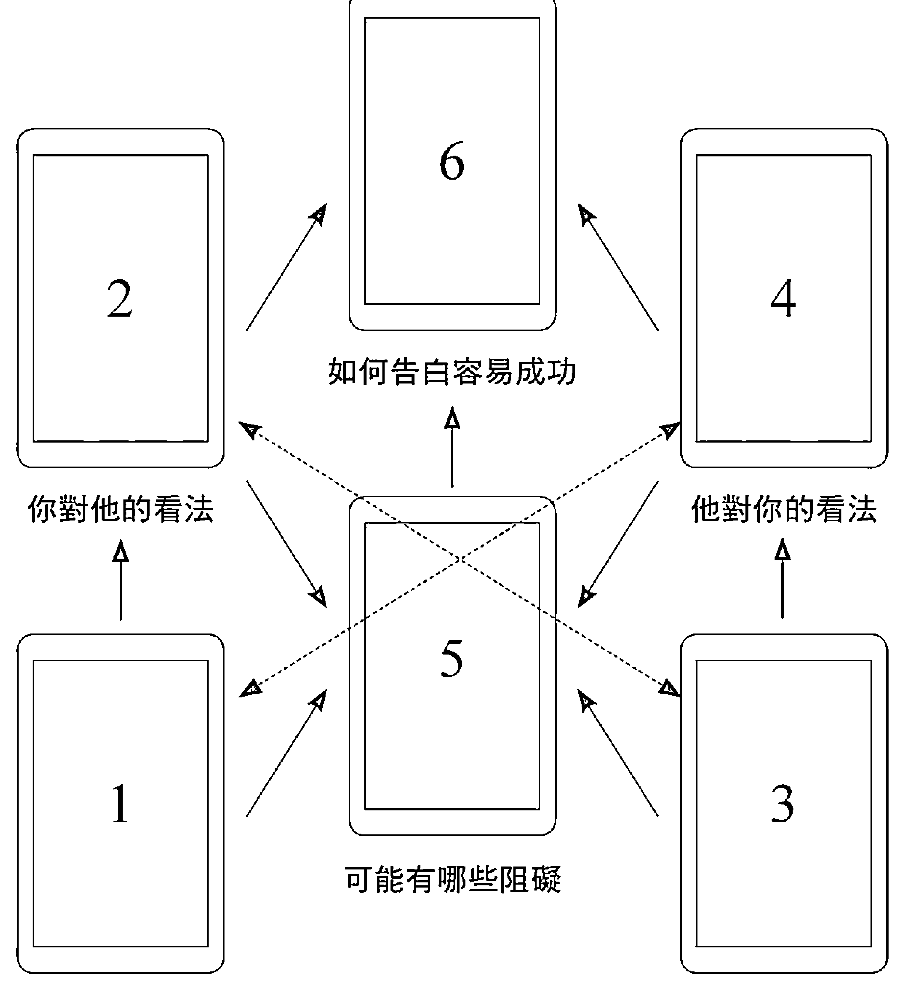

說明：
突破曖昧牌陣是針對某一個可能的感情對象占卜；自己本身的狀況是檢視自己目前的心態及狀況，是否已經準備好開始一段新戀情；你對他的看法是去幫自己釐清內心深處對他的感覺，是一個參考的指標；他心中是否有別人是看看在對方的心裡除了你之外是否已經有喜歡的對象，甚至是不是已經在與別人交往；他對你的看法是指在對方的心中對你有何種看法，以及是否真的有好感；可能有哪些阻礙指出在兩個人之間可能有哪些阻礙，是不是容易克服；如何告白容易成功可以看到適合告白的方式，但若出現的牌並不好，也可能是指出現在並不適宜告白。

影響因素：
自己本身的狀況會影響到你對他的看法；他心中是否有別人也會影響到他對你的看法；自己本身的狀況會與他對你的看法互相影響；他心中是否有別人也會與你對他的看法互相影響；而前面的四張牌都對可能有哪些阻礙有影響；同時你對他的看法、他對你的看法及可能有哪些阻礙都會影響到如何告白容易成功。

解牌順序：
最開始是先看自己本身的狀況和你對他的看法，接著再分析他心中是否有別人以及他對你的看法；自己本身的狀況與他對你的看法要互相參照，才知道他對你是否有誤會；他心中是否有別人與你對他的看法也要互相參照，才知道你對他是否有誤會；交叉比對之後之後再看可能有哪些阻礙，最後才依據如何告白容易成功給建議。

參考牌義：
- 自己本身的狀況：大牌及宮廷牌可參考人物特性－感情觀；數字牌可參考相處篇－彼此心靈契合
- 你對他的看法：可參考曖昧篇－如何看待對方
- 他心中是否有別人：可參考曖昧篇－心中是否有別人
- 他對你的看法：可參考曖昧篇－如何看待對方
- 可能有哪些阻礙：可參考曖昧篇－可能有哪些阻礙
- 如何告白容易成功：可參考曖昧篇－如何告白容易成功

注意事項：
突破曖昧牌陣是針對特定對象進行占卜，所以若是沒有特定對象，就無法使用這個牌陣，可以考慮使用擺脫單身牌陣；若是有兩個以上的對象，應該分別占卜才會比較具體；此外，由於突破曖昧牌陣是屬於狀況類牌陣，本身並沒有關於時間的提示，所以在問問題的時候最好設定一段時間，這樣解釋起來才會比較具體。

問題範例：
Q1. 我想知道這個月我與他的關係會如何發展？
Q2. 我想知道這個月我有沒有機會向他告白成功？
Q3. 我想知道我與他這個學期有沒有可能成為男女朋友？

## Q1

我想知道這個月我與他的關係會如何發展？

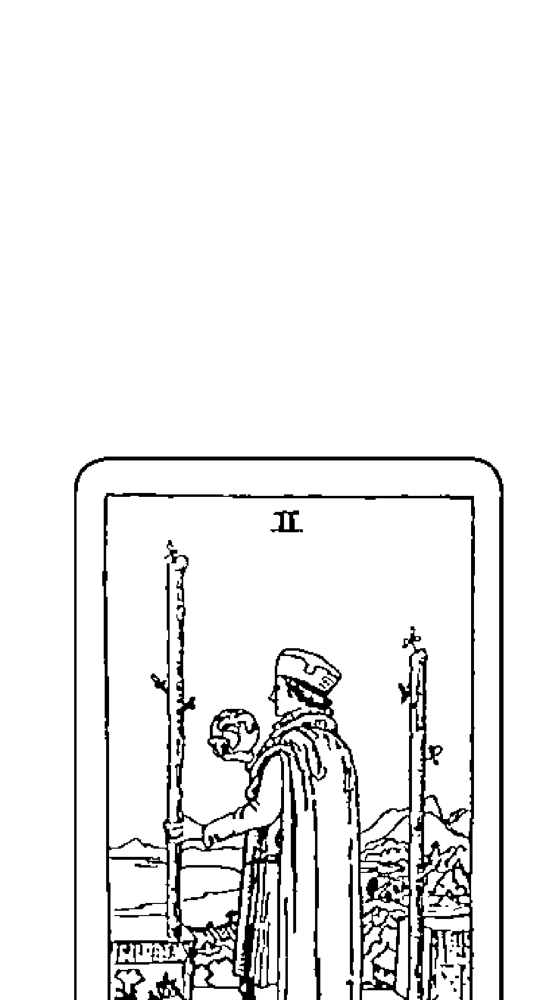

你對他的看法

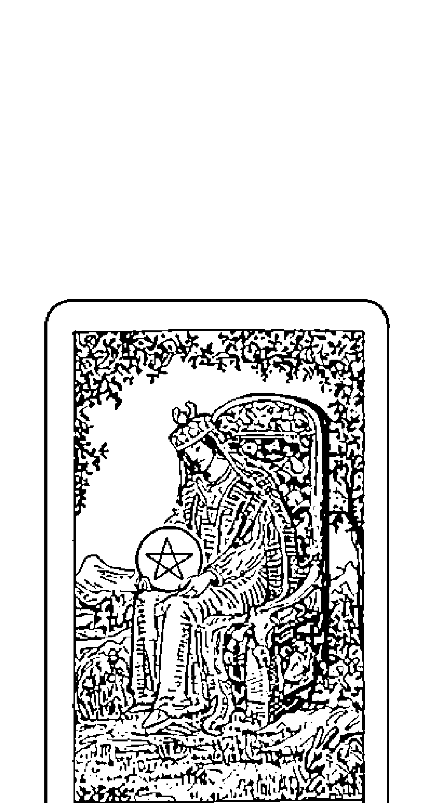

如何告白容易成功

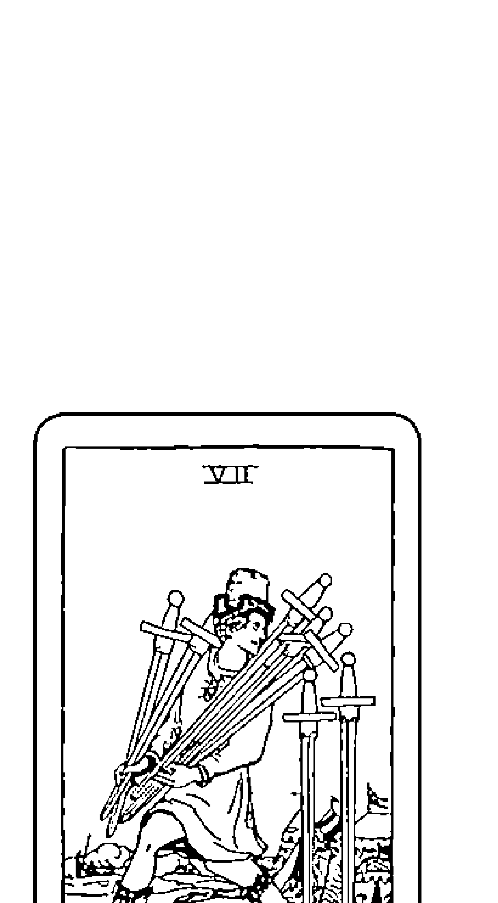

他對你的看法

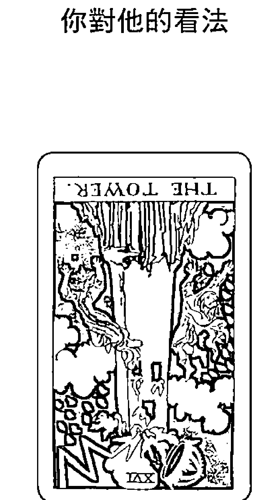

自己本身的狀況

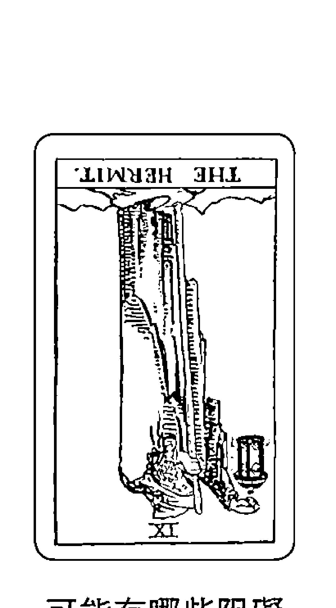

可能有哪些阻礙

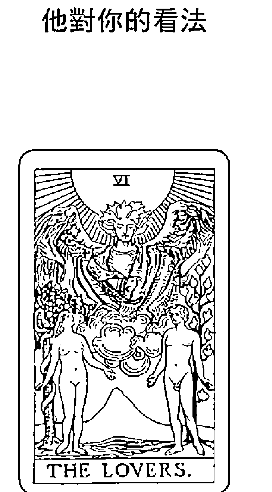

他心中是否有別人

### 背景提要：

問卜者與對方剛認識不久，但是覺得被對方深深吸引，所以會想要知道近期之內關係會如何發展。

### 自己本身的狀況：塔逆位

也許是曾經在感情上受過嚴重的傷害，老是會覺得自己不夠好或是配不上好的對象，有點缺乏自信而不敢作決定。

### 你對他的看法：權杖二

這是一個猶豫不決的人，遇到重大的事情往往會考慮很久又不願意做決定，相處時還會感覺到有一點憂鬱的氣質。

### 他心中是否有別人：戀人

目前在他心中已經有深愛的人，而且可能已經發展出很穩定的關係，想要把他從對方身旁搶過來是不可能的任務。

### 他對你的看法：寶劍七

這是一個特立獨行的人，但是又能與大家都維持還不錯的關係，在相處時感覺充滿自信，不過有時候會過份誇大。

### 可能有哪些阻礙：隱者逆位

兩個人都還沒想清楚，所以在行動上常常猶豫不決，因而錯失一些機會；也有可能是年齡的差距造成彼此的阻礙。

### 如何告白容易成功：錢幣王后

這個時候不論怎麼告白都很容易成功，重要的是要有所行動而不是在原地觀望，最好能用比較貼心或感性的方式。

### 整體建議及分析

參照自己本身的狀況（塔逆位）與他對你的看法（寶劍七），會發現他對你的狀況並不了解，也把你的防衛看成堅強；由於對方心中已經有了別人（戀人），所以在你看來他才會特別猶豫（權杖二）；由上面的綜合分析來看，由於彼此的不夠了解，所以有可能會在行動上猶豫不決（隱者逆位），這個時候若是依照錢幣王后的建議用較貼心或感性的方式是有可能告白成功，但若對方無法放下另一段感情，也有可能變成三角關係，在行動前還是要三思。

## Q2

我想知道這個月我有沒有機會向他告白成功？

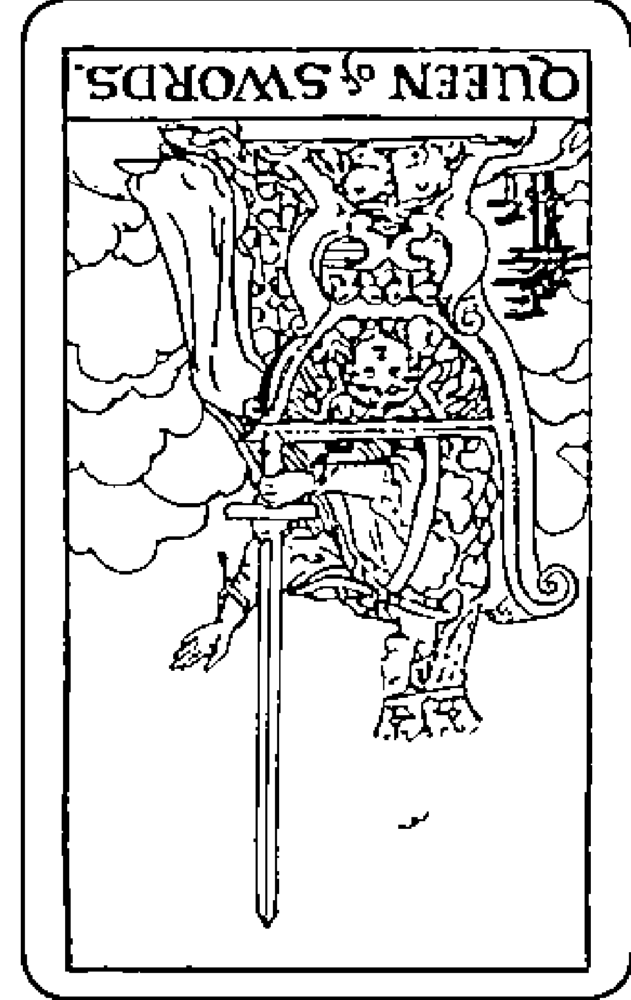

你對他的看法

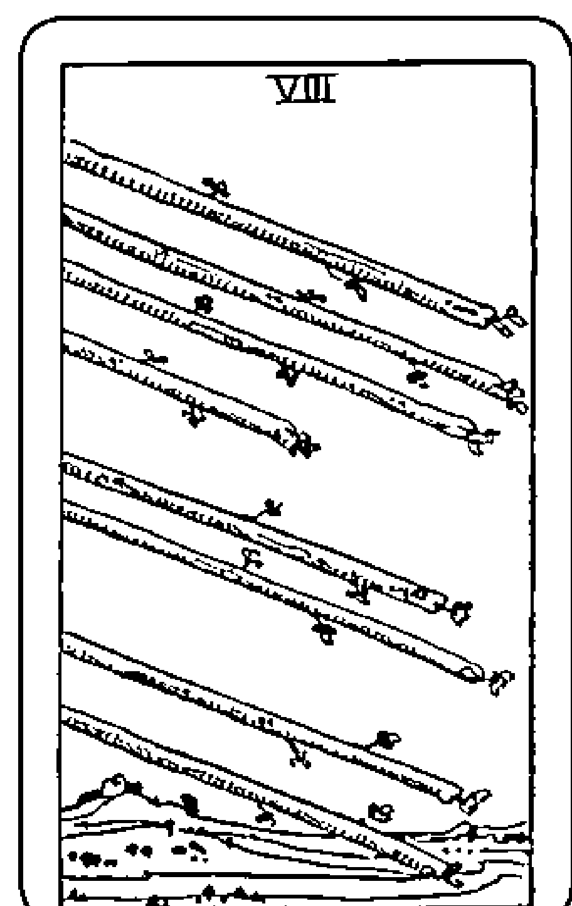

如何告白容易成功

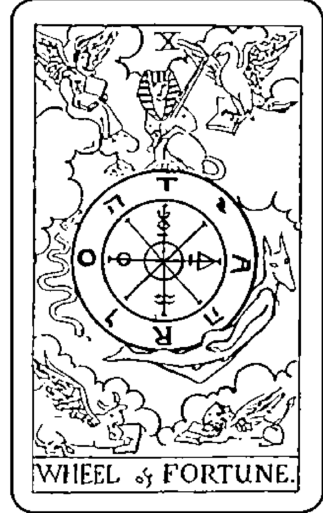

他對你的看法

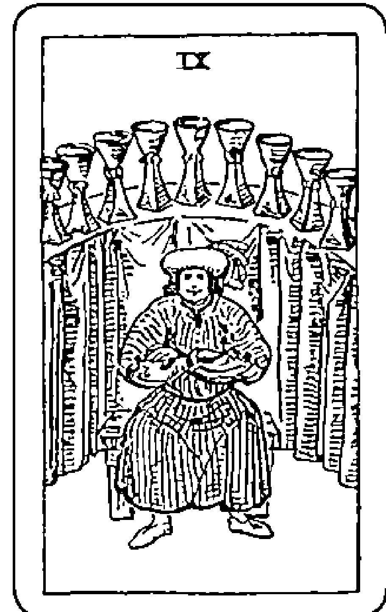

自己本身的狀況

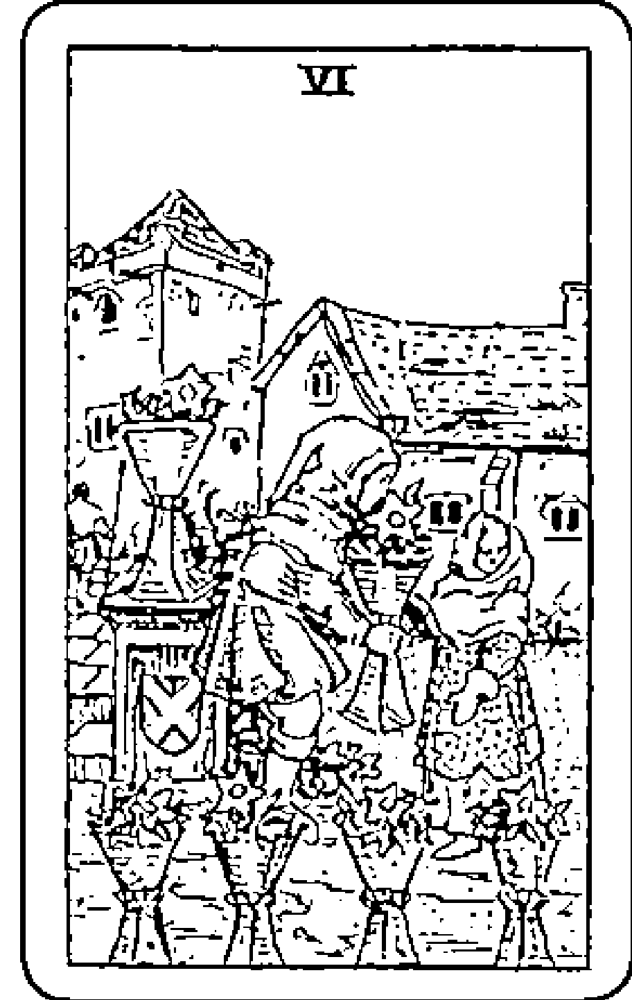

可能有哪些阻礙

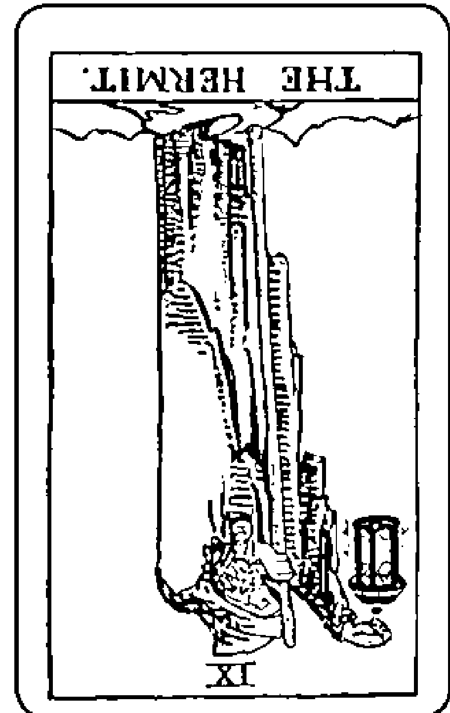

他心中是否有別人

背景提要：
問卜者與對方已經曖昧了一段時間，但總是缺乏臨門一腳的進展，所以想知道自己有沒有機會告白成功。

自己本身的狀況：聖杯九
你對這段關係感到滿意，也覺得可以繼續經營下去，由於相處十分愉快，即使遇到任何的困難也要想辦法去解決。

你對他的看法：寶劍王后逆位
在感情上不相信任何人，所以很難找到幸福的感情，即使在戀愛當中仍然覺得孤單，也容易對所愛的人亂發脾氣。

他心中是否有別人：隱者逆位
他目前心中可能有欣賞或是暗戀的對象，但是那些人都不太可能與他發展感情，所以只要願意努力還是有機會的。

他對你的看法：命運之輪
這是一個樂觀正向的人，即使面對挫折仍然會努力不懈，在相處上覺得很隨和，但是也不會輕易給別人太多承諾。

可能有哪些阻礙：聖杯六
可能有一方或是雙方還忘不了舊情人，或是現在仍然被舊情人糾纏著，這可能會讓彼此之間的感情發展陷入僵局。

如何告白容易成功：權杖八
這個時候任何告白方式都可以，但最重要的關鍵因素在於速度，只要能盡快讓對方知道自己的心意就很容易成功。

### 整體建議及分析
參照自己本身的狀況（聖杯九）與他對你的看法（命運之輪），可以發現自己是屬於比較積極與樂觀的角色；而看到可能的阻礙出現聖杯六，就知道對方隱者逆位所指的欣賞對象應該就是舊情人，也因此在你看來對方會有一些不太自然（寶劍王后逆位），在最後看到告白容易成功的方式是權杖八，顯然快點讓對方知道自己的心意是很重要的一件事，直接一點才能讓對方快點認真地做決定。

## Q3

我想知道我与他这个学期有没有可能成为男女朋友？

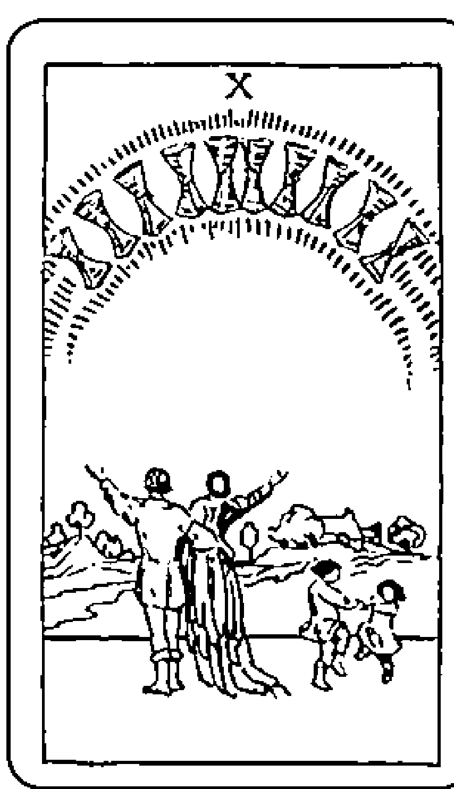

你对他的看法

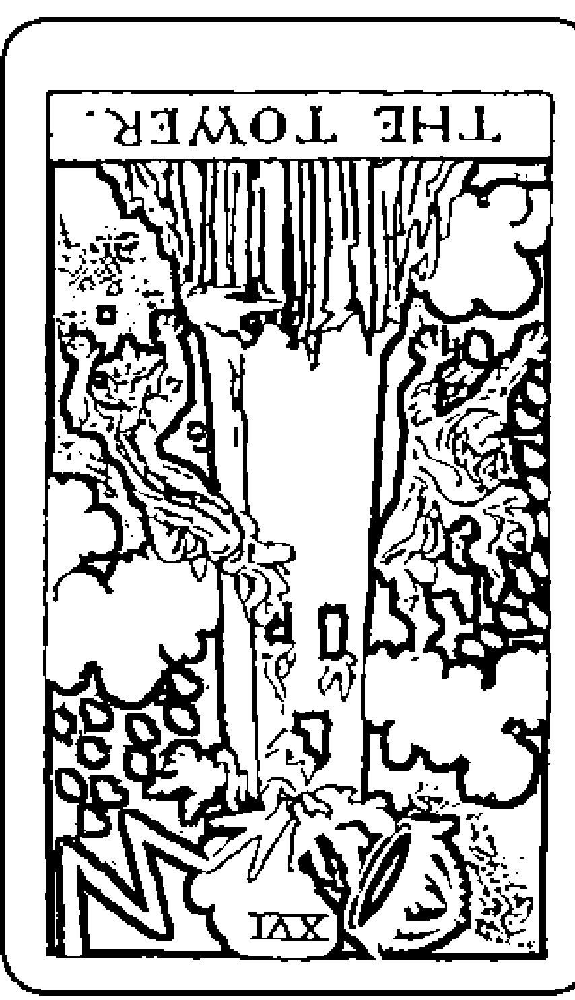

如何告白容易成功

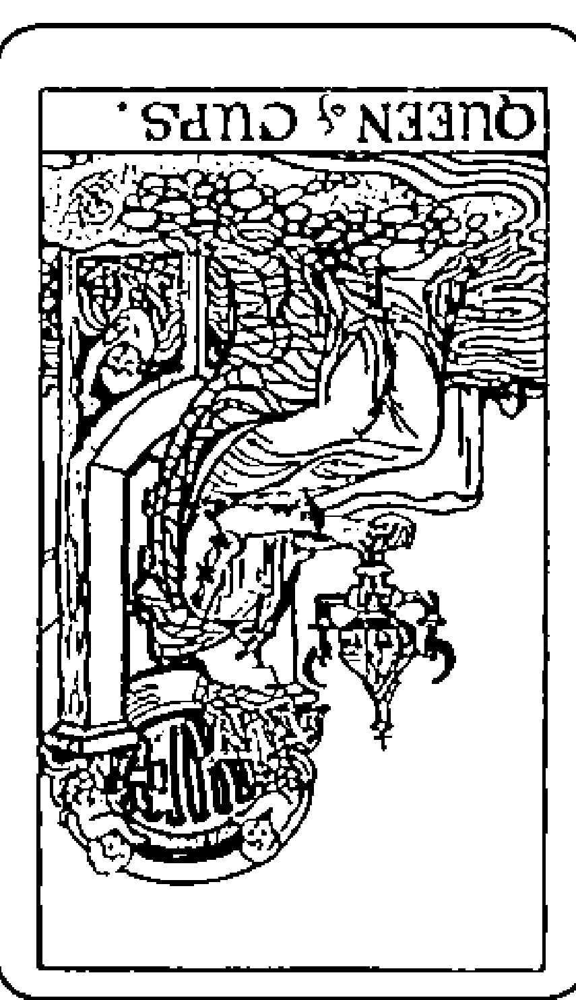

他对你的看法

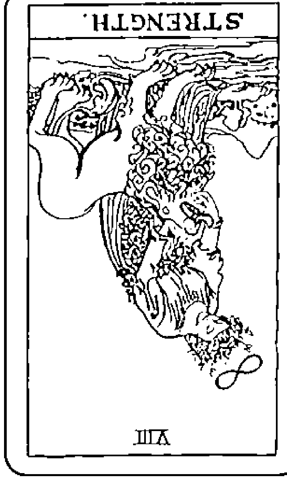

自己本身的状况

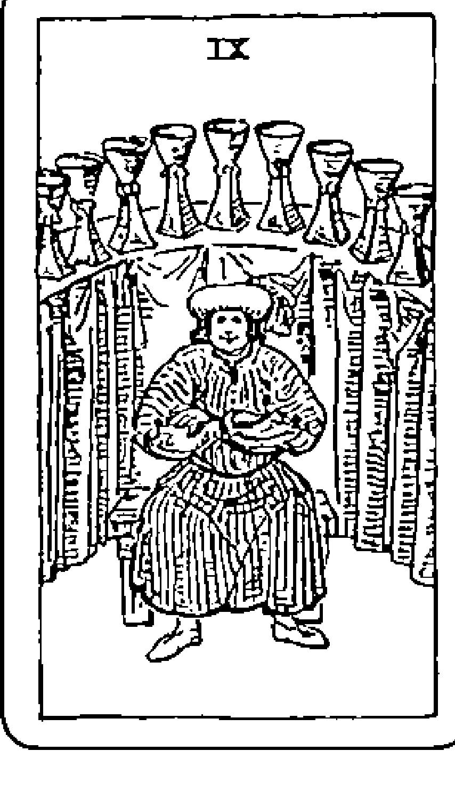

可能有哪些阻碍

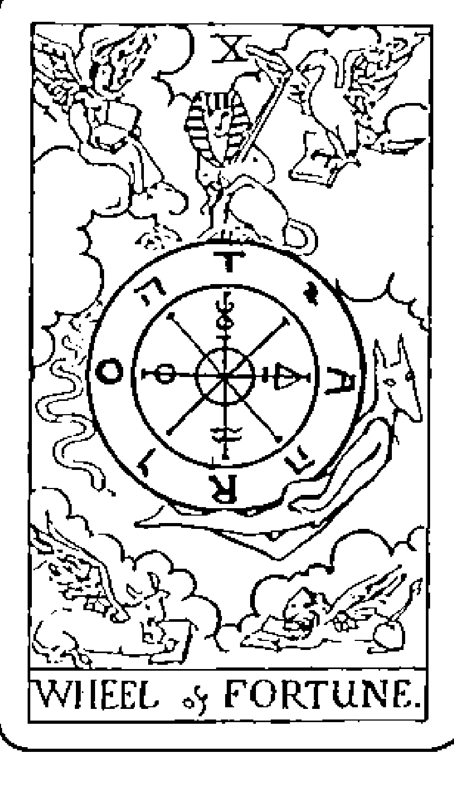

他心中是否有别人

### 背景提要：

問卜者與對方的關係一直很好，但總覺得介於好朋友與男女朋友之間，現在新學期要開始了，所以想知道這個學期關係會不會有所突破。

### 自己本身的狀況：力量逆位

在感情當中會想要控制對方，如果對方違逆自己的意思就很容易大發脾氣，經常搞不清楚自己在感情當中的需要。

### 你對他的看法：聖杯十

是一個很和善的人，可以帶動歡樂的氣氛，相處起來像是家人的感覺；另一方面也可能只想作朋友而不想當情人。

### 他心中是否有別人：命運之輪

目前在他心中已經有認定的一個人，但是並不確定那個人是不是你，如果他已經喜歡上別人，你就沒有任何機會。

### 他對你的看法：聖杯王后逆位

這是一個很任性善變的人，完全不會考慮到別人的立場，相處時總會覺得無法信任，最好還是保持距離以策安全。

### 可能有哪些阻礙：聖杯九

兩個人可能都在等對方主動，但是自己就在原地沒有動作，如果一直維持這樣的狀況，關係就不可能有實質進展。

### 如何告白容易成功：塔逆位

目前去告白很不容易成功，除非你能克服心中的恐懼，勇敢地當面向對方表達你的愛意，但也不一定會得到答案。

### 整體建議及分析

參考自己本身的狀況（力量逆位）與他對你的看法（聖杯王后逆位），會發現你在他心中並不討喜，那麼命運之輪當中所指的喜歡對象就不太可能是你；雖然你對他很有好感（聖杯十），但是目前雙方也沒有任何行動（聖杯九）；在如何告白容易成功的位置出現了塔逆位，表示行動需要勇氣，但在前面綜合分析之下，成功的機會並不高。

## S03

## 親密關係牌陣

類別：綜合類牌陣
難度：進階級牌陣
使用張數：七張
使用時機：想知道與特定感情對象相處的細節，以及未來發展的狀況時使用。

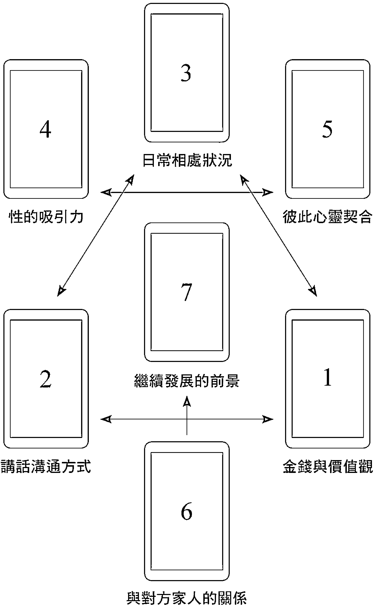

## 說明：

親密關係牌陣適用於與特定對象感情關係中的各種狀況；金錢與價值觀指出這段關係當中金錢與財務的狀況，並且可以看出雙方是否容易因為金錢或價值觀的問題而爭吵；講話溝通方式是指彼此之間的溝通模式，以及雙方溝通是否良好；日常相處狀況表示在一般狀況下兩個人的相處狀況，以及生活層面上是否可以配合；性的吸引力代表雙方在性關係上的經營模式，以及對於性生活的期待和影響；彼此心靈契合是表示在兩個人的內心深處對這段關係的評價與看法；與對方家人的關係可以看出自己與對方家庭之間的關係，以及如何定位與相處比較妥當；繼續發展的前景則是指出兩個人關係是否具有未來性，可能會朝什麼方向發展。

## 影響因素：

金錢與價值觀、講話溝通方式和日常相處狀況彼此之間互相影響，是屬於一般外在的因素；性的吸引力與彼此心靈契合之間互相影響，是屬於比較內在的因素；如果關係走得長久，與對方家人的關係對於繼續發展的前景就會有很大的影響。

## 解牌順序：

或許依照每個人重視的點會有所不同，但一般來說可以先看金錢與價值觀、講話溝通方式、日常相處狀況這三個位置，了解基本的互動模式；接下來再分析性的吸引力、彼此心靈契合、與對方家人的關係這三個位置，看進階發展的可能性，最後再看繼續發展的前景。

## 參考牌義：

- 1. 金錢與價值觀：可參考相處篇－金錢與價值觀
- 2. 講話溝通方式：可參考相處篇－講話溝通方式
- 3. 日常相處狀況：可參考相處篇－日常相處狀況
- 4. 性的吸引力：可參考相處篇－性的吸引力
- 5. 彼此心靈契合：可參考相處篇－彼此心靈契合
- 6. 與對方家人的關係：可參考相處篇－與對方家人的關係
- 7. 繼續發展的前景：可參考相處篇－繼續發展的前景

## 注意事項：

親密關係牌陣是狀況類牌陣，每次只能針對一個特定對象發問，而且對於關係的定位與希望占卜的時間都要先設定好，這樣回答起來才會比較具體；可以針對目前的狀況詢問，也可以設定某些前提條件或狀況，應該視個人需要調整。

## 問題範例：

- Q1. 我想知道假如與他在一起的話感情狀況會怎麼樣？
- Q2. 我想知道一個月之內與男朋友的相處狀況會如何？
- Q3. 我想知道如果我與前男友複合的話感情會怎麼樣？

## Q1

我想知道假如與他在一起的話感情狀況會怎麼樣？

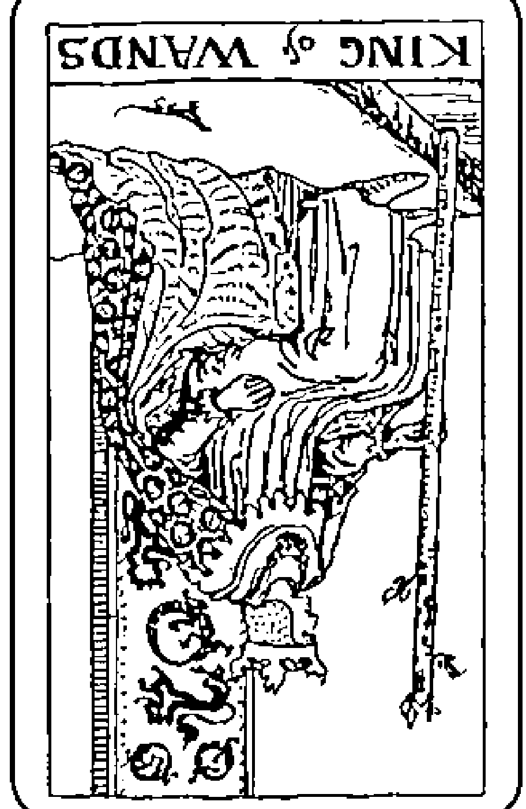

性的吸引力

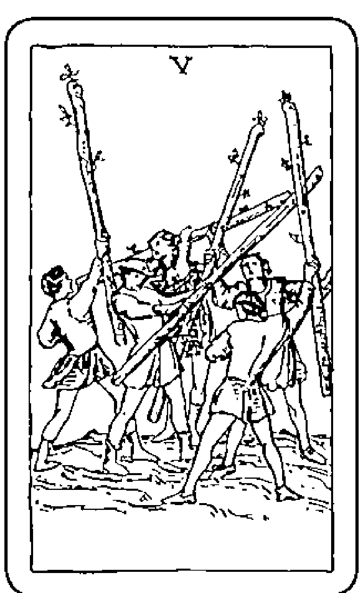

日常相處狀況

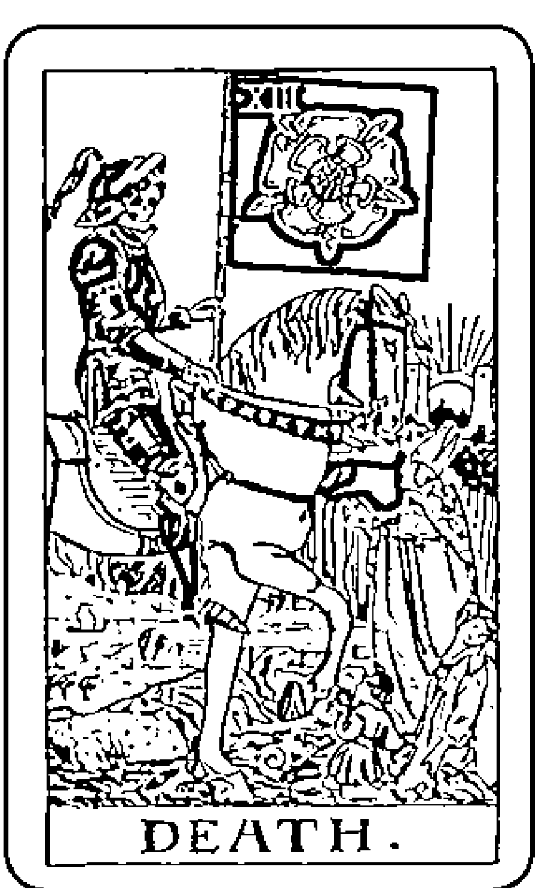

彼此心靈契合

講話溝通方式

繼續發展的前景

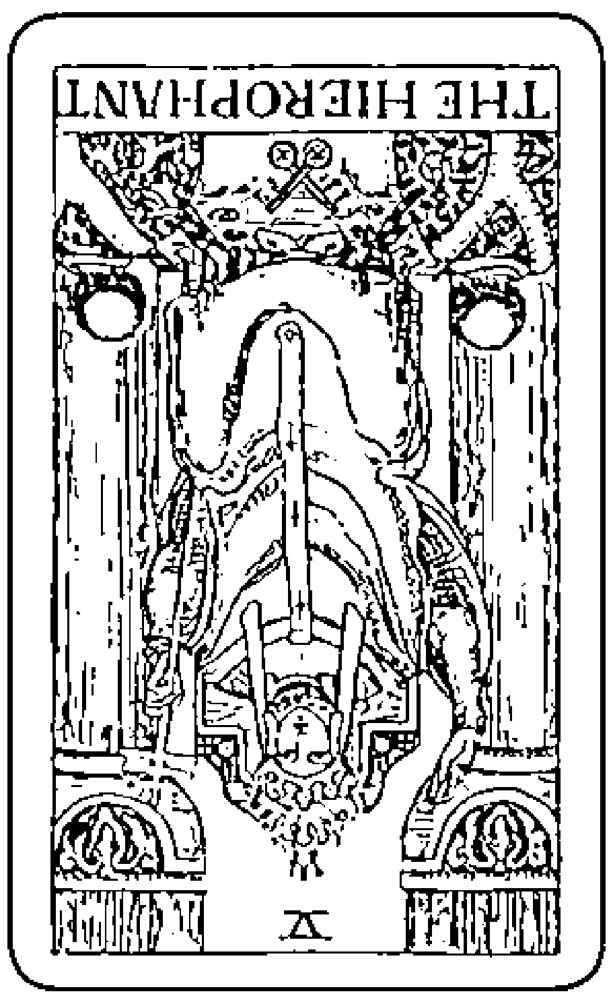

與對方家人的關係

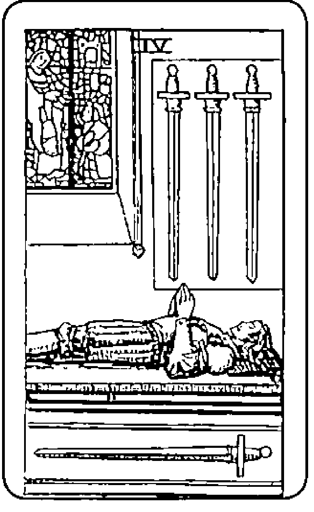

金錢與價值觀

### 背景提要：

問卜者遇到了一個新的追求者，雖然對方很強烈地表達好感，但是自己總覺得哪裡怪怪的，所以想要算一下如果在一起的話感情狀況會怎麼樣。

### 金錢與價值觀：寶劍四

也許過去曾經為了金錢發生爭吵，兩個人都會刻意避免談到錢的事情，互相不了解的狀況又可能引發錯誤的聯想。

### 講話溝通方式：權杖七

兩個人講話都很直接，經常會感覺到唇槍舌戰的氣氛，不過也因為什麼話題都能聊，所以不會有溝通不良的問題。

### 日常相處狀況：權杖五

兩個人的日常相處過程紛爭不斷，經常會為了大小事情吵架，雙方都希望能控制對方，但總是不斷遭遇頑強抵抗。

### 性的吸引力：權杖國王逆位

這段關係對雙方都有吸引力，彼此也可以用行動回應對方的熱情，雖然有時候會因為其他事而影響性生活的頻率。

### 彼此心靈契合：死神

兩個人都覺得關係需要改變，維持現狀對彼此來說都太痛苦，或許分手會是一種解脫，只是還沒有做最後的決定。

### 與對方家人的關係：教皇逆位

你對於對方家人的付出很多，但是不一定要得到應有的回報，你要衡量自己的狀況與能力，不要讓他們予取予求。

### 繼續發展的前景：吊人逆位

這段關係的繼續下去並不會有很大的進展，存在的問題還是不會被解決，最重要的還是先把自己的日子過好再說。

### 整體建議及分析

從一般外在因素來看，金錢與價值觀的寶劍四、講話溝通方式的權杖七與日常相處狀況的權杖五都不算是好牌，顯示與對方的關係並不是很融洽；由比較內在的部分來看，性的吸引力抽到權杖國王逆位算是中立，但彼此心靈契合出現死神就很不妙了，再加上與對方家人的關係是教皇逆位，顯示出你要付出的非常多，也並不是很好的狀況，未來的前景是吊人逆位，也表示如果在一起之後關係很快會卡住，也並不是有利牌；在算感情關係的牌陣當中，完全沒有出現任何聖杯牌，也是重要的提示之一，所以會建議最好不要接受這段感情。

塔羅愛情占卜的基本觀念

S03-親密關係牌陣

## Q2

我想知道一個月之內與男朋友的相處狀況會如何？

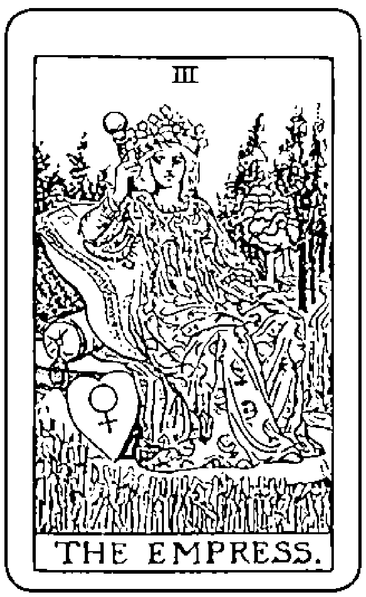

日常相處狀況

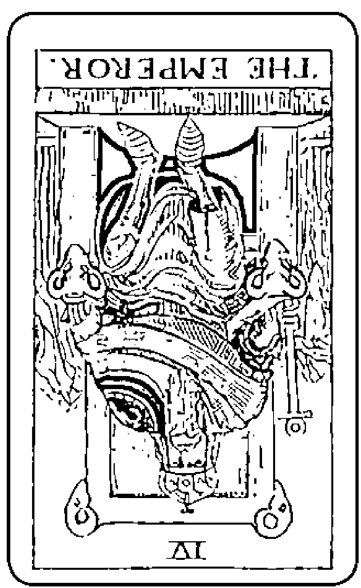

性的吸引力

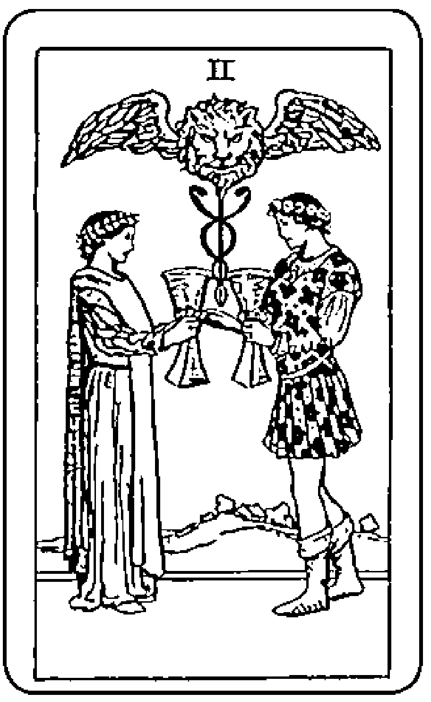

彼此心靈契合

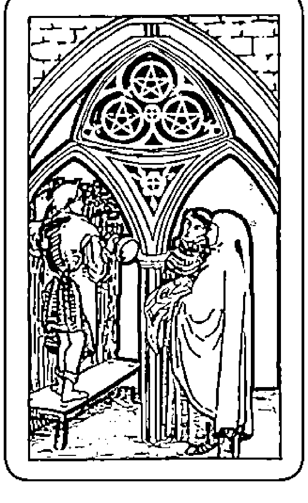

繼續發展的前景

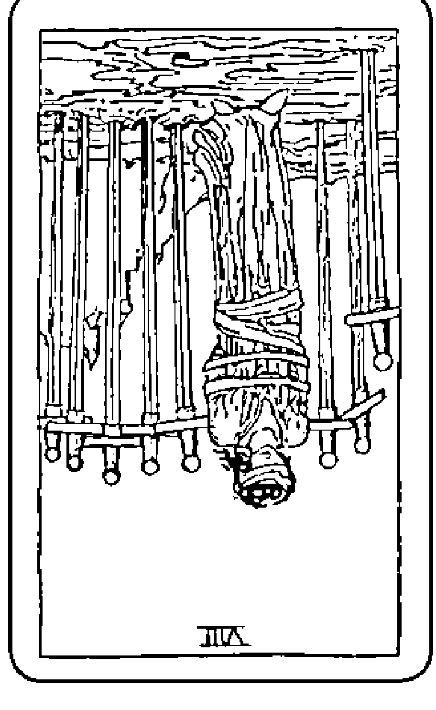

講話溝通方式

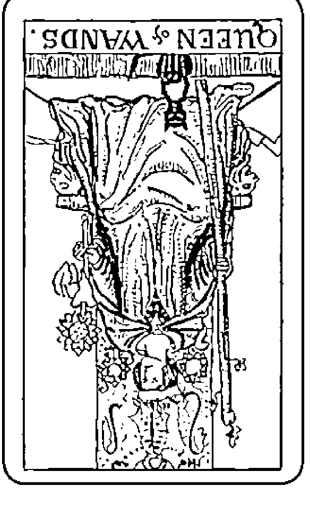

金錢與價值觀

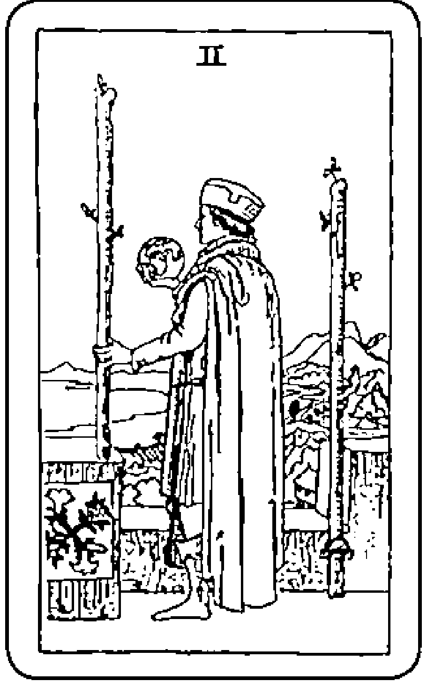

與對方家人的關係

### 背景提要：

問卜者與對方已經交往一段時間，剛開始的狀況很好，但是最近開始覺得有一點不太順利，所以會想要知道彼此的相處關係。

### 金錢與價值觀：權杖王后逆位

兩個人也許會遇到財務的危機，或是因為金錢而發生爭吵，所以在財務上最好各自獨立，千萬不要有共同的投資。

### 講話溝通方式：寶劍八逆位

兩個人之間經常唇槍舌戰，為了一些小細節而爭論不休，若是雙方都只站在自己的立場看事情，就很難彼此妥協。

### 日常相處狀況：皇后

兩個人在日常生活上比較重視享樂，也可以經營出彼此都滿足的生活模式，不論如何都會保持和諧與滿足的關係。

### 性的吸引力：皇帝逆位

這段感情當中並沒有太多性的吸引力，雙方對於性與愛的看法也還不成熟，不知道怎麼帶給彼此更多性愛的歡愉。

### 彼此心靈契合：聖杯二

兩個人都覺得這是一段完美的感情，彼此的關係十分平衡又能互補及合作，也都希望這段感情能永遠都保持這樣。

### 與對方家人的關係：權杖二

你與對方家人的關係並不太親近，甚至會覺得受到他們很多的限制，所以保持距離對你來說會是比較愉快的方式。

### 繼續發展的前景：錢幣三

這段感情繼續發展的前景十分看好，雖然現在有些事情剛起步，但是已經打下很好的基礎，未來也會很穩定發展。

### 整體建議及分析

從一般外在因素來看，金錢與價值觀的權杖王后逆位與講話溝通方式的寶劍八逆位都是屬於比較不利的牌，但是在日常相處狀況部分出現皇后牌，又是十分正面的表示；雖然在性的吸引力這方面出現了不夠成熟的皇帝逆位，但是在心靈契合的位置是非常正面的聖杯二，顯示出兩個人在內心當中其實是很相愛的；但也許與對方家人的關係出現權杖二又讓當事人有一點猶豫。綜觀全局，皇后牌與聖杯二都是非常正面的狀況，加上在繼續發展的前景出現代表穩定的錢幣三，應該是一段值得繼續經營的關係，但是目前來看急需處理的則是溝通的部分，並且要小心金錢的部分，只要這兩個部分有注意，應該就不會有太大的問題。

## Q3

我想知道如果我与前男友复合的话感情会怎么样？

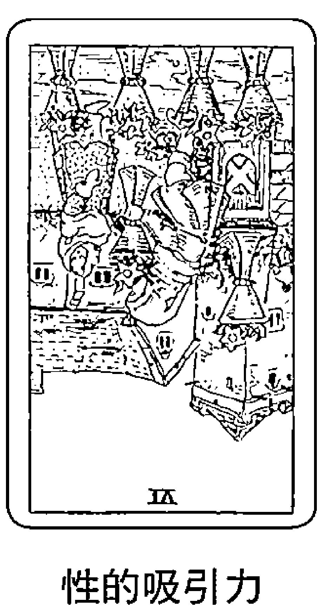

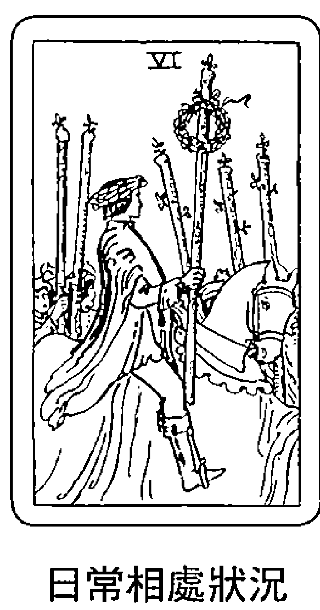

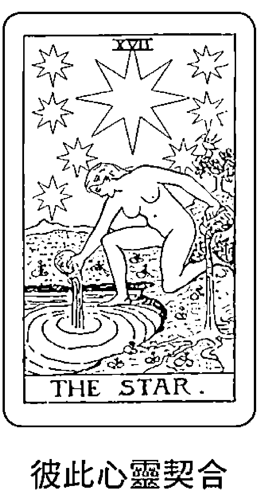

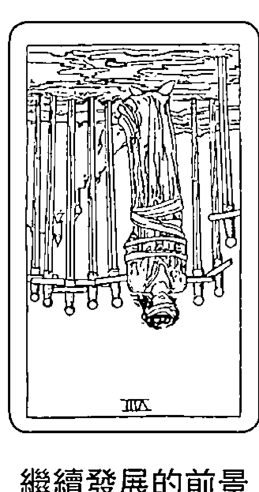

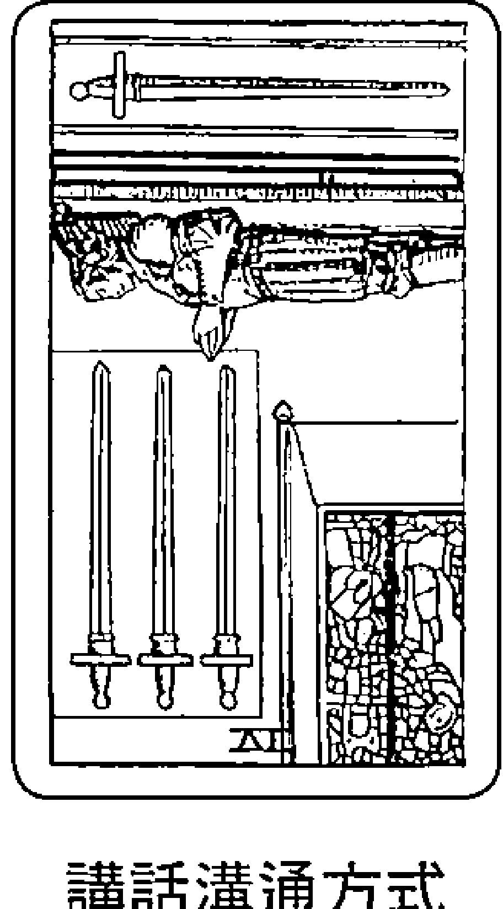

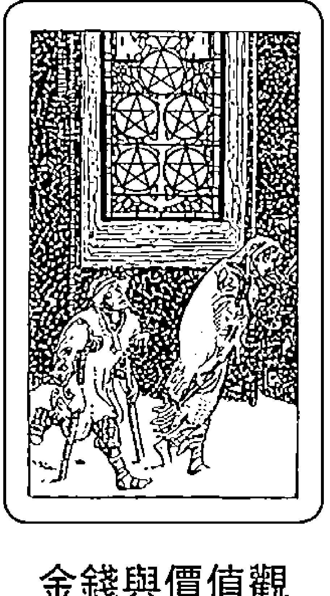

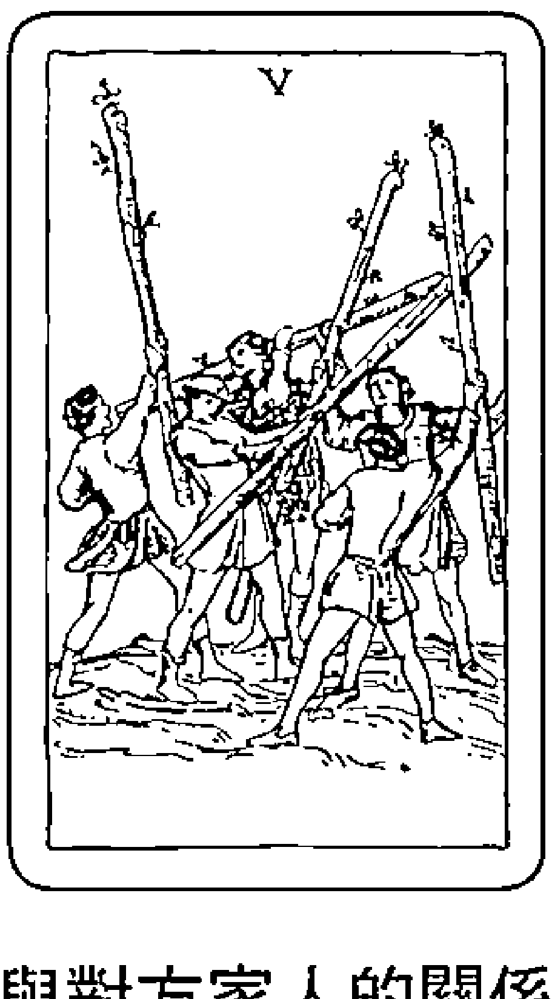

## 背景提要：

問卜者之前與對方交往了很長一段時間，不久之前才分手，最近對方又積極的想要複合，所以會想知道如果複合的話狀況會如何。

## 金錢與價值觀：錢幣五

兩個人在財務上遇到重大的問題，甚至還可能面臨破產清算的命運，在沒有錢的狀況之下就會帶給感情很多考驗。

## 講話溝通方式：寶劍四逆位

兩個人在說話時都有所保留，深怕不小心就刺激到對方，所以雖然彼此很少爭吵，但也並不是真的那麼了解對方。

## 日常相處狀況：權杖六

兩個人日常相處的狀況沒有什麼問題，彼此之間也可以相互配合，身邊的人也都看好與支持你們之間的感情關係。

## 性的吸引力：聖杯六逆位

這段感情當中也許會有很多的歡樂，但是由於並沒有很強的性吸引力，所以性生活並不會成為最重要的那個部分。

## 彼此心靈契合：星星

這是一段令人充滿期待的真感情，兩個人對未來都有很多的理想和計劃，也會希望和對方一起去實現這些夢想。

## 與對方家人的關係：權杖五

你與對方家人的關係並不和諧，所以最好是保持距離以策安全，若是不小心處理家人的問題也會成為爭議的焦點。

## 繼續發展的前景：寶劍八逆位

這段關係繼續發展下去會走到攤牌的地步，所有的問題都浮現出來再也沒辦法逃避，如果處理不好很可能會分手。

## 整體建議及分析

從一般外在因素來看，金錢與價值觀的錢幣五與講話溝通方式的寶劍四逆位都是比較不利的牌，日常相處狀況的權杖六則是比較偏向正面的牌；由比較內在的部分來看，性的吸引力出現聖杯六逆位、彼此心靈契合出現星星，都是屬於比較中立的牌；而與對方家人的關係這個位置出現權杖五，就比較不利於長期的經營，與發展前景的寶劍八逆位又有呼應。所以整體來看，雖然星星牌顯示出兩個人對未來都有很美好的期待，但是在缺乏實質基礎的支持之下，也許只是想得美而已，到最後仍然難逃再度分手的命運，所以還是會建議不要與前男友的複合。

# S04

## 緣份檢測牌陣

類別：綜合類牌陣
難度：入門級牌陣
使用張數：五張
使用時機：想確定彼此的心意時使用。

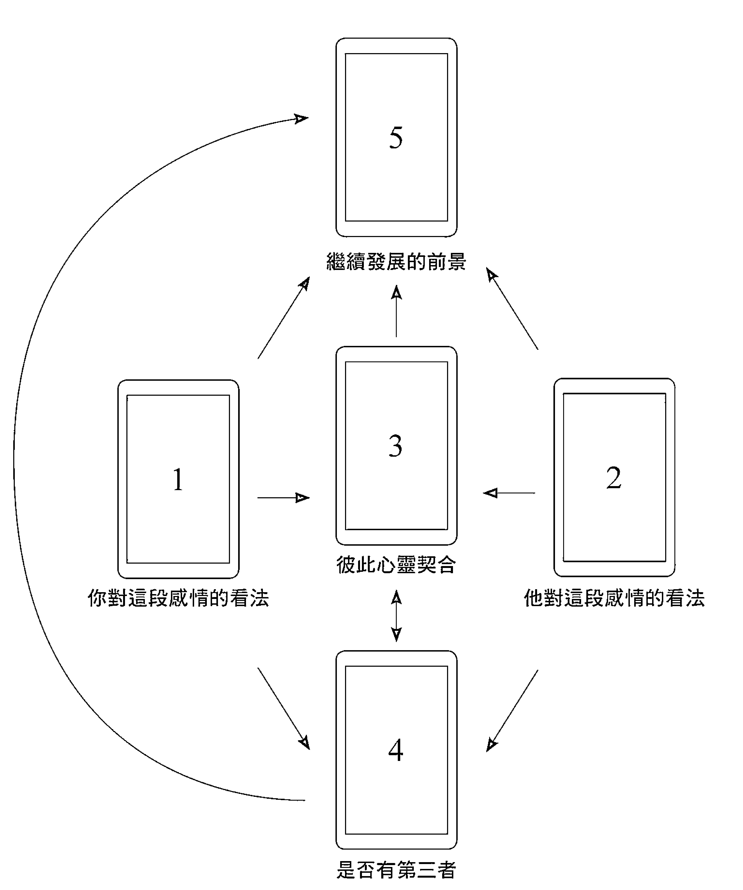

## 說明：

緣份檢測牌陣適合處理與特定對象之間內心感受的層面；你對這段感情的看法表示你在內心深處對這段感情的感受，可以做為評估的起點與參考；他對這段感情的看法顯出對方內心深處對這段感情的感受，也可以呈現對方真實的心意；彼此心靈契合是指雙方在內心深處是否有共識，以及希望這段感情如何發展；是否有第三者的位置可以幫助你釐清遇到的問題是否與第三者有關；繼續發展的前景則是指出未來的方向，也可以說是整個牌陣的結論。

## 影響因素：

你對這段感情的看法及他對這段感情的看法都會影響到彼此心靈契合和是否有第三者，彼此心靈契合與是否有第三者則是互相影響，而前面四張牌都會影響到繼續發展的前景。

## 解牌順序：

首先去看看你對這段感情的看法與他對這段感情的看法，以及兩者對彼此心靈契合的影響；接下來再參考是否有第三者，去做綜合的評估，最後再針對繼續發展的前景給建議。

## 參考牌義：

-   1. 你對這段感情的看法：可參考相處篇－彼此心靈契合
2. 他對這段感情的看法：可參考相處篇－彼此心靈契合
3. 彼此心靈契合：可參考相處篇－彼此心靈契合
4. 是否有第三者：可參考危機篇－是否出現第三者
5. 繼續發展的前景：可參考相處篇－繼續發展的前景

## 注意事項：

雖然彼此之間感情好壞都可以用緣份檢測牌陣來占卜，但是若雙方相處沒有什麼問題，一般來說還是少算為妙。

## 問題範例：

-   Q1. 我想知道與男朋友的緣份狀況如何？
Q2. 我想知道現在這段感情是否有第三者？
Q3. 我想知道目前感情遇到的問題是否與第三者有關？

# Q1

我想知道與男朋友的緣份狀況如何？

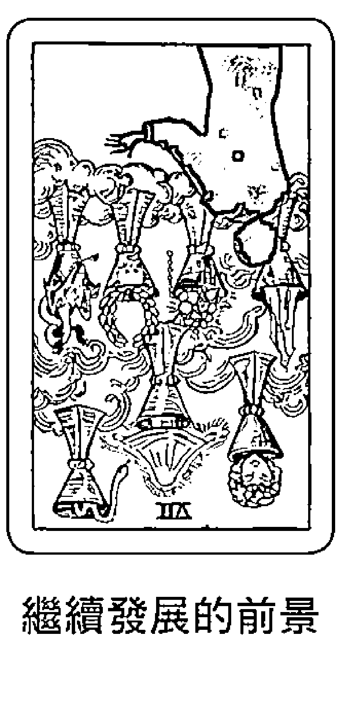

繼續發展的前景

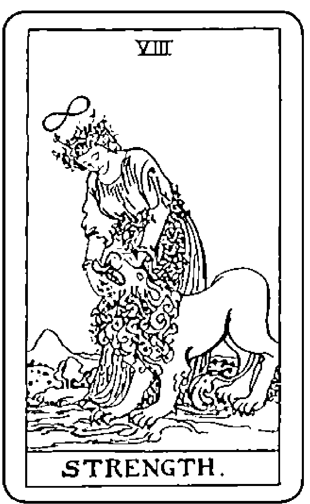

你對這段感情的看法

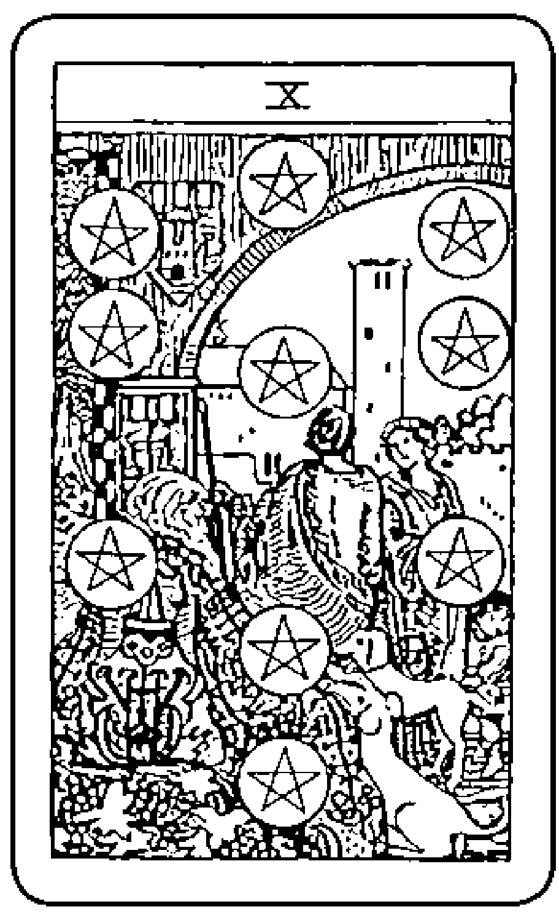

彼此心靈契合

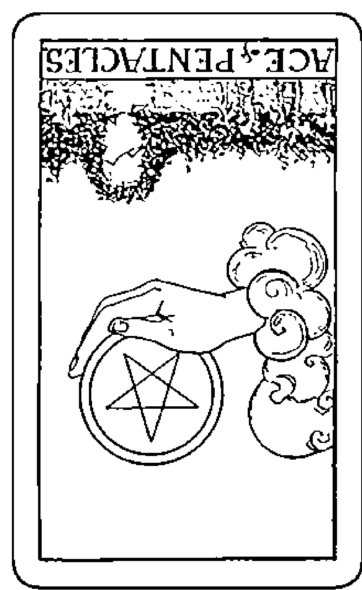

他對這段感情的看法

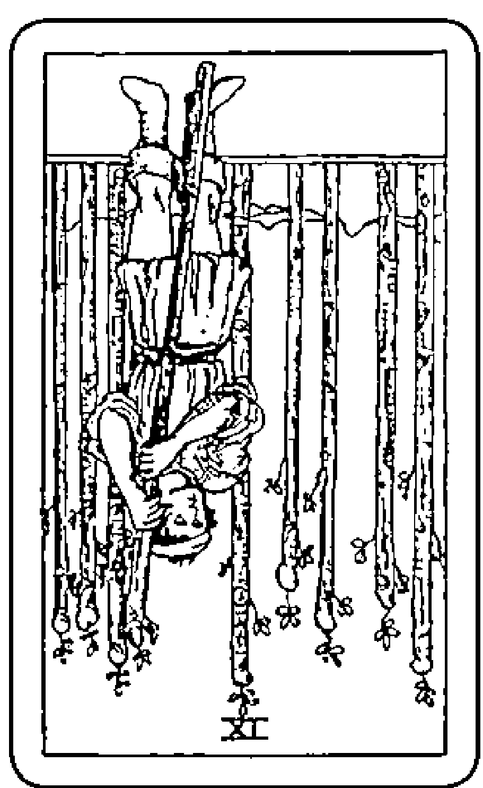

是否有第三者

## 背景提要：

問卜者與對方交往一直很穩定，但是最近開始覺得彼此的關係遇到瓶頸有點停滯不前，所以想知道彼此之間的緣份狀況。

## 你對這段感情的看法：力量

這是一個互補的組合，兩個人雖然有很多的不同但是可以互相配合，有時候自己要扮演馴獸師的角色去教導對方。

## 他對這段感情的看法：錢幣 A 逆位

這是一段用高昂代價買到的感情，在當中花費了很多的時間和金錢去取悅對方，但是覺得並沒有得到相對的回報。

## 彼此心靈契合：錢幣十

兩個人都很清楚彼此的角色與分工，雖然雙方並不一定有很深厚的感情基礎，但是就理性上來說這是最好的選擇。

## 是否有第三者：權杖九逆位

這段關係當中並沒有第三者，但是有許多其他外在的阻礙，兩個人必須要互相信任同心協力才可能突破這些困境。

## 繼續發展的前景：聖杯七逆位

這段關係繼續發展下去會越來越穩定，也還有很大的進步空間，如果能夠適當的調整改進，就會開創出新的局面。

## 整體建議及分析

由雙方對這段關係的看法來評估，你自己（力量）是比較正面的看法，而對方（錢幣 A 逆位）則是有些偏向負面，雖然雙方心靈契合上出現了超穩定的錢幣十，但也是集中在理性層面；由權杖九逆位來看目前這段關係並沒有出現第三者，而發展前景的聖杯七逆位也指向光明的未來。所以可以發現問題出在對方覺得付出並沒有回報，只要能把這個感覺消除掉，其實就沒有什麼大問題。

# Q2

我想知道現在這段感情是否有第三者？

繼續發展的前景

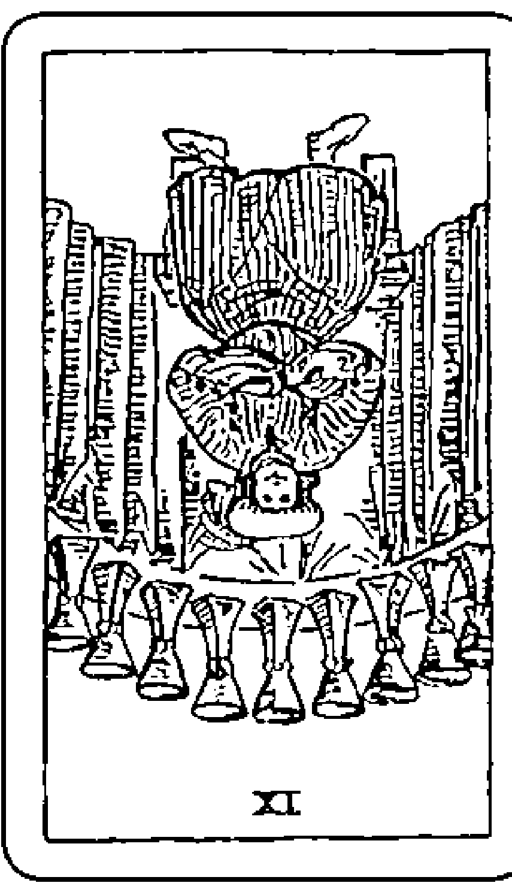

你對這段感情的看法

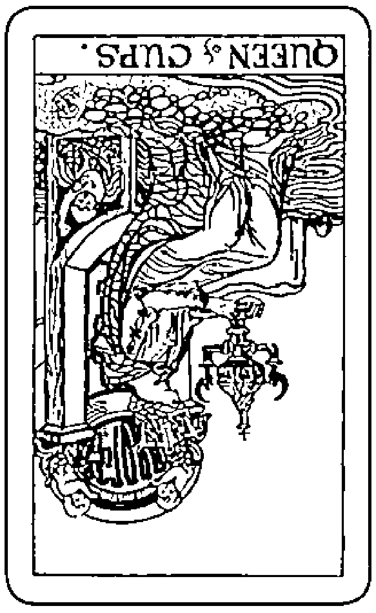

彼此心靈契合

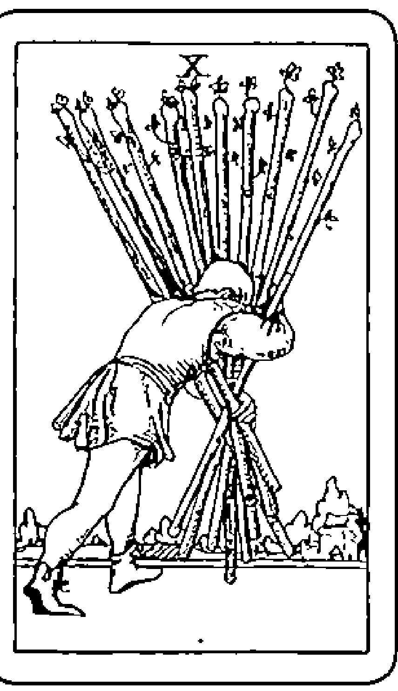

他對這段感情的看法

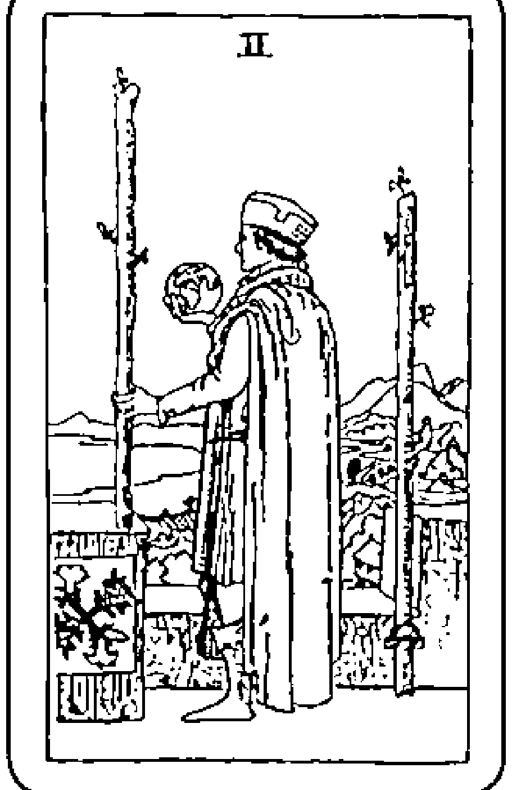

是否有第三者

## 背景提要：

問卜者覺得自己很用心在經營這段關係，但是感覺不到對方任何熱情的回應，所以想知道這段感情是否出現了第三者。

## 你對這段感情的看法：聖杯九逆位

在這段感情其實自己的付出很多，但是覺得對方都不太珍惜，也沒有多的回饋，有時候會覺得挫折或是不值得。

## 他對這段感情的看法：權杖十

這段感情帶來的壓力多於快樂，即使表面上看起來還好，其實內部是問題叢生，現在也沒有心力去處理這些問題。

## 彼此心靈契合：聖杯王后逆位

兩個人都覺得不太踏實，感覺上像是經歷了一場夢，其實雙方都對彼此不了解，也不知道為什麼會和對方在一起。

## 是否有第三者：權杖二

這段關係當中並沒有出現第三者，但是確實有一些問題需要解決，這個時候能不能坐下來好好溝通是重要的關鍵。

## 繼續發展的前景：寶劍國王

這段關係繼續發展下去不會有太大的變化，仍然是保持平穩但不緊密的關係，感情生活並不會成為兩個人的重心。

## 整體建議及分析

由雙方對這段關係的看法來評估，不論是聖杯九逆位（自己）或是權杖十（對方）都偏向負面的評價，所以在心靈契合上出現聖杯王后逆位也就不足為奇了，前面三張牌都指出這段關係有遇到一些問題；但就第三者問題來看，權杖二並不是屬於有第三者的暗示，所以就發展前景來看還是出現了代表穩定的寶劍國王，也很明顯指出感情生活不會成為兩個人的重心。

# Q3

我想知道目前感情遇到的問題是否與第三者有關？

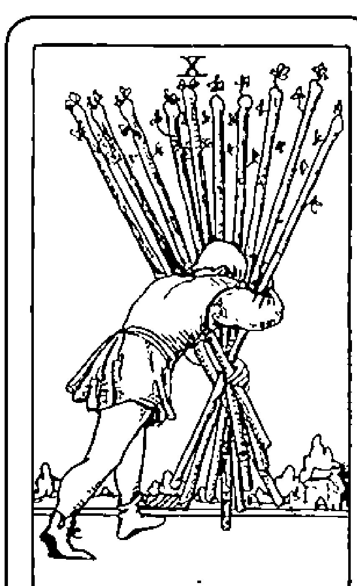

繼續發展的前景

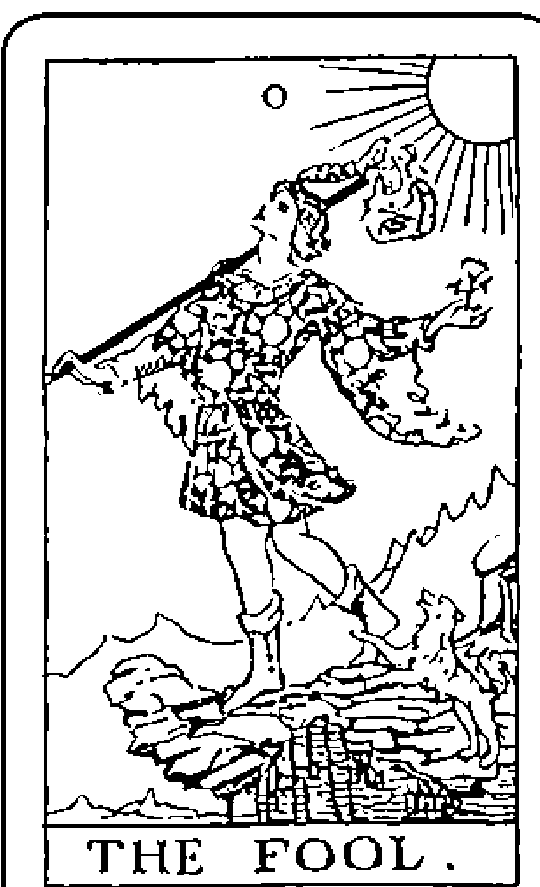

你對這段感情的看法

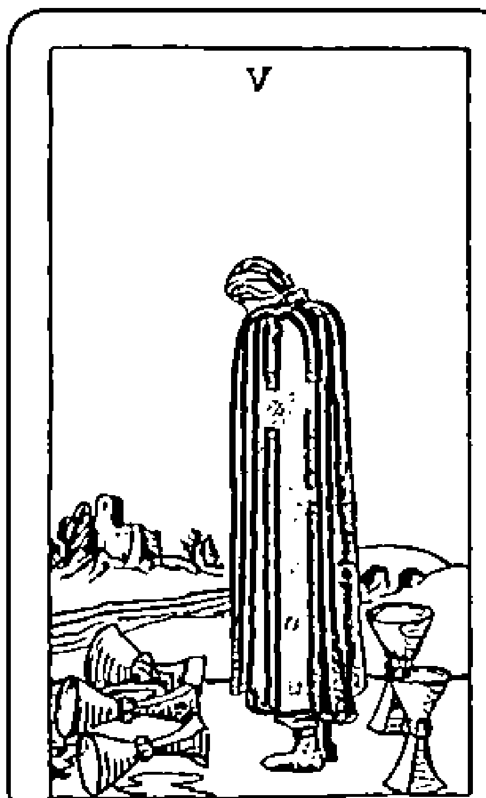

彼此心靈契合

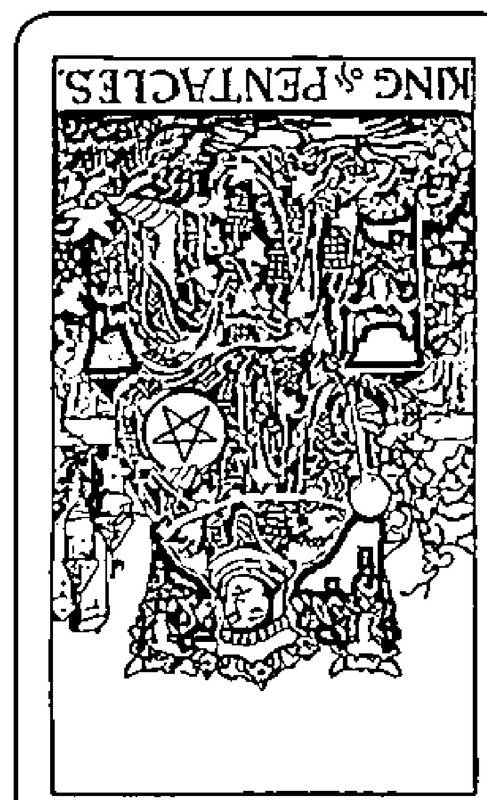

他對這段感情的看法

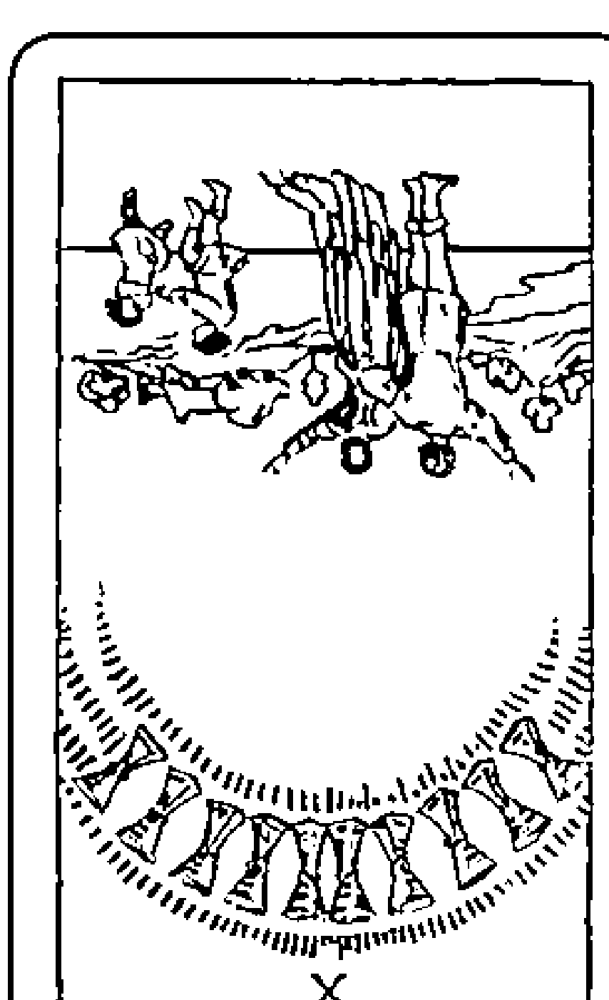

是否有第三者

## 背景提要：

問卜者近來與女朋友陷入無止盡的爭吵當中，每天都覺得十分痛苦，所以想要知道近來的爭吵是否與第三者有關。

## 你對這段感情的看法：愚者

這真是一件瘋狂的事情！我怎麼可能會跟這個人在一起，如果有機會讓我再選一次，我一定不可能作相同的決定。

## 他對這段感情的看法：錢幣國王逆位

這段感情讓人感到厭煩和無力，相處過程已經變成例行公事，完全感覺不到真實的感情，好像只是在盡一種義務。

## 彼此心靈契合：聖杯五

兩個人都覺得這段關係十分痛苦，即使過去有一些快樂的回憶，現在也已經被情緒淹沒，很容易看到對方的缺點。

## 是否有第三者：聖杯十逆位

目前這段關係當中可能有第三者出現，而且是那種來勢洶洶極具威脅性的角色，處理不好有可能會走向分手之路。

## 繼續發展的前景：權杖十

這段關係繼續發展下去壓力會越來越重，但是雙方又都不願意放手，即使真的硬撐下去也看不到什麼有利的轉機。

## 整體建議及分析

由雙方對這段關係的看法來評估，不論是自己（愚者）或是對方（錢幣國王逆位）都是屬於負面的評價，所以在心靈契合的位置出現聖杯五就有其合理性；在第三者的位置出現了聖杯十逆位，顯示出確實有可能出現第三者，而且也許會造成很大的影響，對照未來發展前景的權杖十，似乎已經很難挽回了，所以要先做好可能分手的心理準備。

# S05

## 危機救援牌陣

類別：狀況類牌陣
難度：入門級牌陣
使用張數：四張
使用時機：彼此相處遇到問題想解決時使用。

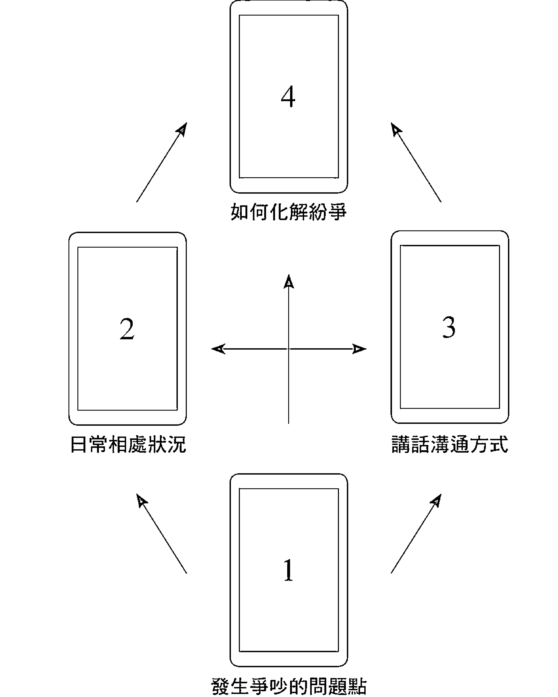

## 說明：

危機救援牌陣適合用在發生感情危機的狀況；發生爭吵的問題點指出兩個人為何會陷入困境當中，算是整副牌的核心與原因；日常相處狀況表示兩個人目前相處的情況，可以看到這個危機對於雙方相處的影響；講話溝通方式主要是評估目前的溝通管道順不順暢，有沒有機會透過溝通來解決問題；如何化解紛爭則是屬於建議的位置，可以幫助我們找到解決危機的方法。

## 影響因素：

發生爭吵的問題點同時影響到日常相處狀況與講話溝通方式，同時日常相處狀況與講話溝通方式也互相影響，前面三張牌都會對如何化解紛爭有影響。

## 解牌順序：

通常最先會分析發生爭吵的問題點，接下来看看日常相處狀況與講話溝通方式如何互動，最後再依照如何化解紛爭給予建議。

## 參考牌義：

-   1. 發生爭吵的問題點：可參考危機篇－發生爭吵的問題點
2. 日常相處狀況：可參考相處篇－日常相處狀況
3. 講話溝通方式：可參考相處篇－講話溝通方式
4. 如何化解紛爭：可參考危機篇－如何化解紛爭

## 注意事項：

危機救援牌陣所建議的處理方式本人不一定能立刻做到，即使去做了也有可能無法立刻解決問題，重要的是有耐心地去處理，相信對方感受到你的誠意也會有所改變。

## 問題範例：

Q1. 我與男朋友為了出遊的事情爭吵該怎麼處理？
Q2. 我想知道為什麼最近和男朋友的關係怪怪的？
Q3. 我想知道如何化解男朋友對我的誤會？

# Q1

我與男朋友為了出遊的事情爭吵該怎麼處理？

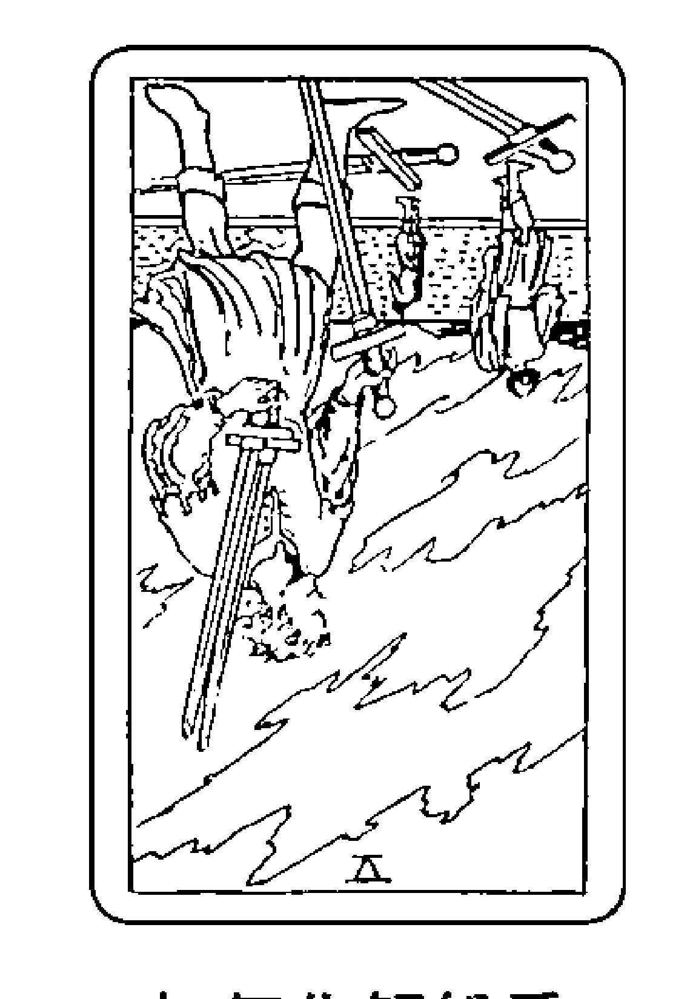

## 如何化解紛爭

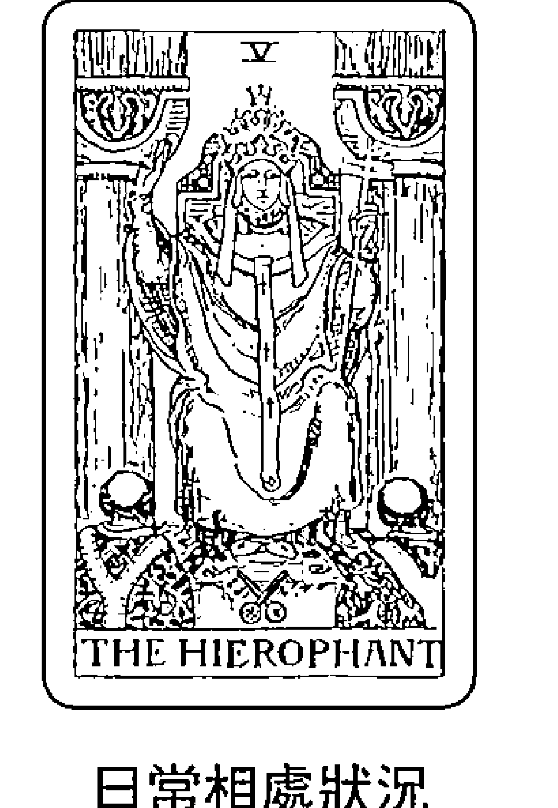

## 日常相處狀況

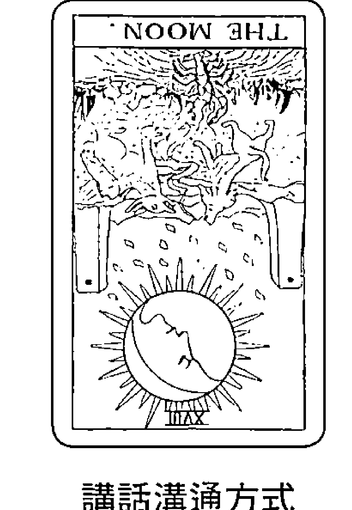

## 講話溝通方式

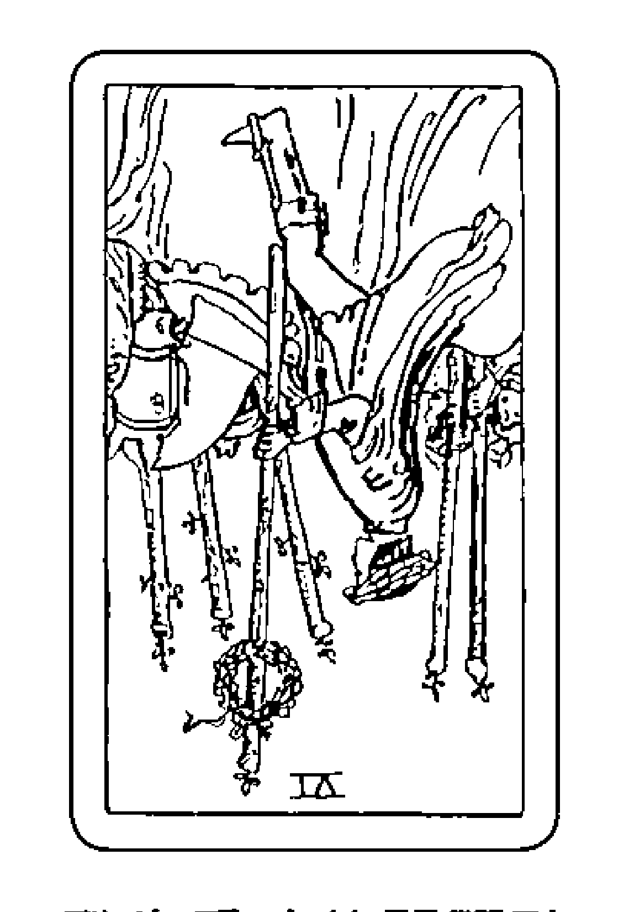

## 發生爭吵的問題點

## 背景提要：

問卜者與男朋友計劃好情人節要出遊，但是對於計劃內容一直吵個沒完，所以想知道如何處理這個問題。

## 發生爭吵的問題點：權杖六逆位

發生爭吵的主要問題點在於雙方都不說實話，所以彼此之間無法相互信任，兩個人之間的心結也就因此越來越多。

## 日常相處狀況：教皇

兩個人的相處算是融洽，如果遇到問題也可以互相幫助，感覺已經很習慣彼此的存在，關係也很穩定的繼續下去。

## 講話溝通方式：月亮逆位

兩個人可能經常會誤解彼此的意思，因此會陷入無意義的爭論當中，其實只要把話講清楚，並沒有太嚴重的問題。

## 如何化解紛爭：寶劍五逆位

除了投降之外就真的沒有辦法，再吵下去也不會有任何結果，你完全不可能說服對方，所以也不用再浪費力氣了。

## 整體建議及分析

發生爭吵的問題點出現權杖六逆位，正好與講話溝通方式的月亮逆位相呼應，同時指出這件事情的爭吵完全是因為溝通不良的關係，但是在日常相處狀況的位置出現教皇，則是表示這件事情的爭吵並沒有影響到兩個人的關係，如果依照寶劍五逆位的方式給建議，其实就是完全聽對方的話，這樣問題自然就可以化解。

# Q2

我想知道為什麼最近和男朋友的關係怪怪的？

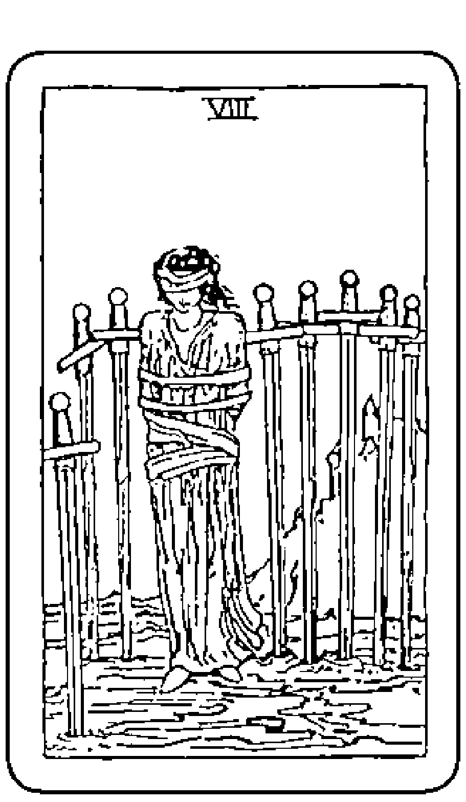

如何化解紛爭

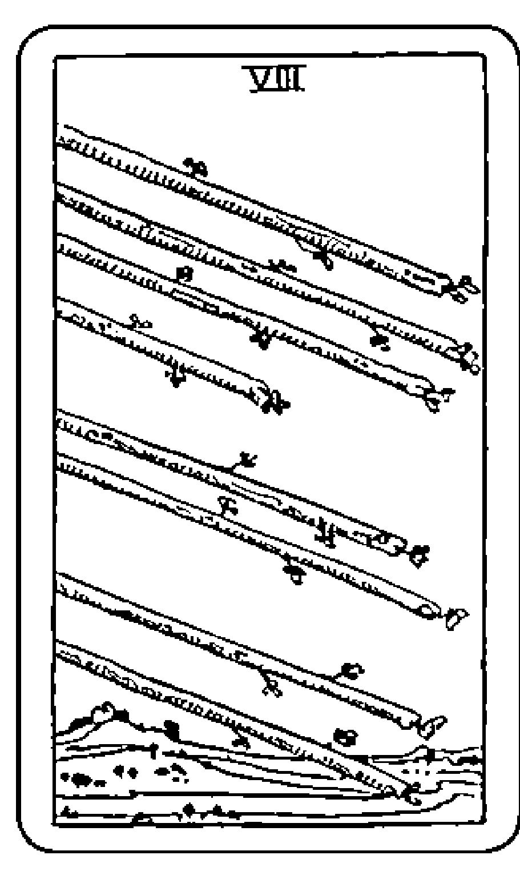

日常相處狀況

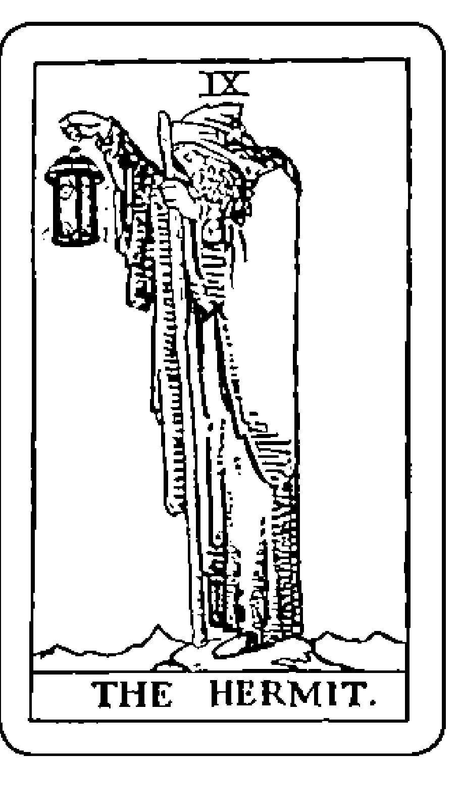

講話溝通方式

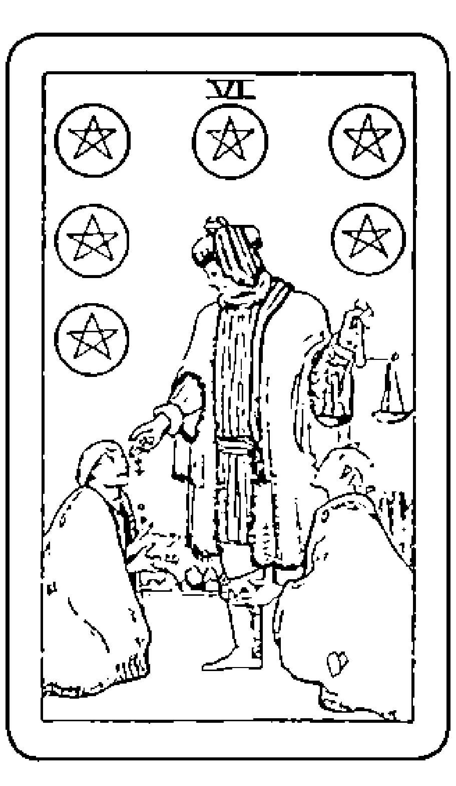

發生爭吵的問題點

## 背景提要：

問卜者與男朋友的交往一直都很穩定，但最近開始覺得有點怪怪的，所以想知道彼此之間到底出了什麼問題。

## 發生爭吵的問題點：錢幣六

兩個人會發生爭吵一定是與控制的問題有關，一方想要強迫另一方去做某件事情，另一方抵抗所以才會發生紛爭。

## 日常相處狀況：權杖八

兩個人有共同的目標，也會一起朝向這個目標去努力，雖然在生活上可能有些忙碌，但彼此之間還是能相互配合。

## 講話溝通方式：隱者

兩個人在溝通上十分理性，會想盡辦法用道理來說服對方，遇到無法溝通時會避不見面，而不会有情緒化的反應。

## 如何化解紛爭：寶劍八

兩個人都沒有看見事情的真相，所以才不明就理地吵個不停，只要指出這件事情根本就不值得爭吵事情自然解決。

## 整體建議及分析

發生爭吵的問題點出現錢幣六，表示雙方存在某種控制與抵抗的問題，然而日常相處狀況的權杖八與講話溝通方式的隱者，都顯示出彼此之間的關係並沒有受到太大的影響，如果是由隱者與寶劍八的互動來看，也許是有些事情沒有講清楚，所以才會引發這些問題，應該可以透過溝通的方式來解決。

# Q3

我想知道如何化解男朋友對我的誤會？

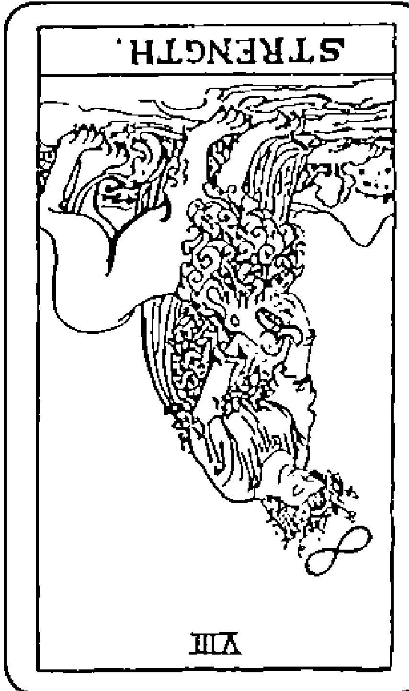

## 如何化解紛爭

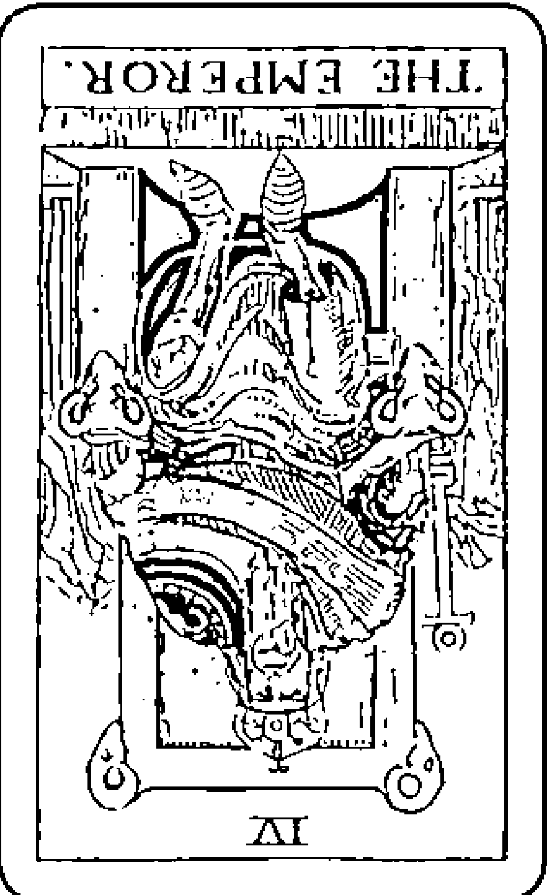

## 日常相處狀況

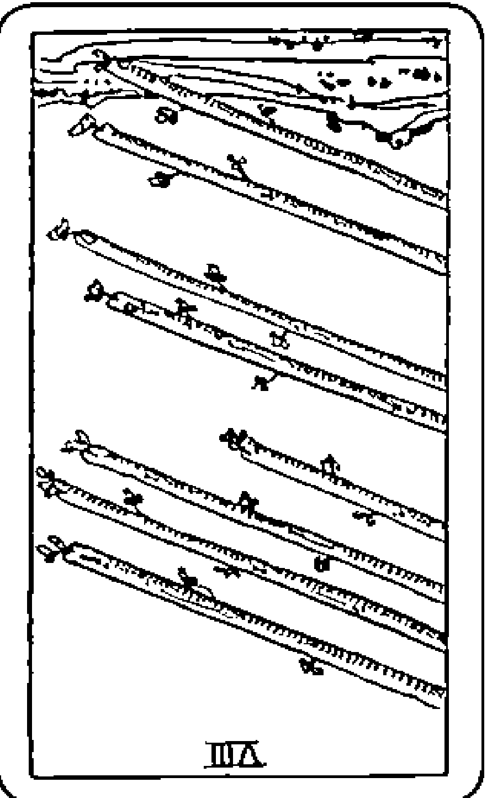

## 講話溝通方式

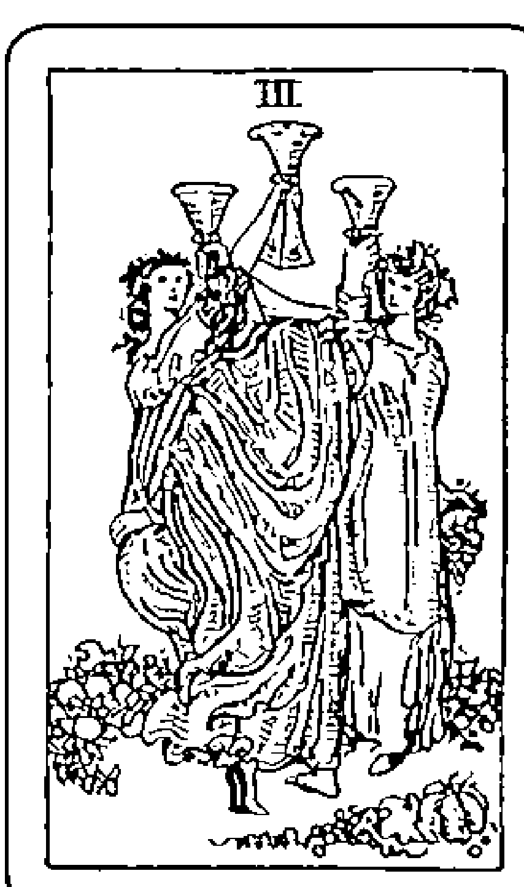

## 發生爭吵的問題點

## 背景提要：

問卜者與男朋友之間發生一些爭吵，但是問卜者覺得自己很無辜，所以想知道如何化解男朋友對他的誤會。

## 發生爭吵的問題點：聖杯三

這個時候爭吵往往都是因為翻舊帳而引起，其實過去的事情都已經過去了，這個時候再拿出來吵實在沒什麼意思。

## 日常相處狀況：皇帝逆位

兩個人在日常相處上無法配合，往往需要某一方做出犧牲才能達到預期的效果，但是另一方也不見得會覺得滿意。

## 講話溝通方式：權杖八逆位

兩個人的觀念與想法有極大的差異，因此經常會為了不同的事情爭吵，甚至可以說彼此是運用爭吵的方式在溝通。

## 如何化解紛爭：力量逆位

如果衝突已經是不可避免了，那麼就應該要讓問題直接爆發出來，知道對方真正不滿的地方，才有可能徹底解決。

## 整體建議及分析

發生爭吵的問題點出現了聖杯三，表示這個誤會是以前問題的延續，所以也影響到日常相處的狀況（皇帝），使得當事人覺得很委曲；講話溝通方式的權杖八逆位與如何化解紛爭的力量逆位其實很呼應，都是指出爭吵是彼此溝通的方式，所以如果想要化解誤會，也許就必須要和對方大吵一架。

# S06

## 三角關係牌陣

類別：狀況類牌陣
難度：進階級牌陣
使用張數：六張
使用時機：想知道如何突破感情的曖昧狀況時使用。

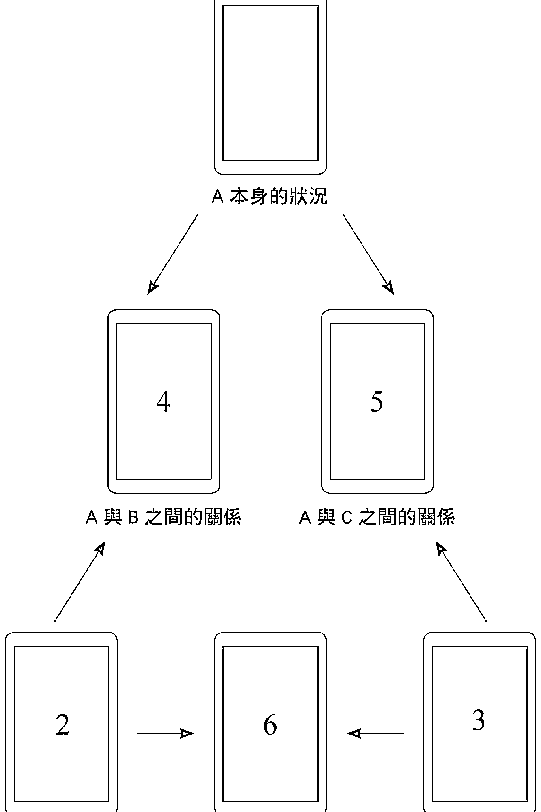

A 本身的狀況

4

5

A 與 B 之間的關係

A 與 C 之間的關係

2

6

3

B 本身的狀況

B 與 C 之間的關係

C 本身的狀況

## 說明：

三角關係牌陣適用於已知的三個人之間；A 本身的狀況是指 A 在這段關係當中的心態與做法，通常我們會把站在樞紐位置的人設定為 A；B 本身的狀況指出 B 在這段關係當中的心態與做法；C 本身的狀況指出 C 在這段關係當中的心態與做法；A 與 B 之間的關係代表 A 與 B 彼此相處的狀況；A 與 C 之間的關係代表 A 與 C 彼此相處的狀況；B 與 C 之間的關係代表 B 與 C 彼此相處的狀況。

## 影響因素：

A 本身的狀況與 B 本身的狀況會影響到 A 與 B 之間的關係；A 本身的狀況與 C 本身的狀況會影響到 A 與 C 之間的關係；B 本身的狀況與 C 本身的狀況會影響到 B 與 C 之間的關係。

## 解牌順序：

由於 A 是站在樞紐位置，所以通常會先分析 A 本身的狀況，接下來看 B 本身的狀況與 A 與 B 之間的關係，再看 C 本身的狀況 A 與 C 之間的關係，最後才分析 B 與 C 之間的關係。

## 參考牌義：

-   1. A 本身的狀況：大牌及宮廷牌可參考人物特性－感情觀；數字牌可參考相處篇－日常相處狀況
2. B 本身的狀況：大牌及宮廷牌可參考人物特性－感情觀；數字牌可參考相處篇－日常相處狀況
3. C 本身的狀況：大牌及宮廷牌可參考人物特性－感情觀；數字牌可參考相處篇－日常相處狀況
4. A 與 B 之間的關係：可參考相處篇－日常相處狀況
5. A 與 C 之間的關係：可參考相處篇－日常相處狀況
6. B 與 C 之間的關係：可參考相處篇－日常相處狀況

## 注意事項：

所謂 A 的樞紐位置，是指站在關鍵地位與兩方都發展關係的人；例如你想看看另一位女性朋友是不是介入你與男朋友之間，那麼就會設定你的男朋友在 A 的位置。此外，ABC 三個位置都要設定具體的人選，不能把 C 位置設定為「假設的第三者」，那樣就無法精確算出來。

## 問題範例：

-   Q1. 我想知道 C 是否介入我與男朋友之間？
Q2. 我想知道目前我與 B、C 之間的關係如何？
Q3. 我想知道男朋友會不會被 C 搶走？

## Q1

我想知道 C 是否介入我與男朋友之間？

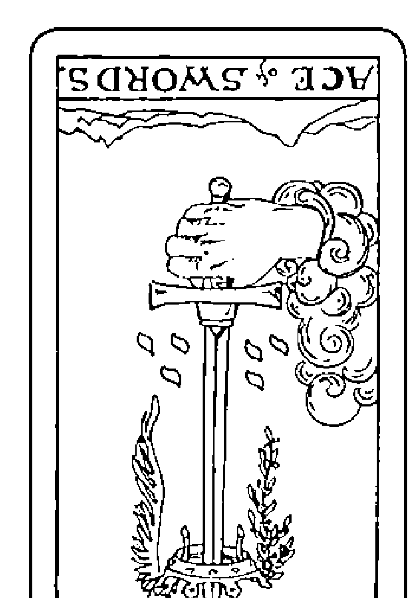

A 本身的狀況

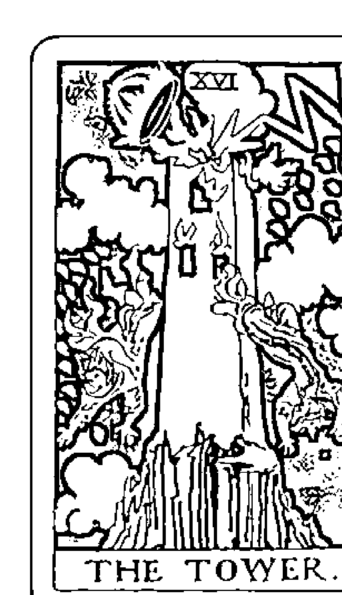

A 與 B 之間的關係

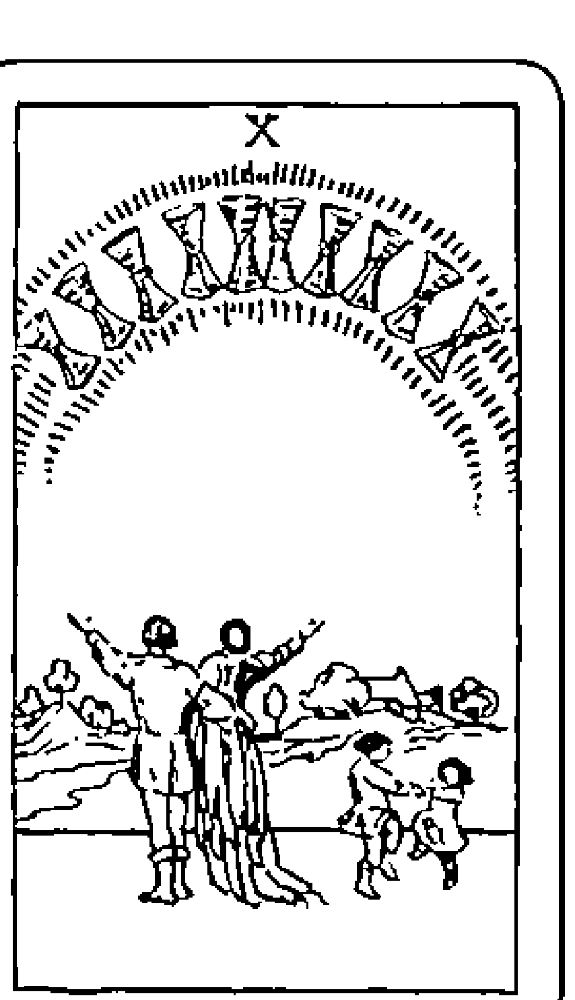

A 與 C 之間的關係

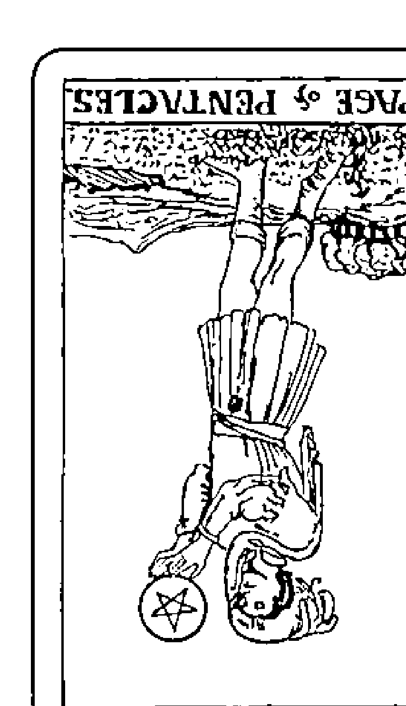

B 本身的狀況

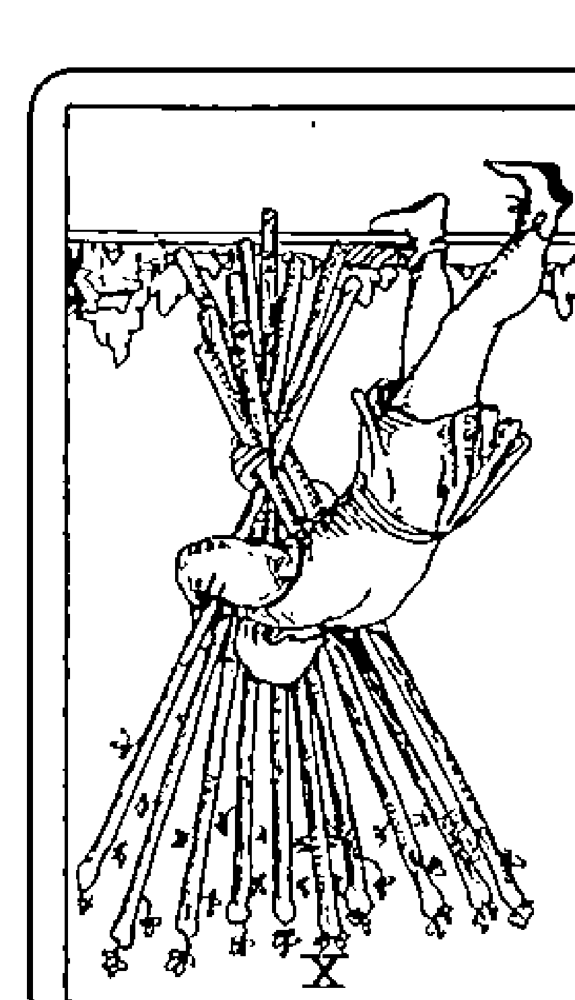

B 與 C 之間的關係

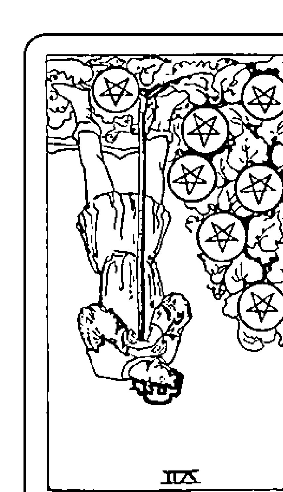

C 本身的狀況

### 背景提要：

問卜者與男朋友之間發生爭吵，同時又發現最近 C 與男朋友走得很近，所以想知道 C 是否介入了兩個人的感情。（由於是懷疑男朋友出軌，所以男朋友是站在樞紐的位置設定為 A，而本人設定為 B）

### A 本身的狀況：寶劍 A 逆位

在感情上遇到了極大的問題，也可能因為外力的介入使得這段關係變質，你覺得無法承受這樣的壓力而幾乎崩潰。

### B 本身的狀況：錢幣侍者逆位

在感情上十分愛好自由，不喜歡被別人限制住，所以很少給予承諾，即使已經有了固定的情人仍然喜歡到處遊盪。

### A 與 B 之間的關係：塔

兩個人的日常相處完全無法配合，而且當中存在許多的矛盾之處，如果硬要去解決的話，會造成兩敗俱傷的結果。

### C 本身的狀況：錢幣七逆位

目前在感情方面的狀況並不順利，總是有一些事情會讓彼此感到擔心甚至焦慮，需要具體的計劃來改善才能解決。

### A 與 C 之間的關係：聖杯十

兩個人日常相處十分和諧，就像是家人一般的相處模式，由於彼此都對現狀十分滿意，所以很容易繼續維持下去。

### B 與 C 之間的關係：權杖十逆位

兩個人的相處經常無法配合，甚至還會發生蓄意欺騙的狀況，但是即使彼此的關係困難重重雙方仍然不願意放手。

### 整體建議及分析

由 A 與 B 之間的關係（塔）來看，正好反映出雙方爭吵的現實，而男朋友也因為這件事情感到煩惱，所以在 A 本身的狀況會出現寶劍 A 逆位；相較而言，A 與 C 的關係（聖杯十）就像是家人一樣，雖然 C 在這件事情上還有一些猶豫（錢幣七逆位），但也許彼此之間會有進展；至於 B 與 C 之間的關係，則是充滿欺騙的權杖十逆位，表示雙方無法相互信任。整體看來，男朋友與 C 之間的關係目前比你們彼此之間的關係好，如果不小心處理男朋友有可能會被搶走。

## Q2

我想知道目前我与 B、C 之间的关系如何？

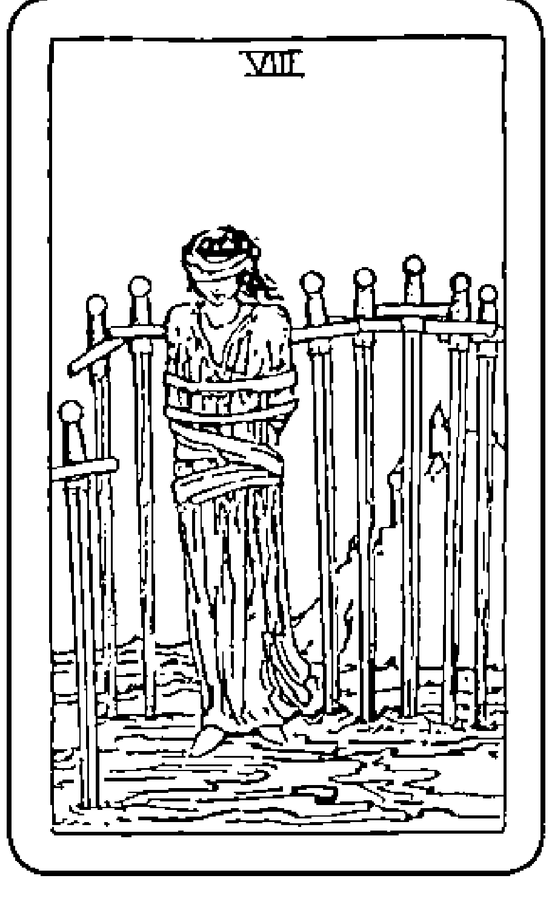

A本身的状况

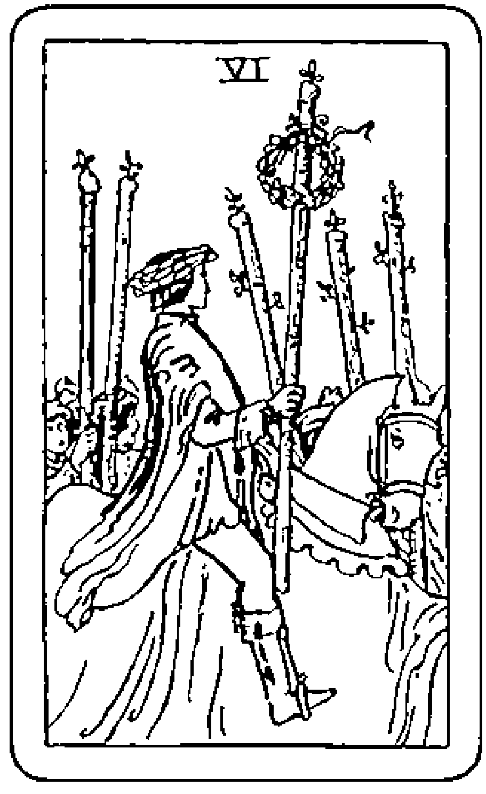

A与B之间的关系

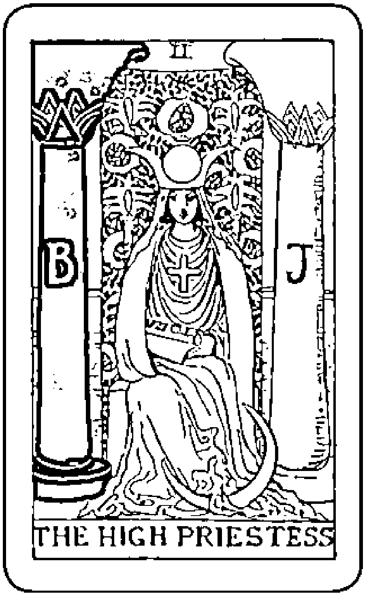

A与C之间的关系

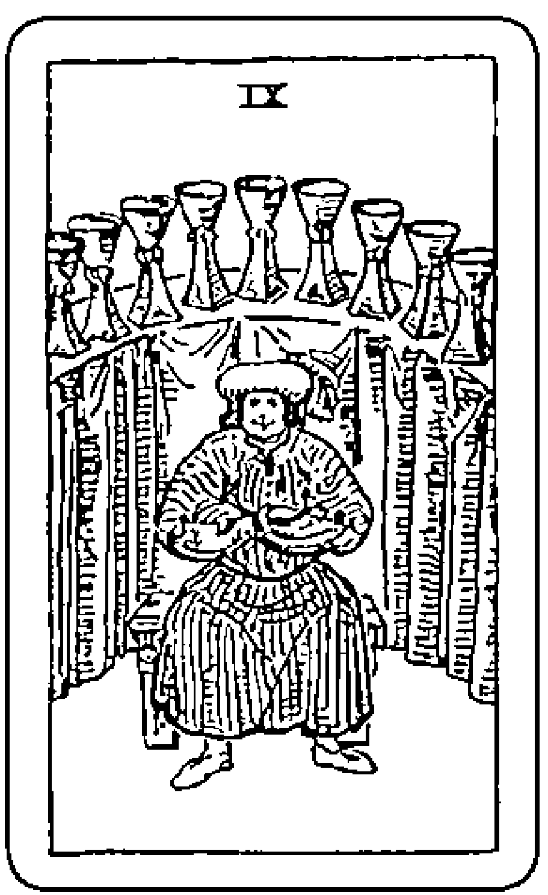

B本身的状况

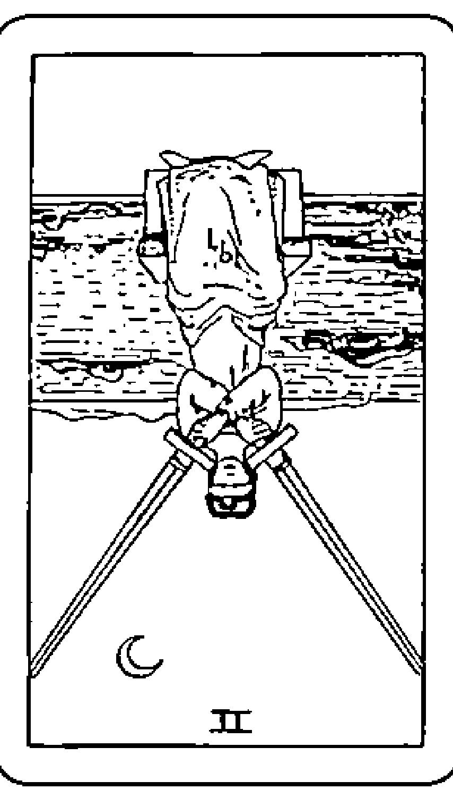

B与C之间的关系

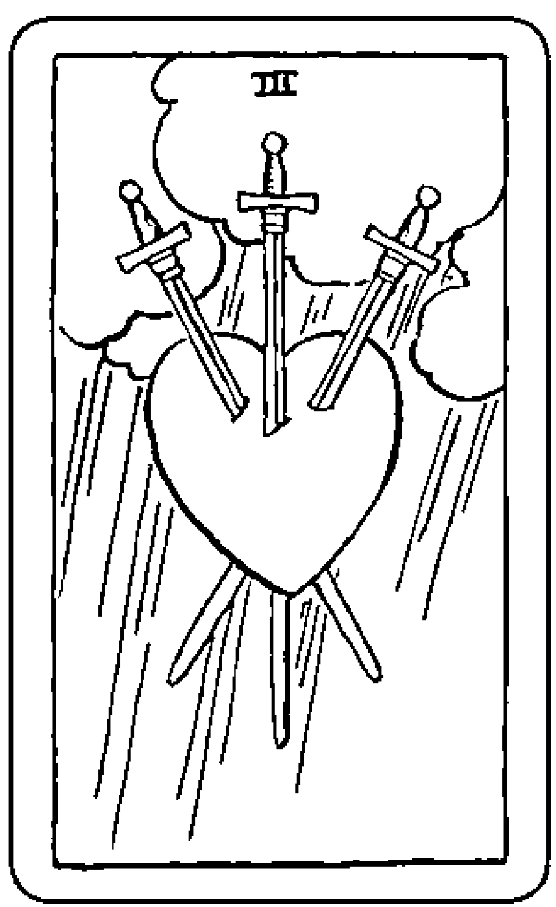

C本身的状况

塔羅愛情占卜的基本觀念

三角關係牌陣

S06.

### 背景提要：

問卜者原本與 B 交往，但是最近又覺得自己被 C 所吸引，所以想要知道目前三個人之間的關係是怎麼樣。（由於本人陷入兩難，所以自己設定為 A）

### A本身的狀況：寶劍八

這是一段不被祝福的感情，常常會懷疑自己的決定是不是正確，但是又覺得自己被對方綁住，沒有辦法選擇離開。

### B本身的狀況：聖杯九

本身對於這段感情都覺得很滿意，彼此之間也保持著良好的關係，兩個人之間的和諧相處常常會帶來更多的歡樂。

### A與B之間的關係：權杖六

兩個人日常相處的狀況沒有什麼問題，彼此之間也可以相互配合，身邊的人也都看好與支持你們之間的感情關係。

### C本身的狀況：寶劍三

目前還陷在悲傷失落的情緒當中，並不是很能接受新的感情，所以即使有適合的對象出現，往往也可能視而不見。

### A與C之間的關係：女祭司

兩個人日常相處的狀況十分平靜，但是並不把感情關係放在最優先的順序，也許兩個人都還有其他的課題要面對。

### B與C之間的關係：寶劍二逆位

兩個人彼此之間爾虞我詐，有一些事情總是想要以欺騙的方式蒙混過去，因此在日常相處上就容易發生一些衝突。

### 整體建議及分析

由 A 與 B 之間的關係出現權杖六來看，彼此之間相處沒什麼大問題，B 本身對於這段關係也很滿意（聖杯九），A 本身的狀況出現寶劍八，也可以發現本人目前是看不清楚又想太多的局面；C 本身的狀況出現寶劍三，表示目前他並不想要談感情，所以 A 與 C 之間的關係會出現代表靜止的女祭司；也許是因為這樣的原因，B 與 C 之間就出現了爾虞我詐的寶劍二逆位。整體來看，還是與現任男友 B 的關係比較好，所以是自己想太多。

## Q3

我想知道男朋友會不會被 C 搶走？

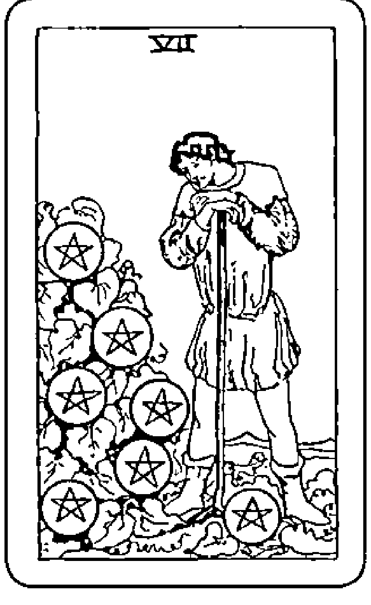

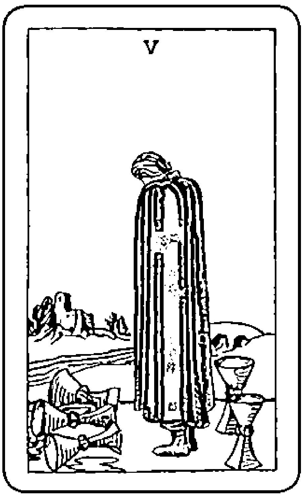

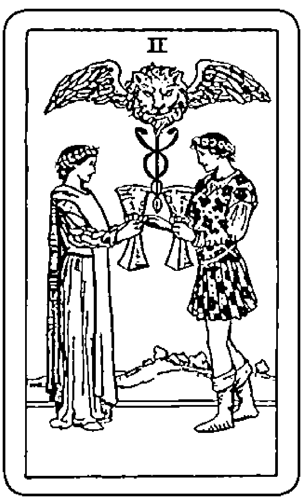

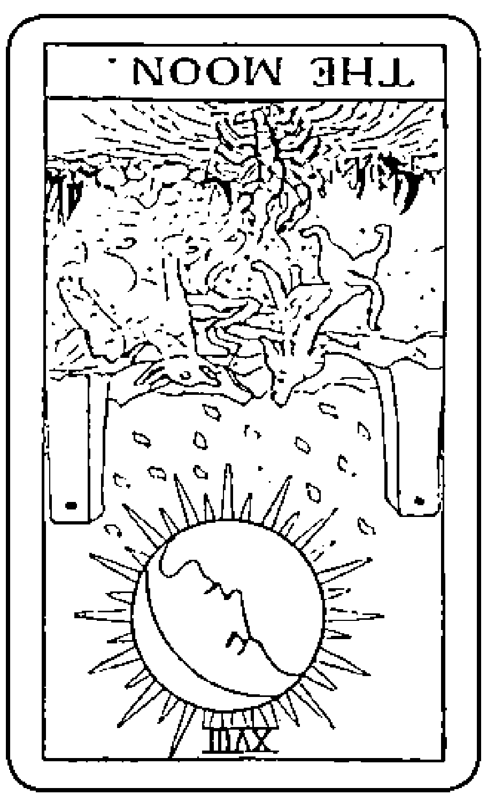

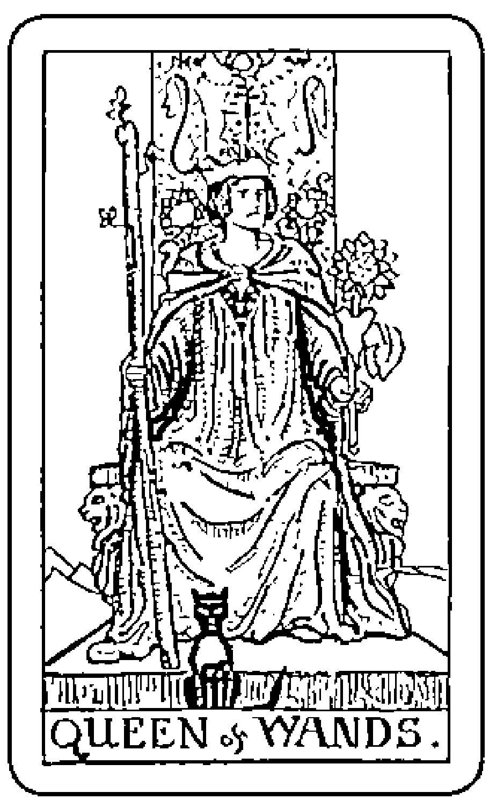

### 背景提要：

問卜者與男朋友是在打工的地方認識，已經交往了一段時間，但最近來了一個新同事 C，感覺上也很吸引人，所以會有一點擔心男朋友會不會被 C 搶走。（由於是擔心男朋友被搶走，所以男朋友是站在樞紐的位置設定為 A，本人設定為 B）

### A 本身的狀況：錢幣七

這段到目前為止感情都還算不錯，但是不知道下一步會怎麼走，也許雙方都對未來感到茫然，也還在努力思考中。

### B 本身的狀況：聖杯二

這是一段完美的戀情，不只兩個人的溝通良好，而且能達到互補的功能，每天過得都十分快樂，想要永遠在一起。

### A 與 B 之間的關係：錢幣騎士

兩個人日常相處的狀況十分穩定，彼此也很忠誠而有責任感，但比較缺乏浪漫的表現，以務實的角度來經營感情。

### C 本身的狀況：權杖王后

在感情上十分直接，遇到自己喜歡的人就會主動去追求，同時也是很愛恨分明，在感情上比較會想要掌握主導權。

### A 與 C 之間的關係：聖杯五

兩個人在日常相處上都彼此有所不滿，也經常為此發生爭吵，如果事情不合自己的意就很容易有悲傷失落的情緒。

### B 與 C 之間的關係：月亮逆位

可能是因為兩個人相處的時間不多，或是因為彼此有所隱瞞或欺騙，總覺得有些事情怪怪的，但也不知怎麼解決。

### 整體建議及分析

由 A 與 B 之間的關係出現錢幣騎士來看，其實兩個人的關係算是穩定，也許本人比較偏向浪漫（聖杯二），而對方則有一點心事（錢幣七）；至於新的同事 C，本身的狀況出現權杖王后，顯示出是一個陽光又愛恨分明的人，但是由 A 與 C 之間的關係（聖杯五）來看，彼此之間應該是屬於不合的狀況居多；而本人因為懷疑 C，所以在 B 與 C 的關係上出現了代表懷疑的月亮逆位。整體來看，當事人與男朋友的關係明顯地超越他與 C 的關係，所以是自己想太多。

## S07

### 解脫之道牌陣

- 類別：狀況類牌陣
- 難度：入門級牌陣
- 使用張數：五張
- 使用時機：想與對方分手時使用。

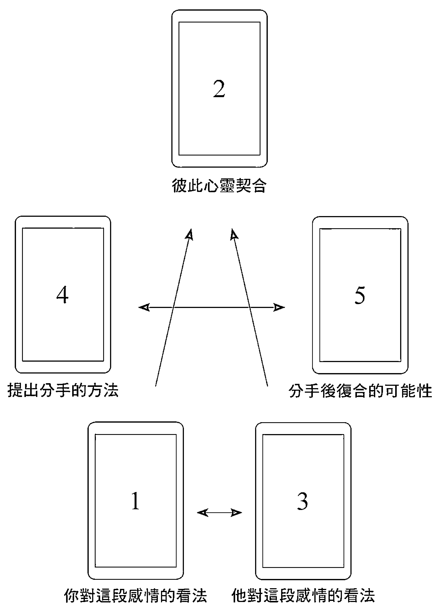

### 說明：

解脫之道牌陣適用於要與特定對象分手的狀況；你對這段感情的看法指出你在這段關係當中的心態與做法；彼此心靈契合是看雙方彼此對於這段關係的共識為何；他對這段感情的看法可以看出對方在這段關係當中的心態與做法；提出分手的方法是屬於建議的位置，表示如果現在選擇要分手如何的做法最容易成功；分手後復合的可能性則是幫助評估舊情復燃的可能性，才不會搞了半天白忙一場。

### 影響因素：

你對這段感情的看法與他對這段感情的看法會彼此互相影響，同時也都會影響到彼此心靈契合與分手後復合的可能性；提出分手的方法則是與分手後復合的可能性互相影響。

### 解牌順序：

通常會最先看你對這段感情的看法與他對這段感情的看法，接下來才看這兩張牌與彼此心靈契合互動性；最後會參考分手後復合的可能性，依據提出分手的方法給予建議。

### 參考牌義：

- 1. 你對這段感情的看法：可參考相處篇－彼此心靈契合
- 2. 彼此心靈契合：可參考相處篇－彼此心靈契合
- 3. 他對這段感情的看法：可參考相處篇－彼此心靈契合
- 4. 提出分手的方法：可參考危機篇－提出分手的方法
- 5. 分手後復合的可能性：可參考危機篇－復合的可能性

### 注意事項：

解脫之道牌陣每次只能針對一個感情對象使用，當同時有多個對象時應該要分開個別占卜。

### 問題範例：

- Q1. 我想知道現在如何與男朋友分手？
- Q2. 我想知道如何在一個月之內與第三者分手？
- Q3. 我想知道如何離開現在這段感情？

## Q1

我想知道現在如何與男朋友分手？

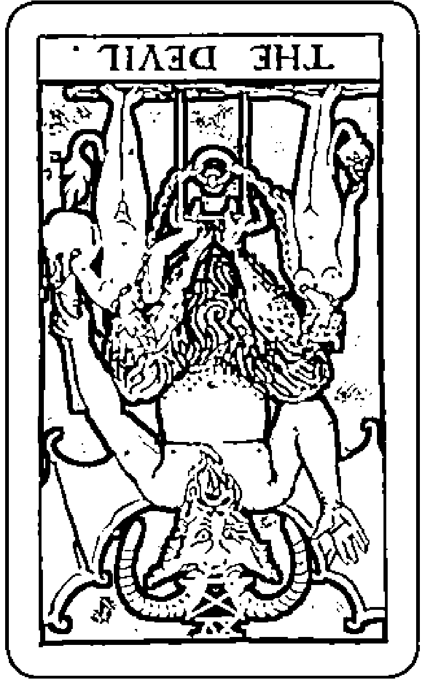

彼此心靈契合

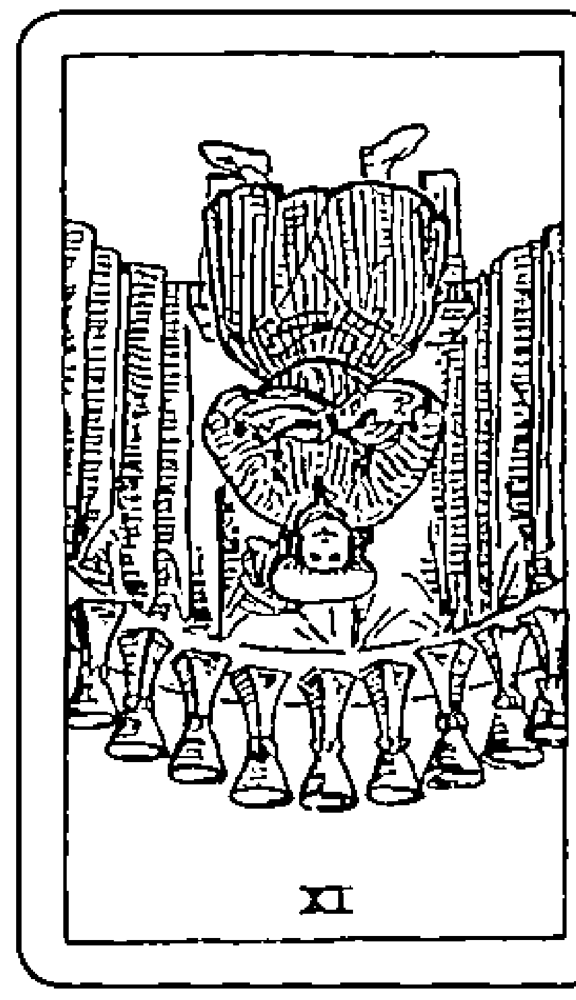

提出分手的方法

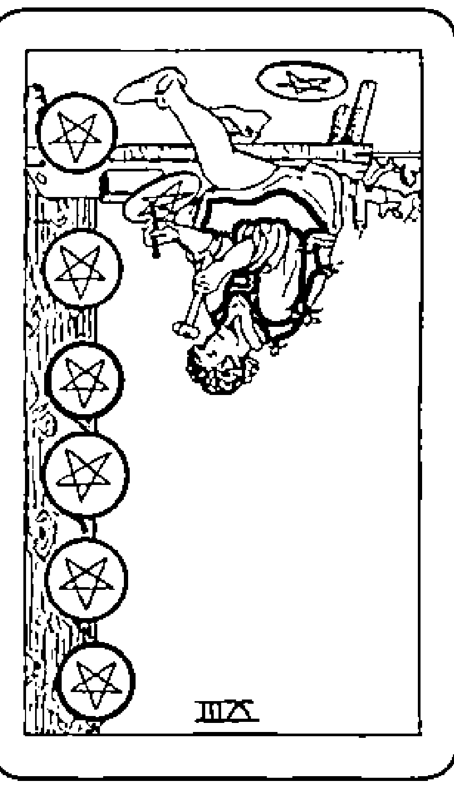

分手後複合的可能性

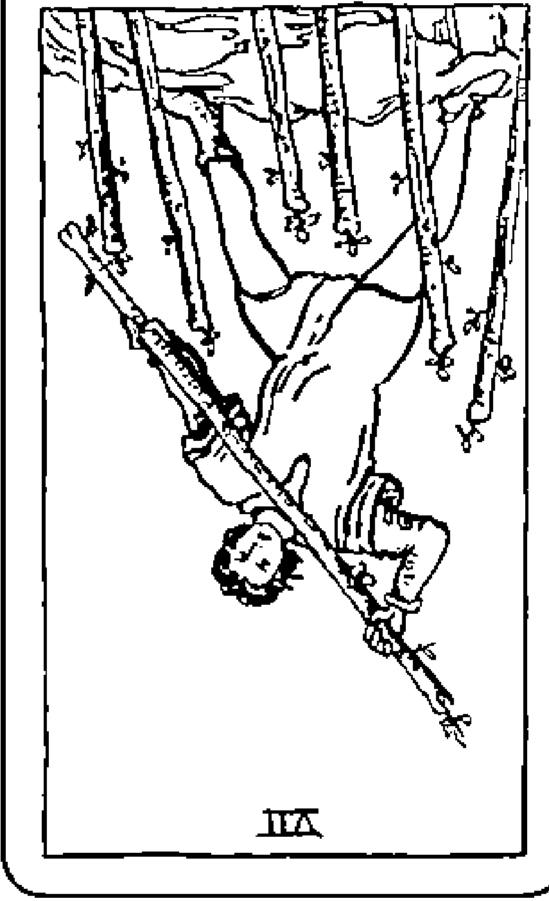

你對這段感情的看法

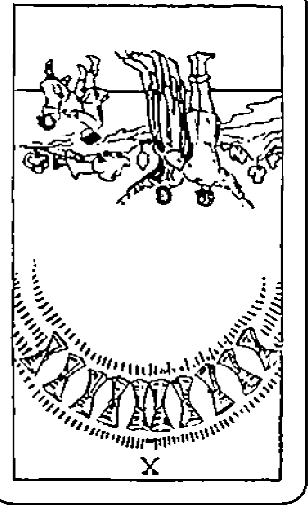

他對這段感情的看法

### 背景提要：

問卜者與男朋友交往並不久，但是已經覺得無法再忍受了，所以想要知道如何與男朋友分手。

### 你對這段感情的看法：權杖七逆位

自己一直對這段關係感到懷疑，但是又沒有勇氣把它結束，也許到某一天真的無法忍受的時候才會一次爆發出來。

### 他對這段感情的看法：聖杯十逆位

兩個人的感情表面上很和諧，其實內心當中有很多的衝突，即使能夠控制自己的情緒保持平靜，也無法真心相對。

### 彼此心靈契合：惡魔逆位

兩個人都覺得這段關係帶來很多的限制和束縛，有時候必須為了對方的事情而犧牲自我，想逃開又沒辦法放得下。

### 分手後復合的可能性：錢幣八逆位

這段關係完全不可能復合，因為兩個人之間已經沒有感情了，在一起也只是一種表象，還不如誠實一點面對自己。

### 提出分手的方法：聖杯九逆位

如果真的想要分手，就要斷絕一切溝通的管道，除了不說話之外，也不要通什麼訊息，讓對方無法知道你的想法。

### 整體建議及分析

由雙方對這段關係的看法來評估，不論是你自己（權杖七逆位）或是對方（聖杯十逆位）都是在硬撐，所以在彼此心靈契合的位置出現惡魔逆位，顯示出一段限制與束縛的關係；看到錢幣八逆位就知道完全不可能復合，因此可以參考聖杯九逆位的方式，斷絕所有的溝通管道，應該就能成功分手。

## Q2

我想知道如何在一個月之內與第三者分手？

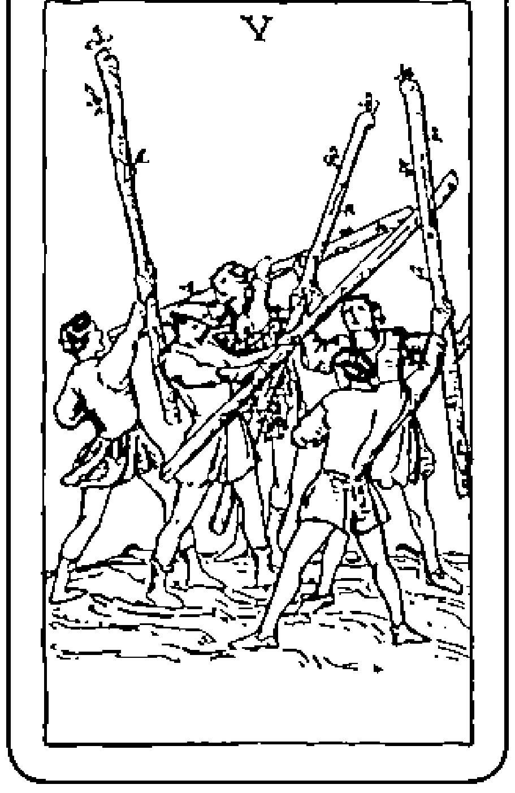

彼此心靈契合

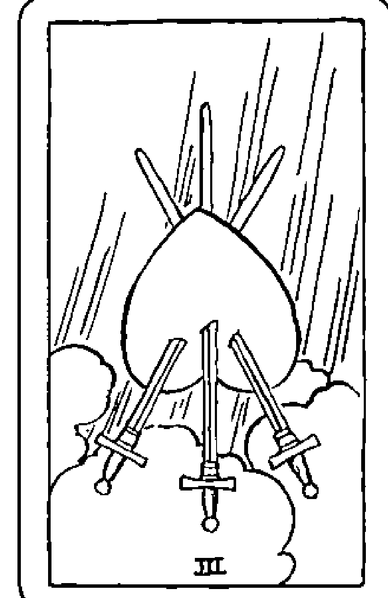

提出分手的方法

分手後復合的可能性

你對這段感情的看法

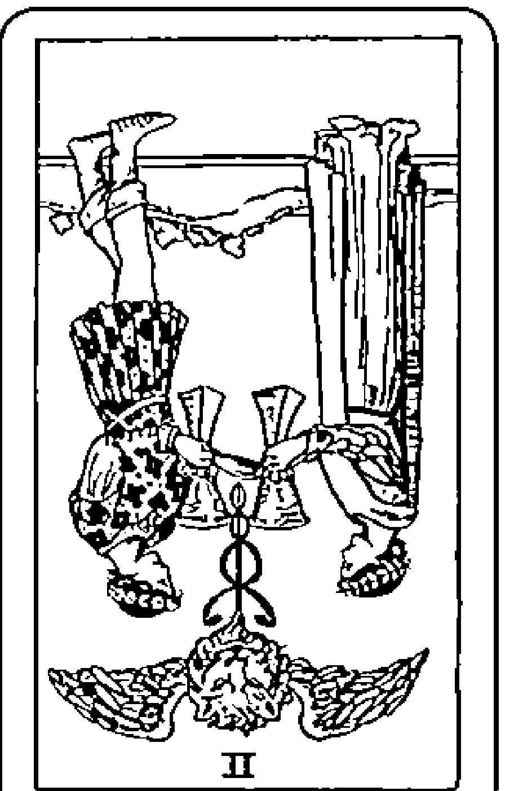

他對這段感情的看法

### 背景提要：

問卜者原來已經有一個女朋友，但是在不久之前又認識了另一個女生，開始陷入三角關係當中十分痛苦，所以想要問是否能在一個月之內與第三者分手。

### 你對這段感情的看法：權杖七

這段感情歷經了千辛萬苦才有現在的成果，不論接下來遇到什麼困難，都應該要努力堅持下去，絕不向命運低頭。

### 他對這段感情的看法：聖杯二逆位

這是一段平等的感情，雙方都很真心的付出，也希望能發展成長久的關係，只是在很多地方仍然有需要再作調整。

### 彼此心靈契合：權杖五

兩個人都知道彼此有很大的不同，但是仍然願意為了這段關係努力下去，只是有很多事情不是靠努力就能解決的。

### 分手後複合的可能性：節制

這段關係還存在一部分複合的可能性，但是要雙方共同努力去解決問題才有可能再在一起，並不是很容易的事情。

### 提出分手的方法：寶劍三逆位

現在不太可能立刻就分手，兩個人的關係也許還會拖一陣子，但是你應該把所有的事情講清楚，不要怕對方傷心。

### 整體建議及分析

由雙方對這段關係的看法來評估，就你的部分出現權杖七，顯示出自己並不是很想放棄，而他的部分出現聖杯二，也是比較正面的牌，雖然彼此心靈契合出現了比較偏向負面的權杖五，恐怕現在要分手不是那麼容易，而這個狀況也呼應到提出分手的方法，寶劍三逆位明確指出現在不太可能立刻就分手，而且還有節制這張牌暗示仍然有複合的可能性，所以現在並不是採取行動的時候。如果一個月後仍然想分手，到時候再進行另一次占卜。

## Q3

我想知道如何離開現在這段感情？

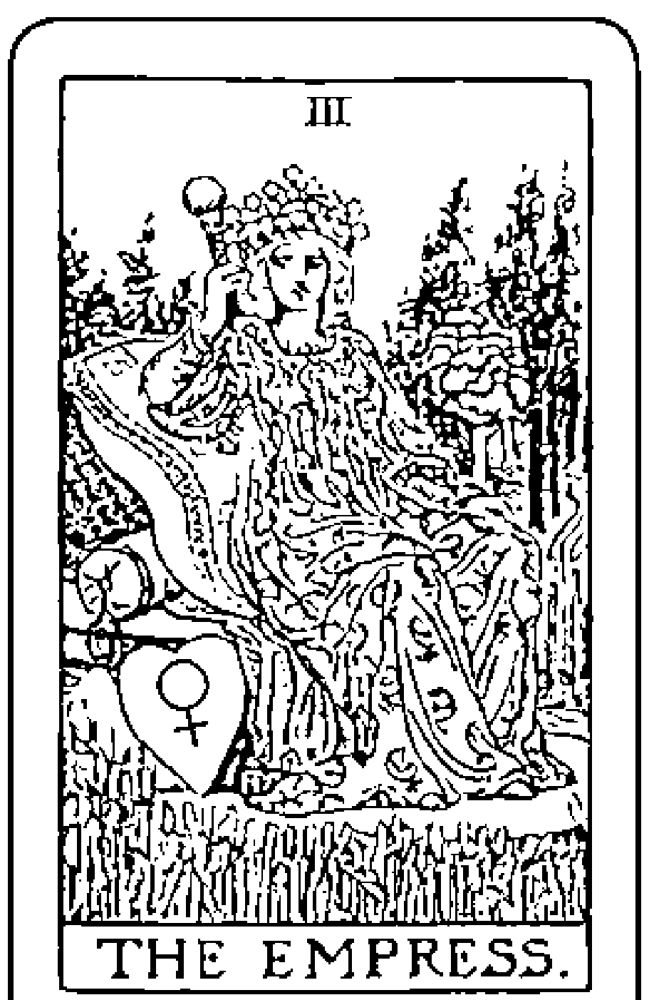

彼此心靈契合

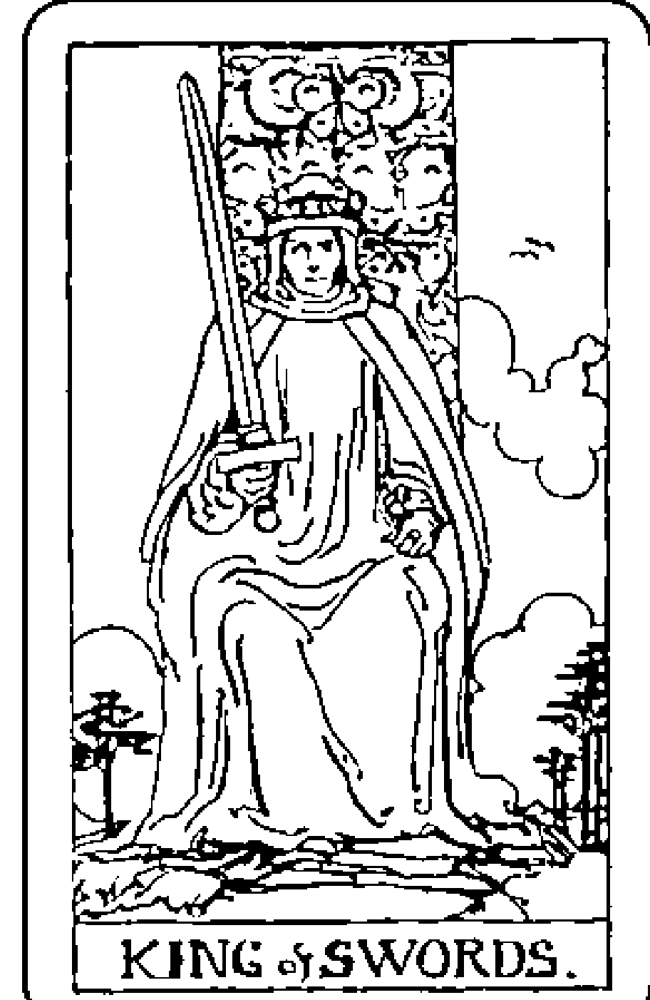

提出分手的方法

分手後復合的可能性

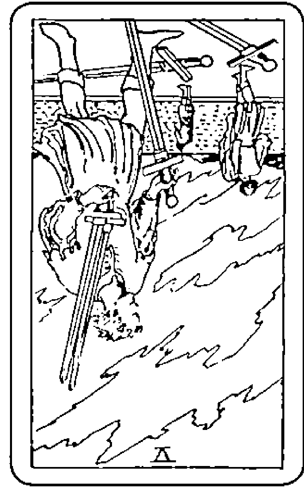

你對這段感情的看法

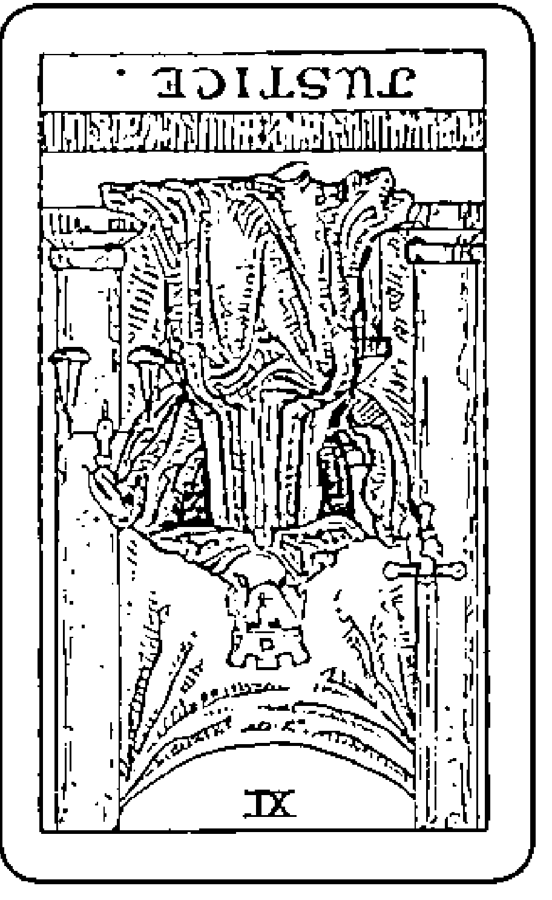

他對這段感情的看法

### 背景提要：

問卜者是介入別人感情的第三者，雖然兩個人相處有愉快的部分，但是在內心當中總是覺得不安與痛苦，所以會想要來問如何離開現在這段感情。

### 你對這段感情的看法：寶劍五逆位

你在這段關係當中覺得很挫折，好像不論如何都是自己不對，也沒有辦法反駁對方，會想要結束但是又無能為力。

### 他對這段感情的看法：正義逆位

覺得還有很多東西沒想清楚，因此很難作出重要的決定，也許在更多實際相處的經驗之後，才能解開心中的疑惑。

### 彼此心靈契合：皇后

兩個人都覺得這是一段很快樂的關係，也很想要繼續經營下去，因此只要保持現在的狀況，彼此就會覺得很滿足。

### 分手後復合的可能性：吊人逆位

這段感情的結束其實對你來一種解脫，實在沒必要再回頭去想那個人，你應該往未來去看，而不是被這個人卡住。

### 提出分手的方法：寶劍國王

這時候兩個人可以談判分手，理性地分析各種利弊得失，如果發現結果並不是兩個人想要的，應該就會決定分手。

### 整體建議及分析

由雙方對這段關係的看法來評估，雖然雙方都是比較負面的評價，但是在彼此心靈契合部分出現了皇后，表示兩個人在內心深處真的有喜歡對方，彼此矛盾的牌也顯示出目前兩個人交往的現況；就吊人逆位來看分手是一種解脫，也不可能會再復合，所以只要依照寶劍國王的建議談判分手，走比較理性的路線自然比較容易分開。

## S08

### 餘情未了牌陣

- 類別：狀況類牌陣
- 難度：入門級牌陣
- 使用張數：三張
- 使用時機：想知道是否能與舊情人複合時使用。

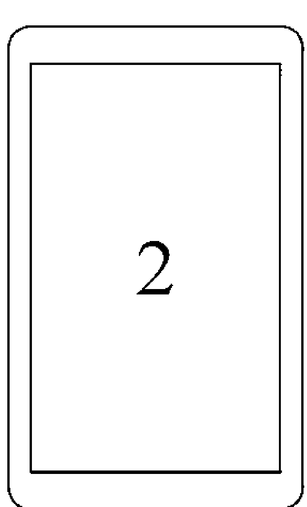

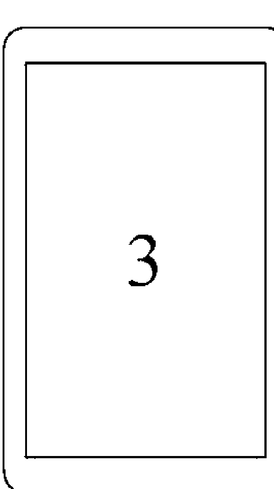

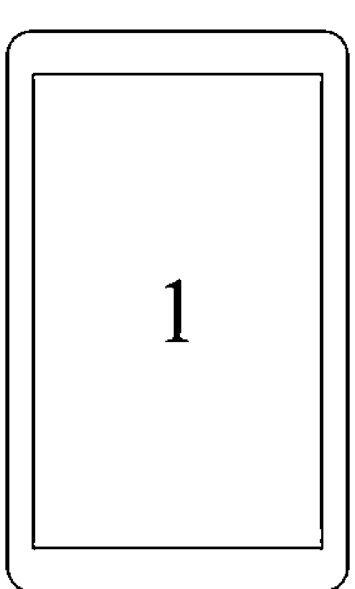

### 說明：

餘情未了牌陣主要是看與舊情人的關係；他心中是否有別人可以看到目前對方的感情狀態，是否已經有喜歡的對象；他對我的看法則是探知對方目前對自己的觀感，是否仍然有好感；複合的可能性指出兩個人複合的可能性，算是整副牌的重點與建議。

### 影響因素：

他心中是否有別人與他對我的看法兩者互相影響，而這兩張牌都會影響到複合的可能性。

### 解牌順序：

通常都會先看他心中是否有別人和他對我的看法，接下來才依據複合的可能性給予建議。

### 參考牌義：

- 1. 他心中是否有別人：可參考曖昧篇－心中是否有別人
- 2. 他對我的看法：可參考曖昧篇－如何看待對方
- 3. 複合的可能性：可參考危機篇－複合的可能性

### 注意事項：

餘情未了牌陣每次只能針對一個舊情人，此外，在不同的狀態下也可能有不同的結果，所以最好能設定好條件與時間。

### 問題範例：

- Q1. 我想知道這個月有沒有可能與前男友複合？
- Q2. 我想知道如果留在現在這個工作，有沒有可能與前男友複合？
- Q3. 我想知道如果我與現在的男朋友分手，有沒有可能與前男友複合？

## Q1

我想知道這個月有沒有可能與前男友復合？

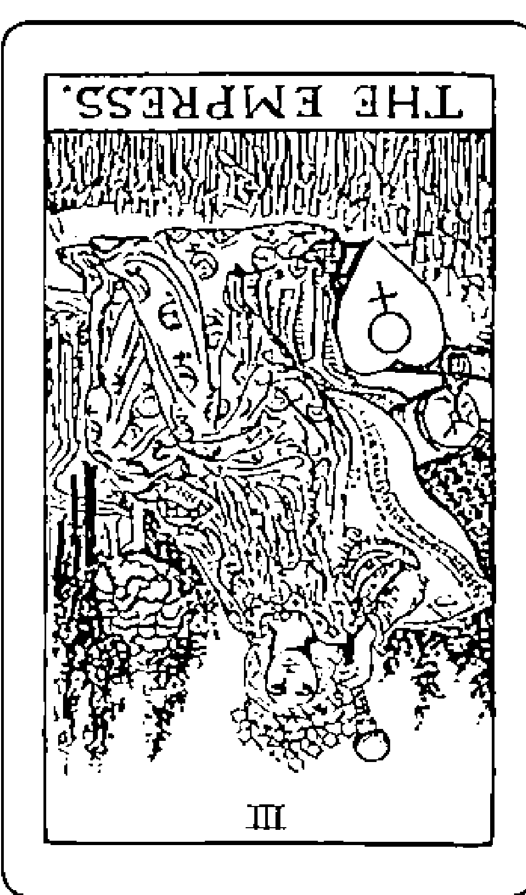

他對我的看法

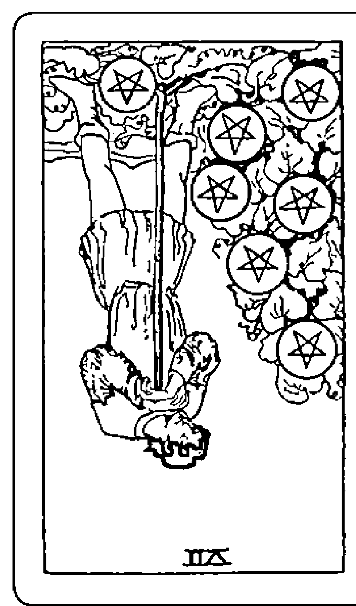

複合的可能性

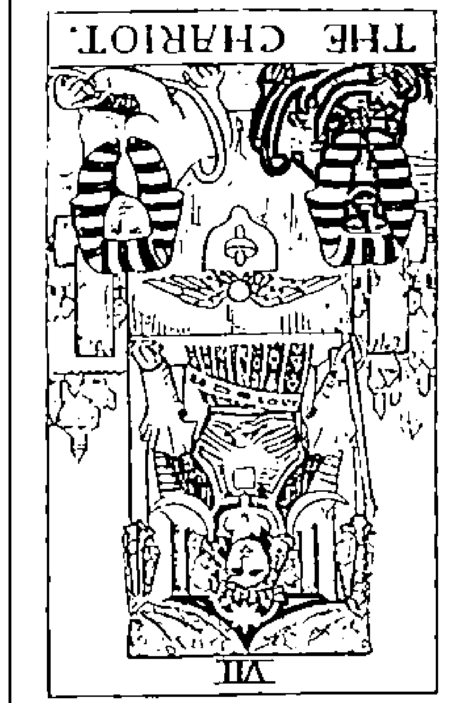

他心中是否有別人## 背景提要：
問卜者目前在空窗期，由於沒有其他對象出現，所以會想知道是否能與前男友複合。

## 他心中是否有別人：戰車逆位
目前在他心中沒有其他的對象，但是也許還沒有從之前的感情傷害當中走出來，對你來說也不是容易進攻的目標。

## 他對我的看法：皇后逆位
這是一個散漫的人，無法集中精神去做一件事情，在相處的時候不容易留下深刻的印象，也不會想要進一步交往。

## 複合的可能性：錢幣七逆位
這段關係已經完成不可能複合了，再考慮這件事情只是自尋煩惱，這個時候應該快點認清事實，才可以重新開始。

## 整體建議及分析
雖然由戰車逆位來看對方目前並沒有其他對象，但是也顯示出還沒從情傷中走出來，再加上皇后逆位代表他對你的印象並不好，所以最後由錢幣七逆位明確地指出兩個人並沒有複合的機會。

## Q2
我想知道如果留在現在這個工作，有沒有可能與前女友復合？

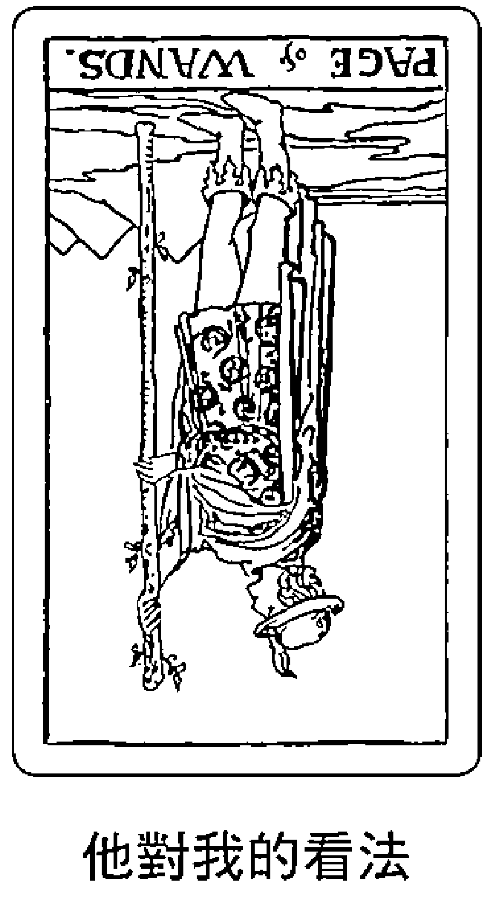

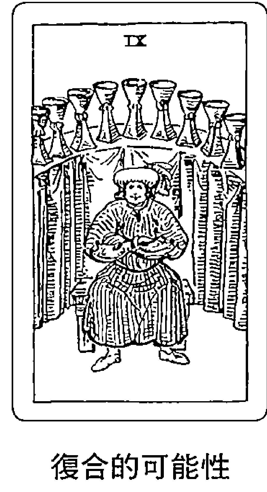

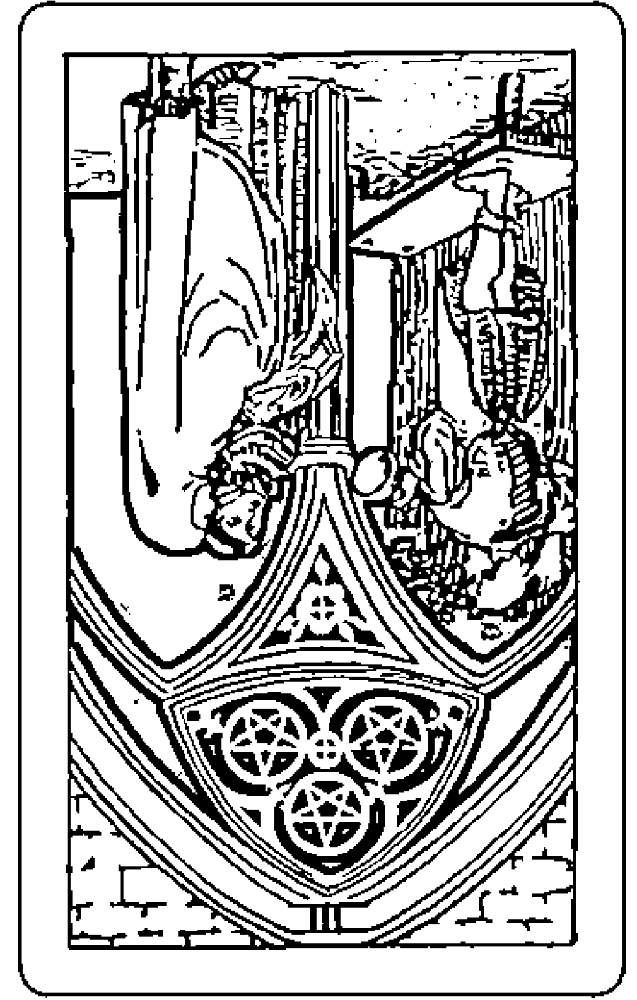

## 背景提要：
問卜者本身忙於工作，種下與前女友分手的主因，但是當事人又有一些留戀，所以會想知道如果留在現在這個工作有沒有機會與前女友複合。

## 他心中是否有別人：錢幣三逆位
目前在他心中也許已經有一些假設的對象，但是完全還沒有採取任何行動，所以現在開始努力還是有機會成功的。

## 他對我的看法：權杖侍者逆位
這是一個很幼稚的人，不論想法或是做法都不成熟，在相處的時候可以感覺到任性，甚至無法把自己的事情搞定。

## 複合的可能性：聖杯九
兩個人其實還是有感情在，但是不一定能夠複合，主要是因為雙方都太重視面子，誰也不願意先低頭向對方認錯。

## 整體建議及分析
由錢幣三逆位來看，目前他還沒有新的感情出現，但是就權杖侍者逆位所顯示的，對方似乎對自己有一些不滿和抱怨，若是由聖杯九來看複合的可能性也不是很高，再加上當初分手的主因是工作，如果不轉換工作的話，就無法給對方一個台階下，要複合就很難了。

## Q3
我想知道如果我與現在的男朋友分手，有沒有可能與前男友復合？

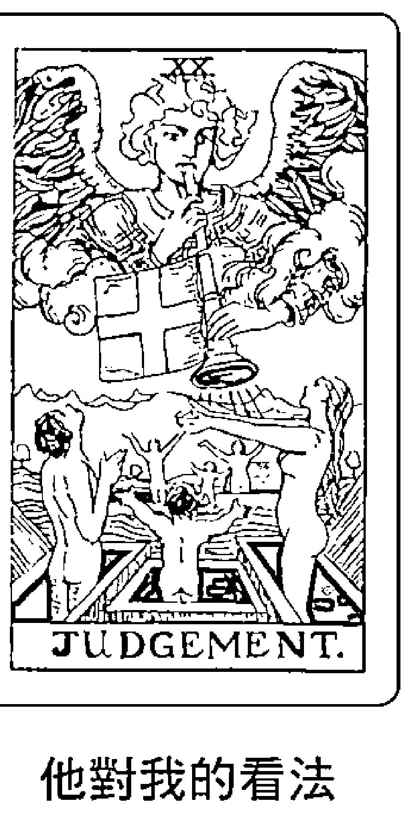

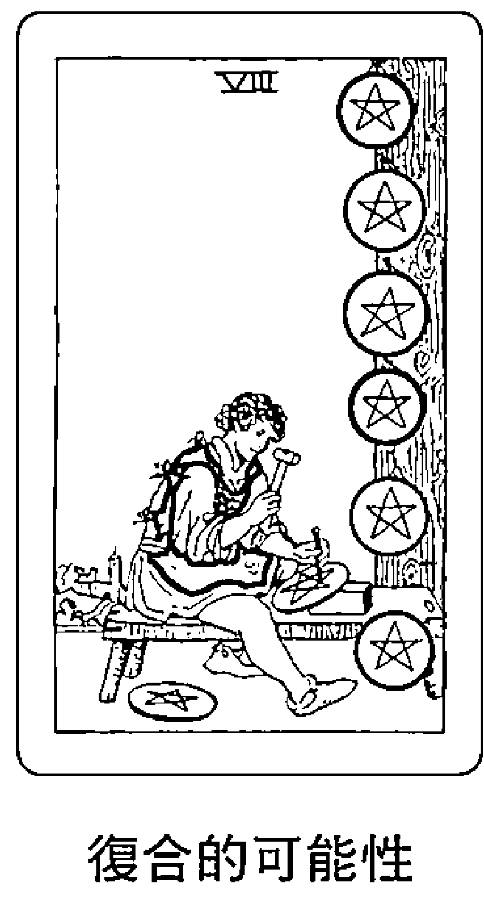

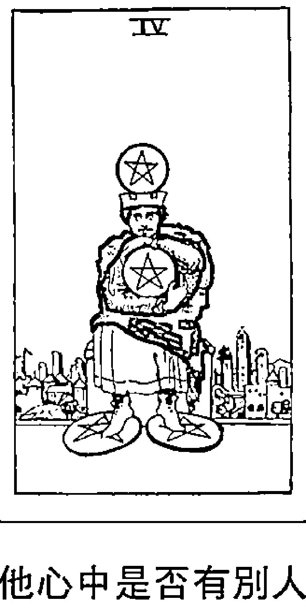

## 背景提要：
問卜者目前在感情上遇到問題，所以開始懷念起與前男友相處的時光，來占卜是想要知道如果與現在的男朋友分手，是否能與前男友複合。

## 他心中是否有別人：錢幣四
目前在他心中並沒有其他人，同時也不把心思意念放在感情生活上，所以即使你很努力也不一定能引起他的注意。

## 他對我的看法：審判
這是一個很理性的人，也很喜歡宣傳自己的理念和想法，在相處的時候會有一點壓力，但是感覺上還滿吸引人的。

## 複合的可能性：錢幣八
這段關係現在不可能複合，因為兩個人都專注於自己的事情，根本無心於感情關係，還是先把自己管好以後再說。

## 整體建議及分析
由錢幣四來看對方心中目前並沒有其他人，同時審判也指出你對他仍然有一定的吸引力，不過錢幣八與錢幣四相互呼應，指出對方目前沒有的心思會花在感情上，所以即使你與目前的男朋友分手，還是不太可能會與他複合。

## S09
### 二擇一牌陣
- 類別：選擇類牌陣
- 難度：入門級牌陣
- 使用張數：五張
- 使用時機：針對感情上的特定狀況，有兩個互相排斥的選項可以選擇時，在一個牌陣當中來進行分析和比對。

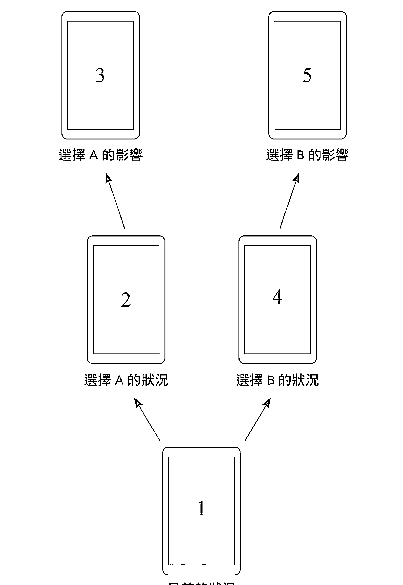

## 說明：
二擇一牌陣是針對兩個選擇之間進行比較最常用的牌陣之一，重點在於比較的相對狀況而非絕對的好或壞；目前的狀況是表示面對選擇時本人的處境或決定性因素；選擇 A 的狀況是表示假設選擇 A 的時候會發生的客觀狀況；選擇 A 的影響是表示假設選擇 A 之後會對本人發生的影響；選擇 B 的狀況是表示假設選擇 B 的時候會發生的客觀狀況；選擇 B 的影響是表示假設選擇 B 之後會對本人發生的影響。

## 影響因素：
目前的狀況與選擇 A 的狀況會影響到選擇 A 的影響，目前的狀況與選擇 B 的狀況會影響到選擇 B 的影響，但 A 組與 B 組之間沒有相互的影響力。

## 解牌順序：
先針對目前的狀況進行評估，接著針對選擇 A 的狀況與選擇 A 的影響進行解讀，再針對選擇 B 的狀況與選擇 B 的影響進行解讀，最後以目前的狀況為基準，分析 A 組與 B 組的優劣並提出建議。

## 參考牌義：
依照本身的感情狀況及占卜的不同主題選擇參考牌義。

## 注意事項：
A 組與 B 組的選項必須是互斥的，也就是選了 A 就不可能同時得到 B，選了 B 也不可能同時得到 A，否則就不能適用二擇一牌陣。

## 問題範例：
- Q1. 我要選擇與 A 君在一起，還是與 B 君在一起？
- Q2. 我要選擇繼續與現在的男朋友在一起還是分手？
- Q3. 我們要選擇去花蓮玩，還是去台中玩？

## Q1
我要選擇與 A 君在一起，還是與 B 君在一起？

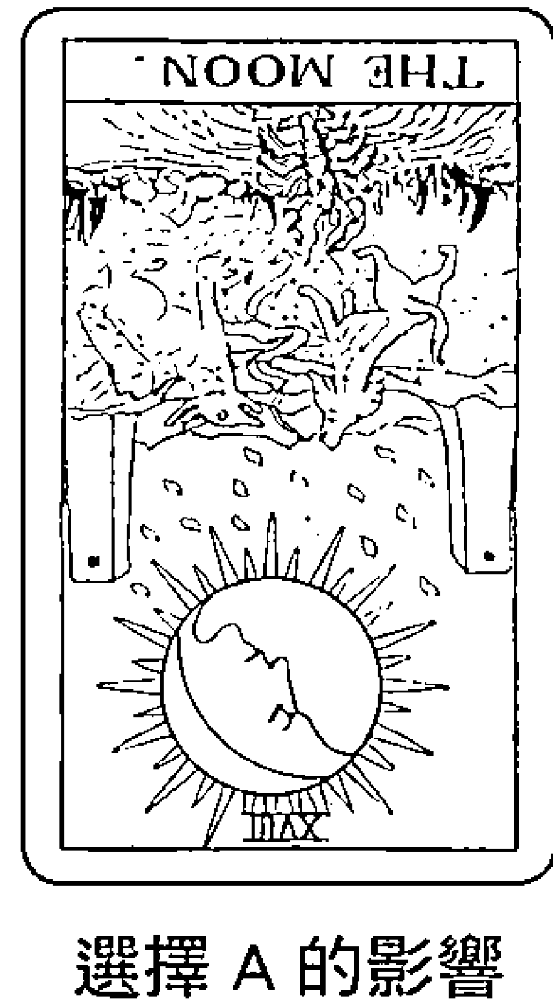

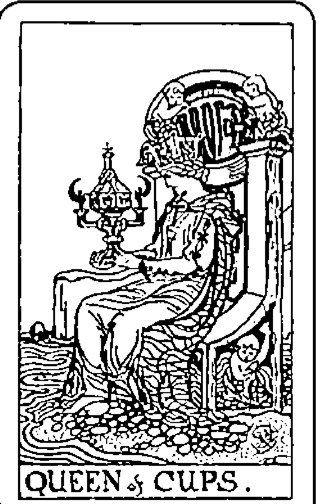

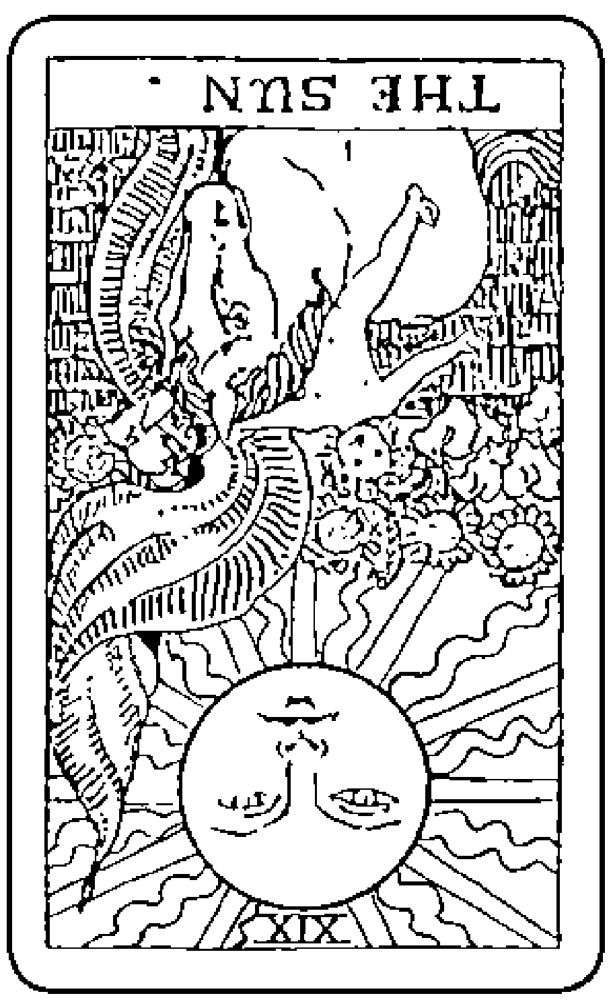

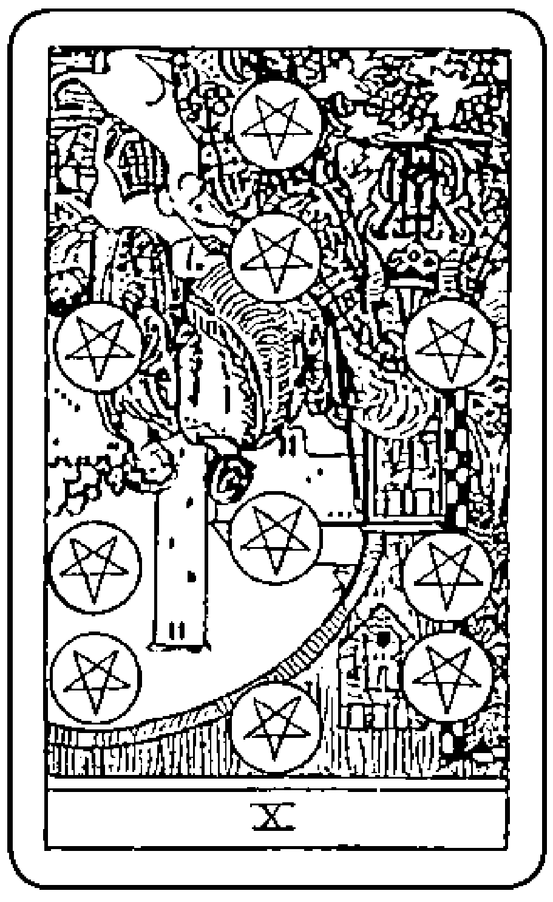

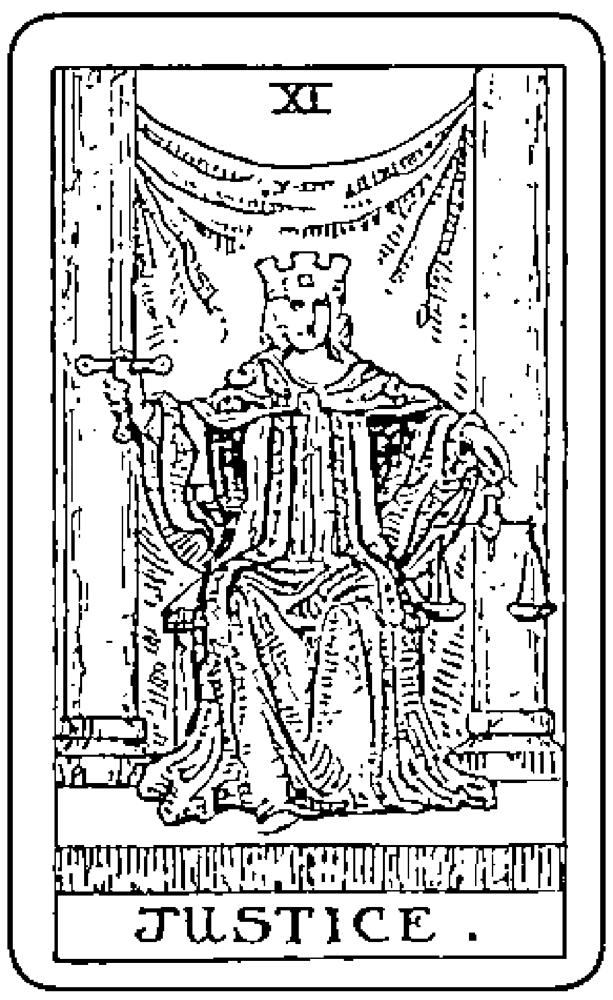

## 背景提要：
問卜者目前有兩個追求者，分別為 A 君與 B 君，但是本人無法判斷自己比較喜歡哪一個，所以希望透過占卜來了解怎麼選擇比較有利。

## 目前的狀況：正義
對於感情的事情十分理性，會在感情當中要求平等與互惠，如果發生了不公平的事情，也會為了自己而據理力爭。

## 選擇 A 的狀況：太陽逆位
兩個人在相處上很和諧，並不會遇到大的問題或障礙，即使遇到一些小誤會，在經過理性溝通之後也能順利化解。

## 選擇 A 的影響：月亮逆位
這段關係繼續下去可能會面對僵局，原本被隱藏起來的事情也都真相大白，如果彼此不願意改變就很難和平收場。

## 選擇 B 的狀況：錢幣十逆位
兩個人因為交往的關係使得支出增加，其實當中有許多不必要的花費，彼此也很容易為了金錢方面的事發生爭吵。

## 選擇 B 的影響：聖杯王后
這段關係的前景十分看好，而且會發展成長久穩定的甜蜜關係，所以要好好經營這段感情，不要輕易讓機會溜走。

## 整體建議及分析
由正義來看本人是比較偏向理性的風格；若是選擇了與 A 在一起，雖然一開始感覺會比較好，但是接下來會遇到明顯的僵局，要花多一點力氣去處理；若是選擇了與 B 在一起，有可能會為了金錢的事情爭吵，但是長久來看感情會比較穩定。所以只要本人能夠與 B 君在金錢問題上處理好，其實 B 君是比較好的選擇。

## Q2
我要選擇繼續與現在的男朋友在一起還是分手？

選擇 A 的影響

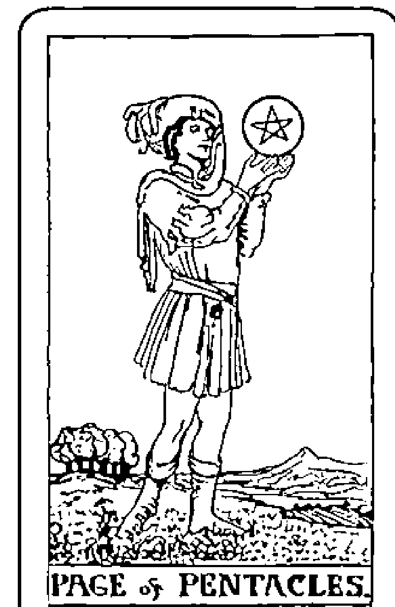

選擇 B 的影響

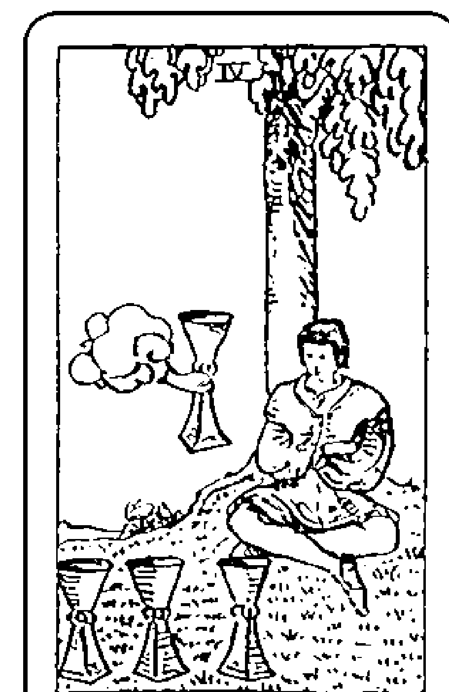

選擇 A 的狀況

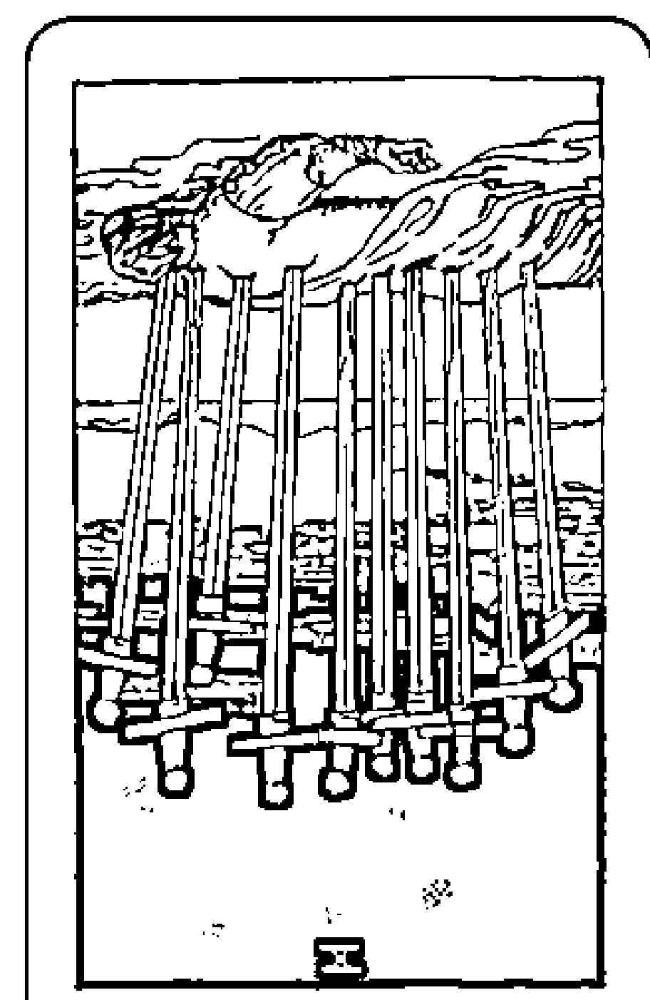

選擇 B 的狀況

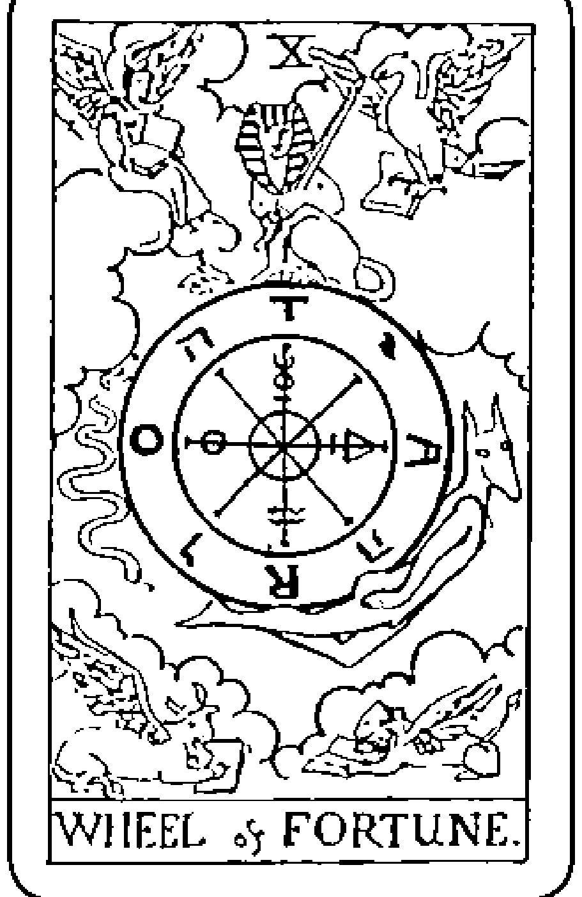

目前的狀況

### 背景提要：
問卜者覺得目前在感情上陷入僵局，所以不知道該繼續堅持下去還是要分手。（在此我們將繼續在一起設定為 A，分手設定為 B）

### 目前的狀況：命運之輪
兩個人的日常生活可能會發生重大的變動，之前的相處模式必須做一些調整，也可能是關係進展到一個新的階段。

### 選擇 A 的狀況：聖杯四
基本上兩個人日常相處的狀況還不錯，但是仍然無法令雙方都滿意，只是目前兩個人也沒有任何調整改進的行動。

### 選擇 A 的影響：錢幣二
這段關係繼續發展下去將會遇到變動的局面，是好是壞現在還不是那麼清楚，就要看兩個人如何共同努力去面對。

### 選擇 B 的狀況：寶劍十逆位
兩個人日常相處上有很多問題，也覺得無法滿足於現狀，如果能夠選擇結束這段關係，對雙方來說都是一種解脫。

### 選擇 B 的影響：錢幣侍者
在感情當中十分願意學習，所以即使感情的經驗不多，也可以表現得相對成熟，同時會小心去避免犯相同的錯誤。

### 整體建議及分析
由命運之輪來看目前這段感情走到了重大的轉捩點，若是選擇繼續下去會先遇到一段卡住的時期（聖杯四），接下來就不得不變動，想辦法去面對新局；若是選擇分手，由寶劍十逆位來看是十分痛苦的過程，但也是一種解脫，到後來也可以從中學習到一些東西（錢幣侍者）。雖然聖杯四與本人認知的僵局相同，但是影響的錢幣二也會使這段關係動起來，這個時候不妨先給彼此一些時間，看看能不能開創出新的局面。

## Q3
我們要選擇去花蓮玩，還是去台中玩？

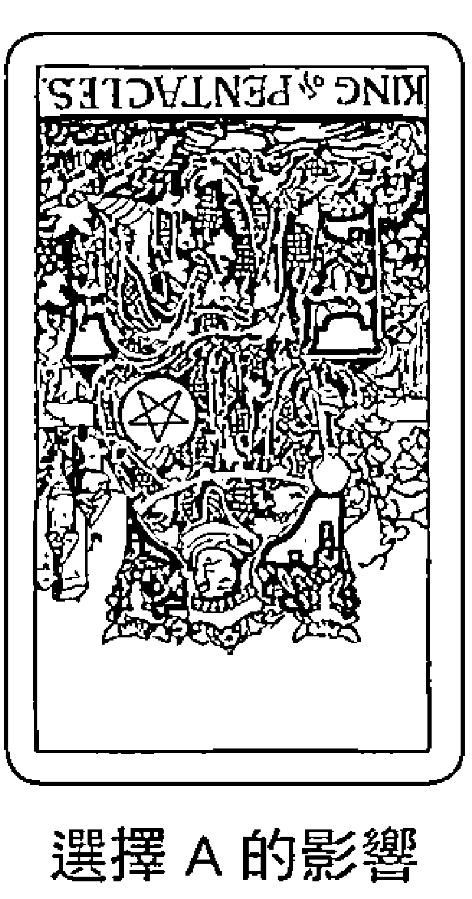

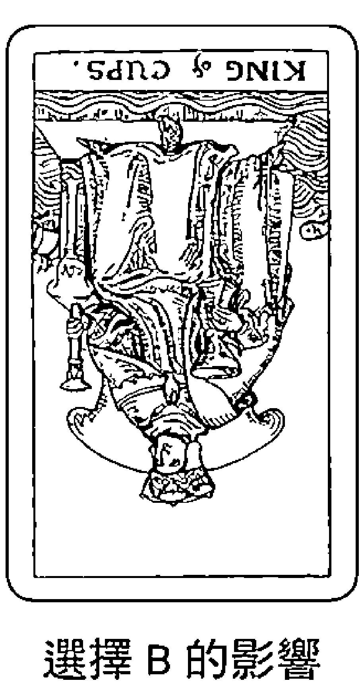

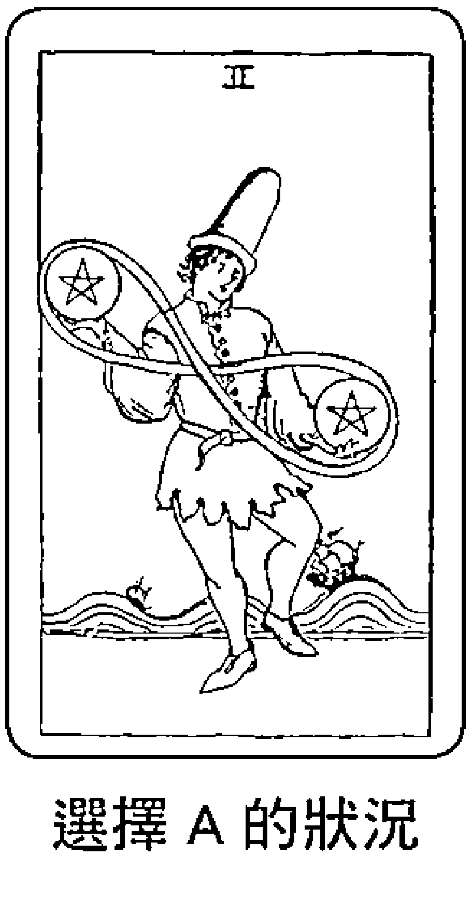

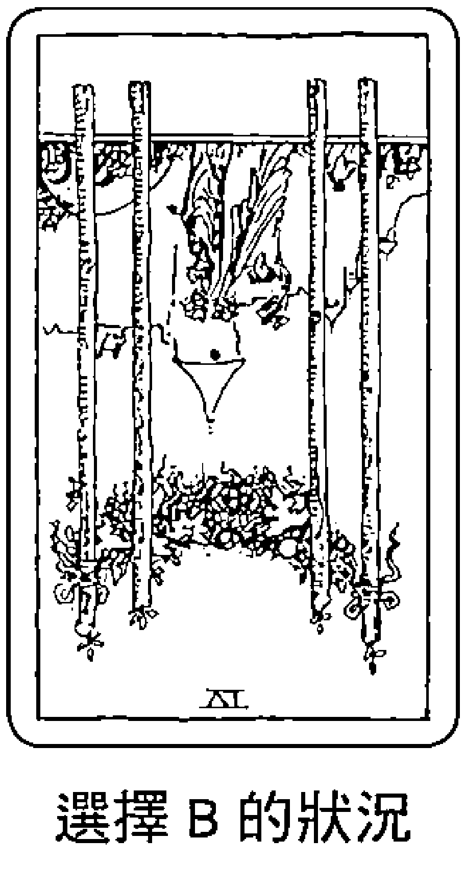

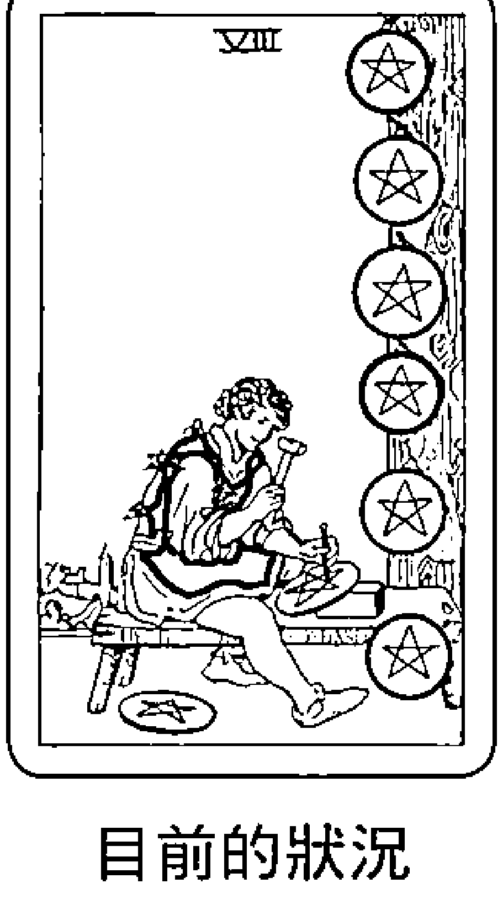

### 背景提要：
問卜者計劃與女朋友利用新年假期出遊，但是無法確定要去花蓮玩或是去台中玩，所以想要利用占卜來看看那個計劃比較有利。（在此我們將去花蓮玩設定為 A、去台中玩設定為 B）

### 目前的狀況：錢幣八
兩個人都在工作上打拚，日常相處的機會並不是很多，即使見面了也都在談工作上的事情，會比較缺乏濃情蜜意。

### 選擇 A 的狀況：錢幣二
兩個人對於金錢都很重視，但是在看法上並不相同，如果遇到與大筆金錢有關的決定，就很容易突顯彼此的矛盾。

### 選擇 A 的影響：錢幣國王逆位
兩個人的相處很平淡無趣，好像變成例行公事而缺乏感情，感覺上只是互相利用對方，但也不會發生嚴重的爭吵。

### 選擇 B 的狀況：權杖四逆位
兩個人相處的感覺十分歡樂，但是感情基礎並不穩固，如果遇到新的挑戰或變化，也許就會發生無法配合的問題。

### 選擇 B 的影響：聖杯國王逆位
兩個人的相處狀況並不穩定，甚至可能會充滿各種情緒性的衝突，如果不能冷靜下來處理，甚至關係可能會結束。

### 整體建議及分析
由錢幣八來看兩個人平常都忙於公事，是很缺乏相處的機會；若是去花蓮玩，也許會因為金錢而出一些問題，但是兩個人之間的關係還算穩定；若是去台中玩，雖然當時的感覺十分歡樂，但是後續來看有可能引發情緒性的衝突，對於關係反而不利。所以只要能把錢的事情搞定，去花蓮玩還是比較好的選擇。

## S10
### 戀愛運勢牌陣
- 類別：時序類牌陣
- 難度：入門級牌陣
- 使用張數：四張
- 使用時機：想知道自己一個月內感情的運勢如何時使用。

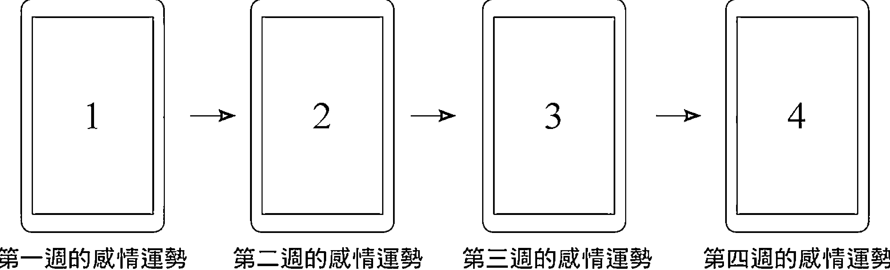

## 說明：
戀愛運勢牌陣可以為自己做一個月內大概狀況的預測，也可以呈現某件事情在一個月當中的發展。每張牌代表這一週當中重要的狀況或是變化，做為一種預告與提醒。

## 影響因素：
你可以把四張牌看成一個連續變化的過程，每一週發生的狀況都會影響到下一週，甚至會影響之後的幾週。

## 解牌順序：
依照時間順序解讀每一週的狀況，最後再針對主題相關的部分給建議。

## 參考牌義：
依照本身的感情狀況及占卜的不同主題選擇參考牌義。
例如：
- 想要知道尋找新戀情的運勢為何，可參考空窗篇－身邊是否有好對象；
- 如果想知道向曖昧對象告白的運勢如何，可參考曖昧篇－如何告白容易成功；
- 如果想知道與另一半相處的狀況為何，可參考相處篇－日常相處狀況；
- 如果想知道何時適合與情人談分手，可參考危機篇－提出分手的方法。

## 注意事項：
並不一定要在月初的時候占卜整個月的感情運勢，也可以選在任何一個時間點為起點，但是效期仍然有四周。

## 塔羅愛情占卜的基本觀念 S10-戀愛運勢牌陣
- 問題範例：
  - Q1. 我這個月尋找新戀情的運勢如何？
  - Q2. 我這個月向曖昧對象告白的運勢如何？
  - Q3. 我這個月與男朋友相處的狀況如何？

## Q1
我這個月尋找新戀情的運勢如何？

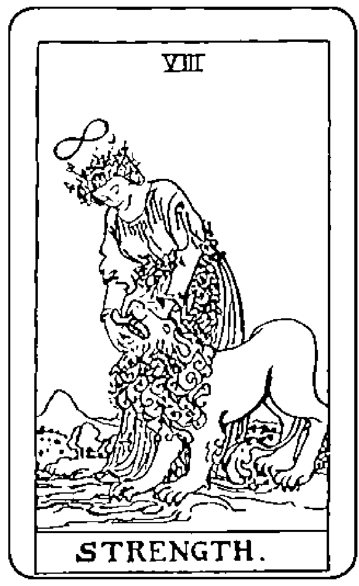

第一週的感情運勢

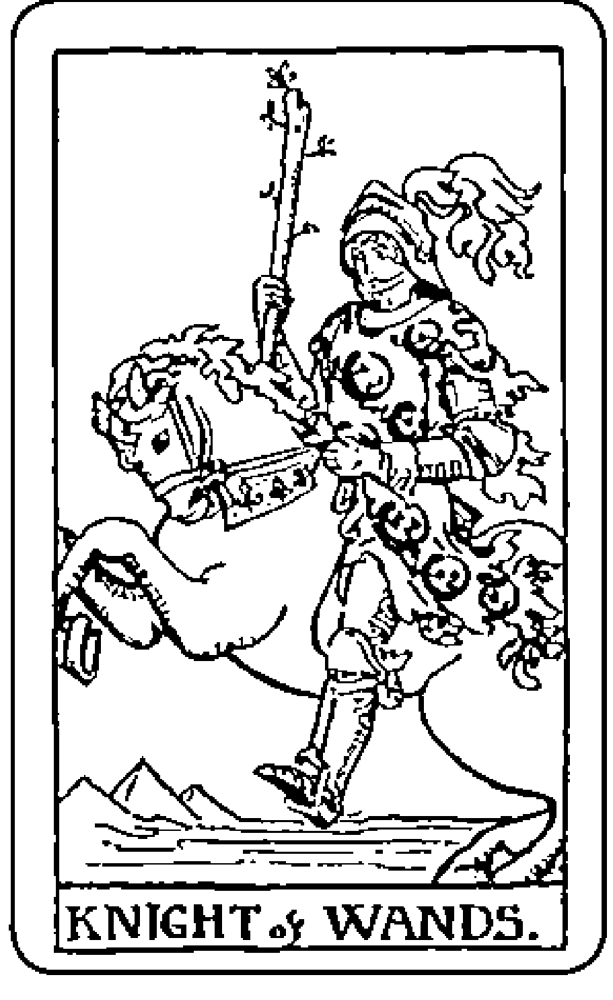

第二週的感情運勢

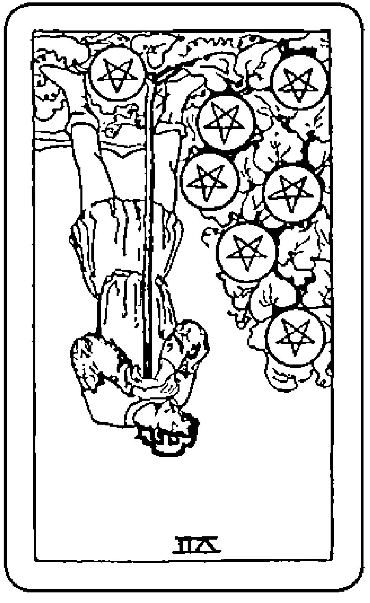

第三週的感情運勢

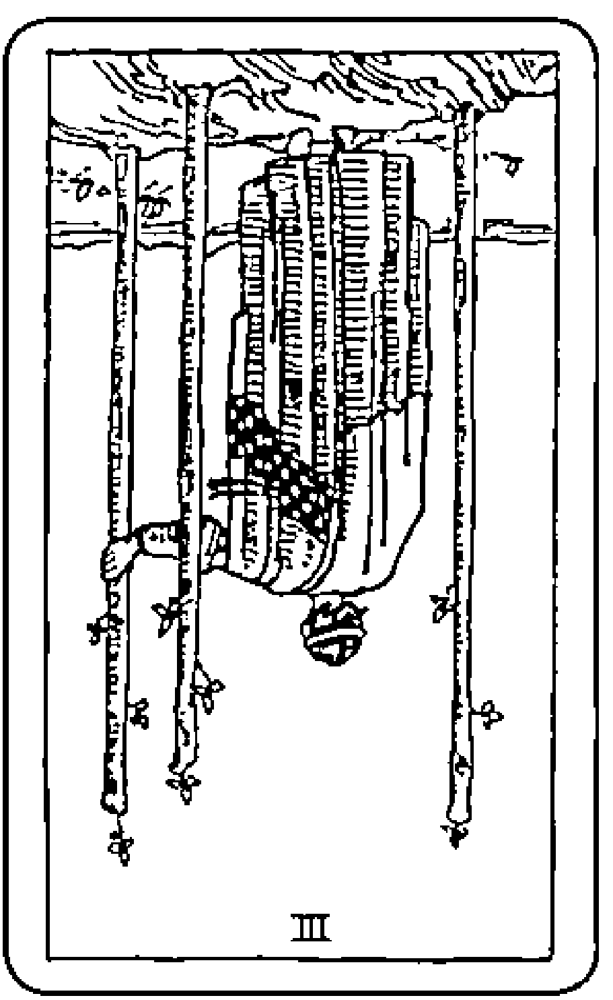

第四週的感情運勢

## 背景提要：
問卜者已經單身一段時間，想知道這個月的戀愛運勢如何，有沒有機會發展新戀情。

## 第一週的感情運勢：力量
目前你身邊已經出現不錯的對象，而且對方也對你有意思，所以要對自己有信心，克服心中的恐懼勇敢追求真愛。

## 第二週的感情運勢：權杖騎士
目前在你身邊可能有好的對象，但是彼此之間還存在許多困難與挑戰，也許需要克服很多問題才能與對方在一起。

## 第三週的感情運勢：錢幣七逆位
目前在你的身邊並沒有好對象，甚至會在錯誤的人身上白白浪費許多心力，所以最好還是先休息一陣子之後再說。

## 第四週的感情運勢：權杖三逆位
目前在你身邊並沒有好的對象，甚至還會出現故意要欺騙你感情的人，所以這個時候要小心謹慎別輕易付出真心。

## 整體建議及分析
由位置與牌義來看，第一週與第二週的運勢比較強，但第三週與第四週的狀況就比較差，所以如果想要找到新的感情對象，應該要把握前兩週的機會。

## Q2
我這個月向曖昧對象告白的運勢如何？

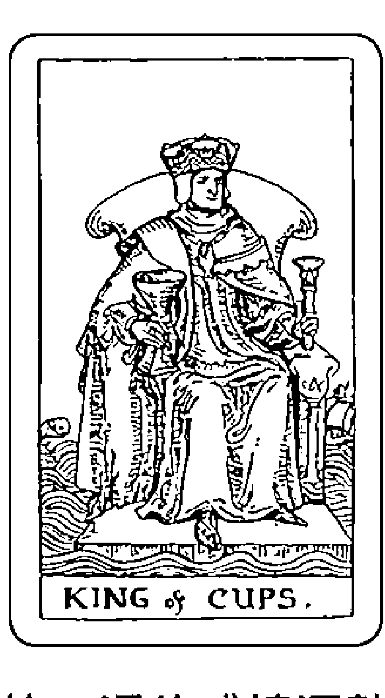

第一週的感情運勢

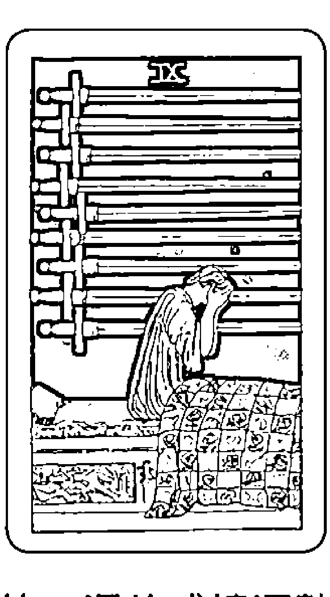

第二週的感情運勢

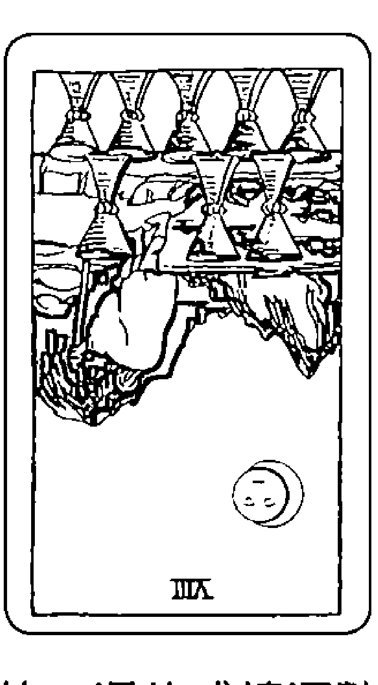

第三週的感情運勢

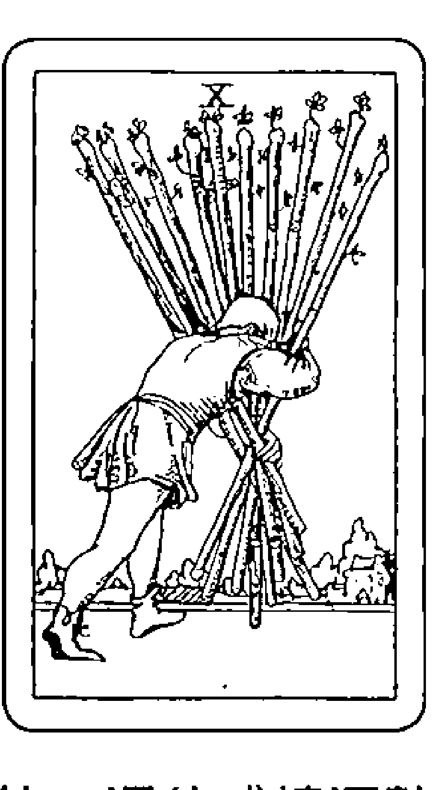

第四週的感情運勢

## 背景提要：
問卜者已經喜歡一個對象很久了，但是不知道何時才適合告白，所以想算算何時告白容易成功。

## 第一週的感情運勢：聖杯國王
要讓對方感覺你有發展長久穩定關係的誠意，而不只是玩玩而已，所以告白時一定要有堅定的承諾及長遠的規劃。

## 第二週的感情運勢：寶劍九
這個時候無論如何告白都很不容易成功，甚至還會造成關係的倒退，也許再等待一段時間才有更適合的機會出現。

## 第三週的感情運勢：聖杯八逆位
這並不是告白的好時機，不論怎麼做都不容易告白成功，所以最好還是先等一陣子，如果狀況有變化以後再考慮。

## 第四週的感情運勢：權杖十
這個時候只要誠實地把自己內心的想法講出來就好，其他的不用想太多，越是簡單的方法往往就是最有效的方法。

## 整體建議及分析
由位置與牌義來看，第一週與第四週的運勢較佳，第二週與第三週幾乎不可能告白成功，所以如果錯過第一週告白的機會，就要等到第四週再行動了。

## Q3
我這個月與男朋友相處的狀況如何？

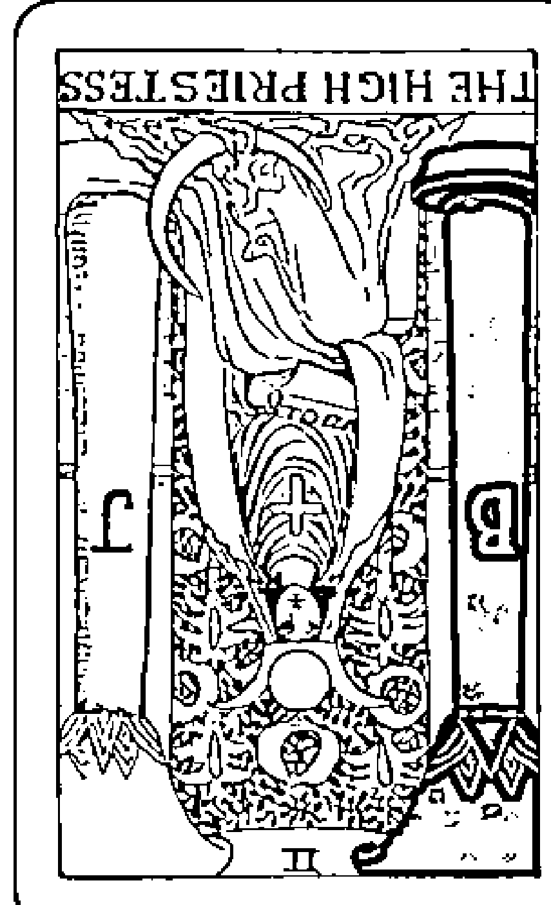

第一週的感情運勢

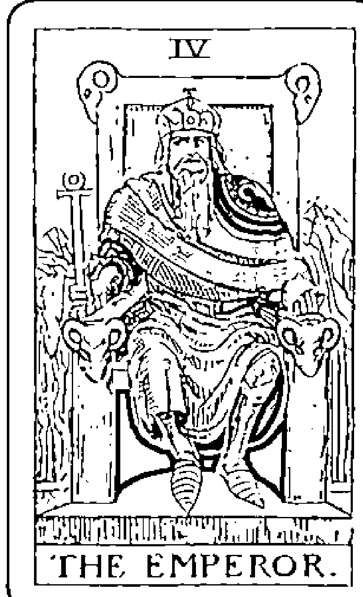

第二週的感情運勢

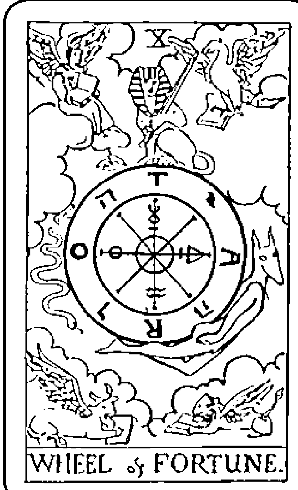

第三週的感情運勢

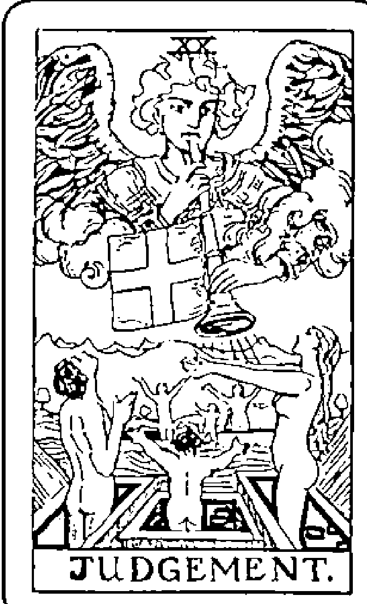

第四週的感情運勢

## 背景提要：
問卜者與男朋友剛在一起不久，關係還不是很穩定，所以想知道這個月的感情運勢如何。

## 第一週的感情運勢：女祭司逆位
兩個人在相處上有很多事情無法配合，也很難找到平衡點，也許在生活上會發生很大的變動，雙方都需要做調整。

## 第二週的感情運勢：皇帝
兩個人日常相處的狀況算是穩定，但由另一個角度來看則是缺乏浪漫與熱情，也許有感覺到控制與被控制的關係。

## 第三週的感情運勢：命運之輪
兩個人的日常生活可能會發生重大的變動，之前的相處模式必須做一些調整，也可能是關係進展到一個新的階段。

## 第四週的感情運勢：審判
兩個人的生活狀況正面臨到重大的轉變，也許會對彼此都造成很大的影響，需要兩個人同心協力才可以度過難關。

## 整體建議及分析
由位置與牌義來看，第一週彼此的關係還不穩定，到第二週就比較好一些，但是第三週與第四週都有重大轉變的象徵，需要小心處理才能共度難關。

## 第三部
## 塔羅愛情占卜的牌義

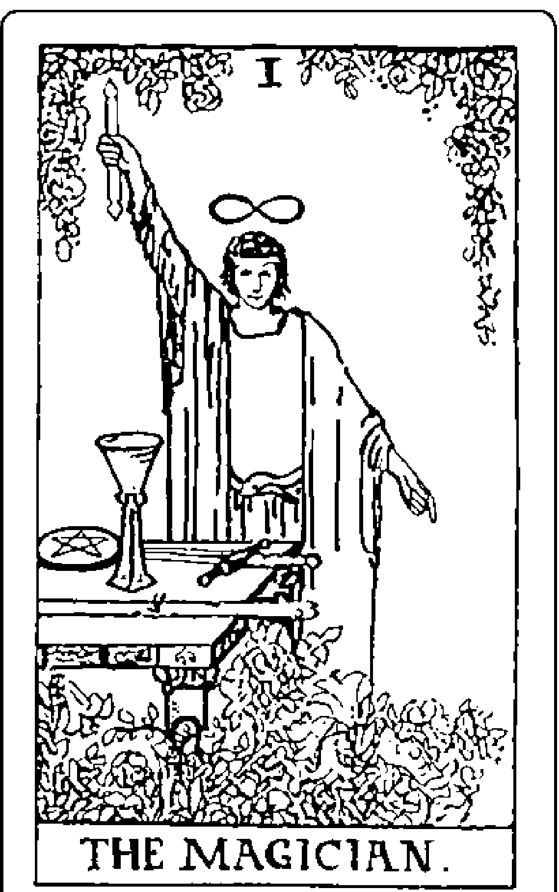

## 魔術師正位
### 人物特性
#### 基本性格
是一個想法很靈活的人，會樂於吸收新知盡力學習，同時也有很強的意志力，對於自己想要的東西會努力去得到。

#### 感情觀
在感情方面很主動的一個人，同時很重視與對方的溝通，在感情當中會願意學習與嘗試，也會主動解決各種問題。

#### 金錢觀
對於如何運用金錢有個人獨特的看法，即使別人不認同仍然會堅持己見，同時也很會利用金錢來達成自己的目的。

#### 家庭觀
在家庭當中算是重要的主導者，對於其他人有很大的影響力，經常會與大家交換意見，所以也能了解大家的狀況。

### 一、空窗篇－無對象
### 沒對象的原因
你有興趣的事情太多，並沒有把全部的精力用來經營感情生活，在力量分散的狀況下自然比較難吸引到新的對象。

### 可以改進的地方
你應該要開始主動出擊，而不是被動地等待別人的追求，如果已經有心儀的對象，就應該盡快表白以免夜長夢多。

### 身邊是否有好對象
目前在你身邊有不錯的對象，而且應該是新認識的人，如果能擴大生活圈認識新朋友，一定可以發展出新的戀情。

### 可能找到對象的管道
這個時候可以多參加單身聯誼活動，或是朋友之間的聚會，只要能多認識一些新的朋友，就會增加很多新的機會。

## 魔术师逆位

### 人物特性

#### 基本性格
是一个缺乏意志力的人，无法坚持自己的想法，但是又很会找藉口来为自己辩解，容易给人狡猾不可信任的感觉。

#### 感情观
在感情上比较被动，而且对自己没有信心，所以很容易错过感情机会，或是在感情中无法清楚地表达自己的意见。

#### 金钱观
对于金钱的看法并不务实，同时觉得自己有小聪明，往往会因此省小钱花大钱，在投资上也容易失误而血本无归。

#### 家庭观
并不是花很多心思在经营家庭关系，也常不理睬家人的建议我行我素，所以整体来说容易给别人特立独行的感觉。

### 一、空窗篇－无对象
-   **没对象的原因**
你目前的感情运势并不佳，而且自己也还有很多事情要忙，实在没有时间去想感情的事情，所以没对象也是正常。
-   **可以改进的地方**
你在感情当中太缺乏自信，所以就不敢主动积极，当务之急是培养自己的信心，这样才能把握住即将出现的机会。
-   **身边是否有好对象**
目前在你身边并没有好对象，即使有心仪的对象也不宜在这个时候主动，所以要耐心等待时机并且细心观察状况。
-   **可能找到对象的管道**
这个时候主动积极是没有用的，与其想要用什么管道来寻找新的对象，不如在原地等待，反而更容易出现好的对象。

### 二、暧昧篇－有对象但不确定

### 如何看待对方
这是一个很自以为是的人，即使有错也要硬拗自己是对的，相处的时候会觉得不舒服，同时让人有不真诚的感觉。

### 心中是否有别人
目前在他的心中并没有别人，但是目前他也不是很想谈感情，所以即使你努力进攻，也不一定能吸引他的注意。

### 可能有哪些阻碍
目前双方都还没有下定决心，仍然觉得不想被对方绑住，如果两个人继续保持被动，那么关系就不太可能有进展。

### 如何告白容易成功
这个时候告白的时机不对，所以无论如何都不容易成功，最好还是再等一段时间，等状况改变了之后再进行告白。

### 三、相处篇－有明确对象

### 日常相处状况
两个人的日常相处当中充满了热情，但是往往过于冲动而缺乏理性的考量，如果遇到新的状况也许就会发生冲突。

### 金钱与价值观
两个人在财务上都不是很稳定，也没有能力去支援对方，如果遇到比较大笔的支出，就有可能因为金钱问题争吵。

### 彼此心灵契合
两个人都觉得这段关系无法长久，但是仍然抱持着及时行乐的心态，假如遇到严重的冲突也可以毫不留恋地分手。

### 讲话沟通方式
两个人之间已经陷入严重沟通不良的状态，也无法了解对方真正的想法，很有可能是因为沟通能力不足而造成的。

### 性的吸引力
两个人之间有很强的吸引力，可以直接感觉到彼此的热情，有时候会过度付出来获取对方的好感，关系算是紧密。

### 与对方家人的关系
你与对方的家人之间有一点误会，似乎是因为沟通方式错误而造成的，如果无法化解的话还是保持距离以策安全。

### 继续发展的前景
这段关系基本上并没有未来性，也许开始就是一个错误，如果勉强彼此要坚持下去，反而可能会带来更多的痛苦。

### 四、危机篇

-   **是否出现第三者**
两个人之间并没有出现第三者，但是已经有一些明显的问题出现，这个时候必须要靠双方共同努力才能获得解决。
-   **发生争吵的问题点**
沟通不良本身就是最大的问题，其他的问题也都是从这一点当中延伸出来的，也许两个人的沟通能力都有待加强。
-   **如何化解纷争**
这个时候双方应该要先冷静下来，好好思考两人关系的下一步，不要为了一些小争执，就把全部的计划都推翻了。
-   **提出分手的方法**
如果不能和对方平心静气地坐下来谈，就用算总账的方式把两个人的问题通通吵开来，这样就能把退路通通封死。
-   **复合的可能性**
这段感情没有任何复合的可能性，即使回头也无法得到一段完整的爱情，千万不要在旧情人身上再浪费任何时间。

大阿尔卡纳
- 权杖
- 圣杯
- 宝剑
- 钱币
- 宫廷

## 女祭司正位

### 人物特性

#### 基本性格
是一个十分冷静的人，对于事物都有自己的定见，但有时候会比较孤僻而不爱说话，同时善于从旁观察一件事情。

#### 感情观
在感情上属于比较被动的一方，也不会主动表达自己的感受，习惯于逃避自己的感情需要，容易错过感情的机会。

#### 金钱观
对于金钱方面的事情比较保守而理性，有很强的自制力，不会放任自己的欲望乱花钱，所以通常会有不少的积蓄。

#### 家庭观
对于家庭关系比较淡漠，并不太喜欢介入别人的事情，但是由于站在超然的立场，反而很容易成为平衡者的角色。

### 一、空窗篇－无对象
-   **没对象的原因**
你对于感情的事情太过被动，甚至在心里无意识地在逃避，如果连自己都不想谈感情，就不可能吸引到新的恋情。
-   **可以改进的地方**
你应该花更多心思投注在感情方面，不要老是漫不经心一副旁观者的样子，不积极主动的话就很难发现新的机会。
-   **身边是否有好对象**
目前在你身边并没有好的对象，是一段适合你休息的时间，与其花很多时间在处理感情问题，不如好好充实自己。
-   **可能找到对象的管道**
可以多接触与神秘学有关的事务，不论是占卜或是心灵成长之类的东西都很有帮助，有机会找到志同道合的对​​象。

### 二、暧昧篇－有对象但不确定
-   **如何看待对方**
这是一个十分聪明的人，但是并不太爱发表意见，在相处的时候会觉得有距离感，不过也会让人想要进一步认识。
-   **心中是否有别人**
目前在他的心中并没有别人，即使有追求者也不会让他动心，所以想要吸引他的目光，对你来说也是很困难的事。
-   **可能有哪些阻碍**
两个人彼此的了解太少，但是又都没有主动拉近彼此之间的距离，如果都保持在原地不动，感情就不可能有进展。
-   **如何告白容易成功**
这个时候主动告白很不容易成功，甚至会比不表示还要糟糕，所以这时候千万不要冲动，等时机成熟之后再告白。

### 三、相处篇－有明确对象
-   **日常相处状况**
两个人日常相处的状况十分平静，但是并不把感情关系放在最优先的顺序，也许两个人都还有其他的课题要面对。
-   **金钱与价值观**
两个人在价值观上虽然有差异，但仍然可以透过沟通获得共识，金钱上最好是各管各的，以免发生不必要的争执。
-   **彼此心灵契合**
两个人彼此觉得内在有很深的联结，也觉得这段感情可以继续维持下去，即使表面上看来冷漠其实内心还是坚定。
-   **讲话沟通方式**
两个人并不是很重视沟通，即使如此仍然有还不错的默契，有些事情不讲还是可以了解，但是也会有一些小误解。
-   **性的吸引力**
在这段关系当中性的吸引力并不占有重要的位置，反而是在知性和观念的契合更加重要，性关系会随着时间进展。
-   **与对方家人的关系**
你并不想涉入对方的家庭太多，与对方家人的关系也不是很亲近，有时候参与对方家里的事情会让你觉得有压力。
-   **继续发展的前景**
这段关系继续发展下去仍然十分稳定，彼此也可以从对方身上学到很多东西，只是在表现上仍然会比较缺乏热情。

### 四、危机篇
-   **是否出现第三者**
两个人之间不可能出现第三者，也不会有人刻意想要破坏你们的关系，所以出现的全部状况都还是彼此所造成的。
-   **发生争吵的问题点**
发生争吵的问题点在于沟通不良，如果自己不把事情讲清楚，都要靠对方用猜的，对方再会猜也可能会发生误解。
-   **如何化解纷争**
最重要的是保持冷静，由对方的立场来想事情，找到两个人差异的平衡点，等过一阵子之后再把事情慢慢谈开来。
-   **提出分手的方法**
相应不理是最好的方法，等到对方无法忍受就会主动向你提出分手，若是你主动提出分手的话反而无法完全切断。
-   **复合的可能性**
这段感情并没有任何复合的可能，维持一段距离才是最好的方法，你需要更多的时间来反省这段感情对你的意义。

## 女祭司逆位

### 人物特性

#### 基本性格
是一个自以为是的人，常会有自大或是固执己见的倾向，虽然表面上看起来平静，其实内心当中有很多情绪起伏。

#### 感情观
在内心当中有许多热情，但是又不敢当面表达出来，常会觉得无法感受到对方的爱，甚至会无端指责对方的不是。

#### 金钱观
并不是很善于理财，也许会因为错误的决策造成投资的损失，平常花钱很没有节制，所以常常会陷入负债的状况。

#### 家庭观
在家庭当中会比较孤立，觉得别人都无法理解自己的想法，大多数的状况都很冷静，偶尔会有比较情绪化的反应。

### 一、空窗篇－无对象
-   **没对象的原因**
你对于感情对象的要求太高，实际上很难找到这么完美的情人，就算真的出现很好的对象，你有可能看不上眼。
-   **可以改进的地方**
你在感情当中还有很多需要学习的地方，可以多看看书或是与别人分享讨论经验，也许就可以吸引到更好的对​​象。
-   **身边是否有好对象**
目前在你身边没有什么好对象，即使有新恋情出现也不会长久，所以这个时候最好先休息，冲动绝对不会会有好事。
-   **可能找到对象的管道**
这个时候别人都帮不了你，想要谈恋爱就要靠自己主动去追求，如果是由亲朋好友们帮你介绍的反而很容易失败。

### 二、暧昧篇－有对象但不确定
-   **如何看待对方**
这是一个很自负的人，常会表现出自己高人一等的样子，在相处时会感觉到不舒服，也不会让人想要进一步认识。
-   **心中是否有别人**
目前在他的心中有潜在喜欢的对象，但是并没有任何主动的行动，如果这个时候你努力，也许还有机会扳回一城。
-   **可能有哪些阻碍**
两个人的观念想法差异太大，很难找到中间的平衡点，如果双方都不愿意调整改变，那么关系就不太可能有进展。
-   **如何告白容易成功**
这时候告白并不容易成功，所以事前准备非常重要，也许需要先把想讲的话写下来，和别人讨论这样说适不适当。

### 三、相处篇－有明确对象
-   **日常相处状况**
两个人在相处上有很多事情无法配合，也很难找到平衡点，也许在生活上会发生很大的变动，双方都需要做调整。
-   **金钱与价值观**
彼此在价值观上有很大的差异，很容易因为金钱的事情而发生争吵，如果不小心处理的话也可能引发强烈的情绪。
-   **彼此心灵契合**
两个人都觉得这段关系当中有许多问题，但是仍然有心想好好解决，如果愿意改变的话还是有可能找到平衡点。
-   **讲话沟通方式**
彼此之间的沟通比较表面，经常都只说出好听的场面话，所以很难了解对方真正的想法，一不小心就会踩到地雷。
-   **性的吸引力**
在这段关系当中充满了性的吸引力，但是仍然无助于解决两个人之间的问题，也许有一方会采取比较主动的攻势。
-   **与对方家人的关系**
你与对方家人的关系并不平静，也许台面下已经暗潮汹涌，如果遇到比较棘手的状况，很可能会发生严重的冲突。
-   **继续发展的前景**
这段关系继续发展下去将会发生很大的变化，如果两个人不能适时地调整彼此的关系，就有可能面临分手的危机。

### 四、危机篇
-   **是否出现第三者**
两个人之间并没有第三者，但是彼此之间确实有隐藏一些不满，最好能主动去处理补救，否则问题会越来越严重。
-   **发生争吵的问题点**
两个人的关系陷入极度的不平衡，之前的问题也在这个时候都爆发出来，这次的事件可以说是新仇旧恨全部浮现。
-   **如何化解纷争**
保持解决问题的热情和动力，站在对方的立场来考虑事情，如果能够发现问题的源头，应该即时提出解决的方案。
-   **提出分手的方法**
由对方主动提出分手是比较好的方法，否则你只好避不见面，完全不要让他找到你，等双方的感觉渐渐归于平淡。
-   **复合的可能性**
这段感情仍然有一丝复合的可能，但是若无法克服两个人之前的问题，在一起只是更痛苦而已，并不值得鼓励。

塔罗爱情占卜的牌义
大阿尔卡纳
- 权杖
- 圣杯
- 宝剑
- 钱币
- 宫廷

## 皇后正位

### 人物特性

#### 基本性格
是一个重视生活享受的人，同时很喜欢美的事物，在人际关系上非常有天份，常常能带给别人放松和欢乐的气氛。

#### 感情观
在感情上属于比较主动的一方，遇到自己喜欢的对象就会主动去追求，同时对于自己的情人也会全心全意地付出。

#### 金钱观
很有投资理财的天份，同时也会花费不少钱在生活享受上面，由于能够控制好自己的欲望，所以并不会入不敷出。

#### 家庭观
在家庭当中是比较受宠的一个，所以与家人之间也都保持不错的关系，但若是家人有需要也常会主动去帮助对方。

### 一、空窗篇－无对象
-   **没对象的原因**
你对于目前自己的生活十分满意，也经常是乐在其中，因此就缺乏寻找新恋情的动力，觉得这样的生活就很好了。
-   **可以改进的地方**
你太重视生活享受，虽然对自己好没有什么不对，但是也可能吓走一些追求者，如果能更简朴一点机会就会更多。
-   **身边是否有好对象**
目前在你身边有不少好对象，而且其中有一些还会主动追求你，这个时候不愁没有对象，反而是要烦恼如何选择。
-   **可能找到对象的管道**
这个时候任何管道都会出现不少对​​象，也可以选择多出外旅游或接近大自然，你会发现有很多人主动对你表示好感。

### 二、暧昧篇－有对象但不确定
-   **如何看待对方**
这是一个很友善的人，不论对任何人都十分亲切和热情，在相处的时候会感觉到快乐的气氛，会想要让人多接近。
-   **心中是否有别人**
目前在他心中已经有特定的对象，而且很可能正展开主动的追求，你想要把他抢过来可以说是一件不可能的任务。
-   **可能有哪些阻碍**
目前两个人的关系已经很好，所以并没有想要更进一步的动力，如果双方都满足于现状，关系就会在这一点停住。
-   **如何告白容易成功**
这个时候最重要的是主动积极，任何的方式都很容易成功，当然如果能有一顿大餐或定情礼物来辅助效果会更好。

### 三、相处篇－有明确对象
-   **日常相处状况**
两个人在日常生活上比较重视享乐，也可以经营出彼此都满足的生活模式，不论如何都会保持和谐与满足的关系。
-   **金钱与价值观**
两个人的财务状况都不错，所以也可以尽情的享受生活，由于在价值观上十分相似，也不会为了金钱的事情争吵。
-   **彼此心灵契合**
两个人都觉得这是一段很快乐的关系，也很想要继续经营下去，因此只要保持现在的状况，彼此就会觉得很满足。
-   **讲话沟通方式**
两个人并不是很重视沟通，但也不会经常发生争吵，大部分的事情都是双方有共识才去做，所以关系上算是和谐。
-   **性的吸引力**
这段感情当中充满了爱的感觉，而性生活可以加深彼此的感情，也可以带来更多快乐，对彼此来说都很有吸引力。
-   **与对方家人的关系**
你与对方家人的关系一团和气，基本上也没有什么冲突的地方，所以只要能主动付出，就可以经营出快乐的气氛。
-   **继续发展的前景**
这段关系的前景十分看好，而且双方都对未来有很深的期待，是一段可以好好经营的关系，也有可能会走向婚姻。

塔罗爱情占卜的牌义
大阿尔卡纳
- 权杖
- 圣杯
- 宝剑
- 钱币
- 宫廷

### 四、危机篇
-   **是否出现第三者**
两个人之间不可能出现第三者，即使有人想故意破坏也不会成功，所以要好好珍惜彼此的关系，其他不要想太多。
-   **发生争吵的问题点**
两个人会争吵都是因为一些小事情，其实这些小事一点都不重要，但若是过份固执己见就可能会把小事变成大事。
-   **如何化解纷争**
以更多的爱去包容对方，不要急着解决问题，因为很多事情可能到头来发现是一场误会，也许根本就没什么问题。
-   **提出分手的方法**
主动提出分手是一个好方法，但是切记要心平气和地处理事情，生气反而会引发更多问题，也很有机会和平分手。
-   **复合的可能性**
这段感情还是有情份在，但是能不能复合还要看你主观的看法，如果你主动提出来要复合，还是有成功的可能性。

## 皇后逆位

### 人物特性

#### 基本性格
是一个比较被动的人，对于大部分的事情都缺乏行动力，也容易因为外物干扰而分心，有时候会被认为比较懒惰。

#### 感情观
由于内心当中时常觉得空虚，所以比较难拒绝别人主动的追求，但又不一定是真心喜欢对方，容易陷入三角关系。

#### 金钱观
会为了生活享受而花很多钱，甚至会让人觉得有些奢侈浪费，虽然赚钱快但是花钱也很快，所以不会有太多积蓄。

#### 家庭观
对于家里面的事情不想要去管太多，但若是有什么节庆活动还是会参加，也有可能之前曾经与家人之间发生误会。

### 一、空窗篇－无对象
-   **没对象的原因**
你在感情当中太过被动，只是每天想着有人主动来追求你，但是自己又没有其他想法，就很难吸引到适合的对​​象。
-   **可以改进的地方**
在开始谈恋爱之前，必须要先学会爱自己，不要老是想要从别人身上得到爱，只有爱自己的人才有能力去爱别人。
-   **身边是否有好对象**
目前在你身边会有不少对象，但并不一定都是真心爱你的，甚至有些想要脚踏两条船，小心不要成为别人的第三者。
-   **可能找到对象的管道**
这时候主动出击不会有好结果，倒不如在原地休息等待机会，或是请别人帮你介绍，太急了反而可能会有反效果。

二、暧昧篇－有对象但不确定

如何看待对方

这是一个散漫的人，无法集中精神去做一件事情，在相处的时候不容易留下深刻的印象，也不会想要进一步交往。

心中是否有别人

目前在他心中也许还有其他人，但是都还没有采取任何行动，如果你能够主动出击，也许还是可以得到他的注意。

可能有哪些阻碍

双方都被动也许会成为这段关系的阻碍，如果两个人当中没有任何一个人采取行动，关系就很有可能会卡在这里。

如何告白容易成功

这时候主动告白很不容易成功，所以最好还是先等一阵子再说，说不定对方就自己跑来向你告白，省下不少事情。

三、相处篇－有明确对象

日常相处状况

两个人在相处时都保持高度的热情，也许会因此而忽略了一些实际的问题，等到热情冷却之后问题就会一一浮现。

金钱与价值观

两个人在花费上都没有节制，因此常会在收支平衡的边缘，如果突然出现意料之外的支出，很可能就会变成负债。

彼此心灵契合

两个人都十分迷恋对方，觉得可以为了这段感情付出一切，但同时也看到许多问题，是目前完全没有办法解决的。

讲话沟通方式

两个人的沟通并不是很好，而且常常会陷入争吵的危机之中，如果有比较情绪化的反应，很可能就会引爆火药库。

性的吸引力

性关系在这段关系当中有重要的地位，彼此的吸引力可以说是两个人在一起的主因，但是要小心预期之外的怀孕。

与对方家人的关系

你与对方家人相处的感觉还不错，但是并不太适合长时间的相处，保持一种距离的美感，可以让彼此都觉得轻松。

继续发展前景

这段关系继续发展的前景并不看好，也许在感情上将会遇到瓶颈，或是因为其他的事情陷入停滞，变得缺乏热情。

四、危机篇

是否出现第三者

两个人之间也许会出现第三者，而且也许双方都会面临到其他的诱惑，这个时候要很小心处理才能避免分手危机。

发生争吵的问题点

两个人之间的积怨已久，只是一直没有爆发出来，现在发生的事情只是一个引爆点，实际上彼此是在清旧帐。

如何化解纷争

若是由于两个人的任性而发生争吵，并不是用理性可以解决问题，如果能先退一步的话，也许会使对方平静下来。

提出分手的方法

现在提出分手实在不容易成功，即使真的说出口了也是会藕断丝连，除非两个人从此不再联络，让时间冲淡一切。

复合的可能性

这段感情要复合的可能性是很高，但是并不操之在你，如果由对方主动提出复合，你只要接受对方的提议就好了。

塔罗爱情占卜的牌义
- 大阿尔克纳
- 权杖
- 圣杯
- 宝剑
- 钱币
- 宫廷

皇帝正位

人物特性

基本性格
是一个理性务实的人，对于事情有比较主观的看法，会努力去把自己的理想实现，但是也会喜欢主导和控制状况。

感情观
虽然从外表看起来比较严肃和内向，其实在内心当中还是十分渴望感情，而且会尽力去保护和照顾自己心爱的人。

金钱观
对于金钱有强烈的控制欲，但是并不善于投资理财，所以比较倾向储蓄而较少选择花钱享乐，会表现得比较小气。

家庭观
对于家人的需要十分照顾，但是对于事情仍然有主观的判断，并不轻易流露自己的感情，会让家人感觉我行我素。

一、空窗篇－无对象

没对象的原因
你的整体表现太过严肃，会给别人一种难以亲近的感觉，如果总是拒人于千里之外，就很难在感情上有新的机会。

可以改进的地方
你最好能放下在感情当中的控制欲，否则就很难找到好的对象，没有人会乐意在感情当中时时刻刻都是听命行事。

身边是否有好对象
目前在你身边是有一些对象，但是也许会有一点平淡无趣，不过如果你想要的是稳定而非浪漫的关系也可以试试。

可能找到对象的管道
你目前靠自己可能比较难找到好对象，最好是由长辈或上司之类的角色帮你介绍，有他们的支持也比较容易成功。

二、暧昧篇－有对象但不确定

如何看待对方
这是一个比较固执己见的人，但并不喜欢与人争辩，在相处的时候会觉得比较严肃一点，不过也可以给人安全感。

心中是否有别人
目前在他心中并没有别人，而是有其他比感情更重要的事占据了他全部的时间精力，恐怕不太容易引起他的兴趣。

可能有哪些阻碍
两个人关系的进展可能会受到师长或是上司的阻碍，在他们的压力下很难进一步交往，否则就要付出沈重的代价。

如何告白容易成功
想要告白就要用最直接的方法才会有效，其他拐弯抹角的暗示都不会得到正面的回应，所以爱就要大声的说出来。

三、相处篇－有明确对象

日常相处状况
两个人日常相处的状况算是稳定，但由另一个角度来看则是缺乏浪漫与热情，也许有感觉到控制与被控制的关系。

金钱与价值观
两个人并不会遇到严重的财务挑战，但是会有一方想要控制另外一方的金钱，如果不小心处理可能就会发生冲突。

彼此心灵契合
两个人都觉得这段关系可以继续走下去，也期待是长久稳定的关系，如果是由其中一个人来主导就会走得更稳定。

讲话沟通方式
两个人之间的双向沟通并不顺畅，通常是其中一个人讲、另外一个人听，所以有时候会觉得自己并不够了解对方。

性的吸引力
这段感情当中性的吸引力并不重要，也可以说并没有太多的吸引力，但若作为义务的一部分，也不会缺乏性生活。

与对方家人的关系
你很受到对方家人的重视，在相处的时候虽然并不熟络，但是可以感受到彼此的关心，只是自己要付出的比较多。

继续发展前景
这段关系发展的前景算是不错，虽然不是属于轰轰烈烈的爱情，但是整体来说偏向稳定，并不会有太大的变动性。

四、危机篇

是否出现第三者
这段感情当中不可能出现第三者，即使有别人故意也无法破坏彼此之间稳定的关系，如果有问题一定是内部矛盾。

发生争吵的问题点
会发生争吵的原因在于其中一方想要掌控，如果另外一方并不顺从，甚至公然反抗，就不可避免发生冲突的状况。

如何化解纷争
是非曲直总会有个道理可循，应该要坐下来好好谈谈，用理性的方式来解决问题，最好不要涉入太多的情绪反应。

提出分手的方法
只要你下定决心提出分手，对方几乎是没有什么挽回的余地，方法就随你高兴就好，但是很难避免去伤害到对方。

复合的可能性
这段关系几乎没有感情的成份在，因此不太有复合的可能，即使复合还是会落入互相控制的状况当中，没有意义。

皇帝逆位

人物特性

基本性格
是一个固执己见的人，但是由于想法不够成熟，往往会犯下一些幼稚的错误，有可能会因为任性的决定陷入危机。

感情观
不敢表达自己真正的感情，遇到自己喜欢的对象，反而会躲得远远的，在感情当中想要主导，但是又需要被照顾。

金钱观
在财务上缺乏计划，所以常会遇到金钱方面的问题，没有办法把自己的钱管好，很容易变成入不敷出的负债状况。

家庭观
对于家里的事情不负责任，反而是我行我素地过自己想要的生活，也有可能曾经与家人之间发生极不愉快的经验。

一、空窗篇－无对象

没对象的原因
在你的内心深处，总觉得自己还没准备好要接受一段新的感情，所以迟迟没有行动，即使有别人追求也不敢接受。

可以改进的地方
你要先想清楚自己在感情当中需要什么，找什么样的对象可以满足这样的需求，之后应该就会出现新的感情对象。

身边是否有好对象
目前在你身边没有什么好对象，即使有对象也只能发展非常短暂的关系，如果想要长长久久的话还要再等一阵子。

可能找到对象的管道
这个时候很不容易找到好对象，所以任何管道都不太需要去尝试，即使有新对象出现也可能会带给你很大的伤害。

塔罗爱情占卜的牌义
- 大阿尔克纳
- 权杖
- 圣杯
- 宝剑
- 钱币
- 宫廷

二、暧昧篇－有对象但不确定

如何看待对方
这是一个任性的人，做事情只会想到自己而不会考量到他人，在相处时会觉得有压力，并不会想要更进一步发展。

心中是否有别人
目前在他心中并没有一个特定的人，但也也许有不少候选的目标，由于他还没有开始行动，所以努力还是有机会的。

可能有哪些阻碍
彼此之间最大的阻碍就在于缺乏行动力，如果两个人都不愿意主动，那么感情关系很可能就会卡在这里动弹不得。

如何告白容易成功
这个时候告白很不容易成功，所以最好在之前能多做功课，找到对方喜欢或有兴趣的东西，投其所好才可能成功。

三、相处篇－有明确对象

日常相处状况
两个人在日常相处上无法配合，往往需要某一方做出牺牲才能达到预期的效果，但是另一方也不见得会觉得满意。

金钱与价值观
两个人可能会遇到金钱或财务方面的挑战，使得彼此之间价值观的差异被突显出来，也很容易在这方面发生冲突。

彼此心灵契合
两个人都觉得这段关系当中充满困难和挑战，并不是很看好长期的发展，有些时候也会觉得缺乏长期明确的目标。

讲话沟通方式
两个人在沟通上常会陷入意气之争，其实并不是很大的问题，如果能更站在对方的立场想，事情就比较容易解决。

四、危机篇

是否出现第三者
两个人之间并没有出现第三者，但是外在环境的问题与挑战变得特别多，需要彼此同心协力去面对才能克服难关。

发生争吵的问题点
发生争吵的争点来自于不够信任，彼此都对对方有一些怀疑，当发生一些问题的时候，自然就容易把问题扩大了。

如何化解纷争
不要太坚持己见，先听听对方怎么说再作决定，如果两个人之间无法解决问题，可能就要等任何一方先软化态度。

提出分手的方法
现在已经爆发出分手的危机，你只要顺水推舟就好，但是要小心别太刺激对方的情绪，否则可能会发生暴力事件。

复合的可能性
这段感情复合的可能性很低，主要是因为两个人中心已经没有情份在了，即使想要勉强在一起，也无法得到满足。

塔罗爱情占卜的牌义
- 大阿尔克纳
- 权杖
- 圣杯
- 宝剑
- 钱币
- 宫廷

教皇正位

人物特性

基本性格
很重视精神层面的事情与灵性成长，通常都有很虔诚的宗教信仰或稳固的心灵依归，同时也很慈悲为怀乐于助人。

感情观
在感情上的想法比较保守，通常都要以结婚为前提才会进行交往，不但很重视对方的想法也会主动关心帮助对方。

金钱观
对于金钱方面并不太强求，但是仍然有一定的理财天份，如果有机会用金钱帮助别人，经常会毫不犹豫踊跃捐输。

家庭观
与家人的关系很紧密，也很重视家族的规矩和传统，对于长辈的意见非常尊重，同时觉得自己有照顾晚辈的义务。

一、空窗篇－无对象

没对象的原因
你在感情上过于保守，总觉得开始交往就是要结婚，如果用这样的观念来限制自己，就很难在感情上跨出第一步。

可以改进的地方
不要只从宗教或灵性的角度来考虑事情，感情的事情也涉及很多实际生活的层面，不要让自己的观念把自己绑住。

身边是否有好对象
目前在你身边有不错的对象，而且对方是非常认真地想要与你交往，所以应该睁大眼睛，不要轻易放过这个机会。

可能找到对象的管道
这个时候最有可能透过相亲或长辈介绍认识好的对象，所以如果有人想帮你介绍对象就尽量去试，不要画地自限。

二、暧昧篇－有对象但不确定

如何看待对方
这是一个很善良的人，总是能够考量到别人的需要去帮助别人，在相处时会感觉很温暖，让人会想要进一步交往。

心中是否有别人
目前在他的心中并没有认定其他人，但也不是很把重心放在感情生活上，反而会比较重视心灵成长或是宗教信仰。

可能有哪些阻碍
可能会面临宗教信仰冲突的考验，或是其他沈重的道德压力，如果两个人都坚持自己原来的想法，就很难有进展。

如何告白容易成功
这个时候直接告白可能会有一些阻力，倒不如共同出席一些公开活动，让大家都知道你们的关系就会自然在一起。

三、相处篇－有明确对象

日常相处状况
两个人的相处算是融洽，如果遇到问题也可以互相帮助，感觉已经很习惯彼此的存在，关系也会很稳定的继续下去。

金钱与价值观
两个人在财务上也许会有一些不平等，但是如果遇到问题另一方通常都会帮忙，并不会因为金钱的事情发生争执。

彼此心灵契合
两个人都对这段关系十分认真，而且很可能是以结婚为前提在交往，也许彼此已经认定了要和对方一辈子在一起。

讲话沟通方式
两个人之间的沟通不错，但是谈论的话题常会过于心灵或强调意义性，对于实际生活层面的事情反而比较少提到。

性的吸引力
这段感情当中很自然的有性的吸引力，但是并不占在最重要的位置，甚至两个人有一点把性当成禁忌而避免谈论。

与对方家人的关系
你与对方家人的关系还不错，也常常受到他们的照顾，但是对方的家庭有些规矩或习惯，会让你觉得不太能适应。

继续发展前景
这段关系的前景十分看好，也有可能走向婚姻，所以要好好把握这个时间，共同去经营出两个人都觉得好的关系。

塔罗爱情占卜的牌义
- 大阿尔克纳
- 权杖
- 圣杯
- 宝剑
- 钱币
- 宫廷

四、危机篇

是否出现第三者
这段关系当中不会出现第三者，连精神外遇都不可能，所以不要想得太多，自己的心情与想法稳定感情才会稳定。

发生争吵的问题点
发生争吵的问题点可能是在宗教信仰或灵性层面的事情，也有可能是一些价值观的差异，要从内心的深层去体会。

如何化解纷争
如果两个人还是僵持不下，不妨寻找两个人共同的长辈来作和事佬，但是这个人必须同时得到两个人的信任才行。

提出分手的方法
除了当面和对方提出分手之外，重要的是要公告周知，让大家都知道你们都分手了，那么就可以断得干干净净的。

复合的可能性
这段感情如果能够复合，那么一定是有好朋友在当中穿针引线撮合，否则以两个人的情份要复合恐怕没那么容易。

教皇逆位

人物特性

基本性格
是一个过于心软的人，无法拒绝别人的要求，常常没有考虑自己的状况就去帮助别人，所以也可能因此被人利用。

感情观
在感情当中会付出很多，但同时也会要求回报，如果对方不顺他的意就会生气，常会自认为是感情当中的受害者。

金钱观
并不太重视金钱，甚至会把自己所有的钱都拿去帮助别人，如果听信亲朋好友的意见去投资，往往都是血本无归。

家庭观
对于家人的要求都会努力想办法去满足，有时候甚至会因此被晚辈骑到头上去，所以会被视为没有原则的滥好人。

一、空窗篇－无对象

没对象的原因
你目前还没想清楚自己在感情上需要什么，所以就很难锁定特定目标去追求，没有方向就很难在感情上有所进展。

可以改进的地方
你在感情上总是过度付出，因此就很难找到真正对你好的人，你要避免过于逆来顺受的态度，才能找到好的对象。

身边是否有好对象
目前在你身边也许会有新的对象，但是大概都是需要你帮助或照顾的角色，所以与他们交往的话会比较辛苦一点。

可能找到对象的管道
这个时候可能透过同侪或是平辈的介绍认识新的对象，参加社团或是朋友举办的联谊活动，也都是很不错的管道。

二、暧昧篇－有对象但不确定

如何看待对方
这是一个很好的人，不论朋友遇到什么问题都愿意帮忙，相处起来会觉得很轻松，但是并不会特别想要发展感情。

心中是否有别人
目前在他的心中并没有认定某一个对象，大家都像是朋友一样的关系，也许人人都有机会，但是个个都没有把握。

可能有哪些阻碍
也许团体的纪律或是同侪间的压力会成为你们关系的阻碍，如果不能抵抗别人异样的眼光，关系就很难有所进展。

如何告白容易成功
这个时候千万不要找别人帮忙，要告白的话自己去讲比较容易成功，如果是透过第三者传话反而会造成很多误解。

三、相处篇－有明确对象

日常相处状况
两个人当中有一个人付出比较多，所以彼此之间并不是平等的关系，但整体来说还可以配合，也算是稳定的关系。

金钱与价值观
两个人在金钱上的观念相差甚远，如果彼此有共同的财物或是借贷关系，就很可能会因为财务方面的事情起冲突。

彼此心灵契合
两个人都无法确定彼此内心的想法，也不觉得这段关系真的可以长长久久，所以目前只能及时行乐过一天算一天。

讲话沟通方式
两个人的沟通并不是很好，常常会因为没重点而变得冗长而无效率，在某些关键事情的观点上，也可能出现歧见。

性的吸引力
两个人对于性关系都有一点害怕，所以即使有很强的吸引力，也无法对这段感情有正面的影响，算是有色无胆吧。

与对方家人的关系
你对于对方家人付出的很多，但是不一定会得到应有的回报，你要衡量自己的状况与能力，不要让他们予取予求。

继续发展前景
这段关系的未来前景不明，但是仍然可以稳定发展一段时间，如果两个人无法获得共识，也有可能会突然就分手。

四、危机篇

是否出现第三者
这段关系目前有可能出现第三者，而且也许是两个人都认识的人，但是也没有必要把所有认识的人都视为假想敌。

发生争吵的问题点
彼此发生争吵的问题点也许是在朋友身上，其实朋友的事情根本就不干你们的事，但仍然会因此而吵得面红耳赤。

如何化解纷争
如果两个人还在僵持的状况当中，应该寻求同侪朋友们的帮助，让大家来当和事佬，将会有助于争吵快速的化解。

提出分手的方法
正式地和对方提出分手，表示这段关系已经完全结束了，甚至可以先把你的想法写成文字，整理一下自己的思绪。

复合的可能性
这段感情其实并没有复合的可能性，最好不要往这个方面去想，先让自己休息一下，等到更好的机会再重新出发。

塔罗爱情占卜的牌义
- 大阿尔克纳
- 权杖
- 圣杯
- 宝剑
- 钱币
- 宫廷

恋人正位

人物特性

基本性格
是一个很单纯的人，不论什么事情都喜欢用最简单直接的方式来处理，即使遇到很困难的状况也都可以顺利过关。

感情观
对于感情的态度十分认真，只要在恋爱当中就会全心投入，认为其他的事情都没那么重要，对另外一半绝对忠诚。

金钱观
本身不是太重视金钱，但是也不会让自己过苦日子，是属于简单生活知足常乐的人，所以不会有太重的财务负担。

家庭观
与家人之间能够坦诚相待，相处上完全没有心机与芥蒂，所以在家中是属于被大家喜爱，又能被充份信任的角色。

一、空窗篇－无对象

没对象的原因
你对于感情的态度很随缘，又不够专注于寻找新恋情，也许之前有出现过不错的对象，但是却在疏忽当中错过了。

可以改进的地方
你其实没有什么需要改进的地方，目前没有感情的对象也许只是时运不济，只要等运势转好一定可以有新恋情的。

身边是否有好对象
目前在你身边有很好的对象，应该要好好把握这个运势，如果觉得自己仍然有不足的地方，最好能及时改进加强。

可能找到对象的管道
目前不论什么管道都很容易找到好对象，特别是透过亲朋好友们的介绍会更快一点，要好好把握这段时间的运势。

## 二・曖昧篇－有對象但不確定

### 如何看待對方

這是一個好人，彼此對於很多事情的想法都很契合，相處起來也覺得很舒服，會讓人想要更進一步發展感情關係。

### 心中是否有別人

目前在他心中已經有深愛的人，而且可能已經發展出很穩定的關係，想要把他從對方身旁搶過來是不可能的任務。

### 可能有哪些阻礙

你們之間的關係並沒有明顯的阻礙，即使可能有其他人想要介入也不用擔心，只要願意主動勇敢付出就會有進展。

### 如何告白容易成功

其實不論怎麼告白都很容易成功，最重要的是表現出自己的真心誠意，所以最好能事先準備好告白用的定情禮物。

## 三・相處篇－有明確對象

### 日常相處狀況

兩個人的相處十分甜蜜，就像熱戀的情人一樣，恨不得分分秒秒都可以黏在一起，即使出現任何阻礙都可以克服。

### 金錢與價值觀

兩個人在價值觀上十分契合，也不會因為金錢相關的事情引發爭執，甚至還有可能因為共有的財產或投資而獲利。

### 彼此心靈契合

兩個人的關係像是天造地設的一對，彼此都想要永遠與對方在一起，所以不但感情十分穩定，也很可能走向婚姻。

塔羅牌義愛情占卜

- 大阿爾克納
- 權杖
- 聖杯
- 寶劍
- 錢幣
- 宮廷

## 四・危機篇

### 是否出現第三者

在兩個人的關係當中完全容不下第三者，即使出現了其他人的挑戰和誘惑，也不可能影響到彼此之間緊密的關係。

### 發生爭吵的問題點

兩個人其實沒有什麼好吵的，只是當中存在一些小誤會，有些時候過於坦承讓對方知道太多事情也會讓他想太多。

### 如何化解紛爭

其實兩個人並沒有太大的問題，小小的誤會只要溝通清楚就好，不要把事情想得太過複雜，更沒有必要自尋煩惱。

### 提出分手的方法

除非感情當中出現了第三者，否則要分開不是那麼容易，即使謊稱你已經有其他喜歡的對象，也不見得就會有效。

### 複合的可能性

其實兩個人對彼此還有很深的感情，所以存在著複合的可能性，只要任何一方主動提出，複合並不是很困難的事。

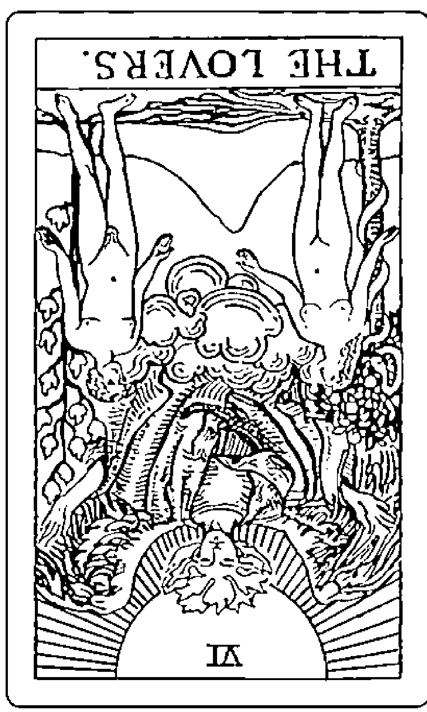

## 戀人逆位

### 人物特性

**基本性格**
是一個猶豫不決的人，很容易受到別人的影響而改變想法，即使是自己作的決定，遇到困難也常不願意負起責任。

**感情觀**
在感情當中十分依賴，但是又容易在不同的對象之間搖擺，若是在感情當中覺得不滿足，很容易就會腳踏兩條船。

**金錢觀**
對於金錢方面的事情不夠務實，也沒有良好的財務規劃能力，如果遇到比較艱困的狀況，也許就會變得窮愁潦倒。

**家庭觀**
與家人之間無法互相信任，相處時常常會發生衝突，所以並不想與家人走得太近，甚至會選擇保持距離以策安全。

### 一、空窗篇－無對象

### 沒對象的原因

你在感情方面想得太多，但是實際的行動又太少，如果不能把自己的心意表達出來，就很容易錯過新戀情的機會。

### 可以改進的地方

想要發展出新戀情，就必須在感情上先認定一個目標，不能再三心二意，覺得每個人都有可能，那就不會有進展。

### 身邊是否有好對象

目前在你身邊沒有好的對象，甚至有某些正在追求你的人，早就已經結婚或有固定伴侶，要小心遇到感情的騙子。

### 可能找到對象的管道

這個時候不論透過何種管道都不太容易找到好對象，甚至還會遇到想搞外遇的人，要小心以免成為感情的第三者。

## 二・曖昧篇－有對象但不確定

### 如何看待对方

這是一個很任性的人，常常不顧別人的想法和立場我行我素，在相處時會感覺到不滿的情緒，讓人覺得難以親近。

### 心中是否有别人

目前在他心中已經有其他人，而且對象可能不只一個，如果你只是眾多選項之一，那就要慎重考慮值不值得付出。

### 可能有哪些阻礙

也許對方已經有固定的情人，或是在你這邊還有其他感情糾纏不清，總之，複雜的關係有可能會對你們造成阻礙。

### 如何告白容易成功

這個時候告白很不容易成功，除非你能用一點小手段色誘對方，但若對方只被你的外表吸引，也不見得是件好事。

## 三・相處篇－有明確對象

### 日常相处状况

兩個人在日常相處方面常常無法配合，也可能面對到其他重大的變化和考驗，所以要維持這段關係並不是很容易。

### 金钱与价值观

兩個人在價值觀上差異很大，所以在財務上最好完全獨立，如果有合作或共有的東西，就很可能會因此發生爭執。

### 彼此心灵契合

兩個人都很重視對方，但是總覺得這段關係沒有未來，有時候會感覺無法信任彼此，甚至落入嚴重的懷疑和猜忌。

### 讲话沟通方式

兩個人經常出現溝通不良的狀況，但是也不知道該怎麼解決，彼此想法上本來就有很多矛盾，自然就會發生爭吵。

### 性的吸引力

在這段感情關係當中，性的吸引力是重要的一環，雙方都會強烈地表達對於彼此的需要，但也要小心房事過度。

## 四・危機篇

### 是否出現第三者

這段關係很可能已經出現了第三者，對彼此的關係造成很大的影響，也可能因為第三者的問題破壞了互信的基礎。

### 發生爭吵的問題點

發生爭吵的問題點在於雙方認知上的差距，如果再加上在溝通當中發生的誤解，就可能讓小事吵到後來變成大事。

### 如何化解紛爭

重要的是把事情的責任釐清，不要再打迷糊仗，只有雙方當面把問題拿出來談清楚，才能徹底解決這個難解的結。

### 提出分手的方法

其實當面溝通是最好的方法，把自己的不滿和挫折真實地表現出來，不要讓對方存有任何幻想也許就能分手成功。

### 複合的可能性

這段關係也許還有復合的可能性，但很可能是因為慾望而重新結合，所以基礎並不是很穩固，相處時要更加小心。

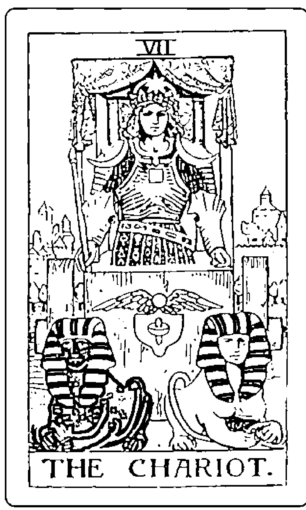

## 戰車正位

### 人物特性

**基本性格**
是一個有理想有抱負的人，凡事都要追求成功與卓越，為了達到目的會不擇手段，即使與人發生衝突也在所不惜。

**感情觀**
在感情當中會全心全意付出，但是同時也有很強的佔有慾，會努力保護自己所愛的人，絕對不容許任何人來挑戰。

**金錢觀**
很重視金錢與財務，同時也會很努力賺錢，通常會先把賺到的錢存起來，即使有投資等財務規劃也比較保守一點。

**家庭觀**
在家中比較強勢，也有很強的自主意識，所以雖然也很重視與家人之間的感情，但是在做法上往往比較我行我素。

### 一、空窗篇－無對象

### 沒對象的原因

你目前沒有把心思放在感情上面，而是忙於其他你認為更重要的事情，如果在感情上不努力就很難有具體的成果。

### 可以改進的地方

你的脾氣太硬，往往讓別人覺得難以親近，如果能適時地表現出更溫柔或隨和的一面，一定可以增加不少的機會。

### 身邊是否有好對象

目前在你身邊有還不錯的對象，但是需要積極努力去爭取，如果沒有下定決心快點行動，可能會被別人捷足先登。

### 可能找到對象的管道

這個時候別人介紹給你的對象一定無法讓你滿意，所以還是要自己去找比較實在，也可以多參加各種的聯誼活動。

## 二・曖昧篇－有對象但不確定

### 如何看待对方

這是一個很積極主動的人，但是在做法上會比較強勢，相處起來會感覺到有點壓力，常常讓人覺得不太容易親近。

### 心中是否有别人

目前在他的心中已經有認定的人選，而且正在積極努力地追求當中，所以想要把他爭取過來幾乎是不可能的任務。

### 可能有哪些阻礙

兩個人的個性都很強，也都會想要掌控對方，如果彼此之間一直是在爭奪主導權，就比較難建立和平穩定的關係。

### 如何告白容易成功

這時候直接告白是最容易成功的方法，而且最好是能把對方當面約出來談，如果速度不夠快也許會落後給其他人。

## 三・相處篇－有明確對象

### 日常相處狀況

兩個人的關係很緊密，但是在日常事務上也會經常發生衝突，從另一個角度來看彼此之間比較像是一種競爭關係。

### 金錢與價值觀

兩個人在財務上都過得不錯，所以並不會因為缺錢而造成不愉快，只是在價值觀上的差異，仍然有可能發生衝突。

### 彼此心靈契合

兩個人都非常珍惜這段感情，也會努力去維持彼此之間的關係，即使遇到了任何困難，還是可以共同攜手去克服。

### 講話溝通方式

兩個人的講話方式都很直接，所以在溝通的時候會有點像是在吵架，不過由於都是就事論事，也不會真的吵起來。

### 性的吸引力

這段關係當中並沒有很強的吸引力，反而會有點把性關係工具化，把性當成征服對方的工具，帶有強烈的目的性。

### 與對方家人的關係

你與對方家人的關係有點緊張，覺得要處理與他們的關係對你來說是一大挑戰，但是即使困難仍然要努力去克服。

### 繼續發展的前景

這段關係繼續發展下去仍然會遇到一些困難和阻礙，不過只要兩個人同心協力，還是可以一一克服最後得到幸福。

塔羅愛情占卜的牌義

- 大阿爾克納
- 權杖
- 聖杯
- 寶劍
- 錢幣
- 宮廷

### 四、危機篇

### 是否出現第三者

兩個人之間並不會出現第三者，即使有人想要破壞你們之間的關係也不容易成功，所有的問題還是回到你們本身。

### 發生爭吵的問題點

發生爭吵的問題點在於兩個人都很強勢，如果對方不順著自己的意就會發脾氣，遇到意見不同的時候就容易吵架。

### 如何化解紛爭

這個時候鬥力不如鬥智，要花心思、想辦法來表現自己的誠意，有時候越是強硬的態度，反而會引發更大的衝突。

### 提出分手的方法

大吵一架是最好的方法，只要你強硬地提出分手的要求，對方就沒有什麼挽回的餘地，應該用快刀斬亂麻的方法。

### 複合的可能性

兩個人之間已經沒有什麼情份了，所以並不存在任何複合的可能性，再加上競爭者的實力很強，再妄想也沒有用。

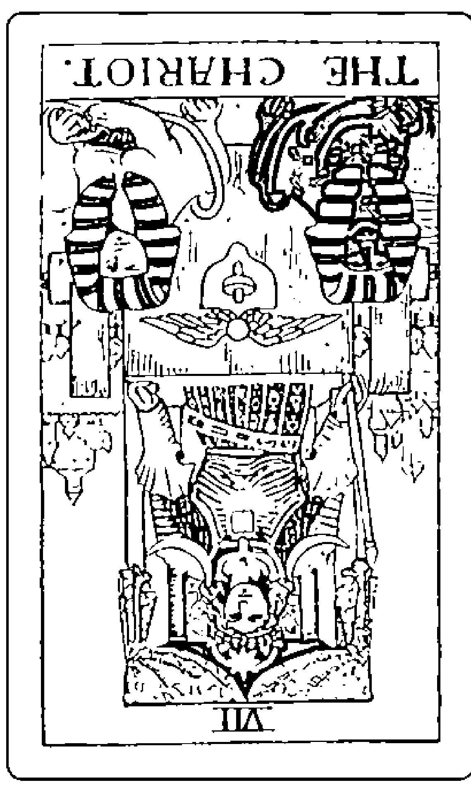

## 戰車逆位

### 人物特性

### 基本性格

是一個想很多的人，常常喜歡怨天尤人，但是從來不檢討自己，往往會因為缺乏意志力和鬥志而在競爭當中落敗。

### 感情觀

在感情當中的情緒起伏很大，同時也很容易受到別人的影響，通常想法比較消極被動，也會在不同對象之間猶豫。

### 金錢觀

並不善於處理財務問題，有可能會積存很多金錢但無法好好運用，或是因為一時決策錯誤而陷入金錢的糾紛當中。

### 家庭觀

對於家庭當中的事情比較漠不關心，與家人之間也很少互動，如果在家中遇到不順心的事就容易有情緒化的反應。

### 一、空窗篇－無對象

### 沒對象的原因

你對於感情過於消極被動，也有可能是陷在過去失敗的經驗當中走不出來，如果自己不想談感情就不會有新戀情。

### 可以改進的地方

你應該放下過多的擔心憂慮，勇敢地表達自己的感情，只要能在感情上跨出第一步，後面的事情就沒那麼困難了。

### 身邊是否有好對象

目前在你身邊也許有一些可能的對象，但是對你來說都不是好的選擇，這個時候保持被動仔細觀察是最好的策略。

### 可能找到對象的管道

這個時候主動去尋找對象不太容易有成果，反而是有人可能會主動向你告白，所以只要在原地守株待兔就可以了。

## 二・曖昧篇一有對象但不確定

### 如何看待對方

這是一個比較情緒化的人，對於不順利的事情總是有很多可以抱怨，在相處的時候會在他身上感覺到有一股怨氣。

### 心中是否有别人

目前在他心中沒有其他的對象，但是也許還沒有從之前的感情傷害當中走出來，對你來說也不是容易進攻的目標。

### 可能有哪些阻礙

目前有強力的情敵出現，而且正發動猛烈的攻勢，如果無法更努力去打敗情敵，也許心上人就會在你面前被搶走。

### 如何告白容易成功

這個時候無論怎麼告白都不可能成功，反而會使你們的關係破局，所以這個時候要有耐性，衝動絕對沒有好下場。

## 三・相處篇一有明確對象

### 日常相處狀況

兩個人日常的相處發生了許多問題，在很多方面都無法相互配合，如果無法相互體諒的話，可能會走向分手之路。

### 金錢與價值觀

兩個人的價值觀差異性太大，很容易就會為了錢的事情吵起來，即使彼此都想要讓步妥協，也不容易找到平衡點。

### 四、危機篇

### 塔羅愛情占卜的牌義

### 是否出現第三者

兩個人之間有可能出現第三者，而且對方幾乎是公開的介入你們的關係，如果出現這樣的狀況就會造成感情危機。

### 發生爭吵的問題點

發生爭吵的問題點在於彼此之間的差異太大，又常常處於無法溝通的狀況，所以只要發生一件小事就可以吵翻天。

# 大阿爾克納

### 如何化解紛爭

這時候問題變成非黑即白的是非題，你只能選擇拒絕或是接受，想要兩面討好的話反而會讓自己陷入更大的危機。

### 提出分手的方法

只要任何一方正面開戰，這段關係就會結束，所以如果你已經想清楚要結束這段關係，就不要再猶豫把它解決吧。

- 權杖
- 聖杯
- 寶劍
- 錢幣
- 宮廷

### 複合的可能性

兩個人要複合已經是不可能的事情了，即使對方還有意思希望複合，也絕對不會是一個好關係，反而會吵得更兇。

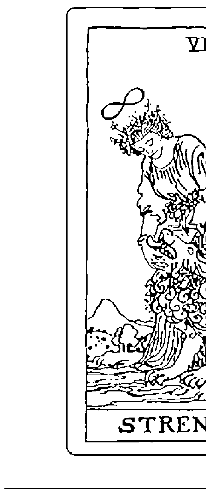

## 力量正位

### 人物特性

### 基本性格

是一個非常有勇氣的人，即使面對挑戰仍然會勇往直前，但並不是匹夫之勇的類型，而是會運用技術和方法處理。

### 感情觀

在感情上重視兩個人的互動，願意花很多心思與力氣去了解對方的需求，同時也有能力去處理感情中的各種問題。

### 金錢觀

十分重視金錢的效用，有時會選擇利用金錢來達成自己的目標，在感情當中會表現得比較慷慨，也會花錢來打扮。

### 家庭觀

在家庭相關的事務上有主導的想法，也會想辦法去照顧其他人的需要，但是無法忍受別人忽略他的存在或是建議。

### 一、空窗篇－無對象

### 沒對象的原因

你平常就很獨立自主，不願意在感情當中被別人掌控，因此即使有令你心動的對象出現，也很難讓你放心地投入。

### 可以改進的地方

你給人太過剛強的感覺，所以會讓人覺得難以接近，若是能適時地展現柔性的一面，就可能發現更多感情的機會。

## 二・曖昧篇－有對象但不確定

### 如何看待对方

這是一個充滿自信與行動力的人，但是會讓人感覺比較強勢，有時在相處上會造成一些壓力，需要再花時間調適。

### 心中是否有别人

他目前心中已經有另一個特定對象，而且花費很多心力在處理感情方面的事情，要吸引到對方的注意力並不容易。

### 可能有哪些阻礙

兩個人的個性都有些強勢，在關係當中誰也不願意先低頭，如果沒有辦法放下身段，就可能會卡在曖昧關係階段。

### 如何告白容易成功

這個時候主動告白是最直接有效的方法，而且最好是當面溝通比較不會有誤解，只要提起勇氣行動通常都會成功。

## 三・相處篇－有明確對象

### 日常相處狀況

兩個人在生活習慣上會有一些不同，但是仍然存在相互配合的空間，只要用心努力一定可以找到和平相處的方法。

### 金錢與價值觀

雙方在金錢的使用上有很多地方需要協調，但是還有機會找出彼此都能夠接受的方案，過程中需要多花一點時間。

### 彼此心靈契合

兩個人都很重視這個關係，也把這段感情視為彼此的挑戰，不論遇到什麼艱難險阻，都會想把這段關係維持下去。

### 講話溝通方式

彼此在溝通時經常都帶有一些情緒，所以最重要的是保持理性和冷靜，以愛和包容來處理過程中出現的各種問題。

### 性的吸引力

這段關係當中有很強的性吸引力，兩個人在性關係方面互動良好，因此性生活也會成為增進雙方感情的有利因素。

### 與對方家人的關係

你與對方家人的關係還不錯，但是仍然有一些地方需要適應，你應該要有耐心用方法和技巧，而不要正面去衝撞。

### 繼續發展的前景

未來兩個人的關係仍然非常緊密，不但可以相互配合也帶有熱情，所以要對這段感情有信心，繼續努力堅持下去。

## 四・危機篇

### 是否出現第三者

其實兩個人彼此都十分相愛，並不存在第三者出現的空間，所以不論遇到任何問題，都要堅持下去不要放棄希望。

### 發生爭吵的問題點

最深層的原因是在於兩個人互相想要控制對方，所以才會發生爭吵，在這個過程當中又會出現很多情緒性的干擾。

### 如何化解紛爭

要有技巧和智慧地去處理問題，更重要的是切記柔能克剛的道理，這時用直接衝突的方式處理事情反而會一身傷。

### 提出分手的方法

只是自己片面宣佈分手並沒有什麼用，還是要兩個人坐下來談才會有最後結果，其實兩個人的關係仍然是很緊密。

### 複合的可能性

其實兩個人之間還是存在複合的可能性，也有很多你可以施力的空間，所以別急著放棄希望，可以再找對方談談。

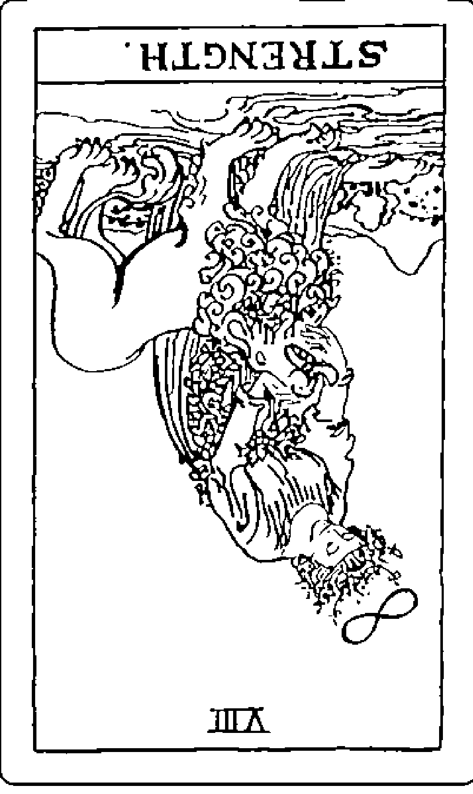

## 力量逆位

### 人物特性

基本性格
是一個比較以自我為中心的人，在作決定的時候往往不會考慮到別人的立場，遇到壓力時也容易有情緒化的表現。

感情觀
在感情當中會想要控制對方，如果對方違逆自己的意思就很容易大發脾氣，經常搞不清楚自己在感情當中的需要。

金錢觀
對於金錢的使用並不理性，可能經常會因為一時衝動消費，或是喜歡把錢拿來買奢侈品，所以無法把錢累積下來。

家庭觀
在家中的表現比較霸道，常會因為自己的好惡而強迫別人去做一些事情，而不會考慮別人的立場及事情的合理性。

## 一、空窗篇—無對象

沒對象的原因
你還沒想清楚自己在感情當中的需要，所以不容易吸引適合的人接近你，即使有適合的人出現你也無法辨認出來。

可以改進的地方
你給人太過強勢的感覺，而且有太多情緒化的表現，如果能多站在別人的立場想想，也許就可以有新的機會出現。

身邊是否有好對象
你目前身邊有一些對象，但都不是真正適合你的人，所以還是應該仔細考慮清楚，衝動在一起並不會有好的結果。

可能找到對象的管道
這個時候主動積極並不會有什麼好的效果，所以等待別人追求是比較好的方法，不要被自己的主觀想法所限制了。

### 二、曖昧篇－有對象但不確定

### 如何看待对方

這是一個非常主觀的人，經常過份堅持自己的意見，而無法與人好好的溝通，在相處時也常會感覺到強烈的情緒。

### 心中是否有别人

他目前心中可能有一些候選的對象，但是都還沒有確定的感覺，也沒有采取行動，你有可能是他考慮的對象之一。

### 可能有哪些阻礙

兩個人都想要控制對方，同時在關係當中也不願意互相讓步，如果無法理性地溝通，就會陷入情緒化的危機當中。

### 如何告白容易成功

這時候需要持之以恆的努力，以自己認為對的方法去做，如果考慮太多別人的想法，就會進退維谷反而容易失敗。

### 三、相處篇－有明確對象

### 日常相處狀況

兩個人在生活習慣上有很大的不同，但基本上是其中一方勉強另外一方配合，如果處理不好的話就可能經常吵架。

### 金錢與價值觀

兩個人很可能會因為價值觀的不同而爭吵，有時候也會反映在處理金錢方式的不同，所以財務上最好是相互獨立。

### 彼此心靈契合

兩個人都覺得對方很重要，但是也會因此想要控制對方，這些掌控的念頭很可能會造成彼此之間的緊張關係。

### 講話溝通方式

彼此之間的溝通方式會比較激烈，甚至常常會出現情緒化的火爆場面，但是在事後又會對自己的失控感覺到懊悔。

### 性的吸引力

在這段關係當中性生活是很重要的一環，如何在當中去體會對彼此的愛意，是兩個人能不能維持感情的重要關鍵。

### 與對方家人的關係

由於對方的家人比較強勢，所以在相處上會感覺到比較大的壓力，有時候甚至需要被迫去配合他們的習慣或模式。

### 繼續發展的前景

你們的未來仍然有許多問題需要去克服，甚至會因為彼此情緒性的反應而失控，對雙方來說都算是很重大的挑戰。

## 四·危機篇

### 是否出現第三者

雖然彼此之間還有很多情緒，但是關係當中並沒有出現第三者，所以還是應該專注於兩個人的狀況，不要想太多。

### 發生爭吵的問題點

問題的爭點在於彼此都有過多的情緒反應，同時沒有保持理性把事情講清楚，在缺乏理解的狀況下就很容易卡住。

### 如何化解紛爭

如果衝突已經是不可避免了，那麼就應該要讓問題直接爆發出來，知道對方真正不滿的地方，才有可能徹底解決。

### 提出分手的方法

現在想要分手的話，最好是把對方所有的問題通通拿出來數落一番，即使你不主動提出分手，對方也會無法忍受。

### 複合的可能性

兩個人在本質上並不合，所以即使複合也沒有什麼好處，你應該要嚴正的拒絕對方，不要讓他再有傷害你的機會。

### 塔羅愛情占卜的牌義

- 大阿爾克納
- 權杖
- 聖杯
- 寶劍
- 錢幣
- 宮廷

隱者正位

### 人物特性

#### 基本性格

這是一個小心謹慎的人，做任何事情之前都會深思熟慮，而且不會做自己沒有把握的事，也比較習慣自己一個人。

#### 感情觀

雖然在感情上已經很成熟了，但目前還是抱持獨身主義，對於異性也不太在意，也許是覺得還沒準備好接受感情。

#### 金錢觀

在金錢上不虞匱乏，但也不會特別想要去累積金錢，對於投資理財方面有特殊的天份，所以可以維持不錯的生活。

#### 家庭觀

在家庭當中比較孤僻，不太愛管別人的事情，但當有人遇到問題時還是會適時地伸出援手，是屬於比較獨立的人。

### 一、空窗篇－無對象

#### 沒對象的原因

你目前比較習慣一個人，也不太想要開始新的感情生活，即使內心當中仍然有期待，但是沒有行動自然就沒結果。

#### 可以改進的地方

你應該找機會多與異性接近，不要一天到晚搞自閉，只要自己願意踏出第一步，就有可能吸引到適合自己的對象。

#### 身邊是否有好對象

目前在你身邊沒有什麼好的對象，甚至連爛桃花都很缺，所以還是不要放太多心思在感情上，好好享受單身生活。

#### 可能找到對象的管道

這個時候只有靠你自己才能找到對象，別人的介紹或建議都完全沒有用，但是在行動之前要先想清楚自己的需要。

### 二、曖昧篇－有對象但不確定

#### 如何看待對方

這是一個成熟穩重的人，但是會給人有一些距離感，也不太喜歡接近人群，在相處時散發出一種讓人平靜的特質。

#### 心中是否有別人

他目前心中並沒有任何人，連你也不是他考慮的對象，除非他的觀念想法改變，否則就很難開始另一段新的感情。

#### 可能有哪些阻礙

兩個人對於感情都十分被動，即使有期待也只是在原地觀望，如果兩個人都沒有動作，關係自然就不可能有進展。

#### 如何告白容易成功

在告白之前應該要做預先的演練，同時最好是找一個不會遇到熟人的地方單獨告白，以免其他人造成不利的影響。

### 三、相處篇－有明確對象

#### 日常相處狀況

兩個人在相處上容易陷入固定不變的模式，彼此之間雖然可以配合但是缺乏熱情，也許關係的發展已經遇到瓶頸。

#### 金錢與價值觀

彼此之間的價值觀十分接近，財務狀況也相當穩定，即使遇到與金錢相關的爭吵，也可以用理性分析的方式化解。

#### 彼此心靈契合

兩個人都認為對方十分成熟獨立，但是並沒有彼此相屬的親密感，有時候即使兩個人在一起心裡仍然會覺得寂寞。

#### 講話溝通方式

兩個人在溝通上十分理性，會想盡辦法用道理來說服對方，遇到無法溝通時會避不見面，而不會有情緒化的反應。

#### 性的吸引力

這段關係當中並沒有什麼性的吸引力，甚至有些在逃避性關係的感覺，若是有一方太渴望性生活反而會無法滿足。

#### 與對方家人的關係

你會小心謹慎地處理與對方家人的關係，但是在內心深處仍然會想逃避，如果可以不要有互動就會盡量避免見面。

#### 繼續發展的前景

兩個人的關係已經到達一個瓶頸，彼此對於未來都沒有更進一步的想法，如果無法再突破的話也可能會選擇分開。

### 四、危機篇

#### 是否出現第三者

兩個人之間並沒有第三者的存在，所有的問題都來自於兩個人的相處模式，不要因為彼此之間的距離而亂起疑心。

#### 發生爭吵的問題點

其實彼此都有獨立自主以及對於空間的需要，太過關心對方反而會變成一種壓力，甚至可能引發對方激烈的反抗。

#### 如何化解紛爭

在溝通之前先給彼此一點冷靜的空間，等大家都想清楚之後再說，通常使用理性溝通的方式，到最後都可以解決。

#### 提出分手的方法

避不見面是分手最好的方法，只要你躲起來讓對方找不到你，很自然就會分手成功，其他的事情都不算是必要的。

#### 複合的可能性

兩個人之間其實已經沒有什麼情份，要複合是完全不可能的事情，你應該快點習慣一個人的生活才能過得更快樂。

隱者逆位

### 人物特性

#### 基本性格

是一個過於小心謹慎的人，甚至會讓人覺得很膽小怕事，平常會習慣性地隱藏自己，對有興趣的事情會深入研究。

#### 感情觀

在感情上過於保守及膽小，以至於不敢表達出自己的感情，但若是在心中認定了一個人，就會死心塌地從一而終。

#### 金錢觀

對於金錢上的事情常常搞不清楚狀況，平常都很會拼命地存錢，甚至會讓人覺得十分小氣，但是仍然缺乏安全感。

#### 家庭觀

對於處理家庭相關的事物缺乏信心，所以不敢表達自己的意見，在家中經常會被忽略，而本人也喜歡這樣的定位。

### 一、空窗篇－無對象

#### 沒對象的原因

關於感情的事你想得太多，但是實際行動太少，只是一個人演內心戲，有時候連自己內心真正的感覺都搞不清楚。

#### 可以改進的地方

你應該先反省自己在感情當中失敗的原因，想辦法突破過去錯誤的模式，否則再怎麼努力還是會犯下同樣的錯誤。

#### 身邊是否有好對象

你目前身邊沒有什麼好對象，即使出現了令你心動的對象，往往也只有單戀的份，短期內不可能發展出新的戀情。

#### 可能找到對象的管道

如果想要找到新的感情對象，就要勇敢地走向人群，多多與不同的異性接觸，就可以漸漸脫離一個人孤獨的狀況。

### 二、曖昧篇－有對象但不確定

#### 如何看待對方

這是一個很膽小保守的人，好像在內心有很多的想法，但是又不會表達出來，在相處的時候讓人覺得有一點無聊。

#### 心中是否有別人

他目前心中可能有欣賞或是暗戀的對象，但是那些人都不太可能與他發展感情，所以只要願意努力還是有機會的。

#### 可能有哪些阻礙

兩個人都還沒想清楚，所以在行動上常常猶豫不決，因而錯失一些機會；也有可能是年齡的差距造成彼此的阻礙。

#### 如何告白容易成功

在告白之前應該要先釐清自己的想法，只有當自己的意志非常堅定的時候，告白才會有力量，千萬要謀定而後動。

### 三、相處篇－有明確對象

#### 日常相處狀況

兩個人的相處潛藏有許多問題，但是因為雙方都很逃避的關係，導致事情一直放著沒處理，越是累積就越難化解。

#### 金錢與價值觀

兩個人的想法都一直變來變去，所以也很難判斷價值觀是否相合；但是在金錢上會覺得不足，很可能因此而爭吵。

#### 彼此心靈契合

兩個人都想要努力維持這段關係，但是總覺得自己的付出沒有得到相對應的回報，可能會有一點漸行漸遠的感覺。

#### 講話溝通方式

兩個人內心都有很多的想法，但是往往又無法說出口，在沒辦法講清楚的狀況之下，就會增加幻想與誤解的空間。

#### 性的吸引力

在這段感情當中性的吸引力並不存在，甚至有其中一方或雙方都有嚴重的處女情結，為這段感情設下更多的限制。

#### 與對方家人的關係

你在對方面家人前覺得很拘束，無法表達出內心真正的想法，被誤解了也不想多做解釋，彼此之間就容易有心結。

#### 繼續發展的前景

這段關係的前途不明，對於未來也還缺乏明確的方向，如果無法找到彼此共同的目標，也許將來就可能漸行漸遠。

## 四·危機篇

### 是否出現第三者

兩個人的關係當中並沒有第三者，但是也許存在其他不能說的秘密，為彼此保留一些私人的空間是比較好的做法。

### 發生爭吵的問題點

彼此之間的溝通不良可能是最主要的問題點，如果雙方都不把內心當中的想法說出來，對方如何能了解你的意思？

### 如何化解紛爭

爭吵絕不如表面上看起來那麼簡單，在背後還有更深層的原因，如果不能找到問題的核心，就很難化解這個危機。

### 提出分手的方法

彼此之間已經沒有什麼感情了，只要任何一方提出分手都可以很自然的分開，也可以告訴對方你想要一個人生活。

### 複合的可能性

這段感情沒有任何複合的可能性，即使兩個人都繼續保持單身也是如此，可以利用時間去做其他更有意義的事情。

### 塔羅愛情占卜

- 大阿爾克納
- 權杖
- 聖杯
- 寶劍
- 錢幣
- 宮廷

命運之輪正位

### 人物特性

#### 基本性格

是一個心胸寬大的人，相信凡事都是上天最好的安排，採取自然不強求的態度，雖然缺乏計劃卻經常會帶來好運。

#### 感情觀

在感情上抱持著比較開放容忍的態度，並不會想要把自己的想法強加在對方身上，但是本身也需要比較大的空間。

#### 金錢觀

對金錢的態度比較隨緣，雖然不會刻意努力積蓄金錢，但還是可以維持不錯的生活品質，也算是會有偏財運的人。

#### 家庭觀

與家人的關係互動都很良好，算是受歡迎的人物，遇到別人有問題的時候會伸出援手，所以也有很多的貴人相助。

### 一、空窗篇－無對象

#### 沒對象的原因

你目前對於感情的事情抱持著隨緣的態度，也不太注意身邊是否有可能的對象，也許沒對象對你來說是一件好事。

#### 可以改進的地方

其实在行為上你並沒有什麼需要改進的地方，唯一需要的是心態上的改變，不要一開始就抗拒主動追求你的對象。

#### 身邊是否有好對象

在你身邊可能已經有好的對象出現，只是你不一定把他視為感情的對象，另一方面也可能與新認識的人一見鍾情。

#### 可能找到對象的管道

太刻意想要找尋新的感情對象，反而沒有什麼機會，倒不如全心全意地過好自己的生活，自然會有新的機會出現。

### 二、曖昧篇－有對象但不確定

#### 如何看待對方

這是一個樂觀正向的人，即使面對挫折仍然會努力不懈，在相處上覺得很隨和，但是也不會經常給別人太多承諾。

#### 心中是否有別人

目前在他心中已經有認定的一個人，但是並不確定那個人是不是你，如果他已經喜歡上別人，你就沒有任何機會。

#### 可能有哪些阻礙

可能在你或他的生活當中會發生重大的轉變，對你們關係的進展造成阻礙，而這些事情也不是你或他可以控制的。

#### 如何告白容易成功

其實你們的關係不需要正式的告白，只要能逐步增加兩個人的實質互動，感情很自然就可以進展到一個新的階段。

### 三、相處篇－有明確對象

#### 日常相處狀況

兩個人的日常生活可能會發生重大的變動，之前的相處模式必須做一些調整，也可能是關係進展到一個新的階段。

#### 金錢與價值觀

兩個人在價值觀上十分契合，同時在金錢上也不虞匱乏，所以交往就比較沒有壓力，甚至可能共同得到意外之財。

#### 彼此心靈契合

彼此都覺得這是命中註定的一段感情，不論如何都要和對方在一起，所以即使面對再困難的問題還是不願意放棄。

#### 講話溝通方式

兩個人在溝通時話不一定很多，但是仍然可以確實了解對方真正的想法，有時候也會故意出一些難題來考考對方。

#### 性的吸引力

兩個人之間有很強的性吸引力，第一次見面時就有似曾相識的感覺，甚至會覺得相見恨晚，彼此都可以樂在其中。

#### 與對方家人的關係

與對方家人的關係非常自然，很容易就可以找到自己應該扮演的角色和定位，與家人的關係也會成為感情的助力。

#### 繼續發展的前景

這段關係的前景十分看好，也很容易發展到更進一步的階段，所以應該放心享受這段關係，其他的就不要想太多。

### 四·危機篇

#### 是否出現第三者

兩個人之間並沒有出現第三者，即使有其他人想要破壞你們的關係，也不會有什麼重大的影響，所以不需要擔心。

#### 發生爭吵的問題點

其實問題已經發生很久了，只是又在目前的情境當中突顯出來，如果雙方都不願意改變的話，狀況還是無法解決。

#### 如何化解紛爭

時間將會為你證明一切，其實這根本是一場誤會，但是如果強加解釋什麼，反而可能會讓對方有越描越黑的感覺。

#### 提出分手的方法

除非發生重大的變故，否則兩個人要分手並沒有那麼容易，如果長時間不見面的話，也許距離可以沖淡一點感情。

#### 複合的可能性

兩個人的複合其實是意料中的事，即使當時已經撕破臉了，仍然有很大的機會可以複合，好像冥冥之中早已註定。

## 命運之輪逆位

### 人物特性

#### 基本性格
是一個心胸比較狹窄的人，遇到不順的事情往往不知檢討自己，反而容易怨天尤人，總覺得自己的命運比較坎坷。

#### 感情觀
可能之前在感情上受過一些傷害，所以對於感情的事情比較悲觀，甚至是變得害怕退縮，無法在感情上固定下來。

#### 金錢觀
對於金錢過於樂觀與浮誇，但實際上不一定有那麼富裕，甚至有可能在財務上不太穩定，無法為自己累積財富。

#### 家庭觀
可能在某些事情上與家裡面有過爭執，與家人之間的關係並不是很親近，也有可能是要背負家中的責任或是債務。

### 一、空窗篇－無對象

#### 沒對象的原因
你現在單身純粹是因為運勢不好，而不是因為你做錯了什麼事情，所以不需要太難過或是自責，保持平常心就好。

#### 可以改進的地方
你目前需要的是耐心等待，同時避免犯下與之前相同的錯誤，所以最好花一些時間檢討過去感情當中失敗的案例。

#### 身邊是否有好對象
你目前身邊可能會出現新的感情對象，但並不是你理想中的類型，你可以試著改變自己去接受他，或是再等一等。

#### 可能找到對象的管道
目前任何管道都不容易找到好的對象，所以耐心等待是很重要的一件事，太過主動積極反而會吸引到不好的對象。

### 二、曖昧篇－有對象但不確定

#### 如何看待對方
這個人似乎正經歷一些人生變動，但是又沒有明確的方向，在相處時會感覺到他的迷惘，也許是卡在某個問題裡。

#### 心中是否有別人
他目前在心中有一些感情的牽絆，但是並沒有做出最後的決定，有可能是之前的舊情未了，或有其他暗戀的對象。

#### 可能有哪些阻礙
目前環境上有許多不利的因素，有一些是可以努力排除的，但是仍然有許多問題無法處理，所以不要太要求完美。

#### 如何告白容易成功
這並不是適合告白的時機，太過衝動反而會讓關係倒退；之前所使用的告白方式必然無效，想要成功就要想新招。

### 三、相處篇－有明確對象

#### 日常相處狀況
兩個人的相處常常會有意外狀況，也很容易因此而產生許多爭執，往往一件事情剛處理完又會發生另外一個問題。

#### 金錢與價值觀
兩個人對於金錢都沒什麼概念，所以很有可能會陷入財務危機，如果不能小心謹慎處理，就容易導致不利的結果。

#### 彼此心靈契合
兩個人彼此都覺得這段關係需要作改變，但是並不知道非常明確的方向，也許雙方在內心深處都不看好這段關係。

#### 講話溝通方式
雙方經常以為對方很了解自己的想法，所以就不把話說清楚，其實彼此之間存在許多誤解，很容易就會造成爭端。

#### 性的吸引力
這段關係當中有很強的性吸引力，兩個人也會因為性關係而覺得無法分開，但是有的時候這又會成為爭吵的主題。

#### 與對方家人的關係
你與對方家人的關係時好時壞，很難把握其中的訣竅和分寸，也許在小事情上犯錯，就會對關係產生重大的影響。

#### 繼續發展的前景
這段關係的前景並不看好，未來也還存在許多無法解決的問題，可能接下來會發生重大的變化，要小心謹慎處理。

### 四・危機篇

#### 是否出現第三者
這段關係當中可能出現第三者，而且雙方都有機會遇到一些誘惑，如果不小心處理的話甚至會變成分手的導火線。

#### 發生爭吵的問題點
問題的核心在於你們抗拒變化，沒有隨著環境狀況的改變調整彼此相處的模式，固執不通常然會遇到重複的課題。

#### 如何化解紛爭
有些關係必將置之死地而後生，你只能維持現狀等待局面改變，也許等問題慢慢浮現出來之後你才有辦法去處理。

#### 提出分手的方法
兩個人之間的狀況必然會有改變，如果利用這個機會分手也是順理成章的事情，只要有一方提出分手就可以結束。

#### 複合的可能性
兩個人的關係也許就是分分合合，所以即使再複合了也很難就此穩定下來，應該把問題點考慮清楚之後才作決定。

## 正義正位

### 人物特性

#### 基本性格
這是一個很有正義感的人，對事情非常重視公平與平衡，除了考慮自己的原則之外，也很在意別人的看法和意見。

#### 感情觀
對於感情的事情十分理性，會在感情當中要求平等與互惠，如果發生了不公平的事情，他也會為了自己據理力爭。

#### 金錢觀
在金錢上比較偏向保守和傳統，不喜歡風險大的投資，雖然沒辦法輕鬆賺大錢，不過都可以保持不錯的生活品質。

#### 家庭觀
與家人的關係並不親近，但是當發生問題時經常成為大家的諮詢對象，如果家人有錯的話，也會不假辭色地糾正。

### 一、空窗篇－無對象

#### 沒對象的原因
你在面對感情時太過理性，凡事都只講理的結果就是很難得到感情，要談感情的話有些事情就不能太過斤斤計較。

#### 可以改進的地方
你可以適時展現出自己柔性的一面，不要凡事都搞得那麼正式和嚴肅，要讓自己真正的放鬆才有機會好好談感情。

#### 身邊是否有好對象
也許目前在你身邊已經出現了不錯的對象，但是你完全沒有把對方考慮在內，有時候太過理性反而會是一種阻礙。

#### 可能找到對象的管道
目前要靠自己找到新對象並不容易，所以最好透過親朋好友們幫你介紹，特別是主管、長輩或具有權勢地位的人。

### 二、曖昧篇－有對象但不確定

#### 如何看待對方
這是一個十分理性的人，不論談到什麼事情都可以分析得清清楚楚，但是在相處上有時候會覺得有一點不通人情。

#### 心中是否有別人
他目前心中可能有幾個人選，但是還沒有做最後決定，他還在評估每個人的狀況，所以是人人有希望個個沒把握。

#### 可能有哪些阻礙
兩個人對這段關係都想很多，但是比較容易缺乏實質的行動，如果只是一直在原地不動，感情就不會有什麼進展。

#### 如何告白容易成功
直接告訴對方你的心意遠比在那裡暗示個老半天還有用，只要能當面把自己的想法講清楚，就有很大的成功機會。

### 三、相處篇－有明確對象

#### 日常相處狀況
兩個人的生活作息各不相同，還有很多地方需要調整與妥協，如何尋找到平衡點就需要靠雙方冷靜地思考和溝通。

#### 金錢與價值觀
兩個人的財務狀況都不錯，但是出去花費最好還是各付各的，或是盡量尋找公平的方式分擔，這樣才不會有怨言。

#### 彼此心靈契合
兩個人都對這段關係寄予厚望，同時也會很努力地付出，只要能保持平等互惠的相處模式，關係就可以長長久久。

#### 講話溝通方式
兩個人在溝通的時候都十分講理，但是往往會缺乏溫馨浪漫的一面，有一些話講得太白反而會引起情緒性的反應。

#### 性的吸引力
兩個人之間並沒有很強的吸引力，但是仍然會有一定的性生活，只是會變得比較像例行公事，在這方面缺乏熱情。

#### 與對方家人的關係
能夠找到與對方家人相處的平衡點，但是彼此之間的關係並不親近，如果硬要勉強什麼事情，就很容易引起衝突。

#### 繼續發展的前景
這段關係繼續下去將會面臨到重大的選擇，在作決定之前應該要先仔細評估，衝動下的決定通常都不會有好結果。

## 四・危機篇

### 是否出現第三者

兩個人之間並沒有第三者的干擾，所有的問題還是來自於彼此的觀念不同，如果懷疑有第三者就會完全想錯方向。

### 發生爭吵的問題點

兩個人的爭點其實在於一個理字，彼此都站在自己的立場講理而互不相讓，如果能情理兼顧的話也許會比較好些。

### 如何化解紛爭

現在需要的是一個平衡的結果，若是偏向任何一方就會有更大的反作用力，或者也可以找公正的第三者從中協調。

### 提出分手的方法

如果能透過理性的方法談判，就可以得到傷害性最小的結果，分手的過程可能會冗長而辛苦，但其結果會是好的。

### 複合的可能性

其實兩個人並不可能複合，最多只是留下一些舊帳還沒清而已，所以若是真的談清楚了，兩個人就沒有任何關係。

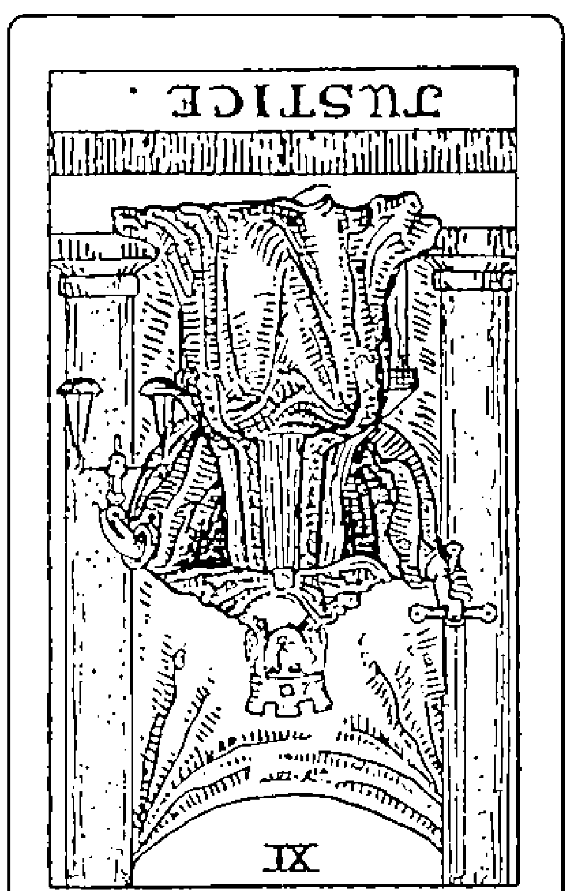

## 正義逆位

### 人物特性

**基本性格**
是一個非常固執己見的人，所以常會不顧別人的想法一意孤行，即使到後來證明行不通，也很難承認自己的錯誤。

**感情觀**
在感情上會想得很多，但是實際行動又很少，若不是過度自我批判就會對別人太過苛刻，很難找到相處的平衡點。

**金錢觀**
並不太會處理金錢方面的事情，甚至於常會陷入收支不平衡的狀態，對於錯誤觀念或判斷的執著可能會造成危機。

**家庭觀**
在家庭的事務上會想要發揮影響力，但有時候過於主觀的看法並不能得到大家的認同，也常傾向嚴苛地評價別人。

### 一、空窗篇－無對象

**沒對象的原因**
你在處理感情的事情上過於猶豫，即使遇到適合的人也很難及時把握，所以很可能會錯過好的感情機會而不自知。

**可以改進的地方**
你要放下自己先入為主的觀念及過高的標準，站在別人的立場想一想，如果能突破這些迷思應該很快就會有感情。

**身邊是否有好對象**
你目前也許有適合你的對象，但是在主觀上仍然不符合你的擇偶標準，若是願意降低標準的話就很有可能會談感情。

**可能找到對象的管道**
想要找到新的感情對象，就要放下身段主動與異性接近，只要你願意主動出擊，不論什麼管道都可能出現新對象。

### 二・曖昧篇－有對象但不確定

### 如何看待對方

這是一個十分理性的人，但是有時候又會有過份偏執的想法，講話非常直接又不留情面，相處上讓人覺得有壓力。

### 心中是否有別人

目前在他的心中並沒有考慮的人選，其他人對他來說都只是朋友而已，所以關係的進展完全取決於兩個人的互動。

### 可能有哪些阻礙

兩個人都對彼此太過苛刻，或是被先入為主的觀念所誤導，所以可能會存在一些心結，造成感情關係無法有進展。

### 如何告白容易成功

在告白之前一定要想清楚自己喜歡對方的原因，以及準備好回答各種假設性問題，因為對方一定會問很多為什麼。

### 三・相處篇－有明確對象

### 日常相處狀況

兩個人在日常相處上並不是很公平，總是有一方付出較多而另一方坐享其成的狀況，所以也容易因此而發生衝突。

### 金錢與價值觀

兩個人在價值觀上的差別很大，所以在金錢的使用上很難獲得共識，最好不要共同購買東西，以免日後發生糾紛。

### 彼此心靈契合

兩個人都對這段關係的走向感到迷惘，並且感覺到在關係當中存在很嚴重的問題，很可能會覺得兩個人沒有未來。

### 講話溝通方式

兩個人的想法有很大的不同，但是又固執己見聽不進對方的建言，有時候用吵架的方式反而能達到有效的溝通。

### 性的吸引力

兩個人之間沒什麼性的吸引力，反而是在理性的交流上居多，有時候會因為性生活方面的不順利而引發更多衝突。

### 與對方家人的關係

你與對方家人的關係時好時壞，但是通常都會覺得自己受到不公平的待遇，所以還是躲遠一點避免互動比較安全。

### 繼續發展的前景

這段感情繼續發展下去可能會對雙方都造成傷害，主要的問題在於觀念不合與溝通不良，勢必要面對很大的挑戰。

### 四・危機篇

### 是否出現第三者

兩個人之間有可能會出現第三者，但起因還是來自於彼此感情的疏離，只是第三者問題經常會成為爭吵的導火線。

### 發生爭吵的問題點

兩個人發生爭吵最主要的關鍵在於理念不同，在溝通上就很難找到交集，若是繼續堅持自己的立場問題自然無解。

### 如何化解紛爭

現在雙方需要的是一段冷靜的時間，先不要急著作決定，這時候越努力溝通反而會吵得更兇，還是不要白費力氣。

### 提出分手的方法

兩個人經過談判的過程必然可以得到分手的結果，只是在過程當中可能會覺得很痛苦，必須面對一些傷心的回憶。

### 複合的可能性

兩個人完全沒有複合的可能，只是彼此仍然覺得有很多的不甘心，還是早點把前帳還一還，免得再繼續糾纏不清。

### 塔羅愛情占卜的牌義

- 大阿爾克納
- 權杖
- 聖杯
- 寶劍
- 錢幣
- 宮廷

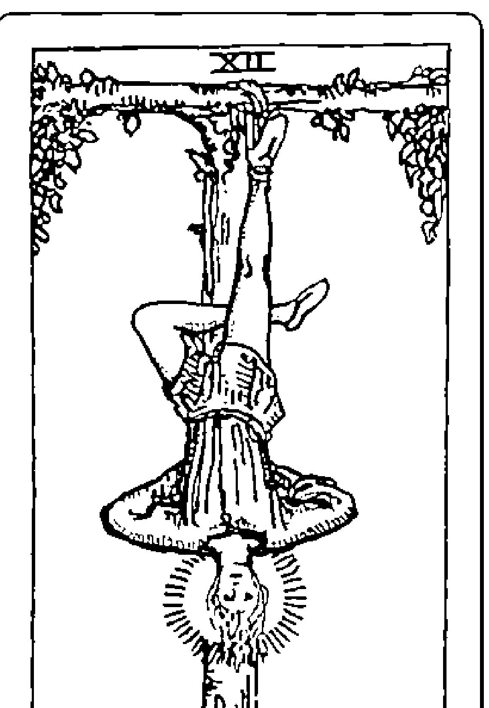

## 吊人正位

### 人物特性

### 基本性格

這是一個很獨立的人，能從不同的觀點來看事情，因此具有遠見及卓越的看法，遇到問題時有充足的耐力來處理。

### 感情觀

在感情當中比較被動，不會主動去追求自己想要的東西，也常安於自己在感情當中的角色及處境，不會想要改變。

### 金錢觀

對於金錢的處理並不拿手，所以通常是以不變應萬變，在財務上走傳統保守的路線，也不熱衷於追求物質的享受。

### 家庭觀

在家中是屬於比較特立獨行的角色，但是仍然與大家都保持不錯的關係，如果家中遇到了困難也會願意承擔下來。

### 一、空窗篇－無對象

### 沒對象的原因

你目前受制於外在的環境因素，本身也還沒有準備好要開始一段新的感情，所以總是在觀望而沒有任何實際行動。

### 可以改進的地方

你可以試著用不同的觀點來看待感情，不要被過去的經驗和觀念所限制，有時候只要轉個彎就可以有感情的機會。

### 身邊是否有好對象

目前你的身邊並沒有好的感情對象，即使有一些人對你有意思也不符合你本身的期待，所以最好還是再等一陣子。

### 可能找到對象的管道

也許你需要先休息一陣子，不要把自己逼得那麼緊；同時可以去嘗試新鮮的事物，也許在過程中就會找到新對象。

### 二・曖昧篇－有對象但不確定

如何看待對方

這是一個看法觀點與眾不同的人，身邊也不是有很多朋友，但是對人非常好，相處的時候常會感覺到關心與溫情。

心中是否有別人

他目前的心中並沒有別人，但是有其他很多的事情牽絆住，所以沒有花心思在感情上，這個時候也不太想談感情。

可能有哪些阻礙

兩個人都只是在原地觀望，而沒有任何一個人要採取主動，如果這種狀況持續下去，感情當然就不會有任何進展。

如何告白容易成功

這個時候太主動積極反而會把對方嚇到，還不如先多為對方製造機會，等到時機成熟對方自然就會主動向你告白。

### 三・相處篇－有明確對象

日常相處狀況

兩個人的相處目前被一些狀況卡住，如果想要繼續下去就必須要有所犧牲，但是雙方對於要如何調整還沒有共識。

金錢與價值觀

兩個人有時候會被金錢的問題給卡住，但是雙方都無力解決這些困難，只能暫時先忍耐，再看看事情有沒有轉機。

彼此心靈契合

兩個人都覺得在關係上有些停滯，似乎有一些無法克服的問題正浮現出來，但是又還沒找到明確可行的解決方案。

講話溝通方式

兩個人的觀點似乎存在許多差異，以致於常會在溝通的時候卡住，不要被表面的問題所蒙蔽，才能找到解決方案。

性的吸引力

兩個人之間有滿強的性吸引力，但是有很大的一部分是自己想像出來的，如果不能把想像實現可能會感覺更失望。

與對方家人的關係

你覺得在對方家人面前比較弱勢，常常需要配合他們的狀況做出讓步和犧牲，但很多時候都是自己願意這樣做的。

繼續發展的前景

這段關係的未來雖然外表看起來穩定，但是雙方對於這段關係的看法可能會有所改變，在本質上也許會有所不同。

### 四・危機篇

### 是否出現第三者

兩個人的關係當中並沒有出現第三者，但是仍然指出有其他很多的挑戰和困難，所以在感情關係上就很容易卡住。

### 發生爭吵的問題點

兩個人的關係面臨考驗，主要是對於如何處理問題雙方有不同的看法，在達到共識之前無法採取任何有效的行動。

### 如何化解紛爭

你們需要的是一個全新的觀點，因為想法改變狀況也就改變了，至於實際生活上的調整，反而不是最重要的事情。

### 提出分手的方法

現在立刻提出分手並不能解決問題，應該還會再拖一陣子，所以不如等狀況改變之後，再提出分手才能一次解決。

### 複合的可能性

現在其實感覺上也不像分開的樣子，但是要複合也沒有那麼容易，也許會在現狀上卡一陣子，即使主動也沒有用。

## 吊人逆位

### 人物特性

**基本性格**
是一個比較缺乏主見的人，遇到問題時通常會選擇逆來順受，雖然是有很大的包容性，但有時候會過於委屈自己。

**感情觀**
在感情上會想要主動付出，有時候會為了對方而犧牲自己，但事後又覺得不甘心，比較難在感情當中找到平衡點。

**金錢觀**
在處理金錢方面的事務考慮得很多，同時也會比較傾向自私自利的想法，但是在投資理財方面常會犯嚴重的錯誤。

**家庭觀**
在家中比較沒有自己的意見，同時與家人的關係都比較疏離，即使在外面遇到什麼問題，也不會回來向家裡求援。

### 一、空窗篇－無對象

**沒對象的原因**
你對生活當中大小事情都可以自立自強，所以並沒有很強的感情需求，同時也還沒有想清楚自己要什麼樣的對象。

**可以改進的地方**
對感情的事情應該要有自己的看法，千萬不要人云亦云，只有先想清楚自己的需求，才可能出現適合的感情對象。

**身邊是否有好對象**
目前在你的身邊並沒有好的感情對象出現，來的都只是一些想要交朋友的人，並不會特別想要把你當成感情對象。

**可能找到對象的管道**
這個時候適合多觀察而非行動，所以也許可以參加一些單身者的聯誼活動，在當中交換心得以及獲取相關的經驗。

### 二・曖昧篇－有對象但不確定

如何看待對方

這是一個很低調的人，在人群之中不太有自己的聲音，在相處的時候會感覺到他的孤單，同時有一點缺乏行動力。

心中是否有別人

目前在他的心目中並沒有其他感情對象，同時他對於感情生活也不是很渴望，也許需要花很大的力氣才能打動他。

可能有哪些阻礙

兩個人都只會考量自己的需要，但是都不太會為對方著想，如果繼續保持這樣的心態，在感情上就不容易有進展。

如何告白容易成功

這並不是適合告白的時機，貿然行動並不會有什麼好的結果，也許需要再等一陣子，或是先聽聽親朋好友的意見。

### 三・相處篇－有明確對象

日常相處狀況

兩個人在相處上遇到重大的問題，如果不能先有正確的認識就無法有適當的行動，感情可能因此陷入破裂的危機。

金錢與價值觀

兩個人在金錢問題上不容易有共識，在價值觀上也有明顯的差異，如果不能坐下來好好溝通，就常會因此而爭吵。

彼此心靈契合

彼此都覺得在這段關係中犧牲很多，但是並沒有得到應有的回報，也許雙方都會覺得不甘心而想要再繼續撐下去。

講話溝通方式

兩個人常會陷於自說自話的狀況，無法達到有效的溝通，即使可以理解對方的意思，往往也很難同意對方的觀點。

性的吸引力

其實你在性關係上很吸引對方，只是對方不知該如何回應和表達，如果兩個人就卡在這裡，就浪費了一段好姻緣。

與對方家人的關係

你可以融入對方的家庭當中，但是有時候仍然會覺得委曲或不值得，如果能涉入較少的事務，關係也許會比較好。

繼續發展的前景

這段關係的繼續下去並不會有很大的進展，存在的問題還是不會被解決，最重要的還是先把自己的日子過好再說。

### 四、危機篇

### 是否出現第三者

這個關係當中並沒有第三者出現，但是也許兩個人都累積了一些不滿，需要一些空間來透透氣，可能會比較疏離。

### 發生爭吵的問題點

雙方爭吵的點在於兩個人都覺得對方自私自利，如果沒有任何一方要先讓步，那麼狀況很可能就會一直卡在這裡。

### 如何化解紛爭

在這件事情上你必須要先道歉，甚至是作出某些重大讓步，否則對方若是不和你善了，這件事情可能就變成無解。

### 提出分手的方法

除非遠走他鄉避不見面，否則不論如何是無法分手成功的，與其花那麼大的力氣沒有成果，還不如先等一等再說。

### 複合的可能性

這段感情結束其實對你來說是一種解脫，實在沒必要再回頭去想這個人，你應該往未來看，而不是被這個人卡住。

### 塔羅愛情占卜的牌義

- 大阿爾克納
- 權杖
- 聖杯
- 寶劍
- 錢幣
- 宮廷

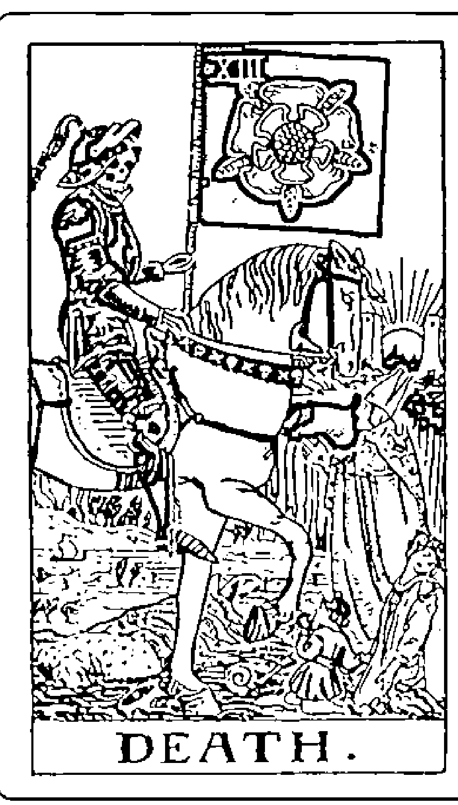

## 死神正位

### 人物特性

### 基本性格

具有強烈的意志力，不論遇到任何艱難打擊都能冷靜以對，同時也有自我隱藏的特質，並不太喜歡別人打探隱私。

### 感情觀

也許是因為在感情上經歷過分分合合，對於情感方面的事情已經不抱任何期望，同時也不相信自己可以得到幸福。

### 金錢觀

對於投資理財方面極有天份，但是花錢方面仍然十分謹慎，除了很好的朋友以及情人，大部分的人都覺得他小氣。

### 家庭觀

可能由於家中曾經遭逢巨變，對於處理家庭關係格外小心翼翼，雖然平時會想得很多，但是表現出來會比較孤僻。

### 一、空窗篇－無對象

### 沒對象的原因

你給別人的感覺太過冷漠，或是仍然在之前的感情傷痛當中走不出來，缺乏正向的力量自然很難有好的感情對象。

### 可以改進的地方

你應該放掉過去一些不好的習慣，在生活和感情上都要下定決心除舊佈新，讓自己完全重新出發就會有好的機會。

### 身邊是否有好對象

目前你的身邊並沒有好的對象，即使有人追求也只是來傷害你的人，所以除非能換個環境，否則就很難有所突破。

### 可能找到對象的管道

這個時候應該揚棄之前所有的經驗，用各種不同的方式及管道找尋感情對象，如果還是因循苟且就不可能有進展。

### 二・曖昧篇－有對象但不確定

如何看待對方

這是一個愛恨分明的人，對於許多事情有自己主觀的判斷，在相處上會感覺到有殺氣，同時讓人覺得不容易親近。

心中是否有別人

他目前心中沒有其他人，雖然可能還陷於之前的感情傷害當中，但是已經知道彼此沒有希望，也開始試著走出來。

可能有哪些阻礙

也許兩個人都想有所進展，但是觀念與想法目前還缺乏共識，如果彼此相處的模式固定不變，關係就不會有進展。

如何告白容易成功

這時候告白可能有不良影響，反而會使對方極力想要擺脫你，也許需要先維持住現狀，等之後狀況有所改變再說。

### 三・相處篇－有明確對象

日常相處狀況

兩個人的相處面臨重大的改變，如果不能適應新的狀況，很可能會使關係面臨結束的危機，應該加快調整的腳步。

金錢與價值觀

兩個人的財務也許會面臨重大的危機，甚至金錢問題可能成為分手的導火線，處理不好的話還可能因此背負債務。

彼此心靈契合

兩個人都覺得關係需要改變，維持現狀對彼此來說都太痛苦，或許分手會是一種解脫，只是還沒有做最後的決定。

講話溝通方式

兩個人的講話方式都讓對方覺得受傷，所以彼此之間會有一點逃避溝通，也許雙方都在心裡藏了很多話不講出來。

性的吸引力

這段關係當中有極強的吸引力，彼此也無法放下對性愛的需求，可能因為性關係而把兩個人的感情帶入新的階段。

與對方家人的關係

與對方家人的關係會造成彼此重大的考驗，如果不能順利通過這個關卡，也許就會變成分手的局面，要小心處理。

繼續發展的前景

這個關係未來將會面臨危機，也許會發生嚴重的爭吵，也可能變成冷戰的局面，不論如何關係都會有重大的轉變。

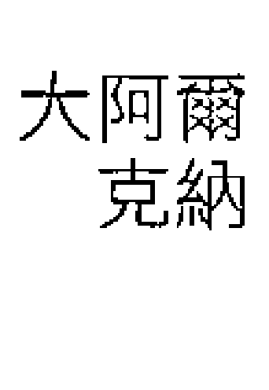

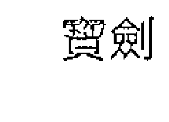

### 四・危機篇

### 是否出現第三者

兩個人之間可能會出現第三者，雖然兩個人的關係本來就有一些狀況，但第三者的問題有可能成為分手的導火線。

### 發生爭吵的問題點

發生爭吵的問題點在於非黑即白的想法，缺乏模糊與包容的空間，遇到事情就想判定誰對誰錯，可能會造成傷害。

### 如何化解紛爭

在這時候兩個人都需要空間，先讓彼此先冷靜下來，如果急著逼迫對方作決定，那麼可能會讓衝突一發不可收拾。

### 提出分手的方法

只要任何一方提出分手，這段關係應該就結束了，因為兩個人的關係已經無法維持下去，還是分開會比較好一點。

### 複合的可能性

這段關係已經完全不可能複合，兩個人也許就從此不再見面，而且也不會再有任何關係，還是早點死了這條心吧！

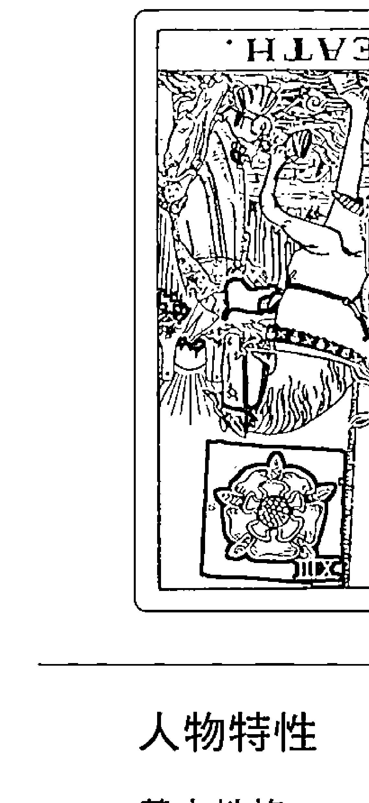

## 死神逆位

### 人物特性

### 基本性格

比較缺乏意志力與決斷力，面對各種困難的狀況常會覺得自己無能為力，但往往拖延不處理只會讓事情越來越糟。

### 感情觀

是一個念舊情的人，很容易就陷入過去感情的回憶當中跳不出來，也可能因為感情上的舊傷而不願意接受新對象。

### 金錢觀

並不善於處理金錢的問題，也不太有投資理財的觀念，常會在不知不覺中把錢花光，事後檢討也不知道花去哪裡。

### 家庭觀

對於家中的問題並不會積極處理，甚至發生了問題還渾然不知，通常會比較特立獨行，所以連家人也不太了解他。

### 一、空窗篇－無對象

### 沒對象的原因

你還陷在過去感情的回憶當中，並沒有真正忘掉舊情人，如果不能放下過去重新出發，就很難找到新的感情機會。

### 可以改進的地方

即使現在已經有新的對象出現，你自己也無法發現，你必須把自己徹底的改造，才有能力判斷出適合你的新對象。

### 身邊是否有好對象

目前在你的身邊可能會有新對象出現，但是也許會和舊情人有點像，你要小心謹慎才能避免重複發生同樣的錯誤。

### 可能找到對象的管道

從哪裡跌倒就從哪裡爬起來，可以利用先前認識異性的管道再接再厲，只要專注持之以恆，還是可以找到好對象。

### 二、曖昧篇－有對象但不確定

### 如何看待對方

這是一個比較內向的人，對於身邊的事情似乎都漠不關心，相處起來會覺得有一點無趣，有時候像是在對牛彈琴。

### 心中是否有別人

目前他心中還想著之前的感情對象，雖然也許受傷慘重，但是仍然沒有放棄希望，你還有很長遠的道路需要努力。

### 可能有哪些阻礙

兩個人都不想改變現狀，也沒有任何進一步的想法，如果都只是被動地等待對方主動，那麼關係就不會有所進展。

### 如何告白容易成功

其實直接告白是最好的方法，但是也許不會一次就成功，如果真的想要在一起，就要一試再試直到對方接受為止。

### 三、相處篇－有明確對象

### 日常相處狀況

在日常相處上存在許多問題，但是雙方都不想改變自己，如果只是期待對方改變來配合自己，事情就很容易卡住。

### 金錢與價值觀

兩個人有可能在金錢上遇到一些問題，但這並不是單方面可以控制的事情，要處理財務危機需要兩個人同心協力。

### 彼此心靈契合

兩個人都覺得這段感情存在重大的問題，但是雙方又都不想要改變，如果繼續維持現狀的話，關係只會越來越糟。

### 講話溝通方式

兩個人的溝通目前陷入停滯，即使還是有講話也是言不及義，無法造成任何有意義的交流；也有可能完全不講話。

### 性的吸引力

這段關係當中沒有很強的性吸引力，或者是雙方對於性愛都是一知半解，因此性關係不會成為感情中的重要部分。

### 與對方家人的關係

你與對方家人的關係比較疏遠，甚至會對他們有些逃避，雖然保持距離是不錯的方法，但仍然可以試著交往看看。

### 繼續發展的前景

兩人關係未來的發展會陷入困境，即使不會立即產生分手的危險，這段感情也可能名存實亡，對彼此都沒有意義。

## 四・危機篇

### 是否出現第三者

兩個人的關係至此完全僵住，也可能會出現第三者，如果不能好好溝通把問題解決，第三者問題就會成為導火線。

### 發生爭吵的問題點

兩個人發生爭吵的主要問題點，在於彼此對於這段關係都是採取消極的態度，遇到問題不解決自然會越來越嚴重。

### 如何化解紛爭

有些事情就是要裝傻，表現得太聰明反而會讓彼此的關係卡住，只要你能放下這件事情，爭吵自然就會完全化解。

### 提出分手的方法

在這段關係當中主動提出分手的一方會傷得比較重，所以還是由對方來提分手比較適合，這個時候要有耐心等待。

### 複合的可能性

這段感情已經轉化成另一種關係，再也不可能回到感情關係當中，即使雙方可以成為朋友，還是無法再成為情人。

### 塔羅愛情占卜的牌義

- 大阿爾克納
- 權杖
- 聖杯
- 寶劍
- 錢幣
- 宮廷

## 節制正位

### 人物特性

#### 基本性格

算是個性比較溫和的人，除了自己的想法之外，也會考慮到別人的立場，透過溝通整合成大家都可以接受的意見。

#### 感情觀

在感情上比較偏向保守，是可以專情不花心的人，平時就很重視兩個人之間的溝通，並且會努力與對方取得共識。

#### 金錢觀

在金錢上偏向節省，但是真正該花的錢也不會吝嗇，在投資理財上很有天份，會把自己的財產做最有效率的配置。

#### 家庭觀

很重視家人的意見，與家人之間的關係也很和諧，不會強迫別人做他們不願意的事情，比較會透過溝通取得共識。

### 一、空窗篇－無對象

### 沒對象的原因

除了感情的事情之外你還有別的事情要忙，所以並不是想要全心全意投入，如果保持觀望的態度就很難有所進展。

### 可以改進的地方

你的心態還是稍微保守，並不想在感情上受到傷害，如果能夠更勇敢一點主動出擊，應該很快就會有明顯的進展。

### 身邊是否有好對象

目前在你身邊有還不錯的對象，但不一定是你喜歡的類型，如果談談後覺得都不滿意，也可以先等一陣子再說。

### 可能找到對象的管道

你應該多參加朋友的聚會，甚至是直接請朋友們幫你介紹對象，只要能多認識一些異性，一定會有好機會出現的。

## 二・曖昧篇－有對象但不確定

### 如何看待對方

這是一個比較中性化的人，雖然外表看起來陽剛，但是相處起來又可以感覺到溫柔體貼，算是本人會喜歡的類型。

### 心中是否有別人

目前他的身邊有一些對象，但目前都僅止於好朋友的關係，如果你積極努力的話，也許還有機會從當中脫穎而出。

### 可能有哪些阻礙

其實你們的關係很好，但就是太像朋友了，如果不能有進一步的表白與行動，就只能維持像這樣的關係沒有進展。

### 如何告白容易成功

你應該找機會單獨與對方談談，把自己的想法告訴他，雖然不一定當場得到很確定的答案，但是絕對會有效果的。

## 三・相處篇－有明確對象

### 日常相處狀況

兩個人的關係很緊密，在生活模式上也可以彼此配合，遇到問題大多會透過溝通取得共識，算是很好的生活伙伴。

### 金錢與價值觀

兩個人在價值觀上雖然有些許不同，但是在金錢的使用上，大部分都可以獲得共識，並不會為了用錢的事情爭吵。

### 彼此心靈契合

兩個人的感情十分緊密，是屬於互補而非相似的類型，即使在相處上遇到任何問題，也都可以彼此體諒互相照顧。

### 講話溝通方式

兩個人雖然在觀念上不盡相同，但卻可以說是無話不談，所以即使彼此間有很多不同的想法，也不會因此而爭吵。

### 性的吸引力

這段關係中有滿強的性吸引力，不過兩個人都克制在符合道德的範圍當中，當關係更進一步就會有更多的性生活。

### 與對方家人的關係

你與對方的家人相處得十分融洽，也能互相了解對方的想法和立場，在他們當中就像是自己家人一般的自然和諧。

### 繼續發展的前景

這段關係的前景十分看好，兩個人的關係將會越來越緊密，也正朝向正面的方向發展當中，可以開始討論下一步。

### 塔羅愛情占卜

- 大阿爾克納
- 權杖
- 聖杯
- 寶劍
- 錢幣
- 宮廷

## 四・危機篇

### 是否出現第三者

兩個人之間不可能出現第三者，所有的懷疑都只是誤會一場，只要兩個人能坐下來好好溝通，就不會有任何問題。

### 發生爭吵的問題點

發生爭吵的原因在於彼此的關係太過緊密，任何事情都與對方有關，會讓彼此都感覺到壓力，因此就容易有紛爭。

### 如何化解紛爭

你需要用更和緩的方式與對方溝通，使用溫和的手段再加上表現出願意妥協的態度，才能幫助你們真正化解歧見。

### 提出分手的方法

如果要分手的話一定要彼此之間有共識才行，所以應該展開一連串的談判，在談判成功之前兩個人還算是在一起。

### 複合的可能性

這段關係還存在一部分複合的可能性，但是要雙方共同努力去解決問題才有可能再在一起，並不是很容易的事情。

## 節制逆位

### 人物特性

#### 基本性格

是一個比較情緒化的人，也很容易因為別人的影響而失去自己的立場，有時候對於自己不了解的事情會過於樂觀。

#### 感情觀

在感情上比較不切實際，可能會選擇為愛而付出一切，但若得不到回報又會非常氣憤，而且經常會有極端的舉動。

#### 金錢觀

有些時候會過於節省，但有時候又過於浪費，對於自己的資產常常沒有務實的規劃，甚至搞不清楚自己有多少錢。

#### 家庭觀

與家人的關係並不親近，甚至常常會陷於緊張氣氛當中，也許彼此之間有利益衝突，或是曾經有合作失敗的經驗。

### 一、空窗篇－無對象

### 沒對象的原因

你對感情的事情常常是一廂情願，但是從來不考慮別人的想法，如果還是只顧自己的感覺，就很難找到新的對象。

### 可以改進的地方

你應該要學會傾聽別人的感受，而不只是主觀地去論斷別人，如果能虛心接受別人的建議，就能更快找到新對象。

### 身邊是否有好對象

目前在你身邊並沒有好的對象，現在出現的人只適合當朋友而不適合當情人，如果勉強挑一個反而可能帶來傷害。

### 可能找到對象的管道

現在不論什麼管道都不容易找到適合的對象，倒不如先想清楚自己對於感情的需求是什麼，這樣才有明確的方向。

## 二・曖昧篇－有對象但不確定

### 如何看待对方

这是一个比较直接的人，同时并不会考虑到别人的感受，相处时常会觉得有压力，有时候会比较情绪化的反应。

### 心中是否有别人

目前在他的心中并没有其他感情的牵挂，但是似乎也没有真心想谈感情的样子，所以并不是很积极想发展新恋情。

### 可能有哪些阻碍

也许是因为彼此观念或是想法的不同，沟通不良有可能成为两个人进展的最大阻碍，也许会因此而经常发生争吵。

### 如何告白容易成功

这并不是告白的最佳时机，也许对方目前正有其他的事情心烦，所以先多听听他的烦恼就好，太冲动反而会坏事。

## 三・相處篇－有明确对象

### 日常相处状况

两个人在生活习惯上有明显的不同，但是又不願意相互妥协退让，如果双方还是坚持己见，就很可能会造成僵局。

### 金钱与价值观

彼此之间的价值观差别很大，在花钱的方式上也有很明显的不同，如果无法沟通协调就很可能在金钱问题上卡住。

### 彼此心灵契合

两个人都觉得这个关系岌岌可危，也许当初开始就是一个错误，但是又都已经放感情下去，要分开会觉得不甘心。

### 讲话沟通方式

目前有一点沟通不良的状况，在很多事情上无法了解彼此的想法，也会开始有一些争执，对两个人来说都是挑战。

### 性的吸引力

两个人之间有性的吸引力，这也是两个人会在一起的重要原因，不过因为属于冲动的结合，也可能带来一些问题。

### 与对方家人的关系

你与对方的家人关系并不密切，甚至在很多事情上可能会有冲突，所以还是距离远一点比较安全，以免爆出火花。

### 继续发展的前景

这段关系的前景并不看好，但在彼此想清楚之前还不会分手，所以最好预先做最坏的打算，到时才不会太伤心。

## 四・危機篇

### 是否出現第三者

兩個人之外可能曾經出現過第三者，但是維持的時間並不長，關係也不是很深，所以不會對你們的感情造成困擾。

### 發生爭吵的問題點

發生爭吵最大的問題在於溝通不良，兩個人都沒有真心地傾聽對方的想法，只是在自說自話，當然就會發生爭執。

### 如何化解紛爭

這個時候應該將處理事情的速度放慢，有耐性地和對方討論下去，把對方從情緒化的狀況中拉出來才能解決問題。

### 提出分手的方法

只要有任何一方提出分手，兩個人的關係就算是結束了，最好是利用電話或是信件提出，不要面對面談這件事情。

### 複合的可能性

這段關係並不太可能複合，感情已經完全破裂了，離開這個人對你來說是一個正確的決定，沒有必要再為難自己。

### 塔羅愛情占卜

- 大阿爾克納
- 權杖
- 聖杯
- 寶劍
- 錢幣
- 宮廷

## 惡魔正位

### 人物特性

#### 基本性格

是在性格上比較激烈的人，往往為了達到目的不擇手段，即使表面上看起來十分誠懇，其實內心是在打其他主意。

#### 感情觀

對於感情並不信任，常常把感情當成手段而非目的，即使在戀愛當中也很難感受到愛，但是又不能缺乏感情對象。

#### 金錢觀

是一個非常重視金錢的人，會願意為了金錢而犧性其他的事情，但是也可能因為過於貪心，而在投資理財上失利。

#### 家庭觀

與家人之間的關係並不好，雖然有可能在表面上相親相愛，但是骨子裡卻是在算計對方，也很難感受到家人的愛。

### 一、空窗篇－無對象

### 沒對象的原因

你目前只是抱持著想要玩玩的心情，並不想發展穩定的關係，甚至怕對方太認真，當然就很難吸引到真心的對象。

### 可以改進的地方

你太重視感情對象的外在因素，而忽略了真心誠意才是感情最堅實的基礎，要把感情本身當成目的而非一種手段。

### 身邊是否有好對象

目前在你身邊並沒有好的對象，即使有人表示喜歡你，也必定是心懷不軌另有所圖，最好別在這個時候自找麻煩。

### 可能找到對象的管道

這個時候透過任何管道都很難找到真心誠意的對象，但如果只是要求一時的安慰，也可以到夜店等聲色場所玩玩。

## 二・曖昧篇－有對象但不確定

### 如何看待對方

這是一個野心勃勃的人，對於所有的人事物都有精密的算計，相處起來雖然有壓力，但也可以感覺到特殊的魅力。

### 心中是否有別人

目前在他的心中還有其他人，而且很可能还不只一个人，由于他們之間的關係錯綜複雜，最好不要去淌這個混水。

### 可能有哪些阻礙

彼此之間都有強烈的慾望，但是都沒有想要發展成長久穩定的關係，而且在兩個人之外也還可能有第三者的阻礙。

### 如何告白容易成功

目前告白一定會遭到失敗的命運，也許還有其他小人暗中破壞，所以這個時候一動不如一靜，再等待更好的時機。

## 三・相處篇－有明確對象

### 日常相處狀況

兩個人相處上常常會遇到爭吵，因為彼此都想要控制對方，但是又無法讓對方乖乖就範，就變成爾虞我詐的狀況。

### 金錢與價值觀

兩個人對於金錢都很執著，也會想要利用到對方的錢，但是這種互相利用的關係並不會持久，也很容易發生衝突。

### 彼此心靈契合

彼此之間都覺得這只是一段短暫而刺激的關係，也沒有要長久經營的想法，所以兩個人都抱持著及時行樂的心態。

### 講話溝通方式

兩個人看似有在溝通，其實當中存在許多的虛偽與欺騙，由於背後都是另有所圖，所以對方講的話也不能太相信。

### 性的吸引力

這段關係中只剩下性的吸引力，也是兩個人發洩慾望和情緒的管道，但是這種關係已經沒辦法讓人感覺到溫暖了。

### 與對方家人的關係

你與對方家人的關係並不好，處處都覺得他們想要利用你，如果想進一步發展關係，家人會成為你們之間的阻礙。

### 繼續發展的前景

這段關係只有現在而沒有未來，繼續發展下去必然走向滅亡的道路，彼此之間的衝突並不是任何一方可以化解的。

### 塔羅愛情占卜的意義

| 大阿爾克納 | |
|---|---|
| 權杖 | |
| 聖杯 | |
| 寶劍 | |
| 錢幣 | |
| 宮廷 | |

## 四・危機篇

### 是否出現第三者

這段關係當中很可能出現第三者，而且對方是有意介入你們之間搞破壞，即使小心防範仍然會造成很大的殺傷力。

### 發生爭吵的問題點

目前發生爭吵的問題主要在於想要控制對方的慾望，如果希望把自己的意志強加在對方身上，就很難不發生衝突。

### 如何化解紛爭

問題已經不是兩個人可以解決的了，這時候再勉強溝通也是吵得更兇而已，最好是不要見面，以免發生暴力事件。

### 提出分手的方法

其實兩個人已經算是分開了，談或不談只是一個形式而已；但最好仍然要找時機就把事情談一談，做個正式結束。

### 複合的可能性

這段關係完全沒有復合的可能性，想再和他在一起只是自己找罪受而已，要趕快離開這個人才能讓你看清楚真相。

## 惡魔逆位

### 人物特性

**基本性格**
是一個意志力不堅定的人，常常會因為外在人、事、物的誘惑而改變自己的想法，並不存在自己核心的價值信念。

**感情觀**
容易受到外貌或是對方的家世財產所吸引，但是遇到更帥、更美、更有錢的就會見異思遷，並不是真心喜歡對方。

**金錢觀**
重視金錢之外同時也很重視物質的享受，喜歡花錢去買一些精品和奢侈品，甚至可能為了錢做出違法亂紀的事情。

**家庭觀**
家中可能曾經為了金錢或財產而發生爭執，或是有其他的利益衝突，所以整體來說與家人的關係比較表面和疏離。

### 一、空窗篇－無對象

**沒對象的原因**
你害怕感情可能帶來的束縛，所以不敢太過投入，但是如果一直只在外圍觀望，就無法找到真心相待的感情對象。

**可以改進的地方**
你在感情上太過三心二意，缺乏比較明確的想法，也還沒有鎖定特定的目標，要集中全力在一個人身上才有可能。

**身邊是否有好對象**
目前在你的身邊並沒有好的對象，但是可能會出現一些危險的感情誘惑，也許對方只是想要玩玩或是利用你而已。

**可能找到對象的管道**
這時候很難找到好的感情對象，反而可能出現一夜情的機會或仙人跳的陷阱，所以最好是遠離誘惑才能明哲保身。

## 二・曖昧篇－有對象但不確定

### 如何看待對方

這是一個搖擺不定的人，很多事情都沒有自己的主見，在相處的時候會感覺到隱藏的情緒，但是又不會正面表達。

### 心中是否有別人

目前在他的心中還有其他人，但是本人也還很搖擺不定，如果他還沒有想要定下來的想法，再怎麼努力也是白費。

### 可能有哪些阻礙

這段關係還有第三者的存在，甚至還不只有一個人，如果兩個人都還有其他考量的人選，要在一起就比較不容易。

### 如何告白容易成功

這個時候告白很不容易成功，除非使用色誘或利誘的手段，只是用這些方法就算成功了，感情也很難穩定地發展。

## 三・相處篇－有明確對象

### 日常相處狀況

兩個人相處時遇到許多問題，總是有許多地方無法配合，但是又找不到解決的方案，有常常需要遷就對方的感覺。

### 金錢與價值觀

在兩個人的關係當中，金錢問題常常會成為爭議的焦點，彼此都覺得對方付出太少，但是自己也不願意付出更多。

### 彼此心靈契合

兩個人都覺得這段關係帶來很多的限制和束縛，有時候必須為了對方的事情而犧牲自我，想逃開又沒辦法放得下。

### 講話溝通方式

兩個人之間陷入溝通不良的狀況，最主要是因為彼此都只為自己的利益著想，甚至為利益的考量已經超過了感情。

### 性的吸引力

這段關係當中有很強的性吸引力，也是兩個人仍然在一起的主因，但是性的吸引力反而讓兩個人覺得是一種束縛。

### 與對方家人的關係

你最好與對方的家人保持安全距離，太過靠近可能會讓你感受到很大的壓力，也可能陷入被利用或被控制的狀況。

### 繼續發展的前景

兩個人接下來可能要面對相互欺騙與激烈的爭吵，也許會對彼此造成重大的傷害，所以要小心處理避免問題擴大。

## 四・危機篇

### 是否出現第三者

這段感情可能會出現第三者，而且雙方都可能面對到其他人的誘惑，要堅定立場不出軌將會變成很困難的一件事。

### 發生爭吵的問題點

兩個人發生爭吵的問題點在於責任的劃分，彼此都覺得對方應該要付出更多，當要求的超過太多就容易造成衝突。

### 如何化解紛爭

兩個人都無法看清真相，再談也是沒有用的，應該回到兩個人相愛的原點，重新去考慮兩個人的關係到底是什麼。

### 提出分手的方法

現在要分手也無法立刻達成目的，也許應該要先冷靜一陣子，等兩個人的情緒都過去之後，再找機會談這件事情。

### 複合的可能性

如果兩個人只想互相控制而沒有真心，即使複合也不會幸福，看清兩個人真正的關係，你就不會每天想要複合了。

## 塔牌正位

### 人物特性

#### 基本性格

是一個自視甚高的人，常會為了面子問題而堅持自己的做法，即使明知道自己的想法有錯誤也不願意讓步或改變。

#### 感情觀

在感情上比較強勢，總覺得自己是對的，因此常常會忽略對方的想法和感受，也會用比較激烈的方式來處理事情。

#### 金錢觀

可能是出現大筆的意外支出，或是因為不善理財而出現虧損的狀況，在財務上比較緊縮，即使想慷慨也無能為力。

#### 家庭觀

對家中的狀況有許多不滿，也可能會發生嚴重的衝突，即使家人再怎麼勸告，也不會在意別人的想法而一意孤行。

### 一、空窗篇－無對象

### 沒對象的原因

你目前生活上遇到重大的變局，實在無心於感情方面的事情，即使出現了適合的對象，也很難發展出穩定的關係。

### 可以改進的地方

你要先把自己的生活安定好，要先有穩定的生活才會有穩定的感情，如果是過一天算一天的話就很難找到好對象。

### 身邊是否有好對象

目前在你的身邊並沒有好的對象，來的都是會傷害你的人，而且關係都不會長久，所以暫時不要談感情比較安全。

### 可能找到對象的管道

目前不論任何管道都很難找到好的對象，除非你願意改變自己的想法，去嘗試之前很排斥的管道才有一點點可能。

## 二・曖昧篇－有對象但不確定

### 如何看待對方

這是一個天不怕地不怕的人，但是做事情往往會比較衝動，也不會考慮到別人，所以相處起來會覺得不太受尊重。

### 心中是否有別人

目前在他的心中沒有任何人，而且也完全不想要談感情，如果想要和他發展進一步關係，也許會被拒於千里之外。

### 可能有哪些阻礙

目前在環境上有很大的阻力，並不是你們任何一個人可以解決的，即使兩個人都努力想要克服，也很難跨越界線。

### 如何告白容易成功

這時候不論怎麼告白都不會成功，只是讓對方知道你對他有意思也可能造成彼此關係的倒退，此時一動不如一靜。

## 三・相處篇－有明確對象

### 日常相處狀況

兩個人的日常相處完全無法配合，而且當中存在許多的矛盾之處，如果硬要去解決的話，會造成兩敗俱傷的結果。

### 金錢與價值觀

兩個人在金錢上遇到了重大的問題，已經超出你們本身可以處理的範圍，即使決定分手也可能會留下債務或陰影。

### 彼此心靈契合

彼此都覺得這是一段沒有結果的感情，即使真心想在一起也註定要分開，現在付出越多只會讓未來分開時更痛苦。

### 講話溝通方式

兩個人溝通時會比較衝，一言不合可能就會大吵一架，即使事過境遷覺得後悔，也很難放下面子問題向對方道歉。

### 性的吸引力

這段關係當中並不存在性吸引力，甚至可能有一方或雙方有性功能障礙，不良的性生活也會成為這段關係的阻礙。

### 與對方家人的關係

你與對方家人的關係並不和睦，常常覺得他們在找你的麻煩，有時也會做一些無理的要求，讓你不知道該怎麼辦。

### 繼續發展的前景

這段關係繼續下去也只會走向毀滅，不可能有好的結果，如果還是堅持不願意放棄，就會讓彼此的痛苦延續下去。

### 塔羅愛情占卜

- 大阿爾克納
- 權杖
- 聖杯
- 寶劍
- 錢幣
- 宮廷## 四、危機篇

### 是否出現第三者

兩個人之間雖然沒有第三者，但是其他還有更大的阻礙，如果不能小心處理，就可能對彼此都會造成很大的傷害。

### 發生爭吵的問題點

兩個人爭吵的原因千頭萬緒，也不是一時之間可以釐清的，現在只是把以前積壓的所有問題，一次爆發出來而已。

### 如何化解紛爭

現在任何爭吵都可能造成毀滅性的後果，想要挽回這段關係變得十分困難，也許分開一陣子是兩個人唯一的選擇。

### 提出分手的方法

只要任何一方不再堅持，這段關係就已經算是結束了，再撐下去也沒有任何意義，所以只要寫個信告訴他就好了。

### 複合的可能性

分手已經是這段關係註定的結果，任何想要複合的努力都只是白費力氣而已，兩個人的感情是不可能繼續下去的。

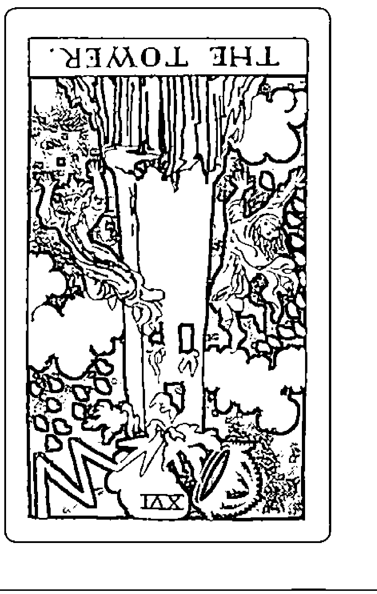

## 塔逆位

### 人物特性

### 基本性格

是一個比較悲觀的人，常會覺得自己過著悲慘痛苦的日子，也會因此經常自怨自艾，還不時會有杞人憂天的擔心。

### 感情觀

也許是曾經在感情上受過嚴重的傷害，老是會覺得自己不夠好或是配不上好的對象，有點缺乏自信而不敢作決定。

### 金錢觀

常常覺得有財務上的壓力，同時在內心深處一直認為自己不可能有錢，所以即使出現賺大錢的機會也不敢去把握。

### 家庭觀

與家人之間的關係非常差，甚至有可能成為心結或痛苦的來源，對於家人無法信任，所以會造成比較孤立的現象。

### 一、空窗篇－無對象

### 沒對象的原因

你還沒有從前一段感情的傷害當中走出來，對感情有一點排斥，再加上沒有主動出擊的自信，就很難有新的感情。

### 可以改進的地方

你應該要對自己更有信心，不要老是覺得自己配不上對方，只要能克服心裡的恐懼，就很容易找到新的感情對象。

### 身邊是否有好對象

你目前身邊並沒有好的對象，現在已經在你四週的人都不適合你，所以如果選擇開始的話，就會變成短暫的關係。

### 可能找到對象的管道

目前任何管道都不可能讓你找到好對象，能找到的也並不是非常適合你，所以還是再等一陣子不要衝動地談感情。

### 二、曖昧篇－有對象但不確定

### 如何看待對方

這是一個比較缺乏自信的人，對於很多事情都不敢做決定，甚至會讓人覺得比較膽小，相處時會感覺到他的不安。

### 心中是否有別人

目前在他心中可能還惦記著之前的感情對象，但是他們已經完全不可能在一起了，所以只要你努力還是有機會的。

### 可能有哪些阻礙

兩個人都不是非常確定彼此的心意，也都不願意主動積極去爭取，如果兩個人都在原地踏步，關係就不會有進展。

### 如何告白容易成功

目前去告白很不容易成功，除非你能克服心中的恐懼，勇敢地當面向對方表達你的愛意，但也不一定會得到答案。

### 三、相處篇－有明確對象

### 日常相處狀況

兩個人各自的生活都是一團亂，所以完全無法顧及到對方的需要和感受，要先把自己的生活處理好再來想其他的。

### 金錢與價值觀

兩個人在價值觀上有明顯的差異，所以很可能會為了金錢的事情爭吵，如果不小心處理的話會變成分手的導火線。

### 彼此心靈契合

兩個人都覺得這段感情帶來許多的擔心和痛苦，也不想繼續下去，如果能結束這段感情對彼此來說都是一種解脫。

### 講話溝通方式

兩個人都不太願意把內心的話講出來，所以溝通上就無法深入，由於不夠了解對方就容易產生一些不必要的爭執。

### 性的吸引力

這段關係當中性生活並不重要，兩個人之間也沒有太多性的吸引力，即使有性生活也不會對這段感情有任何影響。

### 四、危機篇

### 是否出現第三者

這段關係並沒有出現第三者，但是你的擔心害怕已經有一點過度了，一直在懷疑與質疑對方只會對感情造成傷害。

### 發生爭吵的問題點

兩個人目前都還在生悶氣，但是又不把自己真正的想法講出來，在缺乏真誠溝通的狀況之下，自然就會發生爭吵。

### 如何化解紛爭

現在爭吵已經流於意氣之爭，兩個人只是爭一口氣，而沒有是非對錯的問題，因此只要有一方先低頭就會有轉機。

### 提出分手的方法

這段關係本來就在危險邊緣，只要提分手關係就會結束，但最好不要當面提出，以免對方因羞憤而發生暴力事件。

### 複合的可能性

這段關係已經被徹底破壞，也不存在任何感情的基礎，所以即使想複合也只是空想而已，未來不可能繼續在一起。

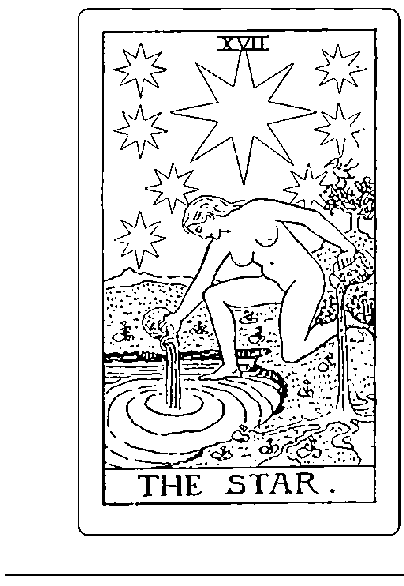

## 星星正位

### 人物特性

### 基本性格

是一個真誠又獨立的人，能夠信任他人同時能與他人分享自己的想法，不論在任何狀況下都可以保持自己的理想。

### 感情觀

十分願意為對方付出，但是並不喜歡被對方束縛，對於感情的事情可以很理性地分析，同時又不失感性面的表現。

### 金錢觀

對於金錢並不是很執著，反而能看到金錢真正的價值，該花錢的時候絕不吝嗇，也會以金錢幫助其他有需要的人。

### 家庭觀

與家人能夠坦誠地相處，也不吝於分享自己的東西，因此能與大家都保持良好的關係，但是仍然不失自己的看法。

### 一、空窗篇－無對象

### 沒對象的原因

也許你花了太多時間和精力在朋友身上，所以沒有全心全意地投入感情，把自己的力量分散開來就不容易有成果。

### 可以改進的地方

你對於感情有太多想法，但是往往缺乏實際的行動，如果真的遇到自己心動的對象，還是應該主動出擊才是上策。

### 身邊是否有好對象

目前在你的身邊有不錯的對象，但並不一定是你所喜歡的類型，只要鎖定特定目標努力，很快就可以發展新戀情。

### 可能找到對象的管道

這時候朋友很有可能介紹你好對象，所以平時應該多參加朋友的聚會才是；透過網路交友則是另一個可能的管道。

### 二、曖昧篇－有對象但不確定

### 如何看待對方

這是一個好人，不但待人十分和善親切，也樂於與別人分享，相處上覺得舒服而沒有壓力，會想要更進一步發展。

### 心中是否有別人

目前在他的心中也許還有其他人，但是也都只是在朋友關係的層次，如果你能夠把握機會主動，也許有機會出線。

### 可能有哪些阻礙

兩個人的關係像是很好的朋友，但是感情過於平淡而缺乏激情，如果沒有人去主動突破，關係就會一直維持現狀。

### 如何告白容易成功

這個時候要勇於表達自己的想法，像是朋友聊天一般很自然地把自己的心意說出來，太過刻意安排反而會很尷尬。

### 三、相處篇－有明確對象

### 日常相處狀況

兩個人的相處十分融洽，常常能夠互相幫忙，有付出同時也會得到回饋，有些事情即使不說也可以有不錯的默契。

### 金錢與價值觀

兩個人在價值觀上較為一致，所以不太容易因為金錢的事情吵架，如果遇到財務上的問題，彼此也可以互相支援。

### 彼此心靈契合

這是一段令人充滿期待的真感情，兩個人對未來都有很多的理想和計劃，也會希望能夠和對方一起去實現這些夢想。

### 講話溝通方式

兩個人的溝通十分直接，可以毫無保留地把心裡的話說出來，雖然有時候會比較尖銳，但是可以充份地了解對方。

### 性的吸引力

這段關係當中並沒有很強的性吸引力，但是會有不錯的性生活，兩個人會重視生活情趣，性生活只是其中一部分。

### 與對方家人的關係

你與對方家人的關係很良好，甚至會像朋友一樣的親近，你會願意對他們付出，同時也可以得到他們真心地回報。

### 繼續發展的前景

這段關係發展的前景看好，是屬於比較穩定的狀況，如果兩個人能同心協力繼續下去，很可能會走到最後的結果。

### 四、危機篇

### 是否出現第三者

兩個人當中並沒有第三者，有什麼問題應該是用溝通的方式處理，而不要疑神疑鬼的，有話直說才不會發生誤解。

### 發生爭吵的問題點

發生爭吵的原因在於彼此的期待太高，當然會與現實狀況有落差，如果能夠更務實一點看，事情也許沒那麼嚴重。

### 如何化解紛爭

其實只要把話說清楚了，沒有什麼事情是不能解決的，問題在於誰先開口而已，應該要提出自己的想法和他討論。

### 提出分手的方法

若要兩個人完全不聯絡也不太可能，所以如果要提出分手，也必然是以回復朋友成關係的方式來進行才可能成功。

### 複合的可能性

這段關係能不能複合取決於是之前怎麼談分手的，如果之前是和平談判分手的，現在要和平談判複合就會很容易。

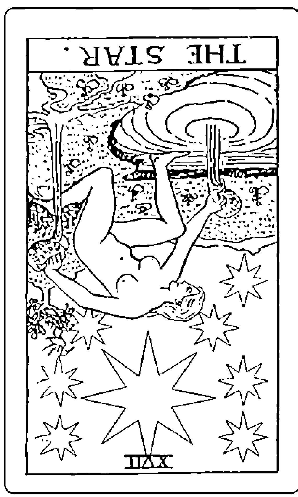

## 星星逆位

### 人物特性

### 基本性格

是一個天真浪漫的人，所以有時候會比較不切實際，對於很多事情都會想得太簡單，去做的時候才發現困難重重。

### 感情觀

在感情方面會願意付出，但是同時也會要求回報，如果事情變成預期之外的狀況，也可能出現比較情緒化的反應。

### 金錢觀

處理金錢方面的事情並不拿手，也不太會積存金錢，基本上是賺多少花多少，甚至有可能搞不清楚自己有多少錢。

### 家庭觀

與家人的關係會比較疏遠，也不太喜歡和家人間有太多交集，即使每天相處的時間很長，家人也都不是很了解他。

### 一、空窗篇－無對象

### 沒對象的原因

你對於感情的事過於保守，也沒有積極主動的想法，如果只是期待別人能主動來追求你，就可能錯過很多好機會。

### 可以改進的地方

你對於感情的想法過於天真，應該要更務實地評估這件事，從實際的層面改善自己的條件，就可以多一些機會。

### 身邊是否有好對象

目前在你身邊也許有不錯的對象，但是他們並不會主動追求你，如果你不自己去發掘這些可能性也很可能會錯過。

### 可能找到對象的管道

這個時候任何管道都不太可能找到好對象，所以只有靠自己努力去碰運氣，如果能積極地認識異性也許會有突破。

### 二、曖昧篇－有對象但不確定

### 如何看待對方

這是一個很特別的人，對於很多事情的想法與看法都與眾不同，但是在相處上會覺得疏遠，不太想談自己的事情。

### 心中是否有別人

目前在他的心中還有另外一個人，即使他也已經知道彼此絕對不可能會在一起，仍然會在他的心中佔有一席之地。

### 可能有哪些阻礙

雖然彼此都對這段關係有所期待，但是很可能只停留在空想的階段，如果兩個人都沒有行動，關係就不會有進展。

### 如何告白容易成功

目前告白很不容易成功，因為對方很難接受關係的轉變，所以最好是從朋友關係開始，等感情更緊密之後再告白。

### 三、相處篇－有明確對象

### 日常相處狀況

兩個人的相處十分平淡，有一點缺乏情人之間的熱情，如果自己抱持著太高的期待，也許就會有一點受傷的感覺。

### 金錢與價值觀

兩個人在價值觀上並不相同，但是也不太會因為錢的事情起衝突，在缺乏共識的狀況之下最好在財務上各自獨立。

### 彼此心靈契合

彼此都覺得這段關係有點平淡無味，兩個人與其說是情人，還不如說是好朋友的感覺，只是彼此之間多了點責任。

### 講話溝通方式

兩個人在講話時都有所保留，所以很難達到充份完全的溝通，也可能一言不合就吵起來，變成比較情緒性的衝突。

### 性的吸引力

這段關係當中性的吸引力並不強，甚至可以說是沒感覺，也許兩個人的相處會比較像不帶有性別差異的朋友角色。

### 與對方家人的關係

你與對方家人的關係並不親近，如果不是覺得有一種義務，也不會想要和他們有任何交集，只能維持表面的關係。

### 四、危機篇

### 是否出現第三者

雖然在兩個人之間並沒有第三者，但是也許對方的心思已經飄到其他地方去，並不是很用心在經營這段感情關係。

### 發生爭吵的問題點

兩個人爭吵發生最主要的原因在於期待太高，但是實際上關係並沒有想像中好，當中的落差就有可能會造成衝突。

### 如何化解紛爭

很多的爭吵其實都是想像出來，也沒有什麼具體的事件，只要兩個人可以把問題釐清，就會發現一切都只是誤會。

### 提出分手的方法

距離是這段關係最大的殺手，如果能夠完全避不見面、相應不理，對方在完全沒有回應的狀況下也許會願意放手。

### 複合的可能性

這段關係其實不太可能復合，一切都是你自己想像出來的，所以只要你能務實的評估，就會發現兩個人沒有未來。

- 塔羅愛情占卜的牌義
- 大阿爾克納
- 權杖
- 聖杯
- 寶劍
- 錢幣
- 宮廷

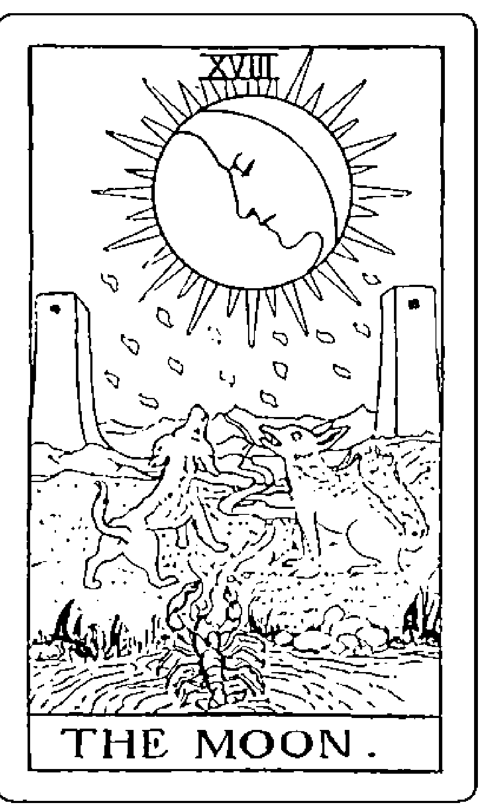

## 月亮正位

### 人物特性

### 基本性格

是一個十分善變的人，有時候連自己都無法掌握自己的想法，常會推翻自己之前決定的事情，讓人覺得無所適從。

### 感情觀

不太清楚自己在感情上需要的是什麼，所以常會對感情有不切實際的期待，同時也很難真誠地與一個人交往很久。

### 金錢觀

常常無法掌握自己的金錢狀況，甚至已經負債了還不自知，由於在用錢方面比較隨性，有可能在財務上並不穩定。

### 家庭觀

對於家中的事情有一些逃避，可能習慣於對家人隱瞞一些事情，或是為某些事對家人說謊，所以家人也不了解他。

### 一、空窗篇－無對象

### 沒對象的原因

你自己對感情沒有很穩定的看法，連自己喜歡哪一種人都不太確定，如果心中沒有定見就很難有固定的感情對象。

### 可以改進的地方

你應該先想清楚自己的需求，才可能設定目標開始發展感情，否則即使有人主動追上來，你也不知道該不該接受。

### 身邊是否有好對象

目前在你身邊並沒有好的對象，反而可能出現欺騙你感情的人，你要睜大眼睛小心分辨才不會成為無辜的受害者。

### 可能找到對象的管道

這個時候不論什麼管道都無法找到好的對象，也不要從已經認識的人身上著手，否則很可能會對彼此都造成傷害。

### 二、曖昧篇－有對象但不確定

### 如何看待對方

這是一個有點神秘的人，相處的時候總是無法掌握到他的想法，雖然會激起一些好奇心，但也覺得很沒有安全感。

### 心中是否有別人

目前在他的心中還有其他人，但是連他自己也搞不清楚感情到底歸向何方，所以想成為他的情人還有很多要努力。

### 可能有哪些阻礙

兩個人對於彼此都認識不清，所以產生了許多不切實際的幻想和期待，如果不能看清楚真相感情就很難有所進展。

### 如何告白容易成功

這個時候直接告白很不容易成功，所以應該是先用行動拉近彼此的距離，等到適當時機再來告白比較有可能成功。

### 三、相處篇－有明確對象

### 日常相處狀況

兩個人對彼此的生活並不了解，也不知該如何配合對方，如果不想讓對方知道自己的狀況，也許就會隱瞞或欺騙。

### 金錢與價值觀

兩個人在價值觀上差異很大，但是也許暫時還看不出來，不過若是遇到特定的狀況，就很可能發生嚴重的爭吵。

### 彼此心靈契合

彼此都覺得這段感情很不穩定，也不知道兩個人的未來該怎麼走下去，因為看不清楚狀況，所以會有很多的情緒。

### 講話溝通方式

兩個人的溝通並不完全，甚至經常發生欺騙或隱瞞的狀況，也許兩個人溝通上的障礙會對這段感情造成嚴重傷害。

### 性的吸引力

這段感情當中的性吸引力很強，而且是出於本能的反應，也許有很頻繁的性生活，但並不是因為感情有那麼緊密。

### 與對方家人的關係

你並不了解對方的家人，所以與對方家人相處時會覺得不太自在，你需要有更多的溝通才能降低內心當中的不安。

### 繼續發展的前景

這段關係繼續下去將會陷入危機，兩個人都不知道接下來該怎麼辦，可能會懷疑對方是否真心，甚至考慮要分手。

## 塔罗爱情占卜

| 大阿爾克納 |
| :--- |
| 權杖 |
| 聖杯 |
| 寶劍 |
| 錢幣 |
| 宮廷 |

### 四、危機篇

### 是否出現第三者

兩個人之間可能會出現第三者，但也許只是搞曖昧而沒有真的出軌，這個時候太過強烈的反應反而可能弄假成真。

### 發生爭吵的問題點

兩個人爭吵的原因其實在於彼此認知的差異，當站在不同的立場看事情，就有可能覺得對方在隱瞞甚至刻意欺騙。

### 如何化解紛爭

記得不要用情緒性的字眼批評對方，應該先耐心地讓對方把話說完，你會發現有很多事情其實是自己想像出來的。

### 提出分手的方法

為了避免涉入太多的情緒反應，最好是選擇速戰速決的分手方式，如果兩個人談得越久，反而可能會糾纏得更緊。

### 複合的可能性

這段感情即使真的複合了，也絕不會是穩定的關係，還可能落入重複分分合合的循環，倒不如下定決心快點分開。

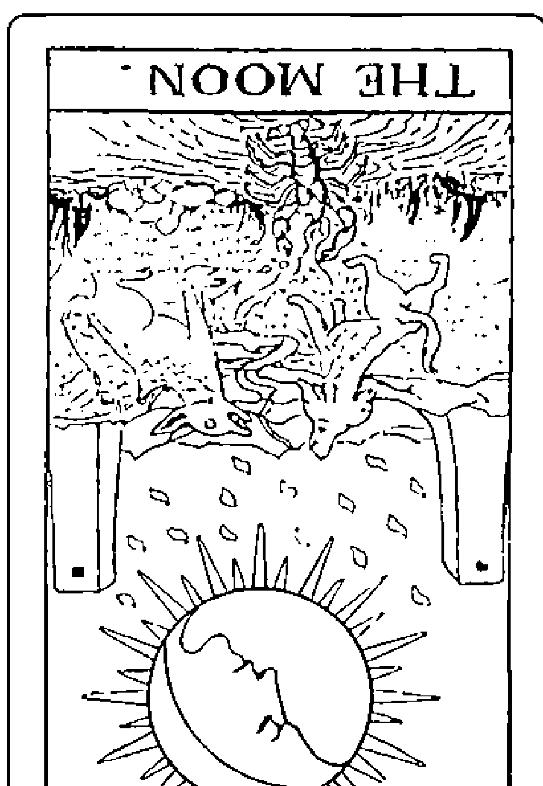

## 月亮逆位

### 人物特性

### 基本性格

是一個容易緊張的人，常會覺得風聲鶴唳草木皆兵，所以也不輕易相信別人，遇到問題會比較膽小不願意去面對。

### 感情觀

在感情上非常缺乏安全感，也不太敢表達自己真正的想法，但又很需要情感的寄託，所以很容易陷入單戀的狀況。

### 金錢觀

對於金錢的處理缺乏理性，因此在財務上並不太穩定，有時候會對自己的財務狀況過於擔心，容易陷入恐慌當中。

### 家庭觀

在家中是比較沈默的類型，也不太表達自己的意見，對於不合理的事情會逆來順受，但是彼此之間感情並不緊密。

### 一、空窗篇－無對象

### 沒對象的原因

你對於自己缺乏信心，也不認為自己值得與好的對象在一起，如果又不主動積極去尋找，自然就陷入單身的狀況。

### 可以改進的地方

你應該要努力去認清事實，不要再自欺欺人了，誠實面對自己真正的感覺，才能幫助你找到真正適合的感情對象。

### 身邊是否有好對象

目前在你身邊已經有一些對象出現，但都還不算是很好的對象，如果可以再等一陣子，也許會有其他的機會出現。

### 可能找到對象的管道

這個時候太刻意反而不容易找到好對象，就照你平常的生活方式順其自然，也許在不經意之間就會遇到新的機會。

### 二、曖昧篇－有對象但不確定

### 如何看待對方

這是一個怪人，對於自己的事情似乎刻意保密，也不願意讓別人太接近，相處的時候常會感覺到一股淡淡的哀愁。

### 心中是否有別人

目前在他的心中並沒有別人，但是也許仍受到之前感情傷害的影響，並不是很想談戀愛，心態上會比較消極一點。

### 可能有哪些阻礙

兩個人都有點缺乏自信，所以都不敢率先行動突破僵局，如果雙方都一直等在原地，感情關係就不會有任何進展。

### 如何告白容易成功

這個時候直接的告白很容易失敗，用實際行動暗示反而會有更好的效果，經常聯絡並出來約會就足以表達心意了。

### 三、相處篇－有明確對象

### 日常相處狀況

可能是因為兩個人相處的時間不多，或是因為彼此有所隱瞞或欺騙，總覺得有些事情怪怪的，但也不知怎麼解決。

### 金錢與價值觀

兩個人可能會為了錢的事情煩惱，或是對於彼此的財務狀況有所隱瞞，所以在金錢上各自獨立會是比较好的方式。

### 彼此心靈契合

這段感情引發了很多情緒，彼此之間常會陷入意氣之爭，若是覺得看不到兩個人的未來，也可能變得有一些失望。

### 講話溝通方式

兩個人可能經常會誤解彼此的意思，因此會陷入無意義的爭論當中，其實只要把話講清楚，並沒有太嚴重的問題。

### 性的吸引力

這段感情當中性的吸引力是很重要的一部分，但是常常無法真的滿足對方，有時候也會因為性生活不協調而爭吵。

### 與對方家人的關係

你對於與對方家人的相處有點逃避，但是也慢慢開始了解他們的真實狀況，只要有心努力就可以改善彼此的關係。

### 繼續發展的前景

這段關係繼續下去可能會面對僵局，原本被隱藏起來的事情也都真相大白，如果彼此不願意改變就很難和平收場。

## 四・危機篇

## 是否出現第三者

兩個人之間並沒有第三者，但確實有某些事情對彼此隱瞞，這個時候應該要保持平靜，不要有過度情緒化的反應。

## 發生爭吵的問題點

發生爭吵的問題在於彼此之間不夠信任，所以一點點風吹草動就會引發嚴重的不安全感，自然就很容易造成爭吵。

## 如何化解紛爭

這個時候最好什麼都不要解釋，以沈默來冷靜雙方的情緒反應，等過一陣子之後再來處理，其實就會很順利解決。

## 提出分手的方法

避不見面是逼不得已，但是其實可能是傷害性最小的處理方式，在雙方沒有聯絡的狀況下，感情就可以漸漸變淡。

## 複合的可能性

兩個人之間其實已經沒有感情，還不如快點分開的好，再糾纏下去只是浪費生命，也不可能在分手之後成為朋友。

+   塔羅愛情占卜的牌義

+   大阿爾克納

+   權杖

+   聖杯

+   寶劍

+   錢幣

+   宮廷

## 太陽正位

### 人物特性

#### 基本性格

是一個樂觀的人，總是會從光明面去看事情，即使面對挫折打擊也絕不灰心，對於自己的狀況與生活常感到滿意。

#### 感情觀

在感情上會不斷地付出，表現超越常人的熱情與活力，同時也懂得生活情趣，會努力經營讓自己覺得滿意的感情。

#### 金錢觀

處理金錢的事情十分理性，也會對自己的財務做詳細的規劃，所以在該花錢的時候絕不吝嗇，但也不會揮霍浪費。

#### 家庭觀

對所有的家人都很好，如果家人有需要也會無條件地付出，所以在家裡很受到大家歡迎，也算是家裡的核心人物。

### 一、空窗篇－無對象

#### 沒對象的原因

你對於自己目前的生活十分滿意，所以對於感情並不特別期待，也沒有主動積極的作為，自然就不會有新的對象。

#### 可以改進的地方

你可以對感情方面的事情多花一點心思，而不要老是覺得可有可無，如果能夠更積極主動一點就可以有新的機會。

#### 身邊是否有好對象

目前在你的身邊有不少好對象，要不要開始全看你自己高興，如果真的想要開始談戀愛的話，就勇敢地往前衝吧！

#### 可能找到對象的管道

現在所有的管道都為你打開，只要你願意去嘗試都有機會找到不錯的對象，所以最重要的還是自己的心態與行動。

## 二・曖昧篇－有對象但不確定

如何看待對方
這是一個很正面思考的人，對於所有事情永遠都充滿希望；在相處的時候可以感覺到熱情，會想要更進一步發展。

心中是否有別人
目前在他心中還有其他人，不過都還是朋友的關係，並沒有一個特別重要的對象，所以如果你努力還是有機會的。

可能有哪些阻礙
在你們之間並沒有明顯的阻礙，有的話一定是你們自己想太多，千萬不要因為進展太快而擔心，這是沒有必要的。

如何告白容易成功
其實不論怎麼告白都很容易成功，因為對方也有相同的心意，最重要還是要有所表示，這樣感情關係才會有進展。

### 三、相處篇－有明確對象

日常相處狀況
兩個人的相處十分愉快，也對於這段感情覺得滿意，只要看到彼此就有一種幸福的感覺，希望能分分秒秒在一起。

金錢與價值觀
兩個人的價值觀十分契合，即使在一些小地方有不同意見也不會造成困擾，無論財務狀況如何都能盡情享受生活。

彼此心靈契合
兩個人覺得一起十分溫暖，也算是非常穩定的關係，彼此都希望這段關係繼續下去，也會開始作長久經營的打算。

講話溝通方式
彼此之間算是無話不談，什麼樣的事情都能坦誠地溝通，所以兩個人之間幾乎沒有任何秘密，一切都攤在陽光下。

性的吸引力
這段感情的當中有很強的吸引力，性的吸引力只是其中一個部分，兩個人都很享受性生活的快樂，也能得到滿足。

與對方家人的關係
你與對方家人的關係很好，在相處的時候感覺很快樂，同時也可以滿足彼此的需求，容易讓人有一種幸福的感覺。

繼續發展的前景
這段關係的前景一片光明，幾乎看不到任何的問題，只要兩個人能選擇繼續下去，應該就會有很幸福快樂的生活。

## 四・危機篇

### 是否出現第三者

兩個人之間完全不可能有第三者，連潛在有威脅性的對象都不存在，如果有懷疑的話，也可以與對方提出來討論。

### 發生爭吵的問題點

雙方發生爭吵的問題點在於彼此的期待太高，只要有一點小事就覺得十分嚴重，其實對這種小事不應該大驚小怪。

### 如何化解紛爭

其實兩個人只是一點小小的誤會，只要講開了就沒有什麼問題，其實雙方都沒有錯，所以應該勇敢去面對問題。

### 提出分手的方法

即使兩個人想要分手也不見得能分開，或許使用理性談判的方法會有最快的進展，但結果可能是使彼此感情更好。

### 復合的可能性

這段感情其實根本不算是分開，所以只要有一方先提出復合，應該很快就會重新墜入愛河，不要再為了面子撐住。

## 太陽逆位

### 人物特性

#### 基本性格

是一個充滿自信的人，總是會用理性的方式來處理事情，雖然有時候會比較自我中心一點，但待人還算親切熱情。

#### 感情觀

在感情上表現得十分熱情，但有些時候會比較衝動，對另一半會非常努力付出，若是對方沒有回報則會感到失落。

#### 金錢觀

在處理金錢上花很多的力氣，希望能让每一分錢都發揮最大的效果，對於金錢方面的事情會很有計劃也想要掌控。

#### 家庭觀

在家中表現得比較霸道，認為大家都應該要聽他的意見，如果遇到比較不順心的事情，也可能會對家人發洩情緒。

### 一、空窗篇－無對象

#### 沒對象的原因

你對於感情的事情比較主觀，也許真的有不錯的人出現在你身邊，但你就是覺得不喜歡，平白放過了不少好機會。

#### 可以改進的地方

你可以多放一點感情在生活上，不要老是那麼理性地考量事情，感情的事情就是要多一點感性才有談戀愛的感覺。

#### 身邊是否有好對象

目前在你身邊有不錯的對象，但也許還不是那麼明確，你應該多多注意身邊的異性，以免不小心錯過了好的對象。

#### 可能找到對象的管道

別人給你的建議與提示都沒有用，只有靠你自己去尋找對象，只要你自己願意去試，任何管道都可能找到好對象。

### 二、曖昧篇－有對象但不確定

### 如何看待對方

這是一個充滿熱情活力的人，但在判斷事情時會比較主觀，在相處時會感覺到快樂的氣氛，是一個很好溝通的人。

### 心中是否有別人

目前在他的心中並沒有其他人，即使異性緣很好，那些環繞在他身邊的人也不會被列入考慮，所以你還是有機會。

### 可能有哪些阻礙

雖然彼此的溝通良好，但似乎有一道無形的牆隔在兩個人之間，如果不把自己的心意講出來相處就會覺得不自然。

### 如何告白容易成功

當面直接理性地溝通是最容易成功的方式，不要想其他複雜的方式來拐彎抹角，如果不把話講清楚就很難有進展。

### 三、相處篇－有明確對象

### 日常相處狀況

兩個人在相處上很和諧，並不會遇到大的問題或障礙，即使遇到一些小誤會，在經過理性溝通之後也能順利化解。

### 金錢與價值觀

目前兩個人在金錢上都有餘裕，可以充份地享受生活，即使在價值觀上會有一些差異，也不會造成任何實質障礙。

### 彼此心靈契合

彼此能夠配合得很好，在感情上也漸入佳境，正在朝向光明的方向發展當中，兩個人對這段關係都有樂觀的預估。

### 講話溝通方式

兩個人可以很理性地溝通，不論什麼議題都可以拿出來談，即使彼此之間的想法不同，也可以很和平理性地辯論。

### 性的吸引力

這段感情當中有性的吸引力，兩個人都也非常重視性生活，這彼此的關係有加分的作用，也能建立起穩定的基礎。

### 與對方家人的關係

你與對方家人的關係還不錯，雖然他們可能會對你造成一些限制，但是你仍然會覺得開心，可以滿足他們的要求。

### 繼續發展的前景

這段關係的前景看來不錯，也是繼續穩定發展的趨勢，由於彼此有很強的吸引力，所以會想要在感情上更進一步。

### 四、危機篇

### 是否出現第三者

兩個人之間並沒有第三者，即使彼此有任何不滿意的地方，也絕不會是第三者造成的，還是要從感情本身去檢討。

### 發生爭吵的問題點

也許在彼此之間會有一點不滿意，但是其實那些都只是小問題，只是因為平常關係太好就容易把小事情放大來看。

### 如何化解紛爭

兩個人應該理性地去面對問題，先把內心的情緒反應放下，其實並沒有什麼大的問題，只要把問題談開來就好了。

### 提出分手的方法

現在要分手其實並不容易，因為兩個人還有很強的感情在，即使把不合適的種種理由提出來，還是無法就此分開。

### 複合的可能性

這段感情若是想要複合就要有一方先提出來，而且是越直接越好，對方應該也會欣然接受，要主動才能把握機會。

## 審判正位

### 人物特性

#### 基本性格

是一個有主見而果決的人，同時具有高度的理想性，本身很擅長於對別人傳達自己的理念，也會對別人有影響力。

#### 感情觀

在感情當中會很強調自己的理念，同時也想要影響對方的想法，對於承諾十分慎重，只要答應的事一定說到做到。

#### 金錢觀

會很努力賺錢，但是並不善於做財務上的規劃，願意為了自己的理念和興趣花費大筆的金錢，甚至因此散盡家財。

#### 家庭觀

在家中是一個自主性比較強的人，雖然相處上還算和諧，但並不容易與家人共同去做一件事情，甚至會有點疏離。

### 一、空窗篇－無對象

#### 沒對象的原因

你對於感情的事情太過認真嚴肅，甚至擺明了就是以結婚為前提要與對方交往，這樣的方式可能會嚇走許多對象。

#### 可以改進的地方

在與人交往的時候要放低身段，不要一副要教育或改造別人的樣子，只要能表現得隨和一點，一定會更受到歡迎。

#### 身邊是否有好對象

目前身邊可能會有好對象，但是與你之前所交往或認識的類型都完全不同，要接受這種改變對你來說是一大挑戰。

#### 可能找到對象的管道

可以透過長輩或是親人介紹，應該會有很好的機會，若是由平輩或朋友介紹就沒那麼好，雖然也可能會開始交往。

### 二、曖昧篇－有對象但不確定

### 如何看待對方
這是一個很理性的人，也很喜歡宣傳自己的理念和想法，在相處的時候會有一點壓力，但是感覺上還滿吸引人的。

### 心中是否有別人
目前在他的心中並沒有別人，連列入考慮的人選都沒有，即使在他的身邊有許多人被他吸引，你還是有機會的。

### 可能有哪些阻礙
接下來也許你們會發現一件重要的事情，使你們對彼此完全改觀，所以在充份了解對方之前千萬不要做重大決定。

### 如何告白容易成功
這個時候有話直說是最好的方法，直接約對方出來當面告白就很容易成功，如果是透過別人傳話反而會發生誤解。

### 三、相處篇－有明確對象

### 日常相處狀況
兩個人的生活狀況正面臨到重大的轉變，也許會對彼此都造成很大的影響，需要兩個人同心協力才可以度過難關。

### 金錢與價值觀
目前可能會面對財務上重要的轉機，或是在金錢上發生重大的事件，如果能好好溝通協調的話會讓彼此關係更好。

### 彼此心靈契合
兩個人都覺得關係發展到了轉捩點，是該作最後決定的時候了，如果對方不能有一個明確承諾也許就會走向分手。

### 講話溝通方式
兩個人在溝通時並不平等，通常是一個人在講另一個人在聽，如果不能尊重彼此的意見，也可能因此而發生爭吵。

### 性的吸引力
這段感情的當中並沒有很強的性吸引力，性生活也不會成為兩個人關係的重要因素，還是精神上的吸引力比較強。

### 與對方家人的關係
你與對方家人的關係還不錯，看得到的表現也有達到他們的標準，也許與對方家人的關係會變成感情發展的關鍵。

### 繼續發展的前景
接下來感情上會面對到重要的決定，因為某些外在環境或條件的變化，讓彼此的關係有機會進入到一個新的階段。

### 四、危機篇

### 是否出現第三者
兩個人之間並沒有第三者，但是也許會存在其他重要的問題，如果真的讓事情爆發出來，感情可能就會發生變化。

### 發生爭吵的問題點
兩個人發生爭吵的問題點在於雙方都想要改變，對於彼此也都有一些不滿存在，這是該要把事情講清楚的時候了。

### 如何化解紛爭
俗話說一個銅板拍不響，只要你不要再提出挑剔的反對意見，兩個人也沒什麼好吵的，這時候要低調小心的回應。

### 提出分手的方法
其實這個時候可以和對方攤牌，把與對方所有的問題通通拿出來檢討，對方如果無法解決的話很自然就會分手了。

### 複合的可能性
這是一個複合的好機會，但是需要有其中一方主動，只要你能主動提出複合的想法，對方應該會給你正面的回應。

## 審判逆位

### 人物特性

#### 基本性格
是一個優柔寡斷的人，很容易受到別人的影響，常常缺乏自己堅定的立場和主見，同時也會有比較情緒化的反應。

#### 感情觀
在感情上缺乏判斷力，很容易受過去感情經驗的影響，重複相同的錯誤而無法改進，有時也很難確定自己的心意。

#### 金錢觀
對於金錢有不切實際的幻想，無法務實地做財務規劃，有時候會夢想自己一夜致富，但是並沒有任何實際的做為。

#### 家庭觀
在家中比較不會表達自己的意見，也不太喜歡參加親戚之間的社交活動，但如果家人開口要求的話還是很難拒絕。

### 一、空窗篇－無對象

#### 沒對象的原因
你沒有想清楚自己對於感情真正的需求，所以即使身邊出現許多的對象，你也無法判斷到底哪一個人真正適合你。

#### 可以改進的地方
你應該集中心力在一個人身上，不要抱持著要公平的心態而對每個人都一樣好，這樣就不容易發展較深入的關係。

#### 身邊是否有好對象
在你身邊有還不錯的對象，只是你目前還缺乏足夠的判斷力去辨認出來，這個時候匆促決定反而可能會發生錯誤。

#### 可能找到對象的管道
這個時候走入人群當中比較容易找到對象，所以不論是參加大型的聯誼活動，或是到人多的地方都有比較多機會。

### 二、曖昧篇－有對象但不確定

### 如何看待對方
這是一個很平凡的人，在人群之中並不突出，也不會留下特別深刻的印象，在相處時會感覺到有一點膽小和退縮。

### 心中是否有別人
目前在他的心中有許多可能的對象，但是他並沒有辦法做出最後的決定，所以只要你努力還是有可能讓他注意到。

### 可能有哪些阻礙
彼此的關係要有所進展，就必須做出重大的改變，如果兩個人目前都只想要維持現狀，那麼關係就必然停滯不前。

### 如何告白容易成功
這並不是一個告白容易成功的時間，很可能會因為說錯一句話而造成滿盤皆輸的狀況，這個時候衝動絕對沒好事。

### 三、相處篇－有明確對象

### 日常相處狀況
兩個人在相處上即將面對重大的變化，許多之前隱藏起來的事情也會重新浮現出來，需要雙方共同去面對與解決。

### 金錢與價值觀
兩個人在價值觀上並不相同，但是又會希望對方照自己的意思來做，所以有些時候就會發生爭吵或是卡住的狀況。

### 彼此心靈契合
兩個人都覺得這段關係遇到了瓶頸，在某些部分需要做徹底的改變，如果無法達成共識，也許關係就會走向終點。

### 講話溝通方式
兩個人的溝通並不良好，往往會誤解對方的意思，如果總是帶有預設立場，就不容易了解對方真正想表達的想法。

### 性的吸引力
兩個人之間並沒有很強的性吸引力，但是性生活會成為這個關係當中重要的關卡，也是一個要很小心處理的議題。

### 與對方家人的關係
你與對方家人的關係有點疏遠，你也不想涉入當中太多，但是其實他們很信任你，遇到問題也會想徵詢你的意見。

### 繼續發展的前景
這段關係短期之內並沒有重大的發展，但是其實兩個人的內心已經悄悄地在轉變，也許突然之間就會發生大變化。

### 四、危機篇

### 是否出現第三者
兩個人之間可能有第三者，但比較可能是屬於精神外遇之類的，而沒有實質交往的狀況，所以也比較難發現跡象。

### 發生爭吵的問題點
兩個人發生問題的爭點在於溝通不良，其實事情也沒那麼嚴重，但是若不能坐下來好好溝通，問題就不容易解決。

### 如何化解紛爭
你應該更細心地傾聽對方的意見，而不要只是自己一直講，如果無法了解對方的心意，就不可能化解現在的問題。

### 提出分手的方法
這段感情到此已經累積了太多的問題，雖然現在談分手不會有立即的成果，但是已經慢慢地朝向分手的方向發展。

### 複合的可能性
這段關係已經沒有太多的感情存在，但是仍然有複合的機會，只是這樣的努力似乎沒有必要，只會讓彼此更痛苦。

## 塔羅愛情占卜的牌義

+   大阿爾克納
+   權杖
+   聖杯
+   寶劍
+   錢幣
+   宮廷

## 愚者正位

### 人物特性

#### 基本性格
是一個不按牌理出牌的人，做事情沒有任何章法可言，有時候甚至會有點瘋言瘋語，常常搞不清楚自己在作什麼。

#### 感情觀
很容易突然瘋狂地愛上一個人，但是不久之後又完全變心，完全不把承諾當成一回事，也很難在感情上穩定下來。

#### 金錢觀
完全沒有金錢概念，也搞不清楚自己到底有多少錢，即使沒錢了還是照樣花費，所以通常都是處於負債的狀況下。

#### 家庭觀
與家人之間的關係很不穩定，但是大多都處於疏遠的狀況，並不太清楚其他人在做什麼，在家中經常是我行我素。

### 一、空窗篇－無對象

#### 沒對象的原因
你對感情的想法與眾不同，所以很難找到與你觀念相合的人，如果你還是堅持自己想法，就不容易找到新的對象。

#### 可以改進的地方
你對於感情的想法應該要更務實一點，太過理想化是很難找到對象的；另一方面，迷戀錯誤的人也不可能有結果。

#### 身邊是否有好對象
目前在你身邊並沒有好的對象，出現的人都有可能會讓你受到重傷害，所以千萬不要抱持姑且一試的心態去冒險。

#### 可能找到對象的管道
目前各個管道都不可能找到好對象，不論怎麼做都是一種危險的嘗試，所以還是要有耐心，等運勢轉好之後再說。

### 二、曖昧篇－有對象但不確定

### 如何看待對方
這是一個與眾不同的人，但是有些想法會比較偏激極端，在相處的時候會覺得很怪，並不會想要進一步發展關係。

### 心中是否有別人
目前在他的心中並沒有其他人，即使有人對他有意思他也完全不考慮，但是由另一方面來看你也不太容易吸引他。

### 可能有哪些阻礙
橫在你們面對的是很危險的狀況和阻礙，如果一意孤行的話可能會導致重大的影響，並不是你們雙方可以承受的。

### 如何告白容易成功
這個時候告白很不容易成功，不論採取任何方法都只會有反效果，所以還是被動等對方主動向你告白會比較安全。

### 三、相處篇－有明確對象

### 日常相處狀況
兩個人之間充滿了各種意外和衝突，在生活上常有很多部分無法配合，對於彼此之間的了解也僅只於表面的程度。

### 金錢與價值觀
兩個人在價值觀上完全不同，所以在金錢方面最好各自獨立，如果涉及到共有財產的部分，很容易就會發生衝突。

### 彼此心靈契合
彼此都覺得兩個人在一起是很瘋狂的事，如果可以重來一次絕對不會作這樣的選擇，有機會的話一定要快點分開。

### 講話溝通方式
兩個人的溝通通常是雞同鴨講，完全無法理解對方的意思，即使真的想坐下來好好談談，也很難找到交集的地方。

### 性的吸引力
這段感情當中曾經有很強的性吸引力，但也只是一種很短暫的感覺，甚至無法確定是不是幻覺，後來就沒感覺了。

### 與對方家人的關係
你與對方家人的關係並不親近，所以內心當中存在許多過於美好的幻想，其實你們之間的關係並不如想像中的好。

### 繼續發展的前景
這段關係的前景並不看好，很快就會面臨重大的危機，如果還是不知懸崖勒馬，也許會對彼此都造成很大的傷害。

### 四、危機篇

### 是否出現第三者

兩個人之間並沒有第三者，但確實有可能陷入危機，如果仍然誤以為是第三者造成問題，就無法看到事情的真相。

### 發生爭吵的問題點

你們之間發生爭吵的問題點，在於彼此都一直執迷不悟，還誤以為能改變對方，其實對方心意已決絕對不會聽勸。

### 如何化解紛爭

以平常心去面對爭吵，不要隨著對方的情緒反應起舞，只要你先冷靜下來，就會發現其實你們爭吵的事情很好笑。

### 提出分手的方法

其實只要有一方提出要分手兩個人就算是分開了，也不需要使用什麼特別的方法，因為彼此都知道這是遲早的事。

### 複合的可能性

現在維持單身對你來說是比較好的選擇，千萬不要因為一時心軟就再和對方在一起，對你來說絕對是最壞的選擇。

## 愚者逆位

### 人物特性

#### 基本性格

是一個比較冷漠的人，對於發生在身旁的事情毫不關心，只活在自己的世界當中，常喜歡一個人沒有目的地閒逛。

#### 感情觀

不願意面對自己的感情，對於別人的付出常採取逃避的態度，所以很難發展長久穩定的關係，經常處於單身狀態。

#### 金錢觀

不了解金錢真正的價值，甚至會覺得有錢是一種罪惡，因此即使收入很高仍然不會有什麼儲蓄，賺多少就花多少。

#### 家庭觀

不喜歡參加家庭及家族的聚會，比較想要一個人單獨行動，在家中比較特立獨行，即使逢年過節也不一定會回家。

### 一、空窗篇－無對象

### 沒對象的原因

你想要一個人自由地過日子，不想被另一個人綁住，自己本身就逃避不想談感情，當然就很難出現新的感情對象。

### 可以改進的地方

如果不願意付出與承諾，就很難與別人建立起穩定的感情關係，你需要在感情上更用心，才有可能吸引到新戀情。

### 身邊是否有好對象

目前在你身邊沒有什麼好對象，甚至連爛對象也很欠缺，所以這個時候還是不要太強求，趁機享受一個人的生活。

### 可能找到對象的管道

目前怎麼去找都不太可能遇到好對象，倒不如保持平常心過好自己的生活，說不定就會出現一些人主動向你告白。

### 二、曖昧篇－有對象但不確定

### 如何看待對方

這是一個謎一般的人，所有的人對他都不了解，也很难掌握他真正的想法，相處的時候會覺得疏離，很不容易有交集。

### 心中是否有別人

目前在他的心中沒有任何感情的對象，但是目前他也不考慮要談戀愛，所以想要吸引他的注意並不是件容易的事。

### 可能有哪些阻礙

你們對於彼此的了解太少，其實兩個人并不是很適合，當你們更進一步地認識之後，很有可能覺得這是一場誤會。

### 如何告白容易成功

現在告白不容易有任何效果，既不會拉近彼此的關係，也不會造成什麼破壞，所以還是保持原來的狀況不要衝動。

### 三、相處篇－有明確對象

### 日常相處狀況

兩個人的交集非常少，幾乎等於是各過各的生活，由於相處及交往的時間十分有限，也很難培養出很深厚的感情。

### 金錢與價值觀

兩個人可能是共同經歷一段入不敷出的艱困時期，或是在金錢上遇到其他問題，這都會把價值觀的差異凸顯出來。

### 彼此心靈契合

彼此之間都已經覺得沒有什麼實質的感情，兩個人的關係已經名存實亡，也已經不願意再花心思去經營這段關係。

### 講話溝通方式

兩個人之間缺乏溝通，在觀念和想法上也少有交集，由於對彼此的了解太少，就很容易在溝通的過程中發生誤解。

### 性的吸引力

這段感情當中並沒有什麼吸引力，就更別提性的吸引力了，即使兩個人之間有性生活，也不會有任何加分的效果。

### 與對方家人的關係

你與對方的家人完全沒有交集，所以彼此之間也不了解，也許他們對你存在很多誤解，需要花時間努力才能化解。

### 繼續發展的前景

這段關係發展的前景並不樂觀，接下來不會有什麼實質的進展，反而可能陷入令雙方都覺得迷惑的停滯狀態當中。

### 四、危機篇

### 是否出現第三者

這段關係當中並沒有第三者介入，而是有其他的危機出現，如果不去解決問題的話，反而可能讓第三者有機可乘。

### 發生爭吵的問題點

發生爭吵的主要原因在於彼此之間並不了解，也沒有花心思去了解對方的想法，自然而然會產生許多幻想和誤解。

### 如何化解紛爭

忽略問題是你的第一反應，但事情並不會因為你假裝看不到就會自動消失，如果不面對問題就會重複相同的爭吵。

### 提出分手的方法

其實兩個人之間已經沒有什麼感情了，所以只要一陣子不聯繫的話很自然就會漸漸分開，很多事情也不必要強求。

### 複合的可能性

兩個人的關係在此歸零，想要回復到從前的狀況已經是不可能的事情，想要再一起的話就要當成新戀情重新開始。

### 塔羅愛情占卜的牌義

- 大阿爾克納
- 權杖
- 聖杯
- 寶劍
- 錢幣
- 宮廷

## 世界正位

### 人物特性

#### 基本性格

是一個想法很單純的人，面對任何事情都採取順勢而為的態度，因此能避開失敗與錯誤的道路，把握成功的機會。

#### 感情觀

在感情上非常重視自己的承諾，對另一半絕對說到做到，因此能給對方穩定的安全感，同時也可以無條件地付出。

#### 金錢觀

對金錢方面有十分務實的看法，也會做具體的財務規劃，在用錢時會經過精密的計算，但也不至於讓人覺得小氣。

#### 家庭觀

與家人的關係十分良好，同時也很重視與家人之間的團結，如果家裡面有什麼事情，大多都會響應並且親身參與。

### 一、空窗篇－無對象

### 沒對象的原因

你對於自己目前的生活十分滿意，所以並沒有去追求新感情的動力，比較封閉的生活圈也是缺乏對象的原因之一。

### 可以改進的地方

你應該試著在生活作息上做一些改變，去創造一些新的生活經驗，開拓新的人際關係，這樣才可能會有新的感情。

### 身邊是否有好對象

目前在你身邊有很好的對象，只是你自己不一定會發現是誰，也許對方已經默默守護在你身邊很長的一段時間了。

### 可能找到對象的管道

這個時候不容易在既有的生活圈當中找到對象，所以參加長途的旅行團或是連續幾天的營隊，都比較容易有機會。

### 二、曖昧篇－有對象但不確定

### 如何看待對方

這是一個很善良的人，本身散發出一種很純淨的氣質，相處時會有一點點的距離感，但是會讓人很想要更進一步。

### 心中是否有別人

目前在他心中已經有認定的對象，而且不會因為其他的狀況而改變，所以想要把他爭取過來並不是一件容易的事。

### 可能有哪些阻礙

兩個人都處在被動的狀態，沒有任何一方想要主動去突破，如果繼續保持這樣的相處方式，關係就不會有所進展。

### 如何告白容易成功

這個時候不論怎麼告白都很容易成功，所以不用擔心太多，用你覺得舒服有把握的方式就好，重要的是主動表示。

### 三、相處篇－有明確對象

### 日常相處狀況

兩個人的相處十分和諧，在各個層面都配合得天衣無縫，基本上是十分穩定的關係，不用太費力就可以覺得快樂。

### 金錢與價值觀

兩個人之間的價值觀算是一致，所以並不會遇到金錢方面的問題，如果任何一方遇到困難，另一方也會願意幫助。

### 彼此心靈契合

兩個人都覺得彼此已經在一起很久了，也期待這段關係能夠真的天長地久，會在相互付出當中感覺到彼此的誠意。

### 講話溝通方式

兩個人的默契很好，許多事情即使不說對方也可以了解，但是如果能把事情拿出來談，則可以體會到溝通的樂趣。

### 性的吸引力

兩個人之間並沒有很強的性吸引力，但由於互相吸引的關係才會試著去探索這個部分，也會有令人滿意的性生活。

### 與對方家人的關係

你與對方家人的關係十分良好，就像是一家人般不分彼此，你可以融入到對方的家庭生活當中，同時又覺得自在。

### 繼續發展的前景

這段關係的前景十分看好，應該是一段非常穩定的感情，你們可以在這段關係當中充分享受，不會出現大的變化。

### 四、危機篇

### 是否出現第三者

兩個人之間絕對不可能有第三者，一切都是你自己想太多，即使外面有其他人想要介入你們的感情也不可能成功。

### 發生爭吵的問題點

兩個人發生爭吵的主要問題點，就是對於彼此太過熟悉，許多事情以為對方應該要了解，就忽略了要先充份溝通。

### 如何化解紛爭

真心真意的付出，對方一定會感受到你的誠意，很多事情只是一時的情緒，等時間過去問題很自然就會化解開來。

### 提出分手的方法

兩個人在這個時候要分開並不容易，因為彼此之間的感情已經太深，也有太多錯綜複雜的關係，應該再慎重考慮。

### 複合的可能性

這段關係很有可能會複合，只要兩個人都能放棄過去錯誤的模式，其實兩個人還是滿適合的，但要兩人共同努力。

## 世界逆位

### 人物特性

#### 基本性格

是比較固執不知變通的人，面對不同的情境狀況都只有一種觀點、一種做法，會很重視自己的承諾絕對說到做到。

#### 感情觀

在感情上偏向認同傳統保守的價值，總覺得感情會帶來許多的責任與沉重的壓力，所以也不輕易付出自己的感情。

#### 金錢觀

不善於處理自己的金錢，也許有儲蓄的習慣，但是並不會進一步做財務規劃，某些時候會讓人覺得像守財奴一樣。

#### 家庭觀

對於家庭的狀況不想多談，似乎是之前經歷過一些不愉快，但是又放不下對家人的牽掛，所以卡在中間動彈不得。

### 一、空窗篇－無對象

### 沒對象的原因

你對於感情的想法過於保守，在做法上也過於被動，如果沒有實際的行動跨出第一步，再怎麼想談戀愛都沒有用。

### 可以改進的地方

不要只是一直想著結果會如何，如果沒有開始的話根本就不可能走到那一步，把心力集中在如何開始會比較重要。

### 身邊是否有好對象

目前在你身邊沒有什麼好對象，即使舊情人回來找你也不會有好日子可以過，所以最好還是不要抱持太高的期待。

### 可能找到對象的管道

之前試過的管道都不太可能找到新的對象，除非你願意去嘗試之前從來沒嘗試過的管道，才有可能出現新的轉機。

### 二、曖昧篇－有對象但不確定

### 如何看待對方

這是一個相當古板的人，對於很多事情的想法都偏向傳統保守；相處起來覺得有點無趣，也不會想要進一步交往。

### 心中是否有別人

目前在他的心中並沒有別人，但是也並不是積極想要談戀愛，所以即使沒有其他的競爭對手，仍然不容易有進展。

### 可能有哪些阻礙

目前雙方都不是真心想要進一步地發展，總覺得維持現狀就是很好的狀況，所以很有可能就會繼續保持曖昧下去。

### 如何告白容易成功

這個時候直接告白很不容易成功，甚至會讓兩個人的關係倒退，所以最好還是保持耐性，等時機成熟之後再行動。

### 三、相處篇－有明確對象

### 日常相處狀況

兩個人的相處狀況十分穩定，但是也可能因此覺得無聊，彼此之間多了一份責任感，平淡的相處也會讓熱情消退。

### 金錢與價值觀

兩個人的財務狀況都算是穩定，也不會因為金錢或財務的議題發生歧見，不過兩個人的財務最好還是獨立比較好。

### 彼此心靈契合

兩個人彼此很習慣對方的存在，但是也沒有任何新鮮的事務可以喚起彼此之間的熱情，純粹是以一種慣性維持著。

### 講話溝通方式

兩個人彼此之間並沒有太多溝通，很多事情覺得講了也沒用，所以就很容易悶在心裡，但是也不會經常爆發出來。

### 性的吸引力

兩個人之間沒有性的吸引力，性生活也落入相同的模式當中，無法為這段關係加分，有時候感覺只是盡一份義務。

### 與對方家人的關係

你與對方家人的關係有些疏離，並不會想要涉入太深，但是如果有例行固定的聚會，你還是會選擇參加不會逃避。

### 繼續發展的前景

兩個人關係的前景並不看好，可能會受到不可預期的外力阻礙，或是彼此的相處死氣沈沈，很難有進一步的發展。

### 四、危機篇

### 是否出現第三者

這段感情並不會有第三者，但是彼此之間也不會覺得非常滿意，所以目前算是有點卡住，有一種不上不下的感覺。

### 發生爭吵的問題點

兩個人發生問題的爭吵點在於感情關係的長期停滯，由於缺乏新的經驗與刺激，讓彼此都覺得這段關係沒有未來。

### 如何化解紛爭

爭吵的東西都是老問題了，再吵也沒有可能去改變，如果還是無法學會去接受，以後相同的問題還會再不斷發生。

### 提出分手的方法

由於兩個人已經習慣了彼此，所以除非有新的對象出現，否則要分開是非常困難的事情，不論誰提出都不太可能。

### 複合的可能性

這段關係完全不可能複合，也不用再去想複合的事情，如果只是看到舊的對象，反而會因此而錯過其他的新機會。

## 權杖A正位

### 一、空窗篇－無對象

### 沒對象的原因

你專注於自己認為重要的事情，而沒有把心思意念放在感情上面，所以即使出現了新的感情對象你也不會注意到。

### 可以改進的地方

你要學著控制自己的熱情，不要在沒想清楚前就衝動行事，這樣不但會把對方嚇跑，而且可能會鎖定錯誤的對象。

### 身邊是否有好對象

目前在你身旁很可能有好的感情對象，而且是你完全意想不到的新對象，你要主動積極才能把握住這個新的機會。

### 可能找到對象的管道

新的對象可能伴隨著換新工作、搬新家或是其他新行動而出現，如果想要有新戀情就要積極努力改變自己的生活。

### 二、曖昧篇－有對象但不確定

### 如何看待對方

這是一個直率沒有心機的人，常能帶給大家歡樂的氣氛，在相處時會覺得非常主動與熱情，讓人不知該如何拒絕。

### 心中是否有別人

目前在他身旁可能剛剛出現吸引他的人，但是彼此的關係還沒有那麼確定，如果快點主動出擊的話也許還來得及。

### 可能有哪些阻礙

在你們之間並沒有什麼阻礙，只要積極主動就可以有明確的進展，所以關鍵點在於彼此的決心以及具體的行動力。

### 如何告白容易成功

這個時候無論如何告白都很容易成功，但最重要的是主動、真誠與直接，其他拐彎抹角的華麗招數都不會有效果。

### 三、相處篇－有明確對象

### 日常相處狀況

兩個人的關係發展到一個新的階段，所以在相處上需要做一些調整，這個時候主動積極可以讓感情快點穩定下來。

### 金錢與價值觀

兩個人的價值觀算是一致，所以並不容易為了金錢方面的事情爭吵，若是彼此有財務上的合作也很有可能會獲利。

### 彼此心靈契合

兩個人都覺得這段感情令彼此充滿活力，是一段很值得好好經營的關係，只是現在對於長遠的未來並沒有想太多。

### 講話溝通方式

兩個人之間講話都很直接，任何事情都可以拿出來討論，即使彼此的想法並不相同，也可以互相尊重對方的意見。

### 性的吸引力

性的吸引力可以說是這段感情當中很重要的一部分，雙方在性關係上的和諧對於兩個人感情的穩定有加分的作用。

### 與對方家人的關係

你與對方家人的關係並不深，但是彼此都有不錯的第一印象，如果以此為基礎繼續下去也許會發展出很好的關係。

### 繼續發展的前景

這段感情繼續發展下去有無窮的潛力，但是也可能會面對新的變化與挑戰，需要兩個人同心協力共同去解決問題。

### 四、危機篇

### 是否出現第三者

這段感情完全不可能出現第三者，即使有其他人主動追求也完全沒有威脅性，任何的懷疑都只是自己想太多而已。

### 發生爭吵的問題點

會引發爭吵的都是一些小事情，只是在沒有其他大問題的狀況之下才被突顯出來，仔細想想對彼此來說並不重要。

### 如何化解紛爭

應該要主動以行動證明自己的真心，而不是被動地等著被對方質問，在問題剛發生的時候就應該要積極處理化解。

### 提出分手的方法

如果你覺得這是一段痛苦的關係，那麼自己主動提出分手是最好的方法，通常親自見面把話講清楚會是最有效的。

### 複合的可能性

這段關係還是有複合的可能性，但是這會是一個全新的關係，要把過去所有的模式都拋棄掉，徹徹底底重新開始。

## 權杖A逆位

### 一、空窗篇－無對象

### 沒對象的原因

你在感情當中自信不足，同時又缺乏主動追求的勇氣，即使遇到讓自己心動的對象也不行動，白白看著機會溜走。

### 可以改進的地方

你要放下掌控的想法，學習讓事情自然發生，當你不設定那麼多限制條件，也許對象就會以意想不到的方式出現。

### 身邊是否有好對象

目前在你身邊也許會有新的感情機會，但並不是非常適合你的對象，如果選擇接受的話，也許會帶來許多的挑戰。

### 可能找到對象的管道

這時候主動積極去尋找對象只是浪費時間，倒不如多花一些時間反省及充實自己，也許新戀情就會自己找上門來。

### 二、曖昧篇－有對象但不確定

### 如何看待對方

這是一個比較被動的人，同時在很多事情上都猶豫不決，在相處時讓人覺得缺乏自信心，似乎在心裡有很多煩惱。

### 心中是否有別人

目前在他心中並沒有特定的對象，但本身也不是很主動積極想要談感情，所以這個時候要引起他的注意比較困難。

### 可能有哪些阻礙

目前兩個人之間最大的阻礙就是缺乏行動力，沒有頻繁的溝通以及足夠多的相處時間，感情就很難有實質的進展。

### 如何告白容易成功

這並不是一個適合告白的時間，如果這個時候衝動行事反而會讓彼此的關係倒退，所以按兵不動才是最好的策略。

### 三、相處篇－有明確對象

### 日常相處狀況

兩個人的相處遇到新的挑戰，是該要好好反省檢討的時候了，如果有一方想要掌控對方，反而會引發更多的問題。

### 金錢與價值觀

兩個人可能會為了金錢的事情而煩惱，所以有關財務方面的決定最好能在事前溝通清楚，以免發生不必要的誤會。

### 彼此心靈契合

兩個人都覺得這段關係仍然在剛開始的階段，還有很多部分充滿不確定性，目前只能走一步算一步沒辦法想太多。

### 講話溝通方式

兩個人都不太知道如何與對方溝通，所以講話時經常會拐彎抹角閃爍其詞，過度修飾之後反而可能造成詞不達意。

### 性的吸引力

彼此之間很有吸引力，但經常不知道該怎麼表示，反而會顯得有點不知所措，其實應該勇敢一點表達自己的慾望。

### 與對方家人的關係

你覺得對方的家人很重視你，但是也對你有一些期待並且想要掌控，與他們相處常會讓你覺得受到限制並不自由。

### 繼續發展的前景

這段關係繼續發展的前景不佳，許多事並不在你的掌握當中，也會遇到新的變化與挑戰，整體來說並不容易處理。

### 四、危機篇

### 是否出現第三者

這段關係當中並沒有出現第三者，但是彼此之間確實有一些問題，這時候應該先檢討反省自己而不是去質疑對方。

### 發生爭吵的問題點

發生爭吵的問題點埋得很深，是由很多不愉快的事情所形成的積怨，如果一下子把很多舊帳都翻出來就很難處理。

### 如何化解紛爭

現在問題看似剛剛開始，實際上在當中已經有很深的誤會，要努力挖掘事情的真相才有可能找到徹底解決的方法。

### 提出分手的方法

若是要由自己主動提出分手，那麼就要準備好所有的火藥，以大吵一架做為結束，否則很可能會和對方藕斷絲連。

### 複合的可能性

這段關係應該沒有任何複合的可能性，已經算是徹徹底底結束的狀況，與其活在回憶當中，不如去尋找新的對象。

## 權杖二正位

## 一、空窗篇—無對象

### 沒對象的原因
你對於感情的事情想得太多，但是又缺乏實際的行動，如果總是猶豫不決在原地不動，就很難找到新的感情對象。

### 可以改進的地方
你要先想清楚自己對於感情的需求，這樣遇到感情對象時才能明確地判斷，同時也比較不會被不適合的人所迷惑。

### 身邊是否有好對象
目前在你身邊也許有一些可能的對象，但是都無法令你覺得滿意，所以想要談戀愛的話也許就要去尋找新的對象。

### 可能找到對象的管道
這個時候無論什麼管道都不容易幫你找到好對象，即使有人幫你介紹也很難有所進展，這個時候還是先觀望再說。

## 二、曖昧篇—有對象但不確定

### 如何看待對方
這是一個猶豫不決的人，遇到重大的事情往往會考慮很久又不願意做決定，相處時還會感覺到有一點憂鬱的氣質。

### 心中是否有別人
目前在他的心中也許有一些考慮中的人選，但是都還沒有做最後的決定，如果你努力的話也可能會被他列入考慮。

### 可能有哪些阻礙
目前在環境上還有一些無法配合的地方，可能會造成兩個人感情的阻礙，如果不願意改變和突破就很難有所進展。

### 如何告白容易成功
這個時候告白很不容易成功，甚至還會造成反效果讓對方留下不好的印象，所以最好是再觀察看看不要急著行動。

### 三、相處篇－有明確對象

### 日常相處狀況
兩個人日常的相處受到一些環境的限制，因此雙方都不覺得滿意，但是想要改進又有心無力，只能繼續忍受現狀。

### 金錢與價值觀
兩個人的財務基礎都還算不錯，所以相處時都不太需要擔心錢的問題，但是也許會因為價值觀的差異而發生爭吵。

### 彼此心靈契合
兩個人的關係已經變成一種習慣，即使心中有什麼不滿也很難實際去改變，也搞不清楚這段關係未來要往哪裡去。

### 講話溝通方式
兩個人並不是很重視溝通，也有很多話藏在心裡沒有講出來，當不滿的情緒超過極限時就會用爭吵的方式來溝通。

### 性的吸引力
這段感情中有很強的性吸引力，但是也只是讓兩個人的性生活比較頻繁而已，並不會對兩個人的感情有加分作用。

### 與對方家人的關係
你與對方家人的關係並不太親近，甚至會覺得受到他們很多的限制，所以保持距離對你來說會是比較愉快的方式。

### 繼續發展的前景
這段關係繼續下去會遇到重大的瓶頸，必須雙方同心協力才能克服，否則彼此的不滿就會持續累積直到關係崩潰。

### 四、危機篇

### 是否出現第三者
這段關係當中並沒有出現第三者，但是確實有一些問題需要解決，這個時候能不能坐下來好好溝通是重要的關鍵。

### 發生爭吵的問題點
兩個人發生爭吵的問題點並不一定在彼此的身上，很可能是由於環境所造成的限制，有時候即使努力也無法解決。

### 如何化解紛爭
這個時候只能把問題解決一部分，但是無法碰觸到問題的核心，所以只能以拖待變，看以後能不能再找機會解決。

### 提出分手的方法
其實現在兩個人要分手也不太可能，因為兩個人都無法作出明確的選擇，即使出現第三者也很難使這段關係結束。

### 複合的可能性
這段感情完全沒有複合的可能性，因為一旦作了決定了就是最後的結果，即使現在雙方想要反悔也已經來不及了。

## 權杖二逆位

### 一、空窗篇－無對象

### 沒對象的原因
目前環境上有一些外在的阻礙，讓你無法把心思放在感情上面，若是自己無心經營感情生活就很難出現新的對象。

### 可以改進的地方
你要放下過去經驗帶來的偏見，以全新的觀點來看待感情，若是能改變凡事想要掌控的習慣，就容易發現新機會。

### 身邊是否有好對象
目前在你身邊也許會出現一些新的感情機會，但是這並不在你原先的規劃當中，對你來說完全是意料之外的驚喜。

### 可能找到對象的管道
這個時候計劃趕不上變化，往往無心插柳之下比較容易遇到新戀情，太刻意去計劃與追求反而沒辦法遇到好對象。

### 二、曖昧篇－有對象但不確定

### 如何看待對方
這是一個比較衝動的人，在朋友之間很有魅力及影響力，在相處時會覺得處處充滿驚喜，讓人想要更進一步交往。

### 心中是否有別人
目前在他心中並沒有別人，也沒有要談感情的計劃，但是只要你能積極努力追求，到最後還是有機會可以打動他。

### 可能有哪些阻礙
兩個人的關係可能出現新的變數，使得發展完全脫離之前的規劃，如果不能適應環境改變，就會遇到重大的阻礙。

### 如何告白容易成功
這個時候告白最好能出奇不意，在他料想不到的時間地點發動突襲，在毫無防備的狀況之下最容易突破他的心防。

### 三、相處篇－有明確對象

### 日常相處狀況
兩個人的日常相處存在許多問題，經常需要處理各種突發的意外狀況，一不小心就可能會失控，造成嚴重的爭吵。

### 金錢與價值觀
兩個人也許會遇到財務方面的意外狀況，對彼此的關係造成一些挑戰，如果處理不好的話也許會造成嚴重的衝突。

### 彼此心靈契合
兩個人都不知道這段關係會如何發展，現在只能走一步算一步，但是如果要改變現狀的話就必須付出很大的代價。

### 講話溝通方式
兩個人講話的時候經常會激起令人驚奇的火花，有時候會變成無厘頭的搞笑，但一不小心也可能造成嚴重的衝突。

### 性的吸引力
兩個人之間有很強的性吸引力，但也只是一種比較短暫的作用，對於兩個人長期關係的發展，並沒有太大的影響。

### 與對方家人的關係
你覺得與對方的家人格格不入，所以也不想要涉入太深，在他們面前最好能夠謹言慎行，以免造成不必要的困擾。

### 繼續發展的前景
這段關係繼續發展下去將會出現重大的變化，完全不是之前可以預料到的狀況，需要兩個人同心協力去面對解決。

### 四、危機篇

### 是否出現第三者
兩個人之間並沒有出現第三者，但是仍然有許多問題需要解決，雖然可能造成一些損失，不過危機也可能是轉機。

### 發生爭吵的問題點
這個時候發生爭吵的問題點在於兩個人都想要掌控對方，但是同時又遇到強烈的抵抗，情急之下就容易發生衝突。

### 如何化解紛爭
這個時候也許只能以戰止戰，拿出另外一個問題來轉移焦點，雖然沒有辦法真的解決問題，至少可以先喘一口氣。

### 提出分手的方法
如果是想要有計劃的分手，這段時間可能會很困難，但是卻可能突然出現一個意外事件，兩個人就決定要分手了。

### 復合的可能性
這段感情沒有復合的可能性，兩個人也不可能再成為朋友，之後就是完全不相干的兩個人，還是不要再去想他了。

## 權杖三正位

### 一、空窗篇－無對象

### 沒對象的原因
你在感情上十分主觀，而且在內心當中已經設定了某種理想的對象，當沒有完全符合的人出現時就很難讓你心動。

### 可以改進的地方
你要更務實地看待感情，而不是抱持著不切實際的期待，只有花更多心力實際去經營感情，才可能出現新的對象。

### 身邊是否有好對象
目前在你身邊也許已經出現了好的對象，只是你因為忙於工作或課業而沒有注意到他，不小心就會錯過這個機會。

### 可能找到對象的管道
在工作場合或是透過同事介紹最容易幫你找到好對象，甚至是與同事日久生情，所以在工作時要多注意身邊的人。

### 二、曖昧篇－有對象但不確定

### 如何看待對方
這是一個很有能力的人，把全副心力都放在工作或學業上，相處時會覺得有點壓力，很難想像與他發展感情關係。

### 心中是否有別人
目前在他心中並沒有特定的人選，同時也沒有把心思放在經營感情關係上，所以短期之內很難有突破發展的機會。

### 可能有哪些阻礙
兩個人可能都忙於工作或課業，因此沒有時間精力經營彼此的關係，如果實際相處的機會不多也許就會漸行漸遠。

### 如何告白容易成功
在這個時候告白雖然有一點冒險，但是只要你鼓起勇氣表達自己的心意仍然有機會成功，告白的方式越直接越好。

### 三、相處篇－有明確對象

### 日常相處狀況
兩個人日常相處的狀況算是穩定，也發展出分工合作的模式，彼此之間可以互相幫忙，同時有利於更進一步發展。

### 金錢與價值觀
兩個人在財務上都有點基礎，同時彼此的價值觀也還算一致，所以不太會為金錢的事情爭吵，比較習慣各付各的。

### 彼此心靈契合
兩個人都覺得這段感情已經有一定的基礎，而且還會想要繼續經營下去，整體來說這段關係對彼此都是有幫助的。

### 講話溝通方式
兩個人都很重視溝通，有什麼問題也會提出來討論，如果是由其中一方來主導討論的過程，會進行得比較有效率。

### 性的吸引力
在這段感情當中並沒有很強的性吸引力，但是性生活上的配合非常良好，所以並不會因此而影響到兩個人的感情。

### 與對方家人的關係
你與對方家人之間的關係還不錯，有時候會擔負起一定的工作和角色，甚至很可能已經被視為是家族的成員之一。

### 繼續發展的前景
這段感情已經有不錯的基礎，未來發展的前景也很光明，所以要更用心經營這段關係，才能把握住這個好的對象。

### 四、危機篇

### 是否出現第三者
兩個人之間不太可能出現第三者，也沒有其他人能阻礙你們之間的感情，如果有任何問題還是要反省彼此的關係。

### 發生爭吵的問題點
兩個人會發生爭吵的主要爭點，在於雙方都想要控制這個關係，如果彼此爭奪主導權互不相讓就很容易造成僵局。

### 如何化解紛爭
這個時候應該要考慮到對方的立場，其實是與自己的想法互補的，在異中求同的討論當中很自然就可以找到交集。

### 提出分手的方法
兩個人要分手的可能性並不高，除非兩個人是相隔兩地的狀況，可能會忙於自己的事務，因此會漸漸忽略了對方。

### 複合的可能性
這段關係的性質已經完全確定，所以並不可能會複合，兩個人還是分開比較好，說不定還有機會可以成為好朋友。

## 權杖三逆位

### 一、空窗篇－無對象

### 沒對象的原因
你目前的心性不定，也還沒有想要在感情方面定下來，如果不是抱持著長期交往的打算，就不容易出現感情對象。

### 可以改進的地方
你要先收斂自己過於鋒芒外露的部分，減少與別人的衝突與爭執，這樣才能避免其他麻煩，有空間好好談場戀愛。

### 身邊是否有好對象
目前在你身邊並沒有好的對象，甚至還會出現故意要欺騙你感情的人，所以這個時候要小心謹慎別輕易付出真心。

### 可能找到對象的管道
這個時候任何管道都不容易找到合適的對象，如果有人幫你介紹的話還可能因此造成糾紛，這時候一動不如一靜。

### 二、曖昧篇－有對象但不確定

### 如何看待對方
這是一個比較衝動的人，同時也比較孤僻不容易與別人合作，在相處時會覺得有點悶，並不會想要更進一步交往。

### 心中是否有別人
目前在他的心中並沒有別人，也許是剛剛放下一段感情，現在想要先休息一下，所以無論如何都不容易讓他動心。

### 可能有哪些阻礙
兩個人在之前也許有一些事情造成心結，到現在都還沒有完全處理好，如果不能把問題解決，就很難再更進一步。

### 如何告白容易成功
這並不是適合告白的好時機，衝動行事絕對不會有好結果，所以最好是再觀察一陣子，等適當的機會出現再行動。

### 三、相處篇－有明確對象

### 日常相處狀況
兩個人相處的過程當中遇到很多問題與挑戰，雖然到最後大多都可以順利解決，但是也顯示彼此的感情不夠穩定。

### 金錢與價值觀
兩個人也許會遇到金錢上的問題，對這段關係造成某種考驗，為了安全起見最好還是在財務上各自獨立會比較好。

### 彼此心靈契合
兩個人對這段關係有不同的看法，雖然不一定會造成立即的爭吵，但是會對未來的發展增加一些風險和不確定性。

### 講話溝通方式
兩個人經常陷於溝通不良的狀況，因為彼此之間還是有某些隱瞞或欺騙，不把話講清楚就會重複卡在相同的問題。

### 性的吸引力
在這段感情當中並沒有很強的性吸引力，性生活也不會是當中重要的部分，甚至可能因為忙碌而完全沒有性生活。

### 與對方家人的關係
你與對方家人之間有些心結，總覺得無法完全融入其中，如果硬要你與他們混在一起，反而會讓你覺得十分痛苦。

### 繼續發展的前景
這段關係繼續發展的前景不明，還有很多的不確定性，若是能努力將這些問題都排除，才可能有比較明確的走向。

### 四、危機篇

### 是否出現第三者
這段感情當中有可能出現第三者，但並不一定會造成關係破裂，只要雙方願意把話講清楚，還是有可能安全過關。

### 發生爭吵的問題點
雙方發生爭吵的問題點，其實是來自於過去所累積的怨氣，如果不把這些情緒處理好，就很難讓彼此的關係好轉。

### 如何化解紛爭
這個時候應該向前看，而不是一直翻舊賬，如果能把問題的前因後果搞清楚，就會知道其實這些爭吵是很無聊的。

### 提出分手的方法
現在兩個人並不太可能選擇分手，即使發生了嚴重的衝突仍然無法使兩個人分開，除非在感情當中出現了第三者。

### 複合的可能性
兩個人之間其實已經沒有什麼感情，所以並不可能會複合，即使有一方提出想要複合，客觀環境也不利感情發展。

## 權杖四正位

### 一、空窗篇－無對象

### 沒對象的原因
你在生活層面安於現狀，並不想為了感情做任何改變，所以即使有人主動追求你，你也不把對方視為感情的對象。

### 可以改進的地方
你要試著從一成不變的生活當中解脫出來，去找一些新鮮事物來體驗一下，也許就可以有機會發現新的感情對象。

### 身邊是否有好對象
目前在你身邊其實有一些還不錯的對象，只是你已經習慣於原有的角色與模式，完全沒有把他們列入考慮的人選。

### 可能找到對象的管道
目前任何管道都不太可能幫你找到新的對象，最主要的問題在於你自己的心態，你一定要先改變心態才有新機會。

### 二、曖昧篇－有對象但不確定

### 如何看待對方
這是一個很單純的人，與大家都維持很不錯的關係，相處起來十分自然沒有壓力，同時會讓人有一種安定的感覺。

### 心中是否有別人
目前在他心中可能已經有別的對象，而且彼此之間的關係十分穩定，即使你使盡渾身解數也很難介入他們的感情。

### 可能有哪些阻礙
兩個人進一步發展最大的障礙，就是現況太過穩定，如果雙方都不想改變或突破，很可能就會一直維持現狀下去。

### 如何告白容易成功
這個時候告白一定要直接，同時最好利用朋友聚會或是其他慶祝的場合，在歡樂的氣氛之下告白比較容易被接受。

### 三、相處篇－有明確對象

### 日常相處狀況
兩個人日常相處的狀況十分穩定，彼此之間也可以相互配合，在一起的時光都很歡樂，算是讓人安心的和諧關係。

### 金錢與價值觀
兩個人都很重視金錢，不過由於價值觀還算一致，所以不太會為金錢的事情爭吵，但是會因為在一起而支出增加。

### 彼此心靈契合
兩個人都覺得相處起來十分愉快，彼此之間也能全心付出，由於這是一段快樂的關係，所以會希望繼續保持穩定。

### 講話溝通方式
兩個人雖然不是很注重溝通，但是由於已經達到某些基本的共識，所以並不太常發生爭執，彼此也可以互相妥協。

### 性的吸引力
在這段感情中兩個人之間有很強的性吸引力，也可以經營出非常令人滿意的性生活，在性關係的配合也非常完美。

### 與對方家人的關係
你與對方家人的關係十分和諧，同時你也可以充份融入他們家庭的感覺中，甚至有時候能為他們帶來歡樂的氣氛。

### 繼續發展的前景
這段關係繼續發展的前景算是穩定，一切都在彼此的計劃當中，不會有什麼出乎意料的變化，可以好好享受一下。

### 四、危機篇

### 是否出現第三者
兩個人之間完全不可能出現第三者，如果你有懷疑的話一定是自己想太多，這個時候絕不會有人來破壞這段關係。

### 發生爭吵的問題點
兩個人會發生爭吵並不是因為什麼大問題，也許只是一些小事情沒講清楚帶來的誤解，所以沒事不要自己嚇自己。

### 如何化解紛爭
其實一些小爭吵只能算是生活的情趣，並不算是很嚴重的衝突，只要你能誠心地向對方說明，就不會有什麼問題。

### 提出分手的方法
這時候感情的關係十分穩定，要分手並不是那麼容易的事情，即使遇到再大的環境阻力，也很難迫使兩個人分開。

### 復合的可能性
這段關係也還不算完全結束，所以再次在一起也不太算是復合，只能說是吵架之後再和好，關係還是會十分穩定。

## 權杖四逆位

### 一、空窗篇－無對象

### 沒對象的原因
你現在日子過得很快樂，也不希望有人來管你，如果自己獨立生活覺得逍遙自在，就不容易注意到新的感情對象。

### 可以改進的地方
你要改變過於膽小保守的想法，沒有感情是可以完全在自己掌控當中的，如果不願意冒一點風險就很難有所進展。

### 身邊是否有好對象
目前在你身邊都是朋友的角色居多，並沒有真正適合的對象，所以不用費心在已經認識的人身上，要開發新對象。

### 可能找到對象的管道
現在任何人幫你介紹都不太可能有明顯的進展，還不如自己努力，如果是因為工作關係認識的將有比較大的機會。

### 二、曖昧篇－有對象但不確定

### 如何看待對方
這是一個保守而穩定的人，同時也很追求享樂，在相處的時候會覺得很歡樂，但是內心當中卻仍然是空虛的感覺。

### 心中是否有別人
目前在他心中並沒有鎖定某個目標，但是也沒有想要定下來的感覺，所以現階段也很難與他發展更進一步的關係。

### 可能有哪些阻礙
兩個人相處看到的都十分表面，但是又缺乏更進一步深入了解的機會，這樣彼此之間就很難建立堅固的感情基礎。

### 如何告白容易成功
這並不是一個適合告白的時間，因為在這個時候很難得到對方明確的答案，所以應該等待時機更成熟之後再行動。

### 三、相处篇－有明确对象

### 日常相处状况
两个人相处的感觉十分欢乐，但是感情基础并不稳固，如果遇到新的挑战或变化，也许就会发生无法配合的问题。

### 金钱与价值观
两个人都很重视享乐，但是并不会做长远的财务规划，若是发生收入短少或其他意外的状况，可能就会无法应付。

### 彼此心灵契合
两个人都觉得现况很好，也觉得彼此之间的相处很欢乐，但是双方都没有计划太远的未来，只想要及时行乐而已。

### 讲话沟通方式
虽然两个人的沟通过程充满欢笑，但是并没有真正深入了解彼此的想法，遇到尖锐的问题也只能打哈哈矇混过去。

### 性的吸引力
这段感情当中两个人有很强的性吸引力，由于性关系带给彼此很多的乐趣，所以可以在感情当中发挥稳定的力量。

### 与对方家人的关系
你与对方家人的关系可以维持得不错，但是也只有表面的和谐，其实你们彼此之间的认识并不深，甚至充满误解。

### 继续发展的前景
这段关系虽然能够保持稳定，但是其实发展已经遇到瓶颈，如果不能更深入的了解与沟通，感情就很难有所进展。

### 四、危机篇

### 是否出现第三者
这段感情并不会出现第三者，但是彼此之间还有一些潜在的问题，如何降低这种不稳定的情绪应该算是当务之急。

### 发生争吵的问题点
两个人会发生争吵的问题点，应该就在缺乏安全感方面，由于彼此的了解不足，所以遇到问题就缺乏互信的基础。

### 如何化解纷争
有时候争吵只是反映出缺乏信心的部分，这个时候应该要给对方更多的付出，让他觉得在这段感情当中是安全的。

### 提出分手的方法
现在两个人的感情还算稳固，不是任何外力可以破坏的，除非在两个人当中发生出轨或是欺骗，否则就很难分开。

### 复合的可能性
这段关系其实还有可能复合，这要看你付出多少的努力，如果能回复到当初相处的模式，也可以有很愉快的生活。

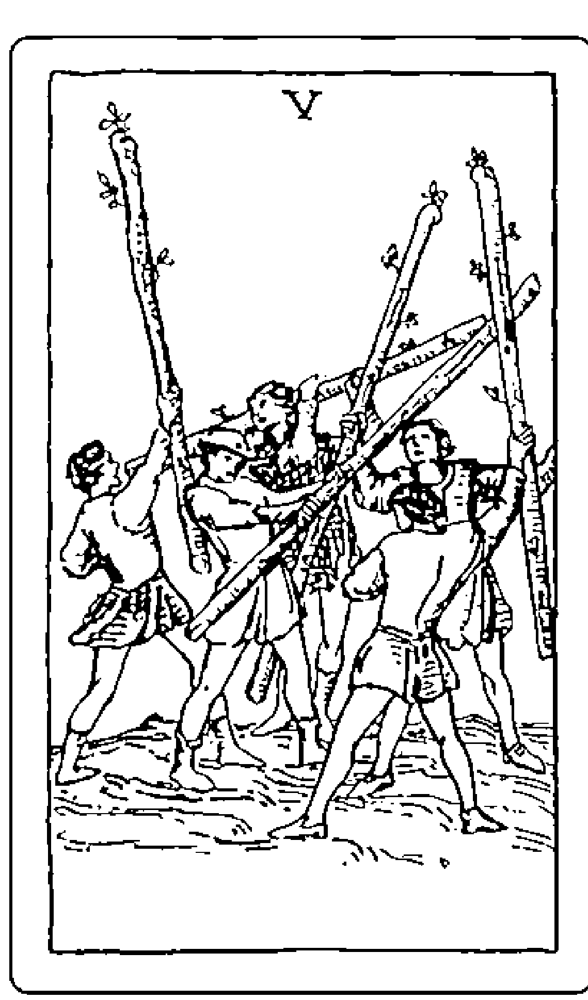
权杖五正位

### 一、空窗篇－无对象

### 没对象的原因
你目前的生活十分忙碌，所以没有多余的时间精力可以投入在感情方面，只能全心全意去解决生活中遇到的问题。

### 可以改进的地方
你要尽量收敛自己的火爆脾气，不要遇到一点小事就和别人吵起来，能够学会和善地与人相处才容易找到新恋情。

### 身边是否有好对象
目前在你身边并没有好对象，即使出现追求者也是不适合的人，你应该先花时间把身边的其他干扰因素给解决掉。

### 可能找到对象的管道
目前任何管道都可以去试试看，但是要有面对竞争与冲突的心理准备，全力以赴击败对手才有机会得到新的恋情。

### 二、暧昧篇－有对象但不确定

### 如何看待对方
这是一个很努力的人，但是有时候会为达目的不择手段，在相处时很容易发生冲突，总觉得与对方有一种距离感。

### 心中是否有别人
目前在他心中并没有预设的对象，但是其实在内心当中十分渴望爱情，如果努力进攻的话也许可以引起他的注意。

### 可能有哪些阻碍
两个人的观念与立场存在许多的差异和矛盾，并不是那么容易跨越过去，也许还没开始正式交往就已经吵翻天了。

### 如何告白容易成功
首先要尽量展现自己的优点，同时积极努力地找机会接近对方，利用两个人单独相处的时间直接表达自己的心意。

### 三、相处篇－有明确对象

### 日常相处状况
两个人的日常相处过程纷争不断，经常会为了大小事情吵架，双方都希望能控制对方，但总是不断遭遇顽强抵抗。

### 金钱与价值观
两个人在观念上有很多差异，一旦遇到金钱方面的问题就容易发生争吵，甚至有可能到最后演变成分手的导火线。

### 彼此心灵契合
两个人都知道彼此有很大的不同，但是仍然愿意为了这段关系努力下去，只是有很多事情不是靠努力就能解决的。

### 讲话沟通方式
两个人之间经常发生争吵，严重的话甚至可能演变成拳脚相向的暴力场面，也可以说双方是用争吵的方式在沟通。

### 性的吸引力
在这段感情中两个人都很想要胜过对方，性关系只是去控制对方的手段之一，两个人之间并没有什么性的吸引力。

### 与对方家人的关系
你与对方家人的关系并不和谐，所以最好是保持距离以策安全，若是不小心处理家人的问题也会成为争议的焦点。

### 继续发展的前景
这段关系发展的前景看来并不乐观，彼此之间的差异点将会被突显出来，可能经历严重的争吵，甚至会走向分手。

### 四、危机篇

### 是否出现第三者
两个人之间有可能会出现第三者，甚至是在一方外遇之后，另外一方也有样学样来报复对方，要很小心处理才行。

### 发生争吵的问题点
发生争吵的问题点在于彼此都想要控制对方，但是都不愿意与对方妥协，在立场僵持的状况之下就很难避免争吵。

### 如何化解纷争
现在争吵已经成为一种常态，如果有一天不吵还会让人觉得不太习惯，除非你们能放下想要控制对方的强烈欲望。

### 提出分手的方法
两个人的关系已经快要到极限了，只要有一方完全不理會对方，也许就算是分手的状况，并不用正式地提出分手。

### 复合的可能性
这段关系完全没有任何复合的可能性，彼此之间也已经撕破脸，如果不小心再见到对方仍然会想要和他大吵一架。

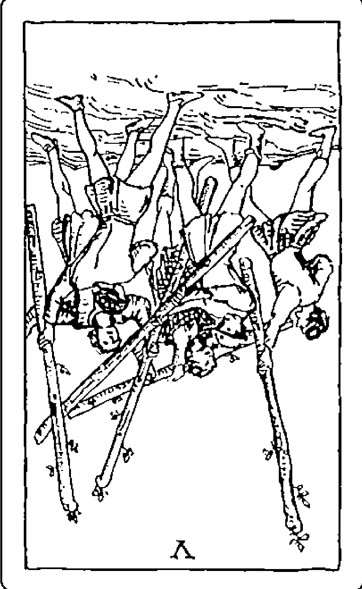
权杖五逆位

### 一、空窗篇－无对象

### 没对象的原因
你对于感情的事想太多，甚至有许多互相矛盾的要求，所以很难出现完全符合你期待的人，也就没有明确的对象。

### 可以改进的地方
你要先放下在感情当中想要控制对方的想法与期待，同时认清自身真实的条件，这样才有机会吸引新的感情对象。

### 身边是否有好对象
目前在你身边并没有适合的好对象，如果勉强自己接受反而可能造成以后更多问题，所以还是先观望一阵子再说。

### 可能找到对象的管道
这个时候任何管道都无法帮助你找到好对象，若是由朋友介绍的对象甚至可能会引起纷争，在这方面要小心谨慎。

### 二、暧昧篇－有对象但不确定

### 如何看待对方
这是一个喜欢争夺的人，所以很容易与身边的人发生冲突，在相处时会感觉有侵略性，并不会让人想要更进一步。

### 心中是否有别人
目前在他的心中并没有特定的人选，但是连他也不知道自己想要什么样的感情，所以在感情上并不容易下定决心。

### 可能有哪些阻碍
两个人之间也许有些事情没有说清楚，但是这些隐瞒或欺骗很可能会造成彼此关系的阻碍，诚实才是最好的策略。

### 如何告白容易成功
这时候要告白很不容易成功，而且还可能会引发争执，造成彼此之间关系的倒退，所以最好还是先等一阵子再说。

### 三、相处篇－有明确对象

### 日常相处状况
两个人之间存在许多矛盾与冲突，导致在生活上无法相互配合，这些问题若是无法摊开来谈就会变成彼此的心结。

### 金钱与价值观
两个人可能为了金钱的问题发生冲突，严重的话甚至还会弄到对簿公堂，所以在财务上最好是各自独立比较安全。

### 彼此心灵契合
两个人都觉得彼此并不适合，也知道这段关系不会有好结果，只是现在仍然有些不甘心，所以双方都不愿意放手。

### 讲话沟通方式
两个人之间有一些事情不敢说或是不愿意说，所以很容易造成彼此的误解，严重的话甚至可能变成分手的导火线。

### 性的吸引力
这段感情当中其实没有很强的性吸引力，但是可能其中一方或双方都有暴力倾向，以致于双方很排斥发生性关系。

### 与对方家人的关系
你觉得自己并不受对方家人的欢迎，甚至可能成为他们争吵的导火线，所以最好不要涉入太深，以免发生问题。

### 继续发展的前景
这段关系继续下去的前景并不看好，两个人为了无法解决的事情重复地争吵，即使不分手彼此的感情也荡然无存。

### 四、危机篇

### 是否出现第三者
两个人之外并没有其他的第三者，连潜在的竞争者也不存在，所有的问题还是要回到彼此之间的争执点才能解决。

### 发生争吵的问题点
彼此都很清楚争执的焦点，也已经为了这件事情吵过无数次，但是两个人都不愿意让步，所以问题一直无法解决。

### 如何化解纷争
其实很多争吵的事情已经发生太多次了，能不能改变彼此相处的方式是最重要的，否则这次吵完了还是会再发生。

### 提出分手的方法
其实两个人已经没什么感情了，只是表面上还不愿意说破，只要有一方说出来要分手，两个人都会同意就此分手。

### 复合的可能性
这段关系完全没有任何复合的可能性，因为彼此之间的心结已经很深，心中也有很多怒气未平，不想再见到对方。

## 塔罗爱情占卜的牌义
- 大阿尔克纳
- 权杖
- 圣杯
- 宝剑
- 钱币
- 宫廷

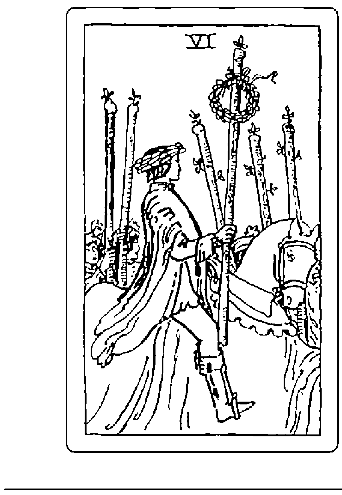
权杖六正位

### 一、空窗篇－无对象

### 没对象的原因
你在感情方面自视甚高，总觉得身边的人配不上你，如果你又摆出一副高高在上的样子，就很难有人敢来接近你。

### 可以改进的地方
你要放下对于感情过高的期待，不再执着于某些固定的观念和条件，如果能够更有弹性就可能遇到新的感情机会。

### 身边是否有好对象
目前在你身边有还不错的对象，而且整体而言还算符合你的期待，你应该主动出击去寻找，不要只是被动地等待。

### 可能找到对象的管道
这个时候任何管道都可能帮你找到好对象，特别是与朋友们出去玩或是参加一些联谊活动，都会出现不错的对象。

### 二、暧昧篇－有对象但不确定

### 如何看待对方
这是一个对自己充满自信的人，同时也很受到大家的欢迎，相处的时候会觉得很有吸引力，让人想更进一步交往。

### 心中是否有别人
目前在他心中已经有很稳定的感情对象，而且大家都看好他们的发展，在这个时候你要介入恐怕会有很大的困难。

### 可能有哪些阻碍
这段关系并没有任何外在阻碍，互相之间会卡住的因素也不多，只要愿意主动表白，一定能得到对方正面的回应。

### 如何告白容易成功
这个时候无论怎么告白都很容易成功，重要的是你自己是否有足够明确坚定的行动，让对方可以感受到你的诚意。

### 三、相处篇－有明确对象

### 日常相处状况
两个人日常相处的状况没有什么问题，彼此之间也可以相互配合，身边的人也都看好与支持你们之间的感情关系。

### 金钱与价值观
两个人不会遇到金钱方面的问题，甚至会发现在一起之后财务状况有明显的改善，彼此之间的价值观也算是一致。

### 彼此心灵契合
两个人都十分看好这段关系，也可以达到让彼此都觉得满意的境界，双方都愿意为了更美好的未来付出努力。

### 讲话沟通方式
两个人都很重视沟通，也会以比较正面的态度去面对彼此之间的问题，所以即使发生争吵最后大都能够和平收场。

### 性的吸引力
两个人之间有很强的吸引力，性吸引力只是其中的一部分，双方在性生活方面配合良好，这也是情趣的重要来源。

### 与对方家人的关系
你与对方家人相处的感觉十分自在，他们也都能支持你的想法和决定，你可以完全融入对方一家人当中。

### 继续发展的前景
这段感情发展的前景十分看好，之前的努力与付出也都会看到收获与回报，如果情况许可很可能会走向婚姻之路。

### 四、危机篇

### 是否出现第三者
两个人之间完全不可能出现第三者，即使有人刻意也无法介入你们的关系，所以对于其他竞争者可以完全不理会。

### 发生争吵的问题点
彼此发生争吵的问题点，在于双方都对这段关系太有信心，认为两个人不可能会争吵，才会在不知不觉当中犯错。

### 如何化解纷争
这个时候应该对彼此有信心，不要因为一点点小事情就闹翻了，保持理性慢慢处理问题，将会有一个完美的解决。

### 提出分手的方法
这个时候两个人实在很难分开，除非对方主动提出分手才有可能，但是你也很难用任何方法让对方主动提出分手。

### 复合的可能性
这段关系并没有任何复合的可能性，因为彼此之间已经没有太多感情，而且也觉得到此为止是对双方最好的选择。

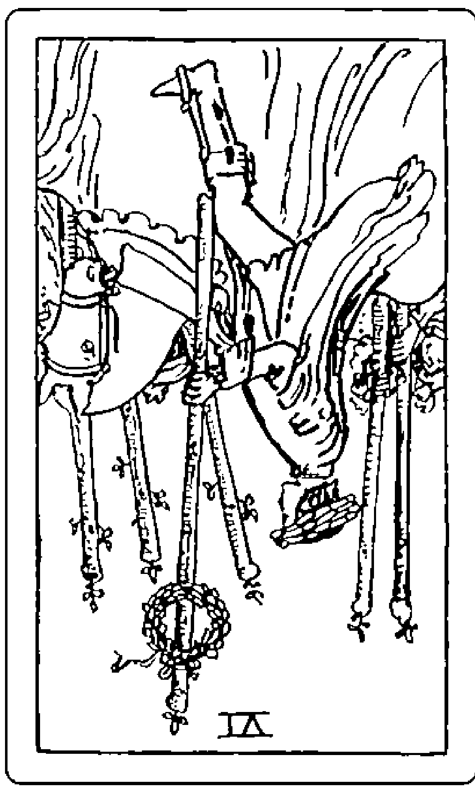
权杖六逆位

### 一、空窗篇－无对象

### 没对象的原因
你在感情上过于胆小，总觉得自己配不上对方，也没有主动追求别人的勇气，所以自然而然就会陷入单身的状态。

### 可以改进的地方
你要力求自然的表现，而不必装作自己很厉害或完美的样子，只要能够诚心诚意待人，就容易吸引到适合的对象。

### 身边是否有好对象
目前在你身边也许有不错的对象，但是对方可能已经有心上人了，或是完全对你没意思，要进攻的话胜算并不高。

### 可能找到对象的管道
这个时候任何管道都不太可能帮你找到好对象，反而可能会带来一些纠纷和伤害，所以最好是先休息一阵子再说。

### 二、暧昧篇－有对象但不确定

### 如何看待对方
这是一个骄傲自大的人，常常会表现出高高在上的姿态，在相处时会让人觉得很不舒服，并不会想要进一步交往。

### 心中是否有别人
目前在他心中并没有特定的对象，甚至会有一点害怕开始新的恋情，也许他还没有从过去感情的伤害当中走出来。

### 可能有哪些阻碍
这段关系目前还存在其他强而有力的竞争者，会对两个人感情的进展造成重大的影响，也容易造成彼此的不信任。

### 如何告白容易成功
这个时候告白绝对是不智之举，不但会让你们的关系倒退，可能还会延伸出其他的纠纷，最好还是不要轻举妄动。

### 三、相处篇－有明确对象

### 日常相处状况
两个人相处的状况并不稳定，也可能出现其他的竞争者，彼此之间无法相互信任，甚至经常会有刻意欺骗的状况。

### 金钱与价值观
两个人在金钱财务上可能会遇到重大的问题，彼此若是不能相互体谅就会造成严重的纠纷，甚至可能会因此分手。

### 彼此心灵契合
两个人都觉得无法真心信任对方，也看不到这段关系有什么未来，如果遇到问题或是挑战也许就会直接选择放弃。

### 讲话沟通方式
两个人之间经常发生相互隐瞒或是欺骗的状况，所以很难取得对方的信任，若是谎言被揭穿又会引发更大的争吵。

### 性的吸引力
两个人之间并没有很强的性吸引力，反倒是会担心自己在性生活方面表现得不够好，对这段关系造成负面影响。

### 与对方家人的关系
你并不喜欢与对方的家人相处，因为在当中你会觉得自己孤立无援，他们并不支持你的决定，反而会扯你的后腿。

### 继续发展的前景
这段关系继续下去的前景并不看好，很可能会有其他竞争者介入，或是遇到外在的困难和打击而发生重大的危机。

### 四、危机篇

### 是否出现第三者
这段关系很可能已经出现第三者，而且是具有强烈威胁性的狠角色，如果不努力巩固的话就很可能会被横刀夺爱。

### 发生争吵的问题点
发生争吵的主要问题点在于双方都不说实话，所以彼此之间无法相互信任，两个人之间的心结也就因此越来越多。

### 如何化解纷争
这个时候应该放下自己太过主观的看法，不要老是高高在上的态度，要真正了解对方的看法，才有可能化解误会。

### 提出分手的方法
这个时候感情当中可能会出现强劲的竞争者，这也许会是一个令两个人分开的机会，而且很难不对彼此造成伤害。

### 复合的可能性
两个人之间完全没有复合的可能，因为彼此已经撕破脸了，并没有任何转圜的余地，也许对方很快就会有新对象。

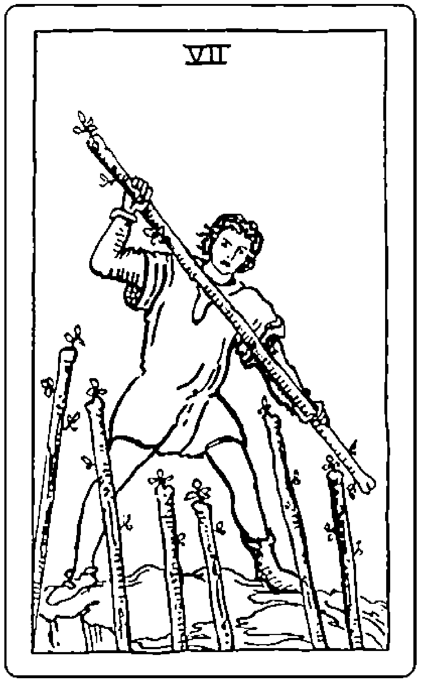

### 一、空窗篇－无对象

### 没对象的原因
你有太多外务的干扰，以致于无法专心经营感情生活，也许目前已经出现了适合的对象，只是你还没有发觉而已。

### 可以改进的地方
你有太多不必要的坚持，所以迟迟无法找到适合的对象，如果能以开放的态度接受不同的可能性，机会就大得多。

### 身边是否有好对象
其实在你身边一直不缺乏好的对象，只是你可能没有感觉或看不上眼，甚至还有一些你一直没注意到的潜在对象。

### 可能找到对象的管道
这个时候任何管道都可能帮你找到好的对象，但是重点在于你愿不愿意放下内心的防卫性，去接受一段新的感情。

### 二、暧昧篇－有对象但不确定

### 如何看待对方
这是一个很有能力的人，但是也经常恃才傲物固执己见，在相处时会觉得很有吸引力，同时也害怕自己配不上他。

### 心中是否有别人
目前在他心中有几个考虑的对象，只是还没有最后的定论，如果你积极行动的话，也有机会被他列为可能的人选。

### 可能有哪些阻碍
这段感情可能有其他竞争者，甚至在你或对方的心中仍然有其他考虑的人选，这些因素都会造成感情进展的阻碍。

### 如何告白容易成功
这个时候告白要主动积极，最好能在大家面前公开告白，这样才能显示出你的决心和勇气，对方也比较容易接受。

### 三、相处篇－有明确对象

### 日常相处状况
两个人的相处经常要面临许多压力与挑战，但是只要两个人同心协力就可以克服困难，让这段感情继续维持下去。

### 金钱与价值观
两个人在财务上可能会遇到一些小问题，不过并不会影响到彼此之间的关系，大部分的事情都可以透过沟通解决。

### 彼此心灵契合
两个人都觉得这段感情得来不易，因此都很珍惜彼此之间的缘份，无论接下来遇到什么问题，都会努力坚持下去。

### 讲话沟通方式
两个人讲话都很直接，经常会感觉到唇枪舌战的气氛，不过也因为什么话题都能聊，所以不会有沟通不良的问题。

### 性的吸引力
这段感情当中性的吸引力并不是最重要的，但是也是不可或缺的一个部分，两个人都会尽力去维持性生活的美满。

### 与对方家人的关系
你在对方家人面前表现得比较强势，让人觉得很有自信与主见，所以并不是他们要你做什么，你就非得遵从不可。

### 继续发展的前景
这段感情继续下去虽然会有一些小波折，但是整体而言仍然是具有未来性，只要坚持下去就可以保持不错的关系。

### 四、危机篇

### 是否出现第三者
这段关系当中有可能出现其他追求者，但是并不会威胁到彼此之间的感情，所以还是应该好好经营两个人的关系。

### 发生争吵的问题点
会发生争吵的核心因素在于双方都固执己见，同时又因为面子问题不愿意先低头，这样就很容易变成卡住的状况。

### 如何化解纷争
这个时候不要想把所有的事情一次解决，应该把问题分开来一个一个处理好，这样就能很顺利地解决所有的问题。

### 提出分手的方法
这个时候可能因为其他追求者的介入而使感情发生一些变化，如果以此为藉口提出分手，也算是可行的方法之一。

### 复合的可能性
这段关系其实有可能会复合，但是要看你是不是主动，以及你到底付出了多少，若是在原地等待是不会有结果的。

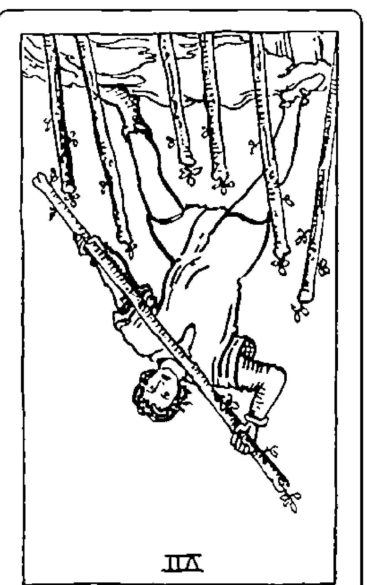
权杖七逆位

### 一、空窗篇－无对象

### 没对象的原因
你在感情方面过度自我保护，把所有可能的追求者都拒于千里之外，这样的态度和做法自然就无法找到新的恋情。

### 可以改进的地方
你要先放下对于感情的焦虑不安，之后才能在感情上采取行动，要更主动积极一点才能在感情上争取到好的对象。

### 身边是否有好对象
目前在你身边应该有一个以上的人对你有意思，只是这种状况也很容易让你觉得困惑与犹豫，不知该如何做决定。

### 可能找到对象的管道
这个时候主动出击通常不会有任何效果，还不如在原地等待比较有机会，潜在的对象会因为相互竞争而浮现出来。

### 二、暧昧篇－有对象但不确定

### 如何看待对方
这是一个优柔寡断缺乏主见的人，遇到事情容易变得紧张，在相处时会觉得比较害羞，不会让人想要进一步交往。

### 心中是否有别人
目前在他心中有好几个不同的候选对象，彼此之间的竞争也很激烈，如果你选择在这个时候加入战局胜算并不高。

### 可能有哪些阻碍
外在环境的不利因素可能会严重干扰你们之间感情的发展，再加上其他竞争者又来搅局，前面的路并不是很好走。

### 如何告白容易成功
这个时候告白不容易被接受，甚至会造成彼此关系的倒退，还不如先维持现状，等待有利的时机出现再采取行动。

## 三・相處篇—有明確對象

### 日常相處狀況
日常生活當中經常因為外在的因素而無法配合，這也不是兩個人有能力解決的問題，很可能因為這些事情而爭吵。

### 金錢與價值觀
兩個人可能會在金錢上遇到重大的考驗，甚至因此引發財務危機，如果不積極處理的話，只會讓問題越來越嚴重。

### 彼此心靈契合
兩個人都對這段關係感到懷疑，也不確定未來要怎麼走下去，其實彼此的內心都有一些不滿，只是還沒爆發出來。

### 講話溝通方式
兩個人之間缺乏良好的溝通方式，很多話都因為怕傷害對方而不願意說出來，這樣反而會引發更多的誤解和問題。

### 性的吸引力
在這段感情當中並沒有很強的性吸引力，即使有性生活也不會成為兩個人生活的重要部分，並沒有什麼加分作用。

### 與對方家人的關係
你覺得對方的家人對你們的關係干涉很多，但是本身又沒有獨立自主的能力，所以只能屈居弱勢的地位逆來順受。

### 繼續發展的前景
這段關係發展的前景並不看好，感情本身就不是很穩定，了還有其他的外在因素來干擾，很可能會走向分手之路。

## 四・危機篇

### 是否出現第三者
這段感情當中可能出現第三者，讓彼此的關係產生變化，所以應該要好好鞏固兩個人的感情，以免讓人乘虛而入。

### 發生爭吵的問題點
兩個人爭吵的問題點最初來自於外在因素，後續才引發出彼此的對立與情緒，其實沒必要為了這些無聊的事爭吵。

### 如何化解紛爭
這個時候最忌諱人多口雜，太多外人出意見反而無法看到問題的核心，兩個人還是單獨找個時間坐下來好好談吧。

### 提出分手的方法
這段關係其實已經問題叢生，即使不分手兩個人也是很痛苦，如果有一個人先提出分手，雙方都會有解脫的感覺。

### 複合的可能性
這段關係已經沒有複合的可能性，兩個人的感情應該是到此為止了，如果再有什麼感情的牽扯也只是帶來更痛苦。

塔羅愛情占卜

大阿爾克納

權杖

聖杯

寶劍

錢幣

宮廷

256-257

## 權杖八正位

### 一、空窗篇－無對象

### 沒對象的原因
你本身的事情就已經夠忙了，再加上又不想被別人綁住，所以一直沒有花心思在經營感情上，自然就不會有對象。

### 可以改進的地方
你要明白欲速則不達的道理，急著想要在感情上看到成果反而容易弄巧成拙，耐心地付出才能經營出穩定的關係。

### 身邊是否有好對象
目前在你身邊也許有不錯的對象，但是很可能還有其他的競爭者，所以想要把握這個機會的話就要快點開始行動。

### 可能找到對象的管道
你可以多到鄉村田野走走，或是參加給單身男女聯誼的旅行團，透過這些活動的機會就有可能找到新的感情對象。

### 二、曖昧篇－有對象但不確定

### 如何看待對方
這是一個動作很快的人，做事情往往只有三分鐘熱度，在相處時會覺得充滿活力，但是並不會想要與他走得太近。

### 心中是否有別人
目前在他心中也許已經有另一個目標，雖然彼此的關係還不是太穩定，不過若是動作慢的話可能就來不及介入了。

### 可能有哪些阻礙
目前兩個人的關係並沒有明顯的阻礙，發展的速度也很快，只是在短期之內投入太多力氣，會讓雙方覺得有點累。

### 如何告白容易成功
這個時候任何告白方式都可以，但最重要的關鍵因素在於速度，只要能盡快讓對方知道自己的心意就很容易成功。

## 三・相處篇－有明確對象

### 日常相處狀況
兩個人有共同的目標，也會一起朝向這個目標去努力，雖然在生活上可能有些忙碌，但彼此之間還是能相互配合。

### 金錢與價值觀
兩個人的價值觀十分一致，所以即使遇到金錢方面的問題也不太會爭吵，但是雙方的花費會因為這段關係而增加。

### 彼此心靈契合
兩個人都像是被愛神的箭所射中，完全投入這段感情而無法自拔，而且彼此都覺得對方就是自己想要的理想伴侶。

### 講話溝通方式
兩個人的默契很好，所以言語上的溝通反而不是那麼多，要注意有些話說得太快，可能會不小心造成對方的傷害。

### 性的吸引力
兩個人之間有很強的性吸引力，因此也會發展得非常快速，性生活將成為這段感情當中不可或缺的一個重要領域。

### 與對方家人的關係
你與對方家人的關係還不錯，但是你並不想涉入太多他們家裡的事情，所以保持獨立自主的關係是最好的選擇。

### 繼續發展的前景
這段感情的發展前景很不錯，短期之內應該就會有明顯的進展，而且雙方都很用心投入，是一段值得把握的關係。

## 四・危機篇

### 是否出現第三者
這段感情完全不可能出現第三者，管得太多反而可能對兩個人都造成傷害，所以一定要給彼此多一點自由的空間。

### 發生爭吵的問題點
發生爭吵的問題點在於事情的進展太快，把很多狀況都視為理所當然，但是其實雙方並沒有事先溝通好達成共識。

### 如何化解紛爭
兩個人的關係需要一些空間，讓彼此有更多的自由去作自己想要做的事情，處理好之後自然可以心平氣和地溝通。

### 提出分手的方法
雙方可能會因為長遠的規劃不同而有所爭吵，但仍然不至於到立刻分手的地步，但若熱情過後可能就會自然分手。

### 複合的可能性
兩個人之間並沒有複合的可能性，重新回到自己一個人的自由生活就不想要再被綁住，甚至短期內也不想談戀愛。

## 權杖八逆位

### 一、空窗篇－無對象

### 沒對象的原因
你在內心當中還沒有準備好要談感情，也不知道自己想要什麼樣的對象，這樣的狀況之下當然就不可能有新戀情。

### 可以改進的地方
你在感情當中要更有行動力，而不只是停留在原地空想，如果可以更主動積極去追求感情，就可能出現新的對象。

### 身邊是否有好對象
目前在你身邊並沒有好的對象，甚至很有可能會被不適合的人所吸引，所以這個時候最好還是先觀望一陣子再說。

### 可能找到對象的管道
這個時候任何管道都不太可能幫你找到好的對象，若是請別人介紹還可能引起不必要的紛爭，最好先休息一陣子。

### 二、曖昧篇－有對象但不確定

### 如何看待對方
這是一個急性子的人，容易因為小事情就與別人發生衝突，在相處的時候會很有壓力，所以會讓人想要保持距離。

### 心中是否有別人
目前在他的心中並沒有鎖定任何的對象，但是也還搞不清楚自己想要什麼樣的感情，所以並不容易吸引他的注意。

### 三、相處篇－有明確對象

### 日常相處狀況
兩個人在生活上的想法與目標並不一致，所以經常會發生無法配合的狀況，甚至會為了一些小事情就嚴重地爭吵。

### 金錢與價值觀
兩個人的價值觀並不一致，經常會為了金錢方面的事情發生爭吵，如果希望減少爭端，最好是在財務上各自獨立。

### 彼此心靈契合
兩個人都覺得彼此之間有許多地方嚴重的不合，也知道這段關係沒有未來，目前還維持這樣的關係只是硬撐而已。

### 講話溝通方式
兩個人的觀念與想法有極大的差異，因此經常會為了不同的事情爭吵，甚至可以說彼此是運用爭吵的方式在溝通。

### 性的吸引力
兩個人之間有很強的性吸引力，但是性生活並不協調，兩個人容易因此引發一些爭吵，甚至可能會導致雙方分手。

### 與對方家人的關係
你與對方家人的關係並不好，甚至要保持表現的和諧都有困難，所以最好是保持距離以策安全，不要有太多交集。

### 繼續發展的前景
這段關係繼續發展的前景並不看好，彼此之間可能會發生很大的衝突，若是不小心處理還可能會走向分手的道路。

### 四、危機篇

### 是否出現第三者
這段關係不太可能出現第三者，但是彼此之間的不和與衝突確實需要處理，無謂的懷疑或忌妒反而會使狀況更糟。

### 發生爭吵的問題點
兩個人的爭吵可能只是因為一時衝動，或是說了某些話激怒了對方，接下來就容易引發雙方一連串情緒化的反應。

### 如何化解紛爭
有很多問題是因為雙方不夠務實而產生，只要回歸到實質的層面來討論，甚至提出相關的數據之後自然可以解決。

### 提出分手的方法
兩個人的關係已經有太多的糾結，要一下子分開除非快刀斬亂麻，決定分手之後就不要再見面，否則並不太可能。

### 復合的可能性
兩個人之間仍然存在復合可能，但是即使真的決定要復合，還是會一天到晚吵個沒完，倒不如就分開來比較乾脆。

塔羅愛情占卜的牌義

| 大阿爾克納 |
|---|
| 權杖 |
| 聖杯 |
| 寶劍 |
| 錢幣 |
| 宮廷 |

## 權杖九正位

## 一 · 空窗篇－無對象

### 沒對象的原因
你害怕在感情當中受到傷害，所以往往採取過度防禦的態度和做法，即使有人想要接近也容易被你的氣勢給嚇跑。

### 可以改進的地方
你要適度地讓自己放鬆，避免堅守過多不必要的紀律和原則，只要能卸下心防接受各種機會，就會出現新的對象。

### 身邊是否有好對象
目前在你身邊並沒有好對象，即使有追求者也不令你滿意，所以這個時候還是暫時保守一點，等運勢改變了再說。

### 可能找到對象的管道
目前任何管道都不太可能幫你找到好對象，所以主動出擊的效果十分有限，還不如在原地守株待兔才比較有機會。

## 二 · 暧昧篇－有對象但不確定

### 如何看待對方
這是一個防衛心很重的人，做事情十分小心謹慎，相處的時候會讓人覺得很有距離感，很難產生任何感情的聯想。

### 心中是否有別人
目前在他的心中並沒有鎖定任何感情對象，甚至對於談感情十分戒慎恐懼，要突破他的心防並不是一件容易的事。

### 可能有哪些阻礙
兩個人的防衛心都很重，而且觀望氣氛濃厚，若是雙方都不願意主動跨出第一步，關係很可能就會一直卡在這裡。

### 如何告白容易成功
這個時候主動告白很容易被拒絕，之後就再也不可能有機會了！所以最好是不要衝動，等待時機成熟之後再行動。

### 三、相處篇－有明確對象

### 日常相處狀況
日常相處上有些事無法配合，可能會演變成互不相讓的僵持狀況，如果有一方發動攻擊往往會引發更激烈的反擊。

### 金錢與價值觀
兩個人的財務結構并不是很健全，甚至還可能有負債的狀況，如果不小心處理很容易會為了金錢的事情發生爭吵。

### 彼此心靈契合
兩個人都覺得在這段關係當中受到傷害，但是還沒走到絕望的地步，所以即使有些不順利仍然想要繼續堅持下去。

### 講話溝通方式
兩個人之間的溝通管道并不順暢，有很多事情彼此都沒辦法說出口，在互相不了解的狀況之下就很容易發生磨擦。

### 性的吸引力
兩個人之間沒有很強的性吸引力，性關係也會變成兩個人都逃避的一個領域，甚至可能很長一段時間沒有性生活。

### 與對方家人的關係
你與對方的家人之間有些疏遠，本身也不想與他們太親近，如果彼此的互動過於頻繁反而會讓你覺得渾身不自在。

### 繼續發展的前景
這段關係的發展前景并不看好，很可能會卡在一個令人不滿的狀況當中，雖然彼此都覺得受到傷害卻又無法離開。

### 四、危機篇

### 是否出現第三者
這段關係不太可能出現第三者，但是也許會遇到發展的瓶頸，總之問題是出在兩個人之間，而不是由第三者引起。

### 發生爭吵的問題點
雙方在這件事情上面各有堅持，但是又缺乏良好的溝通模式，只是站在自己的立場來考慮事情就很容易發生衝突。

### 如何化解紛爭
這個時候應該先給彼此一些空間，不要急著去處理問題，等雙方都冷靜下來再說，否則可能會引發更嚴重的衝突。

### 提出分手的方法
目前是雙方僵持的狀況，只要提出分手另一方就會進行激烈的反擊，如果想提出分手就要有受傷慘重的心理準備。

### 復合的可能性
其實兩個人之間已經沒有什麼感情了，所以要複合的可能性幾乎不存在，即使複合之後兩個人的關係也無法改善。

塔羅愛情占卜

| 大阿爾克納 |
|---|
| 權杖 |
| 聖杯 |
| 寶劍 |
| 錢幣 |
| 宮廷 |

## 權杖九逆位

### 一、空窗篇－無對象

### 沒對象的原因
你的生活圈比较孤立狭窄，也很缺乏与异性接触的机会，如果自己没有积极的行动，就不容易找到新的感情对象。

### 可以改進的地方
你要盡快地從過去的傷痛中走出來，積極地與人群接觸，如果能增加與異性相處的機會就比較容易遇到新的對象。

### 身邊是否有好對象
目前在你身邊沒有什麼好對象，甚至連不適合的對象也沒有，如果自己不做任何改變，就很難發現新的感情機會。

### 可能找到對象的管道
這個時候應該要改變既有的方法，以不同的新管道去尋找感情對象，只要自己願意改變，感情對象就會慢慢浮現。

### 二、曖昧篇－有對象但不確定

### 如何看待對方
這是一個比較孤僻的人，不太喜歡與人群接觸，相處的時候會給人沉悶的感覺，並不會想要與他有進一步的發展。

### 心中是否有別人
目前在他的心中可能還沒放下舊情人，但是也已經知道彼此沒有機會再續前緣，也許這個時候他只想要好好休息。

### 可能有哪些阻礙
外在環境上有許多不利的因素，讓彼此都不敢在這個時候貿然開始一段感情，要突破這個狀況要下定很大的決心。

### 如何告白容易成功
這個時候告白幾乎不可能成功，反而會引發更多後續的問題，所以這個時候最好先冷靜觀察，思考之後再做決定。

## 三・相處篇—有明確對象

### 日常相處狀況
兩個人在日常相處上遇到很多問題與障礙，但也不是雙方有能力可以解決的，所以常常只能先忍耐走一步算一步。

### 金錢與價值觀
兩個人在財務上遇到重大的問題，而且也不是短期之內可以化解的，這件事情會對彼此的心裡都造成重大的負擔。

### 彼此心靈契合
兩個人都發現到這段關係的困難重重，而且也覺得彼此都撐得很辛苦，甚至有一方或雙方會生出想要放棄的念頭。

### 講話溝通方式
兩個人之間的溝通有嚴重的障礙，經常會誤解對方的意思，如果不能放下主觀的立場，就無法真正聽懂對方的話。

### 性的吸引力
這段關係當中性的吸引力並不重要，甚至也會成為雙方不願意去碰觸的話題，因為可能其中一方有性功能障礙。

### 與對方家人的關係
你與對方家人的相處並不愉快，彼此之間也許會有一些心結，如果不想增加問題的話，最好是保持距離以策安全。

### 繼續發展的前景
這段關係的前景並不看好，有許多內部的問題與外在的阻礙等在前面，如果處理不好的話很可能會走向分手之路。

## 四・危機篇

### 是否出現第三者
這段關係當中並沒有第三者，但是有許多其他外在的阻礙，兩個人必須要互相信任同心協力才可能突破這些困境。

### 發生爭吵的問題點
發生爭吵的問題主要由外部的事件所引起，但是也突顯出來彼此之間的溝通不良，無法與對方取得共識解決問題。

### 如何化解紛爭
現在不是處理紛爭的好時間，越急著去處理問題反而會造成更多的問題，應該要先反省一下自己到底是錯在哪裡。

### 提出分手的方法
現在要分手其實並不太容易，雙方都不甘心在這個狀況下就分手，即使引發嚴重的衝突也只是使雙方更痛苦而已。

### 復合的可能性
這段關係完全沒有任何可能複合，兩個人都很想要快點逃出這段痛苦的關係，甚至可能短期內都不想要再談戀愛。

## 權杖十正位

## 一 · 空窗篇－無對象

### 沒對象的原因
你目前有太多其他事情讓你煩心，根本不會有空閒的時間和精力來談感情，即使出現好的感情機會也無法去把握。

### 可以改進的地方
你要學習放下過度的責任感，不要把所有的事情都背在身上，這樣才可能出現一些空間，讓新的戀情有機會出現。

### 身邊是否有好對象
也許目前在你身邊有還不錯的對象，但是你完全視而不見，只要你願意花心思尋找一下，應該就可以發現到對象。

### 可能找到對象的管道
目前透過任何管道都可能找到好的對象，但是重點在於你願不願意花心思在感情方面努力，要有行動才會有成果。

## 二 · 曖昧篇－有對象但不確定

### 如何看待對方
這是一個責任感很重要的人，總是表現出非常忙碌的樣子，相處起來感覺很平淡，並不會讓人想要更進一步交往。

### 心中是否有別人
目前在他的心中並沒有其他感情對象，但是也許會把諸如工作、課業、興趣或是家庭的責任等等放在感情的前面。

### 可能有哪些阻礙
可能有一方或是雙方的生活都太過忙碌，所以根本無心於感情方面的事，即使彼此之間有好感也沒有時間去經營。

### 如何告白容易成功
這個時候只要誠實地把自己內心的想法講出來就好，其他的不用想太多，越是簡單的方法往往就是最有效的方法。

### 三、相處篇－有明確對象

### 日常相處狀況
兩個人都有很多事情要忙，談感情對彼此來說反而變成是一種壓力，也沒辦法花太多時間和精力在經營這段關係。

### 金錢與價值觀
這段關係當中也許會面對金錢財務方面的問題，讓彼此都覺得有壓力，會不會發生爭吵就要看雙方願不願意承擔。

### 彼此心靈契合
對於雙方來說這段關係已經變成是一種責任，也會讓彼此感覺到沉重的壓力，但是兩個人都認為應該繼續撐下去。

### 講話溝通方式
兩個人都拿出最大的誠意來溝通，也會努力去減少彼此的誤解與紛爭，即使有歧見也都可以透過溝通來取得共識。

### 性的吸引力
兩個人之間沒有很強的吸引力，平時也為了生活忙碌，性生活反而是雙方壓力的來源，變成一種不得不作的責任。

### 與對方家人的關係
你覺得與對方家人的相處過程充滿了壓力，甚至會有一種被控制的感覺，所以最好還是保持距離會比較輕鬆自在。

### 繼續發展的前景
這段關係繼續發展下去壓力會越來越重，但是雙方又都不願意放手，即使真的硬撐下去也看不到什麼有利的轉機。

### 四、危機篇

### 是否出現第三者
這段感情不可能出現第三者，但是確實有一些外在的阻礙影響了彼此的相處關係，所以要想辦法把這些事情排除。

### 發生爭吵的問題點
兩個人會發生爭吵的主要問題點，在於彼此的控制慾太強，對於很多事情很固執又緊抓不放，所以才會發生爭執。

### 如何化解紛爭
不要給彼此太大的壓力，最好先冷靜下來再說，等到彼此有充分時間溝通的時候再來處理，會有比較圓滿的結果。

### 提出分手的方法
兩個人的關係其實已經到了極限，只要再增加一點點壓力可能就會崩潰了，這時候就要看誰願意把分手先說出口。

### 複合的可能性
這段關係完全沒有可能複合，不要再去想這個人了，當你真的放下這段感情之後，你會感覺到前所未有的解放感。

塔羅愛情占卜

| 大阿爾克納 |
|---|
| 權杖 |
| 聖杯 |
| 寶劍 |
| 錢幣 |
| 宮廷 |

## 權杖十逆位

### 一、空窗篇－無對象

### 沒對象的原因

你對於自己適合怎麼樣的對象並不清楚，也沒有真正花時間去經營感情關係，即使有對象出現也不知該怎麼把握。

### 可以改進的地方

你應該虛心地檢討自己，同時要放下一些不必要的堅持，只要你能看清楚事實重新出發，就很可能會遇到好對象。

### 身邊是否有好對象

目前在你身邊也許會有新的機會出現，但這些並不是適合你的對象，如果勉強自己接受反而可能會引發更多問題。

### 可能找到對象的管道

這個時候任何管道都不太可能找到好對象，甚至有可能一不小心就變成別人的第三者，或是落入其他感情的陷阱。

### 二、曖昧篇－有對象但不確定

### 如何看待對方

這是一個自私自利的人，常會為了自己的利益而出賣他人，相處起來覺得非常不可靠，也不會想要更進一步交往。

### 心中是否有別人

目前在他心中並沒有特定的對象，但是也沒有想要安定下來，所以即使你很努力也不容易發展成穩定的感情關係。

### 可能有哪些阻礙

兩個人互相之間可能有一些隱瞞或欺騙，讓彼此無法完全信任，如果雙方內心當中有芥蒂關係就有可能停滯不前。

### 如何告白容易成功

目前還不是適合告白的時機，貿然行動必然會造成失敗的結果，所以還是要從長計議，等到時機更成熟之後再說。

### 三、相處篇－有明確對象

### 日常相處狀況

兩個人的相處經常無法配合，甚至還會發生蓄意欺騙的狀況，但是即使交往的經過困難重重雙方仍然不願意放手。

### 金錢與價值觀

兩個人在金錢方面也許有一些問題，但是都不願意誠實地讓對方知道，這段關係很可能會加重彼此財務上的負擔。

### 彼此心靈契合

雙方都覺得這段關係並不穩固，也還有很多努力的空間，對於兩個人未來的發展也都沒有任何長遠及具體的規劃。

### 講話溝通方式

兩個人之間的溝通並不是很好，經常會有刻意隱瞞甚至是欺騙的狀況，若是事後被拆穿往往又會發生嚴重的爭吵。

### 性的吸引力

在這段感情當中性的吸引力並不是重要的因素，彼此之間的佔有慾反而是更重要事情，性生活只是佔有的一部分。

### 與對方家人的關係

你與對方家人的關係並不緊密，有時甚至覺得自己受到排斥，很多事情都被蒙在鼓裡，經常都是最後一個才知道。

### 繼續發展的前景

這段關係繼續發展下去的前景並不看好，除了外在的阻礙之外，彼此之間也有不小的矛盾，以及難以化解的心結。

### 四、危機篇

### 是否出現第三者

兩個人之間有可能出現第三者，同時還有其他很多問題，如果不能小心處理的話，甚至有可能因此走向分手之路。

### 發生爭吵的問題點

發生爭吵的問題點在於有一方或是雙方都沒有說實話，在無法了解對方真正想法的狀況之下，就很容易發生爭吵。

### 如何化解紛爭

你應該要對這個問題負起責任，仔細地分析到底問題出在哪裡，再一步一步地解決，千萬不要衝動地和對方漫罵。

### 提出分手的方法

其實兩個人還無法放下對方，要分手也不是那麼容易的事情，除非出現了重大的欺騙或謊言，才可能會無法忍受。

### 複合的可能性

這段關係其實還沒有完全結束，但是選擇分開會是比較好的結局，如果真的不幸複合的話反而會比從前吵得更兇。

- 塔羅愛情占卜的牌義
- 大阿爾克納
- 權杖
- 聖杯
- 寶劍
- 錢幣
- 宮廷

## 聖杯A正位

## 一、空窗篇—無對象

### 沒對象的原因

你對於感情有很高的理想，但是缺乏實際的行動，如果只是被動地等待別人追求，就很可能一直保持單身的狀態。

### 可以改進的地方

你要敞開心胸接受當下出現的緣份，而不是固執地堅持自己設定的理想狀況，只要願意放下就能遇到真心的對象。

### 身邊是否有好對象

其实在你身邊有不少好的對象，而且當中還有一些人會主動對你表示好感，是不是要接受就看你自己當下的判斷。

### 可能找到對象的管道

這時候新的人際關係當中往往會帶來感情的機會，所以應該多接近新同學、新朋友和新同事，自然能找到新戀情。

## 二、曖昧篇—有對象但不確定

### 如何看待對方

這是一個很真誠的人，遇到什麼好事都願意與別人分享，相處起來很舒服而沒有壓力，會讓人想要更進一步交往。

### 心中是否有別人

目前在他的心中已經有喜歡的對象，雖然關係還在剛起步的階段，但是你要在這個時候介入並不會有太高的勝算。

### 可能有哪些阻礙

你們之間的感情沒有任何阻礙，關鍵在於你們的心裡願不願意接受對方，所以重要的是克服內心的恐懼和不確定。

### 如何告白容易成功

這個時候不論如何告白都很容易成功，重要的是用主動積極地態度表現出你的真心，讓對方感受到你對他的誠意。

### 三、相處篇－有明確對象

### 日常相處狀況

兩個人的日常相處狀況十分良好，彼此都沉浸在幸福美滿的氣氛當中，幾乎沒有任何事情可以造成兩個人的爭吵。

### 金錢與價值觀

兩個人的財務狀況都算不錯，所以不會遇到金錢方面的問題，同時也很願意花錢享樂，共同創造幸福浪漫的感覺。

### 彼此心靈契合

兩個人都覺得這段感情十分幸福美滿，彼此都希望能與對方長相廝守，心中認定對方是上天送給自己最好的禮物。

### 講話溝通方式

兩個人之間雖然話不是很多，但是很多事情都盡在不言中，彼此的默契十分良好，無論什麼狀況都很難發生爭吵。

### 性的吸引力

這段感情當中有很強的吸引力，性的吸引力只是其中的一部分，當兩個人感情到了某個階段，自然而然就會發生。

### 與對方家人的關係

你與對方家人的關係十分融洽，好像原本就是一家人的感覺，與他們相處時覺得輕鬆自在，完全可以融入在當中。

### 繼續發展的前景

這段感情發展的前景十分看好，有如受到上天祝福一般不會遇到任何問題，如果情況允許很可能會走向婚姻關係。

### 四、危機篇

### 是否出現第三者

這段感情完全不可能出現第三者，如果有什麼問題應該提出來溝通，過度猜疑對方只會讓兩個人的關係受到損害。

### 發生爭吵的問題點

其實引發兩個人爭吵的問題只是非常小的事，也許是彼此都對這段關係的期待太高了，才會因為這種小事情爭吵。

### 如何化解紛爭

這個時候應該用更多的愛去包容，試著去了解事情的真相，也許問題並不是很嚴重，很多的部分只是一些小誤會。

### 提出分手的方法

現在要兩個人分開並不太可能，因為兩個人是真心誠意相愛，也發展出很緊密的關係，強迫分開會造成很多痛苦。

### 複合的可能性

基本上這兩個人可能會有新的開始，但是必然是與之前不同的新關係，要以一種全新的觀念和想法去和對方相處。

- 大阿爾克納
- 權杖
- 聖杯
- 寶劍
- 錢幣
- 宮廷

## 聖杯A逆位

### 一、空窗篇－無對象

### 沒對象的原因

你害怕在感情上受到傷害，因此就不願意全心投入一段新的感情，有時候退縮與猶豫也讓你平白錯過一些好機會。

### 可以改進的地方

如果想要找到新的對象，首先就是要改變你自己，從過去失敗的經驗當中學習，以不同的方式和觀念去面對感情。

### 身邊是否有好對象

目前在你身邊也許有一些新的對象，但大多都不是你所喜歡的類型，你要冷靜細心地觀察，不要被第一印象迷惑。

### 可能找到對象的管道

這個時候主動並不容易找到新的對象，倒不如被動地等待別人介紹或追求，越是想要掌控就越難找到新的好對象。

### 二、曖昧篇－有對象但不確定

### 如何看待對方

這是一個很重視享樂的人，同時也給人過於天真的感覺，相處的時候雖然很開心，但並不會讓人想要進一步交往。

### 心中是否有別人

目前在他的心中還沒有其他人，但是他本身對於自己喜歡什麼樣的感情也都還沒想清楚，還是處於不穩定的狀態。

### 可能有哪些阻礙

雙方對彼此的感覺還不斷在變化，是不是相互吸引現在仍然很難說，總之最大的阻礙是來自於兩個人心中的波動。

### 如何告白容易成功

這個時候主動告白的成功率很低，反而可能把彼此的距離拉開，所以最好還是先觀察一陣子，等狀況更明朗再說。

### 三、相處篇－有明確對象

### 日常相處狀況

兩個人的相處經常受到意外事件的影響，以致於有些時候無法相互配合，甚至約會到一半還可能被其他事情打斷。

### 金錢與價值觀

兩個人的財務狀況並不是很穩定，所以要特別注意彼此分擔的花費是否適當，否則很可能會為了金錢的事情吵架。

### 彼此心靈契合

兩個人都覺得很用心地付出，但是都不太滿意於對方的回報，如果要保持長久穩定的感情還有許多需要調整。

### 講話溝通方式

兩個人平時的溝通都還不差，但是遇到關鍵的狀況仍然有些話說不出口，比起無話不談的理想狀況還是有些差距。

### 性的吸引力

兩個人之間有很強的性吸引力，也會讓彼此去追求更多的性生活，但是若沒有好的感情基礎也只是感官上的刺激。

### 與對方家人的關係

你與對方家人的關係表面上保持得不錯，但是實際上並不是很真誠地相處，雙方對彼此也都有一些不滿意的地方。

### 繼續發展的前景

這段關係繼續下去將會發生本質的改變，有可能是由情人變成朋友關係，但是另一方面也可能是走入了婚姻狀態。

### 四、危機篇

### 是否出現第三者

兩個人之間並沒有第三者出現，但是彼此有些不滿是真實的狀況，雙方應該透過溝通互相了解而不要想掌控對方。

### 發生爭吵的問題點

兩個人發生爭吵的關鍵點在於彼此都覺得沒有得到足夠的回報，而這種不滿意的感覺就容易引發情緒並造成爭吵。

### 如何化解紛爭

不要帶有成見去看對方，這個時候應該就事論事，如果能夠把事情的真相和性質看清楚，就可以免去情緒的困擾。

### 提出分手的方法

過度的情緒反應會讓兩個人陷入緊張的關係，若是有一方提出要分手，有可能就在這種意氣之爭當中決定要分手。

### 複合的可能性

兩個人的關係仍然在變化當中，所以也是有可能會複合，不過這比較像是一段新的關係，而不是過去關係的重建。

## 聖杯二正位

### 一、空窗篇－無對象

### 沒對象的原因

你害怕在感情上受到傷害，所以往往比較被動一點，如果都要等對方主動自己才有反應，就有可能錯過一些機會。

### 可以改進的地方

你應該要擴大生活圈，多認識新的朋友，只要你能在人際關係方面積極一點，自然就可以增加許多新的感情機會。

### 身邊是否有好對象

目前在你身邊有不少好的對象，而且不論是剛認識的人或是已經很熟悉的人，都有可能成為你發展新戀情的對象。

### 可能找到對象的管道

這個時候只要你願意嘗試，各種管道都有很多好的對象，特別是朋友或家人幫你介紹的機會，應該要好好去把握。

### 二、曖昧篇－有對象但不確定

### 如何看待對方

這是一個很和善的人，也很用心經營自己的人脈關係，相處的時候會覺得很有吸引力，會讓人想要更進一步認識。

### 心中是否有別人

目前在他的心中已經有很穩定的感情對象，甚至有可能是已婚的狀態，這個時候要他改變心意是非常困難的事情。

### 可能有哪些阻礙

這段感情並沒有任何外在的阻礙，如果有問題一定是有一方或是雙方都想太多，所以沒有把內心的想法表達出來。

### 如何告白容易成功

這個時候不論怎麼告白都很容易成功，所以關鍵在於要主動把自己的心意告訴對方，其中當面告白的效果最快速。

### 三、相處篇－有明確對象

### 日常相處狀況

兩個人日常相處的狀況十分和諧，也可以平衡照顧到彼此的需要，即使在一起很久了仍然保持像在熱戀中的感覺。

### 金錢與價值觀

兩個人的財務狀況都不錯，在價值觀上也十分一致，所以不但不會因為金錢的事情爭吵，合作的話還很容易獲利。

### 彼此心靈契合

兩個人都覺得這是一段完美的感情，彼此的關係十分平衡又能互補及合作，也都希望這段感情能永遠都保持這樣。

### 講話溝通方式

兩個人的溝通十分良好，已經到了無話不談的地步，所以即使有任何意見不同的地方，都可以透過溝通取得共識。

### 性的吸引力

兩個人之間有極強烈的性吸引力，而且結合了雙方真誠的感情，因此會有頻繁的性生活，也能享受到其中的樂趣。

### 與對方家人的關係

你與對方家人的關係十分和諧，彼此之間也可以互相尊重，只要自己是真心誠心地付出，一定能得到大家的認可。

### 繼續發展的前景

這段感情繼續發展下去的前景一片光明，整體來說不會遇到什麼重大的問題，所以是很值得用心經營的一段關係。

### 四、危機篇

### 是否出現第三者

兩個人之間完全不可能有第三者，所以不用費心去懷疑任何人介入你們的關係，焦點還是要回到兩個人的相處上。

### 發生爭吵的問題點

雖然兩個人都是為了對方好，但是為對方想太多反而可能會造成壓力，千萬不要想把自己的意志強加在對方身上。

### 如何化解紛爭

這個時候應該要加強溝通，看看事情是不是有發生誤會的地方，一般來說問題並不大，所以很快就可以順利解決。

- 大阿爾克納
- 權杖
- 聖杯
- 寶劍
- 錢幣
- 宮廷

## 聖杯二逆位

### 一、空窗篇－無對象

### 沒對象的原因

你对于感情的事情想太多，但是实际的行动却很少，如果害怕与别人谈到感情方面的话题，就可能错过许多机会。

### 可以改进的地方

你要先想清楚自己要的是什么，而不是一味地把感情机会往外推，只要有明确的标准自然会出现适合你的对象。

### 身边是否有好对象

目前在你身边有还不错的对象，但是也许会被亲朋好友们反对，你要有坚强的意志力才能克服这些阻碍找到幸福。

### 可能找到对象的管道

这个时候不容易找到好的新对象，也许要从已经认识的人当中着手，如果没有什么人选最好就先休息一阵子再说。

### 二、暧昧篇－有对象但不确定

### 如何看待对方

这是一个比较被动的人，同时也不善于与别人沟通，在相处的时候会觉得主观性比较强，其他没什么特别的感觉。

### 心中是否有别人

目前在他的心中也许有一些考虑的对象，但是都还没有下定决心行动，所以在决定之前都还有机会把他吸引过来。

### 可能有哪些阻碍

你们的关系并不被旁边的人看好，甚至还会有亲朋好友们跳出来反对，即使努力沟通也很难化解他们的强硬态度。

### 如何告白容易成功

这个时候冲动告白绝对不会成功，所以要先拟定战略想办法投其所好，在充分了解对方的状况前不要有太多动作。

### 三、相處篇－有明確對象

### 日常相處狀況

兩個人的相處已經變成一種習慣，雖然彼此都可以配合，但也缺乏熱情的感覺，有時會因為期待太高而感覺失望。

### 金錢與價值觀

兩個人都會因為這段感情而增加一些支出，但是並不會變成嚴重的財務問題，出來約會的時候通常都是各付各的。

### 彼此心靈契合

兩個人都是真心在交往，也希望能發展成長久穩定的關係，只是常會為小事情爭吵，所以有些地方還需要做調整。

### 講話溝通方式

兩個人常會覺得自己不說對方也會了解，所以就很有可能因為缺乏溝通而造成爭吵，或是有一些心結不願意說出來。

### 性的吸引力

這段感情當中有很強的吸引力，性的吸引力只是其中的一部分，有時候性生活也會有助於化解兩個人之間的爭吵。

### 與對方家人的關係

你對對方家庭的狀況並不是很了解，也沒有深入去認識的管道，如果表面上可以和平相處最好還是不要介入太深。

### 繼續發展的前景

這段關係繼續發展將會遇到重大的阻礙，需要兩個人同心協力去克服困難，如果無法合作的話也可能會陷入僵局。

### 四、危機篇

### 是否出現第三者

兩個人之間並沒有出現第三者，但是彼此之間的溝通不良是事實，所以還是要多花一些心力來經營這段感情關係。

### 發生爭吵的問題點

其實兩個人會發生爭吵根本不是什麼大事情，只是有些話沒有講清楚引起的誤會，最好是有話直說不要悶在心裡。

### 如何化解紛爭

要先看看問題到底是在那裡，而不是急急忙忙就要找對方理論，只要找到問題的核心所在，應該就可以順利解決。

### 提出分手的方法

若是由你主動提出分手，必定無法達到分手的目的，所以要想辦法作一些對方無法忍受的事，讓他主動提出分手。

### 復合的可能性

這段感情仍然有一些機會復合，只是復合並不會解決兩個人之間的任何問題，也可以說復合才是問題的重新開始。

## **聖杯三正位**

## **一、空窗篇－無對象**

### 沒對象的原因

你對於自己現在的狀況十分滿意，所以缺乏追求新戀情的動力，也許友情和親情已經可以滿足你所有的感情需要。

### 可以改進的地方

你對於感情應該有更開放的態度，不要執著於一定要達到某種結果，重要的是把握當下，用心去享受感情的過程。

### 身邊是否有好對象

目前在你身邊也許已經有不錯的對象，而且是會令你覺得滿意的類型，所以如果發現心動的目標應該要立即行動。

### 可能找到對象的管道

這個時候可以多參加朋友的聚會，或是各種吃喝玩樂的出遊活動，透過輕鬆歡樂的氣氛很容易就能找到新的對象。

## **二、曖昧篇－有對象但不確定**

### 如何看待對方

這是一個很受歡迎的人，與大家都保持良好的關係，相處時會感受到快樂的氣氛，同時會讓人想要更進一步認識。

### 心中是否有別人

目前在他的心中已經有認定的對象，而且關係已經很穩定了，你若是想要改變他的心意，會是一件很困難的任務。

### 可能有哪些阻礙

目前的關係雖然很歡樂，但是也比較像是朋友的關係，如果沒有適當的機會主動表示心意，也可能一直維持現狀。

### 如何告白容易成功

這個時候不論怎麼告白都很容易成功，但是利用朋友們聚會的時候公開告白會最順利，總之要好好把握這個機會。

### 三、相處篇－有明確對象

### 日常相處狀況

兩個人日常相處的氣氛十分歡樂，也可能會常常一起出遊或用餐，彼此都滿足於現狀，不覺得有什麼需要改進的。

### 金錢與價值觀

雙方在金錢與價值觀上十分契合，都是屬於願意花錢享樂的人，所以經常會有各種玩樂計劃讓彼此都覺得很開心。

### 彼此心靈契合

兩個人都覺得這是一段開心的關係，彼此之間也很真心地付出，如果時機成熟的話，也很可能會考慮和對方結婚。

### 講話溝通方式

兩個人之間溝通的氣氛十分融洽，甚至在交談的過程當中經常笑聲不斷，即使過程出現問題最後都可以順利解決。

### 性的吸引力

兩個人之間有很強烈的性吸引力，也會帶給彼此很多感官上的快樂，性生活是兩個人交往當中不可或缺的一部分。

### 與對方家人的關係

你與對方的家人關係十分融洽，就像大家原本就是一家人，你覺得與他們的相處輕鬆愉快，時常充滿歡樂的氣份。

### 繼續發展的前景

這段關係發展的前景十分看好，也會是穩定而愉快的關係，如果可以持續用心經營，也很可能會走向婚姻的道路。

### 四、危機篇

### 是否出現第三者

兩個人之間不可能出現第三者，你所懷疑的對象與他只是朋友關係而已，這個時候想太多反而會給自己帶來困擾。

### 發生爭吵的問題點

這個時候爭吵往往都是因為翻舊帳而引起，其實過去的事情都已經過去了，這個時候再拿出來吵實在沒什麼意思。

### 如何化解紛爭

這個時候應該要搞清楚事情的前因後果，如果有任何誤會也應該要主動去解釋，一般來說事情可以很完美地解決。

### 提出分手的方法

這個時候要兩個人分手並不容易，但是若有一方發生欺騙或隱瞞的狀況，在這個時候也可能會爆發出來造成分手。

### 復合的可能性

這一段感情仍然有機會復合，但是一定要先把之前分手的問題解決掉，否則即使復合了還是會再發生同樣的問題。

圣杯三逆位

### 一、空窗篇－无对象

### 没对象的原因
你对于感情关系有一些预设立场和偏见，还没开始交往就觉得不会有结果，抱持这样的心态当然就很难有新对象。

### 可以改进的地方
你应该把注意力放在感情的过程，而不要一直去想最后会是什么结果，专注于每个当下的机会才能把握好的对象。

### 身边是否有好对象
目前在你身边不太可能出现新的对象，如果是之前已经认识的人还有一点机会，但是暗恋你的人你不一定会计欢。

### 可能找到对象的管道
这个时候不太容易找到新的对象，甚至有可能不小心变成别人的第三者，所以最好是安份守己先休息一阵子再说。

### 二、暧昧篇－有对象但不确定

### 如何看待对方
这是一个重视享乐与生活品质的人，动作很快也会急切地想要看到事情的结果，所以在相处的时候会觉得有压力。

### 心中是否有别人
目前在他心中已经有其他的人选，但是同时也不排除与你发展感情关系，所以一不小心很可能就会变成三角关系。

### 可能有哪些阻碍
目前双方都对这段感情的发展过于乐观，其实会经历的困难远远超过彼此的想象，所以遭遇挫折很容易就会放弃。

### 如何告白容易成功
目前告白几乎没有任何成功的机会，不论用什么方法都没有差别，与其坚持下去还不如寻找其他的对象重新开始。

### 三、相处篇－有明确对象

### 日常相处状况
目前两个人的关系面临重大的转折点，之前的相处模式已经无法再继续下去，如果不愿意改变只好走向分手之路。

### 金钱与价值观
两个人都很重视吃喝玩乐，但是要小心因此而花费了太多的金钱，处理不好的话也可能会变成彼此争吵的导火线。

### 彼此心灵契合
两个人都觉得这段关系缺乏深刻的内涵，变得有点像是酒肉朋友的感觉，彼此只是贪图眼前的享乐而没有未来性。

### 讲话沟通方式
两个人的沟通并不充分，常会因此造成彼此的误解，但也不会经常引起争吵，而是累积很久之后才会一次算总账。

### 性的吸引力
这段感情当中有很强的性吸引力，也是两个人选择在一起的主要原因之一，同时也会带给彼此很强烈的感官刺激。

### 与对方家人的关系
你与对方的家人没有太多交集，即使花费许多力气经营也无法得到他们的欢心，所以对于他们的状况不必太在意。

### 继续发展的前景
这段关系继续发展的前景并不看好，也很难看到具体的进展与成果，千万不要因为过去的美好和甜蜜而过度乐观。

### 四、危机篇

### 是否出现第三者
两个人之间也许会出现第三者，而且很可能会对彼此的关系造成一些影响，所以要小心处理以免走上分手的道路。

### 发生争吵的问题点
其实两个人争吵的问题已经积存了很久，只是到这个点上才爆发出来，所以引爆点只是问题其中的一小部分而已。

### 如何化解纷争
这个时候应该要为自己的所作所为负起责任，该道歉的就要道歉，该解释的就要解释清楚，把旧账都一起解决掉。

### 提出分手的方法
这段感情还没走到最后，但如果两个人已经吵到不可开交了，这时候也有可能会分手，要看双方争吵的主题而定。

### 复合的可能性
这段感情已经不可能会再复合了，两个人也已经没什么感情了，与其去想两个人的关系，还不如快点寻找新对象。

圣杯四正位

### 一、空窗篇－无对象

### 没对象的原因
你对感情的事过度理想化，对感情对象的标准也太高，如果继续活在自己幻想的世界，就很难吸引到适合的对象。

### 可以改进的地方
你在感情上要有更实际的行动力，而不只是待在原地空想，如果有决心要开始一段新恋情，就能吸引到新的对象。

### 身边是否有好对象
目前在你身边有还不错的对象，但是你总觉得对他们不够满意，所以即使他们主动追求你，你也不是很想要接受。

### 可能找到对象的管道
这个时候任何管道都无法找到令你满意的对象，主要是因为你订的标准太高，事实上不太可能有那么完美的对象。

### 二、暧昧篇－有对象但不确定

### 如何看待对方
这是一个想很多的人，但是也比较缺乏实际的行动力，在相处时会感觉他很被动，有时候会让人不知该怎么靠近。

### 心中是否有别人
目前在他的心中也许有一些感情的考虑人选，但是都没有一个达到他的标准，即使你很出色他也不一定看得上眼。

### 可能有哪些阻碍
两个人之间最大的阻碍就是想太多，同时双方也都比较被动，在这样的气氛之下感情关系就很难有进一步的发展。

### 如何告白容易成功
这个时候向对方告白很不容易成功，反而是对方有可能会主动向你告白，所以可以先守株待兔不必太过积极努力。

### 三、相处篇－有明确对象

### 日常相处状况
基本上两个人日常相处的状况还不错，但是仍然无法令双方都满意，只是目前两个人也没有任何调整改进的行动。

### 金钱与价值观
两个人的财务状况都不差，但是对于金钱的想法并不相同，有时候会因为价值观的差异，而在自己的心里生闷气。

### 彼此心灵契合
两个人都觉得对这段关系不尽满意，也觉得仍然有一些改进的空间，但是目前还是倾向维持现状不要做太大变动。

### 讲话沟通方式
两个人总是有很多话藏在心里没有讲出来，其实对于彼此都有一些不满，如果只在自己的心里想对方就无法了解。

### 性的吸引力
这段感情当中并没有太多性的吸引力，但仍然会有还不错的性生活，两个人若是有心也可以改善彼此的生活情趣。

### 与对方家人的关系
你与对方家人的关系并不亲近，甚至可能对彼此有一些不满，所以最好是保持距离以策安全，可以避免发生冲突。

### 继续发展的前景
这段感情继续下去的前景平平，也许双方都会对彼此有一些不满，但也还不到争吵分手的地步，很可能陷入停滞。

### 四、危机篇

### 是否出现第三者
这段关系不太会出现第三者，但是也许有想要外遇的动机，所以要小心处理彼此不满的情绪，以免问题越来越大。

### 发生争吵的问题点
发生争吵的问题在于双方的标准太高，但是又没有实际的行动去做，如果遇到不顺心的事情，就很容易怪罪对方。

### 如何化解纷争
现在应该要先反省自己，而不是立刻就去指责对方的错误，有些时候若能客观一点看待，就会发现问题并不严重。

### 提出分手的方法
两个人其实还没走到非分手不可的地步，但若是有很长一段时间没有联络，感情也会因为时空的阻隔而渐渐变淡。

### 复合的可能性
两个人都没有很强的动力想要复合，因此并不会有什么实际的行动，也许就让这段关系慢慢淡掉，对于彼此都好。

圣杯四逆位

### 一、空窗篇－无对象

### 没对象的原因
你对于感情的事想得太多，但是实际的行动太少，即使知道彼此都有意，但是没有及时去把握到头来还是一场空。

### 可以改进的地方
你要用更开放的态度去面对各种感情的机会，而不只是限于自己主观的想法当中，更要勇于尝试各种不同的对象。

### 身边是否有好对象
目前在你身边并没有好对象，但若是新认识的人都很有机会可以发展感情，所以这个时候应该努力去接触新朋友。

### 可能找到对象的管道
这个时候只有新认识的人才有机会谈恋爱，所以不论是经由朋友介绍或是参加联谊活动，重点是多认识新的朋友。

### 二、暧昧篇－有对象但不确定

### 如何看待对方
这是一个很有想法的人，同时具有灵感和准确的预知能力，在相处时会觉得有点固执，但也常让人有意外的惊喜。

### 心中是否有别人
目前在他的心中还没有别人，但是本人正积极努力想要谈恋爱，所以如果想要进攻的话就要把握时机、快点行动。

### 可能有哪些阻碍
除了对方之外可能会有其他对象出现，让状况变得有点复杂，如果无法确定自己的心意，就可能会变得犹豫不决。

### 如何告白容易成功
这个时候老套不可能成功，所以告白一定要想新的招数，最重要的是相信自己的灵感，同时要主动积极地去执行。

### 三、相处篇－有明确对象

### 日常相处状况
两个人的日常相处进入到一个新的阶段，双方都有一些地方需要调整与重新适应，除了想法之外也要有具体行动。

### 金钱与价值观
两个人在金钱方面的状况都还不错，但是各自都有一些新的考量与计划，如果无法沟通清楚的话就可能会有误解。

### 彼此心灵契合
两个人都觉得这段关系难以捉摸，希望能有进一步的突破与不同的做法，也许在改变之后能让双方的关系更紧密。

### 讲话沟通方式
两个人的默契还不错，经常在开口之前就已经知道对方要讲的是什么，但若因此而不重视沟通也可能会出现问题。

### 性的吸引力
两个人之前并没有太多性的吸引力，但是会随着感情的发展而渐渐增强，性生活的开展也会让关系进入新的境界。

### 与对方家人的关系
你与对方家人的关系正在改变，也许在现实考量之下会需要有更多实际接触的经验，而不只是停留在幻想的阶段。

### 继续发展的前景
这段关系继续发展的前景还不确定，但是必然有所改变，所以会走得更紧密或是分手就要看双方的想法和做法。

### 四、危机篇

### 是否出现第三者
这段关系有可能会出现第三者，而且完全是想像不到的对象，所以也不知从何防范起，甚至可以说是纯粹的意外。

### 发生争吵的问题点
双方发生争吵的点主要来自于喜新厌旧的感觉，如果彼此的关系太过沉闷一成不变，就很有可能埋下不满的种子。

### 如何化解纷争
这个时候应该要提出新的想法和作法，不要用老旧的方法去处理问题，有的时候创意会对两个人的关系很有帮助。

### 提出分手的方法
两个人的关系还好，但是若出现了新的第三者，或是发生其他可能伤害这段关系的状况，也有可能很快就分手了。

### 复合的可能性
其实这段关系完全不可能会复合，对于彼此来说再在一起也没有什么好处，不如去追求一段新的关系还比较实在。

圣杯五正位

### 一、空窗篇－无对象

### 没对象的原因
你目前还陷在过去感情的创伤当中走不出来，所以就看不到任何新的感情机会，同时也无法吸引适合你的新对象。

### 可以改进的地方
你不要老是只注意到负面的部分，试着以比较正面和阳光的角度来看事情，如果可以这样就有机会吸引到新对象。

### 身边是否有好对象
目前在你身边也许有还不错的对象，但是你完全没有注意到他，所以可以花一点心思在之前没有在意的对象身上。

### 可能找到对象的管道
这个时候任何管道都很难帮你找到新对象，除非你能放下过去迎向未来，所以首要之务是把自己的心态重新调整。

### 二、暧昧篇－有对象但不确定

### 如何看待对方
这是一个比较悲观的人，似乎有一些过去的经历让他觉得受伤惨重，在相处的时候也会感觉到他伤心难过的情绪。

### 心中是否有别人
目前在他的心中还想着之前的情人，而且还有严重的被害者心结，所以即使你用真心努力付出也不容易被他接受。

### 可能有哪些阻碍
两个人都害怕受到伤害，甚至还没从之前失恋的情绪中回復过来，消极被动的心态和做法会成为感情最大的阻碍。

### 如何告白容易成功
这个时候告白很不容易成功，反而会勾起对方悲伤的回忆，或是对你留下不好的印象，所以最好还是再等一阵子。

### 三、相处篇－有明确对象

### 日常相处状况
两个人在日常相处上都彼此有所不满，也经常为此发生争吵，如果事情不合自己的意就很容易有悲伤失落的情绪。

### 金钱与价值观
双方在价值观上有明显的差异，再加上财务状况并不是很好，所以就容易为了金钱的事情争吵，让彼此觉得痛苦。

### 彼此心灵契合
两个人都觉得这段关系十分痛苦，即使过去有一些快乐的回忆，现在也已经被情绪淹没，很容易看到对方的缺点。

### 讲话沟通方式
两个人的沟通状况并不好，常常讲没两句话就吵起来，让双方的心情都很低落，也有可能因此而逃避与对方讲话。

### 性的吸引力
这段关系当中已经没有什么性的吸引力，甚至性生活的不协调也会带来彼此很多的痛苦，即使有需求也无法满足。

### 与对方家人的关系
你与对方家人的关系并不好，甚至彼此之间有很多的不满，所以最好是与他们保持距离，以免影响两个人的感情。

### 继续发展的前景
这段关系继续发展下去的前景并不看好，将会有越来越多的问题浮现，彼此之间伤心或失落的情绪也会不断累积。

### 四、危机篇

### 是否出现第三者
这段感情目前并没有第三者，但若关系继续恶化下去就可能把双方都推向外遇之路，所以要尽快解决彼此的问题。

### 发生争吵的问题点
发生争吵的关键在于两个人都把焦点放在对方的缺点，而没有注意到彼此的可取之处，其实对方也还有一些优点。

### 如何化解纷争
如果只是看到对方的缺点，那么不论大小事情都可以拿出来吵，但是若能改变自己的观点，也许事情就会有转机。

### 提出分手的方法
两个人现在已经没有什么感情，也觉得在这个关系当中十分痛苦，所以若是能主动提出分手，反而会是一种解脱。

### 复合的可能性
两个人之间已经完全没有机会复合，伤害造成之后也不可能那么快就平復，离开对彼此来说才是最好的选择。

圣杯五逆位

### 一、空窗篇－无对象

### 没对象的原因
你目前的生活一团乱，根本没空去想感情的事情，再加上常听到别人对感情生活的抱怨，让你在心态上更加保守。

### 可以改进的地方
你要改变对于感情的旧观念，避免之前的经验造成自己偏颇的预设立场，要有新的做法才能吸引到新的感情对象。

### 身边是否有好对象
目前在你身边没有任何好对象，也不太可能有新的感情机会，所以最好还是快点习惯单身生活，其他不要想太多。

### 可能找到对象的管道
或许透过公司同事或客户可以帮你介绍新对象，但是要开始一段关系仍然会遇到许多困难，并不是一件容易的事。

### 二、暧昧篇－有对象但不确定

### 如何看待对方
这是一个比较情绪化的人，同时也很容易受到别人的影响，在相处时会感觉到焦虑不安，会让人很想要保持距离。

### 心中是否有别人
目前在他的心中并没有任何预设的人选，但是本身也还不是很想要谈恋爱，这时候想要打动他的心其实并不容易。

### 可能有哪些阻碍
目前两个人的沟通联络管道并不畅通，相处的机会与时间也非常有限，在这样的状况之下感情就不容易有所进展。

### 如何告白容易成功
这个时候自己去告白很不容易成功，也许透过朋友或同学传达会更有希望一些，只是在过程中也可能会发生误解。

### 三、相处篇－有明确对象

### 日常相处状况
两个人相处时经常发生争吵，即使有一些共同的计划也可能会被其他事情打乱，两个人在这段关系中都觉得痛苦。

### 金钱与价值观
两个人的财务状况都不太好，彼此的价值观差异也很大，所以双方的金钱财务最好各自独立，以免经常发生争吵。

### 彼此心灵契合
两个人都觉得这段关系带来许多伤害，甚至已经由爱生恨，让彼此都觉得十分痛苦，也会想要尽快结束这段关系。

### 讲话沟通方式
两个人的沟通一直有状况，总是无法确切地了解对方的想法，如果一般的沟通无效，也可能用吵架的方式来沟通。

### 性的吸引力
这段感情当中有很强的性吸引力，也是两个人在一起的主要原因，这是一种很强烈的欲望，使得两个人无法分开。

### 与对方家人的关系
你与对方的家人之间没有什么交集，所以彼此之间的关系也不密切，如果可以保持距离的话会让你觉得比较自在。

### 继续发展的前景
这段感情继续发展的前景并不看好，彼此之间的冲突只会越来越严重，如果坚持下去反而会给双方带来更多伤害。

### 四、危机篇

### 是否出现第三者
两个人之间也许已经出现第三者，而且很可能是主动外遇的状况，双方的信任会因为这件事情遭受到严重的伤害。

### 发生争吵的问题点
两个人发生争吵的主要问题，在于对彼此有过度不切实际的期待，当发现理想与现实之间的落差就很容易会争吵。

### 如何化解纷争
现在正在激烈的争吵当中，双方都还在气头上，应该等过一阵子大家都比较冷静之后，再来解释也许会比较有效。

### 提出分手的方法
现在这段感情已经走到破裂的边缘，随时随地都有可能结束，所以若是在争吵当中提出分手，也许就真的会分开。

### 复合的可能性
基本上两个人的关系已经由爱生恨，也不可能再有任何愉快的相处经验，所以对两个人来说还是分开会比较快乐。

圣杯六正位

### 一、空窗篇－无对象

### 没对象的原因
你还沉溺在过去的感情当中走不出来，所以就没有能量去吸引新的对象，而之前相爱或暗恋的人也不可能回来了。

### 可以改进的地方
要你试着用更平等的方式来经营感情，而不要落入过度控制或过份依赖的模式当中，这样就更容易吸引到好对象。

### 身边是否有好对象
目前在你身边有还不错的对象，而且可能双方已经认识很久了，只是在之前彼此都没有把对方列入考虑人选当中。

### 可能找到对象的管道
这时候很适合透过老朋友介绍对象，所以可以找个时间开开同学会，或是与老同事们聚会，都可以增加不少机会。

### 二、暧昧篇－有对象但不确定

### 如何看待对方
这是一个很温柔体贴的人，经常会照顾或是保护别人，在相处时会感觉很温暖，也会让人想要更进一步交往下去。

### 心中是否有别人
目前在他心中已经有认定的对象，也可能是还放不下的旧情人，总之现在要他接受其他的对象是一件很困难的事。

### 可能有哪些阻碍
可能有一方或是双方还忘不了旧情人，或是现在仍然被旧情人纠缠着，这可能会让彼此之间的感情发展陷入僵局。

### 如何告白容易成功
这个时候告白成功的关键在于诚意，要让对方觉得你是很认真的，所以最好能有长远的规划，并作出深度的承诺。

### 三、相处篇－有明确对象

### 日常相处状况
两个人日常相处的状况并不平等，通常有一方付出比较多，而另一方则是会比较依赖，但是彼此关系还是很紧密。

### 金钱与价值观
两个人的财务状况都算稳定，所以并不会为了金钱的事情争吵，甚至其中一方出了问题，另一方还会帮助他处理。

### 彼此心灵契合
两个人都用情很深，而且是真诚地面对彼此，双方都希望这段关系可以长长久久，也在内心当中许下深度的承诺。

### 讲话沟通方式
两个人之间经常是一个人在说、另一个人在听，所以有时候并不是真的了解彼此，但是双方也很少会起口角冲突。

### 性的吸引力
这段感情当中并没有很强的性吸引力，但是由于两个人都很用心于这段关系，所以也会努力经营出快乐的性生活。

### 与对方家人的关系
你与对方家人的关系维持得还不错，而且常常会受到他们特别的关心和照顾，虽然有时候会觉得这也是一种压力。

### 继续发展的前景
这段感情继续发展的前景还不错，虽然短期之内不会有重大进展，但是整体来说算是很稳定，也会带给彼此快乐。

### 四、危机篇

### 是否出现第三者
这段关系当中很难出现第三者，除非是旧情人跑回来纠缠的状况，所以只要把这部分防堵好就不会有任何问题了。

### 发生争吵的问题点
两个人争吵的问题都是一些陈年旧账，而不是近来发生的事情，所以要处理这些问题也要去追溯之前发生的状况。

### 如何化解纷争
要以长期经营关系的观点来处理，而不是治标不治本地走短线，若是能给对方更深的承诺，就会消除对方的不安。

### 提出分手的方法
现在两个人要分手并不容易，因为彼此需要和依赖的关系还很深，即使两个人完全不联络，关系也很难就此结束。

### 复合的可能性
两个人之间的感情已经成为回忆，完全不可能会复合，即使任何一方有心想要努力，也绝对不会被另外一方接受。

## 圣杯六逆位

### 一、空窗篇－无对象

- 没对象的原因
你对于感情的态度过于随兴，并不是真心想要找一个人稳定地交往，这样的心态就比较难吸引到适合你的好对象。

- 可以改进的地方
你要把眼光放在未来，而不要被过去的经验与想法限制住，只要自己愿意展开新生活，就有机会吸引到新的对象。

- 身边是否有好对象
目前在你身边并没有好的对象，所以如果想要谈恋爱就要去认识新的朋友，从全新的关系出发才可能变成新恋情。

- 可能找到对象的管道
目前已经认识的人并不存在发展感情的机会，所以最重要的是扩大生活圈认识新朋友，参加联谊也是不错的方法。

### 二、暧昧篇－有对象但不确定

- 如何看待对方
这是一个很用心经营人际关系的人，与大家都维持不错的关系，相处时会觉得不够真诚，也不想要更深入地认识。

- 心中是否有别人
目前在他的心中并没有认定的感情对象，而且也仍然对感情关系有所期待，所以如果你积极努力很可能会有成果。

- 可能有哪些阻碍
虽然两个人都对彼此有兴趣，但是双方都不太愿意给出承诺，如果是以这样的态度在交往，关系就不容易有进展。

- 如何告白容易成功
这并不是适合告白的时间，如果真的去告白反而会让对方离你越来越远，所以最好还是不要冲动才不会坏了好事。

### 三、相处篇—有明确对象

- 日常相处状况
两个人的日常相处面临到新的变化与挑战，需要双方同心协力去面对，如果处理得不好也可能会走向分手的道路。

- 金钱与价值观念
由于两个人的财务状况都不是很好，所以无法在金钱上去支援对方，同时为免被对方拖累最好在财务上各自独立。

- 彼此心灵契合
两个人都很重视对方，但是总觉得这段感情并不稳定，似乎缺乏某些关键的要素，所以也还不确定要如何走下去。

- 讲话沟通方式
两个人的沟通流于表面化，其实并没有把内心当中真正的想法讲出来，如果发生误会也比较难把彼此的心结解开。

- 性的吸引力
这段感情当中也许会有很多的欢乐，但是由于并没有很强的性吸引力，所以性生活并不会成为最重要的那个部分。

- 与对方家人的关系
你与对方家人的关系并不紧密，但也许未来会有更多相处的机会，你要先打听好他们的习性，以免不小心得罪人。

- 继续发展的前景
这段关系即将进入到一个新的阶段，也会面对新的环境与问题，所以最好能扬弃之前的想法，以新的做法去面对。

### 四、危机篇

- 是否出现第三者
这段关系当中并不会出现第三者，双方也没有想要外遇，所以还是要好好经营彼此的关系，其他的就不要想太多。

- 发生争吵的问题点
发生争吵的问题都是与未来有关，也许是两个人的计划或期待不同，所以才会为了一些还没发生的事情吵个没完。

- 如何化解纷争
这个时候要提出不同的观点和做法，若是老套就不可能会被接受，要很小心处理这个问题，以免制造未来的祸根。

- 提出分手的方法
两个人其实是有可能协议分手，只是在过程当中会给彼此留下很深的心理伤害，表面上平静其实在内心会很难过。

- 复合的可能性
两个人要再遇到一起也不是没机会，但是也许复合要等很长一段时间，甚至要到双方都经历了另外一段感情之后。

塔罗爱情占卜的牌义

大阿尔克纳

权杖

圣杯

宝剑

钱币

宫廷

## 圣杯七正位

### 一、空窗篇—无对象

- 没对象的原因
你在感情上想得很多，但是仍然搞不清楚自己要的是什么，如果没有明确的想法和目标，就不容易吸引到新对象。

- 可以改进的地方
你要先想清楚自己要的是什么，而不是贪心地所有都想要，如果能确立自己的目标，就很容易吸引到适合的对象。

- 身边是否有好对象
目前在你身边也许有好的对象，但是你完全认不出来，重点还是要你先想清楚自己要什么，才有可以判断的标准。

- 可能找到对象的管道
这个时候任何管道都不容易找到好对象，反而是众多选择让你不知如何是好，所以最好是以静制动先想清楚再说。

### 二、暧昧篇—有对象但不确定

- 如何看待对方
这是一个想很多的人，但常常陷入自己不切实际的幻想当中，在相处时会觉得不踏实，也很难让人有信任的感觉。

- 心中是否有别人
目前在他的心中有许多考虑的对象，但是还没有下任何决定，也没有具体的追求行动，所以其实还有努力的空间。

- 可能有哪些阻碍
目前双方都对彼此认识太少，甚至许多事情只存在自己的想像当中，如果没有进一步的行动，关系就不会有进展。

- 如何告白容易成功
这时候无论如何告白都很不容易成功，因为你根本还搞不清楚状况，也无法掌握到对方的心态，就很难投其所好。

### 三、相处篇－有明确对象

- 日常相处状况
两个人实际相处的经验并不多，其实双方都不了解彼此，虽然在情感上很丰富，但很多部分都是自己想像出来的。

- 金钱与价值观念
两个人都搞不太清楚自己想要的是什么，在金钱上也不能务实地处理，如果只看表面状况就很容易陷入财务危机。

- 彼此心灵契合
两个人都有很多想法，但是并不知道对方在自己心中到底占了什么位置，也不太清楚这段关系的定位与方向为何。

- 讲话沟通方式
两个人并不了解彼此的想法，所以沟通上有一点鸡同鸭讲，双方很难掌握到对方的意思，但是又自以为可以了解。

- 性的吸引力
这段感情当中有很强的性吸引力，但这只是其中的一小部分，对于两个人来说，更大的吸引力来自于各自的想像。

- 与对方家人的关系
你对对方的家人有很多想像，但实际上相处的机会很少，彼此的认识也不深，到目前为止还保有一种距离的美感。

- 继续发展的前景
这段关系的发展前景并不看好，很容易会变成与自己的想像在谈恋爱，至于对方实际的状况好像就一点都不重要。

### 四、危机篇

- 是否出现第三者
这段关系并不会出现实质的第三者，但是有可能发生精神外遇的现象，也许只是想想而已实际上没有什么杀伤力。

- 发生争吵的问题点
发生争吵的主要问题在于双方都不了解彼此，又对彼此有太多幻想，所以当真相浮现出来之后就很容易发生争吵。

- 如何化解纷争
你对于对方有太多不切实际的期待，那根本是不可能达到的，只要你认清了这一点，就不会与他有太多的计较。

- 提出分手的方法
其实两个人的感情是架构在虚幻的基础上，只要两个人能看清楚真相，这段关系必然会结束，想分手就实话实说。

- 复合的可能性
两个人之间虽然有可能会复合，但是复合并不会解决任何问题，反而是一连串问题的开始，最好还是要保持距离。

塔罗爱情占卜的意义

大阿尔克纳

权杖

圣杯

宝剑

钱币

宫廷

## 圣杯七逆位

### 一、空窗篇－无对象

- 没对象的原因
你目前对于感情没有任何想法，即使出现了可能的对象你也不会采取行动，只是在原地等待就比较难吸引好对象。

- 可以改进的地方
你要更理性地面对感情问题，而不只是凭自己的感觉到处乱试，如果由实际的层面来考虑，很多事情就容易决定。

- 身边是否有好对象
目前在你身边并没有好对象，也不是适合去寻找新对象的时机，你可以先休息一阵子，等运势改变了之后再行动。

- 可能找到对象的管道
这个时候不论任何管道都不容易帮你找到好对象，连不好的对象也很少，这是一段适合休息而不适宜行动的时间。

### 二、暧昧篇－有对象但不确定

- 如何看待对方
这是一个善于规划的人，但是比较欠缺实际的行动力，在相处的时候会感觉到理性的力量，同时也让人有距离感。

- 心中是否有别人
目前在他的心中并没有明确的感情对象，虽然他有很多的想法和计划，但是还没有决定要追求哪一个人。

- 可能有哪些阻礙
两个人之间的沟通容易出现障碍，有时候会各说各话，如果没有耐心好好地沟通，关系就很难有进一步的发展。

- 如何告白容易成功
这个时候并不是一个告白的好时机，因为你自己也还没有想清楚，如果冲动告白很可能会被拒绝，最好再观察一阵子。

### 三、相处篇－有明确对象

- 日常相处状况
目前两个人的相处已经渐渐稳定下来，虽然还有一些地方需要重新计划与适应，但是总体来说已经步上正常轨道。

- 金钱与价值观念
两个人的财务状况都不是很稳定，所以最好能理性计划各种的开支，否则若是遇到金钱的问题就很可能发生争吵。

- 彼此心灵契合
两个人都对未来有很多想法与计划，但是也都还没有提出来与对方讨论，所以目前还不知道双方的想法是否一致。

- 讲话沟通方式
两个人可以用很理性的方式讲话，但是有时候会缺乏沟通的机会，所以要尽量把握时机，将自己想讲的话讲出来。

- 性的吸引力
在这段关系当中并没有很强的性吸引，两个人在知性方面的吸引力反而更强，性生活只是感情当中自然发生的事。

- 与对方家人的关系
你与对方家人的交集并不多，所以也不会有太多相处的机会，你只要如实地表现自己就好，不必太刻意讨好他们。

- 继续发展的前景
这段关系继续发展下去会越来越稳定，也还有很大的进步空间，如果能够适当地调整改进，就会开创出新的局面。

### 四、危机篇

- 是否出现第三者
这段关系当中并没有第三者存在的空间，如果有任何问题一定是起因于两个人的状况，要诚实地面对自己的行为。

- 发生争吵的问题点
两个人会发争吵的问题，主要在于彼此的计划和想法不同，即使双方都有沟通处理的诚意，还是可能会发生冲突。

- 如何化解纷争
双方都要放下自己的预设立场，用比较客观的标准去看事情，其实只要两个人都各退一步，问题很自然就会解决。

- 提出分手的方法
现在两个人的关系正在转变当中，如果想要分手也不是很难的事情，只要有其中一个人正式提出，也许就会分手。

- 复合的可能性
两个人是很有可能会复合，但是必然是另一种新关系的开始，若是怀念过往的各种模式，是完全不可能再回复了。

塔罗爱情占卜的牌义

大阿尔克纳

权杖

圣杯

宝剑

钱币

宫廷

## 圣杯八正位

### 一、空窗篇－无对象

- 没对象的原因
其实你身边一直不缺乏对象，只是你对这些人并不满意，由于你没有与他们发展感情的想法所以现在就没有对象。

- 可以改进的地方
你要花更多心思在感情上面，而不只是抱怨自己的感情不顺，如果能看到现在的机会，主动积极就可以找到对象。

- 身边是否有好对象
目前在你身边有不错的对象，但是你并不想与他们发展感情关系，也许需要去认识新的人才可能与你发展新恋情。

- 可能找到对象的管道
其实不论是透过任何管道，只要你愿意主动积极就有很多机会，所以心动不如赶快行动，一定可以找到新对象的。

### 二、暧昧篇－有对象但不确定

- 如何看待对方
这是一个比较严肃而特立独行的人，很难融入人群当中，在相处之时会觉得比较沉闷，也让人觉得是在逃避感情。

- 心中是否有别人
目前在他心中并没有其他人，同时也在找寻可能的感情对象，所以如果你足够主动积极，也许就会被他注意到。

- 可能有哪些阻碍
双方都对彼此不是那么满意，也还在试探与调整当中，如果任何一方觉得不想再努力了，也许关系就会卡在这里。

- 如何告白容易成功
这个时候想要告白成功，绝对不能只是空口说白话，要用积极而具体的行动来示爱，才能让对方感觉到你的诚意。

### 三、相处篇－有明确对象

- 日常相处状况
两个人都对目前相处的状况感到不满，也会采取一些具体的行动来改进，双方都有一些需要重新调整适应的地方。

- 金钱与价值观念
由于双方的财务状况都不错，所以并不常为金钱的事情烦恼，但是有时候会因为价值观的不同而对彼此感到不满。

- 彼此心灵契合
两个人都觉得感情的发展遇到瓶颈，有一些地方必定要改变，如果改变不能令人满意的话，也可能走向分手之路。

- 讲话沟通方式
两个人在沟通上遇到一些问题，主要是因为双方回避了某些重要议题，如果不找出问题点来处理也许会渐行渐远。

- 性的吸引力
这段感情开始的时候也许有很强的性吸引力，但是吸引力会随着时间渐渐地减少，到后来可能完全没有性生活。

- 与对方家人的关系
你与对方家人的关系并不亲近，甚至会刻意与他们保持距离；另一方面也许彼此的互动方式还有调整改进的空间。

- 继续发展的前景
这段感情继续下去前景并不看好，接下来会遇到发展的重大瓶颈，让双方都觉得不满意，甚至可能走向分手之路。

### 四、危机篇

- 是否出现第三者
两个人之间也许已经出现第三者，而且很可能是因为对于彼此的不满而主动外遇，如果处理不好也许会因此分手。

- 发生争吵的问题点
彼此发生争吵的问题，在于双方无法接受对方的某些缺点，当忍耐到达极限的时候，就很容易爆发为严重的冲突。

- 如何化解纷争
这时候需要有实质的行动来打破僵局，也许两个人应该一起出去走走，在一个不熟悉的新环境会有助于解决问题。

- 提出分手的方法
现在两个人已经没什么感情了，甚至还会有外遇的状况发生，只要两个人从此不再联络，这段关系就必然会结束。

- 复合的可能性
两个人之间完全不可能会复合，一方面是双方都对彼此有很多的不满还没解决，距离也会造成一定的阻隔和困难。

## 圣杯八逆位

### 一、空窗篇－无对象

- 没对象的原因
你对于目前的生活还算满意，所以有点缺乏去追求新恋情的动力，如果自己都不想要的话就很难吸引到新的对象。

- 可以改进的地方
你要先想清楚自己在感情上的需求，以及什么样的人才真正适合你，当你搞清楚之后自然就会吸引到适合的对象。

- 身边是否有好对象
目前在你身边并没有好对象，已经认识的人都只想和你做朋友，并不想发展感情关系，所以认识新朋友才有机会。

- 可能找到对象的管道
目前任何管道都不容易找到适合的对象，所以这个时候一动不如一静，也许其他主动追上来的人也可以列入考虑。

### 二、暧昧篇－有对象但不确定

- 如何看待对方
这是一个很重视人际关系的人，可以与大家都相处融洽，在相处时会感觉到愉快，同时也希望有更进一步的机会。

- 心中是否有别人
目前在他的心中并没有别人，但也不太想去寻找新的恋情，即使你非常努力想要吸引他的注意也可能是白忙一场。

- 可能有哪些阻碍
两个人都认为现状可以接受，也不觉得有特别需要调整的地方，如果双方都安于现状，关系就不容易有新的进展。

- 如何告白容易成功
这并不是告白的好时机，不论怎么做都不容易告白成功，所以最好还是先等一阵子，如果有状况有变化以后再考虑。

### 三、相处篇—有明确对象

- 日常相处状况
两个人都面对人生重大的转折点，所以彼此的相处模式势必要做调整与改变，如果无法配合的话也可能走向分手。

- 金钱与价值观念
两个人都很重视生活享受，因此也会愿意在这方面多花钱，但若任何一方的财务状况不佳，可能就容易发生争吵。

- 彼此心灵契合
两个人都有一些地方想要改变，但是这会需要对方的配合，如果能够成功地调整，就会让这段关系进入新的阶段。

- 讲话沟通方式
两个人都很重视对方的感受，所以在讲话的时候会考量到对方的反应，不会过度刺激对方，沟通上算是平顺自然。

- 性的吸引力
两个人在感情当中有很强的性吸引力，但也是比较短暂的感觉，等到互相更熟悉之后，这种吸引力就会渐渐变淡。

- 与对方家人的关系
虽然你与对方家人的交集并不多，但是短暂的相处还是让你觉得非常愉快，有重要的家庭聚会也可能邀请你参加。

- 继续发展的前景
这段感情继续下去将会遇到重大的抉择，有可能变成更紧密的关系，甚至会选择结婚，但是也可能走向分手之路。

### 四、危机篇

- 是否出现第三者
这段关系当中并不会出现第三者，所有的问题都是彼此之间相处造成的，还是要回到事情本身解决不要怪罪别人。

- 发生争吵的问题点
两个人发生争吵的问题点在于感觉这段关系不稳定，因此会想要抓住或掌握些什么，就很容易变成主导权的竞争。

- 如何化解纷争
其实两个人遇到的只是小问题，应该快点走出争执的情绪，只要不变成一种意气之争，最后也是可以喜剧收场的。

- 提出分手的方法
现在两个人的关系正在转变当中，是否要分开其实双方可以自由选择，只要你提出要分手即可，其他不用说太多。

- 复合的可能性
其实两个人还有一些感情，但是这段关系已经不太可能复合了，因为分开是比较好的结局，就不要再想要复合了。

## 圣杯九正位

### 一、空窗篇－无对象

- 没对象的原因
你对于目前生活的状况十分满意，也没有想要去改变现状，但是如果一直这样想，就不会有去追求新恋情的动力。

- 可以改进的地方
你对于自己过于自负，常常觉得自己高高在上，若是能够改用更平易近人的方式与人分享，就容易吸引到好对象。

- 身边是否有好对象
目前在你身边似乎有还不错的对象，但是对方十分被动，你也不一定会发现，所以要主动去试探一些可能的对象。

- 可能找到对象的管道
这个时候任何管道都可能找到不错的对象，但是重点在于你要主动出击，如果只是等待绝对不会有人主动送上门来。

### 二、暧昧篇－有对象但不确信

- 如何看待对方
这是一个很有自信的人，也会对别人炫耀自己的长处，在相处的时候会觉得有些自负，同时也会给人一些距离感。

- 心中是否有别人
目前在他的心中已经有认定的人选，即使还没在一起也不轻易改变自己的想法，所以如果想进攻的话难度会很高。

- 可能有哪些阻碍
两个人可能都在等对方主动，但是自己就在原地没有动作，如果一直维持这样的状况，关系就不可能有实质进展。

- 如何告白容易成功
这个时候要尽量展现自己的优势与长才，让他看到你成功的一面，如果是以这些表现为基础，就很容易打动对方。

### 三、相处篇－有明确对象

- 日常相处状况
两个人日常相处很和谐，彼此也对这段感情十分满意，即使遇到任何无法配合的状况，最后也可以找到方式解决。

- 金钱与价值观念
两个人的财务状况都还不错，也很懂得享受生活，所以即使价值观并不完全一致，也很少会为了金钱的事情争吵。

- 彼此心灵契合
两个人彼此都对这段关系感到满意，也觉得可以继续经营下去，即使当中遇到任何的困难，也要努力想办法解决。

- 讲话沟通方式
两个人在沟通上经常各说各话，而没有仔细倾听对方的意思，好的时候当然没事，但是也有可能因此而发生误会。

- 性的吸引力
这段关系当中性的吸引力非常重要，也是两个人在一起的主要原因之一，同时性生活经常能带给彼此很大的快乐。

- 与对方家人的关系
你与对方家人的关系还不错，对方家人也非常看重你，但是你会觉得有一点难融入他们家的气氛，变成有距离感。

- 继续发展的前景
这段感情继续发展下去的前景还不错，即将进入到稳定的阶段，双方都会对这段关系感到满意，都能够乐在其中。

### 四、危机篇

- 是否出现第三者
这段关系当中完全不可能出现第三者，所有的问题都是起源于两个人之间的事情，要找到问题的症结才可能解决。

- 发生争吵的问题点
发生争吵的问题点在于双方的沟通不良，有可能是没搞清楚对方的意思产生误解，或是根本就没有把真话讲出来。

- 如何化解纷争
其实两个人的争吵并不严重，只要两个人可以一起来面对问题，一定可以有一个完美的解决，不要自己太过担心。

- 提出分手的方法
其实感情是两个人的事情，只要有一方坚持要分手，另一方也没有什么话好说，只要你坚定立场就能顺利地分开。

- 复合的可能性
两个人其实还是有感情在，但是不一定能够复合，主要是因为双方都太重视面子，谁也不愿意先低头向对方认错。

塔罗爱情占卜的牌义

大阿尔克纳

权杖

圣杯

宝剑

钱币

宫廷# 聖杯九逆位

## 一、空窗篇—無對象

- **沒對象的原因**
  你太固執於自己所設定的目標，完全不注意其他的可能性，如果剛好沒有這樣的人出現，就會落入沒對象的狀況。

- **可以改進的地方**
  你要多從別人的立場來看事情，不要再堅持自己過高的標準，如果可以放下身段多與人溝通就可能吸引到新對象。

- **身邊是否有好對象**
  目前在你身邊有還不錯的對象，但是也許並不是你原本喜歡的類型，如果你不改變想法的話就無法有進一步發展。

- **可能找到對象的管道**
  這個時候無法靠別人幫你介紹新對象，只有靠你自己的努力，去參加旅行團或到戶外走走，比較容易遇到新對象。

## 二、曖昧篇—有對象但不確定

- **如何看待對方**
  這是一個固執己見的人，完全聽不進別人的建議和勸告，在相處時會覺得有些小氣，有好事也不願意與別人分享。

- **心中是否有別人**
  目前在他的心中並沒有別人，即使有人主動追求他也看不上眼，以他的超高標準來看要取悅他並不是件容易的事。

- **可能有哪些阻礙**
  兩個人都很固執，也不願意改變自己的想法，如果遇到某些不順利的地方就很容易卡住，雙方都不想妥協或讓步。

- **如何告白容易成功**
  這個時候告白很不容易成功，甚至可能引發對方的反彈，讓彼此的關係倒退，所以最好不要衝動，之後才有機會。

## 三、相處篇—有明確對象

### 日常相處狀況
兩個人的日常相處狀況不太好，也許有一些地方無法配合，雙方對彼此都不太滿意，但是又不願意讓步或是妥協。

### 金錢與價值觀
兩個人在價值觀上有明顯的差距，但是由於財務狀況還不差，所以平常還能相安無事，只會在少數狀況爆發衝突。

### 彼此心靈契合
兩個人都對這段關係有更高的期待，但是對於現狀並不滿意，很容易就會堅持自己的意見，同時指責對方的錯誤。

### 講話溝通方式
兩個人的溝通並不好，有時候甚至會完全不講話並關閉所有溝通管道，所以如果不小心陷入冷戰當中就很難解開。

### 性的吸引力
兩個人之間其實沒有太多的吸引力，性的部分也不是很愉快，反而變成了一種義務，對於感情沒有太大幫助。

### 與對方家人的關係
你與對方家人的關係並不好，你常常覺得自己是對的，而他們又對你做出很多不合理的要求，所以最好保持距離。

### 繼續發展的前景
這段關係繼續發展下去並不是很好，也許會困在某一個雙方都不滿意的狀況當中，沒有辦法前進但又不願意分手。

### 四、危機篇

### 是否出現第三者
這段關係當中並不會出現第三者，雖然彼此之間有一些不滿意和情緒，但是還不至於會用出軌的方式來報復對方。

### 發生爭吵的問題點
發生爭吵的問題點在於雙方都只考慮到自己，沒有站在對方的立場去想事情，也許就容易提出任性不合理的要求。

### 如何化解紛爭
兩個人可能都是固執己見而不肯妥協，因此就無法解決問題，這個時候應該加強分享和溝通，以同理心來看事情。

### 提出分手的方法
如果真的想要分手，就要斷絕一切溝通的管道，除了不說話之外，也不要傳什麼訊息，讓對方無法知道你的想法。

### 複合的可能性
這段關係已經不可能回覆了，因為兩個人都無法接受對方的行為模式，即使真的複合也不可能是一個快樂的關係。

## 聖杯十正位

### 一、空窗篇－無對象

- **沒對象的原因**
  你的家庭生活十分溫暖，父母與兄弟姊妹也很和樂，也許是因為情感已經獲得滿足，所以就缺乏追求愛情的動力。

- **可以改進的地方**
  你要改變當宅男宅女的習慣，不要每天都窩在家裡，如果能夠走出來多接觸人群，也許就更能吸引到適合的對象。

- **身邊是否有好對象**
  目前在你身邊有還不錯的對象，只是你並沒有把他當成愛情的目標，或者可以調整心態再觀察看看也許就會發現。

- **可能找到對象的管道**
  這時候透過家人或朋友介紹最能找到好的對象，所以如果有人幫你安排相親不妨去看看，或是多參加親友的聚會。

### 二、曖昧篇－有對象但不確定

- **如何看待對方**
  是一個很和善的人，可以帶動歡樂的氣氛，相處起來像是家人的感覺；另一方面也可能只想作朋友而不想當情人。

- **心中是否有別人**
  目前在他的心中已經有認定的人選，而且用情很深，這個時候想要把他從對方身邊搶過來，是非常困難的一件事。

- **可能有哪些阻礙**
  兩個人相處的感覺很好，但是就太像是家人一樣缺乏激情，如果沒有擦出愛的火花，有可能就會變成很好的朋友。

- **如何告白容易成功**
  這個時候自己主動告白當然很好，事前也可以透過對方的家人或朋友幫你明示暗示，兩者相加起來就更容易成功。

### 三、相處篇－有明確對象

### 日常相處狀況
兩個人日常相處十分和諧，就像是家人一般的相處模式，由於彼此都對現狀十分滿意，所以很容易繼續維持下去。

### 金錢與價值觀
兩個人的價值觀十分相近，所以不容易為了金錢的事情而吵架，即使真的發生財務上的問題也可以互相幫忙解決。

### 彼此心靈契合
兩個人都覺得對這段關係很满意，彼此之間也很有安全感，會想要長期經營這段感情，時機成熟也很可能會結婚。

### 講話溝通方式
雙方彼此之間算是無話不談，溝通上也沒有什麼問題，即使有一些意見不同的地方，也不會影響到兩個人的感情。

### 性的吸引力
兩個人之間有很強的吸引力，性的吸引力也是其中的一部分，性生活對彼此來說是很自然的事，也沒有什麼壓力。

### 與對方家人的關係
你與對方家人的關係非常好，簡直就是像是一家人一樣，你在當中十分自然又沒有壓力，同時也會受到大家的喜愛。

### 繼續發展的前景
這段關係繼續發展下去的前景十分看好，會是非常和諧的關係，交往狀況也十分穩定，很有可能會走向婚姻之路。

### 四、危機篇

### 是否出現第三者
這段關係當中不可能出現第三者，即使有人存心想要破壞你們的感情也不會有影響，有問題一定是在兩個人之間。

### 發生爭吵的問題點
發生爭吵的事情其實都是一些小事，只是因為都彼此對這段關係的期待太高，所以才會把這些小事情都拿出來吵。

### 如何化解紛爭
其實爭吵的只是一件小事情，把事情談開來就好，最怕的就是悶在心裡不講出來，反而會累積成未來更大的問題。

### 提出分手的方法
現在兩個人要分手很不容易，除非雙方的家長都提出強烈的反對意見，而且又沒有轉圜的餘地，才有可能會分開。

### 復合的可能性
其實兩個人的關係還是很像家人，但是不一定要走在愛情的道路上，如果決定了要復合可能就是打算和對方結婚。

## 聖杯十逆位

### 一、空窗篇－無對象

- **沒對象的原因**
  你對於感情過於理想化，但是又沒有實際的經驗與行動，如果一直停留在空想的階段，就不會吸引到適合的對象。

- **可以改進的地方**
  你要先放下內心當中過多的情緒，把暴力或控制的陰影去除掉，如果能以平常心來面對感情，就有機會遇到好對象。

- **身邊是否有好對象**
  目前在你身邊並沒有好的對象，但是爛對象倒是有不少，所以這個時候要小心謹慎，千萬不要落入了感情的陷阱。

- **可能找到對象的管道**
  這時候任何管道都不太可能找到好對象，所以只能靠你自己的努力，如果能自己主動去認識新朋友還有一線希望。

### 二、曖昧篇－有對象但不確定

- **如何看待對方**
  這是一個比較沒自信的人，做任何事情都很顧慮別人的看法和意見，但是相處的時候會感覺到在壓抑自己的情緒。

- **心中是否有別人**
  目前在他的心中也許有一些考慮的人選，但都不是非常令他滿意，所以如果你積極努力的話，也許會被他注意到。

- **可能有哪些阻礙**
  雙方家庭的反對可能是你們之間最大的阻礙，所以如果想要讓關係有所突破，就都要對家長和兄弟姊妹多下功夫。

- **如何告白容易成功**
  這個時候告白很不容易成功，甚至還會讓你們彼此之間的關係倒退，所以最好是再等一陣子，等運勢轉變了再說。

### 三、相處篇－有明確對象

### 日常相處狀況
雖然兩個人的相處表面上看起來和諧，其實彼此的心中都累了許多情緒和不滿，如果遇到引爆點就會大吵一架。

### 金錢與價值觀
兩個人的價值觀有很大的不同，所以如果遇到金錢或財務方面的問題，就有可能引爆衝突，對感情造成嚴重影響。

### 彼此心靈契合
兩個人都覺得這段關係當中存在許多問題與困難，但是又不願意輕易放棄，所以會感覺到自己內心裡的矛盾衝突。

### 講話溝通方式
兩個人有很多話都不講清楚，其實是一種粉飾太平的逃避做法，如果遇到實際的問題，就很可能會爆發口角衝突。

### 性的吸引力
兩個人之間有很強的性吸引力，但是同時也有一種衝突的張力，對於雙方來說性生活是彼此之間的重要緩衝機制。

### 與對方家人的關係
你與對方家人的關係並不是很好，但如果只維持表面的和諧倒是沒什麼大問題，所以最好還是保持距離以策安全。

### 繼續發展的前景
這段關係繼續下去的發展性並不是很好，在短暫的熱情之後還有很多實際的問題要面對，也許會爆發嚴重的衝突。

### 四、危機篇

### 是否出現第三者
目前這段關係當中可能有第三者出現，而且是那種來勢洶洶極具威脅性的角色，處理不好有可能會走向分手之路。

### 發生爭吵的問題點
發生爭吵的事情很可能是與家庭有關，但也可能是屬於價值觀的衝突，即使花很大的心力去溝通也不一定有結果。

### 如何化解紛爭
這個時候如果把爭執表面化，反而會是解決問題的開端，不要怕發生衝突，只要把情緒發洩出來之後就好解決了。

### 提出分手的方法
現在兩個人即使提出分手也不容易分開，因為雙方都還有很強烈的情緒，無法真心的放手，同時會引起更多衝突。

### 復合的可能性
這段感情已經走到尾聲，即使復合還是難逃再度分手的命運，如果有其他更好的對象，就不要再一直糾纏不清了。

| 大阿爾克納 | 權杖 | 聖杯 | 寶劍 | 錢幣 | 宮廷 |
| :--- | :--- | :--- | :--- | :--- | :--- |
| 塔羅愛情占卜 |  |  |  |  |  |

## 寶劍A正位

### 一、空窗篇－無對象

- **沒對象的原因**
  目前你遇到新的問題與挑戰，必須要集中精神處理，以致於沒辦法一心二用來談感情，也很難遇到新的感情對象。

- **可以改進的地方**
  你要改變自己在感情當中凡事想要掌控的習慣，留給自己與對方多一些空間，這樣會比較容易遇到新的感情機會。

- **身邊是否有好對象**
  目前在你身邊也許會有新的對象出現，但同時對你也是一個新的挑戰，也許要非常主動積極才能把握住這個機會。

- **可能找到對象的管道**
  這個時候只有自己主動出擊才能找到新對象，所以要盡量參加各種社交活動，擴大生活圈認識新朋友就會有機會。

### 二、曖昧篇－有對象但不確定

- **如何看待對方**
  這是一個很理性冷靜的人，做事情乾淨俐落清清楚楚，在相處時會覺得有點距離，但是反而讓人很想進一步認識。

- **心中是否有別人**
  目前在他的心中很可能已經有設定目標，但是還沒有採取任何具體行動，如果你不能及時行動也許就會錯過機會。

- **可能有哪些阻礙**
  目前這段關係遇到了新的變化與挑戰，考驗著彼此的意向與決心，如果不能及時解決，未來的阻礙只會越來越多。

- **如何告白容易成功**
  這個時候應該採取主動，用理性的方式直接向對方告白，即使對方沒有辦法立即接受，至少已經有了具體的進展。

### 三、相處篇－有明確對象

### 日常相處狀況
兩個人的感情進入到一個新的階段，所以在日常相處上也會出現新的挑戰，這時候要理性地評估避免過度情緒化。

### 金錢與價值觀
兩個人在一起之後支出增加，也許會對這段關係帶來挑戰，但是只要能量入為出，還不至於因為金錢問題而爭吵。

### 彼此心靈契合
兩個人都覺得這段關係得來不易，也很珍惜彼此之間的感情，所以即使遇到任何的問題與挑戰，也絕不輕言放棄。

### 講話溝通方式
兩個人的溝通方式很理性，講話表達也很直接，但是有時候在言辭上過於犀利，在感情層面可能會造成一些傷害。

### 性的吸引力
兩個人之間有很強的性吸引力，但是這種強烈的吸引力也是致命的，常會讓你們沉迷於性生活而忽略了其他事情。

### 與對方家人的關係
與對方家人的關係會為你們的感情帶來新的挑戰，若是你無法與他們和諧相處，可能就會影響到這段關係的發展。

### 繼續發展的前景
這段關係繼續發展下去將會面對新的問題與挑戰，如果沒有足夠謹慎地思考評估，也許就會造成彼此感情的傷害。

### 四、危機篇

### 是否出現第三者
這段感情並不會出現第三者，有的是其他外在的挑戰，所以這個時候更要同心協力，不要為了一點小事情鬧脾氣。

### 發生爭吵的問題點
發生爭吵的問題在於做法上有些過度，讓對方覺得無法接受，其實在大方向上並沒有問題，只是手段需要更圓融。

### 如何化解紛爭
現在問題才剛剛開始，應該可以由你去主動化解，但是切忌不要採取過度激烈的手段，否則反而可能會有反效果。

### 提出分手的方法
現在兩個人還可以和平地分手，只要彼此能理性地談清楚，各方面條件都不是大問題，事情也可以有完美的解決。

### 復合的可能性
這段感情沒有任何機會復合，因為感情對彼此來說已經是過去式，甚至還可能由愛生恨，現在想挽回已經太晚了。

## 寶劍A逆位

### 一、空窗篇－無對象

- **沒對象的原因**
  你在感情上缺乏自信，也不相信自己會遇到好對象，再加上害怕在感情上受到傷害，當然就很難把握到好的機會。

- **可以改進的地方**
  你要學習著放鬆，不要遇到感情方面的事情就神經緊張，如果不給自己那麼大的壓力，就可能會遇到不錯的對象。

- **身邊是否有好對象**
  目前在你身邊並沒有好的對象，即使出現了令你心動的對象也必然是傷害性的關係，這個時候最好不要衝動行事。

- **可能找到對象的管道**
  這個時候任何管道都不太可能幫你找到好對象，反而可能為你帶來很多麻煩，所以還是應該先想清楚之後再行動。

### 二、曖昧篇－有對象但不確定

- **如何看待對方**
  這是一個比較悲觀的人，也容易展現出沒自信與猶豫不決的一面，在相處時會覺得不舒服，也不會想要更進一步。

- **心中是否有別人**
  目前在他心中並沒有其他人，但是本身對於感情也很被動，即使你花費很多力氣主動追求，他也不見得會有反應。

- **可能有哪些阻礙**
  目前有很多外在的障礙與困難，在克服之前兩個人的關係根本不可能有進展，但這些問題又不是短期可以解決的。

- **如何告白容易成功**
  這個時候告白不可能成功，反而會對你本身造成重大的打擊和傷害，所以千萬不要衝動行事，記得要謀定而後動。

### 三、相處篇－有明確對象

### 日常相處狀況
兩個人的日常相處遇到了重大的挑戰，問題也不是彼此努力就可以解決的，甚至還會對這段感情造成重大的傷害。

### 金錢與價值觀
兩個人可能會在財務上遇到重大的危機，甚至會走到破產或清算的地步，所以應該在問題剛開始時就想辦法解決。

### 彼此心靈契合
兩個人都覺得在這段感情當中受到很多委屈和傷害，但是又都不願意放手，也許這註定就是一段沒有結果的愛情。

### 講話溝通方式
兩個人有嚴重的溝通障礙，常常會無法聽懂對方的意思，因而造成誤解與衝突，還不如不要講話問題還會少一點。

### 性的吸引力
兩個人之間沒有什麼性的吸引力，但是性生活會成為彼此發洩的重要管道，同時也可能會造成兩個人更多的衝突。

### 與對方家人的關係
你與對方家人的關係十分緊張，你覺得他們有一些無理的要求讓你覺得十分痛苦，也會對兩個人的感情造成傷害。

### 繼續發展的前景
這段關係繼續發展下去的前景並不看好，問題與阻礙將會排山倒海而來，即使雙方很努力關係也會維持得很辛苦。

### 四、危機篇

### 是否出現第三者
這段關係可能會出現第三者，而且一旦現身就會對這段關係造成嚴重的傷害，所以在這方面處理要特別小心謹慎。

### 發生爭吵的問題點
發生爭吵的主要問題來自於外部因素，但是因為對彼此都造成很大的壓力，所以還是會在兩個人之間引爆出火花。

### 如何化解紛爭
你在這件事情當中落居下風，也不是你主動可以化解的，你只有等待對方主動出招，再來看當時的狀況如何應對。

### 提出分手的方法
現在分手對你會造成很大的傷害，但是如果你執意要提出分手對方也可以接受，兩個人的關係會因此而完全破裂。

### 複合的可能性
兩個人之間完全不可能複合，也不是你主動努力就可以有成果的，還不如早點把這個人忘了，才有其他的新機會。

## 寶劍二正位

## 一、空窗篇—無對象

- **沒對象的原因**
  你目前對於感情採取逃避的態度，而且表現得過於自我防衛，所以即使有人對你有意思，也不知道該如何接近你。

- **可以改進的地方**
  你要更積極地走入人群，主動尋找可能的感情對象，如果只是在原地不動守株待兔，就不可能出現新的感情機會。

- **身邊是否有好對象**
  目前在你身邊並沒有好的感情對象，即使有可能的人選你也視而不見，其實最大的問題在於你本身對感情的逃避。

- **可能找到對象的管道**
  這時候任何管道都不太可能幫你找到好對象，除非你願意放下自己心中過多的防衛，否則誰也無法突破你的心防。

## 二、曖昧篇—有對象但不確定

- **如何看待對方**
  這是一個防衛心很重的人，完全不讓別人進入他的感情世界，在相處時會覺得有距離感，並不會讓人想更進一步。

- **心中是否有別人**
  目前在他心中並沒有別人，同時他對於感情方面的事情也極端逃避，所以即使你主動追求也不容易突破他的心防。

- **可能有哪些阻礙**
  兩個人現在的狀況有些僵持，但是誰也不願意先跨出第一步，如果維持這樣的對待方式，這段關係就不會有進展。

- **如何告白容易成功**
  這個時候告白並不會成功，反而會被對方列入拒絕往來戶，所以目前最好還是先按兵不動，等到局勢改變了再說。

### 三、相處篇－有明確對象

### 日常相處狀況
兩個人目前陷入冷戰當中，甚至還可能故意避不見面，在缺乏溝通管道的狀況之下，彼此之間的誤會也很難化解。

### 金錢與價值觀
兩個人在價值觀上南轅北轍，遇到金錢方面的事情必然會卡住，所以在財務上最好各自獨立，以減少衝突的機會。

### 彼此心靈契合
兩個人都覺得彼此之間有很多問題，但是都逃避不願意面對，雙方都感覺不到熱情，反而充滿了防衛心和不信任。

### 講話溝通方式
兩個人目前缺乏溝通，甚至可能完全不講話也沒聯絡，在互相逃避的狀況之下，很多問題只能暫時擱置無法解決。

### 性的吸引力
兩個人之間沒有什麼性的吸引力，反而會為了性生活方面的意見不合而出現爭執，因此就很難維持正常的性生活。

### 與對方家人的關係
你與對方家人的關係並不是太好，甚至你會故意逃避他們不想要面對，但是彼此之間也不會發生什麼嚴重的衝突。

### 繼續發展的前景
這段關係繼續發展下去將會面臨瓶頸，甚至會演變成冷戰的局面，看起來關係還算平靜，其實已經沒有什麼感情。

### 四、危機篇

### 是否出現第三者
這段關係並不會出現第三者，即使有人想要介入也不能影響你們的感情，所以問題還是要回到雙方的狀況來解決。

### 發生爭吵的問題點
發生爭吵的問題點在於雙方都固執己見，同時又過於自我防衛，沒有同理心從對方的立場看事情就容易發生衝突。

### 如何化解紛爭
現在的問題並不是任何一方有能力解決的，最好是能找到可以信任的第三者進行調停，也許可以比較快打開僵局。

### 提出分手的方法
現在兩個人要分開並不容易，即使你主動提出分手也不會被接受，這個時候最好是完全不理會對方，當他不存在。

### 復合的可能性
這段感情完全不可能復合，因為雙方還有很多誤會沒有解開，也無法放下爭勝的心態，所以沒有人會先提出復合。

## 寶劍二逆位

### 一、空窗篇－無對象

### 沒對象的原因

這個時候你被其他的事情所干擾，以致於沒有辦法專心地談戀愛，所以即使出現了合適的對象，也很可能會錯過。

### 可以改進的地方

你要學著放下過多的情緒，平平靜靜地過自己的生活，這樣才能避免在感情中重複犯相同的錯誤，吸引好的對象。

### 身邊是否有好對象

目前在你身邊並沒有好的對象，即使有人主動追求也必然是不懷好意另有所圖，所以最好還是先休息一陣子再說。

### 可能找到對象的管道

這個時候任何管道都不太可能幫你找到新對象，反而會為你帶來一些麻煩，為了避免傷害發生最好還是不要衝動。

### 二、曖昧篇－有對象但不確定

### 如何看待對方

這是一個表裡不一的人，經常是說一套做一套，在相處時會覺得讓人無法信任，所以也沒有更進一步交往的機會。

### 心中是否有別人

目前在他心裡可能已經有別人，但是又不對其他人承認，如果沒有在事前釐清事情的真相，可能會陷入三角關係。

### 可能有哪些阻礙

這段關係可能會出現競爭者，或是有其他外在因素干擾，在還沒有把這些問題解決之前，關係就很難有實質進展。

### 如何告白容易成功

這個時候告白很難成功，也許只會得到模稜兩可的答案，如果告白無法使關係有實質進展，還不如繼續保持曖昧。

### 三、相處篇－有明確對象

### 日常相處狀況

兩個人彼此之間爾虞我詐，有一些事情總是想要以欺騙的方式蒙混過去，因此在日常相處上就容易發生一些衝突。

### 金錢與價值觀

兩個人可能會發生金錢上的糾紛，甚至還可能造成感情的危機，所以在處理金錢方面的問題時最好要更小心謹慎。

### 彼此心靈契合

兩個人都覺得這段關係帶來痛苦，彼此之間也有許多不愉快的情緒，甚至在某些事情上還覺得被對方嚴重地背叛。

### 講話溝通方式

兩個人互相之間無法真誠地溝通，很多事情都在隱瞞或欺騙對方，擔心一旦真相被揭穿，就是兩個人分手的時候。

### 性的吸引力

在這段關係當中並沒有什麼性的吸引力，所以彼此也很難激起對方的熱情，因此也有可能完全沒有任何的性生活。

### 與對方家人的關係

你與對方的家人之間表面上關係還不錯，其實彼此缺乏真實的理解，甚至還會互相欺騙，對這段感情是負面影響。

### 繼續發展的前景

這段關係繼續發展下去會遇到重大的挑戰，之前被掩蓋的真相被揭發出來，雙方必須去面對欺騙與不信任的考驗。

### 四、危機篇

### 是否出現第三者

這段感情當中也許已經出現第三者，但是雙方又不願意面對問題來解決，也許看見真相對雙方來說都是痛苦的事。

### 發生爭吵的問題點

發生爭吵的問題源自於欺騙，即使是善意的謊言也很可能會造成傷害，當真相被揭發出來的時候就很難避免爭吵。

### 如何化解紛爭

現在的問題並不在你，所以你也很難主動做什麼樣的解決，等到對方提出解決的方案之後，你再以善意回應即可。

### 提出分手的方法

現在由你主動提出分手並不會對方被接受，所以若是想要分手就要由對方主動提出，或許你可以用激將法試試看。

### 複合的可能性

現在兩個人完全不可能複合，因為雙方其實都沒有真心想要複合，若是還期待對方回頭反而會對你造成嚴重傷害。

塔羅愛情占卜的牌義

大阿爾克納

權杖

聖杯

寶劍

錢幣

宮廷

## 寶劍三正位

### 一、空窗篇－無對象

### 沒對象的原因

你目前還陷在悲傷失落的情緒當中，並不是很能接受新的感情，所以即使有適合的對象出現，往往你也視而不見。

### 可以改進的地方

你要快點振作起來，讓自己的生活回歸到正軌，這樣會讓你的情緒比較穩定，也就比較有機會吸引到適合的對象。

### 身邊是否有好對象

目前在你身邊並沒有好的對象，即使有人主動要追求你也最好不要接受，因為這些關係只會為你帶來悲傷的結果。

### 可能找到對象的管道

這個時候任何管道都不容易幫你找到好對象，所以這是一段比較適合休息的時間，也許等運勢轉變了之後再行動。

### 二、曖昧篇－有對象但不確定

### 如何看待對方

這是一個很疏離的人，對於所有人都愛理不理，也沒有什麼朋友，相處時會覺得他心事重重，也不想再更進一步。

### 心中是否有別人

目前他還沒有從之前的感情傷痛當中走出來，所以現在也不想要接受新的戀情，這個時候並不容易吸引他的注意。

### 可能有哪些阻礙

目前兩個人的關係進展緩慢，主要是因為彼此有一些心結沒有打開，在想法還沒有改變之前關係不會有什麼進展。

### 如何告白容易成功

這並不是適合告白的好時機，這個時候去告白一定不會成功，也許等過一陣子條件更成熟，成功的機率會比較大。

### 三、相處篇－有明確對象

### 日常相處狀況

兩個人在日常相處上充滿了挫折，經常會覺得傷心難過，彼此之間也有很多部分無法配合，造成雙方很大的困擾。

### 金錢與價值觀

兩個人可能會為了金錢的事情發生爭吵，甚至有可能因此而走向分手之路，所以在財務上最好各自獨立比較安全。

### 彼此心靈契合

兩個人都覺得自己受到很大的傷害，也想要快點離開這段令人傷心的關係，彼此對這段關係已經死心而沒有熱情。

### 講話溝通方式

兩個人之間嚴重溝通不良，甚至會經常覺得被對方的言語所刺傷，心中的難過與委屈即使說出來對方也無法了解。

### 性的吸引力

這段感情當中沒有什麼性的吸引力，甚至可能因此而完全沒有性生活，兩個人會常會為此發生爭吵或是感到難過。

### 與對方家人的關係

你與對方家人的關係很疏離，主要是因為你在與他們相處的過程當中覺得受到傷害，所以覺得躲遠一點比較安全。

### 繼續發展的前景

這段關係繼續發展的前景並不看好，甚至可能很快就會走向分手之路，即使不分手也是一段令人傷心難過的關係。

### 四、危機篇

### 是否出現第三者

這段關係當中有可能出現第三者，甚至有可能因為第三者的問題而走向分手，所以這個問題要特別小心謹慎處理。

### 發生爭吵的問題點

發生爭吵的問題點在於對方做了一些讓你覺得傷心難過的事，你在情緒上又難以平復，所以就會發生嚴重的爭吵。

### 如何化解紛爭

現在對方的行為已經太讓你傷心了，如果對方不道歉就是他沒誠意，再說什麼也沒用了，還不如快點和對方分手。

### 提出分手的方法

現在提出分手對兩個人都很傷，但是只要你能堅持立場，對方對你也無可奈何，重點在於你不要心軟又無法離開。

### 復合的可能性

兩個人之間已經完全不可能再復合，因為你在這個關係當中已經被傷得太深，如果不幸再度復合還會讓你更痛苦。

塔羅愛情占卜的牌義

大阿爾克納

權杖

聖杯

寶劍

錢幣

宮廷

## 寶劍三逆位

### 一、空窗篇－無對象

### 沒對象的原因

目前你的生活一團混亂，完全沒有多餘的心思可以放在經營感情上面，即使出現令你心動的對象也沒有辦法把握。

### 可以改進的地方

你要先想清楚自己要的是什麼，避免和之前犯下相同的錯誤，如果能把自己的內心先整理好，就會出現好的對象。

### 身邊是否有好對象

目前在你身邊並沒有適合的對象，最大的問題在於你自己的混亂與搖擺不定，即使有人想要接近你也沒辦法下手。

### 可能找到對象的管道

這個時候任何管道都無法幫你找到好對象，所以最好還是先休息一陣子再說，同時也要快點從悲傷的情緒走出來。

### 二、曖昧篇－有對象但不確定

### 如何看待對方

這是一個做事情很混亂的人，是一個令大家都覺得頭痛的人物，在相處時會覺很不愉快，並不會想要進一步交往。

### 心中是否有別人

目前在他心中並沒有別人，但是自己也搞不清楚到底自己喜歡什麼樣的人，所以在他身上花費心力很可能會白費。

### 可能有哪些阻礙

兩個人之間的了解還很不夠，對於彼此的關係也還有很多地方要釐清，在狀況明朗化之前關係就不會有什麼進展。

### 如何告白容易成功

這個時候告白並不會成功，反而可能會對彼此的關係造成傷害，所以最好能先研究看看，有沒有其他可行的方式。

### 三、相處篇－有明確對象

### 日常相處狀況

兩個人的日常相處一團混亂，有許多部分無法相互配合，甚至會造成對方嚴重的困擾，彼此並不是很愉快的感覺。

### 金錢與價值觀

兩個人的價值觀差距很大，如果遇到金錢方面的問題就很可能發生爭吵，而且這種爭吵很容易造成彼此的不信任。

### 彼此心靈契合

兩個人的價值觀差距很大，如果遇到金錢方面的問題就很可能發生爭吵，而且這種爭吵很容易造成彼此的不信任。

### 講話溝通方式

兩個人之間的溝通並不好，經常發生雞同鴨講的狀況，除了容易造成彼此的誤解之外，也可能會讓彼此覺得疏離。

### 性的吸引力

兩個人之間沒有什麼吸引力，當然也就不會有太強的性吸引力，在性生活的部分缺乏經營，所以雙方都不會滿意。

### 與對方家人的關係

你與對方家人的關係有些緊張，主要是你無法認同他們的一些看法，相處時就容易發生衝突，所以最好保持距離。

### 繼續發展的前景

這段關係繼續發展下去的前景並不看好，接下來即將會進入一段混亂的時期，對於彼此的信心都造成很大的考驗。

### 四、危機篇

### 是否出現第三者

這段關係並沒有出現第三者，但是確實有其他的因素影響到彼此的關係，要花一些力氣才能把狀況釐清找出真相。

### 發生爭吵的問題點

發生爭吵的問題點在於你做了一些事情，讓對方覺得很傷心，由於彼此之間無法相互信任，就很容易會發生衝突。

### 如何化解紛爭

這時候要化解爭吵已經不太可能，最好先停下來想一想，覺得有受傷或委曲的部分也要說出來，看對方怎麼回應。

### 提出分手的方法

現在不太可能立刻就分手，兩個人的關係也許還會拖一陣子，但是你應該把所有的事情講清楚，不要怕對方傷心。

### 復合的可能性

這段感情已經對彼此造成很大的傷害，所以完全不可能復合，彼此之間最好不要再見面，以免又勾起傷心的回憶。

塔羅愛情占卜的牌義

大阿爾克納

權杖

聖杯

寶劍

錢幣

宮廷

## 寶劍四正位

### 一、空窗篇－無對象

### 沒對象的原因

你目前只想要一個人靜一靜，並沒有積極主動地尋找新的感情機會，如果保持這樣消極的態度就很難開始新戀情。

### 可以改進的地方

你在感情方面要更積極主動一點，總是消極地逃避就很難開發新對象，要實際上採取行動才能掌握住自己的幸福。

### 身邊是否有好對象

目前在你身邊並沒有適合的對象，最主要的原因在於你還在思索自己的感情需求，沒有想通之前也不知如何判斷。

### 可能找到對象的管道

目前不論什麼管道都不容易幫你找到新對象，是適合一個人好好休息與沉思的時間，花力氣在感情上反而是浪費。

### 二、曖昧篇－有對象但不確定

### 如何看待對方

這是一個比較孤僻的人，平常很少參加朋友的活動和聚會，在相處時會覺得他似乎心事重重，同時有一種距離感。

### 心中是否有別人

目前在他心中並沒有別人，這個時候他只想一個人好好休息，完全沒有想要談感情，不論如何都很難打動他的心。

### 可能有哪些阻礙

兩個人處在一種消極與逃避的狀態，也缺乏實際接觸的經驗，如果沒有人採取主動突破僵局，就會一直卡在這裡。

### 如何告白容易成功

這個時候比較適合做規劃，但並不是告白的好時機，如果在想清楚之前就衝動行事，反而可能讓對方想越躲越遠。

### 三、相處篇－有明確對象

### 日常相處狀況

兩個人的狀況像是在互相逃避，有許多問題只是暫時擱置而沒有解決，讓彼此有空間各自去思考下一步該怎麼做。

### 金錢與價值觀

也許過去曾經為了金錢發生爭吵，兩個人都會刻意避免談到錢的事情，互相不了解的狀況又可能引發錯誤的聯想。

### 彼此心靈契合

兩個人都在思索這段感情的意義，以及未來要如何發展，由於目前還沒有明確的結論，所以也不會做出重大決定。

### 講話溝通方式

兩個人之間目前缺乏溝通，但也有可能是刻意逃避以免發生衝突，所以彼此的心中都有很多想法還沒有告訴對方。

### 性的吸引力

這段感情當中並沒有很強的性吸引力，大概也會因此而缺乏性生活，性生活也可能成為兩人關係中被忽略的部分。

### 與對方家人的關係

你與對方家人的關係並不好，也許是曾經有什麼不愉快的經驗，讓你想要刻意疏遠他們，甚至還會故意避不見面。

### 繼續發展的前景

這段關係繼續發展下去會進入比較靜止的狀況，但是也出現了讓彼此可以好好反省思考的空間，並不見得是壞事。

### 四、危機篇

### 是否出現第三者

這段關係目前並沒有第三者，即使曾經有第三者出現也都已經是過去式了，目前再針對這件事爭吵沒有任何意義。

### 發生爭吵的問題點

發生爭吵的問題點在於雙方都不願意面對問題，反而使得不滿的情緒持續累積，到最後躲不過就會一次爆發出來。

### 如何化解紛爭

現在是爭吵暫時停止的狀況，但是問題也不是那麼容易解決的，最好是能再思考一段時間之後，再來找機會解決。

### 提出分手的方法

如果現在兩個人想分手，最好的方法就是避不見面，只要能讓對方無法找到你，那麼你們的關係就會自然結束掉。

### 復合的可能性

兩個人之間還有一部分復合的可能性，但絕對不會是現在，也許要讓彼此再思考一陣子，才可能會有最後的答案。

塔羅愛情占卜的牌義

大阿爾克納

權杖

聖杯

寶劍

錢幣

宮廷

## 寶劍四逆位

### 一、空窗篇－無對象

### 沒對象的原因

你對於感情方面的事想得很多，所以對於感情對象也是精挑細選，但是條件列得越多就越不容易找到適合的對象。

### 可以改進的地方

不要想掌控感情的所有事情，也不可能完全預防在感情當中受到傷害，學著讓事情自然發生才能吸引到新的對象。

### 身邊是否有好對象

目前在你身邊並沒有好的對象，即使出現了追求者你也看不上眼，要主動出擊去認識新對象才可能有戀愛的機會。

### 可能找到對象的管道

目前可能透過朋友介紹認識新的對象，自己也可以主動走入人群去認識新朋友，但是仍然要小心謹慎以免被傷害。

### 二、曖昧篇－有對象但不確定

### 如何看待對方

這是一個理性冷靜的人，凡事都要做好精確的規劃才行動，相處時會覺得很平靜，但是也不會想要更進一步交往。

### 心中是否有別人

目前在他心中也許有一些考慮的對象，但是都不能令他滿意，如果這個時候你能努力表現，也許就會被列入考慮。

### 可能有哪些阻礙

兩個人的感覺比較像是朋友，彼此之間缺乏熱情的催化，如果沒有新的狀況發生，就很難轉變成戀愛的感情關係。

### 如何告白容易成功

只要能在事前做周詳規劃，那麼就有機會可以告白成功，但是為了防止被別人捷足先登，還是要快一點採取行動。

### 三、相處篇－有明確對象

### 日常相處狀況

雖然彼此之間還有一些問題沒有解決，但是日常相處的狀況還算平靜，主要是因為雙方都會盡力去避免發生衝突。

### 金錢與價值觀

兩個人很可能會遇到財務方面的困難，所以平常最好能省吃儉用一點，當發生問題時才有能力可以去把狀況擺平。

### 彼此心靈契合

兩個人都覺得彼此之間並不是那麼相合，所以都很小心翼翼地面對這段感情，因此可以避免掉大部分可能的衝突。

### 講話溝通方式

兩個人在說話時都有所保留，深怕不小心就刺激到對方，所以雖然彼此很少爭吵，但也並不是真的那麼了解對方。

### 性的吸引力

這段感情當中並沒有很強的性吸引力，但仍然可能會有規律的性生活，所以雖然雙方並不滿意，但是還可以接受。

### 與對方家人的關係

你與對方家人的關係較為疏離，因為你覺得他們的狀況有些複雜，你自己也不想要介入太深，以免捲入麻煩當中。

### 繼續發展的前景

這段關係繼續下去將會進入穩定的狀態，但是也還不到滿意的程度，很多地方還需要花費心思去經營與調整改進。

### 四、危機篇

### 是否出現第三者

這段關係當中並不會出現第三者，所以問題必定是來自於兩個人彼此之間，胡思亂想對於改善狀況沒有任何幫助。

### 發生爭吵的問題點

發生爭吵的主因在於雙方都太過急迫，而沒有把事情先想清楚，匆匆忙忙之下所做的決定，就很可能會引發衝突。

### 如何化解紛爭

現在問題已經開始浮現出來，所以應該在衝突擴大之前及時處理，以防止因此引發出更多問題造成更嚴重的爭吵。

### 提出分手的方法

現在是提出分手的好時機，也許可以告訴對方彼此都需要休息一下，想暫時分開一陣子，那麼關係就等於結束了。

### 複合的可能性

兩個人已經不可能再複合，但是也許還有一些話還沒有說出來，只要把事情都交待清楚，這段關係就會完全結束。

塔羅愛情占卜的牌義

大阿爾克納

權杖

聖杯

寶劍

錢幣

宮廷

## 寶劍五正位

### 一、空窗篇－無對象

### 沒對象的原因

你的作風和氣焰太過囂張，一般人根本不敢接近你，即使真的有人鼓氣勇氣想要追求你，沒三兩下就被你嚇跑了。

### 可以改進的地方

你要試著收斂自己的壞脾氣，不要動不動就與別人爭吵，保持愉快的心情和微笑的表情，才能吸引到適合的對象。

### 身邊是否有好對象

目前在你身邊沒有適合你的對象，即使出現令你心動的對象也很難有所進展，所以算是適合休生養息的一段時間。

### 可能找到對象的管道

這個時候任何管道都不容易幫你找到好的對象，主要還是因為你自己像是鬥雞一般的性格，很難與對方和平相處。

### 二、曖昧篇－有對象但不確定

### 如何看待對方

這是一個攻擊性很強的人，經常會主動挑起爭端，在相處時經常覺得自己受到傷害，完全不會想要更進一步交往。

### 心中是否有別人

目前在他心中並沒有其他人，但是現在他並不想談感情，所以即使你很努力示好，仍然可能會被拒絕於千里之外。

### 可能有哪些阻礙

彼此之間可能發生過衝突造成心結，或是有其他不愉快的經驗，這些負面的情緒和感受都會使得關係停滯不前。

### 如何告白容易成功

這個時候告白不會成功，甚至還可能被對方倒打一把，所以最好是先靜觀其變一陣子，等狀況改變了之後再行動。

### 三、相處篇－有明確對象

### 日常相處狀況

兩個人的日常相處過程中充滿了衝突與爭吵，經常為了一點小事情而陷入意氣之爭，即使吵贏了也沒有任何好處。

### 金錢與價值觀

兩個人的價值觀有很大的矛盾，所以在財務上最好各自獨立，只要涉及金錢方面的事情就很容易發生嚴重的衝突。

### 彼此心靈契合

兩個人經常陷入無意義的爭吵當中，目前還能在一起完全是為了爭一口氣，其實雙方都知道這段關係不可能長久。

### 講話溝通方式

兩個人之間講話經常針鋒相對，甚至彼此互相攻擊謾罵，吵輸的人固然覺得心有不甘，吵贏的人心情也不會愉快。

### 性的吸引力

在兩個人之間並沒有太強的性吸引力，不和諧的性生活反而會成為兩個人爭吵的重要來源，為這段關係火上加油。

### 與對方家人的關係

你與對方的家人之間存在嚴重的矛盾，所以最好是保持距離以策安全，如果有頻繁親近的互動就很容易發生爭吵。

### 繼續發展的前景

這段關係繼續發展的前景並不看好，雙方會陷入無止境的爭吵與衝突當中，嚴重的話甚至很快就會走向分手之路。

### 四、危機篇

### 是否出現第三者

這段關係當中可能會出現第三者，而且容易因此引發嚴重的爭吵，即使後來處理好了仍然會在彼此心中留下陰影。

### 發生爭吵的問題點

兩個人發生爭吵的主要問題在於控制慾，雙方都想要能夠壓倒對方，讓對方乖乖聽自己的話，所以就會發生衝突。

### 如何化解紛爭

兩個人之間真的只是意氣之爭，完全沒有任何實質的內容，所以不想用理性的方法解決，只有放低姿態裝可憐。

### 提出分手的方法

現在立刻大吵一架會是分手最快的方法，雖然這樣可能會留下不好的印象和名聲，但是想要和平分手是不可能的。

### 復合的可能性

兩個人之間已經完全撕破臉了，要復合是不可能的事情，所以還是離遠一點比較安全，以免見面之後還要再吵架。

塔羅愛情占卜的牌義

大阿爾克納

權杖

聖杯

寶劍

錢幣

宮廷## 寶劍五逆位

### 一、空窗篇－無對象

沒對象的原因
你在感情上害怕失敗，即使遇到自己喜歡的人也不敢表示，總覺得自己會被拒絕，所以就很難吸引到適合的對象。

可以改進的地方
你要先改變自己待人處世的方式，改善自己的人際關係，當朋友們都肯定你的時候，就很有可能吸引到新的戀情。

身邊是否有好對象
目前在你身邊並沒有好對象，即使出現令你心動的目標，也必然是會傷害你的角色，這個時候沒必要找自己麻煩。

可能找到對象的管道
這個時候任何管道都很難幫你找到好的對象，如果是由朋友介紹的狀況還可能引起紛爭，甚至把你搞得聲名狼籍。

### 二、曖昧篇－有對象但不確定

如何看待對方
這是一個被大家討厭的人，甚至大家還會聯合起來孤立他，在相處時會覺得不可信任，也不會想要更進一步認識。

心中是否有別人
目前在他的心中並沒有特定的人選，也許是仍然還沒從過去感情的傷害中走出來，現在並不太想要接受新的感情。

可能有哪些阻礙
兩個人之間可能會出現強力的競爭者，對這段關係造成很大的影響，甚至有可能眼睜睜地看著喜歡的人被人奪走。

如何告白容易成功
這個時候告白不可能成功，只會給對方留下不好的印象，所以目前應該是先按兵不動，等到更適當的時機再行動。

### 三、相處篇－有明確對象

日常相處狀況
兩個人的日常生活並無法配合，甚至會因此發生很多爭吵，讓彼此都覺得很挫折，即使吵架贏了也沒有任何喜悅。

金錢與價值觀
兩個人可能會遇到嚴重的財務危機，而且會因此傷害到彼此的感情，所以在財務上最好各自獨立才能避免被牽累。

彼此心靈契合
兩個人都覺得很想放棄，有時候甚至連架都懶得吵，彼此之間已經沒有什麼感情，也許分手對雙方都是一種解脫。

講話溝通方式
兩個人之間嚴重缺乏溝通，因此很容易就會造成誤解，若是選擇和對方大吵一架，很多話反而比較容易說出口。

性的吸引力
這段感情當中沒有什麼性的吸引力，性生活反而成為兩個人的鬥爭工具，因此兩個人之間很難經營滿意的性生活。

與對方家人的關係
你與對方的家人的關係並不好，與他們相處時你會覺得充滿無力感，即使想要表達自己的意見他們也完全不想聽。

繼續發展的前景
這段關係繼續下去前景並不樂觀，彼此的問題越積越多，但是又沒有辦法解決，甚至還可能會陪葬掉自己的名譽。

### 四、危機篇

是否出現第三者
兩個人之間可能出現第三者，而且是極具威脅性的狠角色，如果不能固守城池的話，很可能會被第三者橫刀奪愛。

發生爭吵的問題點
發生爭吵的問題點在於想拚個你死我活的心態，根本沒有留下任何讓步或轉圜的空間，互不相讓問題就無法解決。

如何化解紛爭
除了投降之外就真的沒有辦法，再吵下去也不會有任何結果，你完全不可能說服對方，所以也不用再浪費力氣了。

提出分手的方法
如果你已經無心於這段感情，只要放手不管這段關係就自然會結束，不用想找對方談判或吵架，那只是白費力氣。

複合的可能性
這段感情已經完全失敗，沒有任何一點可取之處，若是複合對你來說是天大的災難，絕對不可以讓這種事情發生。

## 寶劍六正位

### 一、空窗篇－無對象

沒對象的原因
你還沒從過去感情的傷痛當中走出來，所以對任何可能的對象都視而不見，自己沒有心就無法吸引好的感情對象。

可以改進的地方
你要更勇敢地表現自己，不要總是隱藏在別人看不見的角落，只要你能表現得更有自信，就可以吸引到好的對象。

身邊是否有好對象
目前在你身邊也許有不錯的對象，但是由於你還在療傷止痛，所以就很難接受新的戀情，改變只在你的一念之間。

可能找到對象的管道
這個時候出去戶外走走或旅行比較容易找到適合的對象，特別是坐渡輪、遊艇出海等水路的旅程最能吸引新戀情。

### 二、曖昧篇－有對象但不確定

如何看待對方
這是一個行事風格低調的人，在人群之中並不搶眼，但是相處時會覺得很有個人特色，讓人想要更進一步了解他。

心中是否有別人
目前在他心中仍然忘不了舊情人，或是還沒走出過去感情的傷痛，這個時候想要吸引他的注意並不是件容易的事。

可能有哪些阻礙
相隔兩地的距離也許是你們之間的阻礙，不過也可能是彼此心裡的距離，覺得自己不被對方了解而造成的心結。

如何告白容易成功
這時候單獨行動比較不容易成功，若是能找親朋好友幫你想辦法，或是找人壯膽一起行動，就比較容易告白成功。

### 三、相處篇－有明確對象

日常相處狀況
兩個人日常相處的過程當中經常遇到各種問題，但是雙方都能同心協力去克服，所以也因此建立起某種革命情感。

金錢與價值觀
兩個人可能會遇到金錢或財務上的問題，但是都還在可以處理的範圍之內，如果彼此互助合作應該都能順利解決。

彼此心靈契合
兩個人都認為這段感情得來不易，也不希望引起太多人注意，如果把關係攤在陽光下，反而可能帶來很大的壓力。

講話溝通方式
兩個人彼此之間很有默契，大部分的想法也很有共識，但若是有些話一直藏在心裡不說，難免會造成潛在的心結。

性的吸引力
兩個人之間並沒有太強的性吸引力，但是也可能因為相隔兩地或是觀念保守而缺乏性生活，因此造成雙方的不滿。

與對方家人的關係
你與對方家人的關係表面上看起來還不錯，其實你有很多地方覺得委屈，但是為了這段感情也只好繼續忍耐下去。

繼續發展的前景
這段關係繼續發展的前景還算不錯，雖然過程中會遇到很多困難，但是只要能持續努力還是會有柳暗花明的一天。

### 四、危機篇

是否出現第三者
這段關係當中並不會出現第三者，但若是彼此之間的心結沒有辦法解開，就很可能會持續發生這樣的擔心和懷疑。

發生爭吵的問題點
發生爭吵的問題點其實是之前就開始累積的心結，由於一直沒有把話講清楚，所以這一次引爆出來就比較難處理。

如何化解紛爭
這個時候應該先冷靜下來，先判斷清楚狀況之後再行動，處理手段上也盡量低調，以免因為爭吵引發更大的誤會。

提出分手的方法
如果兩個人是相隔兩地，或是有一陣子沒有聯絡，很可能就會漸行漸遠，也沒有必要正式提出分手自然就會分開。

複合的可能性
現在兩個人之間已經完全不可能複合，你應該要以實際的行動來療傷止痛，等到自己復原之後就會找到新的對象。

## 寶劍六逆位

### 一、空窗篇－無對象

沒對象的原因
你目前生活當中仍然有很多事情要忙，沒有辦法把心思放在感情方面，即使出現了可能的對象也沒有心力去經營。

可以改進的地方
在感情方面應該要低調一點，不要老是公開談論批評自己過去的感情經歷，否則很可能會把新的感情對象給嚇跑。

身邊是否有好對象
可能有人會公開向你告白，但並不一定是你喜歡的類型，這個時候問題與意外的狀況較多，所以要仔細小心評估。

可能找到對象的管道
這個時候其他人都幫不上忙，想要尋找新的感情機會只能靠自己，要積極地走向人群，盡量表現讓大家注意到你。

### 二、曖昧篇－有對象但不確定

如何看待對方
這是一個很出鋒頭的人，但是與大家沒有太頻繁親近的互動，在相處時會覺得防衛心很重，不知該如何更進一步。

心中是否有別人
目前在他心中已經有了別人，而且只要稍稍打聽就可以知道是誰，應該先評估自己是否有勝算再決定要不要行動。

可能有哪些阻礙
目前兩個人各自可能面對一些波動和變化，以致於無心經營彼此的關係，也許要等事情告一段落之後才可能繼續。

如何告白容易成功
這個時候告白很不容易成功，如果非要用絕處逢生的招數，就只有在人群之前公開對他示愛，或許還有一絲機會。

### 三、相處篇－有明確對象

日常相處狀況
目前遇到了新的變化與波動，使得兩個人的相處模式不得不改變，但是如果處理得好的話也會使得感情更加緊密。

金錢與價值觀
兩個人在價值觀上算是一致，所以即使遇到與金錢有關的問題，還是可以同心協力一致對外，較少有爭吵的狀況。

彼此心靈契合
兩個人都認為這段關係有不少問題，但是也都不想放棄，由於這是眾所週知的一段關係，會承受不少注視的壓力。

講話溝通方式
兩個人彼此之間講話都很直接，但是也可能會對彼此造成一些傷害，如果發生爭吵的話一定會搞得全天下都知道。

性的吸引力
這段關係當中沒有什麼性的吸引力，但是因為兩個人感覺十分親密，所以經常都會有性生活，對感情有一點幫助。

與對方家人的關係
你與對方家人的關係並不深，你也不想要與他們有太多交集，也許你在不知不覺當中就會做出他們不喜歡的事情。

繼續發展的前景
這段關係繼續下去會遇到意外及新的挑戰，對於彼此的感情造成很大的考驗，如果一致對外的話也許可以撐過去。

### 四、危機篇

是否出現第三者
這段關係當中也許會出現第三者，但是實際上並不太具有威脅性，只要處理得宜並不容易被第三者介入或是破壞。

發生爭吵的問題點
發生爭吵的問題在於原本想要保密的事情被公開了，所以會造成羞愧的情緒和不信任的感覺，才衍生其他的問題。

如何化解紛爭
這個時候的爭吵都是小事情，只是因為雙方都堅持一些不必要的原則，所以事情就不好解決，應該要各自退一步。

提出分手的方法
這個時候若是想要分手，就要先下手為強，告訴大家說你們已經分開了，對方即使想要挽回，大概就很難成功了。

複合的可能性
這段關係已經完全結束，也沒有任何復合的可能性，不要因為害怕刺傷對方而心軟，還是早點分開長痛不如短痛。

## 寶劍七正位

### 一、空窗篇－無對象

沒對象的原因
你高估了自己的條件，同時對於感情對象的期待也過高，如果無法看清現實的狀況，就很難找到適合的感情對象。

可以改進的地方
你要務實地評估自己的條件和狀況，不要老把心思放在一些不可能的對象上，要看清現實才能把握住適合的機會。

身邊是否有好對象
目前在你身邊並沒有好的對象，即使不小心擦出愛的火花，關係也必然是很短暫的，無法經營成長久穩定的感情。

可能找到對象的管道
這個時候任何管道都不容易幫你找到好對象，這個時候想要主動尋找新的感情太過困難，還是先休息一陣子再說。

### 二、曖昧篇－有對象但不確定

如何看待對方
這是一個特立獨行的人，但是又能與大家都維持還不錯的關係，在相處時感覺充滿自信，不過有時候會過份誇大。

心中是否有別人
目前在他心中已經有設定的人選，但是彼此之間的關係還不穩固，只要你能把握時間進攻，也許還保有一絲機會。

可能有哪些阻礙
這段關係外在的環境不佳，甚至還可能出現別的競爭者，如果想要有所突破，就必須克服環境的限制並打敗情敵。

如何告白容易成功
這個時候告白幾乎不可能成功，看起來似乎有好的機會其實是陷阱，即使用盡心機把對方騙到手關係也不會長久。

### 三、相處篇－有明確對象

日常相處狀況
兩個人之間存在欺騙或隱瞞的狀況，所以在相處時總覺得有些事情怪怪的，但是除此之外大部分的狀況都還可以。

金錢與價值觀
兩個人也許會遇到金錢方面的問題，使得彼此之間的感情陷入危機，如果處理不好的話也可能會引發嚴重的爭吵。

彼此心靈契合
兩個人都覺得這段關係還不錯，但是其實心裡明白有很多問題是無法克服的，所以雙方也不看好未來發展的前景。

講話溝通方式
兩個人說話時都有些保留，甚至彼此之間經常會有隱瞞或欺騙，在溝通不完全的狀況之下，就很容易有誤會發生。

性的吸引力
這段感情當中性的吸引力並不重要，但也許在一開始會有比較滿意的性生活，然後隨著時間過去性生活越來越少。

與對方家人的關係
你與對方的家人只能維持比較表面的和諧關係，但是彼此之間都有一些難言之隱，所以很難深入真誠地相互對待。

繼續發展的前景
這段關係繼續下去會遇到重大的考驗，甚至可能有外遇的狀況發生，其實有些問題現在已經可以發現蛛絲馬跡了。

### 四、危機篇

是否出現第三者
這段關係很可能出現第三者，而且狀況已經持續一段時間了，但必然是你們之間有問題第三者才有機會趁虛而入。

發生爭吵的問題點
發生爭吵的主要問題點在於不誠實，彼此之間有所隱瞞或欺騙，才會造成誤解及不信任，接著又衍生出其他問題。

如何化解紛爭
這個時候雙方都要把話說清楚，如果有欺騙或隱瞞的狀況也要仔細說明，否則這個誤解很可能會因此而越滾越大。

提出分手的方法
這並不是分手很適當的時機，但是可以開始作分手的規劃，如果現在貿然提出分手，反而會讓對方把你抓得更緊。

複合的可能性
其實兩個人之間已經沒有什麼感情，所以也完全沒有可能複合，也許試著去找其他的對象，會讓你覺得比較愉快。

## 寶劍七逆位

### 一、空窗篇－無對象

沒對象的原因
你在感情當中想得很多，但是遇到喜歡的對象又不敢行動，到最後只能看著別人成雙成對，自己仍然是孤單一人。

可以改進的地方
你要多聽聽別人的建議，看看自己有什麼需要改進的地方，如果能確實檢討洗心革面，就可能出現新的感情機會。

身邊是否有好對象
目前在你的身邊也許有一些機會，但是為了避免成為別人的第三者，在投入之前應該先調查清楚對方的感情狀況。

可能找到對象的管道
這個時候可以透過朋友幫你介紹到好對象，但是當中也可能有一些陷阱，所以不要只聽信一面之詞最好多方查證。

### 二、曖昧篇－有對象但不確定

如何看待對方
這是一個很精明的人，也會為了達到目的而不擇手段，在相處時覺得很友善，但是也無法確定對方是否另有圖謀。

心中是否有別人
目前在他心中還想著其他人，但是也可能會同時接受你的感情，如果無法適時切割清楚的話，就會變成三角關係。

可能有哪些阻礙
兩個人之間缺乏互相信任的基礎，甚至有刻意在隱瞞或欺騙對方一些事情，不能敞開心胸交往關係就很難有進度。

如何告白容易成功
這個時候告白並不容易成功，反而可能會引起對方的誤會，最好能先多從共同的朋友身上打聽，才不會誤觸地雷。

### 三、相處篇－有明確對象

日常相處狀況
彼此之間可能存在某種衝突或是競爭關係，所以在日常相處當中經常爾虞我詐，即使是小事也很難完全信任對方。

金錢與價值觀
兩個人在金錢上有不同的考量，所以財務上最好能各自獨立，如果有資金往來也要白紙黑字寫清楚以免發生爭議。

彼此心靈契合
雙方都覺得這段關係當中各種的困難不斷，但是一路以來也解決了不少問題，接下來仍然有很多挑戰在前面等著。

講話溝通方式
兩個人都很喜歡評論對方的狀況，或是給對方提出很多建議，但是若沒有經過深思熟慮，就很容易造成口角衝突。

性的吸引力
其实在兩個人之間並沒有很強的性吸引力，而且也不是很重視性生活，所以就不太可能經營出令人滿意的性生活。

與對方家人的關係
你與對方家人的關係並不好，你有一些事情不想讓他們知道，所以只好刻意隱瞞或欺騙，因此也很容易發生衝突。

繼續發展的前景
這段關係繼續發展下去仍然是困難重重，遇到的問題與挑戰也不是很容易處理，但是堅持下去還是有機會維持住。

### 四、危機篇

是否出現第三者
這段關係有可能已經有第三者，甚至他本身也是屬於外遇的狀況，演變成超複雜的多角關係，事情並不容易擺平。

發生爭吵的問題點
會發生爭吵的問題在於自以為是的小聰明，不守規則便宜行事，等到對方事後知道了以後，就覺得自己不受尊重。

如何化解紛爭
這個時候你應該試著提出一些解決方案，看看對方的反應怎麼樣，但是不要自作聰明，反而做了令對方生氣的事。

提出分手的方法
現在應該是可以成功分手的時機，可以開始依照計劃提出分手的建議，即使可能發生爭執也都會在你的掌握當中。

複合的可能性
複合對兩個人來說都是不愉快的事，而彼此之間也沒有太多感情，所以最好還是離遠一點，近期內不要再談感情。

## 寶劍八正位

### 一、空窗篇－無對象

沒對象的原因
你目前所有的時間都已經被綁死，實在沒有多餘的空間可以拿來談戀愛，所以即使有好對象出現你也是視而不見。

可以改進的地方
你要在感情上建立自己的判斷標準，避免隨著別人的意見而左右搖擺，認清自己真正的需要才能吸引適合的對象。

身邊是否有好對象
目前在你身邊並沒有好的對象，反而是各種的流言八卦不斷，所以最好是不要談感情，以免因此受到更大的傷害。

可能找到對象的管道
這時候任何管道都很難找到適合的對象，即使有人想幫你介紹也很可能是居心叵測不懷好意，多一事不如少一事。

### 二、曖昧篇－有對象但不確定

如何看待對方
這是一個風評不好的人，在外流傳許多不利於他的流言，在相處時覺得他似乎渾然不知，所以也沒辦法檢討改進。

心中是否有別人
目前在他的心中並沒有其他人，同時也沒有時間精力可以拿來談戀愛，在這個時候對他付出完全不會有任何效果。

可能有哪些阻礙
這段關係受到親朋好友們的大力反對，沒有任何人看好你們未來的發展，這也會對你們雙方造成很大的心理壓力。

如何告白容易成功
這個時候告白很不容易成功，甚至還可能被當成有惡意的挑釁行為，所以如果現在衝動行事就很容易被倒打一把。

### 三、相處篇－有明確對象

日常相處狀況
兩個人日常生活的相處受到很多限制，同時還要忍受四週的人指指點點，就算想要做什麼事情也覺得被綁手綁腳。

金錢與價值觀
兩個人可能會遇到財務上的問題，妨礙到你們原本想做的事情，如果不能溝通取得諒解也許就會造成嚴重的心結。

彼此心靈契合
兩個人都覺得被這段關係綁住，但是在當中其實都覺得不快樂，再加上四週親朋好友的反對，對未來是一片茫然。

講話溝通方式
兩個人很難坐下來好好溝通，講話經常會陷入尖銳的對立局面，彼此批評責備的時候連很難聽的髒話都說得出口。

性的吸引力
在兩個人之間沒有什麼性的吸引力，性生活反而可能成為一個禁忌的話題，雙方都無法得到滿足但是又避而不談。

與對方家人的關係
你與對方家人的關係很不好，總覺得他們站在反對的立場來批評你，與他們相處時經常提心吊膽深怕又得罪了誰。

繼續發展的前景
這段關係繼續發展下去並不看好，而且幾乎四週所有的親朋好友都站在反對的立場，讓你們很難在大家之間立足。

### 四、危機篇

是否出現第三者
這段關係也許會出現第三者，但是你根本無法察覺到他的存在，即使外面已經傳得沸沸揚揚了你仍然被蒙在鼓裡。

發生爭吵的問題點
發生爭吵的問題很可能來自環境，但是對於這些外在的事務其實你們也莫可奈何，只能藉由爭吵發洩心中的情緒。

如何化解紛爭
兩個人都沒有看見事情的真相，所以才不明就理地吵個不停，只要指出這件事情根本就不值得爭吵事情自然解決。

提出分手的方法
由於各種客觀情勢的不配合，只要兩個人過一陣子沒有聯絡，感情就會漸漸變淡，感覺其實和分手沒有什麼差別。

複合的可能性
這段關係不太可能復合，因為兩個人都不想被綁住，所以無法再建立起穩定的關係，分開其實是順理成章的事情。

## 寶劍八逆位

### 一、空窗篇－無對象

**沒對象的原因**
你害怕在感情上被人背叛，所以有很強的防衛心，若是不能開放一些空間給別人機會，就很難遇到新的感情對象。

**可以改進的地方**
你要放下舊有的模式，才不會一直在感情上犯相同的錯誤，只要你確實檢討並做出改變，就有可能會遇到新對象。

**身邊是否有好對象**
目前在你身邊並沒有好的對象，甚至可能出現具有危險性的感情騙子對你始亂終棄，所以還是保持單身比較安全。

**可能找到對象的管道**
這個時候刻意去尋找往往徒勞無功，但是自己送上門來的又可能是害人的陷阱，所以最好還是先觀望一陣子再說。

### 二、曖昧篇－有對象但不確定

**如何看待對方**
這是一個攻擊性很強的人，經常與別人發生衝突針鋒相對，在相處時會覺得有一些壓力，甚至讓人想要快點逃開。

**心中是否有別人**
目前在他心中並沒有別人，而且很可能還沒走出之前的傷痛，對感情抱持著逃避的態度，所以很難突破他的心防。

**可能有哪些阻礙**
現在可能發生一些意外的狀況，讓兩個人的感情受到阻礙，也許要等這些都告一段落之後，才有繼續發展的可能。

**如何告白容易成功**
這個時候告白並不容成功，也沒有任何突破的辦法可想，所以最好是先觀望一陣子，等狀況出現改變之後再說。

### 三、相處篇－有明確對象

### 日常相處狀況
兩個人日常相處當中經常出現一些意外狀況，讓雙方都疲於奔命，若是處理不好就很容易變得混亂甚至發生爭吵。

### 金錢與價值觀
兩個人可能會遇到一些意外狀況，導致出現財務上的漏洞和危機，這個時候必須同心協力一致對外才能度過難關。

### 彼此心靈契合
兩個人都覺得彼此並不合適，有很多矛盾衝突無法化解，由於雙方都過於堅持己見，所以就沒有辦法找到平衡點。

### 講話溝通方式
兩個人之間經常唇槍舌戰，為了一些小細節而爭論不休，若是雙方都只站在自己的立場看事情，就很難彼此妥協。

### 性的吸引力
這段感情當中沒有太強的吸引力，但也會試著經營性生活，若是在努力過後仍然沒有得到滿足，反而會造成衝突。

### 與對方家人的關係
你與對方家人的關係並不和諧，總覺得自己有很多事情想要反抗，如果能夠保持距離也許就有機會減少一些衝突。

### 繼續發展的前景
這段關係繼續發展下去會走到攤牌的地步，所有的問題都浮現出來再也沒辦法逃避，如果處理不好很可能會分手。

### 四、危機篇

### 是否出現第三者
這段關係也許早已出現第三者，但是被對方發現也許是意料之外的狀況，如果處理不好也可能成為分手的導火線。

### 發生爭吵的問題點
發生爭吵的問題其實很早以前就存在，只是這個時候才終於爆發出來，由於已經累積很久了所以衝突就特別激烈。

### 如何化解紛爭
這個時候雙方也許都會翻舊帳，若是能把問題一次講清楚也算是不錯的溝通方式，最重要的是找到事情的平衡點。

### 提出分手的方法
也許在對方還沒有心理準備的狀況之下，突然提出分手會比較容易成功，千萬不要給對方太多說明或挽回的機會。

### 復合的可能性
這段關係完全不可能復合，因為彼此的敵意仍然很深，也無法真心原諒對方，即使再度見面仍然可能會惡言相向。

## 寶劍八逆位（另一版本）

### 一、空窗篇－無對象

**沒對象的原因**
談戀愛這件事情容易讓你感到焦慮害怕，所以你經常逃避不願意面對，即使出現了可能的感情對象你也無法把握。

**可以改進的地方**
你要先放下對於感情的負面想法，越是覺得自己沒有希望就越不可能吸引到好對象，正面思考才可能遇到好機會。

**身邊是否有好對象**
目前在你身邊並沒有好的對象出現，即使有人主動追求也容易勾起你不愉快的回憶，所以這個時候一動不如一靜。

**可能找到對象的管道**
這個時候任何管道都不太可能幫你找到好對象，最主要的問題在於你自己，對於感情不抱持期待就很難有所突破。

### 二、曖昧篇－有對象但不確定

**如何看待對方**
這是一個比較被動的人，同時也容易逃避問題不願意面對，相處時會覺得害羞和退縮，讓人不知該如何更進一步。

**心中是否有別人**
目前在他心中並沒有任何人，但是由於他本身對於感情仍然覺得焦慮和害怕，即使你主動追求也很可能會被拒絕。

**可能有哪些阻礙**
兩個人都逃避不願意面對這段感情，同時也沒有任何具體的行動，如果繼續這樣虛耗下去關係甚至有可能會倒退。

**如何告白容易成功**
這個時候無論如何告白都很不容易成功，甚至還會造成關係的倒退，也許再等待一段時間才有更適合的機會出現。

### 三、相處篇－有明確對象

### 日常相處狀況
日常相處的狀況造成彼此很大的心理壓力，遇到的問題也不是兩個人有能力解決的，所以這個時候只能苦撐待變。

### 金錢與價值觀
兩個人遇到極大的財務壓力，讓雙方都不想要面對，但是如果逃避不處理的話，甚至可能會危害到這段感情關係。

### 彼此心靈契合
這段感情對雙方來說就像是惡夢一場，時時刻刻都要擔心害怕，甚至覺得隨時都可能發瘋，承受很大的精神壓力。

### 講話溝通方式
兩個人的溝通不良，甚至有一點在互相逃避，但是如果不把該講的話講清楚，就容易讓彼此之間的誤會不斷累積。

### 性的吸引力
在兩個人之間完全沒有性的吸引力，反而會對性生活感到恐懼，如果不能突破心中的障礙，這永遠都會是個問題。

### 與對方家人的關係
你與對方家人的關係並不好，相處的過程當中經常帶給你很大的精神壓力，所以最好完全不要與他們有任何交集。

### 繼續發展的前景
這段關係繼續發展下去會遇到嚴重的瓶頸，對雙方都會造成很大的精神壓力，但是有很多問題兩個人都無能為力。

### 四、危機篇

### 是否出現第三者
兩個人之間也許已經有第三者出現，但是雙方都不願意去面對這個問題，一直放著不解決只會讓狀況越來越惡化。

### 發生爭吵的問題點
兩個人發生爭吵的問題點在於缺乏同理心，總是以自己的想法和立場來評判事情，完全不顧及對方心理面的感受。

### 如何化解紛爭
這個時候問題已經不是兩個人努力就可以解決的，也看不到任何改善的希望，也許對你們來說等待是唯一的方法。

### 提出分手的方法
現在兩個人的關係完全卡住，想要立刻分開也沒有辦法，這個時候唯有先避不見面，然後等到適當的時機再來談。

### 復合的可能性
這段關係完全不可能複合，因為你已經被這段感情嚇到了，對於任何人都無法信任，甚至會阻礙你未來的新戀情。

- 大阿爾克納
- 權杖
- 聖杯
- 寶劍
- 錢幣
- 宮廷

## 寶劍九逆位

### 一、空窗篇－無對象

#### 沒對象的原因
你對於感情極為不信任，而且表現得過度的自我防衛，別人看到你躲都來不及了，怎麼敢接近和你發展感情關係。

#### 可以改進的地方
你要放下對於對於感情的猜忌與懷疑，避免陷入自己想像的煩惱當中，一個人必定要先愛自己才能得到別人的愛。

#### 身邊是否有好對象
目前在你身邊並沒有好的對象，即使有適合的人選你也不願意接受，所以首要之務還是要先放掉對於感情的恐懼。

#### 可能找到對象的管道
這個時候任何管道都很難幫助你找到好對象，因為你的態度根本就拒人於千里之外，同時你也不願意相信任何人。

### 二、曖昧篇－有對象但不確定

#### 如何看待對方
這是一個很孤獨的人，平常都是一個人獨來獨往，相處時感覺到很重的防衛心，不願意讓人接近自己的內心世界。

#### 心中是否有別人
目前在他的心中並沒有任何人，也許是過去受到嚴重的傷害，所以對於感情極端不信任，現在很難突破他的心防。

#### 可能有哪些阻礙
彼此的猜忌與懷疑會讓雙方都猶豫不前，但是又缺乏良好的溝通管道來化解這些問題，一不小心就會讓關係停滯。

#### 如何告白容易成功
這個時候告白非常不容易成功，反而很可能弄巧成拙造成對方的懷疑，只要失敗過一次之後就很難有翻身的機會。

### 三、相處篇－有明確對象

**日常相處狀況**
兩個人在日常相處當中經常互相猜忌，彼此無法信任對方也會造成很多的衝突，一旦遇到問題就很容易陷入僵局。

**金錢與價值觀**
兩個人在價值觀上差異很大，在處理金錢方面的事情也無法相互信任，所以在財務上最好各自獨立比較不會爭吵。

**彼此心靈契合**
兩個人都想快點結束這段關係，也覺得彼此之間沒有未來，如果因為種種因素不得不拖著就可能造成更大的傷害。

**講話溝通方式**
兩個人之間的溝通不良，經常講沒幾句話就吵起來，由於彼此無法真心信任對方，所以即使說實話對方也不相信。

**性的吸引力**
在這段關係當中沒有什麼性的吸引力，因此也就造成彼此的性生活不協調，甚至會去懷疑對方是不是有發生外遇。

**與對方家人的關係**
你與對方家人的關係陷入低潮，彼此之間無法相互信任，甚至覺得自己被沒由來的懷疑，讓你覺得受到很大傷害。

**繼續發展的前景**
這段關係繼續發展的前景並不佳，很容易就落入相互懷疑猜忌的危機當中，同時會讓彼此都對這段關係感到灰心。

### 四、危機篇

**是否出現第三者**
這段關係當中也許會出現第三者，造成彼此之間的信任危機，如果不小心處理的話，也許會讓這段感情陷入僵局。

**發生爭吵的問題點**
發生爭吵的最主要問題點在於彼此之間缺乏信任機制，總是懷疑對方說法的真實性，這樣就很難再繼續溝通下去。

**如何化解紛爭**
這個時候應該勇敢地提出自己的看法，而不是被對方牽著鼻子走，如果你足夠堅持的話，也許就有可能解決問題。

**提出分手的方法**
這個時候可以主動提出分手，但是不一定會立刻得到回應，你應該持續地追蹤和努力，直到對方答應要分手為止。

**復合的可能性**
這段關係不可能復合，即使任何一方有心努力也不會有任何效果，這個時候放棄是最好的選擇，不要想再回頭了。

## 寶劍十正位

### 一、空窗篇－無對象

**沒對象的原因**
目前你的身心承受了極大的痛苦，根本不可能有心情好好談戀愛，即使出現新的感情機會，你也沒有心力去經營。

**可以改進的地方**
你要先放下過去的悲傷和痛苦，才可能出現新的感情機會，如果沒辦法從負面的情緒中走出來，就很難脫離單身。

**身邊是否有好對象**
目前在你身邊並沒有任何可能的對象，即使有人主動追求也必定不懷好意，這時候談戀愛只會帶來更多傷害而已。

**可能找到對象的管道**
這個時候任何管道都不可能幫你找到好對象，所以不需要抱持任何期待，最好快點習慣單身生活才不會那麼痛苦。

### 二、曖昧篇－有對象但不確定

**如何看待對方**
這是一個搞自閉的人，總是獨來獨往似乎沒有什麼朋友，在相處的時候會覺得有種窒息感，甚至會讓人想要逃開。

**心中是否有別人**
目前在他心中沒有任何感情的人選，甚至完全不想要談感情，在這個狀況之下，無論怎麼做都很難引起他的興趣。

**可能有哪些阻礙**
目前也許一方或雙方面臨身體上的病痛或是失去親人的痛苦，並沒有心情好好談戀愛，需要一段時間才能平復。

**如何告白容易成功**
這個時候告白完全不可能成功，衝動行事只會為你帶來痛苦和傷害，所以如果不想被拒絕的話千萬不要輕舉妄動。

### 三、相處篇－有明確對象

### 日常相處狀況
現在兩個人的相處只剩下痛苦，對彼此來說都是很可怕的折磨，你恨不得快一點離開這段關係，但是又無能為力。

### 金錢與價值觀
兩個人會遭遇重大的財務危機，甚至可能由負債走向破產之路，金錢方面的問題很有可能會導致這段關係的結束。

### 彼此心靈契合
兩個人都覺得在這段關係當中極度痛苦，已經超過可以忍受的範圍，繼續堅持下去的話只會為彼此帶來更多傷害。

### 講話溝通方式
兩個人之間幾乎完全沒有辦法溝通，甚至連聽到對方的聲音也覺得痛苦，相互的爭吵已經對彼此造成很大的傷害。

### 性的吸引力
兩個人之間沒有什麼性的吸引力，在性生活當中則是充滿了痛苦，不但沒有快樂的感覺，反而帶來更多傷心難過。

### 與對方家人的關係
你與對方家人的關係非常糟，與他們的相處過程當中你覺得受到許多傷害，這部分可能會成為這段感情的致命傷。

### 繼續發展的前景
這段關係繼續發展的前景一片黑暗，可能很快會走向分手之路，即使不分手也會變得痛苦不堪，讓人很想要分手。

### 四、危機篇

### 是否出現第三者
兩個人之間很可能已經出現第三者，而且將會對這段關係造成嚴重的破壞，甚至第三者可能會成為分手的導火線。

### 發生爭吵的問題點
造成兩個人之間爭吵的問題千頭萬緒，但最重要的關鍵點在於覺得自己是受害者，又沒有得到對方的溫暖和關懷。

### 如何化解紛爭
兩個人的關係已經走到最低點，只要有一方釋出善意，兩個人的爭吵就有可能改善，不可能有比現在更壞的狀況。

### 提出分手的方法
如果覺得真的很難撐下去，那麼就直接提出分手吧，這時候一定要堅定自己的立場，不要給對方任何辯解的機會。

- 大阿爾克納
- 權杖
- 聖杯
- 寶劍
- 錢幣
- 宮廷

## 寶劍十逆位

### 一、空窗篇－無對象

**沒對象的原因**
你還沒有由過去的傷痛當中復原，所以也很難接受一段新的感情，這時候應該以休生養息為主其他的不要想太多。

**可以改進的地方**
你要放下過去的種種完完全全重新開始，若還是留戀過去的狀況，就不可能把握住新的機會，開始一段新的戀情。

**身邊是否有好對象**
目前在你身邊並沒有好對象，即使有人主動追求你最好不要接受，因為現在只可能遇到短暫的戀情並不會長久。

**可能找到對象的管道**
這個時候積極主動去尋找通常都是徒勞無功，所以最好的方式就是順其自然，等時機成熟了自然會有新對象出現。

### 二、曖昧篇－有對象但不確定

**如何看待對方**
這是一個全身帶刺的人，大家都不太敢接近他，在相處的時候常會被他說的話所刺傷，只會讓人想要遠遠地避開。

**心中是否有別人**
目前在他的心中並沒有別人，但是仍然沒有從過去的傷痛當中走出來，也許要等他療傷止痛完才能接受新的戀情。

**可能有哪些阻礙**
這段關係可能還存在其他競爭者，或是面臨家人及朋友的反對，這些因素都會讓兩個人在感情方面變得猶豫不前。

**如何告白容易成功**
這個時候主動告白並不容易成功，還不如維持原來的方式繼續相處下去，也許過一段時間兩個人自然就在一起了。

### 三、相處篇－有明確對象

#### 日常相處狀況
兩個人日常相處上有很多問題，也覺得無法滿足於現狀，如果能夠選擇結束這段關係，對雙方來說都是一種解脫。

#### 金錢與價值觀
兩個人的財務狀況並不佳，很可能會因為金錢方面的問題而發生爭吵，所以在財務上最好各自獨立以免受到波及。

#### 彼此心靈契合
兩個人都覺得這段關係的痛苦多於快樂，也會想要結束這段關係，如果能夠快點分開也許會減少對於彼此的傷害。

#### 講話溝通方式
兩個人的溝通方式十分火爆，講話時經常針鋒相對，甚至會毫不修飾地批評對方，對彼此的關係造成重大的傷害。

#### 性的吸引力
這段關係當中沒有什麼性的吸引力，在嘗試經營性生活的過程當中常常充滿了挫折感，反而沒有什麼愉快的感覺。

#### 與對方家人的關係
你與對方家人的關係並不好，甚至在私底下還會互相批評明爭暗鬥，即使再怎麼努力也只能維持短暫表面的和諧。

#### 繼續發展的前景
這段關係繼續發展的前景並不好，雖然表面上看起來狀況有所改善，但是其實雙方並不快樂，只是痛苦減少而已。

### 四、危機篇

#### 是否出現第三者
這段關係有可能出現第三者，而且也許已經不只一次發生這樣的狀況，即使這次解決了也不能保證下次不會再犯。

#### 發生爭吵的問題點
發生爭吵的問題點在於兩個人都有心想要改變，但是對於改變的方式與方向又缺乏共識，反而造成彼此的不諒解。

#### 如何化解紛爭
其實兩個人的爭吵大多都是由你所引起，只要你改變非黑即白的極端想法，兩個人的關係也許就能慢慢走向和解。

#### 提出分手的方法
現在分手一定會造成傷害，但是長痛不如短痛，這時候只能由你主動提出分手，雖然殘忍卻也是最好的解決方案。

#### 復合的可能性
這段關係也許還有可能復合，但是卻會造成更大的傷害，如果是真心為了雙方著想，最好還是分開來會比較快樂。

## 錢幣A正位

### 一、空窗篇－無對象

**沒對象的原因**
你很滿足於現在的生活，也不缺乏一起吃喝玩樂的伙伴，感情對你來說並不是急迫的事情，所以不容易有新戀情。

**可以改進的地方**
你太重視物質與感官的享受，反而忽略了情感的交流，若是能對別人多付出一些關心，就可能吸引到適合的對象。

**身邊是否有好對象**
目前在你身邊也許有還不錯的對象，而且對方也可能對你有意思，只要你用心去觀察，一定可以發現對方的存在。

**可能找到對象的管道**
各種吃喝玩樂的場合最容易遇到適合的對象，所以如果想要發展新戀情就要盡量走出去，自然可以增加很多機會。

### 二、曖昧篇－有對象但不確定

**如何看待對方**
這是一個很樂觀的人，同時做事情也很踏實負責，在相處時會覺得很愉快，甚至感覺上兩個人已經開始在交往了。

**心中是否有別人**
目前在他心中已經有鎖定的對象，甚至很可能兩個人正要開始交往，所以這個時候才開始努力已經有點來不及了。

**可能有哪些阻礙**
兩個人之間並沒有太大的阻礙，最大的問題在於雙方都對現狀覺得滿足，所以也許並沒有充足的動力再更進一步。

**如何告白容易成功**
這個時候無論如何告白都很容易成功，只要你能經營出愉快的氣氛，把自己的真心表現出來，就很容易打動對方。

### 三、相處篇－有明確對象

#### 日常相處狀況
兩個人的日常相處非常愉快，而且經常到處吃喝玩樂，由於雙方都懂得及時行樂，所以也會對這段關係感到滿足。

#### 金錢與價值觀
兩個人的價值觀算是一致，都很願意花錢享受，所以在一起之後雙方的支出都會增加，但是並不為了錢而爭吵。

#### 彼此心靈契合
兩個人對這段關係都感到滿意，也給彼此帶來很多的歡樂，雖然偏向物質與感官的享受，但也希望感情長長久久。

#### 講話溝通方式
兩個人的溝通方式非常理性，講話表達也非常清楚，所以即使彼此有意見不同的地方，也不會陷入情緒性的爭吵。

#### 性的吸引力
在兩個人之間有很強的性吸引力，這也是兩個人會在一起的重要原因之一，彼此會有很快樂而感到滿意的性生活。

#### 與對方家人的關係
你與對方家人的關係非常好，與他們相處讓你覺得十分快樂，完全不覺得自己是外人，對這段感情也有加分作用。

#### 繼續發展的前景
這段感情繼續發展的前景十分看好，兩個人將會共度一段快樂美好的時光，也會找到共同的目標一起努力去達成。

### 四、危機篇

#### 是否出現第三者
這段感情當中不可能出現第三者，即使有人刻意想介入你們之間也沒那麼容易得逞，所以要好好珍惜彼此的感情。

#### 發生爭吵的問題點
發生爭吵的問題點可能在物質或金錢方面，但是其實都只是一些小問題，只是沒什麼事情好吵所以有點被放大了。

#### 如何化解紛爭
其實兩個人的爭吵只是小事，只要兩個人私下找機會溝通，事情很快就可以解決，不應該把不滿的情緒藏在心裡。

#### 提出分手的方法
兩個人很難決定要分手，即使你先提出來對方也不會答應，你應該好好享受現在的生活，不要自己一個人想太多。

#### 復合的可能性
這段感情還存在有復合的可能性，只要有一方先提出來，也許就可以重新在一起，兩個人也可以回到以前的感覺。

錢幣A逆位

### 一、空窗篇－無對象

- **沒對象的原因**
你過度重視眼前生活的享受，而沒有做比較長遠的規劃，缺乏規律的生活模式，就比較難吸引到穩定的感情對象。

- **可以改進的地方**
你要改變凡事向錢看的態度，多花一些精神在感情生活上，如果能在感情上多一些付出，就可能吸引到好的對象。

- **身邊是否有好對象**
目前身邊也許有新的感情對象，但是彼此之間的關係都不會長久，如果只是尋求短暫的激情就可能有成功的機會。

- **可能找到對象的管道**
這個時候任何管道都可能幫你找到新的對象，但是到最後希望全部都會落空，所以最好還是先休息以免白忙一場。

### 二、曖昧篇－有對象但不確定

- **如何看待對方**
這是一個很現實的人，也很會算計人與人之間的利害關係，在相處時會覺得不太舒服，所以不會想更進一步交往。

- **心中是否有別人**
目前在他的心中並沒有特定人選，同時也不想要在感情上固定下來，所以再怎麼努力也很難維持單一的感情關係。

- **可能有哪些阻礙**
兩個人之間沒有任何感情基礎，甚至很多都是你自己想像出來的，如果不能務實地經營感情，關係就很難有突破。

- **如何告白容易成功**
這個時候告白雖然可以得到短期的突破，但是也會導致之後關係惡化，或許等到時機更成熟之後再告白會比較好。

### 三、相處篇－有明確對象

### 日常相處狀況
兩個人的日常相處有遇到一些問題，但是只要願意花錢大多都可以解決，除此之外兩個人的生活還算是逍遙自在。

### 金錢與價值觀
兩個人都很重視金錢，甚至會有吝嗇以及不願意分享的傾向，如果遇到大筆金錢的支出，就可能引發嚴重的爭吵。

### 彼此心靈契合
兩個人都覺得在這段關係當中付出很多代價，但是又沒有得到相應的回報，也不確定這段感情是不是要繼續下去。

### 講話溝通方式
兩個人在很多方面都缺乏溝通，彼此的了解並不是很深，若是遇到比較尖銳的話題，很容易就會突顯彼此的對立。

### 性的吸引力
在這段感情當中有很強的性吸引力，兩個人都沈迷於快樂的性生活當中無法自拔，性吸引力也是感情的重要支柱。

### 與對方家人的關係
你與對方的家人關係很淡，彼此之間幾乎完全沒有實質的接觸，所有的認識都是透過對方轉述，很有可能會失真。

### 繼續發展的前景
這段關係繼續發展下去的前景並不看好，很多原本潛藏的問題將會浮現出來，也可能因為金錢的問題爆發嚴重衝突。

### 四、危機篇

### 是否出現第三者
這段感情當中也許會出現第三者，但是對方和第三者也許只是貪圖金錢或是感官的享受，彼此之間並沒有真感情。

### 發生爭吵的問題點
發生爭吵的問題核心點就是在錢，不論是發生財務上的危機，或是不願意付出金錢，總之就是在金錢上面出問題。

### 如何化解紛爭
現在兩個人可能為了與錢有關的事情而爭吵，當然最後也只能用金錢來解決，否則兩個人的衝突可能會越演越烈。

### 提出分手的方法
現在兩個人可能會閃電分手，只要有一個人先提出來，另一個人也會爽快的答應，也許雙方都已經有分手的預謀。

### 復合的可能性
這段感情也許還有複合的機會，但是先提出的一方可能需要付出很大的代價，所以兩個人都不願意先提出要複合。

錢幣二正位

### 一、空窗篇－無對象

- **沒對象的原因**
你在感情當中經常搖擺不定，一下子喜歡這樣的對象，一下喜歡那樣的對象，所以到最後就兩頭落空什麼都沒有。

- **可以改進的地方**
你要改變在感情當中過於情緒化的反應模式，試著用比較和平穩定的方式與人相處，這樣就有機會吸引到新戀情。

- **身邊是否有好對象**
目前在你身邊其實有不錯的對象，甚至可能會有兩位以上讓你選擇，只是現在的你仍然不知道如何選擇比較適當。

- **可能找到對象的管道**
這個時候長途旅行或短程出遊都可能讓你遇到新的機會，但是對象的品質良莠不齊，要小心謹慎考慮才不會犯錯。

### 二、曖昧篇－有對象但不確定

- **如何看待對方**
這是一個想很多的人，在很多事情上都顯得猶豫不決，在相處時會覺得他心事重重，目前為止並沒有心動的感覺。

- **心中是否有別人**
目前在他心中已經有其他人，甚至可能還不止一個對象，只是現在他還沒有做任何決定，所以你也還有一點機會。

- **可能有哪些阻礙**
兩個人面對這段關係都十分猶豫不決，也不知道是不是要採取行動，如果一直都在原地觀望，感情就不會有進展。

- **如何告白容易成功**
這個時候告白的成功機率並不高，反而可能引起對方情緒化的反應，所以要更有耐性地去尋找更可行的告白方法。

### 三、相處篇－有明確對象

### 日常相處狀況
兩個人日常相處的狀況時好時壞，所以當中也累積了很多情緒，如果不能及時溝通解決就會埋下未來衝突的地雷。

### 金錢與價值觀
兩個人對於金錢都很重視，但是在看法上並不相同，如果遇到與大筆金錢有關的決定，就很容易突顯彼此的矛盾。

### 彼此心靈契合
兩個人都覺得這段關係還不是很穩定，但是已經漸漸開始掌握到某種模式和規律，雙方都想努力讓感情穩定下來。

### 講話溝通方式
兩個人的溝通狀況並不是很好，甚至經常會有過份情緒化的反應，但是有時透過爭吵及辯論反而更能夠解決問題。

### 性的吸引力
兩個人之間有很強的性吸引力，所以有時候會有非常頻繁的性生活，但是有時候又會因為爭吵而完全沒有性生活。

### 與對方家人的關係
你與對方家人之間的關係並不是很好，在某些觀點上甚至會互相矛盾衝突，所以彼此最好還是保持距離以策安全。

### 繼續發展的前景
這段關係繼續發展下去將會遇到變動的局面，是好是壞現在還不是那麼清楚，就要看兩個人如何共同努力去面對。

### 四、危機篇

### 是否出現第三者
這段關係當中並不會出現第三者，但是彼此之間確實正在考慮一些重大的選擇，這個時候應該要謹慎務實地面對。

### 發生爭吵的問題點
發生爭吵的問題點在於判斷事情的價值觀不同，兩個人對於如何決定這件事情沒有共識，所以會變成僵持的局面。

### 如何化解紛爭
這個時候發生的是重大的轉變，需要重新找到兩個人之間的新平衡點，這個時候應該要拿出誠意來和對方好好溝通。

### 提出分手的方法
現在可能很難決定要提出分手，即使提出來仍然會是分分合合的局面，沒辦法徹底解決問題，還會產生更多痛苦。

### 複合的可能性
兩個人之間還有可能會複合，但是也許就會變成成分分合合的局面，即使兩個人重新在一起，仍然是無法穩定下來。

錢幣二逆位

### 一、空窗篇－無對象

### 沒對象的原因
你目前在工作或生活上發生很大的變化，自己的狀況也還不太穩定，在這樣的情勢之下，就比較難遇到好的對象。

### 可以改進的地方
你要更務實地面對自己的感情，而不是一直陷入過份樂觀的空想當中，想清楚自己的人生方向才能遇到好的對象。

### 身邊是否有好對象
目前在你身邊並沒有適合的對象，現在也不是談感情很好的時機，所以最好是先保持單身，等適當的時機再行動。

### 可能找到對象的管道
這個時候任何管道都不太可能幫你找到好對象，所以不要只是為了談戀愛而去談戀愛，要想清楚自己的感情需求。

### 二、曖昧篇－有對象但不確定

### 如何看待對方
這是一個反覆無常的人，經常到後來又推翻自己之前的決定，在相處時會覺得不穩定，也不會想要更進一步認識。

### 心中是否有別人
目前在他心中並沒有別人，即使有人追求他也毫不動心，所以在這個人身上花費心力，到頭來可能是一場空。

### 可能有哪些阻礙
目前環境上仍然有一些變數，讓這段關係無法穩定下來，如果無法把這些波動的因素消除，感情就很難有所進展。

### 如何告白容易成功
這個時候告白不太可能成功，不要對自己的情況過度樂觀，還是應該小心謹慎步步為營，準備充份了之後再行動。

### 三、相處篇－有明確對象

### 日常相處狀況
兩個人日常相處的狀況出現了很大的變化，對於這段感情造成很大的挑戰，不小心還可能會危害這段關係的存續。

### 金錢與價值觀
兩個人在金錢上並不穩定，甚至有可能出現財務危機，為了避免被對方所連累，最好不要有任何型式的金錢往來。

### 彼此心靈契合
兩個人都覺得這段關係遇到很大的問題，造成彼此在情緒上非常不穩定，這時候沒辦法冷靜地思考兩個人的未來。

### 講話溝通方式
兩個人講話的方式都很極端，很可能為了一點小事就吵個沒完，但是狀況好的時候又會覺得很甜蜜，非常不穩定。

### 性的吸引力
在這段感情當中有很多性的吸引力，同時也都是有一方主動一方被動的狀況，通常在性生活當中都能感覺到快樂。

### 與對方家人的關係
你與對方家人之間的關係並不穩定，也許他們正面臨重大的問題和轉變，一不小心就可能被捲入他們家族的事務當中。

### 繼續發展的前景
這段關係繼續發展的前景並不看好，很可能會發生重大的變化，讓之前的努力都化為烏有，要先作好最壞的打算。

### 四、危機篇

### 是否出現第三者
這段感情當中也許已經出現第三者，而且是破壞性很強的人，被發現了之後也許就會把兩個人的感情完全破壞掉。

### 發生爭吵的問題點
發生爭吵的問題在於說話不算話，沒有辦法做到之前承諾的事情，就必然引起紛爭，甚至會造成情緒性的大反彈。

### 如何化解紛爭
現在應該把重點拉回到兩個人的關係本身，而不要被其他的事情所影響或干擾，也許可以透過寫信把事情說清楚。

### 提出分手的方法
現在如果要決定分手，必定是因為環境不允許的關係，即使兩個人再怎麼努力，也很難突破現在的問題繼續下去。

### 複合的可能性
兩個人彼此之間還有感情，但是即使複合了也不會快樂，反而可能落入分分合合的循環當中，造成未來更多痛苦。

錢幣三正位

### 一、空窗篇－無對象

- **沒對象的原因**
你目前把所有的心思都放在工作或課業，完全沒有多餘的時間談感情，即使有適合的對象出現你也可能視而不見。

- **可以改進的地方**
你要更務實地面對感情的需求，不要在自己心中訂出太高的標準，同時在感情上太強調計劃反而會被綁手綁腳的。

- **身邊是否有好對象**
目前在你身邊其實有還不錯的對象，但是彼此的關係比較可能缺乏熱情，而是經過理性考量之後選擇的分工關係。

- **可能找到對象的管道**
這個時候在工作場合最有可能遇到合適的對象，不論是同事、客戶甚至是上司都有可能，或是透過這些人的介紹。

### 二、曖昧篇－有對象但不確定

- **如何看待對方**
這是一個很有能力的人，在各種競爭當中總是能脫穎而出，在相處時會覺得很崇拜他，也在不知不覺當中被吸引。

- **心中是否有別人**
目前在他心中也許有一些考慮的人選，但是並不急著現在作決定，所以即使你很努力付出，也不會那麼快有成果。

- **可能有哪些阻礙**
除了感情的因素之外，兩個人都還有很多其他方面的考量，在這些事情還沒有想通之前，感情就很難有實質進展。

- **如何告白容易成功**
這個時候告白要講究技巧，同時要與對方談長遠的規劃和願景，如果無法給對方務實可行的感覺就很難告白成功。

### 三、相處篇－有明確對象

**日常相處狀況**
兩個人日常相處的狀況十分穩定，也已經建立起適合的分工與互動模式，對於未來長期發展算是一個有利的基礎。

**金錢與價值觀**
兩個人在金錢上面都很務實，也會傾向先把錢存起來，雖然現在的生活享受比較少，但是對於未來將會很有助益。

**彼此心靈契合**
兩個人都覺得彼此之間可以互補，在很多事情上面都能分工合作，即使沒有激情的感覺，關係仍然可以穩定發展。

**講話溝通方式**
兩個人的溝通方式算是很成熟，可以用理性的方式去考量各方面的需求，最後再找出對於彼此都最好的解決方案。

**性的吸引力**
兩個人之間並沒有太多性吸引力，但是仍然會有正常頻率的性生活，性生活也會變成兩個人感情交流的重要管道。

**與對方家人的關係**
你與對方家人之間的關係很不錯，彼此也都很珍惜這樣的緣份，這個部分的良好互動會對兩個人的感情加分不少。

**繼續發展的前景**
這段感情繼續發展的前景十分看好，雖然現在有些事情剛起步，但是已經打下很好的基礎，未來也會很穩定發展。

### 四、危機篇

**是否出現第三者**
兩個人之間並不會出現第三者，如果有其他懷疑的對象，也許只是事業夥伴或朋友關係，並不會對感情造成威脅。

**發生爭吵的問題點**
發生爭吵的問題點會在一些未來的計劃，雖然現在事情還沒發生，但若是雙方的意見不同，就會造成很大的影響。

**如何化解紛爭**
其實兩個人的爭吵只是小事情，若是以長遠的眼光來看還真的是微不足道，所以能夠讓步的地方就不要再堅持了。

**提出分手的方法**
這個時候兩個人也可以談判分手，但是這個過程當中雙方都會很痛苦，而且到最後還是會發生很多情緒性的爭吵。

**復合的可能性**
兩個人的關係完全不可能會復合，因為兩個人分手的時候已經考慮得非常清楚，即使彼此之間還有感情也很難復合。

錢幣三逆位

### 一、空窗篇－無對象

- **沒對象的原因**
你在感情方面的想法和作法都不是很成熟，也沒有特別突出及容易吸引人的地方，所以就一直很難遇到好的對象。

- **可以改進的地方**
你要在感情上更有自信，不要覺得自己不值得或配不上好的對象，如果願意給自己多一些機會就容易遇到新戀情。

- **身邊是否有好對象**
目前在你身邊並沒有好對象，但是爛桃花倒是一堆，所以這個時候最好不要在感情上浪費時間，以免惹得一身腥。

- **可能找到對象的管道**
這個時候任何管道都很難幫你找到新的對象，主要是你自己的條件還不是很充足，所以先充實自己才是解決之道。

### 二、曖昧篇－有對象但不確定

- **如何看待對方**
這是一個心胸狹窄的人，常常為了小事情與人斤斤計較，在相處時會覺得很不成熟，完全不會想要更進一步交往。

- **心中是否有別人**
目前在他心中也許已經有一些假設的對象，但是完全還沒有採取任何行動，所以現在開始努力還是有機會成功的。

- **可能有哪些阻礙**
兩個人的認識並不深，各方面的條件也都還不成熟，如果對未來沒有清楚的想法與規劃，關係就可能會停在這裡。

- **如何告白容易成功**
目前還不到可以告白的程度，若是急著告白反而會使得關係倒退，所以還是要繼續培養感情，等待更成熟的時機。

### 三、相處篇－有明確對象

### 日常相處狀況
兩個人日常相處的狀況還不穩定，是屬於互相試探和打基礎的階段，你應該多多觀察和學習才知道彼此是否適合。

### 金錢與價值觀
兩個人對於金錢的看法並不相同，但是也不常會因此發生爭吵，很多時候雙方都還在試探和摸索適合的互動模式。

### 彼此心靈契合
兩個人都覺得這段關係尚未穩定，仍然有很多部分需要調整與學習，所以也不太確定這段關係未來的走向會如何。

### 講話溝通方式
兩個人的講話溝通都很不成熟，經常會為了小事情斤斤計較，或是存有固執的偏見，所以很難找到妥協的平衡點。

### 性的吸引力
兩個人之間沒有什麼性的吸引力，但是兩個人對於性生活都很重視，也覺得應該要努力經營令彼此滿意的性生活。

### 與對方家人的關係
你與對方家人的認識並不深，也很難正確評估彼此的狀況，所以還需要有更多實際的互動，才能找到適合的模式。

### 繼續發展的前景
這段關係繼續發展將會遇到一些問題，需要雙方互相協調與合作，如果沒辦法找到平衡點，就會發生嚴重的衝突。

### 四、危機篇

### 是否出現第三者
這段關係當中並不會出現第三者，即使出現了其他競爭者也完全不用擔心，還是應該好好專心處理兩個人的事情。

### 發生爭吵的問題點
會發生爭吵的問題來自於雙方都不夠成熟，只從很短期的因素來考量這件事情，一不小心就容易演變成意氣之爭。

### 如何化解紛爭
這個時候你應該要表現出大人大量，而不是和對方計較一些小事情，只要雙方都能各退一步，問題就海闊天空了。

### 提出分手的方法
這個時候兩個人很適合和平談判分手，也可以把很多事情劃分清楚，但是也可能為了一點點小事而爭得面紅耳赤。

### 複合的可能性
這兩個人已經完全不可能複合了，因為彼此都不再想要回到過去的狀況當中，也很清楚其實兩個人根本就不適合。

錢幣四正位

### 一、空窗篇－無對象

### 沒對象的原因
你在感情上太缺乏安全感，所以經常會過度自我保護，即使有人想要與你發展感情關係，也不知道該如何接近你。

### 可以改進的地方
你要放棄在感情上過度掌控的做法，不要有太多預設立場與限制，如果抱持更開放的態度就能吸引到適合的對象。

### 身邊是否有好對象
目前你在身邊並沒有很適合的對象，也不要勉強自己一定要談感情，其實把握好現在自己所擁有的一切也就夠了。

### 可能找到對象的管道
這個時候要尋找新的對象並不容易，也許從過去已經認識的朋友當中去篩選，可以找到有機會發展新戀情的對象。

### 二、曖昧篇－有對象但不確定

### 如何看待對方
這是一個很固執己見的人，完全聽不進別人的勸告及建議，相處的時候會覺得防衛心很重，也很難再更靠近一些。

### 心中是否有別人
目前在他心中並沒有其他人，同時也不把心思意念放在感情生活上，所以即使你很努力也不一定能引起他的注意。

### 可能有哪些阻礙
雙方都很固執己見，不願意為了感情而讓步或妥協，如果遇到意見不一致的地方，就可能卡在這裡很長一段時間。

### 如何告白容易成功
這個時候告白要投其所好，看是送禮物或是其他方法，總之要先打聽好對方的喜好，這樣就可以增加成功的勝算。

### 三、相處篇－有明確對象

### 日常相處狀況
兩個人的日常相處狀況還不錯，相處的模式也很穩定，但是彼此都會想要控制對方，有時候會使得關係陷入僵局。

### 金錢與價值觀
兩個人的財務狀況都還不錯，但是由於雙方都很重視金錢，所以遇到誰該要付錢的時刻，還是有可能會出現問題。

### 彼此心靈契合
兩個人都很重視這段關係，也會小心保護以免被別人奪走，但是有時候佔有與控制的傾向，可能會引起對方反彈。

### 講話溝通方式
兩個人的想法都很主觀，所以遇到意見不同的時候就很容易爭吵，但是平常沒有衝突的時候還是可以甜言蜜語的。

### 性的吸引力
兩個人之間沒有多餘性的吸引力，但是性生活是兩個人互相佔有的重要方式，也是感情穩定和安全感的主要來源。

### 與對方家人的關係
你與對方家人之間的關係算是穩定，但是有時候你會覺得受到太多限制，所以也不太確定是不是要融入他們當中。

### 繼續發展的前景
這段關係繼續發展下去算是穩定，彼此之間也可以找到適當的相處模式，但是在內心深處仍然可能會缺乏安全感。

### 四、危機篇

### 是否出現第三者
兩個人之間完全不可能出現第三者，會有這樣的懷疑並沒有任何事實的根據，也許只是因為內心當中缺乏安全感。

### 發生爭吵的問題點
發生爭吵主要的問題點在於缺乏安全感，所以會很想要去掌控對方，但是經常過度干預就很容易造成對方的反彈。

### 如何化解紛爭
現在兩個人都固執己見，如果你不能先放下身段讓對方一點，也許就很難化解爭吵，送禮物賠罪會是不錯的作法。

### 提出分手的方法
這個時候要分手其實並不容易，因為兩個人都想要緊緊抓住對方，即使你現在提出分手，也很難被對方立刻接受。

### 復合的可能性
這段關係還有一點復合的可能性，但是總需要有一個人先提出來，如果兩個人都怕被拒絕，那麼就可能錯過時機。

## 錢幣四逆位

### 一、空窗篇－無對象

### 沒對象的原因
你在感情上面不願意付出，只是在原地等待別人來對你好，如果總是被動甚至是不動，就很難吸引到適合的對象。

### 可以改進的地方
你要認清現實的狀況，而不只是活在自己幻想的世界當中，只要放慢腳步耐心等待，就可能會出現新戀情的機會。

### 身邊是否有好對象
目前在你身邊並沒有好的對象，也許是因為時機不對，連退而求其次的目標也沒有，這個時候適合先休息一陣子。

### 可能找到對象的管道
這個時候任何管道都無法幫你找到好的對象，太急著想要談戀愛反而會造成更多困難，最好的方法就是順其自然。

### 二、曖昧篇－有對象但不確定

### 如何看待對方
這是一個非常缺乏安全感的人，有時候會對別人過度猜忌，在相處的時候會覺得很無趣，也不會想更進一步認識。

### 心中是否有別人
目前在他心中並沒有別人，同時也不願意在感情當中付出，所以即使你很努力付出，也不一定能得到適當的回報。

### 可能有哪些阻礙
兩個人的差異性很大，但是又沒有充份互相了解，如果彼此都不願意展現出真正的自己，就很難放心地開始交往。

### 如何告白容易成功
這個時候告白很不容易成功，反而可能造成彼此對立的局面，所以最好是先觀察一陣子，等待適當的時機再行動。

### 三、相處篇－有明確對象

### 日常相處狀況
兩個人在日常相處上經常遇到各種問題，但是又不願意為對方多付出一些，所以彼此之間的感覺就會越來越疏離。

### 金錢與價值觀
兩個人的價值觀有很大的差別，遇到金錢的事情特別容易發生爭吵，所以最好在財務上各自獨立，出去各付各的。

### 彼此心靈契合
雙方都覺得這段關係遇到了瓶頸，感情發展陷入停滯，雖然還不至於立刻想要分手，但是也看不到兩個人的未來。

### 講話溝通方式
兩個人之間的溝通不良，經常會陷入各說各話的狀況，如果發生爭吵或是立場有衝突的時候，就很容易陷入僵局。

### 性的吸引力
這段感情當中沒有什麼性吸引力，性生活也不是彼此覺得重要的部分，也許會變成只是為了傳宗接代的工具而已。

### 與對方家人的關係
你與對方家人的關係並不好，甚至很多事情的想法和做法都是互相對立，有時候會覺得離他們遠一點會比較輕鬆。

### 繼續發展的前景
這段關係繼續發展下去並不看好，可能經歷一段停滯的時期，雖然並不會立刻有分手的危機，但是感覺並不愉快。

### 四、危機篇

### 是否出現第三者
這段感情並不容易出現第三者，但是若出現了就會使彼此的信任一夕崩解，即使再怎麼努力也無法挽回對方的心。

### 發生爭吵的問題點
發生爭吵的問題點雖然來自外部的事情，但是可能會造成彼此之間的對立，一旦選擇不同的立場雙方就很難妥協。

### 如何化解紛爭
這個時候你很難主動做些什麼，只能先想好所有的應變方案，等到對方先出招之後，你再用適當的方法解決問題。

### 提出分手的方法
這個時候想分手就要先有縝密的計劃，一時衝動提出分手也不會被對方接受，所以應該先想清楚狀況之後再行動。

### 復合的可能性
這段關係其實已經不太可能復合，兩個人也都沒有什麼感情，即使真的想要復合，還可能會遇到許多外在的阻礙。

錢幣五正位

### 一、空窗篇－無對象

### 沒對象的原因
你目前陷入嚴重的經濟危機，甚至連吃飯都成了問題，這個時候根本就不可能有心情談感情，也不會出現好對象。

### 可以改進的地方
你要先改善自己的經濟狀況，才有多餘的心力與金錢來談感情，若是每天都擔心自己會吃不飽就很難找到新戀情。

### 身邊是否有好對象
目前在你身邊也許有還不錯的對象，但是你現在自己的狀況並不好，若是與對方在一起，就是要兩個人一起吃苦。

### 可能找到對象的管道
這個時候任何管道都不容易幫你找到好對象，對於感情太過積極主動反而會為自己帶來麻煩，並不是聰明的做法。

### 二、曖昧篇－有對象但不確定

### 如何看待對方
這是一個很缺錢的人，但是在作人處世方面還算可以，在相處時會覺得他很困苦，並不排除有進一步發展的機會。

### 心中是否有別人
目前在他心中已經有了目標，但是他們兩個人根本就不可能會在一起，所以如果你努力的話還是有機會吸引到他。

### 可能有哪些阻礙
金錢與財務方面的問題可能會成為你們關係進展的阻礙，如果兩個人不願意一起吃苦，那麼就很有可能停滯不前。

### 如何告白容易成功
這個時候告白很難成功，不論怎麼努力都無法打動對方，所以除了耐心等待適當的時機之外，也要反省檢討策略。

### 三、相處篇－有明確對象

### 日常相處狀況
兩個人的日常相處當中遇到很多問題，其實都是跟缺乏金錢有關係，如果不願意一起吃苦的話就會經常發生爭吵。

### 金錢與價值觀
兩個人在財務上遇到重大的問題，甚至還可能面臨破產清算的命運，在沒有錢的狀況之下就會帶給感情很多考驗。

### 彼此心靈契合
兩個人在這段感情當中受了很多苦，但是到目前為止仍然不離不棄，也可以說彼此之間有一種共患難的革命情感。

### 講話溝通方式
彼此之間的溝通缺乏技巧，雖然很誠心想要講清楚，但是仍然會發生誤解，雙方也因此在感情當中覺得受到傷害。

### 性的吸引力
兩個人之間沒有的吸引力，也可能完全沒有性生活，兩個人在一起的生活並不快樂，也很難找到任何方法改善。

### 與對方家人的關係
你與對方家人的關係並不好，甚至不小心還可能會發生金錢糾紛，所以彼此之間最好不要有任何金錢方面的往來。

### 繼續發展的前景
這段關係繼續下去將會進入一段考驗期，由於財務狀況不良或是其他問題，讓雙方在這段關係當中都吃了不少苦。

### 四、危機篇

### 是否出現第三者
這段關係不可能出現第三者，即使目前看來有很多的問題，但是雙方仍然不離不棄，可以共同去面對各種的挑戰。

### 發生爭吵的問題點
發生爭吵的問題點主要還是在金錢方面的問題，如果是因為一方發生狀況連累到另外一方，那麼事情就很難處理。

### 如何化解紛爭
如果問題是出在錢身上，最後也只能靠金錢來解決，盡量找到兩個人處理事情的平衡點，不要變成價值觀的戰爭。

### 提出分手的方法
其實哀莫大於心死，當兩個人都不願意再努力的時候，這段關係可能就得結束了，但是總是要有一方先提出分手。

### 複合的可能性
這段關係完全不可能複合，因為兩個人早已無心於這段感情，也完全不會考慮複合，所以也不可能真的複合成功。

## 錢幣五逆位

### 一、空窗篇－無對象

### 沒對象的原因
你之前的感情紀錄並不是很好，所以大家對於你都有一些負面的印象，在外面聲名狼藉就比較難開始一段新戀情。

### 可以改進的地方
你把自己的心定下來，不要在感情上面三心二意，如果能先想清楚自己要的是什麼，就可能吸引到新的感情對象。

### 身邊是否有好對象
目前在你身邊並沒有適合的感情對象，如果不小心的話還可能會介入別人的感情變成第三者，反而帶來更多麻煩。

### 可能找到對象的管道
這時候任何管道都不可能幫你找到好對象，所以要多一點耐心等待運勢轉變，太過心急只會讓你把狀況搞得更糟。

### 二、曖昧篇－有對象但不確定

### 如何看待對方
這是一個缺乏組織能力的人，經常會把事情搞得一團混亂，在相處時會覺得不可信任，也不會想要更進一步交往。

### 心中是否有別人
目前在他心中已經有一些對象，甚至還有搞外遇與一夜情的傾向，所以即使他已經有情人了仍然可能會與你交往。

### 可能有哪些阻礙
目前在兩個人之間還有其他的人存在，若是在其他感情還沒處理清楚之前就開始交往，就會變成複雜的三角關係。

### 如何告白容易成功
這個時候告白不可能成功，反而會把兩個人的關係帶向毀滅連朋友也作不成，所以最好還是先忍住不要採取行動。

### 三、相處篇－有明確對象

### 日常相處狀況
兩個人日常相處的狀況一團混亂，當中可能發生嚴重的財務危機，甚至還會有外遇的狀況發生，彼此都覺得痛苦。

### 金錢與價值觀
兩個人在價值觀上差異很大，一遇到與金錢有關的事情必定吵架，所以在財務上面最好各自獨立才不會造成困擾。

### 彼此心靈契合
兩個人都不看好這段感情，也覺得現在的狀況很痛苦無法忍受，整個過程感覺上是一場誤會，希望能快一點結束。

### 講話溝通方式
兩個人嚴重溝通不良，經常會為了一些小事情爭吵，但是吵完了問題仍然沒有解決，為彼此的關係埋下新的地雷。

### 性的吸引力
兩個人之間沒有任何的性吸引力，因此也可能完全沒有性生活，或是為了這個問題而爭吵，使這段關係走向毀滅。

### 與對方家人的關係
你與對方家人的關係很不好，甚至還會互相看不順眼發生爭吵，如果處理不好的話可能會成為兩人關係的致命傷。

### 繼續發展的前景
這段關係繼續發展的前景並不看好，衝突與爭吵將對彼此的信任造成嚴重的傷害，甚至還可能會發生外遇的狀況。

### 四、危機篇

### 是否出現第三者
這段關係很可能已經出現第三者，甚至雙方都有外遇的對象，如果處理不好的話，也許這段感情就會因此而結束。

### 發生爭吵的問題點
發生爭吵的問題點也許來自外遇和第三者，但是當中必然也包含不信任的問題，整個狀況十分錯綜複雜不好處理。

### 如何化解紛爭
現在爭吵的問題千頭萬緒，也不是一時半刻就可以解決的，這個時候應該要有耐心地等待，否則也只好選擇放棄。

### 提出分手的方法
其實兩個人的爭吵已經走向極端，彼此都有意要結束這段關係，只要你先提出分手，其實對方也會有解脫的感覺。

### 復合的可能性
這段關係完全沒有任何可能復合，而且應該躲得越遠越好，即使再有機會見面，也不要談起任何與感情有關的事。

## 錢幣六正位

### 一、空窗篇－無對象

### 沒對象的原因
你對於自己的現狀十分滿意，並沒有積極想要去追求新的感情，如果都不想要主動付出，就比較難遇到好的對象。

### 可以改進的地方
你要改變在感情上過度算計的習慣，試著用心去感受彼此之間的狀況，當你不再考慮那麼多就會吸引到新的戀情。

### 身邊是否有好對象
在你身邊似乎有不錯的對象，而且很可能你已經知道對方是誰，其實這個時候不需要想太多，順著感覺走就對了。

### 可能找到對象的管道
這時候對象很可能會自動送上門來，根本不用你苦苦追尋，但是即使真的有人追求，也要你接受才會變成新戀情。

### 二、曖昧篇－有對象但不確定

### 如何看待對方
這是一個成功的人，處理事情很精明也算得很清楚，相處的時候會覺得很貼心，但是也會感覺在背後有其他目的。

### 心中是否有別人
目前在他心中可能有一些考慮的人選，但是都還沒有做最後的決定，如果你夠努力的話也許可以成為候選人之一。

### 可能有哪些阻礙
兩個人在家世、財務或職位上的不平等，可能會成為你們之間的阻礙，如果無法克服心中的疙瘩就很難有所進展。

### 如何告白容易成功
這個時候告白一定要送禮物，也許並不需要特別名貴的東西，但是最重要的是投其所好，並且具有訂情物的意義。

### 三、相處篇－有明確對象

### 日常相處狀況
兩個人日常相處的狀況並不是很平等，其中一方付出非常多而另一方只是接受，雖然彼此之間都覺得沒什麼不好。

### 金錢與價值觀
兩個人在財力上有明顯的差距，所以在金錢上可能出現依賴與控制的關係，如果有送禮物在背後一定有其他目的。

### 彼此心靈契合
雙方對於現狀都覺得滿足，雖然在一些小地方仍然會互相計較，但是整體而言關係十分穩定，也會想要繼續下去。

### 講話溝通方式
兩個人的溝通管道算是暢通，遇到問題也會理性地討論解決，雖然不一定會有圓滿的結果，但是也很少發生爭吵。

### 性的吸引力
兩個人之間有一些性的吸引力，在性生活當中也會努力付出取悅對方，所以性生活也會是兩個人情趣的重要來源。

### 與對方家人的關係
你與對方家人的關係還不錯，同時也受到他們很多的照顧，如果你能對他們主動付出，就有機會得到更多的回報。

### 繼續發展的前景
這段關係繼續發展的前景還不錯，會走向一個雙方都覺得滿意的穩定關係，即使在付出與獲得之間雙方並不平衡。

### 四、危機篇

### 是否出現第三者
這段關係並不會出現第三者，若是有懷疑其他人介入你們的感情，一定是你自己想太多，要去搞清楚現實的狀況。

### 發生爭吵的問題點
兩個人會發生爭吵一定是與控制的問題有關，一方想要強迫另一方去做某件事情，另一方抵抗所以才會發生紛爭。

### 如何化解紛爭
這個時候應該要主動付出，用同理心去體會對方的難處，有時候買個禮物去和對方陪罪可能會有意想不到的效果。

### 提出分手的方法
你若是想要在這個時候分手，一定要先衡量事情的得失，在訂出縝密的應變計劃後，主動提出分手才可能有機會。

### 複合的可能性
這段關係已經不太可能復合了，因為兩個人會分手是經過很仔細的思考，即使現在想要努力付出也不可能被接受。

## 錢幣六逆位

### 一、空窗篇－無對象

### 沒對象的原因
你對於感情的想法過於貪心，希望對方能夠滿足你各方面的欲望，但是事實上並不可能出現那麼完美的感情對象。

### 可以改進的地方
你在感情上要願意主動付出，而不只是在原地等著別人對你好，如果能夠更對等互惠，就可能吸引到適合的對象。

### 身邊是否有好對象
這個時候在你身邊也許有還不錯的對象，但是你仍然看不上眼，如果自己標準太高的話，就很難開始一段新戀情。

### 可能找到對象的管道
這個時候各種管道都不容易幫你找到好的對象，即使自己很積極努力去找通常也是徒勞無功，還是先休息一陣子。

### 二、曖昧篇－有對象但不確定

### 如何看待對方
這是一個很貪心的人，有時候會因此而表現得太過自私，在相處的時候會覺得不舒服，並不會想要更進一步交往。

### 心中是否有別人
目前在他心中並沒有其他人，但是其實內心很想要談戀愛，如果你剛好能符合他的要求，也許很快就可以在一起。

### 可能有哪些阻礙
兩個人都對彼此有一些幻想，甚至是不切實際的期待，如果不能務實地看待對方的表現，就容易產生不滿與猶豫。

### 如何告白容易成功
這個時候主動告白不太可能成功，還是要先等對方有動作之後再來處理會比較適當，太急著告白反而可能會壞事。

### 三、相處篇－有明確對象

### 日常相處狀況
兩個人在日常相處上都對彼此有一些不滿，但是也沒有很積極努力去改善這些問題，所以就容易會累積許多情緒。

### 金錢與價值觀
兩個人都很重視金錢，甚至會因為開始交往而花費大增，如果沒有節制地吃喝玩樂，就有可能造成財務上的問題。

### 彼此心靈契合
兩個人都對這段感情有很多期待，但是又常常覺得對方無法完全滿足自己，有時候反而會去羨慕別人的感情關係。

### 講話溝通方式
兩個人都很固執，因此在溝通時經常會陷入各說各話的狀態，甚至演變成卡住的僵局，但是較少發生激烈的爭吵。

### 性的吸引力
在這段關係當中會有很強的性吸引力，兩個人在性生活方面也會需求非常多，但是其實不一定能得到完全的滿足。

### 與對方家人的關係
你與對方家人的關係比較表面，你常會覺得受到一些不切實際的期待，事實上你並不是他們想像當中的那一種人。

### 繼續發展的前景
這段關係繼續發展下去並不看好，因為失去平衡的狀況會越來越擴大，之前所累積的不滿也可能會開始爆發出來。

### 四、危機篇

### 是否出現第三者
兩個人之間並不會出現第三者，但是雙方都常會拿對方與別人比較，這樣的做法有可能會造成彼此的誤解與不滿。

### 發生爭吵的問題點
雙方發生爭吵的問題點在於過多的欲望與不切實際的期待，但是對方又不可能完全滿足自己，就會有不滿的情緒。

### 如何化解紛爭
這個時候應該要接受對方的道歉，而不是堅持自己的立場毫不退讓，只要兩個人好好溝通問題也有機會可以解決。

### 提出分手的方法
現在主動提出分手一定不會被對方接受，還是要等對方主動提出才有可能成功，所以在這個時候是一動不如一靜。

### 復合的可能性
如果兩個人無法真心的相處和付出，那麼即使復合也不會有任何意義，還不如早點認清兩個人根本不適合的事實。

## 錢幣七正位

### 一、空窗篇－無對象

### 沒對象的原因
你在感情上總是採取觀望的態度，即使遇到心動的對象也不行動，眼睜睜地看著自己喜歡的人開始與別人在一起。

### 可以改進的地方
你要試著接受新的觀點和做法，去突破以往受困的感情模式，如果願意改變及行動，就可能會吸引到適合的人選。

### 身邊是否有好對象
目前在你身邊有還不錯的對象，你也知道對方對你有意思，只是有可能你給自己太大的壓力，所以遲遲沒有行動。

### 可能找到對象的管道
這個時候原來的辦法完全行不通，要去嘗試新的管道才有機會找到好對象，所以一定要突破自己心中固執的慣性。

### 二、曖昧篇－有對象但不確定

### 如何看待對方
這是一個很有耐心的人，但是也比較固執而不知變通，在相處的時候會覺得很被動，彼此之間很難激起愛的火花。

### 心中是否有別人
目前在他心中也許有一些在考慮的人選，但是其實那些對象都完全不可能，所以實質上你並沒有其他的競爭對手。

### 可能有哪些阻礙
兩個人雖然有互相喜歡，但是對於正式交往還是覺得有些壓力，若是因此而猶豫不前就可能會一直卡在這個階段。

### 如何告白容易成功
這個時候告白成功要靠創意，並不是用一般的陳腔濫調就能達成任務，如果自己想不出好方法也可以和朋友商量。

### 三、相處篇－有明確對象

### 日常相處狀況
兩個人日常相處的狀況算是穩定，但是同時也會有一點卡住的感覺，其實雙方都渴望能夠有一些新的刺激和變化。

### 金錢與價值觀
兩個人的價值觀很接近，對於金錢的處理也偏向保守，如果沒有出現意外的狀況，應該都可以保持很穩定的財務。

### 彼此心靈契合
兩個人都覺得這段感情還不錯，但是仍然會去思考下一步該怎麼走，彼此對於未來要走的路其實還不是那麼確定。

### 講話溝通方式
兩個人之間並不多話，有些事情只是依循著過去的模式而沒有積極地溝通，如果遇到新的狀況也許就會發生問題。

### 性的吸引力
在兩個人之間沒有什麼性吸引力，甚至也還沒有任何的性生活，對於彼此來說都會覺得這件事情還需要從長計議。

### 與對方家人的關係
你與對方家人的關係平平，基本上沒有太好也不會太壞，但是若想要讓兩個人的關係長長久久，還是要努力經營。

### 繼續發展的前景
這段關係繼續發展下去會遇到某種瓶頸，需要兩個人相互溝通取得共識才能解決，這對於雙方來說都是一種挑戰。

### 四、危機篇

### 是否出現第三者
這段感情並不會出現第三者，但是確實需要一些新的刺激才能有所突破，重要的是彼此對未來的方向是否有共識。

### 發生爭吵的問題點
發生爭吵的問題點在於雙方都太過固執，遇到問題的時候不知變通，所以一開始卡住的狀況才會漸漸演變成僵局。

### 如何化解紛爭
這個時候老套已經沒有用了，所以應該要想一些不同的方法來取悅對方，相同的方法可能會讓你們陷入惡性循環。

### 提出分手的方法
這不是提出分手的好時機，即使主動提分手也不會被對方接受，也許應該先想好分手的理由，等時機成熟再提出。

### 復合的可能性
這段關係仍然有一點復合的可能性，但是因為雙方都很猶豫，所以不會很快有結果，你也不用急著想要和他復合。

### 塔羅愛情占卜的牌義

## 錢幣七逆位

## 一、空窗篇—無對象

沒對象的原因

你每天都在擔心金錢的問題，或是為了其他努力而沒有收穫的狀況在煩心，根本就沒有多餘的心力可以投入感情。

可以改進的地方

你要放下對於感情過多不必要的擔心，放開心胸去接受各種的可能性，如果總是不是自己想太多就不容易遇到新戀情。

身邊是否有好對象

目前在你的身邊並沒有好對象，甚至會在錯誤的人身上白白浪費許多心力，所以最好還是先休息一陣子之後再說。

可能找到對象的管道

這個時候各個管道都不容易幫你找到好的對象，反而可能會製造不必要的麻煩，所以現階段來看是一動不如一靜。

## 二、曖昧篇—有對象但不確定

如何看待對方

這是一個過份重視金錢的人，對於錢相關的事情都很斤斤計較，相處時會覺得不開心，完全不考慮更進一步交往。

心中是否有別人

目前在他心中並沒有其他人，感情生活對他來說一點也不重要，所以即使你很努力追求，最後仍然可能徒勞無功。

可能有哪些阻礙

目前雙方有可能受制於經濟狀況不好，或是忙於謀生無暇他顧，這些擔心與焦慮都會對彼此感情的發展造成阻礙。

如何告白容易成功

這個時候告白並不容易成功，即使之前看起來情勢一片大好到最後仍然會被拒絕，所以還是要等待更適合的時機。

### 三、相處篇－有明確對象

日常相處狀況

兩個人日常相處的狀況並不順利，總是有一些事情會讓彼此感到擔心甚至焦慮，需要具體的計劃來改善才能解決。

金錢與價值觀

兩個人都很重視金錢，但是也經常會為了金錢而煩惱，如果處理不好的話，甚至可能因為金錢方面的爭吵而分手。

彼此心靈契合

兩個人都對這段關係感到灰心，也不知道未來要怎麼走下去，甚至連想到兩個人的事情都很可能陷入憂鬱的情緒。

講話溝通方式

兩個人彼此之間缺乏溝通，同時也不太能信任對方，如果彼此之間的意見不同，就很容易引發爭吵之後形成僵局。

性的吸引力

在這段感情當中沒有什麼性吸引力，兩個人也不覺得需要太多的性生活，所以性生活並不會成為一件重要的事情。

與對方家人的關係

你與對方家人之間沒什麼感情，也不想要涉入他們的關係太深，如果你們之間的互動有時候會讓你覺得煩惱。

繼續發展的前景

這段關係繼續發展下去並不是很看好，很多之前擔心的問題會爆發出來，或是出現了財務上的危機讓彼此不開心。

### 四、危機篇

是否出現第三者

兩個人之間並沒有出現第三者，但是確實有缺乏互信的狀況發生，這個部分需要雙方更真心誠意的溝通才能解決。

發生爭吵的問題點

雙方發生爭吵的問題點，大部分都環繞在金錢以及相關的問題上，其實在背後還有想互相掌控的問題和信任危機。

如何化解紛爭

事情的考量應該要基於現狀，而不是天馬行空地幻想，最好能先想出一個可行的解決方法，再慢慢按部就班解決。

提出分手的方法

其實兩個人對這段關係已經感覺到失望，只要有一方提出分手，另一方也很可能接受，只是仍然會有一些不甘心。

複合的可能性

這段關係已經完全不可能複合了，再考慮這件事情只是自尋煩惱，這個時候應該快點認清事實，才可以重新開始。

塔羅愛情占卜的牌義

大阿爾克納

權杖

聖杯

寶劍

錢幣

宮廷

## 錢幣八正位

### 一、空窗篇－無對象

沒對象的原因

你太專注於自己覺得重要的事情上，也许是工作、課業或是其他興趣，所以即使出現了可能的對象你也完全忽略。

可以改進的地方

不要太著重於一些細節的條件，試著用心去感覺一個人適不適合你，你會發現其實有很多可能的對象正在你身邊。

身邊是否有好對象

目前在你身邊也許有還不錯的對象，但是你並沒有注意到對方，你要換個角度與方式去觀察，才能發現他的存在。

可能找到對象的管道

目前最可能會在工作當中遇到適合的對象，所以若是賦閒在家沒有工作就很難發展新戀情，要趕快去找新的工作。

### 二、曖昧篇－有對象但不確定

如何看待對方

這是一個小心謹慎的人，同時做事情非常專注與用心，在相處時會感覺有種特別的魅力，但是又覺得不容易親近。

心中是否有別人

目前在他心中完全沒有任何感情目標，但是現階段也不想要談感情，所以最好還是不要在這樣的人身上浪費時間。

可能有哪些阻礙

忙碌的工作或課業可能會成為兩個人感情發展的阻礙，由於全心全意做自己的事情，所以就沒有時間去經營感情。

如何告白容易成功

這個時候告白首重技巧，最好能多請教一些經驗豐富的朋友，打聽好對方的性格喜好，認真做功課才能一舉成功。

### 三、相處篇－有明確對象

日常相處狀況

兩個人都在工作上打拚，日常相處的機會並不是很多，即使見面了也都在談工作上的事情，會比較缺乏濃情蜜意。

金錢與價值觀

兩個人都很重視金錢，甚至會為了錢的事情斤斤計較，所以在財務上最好各自獨立，以免為了錢的事情發生爭吵。

彼此心靈契合

兩個人都覺得這段關係還算穩定，但是仍然有可以再改進與發展的空間，所以其實雙方對於現狀並不是那麼滿意。

講話溝通方式

兩個人都很重視溝通，但是雙方表達的方式及技巧都還有待磨練，若是不專心聽對方講話，就很容易會發生誤解。

性的吸引力

兩個人之間沒有很強的性吸引力，也可能為了工作而忽略了性生活，但是兩個人都會不把這件事當成重大的問題。

與對方家人的關係

你與對方家人的關係還算不錯，但是這些成果都是你花時間精力經營來的，如果你不主動的話關係就會比較疏離。

繼續發展的前景

這段關係繼續發展的前景還不錯，只要努力經營關係就會有實質的進展，彼此也可以在這個過程當中學習與成長。

### 四、危機篇

是否出現第三者

這段感情完全不可能出現第三者，但是也許工作、課業或其他興趣會佔據過多的時間，甚至影響到兩個人的關係。

發生爭吵的問題點

兩個人會發生爭吵的問題點都是一些小細節，其實對於大局並無影響，同時這也反映出彼此都有一種控制的慾望。

如何化解紛爭

這個時候應該要重視大方向，而不只是看到小問題，如果是小地方乾脆就讓對方，在這種小事情上糾纏真是無聊。

提出分手的方法

兩個人可能因為相處時間太少而走向分手，這時候提出分手對彼此也不會有什麼傷害，只是看誰要先提出來而已。

復合的可能性

這段關係現在不可能復合，因為兩個人都專注於自己的事情，根本無心於感情關係，還是先把自己管好以後再說。

塔羅愛情占卜的牌義

大阿爾克納

權杖

聖杯

寶劍

錢幣

宮廷

## 錢幣八逆位

### 一、空窗篇－無對象

沒對象的原因

你對於感情對象過於挑剔，設定太多不必要的條件限制，不但讓自己看不清楚狀況，也阻擋了可能適合你的對象。

可以改進的地方

你應該放下無謂的虛榮心與面子問題，誠實面對自己的感情需求，如果能清楚真正想要的就會有適合的對象出現。

身邊是否有好對象

目前在你身邊並沒有適合的好對象，即使有心動的對象出現最後也不會有好結果，還不如先休息一陣子培養體力。

可能找到對象的管道

這個時候任何管道都不太可能幫你找到好對象，努力尋找新戀情也很難有實質的成果，所以對於感情不要太勉強。

### 二、曖昧篇－有對象但不確定

如何看待對方

這是一個很重視面子的人，經常把力氣拿來做表面工夫，在相處時會覺得不夠誠懇，所以不會想要更進一步認識。

心中是否有別人

目前在他心中並沒有別人，但也不是花很多心力在感情方面，即使努力經營也不一定有成果，反而像在浪費時間。

可能有哪些阻礙

兩個人都沒有恆心毅力，願意花心思去面對各種可能遇到的挑戰，一旦過程中出現了阻礙，很可能就會選擇放棄。

如何告白容易成功

這個時候告白很不容易成功，甚至還會引起對方的反感，所以這個時候一動不如一靜，要耐心等待狀況出現轉機。

### 三、相處篇－有明確對象

日常相處狀況

兩個人日常相處的內容空洞化，實際上並沒有太多的互動與感情，只是為了面子問題所以繼續維持住表面的關係。

金錢與價值觀

兩個人之間有可能為了金錢的事情斤斤計較，甚至還會為此發生爭吵，所以財務上最好各自獨立比較不會有問題。

彼此心靈契合

兩個人都覺得這段關係貌合神離，事實上已經沒有什麼感情，只是雙方都忙於自己的事情，所以沒空來處理善後。

講話溝通方式

兩個人都很重視面子問題，所以在講話溝通的時候會有所保留，甚至隱藏很多潛在的問題，為關係埋下不少地雷。

性的吸引力

在兩個人之間其實沒有什麼性的吸引力，所以也不會想要去用心經營性生活，甚至還可能因此而完全沒有性生活。

與對方家人的關係

你與對方的家人之間只有表面的和諧，其實並不是很真心地對待，有時候為了保持良好的關係還必須虛偽地應酬。

繼續發展的前景

這段關係繼續發展的前景並不看好，兩個人之間的問題將會爆發出來，若是不積極處理的話很可能就會變成僵局。

### 四、危機篇

是否出現第三者

這段關係當中不會出現第三者，但是兩個人之間確實有一些問題沒有說清楚，這也會對彼此的感情造成某種傷害。

發生爭吵的問題點

會發生爭吵也許只是為了面子問題，並沒有什麼實質的內含，若是雙方都不願意讓步，就很容易演變成意氣之爭。

如何化解紛爭

兩個人表面上裝作沒事，其實問題已經十分嚴重，如果你不能察覺到問題的嚴重性認真處理，可能就會走向分手。

提出分手的方法

其實現在對方無心處理這段關係，所以只要你先提出分手，然後從此就避不見面，應該算是你們分手的最快方法。

複合的可能性

這段關係完全不可能複合，因為兩個人之間已經沒有感情了，在一起也只是一種表象，還不如誠實一點面對自己。

塔羅愛情占卜的牌義

大阿爾克納

權杖

聖杯

寶劍

錢幣

宮廷

## 錢幣九正位

## 一、空窗篇一無對象

沒對象的原因

你在感情上十分小心謹慎，所以在做法上過於保守，即使有適合的對象出現，你也很可能會不由自主地拒絕對方。

可以改進的地方

你要學著去把握現在，而不是一直盤算著未來，當你開始願意嘗試一下感情的滋味，就可能會吸引到適合的對象。

身邊是否有好對象

目前在你身邊有還不錯的對象，但是機會往往一閃即逝，你要非常細心去注意所有可能的人選才會發現他的存在。

可能找到對象的管道

這個時候可以選擇悠閒地渡個假，或是找三五好友一起出去玩，在這些事情的過程當中就很可能會出現新的對象。

## 二、曖昧篇一有對象但不確定

如何看待對方

這是一個小心謹慎的人，雖然外表看起來輕鬆其實內心盤算了很多，在相處時覺得還不錯，會想要更進一步認識。

心中是否有別人

目前在他的心中並沒有確切的人選，但也許存在許多判斷的標準，你要實際行動才可能知道自己到底有沒有機會。

可能有哪些阻礙

兩個人都覺得目前的狀況就很好了，深怕做任何改變都會使得關係變壞，但是也很可能因此就一直卡在這個階段。

如何告白容易成功

這個時候告白要以計劃取勝，而且要能提出兩個人共同的願景與未來藍圖，同時用實際的行動來展現自己的誠意。

## 三、相處篇一有明確對象

日常相處狀況

兩個人日常相處的狀況十分愉快，當中充滿了悠閒與享樂的氣氛，大部分的事情也能依照雙方事前的規劃去實現。

金錢與價值觀

兩個人都不用為金錢的事情煩惱，在價值觀上也還算一致，所以只要正常地處理金錢方面的事就不會因此而吵架。

彼此心靈契合

兩個人都覺得這段關係十分快樂，也認為未來很有發展性，所以要小心謹慎地經營這段關係，以免未來發生變化。

講話溝通方式

兩個人之間的溝通良好，經常都能看透彼此心中真正的想法，所以有些事情即使沒有明說，雙方也有很好的默契。

性的吸引力

兩個人之間有很強的吸引力，性吸引力只是其中的一部分，性生活對彼此來說是最快樂的時光，也會覺得很滿足。

與對方家人的關係

你與對方的家人相處愉快，很容易就融入到對方家庭的氣氛當中，所以即使彼此的交集不多也可以有很好的互動。

繼續發展的前景

這段感情繼續發展的前景十分看好，關係會進入到穩定的狀態，兩個人的相處也十分愉快，有長期發展的可能性。

### 四、危機篇

是否出現第三者

兩個人之間並沒有出現第三者，即使有人刻意想破壞你們的感情也不具有威脅性，還是要先顧好彼此之間的關係。

發生爭吵的問題點

發生爭吵的問題點也許來自於理念的不同，或是對未來想法的差異，但是這些都不會對現在的互動有立即的影響。

如何化解紛爭

這個時候爭吵的只是小問題，但是要很小心處理，也許背後的原因才是大麻煩，不可以只看到表面現象就掉以輕心。

提出分手的方法

現在兩個人不太可能分手，但是仍然可以理性地談一談，也許到最後兩個人還是選擇在一起，或者也有可能分開。

複合的可能性

這段關係不太可能複合，因為分手必然是非常理性考慮的結果，即使兩個人之間仍然有感情，也很難選擇在一起。

## 錢幣九逆位

### 一、空窗篇－無對象

沒對象的原因

你對於感情有太多不切實際的幻想，事實上事情根本就不可能這樣發生，這些錯誤觀念反而阻礙了你的感情發展。

可以改進的地方

你要更務實地評估自己的狀況，檢討自己沒有感情的原因，如果能確實改進自己的缺點，就有機會吸引到新戀情。

身邊是否有好對象

目前在你身邊並沒有好的感情對象，有的都是一些不真心只想玩玩的人，這個時候沒必要在他們的身上浪費時間。

可能找到對象的管道

這個時候任何管道都不容易幫你找到好對象，甚至可能會為你介紹不適合的爛人，多花時間在感情上並沒有意義。

### 二、曖昧篇－有對象但不確定

如何看待對方

這是一個很重視生活享受的人，為了偷懶也常會搞一些小動作，相處時會覺得不可信任，敬而遠之還是比較安全。

心中是否有別人

目前在他心中也許已經有了其他人，但是並不會讓你知道，甚至還有可能同時接受兩段感情，就演變成三角關係。

可能有哪些阻礙

兩個人目前完全沒有感情基礎，許多的感覺都是自己幻想出來的，如果沒有實際的行動，關係就不可能有所進展。

如何告白容易成功

這個時候告白很不容易成功，反而會變成失控的狀況，目前還是屬於蒐集資訊的階段，太衝動去告白反而會壞事。

## 三、相處篇一有明確對象

日常相處狀況

兩個人的日常相處狀況是很平靜，但是其實彼此之間並不了解，甚至還有一些隱瞞和欺騙，為這段關係埋下變數。

金錢與價值觀

兩個人都很重視生活享受，所以在一起之後花費會增加很多，但富裕也許只是假象，其實經濟狀況並沒有那麼好。

彼此心靈契合

兩個人都覺得在這段關係當中十分享受，但是又覺得空虛與不切實際，事實上彼此之間並沒有很堅固的感情基礎。

講話溝通方式

兩個人的溝通經常流於表面，並無法深刻了解對方的內心世界，如果只談及風花雪月不相干的事情當然不會吵架。

性的吸引力

這段感情當中有一些性的吸引力，雙方也很貪圖性生活的享受，即使如此仍然無法彌補兩個人在一起時的空虛感。

與對方家人的關係

你與對方家人的關係並不密切，彼此之間也不太互相了解，其實很多東西只看到表象，並不是真心誠意關心對方。

繼續發展的前景

這段關係繼續發展下去的前景並不看好，當完全沒有預期的真相突然被揭露出來，就是關係面臨重大危機的時候。

### 四、危機篇

是否出現第三者

這段關係可能會出現第三者，但是也許從頭到尾你並不會發現，有些事情太計較也不好，知道了之後反而更麻煩。

發生爭吵的問題點

兩個人的爭吵來自於不切實際的期待，當發現自己的幻想破滅時可能會轉變為憤怒的情緒，造成彼此嚴重的衝突。

如何化解紛爭

這時候要去追查事情的真相，不要被表象所混淆，如果有發生欺騙的狀況一定要對方坦誠，否則以後就很難信任。

提出分手的方法

現在說什麼理由要分手都只是藉口，其實兩個人之間已經沒有感情，與其如此還不如說清楚，比較可能和平分手。

複合的可能性

這段關係完全不可能複合，因為兩個人之間已經沒有什麼感情了，複合只是一個不切實際的幻想，不可能會實現。

## 錢幣十正位

### 一、空窗篇－無對象

沒對象的原因

你把所有的心力都放在物質生活上，對於感情生活就沒有那麼多關注，所以即使出現了適合的對象也可能會錯過。

可以改進的地方

你要從各種的角色扮演當中解脫出來，試著用心去過自己真正想要的生活，能夠作自己的人才有機會吸引到真愛。

身邊是否有好對象

目前在你身邊有各種不同的對象可以選擇，但是每個選擇的背後也代表不同的生活方式，要慎重考慮選擇的後果。

可能找到對象的管道

透過家人和親戚的介紹很容易遇到不錯的對象，如果是自己認識的比較可能在工作的場所，但是就已經差了一級。

### 二、曖昧篇－有對象但不確定

如何看待對方

這是一個十分精明幹練的人，做事情非常有條理和高效率，但是相處時會覺得比較無趣，自己並沒有心動的感覺。

心中是否有別人

目前在他的心中也許有一些在考慮的對象，但是還沒有做最後決定，如果你努力一點或許也會被列入考慮的名單。

可能有哪些阻礙

彼此是否門當戶對可能會成為交往的阻礙，如果經濟狀況與生活模式差異太大，那麼即使有心交往也不會有進展。

如何告白容易成功

這個時候與其動之以情不如說之以理，用比較理性分析的方式去說服對方，或許就可能讓對方找不到拒絕的理由。

## 三·相处篇－有明确对象

## 日常相处状况

两个人日常相处的状况十分稳定，彼此之间的分工良好也可以相互配合，但是有时候仍然会觉得缺乏热情的感觉。

## 金钱与价值观

两个都拥有良好的物质基础，完全不必担心金钱方面的问题，甚至有可能因为彼此合作而有机会赚进大把的钞票。

## 彼此心灵契合

两个人都很清楚彼此的角色与分工，虽然双方并不一定有很深厚的感情基础，但是就理性上来说这是最好的选择。

## 讲话沟通方式

两个人可以用很理性务实的方式沟通，讲的东西也是以实际的事件为主，即使立场不同也很少出现情绪性的争吵。

## 性的吸引力

两个人之间性的吸引力不是很强，但是会有和谐的性生活，对于彼此来说性生活是感情的象征，也是不可或缺的。

## 与对方家人的关系

你与对方家人的关系还不错，他们对你非常照顾，你也可以找到自己的角色定位，长期来说对感情是有利的因素。

## 继续发展的前景

这段关系继续发展的前景算是稳定，双方都可以扮演好自己的角色，维持稳定的关系，甚至还会带来金钱的利益。

## 四·危机篇

## 是否出现第三者

这段关系当中不会出现第三者，如果有怀疑的对象一定是你想太多，别把两个人的问题投射到其他无关的人身上。

## 发生争吵的问题点

两个人发生争吵的问题很可能是起因于金钱，或是因为彼此角色不同而产生的对立，并不是感情中很核心的因素。

## 如何化解纷争

为了身外之物争吵实在是没什么意思，如果是金钱方面的问题不妨就让对方一些，保持和谐的感情才是最真实的。

## 提出分手的方法

如果现在两个人想要分手，就要直接坐下来谈清楚，如果提出来的理由彼此都可以接受，那么也有机会和平分手。

## 复合的可能性

这段关系仍然有复合的可能性，但是也许会变成以金钱或家庭的因素为主，两个人之间的感情反而不是那么重要的塔罗爱情占卜

大阿尔克纳

权杖

圣杯

宝剑

钱币

宫廷

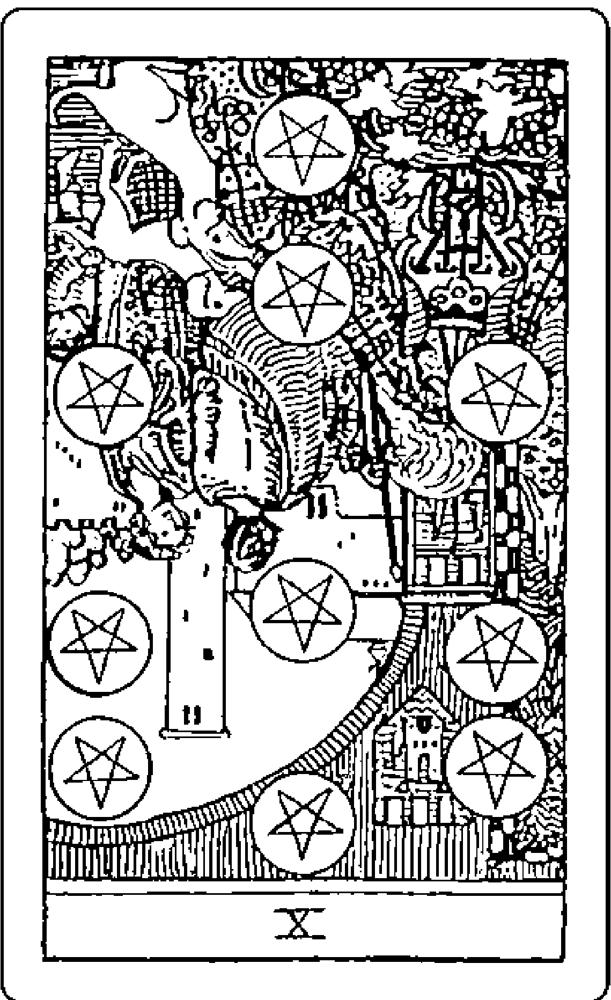

## 钱币十逆位

### 一、空窗篇－无对象

### 没对象的原因

你以为有钱了之后才能拥有爱情，甚至可以用金钱来买到爱情，这些错误的观念反而会让你看到真爱的机会。

### 可以改进的地方

你要学着不以金钱为唯一的考量，尝试与各种不同的人接触，当你打开视野之后就更有可能吸引到新的感情机会。

### 身边是否有好对象

目前在你身边并没有好的对象，甚至连烂的对象都很缺，所以这个时候最好不要投入感情，以免误中恶意的陷阱。

### 可能找到对象的管道

这个时候任何管道都不太可能帮你找到好的对象，若是透过朋友介绍甚至而会招来一堆小人，反而制造更多的麻烦。

### 二、暧昧篇－有对象但不确定

### 如何看待对方

这是一个反应比较慢的人，在朋友之间的风评并不是很好，在相处时会觉得无法了解对方，也不会想要更进一步。

### 心中是否有别人

目前在他心中并没有别人，但是本身也不是很在意感情方面的事情，在他身上花费的心力很可能到头来是一场空。

### 可能有哪些阻碍

人际关系的纷扰最可能会造成这段关系的阻碍，甚至还会被卷入团体或派系的斗争，让彼此的感情没有办法发展。

### 如何告白容易成功

这个时候告白没有多少胜算，其实与赌博没什么两样，如果想增加成功的机率，就要在事前多调查当事人的喜好。

### 三、相处篇－有明确对象

### 日常相处状况

两个人在日常相处上经常无法配合，很容易就会因为金钱方面的问题吵架，甚至双方会为了掌控资源而明争暗斗。

### 金钱与价值观

两个人因为交往的关系使得支出增加，其实当中有许多不必要的花费，彼此也很容易为了金钱方面的事发生争吵。

### 彼此心灵契合

两个人还在一起完全是看在钱的份上，其实彼此之间已经没有什么感情，如果没有钱的话这段关系就会立刻结束。

### 讲话沟通方式

两个人之间的沟通不良，对于很多问题也没有达成共识，如果遇到比较大的决定，就可能会失控发生严重的争吵。

### 性的吸引力

两个人之间没有什么性的吸引力，所以也不太可能经营出让双方都满意的性生活，也许对彼此来说只是偶一为之。

### 与对方家人的关系

你与对方家人的关系并不亲近，你也不想卷入他们复杂的互动关系，对你来说最好的策略就是保持距离以策安全。

### 继续发展的前景

这段关系继续发展的前景并不是很好，很可能会在金钱财务上遇到重大的危机，双方甚至会因此而走上分手之路。

### 四、危机篇

### 是否出现第三者

这段感情当中可能已经出现第三者，但是第三者也只是贪图金钱或是物质上的享受，更要小心这是个恶意的陷阱。

### 发生争吵的问题点

两个人发生争吵的主要问题点在于金钱上的控制，到底谁有权力决定钱怎么花，以及花钱来做什么都会引起冲突。

### 如何化解纷争

如果金钱可以解决的事情就用金钱解决，就算是花钱消灾吧，如果觉得不想要花这个钱，也许就要承受更多情绪。

### 提出分手的方法

现在两个人已经没什么感情，但是要分手就很可能卡在钱的问题，只要这个部分可以交待清楚，就可以和平分手。

### 复合的可能性

这段关系不太可能会复合，除非是两个人又为了共同的利益而结合，但是这种利益取向的关系当中并没有真感情。

### 塔罗爱情占卜的牌义

大阿尔克纳

权杖

圣杯

宝剑

钱币

宫廷

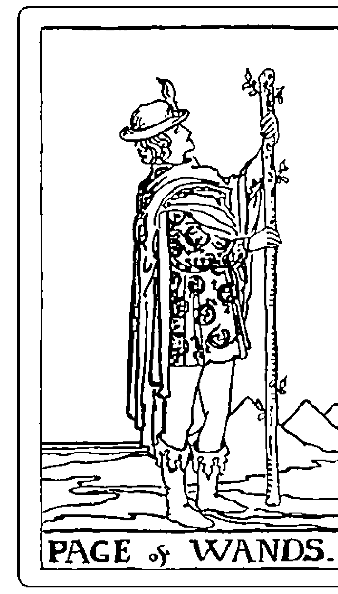

## 权杖侍者正位

### 人物特性

### 基本性格

是一个天真纯洁的人，通常都会以最直接简单的方式去做事情，并且能常保赤子之心，但是也可能会有一点顽皮。

### 感情观

在感情上比较缺乏经验，所以某些表现会显得有点幼稚，由于是以开放的态度去面对感情，会勇于尝试各种可能。

### 金钱观

对于金钱没有太多概念，但也不会过分挥霍浪费，常常会花钱去追求自己有兴趣的事物，偶尔会发生超支的状况。

### 家庭观

在家中很受到家人的照顾，同时也深受大家的喜爱，所以也会以真心诚意来对待别人，对于家庭的想法十分单纯。

### 一、空窗篇－无对象

### 没对象的原因

你对于感情的事充满好奇，但是还缺乏一点主动的勇气，如果只是一直在外面观望，就无法亲身体验恋爱的感觉。

### 可以改进的地方

你要有更多行动力，不要只是一直停留在观察的阶段，遇到喜欢的对象就要主动出击，才不会平白错过了好机会。

### 身边是否有好对象

目前在你身边有还不错的对象，但也许会更适合当朋友，这个时候时机还不成熟，告白的话可能会变成暧昧关系。

### 可能找到对象的管道

这个时候可以去尝试一些新鲜的事物，或是到其他没去过的地方玩，也许在这个过程当中就会遇到不错的新对象。

### 二、暧昧篇－有对象但不确定

### 如何看待对方

这是一个很单纯的人，讲话做事都很直接而不复杂，在相处的时候会感受到真诚的力量，同时让人觉得十分有趣。

### 心中是否有别人

目前在他心中并没有其他人，但是对于感情的态度比较观望，所以必须要用很直接的行动，才可能引起他的注意。

### 可能有哪些阻碍

目前两个人的认识与交集都还太少，也不是很确定彼此的心意，如果没有更进一步行动，也许关系就会卡在这里。

### 如何告白容易成功

这个时候告白要想新方法，千万不要落入俗套，如果能让对方有新鲜甚至是惊喜的感觉，就非常有机会告白成功。

### 三、相处篇－有明确对象

### 日常相处状况

两个人对于彼此的状况都还在适应当中，也还有很多地方需要再学习与调整，但是在过程当中双方都觉得很有趣。

### 金钱与价值观

双方对于彼此的财务状况都不是很了解，目前也没有太多的交集，其实两个人的价值观还算相合没有太大的问题。

### 彼此心灵契合

两个人都对这段关系感到新鲜，同时也很期待接下来的发展，虽然还有一些地方需要调整，但这些都不是大问题。

### 讲话沟通方式

两个人的沟通过程十分愉快，即使意见不同也可以用幽默感来化解，甚至彼此会像小孩子一样讲出一些童言童语。

### 性的吸引力

两个人可能没有什么性经验，但是都对性感到好奇，因为不熟悉而更有性的吸引力，也可能在关系中经验第一次。

### 与对方家人的关系

你与对方家人的关系还不错，但也可能是一种距离的美感，等到彼此的认识更深之后，也许会发生其他新的状况。

### 继续发展的前景

这段关系发展的前景看好，也还有很多可以进步的地方，只要两个人愿意尝试，应该可以经营出一段美好的关系。

### 四、危机篇

### 是否出现第三者

两个人之间并没有第三者，也没有很大的危机或是困扰，这一切都是你想太多，不要为了一点点小事而自寻烦恼。

### 发生争吵的问题点

发生争吵的关键点在于彼此不够了解，只以自己看到的表面现象来判断事情，也许就没有关注到真正重要的部分。

### 如何化解纷争

其实问题才刚刚开始而已，只要你们把事情谈开来，应该就没有什么大问题，也可以去尝试一些不同的解决方法。

### 提出分手的方法

其实两个人都还没有用情很深，所以只要有一方提出要分手，也可以很快全身而退，通常是两个人讲好就可以了。

### 复合的可能性

这段关系仍然有再开始的可能性，但必然是不一样的全新关系，不要急着在现在复合，应该等两个人更成熟一点。

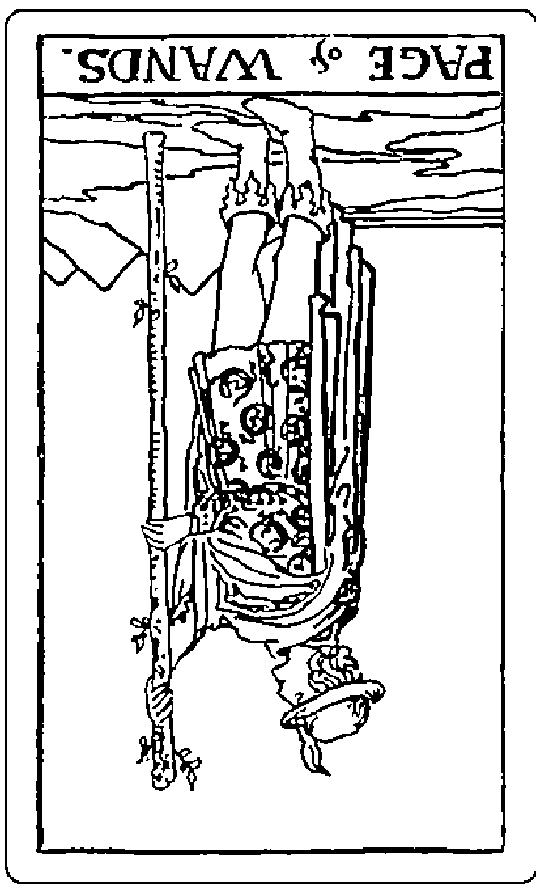

## 权杖侍者逆位

### 人物特性

### 基本性格

是一个不成熟而善变的人，喜欢尝试各种新鲜的事物，但是往往只有三分钟热度，遇到不如意的事会容易发脾气。

### 感情观

在感情当中很容易没有安全感，有时候会想要黏着对方，但若是遇到其他令人心动的对象，也可能立刻见异思迁。

### 金钱观

没有财务规划的概念，但是又经常会冲动地消费，所以很可能会发生入不敷出的状况，甚至是经常处于负债状态。

### 家庭观

在家中比较任性，甚至会让人觉得是在耍赖，如果遇到反对或不同的意见，就很容易乱发脾气，希望别人配合他。

### 一、空窗篇－无对象

### 没对象的原因

在感情方面你一直想太多，还没开始就在担心如果发生争吵或是分手该怎么办，因此就很难吸引到好的感情对象。

### 可以改进的地方

你应该放下过多的担心，也不要理会别人负面的看法或批评，勇敢地追求自己的感情，主动积极才能把握住机会。

### 身边是否有好对象

目前在你身边没有好对象，有的也只是一些不成熟的小孩，无法发展成正面的感情，反而很可能会为你带来麻烦。

### 可能找到对象的管道

这个时候很难找到好的对象，不论透过什么管道来的都不能令人满意，也许在这些尝试与错误当中可以有所学习。

### 二、暧昧篇－有对象但不确定

### 如何看待对方

这是一个很幼稚的人，不论想法或是做法都不成熟，在相处的时候可以感觉到任性，甚至无法把自己的事情搞定。

### 心中是否有别人

目前在他的心中并没有别人，反而是对于感情有很多的担心，如果你太积极追求的话，甚至可能会让他想要逃避。

### 可能有哪些阻碍

也许双方都没有足够的行动力，所以会在感情上保持观望，如果只是空想而没有行动，关系就不可能有任何进展。

### 如何告白容易成功

这个时候告白不容易成功，反而会使得双方的关系倒退，甚至可能引出潜在的竞争者，对于感情的发展十分不利。

### 三、相处篇－有明确对象

### 日常相处状况

两个人在相处时经常发生争吵，虽然都是一些小事情，但是对于彼此的情绪都有影响，也可能让关系变得不稳定。

### 金钱与价值观

两个人可能会担心金钱的问题，或是面临财务不稳定的挑战，如果因为冲动购物的话，可能会造成两个人的争吵。

### 彼此心灵契合

两个人都不看好这段关系的发展，甚至觉得随时都有可能结束，也许双方对彼此一些不满意的地方都没有说出来。

### 讲话沟通方式

两个人经常发生争吵，也可以说是处于一种沟通不良的状况，有时候其中一方的玩笑话会引起另一方强烈的反弹。

### 性的吸引力

这段关系当中并没有很强的性吸引力，所以对性生活采取观望的态度，即使有发生性关系也不会为这段关系加分。

### 与对方家人的关系

你与对方家人的关系并不稳定，虽然有时候可以维持住不错的气氛，但是也许下一秒钟就又变得剑拔弩张的感觉。

### 继续发展的前景

这段关系发展的前景并不好，也许并不会继续维持太长的时间，要先做好随时会结束的心理准备才不会受伤惨重。

## 四·危机篇

### 是否出现第三者

两个人之间并没有出现第三者，所有的冲突问题都是来自于彼此的相处过程，还是应该回到关系本身去检讨改进。

### 发生争吵的问题点

会发生争吵主要的问题在于想太多，也许事情并没有想象当中的复杂，但是因为自己把它们放大了所以会很恐怖。

### 如何化解纷争

不要被外在的各种消息给误导，你应该更信任自己的判断，等到确定了事情的性质之后再开始与对方沟通也不迟。

### 提出分手的方法

两个人的关系已经很不稳定了，所以分手并不是难事，但是最好不要当面提出分手，以避免对方激烈的情绪反应。

### 复合的可能性

这段关系并没有复合的可能，两个人的关系也已经完全结束了，不要想再和对方成为朋友，应该完全不要再联结。

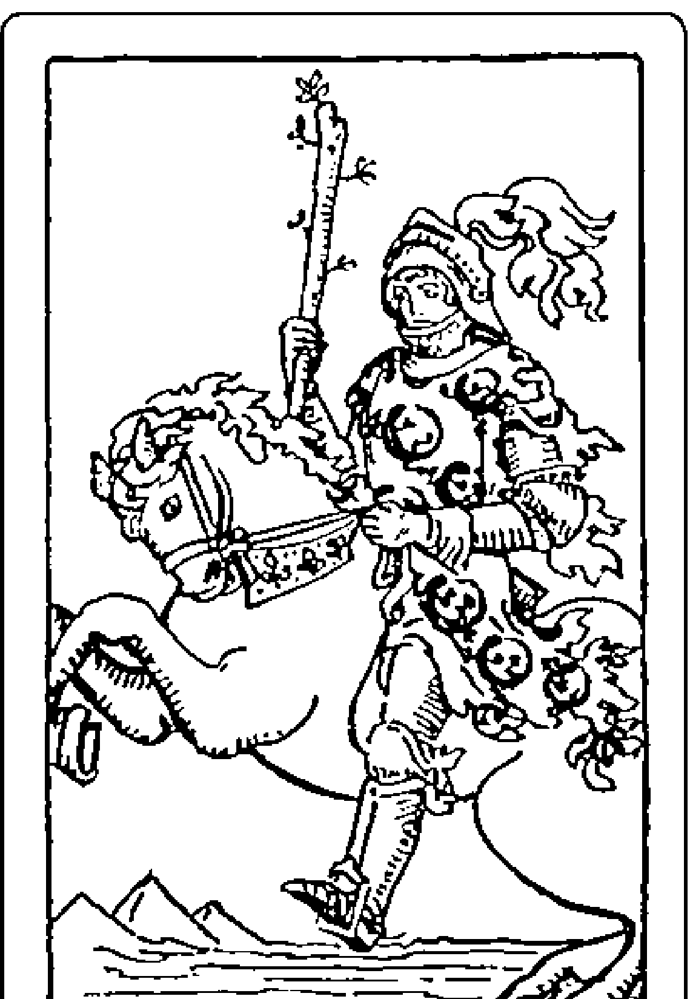

## 权杖骑士正位

### 人物特性

### 基本性格

是一个非常主动积极的人，而且对于生命充满热情，虽然有的时候会比较冲动，但是会很努力去追求自己想要的。

### 感情观

在感情上通常是采取主动，即使是单恋也会努力付出，而且有主动告白的勇气，经常会带给对方热情洋溢的感觉。

### 金钱观

如果有设定明确的目标就会很努力积极赚钱，所以赚到钱之后就会花在自己设定的地方，通常不会有太多的积蓄。

### 家庭观

在家庭当中比较活跃，也会积极参加各种的聚会与活动，但是由于比较有自己的看法，所以容易与别人发生冲突。

### 一、空窗篇－无对象

### 没对象的原因

你平常花太多时间在自己有兴趣的事情上，而不重视感情方面的事情，即使有适合的人出现你也很容易忽略对方。

## 二、暧昧篇一有对象但不确定

### 如何看待对方

这是一个充满活力的人，即使遇到任何问题也都勇往直前，在相处时会感觉到热情，也会带来正面与阳光的感觉。

### 心中是否有别人

目前在他的心中并没有别人，但是也没有把心思放在感情上面，如果没有特别明显的表现也许就会被他忽略过去。

### 可能有哪些阻碍

目前的阻碍主要会在环境上，也许是因为分隔两地，或是忙于其他事情造成聚少离多，并不是很容易克服的状况。

### 如何告白容易成功

这个时候应该要主动积极一点，事前也不需要想太多，总之选期不如撞期，只要遇到了直接讲出来就有机会成功。

## 三、相处篇一有明确对象

### 日常相处状况

两个人的关系也许会遇到一些挑战，需要两个人努力付出去克服，但是也会因为这样使得两个人的关系更为紧密。

### 金钱与价值观

两个人可能会遇到财务上不稳定的状况，或是突然遇到预期之外的重大支出，也许需要两个人同心协力才能解决。

### 彼此心灵契合

两个人都觉得这段关系当中充满挑战，但是也可以说是具有革命情感的患难之交，反而会因此让两个人的感情更好。

### 讲话沟通方式

两个人讲话都非常直接，不论什么事情都可以拿出来谈，如果遇到彼此都有兴趣的事情就很容易一直聊停不下来。

### 性的吸引力

两个人之间有很强的性吸引力，也许会因为一时的热情和冲动而开始性关系，之后双方反而不会太重视这个部分。

### 与对方家人的关系

你与对方家人的关系进入到一个新的阶段，还有很多地方需要调整与适应，也许要更主动积极一点才能打好关系。

### 继续发展的前景

这段关系发展的前景看好，但是仍然有一些问题需要去调整和改进，如果双方不共同努力的话还是可能遇到危机。

### 塔罗爱情占卜的牌义

- 大阿尔克纳
- 权杖
- 圣杯
- 宝剑
- 钱币
- 宫廷

## 四·危机篇

### 是否出现第三者

这段关系不会出现第三者，但是确实有其他事情吸引了对方的注意力，所以并不会有那么多时间精力花在感情上。

### 发生争吵的问题点

双方发生争吵的问题其实都不是大事，也许只是因为一时冲动而说话比较冲，只要事后冷静下来就会很容易解决。

### 如何化解纷争

这个时候如果把问题吵开来，反而会是解决问题最快的方法，只是想避免争吵而把问题掩盖下来反而会越滚越大。

### 提出分手的方法

这个时候可以选择分开一阵子不见面，等大家的情绪慢慢平复之后再来谈分手，也许两个人还有成为朋友的可能。

### 复合的可能性

其实两个人完全不可能复合，即使勉强要再在一起也只是每天吵个没完，更何况两个人早就已经没有什么感情了。

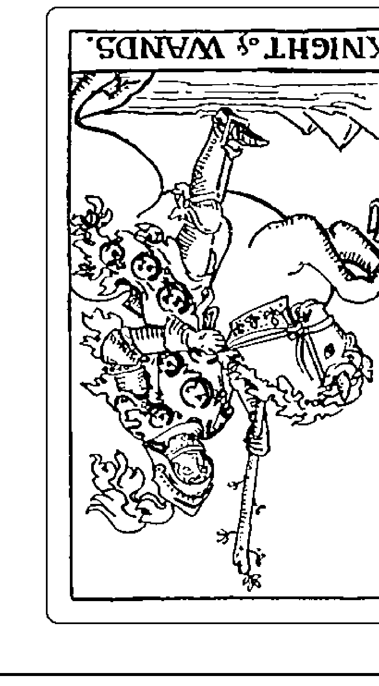

## 权杖骑士逆位

### 人物特性

### 基本性格

是一个非常狂热的人，对于自己的理想十分执着，而且会不计一切代价去完成，如果有人反对就会和对方起冲突。

### 感情观

在感情当中不愿意妥协，同时表达的方式也比较激烈，所以很容易与所爱的人发生争吵，也经常处于单身的状态。

### 金钱观

是属于冲动消费的类型，所以容易有入不敷出的状况发生，如果赚钱不够快或不够多，就经常会处于负债的状况。

### 家庭观

对于家人比较冷淡，或是喜欢与大家唱反调，总之与家人的关系并不亲近，也很难与家人共同合作完成一件事情。

### 一、空窗篇－无对象

### 没对象的原因

你目前的生活一团乱，也没有足够的心力去经营感情，如果无法让自己的状况稳定下来就无法吸引到稳定的对象。

### 可以改进的地方

你要管好自己冲动的坏脾气，不要动不动就找人吵架，如果能把冲劲用在更正面的地方，就有机会吸引到新对象。

### 身边是否有好对象

目前在你身边并没有好对象，出现的也都是不适合你的人，所以还是先把其他事搞定，一段时间之后再来谈感情。

### 可能找到对象的管道

这个时候不论什么管道都不容易找到好对象，太急的话反而会吸引到一堆烂对象，朋友介绍的会特别容易出问题。

## 二 · 暧昧篇－有对象但不确定

### 如何看待对方

这是一个很冲动的人，许多事情在没想清楚之前就先去做了，在相处的时候会觉得很冲，所以很容易会发生争吵。

### 心中是否有别人

目前在他的心中并没有别人，但是会比较自私地只想到他自己，所以如果不能完全配合他，就很难被他列入考虑。

### 可能有哪些阻碍

两个人的脾气都很大，同时也很难与对方妥协，如果每次相处时都在冲突的气氛之下，这段关系就很难有所进展。

### 如何告白容易成功

这个时候并不适合告白，如果冲动告白反而会使彼此的关系倒退，严重的话还可能造成关系破裂连朋友都做不成。

## 三 · 相处篇－有明确对象

### 日常相处状况

两个人经常发生争吵及冲突，生活也有很多部份无法配合，如果双方无法下定决心分手，这种局面就会继续下去。

### 金钱与价值观

由于双方的价值观差距太大，也经常为了金钱的事情吵架，所以在财务上最好各自独立，以免又增加争吵的机会。

### 彼此心灵契合

两个人都觉得彼此并不适合，也有很多互相无法接受的地方，但是又无法下定决心分手，所以会卡在这个状况中。

### 讲话沟通方式

两个人处于沟通不良的状况，经常讲没几句话就吵起来，虽然有时候吵架也是一种沟通方式，但是也会造成伤害。

### 性的吸引力

两个人之间有一些性吸引力，但是无法成为对这段关系有利的因素，有时候反而会因为性生活不协调而发生争吵。

### 与对方家人的关系

你与对方家人的关系并不太好，甚至会觉得他们故意在出难题考验你，所以最好还是保持距离比较不会发生冲突。

### 继续发展的前景

这段关系的前景看来并不乐观，彼此之间也很容易发生争吵，如果不小心处理的话，也很可能会走上分手的道路。

## 四·危机篇

### 是否出现第三者

两个人之间并没有出现第三者，但是确实遇到了挑战与危机，如果没有妥善处理的话，就会让问题继续扩大下去。

### 发生争吵的问题点

发生争吵的问题点在于彼此的心中已经有了预设立场，由于偏见而无法看清事情的真相，所以就很容易发生争吵。

### 如何化解纷争

如果争吵已经不可避免，倒不如把问题通通谈开来，反而会是一个解决问题的转机，但也不要太坚持自己的意见。

### 提出分手的方法

现在两个人已经吵得很凶了，就约个时间出来决斗吧！当所有的问题都摊开之后，就会发现其实彼此并不适合。

### 复合的可能性

两个人不可能会复合，也不存在任何有利于复合的因素，千万不要再这样折磨彼此了，还是想办法躲得远远的吧。

## 权杖王后正位

### 人物特性

基本性格
是一个很阳光的人，不论在什么状况之下都可以从光明面思考，待人十分亲切真诚，可以为大家带来欢乐的气氛。

感情观
在感情上十分直接，遇到自己喜欢的人就会主动去追求，同时也是很爱恨分明，在感情上比较会想要掌握主导权。

金钱观
对于金钱方面十分重视，也是很会精打细算的人，通常都很擅长投资理财，不论如何都会为自己存下一大笔积蓄。

家庭观
与家人的关系十分和谐，同时也很受到家人的喜爱，虽然有时候会表现得比较任性，但大家都会很重视他的意见。

### 一、空窗篇－无对象

没对象的原因
你对于感情的事情比较主观，很容易就会忽略其他人的追求，如果正好在忙别的事情，可能就会错过感情的机会。

可以改进的地方
你在感情当中太过直接，一不小心就会把对方给吓跑，如果能够含蓄一点的表达，就更容易把握住新恋情的机会。

身边是否有好对象
目前在你身边其实有不错的对象，但是不要花太多力气去用理性来辨认，而是要用心来感觉谁是适合的对象。

可能找到对象的管道
新的对象有可能是在工作场合出现，或是由老朋友帮你介绍的，总之会出现很多好的感情机会，要记得好好把握。

## 二．暧昧篇－有对象但不确定

如何看待对方
这是一个很直接的人，总是会勇敢地说真话做好事，在相处时会感觉到很正向的力量，也会让人有很光明的感觉。

心中是否有别人
目前在他的心中还没有别人，而且也没有强烈的预设立场，所以如果他觉得两个人真的合适，就很有可能在一起。

可能有哪些阻碍
两个人都很重视面子，也很害怕被对方拒绝，如果两个人都不愿意先低头表达爱意，也许关系就会卡在原地不动。

如何告白容易成功
这个时候不要想太多，用越直接的方式越容易告白成功，只要你能够把握第一时间行动，就有很大的机会突破僵局。

## 三．相处篇－有明确对象

日常相处状况
两个人的相处十分自然，彼此之间可以坦诚相待，也不会有隐瞒或欺骗的状况发生，相处时经常充满欢乐的气氛。

金钱与价值观
两个人都有不错的财务状况，同时也可能因为这段关系而增加两个人的收入，如果有共同的投资通常都可以获利。

彼此心灵契合
彼此都对这段感情十分忠诚，也能保持愉快而真诚的感觉，双方都想要发展长久稳定的关系，是值得把握的感情。

讲话沟通方式
两个人的沟通管道很顺畅，是属于有话直说的类型，即使偶尔会有一些意见不合的状况，也不会影响彼此的感情。

性的吸引力
这段感情当中有极强的性吸引力，两个人也可能是因此而在一起的，两个人都很重视经营性生活，也会得到满足。

与对方家人的关系
你与对方家人的关系很好，相处起来气氛也很欢乐，感觉上原本就像是一家人，在对方家庭当中你也觉得很自在。

继续发展的前景
这段关系发展的前景十分看好，也将进入很稳定的阶段，虽然不会有太多激情，但是两个人的相处仍然十分愉快。

## 四·危机篇

是否出现第三者
这段关系不会出现第三者，即使出现其他追求者也完全不会影响彼此的感情，最重要的还是把双方的关系经营好。

发生争吵的问题点
两个人都心直口快，虽然说的是实话，但有时候实话是很伤人的！也许一句不经意的话就会引起后续很大的冲突。

如何化解纷争
先看事情的光明面，不要老是批评对方，试着去原谅对方的错误，再来讨论事情的解决方案，大概就没什么问题。

提出分手的方法
如果想要分手必定要利用一时冲动的情绪，如果想太多就没办法分开，而且提出分手之后最好就不再有任何联络。

复合的可能性
两个人有可能会成为朋友，但是并不太可能会复合，因为谁都不愿意先拉下脸来道歉，再在一起也只是每天争吵。

## 权杖王后逆位

### 人物特性

基本性格
是一个很重视面子的人，喜欢掌握事情的主导权，遇到不顺心的事情会有比较情绪化的反应，也很容易忌妒别人。

感情观
在感情上比较随性，但有时翻脸就像翻书一样快，喜欢别人主动热情地追求，遇到更好的对象也很容易见异思迁。

金钱观
日常生活算是很节省，但是又会花很多钱去买名牌精品或是百万名车，只是为了塑造让人觉得很气派的外在印象。

家庭观
在家中的表现比较任性，甚至会让人觉得有一点嚣张跋扈，不论对长辈或平辈都是直来直往，常要别人配合自己。

## 一、空窗篇—无对象

没对象的原因
你太重视面子问题，而不愿意在感情上面主动，同时也不太清楚自己到底喜欢什么样的对象，所以就很难下决定。

可以改进的地方
你最好能收敛一下自己的脾气，不要动不动就发飙，如果能表现出更和蔼可亲的一面，一定可以吸引更多的对象。

身边是否有好对象
目前在你身边并没有什么好对象，即使有主动追求的人你也看不上眼，现在应该把心力放在其他更有意义的地方。

可能找到对象的管道
这个时候别人都帮不上忙，只有你自己愿意才能突破，这候可以走出去多交朋友，但是不要急着去寻找感情对象。

## 二·暧昧篇－有对象但不确定

如何看待对方
这是一个比较强势的人，如果别人不合他的意就容易发脾气，在相处时会感觉到很重的压力，让人想要躲远一点。

心中是否有别人
目前在他的心中并没有其他人，但是本身也不太把心思放在感情上面，所以即使你努力追求对方也不一定有反应。

可能有哪些阻碍
你们的关系可能会受到其他人的反对或抵制，在环境上也容易遇到潜在的困难和障碍，状况比你想像的还要复杂。

如何告白容易成功
这个时候告白很不容易成功，主要是因为环境的限制与阻碍，所以最好等环境改变了再行动，千万不要冲动行事。

## 三·相处篇－有明确对象

日常相处状况
两个人的在日常相处上经常遇到阻碍，同时也会因为环境的因素而无法配合，这可能会变成两个人争吵的导火线。

金钱与价值观
两个人也许会遇到财务的危机，或是因为金钱而发生争吵，所以在财务上最好各自独立，千万不要有共同的投资。

彼此心灵契合
两个人会觉得在感情上缺了些什么，但是又不知道该如何解决，如果有一方太强烈主导，另一方就会觉得受委屈。

讲话沟通方式
彼此在讲话时会比较情绪化，或是使用争吵的方式来沟通，虽然也能达到沟通的效果，但也有可能造成一些伤害。

性的吸引力
这段关系当中并没有很强的性吸引力，但是会很想要去控制对方，也许性关系会变成双方争夺主导权的工具之一。

与对方家人的关系
你与对方家人的关系有些疏离，主要是因为你感觉到他们给你的压力，如果硬要融入当中也许就很容易发生冲突。

继续发展的前景
这段关系的前景并不看好，也许会遇到强烈的抵制或反对，环境上也不太配合，很容易就会引发双方严重的冲突。

## 四・危机篇

是否出现第三者
这段关系并没有出现第三者，但是会有其他外在的阻碍，如果不能共同去面对这些问题，也许就会遇到重大危机。

发生争吵的问题点
两个人争吵的问题点其实是在面子问题，都不愿意认错或是改变，如果双方继续坚持下去就会卡在这里无法解决。

如何化解纷争
何必为了面子一争高下，先低头的也不见得就是输的一方，如果能够放低姿态来处理这个问题，就不会僵在那里。

提出分手的方法
或许在某一次剧烈的争吵之后，两个人就自然不会再联络了，所以也没必要正式宣布分手或进行任何形式的谈判。

复合的可能性
两个人不要联络是最好的处理方式，复合也完全不可能，这个时候再花心力在这个人的身上只是浪费自己的时间。

- 大阿尔克纳
- 权杖
- 圣杯
- 宝剑
- 钱币
- 宫廷

## 权杖国王正位

### 人物特性

基本性格
是一个很有自信心的人，对于所有的事情都有自己的定见，但是待人接物仍然十分亲切友善，同时也很有创造力。

感情观
在感情上十分忠诚，但是不太习惯说出自己的感觉，通常都是用实际行动来表达爱，遇到自己喜欢的人也会把握。

金钱观
对于金钱方面并不是太计较，只会以自己的努力换取应得的报偿，而不会去做高风险的投资，多半都会存一些钱。

家庭观
与家人之间的关系还不错，遇到问题也会热心地帮忙，只是平常忙于自己的事情，与家人相处的时间并不是很多。

### 一、空窗篇－无对象

没对象的原因
你对于感情的态度十分谨慎，如果没有出现很令你心动的对象也许就会放弃主动，可能因此错过很多感情的机会。

可以改进的地方
你对于感情的想法过于主观，其实感情的对象与方式并不一定会照你设定的发生，要更开放才不会错过好的感情。

身边是否有好对象
目前在你身边有不错的对象，而且可能是已经认识很久的人，如果有这样的人向你告白，也可以考虑接受试试看。

可能找到对象的管道
最好还是以你熟悉的管道来寻找新的对象，因为新恋情的来源有可能与之前的相同；也有可能是在工作场合认识。

## 二·暧昧篇－有对象但不确定

如何看待对方
这是一个很成熟稳重的人，无论别人怎么说都不会影响他的想法，相处时可以感觉到友善的态度，让人觉得安心。

心中是否有别人
目前在他心中并没有别人，但是已经设定了某种典型的目标，如果你不符合他内心的设定，再怎么努力都没有用。

可能有哪些阻碍
两个人都很固执己见，也不愿意有冒险的行动，如果双方都只待在原地观望，也许两个人的关系会在这里卡很久。

如何告白容易成功
要告白成功一定事前要有周详的计划，而且最好能与有经验的朋友们讨论一下，也许可以提供你不少有用的建议。

## 三·相处篇－有明确对象

日常相处状况
两个人日常相处的状况十分稳定，也很清楚如何配合对方，虽然有时候会觉得缺乏刺激与惊奇，但也渐渐习惯了。

金钱与价值观
两个人在金钱上都没有太大的问题，价值观上也可以相互配合，但是在财务上最好还是各自独立比较不会有事。

彼此心灵契合
两个人都觉得这段感情已经走到成熟的阶段，该经历的困难与挑战也都顺利过关，同时觉得对彼此带有一种责任。

讲话沟通方式
两个人讲话都很直接，所以并不会有隐瞒或欺骗的状况发生，只是有的时候双方会用比较激烈的方式来进行交流。

性的吸引力
这段关系对两个人都很有吸引力，但是对人格特质的欣赏会多过于男女情爱的力量，因此也比较稳定而有持续力。

与对方家人的关系
你与对方家人已经十分熟悉，也很清楚他们的好恶与习惯，所以可以用适当的方式应对，很容易取得他们的信任。

继续发展的前景
这段关系的前景十分看好，也会渐渐走向稳定的状态，即使过程中遇到任何的困难挑战，也可以同心协力去克服。

塔罗爱情占卜的牌义

- 大阿尔克纳
- 权杖
- 圣杯
- 宝剑
- 钱币
- 宫廷

### 四、危机篇

是否出现第三者
两个人之间不会出现第三者，别再疑神疑鬼了！重要的是回归到实际的日常相处当中，把彼此间的问题好好解决。

发生争吵的问题点
两个人会发生争吵的点在于双方都很固执己见，明知道对方不接受仍然要一意孤行，到最后就不可避免发生争执。

如何化解纷争
诚实是最佳的策略，一五一十地把事情的原委讲清楚，相信再难的问题都是有机会解决的，要充分展现你的诚意。

提出分手的方法
当然分手一定要事前有计划，再把对方当面约出来谈谈，详细列出所有想要和对方分开的理由，坚定自己的立场。

复合的可能性
不论是谁提出分手，这段感情复合的机会都不高，因为双方都没有因此作出任何改变，再在一起只是又陷入僵局。

## 权杖国王逆位

### 人物特性

基本性格
是一个比较严肃的人，同时也很难接受别人的建议，虽然有的时候会严厉地批判别人，但是其实心中并没有恶意。

感情观
并不会把感情的事情放在第一位，但总是会深思熟虑之后再作决定，有的时候会脾气暴躁，同时对另一半没耐性。

金钱观
对于金钱方面并不太会规划，但是如果努力工作通常都有不少积蓄，也可能会因为一时冲动而不小心花掉太多钱。

家庭观
很重视与家人之间的关系，总是想要有突出的表现得到他们的肯定，若是有人不理会他的建议也可能会乱发脾气。

## 一、空窗篇 - 无对象

没对象的原因
你的脾气大了一些，所以异性就不太敢接近你，即使在你心中真的并没有恶意，但是表现方式就会让你比较吃亏。

可以改进的地方
停止在感情当中设立不切实际的标准，才有可能找到适合的好对象，否则就很容易陷入自己的幻想当中没有行动。

身边是否有好对象
目前在你身边不会有好的对象出现，即使有之前的旧情人回来要求复合也只是很短暂的关系，并不值得认真考虑。

可能找到对象的管道
这个时候不太容易找到合适的对象，特别是由亲友介绍的大都非常不适合，还是要自己去认识的人未来才有发展。

## 二·暧昧篇－有对象但不确定

如何看待对方
这是一个很特别的人，有一些与众不同的想法与做法，但是会表现得比较严肃，在相处时常让人感觉到有些压力。

心中是否有别人
目前在他的心中并没有别人，但是也没有特别想要谈感情，所以即使你很努力地向他表示，也很难让他觉得动心。

可能有哪些阻碍
对方会很想要掌控这段关系，但若是你有很多自己的意见，双方就很容易发生冲突，关系也会卡在这里停滞不前。

如何告白容易成功
这个时候主动告白很不容易成功，倒不如先在原地等待对方出招，若是冲动行事反而可能会让两个人的关系倒退。

## 三·相处篇－有明确对象

日常相处状况
两个人在相处上趋于稳定，但是也可能开始觉得有些无聊，很多事都变成例行公事，想要改变反而容易引起争执。

金钱与价值观
两个人在金钱上都偏向保守，所以有些时候会为了谁付钱而发生争执，如果能约定各付各的就可以减少一些冲突。

彼此心灵契合
两个人都很重视这段关系，但是也会觉得有些问题一直无法解决，如果双方都逃避不想面对，也许就会卡在这里。

讲话沟通方式
基本上双方都非常固执，所以很容易出现争执的状况，但是其实彼此都没有恶意，也许争吵会让彼此更了解对方。

性的吸引力
这段关系对双方都有吸引力，彼此也可以用行动回应对方的热情，虽然有时候会因为其他事而影响性生活的频率。

与对方家人的关系
你与对方家人的关系并不亲近，你也不是很了解他们的状况，如果硬要你与他们亲密互动，反而会对你造成压力。

继续发展的前景
这段关系应该可以继续走下去，但是同时也会比较缺乏变化与活力，这就要看彼此是不是能接受平淡的感情生活。

## 四・危机篇

是否出现第三者
这段关系当中并没有第三者的空间，但是彼此之间确实有发生一些问题，如何放下成见好好沟通是最重要的课题。

发生争吵的问题点
关系的僵化应该会是双方争吵的主因，如果维持现状彼此都会有些不满意，但若是要改变又会发生主导权的争议。

如何化解纷争
这个时候先退一步应该是最佳策略，避免在第一时间起正面冲突，等到对方气消了之后再提出要求才有可能实现。

提出分手的方法
被动也许是比较好的方式，但若对方坚持不提出分手，也应该详实地告诉对方你无法忍受的理由，让他了解状况。

复合的可能性
既然已经分手，就不再有复合的可能性，在短时间之内不要去想有关感情生活的事，旧情人就让他随风而逝了吧！

塔罗爱情占卜的牌义

- 大阿尔克纳
- 权杖
- 圣杯
- 宝剑
- 钱币
- 宫廷

## 圣杯侍者正位

### 人物特性

基本性格
是一个具有强烈好奇心的人，对于自己不懂或是没经验过的事情都很想要尝试及学习，同时具有独立思考的能力。

感情观
在感情上真诚而谨慎，会全力去实践自己的诺言，但绝不承诺自己做不到的事情，在感情中当中也会思考及学习。

金钱观
对于投资理财的观念十分好奇，但是比较缺乏实务经验，在了解之前会把钱尽量存起来，会花比较多钱在学习上。

家庭观
在家里是受欢迎而讨喜的角色，所以与大家都会维持不错的关系，会用心去了解其他人的需要，同时也提供服务。

### 一、空窗篇－无对象

没对象的原因
你对于感情的事充满好奇心，但是目前还停留在想像的阶段，如果不能实际上跨出去尝试，就会变成自己的空想。

可以改进的地方
你在感情上应该要有更多行动和决心，而不是一直自己一个人在模拟和想像，真的想要谈恋爱就会吸引到好对象。

身边是否有好对象
目前在你身边有不错的对象，也许对方的感情经验并不丰富，甚至都还没初恋过，所以在很多层面都会显得生疏。

可能找到对象的管道
这时候的对象大多是新认识的人，所以不论是朋友介绍、学校社团或是公司客户，只要是新人际关系都有帮助。

## 聖杯侍者逆位

### 人物特性

#### 基本性格
這是一個愛幻想而不切實際的人，對於事情沒有自己堅定的看法，只是人云亦云隨波逐流，也缺乏實踐的行動力。

#### 感情觀
在感情上只想到自己，完全不會替對方著想，甚至會想要利用感情關係達成自己的目標，但是又沒辦法看清現實。

#### 金錢觀
在經濟與財務上並不獨立，可能是依賴情人或家人的接濟，自己懶得努力去賺錢，但是有時候又會顯得奢侈浪費。

#### 家庭觀
在家中是屬於比較慵懶的類型，什麼事情都希望別人幫他做到好，但是自己又不願意付出，也會有不合理的要求。

### 一、空窗篇－無對象

#### 沒對象的原因
你在感情當中太過自私，完全只想到自己的好處，如果無法真心為對方付出，就很難吸引到真心又適合你的對象。

#### 可以改進的地方
你要放下對於感情過多的期待，回到比較務實面去考量，如果要求與想法是合理的，就會比較容易找到好的對象。

#### 身邊是否有好對象
目前在你身邊並沒有好的對象，出現的人都只想要利用你，並不是真心誠意交往，所以最好不要輕易投入新戀情。

#### 可能找到對象的管道
這個時候主動出擊還不如在原地等待，雖然不一定要很快出現新的感情對象，但是至少能避過一些有傷害性的人。

## 二·曖昧篇—有對象但不確定

如何看待對方
這是一個很認真的人，對於自己想做的事情都會全力以赴，在相處時會感覺到真誠，但也會給人比較害羞的感覺。

心中是否有別人
目前在他的心中有暗戀的對象，但是一直都不敢有所表示，如果你能更主動積極一點，也許就可以讓他改變心意。

可能有哪些阻礙
目前最大的阻礙就是雙方都缺乏經驗，所以不知道該如何開始，也不太習慣兩個人的生活，需要一段時間去調適。

如何告白容易成功
這個時候可以透過朋友傳話，或是用其他間接的方式告白，當面告白的話很容易緊張，也許一不小心就說錯了話。

## 三·相處篇—有明確對象

日常相處狀況
兩個人相處的狀況還不錯，但是仍然有許多地方需要調整與學習，未來還有很大的發展空間，是可以期待的關係。

金錢與價值觀
兩個人在價值觀上有交集的部分，而且也會互相影響，所以可以從感情當中學習到金錢的處理，對彼此都有幫助。

彼此心靈契合
兩個人都覺得這段關係充滿新鮮感與驚奇，也看好未來的發展性，雙方都很投入這段關係，可以從當中學到很多。

講話溝通方式
兩個人彼此都是很真誠的溝通，即使發生爭吵也可以和平收場，雙方都可以在與對方講話的過程當中學習與成長。

性的吸引力
在這段感情當中並沒有太多的性吸引力，好奇反而是佔了大部分，雙方也許是因為對彼此的好奇而開始了性生活。

與對方家人的關係
你與對方家人的關係還不錯，由於他們都把你當成小孩子看，所以不會對你有太多要求，你可以盡情地作你自己。

繼續發展的前景
這段關係發展的前景還不錯，彼此都是很真心付出，未來還有很多學習成長的空間，所以應該好好把握這份感情。

## 四・危機篇

### 是否出現第三者
兩個人之間應該沒有第三者，但是彼此之間確實有些地方需要調整改進，在這個過程當中也許就很容易發生爭吵。

### 發生爭吵的問題點
兩個人對彼此都還不是很熟悉，一不小心就有可能踩到地雷，只要再多經驗幾次，就可以慢慢摸清楚對方的底線。

### 如何化解紛爭
這個時候應該誠心地和對方溝通，努力找到問題發生的真正原因，如果自己有錯就和對方道歉，沒什麼好為難的。

### 提出分手的方法
其實兩個人的感情還不算很深，如果真的有需要分手，理性談判還是最好的方法，以後大家也還可以成為好朋友。

### 複合的可能性
這段感情有可能會複合，但是必然是與之前的性質不太相同，還是要重新適應，已經不可能回到以前相處的狀況。

## 塔羅愛情占卜的牌義

- 大阿爾克納
- 權杖
- 聖杯
- 寶劍
- 錢幣
- 宮廷

## 聖杯騎士正位

### 人物特性

#### 基本性格
是一個很有理想性的人，對其他人的感受與想法也非常敏感，會主動向別人宣揚自己的理念，或是提出一些建議。

#### 感情觀
在感情當中會表現得非常浪漫和熱情，對於自己喜歡的對象通常都會主動追求，同時也很重視和對方的理念交流。

#### 金錢觀
會把金錢用在自己覺得有意義的事物上，有可能是花費很多金錢在自己的興趣上，或是拿錢出來幫助有需要的人。

#### 家庭觀
對於家庭生活十分重視，也會主動去關心家人，在家中常扮演傳遞訊息或跑腿的角色，所以與大家的感情都很好。

### 一、空窗篇－無對象

#### 沒對象的原因
其實你並不缺乏感情的機會，只是為了追求自己的理想或是興趣而忽略了經營感情生活，平白錯過了可能的對象。

#### 可以改進的地方
如果總是表現出一副不太需要感情的樣子，就不會有人想要接近你，所以要讓大家都感覺到你現在有需要新戀情。

#### 身邊是否有好對象
目前在你身邊有很好的對象，而且也算是主動積極的類型，如果可以多製造一些機會給對方，很快就可以在一起。

#### 可能找到對象的管道
目前透過朋友介紹是最好的方法，當然也有可能是在補習或學東西的地方遇到，要注意時時刻刻出現的感情機會。

## 二·曖昧篇－有對象但不確定

### 如何看待對方
這是一個很浪漫的人，也會很努力去實踐自己的理想，在相處時會感覺到熱情洋溢，同時會讓人有很真誠的感覺。

### 心中是否有別人
目前在他的心中已經鎖定特定對象，而且很可能已經展開攻勢追求，這個時候要讓他轉移目標是一件很困難的事。

### 可能有哪些阻礙
其實這段關係目前並沒有明顯的阻礙，但是如果雙方都想太多就有可能停滯不前，所以感覺對了就要勇敢去行動。

### 如何告白容易成功
你需要浪漫的方式告白，可以選擇去看夜景或是請對方吃燭光晚餐，總之只要燈光美氣氛佳，告白就很容易成功。

## 三·相處篇－有明確對象

### 日常相處狀況
兩個人在日常相處上配合很良好，約會時充滿了浪漫的氣氛，彼此也可以在這段關係中開發很多感情方面的能力。

### 金錢與價值觀
兩個人在價值觀上十分接近，對於金錢也都不是太計較，所以不會因為金錢方面的事情爭吵，反而可以互相幫忙。

### 彼此心靈契合
兩個人都覺得這是一段很浪漫的感情，也會投入全力去經營彼此的關係，所以對於彼此來說這都是很甜蜜的過程。

### 講話溝通方式
兩個人在理念想法上很有默契，也很喜歡天南地北談論各種事情，即使遇到想法不同的地方也可以透過溝通解決。

### 性的吸引力
在這段感情當中有很強的性吸引力，而且雙方都能自然地表現出浪漫和熱情，常常都能夠享受到很愉快的性生活。

### 與對方家人的關係
你與對方的家庭關係不錯，與對方的家人之間也有很多話好聊，他們通常都會很歡迎你的到訪，氣氛也非常融洽。

### 繼續發展的前景
這段感情的前景十分看好，應該是會成為非常緊密而穩定的關係，即使在一起的時間久了仍然能保持浪漫和熱情。

### 四、危機篇

### 是否出現第三者
這段關係當中並不會出現第三者，即使有人刻意想介入也無法影響彼此的心意，所以算是非常真誠而緊密的關係。

### 發生爭吵的問題點
發生爭吵的事情可能源自於理念的差異，但是又沒有把想法與理由說清楚，所以就很容易為衍生出來的小事爭吵。

### 如何化解紛爭
這個時候就要用到你的口才，努力地用甜言蜜語去說服對方、和對方道歉，甚至是求對方要原諒你，這都不太難。

### 提出分手的方法
這段期間兩個人要分手實在不太容易，因為彼此之間的感情還很深，也許要先分開一陣子不聯絡，之後再來談判。

### 複合的可能性
這段感情其實並不算完全結束，所以複合也可以很自然地發生，如果你主動提出要複合，應該就可以重新在一起。

## 聖杯騎士逆位

### 人物特性

#### 基本性格
是一個口才很好的人，但是由於沒有真才實學，常讓人覺得流於詭辯，為了達成自己的目標不惜使用詐術和詭計。

#### 感情觀
在感情上有花心濫情的傾向，經常會在不同的對象之間游走，而不會固定只有一個情人，但是又很擅長甜言蜜語。

#### 金錢觀
把所有的錢都用在生活享受上，所以很少能有積蓄，常常會夢想自己一夜致富，或是想用不正當的手段獲取暴利。

#### 家庭觀
與家人之間的關係只是表面和樂，其實經常口是心非在背後算計別人，對於沒有利用價值的家人關係就比較疏遠。

### 一、空窗篇－無對象

#### 沒對象的原因
你在感情上太過花心，每一個人都喜歡，又不願意定下來，所以即使從來不缺少感情的機會，仍然是孤單一個人。

#### 可以改進的地方
你要放下在感情當中過多的算計，單純的以自己內心的感受來決定，只要是出自真心的付出一定會吸引到好對象。

#### 身邊是否有好對象
目前在你身邊沒有什麼好對象，有的也只是一些花心的人想要玩玩，若是太輕易信任對方很可能就會被對方傷害。

#### 可能找到對象的管道
這個時候千萬不要相信別人介紹給你的對象，很有可能從頭到尾就是一場騙局，即使自己去找也不容易有好對象。

## 二・曖昧篇－有對象但不確定

如何看待對方
這是一個油腔滑調的人，雖然說得很好聽，但是實際上常常又不是這麼回事，在相處時會覺得很虛偽而無法信任。

心中是否有別人
目前在他心中已經有其他對象，甚至還有很多地下情人，如果選擇跟這種人在一起，就要有與人分享的心理準備。

可能有哪些阻礙
目前感情處於混亂狀態，也許是超過三角以上的複雜關係，如果不能先把狀況釐清，感情關係就很難有實質進展。

如何告白容易成功
這個時候告白甜言蜜語是不可少的，但是若說得太超過又會讓對方覺得缺乏誠意，所以要在兩者之間找到平衡點。

## 三・相處篇－有明確對象

日常相處狀況
兩個人相處的過程當中充滿謊言與欺騙，明明有很多地方不合又要粉飾太平，甚至兩個人都已經在背地裡出軌了。

金錢與價值觀
兩個人會遇到與金錢有關的挑戰，考驗兩個人之間的信任，所以最好在財務上完全獨立，也不要有任何金錢往來。

彼此心靈契合
兩個人其實各懷鬼胎，並不是真心誠意在交往，只是想要利用對方來完成自己的目的，利用完之後很快就會分手。

講話溝通方式
兩個人都無法說出真心話，溝通當中常常充滿隱瞞甚至是欺騙，到最後即使你說的是真話，對方也無法完全相信。

性的吸引力
兩個人之間有很強的性吸引力，而且雙方都是很快就被對方吸引住，但是這種吸引力只會帶來很短暫的肉體關係。

與對方家人的關係
你與對方家人的關係表面上看起來還不錯，其實彼此之間存在許多隱瞞與欺騙，也許到頭來才發現完全不是那樣。

繼續發展的前景
這段關係發展的前景並不好，可能會演變成複雜的多角關係，如果不想搞得太累的話，盡早放棄是比較好的選擇。

## 四・危機篇

### 是否出現第三者
這段關係當中很可能有第三者，而且雙方都有可能遇到其他誘惑，變成複雜的多角關係，所以要認真思考下一步。

### 發生爭吵的問題點
發生爭吵的主要因素在於之前話說得太滿，但是實際上又做不到，就會給人欺騙不實的感覺，因此就會造成爭吵。

### 如何化解紛爭
這個時候只能用甜言蜜語去哄他，希望他快一點氣消，但是實際上問題還是無法解決，最多只能把問題延後而已。

### 提出分手的方法
這段感情表面上看起來還不錯，其實內部已經問題叢生了，只要把真相揭開，這段關係就算想維持也不可能。

### 複合的可能性
這段感情已經完全不可能複合了，而且兩個人已經有很多解不開的誤會，甚至還會怨恨對方，怎麼可能再在一起。

## 聖杯王后正位

### 人物特性

#### 基本性格
是一個對人及情緒很敏感的人，也能以同理心處理事情，對於自己重視的事情十分專注，可以集中心力完成任務。

#### 感情觀
在感情上十分溫柔浪漫，同時也可以體貼對方的需要，但是在面對新戀情時會比較被動，不太會主動告白或示愛。

#### 金錢觀
並不認為金錢是最重要的，所以很可能為了愛情而捨棄麵包，對於金錢有良好的管理能力，也會拿錢去幫助別人。

#### 家庭觀
對於家人都十分關心，也會用實際的行動來幫助其他人，總是把自己的需要放在最後，很重視家人的想法和建議。

### 一、空窗篇－無對象

#### 沒對象的原因
你在感情上想太多，但是都沒有實際的行動，如果只是被動地等待別人對你示愛，就有可能會錯過一些好的對象。

#### 可以改進的地方
其實你從來不缺感情的機會，唯一不夠的就只是臨門一腳的主動，所以如果有看到心動的對象，千萬不要想太多。

#### 身邊是否有好對象
目前在你身邊有不錯的對象，而且對方對你十分忠心，一直痴痴地在等你，很有可能已經暗戀你很長一段時間了。

#### 可能找到對象的管道
可以透過朋友介紹，或是參加單身的聯誼活動，但是目前的生活圈當中也已經有不錯的對象，不一定要去找新的。

## 二·曖昧篇－有對象但不確定

### 如何看待對方
這是一個很溫柔的人，總是會考慮到別人的想法與立場，在相處的時候會覺得很貼心，會讓人想要更進一步認識。

### 心中是否有別人
目前在他的心中已經有認定一個人，其他人很難引起他的注意，所以即使你真的很努力表現也不一定會讓他心動。

### 可能有哪些阻礙
目前兩個人之間並沒有外在的阻礙，缺乏的只是主動打破僵局的行動，如果雙方都在原地不動仍然有可能會卡住。

### 如何告白容易成功
這個時候不論怎麼告白都很容易成功，重要的是要有所行動而不是在原地觀望，最好能用比較貼心或感性的方式。

## 三·相處篇－有明確對象

### 日常相處狀況
兩個人相處的時間都很快樂，感情十分穩定，雙方都在這段關係當中學習到很多，也希望可以長長久久維持下去。

### 金錢與價值觀
兩個人在財務上都沒有太多問題，也不會過份堅持自己的意見，所以不會為了金錢的事情吵架，可能會互相幫助。

### 彼此心靈契合
兩個人都覺得對方是很完美的情人，也希望這段關係可以永遠那麼甜蜜，所以即使遇到再多的困難也絕對不放棄。

### 講話溝通方式
兩個人彼此都是用心在溝通，所以可以了解對方內心當中真正的感受，有些事情即使不說出來兩個人也很有默契。

### 性的吸引力
在這段感情當中兩個人之間有很強的性吸引力，性生活對彼此來說都很重要，愉快的性生活也使得關係特別緊密。

### 與對方家人的關係
你與對方家人的關係很好，你也會主動去照顧他們的需要，所以能完全融入對方的家庭當中，也會被當成一家人。

### 繼續發展的前景
這段關係的前景十分看好，而且會發展成長久穩定的甜蜜關係，所以要好好經營這段感情，不要輕易讓機會溜走。

### 四、危機篇

### 是否出現第三者
兩個人之間不可能出現第三者，彼此在這段關係當中都十分忠誠，所以如果有任何問題一定是兩個人之間的問題。

### 發生爭吵的問題點
其實兩個人就是因為太重視對方又太為對方著想了，所以才會發生爭吵，在彼此之間絕對沒有惡意想要傷害對方。

### 如何化解紛爭
這時候誠實是最好的策略，對方提出任何疑問要有問必答，把事情說清楚就不會有誤會，兩個人的感情也會更好。

### 提出分手的方法
兩個人對於彼此的感情還很深，在這個時候要兩個人分開實在不太可能，除非在這段感情當中突然出現了第三者。

### 複合的可能性
兩個人現在其實還有很深的感情，也有可能立刻就複合，但是千萬不要自己急著提出，最好等對方主動提出再說。

## 聖杯王后逆位

### 人物特性

#### 基本性格
是一個想像力豐富的人，常常活在自己幻想的世界當中，而不會考慮到現實環境與別人的看法，說話會比較隨性。

#### 感情觀
在感情上並不穩定，也很容易見異思遷，因此常會陷入錯綜複雜的感情關係當中，讓自己感覺痛苦卻又無法自拔。

#### 金錢觀
對於金錢不太有概念，只想花錢享受而不願意辛苦工作賺錢，因此不容易有儲蓄，甚至需要靠別人幫助才能度日。

#### 家庭觀
在家中比較我行我素，甚至會讓人覺得嬌縱自私，總是要別人配合自己，但若家人出了什麼事情也不會主動幫忙。

### 一、空窗篇－無對象

#### 沒對象的原因
你自己的心都還不定，也還搞不清楚自己適合什麼樣的對象，所以會比較迷惘困惑一些，也很難吸引到好的對象。

#### 可以改進的地方
你要在感情上專注於一個對象，而不要與許多人都同時搞曖昧關係，只要能定下心來就可以開始發展穩定的關係。

#### 身邊是否有好對象
目前在你身邊沒有好的對象，即使有人追求也可能只是玩玩而已，並不是真的想穩定下來，所以還是要小心分辨。

#### 可能找到對象的管道
這個時候透過任何管道都不太可能找到好對象，還不如在原地守株待兔，即使沒有人主動追求也不會白白花力氣。

二、暧昧篇－有对象但不确定

如何看待对方
这是一个很任性善变的人，完全不会考虑到别人的立场，相处时总会觉得无法信任，最好还是保持距离以策安全。

心中是否有别人
目前在他心中有某些喜欢的人选，但是完全没有实质的行动，仍然在自己幻想单恋的阶段，还是有机会进攻。

可能有哪些阻碍
目前两个人的互动不多，了解也十分有限，根本不知道该怎么更进一步，缺乏实际相处的经验将会是最大的阻碍。

如何告白容易成功
这个时候很不容易告白成功，即使真的成功也很可能只是很短暂的关系，所以最好是等状况更明朗之后再来行动。

三、相处篇－有明确对象

日常相处状况
两个人日常相处的机会不多，很多部分都是自己想像出来的，所以有可能彼此都是和自己心理想像的对象谈恋爱。

金钱与价值观
两个人的价值观有很大的差距，也许一时之间会被其他事情掩盖，但是如果遇到财务上的问题就很容易发生争吵。

彼此心灵契合
两个人都觉得不太踏实，感觉上像是经历了一场梦，其实双方都对彼此不了解，也不知道为什么会和对方在一起。

讲话沟通方式
彼此之间的沟通容易流于表面形式，其实根本就不了解对方心理真正的感受，甚至会觉得很难向对方说出真心话。

性的吸引力
这段感情当中有很强的性吸引力，而且可能就是因为这种吸引力使两个人在一起，性生活会带来很强的感官刺激。

与对方家人的关系
你与对方家人的关系并不深入，他们也许会在背后说你的坏话，但是表面上又装作很亲切，会有表里不一的倾向。

继续发展的前景
这段关系继续发展下去并不乐观，两个人的感情很虚幻，有可能会由美梦变成恶梦，许多事情出乎你的意料之外。

四、危机篇

## 是否出现第三者
这段关系可能会有第三者，虽然对方不一定是刻意想要介入，但已经对你们的感情造成影响，要尽快想办法解决。

## 发生争吵的问题点
彼此发生争吵的原因在于之前刻意隐瞒某些事情，等事后被发现就很难收尾，甚至可能造成感情的严重危机。

## 如何化解纷争
这个时候就算开始谈也谈不出结果，所以最好是先把问题放着，等大家都清醒一点再来谈，否则只是会越吵越凶。

## 提出分手的方法
其实这段关系当中存在太多的幻想和谎言，只要两个人把谎言拆穿、把所有真相说出来，这段感情就会立刻结束。

## 复合的可能性
这段关系完全不可能复合，虽然彼此还有一些感情，但是其实两个人并不适合，即使真的复合了也只是每天吵架。

塔罗爱情占卜的牌义

- 大阿尔克纳
- 权杖
- 圣杯
- 宝剑
- 钱币
- 宫廷

圣杯国王正位

人物特性

基本性格
是一个仁慈而心胸宽大的人，通常都很乐于助人，即使遇到大风大浪也能沉着冷静处变不惊，是能让人信任的人。

感情观
对于感情的态度十分认真，同时很重视婚姻及家庭等传统价值观，愿意包容对方的各种状况，会负起感情的责任。

金钱观
在金钱的处理上比较保守，很重视危机及风险管理，除了自己生活上必要的支出之外，也会经常拿钱去帮助别人。

家庭观
很重视家庭生活，也会勇于负起家中的各种责任，能够包容家人的各种表现，同时会努力帮助别人解决各种问题。

一、空窗篇－无对象

没对象的原因
你对于感情有自己坚定的看法，如果没有遇到合适的对象就宁缺勿滥，现在没有感情对象也许只是时运不济而已。

可以改进的地方
你对于感情的态度太过认真，也许会吓跑一些潜在的对象，让自己的态度更轻松开放一点，就容易吸引到新恋情。

身边是否有好对象
目前在你身边有还不错的对象，对方的态度十分认真，甚至是以结婚为前题要与你交往，千万不要只想玩玩就好。

可能找到对象的管道
可以参加一些宗教或是心灵成长的活动，在当中也许会认识不错的对象；补习上课或学才艺也可能有不错的机会。

二、暧昧篇一有对象但不确定

如何看待对方
这是一个很成熟稳重的人，同时有很丰富的经验与学识，在相处时会觉得很有安全感，有种让人可以信赖的感觉。

心中是否有别人
目前在他的心中已经有认定的感情对象，而且可能已经发展出很稳定的关系，现在你要介入他们当中并太不容易。

可能有哪些阻碍
目前环境上并不是很稳定，双方可以相处的时间也并不是很多，如果没有积极努力克服万难，也许就会卡在这里。

如何告白容易成功
要让对方感觉你有发展长久稳定关系的诚意，而不只是玩玩而已，所以告白时一定要有坚定的承诺及长远的规划。

三、相处篇一有明确对象

日常相处状况
两个人的感情状况十分稳定，也像是家人般地和谐相处，即使外面环境并不配合，也不会影响到彼此之间的关系。

金钱与价值观
两个人并不需要去烦恼金钱方面的事情，收入与支出之间也可以达到平衡，但是最好不要共同参与高风险的投资。

彼此心灵契合
两个人都觉得彼此非常合适，也认为对方就是自己一辈子的灵魂伴侣，双方都很认真努力想要好好经营这段关系。

讲话沟通方式
彼此之间的沟通十分良好，有时候也会提到宗教或偏向心灵层面的事情，两个人都可以在对方身上学到很多东西。

性的吸引力
这段感情当中有很强的吸引力，虽然对于学识谈吐的欣赏会多过于男女情爱，性生活对彼此来说也是很重要的事。

与对方家人的关系
你与对方家人的关系十分良好，你可以很自然地融入当中，好像原本就是一家人，有机会也会帮助他们一些事情。

继续发展的前景
这段关系发展的前景十分看好，应该会成为长久稳定的关系，甚至可能朝向婚姻关系发展，要好好经营这段感情。

四、危机篇

是否出现第三者
这段感情不可能出现第三者，即使彼此之间有什么问题，也会因为道德的约束不敢出轨，这个部分不用担心太多。

发生争吵的问题点
发生争吵的点其实都是一些小事，对于彼此的关系不会有长久的影响，如果是为其他人的事情争吵就更不值得了。

如何化解纷争
这个时候应该要以更包容的心去看待这件事，即使对方有什么不对也不应该苛责对方，要设身处地去为对方着想。

提出分手的方法
这段关系实在很难在这个时候结束，即使遇到再大的困难也不能把两个人分开，除非双方家属都站在反对的立场。

复合的可能性
两个人现在的关系很像家人，也有可能再度复合，但是也许复合之后就要开始安排结婚计划，应该要三思而后行。

圣杯国王逆位

人物特性

基本性格
有非常远大的理想，但是本身并没有去实践的能力，常会觉得自己怀才不遇，遇到问题时也可能采取欺骗的手段。

感情观
在感情上十分缺乏安全感，所以很难充份信任对方，常常会有过度情绪化的反应，也无法忍受自己缺乏感情生活。

金钱观
对于处理金钱方面并不拿手，若是参与高风险的投资经常会血本无归，在财务方面也许会欺骗或是隐瞒一些资讯。

家庭观
与家人之间的关系并不亲密，也许只是维持表面的关系，有的时候会想要利用家人，但是自己本身又不愿意付出。

一、空窗篇－无对象

没对象的原因
你在感情上并不是真心付出，也不想发展真正长久稳定的关系，如果继续抱持这样的心态就很难吸引到新的对象。

可以改进的地方
你要先学会爱你自己，才能与人建立长久稳定的关系，如果只是想从别人那里得到爱，就很难找到真正爱你的人。

身边是否有好对象
目前在你身边没有什么好对象，想接近你的人大部分都有不良企图，或是根本就不适合你，所以最好不要谈恋爱。

可能找到对象的管道
这时候不容易主动找到适合的对象，不论透过什么管道都很困难，反之如果保持平常心，也许对象就会自己出现。

二、暧昧篇－有对象但不确定

如何看待对方
这是一个表里不一的人，常常讲的是一套，但实际做的又是另外一套，在相处的时候经常会感觉到不稳定的情绪。

心中是否有别人
目前在他的心中有一些考虑当中的人选，但是也许因为环境上面并不配合，所以一直没有发展成稳定的感情关系。

可能有哪些阻碍
目前主要的阻碍来自于环境，冲突性与变动性都超出你们可以掌控的范围，在这种状况之下很难发展稳定的关系。

如何告白容易成功
这个时候告白很不容易成功，对方也不会认真的考虑你的追求，也许等时间经过、环境改变之后会比较容易成功。

三、相处篇－有明确对象

日常相处状况
两个人的日常相处状况并不稳定，甚至会充满各种情绪性的冲突，如果不能冷静下来处理，关系随时都可能结束。

金钱与价值观
两个人的价值观差异很大，如果遇到比较大的财务危机，可能会爆发严重的冲突，甚至是造成关系破裂的导火线。

彼此心灵契合
双方在这段关系当中都不是很真心诚意，彼此之间也缺乏信任，如果有任何的风吹草动，都有可能促使关系结束。

讲话沟通方式
两个人的沟通只及于表面，并不能深入地了解对方心里真正的想法，在讲话的时候也经常出现过度情绪化的反应。

性的吸引力
两个人之间有很强的性吸引力，其中更夹杂了迷恋的强烈情绪，也许彼此之间只有性关系，但是并没有真心相爱。

与对方家人的关系
你与对方家人的关系并不深，很多事情只是做表面工夫，如果他们的要求太过份，你很可能会选择逃避或是欺骗。

四、危机篇

是否出现第三者
这段关系很可能会出现第三者，而且通常都已经持续很长一段时间了，如果不能妥善处理的话也许感情就会结束。

发生争吵的问题点
发生争吵的主要问题点在于彼此之间缺乏信任，在不断质疑的过程当中就很容易爆发情绪，再让冲突的状况扩大。

如何化解纷争
这个时候应该不计一切代价去揭开谎言，把事情的真相摊在阳光下面，这样子才有可能把问题做彻底完整的解决。

提出分手的方法
其实两个人的关系已经名存实亡了，只是看谁要先把分手说出口，也许双方需要一个台阶下，然后就再也不相干。

复合的可能性
其实两个人也已经没有什么感情，要复合是完全不可能的事，与其仍然期待对方回头，还不如去找一个新的对象。

塔罗爱情占卜的牌义

- 大阿尔克纳
- 权杖
- 圣杯
- 宝剑
- 钱币
- 宫廷

宝剑侍者正位

人物特性

基本性格
是一个细心敏锐的人，能够收集与辨别各种信息，对于新鲜的事物有强烈的好奇心，但通常只是说说而缺乏行动。

感情观
在感情上属于理论派，虽然可以说出许多动人的大道理，但是实际上却经常做不到，也会想要刺探或是监视对方。

金钱观
虽然很想知道有关投资理财方面的事情，但是一直都没有深入研究，只知道把钱存起来，有时候财务会不太稳定。

家庭观
很在意家人的一举一动，对于家中的大小事都了若指掌，但是很少主动关心及帮助别人，所以也会感觉比较孤立。

一、空窗篇－无对象

没对象的原因
你对于感情的事情有强烈的兴趣，但是一直没有实际的行动，如果只是纸上谈兵，就很难在感情上有实质的进展。

可以改进的地方
你应该改掉在感情上观望的习惯，直接去与可能的对象接触，即使对方并不想和你在一起，至少学到了实际经验。

身边是否有好对象
目前在你身边并没有好对象，但是也许会出现对你有兴趣的人，目前对方还在试探当中，太主动反而会把他吓跑。

可能找到对象的管道
目前可以对亲朋好友放出风声，希望他们多介绍异性给你认识，如果有一些正面的回应，就要积极努力地去尝试。

二、暧昧篇 — 有对象但不确定

如何看待对方
这是一个很仔细的人，对于许多事情都观察入微，在相处时会感觉十分健谈，但是在另一方面也会觉得不太稳定。

心中是否有别人
目前在他心中有一些考虑的人选，但是都只是在观察而没有任何实质行动，所以如果积极努力一点还是会有机会。

可能有哪些阻碍
目前双方都很不了解对方，所以容易对彼此有一些误解，如果不能及时澄清这些看法，也许就会对感情造成影响。

如何告白容易成功
这个时候突然地直接告白可能会把对方吓跑，倒不如先维持住稳定的关系慢慢观察，等到时机成熟了之后再行动。

三、相处篇 — 有明确对象

日常相处状况
两个人相处上并不稳定，还有很多地方需要进一步了解，也可能出现紧迫盯人的状况，让另一方觉得很不舒服。

金钱与价值观
双方对彼此的价值观都不是很了解，所以遇到金钱方面的事就可能埋下冲突的远因，虽然通常不会当场爆发开来。

彼此心灵契合
两个人都觉得这段关系不太稳定，也不太看好未来的发展，所以会小心翼翼不敢付出太多，以免未来可能会伤心。

讲话沟通方式
两个人沟通还算良好，但是有时候话中有话，要很花心思去分析才能了解背后深刻的含意，有些话也不会直接讲。

性的吸引力
两个人之间的好奇心其实强过性的吸引力，所以在之前彼此都会对性生活充满期待，但是试过之后就会兴趣缺缺。

与对方家人的关系
你很关心对方家里的状况，但是实际接触的经验并不多，这个时候你也不希望有太多交流，算是还在观望的阶段。

继续发展的前景
这段关系继续发展下去并不是很好，也许会变得过于在意对方的事情，每天都紧张兮兮，很想要掌握对方的状况。

四、危机篇

是否出现第三者
这段关系当中并没有真的出现第三者，但是也许会有一些第三者的传闻，你应该小心分辨以免被误导而造成伤害。

发生争吵的问题点
两个人吵架的争点在于对一些小事情过于计较，但是又不信任对方的说法或判断，所以就容易引发一些口角冲突。

如何化解纷争
这个时候沟通是最重要的，不要被二手传播的各种流言误导，而且说话时要特别注意，一不小心就会伤害到对方。

提出分手的方法
其实两个人的关系还不是很稳固，所以只要发生比较大的冲突就有可能会感到灰心，也可以顺势理性地谈判分手。

复合的可能性
这段感情完全不可能复合，因为两个人可以说是因为误解而结合、因为了解而分开，怎么可能分开之后还再复合。

宝剑侍者逆位

人物特性

基本性格
很喜欢刺探别人的秘密以及闲聊别人的八卦，但是自己的防卫心又很强，经常三心二意无法专注地把一件事完成。

感情观
在感情上疑心病很重，常会怀疑另外一半发生外遇，但是又没有任何证据，反而可能是自己比较花心还想要外遇。

金钱观
对于金钱没有任何规划，只能走一步算一步，所以在财务上经常不稳定，甚至会过份追求享乐而变成负债的状况。

家庭观
对于家人并不信任，甚至会觉得家人要陷害他，所以经常有叛逆的行为表现，在家中也比较属于特立独行的一个。

一、空窗篇－无对象

没对象的原因
你对于感情有太多的怀疑与不信任，也很少实际去行动，若是保持这样的心态与做法，就很难吸引到感情的对象。

可以改进的地方
你不要对别人防卫心那么重，总觉得别人接近你一定是另有所图，如果能用更自然开放的态度，就比较容易有机会。

身边是否有好对象
目前在你身边并没有好对象，但是也许会突然出现喜欢你的人，由于是完全没有预期的状况，让你觉得有些紧张。

可能找到对象的管道
这个时候可能会有人突然对你告白，而且方式和管道都超出你的预期之外，所以也不必特别用什么方式去找对象。

塔罗爱情占卜的牌义

大阿尔克纳

权杖

圣杯

宝剑

钱币

宫廷

二、暧昧篇－有对象但不确定

如何看待对方
这是一个很会吹牛的人，常常说得很好听但是实际上做不到，在相处时会觉得防卫心很重，同时会让人有距离感。

心中是否有别人
目前在他的心中并没有喜欢的对象，但是也许正被一些绯闻或八卦所困扰，所以在这个时候不太容易接受新感情。

可能有哪些阻碍
很多人对你们的状况过于关注，甚至已经传出一些绯闻，这种群体的压力反而可能会对你们感情的发展造成阻力。

如何告白容易成功
这个时候告白不容易成功，还可能引发更多的问题，造成彼此之间的猜忌怀疑，所以最好还是等一阵子之后再说。

三、相处篇－有明确对象

日常相处状况
两个人的相处上经常发生一些预料之外的状况，导致彼此必须改变计划或是无法配合，也可能会造成彼此的冲突。

金钱与价值观
两个人也许会遇到一些预期之外的支出，因而造成财务上的问题，如果不能好好沟通解决问题，问题可能会越滚越大。

彼此心灵契合
两个人都觉得对彼此的感情还不是很深，甚至觉得双方会在一起是一场意外，当初根本没有想到事情会这样发展。

讲话沟通方式
两个人在讲话的时候会有一点言不及义，对于彼此真正重要的事情反而经常缺乏沟通，可能因此造成不少的误会。

性的吸引力
也许在不预期的状况下会开始性关系，但是其实两个人之间并没有很强的性吸引力，所以性生活也很难维持下去。

与对方家人的关系
你与对方家人的关系并不好，主要的原因是他们对你有所误解，但是如果想要化解误会，又要花很多力气去解释。

继续发展的前景
这段关系发展的前景并不好，也许会出现其他的挑战者，或是自己受到外遇的诱惑，因此关系可能很快就会结束。

四、危机篇

是否出现第三者
这段关系当中可能会出现第三者，不但会对彼此的感情产生很大的影响，甚至会造成丑闻对彼此的名誉都有伤害。

发生争吵的问题点
发生争吵的问题点在于彼此的不信任，同时又受到其他人流言蜚语的影响，双方很可能会出现很大的裂痕和危机。

如何化解纷争
这个时候应该要先转移焦点，不要让对方一直钻牛角尖，以其他的事情来吸引他的注意力，也许就可以渡过危机。

提出分手的方法
其实两个人都可以接受分开的结果，只是谁也不愿意先提出分手，只要你能先主动提出，就可以把伤害减到最低。

复合的可能性
其实分开对两个人来说是最好的结果，所以最好不要再去想复合的事情，即使真的复合也只是另一段痛苦的开始。

- 大阿尔克纳
- 权杖
- 圣杯
- 宝剑
- 钱币
- 宫廷

宝剑骑士正位

人物特性

基本性格
为人豪爽又讲义气，会勇于面对各种危险和挑战，对于事情的判断十分明快果决，但是同时也比较性急没有耐性。

感情观
并不常把感情放在第一位，但是会对自己认定的对象十分忠贞，如果在感情上遇到竞争者就会更努力去追求对方。

金钱观
会很努力赚钱，但是并不擅长于理财，所以大部分都会把钱存起来，另一方面也可能花很多钱在追求自己的兴趣。

家庭观
在家里面都是直来直往，即使对长辈仍然是有话直说，总觉得自己是正义的一方，遇到不公平的事情就据理力争。

一、空窗篇－无对象

没对象的原因
你很专注于自己的正在忙的事情，而没有空去思考有关感情方面的事情，没有用心自然就不容易吸引到好的对象。

可以改进的地方
对于感情的事情不要太急，有些时候欲速则不达，如果能够以更开放的态度顺其自然，反而更能吸引到好的对象。

身边是否有好对象
目前在你身边并没有好对象，需要更努力去找才可能有机会，新认识的人通常比较好，旧情人的话最好不要考虑。

可能找到对象的管道## 二·暧昧篇—有对象但不确定

### 如何看待对方
这是一个很急性子的人，同时对于自己很有自信，在相处的时候会感觉到一股杀气，好像要把反对他的人都打败。

### 心中是否有别人
目前在他心中没有其他人，但是有其他比感情更重要的事情，如果状况没有改变，不论你怎么追求都不会有效果。

### 可能有哪些阻碍
这个时候可能会遇到强力的竞争者，甚至有可能不止一个人，所以如果想要与对方在一起，就必须努力过关斩将。

### 如何告白容易成功
这个时候告白一定要快、狠、准，把握第一时间就和对方表达自己的心意，让对方来不及反应的话就很容易成功。

## 三·相处篇—有明确对象

### 日常相处状况
日常相处上经常发生意见不合的状况，彼此都会直接把不满表达出来，也可能因为各自都在忙碌的关系聚少离多。

### 金钱与价值观
两个人的价值观有很大的不同，但是都想要说服对方照自己的意思做，所以遇到金钱方面的事情就容易发生争吵。

### 彼此心灵契合
两个人都很重视对方，主要是把彼此视为竞争对手，想要努力胜过对方，但是在双方的心理都不觉得有太多感情。

### 讲话沟通方式
两个人讲话都是直来直往，甚至会以吵架作为沟通方式，把场面弄得很火爆，但是实际上双方都没有真的发脾气。

### 性的吸引力
两个人之间的性吸引力很强，彼此也很需要对方，但是由于内外因素的影响，很难去经营令双方都满意的性生活。

大阿尔克纳
- 权杖
- 圣杯
- 宝剑
- 钱币
- 宫廷

## 四·危机篇

是否出现第三者
这段感情当中可能会出现第三者，而且是很具有威胁性的对象，如果不能好好巩固现有的关系，情人可能会被抢走。

发生争吵的问题点
两个人发生争吵的问题点，主要是因为彼此都想要去支配对方，如果无法完全照对方的意思做，就容易发生争端。

如何化解纷争
这个时候把问题摊开来谈是最好的方法，即使发生争吵也没有关系，双方只要能把真心话讲出来，应该就能解决。

提出分手的方法
各种外在环境的影响，可能会使两个人之间的感情变淡，但是两个人常吵架也会消磨彼此的耐性，选择提出分手。

复合的可能性
这段感情没有任何复合的可能性，并不是两个人不喜欢对方，而是各种的条件不能配合，还是快一点放弃比较好。

## 宝剑骑士逆位

### 人物特性

**基本性格**
是一个十分急躁又冲动的人，常会一言不合就和别人起冲突，甚至可能有一点暴力倾向，也会为达目的不择手段。

**感情观**
在感情上非常直接，经常不考虑对方的感受就依照自己的想法去做，即使自己真的犯了什么错误也绝对不肯认错。

**金钱观**
在金钱上花费十分冲动，甚至到了奢侈浪费的地步，同时又没有财务规划的观念，所以可能经常处于负债的状态。

**家庭观**
在家里并不受到欢迎，甚至经常与别人起冲突，所以会容易觉得家庭不温暖，平常没事的时候也不喜欢待在家里。

### 一、空窗篇－无对象

**没对象的原因**
你表现得杀气太重，往往别人还没接近你就已经被你的气势给吓跑了，如果继续这样下去就很难吸引到新的对象。

**可以改进的地方**
你应该先想清楚自己对于感情的需求，而不是盲目地为恋爱而恋爱，如果遇到不适合的对象反而很容易带来伤害。

**身边是否有好对象**
目前在你身边没有什么好对象，即使对方主动追求仍然要非常小心，这个时候很可能会因为感情的事情造成伤害。

**可能找到对象的管道**
这个时候很难找到好对象，不论透过什么管道都一样，所以现阶段最好先休息一阵子，等到运势转变了之后再说。

## 二·暧昧篇—有对象但不确定

### 如何看待对方
这是一个很鲁莽的人，很多事情在还没想清楚之前就急着去做，在相处时会觉得被刺伤，自然就会想要躲远一点。

### 心中是否有别人
目前在他的心中并没有别人，虽然有人对他展开猛烈的追求，但是他完全不放在心上，所以你的机会也不是很大。

### 可能有哪些阻碍
彼此之间可能留下了不好的第一印象，也许会对感情关系的发展有一些阻碍，这就需要用之后的很多努力来补救。

### 如何告白容易成功
这个时候告白不太可能成功，甚至可能为你带来一些问题或麻烦，所以最好还是再观望一阵子，千万不要太冲动。

## 三·相处篇—有明确对象

### 日常相处状况
两个人日常生活当中充满了冲突性，常常会为了大小事情而吵架，双方都不愿意向对方认错，很容易就陷入僵局。

### 金钱与价值观
两个人经常为了金钱的事情争吵，甚至可能因此埋下分手的地雷，所以彼此在经济与财务上最好不要有任何关系。

### 彼此心灵契合
双方都觉得彼此不太适合，连续的冲突已经影响到两个人的感情基础，甚至也会开始思考结束这段关系的可能性。

### 讲话沟通方式
两个人常常因为一时冲动而发生口角冲突，但是在事后又不愿意向对方认错，也可能因此而累积一些愤怒的情绪。

### 性的吸引力
两个人之间没有很强的性吸引力，甚至可能一方有性功能障碍，所以容易成为冲突的原因，不会有满意的性生活。

### 与对方家人的关系
你与对方家人的关系很不好，甚至经常会发生争吵，如果不想要影响到双方的感情，最好还是躲远一点比较安全。

### 继续发展的前景
这段关系继续发展下去并不乐观，很容易会走向分手的道路，而且是在冲突爆发后分开，没有和平分手的可能性。

## 四·危机篇

### 是否出现第三者
这段关系也许已经出现第三者，而且是很刻意想要破坏你们的感情，所以可能会对你们两个人都造成严重的伤害。

### 发生争吵的问题点
发生争吵的问题点很多，也许已经累积了非常久都纠缠在一起，一时之间也很难理出头绪，算是极度混乱的局面。

### 如何化解纷争
这个时候冲突已经白热化，再谈下去反而会引发更严重的问题，不如双方先分开来冷静一下，等气消了之后再说。

### 提出分手的方法
这个时候两个人已经吵得不可开交了，随时都可能会擦枪走火提出分手，但也许还要再纠缠一阵子才会真的分开。

### 复合的可能性
其实两个人之间已经没有什么感情了，所以这段感情没可能会复合，再见到这个人也是很痛苦，最好离远一点。

塔罗爱情占卜的牌义
- 大阿尔克纳
- 权杖
- 圣杯
- 宝剑
- 钱币
- 宫廷

## 宝剑王后正位

### 人物特性

### 基本性格
是一个十分沉着冷静的人，内心常常有悲伤的情绪但是又不表现出来，也可以说是以理性冷酷的形象来武装自己。

### 感情观
也许是曾经在感情上受过伤害，对于感情的事情表现得比较冷淡，也不愿意表达自己内心当中真正的想法和情绪。

### 金钱观
对于金钱方面的事情有自己主观的看法，也可以维持财务上的平衡，但是在这方面比较低调，不喜欢与别人讨论。

### 家庭观
对于家里的事情比较冷漠，甚至还会彼此仇视，所以平时与家人的往来并不熟络，即使见了面也没有什么话好说。

### 一、空窗篇－无对象

### 没对象的原因
你对于感情方面的事情想得太多，表现上也过于逃避，完全不给任何人机会，自然就无法吸引到适合的新对象。

### 可以改进的地方
目前你的表现方式过于封闭与冷酷，如果能用更开放和轻松的方式来交朋友，相信一定可以吸引到适合你的对象。

### 身边是否有好对象
目前在你身边没有什么好对象，而且也缺乏认识新对象的管道，除非你能扩大生活圈认识新朋友，否则就很困难。

### 可能找到对象的管道
目前各个管道都不容易找到好对象，倒不如先休息一阵子再说，如果急着去找新对象，到头来会发现是白忙一场。

### 二、暧昧篇－有对象但不确定

### 如何看待对方
这是一个很冷酷的人，从来不表露出自己的情绪，在相处的时候可以感觉到他内在的忧伤，会让人觉得无法亲近。

### 心中是否有别人
目前他的心中并没有其他的对象，但是也许还在之前感情的创伤当中还没平复过来，所以也不容易接受新的感情。

### 可能有哪些阻碍
两个人都觉得对方有一些距离感，所以就不敢更进一步靠近对方，如果双方都没有行动关系就会卡在原地不动。

### 如何告白容易成功
这并不是告白的好时机，在对方还没准备好的状况之下行动只会把对方给吓跑，也许要再等一阵子时机才会成熟。

### 三、相处篇－有明确对象

### 日常相处状况
两个人的关系很平淡，甚至彼此会有一些疏离，缺乏温馨和甜蜜的感觉，如果遇到问题也许就会变成冷战的状况。

### 金钱与价值观
两个人在金钱上都有一些担心，虽然实际上不一定缺钱，但是仍然会对彼此造成一些压力，甚至造成双方争吵。

### 彼此心灵契合
两个人都是用很理性的方式在评估对方，但是仍然缺乏爱的感觉，即使两个人在一起，还是会有一点寂寞的感觉。

### 讲话沟通方式
两个人讲话与沟通都是用很理性的方式，虽然不常发生争吵，但是会觉得彼此没什么感情，甚至变得有点距离感。

### 性的吸引力
在两个人之间并没有很强的性吸引力，甚至可能因为聚少离多而缺乏性生活，因此很难经营出让彼此满足的感觉。

### 与对方家人的关系
你与对方家人的感觉有些距离，觉得对方家里的气氛并不是很好，在当中你会觉得拘束，也无法与大家打成一片。

### 继续发展的前景
这段关系继续发展下去会变得比较冷淡，彼此之间并没有亲近的感觉，甚至会因为不愉快的事情让两个人都内伤。

塔罗爱情占卜的牌义
- 大阿尔克纳
- 权杖
- 圣杯
- 宝剑
- 钱币
- 宫廷

## 四·危机篇

### 是否出现第三者
这段关系并没有出现第三者，但是彼此的关系并不是太好，你要冷静地处理这些状况，不要让情绪影响你的判断。

### 发生争吵的问题点
发生争吵的问题点在于双方对彼此都有很多不满，但是又不正面提出来解决，久而久之压力累积就容易爆发出来。

### 如何化解纷争
这个时候应该要先把争点在哪里搞清楚，而不是顺着自己的情绪胡闹，只要能找到问题的核心，事情就算解决了。

### 提出分手的方法
其实两个人已经没有太多感情了，所以只要两个人分开一阵子，感情就会渐渐淡掉，也不用特意和对方提出分手。

### 复合的可能性
这段感情不太可能会复合，因为两个人已经在彼此的心中留下难以磨灭的伤痕，所以都不愿意回到感情关系当中。

## 宝剑王后逆位

### 人物特性

**基本性格**
对事物有很固执的看法，甚至会变成强烈的偏见，无法面对自己内心真正的感受，只好以虚伪的表现来自欺欺人。

**感情观**
在感情上不相信任何人，所以很难找到幸福的感情，即使在恋爱当中仍然觉得孤单，也容易对所爱的人乱发脾气。

**金钱观**
在金钱的使用上比较随性，在心情不好的时候会乱花钱来发泄，但是事后又觉得后悔，常会担心自己的财务状况。

**家庭观**
在家庭当中比较压抑，虽然能够与大家保持表面和谐的关系，但是在内心当中有很多不满，甚至会经常欺骗家人。

### 一、空窗篇－无对象

**没对象的原因**
你在感情上心机太重，只是处心积虑想要利用别人，自己又不愿意真心地付出，这样当然很难吸引到适合的对象。

**可以改进的地方**
你应该改变自己压抑的习惯，自然地把自己的感觉表达出来，如果能把自己的心打开，就能够吸引到适合的对象。

**身边是否有好对象**
目前在你身边并没有好对象，来的也都是另有所图的人，他们并不是真心诚意要和你交往，只是想要利用你而已。

**可能找到对象的管道**
这个时候透过任何管道都不容易找到好对象，更不要轻易相信任何主动追求的人，因为这些人通常都是另有所图。

## 二·暧昧篇－有对象但不确定

### 如何看待对方
这是一个表里不一的人，常常会在背后算计陷害别人，在相处的时候觉得他十分虚伪，所以会让人想要躲远一点。

### 心中是否有别人
目前在他的心中并没有别人，但是也不是很想谈恋爱，所以即使你非常努力地进攻，他也可能完全没有任何回应。

### 可能有哪些阻碍
两个人之间有一些误会，造成在心理有一些结还没解开，如果彼此不能把话说清楚，也许关系就会一直卡在这里。

### 如何告白容易成功
这个时候告白很不容易成功，甚至有可能反过来对你造成伤害，所以这个时候不要轻举妄动，先观望一阵子再说。

## 三·相处篇－有明确对象

### 日常相处状况
两个人的相处表面上看起来还算和谐，其实双方的心机都很重，千方百计想要占对方便宜，甚至私底下勾心斗角。

### 金钱与价值观
两个人容易遇到金钱上的问题，所以最好在财务上各自独立，如果有共同的财产或金钱往来，很可能会发生争执。

### 彼此心灵契合
两个人都觉得自己受到委屈，也不看好这段关系的未来，所以现在只是在利用对方而已，关系随时有可能会结束。

### 讲话沟通方式
两个人的沟通状况并不好，常常会因为一些小事情而争吵，如果把心里想讲的话忍住不说，很容易就会变成内伤。

### 性的吸引力
在这段关系当中没有性的吸引力，因此不满足的性生活反而会成为彼此冲突的原因之一，也可能变得逃避性生活。

### 与对方家人的关系
你觉得对方家人给你很多有形无形的压力，甚至是在算计和利用你，当你与他们的相处时间越多，就会越想逃开。

### 继续发展的前景
这段关系未来的前景并不看好，彼此之间也没有什么感情可言，对于双方来说继续下去只会给彼此带来更多痛苦。

### 四、危机篇

### 是否出现第三者
这段关系有可能出现第三者，而且是有恶意想要破坏你们的感情，如果无法好好处理，也许关系会受到很大影响。

### 发生争吵的问题点
双方争吵的原因主要在于彼此都不诚实，除了隐瞒之外甚至还会恶意欺骗，当真相被揭开之后自然就会发生冲突。

### 如何化解纷争
这时候可能需要作最坏的打算，再慢慢思考各种的解决方案，这次争吵可能会持续很长一段时间，要有心理准备。

### 提出分手的方法
只要有其中一方提出要分手，这段关系很自然就会结束，但是对彼此的伤害已经造成，即使对方道歉也无法抚平。

### 复合的可能性
两个人不可能会复合，即使两个人还可以维持朋友的关系，也不会再有爱情的感觉，还是离这个人远一点比较好。

## 宝剑国王正位

### 人物特性

**基本性格**
这是一个很敏锐的人，遇到任何事情都能保持清晰的判断力，很重视公平正义的价值，而不会被个人情绪所迷惑。

**感情观**
即使面对感情方面的事仍然十分理性，会重视两个人的付出是否公平和平衡，经常会想要控制及主导感情的发展。

**金钱观**
在处理金钱相关的事物上十分谨慎，在金钱上面会量入为出，喜欢研究相关的知识，同时也会做长远的财务规划。

**家庭观**
重视在家庭当中的分工与责任，很有自己主观的意见，除了做自己该做的事情之外，也喜欢分配指派工作给别人。

## 一、空窗篇—无对象

**没对象的原因**
你对于感情的态度过于理性，常常让人觉得很冰冷，即使有人真的对你有兴趣，也会被你的气势吓住而不敢靠近。

**可以改进的地方**
除了理性的一面之外，也要适时地展现温柔和善的面貌，如果能表现得更有亲和力，就很有可能吸引到新的对象。

**身边是否有好对象**
目前在你身边也许有一些对象，但是就你的标准来看统统不及格，如果不想要委屈自己的话，还是要再等一阵子。

**可能找到对象的管道**
这时候可以求助于专业的婚友社，或是加入交友社群网站，如果自己像是无头苍蝇乱找，比较难找到适合的对象。

## 二·暧昧篇－有对象但不确定

### 如何看待对方
这是一个很酷的人，对于任何事情都能用理论来分析，在相处时感觉不到任何情绪，同时会让人觉得有些距离感。

### 心中是否有别人
目前在他心中并没有别人，而且也不把心思放在感情上面，所以要打动他并不容易，也很難找到有效接近的手段。

### 可能有哪些阻碍
双方在这个关系上都太过理性，反而会比较缺乏感性层面的交流，如果维持这样就无法由朋友关系进到情侣关系。

### 如何告白容易成功
这个时候可以求助于在感情上比较有经验的朋友或长辈，看看他们有什么意见，通常他们都可以帮你想到好办法。

## 三·相处篇－有明确对象

### 日常相处状况
两个人平常都是各忙各的，相处的时间并不多，由于双方都认为公平的价值很重要，所以会努力保持平衡的关系。

### 金钱与价值观
两个人的价值观有一些差异，但是大部分都可以透过理性的方式找到平衡点，财务上则是会由较专业的一方掌控。

### 彼此心灵契合
两个人都觉得这是一段理性平和的关系，彼此也是各取所需，与其说是真的深爱对方，不如说是两个人互相利用。

### 讲话沟通方式
两个人的沟通还算不错，即使有任何争议也可以透过谈判解决，彼此之间都是就事论事，不会被情绪状态所干扰。

### 性的吸引力
这段感情当中并没有很强的性吸引力，性生活对彼此来说是一种应尽的义务，或是有些时候也会以此来控制对方。

### 与对方家人的关系
你与对方家人的关系并不深，但也许因为他们有求于你，所以对你还算客气，其实彼此之间并没有太多情感交流。

### 继续发展的前景
这段关系继续发展下去不会有太大的变化，仍然是保持平稳但不紧密的关系，感情生活并不会成为两个人的重心。

### 四、危机篇

### 是否出现第三者
这段关系并没有第三者，所以要尽量保持理性的态度避免情绪化的反应，平心静气把两个人之间的问题好好解决。

### 发生争吵的问题点
发生争吵的关键在于双方都很重视公平，但是感情的事本来就不可能那么理性，稍有不慎就容易变成争吵的状况。

### 如何化解纷争
这个时候双方的争点在于是否公平，首先要厘清双方判断的标准是什么，如果能在标准上取得共识问题就解决了。

### 提出分手的方法
这时候两个人可以谈判分手，理性地分析各种利弊得失，如果发现结果并不是两个人想要的，应该就会决定分手。

### 复合的可能性
这个关系不太可能会复合，除非两个人对于人生规划重新获得共识，否则不论是否还有感情，都是没有办法复合。

## 宝剑国王逆位

### 人物特性

**基本性格**
是一个非常严格的人，无论对自己或是他人都不容许发生错误，只相信自己而无法信任别人，为达目的不择手段。

**感情观**
在感情上比较霸道，常会强迫对方接受自己的想法和价值观，如果对方不愿意乖乖听话，就会生气甚至选择分手。

**金钱观**
在金钱上比较没有节制，常会把钱花在请客或是奢侈品上，即使本身很有能力赚钱，也很可能入不敷出经常负债。

**家庭观**
在家中的表现十分严肃，与家人之间没有太多情感交流，遇到不顺心的事情就会对家人发脾气，因此常常被孤立。

## 一、空窗篇 - 无对象

**没对象的原因**
你的表现太过强势，很多的事情都非要照自己的意思不可，这种方式会让人觉得害怕，很难有人想要和你在一起。

**可以改进的地方**
你要放下对于失败的恐惧，勇敢地在感情上跨出第一步，如果能顺利突破自己的心理障碍，就可能吸引到好对象。

**身边是否有好对象**
目前在你身边没有什么好对象，有的也都是要利用你或伤害你的人，所以这个时候还是保持单身会比较轻松自在。

**可能找到对象的管道**
这个时候自己看得顺眼最重要，由别人介绍给你的大都不会有好结果，太过主动积极反而可能吸引到不好的对象。

## 钱币侍者正位

### 人物特性

#### 基本性格
是一个小心谨慎的人，做任何事情之前都会经过深思熟虑，而且会专心一致地去完成，做事情井井有条又有效率。

#### 感情观
在感情当中十分愿意学习，所以即使感情的经验不多，也可以表现得相对成熟，同时会小心去避免犯相同的错误。

#### 金钱观
很会管理自己的金钱，虽然有的时候会让人觉得过于节省，但是为了达成自己的理想，就会很努力去赚钱和存钱。

#### 家庭观
与家人的关系都很好，也是长辈眼中的乖小孩，会努力去达成别人的期待，同时也会在过程当中学习到很多东西。

### 一、空窗篇－无对象

#### 没对象的原因
你对于感情的事情知道太多理论，但从另一方面来看是缺乏实务经验，如果在开始之前想得太多就不太容易开始。

#### 可以改进的地方
你要多花一些心思在感情上，同时也要有更多实际的行动，不要一直只是在纸上谈兵，要勇于尝试才会有所进展。

#### 身边是否有好对象
目前在你身边有还不错的对象，但是因为太不显眼了，所以很容易就会被你错过，这个时候要努力张大眼睛去找。

#### 可能找到对象的管道
很有可能由朋友介绍，甚至有人会主动向你告白，所以不要太担心自己会没有对象，如何开始一段关系才是重点。

### 二 · 暧昧篇 — 有对象但不确定

#### 如何看待对方
这是一个少年老成的人，总是表现出令人惊讶的超龄智慧，在相处时会感觉到认真的特质，让人想要进一步认识。

#### 心中是否有别人
目前在他的心中也许有一些考虑的人选，不过都还没有开始行动，这个时候如果足够主动，也许就会被列入考虑。

#### 可能有哪些阻碍
可能有一方或双方正忙于其他事情，以致于完全忽略了感情的讯号，也有可能因为这样的疏忽而错过了一段感情。

#### 如何告白容易成功
这个时候可以多参考别人的经验，或是多看书和上网找资料，但最重要的还是要主动出击，勇气会是最大的关键。

### 三 · 相处篇 — 有明确对象

#### 日常相处状况
两个人的日常相处状况还不错，虽然仍然有学习与改进的空间，但是彼此都能互相体贴主动付出，有很好的基础。

#### 金钱与价值观
两个人的价值观没什么冲突，在金钱上也都能量入为出，所以几乎不会为了金钱的事情争吵，还有可能互相帮忙。

#### 彼此心灵契合
两个人都觉得在这段关系当中有许多学习与成长，时时刻刻都有新的进步和变化，会让人想要投入更多时间精力。

#### 讲话沟通方式
彼此的沟通很好，由于双方都会经过深思熟虑之后才说出口，也会再三确认对方表达的意思，所以很少发生误会。

#### 性的吸引力
这段感情当中没有多性的吸引力，但是仍然足以支撑正常的性生活，两个人也会想要在性生活当中有新的尝试。

#### 与对方家人的关系
你与对方家人的关系还可以，虽然你对他们算是了解，但是实际相处的经验不多，很多事情还是要遇到了才知道。

#### 继续发展的前景
这段感情发展的前景还不错，也还有很多可以学习改进的地方，只要双方持续投入，应该会渐渐走向稳定的状态。

### 四 · 危机篇

#### 是否出现第三者
两个人之间不会出现第三者，与第三者有关的所有消息都是误会一场，这个时候听信谣言只会让自己更痛苦而已。

#### 发生争吵的问题点
发生争吵的问题点在于双方的想法都太过僵化而不知变通，所以就会在关键的地方卡住，造成彼此不愉快的经验。

#### 如何化解纷争
这个时候要想清楚之后再来处理，不要在情绪当中决定任何事情，或许要先考虑到环境和对方的立场再看怎么谈。

#### 提出分手的方法
这时候两个人可以谈判分手，不过一定会对彼此造成一些伤害，应该多想在这段关系的收获，也许可以平静一点。

#### 复合的可能性
这段感情仍然有复合的可能，但是也绝对不是在目前的状况之下，你应该要先改进自己之后，再来考虑这段关系。

## 钱币侍者逆位

### 人物特性

#### 基本性格
是一个粗心大意的人，做事情经常漫不经心，甚至任性地不理會别人的劝告，所以容易把事情搞砸或是半途而废。

#### 感情观
在感情上十分爱好自由，不喜欢被别人限制住，所以很少给予承诺，即使已经有了固定的情人仍然喜欢到处游荡。

#### 金钱观
不太会做金钱的规划及管理，所以经常会花钱如流水，让人有挥霍浪费的感觉，即使负债了也不会积极面对解决。

#### 家庭观
并不太在意家人的看法，经常我行我素去做自己想做的事情，不愿意负担该做的事情，与家人的关系也比较疏远。

### 一、空窗篇－无对象

#### 没对象的原因
你害怕被别人绑住，所以也不敢在感情上踏出第一步，如果在心态上一直这么被动，就很难吸引到适合你的对象。

#### 可以改进的地方
你要先让自己的生活稳定下来，才可能吸引到稳定的感情关系，但是更重要的是愿意花时间经营才会有好的结果。

#### 身边是否有好对象
目前在你身边并没有好的对象，出现的人也只是想玩玩而已，根本不想要安定下来，不用在这种人身上白费力气。

#### 可能找到对象的管道
这个时候无论任何管道都很难找到好的对象，还不如趁这个机会好好休息养精蓄锐，等到更好的时机再重新出发。

### 二 · 暧昧篇 — 有对象但不确定

#### 如何看待对方
这是一个不太稳定的人，常常无法把一件事情从头到尾做完，在相处时会觉得比较轻浮，无法让人有安心的感觉。

#### 心中是否有别人
目前在他的心中已经有不少考虑人选，但是还没有下定决心要选择哪一个，所以现在开始努力也许还有一线生机。

#### 可能有哪些阻碍
两个人之间的观望气氛浓厚，似乎还没有认定彼此就是自己想要的对象，所以也有可能一直保持在安全距离之外。

#### 如何告白容易成功
这个时候告白不容易成功，对方也不会认真考虑你的告白，所以最好还是先观望一阵子，等状况更明朗之后再说。

### 三 · 相处篇 — 有明确对象

#### 日常相处状况
两个人日常相处的状况不太稳定，有很多部份无法配合，彼此并不喜欢受到对方的限制，也留下很多自由的空间。

#### 金钱与价值观
两个人会在金钱上遇到一些问题，很可能因此而造成一些冲突，所以最好在财务上各自独立，才不会让问题扩大。

#### 彼此心灵契合
两个人都觉得无法确定未来会是怎么样，所以也不愿意给对方明确的承诺，也许除了对方之外也还有考虑其他人。

#### 讲话沟通方式
两个人的沟通状况并不好，有时候讲话与听话都太过随兴，以致于无法表达或理解真正的意思，也很容易有误会。

#### 性的吸引力
这段感情当中有一些性的吸引力，性生活对两个人的关系十分重要，如果没有性生活的话就会感觉到彼此的疏离。

#### 与对方家人的关系
你与对方家人的关系比较疏离，你也不希望涉入对方的家庭太多，所以即使有必要的聚会你也尽可能地想要逃避。

#### 继续发展的前景
这段关系继续发展下去前景并不看好，彼此很难维持稳定的关系，甚至会出现外遇的现象，让这段感情陷入危机。

### 四 · 危机篇

#### 是否出现第三者
这段感情很可能已经出现第三者，甚至双方都有外遇的对象，如果无法好好处理的话，也许就会走向分手的道路。

#### 发生争吵的问题点
发生争吵的关键在于彼此的漫不经心，没有真正用心在经营这段关系，所以当遇到各种挑战时就很容易引发冲突。

#### 如何化解纷争
这个时候不要想太多，只要你不要去管制他，自然就没有什么问题，也把自己的心情放松，去作自己想做的事情。

#### 提出分手的方法
这时候两个人可能都想分手，所以只要有一方先提出，彼此都会有解脱的感觉，也不用害怕对方可能会纠缠不清。

#### 复合的可能性
这段感情完全不可能复合，分手之后最好也不要再联络，保持距离以策安全，还是把心力放在其他有意义的事情。

#### 塔罗爱情占卜的牌义
- 大阿尔克纳
- 权杖
- 圣杯
- 宝剑
- 钱币
- 宫廷

## 钱币骑士正位

### 人物特性

#### 基本性格
是一个很有责任感的人，同时表现上比较严肃不苟言笑，通常都有很远大的目标，而且会用理性务实的方式达成。

#### 感情观
在感情上不解风情而且没有情调，总是把工作或课业放在第一位，如果有与感情抵触的状况一定是工作课业优先。

#### 金钱观
在金钱上非常务实，会努力地增加自己的资产，同时也会做好财务的规划，即使遇到重大变故也不会有财务危机。

#### 家庭观
很重视与家人之间的关系，但是经常忙于其他事情而无暇关心他们，如果真的出了什么事一定会对家里负责到底。

### 一、空窗篇－无对象

#### 没对象的原因
你目前忙于自己的工作或是课业，完全没有想到感情方面的事情，如果连自己都不想要，就很难吸引到好的对象。

#### 可以改进的地方
你应该多花一些时间在感情上，同时最好能表现得更浪漫一点，如果能展现出柔性的一面就可能吸引到好的对象。

#### 身边是否有好对象
目前在你身边也许有不错的对象，但是因为你的心不在此所以很有可能会错过，还是要小心留意身边可能的对象。

#### 可能找到对象的管道
最有可能找到对象的管道是在工作当中，透过同事或客户帮你介绍，所以如果出现了这方面的人选就要多加注意。

### 二 · 暧昧篇 — 有对象但不确定

#### 如何看待对方
这是一个很认真的人，处理各种事情都非常用心，相处的时候觉得很有安全感可以信任，但是同时也有一些无趣。

#### 心中是否有别人
目前在他的心目中并没有其他目标，但是有许多事情的优先顺序排在感情之前，所以即使很努力也不容易被接受。

#### 可能有哪些阻碍
也许两个人都各忙各的事情，就没有时间精力去经营彼此之间的感情，如果继续这样下去也有可能没有任何进展。

#### 如何告白容易成功
这个时候告白要发挥一零一次求婚的精神，即使失败了仍然要再接再厉，如果可以死缠烂打到底就很有机会成功。

### 三 · 相处篇 — 有明确对象

#### 日常相处状况
两个人日常相处的状况十分稳定，彼此也很忠诚而有责任感，但比较缺乏浪漫的表现，以务实的角度来经营感情。

#### 金钱与价值观
两个人对于金钱的价值都很了解，也会做好财务上的规划，所以即使对于金钱的看法不同，也可以透过沟通解决。

#### 彼此心灵契合
两个人都觉得对方很好，以务实的角度来看这是一段完美的关系，只要不要要求浪漫和情趣就可以稳定地经营下去。

#### 讲话沟通方式
两个人讲话的内容都是以工作或课业等实际的事情为主，很少风花雪月地谈情说爱，但是在沟通上也不会有误解。

#### 性的吸引力
这段感情当中没有什么性的吸引力，性生活对彼此来说是功能性的，也许只是为了传宗接代，完全没有热情浪漫。

#### 与对方家人的关系
你与对方家人的关系还不错，但是平常的交往并不熟络，只会在特定的节日或庆典出现，也算是一种距离的美感。

#### 继续发展的前景
这段关系继续发展下去十分稳定，彼此也能分工合作完成许多事情，但是也会偏向实用而缺乏热情和浪漫的表现。

### 四 · 危机篇

#### 是否出现第三者
这段关系不可能出现第三者，但是确实有一些事情阻碍了两个人的感情，你应该找出两个人相处的问题点在哪里。

#### 发生争吵的问题点
会发生争吵的原因主要是双方都太忙于自己的事情，就容易忽略了对方的状况和需要，一不小心就可能造成误解。

#### 如何化解纷争
这个时候应该回归到实用和利益的层面来考虑，而不要情绪化地意气用事，两个人把事情讲清楚之后就没问题了。

#### 提出分手的方法
如果这个时候两个人要选择分手，那必然是与彼此的工作或目标出现抵触，这个时候坐下来谈也许可以和平分手。

#### 复合的可能性
两个人之间很难复合，除非是基于实际利益的结合，但是这样的关系并不带有感情，只是两个人互相利用的关系。

## 钱币骑士逆位

### 人物特性

#### 基本性格
是一个粗心大意的人，同时也欠缺积极进取的行动力，对于很多事情都只是冷眼旁观，而不愿意为自己负起责任。

#### 感情观
并不常思考与感情有关的事，面对感情时也显得比较被动，不太会为对方主动付出，所以经常会处于单身的状态。

#### 金钱观
并不太会积极努力赚钱，对于自己的财务也没有理性务实的规划，很容易就会坐吃山空，甚至是落入负债的状态。

#### 家庭观
并不太想要管家里的事情，也不愿意负起应负的责任，所以与家人之间的关系有些疏离，甚至搞不清楚家的状况。

### 一、空窗篇－无对象

#### 没对象的原因
你对于感情方面的事情漠不关心，即使出现了适合的对象也常常被动推拖，无心发展感情自然就无法把握好对象。

#### 可以改进的地方
你应该更积极地争取感情的机会，如果一直只是被动等待就很难有结果，但是只要你主动出击就能增加许多机会。

#### 身边是否有好对象
目前在你身边并没有好机会，也不会有人主动追求你，所以如果想要谈恋爱的话，最好是拓展生活圈认识新朋友。

#### 可能找到对象的管道
这个时候寻找对象的管道不是问题，你自己有没有心才是关键，只要你真的有心要找，其实各种管道都有好机会。

### 二 · 暧昧篇 — 有对象但不确定

#### 如何看待对方
这是一个很被动的人，该去做的事情也经常懒惰逃避，在相处的时候会觉得很无力，也不想和这个人有任何关系。

#### 心中是否有别人
目前在他的心中并没有其他人，但是对于感情的事情也很被动，如果你够主动积极的话，也许有机会掳获他的心。

#### 可能有哪些阻碍
现在两个人的感觉都懒懒的，并不想要有任何积极主动的作为，如果这样一直拖下去，关系就不会有任何的进展。

#### 如何告白容易成功
这个时候告白很不容易成功，即使再怎么努力也很可能是白费力气，倒不如先观望一阵子，等运势改变之后再说。

### 三 · 相处篇 — 有明确对象

#### 日常相处状况
两个人日常的相处十分无聊，没有任何新鲜刺激的热情，只剩下一大堆的例行公事，对于彼此来说都是一种负担。

#### 金钱与价值观
两个人的金钱状况还算是平稳，但是在价值观的部分有一些不一致，如果遇到财务方面的问题也许就会发生争吵。

#### 彼此心灵契合
两个人都对这段关系感到失望，也不太愿意再主动付出，彼此之间的感觉已经很淡了，所以随时都有可能会分手。

#### 讲话沟通方式
两个人讲话的内容都十分无趣，所以有时候也会懒得沟通，在缺乏沟通的状况之下，就很有可能会造成一些误解。

#### 性的吸引力
其实两个人之间没有什么性吸引力，两个人也不会想要有性生活，即使有性生活也像是例行公式，而不带有感情。

#### 与对方家人的关系
你与对方家人的关系比较疏远，平时也不会特别去注意他们的状况，即使见面也只能维持很表面的关系无法深交。

#### 继续发展的前景
这段关系继续发展下去将会进入一段停滞而无聊的时期，两个人都无心于经营感情，同时也缺乏体贴浪漫的用心。

### 四 · 危机篇

#### 是否出现第三者
这段关系应该还没有出现第三者，但是两个人之间确实发生一些状况，双方彼此并不是很积极努力想要处理问题。

#### 发生争吵的问题点
发生争吵的问题点在于双方都有一点冷漠，并不是对这段关系太用心，也许就容易因为粗心大意而造成一些误会。

#### 如何化解纷争
这个时候两个人应该先冷静下来思考一下，甚至不见面也是不错的方法，等到风暴期过了之后再来看看如何化解。

#### 提出分手的方法
其实两个人对于分手都已经有心理准备了，所以只要有一方先提出来，另一方也会很快放手，完全不会拖泥带水。

#### 复合的可能性
两个人之间已经没有什么感情了，硬要在一起也没什么意思，这个时候你应该好好休息，而不是想要去挽回对方。

## 钱币王后正位

### 人物特性

#### 基本性格
是一个待人亲切又体贴入微的人，同时也很会照顾别人，可以与大家都保持良好的互动，但是又不失自己的立场。

#### 感情观
在感情上十分忠诚和稳定，同时很会照顾对方，也许面对新恋情时会比较被动，但是若开始了就会全心全力付出。

#### 金钱观
很会经营自己的财务和金钱，但是同时也会乐于用金钱去帮助别人，对于应该要花钱的地方也会毫不犹豫地付出。

#### 家庭观
对于家中的每个人都很照顾，也会去体贴其他家人的需要，所以和大家的关系都很好，彼此之间也可以互相信任。

### 一、空窗篇－无对象

#### 没对象的原因
你对于感情的事情想很多，同时在做法上也比较被动，如果没有遇到喜欢的人主动追求，就有可能一直保持单身。

#### 可以改进的地方
你可以更放得开一些，主动制造一些机会给别人，如果什么事情都自己一个人去完成，别人就没有机会来接近你。

#### 身边是否有好对象
目前在你身边有不错的对象，但是也许对方还没有明显具体的表示，这时候可以再等等，看看是谁在偷偷喜欢你。

#### 可能找到对象的管道
这个时候可以多到户外走走，或是参加一些慈善活动，也许在过程当中会认识到不错的对象，有机会发展新恋情。

## 二、暧昧篇—有对象但不确定

### 如何看待对方

这是一个很体贴的人，很多事情都会先帮别人想到甚至是做到，在相处时会觉得很舒服，也会让人想要更进一步。

### 心中是否有别人

目前在他心中也许已经有其他人，但是他还没有明显表达出来，对方也还不知道，如果想要进攻的话要把握时间。

### 可能有哪些阻碍

你们两个人目前都很被动，而且也不习惯主动示好，如果这样的状况继续下去，关系很有可能就会一直卡在这里。

### 如何告白容易成功

这个时候与其主动告白，倒不如制造机会让对方向你告白，如果自己太过主动的话，反而有可能会把对方给吓跑。

## 三、相处篇—有明确对象

### 日常相处状况

两个人相处的状况十分稳定，也能够体贴到对方的需要，甚至把对方照顾得好好的，彼此都有长期发展的打算。

### 金钱与价值观

双方在金钱上都没有太大的压力，价值观也很一致，所以不太会为了金钱的事情争吵，反而可能为彼此带来利益。

### 彼此心灵契合

两个人都觉得这段关系要好好把握，而且也有长期经营的计划，其实双方已经认定了彼此，也可能走向婚姻。

### 讲话沟通方式

两个人之间的沟通很好，可以站在对方的角度想事情，所以即使发生任何争执，也不会对两个人的感情造成伤害。

### 性的吸引力

这段感情当中算是有一些性的吸引力，但是随着两个人的感情越来越稳定，也会发展出越来越水乳交融的性生活。

### 与对方家人的关系

你与对方家人的关系很好，你觉得他们很照顾你，你也会全心为他们付出，彼此之间可以建立起稳定的信任关系。

### 继续发展的前景

这段感情继续发展下去将会非常稳定，也是彼此可以互相关心与照顾的时机成熟的话可能会走进婚姻。

### 四、危机篇

### 是否出现第三者

这段关系不可能出现第三者，即使其他人想要主动追求也很难打破彼此的信任，所以重点还是要把感情经营好。

### 发生争吵的问题点

两个人发生争吵的出发点其实都是为对方好，但是由于观点看法的不同，就可能会有歧见，其实彼此都没有恶意。

### 如何化解纷争

这个时候应该要替对方多考虑一点，而不是站在自己的立场得理不饶人，以两个人长远的交往来看这只是小问题。

### 提出分手的方法

其实这个时候两个人很难分开，即使你执意要分开对方也不会答应，最多你只能选择逃避的策略，拖一天算一天。

### 复合的可能性

其实两个人之间还有一点感情，但是要复合并不容易，除非你能承诺对方一个美好的未来，否则双方就很难复合。

## 钱币王后逆位

### 人物特性

**基本性格**
是一个天性多疑的人，对于很多事情的细节都斤斤计较，所以也很难与别人合作，很多时候只能一个人埋头苦干。

**感情观**
在感情上缺乏安全感，所以就很难信任对方，在感情当中常会用各种借口质疑对方，也比较难建立起稳定的关系。

**金钱观**
在金钱上有很多担忧，所以会想要把钱抓得很紧，有时候会给别人唯利是图的感觉，但是在财务上经常会不稳定。

**家庭观**
与家人的关系有些疏远，彼此之间也没有太多交集，由于不太信任家人，所以也不太会对家人讲太多自己的事情。

## 一、空窗篇—无对象

### 没对象的原因

你太怕在感情当中受到伤害，所以不敢接受别人的感情，如果继续保持这样的心态，就很难吸引到真正爱你的人。

### 可以改进的地方

你要放下在感情当中掌控的想法，去接受彼此之间真诚互动的关系，你越是能信任别人，就越能得到别人的信任。

### 身边是否有好对象

目前在你身边并没有好对象，所以不要想从现有认识的人当中去寻找对象，如果要找到好对象就要去认识新朋友。

### 可能找到对象的管道

这个时候别人无法帮你介绍好的对象，所以要找到好对象就要靠自己了，最好是能带着开放的态度去认识新朋友。

## 二、暧昧篇—有对象但不确定

### 如何看待对方

这是一个很固执的人，总是坚持自己的意见不愿意相信别人，在相处的时候会觉得很计较，甚至有被利用的感觉。

### 心中是否有别人

目前在他的心中并没有别人，但是也并不是很急着想谈恋爱，所以如果想要打动他，就需要比其他人更努力一些。

### 可能有哪些阻碍

目前双方都有一种不确定感，也害怕会受到伤害，若是因此而不敢有进一步的动作，就有可能会对关系造成阻碍。

### 如何告白容易成功

这个时候并不利于告白，反而会让对方更退缩、躲得更远，所以最好还是再等一阵子再说，冲动只会让状况更糟。

## 三、相处篇—有明确对象

### 日常相处状况

两个人在相处上有很多地方无法配合，因此会造成彼此的挫折感，其实双方都自顾不暇了，怎么可能去照顾对方。

### 金钱与价值观

两个人也许会遇到金钱或财务的考验，让彼此之间的关系变得紧张，另一方面，也可能有在金钱上被利用的感觉。

### 彼此心灵契合

两个人彼此之间无法信任，时常担忧对方可能出轨，所以在这段关系当中会缺乏安全感，觉得随时都可能会结束。

### 讲话沟通方式

两个人的沟通时常流于表面，其实内心当中无法真心地信任对方，即使是很小的误会也可能演变成重大冲突事件。

### 性的吸引力

在这段感情当中性的吸引力并不强，但是性生活却是维系这段关系的重要指标，如果缺乏性生活两个人就会吵架。

### 与对方家人的关系

你与对方家人的关系并不是很好，你会觉得自己被他们利用，而没有被真诚关怀或照顾的感觉，并不想太亲近。

### 继续发展的前景

这段关系继续发展的前景并不看好，也许是因为双方缺乏信任，很多事情无法获得共识，甚至可能造成关系倒退。

### 四、危机篇

### 是否出现第三者

这段关系当中也许会出现第三者，但是怀疑与不信任也许才是第三者有机可乘的主因，所以还是要先解决这件事。

### 发生争吵的问题点

发生争吵的问题在于双方彼此不信任，所以就无法相信对方所说的话，即使两个人都说实话也有可能会造成争端。

### 如何化解纷争

这个时候应该打开天窗说亮话，自己主动澄清所有可能被怀疑的地方，如果能证明自己的清白争吵自然就会平息。

### 提出分手的方法

这个时候如果要选择分开，最好的方法就是避不见面，只要两个人一阵子没有联络，这段关系自然就会慢慢淡掉。

### 复合的可能性

这段关系只剩下猜忌和不满，无论如何不可能复合，所以还不如快点去找其他对象，不要在这个人身上浪费时间。

## 钱币国王正位

### 人物特性

**基本性格**
是一个稳重而务实的人，拥有丰富的常识与商业的天份，同时也很重视生活享受，做事情之前都会做周详的计划。

**感情观**
在感情当中十分稳定，会选择在建立起稳定的经济基础之后再来谈感情，通常都能给对方安全感，也会努力付出。

**金钱观**
对于金钱方面的事务十分了解，所以在处理金钱上务实而有效率，通常会有不错的财务基础，也很愿意花钱享受。

**家庭观**
对于家庭很有责任感，对其他人也很有影响力，经常会想办法帮助家人解决各种问题，所以也会得到大家的信任。

## 一、空窗篇—无对象

### 没对象的原因

你觉得自己的责任很重，必须要把正经事完成之后才能谈感情，但是要做的事情没完没了，所以感情就没有下文。

### 可以改进的地方

你要多花一些心思在感情方面，才可能吸引新的对象出现，如果每天只是忙于自己觉得重要的事情就没有机会了。

### 身边是否有好对象

目前在你身边有还不错的对象，但是也许对方比较被动一点，所以如果发现心动的对象，要主动出击才不会错过。

### 可能找到对象的管道

这个时候也许透过长辈介绍的机会很高，特别是在上班地点的上司或资深同事都会很有帮助，可以请他们多帮忙。

## 二、暧昧篇—有对象但不确定

### 如何看待对方

这是一个很成熟稳重的人，处理事情都能面面俱到，在相处的时候觉得很让人心安，也会想要与他更进一步认识。

### 心中是否有别人

目前在他的心中并没有其他人，但是有其他一些事情让他烦心，如果不是特别努力的话，也许很难引起他的注意。

### 可能有哪些阻碍

这个时候的阻碍在于缺乏热情，两个人也许都觉得对方不错，但是就没有很想在一起的感觉，可能就会没有行动。

### 如何告白容易成功

在告白之前一定要经过缜密的规划，而且最好能有礼物来表示自己的诚意，如果送到对方真的觉得感动就成功了。

## 三、相处篇—有明确对象

### 日常相处状况

两个人的日常相处十分稳定，也找到可以相互配合的模式，由于双方都很重视生活品质，所以会一起花钱去享受。

### 金钱与价值观

双方都有不错的经济基础，也能务实地衡量事情，所以并不会为了金钱的事情争吵，反而可能会给彼此带来利益。

### 彼此心灵契合

两个人都认为彼此非常重要，也觉得这段关系十分稳定，双方都很能信任对方，两个人也会给对方足够的安全感。

### 讲话沟通方式

双方都能很理性的沟通，也会拿出实际的证据或是数字来说服对方，只要能在道理上站得住脚，通常都会被接受。

### 性的吸引力

这段感情当中并没有很强的性吸引力，但是双方都很重视性生活的情趣，也会努力去经营让彼此都满意的性生活。

### 与对方家人的关系

你与对方家人的关系还不错，如果有能力的话也会尽量去照顾他们，虽然有时候你会觉得关系上并不是那么亲近。

### 继续发展的前景

这段关系发展的前景看好，也可以继续稳定地经营下去，如果已经有足够的经济基础，就有可能开始考虑要结婚。

### 四、危机篇

### 是否出现第三者

两个人之间并没有第三者，所以纯粹是两个人之间的问题，这个时候只要能理性务实地面对，没有解决不了的事。

### 发生争吵的问题点

双方发生争吵的主要原因在于某些现实的考量，如果因此而不顾情面就很可能造成争执，也会让对方觉得太无情。

### 如何化解纷争

这个时候应该回归到务实的标准，而不是情绪化的反应，即使双方都有一点固执，只要有耐性问题仍然可以解决。

### 提出分手的方法

这个时候两个人若是要分手，一定是彼此的人生规划出现了重要的分歧，只要两个人能谈清楚，也可以和平分手。

### 复合的可能性

这段关系仍然保有复合的可能性，但是必定也是基于利益的结合，如果两个人没有共同的愿景还是不可能会复合。

## 钱币国王逆位

### 人物特性

**基本性格**
是一个十分现实的人，非常工于心计而且精于计算，甚至会为了达到目的去牺牲别人，完全只考量到自己的利益。

**感情观**
在感情上非常缺乏安全感，所以会很想要控制对方，有时候会把感情当成达成目标的手段，并不是真心在谈感情。

**金钱观**
在金钱上有很强的控制欲，很可能会为了赚钱而不择手段，但是在另一方面又可能纵情酒色，在声色场所乱花钱。

**家庭观**
不太愿意负起家庭的责任，所以也很难得到家人的信任，有时候会想要利用家人，但是自己又不愿意为家人付出。

## 一、空窗篇—无对象

**没对象的原因**
你对于感情的事有太多算计，只想着要如何利用对方，如果连自己都不愿意付出，就很难吸引到对你真心的对象。

**可以改进的地方**
你不要只是锁定自己认为的某一种对象，而是以更开放的态度去接受各种的可能性，因为爱情并不会完全照计划。

**身边是否有好对象**
目前在你身边并没有好的对象，主动示好的也只是想要利用你而已，所以这个时候要小心防范，不要轻易被骗了。

**可能找到对象的管道**
这个时候不论用什么管道都不容易找到好对象，所以还是再等一阵子比较安全，对于主动送上门来的要特别提防。

## 二、暧昧篇—有对象但不确定

### 如何看待对方

这是一个十分势利的人，通常只考量自己的利益和好处，在相处的时候会觉得很恐怖，所以想要离这个人远一点。

### 心中是否有别人

目前在他心中可能已经有其他人，但也并不是真心想要和对方在一起，你要去改变他的观点想法恐怕不是很容易。

### 可能有哪些阻碍

目前两个人可能会卡在现实的问题，而没有办法分神来谈感情，如果这样的状况继续下去，很可能就会无疾而终。

### 如何告白容易成功

这个时候告白不容易成功，甚至可能会被对方利用予取予求，所以最好是先观望一阵子，等状况更稳定了再考虑。

## 三、相处篇—有明确对象

### 日常相处状况

两个人的相处很平淡无趣，好像变成例行公事而缺乏感情，感觉上只是互相利用对方，但也不会发生严重的争吵。

### 金钱与价值观

两个人可能会在金钱上遇到重大问题，甚至因此造成重大的纠纷，所以在财务上最好各自独立，不要有金钱往来。

### 彼此心灵契合

两个人都有些厌烦和无力，也感觉不到彼此之间的真感情，有一点像是在尽义务，或是在实质层面需要互相利用。

### 讲话沟通方式

两个人彼此之间无法信任，所以有很多的隐瞒或是欺骗，即使双方每天讲很多话，也不能说是已经真的了解对方。

### 性的吸引力

在这段感情当中并没有什么性吸引力，性生活反而变成是彼此的负担，也许会因此而造成两个人的关系更加疏离。

### 与对方家人的关系

你与对方家人的关系并不是很好，你总觉得他们是在利用你，也不太能认同他们的观点，最好保持距离以策安全。

### 继续发展的前景

这段感情继续发展下去的状况并不是很好，很可能会陷入停滞的状态，彼此已经不太有心，但是又无法很快分开。

### 四、危机篇

**是否出现第三者**
这段关系当中可能已经出现第三者，而且是刻意想要介入你们之间，如果无法好好处理的话，也许就会走向分手。

**发生争吵的问题点**
两个人总是会为了金钱或是实际的利益争吵，其他的说法都只是借口或烟幕弹，要抓住核心才有解决问题的可能。

**如何化解纷争**
两个人为了自己的利益相持不下，也很难让步达成协议，如果双方不愿意各退一步，问题可能这样一直持续下去。

**提出分手的方法**
这个时候提出分手的人必定要付出重大的代价，所以最好不要主动提出分手，否则对方的要求可能让你无法接受。

**复合的可能性**
两个人之间已经完全没有感情，所以也不可能会复合，这个时候应该把精力用在其他地方，不要再陷在感情当中。

**塔罗爱情占卜**
的牌义

**大阿尔克纳**

**权杖**

**圣杯**

**宝剑**

**钱币**

**宫廷**

## 塔罗爱情全书

- 作 者／丹尼尔
- 发 行 人／黄镇隆
- 总 经 理／叶耀琦
- 企划编辑／严昌瑜
- 美术总制／周煜国
- 美术编辑／陈威仲
- 公关宣传／李幸妮

出版／城邦文化事业股份有限公司 尖端出版
台北市民生东路二段 141 号 10 楼
电话：(02)2500-7600 传真：(02)2500-1977

发行／英属盖曼群岛商家庭传媒股份有限公司
城邦分公司 尖端出版营销业务部
台北市民生东路二段 141 号 10 楼
电话：(02)2500-7600（代表号）
传真：(02)2500-1979
客服信箱：marketing@spp.com.tw
划拨专线：(03)312-4212
划拨户名：英属盖曼群岛商家庭传媒（股）公司城邦分公司

法律顾问／通律机构 台北市重庆南路二段 59 号 11 楼

总经销／中彰投以北（含宜花东）高见文化营销股份有限公司
电话：0800-055-365 传真：(02)2668-6220
云嘉以南 威信图书有限公司
（嘉义公司）电话：0800-028-028 传真：(05)233-3863
（高雄公司）电话：0800-028-028 传真：(07)373-0087

马新地区总经销／城邦（马新）出版集团 Cite(M) Sdn.Bhd.(458372U)
电话：603-9056-3833 传真：603-9056-2833
香港地区总经销／城邦（香港）出版集团 Cite(H.K.) Publishing Group Limited
电话：852-2508-6231 传真：852-2578-9337

2010 年 3 月初版一刷 Printed in Taiwan
版权所有・侵权必究

## 本书特色

由塔罗教父丹尼尔为你解决爱情路上的疑惑，step by step 教你找出爱情生活的难题，创造属于自己的幸福未来。

「我该如何摆脱单身生活？」

10大爱情牌阵彻底分析你的生活，让你提昇人缘、招来幸福。

「我有没有机会向他告白成功？」

20项占卜结果给你爱情建议，让你知己知彼，增强自信。

「为什么最近和情人的关系怪怪的？」

78张大小阿尔克纳的解析，助你稳固爱情，扫除阴霾。

「两个人都爱我，我该选择谁呢？」

3424个恋情解答，不只解决你的疑惑，还要让你爱情红不让。

| 项目 | 说明 | 状态 |
|------|------|------|
| 基本教材 | 适合初学者观念培养 |      |
| 推荐教材 | 适合有意研究塔罗者 |      |
| 延伸教材 | 适合研究单一主题者 | ✓    |