云峰◎著

国内首席塔罗牌专家温情奉献

献给天下有情人的至上爱情宝典

随书赠送全套78张塔罗牌
手绘牌面，图案浪漫美妙，轻松做你的爱情小专家！

陕西师范大学出版社

云峰◎著

陕西师范大学出版社

## 目录

前言

001

第一章

大阿卡纳的爱情忠告

003

第二章

塔罗看个性

015

第三章

塔罗推流年

041

第四章

小阿卡纳的真爱密码

049

第五章

塔罗爱情经典牌阵

121

第六章

塔罗爱情实战

147

第七章

塔罗爱情故事

155

## 前言

> 我要有你的怀抱的形状
我往往溶化于水的线条
你真像镜子一样地爱我呢
你我都远了乃有了鱼化石

——卞之琳《鱼化石》

这首诗所讲的爱，就像是鱼和水一样，完美的契合，最大的自由，真的就能像镜子一样，去爱那个人的一切好与坏，美与丑，罪与罚。这样的爱变成化石，留在了诗中，留给了我们，就是为了给我们一个参照，让我们有一天突然发现——
呀，爱原来也可以这样！
是的，爱本来就是这样，世间的男男女女、老老少少都可以这样。
这不是故事，也不是小说，就是能让你完全融合在里面，就像鱼在水中。
你一定会说，那样的爱在哪里？给我拿来，我看到才会相信！
好，我拿给你。
答案就是两个字——塔罗。
塔罗是一扇门，可以把你带进奇幻的迷离境界，仿佛看到所有轰轰烈烈的爱情同时上演，每个人都把全部生命当做了“爱”的注脚，每个人就像是摸象的那个盲人，只不过摸的是“爱”。他们迫不及待地要告诉你，自己摸到的一小块就已经是全部的爱了，里面这么美，那么美，简直好得不能再好了。

而这时的你，却已经无法被诱惑，因为你看到了一切，一切在你面前打开，如同一幅画卷，你已经明白了其中所有善与恶、喜与悲、生与死。

懂了，明白了，然后你会说，人活一辈子，不过是为了一个明白。

是塔罗，让爱在你面前，像镜子一样的清楚，让你突然发现了自己，一个从来就不曾了解的自己。

## 第二章
大阿卡纳的爱情忠告

### 0. 愚者

当世界回复了本来的样子，你也可以融入生命的洪流之中。

你放下了智慧、学识、口才和理智，回复到了生命最本原的样子，让自己重新变成了一个愚蠢的人，变成了傻子，变成了孩子。

千般烦恼万种忧愁，只要一觉醒来，保证全忘得干干净净。看见阳光就高兴，看见野花就笑，这样的生活有什么不好？

至少，你有了一颗干净的心灵，就像这崭新的世界一样干净。

### 1. 魔术师

爱是一种信仰，魔术师就是信仰的开端，它一下就点出了爱的本质是一种神奇的魔力，爱的产生就像宇宙的起源一样神秘。

你以为你是你的房子，你的车，你的钱，不对，你不是物质的堆砌，你是魔力的源头，你是一种神秘的力量。这力量超过了你的财富，你的学识，它制约着你，支配着你。

有一种更高的神秘力量，在支配着这个世界，在支配着每一个人，在支配着你。

当爱来临，当更高的神秘力量降临，你只需要全身心去体验，衷心地赞美，就足够了。

### 2. 女教皇

我们认识到内在的魔力之后，下一步就要让它成长。

女教皇所强调的并不是“教皇”，而是“女”，是人类心中的女性力量，她是母性，是胚胎，是母体，是一切生命成长的源头。“教皇”则是对这种女性力量的评价，把它奉上了一个至高无上的地位。

如果说爱的魔力是一个初生的婴儿，那么善意、温柔、敏感、专注和直觉，则是它成长所必须的养料。

### 3. 女皇

我们心中爱的魔力要对现实发言，要把精神的丰盛带给这个世界。这张牌代表了从精神力量向现实力量的过度。

女性力量像母亲一样，培育着爱的魔力，那份魔力就爆发出了不可思议的力量。

先是自己遇到任何问题，沉静容忍，去内心寻找答案，给出了最完美的解答。随后，对方看到了你的能力，于是向你寻求帮助，你的温暖和善良就成了对方的依赖和信仰。渐渐的，身边的人都对你产生了情感上的依恋，愿意听从你的引导，于是在现实中，你就有了举足轻重的地位和作用。

### 4. 皇帝

女皇到皇帝，代表着我们心中爱的魔力对现实世界的深度介入，我们最终把心灵力量转化成了现实力量，可以创造出一系列的丰功伟绩。

它暗示着，每个人都该像皇帝一样，有主导自己生活的勇气，有足够的决断力，优柔寡断、犹豫不决，都是无济于事的。

另一方面，我们应该做自己的好皇帝，秉持善意在人世间行走。我们的国土是自己的生活，如果不能善待，不能珍惜，最终承受痛苦的还是我们自己。

### 5. 教皇

教皇和女教皇一样，承担了心灵引导的责任，其差别在于女性力量的丧失。

在皇帝的阶段中，体会到了现实的重重困惑，却不明白困惑就是现实的一部分，不明白困惑由权力带来，非但不想放弃权力，反而变本加厉，从世俗的权力迈向精神上的权威，扮演他人的心灵导师。似乎自己被神圣的力量充满，别人就只能服从与膜拜。

这种丧失是成长的一部分，人类的成长和发展，本身就是以不断失去、不断犯错作为代价的。

你一定会犯错，一定会失去很多宝贵的东西，所以，凡事应当留出余地，留出改错的余地。

### 6. 恋人

爱的魔力在皇帝阶段认识到了现实的荒谬，在教皇阶段则认识到了人类的精神生活非常有限。于是，一切辛苦追求、视为神圣的东西，在瞬间全部坍塌。

于是很自然的，人会把生命中的一切力量，转向最后的寄托和归宿——恋人。

这时的恋人，就成了人对物质世界和精神世界同时厌倦以后，最后的一根救命稻草。

这样的爱也像任何植物一样，会开花，也会枯萎。当这种爱情枯萎，生命就会走到尽头。

歌德笔下的维特，最后就选择了自杀。但是你一定要坚持，就算失去了一切也一定要坚持，因为成长的帷幕才刚刚拉开，后面还有更多的精彩。

### 7. 战车

战车是一种对抗的姿态，要凭着心里的爱来对抗现实。

既然爱是美好的，既然这个世界还有许多地方不够美好，那就说明，爱和世界并不兼容，要么用爱来改变世界，要么就让世界把爱毁掉。

很多人的爱都被毁掉了，但是塔罗讲的是出路，不是死胡同。塔罗告诉你，如果你爱，你就必须成为战士，别无选择。

爱是志同道合的同志，爱是并肩奋战的战友，爱是我们对抗现实的武器，是灯，是希望，是光。

### 8. 力量

力量来自于对抗，就是对抗现实的努力，让人得到了力量。这份力量比皇帝的更强。
人的力量，是头顶苍穹的阿特拉斯，是不断推动巨石的西西弗，他可以折断石柱，可以征服巨狮，可以对一切黑暗的势力说“不”。
本来，现实是人的老师，人在其中学习。但到了这个阶段，人就变成了反抗现实的勇士。
年轻的生命从一切经历中学习，他们成长的目标只有一个，就是拥有反抗的力量。

### 9. 隐士

世间的规律是潮起潮落，一切都有兴衰。当力量衰退，那并不是一瞬间的事，而是一个过程。看着自己的身体和心灵渐渐萎缩、衰老，看着自己心里的生命渐渐死去，那是一种缓慢的窒息，就好像心里压着块大石头，喘不上气，而且没有办法排解。
唯一的办法，只有离开，从现实中离开，从心灵中离开，从原来的生命中离开，让自己退隐，变成隐士。
一切都会好起来，只是需要时间。
这是精神的死亡，没有死亡就无法再生，就无法点燃活力和生命之源。
放弃也是一种最深的觉悟。当人可以把一切放掉，不再被任何执著困扰，就会有新的智能在内心默默酝酿，新的生命在默默孕育。

### 10. 命运之轮

退隐之后，命运在你眼前无比清晰地浮现。你会看到，自己以往追逐的一切，都不过是在命运之轮上旋转，重复着人类千百年来的惯性。你会发现，世界的轮子残酷地旋转，把一切生命碾成齑粉，所有人都在争夺、争吵，没有一个人觉得快乐和满足，这就是命运的真相。这时，你就有了一种觉悟，不再甘心听凭命运的摆布，要凭借自己的力量跳出宿命的轮回。这时，你的命运之轮，就握在了你自己手上。

### 11. 正义

在变幻的世界里，你希望抓住一些确定的事情。那就是正义，在冥冥之中注视着人间是非善恶的那双眼睛。正义是命中注定不可抗拒的力量，让一切生命为自己的过错受罚。你开始明白，没有正义和惩罚，生命就只能堕落和沉沦。爱一个人，就要拯救他（她）免于沉沦，你就不得不充当造化的手，赏善罚恶。这是你最大的爱，但同时，也会让人和你拉开距离。

### 12. 吊人

如果你追求正义，就会和历史上无数为正义献身的人一样，遭受被人诋毁、辱骂的命运。无他，只因你侵犯了别人的利益，别人就会把你当做仇敌。
这张牌所讲述的，就是坚持正义的代价——被吊起来示众，杀一儆百。
你感受到了别人的疏远和无形的隔离。于是你会明白，每个人都要过他的小日子，没有人愿意为了别人的幸福付出一切。
爱情之中，如果你同样感受到了吊人的痛苦，请一定要原谅，原谅对方的无知与糊涂。因为总有一天，对方会明白过来，明白你的良苦用心，明白自己犯了多大的错误。

### 13. 死神

经历了所有这一切，你的道路就走到了尽头，迎来了精神上的毁灭和新生。一路走来，你和世界的距离越来越远，似乎，你的存在只能让别人不高兴，如果你不存在的话，所有人都会过得更好。既然你的存在只能让别人不高兴，那你还有什么存在的必要？
虽然自己有那么多美好的礼物要带给这个世界，虽然心里有那么多对他人的爱，但似乎你生错了年代。既然是这样，你为什么还要继续那些注定徒劳的努力？于是你放弃。肉体虽然还在生存，但心中一切赖以生存的信念，全都彻底地坍塌了。
爱情里面也有这种对自己彻底否定的痛苦时期，你一定要走过去。

### 14. 节制

放弃之后，你得到了真正的觉悟——不属于你的东西，丢掉了也没有什么可惜，而真正的好东西，即使你把它彻底抛弃，它还是能够从你心灵的焦土中再次萌芽，渐渐长大。
你会发现，你身上还有一些非常美好的力量，可以穿越死亡。
你最大的转变，其实就是节制。
学会节制的你，心胸变得更加宽阔，可以接受各种各样的人和事，可以欣赏一切美好，可以宽容对待犯错的人，可以放下自己坚持多年的目标，以及由之而来的焦虑。因为，旧的你已经死去。

### 15. 恶魔

当心灵的魔力被节制，那些能量就要寻找别的渠道释放。于是，你的生命力量由此觉醒，你变成了恶魔。
恶魔的意思，就是接受生命力量的支配，不知道自己会做什么，也不知道自己会变成什么样。甚至，不知道自己是好人还是坏人。
你的精神探求已经遇到了阻碍，前面没有路了，唯一的办法就只能是回归自己的生命本原，任凭生命的力量爆发。
这是混乱的，非理性的，但是在迷雾之中你还是要牢牢抓住一个信念：生命潜能的充分爆发，是为了重新认识自己。
是爱给了你再活一次的机会，是爱给了你重新认识自己的机会，所有痛苦都是为了重生。

### 16. 塔

塔意味着物质上的彻底剥夺。
那不受制约的生命力量可以为你赢得财富，你可以不择手段挣钱，但这个世界还是有法则存在的，你必须为你所做的一切经受惩罚。
生命力量的释放，就是为了这一份惩罚，就是为了重新认识这个世界的法则，用一切惩罚和痛苦，来把这法则接纳进自己的内心。
塔坍塌了，坍塌的是一个虚假的自己。而痛苦中，法则却在你的生命里扎下了根，那是一个新的自己，一个由法则重新缔造的自己，一个崭新的生命。爱的里面当然会有失去，但是你失去得再多，和你将要得到的相比，都不成比例。

### 17. 星星

新的生命开始了，你是由法则和宇宙规律所缔造的全新生命，宇宙的规律就是你生命的规律，你的生命就像刚刚诞生的宇宙一样美好。
你开始懂得，世界是一种能量的大循环，自己的生命本身，就是世界能量的一部分。
你开始得到最深切的领悟，每个生命都和别的生命紧密相连，形成了这个世界的能量流转，这个过程就叫成长。当你说话、做事，不是因为自己有这种愿望，而是因为在能量循环的系统中，你是其中的一个出口。是能量在你的体内、你的头脑和你的口中穿行，它们才是所有生命背后的动力。你恍然明白，人有纷纷有生死，但能量生生不息，在世间永恒流淌。这时，你就成了繁星中的一颗，成了世间能量的门户。

### 18. 月亮

你不再是一个孤立的个体，和世界的关系更紧密了，不再需要对抗，也不再感到孤独。在自己心灵的最深处，藏着一条隐秘的脐带，和世间能量的母体紧密相连，息息相关。

于是你参透了生死。你是母体的一支触角，肉体的生命可以死去，但你的精神将在母体中永存。

你也参透了人世。世间所有能量都来自于母体，它们在这里纠缠、挣扎、碰撞，就如同章鱼的触角自行缠斗。你以为这个是你的敌人，那个是你的盟友，而实际上，不光人类，连天地万物都是你的兄弟。

于是你懂了，爱就是人间能量相互影响的法则。只要听凭心里爱的力量去做事，远处的人也将如潮汐一样，感受到月亮的影响，感受到你的影响。

### 19. 太阳

能量始终如一，充盈于天地之间。它通过流动，通过人间的争夺与厮杀，实现着自己的更新。而母体的努力总是通过世间的生命进行。总有不好的生命要被清理，总有好的生命要承担责任。这时你就有了一种生命的觉悟，愿意承担更多、付出更多，不但超脱了自身的安危祸福，也看淡了得失荣辱。

在你的脸上，就出现了温暖的阳光。你愿意随时随地为需要帮助的人服务，愿意帮助孤独的心灵取暖。别人看到你，就会感受到温暖而神奇的力量。他们不懂你怎么可以这么阳光，于是你身后有人追随和景仰。

你的生命渐渐发生了改变，变得纯粹、坚强、勇敢、开朗。

### 20. 审判

责任重新回到你的心中，有那么多迷惑的人需要你来指引方向。
生命之间本来有着紧密的联系，但人却让彼此分离。万物之间原本流动着爱，用我的生命做你的食粮，然而人却变得冷酷无情。
人们追求富有，想过上神仙的日子，让自己像神一样无所不有、无所不能，却不知道，神意味着更多的爱。
这时你知道，生命做了错事，就要自己承担责罚，就像人对着天空吐痰，只能让痰液落回自己的脸上。
你只想告诉人们，这个世界运转的真相，这个宇宙运行的真实法则。从你这里传出的声音，就成了对人们的审判，每个人都在你的面前，定下了自己的未来。

### 21. 世界

审判之后，淘汰不合格的，惩罚有罪的，留下美好的。世界通过这种方式，在更新着自己。你看到一切都在纠正，一切都在走向美好。
世界在你的眼中，又回复了它本来的面貌——山是青的，水是绿的，生命是喜悦的。
那些迷惑的人，也一样沐浴在阳光下，感受着天地间充斥的芬芳。他们痛苦是因为自己没有看到，世界的爱无时无刻不在身边环绕。自己看不见的话，是不能责怪别人的。
你能做的，只有敞开身体和心灵，让天地间的和风拂过，与众生相互滋养。

## 第二章
塔罗看个性

一般人都会认为，在各国流传的占卜之术，都有其盲点，无法论述基本个性与基本命运。其实，这是一种错误的想法。

在五行易经中，有些高深的占卜师甚至可以用简单的卦象，就把一个人的基本个性与基本命运全部看得一清二楚，丝毫都不输于其他的论命之术。那么，既然五行易经可以做到，塔罗牌能不能做到呢？答案是肯定的，而且其准确度，还与五行易经不相上下呢！

在我还以为塔罗牌只能用来占卜时，这门塔罗牌论基本个性与基本命运的秘术，早已悄悄地在世上流传了数百年了。说起来，或许运气实在是好，也或许因缘造就的吧，在无意之中，我居然学会了这门塔罗秘术。使用了很长一段时间，经过了实践的检验，真的是非常灵验，这让我的信心也增加了不少。

从现在开始，塔罗不再是一门简单的占卜之术了。在这一章中，我会把塔罗牌看个性的独特知识倾囊相授。

一定有很多人与我当初的想法差不多——塔罗牌不是只能占卜吗？什么时候可以论断基本个性了呢？要怎么来论呢？只看牌面的图案吗？需要一些其他的辅助工具吗？真的有很多疑问接踵而来呢。没错，第一次接触时，问题确实很多。但是随着课程的深入，再加上你在实践中的运用，技术越来越纯熟，频率也越来越高时，所有问题都会自然而然地找到解答。

那么，它应该如何求取、使用和推论呢？让我先把基本方法简单介绍一下。这门论基本个性的秘术，是需要用到78张塔罗牌的，也就是大阿卡纳牌与小阿卡纳牌合起来使用。但是，在初步的教学中，我只教如何分析基本个性，所以只用大阿卡纳牌来讲述。而除了使用塔罗牌之外，还有一项非常重要的辅助技巧，它是求取基本个性与命运的一把钥匙。如果少了这把钥匙，光有塔罗牌也难以达到目的。这把钥匙就是——你的生命数字。

每个人来到这个美丽的世界上，都会有自己的一个生命数字。而这个生命数字，就代表了这个人的基本个性与命运。藉由生命数字这把钥匙，

## 塔罗看个性

就可以找出塔罗牌中的对应之牌。那么，一个人的基本个性与命运，就能够显现出来了。

那么，一个人的生命数字应该怎样来求呢？很难吗？其实一点也不，只要把自己的出生年、月、日这三者的数字相加，加到只剩下一个个位数，这个个位数字，就是解开你的基本个性与命运的标准钥匙了。

有了数字以后，就可以找到塔罗牌里的对应之牌，这就是论述自己基本个性与命运的依据。为了方便起见，我还是举一个例子来作说明吧。

1986年6月18日出生的人。求法：1+9+8+6+6+1+8=39，3+9=12，1+2=3。那么，此人的生命数字就是3。把这个生命数字拿到塔罗牌里，寻找其对应之牌，这就是女皇，因为女皇这张牌编号为3。那么，如果这个人的生命数字是4呢？他在塔罗牌中的对应之牌就是皇帝。其他求法同理，只要会简单的加法，每个人都可以自己求出来的。

问题的关键在于，求出来对应之牌以后，要怎样分析呢？还有，在求生命数字的时候，也只能求出一到九的数字呀，这样的话，每个人的重复性不就会太高了吗？而且简直要高得离谱呢！

其实，分析的办法很简单，照着塔罗牌占卜时用的方法做就可以啦！而重复性这个问题，当然也有解决的办法，就是结合自己的出生日的数字来论，就能解决啦！

基本方法并不复杂，接下来就要进入基本牌意与个性的解释了。让我们先从塔罗的九张对应之牌开始吧。

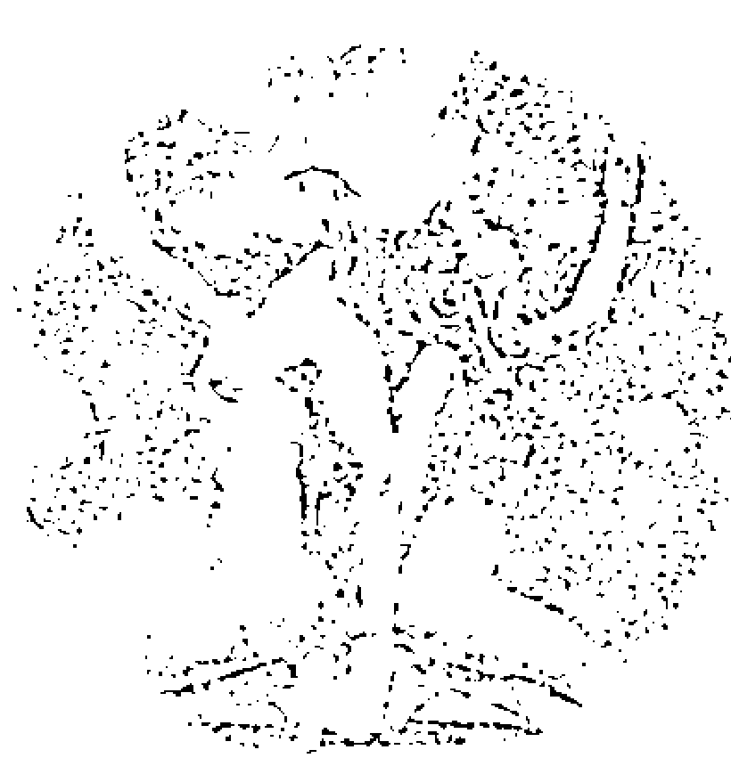

### 第一数：魔术师人的基本个性

魔术师人通常都会拥有敏锐的直觉力，对自己相当有自信。通常情况下，魔术师人的行事作风中，都会有一些与众不同的做法。之所以会如此，是因为魔术师人总是运用敏锐的直觉力来进行判断，再加上他那过人的自信心，所以常常会有独断专行的情况发生。魔术师人也会因为这项特殊的才能，常常与他人争执。他们实在是太过自信了，常常会有些夜郎自大。不过虽然这样，也不至于让他的人际关系从此恶化，因为时间会帮他证明一切的。当最终证明了他的判断是正确的，别人只会对他更加信任。

魔术师人非常有条理，他会习惯性地把生活与身边的一切事情规划得有条不紊，也会专心致志地向着他规划的目标稳步前进。对那些杂乱无章的人、事、物与想法，他会觉得难以忍受。遇到这种情况时，他通常会做出两种决定，要么就把这些杂乱无章的关系理顺，把事情规划好，要么就是掉头走开，眼不见为净。所以，在别人眼中，他不是显得太过热心，就是显得太过冷漠，总是表现得很极端。

### 第二数：女教皇人的基本个性

女教皇人通常会给人这样一种感觉，似乎对任何事情的态度都是冷冰冰的，好像什么事情都与己无关。但事实上，他们是相当热心和乐于助人的。女教皇人很有智慧，并且善于思考，常花很多时间在思考上。不过有时候他也会因为太过专心于思考一件事情，而让自己忘了其他更重要的事，有时候甚至会严重到让自己失去方向和目标的地步。

女教皇人非常有毅力，当他下决心去做一件事时，不论有什么样的困难，也不论会出现多大的阻力，他都会努力去完成。他也十分自信，但这种自信不会显露在外表，要通过他的行动才能看出来。所以，如果不是与他深交的朋友，常常会以为女教皇人瞻前顾后，没有什么特长。

实际上，女教皇人通常拥有非常好的创意，尤其是对社会上流行的事物，都会非常有见地。所以，在流行趋势上，他往往会成为朋友的顾问。

### 第三数：女皇人的基本个性

女皇人相当的脚踏实地，而且也不会到处宣扬自己的想法。他通常都会先安安静静地把事情做好，然后再把成果展示给别人。女皇人善于学习，也乐于学习，他的兴趣相当广泛，并且不会把自己局限在一个小框框里面。

女皇人生性乐观，乐于助人，他对朋友非常好，以至于常常会让人感到关心过度，有时候，他甚至还会婆婆妈妈地去关心好友的家务事。女皇人非常注重人际关系的发展，并且努力让自己的人际关系维持基本的水准。对他来说，朋友是非常重要的资产。

女皇人的家庭观念也很重，所以他们常常很恋家，也喜欢黏着父母。就算走上了社会，或是结婚了，女皇人还是会住在家里，或者常常与家人往来。

女皇人的表达能力很强，而且创意十分丰富，所以他通常能把一件枯燥乏味的事情，描述得生动活泼而有趣，这让他在朋友中很受到欢迎，常常会成为朋友们的开心果。

### 第四数：皇帝人的基本个性

皇帝人非常脚踏实地。当他规划好，并且决定要进行一件事情时，就会稳定且耐心地去完成它。皇帝人做事不会天马行空，也不会成天梦想，这种实际的个性，使他能给别人带来强烈的安全感，但是有时却又太过度，以致让人觉得他太过于现实。

他相信，如果要成功，就一定要让自己冷静，有时甚至应该冷血，这让皇帝人富有领导才能。再加上他那有条有理且一丝不苟的作风，使他能很快在自己擅长的领域中崭露头角，并且把自己慢慢推向顶峰。

对自己非常自信的皇帝人，有时会因为太过于自信，而让自己显得骄傲自大。通常，皇帝人都具有很强的分析能力，但是却常常会因为过度地分析事情，而让自己陷入难以选择与困惑的情形之中。所以，不论什么情况，皇帝人都需要一位温柔而有耐心的亲密好友，来给予适当的指导。

### 第五数：教皇人的基本个性

有时，教皇人会让自己扮演一个心灵指导者的角色。教皇人会用他那丰富的心灵能量，来帮助别人。

在个性方面，教皇人在严肃中带着俏皮，规矩中带点放纵。有时候，当大家都严肃而专心致志地做一件事时，教皇人会突然搞笑一下。这是因为教皇人有摇摆不定、忽好忽坏的一面，也许会让人感到有些难以适应，但他自己却乐在其中呢。一下是乖宝宝，一下是坏小孩，在两种情境中交错互换，教皇人乐此不疲。

另一方面，教皇人富有冒险精神，并且对任何事情都充满好奇心。所以，常常会看到教皇人为了一件感兴趣的事情，在那里研究大半天。他也爱好自由，强烈地需要一个属于自己的思考空间，能让他自由自在地发挥他那特有的创意。

教皇人在挑选好友时，多半会把占有欲很强、私心很重的人剔除，因为他认为，这两种人不会有大公无私的心和善良的本性。所以，如果你要与教皇人做朋友，千万注意，不要让自己的私心流露出来。

### 第六数：恋人的基本个性

恋人是有理想的人，并且会经常把自己的理想与抱负挂在嘴边。有时，还会和三五好友聚在一起，大谈自己的理想。当然，恋人不会光说不练，他会很努力地朝着自己的理想前进。但是有时，却因为自己的理想太过虚幻，以致迷失目标，不知道自己是为了什么而努力。

恋人善于学习、乐于学习，他甚至能从学习中得到快乐、满足与成就感。

恋人也富有爱心与同情心，所以常常能见到他在各种公益活动中出现，并且乐此不疲。对他来说，别人的需要与感谢，会带来非常大的动力与活力。从另一方面来说，恋人缺乏自信，他需要通过别人的赞赏来肯定自己。也可以说，他的内心其实并不像外表那样，充满了对自己的信任与乐观。

### 第七数：战车人的基本个性

战车人对自己的决定通常都抱有绝对的自信，因为他在下一个决定时，总是懂得用清晰的思路来分析可能影响事件的种种因素。经过仔细分析与深入思考后，他就会努力而意志坚定地向自己的目标前进。

战车人也是非常理性的，遇事非常善于分析。战车人也常常使用这项才能，尤其是在处理有关感情的事情时。在感情的路上，双方难免会有争吵与不和，这时战车人能很快让自己变得理智，运用自己的理性，迅速找出解决的办法，来让双方的情绪冷静下来。

不过有时，战车人也会因为过于理性，让对方产生误解，以为他对这件事情并不是真正地关心，这反而会让对方产生更大的不愉快。所以，战车人有时也需要放纵一下自己，让自己的情绪尽情流露出来，也并不是什么坏事。

### 第八数：力量人的基本个性

力量人拥有强烈的自信心，总会给人成功者的强烈印象。在力量人的举手投足之间，更会不知不觉散发出王者风范。

虽然力量人拥有如此强烈的影响力，却不会让人觉得他骄傲和轻视别人。恰恰相反，力量人通常温柔和善，待人接物也彬彬有礼。有时，会因为太过和善，而让人以为他没有个性，很好欺负。

力量人也是非常干脆果断的。当对一件事情下定了决心，他绝不会婆婆妈妈的，也不会犹豫不决、左思右想。如果遇到了阻碍和困难，他会耐心地把阻碍清除，把困难解决，然后再继续前进。在他的信念之中，绝对没有做不到的事，只有完成时间的长短问题。

正因为力量人有这种个性，所以能把重要的事情放心托付给他，完全可以高枕无忧。

### 第九数：隐士人的基本个性

隐士人多半会执著于灵性方面的追求与探讨，也十分在意智慧的积累与道德情操。他常常会刻意地让自己思考，一有空闲就愿意想事情，努力和自己的心灵充分沟通。但是做这些事情，他也有一半是强迫自己。这带来的问题，是他常常会在无意中，忽略了自己内心的真正需求与想法。

隐士人富有冒险精神，而且拥有旺盛的求知欲。他对自己不熟悉的事物从不排斥，而是先小心翼翼地了解，然后慢慢尝试着，让自己进入状况。某些时候，隐士人相当有幽默感，但这却是因为他在掩饰，在对自己的内心无法掌握时，试图以此来遮掩。这种时候，隐士人的内心会变得非常脆弱，需要一个倾诉的对象。

到这里，九张牌的基本个性就说完了。接下来，要介绍三十一天的出生日对基本个性的影响。这三十一天出生日的基本个性，只能起到辅助的作用，辅助九张牌的基本个性，并带来一些变化。它常常会把已有的个性特征加强或削弱，而有些不太和谐的地方，则可能会产生冲突，造成人在性格上的诸多矛盾。

请各位继续在实践中不断领悟吧。

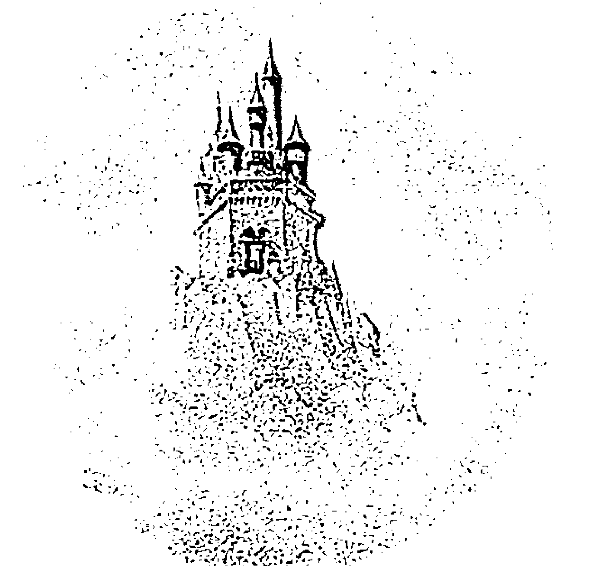

### 一日生人的基本个性

出生于一日的人，通常都具有独立的特质。他们很有主见，也能洞察自己的想法，并能努力认真地完成它，丝毫不会受到别人的干扰。

他们对自己的想法，在未完成时，是不会到处宣扬的。他们会安安静静地完成这一切，然后才告诉别人，让别人惊讶于他们的改变与成长。

所以，一日生人在人际关系的处理方面，通常都是很差的。也正因如此，一日生人的朋友很少，即使有，也只是非常知心的好朋友。

因为那天生独立的特质，他们在某种程度上也是非常注重隐私的。他们不喜欢有依赖性格的人，也不喜欢爱挖人隐私、爱讲他人闲话的人，只喜欢干脆、简洁扼要的人。

不过，这独立的特质，也让一日人会显得自私，常常以自我为中心，从他们与人的交谈中，常常就能看得出来。通常情况下，他们只喜欢说自己的事情与想法，却对别人说的内容与想法显得很不耐烦，甚至会抢对方的话头。

### 二日生人的基本个性

二日生的人与一日人相比，恰巧是两个极端。一日生的人很独立，二日生的人却非常喜爱热闹，也希望有人陪伴。他们无法忍受寂寞，而且非常不喜欢独处。当他们遇到需要独处的时候，会觉得非常难受，并且急着要逃脱这种环境。也因为这样的个性，二日出生的人相当重视人际关系，而且很重视朋友。通常情况下，他们对朋友，就像对待自己的家人一样关心，他们常常会为了朋友做很多事，以致把自己忽略了。而且有时，他们还会为了朋友而尽心尽力，付出很多很多，有点像是提供物超所值的服务一样。

二日人也温柔而随和，这种脾气让人乐于亲近，容易得到别人的爱戴。不过，这也成了二日人的缺点，因为当他们遇到感情挫折时，通常没有足够的应变能力，也无法很有效地调整自己。所以，从某种程度上说，二日人并不是很坚强，而且需要人保护，或给予精神上的支持。

### 三日生人的基本个性

三日生的人非常重视人际关系。他们喜欢与人交流，喜欢吸收与分享种种讯息，就像一个活的资讯交流站。但是有时，这样的特点却会让他们在不知不觉间，成了小道消息的交流中心。

他们很好相处，待人也和善诚恳，所以好朋友也是非常多的，但是也往往因为不善于选择朋友，容易让人误会他们很复杂，什么人都接触。而实际上，他们却不会为朋友付出太多。他们懂得如何衡量与分析，所以不容易因为朋友而让自己受到严重的伤害。

虽然三日人喜好交友，可他们也会要求一定的独立和自由，通常会有一个属于自己的空间，并且保护隐藏得非常好，不会轻易让人看出来。这个小小的空间，就是他们的避风港，是整理自己心情的地方。

三日人有时会比较莽撞，说话不经过大脑，而且他们自己还常常并不知道这种缺点。这虽然会让他们得罪很多人，不过毕竟都只是一些无心之过，很快就能得到别人的原谅。

### 四日生人的基本个性

四日出生的人，不论做事还是想法上，都非常脚踏实地，而且十分实际，不容易看到天马行空或好高骛远的情形。

他们的责任感十足，只要一经承诺，绝对会尽心尽力去实现诺言的。“值得托付”这四个字，非常适合用在他们的身上。他们对朋友也诚心诚意，如果接受过他人的帮助，就会牢记在心，找到机会就加倍回报，正所谓“受人滴水之恩，当涌泉相报”。但是，当他们帮助别人时，却总是默默去做，不求任何回报。不过有时，这个优点却会受到别人的利用，成为他们的弱点。

四日生人也非常有耐力，在自己坚持的事情上，不管前面遇到多少阻力，他们总是能够坚持到底，很耐心地反复尝试，寻找解决问题的办法，并且不到山穷水尽的地步，绝不轻言放弃。所以，从某种程度上说，他们大多是苦尽甘来的人物。

四日生人也有旺盛的求知欲。当他们遇到难题时，总是会把事情的前因后果反复研究，想从中找到自己的遗漏和不足。也正因如此，四日生人多半富有智慧，他们的大部分时间都是在思考嘛。

### 五日生人的基本个性

五日生人做起事情来，非常光明磊落，而且精力充沛过人。他们总是能让别人感觉到一股朝气，在他们脸上，永远看不到丝毫的疲倦。

五日生人在某些方面也十分开放，不会排斥太过新奇的事物，并且愿意去了解，因为他们不希望自己在别人眼里显得太过于古板。

五日生人会把自己的生活规划得多姿多彩，让别人非常羡慕。可是因为对事情非常有主见，他们容易因为对自己的意见过于坚持，而与别人发生摩擦。不过，就算发生了摩擦，五日生人也不会轻易让步。事实上，他们很固执，不过这种个性也不是缺点。当他们追求事情真相的时候，或者追求自己理想的时候，就会很努力，一味地勇往直前，似乎这个世界就是为他而造的，能让他随心所欲、四通八达。

他们热爱自由，喜欢无拘无束的生活与想法。当有人或物想把五日人缠住时，他们会以非常快的速度逃离。因此可以说，五日人是非常不好控制的。

### 六日生人的基本个性

六日生的人多半很和善，常常笑容满面地对待朋友，非常有爱心地对待每件事情与每一个人。可是有时也会因此而让别人误会，让别人觉得他们的爱心有点泛滥。

他们很单纯，会轻易相信承诺，也会因此让自己受到伤害。正因这样的个性，他们会很轻易地为朋友做担保，最后成为别人眼中的笑柄。

他们的自信普遍不足。虽然自己很有才华，想法也十分超前，有的时候，他们想到的事情与方法，别人可能要晚上个把月才能想到，可是，因为他们的自信不足，所以很多好的想法与做法都会埋在自己肚子里，或者因为不受重视而不得不放弃。

六日生人喜爱宁静，也喜爱接触大自然，并且善于在宁静健康的环境中得到休养。他们的精神容易紧张，在压力过大时，还会产生一些神经质的反应。不过对他们而言，这不过是排解压力的一种方式罢了。

### 七日生人的基本个性

七日生的人有一种特质，常常会让人觉得无法接受，这就是从不吃亏。虽然不吃亏是为了自己好，不过却会因为过于精打细算，而让朋友心生不满。

不过虽然如此，他们也有乐善好施的一面。当他们真的从心里想要帮助别人时，就一定会十分努力地付出，分寸也会把握得很好。

严格来说，七日生人固然有点小气，却非常有悟性，不论学习什么事，总能很快达到巅峰。尽管如此，他们也不会轻易让别人知道自己的真实水平。这是一种隐藏自我的独特本事。不过，当他们遇到有竞争力的对手时，就会把这种个性压抑住，而开始努力与对手抗争，把自己的优点逐渐显露出来。他总是能找到办法，来让对手感到压力。

七日生人观察入微，并且善于掌握人性。他们能轻易掌握一个人的优缺点，并且与自己比较。我们甚至可以说，七日生人非常善于比较，尤其在事业方面。

### 八日生人的基本个性

八日生的人非常有才华，而且思路清晰、文笔好，所以多半会在文艺领域取得一番成就。他们常常会运用那清晰的头脑来规划很多事情，并且懂得多留几条后路，以备不时之需。可也正是因为这样，有的时候他们会面临太多的选择，犹豫不决，迟迟难以决定。每当遇到这种情形时，八日人就会找一个安静的地方，让自己静下心来好好想一想。而这个时候，也是他们最脆弱的时候，他们会把自己彻底封闭起来，直到自己想通想透之后，才会再次把内心敞开。

八日人也很有毅力。经过仔细选择后，他们会下定决心，努力朝着目标前进。他们也具有相当大的潜力，如果能把潜力挖掘出来，多半会在自己热爱的领域中，取得傲人的成就。而同时，他们也懂得如何去维持那样的状态，不至于失去稳定。

### 九日生人的基本个性

九日生人多半很沉默，而且安静，容易让别人忽略了他们的存在。但实际上，他们心里却不是那样的，在安静沉默的外表下，隐藏着一颗热情的心，并且常常会参加一些公益活动。

九日生人的思路也很清晰、很敏锐，对事情的变化与风吹草动都能感受到，并且在第一时间做出反应，试图把问题解决在萌芽状态。

可以说，九日生人是应变能力非常好的那种类型，他也懂得运用那优秀的头脑，不断深入思考。思考的范围很广，从个人、家庭到社会、国家，所以，他们常会让人以为，他们有太杂的感觉，精力太过于分散。

他们常常会花大量时间在自己喜爱的事物上，并且努力去研究探讨，甚至于废寝忘食。所以，他们大多能在自己喜爱的方向上，取得相当大的成就。也许在别人看来，付出那么多，似乎有些不值得。可是他们却乐在其中，无怨无悔。

### 十日生人的基本个性

十日生人在表面上总会显得非常独立，而且很少主动与人沟通，常常会让人觉得他们很骄傲，喜欢独来独往。其实，这是因为他们非常内向，而且他们不善与人沟通，也不太会表达自己心中的真实想法。为了避免麻烦，他们干脆就让自己独来独往了，尽量不和别人打交道，并且时时处处保持冷静以致冷漠的态度。

虽然十日生人多半不善于表达内心，也不善于沟通，可他们却非常善于倾听。当朋友在心情上、生活上遇到不愉快的事情时，十日生人是很好的倾诉对象。他们会认真、耐心地听完所有抱怨与不快，然后稍微整理一下，做出归纳，找出问题的症结所在，来理智地开导对方，安慰对方。

所以，十日生人也是很理智的，非常有同情心。不过，虽然他们对别人很愿意帮忙，自己遇到问题时，却会拒绝别人的同情与帮助。在困境中，他们也会尽自己的力量突破困难，不会轻易向别人提出要求、请求援助。这是因为，从某种程度上说，十日生人只相信自己，不相信别人。也正因这种怪脾气，会让十日生人常常走冤枉路。

### 十一日生人的基本个性

这一天出生的人，都有种矛盾的特质，容易反复不定。他们的想法与做法多半不合常规，很容易让人觉得他们不稳定。甚至有时他们自己也不清楚心里的真正想法，不知道接下来该怎么做。

他们不太容易做出明确的决定，也不轻易做出承诺，这并不代表他们不可信，只是因为缺乏自信，害怕自己做的决定与许下的承诺会因为种种原因，最终无法实现。他们需要花很长的时间去思考，好好规划，才能做出一点决定与承诺。不过，通常在这种时候，会让别人对他们失去耐心与信任。

十一日生人对突然而来的压力，常常会反应不过来。这种时候，他们就会选择逃避或推托，所以不可以把太高的期望放在他们身上，因为这样很有可能失望。不过，他们相当善于规划，常常能把很多事情规划得很好，所以

## 塔罗看个性

把和规划有关的事情交给他们，还是能够完全胜任的。只是需要注意，不要让他们去实行，或者至少不要只让他们自己去实行，应该给他们多派几个得力的助手。

### 十二日生人的基本个性

十二日生的人多才多艺，也很有自信。他们对自己设定的目标、定好的方向，都会努力、自信地去完成。所以，他们也通常能在自己熟悉的领域中成功，并且得到很好的名声。
他们思维敏锐，拥有创意的天赋，人际关系也非常好，这多半是缘于他们的自信与积极乐观的态度。他们确实非常乐观，善于表达自己心里的想法，多半会有很大的耐心，让别人渐渐明白他们心里的想法，但是有时却会让人感觉不舒服，好像是被迫要接受他们的意见。
他们常常会花很多时间在自己有兴趣的事情上，并且努力往这个方向发展，所以，通常会选择与自己兴趣有关的行业。
他们爱好挑战，会自己去寻找一些目标，努力去达成，并且还会找一些非常困难的事情，希望自己能从中突破。可以说，这是他们自我成长的一种方式。也因为这样，会让他们比别人成长得更快。

### 十三日生人的基本个性

十三日出生的人普遍缺乏安全感，而且很容易受别人影响，让自己的信心动摇。当他们无法战胜困难与阻碍时，就会让自己的信心崩溃，处在一种脆弱的情况下。也可以说，他们需要别人不断给他们信心，并且有一个生活的目标或精神的依靠。

他们的思维非常清晰，也能冷静地分析很多事情，但却因为安全感不足与自信不够，常常会让自己陷入无法理性思考的情绪中。他们多半也非常情绪化，容易把自己包裹在心灵的安全气囊中，拒绝任何风险与挑战。

十三日生人心地都非常好，而且很善良。他们会从马路边抱起小猫小狗，带回家洗个澡，然后悉心照料，非常有爱心。

可是另一方面，他们的人际关系却不是太好。其实，如果能和他们建立起良好的友谊，就会发现他们对朋友特别好，就像长辈一样地关心好友，有时还会帮助朋友找回信心，尽管他们自己还自信不足呢。

### 十四日生人的基本个性

他们有优秀的领导才能，对自己非常自信，善于规划自己的人生，并且努力去完成它，达到自己的目标。因为对自己太有信心了，所以他们往往不善于听取别人的意见，对自己的想法也很坚持。

他们很有潜力，并且善于把自己的潜能发掘出来，好好加以利用，让自己在熟悉的领域中取得非常大的成就。

不过，十四日人多半固执任性，所以对意见相左的人，总是会千方百计找出对方的缺点或错误，并强力攻击，来让对方服从，这确实有些霸道，应该注意了。

十四日人的情绪不很稳定，很容易因为一点小事让自己大动肝火。也容易因为不稳定的情绪，无意中得罪了一些朋友。

他们拥有很棒的创意，常常会想出一些让人眼前一亮的新东西，并且多半能成功地带动一次小流行。

他们的人际关系还算不错，如果能克服情绪波动大的毛病，人际关系就会更加成功。十四日生的人是可以深交的朋友，因为他们很负责任，也非常重视承诺，对朋友极其忠诚。而且，因为他们非常有自信，所以能给别人带来安全感。
在某种程度上，他们是很稳重的。

### 十五日生人的基本个性

有时，十五日生人在表面上会显得相当独立、独来独往，而且很有主见。但是，在他们的内心世界中，却是非常脆弱和需要别人帮助的。只是因为他们有不服输的个性，使得他们不愿轻易低头，向别人请求帮助。所以，他们常常让别人觉得不易亲近、态度冷漠。
但是，如果你被他们信任，那么十五日人在你的面前，可能会像受委屈的小孩一样，尽情对你哭诉。也可以说，他们在自己信任的朋友面前，会把内心毫不保留地完全显露出来，甚至会让好友怀疑他们外表的独立和坚强。
他们的内心非常敏感，而且复杂，让人很难猜测到他们心里的真实想法。不仅如此，有时连他们自己都会突然迷失，无法把握自己的方向。
十五日生人还有一项特质，就是很容易让自己进入某种情境之中，或者全身心投入某件事情。用在好的地方，代表他能在目前的事情中取得相当好的成就；用在不好的地方，则会让他们处在失控的情绪里面。

### 十六日生人的基本个性

十六日生人可以说是直肠子，有话就说，想什么就说什么，一点也不会拐弯抹角。这样的个性其实也不错，不会让别人觉得他们心机很重、城府很深。但有时这种个性也很容易伤害到别人，因为太过直接了，会让人觉得他们想得太简单。
十六日生人也拥有非常强烈的正义感，不管何时何地，只要他们遇到不公平的事情，马上就会把心中的不平反映出来，并且会强烈地反抗。
他们不喜欢听人说教，讨厌被人家训斥，所以常常会跟自己父母顶嘴、吵架。不过他们自己却也是喜欢说教的那种人。

十六日生人非常努力，不管做什么事，都会努力进行，排除一切困难去达成目标，不管前面有多少阻碍。就算遇到突如其来的灾祸，自己的计划全被打乱，整件事情不得不回到原点，重头做起，他们也会努力照原来的方向前进。也可以说，他们非常固执，而且不懂得变通。不过，若是换一个角度来看，这也算是单纯吧。

### 十七日生人的基本个性

能干，负责任，是十七日生人的本质特征。他们对自己不熟悉的事情，多半能以很快的速度学习，并能透彻地了解。当他们在做一件事情时，不管难度有多大，不管完成的时间长与短，只要承诺下来，他们就会竭尽全力去完成目标，而不会推三阻四、拖拖拉拉。

十七日生人通常都有很棒的创意，头脑也很超前，常常能想出与众不同的想法，并让自己随时随地站在时代潮流最前端。但是有时，会有曲高和寡的情形出现，让人以为他们太多梦想了，太过于虚幻。这时，他们就会把自己的想法收起来，等时机成熟，再拿出来实行。

通常十七日生人都很自信，对自己的决定与规划，都能充满信心去实行。但是，他们有一个很大的缺点，就是受不了打击，不喜欢被泼冷水。一旦他们被别人泼了冷水，自信就会明显下降，但这并不能减低他们的努力与责任心，只是会让他们左思右想，不停地把以前的规划拿出来审视，并且找各种人讨论。

### 十八日生人的基本个性

他们做任何事情都会非常认真负责，不管前面的路是否艰辛、困难。他们也很重视承诺，只要许下诺言，就会努力去实现，去遵守。同样，他们也在乎别人给他们的承诺，要是朋友没有遵守诺言，他们就会离开对方，不再和他有任何来往。但是另一方面，他们也并非不通人情，虽然态度坚决，也会给对方机会，留有余地，让对方在一定的时间内重新建立信用。

他们善于思考，常常会找一个安静的地方，默默思考很多事情。但是有时他们却会失去平衡，本来应该独自思考，却陷在里面拔不出来，让自己的日常生活受到影响和干扰。

十八日生人有一个很大的缺点，就是情绪不稳定，而且喜怒无常。有时甚至一连好几天都让自己处在消极的情绪里，使得别人不敢接近。这个缺点如果控制不当，会使十八日生人在人际关系的处理上，遇到很多麻烦。

### 十九日生人的基本个性

十九日生人同时拥有自私自利与无私奉献两种个性，常常会让自己进入矛盾的心境里。他们遇到一件事情时，如果想法过于偏向利己，另外一种大公无私的想法就会冒出来。但如果按照大公无私的思路走，那比较自私的思考模式又会跑出来。而常常处在矛盾情境下的十九日人，慢慢地就学会了寻找一个比较中立的思考方式。但是，有能力这样解困的十九日人，还是比较少的，大多数人则会为此所苦，找不到出路。

十九日生人在表面上，常常让人觉得他们很热情，人际关系也很好。但是在内心里，却经常感到孤单、空虚、寂寞，并且在独处的时候，更会感到无助。所以，十九日生人大多喜欢去比较热闹的地方活动，并且广交朋友。就因为害怕独处，所以他们也渐渐变得富有同情心，经常能善解人意。这两项特征，让十九日生人有了相当优秀的人际关系。不过有时，他们却有点爱心泛滥。

### 二十日生人的基本个性

二十日生人的直觉能力很强，常常会跟着感觉走，等做完事情再用理智分析。也因为这样的处理方式，让二十日人经常走回头路或者走错路。当然，他们也会碰上运气好的时候，当天时、地利、人和都凑到一起时，就非常适合他们的直觉力发挥重大作用。

二十日生人通常会在自己熟悉的领域里做得很出色，并且以此为乐，不过他们很少会离开自己熟悉的领域，前往陌生的领域，因为他们并不是很自信，也没有太大的野心。在面对自己不熟悉的事物时，他们会感到束手无策，还有可能因此而选择自闭，不再与他人交流。所以，如果他们实在要进入陌生的领域，就需要多找一些同伴来陪伴。

他们心性敏感，易受伤害，不管外表还是内心，都常常会表现出弱不禁风的一面，这使得他们不自觉地限制了自己的发展空间，让自己停留在一个看似安全的空间里。除非有人愿意帮忙，很耐心地把他们领出来，否则的话，他们可能会一直这样停留下去。

### 二十一日生人的基本个性

拥有不错的直觉能力，这让二十一日生人在处理那些逻辑性不强的事情上，常常能得到不错的结果，比如股票。二十一日生人虽然也很依赖这项能力，但同时他们也懂得运用理智去分析，这使他们在做事时，不太会有脱离常规的情形出现。

二十一日生人多半很独立，非常有自信，能抓住一条自己认为正确的方向，努力往前走。在前进的过程中，他们也不会不知变通地一味前冲，也能不时停下脚步，思考一下，调整一番。所以他们多半能迅速取得成功。

他们善于表达，也会很有耐心地倾听别人的心事，再加上他们那不错的分析能力，使他们常常能帮别人解开心中的疑惑。他们的人际关系也相当好，这是因为他们的诚恳让人感到安心，觉得与他们在一起舒适自在。

### 二十二日生人的基本个性

二十二日生人多愁善感、柔弱、不善于表达自己，对自己也非常没有自信，常常会给亲朋好友留下不好的印象。但是，在他们看似什么都不行的外表之下，却藏着坚强的内心，既可以冷静地思考，又善于使用创意的头脑，常常会做出一些让亲朋好友刮目相看的大事。

他们也常会因为吸收了太多别人的意见，而让自己感到消化不良，难以做出冷静的判断。这时，通常是他们最需要冷静的时候，需要让自己把所有的活动暂时停止。因为吸收了太多的信息，让自己那冷静的思考也无法使用。

二十二日生人常常能在重要的时刻开启特别的能力，经常出现的就是他们那过人的分析能力。也正因为这些过人的分析能力，使他们常常能找出解决问题的捷径。

二十二日生人还有一个小缺点，可以说好，也可以说是不好，就是过于注重物质生活，并且容易让自己陷入物质的追逐中，迷失自我。

### 二十三日生人的基本个性

二十三日出生的人，表面上会显得很独立，爱好自由自在的生活，不希望被束缚，而且常常在朋友面前表现出很有主见的一面。但是这些都只是二十三日生人的表面功夫，在他们的内心深处，却是非常需要被关心，非常渴望别人照顾，也希望得到别人意见的。他们害怕孤立和孤独。

为什么会有这么大的反差呢？因为二十三日生人太爱面子了，他们会习惯性地把自己最脆弱的一面隐藏起来，不让别人知道。当他们缺少某一方面的特质时，反而会特别把这项特质表现出来，让人感觉他们并不缺乏。

二十三日生人的思考模式相当单纯，一旦遇到一些突发状况，就会变得束手无策，甚至会选择逃避。他们不善于把自己内心的想法表达出来，并且对人际关系的处理也相当差，所以，他们有时会习惯性地在别人面前把自己封闭起来，这时甚至可以说，他们实在是太过内向了。

### 二十四日生人的基本个性

拥有好脾气的二十四日生人，不管在人前还是人后，情绪永远都是最饱满的。他们不会让自己的情绪变化轻易显露出来，就算遇到非常令人生气或沮丧的事情，他们也会心平气和地把事情的来龙去脉想一遍，然后再找找看，有没有解决的方法。

他们多半都有很好的直觉力，并且懂得把它用在有建设性的方面，同时与他们那不错的分析能力结合。这样一来，他们在每件事情的处理上，都表现得相当有水准。

不过，虽然他们的情绪通常都很平静，而且不会受到太大的干扰，但如果真的受到伤害，二十四日生人却会需要很长时间的独处，来让伤口慢慢复原。通常情况下，能让他们感觉受了伤害，那这伤害必定是非常大的。如果是平常人，可能早就有了很大的情绪反应了。

二十四日生人也很有商业头脑，尤其对于企划与管理方面，更似乎具有天生的本能。但是有时候，他们却无法承受太大的压力，这也使他们很少能在商场上与人竞争。如果他们接触到了和竞争有关的方面，多半会扮演辅助的角色。不过即便如此，他们也显得相当出色。

### 二十五日生人的基本个性

出生于二十五日的人，多半非常谦虚，不会好大喜功，他们是那种安安静静做事的人。在一群人中，也许他们并不明显，可他们的本事却不小，那闷头做事的功夫，可以说是发挥到了极致。

在人群中，他们总是沉默寡言，不会随意发表自己的见解与看法。但是，在自己非常熟识的亲朋好友面前，却会有些啰嗦。

他们非常敏感，而且情绪上会有些波动，很容易就会因为别人的一句话，让自己的情绪大受影响。

因为在人群中不爱发表自己的意见，所以常常让人误以为他们没有主见，或者不合群，这使他们的人际关系也显得不是很好。但是如果能与他们打成一片，深入交往，他们又会成为不错的朋友，很有幽默感，也常会想出一些好玩的点子来让大家开心。
创意十足的他们，也时常会有非常棒的想法，让周围的人吓一跳。

### 二十六日生人的基本个性

出生于二十六日的人，富有同情心，并且有不错的洞察力。在与人相处时，他们总会先找到别人的想法与感觉，然后才考虑自己怎么应对。有时他们甚至会暂时把自己的利益放到一边，去屈就别人的想法与意见。但是他们也能够冷静地思考，所以也懂得判断事情的正确与否、合理与否。如果有人想利用他们这一点来获取利益，常常并不能成功，还会收到反效果。
他们多能充分运用冷静的思考能力与优秀的判断力，让自己能在目前的领域中发展得十分出色，并且倍受人们尊敬。但他们也有一个缺点，就是善攻不善守。当他们把自己推向顶峰时，就会不自觉地停顿下来，不再前进，还有可能退步。这时，二十六日人就需要把自己归零，再重新学习了。
他们需要一个宁静的自我空间，来调适身心的平衡，并且运用这份空间，来使自己充分地成长。所以，自我空间对二十六日生人来说，是非常重要的。

### 二十七日生人的基本个性

相当内向的二十七日生人，不善于与他人的高度互动，也不善于人际交流，这使他们会关注自己的内心，挖掘心灵的深度，并且不断寻求精神上的成长。所以，二十七日生人在规划与企划方面，通常能取得相当不错的成就。
这一特点发展到一定程度时，就会开始“反向思考”了。大多数情况下，这种思考模式可以让他少走不少冤枉路，但是一旦不小心，就有可能让自己陷入是非难辨、无从选择的情境里。
二十七日生人也拥有非常强的责任感，只要在口头上应允一些事情，他们就会尽力去达成。不过有时却会让人感觉到，他们的责任感强烈到了固执的程度，而且不知变通。也许这件事情的前途困难重重，也许能实现目标的道路有很多条，但他们却不会更多地思考，只想先把这件事情完成。从某种程度上来说，他们是太过单纯了。

### 二十八日生人的基本个性

二十八日生人在个性上常会出现一些小矛盾。正常的时候，他们喜爱热闹，并且善于在人前表达自己，也对每一件事情非常热心。对人际关系他们也非常注重。但是在他们的内心深处，却渴望着安静的生活，希望能够独处，能够得到一个属于自我的空间，来让自己做些事情，帮助心灵更好地成长。这样的个性，会使他们有可能慢慢转变成分裂人格，在人前人后的想法和做法截然不同。

不过，也因为这样的特性，会使他们慢慢把人际关系深化，发展成长久而深远的友谊。有时他们显得顽固而不知变通，有时又会让别人哭笑不得。他们不受任何限制与拘束，这使他们让人觉得不易捉摸，常常还会觉得不好相处呢。不过，他们其实也很温柔，而且很和善，常常会主动关心别人，就像关心自己的家人一样。

### 二十九日生人的基本个性

二十九日生人常常容易被别人误解，这是因为他们实在太过敏感了，而且对自己也不是很自信。在某些事情上，常常会反应过度，使别人误以为他们心里不快，或者充满了忧郁。这也容易让人觉得他们不好相处。

他们的内心很脆弱，而且有时适应力不是很强，这就造成了在一些事情上无法掌握，或者会脱离应有的轨道。他们常常会有逃避与退缩的想法冒出来，虽然也乐于寻求别人的帮助、倾听别人的意见，但是那逃避的想法，却依然会成为难以摆脱的阴影。如果别人的态度不是很好，他们立刻就会产生逃避的本能反应。

二十九日生人的思考能力很强，并且善于研究，乐此不疲。很多单调乏味的事情，一到了他们手里，似乎就有趣多了，甚至还可以在这些领域中取得不错的成就呢。他们也非常注重自己的隐私，不喜欢被人揭短，有时甚至会刻意营造一个安全的空间，用来保护自己。

### 三十日生人的基本个性

三十日生人很有自信，善于把自己的未来事先规划得有条有理，并且小心努力地去一步步完成自己的规划。他们多半不动声色，安安静静地做好很多事情，让别人不了解他们真正的实力。也正因为这样，他们才能有很大的空间，不会受到任何压力与阻碍，成功的机会也比别人大得多。

三十日生人的个性多半很强，并且很有主见。与大家一起讨论时，他们总会有不错的意见发表，并且坚持自己的想法，不会轻易让步。他们也擅长处理失控或无法掌握的状况，并且能把混乱回复到最完美的程度，非常有领导人的特质。

有时，三十日生人是个激进派，在很多事情上都能表现出他们积极的一面。但是有时候，却又让人难以接受，因为他们太积极了，会让别人产生很大的压力。不过，沉默也不是很好，有时他们的沉默会让人害怕。

### 三十一日生人的基本个性

三十一日生人多半有很强的创造力，艺术气息非常浓厚，常常会有一些不错的作品与想法，并且也会很努力地把自己的创意实现。不过，他们的自信心却不是很够，所以常常需要别人的鼓励与精神上的支持，要不然，就会让事情做到一半就开始拖延了。

他们的组织能力非常好，能把杂乱无章的事情用最快的速度整理得有条有理。他们也渴望独立自主，但是遇到事情时，却又往往无法适应，并且会产生逃避的想法，也会让自己慢慢退回原先的状态。

他们重视人际关系，也非常努力地去经营。在很多时候，他们会把自己的事情先放在一边，去帮朋友解决他们的困难。但也正是因为这样，而让自己的事情被拖延了，有的时候还会让自己的事情无法完成。不过，也正因如此，三十一日生人才会拥有非常多的知心好友。

## 第二章 塔罗推流年

预测爱情，本来就是塔罗的拿手本领。她的牌阵种类数不胜数，最常用的就有数十种之多，而且都是经过了上百年的实践检验，都是针对具体情况和具体问题做出回答。人们的问题通常不外乎事业和情感，这样说来，起码有一半以上的牌型，可以帮你打开爱情那扇神秘的大门。

然而事实上，无论预测还是解读，都是需要一些功底的。对专业的塔罗师来说，或许这些都不算什么，然而，要让一个没有接触过塔罗的普通人，在很短时间内就掌握这门高深的预测科学，还是很不容易的。我不是说没有那种一上手就迅速进入状态的家伙，但从实践经验来看，能做到这点的，确实也不过是凤毛麟角。

这就带来了一个最大的问题——塔罗固然是一种有效的工具，一种威力强大的武器，但是，使用这种武器的秘密，却往往只掌握在少数人的手里。换言之，对大多数人来说，自己就算拥有了原子弹，也不知道怎么发射、如何瞄准。

不止一次有人问我，有没有快速入门的“捷径”。提出这种要求的多半是漂亮美眉，我在动心之余，也不得不大力发扬“为人民服务”的精神，想美眉所想，急美眉所急了。

闭关十五天之后，虽然不见阳光让我脸色惨白，虽然方便面吃得我眼睛发蓝，但是心里却充满了喜悦，直想像伟大的科学家阿基米德那样，光着身子跑到街上大喊：“我找到啦！”

我终于找到了美眉大众最需要的一把金钥匙，破解爱情的完全攻略！

简单来说，爱是波动的，有起有落，有头有尾。任何占卜之学，只有把握住它的波动起伏，才能像优秀的骑师一样，随着奔跑的马一同俯仰，而不会被颠下来。

对美眉大众来说，有没有缘分根本就是不用算的，既然能够动心，缘分一定还不小呢。人家想知道的，是缘分的深浅，该如何把握，什么时候应该说爱，什么时候又应该走开。

## 塔罗推流年

也就是说，占卜预测如果算不出来形势的变化与波动，那基本上就是在骗人。光看现在是不够的，现在只是现在，明天就不一样了。

用塔罗解说爱情的波动，那就要引进一个最重要的概念——时间。只有把时间结合进来，我们才能看到，事情随着时间的推移，会有怎样的变化。

这就是一位有经验的塔罗师的不传之秘。要想把握住运势的起伏跌宕，驾驭爱情的离合悲欢，你唯有依靠——流年！

### 1. 塔罗看流年

用塔罗牌来推流年，算是一次很大胆的尝试，尤其是当大家对塔罗牌的认识还停留在只能占卜的印象时，我必须要有相当的心理准备来面对各方的疑问。不过，在完成了塔罗对基本个性的解读之后，我终于有了足够的信心，把塔罗论流年的秘术公之于众。现在，就让我们一起开辟塔罗世界的新纪元吧！

其实，塔罗牌里早就有用牌阵来看流年的，比如周运势、月运势和十二宫位流年占卜。虽然常用的就有三种牌阵，可以预测未来数周、数月甚至数年的运势，可是，从命理学的角度来看，这种方式就多少有些松散了，而且它的趋势与准确性，也有很大的问题。

我也曾用过周运势的牌阵，但是效果却实在让人哭笑不得，试了多少次，都很难达到一个最起码的准确性，这让我不得不放弃了运用塔罗占卜流年的想法，尽管心里面会觉得怪怪的，总有一件事没做好的难过与沮丧。那时，我把心思全部转到了中国的五术（按：五术是以中国传统理论来完成的一套学说，包括命理学、占卜学、相学、医学及山术五个部分）。说也奇怪，一次研究之中，我突然间领悟到，如果把一个人的基本运势牌求取出来，那就可以用推算的方法，把流年、流月、流日甚至流时全都推测出来！这与牌阵占卜当然有很大不同，因为我们可以找到一个基准点，有理可循，而不会像以前那样天马行空，让人摸不着头脑了。

使用这种方法，可以求取出两张牌，用这两张牌来看一整年的大概与一些需要注意的地方，使用的空间很大。对于爱情来说，最大的好处，就是你可以看出去年、今年和明年，可以把握感情的来龙去脉，可以找到那个人力不能扭转的规律。

这样一来，你就能够分辨，什么是“命里有时终须有”，什么又是再怎么努力也不可能实现的痛苦与执著。感情的事，从来都不存在什么“人定胜天”，永远都是“天定胜人”。

#### 基本算法

这一个推算的方法需要用到9张大阿卡纳牌（魔术师到隐士共9张牌）和56张小阿卡纳牌。大阿卡纳牌为主牌，小阿卡纳牌为辅助牌，利用这两者就可以求取出一整年的爱情或多方面的运势。

这里必须说明的是，爱情不仅仅是爱情，对现代人来说，决定个人情绪起伏与心态变化的，至少还有事业，而且这往往是更主要的方面。因为，爱情的一时得失，过后都可以弥补，关系到的不过是另一个人如何看待自己，你看不上我，不见得我就一无是处了。而事业上的挫折打击，却可以直接动摇一个人最基本的生存理念，考虑自己是否具有在这个社会上生存的能力，以及随之而来的，养家糊口的能力，过上自己心目中的那种生活和维持生活品质的能力。也就是说，爱情只是一棵树上那茂盛的树冠，而事业，则是它的根本。

也正因为如此，在这部分的论述中，我们起码是把事业和感情同等对待的。分析两者之间的联系与影响，或许你不难看出内里玄机。

#### 基本运势牌

基本运势牌的求法相当简单。只要你把自己的公元出生年、月、日共8个数字全部相加到只剩一个个位数字，就可以找出与此数字相同号码的大阿卡纳主牌。这里和基本个性牌的求法相同，你的个性牌就是你的基本运势牌。

接下来，要找出你星座的基本元素，求取小阿卡纳的辅助牌，这就要参考下面的表格，明确小阿卡纳花色与星座的对应关系：

| 牌组 | 元素 | 星座 |
| :--- | :--- | :--- |
| 杖牌组（杖1-10，杖男仆、杖骑士、杖王后、杖国王） | 火元素 | 白羊、狮子、射手 |
| 杯牌组（杯1-10，杯男仆、杯骑士、杯王后、杯国王） | 水元素 | 巨蟹、天蝎、双鱼 |
| 剑牌组（剑1-10，剑男仆、剑骑士、剑王后、剑国王） | 风元素 | 双子、天秤、水瓶 |
| 星牌组（星1-10，星男仆、星骑士、星王后、星国王） | 土元素 | 金牛、处女、摩羯 |

不妨举个例子：

1986年6月18日出生，1+9+8+6+6+1+8=39，3+9=12，1+2=3，得到的最后个位数字为3。大阿卡纳主牌的同号码对应牌就是女皇。

此命造的主牌为女皇，然后求取星座的基本元素，6月18日出生为双子座，双子座的元素属风，小阿卡纳牌的剑组牌就是风元素了。那么，剑组的第3张牌即剑3就是此命造的基本辅助牌了。

#### 流年牌

接下来，就要推流年牌了。求取基本运势牌时，我们只用了大阿卡纳的9张牌，可是在推牌时，却需要用22张大阿卡纳一起推求。

具体的推牌法，就是把各位的基本运势牌当做一岁，然后从这张基本牌开始往后顺数，直到所要推测的年份，来求得那年的对应牌。需要用这22张牌不断地运转，周而复始。

再看小阿卡纳的求法，原则上与大阿卡纳一样，以基本牌为一岁，往后顺数到要推测之年，就得到了那年之牌。但是，小阿卡纳与大阿卡纳的不同点在于，小阿卡纳是56张牌一起数，并且横跨四大元素。这里需要特别注意的是，小阿卡纳的四大元素排列也是有规矩的，在推牌时，要依照四大元素的顺序来运行才对。

小阿卡纳四大元素的牌列方式为：杖组牌的火元素、杯组牌的水元素、剑组牌的风元素、星组牌的土元素。不管各位的基本元素是哪一个，都是从那一个元素开始往后数，一样是在这56张牌里面运转。

这里再举个例子：1986年6月18日生人，求出基本主牌为女皇，求出基本辅助牌为剑3，而此命造要看2007年的运势，2007年也就是此命造的21岁。那么，就先来求出主牌的流年牌，从女皇牌开始往后顺数，数至世界牌时，再回到愚者牌来继续顺数，求得流年主牌为魔术师牌。再来看辅助牌的求法，一样从基本辅助牌开始往后顺数，并且按照四大元素的顺序来数，求得的流年辅助牌为星9牌。接下来，就运用求得的这两张牌来看流年的运势。

#### 正位与逆位

需要补充说明的是，每一张牌的正位与逆位，常常代表了相对的含义，它揭示出了事情的两种可能。而在两者之间，到底哪一种的趋势更加强烈，则取决于你自己的选择了。从道理上来说，命运的大方向固然是定好的，但是在其中，你还是可以有自己的选择，可以决定小的方面，就譬如说命运决定你今晚要吃饭，你可以选择吃米饭还是馒头一样。

至于一般的论命之学，常常会给出明确的答案，人们便习惯于用“准”与“不准”来衡量，这从出发点上就错了。连三岁小孩都知道，人在事情面前，是有自己的选择的，大方面固然是命运的安排，人在其中为善还是作恶，促使事情往哪个方向变化，那还是出于自己的选择。不能说命里注定我富贵，我天天出去杀人放火还是富贵，那是不可能的。

塔罗的奥妙也就在这里，永远揭示出两种不同的趋势，使人心存戒惧，慎重地面对每一次选择，真正理智地承担起对自己生命的责任，努力把握生命中的每一天。

## 第四章 小阿卡纳的真爱密码

用塔罗推流年并不难掌握，只要大家多多练习，很快就可以熟练的。又因为流年的推算法要用到小阿卡纳牌，所以就要向大家介绍56张小阿卡纳牌的基本牌意，来帮助大家认识与了解。

在流年的推算中，小阿卡纳虽然只是辅助牌，却占有相当重要的位置，能让人更详细地看出事情的重点。事实上，小阿卡纳更多地显示出实际的状况，而大阿卡纳则意味着基本的原则、趋势以及相关的一些忠告。

这里，我们就按照四大元素的顺序火→水→风→土，来逐次揭开小阿卡纳之谜。

### 杖牌组

杖牌代表了火元素，火元素是能量、热情、行动力、生命力、挑战性、旅行与积极追求目标的象征。而在星座中，属于火元素的有白羊座、狮子座、射手座。通常情况下，杖牌代表着喜欢用征服、挑战的手段来达成自己的目标，并且在完成一个目标后，会积极地寻找下一个更富挑战性的目标去征服。杖牌的人需要用不停的行动来确认自己，稍微的停顿都会令他产生很大的失落感。

#### 杖·ACE

杖ACE代表一个计划的开始，充满着强有力的行动力，并伴随着强烈的信心和决心。那迫不及待去实行的强烈企图不断地散发出来，让周围的人也被感染。杖ACE不是要你去思考或规划，而是要你去实行，去行动。杖ACE也可以代表着一段富有能力、权力的时光，你的感性被放大，并且起到了支配作用。杖ACE从挑战中得到了成长的喜悦，并且乐在其中。如果只是平淡和顺利，那是绝不会让他得到满足的。找寻刺激成了杖ACE的特性，追求挑战成了他的习惯，马上行动是挂在他嘴边的口头禅。

感情上，杖ACE暗示着一段新的关系，或是现有关系的一个全新的阶段。它也代表着肉体关系的开始，或是一种全新的肉体关系，并且因为这种关系双方给予了彼此更深度的承诺。通常来说，杖ACE很强烈地暗示着旅行，并且是一段与异性有关的旅程，或许是双方一起出游，或许是到远方探望心中的他，或许是在旅程之中遇到了让自己心动的人，并且有可能产生结果哦！

然而，逆位杖ACE虽然还是代表着新的计划，却没有正位杖ACE那样强烈的动力与企图心。它还代表着目前尚有一些问题需要去解决，只有克服眼前的困难，才能继续向着目标前进。

在爱情里，逆位杖ACE象征着目前双方有些事情需要沟通，需要一些承诺、讨论与表示，但这只是暂时的。只要处理完眼前的事情，双方间的关系就会进入一个新的阶段。在旅行中，逆位杖ACE象征着刚结束一次愉快的旅程，或是暂时让旅行的计划延期。

#### 杖·2

杖2代表着选择，现在正是面对选择的重要时刻。简单的两条路，一条是继续停留在目前的状况里，接受自己熟悉的一切，另一条则是改变自己，通过旅行或学习，使自己得到成长，并且进一步开阔自己的视野与疆土。从另一方面说，杖2也可以代表着成长的过程，不断开阔的视野，使你感到目前的局限，对自己越来越不满意。如果你已经开始规划，并决定了下一步的方向，这张牌就能强化你的决定，它告诉你的，是目前的这项决定，基本上就像命运一样，不可抗拒。这张牌所指的决定，多半是物质方面的，例如换工作、搬家、换车子，都是些生活中的具体转变。当问到自己的长远规划时，这张牌的出现，则多半代表着目前正在考虑，是否要换工作或换行业。在感情方面，则代表了自己目前有两个选择，或者正在考虑要不要移情别恋。杖2并不代表行动，也就是说，这张牌不是具体去实施什么，而是做出决定。

当你抽到这张牌，也可以表示，目前正在习惯与希望之间抉择。

除了上述这些，杖2也代表着一种考虑，决定双方之间的关系是否应该更进一步，或者是否应提出一份负责任的承诺。当然，你既可以选择维持现状，也可以勇敢地做出抉择，但无论怎样，你的决定都会影响深远——如果改变，就没有机会回到原来的状态，而如果维持，那么以后再想提出改变的话，你会感觉更难，就好像面前有一道障碍，如果一次冲不过去的话，就再也过不去了。

逆位的杖2则暗示着，这项决定已经给自己带来了很大的困扰，也因为对自己缺乏信心，而害怕下一次的挑战。如果在询问选择时，出现了逆位的杖2，则代表着不要犹豫彷徨，不要再考虑了，直接跳进那新的环境里吧，机会不会再来了！因为你已经花了太多的时间，却无法做出决定，这让你已经失去了最宝贵的时间，已经没有时间再考虑和斟酌了。如果再继续拖延下去，只能让你失去更多，损失更大。

#### 杖·3

杖3代表着，在各种事件的进程中，追求自我的成长，不断调整自己的位置，调整对自己的根本认识，我是谁，我该走什么样的路，我到底需要什么，我有没有迷失真正的方向，现在的目标到底是不是我真正需要的。杖3告诉你，现在是需要静下来沉思的时刻。这张也是杖组的耐心牌，代表着因为执行了杖2的决定，取得了一些成绩，内心也得到了相应的成长，你变得更加成熟。而在日常生活中，杖3则暗示着一个计划的实施，一次旅行的出发，或者是一件事正迈向下一个阶段，得到了进一步的发展，达到了新的境界。

杖3也代表一次感情的开始，就在现在，正在进行，已经行动，而且已经产生了明确的两性互动，双方正在走向结合，不断地互相调整和适应，不断改变自己、配合对方的心情。而在旅行之中，杖3则代表着旅程中的艳遇与纠葛，情感上真是剪不断、理还乱。

事业上，这张牌的出现则意味着一次转机，一次重大的改革或转型，在把你的事业慢慢扭转到成功的大路。

逆位的杖3则暗示着自己需要更多的时间去思考，努力弄明白在目前的发展进程之中，是不是还能按照原先的计划进行。这张牌也代表着，你遇到了一些阻碍，也许应该尝试着寻找新的方法，新的方向，新的出路。

问想清楚，总比以后后悔要来得好吧。在旅行上，则意味着即将出发时，却突然改变了想法，暂时停止下来，就像天空中飞翔的鸟，突然迷失了航向，不知道自己这么做到底为了什么。如果旅程中出现了新的感情，这样的感情很难稳定，很可能会颇为苦涩。

感情上的逆位杖3则代表着双方出现了问题，过去一直很顺利，但是眼下突然变得不协调，好像哪里不对劲了。在双方走向承诺、走向结合的路上，一方突然停了下来，重新思考这样的关系是不是完美。你不要催他，毕竟这种承诺是一件大事，多花些时间想清楚，总比以后后悔要来得好。

事业上的逆位杖3则像时钟渐渐停摆一样，让你慢慢停顿，给自己更多的思考空间，也给整件事带来新的转变和契机。

#### 杖·4

杖4暗示着一种稳定或平静的家庭生活，或者是稳定的工作，稳步运行，按部就班。这是因为火元素的热情与活泼正慢慢转入一种安稳、收敛的状态。杖3所追求的计划，在杖4中得到了确认。日常生活中，这张牌常常意味着搬家或换工作之后，达到了新的和谐，一切都稳定了下来，渐渐地发展着，就像植物一样默默生长。

在感情上，杖4则意味着双方都付出了很多，以维护那份稳定的感情生活，并且开始考虑更进一步的关系，更亲密的关系。双方也都在对自己的感情做出细微的调整和修正，力图实现一种更融洽、更和谐的关系，彼此觉得更舒服，更安定，更稳固。

在事业上，环境是稳定的，成长是渐进的，努力是必需的，前途是好的。

逆位的杖4则意味着目前的状况还有很多变数，或许是外部原因造成的，也或许是自己有些方面需要调整，总之你在焦急地寻找着能让自己稳定下来的方式。另一方面，可能已经出现了一些不稳定的因素，使你正在离开那安定的生活，走向另外一段起伏跌宕的日子。

欲望支配了你，结果就不是现在的你所能够预料的了。如果不再从你们两个之间寻找满足，而把眼光放到了别的地方，那么，你便是亲手割断了这一份缘。

在感情上，你可能已经不再满足于既有的稳定关系，心里有些空虚，想找新的东西填补。或许你并没有想要背弃眼前的这份责任，但是，只要欲望支配了你，结果就不是现在的你所能够预料的了。

在工作上，你恐怕很难在一个固定的岗位上坚持下去，会不停地考虑变换工作的事，可是换到哪里你都不会满意，因为现在的你并不理智。建议一切重大决定都先暂缓，等你足够理智清醒的时候，可能会把握得更妥当。

#### 杖·5

杖5代表着冲突，不过这种冲突却不会让任何人受害。事实上，这张牌更像是一种比较、较量、竞争，似乎你把自己生活中的每个方面，都拿来跟旁人或是跟自己的期望值做比较，通过这种方式来找到自己的不足，从中得到成长。不过，正因为有冲突的含义在，所以很可能是开始时只是良性的竞争，到了后来却变得尖锐起来，结果可好可坏。从好的方面说，你确实可以从这样的磨炼中得到成长；不好的方面则在于，你走的是一条弯路，可能会因此失去一些很宝贵的东西，或者达成目标的时间被拉长了，或者预期的目标不得不改变。从人际关系上看，这张牌代表着你难以心平气和地与人相处，不时会有大大小小的冲突出现。这也许是暂时的，也许会持续相当长的时间，取决于你能否认识到自己的问题，把“向外去求”变为“向内去找”，找到并解决自己的根本问题。

压榨自己的体力与时间，去完成那些“不可能的任务”。这虽然会让你有些吃不消，不过，从长远来看，却恰恰是生命羽化更新、破茧而出的重大时刻。

在感情上，你们双方的生活方式有很大的差异，价值、观念和想法上的矛盾，常常会让你们爆发冲突，不过也不必害怕，因为人和人总会有矛盾和冲突，而解决冲突的过程，不断沟通的过程，恰恰是最有益的一种成长方式。通过大大小小的冲突，你们可以慢慢了解对方，找到彼此都能接受的相处方法。

逆位的杖5则代表着“退一步海阔天空”，扩大自己的思考空间，不轻易坚持己见，多听取旁人的意见，综合考虑各种说法，力图找到最平衡、最稳固的方法来做事情。这实际上是一种改变，是你自我的改变，心灵的成长，确实能通向更好的未来。

在工作上，杖5代表你太有主见，常常会和同事产生冲突与摩擦，或者你人为地给自己施加了过大的压力，过度地压榨自己的体力与时间，去完成那些“不可能的任务”。这虽然会让你有些吃不消，不过，从长远来看，却恰恰是生命羽化更新、破茧而出的重大时刻。

在感情上，则意味着双方都愿意打开自己，完全敞开，彻底沟通，彼此没有丝毫的遮拦，通过这种完美的互动，你们俩好得就像一个人一样。

在工作上，则代表着有效地控制，妥善地安排好工作上的一切，并让自己稳步前进。

#### 杖·6

杖6代表你凭借自信与努力，终于取得了成功，这张牌也代表着目标已经确立，计划正在进行，你有强烈的信心，对成功强烈渴望，它是一张现实感极强的牌。不过，在大多数的解释里，杖6通常代表已经得到了成功，正在享受成功的喜悦，或者因为阶段性的成功，你开始有了一些追随者。尤其是这张牌出现在询问未来的时候，更强化了这样的信息：你成功与否，完全取决于你自己！当然，这里说的成功，并不是偶然或者运气好，而是你的努力和强烈愿望产生了巨大的力量，成功只不过是水到渠成罢了。

在感情上，这张牌代表着双方的努力，尽量地敞开与沟通，结果发现你们的目标是一致的，心灵有了更多的契合，双方的关系有了进一步的良好发展。这张牌也有强烈的同居或结婚的含义，进一步说，甚至你们可能都希望有小孩了，或者已经怀孕。而如果是刚认识没多久的情侣，则代表着双方能够相互信任，这段感情之路走得很顺利，很平坦，没有隐患与危机。从感情的进展上来看，是非常快速和稳定的。

在工作上，你通过自身的努力，在目前的工作上得到了相当的成就，甚至有机会可以升迁，或者转到更理想的工作岗位上。当然，这张牌也往往意味着加薪与提职。究其根源，不过是因为你对工作怀有一种强烈的自信，并且对目前的工作环境觉得很舒服，很投入，很容易进入状态。当你体会到了工作中那源源不绝的乐趣时，你就已经找到了自己的最佳位置。

逆位的杖6则是因为自信不足，或是信念不够坚定，计划不够周详，使你无法成功，或者你的成功转瞬即逝。这可能是因为你信心匮乏，不太敢相信和坚持自己，结果不能很好地把握局面。所以，这张牌也代表放弃太快，没能坚持下去。

在爱情上，则代表着双方虽有相同的目标，却因一方的信心动摇了，没有坚持下去，使得彼此之间出现了裂痕。这张牌也代表背弃或者抛弃，而这往往是因为缺乏自信，觉得自己配不上对方，才会有放弃的念头产生，甚至想把自己永远隔离在情感的世界以外。

在工作上，逆位的杖6则代表着成功正在离自己远去，缺乏自信让你与身边的环境产生了隔阂，并且已经跟不上别人了，你的进度远远地落后了。当你陷入这种困境时，转机就很重要了。

#### 杖·7

杖7与杖5的基本含义相近，那就是冲突、抵抗、奋斗，但是与杖5不同之处在于，杖5代表五支杖互相争斗、竞争，而杖7则是一支杖独自对抗另外6支杖的攻击。这两张牌基本上都是争斗，不管哪一种，都是为了自己的权力和梦想，跳进了冲突的漩涡。它们也把权杖的特性充分展现了出来，只是杖7以一抵六，有着更强的守护、保卫的含义。这张牌强烈地暗示出，你目前正追寻的梦想，并不被周围的亲朋好友认同，但是自己却非常固执，执著地坚持着梦想，并且不断努力向着自己心灵的方向前进，所以，这张牌也是非常坚强、非常有毅力、有恒心的象征。从另一方面看，杖7则代表着目前的情况对于你，已经没有更多值得挑战的地方了，所以不得不开始寻找另一个新的、更大的目标来挑战自我，让自己的力量继续成长。

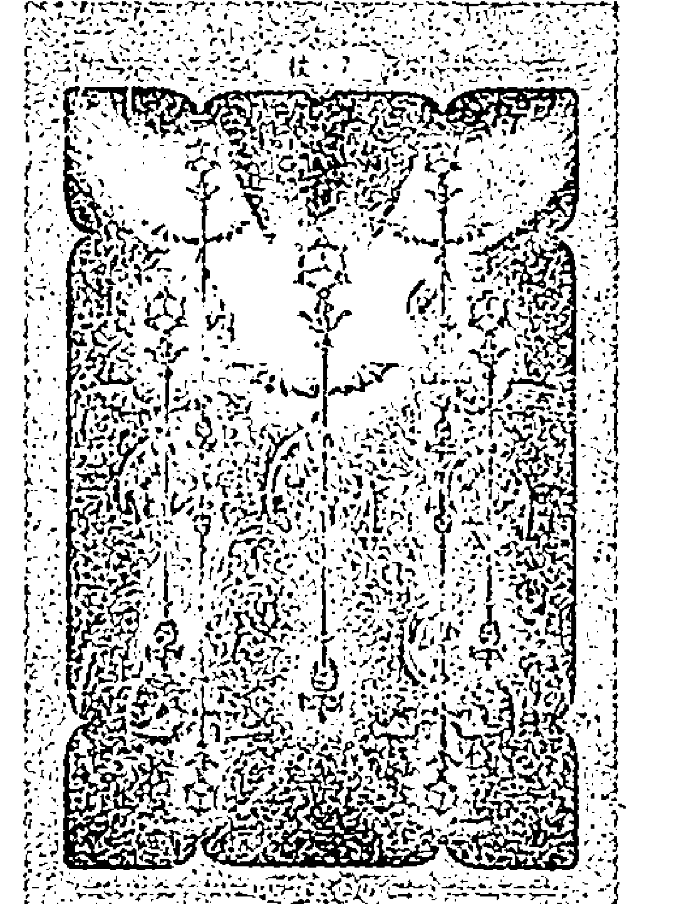

在爱情上，杖7代表着双方正面临一次改变，也许是环境上的，也许是心境上的，你们开始发现双方的不同与差异，你们的生活和关系都变得有些紧张，当然更主要的是精神上的紧张，会有一些争执出现，也会发生一些口角，但这些都只是小冲突，是暂时的。另一方面，杖7也代表着双方都追求着完美的结合与心灵的默契，难免会遇到一些小小的冲突和认识上的差异，但这都只不过是过渡时期。只要过了这个阶段，你们就能再上一个层次，进入一种更好的生活。

在工作上，杖7意味着强烈的野心，试图扩展事业或开创新环境。通常来说，在工作的问题上得到这张牌，这样的人多半是老板。如果一个上班族拿到了杖7，则意味着转职、调职，或是在自己熟悉的环境中创造出新的成绩。当老板的拿到这张牌，则代表目前的事业正往新的方向运行，或者你正准备让自己的事业再上一个台阶。

爱情中，逆位杖7代表双方沿用旧的相处模式，但是问题已经不可避免地出现，你们需要找出一个新的模式，也可以说，你们原来的关系已经出现了问题，是应该从根本上改变这种状况的时候了。如果不能让双方的关系取得新的发展，那么第三者恐怕就会悄然而至，所谓“苍蝇不叮无缝的蛋”。

逆位的杖7则代表你缺乏足够的自信与持续的动力，这使得你无法面对眼前的挑战，被阻碍打败了，也因为你缺乏强烈的意志，造成了优柔寡断的状况。如果是这样的话，杖7告诉你，千万不要继续这样下去了，目前的情况已经够糟糕了，应该反省了，调整自己、转变方向、开始新的计划，才是你应该做的。

事业上，这张牌则提醒你，应该找一条新路了，因为老路越走越不顺，老的计划越来越受阻，而那些慢慢浮现出来的状况，并不是你能控制得了的。如果再一意孤行，不理会这些接二连三出现的小问题，那么，真正的灾难就会到来，甚至让你满盘皆输呢！

#### 杖·8

杖8意味着强烈的活力。在通常的图案里，都是有八支杖在天空飞翔，这代表着不受束缚的自由与活力，也代表着目前的计划进展顺利，没有任何限制与阻碍，你有自由的空间去实行，去发挥你的潜力，追寻你的梦想。它也代表着你的目标是正确的，能够顺利实现，就请无拘无束地前进吧！另一方面，杖8也有强烈的旅行暗示，也许就是一次计划中的旅行，也许是另一种形式的旅行——一段崭新的人生体验。也许，你正在体验着成功之前的努力与期待，即将得到成功的喜悦，而这一切都是因为，你选择了正确的道路，在这条路上，一切都是新的，一切都是好的，都会带来新的自己！

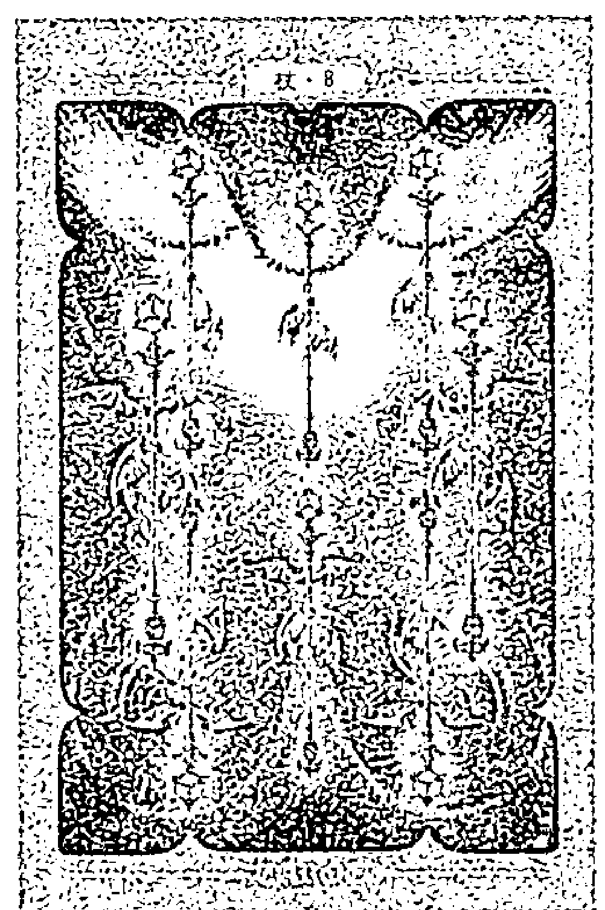

逆位的杖8，则代表着计划的延误，也代表你对计划的把握出现了问题，而这种失控总是突然发生，会让你措手不及。也正因为这样，才会让你发现，原来自己的应变能力不够好，事到临头只想逃避责任。由于你变得犹豫不决，前面的阻碍也渐渐多了起来，这都是因为你没有足够的信心与力量去突破呀！

爱情上的杖8代表着双方关系的融洽，彼此都过着无拘无束的美丽时光。你们拥有共同的目标和相同的兴趣，彼此间完全信任，全心全意地付出着。虽然也会遇到一些小阻碍，但都不会造成大的困扰，因为你们的基础十分牢固，这点考验实在算不了什么。换句话说，你们已经经历了充满暴风雨的动荡日子，迎来了一个崭新的黎明。这时，你们的承诺是坚定的，你们的心牢牢地联系在了一起。

爱情上的逆位杖8暗示着双方因为一些因素，让你们的感情之路慢了下来，不像以前那么有活力，或许真的有问题即将出现。这也许是外部原因，也许是你们的沟通产生了问题。从根本上来说，爱的新鲜感正在渐渐褪去，你们必须调整自己的位置与心理预期，才能很好地度过这次危机，找到新的和谐与相处的模式。

事业上的杖8代表着你目前的计划是正确的，并且能够带来相当的成就与满足。从另一方面来看，杖8也许是一次出差，或者是去海外，或者是在旅行之中得到新的商机，让你的事业再一次扩展。新的投资、新的计划即将开始实施，而这一天，你已经等待和奋斗了许久。

事业上的逆位杖8代表目前的计划受到了拖延，你却缺乏足够的力量去突破，你找不到阻碍的原因，或者找到了也无可奈何。另一方面，逆位杖8代表着事业受阻，可是你根本就没打算突破眼前的障碍，只想换一个全新的方向。可是，如果你不去解决，问题永远都会存在。就算你做新的事情，最后也还是会被同样的问题绊倒。障碍是通向自我成长的必由之路，不去克服障碍，就是拒绝了自己的成长，就是放弃了未来的成就与辉煌。

#### 杖·9

杖8里飞翔在天空的杖，到了杖9就全部停了下来，立在那里，另一支杖则似乎在指挥并管理着这8支杖。杖9代表着一连串外在的变化都已慢慢平静了下来，但是目前，自己的内心却为了要保持那份变化的感觉，所以拿着一支杖，在手中感觉杖的活力与热情。你已经习惯了那种强烈变化的感觉，觉得那才是生活，所以，当遇到了安逸的环境，反而觉得难以适应。尽管这只是一个过渡时期，但是，你还是要努力去习惯目前的状况。杖9也代表着，你虽然已经慢慢地解决了问题，找到了成功的道路，但是却因为事情太过顺利，暂时显得风平浪静，缺少刺激，而想重新再找一条挑战性更大的路。从某种程度上说，你是有点不甘寂寞，害怕自己失去了万丈雄心，一天一天变得苍老。

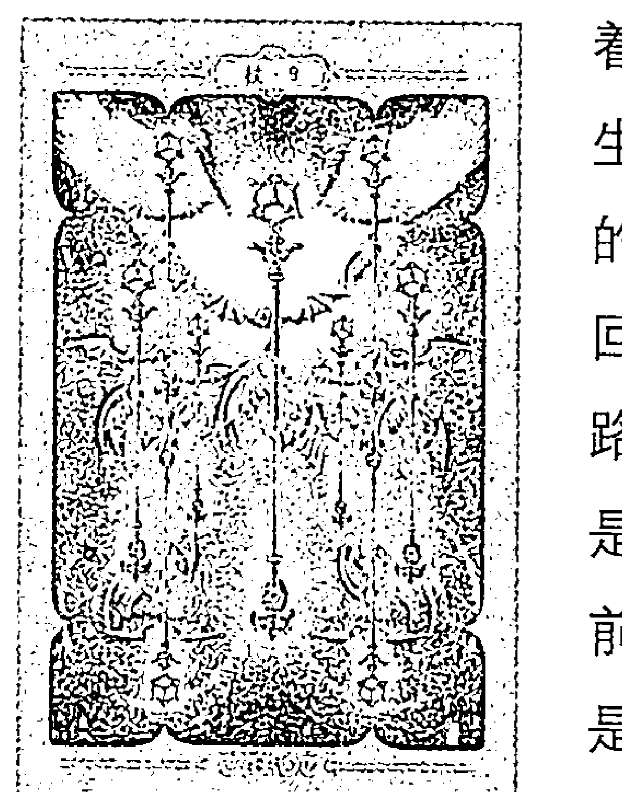

在感情上，杖9意味着，你想为目前的感情生活寻找新的变化、新的突破，并且已经开始回顾你们走过来的那条路，不断询问自己，哪些是可以改变的，无论目前双方相处的模式，还是彼此的想法，你都觉得有必要修改、矫正、优化，这样才能让双方的关系得到本质的改善，才能走向更好的未来。这一阶段，双方也开始重新检讨，你们已有的一切是不是已经渐渐老化，失去活力，变得不再新鲜，是不是应该来一次根本的改变，手挽手迈向未知的领域。

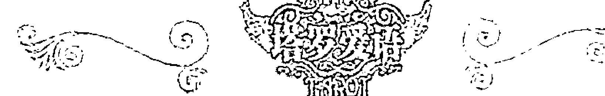

事业上，杖9代表着强烈的愿望，想要突破现状，而这只是因为，对自己目前的状况多少有些不满，想像以前那样，再次地努力拼搏，再次地承担压力与考验，以迎接再次的辉煌。另一方面，你通过检讨过去的努力与失误，试图调整眼下的步伐，然后重新规划未来。

逆位的杖9则代表目前已经产生了种种不协调，于是开始了自我冲突，心里充满了不确定的无力感。这种冲突虽然暂时不会影响大局，但也足以让你丧失信心，而对一切所掌握的，也会慢慢有些失控。逆位杖9代表着，自己正在经受恐惧与怀疑的困扰，因为你突然发现，原来所有的事情，并不是自己一个人就能全说了算。

感情上，则代表着双方正在起冲突，甚至可能会带来严重后果，造成无法控制的局面。另一方面，这张牌告诉你们双方，需要暂时停下前进的步伐，把眼前的问题处理好，解决两个人之间的错位与不和谐，然后才能重新找到新的目标与方向。

事业上，逆位杖9则代表着，你对目前的状况无法控制，甚至也不能有效找到错误的原因，只能不断地让自己深深陷进去。这是因为，你太过注重成败，迷失了最初的梦想，失去了勇往直前的锐气，才会陷进得失的泥沼，斤斤计较，无法自拔。

#### 杖·10

杖10是沉重的，让任何一个人去独自承受这10支杖的重量，都将不堪重负，寸步难行。既然都无法前进了，距离成功当然也就十分遥远了。这张牌意味着你应该好好检视一下自己，目前的状况是否已经超出了你能够控制的范围。如果不能再好好地掌握，是不是应该学习去放弃，放下过多的负担，让自己更好地向前走。另一方面，这张牌所说的阻碍通常都是自己制造出来的，你太渴望成功，渴望控制一切，却认识不到自己根本就控制不过来。你把自己搞得疲惫不堪，无法再负担，如不改变，前景不容乐观。

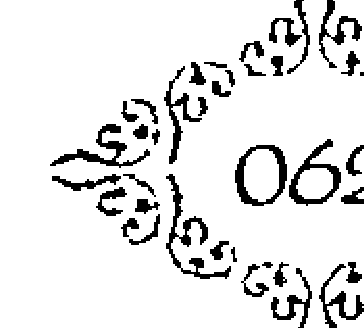

在感情上，它代表着双方都过于理想化，为了达到某种理想的状态，不惜一切问题都自己扛。这根本就不是一个人扛得住的，只能让压力越来越大，让对方觉得你变了，变得越来越奇怪，让你们两个人之间出现越来越多的隔阂。而本来，只要一份坦诚，所有这些问题都可以避免掉。到了这个时候，你们的沟通已经出现了问题，虽然你觉得是凭着好心，想独自承担一些东西，可是人家就是觉得你不实在，不对人家说真话。事实上，你的心太软，最终只换来了对方的很受伤。

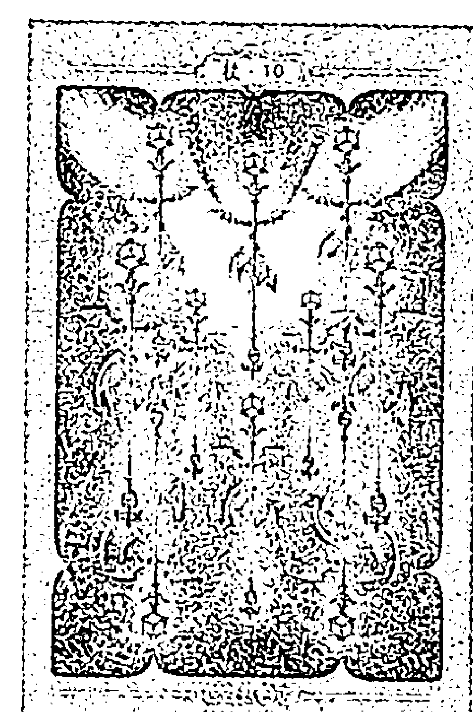

逆位的杖10，虽然也代表着困境与阻碍，但是相对于正位的杖10，则要轻微得多了。因为逆位的杖10懂得在困境中找出问题，并且寻找途径去改变现状，你比较清楚自己的能力，所以不会发展到无法控制的地步，及时就能有所改变。另一方面，逆位的杖10代表着，你到了重新调整自己步伐的时候了，并要重新面对过去和现在的一切，检讨其中的是是非非，从而改变原来的规划，通过调整自己的思想与观念，来影响未来，使未来向着好的方面艰难转变。

在感情上，逆位的杖10代表双方的责任与承诺被重新拿出来讨论与检视一番，到了调整的时期，双方都想要重新找出一条新的路来，让感情换一个方向，换一条跑道，进入一个全新的阶段。不过说起来容易，做起来还是十分麻烦的。

在事业上，虽然你已经负担很多，让自己喘不过气来，却也开始懂得调整，要把权力下放，甚至心里面已经有了一些规划。这时，你前面的道路就多了很多变化与选择。

#### 杖·男仆

杖男仆开始了一次全新的计划，一个新的人生目标，一个新的方向，正在你面前拉开帷幕，即将上演。一次新的行动，一个不错的新想法，一个新的方案，或者是远方传来的新消息，将让你开始一些新的规划与行动。这张牌虽然象征着开始，但主要还是强调了思考层面，更多是计划、规划与理念的设计，还没有到行动的时候。这起码能保证，一切都是有计划的，经过了仔细的规划设计，所以一切应该都在自己的掌握之中，不会出现失控。另一方面，杖男仆就像一个年轻的朋友，精力充沛，充满了活力，热情十足，个性也积极乐观，有着强烈的生命冲动。杖男仆也代表着，你开始想要控制很多东西，并且要让现有的一切按照自己的想法来一个大转变。

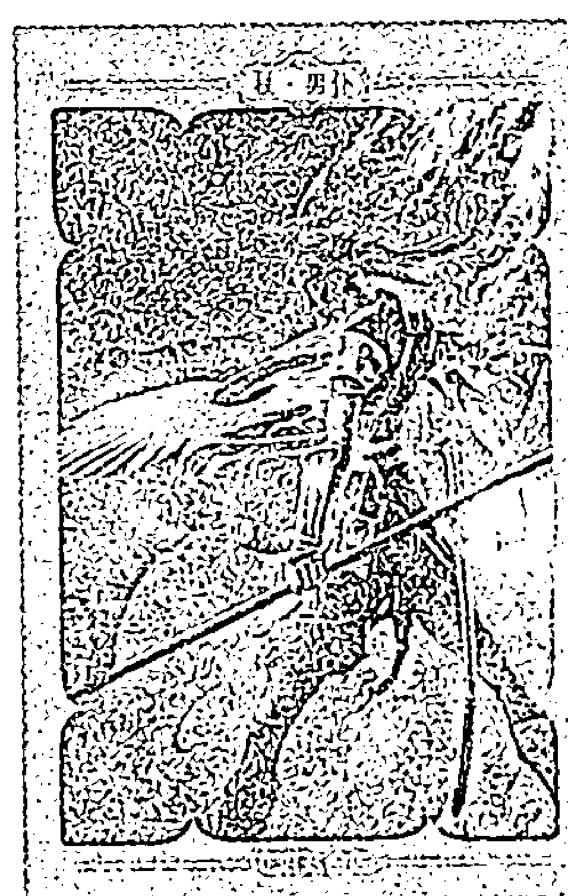

在感情上，杖男仆代表双方正试图做一些新的规划，寻求改变，让双方的感情生活进入新的局面，并且通过高度的互动与沟通，让两个人越来越吻合、越来越紧密地结成一个整体。另外，杖男仆充满了活力，也代表双方开始注重户外活动，渴望去海外旅行。这张牌的出现，还代表着双方充满了热情，尽管有时这样的热情也会成为一种压力。在感情的态度上，它代表着单纯、不做作、专一的情感，如果你还没有情人，这张牌会为你带来一段新的恋曲。

在事业上，目前的状况已经到了一个终点，无法再满足你那股向前冲的动力，你不得不开始寻找一个新的计划、新的目标，也或许是一个新的方案正在规划，即将到来，而你正准备迎接它呢。还可能是外部的某个消息让你突然产生了新的想法。而对应到日常的事务中，则往往意味着出差，到新的地方开展新的业务。

逆位的杖男仆则代表自己想得太多，思考得太久，规划的内容太过繁杂，以至于行动受到了阻碍，甚至是难于开始，这都怪自己太优柔寡断了。还有一种可能，就是事情的规划与准备太多太久，或者开头的动作太大，结果雷声大雨点小，反而让别人对你失去了信心，让整个事情遇到了巨大的阻碍，不得不停顿下来。它同时也代表因为想得太多、太杂，反而抓不住事情的重点。总体来说，逆位的杖男仆就是被延迟，原因也许在外，但更有可能在你自己身上。

在感情上，逆位的杖男仆代表双方的热情不足，态度冷淡，造成彼此间的感情停滞。这主要是因为，双方都有些缺乏动力，或者不愿主动改善现状。另一方面，逆位的杖男仆则代表着，双方之一太过于热情，造成一股强大的压力，以致于另一方无法接受，处理不好就很可能分离。

在事业上，它意味着受到了现状的阻碍，以致于无法产生新的计划，也就是说，世事艰难，你上不去下不来，开始想打退堂鼓了。另一方面则是太过周详的计划，反而让你负担很大，难于打开新的局面。

#### 杖·骑士

杖骑士拥有强大的行动力，当然它也包括思考与计划，不过这只是意味着行动前有必要适当规划一下。这张牌的行动，本质上是接受与寻找挑战的冲动。另一方面，这张牌也代表一次旅程的展开。总体来说，这张牌意味着强烈的改变，是对现状不满的改变。杖骑士也可以说是一张学习牌，有很强烈的学习新事物的愿望、热情和需要，不过这种学习主要不是通过书本，而是在行动中学习，增强实践方面的知识与能力。所以它虽然也代表着研究，或与别人共同探讨，但这些都只是学习的辅助方面，真正的成长与提高，只有通过自己的行动才能得到。

感情上，杖骑士代表着积极的进展，双方都努力前行，彼此间也充满了热情，细心经营着这段感情。某些时候，这张牌代表着双方没有沟通上的问题，并且乐于沟通与分享彼此的心境，而感情也在不断的沟通中，得到新的进展和突破。不过，具体到感情之路，也许颇为顺利，但也可能碰到一些小阻碍，因为杖骑士喜欢挑战，适当的阻碍反而是一种帮助，能够激发出更高的热情、荣誉感与责任心。

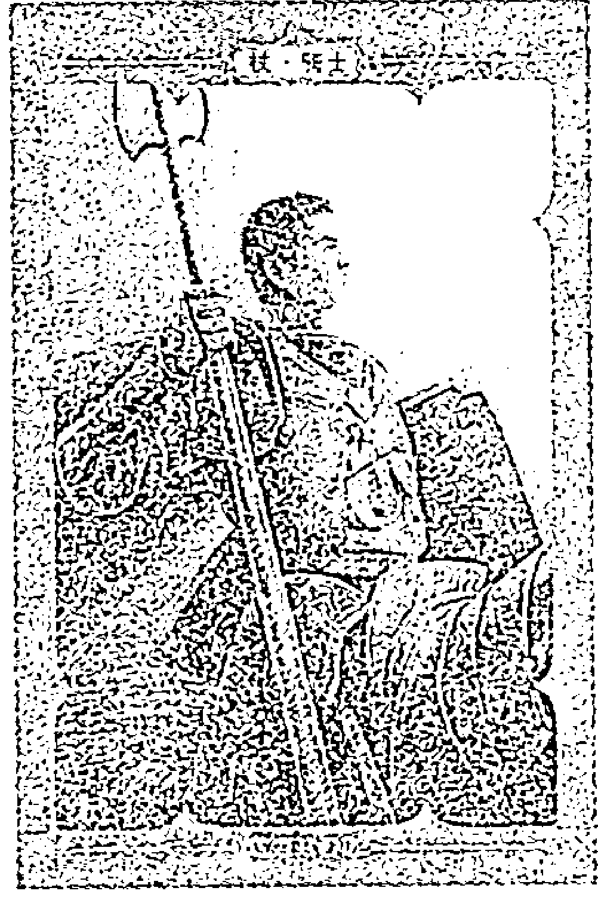

逆位的杖骑士代表着行动的延迟或计划被中断，持续力不足，或者没有耐心。从某种程度上说，逆位杖骑士常常意味着，因为考虑得不够周详，计划太过粗糙，造成实行上的困难，以致不能达到目标。另一方面，逆位的杖骑士因为太有活力，变得有些急躁了，耐心明显不足，也可能是行动的欲望太过于强烈，于是思考追不上行动。总的来说，这张牌就是一次计划不足或是没有计划的行动。

在感情上，因为不愿意做出承诺，对方会产生不信任的感觉。这主要是因为你对感情的态度不够成熟，或许太过于虚幻，使得另一方的情绪出现了不良反应。某些时候，它也代表着双方间的沟通不良，造成误会时有发生。如果任其自由发展，很可能会造成对感情不负责任，或者移情别恋、脚踏几条船的后果。而这其实不过是心理上不够成熟的表现。

在事业上，它代表着新计划正在运转，旧的事情已经结束，新的案子已经展开，或者造成阻碍的问题已经得到了修正。有时，它也代表一次重要的出差或旅行，你从中得到了意外的收获，取得了新的案子。

事业上逆位杖骑士代表着没有耐心去完成一件事，以致虽然新的想法与计划层出不穷，却没有办法实现它们。它也代表着，有些阻碍虽然很小，你却不愿意跨过去，造成了严重的停顿，你的目标越来越难实现，连你的行动力和企图心也受到了沉重打击，一些消极的想法渐渐控制了你，让你的信心消失得无影无踪。

#### 杖·王后

杖王后多半代表一位积极、坚强的女性。这张牌在杖组牌里比较偏向情感、感性、情绪与直觉等方面，也通过这些内在的力量，来指导外表的行动。说白一点就是，自己先有一个希望，然后制定计划，再根据计划展开行动，这是一个连续的过程。所以，这张牌也是迎接成功的准备，多半代表着活力，代表着积极的想法和思考方式，而正确的行动也就是顺理成章的事情了，这就是“因为梦想所以伟大”。这张牌的出现，代表着成功与自己已经越来越近。

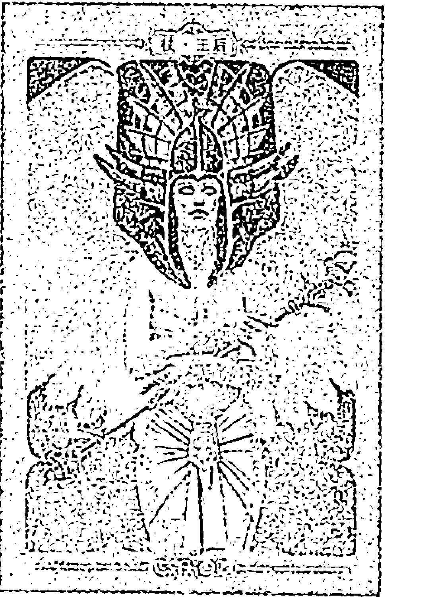

在感情上，杖王后代表着双方之间的相处是积极而又热情的，并且彼此之间坦诚布公。这是因为，双方的目标是一致的，没有太多的隔阂与分歧，并且双方都充满了对未来的期待，都愿意去挑战前途的一切阻碍，手拉手依偎在一起。它也说明，双方充满了热情，并且懂得去找一些方法来增进彼此间的亲密感。

在事业上，杖王后代表着即将到来的成功，这是由你的希望和信心所推动，才让成功更快速地向你走来。它也代表着一次成功的签约，或谈判的胜利。总之，它很强烈地告诉你，收获的多寡与成就的高低，跟自己的努力是成正比的。既然此前你一直努力不懈，成功就已经是顺理成章的了。

逆位的杖王后则往往是因为对自己的能力不确定，信心不足，最终造成了成功路途的漫长遥远。它常常代表着失控，你错误估计了自己的能力，信心过度膨胀，造成了自己会做那些超出能力范围以外的事。不过，从客观的角度上看，目前正是一段重要的转变期与成长期，将把你内心深处没有根据的自信显露出来，让你正视并修正那份真正的自信。

在感情上，双方正遇到了一些相处上的困难，或是互动与沟通不足，造成了一些误会。通常情况下，正是因为一方缺乏自信，才开始怀疑对方的行踪，并且对对方的情感产生了疑问。这种时候，只有更坦诚、更直率的沟通，才能融化两个人之间的误会与隔阂，把感情带回原来的方向。

在事业上，它常常是因为信心不足，丧失了对成功的渴望，最终让自己陷入困境。有些时候，某些困境甚至是自己制造出来的，就是因为不够自信，才开始嫉妒别人或排斥别人的想法，人为地制造隔阂，让别人对你失去信心，而你，还以为这一切都只不过是为了保护自己。

#### 杖·国王

这是一张充满信心、努力、积极的态度与充沛活力的牌，也带着坚强的意志力和优秀的领导能力，而丰富的经验则是信心的来源。从某种程度上说，这张牌又代表着务实、脚踏实地的想法和作风。因为务实，所以才能掌握、控制很多事情，因为拥有丰富的经验，所以在未来的路上也就多了一份自信。杖国王也代表着充满耐心的努力，终于让成功不再遥远。从另一方面看，这张牌意味着经过了充分的休息，开始准备下一次的冲刺，有点像是再次回到沙场上去冲锋陷阵，把自己的丰富经验都拿了出来，去争取下一次的辉煌，感叹“宝刀未老”。

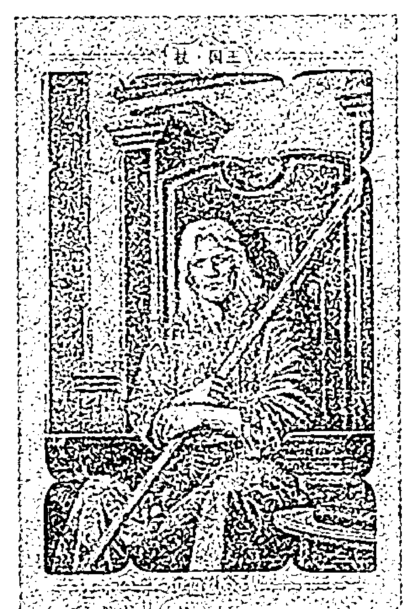

在感情上，它暗示着这段感情充满了挑战，拥有高度的热情，是积极向上的，并且在双方的情绪互动上花费了很大的心思。双方都注重彼此的互动与沟通，由此带来了新的感情进展。不过另一方面，它可能也代表着缺乏情趣、多少有些严肃的感情生活，当然，这种状态也是可以改变的。

## 小阿卡纳的真爱密码

况也是双方都习惯了的，就好像爱人最后变成了亲人一样。

让自己雪上加霜，这实在是有点不够明智了。

在事业上，杖国王代表着过去的经验给你带来很大的帮助，并让你在成功的路上更有信心，脚踏实地的态度也让你在目前的环境中站得更稳，即使出现一些小阻碍，你也完全能够摆平，因为有足够的能力与信心去突破，而坚强的意志力更使你拥有了加速成功的条件。

感情上，它代表着双方的步调产生了不协调，也许因为互动与沟通的不足，造成了误会与争执的产生。从另外一方面来看，逆位的杖国王也代表着双方目前都对这段感情的发展产生了不满，不愿意再走下去了，分离的可能性很大。

逆位的杖国王暗示着目前的你需要休息了，因为过去的征战与奋斗，总有些超出自己能力的范围，造成了很大的疲倦与无力感，再加上热情燃烧过度的感觉，你实在已经不适合再回到竞争的世界里去了。逆位的杖国王代表着，自己没有足够的能力去改善目前的状况，却还去制造新的问题。

在事业上，逆位杖国王则暗示着，目前出现了自己无法掌控的问题，造成自己充满了不确定感与倦怠感，强烈想要休息的想法也随之出现了，或许是内心需要一些修补吧。从另一个方面来看，则是因为做了太多能力范围之外的事情，已经心力交瘁了，不如暂时停止，逃避一下，起码不会犯更多的错误吧。

### 杯牌组

在四大元素之中，杯牌组代表着水元素，而在星座里，属水元素的有：巨蟹座、天蝎座、双鱼座。在塔罗里，杯牌组主要象征情感、想象力与直觉，比较充分地强调了心灵方面，而在一般的解释上，杯牌组则更多强调情感方面，以及与之相关的想象力和创造力。在某些时候，杯牌组也代表着丰富、充满、满足与拥有。当然，这只是一些概略的解释。现在，就让我们正式进入杯牌组的世界。

#### 杯·ACE

杯ACE表示一件事情的开始，或者可以说起步，正要开始进行一个新计划，或是目前进行的事情出现了新发展或新的阶段。在常用的解释上，杯ACE的出现常代表着心灵上的喜悦、快乐与欢笑，而心里没有问题了，生活中的一切仿佛都随之改观，物质上也获得了满足，事情可以顺利展开，也可以圆满结束。有时，杯ACE有一种直接、快速或已经实现的含义，不过另一些时候，杯ACE却代表着太过了，但是这却不会造成什么困扰或不舒服。因为，这种心灵上的过度感受，总是让人觉得满足与幸福。

感情上，杯ACE代表着目前正处于一种新的关系中，或即将遇到一次新的机会，很强烈的未来憧憬，让你心中那爱的杯子一下满溢了出来。如果你已经有了另一半，这张牌则意味着新阶段或是新的进展。不过你应该小心，因为这张牌在某种程度上也表示可以接受不止一份感情呢。

事业上，杯ACE代表自己正有一个新机会，让自己进入另外一段成功的旅程，而在通常的解释上，杯ACE也代表着因成功而得到了喜悦，或因成功而得到了名利，不过这张牌在心灵层面的感动，远比物质上的收获更丰富呢。有可能自己的成就在别人看来并不是那么出色，不过因为已经达到自己的目标，证实了自己，所以心里那份喜悦简直浓得化不开。它也意味着，心中的感觉与现实的反应并不完全一致。

在感情上，它代表着自己对目前的感情不满足，或是因为自己无法从这段感情中得到什么，因而感到了空虚。这时，外遇或脚踏两条船的情况就会发生。当然，这也代表着可能会让自己从感情的漩涡中脱离，转向事业或学业上的发展，以求转移注意力吧。

逆位的杯 ACE 则代表杯子因为倒立过来，无法再装进任何东西，造成了自己的不满足感，或是现状已经不能再让自己感到任何喜悦与快乐。杯口一旦向下，也就代表着结束与掌握不住，所以从某种程度上说，逆位的杯 ACE 总是让人心寒。

在事业上，它代表着你对自己目前的表现有很大的失落感，充满了无法掌握的感觉，而在另一方面，它也代表着目前的一切已经无法再满足自己了，想要找一个新目标，并且开始了行动。但是，因为自己的心灵太过于空虚，无论找到什么目标，还是同样会产生强烈的不满足感。这时，就可能让自己成为多头马车，朝着不同的目标前进，乱了自己的步伐。

#### 杯·2

杯2很明确地表示出平等关系，很容易让人想到夫妻、伴侣、男女朋友，是一种已经成为事实的双方关系。要注意，这张牌也明确地表明，两者间的互动与合作已经形成了默契，所以在通常的解释上，都认为它代表一段良好的夫妻关系，完美的男女朋友关系，一次优秀而完美的合作，一次有着共同目标的旅程。这张牌强调了目前正在进行的事情需要帮手，如果想单独完成，恐怕会有些困难。另一方面，它也代表着自己希望通过合作与互动，得到真正的成长和充分的磨练。

在感情上，它代表着自己正拥有一段良好的两性关系，双方通过良好的互动，形成了稳定的感情生活，而且双方对待感情的态度也很正确，甚至让人感动，因为彼此知道哪里是相处的平衡点，也懂得给对方一个自己的空间，让双方都能在自己的环境中成长，而双方的地位也是比较平等的。

在事业上，它代表着一段良好的合作关系，而且通过这段合作，彼此都会向着成功前进许多，从结果来看，也会让双方都非常满意。另一方面，它也明确表示，通过合作得到的成功，远比单打独斗要大许多。

逆位的杯2则代表了决裂、互不信任和分离。彼此对对方的想法都不能有效掌握，因而产生了不信任感。从某种程度上讲，这也是由于自信不足，才会对对方不信任，或者认为对方对自己用心不够，付出太少。当然，这张牌也可能是因为过于自信，却没有看到自身的缺点，导致自我过度膨胀，才会对对方产生了不信任，让双方的关系渐渐恶化。

在感情上，它代表着维持双方关系的条件已经失去，彼此间不再有共同目标，失去信任将造成分离的结果。这实际上也是因为双方太多地考虑自己，才会听不进去对方的话。换言之，如果出现这种情形，可能就是分离的前兆了。

在事业上，则代表着原本合作良好的双方，因为态度转变，突然终止了这次的合作关系，或者因为双方的自我意识太过于强烈，才会让这段关系的发展减慢了下来。从某种程度上讲，它可以表示合作的结束，或者根本就不可能开始，即使勉强开始，也难以产生结果。

#### 杯·3

杯3有很强烈的庆祝、分享、共同欢乐的意思。这张牌多半代表着一件事情的成功带来一次庆祝，或是克服一次阻碍而得到成功。当然，它也代表着之前的努力得到了事半功倍的效果，给你带来愉快的心情。这张牌也暗示着团圆或愉快的聚会，是一张成功与欢笑的牌。从另一方面看，这张牌也代表着自己有几条路可以选择，或是即将有多种选择出现，而这些选择都是好的，会让自己非常动心，所以有时候会不知道应该选哪一条路。不过，不管怎么选，最后的结果都能让你满意。

从感情上来看，杯3可以代表你的努力追求终于得到了好的结果，或是双方间的相处、互动有了非常好的进展，让你们在感情的路上走得更稳、更顺利。但是从另一方面说，这张牌也代表着，在目前的感情生活中，出现了另一个选择，另一位追求者。如果出现在感情尚未安定的时候，这张牌则意味着，你还有选择的机会。可是，如果出现在已经安定下来的时候，那可能就代表了一次外遇，或是脚踏两条船，而且很有可能把外遇维持下去。

事业上，杯3代表了成功，有机会出人头地，有可能升迁、加薪，因为你为公司立下了汗马功劳。如果自己开公司，则有可能得到增资，或者业务扩展、订单增加，总之会使你的公司茁壮成长。如果是个人工作室，则会有新案子接踵而来，你的能力与业绩得到了公众的认可。

逆位的杯3则暗示着成功，不过这种成功并不会让你满意，你觉得与原来的预想差距太大，因而产生了失落感。从某种程度上说，这张牌也代表了此前的付出与自信太过强烈，导致自负的出现，而到达成功的时间反而变久了。另一方面，由于你对事情只有三分钟的热度，造成了原本预设的目标根本就无法实现。

事业上，则暗示着过于自信或努力不足，而让自己在成功的路上慢慢停了下来。如果是一般的上班族，逆位的杯3不会产生太多的问题，最多不过是在办公室与同事的关系不太好。可是对开公司与工作室的人来说，则代表着增资的失败，新业务无法开展，目前的案子有可能停滞，甚至被迫取消。

感情上，逆位杯3代表着双方的想法与互动关系已差到了无法收拾的地步，因为其中一方开始把心慢慢收回或是转向外边。它也代表着两人间出现了第三者，产生了无法补救的问题，甚至有分离的可能。或者是因为一次外遇，让自己遭到了苦果，不得不面对那不想看到的结局。

#### 杯·4

杯4明显地代表着不满足，或一种失望。在某种程度上，杯4延续了杯3的不满足感，不过有时这种不满却是自己制造出来的，因为你拒绝了一些机会，或是排斥了一些成功的可能。这张牌也代表你放弃了外来的援助，转向内心寻求解答，可是你却没有发觉，你内心的那点力量很可能无法支撑。而一旦力量不足，很可能会更加得不到外界的帮助，甚至连原有的状态都无法维持，只能继续下滑。

从杯4来看感情，则意味着你对感情的发展有些不满意，觉得对方不够爱自己，对自己的态度过于冷淡，或是跟以前相比差了很多。当然，同样的感觉也会在对方心中出现，是一种双方间的互动产生不良变化的表现。不过，这张牌也有积极的一面，那就是目前双方正在调整彼此的关系，虽然是缓慢的，却很稳定。

事业上，杯4有强烈的失去平衡的感觉。上班族拿到这张牌，代表着人际关系的停滞，或是目前业务的暂时停止，也可以说是职业倦怠。而如果自己有公司或个人工作室，则代表着目前因为想得太多，预设了太庞杂的发展方向，可实际发展却不能让你满意，因而产生很大的不满足感和挫折感。

逆位的杯4，则是原本有机会接收外援，可是如今什么机会都消失了，自己也因为强烈的不满足感而麻木了。在某种程度上，这反而是一次绝处逢生的机会，所谓物极必反，因为太过于伤痛，你开始行动了。

事业上，逆位杯4表示着自己停掉了已经失控的事情，试图结束这一切。似乎目前的项目遇到了大问题，让自己不得不停止，并且好好去想另一条新出路。

感情上，逆位杯4反映出双方的关系已经停顿下来，但这并不代表分离或决裂，只是一个彼此冷静下来的阶段，并通过这次停止，来重新规划彼此的未来，试图建立起新的互动关系，新的相处方式，也可以说是承诺的再次建立。

杯4也可以是放弃过去的经验，转向一条全新的、陌生的道路。

#### 杯·5

杯5很容易让人感觉到悲伤、痛苦、不快、失去或是孤立无援，这是因为目前自己太过注意那些失去的、来不及掌握的人、事、物，而让自己进入了悲伤与失望自责之中。但在实际情况里，并不是只有那些失去的、无法掌握的，才需要你去注意，需要你了解个中原因，还有很多没失去的、还能掌握的人、事、物，就在自己的身边，需要你及时注意和把握。但是，在某种程度上，杯5又代表自己在困境中打转，虽然想要找到出路，却做不到，因为无法有效地帮助自己。这时，虽然有些外来的援助想要帮你走出困境，却都被自己孤傲地拒绝了。

从这张牌看感情，可以直接看出，你正在过去的感情中打转，并且拒绝走出伤感的回忆。它也代表着目前双方对于感情的未来产生了强烈的不确定感，并且开始审视、互相检讨目前这段感情的问题出在什么地方，但是却没有想过，或许应该走一条新路，让你们的感情不要停留在过去，而是开始一段新的美好未来。

逆位的杯5代表自己已经从过去的阴影或伤痛中走了出来，并且懂得寻求旁人的帮助。在某种程度上，逆位的杯5又代表着放弃过去与现在的一切，重新寻找新的道路，或是牢牢把握目前的一切，并在此基础上逐渐扩大，也可以是有点破釜沉舟的决心的。

从逆位的杯5看感情，可以看出，双方间在检讨这段感情的过去、现在与未来，同时也找到了解决问题的方法，并且愿意同心协力地去改善与解决问题。从另一方面来看，逆位杯5又代表了双方准备把不实用的承诺放弃，重新建立一项新的、更符合目前情况的承诺，这是经过彼此互动与沟通之后产生的好结果。

事业上，它代表了自己对目前的表现很不满意，并开始回想过去的经验与当初的计划，看其中有什么问题。对上班族来说，这张牌代表着职业倦怠与想换跑道的心情，而对于开公司或工作室的人，这张牌多半暗示着，你对现状太不满足，才会产生目前的疲倦感。

从逆位杯5看事业，则意味着，因为你想通了，所以对已经拥有的一切更加珍惜。对上班族来说，三心二意想换工作的想法已经没有了，留在现职继续努力的想法，占据了你头脑的主要位置。而对自营公司与工作室的人来说，则代表着你终于明白，过去的一切已经过去了，要从现在开始，努力把现有的一切做得更好。

#### 杯·6

杯6代表着稳定、安全、安逸和温暖，这可能是一段关系，也可能是环境或感觉，或自己目前正受到一个强有力并充满安全感的氛围所围绕。这种感觉是因为自己以前的努力而得到的，或是自己去营造出来的。不过，这张牌也表示自己因处在保护之下，失去了一些东西，也许是机会，也许是想法，也许是心理上或生活中的自由，但是，自己却已习惯了，因为那是自愿的。也许是因为以前的奋斗征战让你有些疲惫，想找一处安全的地方，充电休息一下，重新规划自己的未来方向。

感情上的杯6代表着双方目前的关系稳定、安全，没有任何阻碍与困扰，彼此间的互动关系也非常好，从很多方面看来，都可以说是完美的，但是这种关系却有一个小缺点，那就是双方的自我空间越来越少，对对方的掌握与需求大大地增强了。也可以说，拥有安全感，其实同样意味着缺乏安全感。正因为缺少这样东西，你们才都那么努力地去争取。

而事业上，杯6则表示，自己对目前的状况很满意，并且安于现状。也许这样很好，但却无法让自己成长，而且也因为太过安于现状，产生了怠惰感，同时你的上进心和企图心都在消失。这对一般的上班族来说问题不算严重，可如果你有自己的公司或工作室，那就是很大的致命伤，因为这代表着自己的事业无法成长与进步，也有被同行超过的可能。

逆位的杯6代表你目前虽然安全，并且受到保护，却不甘于受到限制与束缚，随着野心和欲望的膨胀，你越发地想要突破现状，得到更多的可能性。从某种程度上说，逆位的杯6也代表对目前的环境产生不满，想要再突破，找寻更新更好的环境。

在感情上，逆位杯6则代表了双方虽然感情稳定，但是却想要找寻刺激与新的高峰。这实际上意味着双方对感情的需求都在增加，并且不断要找寻新的突破点，来增加双方的情趣与交流。

在事业上，则代表了虽身处一个充满安全感的稳定环境，自己内心那不安定的因子却正蠢蠢欲动，并且勾起了尘封已久的野心。它会让乖乖的上班族有想动的想法，最常见的就是跳槽了。对自有公司与工作室的人来说，这是一张不错的牌，意味着你渴望成长，继续向上，你还有很大的上升空间呢，名和利都有增加的可能。

#### 杯·7

杯7是一张自我探索的牌，探索自己的内心、思考与需求，并通过这种探索来更好地认识自己，哪里太过，哪里不足，哪里可保留并且加强，哪里需要删除或者改善，它可以说是一连串的思考。杯7也意味着，自己通过努力，已经得到了外在的一切，现在要转向内心世界了，是一次成长的契机。当你再次回到外面的世界时，能有更充足的信心与动力，就如同一次心灵的再充电。杯7也说明，你应该运用思考的能力了，不要只是一味地往前冲，而不考虑其他，不去管后果。

杯7在感情上，预示着双方的感情稳定成长到了某一阶段，应该停下来思考一番了，思考双方的态度与想法是否需要调整，有没有需要沟通和改善的地方。它也说明，你已经知道这段感情需要修正，并且开始了新的行动，让这段感情走得更好。

事业上，杯7则代表了自己在一连串的努力之后停了下来，开始思考自己在目前的职场上有什么缺失，这既是一次休息，也是一种思考和学习。这张牌也可能表示，目前的职场生活让你产生了倦怠感，想要停顿下来。

逆位的杯7则表示自己对物质层面仍然感到不满足，于是不停地在追求着物质的东西，以为这样能够摆脱心灵的空虚，却不知道这样做带来的不过是更加的忙碌，事务缠身让你暂时把心灵的需求淡忘。

在感情上，逆位杯7表示双方感情虽发展虽然稳定，但由于不去正视眼前的问题与阻碍，以致问题日益扩大，总有一天会带来严重后果。也可以说，你们表面上让别人觉得稳定幸福，可是心灵层面已经出现了许多问题。当问题慢慢扩大时，你们双方的互动就会受到影响，你们的感情就再也难以成长了，处理不慎，很可能会走向枯萎和死亡。

在工作上，逆位的杯7代表着自己在职场上努力奋斗，脚踏实地往前冲，不过给自己的压力却有些过大了。因为，在某种程度上，逆位的杯7也代表着身兼数职，渐渐让自己无法承受。

#### 杯·8

杯8预示着自己的努力创造出了成果，你对目前的一切感到满意，但是却不会沉醉在已有的成功里，因为你知道，目前的成绩维持不了多久，只靠自己的力量，是无法有效掌握的，所以，需要寻求新一轮的自我成长，以求突破，让自己能更有效地掌握目标，或是得到更大的成功。杯8也代表着行动，经过仔细思考和详细规划，终于确认了自己的目标，马上开始行动。这种行动充满了自信，充满了野心，恨不得目标立刻就能实现。

从杯8看感情，则意味着你正试图加深彼此间的感情。原来的目标已经达到，却随着事态进一步的进展，让你看到一些不足，于是想要设计出新的规则和相处的模式，让双方觉得更舒适。另一方面，你们共同努力经营的这段感情，目前已经达到了阶段性目标，是应该讨论下面的旅程该如何走了。

在事业上，得到目前的成果完全是预料中的事，在享受和满足的同时，你也会继续前进，努力突破目前的局限，让自己在新的旅程中走得更稳。另一方面，杯8也暗示着一次新的机会你已经掌握住了，并全力以赴地向着新的目标冲刺。

感情上则表明，双方正在目前的状况里沉醉，谁也不愿打破这种感觉，因为双方已经习惯了。如果改变的话，反而会带来新的问题。但是，这也表明双方对感情的态度非常消极，缺乏活力，一旦问题出现，很可能就再也无法解决，成了你们之间的死结。

逆位的杯8表明，自己正在目前的成果中享受着，也试图维持现状，虽然看起来也还不错，但是你向前的那股动力已经失去了，对未来的规划也宣告停止，只愿意保住现有的一切，因为你已经变了，变得不再像以前那样充满了努力与奋斗的企图心，反而只剩下对未来的不确定感，你已经没有安全感了。逆位的杯8也代表时机尚未成熟，可能是环境的影响，也可能自身存在着障碍，让你不得不停了下来，必须在目前的环境中多磨练一段时间。

事业上，逆位的杯8代表稳定，上班族最需要的就是在职场中稳定下来，不会三心二意，而这些要求，逆位的杯8都给予了。但是对自己创业的人来说，就不怎么好了，因为你的停顿不仅会让公司停止成长，还有可能使业绩滑坡呢。

#### 杯·9

杯9代表着，目前正是一段内在与外在协调一致且满足现状的时期。虽然在杯牌组里，预示满足的牌不算少，但是能达到杯9这样的满足感，则是绝无仅有的，因为它的满足感是双重的，内在与外在兼备。另一方面，杯9也意味着，目前正是成功的黄金时期，以前的努力与奋斗，让外在的物质层面与内在的精神层面都丰富充实，自己也正好可以享受成果了。

## 小阿卡纳的真爱密码

时，也是把过去的经验与目前的成果拿出来，与亲朋好友分享的时候了。感情上，则代表了双方间的感情已协调到了一个不错的频率，彼此间的互动关系也非常良好，是一段感情美满的时期，而且双方也对这份来之不易的和谐倍感珍惜，都愿意努力去维持，简直有了一点情感丰收的感觉。在事业上，则代表了一次成功，让你对现状颇为满意。对上班族来说，这种满意更多是精神上的，因为在工作上的努力，终于得到了成功与赏识，精神上的满足是更重要的。而对自开公司的人来说，物质上的收获远比精神满足更大，因为事实上，他们更关心物质上的发展。

逆位的杯9暗示着，自己虽然在物质和精神上都得到了相当的成就，但是心中的那把尺子却不见了，无法继续衡量自己的短长，同时也失去了无止尽追求的野心。感情上，则代表双方对目前的感情生活还是有些不满，并且试图寻找新的规划与约定，但是双方却同时忽略了，也许目前拥有的已经足够了，也许珍惜你所拥有的才是更重要的。根本上来说，是因为双方都不愿意正视和接纳对方，造成了严重错位，彼此都感觉不到对方的爱，才会让心里出现不满足的感觉。事业上，如果上班族拿到这一张牌，很可能变成工作狂或应酬狂，把工作的弦上得太紧，压力太大了。而对自开公司的人来说，逆位杯9倒是一张不错的牌，表示因为不满足而不停地让自己成长。不过还有一种可能，就是停止了成长，转到了歧路上。

#### 杯·10

同样是10，杯10就没有杖10那种艰辛困苦的感觉，相反，杯10代表着欢乐、喜悦、满足和分享。这实际上是一种同乐，大家一起共享欢乐，或者是因为合作的成果而共庆喜悦，抑或是和朋友们产生了一段愉快的友情。另一方面，则意味着对目前的状况能很好地适应，或者牢牢抓住身边的机会，不轻易放弃。这时，你有了很多选择，可是也有点花了眼，不知道该如何做出正确的选择。则意味着有机会与别人合作，并且能够获得成功。

逆位的杯10中，自己往往不够重视合作与互助，结果孤立了自己，让一些不错的机会白白溜走。它也代表着自我设限，让自己无法施展，同时也把自己的能力限制住了。

感情上，彼此对这段感情的发展都感到相当满足，并且互相信任对方，也因为这种信任，你们都很有安全感，双方也都有很大的弹性空间，这让双方都有成长的机会，感情也会随着水涨船高。

感情上，逆位杯10代表双方的互动产生了变异，一方因为对自己的感觉不确定了，突然想要停顿、退缩，任由另一方怎么去推拉，也拒绝行动。

事业上，则代表着自己在工作领域中，因为得到了同事的帮助，取得了进展或成功，也因为这样，你充分认识到合作的重要性。如果你是老板，在事业上，则暗示着自己和同事隔离了开来，有意要孤立自己，这成了对自己最大的限制。对自有公司的人来说，这种态度会让自己的发展受阻，也可能会退步呢。

#### 杯·男仆

杯牌中的男仆更偏向于心灵的层面，暗示自己在面对目前的事情时，能反思自己，是不是有什么地方出现了问题，并且也通过更深度的思考，让自己深入事情的核心，对应到星座上，常常就意味着双鱼座的人了。这张牌也代表一次新的机会、新的转变或新的讯息，因为自己通过思考，更好地了解了一些事情或问题，简单说就是通过思考得到了成长。

在感情上，它预示着你目前正有一个不错的机会，可以认识新的对象，或是在已有的感情上得到更充分的成长，双方的关系也会更进一步发展，这是通过彼此的沟通与互动实现的。如果你们已经分开，那么这张牌多半代表着还有机会复合。是自身能力欠缺的问题，甚至可能是因为思考得不够周全，才会把机会往外推。

感情上，它暗示着因为想得太多，结果造成了不良反应，使你们的进展停滞了下来。如果你孤身一人，这张牌就揭示出，你对感情的态度有些放不开，或者想法有些偏差，造成了对感情的恐惧与逃避。

事业上，它代表一次机会的到来，也许是升迁，也许是加薪，也许是跳槽，但具体结果如何，还要看你怎样去把握。如果你有自己的公司或工作室，则会接到新的客户，得到新的合作机会，或者资金可以得到扩增。

在事业上，你对一些问题太过执著，有些钻牛角尖了，才会让自己的发展受到阻碍，也使很多机会白白溜走。如果你是老板，这通常意味着机会虽然来了，你却无法有效地掌握，对资讯接收得太慢，反应太慢，结果造成了损失。这张牌同时意味着，提升自我能力的时间到了。

逆位的杯男仆则暗示着目前的情况不太确定，或者你到了自己无法掌握的时期。你会对周围的机会无法把握，这也许是外在环境的问题，也许是自身能力欠缺的问题，甚至可能是因为思考得不够周全，才会把机会往外推。

#### 杯·骑士

杯骑士说明目前正遇到一次选择，你开始思考，是应该停下来等待，还是主动去追求。从某种程度上看，这张牌有点消极，因为骑士花了太多时间去注意手中捧着的杯子，结果注意力反而被分散了。另一方面，杯骑士也暗示着机会已经掌握在手，现在只是在等待时机的问题了，这时最重要的不是行动，而是尽量修正自己的不足，增强自己的能力。

在感情上，杯骑士代表双方间的互动温和而有效，态度柔和，没有激烈的争吵，只有对彼此的关心与奉献。另一方面，杯骑士也是一位温柔体贴的伴侣，会全心全意地付出，无怨无悔地爱护，你们双方的关系会变得更加亲密。意味着，你内心的矛盾或对自己的错误认识，造成了错误的决定，甚至可能让事情渐渐失控。

感情上，它暗示着双方目前正在做一项选择，也许是让彼此的关系更进一步，也许是停在目前的状况，但是停下来的可能性较大。它也代表着，双方的互动已经减慢或停止，彼此都在等待对方采取主动，它有着强烈的被动意味。

在事业上，它代表自己努力付出，公司也非常有凝聚力，机会开始在自己的周围打转，只是自己还持着比较保守的态度。不过，这些机会却不会因你态度的保守而远去，反而可能越来越多。如果你是老板，则代表你的手中正握有好几个机会，而且都维持得很好，它们将会成为让你成长的筹码。

在事业上，逆位杯骑士有停下来的感觉，你在目前的环境中或许有些适应不良，或许想得太多，造成了行动受阻，计划拖延。有时会有虎头蛇尾的情况产生，有时甚至计划刚刚开始，就不得不马上全盘放弃了。如果你是老板，就必须警惕面临的危险了，因为可能还不仅是停滞不前的问题，搞不好甚至可能葬送掉已有的一切。

逆位的杯骑士则告诉你，不应该一味地消极等待，以致新问题层出不穷，使一些机会白白地失去。

#### 杯·王后

杯王后是杯组牌里最充分代表水元素的一张牌，最纯粹，它暗示着你能有效掌握自己的心灵层面，并把心灵层面的发展映射到外在，在物质上也得到了丰收。你自身的创造力、思考能力与直觉力，都可能被放大运用，心里再高的梦想都有可能实现，而自己也有足够的信心。你成功的可能性极大，几乎就是必定达成，而另一方面，你感性很强，不是很理性，但是这样反而更能接近生命的本质。

逆位的杯王后则暗示着自己的心灵层面运转过度，你渐渐忽视了外在的世界，你的心灵和现实世界已经有些连接不上，造成了心灵上的孤立与不切实际。另一方面，它代表着一些不愉快的事深埋在心里，让你内心不堪负荷，失去了前进的力量与朝气，这时最好的办法就是清理掉心里堆积的垃圾。

在感情上，它代表一段心灵满足的两性关系，彼此的付出都不怎么要求回报，看到对方高兴的样子，自己心里就觉得很满足。另一方面，你们都把这段感情看得很重，并且会花很多时间来维持它，这会让你们的未来走得更好。

感情上，意味着不断把过去的伤痛拿来检视，并与现在的感情作比较，造成了双方的小冲突。这种情况常常是因为不信任感造成的，随之会带来沟通不良，渐渐演化为不信任，双方的价值观也会悄悄地发生改变。

事业上，你懂得如何从目前的环境中找到真正想走的路。也许上班无聊而乏味，可是你凭着心里的浪漫，让这一切都变得有趣可爱了。但对当老板的人来说，则有一点不太好，虽然有梦想是件好事，但是现实上的情况也需要你去考虑，不能一点都不注意呀。

事业上，它暗示着你正把心灵层面与物质层面的联系切断，放弃了对未来的期待与梦想，沉浸在目前的痛苦中，不能自拔。如果你是老板，你的事业发展就可能会停顿下来。要想解决这一切，唯有放松心情，认真去想一想，未来应该如何继续了。

#### 杯·国王

这张牌通常暗示着拥有优秀直觉力与决断力的男人。水元素的直觉力、创造力、想象力再加上良好的决断力，使这张牌充分预示出，成功的路途轻松好走。杯国王能够掌握自身的想象力与创造力，并能灵活运用，当然就会事半功倍。有时，这张牌也代表着分享，不过却是有条件的分享。你了解他人的需求，并通过给别人所需，来得到自己需要的经验与学习。则意味着保持现状，慢慢地进入成功。

逆位的杯国王则有消极的感觉，一种对自己想象力与创造力的不信任，造成了自我封闭。你对自己的能力缺乏信心，行动也就缺乏魄力，造成了想走捷径的想法，甚至会不择手段。另一方面，这张牌也意味着，你正试图寻找一种脱离自我束缚的办法，或者求助于外力，或者想办法自救。虽然不一定立刻见效，但是你依然会全力以赴。

感情上，它暗示着这段感情对双方来说，都充满了乐趣，是你们经过沟通而得到的，你们早就了解到沟通的重要性，所以才能得到沟通后的好处。这张牌也意味着，双方正互相分享着彼此的情感经验。这张牌在多数时候，也代表了家庭关系，或是双方已经有了家的温馨。

感情上，路程渐渐有些难行，它多半代表双方的沟通管道出现了问题，使彼此的心无法有效地互联。如果你们只是停留在过去的经验中打转，没有勇气面对现实，可能还会带来新的问题。

事业上，代表你虽然身处无聊无趣、处处受限的职场生涯，但是内心的创造与梦想却从未停止，甚至可能会发展出几样业余爱好。如果你是老板，在事业上，它预示着你太放不开一些东西，总是想要努力维持什么，反而忽略了发展，造成了错误的判断。对老板来说，判断错误会让你失去机会，这可是事业上的重大灾难。

### 剑牌组

剑牌组在四元素中代表了风元素，对应到星座上，就是双子座、天秤座和水瓶座。风又代表空气，而空气大家都知道，也感觉得到，却看不到，是一种在无形中影响人的非常大的元素。同理，风元素的剑牌组，它的影响就是这样，不很明显，让你看不见摸不着，但是却影响你非常深。对应到人的身体上，这种力影响的就是心灵层面，所以，剑牌组大多都在讲述心灵层面的问题。通常来说，剑牌组大约分为两种含义，一是因剑的出现而痛苦，一是因剑的出现而得到胜利，不管是哪一种，都离不开心灵层面的刻骨铭心的体验。

#### 剑·ACE

剑ACE有突破障碍的含义，或者是一个起点，富有冲击性，充满了成功的可能。可以说，起点决定终点，而这样的起点无疑是最好的，让你一开始就几乎必然能达到成功，甚至可以说是手到擒来。之所以会如此，是因为你能够专注，确立心中的唯一目标，排除干扰，带着必胜的气势前行，这样的行动就是迅速快捷的了，往往阻力还没来得及形成，你就已经冲过去了。这张牌也代表目前的计划有如一支离弦之箭，强劲而快速，势如破竹。

感情上，剑ACE代表一次成功感情的开始。对现有关系来说，你们经过了一次高度沟通，产生了一连串的良性反应，并让双方的关系有可能再上一层，再进一步，或者是原来承诺的升华，或是新承诺开始设计。当然，这张牌也代表着双方的心灵正在开始另一次共鸣。

在事业上，剑ACE预示着你正有一种一飞冲天的欲望，一些在心中筹划已久的计划有可能快速启动。对自己的不足之处，你都有所弥补。如果你是老板，则意味着开始进行一项能改变现状的计划，而这个计划成功的几率是相当高的。

逆位的剑 ACE 则有对目前计划的一些疑虑，甚至导致信心的流失。它也代表无法掌握重点，迷失了方向，难以坚持自己的想法。虽然想要成功，想要成就，但是却无法有效地走上正确的路。

感情上，它暗示着双方因沟通不足，出现了一些问题，带来隔阂与分离。套一句老话，叫“斩不断，理还乱”。这样一来，双方的信任度就可能下降，出现了怀疑与猜忌，如果处理不好，甚至可能走向分离。

在事业上，则意味着你心里有多种计划或想法，但却无法有效地找出重点，结果让自己变得很混乱，严重一点还可能导致目前的计划停滞。对老板来说，则意味着计划无法开展，正在进行的计划受阻。某些时候，逆位的剑 ACE 也代表了结束。

#### 剑·2

剑2是一张有点可爱的牌。很多时候，这张牌都代表了自己有足够的能力，有成功的机会，有必胜的可能，但是自己却全部丢弃，并且不相信自己还拥有这一切。事实上，目前你的一切阻碍与痛苦都与环境无关，都是你自己造成的，因为你不相信自己有能力去突破心中的阻碍，这种心态让你人为地制造出一些阻碍。另一方面，剑2也代表一次选择的时机，选择用左手的剑或是右手的剑来阻挡外来的攻击，自我保护的意味很浓。不过，或许就是因为太注重保护自己，才让你在前进的道路上裹足不前。

感情上，则意味着把自己层层保护起来，不和对方交流、沟通，主动隔开了两个人的心。这样一来，双方都会把自己的内心封上一层保护膜，让自己的心灵安安全全躲在里面，或是成长，或是休息，结果就成了各过各的，不像是一个整体了。如果你能够突破，就会带来可喜的变化，双方同心协力去突破困难，这个阶段就会成为你们感情史上最值得回忆的一页。结果是好是坏，都取决于你自己的选择，选择在目前的感情中进一步成长，或是就此停顿下来。能。就是因为你太过犹豫不决，才会造成机会渐渐丧失。如果你能狠下心来，做出选择，下一个决定，虽然无法确定结果是否正确，但至少也比犹豫不决要强。

在事业上，它代表自己把一些对外沟通的管道封闭起来，造成与外界的不协调。这会让你戴着面具做人，在公开场合把自己忽略掉，私下场合坚持己见，谁的话你也不听。如果你有公司，则意味着自我停顿，通过这种方式养精蓄锐，暂时不受外界影响，可是也有可能带来资讯的隔绝。你以为这样是为了成长，可是有没有想过，你的自我保护是不是有些过度？

感情上，双方的问题可能无法有效解决，你的信心不足引起了连锁反应，造成对感情的不信任，再加上沟通不良，会加深双方的误会。情绪化的你已经无法冷静思考，彼此在目前的感情路上，是不是出了问题。

逆位的剑 2 则有情绪不易控制、对你坚持的事情守不住的可能。你会失去选择的机会，错过一些重要的可能。

事业上，则因自己情绪的混乱，做出了错误的决定或选择，不过，这也是一次自我改善的机会，发现问题才能解决问题。虽然结果如何尚未可知，但是恭喜你，你已经走上了自我校正之路。如果你是老板，可能会下错误的判断，不过也不是无法收拾，只要能再次拿出你的自信，是会得到运气的眷顾的，你会有机会转变现状，这次不要轻易错过呀。

#### 剑·3

剑3 代表一种悲伤或痛苦的出现。目前的情况让你痛苦、难过，这是一种连锁反应的结果，因为外界发生的一些事情，造成心里不好过。不过，它却是一张让自己学习的好牌，也是一张好好检视自己的好牌，因为某些时候，危机就是转机，没有到来的危机并非不存在，说到根本上，是你自身存在问题，才会引发外界的问题。这张牌告诉你，当悲伤痛苦来到时，应该勇敢面对，不要逃避，否则就会失去了学习的机会。

在感情问题上，剑3多半指因为对这段感情的认知不够，造成了精神上的痛苦，又或者双方的相处出了问题，造成彼此的摩擦。不过有时这张牌的出现，却不是描述目前的问题，而是提醒你，不要不停地挖出过去感情的伤害，让自己更加痛苦。

逆位的剑3代表痛苦与难过正在发生或即将到来，但是你却不愿承认，甚至故意忽视，千方百计否认这一现实，却意识不到这样只会延长你的痛苦与难过，也可以说是自己增加这种痛苦。

事业上，你有种不得志的压力，现实中也受到了不公待遇，因为这张牌在现实与精神上是同步的，既有职场上的压力，不得志，还成了尔虞我诈的牺牲品，被裁员或将被裁员的可怜员工。对老板来说，则明显表现出业绩缩水，客户越来越少，对市场的评估错误还能造成更大的失败。如果与人合伙，则要注意资金的流向，如果不慎重的话，也许会被伤害。

在感情上，它代表不肯忘却过去的伤害，让痛苦的感觉不断地伤害自己，虽然你也明白不应该这样，甚至努力改变这种感觉，但还是放不下来。某些时候，这种悲伤的延长，是钻牛角尖造成的。

事业上，你不断地在想办法，试图改变一些事情或感觉，但可惜的是，人是渺小的，环境是伟大的，一次又一次的失败将使你不断受到力不从心的感觉的打击。对老板来说，多半目前出现了一些危机，自己很努力地想办法改善，可环境却格外地严酷，渐渐地你的信心动摇了，充满了内忧外患的感觉。

#### 剑·4

剑4暗示着沉思与休息，通常有两种解释，一种是自己经过奋斗与努力，把力量消耗得差不多了，内心正在进行一段长时间的休息，或是反省以前的目标是否偏差。另一种是目前的沉思、休息是为即将到来的试练做准备，甚至把一切可能的变化都预先推演一遍。这张牌也代表对即将发生的事情预先思考，颇为谨慎小心。

在感情上，剑4暗示着自己正把心沉淀下来，进入一段沉思期，思考自己对目前的感情的实际感觉，认真考虑自己是否愿意继续走下去。这张牌也代表这段感情之路走得有些累了，需要暂停一下，休息一下了。

逆位的剑4有两种简单的意思，一种是自己已经从过去的思考模式中解脱出来，也已经充分计划好即将进行的事，另一种则是自己根本就不去思考，径直往前冲，不肯花时间思考，因为有足够的信心可以面对即将来到的变化。这张牌很好玩，同时有静与动两种暗示，剑正位是静，逆位就是动了，是一张代表改变的牌。

事业上，能轻易得到休息，也许是把老板炒掉，回家休息一段时间，也许是再去进修一番。另一方面，也可能是在单位吊儿郎当，把主要的精力用来思考自己的过去、现在与未来，对工作一点也不上心。对老板来说，这张牌代表决定前的思考，这一思考有两种，一种是考虑要不要再扩充，另一种则是要不要缩减。

感情上，双方会同时把以前的问题

#### 剑·4

题都丢弃掉，不再去研究与讨论，让这段感情重新来过，或是更进一步。有时，逆位剑4也代表双方的感情更上一层楼，这主要是偶然出现的事物成了情感的催化剂。

事业上，它代表工作上的变动或职务上的变化，可能是因为信任自己的能力，找了很多事情来做。如果你是老板，则有事业多元化发展的可能，通常可以取得成功。

#### 剑·5

剑5代表着一次冲突、争吵或失去，在一般的含义上，这张牌代表自己正面临着一次冲突，事情会朝两个方向走去，一是自己可能暂时妥协，但是心里却不甘认输，不断储备能力，找机会再次抗争；另一方面，则是自己暂时战胜了，可是要注意，这只是暂时的，你一定要继续成长，不然就有被淘汰的可能。也就是说，以上两个方向不管是哪一种，都只是暂时性的，在剑5里面，这样的观念很重要。

某种程度上，剑5是一种分离的象征。

在事业上，剑5则有强烈的冲突暗示，对环境的不满，看同事不顺眼，对自己感到怀疑，这张牌可能代表自己将被裁员，或是挂冠求去。对老板来说，则代表与他人合作的破裂，与下属发生了争吵，或严重的谈判危机。另一方面，则有与同业恶性竞争的可能。

感情上，剑5代表着双方间一次相当严重的争吵或冲突，这种情况有可能扩大并波及亲友。另一方面，也许争端的出现，恰恰是周遭的亲友造成的。

逆位的剑5里，冲突争吵的感觉依然存在，却不那么严重，而是平和了许多，这种冲突是有可能解决的，双方也愿意静下心来，思考自己在这次冲突中的对与错，愿意重新调整自己的心态与步伐。

感情上，则代表双方的争吵有可能平和解决，分离的两个人有可能复合，或是双方中有一个人的态度软化了，或是有一人正思考着复合的可能性。这张逆位牌是一张救援牌，如果把握住，就有得救的可能。

事业上，代表自己能从目前不利的环境中，找出一个方向前进，也就是说你懂得去寻找破碎后的复原法。它也暗示着，你把自己放到了一个比较安全的环境里，并尝试躲避同事或上司的攻击。对老板来说，公司虽然受到同业的攻击或恶性竞争，但还是能够找到出路的，或许新的方向能让你发展得更好。

#### 剑·6

剑6是一张问题牌，表示你目前正为一些问题苦恼着，而这些问题却又不是轻易能解决的，你不得不带着这些问题往前走。也许这些问题能让你学到一些经验，并慢慢改变这种状况，但是很多时候，这张牌只会把问题一直带到未来，解决的可能性微乎其微。

在感情上，它代表着目前碰到的问题过去也曾经经历过，现在的问题是前一次问题的延伸和扩展，虽然你想把问题彻底解决，希望彼此的关系更进一步，可是改变却是非常缓慢的，还好双方都愿意去等待。

在事业上，你目前的问题恰恰就是过去不愿面对的，你曾经逃避过，但是这一次，你却愿意正视并解决它。有时，可能身边会有贵人帮助自己走出困境。如果你是老板，则可以得到比较不错的感觉，目前公司的问题出现了转机，并已经朝着解决的路上前进了。这极可能是得到外援，或一次大重整让一切变得不同。

逆位的剑6则代表着两条不一样的路，其一是因为不愿等待那缓慢的改变与进步，采取了比较激烈的举动，希望让这些问题早日解决，结果却忽略了这个问题背后那更大的问题。另一条路，则是停止一切的改变与进步，让自己停顿下来，等着旁人的救援。也可以说，是自己不愿正视这些问题的存在，多少有些不切实际。很多时候，它还代表了旅行，也就是逃避、逃跑。是那存在已久的问题，却让一切努力付诸流水。

在感情上，逆位剑6通常都代表了分离，没有回转的余地。在某种程度上，这张逆位牌也代表着双方间日渐交恶，彼此关系正在破裂。当然，双方也许曾做过一些挽回的努力，可

事业上，逆位剑6意味着你想要快速突破现状，结果却把一些目前无法解决的问题扩大了，并且拒绝一切外来的援助。如果你是老板，则代表问题不但没有解决，还增加了很多新的问题。当然，也有一种可能，就是通过一些强烈的办法，让问题全都消失，不过这种可能性并不大，而代价却也不小。

#### 剑·7

剑7代表不放弃，不放弃任何机会，努力抓住。虽然你遇到了困境或无法解决的问题，却不愿被动等待旁人的救援，而是不断去找很多办法，试图解决。它也意味着你对现状不满足，不断找机会突破，但是有些时候，事情却超出了自己的能力所及。这张牌也有不诚实的含义，因为对现实不满，所以选择了一些非常手段，使用不正当的方法，虽然确有成功的可能，可是代价却非常非常的大。

在感情上，剑7强调的是不诚实，可能有一方对这段感情并不诚实，也可能是指用非常的手段来挽回这段感情，既然是非常手段，当然其中就有一些不可告人的东西。

在事业上，因为想要达到某种目的，采取了非常手段，这样也许会受到谴责，但却能得到成功。对老板来说，则要注意与人合作时的突发状况，或者是对方的不诚实。

逆位剑7则意味着，虽然你想要使用一些方法来改变现状，却没有注意到，这样的方法有些不适用。既然不适用，当然也就没有成功的可能，唯一可取的一点只是在于，自己并不会放弃，还会继续找更多的方法来尝试。正位时的欺骗与不诚实在逆位置时依然有效，区别只是在于，正位是对外欺骗，逆位却是内外一起欺骗。且可能做出让彼此感情停顿甚至退步的事情来。另一方面，不诚实有可能被揭穿，而这将让彼此间产生心结。

感情上，逆位剑7代表着对这段感情有些不切实际的看法或做法，并

事业上，你正在做一些没有成功可能的努力，并不断把更多的机会浪费。在某种程度上，这张逆位牌也代表着，是该听听旁人意见的时候了。对于老板来说，依然代表着不诚实或欺骗，只是这次，却是因为自己不愿正视环境，才会出现这样的局面。

#### 剑·8

剑8代表受到了束缚，或是被蒙蔽，但这不是环境或他人引起的，而是你自己造成的，并且你也有足够的能力去解脱束缚，可是你却不愿改变现状。从某种程度上说，这有点自虐的感觉，或许你假设有个不知名的力量把自己束缚住了，让你无法挣脱，也可以说是不信任自己，并把自己放在一个有点可笑的假设的安全空间里，只是因为害怕会受到伤害。

在感情上，这张牌意味着你把自己束缚在这段感情里，用比较通俗的说法说，就是让自己成为小男人或小女人，对对方的意见完全接受。另一方面，这样的束缚可能是对方强加在自己身上的，也可能是自己强加给了对方。它也代表，这段感情的前进与停止，都掌握在其中一方的手中，而不是由双方共同来决定。

事业上的剑8则把自己固定在了目前的阶段上，不愿意前进和突破，有点像是不相信自己有可能被升迁。这对一般上班族来说，也许不算坏，因为它代表了守本分。而如果你是老板，那可就糟糕了，这就意味着，你正在束缚公司的成长，并对外来的援助不理不睬，也停止了进步的可能。

逆位的剑8代表自己动手除去束缚，并重新建立自信，也愿意面对问题。也可以说，自己把心中假设的安全区去掉了，并且打开了心门，去接受外在的现实。这张牌也代表了重新起步。

感情上，逆位的剑8表明被束缚的一方已经解除束缚了，并且也愿意与另一方做高度的沟通，真诚地敞开心扉，来让彼此的关系更进一步。这张逆位牌通常也代表着愿意去正视或认清现实，拿出勇气面对问题。

在事业上，逆位剑8代表着重新为自己定位，增加信心，解除束缚，并开始采取一些行动，也可以说是开始准备另一次挑战。对老板来说，则是一张好牌，因为它代表了成长的可能，复苏的来临，新的动力已经产生。

#### 剑·9

剑9在精神方面产生了恐惧、害怕、担心和烦恼，通常这些问题对自己的影响都非常之大，大到可能使身体状况受到影响的程度，而这样的反应又不是可以轻易解决的。或者可以这么说，这并不是不能解决，只是自己不愿意，或排斥外来的援助，有点自寻烦恼的感觉。剑9在某种程度上也代表了猜忌，或是对自己的信心不足，通常这会带来逃避。

从剑9来看感情，由于这张牌的猜忌特性，感情上也多半是从猜忌延伸出一些问题，情况通常很严重，有可能危及到双方的感情生活。当出现这张牌，就要注意双方的感情生活了。而从另一方面看，则代表超强烈的不安全感，活得很辛苦。

事业上的剑9则比较容易显出对自己、对环境的不信任，没有安全感，你的猜疑可能会卡在人际关系上。而对当老板的人来说，又容易把不信任的状况扩大，因为你要面对结盟合作的问题，或与下属、与股东的问题。

逆位的剑9中，正位的问题依然存在，只是稍微有所改善。逆位代表愿意去正视目前所发生的问题，并尝试寻求某种程度的改善。也可以说，目前自己正试图提高，这张逆位牌有时也可以看成是一次转折点。

感情上的逆位剑9则表示愿意正视自己，以及双方间的问题，也尝试着把这段感情的问题拿出来沟通，共同寻找解决之道。在某种程度上，这张逆位牌也可以代表双方的冷漠有可能改善，或是正在改善之中。

事业上的逆位剑9包括人际关系的改善，对环境和自己恢复信心，再次建立安全感，以及重新找回工作的热情。对老板来说，可能还不太乐观，需要重新思考，慎重地评估研究，因为你的决策所牵涉的范围，还是比较大的。

#### 剑·10

剑10是一张不太吉利的牌，它的出现代表着一种结束，或是目前事情的进展受到了严重的阻碍，因而无法继续下去。在精神层面上，则代表了某种程度上的停止或结束，可能是以前的信念因为某种原因而结束。虽然这张牌让人觉得不好，但是你也可以把它看成是一次改进前的暂时休息期，是一个好好地让自己重新归零的时期。也就是说，这张牌也可以代表好的意思，只要你能有好的心态。

在感情上，它很简单干脆地代表了两种意思，一是双方的感情之路已经走到终点，再也无法走下去了，反映出来的就是分离、分手，但这种分手并不是平和的，而是有点悲伤甚至哀痛的。另一个意思则是双方的感情往更深一层发展，也就是说，现阶段的感情已经不能满足彼此了，双方也停止了目前阶段的延续，转往更高的一层进发。

在事业上，它也是相当单纯的暗示，就是离职，从目前的工作环境中离开，有可能是转职或退休，也可能是一段时间的自我沉淀。另一个意思就是停止目前的职位，转往其他的职位，也可以说是有调职的可能性。对当老板的人来说，这张牌所显示出来的情况则相当残酷，让人难过，甚至无法接受。

在逆位时，它的含义与正位差不多，只是它比正位多了些重头来过的意味。也可以说，目前的情况已经坏到不能再坏了，既然已经坏到了谷底，那就干脆重新找一个方向重头来过，反正你不能变得更差，任何变化都会是好的变化，这就叫物极必反。

感情上，逆位剑10代表双方的感情已经差到不能再差了，所以大家都开始寻找一个新方向，让彼此都好过一些。与正位相比较，逆位剑10分离的感觉没有那么强烈，可以说这样的情况还是有得救的，因为在双方的心中，似乎还存有一丝希望。

事业上，逆位剑10意味着确有离开目前环境、另谋发展的可能，也可以说，你已经明白，目前的环境差到了自己无法忍受的程度，不如换换跑道。对开公司的人来说，则有些另起炉灶的意味，也可以是经营方针的改变，或对市场的重新评估，对自己的位置重新审视，以一种全新的面貌来继续以前的业务。

#### 剑·男仆

企划人才，富有创意的艺术家，能够灵活思考的人，都是这张牌的象征。也可以说，剑男仆代表快速的思维活动、自由的创意空间、不错的计划已经开始，同时进入了文思泉涌的时期，对需要动脑的人来说，这张牌有一股很大的助力。从另一方面看，剑男仆也代表了，自己正为某件事情而行动，这是一张行动的牌。不过，因为剑男仆属于风元素，所以这样的动往往还只存在于心理或精神思考上，但它却是一把钥匙，将开启你的动力。毕竟，先有精神上的动，接下来才有身体上的动，才能够把梦想实现。不过，现实成功的暗示并不强烈，因为它的风元素太强了。

在感情上，你对这段感情还有某种程度的幻想，还是有些忽略了现实，或是想得太好，很难实现。另一方面，则意味着你还眷恋于幻想中那超脱现实的爱情，或是正活在一段虚拟的感情之中。

事业上，对一般上班族来说，这张牌的影响并不很大，不过是自己常常梦想着升迁、加薪或转职，都还只是想的阶段。只有它与属于行动的火元素牌一起出现时，这种想法才有实现的可能。对老板来说，这张牌会让计划变得更多，同时机会也更多，成长的空间也更大了。

逆位的剑男仆则代表了灵活的思考，是充满创造力的一次思考活动，一次计划的建立，但是比正位多了一些脚踏实地的感觉。美中不足的是那风元素的本质，会带来心有余而力不足或虎头蛇尾的状况，因为剑组牌终究是属于精神方面的。

感情上，逆位剑男仆依然有些梦想的感觉，但自己在那梦想的情境之中，依然能够注意到现实的问题，也比较愿意慢慢去调整自己的想法，让自己能与对方更好地交流，同时也慢慢增加彼此的互动。

事业上，则代表着自己虽然有一些梦想，有点不切实际，却不会太过严重，也明白自己目前所扮演的角色。对老板来说，这张逆位牌的出现就是一种警讯，暗示自己的公司有可能实力不足，应该马上采取行动，加以改善。

#### 剑·骑士

剑骑士出现时，就代表着没有耐心，凡事急躁。从积极的方面来看，这张牌代表行事如风，反应速度快，充满热情。但是它还有不好的一面，甚至负面的含义可能来得更强，那就是做事欠考虑，计划不够周详，对事情的看法不够深入。因为不够耐心，常常会有些矛盾出现；因为计划不够周详，所以常常使自己在原地打转，渐渐成了恶性循环，把自己那本来就很缺乏的耐心全都消耗掉了。

在感情上，剑骑士暗示着一次短暂的情感经历，虽然短暂，却不乏愉快的回忆。另一方面，剑骑士也代表双方的感情拥有充足的空间，不被束缚，双方也很享受这种感觉。

在事业上，则多半表示目前的工作只是短暂的过渡，自己还要不停寻找新方向，或进行新的计划。如果你是老板，则有点虎头蛇尾的危险，很可能是眼高手低，常做一些不切实际的计划或行动。

逆位的剑骑士依然有那如风的感觉，依然有快速的行动与思考，但是与正位的剑骑士相比，却多了一些过度的成分，太过于天马行空，想得太多，甚至时常胡思乱想，也有的因为想得太多，反而让计划混乱得无法收拾。也就是说，想得越多，做得就越多，可是却都没有抓住重点，只能把简单的事情复杂化，反而没有效率。如果不改变，成功恐怕是不可能的，因为困难总是在不断增加嘛。

感情上，逆位剑骑士多半意味着，双方对这段感情的付出都没有用心，态度多少有些漫不经心，似乎是觉得无聊才在一起的。当然，这种情况也可能是单方面的，也就是说，有一方的心态不够端正，一点都没有重视。

事业上，则表明目前的工作对自己并不重要，所以有点漫不经心。另一方面，也有可能尽管工作非常重要，自己却没有用心投入。对老板来说，则意味着计划太多，让自己不知所措，或顾虑得太多，反而让自己束手束脚，无法顺利进行。

#### 剑·王后

一般来说，剑王后通常是一位思考清晰、有耐心、有理性的人，它也代表着情绪波动起伏不大，自我管理得很好，在思考方面也相当敏捷且迅速，拥有风的基本素质。某些时候，也会充分运用优秀的思维能力，尝试一下自我反省，来实现自我的成长。当然，在现实层面上，则暗示着因为迅速的思考能力而得到一定成功，这种成功是有计划的、可预期的，又或者，这种成功是因为相信自己的思考和判断能力，做出了正确的决定才实现的。

如果你有公司，因为你清晰的思考与小心谨慎的决定，将会使成功的道路变得更加轻松。

在感情上，它暗示着自己在这段感情之中占据了主导的位置，因为你懂得运用敏捷的思考能力，来分析感情可能发生的各种变化，并找出基本的解决方法，既能小心谨慎地观察对方的情绪变化，也能找出应对的方法。

事业上的剑王后则表示自己在目前的工作中谨小慎微，一举一动都非常注意，深怕会犯什么错误，常常会通过不断的反省来调整自己的步伐。

逆位的剑王后则代表不愿意用自己的头脑思考，这会使自己停顿下来，难以继续前进。也可能是让自己活在过去，不愿意向前走。有时，逆位剑王后代表一次逃避的开始。

感情上，逆位剑王后通常意味着逃避目前的感情，又或者是一次不负责任的感情，也可以代表自己正陷在回忆之中无法自拔，不愿面对现实。有时，这种情况也代表对方不很积极，非常地被动，或者目前这段感情对双方来说，只是一个过渡期，是暂时性的。

在事业上，代表目前的工作并不是自己特别想干的，不过是为了养家糊口，不得不找点事做，一种使不上力的感觉慢慢在心中升起。对老板来说，则有一点危险，因为公司非但没有进步，反而有退步的可能性。再严重点说，甚至可能让目前的事业整个停止。

#### 剑·国王

剑国王代表清晰的思路、成熟的心智与良好的企划才能，并且也懂得充分利用这些才能，来让自己过得更好。可以这样说，因为拥有这些才能，所以能比一般人更快地过上好日子，更便捷地取得成功。不过有时这张牌也代表着过度思考、行动不足所造成的不协调，正所谓“思想上的巨人，行动上的矮子”。也许恰恰因为这样，才让成功来得更晚，失败来得更早。也就是说，虽然剑国王拥有很多优秀的能力，但如果不懂得适当地运用，反而会出现不好的结果。

在感情上，它代表了双方对目前的感情都有正确的态度，也非常清楚彼此间的亲密程度，懂得去做细部调整，让彼此的关系更加融洽，拥有更多的活力。在尚无对象时，它则代表自己在心中虚拟出一个对象，一个“梦中情人”，并让自己有了恋爱的感觉，这多少有点不切实际吧。

事业上，剑国王暗示，自己正要进行一项重要的行动，或者一次良好的企划即将开始。如果是上班族，则有了一点想自行创业的感觉。而对老板来说，这实在是一张不错的牌，代表一次成功的机会，几乎可以说是必成呢！

逆位的剑国王则代表自己把优秀的计划能力与清晰的思考能力用在了偏门上，也就是说，为达目的不择手段。另一方面，也代表自己不能有效运用自己的能力，让自己陷入了一些不必要的困扰里。

感情上，逆位剑国王有一点迷惑，不知道自己应该做什么。这可能是因为习惯，也可能是环境的因素让你在感情生活中打转，有点被动了。这张逆位牌也暗示着另有他图的一段感情，对感情的态度不是很正确。

事业上，它暗示自己正深处一个复杂的环境中，或者自己正在进行着一些计划，而这些计划可能会损害公司利益，比如说跳槽。对老板来说，情况则有点棘手，它意味着你遇到了一次争斗，也许是合伙人想拆你的台。

### 星牌组

星牌组在塔罗牌里代表土元素，反映到星座上，则有摩羯座、金牛座、处女座。大体上来说，星牌组象征的是物质层面的部分。在感情上，物质层面的有肉体关系、双方对感情的互动、一段感情的开始、进行和结果。在其他方面，也大多代表比较明显、比较明确的物质活动。通常情况下，星牌组大多代表着金钱或财物。从星牌的特性上说，这也是一个成熟稳重、身心健康的牌组。

#### 星·ACE

星ACE代表着一种新的开始，或是新的发展，也可能是过去的事物有了更新的机会，而在这里，更偏重于事业或财务方面。通常，星ACE也代表务实、脚踏实地、朴实不做作，虽然周围环境一直充满了虚假诱惑，不停地干扰着每个人，但是星ACE的特性却能让你坚持下去，并且踏着稳定的步伐，前往成功的殿堂。也就是说，这张牌一开始就隐约可以看到成功的结果。

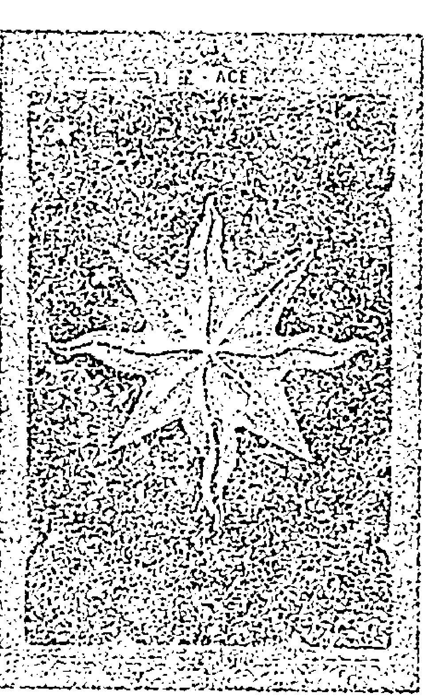

在感情上，星ACE多半代表了一段办公室恋情，或是与工作有关的恋情，双方既可能是一个企业的同事，也可能是共同的创业伙伴。另一方面，它也代表着一次肉体之爱，靠肉体关系维系，或者双方的情感已经达到了更亲密的程度，可以谈婚论嫁了。

在事业上，星ACE代表了加薪的机会和升迁的可能。从某种程度上说，也可能是一次跳槽的机会，或你已经准备、酝酿着换工作了。如果你的职务比较重要，星ACE则暗示着一个新的计划。对老板来说，目前正有一项新计划，或有可能发生转型，得到外来援助的机会比较大，因为它多半代表了外来的资金。总体来看，星ACE是成功与进财的象征。

逆位的星ACE依然代表着金钱与财物，也有进财的感觉，不过这笔财富却不太容易守得住，甚至可能会入不敷出，也就是说，你的开销太大了，漏财漏得实在严重。如果你正在进行一项计划，则有可能不太顺利，或是计划受到阻碍，这样一来，结果就不是很乐观了，通常这是由于价值观的错误，才会造成失败的危险。

事业上，它暗示着一次机会的失去，或你的失误带来了失败的危险，也可能是薪水的减少，或者你的薪水总是不到月底就统统花光。大体上来说，逆位星ACE通常暗示着金钱的短缺，或经济压力的逐渐形成。对老板来说，则意味着目前的计划受到了阻碍，要想取得进展是很困难的，合作的案子遇到了问题，资金的调度碰到了困难。

感情上，则意味着双方因为个性不合，或者生活中价值观念的不同，产生了一些问题和争吵。双方的感情与工作环境有关，两人很可能是因为工作才走到一起，但是却很有可能因为太专注于感情的事，耽误了自己的工作，或是大幅度增加了开销。

#### 星·2

星2也有财物的暗示，代表自己正小心地衡量自己的能力，努力掌握目前的机会，这通常也暗示着，你有足够的能力同时抓住两个机会，你的自信也很强。另一方面，则可能是你遇到了两个不错的机会，正在从这两个机会之中选择一个，考虑哪一个更适合自己。也可以说，它同时带来了几个机会让你去选择，这些机会都非常诱人，所以你才会觉得难以取舍。

在感情上，它是指你目前正有两个不错的选择，正在两个机会之间打转，而同时，你也有足够的能力把两个机会都处理得很好。最直白的说法就是你正脚踏两条船，却能维持好平衡，不会出多大的问题。另一方面，它也暗示着目前的感情正到了转变时期，你也在思考，应该让这段感情更进一步，还是干脆维持现状。不管你做出哪种选择，都会带来好的结果，而且你也有足够的能力与信心，去处理前面的种种问题。

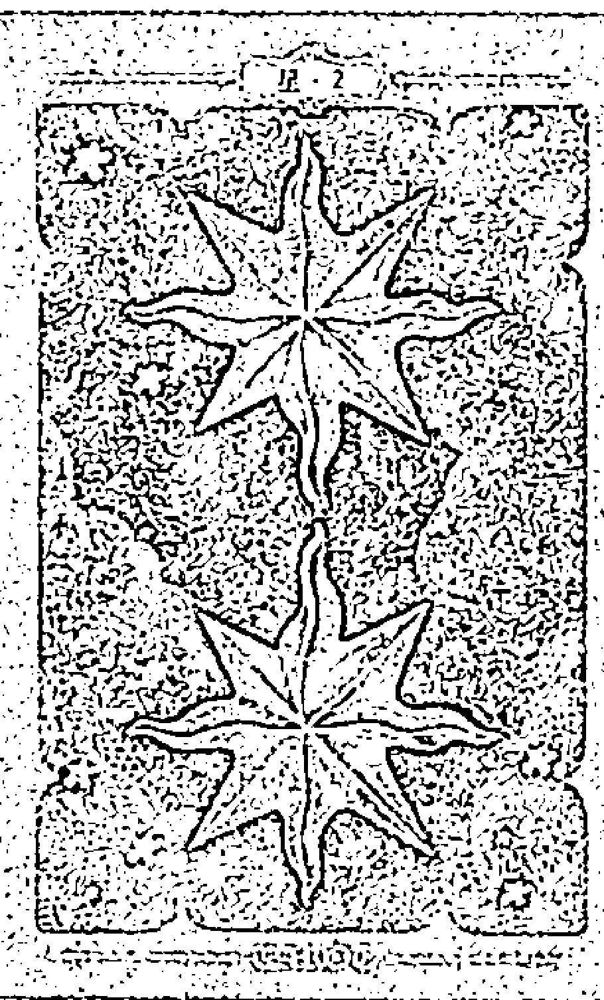

在感情上，它暗示着目前的感情已经发生了一些你的能力解决不了的问题，或者双方间出现了沟通不良。另一方面，可能是你脚踏两条船被发现，也可能是别的异性追求你时，你未能明确表明自己的态度，造成了一些不必要的误会。

逆位的星2则因自身能力的不足，而开始衡量目前计划的可行性。也可以说，目前的问题已经发展到了无法控制的阶段。另一方面，你太过贪心，想把自己的能力压榨到一点也不剩，这会产生不良的后果。也可以说，是因为太过自信，对自己估计过高，结果做了自己力不能及的事情，才会造成无法控制的局面。

事业上，则暗示着你除了正职之外，还会找一些兼职来做，并能在这两个工作之间取得平衡。虽然有可能让自己的体力不胜负荷，但是和得到的收益比起来，这还是值得的。对老板来说，则多半暗示着，目前正有两个计划在进行当中，或是两个以上的机会来到了你的面前。

事业上，它意味着对目前的工作无法有效去掌握，或是你正在进行一次超出自己能力之外的计划，也可能是在旧事物与新机会之间做选择，却因为考虑不周，最终让自己陷入非常尴尬的境地。对老板来说，则有失算、失策的危险，计划赶不上变化，结果只好不停地修正，造成了心有余而力不足的局面。

#### 星·3

星3代表自己正开始进行一项计划，试图改善自己的生活水平。或许是由于环境的影响，才让你对自己目前的生活不够满意吧。这是一张脚踏实地、勤劳的牌，在某种程度上，也代表着一次学习或一次经验的累积，而这种学习的直接结果，就是改善目前的生活。这张牌也暗示着基础扎实，在坚实的地基上建构出来的计划是能够取得远大发展的，所以这张牌也充满了成功的意味。

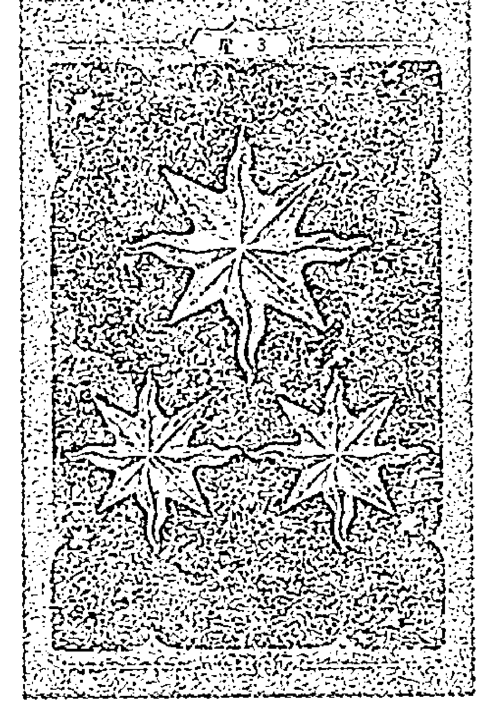

从星3来看感情，则代表为这段感情而努力，双方的态度都是积极的，因为彼此的感情建立在一个扎实的基础上，彼此都能没有后顾之忧地稳定成长。从某种程度上说，这张牌也代表双方正为进一步发展更进一步的关系而准备着。

在感情上，逆位星3暗示着你们正努力让彼此的感情更加亲密，但却忽略了过去的一些问题，使你们的努力不能达到预期的效果。再加上双方都对这段感情有种过度美化的倾向，于是有些脱离现实，导致一些问题慢慢浮现出来，造成了停滞与困难，这虽然不会使你们的感情出现不良变化，但也会让双方倍感辛苦。

事业上，上班族的你正在公司努力工作，一心为了加薪与升迁，不会去动其他的念头，只是在目前的环境中努力做好，最大限度地发挥自己的能力。对老板来说，则代表着计划的开始与进行都会十分顺利，自己也很努力去争取，懂得去做一些改善，来让这个计划更完善。

事业上的逆位星3则因自己有些活在过去的回忆里，反而让自己的发展停滞不前。也许这对上班族还不错，代表了工作稳定，能固定在目前的环境中，但是对老板来说，则意味着有很多的计划，却没有去实现它们的动力，只是在过去或眼前的成就中固守着，没有扩大与前行的野心。

逆位的星3则代表着你虽然知道自己的问题点在哪里，也明白自己应该怎么去改善，但是却不肯用心去做，努力不够，而且这种情况还会维持一段时间，直到自己真正愿意去改进，才有转变的可能。也可以说，这张牌代表自己正处在反省期，要好好把握这个阶段，让自己得到一些重要的东西，从某种程度上说，星3也代表着一次教学，可能是你正计划着一次教学的事，也可能是从事与教学有关的工作。

#### 星·4

星4意味着，你正在进行一次节约的计划，或者开始考虑节省的问题。这种念头通常有两个来源，一是因为环境的影响，生活压力大了，不节约也不行；另一个则是为了下一次的计划做一些必要的事前准备。也就是说，你正在储存资金，并努力从各方面节省，是为了一个计划。通常来说，这种计划是有可能实现的。不过，这张牌从某种程度上说，有些守财奴的感觉，太看重金钱而变得小气，或者你把可以流动的资金握得太死，反而造成自己的发展受到限制。

在感情上，星4暗示着自己太计较双方间的付出，也可能是一方不愿意付出情感，而让另一方过于辛苦。这张牌也意味着，把对方控制得太严，没有给人留下一点呼吸的空间，这是双方不快与争吵的根源。

在事业上，星4有点放不开，在现有的工作位置上试图躲避，尽管能把自己分内的工作做好，却有点把机会往外推的感觉。对老板来说，自己虽然掌握了资金，却不愿灵活运用，把自己的前途限制得太死。之所以会如此，只是因为你太爱钱。

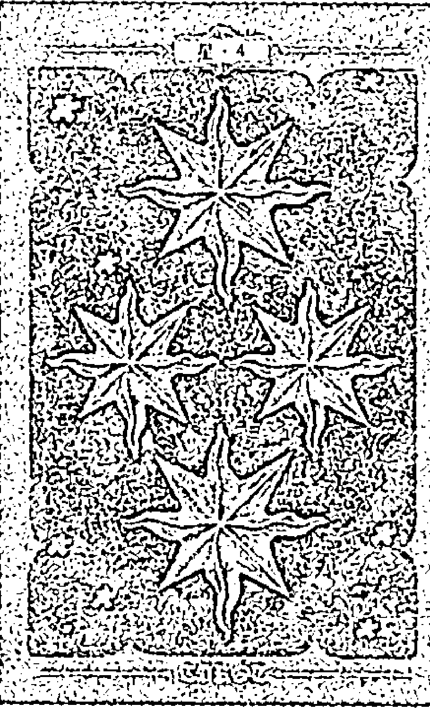

逆位的星4则有些花钱如流水了，不懂规划财务平衡，常常会有失衡发生。有点身上空空、银行户头也空空的意思，但也有可能这种花钱方式其实是不得已的，比如房子的装修啦，车子的维护啦，生活开支啦等等。但是不管怎么说，只要这张逆位牌出现，就意味着花钱。

在感情上，逆位星4意味着过度浪费自己的情感，有点滥情，见一个爱一个。另一方面，这张牌也可能意味着给予对方太多的情感，造成对方无法消化，它也代表着不懂如何控制自己的情感。

在事业上，逆位星4表示有些付出与收获不成正比的感觉了，虽然你在目前的岗位上拼死拼活，却得不到上司老板的认同。如果你是老板，则会有开销的发生，可能是买设备，可能是必要的先期投入，但却没有经过仔细计算，最终超过了财务预算。

#### 星·5

一般来说，星5意味着财务困难、失去工作，或者是受到穷困的打击。星5也代表自己太过守旧，停留在过去，不愿意接受外来的改变，于是让自己慢慢进入了困境。这张牌也代表过去的努力与心血都白费了，甚至还可能负债累累，真的是让人悲痛。有时星5也暗示着分离或孤独，可能是与环境分离，也可能是与自己的内心分离，这些都会让自己的成长受到阻碍。

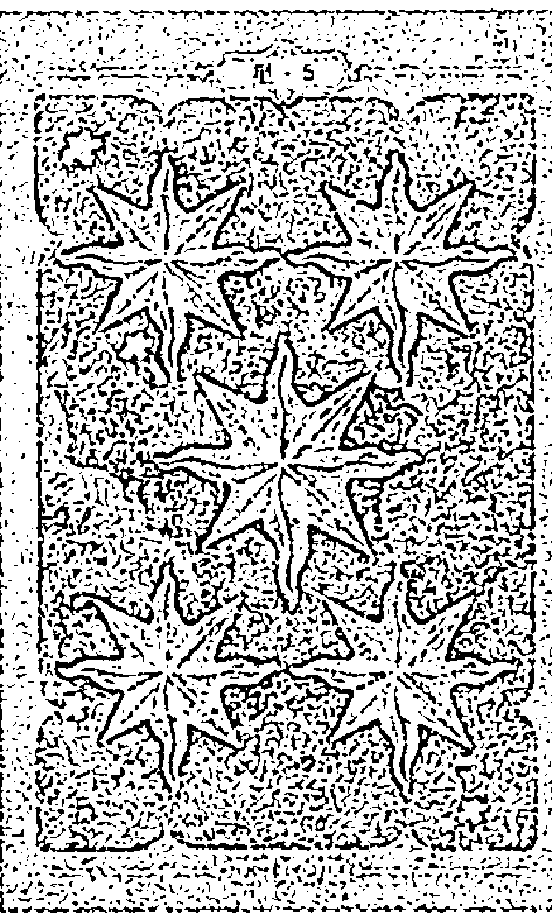

在感情上，星5则有着分手、孤独、伤心的可能，双方由于一些原因或问题而分开。当然，这张牌也有可能是指分离前的争执。从某种程度上说，这张牌也可以代表双方努力守着这段感情，都觉得很辛苦，有些想要放弃了。

在事业上，星5则有着离职的危险，还可能是因为公司不能正常运作，造成自己失业。不过这张牌也有因自己懒惰而失去工作的可能。对老板来说，这张牌是非常严重的，因为有可能代表着经营不善，让公司瓦解，或是被合并。如果开的是工作室，那可能只是一段时间没有进账，比开公司的情形要好一些。

逆位的星5则有一些积极的暗示，虽然可能还是很缺钱，你却比较愿意付出努力，让自己早日脱离现状，或者找一些新的机会、新的方向，让自己继续前进。从改变现状的心态上看，逆位比正位要好一些。

感情上，逆位星5代表为感情而努力，虽然碰到了一些问题与困难，但双方都愿意努力突破，并且双方也在一连串的讨论与沟通之后，找到了一条新路，一个新的方向。总之，为了让彼此的关系更进一步发展，双方都在努力着。

事业上，逆位星5意味着你开始努力了，在目前的工作岗位上，努力地把自己的错误修正过来，或是抓住主要问题，寻找改进的方法。对老板来说，则多半是自己不断找寻机会，让你的公司重新成长起来，或是找到了新的资金，让公司目前的危机得到解决。

#### 星·6

星6这张牌明确暗示出一种平衡或公平的状态，可能是目前自己的收支平稳，没有多大的落差，也可能是你付出了多少，就得到了多少回报。通常来说，星6代表自己目前的状况很好，好到可以帮助别人的地步，当然你也没多少问题需要操心，有闲暇考虑帮助别人的事。某种程度上，它也说明资金手腕的高明。这张牌比较偏向物质方面，如果用来分析身心状况，其实也很简单，就是身心平衡了。它也可能代表一种支配或主从的关系，只是双方都能够满足于现状。

在感情上，尽管双方的位置有些不同，不是绝对的平等，但是心态上却能够彼此认同，这有点像是一方牵动另一方，但双方间的互动却依然很协调。从另一个角度来解释，也可以认为，双方的关系是一种互补，需要互相扶持。

在事业上，上班族会对目前的工作很满意，公司给的薪水与福利也都还不错，而且也不会考虑换工作的事，有一种安于现状的感觉。而对老板来说，则暗示着公司的运营状况良好，自己也很满意，合作方也愿意长期合作，而且还有机会操作一些大项目呢。

逆位的星6则有种平衡被破坏的感觉了，相应会产生一些不满的怨言。它也可能在暗示，目前的稳定只是暂时的，不稳定的时期即将到来。另一方面，也可能是目前刚进入了一次失衡，过去的平衡与圆满此时都消失了，现在的状态就只能用破坏或分裂来概括了。

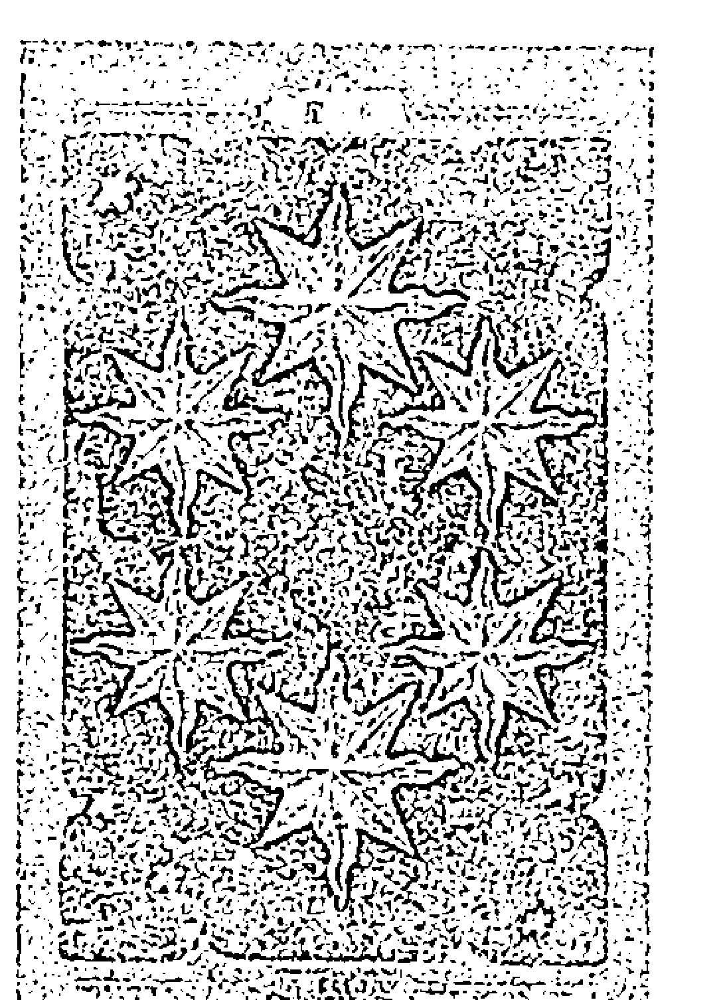

感情上，逆位星6暗示着即将分离的可能性，而且这种可能性在增长，双方那微妙的关系正在逐渐瓦解，也可以说两人的思想与行为都在向着两个不同的方向奔去，彼此的距离越来越远，即使稍微有点小口角，也可能让双方立刻做出分离的决定。也可以说，目前的问题已经大到了无法补救的地步。

事业上，它有被公司裁员、公司缩编或转手让人的可能，似乎有些悲情，而如果从现实层面来看，它也暗示着薪水的减少，职位的降低，被编入一个很差的单位等等。对老板来说，结果更让人沮丧，因为它代表了公司的让出或扩展的失败，另一层的暗示则更加直接，就是公司没了。如果开的是个人工作室，则意味着不可能得到客户，如果一段时间还不见好转，甚至你有可能重新走入职场，另谋出路呢。

#### 星·7

星7意味着你对目前的生活很满意，过得很好，这主要是因为过去的努力与奋斗，并且，你也一直在努力地完善自己。可以说，目前是一段平缓的时期，也是一段收割时期，而且这张牌还有在成长的含义。也就是说，目前的平缓时期能让你休息，休息中你还在仔细思考与计划着下一步的行动，即将做出选择。你可能正在思考，是应该继续往上走，还是先暂时停留在目前的环境中，再积累一段时间。

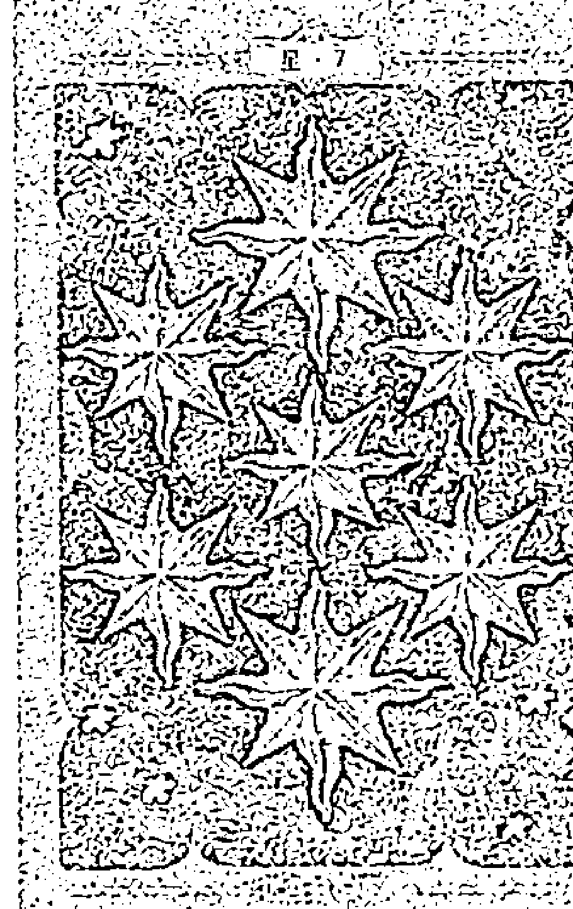

在感情上，星7则代表双方目前正在沟通，讨论是否应该往下一步的目标走去，彼此的互动也在无形中得到了加强。虽然这张牌也有选择或等待的感觉，但是自己却正努力着，让彼此间的感情上一个台阶，也就是说，目前的等待只是暂时的，你在酝酿。

事业上的星7代表你正在考虑，是否要自我投资，加速自己的成长，并且已经开始动用现有的资源，做一些必要的筹备。也可以说，你有一些想法与计划，正等着去实行。对老板来说，意味着你打算把公司扩大，或者同时得到了几个机会，你正在思考和选择，试图看清楚哪些机会更容易成功。

逆位的星7则有点稳定即将破坏的感觉，这可能是暗示你，过去的努力并没有达到预期的效果，或者你有些不够重视。它也意味着失去选择的机会，因为你只愿遵守原来的行动模式，才会造成自己的束缚。

感情上，它暗示着双方的关系正面临一次破坏，似乎已经无法挽救了，也可以说双方之间产生了问题，但是谁也没打算去解决，似乎都想破罐子破摔了。

事业上，它暗示着你正处在一个难以成长的环境里，而且渐渐也丧失了理想与长远规划，似乎放弃了自己的发展。对老板来说，这张逆位牌相当严重，轻则表示公司停止成长，重则表示公司重整或是瓦解，怎么说都是不好的。

#### 星·8

这张牌多半暗示着积极、勤奋上进的人，充满了脚踏实地的感觉，也有心无旁骛的含义，目前没时间去想别的，只是专心一意地做好眼前的事。不过有时候，这种局面却并非出于自愿，相当的无奈，因为整个大环境迫使自己不得不这样。在某种程度上，这张牌又代表着，以前的努力给你打下了良好的基础，或者外来的援助使你得到了实质上的进展。它也意味着，目前的成就已经相当不错了，但自己却还是继续努力向上攀升。

在感情上，你正在努力为这段感情建立更稳定的感觉，同时也非常满意目前的现状，并且与对方也有稳定的关系。当时间更成熟时，你也将把双方的关系推向更高一层。

事业上，自己正在努力打拼，不断寻找任何机会往上爬，尝试寻找各种兼差。对老板来说，则意味着你虽然有了让人羡慕的成就，但自己却还不满意，充满了向上冲与往外扩张的野心，当然，这也是成功的必要素质了。

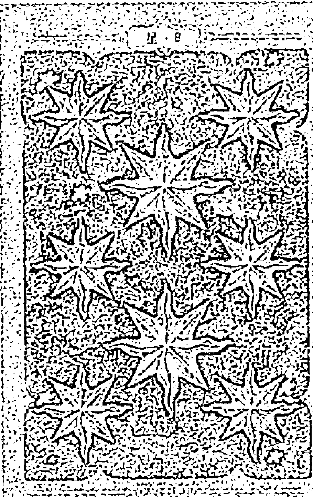

逆位的星8里则有点缺少努力的感觉了，也可以说，自己虽然有着努力的想法，但却没有动力，也没有任何计划，实在有点虚幻，有点好高骛远了。有时，这张逆位牌代表提不起劲，没有活力。

在感情上，逆位星8意味着承诺无法实现，或者提出的时候就缺乏诚意。在某种程度上，这张逆位牌又代表你在这段感情里，根本没打算付出，也可以说你只希望享受对方的给予，却不打算同样地回报人家。

事业上，逆位星8则有点吊儿郎当了，不思上进，成天想着一夜暴富之类的捷径，有可能会参与赌博哦。如果是老板，你的不思进取会让公司受到影响，甚至有可能倒闭，或者无法维持呢。还有一种情况，就是你虽然努力，能力却有欠缺，最后的结果还是一样。

#### 星·9

星9强烈暗示着成功与自信，代表因为过去的辛劳努力，终于取得了现在的成果，自己也正在享受这甜美的果实。同时，你也没有忘记过去的辛苦与付出，因为那是前往未来的基石，需要不断地拿出来激励自己，帮助自己校正航向。也可以说，因为懂得善用自己过去的经验，所以你才会离成功越来越近，最后成了一种必然，而这一切，都是你自己可以掌握得住的。

在感情上，你们已经进入相当成熟的时期，这是因为两人过去一同努力经营着，让自己与这段感情融合得更加完美，甚至也不断尝试着让自己成长，希望以此来使双方的感情能进一步升华。一路走来，你们都发现自己越来越重要，越来越成熟，彼此也越来越依赖。

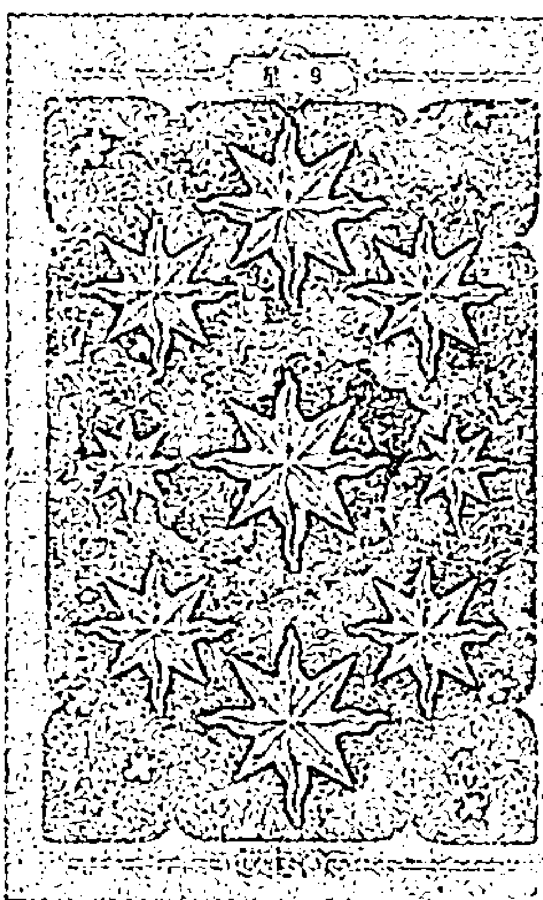

在事业上，则暗示着你今天拥有的成就，是过去努力的结果，也许你还是不很满意，觉得不够好，但如果你能继续努力的话，那么还有可能得到更美好的成就与更好的未来。对老板来说，则意味着今天的成就只是成功的前哨站，还有更好的未来在前面等着你。如果你开的是工作室，那么目前你就能很轻松地得到一些项目，并且这对下一步的发展也大有助益。

逆位的星9则暗示着你忽略了一些重要问题，结果无法成功，自己还不了解其中的原因。也许你静下心来寻找，也还是想不清楚，因为你已经忘了你自己，把真正的那个自己丢失了。或许，你只是需要把那份对事情的热情与专注力找回来，也许只是需要一点放松，把自己内心的压力排解一下，就可以让自己很快地找到成功之路的路标。有时候，你可能只不过是需要一个可以放逐自己的地方，好好休息一下，让自己的内心重新焕发出光彩，同时认真整理一下你的过去。

在感情上，逆位的星9暗示着目前这段感情似乎有些小问题，正在彼此之间悄悄地扩大，或许你们都释放了太多自己的情感，却没有注意到，这段感情里的两个人都有些消化不良，这就让多出来的情感平白浪费掉了，也让双方觉得辛苦劳累。既然努力的付出总是难以得到预期的收获，心中期待的感觉当然也就随之褪色了许多。

事业上，你不太懂得如何找出自己真正的实力，把时间浪费在无谓的事情上，结果让自己比别人落后了一大截。如果你是老板，多半意味着你做了错误的判断，浪费了很多时间，使自己损失了很多。如果你是开个人工作室，则表明你无法明确知道自己应该做什么，白白地浪费时间，浪费生命。

#### 星·10

星10既代表舒适的环境，也是成功的象征。这样的舒适是经过很多的艰苦与磨难而得到的，这样的成功不是偶然的，所以才格外让人羡慕，大多数人都希望能够得到。不过，尽管别人觉得很好，以为这样的成就足以让人快乐，但身在其中的你却不这么想。这似乎是因为以前的所有努力，都使自己越来越重视物质而轻视精神，结果一切都太过于物质导向，反而使精神层面渐渐被架空，产生了很大的失落感。你可能会通过花钱，或更加努力地追求物质，来填补自己精神上的空虚，但这样做的效果，可以说是南辕北辙。

共组家庭的想法渐渐强烈了起来，结果把相互的依赖与迷恋都转为了对家庭的需要。

## 事业上的正位星10

则代表你正在一个高峰的顶端安坐着，轻松维持着自己目前的地位，虽然过去曾经有过大风大浪，曾经辛苦劳累，但现在的你似乎都不怎么在意了，也不会因为艰辛的过去而感到伤心。如果你是老板，则意味着目前的一切都相当成熟，前途十分看好，资金运作上非常顺利，项目开发也很轻松。对个人工作室来说，则代表着目前的收入平顺，并且有慢慢成长的趋势，资金也在往上生长，一切都非常顺利。

从星10来看感情，则表明目前的感情发展到了成熟期，这种成熟源于双方的努力耕耘与相互付出。但目前，你们也出现了一些心灵空虚的问题，也许你们的热恋期已经过去，热情渐渐冷却，大家都不能适应；也可能是开始向物质层面发展，

逆位的星10则意味着，自己正受着经济与财务上的困扰，正努力思考如何应对，才能有效地突破现状。也许你的心中早已有底，但还是感到彷徨无助，而且这种压力也在慢慢增加，让你更加慌乱。有时，这张逆位牌也代表着，自己过去努力维持的基础渐渐不稳固了，而且有可能失去基点。也许这个时期也是你最失落与低潮的时刻，正是需要让自己好好静一静，并试着找一个新出路的时候了。

事业上，则暗示着自己正从一个稳定的境况中慢慢脱离，并正在进入一段相当不稳定的时期，很多问题都跑了出来，或许是职务的调动，或许是公司的大调整，造成自己打拼出来的成就慢慢地失去。对老板来说，目前似乎不是一个很好的扩充时期，需要把握自己的现状与积累的成就，不要轻易让这一切消失。对个人工作室来说，则暗示着目前正是一段需要自我反省的时期，该好好扩充一下自己的能力了，不要再局限于具体的业务，不然会出现更多的不愉快。

感情上，逆位的星10代表目前的发展双方都无法有效掌握，而且双方为了这段感情都感到忧心忡忡，对未来缺乏安全感，也有发展不下去的感觉，这让你们感到慌张。这时的你们只能暂时停下来，认真思考该如何再次前进，才能找到新的未来，重新调整彼此的步伐。

#### 星·男仆

一般来说，星牌组多半代表着金钱，属于物质层面的象征。而这一点在星男仆上则更加地强化了。它意味着，物质层面的一切成就，都是经历学习而达到的，也可以说，你学习的目的，就是为了取得物质上的成就，是有目的的学习。所以说，这个学习非常重要，甚至和自己的成就息息相关，你当然应该很认真、很努力了，这样才能早日有所成就。这里指的学习范围很广，不一定是教室内的学习，可能是实践中的经验积累或磨练，所以在这个时期，我们也可以说，星男仆代表了一个脚踏实地、做事认真、对自己的前途很有规划的青年。他的规划很明确，是要达到某种物质上的目标。

正位上的感情就可以理解为，为了要得到这段感情，从一开始你就给了对方某种程度上的承诺，或是为了这段感情，做出了一些对未来的规划。这也许是真心思考的结果，也可能是不知不觉的一种预言，一种必胜的信念。当然，它也可能指在一段感情中，为了让一切变得更好，而做出一些相应的举动或规划，总之是很积极的。

事业上，它意味着一个好的开始。你为了物质层面的目的，主动采取了行动，这是很积极的表现，对于一般的事业问题来说，都是很不错的。不管找工作，还是争取升迁，你都能有一个不错的开端。如果是老板要搞业务推广，那也是很棒的，因为脚踏实地的精神很充分地表现了出来。不过，这张牌也有另一层含义，就是你应该更加认真，这样才能得到成功。所以，成功不是天上掉下来的，努力还是必要的条件。

逆位的星男仆则出现了一些不能成功的原因，譬如对未来的规划不清晰，或是对自己不确定，善变而无法坚持自己的想法，缺乏承诺与实现的动力。当然，最重要的一点是，你不愿为了什么目的，而去付出很多，也就是说停摆了，不愿意动了，放弃了。

感情上，逆位星男仆多半意味着缺乏真心的承诺，对未来也没有规划，似乎这份感情没有未来可言。还有一种情况，就是双方只是为了享受短暂的欢愉，或沉浸于肉体关系，才给予假意的承诺。如果感情已经出现了问题，那么这张牌也可能代表分离。

事业上，似乎可以断言，那种脚踏实地的感觉已经失去，剩下的只有希望不劳而获的想法，当初的期望全都放弃，对未来的规划也全都放弃。还有一种可能，就是你觉得自己已经够了，所以不再关心市场信息，慢了下来。不过，这里的觉得够了，也可能是真的够了，而不是自欺欺人。所以，它也可以看成是一次暂时的休养，或两次努力之间的过渡时期。

#### 星·骑士

星骑士相当有毅力，当遇到了问题，需要做出选择时，这张牌的出现多半带有安安静静走下去的意思。它也有仔细、小心且持续做一件事的含义，同时代表着企划与计划。所以在牌的解读上，可以说，你相当有毅力，或是这件事情，不论好坏，你都会持续下去。星骑士并不是明显的动作牌，所以，也可能是在私下或暗中继续进行。也可能因为对自己的计划很有信心，所以去努力达成目的，充满了脚踏实地的感觉。

在爱情上，则意味着这段感情虽然没有太多情趣，少了美丽的发展过程，感觉近乎于乏味，却能实际而平稳地发展下去。它也多半意味着稳定的承诺，虽然没有什么美丽的象征，但那真心的承诺，却更加宝贵呢。虽然外冷，但是内热，心里充满了温柔。

在事业上，星骑士意味着有了值得期许的未来，与脚踏实地的办事态度。你对未来的计划也很有实现的可能。但是在升迁或转职方面，则有些差强人意了，因为这张牌也很会拖延，会把你搞得疲惫不堪。或者你可以改变心态，因为很多事急不得，不如好好把自己的实力再增强些，那时再来可能就容易多了。

在逆位上，你可能会对什么事都提不起兴趣，你的看法也有许多偏激的地方，有点冷漠了。那种脚踏实地的持续力，明显减少了很多。尤其在有没有机会继续下去这一方面，持续的几率确实比较低。它还有不服从或是顶撞的含义。

在爱情上，双方多半争执不休，意见有分歧，彼此都太有自己的主见，那种想放弃的感觉，也会在你脑子里转个不停。也可以说，当星骑士逆位出现，双方的情感将慢慢失去，或许是另一个新的开始。如果你正在考虑分手的问题，这张牌就是分离的前兆。

而且有可能身陷斗争的漩涡，或与同事不合，起了口角，安定感似乎全都不见了，并且还多了犯小人的机会。当然，这也可能代表与合作方起了摩擦，而这种问题还不太容易避免呢。

事业上，逆位星骑士表示你没有一个很好的计划，对目前的发展也感到无法掌握，因为你的心很不稳定，

#### 星·王后

在四元素里面，土元素的那种稳定与实际，总是能让很多的不安与失常慢慢地稳定下来。而这稳定的感觉，又以星王后最为明显。再加上那女性的特质，更是为星王后这张牌加上了柔软的感觉。当然，这种稳定与柔软都是一种感觉。对于稳定，不外乎是值得信赖、务实、可靠与符合规律，而柔软呢，其实也很简单，就是温和、持续、有耐性。

关于爱情，它多半意味着，这段感情的发展可以长长久久，但在发展的过程中，却不会有什么激情，也不会有太大的变化，一切都是相当平顺的。如果是看一段恋情是否开始，星王后几乎可以代表了确定的意思，而且还会让双方的感情就这样走进那属于两人的甜蜜世界。

在事业上，它意味着目前的工作相当稳定，上司交代下来的要求，你基本可以完成，也不会有离开的想法。这样的情形似乎是好的，但如果你想要升迁或调职，那星王后的稳定，反而会给你一种被定住的感觉，自然，动的可能性就不存在了。

逆位的星王后多半意味着信心的失去，不再拥有稳定的感觉，而且也因为失去了那种柔软的感觉，让自己变得太过刚硬，也容易伤害到别人。既然失去了稳定，脚踏实地的感觉也就没有了，取而代之的是随波逐流、好高骛远。

在爱情上，逆位星王后多半意味着，这段感情的发展，是建立在一种相互利用的基础上，起码单方面是想要利用它的。既然是这样，感情的发展也就不会长久。如果你想问能否成为恋人，这张牌的不安定感就可以告诉你，成为恋人的几率不大，机会可能并不存在。

在事业上，如果你想要一份稳定的工作，那答案几乎可以确定地说，不太可能，而这种不稳定，多半是因为你的心理状态或想法不正确，而不是外在的问题。所以，这张牌一旦出现，你多半要先考虑到，是不是自己这方面出了什么问题。如果你希望升迁或调职，答案则是有变动的可能，但这也许并不是升迁，而是转入一个更差的位置，因为逆位的星王后并不代表成就，相反，是说因为你太过不稳定，会失去一些成功的机会，或是因为不够脚踏实地，让人觉得难以信任。

#### 星·国王

星国王的沉稳感总是让旁人感到安心。在很多时候，这张牌通常有这样一层含义，为了追求物质层面的欲望，不断地在自己的领域里打拼，甚至为了自己的成就与梦想，牺牲很多别的事，比如正常的休闲生活，或家庭的聚会。当然，星国王也有脚踏实地的感觉存在，而且相当实际，甚至会实际得吓人。这张牌代表着一个成熟且脚踏实地的男人，除了实际的感觉，它也有重视承诺的意思。

爱情上，星国王多半代表一段高度承诺的感情，这份感情相当实际，不会有激情，也没什么风花雪月，有的只是脚踏实地，一步步小心前往未来。也许因为太过实际，所以甜言蜜语就被物质的东西取代了，不过这样的发展也可以说相当好，尤其对于想要结婚的人来说，因为脚踏实地的付出是必要的，也因为脚踏实地，让结婚的可能性大大增加了。

事业上，一般来说，它代表着成就的展现，或当初期望的达成，也许达成目标的速度不是那么快，但也会照着过去的计划，慢慢实现。所以说，这张牌又有点苦尽甘来的感觉。不管怎么说，这张牌的发展都是相当好的。只要拿到这张牌，就代表升迁有望，有机会成功，开创事业的机会也大大增加了。

逆位的星国王意味着，不再脚踏实地地进行任何事务，也许那追求物质的欲望依然存在，但是对物质的求取，就不那么实际了，也可能会为了达到目标而不择手段。

爱情上，表示你有些不重视承诺，也可能失去了对未来的期待。因为不够脚踏实地，也会让爱情的想法有所偏差，多角恋爱的机会大增。

事业上，意味着对未来的发展失去了信心，不停地想从目前的进程中找到速成的捷径，这种想法会为你的事业增添很多危险。再加上你失去了脚踏实地的态度，别人也会对你失去信心。

## 第五章 塔罗爱情经典牌阵

塔罗的牌阵都是智慧的累积，经过几百年而流传下来，经过无数人的检验，更重要的是，它们受到了一代代占卜师的信仰。无论开牌的还是问牌的，都对它有着一种虔诚的敬意，似乎解开一切现实困扰的钥匙，就藏在这副小小的塔罗之中；似乎这一副充满魔幻色彩的纸片，真的就能打开人们心灵的魔力之源，让人摆脱现实中的重重羁绊，高蹈轻扬于世间的尘埃之上，大步迈向属于自己的永恒之光。

然而，现实中的一切都会令人失望，当然也包括占卜。塔罗虽然是一条智慧之路，可是摘下智慧的果子，还是离不开自己的付出。人们知道了牌阵，知道了解牌方法，并不意味着你也能知道自己的心，知道纷杂现象背后潜藏的真义。

塔罗之路就是心灵之旅，就是智慧之旅，就是脱离现实矛盾困扰的解脱之旅。如果说占卜也有好的和坏的，那么衡量的标准只有一条，就是你有没有从中得到成长，有没有发生改变，有没有变得更加自信、更加坚强、更加明澈，同时也更有力量。

你要迈出的第一步，就是诚实地面对自己的心。现实中的你，会有种种的观念和认识，会有自己生存所依赖的良好感觉，会有自己习以为常的欺骗和谎言。要想成长，你就必须摆脱它们，因为它们并不是真正的你，却把你塑造成了它们想要的模样，把你的心掩盖在重重的灰尘之中。现实中的人总是盲目地追逐名利，却不知道，自己心中潜藏的珍宝，要远远多过一个国王！

塔罗就能帮助我们发掘出真正的自我，这条路可以走通，我们可以从丑陋的毛虫羽化成灿烂的蝴蝶，我们可以从自己的心里看到那种强烈的光，它比太阳更亮！

现在，就让我们从全新的角度来审视那些经典的牌阵，开始自我解放的旅程吧！

## 塔罗爱情经典牌阵

### 圣三角

#### 求问

一般问题

#### 使用时机

圣三角牌阵作为牌阵的初级形式，十分简单易学，往往是初学者第一个要练习和掌握的牌阵。它适合拿来问短时间内的问题，也很适合用来问是非问题，由之可以得到清晰明确的答案。

#### 摆法及牌意

从上数起，第 7 张放在 1，第 14 张放在 2，第 21 张放在 3。

- 1：过去，即问题过去的状况或形成的原因；
- 2：现在，即问题现在的状况；
- 3：未来，即这个问题未来的发展方向、结果的最终预测。

#### 解牌秘笈

这是一种最基本的牌阵，几乎适用于所有问题，同时，它也在几乎所有的场合，都被人们误解了。

人们普遍认为，“过去”就是看它把我以前说得准不准；如果准的话，再看“现在”有没有点到我现实困扰的核心；如果说中了，我们就可以考虑它给出的“未来”建议。

这看上去很有道理，其实却大错特错了。因为塔罗不是算命，它是一种智慧，是一种比你更高的智慧，是你的老师。你见过哪个学生会说，这个老师说的我听不懂，所以他一定是个大骗子吗？

抽一张所谓的坏牌就伤心，抽一张所谓的好牌就高兴，这样的人根本没有资格去碰塔罗。因为他没有把自己倒空，没有虚下心来，他的心里根本就没有地方去容纳新的智慧。塔罗看到你被自己的问题困扰，同时也看到了你陷在其中根本不想脱身，虽然表面上似乎在寻求塔罗的指引，但实际上任何人的指引你都不会听，你只需要有人告诉你说，你的未来一定会有多么多么好。你需要的不是智慧，而是安慰。

如果你需要一副安慰剂，有很多江湖骗子可以满足你，根本用不着塔罗。你不尊重它，它又怎么可能会尊重你呢？很多人抱怨塔罗不准，其中百分之八十都是这种情况。

相反，只要你能把自己的心倒空，再怎么“不准”的牌，你都能够发现其中的智慧，得到宝贵的指引。然后你就会发现，智慧无处不在，成长随时都可以，你的每一天都是新的，你的生命充满了生机。

现在就让我们以这个最通常的圣三角牌阵为例，占卜两个人的情缘。

一般人认为，它是看两个人能不能成，会不会幸福。这种认识实在是太肤浅了。

换句话说，一般人关心的是命运的趋势，我能早知道就可以了。而塔罗关心的，却是改变命运的枢纽——在你过去的一切中，什么是操纵你命运的那一根线？它决定了你的一切好事和坏事。在你现在的生活中，什么才是属于你的机遇和选择，什么是你必须砸碎的第一道枷锁，你抬起来的那只脚，第一步又应该迈向何方？在你那不可知的未来中，又要从哪里才能找到能让你展翅翱翔的一对翅膀？

举例来说，“过去”是一张非常好的牌——世界，可是你觉得，你的过去只不过是一只丑小鸭，有太多不愉快的回忆，也有太多的压抑与泪水，自己怎么可能得到整个世界呢？再具体点，过去你曾经多次被别人抛弃，你想要的从来就没有得到过，你质疑，这样的你怎么可能拥有整个世界？

那么我问你，如果你想要的自己都得到了，你就能拥有整个世界吗？

才怪！

成龙都说，希望自己的儿子年轻时多受挫折，这样他才能快一点成长起来。他不缺钱，不缺地位，人们羡慕的一切他都能给自己的儿子，可是这时他却说，他希望孩子多受挫折。

因为他今天能拥有自己的世界，都是用自己的挫折换来的！早在1982年，在拍电影的时候，他就差一点死掉！和死神握手以后，他就再也没有屈服过，直到今天，还没有一家保险公司敢给他保险！

所以说，当你有了挫折，你不要把它看成挫折，因为它能给你带来属于你的世界！

具体到爱情，你被抛弃过，痛苦过，哭过，醉过，也千万次地追问过，这一切到底是为了什么？而就在痛苦的锤炼中，在泪水的洗涤中，你得到了最宝贵的成长。别的男孩女孩一见面就接吻，你却不会那么草率，你想要更多地了解那个人。对你来说，外表的一切只不过是外表，你想要更多地了解他的心。到了这时，你就穿过了表面的虚假浮华，得到了一个真实的世界。

再说“现在”，你抽到的是战车，你却觉得两个人相安无事，平平静静，一切都很好呀！有的人说，我们两口子相敬如宾，什么事都商量，这还能有什么冲突吗？

可是你听说过没有，夫妻如果经常有点小矛盾，拌个嘴什么的，感情还不容易破裂，因为大家的承受能力都比较强嘛。越是别人看上去什么事都没有的夫妻，一旦出问题，很可能就是大问题。

为什么呢？道理其实很简单，因为任何两个人，都不可能一点矛盾没有，如果不表现出来，那只能说明谁也不知道怎么去化解，结果矛盾就积累得越来越多。到最后爆发出来，那就说明谁也忍不了了，大家都到了忍耐的极限。那你说，到那时不就是得分手了吗？

战车所代表的矛盾冲突，并不一定都要表现出来，往往都是隐藏在背后的，而这种矛盾反而更有杀伤力。

打个比方说，你们房子买了，未来的生活也做了全盘规划，也度过了艰苦奋斗的时光，按道理说，应该可以过上舒适的日子了。可是这时，突然一下子没了压力，双方的感情反倒容易遭遇真正的危机。因为谁都觉得，我付出了很多，应该有点我自己的收获了。可是两个人的想法不可能相同，谁都希望对方能像自己想的那样，谁都觉得我为你付出了多少多少，你应该如何如何。到了这种时候，还能不出问题吗？

看起来，矛盾是突然之间出现的，可是实际上，它已经酝酿了好久好久。两个人长期缺乏交流和沟通，谁都不忍心伤害对方，就是这种不忍心，这种出于好心做出的忍让和牺牲，才是造成巨大危机的罪魁祸首。

因为这是家，家里不能说心里话，那就不再是家了。破裂的感情，总是先从心里面破裂，先从心里面产生隔阂，然后才会带来形式上的破裂。你以为平静美满，你以为爱还在，可是它早就死了，被你们双方出于好心，联手给扼杀掉了。

战车所代表的冲突，就是在心灵层面上的分道扬镳。你们都感觉到了心里的压力，你们所努力维持的幸福与和谐，原来都是建立在谎言基础上的，建立在不说实话基础上的，不是你不想说实话，是怕对方接受不了。那你说，这样的幸福，这样的和谐，又能够有多持久呢？

再说“未来”，如果在这个位置上抽到死神，我想谁也接受不了，埋怨自己的手气太糟。可是真的有这么糟吗？如果塔罗想要讨你的欢喜，为什么不把所有含义不好的牌全部去掉，换成含义好的牌呢？它为什么不肯让你高兴？为什么不能像逢年过节一样，嘴里全说吉利话呢？

因为那样等于欺骗，等于对你不负责任。

塔罗有坏牌，是因为人生有起有落，因为人的命运就是这样的。如果人活着全是好事，什么矛盾、什么问题、什么烦恼也没有，那样的生活还有什么意义？那还是人类社会吗？

另一方面，塔罗不是乌鸦嘴，即使出现坏牌，也不会像你想的那样，宣告悲惨的命运，告诉你没有任何转机。尤其在未来的位置上，即使出现再坏的牌，那都一定是一种建设性的意见，你也一定要从这个角度来解读，才能真正地认识塔罗。

为什么呢？因为在智者面前，再坏的命运、再大的危机之中，都同样隐藏着转机，隐藏着事情变好的趋势。智慧的价值就在于把坏事变成好事，而塔罗，恰好就是这样的智者。

就以这张死神牌为例，当它出现在爱情问题的未来位置上时，通常意味着一次新生——旧的一切不再美好，新的一切将要来临。

有人会说，那还不是一样？还不是说我们两个情缘已尽，只能各自另寻新欢？

## 塔罗爱情经典牌阵

### 爱情金字塔

**求问**

与恋人关系的未来发展

**使用时机**

当想知道与自己的恋人在未来较长时间内的恋情进展情形时，可以使用该牌阵。

**摆法及牌意**

随意抽取四张牌，依序放置。

1. 自己
2. 对方
3. 彼此关系
4. 未来发展

#### 解牌秘笈

这是最典型的爱情牌阵之一，它最核心的地方不是最后一张，反而是开始的两张。这不是说未来的发展不重要，而是说，如果不能很好地认识自己、认识对方，就很难对最后一张牌做出准确的解释。

举例来说，代表自己的是一张星星，那可能意味着你是一个充满幻想的人，心里永远燃烧着希望的火焰，满是对未来的憧憬。这样的性格也不是不好，但是爱情关系是一种现实的关系，你必须学习去适应它。

如果对方的牌是一张隐士，那问题就比较麻烦了，因为隐士很少会直接表达自己的想法，你们两个人的交流并不容易。他选择你，接受你，确实是因为欣赏你，你给他带来了惊喜，带来了生命的活力。然而，如果仅仅凭着最初的美好感觉，两个人又能走多远呢？

如果你真的感受到这样的困扰，塔罗的智慧就为你出现了。它告诉你，隐士选择星星，是为了接受你的指引，你就是他的希望，就是他在无边的黑暗之中，手中提着的那一盏灯火。

或许你会问，他那么复杂，那么智慧，还有什么需要我指引的呢？我又怎么帮得了他？他总是宽容地微笑着看我，常常会让我觉得自己很傻，我在他的面前，真的会抬不起头来，还怎么能给他指引？

这就是自卑，这种自卑就错了，它让你的星光越来越黯淡，而如果你真的黯淡了下去，他的希望也就没有了，那你们俩还能快乐幸福吗？

实际上，在两个人的感情中，很多时候都需要理智地审视自己——你到底是谁？你又可以成为谁？他爱的是谁？他真正需要的又是谁？

如果你真的爱他，也请多少关心一下他的需要，尽你的可能，给他一些他所需要的吧。就像一首歌里唱的，“女人希望男人成为一棵大树，男人需要的是心灵支柱。”

第三张牌揭示的是双方目前的关系，塔罗在这里一般侧重于两个方面，一个是维持你们亲密关系的最本质的力量是什么，把这个给你揭示出来，引起你的重视；另一个就是你们双方目前最欠缺的是什么，那样东西如此重要，以致于能够决定你们的未来。

以这副牌型为例，现代人出现最多的，是一张“愚者”，它代表了简单的快乐，越简单越快乐，越快乐也就越简单。人与人的缘分是美好的，也是简单的。如果人为地把它搞得复杂，那反而就不美了。

从表面上看，它是说现代人过于贪婪，过于注重物质，结果离快乐越来越远。它的深层原因在于，在我们生活的环境之中，有一种强大的力量裹挟着每一个人，强迫你变得像别人一样，许诺给你种种的美好和快乐，就是不让你成为你自己。不信你走出门去，看马路上的女人，她们长得都特别的像，都是美容院和化妆品制造出来的统一品牌，哪里还有个性的痕迹？

那种力量对你说，你的个性不完美，是一种缺陷，所以要把它去掉。可是去掉了之后，你还剩下什么呢？人就只应该成为一种商品吗？就只应该追逐市场的潮流，让自己变得更加值钱吗？

愚者的真义就是快乐来自于简单，而这个世界太复杂了，它是快乐的敌人，也是你们的敌人，是爱的敌人。如果想要反抗，你们只能在这个虚伪的世界上努力做一个真诚的人，用真实来对抗谎言，用真心真意来度过你的一生。

在未来发展的位置上，无论出现什么牌，我们都要把握住两个原则，才能比较准确地解读出来。其一，塔罗的未来建议一定是建设性的；其二，塔罗有智慧，这种智慧是看不起随波逐流的生活的，智慧的作用就是让人把握命运，成为自己的主人，塔罗也一定希望你能坚强起来，摆脱那些问题的困扰，从而过上一种真正美好的生活。

只要抓住这两个原则，即使遇到再坏的牌，你也能从中得到正面的启发。即使牌意包含了毁灭，那毁掉的也一定是不好的东西，就像烧掉杂草，让土地变得更加肥沃，那美好的种子才能够生长起来。

不过从专业的角度来说，如果双方真的是隐士和星星的关系，那么在未来的位置上，则很有可能会出现一张女皇，催促你快些成长起来，成为那个男人心灵上的依靠，就像母亲一样。

也许你会问，我只是一个平凡的女子，让我一下子当上女皇，这怎么可能？我配吗？

其实你配。这里说的女皇，指的是女性的力量，譬如温柔，譬如善良。在这个竞争激烈、纷繁复杂的世界上，男人需要的，不是女人漂亮的长相，而是温柔的心灵，是滋润和慰藉。女人啊，请慷慨地奉献出你女性的力量吧！用你的宽容、付出还有爱，感动你爱的男人的心，总有一天你会收获到更多。而这个世界，也正是因为女性的滋润，才会让人觉得它还有希望。

### 二选一

**求问**

两难问题

**使用时机**

这是一种最典型的选择牌阵，它可以适用于各种问题，不过最常用的，还是爱情——当你遇到两个追求者的时候，用来决定应该选谁。

**摆法及牌意**

从上数第6张放于1，之后的第6张、第7张放于2、3，之后的第6张、第7张放于4、5。

1. 问卜者现在的情况；
2. 做出第一种选择后会出现的情况；
3. 做出第一种选择会造成的影响；
4. 做出第二种选择后会出现的情况；
5. 做出第二种选择会造成的影响。

#### 解牌秘笈

二选一牌阵最大的特点，我常常称之为“各打五十大板”。因为选择意味着责任，无论你选择什么，都要承担相应的责任。在这个世界上，不用承担责任的选择，我到目前还没有遇到过。

而有了责任，选择就变成了非常严肃的事情，你实际上是在选择自己的命运。在命运面前，塔罗是一个智者，它只会给你一些必要的忠告和建议，它才不会替你做这个选择，替你承担责任，完了之后让你再抱怨它。

所以，在使用这种牌阵时，你一定要牢牢记住塔罗的平衡原则——无论牌面相差有多么悬殊，塔罗一定会平等地对待两种选择，再好的牌背后，都会为你揭示出一些问题，而再坏的背后，也都会为你展示出一些希望。

譬如说，两个男人一个是皇帝，一个是吊人，这可相差得够悬殊的。他们一个是现实力量的掌控者，能够给你带来需要的一切；另一个却是精神上的殉道者，他连自己都陪进去了，你跟着他还有什么指望？

可是你不要忘了塔罗的平衡原则，即使是皇帝和吊人，在这样的牌阵中也一定是平等的，各有所长。

具体来说，皇帝就像一首歌里唱的，男人把爱看成是一种征服。也许他像大多数男人一样，只想找漂亮女人，能让自己脸上有光，能显示自己的征服能力，能让自己在朋友面前很有面子。但是，他能够懂你吗？未必！

而吊人就不一样了，他能把生命奉献给自己的理想，同时他也选择了你，那是不是意味着，对他来说，你就像理想一样值得去献身呢？能为一个女人奉献自己的一切，这样的男人在哪个年代都是稀有动物，就像一首古诗里说的：“易求无价宝，难得有情郎。”

它的含义还不止于此。作为皇帝，可能意味着一种稳定的现实关系，什么都是简单的、明确的，不会有太多的精神压力，不会像哈姆雷特一样喃喃自语：“生存还是毁灭，这是个问题。”

而吊人，则很有可能意味着精神上的冒险，是没有尽头的寻根之旅，是没有终点的心灵放逐。如果他是痛苦的，他的痛苦也可能会成为你的，你愿意为他分担吗？

怎么样，迷惑了吧？塔罗的平衡牌阵就是让你迷惑，不然怎么能显出它的智慧呢？再说它也没有错，它只不过是要提醒你，选择是严肃的，命运是严肃的，你应该慎重对待。

当然，仅凭两张平衡的牌，谁也难以做出选择。这时，就要参照接下来的两张，看一看不同的选择会带来什么样的结果，找一找问题的症结。不过很可惜，那两张结果牌，同样也是平衡的，塔罗还是不肯替你做出选择。

譬如说，选择皇帝的结果是太阳，选择吊人的结果是月亮，这两个都是挂在天上的天体，一个管白天，一个管晚上，都是人们离不开的，你怎么做出选择？太阳是光明的，是理性的，你需要那样的温暖，月亮是柔和的，是感性的，你也需要那样的释放，你怎么选？

到了这个时候，就要参照一下一开始抽到的问题的指示牌了。它会提示你，你的问题的核心在哪里？这次选择对你来说，最重要的是要解决哪方面的问题？如果它是战车、力量一类偏重现实的牌，那可能就是倾向于皇帝；如果它是魔术师、恋人一类偏重情绪的牌，那可能就是倾向于吊人。不过，它也可能不偏不倚，就夹在两者之间，譬如说命运之轮。

这个轮子代表什么呢？一种解释是，提示你命运的循环，无论选择什么，你都会对另外一个难以割舍，这可就真有点麻烦了，似乎你就像一个钟摆，只能在两者之间不停摆动，永远也停不下来。另外一个解释则是劝你把一切看开，你不用选择，让命运替你去选择好了，你只需要把眼前的这次困扰看成是又一次命运的安排。

这无疑是一种最达观的态度，反正人无论怎么追求，最后得到的都不是最初的梦想，既然这样，又何必为此浪费时间呢？退一步海阔天空，你不选择的话，反而能更多地了解这两个人呢。即使有一个中途退出，那也不是坏事，起码能够让你看出，两个人之中，谁对你的感情比较持久。

如果他们都能坚持到底，那你还有什么着急的呢？反正早选晚选，不都是一样？等到有一天，你更多地了解了他们的优缺点，更多地读懂了他们的心，那时，也就不用塔罗来帮你分析了，你自己就能够做出正确的抉择，那样不是更好吗？

更何况，重大的选择都会影响人生，难道你不应该慎重一些吗？

### 爱情之树

**求问**

一生爱情运势

**使用时机**

当你想全面了解自己整个一生的爱情运势时，使用这个牌阵就再合适不过了。

1. 自己
2. 过去
3. 现在
4. 未来
5. 潜在影响

#### 解牌秘笈

这是一种认识自己爱情运势的基本牌型，它能够帮助你了解命运的安排。它的重点不是单张牌意的好坏，而是相互之间的关系。

具体来说，包括自己和过去的关系，自己和现在的关系，自己和未来的关系，还有过去和现在的关系，现在和未来的关系，过去和未来的关系，最后，还有潜在影响和整个命运的关系。

把重点放在相互间的关系上，你就有机会打开自己的命运之门。

譬如说，“自己”是一张魔术师，代表了你的心灵充满魔力，你的生命拥有无限可能，可是现实总是那么枯燥，总是在限制着每一个人，你只觉得压抑。你就像是一朵奇幻的花，却生长在沙漠里面。这样一来，你的命运就只有两种可能，要么被现实风干，妥协麻木，让自己的心灵枯萎，要么与现实对抗，变成一株骄傲的仙人掌。

你的“过去”可能是一张恋人，被呵护、被宠爱，因为你有魅力嘛，谁都会拿你当宝贝的，你的过去就是一个恋爱中的宝贝。可是，那些爱你的人，他们并不懂得如何爱你，心里虽然喜欢，现实中却常常难以忍受，那是因为你太灿烂了，照出了他们自己的丑陋与压抑，要是不扼杀你的话，他们简直就没有办法跟自己交代。总之，他们只喜欢用你的魔力装饰房间，他们把你当做没有生命的花瓶了。

于是，你的“现实”就成了一张审判。在第一次的感情失败以后，你变得谨慎，不再相信一切表面好看的东西。你一定要把他的心挖出来，放在你的天平上，称一称它的分量。你不相信这个世上还有纯金的男人，他们不管外表怎样，都只是镀金的赝品，已经欺骗不了你了。

这样下去，你的心还是没有着落，你就真的愿意这样过一辈子吗？不会吧？而“未来”这张牌，其实就是在讲你的归宿。

你看，它是一张教皇。真正属于你的那个男人，是一个精神上的领袖，他能解开世间的一切纷扰，他能把魔力带回你的心中，他能让你重新变得像愚者一样天真无邪，简单快乐。

为什么会这样？因为你心中的魔力把他召唤到了身边，因为你挫折的经历让你成熟，让你锋利，让你骄傲地站了起来，成了他身边一株火红的木棉！

不信你看，那潜在影响你一生的牌，就是一辆战车呀！永不妥协、坚持自己，不正是你能走过泥泞、迎来曙光的力量源泉吗？

### 婚姻的检测

**求问**

婚姻状况

**使用时机**

如果你即将结婚，这一牌阵会指导你怎样做能够获得幸福美满的婚姻；如果你已经结婚了，这一牌阵将指导你如何改善目前的婚姻关系。

**摆法及牌意**

由第一张开始，排1—7。

1. 你自己
2. 过去的婚姻状况
3. 现在的婚姻状况
4. 婚姻问题
5. 对婚姻的期望
6. 对婚姻的恐惧
7. 最后结果

#### 解牌秘笈

婚姻是一件大事，不过真到占卜的时候，一般都已经做了决定。谁也不会因为一次占卜就突发奇想，成为婚礼上逃跑的新娘。

在这个问题上，塔罗能做的，不过是给出一些忠告罢了。

先看“你自己”，这里出现的是一张愚者。这张牌在大多数时候都是很好的，不过在这里却是例外，因为婚姻毕竟是大事，可你却还像孩子一样无知，完全没有准备，这岂不是很轻率吗？

这张牌反映出来的，是你还没有长大，没有准备好做一个妻子、做一个儿媳妇，甚至于做一个母亲。这种现象太普遍了。自古婆媳关系难处，聪明的女人懂得用孝顺、宽容和必要的忍让来讨得婆婆的欢心，而愚蠢的女人则把疼爱儿子的婆婆看成自己的情敌，逼迫丈夫在自己和他母亲中间做出选择。而这种争斗的结果，多半会以媳妇的惨败收场。所以，女人啊，请在结婚之前先学会婆媳的相处之道吧。

接下来的两张，对于初次结婚的人来说，“过去”指的是别人的婚姻给自己造成的印象，其中主要是自己的父母。这里是一张力量，这本是一张好牌，但出现在这里就没有太好的含义了。它指的是，婚姻不过是力量的角逐，谁的力量强，就得听谁的，完全就是弱肉强食的丛林法则。表面看上去一团和气，真遇到问题的时候，却是凭实力说话，温柔、体谅和爱都消失得无影无踪。

第三张“现在”，指的是你的他对你造成了什么样的影响，让你产生了怎样的改变。这是一张女教皇，女人似乎拥有了绝对的支配地位，男人似乎俯首帖耳，变得像一只听话的绵羊。如果没有这样的美好感觉，恐怕你也不会轻易考虑结婚的吧。然而，这种感觉是真实的吗？接下来的牌就给出了解答。

第四张“婚姻问题”，可以说是这个牌阵的指示牌——你面临的这次婚姻，它的本质到底是什么？它是节制；哦，原来这次婚姻，对你们两个都是一种学习，学习节制，学习宽容，学习适应对方，学习成长。每个人的个性都有棱角，但是婚姻却让两个人结合成一体，棱角是用来一致对外的，不是为了互相伤害。

接着是你的期望，你要的是怎样的婚姻？它竟然是恋人，你喜欢那种甜蜜，你喜欢那种美好，你喜欢他把所有的心思都放到你的身上。但是你有没有想过，他为你付出了这么多，你又给了他什么回报呢？你所给予的，又真的是他所需要的吗？问题的关键在于，如果这种关系并不稳定，再美好的感觉，都是不可能持久的呀！

果然，下一张牌就来了，它代表你的恐惧，这是你内心最深处的梦魇，也是你难以决断的根本原因，它是一张恶魔。你怕，怕自己爱的那个男人会变成恶魔，因为，你真的不能懂他，真的不知道他需要什么。你只知道自己是一个平凡，甚至有些自私的小女人，你实在想不透这样优秀的他是怎么看上你的。如果有一天他从梦中醒来，突然发现了你的平凡甚至自私，他会不会厌恶你呢？到了那时，在你的心目中，那个骑着白马的王子，不是一下子就变成恶魔了吗？

至于那张最后的结果，非常有意思，竟然是一张正义。塔罗知道你的困扰，它给你的解决之道就是一把尺子——正义。你只需要时时处处用它来衡量，不要白受别人的恩，不要白得别人的好，就一定会有同等的回报。如果不能回报，那就宁可不要，因为它再美也不属于你！

这真的是解脱之道，真的可以让那个不懂事的小女孩一夜长大，而成长，不就是这样一步一步走过来的吗？塔罗告诉你，勇敢面对自己的婚姻吧，努力把它做好，在每一天、每件事情上，都要对得起你爱的人，因为爱，本来就是一种付出呀！

### 问题六芒星

**求问**

目前面临的问题的实质和解决的办法

**使用时机**

想就自己目前爱情方面遇到的问题得出一个清楚的结论时适用。

**摆法及牌意**

从上数第7、8、9张放在1、2、3，之后剩下的牌从上面数，第7、8、9、10张放在4、5、6、7。

1. 过去的状况
2. 现在的状况
3. 最近将来的状况
4. 应有的态度及方法或可能性
5. 周遭环境
6. 自己的期望与态度
7. 最后的结果

#### 解牌秘笈

问题六芒星是实际使用最广泛的一个牌阵，可以用来解答爱情、事业、学业、健康、娱乐休闲等几乎全部生活领域中遭遇到的问题和难题。当问卜者将问题指向爱情时，占卜师首先要做的就是帮助他找到问题的内在根源以及外在的影响因素，具体来说，就是要关注目前问题从过去到现在再到不久的将来的全部发展过程，还要关注客观环境中存在的各种有利或不利的因素，只有追本求源，才能一下子切中要害，再结合问卜者内心的态度和期望，要想找到一条走出困境的光明大道，也就来得容易了。

## 塔罗爱情经典牌阵

### 爱的真心

**求问**

彼此的真心

**使用时机**

想确定对方对自己的感觉，以及自己对对方的感觉到底是怎样的时使用。

**摆法及牌意**

将两人生命数相加，得到一个数字，以该数字为切牌的次数，完毕后由上而下排 1-13。

例如，甲，1981年01月20日出生，乙，1982年08月24日出生，1+9+8+1+0+1+2+0=22，2+2=4；1+9+8+2+0+8+2+4=34，3+4=7；4+7=11，1+1=2。就切2次牌。

- 10: 你的过去
- 6: 你的现在
- 7, 11: 你的未来
- 1, 2: 你的真心
- 12: 对方过去
- 8: 对方现在
- 9, 13: 对方未来
- 3, 4: 对方真心
- 5: 最后结果

#### 解牌秘笈

这个牌阵很好看，也很好玩，解读起来十分有趣。不过它的重点却不是单张牌的牌意，而是两个人的对比。只要把握住了这一点，记住把两个人的牌对照来看，重点看相互间的关系，那你就能够超越表面牌意的好与坏，真正从中得到智慧的指引，让你们两个携手走向和谐美满的未来。

## 塔罗爱情经典牌阵

### 维纳斯之爱

**求问**

爱情给双方带来的变化和影响

**使用时机**

爱情无疑对人生能够产生重大的影响，当你对这种影响感到不确定时，不妨借爱神维纳斯之眼，探索你们彼此的内心世界，真正领悟爱的奇迹。

- 1: 询问者的真心
- 2: 对方的真心
- 3: 对方对你的影响
- 4: 你对对方的影响
- 5: 麻烦，障碍
- 6: 最后结果
- 7: 未来询问者的心情
- 8: 未来对方的心情

#### 解牌秘笈

维纳斯之爱是专门用小阿卡纳来推测爱情的一个牌阵。这个牌阵的重点是要把双方的牌对照来看，看这份感情为你们双方各自带来了怎样的变化。这时，你就仿佛能够跳出局外，静观这一对男女内心的起伏波澜，然后你就可以领悟，原来爱情不过是生命的一项课程，每个人都在其中充分地展现自己，在盲目的追逐中猜测对方的心意，在情感的尽头寻求智慧的指引。

而更重要的是你可以深入探索自己的心，找到自己心中深藏的珍宝，找到属于自己生命本源的那份自信，让你从此可以像大自然的所有造化一样，骄傲地抬起头来，微笑着面对一切，即使在巨大的痛苦面前，依然可以轻描淡写地说，这只不过是命运。

到了那时，你就拥有了上天赐予每一个人的永恒之爱。

## 第六章 塔罗爱情实战

在这一单元，让我们接触几个实战案例，来加深自己对塔罗的认识与领悟吧。

我喜欢一个男生，认识4个月，只是不在同一所学校。前一阵子，受不了不安和猜测，跟他告白。
但是，被他委婉地拒绝了。他说我们还可以做普通朋友，当时我也认了。
因为，其实一开始我们的感觉都还不错，只不过后来我有点太急躁，所以反而坏了事。
现在，还是觉得有点放不下，喜欢不上别人。而告白后的一次见面，却有点僵。
最近的一次巧合碰面，让我们之间的感觉又回复到了刚开始认识时的无负担与热络，尤其是他给我的感觉。
不过，因为已经被他拒绝过了，所以我不太敢再果断地前进，有点裹足不前。
而他，本来就是不会对感情太积极的那种男生，所以我才说，是我太急，坏了事。
他不是那种很主动的类型。
我比较能肯定的是，他并不是因为有喜欢的人，所以才拒绝我的。
希望您能帮我解解啦～谢啦！

我用爱的真心牌阵为她做了占卜，开牌结果如下图所示：

## 塔罗爱情实战

- 10：你的过去：命运之轮
- 6：你的现在：星星
- 7，11：你的未来：女皇（逆）、皇帝（逆）
- 1，2：你的真心：女教皇（逆）、审判（逆）
- 12：对方过去：太阳
- 8：对方现在：月亮
- 9，13：对方未来：战车、教皇
- 3，4：对方真心：塔、死神（逆）
- 5：最后结果：恋人

看到您为情所苦，希望能帮上您一点。
首先，您最在意的就是“最后结果：恋人”这张牌吧。不过，塔罗牌的结果牌会因前面牌的影响，而改变结果的程度。
所以，这张牌依程度不同，有可能是：

1. 处得很好的朋友
2. 伙伴
3. 知己
4. 不能公开的恋人
5. 公开的恋人

我们来看看，究竟你们现在处于什么阶段。

将你的过去——命运之轮、你的现在——星星、你的未来——女皇逆、皇帝逆四张联解，前两张命运之轮和星星，都有强烈希望的感觉，也有强烈想要拥有对方的意愿。但未来却是逆位牌。女皇逆代表对于获得的程度无法让自己满足，皇帝逆代表无法控制自己的情绪。这两张代表你因为对方付出的情感达不到你心中的要求，而使自己的情绪失去控制，心情时好时坏。

“过去”和“现在”牌是好的，“未来”却来了个大逆转，这跟“你的真心”那张牌以及对方的反应有关。

再看你的真心，是女教皇逆和审判逆，这两张都显示出迷惑、陷在自我的幻想或过去的经验之中，无法自拔。

看来您不太能听进别人的劝告，有点我行我素。请原谅我说得这么直接。

再将对方过去——太阳、对方现在——月亮、对方未来——战车和教皇四张联解，太阳出现在过去，通常是指一段没有利害冲突的关系，或充满喜悦的过程。但换个角度来想，他对你，并没有追求的想法和企图。现在出现了月亮，代表迷惑，可能是他不知该如何面对你。对于你，必定有吸引他的地方，但也一定有他不喜欢的地方。他的未来牌是战车和教皇，这两张牌有代领者与跟随者的含义。所以，他要的是能听他话、顺从他心意的女生。但由牌面来说，教皇接收上帝的旨意，交给战车去执行，所以他会依照你的行动来做出反应。为何他会如此被动？原因在“对方真心”的牌面上。对方真心是塔和死神逆，这两张牌显示出不协调的感觉，表示你与他的想法是有一段差距的。也就是说，你们俩在彼此的认知上，还要继续加油。所以，我只能说你们是“处得很好的朋友”。在很多方面还需要去努力，要多了解对方，同时，自己的想法也要改变。

## 塔罗爱情实战

### 2

我现在正在追一个女孩子，她前不久，才结束了一段不愉快的恋情。而我在这时候靠近了她。
女孩说想休息一段日子，而对于我的心意，认为只是好朋友罢了。
但是我不放弃，所以努力与她拉近距离。
以下，是我用问题六芒星算出来的牌型，请您指教。

- 1: 过去的状况：审判
- 2: 现在的状况：节制
- 3: 最近将来的状况：星星（逆）
- 4: 应有的态度及方法或可能性：月亮
- 5: 周遭环境：世界
- 6: 自己的期望与态度：塔
- 7: 最后的结果：太阳

1. 我认为审判代表着我之前的小心翼翼，不断地去衡量两人之间的可能性与关系。
2. 节制代表两人目前处于一种和谐的状态中。
3. 星星逆可能指我对于追上那女孩子没信心，并且易于失望。
4. 月亮暗示我照着自己的直觉去走，不要被理性束缚住了。
5. 世界这张牌，嗯，应该是指旁人及环境都有利于我追上她。
6. 这个塔我不知道该如何解释了。个人以为，危机就是转机的提示。
7. 太阳表示我们两个人将会快快乐乐生活在一起，有情人终成眷属。

我的疑问在于3、4、5、6的解释！因为我处于停滞不前的状态中，不知道要怎样才能进一步打动她。
我不愿意到了最后，她只把我当成好朋友。
我不能接受！
请您给我一些解释，和我想的不一样也行，这样才能刺激我的思考，让我更有把握去追那个女孩子。
在这里，先谢谢您了。

您没有说明占卜时所问的问题，以及分析时该从何角度分析。所以，我就依牌面来解，情况可能与你的现实有差距。参考看看就可以了。
1. 审判出现在过去，代表一个新讯息的到来，也代表觉醒前的过程。通常这种过程是感伤的。对于你，审判牌代表你隐藏对她的心意，而将自己的想法收藏；对于她，审判牌代表她正经历一种感伤，也代表她产生了新的想法。
2. 节制出现在现在，表示一种互动的过程，表示双方的想法正在交流。节制牌通常也有恋爱的意义，但程度如何，要看相邻的牌。参考过去、未来牌的情形，我觉得你与她目前是一种谈心的朋友。根据我自己的恋爱经验，刚分手不可能这么快就忘却。

## 塔罗爱情实战

3. 星星代表希望、信心、平静，但未来出现逆位牌，可见未来你们之间会出现紧张感。原因为何？在于塔这张牌。因为你太想要得到了，于是采取了过于直接的方式。但对方目前没有心理准备，这就形成了彼此相互伤害。要小心啊！追女生必须时时调整自己的脚步，这是我的建议。

4. 再看月亮这张牌，它有迷惑、不安的意思，但这样解释会吓死人。其实在心理学上，月亮这张牌代表“月晕效果”。说简单点，就是当一个人的某项特质很明显时，连带的，别人就会认为他也拥有其他相关的特质。举个例子来说，许多人都觉得，长得可爱的人，一定拥有温柔体贴、乐于助人、乐观开朗的特质！倘若你也有相同的想法，就表示你受到“月晕效果”的影响，要提高警觉了哦！

这张牌建议你，表现出自己最好的一面让她了解。与其改变她的想法让她爱上你，不如让她迷恋你，从而爱上你。意思就是不要让自己与她的前任男友相互比较，而是展现出自己最佳的一面。

这张牌刚好与你自己的塔牌是相反的。

5. 世界这张牌若不是出现在结果或未来的位置上，其效果都是较为隐藏的。

周遭环境各种因素虽然对于你有帮助，但这种帮助是比较被动的，你必须去认真思考并主动发掘。

环境牌出现这种暗示，表示你可以从她四周的亲朋好友着手，透过她的亲朋好友来影响她。

6. 塔牌表示冲击与灾祸。在期望与态度上，代表你是直接、不假思索的，也就是你根本没考虑，对方能不能接受这么多，就拼命地付出。这有可能造成彼此心情的落差，这也是星星牌出现逆位的原因。

7. 牌阵中有未来牌与结果牌时，必须将这两张牌联合起来解释。

太阳（正）+星星（逆），一正一反时，牌的力量会互相抵消。

光看牌面，太阳代表幸福与快乐，表示你们应该会度过一段快乐的时光。但是由于星星逆（塔的原因），并不会持续很久。若以元素论，太阳为火、星星为水，水胜火，要以星星牌为主，太阳牌为辅。结果，就与星星逆的意义一样。

由牌面与元素来看，最后的结果是快乐的，但也隐藏着危机。而这危机是由你的想法（塔）而来。请适时调整自己的脚步与方法吧，祝福你！

## 第七章 塔罗爱情故事

完成了复杂的课程，让我们轻松一下吧。

### 他是我今生的选择吗？

周玫是一家公司的会计主管，有个交往十年的男友，一天她跑来请教我，该不该继续下去。

通常，我不想一开始就问太多对方交往的情况，以免先入为主，影响占卜的灵验。

我帮她选择了问题六芒星牌阵。他们长跑了这么久，观察细一点是有必要的。占卜结果如下：

代表对方过去的牌是女皇，代表对方现在的是恋人，代表对方近期未来的是皇帝。

代表当事人心态的是节制逆，代表外在环境的是吊人，代表潜意识的是太阳，结果牌是愚者。

从牌面上看，形势一片大好，根本无需担心。以女皇来看，男友以前宠她，物质上并不匮乏；以恋人来看，那人现在爱她，两人相当投缘，热度不减。以皇帝看近期发展，男友会产生承担更多责任的念头，极有可能想组织家庭。

外在环境出现吊人，皇帝不急太监急，也许身边的人都等急了，大家都在或多或少帮忙促成呢。甚至她自己也深深信赖这个男人，从他那里获得力量，这从潜意识的太阳可以看出。

唯一的问题是，周玫现在不大能把握自己，对这个问题缺乏自信。节制逆有怕吃亏或考虑不周的含义。

“太好啦！”我说：“你的男友是否像我说的那样对你？你们之间似乎并没有什么不能走下去的问题？”

她脸红了，猛然点头。

## 塔罗爱情故事

“那么，是什么原因使你想要来占卜呢？”我好奇地追问。
“十年是很久的。我们虽然很好，他却没有求过婚。我觉得没有安全感，想知道他是否就是我这辈子的选择？”
我微笑但慎重地说：“我不能替任何人做选择。塔罗牌提供的是一种心灵测验。它反映你的梦想与恐惧，我负责解说。而且，就牌面看，他近期会有结婚的念头，你要好好把握！”
周玫马上面露喜色，追问道：“那这三个月有结婚的可能吗？”
我用三张牌，从现在起算三个月内的结婚迹象。牌面如下：
四月是愚者，一个新鲜的开始，大有可能。而且和刚才问感情的牌阵结果位置一模一样。
五月是太阳（逆），男性力量不够，六月是恶魔（逆），烦恼稍微减轻，但应该不足以支撑结婚的选择。
综合看来，周玫的十年爱情长跑，很可能在这个月就要揭晓谜底了。我叮嘱她，要提高警觉，抓住男方主动求婚的蛛丝马迹，别让幸福溜走了！

### 停不了的第三者

张兰走进来的时候，我看出她是久经丛林磨炼的野兽。神色有一点紧张，看人先是快速地上下打量。这是习惯算命的女人常有的反应。
虽然我很不同意把塔罗当成“算命”，可是要教育消费者认识“塔罗是高等的图像心理测验”，还不是件容易的事。
“外企公司行销企划，34岁，未婚。”张兰的资料显示出，她完全就是占卜分析师的目标市场。
“你想算什么？”我常常盼望听到不一样的问题，可是大多数时候却都失望了。

不是感情，就是工作。命理市场的主流消费者真是太没有创意了，也缺乏真正了解自己的勇气。

“我是人家的第三者。我想问：能不能甩掉他？”张兰不愧是情场老手，劈头就毫不尴尬地说。

我默默洗牌。心里有一丝怀疑：“第三者要结束，自己离开不就好了吗？”

可是专业训练要求我不可以先入为主。每个人都有奇妙而险峻的故事，哪怕是电视上的八卦女王或笑星，也是一样。

我为她选择了问题六芒星牌阵，要算人际关系，这是我相当信服且顺手的一个牌阵。

“现在，请闭上眼睛。”我发现她涣散而呆滞地看着桌面，不禁出声提醒。

“我应该要想什么吗？”她微微皱了一下眉头问，好像来算这种事是很无奈的。

我耸耸肩道：“想着那个人就可以了。”

这时她闭上眼睛的脸，眉头皱得更紧了。

大概那个人真的是她厌恶的对象，或者，她对自己的角色厌恶了？

算出的牌面如下：

对方过去是愚者（逆），对方现在是女皇，对方近期未来是吊人。

当事人心态是命运之轮，外在环境是审判，潜意识是教皇，其实都是非常好的牌。

如果不是她自己说是第三者，单从牌面看，我不会这样猜测她。

从愚者逆来看，男主角以前对她只有一片幻想，根本不想安定，蛮像我们对外遇通常的看法；可是慢慢地，对方对她温暖呵护，出手也越来越大方，进入女皇的位置。

而以命运之轮来看，女主角对现在这个局面的看法是到头了，差不多打完美好的一仗了。但她不是没有感情，教皇象征着她也认为男方是不错的，堪称是她的贵人。

## 塔罗爱情故事

甚至从审判看，我认为他们的地下情根本没有受到太多阻碍，也许在某种程度上还被公开了。

张兰听完我说的分析与疑惑，先是呆呆地看着窗外十秒钟，然后长长地吐了口气。

“我的确没有感到作为第三者的压力！”她幽幽地说，“他是我老板，只有他缠我，没有我缠他的份。同事很多人都知道，可是大家都喜欢我，不喜欢他老婆。可是我真的有点烦了。”她想点烟，却自觉场合不对而放弃。“他真的很烦，我一不在他就要找我，电话随时拨。拜托，我们又没有什么约束。”

我不意外，告诉她说：“从吊人这张牌来看，他不会死心，还会用别的方式想要感动你、留住你。”

“天哪！那我到底能不能离开他？我最近为了他，都想干脆换工作算了！”张兰提高声调道。

我说：“小姐，以结果牌隐士逆看，你们的感情状态会像慢性病一样衰退。不容易如你期望的说断就断，可是的确能慢慢熄火。而你，必须负起慢慢撤退的责任。”

“注意！”我强调，“是像诸葛亮病死前，教部下用自己的木雕像欺骗司马懿，才能全身而退的那种速度哦！”

### 走失了一只猫

大城市里，每天都有人在找寻爱情，可是，也有人在找寻小小的猫。而且在当事人心中，猫一点都不比爱情次要。

林玲走进来的时候，我刚在电话里跟我的女友吵了一通。虽然心情不大好，一看到有人走进屋子，我还是立刻把笑容堆到了脸上。这是起码的职业要求嘛。

“广告公司文案，27岁，未婚。”秘书准备的资料只有寥寥几行。真正引起我注意的是，林玲脸色很白，不是广告里的那种白皙，而是苍白得令你担心她快昏倒的那种。

“你想问什么问题呢？”我例行公事地问。其实心里担心的是她的身体能不能支撑得住。

看她呼吸颇为急促，我用眼神示意她无须急着回答。塔罗占卜时一条禁忌就是，不要在当事人身心混乱时占卜，那样效果会很差的。

可能是我的态度让她感觉放松，她终于恢复了平静。

“我的猫丢了！”她拂了拂垂在脸颊上的发丝说，“我想知道，塔罗牌能不能帮我找到它？”

找猫？这可是第一次有客人提出这种问题。大部分男客问的多半是事业，女客则主要问爱情与婚姻。

我对猫没兴趣，可占卜还是我的擅长。“让我们来把问题细分一下，”我说，“你要先问能不能找到吗？”

出乎意料地，林玲非常固执地摇头道：“不，我相信一定能找到咪咪！不用问这个。”

“咪咪”，现在我至少知道了“失物”的名字。我耸耸肩道：“无所谓。那你想怎么问？”

林玲道：“我想知道去哪个方向能够找到。”

“你在哪里丢的？”我问。

“机场外面。我进去送一个朋友，把它放在外面走廊上，等我出来就不见了。”她道。

“附近你都找过了吗？包括安全岛上的树丛？”

她点点头。

“那我们来问方位吧，以机场为中心，分东南西北方来算可能性。”

她点点头。

不算还好，一算结果如下：

## 塔罗爱情故事

往东方找，女皇正位，象征丰收快乐，好牌；往西方，正义正位，象征公平的判决，好牌；往北面，世界正位，象征大功告成，好牌。
只有往南边找不需考虑，虽然也是正面，但是隐士牌不鼓励外在行动。
这下有三个选项都是好的，林玲都去找的话，恐怕会踏遍大半个城！
再仔细分析，世界正位，指向大型、长久、有基础的事物，如果是问婚姻，那就是一步步走过来，终于天长地久的那种，而非一个月闪电结婚的那种。对突然走失的猫，怎么看都不太适用。
正义牌正位，超然看待世间万物，理性有余，感性不足。对着急的猫主人来说，似乎也太坚硬。
而女皇牌正位则和女性有关，和亲子关系也有关。林玲和咪咪之间，应该是这么柔情而相互依赖的。
对我的分析，她快速地点点头，似乎颇为同意。
再配合她的生命数字，1979年7月10日，生命数字是7。算起来，到今年，正好是烦恼多多。
我心中一叹。难怪她如此苍白！
可是林玲竟然坚定地笑了起来：“我现在要出发去找咪咪了。我以前的男朋友住在那个方向，可能咪咪去找他了！”
我真诚地祝福她，不要猫找到了，也找到了新烦恼啊～

## 图书在版编目（CIP）数据

塔罗爱语 / 云峰著. —西安：陕西师范大学出版社，2006.9
ISBN 7-5613-3188-6
Ⅰ. 塔… Ⅱ. 云… Ⅲ. 扑克—基本知识 Ⅳ. G892
中国版本图书馆CIP数据核字（2006）第104967号

图书代号：SK6N0923

## 塔罗爱语

作 者：云 峰
责任编辑：冷 湖
特约编辑：张应娜
装帧设计：木头羊工作室
版式设计：李 洁
出版发行：陕西师范大学出版社
（西安市陕西师大120信箱 邮编：710062）
印 刷：北京天竺颖华印刷厂
开 本：880 × 1230 1/32
印 张：5.25
字 数：60千字
版 次：2006年10月第1版
印 次：2006年10月第1次印刷
ISBN 7-5613-3188-6/G · 2377
定 价：40.00元