# 塔羅牌使用說明書

破解塔羅架構，讓你每副牌都上手

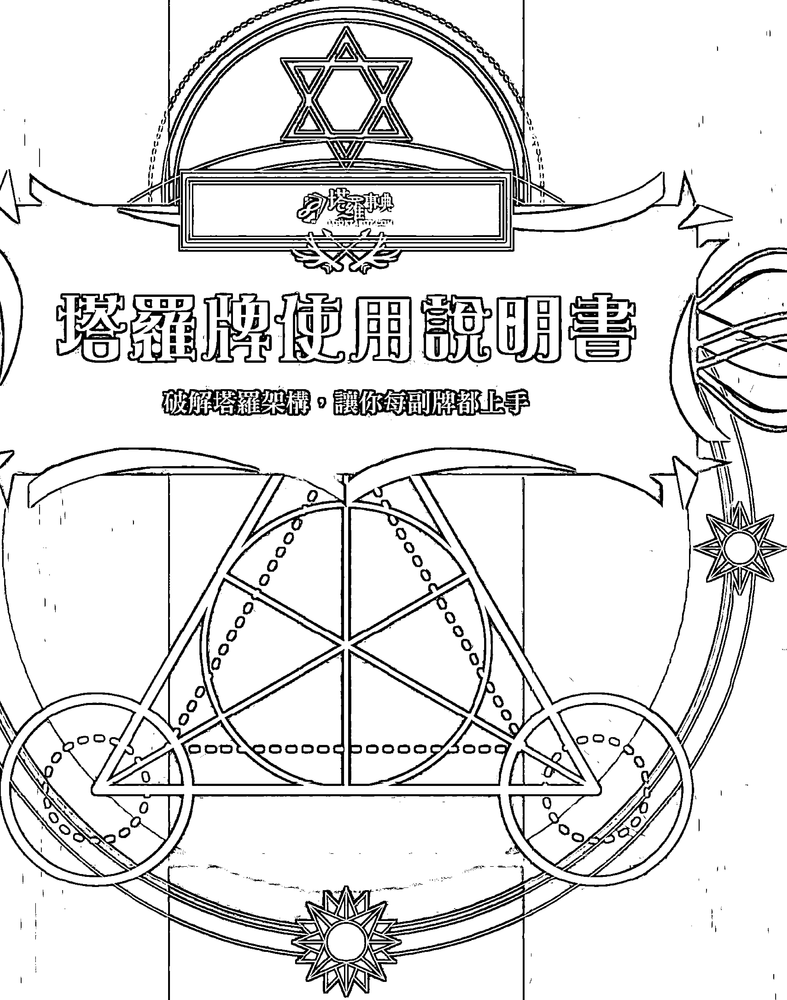

孟小靖 著

翻一張牌，為自己找到問題出口！

收藏超過800副世界塔羅牌的孟小靖老師，將鑽研15年以上的塔羅心得，轉化為簡單易懂的文字，啟動你的想像創造力，輕鬆探索塔羅牌圖案密碼！

無論你手上拿的是那一組塔羅牌，都能了解塔羅牌中所傳遞的訊息，讓你獲得人生指引！

- 專業推薦
- 文大身心靈課程規劃師 子玄
- 星座塔羅暢銷作家 天空為限
- 星星教授 安格斯
- 塔羅教父 丹尼爾

## 
## St. Royal College
### 天使神秘学院

- ※ 专业占卜预测机构
- ※ 神秘学培训机构
- ※ 水晶能量研究中心
- ※ 官方淘宝：http://strc.taobao.com
- ※ 官方微博：http://weibo.com/715104687
- ※ 新书发布QQ群：659338717
- ※ 购买更多好书请联系院长大天使

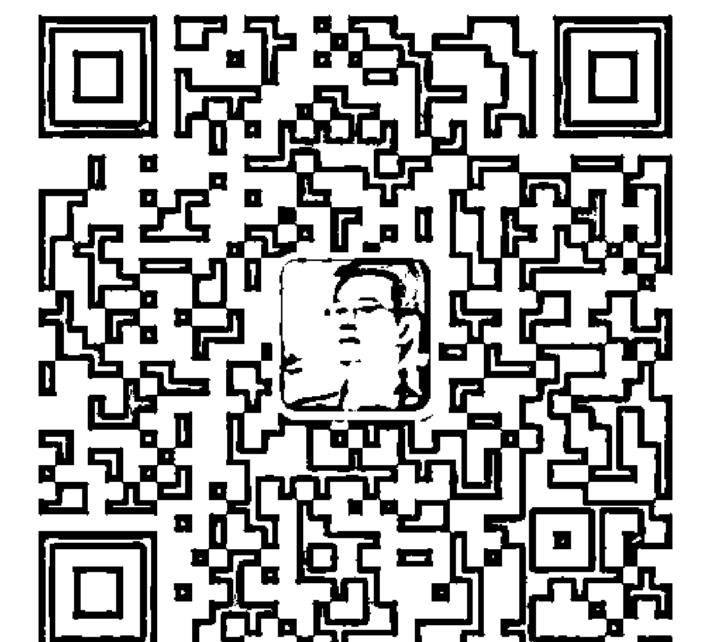

#### 大天使
天使神秘学院  院长
QQ：715104687
手机/微信：13641926204

微信公众平台：strc2011

## 制作说明：

本书由《天使神秘学院》出重金从台湾购入的原版书籍扫描制作完成。为达到最好阅读效果，特地把原版书全部切开后，再经由专业扫描设备高精度扫描完成，并经过一张张的PS后期处理最终成书，其间花费大量的人力、物力以及时间，只为能给大家提供经济并优质的神秘学学习资料而努力。

本学院强力谴责某些机构和个人，把本学院花心血制作完成的电子书籍，包装后直接放在自家淘宝网上低价倾销的行为，以谋取不劳而获的经济利益。如果长此以往最终将无人愿意再为大家花心思制作电子书，那以后可能大家再无新书可读。

为让大家以后能够读到更多的好书，也为了本学院的良性发展。
本学院恳请大家尽量做到如下几点：

- 1. 尽量在本学院的网站购买电子书籍。
- 2. 请勿用技术手段把电子书内的水印及加密去掉。
- 3. 在收到电子书后小范围传阅即可，千万不要公开传播，更别挂到淘宝网上低价销售。

同时为答谢广大支持者，学院电子书将做如下调整：

- 1. 学院会把一些早已收回制作成本的电子书折价销售。
- 2. 最新制作的电子书籍会开放打印功能，大家购买后有条件的可自行打印成书。

天使神秘学院

## 塔罗牌使用说明书

## 破解塔罗架构，让你每副牌都上手

孟小靖 著

## 塔羅事典：01

## 塔羅牌使用說明書：破解塔羅架構，讓你每副牌都上手

作者：孟小靖
出版者：大拓文化事業有限公司
執行編輯：陳孟靖
美術編輯：姚恩涵

總經銷：永續圖書有限公司
帳號：18669219
地址：22103 新北市汐止區大同路三段194號九樓之一
TEL：（02）8647-3663
FAX：（02）8647-3660
E-mail：yungjiuh@ms45.hinet.net
網址：www.foreverbooks.com.tw

CVS代理：美璟文化有限公司
TEL：（02）773-9968
FAX：（02）773-3668

法律顧問：方圓法律事務所 涂成楹律師

Printed in Taiwan, 2016 All Rights Reserved
出版日：民105年八月
版權所有，任何形式之翻印，均屬侵權行為

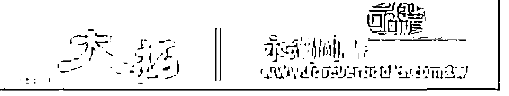

## 國家圖書館出版品預行編目資料

塔羅牌使用說明書：破解塔羅架構，讓你每副牌都上手 / 孟小靖著. -- 初版 -- 新北市：大拓文化，民105.08 面；公分. -- (塔羅事典；1)
ISBN 978-986-411-038-4(平裝)
1. 占卜
292.96
105010496

## 序言

> 「孟小靖是我見過研究認真，深感其學識、經驗豐厚的塔羅作者。此書絕對是一本值得收藏，並提供你反覆閱讀、思量、通透每一張塔羅牌內涵的經典說明書。」

——文大身心靈課程規劃師 子玄

> 「孟小靖不只狂愛塔羅牌，更對每副牌的由來跟創作背景如數家珍，拓廣我很多見聞。每次聽他講牌，思路竟然是跟我有點像的，相信他的詮釋一定可以讓大家都看懂。」

——星座塔羅暢銷作家 天空為限

> 「孟小靖老師談吐幽默，文字內容直指人心，不論對初學者或專業研究者都有所啟發。」

——塔羅教父 丹尼爾

> 「苦於摸不透學不懂塔羅嗎？這將是你學習中不可或缺的首選工具書。孟小靖是收藏牌最多的占卜藝術家，也是知識淵博的塔羅占卜師權威，相信我、你必須擁有這本書。」

——星星教授 安格斯

## 導論

當你會翻開《塔羅牌使用說明書》本書，想必是曾經接觸過塔羅牌的神準，或是對於塔羅牌產生興趣，但其實不然，是在你的內在潛意識去引導你的行動，因為你正經歷一些人生關卡，而想得到說明！搞懂為什麼會這樣？到底未來要怎麼做才好？是的，塔羅牌就是一個能整理出你內心交織煩惱的好工具。

塔羅牌已經是我人生中的老朋友了，一種簡單的紙牌遊戲，卻能告訴我們過去、現在與未來，進而給我們正面的能量與訊息！在16年前我接觸塔羅牌的時候，他還沒有正式的名字，大家都說是吉普賽占卜或是紙牌占卜，但無論叫的是什麼，塔羅的神秘力量可是在那時候就被肯定了呢！

有掌中藝術品之稱的塔羅牌，不同的畫面中隱藏了不同的圖象，不同訊息的給了我們不同的人生建議！許多的藝術家與創作者，用了不同的文化與元素讓塔羅牌變得豐富而生活化，在我眼中，我不喜歡塔羅有著太誇張的神秘氛圍，反而希望塔羅是貼近生活，人人都能輕鬆上手的一位人生好伙伴。

但自1999年以來收藏800副以上世界各國塔羅牌的我，常被大家問到能自己學塔羅牌嗎？《塔羅牌使用說明書》的誕生，就是要你讓塔羅進入你的生活，就跟所有的使用說明書一樣，讓你清楚了解，輕鬆上手，挑一副自己喜歡的塔羅牌，就能算！這樣一來，你也可以透過塔羅牌的建議，面對自我盲點，就能及時掌握人生關鍵點了！

人是一種十分奇妙的生物，在我解讀超過上萬問題的經驗中，得到了一個結論：大家都是來尋找認同的！當在生活中，遭遇問題、碰到困難的時候，其實內心裡都已經有一個答案了，但是因為自己不敢做決定，於是，就透過塔羅牌的訊息來肯定自己心中的作法，也或許就是塔羅牌的魅力吧！在塔羅牌的解讀之下，我們就發現了自己潛意識裡存在的想法，也就是自己的看不到的缺點，我想為什麼大家會覺得塔羅牌準，就是因為這樣，自己看不清的弱點，卻被一張張的紙牌清楚的敘述出來，任誰都會嚇一跳吧！

台灣的流行文化，通常來的快，去的也快，最近有好多人都說他們也要學塔羅、也要玩塔羅。對我來說，這是個好現象，自己很喜歡塔羅，當然希望越來越多人喜歡，一起認同塔羅這位精神導師！但另一方面的隱憂，就是有多少人是真的對塔羅有興趣的呢？抑或者是三分鐘熱度？在學習塔羅牌的過程中，許多的問卜者會問，是不是要有靈力什麼之類的人，才可以學？

不會的，因為靈力這種東西真的是太虛幻了，我絕對不會斷言到底有沒有靈力這回事，但是我知道的是，在塔羅牌的領域中，如果你肯努力肯付出肯學習，把塔羅當作一門學問，來鑽研來學習，你一定也可以成為一位塔羅牌解讀好手，不過，最重要的，還是別期待塔羅牌可以給你答案！因為塔羅能給你的一個方向，一個建議。最後還是要由你自己來決定你自己的命運與人生。

一起加油囉！所有喜歡塔羅牌的朋友。
塔羅事典 孟小靖

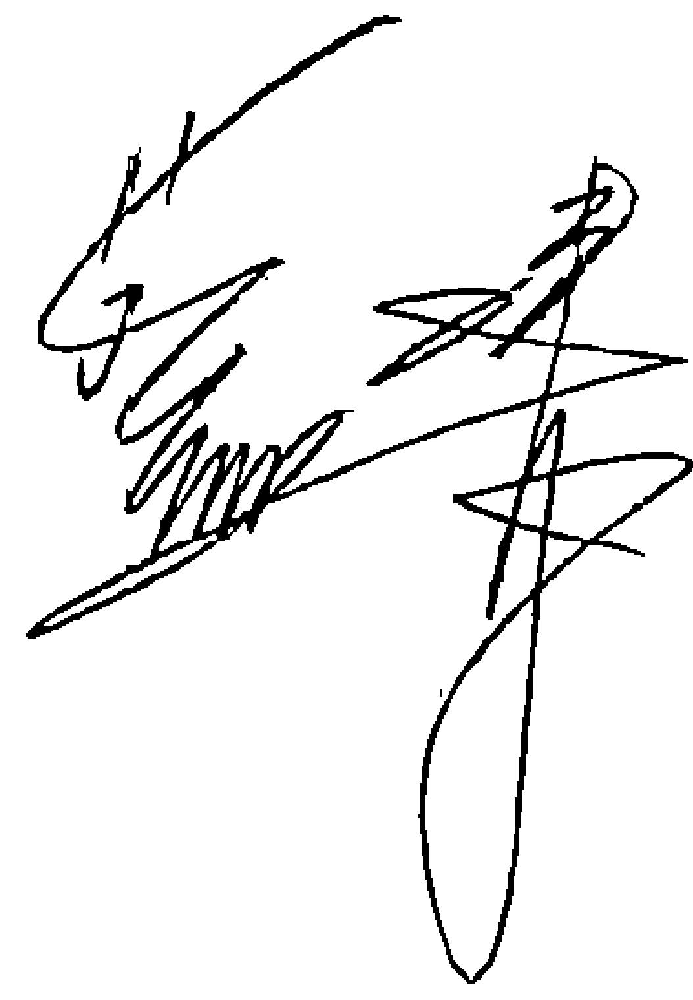

## Part 1. 拿到牌，马上就能算！

### 【新方向！塔罗占卜】交手问题！未来我哪方面会大受肯定！

- 〈使用前准备事项〉拥有塔罗牌，占卜前先做这些事！ ......................... 11
- 第 1件事：拿到牌，先点张数 ................................................... 11
- 第 2件事：欣赏牌中整体构图 ................................................... 14
- 第 3件事：决定一种占卜程序 ................................................... 15
- 第 4件事：发挥自己的无限想像力 ................................................. 15

## Part 1-1. 统整力，教你如何问对问题！

### 【新生活！恋情满分】我要理想情人！怎么做能打造完美爱情？

- 开始发问，不要急！慢慢厘清问题方向 ............................................ 19
- 第 1步骤：决定问题大项目 ...................................................... 19
- 第 2步骤：缩小问题范围，思考未来走向 .......................................... 19
- 第 3步骤：问题避免预设立场、强化个人情绪 ...................................... 21

## Part 1-2. 邏輯力，讓你邊算牌邊懂牌！

### 【新挑战！事业顺利】工作上会有大展身手的好机运吗？

- 决定一种想使用的塔罗牌阵 ..................................................... 25
- 常用 5 大牌阵 ................................................................ 25
- 是非題牌陣（單張占卜法）.................................................................26
- 聖三角牌陣（時間之流占卜法）.............................................................28
- 選擇題牌陣（二擇一占卜法）.................................................................30
- 六芒星牌陣（關係占卜法）.................................................................32
- 賽爾特十字牌陣（全面分析占卜法）.....................................................34

## Part 1-3. 創造力，帶你經歷感受過程！

- 【新訊息！財富強運】金錢加倍！你的賣賣通人賺錢法則！..........................37
- 開始屬於你的塔羅占卜流程....................................................................39
- 〈進入塔羅占卜前開始的準備事項〉靜心....................................................39
- 程序1：洗牌....................................................................................40
- 程序2：切牌....................................................................................41
- 程序3：抽牌或數牌..........................................................................42

## Part 1-4. 理解力，告訴你未來怎麼做！

- 【新實現！幸福有感】心願起飛捕捉夢想！你準備好了嗎？......................45
- 〈牌義快速查詢使用方法〉讓塔羅指數幫你破題........................................48
- 塔羅牌義關鍵字延伸..........................................................................49
- 觀察人物場景、圖象元素的秘密............................................................51
- 什麼地方不一样 52
- 正逆位顯現數量 53
- 出現相同的元素 54
- 應用塔羅牌逆位（倒牌） 55
- 負面反義 56
- 前牌延伸 56
- 過與不及 57

## Part 2. 找答案，了解塔羅牌告訴我什麼？

- 【來學習！立即上手】現在的我適合學習塔羅牌嗎？ 59
- 體驗人生，大阿爾克納 22張愚者之旅 61
- 豐富人生，小阿爾克納 56張元素故事 131
- 細數人生，小阿爾克納數字牌 40張結構 132
- 扮演人生，小阿爾克納宮廷牌 16張角色 133
- 小阿爾克納元素：行動之火，權杖牌組 135
- 小阿爾克納元素：情感之水，聖杯牌組 165
- 小阿爾克納元素：交流之風，寶劍牌組 195
- 小阿爾克納元素：務實之土，錢幣牌組 225

## Part 1. 拿到牌，馬上就能算！

使用塔羅牌，其實就跟你拿筆寫字一樣！已經會寫字的你，拿藍筆寫、或是黑筆寫，會有太大的差異嗎？不會吧！相信每一支只要有墨水的筆，都可以讓你寫出想表達的語言詞句。同樣的，每一副塔羅牌的訊息，只要你搞懂架構概念，都可以讓你輕鬆上手，幫助你書寫出你人生漂亮好字！

## 塔羅也能這樣玩，選牌心理測驗

## 【新方向！擁抱掌聲】炙手可熱！未來我哪方面會大受肯定！

很懷念被大家崇拜那種炙手可熱的感覺嗎？但最近一直覺得自己的運勢很低迷，想要振作又沒有頭緒！想知道自己未來在哪方面會大受肯定嗎？相信未來我們可以開始迎接人生的另一波高峰，只要受到肯定，有成就感的助力，就會覺得做起事來得心應手，事事順心，現在就請跟隨你的直覺，請依照你的第一印象，選一張你最喜歡的塔羅牌吧！

撰文解讀：塔羅事典 - 孟小靖 www.looktarot.com

圖片來源：夢幻樂園塔羅日誌 Fantasyland Tarot Journal Published by Look Tarot Press Taiwan

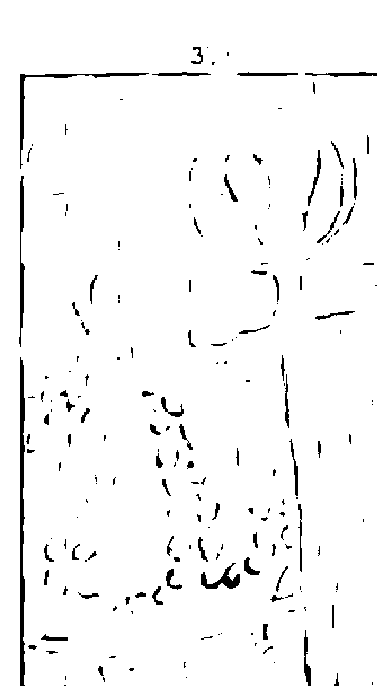

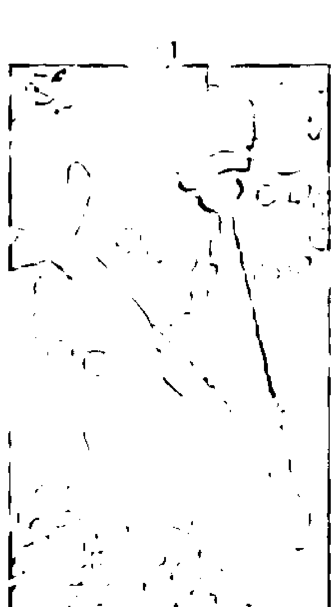

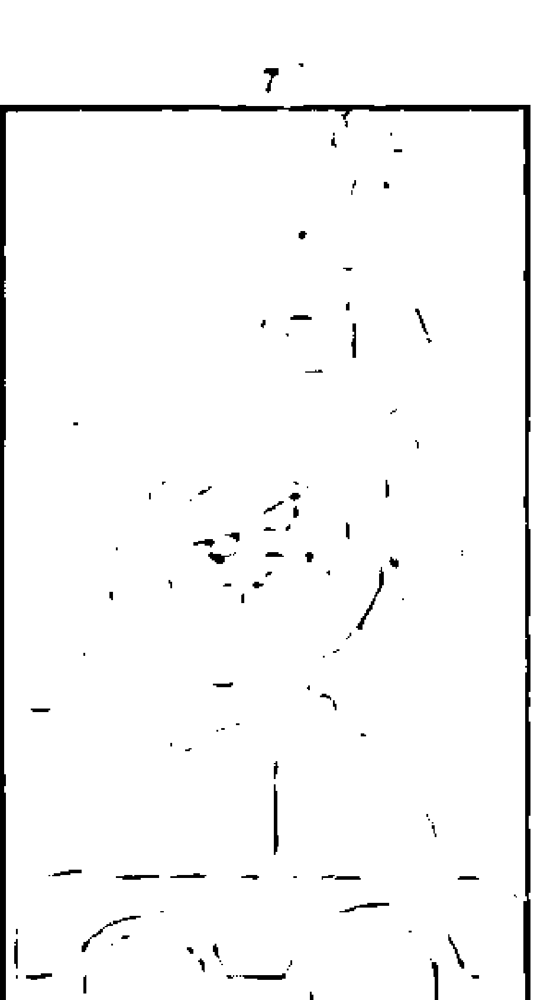

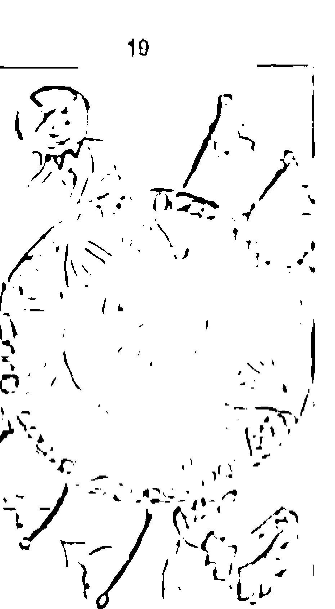

（選好了嗎？先別偷看答案喔，解答請翻頁！）

## 選A 的你：「戀愛旺旺」的你大受肯定！

單身的人，請大膽的告白吧！其實身邊早就有愛情準備等你展開攻勢了，如果剛好也喜歡對方，就不要輕易的退縮啊！積極的向對方告白吧！馬上會有好消息的。別忘了，幸福是掌握在自己手中的啊！可別因為害羞就錯失良機，應該就藉由這個好機會，一鼓作氣往前衝，不妨先多表現自己，聊聊未來在愛情裡規劃的藍圖，對方一定會對你傾心的喔！

## 選B 的你：「工作起飛」的你大受肯定！

表現已經很棒的你，或許可以讓自己稍微休息一下，過於緊繃的你，不要再一個人埋頭苦幹了！是時候觀察一下周遭的人囉！看看別人是怎麼做的，或許可以參考一下別人有沒有效率的方法，能讓自己達到事半功倍的成果。搞不好試試別人的方法，會對一些新的單元或領域產生興趣喔！這樣一來你就可以更上一層樓囉！

## 選C 的你：「理財獲利」的你大受肯定！

最近的你，財運大旺啊！會從不同的地方賺到錢喔！生活工作中最近很容易有意外之財喔！因為你的表現良好，就獲得了一些獎勵。不過，獲得這些額外的金錢，別只自顧自的買想要的東西，其實可以買一些能跟大家分享的，這樣一來，不但能獲得大家的喜愛，或許還會有更多意外之財的好運氣，增加你額外的中獎運喔！

## 選D 的你：「友誼倍增」的你大受肯定！

最近的你是不是多了很多認識新朋友的機會呢？如果是的話，請你好好珍惜這個良機喔！這些新朋友裡會有很你很合的姊妹淘或好兄弟喔！不過，就因為突然出現很多朋友，讓你自己的時間分配上會出現問題，提醒你，新舊朋友都一樣好，應該想想是不是要重新分配一下，可別特別在乎某些朋友，讓自己陷入兩難的情況中喔！

# 《使用前準備事項》擁有塔羅牌，占卜前先做這些事！

在我學習塔羅牌的過程中，發現大家也跟孟小靖一樣，當拿到一副自己喜歡的塔羅牌、一本自己覺得看得下去的塔羅牌中文教學書後，就覺得要馬上來算算看，看自己能不能解讀出自己的問題，通常的流程就是先翻到如何占卜、開始占卜的單元，然後就選了一個問題，照著上面的步驟算了一次，可能翻出了幾張牌，然後才回頭去找出這些牌的解釋，如果運氣好，可能看到的解釋剛好自己看得懂！但如果運氣不好，就會翻出一些看不懂的詞句組合，因為不夠了解塔羅牌，還是無法與自己的問題做連結，最後可憐的塔羅牌與書，就會被慢慢的遺忘在書櫃抽屜的角落裡，沾染了厚厚的灰塵！別再讓塔羅牌這麼可憐了，孟小靖這就分享，一拿到塔羅牌要先作的 4 件事！

#### 第 1件事：拿到牌，先點張數

塔羅牌畢竟是紙本的東西，無論在國內或國外一般都是視為書籍，那既然是書，難免在印刷的過程中，會有漏牌重複的這些可能性，儘管這樣的機率很小，但在孟小靖接觸這麼多副塔羅牌裡面，也有拿到過喔！

事先的檢查，總比拿來使用到一半才發現有缺少，這樣可是一個很糗的狀況。早點做好檢查，如果有缺牌重覆可以快快跟購買的店家做更換喔！另一方面，現在市面上太多名為塔羅牌 (tarot) 的紙牌，並不真的是塔羅的架構，透過這樣清點張數的過程，來確認自己手中的牌卡是不是塔羅牌，而不是其他的占卜預言卡，有符合塔羅牌架構，才是真的塔羅！

不過，點張數可不是傻傻的數過 78 張牌就好，而是仔細的核對，是不是有 22 張不同角色的大牌 (通常用希臘數字呈現，例如：III、XII)，小牌也是要仔細數數是不是有 4 組元素，分別是權杖 (火)、聖杯 (水)、寶劍 (風) 及錢幣 (土)，各 14 張 (有 1～10 的數字牌跟 4 個角色 (國王、皇后、騎士及隨從) 的宮廷牌，如果都沒問題了，那就可以進行到下一步囉！

#### 傳統塔羅牌架構 78 張圖像一覽

##### 22 張大阿爾克納 Major Arcana (俗稱大牌)

大牌是屬於比較精神性、抽象性的牌，人物角色的身分清楚鮮明，在塔羅牌中有樞紐地位，釐清狀態與環境，許多塔羅占卜師也單純使用 22 張大牌進行占卜。

| 0 愚者 | 大阿爾克納 Major Arcana 22 張大牌 |
|--------|-----------------------------------|
| I 魔術師 | II 女教皇 | III 女帝 | IV 皇帝 | V 教皇 | VI 戀人 | VII 戰車 |
| VIII 力量 | IX 隱者 | X 命運之輪 | XI 正義 | XII 吊人 | XIII 死神 | XIV 節制 |
| XV 惡魔 | XVI 高塔 | XVII 星星 | XVIII 月亮 | XIX 太陽 | XX 審判 | XXI 世界 |

### 【孟小靖的塔羅博物館】

001 萊德偉特塔羅牌 Rider-Waite Tarot
作者：A E Waite & Pamela Colman-Smith 發行：U. S. Games

本副牌是翻印自傳統的偉特塔羅牌，是歷史悠久的作品，用最簡單的角度來看塔羅牌，清楚的將牌義用簡單化人物圖像呈現，只看古人留下來的智慧，隱藏在牌裡的故事。讓這些元素為我們指引出屬於個人自己的人生道路！

##### 56张小阿尔克纳 Minor Arcana (俗称小牌)

小牌分为40张的数字牌及16张的宫廷牌，在占卜过程中则代表较具体的事件或状况，让我们了解情绪与行动！

| 小阿尔克纳 Minor Arcana 40张数字牌 | 元素转化象征 |
| :--- | :--- |
| 权杖 ♣ 火 (行动) 1 2 3 4 5 6 7 8 9 10 | 果实、火炬、棍棒、花树 |
| 圣杯 ♥ 水 (感性) 1 2 3 4 5 6 7 8 9 10 | 爱心、瓶、壶、水盆、鱼 |
| 宝剑 ♠ 风 (沟通) 1 2 3 4 5 6 7 8 9 10 | 叶子、矛、刀、鸟、蝴蝶 |
| 钱币 ♦ 土 (务实) 1 2 3 4 5 6 7 8 9 10 | 铃铛、五芒星、盘、石头 |

| 小阿尔克纳 Minor Arcana 16张宫廷牌 | 元素转化象征 |
| :--- | :--- |
| 权杖 ♣ 火 (行动) 国王 (父亲) 皇后 (母亲) 骑士 (王子) 随从 (公主) | 果实、火炬、棍棒、花树 |
| 圣杯 ♥ 水 (感性) 国王 (父亲) 皇后 (母亲) 骑士 (王子) 随从 (公主) | 爱心、瓶、壶、水盆、鱼 |
| 宝剑 ♠ 风 (沟通) 国王 (父亲) 皇后 (母亲) 骑士 (王子) 随从 (公主) | 叶子、矛、刀、鸟、蝴蝶 |
| 钱币 ♦ 土 (务实) 国王 (父亲) 皇后 (母亲) 骑士 (王子) 随从 (公主) | 铃铛、五芒星、盘、石头 |

※ 是的，不用怀疑你看到的扑克牌符号，塔罗牌经过历史的功能演变后，变成了一种娱乐休闲的工具，保留了4大元素转变为4种花色，宫廷牌的部分将骑士 & 随从合并为J，加上国王K和皇后Q，一共从56张变成52张，也就是说在我们的生活之中，接触过扑克牌的你我，早就让塔罗牌进入我们的生活喔！

#### 第2件事：欣賞牌中整體構圖

每一副塔羅牌都是一副藝術品，當然我們要花點時間去欣賞囉！但這樣的過程，也是讓我們快速進入到塔羅牌世界的一個方式，去看看每一張牌裡面，有沒有什麼地方是特別吸引你的，人物表情與背景的互動，給你什麼特別的感受，因為每個人可能會體悟到不一樣的牌中意涵喔！

##### 塔羅牌系統簡易分類

| 名稱 | 特點 | 大牌編號差異 |
|------|------|--------------|
| 萊德偉特塔羅牌 系列 (Rider Waite Tarot) | 數字小牌中有明顯的元素符號與圖案，人物背景鮮明易懂。 | 力量編號8 正義編號11 |
| 馬賽塔羅牌 系列 (le Tarot de Marseille) | 數字小牌無圖案，同撲克牌方式呈現，可配合生命靈數運用。 | 力量編號11 正義編號8 |
| 克勞利托特塔羅牌 系列 (Crowley Thoth Tarot) | 數字小牌中強調幾何圖形排列、重色彩，無人物角色出現。 | 力量編號11 正義編號8 |

> ※ 上述三類塔羅牌是較為常見的系統，了解塔羅牌系統可以方便自己選用塔羅牌時的一個參考，現代塔羅牌也已出現結合不同系列的「融合系統」，重要的還是有沒有符合 78 張的塔羅牌架構，額外添加的牌卡不在此限。

欣賞牌圖

【孟小靖的塔羅博物館】

002 通用偉特塔羅牌 Universal Waite Tarot
作者：Pamela Colman-Smith & Mary Hanson-Roberts 發行：U.S. Games

經過重新上色的通用偉特塔羅牌，是一個漂亮更吸引人的柔和藝術品，讓我們把牌中清晰的特點，了解的更透徹！引導我們沿著塔羅的路徑智慧，面對生活中難解的問題時，可以得到一些方向與訊息，是大家最常用的塔羅牌之一！

#### 第3件事：決定一種占卜程序

做完前面 2 件事，其實就可以開始進展到實際的使用步驟了，其實占卜的手法沒有一定的規範，畢竟塔羅牌已經流傳了這麼久的時間了，到底哪一個占卜程序是對的，也沒有一一定的說法，但無論你使用的是那種步驟的占卜，要不要給別人抽牌，還是給別人洗牌，這都 OK 的！最重要的是，自己要選定一種方式，千萬不要看一種換一種，這樣只會擾亂自己喔！

#### 第4件事：發揮自己的無限想像力

接下來當牌抽出來的時候，翻書只要先看牌的簡單關鍵語解釋就好，先發揮自己的想像力，去想想為什麼會抽到這張牌，牌中的人物在畫面中現在有著什麼樣的情緒，當你想通這些，你就能知道塔羅牌要告訴你的訊息是什麼，指出的方向是什麼，想過一遍之後再翻書，印象也會比較深刻啦！

# 〈注意事項〉

- ※ 不是所有牌卡都是塔羅牌，必須符合 78 張塔羅牌架構。
- ※ 除了 78 張塔羅牌架構外，部分牌卡會添加空白牌、師父牌（占卜師牌）或是特別創作（例如：2 張戀人牌），這通常為配合印刷技術上需為 4 的倍數，而設計出來的，作者都會在說明書中簡單介紹特別卡的使用方式，大家可以自由選用，這方面沒有什麼硬性規定喔！

003 粉彩偉特塔羅牌 Radiant Rider-Waite Tarot
作者 : Pamela Colman-Smith & Virginius Poshkus 發行 : U. S. Games
顏色飽合，爛爛明亮，讓人感覺溫暖！有著乾淨白色的邊框，數字與英文的標示已重新定位，當仔細觀察，你將看到牌中有些部份被重新繪製，像是惡魔、戀人牌呈現出來的人們沒有特別的性別象徵，修飾過的細節等你我去發現！

# 塔羅牌使用說明書

破解塔羅架構，讓你每副牌都上手

## Part 1-1. 統整力，教你如何問對問題！

很多人喜歡問：塔羅牌可以算什麼？其實應該要問：你自己想了解什麼？塔羅牌的訊息可以幫你抽絲剝繭，找出核心的問題，讓我們看清事情全貌。問對問題正確的表達，才能幫助到我們，就如同你到餐廳點餐，不會只說：上好吃的來！這樣的沒頭沒尾的敘述，無論誰都幫不上忙吧！

## 塔羅也能這樣玩，選牌心理測驗

## 【新生活！戀情滿分】我要理想情人！怎麼做能打造完美愛情？

好不容易才出現一個自己喜歡的人，正想要好好的發展愛情！但如果發現他有很多生活習慣與價值觀跟你不同那該怎麼辦？是要讓步去配合他？還是要好好調教他，成為你心中想要的對象？或是乾脆放棄這個人，再找一個！到底你要怎麼做才能打造屬於自己的完美愛情？現在就跟隨你的直覺，請依照你的第一印象，選一張你最喜歡的塔羅牌吧！

撰文解讀：塔羅事典 - 孟小靖 www.looktarot.com
圖片來源：Cute Easy tarot Published by Look Tarot Press Taiwan

（選好了嗎？先別偷看答案喔，解答請翻頁！）

## 選 A 的你：【擁有完美愛情指數 20%】

看來你在愛情學分上還有很多要修習的地方呢！如果你已經是有對象的人，你們要放下主觀想法，跟彼此去學習著體會對方的生活模式，這樣才能在愛情上和睦相處，擁有幸福；如果你是沒有對象的人，就要把你自己的眼光調整一下，白富美、高富帥大家都想要，但真的是能與你心靈契合嗎？還是只想要那種愛情炫耀虛榮感呢？

## 選 B 的你：【擁有完美愛情指數 40%】

或許衝突是一種你們互相溝通的方式，如果你已經是有對象的人，請你在不高興的時候，不要去討論是非對錯的問題，因為都在氣頭上的你們，是很難有一個正確的結論！如果你是還沒有對象的人，快點去留意身邊是不是有看到愛情好貨！看到了就要趕緊主動出擊，好東西當然會被別人挑走，動作慢了可就沒有了，現在的理想愛情是要靠自己好好爭取的！

## 選 C 的你：【擁有完美愛情指數 80%】

現在的愛情或許平淡，但是已經算是很難得囉！如果你已經是有對象的人，你們彼此其實在心裡是很重視對方的，也能跟彼此談天聊心事，這樣是一件很令人羨慕的事喔！如果你是還沒有對象的人，可以請朋友好好幫忙介紹一下，畢竟朋友很懂你想要的對象是怎麼樣的人，他們可以在最近為你物色你未來的好對象喔！快去跟朋友聚會吧，愛情就要來了！

## 選 D 的你：【擁有完美愛情指數 60%】

真的確定你現在想要的愛情是適合你的嗎？人生就是一連串的選擇，所以下了決定就應該好好經營囉！如果你已經是有對象的人，你們是很喜歡對方的，接下來就要靠彼此間的相處，攜手面對實際的生活考驗能讓愛情加溫！如果你是還沒有對象的人，在你身邊已經有人再守候著你，想想看最近是不是有人跟你互動頻繁，可多多觀察一下，這次你能擁有完美愛情了！

### 開始發問，不要急！慢慢釐清問題方向

大家很常用準不準來形容塔羅牌的占卜結果，但孟小靖都告訴來占卜的朋友們，塔羅解讀除了讓你覺得準之外，其實最重要的是，有沒有在這樣的塔羅占卜過程中，得到幫助。所謂幫助，也就是讓你經過塔羅牌的訊息指引，讓你了解自己問題的下一步該怎麼去面對，就能讓自己做出選擇跟決定！

但因為進行塔羅牌的解讀，畢竟是要去挖堀內心，感覺不舒服的負面情緒區域，一開始都會不知道該如何問起，當然也千萬不要抱著玩玩的心態，問出太籠統的問題，像是算個工作、愛情好了，不！這是生活的項目，而不是一個問題，所以應該靜下心來，讓我們傾聽內心深處的想法，只要跟著孟小靖的發問3步驟，就能慢慢的來討論出最適合自己的問題了！

#### 第1步驟：決定問題大項目

我們的生活之中，總是會遇到很多問題，讓我們覺得困惑，有時候我們可以靠自己的經驗法則，來面對這些考驗，跨越這些挑戰！孟小靖塔羅占卜最多的問題，都離不開「工作」跟「愛情」這兩大主題，這的確也是我們生活之中，最常接觸到的兩大生活主軸，但仔細想想，這不就囊括了向象徵「感性面」的愛情、還有「理性面」的工作。所以第一步驟，就來決定現在的你，想處理自己的哪一方面的情緒，想要突破什麼樣的狀況吧！

「感性面」問題：愛情、友誼、人際關係、家庭、婚姻、心情…等
「理性面」問題：工作、學業、投資、金錢財務、夢想、健康…等

#### 第2步驟：縮小問題範圍，思考未來走向

好，當你已經決定要問的問題大項目，接下來就是要縮小問題的範圍了！畢竟每個人現在正面臨不同的狀況，而塔羅牌所建議的方向，也跟你自身想怎麼做有關，大家也很常提到，塔羅牌的準度，時間長度能占卜多久之後的事呢？基本上，我們都會說是3個月，因為我們的想法、做法有可能因為我們的一個念頭而改變，但這樣的轉變需要發酵的時間，也就是為什麼很多公司有所謂的3個月試用期，懷孕的媽媽，也習慣在3個月之後才告訴大家喜訊，這一些無論是心靈、生理的面相讓我們體會出，我們的信念會經歷3個月的穩定，進而對我們產生實質的效果。所以孟小靖也常告訴大家，塔羅牌的原理也跟吸引力法則，有著異曲同工之妙，因為我們能靠著自己的信念，就能發現問題的解答，甚至於有時候，只需你轉念思考，就能化解心中烏雲，海闊天空囉！

|「感性面」常見延伸問題|「理性面」常見延伸問題|
|---|---|
|愛情 我跟這個人的未來發展？|工作 這個工作適合我嗎？有前景嗎？|
|愛情 我能遇上適合戀愛的好桃花嗎？|工作 現在是我換工作的好時機嗎？|
|愛情 在愛情中 A 跟 B 我該選擇誰呢？|夢想 我能夠自己創業當老闆嗎？|
|友情 我們該如何處理最近的不愉快？|學業 這一個考試會順利率取嗎？|
|心情 目前該怎麼做才能找回快樂？|財富 我規劃的投資能讓我獲利嗎？|

> ※ 吸引力法則是新思維運動 (New Thought) 的一種概念，認為人們可通過正面或負面想法，從而得到正面或負面的結果。這種信念是基於人們的一個想法，他們的想法都從「純粹的能量」而成，這信念就好像一種力量吸引另一種力量，但若你的信念不夠專注，也有可能會被潛意識的聲音干擾，造成無法心想事成！

如何縮小問題？說穿了，真的很簡單，只要運用是非題選項，就能輕易地整理出來，一步一步地去發現自己真正想問的問題。

像是現在如果你想問愛情，
有沒有對象？現在有沒有在一起？
如果有，你還想不想繼續再一起？這之中有發生什麼問題嗎？
如果沒有，你現在想談戀愛嗎？要問未來會出現對的人嗎？
是不是，你有沒有發現，你想問的問題不就呼之欲出了嗎？

#### 第 3 步驟：問題避免預設立場、強化個人情緒

進行塔羅占卜，就是要來找到問題的解決之道，透過塔羅牌的訊息，讓你檢視現在的狀況，突破自己看事情的角度、盲點，甚至於自己過多的情緒干擾，像是任性、反抗等。所以我們在發問問題時，就必須中立一些來看待所有的事物，盡可能不帶著預設立場、刻板印象來發問，畢竟塔羅牌除了會告訴你能做什麼？也同時能告訴你，你想做什麼？所以塔羅牌也能第一時間，了解你內心想要做的想法，若此時我們一直執著想要去用自己習慣的方式處事，不就無法真實的看到塔羅牌想給你的建議，想一下，就算塔羅牌告訴你對你最好的建議，固執己見的你，聽得進去嗎？這樣一來，不就失去了占算塔羅牌的意義跟價值了！

## 《注意事項》

- ※ 範圍太大無法精準給予建議訊息，務必縮小問題方向。
- ※ 與你無關、沒有實質交集接觸的人，請不要隨意發問，例如：我跟哪個藝人明星會不會交往？選舉中某某人會不會當選？
- ※ 不問時間太久遠之後的事，變數太多，近期 3 個月準度較高。
- ※ 不執著前世今生，活在當下，珍惜現在生活才是要點。
- ※ 謹慎面對健康有關問題，必要時請對方接受專業醫療協助。
- ※ 生活瑣事不要問！過分依賴塔羅牌答案，失去自我思考解決問題能力，例如：我該去剪頭髮嗎？我要買飲料來喝嗎？

# 塔羅牌使用說明書

破解塔羅框架，讓你每副牌都上手

## Part 1-2. 邏輯力，讓你邊算牌邊懂牌！

當你手上拿到了一副塔羅牌，一定很想趕快把牌打開，馬上就來占卜一下自己想問的疑惑吧！好，那就讓趕緊進入最後一步的準備事項了，告訴你塔羅牌占卜的牌陣，這樣一來你就能了解，當塔羅牌出現在什麼位子上，是 要告訴你什麼樣的訊息，才能正確地搞懂塔羅牌的建議！

## 塔羅也能這樣玩，選牌心理測驗

## 【新挑戰！事業順利】工作上會有大展身手的好機運嗎？

到處都在說現在的景氣不好？經濟不好？這是真的嗎？還是大家已經被嚇得不敢冒險為自己的工作事業打拼？只想有一份工作好好待著，其實自動出擊才是最好的方式，在這樣低迷的時間點，才更應該好好的 大展身手，搞不好就因這樣而得到被讚賞的機會，讓自己朝著下一階段前進！現在就跟随你的直覺，請依照你的第一印象，選一張你最喜歡的塔羅牌吧！

> 撰文解讀：塔羅事典 - 孟小靖 www.looktarot.com
圖片來源：Angel and Flower tarot Published by Look Tarot Press Taiwan

（選好了嗎？先別偷看答案喔，解答請翻頁！）

## 選A 的你：【事業大展身手指數 80%】

想要在目前的工作領域中，有一番大作爲的你，其實要相當的努力以赴喔！但有時候太過急躁用錯方法，反而受到主管前輩的責罵，讓自己感到十分的挫敗，認爲自己不過是公司的一顆棋子罷了！千萬別這樣想！因爲讓你發光發熱大展身手的好時機就要來臨了！先把負面的精神束縛放下，記着一點，所有的工作打拼都是爲了自己，你就能迎接成功了！

## 選B 的你：【事業大展身手指數 40%】

對於事業現況還算滿足的你，不求什麼大展身手，只求能安安穩穩的把自己手邊的工作順利的完成，這樣其實也很不錯。因爲這樣一來，你的生活除了工作之外，還有很多屬於自己的時間，可以做一些自己喜歡，讓自己感到開心的事！的確現在的你應該多花一些時間在自己身上，找回自我！未來或許能將自己的興趣進一步轉變成事業喔！

## 選C 的你：【事業大展身手指數 20%】

未來你想要大展身手之前，看來要先面臨到溝通的困境了！在工作上不斷有各式各樣的意見要你去統合整理，但大家又有著自己堅持的原則，許多事情也就因此而滯礙難行！真的想要讓自己在事業上有一番作爲，先解決互相衝突的問題，接著再將不同意見平衡過來，運用你擁有的環境以造就情勢，你就會慢慢感受到什麼才該出手，那個成功的時間點了！

## 選D 的你：【事業大展身手指數 60%】

有時候改變才是你大展身手的開始，當很多事情發生變化的時候，先別急着抱怨！因爲這些不確定因素，對你來說是福是禍都還是個未知數！但改變不就是個可以重新洗牌的機會嗎？你可以藉由這次機會，將你的工作強項表現出來，或是能進一步去調整自己的工作項目，去挑戰自己一直想嘗試的新領域，誰說改變一定擾民？就看你掌握的好不好罷了！

### 决定一種想使用的塔羅牌陣

牌陣，等於就是燈泡的底座！塔羅牌就是各式各樣不同色彩的燈，我們是不是要找對底座，才能讓這些燈泡發出七彩的光芒，而燈泡所發出的光，也有著不同的用途，有的光是照明用、有的光是裝飾用，也有的光是能帶給大家溫暖，療癒我們的心靈用的！塔羅牌不就也是這樣嗎？所以了解塔羅牌陣，才能知道塔羅牌要從哪個角度、哪個面向，帶給你什麼樣的建議，畢竟流傳千百年的塔羅牌，孟小靖相信古人流傳下來的知識與智慧，一定有我們可以學習的地方，當然跟隨著時代的演進變遷，會有不同的牌陣演化，也有所謂的無牌陣占卜牌，塔羅牌就是這麼有趣的好工具，沒有制式的硬性規定，你非得怎麼做不可，塔羅牌總是提供著一個方向、一條道路，選擇權永遠都是握在你手中的！

在這裡孟小靖會介紹常用5大牌陣，看看你想挑哪一個，作爲你現在想使用的牌陣吧！

#### 常用5大牌陣

- 【入門牌陣】是非題牌陣（單張占卜法）
  抽出單張塔羅牌就可簡單了解問題方向，迅速知道自己該做怎麼做！
- 【入門牌陣】聖三角牌陣（時間之流占卜法）
  依照時間進程，觀測過去、現在、未來面相，找到問題核心狀況！
- 【進階牌陣】選擇題牌陣（二擇一占卜法）
  當人生面臨不同選擇時，可以用這個牌陣一一比較，釐清方向！
- 【進階牌陣】六芒星牌陣（關係占卜法）
  可以從不同角度分析整體狀態，找出事件演變過程，給出適合的作法與建議！
- 【專家牌陣】塞爾特十字牌陣（全面解析占卜法）
  想破解複雜狀態與交錯的情緒，了解由內而外的反應，全面向的觀察解讀！

##### 是非題牌陣（單張占卜法）

如果你不想聽一大堆有的沒的建議和解釋，這個牌陣可以給你直接的是非對錯的答案，「有沒有」、「是不是」、「對不對」類似的問題，用這個陣法是最適合的，將牌切好，以扇形將所有的牌展開，憑直覺選出一張你最中意的，它將一針見血的告訴你想要的答案。

單張占卜法也十分適合初學者，運用在學習塔羅牌的過程上，可每天抽一張牌，來預測今日運勢狀況，建議使用這個單張占卜法時，也可以使用正逆位來做解讀，讓你更理解塔羅牌中的訊息。

延伸抽牌做法：當你還想要知道「為什麼」或「該如何做」，你可以再抽一張，這個加抽一張的牌，只要從原來展開的扇形中，挑出一張，不用再重新洗牌，這一張牌將會給你做事處理上的忠告。

> ※ 翻牌小提醒：進行翻牌時，請記得要左右翻開，而不是上下翻開，這樣一來才不會搞錯正逆位的顯示喔！

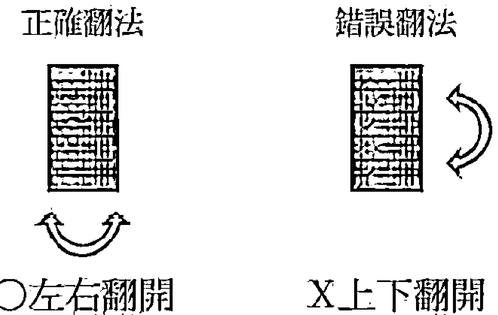

### 【孟小靖的塔羅博物館】

005 永恆之星塔羅牌 Liber T: Tarot of Stars Eternal
作者：Andrea Serio & Roberto Negrini 發行：Lo Scarabeo

有歐洲托特牌之稱的永恆之星塔羅牌，重新繪製的過程中，畫面裡加入了柔和的感覺，相較起來更能一眼清楚的看到其他的塔羅符號喔！原本的托特塔羅牌在塔羅中加入了很多神秘學的故事與符號，要好好了解可要下一番功夫。

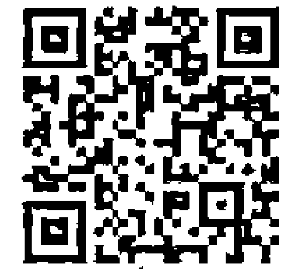

##### 聖三角牌陣（時間之流占卜法）

想清楚快速的瞭解一件事過去、現在與未來的過程，這個簡單的牌型是最常使用的，可運用【占卜操作1】抽牌或【占卜操作2】數牌的方式來進行塔羅牌占卜。

【占卜操作1】抽牌

- ☆將牌切好，可運用展開扇形，自行挑選抽牌，隨意挑出自己喜歡的牌卡，放置在牌陣的位置上。

【占卜操作2】數牌

- ☆或是由整疊牌正面上數來的第七張牌，放置在（1）的位置。
- ☆再往下數的第二個第七張牌（也就是第14張牌）放在（2）的位置。
- ☆再一次往下數第三個第七張（也就是第21張牌）放在（3）的位置。
- ☆如果想要塔羅給予你忠告的話，你可以再憑直覺隨意的抽一張牌或是最後一張的底牌（在抽牌時別忘了說：「請告訴要怎麼做比較好」加上（4）的牌，綜合（3）的意思，就會有更清楚的了解。）

延伸牌陣說明：聖三角牌陣除了能說明過去、現在及未來的狀況，還可針對身、心、靈狀況，進行塔羅牌訊息的解讀。

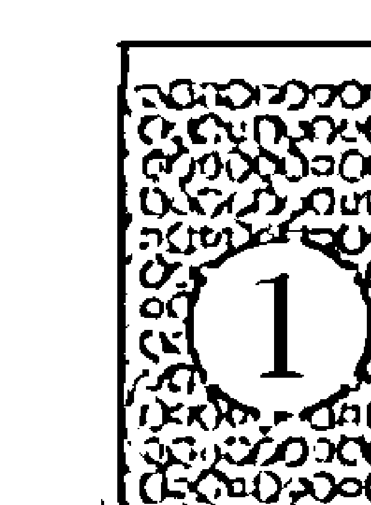

過去

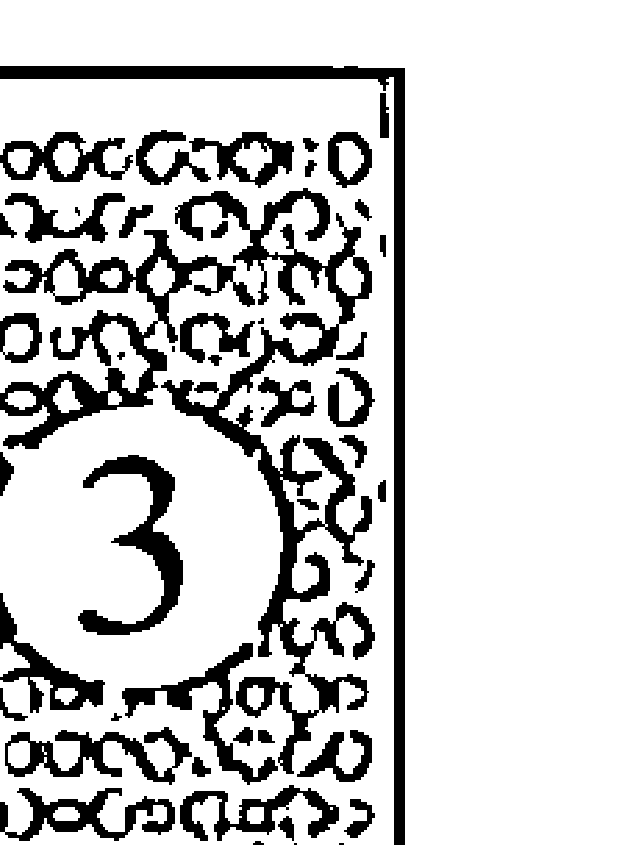

未來

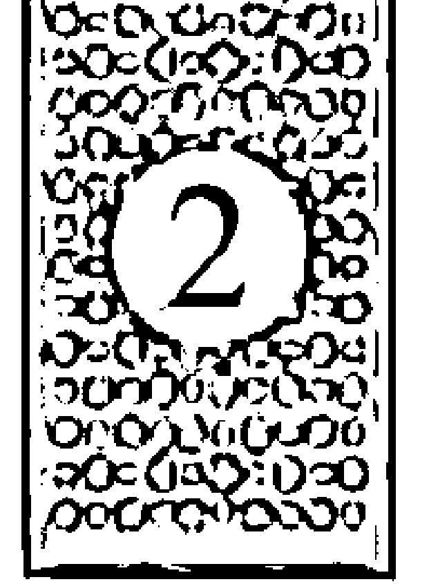

現在

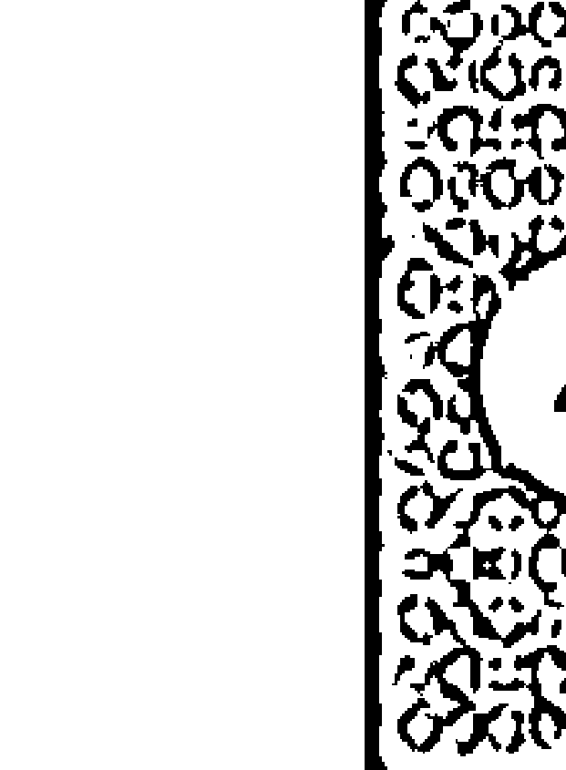

建議牌

| 過去（先前經歷情緒反應） | 身（外在顯現的狀態） |
|--------------------------|----------------------|
| 現在（當下感受行動思考） | 心（內心真正的想法） |
| 未來（預測事件如何演變） | 靈（深層潛意識訊息） |

※ 適用 22 張大牌占卜、78 張全牌塔羅占卜

### 【孟小靖的塔羅博物館】

006 新視覺塔羅牌 Tarot of the New Vision
作者：Gianluca Cestaro & Pietro Alligo 發行：Lo Scarabeo
翻轉 180 度，跨越水平線從不同的方位來解讀塔羅。在魔術師、皇帝的身後是什麼？愚者一眼望去的景色？我們都被制式的塔羅教條所約束了，從角色的背後來看，打破方位思考，加強我們的塔羅直覺聯想力，感受不同的觀念想法！

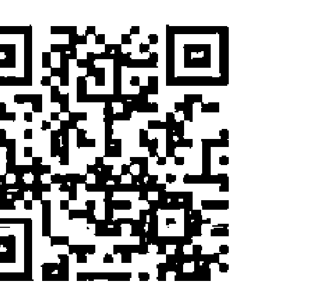

欣賞牌圖

##### 選擇題牌陣（二擇一占卜法）

這個方法是運用在當你有選擇時，在人生路口中，該選擇向左走或是向右走，可以有一個明確的解決問題的方法，但是在這個牌陣中，自己要先決定出兩個方向，請先設定「前者」與「後者」來做分析解釋。可以是人、事、物，也可以是對兩個不同目標或是對一個目標的兩種作法。可運用【占卜操作1】抽牌或【占卜操作2】數牌的方式來進行塔羅牌占卜。

###### 【占卜操作1】抽牌

- ☆將牌切好，可運用展開扇形，自行挑選抽牌，隨意挑出自己喜歡的牌卡，放置在牌陣的位置上。

###### 【占卜操作2】數牌

- ☆或是從頭往下數起的第七張牌放在（1）的位置。
- ☆再往下數第二個第六張牌（也就是第十三張牌），放在（2）的位置。
- ☆然後將這張牌的下一張（也就是第十四張牌）放在（3）的位置。
- ☆而在（4）的位置上放上接下來的第三個第六張牌（也就是第二十張牌）。
- ☆而再一張（也就是第二十一張牌）放置在（5）的位置上。

延伸牌陣說明：我們的人生，當然會面臨二種以上的選擇，在使用選擇題牌陣時，我們可以依序慢慢地分別占卜，透過自己的思考整理後，每次針對兩個方向詢問，整合多次占卜結果，就能從中獲得答案。

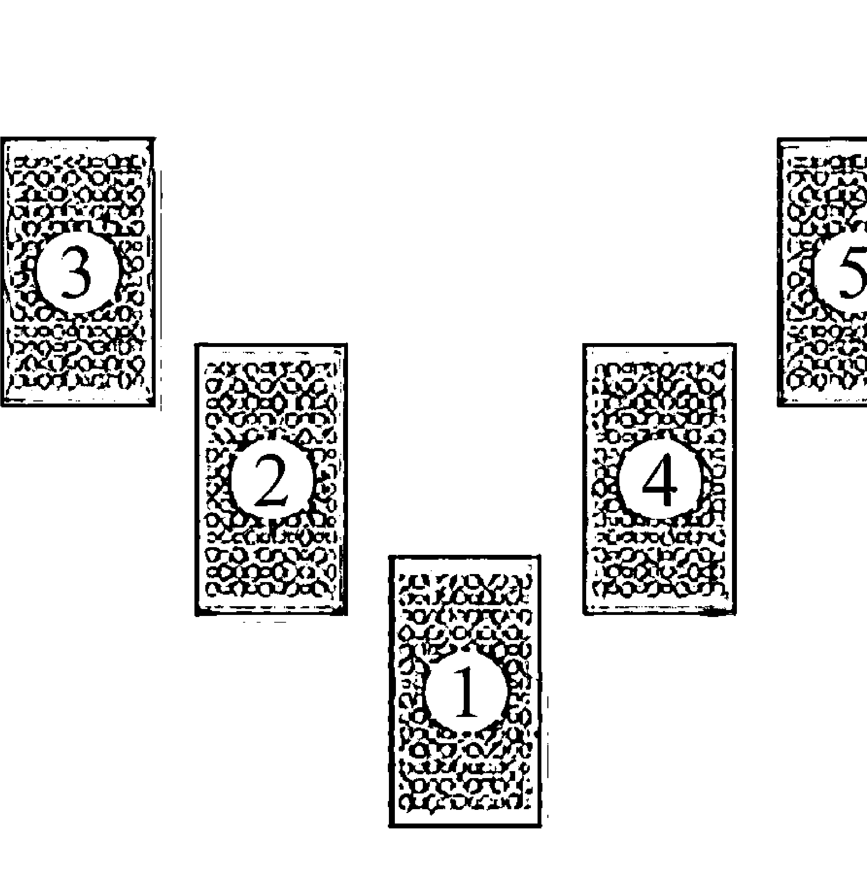

- (1) 你的現況
- (2) 選擇 A 的過程狀態、互動關係
- (3) 選擇 A 的結果、未來發展
- (4) 選擇 B 的過程狀態、互動關係
- (5) 選擇 B 的結果、未來發展

※ 適用 22 張大牌占卜、78 張全牌塔羅占卜

### 【孟小靖的塔羅博物館】

007 克勞利托特塔羅牌 Aleister Crowley Thoth Tarot
作者：Aleister Crowley & Frieda Harris 發行：U. S. Games
黃金黎明協會的成員克勞利創作，用色大膽強烈，延續古埃及神祇荷魯斯所傳遞之概念。圖案集結了西方神秘學的眾多知識，包含凡諾斯替教派 Gnosticism 的神秘主義、猶太教的卡巴拉數字學、占星術和埃及圖象符號、希臘羅馬神話等。

欣賞牌圖

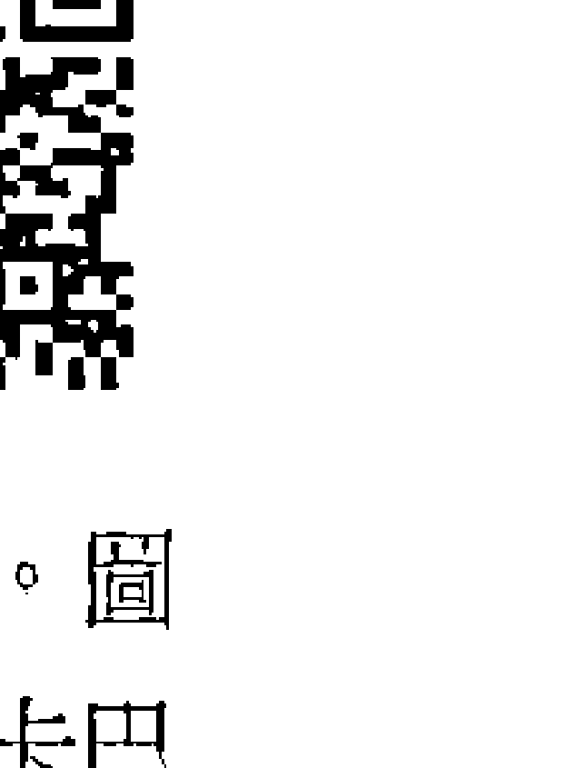

##### 六芒星牌陣（關係占卜法）

在塔羅牌占卜中，這個六芒星牌陣是十分經典的一個牌陣，可以反映出人、事、物相關面向的關聯性，從不同角度來觀察彼此的關係性，讓我們從中瞭解不同觀點之下的想法，以及如何面對，決定未來的做法！可運用【占卜操作1】抽牌或【占卜操作2】數牌的方式來進行塔羅牌占卜。

###### 【占卜操作1】抽牌

☆將牌切好，可運用展開扇形，自行挑選抽牌，隨意挑出自己喜歡的牌卡，放置在牌陣的位置上。

###### 【占卜操作2】數牌

☆或是從頭往下數起的第七張牌放在（1）的位置、第八張牌放在（2）的位置、然後第九張牌放在（3）的位置。
☆接續著往下數第二個第七張牌（也就是第十六張牌）放在（4）的位置、再往下數起的第八張牌（也就是第十七張牌）放在（5）的位置、然後再往下數起的第九張牌（也就是第十八張牌）放在（6）的位置。
☆最後放上接下來的第三個第七張牌（也就是第二十五張牌），放在（7）的位置上。

延伸牌陣說明：運用牌陣中，牌與牌的關聯性也相當的重要，有時候透過不同的軸線，就更能剖析事情的面貌。

（1）+（4）直線能讓我們發現過往經驗遺留下來的聲音，接受面對。
（2）+（5）左斜線能告訴我們現在你手邊有什麼資源，該如何運用。
（3）+（6）右斜線針對未來直接給予說明，預測可能造成什麼影響。

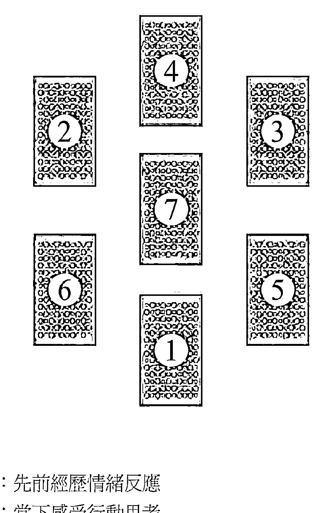

- （1）過去：先前經歷情緒反應
- （2）現在：當下感受行動思考
- （3）未來：預測事件如何演變
- （4）原因：造成此事的主因、或當時的決定歷程
- （5）環境：身邊有什麼干擾跟影響，是阻力或是助力
- （6）對策：對於問題的最佳做法，釐清可能的變化
- （7）建議：補充說明來做正確的指引

※ 建議使用 78 張全牌塔羅占卜

##### 賽爾特十字牌陣（全面解析占卜法）

賽爾特十字牌陣是相當具有代表性的塔羅牌陣，當你想要仔細了解事情的完整面向，就可以使用這個幾乎可以解答任何問題的牌陣，難度較高，也較為複雜，所以在使用上需要多花時間與心思去學習了解。可運用【占卜操作1】抽牌或【占卜操作2】數牌的方式來進行塔羅牌占卜。

###### 【占卜操作1】抽牌

- 將牌切好，可運用展開扇形，自行挑選抽牌，隨意挑出自己喜歡的牌卡，放置在牌陣的位置上。

###### 【占卜操作2】數牌

- 或是從頭往下數起的第七張牌放在（1）的位置、第八張牌放在（2）的位置、這張牌需橫放（上端朝左側，逆時針轉九十度即可），然後第九張牌放在（3）、第十張牌放在（4）、第十一張牌放在（5）、第十二張牌放在（6）。
- 接續著往下數第二個第七張牌（也就是第十九張牌）放在（7）的位置、再往下數起的第八張牌（也就是第二十張牌）放在（8）的位置、第九張牌（也就是第二十一張牌）放在（9）的位置、第十張牌（也就是第二十二張牌）放在（10）的位置。

延伸牌陣說明：經過時代的演變，賽爾特十字牌陣也分為10張牌與11張牌的差異，壓在（1）之下的第11張牌，名為「指示牌」。占卜師可自由選用，若是使用指示牌，古法是以16張宮廷牌由占卜師先行抽選，這個指示牌就代表著問卜者的「個人特質」，也就是個性與風格。但近代占卜操作，多選用最後一張底牌，作為解讀過程中，與問卜者自身與牌陣中每個位置的相互關聯。

- （1）現在的概況
- （2）協助與障礙
- （3）先前的基礎
- （4）過去的影響
- （5）理想的狀態
- （6）未來的預測
- （7）自己的態度
- （8）環境的干擾
- （9）希望與恐懼
- （10）綜觀的結果

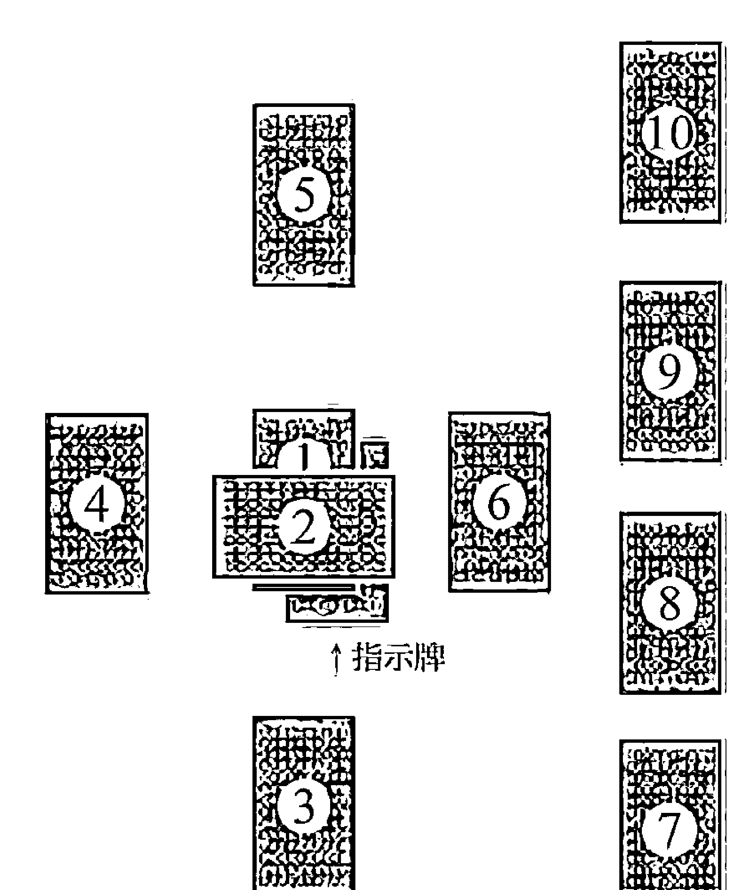

指示牌：問卜者個性特質

※建議使用78張全牌塔羅占卜

### 【孟小靖的塔羅博物館】

008 經典塔羅牌 Classic Tarot

作者：Carlo DellaRocca 發行：Lo Scarabeo

可以說是馬賽塔羅牌的精緻版，是跟隨著傳統的馬賽版塔羅牌系統，重新上色與描繪。在畫面中看出是用鋼筆來做繪製，色彩上特別強調了明亮的橘色、檸檬綠和桃紅色，既復古又搶眼，在整體的呈現上有一種和諧的感受。

欣賞牌圖

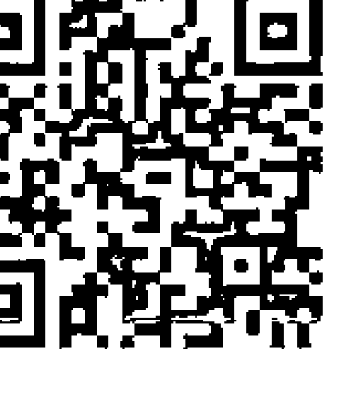

# 〈注意事項〉

- 一事不二問，同一問題不要反覆用不同牌陣占卜。
- 不是抽越多張牌就越準。
- 不是使用高難度牌陣一定好，是要選擇適當符合問題的。
- 若占卜過程數牌出錯，請將錯就錯繼續下去，可能是有其他的指引出現。
- 過程中若有不小心翻開的牌，或是掉出來的牌，也許有額外訊息，請預先記錄下來，作爲解讀參考。
- 牌陣中數牌多以 7 爲基數，因爲 7 爲一週(7 天)的時序，也有一說 7 是被祝福的數字，因爲英文有 Lucky 7 幸運數字的意涵。

### 【孟小靖的塔羅博物館】

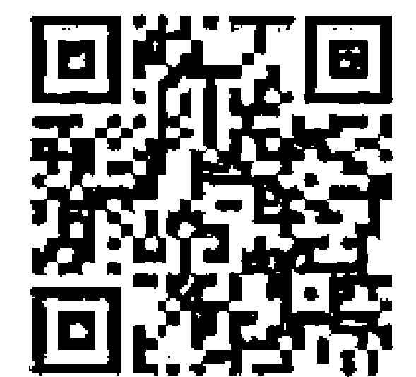

009 維斯康堤塔羅牌 Visconti-Sforza Pierpont Morgan Tarocchi Deck
作者：Guidebook by Stuart R. Kaplan 發行：U. S. Games

自 15 世紀的原版維斯康堤塔羅 (Visconti-Sforza tarocchi) 拓印而來，目前只剩原本 74 張的這個古老牌組，少了惡魔，塔，寶劍三及錢幣騎士這 4 張，這 4 張是藝術家考究其牌的模式畫的。透過人物角色形象的描繪，表現出生活在中世紀米蘭的樣貌！

## Part 1-3. 創造力，帶你經歷感受過程！

當你擁有了牌、想好了要問的題目，以及選好了要用什麼牌陣來協助你，接下來就要進入占卜流程，實際的洗牌、切牌，算牌了。請深呼吸，確認自己現在的心情是屬於平靜的，抱持著開放的心去感受。因為接下來你將會透過這些塔羅牌中的圖象，更進一步瞭解真實的自己，傾聽內心深處的聲音！

## 塔羅也能這樣玩，選牌心理測驗

## 【新計劃！財富強運】金錢加倍！你的富貴逼人賺錢法則！

總覺得錢不夠用？接下來應該要怎麼做才能讓自己擁有的金錢翻倍？是好好的想辦法去開源，找一個副業或是好好的研究一下如何投資？還是開始規劃自己的用錢方式，讓自己成為一個省錢精算達人，你能賺多少錢不重要，而是能存下多少錢才是真的有錢啊！想知道你的富貴逼人賺錢法則？現在就跟隨你的直覺，請依照你的第一印象，選一張你最喜歡的塔羅牌吧！

> 撰文解說：塔羅事典 - 孟小靖 www.looktarot.com
圖片來源：Color Shadow tarot Published by Look Tarot Press Taiwan

A.

B.

C.

D.

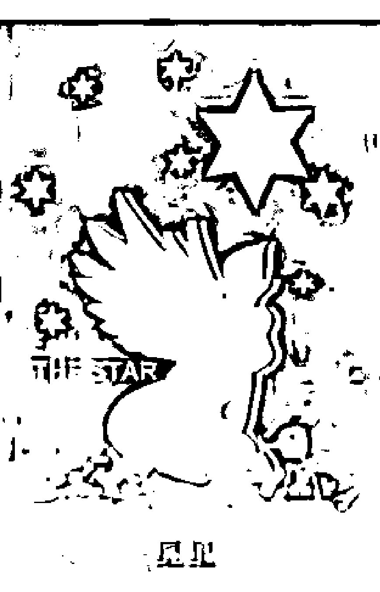

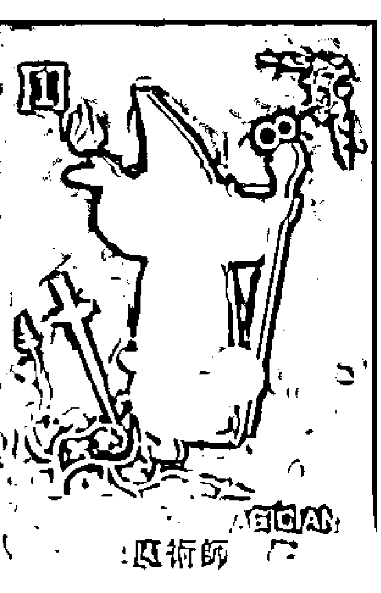

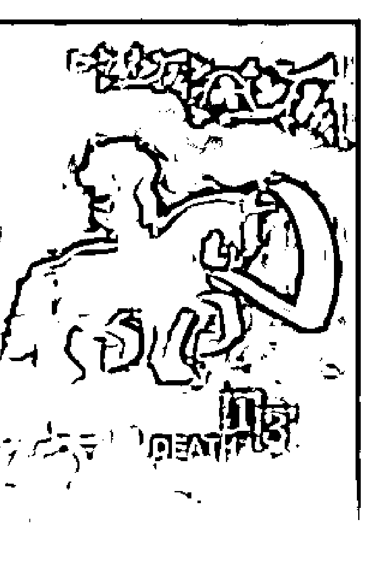

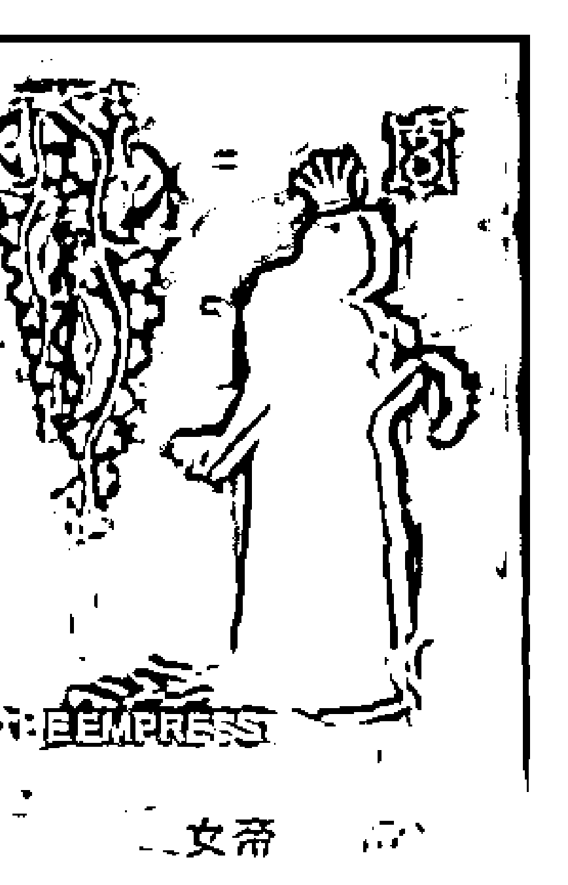

（選好了嗎？先別偷看答案喔，解答請翻頁！）

## 選 A 的你：【副業增收入！】富貴逼人賺錢指數 40%

除了你目前做的工作之外，平常是不是有著自己喜歡的興趣呢？其實你是擁有跟人與眾不同的才華喔！現在是時候，好好想想，要如何做才可以將你這些優點變成你的副業，進而開創更多財富！當然可以運用工作之餘的時間去進行這項副業，讓副業慢慢發光發熱，用最小的成本來創造收益，不要一下把副業搞太大造成金錢負擔壓力，這樣反而弄巧成拙了！

## 選 B 的你：【計劃多投資！】富貴逼人賺錢指數 60%

多方面的投資就是你的富貴逼人賺錢法則，其實算是很會賺錢的你，現在要做的就是用錢來滾錢了！這是最快的方式，接下來的日子裡，你的投資運十分的不錯喔！可以多去嘗試一些新的投資，會讓你有不一樣的新獲利喔！但下手之前別忘了還是要先做功夫研究一番！還有，切記雞蛋別放進同一個籃子裡，分散投資風險也是一個保本的做法囉！

## 選 C 的你：【花錢要謹慎！】富貴逼人賺錢指數 20%

想要富貴逼人，你的賺錢法則就是不要再亂花錢了！每一分錢賺來都不容易，但就因為如果你總是會有理由說要好好犒賞自己，但到頭來才發現自己花了很多不必要的開銷，先好好規劃一下你手邊賺到的錢吧！扣除生活所需費用後，開始存錢會發現其實自己的財富就累積下來了。如果還不行，就去買個房子吧！不動產的購置會讓你知道存錢的重要性！

## 選 D 的你：【運用好人緣！】富貴逼人賺錢指數 80%

運用你拿手的社交技巧，將會為你帶來很多財富呢！在人群中十分活躍的你，未來一樣會因為你的好人緣而旺到工作喔！所以從朋友那邊，總是有不經意讓你得知有賺錢的好機會，就放寬心與他們合作吧！因為這樣的結合都會為彼此帶來良好的獲益喔！特別可以嘗試將兩個不同產業的東西結合看看，會有你意想不到的好成績喔！

### 開始屬於你的塔羅占卜流程

塔羅牌為什麼變成大家都能上手的好工具？就是在於它的無限性，沒有人規定你一定要用甚麼方式才能使用，就跟一枝筆一樣，你可以拿來寫字、也可以拿來畫畫，甚至於可以拿在手中不停的轉。

所以塔羅牌的占卜流程，沒有一定的硬性規則，各個老師或是不同的塔羅教學書中，都會設計出一套專屬自己的塔羅占卜流程，你也可以，就挑選你喜歡的、你習慣的，在塔羅牌的世界裡，沒有這麼多框架，沒有這麼多約束，畢竟塔羅牌是來帶領我們，走向我們想要到達的未來。

不過，孟小靖還是要跟大家分享自己常用的塔羅占卜的3大程序8項過程，讓大家對於這樣的占卜流程有一些基本的了解，再從中去找出屬於自己的方式，創造自己習慣的占卜流程進行占卜吧！

#### 進入塔羅占卜前開始的準備事項：靜心

在我們的生活之中，無論要做什麼事情，如果我們能專心的去做，是不是都能收到事半功倍之效，使用塔羅牌也相同，專心一意才能運用塔羅牌去探知我們真正潛意識裡的聲音，當然也能讓我們有更清晰的思維，來面對塔羅牌想要告知我們的訊息，所以孟小靖特別在這邊提醒大家靜心的重要性，別擔心，沒有什麼難懂麻煩的儀式道具，簡單的方式就能讓自己平靜下來。

孟小靖自己喜歡在覺得放鬆的空間環境占卜（不一定要非常安靜，但盡可能別有太多干擾），鋪上一塊塔羅桌布保護塔羅牌避免污損。點上一個蠟燭，因為蠟燭的火光有助於我們集中精神，神秘學的說法是能形成一個保護我們的結界磁場，讓我們能不被外力負面氣場影響。

當然也建議你可以花點時間進行深呼吸，調順你的氣息，畢竟等等會有很多對話的過程，無論是對問卜者或是自己，讓我們都把煩惱與雜念釋放，將注意力集中在牌上！

#### 程序1：洗牌

（1）将牌打开，从牌盒或布袋中取出，检查是否为你使用的塔罗牌张数（22张或78张），请特别留意是不是有封面卡、广告卡等不必要的牌卡参杂其中。

（2）将牌整叠平放在桌面，接下来将你的左手放置在牌上，心中默念一次～三次你想询问的问题。

（3）摊开所有的牌，以画圆弧的方式洗牌，因为我们要做关于未来的预测，所以会依照顺时钟的方向，象征流动的时间，不断地重复画圈，以确保所有的牌卡都被打散。然而在塔罗牌的解读中有正逆位的应用，所以类似洗麻将的方法，可以做到这一点，然后再把牌收拢整理成横放的一叠。但若是你一开始就设定不使用逆位（倒牌）的说明，有许多人也使用像是扑克牌的整叠洗牌法，这样也是可行的。

（4）是不是要让问卜者自行洗牌，这也是由你自己决定，由占卜者或问卜者洗牌，并不会影响到塔罗牌所显示的结果。

#### 程序2：切牌

（5）洗完牌后，将牌卡横向放置于桌面，接下来进行切牌，这个程序可由占卜师直接完成，但孟小靖自己是习惯交由问卜者来先分成三份，形式不拘，因为这样请问卜者切牌的意义，除了增加牌与人的互动性，也可让问卜者更有参与感，再由我来协助整理回一叠牌，这样就完成了切牌程序。

> ※ 此时的底牌也是所谓的建议牌或是指示牌

#### 程序3：抽牌或数牌

（6）经过了洗牌跟切牌的程序，目前的塔罗牌卡是横向放置，若你跟孟小靖一样有使用正逆位来进行塔罗牌的解读，那这个将牌转向直立的过程，就要特别留意喔！为自己占卜的时候，将牌卡由顺时钟转向，而为他人占卜时，以逆时钟来转向，让牌卡回复成直立的状态。

（7）接下来，就是要来将牌正确的放在牌阵的位置上，目前大家常用的有两种方式，分别是抽牌跟数牌，其实说穿了就是由谁来选择所要呈现的塔罗牌，看是由问卜者自行抽选，或是由占卜师用古法计算张数。

##### 【占卜操作 1】抽牌

是由问卜者透过占卜师运用展开的扇形中，用左手挑选出牌卡，递给占卜师后，由占卜师翻开牌卡。

##### 【占卜操作 2】数牌

则是由占卜师运用牌阵中指示，由整叠塔罗牌自顶端数起的方法，来数出放置于牌阵中的塔罗牌。

（8）最后翻开在每一个牌阵中的塔罗牌，就可以知道你想询问题目的答案了，就跟着占卜流程去对应你挑选的牌阵，多次的反复练习试验，相信你就可以找出自习惯的方法，顺利地获得你要的塔罗牌，让塔罗牌所传达的讯息，来破解你心中的疑惑！

## 〈注意事项〉

- ※ 能不能让别人碰塔罗牌，其实没有限制，但请先尊重占卜师，建议询问过后才有下一步动作。
- ※ 是不是有问卜者自行洗牌，或是占卜师洗牌，只要一开始先决定好即可。
- ※ 古法塔罗占卜，多是由占卜师来操作所有的塔罗流程，问卜者不碰触牌卡。

# 塔罗牌使用说明书

破解塔罗架势・让你每副牌都上手

## Part 1-4. 理解力，告诉你未来怎么做！

很多人容易对着翻出来的牌卡，放空或发脾气，觉得怎么都这么难，根本看不懂！其实只需你去尝试，尝试的去看看牌中的画面给你什么样的感觉，喜怒哀乐？还是酸甜苦辣？每个人所经历的人生，都会反射出不同的感受，看着这些塔罗牌，心头涌上来的讯息，其实就是答案了！

## 塔罗也能这样玩，选牌心理测验

### 【新实现！幸福有感】心愿起飞捕捉梦想！你准备好了吗？

还在空谈自己的梦想吗？有人说好的开始是成功的一半，在现在这个可以重新开始的时间点，你有想要动起来，真的去捕捉自己的梦想吗？想一想，有没有以前想要做的事一直没实现？是一次美好的旅行？是一次发掘自我真心的开怀大笑？还是想要完成自己长久喜欢的兴趣成就事业？现在就跟随你的直觉，请依照你的第一印象，选一张你最喜欢的塔罗牌吧！

> 撰文解读：塔罗事典 - 孟小靖 www.looktarot.com

> 图片来源：Anny Tarot by Anny Wang Published by Look Tarot Press Taiwan

（选好了吗？先别偷看答案喔，解答请翻页！）

### 选A的你：【捕捉梦想幸福指数 60%】

现在的你可以好好思考怎么去捕捉自己的梦想啰！现在的生活对你来说一切都是那么的平顺，爱情工作都不会给你添太多麻烦，是不是反而觉得生活少了些什么呢？是的，就是找回自己，要对自己更好一点了，但不是买买东西、花花钱，你要的不单单只是物质上的满足，而是可以尽情享受人生，与一种全新的自我提升，去实现你的梦想创造未来吧！

### 选B的你：【捕捉梦想幸福指数 40%】

放下一些生活包袱吧！一直对于自己梦想绑手绑脚的你，是很难实现自己的心愿、捕捉自己的梦想喔！很多事情都还没做，就先想着现实面要等着你去克服的事情，马上就打了退堂鼓。梦想的果实一定是需要一些努力，这样尝起来才是甜美的。但最重要的是，这次捕捉梦想时请相信自己的直觉，去感受一下心中那股最真实的感动，你一定会有更不一样的幸福体会喔！

### 选C的你：【捕捉梦想幸福指数 20%】

在捕捉梦想前，先请等一下吧！因为，你的梦想会不会太多了啊！这个也想要完成，那个也觉得好有趣想要试一试，这样一来，会没一个梦想能让你好好成真啦！梦想一定要先确立目标，然后坚定的去实现完美！没关系，现在的你或许还想要东看看西看看，那就多去体验人生吧！让自己的生活过多采多姿，捕捉梦想的事情就先抛到脑后吧！

### 选D的你：【捕捉梦想幸福指数 80%】

快！再一步你就要捕捉到自己的梦想了，热情满满的你，对自己的梦想目标已经有一段时间的累积，这些时光都已经让你找到前往梦想的道路了！现在只要将你的热忱化为实际的行动，开始有计划的去执行，相信你的梦想不但能让自己感到快乐，别人也可以感染到你的活力喔！请把这样的幸福感继续发挥出来，这是一件很棒的事喔！

### 如何解牌，找到指引

解读塔罗牌的过程中，交流沟通是很重要的一环，更多的资讯会帮助我们作出更正确的解读，就如你去看医生，是不是医生也会询问你身体哪边感觉不舒服，你会告诉医生说：“我就是来让你看看，知不知道我哪边有问题吗？”，我想这样的回答，就算神仙也难救你吧！所以，当你越精确地说出你病症问题的所在，就越能对症下药，让你好起来！

塔罗解读也一样，透过翻出来的牌卡，我们可以看到你我潜意识现在所反映出来的问题，但因为塔罗牌给人一种未知的神秘感受，很多人在不知不觉中，就会对塔罗牌，或是对占卜师有所防备，甚至于要考验塔罗牌及占卜师的功力，是否能在什么东西都不说的状态之中，说出一些有关你的事情，请别这样做。

面对塔罗牌，若是抱着想要测试人的心，就是对人的不信任；抱着只是想要玩玩的心，就是用自己的人生开玩笑，就让自己敞开心胸，正确地跟塔罗牌互动，和善的跟占卜师或自己对话，这样才能看着你所抽出来的塔罗牌，观察牌中的图案人物，想要告诉你什么讯息，了解塔罗牌的关键牌义，进而对应自身问题，反复思考推敲，孟小靖相信你一定能从塔罗牌中找出指引，面对未来，是时候让塔罗牌告诉你实话，而不再只是听安慰的话！

010 马赛塔罗牌 LE TAROT DE MARSEILLE
作者：Jean Dodal 发行：Fournier

于西元1701 年在里昂印制，后来由法国的塔罗学者找到并修复，马赛版塔罗牌经过多次的变化与不同的版本。目前存放于巴黎国家图书馆内，在小阿尔克纳的部份（权杖、钱币、圣杯、宝剑）就只有像扑克牌一样数字的呈现方式！

#### 《牌义快速查询使用方法》让塔罗指数帮你破题

想必大家都有经历过学生时代，说起考试大家都很烦心吧！但如果这次的考试能翻书考，那一个科目就比较安心，感觉能顺利过关的机会就大的多了。是不是，翻书找答案相对地轻松多了！所以《塔罗牌使用说明书》中，也有这样的功用喔！

当你已经翻开桌面上的牌卡，面对着这些漂亮的图案与角色，一头雾水不知从何下手的你，请直接根据每一张牌的名字，翻到 Part 2. 的解说，对应每张塔罗牌所显示的塔罗指数，孟小靖已经简单把感性面问题的爱情、人际及理性面问题的事业、财运，用 5 颗星的方式显示好坏，另外用重点提示的几句话，让你更快速理解你所抽到的塔罗牌，用破题式的方法让你知道，牌要告诉你什么？

先解开你的结，迅速的找到问题的解答，让你就能继续的顺利看下去，就能知道每张塔罗牌中所要传达的讯息，也就能更仔细了解问题的状况，帮助你未来的方向决定！

##### 塔罗牌义关键字延伸

学习塔罗牌，其实真的没有这么难，因为塔罗牌就是一种神秘学的语言，也就是解读我们内心潜意识的语言。这样说好了，塔罗牌就像是我们生活中的各国语言一样，中文有ㄅㄆㄇ，英文有ABCD，只要搞懂语文的字母，是不是就能拼出语言的文字，接下来就能组合成句子，再来就可以成为一篇文章，进而能变成我们沟通的工具。

就把塔罗牌78张牌，想成78个字母，如果了解了这78个字母，我们就可以参透思想中所残留的声音，内心潜意识的想法了！

那什么是78张塔罗牌的字母呢？就是每张牌的关键字了，孟小靖在自学塔罗牌的过程中，觉得了解每张牌的关键字，是接触塔罗牌一个必经的过程喔！但是就如同我一开始说的，塔罗牌是一个开放的工具，你可以参考书中给你建议的关键字组，欣赏牌卡的画面，找出你自己觉得最适合的一个词，你看，如果78张牌，都只有一个词，是不是也只不过78个字词而已，不难吧！

因为我们对于困惑，对于有时候对于未知的事物，只需发问，就能找到答案。人对透过自身的经验反映给出解答，这时你也应该找到自己觉得跟这张牌相呼应的关键字了吧！对你来说，你当然觉得十分的容易记忆，因为这个专属于你的词组，是你自己的78个塔罗牌关键字！

接着就运用这个关键字，发挥一下自己的想象力，来为自己想一个句子，为这张牌卡说一段故事吧！就像是“魔术师”这张牌，关键字是“创造”、“开端”、“起源”等，意思就是指一切新事物的开始，也许你可以围绕着“新”这个字，现在你就可以看着魔术师这张牌试着这样想：

魔术师会在哪里展开新花样？
对应：(我自己身处在什么样的环境呢？)

他会用什么新方式展开？他有什么东西可以帮助他？

对应：（我该怎么做呢？有人站在我这边吗？）

他会变什么？有什么旧本事还是新技能？桌上的是他使用的道具吗？

对应：（我自己有什么特质？我有什么优势吗？我身边有什么资源？）

他正在进行一场新表演吗？有没有观众在看着他呢？

对应：（这件事已经成形了吗？可以什么时间点进行呢？）

通过这样的关键字延伸，就是一种让你打开想象力，最好的解牌方式，所以你会发现，在这样的过程中，你就能清楚的了解塔罗牌里面的讯息，进而也就发现到对应你问题的答案了！

###### 【孟小靖闲聊】发展个人牌义

塔罗牌的解读没有定论，特别是逆位的状态，不同人在使用占卜时，对于每一张牌卡的画面图案、物件角色都有着自己的经验感受，所以就会呈现出不同解答，千万不要用对错来形容，每个人都有不一样的生活背景，就会对应出自己能接受的牌义了！

### 【孟小靖的塔罗博物馆】

011 黄金黎明塔罗牌 Golden Dawn Tarot

作者：Israel Regardie & Robert Wang 发行：U. S. Games

这副牌使用了卡巴拉及东方的象征符号，由传统的马赛塔罗版本做变化，而小牌的部份，使用的角色是国王、王后、王子与公主。黄金黎明协会 1888 年在英格兰成立，当时是一个的秘密的魔法团体，对塔罗牌的贡献可是相当的大。

#### 观察人物场景、图象元素的秘密

解读塔罗牌，另一个最重要的就是隐藏在塔罗牌中的这些图案了，就因为我们也会看到不同的图象，就会有不同的反应，最明显的就是在我们的生活中的交通号志了，我们现在看到红灯，你就会自然而然的停下脚步，看到三角形就会觉得是警示的意思，是不是已经成为了一种制约的模式，塔罗牌中也有这样的图象元素喔！

塔罗牌经过时间的演化，占卜师们把古老的智慧，把想告诉我们的讯息，都设计到每一张塔罗牌中，无论是人物、角色、风景等都是我们要去观察的：

- 主角人物的样貌服装、表情，肢体动作。
- 所在的场景、背景，建筑物与大自然风景。
- 配角的互动与数量，人或者是动物。
- 出现在牌中的物品、前后左右的位置。
- 其他象征符号、图象，色彩给你的感受。

每一个物件都有他的意涵存在，跟随的老祖宗的智慧，塔罗牌要告诉我们，当我们翻开牌卡的那一瞬间，这些图象符号就是在提醒着我们，该留意的事物，偶尔我们会因为环境的关系，慢慢地忽略一些声音、讯息！

就如同你在冷气房待久了，我们的耳朵是不是慢慢地就忽略了机器运转的声音，冷气不是没通电喔，只是我们没留意罢了！所以就需要通过塔罗牌的这些图象，精准地提出一些事项，让你好好提醒自己，什么是你现在忽略的状况，分析你的问题！

##### 什么地方不一样

关于解牌除了能依照牌阵，一张一张往下解读释义，找到牌卡的讯息答案之外，是不是有什么样的诀窍，可以加速我们了解塔罗牌对应问题的方法呢？有喔！其实就只需要观察一下牌阵中，有什么不一样的地方，像是牌卡的正逆位、牌卡大牌的张数、牌卡数字牌跟宫廷牌的数量等等。

这些一眼就让我们发现不同的地方，有时候就是特别要去留意的，因为这样破题的特色，可能也就是问题最大的症结点所在，所以当我们发现不一样的地方，搞不好很快就可以捉取到塔罗牌要给我们的讯息是什么？反映出我们心中在乎的事情是什么！

### 孟小靖的塔罗博物馆

###### 012 达利塔罗牌 Dali Universal Tarot

作者 : Juan Llarch & Salvador Dali 发行 : U. S. Games

达利，西班牙艺术家，超现实主义派的主要人物之一：研究变态心理学和梦的象征性，后期专心致力于象征手法的宗教画。这副达利塔罗牌是西班牙在他80岁冥诞出版发行的，作为纪念他的作品，设计成大尺寸并在侧边烫金！

#### 正逆位显现数量

当我们询问一个问题，在一个展开的牌阵之中，我们能很清楚一眼看出来的就是正逆位的状况，请在解牌前，先环顾一下整个牌阵，相信你会很快的发现到，那几张是跟别人不同的，我们就可以从那些牌先做破题的解说！

这边用圣三角牌阵（时间之流占卜法）的例子简单说明一下：

※ 我们将问题设定为：是不是要跟目前交往的对象继续发展下去？

三张牌分别为太阳（正位）出现在过去的位置，恋人（逆位）显示出现现在的状况，隐者（正位）则可以预测未来的发展，是不是不一样的地方，一眼就会看到出现逆位的恋人牌，是的！这张不一样的牌，就是十分重要的讯息，恋人牌的逆位关键字为“选择”，这样的意思就很清楚的带出两个人对爱情的看法不同，也就很明确的了解到答案是什么了，再加上过去位置出现的月亮正位，关键字是“不安”，看来两个人在最近这三个月里，对于彼此爱情的不安全感加深，而在未来这边出现隐者正位，关键字“孤独”也说明了未来如果两个人不去内省调整，还是自顾自的想做自己的事，有可能就会渐行渐远了！

##### 出现相同的元素

若你是使用完整78张来进行占卜，或许在牌阵中就会显现出元素牌，若是你发现无论是在什么样的牌阵中，怎么老是出现钱币的某几张牌，或是让你有一种圣杯好多喔！怎么都是圣杯牌的惊呼。这时就会有特别的讯息要告诉你，这也就是不一样的地方喔！

火、水、风、土的这四个塔罗牌中重要的元素，重复的不断出现，是要传递你现在所受到的情绪干扰喔！先体会这样的心情，再去与你抽选到的塔罗牌讯息作相互的联想，会让你的塔罗牌解读更加的精准，也能正确地对于问题给予建议作法。

###### 如果牌阵中出现很多

- 权杖（火），你要特别留意关于：行动、能量、挑战、生命力
- 圣杯（水），你要特别留意关于：爱、需求、心灵满足、感受力
- 宝剑（风），你要特别留意关于：沟通、思考、信念、意志力
- 钱币（土），你要特别留意关于：真实、钱财、物质、掌控力

###### 【孟小靖闲聊】善用元素符码

在接下来的讲解牌义之中，也有将每张的牌的元素、符号及图案所代表的意义告诉大家喔！或许也可以运用塔罗牌中的这些小帮手们，帮助自己解读问题讯息！

##### 应用塔罗牌逆位（倒牌）

要不要使用逆位牌，一直都是占卜师们不停探讨的话题，所谓塔罗牌中的逆位牌（逆位置）或称为倒牌，也就是指我们翻开塔罗牌后，图象跟文字不是正立的状态，简单的来说就是文字是反的。跟孟小靖一样会使用塔罗牌逆位解读的方法，就会直接维持塔罗牌相反的状态，就这样进行塔罗牌的解读释义；但也有不使用塔罗牌逆位的用法，会直接把所有的牌都翻回正位。

就如同我先前告诉大家的，塔罗牌的使用没有被严格的规定，只需要你自行决定一种方式就可以，使用塔罗牌逆位的优点是，逆位置会显示出一些不同于正位置的讯息，有可能是加强、也有可能是相反，逆位置的出现让我们多了一些思考的空间，包括可以观察牌中的图案，桌子上的东西反过来就会掉在地上，插着的剑会因为倒过来而感觉被拔出来了。

但就因为这样，所以塔罗牌逆位不是单单只在牌义、或是关键字前面加上“不”，这样有规律地否定，所以有些占卜师觉得在初学的过程中，先不要使用塔罗牌逆位的解释，因为无论是正逆位，都还是保有原本那张塔罗牌的涵义，所有不使用逆位置也是可行的。但孟小靖还是要在这边跟大家分享一下，如果你想使用塔罗牌逆位讯息来协助你的塔罗占卜过程，逆位的塔罗牌大致上有这几种解释方法。

### 【孟小靖的塔罗博物馆】

013 镀金塔罗牌 THE GILDED Tarot

作者：CIRO MARCHETTI 发行：Llewellyn

金碧辉煌充满华丽质感，可以说是电脑绘图中的艺术之作，在许多专业人士的口中，评价极高！因为他以全数位的方式来绘制，却营造出手绘的质感，明暗的变化、景深的设计都带给我们视觉上的震撼，巧妙展现出金色的光泽。

#### 負面反義

這是大家比較常對塔羅牌逆位的解釋法，其實這樣運用的塔羅牌義算是比較少的，你沒看錯，大家都以爲直接在牌義關鍵字前面加個「不」就好，不是這樣的，塔羅牌逆位雖也有推翻正位意涵的觀點存在，有些時候可以用好的變壞、壞的變好來看待塔羅牌逆位置，但不是所有的牌都可以這樣用喔！重要的是逆位置的塔羅牌，可能象徵著這個牌義關鍵字中相對負面的情緒，包括了排斥、否認、壓抑、延遲、誤會、濫用等，所以還是要回歸牌卡的訊息狀態，再作運用！

#### 前牌延伸

塔羅牌的每一張牌，看似獨立，但說穿了每一張畫面與畫面的連接，其實就是一個連貫的故事，所以前牌延伸的這個解讀塔羅牌逆位的方法，就是提醒我們塔羅牌編號順序中，牌與牌的關聯性，這個方法多適用於 22 張大牌的部分，因爲大牌也象徵著我們的人生旅程，所以塔羅牌逆位的前牌延伸，在於問卜者可能沒有處理完上一張牌的問題，才會在牌陣中顯示出塔羅牌逆位。

> 【孟小靖的塔羅博物館】
014 芭芭拉沃克塔羅牌 Barbara Walker Tarot
作者：Barbara Walker 發行：U. S. Games

以全世界的神話與神明的故事來作爲創作的藍圖，留白的部分很容易讓人看到中間想要傳達出來的訊息，色彩也相當飽和，元素表現也都十分的清楚唷！在 56 張的小牌部份，加上一個英文單字的關鍵語，作爲塔羅解說的說明喔！

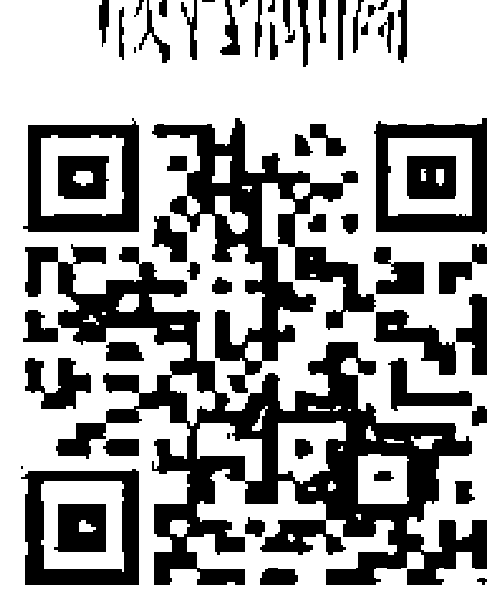

##### 過與不及

塔羅牌逆位也有顯示出兩種極端的意義，給了太多會造成別人的壓力或負擔、給了太少又讓自己顯得冷漠跟忽視，都是這個塔羅牌逆位要傳遞出來的訊息，這個方法大多運用在16張宮廷牌之中，因爲代表不同位階、個性特色的宮廷牌，多能反映出最直接的情緒，也在告訴我們性格的崩壞或改變。

##### 相信自己的直覺

接觸塔羅牌，有一個很重要的部分，就是讓自己體會感受，也就是相信自己的直覺！因爲已經有太多框架的你，漸漸的忽略了身體、記憶、情緒、體驗給你的聲音，在不知不覺中就用著常用慣有的方式在反影生活中的大小事決定，既然你這時候想要接觸塔羅牌，就是在告訴你，要讓自己回歸，在使用塔羅牌的過程中，沒有順序、沒有對錯、沒有好壞，就跟隨的你感覺，透過問題、牌陣、關鍵字，經過多次的練習、觀察，你一定能從塔羅牌的訊息中，組合出你要的指引，協助你邁向更精采的未來！

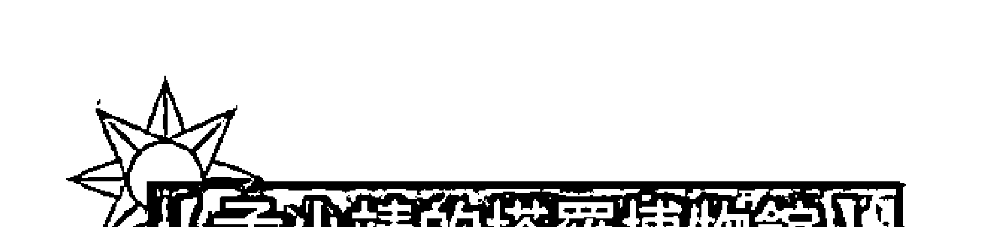

015 漢生羅伯特塔羅牌 Hanson-Roberts Tarot
作者：Mary Hanson-Roberts 發行：U. S. Games
尺寸比一般的牌組小一點，一分適合塔羅占卜解說的這副漢生羅伯特塔羅牌，保留了彩色鉛筆的筆觸，柔和的色彩令人看了有一種舒服的感受，在繪製的風格上也結合了漫畫與繪本的感覺喔！每一張牌都畫了專屬的標題外框喔！

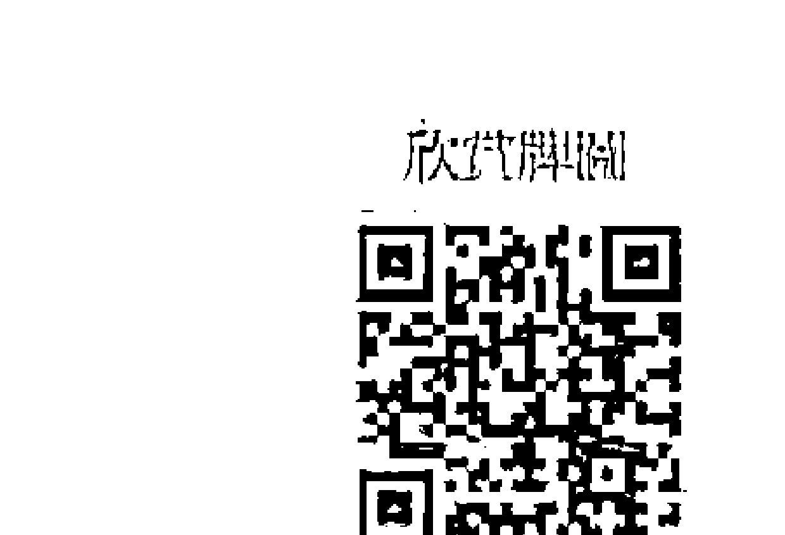

# 塔羅牌使用說明書

破除塔羅架勢，讓你每副牌都上手

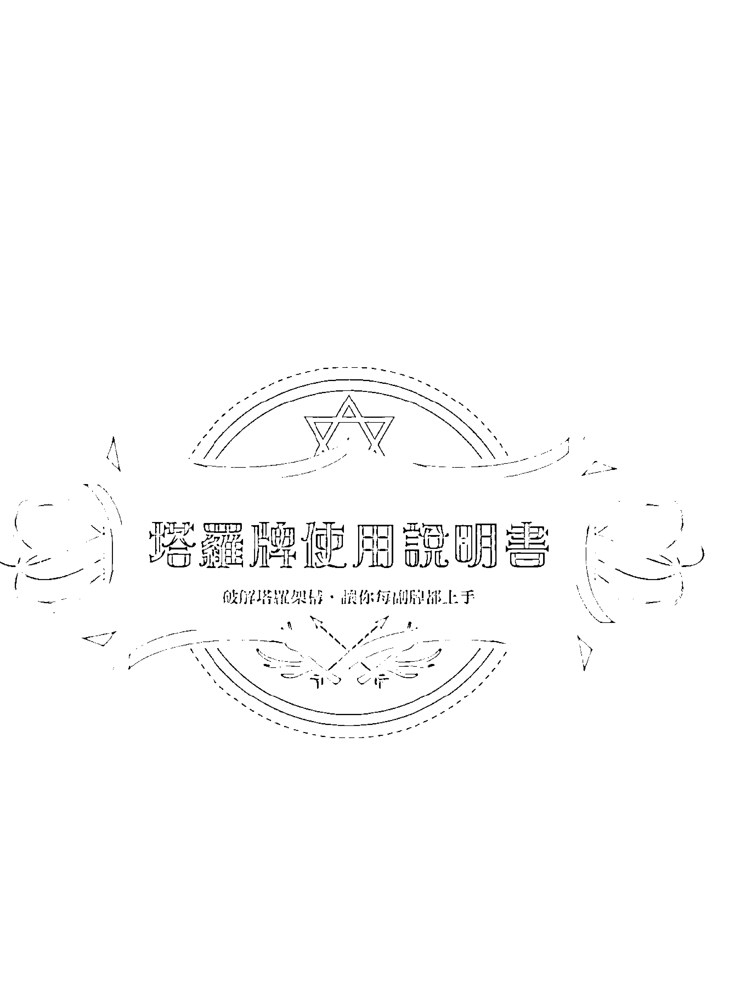

## Part 2. 找答案，了解塔羅牌告訴我什麼？

隱藏在塔羅牌裡的圖象，這些符號元素濃縮了我們生活的點滴，提醒著我們遺忘、或是因為習慣而忽略的訊息！就讓我們從一個關鍵字開始，破解塔羅牌的點、線、面，讓你快速輕鬆地記住塔羅牌的意涵，讓每張牌的故事告訴你未來人生你要怎麼做，怎麼開心的過！

## 塔羅也能這樣玩，牌面圖象測驗

## 【來學習！立即上手】現在的我適合學習塔羅牌嗎？

你喜歡塔羅嗎？一直想好好的來學習塔羅，卻又不知該如何著手？想知道你到底有沒有玩塔羅的天份嗎？還是因為沒有耐心學習呢？請依照你的第一眼印象，選出在這張牌第一個看到的物品吧！

> 撰文解讀：塔羅事典 - 孟小靖 www.looktarot.com

> 圖片來源：Cute Easy tarot Published by Look Tarot Press Taiwan

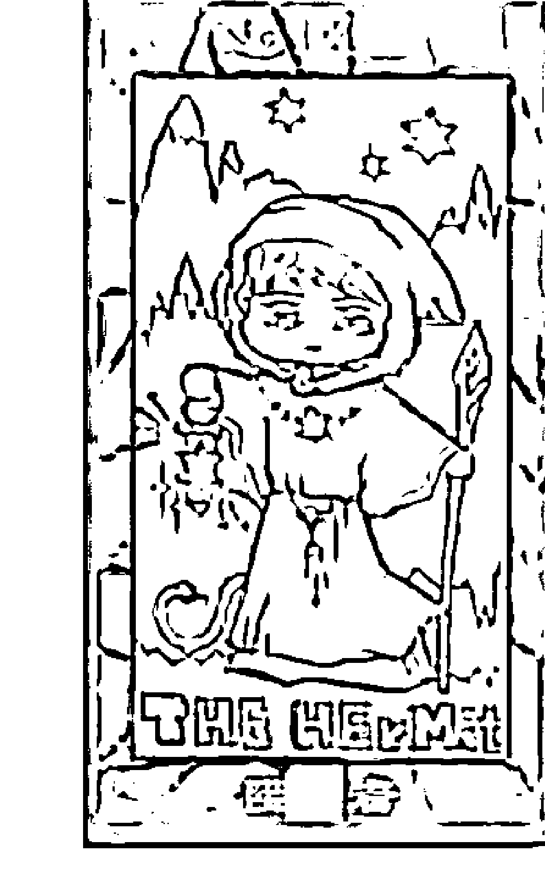

- A. 拐杖
- B. 隱士的臉龐
- C. 明燈
- D. 斗蓬

(選好了嗎？先別偷看答案喔，解答請翻頁！)

### 選A的人：學習塔羅意志力 40%

選擇拐杖的人，象徵著你是個相當謹慎的人喔！拐杖指的是安全知識的累積，你自我保護的意識很強，在做任何行動的時候，絕對不會冒險，也就是說在你還沒有以科學的角度搞懂塔羅牌為什麼會準之前，你不會輕易的接觸塔羅囉！不過，在你追尋塔羅牌原理的過程之中，你會慢慢的發現塔羅牌能給我們的幫助，漸漸地你也會越來越相信塔羅牌所引導的訊息囉！

### 選B的人：學習塔羅意志力 60%

對於塔羅牌，你已經花了不少的精神與時間在研究，隱士的臉龐同時也反應出了經驗的自信，所以你對塔羅有了基本的認識與了解，快點身體力行吧！畢竟歷史悠久的塔羅牌，對你來說總是有股難以抗拒的魅力，喜歡欣賞塔羅牌藝術的你，有助於你學習塔羅牌，相信很多重點你一下就全部都搞懂了呢，所以就來好好地輕鬆進行塔羅牌意義學習吧！

### 選C的人：學習塔羅意志力 80%

追求精神層面的提昇與心靈層面的滿足，一直都是你想得到的，或許你看不出來自己的盲點，但你始終想要向上提昇。隱者手上的提燈，象徵啟蒙智慧的光明，也是溫暖的火光！現在的你，趕快拿起塔羅牌，好好學習進入塔羅牌的世界吧！就能利用塔羅牌的訊息來提醒你，關於自我身心靈的覺察，指引那屬於自己美好的未來，步上光明道路！

### 選D的人：學習塔羅意志力 20%

注意到斗蓬的人！你有強烈的不安全感，你也不了解塔羅真正的意涵，反而被一些不對的神秘恐怖觀念所影響著！面對塔羅牌你可是抱著又愛又怕受傷害的心情喔！所以真正要學習塔羅的你相當迷惘，不知道怎麼入門才是正確，才能掌握塔羅牌給你訊息。請別擔心，塔羅沒這麼可怕，正確的看待塔羅，提昇自我正面能量，這才是最重要的喔！

### 體驗人生，大阿爾克納 22 張愚者之旅

我們的一生，總是會經歷各式各樣的事情，體會這些酸甜苦辣！在我們面對我們的生活，塔羅牌也已經把這樣的人生濃縮到大阿爾克納 22 張中，讓我們也跟著塔羅牌的腳步，從象徵新生兒的愚者開始，跟著他的經歷一起感受人生滋味、領悟人生道理。你也可以對應你所經驗的生活，把你的所見所感，也都與塔羅牌中的角色與訊息結合，找出你現在生命路途中所在的位置，這樣你就會更了解塔羅牌要告訴你的提醒。

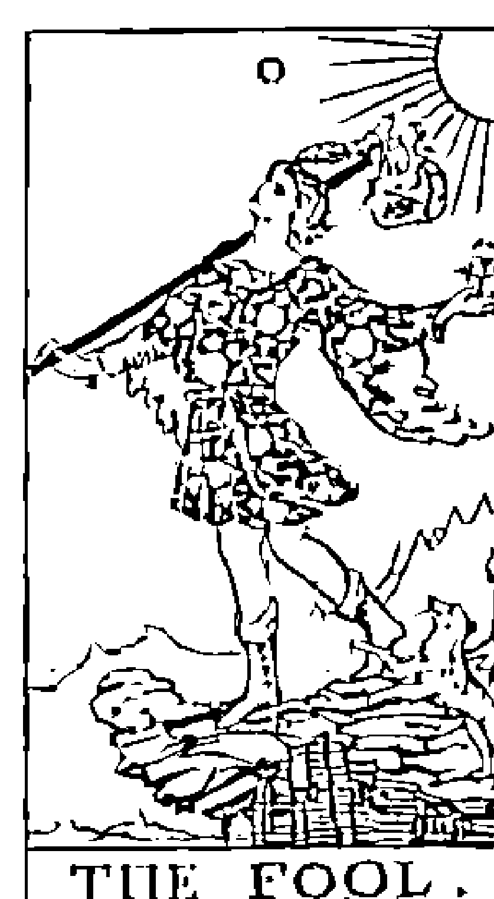

#### 啟程

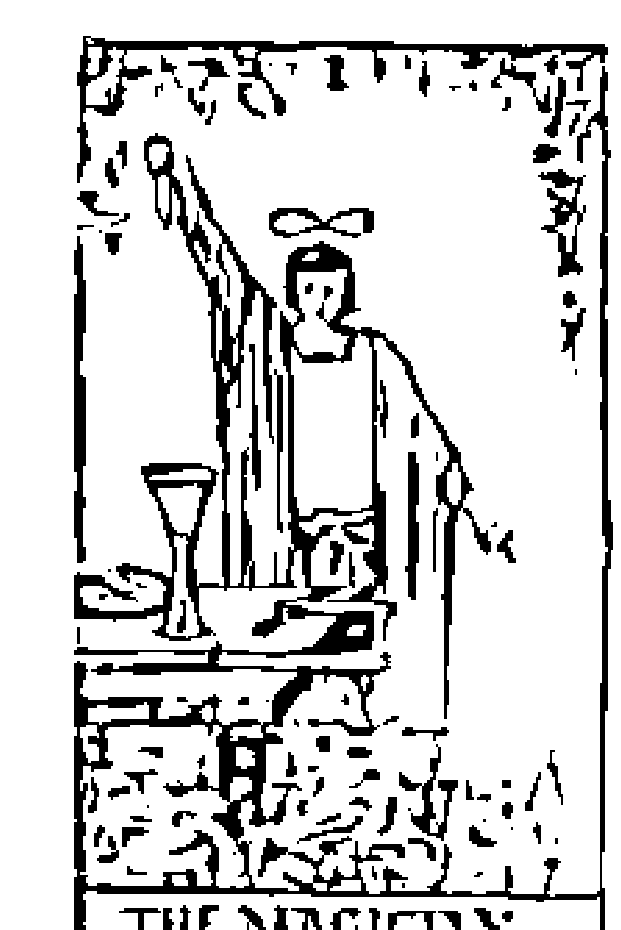

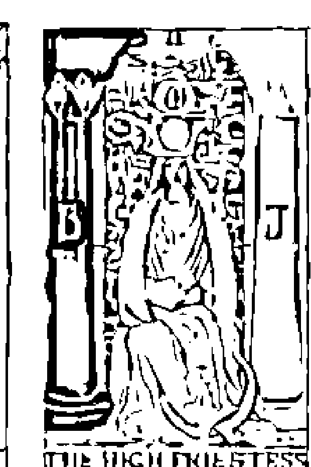

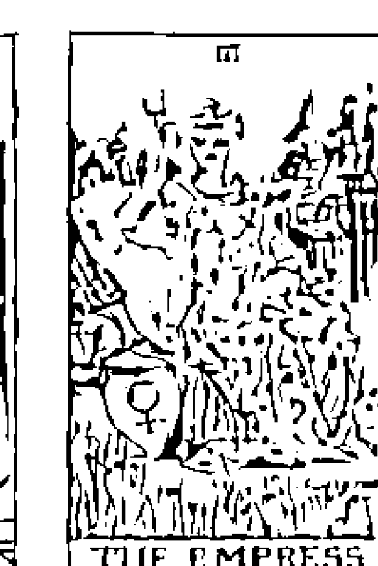

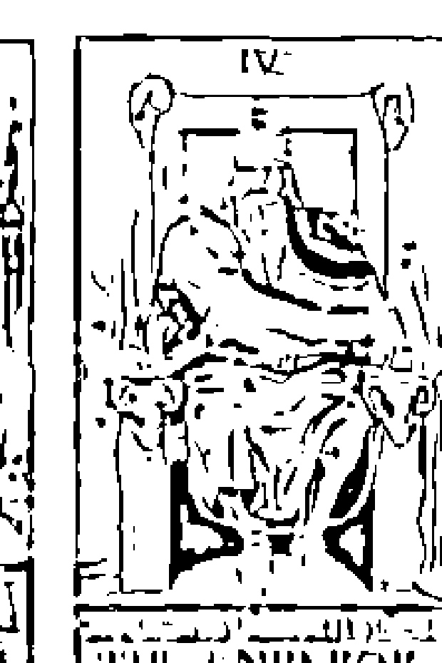

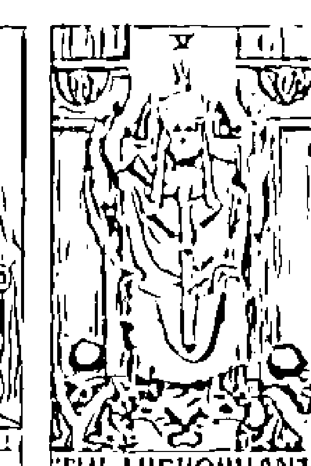

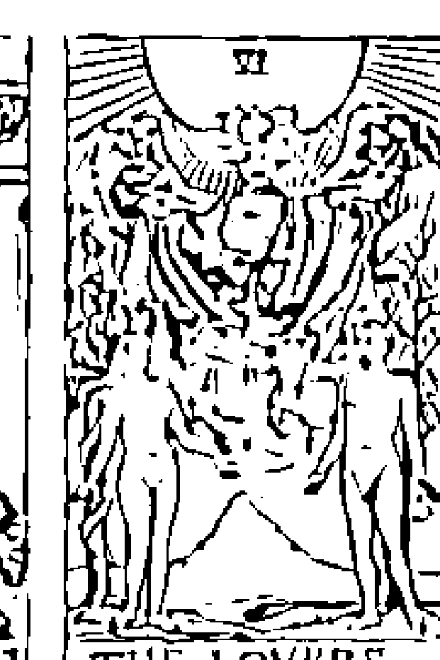

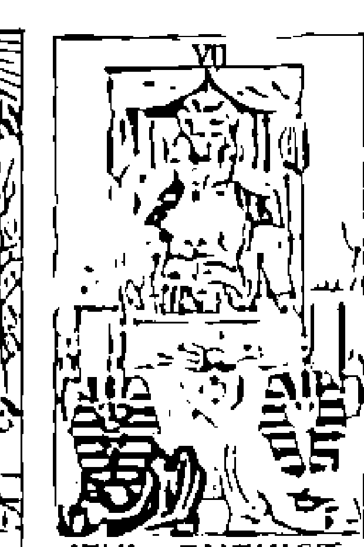

剛誕生在這個世界的「愚者」，跟你我從睡眠中甦醒一樣，一張開眼睛，都是帶著全新的開始來迎接每一天，擁有純淨靈魂的愚者，以行動來展開旅程。在這段路途上，愚者遇上「魔術師」，這位魔術師讓愚者看到了，運用環境元素創造出萬物的知識與技能，進而體悟了面對生命的力量，獲得技術的愚者，現在才算是他旅程真正的開端。接著他看到了「女教皇」，擔任與神溝通一職的她，透露出真理是需要我們沉靜的大智慧才能了解，與內在平靜共處的重要性。再來愚者接觸了體現女性母親能量的「女帝」，讓他感受到付出與奉獻的熱情，經歷過溫暖的母愛，接著他遇上的是象徵權力的「皇帝」，當然這就是父親的原型，嚴厲的規定、律法的權威，透過皇帝讓愚者知道要對自己的所作所為負責。然後碰上能教導他、教育他的「教皇」，指引著他如何尋找正確的人生，亦師亦友的給他幫助。而「戀人」為他帶來了一段愛情，體會什麼是愛，如何跟伴侶相處，如何經過選擇後下決定。但初嘗愛情滋味的愚者，卻要面臨接下來「戰車」所要帶來的挑戰，坐上戰車的愚者，也象徵長大成熟的他，正要離鄉背井面對未來的考驗，以自信與力量駕馭問題跟矛盾，獲得勝利的成果！

#### 轉化

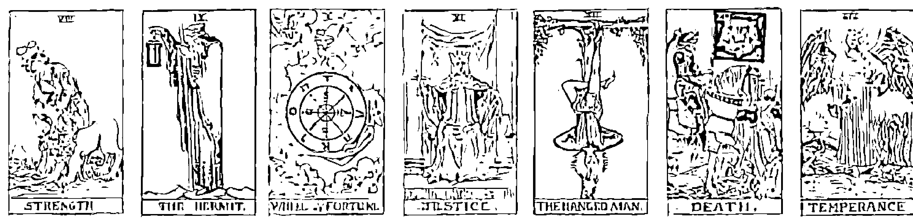

感受到顯著外在成功的愚者，慢慢的發現自己內心的空虛，接著他看到了以柔克剛制服獅子的女子，這就是「力量」為他帶來克服恐懼的自我發現。於是愚者決心去找尋更新更高的智慧與生命解答，化身「隱者」體驗孤獨跟自己內在的對話，得到領悟。在成為隱者的這段過程中，他慢慢地了解到了生命的循環，就如同「生命之輪」般不斷轉動，時好時壞、起起落落，而我們無法掌控的人生道理。

當他透徹了這樣的法則，這時愚者遇上了「正義」，這位女神要他為自己做出誠實的選擇，愚者能不能平衡自己的過去與未來，知道自己想要的，繼續生命的旅程。還無法下決定的愚者，就讓自己先選擇倒吊著成為「吊人」，想用另一個視野來看世界，在這樣的作為之中，發現了大愛付出的意涵，同時也找到了自我價值。

當愚者才好不容易搞懂這一切，就碰上了「死神」，要他放棄守舊，接受結束才會知道真正的釋放與重生。愚者面對死神的測試，他已經死過一次了！天使伴隨著這張「節制」的出現，要告訴他平安喜樂的意義，就是去適應與妥協，唯有自我這樣的調整，才能感受祥和安寧。這樣做，也讓愚者回復到原先內在平靜，保持中立的去回應生命接下來的訊息！

## 孟小靖的塔羅博物館

016 螺旋塔羅牌 Spiral Tarot
作者：Kay Steventon 發行：U. S. Games

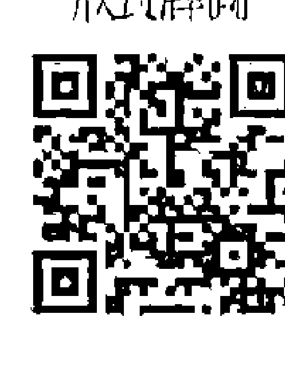

傳達出來一種生命輪迴的意義，結合了很多神秘學的元素，星座行星的對應、神話故事的意涵延伸、生命之樹與希伯來文的神秘架構等等，塔羅占卜可以運作這些神話故事，搭配上不同的神秘學符號，讓你的解說的內容豐富生動。

#### 覺醒

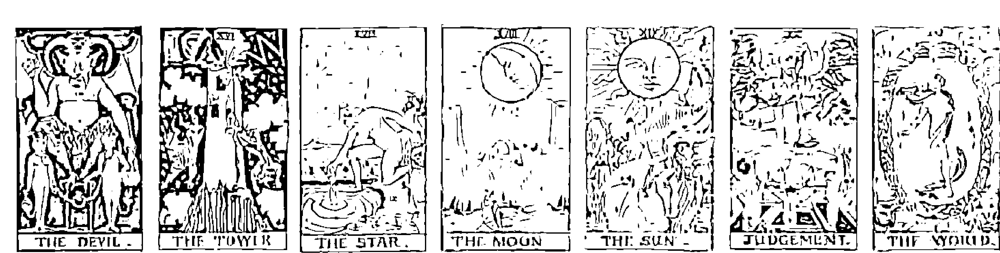

才剛覺察到由內而外改變的愚者，即將回歸物質世界的他，又被「惡魔」所誘惑，因為沒有正面迎戰自己的心魔，如何控制欲望、克服自身的恐懼，沒經歷過這些，是無法真的了解真實的自己。但愚者無法這麼淡定的面對這些壓力，痛苦如同一道閃電朝他打來，崩解的「塔」就像是我們自己，毀滅才能得到解放，才能體會真正的自由。

愚者混亂的內心如同暴風雨一般襲來，但總有雨過天晴的一天，經歷了重大變革的愚者，接下來感受到的是「星星」帶來的寧靜與希望，從「塔」彈飛的他，接受星星的療癒，為他注入全新的生命之水，要他重新感受。在一旁的「月亮」加強了愚者心靈的力量，要他記起自己的這段路程，是這麼的充滿回憶，情感滿溢，無需瞎操心，只要相信直覺、相信本能就可以突破。愚者經過了一夜沉潛，接下來迎接他的是充滿活力的「太陽」，這個自然而然灑落的光明，為眾生帶來能量，也讓我們能期待明亮所照耀的快樂、滿足。

遠方傳來的號角聲，是「審判」要給愚者的最後提醒，了解到原來的旅程是召喚內心的聲音，只要追隨這個信念，體會長久以來都存在的那一份深刻，就能讓自己產生力量。實現這段旅程的愚者，最後瞭解了這生命運作的圓滿，「世界」存在你我的心中，明瞭這個道理，人生就不再憂愁煩惱，美好早就存在於每個人的身上，我們都能輕盈自在地舞動，活出自我。

## 孟小靖的塔羅博物館

017 和諧塔羅牌 Harmonious Tarot
作者：Walter Crane & Ernest Fitzpatrick 發行：Lo Scarabeo

結合馬賽塔羅牌與偉特塔羅牌的特色，有著中古世紀的浪漫風格，天使、花草樹木、還有英式維多利亞浪漫感覺！就連塔羅牌中的每一位角色人物，也都是穿著由花卉設計出來的服飾，把我們一瞬間帶進了一個美麗的夢幻花園裡。

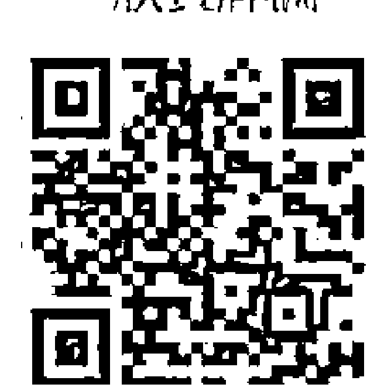

## 【孟小婧闲聊】占星学与塔罗牌

塔罗牌之中蕴涵了很多西洋神秘学的知识，所以当然也包括了生命灵数 (生日数字) 与星座的特性，解读塔罗牌的过程之中，如果我们能有多方的讯息，就能更快了解塔罗牌所要呈现出来的意义，所以若是我们能配合占星学中的星座个性、行星神话，就能运用这些大家耳熟能详的故事，有助于我们诠释瞭解。

| 符号 | 星座 | 日期范围 | 对应塔罗牌 |
| :--- | :--- | :--- | :--- |
| ♈ | 牡羊座 | 3月21日至4月20日 | IV 皇帝 THE EMPEROR |
| ♉ | 金牛座 | 4月21日至5月20日 | V 教皇 THE HIEROPHANT |
| ♊ | 双子座 | 5月21日至6月20日 | VI 恋人 THE LOVERS |
| ♋ | 巨蟹座 | 6月21日到7月21日 | VII 战车 THE CHARIOT |
| ♌ | 狮子座 | 7月22日至8月22日 | VIII 力量 STRENGTH |
| ♍ | 处女座 | 8月23日至9月22日 | IX 隐者 THE HERMIT |
| ♎ | 天秤座 | 9月23日至10月22日 | XI 正义 JUSTICE |
| ♏ | 天蝎座 | 10月23日至11月22日 | XIII 死神 DEATH |
| ♐ | 射手座 | 11月23日至12月21日 | XIV 节制 TEMPERANCE |
| ♑ | 摩羯座 | 12月22日至1月19日 | XV 恶魔 THE DEVIL |
| ♒ | 水瓶座 | 1月20日至2月18日 | XVII 星星 THE STAR |
| ♓ | 双鱼座 | 2月19日至3月20日 | XVIII 月亮 THE MOON |

| 符号 | 行星 | 对应塔罗牌 |
| :--- | :--- | :--- |
| ☉ | 太阳 (Sun) | XIX 太阳 THE SUN |
| ☿ | 水星 (Mercury) | I 魔术师 THE MAGICIAN |
| ♀ | 金星 (Venus) | III 女帝 THE EMPRESS |
| ☽ | 月亮 (Moon) | II 女教皇 THE HIGH PRIESTESS |
| ♂ | 火星 (Mars) | XVI 高塔 THE TOWER |
| ♃ | 木星 (Jupiter) | X 命运之轮 WHEEL OF FORTUNE |
| ♄ | 土星 (Saturn) | XXI 世界 THE WORLD |
| ♅ | 天王星 (Uranus) | O 愚者 THE FOOL |
| ♆ | 海王星 (Neptune) | XII 吊人 THE HANGED MAN |
| ♇ | 冥王星 (Pluto) | XX 审判 JUDGEMENT |

注: 黄金黎明协会 Golden Dawn 系统，愚者为风元素、吊人为水元素、审判为火元素，而土元素设定为整体塔罗牌架构的中心。近代则运用太阳系外部行星做为对应。

## Part 2 我告訴你：牌面訊息告訴你什麼？

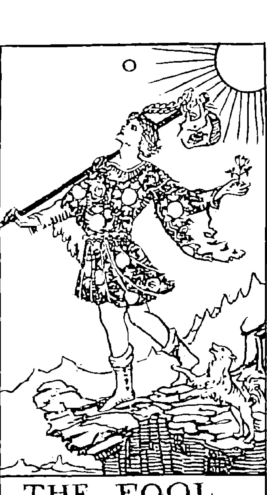

##### The Fool 0 愚者
關鍵字『冒險』

最純真的勇往直前，也許偶爾失去控制，衝動的做出我們本能所需、呼喚回歸內在的那個部分，是一種真、一種放空與歸零，但卻可以讓我們看清自己是誰！塔羅牌中編號「0」的愚者，代表的是流浪、象徵旅行。愚者是沒有編號的一張牌，當然就是沒有拘束的，是充滿著冒險精神的，有無限的可能，純真、天真的想法為很多事帶來新意。

愚者已經不在乎世俗之下的眼光，散發出令人羨慕的自信，有著才華，卻不為名利鬥爭，得失榮辱，無牽無掛，或許想法已經超越我們所知的，所以難以妄下定論，但也不敢輕易行動，但愚者象徵的也就是那種因夢想而偉大的努力，別人理解與否似乎不是那麼重要了。

> 【打破框框，孟小靖的塔羅擴大想像解牌法】
把畫面拉到一個廣闊的郊外，讓自己站在一個山頂，360度環繞一下身邊的美景。想想愚者正抱著怎麼樣的心情？正要前往何處？要是你要踏上一段未知的旅行，是不是心裡又是期待又怕產生障礙？現在的你，是不是早已失去純真的心，應該找個機會時間讓自己休個假，或是跨出你認定的舒適圈了！逆位反之，想像一下，人物從腳踏實地的狀況掉落，這不就是顯而易見的危險嗎？如果硬是為了做而做，不就太過情緒化了嗎？

#### 牌的建議：

正位★★★★：選擇沒有規範的勇於冒險，發揮創意去追求新奇的夢想吧！
逆位★★☆：不穩定，孤注一擲會失敗！要有耐心，累積實力，才能朝夢想前進！

#### 環境狀況：

正位★★★：不拘泥於傳統思想，大無謂的行為是會讓週遭的人擔心。
逆位★★☆：沒有目的的行事，別人覺得你行為怪異，無法跟你溝通。

#### 關於愛情：

正位★★★★：可以追求自由、天真、浪漫的理想愛情，帶來意料之外的體驗！
逆位★★：陷入盲目的愛情，逃避現實的想法，是一種不成熟、不負責任的。

#### 關於事業：

正位★★★☆：挑戰新工作，意想不到的迎接成功，體驗很多新事物的美好！
逆位★★：不安定的躁動，太過懶洋洋，天底下是沒有什麼事可以不勞而獲。

#### 關於財運：

正位★★★★☆：不會為金錢的問題煩惱，可以盡情的花費，但請斟酌使用。
逆位★★☆：雖然有錢，但要相信別人的意見，才不會有不必要的支出。

The Fool 0 愚者

| 牌中的元素圖象 | 要告訴我們意義 |
|----------------|------------------|
| 棍棒上的包袱 | 帶著經驗去行動 |
| 懸崖 | 看的見的危險 |
| 衣服上的紅花、太陽 | 熱情與生命力 |
| 手上的小白花 | 我們所擁有的天真 |
| 吠叫的狗 (或其他動物 ex. 貓、老虎、龍等) | 警告小心的本能 |
| 鮮豔的衣服、頭飾及配件 | 期待引人注目 |
| 破損的衣角 | 不拘小節的自在 |

註：馬賽塔羅《LE MAT》；托特塔羅《The Fool》愚人

###### 倒牌逆位意義：關鍵字『任性』

愚者當這張牌出現逆位的時候，狀況外、過份誇張、盲目的、逃避現實，以上都是這張牌要傳遞給我們的訊息，或許這時候的你，因為種種不同的外界因素導致於你無法看透事情的本質，所以你就橫衝直撞的，想到什麼做什麼！想要急於表現出你最真實的情感。

小心衝動性的決定，是在我面對愚者這張牌逆位置的總結，愚者本身我覺得他是一張很可愛的牌，是天真的、勇往直前、異常樂觀的去追求自己的理想，這樣的個性，如果出現在你我身邊的朋友，我想應該都會跟我一樣，發出會心一笑為他送上祝福吧！但逆位反之，凡事多想想、別鑽牛角尖，讓自己平穩的渡過衝動的那一個關鍵點，就會沒事的！別讓負面情緒影響到你，讓你做出一些不像自己的行為了。

### 【孟小靖的塔羅博物館】

###### 018 古徑塔羅牌 Tarot of the Old Path

作者：Howard Rodway & Sylvia Gainsford 發行：U. S. Games

古徑，是指隱藏在森林裡神祕的道路。有人形容就是精靈之蜂相連之處、可以通往神祕的國度。或許以中國東方的角度來說，就是桃花源的秘境吧！搭配上女巫的故事，在這副塔羅中，看到以森林為主軸，舒服的芬多精氣息呢！

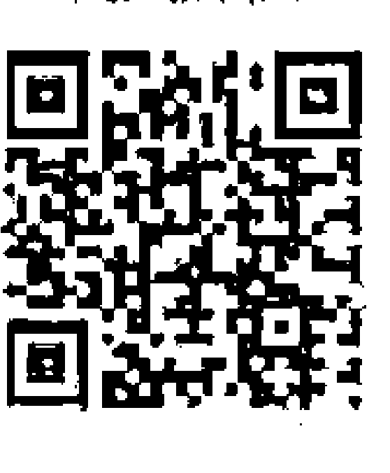## The Magician | 魔術師

##### 關鍵字『創造』

最新鮮的組合應用，告訴我們沒有什麼不可能，人生中的訓練跟準備，就是為了創造，讓意念穿越我們的身體，透過我們的雙手，真實呈現！塔羅牌中編號「1」的魔術師，代表的是創造，也因為他的編號關係，1 也為開始，在這張牌中魔術師擁有著創造世界的重要四元素火、水、風、土及象徵著源源不斷的無限大符號。
魔術師可以透過這些東西來進行創造，踏出第一步，很多事情的第一次是相當重要而珍貴的；創造需要魄力與決心，還有熱情，快展現出你的堅定判斷力和特別的意志吧！去創造屬於自己的美好未來，為自己平日無趣的生活多加一點新意，讓自己的人生更豐富，更有趣。

——【打破框框，孟小婧的塔羅擴大想像解牌法】——
正在表演的魔術師，前面有多少觀眾呢？還是在他的長袍底下，隱藏了多少的新奇橋段，下一秒就會為大家帶來驚喜！面對桌上所擺放的道具，隨手可得的資源不就是提醒現在的你，也可以檢視自己周遭狀況，搞不好想一想就發現也很多很可以運用整合的，就看你如何創造、好好發揮囉！逆位反之，桌面上的物品全都掉落，不就顯示出無法掌握資源的窘境，但若能靈活的改變，彎下腰也是能將東西撿回來，照樣能變出戲法。

#### 牌的建議：

- 正位★★★★★：發揮你的原有個性，專注學習新事物，創造新東西帶來成果。
- 逆位★★★☆：整合資源後自己的意志要更堅強，千萬別優柔寡斷！

#### 環境狀況：

- 正位★★★★★：目標清楚明確，環境有如催化劑般強化你的幸運，有利於你。
- 逆位★★★：自信不足缺乏想法，環境成為障礙，推卸責任就會影響發展！

#### 關於愛情：

- 正位★★★☆：遇到你心中期待的對象、重視彼此承諾，有新戀情展開唷！
- 逆位★★★：小心對方的甜言蜜語、虛情假意，不知對方的真實想法。

#### 關於事業：

- 正位★★★★★：多試變化，妥善運用組織力量，有助於開創新事業、新發展
- 逆位★★★☆：心煩意亂，別想一步登天，好好的思考自己該如何安定。

#### 關於財運：

- 正位★★★☆：理財技巧純熟，讓你財運大開，可以試試不同的賺錢方式喔！
- 逆位★★：意志力薄弱的你，最近要小心用錢，事先計劃千萬別入不敷出。

**The Magician | 魔術師**

| 牌中的元素圖象 | 要告訴我們的意義 |
| --- | --- |
| 頭上的無限大符號 ( 橫放的 8 ) | 無窮盡、無限制的想法點子 |
| 桌上的四樣物品 ( 聖杯、權杖、錢幣、寶劍 ) | 能運用變化的大自然元素 |
| 手上的權杖 | 掌握整合的力量 |
| 右手指天、左手指地的姿勢 | 接受上下天地的能量 |
| 紅玫瑰 | 熱情的愛 |
| 白百合 | 純潔的靈魂 |
| 註：馬賽塔羅《LE BATELEUR》；托特塔羅《The Magus》魔法師 |  |

###### 倒牌逆位意義：關鍵字『習慣』

創造，是個不容易理解又難以去實踐的辭彙！在我為許多人解讀，當出現魔術師逆位的時候，很多人會聯想到沒創意、沒能力，當然這些元素是你現在面臨到的問題，但我更相信！他帶給我們的訊息是你現在對自己失去了自信，更無法看清自己。結果就用著習慣來反應，過著每天同樣的生活！

創造或許不容易，但用改變來打破習慣，就是創新的開始，當這張魔術師出現逆位的時候，無論面臨的是工作、是愛情。試著讓自己靜下心來，好好的思考自己該從那一個點來做改變，想到了就一定要去做喔！這才算是踏出了創新的第一步！總不能光用想的，很多事情動起來才會知道是不是這樣做的，當然，在我們行動的過程中，一定能發現許多收穫，不見得絕對了解自己想要的，但或許在這之中，發現什麼是自己不要的，不就都是一種領悟！

## ## 小孟小清的塔羅博物館

###### 019 白貓塔羅牌 Tarot of the White Cats

作者：Severino Baraldi 發行：Lo Scarabeo

把人轉化成貓！作者的小巧思設計愚者是狗，視人物的特質來做變化，有些貓是以真實的形態出現，有些又以擬人化的方式來繪製，相當的有趣。而整副牌又以白色毛的貓為主軸，讓塔羅牌在畫面上變得特別的明亮溫和唷！

## # The High Priestess II 女教皇

###### 關鍵字「智慧」

最平靜的直覺釋放，運用沉穩莊重的方式，洞察與傾聽世俗，理解每一個人內心的存在價值，進而體會世上真理的意義！塔羅牌中編號「2」的女教皇，傳達的是智慧，也有人稱之為女祭司，代表著處女與聖母的形象。她為第2張牌，同時宇宙中的2元論中象徵了事情的一體兩面，女教皇表面上是沉靜、理智的，但是其實從另一個角度來看，她是在壓抑內心的渴望，因為感性的情緒跟女教皇所認同理性是不一樣的。

這張牌也同時象徵了知識道德的規範，就連愛情上也偏向精神層面的，正確的分析跟透徹的思考是很重要，但是千萬別因是非過於分明而失去了體會感性。

###### 【打破框框，孟小靖的塔羅擴大想像解牌法】

> 一位代表與神傳遞訊息的使者，獨自坐在神殿之中的她，就是大家口中的女教皇（女祭司），為了要正確記錄、佈達及傳授知識，她必須要平靜的將所得到的資訊，透過內心深處的沉澱，再運用高度的智慧，轉換成大家能接受的語言方式來體現，也許你也能學著專注內在，別被外在的干擾所影響。逆位反之，手中的智慧卷軸掉落，腳底象徵情感的月亮高掛上空，小心突然間湧上來的情緒，讓你亂了方寸，錯了步伐。

#### 牌的建議：

- 正位★★★★★：擁有智慧，優秀良好的判斷力，適時地接受感性的直覺。
- 逆位★★★：過與不及都不好，多聽取別人的意見，才能更理性面對！

#### 環境狀況：

- 正位★★★★★：在這個重視精神層面的地方，應對得體的你，能獲得充份的支持。
- 逆位★★★☆：太過感性造成干擾，小心周遭身邊的流言蜚語，謠言止於智者。

#### 關於愛情：

- 正位★★★：希望得到愛情，還是充滿女性感受特質，但限於精神式的戀愛。
- 逆位★★☆：過於理性、選擇壓抑，隱藏自己真正的情感，不願告訴別人！

#### 關於事業：

- 正位★★★★★：可以好好思考，現在可以做新發展，會有意想不到的好結果。
- 逆位★★★：煩惱理想無法順利達到，做事太過任性或是過於制式嚴苛。

#### 關於財運：

- 正位★★★★☆：有方法、有規劃的理財花費，了解自身需求，目前很穩定唷！
- 逆位★★★：突然花用一大筆錢，千萬別想要以錢生錢，好好守成才是最重要的。

| 牌中的元素圖象 | 要告訴我們的意義 |
|----------------|------------------|
| 黑白的左右柱子 | 陰陽、兩極的二元論 |
| 所羅門聖殿柱子上的 B(Boas) & J(Jachin) | 象徵光明與黑暗 |
| 手中 TORA 的捲軸 | 握有神聖律法的奧秘知識 |
| 腳底的月亮 | 控制感性的情緒 |
| 頭上的月亮三女神符號(新月、滿月、殘月) | 生命循環的陰晴圓缺 |
| 身後的石榴圖案 | 隱藏的多產、豐富 |
| **註：馬賽塔羅《LA・PAPESSE》；托特塔羅《The Priestess》女祭司** | |

###### 倒牌逆位意義：關鍵字『膚淺』

突然間你不再理性了！這樣個性的轉折是不是有點極端呢？當女教皇出現逆位時，雖然你變得感性許多，或許一下子感覺到舒服、釋放，但是這樣的改變有些表面，並不是從你內心真的想要這樣做，也許你會得到一時半刻的解脫，但卻不能長久。虛偽、放蕩、錯誤的決定、驕傲的判斷，也都是女教皇逆位的意涵，當然這樣變化太大的情緒轉變，一下想要獨處、一下又想要感受世俗的膚淺，對於任何事物都十分的隨便，這樣的情緒，未來也容易讓你自己捲入人際關係的困擾之中。

也許一個人會感覺寂寞，但千萬別用不屬於你的方式來做改變，這樣只會讓自己更模糊，搞不懂自己要的是甚麼？人都一定會遇上所謂的撞牆期，這時會不知道自己在那裡？為什麼而生活？又該如何生活？但最重要的，不是去相信世俗大眾的生活就是你要的，隨隨便便的下決定，而是去體驗過後，找回自己。

### 孟小靖的塔羅博物館

020 天啟塔羅牌 REVELATIONS TAROT
作者：ZACH WONG 發行：Llewellyn

塔羅牌的正逆位，一向都象徵代表著不同的意義。雖然有些人在使用塔羅牌的時候只解釋整體意涵，在一張牌面上巧妙的將正、逆位的精神藉由一個角色清楚的傳遞訊息！畫面上有彩繪玻璃的味道，也加入了不少科幻元素！

## # The Empress III 女帝

###### 關鍵字『豐收』

最豐沛的愛與關懷，能熱情的展現自我的美、重視感官的享受，學著讓自己體會感受，進而多愛自己一些，大方的表現自己。塔羅牌中編號「3」的女帝，代表的是豐收，這是一張女性原型的牌，有著女性溫柔的特質，也有著女性嬌縱的個性，女帝也蘊涵了孕育新生命與豐收大地的意義，也可以引申為預想的結果、或是得到想要的事物，有人說女帝這張牌是充滿魅力、感性的，也是象徵母親的投射喔！
相信愛、體會女性溫暖的柔性力量，是女帝牌所要傳達的重要意涵，讓我們的身體產生源源不斷愛的能量，就能創造生命力，就能醞釀出許多美與善的觀點，也就能很輕鬆的面對生活，豐富的成長，或是誕生出一些新事物、新想法！

> 【打破框框，孟小靖的塔羅擴大想像解牌法】
映入眼簾滿滿的稻穗，再看到女帝身後的森林。哇！這豐衣足食的世界不就是大家渴望的世外桃源嗎？但慈眉善目的表情就說明了一切，溫柔的樣子願意付出關懷，就因為她擁有這樣的心，美與善影響了周遭，將愛傳遞出去，萬物也給予了滿滿回應，你現在也是這樣美麗嗎？逆位反之，當你是擁有這麼多豐富資源的人，你會願意分享嗎？還是把這些與生俱來的優勢當成籌碼，想要獲得更多？或是拿來誘惑別人呢？

#### 牌的建議：

- 正位★★★★★：有魅力的，豐富繁榮的開花結果，做事都能事半功倍喔！
- 逆位★★★：沒有成果的狀況，要控制自己的任性，別又掉入自己的情緒中。

#### 環境狀況：

- 正位★★★★★：物質生活豐足，散發溫暖特質，其他人很熱心樂意協助你喔！
- 逆位★★★☆：言多必失、驕傲自大，太出風頭是學不到別人的生活經驗！

#### 關於愛情：

- 正位★★★★★：美麗又優雅的萬人迷，可享受愛情的甜美果實，心滿意足。
- 逆位★★☆：別沉迷於肉慾之中，小心自己的忌妒氾濫成災，得不到真愛！

#### 關於事業：

- 正位★★★：成就不凡，落實內在能量創造融合，事事都很順心，收穫豐碩。
- 逆位★★★：價值觀偏差，無法專心工作，太放肆自己的慾念與行為。

#### 關於財運：

- 正位★★★★★：財運不錯，注重自己的感官滿足，懂得享受高品質生活。
- 逆位★★☆：過度的奢華浪費，只為了自我撫慰的快感，缺少仔細的考慮！

**The Empress III 女帝**

| 牌中的元素圖象 | 要告訴我們的意義 |
| --- | --- |
| 頭上星星的后冠 | 象徵十二星座一年的循環 |
| 手中圓球的權杖 | 掌握、孕育地球生命 |
| 衣服上的石榴圖案 | 多產、豐富 |
| 女性符號（金星符號） | 美與愛的象徵 |
| 森林樹木、收成的麥子 | 大自然的豐饒、肥沃 |
| 瀑布河流 | 流動的生命之水 |
| 註：馬賽塔羅《L'IMPERATRICE》；托特塔羅《The Empress》皇后 |

## # 倒牌逆位意義：關鍵字『失焦』

如果都把你付出的愛，用物質的東西來衡量，你覺得這樣的愛，會是真誠的嗎？還是原本單純的心，也會受到干擾跟影響呢？母性的愛有時就是不求回報的，但的確不是時時刻刻都能保有這樣的生命力，這時也許會變得懶散、失去動力、浮躁沒有耐心，這些女帝逆位的訊息，都是在指引造成不豐收，或是物質損失的可能性；更有可能你放縱生活，對於身邊的事物都漠不關心，甚至於將自己擁有的女生特質朝負面發展，不生產、性冷感、過度的享樂、運用魅力玩弄感情關係。

與前一張女教皇是截然不同的女帝，如果過於理性是女教皇所要注意的事，那過分敏感就是女帝逆位要小心的，虛榮心去主導你是否要對別人好，這樣的算計並不輕鬆喔！當然世上的事情不一定是你付出多少就可以得到多少，但唯一知道的是當你願意付出，就會有豐收的可能，是吧！所以我們得學著發自內心的付出，不用對方的回應做衡量，而是心甘情願的去做！

### ☆【孟小晴的塔羅博物館】☆

021 女神塔羅牌 Goddess Tarot
作者：Kris Waldherr 發行：U. S. Games

在 22 張的大阿爾克納中，以世界各國的女神當作主要角色，對應不同的塔羅意涵，在小牌的部份用的是連綴的故事類型，由 4 種歷史文化背景，帶出塔羅牌中要傳遞的訊息！這一副溫柔的牌，與牌中的核心女神互相呼應！

## # The Emperor IV 皇帝

###### 關鍵字『權力』

最主觀又固執的完成責任，專注的將事情確實的執行。但過程中想法太過嚴厲、手段太過強硬，但對於想做大事的皇帝來說，這才是對的！塔羅牌中編號「4」的皇帝，代表的是權力，也是支配。一種高高在上的權威感，支配著宇宙內的不同能量，主要是表達出心理對物質的強烈企圖心與要求，也象徵著大男人主義下的男性角色思考與統治駕馭能力，大體上可分為「外在權力」和「內在權力」。

「外在權力」就是指別人賦予你的權力，可能是在工作上的職位或是精神上的肯定。而「內在權力」是指你自己的知識，經驗等自己給己的權力，這兩者都會影響著支配的原因，然而要如何運用這些權力進而成功，才是最重要的課題吧！

> 【打破框框，孟小靖的塔羅擴大想像解牌法】
身穿盔甲又坐在石座上的皇帝，拿著權杖的樣子應該是他剛登基的狀態吧！嚴肅的他或許前面對的是一群子民，需要他保護的人，然而被賦予權力肯定的他，想必早已努力讓大家得到安定。但就算登上王座，也不願卸下盔甲的他，也許還背負著重大的責任。現在的你也許還需要多點奮鬥，就能獲得穩定成果！逆位反之，皇帝手上的權杖掉落，大權不在手，如果還是一樣固執己見，大家還會信任他嗎？

#### 牌的建議：

- 正位★★★★：威信與穩健的做事風格，讓大家很相信你，責任感能為你加分！
- 逆位★★☆：挫折會接踵而來，經驗還不夠，別太自信了！學習也很重要喔！

#### 環境狀況：

- 正位★★★☆：能力被凸顯出來，但為人傲慢，其他人都對你很反感！
- 逆位★★★：缺乏支配和果斷，一直有七嘴八舌的人影響你的想法行動。

#### 關於愛情：

- 正位★★★★：積極進攻就可以得到轟轟烈烈的愛情，但請別追得太緊喔。
- 逆位★★☆：佔有慾太過強烈，威權的相處模式，十分不舒服容易造成衝突。

#### 關於事業：

- 正位★★★★★：具有領導力，工作上受肯定進而升官，企圖心強盛而成功！
- 逆位★★：挑剔與批判，缺失熱忱的工作態度，過於自以為是而招來失敗。

#### 關於財運：

- 正位★★★★★：財運很好，金錢收入會增加唷！肯努力就一定有回報。
- 逆位★★☆：小心別輕易的將財富用在投資上，過度自信，損失慘重。

**The Emperor IV 皇帝**

| 牌中的元素圖象 | 要告訴我們的意義 |
|----------------|------------------|
| 紅色的背景、服裝 | 象徵行動力 |
| 石頭做成的四方形王座 | 一板一眼嚴謹的結構 |
| 王座上公羊的裝飾 | 雄性象徵、星座起始的牡羊座 |
| 左手上的圓球 | 力求圓滿完整 |
| 右手中的安卡權杖 | 萬物生命的掌握 |
| 身上與腳下的盔甲 | 保護與隱藏情感面 |

**註：馬賽塔羅《L'EMPEREUR》；托特塔羅《The Emperor》皇帝**

## # 倒牌逆位意義：關鍵字『學習』

問自己一個問題吧？你真的覺得現在的你，已經很有本事，不用在成長學習了嗎？或許每個人都有自己拿手的事物，了解的專長領域，而有著自信。但皇帝的逆位就在提醒我們，千萬別讓這些自信變成自負，讓能力變成傲慢與自大。正位的皇帝把很多責任扛了起來，逆位的皇帝就顯現出很多負面的特性，像是過度的暴躁、濫用權力及武斷；另外也可能產生不足的狀態，像是懦弱、害怕失敗及依賴。

但我們該如何面對這樣的情緒轉變呢？只需放下身段，去學習就能體會自我的成長，用你的身體去感受，就不會固執的只想做你認為是對的、是好的，很多事情真的有很多面貌，以前所成功的法則，不一定在這個不斷前進的世代中有作用，不過，如果你真的心中相信你所堅信的，把自己的控制慾轉變為求知慾，換個方式來執行對你來說應該不難吧！

### 【孟小靖的塔羅博物館】

022 美人魚塔羅牌 Tarot of Mermaids
作者：Mauro De Luca & Pietro Alligo 發行：Lo Scarabeo

在童話故事才會出現的美人魚，一種未知的生物。輕柔飄逸的顏色，用溫和舒服的繪製風格，帶我們一窺水中世界的美麗，呈現出一種水底的夢幻仙境。四大元素也用三叉戟、水晶球、船槳及貝殼來替代，更符合整體的主題。

## The Hieropant V 教皇

###### 關鍵字『援助』

最神聖的信念，是發自內心深處的指引、歷經過教導的途徑，透過理想能指引給我們對的道路，在這路上相互的幫助，彼此都得到成長了！塔羅牌中編號「5」的教皇，代表的是援助，具有知性和道理，是大家的精神指標，有著智慧和判斷力，較保守且力求安定。其意涵也可引申為服務別人或渴望獲得別人的幫助。

另外，其實教皇代表的也是一種精神層面的最高想法，可說是「真理」或說是「王道」吧！還有，不單單指單方面接受，也許貢獻出自己的能力與熱忱去幫忙別人，會有想像不到的好處喔！鑰匙象徵著可以為你打開心靈，在援助他人的那一種高貴情操，令你善解人意，擁有寬厚胸襟。

> 【打破框框，孟小婧的塔羅擴大想像解牌法】
來到一個讓人覺得寧靜的教堂之中，中間的主教正在為大家傳達福音，教皇用他所累積的知識、經驗來告訴大家如何面對生活的考驗。想必這就是一個令人感覺到平靜內省的時刻吧！你是這個能為大家解惑的人？還是期待得到援助的人呢？逆位反之，求助者與教皇的位子對調，圖中鑰匙在上，其實就在告訴你拿起鑰匙行動，就能解開難題，而非只是依賴別人的幫助與慰藉了，能掌握打開問題鑰匙的人，應該會是你自己喔！

#### 牌的建議：

正位★★★★☆：可以從事服務性的工作唷！有貴人相助，跟隨直覺把握機會。

逆位★★★☆☆：堅定信念，要把訊息清楚的表達出來，否則會孤立無援喔！

#### 環境狀況：

正位★★★★☆：留意你周遭的人，將會有貴人的出現，可給予許多協助。

逆位★★★☆☆：缺乏別人的幫忙協助，此時想想自己的做法到底是不是對的！

#### 關於愛情：

正位★★★★☆：深厚寬容的愛情，是足以依賴的，或許可以進入婚禮的殿堂。

逆位★★★☆☆：太過執著，意氣用事、急躁匆忙的你是無法接受對方的感情的。

#### 關於事業：

正位★★★★☆：未來將會變成心靈導師的角色，可提供出自己的意見經驗。

逆位★★★★☆☆：工作面臨挑戰，多與值得尊崇的長輩聊聊，會有幫助。

#### 關於財運：

正位★★★★☆☆：收入固定增加中，可以發揮慈悲的心幫助他人，獲得慰藉滿足。

逆位★★★☆☆：同情心氾濫又經濟不佳，借別人錢之前要好好思考，量力而為。

##### The Hierophant V 教皇

| 牌中的元素圖象 | 要告訴我們的意義 |
| :--- | :--- |
| 頭上的三層皇冠 | 象徵身、心、靈的三層次 |
| 左邊身穿白百合圖案的傳教士 | 純潔的靈魂 |
| 右邊身穿紅玫瑰圖案的傳教士 | 熱情的愛 |
| 灰色的柱子 | 黑與白的融合、經驗的象徵 |
| 三重十字架 | 橫跨天、地、人的界線 |
| 兩把交叉的鑰匙 | 開啟智慧、神祕學的關鍵 |

註：馬賽塔羅《LE PAPE》；托特塔羅《The Hierophant》大祭司

###### 倒牌逆位意義：關鍵字『拘謹』

當我們曾經受到挫折感，人的防衛機制就會啟動，為了填補心靈中的那份失敗的空虛，我們變得在下任何決定時，都變得猶豫不決，因為這就是保護自己的方式。就如同教皇逆位要告訴我們的情緒一樣，敏感、容易失落悲傷、膽小脆弱等都是反應出對在精神層面上的擔憂。

一般會用貴人牌來形容教皇牌，但當教皇牌出現逆位時，卻在提醒著我們要特別留意接受別人的幫助時，自己有沒有擁有正確的思考能力，或是當時在尋求幫助的時候，是否正確的傳達自己要的協助是什麼？畢竟當下的你，只是要抱怨、還是要獲得安慰，亦或是想要解決問題，總不能讓大家給予的好心協助，又變成了另外一個壓力的來源吧！我們都會遇上人生低潮期，但千萬別掉入了自我的情緒黑洞之中，適時的跟親朋好友們多互動、多聊聊，凡事先慢下腳步，等待心靈穩定之後，才來探索自我，成就新的可能！

### 【孟小靖的塔羅博物館】

###### 023 月亮塔羅牌 The Llewellyn Tarot

作者：Anna-Marie Ferguson 發行：Llewellyn

水彩的意象邀請你進入一個神秘世界的原始森林，這副牌對月亮出版社的創辦人 Llewellyn George 致敬，有著兩個不同層面的意義，一是神話傳說介紹，一是想把占星學帶入新的里程碑。啟發使用者靈感，能夠生活化的在日常生活中使用。

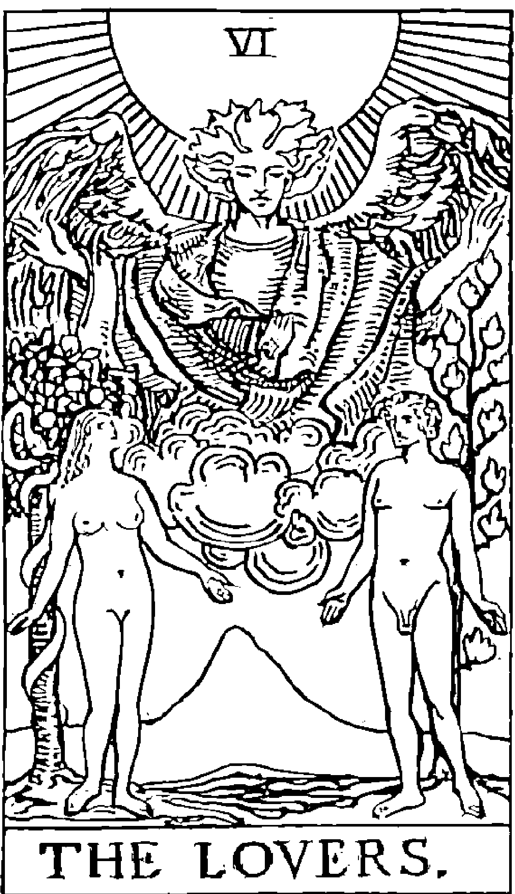

##### The Lovers VI 戀人

###### 關鍵字『結合』

最美好的愛，遵循著心所做出一種自願的承諾，只需要跟著你的心做出選擇，愛是沒有對錯、也無好壞，端看你如何去看待愛的形式、愛的樣子！塔羅牌中編號「6」的戀人，代表的是結合，看到這一張牌很明顯的就知道跟愛情有關。愛情，每個人都想得到幸福，這張牌又可視為宇宙之中的兩種情感的平和，那就是「感性」和「理性」也同時象徵了男女之間的調和。

愛情是浪漫的，是可以為你的人生注入一股新活力的，當然也是指在愛情與麵包中作決定的一張牌，兩個都很重要的東西，要如何去作取捨選擇，無論是愛情或是其他的感情，千萬別因為感情的過份豐富，到最後卻放縱自己的情緒，無法自拔了！

> **【打破框框，孟小婧的塔羅擴大想像解牌法】**
>
> 看到了眼前的亞當跟夏娃，這不是就伊甸園嗎？這兩個人坦誠相見，表示了最純潔的心，但在面對陰陽調合這意義重大的吸引與結合，是不是也跟現在的你一樣猶豫，不知道自己的未來下的決定對不對呢？或許有大天使的祝福，相信彼此若能努力經營，那生活就能朝幸福美滿發展了！逆位反之，兩人超越天使的高度，會掉落的果實、可能熄滅的火燄，這些景象不就一再警告我們必須面對自我膨脹的問題，千萬別堅持己見，下了錯誤決定！

牌的建議：
正位★★★★：相處很融洽的幸運兒，維持好跟大家的良好關係，安穩和諧！
逆位★★：不合作的態度，別受誘惑操控！該好好思考如何做出選擇。

環境狀況：
正位★★★★：四周的人都能和你一起打拼，大家目標一致，順利完成工作。
逆位★★☆：想不透你的人很多，跟別人合不來，所以目前沒人肯與你合作。

關於愛情：
正位★★★★★：愛情正羅曼蒂克的展開中，認可彼此兩情相悅感到開心。
逆位★☆：象徵多種選擇，可能有第三者介入，考驗著彼此對愛情的堅信。

關於事業：
正位★★★★：適合與人合作，能從與夥伴的相處中認同自己，向理想前進。
逆位★★☆：可能面臨解約、離職，不協調的錯誤決定，不長久於同一件事。

關於財運：
正位★★★★：在金錢方面只要與別人一起共享共生，會增加財運，大獲利。
逆位★★★☆：要注意跟你合作的人，意見相左，溝通上的不順利而破財。

##### The Lovers VI 戀人
| 牌中的元素圖象 | 要告訴我們的意義 |
| :--- | :--- |
| 一男一女 | 亞當與夏娃 |
| 赤裸的身體 | 天真與純潔 |
| 五顆蘋果樹 (智慧樹) 與十二團火焰樹 (生命樹) | 五種感官及十二星座的象徵 |
| 蛇 | 智慧、也是慾望及誘惑 |
| 大天使拉菲爾 (Raphael) | 溝通傳遞的重要性 |
| 太陽的光芒 | 溫暖、光、快樂 |
| **註：馬賽塔羅《L'AMOVREVX》；托特塔羅《The Lovers》戀人** | |

###### 倒牌逆位意義：關鍵字『選擇』

許多人遇上戀人牌的逆位牌時，多會用感情中的第三者來做爲其中的解讀，這個由來是因爲在馬賽系統中的戀人牌，有三個人物角色，一男二女的畫面上，強調著面臨選擇的我們。分開離別、合作失敗及妒忌對立，也都是戀人牌逆位時要給我們的警告，這些看起來脫離不了人際關係的挫敗，就會影響著我們去選擇出錯誤的決定，想要討好一方的心思，一不小心，就讓自己陷入兩難的局面。

但到底什麼選擇才是適合我們的，這張戀人牌的逆位的選擇，意指兩者只能挑選一個的困難，什麼該放下？什麼該緊握？沒有人能告訴你對的答案，有時連自己都回答不出來自己要什麼？只能跟隨自己的直覺，對於自己的選擇面對負責、自我懷疑的時期你我都有，人生也一定會去面臨到重大抉擇的時刻，我們不也就在一連串的選擇之中，無愧於心的繼續迎向自己所挑選的未來。

### 【孟小靖的塔羅博物館】
###### 024 領航者塔羅牌 Voyager Tarot
作者：James Wanless & Ken Knutson 發行：個人創作

托特系統為基礎，現代圖片拼貼而成，每張牌卡就像是在訴說一個心路歷程，一種哲學智慧的一本書，為我們的人生做導航及心靈的癒合，而藍色的牌背，乍看之下像是曼陀羅，但實際上是 DNA 的截面，代表建設我們的精神基石。

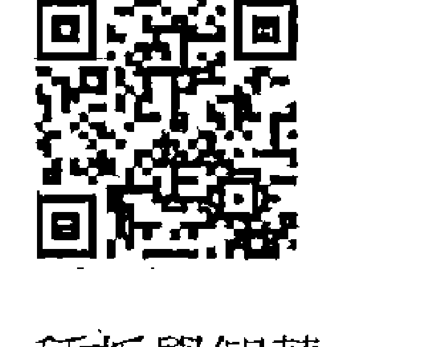

##### The Chariot VII 戰車

###### 關鍵字『勝利』

最全力的向前邁進，力量被你所凝聚，正透過你決定的方式甦醒，或許會面臨未知挑戰，但你一點都不懼怕，不畏戰，這樣的想法讓你帶來好的進展！塔羅牌中編號「7」的戰車，代表的是勝利，想要獲得勝利，背後必定付出很大的努力與堅強的意志力，才能為成功而歡呼著。
拉著戰車的二頭人面獅身，分別象徵著人的理性、知性及另一面的本能，慾望。很明白的，如果想要達到勝利，除了積極的行動之外，也要控制好這兩者情感的釋放、協調好這兩種來自人本身的元素，令他們成為助力，幫助你的前進，邁向功成名就，千萬別讓這兩者成為阻力，而使勝利、成功從你手中溜掉的。

> **【打破框框，孟小婧的塔羅擴大想像解牌法】**
>
> 勇往直前的戰車，信心滿滿的緩慢前行！是他的背後有著支援讓他如此自信，還是這個成功的信念，是由內而外的誕生，搞不好正對面也有他的敵人，但早就被所散發出來的英姿所震懾住，或許你我也能跟戰車一樣堅定意志，打倒恐懼征服一切困難。逆位反之，重心轉換城堡變堡壘，只好固守無法攻擊，天空往下沉、長茅向下失去鬥志，現在希望不再的你，是不是開始出現矛盾、亂了陣腳，先來個深呼吸，以退為進或許不失為一個對應之策！

牌的建議：

- 正位★★★★☆：腳踏實地，相信自己，主動出擊吧！向前進必有戰果、成功！
- 逆位★★★☆：好好的正視事件問題點，缺乏興趣，不要魯莽、急躁！

環境狀況：

- 正位★★★★★：因獲得勝利而會更積極，大家認可你真正的成功。
- 逆位★★★：樹大招風造成失敗，加上別人的冷眼看待，漸漸失去鬥志。

關於愛情：

- 正位★★★★：樂觀看待彼此的愛，積極的去追求想要的愛情，容易成功。
- 逆位★★★：一味的往前追求，沒有搞清楚狀況，愛情無謀略，被對手打敗。

關於事業：

- 正位★★★★★：有幹勁，很認真的完成工作，為自己帶來很多成果。
- 逆位★★★：過度自信、不自量力的你要去多學習，努力不夠帶來不少挫敗。

關於財運：

- 正位★★★★★：不斷的朝向目標前進，因受到肯定獎勵而獲得很多財富喔！
- 逆位★★★☆：千萬小心不要依賴投機性的理財，沒有獲得還會損失很多錢。

| 牌中的元素圖象 | 要告訴我們的意義 |
| :--- | :--- |
| 黑色及白色的人面獅身 | 嚴厲及慈悲 |
| 手中無輻繩 | 不用蠻力來掌控 |
| 四根柱子所支撐的星空布幔 | 神所挑選的人 |
| 有翅膀的太陽 | 太陽神的祝福 |
| 手中的黃金矛權杖、頭上的桂冠及八角星 | 意志、勝利及統御 |
| 雙肩上不同表情的月亮盔甲 | 掌控喜怒哀樂的能力 |
| 註：馬賽塔羅《LE CEARIOT》；托特塔羅《The Chariot》戰車 | （備註）|

###### 倒牌逆位意義：關鍵字『矛盾』

真正的勝利，不只是打敗敵人而已，而是你自己有沒有獲得成長與內心真實的喜悅，很多時候我們只是為了贏而贏，這也就是所謂的短視近利，說真的，我們不也也有這樣被迷惑的時候。一種爆發的求勝心會蒙蔽了我們的情緒，自以為一切都在我們掌握之中，但沒想到生活上還是有許多變數。

突然挫敗、失去控制、不停遭受打壓，這些都是戰車逆位所要告訴我們的訊息跟意義，現在處理事情應該避免過多的爭執跟碰撞，因為這樣只是再度點燃彼此不滿的情緒，導致於為了想要發洩情緒，為了反對而反對的去做一些行動，真的做了這些事，是有意義的嗎？甚至於明知不成功的計劃，硬是不放手的去執行，等到最後就換來白忙一場的徒勞無功，所以現在要做的是以退為進，有時候成為被動防守的一方，也不見得是件壞事，因為先蹲下才能跳更高啊！

### 小孟小清的塔羅博物館
###### 025 摩根吉爾塔羅牌 Morgan-Greer Tarot
作者：Lloyd Morgan & Bill Greer 發行：U. S. Games

適合初學者的一套塔羅牌，全新的繪圖是一套沒有邊框的牌組，滿版的圖案把畫面拉近放大，極其豐富的色彩，讓整個圖像更有想像的空間。淺顯易見的元素融入了色彩意義在每張牌卡裡，含義清楚解讀出牌意與圖象的呼應。

欣賞牌圖

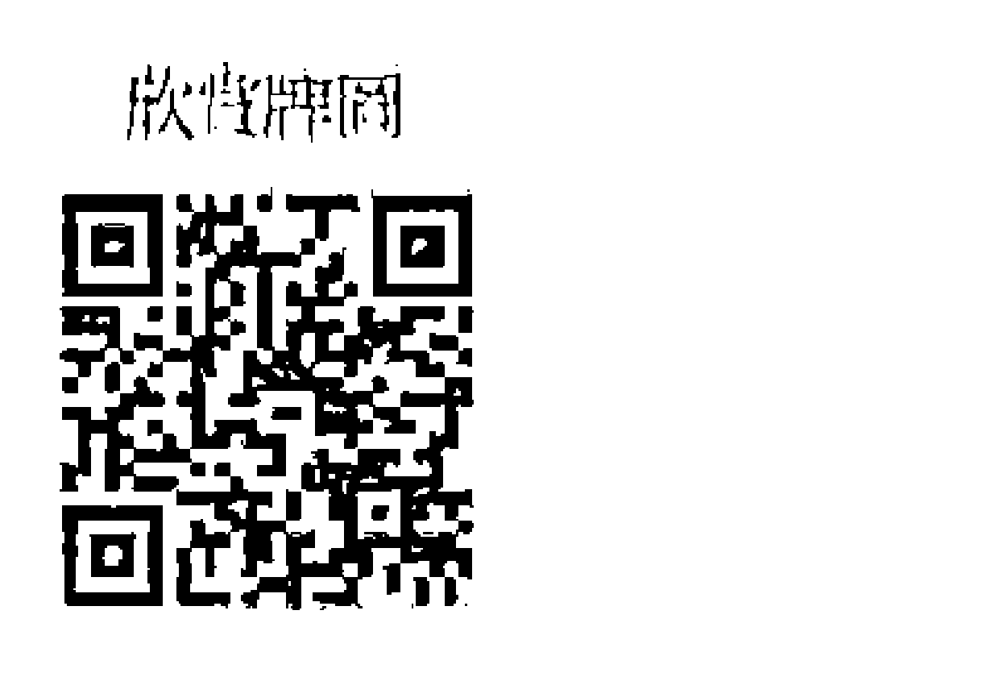

# ## Strength VIII 力量

# ### 關鍵字『勇敢』

最溫柔的意志，讓我們知道以柔克剛的道理，相信自己就能產生力量，運用這股力量，勇敢的去堅持、去爭取，讓力氣慢慢地累積，等待發揮最大的作用。塔羅牌中編號「8」的力量，代表的是勇敢。

要勇敢的下決定，強大的意志是相當重要的，人與獸分別象徵著兩個重要的意涵「獸」，當然就是指人性中的「本能」，而人是代表著人的「自我控制」的能力，然而「無限大」符號更是說明了人是擁有無限的自我控制得能力。當然囉！如果無法自我控制，自己的行為將會被本能所奴役，能控制就可冷靜判斷，做出正確的決定。有著堅定意志，英雄氣魄與力量，這張牌結合增加了毅力，掌握了自我控制權。

> > **【打破框框，孟小靖的塔罗扩大想像解牌法】**
>
> 要我跟獅子搏鬥，這會不會太可怕了啊？但是，轉念一想，獅子不也就是貓科動物，應該也有可愛溫馴的一面吧！而且，真的是我們看到的這個樣子嗎？跟我們自己想像的一樣嗎？會不會力量牌中的少女，原本跟獅子就是好朋友呢？說不定一直都用著友善溫柔方式跟獅子互動著呢！逆位反之，獅子位置高過女孩，顯示獸性將要壓迫人性，或許已經無法再控制住獅子了，再這樣虛張聲勢的裝模作樣，不就很可能會讓自己招來危機！

牌的建議：

正位★★★★：不屈不撓充满意志力！發揮決心、耐力、勇氣，追求自己想要的。
逆位★★★：學著變得直白坦率，千萬別喪失自信！要有撐下去的勇氣。

環境狀況：

正位★★★★：想將不可能化為可能，就不可以屈服壓力，要有堅毅的意志。
逆位★★★：沒有毅力，做事不穩定的你，讓周圍的人對你失去信心。

關於愛情：

正位★★★★：有勇氣去追求新戀情或建立新關係，以長久穩定的發展努力！
逆位★★★：舊戀情有陰影，不敢再追求愛情，給自己一些調合情緒的時間。

關於事業：

正位★★★★★：堅忍不拔不怕難、勇往直前，會有好差事等待著你發揮。
逆位★★★：挫折多，讓你產生內心的恐懼，熱力消退、缺乏強烈的工作慾望。

關於財運：

正位★★★★：試圖控制自己的情緒，就能將金錢做好規劃與運用，收支平衡！
逆位★★：很想逃避的你，依賴花錢求得心靈釋放，會造成你的財富流失。

| Strength VIII 力量 | |
| :--- | :--- |
| 牌中的元素圖象 | 要告訴我們的意義 |
| 頭上的無限大（倒8符號） | 無限的力量 |
| 白衣女子 | 純潔的溫柔 |
| 身上的花環 | 愛的自然散發 |
| 獸性 | 獸性的象徵 |
| 獅子下垂的尾巴 | 馴服 |
| 女子撫摸獅子的動作 | 勇敢信心的展現 |
| 註：排序為11，馬賽塔羅《LA FORCE》；托特塔羅《Lust》慾望 | |

###### 倒牌逆位意义：关键字「虚弱」

也許我們都該重視自己也有軟弱的一面，當力量出現逆位時，最明顯感受到的就是自信喪失、有氣無力，想要放棄對之前信念的堅持，總覺得怎麼做都不好，都無法獲得成就感。

或許現在你的心中有一份說不出來的憂鬱，這樣的情緒讓你對於很多事情抱持著隨便的態度，得過且過的敷衍塞責。因為這個時候我們會被情緒所綁架，總是只看到自己脆弱的一面，卻忘了自己還有擁有力量的。但也有人只為了想要逃避這種虛弱的負面感受，想辦法讓自己變成一個可以支配別人的人，使自己暫時忘懷無力感，卻運用了過度的權力暴行，讓身邊的人感覺到壓力，放任自己的獸性無限的延伸，這樣的自我膨脹並不會讓你感到更輕鬆，反而會讓你產生更無奈的感覺。故作堅強不能改善內心的軟弱，而是要整理自己的心情，看清自己的實力，才能面對弱點、跨越盲點。

### 【孟小靖的塔羅博物館】
###### 026 聖甲蟲塔羅牌 Lo Scarabeo Tarot
作者：Mark McElroy & Anna Lazzarini 發行：Lo Scarabeo
慶祝聖甲蟲出版20年紀念，結合了三個傳統系統：馬賽、偉特、托特，但仍是把主題放在偉特體系，圖像元素的表現以後兩者的混合居多，明顯有影響力的主題象徵，把許多細節添加到三個基本系統並且增加占卜的潛能來使用。

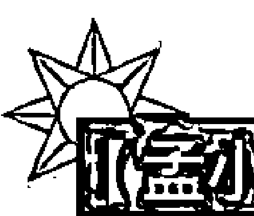

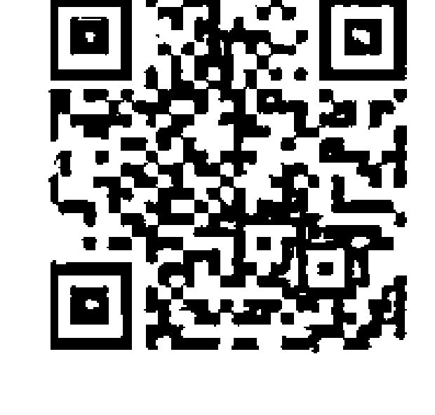

##### The Hermit IX 隐者

###### 关键字『指引』

最回归的自我时刻，我们已经很少时间面对内心，隔绝外界的干扰，找出对自己的真实，不必理会别人的影响，只须专注的整理平静心情！塔罗牌中编号「9」的隐者，代表的是寻求，隐居山林之中的隐士通常是身怀绝技而甘于平凡的，或甚至是无欲无求就能够自得其乐，但或是也是孤寂的，这也就是隐者这张牌要传达出来的主要意涵。

每个人的一生都在寻求着些什么东西吧！为了提醒大家不要在其中迷失，隐者手中有一盏灯，这一盏灯一边照亮前方的物品、道路，但是另一方面，是希望能够照出内心的「自我」，了解有舍才会有得的意义，知道什么才是自己真正想要的。

**【打破框框，孟小婧的塔罗扩大想像解牌法】**
孤单一人站在山峰上的隐者，手中的灯能照出他想要走的路吗？还是他还不舍有关世俗的一切，从高处遥望远方的城镇呢？你我都要独处的时间，这样留给自己的一段平静的时光，好像是我们现代人都需要的，回归自我这件事比什么都来得重要的多。逆位反之，灯不再高挂，那光就照不到我们想看的，你会变得更胆小、更保守处事，也许这样的方式让你安心；不过也有可能是回归人群，毕竟反过来的牌，也是隐者退下斗篷的阶段。

牌的建議：

正位★★★★★：思慮周密，找出定位行動去吧！好好累積經驗，展露鋒芒。
逆位★★★☆☆：別發牢騷，固執不聽別人的意見！重要的是充實自己，等待時機！

環境狀況：

正位★★★☆☆：多閱讀，吸引新知會讓你的見解更有主張，大家會默默的支持你。
逆位★★☆☆☆：休息一段時間，讓自己放鬆一下，才能沈澱後好好思考未來。

關於愛情：

正位★★★：不經思考的愛戀，不敢公開的愛情，還是承擔情緒上的孤獨感！
逆位★★☆☆☆：暗戀，不願意讓別人知道自己內心的感受，對象也難以接近。

關於事業：

正位★★★☆☆：學著時間管理是最近重點，性質安靜的工作比較適合你唷！
逆位★★☆☆☆：不適合單獨一人的行事動作，與夥伴一同出擊，留意有心機的人。

關於財運：

正位★★★☆☆：雖沒有世俗物慾，但有計劃性的支出與收入還是比較好喔！
逆位★★☆☆☆：收藏魂啟動，購物慾火強烈，想清楚有沒有購買的必要性。

### The Hermit IX 隱者
| 牌中的元素圖象 | 要告訴我們的意義 |
| :--- | :--- |
| 手中的提燈 | 潛意識的象徵 |
| 燈中發光的六芒星 | 真理、光明的指引 |
| 高聳的山巔 | 接受孤獨、保持寂靜 |
| 灰色的長袍 | 經驗與智慧的象徵 |
| 低頭的姿態 | 思考與反省 |
| 手上的權杖 | 路途上的引導 |
| 註：馬賽塔羅《L'HERMITE》；托特塔羅《The Hermit》隱士 | |

倒牌逆位意义：关键字『孤独』

给自己一些独处的机会，这是一种可以让自己好好思考，好好沉淀的时光，但绝对不是要你跟躲进深山里的隐者一样，离群索居、怨天尤人，总觉得自己不得志一样，这些隐者逆位所告诉我们的意义，提醒着我们千万不能保守顽固，老是觉得自己才是对的，别人方法都是迟钝没效率，但真的是如此吗？还是你早就在别人眼中，是个孤芳自赏的过气老人呢？

或许在这个阶段，你正面临着对于生活意义的追寻，不知道自己在哪？不知道自己能做什么？当然你可以先与自己对话，找到让自己觉得做起来开心的事物，但绝不是与人远离，毕竟在与你亲近的朋友身上，你也有机会看到一个不一样的自己，再由你来选择要不要成为那样的人。是的，在思索自我的过程是很个人的，但千万别因为害怕寂寞而伪装，而应该要成为一位可以享受孤独的人生智者。

### 【孟小晴的塔罗博物馆】

027 幻影塔罗牌 Shadowscapes Tarot
作者：Stephanie Pui-Mun Law 发行：Llewellyn

水彩作品中奇妙混合童话和神话，民间传说和来自世界各地的多元文化，揉合亚洲元素、塞尔特文化等，运用奇幻的艺术风格来呈现，最新诠释的莱德伟特塔罗牌系统，其中注入了来自世界各地的精灵传说、神话以及符号象征。

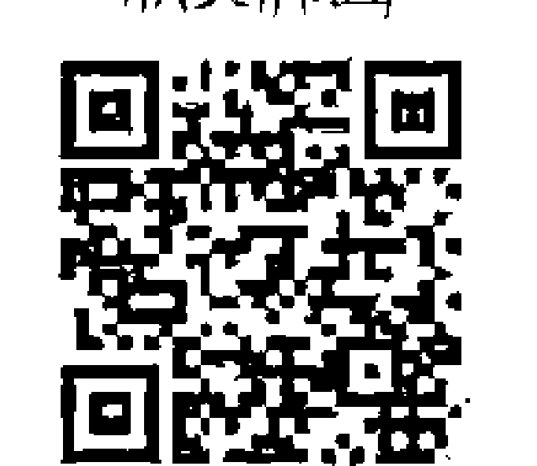

##### The Wheel of Fortune X 命运之轮

###### 关键字「轮回」

最真实的观察，生命这样的转动，只能靠着我们的感受去体会，每一件事情都会过去，无论你喜不喜欢，我们都要去接受总有一天会改变。塔罗牌中编号「10」的命运之轮，代表的是轮回，当然啰！轮回有很多涵意，是周而复始重覆的发生，也是命运之中的关键点，也就是所谓的危机就是转机吧！

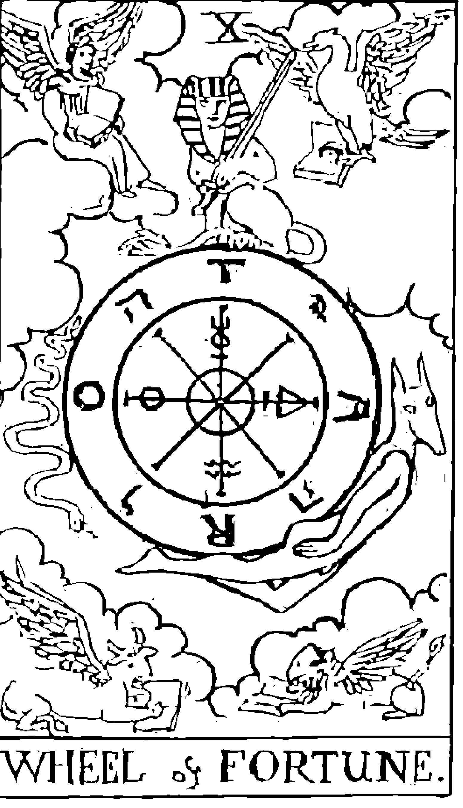

命运是不会回头的，它就像轮一般，不断地向前滚动，是幸运、还是不幸，是没有人知道或预料的。

发生，你是否有思考过，在人生路上的交叉口中，你所下的决定是否都是对的？或许就是因为有着这多变化的元素，人生才可以如此多彩多姿，享受这生命中喜怒哀乐的循环。地球是圆的，风水是会轮流转的，也许这是否极泰来的道理。

> 【打破框框，孟小靖的塔罗扩大想像解牌法】
>
> 这个名为生命而不断转动的轮子，就跟我们在电影中看到的机关一样，停下来不就招来结束？崩坏？跟时间流逝一样，是无法去阻止的！但如果整个世界或宇宙不只一个轮呢？人与人的轮不就跟齿轮一样，紧密的相扣呢？我们只好接受这人生中的摆荡，好运时珍惜着、坏运时祈祷着，乐观面对去希望自己能顺利度过。逆位反之，四个角落的四本书将落下，不就是无法运用智慧，这样就会招致错误一再发生，不正确的循环不停弥补过失！

#### 牌的建议：

- 正位★★★★☆：开始进入人生转捩点，意想不到，去做新的尝试吧！
- 逆位★★★☆☆：错误和困难不断重覆的发生，时机未到以静制动，不要放弃！

#### 环境状况：

- 正位★★★★：换你崭露头角，要好好握住机会，将有意想不到的好运出现。
- 逆位★★★☆：太早的努力，事情安排的不理想，是因为好运还没来临！

#### 关于爱情：

- 正位★★★★：一见钟情是宿命让你们幸运的结合，开始拓展你们的新生活吧！
- 逆位★★☆☆：重复同样的问题无法解决，关系慢慢恶化，短暂的爱情关系。

#### 关于事业：

- 正位★★★★☆：好运来了，要把握住这次好机会，将会完成得到赞赏！
- 逆位★★☆☆：计划受到外力影响，难以阻止被迫中断，必须重新再来一次！

#### 关于财运：

- 正位★★★★：将会有意想不到的好运气，得到意外之财、财源滚滚。
- 逆位★★☆☆：缺乏考虑、粗心大意，行事慌慌张张，用钱考虑后再出手。

| 牌中的元素图象 | 要告诉我们的意义 |
| :--- | :--- |
| 中央的三环轮 | 内为创始、中环执行、外圈物质 |
| 轮中的 TARO 字样 | 神圣律法 |
| 轮上方的人面狮身 | 智慧的维持平衡 |
| 轮侧边的狼头人身 (埃及神 Aunbis 阿努比斯) | 掌管死亡、象征重生 |
| 轮下方的蛇 (埃及黑暗之神 Seth 赛特化身) | 象征风暴与衰败 |
| 狮子 (狮子座)、天使 (水瓶座)、老鹰 (天蝎座) 及金牛 (金牛座) | 圣经四活物、自然界四元素 (火、风、水及土) |
| 从四个角落看书的姿势 | 不同观点的学习 |
| 注：马赛塔罗《LA・ROUE・DE・FORTUNE》；托特塔罗《Fortune》命运 | |
| 注1：天蝎座有三重象征，原型天蝎、升华为老鹰、转化成浴火凤凰 (和平鸽) | |

###### 倒牌逆位意义：关键字『意外』

相信大家都已经习惯将事物掌握在手中的感觉了吧！当意外状况来临的时候，大家都会造成情绪的波动，因为讨厌被中断的感觉，当然面对这样不在我们预期之中的事情，总是会有一股不安的感觉油然而生，有些人会用排斥、不理会、觉得是一个恶运、倒霉来形容这样的状况，的确也是命运之轮逆位要告诉我们的意义，但一味的抗拒，不会让事情解决，只是会让事情产生阻碍，甚至于产生停滞！

弄巧成拙是我常对命运之轮下的注解，花了太多无谓的时间在用情绪来幻想失败，然后做了太多无助于这个突发事件本质的事。一直不去接受这样的变化，谁知道这个调整会不会为你的人生带来不同的新循环，发生意外的当下，固然震惊，但真的所有的意外都一定只有不好吗？事情总是一体两面的，会不会在这个事情是在提醒着你，该为自己的下一阶段做准备了！

## 孟小晴的塔罗博物馆

028 关键塔罗牌 The Pictorial Key Tarot
作者：Davide Corsi 发行：Lo Scarabeo

塔罗牌原本就是经由图像的象征来做解读，把传统的伟特塔罗牌以3D的立体手法重新绘制、使原本的牌意更能深入细微的生活中，将许多图像巧妙的显现在我们的周遭，合理的逻辑呈现出来，更让我们了解到塔罗牌中的意涵。

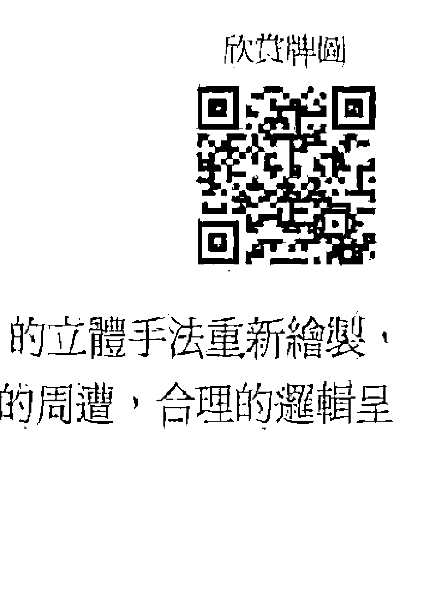

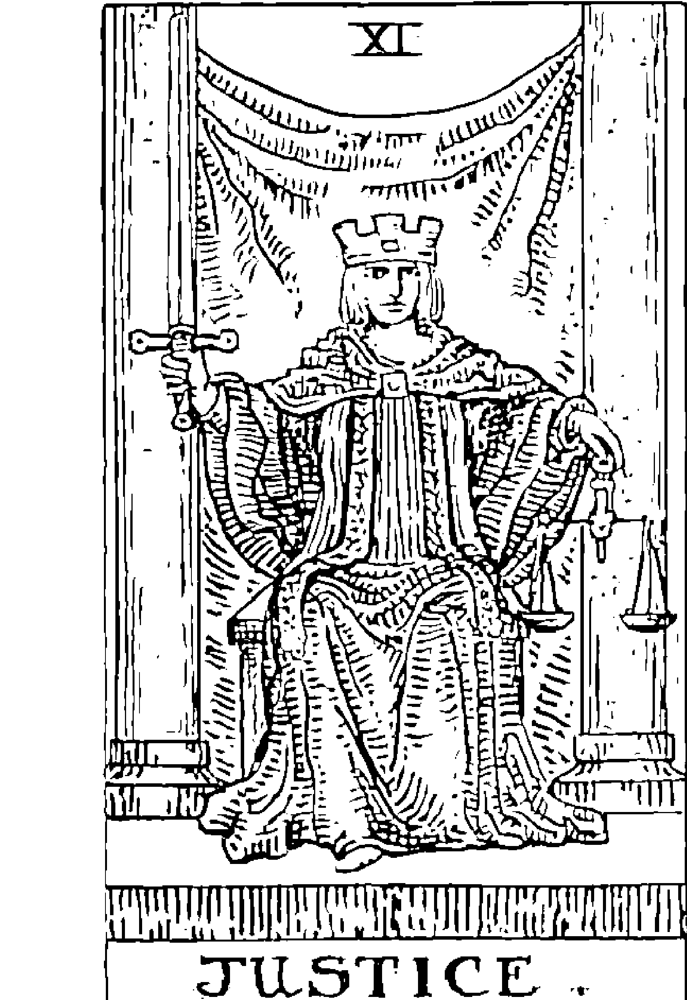

##### Justice XI 正义

###### 关键字『平衡』

最对等的付出，想要得到多少、就得贡献多少，这样的逻辑虽然大家都懂，但总是不自觉地想要多拿一些，这张牌要我们明白，平衡因果关系的重要性。塔罗牌中编号「11」的正义，代表的是平衡，在女神手中的剑与天平是协助她为这世俗订下规范及律法的重要工具，剑代表的是「公平审判」，而天平象征了「兼顾的平衡」，通常遇到二择一的时候，大家都难以做下决定。而正义这张牌，针对的就是在这样的关系之中，有些事它只是暂时地停下来，休息一下，人生之中，要下决定的机会很多。身处困苦时，只要不失去均衡、公平的原则，循着所谓的「中庸之道」前进，任何的事都会迎刃而解，渡过人生难关。

> 【打破框框，孟小靖的塔罗扩大想像解牌法】
>
> 你我在面对生活上的一切选择，能做到真正的公平吗？我想这个问题，应该没有人可以完整的回答吧！还记得小时候的课堂习题吗？一公斤的棉花跟一公斤的铁，放在天平上面秤，那个重？大家不都纷纷举手抢着回答铁比较重，不过，答案是一样重的。我们能跟正义女神一样端正平衡地下决策吗？这是多么的不简单。逆位反之，有时情绪的偏见已经形成，你的认为是早就给了答案，这样的状态下很容易犯下错误决策！

#### 牌的建议：

- 正位★★★★：付出与回报对等，良好协调均衡，遵守一定规则十分和谐。
- 逆位★★★：事情无法两者皆顾，要小心争执纠纷，有时多思考再下决定。

#### 环境状况：

- 正位★★★★：能均衡协调的四周人的建议，走中庸之道的你受到大家爱戴！
- 逆位★★☆：处理能力欠佳，举棋不定让周遭环境对你不利，产生不公平。

#### 关于爱情：

- 正位★★★★：感情目前平稳发展，两人真实面对彼此，可以考虑走进礼堂唷！
- 逆位★★★：仔细思考双方是不是个性不合，要不要继续该下个决定了。

#### 关于事业：

- 正位★★★★：可胜任两种工作，正业副业都能发展，适合裁判、分析的工作。
- 逆位★★☆：面对问题没有弹性，批判严厉会发生纠纷、可能会吃上官司。

#### 关于财运：

- 正位★★★☆：收入稳定、支出有计划，维持平衡，为自己未来慢慢积累财富。
- 逆位★☆：想法偏颇、欲望又太多了，财务处理发生问题，经济陷入困境。

**Justice XI 正义**

| 牌中的元素图象 | 要告诉我们的意义 |
| :--- | :--- |
| 高举不偏不倚的宝剑 | 刺破幻象、评判的决心 |
| 宝剑的双面刃 | 可善可恶的选择运用 |
| 手中的天秤 | 评估公平的决定 |
| 两根柱子所撑起的布幕 | 信仰的建筑、正负观点的调和 |
| 紫色的布幕 | 内在的智慧 |
| 黄色的王冠 | 心智的清澈 |

注：排序为8，马赛塔罗《LA·JUSTIC》；托特塔罗《Adjustment》调节

###### 倒牌逆位意义：关键字『偏见』

请再多给自己一些时间，不要在盛怒之下认定事情的样子，如果当我们已经因为片面的信息获得，而心底产生了一个自我的判断标准，那将会对接下来所有的解释都抱着不信任的心态，这种偏见的形成，会让你越来越看不清楚事件的全貌，让你一直走向错误的决定。

错误的指控、不公平、不正当及滥用权力，都是正义逆位要告诉我们的意义，我们会对于某些事产生情绪，但忿怒会生成敌意、烦躁会化成报复，让我们失去平衡，无法正确地评估事情，只想着要让对方受到伤害，这样的想法，反倒让自己导致挫败、损失很多，更担心因此而走向更极端的做法。

对！我们很容易被自己的想法所朦蔽，有时候我们看到了事实，但不见得了解真相吧！让自己再有一些多观察的机会，千万别在第一时间就下了定论，才能让自己的心理状态维持平稳！

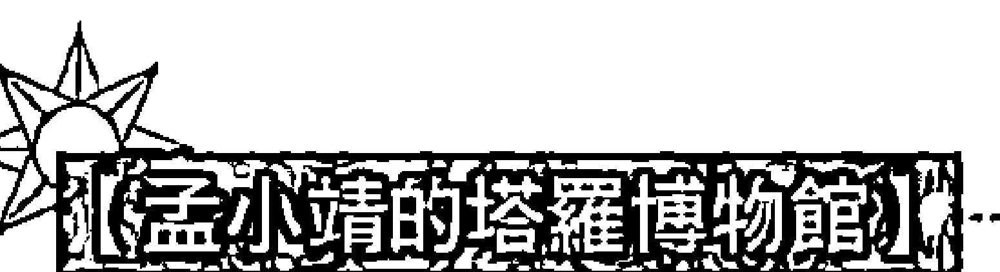

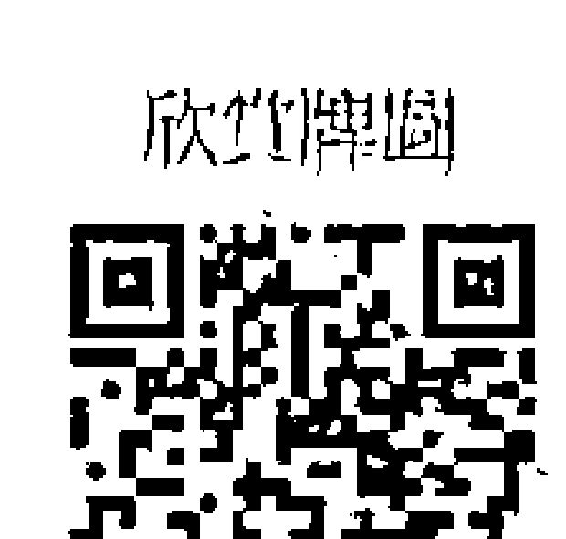

029 术士塔罗牌 Wizards Tarot 作者：Corrine Kenner & John Blumen 发行：Llewellyn

在这副术士塔罗牌中，你穿越过美国著名魔法师来昂曼德雷克（Mandrake）的学院，在那里你会穿上长袍的神奇学徒，学习老师们教授你的知识技能。像是星座符号或北欧的卢恩符文，通过这个术士塔罗牌感受基本魔术，那种艺术的永恒！

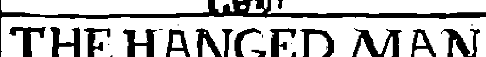

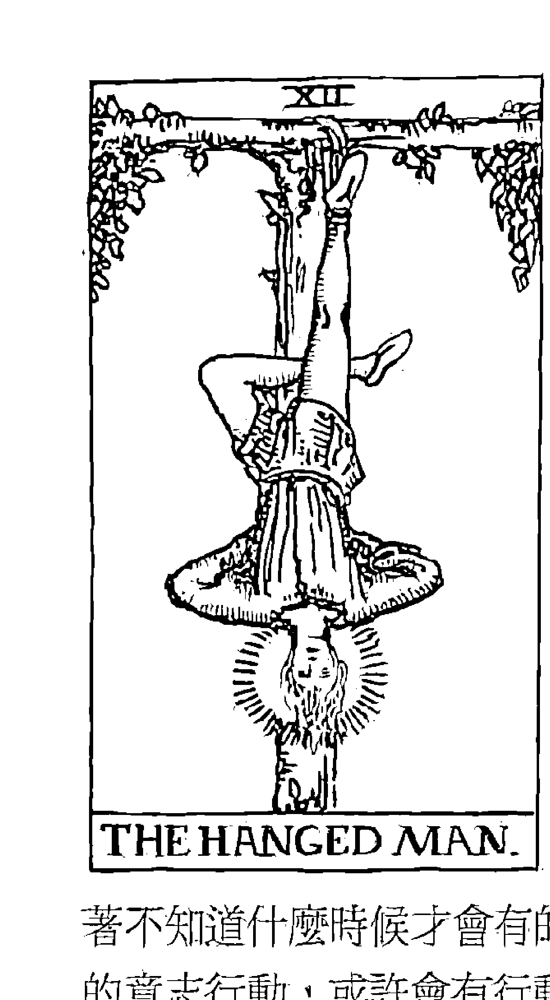

##### The Hanged Man XII 吊人

###### 关键字『牺牲』

最值得的信念，是内心想出来的？还是自己领悟到的？人生不求冷静、求平静！拥有清晰的思绪，洞察人生之后才能把自我放下，让大我升华！塔罗牌中编号「12」的吊人，代表的是牺牲、当然也是考验，何谓牺牲？我想就是圣人精神吧！是那一种无我的奉献，不求回报，也是愿意发挥伟大的情操，放弃自己的幸福，来换取别人能够快乐，能无怨无悔地付出，这是多少人无法做到的事。

要隐藏自己的情感，武装自己的情绪，等待着不知道什么时候才会有的回应，不安于人生中命运的安排，决心按照自己的意志行动，或许会有行动无法心随意走，但是选择了自我牺牲的吊人，更引申出了灵魂的自主与命运的跳脱。

###### 【打破框框，孟小靖的塔罗扩大想像解牌法】

> 要是你会愿意被吊在树上吗？如果是你自愿的，那你是为了什么事呢？能甘愿做这样的付出，就像吊人一样神色自若，一派轻松呢？还是你心中已经有了什么目标想要去实现，知道这一切都只是过程罢了，先给自己一个掌声吧！因为你的心智够强，换了个角度反而看得更清楚，相信过了这关，都能海阔天空了！逆位反之，吊人的视角不就跟一般人无异，但脚还是被绑住，不就是一种只能逆来顺受的无奈，是该解开束缚、改变状态了！

#### 牌的建议：

- 正位★★★☆：体会有舍才有得的道理，无怨无悔地不断努力，才能浴火重生。
- 逆位★★★：改变方向再出发，拿得起放得下，做得心甘情愿就没什么好怨的了！

#### 环境状况：

- 正位★★★☆：不自由的立场，觉得委屈，受到强迫而做不得已的牺牲。
- 逆位★★☆☆：不断地服务和奉献是徒劳无功的，要克服这个期间的考验。

#### 关于爱情：

- 正位★★★☆：为另一半牺牲付出，但必须心甘情愿，两人爱情出现考验。
- 逆位★☆：没有回报的爱情，自己早就发现是在苦撑，不如选择放弃这段感情吧。

#### 关于事业：

- 正位★★☆☆：紧绷情绪漫延，这是一个过渡期，试图努力渡过这个状态。
- 逆位★★：没有目标，不知去向，这是个不想做的工作，不得不在痛苦中度日。

#### 关于财运：

- 正位★★★☆：想想为什么帮助别人而漏财，若甘愿牺牲，只能最近少花一点！
- 逆位★★☆☆：赚钱不及花钱的速度，钱不够用，经济状况亮起红灯啰！

##### The Hanged Man XII 吊人

| 牌中的元素图象 | 要告诉我们的意义 |
| :--- | :--- |
| 倒吊的姿态 | 甘愿奉献的付出 |
| 怡然自得的神情 | 不再困扰的平静 |
| 红色的裤子 | 身：人的基本存在 |
| 蓝色的上衣 | 心：智慧的参透 |
| 黄色的光环 | 灵：洞察人生 |
| 金色的鞋子 | 崇高的精神能量、理想 |
| 注：马赛塔罗《LE·PENDU》；托特塔罗《The Hanged Man》吊人 | |

###### 倒牌逆位意义：关键字『搁浅』

总是有一种不耐烦的感觉围绕着你吗？是不是觉得不晓得自己到底在为什么付出，也觉得回收的获得无法让自己觉得开心，你开始想让自己有些改变，但又找不到该怎么做，生活中的负担跟经济压力也不是说放就放，这些阻碍的确让你更烦闷了，面对现在无法改变的现状，你会感觉到束手无策！真的是这样吗？还是你自己也害怕改变、害怕成长，不愿意去做一些目前看不到的努力，但生命中不是有很多经验，不见得一定有实际的回报，但确让我们的内心感受到领悟。

逆来顺受、自私自利，还有不甘愿，这些负面情绪都是吊人逆位要提醒我们的信息，时间一直在前进，我们都不喜欢悬在那里的感觉，孤立无援的你我只能默默承受这一切吗？当然不是，如果只是在原地难过哭泣，不如起身离开，停止这些不开心的牺牲，即刻前进解开自我束缚！

### 【孟小靖的塔罗博物馆】

030 罗宾伍德塔罗牌 Robin Wood Tarot
作者：Robin Wood 发行：Llewellyn

画面中保留的绘画笔触的感觉，也大量使用了渐层的设计手法，都让这一副罗宾伍德塔罗牌看起来变得更梦幻浪漫了！运用伟特系统，牌中人物古典风味的服饰，融合了古代欧洲时代背景的呈现，相当的有中古世纪的感觉唷！

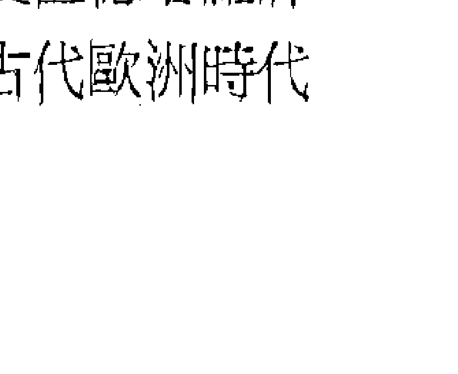

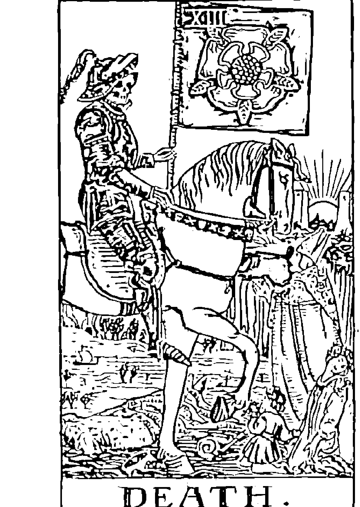

##### Death XIII 死神

###### 关键字『结束』

最简单的告别，我们都会有面对这天的机会，我们能选择去抗拒、去害怕，也能选择去接受、去面对，结束有时候就这么自然而然地发生了！塔罗牌中编号「13」的死神，代表的是结束，不是终止，不就是没有开始，也没有真正死亡；有些事情结束了，但心不能消沉。许多人认为死神这张牌是可怕的、最差的，甚至是绝望的，可能是西洋思想里13是不吉祥的，就如13号星期五被称作为「黑色星期五」一般不幸吧！

从另一个角度来看这一张牌，那就是「重生」，能够忘掉过去，重新开始，开创出属于自己的奇迹。让昨日的自己沉淀，洗心革面，让今日的自己升华，抛除过去种种，挥除阴霾，就运用新的方法来建设出自己的新未来吧！

> > 【打破框框，孟小靖的塔罗扩大想像解牌法】
> >
> > 如果你只剩下一天的生命，那你会做什么？能好好思考这个问题的人，其实是相当幸福的，因为有很多人无法好好说再见，死亡、结束就来了！从远方而来的死神，会不会你早已预料到有这天的到来，天下无不散的宴席，这个道理无论是谁都必须去体会接受吧！逆位反之，死神从马背上跌落，不就暂时不能执行收走死者的任务，这个死里逃生的好机会，也在提醒我们该接受改变了，别在悲情中沉沦，重新开始才会带来新生！

#### 牌的建议：

- 正位★★☆：该结束就结束吧！失败为成功之母，想想原因东山再起。
- 逆位★★★☆：重新改变，用不同的思绪和做法再开始，这样才会成功！

#### 环境状况：

- 正位★★☆：发生不幸的大事件，毁灭的时间到了，腐败到无法处理了！
- 逆位★★★☆：转变对你有利，印象改观，改善方针就可以脱离低迷的时期！

#### 关于爱情：

- 正位★★☆：爱情不会有结果，考虑分手会好一点，放手才是明智之举！
- 逆位★★★☆：舍去过去的爱情，追寻彼此的真幸福，另一段爱情正展开中唷！

#### 关于事业：

- 正位★★☆：快放弃以前的工作模式，已经行不通了，看清事实才能面对！
- 逆位★★★☆：改变自我形象，重新订立出未来的规划，让大家另眼相看。

#### 关于财运：

- 正位★☆☆：注定失败的财务亏损，面临危机，无法抗拒的痛苦来临！
- 逆位★★★☆：经济会获得改善，慢慢地越来越增加收入，感觉到重生。

| Death XIII 死神 | |
| :--- | :--- |
| 牌中的元素图象 | 要告诉我们的意义 |
| 死神面向东方 | 等于日出，结束的重生 |
| 人们面往西方 | 象征日落，死亡的终点 |
| 国王的尸首 | 世俗权力并无法躲避死亡 |
| 旗子（镰刀） | 宣告死亡的来临 |
| 十字会的白花图腾 | 新生的种子 |
| 传教士 | 坦然地面对死亡 |
| 注：马赛塔罗《空白无字》；托特塔罗《Death》死神 | |

###### 倒牌逆位意义：关键字『重生』

想起先前收藏的各国塔罗牌之中，曾有一副塔罗牌就将死神这张牌绘制成怀孕的女子与胎儿，其实就很明确地告诉我们死神牌逆位的意思，结束后的重生。虽然对于死神牌逆位的解读，大家的说法都不相同，有人认为强化了面对死亡后的那种无力感，是一种让自己停滞不动，无法让自己跳脱出的一种恐惧。

或许真的你刚经历了一段人生中的大冲击，是亲人的过逝、一个严重的意外，这些状况会让你了解到生命中，真的会有令人不得不去接受的事，你不能抗拒。没有预期，却被迫接受改变，或是难受，但这就是人生必经的过程之一，我们会很习惯的一定要自己去努力度过，但你已经很尽力了，别再强迫自己，先暂时停下脚步，放空自己的情绪，等你能欣然接受这些已经结束的事物后，再慢慢地试着面对害怕恐惧，才能克服，真的唯有放下，才能放过自己！

## 孟小清的塔罗博物馆

031 可诺丽塔罗牌 Connolly Tarot
作者：Eileen Connolly 发行：U. S. Games.

生动而美丽的卡片中，只有丰富的色彩与鲜明的人物，这些图像和象征意义都是五颜六色，没有负面，传递出正向积极的风格，或许是受到宗教的启发，在这副牌中带有基督教的色彩，在这组牌当中也会看到很多天使的踪影喔！

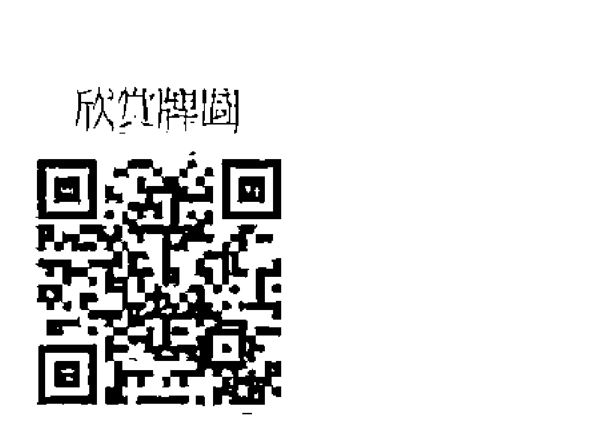

##### Temperance XIV 節制

###### 關鍵字『淨化』

最自然的調和，由內心高層次的意念，透過與外在表象的融合，找到自己經驗中的原則性，了解自己知道該如何行動，怎麼反應才是最恰當的！塔羅牌中編號「14」的節制，代表的是淨化。從兩個水瓶中流動交換的水，象徵了思想的流動，水又代表了心靈的力量。

由代表了精神和理性的其中一個瓶子，流動到代表了物質和感性的另一個瓶子，兩者相互的流動，意指相對性的平衡，哪一邊的瓶子都不能太滿，也不能太少，在這個流動的過程之中，也就是淨化之時，這段時間之中，可以讓我們去思考、去修正，甚至於去改變我們自己，一些不好的原則、觀念，這個過程是慢慢的進行中，漸漸地，會發現其實有些東西是可以很單純的。

> 【打破框框，孟小靖的塔羅擴大想像解牌法】
>
> 我們不要把天使手中的兩杯水想得太難，就拿我們生活中的事物來譬喻好了，一杯熱水跟一杯冰水，相互的倒過來倒過去，過一陣子不就變成兩杯溫水了嗎？就是這麼簡單，告訴我們交流的重要性，保持著彈性、接納不同意見的想法！總是會找到中庸之道。逆位反之，天使手中杯子的水全都溢出來了，就因為意見無法融合，導致危機的發生，如果非得要每個步驟都要照著你的意思走，這麼極端的堅持，好像也沒有太多好處吧！

#### 牌的建議：

正位★★★★：事情儘可能單純化，用心靈去溝通、互相信賴，能讓你穩定成長。

逆位★★★：消耗浪費，不要諸多要求，想發揮實力，就要多多與人交流溝通。

#### 環境狀況：

正位★★★★☆：用很單純、平凡的想法思考，交流學習就能了解重要性了！

逆位★★☆：凡事沒有控制，造成損失和消耗要趕快檢討改善，別再耗損。

#### 關於愛情：

正位★★★★：愛情進行中可以順利的彼此溝通，這樣一來讓愛加溫不少。

逆位★★☆：變化多端的狀況，兩人無法好好妥協，一段把握不住的愛情。

#### 關於事業：

正位★★★★：事業發展很順利，找到正確處理事務方法，運用所學一帆風順。

逆位★★☆：過度工作，不規則的生活，造成經常爭執不滿，會帶來失敗。

#### 關於財運：

正位★★★★☆：錢的安排得當，可以有多的經費去旅行，讓自己多見世面。

逆位★★☆：無法自我控制用錢方式，加上投資運氣不佳，財富大失血。

##### Temperance XIV 節制

| 牌中的元素圖象 | 要告訴我們的意義 |
| --- | --- |
| 大天使米迦勒 (Michael) | 榮耀守護者的帶領 |
| 頭上的圓形符號 | 象徵太陽，正確的目標 |
| 胸前的正方形、中間的三角形圖案 | 土元素及火元素的融合 |
| 兩杯有水流動的金杯 | 理性與感性的交流 |
| 一腳在地上、一腳在水裡 | 意識(地)及潛意識(水)的調和 |
| 遠方發光的皇冠 | 抵達高我的道路 |

**註：馬賽塔羅《TEMPERANCE》；托特塔羅《Art》藝術**

# # 倒牌逆位意義：關鍵字『調整』

不同想法其實是要被中和、被調整的，也就是節制逆位要傳遞的訊息！無論是錯誤原則觀念的淨化，亦或是為了表面妥協但卻心有不甘，這些種種的問題，都會變成人與人之間的絆腳石！你一定會覺得為什麼之前用有的做法，現在不再管用了，當出現這樣的疑惑時，我們就會開始失去平衡，覺得做什麼事情都不順利，甚至於開始失去信心。

說真的，目前的狀況沒有你想象中的那麼嚴重，只需要與人多點互動交流，打開心扉的信任別人的幫忙，看一些從不同觀點中發現新的建議，讓自己更有彈性的接受這些改變，別把困難視為混亂，而是把它看做一個提醒，如何重新適應改變的衝擊，配合環境將自我的原則做一個修正、消除對立。原則上的改變，溝通是一個十分重要的事，無論是愛情、工作等，因為人與人之間的默契就是靠著溝通而來，你呢？會願意調整你的原則嗎？

> > 【孟小靖的塔羅博物館】

# ## 032 奧修禪宗塔羅牌 Osho Zen Tarot

作者：Ma Deva Padma & Osho 發行：U. S. Games

奧修禪宗塔羅牌又名奧修禪卡，融入了心靈大師奧修的思想，創造出一副很生活化的塔羅牌，運用了傳統塔羅牌的78張架構，再加上一張師父卡，成為了79張的設計，將塔羅牌的圖像融合了涵義，直接轉換成簡單詞組，找到方向。

# # The Devil XV 惡魔

###### 關鍵字『慾望』

最盲目的支配，慾望的慣性讓人得到短暫的滿足，是一種你真的想要的渴望、還是真的需要？超越物質，找到我們精神的目標，為每一個行動負責！塔羅牌中編號「15」的惡魔，代表的是慾望。人的慾望是一種詛咒，慾望會讓人變得邪惡。人會為了控制不了自己的慾望而犯罪，最後只有墮落。

但是這是屈服而放任自己的慾望所產生的結果，仍不自覺而沈溺於享受落下陷阱之中，最終只留下滅亡，但若可以用堅持的意志，擺脫這些邪惡的誘惑，讓自己不盲目的被玩弄，被操控，也不會落入陷阱，繼續落向下沉淪，將可以東山再起，漸而好轉，慾望是無窮無盡的，但我們要學習控制自己的慾望，化阻力為助力。

> > **【打破框框，孟小靖的塔羅擴大想像解牌法】**
>
> 被帶到惡魔旁的人，是你嗎？還是你是看著別人被帶到惡魔身邊，被惡魔所使喚呢？人因為有慾望而產生動力，就因為我想要，所以我得到！但這些東西真的是你需要的嗎？在我們的生活中，有多少東西是因為誘惑而做，也有多少時候做的當下充滿激情，事後卻後悔不已！我們應該要做慾望的主人，而不是僕人！逆位反之，人物換到上方，惡魔在下方，自以為能掌控惡魔的我們，殊不知這只是惡魔吞噬我們最後靈魂的小伎倆！

#### 牌的建議：

- 正位★★★：控制好自己的欲望，克服自我的人性弱點，達成目標。
- 逆位★★☆：因欲望趨使而做出不正當的決定，落入陷阱，意志得堅強點！

#### 環境狀況：

- 正位★★★☆：試著脫離不良的誘惑，一切都在好轉中，從苦痛中解放！
- 逆位★★☆：惡魔般的誘惑，使你墮落，嚴重的被物質所控制著。

#### 關於愛情：

- 正位★★☆：愛情受誘惑而掉入陷阱，對方並不是真心對待，還可能有多角關係！
- 逆位★☆：戀愛如果感覺到痛苦，結束這段不能自拔的愛情，是時候了。

#### 關於事業：

- 正位★★★☆：景氣漸漸好轉，克制欲望，最壞已經過去，該打起精神來了！
- 逆位★★☆：受挫很深，當時的意志薄弱，聽信敵人的花言巧語而失敗。

#### 關於財運：

- 正位★★☆：金錢困難找到解決方法，讓自己學著慢慢不在乎物質的享受。
- 逆位★☆：財務上的危機，全部來自於自己的奢華開銷花費，謹慎用錢就好！

| 牌中的元素圖象 | 要告訴我們的意義 |
| --- | --- |
| 公羊形象的惡魔 | 動物的本能獸性 |
| 長角、長尾巴的亞當跟夏娃 | 顯露野性 |
| 脖子上的鐵鍊 | 欲望的束縛、不自由 |
| 倒立五芒星 | 邪惡的符號 |
| 左手向下的火炬 | 引導欲望的沉淪 |
| 全黑的背景 | 無光的世界，精神面的灰暗 |
| **註：馬賽塔羅《LE·DIABLE》；托特塔羅《The Devil》惡魔** |  |

# # 倒牌逆位意義：關鍵字『迷惑』

當惡魔出現逆位的時候，也就是你自己陷入了無法控制自己慾望的關卡！慾望，有很多種！一般的人，一說到慾望，都只會往性慾的層面想，但是購物慾、控制慾、占有慾等都是慾望的種類！總而言之，為什麼會有這些慾望的誕生，是因為自己在心靈上無法獲得想要的滿足，只有透過表面或物質的慾望，來得到慰藉。

惡魔在塔羅牌中，其實算是比較負面情緒的牌！但是在孟小靖的眼中，對我來說，惡魔牌也沒有大家想像中的那樣的可怕。說是詛咒、墮落、執著，而或是枷鎖，我想這些情緒，會出現的原因！就是因為慾望過多而被迷惑了吧！也是我在解讀的時候最常用來詮釋惡魔牌逆位的關鍵語喔！我們也要去學習如何將慾望轉變為動力，而不是無理的要求，畢竟一直以為握在手中的才是你的，但別忘了空出雙手，搞不好你才能獲得更多！

# ## 【孟小靖的塔羅博物館】

## ### 033 新神話塔羅牌 The New Mythic Tarot

作者：Liz Greene & Giovanni Caselli 發行：U. S. Games

重繪十分熱門以古希臘為主題的神話塔羅牌，首次出版於 1986 年受到占卜師喜愛，描繪希臘神話的生活經驗。在希臘神話中這些戲劇性的和令人興奮的故事揭示深刻的真理，是體現在人生的每一個方面，反應出我們今天的生活。

##### The Tower XVI 高塔

###### 關鍵字『毀壞』

最虛假的價值，你現在緊握在手上的，真的是你覺得重要的嗎？還是一個不甘心，不願意放手呢？當這張牌出現的時候，就是你正要改變了！塔羅牌中編號「16」的高塔，代表的是毀壞，意料之外的致命打擊，一直不斷的提醒要小心，挫折會打敗你的信心與造成你的壓力。

傳說巴比倫人因為自我的文明，便無視於天神的存在，想打造一座通天塔，取代天神的地位，當然天神用雷電毀掉了這座塔，也徹底擊毀了存在於人心中的信仰。沒在計畫之中料想不到的意外，是會令人受到重重的打擊，但是堅定自己，相信自己，抵抗外界的刺激，謙虛的學習，放下身段，別讓一連串的失誤連累陷入困境，才能安然平安渡過。

> 【打破框框，孟小靖的塔羅擴大想像解牌法】
>
> 意外！每個人都可能遇到，就跟落雷擊中的塔一樣，我們根本無法預料，或許我們也只能跟塔牌中的人相同，只能往下一躍為了保命，但真的只有這個方法嗎？還是我們受到驚嚇而自亂陣腳了呢？意外，甚至於是災難來臨我們都不願意，但我們至少可以選擇如何面對。逆位反之，整個塔可能完全掉落，已經被破壞的建築物，連地基都有可能崩塌，這樣一來，唯一能做的也就只有接受這一切的改變，然後再度的重新建設！

#### 牌的建議：

- 正位★★☆：致命性的打擊，別忘了要對自己有信心，堅定意志渡過難關！
- 逆位★★：大災難的前夕，暴風雨前的寧靜，靜下心來背水一戰！

#### 環境狀況：

- 正位★★☆：紛爭又混亂的恐怖狀態，小心突然發生改變現狀的意外事件！
- 逆位★☆：壓力莫名而來，要嚴謹行事，慎重待人，減少糾紛的產生。

#### 關於愛情：

- 正位★★：彼此的情緒爆發，使愛情發生重大變故，造成情感外力的介入。
- 逆位★☆：熱度減退，卻選擇視而不見，讓兩人變成沒有誠意的交往中。

#### 關於事業：

- 正位★★：小毛病很多引起責難，遭受自我認同的挫折，形成忿忿不平。
- 逆位★☆：過於自大，所掌控情勢大崩盤，讓你遭受到打擊與折磨。

#### 關於財運：

- 正位★★：發生很大的糾紛，流失金錢速度十分迅速，得小心破產的可能。
- 逆位★☆：請先多留下一些積蓄，防止措手不及的意外狀況，產生金錢危機。

##### The Tower XVI 高塔

| 牌中的元素圖象 | 要告訴我們的意義 |
| --- | --- |
| 高塔 | 物質的閉鎖、狹隘 |
| 上天降下的落雷閃電 | 意外的劇變、神的閃現 |
| 掉落的皇冠 | 物質的破壞、消失 |
| 二十二個火花 | 象徵塔羅牌二十二張大牌 |
| 向下掉的人 | 衝擊動搖後的解放 |
| 全黑的背景 | 黑暗期、失去安全感 |
| 註：馬賽塔羅《LA・MAISON・DIEV》；托特塔羅《The Tower》塔 |  |

# # 倒牌逆位意義：關鍵字『瓦解』

如果問在塔羅牌22張大牌中，最壞的牌是那一張，很多人會回答這張高塔，當然被雷所擊中的高塔，這樣的災難都不是我們願意去承受的。動彈不得、無能為力、麻煩與破壞，還有性衝動都是高塔逆位的意涵，但當高塔出現逆位時，不僅僅只是在告訴我們意外的摧毀，連地基的掉落，這不就是在告訴我們舊有習慣事物的崩塌，看到這樣的毀壞，我們有時會選擇滿口謊言的騙自己沒有發生，也有可能是情緒爆發的感覺不滿與憤怒，但這些不都是事實，最終我們都還是必須面對與接受。

不要只是想要急迫的逃離，而是請換個角度看，選擇自己要看的風景，雖然崩壞了，前方卻可以看到一片令人豁然開朗的景色，要我們接受歸零的狀態，強調面對改變的時刻，不再透露出身不由己的無奈，如何在瓦解後重新獲得力量，保持鎮定、平心靜氣就是最好療癒自我的狀態！

### 【孟小靖的塔羅博物館】

###### 034 埃及之光塔羅牌 Nefertari's Tarot

作者：Silvana Alasia 發行：Lo Scarabeo

金色常被使用在埃及法老及貴族的用品上，象徵了身份地位的彰顯！而這副牌的名字納菲爾塔莉(Nefertari)是古埃及第十九王朝法老拉美西斯二世的新娘，讓我們透過埃及之光塔羅牌，看到埃及的壁畫藝術、生活型態和符號圖騰！

##### The Star XVII 星星

###### 關鍵字『希望』

最美好的相信，來自一種認定明天會更好的希望，來自一個充滿信心的富足靈魂，當我們回歸最原始的自己，心平氣和就是你精彩的人生展現。塔羅牌中編號「17」的星星，代表的是希望，由夢想帶來希望，就像能帶來歡樂一樣，進而帶領著我們迎向美好，一切都可以心想事成。

但是人可以擁有夢想，卻要小心夢想變成幻想，夢想是激勵我們前進的動力，而幻想也只是空想，眼高手低的行事風格，得失心太強，造成希望轉化成期望，一旦落空就會有強烈的失落感，理想和現實之間有很大的差距，因爲不適應，所以造成了你的失望和痛苦，因此我們應該要完成目標的定立，朝著夢想大步大步的邁進。

###### 【打破框框，孟小靖的塔羅擴大想像解牌法】

> 有流星！大家都有對著星星許過願望的經驗吧！回憶那個瞬間，是不是覺得心靈平靜呢？就如同星星牌上最大顆的星星一樣，照亮著大地，讓象徵純潔的裸身女子，用水滋養大地一樣。星光是一種夢幻而令人充滿希望的，不也可以讓我們望著星光，為自己許下一個理想目標，逆位反之，相反的水瓶被迫將水回收，並無法去追求自己想獲得的前景，位於下方的星星，也如同掉落的流星不再發光，希望的落空可能會感到焦躁！

#### 牌的建議：

正位★★★★：努力有了成果，可放心去做心中想做的事，發展會朝著預期走。

逆位★★★：期望愈高，失望愈大，不切實際的想法總是事與願違。

#### 環境狀況：

正位★★★★：前途充滿光明希望，願望輕易實現，給予想得到的援助！

逆位★★★：想得太美好，心裡所要的無法符合實際，失望來自與別人不能契合。

#### 關於愛情：

正位★★★★☆：把握戀愛機會，理想之中的對象會出現，多點相處互動吧！

逆位★★★☆：拖拖拉拉的戀情，已經不愛對方了，寧可選擇一個人的平靜！

#### 關於事業：

正位★★★★：成為別人焦點，讓你理想實現，得到豐富的收穫與成長。

逆位★★★：目標訂得太過遠大，造成凌亂失焦的狀況，與實際有一段差距。

#### 關於財運：

正位★★★★：運氣不錯，平穩的經濟中還會有意料之外的財富入帳。

逆位★★☆：經濟發生問題，情緒性花費增加，預算中的金錢會無故浪費。

### The Star XVIII 星星

| 牌中的元素圖像 | 要告訴我們的意義 |
| --- | --- |
| 赤裸的女子（星星女神） | 沒有束縛、純潔的象徵 |
| 一腳在地上、一腳在水裡 | 意識（地）及潛意識（水）的調和 |
| 一壺注入水中 | 生命之水回歸潛意識 |
| 一壺灌溉大地，分為五道水流 | 意識面的五種感官 |
| 一顆八角星及七顆小星星 | 天狼星、預測命運占星運行 |
| 朱鷺 | 知識之神托特的象徵 |
| 註：馬賽塔羅《L'ETOILE》；托特塔羅《The Star》星星 |  |

# # 倒牌逆位意義：關鍵字『落空』

我們可以對生命中的任何事物都保持著希望，但也好像常常就不小心把這樣的要求，變成一種期待、一種寄望，然後對這樣的事物投以非常大的渴望，最後如果無法成就跟你心中想法的樣子相同的結果，不就只能接受這樣落空的情緒嗎？

不平靜、失望、不滿意、挫敗及不平衡，這些負面情緒都是當星星逆位的時候，要告訴我們的訊息，太過於執著一件事情的結果，會讓自己忘了體會在這個過程中的獲得，也可能讓因為當下的不平靜，又想更急躁的看到成果，反而在這當中錯誤百出、挫折連連，最後導致自信損失，甚至於懷疑自己的能力，讓自己更無確實目標，變成只會空想，而不敢有實際行動的人。那我們是不是應該放下這些過多的期待，告訴自己凡事盡力就好，這不就是我們常說的盡人事、聽天命的道理嗎？現在就只需給自己更多信心！

## 【孟小晴的塔羅博物館】

###### 035 繪國守護者塔羅牌 Oze69 Watchers Tarot

作者：吳九貓 Ninecats Wu 發行：個人創作

由台灣原創的以動漫風格塔羅牌藝術作品喔！作者創造了一個屬於自己的國家，在繪國度的這個世界中，每一張牌都是這個繪國度裡的國民，使用塔羅牌能召喚與你投緣的角色看顧、守護你的選擇，引導至光與愛的靈性旅程！

##### The Moon XVIII 月亮

###### 關鍵字『不安』

最豐沛的情感，這樣會讓我們變得很愛胡思亂想、疑神疑鬼，但你是懷疑別人，還是最終是對自己產生不信任呢？學著去看清實相，碰觸存在的事物！塔羅牌中編號「18」的月亮，代表的是不安，在暗夜之中的一絲亮光，那就是月光，象徵著隱藏在人內心之中的意識，月亮的陰晴圓缺不停的在變化，這種不確定的，會造成不安定的感覺，狼與狗象徵本性，代表了想要追求事物，卻又不敢前進的心，感到迷惑。

因為根本不知道、不清楚、不了解自己到底要去面對什麼樣的問題。有時千萬別為了「不安」的感覺而不敢有所行動，而更應該冷靜的思考，謹慎的行動，看看事件如何變化，進一步去破題化解。

> 【打破框框，孟小靖的塔羅牌擴大想像解牌法】
>
> 光看這張牌，不就是我們在腦袋中印象裡的恐怖場景嗎？高掛的月亮、黑夜中的狼嚎，這樣不安的感覺，是不是都會讓你我心跳加速、不斷的吞噬口水呢？搞不好，下一秒就會有怪物出現了！是真的嗎？還是都只是你情感豐沛下的胡思亂想呢？面對未知，我們都會緊張，別忘了多了解狀況，收集資訊就能平穩心靈，也是照亮黑暗的光！逆位反之，月亮已落下，就表示黎明就要來臨，恐懼即將散去，雖有不安，但漸漸的明朗也能慢慢掌握了！

##### The Moon XVIII 月亮

#### 牌的建议：

+   正位★★☆: 疑心病作祟，有多少把握，才说几分话，千万别乱下结论。

+   逆位★★★☆: 情况慢慢好转，但多愁善感与胡思乱想，还是会造成误会喔！

#### 环境状况：

+   正位★★★: 充满著安定的感觉和不稳定的心情，告诉著你要小心四周的敌人。

+   逆位★★★☆: 疑团逐渐明朗化，真相大白脱离别人所设计的陷阱。

#### 关于爱情：

+   正位★★☆: 情感丰沛的你容易有感受波动，令人感到不安的恋情，盲目的爱。

+   逆位★★★☆: 越来越多的相处，总算看清楚现在的爱情是虚伪不实在的啰！

#### 关于事业：

+   正位★★☆: 充满欺骗与不稳，人事干扰太多感情用事，很不可靠的工作。

+   逆位★★★: 讯息的明朗与资讯累积，可以逃离被陷害的危机，情况稍稍好转。

#### 关于财运：

+   正位★★: 诈骗会常常找上你，要小心别上当破财，容易相信的你多问多确认！

+   逆位★★★: 借款开始回收，收入稍微平稳一些，但还是要小心使用才好。

| 牌中的元素图象 | 要告诉我们的意义 |
| :--- | :--- |
| 岸边的龙虾 | 深处潜意识的情绪 |
| 未知的小径 | 不安地前进 |
| 右方的狗 | 驯服协助的人性 |
| 左方的狼 | 危险的本能兽性 |
| 高耸的双塔 | 远方的目标 |
| 日蚀的月亮脸孔 | 形成恐惧的微弱光芒 |
| 注：马赛塔罗《LA·LUNE》；托特塔罗《The Moon》月亮 | |

###### 倒牌逆位意义：关键字『克服』

会不会你也有这样的感觉，其实做事并不困难，但做人好难！对你而言，现在掉入了要去处理关于情绪的问题、人际的关系。不过，请别这么忧虑或担心，当月亮出现逆位时，大多是偏向渐渐好转的解释，对于月亮这张牌所象征的情感丰沛与胡思乱想也慢慢的减少，因为由时间所带来的资讯，让我们看到了更多知识面下的实相，真实看到的样子，不再是我们自己脑海里的幻象。

打破了自我的幻想，知道什么是真、什么是假，我们不就可以更有建设性的执行很多事，不再疑惑，当然也就可以克服很多不好的诱惑欺骗，把前方模糊不清的道路，看得更清楚，让心灵开始逐渐坚定，也不再因为自己的所想象出来的惧怕不安，而是相信自我本能直觉，信赖这样内心的指引。

### 【孟小靖的塔罗博物馆】

036 78 扇门塔罗牌 Tarot of the 78 Doors
作者：Antonella Platano 发行：Lo Scarabeo

门，有一个古老的说**法**，说其实透过门可以连接到阴阳两界，换句话说「门」就是不同磁场的出入口，到底透过门可以看到什么呢？或者还会发现很多我们意想不到的路径，或许就是这一副 78 扇门塔罗牌想要表达出来的涵义吧！

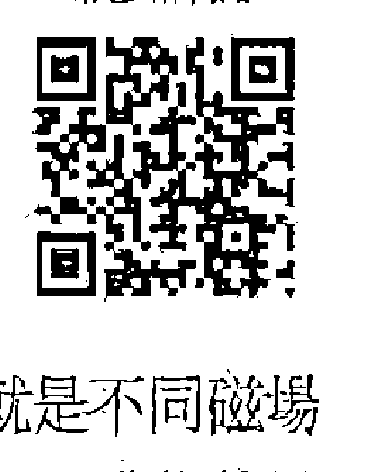

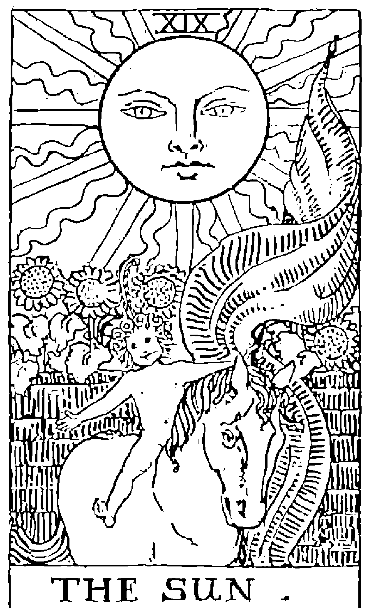

##### The Sun XIX 太阳

###### 关键字『热情』

最快乐的表达，生命就该如此呈现！活力为我们带来认同、喜悦让我们觉得有趣，开心的接收生活中发生的点滴，并感恩的给予热络回应！塔罗牌中编号『19』的太阳，代表的是生命，太阳光无私无偏的照射在大地一个角落，孕育新的生命，太阳给人光明美好，活力开朗的印象。

太阳充满了能量，也是地球上生命生存的要件之一，所以积极的冲，努力的动，让自己进入属于自己人生中的颠峰期，相反的，如果失去了太阳的活力，将会失去动力，做任何的事情都无法长久，而做什么就会搞砸什么，是人生的低潮，这时会完完全全丧失能量，这时不妨休息一下，等待日出，凝聚斗志后再出发。

## 【打破框框，孟小蜻的塔罗扩大想像解牌法】

咦！向日葵不是应该朝向太阳吗？怎么会朝向前面双手敞开的快乐小孩呢？是的，就跟你心中想像的一样，孩子的热情与活力，超越了万物所需的阳光。你呢？现在是你发光发热的时期吗？如果是，就让我们全力冲刺，一边感受生命力，一边开怀的笑着、活着！逆位反之，太阳好像正要西下，花朵也像是被摘下来的干燥花，最重要的是会从马背跌落的小孩，可能是因为连用双脚夹住马背的力量都失去了，只能有气无力的瘫软着。

#### 牌的建议：

+   正位★★★★★：属于活跃期，精力充沛的未来，让你充满光明美好的。
+   逆位★★★：活动力变弱，要打起精神来，让自己恢复士气，不然会更加消沉的！

#### 环境状况：

+   正位★★★★☆：体力充沛精力旺盛，又温暖舒适，处于健康、快乐的状态中！
+   逆位★★★：生活上的活动力减退，拙于社交不想互动，人际关系变差！

#### 关于爱情：

+   正位★★★★☆：可以分享爱情里的所有喜悦、甜蜜，多去共创一些回忆吧！
+   逆位★★☆：对方慢慢的疏远，两人热情不再、懒得经营，幸福渐渐瓦解。

#### 关于事业：

+   正位★★★★☆：光芒四射冲劲十足，热情认真活跃于工作，成果大进展。
+   逆位★★★：计划中的事没发展，垂头丧气的你，提不起精神与元气。

#### 关于财运：

+   正位★★★★★：让自己热力爆发；大发财，心想事成想什么就来什么！
+   逆位★★☆：金玉其外、败絮其中，只重视外在打扮的表象，并无收获。

| 牌中的元素图象 | 要告诉我们的意义 |
| :--- | :--- |
| 发光的太阳 | 万物的源头、慷慨的滋养 |
| 背后灰色的墙面 | 跨越人造的框架 |
| 白色的马 | 纯洁的象征 |
| 赤裸的小孩 | 纯真的热情活力 |
| 左手里的红旗帜 | 用潜意识控制行动力 |
| 向着孩童的向日葵 | 追随孩子的光与热 |
| 注：马赛塔罗《LE・SOLEIL》；托特塔罗《The Sun》太阳 | |

###### 倒牌逆位意义：关键字『消退』

如果你原本是一个乐观开朗的人，也不可能时时刻刻都保持着活力吧！虽然大多数的逆位牌都有一些负面的意思，但其实太阳牌的逆位顶多只是衰弱一些罢了，但还是有很正向的意义存在喔！身心疲惫、故作坚强、还有人来疯的自信过度、刻意掩饰自己的情绪等，都是逆位太阳所呈现出来的状况。

说真的，要是真的人生都要每天如此光明正向，那还真的挺累人的，但如果我们了解了自己的阴暗面，用一种接受的态度来面对，偶尔显露出的负能量，是一种正确的释放，也许我们都得要有一些喘息的空间，对吧！就让自己重新充个电，累积一些能量，这样一来我们才能对付这些看起来没这么严重的小麻烦，但是毕竟还是一些需要我们专注解决的困难，只要勇敢的正面迎击，经过努力，你一定可以再度拥抱幸福快乐的，因为状况真的没有你想的这么差！

## 【塔罗小馆的塔罗博物馆】

037 沃尔斯塔罗牌 Universal Wirth Tarot
作者：Giordano Berti & Stefano Palumbo 发行：Lo Scarabeo

奥斯瓦德沃尔斯是一个占星家治疗师，根据重建沃尔斯研究的规格，有着完全景区周围的装饰元素符号，每一张图片中的背景都有华丽的框架，强调了之前版本中画面里的线条，另外也在小阿尔克纳设计了一些独特的新图像。

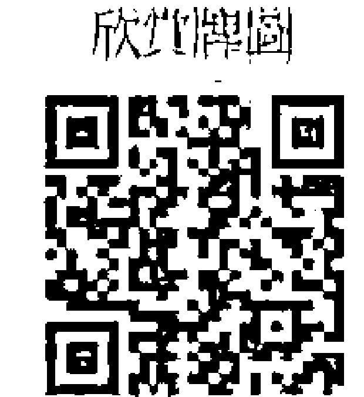

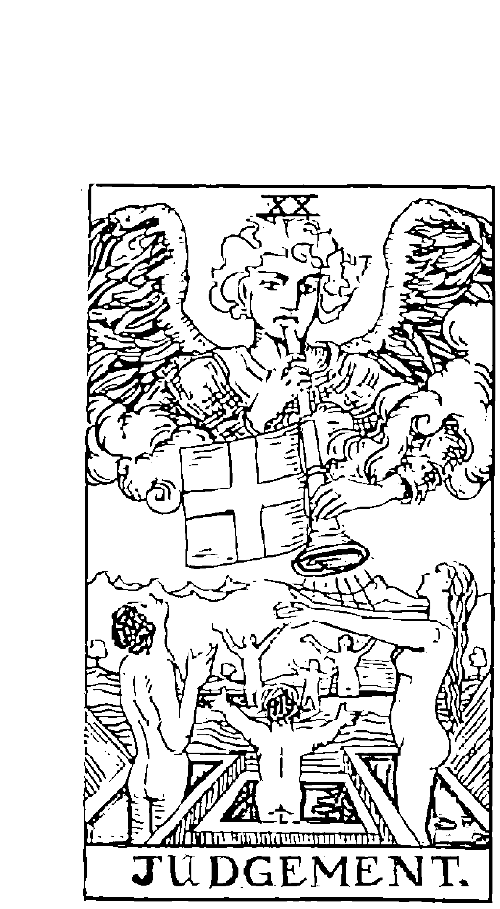

##### Judgement XX 审判

###### 关键字『复活』

最清楚的判断，不再三心二意的犹豫不决，也明白了在这个生命的路程中，要给你带来的成长与获得，相信自己所做的决定，会为你带来好消息！塔罗牌中编号「20」的审判，代表的是复活。这个意涵是深奥难懂的，它包括了精神上的再生，物质上的失而复得，还有事件的真相大白，人经过时间生活的洗礼，有些思绪想法就渐渐的被遗忘。

而审判这一张牌之中墓地的往生者，完成了人生旅程，期待下次转生的心灵再生，复元动力再度出发，所有的事情都逐渐的走向上坡，精神心灵得到安慰。该如何去做，自己最清楚，肯定不是来自于别人给你的，是自己给的，也或许是大逆转，但千万别忘掉了，荣耀给予真正认真努力的人。

> 【打破框框，孟小靖的塔罗扩大想像解牌法】
由天使所吹响的号角，你觉得是什么样的旋律呢？有人说，音乐可以让人感觉到救赎，或许这会不会是我们累世的记忆，所留下来对声音的敏锐与感受！我们不也都会因为听到某段音乐、看到某个场景，回忆就涌了上来，不管你想不想感受这些过往，但我们的确无法抹煞，因为每一个决定与选择，才能成就现在的你。逆位反之，人已经脱离棺木，但却还是要下方的天使引导前进，你是能带领人的天使？还是只为随波逐流的角色呢？

#### 牌的建议：

+   正位★★★★☆：努力付出的成果，在此刻逆转的呈现出来，开始展露头角！
+   逆位★★☆☆☆：学着果断的下决定，无论多么举步维艰，但仍要努力向前。

#### 环境状况：

+   正位★★★☆☆：逐渐走上坡的机会，有力的决断是复兴的奇迹，这是一种体认！
+   逆位★★☆☆☆：三心二意的诸多考虑，造成想东山再起，要浪费更多的时间！

#### 关于爱情：

+   正位★★★★☆：爱情感觉恢复，坦白的去面对彼此，说真心话可以得到喜悦。
+   逆位★★☆☆☆：对于过去无法忘怀，不可能重新开始，让自己先整理心情！

#### 关于事业：

+   正位★★★★☆：过往努力累积能量展现，升官发财的时候到了，直上青云！
+   逆位★★☆☆☆：心有余而力不足，衰弱造成停滞状态，无法改善现在的困窘！

#### 关于财运：

+   正位★★★★☆：好运来临了，对于先前投资开始会有大幅度的增加收入。
+   逆位★★☆☆☆：因为讯息的遗失，自己的不注意而容易漏财，失去一大笔的财富。

| 牌中的元素图象 | 要告诉我们的意义 |
| :--- | :--- |
| 吹着号角的大天使加百列 (Gabriel) | 传递福音、迎接解放 |
| 红十字旗帜 | 疗愈复活后的平衡 |
| 复活的死者 | 重新恢复活力 |
| 打开的棺材 | 跳脱物质下的旧模式 |
| 伸出手的姿态 | 大方地接受呼唤 |
| 远方的高山 | 灵性的高峰 |
| 注：马赛塔罗《LE・JUGEMENT》；托特塔罗《The Aeon》新纪元 | |

###### 倒牌逆位意义：关键字『延迟』

到底该如何下决定呢？当你面临三心二意的状况时，你会怎么让自己走出这个优柔寡断的情绪呢？明明知道想要达到内心目标的你，必须相信改变、做出决定。所以审判逆位时要告诉我们的包括拖延、不面对现实、借口，还有犹豫不决这些都是我们应该面对要注意的事。

所以现在的你真的需要拿出决断力，事情再摆下去，不可能在某一天自己就突然解决了，还是需要你打从内心的态度调整，让自己愿意去面对，这也许是让你长大成熟的过程，时候到了，这次不管你的心情，是不行、还是不想，都得去处理了。

这些过程与经验将会让你印象深刻，也了解到决定不单单只是影响自己，也有可能对整个事情的发展局面造成干扰，小心谨慎的考虑自己的行动，或许得经过复杂的体验、挫折的袭击，但现在的决定，将能带领你前进未来，看到新的方向。

### 欣赏牌组

### 【孟小靖的塔罗博物馆】

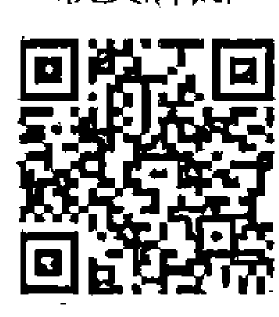

038 日月塔罗牌 SUN and MOON TAROT

作者：Vanessa Decort 发行：U. S. Games

主要想传达出来是我们生活的这个空间，意指涵盖了很多的领土，就是太阳和月亮之间的距离。鲜艳色彩的插图探索世界童话，幻想神话，以及个人经验，部份受到托特塔罗牌的影响，呈现出占星、荣格心理学、炼金术符号等。

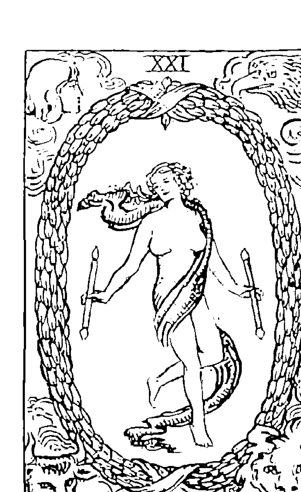

##### The World XXI 世界

###### 关键字『达成』

最圆满的成功，是一种和谐之下的美好，不需任何妥协，大家都感觉到十分满足，这样的平安喜乐，符合了众人的期待，当然也让你堆起了满满笑容！塔罗牌中编号「21」的世界，代表的是达成。这是塔罗牌之中的最后一张牌，结局圆满大功告成，是一种完美的意境。

你已经历经了种种的考验与磨难，在这之中学习和成长已经达到目标，可迈向一个新起点，大步进行了，无论先前受了多大的苦痛，多少的委屈，一切都有所成就，开出了人生的花朵，甜美的果实，现在只要你能知足，爱情、生活、事业都会顺心如意，而你的未来也会按照你所规划的人生顺顺利利的发展。

> 【打破框框，孟小靖的塔罗扩大想像解牌法】

你有曾经因为开心，不自觉的跳起舞来吗？透过身体的律动来表达一种喜乐！看到世界牌中的少女是不是就是这样的感觉呢？这个舞蹈无论是给别人看或是跳着让自己愉悦，不都是一件令人开怀的事吗？相信现在的你，也是在一个平和的最佳状态，请记住这个美好的一刻。逆位反之，上下颠倒的少女不再舞蹈，手上的权杖也会掉落，这些无法掌控的状况，可能造成不完美的局面，也有要你重头再来过的意义存在。

#### 牌的建议：

+   正位★★★★★：要有目标，历经了努力与奋斗，所有的事就能成功如意。
+   逆位★★★：缺乏正确的分析判断造成不圆满，做点跟平常不一样的事吧！

#### 环境状况：

+   正位★★★★★：每个条件都达到圆满的状态，照这样下去就会有一番成就的。
+   逆位★★★：计划尚未成熟，不正确的处事方法，无法完成预期目标。

#### 关于爱情：

+   正位★★★★☆：天生的一对，会有完美圆满的结局，享受幸福美满的未来吧！
+   逆位★★：犹豫不决造成了分离，不圆满的恋情，考虑重新来过会比较好。

#### 关于事业：

+   正位★★★★：目标达成，任务顺利完成且受到奖励，获得想要的成就结果！
+   逆位★★☆：目的不明确，让计划只能半途放弃，当然无法按想像中顺利完成。

#### 关于财运：

+   正位★★★★☆：招财进宝、福禄双全，让你可轻松获得一笔很大的财富。
+   逆位★☆：墨守成规的用钱方式，不知变通，经济状况造成危机。

| 牌中的元素图象 | 要告诉我们的意义 |
| :--- | :--- |
| 跳舞的女子 | 自由的快乐 |
| 身上的紫色布幔 | 神性在我、灵性共有 |
| 两手上的双权杖 | 进与退的自在选择 |
| 四个角落的人首、鹰首、牛首及狮首 | 象征四元素的完整 |
| 圆形的桂冠花圈 | 圆满、成功 |
| 上下两个红色缎带 - 隐藏的无限大 ( 倒 8 符号 ) | 永恒的意涵 |
| 注：马赛塔罗《LE·MONDE》；托特塔罗《The Universe》宇宙 | |

###### 倒牌逆位意义：关键字『停滞』

来到塔罗牌22张大牌中的最后一张，正位象征着完美圆满的，你所在的环境也是令人感到舒适的，但如果当现在的你并没有这样的感觉，反而觉得空空的，其实就是逆位世界要点破的事情。

大家认定的好，不见得是你想要的好，而未完成、不完美，及无法变通都是世界逆位的意思，突然间对于很多事情产生了很多负面想法，不想做这个、不愿意接受，或是其他发生状况而不如期待，缺了临门一脚的滋味让你不舒服。但是不是也在告诉你，别事事非得要求完美，顺其自然的发展，或许是福不是祸，当你吹熄眼前的注视的蜡烛，才会赫然发现窗外皎洁的月光幽静的洒落！

当然，也可能再次提醒你，单单一个旅程的完结对你来说是不够的，你还要准备再一次的出发，把握一个新机会，再去体验一次新的愚者之旅，重新去感受过往的经历，仔细看看是不是能有其他新的获得？

> **【孟小晴的塔罗博物馆】**
039 兔子塔罗牌 The Rabbit Tarot
作者：Nakisha VanderHoeven 发行：个人创作

小白兔和荷兰兔（黑兔和白兔）透过作者的画笔，在塔罗牌中的每一张图像里表演出牌的角色意义，温和的牌组中，宝剑变成了胡萝卜、圣杯是郁金香、权杖是树枝及雏菊是钱币，适用于塔罗占卜、心灵冥想，或个人转化上喔！

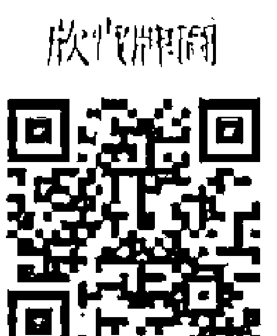

### 丰富人生，小阿尔克纳 56 张元素故事

完整的 78 张塔罗牌中，除了 22 张大阿尔克纳之外，另外就是分成四个元素的 56 张小阿尔克纳了，分别是火（权杖）、水（圣杯）、风（宝剑）及土（钱币），也就是所谓的小牌。在这 56 张的牌卡之中，相较于大牌的画面，56 张的小牌更能清楚直接的说明一个行动、表现一个场景，或是一种情绪，多了 56 张小阿尔克纳的搭配，让我们更直白清晰的看到一些真实的反应。

| 小阿尔克纳 56 张 | 火（权杖）、水（圣杯）、风（宝剑）、土（钱币） 意义 |
| :--- | :--- |
| 数字牌 40 张 | 四元素的 1 ~ 10 事件感受 |
| 宫廷牌 16 张 | 四元素的随从、骑士、皇后及国王 个性角色 |

其中四元素分别有 1 ~ 10 的数字牌，一共是 40 张的数字牌，对应我们面对事件状况发生前后的情绪。以及四元素分别有随从、骑士、皇后及国王等 4 位人物角色，一共是 16 张的宫廷牌，通常会代表角色个性、人格特质及社会位阶等，经过这样的相互链接，就更能了解我们问题中所遇上的状况，进而找出相对应之道。

> **孟小靖的塔罗博物馆**
040 新天使塔罗牌 Tarot of the Angels
作者：Giordano Berti & Arturo Picca 发行：Lo Scarabeo
这样用温柔的艺术来表现这个发人深省的指导，显示天使在不知不觉中对我们的产生影响！你看天使，无论善恶，扮演不同的角色，结构和灵感是来自伟特塔罗牌，或许身后都会有天使为我们守护，这是一件相当幸福的事喔！

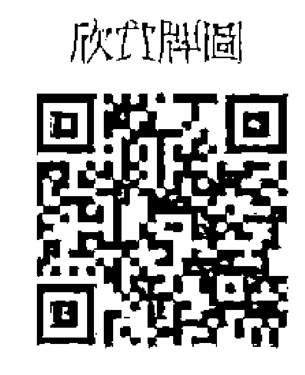

### 细数人生，小阿尔克纳数字牌 40 张结构

在小阿尔克纳的数字牌之中，跟西洋神秘学中的生命灵数（灵数学）有很大的关联性，也有人说与卡巴拉生命之树中除了 22 条路径对应 22 张大牌外，当中的 10 个质点（Sephiroth）也跟小阿尔克纳数字牌 1～10 的意义类似相呼应。所以我们要更透彻了解内心深层的声音，搞懂小阿尔克纳数字牌 40 张结构，就可运用 4 个元素的情绪行为面向，结合延伸表现出各自 10 种不同阶段的事件感受。

| 40 张数字牌代表涵意 | 权杖（火）展现行动 | 圣杯（水）丰沛情感 | 宝剑（风）沟通交流 | 钱币（土）务实财富 |
| :---: | :---: | :---: | :---: | :---: |
| **1** 开始与完全 | **权杖 1** 行动的开始 | **圣杯 1** 关系的开启 | **宝剑 1** 计划的开创 | **钱币 1** 实质的开端 |
| **2** 合作与对立 | **权杖 2** 实质的决定 | **圣杯 2** 分享的决定 | **宝剑 2** 信仰的决定 | **钱币 2** 灵活的决定 |
| **3** 共享与改变 | **权杖 3** 地位的进展 | **圣杯 3** 欢乐的庆贺 | **宝剑 3** 悲痛的理解 | **钱币 3** 实务的成长 |
| **4** 稳固与保护 | **权杖 4** 环境的安定 | **圣杯 4** 情绪的平静 | **宝剑 4** 暂缓的休息 | **钱币 4** 财富的巩固 |
| **5** 失落与冲突 | **权杖 5** 改变的挣扎 | **圣杯 5** 分离的失落 | **宝剑 5** 争吵的纷扰 | **钱币 5** 经济的贫困 |
| **6** 慈悲与和善 | **权杖 6** 具体的成功 | **圣杯 6** 童年的拥抱 | **宝剑 6** 回忆的疗愈 | **钱币 6** 财务的稳定 |
| **7** 机会与奋斗 | **权杖 7** 坚持的挑战 | **圣杯 7** 目标的追寻 | **宝剑 7** 可能的机会 | **钱币 7** 重大的决策 |
| **8** 内省与行动 | **权杖 8** 迅速的活力 | **圣杯 8** 反思的逃离 | **宝剑 8** 摆脱的抉择 | **钱币 8** 专注的获得 |
| **9** 累积与体悟 | **权杖 9** 回顾的评估 | **圣杯 9** 价值的满足 | **宝剑 9** 强迫的检视 | **钱币 9** 成就的报酬 |
| **10** 圆满与释放 | **权杖 10** 过多的负担 | **圣杯 10** 团体的和谐 | **宝剑 10** 压垮的释放 | **钱币 10** 稳固的延续 |

## 扮演人生，小阿爾克納宮廷牌 16 張角色

在56張的小阿爾克納之中，宮廷牌的代表意義是指不同階段的人物角色，在古老的塔羅牌繪製呈現，馬賽系統的傳統塔羅牌在數字牌還未以清楚的圖案呈現，但在宮廷牌上就已經把人物的樣貌給刻劃出來，表現出當時不同年齡、不同身份及不同職位的角色，到了偉特塔羅系統後，就更能從牌的畫面之中看出每一個宮廷角色的性格。

4位宮廷角色國王、皇后、騎士及隨從對應四元素，一樣同年齡階段的角色，透過不同特質的人格變化，所發展出16張的宮廷牌人物角色，讓我們運用在塔羅占卜上，可以窺探在問題中關於「人」的想法與影響。

| 宮廷人物 | 人格特質 | 人物年齡 | 元素表現 | 社會角色 |
|----------|----------|----------|----------|----------|
| 國王 | 領導者 | 老年 | (土)務實財富 | 權威的父親或長者 |
| 皇后 | 照顧者 | 熟齡 | (水)豐沛情感 | 妻子或母親的角色 |
| 騎士(王子) | 探索者 | 青年 | (火)展現行動 | 展開冒險的行動家 |
| 隨從(公主) | 學習者 | 少年 | (風)溝通交流 | 充滿熱忱年輕學子 |

| 16張宮廷牌 | 權杖(火) | 聖杯(水) | 寶劍(風) | 錢幣(土) |
|------------|----------|----------|----------|----------|
| 元素特質對應 | 展現行動 | 豐沛情感 | 溝通交流 | 務實財富 |
| 國王 | 土 | 權杖國王 (火)之土 | 聖杯國王 (水)之土 | 寶劍國王 (風)之土 | 錢幣國王 (土)之土 |
| 皇后 | 水 | 權杖皇后 (火)之水 | 聖杯皇后 (水)之水 | 寶劍皇后 (風)之水 | 錢幣皇后 (土)之水 |
| 騎士(王子) | 火 | 權杖騎士 (火)之火 | 聖杯騎士 (水)之火 | 寶劍騎士 (風)之火 | 錢幣騎士 (土)之火 |
| 隨從(公主) | 風 | 權杖隨從 (火)之風 | 聖杯隨從 (水)之風 | 寶劍隨從 (風)之風 | 錢幣隨從 (土)之風 |

## 【孟小婧閒聊】塔羅牌為什麼會準？

塔羅牌對應的潛意識原理之中，從心理學的領域來看佛洛依德 (Sigmund Freud) 所提出的「冰山理論」id ego super-ego 與榮格 (Carl Jung) 的「共時性原理」Synchronicity 都能為塔羅牌的準確度做出說明，透過塔羅牌卡的呈現，讓我們了解到自我潛意識的作用喔！

#### 冰山理論 id ego super-ego

佛洛依德對於心智組織與人格結構提出「冰山理論」，根據假設將意識劃分為「意識」、「前意識」和「潛意識」三個層次。意識層是指海面上可見的冰山，而前意識層相當於漲退潮時落差之間的冰山層，潛意識層則是位於海底深不見底的深層區域，是占據整體人格最大部份。其中，潛意識相對於意識及前意識，呈現具有兩種對立關係的意識層次。

#### 意識層次分類

- （1）意識：「自我」存在之處，我們可以察覺的。
- （2）前意識：處於「意識」與「潛意識」之間，無法時時察覺。是種「經驗」與「記憶」。
- （3）潛意識：「本我」或「超我」，內心深處的想法或天賦。

簡單來說，相信大家都有沒聽到鬧鐘響的經驗吧！其實這就是潛意識的反應，其實不是沒聽到，而是不想起床。但其真正的原因是你的內心，有著不想前往赴約的情緒，進而才產生這樣的結果。

#### 共時性原理 Synchronicity

榮格所提出「有意義的巧合」的理論，用於解釋因果法則無法理解的現象，像是生活狀況與夢境相似、突然想到誰，他就出現等。榮格認為，這些表面上無因果關係的事件之間有著非因果性、有意義的聯繫，這些聯繫常取決於人的主觀經驗，以及人類的集體潛意識之中。而這樣深層心理和塔羅牌也呈現出一致的關係性，塔羅圖像也就是集體潛意識之中原型（Archetypes），透過抽牌的過程便會受自己的體驗或經驗刺激，創造意象，釋放反應出潛意識的聲音，進而造成行動，影響著未來事物的發展。

# 小阿爾克納元素：行動之火，權杖牌組

象徵火元素的權杖，代表了活力、行動力與熱情，當然也就會有衝動、暴躁及不耐煩等等的負面狀態出現，火元素也是能量跟生命力的代表，願意接受挑戰與人互動，這樣的積極的交流將為你的人生開啟新的一頁。「我見故我得」這樣的信念，就是權杖牌組角色中的最佳寫照了，展開如火般的行動，炙熱的接受人生中不同的挑戰，其實就跟占星學中的火象星座 (獅子、牡羊及射手)的個性一樣，經歷過這些冒險與挑戰，更能激發出自我的潛力，不是嗎？

所以有關運動、遊戲及戶外大自然也都是權杖牌組想傳達出來的訊息與意義，活著就是要動，動才能感覺活著，這樣兩相呼應就能看到自我的存在價值了！如果在占卜時，出現很多權杖牌組，也就表示事情正快速的發展，當下的行動就顯得十分的重要了！

| 權杖牌組 宮廷牌角色 | 火象星座對應 | 中世紀階級 | 季節 |
| --- | --- | --- | --- |
| 權杖國王 (火)之土 | 獅子座 | 農民 | 春 |
| 權杖皇后 (火)之水 | 牡羊座 | 農民 | 春 |
| 權杖騎士 (火)之火 | 射手座 | 農民 | 春 |
| 權杖隨從 (火)之風 | 無 | 農民 | 春 |

## 孟小婧的塔羅博物館

041 奇幻生物塔羅牌 Fantastical Creatures Tarot
作者 : DJ Conway & Lisa Hunt 發行 : U. S. Games

在水彩與美麗細緻的風格之中，呈現出了78種的神話生物，幻想動物和傳說中的種族，神奇的故事和精神力量已經存在了數千年，生物為代表的冥想來自世界各地，解釋我們開創的環境，喚起我們自己的生命旅程的心靈意象！

### ACE of WANDS 權杖 1

關鍵字『起始』

從雲朵伸出一隻握住權杖的手，而權杖上發芽的新葉，就象徵著新生命，新事物的開端。現在的你適合朝一個全新的方向前進，這是一個新的機會，你也能看到這個行動的美好未來，目前也是充滿活力、精力旺盛能帶領你到一個新的領域及階段，對於你付出的這些熱力，周遭的環境也會給予豐盛的回應，就讓蓄勢待發、企圖心強盛的你，動起來去做出一些新成果吧！在這樣的過程之中，除了自我成長的新獲得，也有可能交到新朋友、發現新潛能喔！

#### 牌的建議：

- 正位★★★★☆：自我成長的靈感萌芽，只需發揮自己的創造力，讓熱情誕生。
- 逆位★★☆：無力的勉強行動，心口不一的狀況造成徒勞無功。

#### 環境狀況：

- 正位★★★★☆：機會來臨，有很多資訊來幫助你目標更明確，動力滿滿。
- 逆位★★★：稍縱即逝的機會，可要看準才能好好把握！

#### 關於愛情：

- 正位★★★★☆：熱情的行動會讓你嚐到甜美果實，對方也會給予正面回應喔！
- 逆位★★★☆：嚮往這段感情發展，但不如預期中的想像，再加把勁！

#### 關於事業：

- 正位★★★☆：新的計劃與想法，讓你可以運用創造力來表現自己。
- 逆位★★☆：太過於草率的開始，現在不是你該努力以赴的時機！

#### 關於財運：

- 正位★★★★☆：是時候為自己規劃大項目的投資，可以準備買車、買房了。
- 逆位★★★：為了只是想花錢的舉動，不一定能買到開心。

### ACE of WANDS 權杖 1

| 牌中的元素圖象 | 要告訴我們的意義 |
| :--- | :--- |
| 握住權杖的手 | 強勁、堅定 |
| 從雲中伸出的右手 | 行動力 |
| 發芽綠葉的權杖（火炬） | 生命力、成長 |
| 飄散的葉子（飛舞的火苗） | 爆發力、活力 |
| 樹木風景及河流 | 肥沃、源源不絕 |
| 遠方的高山城堡 | 頂峰的成就 |

註：馬賽塔羅《1》；托特塔羅《Ace of Wands》權杖王牌

#### 倒牌逆位意義：關鍵字『沮喪』

當倒過來的權杖 1，樹葉逆生長的狀態，是不是就令人感覺到十分的沒有生命力呢？逆位的權杖 1 象徵著健康精神狀況不佳的你，也會開始感覺到很多狀況都開始停擺，周遭的環境狀況不如預期、也沒有給你支援及鼓勵，這樣也會不斷的消磨你的熱情。接著自我的進步與成長速度變慢，漸漸的不願意面對新事物，寧可暫時接受過往勉強及格的舊規則。

行動受阻、無精打采、能量不足、自信缺乏都會造成行動的猶豫不決，這些都是權杖 1 逆位的意思，或許目前需要渡過無法發揮潛能的時期，先找找，解決問題的方法，別徒勞無功的耗盡自己的精力喔！

### 【孟小靖的塔羅博物館】

042 鬼魅塔羅牌 Gothic Tarot
作者：Joseph Vargo 發行：個人創作

充滿了吸血鬼、異形、狼人、巫婆、幽靈鬼魂，甚至於是天使，都有著詭異的氛圍，在黑色的牌面中，塔羅牌的角色們都發著淡淡的光暈，都有著一股說不出的神秘感，幽暗的世界被這些薄光所照亮，看到了不同世界角度的美！

### TWO of WANDS 權杖2

#### 關鍵字『觀望』

是時候接受新挑戰了，已經擁有成果的你，現在到底還能做些什麼呢？握住權杖與地球的你，腦子裡是在思考什麼決定，盤算要下什麼選擇呢？手中的那個地球，對你來說，會不會只是一個小的世界，不夠全面、不夠宏觀。望向遠方的樣子，就在告訴你，踏出現在的小確幸，現在前方都是你所見的道路，清楚而無害，跨出城牆是重要的一步，再一次跟人群接觸，再一次展開旅程，想像一下自己想要追求的未來是什麼？是自我的成長，或是再一次的成就！

#### 牌的建議：

- 正位★★★☆：面對現狀，請先沉思再出發，別忘了你有做選擇的能力喔！
- 逆位★★☆：了解自己內心中想要什麼，找到渴望就能訂立目標！

#### 環境狀況：

- 正位★★★★：掌握大局的你，其實可以試著獨立作業，也會有成果！
- 逆位★★★：想一下自己站在哪裡？手上有什麼是正等待你去做整合運用的。

#### 關於愛情：

- 正位★★★☆：現在你所談的戀愛，讓你幸福嗎？是你真正想要的樣子嗎？
- 逆位★★☆：對於愛的不滿足、諸多限制，讓你感覺到悶悶不樂！

#### 關於事業：

- 正位★★★★：了解自己手邊有什麼資源，就能支配進而產生成果喔！
- 逆位★★★☆：遇上困難，有些意外的轉折，讓你無法立即判斷決定。

#### 關於財運：

- 正位★★★☆：自身的錢財花用足夠，但沒有多餘的開銷預算！
- 逆位★★☆：最近的手頭有點緊，可要謹慎點安排用錢計畫。

### TWO of WANDS 權杖2

| 牌中的元素圖象 | 要告訴我們的意義 |
| :--- | :--- |
| 手中拿個地球的人 | 思考全面的完整 |
| 站在高牆內的姿態 | 高處不勝寒的憂愁 |
| 左手握著權杖 | 正在計畫行動 |
| 固定在城堡牆上的權杖 | 達成某件事的成果 |
| 兩個權杖中的位置 | 猶豫、考慮 |
| 交叉的紅玫瑰與白百合 | 平衡熱情的愛與純潔的智慧 |

*註：馬賽塔羅《Ⅱ》；托特塔羅《Dominion》統御*

#### 倒牌逆位意義：關鍵字『焦慮』

若是可以明確選擇就好了！你曾經下錯決定而感到後悔嗎？就因爲你當下的一個想法，而造成後來難以收拾的局面。或是因爲看到太多可能性，想要超越但又猶豫不決，這些情緒都是權杖2 逆位要提醒我們的訊息，其實最重要的就是別讓焦慮成爲限制自己的敵人，你永遠想不出最棒的計劃，只需行動、唯有嘗試，這些體驗才會爲你帶來新的想法，創造新的機會。

### 【孟小靖的塔羅博物館】

043 德魯教塔羅牌 THE DRUID CRAFT TAROT
作者：Phillip and Stephanie Carr-Gomm 發行：Connections

以愛好自然、親近動物的自然教派信仰的德魯伊，作爲整個繪製的主軸，你會發現到這一副牌呈現出一種十分舒服的感受，畫面中大量的使用自然界的原本素材，像是木頭、樹、石頭等，藉著宗教儀式，來感謝大自然的給予！

### THREE of WANDS 權杖 3

#### 關鍵字『遠見』

站上至高點，你將看得更遠，手邊的成就，目前也只是讓你更為強大的養份。遠方的船隻已經告訴我們，位高權重的你，能力已經不再被侷限，面向寬闊大海，早已經不害怕跟人合作與交流，自信充沛、冷靜沉穩的你，能從一個穩健的角度中，了解自己拿手的領域、巧妙的保護自己的弱勢，規劃出新的冒險，讓這些所擁有的成果，帶領到一個新的階段，所有事物透過行動來達成更好的成績，推往更上一層樓，形成更大的影響力！

#### 牌的建議：

- 正位★★★★★：充滿氣魄，具備遠見的眼光，可以將計劃付諸行動了！
- 逆位★★★☆☆：專注你想完成的未來構想，要更有勇氣的承擔任務！

#### 環境狀況：

- 正位★★★☆☆：位於領導者的角色，拿出你的個人魅力進行指揮吧！
- 逆位★★★☆☆：留意監督計劃是不是按部就班，小心細節部份的處理。

#### 關於愛情：

- 正位★★★☆☆：在這段關係佔上風的你，偶爾也要給對方一些甜頭喔！
- 逆位★★☆☆☆：不信任的關係，讓你們彼此都沒有敞開心胸去更了解對方。

#### 關於事業：

- 正位★★★★★：增加貿易的往來，跨國的合作會為你帶來很棒的成績。
- 逆位★★★☆☆：困難會慢慢減少，但也別太過依賴別人所提供的幫助！

#### 關於財運：

- 正位★★★★☆：手邊多出一些額外收入，未來投資可選擇長遠規劃！
- 逆位★★★☆☆：跟別人借錢花用，千萬別養成習慣造成依賴喔！

## THREE of WANDS 權杖3

| 牌中的元素圖象 | 要告訴我們的意義 |
| :--- | :--- |
| 山巔上遠望的人 | 遠見、領導、探索、展望 |
| 右手握住的權杖 | 堅定的執行計畫 |
| 身後的兩根權杖 | 已擁有的成就 |
| 紅色的袍子 | 行動力、熱情 |
| 海面上的小船 | 商業貿易、生意的機會 |
| 黃色的背景 | 活力、喜悅 |

註：馬賽塔羅《III》；托特塔羅《Virtue》美德

#### 倒牌逆位意義：關鍵字『留意』

想要很快有所大作為的心，會讓你忘記步步為營的道理！對於很多事過於有自信的你，已經是一種自大的表現，不去留意風險的評估、各自算計的合作，突然發生的危機，或是遇上欺騙與背叛都是權杖 3 要告訴我們的，開始懂得低調行事，相信過往經驗而累積的生存法則，就避免掉一些麻煩，用一種小心駛得萬年船的心態謹慎來度過，才有機會漸漸好轉。

### 【孟小靖的塔羅博物館】

044 金色文藝復興塔羅牌 Golden Tarot of Renaissance
作者：Giordano Berti & Jo Dworkin 發行：Lo Scarabeo

根據十五世紀法國的一組古老的塔羅牌繪製而成，這套原本只有 17 張的塔羅牌，被後來的藝術家設計成 78 張的版本。在法國興盛的年代，金幣輝煌的建築物也是他們的具體象徵，水彩風格添加燙金的處理，來呈現出當時的華麗！

### FOUR of WANDS 權杖4

#### 關鍵字『穩固』

身處一個穩定環境、和諧狀態的你，現在是可以先讓自己休息一下的時間囉！由四根權杖所撐起的花圈，是不是給人一種穩固有保障的感覺，正方型的四個角、桌椅下的四隻腳，由四所建構的物品，不都給我們一種堅固的安定感。還有正前方高舉雙手的人，是不是很像回家時，親朋好友對你的歡迎呢！當然是因為你先前的努力得到成果了，才有現在的安穩快樂。這是一個讓你慶祝的時刻，先去體會安頓後的這些舒適溫暖吧！

#### 牌的建議

- 正位★★★★☆ : 完成了，總算讓自己看到成果，好好去慶祝並感恩吧！
- 逆位★★★☆ : 看似完成，但並不完整，在多加把勁才會更完美喔！

#### 環境狀況

- 正位★★★☆ : 收穫滿滿，開始將這些喜悅成果融入你的生活，與親友團聚！
- 逆位★★☆ : 目前和諧安全，是不是要思考下一個人生的階段藍圖。

#### 關於愛情

- 正位★★★★★ : 現在擁有最快樂的時光，可以考慮是否要跟對方定下來喔！
- 逆位★★★☆☆ : 不安定的情緒，面對告別，現在或許是你的人生轉捩點。

#### 關於事業

- 正位★★★☆ : 固定能獲得成果的方法，未來可以持之以恆的運行喔！
- 逆位★★☆ : 雖然沒有大問題，但過於平靜讓你面對工作時有點懶洋洋。

#### 關於財運

- 正位★★★★★ : 付出勞力的收穫加倍回饋，可以開始累積自己的財富！
- 逆位★★☆ : 最近沒有金錢進帳的你，卻找回休息時間，恢復身體健康。

| 牌中的元素圖象 | 要告訴我們的意義 |
| :--- | :--- |
| 圍成四方形的權杖 | 穩固、安定 |
| 權杖上的花圈 | 歡慶、平安喜樂 |
| 權杖下的城牆 | 保障、保護 |
| 花園城堡 | 富裕、繁榮 |
| 帶著花舉手的人 | 敞開心胸的迎接、慶祝 |
| 黃色的背景 | 活力、喜悅 |

*註：馬賽塔羅《IIII》；托特塔羅《Completion》完成*

#### 倒牌逆位意義：關鍵字『失色』

大多數人在解釋權杖4的逆位時都還是十分正向的，從原本的穩定狀態，在權杖 4 逆位時，開始產生減少的情況，看起來好像就沒有之前那樣的歡樂與開心了！但請放心，基本的保障、穩固都還有，但就是少了一點安全感，畢竟找不出方法來延伸這樣的慶祝的活力，難免會讓人有點小瓶頸，但整體狀況都還是不錯之下，暫時維持現狀也是一個好選擇！

### 【孟小靖的塔羅博物館】

045 金色波提且利塔羅牌 Golden Botticelli Tarot
作者：A. A. Atanassov 發行：Lo Scarabeo

波提且利是義大利文藝復興時期的藝術家，他最有名的畫作是『維納斯的誕生』，所以在牌中也可以看到很多神話的人物，除了濃濃的中世紀風情之外，當我們在使用塔羅占卜上，也可以運用這些歷史故事輔助我們的塔羅解讀！

### FIVE of WANDS 权杖5

#### 关键字『切磋』

如何去把不同意见，融合之后好好地呈现出来，这的确是一个很难达到共识的课题。每个人都拿起象征意识的棍棒，高举着想要表达自己的想法，但又没有实际的产生碰撞，一种各自表述的情况牵制住所有人，造成大家必须小心翼翼地进行下一个行动、每一个步伐，像是竞赛般激发彼此潜能、切磋技艺，碰撞之下所产生的火花，或许能有更好的成绩。但就怕只是虚张声势的摇旗呐喊，这不就只是白忙一场的滥情演出罢了！

**牌的建议：**
- 正位★★☆: 请别为了冲突而争吵，大家都要提出更好的建言与做法才是。
- 逆位★★★: 虽然大家还是有些内心矛盾，但总算是达成协议，做出成果。

**环境状况：**
- 正位★★☆: 各自的角度与观点，让大家压力紧绷！请先放下执着与防卫。
- 逆位★★★: 激烈的表达意见，让大家有了交流的机会，彼此的想法被看见了。

**关于爱情：**
- 正位★★☆: 激动的争吵破坏感情温度，明确肯定地说出自己想法是很重要的。
- 逆位★★★: 复杂的问题让你内心产生矛盾，犹豫不决的心面临阻碍。

**关于事业：**
- 正位★★☆: 原先互相切磋的想法，千万小心别变成混乱的争辩，白忙一场。
- 逆位★★★☆☆: 相信专业的调解后，打破彼此无谓的坚持，解决问题。

**关于财运：**
- 正位★★☆: 先确认自己缺少的物品，这阵子会乱购物，买到重复无用的。
- 逆位★★★: 可以跟朋友一起合买共享，就会帮你减少金钱损失。

| 牌中的元素图象 | 要告诉我们的意义 |
|---|---|
| 不同颜色衣服 | 观点不同 |
| 不同角度姿势 | 角色、立场不同 |
| 人物差不多的位置高度 | 公平 |
| 高举挥舞的棍棒 | 竞争、切磋 |
| 交错的棍棒 | 混乱中求相互制衡 |
| 无人松手的状态 | 坚持的冲突 |

注：马赛塔罗《V》；托特塔罗《Strife》竞争

#### 倒牌逆位意义：关键字『协调』

大家想去争论的可能已经不再是事情本身了，更像是为自己的理念出一口气！在权杖5逆位的解释上，有着强化这个争端的意义，但也有着大家放下武器，接受协调的意义。但其实大家都清楚对于所产生纷争的原因，没有对错，只是因为大家的立场角度不同罢了。或许争吵也会是一种沟通，把不满都抛出来，经过相互切磋，或许能找到更好的解决之道，也能有好表现。

### 【孟小靖的塔罗博物馆】

046 金色克林姆塔罗牌 Golden Tarot of Klimt 作者：A. A. Atanassov 发行：Lo Scarabeo

克林姆是一位奥地利画家，是维也纳分离派的主要大师。选用大师克林姆的画风，创作了这副牌，其中有几张牌就是克林姆大师的原作仿照。当然为了配合画作，有些塔罗角色换了名字，但作者还是有注意到所要传递的讯息！

### SIX of WANDS 权杖6

#### 关键字『荣耀』

有着小战车牌之称的这张权杖6，代表先前的辛苦为你带来了荣耀，过去的一切奋斗都是值得的。这次的成功不单单是自己的，也是跟大家一起努力以赴的成果，往上高举同一方向的权杖，就表示了所有人和谐一致地朝向一个目标前进，才能让你集合了众人的力量，透过你的体现来实践，进一步获得欢呼，也十分乐意跟大家分享这样的喜悦，展现自信带领人们迎向新希望，能激励大家、唤起信心，或许才是你未来更重要的使命。

#### 牌的建议：
- 正位★★★★：目标达成带来荣耀与受人尊敬，继续前进，实现愿望吧！
- 逆位★★★☆：尚未真实地确定获得，成功的到来会有所延迟！

#### 环境状况：
- 正位★★★★☆：身边的人都愿意接受你的领导，发挥团队合作的好成果吧！
- 逆位★★☆：金玉其外、败絮其中，只有表面上的光鲜亮丽罢了！

#### 关于爱情：
- 正位★★★★：好消息近了，桃花满满快去让自己谈个幸福的恋爱吧！
- 逆位★★★☆：不真诚的对待会造成彼此的不安，可能有不忠或背叛。

#### 关于事业：
- 正位★★★★★：充满自信的领导能力，带领大家迎接成功、享受胜利。
- 逆位★★★☆：太过自信，听不进别人的建议与想法，反而暴露了自身弱点。

#### 关于财运：
- 正位★★★★：眼光精准，大获利让你意气风发。
- 逆位★★★☆：为了撑场面的花费，到头来会让你觉得吃不消喔！

### SIX of WANDS 权杖6

| 牌中的元素图象 | 要告诉我们的意义 |
|---|---|
| 骑着白马的男子 | 驾驭纯净的力量 |
| 头上戴着桂冠 | 获得胜利 |
| 手持有花圈的权杖 | 凯旋、荣耀的象征 |
| 红色的袍子 | 积极的行动力、热情 |
| 穿戴华丽的服装 | 彰显外在物质的成功 |
| 四周迎接围绕的人 | 崇拜、赞美 |

注：马赛塔罗《VI》；托特塔罗《Victory》致胜

#### 倒牌逆位意义：关键字『骄傲』

我们都曾经有过因为太过自信而误事的经验吧！其实说穿了，不就是一种骄傲的表现吗？一副高高在上的姿态，并不能让事情顺利地进行，还有可能变成大家的箭靶，把所有发生的错误都怪罪给你。权杖6逆位要提醒我们的就是人外有人、天外有天的道理，或许现在你获得胜利，但绝对不是永远的成功，因为总有人会追过你，所以我们需要时时提升自己。

### 【孟小靖的塔罗博物馆】

047 炼金术女神塔罗牌 Alchemia Tarot

监修 & 解说书：森村あこ タロットカード画：贵希 发行：実業之日本社

实现转型的灵魂，诞生出爱与光明，闪烁着前所未有的塔罗牌光芒，高贵艺术画的插图装饰创造出光的描绘人物，建构出梦幻潜意识世界，炼金术女神塔罗牌不再去强调我们生活中现有的恐惧，不再害怕面对内心深处的想法！

### SEVEN of WANDS 权杖7

#### 关键字「优势」

防守就是最好的攻击，权杖7的主角虽然高居山顶上，但将权杖横放采取防卫姿势的他，或许早就深知这个道理，无论下方伸出的权杖是挑战还是攻击，早已经做好面对冲突的准备了！

所以我们绝对不能被人生中不断发生的困难与问题打倒，想想你在一个能纵观全局的位置，继续地坚持下去，虽然是单打独斗的你，偶尔感觉到无助、过程或许辛苦，但现在只需发挥坚毅的心，还是有机会能战胜这一切，没什么好害怕的！

#### 牌的建议：
- 正位★★★★：为自己觉得正确的观点，挺身而出、保卫信念，就能带来成功。
- 逆位★★☆：稍作休息、平衡反思，才能将适当的方案正确地执行。

#### 环境状况：
- 正位★★★★：顺利地取得优势，站在上风处有利于你推广自己的主张。
- 逆位★★★：手边有太多事要先处理，先别坚持自己理想中的结果！

#### 关于爱情：
- 正位★★★★：对方喜欢你的成份比你多，只要你准备好了就可以恋爱了！
- 逆位★★★☆：虽然对你印象不差，但目前没有朝恋情发展的打算。

#### 关于事业：
- 正位★★★☆☆：站稳自己的立足点，整合异议，就能顺利赢得成功。
- 逆位★★★：先搞清楚对手的底细，就能找出最佳行动，减低大家的惊慌焦虑。

#### 关于财运：
- 正位★★★★：比别人都早掌握有利的投资情报，财富金钱轻松入袋。
- 逆位★★☆：不愿意面对金钱问题与实际的处理，不要再骗自己啰！

### SEVEN of WANDS 权杖7

| 牌中的元素图象 | 要告诉我们的意义 |
|---|---|
| 站在山顶上 | 位于高处的有利位置 |
| 绿色的衣服 | 渴望和谐、和平 |
| 双脚站稳的姿态 | 坚毅的决心 |
| 手持横向的权杖 | 防御、保卫 |
| 稍微提高的右手 | 接受挑战、坚持奋斗的信念 |
| 前方直立的六只权杖 | 困难、险阻、冲突对立 |

注：马赛塔罗《VII》；托特塔罗《Valour》勇气

#### 倒牌逆位意义：关键字『为难』

当别人对你提出质疑时，你是不是也有一度觉得自己不够好呢？还是你发现，对方是因为你的与众不同、不同信念，而对你产生批评。虽然目前可能不被认同，但是千万别失去勇气，忘却梦想，这也是权杖7逆位要去警告我们的。别人的攻击与挑战或许会让你感觉到焦虑不安，但别就真的困在窘境中，反倒让自己造成犹豫不决的为难心态，而失去优势！

### 【孟小晴的塔罗博物馆】

048 浪漫塔罗牌 ROMANTIC TAROT

作者：Emanuela Signorini & Giulia F. Massaglia 发行：Lo Scarabeo

有人认为爱情是最强大的力量，浪漫塔罗牌所呈现出的浪漫是一个旅程、一个观点、一个承诺来看世界上所有的关系。以爱为出发点，在每一张塔罗牌之中诠释不同的爱情故事，还有在爱情中不同阶段里的真实感受、进展建议。

### EIGHT of WANDS 权杖8

#### 关键字『迅速』

从天而来的权杖，这样象征着事件在近期，会很快地有所进展、或是重大突破的权杖8，在空中飞行而朝着同一方向的样子，是不是令人感觉到速度与效率呢！因为透过仔细思考计划、伴随着过去的努力，而找到这个路径，快速达成自己所设定目标，这是一种多么自由的发展，当然也能感受其中的快乐与欢愉！另一方面，也象征与旅行有关的权杖8，告诉着我们该给自己来一次旅游，是时候开阔你的眼界，感受美好生命体验。

**牌的建议：**
- 正位★★★★☆：思考迅速有助事物进行发展，成长快速，发展活跃。
- 逆位★★☆：别太急躁地面对问题，不但浪费能量还没有成果。

**环境状况：**
- 正位★★★★：接近预期目标，努力以赴会让大家产生良好共鸣，持续前进！
- 逆位★★☆：千万别想到什么做什么，像个无头苍蝇般地乱飞乱撞！

**关于爱情：**
- 正位★★★★：互相多接触可以让两人感情加温，坠入爱河机会激升！
- 逆位★☆：是时候考虑一下，是不是要结束这段恋情了？找回自由。

**关于事业：**
- 正位★★★★：时机来临，请快速地作出反应，加速思考能量与热情。
- 逆位★★★：操之过急的安排，反而造成大家做白工的状况，怨声载道！

**关于财运：**
- 正位★★★：想花就花的行为会产生浪费，用钱状况过于随性。
- 逆位★★☆：突然对于物质盲目着迷，花钱如流水，造成金钱上的大损失！

### EIGHT of WANDS 权杖8

| 牌中的元素图象 | 要告诉我们的意义 |
|---|---|
| 在天空的权杖 | 无拘无束 |
| 权杖平行 | 相同的一致性 |
| 飞行的状态 | 快速、效率 |
| 顶端向下 | 即将抵达、完成目标 |
| 蓝天的背景 | 自由 |
| 飞过宽阔大地与河流 | 跨越 |

注：马赛塔罗《VIII》；托特塔罗《Swiftness》迅速

#### 倒牌逆位意义：关键字『冲动』

欲速则不达，就是权杖8要告诉我们的意涵了！我们的急躁，不会让事情加速完成，反而造成我们对事物的情绪化，匆忙之下就会乱了步伐，随便决定。有时候是因为事情发展得太快，所以我们没有足够的思考时间去反应，大家对于处理没有相同的共识，发生争议，仓促的决定陷入失控而造成停摆。大家应该先保持冷静，慢下来计划方案才能找到正解！

### 【孟小靖的塔罗博物馆】

049 萨卡拉塔罗牌 Tarot of Saqqara

作者：Donald G. Beaman 发行：个人创作

『萨卡拉』埃及开罗以南的村庄，埃及史上最早的石室坟墓遗址！埃及墓地都会有壁画伴随着死者，每一张牌就如同一幅美丽壁画，重现当时埃及辉煌世代！巧妙地结合埃及神明与埃及人的互动，将塔罗牌的讯息意涵呈现出来！

### NINE of WANDS 权杖9

#### 关键字「防护」

当我们面临的生命中的挫折，真的能好好地释怀吗？或只是暂时的忘却呢？我们也很容易在受到挫败的时候，接着自我否定，阻碍了自己未来的行动。但别小看这些经验所带给你的获得，回顾了自己过去的所作所为，才成就了现在的你，当下的决定产生了目前的结果，这些不都是你的体会吗？让这些过往成为你现在茁壮的养分，更有强大的心智来保护你想要守卫的事物，相信这些磨练与考验，都是为了成就出你坚强的意志！

#### 牌的建议：
- 正位★★★☆：透过时间的锻炼，我获得经验与智慧，了解到坚定的重要！
- 逆位★★★：为主张守住最后防线，请别失去变化的弹性。

#### 环境状况：
- 正位★★★☆：预期中的改变，让大家面临困难与挫败，留意规范的制定。
- 逆位★★★：虽然褪去防卫、放下防备，但也有可能会产生疏离感。

#### 关于爱情：
- 正位★★★☆：过去爱情中的旧伤口会慢慢复原的，经验会成为保护墙。
- 逆位★★☆：太过于习惯一个人的生活，这样的孤独会让你忘了怎么去爱！

#### 关于事业：
- 正位★★★☆：面对现在的状况，这是必须克服的难关，给你的一个警惕！
- 逆位★★★：过多的失误带来极大的压力，让你现在选择孤僻，逃避问题。

#### 关于财运：
- 正位★★★：预期中的金钱收入延后，小心自己的用钱计划！
- 逆位★★☆：别让原先存钱的美意，造成自己束缚，心情烦躁。

### NINE of WANDS 权杖9

| 牌中的元素图象 | 要告诉我们的意义 |
|---|---|
| 双手环抱权杖的人 | 戒慎恐惧、备战状态 |
| 头上的包扎的纱布 | 曾经受伤、等待复元 |
| 观察周遭的目光 | 挫败后的忧心、警觉 |
| 并拢的双脚 | 小心翼翼、谨慎 |
| 排列如栅栏的权杖 | 守护、靠山及后援 |
| 身处最前方的位置 | 捍卫的决心 |

注：马赛塔罗《VIII》；托特塔罗《Strength》力量

#### 倒牌逆位意义：关键字『磨难』

最近发生许多的障碍与难题，都是你的人生考验！我们都会想，为什么是我要去面对这样的灾难，因为你早已觉得身心俱疲。所以想要顽固地去抵抗这样的发展，但越是坚持越让自己难受。逆位的权杖9要告诉我们，现在其实该面对自己的心魔，明知道这样下去，也不见得换来更好的状态。不要再怀疑自己了，找出反击之道，转攻为守，改变一些作法或许能克服。

### 【孟小晴的塔罗博物馆】

050 妮可丽塔塔罗牌 Nicoletta Ceccoli Tarot

作者：Nicoletta Ceccoli 发行：Lo Scarabeo

妮可丽塔・瑟希莉亚，是世界上最有名的插画家之一，她笔下的经典人物，有些无辜又令人不安，但感觉又勇敢去面对现实生活中的一切，这样的风格跃上了塔罗牌。在想像奇幻世界中疯狂自由移动，温柔触动了我们的潜意识！

### 欣赏牌图

### TEN of WANDS 权杖10

#### 关键字『重担』

我们生活在这个社会之中，不都有着自己需要去背负的责任与压力，你会选择将所有苦都自己承担吗？还是这些也都来自于个人的选择呢？虽说天将降大任于斯人也，必先苦其心志，劳其筋骨。但或许我们应该找出更好的处理方式，而不是只一味地埋头苦干！不过，在我们的内心深处依然相信着，只要肯努力以赴，现在的负担不管有多辛苦，还是能成就我们计划中的未来，一步一脚印，也许步伐比较缓慢，总是有完成的一天！

#### 牌的建议：
- 正位★★★：终于到了最后阶段，再努力一下就可以看到成果，为自己加油！
- 逆位★★☆：虽然感觉到责任沉重，坚持下去就可以达成目标，缓和压力。

#### 环境状况：
- 正位★★☆：不断增加的事件任务，形成沉重的负担，让你感到精疲力尽！
- 逆位★★★：放下旧有处理事情的模式，重新思考，才能让你脱离重担。

#### 关于爱情：
- 正位★★☆：现在关系让你感到被困住了，该想想什么是你的压力负担来源。
- 逆位★★★：欺骗跟隐瞒，不该是处理爱情压力的方法，试着厘清彼此情绪。

#### 关于事业：
- 正位★★：压力太大，同时想要完成的事情过多，反而搞得一事无成！
- 逆位★★☆：推卸责任会让你感觉有喘息空间，但早晚都是要想办法完成的。

#### 关于财运：
- 正位★★：责任重大，拖累了你财富状况，最近都入不敷出。
- 逆位★★☆：面对生活事物有太多花钱借口，会让你有金钱损失发生。

#### 牌中的元素图象

| 牌中的元素图象 | 要告诉我们的意义 |
|---|---|
| 扛着权杖的人 | 沉重的负担 |
| 弯腰的姿态 | 十分疲累、倦怠 |
| 粗大肿胀的手臂 | 压力、压迫 |
| 紧密无缝的权杖 | 阻碍视线 |
| 朝着前方行进 | 责任感 |
| 远方的小房子 | 家、目标 |

注：马赛塔罗《X》；托特塔罗《Oppression》压迫

#### 倒牌逆位意义：关键字『卸下』

也许你明白自己所要背负的责任，但没有人要你现在紧捉不放，可以稍微放下这些重担，让自己稍微放松一下。这就是权杖10要告诉我们的道理。不过，你也不能太过于相信自己的能力，放大了自我本事，而小看了这些压力的累积。更担心你会因此掉入一个不诚实的陷阱之中，去承接了原本不属于你的工作与责任，虚假责任感的获得，并没有太大的人生意义。

### PAGE of WANDS 权杖随从

#### 关键字『野心』

[象征个性特质人物：研究员]

一位充满热情活力的年轻人，可以用探索者来称呼他，带着企图心的行动，让很多事情看到了新的启程，或许有时候会带着一点冲动，先做了再说！因为对于事物抱持着乐观开放心态，的确可以从经验中获得成长！权杖随从如果是形容一种状况，表示新的冒险即将展开，只要保持对于追求目标的渴望，勇于接受挑战，发掘自我潜能极限，找到最佳方针，当然就能为自己带来成果。

#### 牌的建议：
- 正位★★★★：寻找新方向的发展，这个过程会让你找到自我成长的道路。
- 逆位★★★☆：缺乏对于事物的兴趣与热情，让你只想跟世俗靠拢。

#### 环境状况：
- 正位★★★☆：现在的你会对于哪些新领域感兴趣，或许可以尝试冒险一下喔！
- 逆位★★★：传来坏消息，讯息的中断与错误，会造成机会丧失。

#### 关于爱情：
- 正位★★★☆：不受约束的你们俩，要给彼此更多空间，制造浪漫回忆。
- 逆位★★☆：害怕失去而宠坏对方，现在总是要花点时间收拾残局。

#### 关于事业：
- 正位★★★★：总是在学习中成长的你，保持这样的热忱会让你事半功倍。
- 逆位★★★：注意力不集中，会造成你做出鲁莽的失误决定。

## PAGE of WANDS 權杖侍者

| 牌中的元素圖象 | 要告訴我們的意義 |
|----------------|------------------|
| 穿著火蜥蜴圖案的衣服 | 象徵火元素的熱情 |
| 鮮黃色的上衣 | 智慧的探索 |
| 手持權杖 | 力量的持有 |
| 注視權杖頂端 | 研究精神 |
| 抬頭的姿勢 | 準備行動、執行 |
| 沙漠的背景 | 衝動、熱力 |
| 註：馬賽塔羅《VALET DE BATON》；托特塔羅《Princess of Wands》權杖公主 |

#### 倒牌逆位意義：關鍵字『不穩』

我們可以追求有效率，但絕對不可以變成著急，甚至於惡化成衝動莽撞，這就是權杖侍者逆位要告訴我們該注意的事，善變令人常虎頭蛇尾的處理事情，這樣不成熟的決定，是一種不負責任的態度表現。做事常只有三分鐘熱度，也會因為熱情減退而感到不耐煩而亂發脾氣，目前做任何行動前，請三思而後行，才不會做出毫無成果、惱羞成怒的舉動了。

【孟小靖的塔羅博物館】
052 死亡塔羅牌 Deck of The Dead Tarot
作者：Seven Stars 發行：個人創作

以單色線條精細表現，讓我們感受到生與死的奧秘，面對死亡的感受，大家有著不同情緒反應，而人物與骷髏的互動，象徵著世事無常的訊息，也提醒著我們要把握住人生的每一刻好時光，讓我們過一個沒有後悔跟遺憾的未來！

### KNIGHT of WANDS 權杖騎士

#### 關鍵字『奮進』

[象徵個性特質人物：陽光男孩] 最容易吸引目光的一個青年，多與戶外活動和冒險連結，十分外向、坦率又充滿爆發力的他，擁有滿滿自信也相當積極，會願意馬上付諸行動，在他身上看到勇往直前，也能堅定的貫徹意志，有所作為。

權杖騎士如果是形容一種狀況，正告訴你需要快速行動來掌握將要到來的機會，才能開創新局，如果此時可以更加努力、勇敢奮進，短時間內就能為自己成就榮耀！

#### 牌的建議：

- 正位★★★☆：能量爆發，看清自己要前往的新方向，前景一片美好！
- 逆位★★☆☆：沒有焦點的橫衝直撞，請思考清楚後再行動。

#### 環境狀況：

- 正位★★★☆：衝勁十足的你，力求上進，擁有雄心壯志會掌握權勢。
- 逆位★★★：太過愛現造成團體間的不和諧，大家不願意給予協助與幫忙。

#### 關於愛情：

- 正位★★★☆：吸引目光的你熱情被激發，性致高昂充滿活力啊！
- 逆位★★★：性能量沸騰，過於衝動尋找刺激，感情來得快去得也快。

#### 關於事業：

- 正位★★★★☆：積極投入會有大突破，這樣的大躍進將會伴隨成功！
- 逆位★★★☆：放慢腳步看清楚前方的路，才不會只是冒險而沒有成果。

#### 關於財運：

- 正位★★★☆：透過跟別人比較收入，變成你想要賺取更多金錢的動力！
- 逆位★★☆☆：金錢觀不能老是先花了再說，回頭一看口袋都空空。

### KNIGHT of WANDS 權杖騎士

| 牌中的元素圖像 | 要告訴我們的意義 |
|----------------|------------------|
| 高舉的權杖 | 冒險精神、勇氣過人 |
| 躍起的馬 | 迅捷的動力 |
| 穿著火蜥蜴圖案的衣服 | 象徵火元素的熱情 |
| 火焰盔甲 | 火熱的個性 |
| 雙腳騰空的姿勢 | 精力充沛、行動力十足 |
| 沙漠的背景 | 衝動、熱力 |

註：馬賽塔羅《CAVALIER DE BATON》；托特塔羅《Prince of Wands》權杖王子

#### 倒牌逆位意義：關鍵字『魯莽』

太過衝動，所以攬了很多事在自己身上，完全沒想到後果，面對已經陷入困難的狀況之中，又會有巨大的情緒波動，想要丟下不管，這樣一來只會越來越不可收拾。現在還是要設法讓自己持續前進，不然就會產生延誤或停擺，容易把狀況想得很複雜，應讓自己從暴躁中脫身，才不會忽略眼前其他解決問題的可能性，放下情緒才能讓自己找到正確方案。

### 【孟小靖的塔羅博物館】

053 以利斯塔羅牌 The Ellis deck Tarot
作者：Taylor Ellis 發行：個人創作

運用色彩組成數字拼貼的形狀，展現出豐富多彩的情感和神秘感。以偉特塔羅牌為繪製藍圖，重點更明確的解釋在一張張塔羅牌上密集的象徵，有趣可愛的風格，融合著古典神秘的感覺，藝術家把每一張牌轉化為人生的調色盤！

### QUEEN of WANDS 權杖王后

#### 關鍵字『真誠』

[象徵個性特質人物：女中豪傑]

十分豪爽的一個女性，相信自己的直覺，也容易直接表達出自己最真實的情感，可以說是一位教導者，經由內在熱情能量帶領，不拘小節的她讓人喜歡親近，因為她擁有著能激勵別人的特質。
權杖王后如果是形容一種狀況，擁有自信又能發揮智慧的你，能將考驗理性看待，並做出預測，所以無論面臨什麼樣的難題，只要透過理解後的實踐克服，勇敢的行動就能達成目標。

#### 牌的建議：

- 正位★★★★☆：慷慨又自信的你，願意給予協助跟幫忙，鼓舞大家！
- 逆位★★★：過於強勢又充滿掠奪性的你，根本無法令人接近。

#### 環境狀況：

- 正位★★★★：樂於助人，將自己的需求先暫緩，顧全大局的美意。
- 逆位★★★：不甘順從，為了反對而反對，盛氣凌人招來討厭！

#### 關於愛情：

- 正位★★★★☆：擁有幸福的愛，能讓你發揮熱情也去愛周遭的一切。
- 逆位★★★☆：受到傷害的你，對於愛人的能力意志薄弱，對愛感到煩躁！

#### 關於事業：

- 正位★★★★：各方面都能有大豐收，也能營造開心喜悅的工作環境。
- 逆位★★★：情緒化的你，容易對人不對事的做出反應，只因輸不起。

#### 關於財運：

- 正位★★★★：大方又真誠待人的你，容易收到金錢的獎勵喔！
- 逆位★★★：現在就只想到自己，自私的狀況讓你減少損失。

### QUEEN of WANDS 權杖王后

| 牌中的元素圖象 | 要告訴我們的意義 |
|----------------|------------------|
| 坐姿自然大方的皇后 | 敞開接受的個性 |
| 獅子圖騰 | 勇敢、活躍 |
| 右手中握著權杖 | 果決、自信 |
| 向日葵 | 象徵太陽的溫暖、喜悅 |
| 微亮淺藍的背景 | 祥和、平穩 |
| 前方的黑貓 | 直覺與感受 |

註：馬賽塔羅《REYNE DE BATON》；托特塔羅《Queen of Wands》權杖王后

#### 倒牌逆位意義：關鍵字『善變』

面臨問題，已經習慣強烈回擊的作法，可能也招來別人相同的對待。但這樣火爆的反應，是不是也讓自己合理了情緒化的行為呢？心情好的時候，給予別人指正與建議、心情不好的時候，就用謾罵與批評。張牙舞爪只會讓大家看到你的疑慮，對於自信的缺乏，還有壞脾氣。另一方面也請留意，最近事情將會有一些變化，不穩定的情況發生對抗的局面。

### 【孟小靖的塔羅博物館】

054 蓋安塔羅牌 Gaian Tarot
作者：Joanna Powell Colbert 發行：Llewellyn

以傳統的偉特塔羅牌為藍圖，從大自然中寶藍海洋的攪動海浪到金色向日葵田中歡樂的輝煌，讓我們這個星球的神聖之美，引出驚嘆和敬畏感。深層精神和自然世界紮根，蓋安塔羅牌中提供了我們跟地球這個大地之母真正的連接。

### KING of WANDS 權杖國王

#### 關鍵字『盡職』

[象徵個性特質人物：創業主]

勤奮而有意義的行動，讓我們看到了他的成功，透過了具體的努力以赴，喜歡輸贏、分出高下的他，可謂是一個啟發者，能吸引大家跟隨他的熱情，讓他是所有國王中最快獲得成就的。

權杖國王如果是形容一種狀況，表示能將活力、熱情直接轉化成實際能量，透過掌握與駕馭，並獲得周遭人們的信任，大家朝著同一個方向展開行動，將能輕鬆完成你想前進的目標。

#### 牌的建議：

- 正位★★★★：運用正確的決策與領導力，讓事情發展十分順利成功！
- 逆位★★☆：不明智的濫用權力，造成愚鈍的錯誤判斷，害得局面無法控制。

#### 環境狀況：

- 正位★★★★：掌控大局，發揮自我才能，引導事物的正向發展。
- 逆位★★☆：不但缺乏專業知識技能，面對問題又太過軟弱無用。

#### 關於愛情：

- 正位★★★★：打造你心目中理想的愛情模式，把對方照顧的很好。
- 逆位★★★：什麼都好、什麼都沒關係，就是愛情中的爛好人！

#### 關於事業：

- 正位★★★★☆：慈祥誠懇的管理帶領，讓大家的運作順暢執行，得來成果！
- 逆位★★☆：自以為是的專制獨裁，這樣的傲慢令人無法伸手相助。

#### 關於財運：

- 正位★★★★：大方慷慨的你，喜歡用錢來請客，獲得面子。
- 逆位★★★：除了要小心容易情緒性花費，也無法獲得真正的開心！

### KING of WANDS 權杖國王

| 牌中的元素圖象 | 要告訴我們的意義 |
|----------------|------------------|
| 向前的姿勢、權杖底部置於王座前 | 準備好隨時行動 |
| 火蜥蜴頭尾相連成為一個圓 | 完整、成熟 |
| 穿著火蜥蜴圖案的衣服 | 象徵火元素的熱情 |
| 右手持權杖 | 掌握生命力 |
| 獅子圖騰 | 勇敢、活躍 |
| 腳邊的火蜥蜴 | 跟隨、陪伴 |
| 註：馬賽塔羅《ROY DE BATON》；托特塔羅《Knight of Wands》權杖騎士 |

#### 倒牌逆位意義：關鍵字『阻斷』

因為自視甚高而帶來侵略性，但急性子讓事情都不盡完美，或是未結束就又開新案，缺乏耐心、操之過急。這樣沒有自律的狀態，每件事都後繼無力而草草收尾，偏見與固執很容易造成錯誤的選擇決定，混亂狀況也會讓安排不得當、招來怨懟！未來在下判斷前，可以參考別人作法，要記得過去的經驗所產生的教訓，應該還是要保持穩定中求發展。

## 【蓋小喵的塔羅博物館】

055 夢境塔羅牌 THE TAROT OF DREAMS
作者：Ciro Marchetti & Lee Bursten 發行：個人創作

限量發行的夢幻逸品，運用 3D 的繪製技術，把每一張塔羅牌的意涵重新的詮釋與設計，光影的變化呈現出了一種科技的現代感，當然也表現出立體的空間距離感，細緻的程度甚至連牌中羽毛、老虎的紋路都繪製的栩栩如生喔！

## 【孟小婧閒聊】塔羅牌的歷史由來

關於塔羅牌的來源，可說是眾說紛紜，有人相信來自古埃及，表達著「王道」，有一說是從托特之書(The Book of Thoth)演變而來，托特神為埃及月神，掌管智慧與知識。也有人說是一個義大利河流「Taro」的名字，也是在這個名為塔羅村落發現的紙牌。而希伯來文 22 個字母與塔羅牌的大牌張數相同，以及卡巴拉教義中的「生命之樹」(Life of Tree)中 22 條路徑與塔羅牌的對應，讓不少人也相信這種來源的說法。

另一方面，也有中國或印度的說法，若是來自於中國，唐朝有一種紙牌遊戲稱做「葉子戲」，葉子牌更畫上了各種不同人物的圖案，製作也愈見精美，在明朝時更出現了一種每副四十張分為四門花色的牌。而印度的說法則是跟印度教神話中的卡利女神 Ardhanari 之間「以水創造血脈、以火創造元氣、以土創造肉身、以風創造呼吸」，有一定的聯繫。這位女神的形象有四隻手，每只手中分別持有魔杖、杯子、寶劍和圓環(代表錢幣)。

自十四世紀的歐洲，正值文藝復興時代的萌發期，當時的義大利出現一種叫做「Tarocci」的圖卡紙牌，而「Tarocci」一詞傳入法國之後，也轉變成了目前眾所皆知的「Tarot」。有人說透過飄泊而充滿神秘色彩的吉普賽人民族，在歐美各地及亞洲地區，將塔羅牌拓展、發揚開來。

而近代最重要的黃金黎明協會 (Hermetic Order of the Golden Dawn)，在 1888 年於倫敦成立，將塔羅牌推向另一個階段的高峰，總共推出了三副塔羅牌著作，分別為結合卡巴拉概念的「黃金黎明塔羅牌 Golden Dawn Tarot」、簡單圖象化的「萊德偉特塔羅牌 Rider-Waite Tarot」及充滿神秘學知識的「克勞利托特塔羅牌 Aleister Crowley Thoth Tarot」。

無論塔羅牌真實的來源是什麼，或許已經不可考，但這樣前人的知識與文化，也用了一種特別的形式保留下來了。慢慢的，塔羅牌除了用於占卜之外，更多的藝術家也投入塔羅牌創作的行列之中，現代塔羅牌也變成了大家爭相收藏的藝術品了喔！

## 小阿爾克納元素：情感之水，聖杯牌組

象徵水元素的聖杯，運用裝水的聖杯來表現出感情的多變與波動，跟愛有強烈關聯的聖杯牌組，告訴了我們七情六慾的變化，可以是付出無悔，為愛而勇往直前，或是感情用事，優柔寡斷，這些被感情所左右的我們，將會做出錯誤決定，讓事情發展的更複雜。

在占星學中的水象星座（天蠍、巨蟹及雙魚）不也是展現出情感豐沛的一面嗎？很能設身處地幫他人著想的聖杯牌組，代表了溫柔、有同情心及多情的，但也會呈現出負面的憂鬱、任性及過度敏感，很多人會用浪漫來形容聖杯牌組，但其實聖杯牌組想要傳達的是和諧，一份適當的愛，才能發揮最大最好的效果帶來幸福。

使用在占卜之中，如果出現很多聖杯牌組，多是跟人際關係的相處有關，要特別小心處理內心感覺問題，先處理好情緒才來面對問題！

| 聖杯牌組宮廷牌角色 | 水象星座對應 | 中世紀階級 | 季節 |
|-------------------|--------------|------------|------|
| 聖杯國王（水）之土 | 天蠍座 | 聖職 | 夏 |
| 聖杯皇后（水）之水 | 巨蟹座 |  |  |
| 聖杯騎士（水）之火 | 雙魚座 |  |  |
| 聖杯侍從（水）之風 | 無 |  |  |

## 【孟小清的塔羅博物館】

056 生活之樂塔羅牌 Joie de Vivre Tarot
作者：Paulina Cassidy 發行：U. S. Games

來自法文JOIE DE VIVRE的這副生活之樂塔羅牌，給大家帶來的喜悅。鼓舞人心的生活藝術家，利用迷人的新人物通過這種奇妙的境界一個旅程，在精神層面重拾孩子般的自己。獨特的幻想風格，天馬行空的營造一種童趣的氛圍。

### ACE of CUPS 聖杯1

#### 關鍵字『豐沛』

有著滿滿水流動的聖杯1，就是在告訴我們一段感情關係的開始喔！不一定是愛情的發生，只要是人與人的互動，就是愛的誕生，一種心靈上的滿足，喜悅幸福的感覺，愛情、友情及親情也都是一種愛的形式。從雲端伸出的手，輕捧著聖杯的樣子，除了是一種敞開心胸的愉悅分享，溫柔的感覺不也在提醒著我們呵護情感，是需要花心思的小心照顧。願意付出善意的你，當然也會得到大家美好的回應，跟隨著自己的心，感受最單純富足的愛。

#### 牌的建議：

- 正位★★★★：每件事都看起來很美好，這陣子讓自己保持愉悅心情。
- 逆位★★☆：學著多愛自己，慢慢地重新找回感受美好的能力。

#### 環境狀況：

- 正位★★★★☆：該讓自己享受一下，敞開心胸去找樂子，感受開懷大笑。
- 逆位★★☆：千萬別拒絕與人有情感的交流，會讓你越來越封閉。

#### 關於愛情：

- 正位★★★★★：感覺愛給你的幸福感，將有滿滿的喜悅，也可朝婚姻前進。
- 逆位★★☆：空虛的感覺，可能來自被拒絕或是無法許下承諾。

#### 關於事業：

- 正位★★★☆：嶄新機會來自於跟不同人、事、物的合作，將會有成果。
- 逆位★★☆：不誠懇、沒有信任的互動，就別期待太高了。

#### 關於財運：

- 正位★★★★：運用金錢十分得當，讓花費與投資都有進帳。
- 逆位★★☆：欺騙的狀況讓你造成損失，也讓你心情鬱卒不舒服。

## ACE of CUPS 聖杯 1

| 牌中的元素圖象 | 要告訴我們的意義 |
|----------------|------------------|
| 耶穌最後晚餐有著倒立 M 符號的聖杯 | 充滿感情與意志 |
| 輕輕捧著聖杯的手 | 愛的呵護 |
| 由聖杯中流出的五道水流 | 人的五種感官 |
| 白鴿（聖靈）與聖餅（聖餐） | 心靈面的根本、基礎想法 |
| 白鴿飛入聖杯的姿態 | 思想轉化現實物質 |
| 水池上的蓮花 | 情感豐沛下潛意識的覺醒 |

註：馬賽塔羅《1》；托特塔羅《Ace of Cups》聖杯王牌

#### 倒牌逆位意義：關鍵字『貪情』

倒立的聖杯 1，不就讓杯子中的水全都灑出來了嗎？無法掌握的愛情，過多的情感所呈現出的妒忌、不滿足，除了這樣，杯子也會從手中應聲掉落，這些現象都是在表現我們對於情感錯誤的對待，所產生對於情感面的扭曲，最後導致於對於幸福的視而不見，只追求愛的空虛表象。

當然，也有可能表示現在的你，正在付出一段沒有回報的愛或是無法正確表達愛，包括了情感上的拒絕背叛、做作虛偽、鬱鬱寡歡都是逆位聖杯 1 的意義，但這些關係愛的重點，是你如何看待愛的樣子，了解感情在施與受的對等互相，有時候接受跟付出是同一件事！

### TWO of CUPS 聖杯2

#### 關鍵字『平等』

如果在大牌中的戀人是指由神所撮合的愛情，那這張聖杯2指的就是自由戀愛了吧！兩人舉杯的人，你可以說他們是剛認識，也可以說他們是正要步入婚姻，為彼此營造出一種新的互動。

兩人平等而溫柔的相視，無論是正要試著了解對方或是已經熟識彼此個性，逐漸靠近的兩個人在獅頭羽翼的祝福下，正要展開一段新的關係，而對於情感上最重要的真誠與愛、坦率與包容，都會漸漸用輕鬆而平穩的方式，在接下來的生活之中感受著。

#### 牌的建議：

- 正位★★★★☆：相互尊重，以愛為出發點，整合彼此的力量獲得療癒！
- 逆位★★★：透露出對立的訊息，缺乏愛及拒絕付出會產生阻礙。

#### 環境狀況：

- 正位★★★★：找到共同運作的方法，讓雙方都得到滿意成果！
- 逆位★★★☆：暫時發生狀況與問題，無法信任對方，訊息傳遞不全面。

#### 關於愛情：

- 正位★★★★★：愛將來臨，會遇上一個你心儀的好對象，展現魅力吧！
- 逆位★★☆：只注重感情的表象，內心感覺到空虛寂寞，性生活不協調。

#### 關於事業：

- 正位★★★★☆：合作互利，大家都為一個更高的目標而努力以赴。
- 逆位★★★☆：不夠真誠坦率，各懷鬼胎的算計，合作失敗！

#### 關於財運：

- 正位★★★★：平衡相對的合理收支，金錢的獲得也十分順暢。
- 逆位★★★：不對等的分配，除了不公平的獲利，也造成心中不舒坦！

| 牌中的元素图像 | 要告诉我们的意义 |
| :--- | :--- |
| 两个拿着杯子的人 | 吸引、交流 |
| 头上的花环 | 欢庆、喜悦 |
| 狮头及张开的羽翼 | 象征天使的祝福、热情升华 |
| 由两条蛇缠绕的赫密斯之杖 | 商业合作、医药疗愈 |
| 远方的城镇村庄 | 家、稳定的关系 |
| 两人平行的位置 | 公平对等 |
| 注：马赛塔罗《II》；托特塔罗《Love》爱 |  |

#### 倒牌逆位意义：关键字『误解』

虽然彼此还是有爱，但你确定你所付出爱的方式是对方想要的吗？还是你想要的？当圣杯2逆位时，很明显地代表情感的水，会从杯中洒落，这象征了对于情感面的需求与不安。当然不单指爱情，与人相关的情感都会造成减退，甚至于有些争吵，因为没有水的杯子也少了流动与沟通，受到阻碍的感觉大家都不好受，不妨给些空间，再试着找回良好的沟通互动。

### 【孟小靖的塔罗博物馆】

058 梦想之路塔罗牌 Dreaming Way Tarot
作者：Rome Choi & Kwon Shina 发行：U. S. Games
传达当代艺术风格设计的各式各样的礼服，在这个精致的塔罗牌中，大阿尔克那中的角色是穿着时尚的人物，除了主要大牌之外，小阿尔克那的场景和符号也注入了新的想法跟生活，探讨命理以及元素的影响，创新诠释塔罗意义。

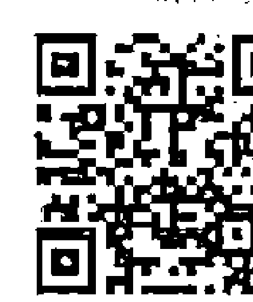

### THREE of CUPS 圣杯3

#### 关键字『欢庆』

人与人的互动，如果能跟这张算是塔罗牌中最欢乐的圣杯3一样，那真的是一件令人开心不过的事。象征着聚会、晚宴的社交生活，传递出一种轻松愉悦的氛围，我们不都喜欢跟朋友及亲人，分享着生命中所体会的美好，那是一种充满热爱生命的庆祝。

另一方面，强调社会架构与人伦家庭的圣杯3也有延续两人幸福的意涵，当新婚夫妻迎接新生命的诞生，这令人兴奋的时刻到来，相信大家也会自然而然地给予祝福，同样欢欣！

#### 牌的建议：

- 正位★★★★：可以与大家轻松相处，分享彼此的心情与未来理想喔！
- 逆位★★★：小心放纵自己，过度欢乐，缺乏对事物的感谢之意！

#### 环境状况：

- 正位★★★★☆：获得满意的结果值得庆祝，并把喜悦分享给别人。
- 逆位★★★☆：别太过孤僻，跟别人多点接触会让你生活更轻松些喔！

#### 关于爱情：

- 正位★★★★：想要提升爱情能量，就多共创你们的美好回忆吧！
- 逆位★★☆：要特别留意彼此的交友状况，很有可能有第三者的介入。

#### 关于事业：

- 正位★★★★☆：找到意气相投的伙伴，透过彼此的沟通交流达成目标。
- 逆位★★☆：缺乏合作造成孤立无援，也可能让你失去友谊喔！

#### 关于财运：

- 正位★★★★：努力被看见，除了本身应得的回馈之外，还有额外收获喔！
- 逆位★★★：太多的聚会让你的花费暴增，可要适度衡量金钱状况。

### THREE of CUPS 圣杯 3

| 牌中的元素图象 | 要告诉我们的意义 |
| :--- | :--- |
| 跳舞的女子 | 快乐、庆祝 |
| 举杯的样子 | 欢庆、开怀 |
| 围成圈圈的姿态 | 合作、共享 |
| 三人平行的位置 | 公平对等 |
| 不同色彩衣服、花环 | 个性不同却能互相尊重 |
| 手中的葡萄、地上的南瓜 | 收成、丰收的结果 |

**注：** 马赛塔罗《III》；托特塔罗《Abundance》丰盛

#### 倒牌逆位意义：关键字『多余』

过度的享乐，将会带来乐极生悲。圣杯 3 的逆位就是要强调这个讯息，我们常常因为开心，就失去了留意的警觉，很多事都变得掉以轻心，只做自己喜欢的事，对整体的帮助并未看到什么效果，反而会招至延误。庆祝的时光已经结束，目前成为了资源消耗或是不足的状态，应该赶紧收心，让自己可以开始往下一个阶段前进，才不会中断或造成结束。

### 【孟小靖的塔罗博物馆】
059 魔法森林塔罗牌 Tarot of the Magical Forest
作者：唐唐 发行：尖端出版

台湾原创，用童话的元素与绘本的方式呈现，动物大大的眼睛和拟人化的动作，柔和的色调与笔触，让人有一股温柔的感觉，看到这样的牌，感觉世界上好像也没有什么事值得我们去烦恼、去计较的，瞬间觉得心情轻松了起来！

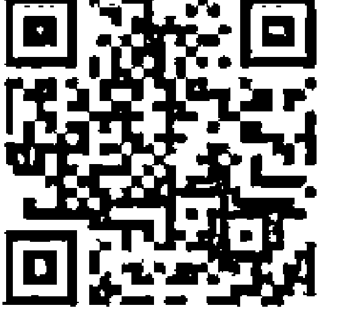

### FOUR of CUPS 圣杯4

#### 关键字『不满』

或许现在的你，觉得了无生趣，过度疲惫而找不到生活重心，仿佛如同行尸走肉般，失去思考能力。前方已经放了圣杯的样子，是指已经有所获得，但这样的成果是你满意的吗？还是你觉得不够呢？人就是因为有不满足，才会有动起来的力气，想让自己变得更好，有更多成长，这样的提升多是精神层面而非物质层面的，就如同飘浮在空中的那只杯子一样，若不是漠不关心的沮丧模样，或许已经看到前面这个新契机，而动心转念了。

#### 牌的建议：

- 正位★★☆：疲惫让你产生无力感，常常不自觉放空，需要宁静的休养一下！
- 逆位★★★☆：新的机会就在前方，只需要你突破自我去掌握。

#### 环境状况：

- 正位★★☆：暂时的休息为自己累积能量，想好方向再出发！
- 逆位★★★☆：新的变化同时也带来重新的锻炼，为自己带来新的可能性。

#### 关于爱情：

- 正位★★☆：失望与痛苦让你的爱情进入静止阶段，先为自己的心找回平和吧！
- 逆位★★★☆：为你们的生活找一些新乐子，找出你们共同的兴趣唷！

#### 关于事业：

- 正位★★☆：对于工作产生厌倦，先给自己一个休息的假期，再回头决定。
- 逆位★★★☆：一个新机会的预兆，让你可以重新考虑这个选项喔！

#### 关于财运：

- 正位★★☆：对于先前过度的花用，感觉充满压力，但也提醒着你该解决了。
- 逆位★★★☆：重新评估自己的花费，有助于改善你财务状况。

| FOUR of CUPS 聖杯4 ||
| :--- | :--- |
| **牌中的元素圖象** | **要告訴我們的意義** |
| 盤坐抱胸的人 | 無精打采 |
| 坐在樹下 | 慵懶、逃避 |
| 前方三個的杯子 | 先前經歷的成果 |
| 與杯子間的距離 | 過往經驗已無法滿足、沉溺 |
| 雲中伸出的杯子 | 新的機會 |
| 發呆不看任何事物的表情（閉眼） | 覺得無聊、冷漠 |
| 註：馬賽塔羅《IIII》；托特塔羅《Luxury》奢華 ||

#### 倒牌逆位意義：關鍵字『重置』

想要擺脫人生的無聊感嗎？已經不得不面對的問題，讓你覺得又更煩心了，但用不斷盲目的轉換是對的嗎？真的在這樣一次又一次的變動之中，你有新的獲得嗎？沒看到成果的你，漸漸變得消極。逆位的聖杯4其實要告訴我們重要的是，你必須轉變觀念，對事物認知的看法，新的方法才能解決舊問題，透過在一些新知的獲取中，全新經驗帶來新發現！

小紫的塔羅博物館
060 維多利亞浪漫塔羅牌 The Victorian Romantic Tarot
作者：Alex Ukolov and Karen Mahony 發行：Magic Realist Press
充滿著維多利亞時代的激情和執著，根據19世紀的藝術家原來的雕刻及畫作風格，以完美拼貼創建，神話故事也跟生活習習相關，各國的文化也在這個時刻相互的交流起來，所以我們也能在這副牌中看到東方主義的異國情調。

### FIVE of CUPS 圣杯5

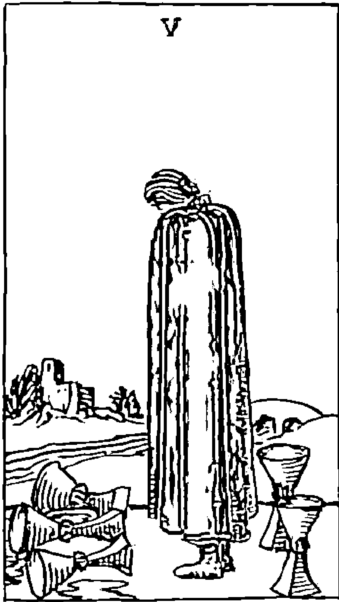

#### 关键字『忧愁』

我们碰上失落感，都会觉得自己是最可怜的那个人，却忘了其实身边还有爱着我们的家人、支持着我们的朋友。但要抽离这样受打击的心情真的很不容易，毕竟当下是脆弱需要被保护的，明明知道意志力要我们振作，但我们就是会想躲进忧伤的情绪之中，因为有些悲伤与后悔无法弥补，造成我们更专注于悲痛了！不是当事者，永远没有资格说这没什么大不了；我们只需让对方知道有人在，静静地陪伴来度过困坐于忧愁之中的你我！

#### 牌的建议：

- 正位★★☆：扩大的悲痛，让你的失落感加剧，需要跳脱出受害者情绪。
- 逆位★★★：生活中的失望，都是人生中的提醒，要我们带着教训继续往下走。

#### 环境状况：

- 正位★★☆：确实造成部份损失，但只是顾着后悔会让其他进度出现延迟。
- 逆位★★★☆：找出为了什么难过，就可以让自己处理情绪的出口。

#### 关于爱情：

- 正位★★★：虽然有些争吵，但还没那么严重啦！相信船到桥头自然直啰！
- 逆位★★★☆：别只看彼此的缺点，应该把目标放在未来共同的希望。

#### 关于事业：

- 正位★★☆：没有搞清楚大家思考的方向，造成彼此的合作不完整、没成果。
- 逆位★★★：从错误中学习，别把失望当成阻碍，反而要把阻力化成助力。

#### 关于财运：

- 正位★★☆：周转不灵而造成金钱损害，在决定用钱时请慢下脚步。
- 逆位★★★☆：用钱三思而后行，会让你荷包慢慢恢复、累积财富！

FIVE of CUPS 聖杯5

| 牌中的元素圖象 | 要告訴我們的意義 |
| :--- | :--- |
| 身穿黑色斗篷的人 | 灰暗、无力、沮丧 |
| 低头哀悼的样子 | 失落、悲伤 |
| 脚边打翻的三个杯子 | 破坏、失去、痛苦的感受 |
| 背后直立的两个杯子 | 所拥有的支持、安慰 |
| 前方的河流 | 带来忧伤的象征 |
| 远方的桥及城堡 | 跨越后得到保护、拯救 |

注：马赛塔罗《V》；托特塔罗《Disappointment》失望

#### 倒牌逆位意义：关键字「释放」

一直被伤心难过的情绪而淹没，忘了去看看自己身边还拥有的，真的如同你自己认定的失去这么多吗？还是其实事情没有这么糟糕呢？但永远都只有自己能拯救自己，经历过悲伤痛苦之后，我们开始发现到不能只看到事情的单一面向，这就是逆位圣杯5要告诉我们的事，逐渐恢复过来的你，学了一课，知道如何跟负面情绪共处，也知道该如何期待未来。

## 「孟小靖的塔罗博物馆」

061 赛尔特龙塔罗牌 The Celtic Dragon Tarot
作者：D. J. Conway & Lisa Hunt 发行：Llewellyn

由中古世纪与龙建构而成的赛尔特龙塔罗牌，特别加强了色铅笔的部分来创作，牌背与牌的底图仿制出大理石的质材，并保留了作画时的铅笔线条感。加上温和的色系搭配，让看起来一向是刚强威严的龙，也有柔性的另一面。

### SIX of CUPS 圣杯6

#### 关键字「回忆」

也有人把这张牌称之为童年，因为或许成就现在的我们，跟我们小时候所感受到的事物，有着密不可分的关联性。在圣杯 6 的呈现上，常见的就是小孩的身影了，互动纯真的模样，或许就是我们在记忆中开怀的孩提时代，那时我们无忧无虑，每一件事都新奇无比，内心也没这么多烦恼，但或许不是所有人的过去都如此美好，有些过去所造成的影响，让人无法从小感受宁静和谐。但总不能一直活在过去，我们所要做的是回顾过往，然后拥有同理来对待他人。

#### 牌的建议：

- 正位★★★★：多跟之前的朋友们联络感情，会让你感觉温暖慰藉喔！
- 逆位★★★☆：无法回到过去，别太强求之间的相处模式，试着调整情绪。

#### 环境状况：

- 正位★★★★：过去所经历的一切，将会成为现在你发挥的养分。
- 逆位★★★☆：理想中的状况瓦解，不能保守留恋之前的成果了。

#### 关于爱情：

- 正位★★★★：想起彼此的美好回忆，能让你们感觉甜蜜，恢复爱情活力。
- 逆位★★★：请活在当下，别一直为了过去的不开心而争吵，翻旧账。

#### 关于事业：

- 正位★★★：太多保守古老作法，这样的工作方式很难看到进步。
- 逆位★★★★：开始接触新科技、新事物，打破旧有看法见解，展望未来！

#### 关于财运：

- 正位★★★★：金钱财富平顺，还有机会得到额外的奖赏与礼物。
- 逆位★★★☆：虽然没有太多金钱困扰，都用到刚好的、花钱计划该检视啰！

### SIX of CUPS 聖杯 6

| 牌中的元素圖象 | 要告訴我們的意義 |
| :--- | :--- |
| 古老的莊園房屋 | 象徵寧靜的過去 |
| 聖杯中的花 | 美好的回憶 |
| 兩位童年主角 | 孩提時代的純真 |
| 面對面的姿態 | 照顧、無憂無慮 |
| 大孩童把裝有花的聖杯遞給小孩童 | 贈與、分享 |
| 遠方持權杖的人 | 給予安全的保護 |

**註：** 馬賽塔羅《VI》；托特塔羅《Pleasure》享樂

#### 倒牌逆位意義：關鍵字『忘懷』

要如何回顧兒時所對你造成的影響，便是逆位聖杯 6 要我們去體會的，我們只能卡在過去的經驗之中嗎？還是我們可以從現在的事情，發現出問題點，進而改變去期待未來可能的展望。即便曾遭受到承諾的限制，現在就可以打破這些讓你舒服的慣性，一直回頭張望是不會有所成長的，未來我們只需要能更真誠的對待自己跟他人，才叫準備好迎接新生活。

## 【小婧的塔羅博物館】

### 062 馬卡龍塔羅牌 MACALON Tarot

作者：Kato Macalon 發行：個人創作

實在是太可愛了啦！把這麼可愛的塔羅牌取名為馬卡龍，果然就想是一個精美的甜點一樣，令人愛不釋手呢！用鐵盒發行的包裝，可愛度更加分了呢！而牌圖中的元素與架構還是依照著傳統偉特塔羅牌來繪製，實用於塔羅占卜！

欣賞牌圖

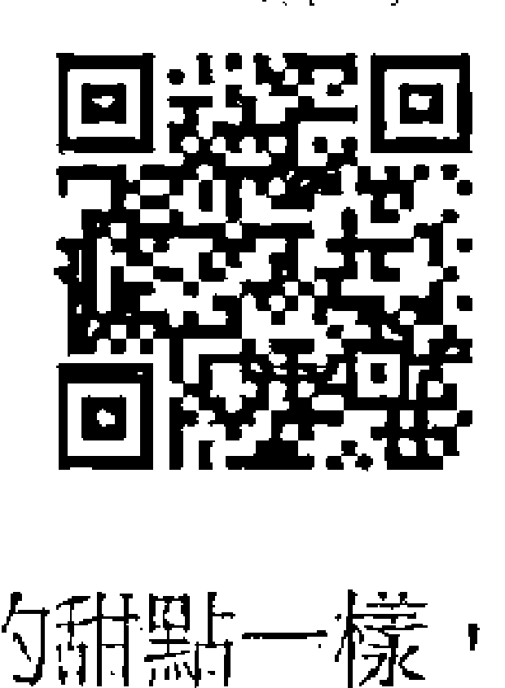

### SEVEN of CUPS 圣杯7

#### 关键字『幻象』

什么都想要，什么都拿不到！千万别让自己陷入这样的窘局里喔！拥有创造力，能把这些想象慢慢地具体化，发展多元化，知道自己算是有本事的圣杯7主角，也知道自己拥有着比平常人更多的选择，每个杯子都代表着生活不同的领域，但你要如何将这些事物达到均衡？顺序排列该怎么思考？这都应该务实地衡量之后，再来行动。相信了解自我之后，再经过一个一个按部就班地来执行，那未来就绝对不是一场白日梦。

#### 牌的建议：

- 正位★☆☆：明明知道不可行，宁可选择先用自欺欺人的方式面对。
- 逆位★★★★：专注能让你看清优先顺序，面对现实状况，拟定计划。

#### 环境状况：

- 正位★★★☆：别再一直做白日梦幻想著未来美好，做些什么、先动起来吧！
- 逆位★★★★：设定目标后，才能运用正确逻辑进行思考，确立行动方针。

#### 关于爱情：

- 正位★☆☆：放纵自己去放大欲望，优柔寡断的你，不断受到外界诱惑。
- 逆位★★☆：虽看清自己正困在爱情游戏之中，但还没找到解决之道。

#### 关于事业：

- 正位★☆☆：被大量虚构的成功幻象所吸引，真的符合目前的现况能执行吗？
- 逆位★★★★：坚强的意志力，增强一件你可以达到完成事情的决心。

#### 关于财运：

- 正位★★☆：容易上当，增加了很多不应该浪费的额外开销。
- 逆位★★★☆：找到好像可以快速致富的方法，但你自己还是缺乏行动。

| SEVEN of CUPS 圣杯7 |
| :--- |
| **牌中的元素图象** | **要告诉我们的意义** |
| 飘浮在空中的七个圣杯 | 幻想中要追求的 |
| 上排杯中的人头、发光的布、蛇 | 分别是心灵、自我、智慧（诱惑） |
| 下排杯中的城堡、珠宝、桂冠及怪物（龙） | 指冒险、财富、胜利及恐惧 |
| 放有桂冠杯子上模糊的骷髅头 | 胜利的代价、死亡的警惕 |
| 下方张开手的姿态 | 象征迷惘 |
| 人正在选择的背影 | 忧心害怕 |
| **注：马赛塔罗《VII》；托特塔罗《Debauch》沉沦** |

#### 倒牌逆位意义：关键字『决心』

很简单，只需选择一个你可以达到的目标，这样的成功将会为自己慢慢建立信心。说真的，世上没有什么两全其美的方法，或许现在的生活让你倍受压力，杂事令人感到头昏脑胀，根本没空好好思考，让自己放空一下吧！就跟逆位圣杯7一样，把杯子里的东西都先倒出来，搞不好你就能想出一个明确清晰的答案，确立正确的未来方向，让自己坚定决心往前行！

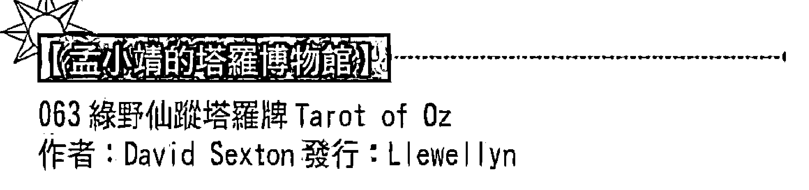

相信大家对绿野仙踪桃乐丝的故事应该不陌生吧！那还记得故事发生的地点奥兹王国吗？每一张塔罗牌的中心都有着大大的Oz符号，简单干净的画面，让人很容易看到塔罗牌所要传递出来的讯息喔！是一个十分可爱俏皮的牌组！

### EIGHT of CUPS 圣杯8

#### 关键字『追寻』

背对着的人，正选择离开一段关系。我们人生之中有着许多困惑，大部份的时候，我们都是放在一旁，眼不见为净就好，但总有一天还是要我们起身去面对，这样的转变可能是一种割舍、一个行动，为什么我们不愿去处理呢？因为这段关系可能十分紧绷、脆弱不安。现在是你我面对自我成长价值提升的时刻了，暂时放下你现在拥有的，撤退放空之后，才能去寻找更深层的精神意义，或许这次得到的不是物质犒赏，而是心灵满足。

#### 牌的建议：

- 正位★★☆：提不起精神的你，需要补足能量，再次重新找回自我方向。
- 逆位★★★☆：坚持到底能让你感受内在深处渴望，慢慢恢复信念。

#### 环境状况：

- 正位★★☆：行尸走肉般漫无目的，感觉被困住了，日子过得十分空虚。
- 逆位★★★：是时候抽出一些时间来面对自我情绪，内在声音会引导你前进。

#### 关于爱情：

- 正位★★★：害怕去接触亲密关系，需要打开心胸去相信爱情，才会找得到。
- 逆位★★★☆：告别一段让自己不舒服的恋爱，你会发现自已找回快乐了。

#### 关于事业：

- 正位★★★☆：是时候给自己一个假期旅行，去开眼界，突破思考疆界。
- 逆位★★★★：虽然机会稍纵即逝，但你从这之中得到领悟，学习把握下一次。

#### 关于财运：

- 正位★★☆：在等等看吧！持续的努力追求，多少会有一些金钱回馈喔！
- 逆位★★★：犹豫不决的来来回回思考，这样反复对于收入与支出都不好。

### EIGHT of CUPS 圣杯8

| 牌中的元素图像 | 要告诉我们的意义 |
| :--- | :--- |
| 八个叠起来的杯子 | 过去所建立的成果 |
| 杯子缺口的人 | 发现缺少、没获得满足 |
| 身穿红色的衣服 | 行动力、执行 |
| 逆流而上的姿态 | 吃力的、费劲的 |
| 面无表情的新月 | 未知的不安 |
| 背景平静无波的水(沼泽) | 情感的停滞、生活的平淡 |

*注：马赛塔罗《VIII》；托特塔罗《Indolence》怠惰*

#### 倒牌逆位意义：关键字『舍得』

如果我们想要有所成长获得，那逆位圣杯 8 在告诉我们的，就是必须学会舍得，遇上瓶颈的你，其实正是你人生的转折点，现在就端看你如何面对？陷入两难的你，一方面不想放弃所拥有的，另一方面又急迫的希望心灵获得满足，让你更无从做出抉择。也许割舍会让你感到后悔，不知如何突破？行动也许能帮助你想通开悟，就能获得心的解放，了解真正幸福是什么。

064 中国古典塔罗牌 Chinese Tarot 作者：Jui Guoliang 发行：U. S. Games

搭配了很多中国传统人事、景色、传说外，更以传统国画的水墨画法，再加上用书法提字，整个在画面中表现出来，浓浓的老祖先们的智慧艺术呢！像这副中国古典塔罗牌在作画的方式都十分的中国味，还真的不多见喔！

欣赏牌图

### NINE of CUPS 圣杯9

#### 关键字『自满』

十分满意目前成果，是现在的你吗？状态可说是如日中天的你，就是一个正在享受着大家注目光的人，这代表着完成了自己所定下的目标而获得回馈，这样的成绩相当的令人羡慕，也让你肯定了自己的做法是对的！因为如此，你发现到自己是很有价值的，这样的想法伴随着一种极大的自信，让人觉得满足。也许可以开始放轻松了，既然你成就了衣食无虞、打造了你梦想成真的生活，现在就不妨来好好犒赏自己一番吧！

#### 牌的建议：

- 正位★★★★☆：把自己想象中的具体化，打造你心中成就的梦想蓝图。
- 逆位★★★☆☆：沉醉于之前的胜利，沾沾自喜，忘了还是需要持续努力前进。

#### 环境状况：

- 正位★★★★☆：你的成功为你带来很多物质收获，生活过得很富裕。
- 逆位★★★☆☆：手头宽裕的你，变成太过肤浅的物质享乐主义者了。

#### 关于爱情：

- 正位★★★★☆：除了彼此情感获得快乐之外，物质生活经济上也十分满足喔！
- 逆位★★★☆☆：两个人隐藏许多不完美的地方，会渐渐曝光打破表面假象。

#### 关于事业：

- 正位★★★★☆：困难被克服，让你取得工作优势，创造出你想象中的。
- 逆位★★★☆☆：稍微的成就让你自满，大家目前觉得你难以取悦。

#### 关于财运：

- 正位★★★★☆：多方来源的收入，让你财富累积，衣食无虞生活安逸。
- 逆位★★☆☆☆：小心用钱，别过着太享乐奢华的生活，造成未来坐吃山空。

| 牌中的元素图象 | 要告诉我们的意义 |
| :--- | :--- |
| 中央抱胸姿态的人 | 得意、自负的展现 |
| 脸上满意的表情 | 快乐开心的样子、享乐 |
| 身后九个排排站的圣杯 | 象征社交 |
| 高过主角圣杯的位置 | 带有炫耀的意涵 |
| 红色头巾 | 思想行动的成功、梦想成真 |
| 黄色的背景 | 活力、喜悦 |

注：马赛塔罗《VIII》；托特塔罗《Happiness》幸福

#### 倒牌逆位意义：关键字『虚假』

面子真的有这么重要？为了呈现出一种胜利者的假象，炫耀着过往成就，大家真的都投以羡慕的眼光吗？但你发现了吗？你对于这一切还是不满意，因为你的精神层面并没有得到真正的喜悦，逆位圣杯9就是要告诉我们，展现固执而获得表象的顺从，根本只是虚假的短暂满足，不愿分享招来后续失败。让自己能看清真相，忠实自我，还有获得自由，才是你我想得到的。

### 孟小靖的塔罗博物馆

065 童话世界塔罗牌 The Fairy Tale Tarot
作者：Lisa Hunt 发行：Llewellyn

阅读童话帮助我们养成良好品德，克服恶习，并且给我们抚慰我们的心灵，每张塔罗牌都有一个童话故事与象征和意义并给出了关键字，解释容易让你我回到童年时代的自由，重拾信心、想像力和幻想，并赋予你更深层的体会。

### TEN of CUPS 圣杯10

#### 关键字『满足』

就用幸福美满来形容圣杯10，真的再适合不过了！特别表现出一段情感关系的和谐，最终成为了家庭的状况，这不都是我们想像中的快乐生活吗？没有过多的华丽庄园，奢华服饰，但却能感觉到人与人自然的肢体接触，流露情感而相互关怀，看到彩虹的欢乐与希望。不也就让我们体悟到，真正的快乐就在你我的生活之中，不是金钱财富、也不是名利成就，而是人的温暖陪伴，这个道理告诉我们，或许简单就是幸福。

#### 牌的建议：

- 正位★★★★★：拥有幸福美满的成果，体验目前生命中的美好事物。
- 逆位★★☆：或许遇上跟家庭生活中两难的问题，先了解大家需求是什么？

#### 环境状况：

- 正位★★★★☆：身处一个和谐的大家庭之中，无论身心灵，都感到满足。
- 逆位★★☆：失去自我价值观的逃避，离原先规划的梦想越来越远。

#### 关于爱情：

- 正位★★★★★：两个人迈向稳定完整的关系，进入婚姻，感受爱的真谛。
- 逆位★★☆：太少见面的相处，慢慢的对彼此感觉冷漠，不满足！

#### 关于事业：

- 正位★★★★☆：对于你付出的肯定，事情都能顺利且完整的处理完毕。
- 逆位★★★：先处理不满情绪，千万不要破坏人与人之间沟通的桥梁。

#### 关于财运：

- 正位★★★★☆：或许金钱收入不多，但在心灵的富足你觉得重要的多。
- 逆位★★☆：没有什么理财计划的你，让你最近花钱大失血！

| 牌中的元素图像 | 要告诉我们的意义 |
| :--- | :--- |
| 天上的一道彩虹 | 美、和谐 |
| 彩虹中的十个杯子 | 圆满与稳定 |
| 拥抱的伴侣 | 爱、快乐 |
| 向上展开双臂的姿态 | 分享、关怀 |
| 手拉手跳舞的小孩 | 无忧无虑的快乐、互动交流 |
| 丰饶的大地、远方的房子 | 象征富足的家 |
| **注：马赛塔罗《X》；托特塔罗《Satiety》饱足** | |

#### 倒牌逆位意义：关键字『不合』

为什么大家无法团队合作了？只单单是因为意见不合，或是发生了什么不开心的事情吗？其实逆位圣杯10的意义，更重要的是要我们去思考，怎么突然有情绪想要发作，是自己的价值失去了？还是如同家人的默契已经不再，让你想要有远离的感受。其实是因为太在乎，才会有这样强烈的情绪波动，未来还会有许多不稳定的冲突，只能多告诉自己平心静气面对！

### 【孟小靖的塔罗博物馆】

066 魔偶月亮塔罗牌 Deviant Moon Tarot
作者：Patrick Valenza 发行：U.S. Games

月亮般的脸形又瞪着大眼精，有着像鸟一样的脚与拉长的身躯。穿上诡异的服装，配戴着饰品、鞋子、帽子：单调不变的建筑与肮脏的天空，黑暗墓地与扭曲变形的墓碑，营造出的黑色幽默风格，但不失塔罗牌里的元素及象征。

### PAGE of CUPS 圣杯随从

#### 关键字『感受』

[ 象征个性特质人物：好奇宝宝 ]
透过感情的互动交流来学习感受事物的他，爱幻想、生性温和，愿意倾听别人的故事时，也让自己的心灵更为坚强，身为一位心思细腻，敏感的人，很能发挥同理心，为别人着想。

圣杯随从如果是形容一种状况，特别强调了跟爱有关的讯息，大多数的事物的决定，也是跟人的情感面相关，该如何适当的给予反应，如何衡量出大家对事情的期待？变得比本身处理来得重要的多！

#### 牌的建议：

- 正位★★★☆：十分随性、不受拘束的你，常有让大家眼睛为之一亮的点子！
- 逆位★★☆☆：容易忽略错误的你，让你做起事来都不踏实，逃避问题。

#### 环境状况：

- 正位★★★★：只想活在当下的你开心就好，对于一些冒险都愿意去尝试看看。
- 逆位★★★☆：太重感情，而因为自己的随和，让他人牵着你的鼻子走。

#### 关于爱情：

- 正位★★★★：愿意敞开心胸去爱，什么都好的你会带来一些感情新体验！
- 逆位★★★☆：情感中太过依赖，只要一点不愉快就会让彼此感觉到悲伤。

#### 关于事业：

- 正位★★★☆：时间未到，也不想太过积极行动的你，目前不会有什么表现。
- 逆位★★☆☆：恐惧受伤的你，不跟别人合作互动的处事，显得有点麻木不仁。

#### 关于财运：

- 正位★★★☆：无条件的为他人服务，虽然没获得金钱，但心里感到满足。
- 逆位★★★☆：对人十分友善的你，早已损失金钱都还不自知，最近请多留意！

### PAGE of CUPS 圣杯随从

| 牌中的元素图像 | 要告诉我们的意义 |
| :--- | :--- |
| 注视着杯子的人 | 好奇 |
| 身穿花朵衣服 | 情感丰沛、多愁善感 |
| 轻松站立的姿势 | 友善、接纳、敞开心智 |
| 杯子跃出的鱼 | 想像力、创造力 |
| 蓝色的头巾 | 心思细腻、喜爱思考、想像 |
| 微微波动的海 | 温柔、爱 |
| 注：马赛塔罗《VALET・DE・COUPE》；托特塔罗《Princess of Cups》圣杯公主 |

#### 倒牌逆位意义：关键字『分心』

面对不断从脑子冒出来的新点子，别让这些丰富的想像力，因为太过理想化会让人搞不清楚现实与幻想喔！逆位圣杯随从要提醒我们就是，千万小心容易受到诱惑，造成随波逐流，也不要人云亦云而混淆，受到影响。我们常因为缺乏自身立场而分心，过于在意感情面的互动而忘了关怀自己，所以我们更应该坚定意志不被干扰，错放期待别人的情感回馈！

### 孟小靖的塔罗博物馆

067 透明塔罗牌 The Transparent Tarot
作者：Emily Carding 发行：Schiffer Books

利用最简单、最单一的图像结合牌的含义，78 张的画面可以相互联系，而透明塑料材质让每张牌层叠出无限多种组合，呈现出不同的图像，即使是初学者也可以轻松的解读使用。另外也可以触发对图像的无限想像、冥想和治疗。

### KNIGHT of CUPS 圣杯骑士

#### 关键字『魅力』

[象征个性特质人物：白马王子]

这不就是童话故事中的王子吗？坐着白马现身的年轻人，浪漫优雅的行进着，拥有善良的他，很喜欢跟人分享世界的美好，也象征着目前关系的和谐与满足，但虽然十分迷人，但也容易陷入多愁善感之中。
圣杯骑士如果是形容一种状况，过于理想化的行动，因为进行的十分缓慢，短期内并无法看到成果，但还是能愿意协助他人，或收到大家的支持，还是鼓舞了所有人的精神。

#### 牌的建议：

- 正位★★★★：到哪里都引人注目，为人亲切让你拥有许多好人缘与友谊喔！
- 逆位★★★☆：过多的感情用事，就成为了讨好奉承，肤浅无法呈现真心。

#### 环境状况：

- 正位★★★☆：因为想把善意传递给别人，所以自己对人也十分友好。
- 逆位★★★：太在意别人对你的想法，过于小心翼翼，反而让你有距离感。

#### 关于爱情：

- 正位★★★★☆：遇上理想对象，就跟随你的直觉去付出，经营这段美好爱情。
- 逆位★★★☆：虽然知道可能是一段没有回报的爱，你还是愿意为爱而爱！

#### 关于事业：

- 正位★★★☆：着重与人的共事沟通，发挥你的协调优势大家都愿意帮忙。
- 逆位★★★：过度敏感的完美主义者，明明自己能力不足，还不如问问他人。

#### 关于财运：

- 正位★★★☆：经济状况平顺，但可能会有很多亲友聚会，花费不少金钱。
- 逆位★★★：对于某些事物可能上瘾，造成自己金钱产生不均衡的变动状态！

### KNIGHT of CUPS 圣杯骑士

| 牌中的元素图象 | 要告诉我们的意义 |
| :--- | :--- |
| 直视前方的姿态 | 理想崇高、充满抱负 |
| 手中平举端着的杯子 | 重视平等感受 |
| 头上与脚上装饰的翅膀 | 艺术天份、想象力 |
| 在马背上平稳的姿势 | 和平共处、优雅 |
| 白色的马 | 纯洁的象征 |
| 将跨越的河流 | 感性的落实 |
| 注：马赛塔罗《CAVALIER DE COUPE》；托特塔罗《Prince of Cups》圣杯王子 | |

#### 倒牌逆位意义：关键字『欺瞒』

一个情感面的失落，可能来自于太过滥情所造成的状况，为了不想正面的对于承诺负责，渐渐的不再诚实，选用逃避来处理。逆位圣杯骑士强调的是评估的重要性，应该把所有选择摊在阳光底下，看看那些还没有到达成熟时机，什么可以做？什么不可以做？千万不要幻想出一个美好来骗自己，会让你把所有事情都想的太乐观，请务实的衡量自己的行动。

### 小孟小婧的塔罗博物馆

068 华丽吸血鬼塔罗牌 The Tarot of Vampyres
作者：Ian Daniels 发行：Llewellyn
血红色的玫瑰茎缠绕在荆棘，闪闪发光苍白如同大理石般的皮肤，盘踞的蛇眼睛似火。在吸血鬼的传说是植根于黑暗和诱惑，是一种精神上的饥渴，饮血时刻为永恒的神圣。精致细腻的画风，把人物的动作表情诠释的栩栩如生！

### QUEEN of CUPS 圣杯王后

#### 关键字『奉献』

[象征个性特质人物：艺术家]

最重视人与人的互动，就是包容温柔的她，可说身为大家的保护者，能很有耐心的去化解可能发生的冲突，让大家都平静下来，会永远伸出双臂给你一个大大拥抱，让你感受支持，但别忘了也许她也是需要关怀的人喔！圣杯王后如果是形容一种状况，现在身边将会传来一个令人喜悦的好消息，面临的困扰也圆满解决了，迎接被幸福所笼罩的氛围，让大家都十分的感动喔！

#### 牌的建议：

- 正位★★★★：对于人性信任的你，富有同情心与看待所有事物美好的眼光。
- 逆位★★★☆：情绪善变，一下干涉太多，一下对于别人需求毫不在意。

#### 环境状况：

- 正位★★★★：能十分体谅别人的立场，用一个客观的方式来圆满处理事物。
- 逆位★★★☆：感情丰富，小心自己的喜怒无常造成误会，让人搞错方向。

#### 关于爱情：

- 正位★★★☆☆：先做出付出跟包容，让你在爱情也得回满满的爱，良好回应。
- 逆位★★☆☆：太渴望爱情中的支持，过度依赖，当遇到不对的人，也很难自拔。

#### 关于事业：

- 正位★★★★：不太抱怨的你，在工作表现上得到许多人的看好，实现成果。
- 逆位★★★☆：掉入自我情绪中，不愿意配合大家步调，变得漠不关心！

#### 关于财运：

- 正位★★★☆：愿意将金钱用于大众服务领域，自己经济觉得够用就好。
- 逆位★★☆：消极抵抗面对自己的金钱压力，觉得目前不想管这件事。

### QUEEN of CUPS 圣杯王后
| 牌中的元素图像 | 要告诉我们的意义 |
| :--- | :--- |
| 教堂造形的圣杯 | 心灵、神秘的力量 |
| 注视着圣杯的样子 | 愿意付出、虔诚 |
| 坐在陆地上的人 | 贴近现实 |
| 脚上被四周水气所浸湿的裙摆 | 被情感所影响 |
| 身后的大贝壳王座 | 包容、接受 |
| 小美人鱼的图案 | 温柔慈悲、陪伴 |
| 注：马赛塔罗《REYNE・DE・COUPE》；托特塔罗《Queen of Cups》圣杯王后 |

#### 倒牌逆位意义：关键字『犹豫』

内心产生太多感觉，造成你现在的情绪化波动，而无法专注于现在自己该做的事务，在没有行动之下，让很多事物因为你的犹豫不决，没有成果，进而引发难过沮丧情绪。面对这样的挫折感，你会选择一个人躲起来迷失在悲伤之中，逆位圣杯皇后是要告诉我们该如何度过这个敏感的状况，应该让自己走回现实之中，多与人接触找回信任，听取建言。

### 【孟小晴的塔罗博物馆】

069 薰子塔罗牌 Stella's Tarot
作者：Stella's 发行：U.S. Games

要让大家更了解与喜爱塔罗牌，通常透过跟偶像剧的结合，是最快的方式囉！毕竟，戏剧的张力把塔罗牌的魅力也都展现出来囉！日韩剧里「魔王」出现的这副塔罗牌，每一张牌也像是一个剧场，牌中的角色正在演出人生故事！

### KING of CUPS 圣杯国王

#### 关键字『仁慈』

[象征个性特质人物：慈善家]

对于任何的情感都抱持着责任的他，可以说是照顾者的角色，对事物充满怜悯，愿意给予实质帮助，不求回报的他，渗透用责任重大的心情来面对情感关系，年纪稍长的他能为大家带来幸福，爱情中也象征感情进入婚姻状态。

圣杯国王如果是形容一种状况，表示能很快融入一个环境，获得大家的爱戴，跟大家打成一片，相互给予关怀照顾，事件的发展按照期待，稳定下来了！

#### 牌的建议：

- **正位★★★★☆**：踏实稳重的你，让很多人愿意跟随你的领导，虚心求教。
- **逆位★★★**：太过容易感伤，愁眉不展，会无意之中显现出自己的软弱无用喔！

#### 环境状况：

- **正位★★★★☆**：耐心十足的你，传达出一种温暖的安全感，令人充满信赖。
- **逆位★★★**：多愁善感的你，会被情绪操控而行动退缩，让事情变得更混乱了。

#### 关于爱情：

- **正位★★★★☆**：慢火细炖的恋情，时间拉长才看得到彼此对待爱情的样子。
- **逆位★★☆**：在错误的道路上寻找爱情，先搞清楚什么样的爱是你要的。

#### 关于事业：

- **正位★★★★**：不怒自威，工作能力被肯定，被人相信的你能做出一番成就。
- **逆位★★☆**：没有魄力，无法当机立断决定，只能用等待方式来面对问题！

#### 关于财运：

- **正位★★★★**：规划妥当，让经济方面十分的平稳，可以买一些喜欢的东西。
- **逆位★★★**：突如其来的生活状况，会让你选择花钱了事的做法来处理！

## KING of CUPS 聖杯國王

| 牌中的元素圖象 | 要告訴我們的意義 |
|---|---|
| 平行拿權杖與聖杯的姿勢 | 平衡情感與物質 |
| 胸前魚形的項鍊 | 想像力、創意 |
| 背景紅色的帆船 | 潛意識的行動運用 |
| 圍繞的水 | 深厚的情感、藝術性 |
| 四方形地面的王座 | 穩固 |
| 腳下與水劃分的界線 | 掌控情感、務實作法 |
| 註：馬賽塔羅《ROY・DE・COUPE》；托特塔羅《Knight of Cups》聖杯騎士 | |

#### 倒牌逆位意義：關鍵字『醜聞』

人總是會有情緒的黑暗面與消極面，這就是逆位聖杯國王要提醒我們的，曾經在感情上受到傷害的你，這些悲傷會成為你內心的弱點，那些壓抑很久的負面情緒，你不再仁慈或善良，你會把過往的經驗與知識，用在不正當的地方，甚至於覺得避免受害就是先攻擊。愛的呈現在你心中已經扭曲，現在的你應該要跟過去釋懷，原諒才是你心中最好的解藥！

### 【孟小靖的塔羅博物館】

070 波西米亞鬼魅塔羅牌 Bohemian Gothic Tarot
作者：Alex Ukolov and Karen Mahony 發行：Magic Realist Press

圖中一張張像極了寫真明信片的卡片，主題以鬼怪為創作的元素，光影變化上的處理，就能讓這整個牌組瀰漫著詭異的氣息！你會發現可怕與恐怖不見得非得要見血，這樣的氛圍才真的令人毛骨悚然，不時提醒我們死亡的真諦！

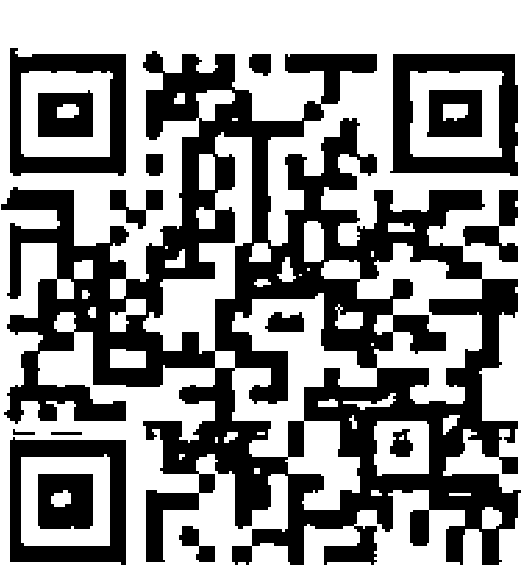

## 【孟小婧閒聊】塔羅牌有什麼禁忌嗎？

塔羅牌已經經過了千年的歷練，當然出現各式各樣、各種學派的玩法與禁忌。其實塔羅本身並沒有這麼可怕，許多的規定也是見仁見智的問題，看你要不要採納相信罷了，寧可稱這些所謂的禁忌，不如說是一些在塔羅占卜上的原則。

#### ✱勿將塔羅牌人格化

塔羅牌是不是有著什麼牌靈、小鬼？當然沒有！孟小婧會告訴你，塔羅牌是一個很棒的自我瞭解工具，我們會用「準」來讚揚塔羅牌的訊息建議，是因為我們能從這些牌卡中找到自己的問題盲點，找到自己未來的做法，掌握自己的人生。我們可以抱著感謝與尊重的心，來珍惜每一樣物品，塔羅牌就是一種思想信念的延伸，我們相信這些力量，但千萬別迷信！

#### ✱收藏牌的方式

塔羅牌是要常常接觸和它培養默契，避免潮濕才是重要的，所以就找一個木盒、布袋或一張桌布，好好收藏起來就可以囉！對了，關於牌可不可以讓別人碰的問題，其實是沒什麼關係的，牌是跟你有默契的，就像你養的寵物，讓別人摸兩下是不會跟別人跑掉的。當然可以讓別人欣賞，能不能讓別人碰觸牌就由你自己決定喔！

#### ✱一事不二問

同一個人、同一件事情不能占卜兩次，起碼要等事情狀況有所改變或3個月之後才能再占卜一次，除非針對一件事有不同做法與規劃。

#### ✱晚間23:00後不占卜

解讀塔羅牌，是要集中精神專心的幫對方尋找答案。科學的說法是晚間11:00後，人體機能會自動的調養休息，所以注意力不易集中。加上西洋所謂的11:00魔空時刻（惡魔活躍的時段，所以許多女巫也在此時進行魔法儀式），另一方面，在中國東方的晚間11:00至1:00是子時交替，代表新的一天到來，也都會影響磁場的變化。所以在這段期間當然就不建議使用塔羅來做占卜了。

#### ✱不斷言、不恐嚇

塔羅牌是為大家帶來幸福的，他不能幫你決定什麼事！只能給你建議，所以在解說塔羅的時候，絕不能出現過於武斷的解釋，即便是不好的牌，也要以正面的觀點來做引導、給予建議，而不是幫占卜者做決定！

## # 小阿尔克纳元素：交流之风，宝剑牌组

象征风元素的宝剑，是攻击也是防御，就如同宝剑一般是双面刃。但在塔罗牌之中，把宝剑比喻成沟通，让这样的一种武器形态不再具象，而是如同风一般无形，如同我们的语言一样有著强大力量！

在宝剑牌组的呈现上，多是看到负面的破坏与伤害、痛苦，但其实宝剑还是有传达出专业与智慧，喜欢思考增添知识的性格是很重视整体沟通的过程，就跟占星学中的风象星座（水瓶、天秤及双子）一样，充满创意拥有效率的想法，善于沟通的特质就能找出更好的做事方法。

如果在占卜中，出现很多宝剑牌组的牌，要特别小心自身面对事物处理的态度，是不是太多漠不关心，或是太多恐惧胆怯，其实早就看清状况的你，容易陷入人生的困惑之中，说穿了，你根本就知道该怎么做是最好的结果，只是还没被点醒！

| 寶劍牌組 宮廷牌角色 | 風象星座對應 | 中世紀階級 | 季節 |
|---------------------|--------------|------------|------|
| 寶劍國王（風）之土   | 水瓶座       | 貴族       | 秋   |
| 寶劍皇后（風）之水   | 天秤座       |            |      |
| 寶劍騎士（風）之火   | 雙子座       |            |      |
| 寶劍隨從（風）之風   | 無           |            |      |

071 华奇特塔罗牌 El Tarot Renacentista de Giovanni Vachetta
作者：Julian White 发行：SIRIO

华奇特塔罗牌的变化，可以让我们看到马赛演化到伟特的进程，塔罗牌的画面从平面转为立体，小牌的部份也不单只是数量与花纹，开始出现了一些神话、传说里的象征符号，仔细研究或许能让我们发现更多特别的塔罗秘密喔！

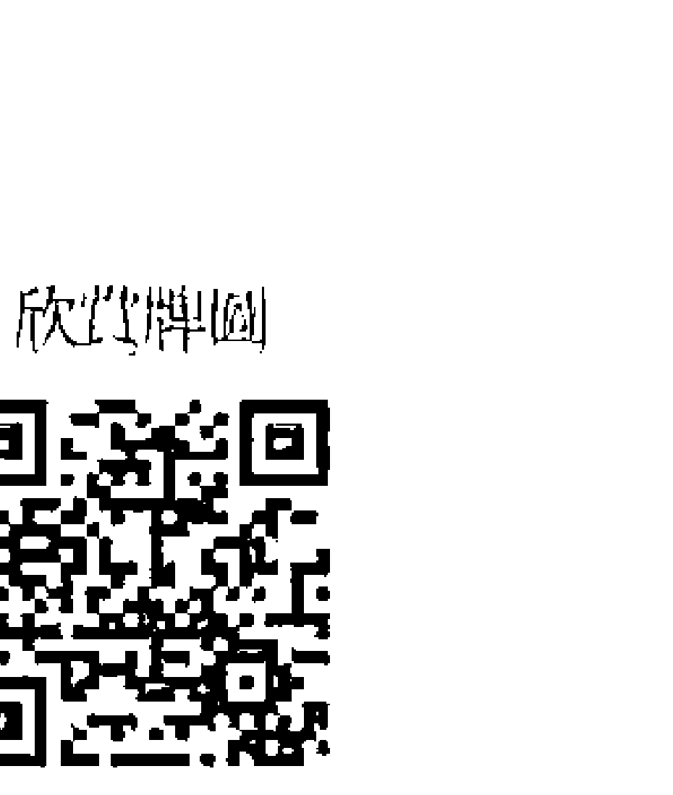

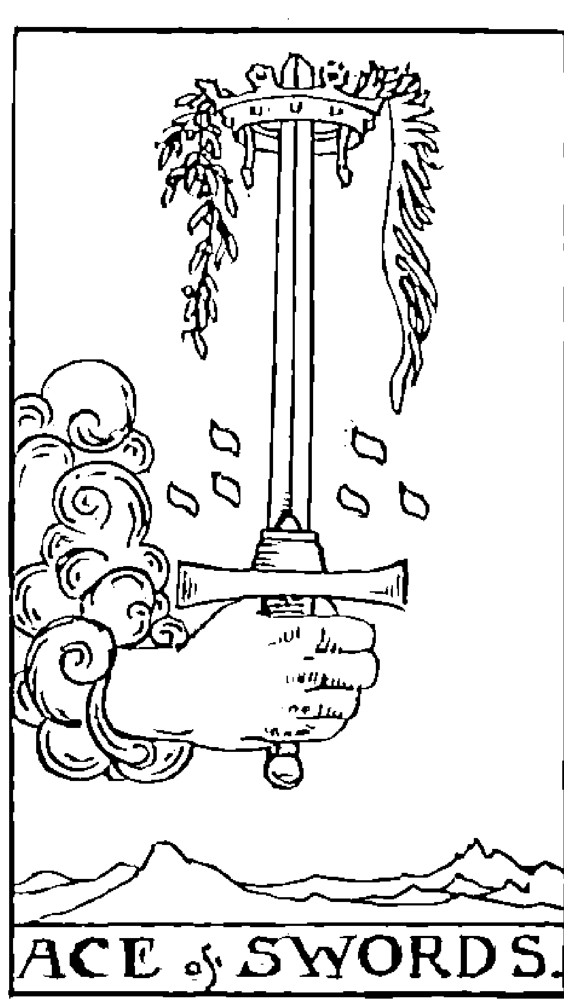

### ACE of SWORDS 寶劍 1

#### 關鍵字『征服』

以強而有力角度握住的寶劍，看來從雲中所伸出的這隻手，早就透過考慮周詳、清晰思考，才執行這個動作。不就正告訴也是有本事的你，只要規劃正確的計劃，就能開拓出自己想要成就的未來。

但畢竟寶劍是個武器，在你追求成功的過程中，若是太過執著，就有可能為別人帶來傷害，頂端被寶劍穿過的皇冠，也在提醒著我們千萬別鋒芒畢露，在主動出擊面對挑戰，獲得榮耀與勝利的同時，也要留意自己是否過度表現，產生攻擊而不自知！

#### 牌的建議：

- 正位★★★★：展現專注的心智，確認方向後快速的找出達成的路徑與方法。
- 逆位★★★☆：計劃的延誤來自於你思考邏輯的不完備，失去意志力！

#### 環境狀況：

- 正位★★★☆：行動之餘：也要看穿事物原貌真相，做出最有利的判斷。
- 逆位★★★：將手邊事物全面檢視，冷靜的分析之後，將重點找出來。

#### 關於愛情：

- 正位★★★☆：追求的方式令人產生壓力，也要體諒一下對方的感受。
- 逆位★★☆：缺乏信心，對方也無法對你提起興趣，別先給自己設下限制。

#### 關於事業：

- 正位★★★★☆：全新的挑戰，運用你的經驗擬定計劃，就能成功！
- 逆位★★★☆：失去力量的你，讓目標不明確，影響到你做出不公平的決定。

#### 關於財運：

- 正位★★★★：有效率的用錢，讓你節省下不少經費。
- 逆位★★★：衝動性消費變高，突然耳根子軟，很容易受到誘惑！

ACE of SWORDS 寶劍 1

| 牌中的元素圖象 | 要告訴我們的意義 |
| --- | --- |
| 握緊寶劍的手 | 決心、掌握 |
| 中央不偏倚的寶劍 | 強調中立、平靜了解 |
| 天空上方的皇冠 | 權力、成就 |
| 寶劍穿過的皇冠的樣子 | 極端、過剩 |
| 皇冠裝飾的桂冠、葉片 | 勝利、和平 |
| 背景冷峻的高山、山峰 | 冷靜、明晰 |
| 註：馬賽塔羅《I》；托特塔羅《Ace of Swords》寶劍王牌 | |

#### 倒牌逆位意義：關鍵字『自負』

劍鋒向下的寶劍 1，又被皇冠所阻礙的樣子，是不是很像當我們思緒卡住，無法很順利思考的狀態呢？毫無頭緒、判斷失誤、遭受攻擊及佔下風，都是寶劍 1 逆位所要提醒的問題，雖然目前面臨困難，感覺混亂，但我們還是可以堅定意志，專注目標前進，千萬別用誇大其詞的方法來取得短暫的信任，若你沒有正確的調整步伐，原先能夠迎刃而解的事情，反而會變得複雜而無法收拾。

說真的，抽到寶劍 1 逆位的你，就讓時間協助你來思考，沒有什麼事情非得當下決定不可，何況是一些攸關人生發展的重大決定！先冷靜一下吧！

> 【小孟的塔羅博物館】

072 宇宙塔羅牌 Cosmic Tarot
作者：Norbert Losche 發行：U. S. Games

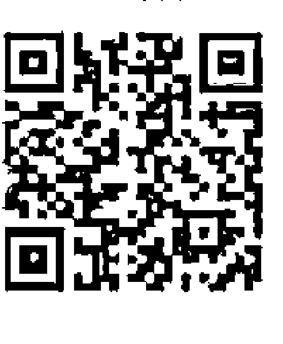

難得有塔羅牌是以現代風格服飾來做呈現，繪畫上保留了畫筆的觸感，在配合上淡淡的墨水漸層，有一種美式古老好萊塢明星畫報的感覺，牌中的人物也有一種在把塔羅牌當成舞台表演的感覺，現代舞劇讓我們感受牌中的語言。

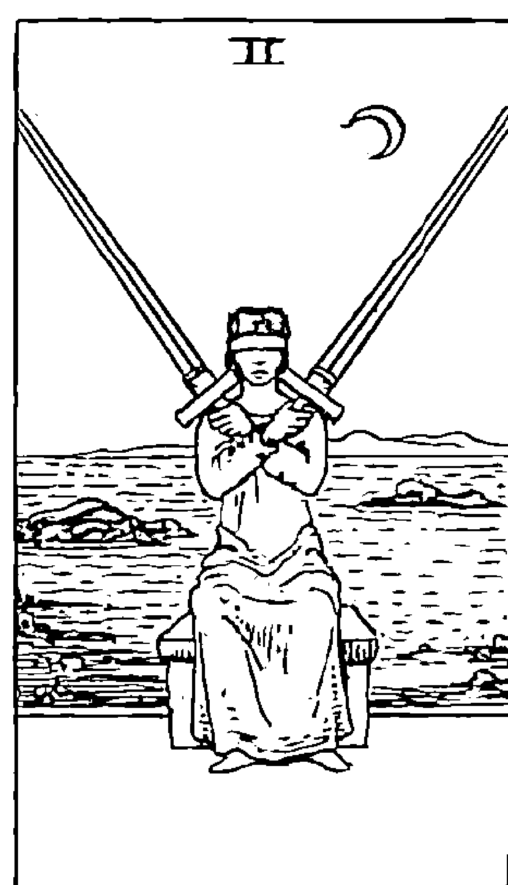

### TWO of SWORDS 寶劍 2

#### 關鍵字『逃避』

其實說穿了，沒有什麼事情非得要現在面對不可！可能已經知道這種狀況的你，蒙蔽自己的雙眼，手持寶劍的防禦，拒絕的姿態讓自己確實得到了當下的平靜和諧，但寶劍已經超出畫面的邊框，可想而知這是一個沉重的負荷，用視而不見的逃避來面對想必也不輕鬆。或許也正面臨兩種選擇的你，千萬別倉促做出重大決定，現在還可以再多做觀察，甚至於多與人交流、參考意見，就能協助你清晰思路，知道什麼方案是最可實行的。

#### 牌的建議：

- 正位★☆☆：不確定的決策造成僵局！或許發現問題點，還不是處理時機。
- 逆位★★☆：採取行動是唯一能打破現況的方法，表面的平靜不是真的。

#### 環境狀況：

- 正位★★☆：懸而未決的情況，讓大家都不敢輕舉妄動，只能拖延下去。
- 逆位★★★☆：擁有權力的雙方，達成一種微妙的平衡，慢慢找到和解之道。

#### 關於愛情：

- 正位★☆☆：勉強自己痛苦的妥協，這樣不見得會在未來看到改變。
- 逆位★★☆：學著說不，抗拒令人不愉快的要求，才能解開對自己的束縛！

#### 關於事業：

- 正位★★☆：所有人各自為政、目標相反，執行的事物造成矛盾。
- 逆位★★★☆：調合分歧的過程或許不舒服，但總是要跨越紛爭，共處整合。

#### 關於財運：

- 正位★★☆：擔心過度，投資計劃沒有行動，消極的維持現狀。
- 逆位★★★☆：大進步開始著手財富規劃，耐心等等，還未看到明顯起色。

TWO of SWORDS 寶劍 2

| 牌中的元素圖象 | 要告訴我們的意義 |
|----------------|------------------|
| 朦住眼睛的女子 | 困惑、限制 |
| 交叉在胸口的手 | 抗拒、防衛 |
| 手中的兩把劍 | 選擇、衝突 |
| 兩把劍同樣角度的姿勢 | 僵局、對立 |
| 身後的一片水(海) | 象徵不面對情感、逃避 |
| 遠方的月亮 | 拒絕內在聲音、深層潛意識 |
| 註：馬賽塔羅《II》；托特塔羅《Peace》和平 | |

#### 倒牌逆位意義：關鍵字『解脫』

願意放下手中的寶劍，就能空出雙手，然後就能將朦住眼睛的布給打開，讓自己開始面對現實、打破僵局。這個過程是痛苦的，但是我們不能繼續躲在看似平靜的謊言之中，逆位的寶劍 2 指出一個明確該前往的光明目標，但也特別提醒我們，在理性與情感尚未找出平衡之前，也不用輕舉妄動，先發揮你的洞察力，觀望行動是否跟你理解的相同，對自己才會能有好的回應。

### 【孟小靖的塔羅博物館】

073 骷髏之舞塔羅牌 Tarot of the Dead

作者：Monica Knighton 發行：Llewellyn

骷髏不見得恐怖，他也可以跳出繽紛的生命之舞！就如同墨西哥死亡節一樣，也可以很繽紛歡樂，在牌裡用相當戲謔的手法，讓骷髏頭看起來就沒那麼嚇人了！傳達給我們的訊息，就是要我們不要這麼嚴肅的看待死亡這件事吧！

欣賞牌圖

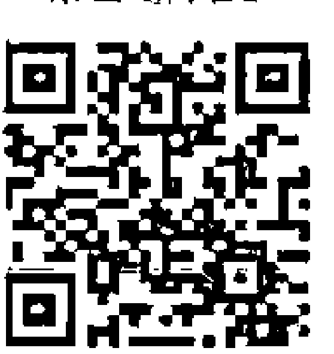

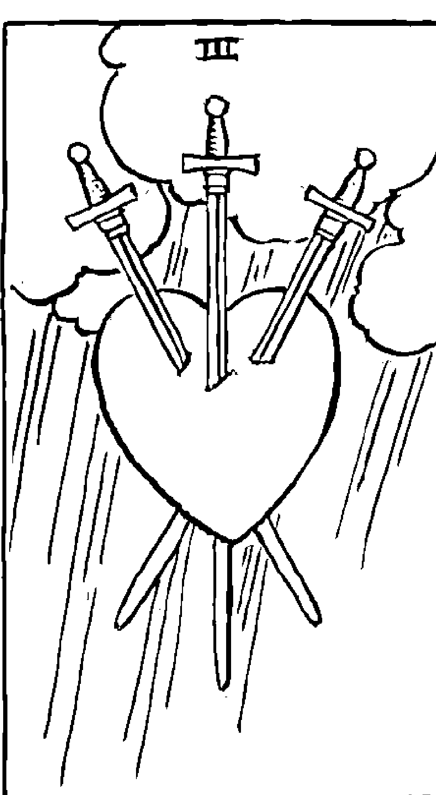

### THREE of SWORDS 宝剑3

#### 关键字『伤心』

光看到一个爱心上插了三把剑，就能够感受的很痛苦的感觉吧！再加上背景的阴雨，更为这张宝剑3增添了一种悲伤感，我们在难过的时候，经常会问为什么？总是不知道为何自己要受到这样的对待，但是宝剑刺穿的样子，更是在提醒着我们要面对这样的失望、伤心，接受痛苦面对原因，才能放下，这个过程说来容易，不过当我们正在深沉悲痛的中心点，我们也只能慢慢的让时间将我们的难受情绪带走，让自己渐渐释放。

#### 牌的建议：

- 正位★★：现状混乱痛苦，让你把错误与过失归咎别人，因羞愧而发怒。
- 逆位★★☆：学着面对自己的伤痛，这样一来才能正式的去克服它！

#### 环境状况：

- 正位★☆：十分忧郁，任何一些争吵小事都会引发泪流满面，情绪溃堤。
- 逆位★★☆：不和谐让大家都感觉受伤，友善沟通，化解彼此尴尬。

#### 关于爱情：

- 正位★☆：被迫接受，并不是出自本身意愿的决定，心碎的痛苦。
- 逆位★★☆：渐渐恢复过来，了解原因抛开悲伤，疗愈创伤、面对疑虑。

#### 关于事业：

- 正位★★：谈判破裂甚至于损害情感，产生分离与不信任，弥漫悲伤情绪。
- 逆位★★☆：放下失败的悲伤，才能慢慢恢复过来，重振士气再出发！

#### 关于财运：

- 正位★☆：遇上难以处理的金钱危机，烦恼失去的财富，觉得崩溃。
- 逆位★★☆：失去金钱固然伤心，但还在可接受范围，请痛定思痛去更正！

### THREE of SWORDS 宝剑3

| 牌中的元素图象 | 要告诉我们的意义 |
|----------------|------------------|
| 被剑穿刺的爱心 | 受伤、痛苦的象征 |
| 三把宝剑的卡住心的样子 | 延迟、阻挠 |
| 宝剑间的对称角度 | 了解、和谐 |
| 爱心上的小伤口 | 心碎、伤口 |
| 灰色的阴天云朵 | 过去经历的堆叠 |
| 下雨的背景 | 失落灰暗、伤痛的感受 |
| 备注：马赛塔罗《III》；托特塔罗《Sorrow》悲伤 | |

#### 倒牌逆位意义：关键字『痊愈』

看到逆位宝剑3，我们可以想象宝剑慢慢地从爱心中抽离，伤心难过的状况已经结束，开始接受疗伤的过程了！但这样的苦痛并没有一瞬间就结束，还是需要一段止痛的过程，目前可能选择隐忍悲伤、压抑情绪的你，一直尽力设法让自己看起来还好，但我们应该正视这个伤痛所带来的害怕与沮丧，这样我们才有机会战胜，见到过往伤口不再恐惧，就是迈向痊愈的开始！

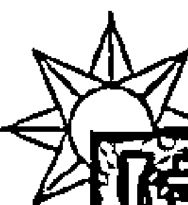

## 【盗小婧的塔罗博物馆】

074僵尸塔罗牌 Zombie tarot
作者：Paul Kepple 发行：Quirk Books

僵尸塔罗牌里的这些卡揭示了前进的道路，你应该留在避难所，最后耗尽所有的生存工具？或是逃到一个政府资助的难民营？僵尸塔罗牌假设如果真的有病毒侵袭人类，你该如何运用塔罗倾听自己的直觉，冲突下生与死的对照！

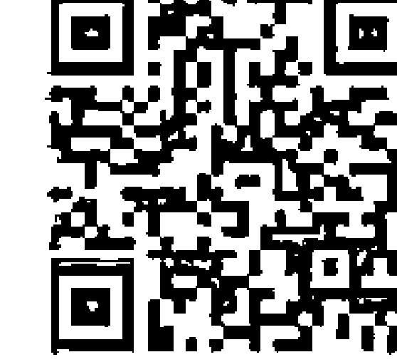

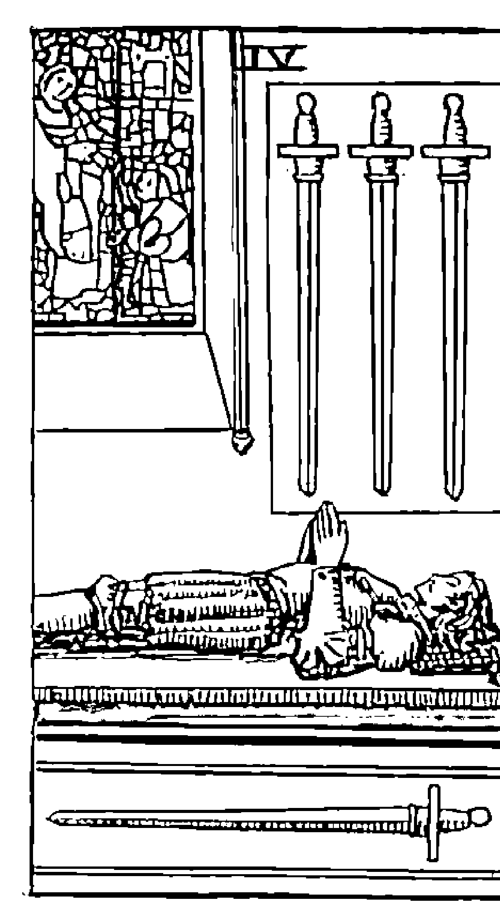

### FOUR of SWORDS 寶劍4

#### 關鍵字『休息』

休息是為了走更長遠的路，在這張寶劍4所體現的，也就是這個意思了！在一個像是教堂內的環境，暫時告別世俗的干擾，讓人心靈平靜的反思，自己過往的行動對嗎？現在當下的心情好嗎？未來的計劃在哪？停下腳步才真的有時間能好好思考，這次不用很急躁的行動，在這段自我評估的過程中，可以找回人生定位。很多事情都等待你的深思熟慮之後才來執行，身旁的寶劍也告訴我們，隨時都能有重獲生機，東山再起的機會喔！

#### 牌的建議：

- 正位★★★：需要休息暫停一下，才能恢復力量來處理目前的困境與問題！
- 逆位★★★☆：集中力量才能真的對你有幫助，請相信更專業的建議。

#### 環境狀況：

- 正位★★☆：處在充滿壓力的狀況，無法思考事情的優先順序！
- 逆位★★★：雖然計劃被擱置，但卻給了自己好好沉思的時間，想好再做。

#### 關於愛情：

- 正位★★☆：不想處理現在愛情上的問題，就暫時給彼此一些空間吧！
- 逆位★★★：開始交流溝通，關係破冰，但過度的堅持己見，還是會造成退縮喔！

#### 關於事業：

- 正位★★★：現在中止退出這個計劃，或許對你自己工作上的傷害最小。
- 逆位★★★☆：慢慢的從失敗的困境走出，消除對自己的疑慮，再站起來！

#### 關於財運：

- 正位★★☆：收入平平，沒有什麼太大起色，還有些小錢的損失喔！
- 逆位★★★：振作起來就可以增加收入，經濟狀況就會越來越好。

### FOUR of SWORDS 宝剑4

| 牌中的元素图像 | 要告诉我们的意义 |
| :--- | :--- |
| 平躺的人 | 停止、休息 |
| 看不到脚的样子 | 没有行动力 |
| 双手合十的姿态 | 体会安详、感受宁静 |
| 挂在墙上的三把剑 | 无用、消极 |
| 身旁的一把剑 | 准备、继续、再起的象征 |
| 窗户上圣母图腾 | 神圣、祈祷 |
| *注：马赛塔罗《IIII》；托特塔罗《Truce》休战* | |

#### 倒牌逆位意义：关键字『恢复』

开始慢慢找回活力，想要弥补自己曾经失去的，因为过去的疲倦不堪，让你的心理产生阴影，这个失落感已经因为你的沉淀，慢慢的回复气力而不再懒洋洋。当逆位宝剑4出现时，说明你已经准备好重新面对自己的人生，深思后的行动也将变得谨慎小心，毕竟经历了这样的休息的时间中，你领悟到唯有接触问题，才能看见压力，进一步化解危机！

狐狸小喵的塔罗博物馆

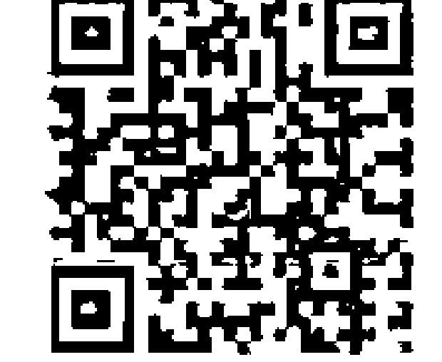

075 情人之路塔罗牌 Lover's Path Tarot
作者：Kris Waldherr 发行：U. S. Games
爱情一直都是大家在生活中难解的课题之一，跟历史上著名的爱情故事与塔罗牌的角色牌义相互呼应，设计出能透过这些故事背后的意义，了解整个爱情故事发生的始末！让我们在面对爱情这条道路，能走得更加稳健与平顺。

### FIVE of SWORDS 寶劍 5

#### 關鍵字『爭議』

有時候一時的挫折不是真失敗，暫時的獲勝也不是真成功！如果你是前方暗自竊喜的人，紛亂的局面雖然有利於你，但你不也沒有多餘的手來拿地上的寶劍嗎？而分頭遠離的人，因為現在遭受破壞寧可放棄手中的寶劍，看起來是損失了，但卻是往不同方向、角度望去，或許為自己打開了多元性。

贏了一場不光彩的戰爭，只為了獲得無謂的虛名？面對觀點分歧，意見不同的時候，你是只想著要別人聽你的，還是真的會廣納建言呢？

#### 牌的建議：

- 正位★★：瞬間風雲變色，讓人措手不及，模糊焦點，遭受重大的打擊。
- 逆位★★☆：開始思考因應之道，良好的檢查會避免下次的錯誤。

#### 環境狀況：

- 正位★☆：有人特意製作爭端，造成大家情感離間，衝突不斷。
- 逆位★★☆：亂象過後，才該面對收拾殘局，壞情緒也漸漸撫平了。

#### 關於愛情：

- 正位★☆：激烈的衝突，如果只為了無意義的誰輸誰贏，只是會破壞感情。
- 逆位★★：關於爭執，找到和解之道，開始試著去依循兩人訂出的規範。

#### 關於事業：

- 正位★★：在不公平的競爭下獲得勝利，並無實質收穫，只賺到了面子。
- 逆位★★☆：承認挫折，可以選擇退出讓你受傷的狀況，修補自信。

#### 關於財運：

- 正位★☆：已經發覺金錢狀況可能受騙，但卻不當處理，還是造成損失！
- 逆位★★：檢視用錢，別在挖東牆補西牆，做到收支平衡還是最重要。

### FIVE of SWORDS 寶劍 5

| 牌中的元素圖像 | 要告訴我們的意義 |
| --- | --- |
| 前方充滿笑容的人 | 獲勝、得意 |
| 遠方的兩個人 | 擊潰、失敗者 |
| 手中的三把寶劍 | 自私、野心的展現 |
| 散落的寶劍 | 爭執結束、分出勝負 |
| 手中已空不出來拿地下的寶劍 | 無謂、虛名 |
| 感覺快速流動的雲 | 詭譎緊張的氣氛 |
| 備註：馬賽塔羅《V》；托特塔羅《Defeat》擊潰 | |

#### 倒牌逆位意義：關鍵字『受害』

一無所獲的你，真是受害者的一方嗎？還是只因為你的失敗，讓你自己用受害者自居呢？逆位寶劍五不再是獲勝的一方，而是挫敗。但大家還是經歷了先前的緊張狀態，而為了避免所有人還保持著不滿氛圍，你選擇開始接受一些磋商跟調整，但不見得是出於自願的，但這樣強迫的接受，反而讓你有所反省，不認為大家都對不起你，而放下自私自利的想法！

# 孟小靖的塔羅博物館

### 076 亡者之書塔羅牌 Necronomicon Tarot

作者：Anne Stokes & Donald Tyson 發行：Llewellyn

亡者之書，記載了許多黑魔法與黑暗神話故事的一本經典，目前大家相信並不是一本咒文書。據推測應該是記載歷史，意思應該是『記錄已消逝事物的書』，另一種根據希臘文書名推導出來的意思是『有關於死亡世界風俗的書』。

### SIX of SWORDS 寶劍 6

#### 關鍵字『療傷』

學著度過悲傷，是一個你我都可能都會去面對的必經人生課題。有時候，這樣的悲傷後面還帶著一些秘密，所以不是所有的事情說出來就好了，因為這樣的過程只有自己了解。我們所歷經的傷痛，讓我們對於人生感到疲憊不堪，甚至於開始對人產生不信任，渡船場景的寶劍 6，暗示著離開或是一次旅行，或許遠離才能找回平靜，背後正在划船的船夫，也在告訴我們能尋求他人的幫助，不一定是親人朋友，也許現在你需要的是陌生的親密感。

- **牌的建議：**
  - 正位★★★☆：過去的就過去了，繼續前進才可以讓自己跳脫憂愁情緒。
  - 逆位★★☆：太過依賴別人，沒有辦法解決問題，最終還是自己的決斷！

- **環境狀況：**
  - 正位★★★：退一步思考問題，才能更看到更全面的狀況，獲得清楚觀點！
  - 逆位★★☆：處理迫在眉睫的危機，又遭遇重重阻礙，需要慢下來面對。

- **關於愛情：**
  - 正位★★★☆：放下才能讓自己遠離執著，解放心靈後會看得更清楚明白！
  - 逆位★★★：過往的恐懼讓你產生極端想法，敏感讓你自己心情難受。

- **關於事業：**
  - 正位★★★：面對變動的狀況，自己先別慌亂，改變一下看待事情的角度吧！
  - 逆位★★☆：提案或計劃一直被否決，職位上的升遷也不斷受阻礙！

- **關於財運：**
  - 正位★★★：雖然有不小的經濟壓力，但會跟著時間慢慢解除困境喔！
  - 逆位★★☆：面臨沉重的金錢問題，已經嚴重影響到你的生活了！

### SIX of SWORDS 寶劍 6

| 牌中的元素圖像 | 要告訴我們的意義 |
| --- | --- |
| 前進的船 | 接受改變 |
| 平靜的水面 | 緩慢、沉重 |
| 船裡往下放的六支寶劍 | 放下的傷害 |
| 披著斗篷的兩個人（大人、小孩） | 隱藏、療傷 |
| 三個低著頭的背影 | 告別過去、哀傷 |
| 撐船的人 | 給予協助的親友、專家 |

註：馬賽塔羅《VI》；托特塔羅《Science》科學

#### 倒牌逆位意義：關鍵字『僵局』

看到逆位寶劍6，可想而知大量的水灌進了小船之中，不想聽取別人建議的你，這樣悶著不說，將會讓悲哀的情緒無盡延伸。波浪也象徵著更多變動與危害，而目前被情緒綁架的你，根本無法進行任何思考，先想辦法讓自己找到出口，宣泄一下。才能看清自己的狀況處境，抽離感情因素的干擾，你會發現其實你還是擁有分析事情的能力，就可以找出解決的計劃了！

### 【孟小靖的塔羅博物館】

### 077 萬聖節塔羅牌 Halloween Tarot

作者: Kipling West 發行: U. S. Games

牌中出現黑貓、蝙蝠，還有一些想像中的怪物，像是狼人、吸血鬼等，配合萬聖節的感覺，牌中的人物雖說是怪物，但卻沒有可怕的感覺，可能是配合傳統習俗吧！在這天小孩們會扮演起鬼怪，到處要糖吃，運用輕鬆解讀塔羅！

欣賞牌圖

### SEVEN of SWORDS 寶劍 7

#### 關鍵字『詭計』

通常想偷懶的人才會找出有效率的做事方法，這樣的人基本上都十分聰明。選擇不與敵軍正面交鋒的寶劍7，鬼祟的偷走了五把寶劍，但還有兩把寶劍的敵人，就會進攻失敗？這樣自欺欺人的手段，只是顯示出了自己的魯莽，白費工夫的算計，換來的不見得是成功。還是願意奮鬥的心、展現自信，想要獲得肯定與成就的付出固然很好，但是沒有意義的行動，懂得事先的檢視、自我評估才是你我該留意的重點，把自己置於危險之中！

#### 牌的建議：

- 正位★★★：為了避免衝突而說謊，只不過是為了減少不安的藉口罷了！
- 逆位★★：想要目標完成，就快起身搜集資料、運用資源，擊潰弱點。

#### 環境狀況：

- 正位★★★☆：好好研究一下組織上的分配，就可以操控大局，完成計劃。
- 逆位★☆：鬼鬼祟祟的行為，早就讓大家起疑，對你有戒心防備！

#### 關於愛情：

- 正位★★★☆：左右逢源的感情關係，或許很刺激，但只是得到短暫的快樂！
- 逆位★★：是時候好好審視自己的過往戀情，找到真正想要的愛情模式。

#### 關於事業：

- 正位★★☆：準備不足造成失敗，想要達成目標，需要換個計劃來實行看看！
- 逆位★☆：當下或許並不會被別人認同，表明自己立場作法，還是很重要的。

#### 關於財運：

- 正位★★☆：必要留意投資的風險，特別是身邊的朋友或合夥對象。
- 逆位★★：有機會將借別人的金錢拿回，但可別馬上就花掉囉！

### SEVEN of SWORDS 寶劍 7

| 牌中的元素圖象 | 要告訴我們的意義 |
| --- | --- |
| 躡手躡腳的人 | 虛假、不真誠 |
| 手上抱著的五支寶劍 | 偷竊、欺騙 |
| 紅色的帽子與鞋子 | 奮力思考行動的執行 |
| 東張西望得意的樣子 | 自信、不退縮 |
| 五顏六色的帳篷 | 人群與社會 |
| 正離開的姿態 | 不合群、孤立 |

註：馬賽塔羅《VII》；托特塔羅《Futility》無用

#### 倒牌逆位意義：關鍵字『投機』

運用旁門左道取得暫時的上風，這樣的機會可不是每次都會奏效。如果不幸失敗，那只會是招來賠了夫人又折兵的損失罷了！任何可疑的訊息，這個時間點都請不要相信，因為虛偽的話語已經占據溝通的互動，沒人能確定真實性，當然就會造成越不坦承的狀態。其實逆位寶劍7就是要告訴我們，不要讓投機心態如同滾雪球一般，而是應該趕緊做出導正！

### EIGHT of SWORDS 寶劍 8

#### 關鍵字「束縛」

語言是十分有力量的，當別人說你沒能力，你就真的沒本事了嗎？你要輕易的掉入這樣的框框裡嗎？還是要掙脫這樣的束縛，走出自己的路呢？也許現在的你，周圍就如同寶劍8面臨的狀況一樣，插滿了寶劍就像是你遇上的眾多的困擾。不知道該如何是好的你，站在原地矛盾的無法行動，心情也感到十分挫折、焦慮的你會越來越難熬，就忽略了其他的感知，就跟寶劍8的主角一樣，她的腳並未被捆綁，所以跨出一步，行動能讓你得到解脫！

#### 牌的建議：

- 正位★★☆：感到孤立的你，十分脆弱，多是自己心理壓力造成阻礙的原因。
- 逆位★★★☆：聰明如你，可以靠自己的智慧來應變，打破身邊障礙物。

#### 環境狀況：

- 正位★★☆：明知不安、感到恐懼不敢輕舉妄動的你，寧可選擇當一個受害者。
- 逆位★★★：經驗已經為你指引出一條道路，改變制約，來移除失敗情緒。

#### 關於愛情：

- 正位★★☆：自己真的甘願於情人的不合理束縛嗎？是時候改變自己了！
- 逆位★★★☆：別被宿命的緣份觀念所捆綁，放下束縛才能讓你解放。

#### 關於事業：

- 正位★★☆：卡住的行動，造成累積的想法太多卻毫無頭緒，不知怎麼開始。
- 逆位★★★☆：一場耐力的考驗，只能透過不斷的努力，超越脫離嚴峻的現狀。

#### 關於財運：

- 正位★★☆：盲目的跟隨，讓自己有很多金錢上的損失，想想是否真的需要。
- 逆位★★★：慢慢的學會拒絕，經濟狀況開始好轉，限制自我用錢方式。

### EIGHT of SWORDS 寶劍 8

| 牌中的元素圖象 | 要告訴我們的意義 |
| --- | --- |
| 朦住眼睛的女子 | 困惑、限制 |
| 被綁住的雙手 | 控制及壓迫 |
| 周圍的八支寶劍 | 障礙、恐懼、畏縮 |
| 遠方的城堡 | 有形的威權、壓力、恫嚇 |
| 泥濘的地 | 混亂不明的狀態 |
| 未被束縛的腳 | 自由的意願 |
| 備註：馬賽塔羅《VIII》；托特塔羅《Interference》阻礙 | |

#### 倒牌逆位意義：關鍵字『突破』

當周遭慢慢的平靜下來之後，你會發現自己的直覺開始帶領，試著讓你看清現實狀況，打開你的雙眼，看到自我的價值！就如同逆位寶劍8一樣，開始行動跨出一步！

但也許不一定馬上就獲得效果，但的確已經讓自己往自由輕鬆靠近，移動腳步的過程就是你解開束縛的開端，最壞的狀況已經過去，或許你可以開始做一些自己真正想做的事情了！

# 孟小靖的塔羅博物館

### 079 神秘精靈塔羅牌 Mystic Faerie Tarot

作者：Barbara Moore & Linda Ravenscroft 發行：Llewellyn

在奇幻的風格中又加入了中古世紀的浪漫風味，新藝術風格結合花與妖精，環繞的精靈、仙子、美人魚和矮人完成了塔羅牌中角色的指定動作與表演呢！小牌56張的部份，運用大自然的素材代表四大元素，把主題發揮得很完整。

### NINE of SWORDS 寶劍 9

#### 關鍵字『惡夢』

承受著心智上的破壞，有時候這樣的感覺更為難受！如果說憂鬱症是現在困擾著大家的精神疾病，那寶劍 9 只是把這樣的痛苦氛圍具體的呈現出來，無論我們接受到了什麼惡運或打擊，這樣的害怕已經化為恐懼，令人感到絕望。

過於擔憂而造成失眠、從夢中驚醒而掩面，都是心理壓力負擔已經超過的警訊，是不是應該誠實的面對心中的害怕？到底是什麼讓你如此不舒服，面對才能釋放、振作才能拯救，讓自己釋懷才能安然度過！

#### 牌的建議：

- 正位☆☆：總是不知不覺想到最差的狀況，讓自己的心產生很多精神折磨。
- 逆位★★：還是會對週遭的人產生懷疑，來慢慢的試著面對你的恐懼吧！

#### 環境狀況：

- 正位★★：嚴重的憂鬱狀況，太多的沮喪已經開始影響到你的生活日常。
- 逆位★★☆：做些什麼來改變這個狀況，或許作用不大，但已經開始釋放。

#### 關於愛情：

- 正位★☆：不好的戀愛經驗，像惡夢般的揮之不去，需要透過時間來療傷了。
- 逆位★★：別再想著愛情關係，先為自己挺身而出，告別悔恨與悲情。

#### 關於事業：

- 正位★★：太多的煩惱讓你情緒起伏很大，不斷質疑自我的能力不足。
- 逆位★★☆：走出內疚陰霾，糾纏已久的失敗者情緒，也該學著告別了。

#### 關於財運：

- 正位★★：過於擔憂，並不能協助經濟狀況好轉，造成煩惱更加深。
- 逆位★★☆：看到金錢的問題點，一定會覺得憂心忡忡，卻也能對症下藥。

### NINE of SWORDS 寶劍 9

| 牌中的元素圖象 | 要告訴我們的意義 |
| --- | --- |
| 牆上的九把寶劍 | 威脅、恐懼 |
| 搶著臉的人 | 害怕、驚嚇的反應 |
| 下方像是刺穿頭、頸、胸的三把寶劍 | 痛苦、傷害 |
| 全黑的背景 | 無光的世界，精神面的灰暗 |
| 床頭戰爭雕刻 | 衝突、碰撞 |
| 蓋著玫瑰與星座符號的棉被 | 在保護之中 |
| 備註：馬賽塔羅《IX》；托特塔羅《Cruelty》殘酷 | |

#### 倒牌逆位意義：關鍵字『清醒』

人真的有辦法很輕鬆的面對自己脆弱的一面嗎？逆位寶劍9點出了這個盲點，因為我們都無法正視焦慮與害怕，所以只能用猜忌、懷疑情緒來保護自己，以免受到傷害，但這樣卻造成了人與人之間的不信任、不溝通。造成我們越是膽怯越無法走出黑暗，別讓自己被自己嚇到了，想像中的悲慘往往並不是實際的樣子，或許讓自己獲取訊息、堅定心神，就能破除煩惱！

### 【孟小靖的塔羅博物館】

### 080 波西米亞貓塔羅牌 Baroque Bohemian Cats' Tarot

作者：Alex Ukolov and Karen Mahony 發行：Magic Realist Press

以擬真畫風繪製出貓咪那種靈性，還有貓毛的柔軟呈現，都令人覺得相當讚嘆！依照偉特塔羅牌中的角色也讓這些可愛的貓咪，用擬人化的方式扮演，詮釋起來的十分可愛。濃濃的波西米亞風格也散發出精緻華麗的異國風情呢！

### TEN of SWORDS 寶劍 10

#### 關鍵字『痛苦』

如果說塔羅牌中有令人最感到可怕的牌，莫過於這張寶劍 10 了，十把寶劍插在背上的樣子，不僅帶來的是死亡，還有一種極端的痛苦！或許你也正面臨人生的黑暗期，甚至於懷疑自己的怎麼會走到人生的絕路，這恐怖的場景令人不寒而慄，也再次警告著我們低潮的降臨，即將陷入最差的狀況中。但如果就這樣放棄，那可能也言之過早，一切終結後，不是還有黎明的到來嗎？就算我們失去了肉體，領悟後的靈魂與信念還是能引導我們重生！

#### 牌的建議：

- 正位★☆：誇張的自我焦慮，無形之中放大了自己的無力感與悲傷痛苦。
- 逆位★★：做好自己能做的事，對於不拿手的事情，學習不去在意。

#### 環境狀況：

- 正位★☆：極端的痛苦伴隨著結束，經歷低潮後才會是柳暗花明又一村。
- 逆位★★☆：能徹底的承認自己的失敗，或許可以從挫敗中領悟重生。

#### 關於愛情：

- 正位★☆：一直被迫犧牲，沒有選擇的愛情關係，讓你感到精疲力盡！
- 逆位★★：現在可以放手，這樣才能獲得解放，新的機會即將到來了。

#### 關於事業：

- 正位★☆：被惡意的中傷，這樣的背叛讓你感到心寒，瞬間喪失所有鬥志。
- 逆位★★：做出一些必要犧牲的決定，才能減緩壓力，解決困難問題。

#### 關於財運：

- 正位★☆：經濟來源一直不穩定的狀況，會是你心情不佳的最大來源。
- 逆位★★☆：體會過被錢控制的痛苦很難受，痛定思痛改變用錢方式吧！

### TEN of SWORDS 寶劍 10

| 牌中的元素圖象 | 要告訴我們的意義 |
| --- | --- |
| 倒地背臥的人 | 結束、死亡 |
| 身上插著十支寶劍 | 失敗、慘痛 |
| 背後受傷的姿態 | 突然、沒有預料的 |
| 披著的紅袍 | 對生命的熱忱 |
| 面向平靜的水面 | 象徵得到情感解脫 |
| 全黑的背景 | 無光的世界，精神面的灰暗 |
| 備註：馬賽塔羅《X》；托特塔羅《Ruin》崩毀 | |

#### 倒牌逆位意義：關鍵字『改善』

有時候知道自己已經在最差的低潮，反而能讓自己谷底反彈，找到逆轉勝的曙光！逆位寶劍 10 代表著肉體的結束，但卻得到靈魂的昇華，擁有沒有限制的未來。

只要你願意拋下過去的負面恐懼，新的轉生機會已經在向你招手，慢慢就能好起來，你的心情也會得到改善，現在就正視這些痛苦，勇敢一點，試著讓自己從悲傷中走出來，再站起來！

### 【孟小靖的塔羅博物館】

### 081 家庭主婦塔羅牌 Housewives Tarot

作者：PAUL KEPPLE & JUDE BUFFUM 發行：Quirk Books

有別於一般塔羅牌的包裝，一個偽裝成家庭主婦們的食譜箱子，打開包裝後很像是一個小型的資料檔案夾！整副牌是在訴說著一位名叫路易絲家庭主婦的故事，透過塔羅牌來觀察她的家庭主婦生活，元素轉化成你我的居家用品！

### PAGE of SWORDS 寶劍隨從

#### 關鍵字『謊言』

[象徵個性特質人物：狗仔隊]

擁有比別人更優秀理解力的這個年輕人，十分的享受說話與溝通的過程，聰明反應快又觀察入微，或許就是因為太過靈活，反倒變成會使用一些小心機、小手段，來獲得資訊而達到目的。

寶劍隨從如果是形容一種狀況，最近可能將面對一些衝突，學會察言觀色十分的重要，也要提高警覺，千萬別被批評激怒，設法讓自己保持在一個理智的狀態之下，才能避免掉一些麻煩！

#### 牌的建議：

- 正位☆☆☆☆：面對資訊快速流動，你其實可以反覆驗證後再下決定。
- 逆位☆☆☆：虛張聲勢的你，早就被大家看破手腳，一切事物根本還未就緒。

#### 環境狀況：

- 正位☆☆☆：多觀察、多學習，會很快速的找到自己還未確定的成長目標。
- 逆位☆☆☆：不合邏輯的狀況，會讓事情無法順利發展，需要調整或中止。

#### 關於愛情：

- 正位☆☆☆☆：還未定型的關係，需要再多觀察彼此對這段感情的重視程度。
- 逆位☆☆☆：只會一味膚淺的改變，無論犯錯或彌補，都要搞清楚再動作。

#### 關於事業：

- 正位☆☆☆☆：思考判斷力十足的你，只要再搞好人際關係的部份就會成功在望。
- 逆位☆☆☆：慎重行動，因為計劃中的要項尚未準備完成，才不會造成誤解。

#### 關於財運：

- 正位☆☆☆☆：能夠留意資訊，創造出多方收入，讓你累積到不少財富。
- 逆位☆☆☆：容易聽信他人，隨意做出不正確決定，無法保護自己的金錢。

### PAGE of SWORDS 寶劍隨從

| 牌中的元素圖象 | 要告訴我們的意義 |
|----------------|------------------|
| 雙手握住寶劍 | 掌握溝通、運用自如 |
| 雙腳離地的站姿 | 輕佻、不安定、隨便 |
| 腳上的紅鞋 | 強調行動力的重要 |
| 只微微隆起的山丘 | 不穩的基礎 |
| 遠方一群飛鳥 | 很多想法、不確定的訊息 |
| 風起雲湧的背景 | 象徵不安的氛圍 |

註：馬賽塔羅《VALET·D'EPEE》；托特塔羅《Princess of Swords》寶劍公主

#### 倒牌逆位意義：關鍵字『虛弱』

停下思考，開始行動是逆位寶劍隨從要告訴我們的事，溝通良好與反應敏捷都是優點，但太多的資訊交流反而會擾亂你的計劃，造成焦慮、或是偏執的狀況出現，到最後就什麼都沒執行。

另一方面，喜歡探聽別人八卦隱私，讓大家其實無法對你釋放真心，只能獲得表面協助，現在應該避免發表過多意見，才不會讓謠言滿天飛。未來請收起隨便輕率的心態，振作起來認真面對！

### 【孟小靖的塔羅博物館】

082 亞洲之心塔羅牌 Roots of Asia Tarot 作者：Amnart Klanprachar & Thaworn Boonyawan 發行：U.S. Games 畫面中刻意營造出來有一種古老的石頭雕刻的感覺，十分的舒服溫柔呢！許多東方宗教的元素，像是佛道教、印度教等，讓整個塔羅牌有著很不一樣的禪意，把亞洲的神祇融入雲朵之中，讓塔羅也傳達一種祥和心靈層面的開釋！

## 欣賞牌圖

### KNIGHT of SWORDS 寶劍騎士

#### 關鍵字『衝刺』

[象徵個性特質人物：激進份子]

雖擁有熱情，但卻充滿了破壞力道，勇氣十足無所畏懼、豪放不羈喜歡挑戰的他，在不知不覺中就會引起爭端，再運用思路敏捷的特質來幫助別人調停、解決問題，但過程中也要別人接受他想法的堅持，會讓人有好勝好辯的感覺！

寶劍騎士如果是形容一種狀況，最近面臨一些緊張的狀況，請別隨風起舞，小心流言的傷害，凡事多方求證，切勿魯莽行動，容易造成彼此對立！

#### 牌的建議：

- 正位★★★：穩住步伐，讓自己能多點求證在行動，別白白浪費時間與力氣。
- 逆位★★☆：容易分心害你一事無成，堅定目標往前進，別中途變來變去。

#### 環境狀況：

- 正位★★★☆：你的輕率可能造成失控的狀況，別因為自己的不耐煩而誤事。
- 逆位★★★：雜事太多，讓你無法專注達成一個目標，造成效率不彰。

#### 關於愛情：

- 正位★★★：還沒想清楚愛情中要什麼，雖然愛情玩伴很多，但關係也不長久。
- 逆位★★☆：衝動過頭的魯莽行為，有時候是在防衛自己心靈上的空虛寂寞。

#### 關於事業：

- 正位★★★★：相信自己的觀點，果決的溝通，快速運用智慧完成任務。
- 逆位★★★：過於著急而壞事，小心衝過頭而產生意外，造成麻煩與錯誤。

| KNIGHT of SWORDS 寶劍騎士 |
| --- |
| **牌中的元素圖象** | **要告訴我們的意義** |
| 拿著寶劍往前的姿態 | 產生傷害、攻擊 |
| 奔馳的馬 | 展現出衝動、急躁 |
| 鞋子的尖角 | 防禦、破壞 |
| 人與馬開著口的樣子 | 慌張、混亂的情緒 |
| 紅色的袍子 | 行動力、熱情 |
| 背景流動的雲、傾斜的樹 | 迅捷、快速、驟變 |
| 註：馬賽塔羅《CAVALIER·D'EPÉE》；托特塔羅《Prince of Swords》寶劍王子 |

#### 倒牌逆位意義：關鍵字「妨礙」

自顧自的往前衝，沒有評估的狀況，掉入別人預先設計好的陷阱都不自知。可以說十分享受衝突，覺得生活就是要經過碰撞才精彩，根本忽略了這一次又一次的爭執，也會消磨彼此的熱情。

在不想被別人小看的心情之下，會用行動來掩飾自己的軟弱，但太快速的反應往往都是粗心，只做到表面的膚淺狀態，請先培養出耐心與信心，才不會做出事倍功半的「掉漆」行為。

## 小貓塔羅的塔羅博物館

083 神秘貓塔羅牌 Mystical Cats Tarot 作者：Lunaea Weatherstone & Mickie Mueller 發行：Llewellyn 感受貓科動物野性和神秘的魅力，提供永恆和古老的智慧與神秘，這就是神秘貓塔羅牌的神奇世界。透過貓咪原始的形態，自然生活的樣貌，來詮釋塔羅牌中的每一張主角的特色，小牌中的四大元素是對應地球、海洋、火和天空。

### QUEEN of SWORDS 寶劍王后

#### 關鍵字『冷漠』

[象徵個性特質人物：鐵娘子]

過於武裝自己，是因為想把理性與感性達到一個平衡，組織能力很好、辯才無礙的她，工作表現不輸人，心智堅定、接受挑戰超越自我的精神，讓人敬佩，但想要掌握大局的主張，頤指氣使的態度難以相處。

寶劍王后如果是形容一種狀況，最近或許遇上一些困難，請堅定信念，拿出剛強的姿態以對，解決事情才是要項，必須先摒除情感面的干擾，才不會影響你的判斷！

#### 牌的建議：

- 正位★★★：有條有理的冷靜，令人發自內心的感到信服，但也不敢與你親近。
- 逆位★★☆：你的每個理智決定，其實還是會受到感情的影響產生波動。

#### 環境狀況：

- 正位★★★☆：習慣用鋒利的方式來清楚表達自身觀點，會有口角紛爭產生。
- 逆位★★★：或許你講的道理很對，但也要看一下周遭的人是否領情喔！

#### 關於愛情：

- 正位★★☆：懷恨著過往愛情中的苦痛，雖然害怕孤獨，但決然否認悲傷。
- 逆位★★：對愛情想的太多，又不願意去流露情感，很容易變成壓力來源。

#### 關於事業：

- 正位★★★★：心思細膩的你，能指出事情最重點，但請別用太批判的發言喔！
- 逆位★★☆：遇上惡意指正，因能力被質疑覺得委屈，激動情緒難以平復。

#### 關於財運：

- 正位★★★☆：運用智慧追求財富的公平合理，經濟狀況條件目前不錯。
- 逆位★★☆：缺乏辨識力，金錢的損失很大，對於受騙的打擊感到失望難過。

| 牌中的元素圖象 | 要告訴我們的意義 |
|----------------|------------------|
| 靜靜注視前方的姿態 | 沉著、冷漠 |
| 手上所帶的飾品 | 束縛、阻礙 |
| 右手持的寶劍 | 運用力量斬斷阻礙 |
| 遠方的飛鳥 | 自由的心智、遠離的想法 |
| 衣服上的雲朵圖案 | 情感的思索、回憶的執著 |
| 身後堆積的雲 | 痛苦經驗、悲傷的累積 |
| 註：馬賽塔羅《REYNE·D'EPEE》；托特塔羅《Queen of Swords》寶劍王后 |

#### 倒牌逆位意義：關鍵字『無奈』

如果大家覺得你難相處，就這樣吧！心胸狹窄、自我放棄的情緒就是逆位寶劍皇后要我們去調整的事。當悲觀感受湧上來的時候，你會喜歡看到大家陷入爭吵狀況之中，溝通無礙、善於操控的特質，演化成不安好心的惡意攻擊，挑撥離間。說真的，這樣的行動並不會為你帶來太多好處，充其量只是一個痛快罷了！請再試著溝通，還是會遇上願意相互付出的人。

084 國際圖像塔羅牌 THE INTERNATIONAL ICON TAROT 作者：Robin Ator 發行：個人創作 用瑰麗的色彩和小人結合，承繼偉特塔羅的系統，創作出這一副國際圖像塔羅牌剪貼式的畫面，很清楚的看出了重要的占卜元素、利用顏色的深淺製造出遠近感，除了充分展現出個人風格，也留意了實用價值，占卜收藏都兼具！

### KING of SWORDS 寶劍國王

#### 關鍵字「指揮」

[象徵個性特質人物：專業人士]

面對果決的判斷，就是他所背負的重要責任，經驗的累積及思路的清晰，在他身上看到了十分務實的作法，冷靜嚴肅才能更專注於每一個重點，比起努力體力，還是運用智慧與溝通來生活更適合。

寶劍國王如果是形容一種狀況，通常意指突然的破壞與失序，需要馬上進行緊急處理，不然就會造成危機，當然這時要尋求公平公正的處置，盡量減少對人的傷害與造成更多衝突。

#### 牌的建議：

- 正位★★★★：發揮思維清晰的特質，堅定的溝通來捍衛自己的專業信念。
- 逆位★★☆：固執嚴苛，聽不進其他意見的你，別人反而會陽奉陰違喔！

#### 環境狀況：

- 正位★★★☆：一切都在你的掌握之中，早已經是你邏輯思考後的精準安排。
- 逆位★★☆：過於嚴格的紀律，可能會造成偏見想法、反對的行為發生。

#### 關於愛情：

- 正位★★★：真的有喜歡這個人嗎？還是因為彼此能夠互補，就覺得可以了。
- 逆位★☆：極端主義，戀愛都要完全按照你的規劃發展，這樣找伴太困難。

#### 關於事業：

- 正位★★★☆：凡事早就安排妥當，能避免不必要的麻煩與失敗，獲得成功。
- 逆位★★☆：太過制式，硬性規定的做法沒有彈性，不見得會有預期效果！

#### 關於財運：

- 正位★★★★：擁有專業技能讓你金錢豐厚，謙遜會讓你增加更多收入喔！
- 逆位★★★：心智上的混亂，讓你花錢毫無章法節制，常後悔自己亂買東西！

| 牌中的元素圖象 | 要告訴我們的意義 |
|----------------|------------------|
| 正中央的人 | 心智的自制、規律 |
| 輕鬆坐在王座的姿態 | 可靠、完整構想 |
| 右手所持的微微傾斜寶劍 | 掌握決定、調整務實思考 |
| 藍色衣服覆蓋紅色的袍子 | 有智慧的行動力、熱情 |
| 遠方的飛鳥 | 自由的心智、遠離的想法 |
| 身後的雲、對稱的樹木 | 穩定、平衡 |
| 註：馬賽塔羅《ROY·D'EPEE》；托特塔羅《Knight of Swords》寶劍騎士 |

#### 倒牌逆位意義：關鍵字『擾亂』

容易緊張，在不知不覺中就把事情看嚴重了，這樣就會讓你造成心胸狹隘的狀況，對於很多事都十分的不信任，當然也包括自己的專業，原先思路清晰明確，突然間一個自私的念頭出現，讓你只想追尋自由，把原先計劃好的事拋下，造成混亂。選擇以霸道嚴苛的手段來與大家相處，只會失去大家對你的信賴，並不會讓你覺得好過，現在應該學著放下成見。

> 【孟小晴的塔羅博物館】
085 中國塔羅牌 China Tarot 作者：德珍繪、王中平解說 發行：尖端出版 塔羅牌一向都被認爲是西方的占卜工具，在台灣對中國歷史和服飾有研究的東方畫姬德珍，推出了不少中國繪卷作品，這次她的中國塔羅牌，當然有著濃濃的中國風，加上她精湛的畫技，讓整副塔羅牌有了不一樣的東方風情！

# 【孟小婧閒聊】塔羅占卜師的道德守則

## 來自美國塔羅牌協會 (American Tarot Association, ATA)

## THE ATA CODE OF ETHICS 品行規範

I will serve the best interests of my clients, conducting my professional activities without causing or intending to cause harm. 我將以最大之熱忱為問卜者提供解讀服務，發揮專業並不造成傷害或蓄意傷害。

I will treat all my clients with equal respect, regardless of their origin, race, religion, gender, age, or sexual preference. 我將對待所有我的問卜者以相等的尊敬，不論他們的起源、種族、宗教、性別、年齡及性傾向。

I will represent honestly my Tarot qualifications, including educational credentials and levels of certification. 我誠實的出示代表我的塔羅解讀資格，包括證明的教育證件和職照。

I will keep confidential the names of clients and all information shared or discussed during readings, unless otherwise requested by the client or required by a court of law. 我將保密問卜者的名字和所有資訊，在整個解讀過程的分享或談論期間，除非問卜者要求或由法庭要求。

I will recommend clients consult a licensed professional for advice of a legal, financial, medical, or psychological nature that I am not qualified to provide. If trained in one of these areas, I will clearly differentiate between the tarot reading and any professional advice additionally provided. 如果在解讀的過程中，我無法提供有關法律、財政、醫療、或心理諮詢的建議，我將推薦問卜者轉而尋求合法的專業人士。如果我受過上述的專業訓練，我將清楚地區分塔羅解讀與其他專業上的意見提供。

I will respect my clients’ right to refuse or terminate their reading at any time, regardless of prior consent. 我將尊重問卜者有隨時拒絕或終止塔羅的解讀，即使是對方已事先同意。

# 小阿爾克納元素：務實之土，錢幣牌組

象徵土元素的錢幣，因爲在錢幣上有著五芒星的符號，也有人稱之爲五芒星牌組。顧名思義，錢幣牌組就是代表著物質、穩定、面對社會現實及腳踏實地的人生體驗，當然負面的意義跟保守、失去、精神性匱乏及沒有安全感，這些無法掌握的擔憂也在錢幣牌組中呈現出來了！

在占星學中的土象星座(金牛、魔羯及處女)，不都也是有著良好的經濟觀念，但也十分的享受物質生活帶來的愉悅。但可別忘了，人是使用錢的主人，千萬別讓自己成爲錢的奴隸，若是情緒起伏都只繞著金錢遊戲打轉，會不會讓你掉入一個追求物質慾望的空虛之中了！

如果在占卜之中，出現很多錢幣牌組的牌卡，金錢的運用及經濟狀況就是你首先要留意的問題，因爲這些務實基本的狀況，會跟你未來的決定有關，務必請考慮進去！

| 錢幣牌組 宮廷牌角色 | 土象星座對應 | 中世紀階級 | 季節 |
|-------------------|--------------|------------|------|
| 錢幣國王 (土)之土 | 金牛座       | 商人       | 冬   |
| 錢幣皇后 (土)之水 | 魔羯座       |            |      |
| 錢幣騎士 (土)之火 | 處女座       |            |      |
| 錢幣隨從 (土)之風 | 無           |            |      |

> 【孟小靖的塔羅博物館】
086 蒸汽龐克塔羅牌 The Steampunk Tarot 作者：Barbara Moore & Aly Fell 發行：Llewellyn 時代設定在維多利亞時代的英國，當時往往依靠新某種假設的技術，結合魔法與科學共存，通過新能源、新機械、新材料、新交通工具等方式，展現一個平行於19世紀西方世界的架空世界觀，努力營造它的虛構和懷舊等特點。

### ACE of PENTACLES 錢幣1

#### 關鍵字『繁榮』

位一個繁花盛開的莊園之上，從雲朵中穩當的捧著錢的手，對於金錢的運用，無形的自我價值的肯定，都告訴我們可以進行跟財富相關的計劃。只要我們穩健踏實的去追求，其實夢想就在我們前方，觸手可及之處，這麼大的一枚錢幣，想必可以讓我們的衣食無虞，甚至於還可能讓我們享受生活呢！

投資計劃當然也可以在此刻展開，將會為你帶來好運，滿意收穫！愛情此時可以跟麵包共有，但也得小心別流於物質的依賴，感情的互動還是很重要的。

#### 牌的建議：

- 正位★★★★☆：正確的決定讓你感到安心踏實，珍惜所擁有的成果吧！
- 逆位★★★☆☆：可別因為想要得到更多，失去手中原有的致勝籌碼了！

#### 環境狀況：

- 正位★★★★☆：穩定的經濟收入，讓你可以思考夢想中的計劃喔！
- 逆位★★★☆☆：停頓下來的狀況，再提醒你別用健康去拼，該找出靈活對策。

#### 關於愛情：

- 正位★★★★☆：互相重視，讓你們可以好好享受愛情的美好，多去玩樂吧！
- 逆位★★★☆☆：擔心對方不開心而壓抑的情緒，還是要記得抒發一下喔！

#### 關於事業：

- 正位★★★★☆：辛苦很久的努力，總算得到成就，還會更上一層樓喔！
- 逆位★★★☆☆：缺乏變通，想實現自我想法的最佳方式，請三思而後行。

#### 關於財運：

- 正位★★★★★：意外的收穫不少，讓你原本滿滿的荷包又更豐盛！
- 逆位★☆☆☆☆：如果就是會亂花錢，那就需要制定支出明細表來控制了！

ACE of PENTACLES 钱币1

| 牌中的元素图象 | 要告诉我们的意义 |
| :--- | :--- |
| 捧住钱币的手 | 掌握资源及财富 |
| 钱币上的五角星图案 | 人的头、手、脚，务实本质 |
| 延伸的花园 | 充足、富裕的象征 |
| 前方的白百合 | 纯洁的灵魂 |
| 庭园的拱门与小路 | 与自然的共存、正确的方向 |
| 远方的山丘 | 精神心灵上的满足 |

注：马赛塔罗《I》；托特塔罗《Ace of Disks》圆盘王牌

#### 倒牌逆位意义：关键字『失利』

可能会从手中掉落的钱币，你要花多少力气才能紧握？如果真的掉落了，那不就是造成损失了吗？特别是与财富相关的钱币牌组，无法握在手里的钱币 1 就象征着金钱的缺乏、不稳的情绪、过度的花费及损失的结果，这些都是逆位钱币 1 要告诉我们要留意的讯息。

总而言之，对于金钱有着错误价值观而不满足的心，容易被物质的表象所迷惑，在看不清现实状况之下，可能又造成更多的亏损，所以我们必须学习着对抗诱惑，克服贪婪，进行打稳基础的保守行动，搞清楚方向之后，才能看到具体的成果慢慢累积下来！

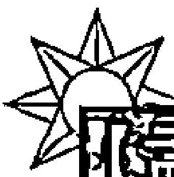

## 小孟小晴的塔罗博物馆

087 软糖小熊塔罗牌 Gummy Bear Tarot
作者：Dietmar Bittrich 发行：U. S. Games

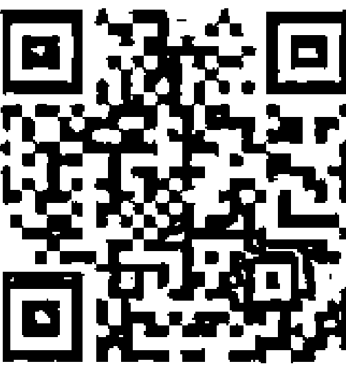

看到这副可爱的软糖小熊塔罗牌有没有唤起一些小时候的回忆呢？这副软糖小熊塔罗牌的主角就是我们小时候都吃过的透明软糖甘贝熊啰！在塔罗世界里，这次换他当主角啰！本来就有很多色彩的甘贝熊，让塔罗牌不可怕啰！

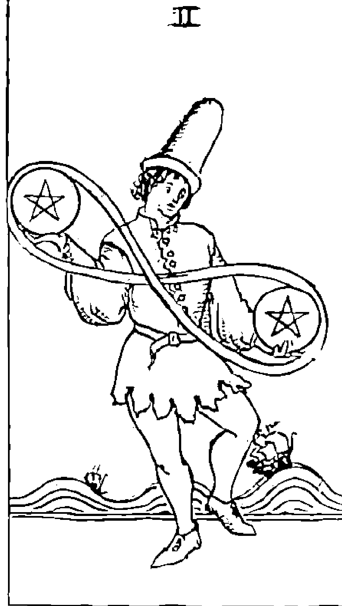

### TWO of PENTACLES 钱币2

#### 关键字『衡量』

达成平衡似乎是目前最重要的事了，当两边的事物很有份量，我们只能用一种充满乐趣的做法，让这些事情看起来不这么困扰，而自己能够应付得来。因为不是什么事都能有放着停止的机会，有些就是会随着时间持续的流动着，也就是我们看到钱币2的主角，用一个动态像是跳舞的方法，维持着这一切，设法不让这些事情产生冲突、相互干扰。让自己保持弹性，在人生将会遇到的考验中从容以对，不是每个人都能拥有这样的小聪明大智慧。

#### 牌的建议：

- 正位★★★☆：面对同时发生的诸多事物，应变快速的你，都可以轻松解决。
- 逆位★★☆☆：提醒自己留意跟谨慎，可以帮助你度过惊涛骇浪般的突发状况唷！

#### 环境状况：

- 正位★★★☆：机动性良好的你，无论在什么环境之中都能轻松适应啊！
- 逆位★★☆☆：只赏弄小技巧是不行的，很快就会被大家识破你的把戏。

#### 关于爱情：

- 正位★★★☆：小心对方是不是不够真心，谈爱可不能只是轻松暧昧唷！
- 逆位★★☆☆：想要偷吃的心蠢蠢欲动，对方已经发现你最近的不对劲喔！

#### 关于事业：

- 正位★★★☆：灵活的你，处理协调事物轻松自如，表现十分的良好唷！
- 逆位★★☆☆：过多的工作量，让你的思考失去平衡，很容易造成小错不断。

#### 关于财运：

- 正位★★★☆：让金钱流通或与人互动交流，都有机会从中获取利益喔！
- 逆位★★☆☆：玩乐花用、错误的经济规划，让你面临周转不灵的窘境了。

| 牌中的元素图象 | 要告诉我们的意义 |
| :--- | :--- |
| 单脚站立的人 | 难以取得平衡 |
| 两手中的钱币 | 所拥有的资源、财富、才华 |
| 注视下方钱币的姿态 | 即将发生的损失、花费 |
| 环绕着钱的无限大符号 | 能量的运用 |
| 红色的帽子跟衣物 | 象征行动力 |
| 背景后面波动的水流 | 不稳定的局面 |

注：马赛塔罗《II》；托特塔罗《Change》变化

#### 倒牌逆位意义：关键字『失衡』

或许现在的你被压力压得喘不过气来，无常又反复的状态让你觉得十分的厌烦，诸多的问题需要你去解决，自己也像是被两股力量，拉向不同方向。逆位钱币2要提醒我们的，就是面对这样不稳定的形势，务必做好自己份内该做的事，暂时保持现状，等待风雨飘摇的时间点过去，慢慢地找回肯定自我的力量，未来也就能找到减低风险的衡量作法了！

## 《孟小婧的塔罗博物馆》

088 新皇家镀金塔罗牌 Tarot Royale
作者：Ciro Marchetti 发行：个人创作

把牌组中的人物与背景做了不同色彩的专属设计，随机的分配到不同的牌组之中，有着截然不同的特别之处，让每一副牌都是独一无二的喔！将镀金塔罗牌重新绘制，同样运用3D艺术画风精致人物角色，再一次成为全新的经典！

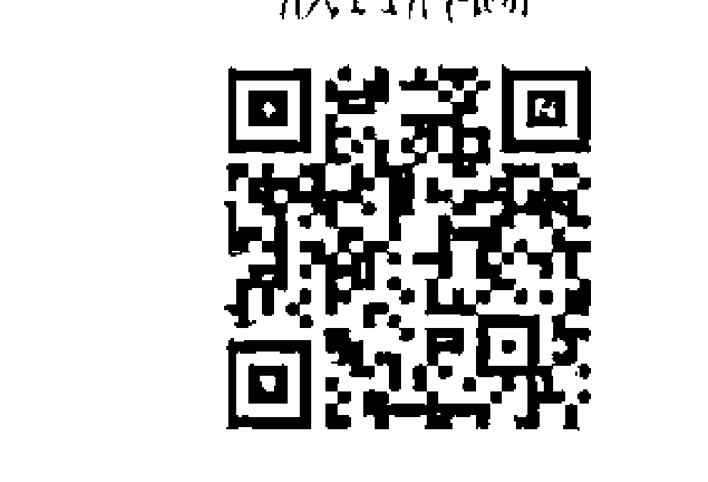

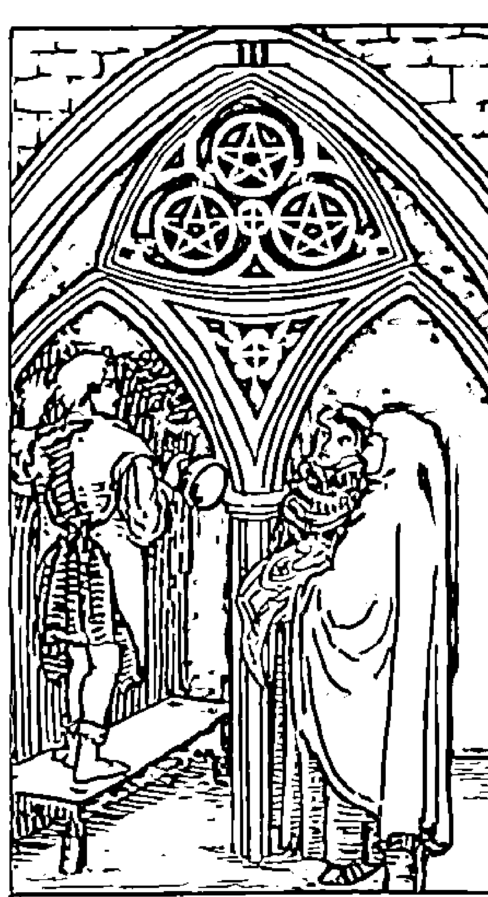

### THREE of PENTACLES 钱币3

#### 关键字『合作』

交给专业的来！毕竟我们是无法每件事都专精，集合大家的力量，才能发挥出更大的效果。这个世界也不就是这样运转着，也是因为透过这样的合作，共同创造了很多美好的事物。

大家共享着彼此的智慧跟技能，相信着对方的知识与技术，透过每个人的经验分享，彼此对于专业领域的观点与回馈，我们也就在这互动的当中，开发出自我未知潜能。当这些事物结合起来，情感上也能圆满，成就出更完美、事情发展朝向更棒的未来前进。

#### 牌的建议：

- 正位★★★★：运用专业、分工处理，团队合作将会发挥出最大的效果！
- 逆位★★★：诸多不利的批判、不信任，让你感觉到被忽视的厌恶感。

#### 环境状况：

- 正位★★★★：凝聚大家的力量，让关系更加亲密，会了解彼此真实的看法。
- 逆位★★★☆：单打独斗的成果还是有限，试着多方协力、合作共事。

#### 关于爱情：

- 正位★★★☆：对于彼此的信念、价值观互相支持，会让你们的感情加温。
- 逆位★★★：意见不合，让你们产生很多抱怨跟情绪，甚至于觉得不满！

#### 关于事业：

- 正位★★★★☆：相信专业，让每个人的价值呈现，就能相互建设成就。
- 逆位★★★：思考观点不同，影响大家工作步调，造成合作失利。

#### 关于财运：

- 正位★★★★：共同努力以赴，换来最直接的金钱回馈，额外加码机会大。
- 逆位★★★：因为大家意见太多，无法整合，所有人都没获得应得的报酬。

## THREE of PENTACLES 钱币 3

| 牌中的元素图象 | 要告诉我们的意义 |
| :--- | :--- |
| 上方三个钱币形成的正三角形 | 火元素的符号，象征执行 |
| 下方有白花的倒立三角形 | 水元素的符号，感性心灵 |
| 右边拿着蓝图的传教士、设计师 | 精神的价值 |
| 左边拿着工具的建筑师 | 专业、思考实际作法 |
| 踏在平台上的样子 | 稳固、基础 |
| 三个人讨论的姿态 | 分享共生、合作 |

注：马赛塔罗《III》；托特塔罗《Works》工作

#### 倒牌逆位意义：关键字『草率』

德术兼修是我常跟大家说的一个观念，也是逆位钱币 3 要提醒大家的，技能跟态度都一样重要，结果跟过程都能有些获得。或许我们拥有专业，但是经验不足让事物的呈现，不如我们的预期，这时候是不是我们要再次学习更多知识，或是经过更多的训练，让自己更为成熟。另一方面也有可能遇到计划才刚起步，需要更多的实力，未来就会有很大的发展空间！

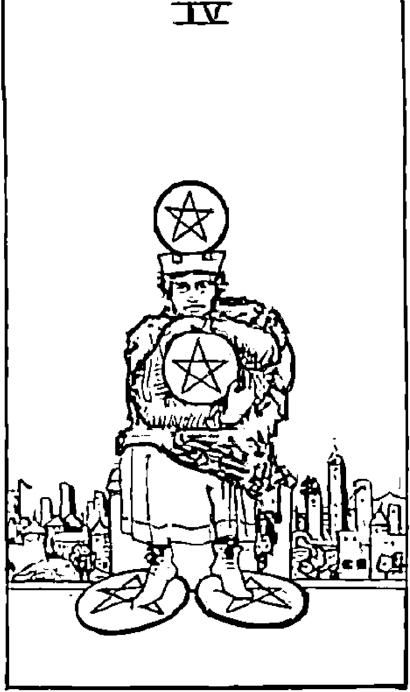

### FOUR of PENTACLES 钱币 4

#### 关键字『吝啬』

说真的，大家都知道千万别让自己变成钱的奴隶，但是却无法否认当拥有财富，的确能让自己拥有安全感。虽然说钱不是万能，但没有钱万万不能，想必大家都听过这句话，谨慎抱着钱的姿态，这个钱币4的主角，才不在乎大家对他的看法，他只知道拥有钱，就能抵挡外来可能发生的灾难与对他的威胁，但就因为有他这样的坚持，身后的大城镇也许就是他的丰硕成果，累积金钱、节约花费，这样的对于钱的执着，不也是一种专注的呈现！

#### 牌的建议：

- 正位★★★☆：掌握资源可以让你拥有安全感，但可别变成占有欲的情绪了。
- 逆位★★☆☆：与人相处别以价值来做为衡量，这样会跟人群越来越疏离。

#### 环境状况：

- 正位★★★☆：对于目前掌控的富足，心中觉得踏实，希望能一直维持现状。
- 逆位★★☆☆：极度保守太过固执，让你不想接受改变，缺乏了思想的流动。

#### 关于爱情：

- 正位★★★☆：爱情的发展都在你的掌权之中，让你获得满满的安全感喔！
- 逆位★★☆☆：过度防备、不好沟通，情人跟追求者都无法自然的与你靠近相处喔！

#### 关于事业：

- 正位★★★☆：自我价值的肯定，力量就在你手中，可以去捉住自己想要的。
- 逆位★★★☆：面对阻碍，不妨打破制式屏障，冒险一下或许能带来变化。

#### 关于财运：

- 正位★★★★：将财富金钱保管得很好，正确的储蓄计划看到钱的增长。
- 逆位★★★☆：明明经济条件还不错，但对于物质欲求不满，造成财务损失。

## FOUR of PENTACLES 钱币4

| 牌中的元素图象 | 要告诉我们的意义 |
| :--- | :--- |
| 头顶皇冠的钱币 | 固定的资产、稳定的收入 |
| 手中捉紧钱币的姿态 | 深怕失去、占有 |
| 身穿红色的袍子与鞋子 | 象征行动力 |
| 脚下踩着的两个钱币 | 基础、建立财富 |
| 环绕在钱币的样子 | 只在乎钱财、物质 |
| 背景一座大城市 | 热闹富裕的环境 |

注：马赛塔罗《IIII》；托特塔罗《Power》能力

#### 倒牌逆位意义：关键字「紧守」

你想要的，真的是你需要的吗？但是我们真的会因为手中掌握了一些事物，能为自己增添很多安全感，特别是钱！当逆位钱币4出现时，看来我们对于金钱的掌握就变得困难多了，这当然也可以延伸至一段关系，对我们来说，捉越紧越在乎，现在就是很害怕失去，这些自己已经拥有的一切。过于执着只会让自己失去更多，忘了还有更多事情值得你去珍惜。

### 【孟小靖的塔罗博物馆】

090 爱丽丝塔罗牌 The Alice Tarot
作者：Alex Ukolov and Karen Mahony 发行：Magic Realist Press

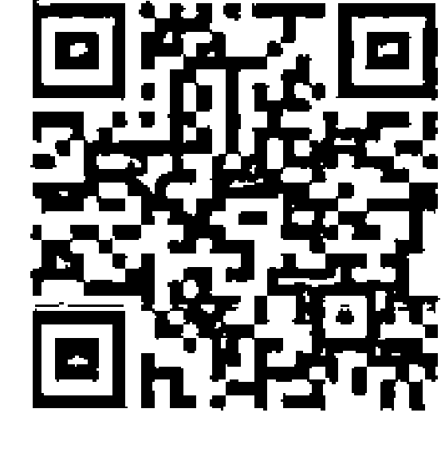

连贯着爱丽丝的故事，也用一种跳脱框架的思考模式，要我们更有创意的，用更天真单纯的心去解说每一张塔罗牌中的意义。特别运用闪耀珠光印刷，丰富画面中的景深，要我们去留意着每个主角与景色间，那一种微妙的存在！

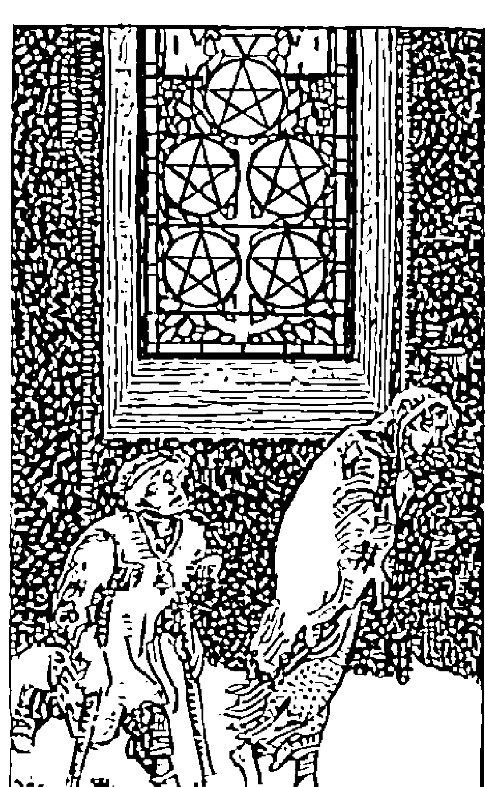

### FIVE of PENTACLES 钱币 5

#### 关键字『穷困』

偶而当我们发生状况产生困扰的时候，忧愁烦恼的你我，都会觉得自己是全世界最悲惨的人，真的是这样的吗？或许不是，但可以确定的是，这个时候我们的心灵是空虚的，精神是匮乏的。不满的情绪往更深层的悲苦沉沦，反倒会造成正在受苦的我们，无视于周遭还是有可以协助我们的人。

患难见真情，透过问题的发生，你开始了解到金钱物质不是唯一，互相扶持的人才能给你精神层面的满足，相信愿意支持你的情谊，有人会陪着你的。

#### 牌的建议：

- 正位★★☆：来自不同面向的压力，让你缺乏安全感，觉得被遗弃。
- 逆位★★★：这时雪中送炭的温暖十分重要，能打破疏远感，拉近距离。

#### 环境状况：

- 正位★★：对于失去的恐惧，太过忧虑，对于周遭事物都产生不信任。
- 逆位★★★☆：如果想要改变心灵空虚，就先改变自己的对事情的看法。

#### 关于爱情：

- 正位★★：暗示情侣貌合神离，就算跟对方还在一起，但还是觉得心灵孤单。
- 逆位★★☆：摆脱自己对爱情焦虑，才能让关系慢慢好起来，渐入佳境。

#### 关于事业：

- 正位★★☆：混乱造成匮乏，这样的资源不足让事情进展产生不确定性。
- 逆位★★★☆：回复工作情绪，找回自我价值，知道自己该怎么前进。

#### 关于财运：

- 正位★★☆：用钱没有节制，物质的匮乏感令人觉得不安及焦躁。
- 逆位★★★：限制自己的花费，虽然不会马上能有积蓄，但可以起步逆转穷困。

### FIVE of PENTACLES 钱币 5

| 牌中的元素图象 | 要告诉我们的意义 |
| :--- | :--- |
| 教堂的彩绘玻璃窗户 | 心灵庇护、精神的寄托 |
| 玻璃上排列成树木图案的五个钱币 | 物资给予 |
| 在窗户外面的两人 | 并未获得支持 |
| 低着头而身穿红袍的人 | 虽然悲伤，但仍有行动力 |
| 后方使用拐杖的人 | 艰辛、身体残疾 |
| 全黑的背景 | 无光的世界，精神面的灰暗 |

注：马赛塔罗《V》；托特塔罗《Worry》忧虑

#### 倒牌逆位意义：关键字『逆转』

逆位钱币 5 出现时，让我们看到最明显的是墙上的玻璃窗，变成了一道门，好像再告诉我们，可以走进这里接受帮忙，让我们开始停止悲情、收起哀愁，继续我们接下来的人生了！

也许现在你还是对于未来充满害怕，但请给自己一些信心，愿意让自己改变都有机会带来一些调整，将恐惧转化成积极，延续这样的改革，才能让自己从坏情绪中解放出来！

## 小孟小晴的塔罗博物馆

091 提洛塔罗牌 Delos tarot
作者：lamblamb 发行：个人创作

提洛（Delos）从希腊神话中的概念而来，提洛岛是爱琴海上的一个岛屿，在希腊神话中，这个小岛是女神的居住地！人物角色可爱又独特的感性画面，在色彩之中有一种类似彩绘玻璃般的高色彩饱和度，来重新诠释了伟特塔罗牌！

欣赏牌图

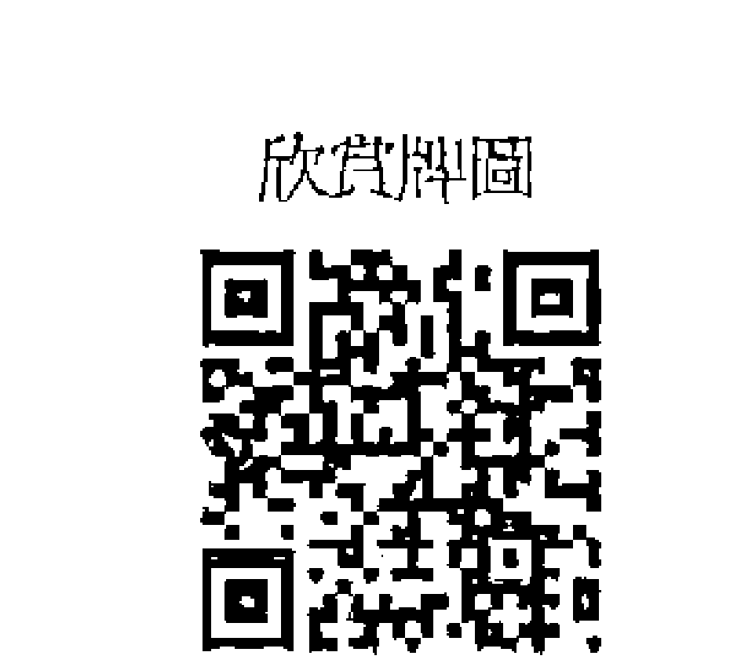

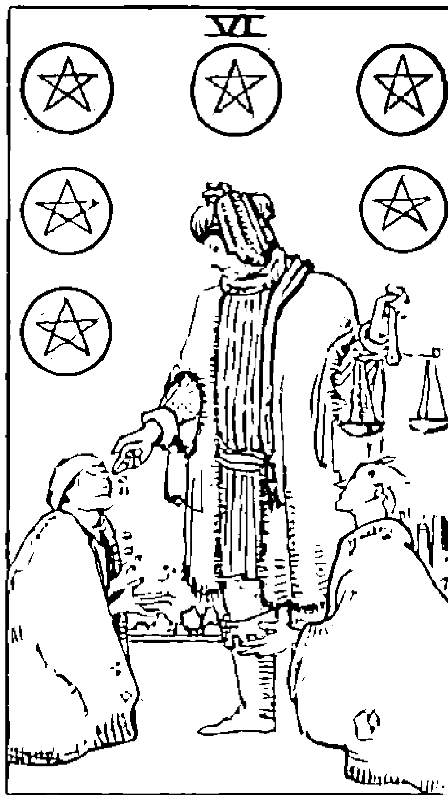

### Six of PENTACLES 钱币6

#### 关键字『慷慨』

施比受更有福，正在告诉我们在无需担忧经济状况的我们，还有给予的能力。因为自己曾经受到金钱的困境，苦尽甘来的你，知道需要帮助的那种感觉，心生同情的想要与人分享，也想为这个社会做出些回馈。但在学习的慈悲与宽宏之余，手中拿的天秤也在提醒着，要去衡量自己的经济状况，做出自己能力所及的贡献，也警告着我们对于给予的限度拿捏，不只有物质的支援，而是开始做到经验的分享，教大家知道怎么做好金钱管理。

#### 牌的建议：

- 正位★★★★：愿意分享，所付出给予的，也能收到相对等的回馈与感谢。
- 逆位★★★☆：或许会受到卑鄙的对待，对于很多事都显得欲求不满。

#### 环境状况：

- 正位★★★☆：得到认同与关怀，施与受的关系达到一个平衡共生的状态。
- 逆位★★★：所提出的需求被否定，不公平的状态看来趋于严重失衡的发展。

#### 关于爱情：

- 正位★★★☆：虽说爱情中没有完全的平等，但你们找到互相依赖的模式。
- 逆位★★★：现在需要别人关心的你，相当敏感、心灵空虚渴望被重视。

#### 关于事业：

- 正位★★★★☆：手上资源很多的你成为赞助者，分享金钱或能力会得到更多。
- 逆位★★★：工作上被忽视，希望被关注，但要增强自己的能力才能掌握资源。

#### 关于财运：

- 正位★★★★：生意兴隆拥有物质的丰盛，也愿意跟大家分享，让你备受爱戴。
- 逆位★★★☆：获利不如预料，小额金钱进帐，别想要一夜致富造成失利。

## SIX of PENTACLES 钱币 6

| 牌中的元素图象 | 要告诉我们的意义 |
| :--- | :--- |
| 中间富人发钱的样子 | 给予、大方 |
| 左手上拿着天平 | 施与受的平衡 |
| 红色的袍子 | 行动力、热情 |
| 上方的六个钱币 | 稳定的收入、财富 |
| 两侧低姿态的人 | 愿意接受帮助 |
| 远方的高山城堡 | 顶峰的成就 |

注：马赛塔罗《VI》；托特塔罗《Success》成功

#### 倒牌逆位意义：关键字『自私』

因为内心产生不安全感，而引发只为自己着想，这是一种不想分享的自私表现，目前也不想参与任何社交活动的你，有些自我封闭。其实就只是因为你的不切实际、过份贪心，还有没看清现实，让你经历了一些损失，这些都是逆位钱币 6 要告诉我们的讯息，千万别再因为贪婪而掉入陷阱，想一下别人的立场跟感受，接触更多情感面的互动，让自己再次点燃对生命的热情！

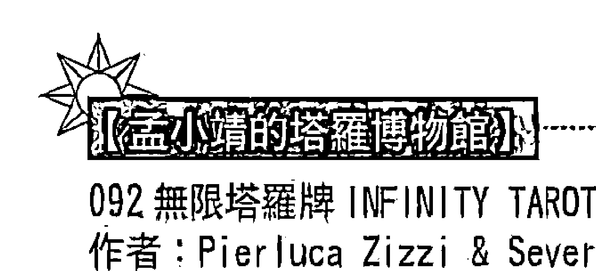

092 无限塔罗牌 INFINITY TAROT
作者：Pierluca Zizzi & Severino Baraldi 发行：Lo Scarabeo
用特殊的无限大符号做设计，倒置的数字 8，表现出卡片不断轮转永恒的前途和命运。无限塔罗牌以独特的印刷，画面中的人物跟角色巧妙的安排在这样有限制的空间中，但又在绘制所呈现的视觉上，有一种破框的立体感！

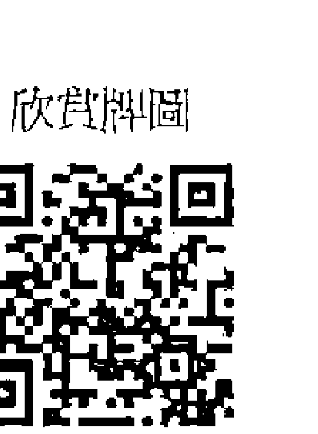

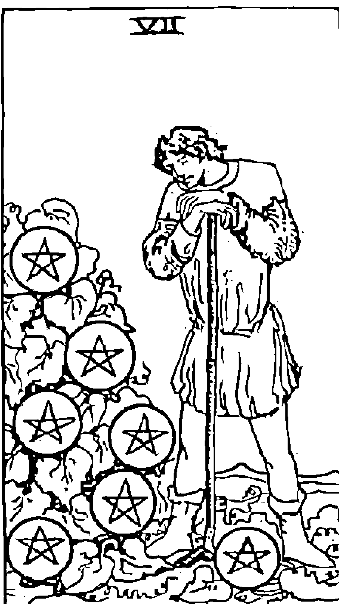

### SEVEN of PENTACLES 钱币7

#### 关键字『等待』

有人相信耐心是天生的吗？不过，我相信耐心是可以训练的，或许你我都没想到，有些事就真的急不得，你可以让时间跑快一点吗？如果不行，那为什么我们要让自己在这段等待的时光里，过分担忧呢？

也许放下手中这样的瞎操心，起身去做点让自己感觉开心的事，搞不好一回头，这件事情的发展比你预想中的还要顺利呢！我们的确需要了解有备无患的意义，但没必要连情绪都延伸过去，担心还没发生的困难，只不过是庸人自扰。

#### 牌的建议：

- 正位★★★☆：学习训练你的耐心，观察事物发生的过程才能有所获得。
- 逆位★★★：过分担忧会失败的情绪延烧，到最后就真的让你搞砸了。

#### 环境状况：

- 正位★★★☆：不妨根据周遭的情况，预估可能发生的状况与成果。
- 逆位★★★：太过担心，让你变得十分的焦虑，有种无法静下来的躁动。

#### 关于爱情：

- 正位★★★：太专注只投入想打造的感情，期盼成功，却忘了互动比较重要。
- 逆位★★☆：热脸贴冷屁股，选择只当好人是得不到爱情的回报喔！

#### 关于事业：

- 正位★★★☆：等待一下天时、地利、人合的好时机，事情会逐渐有进展喔！
- 逆位★★☆：当初的预估太过草率，造成错误的行动，让成果打了折扣。

#### 关于财运：

- 正位★★★☆：所决定的投资开始获利了，经过你分析后的明智决定是对的。
- 逆位★★★：财务规划千万别投机，小心落得血本无归，金钱困窘。

## 七枚钱币 SEVEN of PENTACLES

| 牌中的元素圖象 | 要告訴我們的意義 |
| :--- | :--- |
| 用鋤頭撐著下巴的人 | 等待、暫停 |
| 注視著前方的作物 | 觀察、思考 |
| 樹欖中的錢幣 | 收成的果實、豐碩成果 |
| 紅色的服裝 | 行動力、熱情 |
| 地面上的一個錢幣 | 象徵已經擁有的財富 |
| 錢幣位在人的雙腳邊 | 準備規劃如何使用 |
| 註：馬賽塔羅《VU》；托特塔羅《Failure》失敗 | |

#### 倒牌逆位意義：關鍵字『擔心』

當我們面對未來還沒確定的事物，都會帶著一種既期待又怕受傷害的心情，有時難免在等待的過程中失去耐心，還有目標都漸漸模糊了！當逆位錢幣7出現時，請記得一個重點，那就是請不要瞎操心，畢竟讓自己陷入焦慮與憂鬱情緒，缺乏耐心只會影響你的判斷。務實的觀察後設定計劃，就算面臨困難也可以一一克服，只需你願意把事情看得長遠！

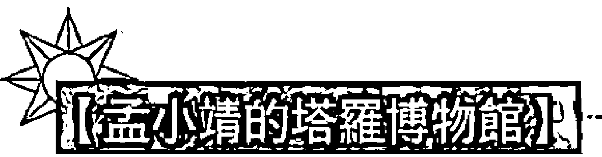

093 快樂塔羅牌 HAPPY TAROT
作者：Serena Ficca 發行：Lo Scarabeo

相信幸福可以改變世界，十分可愛充滿童趣的作品，可以讓我們在使用快樂塔羅牌占卜時，這一個完美的時刻得到快樂。藍天、綠地、紅蘋果，還有黃色的太陽，多彩牌卡令人看了很開懷，有一個誠實的心，然後微笑看世界！

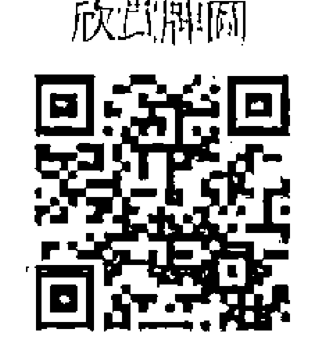

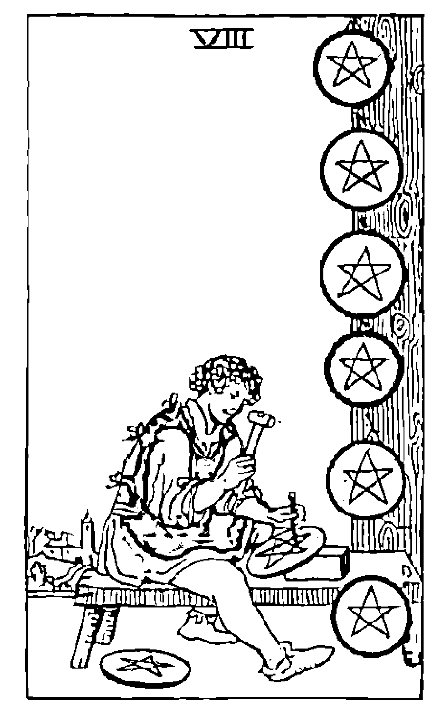

## 八枚钱币 EIGHT of PENTACLES

#### 關鍵字『專注』

能夠專注的重覆一件事，除了需要勤勞的身體力行之外，也需要一顆堅持不放棄的心。人的一生，如果可以做好一件事，就已經是一個很棒的過程了！

錢幣8的主角反覆的雕刻著錢幣，累積的不只是成果，在無形之中也讓他的技藝變得更加純熟，也能讓在腦子中的想法變成真實，這樣的轉換讓我們知道只要我們願意，就能確立目標，循序漸進的實現我們的夢想，只要我們肯做，就有看到成果的一天，打造我們自己想像中的未來！

#### 牌的建議：

- 正位★★★★：生產力良好的你，按部就班的自律，看到累積而來的成果。
- 逆位★★★：缺乏專注力：需要再訓練自己更用心來操作，審慎以對。

#### 環境狀況：

- 正位★★★★：除了能達成每天的進度外，也能兼顧小細節的處理呈現。
- 逆位★★★☆：太過輕忽，缺乏了先前的準備與完成後的檢查，產生意外。

#### 關於愛情：

- 正位★★★★：穩重認真面對愛情的你，可以思考未來想建構家的藍圖囉！
- 逆位★★★：太重現實層面的你，容易忽略愛情，麵包跟愛情都需要努力兼顧。

#### 關於事業：

- 正位★★★★☆：累積專業技能的你，在工作上可大展身手，不斷成長。
- 逆位★★★☆：別只想走捷徑，這樣偷工減料的想法可能造成徒勞無功。

#### 關於財運：

- 正位★★★★：理財方式正確，慢慢的就可以有一筆十分可觀的財富。
- 逆位★★★：窮忙的你，總是覺得經濟狀況沒有增長，是時候開始儲蓄了。

### EIGHT of PENTACLES 錢幣8

| 牌中的元素图像 | 要告诉我们的意义 |
| :--- | :--- |
| 墙上的一排钱币 | 经验累积的成果 |
| 正在雕刻的工匠 | 享受工作的过程 |
| 刻着同样的钱币 | 专业的技能 |
| 脚边也有一个钱币 | 接续的工作、勤奋的展现 |
| 远方的城镇村庄 | 家、稳定的关系 |
| 通往城镇村庄的道路 | 进入社会人群、服务付出 |
| 注：馬賽塔羅《VIII》；托特塔羅《Prudence》谨慎 | |

#### 倒牌逆位意义：关键字『障碍』

尚未学习完成、尚未获得你所需的知识技能，就是逆位钱币8要提醒我们的，是不是觉得当你在面对生活时，无论是爱情或是工作，总是觉得遇上许多挫败感，说穿了，是因为你没有走在对的道路上、遇上对的人，现在不应该再浪费时间，欺骗自己目前做的事情是正确的。而是需要思考你真正想达到的目标是什么？按计划去实现更多坚持，才能战胜难关！

### 孟小靖的塔罗博物馆

094 光明塔罗牌 TAROT ILLUMINATI
作者：Erik C. Dunne & Kim Huggens 发行：Lo Scarabeo
光的钥匙是让我们了解这个非同寻常的塔罗牌中的最好元素，结合了艺术之美、象征性的深度、直观的活力。光明塔罗牌是一盏温暖的灵魂之灯，释放心灵及缓解恐惧，投射的目光向着无穷大的未来，启蒙人们克服自己的极限！

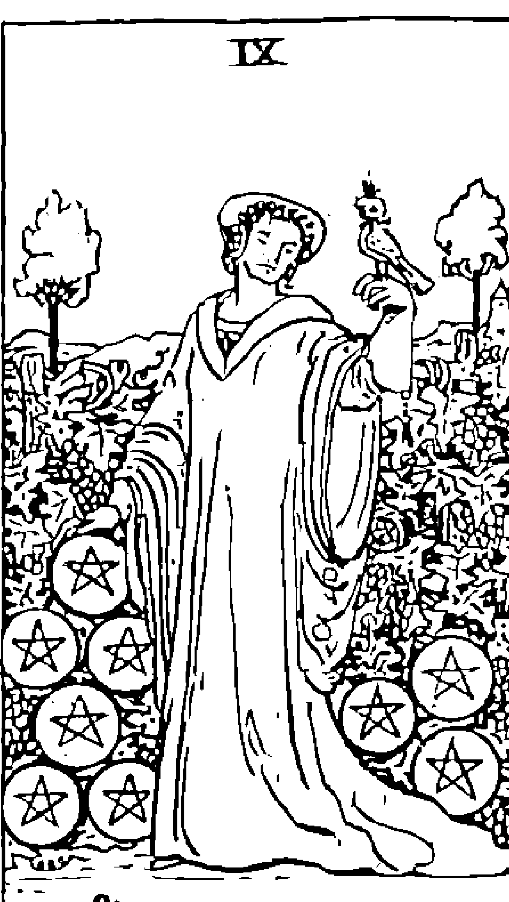

## 九枚钱币 NINE of PENTACLES

#### 關鍵字『富裕』

為了工作成就，你可以犧牲掉什麼呢？是你的愛情、遠離家人，還是你可以不需要朋友？將花園打理的十分豐饒的錢幣9主角，站在莊園中的她豐衣足食，擁有能力為自己創造了美好的生活，在井然有序的穩定管理之下，這樣的金錢富足想必也能持續下去。
還是孤單一人的她，雖說手上停留著一隻鳥與她互動，戴著手套還是表現出對情感的膽怯，雖然希望得到陪伴，但還是選擇保持些距離。或許現在還是多愛自己一些，反而比較能獲得更多滿足！

#### 牌的建議：

- 正位★★★☆☆：輕鬆的享受一下努力得來的成就，算是給自己一種獎勵囉！
- 逆位★★☆☆☆：錯誤的價值觀，讓你覺得擁有財富物質才能得到安全感。

#### 環境狀況：

- 正位★★★★：身邊的物質豐盛，心情愉悅的你正在享受生活中的美好。
- 逆位★★★：對於擁有一些成果，驕傲自滿會讓你流失很多友誼跟好感。

#### 關於愛情：

- 正位★★☆☆☆：習慣獨立自主的你，再多的奢侈品也滿足不了對愛情的渴望。
- 逆位★★：長久拒絕接觸愛情關係，小心掉入桃色陷阱中受騙上當。

#### 關於事業：

- 正位★★★★：發揮所長將任務完成，得到良好成果外，也得到大家的賞識。
- 逆位★★☆☆☆：過度工作，卻沒有看到成果展現，讓你做事隨便，自暴自棄。

#### 關於財運：

- 正位★★★★：金錢收入豐碩，不僅規劃投資獲利，也十分懂得享受生活。
- 逆位★★☆☆☆：愛慕虛榮的你，會想用誇張揮霍的生活來補足心靈上的空虛。

| 牌中的元素圖象 | 要告訴我們的意義 |
| :--- | :--- |
| 站在莊園之中的女子 | 享受成功、與外界存在距離 |
| 錢幣與茂盛的葡萄園 | 收成的喜悅 |
| 衣服上的金星符號 | 期待愛情 |
| 左手帶著手套 | 情感的隔離 |
| 帶著頭套停在手上的鳥 | 失去自由的暫時停留 |
| 前方的小蝸牛 | 堅毅、努力、一步一腳印 |
| 註：馬賽塔羅《VIII》；托特塔羅《Gain》獲得 | |

#### 倒牌逆位意義：關鍵字『缺乏』

現在的你，是不是正在尋找著生活重心，因為先前過於仰賴他人的你，讓你自己失去對事物的洞察力，對於未來的目標毫無想法，畢竟你的確花了很多心力在成就表象的收獲，但卻忘了留一些時間給自己，以至於現在的內心感覺到孤獨，缺乏愛！

開始了解金錢物質的成功並沒有想像中的重要，逆位錢幣9就是要告訴我們，重新調配生活項目，才能讓你有滿足收穫！

### 孟小晴的塔羅博物館

095 棱鏡塔羅牌 The Prisma Visions Tarot
作者：James R. Eads 發行：個人創作

極富想像力、凝聚力和迷人的藝術作品，遵循經典的塔羅牌象徵，手工繪製和異想天開的發揮，來自印象派超現實風格的過去，我們可以看到纏繞的現在和窺視未來的圖像。將各組的元素小牌，張張連接起來將看到一幅全景畫！

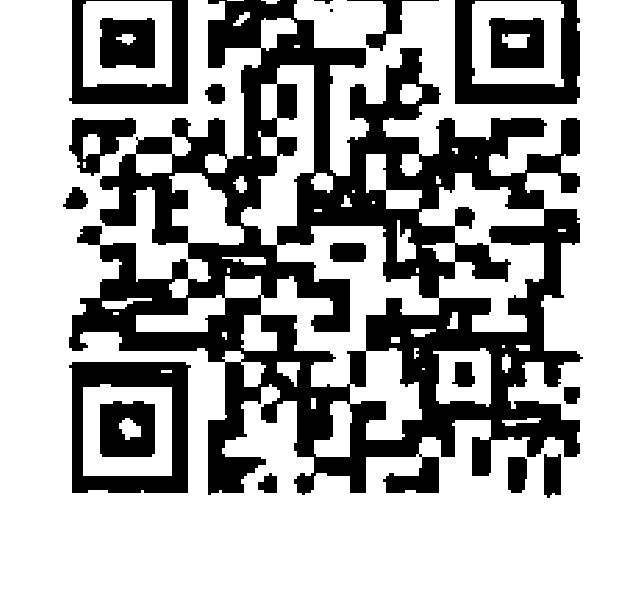

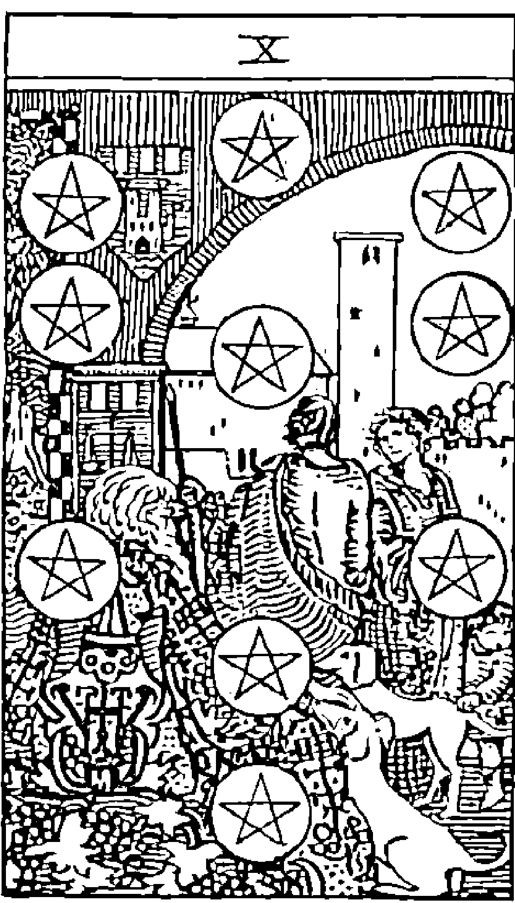

## 十枚钱币 TEN of PENTACLES

#### 關鍵字『傳承』

就因為你過去努力付出所帶來現在的成果，才開始能享受這樣舒適生活的回饋。象徵著事業完成的錢幣10，這樣的成功，要開始回歸到家庭組織的層面，穩定而滿足雖打造出幸福的模樣，但似乎太過於著重物質的獲得，少了些人與人之間的精神互動、情感交流。錢幣10中的每個主角各自望向不同的方向，看起來像是大家在乎的事物並沒有交集，未能發現所擁有這一切的價值。若想延續下去，重要的還是需要成員團結起來，才能開枝散葉了！

#### 牌的建議：

- 正位★★★★☆：一切發展順利穩定，接下來就是要思考如何永續的經營了。
- 逆位★★★☆☆：為了負擔長久以來的責任，被義務給拖累，自由被剝奪。

#### 環境狀況：

- 正位★★★★：家庭價值中所傳承的團結信念，將會為你帶來財富與成就。
- 逆位★★★☆☆：制度上的分配不均，造成組織成員中的不滿與爭議問題。

#### 關於愛情：

- 正位★★★★：已經久過習慣的愛情，要試著在穩定之中找回熱情跟樂趣喔！
- 逆位★★★：因為發生重大爭辯，價值觀大不相同，思考關係是否能繼續下去。

#### 關於事業：

- 正位★★★★★：所有事情都已經到位，能穩定發展的狀況都在掌握之中囉！
- 逆位★★★：市場大環境產生變化，如果不思考改變就會被時代淘汰。

#### 關於財運：

- 正位★★★★☆：不愁吃穿，因為在財富上擁有強力後盾，來自家人的金援。
- 逆位★★★☆☆：突然爆發的財務危機，讓人招架不住，產生巨額金錢損害。

| 牌中的元素圖象 | 要告訴我們的意義 |
| :--- | :--- |
| 十個錢幣排成的生命之樹 | 心靈內在的完整 |
| 背景的豪宅 | 物質的豐裕、企業成果 |
| 前方的坐著老人與陪伴的狗 | 舒服、享受生命、回歸本性 |
| 椅子上茂盛的葡萄圖案 | 收成的喜悦 |
| 一對年輕男女與小孩 | 交流、新的活力 |
| 老人展望遠方 | 世代傳承、蓬勃發展 |
| 註：馬賽塔羅《X》；托特塔羅《Wealth》財富 | |

#### 倒牌逆位意義：關鍵字『爭吵』

因為一個重大的錯誤，引發大家的不滿而產生爭吵，是逆位錢幣10要傳達的狀態，特別對應在金錢上的運用失誤，造成虧損！大家面臨現在這個經濟混亂的情況，太重視情緒層面的所有人，都放大了自己的不滿，更破壞了原本就不夠真誠的聯繫，必須收起抱怨，因為現在並無一蹴可幾的解決之道，如果能一同戰戰兢兢地面對，或許能彌補過失，將傷害降到最低。

### 【孟小靖的塔羅博物館】

096 丹尼洛夫塔羅牌 Tarot by Alexander Daniloff 2012
作者：Alexander Daniloff 發行：個人創作

將星座、神話、元素符號等素材，結合出的奇幻風格處處是驚奇、隱藏玄機！讓我們去感受繪畫者當下的感受，丹尼洛夫塔羅牌還另外附送了二組8跟11的牌！對應偉特及馬賽系統，可以在占卜時選用自己習慣的系統來進行解讀！

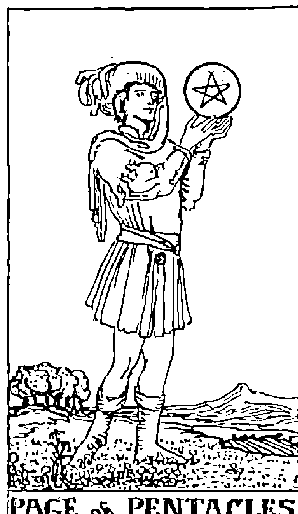

## 錢幣侍從 PAGE of PENTACLES

#### 關鍵字『具體』

#### [ 象徵個性特質人物：儲備幹部 ]

大家很喜歡用學徒的身份來形容他，因為開始嘗試新事物，的確需要一些決心跟勇氣，接受規律、穩健踏實的他，能從這樣的過程中，發現自我潛能，基礎扎根後就能漸漸茁壯，未來也能獨當一面了！

錢幣隨從如果是形容一種狀況，可能是你第一筆工作收入，又或許是你展現學習後的成果，這些新的經驗將會令你印象深刻，成為你未來選擇方向的參考，想要學習精進的項目指標。

#### 牌的建議：

- 正位★★★★：相信自身的直覺，去學習傾聽認知，為自己帶來新經驗。
- 逆位★★★☆：記憶上的困擾，最近顯得十分的不耐煩，凡事做個筆記。

#### 環境狀況：

- 正位★★★★：瞭解處理問題的新知識、新技巧，都會讓你更有價值喔！
- 逆位★★★：面對過渡期，或許可以讓自己多練習一些基本功，紮實根基。

#### 關於愛情：

- 正位★★★☆：愛情需要慢慢相處，交往時機未到，先讓自己條件變好吧！
- 逆位★★★：期待愛情上遇到完美情人，太過吹毛求疵讓你更疏離愛情了。

#### 關於事業：

- 正位★★★☆：每一次的狀況或變化都是你的學習，之後就沒有事能困擾你了。
- 逆位★★★：陷入拘泥細節的執著之中，過度的工作讓你忽視健康問題囉！

#### 關於財運：

- 正位★★★★：對於金錢的管理很有一套，會得到額外獎賞與報酬喔！
- 逆位★★☆：迷戀快速致富的方式，又不努力，這樣的想法太過於不切實際。

### PAGE of PENTACLES 錢幣隨從

| 牌中的元素圖象 | 要告訴我們的意義 |
| :--- | :--- |
| 雙手捧著錢幣的人 | 珍惜價值 |
| 注視錢幣的樣子 | 仔細觀察 |
| 綠色的外衣覆蓋紅色衣襬 | 從心出發、謹慎考量 |
| 站在綠地上 | 基礎資源的協助 |
| 遠方的大樹 | 經驗知識累積的務實 |
| 黃色的背景 | 活力、喜悅 |
| 註：馬賽塔羅《VALET · DE · DENIERS》；托特塔羅《Princess of Disks》圓盤公主 | |

#### 倒牌逆位意義：關鍵字『渙散』

太重於吃喝玩樂，在學習的過程中並不用心，當然也不會收到良好的效果。但根本原因是透過目前的進修方式，無法達到你想要的階段，因為內心的不滿足，轉而向外以物質彌補。

應該好好思考一下，要讓你重回專心的方法，或許會自己先定立一個短期目標、一位假想敵，透過競爭的狀態讓你找回渴望，也許在知識技能精進的同時，也能讓你帶來金錢回饋。

### 【孟小靖的塔羅博物館】

097 慕夏塔羅牌 Tarot Mucha
作者：Giulia F. Massaglia & Barbara Nosenzo 發行：Lo Scarabeo

非凡的靈感致敬於慕夏藝術，這塔羅牌表現出在二十世紀由慕夏創作的畫作之中，透出曙光般清新之美。透過塔羅牌這樣的一個舞台，永恆的智慧和人的靈魂相互認識了解。喚醒我們對美的記憶，還有藝術融入生活的重要性！

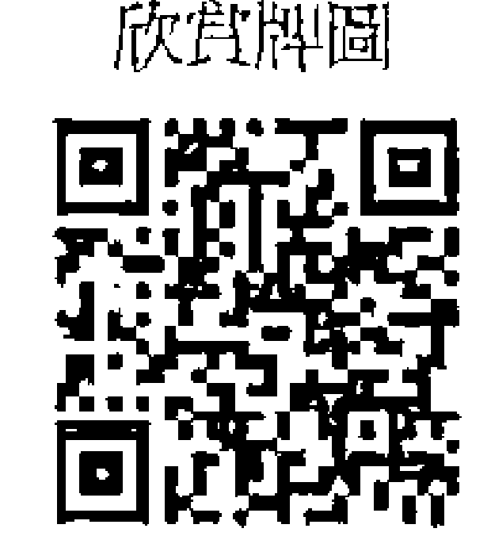

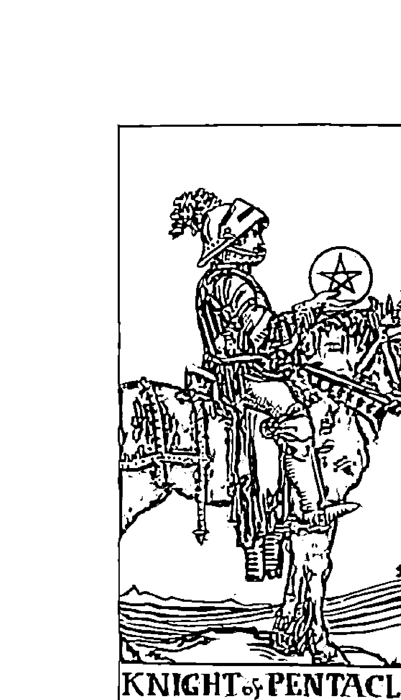

## 錢幣騎士 KNIGHT of PENTACLES

#### 關鍵字「成熟」

#### [象徵個性特質人物：繼承者]

一位早熟的年輕人，比別人更快看透責任的重要，不喜形於色的他，有時會產生一些距離感。因為他已知道認真生活、努力工作勤奮向上，是為了幫未來鋪路，好讓自己輕鬆安享晚年。

錢幣騎士如果是形容一種狀況，特別指向是一個有關財務的行動，或許是一次投資計劃、或是一個合作機會，務實可靠的想法，在長遠目標的追求之下，未來會為大家增加更多的財富！

#### 牌的建議：

- 正位★★★★：運用你的知識去展現你的成就，體現穩固的豐碩成果。
- 逆位★★★：疲勞會讓你脾氣煩躁，或許可以用運動來調解身心，回復活力！

#### 環境狀況：

- 正位★★★★：事情都在計劃中穩定的進行，成果也會按照預料中呈現。
- 逆位★★★☆：沒有持續力，缺乏主動，這樣一來浪費了不少精神資源喔！

#### 關於愛情：

- 正位★★★★：十分有責任感，對於愛情也很忠心，但就是有些固執無趣。
- 逆位★★☆：要找到一個價值觀跟你相同的人不容易，多相處才有機會發現。

#### 關於事業：

- 正位★★★★：在工作中全神貫注的你，讓人覺得你很可靠，也能穩定成功。
- 逆位★★★：總有些棘手麻煩的工作都交給你，但也是對你能力的肯定囉！

#### 關於財運：

- 正位★★★☆☆：穩紮穩打的默默累積財富，相信現在已經有一筆不小收入。
- 逆位★★☆：運用金錢少了變通，都要等到真的損失產生，才會覺悟。

### KNIGHT of PENTACLES 錢幣騎士

| 牌中的元素圖象 | 要告訴我們的意義 |
| :--- | :--- |
| 把錢幣捧向前方 | 追求、計劃、目標 |
| 往前直視的樣子 | 堅信、力量的展現 |
| 人、馬頭頂上的綠葉 | 安定、成就務實 |
| 紅棕色的耕田 | 行動的耕耘、生產 |
| 站穩的黑馬 | 象徵穩定及謹慎 |
| 黃色的背景 | 活力、喜悦 |
| 註：馬賽塔羅《CAVALIER・DE・DENIERS》；托特塔羅《Prince of Disks》圓盤王子 | |

#### 倒牌逆位意義：關鍵字『遲緩』

覺得自己沒有喘息空間了嗎？不明白為什麼自己要扛下這麼多責任，這些是你該做的義務嗎？目前有些憤世嫉俗的情緒產生，看待什麼都覺得十分的不滿，也不想奮力工作，但又想要干涉他人。

說真的，就連自己都搞不清楚自己該做什麼吧！無精打采只會讓我們越來越懶惰，失去處事能力，先休息一下破解無聊，讓自己找回元氣，讓心胸開闊打破自我限制！

### 【孟小靖的塔羅博物館】

098 煉金術塔羅牌 Alchemical Tarot
作者：Robert M. Place 發行：個人創作

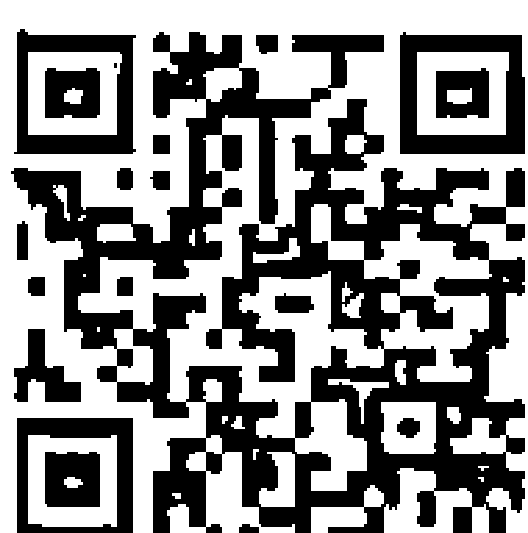

一個基於煉金的象徵和意象的塔羅牌，以傳統偉特的角度來詮釋，十分的好運用在占卜上，神秘學的轉型過程與煉金術符號的應用，添加額外的煉金符號，包含星座、行星、元素等，捕捉煉金術概念中，強調我們與潛意識溝通。

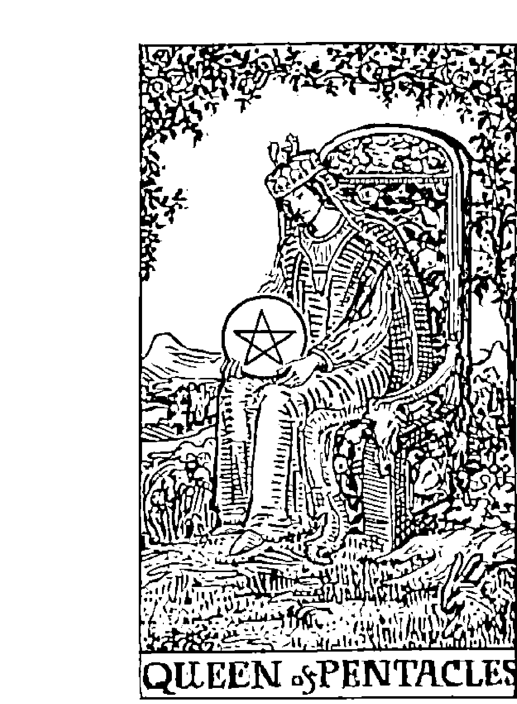

## 錢幣王后 QUEEN of PENTACLES

#### 關鍵字『照顧』

#### [象徵個性特質人物：老闆娘]

一位務實又溫柔的女性，除了情感面的關懷之外，也能給予物質面的實際幫助！重視品味、生活安穩，熱愛自己的生活，雖然擁有錢而並非愛錢，象徵富有生產力的她，對於管理組織及延續企業都很有一套！錢幣王后如果是形容一種狀況，目前你所做的事情相當值得，請把握好！未來會為你帶來舒適的生活，也能成就你的技能，讓你更上一層樓，也能有不少的財富進賬！

#### 牌的建議：

- 正位★★★★：謹守本份的你，讓人安心，深深感覺有一個給力的支持後盾。
- 逆位★★☆：狂熱追求別人的讚美，並沒有真心協助別人解決困擾與問題。

#### 環境狀況：

- 正位★★★★：擁有敏銳觀察力的你，在困難發生時，總是知道如何善後補救。
- 逆位★★☆：想給大家關心與協助的你，但方法用錯，並未讓人領情接受。

#### 關於愛情：

- 正位★★★★：看待愛情富有責任感的你，曾用溫和堅毅的方式保護這段情。
- 逆位★★★：明明發現不適合，但卻想要執迷於安定，不想改變只是忍受。

#### 關於事業：

- 正位★★★★：了解自己該扮演的角色，不強出頭的將份內的事完整達成。
- 逆位★★☆：過度干涉的管理方式，讓所有人做起事來都綁手綁腳。

#### 關於財運：

- 正位★★★★：精準分析投資訊息，又相信直覺，讓你穩定的獲利不少喔！
- 逆位★★☆：財務上發生困難，引起你最近對於金錢有強烈的占有慾！

| 牌中的元素圖象 | 要告訴我們的意義 |
| :--- | :--- |
| 身處豐饒大地 | 衣食無慮、豐裕 |
| 雙手捧著錢幣的姿態 | 珍惜價值、信任務實 |
| 低頭思考的樣子 | 平靜思考、綜觀 |
| 頭頂上紅玫瑰的拱門 | 熱情、自然 |
| 前方的小兔子 | 感性、多產的生命力 |
| 黃色的背景 | 活力、喜悦 |
| 註：馬賽塔羅《REYNE·DE·DENIERS》；托特塔羅《Queen of Disks》錢幣王后 | |

#### 倒牌逆位意義：關鍵字『懷疑』

可能因為遭受工作上的挫敗，或是金錢上的欺騙，漸漸變得愛掌控金錢、自私愛計較，因為唯有這樣，才會減少自己的焦躁不安。放不下曾經獲得的成就與物質，目前疑心病很重，也不願意跟大家分享心情，更別談是事業上的合作了，這樣一來會更惡化彼此關係，親友遠去形成孤軍奮戰的局面。試著暫時離開現在的環境，多與自然事物接觸，都有助於恢復平衡！

### 【孟小靖的塔羅博物館】

099 剪影塔羅牌 SILHOUETTES TAROT
作者：九月雅 MASA September 發行：個人創作

作者結合中國傳統剪紙藝術與西方塔羅牌神秘學元素！成就出絕美的心靈世界，帶領著我們去了解自我。雖然說是剪影，但運用底色多層次的堆疊，加上黑色剪紙與白色空間的交互運用，讓平面的紙牌令人想要仔細的一看再看！

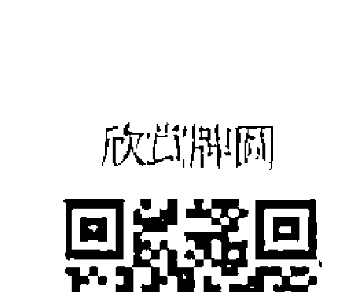

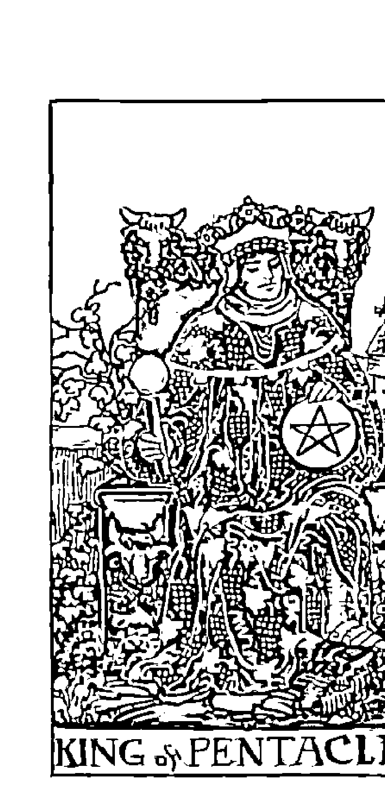

### KING of PENTACLES 錢幣國王

關鍵字『可靠』

> 象徵個性特質人物：董事長

因為規律而穩定的他，為自己累積了很多的財富，辛勤工作之後，也會好好犒賞自己的享受生活，不吝惜分享也願意社交，追求個人價值提升，生活安穩、不缺錢但喜歡賺錢的他，運用靈活但也講求務實。錢幣國王如果是形容一種狀況，了解自我目標，遇上困難會更努力的你，腳踏實地的作法就會成功，持之以恆，能漸漸體會穩定與安心，之後也將會得到很多金錢的回饋。

#### 牌的建議：

正位★★★★☆：慢工出細活，就能呈現出穩定的品質，成果也能一直延續。
逆位★★☆：因為自己的毅力與能吃苦，也會嚴格對待他人，變成固執了。

#### 環境狀況：

正位★★★★：嚴肅盡責，將周遭的事物都安排計劃完整，擁有踏實的安全感。
逆位★★★☆：要求制式一成不變的，太過規律會有點無趣，缺乏自在生活。

#### 關於愛情：

正位★★★★☆：大家都是在尋找穩定交往的對象，符合條件就可以考慮成家。
逆位★★☆：對於愛的不安全感，讓你會不斷從物質面來彌補，尋求慰藉。

#### 關於事業：

正位★★★★：堅定意念，穩健發展。將會受到很多人給你資源跟鼓勵支持。
逆位★★☆：曾經成功，總覺得自己的方法才是最好，造成沒有溝通的空間。

#### 關於財運：

正位★★★★：崇尚高品味的你，會努力以赴讓經濟條件符合生活享樂需求。
逆位★★★☆：過份浮誇鋪張，除了造成金錢的浪費，也無法感覺開心。

| 牌中的元素圖象 | 要告訴我們的意義 |
|----------------|------------------|
| 輕鬆扶著錢幣的姿態 | 運用自如的掌握 |
| 錢幣與茂盛的葡萄園 | 收成的喜悅 |
| 衣服上鋪滿葡萄圖案 | 財富的延續、享受 |
| 王座上的牛頭圖騰 | 象徵務實、穩定 |
| 黃色的背景 | 活力、喜悅 |
| 身後距離不遠的城堡 | 繁榮、成就、統御 |
注：馬賽塔羅《ROY·DE·DENIERS》；托特塔羅《Knight of Disks》圓盤騎士

#### 倒牌逆位意義：關鍵字『腐化』

突然間想對自己好一點，除了追求物質之外，也選擇以誇大鋪張的方式來呈現，奢華浪費的生活會慢慢的讓你經濟上出現問題，來自於你先前的行為，造成現在的困境。

控制欲越強，在這個時期會變成貪婪，為了守住自己的金錢與利益，不知變通、一毛不拔的守財奴，可能會不惜犧牲掉其他人。逆位錢幣國王要提醒我們，自己才是錢的主人，千萬別淪落為金錢奴隸！

### 【孟小靖的塔羅博物館】

100 史密斯偉特百年塔羅牌 The Smith-Waite Centennial Tarot 作者：Pamela Colman-Smith 發行：U. S. Games

擁有著古典配色優雅風格的這副塔羅牌，由藝術家帕梅拉·科爾曼·史密斯小姐在亞瑟·愛德華偉特的指導下，進行了一系列的寓言畫作來表現78張塔羅牌，透過她畫筆的描繪體現出來的神秘主義，讓牌呈現了想像深厚的情感。

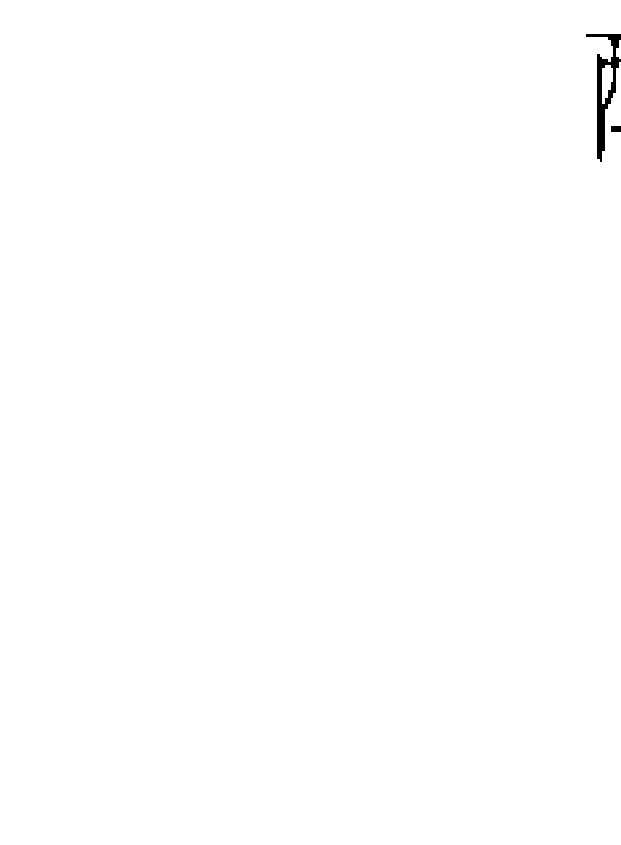

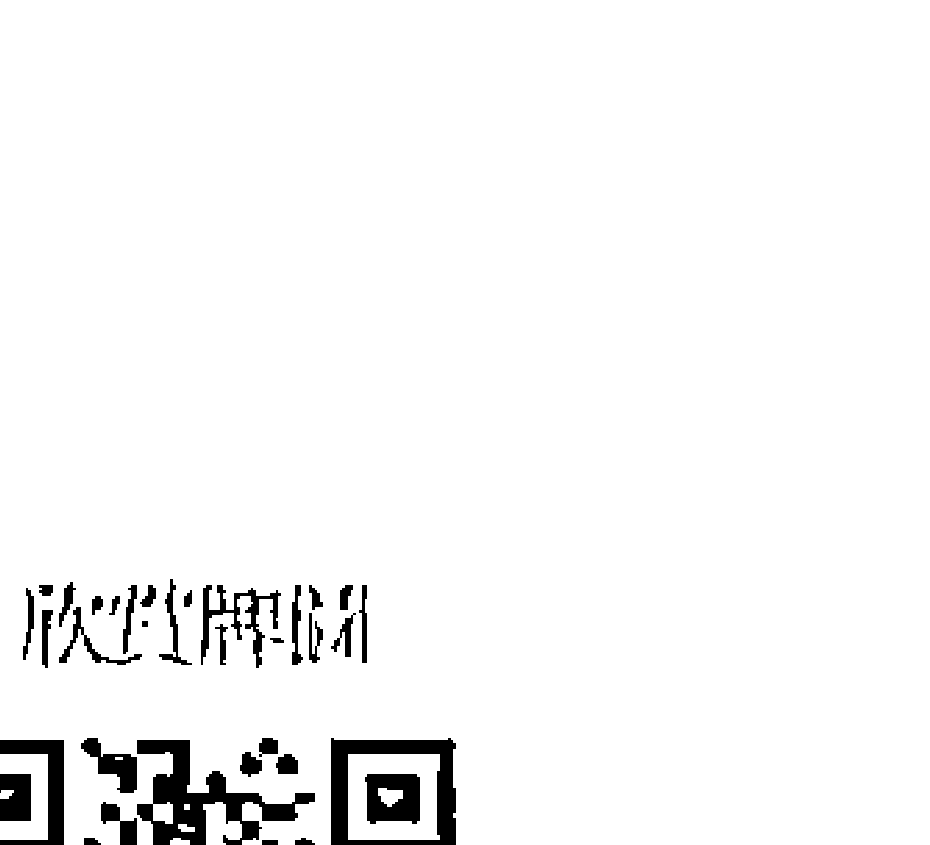

## 永續圖書
線上購物網

www.foreverbooks.com.tw

- 加入會員即享活動及會員折扣。
- 每月均有優惠活動，期期不同。
- 新加入會員三天內訂購書籍不限本數金額，即贈送精選書籍一本。（依網站標示為主）

專業圖書發行、書局經銷、圖書出版

永續圖書總代理：
五觀藝術出版社、培育文化、棋茵出版社、大拓文化、讀品文化、雅典文化、知音人文化、手藝家出版社、璞申文化、智學堂文化、語言鳥文化

活動期內，永續圖書將保留變更或終止該活動之權利及最終決定權。

## 塔羅牌使用說明書：

謝謝您購買 破解塔羅架構，讓你每副牌都上手 這本書！
即日起，詳細填寫本卡各欄，對折免貼郵票寄回，我們每月將抽出一百名回函讀者寄出精美禮物，並享有生日當月購書優惠！

想知道更多更即時的消息，歡迎加入 “永續圖書粉絲團”
您也可以利用以下傳真或是掃描圖檔寄回本公司信箱，謝謝。

傳真電話：（02）8647-3660
信箱：yungjiuh@ms45.hinet.net

- 姓名：
- □男 □女    □單身 □已婚
- 生日：
- □非會員    □已是會員
- E-Mail：
- 電話：（ ）
- 地址：
- 學歷：□高中及以下 □專科或大學 □研究所以上 □其他
- 職業：□學生 □資訊 □製造 □行銷 □服務 □金融
    □傳播 □公教 □軍警 □自由 □家管 □其他
- 您購買此書的原因：□書名 □作者 □內容 □封面 □其他
- 您購買此書地點：
- 金額：
- 建議改進：□內容 □封面 □版面設計 □其他

您的建議：

## 大拓文化事業有限公司收

新北市汐止區大同路三段一九四號九樓之一

| 廣告回信 |
| 基隆郵局登記證 |
| 基隆廣字第57號 |

請沿此虛線對折免貼郵票，以膠帶黏貼後寄回，謝謝！

## 想知道大拓文化的文字有何種魔力嗎？

- 請至鄰近各大書店洽詢選購。
- 永續圖書網，24小時訂購服務
www.foreverbooks.com.tw
免費加入會員，享有優惠折扣
- 郵政劃撥訂購：
服務專線：(02)8647-3663
郵政劃撥帳號：18669219