MARY K. GREER'S

# 21 WAYS TO READ A TAROT CARD

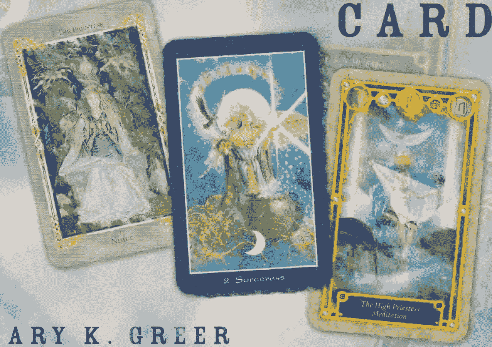

MARY K. GREER

# 神秘学大讲堂

فيوصتلا تارداحم قعاق

进店查看更多

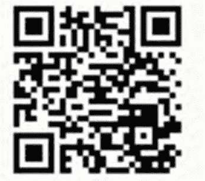

- ※专注神秘学领域研究
- ※神秘学培训机构
- ※微信：1728822315
- ※购买更多好书请加微

# 神秘学大讲堂简介：

神秘学大讲堂资料是由众多神秘学老师和爱好者自发赞助和网络收集，包含了视频、音频、电子书、文档等资料，里边都留有原作者的信息，只为了让更多喜欢学习者有一个基本的参考的了解，内容尽力保持完整，纠错，有瑕疵的都会标注，因为是整理的资料，难免会有些许问题，介意勿购，您所购买的并非产品本身价格，而是小伙伴能持续不断给大家整理新资料活动经费。看完请购买官方资料，享受更好的服务。

MARY K. GREER’S

# 21 WAYS TO READ A TAROT CARD

# About the Author

Mary K. Greer is a revolutionary, breaking all the rules regarding methods of learning and using tarot cards. She has over thirty-eight years of tarot experience and, as an author and teacher, emphasizes personal insight and creativity. As a tarot reader, she works as a “midwife of the soul,” using techniques that are interactive, transformational, and empowering. Mary is a member of numerous tarot organizations and is featured at tarot conferences and symposia in the United States and abroad. She is the proud recipient of the 2006 Mercury Award from the Mary Redman Foundation, an honor given for “excellence in communication in the metaphysical field,” in recognition of her groundbreaking book Tarot for Your Self: A Workbook for Personal Transformation.

# To Write to the Author

If you wish to contact the author or would like more information about this book, please write to the author in care of Llewellyn Worldwide and we will forward your request. Both the author and publisher appreciate hearing from you and learning of your enjoyment of this book and how it has helped you. Llewellyn Worldwide cannot guarantee that every letter written to the author can be answered, but all will be forwarded. Please write to:

Mary K. Greer
% Llewellyn Worldwide
2143 Wooddale Drive, Dept. 0-7387-0784-8
Woodbury, MN 55125-2989
Please enclose a self-addressed stamped envelope for reply, or $1.00 to cover costs. If outside U.S.A., enclose international postal reply coupon.

Many of Llewellyn’s authors have websites with additional information and resources. For more information, please visit our website:

HTTP://WWW.LLEWELLYN.COM

# MARY K. GREER’S

# 21 WAYS TO READ A TAROT CARD

MARY K. GREER


Llewellyn Publications
Woodbury, Minnesota

Mary K. Greer's 21 Ways to Read a Tarot Card © 2006 by Mary K. Greer. All rights reserved. No part of this book may be used or reproduced in any manner whatsoever, including Internet usage, without written permission from Llewellyn Publications except in the case of brief quotations embodied in critical articles and reviews.

FIRST EDITION
Third Printing, 2007

Book design by Rebecca Zins

Cover design by Kevin R. Brown

Cover images by Anna-Marie Ferguson, Legend: The Arthurian Tarot; Lisa Hunt, Shapeshifter Tarot; and Joseph Ernest Martin, The Quest Tarot

Illustrations: pages 63 and 175, Mary K. Greer; pages 105, 108, and 178, Llewellyn Art Department

Tarot decks used by permission include the following:

- Motherpeace, a pseudonym for Vicki Noble & Karen Vogel; Ed Buryn's William Blake Tarot; Lar deSouza's Stick-Figure Tarot; Legend: The Arthurian Tarot; World Spirit Tarot; Shapeshifter Tarot; Robin Wood Tarot; Quest Tarot; Medieval Enchantment Tarot; Victoria Regina Tarot; Ancient Tarots of Bologna; Golden Dawn Ritual Tarot; Shining Tribe Tarot; Nefertari's Tarots; Tarot of the White Cats; Tarot of the Journey to the Orient; Universal Tarot; Liber T Tarot; Visconti Tarots; Tarot of the New Vision; Sacred Circle Tarot; Tarot of Dürer; Papus/Goulinat Tarot; Ancient Tarot of Marseilles; Rider-Waite-Smith Tarot

Library of Congress Cataloging-in-Publication Data
Greer, Mary K. (Mary Katherine)
Mary K. Greer's 21 ways to read a tarot card / Mary K. Greer.—1st ed.
p. cm.
Includes bibliographical references and index.
ISBN-13: 978-0-7387-0784-6
ISBN-10: 0-7387-0784-8
1. Tarot. I. Title: Mary K. Greer's twenty one ways to read a tarot card. II. Title.
BF1879.T2G7195 2006
133.3'2424—dc22

2006040984

Llewellyn Worldwide does not participate in, endorse, or have any authority or responsibility concerning private business transactions between our authors and the public.
All mail addressed to the author is forwarded but the publisher cannot, unless specifically instructed by the author, give out an address or phone number.
Any Internet references contained in this work are current at publication time, but the publisher cannot guarantee that a specific location will continue to be maintained. Please refer to the publisher's website for links to authors' websites and other sources.

Llewellyn Publications
A Division of Llewellyn Worldwide, Ltd.
2143 Wooddale Drive, Dept. 0-7387-0784-8
Woodbury, MN 55125-2989
www.llewellyn.com
Llewellyn is a registered trademark of Llewellyn Worldwide, Ltd.
Printed in the United States of America

# Other Books by Mary K. Greer

- Understanding the Tarot Court [with Tom Little] (Llewellyn, 2004)
- The Complete Book of Tarot Reversals (Llewellyn, 2002)
- Women of the Golden Dawn (Park Street Press, 1995)
- The Essence of Magic (Newcastle Publishing, 1993)
- Tarot Mirrors (Newcastle Publishing, 1988)
- Tarot Constellations (Newcastle Publishing, 1987)
- Tarot for Your Self (Newcastle Publishing, 1984;
  second edition: New Page Books, 2002)

> This book is dedicated to all who look to the tarot for insight, inspiration, and companionship on life's journey.

# # Contents

Acknowledgments, ix
Introduction, xi
How to Use This Book, xix

- **STEP 0** Stepping Out • 1
- **STEP 1** Name • 3
- **STEP 2** Description • 7
- **STEP 3** Emotion • 15
- **STEP 4** Story • 25
- **STEP 5** Number • 33
- **STEP 6** Mode, Suit, Element • 47
- **STEP 7** Synthesis • 59
- **STEP 8** Metaphor • 67
- **STEP 9** Query & Snapshots • 77
- **STEP 10** Meanings • 89
- **STEP 11** Range • 103
- **STEP 12** Modification • 115
- **STEP 13** Symbols • 129
- **STEP 14** Dignity & Theme • 147
- **STEP 15** Dialogs • 163
- **STEP 16** Drawing • 173
- **STEP 17** Embodiment • 183
- **STEP 18** Imagination • 191
- **STEP 19** Myth & Archetypes • 201
- **STEP 20** Deck Comparison • 219
- **STEP 21** The Possible Self • 231
- **STEP 00** Full Circle • 239
- Appendix A: Emotions List, 243
- Appendix B: Number & Rank Keywords, 245
- Appendix C: Mode, Suit, Element Keywords, 251
- Appendix D: Elemental Dignity Combinations, 257
- Appendix E: The Empress Vision, 261
- Appendix F: Archetypal Motifs Chart, 265
- Appendix G: Reading Styles, 271
- Appendix H: Traps & Solutions in R.I.T.E., 275
- Appendix I: 21 Ways Worksheet, 283
- Glossary, 285
- Bibliography, 297
- Index, 305

# # Acknowledgments

Despite many hours of solitary writing, a book like this is the result of interactions with a great many people. My deepest gratitude goes to all my students and to the querents whose tarot cards I've read. I've learned so much from you. For their generosity and support on many levels, I want to thank my dear friends in the Symbols Group—you know who you are. Then there are my cohorts in the tarot community—thank you one and all for your inspiration and good times. Finally, to Ed Buryn, editor extraordinaire: I can't express how much I appreciate everything you did to make this the best book possible. Finally, my thanks to Llewellyn for continuing to promote in-depth works in the practical application of tarot reading skills, and especially Rebecca Zins, for her suggestions, patience, and support.

# Introduction

> It is difficult to know thyself; it is easy to advise others.
—THALES OF MILETUS

21 Ways to Read a Tarot Card is full of techniques for gaining insights into tarot readings. Each way or step offers a unique method of interpreting a card. In some you’ll draw from traditional meanings; in others you’ll use the images to evoke your own responses. You will get as much information from a single card as from an entire spread. What is more, you’ll discover how a card influences and is influenced by other cards. And you will have a great time doing this!

I began reading the tarot almost forty years ago. During this time, I learned that people have the answers to their own questions far more than they realize. I stand in awe of the innate wisdom in human beings. As a reader I call myself a “midwife of the soul” (a term first coined by Sigmund Freud), because I use my skills and knowledge of the cards to ask questions so that the querents’ responses “give birth” to their own wisdom. You will discover how to be a midwife both to your own and others’ insights.

I’ve developed what I call R.I.T.E.: a reading that is interactive, transformational, and empowering; a reading that uses the twenty-one steps in this book. When I began reading for others I often found myself left with a headache or feeling drained, despite grounding and cleansing practices. Once I realized that this rose from my taking on the responsibility of fixing or satisfying others in order to ease my own empathic response, I was able to devise a way of reading that proved its worth by how both the querent and I felt after our consultation. Now, by using the R.I.T.E. methods, rather than being exhausted at the end of a reading I feel pleasantly empty, open, and energized. If I don’t, then I check what happened and see what I could have done differently.

## INTRODUCTION

The twenty-one ways to read a tarot card are both a personal resource and a handbook of tools for enlivening and deepening your reading experience. Beginning with short core steps that soon become automatic, you progress to optional, more exploratory ones. You'll learn how to work with other people to help them discover their own personalized meanings and then integrate those into a bigger picture showing major life patterns. This kind of gradual buildup of information into an overall view is at the heart of the tarot reading process.

The twenty-one ways form a "bag of tricks" for evoking deep awareness and personal wisdom. The Fool carries these tricks, unaware of their use, in the pack over his shoulder. In older European decks, an open bag sits at the foot of the magician's table; the tricks are now on the table, ready to be used. Tricks are special skills or knacks. They involve misdirection and surprise to gain unexpected insights and a sense of wonder and delight. They conjure up inner truth and hidden desires. When you suddenly discover the personal significance in a card, you get a warm feeling of accomplishment. This inspires you to look for more insights and helps you focus energy for making clear choices. In turn, it transforms how you perceive life events and builds confidence in your own abilities.

In this book I offer you the wealth of my experience, but it's up to you to use the twenty-one methods flexibly, adapting them to your own style.

I suggest that you use just one card, drawn at random, as your central focus when working through all the steps. This card will assume tremendous significance in your life as its symbols, lessons, and themes crop up in the most surprising and unexpected places and reverberate in everything you do. Welcome to the realm of magic and synchronicity.

## R.I.T.E.: Reading Interactively for Transformation and Empowerment

This style of reading utilizes all twenty-one ways to read a card and is modeled in the "traps and solutions" found in Appendix H. Although it evolved as a way of reading for others, it actually taught me how to read for myself.

A reading is interactive when all those involved act together and have a dynamic effect on each other. This includes the reader, querent, the cards, and the figures on the cards.

A reading is transformational when it fosters authentic change. This frequently happens within the reading itself and involves your perception of the circumstances and options. It works by revealing conditioned attitudes and responses that aren't working, replacing them with more authentic, spontaneous experiences.

A reading that is empowering means being in control and consciously participating in your own destiny. It's finding in yourself the most effective posture to take in a situation. You can't empower someone else. When a querent has powerful insights and makes decisions for herself, she gives birth to her own wisdom; the reader is simply the guide or midwife.

## Five Characteristics of a R.I.T.E. Reading Environment

There are five things that create an effective reading environment, whether for yourself or another:

- **Loving presence in a sacred space**
    You create a time and place where nothing else intrudes and all is held in sacred trust (not shared without permission). This requires active listening. A loving presence means opening your heart to the querent and paying close attention to what is said. Gently let go of your judgments as they arise so as to be fully present in the moment. By clearly hearing the querent's own words you can return to them as needed.

- **Curiosity**
    Let your interest be childlike. Don't assume you know what something means. Experience everything as novel and intriguing, a puzzle or mystery about which you have questions rather than answers.

- **Exploration**
    Explore how the querent thinks. How might his or her perceptions be true? Then consider alternative viewpoints, trying them out in the imagination. Find connections and patterns.

- **Affirmation**
    Affirm the querent's experiences and insights. Welcome emotions as keys to personal meaning. Look for a new life story that encompasses and integrates all the emotions and patterns.

- **Activation**
    Help the querent find a way to make the new insights active in the world, usually through a specific concrete task or ritual.

## The Role of Empathy

Readers are usually strong empaths who feel a querent's emotions. They perceive subtle clues indicating when they are on target or not. But an empathic response is far more than this. Use it to see what is true and noble in others, to recognize the courage of ordinary lives with an attitude of unconditional, positive regard. This is made easier when you make an effort to speak the client's own language. It is key to respecting feelings and honoring that person's current capabilities. If a person says the Tower is "blowing her mind," use that phrase when you talk about the card, even if you've never used that expression for the card before.

An empathic approach looks for ways to convert suffering into bliss, to move painful emotions into healing pathways. Your job as a reader is to find how each card expands the querent's present understanding. Unconditionally assuming that all querents are honest, noble, and courageous encourages them to transcend limiting stances.

## Why People Come for Readings

I believe people seek readings to alleviate anxieties, to help achieve desires, and to find meaning. A major question for a reader is whether it is better to provide solutions or to let the querent discover the answers for him- or herself. Carl Jung gave his views on this issue in Man and His Symbols:

> I did not want to impose my will on others. I wanted the healing processes to grow out of the patient's own personality, not from suggestions by me that would have only a passing effect. My aim was to protect and preserve my patient's dignity and freedom, so that he could live his life according to his own wishes.

21 Ways to Read a Tarot Card is about processes that guide people to their own realizations and support them in becoming more capable of making decisions that promote well-being.

People want a tarot reading when their circumstances change and their normal rules fail them. They tell themselves stories about "what is" or "should be," but sometimes these stories are not what is occurring. Byron Katie, in her book Loving What Is, says that every story, prior to investigation, keeps you from seeing what's true. People choose perceptions that fit their stories and ignore those that don't. Likewise, people want tarot to affirm that what they think should be is. When the details no longer match, they face an uncertain universe and fluctuate between hope and fear (as explored in the next-to-last position in the Celtic Cross spread).

A reading should increase your quality of life through how you choose to respond to a situation. Tarot is a creative tool that helps you to see your true self more clearly and to be that fully. The reading helps you live in harmony and to the fullest with whatever comes— to accept *everything* as your purpose, fate, and destiny. It's your work, your choices, your visions that make you who you are; as a reader you can help another person to discover this. When you are consciously involved in a larger understanding of your life, you feel truly alive.

Finally, people seek readings for communion, for a shared experience, even when the "other" is simply a deck of cards.

## What You Can Get from a Reading

A tarot deck is a versatile, visual, and tactile tool for examining one or more of the following questions, using the most common positions found in spreads:

- Who you are
- Where you've come from
- Where you're going
- How to get there
- Why it's important to do so
- What and who you'll encounter along the way

The goal is to insure your well-being and to see your life as a story infused with meaning.

## Finding Meaning

Human beings have a need to turn "little stories" into "big stories." In terms of little stories, Pamela Colman Smith was an artist and storyteller about whom it has been said that she failed to realize any commercial success, never married, and died penniless and obscure. By contrast, her big story depicts her as "goddaughter to a witch and sister to a fairy," using her gift of synesthesia to paint what musicians saw when they composed their## INTRODUCTION

Music and drawing the most popular and influential tarot deck of the twentieth century. Big stories are suffused with meaning, life purpose, possibilities, and inspiration. They give direction for movement.

Finding meaning in your experience not only helps you endure life’s inevitable pains, but also gives inspiration and energy to your everyday existence. For example, a woman may continue in an unsatisfying job because it affords her children the education and opportunities she didn’t have. Once understood, other ways for obtaining the best education and opportunities for her children may emerge.

Personal meaning comes from finding patterns and connections that give significance to your life. People are pattern-making creatures for whom “objectivity” is actually relative, depending on who defines the patterns and gives them value. When you define the patterns and give them value for yourself, this is empowerment. The tarot is a mirror that allows you to see and talk about the patterns that are foremost in your psyche.

### Weaving Meanings

There are several schools of thought about the nature of tarot card interpretations. One says that correct and absolute meanings exist for each tarot card and its symbolic components. Learning the correct meanings from books or teachers becomes imperative.

An opposing school says no pre-set meanings or special knowledge are required. A reader looks at a card and says anything that comes to mind. In this case, the imagery becomes a kind of projective inkblot or psychic trigger. This approach counsels throwing away the books.

You’ll find you can gain the best of both worlds by moving back and forth between the two extremes. The first approach provides a verifiable or agreed-upon structure. The second provides an authentic, personal voice and individualized interpretation. Weaving them together results in symbolic motifs filled out with rich sensory details. For instance, the Ten of Pentacles can mean an inheritance, but, in a specific case, it could point to an inherited talent for playing baseball and your family’s expectations around that.

## INTRODUCTION

### The Value of Symbols

The value of the tarot symbols regarding our past, present, and future is summarized beautifully in an Internet article by Michael H. Brown, “Image and Symbol: A Path to the Realization of Self”:

> Images and symbols . . . when evoked and understood, can provide us with the guidance to resolve issues from the past, help us discover and develop our talents and potentials and empower the present, and bring into consciousness inspiring visions with which to grow personally, professionally and spiritually throughout our life span.

A tarot reading reveals what is hidden. It does this through the interpretation of symbols that make the unconscious conscious, the profane sacred, and the chance purposeful and meaningful. Ultimately, it is a search for the spiritual source that brings nourishment and renewal.

### A Healing Outcome

A reading affords the opportunity to identify conflicting elements and put them in a meaningful perspective. For instance, five different court cards can represent five conflicting parts of yourself. Healing, from this point of view, means the acceptance of conflict, paradox, and uncertainty. Acceptance relieves stress, so you can make positive adjustments.

In a reading you get to try out various possibilities in your imagination, examining likely developments and outcomes far away from danger or strain. Predictions can relieve anxiety, allowing you to relax. Since anxiety inhibits effective action, relief from anxiety increases the possibility of a successful outcome.

Readings help you deal with suffering by giving it meaning and purpose. Spinoza, in Ethics, said, “Emotion, which is suffering, ceases to be suffering as soon as we form a clear and precise picture of it.” Tarot reveals the big picture. It empowers you to reap something good from all experiences, even negative ones.

## HOW TO USE THIS BOOK

For instance, using a fixed set of meanings is only one of the twenty-one ways, but it is the basis of most books and of automated computer readings. Just as good cooking requires more than a list of ingredients, so does a good tarot reading. In actual practice, most of the time you'll use only some of the steps, but on rare occasions you may use them all.

Trying these methods will stretch your thinking and open up new possibilities. Find out which methods work to make life seem more worthwhile and tarot more fun for you. Above all, approach this work in a spirit of play.

### Levels of Exploration: Apprentice and Adept

Each of the twenty-one ways has two levels of use, called the apprentice and the adept. The apprentice level puts you on the fast track, providing an overview or quick look at the messages in your card. Try all twenty-one ways at just this level. The adept level takes you more deeply into the concepts, gives examples, and offers variations in each step. You can explore these at your leisure, picking and choosing among what intrigues you most.

After becoming familiar with the principles in the first ten steps, you can explore the remaining ways in any order you choose.

### The Tarot Journal

There is a good reason why so many tarot books suggest keeping a tarot journal. It helps you to establish a personal relationship with the cards, provides feedback, and records your insights for later consideration. A journal can be anything from loose sheets to a blank book or computer files. Personally, I have found three-ring binders work best. They are flexible: you can print out pages from your computer or include notes on a cocktail napkin glued to a sheet of paper or photocopied.

Create sections for any or all of the following:
- Each tarot card (notes from books, discussion groups, your own insights, related images)
- The numbers (one to ten)
- The four suits and elements
- Symbols
- Spread diagrams
- Personal readings
- Readings for others
- Historical information
- Rituals and meditations
- Creative processes
- Original card sketches

### Reading Styles and the Summary Worksheet

Appendix I is a worksheet summarizing all twenty-one ways to read a tarot card. This is not a mandatory checklist, but a reminder of your options. Before you begin this book, you might want to mark the methods you already use. Add any techniques that are not on the list; these are keys to your current style. How would you describe it based on the items you marked? When you complete this book, choose which steps you want to add to your own “bag of tricks.” Has your reading style changed? If so, how would you now describe it?

### Traps & Solutions

A special feature of this book is what I call “traps and solutions,” found in Appendix H. These focus on readings using the R.I.T.E. (interactive, transformational, empowering) style. They point to the typical pitfalls that can ensnare the reader and show ways around them.

### The Glossary

If a term is unfamiliar, it may be listed in the glossary at the end of this book. Looking it over now will give you familiarity with what it offers.

## STEP 0

### Stepping Out

> > The card which bears no number passes through all the numbered cards and is changed in each. —A. E. WAITE ON “THE SOUL’S PROGRESS” IN MANUAL OF CARTOMANCY.

This section is preliminary to the twenty-one ways of reading a tarot card, which are the “tricks of the trade” carried in the Fool’s bag. It’s a reminder to approach these methods like the Fool (or zero card) with openness, trust, and in a spirit of play.

The Fool tells you that, by staying open to the unexpected, intuition can appear at any time. You are journeying to a non-rational place where anything can happen. It’s a realm of deepened awareness and focused consciousness distinct from everyday concerns. The Fool simply experiences what is present in the moment, with no thoughts about what it means and without prejudices or opinions.

As the unnumbered card, the Fool is everywhere and nowhere. It’s sometimes associated with the unarticulated Hebrew letter aleph [א], representing soundless breath—the coming into and going out of existence with each inhale and exhale. Right now, take a fewdeep, even breaths, using them to connect with the earth beneath your feet. Imagine yourself inhaling through the soles of your feet and from the crown of your head, bringing oxygen into every cell in your body and then into your heart. Opening your heart, exhale and connect with the world around you. Deep, even breathing brings more oxygen to the blood and brain, steadies the breath and heart rate, and helps you center yourself in what you are doing now. Use your breath to focus attention on this time and space, separate from all other concerns. Your tensions will ease, and your personal boundaries will expand. This readies you, like the Fool, to move spontaneously and flexibly in any direction, mental or physical. It frees you to leap into the realm of the cards.

After doing the exercises, you will find that the cards become more detailed and vibrant, multidimensional and alive. You'll be aware of a deepened connection to people and a stronger sense of personal well-being. As William Blake noted, the Fool who persists in his folly becomes wise indeed.

## STEP 1

## Name

> > Action without a name, a “who” attached to it, is meaningless.
> —HANNAH ARENDT, THE HUMAN CONDITION

### The Way of the Apprentice

### Preliminaries: Choosing Your Card

Now’s the time to select the card that you’ll use through each of the twenty-one ways to read a tarot card. That’s right; you might as well jump right in. Choose a deck that has storytelling images on all the cards, and shuffle it thoroughly as you ask, “What do I most need to look at in my life right now?”

Draw three cards and turn them to their faceup and upright positions (see Glossary). Which card is most intriguing? Which one is most unsettling? Which card has the most detail? Which card has the least detail? Decide which one of the three will be your “chosen card.” It should have enough symbolism for you to explore in depth and, perhaps, be more interesting than pleasing. Aces are not your best bet or the Eight of Wands, as they usually have few details. It helps if one or more people are actively doing something in the image. If in doubt, pick a Major Arcana card. You’ll be working with your chosen card throughout the book. Do not look up its meaning until you get to Step 10. If you feel truly drawn to do so, you can change your card at any time, but remember: the greater the challenge, the greater the potential growth. If you change your card, go back through the previous steps to get an overview of the new card before continuing where you left off.

## ACTIVITY 1:1

- “I’ve drawn 10, the Wheel of Fortune.”
- “You received the Four of Pentacles.”
- “This card is the King of Cups.”
- “I got 13, Transformation, which is usually called Death.”

That’s all there is to this first step. Say the name of the card! It seems obvious but don’t overlook doing it. Time after time, I see students look at a card in desperate silence, with no idea of what to say or where to begin. Saying the name of the card opens your mouth and starts it moving—what I call “priming the pump” or getting the ideas flowing. You’ll then find it’s easier to say the next thing and the next. Naming something helps you own it and thus connects you to what you know about it. It’s like a key that unlocks a gate—a floodgate—of information.

## ACTIVITY 1:2

If you are new to tarot or have just purchased an unusual deck, shuffle it and then examine the cards, one by one, saying their names as you do so. This simple exercise will help familiarize you with this particular pack.

### The Way of the Adept

> > You can continue exploring this step now or come back later, after trying out the other ways to read a tarot card.

Before beginning a reading, you should have psychically grounded yourself, paid attention to your breath, and shuffled the cards. Step 1 establishes an essential quality in a reading: a focused state. Now you bring your focus to bear on a single card and what it has to offer. Naming the card is a formal introduction to the energies before you, an acknowledgment of the players in the game.

The tone and emphasis you use when naming the card will convey a tremendous amount of information in itself. You might surprise yourself with a feeling you didn't know you had. For instance, you might greet the Empress with a sense of letdown—“Oh, the Empress”—only realizing later that you were hoping for a little more dynamic and assertive card. If reading for a querent, you can disarm their assumptions about a card by your manner of naming it. For example, you might greet a disturbing card by cheerfully exclaiming, “How exciting, you’ve drawn the Tower!” The task then becomes to convey what makes this card so exciting. Don’t overdo it and definitely don’t fake a response. In general, you are best served by being open and curious about why this particular card appears at this place and time. Always pay close attention to first impressions, both when reading for yourself and with a querent.

When reading for another, empathize with their first response to a card. Acknowledge and support their response before continuing.

### ACTIVITY 1:3

Shuffle your deck. Ask the question, “Who am I?” Then turn over a card and say its name. Notice any physical response in your body as you first see the card and name it. Did you hold your breath or did you inhale, as if to take in the card? Did you move subtly back or forward? Was there any tenseness or relaxation? What was your very first sensory impression—a flush, a chill, an increased heartbeat, surprise, disappointment, satisfaction, nostalgia? Try this with two or three more cards.

### ACTIVITY 1:4

Have another person draw a card for the same question. Say the name of the card. Simultaneously note the person’s initial physical response. Tell the person what you observed and then ask what her first impression was. For example, Amy draws a card and I tell her, “It’s the Ten of Coins.” Then I say, “You moved forward slightly when you saw it and seemed to smile. What’s going on?” Amy responds, “I’d like having that many coins and my own family.” Was the response what you expected?

## STEP 2

Since it can be difficult to differentiate between a literal and an interpretative description, an example will help.

Let's look at the King of Cups from Legend: The Arthurian Tarot by Anna-Marie Ferguson. The querent might say, “This card is about getting away to a quiet place.” While this is a revealing statement about the querent's state of mind, it is not what this step requires, which is a detailed account of the card and the figures in it.

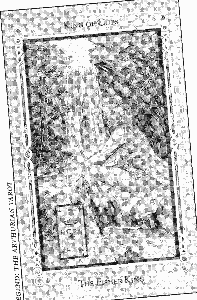

> “In the background, a waterfall descends through a gap in some rocks into a pool surrounded by trees, rocks, and plants. In the foreground, seated on a rock, a bearded man is fishing.”

At this point, I, as the reader, might interrupt to ask, “How do you know he is fishing?” This is a likely assumption, but I find it helpful to ask the person to simply see what is there without preconceptions.

> “He is holding a long pole from which a string descends toward the water. A blue bird with a yellow breast is seated in a tree to his right, looking in the direction of the man, who is wearing . . .”

Asking someone to be more literal does not mean his or her description is “wrong.” The point is to see freshly and without assumptions. Asking “What in the picture makes you think that?” helps to refocus on the details. Even longtime tarot readers, when they are themselves querents, will find it's like looking at a card for the first time. It's common to see something you never saw before, information previously unnoticed.

Because a card is two-dimensional and static, many actions like running or speaking are taken for granted. Try to assess what elements lead to conclusions. An open mouth and raised arm may imply the figure is talking, but could something else be going on? Sometimes a figure's gender is ambiguous, so what detail leads you to think of it as male or female?

Some people cannot stay in the realm of pure, sensory detail, and instead lapse into what an image suggests to them: “This is my boss who thinks he's in charge of everything, but never lets anyone get too close.” Others catalog the most minute details as if creating an accounting ledger: “There is armor only on his forearms and lower left leg . . .” In this## STEP 2

### The Way of the Adept

> You can continue exploring this step now or come back later, after trying out the other ways to read a tarot card.

### Reading for Another Person

This book assumes that you will be doing the exercises, at first, on your own. It also seeks to teach techniques for reading the cards for and with others. This step introduces one of the most important skills in learning to do interactive readings, which is nonjudgmental yet discerning listening skills.

To enhance listening to another, sit evenly and erectly in your chair with both feet flat on the floor and your arms uncrossed, palms up and open. Take a few cleansing breaths, releasing all prior thoughts and concerns on the exhale and opening to the other on the inhale. Be receptive and affirming of the other person. Notice any opinions or attitudes that arise and let them go. You don't have to do anything about them.

It sometimes helps, especially if your mind strays or you get stuck, to repeat what the person says silently to yourself. You can prompt them with questions, such as: Is there a person in the card? What color are the clothes? What's in the foreground? What is that (point to an object)? If they say that a figure is a king, ask, "What about him makes you think he is a king?" ("He's wearing a crown and holding a scepter.")

Use your breath to maintain awareness of the querent's presence. Notice vocal inflection, gestures, and facial expressions. Listen for significant words and phrases, for shifts in voice tone and tempo; these point to personal material at the forefront of the person's psyche. When reading for yourself, note when words or thoughts come faster, or your breath catches and changes, or you feel excited. With these changes come a sense of heightened awareness and increased focus.

Notice if the person does not mention some obvious aspect of the card; for example, describing a court card without ever mentioning the person on the card! This suggests some mystery and may be a rich vein to explore later.

### DESCRIPTION

#### ACTIVITY 2:2

Review the example first-person description of the King of Cups given in Activity 2:1. What items from that description would be worth investigating as significant symbols? Some possibilities are mentioned at the end of this step.

#### Awareness Through Objectivity and Subjectivity

"What goes by the name of objectivity is only the result of our awareness being drawn along certain channels, in quite specific directions, by forces we are not even aware of," writes Peter Kingsley in his book Reality. There may be no such thing as pure objectivity, but it is still useful. Some people find it difficult to give a simple, sensory description of the cards. They can't separate things in the external world from their concepts about those things. Human beings are always interpreting sensory input, so it's important to realize the difference between objective fact and subjective opinion. You can then observe your own ideas and see if they are based on the actual data.

Paradoxically, the second part of this step, in which you became part of the description, brings the realization that nothing is truly separate from you. In other words, when being an Emperor you might describe yourself as acting like "an older man with a long, white beard, wearing armor." This prompts the realization, "Yes, even though I am an eighteen-year-old female, I sometimes act and feel like an old man with a beard wearing protective armor. In fact, I'm acting just like my father." A tarot reader, by listening carefully to a querent's description, learns about that person's vocabulary and conceptual framework. By becoming a careful listener you enter the world and the mindset of another person, enabling you to effectively and empathically communicate with that person. At this point, simply note when something said rings true.

#### ACTIVITY 2:3

This activity will help you clarify the difference between objective and subjective statements about a pictorial image.

- 1) Mark the following sentences either as an objective observation (O) or a subjective assumption (S). Answers are given at the end of this step.
  - a. There's a fish in a cup held in the right hand of this person.
  - b. The fish in the cup has granted the person three wishes.
  - c. She is waiting for someone to rescue her.
  - d. Ten swords stick out of the back of a person lying facedown on the ground.
  - e. He holds his lantern so that other people can follow.
  - f. With arms crossing her chest, she grasps two swords that point upward.
  - g. The person pierced by swords has given up.
  - h. The man in a black cloak is going to pick up the two cups that are still full.
  - i. The person is not looking at a cup held by a hand coming out of a cloud.

- 2) If you haven't done the basic exercise of describing your chosen card, then do so now. Note how objective you really were.

Before moving on to the next step, it's important to realize that, in actual practice, the shifts from one step to the next should be seamless. How long you remain with the descriptive phase is up to you. Doing this exercise will help you find things you never saw in the cards before and will help you develop the ability to visualize the cards in all their detail.

### DESCRIPTION

### POSSIBLE RESPONSES TO STEP 2 ACTIVITIES

#### Activity 2:2

Images that can be investigated in the King of Cups description include:

- Water in the background (emotional backstory)
- Gap in the rocks (an opening in a solid façade)
- Surroundings (what surrounds the querent?)
- Pole (something kept at a distance?)
- Fishing (for what?)
- Bird (is it a spirit messenger, the "bluebird of happiness," or could it be a kingfisher—keeping in mind that the card's called "The Fisher King"?)

#### Activity 2:3

- a. Objective—physical description
- b. Subjective—can you know this for sure just from the picture?
- c. Subjective—what makes you think this?
- d. Objective—physical description
- e. Subjective—how can you know his intentions?
- f. Objective—physical description
- g. Subjective—the person could be dead or faking or . . .
- h. Subjective—this is a supposition about future action
- i. Objective—physical description

Asking "What makes you think that?" leads back to objective details or shows you've assumed only one of several possible options, none of which are known, even if they seem logical.

## STEP 3

## Emotion

> *Translate the emotions into images, that is to say . . . find the images that were concealed in the emotions.*

C. G. JUNG, MEMORIES, DREAMS AND REFLECTIONS

> *Emotions can be mirrored in images, but emotions also alter our images, and our images can alter our emotions.*

VERENA KAST, “SYMBOLS IN JUNGIAN PSYCHOTHERAPY”

### The Way of the Apprentice

This step takes the previous one further and deeper by asking you to describe what seem to be the emotions, feelings, and attitudes of the figures on the card and the mood and atmosphere of the environment.

Here, you begin to reveal the affective elements in the situation that give it its current importance. For instance, if your boss yells at you, but it doesn’t bother you (perhaps you know he’s anxious about a missing shipment), then it’s unlikely you will seek a reading about it. On the other hand, if your boss yells at you and you fall apart, think of quitting, and yell at your children when you get home, then getting a reading could help you see the situation with more understanding. Emotions color all your perceptions; they are the hidden source of value judgments and a major factor influencing actions and decisions. There is no such thing as a truly objective attitude. Even the most impersonal decisions are dictated by emotions. You think you are acting objectively when unaware of any tension or contradictions. This may be, however, simply habitual acceptance. There is no objective truth; you are only more or less subjective at the best of times.

To determine the emotional characteristics represented by your card, describe what appear to be the emotional factors in it, giving free rein to your imagination. Because the card mirrors your life, it also mirrors your own feelings.

As an example, I’ll use the Five of Swords from *The World Spirit Tarot* created by Lauren O’Leary.

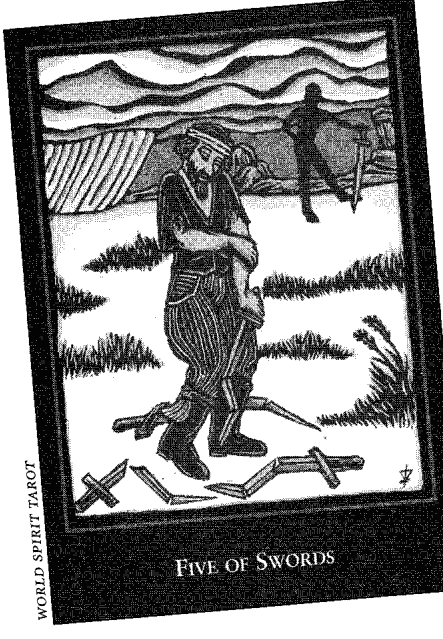

> “The environment looks cold and stormy, with bleak patches of grass sticking through the snow. There’s a sleet storm to the left in the distance, and low, ominous, snow-filled clouds overhead, with only a small patch of clear blue. The man in the foreground seems unbearably sad and dejected. From the bandage on his head I’d say he feels wounded, experiencing inner if not outer pain. He appears cold and lonely and unaware of anything except the broken swords that surround him like broken hopes. His attitude is like, ‘Poor me, nothing will ever get better.’ In the background, a black shadow figure could be dancing for joy or kicking up his heels and showing off his unharmed sword. He seems proud and happy, and since he’s in shadow, it’s almost as if he’s a nasty figure who takes an attitude of delight in someone else’s pain.”

Sometimes it’s hard to know what an emotion is, in part because the English language uses contradictory terms. To say “It feels cold” can mean that the physical temperature is low (sensation) or it can mean lacking in affection (emotion). To say “I think it’s## EMOTION

"beautiful" can mean emotional pleasure rather than rational thought. Many atmospheric and sensory terms can apply metaphorically to one's inner emotional environment, as you will soon see. In Appendix A you will find a list of some emotions that you may want to look over before doing these activities.

## ACTIVITY 3:1

1.  Using your chosen card (the same as in Step 2), describe what seem to be the emotions, attitudes, and feelings of the figure(s) on the card and the mood and atmosphere of the environment. Speak your observations aloud or write or tape them. Again, allow at least two minutes for a nonstop commentary. Take longer if writing.
2.  Repeat what you just said, but in the first-person, present tense, as if you were feeling all these feelings, had these attitudes, and were in an environment with that kind of mood and atmosphere. You can be one or more of the elements in the card, as in this revised description of the Five of Swords.

For example:

3.  Based on your own retelling of your chosen card, identify a recent situation in which you and your environment have shown such qualities or characteristics.

> > *"I am in an environment that seems cold, stormy, and bleak. Sleet falls at a distance and it feels like low, ominous clouds are over my head, with only a small patch of clarity. I am unbearably sad and dejected. I feel wounded and am experiencing inner pain. I feel cold, lonely, and unaware of anything except my broken hopes. My attitude is, 'Poor me, nothing will ever get better.' Behind all this, a shadow part of me is dancing for joy, kicking up its heels and showing off. This shadow part of me is proud and happy and has an attitude of delight in my own or someone else's pain."*

### The Way of the Adept

You can continue exploring this step now or come back later, after trying out the other ways to read a tarot card.

#### The Role of Emotions in Tarot Readings

People get tarot readings to alleviate anxiety, achieve desires, and find meaning through perceived patterns, as already mentioned in the introduction. The process, unless blocked, results in an increase in awareness or consciousness. Emotion is at the heart of all of these needs and so is central to the very act of reading the cards and interacting with the querent. Emotions, in the form of images, can be thought of as "messengers from the soul," letting you know when deeply personal, meaningful connections are made within an experience. You can discover what these are by projecting your own feelings onto a card.

Tarot decks, especially those with pictures on all the cards, are metaphors of emotion. Think, for instance, about the clichés you use when describing cards. The people in the Five of Cups are "out in the cold," which suggests feeling alienated and depressed. The figures in the Five of Wands are "fired up," which can range from enthusiasm to anger. It's not just the facial expressions or bodily postures that indicate emotion. A red hat or red cloak suggests that the passions are involved. Water implies a flow or welling up of deep feelings. In fact, there cannot be a perception without an emotional component, so all perceived elements of a card image will affect you. Strong, authentic emotion has the power to affect you in a way the intellect can never do.

Neurophysiologist Antonio Damasio, in *The Feeling of What Happens*, defines emotions as:

> > Complicated collections of chemical and neural responses, forming a pattern: all emotions have some kind of regulatory role to play, leading in one way or another to the creation of circumstances advantageous to the organism. . . . Their role is to assist the organism in maintaining life.

Emotions attempt to find more advantageous circumstances. In their role as survival skills, emotions strive to protect us, to achieve homeostasis, to instigate growth, and to perpetuate the species. Over time, when responding to similar patterns, habits and conditioning develop, which are always needing adjustment. For instance, someone says something nasty and you react defensively (as you've learned to do); they apologize and you relax. Emotions shape how we see the world and give life its meaning. A reading lets us see a certain cross-section of this process in action. Emotions induced by the tarot images are related in a meaningful way to your question and seek to improve circumstances in your life. No matter what means are used, the images must be experienced emotionally rather than intellectually if their energy is actually to touch the self and become a source of change.

#### Empathy

Despite infinite variations found across cultures, we can predict with some success that certain stimuli will produce corresponding emotions. That is why tarot cards are so powerful. The images induce emotions that a tarot reader can, to some extent, predict. This is all the more powerful because most tarot readers are highly empathic. Empathy is your vicarious response to the other person's emotions, allowing you to understand and respond to their unique experiences. Allan Schore, in his online article "The Right Brain, The Right Mind, and Psychoanalysis," explains empathy as "a resonant nonconscious communication from one person's right hemisphere to the other's right hemisphere." Recent research suggests this occurs through something called mirror neurons in the brain. Through empathy you relate to another's actions by your own experience of motivations and attitudes as you remember or imagine them. Empathy allows you to understand other people as if from the inside.

Emotions are usually associated with only the suit of cups, but any card can trigger emotional responses that are to some extent predictable. As we've seen, people usually seek advice from a tarot deck or tarot readers for emotional reasons. The best tarot readers are usually gifted empaths who use their emotional genius, consciously or unconsciously, as a major component of their intuitive and communicative skills.

#### Energy-in-Motion

The core of an emotion, sometimes described as "energy-in-motion" or e-motion, is a readiness to act. In a reading you can evaluate past, present, and future actions and plans. As it is not humanly possible for a person to think of all possibilities, emotions become ways to cope with the unexpected and unknown. They motivate us, causing us to move and take action.

The combination of symbol plus emotion creates meaning. Carl Jung made this clear when he said, in *The Psychogenesis of Mental Disease*, "Symbols are images that speak to us. They are the best possible expression for an emotionally meaningful situation." Emotion experiences a symbol as reality. Emotion tells you how and where psychic energy is being processed.

Karla McLaren describes this in *Emotional Genius*, her book about the intuitive role of emotion:

> > Emotions alert us to specific issues, and they do so without any subterfuge. If we are aware enough . . . our emotions will be able to contribute the energy we need to move into and out of any situation imaginable, because they contribute the specific energy and information we need to heal ourselves.

Therefore, because feelings are an energy source that can be harnessed for constructive purposes, when they come up in a reading they tell us where the energy is and where there is the most possibility of movement and change. Emotions are the way that energy appears to consciousness.

### Reading for Another

When reading for another, your job is to listen closely, to become sensitive to the undercurrents and pulse of what is being said. A description, whether objective or subjective, suggests quite a bit about the state of the person and his or her concerns. Remembering that emotion is energy in motion, note when the energy changes or rings true and immediate. Now, let's practice identifying the emotional characteristics of a description.

### ACTIVITY 3:2

1.  List emotional states that appear in the first-person description of the Five of Swords that follows. In parentheses, and with a question mark, add any notes about what they imply to you. The question mark indicates these are mysteries possibly worth exploring further. For example, the querent says the environment is "cold, stormy, and bleak." This could relate to something lonely, agitated, or depressing in this person's life. Other possible responses appear at the end of this step.

> “I am in an environment that seems cold, stormy, and bleak. Sleet falls at a distance and it feels like low, ominous clouds are over my head, with only a small patch of clarity. I am unbearably sad and dejected. I feel wounded and am experiencing inner pain. I feel cold, lonely, and unaware of anything except my broken hopes. My attitude is ‘Poor me, nothing will ever get better.’ Behind all this, a shadow part of me is dancing for joy, kicking up its heels and showing off. This shadow part of me is proud and happy and has an attitude of delight in my own or someone else’s pain.”

- 2) Look over the comments that you put in parentheses and acknowledge these as your own assumptions and opinions that, without investigating them further, may or may not apply to the querent. In Step 9, “Query & Snapshots,” you’ll explore assumptions further.

### Getting to Know Your Deck

Each deck has its own personality and style, with its own unique emotional power. This explains why some prefer a deck whose artwork seems amateurish to a more artistically sophisticated deck or why some are drawn to “dark” decks rather than obviously optimistic ones.

In a research project I conducted on tarot and emotions with the Rider-Waite-Smith deck, the emotion words used for the greatest number of cards by the sixty-five respondents were: expectant (applied to 35 different cards), determined, hopeful, resolute, worried, cautious, accepting, self-doubt, arrogant, complacent, fulfilled, resigned, secure, yearning, wary, and wondrous. Note that even the difficult emotions are found in their mild form. Words applied to the least number of cards (averaging 6.5) included guilt, spite, jealousy, disgust, fear, and anger—the strongly negative emotions. This says quite a bit about the empathic resonances its users experience with this deck. It suggests that the Rider-Waite-Smith deck promotes hopeful resolutions and an expectation of cautious fulfillment with a sprinkling of arrogant complacency. The really difficult emotions are present but minimized.

## ## ACTIVITY 3:3

If you want to explore the emotional characteristics of your favorite tarot deck, copy the list of emotion words in Appendix A and cut each word onto a small strip of paper. Lay out all the cards from your deck and then match each card with the one emotion word that best describes what it depicts. Ignore the meanings of the cards and respond solely to the images. Hint: Group the cards according to similar emotions (allowing some cards to overlap into two groups). Place relevant emotion words with each group and then make your final selections.

You can do this exercise from one of two perspectives (your choice):

- 1) Choose your emotion words according to how they might be perceived by the general populace.
- 2) Choose the emotion words that most closely match your own personal reactions to each card.

Finally, consider the following:

- What words did you *not* use? Are these emotions not thoroughly expressed in the deck or are they covered adequately by other words?
- Do certain kinds of emotions match more strongly and often than others? Is this tendency strong enough to characterize the deck as a whole?
- What are the dominant emotional characteristics of each suit and number?
- Which cards were hardest to assign to an emotion?

### POSSIBLE RESPONSES TO STEP 3 ACTIVITIES

#### Activity 3:2

- Something feels ominous (i.e., threatening to happen?).
- There are low clouds (something unknown or murky?).
- There is a small area of clarity (the little that is known and offers hope?).
- The person is sad and dejected about something.
- Something seems unbearable.
- The person is alone (can't talk to others?).
- The person is wounded (hurt by someone?).
- Hopes are broken, feels nothing will get better (despair, self-pity?).
- Happy about the pain (possible reward or satisfaction?).

## ## STEP 4

### ## Story

> > One must start where there is still a flow of energy, even if it is just a thin flow, even if it seems silly.
> —M-L VON FRANZ, ANIMUS AND ANIMA IN FAIRYTALES

### ## The Way of the Apprentice

Step 4 involves telling a story. Using your chosen card as an illustration, you will make up what is going on as if it were a fairy tale. By doing this, you will see how the stories you tell yourself reflect an inner truth.

A good deal of what a tarot reader does during a reading is to tell stories. Most of them are prefaced with “This is like when …” or “This could be …” or “What if this was a …” Some of the scenes described come from the reader’s own life and observations, and some are stories that deck creators and authors have made up to explain a card. For instance, Waite tells us that the Two of Wands is “the sadness of Alexander [the Great] amidst the grandeur of this world’s wealth.”

## STEP 4

This step treats myth as more real than mundane events, and it sets the stage for the magical, transformative work that is done later.

In telling your story you want to be spontaneous, wild, and a little crazy. Don't be afraid of going over the top—in fact, aim for it. Since it's a fairy tale, animals can talk and nothing is what it first appears to be. Can you imagine the hero or heroine doing three impossible things before breakfast?

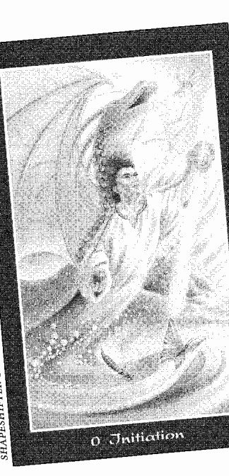

> "Here's an example, based on the Fool card (called 0, Initiation) from the Shapeshifter Tarot illustrated by Lisa Hunt:
> 
> 'Once upon a time there was a young boy who lived on an island in a small fishing village. He would wander around the coves and inlets looking for a dragon's egg to take home and raise as his own. But this was a wild fantasy for, although there were dragons in his world, no one had ever found one of their eggs.
> 
> 'His mother said, 'Why do you want to have anything to do with dragons? They are fearsome beasts with strange desires and they stray far from their homes without a mind for their kinfolk. Now leave them be! Hear me, boy?'
> 
> 'One day, when the boy was extremely hungry, he saw a lone, perfect apple that was too high in a tree for him to reach. He stretched and strained so hard to reach it, but to no avail. He picked up a long stick and tried to knock it down, and when that didn't work he became very frustrated and angry. Then he noticed that his hand looked different. It was becoming green and scaly. As he stretched and reached he felt his back lengthening and suddenly he was bellowing a wild sound, and wings sprouted from his shoulders and he flew up to the top of the tree and snatched the apple. The butterflies and dragonflies tumbled in the wind that his wings created, and his stick that he gripped in his green and taloned hand began to glow with power.
> 
> 'Suddenly the knowledge came to him that this was his birthright that his mother had been trying to keep from him. For dragons didn't come from eggs but from the little boys of the seaside villages who changed into dragons as they grew up. Once they left they came home again only to mate with one of the fisher girls before leaving again on adventures of exploration.'"

### STORY

Your story doesn't have to be consistent and doesn't always have to make sense, as you might only realize at the end something important to the beginning (in this case, the village would have no grown men), which is perfectly okay. It's better to make your story silly (an attribute of the Fool) than to make it logical, stiff, and unimaginative. Now's the time to make all the assumptions you want, to give free rein to flights of fancy, to make all your wishes comes true, and to pull an elephant out of a hat.

### ACTIVITY 4:1

Get yourself into a playful mood. Dance, sing, or wriggle around. Imagine that you are putting children to bed and they refuse to go to sleep unless you tell them a bedtime story. The only thing you have as an illustration is the tarot card you've been working with. Take it out and hold it up so that the children can see it. Now tell them the wildest, craziest story you can imagine, using as many of the details from the card as possible. You can, of course, move beyond the confines of the card to wherever the story takes you. And it helps to actually have someone to whom you can tell the story, even if it's the family dog or your cat. Alternatively, do a timed writing lasting ten minutes, without stopping to think about what you're going to say next. Keep the pen (or your fingers on the keyboard) moving the entire time.

Begin now with "Once upon a time . . ."

### ACTIVITY 4:2

Drop the "once upon a time" and repeat what you just said (or wrote) in the first-person, present tense, as if you are living this story right now. Remember, you can be more than one figure in the card. For example:

*I am a young boy living in a small fishing village. I wander around looking for a dragon's egg to raise as my own. This is a wild fantasy. My mother wants to know why I'm obsessed with dragons. She tells me they are fearsome beasts with strange*## Personal Story

In this exercise you move from pure description and its reframing into personal storytelling. A story like the one above suggests several questions for personal contemplation. How have you pursued a dream only to be told it was a fantasy? What do you feel has been kept from you? What prompts you to leave home? What’s your hidden birthright? How do you change when you get angry? What makes you reach for the impossible? If you expressed your full power, what might happen? Any one of these questions could unlock a personal scenario or a life pattern you’ve played out many times.

When this step is preceded by a description of the card’s emotions and attitudes, then the emotional energy will be close to the surface and add depth to the images evoked. For instance, if in the earlier step this person had described emotions of wonder or joy, then we would have a rich mix showing how anger leads to breakthrough and then into positive possibilities.

### ACTIVITY 4:3

Based on the retelling of your story and on your first-person descriptions in the previous two steps, how are they true in your own life? Where has something like this happened? Speak or write for a few minutes about the connections you find. Some connections may be literal, but let yourself play with any possibilities that come to mind.

### The Way of the Adept

You can continue exploring this step now or come back later, after trying out the other ways to read a tarot card.

### The Power of Stories

Fairy tales can contain any of the following: one or more heroes, an adversary, a helper, a challenge, a quest, magical implements, fantastical beings, superhuman powers, simple language, lots of clichés, and things that aren’t as they seem. The fairy tale allows you to explore what came before and what comes after the scene at hand—how did this figure get there, what does he/she want, what will happen as a result of actions taken? The tale invests great importance and significance in everyday actions (like picking an apple). Likewise, tarot makes our personal stories important. David Brazier, in The Feeling Buddha, tells us, “If the story we are living is not important, then our life will peter into apathy and we will be defenseless against tyranny and oppression.”

Everything that you think, do, wish, or happens to you is another episode in the story of your life. But each chapter is filled with hidden symbolism and significance that is part of the unfolding of your journey or purpose. The stories you tell yourself are the ones you personally act out in your life.

In a tarot reading you transfer the focus from a person to the images on the cards. This allows you to momentarily see the situation and emotions as separate from yourself. It’s like giving advice to a friend and then realizing it applies to you too. Through description and anecdote we establish what are called “correspondences” in magic and “isomorphic resonance” in science, which refer to the parallelism between the scenes and characters on the cards and real life. In other words, insights and actions in one realm correspond to insights and actions in the other. It follows that you can always find the resources you need within the images and stories that you tell. For instance, you might describe a sequence of events that resolves a conflict and achieves your desired outcome. By extrapolating the card’s story into real life, you can entertain new possibilities and outcomes.

### Reading for Another

The success of a reading depends not on the facts but on its effect on the querent, its power to move and change a person in a beneficial way. The pictures and meanings of the cards are used to tell a story that, when metaphorically interpreted, produces insights that may be powerful for the querent.

However, if a tarot reader wants the querent to find the reader’s interpretation convincing, the reader must become a persuader. Is this really the reader’s task? Instead of convincing and persuading, the reader can help the querent consider what wisdom can be gained from his or her own story.

### ACTIVITY 4:4

Try this with another person—a stranger or someone you don’t know well, perhaps a friend of a friend—who understands that this is an experiment.

1.  First, have this person (the querent) ask the all-purpose question: “What do I most need to look at in my life right now?” Tell the querent to shuffle the deck and draw one card by cutting the deck or picking it from a fan. Place the card upright. Now *you* do Steps 1 through 3, describing in some depth the card and its emotions to that person. Then turn this information into present-tense “you-statements” about the querent. For example, a much-shortened you-statement about the Three of Cups might sound like:

    > *“This card shows you dancing with two women, holding your cups high in the air. There are harvest fruits and vegetables at your feet. You are happily celebrating something and enjoying being with your friends.”*

    Follow this with a wild and crazy fairy tale about the card and then turn that into present-tense you-statements about the querent. This is the basis of much of what is called “intuitive” tarot reading, and it often works quite well.

    Finally, ask the querent to tell you what was accurate in terms of his or her life and then to tell you what didn’t seem as accurate or appropriate.

2.  Next, using the same all-purpose question, ask the querent to draw a second card. This time, guide the querent through the three steps (description, emotions, and fairy tale), prompting him or her to repeat each step as an I-statement. Your job is to actively and nonjudgmentally listen to what this person says without adding any interpretations of your own. Notice your own thoughts and opinions and simply let them go. If necessary, remind the querent of what he or she said in the first part as he or she repeats it in the first-person, present tense (therefore you must listen closely). If emotions are activated in the querent, stay fully present (breathe!) without doing or saying anything. When finished with all three steps, ask the querent where these things are going on in his or her life. Listen. Then ask if anything didn’t seem relevant.

3.  Finally, both of you discuss the two readings. Which produced the most relevant material? Which process was more powerful for the querent? Which did you prefer and why?

## STEP 5

### Number

> > God formed things as they first arose according to forms and numbers.
> —PLATO, TIMAEUS

### The Way of the Apprentice

The fifth step involves identifying one to three keywords to associate with the number or court card rank on your chosen card. It is possible to do readings that ignore the pictures and focus entirely on keywords based on the number and suit of a card. Step 5 uses the principles of number as one layer of a card’s meaning. The court cards are identified by rank—page, knight, queen, king (or equivalent)—as well as suit. Most deck creators have in mind number and rank significances that accord with traditional Western cultural conventions. These conventions, most of which are instinctive, provide a baseline for a card’s meaning. This step asks you simply to consider these significances. Other aspects of a card will then modify its number. Steps 6 and 7 develop this concept and give you everything## STEP 5

You need to provide basic interpretations for any standard tarot deck, regardless of its illustrations or theme.

All numbers reducible to the same single digit (from 1 to 9) have qualities in common. A numerological concept called “reduction” allows us to relate single-digit meanings to the Major Arcana, so you only have to learn keywords for nine numbers. Any double-digit number (or higher) can be reduced to a single digit by adding the digits together. Thus:

- 18 = 1 + 8 = 9
- 21 = 2 + 1 = 3
- 2012 = 2 + 0 + 1 + 2 = 5
- 1998 = 1 + 9 + 9 + 8 = 27 = 2 + 7 = 9
- 19 = 1 + 9 = 10 = 1 + 0 = 1

Since there are ten (not nine) distinct pip cards, ten is seen as both an ending and a new beginning.

The symbolism of numbers can become a life study but in this step we’ll focus only on a few core concepts.

### ACTIVITY 5:1

Say the name of your card and one to three keywords based on its number or rank. Select keywords from Appendix B that in your opinion relate best to the given number or rank.

For example:

> “I’ve drawn the Two of Cups. Twos are about duality and choice.”
> “You drew the King of Pentacles. Kings are about public mastery.”

### The Way of the Adept

You can continue exploring this step now or come back later, after trying out the other ways to read a tarot card.

### Familiarizing Yourself with Your Deck

Using a large table or the floor, lay your deck in columns as indicated below. Look at all the cards having the same number or rank.

```
MAJOR ARCANA
1 2 3 4 5 6 7 8 9 10
11 12 13 14 15 16 17 18 19
20 21

MINOR ARCANA
Wands   1 2 3 4 5 6 7 8 9 10 P Kn Q K
Cups    1 2 3 4 5 6 7 8 9 10 P Kn Q K
Swords  1 2 3 4 5 6 7 8 9 10 P Kn Q K
Pentacles 1 2 3 4 5 6 7 8 9 10 P Kn Q K
```

I suggest creating a page in your tarot journal for each number between one and ten and, optionally, also from eleven to twenty-two. Use these pages to collect keywords and concepts that relate to each number. For now, refer to the number theories for each number discussed below and to the keywords in Appendix B when examining the cards relating to each number. Later, add information from other books and online sites.

Pick a keyword that makes the most sense to you for any given number and see how it works for each of the related cards, such as all the ones. Each card has its own unique relationship to that keyword. In some, the keyword will appear to function easily, while in others there may be a lack of that quality, a struggle to obtain it, or some frustration involving it.

## STEP 5

The trump cards of a number represent larger principles at work, while the suit cards are the gifts and challenges inherent in that principle—the situations in which we develop awareness of those principles. For instance, in Aleister Crowley’s *Thoth* deck, the keyword titles express issues to be worked on.

### ACTIVITY 5:2

- 1) How does the word “integration” apply to each of the threes pictured here?
Remember that the Major Arcana cards numbered 12 and 21 reduce to threes (1 + 2 = 3). What is being integrated? Compare your responses to the ones I give at the end of this step. Don’t assume that my answers are better than yours. Other people’s keywords serve as starting points and later as checkpoints to see if you’ve missed anything or if your ideas vary greatly from the norm.
(Cards are from the *Robin Wood Tarot*.)

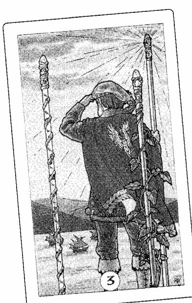
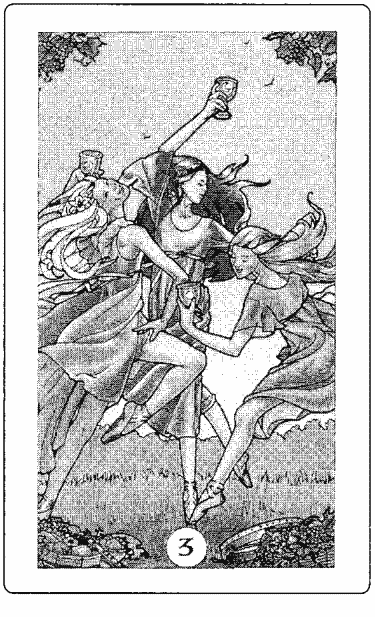
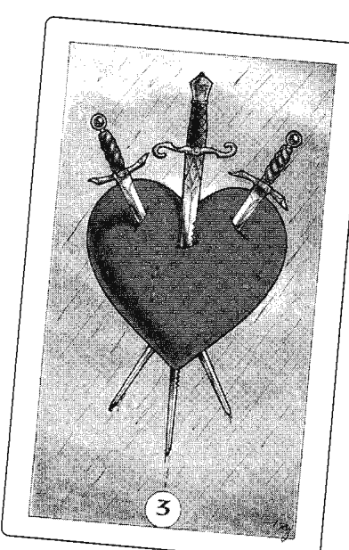

- 2) Now consider the number two. How are “choices” made or not made in each of the twos in your own deck?

- 3) Is “balance” a good keyword for the twos or does it likewise pertain to all the even numbers (4, 6, 8) and, if the latter, what differentiates the kind of balance associated with each even number?

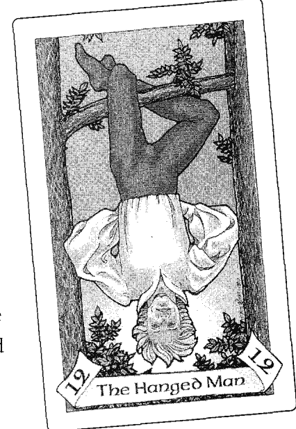
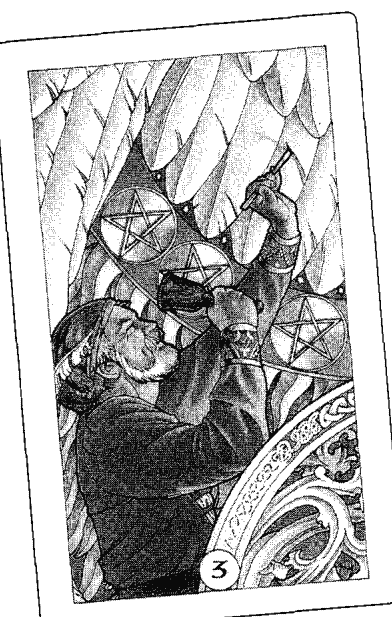
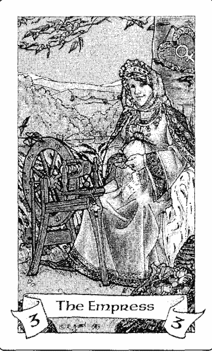
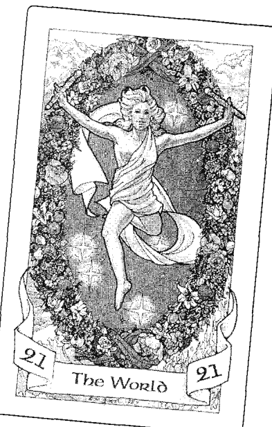

### ACTIVITY 5:3

Choose at least one keyword for each of the ten numbers and four court card ranks and see how it applies to each card in its set. See if you can find an image or symbol on each card in that number set that will serve as a reminder of your number keyword.

### Number Sequences

Tarot principle says that each number is developmentally related to the number before and number after it. Fours arise from threes and lead to fives. In the suit of cups you could imagine a sequence that involves drinking wine at a party in the three, being hung over in the four, and sorrow over a loss from your immoderate actions in the five. Alternatively, you could be celebrating a new job in the three, finding the job boring in the four, and grieving your failed hopes in the five.

### ACTIVITY 5:4

Look at the numbers in sequence in each suit. Is there a rhythm of ups and downs, outer and inner focus, activity and inactivity? Describe a possible sequence of events for each suit based solely on its number characteristics.

## STEP 5

### Numbers and Ranks

The remainder of this section describes the court card ranks and explores the symbolism of the numbers one through ten. These are summed up in the keyword lists for numbers and ranks in Appendix B.

### THE COURT CARD RANKS

Just as numbers suggest a developmental progression, so do the court card ranks, but in their own way. The ranks vary greatly from deck to deck and so pay attention to the characteristics of the decks you use rather than exactly following the suggestions here.

**Page (Valet, Princess, Child, Daughter, Apprentice, Place ...):** A page, in terms of rank, is about newness. It represents the beginning of an endeavor, a tentative experience, and serving others. It indicates initiatory, immature, innocent, open, and curious energies. Pages may bear messages.

**Knight (Prince, Warrior, Son, Brother, Seeker, Knower ...):** A knight is like an adolescent, pushing boundaries, extending experience, and testing abilities. This rank indicates adventurous, exploratory, revolutionary, and goal-focused energies. It suggests action, movement, and development. Knights also can indicate journeys.

**Queen (Mother, Matriarch, Woman, Guide, Priestess, Gift ...):** A queen is the mature, authoritative yin or feminine energy that nurtures, supports, and manages. It is often associated with sympathy, understanding, and intuition. It shows mastery and expertise expressed on an inner or interpersonal level.

**King (Father, Patriarch, Man, Sage, Shaman, Speaker ...):** A king is the mature, authoritative yang or masculine energy that commands, defines, and protects. It is often associated with virility, aggression, and rationality, and indicates mastery and expertise expressed in an outer or public way but sometimes statically.

### The Importance of Number

The earliest trump cards were unnumbered. They were originally used for a game called tarocchi, a forerunner of bridge that had a permanent trump suit and therefore players had to agree upon the trumping sequence to be used. In the earliest days this order varied from town to town, reflecting cultural attitudes and placing a personalized stamp on the local game. Eventually numbers for the trumps became standardized. The suit cards were always numbered, except those of the “court,” which are distinguished by rank. Whether the numbers originally assigned to the trumps had a symbolic significance is still an open question. In 1781, Antoine Court de Gébelin described tarot as an ancient document filled with occult meanings. Since his “discovery,” great significance has been given to discerning the “correct” sequence of the trumps and the meaning of the numbers.

The earliest symbolism of numbers seems related to the fingers on one or both hands, and also from the ancient visual understanding of numbers as dots arranged in symmetrical patterns. The ancient mystery schools taught that number and geometry were sacred, with magical powers derived from cosmic forces. While words express human ideas, numbers, in their purity, were believed to be eternal essences, expressing God’s reality, to which all things are reducible. The Babylonians connected numbers with celestial influences. Pythagoras of Samos (sixth century BCE) founded a school and religious brotherhood featuring reincarnation and vegetarianism among its teachings. His mathematical and geometric principles were seen as signs of a divine plan and harmony in a universe in which our spherical planet revolved around the sun. He is credited with the doctrine that “all things are numbers.” Many of Pythagoras’ ideas came from the Egyptian mystery schools of Alexandria, where he studied. He influenced Plato and Aristotle. The Pythagorean writer Stobaeus wrote, as quoted in The Pythagorean Sourcebook and Library:

> > Indeed, it is the nature of Number which teaches us comprehension, which serves us as a guide, and teaches us all things which would otherwise remain impenetrable and unknown to every man. For there is nobody who could get a clear notion about things in themselves, nor in their relations, if there was no Number or Number-esse.

From its inception, number and rank have been an integral part of the tarot and may have played a central role in its original design. The total of all possible throws with two dice is twenty-one, while with three dice it is fifty-six; add the unnumbered Fool and you have the seventy-eight cards of the tarot. This suggests that divination with dice, practiced since ancient times and well documented from the Middle Ages, may have been a forerunner of the tarot. Furthermore, dice often appear on early depictions of the Magician’s table.

### The Symbolism of Numbers

It has been said that through numbers things become known. Rather than simply read about the numbers, it is helpful to imagine them in their purest forms. Watch in your mind's eye as they transform like a film animation sequence. What is it like when everything is one, a point of pure brilliance without end, of no dimension, boundary or differentiation? What happens when the one desires to know itself? Just as we never can see our own eyes directly, the one needs another through which to see itself, hence the two. And then what happens when two longs to reunite but, instead of finding union (one), creates a third utterly unique being? Hence, three. Three requires a fourth to establish depth, stability, and direction. With a fifth comes an upset of that stability and thus change and movement. Six reinstitutes harmony, while seven challenges it. Eight doubles the material order of four, the square. Nine completes the single digits in a trinity of trinities. Ten returns us to one, but in another dimension.

What follows are a few of the essential concepts related to each number.

One: One is a point with location but no dimension. Called the monad, it represents godhood, the beginning or cause of all things, the primordial force of creation. One expresses unity, ego, identity, uniqueness, wholeness, and the infinite. As a seed it stands for all potential. It implies initiative, intent, reason, and unchangeableness. As the Emerald Tablet of Hermes says, “All things are from One, by the mediation of One, and all things have their birth from this One Thing.”

Two: Two consists of two points from which a line is derived and thus the principle of extension. It is divinity mirrored in the face of another and therefore duality, and also separation and opposition, out of which corruption was believed to arise. Pythagoras defined the fundamental concept of duality and a theory of opposites (which appear frequently in the trump symbolism). Duality implies balance, choice, and decision. It is the illusion of separateness but offers the possibility of relationship. Basic dualities include:

- odd even
- male female
- me not me (other)

| | |
| --- | --- |
| light | dark |
| good | evil |
| active | passive |
| life | death |
| joy | sorrow |
| youth | age |
| health | disease |

**Three:** Three points create a triangle and define a plane. As the first tangible form, it is the first real number and, thus, a symbol of reality. It represents multiplicity, the many. Some cultures only had words for one, two, and many. In it, we find all the trinities: the three faces of the Goddess, the three phases of the moon, the Christian trinity, the primary colors, and body-mind-spirit. We also have processes such as thesis-antithesis-synthesis, beginning-middle-end, and subject-verb-object—which imply an indissoluble wholeness and unity of experience. Threes suggest mediation and integration, in that unity and diversity are restored to harmony. When opposites come together, a third thing (a child) is created. It's often considered the number of creativity, soul, and spirit.

**Four:** Four adds depth and so forms the first solid (the tetrahedron), representing perfect order and permanence. It is associated with the creation of the physical world and material existence—the four elements, directions, seasons, winds, weeks in a month, and legs on an animal. It is “foundation” and represents justice because it is the product of equals (2 + 2). The four-lettered name of God is known as the Tetragrammaton, which denotes mystery and power. Furthermore, we find the four cardinal virtues, gospels, and rivers of Paradise.

**Five:** Five is the pentagram, which can be drawn as an endless knot. It represents motion, time, and, therefore, change and alteration. Five represents life and, more specifically, humanity, in that there are five fingers on a hand, five extensions of the body (arms, legs, head), and five senses. From the five wounds of Christ, it suggests pain and wounding. It changes or upsets the stability of the four, creating crisis. As the quintessence, it unites and transcends the elements, representing health, vitality, and new possibilities. To Pythagoreans it was one of the "marriage" numbers, the sum of the first even and first odd numbers 2 + 3 (1, being undifferentiated, is here considered neither odd nor even).

## STEP 5

Six: Six is the second "perfect number" of the Pythagoreans, the sum of 1+2+3, perfect in that creation was complete on the sixth day. Six represents emerging consciousness and purification. As a hexagram, it consists of two opposing triangles, symbolizing fire and water, and bringing an integrated awareness of both spirit and matter, thus promoting reconciliation. Thus it is associated with sex and generation and considered also a "marriage" number in that it results from multiplying 2 x 3. It forms the number of surfaces on a cube.

Seven: Seven is a number of distinction because it cannot be created through multiplication. It represents both reason and chance—both victory and the slightest perturbation that can upset it. It is found in the seven musical tones, color rays, visible planets, vowels, chakras, and days of the week, gathering together disparate things into a single whole. Being the day on which God rested, and the sum of the divine trinity (soul) plus the fourfold world (body), it is often called the sacred or mystical number, representing initiation or the awakened state. Containing all the planetary forces, it thus represents wisdom. It is found in the seven virtues and vices, seven sacraments, and seven deadly sins. Seven represents perfection but also everything that can undermine that perfection.

Eight: Eight is known as the ogdoad and can be pictured as two squares: the intersection of the mundane elements and the celestial orders (and therefore higher consciousness). As the octave, it returns to itself but at a new level or frequency and thus denotes all rhythm and cycles. The eighth day was known as the Day of Justice or Judgment that followed the seven ages of the world, and thus the presence of a higher justice than that found in matter (the four). It represents progress toward completion and the final adjustments that need to be made to achieve it.

### NUMBER

Nine: Nine, which is three cubed, is the perfect form of the perfect three. It is a circular number because when multiplied it continually reproduces itself in the sum of its digits. Because of this, and as the last of the root numbers, it represents limits, boundaries, and strength, but also wisdom. There are nine orders of angels and nine months in human gestation. It is the completion and end of a cycle, although in relation to the ten this completion is seen as still lacking something.

Ten: Ten and one are mystically the same, being the all-embracing totality of all things, since all other numbers are generated from the members of the decad. It is, therefore, infinite and unbounded, a higher order of unity. It is both manifestation and death of the ideal. To Pythagoreans, it was a whole and perfect number, called both Kosmos and faith. In Kabbalah there are ten emanations of the divine. The Egyptians divided the heavens into thirty-six decades of ten degrees each. As the number of the Ten Commandments, it represents rectitude and fulfillment. It resolves and consolidates whatever was lacking in the completion of the nine.

Almost all religions have their own numerical symbolisms, which often also operate as memory devices for basic principles and teachings. The numbers associated with the ten sephiroth—emanations of the divine forming the Tree of Life in the Hebrew Kabbalah—are especially important in Golden Dawn interpretations of the tarot. Other works on numerology offer related but somewhat different ideas about the meaning of numbers.

## STEP 5

### POSSIBLE RESPONSES TO STEP 5 ACTIVITIES

Activity 5:2; Item 1

#### Threes

- WANDS: Integration of will, opportunity, and means sets things in motion.
- CUPS: Integration of harmonies is joyful and celebratory.
- SWORDS: Integration thwarted yields pain and sorrow.
- PENTACLES: Integration of needs, skills, and intent results in productivity.
- EMPRESS: Integration of the primal masculine and feminine (1 + 2) produces a third (a child or a pregnant and fruitful world).
- HANGED MAN: Integration of opposites (above and below) or a new perspective (first and second halves of the majors) accomplished through sacrifice, surrender, or a new perspective.
- WORLD: Integration of elements results in unity (the integrated self).

## STEP 6

### Mode, Suit, Element

> He makes the material elements four in number, fire, air, water and earth, all eternal but changing in bulk and scarcity through mixture and separation.
——EMPEDOCLES

### The Way of the Apprentice

The sixth step asks you to name keywords that are related to the mode, suit, and element of your chosen card. To do this, you will need to determine one to three keywords for each of these groups that, for you, applies to every card in that group.

The four modes of the deck are:

- Court cards
- Number cards (two through ten)
- Major Arcana or trump cards
- Aces

The four suits are known by a variety of names, depending on the deck. The following names will be used hereafter:

- Wands
- Cups
- Swords
- Pentacles

The suits are often associated with the four elements:

- Fire
- Water
- Air
- Earth

Most books use an established system of suit and element correspondences and keywords. While I emphasize the most popular system, I also provide information about other systems so that you can make your own choices or move more flexibly among decks with different associations. The keywords are summarized in Appendix C.

### ACTIVITY 6:1

An in-depth discussion of the four suits appears in the Adept section of this step. You may wish to read it before completing this activity.

1.  Select one to three keywords or phrases that best express the qualities of each suit in your deck. See Appendix C for suggested keywords.
2.  Which suit/element keywords best express the qualities of your chosen card?

### The Four Modes of Tarot

Court Cards: Court cards answer the question “Who?” They show what personality aspect is involved in the situation. They can also signify the style of action or social role being played. Based on rank, you can determine if the person is acting youthfully and naively or being mature and in charge. Court cards can have additional meanings, such as a message or journey or the end of something.

Minor Arcana Number Cards (2 through 10): The number cards answer the question “What?” They describe the situation and events that the “who” is in. They tell you what is going on and what the “who” is dealing with. They may also describe terrestrial phenomena and effects.

Major Arcana: The Major Arcana answer the question “Why?” They describe the lesson you need to learn in this situation and the archetypal energies being expressed. They tell you “why” the “who” is in the “what.” The Major Arcana represent principles, laws, archetypes, and psychospiritual needs. They’re also known as celestial causes. For example, the Empress and the Queen of Wands might both refer to a visit from your mother, but the Queen of Wands will describe her style of behavior or personality attitude while the Empress may suggest your entire relationship to “mothering.”

Aces: Aces could be included with the number cards, but they fill their own particular function, answering the question “Where?” Aces show the element, realm, or sphere where the situation has the most potential, especially for producing something new. The nineteenth-century French magus Eliphas Lévi, in Transcendental Magic, explained the significance of the Aces as follows:

> The ace of deniers [coins] . . . is the soul of the world; the ace of swords is militant intelligence; the ace of cups is loving intelligence; the ace of clubs [wands] is creative intelligence; they are further the principle of motion, progress, fecundity and power.

### ACTIVITY 6:2

1.  Examine each of the four modes and select one to three keywords that speak to you in a reading. Refer to Appendix C as needed.
2.  Separate your deck into the four modes. From which does your chosen card come? What does that suggest about its significance?

### The Way of the Adept

You can continue exploring this step now or come back later, after trying out the other ways to read a tarot card.

### The Minor Arcana Suits

The suits of the Minor Arcana draw their associations from the duality of gender and the quaternity of the elements. Each of the four elements, however, has been linked with nearly every suit (see the chart in Appendix C).

Although linking the suits with the elements is not essential, it is useful. Historically, it's as if all existence was a pie divided into four pieces, with each containing its own unique ingredients. These associations go back to Empedocles and the foundations of Western philosophy, in which the elements represented the irreducible components of the physical world. They were adapted into medicine as the four humors and temperaments, and formed the basic categories within metaphysical systems such as magic, astrology, and alchemy. Today they appear in modern psychoanalysis as the four functions of Carl Jung and are implicit in the Myers-Briggs Personality Inventory.

The Doctrine of Correspondences is a basic principle or "law" of occult metaphysics and magic that says that symbolic analogies and affinities exist among everything in the universe of the same or similar vibration, and that you can affect one thing through the symbolic linkages. This principle is summarized in the Hermetic axiom "As above, so below." Astrology, numbers, the alphabet and, more recently, tarot provide the basic framework on which other correspondences are strung. The Doctrine of Correspondences provides a long-established way to relate all experience to the tarot, even if there is not always total agreement about specifics. New correspondences challenge you to expand your meanings and stretch your definitions.

An important rule in metaphysics says that every part contains a seed of the other parts, as depicted in the yin-yang symbol. Likewise, every element is said to consist of half itself and half all four of the elements, so that five-eighths of the whole is the pure element along with one-eighth of each of the others. This would be like a slice of apple pie that contains a smidgen of cherry, rhubarb, and peach. This factor helps in finding relationships among cards.

### Duality

The suits express a basic duality: wands and swords are masculine, while cups and pentacles are feminine. This basic division extends back to the earliest tarot descriptions where, when playing games, the ace to ten ascend in value in the masculine suits and descend in the feminine.

### THE ELEMENTAL DUALITY

- Masculine/yang: dynamic, active, aggressive, outer
  - Wands-Fire
  - Swords-Air
- Feminine/yin: receptive, passive, sustaining, inner
  - Cups-Water
  - Pentacles-Earth

Take care when thinking in terms of duality that you don't fall into outmoded ideas about individual gender characteristics. This is why many people prefer the terms "yin" and "yang" as the opposites within a whole, each containing a drop of the other.

### Quaternity

The most popular way of applying tarot correspondences in English-speaking countries was developed by the Hermetic Order of the Golden Dawn, which worked out a comprehensive system integrating the Western magical traditions. For them, wands are fire (a flaming brand) and swords are air (a sharp intellect), while cups are water and pentacles (previously coins) are earth. They adapted occult conventions to the tarot suits, such as that of Cornelius Agrippa, who ascribed the four elements to the Tetragrammaton or four-lettered name of God:

| Suits      | God-name | Elements | Qualities of the Elements                                                                                                |
| :--------- | :------- | :------- | :----------------------------------------------------------------------------------------------------------------------- |
| Wands      | Yod [י]  | Fire     | Radiant, energetic, passionate, courageous, enthusiastic, desiring, aggressive, willful, optimistic                     |
| Cups       | Heh [ה]  | Water    | Nurturing, receptive, sustaining, feeling, empathic, protective, merging, flowing, yielding, secretive                  |
| Swords     | Vau [ו]  | Air      | Mental, logical, rational, communicative, inquisitive, alert, fair, clever, nervous, impersonal                         |
| Pentacles  | 2nd Heh [ה] | Earth    | Practical, grounded, realistic, dependable, sensuous, stubborn, cautious, persevering, possessive, productive |

See Appendix C for a chart showing the other ways suits and elements have been related. You can choose to work with the system intended when creating a deck or always apply one system, no matter which deck used (despite conflicts in imagery). It is for this reason that some people prefer decks with no elemental characteristics.

The descriptions of the suits that follow emphasize the Golden Dawn elemental associations. Keywords for these and for alternate elemental associations are found in Appendix C.

Wands (Staves, Rods, Scepters, Batons, Clubs, Cudgels, Spears, Arrows): Originally wands were polo sticks but, when cards arrived in Europe, they became either scepters (Italy) or cudgels (Spain), since the royal game of polo was unknown. In a playing card deck they are usually related to clubs. Historically, wands are associated with the peasant or servant class and labor.

Wands signify the desire for growth, the inspiration that moves things, the desire that leads the way, and the future-oriented aspiration that initiates action. They indicate purpose behind every action and find value primarily in the meaning of an experience while lacking appreciation for the form.

### MODE, SUIT, ELEMENT

The phallic image of the Ace of Wands represents a singleness of purpose, as well as the “I,” or sense of self-individuation. Wands spur a desire for self-growth and creativity. While eagerly starting things, they may not have the perseverance to complete or maintain them.

Wands are the clear light of perception and inspired creativity—the “Aha!” experience. They want to expand awareness, as well as set everything on fire with their enthusiasm. Emotions relating to fear and desire are strong in this suit.

Cups (Chalices, Goblets, Vases, Vessels, Bowls, Containers, Hearts): Cups have kept a fairly standard form until becoming hearts in a playing card deck. Their historical association is with the church and love.

Cups receive the impulse or respond to it. Just like the top of a cup, they are open. They go with the flow when not confined and seek to merge. The quality of cups is to take the form of whatever they flow into. Therefore they are amiable but, at the same time, diffused and sometimes resistant to new ideas, especially when those ideas don’t speak to the emotions.

Cups represent love, relationships, and imagination. They provide nurturance and a sense of connectedness. Cups can open you to your inner feelings about things and the connections you have with others. Choices at this level seem intuitive. Welcoming everything, they may lack discrimination and be lazy or listless and become moody. While joyful emotions predominate in this suit, there is also sorrow and loss.

Swords (Blades, Knives, Scimitars, Feathers, Arrows): Swords were originally curved scimitars and became spades or pikes in a playing card deck. They are historically associated with warriors, the nobility, and battle.

Swords dissect the original idea. They think about it, talk about it, struggle with it, organize it, and cut through anything not focused on the issue. They make judgments based on reason and logic. Their methods often bring pain and sorrow, for anything that cannot stand the “bright light of truth” is ruthlessly cut out and destroyed.

Swords represent the “fight or flight” mechanism. They also signify intellect, rationality, logic, analysis, and the actions that follow. They maintain an observant detachment, even of themselves. Swords thrive on the exchange and development of ideas and, hence, communication. Their rigid control of feelings results in fear of things they cannot understand.

At their best, they see all sides of an issue, weigh them carefully, and form a clear, articulate opinion on the subject, which can be communicated to all. At their worst, they use logic and statistics to deceive. Fear of irrationality leads to coldly severing emotional connections in the name of objectivity. In fact, fearful and sorrowful emotions are very powerful in this suit, while anger and hate are also strong. Swords are notably low in emotions of longing and desire. The swish of swords through air relates to the sigh of breath, the birth of sound.

Pentacles (Coins, Disks, Circles, Stones, Shields, Talismans): Pentacles were originally coins (and remain so in many decks), becoming diamonds (i.e., paving tiles) in a playing card deck. They are historically associated with the merchant class and commerce. In the eighteenth century, Antoine Court de Gébelin called the suit “talismans,” which Eliphas Lévi, in the mid-nineteenth century, named “pentacles” (referring to a type of talisman). Since coins are also considered to be talismans (spreading the power and renown of the ruler whose face appears on them), and pentacles are the ideal talisman, the change seemed appropriate to the magical reconceptualization of the suit.

Pentacles signify the fruits of your labor, the results of the process you have been through with the other suits. They establish a new security of position. And they are the literal “ground” from which new ideas can grow.

They make you feel secure, or ground you, which in society often means home, money, traditions, and control or power. But they can also refer to that inner center represented by the chi or hara of Eastern thought. Pentacles also represent things valued and rewards for work done.

Pentacles are reminiscent of Mother Earth and the nature of things. They give you an appreciation of form and of your body. Pentacles try to achieve mastery over matter, either through manual craft and skill or through knowledge of how things work.

An occult principle states that magical, transcendent experiences are hidden in the most ordinary things, as the diamond is hidden in the earth, reminding you to value your physical experience. This is generally a happy suit mixed with some sadness and more fear than found in the cups.

### Suit Summary

Despite the variety of elemental associations, certain themes emerge for each suit based solely on the suit emblem itself. The wand, being phallic, generates; the cup nurtures; the sword cuts; the coin pays for things.

Taking these a step further and relating them sequentially, there is:

- 1) A new idea or inspiration (wands)
- 2) An emotional reaction to and nurturance of it (cups)
- 3) A struggle to solve any problems (swords)
- 4) The fruition or final result (pentacles)

### Elements and the Major Arcana

It is also possible to determine elemental allegiances among the Major Arcana. These are found in Appendix C.

### ACTIVITY 6:3

- 1) Which suit and element correspondences are used with your deck? Which system makes the most sense to you?
- 2) Examine each of the suits in your deck and select one to three keywords that best express the qualities of each suit. See Appendix C for suits' keywords corresponding to different elements.
- 3) In which suit is your chosen card? (If a Major Arcana card, check Appendix C for a list of elemental correspondences.) Which element do you most associate with it? Pick one to three suit and/or elemental keywords that you would most use.

### Integrating Mode and Element

The four modes themselves can become a spread simply by drawing one card from each mode (see descriptions given on page 49). Here is an example interpretation using only the information that is provided in this step.

- **Who:** Knight of Cups—I sustain (yin) and react emotionally (water)
- **What:** Seven of Swords—a dynamic (yang) event involving mental struggle (air)
- **Why:** Strength—to learn an active (yang) lesson about passion and desire (fire)
- **Where:** Ace of Pentacles—in the passive (yin) sphere of earth, with potential for establishing worth (earth)

Putting these phrases together, you can create a single, coherent statement, such as “I sustain and react emotionally in a dynamic event involving mental struggle to learn an active lesson about passion and desire in the passive sphere of earth, with potential for establishing worth.”

Here we see an emotional personality (Knight of Cups/water) finding itself in an intellectual situation (Seven of Swords/air), learning a lesson about passion (Strength/fire) in which something can be manifested physically (Ace of Pentacles/earth).

The duality principle indicates that the event (number card) and the lesson (trump) are more active and aggressive (air and fire), while the personality (court card) and the realm (ace) are more receptive and sustaining (water and earth).

### ACTIVITY 6:4

- 1) Describe your chosen card in terms of its mode, duality, suit, and element, using the following format: “I’ve drawn the [name of card]. [Mode] are about _________, and [Suit/Duality/Element] are about _________.” For example, “I’ve drawn the Six of Cups. The Minor Arcana are about events, and cups are about emotion.”
- 2) Shuffle the other three modal groups and draw one card from each in order to see how these modes are functioning in your life in relation to your chosen card. Describe each in terms of mode and element/suit/duality. Use all four cards together to create a single statement embodying their symbolism.

### Other Quaternities

Many other quaternities can be associated with each of the suits: directions, seasons, time of day, moon phases, temperaments, humors, Jungian functions, metaphysical bodies, archangels, elemental spirits, magical actions, Kabbalistic worlds, the apostles, the Hindu *tatvas* (geometric shapes)—to mention only a few. Since their use depends on your understanding of complex philosophies and systems, and since not all quaternities are always applicable in reading the cards, they will be left for exploration through other works.

## STEP 7

### Synthesis

> All our progress is an unfolding like the vegetable bud. You have first an instinct, then an opinion, then a knowledge as the plant has root, bud, and fruit. Trust the instinct to the end, though you can render no reason.

—RALPH WALDO EMERSON, ESSAYS, FIRST SERIES

### The Way of the Apprentice

The seventh step is to synthesize everything you’ve learned in Steps 5 and 6—number or rank plus suit, element, and mode—into simple statements. You’re now going to integrate these factors to form concepts that transcend the individual keywords. This step tells the story of a journey undertaken by the four suits that demonstrates how each number manifests differently according to its suit and element.

Synthesis in a reading involves finding affinities among the different components and determining how they relate in real life events. These are then merged into statements about a person’s issue that are more than the simple sum of their parts. This is where tarot starts becoming an art, an intuitive and creative process, rather than mere formula.

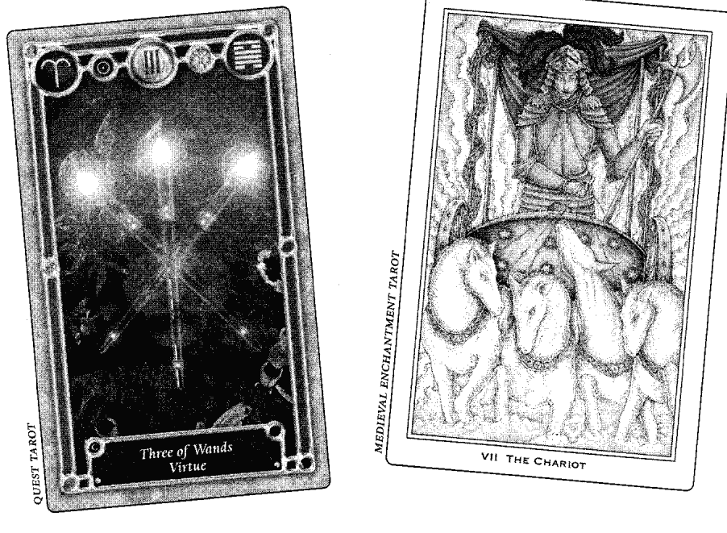

It’s even possible to use this technique with a deck that has little or no pictorial content. For instance, imagine that you’ve drawn the Three of Wands from the *Quest Tarot*, created by Joseph Martin. Based on Steps 1, 5, and 6, you would say something like: “I have drawn the Three of Wands. Threes are about cooperation and wands are about activity and enterprises. This is a number card and therefore about a life event or situation.” This is one way to “prime the pump” and get the words flowing.

However, we can make the statement a little smoother: “The Three of Wands is about life situations in which the cooperation of the threes combines with the activity and enterprise of the wands.”

We can see the ingredients we’ve been gathering. Nevertheless, it’s still a list of keywords in which a synthesis has not yet occurred. Now it’s time to blend and cook them to create a whole new product.

“Events have cooperated to set an enterprise in motion.” Now we have a good, clear meaning for the Three of Wands, but not much detail. Can other keywords provide this for us?

### SYNTHESIS

Let's consider a few alternate pairs:

Fertile (threes) + passion (wands) = “My passion wants to multiply and spread.”

Integration (threes) + innovation (wands) = “This situation gives me the opportunity to put things together in a whole new way.”

If the card in question is the Chariot, then it numerically is a seven, a Major Arcana trump and, in the Golden Dawn system, elementally water (Cancer).

One of many possible statements could be: “I've drawn the Chariot. It represents a lesson (trumps) in mastery (sevens) over my emotions (water).”

Or, blending the ideas a little more: “This card is about my psychospiritual need (trumps) to use skill and courage (sevens) to protect and contain what I love (water).”

### ACTIVITY

**7:1**

1. Synthesize keywords into an integrative statement for each of the following cards, using number or rank, suit, element, and mode (refer to Appendices B and C for help). Sample statements are found at the end of this section.
   - Page of Pentacles
   - Eight of Swords
   - Wheel of Fortune
   - Ace of Cups
2. Do the same for your chosen card, trying as many different combinations as possible. Which statement feels most true? How does it relate to your life right now?
3. Create a further synthesis that includes material from your description, emotions, and fairy tale—everything that you've explored so far.

### The Way of the Adept

You can continue exploring this step now or come back later, after trying out the other ways to read a tarot card.

### The Suit’s Progress

Each suit undergoes a developmental progression through its numbers—a synthesized vision of the whole. I recommend learning concepts that help you visualize this, to see the particular stage indicated by a card in relation to what comes before and after it. A story line makes it easier to remember the sequence and gives you a graphic, experiential metaphor for understanding and conveying a particular card’s meaning.

Each suit, of course, has its own story line with a theme determined by suit associations and correspondences; for instance, love, pleasure, and imagination (cups); creativity and spiritual growth (wands); wealth, work, and health (pentacles); the mind and problem-solving (swords). The numbers, as the developmental stages of our plot, can be imagined as conveying action, crisis points, climax, and resolution.

An effective image for depicting this tale is that of hiking over a mountain. This particular story literalizes the pictures on Rider-Waite-Smith-based decks such as the Robin Wood or Universal Tarot. It greatly helps to lay out your Minor Arcana pip cards so that you are looking at the illustrations. There could be places where your deck or concept of numbers does not match this scenario. Feel free to rewrite the tale so it works for you.

Now, imagine that you get up one morning with the impulse to do something different and exciting—a physically challenging daylong excursion—you’ll climb a nearby mountain! You suddenly feel wide-awake and ready to go. This is the ace. If it is wands, you are enthused and energized by your brilliant idea. With cups you may be brimming over with a love of the great outdoors. Swords indicate a focused determination to face a challenge. Pentacles relish fresh air and a good workout with a payoff of improved muscle tone.

At the two, you face several options. Which mountain or which route will you take (wands)? Should you go alone or with others (cups)? Second thoughts nag you with a dilemma: Do you really want to do this or would you prefer to stay home and play computer games (swords)? Then comes the practical consideration of what you should take: A rope? plenty of food and water? a camera or notebook? (pentacles). The route chosen—whether a well-trodden path or bushwhacking—is important, since you need to be off the mountain by dark. You arrange for friends to drop you at the trailhead and take your car to the other side of the mountain, since that will be an easier way back.

Threes present a call to action; here you begin your climb. Wands are optimistic. As vistas open, you anticipate the coming adventures and successful resolution of the day. With cups, you dance up the trail, drinking in the clear mountain air, intoxicated by beauty. Swords probably led you to bushwhacking, resulting in a stubbed toe or painful tumble. Pentacles are slow and steady; you pause to take photos, look up flowers in your wildlife guide, and admire the work of creation.

You arrive at a grassy plateau with the four and are ready for your mid-morning rest break. Wands lead you to frolic and congratulate yourself on the morning’s accomplishments. With cups you lean against a tree eating until you are too full to move. The difficult path of swords has exhausted you, so you lie down and fall asleep. Pentacles would have you stick to your comfortable plateau, collecting rocks and plants.

But you must go on, so you begin the final steep incline of the fives. This requires rock-climbing skills that test your abilities. After the complacency of the fours, there is a crisis in spirit. Wands want to argue about the best way to approach the climb. You debate with various parts of yourself, yet are spurred by the challenge. With cups you bemoan the loss of drinking water that you accidentally spilled and wonder if any good can come from the rest of the trip. With swords you can’t wait to tell off the friend who gave you bad advice and wrong directions. Part of you gloats over every bump and scrape, and part just wants to go home. Pentacles focus on the physical body. Your feet hurt and you are cold, but you trudge on, looking for a sign indicating the most direct way up.

Sixes represent the high point of each suit, the best that can be achieved. You’ve reached the summit. You and the mountain have formed a lasting relationship. In wands, you ride high on your accomplishment, anticipating the admiration of friends. For cups, true success comes when you share your memories, so you select mementos to give to those you love. Swords maintain mental objectivity. You’ve only come halfway, and while the rough path lies behind, you still have a ways to go. Pentacles weigh the energy expended against how much you’ll need to finish; they dole out food and water carefully. But you can’t dawdle here, as you must get off the mountain before dark.

Having reached a height of achievement in the sixes, the sevens will further test your worth, for now you face a challenge that brings up all your uncertainties and misgivings. The easy way down can only be reached via a frightening overhang. With wands you confront myriad inner voices telling you it can’t be done. This makes you even more determined to achieve victory. Cups find courage by imagining the rewards at the end of the journey. You bridge the gap first in imagination, despite the danger of getting lost in fantasy and illusion. Under the influence of swords you get out the steel pitons and hammer them into the cliff face. No one will know it was you who left those ugly scars. Pentacles consider the situation carefully, examining the terrain to find the footholds with which to ease yourself down.

Completing the sevens is the true victory, but it took a lot of time. In the eights you should be on the slope hurrying home, but you’ll need to make some last-minute adjustments in course and direction, or perhaps even re-evaluate your plan. Wands simply fly over the ground in an exhilarating burst of speed, swerving past obstacles and leaping over dips. With cups you might awaken from your reverie to find that darkness has fallen, requiring you to strike off into the unknown. With swords you’ve gotten into even more difficulties; you seem to have lowered yourself into a crevasse where you feel fenced in and hopeless. Pentacles maintain a step-by-step progress, placing one foot in front of another at a slow and repetitive pace.

Nines represent completion, and so you’ve reached the bottom of the mountain before dark—we hope. With wands we find you in the parking lot, exhausted but proud as you## SYNTHESIS

wait for someone to pick you up. Cups seem to have found a mountain retreat and restaurant just around the corner. You get to enjoy a meal and gloat over your good fortune. Swords need a few options: a) it was only a nightmare, b) you were found injured and have been hospitalized, c) you weren't found and so have sunk into the pit of despair. Pentacles take you down the mountain at a snail's pace but without incident, and now you rest in a beautiful garden, eating grapes and communing with the birds. It's been a glorious day.

What's left for tens? This is known as the denouement, the effects and result of the completion. After the long day, wands was forgotten by his friends, so has to walk home, taking with him a bunch of walking sticks he found along the way. Cups arrive home with gifts, mementos, and good cheer for everyone. Swords? Well, we shall just say that swords didn't do so well and probably won't hike that mountain again. Pentacles sold the story to a publisher and there might be a movie. The royalties should benefit the whole family for the next generation.

### ACTIVITY 7:2

Lay out all the cards from one of the suits—that of your chosen card, if applicable. Synthesize them into a single story line that goes through the suit in numerical order, using your number and suit keywords together with details from the picture on the cards. Using the court cards as characters in your story is optional. Eventually, you'll want to do this for each suit.

### ACTIVITY 7:3

Write your own version of the journey of the Fool through the Major Arcana.

## STEP 7

### ACTIVITY 7:4

At what stage does your chosen card come in terms of the suit’s journey or the journey of the Fool? Which cards come before and after your card? What does this suggest in terms of where you’ve been and where you’re going?

### POSSIBLE RESPONSES TO STEP 7 ACTIVITIES

Activity 7:1, Item 1

Some possible syntheses for the cards in this activity include:

- PAGE OF PENTACLES—Someone who is naïve about finances. A part of the self that is open to (or a student of) material results. Bringing a message from the body. Acting secure about one’s craftsmanship.
- EIGHT OF SWORDS—A situation involving a re-evaluation of attitudes and beliefs. An adjustment in strategy. Progress through mental tests.
- WHEEL OF FORTUNE—A lesson concerning change in one’s business, projects, or passions. A celestial cause bringing the results of all you set in motion. The psychospiritual need to release or transform what you initially created.
- ACE OF CUPS—New beginnings and great potential in the sphere of love, dreams, imagination, and nurturance.

## STEP 8

### Metaphor

> > To change the world, change the metaphors.
>
> —BILL MOYERS ON PBS, QUOTING JOSEPH CAMPBELL

### The Way of the Apprentice

Tarot imparts information via symbol and metaphor—the stock-in-trade of a reading. Metaphors express what cannot be told in any other way, prompting pictures that trigger the imagistic unconscious mind and bypass the critical conscious mind. As a basic mechanism for understanding our experience, metaphors convey in very few words the essence of a card meaning by evoking emotions, sensations, and memories. How many people can hear the phrase “left out in the cold” without a shiver, a momentary ache of loneliness, and a flash of memory of hands stuffed in coat pockets while waiting to be picked up or let in the door? Just the word “out,” by itself, conveys a sense of exile and loss.

## STEP 8

This step explains how to access symbolic information embedded in clichés, aphorisms, puns, song lines, and proverbs. For example, you can describe the figure on the Ten of Swords as “pinned down” or “stabbed in the back.” Such figurative speech evokes personal experiences and triggers remembrances that vary from person to person and change with changing circumstances, but can serve us very well. By enlivening clichés and dead metaphors in new contexts, we convert conventional phrases into the personally meaningful. In Step 13 you’ll learn more about the cultural metaphors depicted through symbols and archetypes.

### Metaphor as Transporter

A metaphor is simply one thing representing something else; furthermore, it’s not just a comparison but also a shared identity. It serves as a transportation device transferring meaning from one domain to another and, in the process, triggering cultural and personal stories. Coming from root meaning “to carry over,” metaphor carries meaning from one domain to another using analogy. That is, it allows you to use one set of images or concepts to talk about another in order to learn more about the first—like using tarot images to talk about our lives.

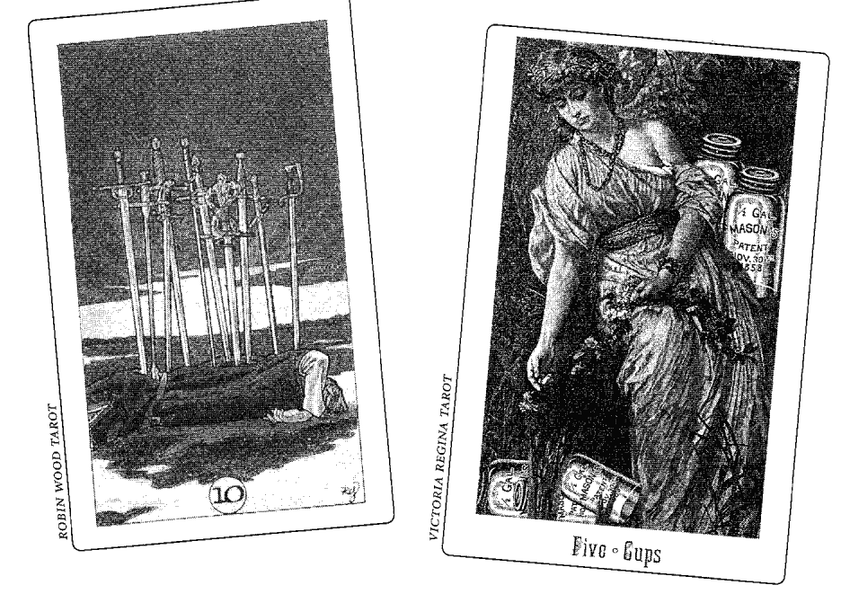

### METAPHOR

With the Ten of Swords, you could say "I was stabbed in the back" when you haven't been physically penetrated at all. Instead, you could be drawing a comparison between the pain arising from a verbal attack to being physically stabbed with a knife. In both cases the attacker is assumed to be a sneak and a coward because he or she didn't act "up front." Also, both experiences express that pain was involved and call on similar physiological survival reactions.

In another example, we could say the figure in the Five of Cups is "crying over spilt milk." The querent is depicted as "cloaked in sorrow" and is sometimes admonished to "pick up the pieces and move on," since it's all "water under the bridge" (based on decks that show a stream and bridge). This suggests that since you can't do anything about what's past, try to salvage whatever is left. In considering this "bridge over troubled waters," don't "cross it before you come to it." On the other hand, the person may deliberately "kick over the traces"—that is, act like an angry horse.

Metaphors occur spontaneously when working with a card as you've probably already found in doing the previous steps. And a good metaphor can make an excellent keyphrase for a card, as it will stir dozens of images in the imagination.

Here are a few metaphors for the Five of Pentacles from the *Robin Wood Tarot*:

- Out in the cold
- Walking wounded
- No rest for the weary
- World weary
- Crippled spirit
- Beggars can't be choosers
- About to turn a corner
- Looking for shelter
- Light from above
- Window of opportunity

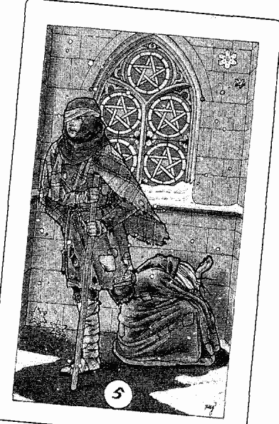

## STEP 8

- Support in adversity
- Within a stone’s throw (of hope/safety/comfort)
- For better or worse, richer or poorer, in sickness and health, ’til death do us part
- Cold comfort (“I beg cold comfort; and . . . you deny me that,” —Shakespeare)

### ACTIVITY 8:1

- 1) Find some other metaphors for the Five of Pentacles based on the picture in your deck. Note: A phrase like “all washed up” or “troubled waters” wouldn’t be appropriate unless there was water imagery on the card.
- 2) Find some phrases that relate specifically to the number five and to the suit of pentacles, such as “midlife crisis” or “crisis of confidence.” Note that these aren’t as sensory as images derived directly from the picture.
- 3) Which phrases in the list above don’t work for you? Cross these out. Which express your core meaning very well? Put a star next to these. Now you’ve made the list your own.

### Laws and Precepts

Aphorisms (sayings, maxims, admonitions, adages, saws, mottos, epigrams, truisms, and proverbs) are also metaphoric tools, but ones featuring morals, rules of conduct, and guiding principles. Because they are not always true and sound preachy, a reader should rarely use them. For instance, “If wishes were horses then beggars would ride” suggests that wishing is futile, which is not helpful if it sounds like an external judgment. Yet, if a querent says it, it can lead to important insights. Ask the querent how it’s relevant in his or her situation.

### METAPHOR

### ACTIVITY 8:2

- 1. List as many metaphors and sayings as you can that relate to your chosen card. Include expressions you already used when describing the card.
- 2. Finish the following statements in as many ways as you can:
   "I am __________ [insert one of your metaphors]." For instance: "I am out in the cold." Or, "I am a beggar riding a wish-horse."
   "The situation (or figure in the card) feels like __________ [describe an emotion or sensation implied by the metaphor]."
- 3. What do these metaphors suggest about your own situation?

### The Way of the Adept

You can continue exploring this step now or come back later, after trying out the other ways to read a tarot card.

### Metaphors of Emotion

As was mentioned in Step 3, tarot cards are metaphors of emotion. The colors, faces, body postures, and environments all stir memories in which emotions were active, exemplifying the adage “what you see is a reflection of who you are.” A major metaphor describing tarot is that of the “mirror,” as explored in my book Tarot Mirrors: Reflections of Personal Meaning. All your perceptions, descriptions, and metaphors reflect who you are at the moment, the values you hold, and the choices you make. At the same time, by your reflecting in the moment—by stopping and becoming mindful of what you are remembering and experiencing in your body—you have the opportunity to choose freshly and anew. Joseph Campbell said, “To change the world, change the metaphor.” That is, to change what you see, change the metaphor through which you see it. For many people this is the purpose of the tarot reader—to reflect back what the querent said and offer alternative possibilities through new metaphors.

### Unpacking the Metaphor

George Lakoff and Mark Johnson, in *Metaphors We Live By*, speak about how metaphors create our experience of life. Metaphor is “essential to human understanding and [is] a mechanism for creating new meaning and new realities in our lives.” They give the example of “knowing is seeing” as a metaphor in which physical sight refers to knowledge. When you see what’s “in” the card (meaning) versus what’s “on” the card (literal description), then you are gaining insight. Literal descriptions have to be unpacked to find their inner, hidden significance. To do this you have to explore as many references as possible. “Unpacking,” which is a metaphor in itself, invokes the image of a box or suitcase. The tarot has been described as the Major and Minor Arcana, from the word root *arc*, meaning “box” or “container.” Ancient writers on the mysteries, like Iamblichus and Paracelsus, defined *arcana* as “containers of mysteries” or “magical secrets.” The job of a tarot reader is to open the arcana carefully and take out their hidden meanings and powers. Joseph Campbell liked to point out that through metaphor we can cross boundaries (and open containers) that would otherwise be closed to us. Tarot metaphors are like vessels containing many-sided spiritual truths that transcend time and space.

### Reading for Another

Metaphors are a form of shorthand for complex constellations of feelings, thoughts, images, and bodily responses combined with the personal meaning that an individual attaches to these. While a tarot reader can communicate a lot in a few words using a metaphor, there is no guarantee that both querent and reader are going to understand it in the same way. Most of the time, if you listen closely to how a querent describes a card you will find metaphors that you both can explore more deeply. Ask the person to explain what he or she means by them. For instance, “You said the people in the Five of Pentacles feel out in the cold. Tell me more about that.” Or, “The phrase ‘cold comfort’ comes to mind when I look at this card. What does that suggest to you?” You may be surprised that the person doesn’t mean it in quite the way you thought. Your openness will encourage relevant memories and associations to surface in the person. Look for unusual uses of common sayings, because they are more personal than social. Especially watch for things said with extra emphasis or emotional tenor.

### METAPHOR

Metaphors are evocative, but what exactly is being evoked? To unpack a metaphor:

- 1) Imagine you’ve never heard the expression before. Consider (or ask) what the phrase means in relation to the image.
- 2) State something you are sure it is not, then ask that the mistaken impression be corrected.
- 3) Ask for a clarifying example from the querent’s life.

### Metaphor as Communication

Metaphor is central to communication in a tarot reading. It is the primary way to convey experiences or to emphasize certain aspects of them. You understand another’s experience through the metaphors they use. Figurative imagination becomes another sense, like seeing or touching, resulting in a gestalt experience involving mind, emotions, memories, and the senses. Metaphor is key to the empathic response that occurs when telling stories to each other.

### Changing the World

A metaphor partly defines what you find real because it links different types of experiences via imaginal rationality, rather than ordinary rationality. Metaphors organize experience by highlighting certain aspects of a situation, while downplaying and even hiding others. Metaphorical concepts structure how you experience things. For instance, do you believe that “time is money”? You spend it, save it, budget it, lose it, and find it. Like money, time has worth and is not to be “wasted.” As Lakoff and Johnson tell us, “New metaphors have the power to create a new reality.” What happens if “time is magic”? What if you could pull it from a hat like an endless silk scarf and then make it disappear and come back whenever you wanted? Extending a reference beyond its normal boundaries lets you see things from different points of view and establish new categories. Something fresh can emerge, which is called insight.

You can change your world by changing your metaphors. Since they are not bound by the rules of nature, you can use metaphors to transcend your current limits of understanding, to intuit the greater powers of things. Joseph Campbell, in *Thou Art That*, said the function of metaphor is to "allow us to make a journey we could not otherwise make, past all categories of definition."

Note how people in power create and impose their metaphors upon others. Advertisers and politicians create metaphors that sway people's beliefs. For instance, it was once inconceivable that the "gentler sex" could vote. When the "sun rose and set on the British Empire," the term itself defined attitudes and created assumptions around the world. And is it true that "things go better with Coke"?

### Trying It On for Size

You enact a metaphor when you act as if it were true. Tarot readings allow you to try these metaphoric realities on for size to see if they fit. Remember that each metaphor you try out will highlight some things, while downplaying and hiding others. When enacted, certain things will be allowed and others disallowed. The idea is to see how they influence goals, commitments, and plans. Thus a metaphor can be a guide for future action. A reading helps you picture this and follow the line of inference for a ways. Would you rather keep "crying over spilt milk" or "pick up the pieces and move on"? Once you see your current self-image in the cards, then you can consider the changes you'd like.

### ACTIVITY 8:3

- 1) Refer back to the list of metaphors for the Five of Pentacles on page 69. Consider how the starred items reflect your usual attitudes, habits, and cultural conditioning. Your deleted metaphors are alien to your current way of thinking.
- 2) Pick one of the deleted metaphors and try to find some way that it relates to the card. For instance, if you can't imagine the figures "turning a corner," then perhaps you can't see them bettering their condition. Try imagining a "what if" scenario in which they do turn a corner. Exaggerate the circumstances. Make them dramatic or even outlandish or absurd, using as much detail as possible, involving color, action, and dialog. Use all your senses. What happens after the corner is turned?
- 3) Repeat your story in the first-person, present tense. What does it suggest that you do? Where will it take you? Can you see a reason for doing it?
- 4) Now consider the card you’ve been working with.
- What metaphors for your card most surprise and delight you?
- Which do you find fresh and intriguing?
- Which depict an improvement in circumstances?
- Which challenge you to become a better person?
- Which require that you use and increase your skills?
- Which ask you to do something you’ve never done before?
- Which metaphors share something in common with your goal?

### The Self-Fulfilling Prophecy

By acting as if the metaphor were a reality, it becomes a self-fulfilling prophecy. The fact is that you have a choice about which metaphors define your experience. An appropriate metaphor becomes a transitional medium taking you from a less to a more desired experience. It will take on new meaning for you (or for the person concerned), it will reveal a goal or action, it will invoke a desired emotional state, and you will be able to see it in your imagination.

### A Few Card Metaphors

Here are a few more examples of metaphors that can be associated with cards. Most of the images are based on the *Rider-Waite-Smith* deck.

- Ace of Wands: Thumbs up, a carrot on a stick.
- High Priestess: Veiled truth, piercing the veil, drawing down the moon.
- Six of Wands: Follow the leader, high man on the totem pole, riding high, following like sheep.
- Emperor: Rules with an iron rod (or fist).

## STEP 8

- Two of Wands: Ruler of all he surveys, the whole world in his hands, a global perspective, master of one’s fate.
- Sun: Sunburn, burnout, radiant good cheer, you are my sunshine, it’s a banner day.
- Page of Cups: A fish story, the only fish in the sea, to fish for compliments.
- Two of Cups: Lovebirds, the wings of love, common bonds, meeting of hearts and minds, plight one’s troth (pledge fidelity), opposites attract.
- Seven of Cups: Head in the clouds, in the dark, the power and the glory, hidden treasure.
- Star: Naked truth, lucky star, wish on a star, be a star, pour oil on troubled waters.
- Knight of Swords: Fast and furious, hell-bent for leather, rebel without a cause.
- Four of Pentacles: Hold on for all you’re worth, being miserly, clamp down.
- Two of Pentacles: Juggling affairs, song-and-dance man, on a treadmill, two sides of a coin, riding the waves and troughs, surfing the ’net.
- Two of Swords: Fence sitting, at crossed purposes, of two minds.
- King of Cups: In his cups, fisher king.
- Four of Cups: Morning after the night before (after the Three of Cups party), hug a tree.
- Seven of Wands: King of the mountain, a foot in two camps, striding a gap.

In this step you developed a personal gallery of metaphoric phrases to go with the cards, and you learned to interpret the metaphors that other people use when talking about their cards.

## STEP 9

### Query & Snapshots

> We are excavators of a lost world or buried city— an archeology of the mind. —SIGMUND FREUD (PARAPHRASE)

### The Way of the Apprentice

In this step you learn how to transform metaphor into message by asking questions and capturing snapshots. Asking questions is the quickest and surest way to determine what a reading is really about—how to excavate the riches buried within. Questions also stimulate the energies that reveal a life pattern, turning a little story into a big story. This same energy creates change. There are no stupid questions. Some seem obvious or inconsequential at first hearing, yet, by trusting that the instinct is true, such questions usually reveal a treasure—a valuable insight—that would be all too often overlooked.

First, you’ll use the descriptions, stories, and keywords that you’ve been gathering to formulate questions that take you deeper into the card. Meaning exists within a context, and questions lead you to the most accessible contexts. The Sun card signifies joy and happiness, but it is most powerful to ask, “Where is there joy in your life?” Your answer will show where the Sun is operating in the situation.

Make your questions open-ended and spurred by genuine curiosity. You need to be as curious about yourself as you would be about someone else, and vice versa. You aren’t looking for “an answer” but for heightened responses—responses that ring true; that excite the emotions, body, and spirit; that prompt memories and generate wonder. When working with another, accept whatever the person says at face value, as if it were a small gem. If you feel the person is resisting something, that’s okay. That person may not be ready to look at it right now or it will come out at a later point in the reading.

Avoid yes/no questions because they interfere with the imagination and promote analysis. Most of the time you’ll want to use questions beginning: How? Where? What? Who? When have you . . . ? These invite a person to re-create a scene in their mind’s eye. “Why” questions sometimes prompt justifications; instead, focus on lessons to be learned from the circumstances. The process is illustrated with an example in the adept section of this step.

### Snapshots

A snapshot is like a photo in a family album. It’s a memory image from a particular time and place and includes all the attendant details, emotions, and sensations from that time. Snapshots show where the situation is activated and therefore accessed. Other cards in a spread will reinforce such snapshots or evoke different ones. Snapshots are always going through your head, but most of the time you don’t even notice them. They arise for a reason—there’s an unconscious neural link between the emotions and sensations in former situations and in the current one. The anxiety you feel when deciding between boyfriends may be the same anxiety you felt when buying your first car and might have more to do with feeling pressured than with the people or things in the situation.

Mental snapshots are elusive. You probably don’t give them much credence. They often seem insignificant, silly, or irrelevant. Yet word associations are based on such memory images, and they influence attitudes and decisions all the time. You have to be alert for snapshots and quickly click your mental shutter to capture them. When you realize you’ve just “seen” a snapshot, note at least one concrete detail to which you can return. Jot it down. A lot of your creative life is linked to these images, yet they are regularly rejected as trivial and unimportant. Reclaiming even a few of them can give your productive life a boost and help you to see what’s really moving you.

### QUERY & SNAPSHOTS

### ACTIVITY 9:1

- 1) Go back over the descriptions you’ve given for your chosen card. Based on your descriptions and any other details or reactions you notice, ask at least three open-ended questions. Answer your questions in writing. If you don’t know what to say, make it up. As you respond, pay close attention to the memories and scenes that flash through your mind. Pause long enough to note in the margin a few words that will remind you of a memory. For instance, you could note: “Xmas in Paris—10 yrs old” or “Buying first car” or “Fight w/ Ethan over pet.” When you’ve finished responding to the question, write about each snapshot (memory image) and relate it back to the question and your response. Mention any emotions felt during the original event and any emotions that come up as you write about it.
- 2) What do you most need to look at in your life right now, as suggested by your responses, metaphors, and memories? Where was the strongest emotion? This is your access point to the greatest energy for manifesting what you want.

### The Way of the Adept

You can continue exploring this step now or come back later, after trying out the other ways to read a tarot card.

### Open-Ended Questions

Let’s look at an example of open-ended questions. Say you’ve drawn the Two of Swords as a response to “What do I most need to look at in my life right now?” In most pictorial decks a blindfolded woman sits with her back to the sea, there’s a moon overhead, and, with hands crossed over her chest, she holds two elevated swords. A querent we’ll call Emily once described the figure’s emotion and attitude as unhappy, defiant, and determined. The descriptive statement, when restated in the first-person, was: “I’m a blindfolded woman, sitting with my back to the sea and the moon overhead. I hold my arms across my chest, balancing an elevated sword in each hand. I feel unhappy and defiant, but I am determined.”

As the reader, I was struck by the final word, “determined,” which seemed like an unfinished thought. I asked Emily, “Determined to do what?” What would you answer, if this were your card?

Now, since you’ve answered that, let’s continue with Emily’s responses:

**Reader:** Determined to do what?

**Emily:** I don’t know.

**Reader:** That’s okay. Just make something up. If you were determined about something, what would it be?

**Emily:** I’d be determined to keep these swords up, no matter what.

**Reader:** What would happen if they fell?

**Emily:** I’d be lost.

**Reader:** Tell me more about that.

**Emily:** The monster could get me. The woman looks like she’s wearing a nightgown, so it’s like being in a nightmare where something is coming after me. If I can stay absolutely still, then it won’t see me. It will think I’m a statue.

**Reader:** Why are you wearing the blindfold?

**Emily:** It helps me to keep calm. If I don’t have to see the monster, then I won’t be as afraid.

### QUERY & SNAPSHOTS

**Reader:** Where in your life do you need to stay absolutely calm?

**Emily:** Regarding my taxes. I have a small business in addition to my regular job. It loses money every year and I take lots of deductions, but I’m afraid the IRS is going to audit me and decide that my business is a hobby and I’ll lose my deductions. I don’t know if I should fake a profit or what. So far, I’ve just let my tax person handle it.

**Reader:** Have you ever looked into the regulations? (This question explores whether she’s deliberately keeping herself in the dark, as suggested by the blindfold.)

**Emily:** I don’t want to know. I just want my tax person to deal with it. But I couldn’t afford the photographic supplies if they weren’t deductible.

**Reader:** Is that really true?

**Emily:** (stubbornly) I don’t know.

Emily has made the situation more difficult than it really has to be. She’s not aware of her options. Her refusal to know anything (as a way to remain calm) and fear of the IRS has created a monster that’s causing her nightmares.

As the reader, I can’t and shouldn’t try to fix Emily’s IRS problems. It’s not my place to convince her to learn about the regulations, and she seems to have already considered and rejected that. Emily’s IRS issues point to a deeper pattern pervading much of her life. There’s a good chance she puts up barriers and chooses to ignore other “monsters” that threaten her well-being. Probably this worked well enough at one time to become a habitual response to certain kinds of dilemmas. One part of Emily is defiantly determined to continue this behavior, while another part is unhappy with it. Could these be the two swords between which she can’t move? Twos suggest choice and swords are about the reasoning mind. However, the blindfold suggests that Emily can’t see her way through the dilemma. The dominance of the moon and water (unconscious feelings) in a sword or air card, where the mind is unseeing (blindfold) and at cross-purposes (crossed swords), indicates that the situation might best be addressed through her feelings.

In this dialog we see hints of snapshots. In this case, there’s the nightmare image—actually a metaphor—telling us that the situation is truly a nightmare for Emily. Then there’s the snapshot of her handing things over to her tax person (washing her hands of responsibility?). And, finally, there’s the snapshot of her buying photographic supplies in the store. When identifying with Emily’s IRS anxieties, I see pictures of myself sitting down with my tax records. Or I might find myself picturing a different moment that matches the emotion. Related memories, linked by similar emotions, create empathy and understanding.

If photography is Emily’s passion but she can’t justify the expense, there might be an underlying issue called “What price creativity?” We would need to ask Emily more questions or look at more cards to determine this. We now know that “what Emily most needs to look at in her life right now” is the dilemma in which she accepts fear and inaction to avoid looking at unpleasant realities. This shows up particularly in her IRS situation. With only a few questions we have the issue and a specific circumstance that epitomizes it, together with accessible emotions around it, and metaphors she could change.

## STEP 9

### ACTIVITY 9:2

What other questions could you ask Emily? Which of her statements seemed unfinished, with more to be revealed? What intrigued you most? Where is the emotional content? Turn these into questions you could ask her. Keep the questions focused on details that are confirmed in some way by the card; avoid getting involved in a story that moves away from the tarot image. You’ll find several possible responses listed at the end of this step.

### In a Fix

> One of the great dangers in a tarot reading is the temptation to fix the situation. I’ve actually heard this tarot dialog:
>
> **Reader:** What should the person in the Five of Cups do next?
>
> **Querent:** Think about what’s been lost.
>
> **Reader:** No! It’s time to stop doing that. You need to pick up the two remaining cups and move on.

Well, the querent just learned, yet again, how disappointingly wrong he is, how he should hang his head in shame (as depicted on the card). This reader, insensitive to the querent, merely looked for a quick fix. What if grieving or contemplating the loss was the best thing the querent could do? This tarot reader negated such a possibility because of a generalized assumption about what the card “should” mean and what would correct a “problem.”

It’s often assumed that the answers are in the cards and that we, as readers, should point them out. But whose answers? And what if there are no answers in the cards, only questions? My philosophy is that there are usually multiple responses to any question and that all the answers lie within the person seeking them.

Let’s say that the reader is reading the cards psychically. And you, the querent, sit silently, in awe of how much this person knows. And let’s say the reader reveals rightly that your spouse is overbearing and bossy. So then, when the reader tells you to change the locks and get a divorce, isn’t that what you should do? Not really, because it’s disempowering and leads to more problems than it solves. To divorce a husband because your tarot reader told you to do so is simply exchanging one boss for another.

One querent said I had advised her to get a divorce, which she did. After getting past my shock, we went back over the reading and I reminded her how it was she who had clearly said, “There’s nothing here for me anymore. The marriage is over.” Everything in the cards supported this and nothing contradicted it. I had merely asked her to listen to herself. On another occasion, a querent said I had foretold his heart attack. He came to me with forebodings of ill health, which the cards mirrored, and I affirmed it would be worth paying attention to his intuition. He acted quickly to get help when the time came and is now fully recovered. In both cases I mostly listened and affirmed that their concerns were worth taking seriously, since there were no contraindications.

Simply by responding to your questions, querents name the situation, provide clues to their underlying issues, and come up with their own solutions. What could be more powerful and elegant than this? The reader, then, uses her knowledge of the cards to affirm what’s been said or point out additional possibilities.

Occasionally, in using my technique, someone complains that she did the reading, not me, or that she “already knew that.” I then ask if she had realized that this knowledge was key to her decisions and attaining her goals. Most querents will acknowledge that they are## STEP 9

less conflicted at the end of a reading and have a clear inner direction on which to base their choices. As the reader, I focus on how the information forms a deeper pattern. When the querent uses keywords or images that I know are relevant to the cards, I give additional weight to them. When reading my own cards, I move back and forth between spontaneous description and story and what I intellectually know about the cards.

A tarot reading provides an opportunity to gather information, perspectives, and possibilities that might not otherwise be available or which might be dismissed without serious consideration. The reading reveals the larger pattern, of which the specific issue is only a part. Once the pattern and examples of it are clear, then a person can more easily make decisions about the pattern: Does it serve him in some way or is it time to change it? This is the basis of an empowerment reading.

### Empowerment Questions

Asking what the card means or what it symbolizes does not usually produce personal significance. It feels like a test requiring a rational answer, which is not what you’re trying to access.

Below are questions for freely exploring a card that deliberately evoke assumptions or stories triggered by it. At any point you can ask the querent (or yourself) to repeat a response as an I-statement. Repeat anything said that contains energy or seems otherwise significant. As much as possible, use the querent’s own words, phrases, and details. When you “speak the querent’s language,” you establish rapport by entering into that person’s universe and values.

| Empowerment Questions | Material Evoked |
|-----------------------|-----------------|
| What’s happening in the card? | Actions, events. |
| What makes you think this? | Specific details. |
| What kind of person is this? | Opinions and attitudes pointing to shadow issues and projections. |
| What does the figure want? | Needs, goals, and desires. |
| If you did know, then what? “Just make it up.” “If it were a fairy tale, then what?” | Surprising insights. (It diffuses the need to be “correct.”) |

### QUERY & SNAPSHOTS

| Question | Interpretation |
| --- | --- |
| Where is he going? | Expectations of future events. |
| What will the figure do next? | Possible actions. |
| What should the figure do? | Cultural or moral judgments and expectations. |
| What is she holding? | A possible tool or ability. |
| What is he looking at? | A focus or intent. |
| What does the object do? | Possible action or intent; functionality. |
| What is it used for? | Possible action or intent; functionality. |
| What's her relationship to [a specific person or thing] in the card? | Involvement and connections. |
| What will he do (or could he do) with . . .? | Possibilities. |
| How do the figures in the card feel about . . .? | Emotions. |
| What is he feeling __________ about? (sad/happy/sorry—using the querent's own words) | Stimulus to the emotion. |
| What is the mood or atmosphere of the environment? | Projected emotions. |
| Where are you in this card? | Sense of self. (Ask after describing the figures.) |
| How are you acting like this figure? | Ongoing behavior. |
| Where is this happening in your life right now? | Relevance and a specific context. |
| How is this true? | Evaluative perception. |
| How did the figure get into this situation? | Backstory and motivation. |
| When was the most recent occurrence of something like this? | Relevant past. |
| How could you see this happening in the near future? | Anticipated future. |

| Empowerment Questions                          | Material Evoked                                                                 |
|------------------------------------------------|---------------------------------------------------------------------------------|
| Is it true? Can you absolutely know this for sure? | Fact separated from opinion or supposition.                                     |
| How does this situation serve you? What are you getting out of it? | Benefits and values.                                                           |
| Why is it _________ (good/bad/scary)? What makes it _________ ? | Evaluations and assumptions.                                                   |
| How can _________ (mothers/bosses/reunions) be? | Clarification; snapshots.                                                      |
| If she's not _________ , then what is she? | Positives from negatives.                                                      |
| Where is the truth in what you’ve just said? | Unconscious wisdom. (Ask when a querent uses wisecracks, jokes, and asides as a means of deflection.) |

### Anomalies and Blind Spots

An anomaly is something that deviates from the norm—and calls for special attention. For example, if a querent says the figures in the Two of Cups are being driven apart (rather than drawing together), be sure to ask what gives him that impression. You could say, “Usually the Two of Cups is about coming together in relationship, but I see what you mean about the staff coming down to drive them apart. Are they (the figures in the card) aware of this? How do they feel about it? Where is this happening in your life?”

You can contrast the querent’s perceptions with more usual ones, but emphasize the wisdom in what he’s seen. Occasionally a querent will completely ignore something very obvious, like an elephant in the living room. Such lapses can be significant. Be simple and direct in pointing them out. For example, “You’ve never once mentioned the cups in their hands. I find that interesting. Tell me about them.” When reading for yourself, ask yourself what you’ve ignored.

### Turning Keywords and Meanings into Questions

You can use your own interpretations and keywords to generate questions, but give the querent lots of opportunity to either own or reject them. For example:

"Some people find the Knight of Wands to be very fiery. Does he seem that way to you? Do you enjoy that quality or find it overwhelming?"

Or, "One keyword for the Magician is communication. Does that make sense to you? What does he seem to be saying?"

Or, "To me, this is about __________. What's your response?"

When reading for yourself, use interpretations in books in just this way. Try turning them into questions, which you ask yourself. We'll explore this further in the next step.

### Contrast

Occasionally you can use direct opposition or contrast to elicit something a querent has difficulty articulating. For instance, when people have trouble naming emotions, try asking them if it's an opposite emotion: "Is the figure on the Two of Swords happy and relaxed? No? Then what is she feeling?" This also has the benefit of letting the querent be right and you be wrong.

Using the Six of Coins from Nigel Jackson's *Medieval Enchantment* tarot, here are a couple of ways to use contrast.

**Reader:** Is the person on this card all alone?

**Querent:** No, there are birds flocking around him, as if looking for handouts.

**Reader:** Where in your life are you looking for handouts?

Or,

**Reader:** Is it a warm day?

**Querent:** Not really. There's snow on the ground, but the sky looks bright and cheerful, like hope in the midst of bleakness.

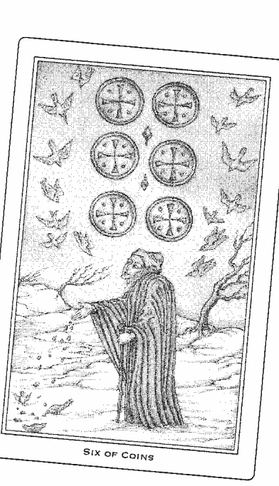

## STEP 9

> Reader: Where is there bleakness in your life?
Querent: My marriage feels bleak to me right now.
Reader: You said that the card shows hope in the midst of bleakness. Where’s the hope in your situation?

### ACTIVITY 9:3

- Using the chart of empowerment questions starting on page 84, ask yourself about your chosen card or any other card you want to explore.
- Name several things not going on in your card. Turn these into yes/no questions. Respond with details that correct these “mistaken” impressions.

### POSSIBLE RESPONSES TO STEP 9 ACTIVITIES

Activity 9:2 (refers to the picture on page 80)

These are example questions based on the Two of Swords and the Reader/Querent dialog:

- How do you feel about the sea behind you? (This is different from asking, “Are you aware of the sea behind you?”)
- What are your arms doing crossed in front of your chest? (Don’t assume this means self-protection.)
- What are you doing with those swords? What are they for?
- What makes you think the figure is unhappy?
- Who are you defying?
- What will you gain by keeping the swords up “no matter what”?
- What would you lose?
- If something is coming after you, how will becoming a statue save you?
- The figure in the card looks really taxed. How else are you feeling taxed? (Puns can be especially significant.)
- Noting the blindfold, what do you not want to look at or know about?

## STEP 10

### Meanings

> All meaning is found in the individual, and in each one this meaning is considered unique. —JOSEPH CAMPBELL, THOU ART THAT

### The Way of the Apprentice

This step shows how to use the interpretations found in books. It is not cheating to look up a meaning in a book, even when reading for someone else. Rather, you gain a wider perspective, expand your knowledge, and apply a check and balance to your own insights. This step shows how to scan for subtle body responses or even use an amplification tool, like a pendulum, to recognize when a meaning could apply. Additionally, it discusses how worldviews and value systems may be hidden in book interpretations and suggests evaluating whether a particular approach is compatible with your own. Are the interpretations in books useful? Yes. And they are fascinating in their own right. I am an inveterate collector of book meanings, finding it interesting how interpretations evolve with the changing times.

## STEP 10

When the tarot was first created during the Renaissance, one meaning for the Pope (now called Hierophant) was that he stood at the top of the “estates of man” or social ladder. An eighteenth-century divinatory meaning for the Pope or Hierophant was marriage, which probably arose from the far older Pythagorean association of the number five and marriage. By the mid-nineteenth century, the card signified occult inspiration and religion. For Waite (1910) he represented, among other things, captivity and servitude, while for Oswald Wirth (1927) he was jovial and full of charm. In the 1960s and ’70s this card motivated the questioning of authority and of empty values signified by “shoulds” and “oughts”—the morally dogmatic arm of the establishment. The New Age has interpreted him as a guru, pagans as a shaman, feminists as the ills of the patriarchy. For some, the card has been desacralized into teaching, learning, counseling, and institutions in general—modes of enculturation. To summarize, you can see how generational trends and special interests have put their spin on the overall theme of how the link between divinity and humanity can inspire us socially and personally to our moral best (but often does the opposite).

### The Giveaways to Meaning

How can you know what, out of many meanings, will be relevant in a particular case? You must combine the rational with the intuitive. Here are some of the body-mind or intuitive giveaways:

- Your interest perks up, your attention sharpens, you become more focused.
- Your body reacts (breath quickens or is held, fingers move, eyes blink, brows raise, shoulder shrugs, toe taps, etc.)
- You feel some subtle sensation (warmth, heaviness, brightening, ringing, buzzing, magnetism)
- A memory snapshot from your life appears in your mind’s eye (or your eyes move up and left)
- A word or phrase “leaps out”
- You reread a word several times
- You find yourself saying “Yes” or nodding your head
- You find yourself emphatically saying “No” (this may also indicate blocking something you’d rather not consider)
- The text refers directly to the issue or something that you’ve said

With a little practice you’ll know which of these works for you. (As a tarot reader, watch for such signs in both yourself and the querent as you survey the meanings.)

### ACTIVITY 10:1

1) Look up your chosen card in a book that provides a wide variety of interpretations or in a couple of books that have shorter lists of card meanings, including the book or booklet that came with your deck. (See the Bibliography for suggestions.)
2) Refresh your mind about your question, whether it’s as specific as “What will come from accepting this job offer?” or simply “What do I need to look at?” Say your question over to yourself as you take a few deep breaths. Then go through the list of possible meanings, repeating the question as needed. Notice the give-aways.
3) List all the meanings that jumped out at you. Summarize their message in one or two sentences. How does this compare with your earlier interpretations?
4) If you like, note where the meanings you explored in the previous steps and the book meanings are the same and where they are different. Write one-sentence summaries of these similarities and differences.
5) Some time later, revisit this reading. Using hindsight, which meanings were most accurate and which gave the greatest insights?

### Meanings into Questions

In the previous step you learned about the art of asking questions. You can take any book meaning and turn it into a question about what's happening in your life. For instance, one book meaning of the Hanged Man is “a hang-up,” so you might ask yourself, “What do I have a hang-up about?” or “Where am I hung up?”

### ACTIVITY 10:2

Using book interpretations from the previous activity, turn each into a question and then answer them.

### The Way of the Adept

> You can continue exploring this step now or come back later, after trying out the other ways to read a tarot card.

### The Evolution of Tarot Card Meanings

Originally tarot card meanings consisted of brief keywords: negotiations, wealth, a document, bold, rash, vigilant, isolated. Sometimes they included simple valuations: a good marriage, happy endings, a troublesome situation, an admirable woman, a helpful man. Later, specific symbols were seen as adding details and nuances to their significance. Classical myths and religious stories, when related to the Major Arcana, illustrated conditional outcomes—if you act like Hermes, then you can expect such and such. Or if pride takes you too high, like the builders of the tower of Babel, then fate can bring a sudden downfall. Later yet, when pictorial scenes were added to the Minor Arcana, additional story lines and teachings developed. Today’s interpretations come with many slants: the descriptive, predictive, evaluative (good/bad), prescriptive (do’s), proscriptive (don’ts), conditional (if . . . then . . .), or didactic (instructional).

Philosophical worldviews underlie principles and beliefs espoused by tarot decks and books, and their advice naturally aligns with that view. Each worldview provides a framework for viewing the reading and implies guidelines for action. If you agree with or admire it, and the author is wise and intelligible, then the work can provide meaningful guidance. If you find yourself defensive or hostile, then step back and examine the assumptions. Do they match your experience of the world, do they make sense to you, and are they internally consistent? For instance, Paul Foster Case’s book *The Tarot: A Key to the Wisdom of the Ages* is considered a seminal work on the “ageless wisdom,” “perennial philosophy,” or “secret doctrine” of the Western esoteric tradition. This book promotes a worldview focused on self-realization and empowerment conveyed through multi-valenced symbols. But others prefer a predetermined and predictable world with unambiguous and pragmatically correct meanings for the cards.

With any new deck, do some readings using the interpretations from the accompanying book or booklet. This can expand your personal understanding of the cards. Additionally, it tells you the worldview of its creator and whether it is compatible with yours. Sometimes a deck is usable but its book is not. I find the *Osho Zen Tarot* deck extremely evocative, but its book puts me off with its humanly impossible standards. In the case of the *Thoth Tarot*, readers who reject the obscure or supposedly evil antics of Aleister Crowley can, instead, use Angeles Arrien’s *Tarot Handbook*, which presents a modern psychological and cross-cultural approach to that deck. Go with what makes sense to you, but occasionally try something new to increase your range of possibilities. Books also let you know if you’ve left something out or been too optimistic or negative.

### Categories of Book Meanings

Some tarot books offer meanings culled from a variety of named sources, others synthesize their meanings from unacknowledged sources, and still others present a unique system particular to only one deck.

Book meanings generally fall into the following categories:

- **Traditional:** Etteilla published the first tarot card meanings and his influence is still apparent though rarely acknowledged. The Eight of Cups is a blonde girl and the Eight of Coins a brunette girl. The Eight of Wands is recreation and its reversal is quarrels. The Six of Cups is the past; its reversal is the future, while the Six of Coins is the present. The Five of Coins is propriety in love relationships, while its reversal.## MEANINGS

is misconduct. The Seven of Coins is money and purification (as in gold without impurities); its reversal is fear and anxiety.

#### System-based
Systems often stem from number plus suit and element, as discussed in Steps 5 and 6, although other systems abound. For instance, in the Golden Dawn the Seven of Pentacles (or Coins) is astrologically correlated with the third decanate (20°–30°) of fixed earth, that is, Saturn in Taurus, which relates it to the World (Saturn) and Hierophant (Taurus) cards. On the Kabbalistic Tree of Life, it's in the seventh sephira Netzach (ruled by Venus) in the world of Assiah. They concluded, based on the above, that "supernal force destroys the promise of the material plane."

#### Culturally relevant (also known as postmodern)
These meanings might involve references to computers, air travel, feminism, or paganism. The category also includes cultural-theme decks—Native American, Chinese, Norse, etc. In the *Motherpeace Tarot*, representing the values of the women's spirituality culture of the 1970s and '80s, the Seven of Discs shows a pregnant woman in a pumpkin patch waiting patiently as both ripen. The message is "be patient; wait for something to be born."

#### Archetypal/psychological
The Emperor becomes the archetypal Father; the Hermit is the archetypal Old Wise Man. The sequence of cards represents the process of Individuation, using humanistic themes and attempting to understand ourselves both individually and as a species (see Step 19). The Seven of Pentacles, which is related to the Warrior archetype through the seventh Major Arcana, the Chariot, is seen as a test of mastery through the sensation function.

#### Personal
These meanings are specific to an individual, to you. For one person the Seven of Pentacles indicates being bored on the job; for another it means being pleased with the results of his labors. Much of this book is about finding personal meaning.

#### Historical origins
This is a relatively new development involving research into medieval and Renaissance art and ideas that are relevant to the images appearing on the first tarot decks from fifteenth-century Italy. The goal is to offer meanings that contemporaneous people would have employed if they had used the cards for divination. These could then be applied to today's readings, as the most "authentic." For instance, the Hanged Man is well documented as a standard Italian depiction of a traitor. The Fool shows a simpleton or the vice known as “folly.” The Seven of Coins might suggest hard work resulting in financial success that is easily susceptible to vice. In any case, the evidence is inconclusive as to the extent tarot was used for divination before the later part of the eighteenth century.

### A Deeper Level of Meaning

Meaning is the essence of a tarot reading. Dictionary meanings and those found in books are helpful, but meaning that arises out of your own experience will ring with integrity and truth. Personal meaning clarifies your situation and guides your actions, because it is based on your own stories about “what is” and where things are going. Stories structure your experience based on projected beliefs and opinions about your goals and intentions.

Meaning is expressed through metaphors of emotions from story and art that become personally relevant when you describe a card. Meaning is about patterns perceived through the senses that form connections promising to satisfy an intention. Like human experience, meaning is always multi-layered. You will never reach the end of all the possibilities. It can never be fully comprehended. Thus, meaning challenges you to stretch beyond your previous abilities and knowledge.

Tarot readings are based, at least in part, on the assumption that meaning will enable you to predict and control the future, in order to enhance and protect you. To some extent it may do so, but only temporarily. The situation, if not seen for what it is, will come back in the same or different guise. Ultimately, a reading offers the ability to consciously participate in whatever is happening. The alternative, to turn away, will only create more issues and more pain. A reading can be a messenger from the soul, helping you greet whatever frightens or disturbs you. It helps you see how you hold back from the experience and try to escape it. Such escape is the basis of addictions and habits, created originally to protect you but which become limitations, shutting down the spontaneity of the authentic self. Tarot offers a healthy way to open your inner eyes, to see what is, and enter an unknown territory with a compassionate guide.

### MEANINGS

But you can never get there secondhand. A tarot book can stimulate ideas, a reader can provide guidance, but true meaning is comprehended only in your own heart and soul. You have to find it in yourself.

Meaning involves participating with the experience itself as well as connecting with others. As a tarot reader, you can be actively present with a querent as she finds her own meaning, affirming when you hear clarity and supporting choices leading to worthwhile goals. In a reading with another person, you have the opportunity to be a midwife of the soul.

### Hermeneutics: Levels of Meaning

Everything in life can be seen on many levels. The interplay of these levels leads ultimately to a deep awareness of the underlying unity of all existence. At its most basic we can consider that every card has a vertical and a horizontal dimension. The equal-arm cross symbolizes this. The arms meet where the vertical spiritual line intersects the horizontal physical plane of culture and community. Paul Christian, a nineteenth-century French commentator on the occult tarot, ascribed three levels or "worlds" to his Major Arcana interpretations: the physical, intellectual, and divine. Sufi tradition speaks of seven levels to a teaching story. A Zen koan might have a dozen. In fact, you can examine any concept from the point of view of each of the Major Arcana, yielding twenty-two levels of meaning.

The principle of hermeneutics (from the god Hermes) posits that there are hidden meanings in texts, images, and existence as a whole, and divides them into the four levels most often found in Western analysis. The basic hermeneutic levels as they apply to tarot are:

- **Literal:** This is the physical and sensory dimension of everyday facts. A thing is what it is. Sometimes you do exactly what is shown on the card. For instance, for the Six of Pentacles you might give or receive money. It simply is. You perceive it through your senses. The task is to be aware of what is happening without making any assumptions about it.
- **Allegorical:** At the allegorical level, everything stands for or symbolizes something else according to deduced similarities. It relates things through comparison and contrast, looking for and finding connectors. Relationships may be described using terms of equivalence, such as like, as, equals, denotes, signifies, represents, and indicates. For instance, a cup contains liquids and nourishes like a womb or breast (based on similarity in shape and function). At the allegorical level, mirroring takes place between the inner and outer, above and below, psyche and event, the thing and what it represents. In tarot, this is what we understand symbols to mean in terms of cultural and personal agreements, although such agreements may be unconscious. The Major Arcana was originally based on simple allegories. For instance, a woman with a sword and scales equals justice; a person clinging to a turning wheel denotes a change in fortune. The basic significances of numbers, suits, symbols, and the cards themselves are allegorical.
- **Moral:** The moral or ethical intent is about abstract evaluation ranging between two extremes: good/evil, pleasure/pain, valuable/not valuable, just/unjust, right/wrong, true/false, should/shouldn’t (see more examples of these in Step 8 in the principles that demonstrate a culture’s bias). You learn them from others and therefore they are formulated intersubjectively via interactions with family and community. All “advice” and expectations in a reading are based on this level of understanding. One question that can be asked in a reading is, “From where do the rules and standards come?” Can you, as the reader, assume or even impose your own moral view on another? Isn’t it up to each person to make choices based on his or her own values? Positions in spreads that ask specifically for advice are usually couched in value-oriented language (do/don’t do; benefit/liability). Questions are also often couched in these terms (Should I or shouldn’t I? Is it appropriate? Is it in my best interest?)
- **Anagogic or spiritual:** This level asks you to rise above the details, to break through limitations and discover God’s or your higher purpose. Who am I? Why was I born? What is my purpose in life? This is where you look for why something happened by asking, “What is the greatest lesson in this experience?” It assumes that there is a higher reason behind everything. This is the level of metaphysics. It deals with the big issues like Life, Death, Creativity, Change, Ultimate Truth. It reaches beyond the evaluations of the moral level, addressing longings that can’t always be put into words. Ultimately, it’s a yearning for the Ideal or Union, for the underlying experiences, called “archetypes,” that are the driving forces in life. These psycho-spiritual## MEANINGS

realities are hard, if not impossible, to describe other than through myth and metaphor. For instance, for the Buddha the central question was “What is the meaning of suffering?” All of his teachings are attempts to answer this. The question “Where did we come from?” lies behind all creation myths. Joseph Campbell separates the allegorical and spiritual levels as the difference between “John runs like a deer” (simile) and “John is a deer” (metaphor). This level goes beyond the facts, pointing to a deeper truth. It requires a leap of faith, as does the Fool.

### ACTIVITY 10:3

- 1) Give an example of each of the four levels of meaning—physical, allegorical, moral, spiritual—for the following two cards. Feel free to use the meanings given in books. Possible responses appear at the end of the step.
  - Five of Wands
  - Emperor
- 2) Give an example of each of the four levels of meaning in your chosen card.

### Amplifying Body Awareness

To help access subconscious information, consider using low-tech forms of biofeedback that amplify the subtle awareness of your body-mind. Such techniques pick up physiological responses below your normal level of awareness.

One of these techniques utilizes a pendulum. To experiment, attach a small weight, like a ring or pendant, to a string or necklace chain. Hold the string between your fingers about three to five inches above the weight so that the object can swing freely. Then read aloud some meanings for your card and note when there’s a shift in the pattern of movement. You can determine specific movements for “yes” and “no” by asking some obvious questions for which you already know the answers, like “Do I live in California?” (yes) and “Do I drive a Jaguar?” (no). If using a pendulum works for you, then you should get distinctive movements that you can use as yes and no answers.

## STEP 10

You can also try muscle testing. If you’ve never done it before, it’s best to work with a partner, as follows. Hold your arm straight out to the side at roughly shoulder height (perpendicular to your body). Your partner reads the card meanings aloud and tries to push your arm down after each item, while you try to maintain the same level of steady muscular resistance. When your arm is strongly resistant, that meaning is positive for you. Weakness in the arm indicates a negative response. If you have trouble doing this, try holding some white sugar in your hand and ask if it’s good for you; this should produce a clear response. (After you become experienced at muscle testing, there are ways to do it alone.)

### ACTIVITY 10:4

Try the “book of the month” approach to learning about and reading your cards. Each month use a different book of tarot interpretations (or compare two) and, if you choose, a different deck for a daily one-card reading. Select a couple of steps from this book to use for exploring the card, and then look up your card in your book of the month. Write down the meanings that jump out at you. Summarize their message. The following day note anything that occurred that might relate to the card.

Try using a pendulum or muscle testing to help you with any aspect of your daily readings (that is, for choosing a book, deck, steps, meanings, etc.).

### MEANINGS

### POSSIBLE RESPONSES TO STEP 10 ACTIVITIES

#### Activity 10:3

As each hermeneutic level becomes more abstract, it also becomes more individual and will reflect your personal value system and worldview.

#### The Five of Wands—Hermeneutically Considered

Literal: A fight or competition. Five people who hit each other with sticks. Workers experiencing difficulties during construction.

Allegorical: Fives equal crisis and wands equal fire and enterprises. Tensions reach a boiling point. Striving creates dissention. Warring within the self.

Moral: Strife is bad. They should resolve their differences. Alternatively, if you want to be successful, you have to be willing to fight for it.

Spiritual: Being spiritually challenged or tested. The fiery spirit is brought to crisis when its attempt to create or achieve something is opposed, challenged, or tested.

#### The Emperor—Hermeneutically Considered

Literal: A mature man sits on a throne holding a scepter. A boss, father, owner, or leader.

Allegorical: The inner authoritative masculine. Making rules, setting boundaries, and being assertive in the world. Initiating and pioneering new things. Virile activities, like that of the sun in the generative spring season of Aries.

Moral: Moral power. Divine right. Law and order. Father knows best. Responsibility and self-control (it is "good" to be responsible and in control).

Spiritual: The Great Architect of the Universe. The mythic solar god-king as great fertilizing agent and bringer of bounty to the land. Owning your own power.

## STEP 11

### Range

> > Life consists not in holding good cards but in playing those you hold well.
>
> —JOSH BILLINGS

### The Way of the Apprentice

This step explores the entire field of card meanings, ranging from most beneficial to most problematic. This includes all the related qualities, ideas, activities, and values a card can take on and shows the extent of variability that is possible. A range, when seen as a spectrum, emphasizes the energy of the card. You will explore two different ways to conceptualize and work with a card’s total range and learn how to move from one meaning to another within the range. The task then becomes to learn the following:

- The extent of the range
- Where you are within the range
- Where you want to be within the range
- How to move from one meaning to another within the range
- And, best of all, how to move freely within and learn from the whole spectrum of meanings for any given card

### The Extremes

Basically, a range suggests a length from one end to another between opposite ends. I generally characterize the extremes according to whether they serve a person’s goals. The two extremes can be conceptualized as any of the following:

| Benefit     | Liability   |
|-------------|-------------|
| Pro         | Con         |
| Helpful     | Problematic |
| Good        | Bad         |
| For         | Against     |
| Aid         | Hamper      |
| Desirable   | Undesirable |
| Best        | Worst       |
| Gain        | Lose        |
| Succeed     | Fail        |
| Safe        | Dangerous   |
| Effective   | Ineffective |
| Useful      | Useless     |
| Mature      | Immature    |
| Develop     | Stagnate    |
| Healthful   | Injurious   |
| Favorable   | Unfavorable |
| Pleasant    | Painful     |
| Valuable    | Worthless   |

For our purposes here, I'll use the terms *benefit* or *helpful* for one extreme and *liability* or *problematic* for the other. They mark a range from what most promotes success and well-being to what is most difficult or holds you back. For instance, the Sun card's most beneficial meanings include success, enlightenment, and joy. At the problematic end there is extreme egotism, sunburn, and burnout. With the Three of Swords, the major liabilities are sorrow, emotional pain, and ruptured relationships, while the beneficial meanings can include tears of release, creative expression, and penetrating insights.

### ACTIVITY 11:1

Name some benefits and liabilities for the following cards (possible responses can be found at the end of this step):

- 1. Nine of Pentacles
- 2. Page of Swords
- 3. The Chariot

### The Benefit-Liability Meter

Imagine that you have a benefit/liability meter along which all the meanings for a single card can be ranged. It's possible to discover where you are functioning currently along that range.

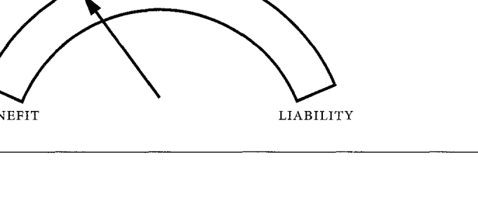

## STEP 11

### ACTIVITY 11:2

- 1) Hold your arm in front of you, perpendicular to your body. Bend it at the elbow so that your forearm and hand point upwards and can swing freely in an arc from right to left, like the indicator on the meter. Decide which side represents the benefits of your chosen card and which side represents the liabilities. State these aloud. For instance, if the card is the Tower, swing your hand to the most beneficial extreme of the arc (let’s say the right) and say something like, “Break-through to enlightenment.” Swing your hand to the most problematic extreme of the arc (the left?) and say something like, “Sudden, explosive danger.” Use examples that relate to best- and worst-case scenarios in your situation.

- 2) Move your hand and forearm back and forth until you “feel” where you are right now along that arc (ranging between benefit and liability). Don’t analyze; just let your arm come naturally to rest at that point. Now imagine all the possible meanings of the card as spread across that arc from best to worst. What card meaning would fall at the precise point that your hand now indicates? State what this card meaning is. For instance, for the Tower, you might be at a point that you intuitively characterize as “feeling on shaky grounds where the situation is beyond my control.”

- 3) Move your arm until you get to the place you’d like to be. What meaning fits this place on the spectrum of possibilities? In our example of the Tower, this might be “taking the leap and quitting before I get fired.” What could move you from the current meaning to your preferred one? What aspect(s) of the card do you need to align yourself with? Is there an image in the card that could help you? How can you use that?

### The Way of the Adept

You can continue exploring this step now or come back later, after trying out the other ways to read a tarot card.

### Exploring the Liabilities

Sometimes dealing with the negative meanings of a card can be daunting. But, rather than avoiding it, try to move into it by considering a worst-case scenario—at least in your mind. You might find that it’s not as bad as you thought. Sometimes it feels good to just let the Tower explode! The first time I deliberately smashed a dish on the floor was both upsetting and exhilarating. I haven’t needed to do it in years, but I’m not afraid of it anymore. Rollo May, in Man’s Search for Meaning, wrote about “paradoxical intent,” a technique for overcoming neuroses and phobias in which you increase what you fear to release the fearful anticipation. Sometimes we want and need to feel our pain. An old aphorism says that what humans see as tragedy, the gods see as divine play. And Carl Jung explained that “we cannot change anything unless we accept it. Condemnation does not liberate, it oppresses.” Jung also talked about something called enantiodromia, meaning the tendency of seemingly polar extremes to flip over into one another, as in the psychic reversal of a situation from bad to good. I experienced it in the example reading that follows later in this chapter, when what originally seemed like pushing through an inaccessible illusion became its opposite: a happy fulfillment.

## ACTIVITY 11.3

Consider the liability end of your chosen card. What would a worst-case scenario look like? How could you consciously experience it, taking it as far as it would go? Know that this is not a necessary outcome.

## STEP 11

### Meaning as Amoeba

Here’s a helpful metaphor for the total range of meanings for a card, especially when multiple cards influence each other. Think of an amoeba, organic and flexible. The word comes from the Greek *ameibein*, “to change.” Imagine the whole field of a card’s meanings as this amoeba. An amoeba is a three-dimensional blob of protoplasm with one or more nuclei (main themes) but no definite form, and it is bound by a flexible membrane. When you draw a card, certain meanings within the amoeba are activated and others are ignored. Additionally, individualized meanings can easily be absorbed into it. As you learn more about the card, the amoeba expands to include them. If you emphasize certain aspects, its shape changes to reflect that.

Let’s say you’ve identified five major areas of personal significance in a card. These are marked in the diagram below (imagine it as three-dimensional rather than flat):

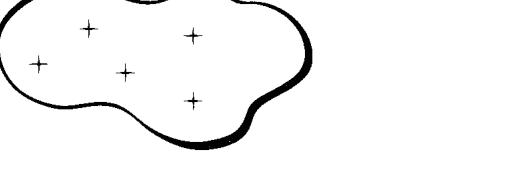

When working with several cards, as in a spread, something very interesting happens. While each card will have its own activated meanings based on the question and its position in the spread, related cards will be magnetically drawn to each other by like characteristics and so overlap. You could say that their activated spots resonate with each other. Given three cards, you could end up with something like the following:

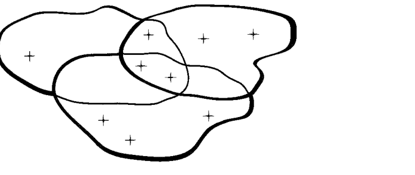

### RANGE

All three cards overlap so as to share two activated meanings, and two of the cards share one additional activated area. This is what to look for in a reading—meanings that resonate with or activate each other. In a later step we look at what are called “dignities,” which are formal ways to determine such resonances based on specific principles. The images above are an intuitive method for experiencing what is happening energetically. You can also stretch an amoeba into a benefit and liability meter and see where on the meter the activated spots fall.

### A Three-Card Reading

Following Activity 11:4 is an in-depth example of a three-card reading. You can read the example first or do the activity now.

### ACTIVITY 11:4

Shuffle your deck, spread it into a fan, and pick two cards while asking, “What will help me understand what my chosen card signifies for me?” Explore both cards quickly using Steps 1 through 10. (Appendix I, the “21 Ways Worksheet,” provides a quick overview of the techniques.) Write down your insights and what you see as the most significant meanings for these two new cards.

- Did you use any of the same words in your descriptions of all three cards (the new ones plus your chosen card)?
- Did you experience any similar emotions among them?
- Where does each card fit in the other cards’ stories?
- Are there any suit, number, or modal similarities?
- Did you use similar metaphors?
- Looking at the range of meanings for each card, where do they overlap?

## STEP 11

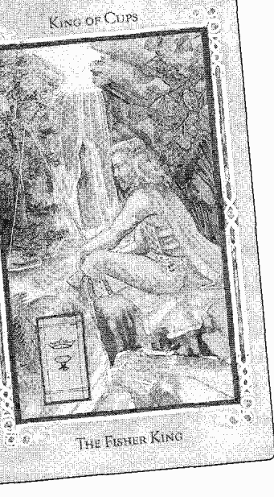

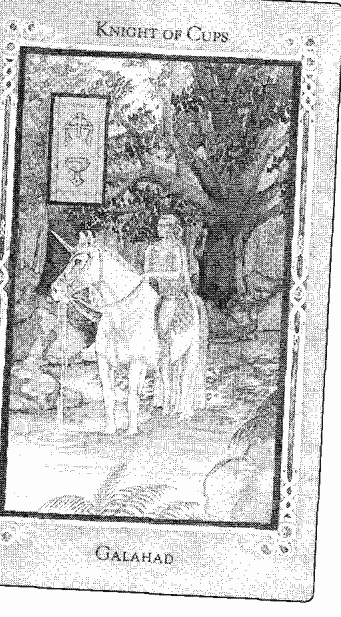

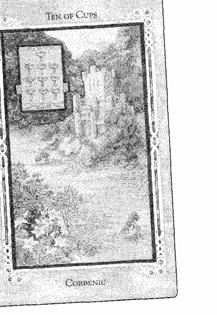

### Example Three-Card Reading

I began with a card I drew in Step 2, the King of Cups from the Legend tarot. I’ve now drawn two more cards at random from a well-shuffled, fanned deck: The Knight of Cups and the Ten of Cups. All three cards are cups and water, so I imagine them as three amoebas that are blue and watery. They have a lot in common.

I’ll begin by quickly taking the King of Cups through the steps we’ve covered so far. The card is labeled “The Fisher King.”

In Step 2 I made the following I-statement about the King of Cups: “To my right a waterfall descends through a gap in some rocks into a pool surrounded by trees, rocks, and plants. I am seated on a rock beside the pool. I am holding a long pole from which a string descends toward the water. A blue bird with a yellow breast is seated in a tree to my right and behind me.” To expand it further I add that he looks melancholy and seems to be remembering something with a mild regret or longing. So I ask, “What am I longing for?” and respond, “A missed opportunity.” This inquiry could go much further but I’m moving quickly along.

### RANGE

In my fairy tale I go to the pool to escape the demands of kingship. I do not pay attention to the task at hand, fishing, but am caught up in the haunting whispers of the bird who is reminding me of the “what ifs”—the roads not taken. I ignore the beauty around me and my present task. This is relevant because I have been wondering recently what if I had followed a different spiritual path, one that is assuming more significance for me.

Kings are about rulership and outer mastery, and cups are about moods, nourishment, and reflection, so the card could be about mastering my moods to gain nourishment in reflection. Since this is a court card it is about a role, mask, or sub-personality of myself that I may or may not project onto others.

Metaphorically the king is “fishing for something.” I turn that into a question that I answer, “I am fishing for spiritual sustenance, not seeing that every moment contains the totality of that spiritual quest if only I could be fully present rather than letting my attention drift.” I feel annoyed with myself and note my judgment that drifting means I’m lazy, which I deem bad.

Among the meanings in the book that goes with the deck, A Keeper of Words, I especially note the phrases “guardian, strong faith, foresight, an artist and reclusive mystery,” but I felt a real shiver of recognition when Anna-Marie Ferguson mentions in her commentary a “ritual healing . . . to bring renewal.” Summarizing the significance of the book meanings, I’d say that I am a writer who explores elusive mysteries (fishing for meaning) in the pool of tarot. I seek insight into helping my readers learn the skills and attitudes I’ve found effective in plumbing the depths of personal meaning and spiritual significance.

The greatest benefits of this card are a soulful wisdom and kingly mastery, and the greatest liabilities are moodiness and escapism (in my case, through reading mystery novels). Using the meter I find myself right in the middle, but not static—I keep swinging back and forth. In a sense, this fluctuation is, in itself, my issue. (Note that I’ve now touched on all the ways to read a tarot card that we’ve covered so far.)

The following description of the Knight of Cups and King of Cups is not complete, but focuses on where the overlaps occur and where they don’t.

The knight is more active and less mature than the king, but both cards describe watery/cups and masculine/yang energies. As a woman I also see them as representing two aspects of my animus (the inner masculine in my psyche), especially since neither refers to a specific person in my life. They also represent the masculine aspects of the water signs in## STEP 11

my astrological chart, showing two ways I attempt to master my emotional and spiritual world.

All three cards feature natural woodland settings with a stream. They seem to be extensions of the same environment, which, I feel, refers to my imagination and the creative forces of the unconscious. I experience a deep peace and serenity looking at them all together. Both the knight and king are contemplative but distracted. In the two court cards, an animal (unicorn and bird—each combining the instinctual and spiritual) seems aware of something that is unknown to the figures on the card and to me.

It occurred to me that the knight must be virginal since he is riding on a unicorn, but in my fairy tale he is seduced by a water sprite, suggesting that when unwary I am overcome by sneaky, turbulent emotions. This may refer to my meditations where I attempt to simply follow my breath and not get caught by my thoughts, images, and emotions.

The book meanings for the Knight of Cups suggest that if I become a stainless hero in pursuit of romantic ideals, I will recognize my ultimate quest (this is the Galahad card, according to Ferguson).

The beneficial aspects of the Knight of Cups suggest that my questing after high and pure ideals (to achieve a true meditative state) can be realized in the soulful wisdom of the king. The liabilities include laziness (also found in the king) and seduction, such that my attentions are seduced again and again by my tendency to indolence.

Synthesizing the keywords for tens plus cups, I come up with emotional fulfillment—or, at least, a dream or vision of it. It is pictorially represented by the Grail castle, called Corbenic, on an island in the midst of a river. I am drawn to the yellow flowers proclaiming spring and by what I take to be a bird (but is probably a flag), which calls to me.

In my fairy tale for this card, a knight arrives and enters the castle, which is sumptuously furnished but has an air of dusty neglect. He realizes that there is nothing there for him so he returns to the beauty of the green forests. Since there is no person in the card, I identify myself most strongly with the castle itself—solid, mysterious, isolated. I consider how I isolate myself so much through my writing, studies, and teaching. My summary of the book’s meanings is that a secure life has no permanent location and is really a spiritual search. Also, I am either not recognizing the value of what’s before me or through a “sin” I am not achieving my greatest desire. (Because “sin” is part of the worldview from which the Grail legends are derived but not my own, I prefer to take it metaphorically as “missing the mark” [as in archery].

The benefits of the Ten of Cups are comfortable domesticity and fulfillment, while the liability is that it may be an inaccessible illusion. On the meter I feel like I’m closer to the liability side, but what I’m experiencing is more unformed rather than an illusion. I don’t want to stay in the lonely, isolated castle. As in my fairy tale I have to dust off my skills each time I sit down to my meditation practice, and it often seems to elude me.

The cards overlap strongly in terms of their environment, the dreamy quality, and the isolation of each of the central figures (including the castle). This is very much like my life when writing. I’m on a solitary quest where I must fish patiently for words and concepts to express the deepest meaning and purpose of a tarot reading. It is an inner rather than outer truth that is all too often neglected, ignored, or deemed impossible and yet it is my soul’s journey.

I write more about these three cards in Step 00, “Full Circle,” where later events revealed another dimension of this reading, bringing these three cards literally to life.

### RANGE

### POSSIBLE RESPONSES TO STEP 11 ACTIVITIES

#### Activity 11:1

- 1) Nine of Pentacles
    Example Benefits: Prosperity, success, achievement, leisure, pleasure, prudence.
    Example Liabilities: Entrapment, covetousness, predatory instincts, rapaciousness.

- 2) Page of Swords
    Example Benefits: Vigilant, alert, quick-witted, clever, dexterous, curious, discriminating.
    Example Liabilities: Defensive, paranoid, sly, spiteful, malicious, victimized.

- 3) The Chariot
    Example Benefits: Victory, mastery, control, progress, overcoming obstacles, championship.
    Example Liabilities: War, aggression, anger, out of control, pulled apart, moodiness, car trouble.

## STEP 12

### Modification

> > *Life is measured by the rapidity of change,*
> *the succession of influences that modify the being.*
>
> —GEORGE ELIOT, FELIX HOLT, THE RADICAL

### The Way of the Apprentice

This step explores how various factors interact to modify a card’s meaning. The main ones are:

- 1) Elements within the card itself
- 2) The question or issue
- 3) The spread position
- 4) The individual circumstances
- 5) Stance (upright or reversed)
- 6) Interaction among cards (and all their correspondences)

Earlier I recommended the all-purpose question: “What do I most need to look at in my life right now?” From the previous steps you should have a clear idea of what needs to be looked at with your own card. However, some issues are best addressed through specific questions, such as:

- What will come from moving to San Francisco? (prediction)
- What will help me get a raise? (advised actions, attitudes, etc.)
- Should I go out with Jacob? (yes/no)
- What is the source of my eating disorder? (past cause)

Most questions benefit from drawing more than one card to get an answer—hence a “spread” of cards, which is actually a group of mini-questions designed to shed light on a topic from several angles. (Yes/no questions can be answered based on whether a card is upright [yes] or reversed [no], but then you could just as well flip a coin.)

Matthew asks the question, “What will help me get a raise at work within the next two months?” Putting a time limit on such a question is essential because otherwise he might get accurate advice but it might take three years for the raise to manifest. Matthew drew one card from the Shining Tribe Tarot created by Rachel Pollack and got the Four of Birds. Fours are about consolidation and rest, and Birds (Swords) are about mind. Synthesizing these, I told Matthew that the card was about mental rest and consolidation. His I-state- ment, based on his description, was, “I am sitting back and relaxing while all the other birds (the people at work) fly busily around” (see card on the next page). I read from the book, which says this is “the realization that we might get what we want (a raise) by doing nothing.” The oracle is pretty clear and goes right to the point of the question. But does it mean that Matthew really should do nothing?

Matthew decided he wanted another card and another question to see if he could get confirmation or more information. He asked, “What will keep me from getting a raise within the next two months?” Drawing another card, he got the Gift of Trees (roughly equivalent to the Queen of Wands). Combining suit and element, it said the “gift” (queen) nurtures a passion for spiritual growth (wands). Based on the image, Matthew’s description and fairy tale (Steps 2 and 4) were about two snakes seeking one golden pear growing on an apple tree. The Shining Tribe text describes the snakes and trees as resembling the healing caduceus given to Aesclepius, “who brought the wrath of the Gods when he went too far and used the caduceus to restore a dead person to life.” The divinatory meaning in the book is “the gift of passion, joy, great energy,” which the question posits will keep him from getting a raise. It’s possible that someone with fiery feminine characteristics could keep Matthew from getting the raise, either through competition or because that person is the decision-maker. Matthew’s supervisor is a flamboyant woman who tries to take all the credit for his work. So Matthew will not get a raise if he follows this card’s advice; that is, applies his energy to competing with her (the two snakes vying for the one fruit). Thus, what we’ve created here is a two-card spread for the question, “How can I get a raise at my job within the next two months?”

### MODIFICATION

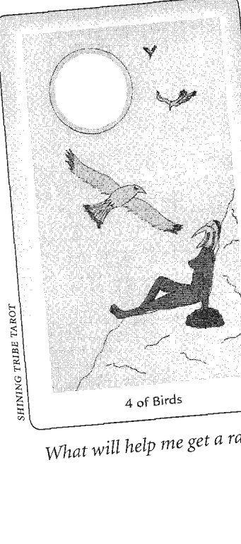

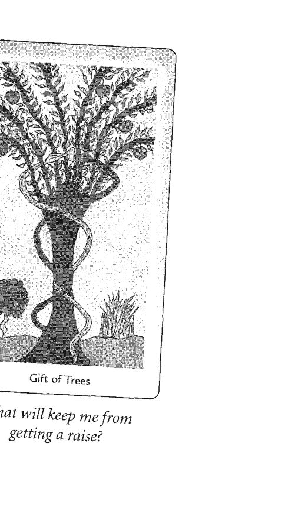Matthew admitted that his supervisor considers him a threat and it may be best to lay low for the time being. The card telling him to do nothing is now confirmed.

### The Tarot Spread

Meaning requires a context in order to provide contrast and correlation with other experiences. A spread allows for a more detailed context to be explored and for there to be confirmation and support of the information. A spread is a combination of cards answering a question. However, it is useful to consider it as a series of one-card readings answering specific sub-questions. Ultimately, however, the spread is more than just the sum of its parts; it forms a gestalt, that is, an integrated whole. Instead of saying, “I see eyes, ears, a nose, mouth, hair, and neck,” I say, “I see my friend.”

The tarot tells a story and a spread provides the structure of that story. The positions tell you the role that each card plays in the story. Here are some of the classic spread positions:

- The situation (issue, question)
- Self-image
- How others see you
- Known (conscious)
- Unknown (hidden, unconscious)
- Recent past (more distant past)
- Present (now)
- Immediate future (long-term future)
- Source (root, cause)
- Environment
- Influences from others
- Body (physical, earth)
- Mind (mental, air)
- Feelings (emotional, water)
- Spirit (spiritual, fire)
- Purpose (destiny)
- Desires (hopes, goals)
- Fears
- Strengths
- Weaknesses
- Pros (benefits, assets, what will help or assist)
- Cons (obstacles, liabilities, what will oppose or resist)
- Next step (to do, advice, guidance)
- Alternate possibility

### MODIFICATION

- Options: A, B, C...
- What can help you decide
- What is unexpected
- What is blocked
- What can help you break through a block
- What you bring to the issue
- What you can learn from...

- What you need to let go of
- What you are giving
- What you are receiving
- What you are holding on to
- The relationship between X + Y
- The best that can be achieved
- Result (outcome, end of the matter)

### ACTIVITY 12:1

How would you interpret the Eight of Wands from Nefertari's Tarots by Silvana Alasio if it came up in the following positions? Possible responses can be found at the end of this step.

1. The recent past
2. An obstacle
3. Your strength

Apply your own understandings of the card or use the following meanings from the booklet:

- The undertaking and development of an activity
- Speed, great hurry
- Strain toward a goal

How would you modify its meaning if the Eight of Wands came up in response to the questions and spread positions below?

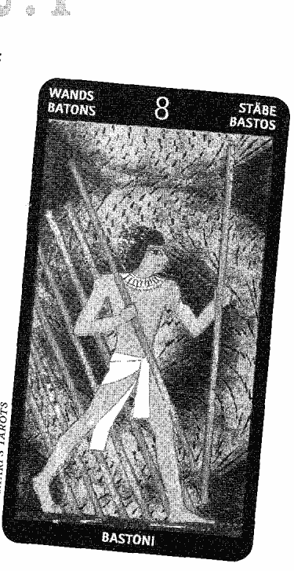

4) Question: What is my purpose in life?
Position: The best that can be achieved.

5) Question: What do I need to know about buying this house?
Position: My fears.

### ACTIVITY 12:2

1) From what you've discovered about your chosen card, what do you most need to look at in your life right now? Rephrase this response as a question. For example, if I determine I need to look at my relationship with my stepdaughter, then I might frame the question as, "How can I improve this relationship?" or "What am I projecting onto my stepdaughter?"

2) Pick three spread positions from the ones on pages 118-119 and interpret your chosen card from these new perspectives. Include the overall wording of your question and of your spread position in your response. (For examples, see the possible responses to Activity 12:1 at the end of this step.)

### ACTIVITY 12:3

Assume that your chosen card was originally selected for a spread position called the Issue or Situation. Identify two additional positions that would help clarify your question. Shuffle your deck, spread it facedown in a fan, and draw a card for each of these positions. Put these two cards on either side of the Issue card (unless a different layout makes more sense). You now have a three-card spread. Use any of the previous steps to interpret these new cards. How do the new cards offer new insights into your chosen card?

### The Way of the Adept

> You can continue exploring this step now or come back later, after trying out the other ways to read a tarot card.

### Modification Based on Individual Circumstances

If the question, spread, and cards were all the same, would the answer be the same for each person? The answer is no, but it points to how necessary it is to have sufficient information about the querent. Let's take the question, “What do I need to do in order to find a love relationship?” Would an interpretation with identical cards for each of the following four people be the same or different?

- Person 1: Charles, a 73-year-old man, is terrified of living alone since his partner died three months ago.
- Person 2: Tyler, a 19-year-old college student, is planning on being a veterinarian. He doesn't want a long-term relationship.
- Person 3: Hannah, a successful 35-year-old career woman, feels her biological clock is ticking but has never lived with anyone and hasn't spoken to her parents in ten years.
- Person 4: Isabelle, a 28-year-old homemaker, is currently married but unhappy and wondering if it's possible to find someone who would really understand her.

### ACTIVITY 12:4

What would the following cards suggest for each of the four people above?

- Position: Should Not Do. Card: Six of Cups
- Position: Characteristics of the Other Person. Card: King of Wands
- Position: Should Do. Card: Four of Pentacles

Did you make any assumptions about age or gender since the “other person” was described as a King of Wands? If the King of Wands described a young woman, what would she be like?

## STEP 12

### Reversed Cards

You don’t have to use reversals (upside-down) cards. I didn’t for many years. If you regularly apply a full range of meanings (see Step 11) to each card, then reversals can be ignored. The Hermetic Order of the Golden Dawn taught elemental dignities (see Step 14) as an alternative to reversals, although today they sometimes are used together. Reversals can offer more subtlety and precision or more confusion, because there are more options about what they can mean.

If you choose to use reversals, first describe the upright card (no interpretation allowed at this stage) including the attitudes, feelings, or mood of the figure(s) in it. Using what you know about the upright meaning, listen for anomalies, that is, for any deviations or departures from the norm. For instance, if the querent describes the person in the upright Nine of Pentacles (traditionally a card of financial gain) as unhappy and anxious, then that’s a big clue as to what the reversal is. Check to see if money or property problems are causing the discomfort. If the querent strongly emphasizes the bird’s hood or the glove, then that person may be longing to escape from the velvet prison of their comfortable garden. When a querent sees satisfaction and peace in the card but can’t relate to it personally, then the querent may be refusing to acknowledge his prosperity. (Wealthy people are sometimes more worried about money and security than are poor people.)

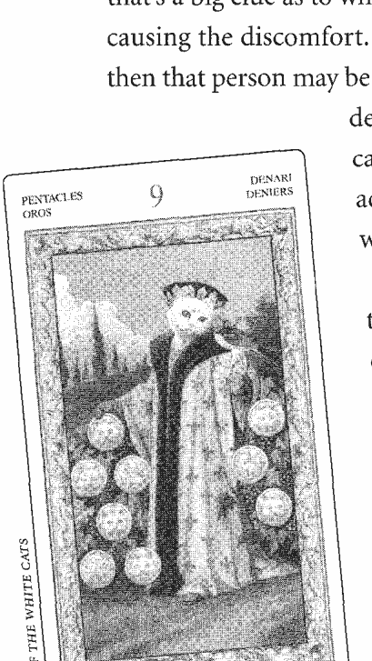

It helps to think of reversed cards as “red flagged,” indicating that you have to pay special attention to them because they’re not operating as usual. Upright cards tend to be conscious, outer, automatic, in process, and available. Reversed cards often show where you must be especially watchful, expend extra effort, or do something different. Reversals can be like knowing that a car tends to pull to the right or stall, so you have to keep alert and make adjustments for it. Alternatively, reversals can be places where you should stop trying to move forward. Instead, relax and let go of all expectations.

If a spread has predominantly reversed cards, see if there is an overall theme, like delay or denial, then read the cards upright but with this slant. The few cards that were originally upright## Interpreting Reversals

There are many ways to read a reversal. The following list includes the major techniques that show how a reversal can modify the card's upright meaning(s). Although you may use only some, try all the possibilities at least once to find which works best for you. Eventually you'll want to pick methods that are in line with your own reading style and worldview. Much more information on these techniques can be found in my book *The Complete Book of Tarot Reversals*.

- **Blocked or Resisted**: The energy normally described by the card may be blocked, repressed, denied, rejected, or resisted.
- **Projected**: The attributes of the card (positive or negative) are not seen as one's own but are externalized unconsciously onto someone or something else.
- **Delayed, Difficult, Unavailable**: There could be hesitation, uncertainty, unavailability, or an external delay. With many cards reversed, overall change may take longer than expected. Energy flows less smoothly or automatically than it would otherwise.
- **Inner, Unconscious, Private**: The energy might be unconscious, inner, or private rather than conscious, outer, or public. Remember too that if the energy is truly unconscious the querent may not recognize it.
- **New or Dark Moon (and Other Round Deck Variations)**: This applies especially to round decks such as the *Motherpeace Tarot*. The reversal signifies the dark or new moon phase: unconscious, instinctual, hidden. It is the moment of interior conception and re-formation.
- **Breaking Through, Overturning, Changing Direction**: The querent could be overturning, getting out from under, breaking free of, rejecting, or turning away from the condition pictured. It can also show the end or passing away of a situation, a loosening, or a change in direction.
- **No or Not (the Upright Meaning), Lacking**: Occasionally you can preface a standard upright interpretation with "no" or "not." Or try adding prefixes such as non- or un- to upright meanings. Take care that this does not lead to a judgmental, overly deterministic or negative attitude.
- **Excessive, Over- or Undercompensating**: The reversal may intensify or lessen the meaning of the card, or take it to extremes and overindulgence: too little or too much, under- or overdeveloped, immature or senile. In psychological terms it can indicate over- or undercompensation, or a tendency to flip dramatically between polarities. Consider the extreme ends of the range you explored in the previous step.
- **Misused or Misdirected**: Misfiring, misuse, or misdirection implies a faulty start, bad timing, or something not used appropriately.
- **"Re-" Words (Retried, Retracted, Reviewed, Reconsidered)**: Re-versals immediately suggest other "re"-words such as those above. The prefix re- denotes backward motion, withdrawal, opposition, negation, or to do again. We review, reconsider, and redo previous actions.
- **Rectification—Disease into Remedy**: Reversals can be considered as both the disease (or at least the stress that may lead to disease) and the remedy: "What won’t kill you will heal you." Sometimes, by going deeply into the reversal, seeking the causes and not just the effects, and experiencing all the excesses, we can break through to the other side.
- **Unconventional, Shamanic, Magical, Humorous**: If an upright card depicts conventional wisdom, then the reversal illustrates unconventional wisdom. It questions all the assumptions and suggests viewing things from a different perspective.
- **Revert**: The card’s energy is too immature or cannot yet manifest due to unresolved issues involving the preceding card in the suit or majors (a reversed Five of Wands reverts to the Four of Wands; pages and aces to tens, etc.). Go back and revisit these prior lessons or experiences.

### MODIFICATION

Sometimes the reversed card suggests a new image or picture. For instance, one person saw the parallel swords in the reversed Nine of Swords as a ladder into the cellar. The window in the reversed Five of Pentacles becomes a door. The swords in the reversed Three and Ten of Swords seem to fall out of the heart and the person's back.

Don't be afraid to review several possible interpretations with the querent and ask which fits best. For instance, more than one person has felt that a reversed king expressed their mother's personality better than their father's.

In summary, reversed cards often express the extremes that exist naturally in a card's entire range of meaning. Always consider the whole realm of possibility, look for confirmation in other cards, get feedback from the querent, and consider if several options could be correct simultaneously, thus adding depth to your reading.

### ACTIVITY 12:5

Match cards in the first list with possible reversed meanings from the second list. Answers are given at the end of this step.

1. Ace of Pentacles - a. hope forsaken
2. Three of Swords - b. out of balance
3. Eight of Cups - c. inner teachings
4. Ten of Wands - d. bored and lacking curiosity
5. Temperance - e. return of the missing
6. Star - f. opportunity slips through fingers
7. Hierophant - g. demanding unreasonable punishments
8. Page of Wands - h. laying down burdens
9. King of Swords - i. recovery; clearing the air

### ACTIVITY 12:6

Take the three cards you worked with in Activity 12:3. Turn them facedown, mix them up, and reverse one of the three. Turn the cards faceup. Which card is reversed? What might its reversed meaning be? How does this change the whole spread?

### Interaction Among Cards

This final area of card modification is covered in Step 14 on dignity and theme.

### POSSIBLE RESPONSES TO STEP 12 ACTIVITIES

#### Activity 12:1

Modifications to the Eight of Wands from Nefertari's Tarots:

1) Recent Past: In the recent past, were you in a hurry to do or achieve something? (Hint: use the past tense and include the position phrase in your response. Your interpretations can be either questions or statements.)
2) An Obstacle: Hurrying to complete an activity could be stressful and make it more difficult to reach your goal.
3) Your Strength: "My strength lies in moving quickly to achieve a goal."
4) Question: What is my purpose in life?
Position: The best that can be achieved.
Sample Response: "The best way to fulfill my purpose is to act in alignment with my highest goals, without hesitation or holding back. I'll keep improving myself so that I'll be prepared to act fast and effectively when needed."
5) Question: What do I need to know about buying this house?
Position: My fears.
Sample Response: "I'm afraid I'll be stressed from too much rushing and could overlook something important."

In this exercise, try to refer to position meanings and questions directly and to emphasize card details or book interpretations in your response.

### MODIFICATION

#### Activity 12:5

| Card | Reversed Meaning |
|------|------------------|
| 1. Ace of Pentacles | f. opportunity slips through fingers |
| 2. Three of Swords | i. recovery; clearing the air |
| 3. Eight of Cups | e. return of the missing |
| 4. Ten of Wands | h. laying down burdens |
| 5. Temperance | b. out of balance |
| 6. Star | a. hope forsaken |
| 7. Hierophant | c. inner teachings |
| 8. Page of Wands | d. bored and lacking curiosity |
| 9. King of Swords | g. demanding unreasonable punishments |

## STEP 13

### Symbols

> Symbols are fundamental concepts for energy exchanges between very different levels of living.
>
> —WILLIAM GRAY, MAGICAL RITUAL METHODS
>
> The psychological mechanism for transforming energy is the symbol.
>
> —C. G. JUNG, ON PSYCHIC ENERGY

### The Way of the Apprentice

This step explores the role of symbols in tarot. In Step 8 you learned how to use metaphor. A symbol is the smallest unit of metaphor, consisting of a single object, image, or word representing the essence of what it stands for.

Any image with a story is a symbol, and the tarot is a book of symbols. As A. E. Waite noted in *The Pictorial Key to the Tarot*, "The true Tarot is symbolism; it speaks no other language and offers no other signs." In a reading, a symbol stands for something notimmediately evident or not consciously perceived until you unravel its significance. The value of a symbol lies in your emotional response to it. Emotions bridge what goes on in your unconscious to the meaning you give the symbol. It is through symbols that the unconscious speaks to consciousness. Your understanding of a symbol contains its meaning, and your emotion charges it with energy that can be used for positive effects such as change or transformation. The task is to ask what there is in you that corresponds to the symbol.

### ACTIVITY 13:1

- 1) List the symbols appearing on your chosen card, leaving room for notes following each item. Don't forget colors: white horse, green olive wreath, white globe, red robe, etc. You will have mentioned many, if not all of them, in your description in Step 2. Write down what you already know about the "meaning" for each symbol without looking it up anywhere.
- 2) What are the objects used for?
- 3) Where have any of these symbols appeared literally, either in relation to your issue or just recently?
- 4) Do any of them remind you of anything else?
- 5) Can you see any recurring themes? If so, summarize the significance of each of them.

### The Way of the Adept

You can continue exploring this step now or come back later, after trying out the other ways to read a tarot card.

### Meaning in Symbol

A symbol communicates only if it takes on meaning, and that meaning is always something beyond the symbol itself. Symbols carry denotative meanings, like those found in dictionaries and in the second part of this step, and connotative meanings, which are associations that go beyond the literal, can never be fully reduced to words, and intimate a greater reality. Joseph Campbell in *Thou Art That* warns,

> When you are given a dogma telling precisely what kind of meaning you shall experience in a symbol, explaining what kind of effect it should have upon you, then you are in trouble. This symbol may not have the same meaning for you that it had for a council of Levantine bishops in the fourth century. . . . The individual's assent to a definition is not nearly as important as his or her having a spiritual experience by virtue of the influence of the symbol.

Symbols arouse thoughts and impressions by means of suggestion, and through these thoughts hidden truths begin to reveal themselves. The word *symbol* comes from roots meaning "that which has been thrown together," referring to the separated halves of an object that, when brought together again, indicates a contract, agreement, or relationship. When you perceive a meaning in an image, it heals a split or restores a whole. "Symbols are natural attempts to reconcile and reunite opposites within the psyche," explained Carl Jung in *Man and His Symbols*.

Numbers, which you've already used, are symbols, as are suit signs. The Major Arcana cards as a whole serve as examples of particular archetypes (see Step 19)—that is, universal thought patterns and mythological motifs that connect you to the natural cycles and rhythms of life. In this step, you are asked how the individual symbols on your card deepen its significance for you.

Symbols have many possible referents: historical, cultural, religious, field-specific (as in occult symbolism) and, most importantly, personal. The thing pictured, by its nature, stands for something beyond itself, but never a fixed meaning, for it then becomes merely a sign. By their very nature, symbols must remain elastic, vague, and ambiguous, like the sayings of an oracle. True understanding requires intuition. A symbol's apparent meaning is easily grasped, but it acts as a neverending source of previously unseen significances.

A symbol helps bring the hidden into consciousness by evoking related personal memories and associations. Energies that are bound up in memories become available to future possibilities for growth and development that are also revealed through the symbol. The Hermetic Order of the Golden Dawn taught, and science has since demonstrated, that "knowledge of the attributions and meanings of the symbol produces an immediate concentration of thought of vital energy, or nerve force, and of actual physical blood on the tract of the brain." Predictable human responses to life stimuli are experienced through images. Physiologically, a symbol gives you access to energy—energy that has the potential to be consciously directed. A symbol bridges two contrasting realities: the within and without, the invisible and visible, and the concrete and spiritual. It allows you movement and circulation from one level to another, allowing you to participate in the reality to which they point. Through symbolism you can turn hindsight into foresight, the seemingly mundane into the transcendent.

Carl Jung, in Psychological Types, explained that a symbol always has a tendency to look ahead toward the future, which may be why it is the medium through which prediction most often works. A symbol "really lives only when it is the best and highest expression for something divined but not yet known to the observer. It then compels his unconscious participation and has a life-giving and life-enhancing effect." But you must enter empathically into the symbol to experience its revelatory power.

Symbolic meanings depend largely on what is known as the Doctrine of Correspondences, which is a basic principle or "law" of occult metaphysics and magic that says that symbolic analogies and affinities exist among everything in the universe of the same or similar vibration, and that what affects one thing affects others through this symbolic link. It is summarized in the Hermetic axiom "As above, so below."

Be aware that a few decks use personal, idiosyncratic symbol systems not in accord with Western cultural symbolism or the Doctrine of Correspondences, so they appear odd or awkward to use. Studying the deck’s commentary may give you access to that particular system, but it could have little application elsewhere.

### Amplification

Amplification is a Jungian term for accruing knowledge and personal associations about a symbol. It refers to the process of enlarging the power and range of the symbolic meaning. The twenty-one methods in this book are ways of amplifying a card. To amplify a symbol you’ll want to consider the following:

- What is the shape of the symbol?
- What is its function? What is it for?
- What does it actually do?
- What alterations does the symbol go through?
- What do you like and dislike about it?
- What does it remind you of?
- Where has it literally appeared in your life?

The most important thing to realize is that everything in the card can be seen as an aspect of you, even if it also represents something else.

### The Major Symbol Groups

Rather than an entire symbol dictionary, what follows is an overview of the major thematic groups, since some meanings pertain to all the members of the group. The focus here is on shared concepts and variations on a theme. In no way should the significance of any symbol be limited to what appears here or in any book. For instance, if a querent sees the Ace of Wands as a carrot on a stick used to lure him back into a relationship, it will be far more significant than traditional meanings like "a new idea."

The symbol groups are:

#### 1) PLANTS

Trees, Flowers, Fruits, Herbs

Organic life and human nature were seen in the Middle Ages as having three states or souls: the vegetative, sensory, and rational. Humans and animals share the vegetative soul with plants, which includes the basic life force and the ability to grow and reproduce. Being seasonal, plants represent the life cycle: seeding, sprouting, growth, fruition, decay, and re-seeding. SEEDS are opportunities to be nurtured. GREEN GROWTH represents life force and physical well-being (see Colors). FLOWERS and FRUITS are the blossoming of potential and the fruition of one’s labors. As food and medicine, plants are nutritive and promote physical well-being but can also bring death. The SCENTS of plants are their most ethereal components, affecting emotions. As scents ascend to heaven they are, if sweet, found pleasing to the gods and are therefore carriers of prayers and supplications.

## STEP 13

Plants figure prominently in many myths in which their symbolic significance is found within the story. The ROSE and LILY represent the soul’s desire (red) and purity (white), while WATER-LILIES (LOTUS) emerge from base mud to greet the glorious sun. TREES resemble the human spine and connect earth to heaven with enduring strength; EVERGREENS are life everlasting and so represent long-lived achievement and fame when made into wreaths. APPLES are temptation, many-seeded POMEGRANATES are fertility, and many FRUITS together signify wealth, harvest, and abundance. During the ritual mysteries in ancient Eleusis a stalk of BARLEY signified rebirth. GARDENS can be womb, wealth, protection, beauty, and sustenance.

#### 2) ANIMALS

- Lion
- Camel
- Cat
- Dog
- Horse
- Wolf
- Bird
- Fish
- Snake
- Crustacean

ANIMALS were seen in the Middle Ages as having two of the three states or souls: the vegetative and sensory (or sentient). The sentient soul perceives through the five senses plus the feelings and emotions. In tarot, animals usually represent heightened senses, instincts and intuitions, drives and desires, and the particular abilities or characteristics of the creature depicted. You may need these to accomplish a task that rationality alone is unable to handle. Animals can be wild or domesticated, lacking in restraint or tamed, fantastic (like a sphinx or dragon—see Supernatural Forces and Beings) or ordinary (like a dog).

BIRDS are free spirits and messengers from heavenly realms; they see far and sing true (even when they are harbingers of ill). A bird’s feather refers to the Egyptian goddess Ma’at and Truth; in addition, it represents honor and lightness of spirit.

SNAKES and REPTILES can be considered treacherous but may also represent the underworld wisdom of the unconscious.

A LION can devour you with rage or desire but also represents solar pride, courage, and nobility.

A CAMEL, filled with water from an oasis, can transport you across a wasteland.

WOLVES have ravenous appetites and great cunning.

DOGS are faithful companions that warn you from danger, but can also “dog” or “hound” you.

CATS represent the deep intuitive, mysterious self. They are sensual, clever, and playful, yet independent.

HORSES are the libido (horsepower) that can carry, enlarge, and elevate you.

FISH are fertile, suggesting the watery unconscious, and have been known to grant wishes.

CRUSTACEANS (crab, lobster, crayfish) are bottom feeders, eating dead and decaying matter and, in the process, cleansing the water. They depict digesting psychological rubbish from the unconscious in a transformative process of purification and evolutionary growth.

#### 3) PEOPLE

- Man
- Woman
- Child
- Royalty
- Cleric
- Merchant
- Peasant
- Craftsman
- Warrior
- Beggar
- Cripple

PEOPLE always represent different parts of the self and things you are doing (see *Activities*). They can also indicate specific people in your life, or roles held by a variety of people, types such as bosses or “the needy,” or the activities of such people. They may act as teachers or guides to unexpressed potentials. The ages of people signify the stages of life or levels of maturity and development.

A CHILD represents innocence and new beginnings as well as immaturity and irresponsibility—the student or learner. This can be your naïve self or inner child.

MEN and WOMEN in the cards represent traditional masculine and feminine characteristics and not necessarily the gender of a person. Some of these characteristics may be repressed and, in Jungian psychology, are represented by what are called the anima (inner feminine), the animus (inner masculine), and the shadow (unseen by the conscious mind).

ELDERS can signify old-fashioned traditions, but more usually represent wisdom, guidance, and release from worldly concerns.

ROYAL PERSONAGES represent power, authority, leadership, responsibility, rulership, and divine right, and can be dictatorial.

RELIGIOUS FIGURES denote wisdom, conscience, and spiritual guidance but may also be dogmatic.

MERCHANTS indicate wealth, buying and selling, and the flow of goods and resources.

CRAFTSMEN use those resources; they represent apprenticeship or mastery, skill and production.

A PEASANT serves others and works the land.

A WARRIOR is generally noble and loyal, uses aggressive force, and attacks and defends.

BEGGARS and CRIPPLES indicate an emotional, mental, or physical wound or defect; also pain, poverty; imbalances; and neglect or alienation.

#### 4) BODY PARTS

- Head
- Heart
- Hair
- Beard
- Hands
- Feet
- Skeleton

The parts of the body can signify where something is happening.

The HEAD is conscious and logical and leads the way.

The HEART is more vulnerable and feels; it represents love and sometimes Christ-consciousness.

BLOOD is the life force.

A FACE is what you are facing; when hidden, it could indicate a mystery, spiritual guidance, or shame.

HAIR indicates power, receptivity to spiritual influences, and aesthetic sensibility.

A BEARD portrays male virility, honor, and dignity. WHITE HAIR or BEARD can denote wisdom and age.

FEET show where you are going (see *Directions*) and sometimes the style or way of acting.

ARMS take in or push away.

HANDS hold, own, give, take, or point, while the objects in the hands indicate characteristics and abilities of the person. Pay attention to whether a hand or foot is on the right (active, yang, future) side or the left (receptive, yin, past) side (see *Directions*).

A SKELETON represents mortality and death. Stripped bare of flesh, it is what is most enduring on this plane: your basic support and structure on which all else depends. It can also represent the bare bones of a situation or where something has become rigid and calcified.

#### 5) SUPERNATURAL FORCES AND BEINGS

- Angels
- Gods
- Goddesses
- the Devil
- Mythical Beasts and Heroes
- Halo

SUPERNATURAL BEINGS, when “good,” can represent your own highest self, divine inspiration, or the superconscious. In any form, they seem like impulses beyond normal control or sources of knowledge supervening conscious access.

ANGELS are generally thought of as God’s servants, celestial spirits, and specific “intelligences” acting as intermediaries between earth and heaven. They are guardians, protectors, messengers, and guides. The *Rider-Waite-Smith* deck features three archangels: Raphael, “healer of God,” is on the Lovers; Michael, “like unto God” and leader of the heavenly army, is on Temperance; and Gabriel, “Strength of God,” who announced the births of John and Jesus, is on Judgment.

GODS and GODDESSES, spiritual forces and supernatural powers depicted with either human or animal characteristics, do not usually appear on pre-1910 decks, with the exception of Christ Triumphant on the World and Cupid on the Lovers cards and, of course, the Devil. (See Step 19, “Myths & Archetypes,” for further discussion.) Hercules and the lion or Samson with a column are alternate images for the standard Strength card, where the allegorical meanings are clear from the card title.

HALOS represent enlightenment or holiness. A hexagonal halo (seen in antique decks) marks the figures as allegories or virtues.

KERUBS or TETRAMORPHS are alternate names for the four figures usually appearing on the Wheel of Fortune and World cards. They signify the four evangelists, gospels, winds, fixed signs of the zodiac, and beasts of the apocalypse, or four different aspects of an issue or of the self.

The Egyptian figures of TYPHON (snake—descending), HERMANUBIS (jackal—ascending), and the SPHINX (equilibrium) appear on post-twentieth century versions of the Wheel of Fortune to indicate three forms of energy and the ascendancy of these different forms as a person evolves and changes.

A DRAGON, who can seem fearful or benevolent, represents the fierce, vigilant power of the libido.

The DEVIL is a Christian image common in medieval and Renaissance Europe, representing temptation and the lowest of human ills: evil, ignorance, hate, guilt, bondage. Sometimes it simply suggests being caught up in materialistic or carnal concerns, or acting “devilish.” Some modern decks reconceptualize it as Pan, a nature spirit, or as what Carl Jung named the Shadow—the aspects of personality that are ignored or repressed by the conscious mind and may be projected onto others.

#### 6) CLOTHING

- Coat
- Garment
- Footwear
- Headgear
- Bindings
- Blindfold
- Armor
- Jewelry
- Nudity

CLOTHING generally represents outer personality and worldly trappings: what protects the body and conceals the spirit. It represents appearances, role, status, and how other people see you.

An UNDERGARMENT is your underlying state.

A CLOAK represents silence, secrecy, withdrawal, or, sometimes, display and pride.

A BELT or BINDINGS gird and limit you within time and space or material form.

A HOODWINK or BLINDFOLD suggests some form of blindness, deception, or an unwillingness to see. Waite, in his Encyclopedia of Freemasonry, said, “He is hoodwinked without because he is blind within. . . . As yet he has not eyes to see in the light of the secret knowledge.”

A HAT suggests fantasies, the type of intellect, or simply what’s on your mind. It can also be receptivity to spiritual influences.

CROWNS, being circles, represent wholeness and indicate a summit of attainment, supremacy, and elevated or royal thoughts.

ARMOR protects against weapons in battle; it indicates aggressive power, discipline, and military training, but is also restrictive.

JEWELRY suggests beauty and preciousness.

A SHOE protects and shields from dirt by taking it upon itself, while bare feet signal humility and voluntary servitude.

NUDITY, the total lack of clothing, is a very important symbol. Nothing is hidden or held back; the person is completely exposed and revealed, vulnerable and open. It can indicate integrity and wholeness, but sometimes shame.

#### 7) BUILDINGS AND STRUCTURES

- Wall
- Home
- City
- Tower
- Church
- Castle

BUILDINGS are physical shelters; they protect you from the elements and other things that threaten survival. They can signify the physical body or personality, as in a tower representing pride, and also the attitudes and assumptions in which one lives. They are containers of family, culture, society, and possessions. Buildings indicate order, structure, andcivilization, as well as the maternal womb. They can also imprison you and limit your experience. They suggest interiority versus exteriority, acceptance versus rejection, safety versus vulnerability and freedom. Their appearance displays status. A WALL defines, separates, and protects. HOME is where the heart is, offering security and happiness. Centered around a meeting or marketplace at its heart, a CITY or TOWN stands for civilization and community. A TOWER, like a tree, can represent the world axis and the concept of ascending a height, but it can also be isolating. A CHURCH is spiritual establishment—whether inspiring awe and devotion or being rigidly dogmatic. Along with the tower, it can represent spiritual wisdom or knowledge. CASTLES suggest sovereignty, power, and authority.

#### 8) OBJECTS

Furnishings, Tools, Products, Insignia, Table, Chair, Throne, Pillars, Curtain, Decoration, Book, Scepter, Scales, Globe, Anchor, Arrow, Bag, Flag

These are the things you surround yourself with, marking identity, aspects of self, beliefs, and attitudes. They can indicate an ability or characteristic of a place or person; you might say you “own” that ability. Humans create and employ these things for pleasure and usefulness. These are the equipment of everyday life, tools of accomplishment, things to enjoy. As products, they are the result or consequence of actions taken. A TABLE represents a communal meal, workplace, or field of endeavor. A CHAIR or THRONE is a center of authority, position, eminence, or rest. It holds and supports you. PILLARS or COLUMNS suggest a path or portal (see *Modes of Transit*). Being vertical supports, they suggest strength and upholding beliefs, and are related to trees and the world axis. Two pillars represent all forms of duality, while four represent the elements and directions. A broken pillar can refer to a fallen hero, as well as overthrow, mortality, ruin, and decay. A VEIL or CURTAIN conceals things, especially power, knowledge, light, or truth that would overwhelm you. It protects innocence and purity. Like a mask, it allows for transformations and connections to the ineffable to take place behind it. ART and DECORATION suggest creative self-expression, luxury, and desires. BOOKS record and transmit knowledge, information, and plans, or keep them secret. They signify memory, codified law, and revelation. Today they can stand for any form of communication or media. IMPLEMENTS of any kind stand for whatever they were made to do, represent, or are shaped like, or things associated through puns and other correspondences. (See Step 6 for the symbolism of wands, cups, swords, and coins or pentacles.) An ANCHOR, indicating hope grounded, can secure you in a safe mooring. To “weigh anchor” means to sail free. This can be as literal as leaving home or as ephemeral as a moment of enlightenment. A GLOBE or ORB signifies dominion over earthly (temporal) affairs. SCALES, which stand for truth and justice, denote the weighing of pros and cons, the balancing of mercy with justice, or the needs of an individual with that of others. They also indicate weighing and balancing issues represented by two other cards or symbols in a spread. (Likewise, two cups, as in Temperance, can indicate the combining of elements between two cards.) An ARROW is aspiration, direction, focus, intent, and wounding. It is sometimes associated with lightning (see Sky). A BAG is your “baggage”—what you bring with you, including memories, follies, vices, karma, and tools. One person saw the Fool’s bag as containing a parachute so that she could float gently down when she leapt off the cliff. A FLAG or BANNER is used to signal identity and other information. It marks allegiance and can stir the emotions. Additionally, it may herald something that is to come or mark a time of rejoicing.

#### 9) MODES OF TRANSIT

- Path
- Road
- River
- Bridge
- Door
- Gate
- Portal
- Window
- Key
- Boat
- Chariot
- Wheel
- Wings

This is a big topic that centers on the archetypal motif of the journey or quest and themes of seeking, longing, and yearning, as you’ll see in Step 19. These symbols take you from one place to another, moving you toward a goal and ultimately to self-knowledge and spiritual fulfillment, although they may also be cyclic. Thus, this group of symbols indicates adventure, exploration, and discovery, but also forsaking and abandonment. They can suggest freedom and hope or loneliness. There may be barriers and there may be ways through or around them. You can be guided or you can lose your way. A ROAD or PATH indicates one’s direction in life. It can be straight and narrow, as in righteousness, or winding, indicating difficulty and confusion. Concerning paths, Stephen Batchelor writes in Living with the Devil,

> > Without the devil to obstruct it, one could not create a path. For a path is kept open by overcoming the hindrances that prevent freedom of movement along it.

HINDRANCES become catalysts of understanding. A CROSSROAD is a choice or decision. VEHICLES carry you (or your soul) as directed and are propelled by some form of energy; they may represent your body or the world. WHEELS are the ability to move and a means of steering and navigation. They also represent the changing seasons, inconstancy, and the ups and downs of fortune. WINGS suggest ascendance and upliftment. OPENINGS such as doors, gates, portals, or windows are Janus-faced or two-sided, indicating entering/exiting, arriving/departing, joining/leaving, bringing/removing, opening/closing. A WINDOW lets in light and air, allowing you to see, and suggests becoming conscious or illuminated, while a DOOR allows you to pass through and protects what is inside. A BRIDGE stresses passing over or across something like a river, i.e., a flow of emotions, while a BOAT carries you upon them. In some cases these tarot symbols offer access to other worlds or suggest entries between the living and the dead. A KEY provides a means of access or prevents it, and lends authority to whoever possesses it.

#### 10) ACTIVITIES AND GESTURES

- Kneeling
- Running
- Sitting
- Tiptoeing
- Dancing
- Giving
- Holding
- Leaping
- Pouring
- Constructing

The meaning of activities is enhanced by other elements in the image. The intensity, purpose, and emotion, as assumed by the viewer, play a big part. The parts of the body, objects, and sides (left, right, up, down) and the direction of movement are especially significant (see other symbol categories). POURING, for instance, involves a container, a stream or flow, and usually a liquid. In pouring, you could be sending something forth, providing nurturance, releasing (tears), serving, or combining. RUNNING and WALKING indicate moving toward and/or away from something, and can indicate progress. SITTING UPRIGHT tends to show establishment and security. LOUNGING or LAYING DOWN indicates rest, illness, or lack of vitality. KNEELING is a sign of humility, respect, or defeat. TIPTOEING can be sneaky or indicate lightness and elevation. DANCING is generally joyful, free, and creative. HOLDING means owning, and what is held can be a mark of identity or purpose. LEAPING is a quick movement into something new, suggesting risk and trust. GIVING and TAKING involve gifts and exchanges but can also point to obligations and disparities in power. MAKING and CONSTRUCTING bring something into being. It is creative and skillful, involving dexterity and artistry, and implies plans, arrangements, and the assembling of parts. See Step 17 for additional ways to get in touch with the meaning of gestures and activities.

#### 11) EARTHLY ENVIRONMENT

Land, Cliff, Mountain, Sky, Desert, Garden, Rock, Cave, Crystal

The environment often indicates the mood or atmosphere in which something is happening. LAND shows a realm or field of consciousness and of possibilities. Like animals, it can seem wild or tame. It may be rich and fertile, dry and wasted, putrid and swampy, or rough and mountainous. EARTH suggests things that are tangible and practical. The SKY can indicate the spiritual realm, but more often describes moods and emotions that can be clear, bright, cloudy, gray, wind-swept, or stormy. A PLOWED FIELD denotes ordered, responsible husbandry. A DESERT could intimate solitude or being "deserted," or a place of austere peace and contemplation. A MOUNTAIN can represent the height of aspirations, spiritual attainment, or pride. It can also portray a great challenge. A CLIFF indicates danger and marks the edge of the known—the limit beyond which lies risk. It can be the spiritual ABYSS, its bottomless depths the devouring mother from which all forms emerge and take shape. A GARDEN represents an earthly paradise—a contained space of beauty and fecundity related to the womb, but also a gentle prison. ROCKS can be obstructions or steadfast foundations. A CAVE is an entrance to the underworld and the unconscious. It implies the primordial consciousness and is a place of incubation and location of hidden treasures. GEMS and CRYSTALS show the perfection of divine order in nature. Formed under tremendous pressure in the earth, they represent the pure spark of divinity in the soul and display the multi-faced nature of existence.

#### 12) LIQUIDS

Ocean, Pond, River, Rain, Dew, Waterfall, Wine, Containers of Liquids

WATER most generally represents the psyche—the unconscious, the emotions, and the stream of consciousness itself. The primordial source of life, it is the fertile, creative imagination. It possesses the power of purifying and regenerating and is associated with baptism and initiation. LAKES and PONDS, being relatively still, emphasize reflective qualities. RIVERS are the moving force of life and suggest journeys and opportunity. OCEANS and SEAS have tides and great depths, and their salt yields a bitter wisdom. RAIN can either bring prosperity through good crops or floods and destruction; it also represents tears. A WATERFALL is the active, forceful operation of the stream of consciousness. Little yod-shaped DEWDROPS feature prominently on several Major Arcana cards, representing divine grace as a generative, life-giving source. This dew generates insight.

## STEP 13

水在秘仪中转化为酒，即令人陶醉的烈酒。一方面它代表丰收的财富、富足与社交欢庆，另一方面它象征着火、血与牺牲。酒或杯子也可以暗示各种形式的成瘾。

#### 13) 天空，天体

云、闪电、月亮、太阳、星辰、行星、占星符号
天空代表精神超越尘世局限的扩展，以及宇宙的伟大秩序与规律。据说神圣的计划写在星辰之中。云层隐藏了神圣压倒性的光辉，只向你揭示应见之物。云也能凝聚成来自星光层的幻影，或虚妄的想象。闪电是精神那令人敬畏的力量与威力，既能照亮你，也能摧毁你。月亮代表所谓的月下不完美与变化的世界。尽管它反射太阳的光，却反复无常，影响潮汐和情绪。传统上它与女性、魔法和疯狂相关联。另一方面，太阳是太阳的、阳性的，代表创造的原始源泉。它的光清晰地揭示事物。它的升起预示新生命，而它的落下开始了冥界的旅程。星辰代表希望、神圣的眷顾与超凡脱俗的美。它们的图案是宇宙命运的地图。当然，每颗行星、星座和占星符号都有其自身的重要性，这超出了本书的范围。

#### 14) 方向，包含

内、外、上、下、前、后、中心、左、右
方向，常以介词表达，实际上是微妙的隐喻。内暗示包含、安全与保障、可用性、时尚、有影响力以及属于圈内人。外是局外人、异己、耗尽、枯竭、结论和无意识。上显示目的、可用性和功能性。下是下位、隐藏、从属或低劣，但可以是通往理解的道路。以上或上暗示天界、抱负和提升的意识；事物上升或变好。它是精神的、心智的、扩展的、面向未来的，尽管来自上方的黑暗、不祥之物可能是压迫性的。以下或下是平凡的、物质的实用性世界，显示任务、限制、阻碍以及下落或归于平静的事物。前景是近的：更直接、主导和当下。背景是远的：更遥远——无论是作为起源还是目标。中心是图像的核心——主要焦点或连接或分离之处。东方是光初现、抵达和新开始；南方是热量、激情和嬉戏；西方标志着所有的减少与离去；北方是寒冷、黑暗、智慧和强大。（这些关联因文化而异。）右和左提供了关于手中之物、心中所想以及双脚将带你去往何处的信息。右侧通常被认为更积极、进取、外向和面向未来。被称为右侧（dexter），它遵循太阳的路径，给予和放松，并且在神谕的情况下，被认为是吉祥和有利的。左侧被认为更被动、接纳和面向过去。被称为左侧（sinister），它逆时针移动，代表持有或约束，有时指向不祥或不利的神谕。

#### 15) 几何，图案，形状

三角形、正方形、立方体、五芒星、六芒星、圆形、双纽线、椭圆形
几何形状指示有序的真理、普遍法则、数学和科学的公理。其意义通常与定义形状的点数或角度数有关。三角形是统一所有二元性的完美；它朝向精神（点向上）或朝向物质（点向下）。正方形代表物质、力量和稳定。立方体作为一种完美的立体，代表宇宙和具体的知识。五芒星是人类的象征，也代表健康、力量、魔法和保护。六芒星由两个交错的三角形组成，是合一——所有对立面的结合——以及格言“如其在上，如其在下”。圆是永恒的整体和统一。椭圆形或鱼形椭圆（vesica piscis）出现在两个圆的交点，代表隐藏的内在性之谜——宇宙中心的庙宇。双纽线是从侧面观察并扭曲成无限符号或懒八的圆形。它是太阳在其明显的年度运动中形成的图案（一种日行迹），它在一个无尽的循环流动中代表永恒和二元性。

#### 16) 光，暗

灯，影
简而言之，光与暗体现了各种二元性。在牌中有白天与黑夜，灯与影，被揭示或显而易见之物，以及被遮蔽、隐藏或神秘之物。尽量避免陷入认为所有光都是好的、所有暗都是坏的的陷阱。

## STEP 13

坏的。神智学的创始人海伦娜·布拉瓦茨基曾说：“物质世界的黑夜意味着精神的白昼。”

#### 17) 颜色

将颜色与物体结合以合成意义：例如，一顶红帽子可能象征欲望的念头。浅色调更空灵、柔和、微妙；深色则厚重、深沉、有力。清澈的色调纯粹而健康，而浑浊的色调表示污点、疾病和妥协。大致按彩虹色顺序：

-   红：生命力、意志、欲望、激情、活力、勇气、行动、主动性、革命、愤怒。
-   粉红：温柔的爱、友谊、美丽、感伤、敏感。
-   橙：生命力、骄傲、快乐、自发性、活跃的思维。
-   肤色：人类状况、暂时性、脆弱性。
-   黄：智力、明亮、光、幸福、信心、恐惧、懦弱、苦涩、欺骗。
-   金：丰收、财富、荣耀、智慧、光辉、真理、完美、不腐败、贪婪。
-   绿：希望、成长、自然、植被、治愈、再生、春天、嫉妒、怨恨、瘀伤、迟钝。
-   蓝：真理、灵性、平静、和平、宁静、忠诚、天堂的、寒冷、忧郁、抑郁。
-   紫：尊严、智慧、神秘主义、更高意识、皇室、奢华、力量、骄傲、浮华、忏悔。
-   棕：土的、踏实、实用性、耐用性、谦卑、休息、衰败、抑郁。
-   灰：中立、平衡、调和、忏悔、贫穷、冷漠、坚硬、悲伤、孤独。

### SYMBOLS

-   黑：否定、神秘、沉默、永恒、知识、转变、物质性、惯性、绝望、无知、邪恶、死亡。
-   白：纯洁、天真、简单、神圣、美德、净化、真理、休战、鬼魂、不育、虚弱。
-   银：贞洁、反思、想象力、合理的信念、高贵、腐败。

#### 18) 数字

除了牌本身的数字意义（见步骤5），数一数一张牌中重复的细节。例如，三根手指伸出可以具有任何三重性的意义。

### 活动 13:2

1.  回顾你所选牌上的符号列表。从上面的符号组或符号词典（见参考文献）或网站中添加信息。
2.  留意这些符号在你的生活或梦境中的出现。当它们出现时写下来。
3.  以某种方式将这些符号带入你的生活。
    -   穿着主要颜色
    -   创建一个祭坛，在上面放置符号的实际代表物（玩具马、植物或花、岩石）
    -   访问类似的环境
    -   在杂志中找到这些符号并制作原创拼贴画（不要只是复制牌面）

## STEP 14

### Dignity & Theme

> 一张牌的强大或虚弱，尊贵或不尊贵，取决于它两侧相邻的牌。——S. L. MACGREGOR MATHERS, BOOK T

### The Way of the Apprentice

这一步探讨一张牌的含义如何被其他牌所调节、加强、对立或聚焦，尤其是通过相似性和差异性。你将了解“尊贵关系”，以及整体主题或解读的课题如何从符号重复的模式中显现。它还解释了异常（偏差或反常）为何可能很重要。

### Similarities and Differences

比较和对比两张或多张牌的细节是使解读充满活力的原因。这是编织整体意义之网的一个关键因素。如果我在做## ACTIVITY 14:1

Look at your chosen card and the two additional cards you drew in Step 12 (or use any two- or three-card spread). List the similarities and differences among them. What do these suggest?

### Dignities

Dignities is a term for finding affinities (i.e., friendships) or antipathies among two or more tarot cards that can strengthen or weaken their effect in a spread. These are based on how well inherent factors support or oppose each other.

Similarities show where two cards might be friendly and support the attitudes and values of each other. The differences suggest where they may be unfriendly or even irreconcilable, each having a different agenda, needs, style, or perspective. Although most used when comparing suits and elements, dignities is actually a general term for all of the following kinds of situations:

**Suit:** Cards of the same suit or polarity intensify those qualities in each other for good or ill. For instance, wands and swords are both yang or masculine; cups and pentacles are both yin or feminine.

**Element:** Cards with different elements are relatively friendly or antagonistic, depending on whether they have shared qualities or not; for instance, wands and cups, as fire and water, elementally contain nothing in common. (See "The Way of the Adept" on page 150 for more details.)

### DIGNITY & THEME

**Number:** Cards of the same number stress the characteristics of that number. Even-numbered cards emphasize balance; odd allows for deviation.

**Sequence:** Sequences of cards (like 2, 3, 4 or page, knight, queen), whether in the same suit or not, promote progress and further those goals (for good or ill).

**Location:** A card in a spread position where the position either assists or undermines the card’s meaning can help or hinder its expression (for instance, a sword in a Mind position is supported, whereas a sword in a Body position can be experienced as even more difficult than usual). This is called locational dignity.

**Astrology:** The astrological attributions of cards can harmonize or create dissonance with each other. Astrological dignities will not be explored in this book, as it is a huge and specialized subject.

**Symbol:** Similarity of symbols, colors, or shapes can link cards, while major differences suggest they operate counter to each other.

Dignities means “worthy, deserving, or fitting.” They show the level of “fit” or affinity among cards. Affinities (another word for correspondences) are attractive forces that facilitate the combining of cards and their meanings, usually through some sort of resemblance. Even if you have never heard of dignities or affinities, you probably use many of these concepts intuitively. The rules of dignities arose out of early Greek philosophy, astrological practice, and Western magic, and they can help you refine your tarot reading skills. The finest book on using tarot dignities, especially the astrological, is Tarot Decoded: Understanding and Using Dignities and Correspondences by Elizabeth Hazel. Other resources are mentioned in the bibliography.

### ACTIVITY 14:2

In your three-card spread, are any suits, elements, numbers, or symbols repeated? Is there a sequence (even if only of two numbers or ranks)? What do these suggest?

## STEP 14

### The Way of the Adept

You can continue exploring this step now or come back later, after trying out the other ways to read a tarot card.

### Similarities and Differences: The High Priestess and the Emperor

As an example of similarities and differences, imagine you’ve argued with your partner and want to heal the bad feelings. Two positions in such a spread might be 1) what you can learn from this experience, and 2) what you need to let go of. The deck used is *Tarot of the Journey to the Orient* by Severino Baraldi, and the cards are II, The High Priestess and IV, The Emperor.

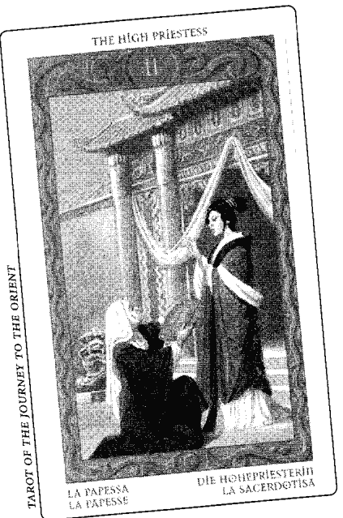

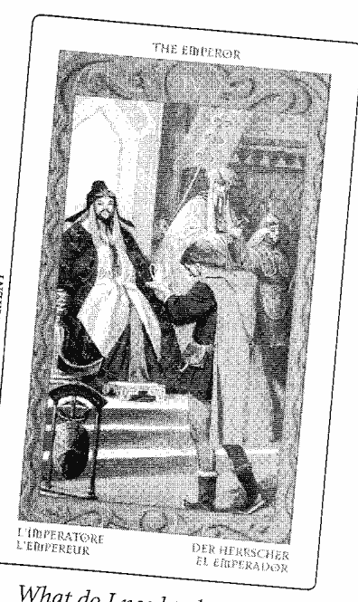

### DIGNITY & THEME

Let's see what can be determined solely by examining the similarities and differences of details in the images.

### SIMILARITIES

- Both cards are Major Arcana from among cards II to V that show the four spiritual and temporal leaders.
- A humble-looking person offers an object to and petitions a dominant, authoritative person (who is higher on the card).
- The humble person is dressed in Western clothing, the dominant one in Eastern.
- The authoritative person seems about to render a decision or make a pronouncement.

### DIFFERENCES

| High Priestess | Emperor |
| :--- | :--- |
| Depicts women (the feminine). | Depicts men (the masculine). |
| Is outdoors, before a temple (religious). | Is indoors, in a throne room (secular). |
| A nun offers a red book with an I-Ching hexagram on the cover. | A traveler offers a silver bottle or vase on a tray. |
| The authoritative woman stands, responding by raising her hand in an attitude of blessing or affirmation. | The authoritative man sits massively and does nothing (makes the petitioner wait?). |
| Behind the authoritative woman is a white cloth swag in the shape of a crescent moon (receptive, emotions). | Behind the authoritative man are golden rays like that of a sun (assertive, proud). |
| The two women are alone. | There are three observers. |

In terms of what can be learned, the High Priestess appears as a teacher and role model. She suggests that the learning involves an opening to intuitive wisdom. The cover of the book shows the I-Ching hexagram for the receptive (six broken lines), which advises subtle yielding and quiet perseverance. She is receptive to what is being brought to her. You might say she blesses you for humbly asking for learning. She says there is something to be spiritually gained through yielding with wisdom, acceptance, and understanding. She also seems to approve of your seeking insight through an oracle.

Regarding what needs to be let go of, the Emperor card suggests this might be pride and a stubborn willfulness to make the partner beg. It’s as if the Emperor expects apologies to be offered on a silver platter and then will make pronouncements about the partner’s worthiness. The guidance is to release the supercilious attitude and let go of demanding terms or making rules. And, especially, don’t humble your partner in front of other people.

The similarities in the cards suggest that the querent has the power in this situation, specifically with the ability to forgive or to make life miserable for his or her partner. The learning involves how to wield that power.

### Themes

Themes, in tarot readings, are repeated symbols or designs that create motifs or patterns of significance to your issue. Some will be subtopics pointing to psychological factors, repeating events, and patterns of interaction. Seeing these themes produces the “Aha” factor—that moment when you suddenly understand what the spread is really about or is trying to tell you. Even within a single card, its themes are usually expressed by a repetition of similar components. And when these are reflected in other cards, too, we get more confirmation of the importance of a theme.

Olivia was having trouble with her boss, which finally exploded in a confrontation. She came to me for a reading at a fair and drew four cards. A knight, two kings, and the Chariot suggested that this was part of a bigger pattern involving her relationship with men in general and her expression of her own masculine characteristics in particular. She clearly needed to act assertively and these masculine cards, based on their positions, demonstrated where and how to assert herself.

Themes also become apparent when the querent talks about her cards. If, for example, her description of a symbol in one card clearly applies to another card or cards in the reading, this immediately links the cards involved, while her specific words tell us the theme.

### DIGNITY & THEME

Looking for themes is also an excellent way to explore a new deck and to familiarize yourself with its language, symbols, and style. Repeating images reveal a worldview or attitudes that may not have been acknowledged by the deck creator (and of which he or she may not even be conscious). For instance, the William Blake Tarot of the Creative Imagination created by Ed Buryn has many cards in which angels and other supernatural beings communicate with or give aid to a human. This theme is perfectly in keeping with a deck depicting divine creative inspiration, in which the gods acknowledge the divinity within humanity. In the Rider-Waite-Smith deck, paired pillars, towers, walled gardens, and courtyards occur frequently, indicating that entering into a carefully protected sanctuary is significant.

### A Word on Anomalies

Anomalies can be just as important as repeating themes. An anomaly is something that doesn't fit and thus tends to stand out as odd or aberrant. For instance, if all cards in a ten-card spread show people interacting in groups except for the Hermit, it will stand out and suggest a key theme of isolation in the midst of others. The Hermit is "dignified" through the striking quality of the contrast and even more so if it is the only Major Arcana in the spread.

### ACTIVITY 14:3

- 1) Randomly lay out your entire deck of cards on the floor or table. Look over the cards until a repeating pattern catches your eye. Sort the cards into groups based on visual themes that stand out. (While most cards can fit into several groups, place each card in just one.) What key theme is suggested by each group you formed? What do these themes say about your deck?
- 2) In which group is your chosen card? What is the theme of that group and how might that apply to your current situation? Is there anything different about your chosen card that makes it stand out from the others in its group (an anomaly)? What does that suggest about your personal theme?

## STEP 14

### Elemental Dignities

Dignities based on elemental affinities were first adapted to the tarot as an alternative to reversals by S. L. MacGregor Mathers for the Hermetic Order of the Golden Dawn. Elemental dignities determine the strength of cards when examined in pairs or triads based on whether the suit elements are friendly or contrary to each other. Major Arcana affinities are based on elemental correspondences to the zodiac sign or planet related to the card. Golden Dawn correspondences are used in this discussion (see Appendix C). If you use a different correspondence system, then feel free to adapt the instructions to your use.

Mathers described four categories of elemental dignities in a teaching paper called *Book T*. His instructions appear in italics below. Only the element is given so that you can adapt these principles to any deck.

- **1) STRONG**
    *Fire + Fire     Air + Air     Water + Water     Earth + Earth*
    > When the suits/elements are the same, they are "very strong for either good or evil, according to their nature."
    Their energies are synthesized or synchronized. The cards operate with little friction or discomfort, but they can be overbearing and excessive. They don’t challenge growth, because they come together so easily. There is little external interference but also little compromise or ability to adjust beyond themselves. As an old nursery rhyme says, "When they are good they are very, very good, and when they are bad they are horrid."

- **2) FRIENDLY; SOMEWHAT STRONG**
    *Fire + Air     Water + Earth*
    > When the suits/elements are both masculine/active or feminine/passive, they are "moderately strong" because they are "friendly to each other."
    These cards are complementary and compatible, tending toward compromise, balance, and give and take. They easily coexist and tend to stimulate each other. Energies may fluctuate between them. Depending on the cards, there can be partnership or confrontation. Success comes by balancing their urges and by integrating their commonalities. Wands and swords are considered yang, active or dynamic. Cups and pentacles are considered yin, passive or receptive.

- **3) SOMEWHAT FRIENDLY; NEUTRAL**
    *Fire + Earth    Air + Water*
    > When the suits/elements complement each other, they are “somewhat friendly” (also called neutral).
    This combination balances creative power with discrimination, with an effect that can be supportive or disorganizing. At best, they act on each other as correctional and therapeutic forces by attracting and stabilizing the other. At worst, they may become ineffectual and passive, or clash. They seek mutual comfort and aid but are also mildly annoying and irritating to each other, creating some stress.

- **4) UNFRIENDLY, ENEMIES, CONTRARIES; WEAK**
    *Fire + Water    Air + Earth*
    > When the cards are of “contrary elements” they tend to “weaken each other greatly for good or evil, and neutralize (cancel out) their force.”
    These cards are incompatible and antagonistic. According to the Golden Dawn, their energies greatly weaken or cancel each other’s effects. However, contemporary interpretations give them a more vital role. Representing a conflict of interests, they tend to work at cross-purposes, producing fear, frustration, and a sense of crisis. They challenge each other and place obstacles in the other’s path. These cards expose vulnerabilities and weaknesses such as guilt and inadequacy in each other, threatening security and well-being. At worst, they negate each other, blocking or inhibiting expression. At best, each can spur the other to action and provide the energy to achieve the seemingly impossible. Great creative power is possible by applying one energy to the other or respecting their differences, even when not understood.

When comparing two cards the effect is as described above. For instance, taking the earlier two-card spread, the High Priestess is associated with water and the Emperor with fire. According to elemental dignities, they are unfriendly contraries that work at cross-purposes. To the Golden Dawn, they would simply cancel each other out. However, the position meanings suggest otherwise: learning is via water, and fire must be let go of, suggesting that you could learn from being more receptive and should avoid being actively assertive. The contrary natures suggest that if you don’t let go of the Emperor, it will counteract what you can learn from the High Priestess.

### ACTIVITY 14:4

Here is a two-card spread with the positions and elements noted:

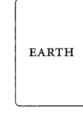

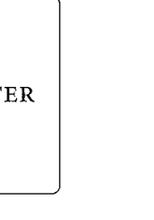

What could you say about these cards based solely on elemental characteristics and dignities? Hint: Use Appendix C to review the elemental characteristics of suits. Lay out several pairs of earth (pentacles) and water (cups) cards and see what their effect is. A possible response is found at the end of this step.

### Elemental Triads

The Golden Dawn also described dignities with three cards where there is a main card (i.e., the Issue) and two flanking cards. The flanking cards modify the central card unless the central card is weak, in which case the flanking cards can overcome it and dominate the situation. See Appendix D for a listing and explanation of the forty possible elemental triads.

> “If the contrary element is only in one flanking card, then the other becomes a connecting card so that the first is not weakened, but is modified by the influence of both cards and is, therefore, fairly strong.”

In the example on the next page, Fire and Water are contrary, while Fire and Air are friendly. The contrary element is only in one flanking card. Air acts as a connecting card that keeps Fire from becoming weakened by Water. Air and Water are neutral. Fire is, therefore, fairly strong. To see how it works in practice, here’s the same triad with actual cards in the three positions:## DIGNITY & THEME

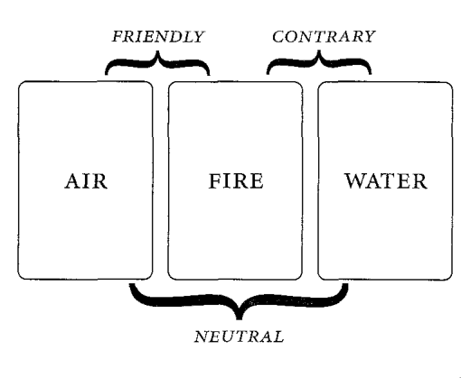

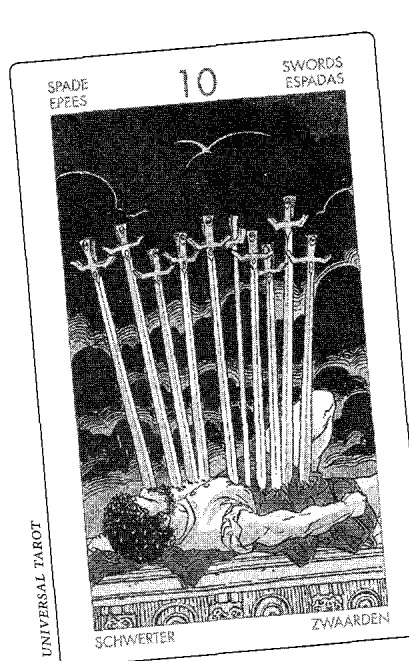

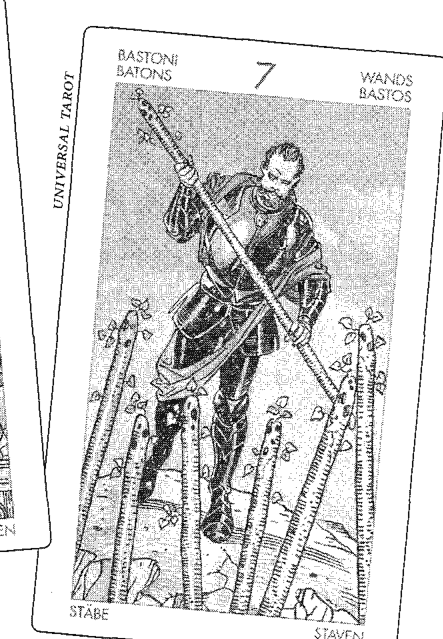

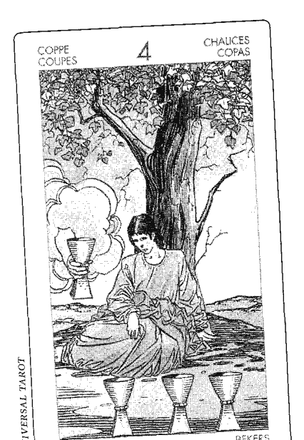

Here it becomes possible for the figure in the Seven of Wands to overcome the lethargy and disenchantment shown by the Four of Cups and assert himself actively; however, the Ten of Swords increases his susceptibility to violent action. Remember that dignities can be “for good or ill”; they don’t make a problematic card beneficial or vice versa, instead they strengthen or weaken what’s there already.

## STEP 14

> "If a card pass between two which are naturally contrary, it is not affected by either much, as they weaken each other."

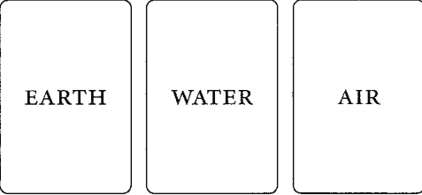

Water lies between two cards that are naturally contrary. According to the Golden Dawn, the water card is not affected much by either, so in practice they would read only the water card. In modern readings, the earth-air contrary energy is psychologically important in terms of underlying motivations. Air disparages earth’s need for worth, value, and security, while earth disparages air’s abstractions, leaving water as the dominant energy. Earth and air are like bickering siblings in the backseat of a car driven by parental water.

> "Cards of suits answering to its contrary element, on both sides, weaken it greatly for good or evil." (The flanking cards overcome, check, or dominate the central one, which lacks the flanking qualities.)

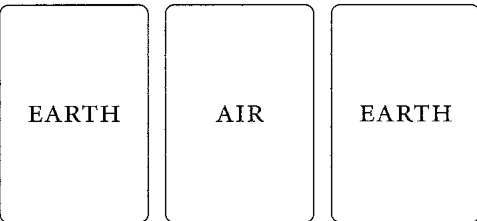

The central air card is contrary to both flanking cards and therefore lacking in earth qualities. Air, being mental, is weakened compared to matters of practicality and security that take over, to air’s detriment. It becomes a case of “matter over mind.” If friendly fire had been to either side of air, the triad as a whole would be strengthened and air would have been more strongly active.

### The Central Card in a Triad

When using dignities with triads the situation is always perceived from the point of view of the central card. But you can move the cards around to get varying perspectives. For instance, with a Body–Mind–Spirit spread you can try putting each card in the center to see the situation from that card’s perspective. Is body supported equally by mind and spirit? Is spirit supported by mind and body?

### The Missing Suit

Some practitioners of elemental dignities have added a new rule that makes little sense to me. They say that an element missing from a triad (there will always be at least one) represents qualities missing in the person or situation and that this missing piece is precisely what the person needs. In effect, something is *always* wrong! Such an interpretation emphasizes the missing element as key to the solution. I strongly discourage this practice. For instance, in the example on page 157, you would be told that you lack earth in your life—that you should be more realistic, dependable, and practical. But earth may be doing just fine. It’s the cards appearing in a spread that are asking for your attention.

### Spreads Within Spreads

Three-card spreads of all kinds are a mainstay of tarot practice. Additionally, you will find that within most larger spreads, such as the Celtic Cross, it is helpful to break it down into two- or three-card groupings like:

- Past–Present–Future
- Body–Mind–Spirit
- Conscious–Issue–Unconscious
- Situation–Opposition
- Self–Environment

Examine these groups in terms of elemental dignities. Additionally, in any spread, a repetition of elements, number, court card rank, sequence, or symbols will proffer dignity on the cards involved. Look for these repetitions wherever they occur and note the themes they suggest.

### ## Discerning Interrelationships: Two Queens

Now that you know how the system originally worked, the fact is that you don't have to use preset pairs or triads. Pick any two or three cards from a larger spread and evaluate them in terms of elemental dignities. It's a perfect way to describe interrelationships. Let's say you have two queens in a ten-card spread: the Queen of Swords and the Queen of Pentacles. Using elemental dignities it's apparent that they are contraries: air and earth. So they could be two parts of yourself that have opposing styles and want two totally different things. Or it could represent two people with contrary natures. If the Queen of Swords is your Past, the Ace of Swords the Near Future, and the Queen of Pentacles the Outcome, then the Ace of Swords will draw partly from how you used to be or, perhaps, who your mother was (the Sword Queen), while your developing personal expression as the Queen of Pentacles will be at some disadvantage—two swords versus one pentacle. She will need to seek support somewhere else in the spread.

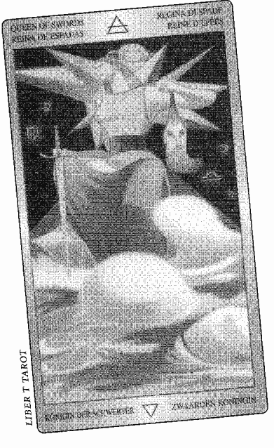

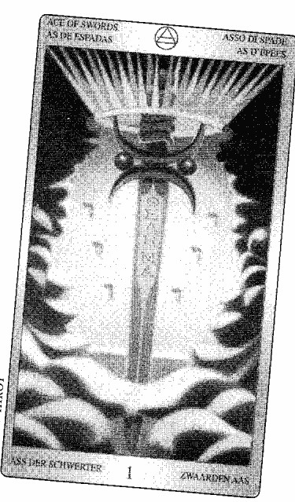

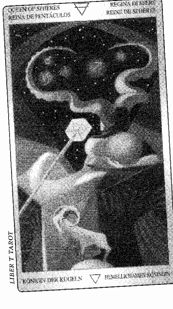

### DIGNITY & THEME

### ACTIVITY 14:5

Examine the three-card spread you obtained in Step 12 in terms of elemental dignities and what these suggest (see Appendix D for a list and description of the forty possible elemental triads). Start with your chosen card in the center, and then move the cards around to get different perspectives. How does moving the cards affect the story line? What is the main theme or themes of these three cards based on similarities, differences, and dignities?

### POSSIBLE RESPONSES TO STEP 14 ACTIVITIES

#### Activity 14:4

What I Know: Pentacles (Earth)

What I Don't Know: Cups (Water)

Earth and water are friendly. What's known is physical and practical, the facts of the situation, or what is manifesting. It could have financial or physical manifestations. What's unknown is how you actually feel about it. It could also indicate dreams, hopes, and fantasies that either support what you're doing or create unease. These two states can co-exist (as they are "friendly") so that some unhappiness could be tolerated. The feelings and sentiments that underlie the physical circumstances help to maintain them. Because both suits are passive, little dynamic energy is available to change the situation.

## STEP 15

### Dialogs

> A pebble . . . will speak to us in its own language and tell us the history of this river, but in order to understand it one must be able to read the soul of things.

—MILTON ALBERTO POTTENGER, SYMBOLISM: A TREATISE ON THE SOUL OF THINGS

### The Way of the Apprentice

In this step you’ll speak to the figures on the cards, they’ll speak back to you, and they’ll even speak to each other. When it comes to tarot advice, there is no better way to get it, because each tarot figure has its own clear agenda. This step helps you become aware of exactly what those agendas are, so that you can decide for yourself just whose advice you want to follow.

I first discovered the power of dialogs long ago when I was on my way to visit Jessica, who had recently moved to another town. Before I left, a mutual friend, Bryan, told me he had been seeing Jessica but broke it off suddenly with no explanation. He wanted me to know why he had done it. When I got to her house, Jessica told me her side of the story and how, to ease her pain, she had written Bryan an angry, unsent letter in her journal. She surprised herself by spontaneously writing a reply from him. When she read this to me, I was amazed that it was almost exactly what Bryan had told me. Even when we are hurt or angry, a certain part of us knows more than we think about the motivations of others and, in our hearts, understands it. Nevertheless, we often choose to stay at a level of “he did it just to be mean” or “I don’t understand why she left; I gave her everything.”

You may not be aware of just how many different voices, needs, and even styles are within you at any one time. I’m not talking about multiple personalities but about the completely natural process of having conflicting desires and responses. For instance, “I want to lose weight, but just one piece of chocolate won’t hurt.” What part of you wants to lose weight and what part of you wants the chocolate, and what part of you is ashamed when you eat it? A spread often represents these different parts of yourself: the voice from the past, the voice of your hopes and fears, the voice of choice A and the voice of choice B. The Major Arcana speaks from the many different voices of your higher self, and thus dialoging with them can give you access to this inner wisdom. By personifying tarot figures and objects you are able to project onto them your own hidden feelings and characteristics.

You can dialog with any or all of these inner voices and find out what they want. You can even dialog with inanimate objects. For instance, you can ask Justice’s sword and the scales what they are for and how to use them. This technique of dialoging with things in the environment comes from gestalt therapy and dreamwork, where everything in a dream is a part of yourself. The goal of gestalt therapy is awareness or insight that arises from finding significance in personal patterns. When the relevant factors fall into place and form a whole that is more than the sum of its parts, that whole is called a gestalt.

### Using Dialoging in a Reading: The Hanged Man

When reading for yourself, record your dialogs in your journal. This way something that at first seemed silly, nonsensical, or irrelevant can be reviewed later, so its wisdom can become clear.

As a tarot reader, you can prompt questions and guide the querent through the dialog process. I almost always involve a querent in dialogs with or among the cards.

# ACTIVITY
## 15.1

For instance, have the querent ask the Hanged Man how he sees the situation from his reversed perspective, or what he's hiding in his hands behind his back. Perhaps the querent responds with, “He thinks I'm being too extravagant and so he's hiding the checkbook.” (People sometimes avoid speaking directly for a card unless pushed to do so.)

Don't interrupt but affirm the insight and then ask the querent to repeat what she's said as if she were the Hanged Man. What you'll find is that even more information will emerge. The Hanged Man might now say, “You are being too extravagant. From my point of view, your purchases aren't useful or wise. I feel like I need to keep the checkbook out of your hands and hide some of our resources so that you won't know how much we have to spend. My job is to counterbalance your excesses.”

Let's say that, given the position and circumstances, the Hanged Man is clearly the querent's spouse. The querent understands the Hanged Man's point of view, and probably part of her is in agreement with her spouse. Her spending habits might frighten her, too. It's not surprising that she's married someone who will put the brakes on. Thus, she can rail at her skinflint partner while safely repressing the frightened self inside. Her projection serves her by letting her renege on personal responsibility, while forcing her spouse into the role of bad guy. Is she sacrificing her spouse (Hanged Man) in order to hide her own fears from herself? And what must she sacrifice in herself in order to do so? These are hard questions that can be explored in the dialog, but they certainly get to the heart of the matter.

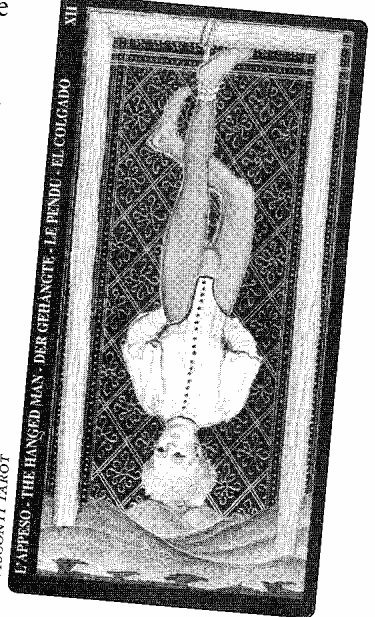

Take your chosen card and dialog with the figures or objects on the card. Ask the figures what they're doing, what they want, and what they have to teach you. You could also ask for their advice regarding your issue. Ask objects how they are used, how they can help you, and what they represent in your life.

## STEP 15

### The Way of the Adept

*You can continue exploring this step now or come back later, after trying out the other ways to read a tarot card.*

### Projection and the Shadow

Projection is a psychological term for unconsciously taking personality traits you do not wish to acknowledge in yourself and seeing them in others. Through projection you externalize an inner psychic quality. This is what you are accessing in these dialogues. The unacknowledged part of yourself is called, in Jungian psychology, the Shadow. The Shadow is an aspect of the unconscious self that is repressed, denied, and unactualized, and so goes unrecognized by the conscious self. The easiest way to become conscious of the Shadow is to notice what you especially admire or dislike in others. The Shadow can include “bright” or desired qualities, as well as “dark” or disliked ones. If you say, “I wish I could sing as beautifully as Ellen does,” then you’ve projected onto Ellen your own inner singer—the one you would be if you hadn’t denied yourself enjoyment of your own singing. This ability may be totally undeveloped in you, but you would not have been able to even recognize Ellen’s ability without a comparable singer within. Likewise, if you condemn someone for being prejudiced, then you are projecting onto him or her your own ability to be prejudiced. Psychologically speaking, it is your uncomfortableness with disliked qualities in yourself that makes you want to stamp them out in others. This is one way of looking at the aphorism “You are your own worst enemy.” Recognizing your own inner terrorist, for instance, is a key to compassion that allows you to “feel with” another. This does not mean that you shouldn’t act to stop a wrong when you see it, but that you can be far more powerful and clear in your actions when you move against the behavior and not the person.

From this perspective, everything you see in the cards, even when describing the Queen of Wands as your boss or the Magician as your lover, is you. This includes objects: Justice’s sword is you and the Devil’s chain is you.

### Anima and Animus

You also project onto others unconscious qualities associated with the opposite sex. The anima represents the feminine aspects, attitudes, and feelings of a person who has a predominantly male psyche, and the animus represents the masculine aspects of a person with a predominantly female psyche. You can also call these largely unexpressed qualities and urges the inner masculine and the inner feminine. They are based on all the interactions you’ve had with people of the opposite sex, beginning with your parents. Part of the attraction or repulsion felt regarding others is a result of how well the other person matches the inner image you’ve developed. While operating somewhat differently in the male and the female, the most beneficial function of the anima or animus is to inspire.

Dialogs with figures of the opposite sex in the tarot allow you to recognize and own these characteristics within yourself, thus giving you more access to choices and actions that previously have been underdeveloped and unexpressed, and that you may not, at first, have seen as possibilities for yourself.

### Acknowledgment, Gratitude, and Negotiations

Most tarot figures represent attitudes, subpersonalities, and energies that simply want to be heard and acknowledged. Doing so can relieve tremendous pressure. You can take this situation further: into negotiations. For instance, what if the querent in the earlier example replied to the Hanged Man, “I want to thank you for assuming the difficult task of taking the opposite point of view and counterbalancing my excesses, even when I get angry. Still, I hate the thought that you have to hide things from me. What would you need from me to change that?”

Saying “thank you” opens up all kinds of new possibilities. What are you grateful for? Once you acknowledge that there’s a gift in the card or situation, it becomes available to you.

My initial reading at a major fair was for a woman who was scamming me: she countered everything I said, demanded more time, and at the end of the reading claimed she wanted a psychic, not a tarot reading, and so wouldn't pay me. After she left I decided I needed to thank her, although I didn't know what for. Upon doing so, I immediately realized that, given my unusual method of interactive readings, I needed to inform prospective querents up front of my methods. If they consented to what I described, then we had a verbal agreement. During the weekend I perfected my statement and, in all the years since, only a handful have decided that’s not what they want. The rest agree and, in consequence, are willing to participate more fully.

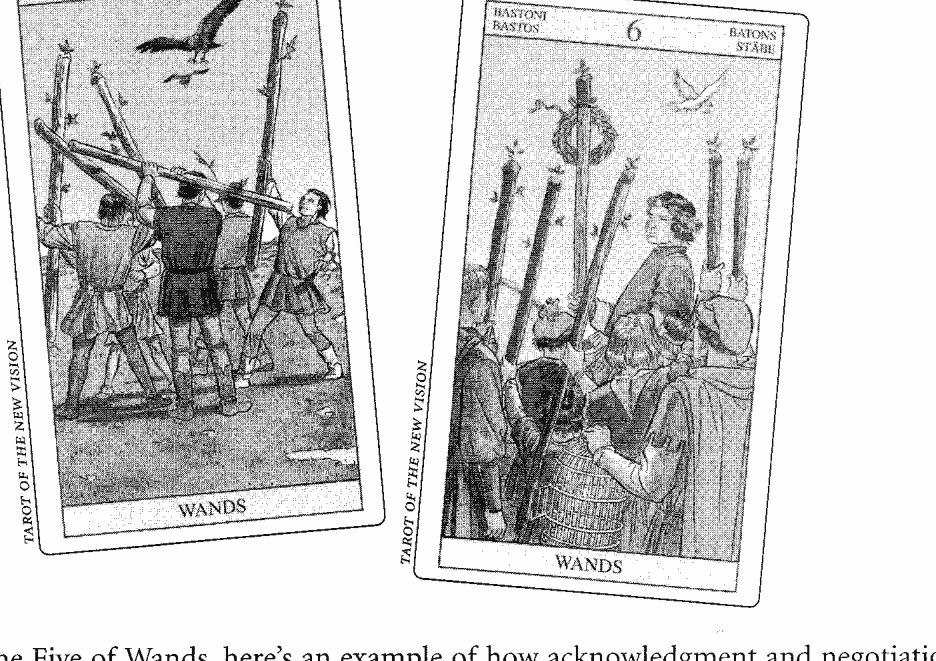

Using the Five of Wands, here’s an example of how acknowledgment and negotiation can be effective among the different parts of a single card. I call this the committee card. It can represent brainstorming or competition. The Five of Wands reminds me of a grass-fight; it starts off as a lot of fun, but someone always goes home crying. While it can certainly describe an external situation, say a sporting match or construction project, it can also represent five parts of the psyche vying for attention, for their points of view to be heard and taken into account. (In the Six of Wands one of the viewpoints has prevailed.) I often ask querents to name five parts of themselves that want five different things to happen. The parts no longer have to engage in strife (Crowley’s keyword for the card), because the querent is listening. Sometimes I ask that person to tell me what those five parts of himself look and act like. We invite them all to the table, where the querent speaks as each one and we consider how each can get something it wants. And then we thank them. Usually, it’s not as much a dilemma as it first seemed, and so strife is transformed into striving.

### DIALOGS

### ACTIVITY 15:2

Explore possibilities for negotiation between you and a figure on the card or among various elements within the card. If possible, establish some agreements. Thank the figures for their insights.

### Revisiting the High Priestess and the Emperor

Let’s consider another example: the High Priestess and Emperor from the previous step (page 150). The question involved how to heal the disturbed feelings between two people after an argument. In terms of dignities we learned that the cards had opposing elements: water and fire. They tend to see each other’s weaknesses and inadequacies and find it hard to understand the other’s point of view. Let’s see what happens if you talk to them:

> Querent: High Priestess, what can I learn from you?
>
> High Priestess: You can learn to be at peace and avoid speaking rashly. Seek guidance from a wise friend; be receptive and grateful.
>
> Querent: Emperor, you have qualities I need to let go of. What do you think?
>
> Emperor: I let go of nothing. I’m the supreme ruler here and I expect respect. If someone displeases me, I punish him.
>
> Querent: High Priestess, what do you think of the Emperor’s advice?
>
> High Priestess: I don’t want to speak ill of anyone, but he can be terribly rash and self-centered. He wants everything his way, won’t back down, and doesn’t pay attention to anyone’s feelings, including his own.
>
> Querent: Emperor, what will happen if I follow the High Priestess’s advice?
>
> Emperor: She’s a pushover. Tell her a sob story and you’ll get all the sympathy you want. But when it comes to safeguarding the kingdom, she offers platitudes and no backbone. You want something done right, you have to do it yourself. Don’t listen to her.

## STEP 15

We could try to resolve this by taking the conversation to a different level.

Querent: Emperor, if I have to let go of you, what is the best I can get from the High Priestess?

Emperor: Although she’s not good at defending the castle, she’s always available when you call. She can remind you of higher things, like the spiritual and long-term effects of what you do. I suppose that in the long run there’s wisdom in what she says.

Querent: High Priestess, what qualities of the Emperor are worth keeping?

High Priestess: Well, he takes responsibility for his decisions. He knows how to organize and get things done. He takes on the difficult jobs that are needed to maintain peace and security.

If you need help with asking questions then review Step 9.

### ACTIVITY 15:3

Shuffle your deck and draw a second card to represent what opposes your chosen card. (Or draw two cards to represent opposing forces in yourself.) Use several steps to gain initial insights into the new card or cards—especially a quick run-through of Steps 1 through 7. Then dialog with each card to learn what each wants and how they oppose each other. (If you have two cards of the same or friendly elements, how does the idea of opposition work?) Can you find a way to negotiate with the figures so they will both support you in achieving your ends?

### Revisiting the Two Queens

For a final example, here is the three-card reading from the previous step (see cards on page 160). The Queen of Swords is your Past, the Ace of Swords the Near Future, and the Queen of Pentacles the Outcome. Assume that the two queens are different aspects of yourself. You formally acted like the Queen of Swords but are becoming more like the Queen of Pentacles. So let's consider what they might say to each other:

Queen of Pentacles: Madam, I wish you'd put that sword down. Haven't you done enough cutting and pruning? It's time to enjoy my well-established business and all that I've accrued.

Queen of Swords: Ms. Pentacle, you've only profited because I've cut expenses. You may think you're practical but you like your little luxuries and your socializing. Somebody around here has had to be cold and critical.

Queen of Pentacles: Yes, and you've tried to sever all my relationships.

Queen of Swords: The ones I severed weren't good for us. You don't want a bunch of weaklings and hangers-on around, do you?

Queen of Pentacles: Actually, I like to share my bounty.

Queen of Swords: Well, you'll be needing my sword soon. You know that new employee is not working out and needs to be fired. Can you do it?

Queen of Pentacles: I don't feel comfortable being so cruel.

Queen of Swords: But you'll let me, because you know it has to be done, while you sit back and enjoy life.

Queen of Pentacles: I admit the office atmosphere will improve then and we'll all be able to relax. Maybe I'll treat the employees to dinner once you get rid of the deadwood for me.

If the querent states that this Queen of Swords is not she, then ask who else in her life is most like this figure. Once identified, the querent needs to emulate that person's characteristics to more effectively wield the Ace of Swords in the near future (as the spread indicates). The Queen of Swords knows how best to use the Ace of Swords. This allows the querent to “own” a part of him- or herself that has previously been unexpressed and projected onto others. However, if there is no need for swords’ energy, then there is no need to take on the projected qualities. Look at the circumstances.

### ACTIVITY 15:4

Pick and do option 1 or 2:

-   1. **Option 1:** Have the figure on your chosen card dialog with one or more figures from another card you’ve previously drawn.
-   2. **Option 2:** Or, looking faceup at the court cards, pick two that represent different parts of yourself and a third card from among the Minor Arcana number cards to represent the situation.

Have the two cards talk to each other about their views of the situation (third card) and debate what needs to be done. Let them point out the weaknesses and vulnerabilities in each other, as well as how each can help the other. How can you use these insights in the situation? Do you identify with one court card more than the other?

### Healing Conflict

Remember that you don’t have to “fix” anything. Healing can arise naturally just by becoming aware of an inner tension or conflict and how it might be playing out in your life. Listen to the opinions of the figures in the cards and what actions they suggest. They are reflections of your inner self. Consider which are most helpful and which are limiting in a particular situation. Through dialoging you can learn about a hidden aspect of your personality—its origin, purpose, how it has served, and what it needs to transform from a conditioned reflex into mature, considered action.

## STEP 16

### Drawing

> > When we experience the images, we also directly experience the inner parts of ourselves that are clothed in the images.
>
> —ROBERT JOHNSON, *INNER WORK*

### The Way of the Apprentice

This step asks you to look at a card even more deeply than before—again switching to a different channel of perception. The technique is rarely used in a reading for other people, but once you’ve experienced it you’ll understand a whole new way to integrate card meanings. At its most basic, this step involves sketching the card (the second part of this step will take you far beyond this). Not only will you discover details that you hadn’t seen before but also what truly expresses the card’s message.

### Stick-Figure Tarots

In terms of personal insight, neither your expertise in tarot nor your artistic ability has any bearing on the process—it works as well for advanced practitioners as for absolute beginners. If you are unsure what to do, start with stick figures and a rough sketch. If you can play Pictionary, you can do this! Even if it doesn’t sound like your sort of thing, try it. Doing the drawing is so very different from thinking about it, and the latter can never substitute for the gestalt that occurs visually and physically when you sketch. There are black and white decks where you color the cards for yourself, usually so that you can better understand the color symbolism. While this is a valuable process in its own right, what I’m asking you to do offers something different.

You can see in these pictures from Lar deSouza’s Stick-Figure Tarot (based on the Rider-Waite-Smith deck) just how much can be shown from the barest information. Lar was surprised at how many people have told him they use the deck as a teaching tool because its imagery is so accessible. Use stick figures or not and color or not. Do the drawings in your journal or on index cards. Or blow the image up to twice its size.

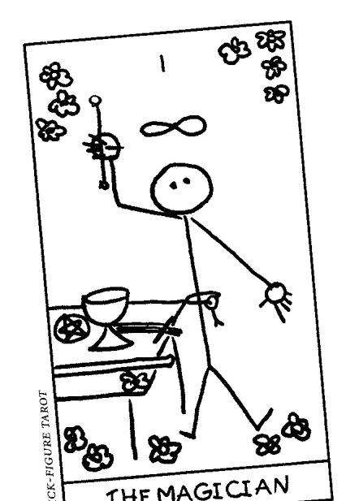

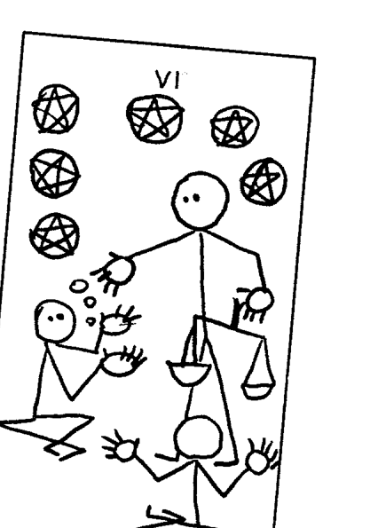

### DRAWING

DeSouza’s Magician is shown with the table, suit signs, a few flowers, the lemniscate, and the characteristic arms pointing above and below. He’s also drawn the Magician’s belt, consisting of an ouroboros (a snake biting its tail). All the important details are here.

DeSouza’s Six of Pentacles gave me a new take on the card. The people look enthusiastic, like they are having fun. The standing figure could be dispensing spiritual manna or handing out goodies to delighted children instead of desperate beggars.

The middle illustration above shows my own attempt at a stick-figure version of the Fool from the William Blake Tarot of the Creative Imagination by Ed Buryn (above, left). I became very aware of what dominates each quadrant of the card and how the man, dog, and primordial crocodile are placed along an important energy diagonal. Also, I hadn’t remembered the sun in the lower left (opposite where it appears in the Rider-Waite-Smith version).

When reading with the Roots of Asia Tarot by artist Amnart Klanprachar I find a drawing or verbal description is essential since the images are not what they appear at first. There are faces and animals in what seems to be simply background decoration. A jagged mountain is actually the bent knees of a woman lying down; a thigh is a parrot. In my drawing of the Nine of Pentacles (above, right), it’s apparent that what looks like tree branches are really elephant trunks and leaves are eyes. Some things can’t be seen until they are drawn.

### ACTIVITY 16:1

Do a basic sketch of your chosen card (or any other card) in any medium or style you choose. Even a scribble is okay. (Hint: Lightly pencil in an X connecting opposing corners of your drawing to help you position the elements on the card.) What did you discover that you hadn’t noticed before?

### The Way of the Adept

You can continue exploring this step now or come back later, after trying out the other ways to read a tarot card.

### The Bare Essentials

Individual tarot cards can be identified via the most minimal of visual devices. Once I was sitting in an ice-cream shop in San Francisco looking at a display of abstract paintings consisting of colored geometric shapes and, on a few, the barest hint of a face. Suddenly I realized they were the tarot majors and I could easily identify most of them. Years later, I came across a set of “Tarot Stones,” consisting of a clay rectangle for each of the Major Arcana. Each piece was identified solely by a symbolic glyph stamped into it: the lemniscate for the Magician, a lamp for the Hermit. Yet each was easily identifiable.

### ACTIVITY 16:2

1)  What is the most minimal geometric shape(s) or single symbol that could unmistakably identify your chosen card’s image (not including number or suit indices) and still enable you to clearly distinguish it from any other card?
2)  What shape or symbol would you choose for each of the Major Arcana?

### Drawing a Whole Spread

When you go from drawing a single card to an entire spread, something exciting occurs. I strongly encourage you to do the next activity, as it’s the best tool I’ve found for teaching people to synthesize the meanings of cards.

### The Three-Card Drawing

Years ago, while teaching at the Omega Institute in Rhinebeck, New York, a man showed me his tarot journal. On each page he had recorded a personal Celtic Cross spread entirely in drawings. The familiar layout could be discerned but he eliminated the borders on the cards, allowing the scenes to interpenetrate and the figures to interact. His simple line drawings were active, expressive, and playful. Here were depictions of his inner, psychic landscape, as deep and powerful as any dream. They were also reminiscent of medieval illustrations that show a sequence of events in a single work.

When I complimented him on the quality of his drawings, he countered by saying anyone could do it and benefit by sketching their spreads. Over the years I kept seeing those enchanted drawings in my mind’s eye, yet I couldn’t imagine myself doing it.

One day, a student asked how she could learn to integrate the meanings of cards in her readings—not an unusual request—but suddenly I got it! I decided to have the class do a three-card version of the spread drawing. As a learning technique it was experiential and so would bypass the intellectual mind with its gatekeeper, the critic. Wanting a medium that would disallow any fussiness or need for perfection and that would encourage playfulness, I pulled out my giant box of 128 colored crayons. The experiment succeeded beyond my wildest dreams and has become one of my favorite teaching tools, plus a cherished method for generating my own insights.

A few people have tried to dodge the process by producing crazy scribbles and abstracts, but these prove as effective as the more literal renditions. By taking the borders off the cards and letting the figures interact (or a figure from one card take over the activities in another), you end up with a picture that is dynamically interpenetrating, literally and figuratively.

The drawing generally works best on a standard sheet of white paper (turned either way), using crayons. (Watercolor crayons, such as those by Caran d’Ache and Payons, or colored markers can be added for special effects, but are optional.) I strongly suggest that you not use pens or pencils, as you want to be loose and playful.

## STEP 16

Because you are using crayons, you’ll want to work larger than the original and be free with the colors—matching the original or not, as your intuition tells you.

Working with different decks can produce surprising results. The *William Blake Tarot of the Creative Imagination* resulted, for me, in dreamy, energy-filled landscapes and softly smudged colors (much different than the stick-figure version above). *Nefertari’s Tarots* became surrealistic. By contrast, my *Rider-Waite-Smith* deck drawings were quite literal and resulted in stronger, clearer facial expressions than those depicted on the cards.

One drawing integrated the Page of Cups, Five of Cups, and Two of Pentacles from the *Rider-Waite-Smith* deck. The Page of Cups is trying to juggle a bunch of cups, several of which have fallen and spilled over, and a fish flounders on the riverbank (having been thrown out of his cup). Thus the juggler from the Two of Pentacles has become, instead, the Page of Cups, who frowns unhappily since he’s dropped so many cups. Now we know how the cups in the Five of Cups got knocked over!

In a drawing based on Death, the Six of Swords, and the Two of Pentacles, the usual figures in the boat have been replaced. Instead, a skeleton poles a boat across a river using his scythe, while in the front of the boat a person juggles two pentacles. In the distance the sun sets between a gate of swords.

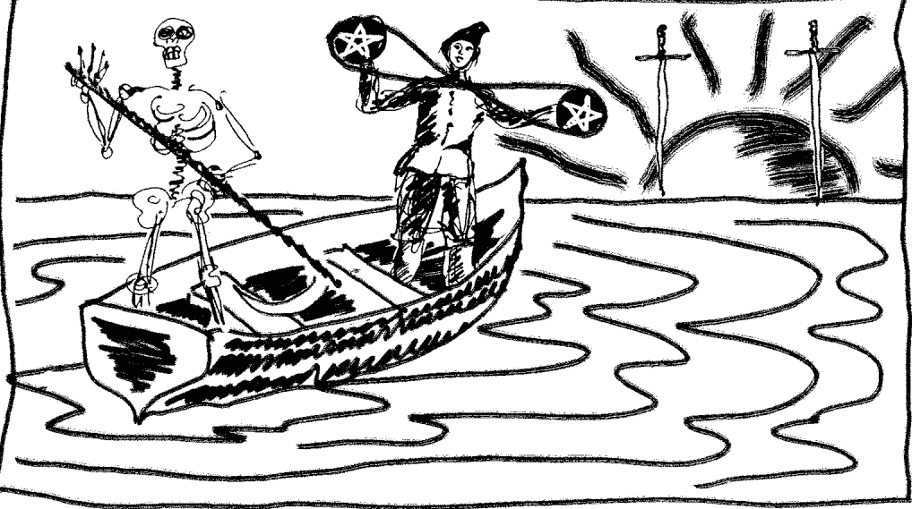

### **DRAWING**

For the Tower, the Fool, and the Six of Wands, there is a Rapunzel-like scene in which the Fool leans out of a window in the Tower, offering a white rose to someone riding by on a horse (from the Six of Wands). Lightning strikes the mouth of the Fool. Soon after drawing this picture, the person left her marriage.

### **ACTIVITY 16:3**

#### **Part I: The Three-Card Drawing**

Materials needed:

- A standard white sheet of paper
- Crayons in lots of colors
- A three-card spread
- A twenty-minute time limit (which can be extended, if desired)

Take the three cards and move them around, changing their order, stacking them in a pyramid, and even overlapping them. Watch for something to catch your eye. Imagine that the borders dissolve so that they all inhabit the same environment. Does a particular background dominate? What person, form, or structure comes forward? Can an object from one card be used in another?

Begin your drawing as soon as you get a hint of an image or theme—don’t wait for the full picture. It will emerge in its own way. Let elements surprise you. You can use light colored crayons to sketch in stick figures, adding definitive lines, details, expressions, and clothing later.

You don’t have to use all the people and objects. Sizes of things can grow or shrink. Scenes can overlap. The “correct” number of suit markers (cups, wands, etc.) does not have to be maintained, although they can be. Sometimes the images form a sequence of events; beware, however, of falling into the trap of illustrating each card in its own space, which this process seeks to transcend.

## STEP 16

You want to end up with a single, integrated drawing, although it can have several parts to it.

A timed session of twenty minutes will help you stay focused and moving along. You don’t want to plan out your drawing before you begin or even think too much about what you’re doing. Start with anything that strikes you. At the end of the twenty minutes use the side of a crayon to lightly shade sky, ground, or other large white areas, as this helps tie all the parts together. If you finish ahead of time, add details or more color.

You can do the process on your own, but doing it with other people will intensify your focus and deepen insights through brainstorming and discussing the drawings afterwards.

### Part II: Working with Your Drawing

Now it’s time to do what I call “working the drawing.” It’s especially exciting to talk about it with other people who will immediately see things you didn’t. Explore and brainstorm on your own by writing your thoughts in a journal. The following questions are meant to stimulate thinking and suggest fruitful considerations. Answer a few or all of them, as you prefer. Most dream-interpretation techniques will be applicable. Keep the focus on the drawing itself, although you can contrast it with the original cards. Try looking at your drawing from a distance.

1. Describe your picture.
   - What’s happening in it?
   - How did you get from the cards to the drawing?
   - Did anything surprise you?

2. Note the following and their possible significance.
   - Dominant colors (see Step 13 on symbols)
   - Energy flows (circular, jagged, grouped)
   - Direction of movement, lines of sight
   - Distance among objects (closer equals more connected)
   - Relative sizes (among people and things)
   - Accidents (e.g., not enough room for a figure’s head?)

3. Find the main focus—where your eye is most strongly pulled.
   - What does this suggest as the focus of your concern?
   - What’s at the actual center? How does it relate to the focus?
   - What and where are other major energy meeting places?
   - Consider the following (although not always applicable):
     - Left as past; center as present; right as future
     - Above as spiritual or superconscious; below as unconscious
     - Foreground as dominant, active, current
     - Background as distant, behind the scenes, less effectual

4. Where or what are you in the picture? Speaking from this point of view:
   - What are you doing?
   - How do you feel?
   - What do you want or need?
   - Where do you want to go or what do you want to do next?

5. What or who are the other figures?
   - What is the interaction between the “you” in item 4 and these figures?
   - How are these other figures (and objects) also you?

6. Where are the greatest problems(s), obstacles(s), or stuck energy?

7. What is missing from the picture?

8. What is the task or opportunity in your picture?
   - Is there something that needs to be changed for you to feel more empowered?

## STEP 16

End your session by noting on the back of your drawing the following:

- Date (and optional brief notation of place and/or circumstances)
- Deck used
- The three cards
- A title for the drawing
- One-sentence summary: In the first-person, present tense, describe what is going on in the picture. Do this, if nothing else!
- An action: A task or ritual, suggested by the work, that you now commit to doing within the next forty-eight hours (see Step 21).

Review your drawing and summary statement in several weeks and again in several months and in a year. Note any new insights.

### Where to Go from Here

The next time you do a tarot reading (after having experienced the three-card drawing), see if you can transfer what you've learned. Find the most important (or confusing) three cards in your spread and imagine their borders dissolving so that the scenes merge and the figures interact, blend, or take on each other's characteristics. See if, by integrating seemingly disparate elements, the central theme and key to the reading doesn't emerge. The spread position can lend nuances to your synthesis. For instance, a detail from a card in the Past position, when blended with a detail from a Next Step card, will show how and where the past affects your next step. The point is to stop seeing the cards as separate entities, but rather to let them come together in surprising, novel ways. You have opened another channel of perception and learned to view your readings with new eyes.

## STEP 17

### Embodiment

> "Every movement becomes a symbol-in-motion that carries the power of the inner world into visible and physical form."
> —ROBERT JOHNSON, *INNER WORK*

### The Way of the Apprentice

The vast majority of what we experience is nonverbal. This step explores what your body knows—its inner wisdom—of which you may not be consciously aware. This is the somatic level of the tarot, from the Greek *soma*, meaning "body." It describes how to obtain information from the posture, gestures, and actions of the figures on the tarot cards by physically acting out the scene and then paying close attention to what is happening in your body. The starting point is to assume the exact pose of a tarot figure: copying the gesture, posture, and muscle tension, and then extending this into motion. This yields its own unique perspectives and insights that cannot be gained in any other way.

## STEP 17

I rarely do a reading any more without some form of physical enactment, even if it involves only mimicking what the hands are doing.

Some decks work better for this than others. For instance, many of the cards in the Rider-Waite-Smith deck offer a hidden somatic teaching of a card’s lessons that is only revealed when you re-create the card with your body. Moshe Feldenkrais, one of the greatest mind-body awareness teachers, said that you have to physically experience something if you want to learn it. So, when reading a card it helps to experience that card with your body. The task is to join what we know inside—in our bodies—with what we know outside—in our conscious thoughts and words. In a reading you want your words connected to what is alive and real inside you. This is embodied wisdom.

I noted in Step 8 on metaphor that when you experience the Five of Pentacles as being “out in the cold,” your body automatically reacts to the memory of what that was like, probably with a slight shiver and a protective curling forward of the shoulders. In this step you will find out what your body remembers, how it reacts, and what it is trying to tell you.

The best way to understand this process is to do it.

### ACTIVITY 17:1

First, read through the directions below. If you wish, make an audio recording of the text with appropriate pauses so that you can concentrate fully on doing each part of the instruction. Alternatively, have someone read it to you.

1. Look at the Four of Pentacles from the Rider-Waite-Smith deck.

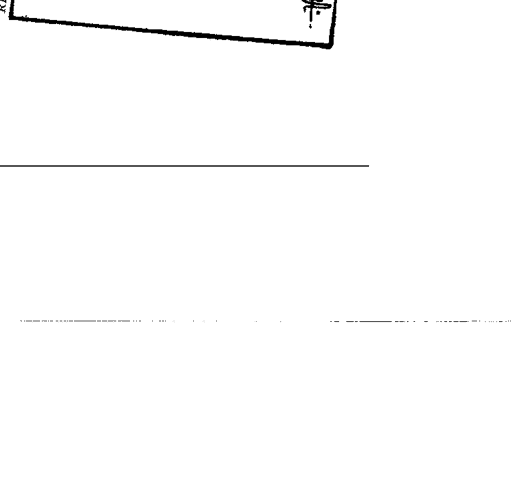

### EMBODIMENT

2. Sit in a straight chair, slightly forward so that you aren’t leaning against the back. Imagine you are balancing one pentacle on the top of your head. Your knees and legs are spread about shoulder-width apart. Your feet hold down two pentacles and your toes are pointed slightly outward. You hold a fourth pentacle in front of the trunk of your body. Your left hand and arm curve over the top of the pentacle and your right hand and arm cradle it from beneath. Take a couple of deep, even breaths and get a sense of what you are doing. What do you need in order to maintain awareness of all four pentacles and to keep them balanced and secure? Now get a sense of what you are, likewise, holding onto in your life. Just wait, breathing deeply and evenly, and let it emerge into awareness.

Again, feel what it takes to maintain the four pentacles simultaneously. How much force and tension is needed for this? Experiment with tightening and loosening your hold on these pentacles, and then relax as fully as you can without letting go. How can you maintain the greatest stability? Now concentrate on the pentacle at the center—slowly move it up and down and increase or decrease its size until you’ve found the place of perfect balance and security where no tension is necessary. Imagine you take that middle pentacle into your body, while keeping that balance and security. Let your arms relax and fall away; they don’t have to hold anything. Feel the pentacles at your head and feet being absorbed effortlessly into your body. Breath gently and evenly. Where in your body is that central pentacle? Let yourself be aware of it. Keep it company. Now, imagine acting and moving from that place—smoothly, effortlessly—and how, in moving from that place, you don’t have to hold onto anything externally. Stand and move around, letting that central place move you.

3. When finished, sit back down and write about your experience. What did you discover? What were you holding onto from your life? How did it feel to let go of holding on? Where in your body did that central pentacle go? For most people it lodges either in the heart, solar plexus, or angles down just behind the navel—into your third or fourth chakras (near what is called the hara or chi), energy centers that guide the actions of your will and heart. What does your own placement suggest to you?

## STEP 17

If you only read the exercise but didn’t do it, then you’ll never know what actually happens—what it really feels like. Imagining it will give you some information, maybe even important information, but it will be different than what you can learn from the experience itself.

### ACTIVITY 17:2

1)  Take your chosen card (or any other card) and position yourself, to the best of your ability, exactly like the main figure on the card, checking to see if you’ve assumed every gesture, placement, and angle as pictured. Keep the position while breathing gently into it.

2)  Ask what in your body wants awareness. Wait until a sensation arises. Notice what this awareness is. Describe it to yourself. Acknowledge it. Sit with it. Notice how it feels in your body. Sense its mood and emotions.

3)  Is an action suggested by the card? If so, do it, repeating it, with awareness, as many times as needed. If the figure is unmoving, then ask what the figure wants to do next or how he or she responds to an external stimulus (say from another card). Let the action and style of movement emerge naturally from the embodied character inside. If it wants to speak, then speak with its voice. What, from your life, relates to this action? Allow an awareness to arise in your body. Ask if there is anything else you need to know.

4)  Thank the figure and slowly return, stretching into your full sense of self. Take a moment to check if anything in your body has changed. How do you feel? Write about your experience.

Initially it’s worthwhile to experience longer, meditative versions of embodying your tarot card. Once you know what’s possible, you can shorten the experience based on how much information you want. The second part of this step will give some examples of this.

### The Way of the Adept

You can continue exploring this step now or come back later, after trying out the other ways to read a tarot card.

### Embodied Readings

In actual readings the embodiment experience can be done in less than a minute. For instance, if you are doing a reading at a fair and one of the six cards in the spread is Temperance, ask the querent to stretch out his hands and imagine holding two cups and pouring something from one into the other. As he mimes this back-and-forth movement, suggest that the cups are two things from his own life that he's blending or combining in some way, and ask him what they are. Also, consider whether he's blending anything represented by two other cards in the spread.

There's a similar situation in the Two of Pentacles, but in this case the figure is juggling. As the querent mimes that, remind her that in order to juggle, she can't look directly at any of the objects but at a neutral point straight ahead, letting her sight become diffuse, and that she has to keep her hands moving and the objects in the air. (If you want to make it more complex, have her do a dance at the same time.) Ask what she's juggling and why and how.

If the card is the Emperor, who simply sits, ask the person to experience exactly how he sits—how he holds the globe and scepter and how the armor feels. Ask the querent to describe what comes into his awareness as he does this. Then have the querent stand and move around as the Emperor and speak in the Emperor's voice.

With the Chariot card, find out how the Charioteer moves if the horses or sphinxes are tearing off in different directions. How does she regain mastery and control of the beasts that pull the chariot? How could this relate to her situation? You might contrast this experience with the way Strength handles her lion. The play of muscles, changes in tension and breathing, angles of the body, and the multisensory awareness all provide information.

### Ritual as Embodied Symbol

The definition of a ritual ranges from a ceremonial act to something as simple as an established routine. The difference between a ritual and a habit is often only one of awareness and intention. Brushing your teeth in the morning is a habit—but turn it into a ritual via the conscious intent that cleansing your teeth represents speaking with integrity and compassion and it becomes full of personal meaning. Turning a tarot symbol into a movement creates a connection back to its original source in human experience. Ritual is “symbol in action.”

Consider what might be the symbolic and ritual significance of hands. They give, take, and hold things. They make connections. Yet consider what a difference the slightest change makes. For instance, lift hands in front of the head, palms open and out, and you have a universal symbol showing that nothing is hidden and no harm is intended. It can signal peace, welcome, or surrender, but with just a slight lift and turn, they can become surprise, dismay, or bewilderment (see the William Blake Fool card on page 175). Turn the wrist back and forth or up and down in a wave and it indicates acknowledgment, recognition, or leave-taking. Intensify the muscle tension and thrust the palms sharply forward and you have a sign of forceful self-protection, saying “Don’t come closer.” Stretch the palms upward and it becomes an invocation of the great Above, a supplication or drawing down of heavenly forces. Try these variations for yourself and see what thoughts arise, if your attitude or emotion changes, and what happens to your facial expression.

When Ed Buryr sought my advice with interpretations for the William Blake Tarot of the Creative Imagination, I embodied every card, acting them out and speaking for them. It was an extraordinary experience to work with Blake’s art this way because his mythic figures are so expressive of human creativity and culture. I see this as a vital tool for developing interpretations for any new deck.

### Body Language

In addition to acting out the cards, as a tarot reader in an interactive reading you can take a reading deeper through your awareness of the body language of the querent. Daniel Goleman, in his landmark book Emotional Intelligence, says, “Each major emotion has its hallmark biological signature, a pattern of sweeping changes that entrain the body as that emotion becomes ascendant, and a unique set of cues that the body automatically sends out when in its grip.”

Call attention to the querent’s reactions. Say what you noticed and ask him to explain what the reaction was about. For instance, a querent draws the Tower and immediately sits back in his chair. As reader you could say, “On seeing the Tower you suddenly sat back in your chair. What are you experiencing?” If needed, you could prompt him with what the movement signified to you. For instance, “You seemed to be trying to get as far away from the Tower as possible” or “The Tower represents a sudden explosion and I saw you suddenly move back as if you were being thrown by the blast. What’s happening?” Avoid asking about the person’s thoughts because you want him to stay in his body—to get even more in touch with the physical and/or emotional reaction. Sometimes a physical reaction is as subtle as raising an eyebrow and yet is very significant.

One way to maintain contact with a physical or emotional reaction is to ask the querent where in his body he is experiencing the reaction. Once the location is identified, you might ask him to imagine the bodily feeling or emotion as an object. What is the object? And what is its color and shape? You want him to become fully focused inside his body. Then consider the object’s role in relation to the spread.

Zack came for a reading. As do many people, he pulled back noticeably when he saw the Tower. When asked, he said he could imagine the blast and falling. Then there was the sensation of something heavy settling in his gut. As he stayed with the feeling, it began to feel like a lead weight and then like heavy black sludge that kept him from getting up. I asked if he saw anything in the reading that suggested what he could do with that sludge. The Star was also in this reading and so he decided he’d give it to the star maiden and ask her to wash it clean. When the sludge was washed away it became a ball of light and he realized he needed it after all—that the Tower was really trying to wake him up, but that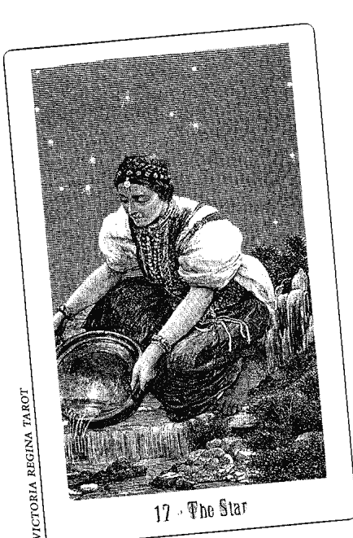

he couldn’t see it until the calm serenity of the Star revealed it to him. He figured out for himself that the sludge was really his fear of expressing his own talents.

Automatic reactions are clues that brain connections are being made and inner patterns activated, preparing you for outer action. These are based on beliefs and attitudes below your normal level of awareness. Working with others—noticing and helping them notice their own physical reactions—is an excellent way to train yourself to notice your own, and to stop and follow them when they occur.

### ACTIVITY 17:3

-   1) When next reading the tarot, watch carefully for subtle physical reactions as you turn the cards over. Keep in touch with that spontaneous sensation as you focus on what you are experiencing inside. Wait until something comes into awareness. Begin to describe it with gestures, words, or noises. If it was an object, what would it be? How does it feel? What does it want? Does it need anything from another card in the spread?
    2) When reading for another, watch for a physical reaction. Tell this person what you’ve observed. Guide him or her through the awareness process.

## STEP 18

### Imagination

> > What is now proved was once only imagined.
> —WILLIAM BLAKE, THE MARRIAGE OF HEAVEN AND HELL

### The Way of the Apprentice

Working with tarot in the imagination is one of its major uses. In some esoteric traditions, tarot is solely for teaching occult principles and inner journey meditations. In this step you focus on the practical aspects of imagination, since the intent is reading for yourself or another. Imaginative practices, also known as guided visualizations or active imagination, involve beginning with a particular image and then letting it unfold spontaneously. In fact, you've already been using this faculty for creating stories and questions, and in the dialoguing, drawing, and embodiment activities.

Imagination is sometimes described as the power of the mind to form pictures or visions. You'll find, however, that you can imagine with any and all of your senses. Perhaps a better definition would be that imagination is the use of our creative powers. Unless you can imagine another situation there will never be one. Imagination is not bound by the rules of time and space that govern materiality. Paracelsus, in his alchemical writings, presented *magia* and *imaginatio* as related concepts. According to him, it is through use of imagination, “the inner sense of the soul,” that things inaccessible to the physical senses can be perceived. Through imagination the soul intuits the inner powers and virtues of physical things. David Abram, in *The Spell of the Sensuous*, writes that imagination is “the way the senses themselves have of throwing themselves beyond what is immediately given, in order to make tentative contact with the other sides of things that we do not sense directly, with the hidden or invisible aspects of the sensible.”

Part of the task in developing your imaginative faculty is discovering where your own abilities lie. In the second half of this step is a self-diagnostic test that will help you determine your strongest imaginative senses. Since you can rely on these to strengthen your visualizations, you may want to take this test before you begin, although it is not necessary.

One way to begin any exercise in imagination is simply to make up something. Believe me, it’s not cheating! If you were free to imagine anything, what would it be? Don’t be boring—entertain yourself. At some point in your made-up scenario something will happen that surprises you or makes you realize that you’ve gotten carried away. Perhaps a figure morphs from a Chinese elder into a young girl, or your forest keeps changing into a meadow. Great—go with it or keep making things up.

If you’ve never experienced anything but a vague cloud or blackness or random monkey-mind chatter, then imagine your clothes closet. Do this right now. How are your clothes organized? What do you wear when you want to relax? Where does your favorite outfit hang? What is its texture? Can you find a piece of clothing you rarely wear? Now, imagine pushing them aside and finding a door in the wall behind them. Open the door and walk into your chosen imaginal landscape. You should be able to bring with you the same sensory awareness used in seeing your closet with your mind’s eye.

### ## ACTIVITY 18:1

-   1) Take your chosen card and imagine for a moment that you are a figure on the card. Are you standing, sitting, or lying down? What are you holding? What gestures are you making? How do you feel? What is your relationship with other beings or things in this card? Is there something you want or need? What are you going to do next? Separate from the figure and return to your sense of self, fully present in the room.
    2) Take notes on what happened. Add anything that comes to you in the process of writing it down. If needed, close your eyes for a moment and check back with the figure on the card. Come back to yourself and write some more. Thank the figure on the card when you are done. How was this different than embodying the card in the previous step?

### ## The Way of the Adept

You can continue exploring this step now or come back later, after trying out the other ways to read a tarot card.

### ## A Card's-Eye View

You can get a quick hit on a card at any time just by imagining yourself in the card’s environment or by watching what’s going on as if it were a movie. As a tarot reader, you ask the querent to do this and to narrate what is happening. Remember, advice given by a figure on a card is not definitive but simply its own perspective. A smart querent will want to hear from several different points of view. The nineteenth-century French magician Eliphas Lévi explained in Transcendental Magic,

> > The omnipotence of the imagination belongs exclusively to the domain of magic. . . . Imagination is in effect like the soul’s eye; therein forms are outlined and preserved; thereby we behold the reflections of the invisible world; it is the glass of visions and the apparatus of magical life. By its intervention we heal diseases, modify the seasons, warn off death from the living and raise the dead to life, because it is the imagination which exalts the will and gives it power over the Universal Agent.

### Deepening the Experience

It’s possible to go quite deep and receive truly profound responses from the beings on the cards. Take the time to completely relax your body and enter into a light trance state as described below. You remain in charge and can enter or leave at will.

### ACTIVITY 18:2

Either have someone read this guided visualization to you or record it with pauses where the pound signs are. Have a notebook and pen handy. Use your chosen card or draw a Major Arcana card at random from the deck while asking, “What archetypal energy will benefit me most at this time?” Keep it at hand.

The entire experience takes place in your imagination while your body remains still and relaxed, except when directed to speak aloud or to write. Sit comfortably erect in a straight-backed chair with your feet flat on the floor, or sit cross-legged on the floor. Rest your hands, palms up, in your lap, except when looking at your card. Focus on breathing deeply but gently, with no strain, letting your abdomen expand and contract with each breath. Continue this deep, easy breathing, checking each part of your body in succession. Consciously let go of any blockages so that they drain out of your feet or the base of your spine and into the earth. As you inhale, draw in cleansed and revitalized energy from Mother Earth so that as it fills your body and energizes all your cells you feel more vibrant and alive. When you find any tension first tighten that place briefly and then, on an exhale, let the tension go. Just let it drain away. Begin with the top of your head and move down your face, relaxing your eyes # cheeks # jaw # neck # and your shoulders # arms # hands #. And then your chest # heart # stomach # and the base of your spine #. Then, finally, your hips # thighs # calves # feet # and toes #. Let your consciousness move on down into the earth beneath you as if you were extending a cord from your spine or feet down to the center of the earth ## where it can be anchoredIMAGINATION

while you do this work. This allows you to release anything you don’t need and keeps you grounded and nourished. If you wish, call on your higher self, guardian angel, or a guide to be with you on your journey.

### Look at your tarot card. Notice as many details as you can.
### Close your eyes and re-create your card in your mind’s eye with as much detail as possible.
### Open your eyes and look at your card again. What was missing from your inner vision? Check what’s in the hands of the figure(s), the placement of feet, the direction of sight, what they’re wearing, what’s in the sky.
### Close your eyes and re-create the image. Notice how much more you can see now.
### Open your eyes a third and final time and check your card for everything that was missing. What are the colors? What’s in the foreground and background? Is there anything you didn’t see before?

Breathe gently and easily. As you close your eyes, notice how much more vibrant the image of the card is, how the colors shimmer and vibrate, and how there seems to be a depth and clarity that wasn’t there before. The card seems more vital and alive, as if it were pulsing with energy. As you watch, the card starts growing. It’s getting larger and larger, stretching and getting bigger and bigger until it’s almost life-sized, and then even a little larger than life size.

Step up to the card and over its border so that you’re inside the environment of the card. Look around you—what can you see now that you can look beyond the borders? Listen. What do you hear? Smell the air. What does the atmosphere feel like? Is there a breeze? Reach out and touch something. Feel its texture.

You feel an energy pull from the main figure in the card. Approach it. The figure greets you.

Now, turn your back to the figure and back into it, taking on and filling its shape and then its persona. Stretch yourself until you fit. Feel yourself becoming this Being, inhabiting it fully, and taking on its posture, qualities, and perceptions. How does this Being move? Reach out or perform some action as this Being.

## STEP 18

The Being knows something that would be of benefit to the human that inhabits it. What is it? If drawn to do so, the Being speaks out loud with this message or writes it down in the notebook. What additional wisdom does this Being have to share? Is there a message for the world?

You are becoming aware that your time is drawing to a close. The connection is loosening. Move forward, away from the Being, removing yourself from its form and energy. Turn around and face it, feeling yourself completely separate and distinct. Thank this Being for allowing you to enter it and have the experience. Offer it a gift from yourself. What is it? The Being offers you a gift in exchange. What is your gift? Ask how you are to use it. Know that you only have to think of this gift to remember everything that occurred. Ask if there is anything else you need to know. Allow yourself to simply be still for a few moments in an attitude of gratitude and emptiness. There is nothing you have to know, or be or do but accept whatever arises.

Now turn and move away from the figure, back to the border of the card. Step over the border and back into your room. Turn and watch the card shrink down, down, down, getting smaller and smaller, until it’s back to normal size. It’s simply two-dimensional cardboard and ink, completely separate from you. On the next exhale, say your name to yourself three times and open your eyes. Write down your experiences. How was it different than the first short activity?

### The Imagination Test

As mentioned earlier, imagination can be experienced through any or all of the senses. Among the pioneers in human potential it is felt that there are far more than five senses. Rudolph Steiner identified twelve senses, some of which are included below. The following imagination test is a subjective diagnostic tool that helps you understand the range of imaginal experience and learn your own strengths and weaknesses so that you can be more effective in your imaginal work. Use your strengths to intensify experiences. Work on areas that are weaker to broaden your abilities.

### ACTIVITY 18:3

If possible, have a clock that shows seconds, which you will use only for items 8 and 16 (most computers have them). Take about half a minute for each experience. Keep a relaxed state and gentle, even breaths. After doing each item, rate it from 1 to 10, 1 indicating that you experienced nothing and 10 being a clear, vivid sensory experience. Upon completion, recheck and adjust your ratings against each other so that 9 or 10 is your personal strongest experience and the others are marked down from there.

| IMAGINATIVE SENSORY EXPERIENCES | SCORE 1-LOW TO 10-HIGH |
| :--- | :--- |
| 1) Envision a yellow lemon in a blue bowl. | _______ |
| 2) Stroke a rabbit’s fur. | _______ |
| 3) Listen to a beautiful piece of music. | _______ |
| 4) Taste a sour pickle. | _______ |
| 5) Watch a colorful sunset. | _______ |
| 6) Recall the feeling of sadness. Feel sad. | _______ |
| 7) Inhale the strong scent of a rose. | _______ |
| 8) Experience time flying by quickly. Estimate 20 seconds without counting. (Check your clock at the start and end.) | _______ |
| 9) Put your hand in ice water. | _______ |
| 10) Smell rancid meat. | _______ |
| 11) Walk through hot sand. | _______ |
| 12) Feel joyful. | _______ |
| 13) Eat a piece of sweet watermelon. | _______ |
| 14) Mentally squeeze your hand into a hard fist. | _______ |
| 15) Float easily on your back in a pool that’s your exact body temperature. | _______ |
| 16) Experience time slowing way, way down, each second stretching out far, far in the distance. Estimate 20 seconds without counting them. (Check your clock at the start and end.) | _______ |
| 17) Lift a heavy concrete block. | _______ |
| 18) Run the last lap of a one-mile race. | _______ |
| 19) View your body lying on a bed as if looking down from the ceiling. | _______ |
| 20) Picture a beast that’s never existed before, in complete detail. (Give yourself extra points if it has a color never seen before.) | _______ |

While most items emphasize a single sense, more than one may be involved in your imagining. Score for overall clarity. One person could sense the heat of the sand but not her bare feet on it. Regarding your sense of time, it’s only important that your time is markedly different than actuality—and if item 8 is longer, then item 16 should be shorter, or vice versa. Write down your experiences. Which were your clearest imaginal senses? Rely on them when establishing an inner landscape and to bring things into sharper focus.

A question comes up as to the difference between memory and imagination. Though the cognitive and emotional mind doesn’t know the difference, imagination is not limited by the order or form of memories but can use them in original ways. You combine different elements in the imagination to form generalized ideas and concepts. Because some people are more susceptible than others to suggestion and false memories, it is best, in a reading, to work with images, even of true memories, as if they were imaginary scenarios that can be plumbed for symbolic content.

### IMAGINATION

### Visionary Foresight

Even though “seeing” is not the only mode of imagination, the term visualization most frequently describes its access. Sensing things that aren’t physically present is a highly suspicious activity in modern society. It’s been relegated to the fringes of culture and considered with great ambivalence. For instance, the American Heritage Dictionary defines vision, in part, as “unusual competence in discernment or perception” and “intelligent foresight.” Yet a visionary, who is “characterized by vision or foresight,” sees things with “the nature of fantasies or dreams; illusory . . . existing in imagination only.” This person is all too often called unrealistic, impractical, speculative, idealistic, and utopian. Members of the Hermetic Order of the Golden Dawn, who worked extensively within the imaginal realm, were very aware of this downside of the imagination. They advised,

> Imagination must be distinguished from Fancy. It must be an orderly and intentional mental process, and result. . . . When a man imagines he actually creates a form on the Astral or even on some higher plane; and this form is as real and objective to intelligent beings on that plane, as our earthly surroundings are to us.

Eliphas Lévi, who was a great inspiration during the formation of the Golden Dawn, wrote in The Paradoxes of the Highest Science,

> [Imagination] amplifies wisdom, exaggerates folly, demands too much of truth, makes falsehood look truthful; at the same time it is not falsehood for the imagination; all that it affirms is true as poetry, and can poetry ever tell us falsehoods? That which she invents she creates, and that which is created exists. To imagine the truth is to divine, to divine is to exercise the Divine power. In Latin they call the man who divines, divinus, that is to say the Divine man, and the poet is styled vates, that is to say, prophet.

Poets, shamans, mystics, artists, and tarot readers do “imaginary reconnaissance,” entering into the secret inner being of things and of the self. Foresight, whose synonyms include prudence and discretion, is defined as the “perception of the significance and nature of events before they have occurred” and “care in providing for the future.” Through its links to vision and foresight, imagination is related to prophecy, whose deepest purpose is to present eternal truths on which we choose our actions. It is through imagination that you confront and deal with realities outside your prior experience. The sixteenth-century medical doctor, alchemist, and magician Paracelsus said,## STEP 18

Man has a visible and invisible workshop. The visible one is his body, the invisible one his imagination. . . . The imagination is a sun in the soul of man acting in its own sphere, as the sun in our system acts on the earth. Wherever the latter shines, germs planted in the soil grow, and vegetation springs up; the imagination acts in a similar manner in the soul, and calls forms of life into existence. . . . The Spirit is the master, imagination the tool; and the body the plastic material.

### Scrying in the Spirit Vision

The Hermetic Order of the Golden Dawn developed methods of training the magical imagination that they called “scrying in the spirit vision.” Golden Dawn magicians would use their magical skills for exploratory missions to map other planes of existence and gather information for their data banks. Tarot cards were doorways into clearly defined astral realms. With ritual invocations, signs, and sigils for spiritual alignment and protection, they would both “dial in” a location and then confirm that the journeyers were in the right place. This kind of scrying was normally done in a small group so that individual weaknesses (problems were identified through their astrological charts), which might interfere with that person’s perception, could be rectified by others in the group. An example of an actual Golden Dawn scrying, “The Empress Vision,” appears in Appendix E, modified only slightly as a guided visualization that you can do, if you so choose.

## STEP 19

### Myth & Archetypes

> > Myth colors and prophesies our subsequent way of living in the world.
>
> ——SALMAN RUSHDIE, THE GROUND BENEATH HER FEET

### The Way of the Apprentice

The way you see and describe tarot cards is a reflection of your personal mythology. The resulting stories define your sense of self and give you meaning, identity, and purpose. Your personal myth serves as the “big story” in which you are the hero, and it selects and gives value to the mundane little stories. Not only are you the hero of your story but the story itself tends to be based on archetypal themes, themes found in all times and places despite cultural variations.

Jung explained archetypes as patterns of instinctual behavior and figures from the collective unconscious that contain mythological motifs. Thus, the Emperor card is an instinctive ruling and fathering behavior that appears mythologically as Zeus in ancient Greece, in Egypt as the pharaohs, and in modern society as heads of state or your boss. The collective unconscious refers to aspects of the unconscious mind that are shared by all people. It is the repository of all the religious, spiritual, and mythological symbols and experiences, and its primary structures are archetypes. The archetype is merely a pattern—a kind of supernatural cookie-cutter. If you can see it or touch it, it’s not an archetype. What we see are images or motifs that, through their correspondences, point back to a preexisting pattern. You can speak of an archetypal event like a journey or ordeal, an archetypal figure like a magician or guide, or archetypal objects like a key or throne. If you say a chair is archetypal you are indicating that it epitomizes the most basic elements of “chairness” rather than describing a specific chair.

Jung described these concepts in *The Archetypes and the Collective Unconscious* thusly:

> In addition to our immediate consciousness … there exists a second psychic system of a collective, universal, and impersonal nature which is identical in all individuals. This collective unconscious does not develop individually but is inherited. It consists of pre-existent forms, the archetypes … which give definite form to certain psychic contents.

A. E. Waite in *The Pictorial Key to the Tarot* used very similar terms in talking about the tarot:

> The tarot embodies symbolical presentations of universal ideas, behind which lie all the implications of the human mind, and it is in this sense that they contain secret doctrine, which is the realization by the few of truths imbedded in the consciousness of all.

Archetypal material operates within the individual autonomously and independently of the ego, with an inner intent that may surprise your conscious self. You need to become conscious of the archetypes within so that you aren’t blindly driven by them. The goal is improvement in quality of life and in consciousness. At the deepest level this work leads, as tarot author Rachel Pollack has characterized it, “to a reunion of the self with the divine.”

The major archetypal motifs that Jung found within everyone’s psyche he called the shadow and the anima/animus (see Step 15, “Dialogs”), although there are many more, as we shall see. Archetypal images are, psychologically speaking, charged with emotion, and that emotion gives the image its perceived value.

Some tarot decks have images based on mythic stories precisely because the traditional images of the cards seem to correspond so closely to particular myths.

### ACTIVITY 19:1

Based on what you’ve already discovered about your chosen card, find a myth, story, fairy tale, movie, or even a song that in some way fits the card and what you’ve previously said about it. To give you ideas, lists of archetypal motifs and mythic figures related to tarot cards are given later in this step and also in Appendix F.

- At what stage in the story does your particular situation come in?
- What happens in the story before and after this point?
- What might these suggest about possible motivations and future choices?
- How might you rewrite the end of the myth or story to allow other options?

For instance, if you had drawn the Star card you might see a resemblance to the myths of Pandora, who kept hope after the evils had escaped from her box, or of Psyche, who fell in love with Eros, thus earning the wrath of his mother, Aphrodite. In rewriting Psyche’s story, imagine what would be required for Psyche and her stepmother Aphrodite to become friends. The Page of Cups is reminiscent of the fairy tale of the fisherman who catches a magic fish and is granted three wishes. What would you have his three wishes be?

### The Way of the Adept

You can continue exploring this step now or come back later, after trying out the other ways to read a tarot card.

### Jessica’s Myth

While working on this step I received an email from a person who, when she discovered that the Tower is one of her birthcards (determined by adding the numbers of her birth date), felt this was the last straw in an extremely difficult life. Jessica wrote:

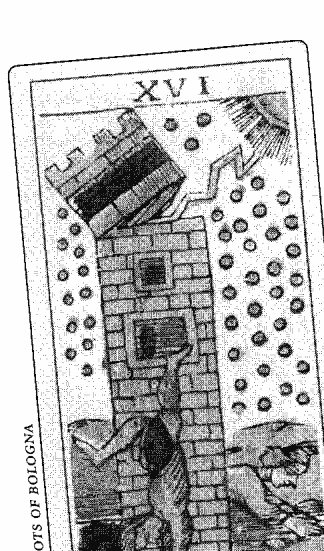

I’ve hit a huge block regarding the Tower card and the philosophy of karma. My birth date reduces to 7, which leaves me with Soul/Personality/Hidden Factor cards of 7 and 16 [Chariot and Tower]. What I can’t get past is how depressing the Tower card is, it’s like Sisyphus rolling the rock up the hill for eternity, how can you ever get ahead if life is constantly crumbling around you? I want to get past this roadblock and seriously learn the tarot, but I fear I might have to abandon it if it can’t bring hope and insight into my life. I turned to tarot looking for hope, a tool for learning how to overcome obstacles and better see opportunities. Instead, when I look at my cards I feel defeated, and I’m asking myself what’s the point of anything if there will be this recurring pattern of everything washing out, having to start out at the bottom again and again and repeatedly being humbled and frustrated. I have heard that all of the events & numerology in my life are the result of karma. I can’t honestly believe I deserve the life I’m living. I’m an honest, caring, deeply mystical, generous person. I’ve always gone the extra distance to help the disadvantaged, and gone to bat for anyone/anything who needed a champion—human, animal, plant or mineral. My favorite childhood movie was Gandhi, and I’ve tried to see everyone’s perspective. And yet, my life has been a grueling hell. I still have a sense of humor, try to persevere, stay cheerful, optimistic, be generous (always on the lookout for good deeds I can do), and try to see the divine in every flower, every blade of grass and every thing.

Jessica compares herself to the mythological figure of Sisyphus, known as the cleverest of men, who was punished by having to endlessly roll a stone up a high hill because he betrayed Zeus. This is one of the great archetypal ordeals. Odysseus (in some versions, the illegitimate son of Sisyphus), on a visit to the underworld, saw just how impossible the task actually was:

> I saw Sisyphus, suffering pains hard to bear. With both arms embracing a gigantic stone, pushing with hands and feet, he would thrust the stone to the top of the hill, but when it was about to go over the top, a mighty force turned it round, and the pitiless stone rolled back to the ground below.

What Odysseus saw, and Jessica is describing, is how the British mystic Charles Williams described the Tower in his novel The Greater Trumps:

It was raised by hands which, from within the rising walls, came climbing over, building themselves into a tower, thrusting those below them in place, fists hammering them down, so that the whole Tower was made up of layers of hands. . . . And then a sudden spark of sunlight would fall## STEP 19

on it from above, and the faces would fall back out of sight, and the hands would disappear... and the apparent masonry, as it was rent by some invisible force, would again change back into clutching and separating hands.

This sounds exactly like Jessica's lament that "life is constantly crumbling" around her and "there will be this recurring pattern of everything washing out, having to start out at the bottom again and again and repeatedly being humbled and frustrated." She sees the tower as a "roadblock," yet continually struggles to rebuild it. The tower symbolizes the body, and Jessica has extreme physical difficulties to the extent that, literally, her body is falling apart. But it also represents one's highest aspirations. The Greek poet Pindar writes of a "path of Zeus" that led to Saturn's tower; anyone reaching it became safe from sorrow and ignorance. The tower actually serves symbolically as both Jessica's block and salvation. Jessica writes as if the obstacle has expanded to include the tarot itself: "I turned to tarot looking for hope... instead, when I look at my cards I feel defeated." She's stuck in the Tower card, not realizing that what follows it is the Star—the card of hope.

Jessica wonders if her life events result from karma, although she can't believe she's done anything to deserve the life she's living. Sisyphus, to whom she compares herself, is punished precisely for being the "wisest of men"—even outsmarting the gods. At one point he imprisons Death so that no one can die. So far Jessica has kept death at bay. Perhaps a karmic reading could reveal a past-life scenario that would give her more insights.

Karma has other aspects; it also forms character and focuses will. Jessica describes herself in terms that fit the spiritual warrior, champion of the oppressed, just like the Chariot, which is her soul card: "I've always gone to bat for anyone/anything who needed a champion." A mythic hero is often characterized by a miraculous but humble birth and suffers some weakness, but gives early proof of strength or special qualities. Then comes the appearance of mentors or guardians, being tested and overcoming pride and, finally, a fall through betrayal or sacrifice. Jessica is involved in the archetypal journey toward what Jung called "individuation." Ultimately she must return to society with the spiritual restorative—the grail or alchemical gold—that makes her whole journey worthwhile. This is, according to Erich Neumann, in *The Origins and History of Consciousness*, "the self-emancipation of the ego, struggling to free itself from the power of the unconscious to hold its own against overwhelming odds." We hear how determined she is not to succumb to despair. In one short email Jessica has written the essence of her personal myth as epitomized by the seemingly paradoxical archetypal images of the Chariot and the Tower, which she related to both a classical myth (Sisyphus) and a modern one (Gandhi, who also took on a seemingly impossible task).

The paradoxical aspects in Jessica's personal mythology are really not so strange—we all have conflicting elements within us. By examining the cards themselves, we may see how this all fits together. It's here that Jessica can gain important insights since, by changing her metaphors (and, thus, her personal mythology), she changes how she experiences her life.

The Chariot represents an archetypal vehicle—what carries her forward. Astrologically, in the Golden Dawn system, the Chariot is related to Cancer, a creature with an armor-like shell that is both its home and its vehicle. A modern version is the automobile, which is energized by pistons firing in the engine—just like the Tower's explosions. Its number, sixteen, reduces to that of the Chariot (1 + 6 = 7). The charioteer controls this energy. Jessica's task, as described by these cards, is to master (Chariot) the explosive energy of the Tower within herself (astrologically, war-loving Mars), containing and releasing it so that its power can be effectively applied where needed. Likewise, a warrior for a cause gets "fired up" by injustices or hot issues, which may strike a person like a bolt of lightning from the divine, opening the crown chakra and shattering limiting beliefs. Jessica's focus on the Tower suggests that she is on the verge of an important psychic change. Ultimately the Tower seeks to liberate her spirit from anything that does not allow her true self to prosper. The Chariot seeks to achieve mastery over the way she moves through the world. It might be worthwhile for Jessica to explore mythic stories involving expressions of Tower strength and clarity, like those of the Hawaiian volcano goddess Pele. There is also a tower in the myth of Psyche and Eros that helps Psyche achieve a task set by Aphrodite.

### The Process of Individuation

In the dreams of individuals, Carl Jung noticed a pattern of psychic growth that he called the process of individuation, which moved people slowly toward greater awareness and maturity. Jung called individuation the "coming to selfhood" or "self-realization," during which contents in the unconscious become conscious, producing a harmonious integration of the psyche into a totality called the Self. The following activity looks at significant archetypes in the individuation process.

### ACTIVITY 19:2

Select the following cards faceup from among the Major Arcana, and write your impressions of them in your journal. (The Shadow, Anima/Animus, and Persona mentioned below are described in Step 15, "Dialogs," and in the Glossary.)

- a. Find a Major Arcana card that is most like yourself. How is it like you? This is your social mask or Persona.
- b. Find the card you like least. What do you dislike about it? This is a Shadow aspect.
- c. Which card, depicted by figure of the opposite gender, best describes your ideal partner? This is your Anima or Animus.
- d. Find a card whose qualities you most admire. Describe them. This is your Higher Self or Guide.

What do these four cards tell you about your personal myth? Make up a story that uses these figures as characters.

Add together the numbers on these cards and then reduce the sum to 22 or less. This number represents your integrated Self. Describe its most beneficial qualities (see Step 11, "Range"). For instance, if your cards were numbered 2, 4, 1, and 9, then you would get 16, the Tower, which indicates a far more powerful Self than suggested by your social persona. If you get the number 22, then your Self would be represented by the Fool (22 = 0). If the total reduces to the same number as one of the cards, then subtract that card from the total and reduce the new sum. The cards you get are not definitive, but rather should stimulate ideas—how might they be true?

### Myth and Tarot

Numerous myths, stories, fairy tales, and mythic/heroic figures can be associated with each of the Major Arcana and many of the Minor Arcana cards. For instance, the Four of Pentacles suggests King Midas, who turned everything he touched into gold, including his daughter; the Three of Cups is often seen as the three Graces. Waite described the Two of Wands as "the sadness of Alexander amidst the grandeur of the world's wealth." In the fifteenth century, the court cards were named after great classical and medieval heroes and heroines (see my book *Understanding the Tarot Court*). Knowing such stories helps in remembering archetypal themes. Myths preserve knowledge and dramatize enduring human truths and cultural ideals. They also inform, inspire, guide, and even compel us; we need them to make sense of what goes on around us. "Mythological archetypes," says Joseph Campbell in *Thou Art That*, "lead to the knowledge of this transpersonal, transhistorical dimension of one's being and life experience." They not only show who you are but who you want to be. Dion Fortune, a British magician and novelist, recognized this:

> I eventually discovered that historical fables were psychological truths and merely required to be restated in terms of modern thought to be accurate working models of things ineffable. Trouble comes, however, when the fables and the framework are taken at their face value, for then they are very misleading and hampering.

The Jungian therapist Robert Johnson tells the story of a young boy who, when asked what a myth is, replies that a myth is "true on the inside, but not true on the outside." As Joseph Campbell was fond of saying, "A myth is a public dream; a dream is a private myth." Myth is metaphor. If you believe the myth is literally true, you'll miss the deeper truth buried within the story. The many dimensions of a tarot card help reveal that deeper truth.

Likewise, by examining a myth or story for a querent, you can:

- See where in the story the querent is right now.
- Predict what the next step or stage might be.
- Suggest, if the querent seems stuck, something from the myth that could unblock the querent to move on. (Or find another story with similar elements that offers other options.)
- Explore the querent's relationships and how these people impact the querent's life.
- Give meaning and purpose to the experience (since most myths culminate in transformation and renewal).

### MYTH & ARCHETYPES

Roberto Calasso, who has retold many of the world myths, says in *The Marriage of Cadmus and Harmony* that when we take risks we enter the mythical realm, for “myth is the enchantment we generate in ourselves at such moments.” Thus, in a reading, as you define and redefine your metaphors, you enchant yourself; you attract a new personal myth or new twists on old ones. To create change, you don’t have to change life directly, only what you tell yourself about it. This allows you to imagine yourself in new ways and revision your possibilities. By drawing your awareness to things previously unnoticed, it generates the magic Jung called “synchronicity”—an acausal principle in which everything that happens at a single moment in time is related in a meaningful way.

### The Fool’s Journey

Jung and Campbell are recent exponents of the idea of a mythic journey to wholeness, but many earlier writers also dealt with this theme. In the early fourteenth century, Dante in his *Divine Comedy* tells of such a journey through hell, purgatory, and heaven that contains many parallels to the tarot. There are indications that the original fifteenth-century tarot deck was created as a cosmology, outlining a journey through the dynamic structure of the universe. William Blake, in the eighteenth century, invented an entire new mythology involving supernatural beings he called Zoas (for the zodiac), who represent parts of the human psyche and whose epic story is about their eventual unification into the Divine Human. Ed Buryn’s *William Blake Tarot* tells this story (the soul’s journey) using Blake’s own art. Martha Heyleman, in *The Breathing Cathedral*, writes about the human need for cosmologies:

> > Human beings need a vision of *everything*—the whole of space and time, the whole universe, how it works, what it’s for, where it came from, where we are in it, and why. We need, in short, the image of a cosmos, and one that is not only mathematical but also animate and conscious and that exists, moreover, for a purpose.

Joseph Campbell found something similar to Jung’s individuation process among myths in all cultures, which he called the hero’s journey, seeing it as the way life is reinvigorated and brought into the cosmos. Campbell’s hero’s journey was popularized as the basis for George Lucas’s *Star Wars* saga. In 1870, tarot author Paul Christian saw such a journey in the tarot, writing of it as a “path of wisdom through the phenomena of life,” and A. E. Waite described the Major Arcana sequence as “the soul’s progress.” Yet it was a New York bookstore owner, Eden Gray, in A Complete Guide to the Tarot (1970), who first used the term and described “the fool’s journey.” Here is a comparison between Campbell’s mythic outline of what has been called the “archetypal quest scenario” and the Major Arcana cards.

| Joseph Campbell’s Hero’s Journey | Major Arcana Equivalents |
| --- | --- |
| **I: DEPARTURE** |  |
| 1) Call to adventure (the feeling that something is about to change) | Fool; Magician |
| 2) Refusal of the call (resistance or obligations within ordinary world) | High Priestess; Empress; Emperor; Hierophant |
| 3) Supernatural aid (a mentor, guide, or a magical or animal helper) | Strength; Hermit; Magician; High Priestess, etc. |
| 4) Crossing the first threshold (entering the unknown) | Lovers; Chariot |
| 5) “Belly of the whale” (recognition of separation; lowest point) | Hanged Man |
| **II: INITIATION** |  |
| 6) Road of trials (tests, trials, sacrifices) | Chariot; Strength; Wheel of Fortune |
| 7) Meeting with the goddess (attraction; finding love; the union of opposites) | Lovers; Justice |
| 8) Temptation (from the true path; revulsion for physical failings) | Devil |
| 9) Atonement with the Father (the Supreme Ordeal; confrontation with ultimate power) | Death; Tower |
| 10) Apotheosis (becoming godlike; rest and peace before the return) | Temperance; Star |
| 11) The ultimate boon (achieving the goal: the grail, elixir of life, alchemical gold) | Temperance; Star |
| **III: RETURN** |  |
| 12) Refusal of the return | Moon |
| 13) Magic flight (the road back) | Moon |
| 14) Rescue from without (assistance from guides or mentors in returning) | Hermit (or most any card) |
| 15) Crossing the return threshold (remembering what was learned; sharing the wisdom) | Sun |
| 16) Master of the two worlds (comfortable in both mundane and spiritual worlds) | Judgment; World |
| 17) Freedom to live (mastery; free from the fear of death) | Judgment; World |

A few explanations of the above chart are in order. First and foremost, the order of the stages in the hero’s journey is not absolute. The order may change and sequences can repeat. Secondly, other choices could be made regarding the tarot assignments, so here is the reasoning behind the ones given above: The Fool initially feels the call to adventure. Once on the road he begins to demonstrate magical traits—at least in vestigial form. The Priestess, Empress, Emperor, and Hierophant represent family, societal training, and ordinary world values. Strength represents animal helpers, while the Hermit serves as guide or mentor (however, any card can serve in this manner). From the Lovers’ attraction to another person comes the first separation from family. The Chariot has the will and means to cross the threshold. The Hanged Man is suspended within the great unknown and must accept a new perspective. The Chariot and Strength are two ways of mastering the tests on the road, while Fortune offers up the varying trials. What Campbell called “meeting with the Goddess” involves recognition and balancing of the opposites within the self as well as without, represented by the Lovers and Justice. The Devil is the great tempter. In Christianity, atonement brings reconciliation with the Spiritual Father through the life and death of Jesus. It is the midpoint of the quest and the supreme act that guarantees salvation, even if it is through Death or the Tower of destruction. Temperance and the Star follow Death and the Tower respectively, showing the achievement of peace and renewal as restorative stages of the journey. The Moon is confusion and reluctance along the road back. The Hermit reappears as guide through the Moon's landscape. The Sun represents rebirth and enlightenment in the ordinary world. The World dancer holds two double-headed wands, showing mastery of both the mundane and spiritual. Liberation from the grave (i.e., from fear of death) fits Judgement, but a case could be made for either, so I've put them together. These final cards also represent a stage beyond individuation that Jung called transcendence.

Appendix F compares the Major Arcana to the hero's myth, the fool's journey, related archetypes, and sample mythic figures.

### ACTIVITY 19:3

Use a Celtic Cross spread, your own favorite spread, or create a new one using your own ideas about the hero's journey. Select cards faceup (that is, by looking through the images) and place them into the spread positions. The idea is deliberately to create a picture showing your idealized motivations, abilities, and sense of self as a tarot reader. Now read the spread as if you asked the question “Who am I as a tarot reader?” Imagine you've drawn these cards at random. Summarize the spread as if it were a story. What does the reading suggest you value most in your work as a tarot reader?

### The Archetypes

Archetypes, as depicted in the tarot, are like masks or functions that you temporarily take on or encounter in order to achieve or handle something. In a spread they represent the motivating aspects of self, as well as stages of a developmental process. They are also universal motifs signifying the longing for wholeness. Understanding which archetypes are most associated with the tarot cards can help you recognize their mythic and psychological counterparts in a reading.

### Categories of Archetypes

The major archetypes and the tarot cards related to them are categorized below. Tarot cards can appear in several categories, and the examples are suggestive, not definitive.

### MYTH & ARCHETYPES

### MAIN ARCHETYPES

**Family, Royalty:** Included here is everything that relates to the classic notion of an inner mother, father, and child and ranges in experience from immaturity to mature responsibility. In the tarot, the court cards, Emperor, and Empress depict familial and parental roles both universally and personally. The Sun and the Fool represent the child archetype, especially the puer/puella or “eternal child” who never grows up, as in the Peter Pan complex. The Ten of Cups and Ten of Pentacles also represent the family archetype.

**Sex, Gender, Bonding, Balance, Hieros gamos:** This category includes all images of sexual duality; specifically, these are the animus (the inner male) and anima (inner female) figures. Hieros gamos means “sacred marriage” and refers to the integration of opposing characteristics within the self, celebrated in the Four of Wands. Primary images in this category are the Lovers and the Two of Cups, but all balancing cards can take this role, like Temperance, Justice, the Star, and even the Hierophant. The Devil, with his two chained minions, usually represents a perversion of this integration, an unholy binding. The World signifies the complete integration of all dualities within a single consciousness.

**Shadow, Devil, Tempter:** This is whatever inhibits or blocks the path through life. In Jungian psychology, the Shadow describes aspects of your personality ignored or repressed by the conscious mind. Marie-Louise von Franz, in Man and His Symbols, notes, “The function of the shadow is to represent the opposite side of the ego and to embody just those qualities that one dislikes most in other people.” In the Middle Ages people avoided falling into the shadow of the Pope’s blessing (the raised hand of the Hierophant), as this shadow represented the Devil. The reversed Empress, Emperor, or Hierophant can take on these characteristics. This archetype also includes whatever tempts you to overindulge, like the Seven of Cups, or fall into shame and depression, like in the Nine and Ten of Swords.

**Mentor, Guide, Teacher, Wise Old One, Higher Self:** This category indicates wisdom but also where something has matured past its prime. It is the oracular voice of counsel and guidance, which provides detached and philosophic answers rather than immediate ones. The Hermit best epitomizes this category, which includes the High Priestess (as crone), Hierophant, and World. The kings, the nines, and the tens in the suits can also appear here.

**Threshold Guardian, Dragon, Ogre:** Sometimes the Devil is more of a threshold guardian than evil creature, appearing threatening to keep you from danger. Guardians usually protect a treasure, such as your creativity or your love-nature. Like the sphinx at the top of the Wheel of Fortune, they oversee growth processes. For those who perceive Judgment as harsh criticism, its angel could be frightening.

**Trickster, Fool, Clown:** This is a natural, spontaneous person who becomes the unlikely hero or antihero, finding life-saving gifts but causing disruption. It obviously includes the Fool, but also the Magician, the pages, and figures like that of the Two of Pentacles (Rider-Waite-Smith). His unconventionality reveals outworn customs, while his simplicity displays spiritual and moral truths. Within this category is the Green Man or Woman, our vegetative and sensory souls, the uncivilized parts of us still connected to plants and animals, who appear in Pagan decks.

**Magician, Alchemist, Shapeshifter, Gambler, Thief:** Whereas you'll find the sorcerer's apprentice in the preceding category, in this one you find the sorcerer. Transmutation, from one form or essence into another, is its primary characteristic, including transferring objects from one person's possession to another's. The mythological figure that ties these together is Thoth-Hermes. Here are fast-talking con artists with cunning and wit and illusionists who can twist one's perceptions. You'll find this archetype in the Magician, Temperance (as alchemist), and the suits of wands and swords, especially the Seven of Swords.

**Sacrifice, Healer, Martyr, Victim, Addict:** This is the well-known “wounded healer” archetype, based on the maxim that you can only be healed by what wounded you. The Hanged Man is the preeminent card for this category, while Temperance can represent spiritual healing. The more difficult aspects of victimization and addiction can be found in the Five of Pentacles; Three and Ten of Swords; Three, Four, and Five of Cups; and the Nine of Wands.

**Mystic, Artist, Poet, Storyteller, Dreamer:** This category, representing those who touch the realms of the transcendent, is closely related to the two previous groups, especially through the Hanged Man. The category also includes the Moon; Star; Knight and Seven of Cups; and the Four of Swords.

**Priestess, Witch, Enchantress, Virgin-Whore:** Traditionally these are women with secret wisdom and outlawed powers, both holy and damned. They fascinate, lure, and tame the passions, while remaining themselves aloof. This is the High Priestess, Strength, the Star, the four queens, and even the World.

**Warrior, Amazon, Hero, Heroine, Knight, Bully:** Hero symbols are associated with mastery in the material world, which invokes the development of ego consciousness. Although the Chariot is the most closely related card, the entire Major Arcana depicts stages of the hero’s archetypal quest. Here we also find the knights, the Six and Seven of Wands, and the Ace and Five of Swords.

**Mediator, Avenger, Judge, Nemesis, Furies:** These figures suggest that there are consequences to every action. They enact retribution and restore balance to the community. Here is Justice, the Wheel of Fortune, the Tower, Judgment, the Ten of Wands, the Six of Pentacles, and the Ten and King of Swords.

### ARCHETYPAL STORY MOTIFS

**Creation, Birth, Death, Rebirth:** All ritual can be seen as re-enactments of a “first time” as well as the change of seasons or change of states that take us through death and into rebirth. Aces and Tens as well as the Fool, Death, Wheel, and World cards epitomize this cycle of creation.

**Journey, Spiral, Path:** This represents one’s trajectory or direction in life—what happens between birth and death, including multiple symbolic births and deaths within it. An implied or literal path appears on cards such as the Fool, Hermit, Death, Temperance, and the Moon. Spreads or any sequence of cards depict a segment of this journey. We all seek a path because we yearn for meaning and desire an ultimate goal. A path marks the passage of those who have gone before, suggesting guidance along the way. To lose one’s way suggests aimlessness and despair.

## STEP 19

**Initiation, Rites of Passage, Ordeal, Trial, Test:** Along the path, you encounter experiences that test your strength and your character (to embrace virtue and not vice). They threaten death and produce transformation. The sixth Major Arcana in the Marseilles deck is sometimes called the Trial or the Two Paths, representing the ordeal of right choice. The Chariot, Hanged Man, Death, Tower, and Moon are other Major Arcana that represent significant trials. The Four of Wands is a rite of passage card; in the Golden Dawn system it’s called “completion” and its astrological attribute, Venus in Aries, represents the equinoxes, marking the end of one stage of life and the beginning of another.

**Individuation, Transcendence:** As we have seen, this is Jung’s designation for traversing the path consciously. Individuation culminates in the Sun, while both Judgment and the World depict transcendence.

**Tree, Axis Mundi, Ascent-Descent:** While the spiral path leads to one’s center, the vertical path leads to transcendence. All cultures depict a world tree that descends into an underworld and ascends to the heavens, suggesting that the path ultimately leaves the mundane plane to traverse other realms of existence. The Magician, with one hand raised and one lowered, shows this. The Hanged Man, Tower, and the aces speak especially of this motif. The Kabbalistic Tree of Life, with its ten sephiroth in four worlds and its twenty-two paths between them is, likewise, an important diagram for working with the tarot. It appears on the Rider-Waite-Smith Ten of Pentacles and on the veil behind the High Priestess. A. E. Waite, in his autobiography *Shadows of Life and Thought*, affirmed the power of following the vertical path of the tarot and Kabbalah: “As one who ascends the Tree of Life, I have passed upwards clothed in Symbols and have dwelt amidst a ministry of images.”

**Center, Mandala, Grail, Heart, Temple:** The grail represents the “ultimate boon,” which psycho-spiritually speaking is found in the temple of the heart or the center of the psyche. The Sun and World cards show this, along with the Ace of Cups as the grail itself. Waite alleged there is a secret doctrine within the tarot that “revealed the path to the Hidden Sanctuary found in the heart where we are ultimately united with God.” He saw this path as one “of exile and return, of quest at once and attainment,” the path of a hidden life and the end in God. . . . In such state the voice is heard in the heart. This is the end of quest, and thereafter will be no more seeking without for that which is within.”

### ACTIVITY 19:4

Examine your original fairy tale from Step 4 and the three-card drawing in Step 16 to see what archetypal figures and motifs they contain.

- How is the center of your drawing or story like a secret sanctuary?
- Where is the ultimate boon?
- What kind of path is shown or implied? Where does it begin and end, and what shape does it take?
- What archetype is represented by the figure you most identified with?

### ACTIVITY 19:5

Go through your tarot deck and sort all the cards into what you see as their most relevant archetype categories. (Write the title of each of the categories listed above on a piece of paper and place the related cards around them.)

- How are the cards in each group related?
- What cards clearly belong in several groups?
- What meanings might you give to cards, based on their archetypal groupings?

## STEP 20

### Deck Comparison

> There are no facts, only interpretations.
> —FRIEDRICH NIETZSCHE, *DAYBREAK*

### The Way of the Apprentice

There are no “correct” meanings for a card or even a one “true” deck, but rather infinite variations. This step compares your chosen card with the same card in several decks. This fascinating process brings out previously unrecognized possibilities, expanding the card’s potential meanings and adding significant symbolism. You’ll also find out which decks really speak to you.

Occasionally, when comparing the same card from two different decks, they will, at first, seem to have no relation to each other. Perhaps they are based on completely different systems. Wands might be associated with earth or air rather than the more usual fire. Some decks reconceptualize the “bad” swords suit to give it more “good” cards, as in the *Voyager* and *Daughters of the Moon* decks. Interpretations based on Etteilla’s original eighteenth-century meanings generally make fives the high point of each suit, signifying its best qualities—the exception being swords (unless ruin and destruction is the best it has to offer). By contrast, the Golden Dawn associated cards with the Tree of Life, where five is the number of Geburah, called “severity,” ruled by Mars and associated (rightly or wrongly) with fear and punishment.

Deck comparison partly involves analyzing the similarities and differences among systems and written interpretations, but it is especially powerful for comparing visual symbolism, moods, and themes—as is apparent in the example that follows. Most importantly, deck comparison presents fresh options, of which you would otherwise be unaware.

### ACTIVITY 20:1

Take your chosen card and find its equivalent in several other decks. If you don’t have other decks, use the Internet to search for online versions of your card. The number of decks you compare is up to you, but I recommend at least three.

- Describe each of the cards.
- Line them up in a way that tracks how the design changes. How are the cards similar and how are they different?
- What new meanings and perspectives can you find in the alternate cards? Use storytelling, metaphors, dialog, embodiment, visualization, or any of the other steps to get ideas. Note what emotions emerge as you interact with each card.
- List at least three keywords or phrases that best express how you now see this card across all the decks. Are your keywords different than the ones with which you started?
- Which version best expresses the advice you would most like to give yourself? What does it suggest you do?
- If you were to design your own version of this card, how would you do it?

### The Way of the Adept

You can continue exploring this step now or come back later, after trying out the other ways to read a tarot card.

### A Sample Card Comparison

Comparing different decks can become addicting, as Valerie Sim found when she started the popular discussion list *ComparativeTarot* at YahooGroups. This is a great topic for your tarot journal. Include scans or sketches of different versions of the cards and commentaries on each. Start by describing your own impressions before seeing what the book says.

### ACTIVITY 20:2A

1) Take the Seven of Swords out of the deck you've been using. Write a brief description of what this card means to you.

2) Take the same card out of several other decks or examine those on the next pages.
   - Sort them by similarities. How are they similar? How are they different?
   - Does the meaning change depending on the version? How?
   - In what kind of situation is the Seven of Swords most likely to appear?
   - How would you read this card in an advice position in a spread? Would the advice change if you used a different deck?
   - Review what the booklets that come with the decks say.
   - List three keywords or phrases that best express what the Seven of Swords is about.

3) Read the discussion on the Seven of Swords that follows, then answer the questions in Activity 20:2B.

## STEP 20

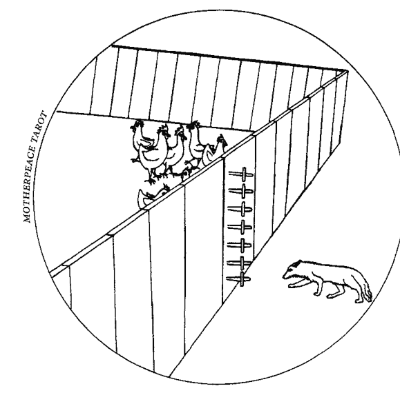

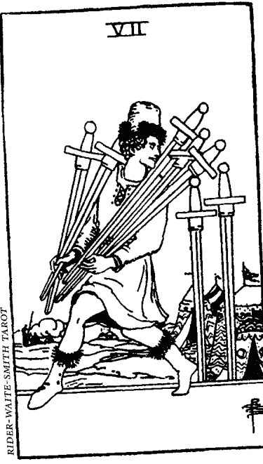

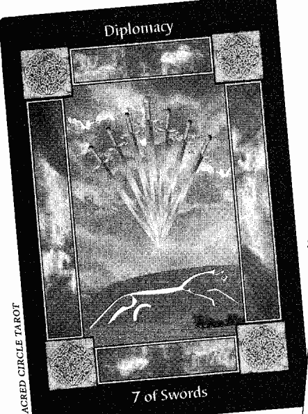

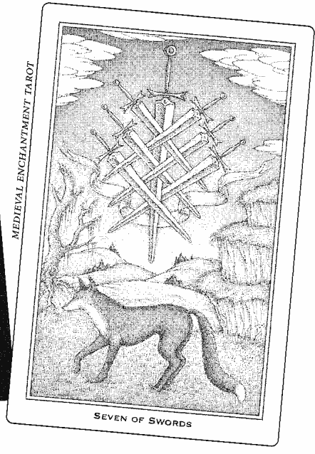

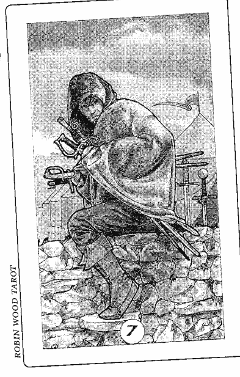

### DECK COMPARISON

The Motherpeace tarot was designed, in part, as a response to the Thoth and Rider-Waite-Smith decks. The Thoth Seven of Swords, called “futility,” shows six blades impinging on one, about which Aleister Crowley wrote, “there exist violent, uncompromising forces which take [the up-thrusting sword] as a natural prey . . . as if there were a contest between the many feeble and the one strong. He strives in vain.” The Motherpeace card shows six chickens inside a fence and a single fox outside it. The seven swords are stuck in the fence, forming a ladder that the fox can climb. Designer Karen Vogel sees the card as mental strategy. She says, “The fox figures out a way into the chicken coop. She plans or strategizes how to get what she wants.” Of course, you could be the chickens, passively worried that something bad is about to happen. Karen Vogel and Vicki Noble converted Crowley’s violent forces and natural prey into a fox and chickens, stressing the fox’s ability to strategize. (You’ll find a surprising number of foxes in Seven of Swords cards.)

In the Sacred Circle tarot, this card is named “diplomacy.” The creators, Anna Franklin and Paul Mason, also reject the unstable qualities that the Golden Dawn found in this card. Whereas Waite said it represented quarrelling and a plan that may fail, they advise cooperation and tact in working with the forces around you. But the stormy sky in the background of the image makes one wonder just how successful they’re going to be. Additionally, the Uffington white chalk horse (that looks surprisingly like a fox) suggests making a quick getaway instead of settling down for a conference or treaty (as the deck creators suggest).

The Robin Wood Seven of Swords also has a stormy sky, but instead of the swords uniting in a point, they are separated in three clumps and each has a different hilt, stressing how difficult they are to handle. A thief is carrying five of the swords over a wall. As in the Waite deck, he seems to be trying to steal the victory away from his better-armed enemies in the encampment. This is the stuff of guerrilla warfare or secret agents. The question is, are you the thief or is someone stealing from you?

In his Medieval Enchantment tarot, Nigel Jackson has six swords crossed in a basketweave pattern blocking a seventh, larger sword. Underneath, a fox walks past. Jackson wrote me that he wasn’t familiar with the Motherpeace card but that “it seemed entirely appropriate to portray old Reynard the Fox creeping warily along on the scent of his quarry, a plump goose or chicken. . . . He symbolizes the use of brain, subtlety and artful guile rather than brawn to attain to one’s goal.” In the image, however, it seems as thoughthe big sword is slowly slipping its way through the woven ones, while the overly confident fox doesn’t even notice the threatening sword hanging over him.

The Shapeshifter tarot, illustrated by Lisa Hunt, also features a sly fox, who is about to be pounced on by a raccoon-faced shapeshifter. The authors note, "The sly deceiver is about to be deceived; the one who spies is spied upon." Has he been outfoxed? The card’s mood is ominous (like several of the other cards), and there’s no foregone conclusion as to who will win the day.

Rachel Pollack’s Shining Tribe tarot shows, for the Seven of Birds, two Australian aborigines singing the "songlines" that define the border between their territories, just as birds define their territories by song. Pollack gives the meaning as "setting boundaries, cooperation with respect for differences; creative solutions." Instead of a perpetrator and victims we have equals who are cooperatively working out their differences, as was suggested in the Sacred Circle tarot. Pollack shows communication as an alternative to stealth and trickery.

### DECK COMPARISON

In the Tarot of Dürer the negotiations have worked, according to the book, which says, “Successful resolution of age-old personal, legal, and business disputes.” However, the picture shows a smiling fox (yes, another fox!) outdistancing a troupe of angry sword-wielding soldiers—a questionable resolution.

Returning to the meaning of numbers in Step 2, we find that the number seven represents both reason and chance, as well as victory and the slightest perturbation that can upset it. There are also seven vices and seven virtues. In modern tarot, sevens often depict a crisis point or time of testing. John Opsopaus, in his Guide to the Pythagorean Tarot, notes how important it is in the sevens to seize the critical moment. So, Opsopaus offers the option of “leaping to commitment [with] daring or impulsive action.”

The majority of the decks imply that during this crisis you must act swiftly to grab an opportunity, even if the odds are against you, in order to avoid being victimized. Whether you choose to operate by stealth or violence, or to engage in diplomacy and cooperation, you will still need cunning and strategy to achieve your objectives. Furthermore, what seems like virtue to you could appear as vice to another. Are you feeling dismay at the thought of being bested? What is at risk in the situation?

Since a fox appears so frequently, I looked it up in Jamie Sams and David Carson’s Medicine Cards book and found that a fox signifies “adaptability, cunning . . . and swiftness of thought and action” in order to make quick decisions and remain sure-footed. Like a fox, you can use camouflage to observe things undetected. Furthermore, a fox feigns indifference but sleeps with one eye open.

All the decks considered so far are from the end of the twentieth century. Earlier decks offer little pictorial information. Going back to Etteilla’s original meanings for the Seven of Swords, we find “Hope, desire, wish, intention, will, vow; wait; to lay claim to; to found, base or maintain; to overrate.” And the reversed meanings: “Good counsel, advice, consultation, instruction, warnings, admonition; news, announcement.” (For Etteilla, the crisis doesn’t appear until the Eight of Swords.) Gabriel Goulinat’s cards in Papus’ book Le Tarot Divinatoire (1910) have as keywords “hope, victory” and, reversed, “wise advice.”

In Paul Marteau’s Tarot de Marseille, every detail is scrutinized, even with the Minor Arcana cards. He interprets the straight, central sword as separating the oval of six curved swords through an act of will, an animated impulse that makes perceptible the work of the subconscious, resulting in clear comprehension. This card is about subjecting yourself to tests that necessitate penetrating to an inner awareness and self-knowledge via focused activity and intelligence. It's worth noting that the old English broadsword, which resembles the central sword here, was called a “fox.”

Thus, earlier French meanings give you another option: you can use willpower to break through obstacles and actively claim what you desire, whether this be property or insights into the subconscious.

Taking this process one step further, try holding all the contradictory meanings for a card simultaneously in your awareness, and to just be present with them in a nonjudgmental, meditative state. At some point, it's as if the space around them—what's called the negative space in graphic design—comes to the foreground and you see a more comprehensive pattern. This can happen, too, if you keep the variations of the card in mind over a period of several days, noticing how one makes more sense and then another.

### DECK COMPARISON

### ACTIVITY 20:2B

Now that you've examined several Seven of Swords cards (your own and the ones in this book):

-   How have your views of the card changed?
-   List some keywords or phrases that describe how you see the Seven of Swords now. Are your keywords different than those with which you started?
-   How would you now read this card in an advice position in a spread?
-   Which version of this card offers the fullest interpretive possibilities?
-   Which card has the most visually unambiguous meaning? (Do you prefer this clarity or more interpretative ambiguity?)
-   If you created your own Seven of Swords card, what images or ideas would you use? Feel free to steal ideas from the images you've been viewing—it's a very Seven of Swords thing to do. (But if you ever publish your deck, do acknowledge your sources of inspiration.)

### ACTIVITY 20:3

**Go Fish**
Just for fun, swirl several different decks together facedown on the floor, as if in a big pool. Pick a favorite spread and, with your eyes closed, "go fishing" for a card for each position in the spread. Hopefully, the resulting spread will be made up of cards from a variety of decks. Does a particular deck appearing in a position add its own meaning? For instance, the Inner Child Cards, created by Isha and Mark Lerner, in the Past position might bring up childhood memories. In a Future position, it could suggest being more playful or creative. A Marseilles Minor Arcana might lead you to focus on the meaning of number and suit. With the Shapeshifter deck, consider what transformations are possible.

### ACTIVITY 20:4

**Round Robin Fishing—for Groups**
This variation on “Go Fish” is a good way to begin the first session of a tarot class or play at a party. From a pool containing several different decks mixed facedown each person takes out two cards. When it’s that person’s turn to introduce herself, she uses one of the two cards to describe something about herself (or what she wants from the class). She then “gifts” the next person with the remaining card, explaining why she thinks this card is significant to that person. The second person says something about why the gift card is appropriate for him, talks about the card he chose, and gifts the next person with his remaining card, explaining why he’s giving it. Thus, each person says something about three different cards: the one they receive, the one they keep, and the one they give. (The first person receives her third card at the end, from the last person.) Follow this with a discussion of which decks were the most interesting and why.

**Choosing a Reading Deck**
It may seem strange to discuss picking a reading deck this late in the book but, with all the new decks coming on the market, it’s valuable to think about what qualities in a deck work best for you. You could choose a deck because it’s attractive, “traditional,” or uses an interesting theme. But how about a deck that speaks at the soul level—a soulmate? Here are some things to think about.

1.  Lay out the deck under consideration on the floor or on a large table, as you did in Step 2, Activity 2:2.
    *   Does the deck physically appeal to you? Are you drawn to its artistic expression, the materials used, its colors, size, format, etc.? Would cutting off the borders enhance your appreciation of the images?
    *   Is a systematic or organizational approach important to you? If so, are the suits, numbers, and correspondences clearly delineated? Does the system make sense to you (for example, can you work with wands as air)?

### DECK COMPARISON

- Are you interested in its symbolic, conceptual, or mythic principles? Do the correspondences to myths or themes seem forced or natural? Does the story line help you remember the card meanings and vice versa? How deep is the understanding and use of the concepts?
- Is it important to have pictures on all the cards? If so, can you select a card at random and easily tell a story based on it? How does the story you told relate to what the book says about the card?

2) Lay out the cards from a deck with which you are already very familiar (sometimes called your “comfort deck”) next to the deck in question.

- Can you relate what you know about your comfort deck to the new deck? Can you imagine a dialog between these two decks?
- Does the new deck have more vitality than your familiar deck? What about it appeals to you?

3) Pick up and shuffle the new deck and select three cards while asking, “What does this deck have to offer me?” Read what the book or booklet says about these cards.

- Is this the kind of advice you want? Do you want to have your future told, receive divine wisdom, explore personality characteristics, get specific and unambiguous answers? Do you prefer responses that emphasize inner resources and growth or that give warnings of problems and events outside your control?
- Is the intent and worldview of the creator compatible with yours? Does the deck present options or tell you facts? Does it suggest you can change events or that you are subject to fate? Do the interpretations make you feel optimistic and empowered or overwhelmed and constrained?
- Is the deck accessible and varied in its use? Can you get both quick feedback and in-depth answers to specific questions? Do you need to learn a complicated system? Do the cards “talk” directly to you?

## STEP 20

4) If the deck passes all the previous steps, then shuffle the cards and pick one while asking, “What do I most need to look at in my life right now?” Take this card through all twenty-one ways to read a tarot card.

- By the end of the reading, did the cards seem to have taken on more dimensionality, becoming more vibrant, alive, and colorful?

5) Use this deck to do a reading for someone else, preferably someone you don't know.

- Were you able to use the style of reading you prefer or did this deck demand a different approach?
- Did the cards speak clearly to you? To the querent?
- Is this a deck you want to use primarily for yourself, when reading with others, or both?

## STEP 21

### The Possible Self

> Live long and prosper.
—TRADITIONAL VULCAN GREETING

### The Way of the Apprentice

Every card, even when difficult, contains something of value. The valuable aspects point out how a person can express his or her possible self. It is time to turn the qualities and characteristics that you most admire in your card into affirmations describing you already being that desired self. You will also design and carry out a simple task that expresses these qualities.

Occasionally someone complains (always in theoretical discussions but never, so far, in practice) that this is just “feel-good” stuff, whereas they go to the tarot to get to the “bitter truth.” That’s all well and good if you want to live in a deterministic universe, filled with difficulties, where you have little or no control over how your life proceeds. Certainly there are things over which you have no control, but you can decide how you will respond to them. Is an event a “bitter truth” or a “fruitful opportunity”? Such a simple shift can make all the difference. Seeing yourself capably handling a situation and doing it in a way that makes you proud is empowering.

When you form a mental image of yourself as successful, you can solve bigger problems based on that strengthened self-concept. Researchers from the National Institute on Aging wanted to find the best way to insure that diabetic seniors test their blood sugar levels regularly. One group repeatedly recited the instructions aloud. A second group wrote lists of pros and cons for testing their blood sugar. The third group spent one three-minute session visualizing what they would be doing the next day and where they would be when they tested their levels. The third group remembered their task three-quarters of the time, while the others were successful less than half the time. A tarot reader can assist the querent in finding and visualizing successful strategies for dealing with the stresses and difficulties shown in the reading.

The goal of a reading is to learn how to prosper. Prosper comes from roots meaning “to render one fortunate” or “toward one’s hope.” In addition to the obvious financial implications, to prosper is even more about experiencing satisfaction, happiness, and physical well-being. It’s the ability to meet challenges, actualize dreams, and to thrive and grow. To do this you have to break through patterns of habitual functioning and integrate insights into everyday life. The highest function of the tarot, to paraphrase an idea of Joseph Campbell’s, is to awaken the heart. The goal is to interpret its symbols so as to enlighten and spiritually nourish the self—that is, to spiritually prosper. To complete a reading we have to find what will nourish us at all levels. That is what this final step aims to do.

### ACTIVITY 21:1

1) Take your chosen card, remembering that it has an entire range of meanings. Describe qualities you see in this card that you most want to develop in yourself. Imagine that five or ten years from now you look back at this time and say, “This situation was worth it all because I developed . . .” Take only one or two minutes to do this, writing down as many thoughts as you can.

2) Expand slightly on one or two of your words or phrases. For instance, if you wrote “grace,” where would you like to develop grace? Grace in doing what? If you wrote “serenity,” serenity concerning what?

3) If you used “no,” “not,” “nothing,” or any other form of negative, turn it into a positive. For instance, if you wrote “I’m not afraid,” then what are you if you’re not afraid? Strong? Determined? Determined to do what?

4) Write an affirmation, a positive statement about yourself, using the words and phrases you’ve written down.

- Write it in the first person present tense.
- Make it short and precise.
- Only use words from your list, although you don’t have to use them all. You can change the parts of speech and add connectors.

5) Refine and edit your affirmation.

- Your affirmation is most powerful when it is action-oriented. Use active verbs instead of a form of “to be.” Turn one of your words into a verb. For instance, instead of “I am a dancer who speaks my truth” try “I dance my truth.” Instead of “I am graceful” try “I gracefully . . .” or “I grace my surroundings with . . .”
- You are this now. If you’ve used “I will . . .” then change it to present tense. Change “I want” into “I have” or “I do” or, better yet, use an active verb.
- The truth is convincing. Say your affirmation aloud three times. Put emotion into it. Proclaim it. Were you able to convince yourself it’s true? If not, look it over—how can you modify the words to make them more authentic and heartfelt?

### Using Your Affirmation

- Make it part of you. Say it three times out loud, three times a day for twenty-one days. For instance, say it when you get out of bed in the morning, at lunchtime, and before you go to bed.
- Commit yourself in writing. Copy your affirmation a hundred times. Print it on a card and tape it to your mirror.
- Raise energy. Put some emotion into it; act it out. Be convincing.
- Apply your affirmation as a testing device. Notice where in your life it’s true, no matter how slightly so, and give yourself a little reward or just acknowledge the alignment of the situation with the affirmation. This is where you already are your possible self. Try to maximize these situations.
- While feeling this flush of success, imagine yourself doing it in other circumstances. Be as detailed as possible in what you imagine.
- Greet wherever it’s not true with a sense of humor (“nobody’s perfect”) and then drop it. Don’t give any energy to your failures. Simply smile or laugh and get on with your day.

### The Way of the Adept

You can continue exploring this step now or come back later, after trying out the other ways to read a tarot card.

### Working with a Querent

If you are reading for someone else, then guide him or her through the process described above. If you are familiar with writing affirmations, then you can help them write theirs, being careful to use only their words (you can change the part of speech and add articles, prepositions, and connectors).

### Working with a Spread

When interpreting a whole spread, whether it’s three cards or twenty, save the above process for the end. Then ask, “Which card represents the qualities you most want to develop in yourself?” When people say they can’t decide among two or more cards, I ask them to place these cards in a row showing how one would lead into another. The final card in the lineup represents what the person most wants to develop. Or, if it seems more appropriate, integrate the qualities of two cards into one affirmation. Follow your intuition.

### Example with the Seven of Swords

For the Seven of Swords (see Step 20 for a discussion of this card) I wrote the following qualities I see in the card that I most want to develop in myself: "Knowledge. Knowing what I want. Willing to do whatever to get it. Getting away scot-free. Being daring. Grabbing an opportunity when it arises. Not giving up when outnumbered. Determined."

So I ask myself, "If I'm not 'not giving up,' then what am I doing?" I'm persevering. So I add "persevering" to my list. I could also ask myself, "Determined to do what?" Determined to be safe. Though I find this surprising, I write it down.

My first rough attempt at an affirmation is: "I know what I want and am willing to do whatever to get it, safely and with daring and perseverance."

Playing with it some more, it becomes: "I know what I want, so, with daring and perseverance, I grab the opportunities whenever they arise."

I realize that my task is to discover what I really want! If I've done all the other steps, then I might find it's already become clear. If not, then I need to notice where in my life this affirmation is true. I discover that what I most want is to complete this book on schedule—a seemingly impossible task, in part because the knowledge (the first quality I named above) that I want to go in it is part of a never-ending journey. Over the next couple of weeks, I test everything I encounter with my affirmation, discovering where I truly want to persevere and how to grab the opportunities that arise.

In fact, I found as I was completing the book that what I really wanted was not opportunities to work on the book—I worked on it all the time—but to grab the moments to be with friends or watch TV or go to a movie. I began to see how important these times were for me and how I didn't want to feel like I was "stealing" them. Furthermore, it was during these breaks that confirmation of the knowledge I was putting into this book came in synchronous ways.

In terms of the hero's journey, commitment to this course of action means I have to test the limits of what I want. Joseph Campbell in *Thou Art That* writes, "Heroes are the ones who initiate their actions no matter what destiny may result." And each of us is the hero of our own story. Any truly authentic affirmation, actively explored and embodied, takes you to your destiny, even if at first it seems utterly mundane.

### The Task of Ritual: Activating Your Insights

The final step is to do something within twenty-four hours that accords with your affirmation. This should be a tangible act, no matter how small, that enacts your affirmation and integrates your insights into everyday life.

In effect, it is a symbol-in-action, which is the simplest definition of ritual. Remember, symbols are the language by which the unconscious speaks to the conscious and vice versa. They are how you bring the inner and outer, the above and below, the conscious and unconscious into communion with each other.

Ritual can be defined further as "symbolic behavior, consciously performed, for the purpose of transformation." Our common daily rituals are mostly habits since they are seldom conscious and are more about preservation than transformation, but they demonstrate the metaphors we live by and their instilled values. Lakoff and Johnson in *Metaphors We Live By* explain that "our implicit and typically unconscious conceptions of ourselves and the values that we live by are perhaps most strongly reflected in the little things we do over and over, that is, in the casual rituals that have emerged spontaneously in our daily lives."

This step allows you to consciously change a metaphor that you live by. It works as a spell that breaks the trance of habitual functioning. It makes you aware of inner spiritual forces and generates emotional energy for your outer work. Emotion is raw energy (fire) that feeds on the fuel of old events. Your task is to check the habit, contain the energy and direct it consciously. Mindfulness allows containment. Achievement is shown by:

- 1) an increase in confidence
- 2) the lessening of inappropriate responses
- 3) a sense of self-direction in your actions

Doing this step is a way to transform something in your life with full mindfulness.

You might ask what kind of task goes with my affirmation ("I know what I want, so, with daring and perseverance, I grab the opportunities whenever they arise") since it seems to require waiting for an opportunity. To answer this, I recalled several books channeled through Jane Roberts from an entity named Seth. One of his key sayings was, "Your point of power is in the present." In other words, every moment is an opportunity. My most active verb is "grab." So I need to consciously grab an opportunity, and I need something that sends a powerful message to myself. I check inside to see where I have been most negligent in grabbing opportunities. For months I've been putting off some car repairs, so I decide to call the mechanic for an appointment. This will only take a minute, it feels like the most powerful thing I can do, and it will give me knowledge about the condition of my car. What makes it into a ritual is that I'm doing it as a conscious enactment of my affirmation. I feel like a crafty fox, stealing time from the chickens pecking away at the book (remember that thievery is one meaning of the Seven of Swords), but it makes me feel empowered and brings me knowledge I need, albeit in another area of my life.

I then use the energy of accomplishment to charge an imaginative vision of completing my book successfully and mailing it off on time, which I know from the National Institute on Aging experiment will facilitate doing the task.

For me, setting an intention, checking in with my higher self, being aware of the symbolism, acting consciously, and directing my energy raised this simple task into a transformative ritual—transformative because the process transforms the outcome. And, thus, I realized that the essence of my affirmation is "I persevere in obtaining (grabbing) and sharing knowledge." The affirmation became an invocation of the possible self, showing itself as a tool of great power for waking up to the real reason in doing this work.

### ACTIVITY 21:2

Decide on a simple task or ritual that you can do within a day that goes with your card and your affirmation. Do it. The twenty-four-hour time limit acts as a container for your energy and helps direct it toward the accomplishment of your task.

Some sample tasks:

- Use some of your lunch hour to meditate, walk in a park, or sketch.
- Buy a plant that symbolizes your desired goal, then plant and care for it.
- Clean or reorganize one small part of your environment.
- Go to a playground and play.
- Dance your affirmation.
- Create an altar with objects like those on your card or that symbolize your intention.
- Write a heartfelt letter to someone (whether you send it or not).
- Take a ritual bath with candles and music. Put significant herbs or essential oils in the water. Wash away what you don't want and bring in what you desire.
- Do one thing that you've been putting off.
- Speak truthfully to someone.
- Change something about your appearance. Wear a symbolic color.
- Turn off the television and read a neglected book.
- Stop by church, say a prayer, and leave an offering.
- Volunteer or do something for charity.
- Perform one random act of kindness.
- Create a collage or "treasure map" that shows you prospering.

### Full Circle

> > The point of life is that you are the fool of life, that you play the role, that you make all sorts of attempts, that you suffer. But you play that role in a most unsatisfactory way, you create a lot of nuisance or suffering or even catastrophes, if you identify with it.
—CARL JUNG, VISIONS

Continuing from the quote above, Jung explained that the task is not to identify with any particular role—that is where we are fools—but rather with "something beyond, where you are detached." He called this the Self.

True meaning is full participation with what it signifies. It is the interaction between the world around you and your own divinity. Meaning is vibrant, alive—being fully conscious in the moment. It is totally committing to whatever is required. You can only do this when you have experienced meaning with all your senses and in all of its multi-dimensionality. If you get caught up in the story about it, or in justifications regarding it, or in wanting it to be different or to go away, then you are no longer meeting it. Meaning then becomes mere definition and the tarot image becomes flat and lifeless. If you stayconsciously in the meaning, in the knowing, it will take you beyond itself to where consciousness pervades everything. The practical result is being able to respond effectively and with integrity to whatever comes up.

Reading the tarot is not a question of figuring out what a card or spread really signifies, or even what you are to do. What often happens after working with an issue in a spread is that you come to realize it doesn’t matter, because the problem is no longer an issue in your life. The situation might seem to resolve itself with little effort or interference from you. Another person or even the events change in ways you would never have expected. There’s no dramatic resolution, it’s just that one day you realize you’ve grown beyond it. Something deep has shifted. When focused on concrete results it’s easy to miss these things. That’s why keeping a tarot journal can be so helpful.

Writing this book has been like keeping a journal. For instance, I randomly drew the High Priestess and Emperor as an example in Step 14 (on dignity and theme), and then used them again in Step 15 (dialogs). A week later I randomly chose these two cards in a class I was teaching in which we were doing the three-card drawings from Step 16. This time they were together with the Ten of Cups, which can signify home improvement. Suddenly I realized they exactly described my interactions with a contractor who was doing extensive work on my home. I decided to trust my intuition that, despite extensive delays, the work would get satisfactorily completed through patience and compassion rather than anger or confrontation, and it has.

I also had trouble finding the “core” theme for the reading I did for myself involving the Ten, Knight, and King of Cups from the Legend tarot (see Steps 5 and 11). I associated them with my meditation practice and with my struggles to explain clearly and precisely the deeply heartfelt and often tenuous psychic presence and awareness needed to plumb the depths of a reading using the methods in this book. But my analysis felt unfinished. I decided to simply live with the openness and ambiguity. A week after finishing my first draft of Step 11 I attended a workshop at the Esalen Institute in Big Sur, California. I spent every free moment sitting dreamily in the hot tubs on the cliff side, suspended between the deep night sky and the pounding ocean, or in the meditation sanctuary that sits in a leafy, wooded grove at the edge of a rushing stream, high with spring runoff. These places were uncannily like the environment depicted on the three cards. I was literally fishing, but in the deep, dark waters of psyche and spirit, just like the Arthurian King of Cups.

### FULL CIRCLE

I reveled in the moments of serenity and deep connection to All That Is, and the feeling of being suffused in everything my three cards had represented, but with which I had struggled back home. As it came time to complete the manuscript I saw the cards at a whole new level, for I had isolated myself almost completely (the lonely castle on the Ten of Cups) to get the book done (my Grail), and felt like I had been living in a watery, dreamlike place (inside my mind and imagination).

When working in depth with a small number of cards over several days, weeks, or months, you'll find that it's not necessary to know exactly what the reading is about. Instead, keep the possibilities open. The cards will reveal themselves to you in many ways over time, and you'll find their echo in everything you do. May all your steps lead you to the grace of Spirit.

## APPENDIX A

### Emotions List

A list of emotion words can run into the many hundreds. What follows is only a small selection of the possible range of emotional expression. See Activity 3:3 for a way to assess the emotional content of your tarot deck.

- accepting
- annoyed
- belligerent
- complacent
- accomplished
- anticipatory
- benevolent
- confident
- adoring
- anxious
- bitter
- confused
- adventurous
- apathetic
- blissful
- contemptuous
- affectionate
- apprehensive
- brave
- content
- amazed
- aroused
- calm
- courageous
- ambivalent
- arrogant
- carefree
- curious
- amused
- astonished
- cautious
- daring
- angry
- awed
- compassionate
- decisive

| defensive | grieving | longing | reverent |
|-----------|----------|---------|----------|
| defiant   | guilty   | lost    | sad      |
| depressed | happy    | loving  | satisfied|
| desirous  | hateful  | lustful | scornful |
| despairing| heartbroken| melancholy| secure|
| determined| helpless | mirthful| serene   |
| disappointed| hopeful| mischievous| shamed|
| disgusted | hopeless | needy   | shocked  |
| disliking | horrified| nostalgic| smug    |
| dissatisfied| hostile| optimistic| sorrowful|
| distressed| humble   | overwhelmed| spiteful|
| doubtful  | humiliated| panicking| startled|
| eager     | humorous | passionate| surprised|
| ecstatic  | impatient| patient | suspicious|
| elated    | impotent | peaceful| sympathetic|
| embarrassed| inadequate| pensive| tender   |
| enthusiastic| indecisive| pitiful| terrified|
| envious   | indifferent| pleased| triumphant|
| expectant | insecure | prideful| worrying |
| fearful   | interested| puzzled| worshipful|
| festive   | irritated| raging  | yearning |
| frustrated| jealous  | regretful| zestful  |
| gay       | joyous   | resolute|          |
| grateful  | lonely   | respectful|        |

## APPENDIX B

### Number & Rank Keywords

#### Aces

Newness; simplicity; singularity; focus; seed; root; potentiality; beginning of a cycle; gift; inspiration; stimulus; opportunity; intent; birth; source; divine energy; highest achievement; point; emergence; pure energy; alone; inspiration; wholeness; activation of an immanent power. *Kether*: Crown.

Emotionally, aces tend to be inspired; aroused; decisive; desirous; wondrous; awed; fulfilled.

**Reversed:** Delays; opportunities not grasped; impotency; materiality; inner focus; pre-conscious.

> * The Kabbalistic Tree of Life contains ten *sephiroth* (sing. *sephira*) corresponding to numbers one through ten. The Hebrew name of each sephira is italicized, followed by an English equivalent.

#### Twos

Choice; balance; decision; all opposites; duality; polarity; adaptability; cooperation; separation; alliance; inner truth; line; dialog; communication; joining or splitting; coupled; partnering; pairing; relating; response; reaction; reflection; reception; memory; retention; relationship. *Chokmah*: Wisdom.

Emotionally, twos tend to be cautious; indecisive; ambivalent; expectant; patient.

**Reversed**: Imbalance or inner balance; inharmony; opposition; duplicity; breaking the tie or stalemate.

#### Threes

Creativity; blending; togetherness; synthesis; integration; result; love; comprehension; sorting; fertilization; result of the previous union; development; fruition; reunited; building; socialization; cooperation; collaboration; expression; fulcrum; trinity; sorrow; action; application; generation; child; plane; dimension; fulfillment in work; conception. *Binah*: Understanding.

Emotionally, threes tend to be fulfilled or expectant.

**Reversed**: Nonworking; uncooperative; overindulgence; inaction; recovery and healing; forging inner agreement.

#### Fours

Consolidation; rest; realization; foundation; harmonization; establishment; stabilization; order; resolution; authority; holding; accumulation; retreat; stagnation; building a solid foundation; control; power; complacency; compromise; caring; structure; directions; dimensionality; solids; harvest; limits; plateau; status-quo; pacifism. *Chesed*: Lovingkindness; mercy.

Emotionally, fours tend to be stubborn; pensive; bored; suspicious; depressed; secure.

**Reversed**: Insecurity; rashness; loss of control; premonitions; divesting of restrictions; a strong inner foundation.

#### Fives

Alteration; destabilization; crisis; change; upset; instability; adversity; making necessary changes; adaptation; change that may require creative destruction; crisis creating challenges and opportunities; problem-solving; conflict; disruption; disturbance; uncertainty; loss; overthrows the complacency of the fours; revolutionize; adapt; difficulties; trials; unbalanced; constraint; harshness; humanity; magic; revolt; versatility; outsider; disaster; storm and stress; nemesis. *Geburah*: Judgment.

Emotionally, fives tend to be regretful; belligerent; despairing; sad.

**Reversed**: Inertia; dogma; repression; victimization; conformity; hope; renewed interest; reconciliation; gratification.

#### Sixes

Combination or recombination; choice; union or reunion; knowledge; support; cooperation; responsibility; sympathy; reciprocity; exchange of energies; attraction; balance; trials (of the fives) overcome; discrimination; opportunities for success; equanimity; accomplishment; help; equalization; reflection; sacrifice; harmony; generations; cycles; recognition; reward; assistance; perfection; idealism; social concerns. *Tiphareth*: Beauty.

Emotionally, sixes tend to be grateful; hopeful; appreciated; benevolent; loving.

**Reversed**: Self-centeredness; vanity; estrangement; superficiality; self-actualization; insubordination.

#### Sevens

Challenges; tests; use of skill and courage; temptation; mastery; projection; extension; putting forth effort; the real push; getting things done; proving oneself; achieving mastery or victory; loss of stability; force; taking chances; confrontation; vice; sins; excess; wild; power and energy; imagination and experiment; strength; change; uncertainty; misgivings; mystery. *Netzach*: Victory.

Emotionally, sevens tend to be defiant; expectant; daring; desirous; impatient.

**Reversed**: Arrogance; deceit; paranoia; embarrassment; cowardice; focus; design; constancy; implementation.

## APPENDIX B

#### Eights

Regeneration; resurrection; extension; distribution; complexity; adjustment; acknowledging error; re-evaluation; re-ordering; redistribution; redirection; organize; systematize; direction; control; restraint; line-up; practical endeavors; regulate; progress; process; dispose; regiment; methodize; efficiency; results of victory and changes; movement; reality; ordering; prudence; reserve. Hod: Glory.

Emotionally, eights tend to be resigned; determined; enthused; inspired.

Reversed: Lack of persistence; poor judgment; precipitous action; spiritual progress; generosity; expansiveness.

#### Nines

Limits; strength; prudence; culmination; attainment; completion; solitude; security; self-determination; protection; temporary stability; fulfillment; realization (making real); relaxation; restoration; satiation; repose; isolation; wisdom; integrity; philanthropy; humanitarianism; idealism; patience; desperation; unconscious; dreams; astral; pregnancy; lunations; consciousness; awareness; interpretation; expectation; anticipation. Yesod: Foundation.

Emotionally, nines tend to be calm; melancholy; satisfied; contented; lonely.

Reversed: Lacking discipline and self-awareness; dependency; hostility; inner wisdom; humane compassion; nonphysical gain.

#### Tens

Necessity; wholeness; consummation; denouement; heritage; completion and new beginning; effects or result of the completion; karma; responsibilities; permanence; renewal; community; amplification; multiplication; solution; realization; transformation; material power and goods; release; preparation for a new cycle; establishment; reaping; harvest; fulfillment; reality; extremes; decay. Malkuth: Kingdom.

Emotionally, tens tend to be fulfilled; mirthful; overwhelmed; festive; nostalgic.

Reversed: Overdose of the element; rebellion; losses; quarrels; short-lived results; inner harvest; release; liberation.

#### Pages

Children; messengers; students; catalysts; beginnings; dependent; immature; vulnerable; risk-taking; receptive; open; preparation; they study, learn, serve, try out, and develop; the physical body; inner child; undeveloped potential; catalysts; birth.

Emotionally, pages tend to be curious; interested; expectant; hopeful; wondrous; yearning; amused.

**Reversed:** Immature; gullible; hurt; depressed; tantrums; closed down; ignorant; vulnerable; poor start; bad news; inner child; undeveloped potential.

#### Knights

Action; adventure; revolutionizing; move; thrust; challenge; adventure; seeking; overturning; expansion; energies; journeys; departures; adventure; aggressive; headstrong; unstable; task or goal-oriented; the animus; ego.

Emotionally, knights tend to be impatient; proud; daring; arrogant; resolute.

**Reversed:** Fanatical agents of elemental forces; either reckless or reigned in impulses; destructive; irresponsible; misdirected; slowed; inner quests.

#### Queens

Mothering; nurturing; inner and interpersonal mastery; magnetic; persuasive; sensitive; maintaining; fostering; supporting; motivating; devotional; reflective; fruitful.

Emotionally, queens tend to be caring; compassionate; benevolent; inspired.

**Reversed:** Selfish; unwise use of power and control; ineffectual; inconstant; disloyal; weak; absent; unfeminine; violated; nagging, smothering; bad; overthrowing parental or societal strictures and authority; inner feminine.

#### Kings

Fathering; commanding; outer and public mastery; aggressive; rules and laws; power; authority; sets goals; establishes policy; orders; rules; directs; resolute; fixed; static; resistant; outmoded; decay.

Emotionally, kings tend to be proud; stubborn; resolute; arrogant; benevolent.

Reversed: Selfish; unwise use of power and control; ineffectual; inconstant; disloyal; weak; absent; unmasculine; bullying; arrogant; tyrannical or lenient; bad; overthrowing parental or societal strictures and authority; inner masculine.

## APPENDIX C

### Mode, Suit, Element Keywords

#### Keywords for the Modes

| MODE | TELLS | EXPERIENCED AS |
|------|-------|----------------|
| Court Cards | Who? | A person. An aspect of personality, job, or role. Style of acting or attitude. A way of relating to others. An energy personified. In some cases, specific objects or events. |
| Number Cards | What? | The situation. Life events. Actions. What is going on. Terrestrial phenomena and effects. |
| Major Arcana | Why? | The cause. A lesson to be learned. Archetypal energies, psychospiritual needs. Celestial causes. |
| Aces | Where? | The element, realm, or sphere of greatest potential. New opportunities or elemental energy. |

#### Minor Arcana Elemental Correspondences

(According to sources that have influenced modern decks.)

| 行标签 | GD*, Lévi, & Marteau | Eteilla † | Gardnerian witchcraft ‡ | Zain & Papus § | Picard/ Spanish ** | Joseph Maxwell †† | William Blake ‡‡ (Buryn) |
|--------|----------------------|-----------|-------------------------|----------------|--------------------|--------------------|--------------------------|
| Wands | Fire | Earth | Air | Fire | Fire | Earth | Earth |
| Cups | Water | Water | Water | Water | Air | Water | Fire |
| Swords | Air | Air | Fire | Earth | Water | Fire | Air |
| Pentacles | Earth | Fire | Earth | Air | Earth | Air | Water |

#### NOTES ON SOURCES AS INDICATED IN THE CHART HEADINGS

* GD = the Hermetic Order of the Golden Dawn (founded 1888) among whose members were Samuel L. MacGregor Mathers, A. E. Waite, Pamela Colman Smith, and Aleister Crowley. This category includes many decks based on their works. Eliphas Lévi (Alphonse Louis Constant) was a mid-nineteenth-century French magician whose books were a major influence on the development of occult tarot. Paul Marteau was publisher of the Grimaud Marseilles tarot. His book (1948) became the major influence on Marseilles-based tarot interpretations.

> † Etteilla (Jean-Baptiste Alliette) wrote the first book on reading tarot cards (1783), from which modern interpretations developed. He designed his own unique version of the tarot called the Etteilla deck (using the reversed spelling of his surname).

> ‡ Gerald Gardner was the founder of modern British witchcraft in the mid-twentieth century. Although he wrote nothing on tarot, his elemental associations have influenced several modern decks.

> § C. C. Zain (Elbert Benjamin) created the Brotherhood of Light, an Egyptian-style tarot deck (1936). Papus (Gerard Encausse, M.D.) wrote Tarot of the Bohemians (1889) and Tarot Divinatoire (1909), featuring Egyptian-style cards designed by Gabriel Coulinat.

> ** Eudes Picard wrote Manuel Synthétique & Pratique du Tarot (1909), which included original designs and interpretations for the Minor Arcana. Several twentieth-century Spanish decks were influenced by Picard's interpretations and designs, especially El Gran Tarot Esoterico (1976) by Marixtu Guler.

> †† Joseph Maxwell wrote The Tarot (French: early twentieth century; English: 1975). He interpreted the minors based on details in the Marseilles deck.

> ‡‡ William Blake (1757–1827), English poet, mystic, and artist, based his elemental correspondences on the revolutionary spiritual concept that elemental Earth, as the ground of reality, is associated with the everlasting spiritual realm, and that elemental water, representing mutability, is associated with the everchanging physical realm. Ed Buryn devised the suit correspondences when creating the William Blake Tarot of the Creative Imagination that uses Blake's art and ideas.

#### Minor Arcana Suit and Element Keywords

##### WANDS

Fire (most): A new idea or inspiration; projects; innovation; risk; energy; taking action; business; occupation; status; ambition; enterprise; spiritual growth; inspiration; thesis; creativity; initiation; enthusiasm; desire; passion; perception; action; movement; externalized; optimism.

Emotionally, they tend to be expectant; determined; enthused; defiant; defensive; inflamed; aroused; stubborn; daring; ecstatic.

Air (Gardnerian witchcraft): Communication; intellect; initiation; enterprise; ideas and projects; power; confidence; ambition; attention; social interaction; knowledge; teaching and learning; leadership; dissent.

Earth (Etteilla, Maxwell, Blake): Creativity; generative force; the phallus; desire; material growth; wealth; career; progress; security; tyranny; the countryside; spiritual realm; everlasting (Blake).

##### CUPS

Water (most): An emotional reaction to and nurturance of an idea; feelings; heart; relationships; affection; joy; pleasure; nourishment; moods; unconscious; imagination; intuition; being psychic; dreams; visualization; inner processes; receptivity; reflection; mirroring; empathy; home; containment; gestation.

Emotionally, they tend to be happy; joyful; loving; melancholy; wondrous; peaceful; caring; appreciated; welcoming; contented; grateful; fulfilled; festive; nostalgic; shy.

Air (Pictorial): Love; affections; family; home; gestation; birth; children; immortality of the heart (depicted as a butterfly); festivities; sentimentality.

Fire (Blake): Passion; creativity; emotions; music.

##### SWORDS

Air (GD etc., Etteilla): A struggle to plan and work out problems; will; thought; mental processes; understanding; criticism; analysis; reason; plans; strategy; assessment; struggle; pain; tests of the mind; conflicts; decisions; wit; cunning; discussion; communication; acuity; pessimism; synthesis; integration; planning; problem-solving.

Emotionally, they tend to be despairing; hopeless; grieving; resigned; heartbroken; melancholy; depressed; shameful; fearful; guilty; self-doubting; overwhelmed; contemptuous; mischievous; spiteful.

Fire (Gardnerian Wicca and Maxwell): Energy; will; astral fire; spirit; passion; ardor; enthusiasm; action; courage; force; beliefs; equilibrium; power; progress; conquest; violence.

Earth (Zain and Papus): Patience; industriousness; practicality; toil; employment; organization; melancholy; physical or environmental conditions; hardship; struggle; affliction; enemies.

Water (Pictorial): Force directed by will; invisible difficulties; obstacles to defeat; fury; storm; necessity; malice; intoxication; disease; negative emotions (melancholy; anger; worry).

##### PENTACLES/COINS

Earth (most): A fruition or final result; money; sensation; security; self-worth; value; the body; health and fitness; results; actualization; grounding; centeredness; instincts; manifestation; skills; craftsmanship; rewards for accomplishment; fruits of labor; tradition; the physical and material.

Emotionally, they tend to be secure; satisfied; fulfilled; benevolent; contented; welcoming; appreciated; grateful; insecure; worried; bored; interested; patient; apathetic.

Air (Zain and Maxwell): Intelligence; observation; knowledge; sagacity; communications; trade; ambition; changeableness; sociability; mental alertness; science; health; money; finances; speculation; property; policies; travel; thoughts; occult studies.

Fire (Etteilla) The “complete solar medicine”; a happy, content, and prosperous suit with a family orientation.

Water (Blake): As in earth qualities but emphasizing temporality, illusion, and emotionality.

#### Major Arcana Elemental Correspondences

The following chart compares the elemental associations of Major Arcana cards according to the Golden Dawn, French (Lévi), and Egyptian (Church of Light/Zain) astrological correspondences, showing just how much variety is possible.

##### MAJOR ARCANA ELEMENTS

|  | Golden Dawn | French | Egyptian |
|---|---|---|---|
| Fire: Radiant, energetic, passionate, courageous, desiring, enthusiastic, aggressive, willful, optimistic | Emperor, Strength, Wheel of Fortune, Temperance, Tower, Sun, Judgment | Emperor, Pope (Hierophant), Hermit, Strength, Devil, Le Mat (The Fool), World | Hierophant, Conqueror, (Chariot), Reaper (Death), Lightning (Tower), Sun, Adept (World) |
| Water: Nurturing, receptive, sustaining, protecting, feeling, empathic, merging, flowing, yielding, secretive | High Priestess, Chariot, Hanged Man, Death, Moon | Popess (Priestess), Justice, Death, Temperance, Sun | Sovereign (Emperor), Enchantress (Strength), Martyr (Hanged Man), Moon, Sarcophagus (Judgment), Materialist (Fool) |
| Air: Mental, logical, rational, alert, fair, communicative, inquisitive, clever, nervous, impersonal | Fool, Magician, Lovers, Justice, Star | Mountebank (Magician), Chariot, Hanged Man, Star, Moon | Magus (Magician), Unveiled Isis (Empress), Sage (Hermit), Wheel of Fortune, Star |
| Earth: Practical, grounded, realistic, dependable, sensuous, stubborn, cautious, persevering, possessive, productive | Empress, Hierophant, Hermit, Devil, World | Empress, Lovers, Wheel of Fortune, Lightning-struck Tower, Judgment | Veiled Isis (Priestess), Two Paths (Lovers), Balance (Justice), Alchemist (Temperance), Black Magician (Devil) |

## APPENDIX D

### Elemental Dignity Combinations

There are forty different combinations of triads involving the four elements (assuming no difference whether a card falls on the left or right of center). They appear below with elemental designations so they can be applied to suits as needed.

- Elements are: F = Fire, A = Air, W = Water, E = Earth.
- A card or card set can be Very Strong, Strong, Somewhat Strong, Neutral, or Weak.

All three cards have the same element, for good or ill.

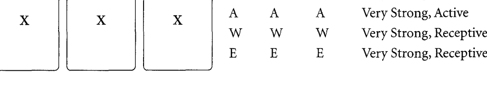

Two cards have the same element; one flanking card is different, for good or ill.

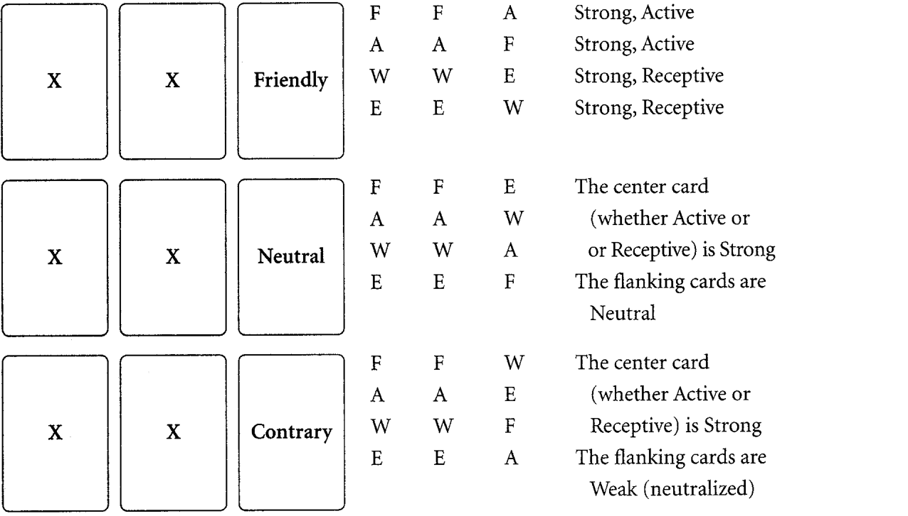

The two flanking cards have the same element, the center is different, for good or ill.

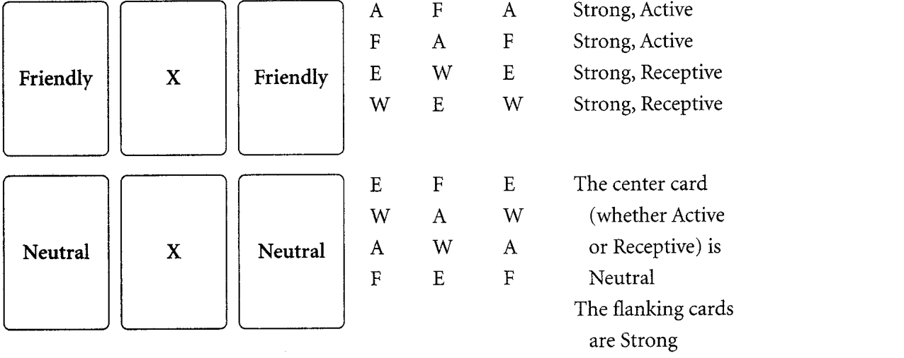

All three cards have different elements, for good or ill.

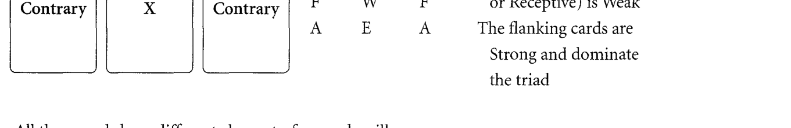

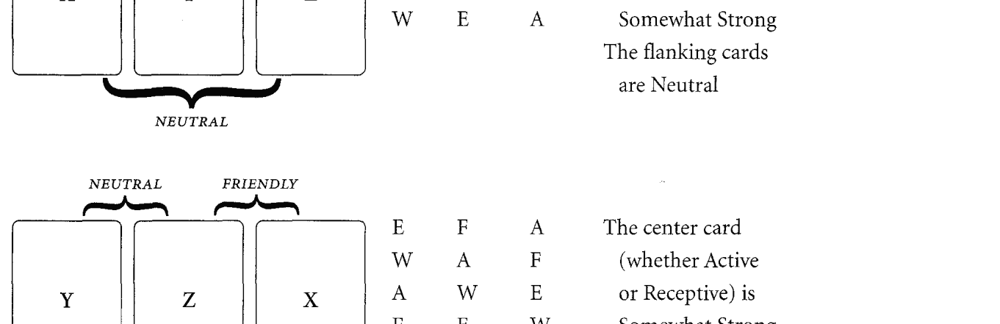

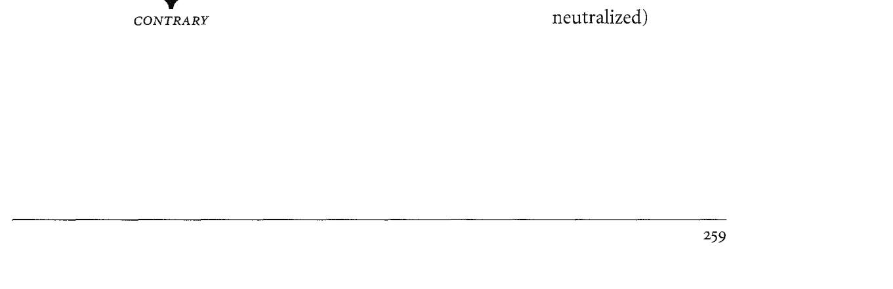

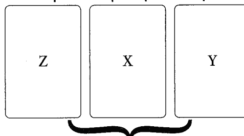

| W | F | E |
| E | A | W |
| F | W | A |
| A | E | F |

The center card (whether Active or Receptive) is Weak. The flanking cards are Strong.

## APPENDIX E

### The Empress Vision

The following vision is adapted from a scrying of the Empress tarot card by Florence Farr and Lina Hamilton, members of the Hermetic Order of the Golden Dawn, on November 10, 1892 (“Flying Roll IV” in Francis King’s *Astral Projection, Ritual Magic and Alchemy*). The original text has been slightly modified in order to present it in the form of a guided visualization, which you can record and then experience for yourself. The magical invocations (appearing in brackets) can be found in works about the Golden Dawn (see Bibliography).

Have the Empress card in front of you. Relax, ground, and center yourself.

- [Do the Kabbalistic Cross and Banishing Pentagrams in the four directions. Make the invoking Hexagram of Venus. Draw the symbol of Venus in its center. Intone, “Yehovah Tzabaoth, Kedemel, Haniel, Beni Seraphim, Daleth.”]

Imagine passing through the hexagram before you as if it were a curtained doorway. You find yourself in a greenish blue landscape, distant and vague like a medieval tapestry.

Ascend, rising on the planes, passing through clouds until you come to a pale green landscape. In its midst you see a temple of ghostly outlines marked with light. Approach this temple. As you get near it gains in definiteness, becoming more and more concrete, until it appears as a solid structure. [Make the signs of Netzach, Portal, and LVX.]

Opposite the entrance is a cross with three bars and a dove upon it. Beside this are steps leading downward into the dark. Walk down these steps and feel yourself guided along a dark passage. Suddenly, you find before you a beautiful glowing green dragon who means you no harm. The dragon moves aside so you can pass.

You turn a corner and emerge from the darkness onto a brilliant white marble terrace, beyond which lies a garden filled with flowers and a delicate green foliage with a velvety texture. Enter into the garden, where you find a woman of heroic proportions, clothed in green with a jewelled girdle. A crown of stars is on her head, and in her right hand a scepter of gold, having at one apex a lustrously white closed lotus flower. In her left hand she holds an orb bearing a cross.

She smiles at you proudly for having made it so far. You ask her name and she replies:

> “I am the mighty Mother Isis; most powerful of all the world. I am she who fights not, but is always victorious. I am that Sleeping Beauty who men have sought for all time, and the paths that lead to my castle are beset with dangers and illusions. Such as fail to find me sleep or may ever rush after the Fata Morgana who leads astray all who feel her illusory influence. I am lifted up on high and do draw men and women unto me. I am the world’s desire, but few there be who find me. When my secret is told, it is the secret of the Holy Grail.”

You ask to learn this secret and she replies, “Come with me, but first clothe in white garments and with bare feet follow where I lead.”

Take off your clothes and shoes and dress in the fine white robe you find there. Follow her until you are stopped by a marble wall. She presses a secret spring, and you enter a small compartment and ascend through a dense vapor until you emerge upon the turret of a building. The sun is rising as a golden orb in the East.

Like the lady, you bow your head to the Sun. With eyes still cast downward you both turn towards the center. Raising your eyes, you behold a cup in the shape of a heart with the sun shining upon it. Within the cup is a clear ruby-colored fluid.

## APPENDIX E

Lady Venus says to you, "This is love. I have plucked out my heart and have given it to the world; that is my strength. Love is the mother of the Man-God, giving the Quintessence of her life to save humankind from destruction, and to show forth the path to life eternal. Love is the mother of Christ. The Spirit of Christ is the highest love—Christ is the heart of love, the heart of the Great Mother Isis—the Isis of Nature. He is the expression of her power. She is the Holy Grail, and He is the lifeblood of spirit that is found in this cup. The hope for all humankind lies in following this example."

If you wish and feel the call, you may give your heart to the keeping of the Grail. Doing so, you feel not death but an influx of the highest courage and power, for your own heart will be henceforth in touch with that of Lady Venus—the strongest force in all the world.

Thank the Lady for all she has taught you. Now you may leave, knowing that love is power and comes to those who give it away for the good of all.

Find yourself quickly and easily back in the temple, and from the temple descend down past the clouds—the atmosphere becoming more blue and dense—down, down, and back into your body. [Make the Banishing Hexagram of Venus and the Lesser Banishing Ritual of the Pentagram.]

## APPENDIX F

### Archetypal Motifs Chart

This chart shows how the Major Arcana relate to two archetypal journey motifs, Jungian archetypes and example mythic figures whose stories can be associated with each card. Step 19, “Myth & Archetypes,” contains details regarding archetypes mentioned here and Joseph Campbell’s conceptualization of the hero’s journey.

| Major Arcana | Fool's Journey | Archetypes | Hero's Journey | Mythic Figures |
|--------------|----------------|------------|----------------|----------------|
| Fool | Beginning a great journey, in which... | Eternal Child, Beggar, Vagabond, Youngest Brother, Unmanifest | Call to adventure | Parsifal, Dionysus, Bacchus, Harpocrates, Green Man, Everyman, Jester, Till Eulenspiegel |
| Magician (Juggler) | every act is magical, creative, and self-expressive... | Animus, Trickster, Sorcerer, Shapeshifter, Gambler, Thief | Call to adventure; Supernatural aid | Hermes, Thoth, Mercury, Loki, Merlin, Prometheus, Coyote, Adam |
| High Priestess (Popess, Juno) | combined with memories and emotions. | Anima, Virgin, Priestess, Wise Old Woman | Refusal of the call (ordinary world obligations); Supernatural aid | Artemis/Diana, Hecate, Persephone, the Sibyls, Cassandra, Isis, Isis Veiled, Kuan Yin, Maya, Lilith, Eve, Sophia, Shekhinah, Virgin Mary, the Magdalene, Ecclesia, Fides, Pope Joan |
| Empress | We create the world and reality we live in, and... | Mother, Creatrix, Mother Nature, Anima | Refusal of the call (ordinary world obligations) | Demeter/Ceres, Hera/Juno, Rhea, Gaia, Hathor, Isis, Urania, Aphrodite, Inanna, Freya, Ceridwen, Mother Nature, Madonna |
| Emperor | we rule ourselves and our domain ... | Father, Creator, Patriarch, Animus | Refusal of the call (ordinary world obligations) | Zeus/Jupiter, Mars, Osiris, Brahma, Wotan, Jehovah, Ancient of Days, Architect of the Universe, Arthur, Caesar |
| Hierophant (Pope, Jupiter) | guided by belief and tradition, and ... | Teacher-Learner, Priest, Mentor | Refusal of the call (ordinary world obligations) | Pope, Peter, Jupiter, Pthah, Horus, Mithras, Buddha, Mohammed, the Prophets, Amfortas (Grail Keeper) |
| Lovers | mediated by our relationships with others. | Beloved, Paradise, Choice | Crossing the first threshold; Meeting with the Goddess | Adam & Eve, Osiris & Isis, Eros & Psyche, Perseus & Andromeda, Shiva & Shakti, Hercules choosing between Vice and Virtue |
| Chariot | Setting out on the road to self-mastery ... | Warrior, Hero, Animus | Crossing the first threshold; Road of Trials | Apollo, Sinn, Tamuz, Phaeton, Icarus, the Amazons, Artemis, Indra, Shiva, Oedipus, Elijah, Ezekiel |
| Strength | we struggle with desires and instincts ... | Enchantress, Witch, Passion, Anima | Supernatural aid; Road of Trials | Sekhmet, Bastet, Cyrene, Europa, Leda, Demeter, Circe, Cybele, Beauty and the Beast, Whore of Babylon, Sampson, Hercules, St. George |
| Hermit | searching for intellectual and spiritual prudence and wisdom. | Wise Old Man, Mentor, Guide | Supernatural aid; Rescue from without | Saturn, Chronos (Father Time), Hermes as Psychopomp, Thoth, Tiresias, Diogenes, Virgil, St. Joseph, St. Francis, Hestia, Hecate |
| Wheel of Fortune | As the seasons change and fortune fluctuates ... | Karma, Fate/Destiny, Change | Road of trials | Fortuna, Lady Luck, Kismet, Moirae (the Fates), Rota Mundi, the Sphinx, Chakravarti, Mag Ruith (Celtic wizard of wheels) |
| Justice | we are called to account for our decisions, and ... | Karma, Avenger, Mediator | Meeting with the Goddess | Athena, Themis, Metis, Ananke, Nemesis, Dike, Libera, Ma'at, Sophia, Astraea, Rhea, Dictynma, Erinnys, the Three Norns |
| Hanged Man | we suffer the consequences, yielding new perspectives. | Sacrifice, Martyr, Victim | Belly of the whale | Odin, Attis, Osiris, Adonis, Dionysus, Prometheus, Mithra, Balder, St. Sebastian, Jonah, the Scapegoat, Christ, Lazarus, Judas, Christian Rosenkrantz |
| Death | We let go of what is dead or useless ... | Death/Rebirth, Transformation, Journey to Underworld | Atonement with the Father | Hades, Pluto, Thanatos, Charon, Dis Pater, Shiva, Yama, Mother Hel, Horsemen of the Apocalypse, Caillech, Azrael |
| Temperance | learning to compassionately accept and combine all opposites ... | Alchemist, Healer, Guardian Angel | Apotheosis; Ultimate boon | Hebe/Iris, Ganymede, Hestia, Panthea, Asclepios, Chiron, Hapi (god of the Nile), Rafael, Angel of the Apocalypse |
| Devil | so as to face ignorance, fears and limitations. | Shadow, Adversary, Saboteur | Temptation | Pan, Priapus, Set, Typhon, Mara, Tiamat, Ahriman, Baal, Lucifer, Beelzebub, Bahomet, Dweller on the Threshold, Horned God, Boogeyman, Satyrs |
| Tower (House of God, Fire, Thunderbolt) | When old constructs shatter under the searing light of consciousness... | Destroyer, Avenger, Ordeal, World Tree | Atonement with the Father | Mars, Zeus, Hephaestus, Vulcan, Eris (Discord), Sisyphus, Thor, Kali, Pele, Shiva, Babel, Destruction of the Temple, Harrowing of Hell, Troy, the Hell-mouth |
| Star | we awaken to awareness of the larger patterns ... | Soul, Visionary, Anima | Apotheosis; Ultimate boon | Pandora, Venus, Eos (Dawn), Urania, Psyche, the Danaids, Isis Unveiled, Nuit, Ishtar, Astaraea, Anahita, Sophia, the Gnostic Soul, Eve, Sirius |
| Moon | which affect our instinctive Sub-lunar World, Instincts, Dark Night of the Soul | Refusal of return; Magic flight | Artemis, Selene, Hecate, Medusa, Circe, Medea, Ariadne, Poseidon, Cerberos, Khepera, Anubis, Morgan le Fay |
| Judgment | Hearing the call to eternal life from a Higher Will ... | Liberator, Rebirth | Freedom to Live; (Master of Two Worlds) | Aion, Prometheus, Horus, Phoenix, Kali Yuga, Archangel Michael |
| World | we realize that that Will and ours are one. | Self, Higher Self, Wholeness | Master of Two Worlds; (Freedom to Live) | Eurynome, Gaia, Phanes, Shiva/Parvati, Anima Mundi, World Soul, Queen of Heaven, Christ Risen, the New Jerusalem |

## APPENDIX G

### Reading Styles

The following lists show the major steps used in various styles of reading tarot. In actual practice, readers mix styles and draw, on occasion, from additional steps.

Turn to Appendix I, the “21 Ways Worksheet,” and consider which steps you most often use when reading the cards. What kind of style do they describe?

#### Core (may appear in any or all of the styles below)

- Step 1: Name the card (mostly, but not always used)
- Step 2: Describe the card (often, but not always used)
- Step 8: Metaphor (interpretation is impossible without it)
- Step 12: Modification (involved whenever a question or spread is used)

##### Pure Psychic

- Step 0: Inspiration that operates through some form of ...
- Step 18: Imagination, and comes out as ...
- Step 4: Story (a you-statement)

##### Memorized Meanings

- Step 10: Meanings, organized by ...
- Step 12: Modifications, yielding some form of ...
- Step 4: Story (an I- or you-statement)

##### System-Based (Analytical)

- Step 5: Number/Rank plus ...
- Step 6: Mode/Suit/Element, related through ...
- Step 14: Dignities & Themes, resulting in ...
- Step 7: Synthesis

##### Symbolic

- Step 13: Symbols, seen as ...
- Step 8: Metaphors, organized into ...
- Step 14: Themes (not necessarily dignities)

##### Mythic

- The Symbolic set above, to which is added ...
- Step 19: Myths, and retold as ...
- Step 4: Story

## APPENDIX G

##### Therapeutic

- Step 3: Emotions . . .
- Step 4: Story . . .
- Step 9: Query & Snapshots . . .
- Step 13: Symbols . . .
- Step 15: Dialogs . . .
- Step 18: Imagination, organized around . . .
- Step 14: Themes (not necessarily dignities)

##### Ritual-Magical

- Step 13: Symbols
- Step 11: Range
- Step 17: Embodiment
- Step 18: Imagination
- Step 19: Myth (optional)
- Step 21: The Possible Self

##### RITE (Readings that are Interactive, Transformational, Empowering)

- Any or all steps, as needed.

## APPENDIX H

### Traps & Solutions in R.I.T.E.

When doing readings that are interactive, transformational, and empowering (R.I.T.E.), it’s very easy to fall into traps based on the expectations of a querent or ourselves as to what “should” be happening. Some of the traps may be perfectly appropriate to a different style of tarot reading.

**Trap:** Trying to “fix” a person or situation. **Solution:** Accept that you aren’t going to fix in one 15- to 90-minute session what has taken a person a lifetime to develop, and for which they may have already spent several years in therapy.

**Trap:** Having to resolve a tarot reading, solve an issue, or answer every question, and especially in a way that “pleases” or satisfies the querent. **Solution:** Awareness is more important than solutions. Some questions have no answers or the result has not yet been determined. Sometimes it doesn’t matter what choice a person makes so much as their attitude and the manner of choosing. Focus on increasing clarity and knowledge about lessons, purpose, choices, and values, thus giving the querent tools to continue handling a situation as circumstances change.

**Trap:** Feeling you have to answer a question as stated. **Solution:** You should not be expected to answer questions in fields in which you are not licensed or trained. Medical, legal, financial problems, etc., can be referred to a professional in the field. Try rephrasing the question to fit what you can offer. This process will clarify whether you are the right person for the querent to explore his or her issue with.

**Trap:** Doing a reading about someone else in the querent’s life, i.e., “How can my daughter be happier in her job?” **Solution:** A person can only change him- or herself. Keep the reading focused on the querent. Rephrase questions: “What can I do about my own stress around my daughter’s unhappiness? What is it trying to tell me?”

**Trap:** Ignoring details or staying with generalities. (For example: a querent repeatedly mentions a journey but the reader doesn’t ask about it.) **Solution:** Get specifics. Ask them where they are traveling (and maybe when and how). When someone says, “Well, you know how fathers can be”—you don’t know. Ask, “How can fathers be?”

**Trap:** Thinking you know what’s going on (e.g., assuming a work problem means they work for someone else, or they’re homo- or heterosexual, or a “being of light” is friendly rather than fearful.) **Solution:** Stay open. Assume you can be wrong. Ask outright for more information if it helps the reading process. Act as if you’ve never heard of a __________ (whatever).

**Trap:** Making assumptions about a card’s referent (e.g., that a king is someone’s father and must be the source of the problem). **Solution:** Do other cards or the person themselves support such an assumption? Try out the idea or keep it as a possibility. Ask the person to describe the card and then ask where this is happening in his or her life. Remember, a king could be someone’s mother.

**Trap:** Assuming you know who the person is, or identifies with, on a card, or the attitude and perspective of the figures on the card. (e.g., thinking the figure(s) on the Tower are terrified when the querent feels they are delighted, or that the querent is a falling person when they might see themselves in the tower itself.) **Solution:** After the querent describes the card and what the figures are doing and feeling, ask where the querent is in the card. “Where in your life are you like this figure?” By asking “where” rather than “who,” the querent has more options to be creative.

**Trap:** Backing off from “touchy” subjects, tears, and “hot spots.” **Solution:** Follow the energy! “Hot spots” are moments when the focus, vocal tone, intensity, tears, and body language change and show increased energy. Follow these as if they were a thread. Ask the person to stay in the feeling and describe when they have felt that way before. How does their story relate back to the card that provoked the feeling?

**Trap:** Trying to alleviate fears. Feeling you need to hug, touch, or console a crying querent. **Solution:** Generally speaking, don’t touch a querent. Don’t try to make them feel better. Acknowledge the reaction factually. Ground yourself, breathing deeply and easily as a way of holding a sacred space for that person to cry. Affirm that there are scary or negative aspects of the card without dwelling on them. Only then, if it seems appropriate, offer alternatives, either through the meaning of the card itself or through other cards.

**Trap:** Asking querents if the information you’ve given them is right. Trying to get affirmation from a compliant or vulnerable person. **Solution:** Ask, “What, among the things I’ve said, seems most accurate or works best for you?” “Where does this make sense to you?” This simple shift 1) allows querents to put insights into their own language; 2) fixes the information more clearly and specifically in their minds; 3) helps you understand how it is relevant to that person’s life; 4) gives you the opportunity to correct or add to their perception of what you’ve said, applying their own language and context; and 5) helps you see where your insights were most clear and effective or not.

**Trap:** Couching things in your own language rather than the client’s (e.g., the querent says something is “fragmented” and you refer to the “chaos” because you assume that fragmented means chaos). **Solution:** Use the querent’s own words wherever possible. Check any word changes to see if they really work for the querent.

**Trap:** Judging something as good or bad, right or wrong, based on your own value system. **Solution:** Use only the querent’s own evaluations. If they haven’t made those clear, then ask. Not everyone thinks that stealing is wrong—ask James Bond. This doesn’t mean that you can’t acknowledge your own moral biases (especially if they bear on your interpretation).

**Trap:** Getting "lost in the thicket." Both you and the querent get caught in a story while ignoring the cards and their symbols. (The querent may be deflecting the issue in order to avoid sensitive material.) **Solution:** Keep bringing the situation back to the cards as if they were "sticky" and pulling you. If a tangent is not supported by an image, then let it go (at least temporarily). Or ask a figure on a card how it experiences or what it thinks of the story.

**Trap:** Moving the querent too quickly from describing the card into personal associations. **Solution:** Start with and frequently go back to the point of view of the figure(s) on the card—what they want, think, desire, need.

**Trap:** Thinking you aren't getting anywhere because the person doesn't have much to say. **Solution:** Use even the smallest comments. If the querent is resisting, maybe it's that he's resisting the situation. Or the situation is different than what you think. When you touch on the right piece, everything will open.

**Trap:** Thinking that everything in a card is metaphorical, so that a bandage means psychological pain and not actually a physical injury. **Solution:** Check literal meanings. Sometimes a bandage is simply a bandage and nothing more. Ask, "What are the figures on the cards actually doing?" "What is a key for?"

**Trap:** Assuming that everything is literal (e.g., a reversed Empress or queen is a bad mother). **Solution:** If there's no literal connection, try the emotional connection or the fairy tale.

**Trap:** Thinking that, because a querent easily identifies a card with someone else, the card is only that person. That the page, because it is clearly a person's child, is not also that person's inner child. **Solution:** Every card and every thing in a card is a part of the person for whom the reading is being done, although it may also refer to something external. There are several levels to every reading. Not all of them have to be explored.

**Trap:** Insisting on your own interpretation or point of view when the person says it's something different—especially when you know you are right. **Solution:** Let the person have their reality. You can always ask for more information or check with other cards. It is more important that the reading be relevant to the person than that it be "right" in some abstract sense.

## APPENDIX H

Don't be right! Acknowledge that you could be wrong. Where does this lead? Even if you are right, don't force someone to see something they resist.

- **Trap:** Figuring that an idea, feeling, or image that keeps appearing in your own mind is wrong or intrusive because you can't see how it relates to the cards.
- **Solution:** Tell the querent something like, "I have no idea how this relates or where it comes from, but . . ." Don't try to interpret it. Move quickly back into the reading proper. If nothing else, revelation will free you from obsessing, and it could be a psychic insight.

- **Trap:** Assuming when an unrelated idea or image keeps popping into your head that this is what the reading is really about—so you either ignore the cards or get them to fit (when they wouldn't otherwise).
- **Solution:** Same as above. If the person sees no relevance, let the idea go. It may (or not) make sense later in the reading or later in time. It might also be a projection of your own issues. Don't force anything!

- **Trap:** Ignoring basic meanings and keywords based on number and suit, when you get a strong intuitive impression about the meaning of the card.
- **Solution:** Run through a checklist of the basics, asking the querent if anything relates. Sometimes both the book meaning and your intuitive insight, even if contradictory, are true, and their integration is key to the whole reading.

- **Trap:** Assuming a laid-back attitude or allowing distractions, unfocused humor, small talk, or personal examples, by the reader, beyond what directly advances the reading.
- **Solution:** Keep eye contact, your body facing and open to the querent, legs uncrossed, feet on the ground. Bring asides and explanations firmly back to details on the cards. Inappropriate humor on your part can seem disrespectful. Try doing a reading without a single personal example (not that you always have to do this).

- **Trap:** Moving too fast in an effort to examine everything.
- **Solution:** Stop to explore words that have energy behind them. Ask about them. Allow silence.

- **Trap:** Assuming that each card is separate and independent from the others.
- **Solution:** Let the cards interact—through acting, dialog, and by lending a figure from one card some of the characteristics or symbols from some other card. What would one figure recommend to a figure in another card?

- **Trap:** Thinking that it is cheating to refer to people and things you already know about.
- **Solution:** Be honest. Say, "I immediately thought of how you call Bill a 'couch potato' when I saw the Knight of Pentacles. Could the Five of Cups be your sorrow that he won't ever go anywhere with you?" If she denies it, go back to her describing the card.

- **Trap:** Assuming that if a querent is a tarot reader, he or she will be criticizing and second-guessing everything you say.
- **Solution:** People who know the cards and symbols sometimes go into "tarot-reader mode" or "analyzer." Get them away from interpretation by having them describe the literal details of the cards, the emotions, or make up a fairy tale, etc.

- **Trap:** Ignoring the querent's asides, kidding, paranoia, exaggeration, or sarcasm.
- **Solution:** Uncomfortable truths are often clothed in inanities. Treat each statement as a jewel with a grain of truth. Was there an emotional charge connected with it? If so, examine it. Ask the person, "Where is the truth in what you've said?" Have them look at, accept, and be grateful for it. Be curious about what they really mean.

- **Trap:** Trying to define a card when you are still unclear about it.
- **Solution:** Be honest. Admit you are not sure what it means in this situation. Go back to description. Remain curious; hold it inside. Return to it later. Sometimes a difficult card only becomes clear when summarizing the reading at the conclusion.

- **Trap:** Using terms like should, must, ought, have to. And thinking you must make the querent do something.
- **Solution:** Help the querent find options or gain insights, rather than answers or obligations. Ask them what cards represent things they can do. Ask them what one or more figures on the cards recommend that they do. What action fills a stated need or works toward their goal or affirmation?

- **Trap:** Suggesting that a card has too much or too little of a characteristic because this is your own bias. For instance, that the Knight of Wands is too fiery.
- **Solution:** Such assumptions often point to your own issues rather than to those of the querent, unless suggested and substantiated by other cards or the spread position. If you pick it up psychically, check your impressions carefully. Suggest that "Fieriness may be a problem for the Knight of Wands, do you think that's so?" Then, if so, "Do you enjoy that fieriness or find it overwhelming?" They may not see the knight as fiery at all.

## APPENDIX H

**Trap:** Thinking that you can solve the querent's dilemma because the cards clearly state what he or she should do. **Solution:** Give options that are truly open-ended and not pejorative. Or, be wrong. Present an option that you think is wrong, or exaggerate a position deliberately in order to have the querent correct you. Don't push or accuse. Stay open and curious.

**Trap:** Using words that are unrelated to the suit or element of a card. For instance, describing a cups (water) card as rational or explosive or practical. **Solution:** Stick to words that go with the suit—earthy pentacles would not be "inflamed"—unless deliberately exploring an anomaly.

**Trap:** Focusing on nouns, adjectives, and concrete images. **Solution:** Notice a querent's verbs too and use them when possible. Verbs are where the action is! They tell us what is really going on.

**Trap:** Overly quick, obvious "fixes" proposed by the querent. "I guess this card means I should [or shouldn't] do . . ." **Solution:** Encourage the querent to explore possibilities, not fixate on solutions. For instance, with the Eight of Swords, a querent might say, "Just walk away," but why isn't the figure on the card doing that if it's so easy? When the querent uses "shoulds," then there are probably conflicted beliefs.

**Trap:** Asking the querent questions that can be answered yes or no. **Solution:** Yes/no questions quash imagination and perception and start the thinking and analysis process. It's possible to answer such questions with one word and no feeling. Occasionally you can use it—for clarification, shock value, or to gain affirmation. Most of the time you'll want to use open-ended questions: How can . . .? Where . . .? What . . .? Who . . .? These invite a person to create or re-create a scene in their mind's eye.

**Trap:** Ignoring or overlooking a card that doesn't make sense and doesn't seem to fit with the rest of the reading. **Solution:** The card making the least sense often holds the key to the whole reading or, at least, provides an important insight. Literal cards often affirm what you know. Difficult cards offer new insights and direction, and their understanding can take a reading to a deeper level. The extra work on them will be well rewarded. Return to basics; watch for "snapshots."

**Trap:** Getting stuck in a keyword and not being able to see beyond it. Thinking that the word is the meaning of the card or that other cards can't also mean that. **Solution:** Try any of the following: 1) Cut the keywords off your cards or obscure them with a marker. 2) Force yourself to read without using any keywords. Find other, fresher words. 3) Consider how an opposite word might be true. If the Three of Cups is abundance, then how is it scarcity—a scarcity of sorrow? Remember, keywords include concepts or issues that can appear, in some cards of the group, as a lack.

**Trap:** Believing that you are giving the cards their correct, only, or best interpretation. You are convinced of the truth of what you are saying. Your task is to persuade the querent to this truth and to the actions the cards (in your determination) recommend. **Solution:** This is a tricky one. To some extent you need conviction in order to believe that a tarot reading is a worthwhile endeavor that will benefit a person. Focus on the querent finding his or her own sense of conviction. To do this, follow the emotions.

## APPENDIX I

### 21 Ways Worksheet

0. I open myself to all possibilities.
1. The name of the card is:
2. A literal description of this card is:
   - —Repeated as an I-statement:
3. Emotions, feelings, and attitudes of the figures, and the mood and atmosphere of the environment, are:
   - —Repeated as an I-statement:
4. "Once upon a time . . ." (my fairy tale is):
   - —Repeated as an I-statement:
5. The number or rank is about:
6. The suit/element/mode is about:
7. Synthesizing number plus suit plus element plus mode yields:
8. Metaphors in this image include:
   —Actualizing one of the metaphors of change suggests doing:
9. Questions to ask are:
   —My responses are:
   —Snapshots that arise include:
10. Book meanings for this card are:
    —Summarized, they suggest:
11. A range of meanings from liabilities to benefits for this card is:
    —My current location in the range is:
    —Where I want to be is:
    —What can move me from one to the other is:
12. Modifications to this card based on question asked, spread position, other cards, and reversals are:
13. Symbols on this card suggest:
14. Themes based on dignities, similarities, and differences in and among cards are:
15. Dialoguing with the figures and objects on this card, I learn:
16. Sketching this card(s), I learn:
17. Embodying this card, I learn:
18. Imagining myself in this card, I learn:
19. Myths and archetypes related to this card include:
    —They suggest:
20. Comparing this card to the same card in other decks, I see:
21. My affirmation for this card is:
    —My task or ritual is:
00. As I keep the possibilities open, over time this card reveals:

# Glossary

**Active Imagination**—a creative technique using mental imagery for working with the unconscious and getting in touch with archetypes. (See *Imagination*.)

**Affinities**—attractive forces that facilitate combining meanings, usually through some sort of resemblance. (See also *Correspondences*.)

**Affirmation(s)**—an assertion that something exists or is true; particularly, positive statements used to facilitate personal change.

**Air**—one of four classical primary elements, corresponding to mental faculties. Most often associated with the suit of swords, but sometimes with wands or pentacles.

**Amplify**—a method of exploring symbols by expanding associations and understanding.

**Anima/Animus**—terms used by Jungians to indicate the unconscious or concealed female element in the male and male element in the female, respectively. While operating somewhat differently in male and female, their basic function is to inspire.

**Anomaly**—something that deviates from the norm. In a tarot reading, when a querent describes a card in an unusual way, it points to something personally significant and probably emotionally charged.

**Arcana/Arcanum**—from a root word meaning "box or chest" and an older root meaning "to contain or guard." Magical secrets that are contained or guarded. (See also *Major Arcana* and *Minor Arcana*.)

**Archetype**—the Platonian idea of pre-existent prototypes of things in the material world. In Jungian psychology, archaic remnants of instinctual patterns of meaning in the human psyche that influence our psychology. They are universal, innate, inherited, and emotionally charged.

**Cabala**—see *Kabbalah*.

**Celtic Cross**—a ten-card spread or pattern for laying out tarot cards first published in Waite's book *Key to the Tarot*. Also called the Ancient Ten-Card Spread, it is the most well-known tarot spread. (See *Spread*.)

**Coins**—earlier suit sign, equivalent to pentacles.

**Collective unconscious**—a Jungian term for an unconscious psychic system of a collective, universal, and impersonal nature that is identical in all individuals and owes its existence to heredity. Its primary structures are archetypes.

**Conscious(ness)**—awareness of a self, environment, and mental processes.

**Correspondences**—symbolic analogies and affinities existing among everything in the universe of the same or similar vibration, in that what affects one thing affects others through this symbolic link. This is summarized in the Hermetic axiom "As above, so below."

**Court cards**—sixteen "people" cards divided into four suits that, in interpretation, generally refer to self or others, or their roles, masks, and subpersonalities, or as a mode of acting; may also refer to situations encountered. Although there are a wide variety of names, the most common are king, queen, knight, and page.

**Cups**—one of four suits in the Minor Arcana. Most often associated with the water element.

**Decan/Decanate**—an astrological term for a ten-degree segment of the 360-degree zodiac, three segments to each sign, ruled by a succession of planets. The Golden Dawn assigned the number cards (aces excluded) to the thirty-six decans.

**Destiny**—suggests destination and implies a higher, divine, or ultimate goal toward which a person is impelled by something greater than or outside the self. It indicates possibility rather than inevitability.

## GLOSSARY

Dialog—a conversation between two or more people involving an exchange of ideas or opinions. As a technique, its purpose is usually for insight.

Dignities—a term for finding affinities or antipathies among two or more tarot cards that can strengthen or weaken their effect in a spread. These are based on how well inherent factors get along and support each other or not. (See Elemental dignities.)

Divination—looking for answers (regarding the future or hidden knowledge) by supernatural means, usually through a tool of symbolic communication. Defined by physicist David Bohm as “an anticipation of the future in the implicate order of the present.”

Earth—one of four classical primary elements, corresponding to the physical world. Most often associated with the suit of pentacles, but sometimes wands.

Ego—an organizing and synthesizing activity within the psyche. The seat of volition and part of the personality, which one consciously recognizes as I or me.

Element(s)—what, in Western culture, were believed to be the four basic constituents of the natural world: fire, water, air, and earth. The four suits of the Minor Arcana are usually equated with these four elements.

Elemental dignities—a method of interpreting cards in a spread that uses elemental correspondences to identify cards that strengthen or weaken each other.

Emotion(s)—the psychological response to a symbol. An involuntary mental state arising spontaneously and accompanied by physiological changes; a feeling. They are impulses to action; what moves us: motivators of plans and decisions.

Empathy—resonant nonconscious communication between people resulting in the arousal of an emotion in the observer as a vicarious response to another. Through empathy you account for another’s actions by your own experience of motivations and attitudes as you remember or imagine them.

Empowerment—from words meaning to “enable” or “permit”; to be in control of one’s own destiny; to consciously find a correct posture to take in and toward a situation.

Esoteric—see Occult.

**Faceup, Facedown**—“faceup” indicates a card placed so that you can see the picture (often used when consciously picking out a card for a particular reason). “Facedown” is how the cards are usually shuffled and dealt—you are looking at the back of the card and can’t see which card it is until it’s turned over.

**Fan**—an optional method for selecting cards for a spread. The cards are laid facedown on a surface and swept to form a curved row with part of each card discernable (like a fan). To select from fanned cards, move your hand above them until you feel drawn to take out a particular card.

**Fate**—assumes that an outcome is the result or consequence of an earlier, though sometimes unknown, cause. This includes the playing out of previous actions or tendencies as they’ve become conditioning and habits.

**Fire**—one of four classical primary elements, corresponding to creative faculties. Most often associated with the suit of wands.

**Focusing**—self-awareness technique developed by Eugene Gendlin that consists of bringing attention to what is going on in one’s body, resulting in information you did not know you needed and leading to new possibilities of action.

**Fool’s Journey**—first mentioned by Eden Gray (1970) to talk about the developmental sequence of cards through the Major Arcana. A. E. Waite used the term “soul’s progress” with similar intent.

**Fortune**—means “luck,” but also suggests something random and unpredictable. It indicates what chance or happenstance has in store.

**Fortunetelling**—predicting future events, redefined as “destiny narration” by Cynthia Giles.

**Functions**—Jung’s typology (also called Psychological Types) based on the quaternity of elements and humors. Sensation tells you that something exists (through the senses); Thinking tells you what it is (its definition); Feeling tells you whether it is agreeable or not (its value); Intuition tells you whence it comes and where it is going (its possibilities). Often related to the four elements and suits.

**Gestalt**—a German word meaning “form, pattern, or configuration”; used to designate an integrated whole (i.e., a psychological pattern) that is greater than the sum of its parts, giving coherence to experience. Also, a phenomenological-existential therapy founded by Fritz Perls in the 1940s that emphasizes the use of dialog. (See *Dialog*.)

**Golden Dawn**—an organization called the Hermetic Order of the Golden Dawn founded in 1888 in London and continuing today, specializing in the practice of ceremonial magic in the Western magical tradition. Rituals and practices are based on their own set of correspondences among the tarot, astrological signs, and the Hebrew letters that influenced the creation of two of the most popular twentieth-century tarot decks—the *Rider-Waite-Smith* and the *Thoth* tarots.

**Habit**—a recurrent, often unconscious pattern of behavior that is acquired through frequent repetition. It is often unnecessary and inefficient, being a remnant of compensatory behaviors that no longer serve the original purpose and thus inhibit access to a full range of options.

**Hebrew alphabet**—22 letters that are a direct descendant from the first Semitic alphabet, which innovated a character or symbol as an individual sound as well as a thing, such that a limited number could characterize all words. A central factor in the Kabbalah, representing the elements of creation. Correlated with the Major Arcana according to various systems and central to Golden Dawn ritual.

**Hero’s Journey**—the “archetypal quest scenario” in the individuation process of a person and that can be found in a great many myths and stories, as devised by Joseph Campbell.

**Imaginal Realm**—area of mental, emotional, and imaginative activity.

**Imagination**—images formed in the mind, not bound by the rules of time and space, that have a symbolic or metaphysical reality rather than a physical one.

**Individuation**—a Jungian term for the process of becoming a self-aware human being, expanding the boundaries of what you can experience and your ability to make conscious choices.

**Insight**—a patterning of the perceptual field in such a way that the significant realities are apparent; grasping the inward or hidden nature of things, especially in an intuitive manner.

**Intention**—an objective deliberately and willfully sought; volition.

**Interactive**—a dynamic, changing sequence of social actions between individuals or groups who modify their actions and reactions due to actions by their interaction partner(s).

**Intuition**—looking within; perception or comprehension without the use of rational processes.

**Journal**—both a noun and verb, implying free form, uninhibited, and mostly private notations about personal experiences and insights. Used to record readings and card insights.

**Jung/Jungian**—Carl Gustav Jung (1875–1961), a Swiss psychologist and psychiatrist. Refers to Jung’s theories of psychology, which have greatly influenced the exploration of psyche or soul and the interpretation of symbols.

**Kabbalah**—meaning “from mouth to ear,” suggesting a secret oral tradition. A body of Hebrew mystical principles, encoded in the Hebrew alphabet and mapped on the Tree of Life, that form the cornerstone and focus of the Western esoteric tradition. (Also Qabala, Cabala; see also Hebrew alphabet, Sephira.)

**Karma**—means “doing” or “action” as a response to desire, aversion, and attachment. Originally a Hindu concept in which each action has a result or consequence experienced as fate or destiny, and that determines character.

**Keyword**—a word or phrase that summarizes the meaning of a tarot card, unlocking and facilitating access to content and suggesting associations to a broader span of related words, concepts, and images.

**Layout**—see Spread.

**LWB**—“little white book” or pamphlet that accompanies most tarot decks. It is often generic and brief, but sometimes contains the only information specific to a deck.

## GLOSSARY

**Magic/Magick**—the art and science of using little-known natural forces in order to achieve changes in consciousness and the physical environment. In the magical realm archetypes have substance and the soul becomes perceptible.

**Major Arcana**—the twenty-one numbered cards and one unnumbered card that depict allegorical scenes, derived from images that were well known in the late Middle Ages and early Renaissance in Europe. In modern interpretation they generally refer to principles and lessons as well as events.

**Marseilles Tarot**—a woodcut-style deck that was produced as early as the seventeenth century, becoming the standard divination deck in France and other parts of Europe. The Minor Arcana number cards show only suit markers (no pictorial scenes). Also called *Tarot de Marseille*.

**Mask**—an outward persona that conceals some or all of one's true personality. Often unaware of one's masks, they are adopted without conscious choice.

**Meaning**—an inner significance; the felt sense or inner import of a thing or experience; the projective identification of emotions. Value given to consciously perceived patterns in images and concepts.

**Metaphor**—from the Greek, meaning to "carry between." It transports meanings from one domain of experience to another via analogy. A symbol is one side of a metaphor.

**Minor Arcana**—fifty-six cards divided into four suits, each comprising ten cards, numbered from ace through ten, and four court cards. In modern interpretation they usually refer to the events, situations, or people encountered. These cards were rarely, and only obscurely, illustrated with scenes until the appearance of the *Rider-Waite-Smith* (RWS) deck in 1909.

**Modes**—in tarot, the four units of the deck known as the court, number, trump (Major Arcana), and aces, and differentiated respectively by their function in a reading as the who, what, why, and where.

**Myth**—a story, real or fictional, that appeals to the consciousness of a people by embodying its cultural ideals and/or giving expression to deep, commonly felt emotions.

**Number cards**—the forty Minor Arcana cards that bear a numerical rank, from ace through ten, in four suits. (See also Pip.)

**Numerology**—the study of the occult meanings of numbers and their influence on human life.

**Occult; Occult Metaphysics**—occult means “secret” or “hidden” and refers to knowledge that must be uncovered and brought to light by searching. Metaphysics refers to the philosophy of things beyond the physical. Esoteric is a related word meaning “pertaining to that which lies within.” Together they imply that there is knowledge and wisdom hidden within the psyche that can be made conscious through examination and, when employed magically, create change.

**Pentacles**—one of the four suits of the tarot Minor Arcana, first instituted by the Golden Dawn to replace the suit designation of money or coins. (Paul Christian also used this term in his 1870 book The History and Practice of Magic.) Most often associated with the earth element, but sometimes air.

**Persona**—the public mask with which you present yourself to the world. The bridge from the ego to the outer world.

**Pip**—suit symbols (such as a sword or cup in a tarot deck, or a spade or heart in a playing-card deck) that show by frequency the number of the card from one to ten. The number cards of a tarot deck are sometimes called pip cards.

**Projection**—a psychological term for unconsciously taking personality traits one does not wish to acknowledge in oneself and seeing them in other people.

**Psyche**—from a Greek word meaning “breath” and hence “soul” or “spirit,” signifying the processes of the mind, both conscious and unconscious, that make up the personality. Psychology is the study of the psyche as mind. The Greek myth of the maiden Psyche, who was loved by Eros, has come to symbolize the development of soul from unconscious to conscious and on to Divine Union.

**Puer/Puella**—a Latin term for “youth,” used by Jungians to signify the archetype of the eternal child. Puer is the man who never becomes emotionally mature and puella, the woman.

**Qabala**—see Kabbalah.

**Quaternity**—a structured grouping of four things, like the four elements, suits, Jungian functions. Represents the whole.

**Querent**—literally, “questioner”: the person who seeks advice or insight from the tarot cards during a reading. If you read the cards for yourself, you are both reader and querent. If you read the cards for another person, you are the reader and the other is the querent.

**Random**—refers to an outcome one does not predict in advance. The presumption that unpredictable events are meaningless, which is the sense often conveyed by the word, is a relatively modern concept.

**Reader**—the person who interprets the tarot cards during a reading. If you read the cards for yourself, you are both reader and querent. If you read the cards for another person, you are the reader and the other is the querent.

**Reading**—interpretation of the cards by a reader for a querent (who may be the self), usually involving a question and a spread into which the cards are laid. Also called a consultation, as in “to consult the cards.”

**Reduction**—a numerological technique in which a multi-digit number is reduced to a single digit by adding the digits together to yield a result between one and nine. All numbers that reduce to the same single digit are believed to contain qualities symbolized by that number.

**Reversal/Reversed**—a card is reversed if it is laid so the image appears upside-down. Reversals are usually interpreted differently than upright cards.

**Rider-Waite-Smith/RWS**—this refers to the Rider-Waite-Smith deck, first published in 1909 by William Rider and Co., London, designed by Arthur Edward Waite and artistically executed by Pamela Colman Smith. As the first deck to have representational pictures on all cards, it has become one of the most influential modern decks.

**Ritual**—a symbol in action. Symbolic behavior, consciously performed, in which the purpose is transformation.

**Role**—a set of behaviors one assumes in order to perform a particular task or meet a particular set of expectations. Examples of roles are bank teller, father, student, friend, gardener. We are generally conscious of the roles we assume. (Compare with *Mask*.)

**Ruler**—the astrological planet most strongly associated with a particular sign of the zodiac.

**Scry**—obtaining clairvoyant visions usually by staring hypnotically at an object such as an image on a tarot card, a flame, or a reflection in water or oil. From *descry*, meaning “to discern something difficult to catch sight of.”

**Sephira/Sephiroth**—In Kabbalah, ten states of being, depicted as spheres on the Tree of Life, through which divine consciousness descends into matter, and through which human conscious may rise upward toward the divine. (See also *Kabbalah*, *Tree of Life*.)

**Shadow**—a term used by Jungians to indicate an aspect of the unconscious self that is repressed, denied, and unactualized and that goes unrecognized by the conscious self. Shadow qualities are often projected onto others and may be “bright” or desired qualities, as well as “dark” or disliked ones.

**Shuffle**—mixing the order of the deck. This can be done in a number of ways—a bridge shuffle, overhand, swirling in a pool, etc.

**Significator**—a card (often a court card but may be any card or even a picture) selected to represent the subject (usually the querent) of the reading.

**Snapshot**—a photograph taken with a small hand-held camera; usually informal and personal. In tarot, it is a mental image that often includes family, friends, or places you’ve been and situations in which you were involved, implying relationships and generating sensual and emotional memories.

**Somatic**—of or pertaining to the body; physical (from the Greek *soma*, meaning “body”). Psychosomatic awareness, for instance, indicates knowing what both the mind and the body are experiencing.

**Spread**—an arrangement of cards used for a tarot reading. The different positions in a spread usually carry different meanings, and each card is interpreted in light of the position where it appears. Also called a layout.

## GLOSSARY

**Suit(s)**—the Minor Arcana divided into four sets—wands, cups, swords, and pentacles—each containing ten number and four court cards. Usually each suit corresponds with one of the four elements.

**Swords**—one of four suits in the Minor Arcana. Most often associated with the air element, but sometimes fire and, rarely, water.

**Symbol/Symbology**—something that represents something else by association, resemblance, or convention, especially a material object used to represent something invisible. Images that have emotional value and are capable of uniting with others. A mode of communication by the unconscious.

**Synchronicity**—a meaningful coincidence. A theory developed by Carl Jung and the physicist Wolfgang Pauli of an acausal principle in which everything that happens at a single moment in time is related in a meaningful way.

**Tarocchi**—the original trick-taking game played with tarot cards, still played in parts of Europe today. It resembles bridge but features a permanent trump suit. The term is also used in Italy to refer to the cards themselves (Tarocco, sing.).

**Tarot**—card deck of 78 cards: 22 trumps or majors; 56 minors in four suits of ten numbered (pip) cards and four court cards in each suit. Also, a trick-taking game played with such a deck.

**Tarotist/Tarotologist**—attempts at creating a general term for those seriously involved with the study and practice of tarot.

**Temenos**—a sacred ground, precinct, or courtyard, usually enclosed. In Jungian psychology it implies an environment that is safe for deep transformative work.

**Thoth**—Egyptian god of writing and magic. Antoine Court de Gébelin, in 1781, originated the belief that the tarot was the “Book of Thoth,” a pictorial compendium of occult wisdom.

**Thoth tarot**—a deck created by Aleister Crowley and Frieda Harris, completed in 1944. Although primarily following Golden Dawn attributes, there are some significant differences, among which the king is called knight.

**Transformation**—a marked change, usually for the better. It often reveals conditioned attitudes and responses that aren't working so as to replace them with more authentic, spontaneous experiences.

**Tree of Life**—in Kabbalah, the Tree of Life is an arrangement of the ten sephiroth and the connecting paths among them, forming a mystical map of creation. The Major Arcana have correspondences to the paths and the Minor Arcana to the sephiroth.

**Trump(s)**—a corruption of the Italian trionfi ("triumphs"), which is the earliest term for the twenty-two allegorical cards of the tarot deck, now known as the Major Arcana.

**Unconscious**—the unknown inner world. Parts of the mind or personality (including memories and archetypes) of which we are not directly aware. Inaccessible by direct means, unconscious material must be inferred through images, dreams, metaphors, behaviors, etc.

**Upright card**—as normally viewed; the opposite of reversed. Unless otherwise noted, interpretations given in this book assume that the card is upright.

**Wands**—one of four suits in the Minor Arcana. Most often associated with the fire element, but sometimes air or earth.

**Water**—one of four classical primary elements, corresponding to emotions. Most often associated with the suit of cups.

**Western Mystery Tradition**—European philosophy and practices leading to a kind of transmutation achieved through mystical union with the divine according to instructions hidden in symbols and stories carried as an "underground stream" through history and integrating a variety of teachings such as neo-Platonism, Gnosticism, Hermeticism, alchemy, Kabbalah, astrology, the pagan mystery schools, etc.

**Yin/Yang**—Chinese terms for all forms of duality, especially dark/light, wet/dry, cold/hot, night/day, receptive/active, feminine/masculine. Depicted as equal black and white segments in a circle in which each part contains a dot of its opposite.

## Bibliography

- Abram, David. *The Spell of the Sensuous*. Vintage, 1996.
- Agrippa, Cornelius. *Three Books of Occult Philosophy*. 1531; translated by Donald Tyson, Llewellyn, 1994.
- Amberstone, Ruth Ann and Wald Amberstone. *Tarot Tips*. Llewellyn, 2003.
- Arrien, Angeles. *The Tarot Handbook: Practical Applications of Ancient Visual Symbols*. Tarcher, 1987, 1997.
- Ashcroft-Nowicki, Dolores. *The Shining Paths: An Experiential Journey through the Tree of Life*. Thoth, 1997.
- Barrett, Francis. *The Magus*. 1801; reprint: Weiser, 2000.
- Batchelor, Stephen. *Living with the Devil: A Meditation on Good and Evil*. Riverhead Books, 2004.
- Biedermann, Hans. *Dictionary of Symbolism: Cultural Icons and the Meanings Behind Them*. 1989; translation: Meridan, 1992.
- Blakeley, John D. *The Mystical Tower of the Tarot*. Watkins, 1974.
- Blavatsky, Helena. *Isis Unveiled*. 1877; many editions.
- Boyd, George A. “Imagery Techniques in Psychotherapy.” 1981; www.mudrashram.com/imagerytechniques1.html, 2002.
- Braden, Nina Lee. *Tarot for Self Discovery*. Llewellyn, 2002.
- Brazier, David. *The Feeling Buddha*. Fromm International, 1997.
- *Brewer’s Dictionary of Phrase and Fable*. Available in many editions and on the Internet.
- Brown, Michael H. “Image and Symbol: A Path to the Realization of Self.” www.michaelbrown.org/html/image_and_symbol.html.
- Bunning, Joan. *Learning the Tarot: A Tarot Book for Beginners*. Weiser, 1998.
- Butler, Bill. *Dictionary of the Tarot*. Schocken, 1975.
- Calasso, Roberto. *The Marriage of Cadmus and Harmony*. Vintage, 1993.
- Campbell, Joseph. *The Hero with a Thousand Faces*. Bollingen, 1947.
- ———. *Inward Journey: East and West*. HighBridge Audio, 2002.
- ———. *Thou Art That: Transforming Religious Metaphor*. New World Library, 2001.
- Case, Paul Foster. *The Tarot: A Key to the Wisdom of the Ages*. Macoy Publishing, 1947.
- Chevalier, Jean and Alain Gheerbrant. *The Penguin Dictionary of Symbols*. 1982; translation: Penguin, 1994.
- Cirlot, J. E. *A Dictionary of Symbols*. 1962; reprint: Barnes & Noble, 1995.
- Crowley, Aleister. *The Book of Thoth: An Interpretation of the Tarot*. 1944; reprint: Weiser, 1974.
- Csikszentmihalyi, Mihaly. *Finding Flow: The Psychology of Engagement with Everyday Life*. Basic Books, 1997.
- Curtiss, Harriette A. and F. Homer Curtiss. *The Key to the Universe*. Curtiss Philosophic Book Co., 1917. (Tarot and number symbolism 1–10.)
- ———. *The Key of Destiny*. Curtiss Philosophic Book Co., 1923. (Tarot and number symbolism continued 11–22.)
- Damasio, Antonio. *Descartes' Error: Emotion, Reason, and the Human Brain*. Putnam, 1994.
- ———. *The Feeling of What Happens: Body and Emotion in the Making of Consciousness*. Harcourt, 1999.
- ———. *Looking for Spinoza: Joy, Sorrow, and the Feeling Brain*. Harcourt, 2003.
- Decker, Ronald, Thierry DePaulis and Michael Dummett. *A Wicked Pack of Cards: The Origins of the Occult Tarot*. Duckworth, 1996.
- Decker, Ronald and Michael Dummett. *A History of the Occult Tarot: 1870–1970*. Duckworth, 2002.
- DuQuette, Lon Milo. *The Chicken Qabalah of Rabbi Lamed Ben Clifford: Dilettante's Guide to What You Do and Do Not Know to Become a Qabalist*. Weiser, 2001.
- ———. *Understanding Aleister Crowley's Thoth Tarot*. Weiser, 2003.
- Echols, Signe, Robert Mueller, and Sandra Thomson. *Spiritual Tarot: Seventy-Eight Paths to Personal Development*. Avon, 1996.
- Farr, Florence. "Introduction" to *A Short Enquiry Concerning the Hermetic Art by a Lover of Philalethes*. 1714; Collectanea Hermetica, Vol. 3, 1894.
- Farrell, Nick. *Magical Pathworking: Techniques of Active Imagination*. Llewellyn, 2004.
- Feinstein, David and Stanley Krippner. *Personal Mythology: The Psychology of Your Evolving Self*. Tarcher, 1988.
- Feldenkrais, Moshe. *The Potent Self: A Study of Spontaneity and Compulsion*. Frog, Ltd., 1985; revised 2002.
- Frankl, Victor. *Man's Search for Meaning*. 1946; revised Pocket, 1997.
- Gawain, Shakti. *Creative Visualization: Use the Power of Your Imagination to Create What You Want in Your Life*. New World Library, 2002.
- Gendlin, Eugene. *Focusing*. 1978; revised Bantam, 1981.
- Gilbert, Toni. *Messages from the Archetypes: Using Tarot for Healing and Spiritual Growth*. White Cloud Press, 2004.
- Giles, Cynthia. *The Tarot: History, Mystery, and Lore*. Simon & Schuster, 1992.
- Goleman, Daniel. *Emotional Intelligence*. Bantam, 1995.
- Goodman, Felicitas D. *Where the Spirits Ride the Wind: Trance Journeys and Other Ecstatic Experiences*. Indiana University Press, 1990.
- Gore, Belinda. *Ecstatic Body Postures: An Alternate Reality Workbook*. Bear & Co., 1995.
- Graves, Robert. *The Greek Myths*. Many editions.
- Gray, Eden. *A Complete Guide to the Tarot*. Crown, 1970.
- Gray, William G. *Magical Ritual Methods*. Helios, 1969.
- Greer, Mary K. *The Complete Book of Tarot Reversals*. Llewellyn, 2002.
- ———. *Tarot Constellations: Patterns of Personal Destiny*. Newcastle, 1987.
- ———. *Tarot for Your Self: A Workbook for Personal Transformation*. 1984; revised: New Page Books, 2002.
- ———. *Tarot Mirrors: Reflections of Personal Meaning*. New Page Books, 1988.
- ———. *Women of the Golden Dawn: Rebels and Priestesses*. Park St. Press, 1995.
- Greer, Mary K. and Tom Little. *Understanding the Tarot Court*. Llewellyn, 2004.
- Guénon, René. “Rites and Symbols” in *The Sword of Gnosis: Metaphysics, Cosmology, Tradition, Symbolism*, edited by Jacob Needleman. Penguin, 1974.
- Guthrie, Kenneth Sylvan, ed. *The Pythagorean Sourcebook and Library: An Anthology of Ancient Writings Which Relate to Pythagoras and Pythagorean Philosophy*. Phanes Press, 1987.
- Hazel, Elizabeth. *Tarot Decoded: Understanding and Using Dignities and Correspondences*. Weiser, 2004.
- Heline, Corrine. *Sacred Science of Numbers*. New Age Press, 1971.
- Heyneman, Martha. *The Breathing Cathedral: Feeling Our Way into a Living Cosmos*. Sierra Club Books, 1993.
- Hillman, James. *Revisioning Psychology*. HarperCollins, 1976.

# BIBLIOGRAPHY

- Hopper, Vincent Foster. *Medieval Number Symbolism*. 1938; reprint: Dover, 2000.
- Hughes-Barlow, Paul. *Tarot and the Magus: Opening the Key to Divination, Magick and the Holy Guardian Angel*. Aeon Books, 2004.
- Huson, Paul. *Mystical Origins of the Tarot: From Ancient Roots to Modern Usage*. Destiny Books, 2004.
- Jayanti, Amber. *Living the Tarot*. 1988; reprint: Wordsworth, 2000.
- Jette, Christine. *Tarot Shadow Work: Using the Dark Symbols to Heal*. Llewellyn, 2000.
- Johnson, Robert A. *Inner Work: Using Dreams and Creative Imagination for Personal Growth and Integration*. HarperSanFrancisco, 1986.
- ———. *We: Understanding the Psychology of Romantic Love*. HarperSanFrancisco, 1985.
- Jung, Carl G. *The Archetypes and the Collective Unconscious (CW9)*. Princeton University Press, 1970.
- ———. "On Psychic Energy" in *The Structure and Dynamics of the Psyche (CW8)*. Princeton University Press, 1953; 1966.
- ———. *Man and His Symbols*. Doubleday, 1964.
- ———. *Memories, Dreams and Reflections*. Vintage, 1961.
- ———. *The Psychogenesis of Mental Disease (CW3)*. Princeton University Press, 1960.
- ———. *Psychological Types (CW6)*. Princeton University Press, 1971.
- ———. *Psychology and Religion: West and East (CW11)*. Princeton University Press, 1970.
- ———. *Visions: Notes of the Seminar Given in 1930–1934*. Princeton University Press, 1997.
- K, Amber and Azrael Arynn K. *Heart of Tarot: An Intuitive Approach*. Llewellyn, 2002.
- Kalsched, Donald. *The Inner World of Trauma: Archetypal Defenses of the Personal Spirit*. Routledge, 1996.
- Kaplan, Stuart. *The Encyclopedia of Tarot (Volumes I–IV)*. U.S. Games, Inc.
- Kast, Verena. "Symbols in Jungian Psychotherapy." http://kitel.co.kr/~victor21/jung/symbols.html.
- Katie, Byron. *Loving What Is: Four Questions That Can Change Your Life*. Three Rivers Press, 2002.
- King, Francis, editor. *Astral Projection, Ritual Magic and Alchemy: Golden Dawn Material by S. L. MacGregor Mathers and Others*. Destiny Books, 1986. (Contains the Flying Rolls.)
- Kliegman, Isabel. *Tarot and the Tree of Life*. Quest Books, 1997.
- Knight, Gareth. *Dion Fortune and the Inner Light*. Thoth Publications, 2000.
- Lakoff, George and Mark Johnson. *Metaphors We Live By*. University of Chicago Press, 1980.
- Le Doux, Joseph. *The Emotional Brain: The Mysterious Underpinnings of Emotional Life*. Simon & Schuster, 1996.
- Lévi, Eliphas. *The Paradoxes of the Highest Science*. Translated from the French by an Eminent Occultist (believed to be Blavatsky), 1922.
- ———. *Transcendental Magic*. 1855; translated by A. E. Waite, 1896; Weiser, 1970.
- Louis, Anthony. *Tarot Plain and Simple*. Llewellyn, 1996.
- MacGregor, Trish and Phyllis Vega. *Power Tarot: More Than 100 Spreads That Give Specific Answers to Your Most Important Questions*. Simon & Schuster, 1998.
- March, Jenny. *Cassell’s Dictionary of Classical Mythology*. Cassell, 1998.
- Marson, Linda. *Ticket, Passport and Tarot Cards*. Brolga Publishing, 2005.
- Marteau, Paul. *Le Tarot de Marseille*. Arts et Métiers Graphiques, 1949.
- McLaren, Karla. *Emotional Genius: Discovering the Deepest Language of the Soul*. Laughing Tree Press, 2001.
- Michelsen, Teresa C. *The Complete Tarot Reader*. Llewellyn, 2005.
- ———. *Designing Your Own Tarot Spreads*. Llewellyn, 2003.
- Murdock, Maureen. *The Heroine’s Journey*. Shambhala, 1990.
- Myss, Caroline. *Archetype Cards*. Hay House, 2003.
- Neumann, Erich. *The Origins and History of Consciousness (Bollingen Series XLII)*. Translated by R. F. C. Hull, Princeton University Press, 1954.
- Nichols, Sallie. *Jung and the Tarot*. Weiser, 1980.
- Noble, Vicki. *Motherpeace: A Way to the Goddess through Myth, Art, and Tarot*. HarperSan Francisco, 1983.
- Opsopaus, John. *Guide to the Pythagorean Tarot*. Llewellyn, 2001.
- Papus. *Le Tarot Divinatoire*. 1910; reprint: Éditions Dangles, 1993.
- Parfitt, Will. *The New Living Qabalah: A Practical Guide to Understanding the Tree of Life*. HarperCollins UK, revised edition, 1995.
- Perls, Fritz. *Gestalt Therapy Verbatim*. Bantam, 1974.
- Place, Robert. *The Tarot: History, Symbolism and Divination*. Tarcher, 2005.
- Pollack, Rachel. *The Forest of Souls: A Walk through the Tarot*. Llewellyn, 2002.
- ———. *The Kabbalah Tree*. Llewellyn, 2004.
- ———. *Seventy-Eight Degrees of Wisdom: A Book of Tarot*. Thorsons, revised 1998.
- Pottenger, Milton Alberto. *Symbolism: A Treatise on the Soul of Things*. Symbol Publishing Co., 1905.
- Regardie, Israel. *The Complete Golden Dawn System of Magic*. Falcon Press or Llewellyn; several editions.
- Renee, Janina. *Tarot: Your Everyday Guide*. Llewellyn, 2000.
- ———. *Tarot for a New Generation*. Llewellyn, 2002.
- Ricklef, James. *Tarot: Get the Whole Story—Use, Create & Interpret Tarot Spreads*. Llewellyn, 2004.
- ———. *Tarot Tells the Tale: Explore Three-Card Readings Through Familiar Stories*. Llewellyn, 2003.
- Riley, Jana. *Tarot Dictionary and Compendium*. Weiser, 1995.
- Rosenberg, Marshall B. *Nonviolent Communication: A Language of Life*. PuddleDancer, 2003.
- Rosengarten, Arthur. *Tarot and Psychology: Spectrums of Possibility*. Paragon House, 2000.
- Rushdie, Salman. *The Ground Beneath Her Feet: A Novel*. Picador, 2000.
- Schore, Allan. “The Right Brain, The Right Mind, and Psychoanalysis.” www.neuro-ipsa.com/schore.htm.
- Sim, Valerie. *Tarot Outside the Box*. Llewellyn, 2004.
- Soesman, Albert. *Our Twelve Senses*. Hawthorn Press, 1990.
- Steinbrecher, Edwin C. *The Inner Guide Meditation*. 6th edition: Weiser, 1987.
- Sterling, Stephen. *Tarot Awareness: Exploring the Spiritual Path: Correspondences, Meditations, and Guided Visualizations*. Llewellyn, 2000.
- Stevens, Anthony. *Ariadne’s Clue: A Guide to the Symbols of Humankind*. Princeton University Press, 1999.
- Thomson, Sandra A. *Pictures from the Heart: A Tarot Dictionary*. St. Martin’s, 2003.
- Tipping, Colin. *Radical Forgiveness: Making Room for the Miracle*. Global Thirteen Publishing, 1997.
- Vogler, Christopher. *The Writer’s Journey: Mythic Structure for Storytellers and Screenwriters*. Michael Wiese Productions, 1992.
- Von Franz, Marie-Louise. *Animus and Anima in Fairytales*. Inner City Books, 2002.
- Waite, Arthur Edward. *Manual of Cartomancy* (writing as “Grand Orient”). 1889; reprint as *The Complete Manual of Occult Divination*, vol. 1, University Books, 1972.
- ———. *A New Encyclopaedia of Freemasonry*. 1921; reprint: Weathervane Books, 1970.
- ———. *The Pictorial Key to the Tarot*. Rider, 1910 & many other editions.
- ———. *Shadows of Life and Thought*. Selwyn and Blount, 1938; reprint: Kessinger Publishing, n.d.
- Wang, Robert. *An Introduction to the Golden Dawn Tarot*. Weiser, 1978.
- ———. *The Jungian Tarot and Its Archetypal Imagery*. Marcus Aurelius Press, 2001.
- Watts-Amato, Laurie. *Tarot Insights*. AuthorHouse, 2004.
- Welwood, John. *Toward a Psychology of Awakening: Buddhism, Psychotherapy, and the Path of Personal and Spiritual Transformation*. Shambhala, 2000.
- Williams, Brian. *Book of Fools*. Llewellyn, 2002.
- ———. *The Minchiate Tarot*. Destiny Books, 1999.
- ———. *A Renaissance Tarot*. U.S. Games, 1994.
- Williams, Charles. *The Greater Trumps*. Bard Books, 1950.
- Zain, C. C. *Sacred Tarot*. Church of Light, 1936.

## On the Web

There are many fine places to learn and talk about tarot on the Internet, but addresses and webpage content change frequently. A good place to start your journey is on the Internet at tarotpassages.com or tarotpedia.com.

## List of Tarot Decks Appearing in This Book

- Ancient Tarot of Marseilles (of Nicolas Conver) (Lo Scarabeo, 2000).
- Ancient Tarots of Bologna (Lo Scarabeo, 1995).
- Golden Dawn Ritual Tarot, artwork by Sandra Tabatha Cicero (Llewellyn, 1991).
- Legend: The Arthurian Tarot, artwork by Anna Marie Ferguson (Llewellyn, 1995).
- Liber T Tarot, artwork by Andrea Serio (Lo Scarabeo, 2004).
- Medieval Enchantment Tarot, artwork by Nigel Jackson (Llewellyn, 2000).
- Motherpeace Tarot, artwork by Vicki Noble and Karen Vogel (Motherpeace, 1991).
- Nefertari's Tarots, artwork by Silvana Alasio (Lo Scarabeo, 1999).
- Papus Tarot, artwork by Gabriel Goulinat (from Le Tarot Divinatoire, 1910).
- Quest Tarot, artwork by Joseph Ernest Martin (Llewellyn, 2003).
- Rider-Waite-Smith Tarot, artwork by Pamela Colman Smith (Rider, 1910).
- Robin Wood Tarot, artwork by Robin Wood (Llewellyn, 1991).
- Sacred Circle Tarot, artwork by Anna Franklin and Paul Mason (Llewellyn, 1998).

## BIBLIOGRAPHY

- Shapeshifter Tarot, artwork by Lisa Hunt (Llewellyn, 1998).
- Shining Tribe Tarot, artwork by Rachel Pollack (Llewellyn, 2001).
- Stick-Figure Tarot, artwork by Lar deSouza, 1999.
- Tarot of Dürer, artwork by Giacinto Gaudenzi (Lo Scarabeo, 2002).
- Tarot of the Journey to the Orient, artwork by Severino Baraldi (Lo Scarabeo, 2002).
- Tarot of the New Vision, artwork by Raul and Gianluca Cestaro (Lo Scarabeo, 2003).
- Tarot of the White Cats, artwork by Severino Baraldi (Lo Scarabeo, 2005).
- Universal Tarot, artwork by Roberto De Angelis (Lo Scarabeo, 2000).
- Victoria Regina Tarot, artwork by Sarah Ovenall (Llewellyn, 2002).
- Visconti Tarots, restored by A. A. Atanassov (Lo Scarabeo, 1997).
- William Blake Tarot of the Creative Imagination, artwork by Ed Buryn (Thorsons, 1995).
- World Spirit Tarot, artwork by Lauren O’Leary (Llewellyn, 2001).

## INDEX

- Abram, David, 192
- ace, 49, 62
- Ace of Cups, 49, 61, 66, 216
- Ace of Pentacles, 56, 125, 127
- Ace of Swords, 49, 160, 171
- Ace of Wands, 53, 75, 133
- activate, activation, 31, 78, 108–109, 190, 236, 245
- active imagination, 191, 285. See also Imaginal, Imagination
- activities and gestures, 140
- adept, xx
- affinities, 50, 59, 132, 148–149, 154, 285–287
- affirmation, 151, 233–237, 277, 280–281, 284–285
- Agrippa, Cornelius, 52
- air, 30, 47–48, 52, 54, 56, 62–63, 81, 95, 112, 118, 125, 127, 140, 154–158, 160, 187, 195, 219, 228, 252–257, 285, 287, 292, 295–296
- Alasio, Silvana, 119
- aleph, 1
- alphabet, 50, 289–290
- amoeba, 108–109
- amplification, amplify, 89, 99, 132, 199, 248, 285
- Ancient Tarots of Bologna, 94, 204
- anima, 25, 135, 167, 202, 207, 213, 266–267, 269–270, 285
- animals, 26, 43, 112, 133–134, 136, 141, 175, 204, 210–211, 214
- animus, 25, 111, 135, 167, 202, 207, 213, 249, 266–267, 285
- anomaly, 86, 147, 153, 281, 285
- apprentice, xx
- arcana, see Major Arcana, Minor Arcana
- archetype, 95, 202, 213–214, 217, 286, 292
- Arendt, Hannah, 3
- Arrien, Angeles, 93
- Astral Projection, Ritual Magic and Alchemy (King), 261
- astrological sign, 111, 142, 289
- astrology, 50, 95, 112, 142, 149, 200, 206, 216, 255, 286, 289, 294, 296
- Baraldi, Severino, 150
- Batchelor, Stephen, 139
- benefit, 65, 87, 98, 104–106, 109, 116, 177, 194, 196, 282
- benefit-liability meter, 105
- Billings, Josh, 103
- Binah, 246
- Blake, William, 2, 153, 175, 178, 188, 191, 209, 252–255
- Blavatsky, Helena, 144
- body language, 188, 277
- body parts, 135–136
- Book T (Mathers), 147, 154
- Brazier, David, 29
- Breathing Cathedral, The (Heyneman), 209
- Brown, Michael H., xvii
- buildings and structures, 136–138
- Buryn, Ed, 153, 175, 188, 209, 252–253
- Calasso, Roberto, 209
- Campbell, Joseph, 67, 71–73, 89, 99, 131, 208–211, 232, 235, 265, 289
- Carson, David, 225
- Case, Paul Foster, 93
- celestial bodies, 142
- Celtic Cross spread, xv, 177, 212, 286. See also Spread
- center, centering, 2, 5, 142
- Chariot, 61, 95, 105, 113, 139, 152, 187, 204–206, 210–211, 215–216, 255–256, 267
- Chesed, 246
- Chokmah, 246
- Christ, 43, 136, 263, 268, 270
- Christian, Paul (Jean-Baptiste Pitois), 97, 209, 292
- Christian, 43, 137, 268
- clothing, 10, 137, 151, 179, 192, 262
- coins, 286. See also Pentacles
- collective unconscious, 201–202, 286. See also Unconscious
- colors, 9–10, 16, 43–44, 71, 74, 130, 133, 144–145, 149, 174, 178–180, 189, 195, 198, 201, 228, 238
- Comparative Tarot, 221
- comparison, of decks, 219–221, 223, 225, 227, 229
- Complete Guide to the Tarot, A (Gray), 210
- connotative, 131
- consciousness, 1, 18, 20, 44, 130–131, 141–142, 144, 194, 202, 205, 213, 215, 240, 248, 269, 291, 294
- Constant, Alphonse Louis, *see* Lévi, Eliphas
- containment, 142, 236, 254
- contrast, 38, 86–87, 97, 118, 147, 153, 178, 180, 187, 220
- correspondences, 29, 48, 50–51, 55, 62, 116, 132, 138, 149, 154, 202, 228–229, 252–253, 255, 285–287, 289, 296
- court cards, 33, 47, 49, 65, 112, 172, 208, 213, 252, 286, 291, 295
- Crowley, Aleister, 36, 93, 168, 223, 252, 295
- cups, 51–53, 55, 62–65, 252, 254, 286, 295
- Dante, 209
- dark, 21, 43, 63–64, 76, 81, 123, 142–144, 166, 240, 262, 269, 294, 296
- *Daughters of the Moon*, 219
- *Daybreak* (Nietzsche), 219
- de Gébelin, Antoine Court, 41, 54, 295
- Death, 4, 43, 45, 70, 98, 133, 136, 178, 193, 205, 210–212, 215–216, 255–256, 263, 268
- decan, decanate, decans, 45, 95, 286
- denotative, 131
- deSouza, Lar, 174
- destiny, 118, 142, 235, 268, 286–288, 290
- Devil, 136–137, 139, 166, 210–211, 213–214, 255–256, 269
- dialog, 74, 81–82, 88, 164–165, 170, 172, 220, 229, 246, 279, 287, 289
- dice, 41
- dignity, dignities, 109, 122, 126, 135, 144, 147–149, 151, 153–157, 159–161, 169, 240, 257, 272–273, 284, 287
- directions, 2, 8, 11, 42–43, 57, 64, 84, 123, 135–136, 138–140, 142, 180, 184, 187, 195, 215, 246, 248, 261, 281
- disks, *see* Pentacles
- divination, 41, 95–96, 287, 291
- *Divine Comedy* (Dante), 209
- Doctrine of Correspondences, 50, 132. *See also* Correspondences
- dream, 15, 28, 66, 112–113, 145, 161, 164, 177–178, 180, 199, 206, 208, 215, 232, 240–241, 248, 254, 296
- duality, 42–43, 50–51, 143
- earth, 2, 47–48, 52, 54, 56, 95, 118, 134, 136, 141, 154–156, 158, 160–161, 194, 200, 219, 252–257, 287, 292, 296
- earthly environment, 141
- ego, 42, 202, 205, 213, 215, 249, 287, 292
- eights, 44, 64
- Eight of Cups, 93, 125, 127
- Eight of Swords, 61, 66, 225, 281
- Eight of Wands, 4, 93, 119, 126
- element, 47–49, 51, 53, 55–57, 59, 61, 95, 117, 148, 154, 156, 158–159, 248, 251–253, 257–258, 272, 281, 283, 285–287, 292, 295–296
- elemental dignities, 122, 154–155, 159–161, 287
- Eliot, George, 115
- embodiment, embody, 57, 183–189, 191, 193, 202, 213, 220, 235, 273, 284, 291
- Emerald Tablet, 42
- emotion, 15–23, 56, 71, 79–80, 82, 85, 87, 130, 140, 188–189, 202, 233–234, 236, 243, 287
- *Emotional Genius* (McLaren), 19–20
- *Emotional Intelligence* (Goleman), 188
- empath, empathy, empathic, xiv, 5, 11, 19, 21, 52, 73, 82, 132, 254, 256, 287
- Empedocles, 47, 50
- Emperor, 11, 75, 95, 99, 101, 150–152, 155, 169–170, 187, 201, 210–211, 213, 240, 255–256, 266
- empowering, empowerment, 84, 86, 88, 93, 181, 229, 232, 237, 273, 275, 287
- Empress, 5, 46, 49, 200, 210–211, 213, 256, 261, 266, 278
- *Encyclopedia of Freemasonry, The* (Waite), 137
- environment, 118, 141
- esoteric, 93, 191, 287, 290, 292. *See also* Occult, Metaphysics
- *Ethics* (Spinoza), xvii
- Etteilla (Jean-Baptiste Alliette), 93, 220, 225, 252–255
- facedown, faceup, 288
- fairy tale, 25–26, 29–31, 61, 84, 111–113, 117, 203, 217, 278, 280, 283
- fan, 30, 109, 120, 288
- fate, 76, 92, 229, 268, 288, 290
- *Feeling Buddha, The* (Brazier), 29
- Feldenkrais, Moshe, 184
- *Felix Holt, The Radical* (Eliot), 115
- Ferguson, Anna-Marie, 8, 111–112
- fire, 44, 47–48, 52–53, 56, 101, 118, 142, 148, 154–159, 169, 219, 236, 252–255, 257, 269, 287–288, 295–296
- fisher king, 13, 76, 110
- fives, 43, 46
- Five of Cups, 18, 69, 82, 178, 214, 280
- Five of Pentacles, 69–70, 72, 74, 125, 184, 214
- Five of Swords, 16–17, 20, 215
- Five of Wands, 18, 99, 101, 124, 168
- focusing, 288
- Fool's journey, 65–66, 209–210, 212, 265–266, 268, 270, 288
- foresight, 111, 132, 199
- fortune, 4, 61, 66, 98, 136, 210, 214–215, 255–256, 268. *See also* Wheel of Fortune
- fortunetelling, 288
- fours, 43, 63
- Four of Birds, 116
- Four of Cups, 76, 157
- Four of Pentacles, 4, 76, 121, 184, 207
- Four of Swords, 215
- Four of Wands, 124, 213, 216
- Franklin, Anna, 223
- Freud, Sigmund, 77
- functions (Jungian), 50, 57, 288, 293
- Gardner, Gerald, 252–254
- Geburah, 220, 247
- Gendlin, Eugene, 288
- geometry, patterns, shapes, 143
- gestalt, 73, 118, 164, 174, 289
- Gift of Trees, 116
- Giles, Cynthia, 288
- Go Fish, 227–228
- Golden Dawn, 45, 51–52, 61, 94–95, 122, 132, 154–156, 158, 199–200, 206, 216, 220, 223, 252, 255–256, 261, 286, 289, 292, 295
- Golden Dawn Ritual Tarot, 94
- Goleman, Daniel, 188
- Goulinat, Gabriel, 225–226, 253
- Grail, 112–113, 205, 210, 216, 241, 262–263, 267
- Gran Tarot Esoterico, El, 253
- Gray, Eden, 210, 288
- Greater Trumps, The (Williams), 204
- grounding, 5, 295. See also Centering
- Ground Beneath Her Feet, The (Rushdie), 201
- Guide to the Pythagorean Tarot, 225
- Guler, Marixtu, 253
- habit, 188, 236, 289
- Hanged Man, 46, 92, 96, 164–165, 167, 210–211, 214–216, 256, 268
- Harris, Frieda, 295
- healing, 20, 111, 117, 124, 144, 150, 169, 172, 193, 214, 246
- heavens, celestial bodies, 45, 142, 216
- Hebrew alphabet, 1, 289–290
- hermeneutic, hermeneuti-cally, 97, 101
- Hermes, 42, 92, 97, 266–267
- Hermetic Order of the Golden Dawn, see Golden Dawn
- Hermit, 95, 153, 176, 210–211, 214–215, 255–256, 267
- Hero’s journey, 209–212, 235, 265–266, 268, 270, 289
- Heysman, Martha, 209
- Hierophant, 90, 95, 127, 210–211, 213–214, 255–256, 266–267
- hieros gamos, 213
- High Priestess, 38, 75, 150–151, 155, 169–170, 210, 214–216, 240, 256, 266
- History and Practice of Magic, The (Christian), 292
- Hod, 248
- Human Condition, The (Arendt), 3, 144
- Hunt, Lisa, 26, 224
- I-statement, 31, 84, 110, 116, 283
- Iamblichus, 72
- imaginal, imagination, 2, 7, 9, 16, 19–20, 26–27, 39, 42, 53, 60, 62, 64, 66, 69, 73–75, 78, 105–106, 108, 110, 112, 141–142, 145, 150, 153, 175, 177–179, 182, 185–189, 191–200, 203, 209, 212, 229, 232, 234, 237, 241, 247, 253–254, 261, 272–273, 281, 284–285, 287, 289
- Individuation, 95, 205–206, 209, 212, 216, 289
- Inner Child Cards, 227
- Inner Work (Johnson), 173, 183
- insight, 72–73, 77, 111, 141, 152, 164–165, 174, 204, 279, 281, 287, 290, 293
- interaction, interactive, 10, 18, 98, 116, 126, 152–153, 167, 181, 188, 239–240, 253, 273, 275, 290. See also R.I.T.E.
- Jackson, Nigel, 87, 223
- Johnson, Mark, 72
- Johnson, Robert, 173, 183, 208
- journal, xx, 9, 35, 164, 174, 177, 180, 207, 221, 240, 290
- Journey of the Fool, see Fool’s Journey
- Judgment, 38, 44, 70, 111, 136, 211–212, 214–216, 247–248, 255–256, 270
- Jung, Carl Gustave, 19, 50, 107, 129, 131–132, 137, 206, 239, 290, 295
- Jungian, Jungian psychology, 15, 57, 132, 135, 166, 208, 213, 265, 286, 289–290, 293, 295
- Justice, 38, 43–44, 98, 139, 164, 166, 210–211, 213, 215, 256, 268
- Kabbalah, 45, 216, 286, 289–290, 293–294, 296
- Kast, Verena, 15
- Katie, Byron, xiv
- Keeper of Words, A (Ferguson), 111
- Kether, 245
- keyword, 35–40, 87, 168, 282, 290
- King, Francis, 261
- kings, 40
- King of Cups, 4, 8, 11, 13, 76, 110–111, 240
- King of Pentacles, 34
- King of Swords, 125, 127, 215
- King of Wands, 121
- Kingsley, Peter, 11
- Klanprachar, Amnart, 175
- knights, 40
- Knight of Cups, 56, 110–112
- Knight of Pentacles, 280
- Knight of Swords, 76
- Knight of Wands, 87, 280
- Lakoff, George, 72–73, 236
- Le Tarot Divinatoire (Papus), 225, 253
- Legend: The Arthurian Tarot, 8, 110, 240
- Lerner, Isha & Mark, 227
- Lévi, Eliphas (Alphonse Louis Constant), 49, 54, 193, 199, 252
- liability, 98, 104–107, 109, 113
- light, 43, 53, 69, 116, 137–138, 140, 142–144, 179, 189, 194, 253, 255, 262, 269, 276, 292, 294, 296
- liquids, 98, 140–141
- Living with the Devil (Batchelor), 139
- Lovers, 136, 210–211, 213, 256, 267
- Loving What Is (Katie), xiv
- Lucas, George, 209
- magic, 29, 49–50, 73, 132, 142–143, 149, 193, 203, 209, 211, 247, 261, 269, 289, 291–292, 295
- Magical Ritual Methods (Gray), 129
- Magician, 41, 87, 166, 175–176, 193, 199, 202, 208, 210, 214, 216, 252, 256, 266
- Major Arcana, 38, 41, 44, 93, 178, 208, 265–266, 268, 286, 291
- mantras, 236
- map, 2, 4, 49, 142, 144, 151, 175, 195, 202, 213, 215, 240, 246–248, 261, 289, 291, 293
- metaphor, 2, 7, 25, 34, 42, 53, 60, 72–73, 75, 81, 87, 108–109, 111, 131–132, 136, 143–144, 174, 184, 205, 209, 211, 219, 221, 233, 236, 240, 254, 263, 272, 277, 281, 283–284, 287, 291
- Metaphysics, 292. *See also* Esoteric, Occult
- Michael, 43, 136, 268
- Minor Arcana, 38, 41, 93, 265, 286, 291
- mirror, 4, 10, 39, 137, 164–165, 167, 170, 172, 178, 188–189, 194, 201, 220, 229, 240, 246, 256, 266–267, 275, 279, 284, 287
- Moon, 4, 45, 70, 95, 142, 150, 178, 210–212, 215–216, 240, 255–256, 263
- moral, 98, 115, 131, 164, 167, 211, 262
- Morgan-Giles, Emma, 223
- motivation, 188, 235
- movement, 2, 8, 42, 118, 140, 179, 183–189, 191, 193, 199, 219, 248, 269, 281, 284
- mystery, 20, 38, 73, 111, 132, 136, 177, 191, 200, 212, 214, 229, 232, 240, 252, 255, 261, 263, 265, 267, 269, 292, 294
- myth, 15, 25, 41, 65, 67, 71–72, 112, 144, 203, 209–212, 219, 262, 265, 288
- Narcissus, 167
- narrative, 4, 71, 82, 101, 112, 209–210, 232, 265, 288
- nature, 25–26, 43, 54, 111–112, 117, 134, 136, 141, 199, 200, 209, 219, 289, 295
- negative capability, 73
- New Age, 294
- Nietzsche, Friedrich, 219
- numbers, 38, 42–45, 50, 95, 122, 154, 247, 286, 289–290, 295
- numerology, 45, 289–290
- objectivity, 191, 290
- objects, 10, 134–135, 140, 142, 145, 188, 198, 254
- occult, 45, 50, 93, 289, 292. *See also* Esoteric, Metaphysics
- octaves, 44
- ordeals, 212, 268
- O’Leary, Lauren, 224
- order, 43, 73, 136, 142, 153, 202, 210, 246, 254, 285, 287
- Ovenall, Sarah, 224
- P.O.D. (Point of Divergence), 104, 109
- Papus (Gérard Encausse), 225, 253
- paradox, 38, 73, 167, 214, 268, 287
- past, present, future, 4–5, 8, 42, 72, 75, 93, 113, 151, 177–182, 193, 195, 207, 209, 212, 220, 229, 240, 248, 261, 265, 273, 275, 281, 284, 290
- patterns, 2, 18, 26, 33, 42–43, 60, 73, 112, 118, 130, 134, 143, 147–149, 151, 153–154, 156–157, 159–161, 174, 178, 198, 202, 209, 213, 233, 236, 238, 261, 265, 273, 283, 285–287, 289, 291, 293
- pendulum, 105
- Pentacles, 47–49, 51, 54–57, 59, 61–62, 65, 95, 118, 125–127, 148, 154–156, 160, 172, 208, 213, 252–254, 286, 295
- perception, 5, 10, 16, 18, 44, 86, 111, 130, 141, 143, 145, 152, 164, 170, 172, 188, 191, 194, 198, 202, 213, 215, 238, 240, 275, 277, 281, 287, 290, 293
- philosophy, 50, 67, 72, 93, 144, 209, 211, 287, 289, 294
- physicality, 184–185, 188, 284
- planets, 45, 95, 142, 286, 289
- Platonic Forms, 202
- pleasure, 98, 104–107, 109, 113, 211
- polarity, 42–43, 50, 144
- positions, 4–5, 8, 11, 31, 33, 42, 59, 65, 122, 135, 140, 142, 147, 151, 153, 157, 159, 161, 169–170, 177, 180, 182, 187, 193, 206–207, 209–210, 212, 220, 229, 240, 246–248, 253, 261, 273, 281, 284, 287, 289
- positive thinking, 233
- power, 11, 18, 21, 36, 41, 46, 56, 76, 84, 86–88, 93, 95, 99, 101, 106, 109, 111, 113, 116, 121, 133, 135–136, 139, 142–144, 150, 153, 155, 166, 168–169, 175–176, 179, 184, 187–189, 191, 193, 199, 201–202, 205–206, 208, 210, 213–216, 229, 232, 235, 237, 240, 246–248, 252, 254–256, 261, 266–267, 269, 273, 275, 277, 281, 284, 287–288, 291–293, 295
- prayer, 144, 236
- presence, 2, 18, 21, 31, 142, 166, 181, 183, 188–189, 191, 199, 212, 232, 235–237, 246, 248, 254, 261, 273, 275, 277, 284, 287, 290–291
- projection, 10, 167, 188–189, 191, 201, 287, 290
- psyche, 25, 42, 50, 107, 129, 132, 141, 144, 199, 202, 213, 215, 249, 265, 286, 289–290, 293, 295
- psychology, 15, 25, 57, 77, 107, 129, 132, 135, 166, 188, 206, 208, 213, 239, 265, 286, 289–290, 293, 295
- public speaking, 236
- question, 8, 11, 31, 35–36, 69, 76, 93, 110, 151, 155, 169–170, 173, 177, 179, 182, 189, 191, 193, 208, 220, 229, 232, 237, 239–241, 246–248, 261, 273, 277, 279, 281, 283, 287, 290, 293
- quaternio, 43
- Quintessence, 42, 47–48, 52, 54, 56, 95, 142, 286
- R.I.T.E. (Ritual, Imagination, Transformation, Embodiment), 181, 183, 188–189, 273, 275, 287
- readings, 4–5, 8, 11, 31, 35, 59, 65, 69, 75–76, 87, 101, 110, 124, 132, 151, 153, 155, 159, 164–165, 169–170, 173–174, 177, 179–182, 189, 191, 193, 206–207, 220, 229, 232, 237, 239–240, 246–248, 261, 273, 275, 277, 279, 281, 283, 287, 290, 293
- realism, 191, 290
- rebirth, 44, 70, 212, 216, 268, 270
- reflection, 10, 15, 19, 21, 39, 42, 73, 77, 144, 151, 153, 155, 164–165, 167, 170, 172–174, 182, 189, 191, 193, 229, 240, 246, 253, 273, 275, 277, 279, 284, 287, 290, 293
- religion, 29, 43, 136, 209, 211, 252, 268, 294
- repetition, 136, 198, 236, 289
- repression, 144
- ritual, 29, 132, 142–143, 181, 183, 188–189, 236, 247, 261, 273, 275, 287, 292
- Ritual Magic (King), 261
- roots, 144, 199, 202, 213, 215, 252, 295
- runes, 29
- sacred, 29, 43, 50, 136, 143, 189, 203, 209, 211, 236, 247, 261, 268–269, 292, 294
- sadness, 18, 69, 82, 178, 214, 280
- Salamanders, 254
- Samuels, Andrew, 11
- Scapegoat, The (Ferguson), 8
- scholar, 41, 223, 289
- seer, 111, 293
- self-knowledge, 211, 268, 288
- Self-realization, 202, 205–206, 212, 216, 289
- semantics, 290
- sensation, 57, 130, 132, 140, 145, 187, 287
- senses, 10, 57, 130, 140, 185, 188–189, 287
- sensuality, 134, 140
- sequence, 42, 65–66, 93, 150, 209–210, 212, 265–266, 268, 270, 288
- shaman, 111, 293
- shapes, 10, 43, 143, 179, 198, 238
- shells, 254
- signs, 29, 45, 95, 111, 142, 154, 216, 286, 289
- silence, 20, 144, 166, 236, 240, 254, 269
- Smith, Robert, 136
- solar plexus, 187
- solfeggio, 44
- soul, 20, 25, 50, 76, 110, 112–113, 132, 167, 201–202, 205, 207, 210, 212–213, 216, 249, 262, 266–268, 286, 289, 292
- sound, 10, 29, 44, 137, 140, 185, 236, 247, 254, 294
- Spinoza, Baruch, xvii
- spirit, 2, 25, 42, 47–48, 52, 54, 56, 65, 76, 95, 112, 118, 132, 136, 141–142, 194, 200, 210, 212, 219, 252–257, 261, 263, 269, 286–287, 292, 294–296
- Spread, 177, 212, 286. *See also* Celtic Cross spread
- staff, 187
- standard, 4, 34, 64, 86, 93, 124, 126, 128, 152, 159, 166, 175, 208, 213, 216, 225, 266, 272
- stars, 45, 70, 95, 142, 150, 210–212, 215–216, 240, 255–256, 263
- stoic, 29
- structure, 2, 33, 42, 66, 73, 118, 134, 136–138, 143, 147, 154, 177, 209, 246, 248, 265, 285, 289
- subconscious, 287
- suffering, 98, 106, 133, 139, 211, 214, 268, 270
- sun, 4, 45, 70, 95, 142, 150, 178, 210–212, 215–216, 240, 255–256, 263
- supersensible, 202
- Sylphs, 254
- symbolism, 10, 25–26, 29, 41, 43, 45, 47, 50, 54, 56, 73, 111–112, 117, 131, 134–135, 143–145, 147, 151, 174, 178–180, 189, 195, 198, 201, 209, 211, 213, 216, 219, 228, 238, 252, 255, 286, 289, 291, 295
- symmetry, 43, 143
- tables, 9, 137, 152, 169, 198, 262
- Tarot as a tool for self-knowledge, 211
- Tarot of the Golden Dawn (deck), 94
- Tarot of the Spirit, 94
- tarosophy, 29
- telephone, 236
- temple, 136, 138, 142, 200, 246, 263
- tendency, 38, 86, 147, 153, 281
- testimony, 232
- Tetragrammaton, 136, 268
- Theosophy, 144, 294
- thoughts, 5, 15, 19, 21, 31, 57, 80, 84, 86–88, 110, 116, 118, 130, 142, 164, 166, 170, 173–174, 189, 191, 199, 202, 208, 213, 215, 233–234, 237, 240, 243, 249, 277, 281, 283, 285, 287, 293
- throne, 136, 138, 152, 169, 263
- thusness, 142
- timing, 4–5, 8, 42, 75, 93, 113, 177, 180, 193, 195, 207, 220, 229, 240, 248, 261, 273, 281, 284
- tongues, 185
- tradition, 29, 41, 43, 45, 50, 54, 93–95, 132, 144, 199, 200, 209, 211, 213, 216, 252, 261, 263, 268–269, 286, 289, 291–292, 294–296
- transformation, 2, 20, 44, 53, 70, 88, 93, 101, 111, 117, 133, 136, 144, 172, 181, 183, 189, 191, 193, 200, 202, 205, 211–212, 214, 216, 232, 235, 237, 268, 270, 273, 275, 284, 287
- Tree of Life, 245–246, 248, 296
- trust, 18, 76, 232, 288
- tubes, 140
- unconscious, 25, 42, 50, 77, 141, 144, 199, 201–202, 213, 215, 286–287, 290. *See also* Collective unconscious
- Undines, 254
- uniqueness, 153
- unity, 38, 43, 143, 167, 213, 246, 254
- universals, 202, 213
- urgency, 113
- virtue, 98, 115, 131, 164, 167, 211, 262
- visualization, 29, 144, 236
- voice, 20, 82, 88, 116, 185, 229, 236, 277, 279, 283
- wands, 47–49, 51, 53, 55–56, 61–62, 65, 95, 118, 121, 124, 126, 148, 154–159, 168–169, 172, 208, 213, 252–255, 257, 269, 286, 295
- Water, 2, 44, 47–48, 51–53, 56, 62–64, 76, 95, 118, 134, 136, 141, 154–158, 160–161, 194, 200, 219, 252–254, 257, 287, 292, 295–296
- worldview, 144
- yoga, 184
- zodiac, 45, 95, 112, 142, 216, 286, 289
- Zones, 140–142

## INDEX

- Major Arcana, 4, 34–36, 47, 49, 55, 61, 65, 92, 95, 97–98, 131, 141, 151, 153–154, 164, 176, 194, 207, 209–210, 212, 215–216, 252, 255, 265–266, 268, 270, 285, 288–289, 291, 296
- Malkuth, 248
- Man and His Symbols (Jung), xiv, 131, 213
- Man’s Search for Meaning (May), 107
- Manual of Cartomancy (Waite), 1
- Manuel Synthétique & Pratique du Tarot (Picard), 252–254
- Marriage of Cadmus and Harmony, The (Calasso), 209
- Marriage of Heaven and Hell, The (Blake), 191
- Marseilles Tarot, 252, 291
- Marteau, Paul, 225, 252
- mask, 111, 138, 207, 291–292, 294
- Mason, Paul, 223
- Mathers, S. L. McGregor, 147, 154, 252
- Maxwell, Joseph, 253
- May, Rollo, 107
- McLaren, Karla, 20
- Medicine Cards, 225
- Medieval Enchantment Tarot, 60, 87, 222–223
- metaphor, 62, 67–69, 71–75, 77, 81, 99, 108, 129, 184, 208, 236, 271, 291
- Metaphors We Live By (Lakoff and Johnson), 72, 236
- metaphysics, 50–51, 57, 98, 132, 289, 292. See also Occult, Esoteric
- Minor Arcana, 35, 49–50, 56, 62, 72, 92, 172, 207, 225, 227, 252–253, 285–287, 291–292, 295–296
- modes, 47, 49–50, 56–57, 90, 138–139, 252, 291
- modes of transit, 138–139
- modification, 115, 117, 119, 121, 123, 125–127, 271
- Moon, 43, 57, 75, 79–81, 123, 142, 151, 211–212, 215–216, 219, 256, 269
- Motherpeace Tarot, 95, 123, 223
- Moyers, Bill, 67
- Myers-Briggs (Personality Inventory), 50
- mystery, 10, 38, 41, 43, 111, 135, 143, 145, 247. See also Western Mystery Tradition
- myth, 26, 99, 201, 203, 205–209, 211–213, 215, 217, 265, 273, 291–292
- Nefertari’s Tarots, 119, 126, 178
- Netzach, 95, 247, 262
- Neumann, Erich, 205
- Nietzsche, Friedrich, 219
- nines, 45, 64
- Nine of Pentacles, 105, 113, 122, 175
- Nine of Swords, 125
- Nine of Wands, 214
- Noble, Vicki, 223
- number card, 56, 60
- numerology, 45, 204, 292
- O’Leary, Lauren, 16
- objective, 11–13, 16, 20, 199, 290
- objects, 138–139
- occult, 41, 50, 52, 54, 90, 97, 131–132, 191, 252, 255, 287, 292, 295
- Omega Institute, 177
- On Psychic Energy (Jung), 129
- ones, 42. See also Aces
- Opsopaus, John, 225
- Origins and History of Consciousness, The (Neumann), 205
- Osho Zen Tarot, 93
- pages, 40
- Page of Cups, 76, 178, 203
- Page of Pentacles, 61, 66
- Page of Swords, 105, 113
- Page of Wands, 125, 127
- Papus (Gerard Encausse), 225–226, 252–254
- Paracelsus, 72, 192, 199
- Paradoxes of the Highest Science, The (Lévi), 199
- patterns, 18, 28, 38, 41, 77, 81, 84, 96, 99, 131, 142–143, 147, 152–153, 164, 188, 190, 201–202, 204–206, 223, 226, 232, 269, 286, 289–291
- Pauli, Wolfgang, 295
- pentacles, 48, 51–52, 54, 62–66, 252–254, 292, 295
- Perls, Fritz, 289
- persona, 195, 207, 291–292
- Picard, Eudes, 252–254
- Pictorial Key to the Tarot, The (Waite), 129, 202
- Pindar, 205
- pip, 34, 62, 292, 295. See also Number card
- plants, 8–9, 63, 110, 133–134, 214
- Pollack, Rachel, 116, 202, 224
- Pope, see Hierophant
- Popess, see High Priestess
- Positions, see Spread positions
- Pottenger, Milton Alberto, 163
- prince, 40
- princess, 40
- projection, 165–166, 247, 261, 279, 292
- prophecy, 75, 199
- psyche, 10, 98, 111, 131, 141, 167–168, 202–203, 206, 209, 216, 240, 267, 269, 286–287, 290, 292
- Psychogenesis of Mental Disease (Jung), 19
- Psychological Types (Jung), 132, 288
- Puella, 213, 292
- Puer, 213, 292
- Pythagoras, 41–42
- Pythagorean, 41, 90, 225
- Pythagorean Sourcebook, The (Guthrie), 41
- Qabala, see Kabbalah
- quaternity, 50–51, 57, 288, 293
- queens, 40
- Queen of Pentacles, 160, 171
- Queen of Swords, 160, 171
- Queen of Wands, 49, 117, 166
- querent, 5, 7–8, 10–11, 13, 18, 20–21, 30–31, 69–73, 80, 82–88, 91, 97, 121–123, 125, 133, 152, 164–165, 167–172, 187–189, 193, 208, 230, 232, 234, 275–282, 285, 293–294
- query, 21, 77, 79, 81, 83, 85, 87, 273
- quest, 29, 60, 111–113, 139, 210–211, 215–217, 289

- random, 110, 192, 194, 212, 229, 238, 288, 293
- range, 18, 93, 103–105, 107–109, 111, 113, 122, 124–125, 132, 196, 207, 232, 243, 273, 284, 289
- reader, 7, 11, 19, 25, 30, 71–72, 80, 83, 91, 97, 164, 188, 193, 212, 232, 280
- reading styles, 123, 230, 271, 275
- Reality (Kingsley), 11
- reduction, 34, 293
- Renaissance, 90, 95, 137, 291
- reversal, 93, 95, 107, 122–124, 154, 284, 293. See also Reversed cards
- reversed cards, 116, 122–123, 125–126, 293
- Rider-Waite-Smith Tarot, xix, 184, 222
- R.I.T.E., xi, xxii, 275
- ritual, 94, 111, 129, 134, 182, 188, 200, 215, 236–238, 261, 263, 284, 289, 293
- Robin Wood Tarot, 36, 62, 68–69, 80, 222–223
- role, 18, 20, 41, 49, 111, 118, 129, 137, 151, 155, 165, 189, 213, 239, 252, 294
- Roots of Asia Tarot, 175
- ruler, 54, 76, 169, 294
- Rushdie, Salman, 201
- RWS, see Rider-Waite-Smith Tarot
- Sacred Circle Tarot, 222–224
- Sams, Jamie, 225
- Schore, Allan, 19
- scry, 294

- secret, 93, 137–138, 199, 202, 215–217, 223, 262, 290, 292
- Self (capitalized as Jungian concept), 206–207, 239, 270
- senses/sensory, 6–8, 11, 17, 43, 70, 73–74, 96–97, 133–134, 191–192, 196–198, 214, 239, 288
- sephira/sephiroth (pl), 45, 95, 216, 245, 290, 294, 296
- Sephiroth, see Sephira
- sevens, 44, 64
- Seven of Cups, 76, 213, 215
- Seven of Pentacles, 95
- Seven of Swords, 56, 214, 221, 223, 225, 227, 235, 237
- Seven of Wands, 76, 157, 215
- Shadow, 16–17, 21, 84, 135, 137, 166, 202, 207, 213, 269, 294
- Shadows of Life and Thought (Waite), 216
- Shapeshifter Tarot, 26, 214, 224, 227, 266
- Shining Tribe Tarot, 116–117, 224
- shuffle, 3, 5–6, 30, 57, 109, 120, 170, 229–230, 294
- significator, 294
- Sim, Valerie, 221
- sixs, 44, 64
- Six of Cups, 56, 93, 121
- Six of Pentacles, 97, 175, 215
- Six of Swords, 178
- Six of Wands, 75, 168, 179
- Smith, Pamela Colman, xv, 252, 293
- snapshot, 78–79, 81, 90, 294
- solutions, see Traps and Solutions
- somatic, 183–184, 294
- soul, 1, 18, 43–44, 49, 96–97, 113, 133–134, 139, 141, 163, 192–193, 200, 204–205, 209, 228, 269–270, 288, 290–292
- Soul's progress, 1, 209, 288. See also Fool's Journey
- Spell of the Sensuous, The (Abram), 192
- Spinoza, xvii
- spread, 118–121, 150, 156, 159–160, 212, 286, 290, 294
- Star, 70, 76, 125, 127, 189–190, 203, 205, 209–211, 213, 215, 256, 269
- Star Wars (Lucas), 209
- Steiner, 196
- Stick-Figure Tarot, 174
- Stobaeus, 41
- Strength, 56, 187, 210–211, 255–256, 267
- styles, see Reading Styles
- subjective, subjectivity, 11–13, 16, 20, 196
- suit, 19, 22, 33, 36, 38–41, 47–51, 53–57, 59, 61–62, 64–66, 70, 95, 109, 117, 124, 131, 148–149, 154, 159, 175–176, 179, 219–220, 227, 251, 253, 255, 272, 279, 281, 283, 285–288, 291–292, 295–296
- Sun, 76, 78, 105, 211–213, 216, 255–256
- supernatural forces and beings, 136, 153, 209
- swords, 48, 51–53, 62–65, 252, 254, 295
- symbol, 19–20, 38–39, 43, 51, 67, 129–133, 137, 140, 143, 145, 147, 149, 152, 176, 188, 261, 287, 289, 291, 293, 295
- Symbolism: A Treatise on the Soul of Things (Pottenger), 163
- symbology, see Symbol
- synchronicity, 209, 295
- synthesis, 59–61, 63, 65, 182, 246, 254, 272
- tarocchi, 40, 295
- Tarot: A Key to the Wisdom of the Ages, The (Case), 93
- Tarot de Marseille, 225, 291
- Tarot Divinatoire (Papus), 225, 253
- Tarot Handbook, The (Arrien), 93
- tarot journal, see Journal
- Tarot Mirrors (Greer), 71
- Tarot of the Bohemians (Papus), 253
- Tarot of the Journey to the Orient, 150
- Tarot reader, see Reader
- Tarot reading, see Reading
- tarot spread, see Spread
- Tarotist, 295
- Temenos, 295
- Temperance, 125, 127, 136, 139, 187, 210–211, 213–215, 255–256, 268
- tens, 45, 65
- Ten of Cups, 110, 113, 213, 240–241
- Ten of Pentacles, xvi, 213, 216
- Ten of Swords, 68–69, 125, 157, 213–214
- Ten of Wands, 125, 127, 215
- theme, 34, 62, 90, 122, 126, 133, 147, 149, 151–153, 155, 157, 159, 161, 179, 182, 209, 228, 240
- Thoth Tarot, 93, 289

- Thou Art That (Campbell), 73, 89, 131, 208, 235
- threes, 43, 63
- Three of Cups, 30, 76, 208, 282
- Three of Swords, 105, 125, 127
- Three of Wands, 60
- three-card spread, 120, 148–149, 161, 179
- Tiphareth, 247
- Toward a Psychology of Awakening (Welwood), 7
- Tower, 5, 92, 106–107, 137–138, 179, 189, 203–207, 210–211, 215–216, 255–256, 269, 276
- transcendence, 212, 216
- Transcendental Magic, 49, 193
- transformation, 4, 130, 145, 208, 216, 236, 248, 268, 293, 296
- transit, 138–139
- traps and solutions, xxi, 275
- Tree of Life, 45, 95, 216, 220, 245, 290, 294, 296. See also Kabbalah, Sephira
- triads, 154, 156, 158–161, 257, 259
- tricks of the trade, 1
- trump card, 296. See also Major Arcana
- twos, 42, 62
- Two of Cups, 34, 38, 76, 86, 213
- Two of Pentacles, 76, 178, 187, 214
- Two of Swords, 38, 76, 79, 87–88
- Two of Wands, 25, 76, 208
- unconscious, 67, 78, 81, 86, 98, 112, 118, 123, 130, 132, 134, 141, 166–167, 181, 201–202, 205–206, 236, 248, 254, 285–286, 289, 292, 294–296. See also Collective Unconscious
- Understanding the Tarot Court (Greer and Little), 208
- Universal Tarot, 62, 157
- upright, 3, 30, 116, 122–124, 140, 293, 296
- Victoria Regina Tarot, 68, 90, 94, 189–190
- visionary, 199, 269
- Visions (Jung), 239
- visualization, 194, 199–200, 220, 254, 261
- Vogel, Karen, 223
- von Franz, Marie-Louise, 25, 213
- Voyager Tarot, 219
- Waite, Arthur Edward, 1, 25, 90, 129, 137, 202, 208–209, 216, 223, 252, 286, 288, 293
- wands, 48, 51–52, 62–65, 252–253, 295, 296
- water, 8–9, 13, 18, 44, 47–48, 52, 56, 61–64, 69–70, 81, 110–112, 118, 134, 141–142, 148, 154–158, 161, 169, 197, 238, 252–257, 281, 286–287, 294–296
- Welwood, John, 7
- Western Mystery Tradition, 296
- Wheel of Fortune, 4, 61, 66, 136, 210, 214–215, 256, 268
- William Blake Tarot of the Creative Imagination, 153, 175, 178, 188, 253
- Williams, Charles, 204
- World, 95, 136, 216, 255–256, 270
- World Spirit Tarot, 16
- Yang, see Yin/Yang
- Yesod, 248
- Yin/Yang, 40, 51, 56, 111, 136, 148, 154, 266, 296
- you-statement, 30, 272
- Zain, C. C. (Elbert Benjamin), 252–255

## Free Magazine

Read unique articles by Llewellyn authors, recommendations by experts, and information on new releases. To receive a free copy of Llewellyn’s consumer magazine, *New Worlds of Mind & Spirit*, simply call 1-877-NEW-WRLD or visit our website at www.llewellyn.com and click on *New Worlds*.

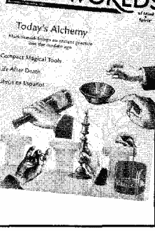

## LLEWELLYN ORDERING INFORMATION

### Order Online:

Visit our website at www.llewellyn.com, select your books, and order them on our secure server.

### Order by Phone:

- Call toll-free within the U.S. at 1-877-NEW-WRLD (1-877-639-9753). Call toll-free within Canada at 1-866-NEW-WRLD (1-866-639-9753)
- We accept VISA, MasterCard, and American Express

### Order by Mail:

Send the full price of your order (MN residents add 6.5% sales tax) in U.S. funds, plus postage & handling to:

- Llewellyn Worldwide
  2143 Wooddale Drive, Dept. 978-0-7387-0784-6
  Woodbury, MN 55125-2989, U.S.A.

### Postage & Handling:

**Standard** (U.S., Mexico, & Canada). If your order is:

$24.99 and under, add $3.00

$25.00 and over, FREE STANDARD SHIPPING

AK, HI, PR: $15.00 for one book plus $1.00 for each additional book.

**International Orders** (airmail only):

$16.00 for one book plus $3.00 for each additional book

*Orders are processed within 2 business days.*

*Please allow for normal shipping time. Postage and handling rates subject to change.*

## The Complete Book of Tarot Reversals

Mary K. Greer

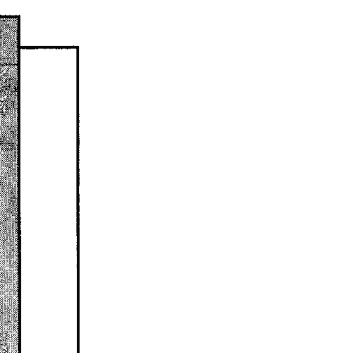

### The topsy-turvy world of upside-down cards

What do you do with the “other half” of a tarot reading: the reversed cards? Just ignore them as many people do? *Tarot Reversals* reveals everything you need to know for reading the most maligned and misunderstood part of a spread. These interpretations offer inner support, positive advice, and descriptions of the learning opportunities available, yet with a twist that is uniquely their own.

Enhance and deepen the quality of your consultations as you experiment with the eleven different methods of reading reversed cards. Use the author’s interpretations to stimulate your own intuitive ideas. Struggle in the dark no longer.

- The author has a strong reputation with tarot enthusiasts
- The first book to fully and exclusively address the interpretation of cards that appear upside-down in a tarot spread
- Features eleven different methods of determining reversed card meanings
- For readers at all levels of expertise

1-56718-285-2

6 x 9 • 312 pp.

$14.95

To order, call 1-877-NEW-WRLD

Prices subject to change without notice

## Understanding the Tarot Court

Mary K. Greer and Tom Little

Foreword by Rachel Pollack

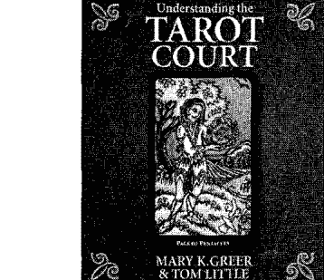

### Order in the court

Just who are those kings, queens, knights, and pages in the tarot deck? Generally considered the most difficult part of the tarot to interpret, they actually represent different characters or personalities that are aspects of ourselves. They also serve as teachers or projections of our own unacknowledged qualities.

Two esteemed tarot scholars unmask the court cards with details not found in any other book. Discover your significator and your nemesis. Compare the differences between the cards in several well-known decks. Match the court cards with the zodiac signs, the Myers-Briggs personality types, and the Jungian archetypes. Learn a variety of spreads that reveal childhood issues, career destiny, and the creative writer within.

0-7387-0286-2

6 x 9 • 288 pp.

$14.95

To order, call 1-877-NEW-WRLD

Prices subject to change without notice

## Tarot Journaling

### Using the Celtic Cross to Unveil Your Hidden Story

Corrine Kenner

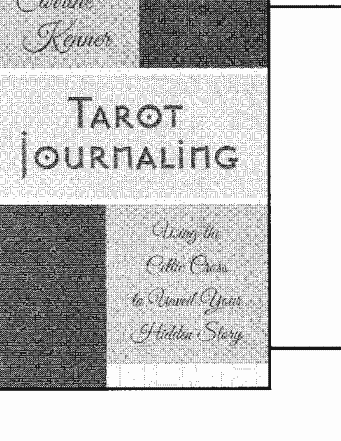

### A new way to tell the story of your life

A tarot journal can help you learn more about the cards, but it can also teach you a great deal about yourself. Beginning tarot students are advised to keep a tarot journal, and many experienced tarot readers are devoted to the practice. The only book of its kind, *Tarot Journaling* covers everything needed to create, keep, and preserve a personal tarot journal.

Readers will discover hundreds of ideas to inspire and enliven their tarot journals, including considerations when choosing journaling materials, how to save time when recording readings, techniques for getting past writer’s block, tips for turning negative energy into a positive brainstorming tool, and innovative ideas for protecting privacy. *Tarot Journaling* offers readers the tools to record and reflect upon the stories told by the cards—the stories of our lives.

0-7387-0643-4

216 pp. • 6 x 9

$12.95

To order, call 1-877-NEW-WRLD

Prices subject to change without notice

## TWENTY-ONE TOP TAROT TECHNIQUES

Drawing on nearly four decades of experience, tarot scholar, teacher, and author Mary K. Greer has developed an energizing new approach designed to deepen your understanding of each card in the tarot deck. Just as the twenty-six letters of the alphabet can be combined to form billions of words, these twenty-one methods can be used in any combination for gaining new insights and perspectives.

Emphasizing both traditional and personal methods of interpretation, the twenty-one techniques involve storytelling, sketching, symbols, metaphors, dialogues, and other imaginative processes. By emphasizing interaction, transformation, and empowerment, this multifaceted approach to tarot helps you build upon standard interpretations and discover new ways of connecting with the cards.

Mary K. Greer (California) is a revolutionary, breaking all the rules regarding methods of learning and using tarot cards. She has nearly forty years of tarot experience and, as an author and teacher, emphasizes personal insight and creativity. As a tarot reader, she works as a “midwife of the soul,” using techniques that are interactive, transformational, and empowering. Mary is a member of numerous tarot organizations and is featured at tarot conferences and symposia in the United States and abroad. She is the author of seven books, including Tarot for Your Self, The Complete Book of Tarot Reversals, and Understanding the Tarot Court.

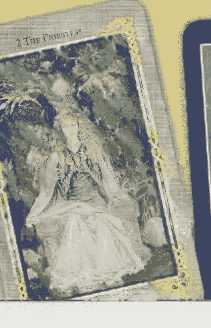

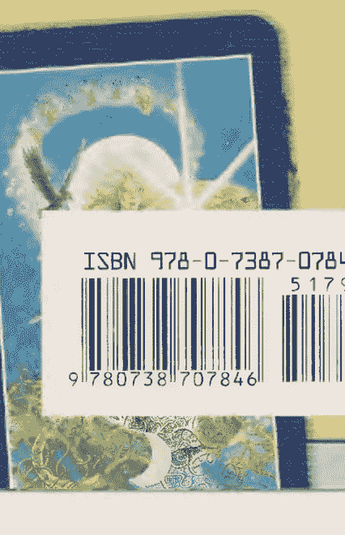

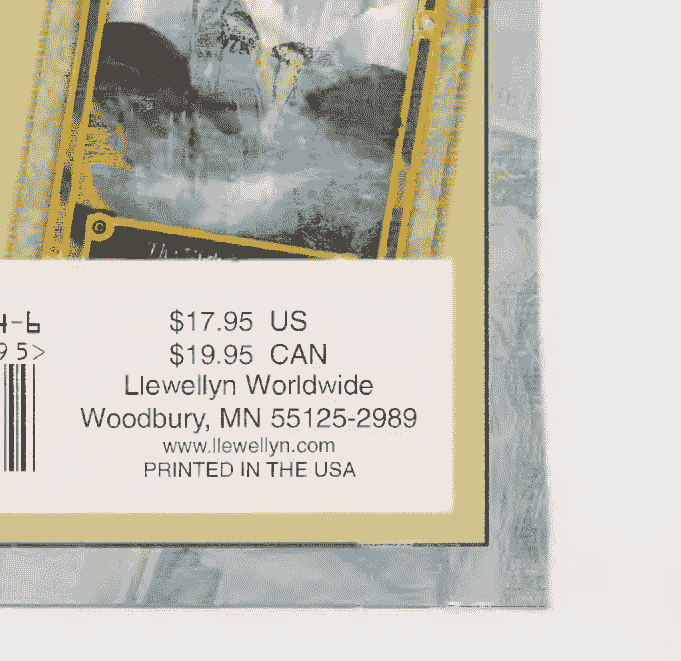

ISBN 978-0-7387-0784-6

51795>

9 780738 707846

$17.95 US

$19.95 CAN

Llewellyn Worldwide

Woodbury, MN 55125-2989

www.llewellyn.com

PRINTED IN THE USA