# 推荐序

## 学习塔罗开启智慧

对有意钻研神秘学的学者而言，研究塔罗牌是非常有趣的，因为塔罗牌内包罗万象，正好练功。

例如塔罗牌内有数字，而数字和灵数学有关，若不了解灵数学，则很难了解塔罗牌内数字之意义，而牌阵也与数字有关，破解数字才能破解五花八门之牌阵。

塔罗牌也和星相有关，例如星星月亮太阳都出现在塔罗牌中，而黄道十二宫的符号也常出现在塔罗牌中，例如伟特版塔罗牌的大塔罗中十号命运之轮和二十一号世界中的图形中都有金牛座、狮子座、天蝎座和宝瓶座之符号放在死角，若不了解占星术，则很难了解塔罗，其实小塔罗之宫廷牌也和黄道十二宫有关，甚至牌阵之顺时针摆法和逆时针摆法也和占星有关，若能看出其中关联意义，对解牌帮助甚大。

塔罗牌也和历法有关，例如小塔罗之四个花色，就代表地水火风，一年之四级，每个花色十三张，就代表一季之十三周，若了解历法，则对于塔罗牌占卜之应期，可能确切掌握，增加对当事人预测之稳定。

塔罗牌也和色彩有关，每张牌的色彩色调不同，都反映了占卜事件的性质，而色彩要如何解呢？那就要对人体的脉轮气场有认识，了解色彩对应之脉轮，脉轮对应之生命意义，才能破解色彩，也才能由出牌之色彩得到对占卜事件演变之洞见。

塔罗牌是较接近全脑开发的神秘学课题，中华超心理学会也一直用牌来作为开发心灵力量的协助工具，从古到今，大家有志一同，都在玩牌，可见古人之高明，而现代人也重视传承之智慧。

向日葵小姐有个向日葵塔罗网，风评甚佳，鄙人常登录该网站参观，获益甚多，了解向日葵小姐又将其塔罗牌研究之私房精华集结出书，鄙人有幸先睹为快，特向读者推荐，这是一本帮助您彻底了解塔罗牌之好书。

王中和 序於台北指南山

## 找到属于自己的塔罗之路

「向日葵塔罗网」为华人地区首屈一指的塔罗牌网站，今站长向日葵以其丰富的塔罗学识与人生智慧，著书一册以飨读者，实在是塔罗研究者之福。

书成之际，向日葵邀序於笔者乃清风之荣幸，故乐为序以赠之。笔者与向日葵相识多年，最佩服她的有几点：首先是深厚的外文能力。作者当年不止以第一志愿考进台大外文系，连研究所的入学考试也是从近百人之中拿下第一名。以此过人的外文造诣，悠游于浩瀚的塔罗原文书海自然是轻而易举、事半功倍，必有她独具灵心慧眼的心得。

再者，向日葵处事认真负责，从担任台大易学社社长至创立台大塔罗社担任创社社长，都以细心缜密的态度处事，而造就两社团的兴旺气势。这样的精神延续到她假设向日葵塔罗网来分享塔罗研究心得、传播正确的观念，都依循着她一贯戴尔处事原则。

而今，作者当时架站的无私奉献心得都开花结果为在塔罗界的声明、超高的网路阅览人次，以及各位读者现在看到的这本书。这都在在印证了「施即受」的宇宙铁律，也是上天对她的纯粹原始动机之肯定。

话题回到向日葵的大作来，本书的内容融合作者遍览群青的心得，以及多年来对于塔罗牌的探讨与研究。这些扎实的内涵，在作者细密而负责的心态下以一本实实在在的作品呈现在我们的面前。它不只拥有众多原文好书的内涵，更是一部独一无二的作品。由浅入深的观念，能够指引初学者一条学习塔罗牌的捷径，而论述详尽的牌义介绍，对于进阶研究者也有不小的参考价值。可说是一本人人必备的好书。

最后，有志于学习塔罗牌或正在这条路上的朋友，应该都会问一个问题：「学塔罗所为何事？」对于这个问题，每个人可能都有不同的答案。清风认为，除了预测未来、规划人生之外，学习塔罗牌中的智慧，进而探索宇宙中的终极真相，才是更重要的目的。希望各位读者都能藉由阅读向日葵站长的大作，找到那属于自己的塔罗牌之路。

2004/7/23 清风 序於台北

## 增订序

塔罗葵花宝典 12 周年纪念版

在编辑通知我要出新版《塔罗葵花宝典》的消息时，我掐指一算方觉时光荏苒，这本书竟然已经出版十二年，销售近三万册了。探出头来看看台湾现在的塔罗界发展，塔罗出版品已经从当年的贫瘠荒芜，进展到现在的百花齐放了，真令人不胜喜慰。

《塔罗葵花宝典》甫出版时，我还是个研究生。那一年我曾经认真考虑要朝塔罗界前进，不过最终仍选择进入了企业界。我从来不曾收费为人解牌或开班授课，不过我经营的公司销售欧美进口塔罗牌，并邀请优秀的塔罗老师来开班授课，也算是用我更擅长也更有效率的方式来服务塔友。

昨日，我们开了一堂伟特塔罗初级班，报名额满，反应热烈。授课的是我从台大社团时期就并肩作战的老同学 Lailai。想当年毕业是我们各自进入商业界，最终竟还是回到塔罗重聚首。又，在准备新版内容的期间，我多年来头一次接到塔罗社学弟妹的邀请回校演讲。这种种发生，不禁令我感到因缘的巧妙，实非凡人可预料。

最后，我要谢谢所有曾经在过去、现在及未来支持我的读者朋友们。祝福所有行走在人世间的美丽的灵魂，愿大家都能在此书中找到内心最需要的解答。

向日葵

2015.12.6 於桃源晶荷幸福空间

# 塔罗之美

目前最古老的一副塔罗牌源自十四世纪的意大利，至于塔罗牌最早的起源则说法众多，莫衷一是，只能留待历史学家去深究。

一副完整的塔罗牌共有七十八张，版本则有千种，可以在各大书局或网路商店取得。每张塔罗牌都有非常丰富的象征图像，包含人类文化的智慧，是一本能供人探索一生的智慧之书。本书着重探讨塔罗牌的占卜功能，特别是牌义的理解与应用，可以作为初学者的牌义辞典，也可作为老手的进阶阅读。

本书采用目前全世界最普遍的莱德伟特塔罗牌（Rider-Waite Tarot Deck）作为牌意解说的范本。传统的塔罗牌中，小阿尔克纳牌组的数字牌都只画出扑克牌般的花色，使用者很难从中得到牌意咨询，莱德伟特牌的特殊之处在于设计者将小阿尔克纳也用具体的图像来描绘，所以新手也可以一目了然，对牌意的学习有极大的帮助。如果读者手边有莱德伟特牌，或任何同系统的塔罗牌（一般而言，力量牌编号八，正义牌编号十一，而且数字牌有具体图案的牌，多半属于伟特系统），都可以套用此书的牌意。如果读者使用的是其他系统的塔罗牌，例如马赛牌（Tarot de Marseilles）或托特牌（Aleister Crowley Thoth Tarot Deck），那么此书可以作为牌意推演的参考，但不建议直接套用。

对塔罗牌完全没有概念的新手，在看完第一章之后，建议先看「占卜流程」的章节，才知道塔罗占卜如何进行。

# 塔罗占卜浅说

塔罗牌占卜跟一般人认为的算命不太一样。我们老祖宗俗称的五术，包含山医命相卜五种，一般人认为的算命属于「命类」，塔罗牌占卜则属于「卜类」。

命类是运用出生年月日来推算一个人一生的先天性格和后天的运势起伏，例如八字、占星术或紫微斗数，也就是俗称的命理。塔罗牌则属于占卜类，是遇到明确问题时，才来寻求解惑，和易经卜卦及求签类似，是俗称的占卜。所以，必须要有一个明确的问题，才能寻求塔罗占卜，而且算出的结果也只是短期的，通常最多只有一两年。

有些人觉得塔罗牌很神，因为它很准。事实上，算准并不是塔罗占卜的目的。在结果不好时，算不准才是应该追求的目标。因为塔罗牌算出的结果是在不加任何人力改变的状态时，所得到的结果。如果心态或行动改变了，就可以改变结果。所以塔罗牌并不是宿命的占卜，而是要引导人们改造自己的命运。塔罗牌让我们偷窥未来的命运，如果不喜欢，随时可以改变它！不要让自己陷入宿命的泥沼中。

还有人觉得塔罗牌很邪，因为它太准了，因而产生许多荒唐的「牌精说」、「养牌说」、「开牌说」、「牌有个性说」，其实都是不必要的庸人自扰。就行易经卜卦很准，测字很准，米卦很准，也没有人会认为这其中有精灵鬼怪存在，而塔罗牌只是七十八张美丽的纸牌，它本身不具有任何神秘的能量，之所以会准，是源自于使用人的潜意识宝库。所以，真正神奇的是人，不是牌。这些迷信如果持续流传，无形中也让塔罗牌被社会大众用异样的眼光看待，实非塔罗爱好者之幸。

使用塔罗牌占卜，建立健康而正确的心态是第一要务。接下来才是跟每张牌混熟，理解牌意，然后就可以实际上场演练，累计经验。在不断接触塔罗牌的过程中，你也可以从中获得智慧，并且开发直觉力，一生受用无穷。

除了一般人最有兴趣的预测未来之外，也别忘了利用塔罗牌来进化心灵，你可以用它来检视自己的身心灵状态，或是选出一张你最有需要的牌来进行静心冥想，你将会发现，只用塔罗牌来占卜，恐怕有点暴殄天物了。

## 葵花锦囊

#### 塔罗占卜四式

*   第一式 建立健康而正确的心态。
*   第二式 建立与牌的关系，理解牌义。
*   第三式 上场演练，累积经验
*   第四式 预测未来，进化心灵

# 牌义的——基本概念

塔罗初学者第一个遇到的瓶颈，往往是记不起牌义，一味的死背，却不懂灵活运用。在这个章节中，向日葵将带领读者探索学习牌义的组成成份，以及学习上不可不知的基本概念。

# 共通牌义、主流牌义与个人牌义

有时候学习者会遇到一种困扰，发现牌义众说纷纭，不知道听谁的好？塔罗牌难道没有一个固定而正确的牌义吗？难道不能照本宣科吗？为了解决这个问题，在这个单元中，向日葵要为大家厘清塔罗牌义的内涵。

塔罗牌的牌义不是规定的，更不是设计者认为他的牌义是什么就是什么。牌义式奠基与人类的生活经验，而汇聚出来的。有一些大家都认同的原则，牢不可破；有些部分却因理解角度不同，而产生变化。下面这张图可以说明每张牌的牌义组成成份。

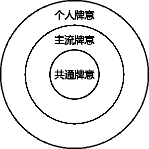

## 共通牌义

在核心部分称为「共通牌义」，是每张牌的中心题旨。共通牌义指的是，无论什么版本、什么系统、文化与国籍，每张牌都具有一个世界通用的核心意义，走都哪里都不会改变。共通牌义是塔罗牌学习者赖以沟通的语言。

例如，皇后指的是「母亲」的原型，隐士指的是「智慧老人」的原型，在不同的种族与文化中，一定都存在这样的形象，而牌义也是紧扣这样的中心题旨来推演。世界上不可能有人将皇后牌视为父亲，将隐士牌视为小孩，即使有，他也绝对无法跟其他塔罗玩家沟通。

## 主流牌义

在中间的部分称为「主流牌义」，是大多数人所采用的牌义，也是书本上会教你的牌义。然而，不同版本的塔罗牌之间，由于图像不同，设计者的构思不同，所以会产生些微的差异。以伟特牌和诺丽牌的愚人为例，伟特的愚人前方是悬崖，可诺丽的则是十字路口，因为悬崖和十字路口意象的差异，牌义因而产生些许分歧，但是对占卜结果的影响不大，两者都属于主流牌义。再者，同一版本同一张牌的主流牌义，也可能因使用者的理解不同而分歧。

在伟特版本中，钱币二就是一个例子。有人将钱币二的人物看作街头艺术人，所以牌义与娱乐和弹性相关；有人着重钱币二的不稳定，所以代表波动与纠纷；还有人重视钱币二左右摇摆的特质，认为与选择有关；更有人兼而有之。读者可能看了甲书、乙书和丙书，发现三本书的钱币二牌义都略有出入，因而感到迷惑。事实上，以上这些解读都对，也都有人使用，所以都算是主流牌义之一，只是个人解读角度不同罢了。

## 个人牌义

圆形最外围的称为「个人牌义」。塔罗牌最让人感到兴奋的一点，就是它具有强烈的个人风格。就像电脑玩家可以尽情布置个人化的桌面，塔罗牌也会随着使用者的习惯，而呈现不同的风貌。这样的特质也反映在牌义上。塔罗玩久了，使用者经常会发展出自己所属的牌义。

例如，陈某每次为班上同学占卜时，出现宝剑皇后，都代表特点一位张女同学，久而久之，宝剑皇后等于张姓女同学，就成为陈某的个人牌义。

又例如，李某使用他的俄罗斯塔罗牌，每次看到钱币四，都觉得牌中人物很像小偷，如此一来，钱币四等于小偷就成为李某的个人牌义。值得注意的是，个人牌义只适用于个人，可以自占自解，或是为了他人占自己解，若是请别人来解就行不通了。

这样的图解释了为什么牌义有这么多版本。不过，读者可能有产生新的问题：如此一来，每个人算的牌，不是就不能请别人代解了吗？许多人自己占算之后，又请朋友代解给意见，还有更多人选择上网请素未谋面的网友代解，这样行得通吗？是，也不是。因为我们拥有共通牌义和主流牌义，所以请人代解的结果多半八九不离十。但是，如果你的个人牌义太多太鲜明，那么请人代解就会产生隔靴搔痒的现象，甚至牛头不对马嘴，这是必须注意的地方。

由此可知，在占卜时，最珍贵的就是翻开牌那一刻的第一讯息。如果真的一头雾水，必须请人代解的话，也最好找跟你同看一本书或跟同一位老师学习的人，唯有这样，两人脑中的「牌义库」内容相似，解出来的内容才不会天差地远。

再举一个例子，如果你请了甲帮你占算，事后又拿去请乙解牌，甲乙两人的解读若相差很大，仍应以甲为准，因为在占卜当时，塔罗牌是以甲的「牌义库」来呈现的。

# 如何快速记忆牌义

不要听信这个标题，塔罗牌牌义是不能快速记忆的，但是可以联想推演。塔罗牌就像会说故事的图画，你看到图画自然会想起故事，看得越仔细，回忆就越多，一味死啃只会事倍功半。

当你买到一副塔罗牌，通常会拿到一本写有牌义的小册子，但是册子里并不会告诉你为什么这张牌会有这个牌义，所以你会感到很困扰，都记不起来，该怎么办？这时候，请把小册子放到一旁，因为要学会牌义，还有更多更好的方法。

## 参考书籍或网站

较为详细的塔罗书籍或网站中，通常会有塔罗牌义深入讲解。你首先要找的会告诉你这个牌义如何推演而来的资讯。你可以从中获得很多主流牌义的资料，看看别人是怎么看待这些牌的。你在这里找到你可以接受并赞同的牌义，如果有看不懂或想不透的牌义，就不必理会，更不需强记。

最后，有一点必须谨记在心，就是这些牌义是作者以他自己的角度来诠释的，他的诠释法可以启发你，帮助你更了解牌义，但是你不必全盘接受，只要接受能够引起你共鸣的就好了。

## 牌面推理法

每个人多少都有看图说故事的本领。请你拿出一张牌，仔细研究其中的奥妙。牌中人物的姿态、表情、衣着、动作，给了你什么感觉？画面的背景给你什么感受？他身旁有什么事物？试着说出你的感觉，甚至编一个故事，把它记录下来，这就是你的牌义，而且你会对它滚瓜烂熟。

这个方法可以在拿到牌之后，不要参考任何资料，立刻做！做完之后再行对照书籍或网站上的主流牌义，看看有什么不同。你才决定，到底是你有道理，还是主流牌义有道理，或者想要兼容并蓄也可以。

## 深入冥想法

这是更高阶的学习牌义法，需要很丰富的想象力，建议在对牌义有初步认识之后练习。如果没有什么想象力，则这个方法也可以协助你开发直觉与想象力。你拿出一张牌，仔细看图像，将它烙印在脑海中，然后闭上眼睛，将自己完全融入图像中。

以权杖九为例，想象你是图中的这个男人，你的头和手臂包扎绷带，感觉如何？你穿着靴子，肩膀耸起，东张西望地等待敌人，有什么感受？后面那些耸立的权杖给你的安全感还是对立感？你感到孤独、紧张、害怕、警觉、无聊还是愤怒呢？如果你想说话，你会说什么？

再进一步，想象你是别人，你看到这个男人，他给你什么感觉？你觉得他的感情状态如何？他的工作态度如何？他的性格如何？他是否害怕还是压抑？如果你想对他说话，你会说什么？他会回答你什么？是跟你倾诉苦闷，还是拿权杖把你赶跑？

在这个练习中，你会得到更细微的牌义，而且你会与牌义融合，达到人牌合一的境界。做完这个练习之后，建议将心得记录下来，这会是很珍贵的个人牌义记录。

## 比较法

在对牌义已经有基础的掌握之后，也可以运用比较法来深入理解牌义。冥想法是右脑直觉的活动，比较法则是左脑理性的分析。请先拿出任两张明显相似或相反的牌，例如恋人和恶魔，两张牌的构图相似，意义却强烈对比。恋人是上天的祝福，纯洁的爱情，恶魔则是上天的诅咒，欲望的沉沦。两牌之间还有更多有趣的对照，请一一找出来。

进步之后，可以尝试找任两张看似八杆子打不着的牌。例如愚人和星星，他们 有什么相似处？有什么相异处？还是有什么前后因果关系？

比较法可以帮助你大幅增进占卜的敏感度，你将可以很快找出牌阵中互相呼应或者矛盾的牌，它们都会透露问题的答案。

## 结合法

除了比较两牌之间的相同和相异处之外，更进阶的方法是练习「两牌合一」甚或「多牌合一」。塔罗占卜的无上心法就是要将两张牌或多张牌视为一张牌的能力，如此一来你才可以把整个牌阵中的牌，结合成一个完整的故事。我们可以透过这个方法来练习。

首先，请先拿出任两张牌，试着将它们的意义结合在一起，编出一个故事。例如愚人和吊人，看起来没什么关联，但是发挥想象力之后，你可以把这两张牌看作一个愚人特质的人，处在吊人的环境中。实际的例子像是一个狂放不羁的年轻人，被环境限制住，不能动弹，此时他应该感到很痛苦，拼命想挣扎。再举一个例子，假设我们对照圣杯五和权杖十，我们可以猜想这是一个刚失恋的人，必须回到工作岗位上，面对很大的压力。也可以想象这个人是因为工作负荷大，所以在感情上一直没有依归。

在有一定的基础之后，可以进阶练习结合三张牌或多张牌。假设你拿圣杯国王、钱币二和宝剑国王，你可以说这是一个圣杯国王特质的人，遇到钱币而财务上的抉择困难，因而去寻求宝剑国王这位专业人士的帮助。请尽情发挥想象力，编织你的塔罗故事。

## 练习再练习

无论读了多少书，记了多少牌义，最后都必须走上战场。一开始可以先为自己占卜来练习，再来可以为相熟的亲朋好友占卜兼练习。在练习中，你会得到更多实际的心得，也会遇到更多的问题，在解决问题的过程中，你才能更上一层楼。

# 逆位解读九式

如果我们将塔罗牌用搓麻将的方式洗牌，则出现在排阵中牌，有些是正立的，有些会是上下颠倒的，我们称上下颠倒的情况为「逆位」。 牌义的掌握是初学者遇到的第一个困扰，逆位的解读通常是第二个麻烦，很多人一看到逆位牌就放弃了。事实上，逆位牌只是正位意义的变化和补充，不是非要不可。因此，最对牌义掌握尚未精熟的阶段，不建议初学者使用。请初学者全部用正位来解，等到对牌义都熟悉了，再挑战逆位。

## 被压抑或否认的情绪

逆位的牌可能表示当事人不愿意承认、接受，或是极力压抑的心理状态。例如，死神逆位常表示当事人正经历一个痛苦的结束，但他仍不愿意接受事实；审判逆位可能是当事人拒绝接受某种「召唤」。

## 内在或隐形的潜能

此说取自 GailFairfield 的《Choice-CenteredTarot》一书。它可以表示当事人隐藏的性格面，而外人通常看不出来，若程度更强的话，连本人都不会发现。例如圣杯骑士逆位，可能代表当事人有很浪漫、满怀理想的感性面，可是别人都不这么认为，甚至连当事人自己都没有发现。塔罗牌指出这个潜能，我们可以选择将隐形转为显性（将逆位转正），将潜能发挥出来。这个解释较为冷门，很少使用。

## 减弱或增强

逆位有时意义与正位相同，不过附加了减弱或增强的讯息。例如，与人逆位可能增强或减弱它的漂泊不定性质：太阳逆位仍然是一张好牌，只是减轻好的程度；塔逆位会减轻骤变与痛苦的程度；宝剑三也可能减轻悲伤的程度。

## 过度或不足

「过度或不足」与「减弱或增强」有点类似，但是程度更严重。「减弱或增强」可以忽略，但「过度或不足」是「太多」或「太少」，是会构成困扰的。例如，圣杯三描述一个欢欣庆祝的状况，如果过度呢？就乐极生悲了。

## 时间点的差异

这一项主要探讨正逆位在时间点上的差异。正位通常表示正在运作中，显而易见的情况；逆位牌则可能表示「才刚刚开始」、「快要结束」或者「延迟」。例如，逆位的圣杯九仍然可以表示愿望达成，但比预估的稍晚；权杖十逆位有时表示即将放下负担；静态等待的小牌，例如圣杯四、宝剑四、钱币七、圣杯七、宝剑八等，通常表示即将离开等待的状况，开始采取行动。

## 滥用或误用

如同字面上的意思，逆位牌也可能代表「不恰当的使用」。例如，皇帝逆位或力量逆位可能是权利滥用；魔术师逆位表示将聪明才智或技能用在错误的地方；钱币六逆位可能表示乱花钱，或是不恰当的施舍与宽容。这个解释通常只会出现在特定几张牌上。

## 相反义

直接在原牌义前面加一个「不」字就可得出它的相反意。不过，将逆位牌解成相反意的情况其实很少，在使用时应注意。例如力量牌正位时代表勇敢自信，逆位时可能表示不勇敢不自信；权杖六变得不成功。

## 牌面推演

我们可以将牌的图像当成一幅画，看看它颠倒过来后，与正常状态下有何不同。例如，吊人有一个意义是「不同角度的智慧」，但若颠倒过来看，他就不再是倒掉着的，因此会丧失「不同角度的智慧」牌义；塔逆位时，雷从下方劈上来，表示这个骤变可能是来自当事人的内心。圣杯牌组里的杯子代表感情，如果颠倒过来，杯子将全数倾倒，因此圣杯牌逆位通常不若正位的好；宝剑三的剑尖朝向自己，如果逆位，就会朝向对方，所以

## 前位法

因为塔罗牌有前后连贯的关系，所以逆位牌可能表示当事人没有解决上一张牌的课题，但这个解释不适用于小牌。举例说明，太阳牌逆位，可能是由于尚未在月亮牌中学到放下恐惧、识破幻象，因此太阳的成功才被乌云笼罩了。 以上九点只是通用的大原则。逆位牌意本无固定的解释，以上九大原则可以在解牌时试着一一套用，但是，更完善的解法，还需依赖经验与直觉，这都需要时间来培养。

## 葵花锦囊

宫廷牌的逆位诠释 对于宫廷牌的逆位，通常会采用「过度或不足」的方向来解释。每个宫廷牌人物都有特定的性格，同样的特征表现适当则好，过度或不足则坏。比方说钱币骑士勤奋工作，逆位时，勤奋可能演变成工作狂，或是整天闲混不努力。权杖国王积极领导，逆位时，过度则成暴君，不足则成懦弱的君王。几乎所有的宫廷牌都可以如此解释，正位的宫廷牌通常呈现该牌组表现适当的特征，逆位的宫廷牌则因为过度或不足，而呈现负面的特质。

# 塔罗牌——的结构

22 张大牌 —— 道尽人间故事

20 张数字牌 —— 数字暗藏奥秘

16 张宫廷牌 —— 四位宫廷人物与四要素的交互作用

# 入门概论

## 塔罗牌的基本架构

塔罗牌共有七十八张，包括二十二张大阿尔克纳（Major arcana，又称大密仪），简称大牌，以及无十六张小阿尔克纳（Minor arcana，又称小密仪），简称小牌。小牌又细分为权杖、圣杯、宝剑、钱币四个牌组，每个牌组各有十张数字牌和四张宫廷牌。

如同易经以六十四卦来表现世间万事万物，塔罗牌则用这七十八张牌表达一切。易经的六十四卦还可以变化出更多复杂的形态，以得到更精致的讯息，塔罗牌也运用逆位和排阵来达到此一目的。

这七十八张塔罗牌又近乎完美的结构。在学习时，先提纲挈领认识塔罗牌的整体架构，会比漫无章法地学习轻松许多。

## 大牌 vs. 小牌

大牌与小牌中的四个牌组，总共形成五个要素。权杖、圣杯、宝剑、钱币四个牌组分别与火、水、风、土四要素对应，而大牌代表第五个要素，也就是「精神」。在占卜中，这五个种类的牌代表不同层面的意义。大牌表现的是抽象的精神层面，小牌则将大牌落实成为日常生活的事件，所以通常初学者会感到小牌比较具体，容易学习，而充满各式象征符号的大牌，牌义繁多而复杂，往往使人感到漫无头绪。

其实大牌就像是一个寓言故事，讲述愚人的灵性成长旅程。如果用心理学家荣格的角度来看，则二十二张大牌就是他所谓的「原型」（archetype），原型是存在人类集体潜意识中的共通意象，宇宙万物都可以囊括在这二十二张牌所代表的原型之内。而这二十二张大牌就是运用色彩与象征，将抽象的原型具体化。因此，大牌的图像充满各种象征的符号，牌义繁杂多元，并不令人意外。反而是区区二十二张牌就能囊括宇宙，才令人感到震惊。

大牌表现抽象的精神层面，是一种理想化的形象，不可能真正出现在生活中。但是，如果反过来看，生活中所出现的各种事件或人物，都可以找到一张大牌相对应。举例来说，我们每个人心目中都有一个理想的「美女」形象，在生活中也许可以看到很多称得上是「美女」的人，但是她们多少 会有一点小瑕疵，因此，我们永远无法在这个物质世界中，找到百分之百符合这「美女」原型的人。

相对于大牌，小牌就具体多了。小牌是真正会发生在日常生活中的具体事件。因为是日常生活的小事件，所以当事人比较有能力控制，也比较不会有长期的深远影响。大牌则表达更高层次的精神层面，可能是当事人内心的变化，或是命运中无法控制的部分，可能撼动当事人的整个信仰与价值观，影响较为长期也深远，因而解牌时也较易使人感到抽象难解。

以下的简表提供大牌和小牌的差异，以及小牌的四个牌组所表现的生活面向。

| 类别 | 意义 |
| 大牌 | 抽象的精神层面，当事人无法控制的部分，长期，影响深远 |
| 小牌 | 具体的事件，当事人可以控制的部分，短期，影响较小 |
| 权杖牌组 | 行动与创造 |
| 圣杯牌组 | 人际与情感 |
| 宝剑牌组 | 伤害与思考 |
| 钱币牌组 | 物质与享受 |

除了大牌和小牌四个牌组的分类以外，在这五个类别之中，又有更精密复杂的秩序，远超过你的想象。在接下来的章节中，我们会进入更深的核心，来解构神秘的塔罗牌。

# 大牌的结构 —— 愚人之旅

## 一阶愚人之旅

大牌从编号 0 的愚人到编号 21 的世界，以愚人的人生旅程为剧本，达成完美的一周天。

我们可以将大牌视为愚人的冒险寓言故事。在愚人牌中，宛如新生儿般的愚人踏上未知的旅程，他在魔术师牌中学会理解外在世界，在女祭司牌理解内在灵魂。皇后是带给他温暖呵护的母亲，皇帝是理性领导他的父亲，教宗则提供道德教育和学校教育。然后他在恋人牌中初尝爱情滋味。在战车牌中首次离乡背井，学会阳性的竞争。在力量牌学会克服内在恐惧，进一步以柔克刚。在隐士牌中品尝孤独，追寻智慧，体验高处不胜寒的感觉。命运之轮让他体验人生起落。

正义牌教他理性抉择，作出完美的决定。在吊人牌中，他了解有时候必须牺牲某些事物，才能获得心灵成长。死神更进一步要他懂得彻底放手。在节制牌中，他得到适应力，学会调整与妥协。恶魔让他学习克服物质欲望。接着他在塔中经历巨变后，星星带领他接触潜意识，重燃信心与希望。他在月亮牌中与恐惧奋战，进而识破幻象。在太阳牌体验全方位的成功与快乐。审判的号角响起，他接受内心的召唤，了解因果的运作。最后他在世界中完成旅程，达到最终的成功。

## 二阶愚人之旅

大牌不只具有以上所述的线性关联，还有两层的上下关联。如果我们将 1 到 10 号牌由左至右排成一列，再把 11 到 20 号牌同样排列在其下方，则会得到以下的两列牌阵型。上面的牌编号加上十，就会得到下面的牌，因此在灵数学上，它们是互相关联的。

第一排的魔术师和正义显示力量的完全展开和理性使用，第二排女祭司和吊人透露静默无为的真谛，第三排皇后和死神表示生命的开展与结束，第四排皇帝和节制产生威权统治和和平妥协的对比，第五排教宗与恶魔分别代表灵性提升与物欲沉沦，第六排恋人和塔分别象征上天的祝福与惩罚，第七排战车和星星显示外在胜利与内在宁静的对照，第八排力量和月亮教导我们克服内心的负面情绪，第九排隐士与太阳象征灵性的追寻与胜利，最后一排则是人类与宿命的关联。

而愚人和世界分别代表人生旅程的开始与完成。当然这其中还有更多细微的对照，值得学习者去体会探究，在下一章的逐牌解析中，也会有更详细的说明。

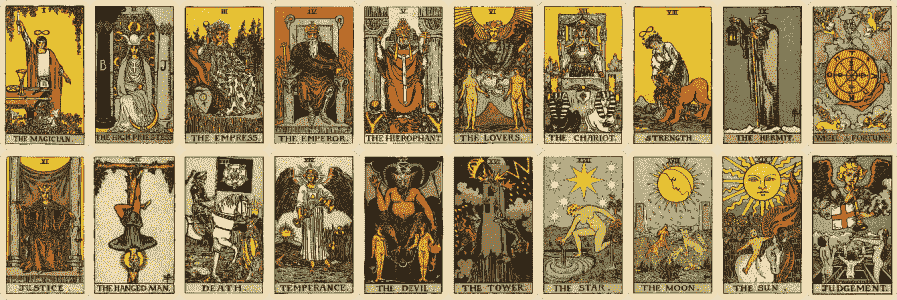

## 三阶愚人之旅

大牌的三层关联也是塔罗研究者经常谈论的有趣话题。如果把 1 到 21 号牌排成每列七张的阵型，我们可以得到更复杂的大牌内在关联。

第一列讲的是显意识，第二列代表潜意识，第三列则表示超意识。从身心灵角度来说，第一列就代表身，第二列是心，第三列是灵。

七是个有趣的数字。中华民族喜欢讲七仙女 、印度人讲七个脉轮、西洋古典占星学有七颗行星、就连一星期都有七天，这个数字让三层阵型显得如此完美。

在塔罗大牌中的前七张代表显意识和「身」的部分，表现世俗的一面，特别与日常生活和社会相关，愚人在这七张牌内经验与他人的关系，包括自己的男性面和女性面、父母、师长、情人，而在七号战车牌经验与同僚的竞争，想要得胜。世上大部分的人都在这七张牌中打滚，直到终老。

第二层的潜意识层面使愚人朝向内省，获得自觉，进入到「心」的层面，也就是内心的思考与想法。愚人在 8 到 14 号牌中，先在力量牌中居间发现外在的刚强不如内在的坚韧，于是转而向内探求智慧。他会在命运之轮中体验内心的转折，在正义牌思考何谓真正的公平。他成为吊人时，不理会外在的折磨，而获得灵性的光辉。在死神牌中他经历彻底的转化与重生，最后在节制达到这一个阶段的圆熟，此时，他已经懂得中庸之道，处事圆融。

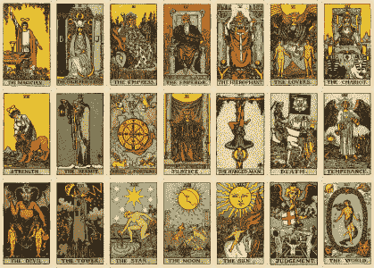

第三层的意义显得最为隐晦，这是属于「灵」的一列，是通往开悟的必经之路。大多数人都够觉知自己的日常作息与身体状况，以及自己心中的想法。情况好时，心里相什么，能够身体力行。情况不好时，就会产生身心的冲突，譬如心里想要努力工作，但就是不由自主的打瞌睡。但是，很多人不知道「灵魂」也会与身心产生交互作用，只是很少人能够察觉自己灵魂的想法。第三列正式呈现这深埋的超意识。在灵性的层面上，愚人必须看破物质幻象，获得天启，与潜意识沟通，与梦境共舞，在太阳获得灵性成功之后，还得在审判中再度进入黑暗，再生之后，方能获得全面的身心灵整合。

这三层的阵型除了左右关联之外，上下也互相对应。第一排显示魔术师主动展现力量，力量牌用更高明的手法掌控力量，中间的狮子则连接魔术师与恶魔，表示如果无法控制内心的欲望，就会导致权利滥用，沉沦在物质幻象中。第二排是女祭司代表隐藏的智慧，隐士进一步登上高峰展现智慧之光，塔则是人力建造的登天建筑，一方面显示智慧误用讲受上天惩罚的下场，一方面有代表天启与开悟。第三排的皇后从表面的欢乐丰足，经过命运之轮，转变到内心的祥和宁静。第四排显示皇帝从高压统治，到正义公平公正的治理方式，而他的课题在于如何运用象征清晰的宝剑来破除月亮中伪装的假象。第五排教宗是拥有群众的宗教领袖，吊人是孤独的殉道者，他头部发出而光芒在太阳牌中无线扩大，达到太阳牌的灵性成功。第六排的恋人中，亚当夏娃代表人类的起源，他们的生命在死神中结束，在审判中接受上天的审判，并且重生。最后一排的战车从强势的征服者角色，到节制的柔性协调沟通，最后达成世界牌的圆熟，悠游在宇宙之中。

以正义为中心的九张牌也有特殊的意义。在这九张牌中，我们可以在第一层发现母亲、父亲、师长或自然、社会、教育的对应，儿童在母亲怀抱中自然成长，但经过社会洗礼，进入学习接受启蒙，此时他九失去了原有的自然。在第二层，从命运之轮到吊人，我们看到外在的改变转入内心的恒定，中间则是均衡中的正义。在第三层，由星星的潜意识进展到太阳的显意识，由内在转到外在，中间则是充满恐惧不安的月亮，也许说明这转变像蝴蝶破茧一般，并不容易。

经过以上的说明，读者应该不难发现塔罗牌的设计博大精深。即使是多年的塔罗研究者，也不见得能通透这其中蕴含的奥秘。学习者可以时时讲大牌拿出来排列成两层或三层的结构，仔细研究多张牌之间的对应关系。你看得越多，见解就越深，收获就越大。

# 小牌的结构 —— 四个牌组和阴阳理论

如同电脑用 1 和 0 两个数字来创造无限，塔罗牌也可分为阴阳，这是最初步的分类。易经中的太极生两仪观念，应用到塔罗牌，我们就可以将小牌的四个牌组分成两类，亦即阳性牌组与阴性牌组。

## 阳性牌组 —— 权杖和宝剑

权杖和宝剑都是长形的，像数字 1，是阳性的象征。阳性牌组像太阳一般，具有热、扩展、外向、男性、阳刚、主动、积极、白天的特征。由于权杖着重外在行动，宝剑倾向心智活动，因此我们又可以把权杖分为阳中之阳，宝剑是阳中之阴。

## 阴性牌组 —— 圣杯和钱币

圣杯和钱币都是圆形的，像数字 0，是阴性的象征。阴性牌组像月亮一般，具有冷、收缩、内向、女生、温柔、被动、消极、夜晚的特征。由于圣杯牌组偏向心灵层面，而钱币牌组偏向外在的物质，所以可以进一步把圣杯区分为阴中之阴，钱币是阴中之阳。

所以我们可以得出以下结论：

| 次分类/主分类 | 阳 | 阴 |
| 阳 | 权杖 | 钱币 |
| 阴 | 宝剑 | 圣杯 |

小牌分为四个牌组，与西方神秘学中的火土风水四要素相对应。这四要素类似我们说的金木水火土五行，是构成事物的最基本要素，换言之，任何事物都可以用四要素的概念来呈现，这也说明了为什么区区数十张牌就能够道尽人间故事。

## 权杖牌组 —— 热情如火

权杖牌组对应火要素，与行动和创造有关。火象星座包括牡羊座、狮子座和射手座。有句话叫「热情如火」，说明火要素的外向特征。权杖牌组通常表现生活中的行动面，代表主动、活力、热情、渴望、直观、积极、创造、乐观、冒险、奋斗、企业、开疆阔土。

要特别注意的是，权杖牌组的「直观」不同于圣杯牌组的「直觉」。直观是一种强烈的「我就是知道」的感觉，而直觉比较像是一种不确定的念头。因此，权杖牌组的人依直观和本能行事，行动大胆积极，天不怕地不怕，有时候会给人冲动火自我中心的印象，可能有点三分钟热度。

## 圣杯牌组 —— 柔情似水

圣杯牌组对应水要素，与情感和直觉有关。水象星座包括双鱼座、巨蟹座和天蝎座。成语有云「柔情似水」，正好说明圣杯牌组的感性特征。圣杯牌组通常反映生活中的人际关系，代表爱、情感、情绪、敏感、体贴、和谐、悲天悯人、同理心、友谊、人际关系、内向、静默、梦境、幻象、直觉。圣杯牌组的人依直觉和情感行事，喜欢关怀他人，重视人际关系，开口常说「我总觉得……」、「我有个感觉……」，缺点是多愁善感，感情用事。

## 宝剑牌组 —— 剑气逼人

宝剑牌组对应风要素，与冲突和问题有关。风象星座包括水瓶座、双子座和天称座。武侠小说中常描述「剑气逼人」，说明宝剑牌组的杀伤力之强，宝剑牌组多半是灰暗多云的背景，暗示宝剑混乱的气氛。

宝剑牌组通常呈现生活中的冲突与伤害，传统上代表问题、麻烦、悲伤、愤怒、负面情绪，但由于它与风要素相关，所以也代表思考、心智活动、智力、智慧。宝剑牌组的人理智过人，判断力精确，组智力强，临事冷静，但由于缺乏情感，给人冷漠的印象。

## 钱币牌组 —— 脚踏实地

钱币牌组对应土要素，与物质和享乐有关。土象星座包括金牛座、处女座和摩羯座。我们喜欢「脚踏实地」的人，这样的人通常草根性比较强。钱币牌组反映外在的物质面，代表金钱、大自然、稳定、安全感、健康、家庭、遗产、日常生活、工作、交易、花钱享乐。

有一点初学者容易混淆的是，怎么钱币跟金钱和工作有关，权杖又跟经营企业有关？其实钱币倾向表现日常生活的工作与交易，而权杖则表现企业的扩张壮大。钱币牌组的人重视物质生活，勤奋工作，不投机取巧，也懂得享乐，缺点是可能有点过去固执或贪婪。

在这四个牌组当中，又可分为十张数字牌和四张宫廷牌。数字牌表现日常生活的是个面向，宫廷牌则代表某个人物、性格，在少数情况下可能表示某个事件。数字牌和宫廷牌之内也有规律的结构，在下面的章节中将会详细说明。

## 数字牌的结构

每个牌组的数字牌编号由 1 到 10，显然与灵数学有很大的关联。塔罗牌的四个牌组将日常生活分为四个层面，而牌组中的数字牌又把这四个层面再细分为十个面向来表现。

### 1 是开始与根源

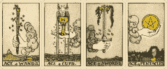

权杖一是行动与创意的开端，圣杯一是人际关系与直觉的开端，宝剑一是心智活动和挑战的开端，钱币一是将想法物质化的开端。四张一都提供一种新机会，像种子一样，潜力无限。当事人在这里面对的课题，是要分辨出这是个好种子还是坏种子，以及他能不能好好把握。

### 2 是结合与对立

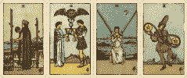

权杖二是两种选择之间的考虑，圣杯二是人际关系的结合，宝剑二是两股势力的对立和胶着，钱币二是两股势力间的摆荡。所有的二都有两股力量存在，结合良好可以收到一加一大于二的效果，结合不好则会产生对立和僵滞的状态。

### 3 是合作与初步成果

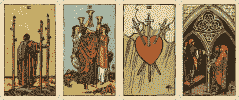

权杖三是贸易的合作和初步成果，圣杯三是人际关系和合作与初步成果，宝剑三中的三把宝剑合力达到伤害上的初步成果，钱币三是工作上的合作和初步成果。所有的三都代表该牌组特质的初步成果，贸易行动开始启航，人际关系和谐圆融，工作方面合作愉快，即使是代表伤害的宝剑牌组，也在三号牌中达到初步的伤害力，让人彻底悲伤。

### 4 是稳定与秩序

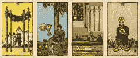

权杖四是事业稳定之后的庆祝，圣杯四抽离情感而进入冥想，宝剑四在混乱中庇护所保持宁定，钱币四在财务上稳如泰山。所有的四都在三的初步达成之后，保持一定的恒定状态，是难免容易陷入狭窄和限制之中，感到不满足。

### 5 是冲突与失落

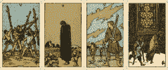

权杖五是行动上的冲突，圣杯五是感情上的失落，宝剑五是带来伤害的冲突，钱币五则是财务上的失落。四的稳定终于陷入死胡同，而在五中瓦解。

### 6 是分享和妥协

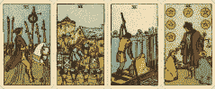

权杖六与众人分享荣耀，圣杯六给予情感上的馈赠，宝剑六对于伤害妥协逐渐复原，钱币六则大方分享金钱。六这个数字是一加二加三，在一至三号牌达到初步圆满之后，便要与众人分享。缺失是容易流于极端，使成果变成骄傲，馈赠变成施舍。

### 7 是内省与奋斗

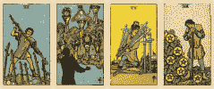

权杖七是为了得胜而奋战，圣杯七陷入梦境中内省，宝剑七在艰困中奋斗，钱币七则有略有小成之后内省。内省与奋斗乍看之下是迥异的概念，但它们的共同目的都是为了突破障碍以进化。属于阴性的圣杯和钱币努力向内反省，以求进步，阳性的权杖和宝剑则在重重困难中 奋斗，以获得胜利。圣杯和钱币此时要面对的挑战是不可逃避现实，权杖和宝剑则可能流于过度自信。

### 8 是重新评估与行动

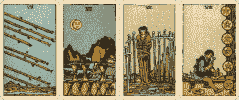

权杖八在行动上迅速无比，圣杯八在情感上重新评估后采取行动，宝剑八面对行动上的限制，需要重新评估状况才能脱离，钱币八则在工作中孜孜不倦。圣杯和宝剑的困难是可能无法当机立断，权杖和钱币则可能在无止尽的行动后，却得不到结论。

### 9 是成果与独处

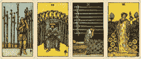

权杖九必须肚子度过难关，圣杯九在情感上独享欢乐，宝剑九在夜半独自承受痛苦，钱币九在花园中独享财富。所有的九都达到该牌组的饱满程度，但却流于孤独。

### 10 是完成与转化

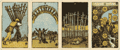

权杖十是行动负担太大，需要放手与转化，圣杯十是情感与人际的完美结果，宝剑十是伤害的最终完成并转化成希望，钱币十是财富的最终完成，也隐含过度追求物质，需要转化。所有的十都可能隐藏表现过度而带来的危机。

## 宫廷牌的结构

每个牌组的宫廷牌各有四个人物，以维特牌为例，就是国王、王后、骑士和侍者。某些版本的塔罗牌则是骑士、王后、王子和公主，或是父亲、母亲、儿子和女儿。

我们可以将四个牌组中的宫廷牌，视为四个遗传特质不同的家族，家中有父亲、母亲、哥哥、妹妹四个成员。权杖家族的人都热情豪放，圣杯家族的人都敏感浪漫，宝剑家族的人都尖锐理智，钱币家族的人都勤奋踏实。而且，同样的特质，在不同成员身上，有产生各种化学变化。

### 国王是成熟的男性

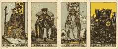

国王是领导者，已经精通该牌组特质，以阳性的方式表现出来。他拥有成就、权利和地位，必须负担社会责任，是稳定的力量。通常代表父亲、长辈、老板、专业人士等权威角色。也可以代表某个女人性格上的阳刚面。欧美的主流通常将国王对应到火要素，取其阳性外向的含义。也有人将其对应到土要素，取其稳定之意。

### 王后是成熟的女性

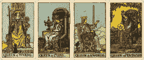

王后是照顾者和抚育者，喜欢分享与照顾他人，展现该牌组的阴性温柔的一面。相对于国王偏重世俗控制的一面，王后较重视心灵和内在，也可以代表某个男人性格上的阴柔面。王后对应到水要素，取其阴性内向的含义，是最温柔的女性力量。

### 骑士是不成熟的年轻人

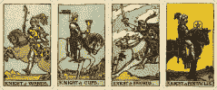

骑士展现该牌组的不成熟与过度特质，将该牌组的精力完全展露无遗。骑士是独立的行动派，投注精力在某个焦点上，有理想，有勇气，敢冒险，充满浪漫情怀。不过，年轻人的缺点是难免有些急躁、莽撞、自我中心。另外，骑士驾着马儿奔跑，也可以代表旅行。欧美主流将骑士对应到风，取其敏捷不稳定之意。也有人将其对应到火，取其冲动外放之意。

### 侍者是小孩

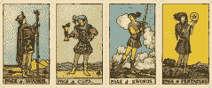

小孩都很纯真善良。他们共同的特质就是喜欢学习探索世界，富有好奇心。他们对外界的讯息全然开放，认真倾听这个世界，把握任何机会。侍者通常代表小孩，或成人心中天真的一面，也代表学习、探索、讯息、机会。欧美主流将侍者对应到土要素，取其原始之意。也有人将其对应到风，取讯息之意。

在占卜中，用最粗略的方式来区分，通常国王是四十岁以上的男人，王后是四十岁以上的女人，骑士是青年男女，侍者是少年或小孩。然而，这样的定义经常出错。也有人用星座来定义宫廷牌，认为权杖宫廷牌一定代表火象星座的人，但是，在实际占卜中，真正吻合的情形并不多。真相是权杖宫廷牌的人多半表现出火象性格，但他的太阳星座不一定刚好落在火象星座，也许是由占星命盘中其他的因素造成他的外在表现近似火象性格，因此在占卜中不能完全依靠星座来定义宫廷牌。所以，如果你看到权杖宫廷牌，就跟问卜者说：「对方是火象星座的人」，问卜者可能会回答说：「可是他是双鱼座的啊！」但是如果你说：「这个人个性比较大胆冲动、外向活泼，有点像火星星座」，那么问卜者十之八九会点头。

事实上，宫廷牌不能以性格、岁数火星座一概而论，应该以性格来定义。每张牌都代表一个性格面。男人内心由女性的一面，女人内心也有男人的一面；岁数大的人可能很幼稚，岁数小的人也可能超越的成熟。在这些情况下，应该以性格作为最主要的定义标准。所以，国王不能单指四十岁以上的成熟男子，还可以指性格成熟的年轻男子、男性化的成熟女人，或成熟女人性格上的阳刚面。其余可以举一反三。

# 牌义——完全手册

向日葵在此书中所提供的牌义，是现今欧美的共通与主流牌义，牌图中的象征经过多方考证，并佐以东方文化的例子，以求突破文化差异所造成的学习障碍。读者不需强记死背，也不必照单全收，只要吸收你能够理解接受的牌义，自行举一反三，塔罗牌自会照着你的定义来运作。

# The Fool 愚人

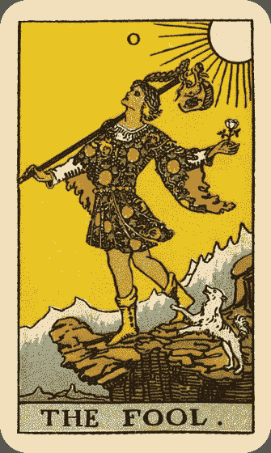

## 关键词

*   开始 冒险 大胆 天真 愚笨 我行我素 潜力 漂泊 旅行

## 牌面描述

愚人穿着色彩斑斓的服装，头上戴顶象征成功的桂冠，无视于前方的悬崖，昂首阔步向前行。

他左手拿着一朵白玫瑰，白色象征纯洁，玫瑰象征热情。他的右手则轻轻握着一根杖，象征经验的包袱即系于其上。那根杖可不是普通的杖，它是一根权杖，象征力量。愚人脚边有只小白狗正狂吠着，似乎在提醒他要悬崖勒马，又好像随他一同起舞。无论如何，愚人仍旧保持着欢欣的神色，望向遥远的天空而非眼前的悬崖，好像悬崖下会有个天使扥住他似的，他就这样昂首阔步地向前走。远方的山脉象征他前方未知的旅程，白色的太阳自始至终都目睹着愚人的一举一动──他从哪里来？他往何处去？他又如何回来？

## 牌义推演

愚人是一张很特殊的牌，它的编号是０，其实是没有编号，它可以出现在任何地方。伟特本人将它放在世界牌之前，不过，也许因为愚人象征旅程的开始，现在一般人都习惯将它放在第一张。另外，愚人本身可以当作空白牌 ^(¹)来使用，它包含着无限的可能，正如同它的编号０，愚人可以是完整的圆，也可以是零──什么都没有。它可以是好也可以是坏，同时包含着两种可能。

事实上，在某些版本的塔罗牌中，伴随愚人的动物是猫，甚至是鳄鱼，不管是什么，这些动物都象征着本能。动物凭本能行事，愚人也是。他是初生的婴儿，俗话说「初生之犊不畏虎」，愚人就是这样一位天不怕地不怕的年轻人。在占卜中，愚人有时还真的代表新生儿。

我们可以比较愚人、魔术师和世界牌中人物握持权杖的方式，愚人持杖的方式是如此漫不经心，与世界牌中的舞者有异曲同工之妙，而迥异于魔术师有意识的紧紧握住并且善加利用。只不过，世界牌是由于旅程已经圆满达成，牌中舞者才自在地拿着权杖跳舞，而天真的愚人却丝毫没有意识到杖中的神奇魔法，所以拿它来挂包袱。愚人的包袱里装的是他的经验，所以他也不是完全的愚蠢，只是不被经验所控制。他头上的桂冠即明显象征成功的可能。至于包袱上的图案意义目前解读版本主要有两种，金色曙光系统认为那是鸟，象征愚人牌本身所属的风元素﹔另一说则指明那是老鹰的头，象征本能与向上提升的灵魂。伟特说，愚人是追寻经验的灵魂。

愚人牌对应风元素，像风一样自由自在，飘泊不定。他是希腊神话中的酒神戴欧尼修斯²，也可以视为中国神话中追日的夸父、道教八仙中的韩湘子^(³)、民间传说中的济公，和金庸小说中的老顽童周伯通。他们都具有外表疯癫、我行我素、不计后果、笑骂由人的特质。在占卜上，愚人牌如果代表一个人，那么这个人可能形于外居无定所，形于内狂放不羁。他爱好冒险，会冲动的陷入恋情，但别期待他能安定下来，要他负责任很难，要他承诺更是天方夜谭。他无忧无虑，因单纯而大胆，因天真而无畏，也许还有些冲动，凭感觉行事，从不事先计划。外人看他疯疯癫癫孩子气，不遵守世俗规范，经常不按牌理出牌，语出惊人，行事盲目又什么话都听不进。不过，他心中明白他在做什么。也许他有目标，只是那个目标跟一般人不同。总之，他是个活在当下的乐观主义者。

正如牌面上的愚人，刚刚背着行囊踏上一段新旅程，因此愚人牌还可以表示旅行，特别是漫无目的、未经详细计划的旅行。愚人到达悬崖末端后，将跳进一个未知的环境，所以也代表搬家、转学、大胆的行动。也许当事人会把事情看得太简单，没有经过缜密的思考和计划，但我们不能评断这是好或是坏，只能说是潜力无穷。在工作上，愚人牌表示你正处在和愚人一样的环境中，或是在工作上表现出愚人的特性，除非从事的是追求创意的另类工作，否则老板恐怕不会喜欢。在感情方面，愚人可能代表旅途中的恋情，或是今朝有酒今朝醉，两人并不考虑未来。如果愚人代表你的情人，则请你好好享受过程，不要期望结果。学生问考试，表示他太不用功了，或是准备方向错误，事倍功半。

## 逆位解析

正位的愚人潜力无穷，逆位置却问题丛生，因为图画逆过来看，愚人会直接头下脚上栽下去。逆位的愚人可粗分为过度与不足两个面向来看。若是过度，则天真变成愚蠢、大胆变成鲁莽、我行我素变成不守规矩，他还可能粗心大意、计划过于冒失、行事疯狂，逃学缺席。﹔若是不足，则当事人失去愚人的正面特质，可能无法听从内心本能行事、过于小心而错失良机、胆小怕事、丧失勇气、太在意别人的看法。大体而言，愚人逆位时，当事人容易做出的不明智的决定或举动。若将愚人视为空白牌，则正逆位没有差别。

## 注释

# The Magician 魔术师

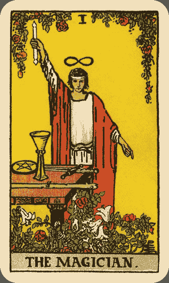

## 关键词

*   创造力 沟通 交际 技能 精通 万事俱备 新计划 主动

## 牌面描述

魔术师高举拿着权杖的右手指向天，左手食指指向地，他本人就是沟通上天与地面的桥梁。他身前的桌上放着象征四要素的权杖、圣杯、宝剑与钱币，同时也代表塔罗牌的四个牌组。他身穿的大红袍子象征热情与主动，白色内衫表示纯洁与智慧的内在。缠绕他腰间的是一条青蛇，蛇虽然经常象征邪恶，但在这里代表的是智慧与启发。魔术师头顶上有个倒８符号，代表无限。画面前方和上方的红玫瑰象征热情，白百合象征智慧。此时，万事齐备，魔术师可以开始进行他的新计划了。和愚人牌同样鲜黄色的背景，预示未来成功的可能。

## 牌义推演

魔术师编号 1，正是所有数字的开始，也是代表沟通的数字。在七十八张牌中，魔术师更扮演大小牌间衔接的角色。此外，在占星学中，魔术师这张牌属于水星，代表智力与沟通。因此，在实际占卜时，魔术师可代表所有与沟通联络有关的事务，无论口头或书面。例如发表演讲、写文章、中介、联络人、代理人、外交官等。魔术师口齿伶俐、文笔流畅、思路清晰、富有交际手腕，是个有能力「说清楚、讲明白」的专家型角色。

魔术师是一张非常主动而有行动力的牌，具有阳性力量。他的行动经过清晰思考，所以很有把握与自信，与愚人未经过深思的大胆行动截然不同。他前方的权杖、圣杯、宝剑与钱币代表四要素，四要素在西方文化中等同于中国的五行（金木水火土），是构成万事万物的基本元素。既然四要素齐备，魔术师就要发挥他的组织力和创造力，来把元素转化为实质的东西。从愚人虚无的０发展到魔术师的 1 的过程，就是把抽象转为实质。因此，魔术师这张牌表现出「把梦想化为实质」的概念，他不仅筑梦，而且踏实，拥有一个前景光明的开端。如果此时你有什么想法或计划，魔术师包你可以实现。

魔术师是希腊神话中的赫米斯(Hermes)，精明能干，负责传递天神的讯息。在童话塔罗牌中，魔术师是以格林童话中《穿靴子的猫》为代表，拥有过人的聪明机智，帮助主人获得荣华富贵，而牠的东方版本就是日本卡通《哆拉Ａ梦》，永远都有变不完的戏法。魔术师也像《魔戒》小说里的甘道夫，还有《石中剑》中的巫师默林。在中国历史人物中，富有谋略的诸葛亮及刘伯温可为魔术师典型。武侠小说中的黄蓉也具有魔术师特质，机智与表达力都令人难以望其项背。

在塔罗牌中的魔术师，并不完全是现代变戏法的魔术师，而比较趋近于中古世纪的魔法师、炼金术士，或俗称的江湖术士。他们拥有满身技艺，样样精通，能点石成金，所以这张牌在占卜上也显示当事人具备充足的技能来解决任务。值得一提的是，伟特在其著作中曾提到，魔术师在占卜上也代表「生病、痛苦、失落、灾难」，这样的解释经常让学习者感到困惑。事实上，如果把魔术师看作古时的江湖郎中，这个问题就迎刃而解了，因为江湖郎中正是古代人生病或遇到逆境时的咨询对象。若以现代的眼光来看，魔术师相当于医生、心理师及另类治疗师。

实际占卜上，魔术师代表这是个开始新计划的好时机，当事人已经万事具备了。魔术师鼓励大家善用语言和沟通能力，运用原有的技能，再加入新鲜创意来实践你的想法。在行事风格上，请采取主动，保持专心一致。

## 逆位解析

魔术师手上拿的权杖很像指挥棒，是导引能量的工具。能量善加导引，可以事半功倍﹔导引错了，不仅无益，反而有害。逆位置的魔术师就可能犯这种错误，能量导引错误即精力用错地方，原本颇有两把刷子的江湖郎中，此时变成江湖骗子，以他的戏法行骗天下，所以逆位魔术师可能表示欺瞒诈骗的情况。此外，逆位时，桌上的四要素都会掉下来，玫瑰与百合也不可能向下生长。此时魔术师就不再是专家，而是没能力没创意的二流角色了。他缺乏热忱与行动力，失去自信与决心，变得不聪明，无能，也缺乏交际手腕。有时逆位的魔术师因为失去导引能量的能力，可能引致一个失去控制、无法收拾的局面。在健康方面，由于神经系统是人体讯息传导的中枢，所以魔术师逆位可能暗示神经系统或心理方面的疾病。

# The High Priestess 女祭司

## 关键词

*   静止 消极 直觉 智慧 神秘

## 牌面描述

相较于上一张魔术师纯粹阳性的力量，女祭司表现的则是纯粹阴性的力量。她身穿代表纯洁的白色内袍，与圣母的蓝色外袍，静默端坐。胸前挂个十字架，象征阴阳平衡、与神合一。

她头戴的帽子是由上弦月、下弦月和一轮满月所构成的，象征所有的处女神祇。手上拿着滚动条，象征深奥的智慧，其上的 TORA 字样，意为「神圣律法」，而滚动条卷起并半遮着，暗示此律法不为人所知。在她脚边的一轮新月，为她的内袍衣角所固定住，袍子并延伸到图面之外。女祭司两侧一黑一白的柱子，存在于圣经故事中所罗门王在耶路撒冷所建的圣殿中，黑白柱上的 B 与 J 字样，分别是 Boas 和 Jachin 的缩写，黑柱是阴而白柱是阳，两柱象征二元性，坐在中间的女祭司则不偏不倚，统合两者的力量。柱子上面的喇叭造型，代表女祭司敏锐的感受性，上面的百合花纹则象征纯洁与和平。两柱之间有帷幕遮着，帷幕上的石榴代表「阴」，棕榈代表「阳」。帷幕把后方的景色遮住了，仔细一看，依稀可见由水、山丘与的蓝天构成的背景。水象征情感与潜意识，这一片水平静无波，但其静止的表面下蕴藏深沉的秘密。整个图面呈现象征智慧的蓝色调，双柱的意象在后面的牌中重复出现。

## 牌义推演

女祭司是「处女」与「圣母」的原型，许多文化中都有这样的典型人物，例如天主教中的圣母玛丽亚，埃及神话中的伊希丝⁴，希腊神话中的阿特蜜丝⁵，罗马神话中的月神黛安娜，也有人将她视为希腊神话中的贝瑟芬妮^(⁶)。中国神话中一般认为的月神嫦娥不甚符合这样的形象，反而是或观世音比较相近。以现代的角度来看，女祭司近似金庸小说中尚未遇到杨过之前隐居在古墓中的小龙女。

女祭司与编号三的皇后牌同属塔罗牌中的女性原型。但女祭司是不食人间烟火的「处女」和「圣母」，皇后则表现世俗的母亲形象。我们可以观察到女祭司的坐姿端凝内敛，脸型与体态均属年轻女子的纤瘦貌，而皇后姿态大方，体态丰腴。由此可见，女祭司比皇后更加强调女性的阴柔被动特质。女祭司是一位不需要男人的女子，遗世而独立，律己严谨，不茍言笑，因此，在感情占卜上，女祭司通常代表单恋、暗恋或独身。

女祭司对应占星学中的月亮，图面上总共出现了四次月亮，月亮是阴性，代表静止、消极与被动，正点出女祭司的主题。女祭司一向抱持「以不变应万变」的态度，相较于魔术师的光明正大与积极创造，女祭司则倾向含蓄内敛并静默无语。她外表虽无行动，但其实是走向内心，倾听直觉，得到内在的智慧。其实每个人的内在都有无上的智慧，只是很少人懂得倾听。女祭司知道与其强行改变外在的世界，不如倾听内心的声音，自然能境随心转，谁说消极就没有力量？她手上拿着的滚动条，正暗示她拥有的无上智慧。但从反方面来看，女祭司在占卜上有时代表直觉很强，却很少付诸行动的人，也可能太过拘谨、冷若冰霜。其实几乎每一张牌都同时具有正面与负面的涵义，要看牌阵中其它的牌，以及解牌时的直觉而定。

月亮的另一个意义是神秘，因此女祭司也代表任何与神秘学相关的事物，或是秘密。女祭司也拥有丰富的知识，但是她的知识并不像教宗牌是由学校教育所获致，而是偏向神秘学的知识，以及每个人本有的直觉，甚至是通灵能力。女祭司出现时，可能表示事情延宕不决、毫无进展，而且大刀阔斧的举动通常也无法解决问题。女祭司提醒我们应该顺应无为，静心思索，倾听内在的声音，你将会惊讶于自己的智慧。

女祭司是极为阴性的牌，多次出现的月亮，也暗示女性的生理周期。因此，在健康占卜上，女祭司常代表妇女疾病或经期困扰。

## 逆位解析

女祭司逆位，原本的沉静不再，取而代之的是她原本欠缺的热情，变得特别喜欢与人交际，在各方面都显得主动活跃。然而，女祭司逆位同时也失去了最珍贵的内在智慧，只接受肤浅的表面知识。另外，也可能表示当事人拒绝听从直觉行事，忽视自己内心的声音。

## 注释

# The Empress 皇后

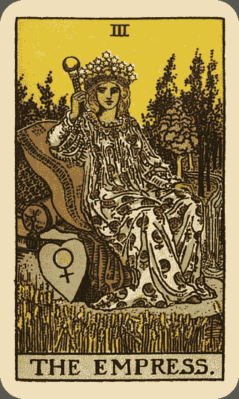

## 关键词

*   丰收 生产 创造 自然 母爱 美 欢乐 主动 热情

## 牌面描述

体态丰腴的皇后坐在宝座上，手持象征地球的圆形手杖，戴着由九颗珍珠组成的项链，象征九颗行星，也代表金星维纳斯。皇后头冠由十二个六角星组成，象征十二星座与一年的十二个月。更进一步，六角星本身是由一个正三角形和倒三角形组成，分别代表火要素和水要素。除了头冠之外，她还戴着香桃木叶作成的头环，象征金星维纳斯。她身穿的宽松袍子上面画满象征多产的石榴，宝座下方则是个绘有金星符号的心形枕头。她前方的麦田已经成熟，代表丰饶与多产；后方则是茂密的丝柏森林，与象征生命力的瀑布河流。

## 牌义推演

皇后是母性的原型，在占星学中对应金星。在牌面中重复出现的金星主题，象征女性、爱与美。皇后和女祭司同样都是女性的原型，女祭司表现的是女性的理性面，皇后则表现女性的感性面；女祭司不轻易表达情感，皇后则主动且热情，敢于大方表达她的爱与关怀，也相当重视感官的享受。当事人可能在此时享受奢侈的生活，尽情打扮并表现自己，吸引他人的目光。而因为皇后对应金星，因此传统上这张牌也可以代表婚姻。在工作方面，表示收获丰硕，或是遇到一位热心帮助你的人，通常是女性。在感情方面的占卜，可能表示结婚、快乐的恋情、女方采取主动，或是代表一位相当具有吸引力的女性，这位女性可能是自己，也可能是情敌，须配合周遭的牌解读。

大自然同样是母亲的原型。人们常说「大地之母」，大自然犹如母亲一般，滋养孕育各种形式的生命。她四周成熟的麦田和旺盛的瀑布也点出相同的主题。再者，皇后本身的体态丰腴，暗示她的体内也孕育着新生命。从数字学的观点来看，3 由 1 和 2 组成，1 是男性，2 是女性，3 则是男女所孕育出的新生命。所以，总括来说，皇后牌同时代表母亲与生产，延伸出去就是丰收与创造，通常是令人感到欢乐的牌。也许此时当事人能够创造一些东西出来，无论是实际的宝宝、产品、作品，还是抽象的想法。也许当事人长久的耕耘能够得到满意的果实。当事人可以尽情为他人付出爱与关怀，照顾小孩或小动物，或者是遇见一位具有这种特质的人，特别是女性。皇后也可以代表一段丰收享乐的欢乐时光。

皇后在希腊罗马神话中，通常由掌管爱与美的阿芙萝黛蒂(Aphrodite)和维纳斯(Venus)，以及农业女神狄蜜特(Demeter)为代表。中国神话中，补天造人的女娲和教民养蚕的嫘祖，应可为皇后的代表。皇后就像一位亲切的妈妈，提供美味的食物，在天冷时为孩子添衣，并且时时给孩子温暖的拥抱。皇后若代表情人，那么她通常非常热情主动，可能很喜欢打扮与享受。此外，皇后也可能代表一位很有影响力的女性，对当事人相当重要。

## 逆位解析

皇后逆位，女性的特质受到阻碍，当事人可能不再自由表达情感，否定自己的情绪与欲望，或者不愿付出关照，成为一个失职的母亲。另一方面，也有可能感性特质发展过度，变得完全没有理智，只凭感觉做事，这是相当危险的事。在最好的情况下，皇后逆位可以得到正位所欠缺的特质，表示当事人能够以理性思考的冷静态度来解决问题，特别是情感问题。在逆位置的解读上，我们可以把皇后和女祭司视为一个组合，两者互有对方所欠缺的部分，也就是说，当女祭司逆位时，可以得到皇后的热情能力；当皇后逆位时，得到女祭司的冷静能力。在健康方面，正位的皇后代表怀孕或生产，逆位则可能营养不良，或出现怀孕方面的问题，包括不孕、流产或堕胎，也可能在不该怀孕的时候怀孕，需特别小心。

# The Emperor 皇帝

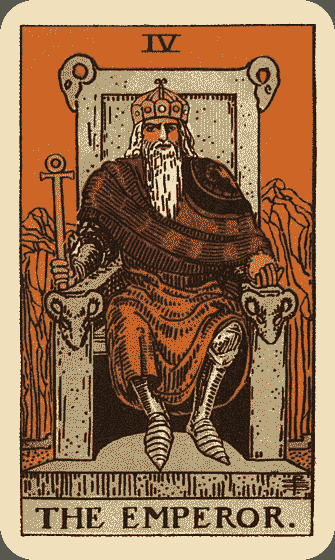

## 关键词

*   父亲 权利 秩序 统治

## 牌面描述

一国之尊的皇帝头戴皇冠，身着红袍，脚穿象征严格纪律的盔甲，左手拿着一颗球，右手持的是象征生命的古埃及十字架，自信满满的坐在王位上。 王位上有四个牡羊头作为装饰，如图所示，皇帝牌正是代表牡羊座的牌。牡羊座是十二星座的头一个，具有勇敢、积极、有野心、有自信的特质。红袍加上橙色的背景，呈现红色的主色调，与牡羊座的特性不谋而合。背景严峻的山象征前方险峻的路途。我们可以比较皇帝与皇后的背景，一个是严峻山川，一个是丰饶大地，形成互补的局面。

## 牌义推演

皇帝具有威权，自我中心，行动力强，对应占星学中的牡羊座，也对应希腊神话中的天神宙斯(Zeus)，然而这位皇帝并不一定像宙斯那样处处风流。从东方神话观点，可将其视为玉皇大帝或黄帝。从历史观点，正位的皇帝就像史上每个统驭万民的明君。以现代观点切入，皇帝就是总统或大老板，是让人臣服的角色。皇后象征母亲，皇帝则象征父亲，父亲母亲一阴一阳，互补相成。在这里皇帝是传统的严父，与现代新好爸爸迥异。他是教导孩子社会规范与服从精神的人，如果孩子不听话，他会拿着藤条追打。平常他也是个理性角色，不擅长表达情感。更进一步来说，我们不应只将其视为狭义的「爸爸」，皇帝牌实际上包含广义的世间「父亲形象」。它可以代表任何有权力、克己严谨、但缺乏情感交流的领导人物或权威人士。

荣格说：「父亲代表道德戒律与禁令」。皇帝是不折不扣的权威角色，编号 4，是稳定与秩序，就像桌子一样，一定要有四个脚才站得稳。因此皇帝偏好秩序、规范与稳定，拥有至高无上的权力。为了统治国家，他必须将个人情感收起，运用铁腕控制社会秩序，国家才不会分崩离析。必要的时候，甚至必须采取严厉的措施，颁布法律与禁令，雷厉风行。皇帝可以是位慎思明辨的明君，也可能是位荼害人民的暴君，如同法令有好有坏，皇帝亦可好可坏。

在占卜上，皇帝可能代表某位具有权威父亲形象的人，或是对当事人有极大影响力的人，通常是居上位的人。如果情况好，皇帝能给予帮助；如果情况不好，皇帝可能会对当事人施加控制，使当事人失去自由，苦不堪言。另外，皇帝也可代表一段稳定自律的时期，当事人能够秉持皇帝的态度，严以律己，一丝不茍，达成自己的目标。这段时期当事人多采取理性分析的方式，而非听从情感与直觉，他可以像皇帝一样开疆辟土，稳健守成。在工作方面，当事人可实行皇帝的策略，拿出权威与专业来领导众人，并且自我严格要求。情感占卜方面，皇帝牌可能暗示男性采取主动，或是两人相处缺乏情感交流。皇帝牌若代表丈夫或情人，但这位丈夫或情人虽有责任感，却不会甜言蜜语，反而取代严父角色，让人有点敬畏，情况不好时可能会想控制对方。

## 逆位解析

皇帝正位，多显现正面特质。逆位可能表示缺乏皇帝特质，变得自我放纵、不成熟、欠缺领导能力、欠缺行动力、软弱、懒惰、缺乏责任感、没自信、依赖心强、犹豫不决等。也可能是皇帝特质运用过度，变成商纣或夏桀般的暴君，导致行事武断、权力滥用、冷酷无情、占有欲或控制欲过强、为反叛而反叛。

# The Hierophant 教宗

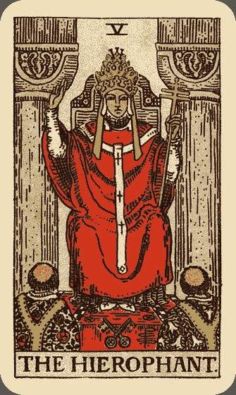

## 关键词

*   宗教 传统 援助 仪式 教育 道德 社会规范

## 牌面描述

教宗身穿大红袍子，端坐在信众前。他头戴象征权力的三层皇冠，分别代表身心灵三种层次的世界。 他的右手食中指指向天，象征祝福﹔左手持着主字形的权杖，象征神圣与权力。他耳朵旁边垂挂的白色小物，代表内心的声音。教宗前方放着两把交叉的钥匙，在很多版本的塔罗牌里，钥匙是金色银色各一把，象征阳与阴，日与月，外在与内在，我们的课题就是要学会如何结合两者，而钥匙本身可用以开启智慧与神秘之门。教宗前方的两位信众，左边的身穿象征热情的红玫瑰花纹衣裳，右边则穿象征性灵成长的白百合衣裳（红玫瑰与白百合在魔术师也曾出现过）。教宗与信众三人的衣服都有牛轭形（Ｙ字形）装饰，牛轭的用途是促使受过训练的动物去工作的，出现在教宗牌的道理值得深思。教宗后方则是曾经在女祭司中出现的两根柱子，不过在这里它们是灰色的，灰色象征由经验而来的智慧﹔另一说则是教宗后方虽无女祭司的帷幕将潜意识隔离，但暗沉的灰色代表通往潜意识之路仍未开启。柱子上的图案象征肉体结合。

## 牌义推演

教宗，如同他的名称，与宗教有强烈的关联。不过教宗所属的宗教是有组织的教会或教派，他是入世且走入人群的，这与女祭司和隐士的离群索居大有不同。在希腊神话中，教宗对应半人马奇隆(Chiron)，他天文地理无所不知，并教诲无数。现代的教宗就是罗马教皇和达赖喇嘛，古时候则有伟大的教育家孔子，以及译经无数的唐代高僧玄奘。

教宗与皇帝都是父亲形象的代表，但是皇帝是提供物质的父亲，而教宗则是提供心灵成长与道德教育的父亲﹔皇帝重视外在的法律与约束，教宗则代表内心的服从性；如果说皇帝是三军总司令，那么教宗就是校长与教育部长。教宗教导我们的是传统价值与伦理道德，好比说子女不孝虽不犯法，却为社会大众所不容，或是除夕夜返乡探亲虽非强制，但大多数的人都会遵行。教宗代表的就是这种社会规范与社会责任──不遵守不犯法，但还是遵守为妙。

教宗也代表学校教育，以及任何所谓「正统」的教育。就像教宗所属的教会是庞大的组织，教宗所代表的教育形式也是社会大众认同的，在学校中学生学到政府与社会大众希望他们学的价值观，虽然会阻碍个人部分的心灵发展，却是群体生活中不可或缺的一环。

教宗并非独自在深山中修行，而是在宗教组织下服务。教会拥有固定的体系，延伸出去，教宗也可以代表各级机关团体或学校，或任何与群体有关的事物。

在教堂中，仪式是不可或缺的，所以教宗牌也象征仪式──毕业典礼、结婚典礼、成年礼、丧礼等。这些仪式同样属于社会规范的一种。因此，教宗牌也可能显示当事人参加某个仪式或典礼。

在占卜上，教宗常与教学与顾问相关，是学生最乐见的牌，表示学生在学校环境中如鱼得水，问考试必顺利。教宗也可能表示心灵上的追求（重心往往是道德），也可能代表有长辈帮助，或贵人伸出援手，无论是口头上的建议还是实质上的帮助，或者暗示当事人应该寻求长辈或专业人士帮忙。在感情占卜上，教宗通常指涉传统的恋情或婚姻，例如相亲，也可能是柏拉图式的精神恋爱，最好的情况则代表婚礼将近。教宗若代表人物，他可能是神职人员、教师、长者、贵人、专业人士、典礼主持人、保守分子、卫道人士等。

## 逆位解析

教宗逆位通常代表打破传统规范。此时不宜遵照常规，应该要有创新的想法，敢于与众不同，标新立异。另外，教宗逆位也可能代表教宗特质表现过度，导致太保守、太传统、太武断、太固执。此时，贵人相助恐怕不成，因此不宜贸然采取他人的建议，更应小心查证你所得到讯息之真实性。感情方面可能表示此时不宜结婚。健康方面则可能代表肌肉或关节僵硬（太过僵化），或是得到错误的医学建议。另外，仪式或典礼取消或延期也是教宗逆位的可能意义之一。

# The Lover 恋人

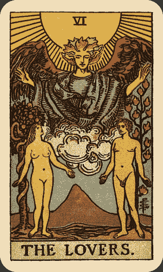

## 关键词

*   选择 爱情 性 结合 人际关系

## 牌面描述

恋人牌背景在伊甸园，亚当与夏娃分站两边，两者皆裸身，代表他们没什么需要隐藏的。两人所踩的土地相当肥沃，生机盎然。 夏娃的背后是知识之树，生有五颗苹果，象征五种感官，有条蛇缠绕树上。蛇在世界文化中的象征丰富多元，此处可能象征智慧，也象征欲望与诱惑。牠由下往上缠绕在树上，暗示诱惑经常来自潜意识。亚当背后是生命之树，树上有十二团火焰，象征十二星座，也象征欲望之火。伟特说：「亚当与夏娃年轻诱人的躯体，象征未受有形物质污染之前的青春、童贞、纯真和爱」。两人背后的人物是风之天使拉斐尔（Raphael），风代表沟通，祂身穿的紫袍则是忠贞的象征，显示这个沟通的重要性。亚当看着夏娃，夏娃则望着天使，象征「意识─潜意识─超意识」与「身─心─灵」或是「理性─感性」之间的传导。天使之下，亚当夏娃中间有一座山，象征意义解读众多，主要有三种：一说是山代表阳性，水代表阴性，两者表现阴阳平衡，意味我们必须把阴与阳、理性与感性的能量调和。一说认为这座山象征正当思想的丰饶果实。另一说则认为它代表高峰经验与极乐。

## 牌义推演

恋人对应占星学中的双子座，可能展现双方的结合沟通或对立。看到恋人牌，一般人的第一反应通常都是与爱情有关，也就是双方的结合与沟通，事实确是如此。但是，在更古老版本的塔罗牌，恋人更常见的意义是「选择」，也就是双方的对立。传统的恋人牌通常绘有一个男人在两个女人之间作抉择，黑发女人是他的母亲，金发女子是他的情人，后面还有个爱神丘比特在搅局。这样的情境让人联想到希腊神话中著名的「帕里斯的审判」⁷，以及东方社会中常见的婆媳问题。这样的抉择不只是在两个人之间做选择，更是对两种生活方式的抉择，并且进一步点出愚人成长的题旨──他长大要离巢了。虽然伟特改变了恋人牌的构图，但是基本牌义仍然保留。恋人牌出现经常代表当事人面临重大抉择。此时当事人必须格外谨慎，他做出的抉择可能对他产生重大影响，此时不要短视近利，更不可执迷于表面的利益或面子，而应该要仔细思考自己究竟要什么，才能作出好的决策。恋人牌代表的选择与权杖二或圣杯七可不同，恋人毕竟是大牌，牵涉的是人生的转折点，不是短期的影响，不可不慎。虽然亚当与夏娃受天使祝福，但夏娃身后的蛇仍暗示人类堕落的故事，如果意志不坚而选择不当，伊甸园的恨事恐怕重新上演。

恋人牌所呈现的选择有可能挑战当事人的道德与信仰，当事人像是站在一个十字路口，必须在道德与快乐之间做抉择。因此恋人牌也代表个人信仰与价值观，因为当事人的抉择通常奠基在他的价值观之上，虽然此时它可能遭受挑战。

在感情的占卜中，恋人正位通常是个大好消息，表示两人之间吸引力很强，一拍即合。虽不一定有性关系，但是很有可能，且必然是因爱而性。相对来说魔鬼牌的性关系就是无爱之性。恋人的爱情会是影响重大且维持长久的，我们可以拿来与圣杯二做对照。圣杯二可能只是短期的爱恋，甚至不会有任何承诺，但恋人就相对强烈而长期，对当事人的影响自是不在话下。如果恋人逆位，那么通常代表失恋或是恋爱不顺，金童玉女变成梁山伯与祝英台，不宜抱持太大希望。若是恋人出现在牌阵中代表过去的位置，而现在位置情况不佳的话，很可能是当事人盲目沉浸在逝去的恋爱，无法自拔。

在工作方面，恋人点出工作环境的人际关系至关重大。当事人可以已经在团队中工作，或是必须寻求合作，无论如何，当事人都必须学习到合作的技巧，沟通要顺畅，就能发挥一加一大于二的效果。有时候，恋人牌代表在工作上遭遇到的抉择。少数情况下，恋人代表工作上的恋情。

爱情是狭义的结合，但恋人牌还包含广义的结合。亚当象征阳性、理性与显意识，夏娃象征阴性、感性与潜意识，两人的结合不只是男与女的结合，还可以进一步代表任何结盟关系、合伙关系与人际关系。若恋人正位通常表示成功和谐，沟通顺畅，当然还得参照其它位置的牌而定。在最好的情况下，恋人牌代表完美、和谐、互信的人际关系。

## 逆位解析

恋人逆位多半表示人际关系出了问题。除了婚姻或恋爱上的挫败之外，还可能代表三角关系（特别是与战车牌共同出现时）、分离、对立、合伙失败。这些失败可能由于忌妒，也可能是双方的目标不同所造成的。另外，恋人逆位也可能表示错误的选择或决策。健康方面，可能有性方面的困扰或疾病。

## 注释

# The Chariot 战车

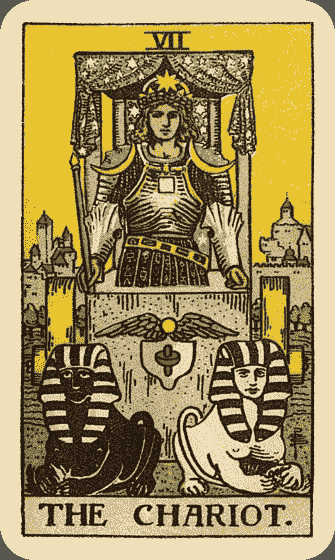

## 关键词

*   意志 自律 胜利 旅程 竞争

## 牌面描述

一位英勇的战士驾着一座由两只人面狮身兽拉着的战车。人面狮身兽一只是黑的，代表严厉，另一只是白的，代表慈悲。两兽同时来看，也是阴阳平衡的象征。 战车上有四根柱子（四个代表上帝的希伯来字母 YHWH 或火水风土四要素）支撑着蓝色车棚，车棚上饰以六角星花纹，象征天体对战士成功的影响。英勇的战士手持象征意志与力量的矛形权杖，头戴象征统治的八角星头冠和象征胜利的桂冠，身穿盔甲。盔甲上的肩章呈现弦月形，显示战车牌与属月亮的巨蟹座之关联。斜挂的腰带上有占星学符号，裙上有各种炼金术的符号。胸前的四方形图案代表土要素，象征意志的力量。战车前方的翅膀图案是古埃及的图腾，代表灵感。翅膀下面是一个小盾牌，其上的红色的图案是一种印度图腾，为男性与女性生殖器结合的象征，也是二元性与一元性，类似中国的阴与阳，可能暗示编号七的战车牌走过愚人之旅的三分之一，已达性成熟的阶段。战士身后的河流就是圣经创世纪中四条伊甸园之河其中的一条，与皇后、皇帝和、死神牌中的河是同一条。再后面就是一座高墙耸立的城市。战士背对城市，暗示他把物质置于身后，向前开展心灵上的旅程。他手上没有缰绳，表示他不是用肉体来控制那两头朝不同方向行进的人面狮身兽，而完全凭借他旺盛过人的意志力。值得注意的一点是他站在城墙外守御，而非进攻，所以这位战士是位守护者、防御者，而不是侵略者。他是尽他的本分，并努力做到最好。

## 牌义推演

战车牌的首要意义就是坚强的意志力。还记得战士手上没有任何缰绳吗？他完全凭借意志力来控制战车，也控制两头人面狮身兽不至于分道扬镳，以致战车解体。战士具有坚定不移的信心与决心，他有能力控制整个局势。六号的恋人牌有关选择，七号的战车则对他的选择采取实际行动，克服路途中的恐惧──恐惧失败，恐惧选择错误。

战车另一个重要意义是胜利。战士十分重视输赢，而他通常是赢的那一方。透过与别人竞争而得胜，他总要成为第一名，纵使付出比别人加倍的努力也在所不惜。对于竞争，他怀有强烈的野心与专注力。对于设定的目标，他会全心全意去达成。

自律、自我要求与情感控制也是战士具有的过人特质。唯有严格的自律，才能使他在竞争中得胜。松散、无纪律、浑浑噩噩的生活是他绝对不会接受的。他更不可能放纵自己的情感。他要征服。

战车，顾名思义，表示交通工具，也与旅程相关，通常（但不一定）是陆路的旅行。战车也代表移动或改变，不过不一定是肉体方面的，因为刚在恋人牌中做出某种决定，此时生活必然因这个决定而经历某种改变。

实际占卜中，战车出现通常意味某种程度的挑战，而且此时放弃是不明智的。应该学习战士的精神，轰轰烈烈打一场漂亮的战争，胜利很有可能就是你的。意志要坚强、要坚持、要自律。拿出决心，贯彻始终，别忘了战车也代表胜利。感情占卜方面，战车通常欠缺软性对话与情感交流。有可能出现竞争者，或者你就是那个竞争者。战车如果代表一个人，可能是旅客、司机、、骑士、赢家，或是任何具有战士精神的人。

## 逆位解析

战车逆位，可能惨遭失败。也可能当事人野心过度旺盛、太过鲁莽或事情太多，而导致不好的下场。此时冲突与阻碍难免。感情方面可能有口角或三角关系。旅行也可能延期或取消，甚至在旅途中遇到无法预期的意外状况或交通事故。如果战车逆位代表人，可能是指酒醉驾驶、危险驾驶、身陷冲突的人、或鲁莽的人。此时应该放松身心，冷静下来想一想，自己是不是犯了上述的错误，以免浪费时间，徒劳无功。

# The Strength 力量

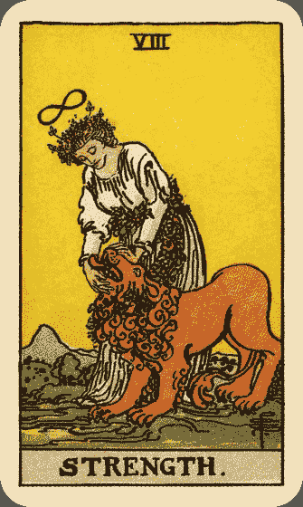

## 关键词

*   力量 勇气 信心 耐心 以柔克刚

## 牌面描述

代表力量的女人轻柔地合上狮子的嘴。女人头上有魔术师牌中出现的倒８符号，象征她的力量是无穷尽的。她头上戴着花环，腰间也系着花环，而且腰间花环还连系在狮子颈间，形成第二个倒８符号。狮子身体微倾，尾巴轻垂，表现出彻底的顺服，还伸出舌头来舔着女人的手。

## 牌义推演

力量延续上一张战车的课题，但她用更高层次的方式来应对，即老子所说的「以柔克刚」。狮子象征人内在的兽性，战车用阳刚的铁腕作风来控制，力量则用她内心的勇气、信心和耐心来驯服。结果战车前的两头人面狮身兽虽受控制，头却仍朝着不同方向（在某些版本的牌中，牠们甚至是背对的的），而狮子则彻底顺服，也许暗示柔弱真能胜刚强。

力量，顾名思义，首要牌义就是力量，但这里指的并非壮汉的蛮力，而是内心的坚韧。一个女子要驯服一头狮子，用武力绝对是自讨苦吃，所以她必须运用她所拥有的特质，用柔性的力量来驯化狮子。要这么做，首先她必须拥有超人的勇气，否则她怎敢接近狮子呢？再来她得拿出，深信自己会成功，这样的信心让她散发出自信的光芒，温和中自有一股威严让狮子降服。最后则是耐心，她必须慢慢来赢得狮子的信任，就像马戏团里的驯兽师一样，必得经过许多次的练习及失败才能。相同的道理也可应用在克服内心的兽性与恐惧、愤怒与冲动，也就是克服我们内在的那头狮子。

在占卜上，力量显示出面对人生的信心，就像牌中的女人，以外柔内刚之姿，面对人生的难题。她内心坚强，信心深切，勇气百倍。她外表平静安详，行事坚定果决，同时又不急不躁有耐心。力量代表克服内心野兽本能的那一部份，要使所有的焦躁、愤怒、冲动、不安都平息下来。如果当事人现在表现得太急切，力量牌出现提醒他要放慢脚步，要有耐心，要以柔性力量来行动，同时别忘了自信最重要。在健康方面，女人降服狮子就好像病人降服病魔，是重拾健康活力的好征兆。

## 逆位解析

力量逆位的首要意义则是软弱无能。内在的信心和勇气已然消失，恐惧和怀疑接着浮现。此时不宜贸然行动，不管现在面对的是什么样的问题，力量逆位提醒你要先处理自己的负面想法和情绪，不要让狮子控制你，你才是自己的主人。有时逆位的软弱会呈现在肉体上，健康宜多加注意。力量逆位也有可能指的是力量的滥用，无论是有形的蛮力还是无形的权力。

# The Hermit 隐士

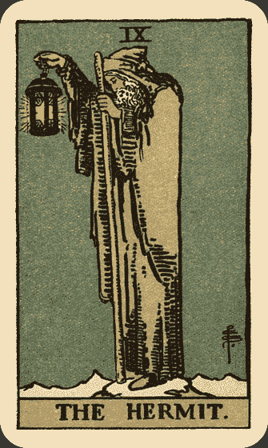

## 关键词

*   谨慎 孤独 内省 指引

## 牌面描述

身穿灰色斗篷和帽子的老人站在冰天雪地的山巅上，低头沉思，四周渺无人烟。他右手高高举着一盏灯，这是真理之灯，灯里是颗发亮的六角星，名称是所罗门的封印，散发出潜意识之光。老人左手拄着一根族长之杖，这跟杖在愚人、魔术师、战车都曾经出现过。愚人太过天真，不知杖的魔力，拿它来系包袱；魔术师用代表意识的右手运用杖的法力；战车把杖化为矛，也用右手紧握着；隐士则杖交左手，用以在启蒙之路上做前导。

## 牌义推演

隐士和愚人同样都站在悬崖顶，愚人大踏步的向前走，隐士却十分谨慎。 隐士是成长之后的愚人，他花白的胡子似乎在告诉我们：「我年纪大了，不再是从前那个浑小子了」。的确，在累积足够经验与智慧之后，隐士自然行事谨慎。与隐士相关的星座是处女座，是注重细节的完美主义者，做事总是小心翼翼，这正是隐士的写照。

隐士孤身一人在山巅，在追寻智慧与性灵成长的过程中，爬得越高就越孤独。隐士脚踩的山头都结冰了，或许真是高处不胜寒。追寻的过程中，他不与群众接触，只与自己的内心接触。智慧的追寻和性灵的成长，都必须一个人单独完成。离群索居是必要的过程。因此，在占卜上，隐士代表孤独。他远离人群，退出交际活动，让内心静下来，一个人独处。此时应暂时放下社交活动，向内探求，留一些时间给自己。冥想、沉思、静坐、倾听内心的声音、留意梦境带来的讯息，都会带来好处。问题的答案其实已经在我们心中，孤独是为了，内省就是为了找出答案。

经过一段时间的内省之后，隐士已然到达智慧的顶峰，这时他准备返回人群，为山下的人指引方向。他高举着真理之灯，犹如一座灯塔。他亲身经历过追寻的过程，现在可以为大众启蒙、引路了。隐士不是「经师」，他不真的教授书本上的知识，他要当的是「人师」，是每个人的心灵导师。他深知灵性与智慧的探求无法靠口头传授，必须由学生自己经历体会，方能真正获得。他站在山顶指引还在山下的学生，帮助他们，扮演领路人的角色。

隐士是智慧老人的原型，他代表心灵导师、教师、有智慧的人、长者、谘商师、顾问、前辈、当然也代表隐士。占卜上，隐士除了表示孤独和内省的需要之外，也建议当事人向有智慧的前辈请益。感情方面可能表示单身，或是暂时退出感情关系，需要深思。如果已经处在稳定关系中，也暗示他需要自己的时间和空间，或是对此关系作进一步的思索。毕竟，隐士对于恋爱并不热衷。

## 逆位解析

隐士逆位首先失去的是谨慎，变得粗心大意。再者孤独过度，甚至出现愤世嫉俗的反社会倾向。也可能暗示当事人我行我素，无法接受他人的忠告。此时建议当事人，一个人的世界固然有其好处，但若过度反而容易导致失和。隐士虽暂时离开人群，但他并没有否定人际关系的价值，在完成探求之后他不是马上举起灯笼，为山下人引路了。

# The Wheel of Fortune 命运之轮

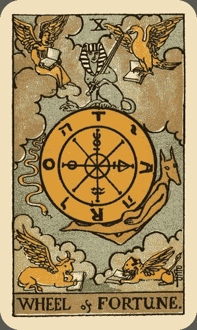

## 关键词

*   命运 转变 契机 进展 幸运

## 牌面描述

所有的大牌都有人物，命运之轮是唯一的例外，可见这张牌独树一格。深蓝色的天空悬着一个轮子，轮盘由三个圆圈构成（教宗的头冠也是），最里面的小圈代表创造力，中间是形成力，最外层是物质世界。小圈里头没有任何符号，因为创造力潜能无限；中间圆圈里有四个符号，从上方顺时针依序是炼金术中的汞风、硫、水，分别与风火水土四要素相关联，是形成物质世界的基本要素﹔最外层就是物质世界，上右下左四方位分别是 TARO 四个字母，这四个字母可以组成 Rota(轮)、Orat(说)、Tora(律法)、Ator(哈扥尔女神)⁸，形成一个完整的句子「塔罗之轮述说哈扥尔女神的律法」，其余四个符号是希伯来字母 YHVH，是上帝最古老的名字。轮盘从中心放射出八道直线，代表宇宙辐射能量。

在轮盘左方有一条往下行进的蛇，是埃及神话中的邪恶之神 Typhon，牠的向下沉沦带着轮子进入分崩离析的黑暗世界。相反的，背负轮盘的胡狼头动物渴求上升，牠是埃及神话中的阿努比神(Anubis)⁹。而上方的人面狮身兽是智慧的象征，均衡持中，在变动中保持不变。牠拿着的宝剑代表风要素，表示心智能力、思考力和智慧。

四个角落的四只动物，从右上方顺时针看分别是老鹰、狮子、牛、人，而且他们都有翅膀。这四个动物出自圣经启示录第四章「宝座周围有四个活物，前后遍体都满了眼睛。第一个活物像狮子，第二个像牛犊，第三个脸面像人，第四个像飞鹰」，耶路撒冷圣经提到四活物象征四位福音书的作者（马太、马可、路加和约翰）。在占卜上这四个动物与占星学产生关联，分别代表四个固定星座和四要素，老鹰是天蝎座（水），狮子是狮子座（火），牛是金牛座（土），人是水瓶座（风）。牠们都在看书，汲取智慧，而翅膀赋予牠们在变动中保持稳定的能力。

## 牌义推演

充满了这么丰富的象征，总而言之，命运之轮要表现的就是个人命运的不可预测。当命运之轮转动时，原本在上面的幸福人们就转到下面的悲惨世界，下面的人也转上来了，俗语说「风水轮流转」，正是命运之轮的写照。人生犹如潮起潮落，日复一日，没人能够逃脱自然的循环。通常命运之轮象征的命运不是人力可以控制的。就像车子抛锚害你错过班机的懊恼，或是中了乐透头奖的狂喜，但得意时莫忘失意苦，失意时也莫一蹶不振，因为你错过的班机说不定坠机，而中了乐透头奖可能会惹来杀身之祸。

在《你已经很塔罗了》一书中，作者用塞翁失马的故事来比喻命运不可捉摸。《阿瑟王与圆桌武士》中的一段故事也可作为借镜：某夜阿瑟王梦见自己在坐在一张绑在轮上的椅子，他全身穿着全世界最金碧辉煌的衣服，然后他发现轮子下面全是骇人的黑水、蛇、昆虫和猛兽，看来十分恐怖，突然间，轮子一转，阿瑟王就跌到黑水中，四肢都被毒蛇虫兽缠住了。其实虽然个人命运看似难以预料，整个宇宙运行的法则事实上却非常有秩序，如同赌客到拉斯韦加斯赌博，每个人输赢看手气，最终的庄家 （赌场）却总是赚钱。也好比幕后控制阿瑟王轮子的那双手，接下来到底要往哪里转，那双手总是知道。

命运之轮转动不停，出现的时候，主要表示转变。正位的时候，这个转变似乎是幸运的，如同它的占星对应木星也代表幸运﹔逆位的时候，似乎是不幸的。所以在占卜上，命运之轮正位时，犹如轮子往上转，在感情方面，给双方一种姻缘天注定的感觉，也许一见钟情，也是新的开始。工作财运方面也常有意外的惊喜。逆位时，犹如轮子往下转，此时就没那种好运道了，而且当事人有可能拒绝转变，拒绝接受这亘古不变的运行犹如逆天而行，绝对赢不了。所以建议当事人，别忘了轮子总是不停的转，此时幸不幸在长远来看也许会出乎意料，因此请接受这个改变，找出最适当的对策。

转变无论幸或不幸，总是一个契机。此时面临人生的转折点，最好把握改造命运的良机。正位的时候，显示当事人能够把握难得的机会﹔逆位时，可能暗示当事人无法把握良机。此时建议当事人，人生无常，忧患无益，只有把握当下，抓住机会，才是最重要的。如果有事情很久没有解决，命运之轮出现带来转变，带来机会，带来好运道，很有可能获得极大的进展，而且这进展通常不是努力得到的，反而像是莫名其妙从天上掉下来的。

命运之轮是 10 号牌，是二位数字的头一个，因此命运之轮是大阿尔克纳的一个新的循环，也是 1 号魔术师(新开始)的再现，同时更隐含了 0 号愚人 10=1+0=1)的无限潜力。无论时局如何变迁，所有的现象都只是暂时的，新的循环随时会再开始。

## 逆位解析

逆位的命运之轮除了前面提过的不幸、犹豫不决而无法把握机会、不能接受改变的意义之外，也可能代表失败、报应、没有进展，尤其不宜做投机之事，例如赌博。

## 注释

# The Justice 正义

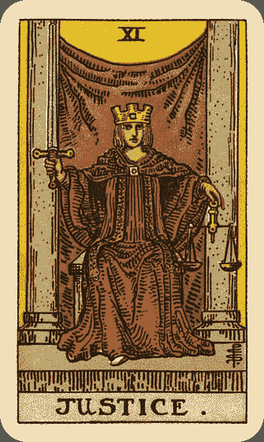

## 关键词

*   决定 正义 平衡 法律

## 牌面描述

一个女人端坐在石凳上，右手持剑高高举起，左手在下拿着天秤。身穿红袍，头戴金冠，绿色披肩用一个方形扣子扣起。她的右脚微微往外踏出，似乎想站起来，而左脚仍隐藏在袍子里面。她高举宝剑，象征她的决心。宝剑不偏不倚，象征公正，且智慧可以戳破任何虚伪与幻象。宝剑两面都有刃，可行善可行恶，端看个人选择。左手的金色天秤和披肩的绿色都是天秤座的象征。手持天秤表示她正在评估，正要下某个决定，同时追求平衡。胸前的方形扣子中间是个圆形，象征四要素的调和。头上的金冠中心有个四方形宝石，加上金冠的三个方顶，加起来得到数字七，代表金星，也就是天秤座的守护星。后方是个紫色帷幕，象征隐藏的智慧。两边柱子象征正面和负面的力量。

## 牌义推演

在正义牌中，我们可以找到很多对称，两个柱子、两面刃，和天秤，就连牌中的主角都长得很中性，它的代表星座也是追求平衡的天秤。因此正义牌出现时，通常与某个决定相关。问卜者必须用心中的天秤来衡量各种因素，以做出最好的决定。通常在决定的过程中，正义牌会用理性思考的方式，仔细分析利弊，因此她的决定必然是最公正不偏的。此时必须绝对的诚实。这样追求平衡和公正的特质，也会反映在待人处世上，正义待人公正诚实而不失厚道。如果之前被误会，正义牌出现代表你将讨回公道，获得道歉或赔偿。若是逆位置，可能显示你仍然受到不公的对待，或是某人对你欺骗或隐瞒，或者待你极端严酷不公又偏心。

下决定的过程并不容易，心中的天秤会摇摆不定，好像正义坐在两个柱子中间，善与恶的力量互相拔河，也如同电影中常出现的情节：心中的天使叫你往东，魔鬼要你往西。一旦下了决定，它就会变成你生命中的一部份，再也不能擦掉重写，因此心中这番天人交战，恐怕不好受。值得庆幸的是，正义会在一番仔细衡量下，做出最「好」的决定来，她所作的决定不见得是最轻松的，但她一定会负起责任，选择最「正当」的一条路来走。如果逆位，则可能决定错误、犹豫不决、逃避不下决定、甚至拒绝下决定。这样无异于逃避人生的责任。

再仔细看看牌中的女子，她像不像一位法官呢？法律事务与正义关联密切，所以正义牌也常与法律事务有关，包括诉讼和各种契约的签订。如果正位，通常可以得到公平的待遇﹔若是逆位，则可能裁决不公或是败诉，契约也可能有诈。必须特别小心。

正义也可能表示追求生活和心灵的平衡。正义是一张相当理性的牌，她会接受自己的过去，并负起该负的责任。正义就是为所当为。

正义编号 11，是 22 张大牌的中心。11 也是更高一层的 1，还进一步隐含 2(11=1+1=2)。因此正义牌可以视为魔术师和女祭司的综合体。正义高举右手，像是魔术师高举法杖。她后面的帷幕和柱子，与女祭司身后的背景非常类似。她和女祭司一样坐着，却踏出一只脚似乎要和魔术师一同站起。她虽是女性，却拥有中性的面貌和装扮。这些在在点出正义的主旨──平衡。

正义如果代表人物，会是任何与法律事务有关的人员、正在下决定的某人、还你公道的人。如果逆位，代表任何怀有偏见与私心的人、骗子、逃避责任的人、优柔寡断的人。正义牌出现，提醒你要用理性来解决问题，要审慎思考，要负起责任。

## 逆位解析

正位时，能够得到公平对待﹔如果逆位，可能显示当事人逃避决定，逃避责任，或是受到不公的对待。如果正面临法律问题，情势可能对己不利，此时绝对不能擅自主张，最好听从专家意见。如果正要面临考试，考试是另一种型态的裁决，事前必须比别人更努力，才能改造命运。

# 认识——塔罗牌

人们受到塔罗牌吸引，可能有很多原因。艺术家收藏家喜欢它的美丽图像，一般大众喜欢它占卜时的神准，灵修人士喜欢用它来冥想并且帮助心灵成长，还有人喜欢拿塔罗牌来游戏。塔罗牌有这么多神奇的面貌，等着我们来探索。

# The Hanged Man 吊人

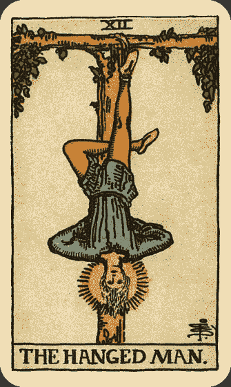

## 关键词

*   牺牲 等待 换个角度 以退为进

## 牌面描述

吊人图案简单，涵义却深远。我们看到一个男人在一棵Ｔ字形树上倒吊着。他两手背在背后，形成一个三角形。两腿交叉形成十字。十字和三角形结合在一起，就是一个炼金符号，象征伟大志业的完成，也象征低层次的欲望转化到高层次的灵魂（炼成黄金）。

红裤子象征身心灵中的「身」，也就是人类的欲望和肉体。蓝上衣即身心灵中的「心」，象征知识。他的金发和光环象征智慧和心灵的进化，也就是「灵」。 金色的鞋子则象征吊人崇高的理想。在某些版本的塔罗牌中，吊人就是神话中的奥丁(Odin)，他身后的树就是北欧神话中的义格卓席尔巨树（Yggdrasil），也称作世界之树，由地狱（潜意识）开始生长，经过地面（意识），直达天庭（超意识）。还记得皇帝右手拿着一根象征生命的古埃及十字架吗？古埃及十字架代表希伯来的第十九个字母 Tau，是属于世间的一个字母，而吊人倒吊的Ｔ字树，正是它的下半部，表示吊人仍然是入世的。

## 牌义推演

把吊人颠倒来看，吊人就不再是倒吊的了，而他的姿态看起来相当类似世界牌中的舞者。这暗示吊人最终仍能转正，看到事物真实的模样。吊人和命运之轮及正义三张牌，都可以看做大阿尔克纳的中点。命运之轮是转折点，正义是中心，而吊人的编号 12 正是世界 21 的相反，他是倒吊的世界。12 号的吊人是 2 号女祭司的高一层，他们都懂得静默与顺应的精髓，而吊人无论内在或外在，都比女祭司更加的无为。吊人和愚人也有共同点，他们都敢于与众不同，做自己真正想做的事。愚人主要出于本能，而吊人出于深沉的理解，因此他不畏惧世人的眼光，把自己吊在树上。

吊人与占星的对应是水要素，具有顺应无为的特质，也有人将其对应海王星，是颗代表牺牲与理想的星。在占卜上，吊人主要有牺牲的意义。他并不是被强迫的，而是出于自愿。仔细看他的表情，如此宁静安详，还有他头上的智能光环，显示他在精神上的理解已经超越常人。他不挣扎，也不想挣扎，因为他明白，随牺牲而来的将是更有价值的收获。以不变应万变，不采取任何行动，才是吊人的作风。吊人对应北欧神话中的奥丁，他曾经把自己吊在世界之树上九天九夜而获得符文，藉由牺牲来获得更高的知识和智能，所谓「舍得」，就是有舍才有得。吊人也是希腊神话中的普罗米修斯（Prometheus），为了送火给人类，被宙斯绑在高加索岩峰顶，百般折磨，但他从不屈服，因为他的身体虽受束缚，心灵却是自由的。另有一说是吊人就是被倒吊钉在十字架上的圣彼得。无论是奥丁、普罗米修斯，还是圣彼得，吊人就是这么一位崇高的殉道者。我们可以将他视为文天祥，或是复国前的句践，他们都为了更高的理想，而忍得他人所不能忍。

吊人悬吊着，一动也不动，因此吊人也代表等待、拖延、悬置、遇到瓶颈、无法下决定。此时莫急躁，吊人的主要课题就是以退为进，藉由放手我们可以赢得更多，藉由退让我们可以取得控制权。激进行动或任何大刀阔斧的举动，在这个时候不会有帮助。

吊人头上脚下，用不同的角度看世界。所以吊人也建议我们换个角度思考，换个角度看世界。很多事情都是一体两面，换个角度看，你将看到不同的景观。吊人出现，提醒我们要保持弹性，不要使用从前僵化的思考模式。吊人出现，也许当事人正在受苦或处于瓶颈阶段，但是他能够保持平静，做自己想做的事。感情占卜上，吊人可能代表暂时没有进展，或是一位需要默默等待的人。

## 逆位解析

吊人逆位，表示牺牲可能无法获得回报，或是受苦和瓶颈时期的结束，也可能表示当事人没有吊人的智慧，无法放手，却苦苦挣扎，钻牛角尖，企图与命运搏斗。逆位吊人提醒我们挣扎无益，应该相信经过牺牲之后的回报将更丰硕，应该换个角度，静静等待生命即将带给我们的礼物。此外，吊人逆位，他就不是倒着看世界了，因而失去他独特的智慧。最后，吊人逆位可能表示当事人受到社会眼光制约，不敢做自己真正想做的事。

# The Death 死神

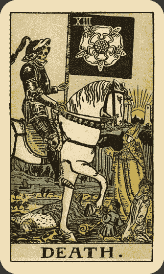

## 关键词

*   结束 转变 新生

## 牌面描述

传统的死神牌，通常是由骷髅人拿着镰刀来代表，而伟特将死神的意象提升到更深一层的境界。最显眼的就是那位骑着白马的骷髅骑士。他身边有四个人，国王、主教、女人、小孩，象征无论是世俗或出世、男或女、老或少，都逃不过死亡这个自然现象。

国王抗拒死亡，被骷髅骑士践踏过去﹔主教的权杖掉在地上，双手合十崇敬死亡﹔女人跪下，别过脸不忍看﹔小孩不懂死亡，好奇的望着骷髅骑士。其中主教可能就是编号五的教宗牌，他掉落在地上的权杖象征世俗权力遇到死亡时毫无用处，仔细一看权杖顶似乎有三层圆圈，和教宗牌戴在头上的权冠相同，而主教头上戴的帽子状似尖尖的鱼头，代表双鱼世纪的结束，也可能暗示死神牌关联的希伯来文 Nun，意思是鱼。跪着的女人可能是力量牌中的那位女性，她们的衣着与头冠都极为相似。

再回到骷髅骑士，他头上那根红羽毛和愚人所戴的是同一根，他的旗帜是黑色背景，象征光芒的不存，上面五瓣蔷薇的图案是蔷薇十字会的图腾，关于此图腾的说法众多，可能是代表随着死亡而来的新生，另一说是象征火星与生命力，还有一说是象征美丽纯洁与不朽。远方的河流就是流经伊甸园的四条河流之一，称为冥河（Styx），象征川流不息的生命循环。河上有艘船，船的上方有个类似洞穴的地方，右方有个箭头（在死神的脚跟处）指向洞穴，这个洞穴可能是「神曲」一书中但丁前往阴间的通道¹⁰，而牌中右方一条小径通往两座塔中（月亮和节制都有相同背景，这两座塔也可能是女祭司背后的柱子），代表通往新耶路撒冷的神秘旅程。象征永生的朝阳在两座塔间升起，似乎在告诉我们死亡并不是一切的终点。

## 牌义推演

人们害怕死神牌，就像害怕牛头马面和黑白无常一般。死神编号 13，在西方是不祥的数字，13 也是更高一层的 3，在皇后与死神牌上，我们可以看到生命的开始与结束。伟特牌的死神充满各种象征，与天蝎座对应，无论如何，最主要的牌义就是结束。结束可以有很多种形式，可以是某种生涯的结束，例如毕业、搬家、转职、结婚（结束单身）﹔可以是关系的结束，例如分手、离婚、拆伙﹔可以是习惯的结束，例如戒烟、戒酒、戒赌、戒色﹔但肉体死亡的涵义在占卜上则非常罕见。结束其实只是一种自然现象，所谓天下没有不散的筵席，再长寿的人瑞也终有离开的一天，没有人能逃脱。但是，这个课题对大部分的人来说，都是最艰难的课题。因为人是习惯的动物，要把过去的习惯切断，好比锥心刺骨之痛。

从另一方面来看，结束其实也只是一种转变。世界上唯一不变的就是改变，所不同的只是改变的快或慢而已。慢慢的改变，不会有什么感觉﹔但突然间的改变，却使人难以接受。结束就是最突然的改变，顷刻之间，必须迫使你立刻放弃某种事物，无论你愿不愿意。如此转变令人难以承受，对未知的恐惧在所难免，但这个课题每个人都必须要学。

死神骑着一匹白马，白色是最纯净的颜色。的确，死亡就像一个橡皮擦，把过往的所有事物都擦掉了，使一切都重生，一切都如白纸般重新来过。所谓「上帝在你眼前关上一扇门，必定为你打开另一扇窗」，死神就是这么一种新生，好比院子里长满杂草，也许我们都已经习惯，但是如果不把杂草根除，怎么会有开满芬芳花木的一天呢？古谚云：「置之死地而后生」，又云「不经一番寒彻骨，焉得梅花扑鼻香」。可见古人早已深明此理。死神对于戒绝过去的恶习，是张非常完美的牌。如果过去曾经有不堪回首的往事，死神能让你重新来过。

尽管难受，世间万物没有恒久不变的道理。死神指出过往某种事物的结束，而我们的课题就是要承认、接受、在新生涯中找到新的快乐，也许你会发觉结束的事物原来没有自己想象得那么好，进而庆幸自己的崭新生活。

## 逆位解析

死神逆位通常表示当事人不愿接受结束的事实、不肯放手、顽固、恐惧改变、沉溺在过去而不愿展望未来。也可能表示原本应该进行的改变停滞了，形成僵局。另一方面，激进的人为了抗拒改变，可能会采取激烈的举动。死神逆位提醒我们，不愿往未来前进，不仅无法成长，更会阻滞新生活的开展。此时应该要停下来思考，自己害怕的究竟是什么？迟迟不肯放手，只会让最终的结束过程更加痛苦。既然无法避免，不如早点迎向新生活，将来回过头，你会惊讶当初的自己为何这么想不开。

## 注释

# Temperance 节制

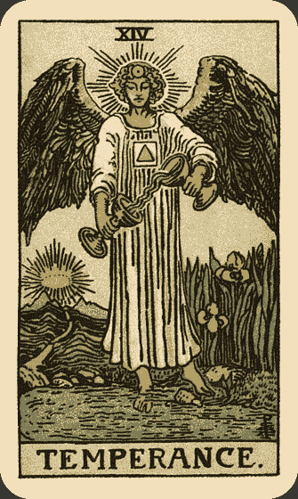

## 关键词

*   中庸 调和 沟通 教学 旅行

## 牌面描述

十四号的节制牌，出现在死神牌之后。大天使麦可手持两个金杯，把左手杯中的水倒入右手杯中。

金发的天使身着白袍，背长红翅膀，胸前有个方形图案 （地元素），中间是个橘色的三角形（火元素），同样的图案在正义牌中也可看到。天使头上则戴个饼图案，中间有一个小点，是炼金术中代表黄金的符号，也就是终极目标。天使脸上闪耀着和谐的光辉，怡然自在，他/她的右脚踏入象征潜意识的池塘中，左脚站在象征显意识的岸边石头上，代表两者之间的融合。塘边生长一丛爱丽斯花。远方有一条小径通往淡蓝色的两座山间，双山顶间闪耀着王冠般的金色光芒，类似如此的图像也曾出现于前一张死神牌中的小径、双塔与朝阳。恋人与审判牌中也有天使的出现。另外，大天使对应希腊神话中的彩虹之神，暴风雨后的彩虹，意味着节制牌已经从死神带给我们的恐惧中超脱出来了。整张牌带给人宁静祥和的感受，让人们明白死亡之后终获新生。

## 牌义推演

节制意味着古人讲的中庸之道，凡事不要太过与不及。这并非出于强自压抑得来的合宜举动，而是自然流露的气质特性。节制的英文字根来自拉丁文，意思是「调和」。具有节制牌特性的人，不需要在生活中的各种情境中替换不同的面具，也能够自然顺应，行为恰到好处，恰如大天使把两个杯子中的水混合在一起。举个更具体的例子来说，现今社会中，女性要同时兼兼顾母职与事业似乎很困难，节制牌就表示当事人可以同时扮演好妈妈与女强人的角色。在某些版本的塔罗牌中，上方的杯是银杯，代表月亮，下方的是金杯，代表太阳，而两杯水混合，象征阴阳的调和。

节制牌对应占星学中的射手座，爱好旅行。我们把图像放大来看，池岸就是大陆，池水犹如大洋。天使的脚踏在岸上与水中，也可以象征旅行，尤其是跨国或洲际旅行。

节制编号 14，是更高一层的 4，所以 4 号牌中，皇帝高压统治，节制则温和民主。节制也同时隐含 5(1+4=5)，所以节制和教宗都有教学的意味，只是教宗侧重团体学校教育，节制则重视意见交流的过程。

节制也象征沟通，可以从两杯中交流的水，以及天使双足各踩在水中与岸上联想出。而且，大天使本身也负责神与人之间的传达。其实，两种不同性质的能量也可以交流顺畅，适应良好，因此节制也可以象征成功的异国友谊、恋情或婚姻，以及成功的跨国事业、文化交流与国际合作。再进一步来说，节制也意味教学，教与学不正是沟通的一种吗？

在一般问题的占卜上，节制通常与沟通与协调相关。无论在感情或工作中，都需要保持弹性，敞开沟通的管道，多交流意见，与对方协商，消除对立，创造双赢。在商业上，节制与跨国贸易或旅游业有关。节制具有强大的适应力，当事人在各种情况中，都可以应付裕如。健康方面，节制具有疗愈的能力，如果有旧伤或老毛病，将能随着时间逐渐康复。

## 逆位解析

节制牌逆位，中庸之道不再，当事人容易走极端，走偏锋。再者，沟通不良或适应不良的情形也极易发生，不能与人妥协。其次，象征情感的水出现在上方，表示当事人不理智，容易流于情绪化，失去耐性。健康方面，当事人可能因为过度做某件事而导致伤害，例如运动过度或饮酒过度。

# The Devil 恶魔

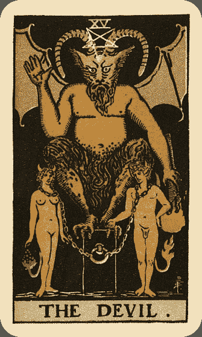

## 关键词

*   欲望 束缚 沉迷 物质主义

## 牌面描述

在恶魔牌上，我们看到和恋人相似的构图，只是恋人牌的天使在这里换成了恶魔，而亚当夏娃已然沉沦，上天的祝福变成了诅咒。

牌中的恶魔有蝙蝠翅膀、羊角、羊腿和鸟足，象征动物的本能与天性。牠的驴耳则代表固执。恶魔头上的倒立五角星，顶端指向地面，代表物质世界。恶魔右手向上摆出黑魔法的手势，与教宗的祝福手势形成对比。手心的符号代表土星，限制与惰性之星，也是魔羯座的守护星。恶魔左手则持着火炬，同样向下导引到物质世界，似乎在煽动亚当的欲望。注意恶魔坐的地方并不是三度空间的立方体，而是二度空间的长方形，象征人们只看见感官所见的现实，却非全部的真实，好比瞎子摸象。前方的亚当夏娃同样长出角和尾巴，显露出野兽本能。亚当的尾巴尖端是朵火焰，夏娃则是葡萄，都是恋人牌树上结的果实，表示她们误用了天赋。两个人被铁链锁住，乍看无处可逃，但仔细一看，其实系在她们脖子上的链子非常的松，只要愿意，随时可以挣脱，但她们却没有，表示这个枷锁是他们自己套在自己身上的。恶魔牌背景全黑，光芒不存，代表精神上的黑暗。

## 牌义推演

恶魔对应占星学中的魔羯座，和希腊神话的牧羊神潘（Pan），代表对外在物质的欲望，无论是功名利禄，还是酒色财气。15 号的恶魔是更高一层的 5 号牌，它们用不同的方式在阐述同一个主题，表现心灵与物质的对立。在教宗牌，性灵提升；在恶魔牌，欲望沉沦。

恶魔牌中，心灵上的追求完全被忽略，对物质的追求才是重点，人变得盲目了。不过，这并不表示恶魔是完全的恶，在现今功名挂帅的社会，恶魔经常表示名利权位的求取成功，而这会是许多人的心之所向。爱情方面，恶魔代表的可能是一种束缚性的关系，也许是当事人明知不好，却拒绝结束一段早该结束的感情关系；或是一方经常限制另一方；也可能代表有性无爱，或是用钱买来的关系。在最好的情况下，恶魔能够成为企业巨子；在最糟的情况下，恶魔就像是《笑傲江湖》中的岳不群，为了权位，不择手段，最后身败名裂。

也许追求物质的人不会意识到，在追求的过程中，他反而被束缚住了，变成物质的奴隶。可能为了讨好上司而卑躬屈膝，为了赚更多钱而日夜疲累，为了当选不惜下跪求票。所以恶魔可以代表小气鬼、势利鬼、利欲熏心的人、贪心人、奴隶或工作狂。这些人不知道的是，财富原本能够让人生活得更自由、更快乐，人们却经常本末倒置，以为财富代表一切。有了这种观念，就会变成恶魔牌上的亚当夏娃，自己给自己加了铁链，自己限制自己。殊不知唯有放下执迷，才是大自由。

在这里我们也可以看到无知和无助。无知来自无法看见真相，只看到恶魔坐的二度空间方形，而非真正的立方体，好比利欲熏心之人总是盲目，他只看得见物质。另一方面，被他人强迫锁住是一回事，不愿离开自己加诸自身的束缚，才是完全的无药可救，才是真正的无助，因为即使有人想救，也救不得。

对物质的对度追求也会演变成瘾，举凡酒瘾、毒瘾、色瘾、赌瘾、烟瘾，或是各种形式的沉迷，也都是限制与枷锁。君不见许多最后进了牢房的可怜人，起因都是为了满足瘾头。恶魔存在于每个人的心中，每个人都或多或少会有某些欲望想满足，轻微的时候不会造成具体的恶果，但当恶魔的势力掌控人心，也就是情势失控之时。因此我们需时时注意控制自己心中的欲望。

恶魔是一张物质的牌，此时灵性堕落，物质挂帅，人变的现实而势利，好像除了这些，其它都不重要。前面提过，对外在物质的追求在现今社会被视为一件正当的事，甚至是件好事。问事业学业或金钱，恶魔出现常是好征兆，表示当事人真的很渴望、很认真、很努力的去求取。但是恶魔出现同样提醒当事人，请反省自己是否过度执迷某件事、某个人、某个东西或某种模式。请思考自己是否利欲熏心，变成那些事物的奴隶，甚至使用不正当的手段求取。恶魔牌提醒我们：别让自己变成物质成功却心灵贫乏的盲目之人。在感情上，恶魔常表示当事人在感情中沉迷，受到致命的吸引力来诱惑，即使这段感情是不正常或不健康的。也可能表示这段关系的结合是为了现实考虑，也许是金钱或性欲。在不好的情况下，可能一方把另一方当成奴隶般控制，甚或在生理或心理上虐待对方。恶魔背后的意义是：唯有放下执迷，才能拥有大自由。

## 逆位解析

恶魔逆位，火炬和五角星顶端都朝上，套在脖子上的铁链也会脱落。因此代表脱离物质的束缚，思想开放，得到自由，但较不利于求取功名利禄。另外一方面，恶魔逆位也可能比正位更加的邪恶与堕落，如果说正位恶魔会透过努力来满足欲望，逆位置可能就会使用不正当的方式，甚至犯罪或出卖肉体来得到所求之物。

# The Tower 塔

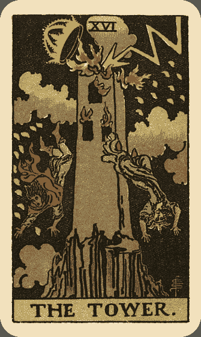

## 关键词

*   遽变 灾难 破坏 天启

## 牌面描述

一座位于山巅上的高塔，被雷击中而毁坏，塔中两人头上脚下的坠落。塔顶有个王冠受雷殛而即将坠落。塔象征物质，王冠象征统治和成就，也代表物质与财富，受雷一殛，便荡然无存。天上的落雷是直接来自上帝的语言，两旁的火花有二十二个，象征塔罗二十二张大牌。灰色的云降下灾难之雨，不分性别阶级，平等的落向每一个人。背景全黑，这是一段黑暗的时期。

## 牌义推演

塔的意象经常让人联想到圣经创世纪中巴别塔的故事¹¹，以及近代的 911 事件，著名地标双子星大楼在瞬间倾垮。塔对应具有破坏力的火星，首要意义是遽变，通常是外在突如其来的改变，经常是当事人无法控制的，而且冲击可能深入内心，影响当事人的整体价值观与信仰，而失去安全感。

塔的编号 16，是更高一层的 6 号，对照恋人牌，不难看出在恋人牌中的男女受到天使祝福，在塔中的两人却受到上天的惩罚，似乎暗示纯洁爱情的结合将受祝福，而自私逆天的举动将遭报应。塔也隐含 7 号(1+6=7)，在战车牌中，运用意志追求正当的胜利，将获得成功；而塔中人们不只追求成功，还妄想超越上帝，逆天而行，终于导致失败。这让人联想到，现代科技带来生活便利，但人类若是滥用之，终将自食恶果。

天灾人祸、失业、意外、变故，在宏观的角度来看，这些改变都是有意义的，但是极少人能乐于接受这些灾难式的变化。当塔出现，在怨叹这种事怎么发生在自己身上的同时，别忘了，狭窄的灰塔其实像座监牢，突然的雷殛虽难受，但却释放了身在牢中还以为是福的人们。此时请细听上天的讯息，事件背后的深层意义将会浮现。

没有非常的破坏，就没有非常的建设。破坏的过程很痛苦，但为了光明的前景，短暂的痛苦也值得。好比政府如果开始大力整顿交通，人民得先度过一段交通黑暗期，才能享受交通顺畅的快感。又好像在创建一个理想国之前，得先经过一番惨烈的革命。在占卜上，塔通常意味当事人面临危机，经历遽变。在感情上，突然争吵、分手，或是外在环境改变影响双方感情，例如双方家长大力反对，或为了工作或学业必须与情人相隔两地。在工作方面，突然遭遇打击。在健康方面，塔可能代表疾病突然发作、意外、住院，或在自然灾害中受伤。

幻灭是成长的开始，塔则提供成长之前的幻灭。有一个真实的故事是这样的：一位生长在美国南方的富裕青年，从小深受种族歧视的影响，极端憎恨黑人。在一次意外中，青年失去了双眼，但他自此以后能够纯粹看见人的内心，不再以貌取人。最后他结婚了，与他走过红毯的正是一位黑人女子，两人并且白首偕老。这个故事正是塔的写照，失去了双眼，却看见更多。

塔的课题不容易，毕竟人受限于习惯，一旦日常生活模式受到预料之外的破坏，一定非常难以接受。但是塔也带来天启，这可能是极为难得的机缘。

## 逆位解析

塔逆位的意义与正位类似，但是改变不如正位的剧烈。可能是当事人深自压抑，控制事态的发展，然而这不一定是好现象。盲目压制会让自己失去宝贵的体验，最终可能演变成伟特所说的，当事人把自己囚禁在塔里。

## 注释

# The Star 星星

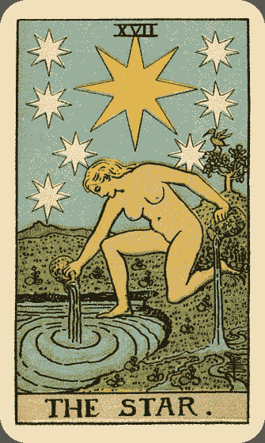

## 关键词

*   宁静 和平 信心 希望

## 牌面描述

一位赤裸的金发女子，左膝跪在象征显意识的地面上，右脚踏在象征潜意识的池水里。她左右手各持一个水壶，壶中装的是生命之水，她右手壶的水倾倒入池，激起阵阵涟漪，左手壶的水则倒在青翠的草地上，分成象征人类五种感官的五道水流，其中一道又流回池塘，再度充实潜意识之泉。她身后有棵树，树上有只象征智慧的朱鹭，同时也代表埃及神话中的托特之神，是所有艺术的创造者。女子的后方则是一大片广阔开满花的草原，和一座山脉，天空一颗巨大的金色八角星，七颗白色的小八角星则环绕在四周。

## 牌义推演

星星对应占星学的水瓶座，在大牌中编号 17，我们可以将其视为更高一层的 7 号战车牌，星星已经超越了战车用强大意志力控制外在环境的阶段，而保持纯然的内在信心与宁静。在数字学中，17 等同于 8(1+7=8)，我们也可以从空中的八颗八角星看出这隐含意义，所以星星也代表更高层次的力量牌，在力量牌中内心难以掌控的欲望（狮子）已经不复存在，有的只是怡然自得的心情。

星星与节制牌有相当多共同点。两张牌都出现在危机之后，牌中两位人物都是手持水壶，一脚在陆地，一脚在水中，但星星比保持中庸的节制更加开放自由。星星中的女子一丝不挂，无所隐藏，没有任何束缚；而且她将水毫不保留的倒入池水和地面，彷佛水壶将永不干涸，而节制所倾倒的水却局限于两杯之中。再者，星星出现于塔牌之后，处于牢笼般的塔中人被闪电所释放，终于在星星中得到真正的自由。

星星出现于塔牌之后，当塔牌中所有世俗的价值观都崩解之后，反而让人的心灵终于有机会腾出空间来放置自己真正需要的东西。星星是剧变之后的宁静，春天终于来临。有时候当人一无所有时，反而才无所畏惧，因为他已经没有东西可以失去的了。当他摆脱世俗的功名利禄以及社会的期许时，才真正闲适自得，了解何谓「危机即转机」的道理。就像潘多拉的盒子故事所揭示的，当潘多拉鲁莽地将盒子打开，让各种负面的事物都跑到人间时，起码盒中还留有一份「希望」。

星星代表希望、和谐、疗愈、平稳、宁静与安祥，也与静坐冥想相关，这些并非外显的行动，而是内在的状态。星星代表当事人与潜意识产生连结，即使他自己没有感觉到。有一派说法认为星星的牌义是毁灭与失落，这是由于星星与塔牌经常互相隐含。也就是说，塔的危机发生之后，往往出现更深层的宁静感；而星星的希望与信心，通常是发生于危机之后，即使牌阵中只出现两者之一，但令外一张牌的意义依然隐含在其中。因此，如果当事人正处于一场剧变时期，感到极大的痛苦，星星出现是一个很好的征兆，表示当事人即将能够顺天知命，在剧变之后，找到一个新的出口，并且在情绪上保持和谐稳定。如果生病，星星表示将能平静的疗愈身心。

星星给我们的课题是，如何处在人生风暴中，又能坚守信心，保持希望，不让外在的世界影响内心的宁静。要以更宏观的角度看待目前的逆境。即使是处于黑夜闪电击中高塔那样可怕的情境中，也要相信，过不久天色即将明朗，大地终能鸟语花香，你将能够安然地倾倒源源不绝的生命之泉。

## 逆位解析

星星逆位，表示当事人失去保持内在信心的能力，与潜意识的管道断绝，希望不存，只剩绝望与沮丧。当事人会变得不信任他人或自己的能力，只相信表面的价值观。再者，当信心不存，内心的自卑可能转为自大，当事人可能会以睥睨一切的态度来对待他人。此时当事人应理解到，内心越完满之人，行事越圆融。

# The Moon 月亮

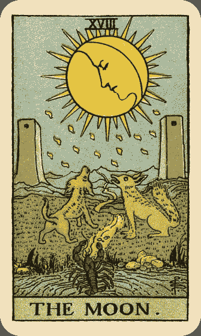

## 关键词

*   幻觉 不安 恐惧 神秘 危险 隐藏的敌人

## 牌面描述

相较于其它的牌，月亮整体呈现的图面经常令人感到诡异。近景是一只龙虾爬出池塘的景象，龙虾象征比恐惧和兽性更深的情绪，伟特说牠总是爬到一半又缩回去。中景处有频频吠叫的一只狗和一匹狼，分位于左右两边，分别象征人类内心中已驯化和未驯化的兽性。中间有一条通往两塔之间，延伸向远处山脉的小径上，这条小径是通往未知的出口，只有微弱的月光映照着。一轮月亮高挂空中，总共有三个层次，最右边的是新月，最左边的是满月，而中间的女人脸孔则是伟特所谓的「慈悲面」，从新月渐渐延伸向满月，越来越大。月亮的外围则有十六道大光芒，和十六道小光芒，其下有十五滴象征思想之露珠。

## 牌义推演

月亮牌与占星学的双鱼座对应，与通灵、神秘与感受性相关，也对应希腊神话中的月亮女神阿提蜜丝（Artemis）。月亮编号 18，是更高一层的 8 号力量牌，在此可以与 17 号星星牌(1+7=8)做个比较。月亮和星星两张牌都隐含数字 8，然而，这两张牌用不同的方式来表现力量的含意。在星星牌中，狮子的兽性荡然无存；月亮则将那头狮子带入最荒凉的旷野，让牠恢复原有的兽性，面对最原始的恐惧。在数字学中，18 也隐含 9（1+8=9），因此月亮牌也与 9 号隐士牌有所关联。如果说隐士登上高峰以追寻最高的意识，月亮就是进入人心的最深处探索，而其中往往藏有很多令人意想不到的事物，有些甚至不怎么令人愉悦。

月亮在现代社会中，令人联想到浪漫的夜晚，但这并不适用于塔罗牌里的月亮。相对于太阳给人光明积极的感受，月亮带给人们的感觉则微妙并且怪异许多。虽然月亮映照的是太阳的光亮，但却变得微弱而隐晦。在英文中，lunacy 字义是精神错乱或疯癫，这字根正是来自拉丁文的月亮 luna，何以月亮予人如此印象？我们可以想象狼人对着满月呼嚎的毛骨悚然画面。在满月时，犯罪率和自杀率高涨，精神病也更趋严重，已是经过统计的事实。在夜晚月亮出现时，也常是最让人感到害怕的时候。

人类最深的恐惧往往来自未知。在图面中，仅有月亮微弱的光亮映照着路面，而路的终点则是未知，即使它通往的是出口，也少有人敢在夜晚前行，因为我们看不见前方是什么。守在路中的狗与狼也感受到恐惧，对着月亮吠叫，牠们代表人类内心的兽性，其中多半是非理性的情绪。而在池水中若隐若现的龙虾也显示出，最让人感到恐惧的时刻，是在面对未知时，而非敌人已经出现之后。就像我们在观看恐怖片时，鬼怪尚未出现，反而是让人感到精神最紧绷的时刻。

在占卜时，月亮出现，经常表示当事人感到不安、迷惑与恐惧，可能是面对未来的迷惘，或是面对陌生情况的不安。有时候代表隐藏的秘密、危险或敌人，发生误会与欺诈，甚至出现莫名其妙的谣言中伤。在感情上，通常代表当事人对感情怀有恐惧，没有信心，不安而情绪化。面对这些情况时，人的本能为了求生存，常常作出不理智的举动。此时，必须明白，在月亮之后，19 号的太阳牌即将升起。唯有清楚太阳才是我们最终目标的人，才能够通过月亮的考验。就像奇幻小说《魔戒》的探险队出发时，必须经过犹如月亮牌所代表的漫长惊险旅程，剧中人只有抱持拥抱太阳的信念，才能撑到最后，达到月亮最终的目标──再度回到光明中。而月亮虽隐含 9 号隐士牌，但隐士在此并不出现引领我们，因为潜意识深处的恐惧，终究必须由我们自己来面对。

另一方面，月亮也象征潜意识，我们在月亮牌中进入未知的潜意识探索，可能是藉由梦境、幻想，或是藉由体验特殊的情绪与恐惧。月亮出现可能表示当事人经历奇异的白日梦、幻觉、通灵、梦境、或各种怪力乱神之事，也可能体验灵魂出窍、发生离奇的巧合、接受催眠治疗等特殊经历。有时候当事人会感到创作灵感源源不绝，想象力大幅增强。以上这些都是与潜意识接触的媒介，此时不应抗拒或否认，而应好好把握这探索潜意识的良机。

## 逆位解析

月亮逆位时，首先当事人可能否认这些与潜意识接触的事件，尝试用唯物主义的观点来解释一切，他不相信任何看不见摸不着的事物，也等于关闭了自己与万能潜意识的沟通管道。其次，在逆位时，隐藏的事物将逐渐浮现，无论是暗藏的敌人、危险、谎言或谣言，都将一一浮现，而变得较不具危险性，因为当它浮出台面时，当事人反而知道该如何应对。虽然月亮的暧昧不确定性仍在，当事人仍然会感到不安，但程度稍弱。

# The Sun 太阳

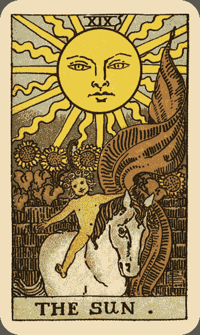

## 关键词

*   成功 自由 快乐 团体

## 牌面描述

可爱的裸体孩童骑在马背上，跨越灰色的围墙，脸上带着微笑。

孩童头上戴着雏菊花环，以及一根红色的羽毛。这根羽毛就是在愚人与死神出现的同一根，象征太阳牌已经跨越了死亡的界限，而重获新生。围墙后面种满向日葵，里头是一座人造的花园，而孩童跃离了花园，代表他不需要这些人工的产物，他是最纯真、自然、不需隐藏的，如同他一丝不挂的身体。向日葵共有四朵，象征四要素昂与小阿尔克那的四个牌组。有趣的是，四朵向日葵是向着孩童，而不是太阳，表示这位快乐的孩童已经拥有足够的能量。马匹背上没有马鞍，孩童不用缰绳控制牠，甚至连双手也不用，显示马匹象征的能量已经受到充分控制。孩童左手持着红色旗帜，左手象征潜意识，红色旗帜象征行动，表示他已经不用像战车那样用象征意识的右手来掌控，他可以轻而易举、自然的控制一切。背景的太阳是生命的源头，万物赖以维生之源，总共有 21 道光芒，代表愚人以外的 21 张大阿尔克那，仔细一看在上方罗马数字的旁边有一道黑色的曲线光芒，代表愚人（另有一说是太阳中心圆形的部分是愚人）。这样的更改是为了避免原本的暧昧。美国塔罗家 Mary K. Greer 提出，太阳牌中还藏有一个小秘密，在图中右下方，画家签名的下面，围墙阴影显现出 LOVE 四个字母。非常不起眼，请大家来寻宝。

## 牌义推演

太阳，顾名思义，对应占星学中的太阳，和希腊神话中的太阳神阿波罗(Apollo)，充满所有积极正面的力量，温暖而光明。值得一提的是，在比较古老的塔罗牌版本中，太阳牌中有两位小孩，与占星学的双子座相关，但伟特改成仅有一位，在此太阳牌就不与双子座产生关联，而属于太阳。19 号的太阳是更高一层的 9 号隐士，隐士只有一盏发出智慧之光的小灯笼，太阳则发出照亮整个地球的光芒，表示隐士在此达到胜利，他的智慧照亮了整个人群。太阳也隐含 10 号命运之轮(1+9=10)，和 1 号愚人(1+0=1) 。在命运之轮中，我们不确定未来的命运是光明还是黑暗，在太阳中，终于得到全然的光明。而太阳中的新生儿，就是刚踏上人生旅程的愚人，他在此达到成功。

太阳出现，就充满希望欢欣的气氛，所有的事情都一帆风顺，而且是全方位的成功。问健康无虑，问爱情可成，问婚姻百年好合，问学业金榜题名，事业更是飞黄腾达。最重要的是，当事人的内心也会感到很快乐。如果是旅行方面的占卜，可能会去做日光浴，或是去炎热的国家。如果你曾经做过天气的占卜，太阳当然表示万里无云的晴朗天气。如果代表人的话，太阳可能代表婴儿、儿童、快乐的人、发明家、重要人士等。

当一切都如此美好，心情就会自由自在，快乐无比。此时，任何简单的幸福都会带来极大的快乐。有人问，七十八张塔罗牌中，最好的牌是哪一张？其实每张牌都有它的光明面与黑暗面，不过，太阳牌大概是光明面最多的一张了。前面提过，在马赛牌或其它古老版本的塔罗牌中，太阳牌上有两个孩子。所以传统上太阳牌也有团体的意义，例如合伙关系、伴侣关系、社团等，而且通常都是非常成功且快乐的团体。但在伟特版本里，团体的牌义较不明显。

## 逆位解析

虽然说太阳如此光明，但过犹不及，任何事情都有隐藏的危险处。太阳虽然带给我们温暖与能量，但它也能将人灼伤，将大地烤成沙漠。逆位的时候，伟特认为太阳仍然具有正位的意义，只是程度比较弱一点。目前在占卜上常用的意义有：小成功、迟来的成功、成功但仍不满足、得到了才发现不是自己想要的。这时候当事人可能无法像牌中的孩童那样容易感到快乐，即使他得到了原本企求的，他的大胃口也不满足。或者是遇到一些小问题，就像乌云暂时遮住了阳光。你可以像伟特一样，把逆位的太阳当成一张比正位稍弱的好牌，或者是附加一点负面意义给它，只要是你觉得对，那就是适合你的牌义。

# The Judgement 审判

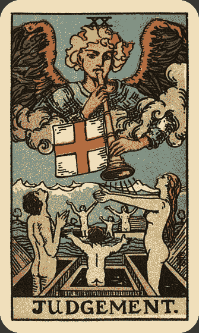

## 关键词

*   召唤 决定 解放 再生 判断 因果 业力

## 牌面描述

天使加百列(Gabriel)在空中居高临下吹号角，号角口处有七条放射状的线，象征七个音阶，能够将人类从物质世界的限制解放出来，并且疗愈人们的身心。 喇叭绑着一张正方形红十字旗帜，象征业力的平衡。天使下方是个象征潜意识的海洋，在女祭司帘幕后面就曾出现过，如今已接近终点。海洋上漂浮着许多载着人的棺材，棺材象征物质世界的旧模式。棺材中人全都是灰色的，其中最显眼的是一位象征显意识的男性，含蓄地仰望天使；一位象征潜意识的女性伸出双手，大方迎接天使的呼唤；以及象征重生人格的小孩，背对着我们。远处则是白雪霭霭的高山，伟特说这是抽象思考的顶峰。

## 牌义推演

审判牌通常与火要素对应，另一版本将其对应到掌管生死的冥王星。在数字学中，20 号是 2 个 10 组成的，在 10 号牌命运之轮中，我们经历人生的转折点，转变是好是坏，经常是由命运决定的，我们只能尽人事，听天命。而在 20 号审判牌中，我们同样走到红十字旗象征的人生十字路口，然而，不管周遭的情况如何，我们往往可以自己做决定，而且心中会感到有种声音在召唤着，驱使我们走向人生更重要的阶段。

召唤，是审判牌的重要意义。就像天使加百列吹着号角召唤大家，当事人会感受到一股召唤力，有时候是来自外界，但多半来自内心。那召唤可能是一份工作、一个想法、一种渴望，或是自我觉醒。这股召唤将会带领当事人开展人生的新一页。表现于外时，可能是成功的升迁、转业、成长；表现于内，则是经过一番内心洗礼，整个人感到焕然一新。有时候审判还可以代表实际的电话或信件，来通知当事人重要的消息。

审判同时也带给我们重生的机会。抽到这张牌时，可能当事人走到人生的十字路口，必须拥有清晰的判断力，才能做出最高层次的决定。过去的人生已经走到一个瓶颈，透过响应内心的召唤，将能为自己重新充电。在健康方面，审判可以表示身体痊愈，重新开始。在感情方面，破镜重圆不是梦。在法律方面，审判通常代表对自己有利的判决。如果想要摆脱什么人或什么环境，审判出现，表示时候到了。

审判是张意义重大的牌，表示当事人走到人生的关键期。过去的所作所为，将在此时得到应有的回报。就像人死后到阴间见阎罗王，在世时的作为都一笔一笔记在帐上。因此，审判与因果和业力相关，就像期末考，或是毕业典礼，我们在校时的各项表现，将得到总验收。而透过这场洗礼，过去的帐一笔勾销，我们将能重新写下人生的新一章。

## 逆位解析

审判逆位，首先当事人会抗拒生命的转变，怀疑甚至否认所面对的召唤，不愿做决定。另一个可能则是当事人因为目光短浅，而做出不利的决定。如果过去曾做过什么不好的举措，此时也会自食恶果。有时候当事人所面对的生命转变，确实比较难受，有歹戏拖棚的可能，也许是与亲人分离、被迫结束某些事物、败诉、留级、离家、分手、生病，这都需要多一点时间来调适。在日常生活中，可能错失重要的讯息，或是受到电话或信件骚扰。问健康，审判逆位不是好征兆；问手术，结果可能不会成功。问诉讼或考试，己方情况不利，宜多加准备。

# The World 世界

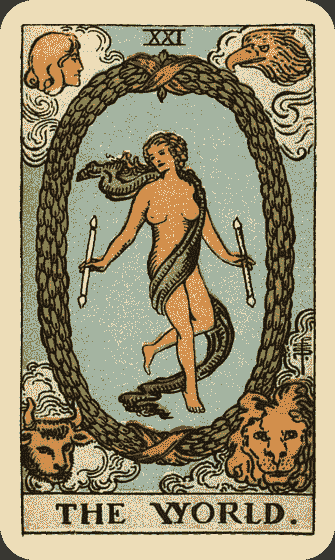

## 关键词

*   完成 完整 成功 成就 旅行

## 牌面描述

终于来到愚人旅程的终点。一位赤裸的舞者自由地在空中跳舞，她外貌看起来虽是女的，但在许多版本的塔罗牌中，她是雌雄同体，象征愚人终于成功将阴阳两股力量融合。

舞者身体缠绕着象征高贵与神圣的紫色丝巾，象征神性其实就在每个人身上。舞者轻柔随意地手持两根权杖，象征进化与退化的力量，她同时具备两者。舞者身旁环绕着一个椭圆桂冠，桂冠象征成功，而它围绕成的椭圆形就像愚人的０号形状，愚人无限的潜力，在世界牌中发挥得淋漓尽致。桂冠上下各有一条红巾缠绕，形成倒８符号，象征无限与永恒，这在魔术师与力量牌都曾出现过。在图中四角有人、老鹰、狮子、牛，这些符号曾经在命运之轮出现过，牠们在命运之轮中还拿著书汲取知识，最后在世界牌中完成使命。

## 牌义推演

世界在占星学上对应土星，代表稳定的力量。世界编号 21，与编号 12 的吊人有许多雷同之处。舞者和吊人的脚都呈现十字交叉姿势，上半身则形成三角形。在吊人中，他的姿态形成上方十字，下方三角的符号，十字象征物质，三角象征灵魂，这表示他受物质的控制超越灵魂；不过，在世界牌，这符号变成上方三角，下方十字，代表灵魂终于能超越物质。另一方面，吊人在面对限制而不能动弹时，虽然维持平静喜乐的心情，然而，「动」与「变」才是宇宙的法则，在世界牌中的舞者终于能获得自由，恣意地舞动着，而且清楚界线在哪里（即桂冠），这才是最符合潮流的情势。世界与命运之轮的构图也非常相似。两张牌都是以天空作为背景，中央圆形构图，四角分别围绕人、老鹰、狮子、牛的图像。在命运之轮中，人们仍然必须接受命运的考验，身不由己；但是人们终究在世界牌获得成功。命运之轮所隐藏的智慧，此时已完全揭露。

世界牌中的舞者，经常被对应到希腊神话中的赫梅弗度斯（Hermaphroditus），如名字所示，他是赫米斯(Hermis）和阿芙萝黛蒂(Aphrodite)之子，后来与仙女合而为一，他的名字也成为雌雄同体的字根。因此，在灵性的层面上，世界意味将人的男性面和女性面结合良好，或是将人力或资源结合良好。与其说世界代表结束，不如说它是一种自然的完成，是最后的胜利和美好的结局。死神的结束常令人伤心欲绝，但世界的完成却是踏破铁鞋无觅处。当事人的可能是事业到达成功的段落，学业顺利完成，目标达成，爱情也可能达到一个完成阶段，不管是步入礼堂，还是好聚好散，起码一切都很自然。世界是一个完整的段落，此时无所欠缺，一切都很完美。世界也可以代表旅行，特别是大范围的航空旅行，甚至环游世界。有时候代表搬家或移民。

## 逆位解析

世界逆位，成功的程度减弱，可能总是欠缺那临门一脚，也可能是好不容易达成目标后，才发现还有问题需要解决。正位时的完美开始出现小瑕疵，遇到一点小挫折，当事人就想放弃。原本自由的能量淤塞了，犹如舞者退回到吊人牌，当事人可能拒绝进入世界带来的新阶段，只想停留在旧环境中。无论是搬家、旅行，还是换工作，他都不愿意，而即使愿意，事情也可能延宕不决。其实只要明白，当人生某个阶段自然结束后，欢喜进入下个阶段，才是帮助自己成长最好的方式。要学习舞者欢欣自由的精神，只要能量流动了，事情就会顺畅，机会将提供给准备好的人。

# Ace of Wands 权杖一

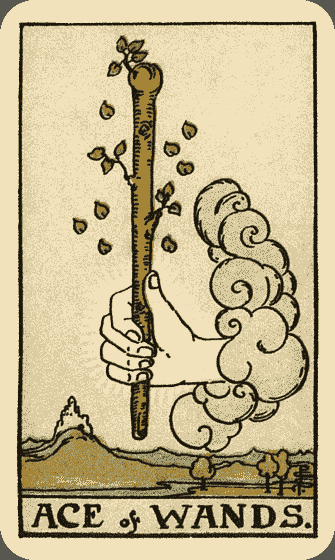

## 关键词

*   新行动 创造 机会 灵感

## 牌面描述

一只手从云中伸出，强而有力，握住一根长满绿叶的权杖。那根权杖是如此茂盛，以致鲜嫩的绿叶几乎从杖上「爆」开，有八片叶子脱离权杖，在空中飞舞。遍地青草溪流。远方的城堡似乎暗示着未来成功的可能。

## 牌义推演

无论大牌小牌，所有的一都代表一个新开始，而权杖一通常代表一个计划或行动的开端。权杖充满创意与热忱，充满源源不绝的能量，可以激发人们的潜能。权杖一就像一个火种，可以燃烧整个草原，也可以就此熄灭，但不管它的未来如何，潜力总是存在。在某些情况下，权杖一甚至可以表示新生命的到来。

如果最近有新计划、新念头、新行动、新方向，权杖一出现，表示前景光明，可以大胆去做。请拿出创意与热情，尽情挥洒，实现野心，不要辜负了心中的冒险精神。如果以前曾经很想去做某事，却迟迟不敢，权杖一提供梦想实现的好时机。

权杖一是火要素的源头，像一颗火花，其未来难以预料。然而火花的威力可以无限大，有行动就有希望，切莫蹉跎。当权杖一出现，当事人可能会感到自己某方面被激发了，可能是有突如其来的灵感，亟待实现的渴望，或即刻实行的冲动，承认这些新感觉，能够带来机会与成长。权杖一也可能代表新的机会，无论成功与否，放弃都是最不明智的抉择。

## 逆位解析

权杖一逆位表示这个新行动的失败面较大，有困难或延迟的可能。自私、缺乏计划或决心，都可能造成阻碍。权杖一逆位提醒你要审视自己可能忽略的地方，方能提升成功的机会。也许必须审慎考虑这个行动或机会该不该执行。如果权杖一在牌阵中代表新生命的降临，则逆位可能表示流产或堕胎，与皇后牌相同。

## 葵花锦囊

权杖一带给我们新创意、新机会、新想法、新行动，当这些火花出现在生活中时，你辨认出来了吗？ 当权杖一和其他一号牌同时出现时，新开始的意味更浓厚，你一定知道它们在告诉你什么，问题是你能否妥善决定这件事可不可行？如果可行，你敢大胆抓住机会吗？ 每个人一定都经历过权杖一提供的机会、创意或冲动，例如上司突然给你一个表现的大好机会，或是自己某天突然有股想要计划旅行的冲动。想出一个自己曾经体验过的权杖一事件，回忆当时的情景，再度感受它带给你的活力。

# Two of Wands 权杖二

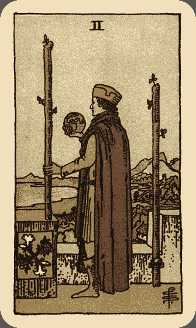

## 关键词

*   权利 胆识 计划 决定

## 牌面描述

一位身穿领主服装的男子，站在他的城墙上，俯视他的辽阔领土，遥望远方海洋。他右手拿着一颗类似地球仪的球体，左手扶着一根权杖。右边的权杖则是被铁环系在墙上。城墙上有个白百合与红玫瑰交叉的图案，白百合象征纯洁的思想，红玫瑰象征热情，暗示两者之间必须取得平衡。

## 牌义推演

乍看之下，权杖二与权杖三颇有相同之处，都是男子遥望远方海洋的构图，而且权杖二的领主与权杖三的商人，都是成功的领袖人物，拥有相当的权力，但请注意他们姿态的差异。权杖三的商人遥望远方出海的船，他刚刚成功的实现一项伟大的交易，而权杖二领主的视线却复杂许多，他看似俯瞰他所拥有的傲人领地，又看似默默低头研究球体，彷佛在盘算什么，思索什么。伟特将其比喻成亚历山大大帝－－站在世界的顶端，却难免悲伤折磨。

另一个角度来看，领主对着球体思索，是为了做出一项大胆而成功的计划或决策，因此我们可以将权杖二视为合宜计划与大胆决策所带来的成功开始，在权杖三达到成功的高峰。

矛盾的是，权杖二同时表现「成功」与「虚无」。这位领主已经拥有全世界，但仍然在城墙内盘算下一歩的行动，他看来很烦闷，因为他被自己的成功困住了，无法继续充分展现当年开疆辟土的「权杖式」行动。也许此时当事人拥有足够的资源，可供他完成所愿，然而他却心灰意懒；或者是达到成功之后，却发觉这根本不是自己当初所想要的。这个问题急须解决，请扪心自问，自己真正想要的究竟是什么？

## 逆位解析

权杖二逆位，领主可能失去权力与胆识，懦弱无能，计划错误，事情将会变得不顺利，也可能好的开始竟得到坏结局。另一方面，权杖二逆位也可以表示当事人终于停止思索，继续下一歩行动。

比起其它的牌，权杖二的牌义解读分歧较大。欧美书籍主流牌义通常偏向上述成功的意义，但也有不少人强调权杖二「犹豫不决」的含意，并且认为逆位的权杖二反而较快下决定。其实两种牌义解读没有对错优劣之分，也不会影响准确度，只要以自己能够认同的牌义为准即可，塔罗牌自然会照着自己下的定义来运作。

## 葵花锦囊

权杖二通常表示你最近在计划或考虑什么，也许让你很犹豫不决，但是，别忘了你起码还有选择的自由，以及对此事的掌控力。 权杖二是权杖牌组中较为静态的牌，事情发展有延迟的可能。

# Three of Wands 权杖三

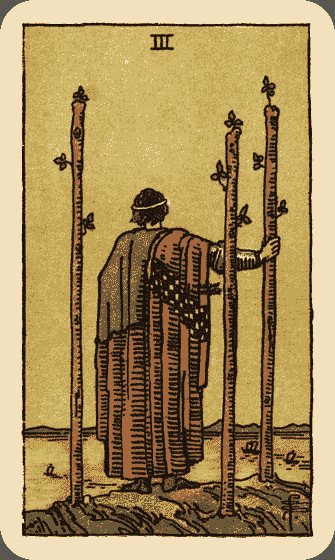

## 关键词

*   贸易 领导 远见 合作 探索

## 牌面描述

山巅上站着一个成功的商人，三根权杖笔直地竖立在地面上，商人右手握着其中一根，目送自己的贸易船出海。天空是鲜明的黄色，海映着天，也是黄色。

## 牌义推演

三这个数字结合了一和二，在数字学中代表「合作」与「成就」。权杖三正显示了权杖牌组的初步成功，呈现在事业上的成就，和商业与贸易有强烈的关联。通常此时当时人在工作事业上略有小成，谈判成功，协商顺利，计划也能稳当执行。如果此时得到新的工作机会或是新的案子，切莫错过好机会。

这位商人拥有庞大的事业，他居于领导地位。因此权杖三也代表领导，表示当事人具有足够的能力来领导他的工作团队。他同时也是一位有远见的领导者，看看他立足的山巅，站得越高就能看得越远，看得越远就能做出最有前瞻性的措施和决定来。远见无疑是领导者的重要特质之一。权杖三也可能是提醒当事人勿急躁，勿短视近利，要学习这位商人的长处，往远处思考。

权杖三也代表合作。看图中几艘船各司其职，前往他们的目的地交易，这个庞大的商业帝国无法靠领导者一人之力建造，必须要许多人通力合作才能完成，因此合作绝对是重点。

我们可以把权杖三和愚人、隐士做比较，这三张牌的人物都站在山巅悬崖上，三张牌都有某种程度的探索意味。愚人像刚出生的婴儿般，迫不及待踏出脚步，探索这世界﹔隐士默默站在无人雪山上，探索自己的内心﹔而权杖三的商人是往「前」目送他的船远航，前往一个未知的世界。他不像愚人般欠缺思考，也不像隐士般享受孤独，他深深明白自己在做什么，且随时准备走出下一步，不过那必得是经过缜密思考计划之后。权杖三表示这是个探索新领域的好时机。

感情方面的占卜，权杖三可能代表成功的远距恋爱，或是探索新对象。旅行占卜，权杖三通常表示出国进修或出差。

## 逆位解析

权杖三逆位，可能表示欠缺合作、不好的伙伴、缺乏远见、欠缺领导力、贸易失败，原因可能出在当事人过度自信、野心太大、计划不周。权杖三逆位也可能代表延迟。

## 葵花锦囊

你曾经当过领导者吗？写下一些你认为领导者应该具备的特质，这些特质就是权杖三主角所具备的特质。 如果近期有新的合作，进修计划或贸易机会，权杖三表示将会成果丰硕。 权杖三表示的人际关系，虽然不是如胶似漆，但通常都合作无间，有一定程度的成果。 如果权杖三出现在牌阵中代表环境的位置，可能表示合作良好的环境、探索新领域，或是当事人身边的一位领导人物。

# Four of Wands 权杖四

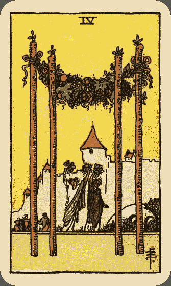

## 关键词

*   稳固 欢庆 和谐 繁荣

## 牌面描述

四根巨大的权杖耸立在前方，其上挂着象征胜利的花环。两位女子手持花束高举头顶欢庆舞蹈着，远方隐约可见庆祝的人群，呈现一幅和谐且繁荣的景象。右边有护城河上有座桥，通往远方的表示稳固庄园城堡。

## 牌义推演

相较于权杖三的远航出海，塔罗牌所有的四号牌都表示稳固与休憩，有一种「回家」的感觉，同时也代表该牌组的初步完成，权杖四兼具以上意义。所有的桌椅都是四支脚、建筑物要四根柱子、汽车要四个轮子…就连四方形也会给人一种很稳重的感觉，仔细看看，权杖四前方的四根柱子是不是也让人有这种和谐稳重的感觉呢？远方的城堡更是象征稳固的避风港。所以，权杖四的一个主要牌意就是稳固，也就是基础很稳的意思。学生抽到权杖四，表示他以前的学业基础打得很好；恋爱占卜抽到权杖四，表示恋情稳定，其余可依此类推。

在权杖之上挂着花圈，跳舞的女子手上也捧着花束，而且上面都有果子呢！这正是象征繁荣与富裕的典型，表示这是个丰收的时节，而因为丰收，所以人们可以大肆庆祝，和乐融融。

整体而言，权杖四是一张非常正面的牌，可以代表生意的成功、好的开始、目标达成、爱情或友谊的萌芽、婚礼、生产、庆功宴、庆生会等令人欣喜的事件。另外，权杖四的场景在乡村，所以也与乡村或美满的家居生活有关。

## 逆位解析

权杖四逆位，伟特书中解为意义不变，也许快乐的涵义没有正位时明显，或者是由于当事人贪得无餍，无法感到满足或感激。现今诠释通常解为基础不稳、不和谐、目标不一致、人际关系不稳定等，视占卜的问题而定。

## 葵花锦囊

权杖四显示你过往的稳扎稳打到此已结成果实，可以坐下来好好庆祝了。你可能有机会参加各种宴会或典礼。 享受乡间生活是个不错的主意。也许此时你会想布置房子，让你的居所更「稳固」。 权杖四不管出现在牌阵中的什么位置，通常都是很好的讯号。 权杖四、圣杯三和教宗都可以代表仪式，但中间有些细微的差异。权杖四偏向经过一阵辛劳之后的欢欣收成，圣杯三近似结盟宴饮等情感交流旺盛的场合，教宗则偏向宗教与社会性的庄重仪式。

# Five of Wands 权杖五

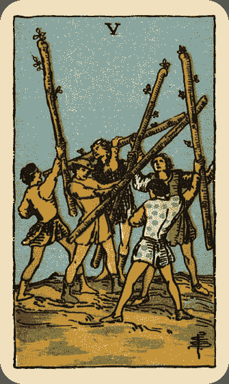

## 关键词

*   冲突 竞争 奋斗 混乱 模仿

## 牌面描述

迥异于权杖四的和谐稳定局面，权杖五呈现一群年轻人混战的场面。每个人手上都拿着一根杖，彼此僵持不下，谁也不让谁。伟特说：这是一场模仿的战役。

## 牌义推演

塔罗牌中每张五号牌都与冲突或失落有关。而权杖的火相特性，自然就以竞争为主题来表现。具有权杖特质（即火特质）的人很容易将人生看作是一场战争，因此权杖五的中心主题就是竞争的局面。这和圣杯五的情感失落，以及钱币五的金钱失落，有很大的不同。我们也可以把权杖五拿来和宝剑五相比，两张牌乍看类似，但重心不同。权杖五的重点是热血激战的局面，这和火元素的特质相关。而宝剑五着重的是战争结束后，无论胜利或失败都没好处的教诲。

「打架」在一般人眼中总是不好的事情，因为这通常和人与人之间的冲突有关，或许是小口角、意见不合，也可能是较大的争端。如果当事人身处这种局面中，请记得宰相肚里能撑船，唯有容纳各种不同的意见，这个社会才能更丰富并且更和谐。

从更广义的角度来看，其实权杖五可以代表人生的战争与挑战，在考场、情场或财场上举行。这场战争可能很辛苦很费力，但谁敢说自己不会是赢家呢？也许赢了之后，随之而来的利益与好处让人感到相当值得也不一定。

除了外在的冲突之外，权杖五也可能代表内心的冲突与矛盾，通常是出现在面临困难的抉择或挑战时，而且有时内心的冲突比外在的冲突更难以解决。这时候应该要保持冷静，找到令你困扰的源头，并加以破除。

仔细看这张牌，里头大伙儿都打成一团，没人在劝架，也没人冷眼旁观。每个人都在模仿别人的所作所为。权杖五出现，可能在暗示当事人要模仿。或者，更进一步，要下去打场轰轰烈烈的战争。

## 逆位解析

正位的权杖五代表这起码是场公平的竞赛，逆位的时候就不一定了。欺诈、作弊等奸诈技俩可能会出现。伟特本人对权杖五逆位的解释为：「诉讼，争执，欺诈，矛盾」。

## 葵花锦囊

冲突与竞争是权杖五的中心主题。问问自己是在哪方面遭逢这种状况，是人际、利益、感情还是意气之争呢？甚或是内心的天人交战？ 在冲突或竞争中，弄清楚自己的目的是很重要的。 有时候牌阵中其他的牌可以显示出冲突的矛盾所在，要特别注意相反牌透露的讯息。

# Six of Wands 权杖六

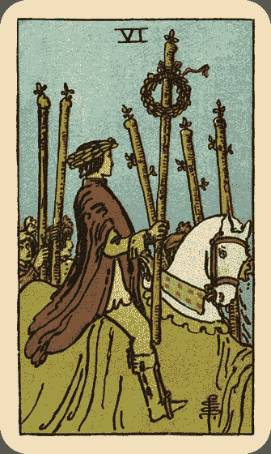

## 关键词

*   胜利 进展 自信 好消息

## 牌面描述

一位年轻男子，戴着胜利的桂冠，骑着白马凯旋而归。四周都是围绕簇拥着他的群众。白色代表纯洁，马象征力量。红色的外衣象征积极主动与热忱。男子手持的权杖饰以胜利花环。艰辛奋斗已然过去，他现在抬头挺胸，享受属于他的荣耀时刻。

## 牌义推演

我们可以把权杖六看成战车的小牌版本，两张都代表经由努力获得的胜利。在男子凯旋而归之前，必定有一番艰辛的努力，他凭借他的热忱（红衣），克服重重的难关。现在，他已经胜利归来，享受众人的欢呼，一切都已经值得。权杖六很明显的是张代表胜利的牌，通常是形于外的胜利，比方说金榜题名、衣锦还乡。因为世俗的胜利才有众人为你欢呼，这时必定享受各方荣耀与赞美。相反的，精神、性灵、心灵成长方面的进展，只有自己知道。不过，当周围伴随表示心灵成长的牌时（例如女祭司、隐士、太阳等），权杖六也可以显示当事人的心灵成长方面获得显著的进展，也就是灵性的胜利。

即使没有明显的胜利或荣耀，权杖六起码代表某方面显著的进展。如果手边有什么工作，权杖六代表工作的进展。准备考试，权杖六也代表实力极大的进步。感情方面，更是赢得佳人归的好兆头。

仔细看男子的姿态，他是多么抬头挺胸，充满自尊、自爱与自信。自信的获致不是偶然，他深知自己的出色能力，更明白自己身为领导人物，是众人的仰望的对象。他野心勃勃，而眼前他的目标已经达成，这使得他的自信更加深刻。

另一方面，我们也可以把凯旋男子骑着白马当成好消息的到来。成功与进展也可能以好消息的方式来呈现。例如长久以来盼望的得到的工作机会主动找上你，或是获悉爱慕的对象对你有意。

## 逆位解析

权杖六逆位的意义，第一，胜利的骑士跌到马下，变成失败者。第二，自信演变为骄傲，而骄者必败。第三，好消息变成不利当事人的坏消息。第四，迟来的成功。权杖六带来的重要课题就是，即使成功，也要懂得谦抑，因为有一个成功者，必定有许多失败者，谁知道自己不会是下一个呢？

## 葵花锦囊

权杖六和权杖三的主角都是领导人物。试着找出他们的相同点与相异点。例如，两位都很有自信，但权杖六的主角自信更强，可能有点骄傲，而权杖三的主角更注重团队合作。 权杖六的自信来自过去的成果，他对自己的能力信心十足，现在他的课题是要运用这股信心来鼓舞他人，不要只专注在自己的成功，更要注意同事或下属的情况。 你曾经在学业、事业或爱情上像权杖六一样凯旋而归吗？逼真回忆当时的情景，你就能体验权杖六的精神。 权杖六在感情占卜上，可能表示当事人有抱得佳人归的信心，也可能表示太注重面子，放不下身段。

# Seven of Wands 权杖七

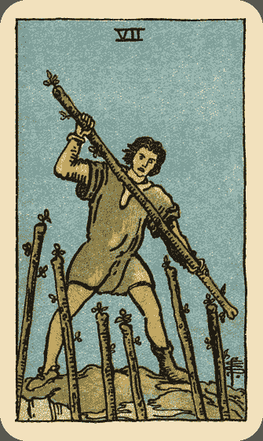

## 关键词

*   防御 挑战 勇气 对立 有利的位置

## 牌面描述

绿衣男子站在青葱的山顶上，手持权杖，奋力迎击敌人从山下攻上的六根权杖。他高举右手，表情坚毅。

## 牌义推演

人生中随时会遇到挑战。有人选择逃避，有人选择面对，绿衣男子就是选择坚守岗位的那一位。他虽然孤军奋战，但他站在高处，得享有利的位置，所以敌人不是那么容易攻上。因此权杖七在告诉我们，不要害怕面对挑战，虽然无助，但只要坚持到底，成功率还是很高。 他高举权杖，却尚未击下，只是坚守防御位置，胜负尚未分明。但这并不像权杖五的混战僵局，而关乎一个人在遇到冲突与对立时，能否拿出勇气与决心来奋斗下去。

当抽到权杖七时，事情或许显得棘手，或许你没有把握，但是请记得，无论你感到多无助，事情并不像你想得那么可怕。只要像图上的男子，拿出大刀阔斧的决心，成功之路将为你开启。

在学业事业方面的占卜，权杖七预示了藉由决心与勇气而获得成功的可能性，但是，在感情方面的占卜，却不乐见权杖七出现。因为双方的相处若是向权杖七所描述的冲突对立，而不包容倾听，心房怎会为对方开启呢？你防我，我攻你，争论何时休？如果遇到其它恋情破碎的牌一起出现（例如宝剑三或圣杯五），情况将更为糟糕。

## 逆位解析

权杖七逆位，原本站在有利位置的男子落到下方去了，局势反而不利。男子此时可能成为战场上的逃兵、情场中的懦夫。失去了自信，男子变得脆弱无比。原本胜面极大的战役，军人却如此懦弱，似乎注定有去无回。问卜者此时应先弄清楚情况，这场战役值不值得打？若冷静分析客观条件，可望成功，问题只是出在自己的软弱心态，则应坚定意志，仍可扭转局面。若此场战役客观条件很差，则明哲保身为宜。

## 葵花锦囊

权杖七代表你在捍卫或迎击某个事物，也许是你的地位、信仰或立场。正位表示目前情况有利于你，但辛苦流汗在所难免。 面对不同的声音，有人选择沉默，有人选择挺身而出。权杖七的态度是要更坚定维护立场，捍卫权利。如果你确定自己的立场是正当的，就选择固执吧。 权杖七出现在环境的位置，显见环境中有对立需要克服，也许此时有人反对你或想挑战你。

# Eight of Wands 权杖八

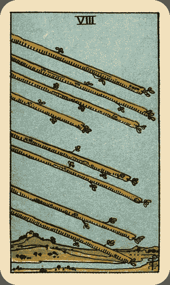

## 关键词

*   迅速 抵达 旅行 讯息

## 牌面描述

八根权杖整齐划一的在空中航行，背景是蔚蓝的天空与青翠的山丘平原，还有一条宁静的小溪流过。

## 牌义推演

「迅速」，是权杖八的中心意义。八根权杖像飞机一般快速飞行，因此事情的发展将会快得出乎意料，拖延已久的事务也将在短时间内得到结果。如果你先前设定了目标，权杖八可能意味你能快速达成它。

权杖八笼罩在一种自由且兴奋的氛围中。请注意这八根权杖顶端向下，即将抵达地面，因此，抽到权杖八，可以预见即将会有新事物抵达你的生活。也许你会突然遇见一位热情的恋爱对象，突然得到新工作，突然得到工作上的灵感，突然认识新朋友。无论如何，权杖八会使你积极而乐观。

旅行也是权杖八经常代表的意义，尤其是航空旅行，或是突如其来的旅行或出差机会。通常是快乐的。

这八根权杖我们也可以将它看成某种讯息，无论是新闻、耳语、还是各种小道消息。正立时，得到的通常是好消息；倒立时，则是坏消息。

## 逆位解析

逆位的权杖八有两种可能，一是步调太快，因而失控；二是延迟。在第一种情况，也许当事人会做出太过仓促的决定，表现太过冲动强势，或是事情发展太快令人措手不及。建议当事人谨记欲速则不达的道理。第二种情况，在实际占卜中可能发生普遍性的延迟状况、旅行也可能取消，或是遇上交通问题，宜多加小心。另外，伟特本人认为正位的权杖八是爱之箭，逆位则是嫉妒之箭，可能发生争执，在占卜时亦可应用。

## 葵花锦囊

权杖八是发展速度最快的权杖牌，因此抓住时机很重要。 权杖八的爱情是一见钟情，两人关系以迅雷不及掩耳的速度进展。 正位的权杖八通常表示事情很快会有结果，逆位的权杖八则可能事态延宕或失控。 权杖八如果出现在代表人的位置，那么此人可能有跳跃式的快速思考，做事情速度很快，或是突然有股着急要做某事的冲动。

# Nine of Wands 权杖九

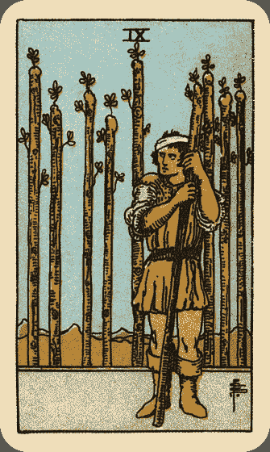

## 关键词

*   警觉 固执 防御 经验 等待

## 牌面描述

一个壮汉靠着长杖，似乎在等待着什么。他的头上扎绷带，显示他在过去战役中曾经受伤，尚未复原。但他并不畏惧，仍然紧锣密鼓等待着敌人的下一波来袭。他身后竖立八根权杖，井井有条，像是栅栏，包围着壮汉所守护的家园。

## 牌义推演

首先，我们仔细观察壮汉的身材及神色，他的眼神十分警觉，肌肉壮硕，姿势紧绷，肩膀微耸。前一场战役留下的伤势尚未复原，却仍积极备战，这些都显示出他的警觉心，以及固执坚毅的一面。因此，虽然权杖九通常表示处于压力下的备战状态，但唯有在这样的态势下，才能真正考验出一个人的能耐。

防御也是权杖九的主要意义之一。他身后竖立的八根权杖像是他的资源或靠山，但他战战兢兢，丝毫不敢忽视敌对一方的势力，无论如何，他都要捍卫到底。

他头上的伤，尽管带给他身体上的伤害，却也可以视为一种弥足珍贵的经验。因为有旧伤的警惕，他在下一次战役中，会更懂得保护自己。权杖九也可以代表身体的外伤，特别是头部。

抽到权杖九的时候，当事人通常在过去遭逢挑战，未来出现的考验未定。当事人务必要学习这位壮汉的信念，小心翼翼，切勿托大。强悍一点，在这时候可能有用。坚持更是面对挑战不可或缺的精神。我们不知道敌人何时会来袭，一定要随时保持备战状态，有句话说：机会是给准备好的人。

在感情方面的占卜，权杖九不能算是好兆头，当谈感情时要「防守」、「备战」、「受伤」、「等敌人」，这段感情的质量可想而知。也许你想拿出坚毅不挠的精神，但辛苦总是难免。

## 逆位解析

权杖九逆位时，当事人可能失去图中壮汉的精神，萎靡不振，准备不足，健康亮红灯，甚至想放弃防御。或者是敌人的势力超出他可以应付的范围，很有可能失守。这并不代表一定得放弃，但也许当事人应该多想一些更好的办法来应对。此外，权杖九本身即有等待之意，逆位时，延迟的涵义更加强烈。

## 葵花锦囊

权杖九的情况多半不好过，这时候认清并善用自己的资源（背后的八根权杖），可收事倍功半之效。过去的经验和知识，此时都可以派上用场了。 权杖九的逆境，通常都必须当事人独自面对。

# Ten of Wands 权杖十

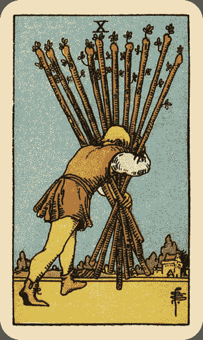

## 关键词

*   疲劳 压力 努力 责任

## 牌面描述

一个男人奋力的扛着十根沉重的权杖，朝着远方的房子前进。他被权杖的重量压得喘不过气，疲累万分，但他仍不愿放弃，为了生活，一步一脚印的往前走。 权杖十的中心意义除了最基本的「压力」之外，还代表「努力」，而且隐含成功的可能。伟特本人就指出，权杖十的牌义还包括收获、好运、任何形式的成功，然后才是伴随而至的负担。

## 牌义推演

忙碌的现代人对于权杖十的主题想必感到非常熟悉，然而，我们必须思考的是，图中的男子为何把自己弄得如此疲累，难道没有更轻松的方法吗？造成他压力的原因很多，可能因为不敢说「不」、计划不周、同时做太多件事、付出太多承诺、怕丢脸等。然而他不肯放弃，因他怀有相当程度的信念与责任感，他想要一个人负起所有的责任，却忘记他只是凡人，不是超人。也许有成功的可能，但是其实不必如此辛苦，因为他只懂得利用权杖的作风──向前冲！却缺乏思考与计划，因而导致如此辛苦的局面。其实只要多做些规划，并懂得拒绝的艺术，就可以明显改善这种情况。

同样的状况也可能发生在恋爱或婚姻中，显示当事人总是把事情往自己身上揽，却忘记恋爱婚姻是两个人的事。他觉得辛苦，却不肯放弃，紧抓着这段关系不放，希望能继续下去。然而，苦苦维持一段质量不好的关系，对双方都没有好处，建议当事人看清楚事实，运用建设性的解决之道，来改善关系。当无药可救时，不如快刀斩乱麻。

## 逆位解析

权杖十逆位，传统上有两个方向可以解释。第一，表示压迫到了临界点，快要崩溃了。第二则是当事人意识到这个状况，因而放下负担。或是由于快要承受不了，不得不丢下负担。

## 葵花锦囊

有时候权杖十的重担不是环境造成，反而是当事人加诸自身的，过强的责任感及凡事不假他人的个性，会让你不堪负荷，最终会影响健康。请记得「留得青山在，不怕没柴烧」的道理。 所谓「能者多劳」，有时候你也可以装笨一下，毕竟别人的工作不是你的责任。 健康占卜中，权杖十可能代表过劳或是肩膀酸痛。 你曾经因为不敢拒绝别人的要求，而把自己弄得疲累不堪吗？权杖十要求你学会说不。

# Ace of Cups 圣杯一

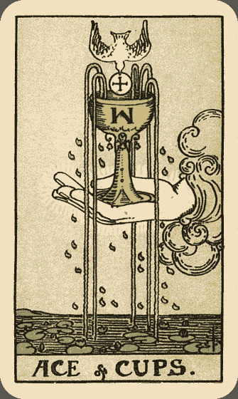

## 关键词

*   新感情 爱 喜悦 感受 直觉

## 牌面描述

圣杯一是所有小牌的一号牌中最富象征意义的。图中的圣杯就是耶稣在最后晚餐中使用的杯子，杯上有个倒立的Ｍ字母。

据说，在耶稣死后，他的鲜血就是由这个圣杯所承装着。白鸽是天主教中圣灵的象征，牠衔着象征耶稣身体的圣饼，自上而下彷佛要进入杯中，象征灵魂进入物质世界。另一方面，在天主教仪式中，也经常将祝圣之后的圣饼和杯中的酒混合，藉由耶稣身体和鲜血的结合，象征耶稣的复活。杯中有五道水涌出，象征人类的五种感官。下方的水面平静，只有少许涟漪，睡莲处处，而既是睡莲，则水必有一定的深度，显示出感情的深广丰沛。睡莲茎长，向上伸展至水面，象征人类灵魂的觉醒。二十五滴水珠从四面落下，飘浮在空中，暗示藏在小牌背后的意义深远。一只手从云中伸出，这只手和权杖一与宝剑一中的手截然不同，它是轻轻的捧着圣杯，而非用力抓住圣杯，因为爱只能细心呵护，越用力想抓住，只会让它窒息。

## 牌义推演

圣杯一经常代表新感情的开端，对于人际关系是非常好的征兆，无论是新恋情、新友谊，或是任何一种人际关系。圣杯一也可能代表一段快乐满足的时光，当事人能敞开胸怀，拥抱喜悦，尽情付出爱与关怀。在情感刚开始的时候，爱、喜悦与关怀总是满溢，手捧着圣杯，从云中伸出，好像把爱送给对方。圣杯一请你保持慷慨，了解施与受的福气。

在某些情况下，圣杯一可能表示直觉的开启，对神秘事物开始产生兴趣或是开窍，感受性敏锐。此时勿忽视心里的声音，各种梦境或是直觉，都可能带来珍贵的讯息。圣杯一是精神生活富足的象征，也可能是灵性成长的开始。

通常在人际关系占卜中，圣杯一都代表美好的开始，当事人能从中获得喜悦与满足。如果是占卜已经维系很久的感情，出现圣杯一，最好仔细审视周遭的牌，看看是否有外遇迹象。若是在无关感情的占卜中，出现圣杯一，可能表示这个局势需要用爱来化解，请散播善意，为对方着想；如果对方向你传达善意，请欣然接受。

## 逆位解析

圣杯一逆位，杯中的水就流出来，杯子变成空的。通常代表情感上的挫折，也许当事人会在情感上遭遇失落、分离、失望或不满足。可能会感到被否定、被拒绝、被背叛或寂寞，因而感到抑郁悲伤。可能感到对方不是真心，或者自己无法付出真心。新感情可能迟迟不开始。人际关系也变得虚伪、不稳定。这时候当事人往往有强烈的不安全感。有时候圣杯一逆位的症结在于当事人自己的心态，不愿付出，自己也不会有回报。好像图中的手，能够施与是种福气，在手心向上的同时，自己才是最富足的人。

## 葵花锦囊

圣杯一是人际关系最好的开始，请辨认出身旁的情感机会，你可能此从得到一位好朋友或情人。 圣杯一告诉我们，此时自由地付出与接受感情是最好的策略。

# Two of Cups 圣杯二

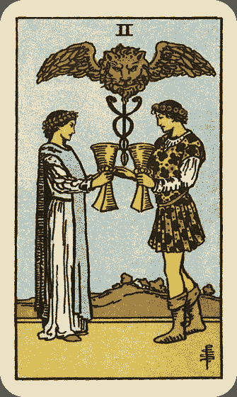

## 关键词

*   恋情 友谊 合作 结合

## 牌面描述

一男一女面对彼此，向对方持杯致意。两人头上都戴着花环，男人身躯微微向前，左脚踏出，右手也伸向女人，而女人站姿端凝如山。

他们中间浮着一根两条蛇缠绕的杖，称为「赫米斯之杖」，是治疗的象征。杖上的狮子头象征沟通，而两片翅膀象征圣灵，使人联想到恋人牌中的天使。远方是一座城镇。

## 牌义推演

圣杯二经常被视为恋人的小牌版本。两张牌都与爱情产生强烈的关联，而且圣杯二中的两人更像心心相印的金童玉女，深情相对，不若恋人牌中的隐隐犹疑的夏娃。但恋人牌毕竟是大牌，所表现的恋情影响较深远，为期较长久，也常指涉肉体上的亲密关系。而圣杯二的恋情在实占上，比较近似初期的热恋状态。看图中男女相敬如宾，他们之间不是钱币六的上下阶层关系，也不是圣杯六的单方付出，他们是互敬互爱的平等关系。更广义而言，圣杯二不只局限于男女情感，也可以指涉友谊，以及任何人际关系。

通常圣杯二的人际关系都是和谐、对等、沟通良好、合作愉快、互相敬重的。因此，问合伙，问婚姻，问恋爱，问友情，圣杯二都代表双方的结合将会非常愉快。

圣杯二图中是一对男女，为何不是男男或女女的配对呢？事实上，异性的组合象征圣杯二也可以表示不同特质的结合，无论是人、事、物，甚或才能与天份，有时我们必须将不同的东西结合在一起。图上右边的男子象征阳性，看他的身姿体态，不能发现他是比较积极外向的，而面对女子端凝稳重，处于被动地位，她则象征阴性的力量。

实际上，圣杯二讲的就是这两种力量的结合，若能同时拥有这两种力量，且融合良好，会比单一力量更强大。例如，某甲精通紫微斗数，也曾研习西洋占星，他想占问以命理为业应如何进行，抽到圣杯二。表面上来看，圣杯二可能建议某甲找个合伙人进行，但更深一层来看，圣杯二也可能暗示某甲将他的两种才能——东方的紫微斗数与西方的占星术——结合，他将发现这两种术数其实互相呼应，因而在命理的造诣上更上一层楼。

## 逆位解析

圣杯二逆位，表示在结合的过程中出现问题，或者双方不平等，因此可能出现互不信赖、付出不对等、冲突、甚至分离或拆伙的状况。建议当事人多体会圣杯二的含义，要学习如何结合相异之人事物，并维持双方的平等，方能建立和谐的人际关系。

## 葵花锦囊

你知道是谁跟你臭味相投或心心相印吗？请仔细维护这段关系。 圣杯二强调沟通、尊重、平等与合作的重要，如果出现在牌阵中代表建议的位置，代表你应该采行这些态度。 请拿出圣杯二与圣杯六、钱币六相比较。想想看你和你的好友或情人之间的关系，比较接近哪一张牌？

# Three of Cups 圣杯三

## 关键词

*   欢庆 结盟 团体 宴会 成功

## 牌面描述

三个女子紧靠彼此，围成圆圈，高举圣杯互相庆贺。她们头上都戴着象征丰收的花圈，穿着色彩艳丽的袍子，脸上幸福洋溢。四周有藤蔓、葫芦及南瓜，一位女子手上提着一串葡萄……这些植物很容易让人联想到丰收的时节。

这三位女子分别有不同颜色的头发与眼珠，穿戴的衣服花环也都各有不同，代表她们都是独立的个体，有独立的个性，但是，在这个团体中，她们都能尊重彼此，敬爱彼此。三人围成圆圈的型态，表示她们之间没有尊卑之分，在这个欢庆的场合里，每个人都是如此平等。

## 牌义推演

也许有人注意到，伟特用女性来表达圣杯三的涵义，为何不用男性呢？关键在于，女性通常象征柔性与阴性的能量，女性通常表现情感与分享，而非野心与竞争。这并不是说只有女性才能体验圣杯三，这只是一种象征，而塔罗牌就是运用象征来表达现象的工具。

圣杯三通常表示团体，而且是以情感作为联系的团体，像是家庭、学校里的社团或一群知心好友这类的团体。与钱币三的工作团队，和教宗的社会机构略有不同。此时通常表示当事人在情感上拥有足够的支持，有人对他付出爱与关怀，一同分享悲喜。再者，圣杯三也常表示结盟与合作的关系，是友谊的象征。

圣杯三也经常代表欢庆的场合，举凡各种宴会、聚餐、婚礼、弥月、尾牙、庆功宴等都算在内。其丰收的涵义表示事情有了好的结果，不管过程曾经有多艰辛。因此，圣杯三象征丰收的时节，长久的辛苦终于开花结果，获得成功。

在占算感情时，圣杯三通常代表团体中认识的情侣，然而，三人行的意象有时暗示这是感情路上的三人行，还是谨慎为妙。另外，伟特解释圣杯三可能代表计划中的怀孕。

## 逆位解析

圣杯三逆位，表示过度的欢乐导致乐极生悲、享乐过度、暴饮暴食，宜多加节制。在人际关系方面，可能团体失和、结盟或合作失败、友谊破裂、朋友背叛、失去亲友的支持。事情发展也没有预料中的好结果，成功化为泡影。

## 葵花锦囊

除了圣杯三之外，钱币三、教宗、太阳、圣杯十、钱币十也都有团体的牌义，圣杯十代表情感团体，钱币代表工作或事业团队，教宗代表宗教、教育或社会机构，太阳则泛指成功的团体。你能不能区分出更细微的差别？ 圣杯三出现在环境的位置，可能显示当事人身处一段欢庆丰收的时光或感情融洽的团体内。 圣杯三出现在建议的位置，显示当事人应该以乐群的态度处理此事，或者提醒你该好好享受一番，把握与朋友出游的机会。

# Four of Cups 圣杯四

## 关键词

*   不满 拒接 冷淡 退缩 外遇

## 牌面描述

一个男人百无聊赖地坐在树下，双眼紧闭，双手双脚合在一起，形成防御的姿态。

他前方三个杯子象征他过去的经验。云中伸出一只手给他第四个杯子，他却视而不见，独自沉浸在自己的世界中。

## 牌义推演

请看，云中手握着的那第四个杯子，与圣杯一中的杯子是不是很相像呢？这第四个杯子就代表新的机会，而且可能是如同圣杯一相同的大好机会。然而，这位消极退缩的男子丝毫不满足，他闭上双眼，也许是没看见，也许根本是拒绝了这个机会。生活对他而言，似乎一点乐趣都没有。这世界上好像完全没有任何事值得他去做，没有任何人值得他关心。无论给他多好的机会，他只表现出彻底的冷淡与漠不关心。

在数字学中，四代表稳定与秩序，就像所有的桌子椅子，都要由四支脚构成才会稳固，所有的建筑物都是四方体，即使是金字塔，底座也必须是四方形。然而，稳固经常导致无趣，当一段关系或一桩事业稳固已久，反而经常让人觉得无聊，好像没什么新鲜刺激的了。反映在圣杯四，在情感上感到无趣，就形成一段无聊、疲惫、退缩、消极、不满足、独处的时光。当事人觉得百无聊赖，对外界事物漠不关心，缺乏动力，不想参加社交，觉得没人了解他，甚至觉得家花没有野花香……所以，圣杯四在实占上，有时也代表外遇，因为他对于目前所拥有的，已经不感兴趣了。

抽到圣杯四时，建议当事人三思而后行。在一段深思之后，重新投入原来的生活，不要完全切断自己与外界的联系。最重要的是，要好好珍惜你所拥有的，并把握眼前的机会，以免稍纵即逝。

## 逆位解析

圣杯四逆位时与宝剑四类似，代表不满足即将结束。跟正位比起来，逆位的圣杯四较能把握眼前的机会，也表现出对生命的热忱，愿意展开行动。

## 葵花锦囊

圣杯四的症结在于无法得到满足，对环境提供的机会也不感兴趣。这个时候应该自问你对什么感到不满足，并且重新审视它。 圣杯四的男人在兴趣缺缺时，一个人躲到树下沉思，你又是到哪里去找寻宁静呢？ 如果在感情占卜中出现圣杯四，除了外遇的可能外，也可能表示当事人对目前的情感机会感到不满意，即使有很多追求者，也不是他心目中的理想。如果他已经有固定对象，则他可能感到不满，而重新衡量这段感情。 如果圣杯四出现在牌阵中代表建议的位置，这是提醒你要采取圣杯四的态度，此事隐藏起来，好好思索，先对新机会抱持观望态度，考虑充分之后就好好把握，对你比较有利。

# Five of Cups 圣杯五

## 关键词

*   悲伤 忧郁 失落 失望

## 牌面描述

圣杯五是一张代表悲伤、失落与失望的牌。在灰暗的天空底下，有一个人身着黑色斗篷，低头哀悼地上三个倾倒的杯子，里头五颜六色的酒流了出来。

他的前方是一条河，象征悲伤之流，但河上有座象征意识与决心的桥，通往远处的房子。灰暗的天色反映牌中人的沮丧的内心世界。从图面上无法分辨出这人是男是女，显示悲伤的情绪无论男女皆能体验。

## 牌义推演

这张牌与宝剑三的意义相当近似，两者都代表一定程度的悲伤与失落，但是圣杯牌毕竟是圣杯牌，杯子即使倒了，也不会像宝剑般造成具体的伤害，因此圣杯五虽有一定程度的失落感，却没有宝剑三那样的椎新刺骨之痛。

三个杯子倒了，但仍有两个留下，图面中的人物只要转过身，就知道他并非孤立无援，并非一无所有，但他目前却没有意识到这点。等他哀悼够了，他可以拾起剩下的两个杯子，跨过通往外界的桥，继续他的生活。远处的房子象征稳固安全的生活，里头可能有他的亲人支持，而桥一直都在，他随时可以回去。

人生的不如意十常八九。没有人能保证自己总是能随心所欲，难免有失望的时候。当我们处在低潮时，花一点时间来自怨自艾一番，是人之常情。然而圣杯五带给我们的启示是：不要看自己失去的，要珍惜自己所拥有的，无论是物质，还是给你关怀的亲友。经历一阵哀悼期之后，别忘了重新拾起希望，热切的生活下去。

## 逆位解析

逆位的圣杯五一般有几种可能，第一，根据伟特，逆位可以代表错误的计划。再者，从图面上来看，圣杯五逆位，剩下的两个杯子也倒了，当事人什么也不剩，所以悲伤的程度比正位更加严重。另一种可能则是当事人拒绝承认悲伤，因而压抑自己的情绪。最好的情况则是当事人意识到他还保有的部分，例如亲友的关怀，那三个倒掉的杯子就显得没那么重要了。

## 葵花锦囊

圣杯五出现时，你应该知道自己是为何悲伤，给自己一段哀悼期，但别忘了你还有两个圣杯未倾倒，请考虑接受旁人的关怀与支持，也别忘记还有别的人或事值得你关注。 圣杯五和宝剑三意义近似，但圣杯五强调「失落」，宝剑三则着重「伤害」与「痛苦」，破坏力更强。 实占上，圣杯五也可以代表延迟。 圣杯五也可以代表遗产，因为图中人物一方面哀悼失去的亲人（三个倒掉的杯子），一方面又得到亲人遗留下来的财务（未倾倒的两个杯子）。

# Six of Cups 圣杯六

## 关键词

*   童年 回忆 思想 照顾 馈赠

## 牌面描述

在一座宁静安详的庄园里，有六个盛装五角星花朵的圣杯。一个小男孩捧着圣杯，似乎在嗅着花香，又好像把圣杯献给小女孩。背景充斥代表快乐的鲜黄色，而天气晴和。让人彷佛有置身童话世界的感受。

## 牌义推演

两个主角都是孩童，令人不禁重拾童年时代的美好回忆。因此，圣杯六代表与过去有关的人事物。也许你偶然发现失踪已久的童年相簿，也许你在街上碰到初恋情人，也许某个儿时玩伴偶然来访，种种因素让你重温旧梦，进入回忆的漩涡里。

圣杯六有时代表思乡情怀，家乡就像圣杯六中的庄园，在里头有欢笑，有回忆，有家人的悉心照顾，让你无忧无虑。

看看男孩将花献给女孩的慈爱模样。圣杯六也可以表示照顾以及馈赠，或者是得到遗产。你可能获得某人的特别关照，好像他把你放到这个安全的庄园中。也可能代表送礼或收礼。更广义来说，提供经验与教育，也是馈赠的一种形式。圣杯六的快乐很简单，就像儿时一般天真，有时只是好友帮你泡的一杯咖啡，就能感到无上的喜悦。

在经过圣杯五的悲伤之后，有时我们需要遁入回忆来重新发觉自己，才能继续向前走。藉由省思过去的经验，可以获得灵感和再生的力量。有时圣杯六也提醒我们，要像男孩一样慷慨大方，乐于付出。如果你有仇恨，请你放下与原谅，才能得到真正的和谐。

圣杯六在感情方面，可以代表如初恋般单纯的恋情，或者与旧日情人重逢。也可能表示一方照顾另一方的关系。对照圣杯二，我们可以发现这样的关系其实并不平等，而且保护与控制只是一线之隔。一方替另一方构筑一座安全的庄园，但却使他失去探索世界的机会，让他成为温室里的花朵，有朝一日甚至会成为钱币六中的乞丐，这种情况在逆位时尤为可能。

## 逆位解析

圣杯六逆位，童年的美好回忆不再，反而充斥惨痛的记忆，似乎一直在拉扯着你。当事人可能无法获得适当的照顾、被忽略、被遗弃、甚至受虐。当圣杯六的特质发展过度，逆位代表沉溺于过去，不肯尝试新事物，使生活停步不前。从另一方面来看，圣杯六逆位也可能表示当事人回忆够了，准备向前看，反而会把重心放在未来。

## 葵花锦囊

你最近跟什么旧时人物搭上线了吗？留心它们提供给你的经验与洞见。 圣杯六也可能代表跟小孩游玩，或是儿童玩接触的机会。 此时可能有亲友给你情感或馈赠，开心接受之余，别忘了回馈。

# Seven of Cups 圣杯七

## 关键词

*   迷惘 幻觉 想像 梦境 选择

## 牌面描述

七个圣杯飘浮在云雾弥漫的半空中，杯中分别装着城堡（象征冒险）、珠宝（财富）、桂冠（胜利）、龙（恐惧，另一说是诱惑）、人头、盖着布发光的人（自己）以及蛇（智慧，另一说是嫉妒）。

请注意桂冠的下方有颗不显眼的骷髅头，成功与死亡并存，似乎在给人什么警惕。有个人面对着这些圣杯，不知该如何选择，他的身体姿态似乎流露出些微恐惧。

## 牌义推演

圣杯七代表的是生活中的非现实层面，包括我们的梦境、幻想与白日梦，或是偶而异想天开的点子。这种想象通常只是空中楼阁，一般人不会真的把这些幻想付诸行动，因此圣杯七不是一张代表行动的牌，而只是一种个人想象的心理状态而已。

如果当事人目前有很想进行的计划，感觉未来前景一片大好，圣杯七警告：这可能只是自己虚拟的想象罢了。如果在恋爱占卜中，当事人觉得对方似乎对他有意，圣杯七出现，代表这恐怕只是一场一厢情愿的白日梦。圣杯七可以代表虚幻的恋情、不踏实的人际关系，与不切实际的打算。

太多选择，往往令人无所适从，圣杯七中的二男子正面对这样的窘境。他感到迷惘，到底该选择财富呢？还是成功？这七个杯中装着世上人们最渴求的梦想，到底该选哪个好呢？他似乎并不知道，这一切其实都是幻觉。

适当的幻想与做梦是有益的，但终日沉浸于幻想世界中，终将一事无成。所以圣杯七甚至可能暗示各种上瘾症状，患者藉由酒精、药物、小说漫画甚或网路游戏来逃避现实，进入自己的幻想世界。

在比较不好的情况下，圣杯七可能代表被欺骗，也许是自己的幻想骗了自己。此时即使得到成功，那也只是南柯一梦，多半是当事人自我膨胀，并非真正的成功。

## 逆位解析

圣杯七逆位的解释和钱币七类似，不再停滞不前，此时云雾即将散开，反而容易做出决定，实际把自己的梦想付诸行动。

## 葵花锦囊

圣杯七经常表示你沉迷某些人事物当中，包括白日梦。 神秘经验和宗教体验也是圣杯七可能的意义，也许你会经历通灵、预知梦、眠、灵魂出体、神迹显现等奇妙机缘。 圣杯七若出现在牌阵中建议的位置，正位时显示你可以从这些想像、梦境或神秘经验中获得难得的启示，但逆位时就是提醒你该醒醒了。 除了圣杯七，还有哪些牌可以代表上瘾呢？试着把它们找出来。如果你正处于上瘾状态，请善用死神牌或审判牌的力量，洗心革面。

# Eight of Cups 圣杯八

## 关键词

*   抛弃 不满足 行动 牺牲

## 牌面描述

身穿红衣红鞋的男子在暮色中，手持长杖，离开他先前辛苦建立的的八个杯子，越过河川，转身而去。四周沼泽密布，象征淤塞的情感，如同一滩死水。

## 牌义推演

要搭起那八个杯子，起码需要一阵辛劳，他却发现八个圣杯中间的一个缺口，所以毅然转身离去。他的红色衣鞋以及长杖象征他的行动力，而现在他把这些精力从他过去构筑起的欢乐与成就──也就是那八个圣杯──里移开，转而寻找失落的那一个圣杯。为了失落的一个圣杯，而抛弃原有的八个圣杯，说他傻吗？似乎不傻。说他不傻吗？也不像。这是个见仁见智的问题。他其实可以带着原来的八个杯子一起走，他却选择不要，由此可见圣杯八的中心题旨「抛弃」。以往的欢乐、成就、财富，他都不要了，他只要缺少的那一个。我们在日常生活中有时可以遇到这样的人，有人看他择善固执，有人看他驴子脾气，但都不得不承认他的确清楚自己所要的，而且勇气十足。当身处在沼泽般僵化的局势中，圣杯八的表现是以行动打破陈规，拿起你的杖，放下眷恋，勇敢前行。在感情占卜上，显而易见，代表放弃现有的感情，转而追寻自己希冀的幸福。那幸福不一定是另一个对象，更有可能是自己的理想与坚持。若与隐士牌或女祭司牌共同出现，更加彰显此一主题。

八个圣杯中间缺少的那一杯，指出过往拥有的成就总是有美中不足。世上原无十全十美之事，我们可以全盘接受，也可能像圣杯八的这个男子一样，把焦点放在残缺之处，心怀失望，毫不满足，于是出发去寻找失落的部份。成功与否，没有把握，他可能果真找到，也可能全盘皆输。但，起码他有勇气行动。

从更高的层面来看，圣杯八与孟子之言有异曲同工之妙：「天将降大任于斯人也，必先苦其心智，劳其筋骨，饿其体肤，空乏其身」。简而言之，圣杯八也可以代表牺牲，亦即象征放弃现有的物质快乐，以追寻性灵成长，和隐士与吊人的概念隐隐相通。

## 逆位解析

圣杯八逆位可以有很多种解释。首先，当事人可能不愿或不敢采取圣杯八的行动，不愿意突破，而处于现状。其次，当事人可能贸然采取圣杯八的行动，但他抛弃的事物却十分有价值，且大有可为，因而事后感到后悔。最后，伟特提供的圣杯八牌义是「极乐、幸福、宴会」，看来圣杯八的男子已经成功脱离淤积的沼泽，找到他人生的春天了。

## 葵花锦囊

圣杯八所抛弃的不只是实质的人或物，也可以抛弃旧有的信仰或价值观。 圣杯八提醒你要留意生活中什么事情是不需要的，现在就是清理「垃圾」的好时机。

# Nine of Cups 圣杯九

## 关键词

*   享乐 得意 美梦成真

## 牌面描述

一个财主装扮的的男子坐在小凳上，双手抱胸，神情怡然自得。他身后的高桌上，覆盖蓝色桌布，九个圣杯排排站。背景则是一片光明的鲜黄色。

## 牌义推演

圣杯九的昵称叫做美梦成真，代表当事人的愿望极有可能实现，无论是精神或是物质方面。所谓的「情场得意，赌场失意」定律，并不适用圣杯九，圣杯九可是要「人财两得」的。财主非常满意于他的现状，他洋洋得意的抱胸姿态，显示出某种程度的自负。

这张牌也可以与钱币六做个比较，在钱币六中，我们看到手心向下的财主，与手心向上的乞丐；圣杯九的财主则抱胸端坐，展现一种单纯的满足，无形中与外界隔绝，甚至隐约流露出某种炫示意味。

如果将桌子的摆设看作一场饮宴，不难推测出圣杯九也代表享乐，而且通常是物质感官上的享受，例如一顿奢侈的大餐、一场震撼的电影、一节豪华的 SPA、一场狂欢的宴会。相较于与大自然亲近的钱币九，也许圣杯九代表的享受很肤浅，但是在身心疲惫之余，没什么能比圣杯九这样的享受更让人得到舒展的了。

## 逆位解析

圣杯九逆位，伟特给予的解释是「真相，忠实，自由」。其实是表示当事人可以超越感官享受的阶段，转而追求更高层次的快乐，也许是透过禅修、瑜伽，或是任何自我充实的方式。美食和声光刺激此时已经无法娱乐他，他要的是更长远的快乐。这其实是对自己忠实的表现，能使人获致最终的解放与自由。

## 葵花锦囊

圣杯九表示你最近达成愿望，或是体验一场宜人的享受。 圣杯九如果代表人物，他通常对自己拥有的感到很满足，但他双手抱胸的姿势显示他不见得愿意与别人分享，也不见得能敞开心怀与人沟通。 圣杯九和钱币九都代表成就之后的享受，但两位人物都是孤独的，我们可以拿这两张牌和圣杯三、权杖四做一个对照。 圣杯九在健康方面的占卜，代表身体很好，逆位时，主要不要休闲过度，关闭电视，少吃一些吧。

# Ten of Cups 圣杯十

## 关键词

*   情感团体 家庭 满足 和谐

## 牌面描述

在图中我们看到一家四口和乐融融，父母亲搂抱对方，各举一只手迎向圣杯彩虹，两个孩子快乐的手牵手跳舞，背景是清翠的树木河流，和一栋房屋。

## 牌义推演

圣杯十主要表现情感联系的团体，例如家庭、社团、感情很好的班级、几个知交好友、良好的亲子关系、合作关系、结盟关系。在这其中我们可以得到充份的情感交流与支持，就像是在背后支撑我们的力量，我们知道自己并不孤独。

欢乐、喜悦和满足充满在四周，我们还可将这些幸福与所爱之人分享。敌对不再，而和谐与宁静取而代之。如果之前经历一段人际冲突，圣杯十出现，代表和解指日可待。

圣杯九指的是个人的成就与满足，圣杯十表现的就是在人际关系中的快乐和满足。诚然，独乐乐不如众乐乐，快乐不会因与别人分享而减少，相反的，快乐是越分享越多。

在感情方面的占卜，圣杯十代表两人已经超越圣杯二的热恋阶段，他们不再只是含情脉脉看着对方，而是共同看着彩虹，迎向璀璨的未来。为了寻求更稳定更恒久的关系，共组家庭是很有可能的决定。与追求事业成功的钱币十家庭相较，圣杯十在意的是家庭生活中的和谐与快乐，金钱事业上的成功不是他们的主要目标。他们乐于分享爱，付出关怀，简单的家庭生活就让他们感到无比富足。

## 逆位解析

圣杯十逆位，代表情感团体可能出现某种程度的不和。儿女与父母发生冲突、婚姻失和、家变、拆伙、兄弟阋墙、朋友翻脸等问题可能出现。耐心是必须的，勿因冲动而坏事。有时圣杯十逆位可能表示当事人不肯承认或接受生活中的快乐，对他人付出的关爱置之不理。

## 葵花锦囊

圣杯十代表学生社团的典型，因为学生社团主要以情感维系，且不以盈利为目的。 圣杯十如果出现在牌阵中代表环境的位置，表示当事人有坚强的精神支持后盾，通常是家人。钱币十的家庭则提供经济上或实质上的帮助。 圣杯十如果出现在建议的位置，表示你可以充分运用家人或情感团体的支持，同时建议你尽情付出爱与关怀，因为他们会给你更多。

# Ace of Swords 宝剑一

## 关键词

*   新挑战 极端 理智 决心

## 牌面描述

一只手从云中伸出，紧紧握住宝剑，宝剑穿过皇冠与桂冠，而远方是毫无绿意的尖锐山头，以及灰白空旷的天际。

## 牌义推演

传统上，宝剑代表伤害，而所有的一都是一个开端。因此，宝剑一预示一个新的挑战，可能成功，也可能失败。如同双刃的宝剑，可伤人，亦可伤己；可杀人，亦可救人。宝剑一和权杖一都是一个行动上的开端，但宝剑的困难度比权杖一更高，可能引致不讨喜的结局，因此要有面对艰难挑战的勇气与心理准备。记住，宝剑一只是一个开端，一种可能。未来究竟要如何发展，掌握在持剑者的手中。

宝剑一也可以表示极端，以及任何方面的过度迹象。宝剑是种强而有力的利器，稍一不慎，很可能导致伤害。如同图中剑尖穿过皇冠，宝剑一表示极端的力量，如同爱与恨，可以建设也可以毁灭。当宝剑一出现，可反思自己是否忘了中庸之道。

图中的宝剑直立，不偏不倚，显现出理智的中立力量。宝剑通常与风要素相关联，因此，尽管传统上的宝剑牌组中心思想是伤害，但后世有不少人把风要素的涵义加入，于是我们经常可以在书中看到宝剑一有「理智」、「正义」、「知识」、「心智力量」、「决心」、「公平」等相关牌义，也可以代表某种权威，或是寻求权威的必要。

在健康的占卜上，宝剑一可表示手术或打针。看看牌中的手持着宝剑的模样，像不像医生拿着手术刀，或是护士拿着针筒的样子呢？逆位的时候，可能表示外伤。

## 逆位解析

逆位置的宝剑一与正位意义相差不大，但是面对挑战时，失败的可能性更大，结果可能更为负面，宜审慎评估。不公不义或滥用权力的情况可能出现。

## 葵花锦囊

你最近遇到什么问题或挑战吗？宝剑一是所有一号牌中困难度最大的，同时也是所有宝剑牌中伤害性最小的。 宝剑一正位时显示仍有成功的可能，逆位时情况多半不利，最好不要做。 宝剑一如果出现在牌阵中代表建议的位置，显示你应该运用心智力量，也就是专业知识和理性逻辑分析，来处理问题。必要时甚至需要使用强硬作风。 宝剑一和宝剑国王都代表寻求权威的必要，特别是遭遇法律或医学问题时，请寻求专业人士的协助。

# Two of Swords 宝剑二

## 关键词

*   逃避 拒绝 对立 僵局 紧张

## 牌面描述

身穿浅灰长袍的女人坐在灰石凳上，背对着澎湃汹涌、暗礁满布的海洋。她眼蒙白布，双手持剑，在胸前交叉不动。天际高挂一轮新月。

## 牌义推演

女人身后的水面代表感情，她不仅背对感情，还布蒙双眼，表现出全然的逃避与困惑。此举如同掩耳盗铃，其实后面的汹涌海面、密布礁石与多变新月，早已彻底显露她的内心情感，而她选择蒙上眼睛，背对不看。很多时候，我们就像宝剑二这个女人一般，其实真相早在那里，我们却选择不看，即使有人告知，我们甚至还会死鸭子嘴硬，打死不承认。宝剑二也是一张有关决定的牌，表示当事人做不出决定，甚或拒绝下决定。

她双手持剑，并不是双剑平行而立，却是交叉在胸前，形成一种抗拒的姿态。她在防卫什么？抗拒什么？她的手臂交叉在胸前，等于交叉在「心」前，表示她有颗封闭的心灵，无论遇到何人何事，她总会两手交叉，大声说不！她宁愿否定一切，也不愿打开内心。

女人静坐不移，两把宝剑亦斜立不动，互相对立，形成僵局。这两把剑好像两股势力，彼此对峙许久，却毫无动静，没有一方率先打破沉默。因此，宝剑二经常表示双方闹僵、对峙与冷战，有点像是两个国家都有核武，却没人先动手的这种「恐怖平衡」与「假性和平」。有时候，当事人扮演的角色是对峙双方的中间人，她拒绝站在任何一边，也没有大刀阔斧的解决方案，使得事情成为悬案，迟迟未获解决。

宝剑沉重，女人持剑僵坐在此不知已有多久，她的手臂、肩膀在长期紧张之下，必然酸痛不堪，她严重压抑的情感，也容易影响健康。宝剑二提醒我们，要诚实面对自己的内心情感。无论是什么，要接受，莫逃避；且放松，勿抗拒。把蒙眼布取走，将宝剑放下，事情其实没有那么艰难。

## 逆位解析

宝剑二逆位，代表当事人较能做出决定，打破僵局，结束紧张，停止抗拒。但因海面与礁石移到牌面下方，隐藏的谎言、欺诈可能会付出水面，因此和谐与安宁暂时仍不可得。

## 葵花锦囊

李小姐的朋友告诉她说她的丈夫有了外遇，李小姐非但不相信，还把她朋友骂了一顿，回家之后，发现丈夫衣领上的唇印，还安慰自己说那只是不小心沾到，一方面逃避现实，一方面又心中矛盾，这样的心理，正是宝剑二的写照。 宝剑二出现在环境的位置，显示周遭有某种对峙的情况，可能形成僵局。 宝剑二出现在建议的位置，代表你应该暂时维持中立状态，暂时对险恶的环境置之不理，让僵局抱持现状。

# Three of Swords 宝剑三

## 关键词

*   悲伤 失落 延迟

## 牌面描述

映入眼帘的是一幅令人痛苦的画面。即使是完全没有接触过塔罗牌的朋友，也可以轻易道出宝剑三的涵义──伤心。三把剑合力刺进一颗鲜红的心，背景是灰暗的雨和云。某些版本的塔罗牌给这张牌一个更直接的名称，叫做「悲伤」。

## 牌义推演

宝剑三虽在混乱中，但仍然保持着某种和谐，请注意三把剑形成对称的型态。这张牌的课题就是「接受你的悲伤，并且安然度过」。悲伤是必须的，悲伤使人成长，所以，请不要拒绝悲伤，只要接受并体验，它就会转化为成长的力量。

除了悲伤之外，宝剑三还表示失落、孤立、痛苦、分离。引起悲伤的原因很多，也许是情人的离开，或者好友的背叛。然而，相较于宝剑六，宝剑三只是诚实地描述心碎的模样，并没有描述疗伤的过程﹔也就是说，当事人可能在情感上受了伤，却看不开、放不下，沉溺在自怜自伤的情绪中，导致伤口迟迟无法痊愈。在健康方面，可能代表受伤或手术，同样有伤口等待时间让它痊愈。

幻灭是成长的开始。宝剑三的课题在于接受并放下，不必压抑悲伤，也不要太过沉溺。接受身旁的人给予的帮助与关怀，可以让你不至于钻牛角尖。

## 逆位解析

宝剑三其它的涵义还有延迟、缺席。逆位置仍然具有正位的意义，不过多了几项可能的附加意义：第一，伤心的是对方。第二，该痊愈了，当事人却仍沉浸于悲伤中，不愿接受别人帮助，因而难以痊愈。第三，伤心的程度没有正位那么严重。伟特指出宝剑三逆位可能表示「心理上的孤立」，这也许说明了第二项解释的理由，因为把自己封闭起来，因为对其他人提供的帮助视而不见。

## 葵花锦囊

*   请将宝剑三和宝剑六、圣杯五、宝剑九拿出来对照，同样都是悲伤失望的负面情绪，它们之间却有些微差异。宝剑三是受到伤害的当下，宝剑六是伤害过后的忧郁及疗伤的过程，圣杯五强调失落的悲伤，宝剑九则强调噩梦般的折磨或悔恨。 宝剑三出现在建议的位置，经常让人错愕。其实它是建议你，要痛就彻底的痛一回，不要压抑悲伤的情绪，将事情彻底了断，悲伤也有它的作用。另一方面也可能建议你延期或请假。

# Four of Swords 宝剑四

## 关键词

*   休息 消极 沉思 准备 隐遁

## 牌面描述

图中的男人在类似修道院的建筑物内休息，双手合抱胸前，呈现安详的状态。彩绘玻璃表现一个祈祷者跪在圣母面前的画面，好像在寻求什么建议，以获得内心的宁静。三把宝剑挂在墙上不用，但他身旁仍保有一把宝剑，当他醒来，随时可以拿起宝剑来采取行动。

## 牌义推演

宝剑四没有其它宝剑牌那样的混乱不堪，它通常是一张代表消极不动的牌，但并非全然无为（注意他手边的剑！），而是在一段休息的过程中储备精力，暂停目前的事务，好好沉思下一步的动向。等他准备妥当，随时会再起身，继续未完的计划。所谓「休息是为了走更长远的路」，正是宝剑四的核心意义。我们可以将其视为暂时性的退休，从战场中暂时退下。在健康的占卜中，宝剑四可能代表住院。

当宝剑四出现的时候，通常代表当事人正处于一种休息的状态，或是他需要慢下生活步调，好好休息一阵，然后重新出发。他先前可能太累了，或者是想要逃避，而在休息的过程中，当事人注意的重心会由外在世界转向内在心灵，独处的时间也增加了，因此这也是张「充电」的牌。抽到宝剑四的时候，要提醒自己切勿急躁，凡事细细想，慢慢来，是有好处的。

## 逆位解析

逆位置的宝剑四比正位置的积极，通常当事人能在较短的时间内休息妥当，获得精力，并且已思考充分，准备继续投入生活，达成未完的事物。

健康方面，如果先前生病了，宝剑四逆位表示即将康复；如果不是，则可能表示无非充分休息，通常是睡眠方面的障碍。宝剑四与钱币七、圣杯四、吊人、隐士、女祭司等静态的牌都有异曲同工之妙。

## 葵花锦囊

老张是个生活繁忙的业务员，平日压力很大，长期下来似乎得到了职业倦怠，这时候他决定放自己一个礼拜的假，什么都不做，就是待在家里独处，这就是宝剑四的写照。 过去你可能遭遇一段不太好受的生活，现在可以暂时休息，充电一下。 宝剑四出现在牌阵中代表环境的位置，显示目前处于休兵状态，可以暂时松一口气。 宝剑四和隐士在感情方面的占卜上，都有隐遁的意义。此事你需要更多独处的时间与空间，也可能正在重新衡量这段感情。

# Five of Swords 宝剑五

## 关键词

*   无畏的胜利 自私 失落 争执 屈辱

## 牌面描述

红发的男子右手抱着两把剑，左手拄着另一把，回头注视远方两个失败者，嘴角似乎带着微笑。很明显的，他们刚结束一场争执，也许暴力相向。地上还散落着两把剑。另外两人中，一人怅然离去，一人用手摀着脸，似乎难以接受，或者感到伤心羞辱。天空中被风吹散的云彷佛也在说着他们争执的故事，看来很不宁静。

## 牌义推演

宝剑五的主角，这位血气方刚的男子，刚刚获得胜利，他看来很得意，却不知这场胜利并没有任何好处，这是损人不利己的行为。得到几把宝剑又如何？殊不知他失落的更多。他展现出自私的胸怀，还有不能为他带来好处的野心。因此宝剑五在占卜上，可能表示得到胜利，不过这场胜利却没有什么好处，只是无谓的胜利罢了。建议当事人想想自己如果胜利，究竟能得到什么长远的益处？或者自己是否展现出自私野心的一面，甚至做出损人不利己的行为？

宝剑五也是一张代表争执的牌，与权杖五相当类似，但重点不同。权杖五是一群人僵持不下的画面，胜负尚未分晓，每个人都还很努力要获得胜利﹔宝剑五的场景在争执结束之后，结局却是谁也没得到好处，赢的人表面得意，骨子里失去的更多，输的人心中黯然，甚至感到丢脸屈辱而掩面哭泣。可见宝剑的伤害性比权杖更强，在过程中很可能不知不觉伤害他人。

宝剑五也可以代表敌意。这场争执不像权杖五，起码是个公平的竞赛。宝剑五的争执中，很可能有人会刻意伤害对方，甚至不择手段，以赢得最后的胜利。在争斗的过程中，宝剑也可能刺伤参赛者的肉体。参赛者可能短视近利，忘记了比赛最终的目的，只是为得胜而得胜，甚至是为了把对方打败而得胜。因此当宝剑五出现时，需审视周遭有没有对你怀有敌意的人，对你做出伤害性的行为。这种伤害不一定是身体上的，光是谣言就形同利刃。

## 逆位解析

宝剑五逆位的意义与正位类似，但是失败的机率较大，当事人很可能扮演途中远方失败者的角色。失败、屈辱、受害的状况都有可能发生。也有人将宝剑五逆位解为从自私的行为中解脱出来、停止无谓的争执、不再被谣言困扰等。

逆位的解读没有对错之分，个人的感觉比较重要，因此切勿死背，选择自己能接受的牌义才是最好的方式。

## 葵花锦囊

宝剑五出现，显示目前的争执是损人不利己的，请立即停止，为自己保留一点风度。 宝剑五的胜利，赢得不光彩，也没有实质上的益处。 正位时当事人通常争胜，逆位时则扮演失败的一方。

# Six of Swords 宝剑六

## 关键词

*   忧郁 疗伤 痊愈 旅行

## 牌面描述

一艘小船上插着六把宝剑，船上有一个女人、一个小孩与一位船夫。船缓缓的朝远方的岸边前进，而此端的水汹涌，彼方的水平静。

象征伤害的六把剑插在船身上，以及三个主角哀伤的背影，构成宝剑六缓慢低回的基调。沉重的剑身让船夫只能缓行，疗伤的过程亦同。

但是我们不能把宝剑抽起，否则船会沉，正如我们不能把过去的哀伤连根拔起，只能轻轻的抚平。也许你该庆幸，这些宝剑并不能使船沉没。

## 牌义推演

宝剑六没有宝剑三或是宝剑九、宝剑十那样怵目惊心的意象，也没有宝剑五那样令人不悦的冲突，有的只是淡淡的忧郁。事情不很糟，但也不很好，环绕当事人的是低落与微微的沮丧。也许你想掉泪，却哭不出来；也许你想故作坚强，但眼泪这时又不听使唤的纷纷落下。或许，你可以学牌中披着斗篷的主角，把自己藏起来，隔绝在人群外，然后慢慢疗伤。

这是受伤后康复的过程，不管伤多重，总是能痊愈。水象征情绪，这端汹涌的水是你烦扰的过去，前方大片平静的水面，预示未来安详的情绪。船夫手持黑色长篙，黑色象征潜力，将来什么都还是可能发生，不要将自己困死了。宝剑六是一个通道，领你向未来的幸福快乐前进，光明的日子就在前方。

宝剑六另外一个重要的意义是旅行，特别是与水有关的旅行。例如海滩、河边、小舟、游轮。

## 逆位解析

宝剑六逆位，汹涌的水就跑到上头了，表示未来有更多艰难。当事人迟迟无法痊愈、不肯接受帮助、钻牛角尖或是遇到更多困难。再者，宝剑倒插可能会掉落，船恐怕会因此沉没。不过，另一方面，宝剑六逆位反而可能代表沟通与揭示。正位的时候主角把自己藏起来与世界隔绝，逆位时反而会主动揭露心事。将过去的伤痛说出可能导致痛苦，但也可能是痊愈的开端。

## 葵花锦囊

宝剑六出现在牌阵中代表建议的位置，表示你应该要从伤痛中一步一步走出来，过程可能漫长，但一定要付出行动。 「解决问题」也是宝剑六的牌义之一，看看被宝剑插满的船只缓行的意象，就像一步步解决问题的过程。 塔罗牌中代表旅行的牌有很多，意义各不相同。宝剑六代表与水有关的旅行，你还能找出几张代表旅行的牌，并指出它们的不同。

# Seven of Swords 宝剑七

## 关键词

*   欺诈 孤立 尝试 自信

## 牌面描述

图中的男子身处军营中，趁着远方敌人炊饭没有防备时，悄悄偷走五把剑，还留着两把在原处。

## 牌义推演

这个男子孤军奋战不松懈，蹑手蹑脚溜离象征社会与人群的彩色军帐，所以宝剑七具有孤立的意义。同样是以寡敌众的的主题，在权杖七中，地势对主角有利，但在宝剑七中，却非如此，他一人力量毕竟有限，所以无法使用光明正大的方式与敌人交锋，只能偷偷摸摸的用这种欺诈又狡猾的方式，企图减弱敌人的战力。

因为搬不动而留在身后的两把剑象征这个尝试有其危险性，万一东窗事发，他可能会遭到惨烈的下场。不过，值得注意的是，他不因困难而退缩，反而怀抱希望，奋力为生存努力，显示出内在的自信，这点我们也可以从他的表情中看出来。

宝剑七的这个男人有点类似电影中的独行侠，从思索计策到付诸实行都是一手包办，且极少跟旁人打交道。这样的处世方式也许有用，但并非永远行得通。如果抽到宝剑七，也许当事人该检视一下自己的处理方式是否适用。

再者，宝剑七经常代表欺骗、狡猾、背叛或轨迹。当事人可能是说谎的一方，也可能是受骗的一方。如果是说谎的一方，请务必三四。如果是受骗的一方，一定要严加小心。

宝剑七的背景是一片鲜明的黄色，代表积极与光明。另外，从牌面上和男子的表情来看，似乎已经成功了，但事实不然。男子身后的两把宝剑警告我们这个举动是危险的，而且即使成功了，也不一定彻底，因为只要留一把剑给敌人，伤害就不免发生。所以宝剑七基本而言代表做一件困难的事情。想要成功，就一定得付出极大的心力。不过我们仍然不要放弃希望。

伟特在书中指出，宝剑七代表「计策、尝试、心愿、希望」；另代表「争吵、可能失败的计划、使人烦恼的事物」。虽然有负面牌义，但正面的牌义仍在。「可能失败」的计划不等同于「失败」的计划，只要怀抱希望，付出努力，成功仍然是可能的。

## 逆位解析

伟特给宝剑七逆位的解释为：「忠言、商议、指导、毁谤、胡言」。通常此时当事人不再孤军奋战，起码身边有人提供建议。谎言诡计可能东窗事发。

## 葵花锦囊

你最近是否有欺骗别人，或是被骗？宝剑七显示谎言的可能。 宝剑七代表独立工作者，大小事物他都一手包办，也许显得有些神秘，相对地，他的合作性和合群性也比较低。

# Eight of Swords 宝剑八

## 关键词

*   划地自限 坏消息 压迫 迷惑

## 牌面描述

一个女人眼睛被布蒙住，上半身被捆绑着，身处八把宝剑群中。地上满是象征羞辱的泥泞，而远方是座矗立于峭壁之上的城堡，象征绑住她的权威。

## 牌义推演

八号牌与「评估与前进」相关。圣杯八所表现的主题是「重新评估再前进」，钱币八表现「逐渐前进」，权杖八表现「迅速前进」，而宝剑八正位的主题则是「评估与前进的困难」。很明显的，女子在眼盲手缚的情况下，四周又都是宝剑，使其受到重重的限制与压迫，她看不见四周，感到非常无助，好像自己是个睡美人，只能消极等待王子来拯救。

但请注意，女子的脚并未被绑住，宝剑也没有将她完全困住，四周更无人看守，只要她肯跨出脚步，自由就在伸手可得之处。因此，宝剑八代表的限制不一定全然是外界给予的压力，更常见的状况反而是当事人划地自限。破案关键即在于蒙住她双眼的布条，因为对四周的无知，所以害怕，所以迷惑，不敢跨出第一步。

我们在生活中常常故步自封，认为自己做不到，或者是单纯出于对陌生事物的恐惧，因而畏缩退却，殊不知事情根本没有像自己想象的那么困难。如果你经常感到压力，觉得受到束缚，请仔细想想，这些压力是不是多半自己找来的？如果觉得对未来很不确定，心慌意乱，宝剑八的讯息是：请把眼罩取下。走出泥泞与剑阵，其实很容易。只要拥有坚定的信心，即使看不见前方，也能阔步而行。

宝剑八和宝剑侍者或权杖八逆位一样，都代表坏消息。宝剑八在健康的占卜中，表示生病。少数时候甚至表示牢狱之灾。在感情方面，可能意味着当事人看不清事实，自己钻牛角尖，走不出来，而感到彷徨无助，甚至觉得自己才是受害者。

## 逆位解析

宝剑八逆位，女子开始察觉自己的无知，是觉醒的起点。她将移动脚步，获得自由，真正表现出「前进」的真谛。

## 葵花锦囊

宝剑八和宝剑二都有个女人被布蒙住双眼，宝剑二是自己选择逃避，宝剑八则画地自限。请你试着找出更多共同点和相异处。 江小姐自认外貌不好，学历也不高，家中还有一个智障弟弟，因此她总是认为自己不值得男人追求，而拒绝了许多欣赏她温柔体贴个性的追求者。其实她的那些顾忌，追求者根本不在意。江小姐就像宝剑八中的女子一样，自我设限。 宝剑八出现在环境的位置，显示环境中有很多阻力或敌对，你可能处在遭遇麻烦的情况中。 宝剑八无论正逆位，都提醒你要注意到自己的脚是自由的，逆位时，更直接建议你要马上跳出限制。

# Nine of Swords 宝剑九

## 关键词

*   绝望 梦魇 痛苦 失眠

## 牌面描述

午夜梦回，一个女子从睡梦中惊醒，把脸埋在双手中。墙上横挂着九把剑，看起来彷佛从后面刺穿那女子，带给人极大的压迫感。棉被图案是由象征热情的玫瑰，以及星座符号组成的。床侧则雕刻着一人击败另一人的画面。

## 牌义推演

宝剑九表达人世间最深的恐惧。宝剑三起码能够接受伤心，宝剑六缓慢疗伤，宝剑十里的人已经人事不知了，唯有宝剑九中的女子仍然深受困扰，感到极度的绝望。宝剑九的昵称又叫「恶梦牌」，当人被困在梦魇中时，他是不知道自己有出路的，只能不断的承受绝望，苦苦挣扎。唯有彻底觉知的人，才会知道，原来只要睁开眼睛，就能不再受恐惧缠绕。

极深的痛苦，极大的压力，造成夜夜失眠的后果。是什么让你如此害怕？是何事这样困扰着你？是什么经历让你感到这般屈辱而羞愧？你是害怕失败，还是害怕失去？甚或单纯不敢面对未来的不确定？你做了什么亏心事吗？你的信心为何崩解？你的内在力量到哪里去了？当你在脆弱的深夜时分想起你最恐惧的事物，你是否仍相信明天？

有时候，悲惨的事情并非直接发生在当事人身上，而是发生在当事人亲爱的人身上。有时候，坏事发生在亲爱的人的身上，比发生在自己身上还让人伤心。

在健康的占卜中，宝剑九代表失眠、恶梦，或者是头颈胸的疾病。有时候代表手术。若是同时与死神、宝剑十、塔等象征结束的牌出现时，也许必须面对最不希望的结果，而这是人世间必经的课题。

## 逆位解析

宝剑九的症结在于当事人看不到希望存在，逆位时，则比较能看见光明面，或是光明面即将到来。

要相信时间能治愈一切，请想想《乱世佳人》中郝思嘉最后的告白：明天又是崭新的一天。

## 葵花锦囊

白妈妈有一天接女儿放学回家时因故迟到，女儿竟被坏人绑架、强暴并折磨至死，亲眼目睹女儿惨不忍睹的遗体的白妈妈，虽然已经过了许多年，仍然会在午夜梦回时，因自责而悲伤落泪。这就是宝剑九悲伤的写照。 宝剑九描述深沉的折磨、绝望、屈辱与悔恨。折磨你的可能是某个人或某件事，甚或是自己的想法。 宝剑九出现在牌阵中代表建议的位置，表示你应该诚实接受自己的感觉，面对它，然后释放它。

# Ten of Swords 宝剑十

## 关键词

*   惨痛 结束 黎明前的黑暗

## 牌面描述

一个俯卧的男人，背上插着十把剑，有一把甚至从插进耳朵里去。这画面实在令人怵目惊心。牌面中有一半被黑色的天空和乌云所占去，多少暗示宝剑十这张牌是大家避之唯恐不及的所谓的「坏牌」。

## 牌义推演

宝剑十通常的涵义非常负面，包括惨痛、难过、痛苦、结束、失败，以及任何你能想到令人不悦的词汇。牌面上男子的不仅是死去，而且还是被十把剑给刺得惨死的。

每个牌组的十号牌都代表该牌组「过度」的状况：权杖十被过多的责任压得累垮，圣杯十中人人都幸福洋溢，钱币十的生活富裕却缺乏情感交流，宝剑十则表现的是宝剑特质的滥用所造成的后果，因为宝剑是两面刃，要杀人一把便足够，怎么需要十把呢？男子又是从背后被刺死的。

现在是人生中的黑暗期，然而，好坏并非绝对。男人身上披着的红袍象征他对生命的热忱，而远方曙光已现，似乎在告诉我们，这只是黎明前的黑暗罢了。河川中的水平静无波，和前面宝剑二与宝剑六中汹涌的浪迥然不同。也许事情没有想象中的那么糟。没有死亡，哪有新生？只要熬过了这一阵，就能成为破茧而出的蝴蝶，翩翩飞舞。宝剑十提供我们一个机会来放弃生命中不需要的事物，以为了更美好的将来做准备。

感情婚姻或事业方面，宝剑十往往代表痛苦的结束。在健康方面，宝剑十可能代表背部或脊椎方面的毛病，在极少数的情况下，与其它类似意义的牌同时出现时，才有可能代表死亡。

## 逆位解析

宝剑十逆位，伟特诠释为：优势、获利、成功，但是不持久。把牌倒过来看，插在男人身上的十把剑大概会掉下来，伤害性似乎没那么大了。此时当事人可能侥幸逃过一劫，但仍无法幸免这过程中的痛苦。

每一个事件，无论好或坏，都有意义。宝剑十出现，症结在于如何从失败中学习，从痛苦中成长，这才是宝剑终极的意义。

## 葵花锦囊

宝剑十显示伤害已经造成，而无可挽回。但你仍然可以庆幸，这个冲突或问题总算告一段落，虽然结局不是你乐见的。 宝剑十出现在牌阵中代表建议的位置，表示你应该全然接受所遭遇的失败、麻烦、冲突或逆境，它们现在都结束了，你却可以重新出发。 男人被十把宝剑钉在地下的画面，暗示目前你可能受到某些限制，不能自由行动，也可能不能自由选择。

# Ace of Pentacles 钱币一

## 关键词

*   财富 享乐 安全 实质 金钱计划

## 牌面描述

云中伸出一只手，捧着一枚钱币。背景是花草满布的繁盛庭园，绿树拱门外的远方有座白色的山，暗示钱币一不只有关物质，也可以延伸到精神层面。

## 牌义推演

钱币牌组的土要素，代表人世间最实际的东西，包括金钱、财富与身体。当钱币一出现时，通常代表一个有关金钱或物质的新计划，例如投资计划、购物购屋计划、创业计划等，且前景光明。但这并不代表从此以后就飞黄腾达直到永远，而是一个提示，你想要的东西就在伸手可得之处。实占上，钱币一可以表示加薪、获利、进帐、投资机会、获得报酬、继承遗产、馈赠等。

钱是拿来花的，对应到牌义上就是休闲享乐，因此钱币一也可以表示逛街、购物、吃喝玩乐等娱乐活动，而且主要是肉体感官上的娱乐。少数情况下，也可象征心灵上的富足。在感情占卜上，钱币一可以代表一段稳定且充满感官享受的关系，也可以表示一段感情的实质化的动作，例如送上结婚戒指。关于任何与身体有关的占卜中，钱币一都是好兆头。

钱币一是张将梦想化为实质的牌。圣杯牌组中，我们有梦﹔钱币牌组中，我们筑梦，梦想不再只是空中楼阁。钱币一让我们稳健，踏实，有安全感。

## 逆位解析

钱币一逆位，表示财务上的决策可能失利、报酬太少或延迟、减薪、乱花钱、破财等。健康不利。逆位时，建议当事人采取保守态度，守成为宜。

# Two of Pentacles 钱币二

## 关键词

*   波动 弹性 平衡 娱乐 抉择

## 牌面描述

一个红衣装扮，头戴高帽，类似街头艺人的男子，正在耍弄两个钱币，钱币外围的带子形成８自形无限符号，魔术师和力量牌中也有这个符号。他背后的海面起伏剧烈，两艘船正在其上行驶。

## 牌义推演

从高潮迭起的海面，和艺人耍弄的钱币看来，钱币二狭义上表现财务状况的波动，广义来说更表现人生的潮起潮落。人生就像行驶于海面上的船只，随着浪潮起落，经历各种变化。所以抽到钱币二的时候，当事人经常面对某种程度的波动，包括感情、财务或其它方面的波动。当事人也许需要同时应付许多状况，就像马戏团里抛球的小丑一般，必须同时兼顾好多颗球。小丑也可能遇到人生的抉择，看他似乎正在掂量两枚钱币的重量，要从二者中择一，而他的内心就像背后的浪涛一样，七上八下，摇摆不定。大体来说，钱币二是张游移不定且变化多端的牌。

保持弹性，是钱币二带给我们的另一个课题。面对人生中的风浪，我们要学习小丑的从容以对。所谓「兵来将挡，水来土掩」。钱币二没有原则，他根本就不需要守原则，这就是他的最大长处。刚则易折，柔能克刚，钱币二的小丑深谙此道，他懂得顺应局势，保持弹性，以求取生存。谁说当墙头草不好？小草比大树还不容易短折。

除了随机应变的弹性，钱币二也求取平衡。如同前面所提，钱币二经常表示当事人需要同时应付不同面向的人事物，他可能必须同时应付老板与客户，还得兼顾家人，或者是同时应付工作与学业的沉重压力。在这么多颗「球」之间，小丑必须保持平衡，对每颗球都施以相同的力道，这球才能抛得好，抛得久。钱币二要求你八面玲珑，长袖善舞，不要死守着某个人或某件事。多方发展，才是上策。在财运的占卜上，钱币二可能表示收支平衡，但也有财务纠纷的可能。

钱币二最表面的意思就是娱乐。这小丑在街头表演，就是一种典型的娱乐形式。钱币二象征充满欢乐与欢笑的好时光。如果你最近感到低落，钱币二建议你多多玩乐，将会更有活力。

## 逆位解析

钱币二逆位，好像船在浪潮中翻覆，原因不外乎缺乏弹性或失去平衡。建议当事人彻底先把原则放在一旁，放弃古板的思想和死脑筋，要跟上潮流，要临机应变，要像小丑一样随波起舞。如果最近有太多娱乐，钱币二逆位可能暗示过犹不及，不要乐极生悲了。

## 葵花锦囊

钱币二的牌义非常多元，你只要接受自己认为有道理的就好。 钱币二出现在建议的位置，提醒你要拿出适应力，不必守原则，随时做调整。另一方面也暗示你可以尽情休闲娱乐。视情况而定。 你可能必须同时应付各种状况的人物，环境瞬息万变。

# Three of Pentacles 钱币三

## 关键词

*   合作 协调 计划 荣誉 才干

## 牌面描述

在一座修道院里头，有位雕刻师正在工作，旁边两位修道人拿着草图，似乎正在和雕刻师讨论工作的进度。

## 牌义推演

建筑一座修道院需要多人合作，图中三人各司其职，修士修女提供建议，雕刻师凭着一双巧手刻出想要的样子。合作的期间更需要多次协调沟通，才能确保工程顺利进行。因此钱币三在占卜上经常代表团队工作，通常是有某个特定任务要完成的团队，队中每个人共同目标一致。另外，团队工作不是一个人想做什么就可以马上去做，一定要先经过计划（如修女手中的草图），即使是有经验的雕刻师，也需要事先依照草图进行，并且在过程中多次与其它人讨论。

小牌中所有的三号都代表该牌组的初步完成。钱币的最终目的是要得到经济上的成就，类似钱币十。而钱币三表现的是工作的初步成果，这名雕刻师已经雕出了初步的花纹，他的鬼斧神工已经赢得大家的赞赏，但工作尚未完成，还有很长的一段路要走。所以钱币三也代表因专业能力与努力而获得的成就与荣誉。社会人士可能获得升迁或加薪，学生能得到好成绩，拿到学位。在感情占卜上，钱币三可能表示工作团队中的恋情、经营两人的爱巢，也可能暗示两人把重心都放在金钱、物质、地位，而缺乏情感交流，毕竟钱币的重心不在感情。

钱币三是一个鼓励，鼓励当事人不管在进行什么样的工作，都可以仔细计划，然后放手去做，因为他具备完成工作所需要的专业能力，他有充足的才干来达成手边任何任务。钱币三的成功不是偶然，他不仅有专业能力，还实实在在的工作。

## 逆位解析

钱币三逆位可能是工作上出现问题，可能是对目前的工作不满意、计划不周详、团队成员不和，或是个人经验、知识或能力不足。逆位建议当事人应该要多学习，更努力，才能获得足够的能力来应付目前的工作。

## 葵花锦囊

「计划」、「合作」与「技术」是钱币三成功的不二法门。 钱币牌组的工作方式偏向实用主义，宝剑牌组才是研究抽象理论的。 每一个成功企业和经典电影背后，都有一个铅笔三的工作团队。 请比较钱币三和钱币十，同样是事业团体，前者是第一线的工作团队，后者偏向家族企业或事业伙伴。

# Four of Pentacles 钱币四

## 关键词

*   获利 控制 占有 遗产

## 牌面描述

图中的男人戴着皇冠，身穿象征统治威权的红色袍子，下摆饰以蓝边，显示出崇高的领主身分。他坐在一个箱子上，头顶一枚钱币，双手紧抓着另一枚，双脚又各踩着两枚，紧张的神情似乎深怕他失去任何一丁点财产。

这个人虽有钱，却孤绝于城市人群之外。钱币四有个昵称叫「小气鬼」或「守财奴」。

## 牌义推演

也许你我身边都有这么一位守财奴，买了一辆名贵的轿车，整天保养，平常舍不得开，开出去又怕被偷被刮，停车的时候必须小心翼翼深怕撞坏，有点小擦伤就心痛不已，说他是车主，不如说是车奴。又好比小气的富翁，身价上亿，大地震时却只捐出一万元赈灾。这些都是守财奴的典型例子。

钱币四正位置常代表物质上的获利与稳定，获利的来源可能是工作，也可能是接受赠与或遗产。然而，钱币四代表物质上的稳定，却不保证心灵上的成长。逆位置的钱币四突显控制、支配与占有的一面。就像图中紧抓钱币不放的男子，钱币四代表紧紧抓住物质资产不放，或者是紧抓某个人不放（因为他当那个人是他的）。若他是位情人，会是个忌妒心重，很爱吃醋的情人。若是老板，就是那种迟迟不肯加薪的小气老板，虽然理财能力可能不赖。

塔罗牌中所有数字四的牌都代表某种形式的稳定与秩序，钱币的土要素也代表稳定。如此一来，稳定加上稳定，不变加上不变，难免流于僵化固执，尤其是逆位置的时候。也许在正位置时钱币四领主袍子上象征权威的红色与象征木星慈善的蓝色处于平衡状态，他会是个不错的领导者，能享受生活且不致流于小气。而逆位置时却会变得自私自利。

## 逆位解析

逆位置的钱币四除了前面提过的小气、自私、僵化、固执之外，也可能代表他想守住财产，却事与愿违。因为当牌颠倒时，他头上的钱币就落了下来，脚踩的钱币也岌岌可危了。

## 葵花锦囊

钱币四显示自我中心、自私与吝啬，反省一下你最近是否有类似表现，还是别人有这些的表现？ 美国塔罗名家 Mary K. Greer 曾经这样比喻钱币四：希腊神话中，有位国王迈达司（Midas），想要点石成金的能力，最后竟将女儿也点成黄金。这说明钱币四的贪婪特质，他想要「拥有」物质，殊不知物质并不是一切。

# Five of Pentacles 钱币五

## 关键词

*   欠缺 贫穷 疾病 艰苦 爱侣

## 牌面描述

冰天雪地中，两个乞丐蹒跚前行，又瘸又驼背，身上的衣服破烂不堪。他们经过一间象征物质与精神庇护的教堂，却视而不见，挺着饥饿且疲惫的身躯，径自赶路。

## 牌义推演

很明显的，天寒地冻中两个病弱乞丐的意象，立刻就让人联想到物质上的贫穷。其次，其中一位瘸子乞丐，象征身体上的疾病。钱币五通常也代表一段艰困的时光，无论是在物质或精神上的。

另外一个伟特本人提到的涵义，钱币五也代表爱情，特别是处于艰困情境中依旧心心相印的爱侣，因为这两个乞丐在贫困中相互扶持依靠，虽然贫贱夫妻百事哀，他们仍不离弃对方。

钱币五出现，显示某方面的欠缺，可能是缺乏精神支持，可能是没有财务支持，可能是信息或知识不足，也可能是没有贵人相助。再仔细看图面，我们可以发现教堂有窗却没有门，这是个很值得思考的问题：是乞丐忽略了门的存在吗？还是其实他们看见了，却自己拒绝进入？或者是教堂根本没有门？教堂理应是个温暖的处所，提供人们精神上的支持，但这两个乞丐却无缘得到，其原因值得深究。

如果是第一项假设，我们可以说其实有支持，是当事人没去找，或根本没注意到。如果是第二项，也许有人愿意帮助他，他却自己拒绝了。第三项假设，表示当事人求援被拒，或者根本没有帮助的来源。从这个议题，我们可以发现，塔罗牌的牌义可以是很丰富，很自由发挥的。

## 逆位解析

伟特的书中写道：逆位置的钱币五代表「不协调、混乱、毁灭、不和、放荡」。也许在逆位置时，这两位乞丐的命运将更加多舛，因为教堂在下方，更加隐而未见了。

另一种解释则是从逆境中艰困求生，化险为夷。至于如何判断当事人的命运是更加凄惨还是逢凶化吉，则视牌阵中其它的牌或当下直觉而定，但当事人也必须为自己的命运负担责任，才能尽最大的努力，得到最佳的结果。

无论如何，再艰难的时光总会过去，当它过去，一切都雨过天青了。正如同这两位乞丐，即使再难熬，他们仍坚持活下去。黑暗中曙光仍会出现。

## 葵花锦囊

钱币五代表某方面的失去或匮乏，例如失业、财务损失、知识不足、人手不够、资源贫乏。 钱币五传统上可以代表婚姻或配偶，因为在西方婚礼的誓言中，双方承诺即使在疾病或困厄中也不离弃对方。这样的牌义在东方社会较难理解。 钱币五出现在建议的位置时，显示你必须坚定信念，度过难关。

# Six of Pentacles 钱币六

## 关键词

*   慈善 慷慨 理财 施与受 宽大

## 牌面描述

一个商人装扮的男子，脚边跪着两个乞丐。商人右手施舍其中一名乞丐，左手拿着象征平衡的天秤。

## 牌义推演

这名商人并非一毛不拔的小气财神，他懂得回馈社会，因此他是一位慷慨的慈善家。但是我们必须注意天秤与两名乞丐之间的玄机，天秤代表商人在给予之时，他非常清楚两个乞丐中，该给哪位多少资助。给太多，给太少，都不是恰当的帮助。所以商人不仅懂得慈善，他也精于投资理财。

值得注意的是，钱币六可以由两个角度来看，商人以及乞丐。当事人可能扮演商人的角色，也可能扮演乞丐角色。在施与受之间，你知道自己扮演哪个角色吗？

实际占卜中，从「受」的角度来看，钱币六可能代表获得你想要的东西，也许是朋友偿还积欠已久的债务，也许获得旁人雪中送炭，也许得到期待多时的资金，也可能是一份礼物，甚至遗产，而当事人通常能得到公正的对待。当然，从「施」的角度来看，当事人可能是为旁人而付出、捐献、馈赠。手心向下是福气，藉由付出，我们能得到更多。

另外，钱币六也代表理财，好像那位手持天平的商人，可能收支平衡，或者开始存钱，尝试投资。一般来说，通常都能做出合宜的决策。

施与受中间不只是金钱，知识、经验、技术的传授也算。所以钱币六也代表知识、经验、技术的传授或是学习。例如指导老师提供学生建议等类似的情形。

感情方面，经常形成上对下的不平等关系。在圣杯六中，是一方照顾另一方；钱币六中，则是一方施舍另一方。逆位时，甚至会演变成一方控制另一方。

## 逆位解析

钱币六逆位，商人变得小气，不肯提供乞丐资助，因此扮演乞丐的当事人可能无法获得原属于他的东西，或者扮演商人的当事人自己非常吝啬，一毛不拔。再者，商人也变得不懂平衡的真谛，喜欢乱花钱。财务出现危机，也许被人倒帐、欠债不还、投资决策错我、受到不公正的对待。有时候，钱币六逆位表示遭到偷窃。

## 葵花锦囊

钱币六的分享不只是金钱上的分享，还包括知识、技能、消息等抽象事物。 钱币六也代表日常财务往来，也许你最近收到汇款、支票、奖金、补助款、贷款等，或者你是给予的那一方。 比较钱币六与圣杯六，都有慈爱赠与的含义，然而两者的关联都不平等，钱币六的上下阶层分别更强烈，你还能找出更多相同点或相异点吗？

# Seven of Pentacles 钱币七

## 关键词

*   收成 暂停 思索

## 牌面描述

一位农夫把下巴架在杖上，低头看着他长久辛勤得来的收成。这丛农作物在他的耕耘下，已经可以自己成长茁壮了。农夫的表情似乎很满足，又彷佛在思考下一步该怎么做。

## 牌义推演

恭喜你，长久的辛劳将会得来丰硕的报酬。但不要以为你会从此平步青云，大富大贵，因为钱币七代表的只是过去的付出，即将得到令人满意的回报，好像农家春耕夏耘，终于来到秋收时光。

目前工作即将完结，只剩下一点尾巴要收而已（也就是农人脚下的最后一枚钱币）。经历过去长时间段孜孜不倦的努力，现在可以暂停一下，看看自己目前的成就，想想下一步的行止。犹如刚拿到博士学位的高材生，毕业后思考下一步的就业方向；又好像光荣退休的老先生，在回头审视过去人生成就的同时，仍得思索退休后的时间该如何规划；或者是情侣长久交往默契十足，终究得决定两人未来的种种安排了。在金钱的占卜上，钱币七代表略有小成，现在该审慎决定如何善用这笔金钱，或是重新规划理财计划，以进一步获得更大的成功。

伟特所描述的钱币七牌义特别复杂，除了代表金钱与贸易外，有一说是争吵，另一说是天真。但这些比较难从牌面上联想出来。

## 逆位解析

钱币七逆位，事情通常无法顺利进行，得不到满意的报酬，投资会失利，借出去的钱也有去无回。好像刚建造出来的小成就一下子就垮了，当事人常有坐困愁城之感。因此行事宜保守，必须保持耐心，切勿躁进。

# Eight of Pentacles 钱币八

## 关键词

*   技能 勤劳 工作

## 牌面描述

一位雕刻匠坐在长板凳上，专注而勤劳地刻着五角星钱币，他前面已经完成六个了，脚边还有一个未完成。有一条黄色的道路连接远方的市镇与雕刻匠，连接工作与社会，无论什么工作，目的都是服务人群，雕刻匠并未忘记这一点。

## 牌义推演

首先我们可以比较钱币八的雕刻「匠」与钱币三的雕刻「师」。在钱币八中，男子是个辛劳工作的工匠，他一丝不苟，注重细节，很努力的刻着相同的东西，而钱币三的雕刻师已经累积足够的经验与资历，成为一位真正的艺术家了。这不代表雕刻匠是比较低下的，重点是他专注于工作的过程中，这才是最珍贵的美德，能够使他更快速获得所需的技能或学问。

不同于权杖八如飞般的行进，钱币八的进步是缓慢而扎实的，这正是土相钱币的勤劳与脚踏实地特质的展现。钱币八是认真念书的学生、用心工作的雇员、心灵手巧的匠才、勤奋练习的运动员。他们并不一定是天才，也不懂取巧，但对于学业或事业上的付出绝对比旁人多。在爱情上可能表示猛烈追求，细心经营，但也可能表示为立业而忽略感情生活。问求职表示工作马上就要到手了。问投资表示稍有斩获。

## 逆位解析

钱币八逆位，工匠失去原有的美德，得到职业倦怠，或者工作过劳，技能不足，将会引致挫折失败的后果。也有可能当事人想要换工作，这有可能是出于对目前的工作的不满，也可能是因为把专注力放在金钱成就，却不注意工作本身的缘故。钱币八给我们的启示是：请享受工作，乐在其中，财富与成就自会来临。

# Nine of Pentacles 钱币九

## 关键词

*   成功 信心 自律 独立

## 牌面描述

一位衣着华丽的女子站在她的庄园中，四周葡萄茂盛，正是收成时节。她右手扶在钱币上，大拇指还扣着一根葡萄藤，左手则戴着白手套，让她的小鸟站在上面，小鸟的头部却被红布遮住了。

## 牌义推演

钱币九的第一个意义就是成功，在经过钱币八的思考之后，主人翁终于获得成功，现在她拥有一座收成丰硕的庄园，怡然自得的在里头享受生活，亲近大自然，多么像有钱人的退休生活，真是无忧无虑。这不只是张富裕成功的牌，更表现出其后的快乐生活，妳可以尽情采购，也有足够的闲暇来做自己喜欢的事。

不过，钱币九还有一个隐含的重要意义，我们可以几点端倪来看出，这位女性，她的服装图案满是象征爱情的金星符号，但她却孤身一人享受富裕生活；再者，她身处的庄园其实是与外界隔离，她的白手套也是一种隔离的象征；而且小鸟本应自由自在遨游蓝天，但是女子所养的鸟却戴着头罩，无法飞翔。这些都象征她为了获得成功所做的牺牲，牺牲爱情与自由。要一位年轻女性做到这些，她必然拥有惊人的自律与毅力。地面上缓缓前进的蜗牛，恰好呼应女子的坚毅精神。不过，也许在当事人获得成功之后，想要得到爱情或自由的渴望，会是一个重要课题。

在占卜中，钱币九不代表要当事人放弃感情，而是在提醒当事人，即使拥有感情关系，也要独立自主，给自己一些独处的时间来追求自己的目标，整天像橡皮糖似的黏着对方，对自己的成长没有好处。如果当事人刚好遇上跟交往对象必须相隔两地的状况，则钱币九提醒当事人，切莫太过沉溺于感情，应该把时间多花在自己身上，让自己像女子般的成功且充实，以等待相聚的一刻。

## 逆位解析

钱币九逆位，自我要求低落会是严重的问题，当事人可能定了计划又不执行，虚掷光阴，也可能做了很多对目标无益的事，把自己累垮，却无济于事，成功将越来越远。财务方面可能遭受损失。

## 葵花锦囊

感情占卜时，建议的位置抽到钱币九，显示你要不粘着对方，多花点时间追随自己的成就，并且学习在独处时也要怡然自得。 钱币九一方面表示自我要求与牺牲能获致成功，一方面也表示你可以暂时放松，尽情享受努力的成果。

# Ten of Pentacles 钱币十

## 关键词

*   富裕 事业团体 物质成功 传承

## 牌面描述

钱币十的近景是一位老年人，他舒服的坐着，身旁围绕着两只狗。拱门外的市镇中有一对青年男女，似乎在讨论什么，还有一个小孩子。十个钱币排列成生命之树的符号。

## 牌义推演

钱币十描述一个财务基础稳固的家庭。钱币十的人物与圣杯十的一家四口略有不同。在钱币十中，我们看到祖父、儿子儿媳（或是女儿女婿）、孙子、爱犬。因此钱币十是个比圣杯十更加传统的富裕家族，在财务方面获得成就，传统与世代传承的意味在其中展露无遗，也暗示保险、古董、遗产等泽被下代的投资。钱币十也可以代表成功的事业伙伴，或者家族企业等以金钱与成功为目标的事业团体，甚或政府机构。他们拥有共同的目标，而情感交流对他们而言不是重点。

在许多其它牌中，我们看到人物在远方朝着市镇前进，而在钱币十里，人物终于抵达市镇了。图中老年人经过一生努力，终于建立家业，并将其传承给下一代。他们不仅衣食无虞，财富享用不尽，而且还会继续经营下去。因此，钱币十在财运与事业方面是非常好的吉兆，无论是投资、合伙、求职、议薪、谈判，当事人都将获得他所寻求的物质成功。

恋爱方面的占卜，钱币十可能代表给予对方一个稳固安全的生活，也可能显示当事人与对方在事业上是很契合的伙伴，但同时暗示缺乏情感交流，或许情感交流根本不是他们所重视的。另外，也可能代表政治婚姻、企业婚姻、相亲等非自由恋爱的婚姻。建议当事人应省思，两人之前若抽掉了物质的成份，还剩下什么是能够维系两人的呢？

## 逆位解析

当钱币十逆位，可能代表财务方面的问题。投资合伙宜暂缓。可能继承没有价值的遗产，甚或根本无法继承遗产。理财务必谨慎。团体中某种程度的不和即将出现，而症结所在经常是金钱。其次，传统价值和安全感在此时受到颠覆，通常出现在家庭问题之上。当生活变得太过陈旧无趣，当事人可能想要做些冒险的举动，例如赌博。此时也应审视自己是否太过重视金钱生活，成为一个唯物主义者。

## 葵花锦囊

钱币十的传承意味浓厚，有时候传承不仅限于财富，事业、职业、名望、地位、传统与价值观的传承，也算在内。 钱币十可能显示你能从家庭或家族中获得实质的支援。

# King of Wands 权杖国王

## 关键词

*   开国君主 威权 创造力

## 牌面描述

权杖国王坐在宝座上，身躯稍微向前倾，好像随时准备出发。他右手持权杖，杖上长有新鲜的绿叶，象征生命力。

宝座和披风饰以狮子和火蜥蜴。狮子点出权杖国王的火象性格，而火蜥蜴是传说中住在火力的小蜥蜴，它们的嘴巴咬住尾巴，形成一个完整回圈，象征权杖国王已经达到完熟的境界。地上还有一只火蜥蜴陪伴着他。

## 人物

权杖国王是火象性格的成熟男人。伟特视他为乡绅的代表，既是乡绅，不难想像他多半热爱运动和大自然。

他是卓越的领导者，肩负重任，有足够的权威和能力掌控他人的生活。他是四个国王之中，最有冲劲和创造力，却最没耐心的一个。他具有诚实和乐观的优点，身体健壮，自信满满，个性热情、主动而活跃，却不像权杖骑士那样鲁莽，不过有时会显得野心勃勃。他敢于冒险，精于开疆阔土，就像亚历山大大帝一样，开创一个大帝国，虽然不怎么精于守成，因为他的眼光永远放在新的目标。他是一个慷慨热情的伴侣，跟他在一起会精神百倍，但是你不能束缚他，吵架时他也会跟你激战一番。

他如果是父母，那么他能充分激励儿女，多半时候都还算宽容，但最好不要挑战他的权威，因为他本质上终究是有权威的领袖。

如果他是上司，基本上是个不错的领导者，他积极主动，行动明快，很能带动部下的向心力，缺点是有时候会让人感到压力。如果你让他不满意，照他直接的个性，恐怕会当面教训你一顿。

## 事件

通常表示当事人有足够的能力掌控事前发展。运用创造力解决问题。谋定而后动。处于领导地位。

## 逆位解析

权杖国王逆位通常对当事人会造成不良影响，可以分为两个面向来解析。一方面，他会变成暴君，自私、偏见、固执、暴躁、虚荣、好大喜功，会运用权利来虐待别人。他会把事情都丢给属下做，当他的属下日子可不好过。他也会失去谋略的能力，变得冲动急躁，而做出错误的决定。

另一方面，他也可能变得像退位之后就一无是处的李尔王，丧失信心，懦弱而容易受骗，不过对别人会温和宽容许多。

## 实例

成吉思汗、拿破仑、秦始皇（逆位）

# Queen of Wands 权杖王后

## 关键词

*   傻大姐 阳光女孩 热情的农妇 女中豪杰 快乐 财运

## 牌面描述

权杖王后戴着盛开绿叶的王冠，穿着阳光般金黄服饰，坐在宝座上。她的体态强健，腿是张开的，暗示性能量。

她的左手拿着一朵向日葵，象征光明与欢乐，也暗示她有能力掌管大自然。她的右手持杖，眼光向左望。宝座的扶手是两只狮子，象征权杖王后能够掌控内心的兽性。后面悬吊的帷幕上，再度出现火象的狮子图腾和向日葵。

她前方有一只黑猫守护，象征灵感与直觉。在基督教文化中，黑猫是巫婆的守护者，这里的黑猫似乎也在保护权杖皇后，使她免于受伤害。远方有三座金字塔，天空则是一片既明亮又祥和的浅蓝色。

## 人物

伟特将权杖王后视为农妇，她亲切、慷慨、忠贞、温暖而热情，具有阳光般的开朗性格，通常喜欢小孩和植物。

她是四个王后之中，最外向好动的一位。她说话时可能带有戏剧化的表情和手势，唱作俱佳。人际关系方面，她交游广阔，人缘很好。权杖王后的性格外向豪爽，勇气十足，活力四射，是女中豪杰。如果她是平辈，就像活泼的阳光女孩。

她会是个平易近人而领导力强的长辈或上司，事业成功的女强人，具有激动他人的天份。她也会是带儿女到处游玩的现代妈妈，与子女的互动像朋友一般。即使生气了，也是来的快，去得快，不会记恨。

和她相处之后，你可以发现权杖王后一向直来直往，不会拐弯抹角，也不会把话憋在肚子里。如果需要帮忙，她会表现得很热心，可能有点鸡婆，有时候甚至比当事人还着急。她的情感浓烈，是烈火情人，通常对异性有很大的吸引力，是众人目光的焦点。

## 事件

光明的权杖王后，可以代表丰收、欢庆与财运，是一张很正面的牌。实际情况可能有收入增加、投资获利、快乐的时光。黑猫暗示当事人可以充分得到灵感、运用直观力。

## 逆位解析

逆位时，权杖王后原本诚实直爽的个性转为欺骗和不忠，而且容易嫉妒别人，说话尖酸刻薄，好挖苦人。她的控制欲也变强了，导致自我中心，侵略性强，脾气暴躁，会莫名其妙翻脸不认人。在恋爱或婚姻中，她可能变成男人最怕的河东狮和醋坛子，有出轨的可能。

## 实例

萤光幕前的张小燕、红拂女、武则天（逆位）、电影《乱世佳人》郝思嘉。

# Knight of Wands 权杖骑士

## 关键词

*   行动派 积极份子 阳光男孩 运动

## 牌面描述

权杖骑士骑着健马，高举权杖，表情自信地看着远方。他穿着明亮黄色服装，上面同样有权杖的家族象征火蜥蜴，但蜥蜴的嘴没有触碰到尾巴，形成一个不完整的回圈，象征骑士还没有达到成熟境界。

骑士还戴着红手套和红头饰，象征他火热的性格。健马的前蹄高高举起，象征行动的迅疾。背景是热带的沙漠，还有三座金字塔。

## 人物

权杖骑士是宫廷牌中最热情活跃的一位，是彻底的行动派。他勇气过人，精力充沛，充满创意，喜欢娱乐他人。

他爱好冒险刺激，勇于实战，即使撞得满头包也乐此不疲。他的嗓门很大，永远都静不下来。他无法忍受一成不变的生活，而总是为了别人的生命带来火花。他喜欢的嗜好也通常是非常刺激的，看球赛、赛马、激烈运动、电影、戏剧等，如果你要他乖乖坐着两个小时作手工艺，他会发疯。

如果他是情人，则他总是大胆追求，热情示爱，一点都不会隐藏情感，也不害怕别人知道。他会带着你到处游玩，每天都有新鲜的花样。如果他是你的朋友，则依他直肠子的个性，绝不会对你耍心机，还很讲义气，而且他的乐观活泼和热情有劲的特质可以鼓舞你。如果他生气了，像火山爆发，你绝对会马上知道，等他发作完了，马上又跟你成为好兄弟。

## 事件

可能表示旅行，特别是在干燥炎热的地方，或是四处快速移动行程。也可以指你将面对某种改变，也许进入新环境，需要接受挑战、冒险一番。

## 逆位解析

逆位的权杖骑士可以朝两个方向解释，第一是他的缺点大到造成不良影响，因冲动鲁莽而坏事，因暴躁而与人争吵打架，因没有耐心而错失良机，或是才刚将异性追求到手，马上又换下一个。第二种情形是他可能无法自由表达权杖骑士特质，导致避免冒险、抗拒改变，也许他想大刀阔斧采取某种行动，却因主观或客观因素，而不得不放弃，也可能是他将精力用错地方，到头来一无所获。如果表示事件，则旅行可能延迟、取消或中断。

## 实例

吕布、张飞、吴三桂（逆位）

# Page of Wands 权杖侍者

## 关键词

*   小顽童

## 牌面描述

权杖侍者把权杖拄在地上，好奇地看着权杖，好像在研究什么东西。

他的服装是明亮的鲜黄色，外衣有权杖家族图腾火蜥蜴，有些蜥蜴的嘴没有真正咬到尾巴，形成不完整回圈，但有些却有，显示侍者虽然尚未像国王一样成熟，但他的天性已有完满的一面。背景是沙漠和三个金字塔。

## 人物

权杖侍者是最顽皮的小朋友，在某些方面很像愚人。他充满精力，到处闯祸，喜欢尝试各种新鲜花样，四处探索游戏，让妈妈招架不住。

他很热心、天真、活泼、诚实、坦率、自然、不造作，有一种初生牛犊不畏虎的热忱。如果他是成年人，则必定怀有赤子之心，可能喜欢恶作剧。他的职位通常不会很高，但是他对自己的工作怀有热忱与兴趣。

他是坦率的朋友，敢跟你说真话，你也可以跟他说真话。他是有趣的情人，只是还年轻，心性还不定。他的缺点则是粗心或幼稚。

## 事件

有好消息，你可能需要马上采取行动。或表示当事人正在狂热探索新领域，开始新计划，或发展新兴趣。另一个可能性是当事人正在过一种单纯 、快乐、没有压力的生活，请尽情地游戏。

## 逆位解析

就像是被宠坏的小孩一样，权杖侍者逆位可能变得顽劣不堪。如果他是情人，可能盲目地投入恋情又离开，因为他不知道自己要什么。

他好奇的特质会让他贪多嚼不烂，凡事都只保持三分钟热度。另一方面，他可能失去好奇与热忱，对什么事情都兴趣缺缺，拒绝大好机会，排拒新事物、不想玩耍。如果是事件，则代表坏消息，或是会误导你的消息。

## 实例

哪吒、淘气阿丹、樱桃小丸子、《汤姆历险记》的汤姆、《神雕侠侣》老顽童周伯通。

# 11 King of Cups 圣杯国王

## 关键词

*   宗教家 慈善家 艺术家

## 牌面描述

国王坐在汹涌海中央的宝座上，左边有条鱼跳出海面，右边有一艘帆船，象征潜意识浮出。他的内袍是代表水要素的蓝色，胸前还挂着鱼形项链，象征想象力或创意。

他左手拿着象征权利的杖，右手持圣杯，他却是圣杯家族中唯一不注视圣杯的人，暗示他不能完全沉浸在圣杯特质中。而且，他虽然身处海中央，却没有碰到水，也象征在某些程度上他必须跟他充满感情和创意的本性划清界限，以符合领导形象。

## 人物

在古代，圣杯国王是宗教领袖；现在的圣杯国王则是最顾家的新好男人。他是最慈祥的老爷爷，最温柔的丈夫，和最溺爱孩子的父亲。他非常重视家庭，愿意为家人奉献，可能有很深的宗教信仰。他不像一般社会认为的领导者，因为他不用威权统治，反而慈爱温和又体贴，修养很好，对下属比其他国王都宽容。相较于宝剑国王的纯粹理性分析，圣杯国王懂得运用直觉，他成熟且经历练，所以也会将人情因素考虑进去。

他像是关心全家健康的家庭医师、具有同理心的咨商师，或是关怀社会的慈善家。他重视和平，富有艺术气息，有时候让人觉得他像圣人一般。他如果是父亲，一定非常关心孩子，但碍于传统文化，可能会假仙一下。他如果是情人或丈夫，对另一半非常忠心，也很顾家。

他如果是朋友，会非常好客，当你有需要时，他会伸出援手。圣杯国王有个矛盾之处，一方面他具有这些艺术和想象力特质，一方面又得维持领导者地位，所以他不能尽情流露情感，导致内心跟外在表现可能不一致。

## 事件

在艺术、宗教或灵修领域获得成功。你可能会照顾别人或受到照顾。

## 逆位解析

圣杯国王正位时，情感控制得宜；逆位时，内外不一致的情形更严重，他内心澎湃的情感也变了调，而且他掌控不住，只好加以伪装，导致笑里藏刀，口蜜腹剑，变成双面人，不老实，甚至有外遇倾向。在正位时，他运用想象力和直觉力从事艺术创作，逆位时，就用来撒谎。

## 实例

慈善人士孙越、《神雕侠侣》一灯大师、非洲医生史怀哲、达赖喇嘛、圣诞老人。

# Queen of Cups 圣杯王后

## 关键词

*   修女 灵媒 言情小说的女主角 女艺术家

## 牌面描述

圣杯王后双手捧着圣杯，眼神直直的注视着圣杯。那圣杯是教堂形状，两臂各有一位天使，顶端是十字架，象征圣杯王后的虔诚。

她坐在海边的宝座上，宝座基部有个小美人鱼抓鱼的图案，顶部是两个小美人鱼共同抱着一个大蚌壳。相较于坐在海面与世隔绝的圣杯国王，有三只美人鱼相伴的圣杯王后，坐在陆地上，象征她更常与人接触。

## 人物

圣杯王后是四位王后中最温柔慈爱的母亲。她是个小鸟依人的妻子，为儿女奉献一切的好妈妈。

她信任直觉与梦境，具有超越常人的感应力。她是个充满梦幻和诗意的情人，像琼瑶小说中的女主角，十分体贴，敏感细腻，擅长使用眼泪攻势。她是那种看到路边的可怜流浪狗就会感伤落泪的女人，慈悲心和同情心极强，很有耐心，照顾小孩和动植物是她的专长，因为她打从心底喜欢呵护别人。她也能够设身处地为别人着想，非常重视别人的想法，凡是容易顺着他人的意见，有时显得比较没原则，好欺负。她不讲理，只讲情，情感丰富的程度，令人叹为观止。

然而，这样的个性可能流于多愁善感，甚至有点情绪化。她恐怕受不了宝剑型人的绝对理性和尖锐，宝剑型人也会受不了她的感性和情绪波动。如果她是你的上司，你与她沟通，她会听，只是在言语上最好小心斟酌，不要刺伤了她。

万一引起她的情绪反应，她会当众哭给你看。如果她做事没什么规划，喜欢随时更改政策，你也不要太惊讶。她有很强的想象力，常常出现新的想法，不过却很少付诸行动，在这方面她与钱币型人较为匹配，钱币型人可以为她逐步实现理想。她是很称职的保姆、护士、艺术家和诉苦的对象。

## 事件

可能表示当事人在进行灵性成长方面的活动，或有直觉跟梦境的特殊体验。也可能代表当事人负责照顾抚育的工作。

## 逆位解析

圣杯王后逆位，一方面她会被情绪所淹没，活在幻想中，总是以受害者的象形出现，变得忧郁、善感、自怜、情绪化、过度敏感、不切实际、依赖、沉迷上瘾、不老实、缺乏现实感。

正位时，她是最忠贞的情人，逆位的她却变得像堕落的天使，过度渴求爱情，会刻意诱惑男人，做出不道德的事。她在情绪上失去安全感，导致疑心或嫉妒，整天黏着情人不放。另一方面，可能表示当事人缺乏信任直觉或梦境的能力，或不愿表达情感或关怀。逆位的圣杯王后不值得信赖。

## 实例

《红楼梦》林黛玉、南丁格尔、德蕾莎修女，南宋女词人李清照，作家张爱玲。

# Knight of Cups 圣杯骑士

## 关键词

*   白马王子 浪漫诗人

## 牌面描述

不同于权杖骑士或宝剑骑士的迅捷骑马姿态，圣杯骑士的白马很有绅士风度，优雅地行进，跟主人一样。圣杯骑士平举着圣杯，他的眼光很有些梦幻，深深注视着圣杯。

他的衣服上有红鱼图案，鱼象征想象力、创意和精神，红色则指出骑士的热忱。他的偷窥和鞋子上都有翅膀图案，象征想象力。这一人一马就这样朝着河流前进。

## 人物

圣杯骑士是最浪漫的情人，俗称白马王子。他是个梦想家，生性多情，温柔倜傥，风流潇洒，魅力十足，通常具有艺术天份，也许懂得写诗作曲，演奏乐器，让女孩神魂颠倒。

他有很崇高的理想，表面开起来可能有点害羞，不过他也会跟熟朋友高谈阔论，这样的特质对初次见面的异性通常很有吸引力，虽然他不见得能够踏实的实现理想，而且有点好高骛远又懒惰。

如果他是你的朋友，你会觉得他很有理想抱负，多才多艺，很友善，脾气也不错，通常很有礼貌，对别人的情绪感觉也很敏锐，不过行动力稍微弱了点。对于爱情他很热衷，他是女性心目中的理想情人，不过他却不像圣杯国王那样专一，在不好的情况下，他可能会玩爱情游戏，以当情圣自豪。圣杯骑士的挑战在于如何把高远的梦想以行动来实现，而他通常都做不到。

## 事件

圣杯骑士带来邀请与机会，可能有朋友来访、邀请函、交际或恋爱机会。也可能代表旅行，特别是水边旅行，或是在潮湿气候地区旅行。

## 逆位解析

逆位的圣杯骑士是个花心大萝卜，他仍热衷爱情游戏，说尽甜言蜜语，甚至玩到床上去，但却十分不诚实也不专一，还可能用爱情作为达成目标的手段。

如果此时你遇到这样一位对象，除非你同样抱持玩玩的心态，否则请特别小心。另一方面，有为了逃避现实而成瘾的可能，也可能表示单恋或自恋，还有些人认为圣杯骑士逆位可能暗示同性恋。如果代表事件，则对于各种邀请要特别审慎看待。

## 实例

唐朝诗仙李白、罗密欧、英国诗人拜伦、《天龙八部》段正淳（逆位）、唐璜（逆位）、陈世美（逆位）。

# Page of Cups 圣杯侍者

## 关键词

*   好奇的小孩 好朋友

## 牌面描述

圣杯侍者穿着花朵图案的衣服，用好奇的眼光，没有任何压力地看着杯中蹦出的一条鱼，鱼象征想象力，从杯中探出头来，代表圣杯侍者拥有过人的想象力。

圣杯侍者身体很轻松地站着，左手叉腰，面带微笑，不难让人发现他个性友善。背景是波浪起伏的海面。因为圣杯牌组属于水要素，所以每张宫廷牌的背景都有水。

## 人物

圣杯侍者是想象力最丰富的孩子。他天真无邪，敏感细心，直觉性强，爱好幻想，好奇心重，甜美可人，喜欢作梦，常常问一些让人想都想不到的问题。他很随和，合作性高，可靠，关心别人的感受，也乐意为他人服务。

在占卜中出现时，通常代表一位愿意帮助你的朋友，他愿意无条件支持你、倾听你、帮你想办法，反过来说，他其实也需要别人的关怀。另一方面，他是个好学的小孩子，通常表现得有点害羞内向。

相较于权杖侍者带着好奇心四处探索游玩，圣杯侍者对于有兴趣的事物，则会认真搞懂。他对文学、音乐、艺术可能很有兴趣，前途光明。如果他是男生，则女人气偏重。如果他是成人，则如孩童般纯真善良。他的缺点是情感上有些依赖。因为他的顺从度高，可能容易受环境或朋友影响。

## 事件

侍者拿着装有鱼的杯子，好像在送人东西，因此代表馈赠或人际关系的新讯息，可能是情书、喜帖、邀请函，或是一通约你出去玩的电话，你可以藉此认识新朋友，把握恋爱机会。

圣杯侍者可能表示刚萌芽或纯真的恋情，但更常见的情况是代表交到好朋友。他也可以代表一段适合沉思、冥想或幻想的时期，此时你可以尽情发挥创意和想象力，多做一些冥想的练习。在健康方面，表示怀孕或新生儿诞生。

## 逆位解析

可能表示当事人拒接接受圣杯侍者提供的讯息或机会，或是不愿对他人付出，他可能拒绝别人的善意或邀请。另一方面，可能代表他的想法太过天马行空，脱离常轨，不做还好，做了可能会导致麻烦。也许他过度敏感，容易受伤。如果代表事件，则可能得到坏消息，或得到取消延迟的通知。

## 实例

影集《清秀佳人》安雪丽（红发安妮）、《哆啦 A 梦》静香、《樱桃小丸子》小玉、《爱丽丝梦游仙境》爱丽丝。

# King of Swords 宝剑国王

## 关键词

*   专业人士 律师

## 牌面描述

宝剑国王是四张国王牌中唯一以正面出现的。他穿着蓝色内袍和红色披风，象征他必须把智慧以行动表现。他的右手持剑，剑尖偏右，偏向行动的那一边。

左手戴着象征权利的戒指，轻松的放在腿上。他后方帷幕上饰有象征灵魂和风要素的蝴蝶花纹。天空中的鸟带领他原理火要素的热情、水要素的情感和土要素的物质，而进入纯然风要素的智慧领域。

鸟的数量有两只，象征在智慧与行动之间的选择，对宝剑国王而言，智慧必须用行动来实现。背景中的柏树和灰暗的云，在四张宝剑牌中都会出现。

## 人物

宝剑牌组的人物在古代都是骑士阶级，负责统治与用兵。宝剑国王就是统御军队的领主，他运用智慧，掌握生杀大权，必要的时候必须表现冷酷。

在现代社会，他是典型的律师、法官和政府官员。他惯用理性分析和逻辑思考，学富五车，而且懂得实际运用。他不太表露情感，总是以转业的姿态出现在世人面前。他的反应明快，聪明机智，见解独到，沟通力强，口才良好，是很杰出的作家、批评家、政治评论家、外交家和哲学家。当你感到迷惘困惑的时，他能一语点醒梦中人。

他如果是你的朋友，那么当你想要情感支持，找人哭诉时，找你就照错了对象，但是如果你想要听一针见血的实话，或需要明确的指引时，他是不二人选。如果他是你的上司，你可以从他那边学到很多专业知识，他对你的工作表现也会有所要求，你不能偷鸡摸狗，因为会被他一眼看穿。他是一个聪明、诚实又有原则的伴侣，但是表现有点冷淡，凡是都喜欢讲理，道德标准高，但是批判性和控制欲可能有点强。

基本上，宝剑国王是让人信赖的顾问和专业人士，缺点是在情感方面表现疏离。

## 事件

可能与法律事物、协商或军警等事务相关。建议寻求专业人士的协助。

## 逆位解析

逆位会将宝剑国王的理性导向极端，他变得好批评、严苛、冷血、残忍、无情。他的批评性太强，会导致鸡蛋里挑骨头。最严重的情况下，可能会让人觉得他根本不是人。

另一方面，也有可能指软弱、无能、专业知识不足。如果指事件，建议当事人不要寻求专业人士协助，不要听信权威人士的建议。

## 实例

姜子牙、诸葛亮、魏征、谢长廷、商纣（逆位）。

# Queen of Swords 宝剑王后

## 关键词

*   强悍的寡妇 冰山美人 铁娘子

## 牌面描述

宝剑王后戴着蝴蝶花纹的王冠，象征灵魂，也象征风要素。她穿着灰色内袍，和蓝天灰云花纹的披风。她的表情坚毅，似乎皱着眉头，左手却对世界敞开。她右手高举宝剑，剑尖笔直向上，象征她能破除迷惑，看清真相。

她的宝座扶手之下有个人头花纹，那是风之精灵，象征宝剑牌组的风向特质。在某些版本的牌中，宝剑王后甚至果真提个人头，是个毫不留情的女战士。宝座的底部又有蝴蝶花纹。宝剑王后的头顶上有只高飞的鸟，象征智慧和风要素。背景天空是深蓝色的，还有大片的灰云。

## 人物

宝剑王后同时展现智慧与悲伤的主题。一方面她举着宝剑，不偏不倚，和正义与宝剑一相同，代表她有绝佳的洞察力与智慧，可以看清一切不明。她眼光锐利，思想机智，经常语带机锋，是四位王后中最理智冷静的一位。她是公正无私的铁娘子，在战场上冲锋陷阵的女战士，请你切勿尝试用人情来打动她，也别想打什么鬼主意，否则会吃不完兜着走。多数时候她不轻易流露情感，即使表面开来可亲，但内心绝对刚强，坚守原则。

她也会帮助别人，如果你想获得诚实的建议，找她准没错。她会冷静的为你分析局势，一针见血地告诉你实情，并为你想出一些可行的办法，不过，请不要期望从她那边得到安慰或拥抱。她是非常棒的法官、律师、批评家或心理分析师。如果她是长辈或上司，那么她虽然不很平易近人，甚至有点严格，但她绝对讲理，临事冷静，条理分明，按部就班，你只要将份内工作做好，就没问题了。她的好吃是随时都保持理智，不会过于情绪化。她可能历经风霜，你可以从她那边获得一些人生智慧。如果她是一位母亲，则会是一位要求颇高的母亲，孩子可能无法获得足够的亲情。另一方面，宝剑王后传统上代表寡妇或不孕的女人，也可以表示为情所伤的人。

如果她是你的情人，那么她会用极度理性的态度来看低你们的感情，甚至随时想结束这段感情。因为曾经在感情上受过伤害，所以她对异性不假辞色，冷冰冰的态度经常吓退追求者。她坚毅冷酷的神情，好像在说：「你敢就来试试看！我会一剑将你劈死」。如果你想追求这位冰山美人，请三思再三思。

## 事件

无论正逆位，宝剑王后经常代表悲伤、分离与独身。实际情形可能代表分手、失恋，或思念远方的人。

## 逆位解析

宝剑王后逆位，对追求者的态度不只是冷酷，简直到残忍的地步。原本正直的她变得坏心肠，用奸诈的手段来达到目的，充满肃杀之气。原本合理要求的个性变得近乎苛求，极度小心眼，让旁人苦不堪言。正位时，她言语诚实且一针见血，逆位时，她会直接用言语刺伤他人，也可能搬弄是非，散播谣言。

## 实例

前英国首相柴契尔夫人、前美国第一夫人希拉蕊、知名律师邱彰、婚姻专家施寄青、《神雕侠侣》李莫愁（逆位）、白雪公主的继母（逆位）

# Knight of Swords 宝剑骑士

## 关键词

*   战士 极端份子 反叛人士

## 牌面描述

宝剑骑士和圣杯骑士同样骑着白马，但宝剑骑士这匹马在狂风中急速奔驰，与圣杯骑士平缓前进的马形成强烈对比，间接反应出主人个性的差异。宝剑骑士将宝剑高举过头顶，表情狰狞，往前冲杀。

马鞍上饰以蝴蝶和鸟，象征风要素。他穿着铁甲，外袍也要鸟的图案，而靴子前后都带着尖刺，在战场上毫不留情。云和树都被狂风吹得七零八落。空中飞翔的鸟，队形也略显散乱。

## 人物

四张骑士牌都表现该牌组的极端特质，宝剑骑士又是极端中的极端。很多版本的塔罗牌都将他描绘成屠龙骑士，其他人去屠龙往往丧命，宝剑骑士偏要当那个胜利者。宝剑国王是负责控兵的领主，骑士就是实际在战场上冲杀的军人。他勇气过人，豪气干云，好胜心强，行动迅捷，但一不小心就会流于狂野放纵。

他会是很好的业务员、立法委员和革命人士，适合从事站在第一线拼命的工作。他是很有气魄的朋友，言语豪放，不畏权贵，但是性子很急，冲动鲁莽，做事常常不计后果，容易跟人起冲突。他的风象特质使他思考敏捷，也常有独到的见解，然而，既然他是宝剑牌组中的极端派，所以难免显得好批评，要别人接受他的想法。对于他觉得错误的观念，他会争论到底，对于坏人，他更会斗到底，玉石俱焚也在所不惜。

虽然他爆发力十足，不过却欠缺长远的计划和忍耐力。他是最可怕的敌人。他的狂放性格对异性也会造成致命的吸引力，不过，假使他成了你的情人，最好避免跟他正面冲突，因为会对配偶拳脚相向的也通常是这种人。

## 事件

兵戎相见总是不好，但既然宝剑骑士是军人，所以口角争端难免，可能导致愤怒憎恨的情绪。也代表匆忙的旅行，地点可能风大有雨。

## 逆位解析

逆位的宝剑骑士表现过度时，批判性太强，使他总是用挑毛病的眼光看事情，牙尖嘴利，言语伤人。他会变成可怕的极端份子，激烈的革命派，却是为反对而反对，盲目牺牲流血也在所不惜。另一方面，可能代表想冲又冲不动，心有余而力不足。

如果代表旅行，可能在交通方面出差错。健康方面，宝剑骑士在战场上拼杀，代表流血冲突；骑快马形同开快车，容易交通意外。

## 实例

荆轲、李敖、朱高正、希特勒（逆位）、白晓燕绑票犯陈近兴（逆位）。

# Page of Swords 宝剑侍者

## 关键词

*   间谍 狗仔队

## 牌面描述

战争时，宝剑国王运筹帷幄，宝剑骑士亲临战场，宝剑侍者则待在高地上刺探军情。他两手握着宝剑，眼光却朝着远方。他的头发和背景中的树都被风吹得飞扬。远方天空中有十只小鸟成群飞舞。背景的灰云带来些许混乱的气氛。

## 人物

侍者通常好奇心都很强，宝剑侍者把好奇心用来刺探别人的隐私。他是最优秀的记者、情报员和狗仔队，任何小道消息、政治八卦，问他就对了。他喜欢观察别人，抱着一种冷眼旁观的心态，道长短、说是非，无形中也散播了不少谣言。

他在四个侍者中，反应最快，口齿伶俐，最爱说话，也是最会使小伎俩的，因为他聪明过头了。如果他把这样的精力放在研究科学上，会获得成就。他具备追根究柢的精神，是四个侍者中最适合读研究所的。

如果他是你的朋友，消息灵通的他也许可以帮你看清真相。因为担任情报员的关系，他很有警觉心和防卫心，经常用怀疑的眼光看待事情，不过还不至于想宝剑骑士那样爱批判。他毕竟是侍者，性格比较幼稚，虽然不敢像骑士那样闯出大祸，但与他来往还是必须小心，他可能会把你的隐私都传出去。

他的形式风格比较偷偷摸摸，如果跟他起了冲突，他可能会跟你唇枪舌战一番就没事了，但如果真的把他惹恼了，他就会像暗夜中的刺客一样，偷偷在你背后捅一刀。

## 事件

坏消息，带来挑战的讯息。谣言。小口角。利于学习新科技或沟通之类的学科，诸如电脑、语言等。宝剑侍者站在高地上，可以代表航空旅行。

## 逆位解析

宝剑侍者原本适度的警觉心和防卫心，在逆位时，会变成强烈的疑心病，把每个人都当成敌人，容易生出口舌是非。另一方面，宝剑侍者逆位时，表达力受阻碍，你可能口吃怯场，或是在沟通时发生误解。

健康方面，可能代表语言障碍，或是如图面所示，在使用尖锐器具时受伤。无论正逆位，都可能表示坏消息，逆位时，剑尖朝向问卜者，情况更糟。

## 实例

灶君、《水门案记者》伍华德与伯因斯坦、《哆啦 A 梦》小夫。

# King of Pentacles 钱币国王

## 关键词

*   商人 实业家 老板

## 牌面描述

钱币国王悠然自得的坐在他的花园里。他的左手拿着钱币，右手拿着权杖，姿态轻松。后方的城堡象征他的物质成功与统治地位，然而他并没有待在城堡内，而是在花园里享受。

花园中长满象征丰收成果的葡萄和各种植物，他的服装也满是葡萄图案，整个人似乎与大自然融成一体。宝座上有牛头图案，是钱币的家族图腾。

## 人物

土要素的特质在钱币国王中发挥到极致，达到物质的成功。这位国王事业有成，经济富裕，理财精明，而且还很懂得享受，是现代的银行家、实业家。

你可以想像他是一位在高尔夫球场打球的大老板。工作成功之余，他喜欢健身或亲近大自然。他是四位国王中最务实有恒心的一位。他的作风不像权杖派那样一股脑的冲，而是小心谨慎，勤奋踏实，细心计划，默默耕耘。他多数时候都倾向保守，即使他在事业上展现大胆野心的一面，也一定是经过审慎评估之后，才放手去做的。

如果说权杖国王是开国君主，那钱币国王就是带领万民迈向治世的守成君王。他的行事稳重，重视实际，慷慨待人，值得信赖，给旁人充分的安全感。如果他是你的伴侣，则他对家庭很有责任感，会让你过宽裕的生活，让你很有安全感，虽然不懂甜言蜜语的花招，但是对你慷慨就是他爱的表现。他通常脾气都很稳定，不容易发怒。

他也是最擅长爱情长跑的忠贞男子。虽然圣杯骑士是多数女性心目中的白马王子，不过，假使真的要结婚，钱币国王大概是最多人会选择的对象。如果他是你的父亲，他会让你感到安全，在物质方面给你充分的满足，也非常重视传统价值，也许是个老古板，两人之间可能会有代沟。他的缺点是比较固执，不知变通。

## 事件

财富或事业基础稳固。

## 逆位解析

逆位钱币国王的财务状况不成功，可能由于缺乏理财头脑，或是固执到了愚笨的地步。因为缺乏安全感，他会剥削旁人，变得自私贪婪。此时，他不是用尽各种手段赚钱的工作狂，就是极度懒惰无用。如果他是你父亲，他可能无法给家庭足够的安全感，而且对孩子表现冷淡，甚至严格对待。如果代表事件，请注意你的收支状况。

## 实例

微软总裁比尔盖茨、台塑董事长王永庆、投资专家华伦，巴菲特、阿诺施瓦辛格。

# Queen of Pentacles 钱币王后

## 关键词

*   女企业家 老板娘 职业妇女

## 牌面描述

钱币王后两手捧着钱币，低头对着钱币沉思。她的宝座有许多植物和天使的图案，扶手有个牛头图案。她坐在长满丰盛植物的平原，头顶上方有玫瑰形成的拱门。

右下角有只不明显的兔子，象征多产与丰饶。钱币王后比钱币九的女子更成功，可以说是皇后的小牌版本，较大的不同点则是皇后可以同时创造并抚育新生命，而钱币王后只负责抚育的部分。四张钱币宫廷牌的背景都是鲜明的亮黄色。

## 人物

钱币王后跟钱币国王一样都象征财富成功，有安全感，理财头脑好，喜欢亲近自然。钱币王后又更加慈善，造福他人，通常有很高的社会地位，也能享受奢华的生活。她没有权杖王后那么活泼，但比圣杯王后踏实多了。她可以同时有全职工作还把家理得很好，丈夫也很放下把薪水交给她。

她不像权杖王后那样直观，或像宝剑王后用理性逻辑思考，也不像圣杯王后那样依赖情感与直觉，她比较重视常识和经验，以做出合情合理的抉择。她可能是柔性管理的女企业家，或是街头小店的老板娘，你买了两根葱，她还送你一颗蒜，让你不知不觉在上门一次。

因为钱币牌组的土要素代表的物质，也包含身体，所以她对自己的身体非常重视。她可能是美食家，身材丰满；也有可能非常重视身材，有运动或踏青的习惯，无论是前者还是后者，都是对身体重视的一种表现，不过，现代社会中，前者会比较常见。

钱币王后是最符合一般人心目中理想的母亲，理家理财都难不倒她，她会把家布置得很温馨实用，会让孩子吃得很好，也很重视孩子的健康和体格，给孩子充分的安全感。

虽然不像圣杯王后那样重视小孩的情绪状况，但当小孩遇到问题时，她会给予实质的帮助。她也是一般人心目中的好太太，虽然不像圣杯王后那样柔情有女人味，但她恋情稳重，持家有方，不辞辛劳，是不可多得的贤内助。她对自己深具信心。缺点是可能比较现实，有时候容易忧郁。

## 事件

亲近大自然。理财。照顾他人。

## 逆位解析

逆位钱币王后不再能提供旁人安全感，不负责任，财务也会出问题。她可能很少待在家里照顾孩子，也不会理家理财，让家里乱成一团。因为财务出问题，她可能陷入忧郁。另一方面，她也可能过度掌控孩子的生活，让孩子变得像长不大的笼中鸟。

## 实例

《红楼梦》薛宝钗、刘晓庆、何丽玲。

# Knight of Pentacles 钱币骑士

## 关键词

*   企业家第二代 现实份子 工作狂

## 牌面描述

骑士笔直地坐在黑马背上，仔细打量手上的钱币。黑马也牢牢地站在地面，是四张骑士牌中唯一不动的坐骑，反映出谨慎务实的态度。骑士的头盔上有绿叶装饰。远方的地面是一片经过细心耕耘的田地，背景是一片鲜黄色。

## 人物

钱币骑士是四位骑士中行动最持重且最脚踏实地的。他勤奋务实，细心谨慎，工作卖力，守时守信，是最可靠的助手，最忠实的员工。他的事业虽然还不像钱币国王那样壮大，但是他像乌龟一样，很努力地在一步一步往上爬，最终目的是要达到财富上的安全感。

在众人中他埋首耕耘并持之以恒，甚至把别人的工作往自己肩上抗，再累再辛苦也不抱怨。对于金钱，他算得很清楚，绝不浪费，可能显得有点斤斤计较。

对于他的目标，他有自己的算盘，就像一只鳖一样，咬住就不松开。他是四个骑士中最坚韧不屈的。他不喜欢变化他多的生活，也不愿意冒险。如果他是你朋友，只要他办事，你就可以放心，因为你知道他是最重然诺的朋友。另一方面，你也可能觉得他太无聊，太严肃，惜言如金，没什么幽默感，不懂生活享受，还有点固执。

一般而言，钱币骑士不解风情，也无心恋爱。如果他是你的而情人，你可能很欣赏他的勤奋向上，同时又忍不住抱怨他总是工作第一，爱情最后，而且一点都没有浪漫情怀，是个呆头鹅。不好的情况下，钱币骑士可能会流于物质主义，金钱至上，缺乏感性，性格偏向孤独阴郁。

## 事件

与投资理财的工作相关。建议采取谨慎务实的态度。钱币骑士代表旅行的含义较其他牌薄弱，但也是有可能，通常表示搭乘火车或汽车等速度较缓慢的旅行，或是商务旅行。

## 逆位解析

钱币骑士逆位通常有两个情况，第一是他会变成不折不扣的工作狂和现实主义者，在他的眼中只看得到钱和工作，人缘欠佳。另一种情况是他根本无心工作，不负责任，失去方向，整天浑浑噩噩，谨慎细心的美德也消失了。也可能是工作倦怠或失业。

## 实例

中信银总经理辜仲谅、台塑少东王文洋、微风广场常务董事廖镇汉、台北 101 董事长陈敏薰、死守抱柱信的尾生。

# Page of Pentacles 钱币侍者

## 关键词

*   学生 学徒 小商人

## 牌面描述

钱币侍者高高捧着钱币，在眼前仔细观察着。他站在青葱且长满花朵的草地上。远方有茂密的树丛，还有一座山。背景是钱币家族典型的鲜黄色。

## 人物

钱币侍者传统上代表学徒。相较于圣杯侍者因为好奇心而受到启发，钱币侍者是真正在学校中苦读向学的小孩。他在同学面前表现内向，很用功，好像整天都埋在课本里。

宝剑侍者喜欢学习新科技，圣杯侍者喜欢发挥天马行空的想象力，钱币侍者追求知识、经验与技能，学习的科目偏向传统实用为主，而且有缜密周全的学习计划。他是钱币家族中最敢财务冒险的，然而也一定是经过多方考量之后，才会去进行，毕竟钱币牌组都是谨慎型的人。

他不像圣杯侍者那样重视情感或直觉经验，也不会像宝剑侍者那样探寻别人隐私，更不会像权杖侍者那样到处游戏，他只对自己的学习和目标有兴趣，重视常识与经验，宁愿多读些书，也不想投机取巧，是四个侍者中最老长持重的。

他的休闲嗜好则是亲近大自然。他是四个侍者中最好带的小孩，从小就安静乖巧，认真读书，比其他小孩早熟，可能喜欢自己一个人玩。虽然年轻，却重视传统价值与前人的智慧，是最也可能继承祖业的孩子。如果他是你的朋友或情人，基本上他为人老实可靠，你可能要常常陪他上图书馆。他的缺点是缺乏想象力，做事情的精神可嘉，方法却不一定聪明先进。

## 事件

所有的侍者都代表讯息，钱币侍者带来工作或财务方面的讯息，通常是好的，可能代表申请函被接受、升职、获利。也可能代表学习、上课、进修等活动。如果同时跟圣杯侍者或权杖侍者一起出现，可能代表怀孕，因为侍者都是刚到世间的小孩。

## 逆位解析

逆位时，钱币侍者不再用功，常常翘课，赶不上读书进度。也可能表示一阵工作或苦读之后暂时放松。若是事件，带来财务方面的坏消息，可能是账单或罚单，或者财务损失。工作计划可能取消。

## 实例

映雪读书的孙康、囊萤读书的车胤、小时候的《富爸爸穷爸爸》作者「罗勃特.T.清崎」、《乱马 1/2》小靡。

# 实占技巧——

学了再多牌义，终将上场演练。在本章节中，你将学到完整的占卜流程、问一个好问题的诀窍、牌阵的组成要素和三个实用的牌阵、解牌的通整技巧、处理时间问题的妙计，还有初学者常感困惑的宫廷牌解读心法。

# 占卜流程

占卜流程基本上没有一个公定的规则，各人有各人的习惯与偏好，只要熟练都能够使用。而塔罗牌在长期演变下，发展出各式各样琳琅满目的仪式，令人眼花撩乱。其实，绝大部分花俏的仪式都可以省略且不会影响准确度，而不要不装神弄鬼，玩家可依照自己的偏好选择性的实行，甚至自行创造。

在这样的情况下，仪式变得比较像是个人的习惯，能使使人感到自在，进而收到集中精神之效。不过，使用仪式有个小缺点：一旦养成实行仪式的习惯之后可能导致玩家太依赖仪式，如果没有实行，就觉得浑身不对劲而影响解牌准确度。事实上，仪式可有可无且不会影响准确度，请放心。

在正式说明之前，为避免初学者混淆，有两个名词需先加以解释：第一是「问卜者」，指的是问问题的人。第二是「解牌者」，指的是解牌的人。如果自占自解，那么问卜者与解牌者是同一个人。当然，名词并不只限定这两种，问卜者也可称做「求卜者」、「当事人」，解牌者也可称做「占卜者」、「分析师」等等。

虽说占卜流程没有一定的规则，然而我们仍然可以归纳出几点必须遵守的基本步骤：

## 问个有建设性的问题

在接触牌之前，第一个要确认的是你的问题为何。怎么问一个好问题恐怕没有想像中那么简单，详细的解说请见『如何问一个好问题』。

## 调整环境与心情

心态与准确度有密切的相关。因此，请不要抱着游戏的心态来进行塔罗分析。尤其是为别人占卜时，请确定他是真的想解决问题，而非抱着好玩、不相信，甚至是想测试占卜者功力的心态。这个大前提如果没有达成，很容易得到不正确的结果，对解决问题更是完全没有帮助。

在环境方面并没有严格的限制。安静的地方可以帮助我们放松心情，集中精神，但若有能力在嘈杂的环境中集中精神，又有何不可呢？当然，最基本还是要有一张干净的桌子，桌面不要太小，以免洗牌或使用大型排阵会不方便。讲究一点的可以拿绒布铺在桌上以保护塔罗牌免于刮伤，绒布以深色素面为理想，才不会眼花撩乱。特别推荐黑色绒布，因为黑色会使图像显得特别清晰鲜明又美观。

前面的步骤都完成后，请集中精神，放松身心，不要紧张，也不要想到负面的事，尽量保持心情宁静。

## 决定牌阵

依据问题选择合适的牌阵。简单的问题用简单的牌阵，复杂的问题可以用较大的牌阵 。建议初学者不要使用太复杂的牌阵，以免找不到头绪。

## 洗牌

决定好问题与牌阵之后，就可以开始洗牌了。洗牌可以由问卜者进行，也可以让解牌者进行。洗牌的方式很多。常见的有两种：

1.  扑克牌式：这个扑克牌式洗牌法可不是花俏的「两叠牌放在桌面，噼里啪啦交错刷下来」。那样绚丽的方式，留给扑克牌用就好，除非有钱把牌当消耗品使用，否则这种方式很容易把牌弄旧弄坏（警告：如果把别人的塔罗牌拿来这样洗的话，他很可能会翻脸）。在这里的扑克牌式洗牌法指的是一般洗牌的方式，玩过牌的应该不用教就会，如果勉强用文字来描述的话，那就是「把整副牌背面朝上放在右手，用左手随意抽出一叠置于其上，如此反复进行」。假如不想分正逆位置，可以用这个方式洗牌；若要使用正逆位，必须每隔一会将部分的牌旋转 180 都。这个方法适用于两种情况，第一是不想分正逆位时，第二是桌面不够大时。
2.  麻将式：把整副牌背面朝上置于桌面，像洗麻将一样的搓洗，顺时针逆时针不拘。这个方式洗得很干净，正逆位都有，唯一的缺点是对于桌面环境要求高，最好有布垫着。

无论使用什么方式，洗牌的时间都不拘，只要确定洗干净就没问题。眼睛张开或闭着也不拘。洗牌的目的是取得乱数——在任何种类的占卜都是如此，包括易经的投掷铜板、求签等，都必须取得让问卜者无法预估的乱数，才能使占卜运作。

在收牌时，通常牌会先横向收拢。如果分正逆位，那么在转为直向时，请记住一个原则：不管帮别人算还是自己算，不管是谁洗牌，都顺时针九十度转正即可，而正逆位的方向则以收牌者为准。

顺时针转九十度是一般的习惯，不过，塔罗牌很聪明，会照着使用者的习惯来调整。所以，如果你想起自己在过去的三年中都逆时针转正，也不需懊恼，因为塔罗牌会照着你的习惯调整，逆时针转，只要用习惯了也会准。

## 切牌

这个步骤必须由问卜者进行，因为切牌的目的在得知问卜者对这个问题的心态，由问卜者切，反映出的才是他本人的想法。

切牌的方法是，在牌收拢转正之后，请问卜者任意拿起一叠牌放到旁边，厚薄完全随意。被拿起的牌中，最底部那一张就是切牌。

解牌者在把切牌的讯息记在心里之后，就把原先的牌置于切出的那叠牌上方，收拢，继续进行下一个步骤。

## 抽牌

将牌背面朝上摊开成扇形。由问卜者抽出需要的牌数。左右手不拘，张眼闭眼不拘。由问卜者抽的原因是为了得到最原始的资料。让别人替问卜者抽牌，中间总是隔着一个媒介，抽出的是二手资料。因此最好让问卜者亲自与牌接触，他所抽出的才是最能反映事件本身的第一手资料。

这个步骤有两点需要注意。第一，边抽牌时最好先不要把牌翻成正面，以免受到抽出来的牌影响心情。第二，有时候问卜者会一次抽出两张牌，这是请询问他，哪一张是先，哪一张是后？以决定顺序。

## 解牌

将问卜者抽出的牌，依照顺序，排成牌阵。排完之后，就大功告成，可以依序翻开，开始解牌了。

# 如何问一个好问题

对于初入门的学习者，有一个观念绝对要记得，塔罗牌提供的答案并不是唯一的结果，也不是所谓的注定，而是「按这个情势演变下去而不加人力改变，所得到的结果」。

打个比喻来说，我们可以将人生看成一个多重结局的电脑游戏，玩家做的每个选择都导向不同的结局，而塔罗牌就是作弊的工具，可以偷偷告诉玩家「照他目前的选择走下去会得到何种结局」。玩家如果对结局不满意，随时可以改变。真正的结果还是掌握在自己手中。

因此，在问问题的时候，最重要的是要找出一个对当事人最有帮助的好问题，要让当事人能够尽人事，得到最好的结果。譬如说，与其问「我跟他是不是会分手？」而束手待毙，不如问「我该如何改善我们的关系？」或是「照目前这个状况看来，我跟他未来的发展如何？」。与其问「我今年能不能获得升迁？」，不如问「我该如何做，才能在今年获得升迁？」最理想的问题，应该是要能帮助你看清局势，找出症结，采取合宜对策，无论打算放弃、努力还是换个方法，都期望可在能力内达到最好的结果。除了这个最重要的核心观念之外，还有一些初学者常犯的技术性毛病，兹说明如下。

## 要明确，不可太笼统

愈明确的问题，就会得到愈明确的结果。如果只是很模糊的问「我的爱情运如何？」，那也只会得到很笼统的答案而已。

## 要短期，不可太长期

有些人以为塔罗牌可以算出一辈子的事情，这是大错特错。塔罗牌是面对特定问题寻求答案的「占卜」，不是纵观天生性格与后天运势的「命理」。所以你可以问「我跟某甲吵架该如何解决？」或「两个工作机会我该选哪一个？」，而不能问塔罗牌「我这辈子嫁不嫁得出去？」或「我今生的老公会不会是外国人？」。对于可能要两年之后才会发生的事，变数太大，也不宜占卜。

## 不要问与自己无直接相关的问题

塔罗牌占卜时，最好让与问题直接相关的人抽牌，否则也必须请与问题密切相关的人抽牌才可以，否则不会准确。比方说，如果随便找一个路人来抽牌占卜中东战事的发展，你抽到太阳，我抽到恶魔，他抽到世界，全世界每个人抽一张，人人不同，这该如何解释？面对这种问题，必须请美国总统、伊拉克总统，或是国家级的大臣将领来抽牌，才有意义，因为他们才是与这个问题直接相关的人。

再举一个例子，如果想知道某甲与他父亲的相处状况，必须请某甲或他父亲来抽牌。如果某甲的母亲夹在他们中间做调人，则请她来抽牌，也可以接受，因为她和这个问题也有密切的相关。

所以我们应该避免问与自己无密切相关的问题，诸如隔壁邻居现在的感情状况如何，十年没见的老朋友现在财务状况如何，或是各种国运天下事，除非能找到当事人亲自抽牌，否则都不应占卜，即使卜了，准确度也跟猜的没两样。

## 不要问过去的事

过去的事已经发上了，无论怎么算都无法改变，也没有意义。反倒是占卜过去事情的问卜心态，好像再测试塔罗牌的准确度。抱持这样不忍真的心态，算出来的答案通常不会准确。

## 不要让塔罗牌为你做决定

初学者常拿着塔罗牌东问西问，大至人生方向，小至午餐要吃什么、衣服要穿什么都问。很多事情明明可以凭理智来做决定，他却让塔罗牌替他决定，这等于放弃了自由意志。再占卜时，中塔罗牌中能够得到启发，把问题看得更清楚，但最终的决定权，还是得牢牢把握住。

还有一些问题是可以靠自我要求来达成的，诸如「我这个月减肥会不会成功？」或「我这门课会不会不及格？」。如果问了这类问题，等于放弃了努力，塔罗牌会成为阻碍你成长的绊脚石。

## 不要把牌人格化

虽然现代人讲究科学，但还是有不少人相信牌中住有精灵，或是牌有它自己的个性。有人会问：「牌啊，我们初次见面，你的个性是什么？」、「牌啊，你是不是被我问得很烦了？」或「牌啊，我能不能再买一副新牌？」，诸如此类的问题，让人哭笑不得。

我们可以将塔罗牌视为人生路上的好朋友，但不要当真以为牌有脾气有个性。假使我们在庙里求签，或用三枚钱币占卜易经，那签和钱币都只是工具，没有人会将那些工具人格化。它们之所以会准确，力量来自使用的人，切勿本末倒置，让自己被塔罗牌所控制。

## 审慎询问健康问题

一般而言，健康问题最好询问专业的医师，不要问塔罗牌。可以接受的状况则是在占卜检视自己的身心状况或一年运势时，可能会出现某些牌，指出你身上某个地方可能出了问题。再了解之后，也必须自行好好保养照顾，才是真正有益的占卜。

## 练习题

以下几句都是不理想的问题，请指出缺陷所在，或将它们修改成适当的问题。

1.  我老年运如何？
2.  我怀孕了吗？
3.  我的前女友是不是交了新男友？
4.  去年我破产是不是因为老王陷害我？
5.  我如果选择这个学校，能不能顺利毕业？
6.  我追不追得到她？
7.  本次国家篮球赛，哪一队会赢？

参考答案

1.  太笼统，太长期。
2.  请问验孕棒或医师。
3.  必须请前女友本人来抽牌。
4.  不宜占算过去之事
5.  太长期，放弃自由意志。可考虑修改为：这个学校对我有什么利弊？我该用什么态度应对最适宜？
6.  放弃自由意志。建议修改为：我跟她的相处状况和未来发展如何？我的最佳应对态度为何？
7.  无直接相关。必须请参赛队教练或球员来抽牌。

# 牌阵百宝箱

## 牌阵是什么

每一张牌阵都像是一个演员，而牌阵提供舞台让他们演出。牌阵是为了深入剖析问题而使用的特定阵型，由以下几个要素构成：

## 主题

有些牌阵可以解决几乎所有问题，俗称「万用牌阵」，例如四要素牌阵；有些牌阵解决特殊事件，例如感情牌阵。有些牌阵专门解决时间问题；有些牌阵解决选择题；还有些牌阵专门解决是非题。在占卜时，请依据问题的性质，来决定使用何种牌阵。

## 牌数

牌阵使用的牌数从一张牌到数十张不等。通常一至三张用来解决简单的问题、日常生活的问题、是非题；四到九张解决几乎所有一般性的问题；十张以上是面对复杂状况的牌阵，时间很多时才建议使用。

## 牌阵

每一个牌阵有不同的阵型，通常以几何形或神秘学符号为主。好的牌阵可以协助我们把问题视觉化。

## 各位置的意义

各位置的意义必须定义明确，并且紧扣主题。

## 放牌的顺序

不会影响准确度，但必须固定，并以好记为宜。

## 特殊限制

有些牌阵会有特殊的限制，例如只能使用特定牌组的牌，有解牌的特殊方式，有些牌阵必须两个人抽牌，看设计者的用意而定。

## 加牌

由于大牌表现精神层面，所以在占卜时有时显得很笼统，有些人就会在大牌旁边附加一至两张牌补充说明。有时候加牌的确可以澄清问题，但有时候连加了好几张都是大牌，反而会把问题弄得更复杂。因此，建议初学者，只要能解得出来，就不要加牌。如果决定要加，也尽量以一张为限，最多不能超过两张。如果加了还解不出来，就暂时放弃，不要继续加下去。如果加了还是大牌，表示这个位置对问题的影响非常巨大，请特别注意。

一般而言，建议初学者从一至三张的牌阵开始学习，得心应手之后，才进入下一个阶段。四到九张牌已经可以解决百分之九十九以上的问题，因此牌数不需贪多，也不用迷信大牌阵。依据问题性质选择适当牌阵，才是重点。

## 实用牌阵介绍

### 是非题牌阵

使用时机：只有「Yes」或「No」两种答案的问题。 解读方式： （1）算正逆位的数目，全正则「Yes」，全逆则「No」。 （2）若两正一逆，则「可能 Yes」。若两逆一正，则表「可能 No」。 （3）补充论法：正位牌代表当事人可以运用的长处或资源。逆位牌代表需要解决的问题。 特殊限制：必须区分正逆位。

实际范例：我应不应该在出国念书前跟小美告白？

深度解析：从切牌可以看出当事人迷惘的心态。两正一逆，答案是「可能 Yes」。若想进一步了解问题，使用补充论法，看到三张牌只要钱币二是逆位，显示当事人自己的不确定感作祟，可能是面对即将出国的心情，心中一直犹豫不定。其实对方应该是乐意付出感性的（圣杯侍者），当事人必须保持信心与希望（星星），就能放下不安的心情，大方去表白。

### 人际关系牌阵

使用时机：面对各种人际关系问题时使用。 解读方式： （1）如果双方刚认识不久，则过去的位置可以省略。 （2）检视双方看待这段关系的态度是否有落差，问题何在。 （3）目前的状况如何？如果有问题，原因可能出在谁的身上？还是环境因素造成？ （4）这种种因素如何影响他们的未来？该如何改善？ 特殊限制：无

实际范例：我跟认识两年的男友最近吵架了，我想知道我们之间的未来发展。

切牌：可以看出当事人悲伤的心情。

当事人： 宝剑侍者个性本来就不成熟，还是逆位，表示当事人可能作出什么幼稚的举动，说出不经思考的话，造成伤害。

对方： 对方认为他们过去的感情基础还不错，但经过这次吵架，他目前正在深思两人关系未来应该要如何继续。然而，他并没有要放弃感情的意思，反而希望能继续发展。

过去： 两个过去的关系已经有一定的基础，也许是远距离恋爱，但整体而言还算成功。

现在： 显示这是无谓的争执，无论谁争胜，对双方都没有好处。

未来： 圣杯一逆位，显示如果没有善加处理，照这个情况演变下去的话，双方都无法真诚付出感情，对两人的关系会有不利的影响。

环境： 两人的环境目前正面临很大的改变，对他们的关系可能有相当大的影响，这点可以进一步询问当事人，以获得进一步咨询。

整体参看： 这次的争吵，当事人本身不成熟的言语或行为（宝剑侍者逆位）可能是主因，同时她自己也感到很难过（宝剑三）。牌阵中有三张宝剑牌，显见此事已经对双方造成一定的伤害，尤其是当事人自己，伤害了对方（宝剑五），也伤害了自己（宝剑三）

进一步询问之后，原来她男友最近退伍（命运之轮），两人原本可以共同生活，但男友却接受外地的工作，因而使当事人心生不满。以他们过去的情形来看，即使是远距离恋爱，也能维持得很成功（权杖三）。建议当事人先放下自私的心态，以成熟的态度，跟男友沟通，看男友思考两人关系之后的打算如何（钱币七），两人一定可以找出一个解决之道，未来的发展（圣杯一逆位）就可以转正。

### 直指核心牌阵

使用时机： 这个牌阵的形状就像一把利锥直指问题核心，用来解决任何实际的问题。

解读方式： （1）先检视问题的核心，弄清楚问题的本质。 （2）检视当事人的资源或长处，以及障碍或短处。并试图找出充分运用长处并消除短处的方法。如果长处的位置是逆位，表示目前这个长处尚未被发现或妥协运用。如果短处的地方是逆位，可能表示当事人尚未意识到这个部分，或是有克服上的困难。 （3）对策提供一个具体的解决之道。

特殊限制：无

实际范例：朋友向我借钱却不归还，我该如何解决？

切牌： 显示当事人打算要用铁腕决心来解决问题。

问题核心： 钱币骑士逆位可能代表借钱的朋友，他已经变得自私自利，只重视物质。

障碍或短处： 显示当事人碍于朋友之间的情谊，不想伤感情。

资源或长处： 所幸当事人可能会在金钱上得到他人帮助，所以暂时不会影响到生活。

对策： 正义牌很明显建议当事人采取法律行动。

整体参看： 从当事人本身的决心（战车），和牌面所建议的对策（正义）来判断，建议当事人放下怕伤害朋友的心态（圣杯三），大胆采取法律行动。因为他的朋友虽然很自私，但这样重实际的现实心态，也让他没有胆子吃上官司（钱币骑士逆位）。如果此时有人愿意帮助当事人，无论是在金钱还是其他方面，也建议当事人可以大方接受（钱币六）。

# 解牌秘籍

即使将牌意记得滚瓜烂熟，纸上谈兵助益也甚微。初学者在解牌时，通常只会逐牌讲解，过去解完解现在，现在解完解未来，但却无法提纲挈领，掌握重点。在这个章节中，读者将学到如何整合牌阵中所有的牌，并听懂牌中的弦外之音。

## 数大牌与小牌的比例

在牌阵整个翻开时，第一步请数数看大牌和小牌比例为何。正常的状况下，大牌与小牌的比例应为大约 1:2.5.也就是说，以七张牌的牌阵而言，大牌应该有两张，小牌有五张。

以十张牌的牌阵而言，大牌应有二到三张，小牌有七到八张。如果一个牌阵中，大牌出现的比率远超过正常范围，则表示这个问题影响很大，当事人觉得很重要，也表示以当事人之力能够控制的范围不大，他对此事能够做的并不多。还有一个可能是这件事情表面上几乎没有发展，当事人心中朝思暮想，大牌反映他内心的状况。相对而言，如果牌阵中几乎都是小牌，则表示此时对当事人影响较小也较短期，当事人能够以己之力做改变的空间较大。

举一个实际案例说明，某小姐占问感情，十张牌有七张是大牌。原来她跟男友分手已经两年，平常只有偶尔联络问好，但是她总日夜牵挂，朝思暮想，希望能有复合的一天。这么多象征精神层面的大牌，反映出这件事对她影响很大，她认为非常重要，但此事都是在她内心进行，她自己能做的并不多，只能消极等待。

## 数小牌四个牌组的比例

正常情况下，四个牌组的比例应该均等。不过这样的情形做占卜中并不常见。通常会是某一个或某两个牌组大量出现。我们都知道四个牌组分别有不同的特质，所以当某个牌组大量出现时，则可从中看出一点关于问题的端倪。

*   权杖 —— 行动、创造、改变
*   圣杯 —— 感情、直觉、人际关系
*   宝剑 —— 问题、伤害、思考
*   钱币 —— 金钱、享乐、现实层面

如果问工作问题，则享乐权杖或钱币。如果问感情问题，乐见圣杯。不管在什么情况下，都不乐见宝剑牌，因为宝剑越多，伤害越大。万一问感情时，圣杯牌都没出现，可见感情成份已经很小。问工作问题，出现很多圣杯，显示这个问题与人际关系较有关联，或是当事人多幻想，少行动。

## 数正逆位牌的比例

如果一个牌阵中，绝大多数都是逆位牌，通常表示此时不是在「自然」或「正常」的情况下发展，有某些地方收到阻碍，可能有以下几种情况：

*   当事人不愿面对现实，此时为他解牌助益不大。
*   事态艰难，变数很大。
*   事情是隐性、隐藏、在内心或秘密进行的，表面上看不出动静。大牌很多时犹然。

在这方面的解释流派众多，因人而异，因此不需拘泥于特定的解释。

## 寻找同号牌

在前面的章节，已经跟读者介绍过相同编号的牌具有某些共通性质。如果在一个牌阵中，出现两张以上的同号牌，也给了我们一些解牌的暗示。

举几个例子来说明，如果一个牌阵中有很多一号牌，通常表示这件事还在起头阶段，像种子刚萌芽，有潜力，但不敢保证未来。如果出现很多二号牌，则此事通常有两股力量，或者影响双方面，可能与结合或对立有关。

如果有很多四号牌，则事态稳定。很多五号牌，则冲突和失落难免。如果有很多九号、十号牌，则表示此时发展已经完熟，接近尾声。这个部分的解读方式千百种，请读者自行推演应用。

## 注意相似牌于相反牌

有些牌有相似的构图或意义，重复出现时，则更加扩大明显性，表示这些牌很有可能是问题的症结所在。相反意义的牌也经常出现，指出问题中的矛盾点，对比越明显，越应特别注意。

如果做过前面章节所教的「比较法」练习，则找出相似牌与相反牌不是难事。例如，某女占感情，出现吊人和女祭司，这两张牌都有静默、消极、被动、等待之意，显见她对感情的态度太被动，可能是症结所在。或者，某男占工作，出现死神与审判，显见她必须放弃某些事物，才能迎接新生活到来。

## 注意大牌与逆位牌

大牌的份量比小牌重，请注意大牌出现在哪些位置，这个部分对问题有较大的影响。逆位牌则指出问题点，也应该特别注意。

例如，林先生占问与王小姐的感情发展，其他部分都是小牌，只有环境的位置出现教宗，这可能暗示他们收到旁人眼光、道德、父母压力甚大，逆位时，甚至可能对他们的感情有不良影响。此时，环境压力就是林先生必须解决的问题症结。

## 将所有的牌结合成一个故事

这是最困难的部分，需要事件累计功力。在前面的章节中，曾经提到用「结合法」理解牌义的练习。无论你用几张牌的牌阵，请尽量试着将所有的牌结合成一个完整的故事。

# 时间问题小锦囊

塔罗牌一向不擅长解决时间问题。举凡「我何时可以……」、「我什么时候会……」开头的问题，常常难倒一堆老手。

事实上，确实有些方法可以解决这类问题，不过，由于塔罗牌毕竟只能占算短期的卜术，时间越久，变数越大，所以占卜这类问题的时限大约只有一年，如果那件事要两年后才会发生，就算不出来。

在讲解时间占算法之前，有些观念读者不可不知。时间占算的结果经常是一番两瞪眼的，但是不要以为算出来就绝对会发生，因为很多事的发生时间其实操之在己。假设有人会问他何时可以交到女朋友，算出来是三个月内，结果他回家就等了又等，也不出门多认识女孩子，也不主动追求，结果三个月过了还等不到，才气急败坏说塔罗牌不准。事实上，与其责怪塔罗牌，不如怪他自己错失良机。

为了解决时间问题，前人绞尽脑汁想了很多方法，这个章节中提供五种简单的时间占算法。也许将来你也可以发明自己的时间占算法。

## 大牌数字法

这是最简单也最粗糙的方法，请不要太过依赖此法，否则难免会失望。首先，依照常理判断这件事可能在几天、几周或几月之内发生，然后抽出一张大牌，那张大牌的编号是几号，就代表那件事将在几天、几周或几月之内发生。如果抽到愚人，就不会发生。

例如，小英问她何时可以毕业，以月为单位，抽到五号教宗牌，则表示她在五个月之内可以毕业。

## 大牌星座对应法

二十二张大牌中，有十二张跟星座对应，同时也对应到一年中的十二个月份。我们可以利用这个原理，来占算某件事在一年之内的哪个月可能发生。

这个方法只需要用到二十二张大牌，所以第一个步骤请把大牌都挑出来。依照正常占卜流程洗牌切牌，不需使用逆位，然后抽出一张牌，若该牌有对应星座，则代表在那个星座的时间之内会发生。例如，抽到皇帝牌，对应牡羊座，则代表在接下来的 3 月 21 日到 4 月 20 日之间会发生。如果抽出来的牌没有对应到星座，则表示在未来一年之内还不会发生。

关于星座与时间的对应，请参照下表。

| 大牌 | 对应星座 | 时间 |
| 4 皇帝 | 牧羊 | 3 月 21 日-4 月 20 日 |
| 5 教宗 | 金牛 | 4 月 21 日-5 月 20 日 |
| 6 恋人 | 双子 | 5 月 21 日-6 月 20 日 |
| 7 战车 | 巨蟹 | 6 月 21 日-7 月 21 日 |
| 8 力量 | 狮子 | 7 月 22 日-8 月 22 日 |
| 9 隐士 | 处女 | 8 月 23 日-9 月 22 日 |
| 11 正义 | 天秤 | 9 月 23 日-10 月 22 日 |
| 13 死神 | 天蝎 | 10 月 23 日-11 月 22 日 |
| 14 节制 | 射手 | 11 月 23 日-12 月 21 日 |
| 15 恶魔 | 摩羯 | 12 月 22 日-1 月 19 日 |
| 16 星星 | 水瓶 | 1 月 20 日-2 月 18 日 |
| 18 月亮 | 双鱼 | 2 月 18 日-3 月 20 日 |

## 问题限制法

在问问题的时候，直接加上一个时间来限制它。例如，请问我在三个月之内可否毕业？则算出来的结果，如果希望很大，就表示三个月之内可以毕业。如果状况看起来很糟糕，就等三个月之后再算一次。这个方法的缺点是只能问是非题，不能问选择题。

## 时间历法

这个方法又分为周历、月历或年历法。如果这个问题可能一周内发生，则抽出七张牌，分别代表未来七天的状况，看看哪张牌的希望最大。如果这个问题可能会在下一个月内发生，则抽出三十或三十一张牌，排成月历的形式，分别代表下个月的第一天到最后一天，看看哪一天最有可能。如果是一年内才会发生，则抽出十二张牌，分别代表接下来是二个月的状况，看看哪一个月希望最大。

这个方法的缺点是，可能同时由好几天看起来都很有希望，此时可能会陷入难以抉择的困境。例如，老张问何时何以获得升迁，结果在年历法中出现命运之轮、钱币三、权杖三，到底哪一张牌最有可能代表升迁，就是解牌头痛的地方了。

另一个可能的状况是其实这件事在期限内还不会发生，但是解牌者还是选出一个看起来最有可能的日子，就会出现解牌的误差。

## 小牌时间对应法

小牌的四个牌组分别对应到一年四季，除了侍者之外的十二张宫廷牌可以对应到十二个月份，除了一号之外的三十六张小牌可以对应到一年的三十六旬。于是我们可以运用这个对应，来占算出某件事在一年中的哪十天可能发生。此法可以说是目前最精确的时间占算法。

占卜前事先将大牌和四张侍者牌抽出不用。剩下的无十二张牌就可依照正常程序洗牌切牌，不需区分正逆位，然后开始抽牌，依照顺序排列在桌子上。每抽一张，就把牌翻到正面，一直抽到任何一张一号牌出现就停止。

此时，也许你只抽了两三张，也可能抽了几十张，才碰到一号牌，这都没有关系。请看看你抽到的是权杖一、圣杯一、宝剑一还是钱币一，这代表季节。

每一个季节之下由三张宫廷牌，代表月份。接下来，请查照表格中，是否有代表该季节的宫廷牌出现。如果有，请继续下一个步骤，如果没有，则表示这件事在一年中不会发生。

每一个宫廷牌之下，又有三张小牌，代表该月份的上中下三旬。如果已经有代表该季节的宫廷牌出现，则继续找出是否有对应此宫廷牌的小牌，如果有，则恭喜你！算出精确的时间了。如果没有，则顶多只能确定那件事发生的月份，无法肯定是该月的哪十天。

举例说明，某甲问何时可获得加薪，依序抽出权杖王后、钱币六、圣杯二、宝剑一，抽到一就停止。依表格所示，宝剑一代表秋季。接下来他必须找出宝剑王后、圣杯国外或权杖骑士出现，很不幸的，一张都没有，所以结果是他一年之内可能不会获得加薪。

如果某甲问何时可交到女朋友，抽出权杖四、钱币国王、圣杯三、宝剑王后、权杖王后、权杖一，到此停止。权杖一代表春季，某甲继续找出权杖王后和钱币国王都出现了，表示可能发生在春季中牡羊座或金牛座的月份。他接下来必须找出是否由权杖二至四或钱币五至七的牌出现，很幸运的，权杖四出现了，表示他在牡羊月份的下旬可以交到女朋友，参照表格得到 4 月 11 日到 4 月 20 日的结果。

在上一个例子中，如果出现权杖四和钱币六同时出现，则表示 4 月 11 日到 20 日和 5 月 1 日到 10 日这两个时间都有可能。

塔罗牌跟占星的对应系统非常繁多，不同流派有不同的对应法，不过，并没有哪个系统比较准的分别。此表格主要采取美国塔罗名家 Mary K.Greer 的系统。如果你懂占星，认为别的对应系统你比较认同，就尽管使用。无论什么系统，用习惯了，都一样准确。

然而，这个方法不是没有缺点。因为一般人无法记忆这些精确的对应，所以在占卜时必须依赖参考资料。万一占算时手边刚好没有资料，就只好把抽到的牌记下来，回家找资料亡羊补牢一番。

| 一号牌季节 | 宫廷牌 月份 | 星座时间 | 小牌 | 时间 |
| 权杖一春 | 权杖王后 | 牧羊 3 月 21 日-4 月 20 日 | 权杖二 | 3 月 21 日-3 月 30 日 |
| 权杖三 | 3 月 31 日-4 月 10 日 |
| 权杖四 | 4 月 11 日-4 月 20 日 |
| 钱币国王 | 金牛 4 月 21 日-5 月 20 日 | 钱币五 | 4 月 21 日-4 月 30 日 |
| 钱币六 | 5 月 1 日-5 月 10 日 |
| 钱币七 | 4 月 11 日-5 月 20 日 |
| 宝剑骑士 | 双子 5 月 21 日-6 月 20 日 | 宝剑八 | 5 月 21 日-5 月 31 日 |
| 宝剑九 | 6 月 1 日-6 月 10 日 |
| 宝剑十 | 6 月 11 日-6 月 20 日 |
| 圣杯一夏 | 圣杯王后 | 巨蟹 6 月 21 日-7 月 21 日 | 圣杯二 | 6 月 21 日-7 月 1 日 |
| 圣杯三 | 7 月 2 日-7 月 11 日 |
| 圣杯四 | 7 月 12 日-7 月 21 日 |
| 权杖国王 | 狮子 7 月 22 日-8 月 22 日 | 权杖五 | 7 月 22 日-8 月 1 日 |
| 权杖六 | 8 月 2 日-8 月 11 日 |
| 权杖七 | 8 月 12 日-8 月 22 日 |
| 钱币骑士 | 处女 8 月 23 日-9 月 22 日 | 钱币八 | 8 月 23 日-9 月 1 日 |
| 钱币九 | 9 月 2 日-9 月 11 日 |
| 钱币十 | 9 月 12 日-9 月 22 日 |
| 宝剑一秋 | 宝剑王后 | 天秤 9 月 23 日-10 月 22 日 | 宝剑二 | 9 月 23 日-10 月 2 日 |
| 宝剑三 | 10 月 3 日-10 月 12 日 |
| 宝剑四 | 10 月 13 日-10 月 22 日 |
| 圣杯国王 | 天蝎 10 月 23 日-11 月 22 日 | 圣杯五 | 10 月 23 日-11 月 1 日 |
| 圣杯六 | 11 月 2 日-11 月 12 日 |
| 圣杯七 | 11 月 13 日-11 月 22 日 |
| 权杖骑士 | 射手 11 月 23 日-12 月 21 日 | 权杖八 | 11 月 23 日-12 月 2 日 |
| 权杖九 | 12 月 2 日-12 月 12 日 |
| 权杖十 | 12 月 13 日-12 月 21 日 |
| 钱币一冬 | 钱币王后 | 摩羯 12 月 22 日-1 月 19 日 | 钱币二 | 12 月 22 日-12 月 30 日 |
| 钱币三 | 12 月 31 日-1 月 9 日 |
| 钱币四 | 1 月 10 日-1 月 19 日 |
| 宝剑国王 | 水瓶 1 月 20 日-2 月 18 日 | 宝剑五 | 1 月 20 日-2 月 29 日 |
| 宝剑六 | 1 月 30 日-2 月 8 日 |
| 宝剑七 | 2 月 9 日-2 月 18 日 |
| 圣杯骑士 | 双鱼 2 月 19 日-3 月 20 日 | 圣杯八 | 2 月 19 日-2 月 28 日 |
| 圣杯九 | 3 月 1 日-3 月 10 日 |
| 圣杯十 | 3 月 11 日-3 月 20 日 |

# 如何解宫廷牌

宫廷牌也是许多初学者在实际占卜中的罩门。为了突破宫廷牌的障碍，首先必须了解，当宫廷牌出现时，可以粗略分为人物解或事件解，有以下几种状况：

## 人物

1.  当事人
2.  对问题产生影响的某个人
3.  影响问题的某个性格面

## 事件

在占卜中，以人物解的概率远大于事件解。当宫廷牌出现时，可能代表当事人自己或他的某个性格面，也可能是某个相关人士或他的性格面。少数情况下，才代表事件。打个比方，老王占算事业，出现权杖国王，可能代表老王本身是负责领导统驭的主管，或代表他的某个上司，若解为事件，则可能代表老王正面对某个必须用大刀阔斧行动来解决的状况。

李小姐占卜爱情，出现宝剑骑士，可能表示李小姐本身在恋爱是采取伤害对方的行动，或是她的对象有宝剑骑士一样激烈的性格，若是事件，则可能代表他们之间的口舌争执。

如果宫廷牌出现在排阵中代表「建议」的位置，也经常让初学者不知所措。其实这很简单，如果是正位的宫廷牌，则建议当事人采取那张宫廷牌的行事作风。如果是逆位的，则不要采取那种行事作风。有时候也可以代表应该前往咨询的对象。例如，老张占卜与老王的关系，建议牌出现权杖王后正位，则建议老张应该采取权杖王后开朗主动的态度，与老王相处。

又譬如李小姐占卜工作，出现宝剑国王逆位，则建议李小姐不要采取宝剑国王的行事作风，或者不要寻求专业人士的咨询。

如果宫廷牌出现在「环境」的位置，又该如何解析呢？同样的，宫廷牌可能代表周遭环境中某个影响此事的人，或是某种群体气氛。例如，小陈占卜与林小姐的感情，圣杯骑士出现在环境的位置，可能代表林小姐有了心仪的对象。又例如，小陈占卜与吴小姐的关系，宝剑侍者出现在环境的位置，可能表示有人挑拨离间，散播谣言，而影响他们的感情。

# 个人化——你的塔罗牌

塔罗牌鲜明的个人风格令人目眩神迷，本章节中你将学到如何创造自己的占卜风格，还有不可不知的职业道德喔！

# 学习塔罗牌的三法宝

## 塔罗笔记本

初学者的第一个练习对象通常是自己，而且通常从解一张牌开始起步，塔罗日记就是最适合初学者的练习方式。

每天晚上睡觉前，先把牌洗好，放床头。早上睡醒时立刻抽一张牌，那张牌会反映出你当天的生活。大牌可能反映心情状态，也许是比较长期的。小牌反映一天中经历的事件。宫廷牌则反映当天所见，或是自己，反映事件的情况较少。

你这一整天都与保持警惕，尽量辨认出当天抽的牌是如何反映你的生活。晚上回家之后，把那张牌和当天的事件记录在你的塔罗日记本上。

记录的方式，建议把大牌和小牌的四个牌组各用不同的颜色记录，在一段时间之后，你就可以对自己的生活状况一目了然。经常抽到大牌的，通常表示很多精神活动，例如，心里盘算很多事情。权杖表行动，圣杯表感情和人际关系，宝剑表冲突与麻烦，钱币表金钱或享受。

长期下来，你可以统计自己抽到的牌组比例，就会对自己的生活形态更加觉知。你还会发现某些牌不断重复出现，某些牌就是不出现，这些也都可以让你更加了解自己和牌义的关联。

## 塔罗个人牌义书

在前面的章节中，已经提过每个人都有不同的牌义库，而塔罗牌义本来就是供你记录专属自己的牌义之工具。

当你每次做完第二章「如何快速记忆牌义？」所教授的练习之后，立刻把自己的体会写下来。可以用关键字，也可以把详细的心得都记录下来。未来把它拿出来复习，这本牌义书将会成为你最珍贵的法宝。

牌义本建议使用活页纸，因为在功力加深之后，你的牌义库也会不断扩充，需要不断的增加新资料。如果情况许可，最好把牌图也贴进牌义本，这样在阅读时才方便对照图像与牌义。

## 塔罗记事簿

初学者在解牌时，遇到困难是正常的。也又可能在解牌之后，发现根本与事实不符。此时，记事簿就是你的压箱法宝了。

请初学者培养一个好习惯，在每次做完占卜后，都把详细情形记录下来，以方便未来对照检讨，对于增强功力也会有很大的帮助。记事簿的格式可以参考以下范例：

| 日期： | 问卜者： |
| 问题： |
| 牌阵名称： |
| 阵型（请把阵型与抽到的牌画在此栏位，逆位牌可加注负号或 R）： |
| 我的解读： |
| 后续发展： |

如果问卜者不希望你把他的名字记录下来，则记录性格和年龄即可，也可以写下最像他的宫廷牌。

在往后发展的栏位中，请追踪问卜者后来所采取的行动和得到的结果，才能验证自己的占卜是否正确。如果不准确，这份记录正好可以让你检讨问题出在哪里。

# 创造个人风格的排阵

塔罗牌阵千万种，一定都要制式地照本宣科吗？当然不是。其实排阵是人创的，你也可以自创排阵！

牌阵是塔罗牌实占应用中，非常灵活的一环，随时可以依据状况而自创牌阵。不过，要创造牌阵很容易，要创出好牌阵就不简单了。这个章节将提供读者自创牌阵的一些技巧，以及有趣的「与牌对话」无牌阵。

## 自创牌阵

1.  选择牌阵形态 要自创牌阵，首先必须先确定问题的性质，是要预测未来的发展，要分析问题，要看不同选择造成的未来发展，甚或综合参看。我们可以大致把牌阵形态分成以下四类：
    *   时间型：预测未来发展。
    *   空间型：分析问题状况，但不预测。
    *   多线型：时间型分成多线，或空间型分成多线，或时间型加空间型分成多线。用以分析不同选择的状况及未来发展。
    *   综合型：时间空间综合参看。

        不同的问题适合不同型态的牌阵，自创牌阵的第一步就是依照问题的性质，来决定牌牌阵的形态。例如，选择性的问题适合多线型牌阵；分析身心状态或两人关系，适合空间型牌阵；准备三年的考试下周就要登场了，适合时间型牌阵；大部分的一般问题都可以使用综合型牌阵。

2.  决定位置意义及张数

第二步，请依照问题的性质来分出几个影响因素，以决定牌阵位置的意义，张数也会顺带解决。例如，如果你想寻找失物，你可能想知道找到失物的机率大不大，就设定一个牌阵位置代表找到的机率。接下来你想知道要去哪里找比较正确，此时就可以分出地点 A、地点 B 和地点 C 来考量。再来，你想知道自己是在什么情况下把东西弄丢的，你也可以设定其中一个位置表示遗失的原因。于是，这个寻找失物牌阵就有五张牌，分别代表找到的机率、地点 A、地点 B、地点 C、遗失原因。请先决定各位置的意义，不要先决定张数。因为如果先决定张数，会绑手绑脚。导致某些你想知道的部分，因为受限于张数，二不能放到牌阵中；或是为了凑足张数，而把一些不必要的因素放到牌阵中。

1.  决定阵型

当确定各位置意义于张数之后，你就可以尽情发挥想象力，把牌阵排成各种形状来实验。你可以把牌阵排成神秘学符号、数学符号、标点符号以及日常生活中可见的物品。

好的牌阵要能以视觉化的方式，呈现问题的各个面向。所以你也不能完全随心所欲，最起码要让你设计的牌阵能够配合一般人对牌阵的认知。以下是几点常见的规则：

*   符号要配合问题性质 符号配合问题性质，才能切合主题，也比较好记。例如，金星符号代表爱情于财运，如果设计占卜考试的牌阵，却排成金星符号形状，两者之间没什么关联，会让人感到困惑。
*   类似性质的因素要排在一起

    不只在解牌时方便同时参看，也比较好记。

*   最重要的因素排在中心或上方 问题的核心、最终的结果等中心因素，也要放在最显眼的地方，通常是在牌阵的中心或上方。
*   基本、过去的因素排在左方或下方 一般人所认知的时间是由左至右线性发展的，而基础通常是在下方。所以代表过去、基础、原因的牌，通常排在左方或下方。

    在上一个寻找失物牌阵的例子中，因为找不到东西很迷惑，所以你可以把牌阵排成问题的形状。然后把地点 A、地点 B、地点 C 排在一起。最重要的因素排是找到的概率，通常摆在中心或上方，而遗失原因排在左方或下方。所以可以得出右边这个牌阵。

1.  决定放牌顺序 请以最直觉的方式决定放牌的顺序。因为放牌的顺序只要每次都固定，就不会影响到占卜结果，所以只要用最好记的方式放牌就好了。

    在上一个例子中，最直觉的放牌顺序就是照着问号的笔画放牌，所以可以得到以下的顺序。

2.  为牌阵命名 辛辛苦苦设计出一个好牌阵，别忘了为你的大作取个名字。在上个例子中，你可以用最直观的功能命名法，叫「寻找失物牌阵」；也可以用牌阵的形状命名，叫「问号牌阵」；甚至用你的名字来命名，也是可以。

    自创牌阵是不是很简单呢？开始动动脑吧！

## 「与牌对话」无牌阵

当你对牌义掌握精熟，也培养一定的直觉力之后，你就有能力一看到牌就立刻知道它在表达什么。这时候，你可以不使用牌阵，而迈入「与牌对话」无牌阵的阶段。

你只要问问题，抽一张牌，得到答案。再问下一个问题，抽一张牌，得到答案。如此进行，你将得到一些洞见。诀窍是要把心放空，接收塔罗牌第一眼给你的宝贵讯息，不要用你背过的牌义或主观来影响判断。在进行一阵子之后，你将发现，其实与其说是与牌对照，不如说是与自己的内心对话，因为牌所呈现的，往往是你内心早已知道，确不敢承认的。

提供读者一个牌例。最近 A 君跟 B 君同时追求某女，某女于是进行了如下的与牌对话：

**问：A 君跟 B 君同时追求我，我的态度如何？**

**答：圣杯九（心里其实很爽，满想炫耀的）**

**问：A 君是个什么样的人呢？**

**答：圣杯三（整天与朋友出去吃喝玩乐的人）**

**问：那 B 君是个什么样的人呢？**

**答：隐士（孤高之人，孤芳自赏）**

**问：如果我接受 A 君，会有什么发展？**

**答：宝剑九（夜夜噩梦）**

**问：我如果接受 B 君，会有什么发展？**

**答：宝剑二（不太喜欢他，觉得自己瞎了眼）**

**问：如果我两个都不选择呢？**

**答：钱币六（他们两个还是会继续向我乞怜）**

**问：塔罗牌给我的建议是？**

**答：宝剑王后（慧剑斩情丝吧）**

使用「与牌对话」无牌阵时，也要一些要注意的事项。第一，如果你遇到某张牌解不出来，就不要反复地问，最好就此打住，记录下来，改天再看。

因为继续问下去通常只会让你感到更疑惑而已，而且，再三反复问类似的问题也不是正确的心态，会导致不准确的结果。最重要的是，与牌对话很重视第一眼的直觉感应以及对话的流畅度。如果你还要停下来想很久，效果就不怎么好了。第二，有时候问上瘾了，停不下来，连一些鸡毛蒜皮钻牛角尖的事，全都问。这也是应该避免的。第三，避免在心情混乱时进行，否则抽到的牌通常会反映出你强烈的情绪，有些人因此抽到很多坏牌，就以为塔罗牌「生气」了，这更是不必要的错误观念。第四，进行「与牌对话」时，有时牌面呈现的不是主流牌义，而是「表面牌义」。

什么是「表面牌义」呢？我们都知道有些成语会有「字面意义」和「真正的意义」，塔罗牌也是。例如战车牌的真正意义是追求胜利，而表面牌义就如画面上所显示的坐车、开车、座轮椅。再例如，宝剑三的共通牌义是悲伤，但是三把剑插入心的图像，也可以代表打针、刀伤、心脏病，这就是画面所显示的表面牌义。因此，在进行「与牌对话」时，不必运用过多理智来解牌，请尽量放松，让直觉来运行，会得到意想不到的收获。即使表面看起来不合一般牌义逻辑，只要你第一时间有那种感觉，就对了。

# 个人化的外挂程式

有人只是依照塔罗牌的图像来解牌，有人会加入其他「外挂程式」来提升对塔罗认识的深度与广度。最普遍的外挂程式就是四要素、占星学和灵数学了，大部分版本的牌在设计时就把这些要素融合进去，甚至直接把符号写在牌上。所以，要认识塔罗牌，经常需要研究四要素、占星学和灵数学，就是这个道理。除此之外，易经、圣经故事、希伯来文、卡巴拉、炼金术、音符、矿石、植物、动物、颜色、神话人物等，也是常被采用的外挂程式。

塔罗牌的个人化风格是非常吸引人的一部分。你可以自由选择外挂程式，让牌义库更加壮大，也让你在解牌时能从另一个角度思考。第三章已经介绍了大牌与占星的对应，以及小牌与四要素的对应。虽然已经有了对应的系统，但运用的方法非常多，此章节提供一些运用上的点子，以期抛砖引玉，让学习者能够自辟蹊径。

## 大牌与占星

*   运用大牌与星座的对应，可以占算时间问题（详见第五章）。
*   运用星座之间的刑冲会合角度，来判断牌阵的吉凶。适合对占星已经有基础的学习者。
*   运用星座来理解牌义。例如，隐士对应处女座，你可以将处女座的性格套用在隐士上面。

## 大牌与希腊人物

*   运用希腊人物来理解牌义。 例如，魔术师是赫密士，详情读赫密士的故事，知道他的性格，就会对魔术师更加了解。
*   运用人物在故事中的处境来解牌。 例如，如果你将皇帝对应到宙斯，在为 A 君进行有关外遇的占卜时，出现皇帝牌代表 A 君，你就可以判断 A 君的妻子醋劲很强。因为宙斯的妻子就是如此。

## 小牌与四要素

四要素之间的火风属阳属性牌组，水土属阴性牌组，因而产生交互作用。这是相当重要的外挂程式，规则虽简单，应用方式无穷。

*   同类牌组出现时，情况改善。 火风或水土互为同类牌组。如果权杖和宝剑，或者圣杯和钱币同时出现时，让坏情况改善，好情况更好。
*   异类牌组出现时，情况变坏。 火水异类、风土异类。同时出现时，好情况变得没那么好，坏情况变得更糟。这是解牌的重心。
*   其他牌组出现时，情况不变好也不变坏，但是性质加强。 当火土、风水或两张相同牌组的牌同时出现时，不会影响情况的好坏，但会加强性质。例如，使用三种牌的牌阵时，三张都是火要素的牌，代表这个问题有很强的火性质，行动、猛烈、活泼，这样激烈的情势可能使得问卜者无法掌控。
*   没有出现的要素，代表缺乏的性质。

    例如，当一个牌阵没有出现土要素，可能表示缺乏金钱、现实感、持久度等。

## 宫廷牌与星座

十六张宫廷牌中，有十二张可以对应到十二星座。可运用这个原理来丰富牌义和解牌方向。

*   以星座占算时间问题。 例如，权杖王后对应牡羊座，占问时间问题时，就代表牡羊座的时间内会发生。
*   以星座理解宫廷牌的人物性格。
*   以星座判断宫廷牌人物之间的相处状况。 例如，牌阵中显示问卜者是钱币王后，对应摩羯座，对方是权杖国王，对应狮子座。摩羯座和狮子座都想掌握领导权，所以相处恐怕不太和睦。

外挂程式的运用非常灵活，以上提供的只是一些可以使用的方向，但绝对不是硬性规定。你也可以自创外挂程式，只要对应得好，用得习惯，塔罗牌自然会照着你所设定的程式来运作。你可以对应到武侠小说人物、中国历史人物、童话故事、音乐、名画、花朵、球员。对应到越能让你感到亲近熟悉的东西，你就能用你自己的方式理解塔罗牌，在解牌时也会更有感觉。

有一点必须注意，外挂程式视同个人牌义，所以不能以自己的外挂程式来解他人的牌。因为当别人占卜时，塔罗牌只会以他人的外挂程式来呈现，不是你的。因此，除非你跟他使用相同的外挂，或是他来请你为他面占，否则无法共通。

更多常见的塔罗牌对应系统，请见附录。

其实，无论是学理派还是直觉派，发展到最后，学理派也能接收到直觉，直觉派在获得学理补充的知识后，也能更上一层楼。最理想的方式，是两者兼备，才能成为最顶尖的大师。

# 塔罗风格 —— 学理 VS. 直觉

塔罗牌占卜，每个人解牌风格不同。粗略来说，可以分为学理派与直觉派。没有优劣之分，因为两者殊途同归。

学理派的人通常由书籍入手，下很大的功夫来研究塔罗牌的象征意义、理论背景、对应系统。解牌时，运用理智来分析。优点是对塔罗牌的心态正确，也有健全的理论架构，而且解牌像在解题，比较不容易累，不容易受到身心状况影响解牌准确度。缺点则是中规中矩，无法跳脱主流牌义的范围。遇到模棱两可的状况时，无法运用直觉判断。

直觉派的人看到画面就很有感觉。他不用念什么书，也不必懂什么理论，只要拿到一副牌，就可以开始算。优点是即使解牌没什么逻辑可言，他的直觉力也能让结果神准。缺点是对塔罗牌的心态可能偏向灵异，解牌准确度高度依赖身心状况，灵感来时百发百中，灵感没有时失误连连，不仅想很久想不出来，还很容易累。

通常，惯用逻辑分析，不惯用直觉力的人，从学理来入门会是比较适合的方式。不喜欢念很多理论，直觉力很强的人，则建议从直觉派方式来入门。理论派的可以在对知识和解牌有一定基础之后，开始练习深入冥想法，以开发直觉，甚至在经过大量的占卜之后，直觉力也会自动变得越来越强，因为塔罗牌本来就是开发直觉的好工具。另一方面，直觉派的人也可以在遇到瓶颈时，适时补充学理，不仅可以看到盲点，也能让自己的占卜水准更趋稳定。

# 塔罗道德经

你功力越见精进之后，上门求占的亲朋好友会越来越多，你会体会到帮助人为快乐之本的道理，但责任也会越形沉重。他们通常都是在遇到难解的问题之后，才登门请求解惑，而你占卜的结果，往往会影响他们未来的决定。如果你言语不慎，让他们的人生出了差错，这就是犯了口业，不可不慎。以下是几点最基本的占卜道德，如果你替人占卜，无论收费与否，都应该彻底遵守。

## 不要替问卜者决定

问卜者经常是因为遇到人生抉择而登门求教。你的人物是要帮他分析事实，找出不同抉择之间的优劣，给予建议，但是不要直接叫他选甲或乙。因为每个的人生都应该由他的自由意志来决定，即使他想选择一般人觉得不好的那条路，那也是他的决定，应该要让他选择自己想走的人生。毕竟，谁能保证你以为比较好的那条路真的适合他？

## 不要给予负面暗示

有些人认为「命越算越薄」，很有可能是受了不道德的占卜师影响。如果牌阵中显示情况不佳，也绝不能说「一定没望了啦！」、「你就是注定考不上大学！」、「你这辈子娶不到老婆了！」、「你明年的运势很惨，没救了！」之类的负面暗示。心理学提到「自我实现预言」，意思是人们在得到暗示并听信时，往往不知不觉就朝着暗示的方向做，最后暗示果然成真。事实上，并不是暗示准确，而是人们接受暗示而自我实现。同样的道理，如果你给予问卜者负面暗示，他听了如果感到心灰意冷，悲观沮丧，从此放弃，最后果然实现你的暗示，你就害惨了他。

正确的方式是无论牌阵情况多糟，也要分析状况，并找出一个最好的对策。关于未来可能出现不好的结果，你可以委婉说出，但也要告知他：「这只是照目前的状况不加改变所得到的结果，不是注定的。如果你采取不同行动，结果可能就不同了」。而你的任务就是要帮助他找出那个最好的对策。

值得注意的是，如果牌阵中显示的是非常光明的未来，你也不要说：「绝对没问题的，你回家什么都不用做，也会成功。」万一问卜者听了满心欢喜，从此回家不读书，这种占卜也等于害了他。你应该说：「照你目前的准备状况来看，希望很大，回家之后继续努力，就没有问题了。」

举几真实的例子，某甲跟女友分手之后，非常后悔，一心一意想要复合，而女友似乎也有意。占卜结果得到太阳，占卜师跟他说：「一定成！」某甲听了很高兴，立刻开始想像复合之后的情况，又想到从前的问题可能会重演，他就开始犹豫，最后觉得复合未必比较好，就中断了此事。事实，如果某甲维持占卜前强烈想要复合的心意，并持续采取行动，结果就会如太阳牌预言的复合成功。但是，这次占卜结果却让某甲改变心意，采取不同的行动，结果就大逆转。

因此，每一次的占卜都等于为问卜者的心态和行动投下一个变数，必须慎之又慎！

## 解不出来要老实说

有些人害怕丢脸，解不出来也硬要瞎掰，问卜者可能因此听了错误的建议，而采取错误的行动，真是害人不浅。当解不出来时，你可以说：「这个部分我要回去想一想，或者帮你去问人。」甚至还可以问他：「这张牌我解不出来，你要什么感觉吗？」有时候问卜者会提供一些很宝贵的见解。

自知功力不够时，你也可以在占卜前先老实说自己还在学习阶段，如果他还愿意让你占卜，那么你就可以大胆下手，即使碰到不懂的，也不会丢脸了。

## 不要把占卜内容告诉别人

问卜者在占卜过程中，常常会把个人隐私透露出来，但是，除非问卜者同意，否则你绝对不能说出去。这是最基本的占卜道德。

## 不要戏卜

如果明知登门求教的人只是想玩玩，想测试准度，问一些鸡毛蒜皮的小事，甚至是玩笑的问题，就不要帮他占卜了。这样的占卜没有意义，对双方都没有好处。

# 我的塔罗——心得分享

本章为 12 周年纪念版增订内容，从实用的选牌指南，到我研究塔罗心得分享，希望这些内容能让你的塔罗学习之路有更多收获。

# 塔罗数字占

在接到编辑来电找我写增订文时，我浑然未觉时光荏苒，十二年就这样过了。回顾过去这二十年的变化，如果问我还有没有经常在算塔罗，我会说我上次碰牌已不知是几年前的事了，但是我确实偶尔还有在生活中运用塔罗牌——以一种完全不需碰牌的方式。

这个方法我称它「塔罗数字占」。这是我的朋友清风（刘冠良）所发明的。他现在是位圈内知名的灵性老实，不过他发明这个方法时还是个大学生呢。谢谢他同意我在这篇文章中分享这个方法。

塔罗数字占的原理相当简单。塔罗牌有七十八张，我们将这七十八张牌依大牌、权杖牌组、圣杯牌组、宝剑牌组和钱币牌组的顺序，将每张牌各自分配一个数字，如下所示：

1-21：魔术师到世界

22：愚人

23-36：权杖一至十、侍者、骑士、王后、国王

37-50：圣杯一至十、侍者、骑士、王后、国王

51-64：宝剑一至十、侍者、骑士、王后、国王

65-78：钱币一至十、侍者、骑士、王后、国王

占卜时你无需有牌在生变身边，只需要乱数取得一个三位数，然后将这三位数除以七十八之后得到的余数，就可推算出相对应的牌。

例如，某甲欲知下个月去澳洲旅游是不是个好主意。他手边没有牌，于是他翻书得到 254 这个页码。

254 ÷ 78 余数为 20，对应到大牌第二十号——审判，等于他抽到审判牌，可依据审判的牌义开始解读了。

再举第二个例子。某甲想占算等一下跟女朋友提分手适不适合，但是他正在开车，不方便抽牌。此时他刚好看到前方车牌是 111 这三个数字，他便以 111 来做塔罗数字占。

111 - 78 = 余数 33

33 减去大牌：33 - 22 = 11

11 对应到权杖牌组的第十一张牌：权杖侍者。等于某乙抽到权杖侍者。

再例如，某丙的朋友吵着要某丙算她是不是该辞职，某甲却没有带牌，于是某甲请朋友随意想三个数字，朋友说：「三百八十二」。

某丙拿出手机计算机算出 382 - 78 - 78 - 78 = 余数 70。

70 先减去大牌 22 张：70 - 22 = 48

再减去权杖牌组：48 - 14 = 34

再减去圣杯牌组：34 - 14 = 20

再减去宝剑牌组：20 - 14 = 6

如此占算出钱币六。相当于朋友抽出钱币六这张牌。

塔罗牌数字占原本是进阶者才方便使用的方法，因为大多数初学者还无法记忆七十八张牌的图像，就算知道自己算出钱币六，他也未必想得起钱币六长什么样子，遑论解读了。幸好，现在手机跟无线上网好发达，只需要上网 Google 一下钱币六，立刻就能取得图像和说明，岂不是很方便吗？

接下来我们谈谈乱数取得的方法。上面三个例子中，我们有用翻书籍页码、心中随意挑数字和看车牌三种方法，不过其实方法有无限多种。乍看之下从心中默想出三个数字最简单，但是我发现如果太常用这个方法，脑子不知为何想到的经常是相同的数字，就造成不准确的结果。所以，我比较建议用不会受到自身主观干扰的方法。翻书是最简易的，而若是身边没有书页可以翻时，我会在心中默想三个国字，再依据笔画转换为三个数字。

例如，我想到「小番茄」这三个字，小是三划，番十六划取尾数六，茄有九划，就得到 369 这组数字。我就能用 369 这组数字来换算出对应的塔罗牌。

塔罗数字占再刚开始运用时，也许需要熟悉一下，不过当你熟悉之后，换算速度就会变得非常快，十分方便。

再谈每张牌的对应顺序好了。以上我提供的方法是大牌、权杖、圣杯、宝剑、钱币这样的顺序，小牌牌组又是由 Ace 逐增排到国王。如果你发现自己使用的牌的排列顺序并非依照大牌、权杖、圣杯、宝剑、钱币这样的顺序排列，或者小牌牌组的排列顺序是从国王排回 Ace，或者大牌中正义和力量的位置是相反的，是不是代表就不适用这个方法呢？

答案是：还是可以用的。

你只需要选择强制用你目前使用的牌的顺序排列，还是一律依照本文提供的顺序排列。决定好一种，就贯彻始终用同一种。不必去探讨哪种对应方法才是正确，因为这没有正确答案。牌组对应只不过是取得乱数的过程，各人可以有各人的取法。你只需要挑选你觉得好记的，把方法确定下来，它自然会依照你的设定来运作。

# 初学者选牌指南

塔罗牌有千百种版本，如何再茫茫牌海中选择最适合自己的一副是初学者最感头疼的课题。我想在这里提供几点准则：

## 选择普及的牌

在学习塔罗牌的过程中，有同好一起研究切磋可以事半功倍。而塔罗牌首重图像，图像不同，解释也不同；因此版本相异，解释也随之不同。比方说，目前全世界最通行的两大塔罗牌首推「莱德·伟特牌（Rider-Waite Tarot）」，其次是「克劳利·托特牌（Crowly Thoth Tarot）」（又名「直觉式塔罗牌）」，教授这两副牌的书籍、网站、学校最多，资源也最多，使用者也不愁没人问。由于塔罗牌的牌义会依据图像而产生变化，如果您使用的不是这两副牌，在学习资源的寻求上恐怕就要费心一点了。

## 选择塔罗大师设计的牌

塔罗牌的设计极为精密。牌上任何一个图像、颜色、版面配置都有它的象征意义，马虎不得。因此只有研究塔罗多年的大师才有资格设计塔罗牌，设计出的牌才优秀，而不是随便一个漫画家就有资格设计塔罗牌。另外提供一个小诀窍：一个有品质保证的塔罗牌，每张牌上都可以找到绘制者的签名，这代表他对作品的负责，可作为选择时的参考。

## 选择不需要背景知识的牌

塔罗牌毕竟是西方的产物，有许多版本需要具有西方神秘学或是神话的背景知识，才能使用。最值得深掘的大概首推「克劳利·托特牌」了，这副牌的设计者是一位西方神秘学大师，他将占星学、数字学，甚至中国的易经，都融入塔罗牌中。因此若要将托特牌的功力全部发挥出来，使用者非得同时具有占星学、卡巴拉数字学和易经等神秘学知识不可。懂得这些背景知识的朋友，可以将托特牌的威力发挥到最大，但初学者在背景知识尚未建立前，使用这副牌较易受挫。

## 选择有具体图案的小牌

有些塔罗牌的小牌图案像扑克牌一样，圣杯一就是一个杯子，圣杯二就是两个，此外没有具体的图案。你能想像面对一副扑克牌来解牌吗？可想而知，小牌如果能融合具体图案，呈现出故事，会大大易于联想记忆，也较能激发直觉。这对初学者来说，是超级有帮助的。

## 选择自己喜欢的牌

这一点其实相当重要。塔罗牌很重直觉，使用令自己灵感泉涌的牌，既可如虎添翼。对初学者而言，如果能找到既适合又有感觉的牌，当然最好，但世事经常不能如愿，此事该如何取舍呢？举个例子来说，如果一名初学者对克劳利托特牌很有感觉，但是他身边没有人会使用托特牌，遍寻网站也找不到资讯，更别说找老师了，再者，伟特牌与托特牌系统不同，他也不能完全将伟特的牌义套用在托特上面，自己研究的话，托特图上的抽象概念又不是看了就能懂的，如此岂不糟糕？此时还是建议初学者，先学一副容易上手的牌，因为学一副牌同时也能学到「如何学塔罗牌」，懂了塔罗牌的基本架构，知道该如何入手以后，再去选用自己有感觉的牌，会是比较轻松的办法。

## 选择品质好的牌

国外进口的牌基本上都有品质保证的。事实上，塔罗牌的排列顺序也是一门重大的学问。不同版本的牌，排列顺序随之相异，而其中大有学问，并非毫无意义的乱排。所以，新牌再拆封时，建议使用者观察一下它的顺序，是大牌在前面还是小牌？宫廷牌放在哪里？各牌组间的顺序又是如何？一副品质好的塔罗牌，是绝对不会将牌乱数排列的，而国外出版的牌在这一点绝对不会马虎。再者，国外的牌通常印刷技术精良，纸质也好（尤其是比利时印刷技术世界第一），买到一副质感优良的牌，可以使用相当长的一段时间，即使比较贵，也是值得。

以上的六点建议提供给初学者挑选比较容易学习的入门牌。等到有了一副牌的学习经验之后，就有能力自修其他牌种，进展到进阶玩家的阶段。对于进阶玩家的牌种选择，最高指导原则就是「选择自己喜欢的牌」了。

根据以上的准则，读者应该不难猜出，最适合初学者的塔罗牌是哪一副了。没错，正是「莱德·伟特牌（Rider Waite Tarot）」。本书中呈现的牌图面都是皆使用此牌。这是再一九一〇年由英国神秘学家 A.E.伟特（Arthur Edward Waite）所设计，由莱德（Rider）公司出品的塔罗牌，玩家通常简称「伟特牌」。

伟特牌自从出版之后，就成为全世界最风行的塔罗牌，因为在那之前的塔罗牌小牌几乎都是像扑克牌一样简单抽象的图像。A.E.伟特将每一张小牌赋予更丰富具体的图像故事，让学习者可以立即联想牌义，算是一大创举。伟特牌易于上手的特性，使其成为几乎是所有初学者都会先接触的第一副牌。

其后，伟特牌出现了不同版本，基本上就是以伟特牌为基础，让不同画家来上色，呈现不同画风。常见有以下几款：

「普及版伟特牌（Universal Waite Tarot）」算是其中最受欢迎者，此牌呈现粉彩温柔的色泽，十分讨喜。 「粉彩伟特牌（Radiant Rider-Waite Tarot）」色泽明亮丰润，更有立体感，也吸引到广大爱好者。 「阿尔巴诺伟特牌（Albano Waite Tarot）」则是走华丽抢眼的路线，色彩极为明亮饱满，几乎可以用迷幻系来形容。不像「粉彩伟特牌」试图创造出立体阴影，此牌完全是 2D。

假如以上都还不是你的菜，何不尝试欧系牌？意大利圣甲虫公司出品的「莱德·伟特塔罗牌（RWS Tarot）」呈现复古艺术的欧式质感，别有品味。如果你喜欢更朝复古风靠拢，「原始版伟特塔罗牌（Original Rider Waite Tarot）」是个好选择，此牌画风带着微微的旧褐色，特意调低饱满度，营造当年初版的印刷风格。此外，「莱德伟特塔罗牌百周年版（Smith-Waite Centennial Tarot）」也是不能错过的牌种，此牌饶富纪念价值，除了画风仿照初版原貌之外，另外多附加了六张画家 Pamela Colman Smith 女士的非塔罗画作，增加收藏价值。

除了上述伟特家族之外，意大利圣甲虫公司最新出品的「黄金通用伟特塔罗牌（Golden Universal Tarot）」为伟特牌镀金，高贵华丽的质感，一出品就成了塔罗玩家及收藏家的当红炸子鸡。当然，凡是镀金，价位必高，就看个人的购买预算了。

欧系还有一副「通用伟特牌「Universal Tarot）」，线条虽不完全与伟特牌相符，但构图大抵相同，牌义堪可套用。如果你想从伟特牌入手，却没有特别喜欢传统伟特的线条的话，也许可以尝试这个意大利式的选择。

如果喜欢 3D 画风，一定不能错过「图像关键伟特牌（Pictorial Key Tarot）」，这副牌的画风简直就像 3D 动画片，一直以来都有稳定的销售量。至于伟特家族中最妙的大概是「透明伟特塔罗牌（Universal Transparent Tarot）」了。这副牌是透明的，类似拼图式，可将数张牌拼成马赛克图案，不过因为使用方法较为创新，并不是那么推荐给初学者。

假如到这里你心里还是有个声音：「我就是不要跟别人一样用伟特牌。」那么，你可以去找找与伟特牌类似的牌种。因为伟特牌的影响力如此巨大，所以市面上可以找到许多主题不同但是构图类似的牌种。

「摩根吉尔塔罗牌（Morgan Greer Tarot）」基本上就是伟特牌的特写放大版本，看起来跟伟特牌的感觉就大大不同了。 「汉生罗伯特牌（Hanson Roberts Tarot）」的绘者就是世界驰名的「普及伟特牌」的绘者，在汉生罗伯特牌中她以伟特牌为基础，重新创造了一副崭新的牌。 「非洲人塔罗牌（African Tarot）」是伟特构图的非洲原住民童趣版，装在扑克牌大的瓦楞纸盒种，相当可爱。 「圆形修道院塔罗牌（Tarot of the Cloisters）」是以伟特牌为基础所创造出的修道院玻璃画风塔罗牌，独特的圆形牌。 「俄罗斯塔罗牌（Russian Tarot of Saint Petersburg）」是黑底金线的俄罗斯主题塔罗牌，富含神秘艺术感。 「白猫塔罗牌（Tarot of the White Cats）」跟伟特牌大抵相通，唯一不同的是里头的人物换成白猫。 「药草塔罗牌（Herbal Tarot）」是以伟特牌为基础，再为每张牌加入一种药草的元素。如果要完全发挥出这副牌的意义，需要研读一些资料，不过相当适合对植物有兴趣者。 「万圣节塔罗牌（Halloween Tarot）」乍看之下与伟特牌相差太远，不过其实它的确是伟特系统，只不过把四个牌组换成小鬼、幽灵、蝙蝠和南瓜，里头的人物换成狼人、科学怪人、吸血鬼等，饶富黑色趣味。

# 学塔罗的目的是放下

上文分享了塔罗数字占和初学者选牌法，其实我在增订版中最想分享的还是正确的真不占卜态度。

在我初学塔罗牌时，求知若渴，寻遍典籍，想要通透每张牌最深处的神秘学含义，想要学会很炫的大型牌阵，想要成为塔罗牌专家，获得神算的功力。

那一阵子我凡事都要算塔罗。随身携带着口袋版塔罗牌，无论是自己或别人遇到疑难杂症，牌掏出来马上算一算。

直到某一天，我再也不这么做了。

那一天我记得很清楚。我的朋友告诉我，他认识一个女生再上过灵气最高阶课程之后，内在视野突然开了，可以用灵视力跟天使沟通。

我那时候第一个反应是：「这什么东西啊？」觉得他有点「肖仔」。

但是我朋友坚决要拉我过去看看那个女生，于是我带着一瓶花精当伴手礼，到了那个女生刚开的工作室。

我带的这瓶花精叫做「拉斐尔天使」，心想既然她可以跟天使沟通，带这瓶应该很应景。到了现场，那女孩子在完全不知道这瓶花精是什么的情况下，眼睛闭着用手握住，居然就能感应出这瓶花精有拉斐尔的能量，还说有百分之五的耶稣能量。（过了数年我才从花精厂商处得知他们在制造时确实有祈祷所有花精沐浴在耶稣无条件之爱中，因此女生的感觉是千真万确！）

接着我朋友代我询问一些生活上的疑难杂症，算是对女生的考验。她所说出来的准确度，令我彻底惊呆了，简直是把我内心最深处黑暗秘密都挖出来。因为我平常掩饰得太好，我所有朋友在旁边听到都奇道：「向日葵有这样吗？向日葵有这样吗？」只有我知道，她说中了我内心最深处。

那是一场全然颠覆的体验。从此以后，我看事情的角度也不一样了。我因此体认到两件事：第一，无论我汲取了多少塔罗牌知识，如果不懂得倾听直觉，算出来的永远不会如一个好灵媒那样精确。第二，未来随时随地在改变。在灵媒所遇见的未来中，只要投下一个不同的变数，他看到的未来就会改变。而其实要改变未来远比我们想像的简单，当事人的一个思维变了，未来就会不同了。

既然如此，算牌还有什么意义？

我仍然当塔罗牌是一个很好的参考工具，因为它可以让我们瞥一眼未来的可能性。然而，经过此事我也慢慢发现，无论怎么算，最根本清源之道，还是修炼自己的心。

无论遇到什么境况，抱着爱与正面思考来行动，永远不会错。

无论遇到什么绝境，相信生命自有完美的安排，所有的转变都是为了迎接更美好的未来。

外在世界都只是反应内心世界的一面镜子，心想确实能成真，多多练习显化，你就能在生活种吸引到所有想要的事物。

但是，最重要的还是顺流。即使表面上暂时不如己意，要知道这是因为有更高更好的安排，即使表面上暂时还看不出来。

怀着这样的信念，你会发现自己再也不需要塔罗牌了。你将只把算命占卜当成参考的工具，但再也不会把算出来的结果当成必然了。你再也不会执着一定要算出好的结果，因为你明白世间没有所谓的好与坏，只有用什么角度看待而已。

的确，我很少很少算塔罗牌了。我发觉，修心远比算牌更棒。

# 塔罗牌的准确度

这就是我想说的：「牌会算错，修心永远不会错。」

什么时候牌会算错呢？除了不诚心的戏卜、重复占卜同一件事、占问与你不相干的问题或占算鸡毛蒜皮小事之外，当一个人都某件事特别执着时，他的执着也会影响到牌面的呈现。

我有一位朋友一心想跟某个女生在一起。他算了好几次塔罗牌都是好结果，去龙山寺和行天宫抽到不只一次上上签，花大钱去找人人都推荐的灵媒，灵媒也说她看见他们将在一起。这所有的答案都指到同一个方向，但是他与那个女孩子最终却没有在一起。

像这样的情况，你也会灰心地问：「塔罗牌为什么不准？」是他的过度执着影响到结果吗？

真相是：世界上没有一种占卜是完全准确的。

正如世界上没有一个医师能医好所有人，世界上没有一个占卜师能保证自己永远不出错。

我甚至听过一位塔罗老师说：「只要占卜准确度有七成，就是职业等级了。」这实在很吓人。如果撇除心理学上的「巴南效应」，得到七成准度，其实跟蒙的没两样。（「巴南效应」即占卜师提供一个笼统能套用在大众身上的说法，人们会不由自主找到相符之处往自己身上套，因而即使占卜结果是胡说一通，人们也会觉得很准）」，所以，到后来，当然也是我在经过这十一年的人生历练，学会提升自己的心灵之后，我学会倾听自己内心的声音。这比什么占卜都可信。

我所谓的内心声音并不是出于小我的恐惧的「我一定会输」、「我恨死他了」、「我想要偷懒啦」这种声音。我说的是一种鼓舞的、激励的、安抚的、充满爱的，让你整个灵魂都在喜悦得发抖的来自内心深处的声音。

做决定时，你下次试着闭上眼睛下来，做几个深呼吸，在五分钟之内，你的脑袋可以进入一种清明、放松而专注的状态。此时大声问自己：「我做这个选择是最高最好的吗？」然后放空，不要试图控制你的思绪，感觉看看浮上来的念头是什么，以及你的情绪是什么。

你也许会感觉到这好像是脑海中的自问自答，没有错，差别在于这样的答复是来自更高层面、更有智慧的答复。多练习几次，你应该可以抓到那种感觉。

# 塔罗牌的意义

行笔至此，请读者千万不要以为我在说塔罗占卜没有价值。

虽然我自己已经很少用塔罗牌了，不过，我仍然在销售塔罗牌，并提供场地让我熟识的塔罗牌老师开课。这是因为我明白塔罗牌对许多人还是很有帮助的。

许多社工、辅导老师和咨商师告诉我们，他们在那里苦口婆心劝半天，对个案的影响力还不如塔罗师说的一句话。

许多塔友也表示，当他们拿出塔罗牌，人们都会好奇地围过来。他们不但因此成为朋友之间求助的对象，即使是原本害羞的人，人际关系也因此打开了。塔罗牌丰富美丽的图像，深入浅出的哲理，真是开启话题的绝妙方法啊。

塔罗牌依然是很棒的占卜工具，是咨商师的利器，能帮助你获得好人缘——如果你能提供精辟正向的解读的话。

如果你本身已经踏上修行之路，塔罗牌可以当作你的镜子，作为修行的工具。每日一牌，助你内观心灵，学习牌中智慧。当然，也许此时你比较不会受到塔罗牌的吸引，而更有可能转往奥修禅卡、正念卡或天使占卜卡的领域了。

无论如何，牌卡都是一种工具。只要你愿意，你可以用这个工具服务无数的人。

# 附录

## 大牌外挂参考表

| 大牌 | 占星 | 四要素 | 神话 | 颜色 | 矿石 | 希伯来字母 | 音符 |
| 0 愚人 | 风 | 风 | Dionysus | 米 | 电气石 | Aleph | E |
| 1 魔术师 | 水星 | 风 | Hermes | 黄 | 虎睛石/火蛋白石/黄水晶 | Beth | E |
| 2 女祭司 | 月亮 | 水 | Persephone/Artemis/Lsis | 蓝 | 珍珠/月长石 | Gimel | G# |
| 3 皇后 | 金星 | 土 | Aphrodite/Venus/Demeter | 翠绿 | 翡翠/粉晶 | Daleth | F# |
| 4 皇帝 | 牧羊 | 火 | Zeus | 深红 | 红宝石 | Heh | C |
| 5 教宗 | 金牛 | 土 | Chiron | 橘红 | 黄玉/红玉髓 | Vau | C# |
| 6 恋人 | 双子 | 风 | The Judgment of Paris | 橘 | 玛瑙 | Zain | D |
| 7 战车 | 巨蟹 | 水 | Ares | 橘黄 | 琥珀/玉髓 | Cheth | D |
| 8 力量 | 狮子 | 火 | Hercules | 黄 | 猫眼石/玉髓 | Teth | E |
| 9 隐士 | 处女 | 土 | Cronus | 黄绿 | 橄榄石/血玉 | Yod | F |
| 10 命运之轮 | 木星 | 水 | The Fates | 紫 | 蓝宝石/紫宝石 | Kaph | A# |
| 11 正义 | 天秤 | 风 | Athena | 翠绿 | 翡翠/玉 | Lamed | F# |
| 12 吊人 | 水/海王星 | 水 | Prometheus | 深蓝 | 蓝晶 | Mem | G# |
| 13 死神 | 天蝎 | 水 | Hades | 蓝绿 | 菊石/血玉 | Nun | G |
| 14 节制 | 射手 | 火 | Lris | 蓝 | 红锆石/紫水晶 | Samekh | G# |
| 15 恶魔 | 魔羯 | 土 | Pan | 靛 | 黑玉/黑曜石 | Ayin | A |
| 16 塔 | 火星 | 火 | Minotaur | 深红 | 红锆石/紫水晶 | Peh | C |
| 17 星星 | 水瓶 | 风 | Pandora's box | 紫 | 绿松石/水晶 | Tzaddi | A# |
| 18 月亮 | 双鱼 | 水 | Artemis | 紫红 | 乳蛋白石/月长石/珍珠 | Qoph | B |
| 19 太阳 | 太阳 | 火 | Apollo | 橘 | 钻石/鸡血石 | Resh | D |
| 20 审判 | 火要素 | 火/水 | Hermes | 红 | 火蛋白石/孔雀石 | Shin | C |
| 21 世界 | 土星 | 土/风 | Hermaphroditus | 蓝紫 | 黑珍珠/彩纹玛瑙 | Tau | A |

注：此表格主要源自 Golden Dawn 系统，后由 Aleister Corwley, A.E.Waite, Paul Foster Case 等人陆续发展，同时参考现代塔罗家的主流对应。仅供参考，请读者发展出自己的对应系统。

## 宫廷牌对应表

| 宫廷牌 | 四要素 | 星座 |
| 权杖国王 | 系统一：火之火 系统二：火之土 | 狮子 |
| 权杖王后 | 系统一：火之火 系统二：火之水 | 牧羊 |
| 权杖骑士 | 系统一：火之风 系统二：火之火 | 射手 |
| 权杖侍者 | 系统一：火之土 系统二：火之风 | 无 |
| 圣杯国王 | 系统一：水之火 系统二：水之土 | 天蝎 |
| 圣杯王后 | 系统一：水之水 系统二：水之水 | 巨蟹 |
| 圣杯骑士 | 系统一：水之风 系统二：水之火 | 双鱼 |
| 圣杯侍者 | 系统一：水之土 系统二：水之风 | 无 |
| 宝剑国王 | 系统一：风之火 系统二：风之土 | 水瓶 |
| 宝剑王后 | 系统一：风之水 系统二：风之水 | 天秤 |
| 宝剑骑士 | 系统一：风之风 系统二：风之火 | 双子 |
| 宝剑侍者 | 系统一：风之土 系统二：风之风 | 无 |
| 钱币国王 | 系统一：土之火 系统二：土之土 | 金牛 |
| 钱币王后 | 系统一：土之水 系统二：土之水 | 魔羯 |
| 钱币骑士 | 系统一：土之风 系统二：土之火 | 处女 |
| 钱币侍者 | 系统一：土之土 系统二：土之风 | 无 |

## 四要素对应表

|  | 牌组 | 阴阳 | 星座 | 季节 | 方位 | 天使 | 神话种族 |
| 火 | 权杖 | 阳中之阳 | 牧羊 狮子 射手 | 春 | 巫术系统：南 星座系统：东 | Michael | 精灵 火精灵 |
| 水 | 圣杯 | 阴中之阳 | 天蝎 巨蟹 双鱼 | 夏 | 巫术系统：西 星座系统：北 | Gabriel | 人鱼 海妖 仙女 水精灵 |
| 风 | 宝剑 | 阳中之阴 | 水瓶 天秤 双子 | 秋 | 巫术系统：东 星座系统：西 | Raphael | 风精灵 天使 |
| 土 | 钱币 | 阴中之阴 | 金牛 处女 魔羯 | 冬 | 巫术系统：北 星座系统：南 | Uriel | 矮人 侏儒 地精 |

## 参考书目

*   Arrien, Angeles. The Tarot Handbook: Practical Applications of Ancient Visual Symbols. Arcus Publishing Co., 1987
*   Banzhaf, Hajo. Tarot and the Journey of the Hero. Samuel Weiser, 1997.
*   Crowley, Aleister. The Book of Thoth. Stamford, Conn.: U.S.Games Systems, 1984.
*   Gray, Eden. The Complete Guide to the Tarot. Crown. 1970.
*   Greer, Mary K. The Complete Book of Tarot Reversals. Llewellyn Publications, 2022.
*   Tarot for Your Self: A Workbook for Personal Transformation. Newcastle. 1984.
*   Tarot Mirrors: Reflections of Personal Meaning. Newcastle Publishing, 1988.
*   Gwain, Rose. Discovering Your Self Through the Tarot.: A Jungian Guide to Archetypes & Personality. Destiny Books, 1984.
*   Hamaker-Zondag, Karen. Tarot as a Way of Life: A Jungian Approach to the Tarot. Samuel Weiser. 1997.
*   Kliegman, lsabel Radow. Tarot and the Tree of Life: Finding Everyday Wisdom in the Minor Arcana. Theosophical Publishing House. 1997.
*   Konraad, Sandor. Numerology: Key to the Tarot. Whitford Press, 1983.
*   Louis, Anthony. Tarot Plain and Simple. Llewellyn. 2000.
*   Michelsen, Teresa. Designing Your Own Tarot Spreads. Llewellyn Publications. 2003.
*   Nichols, Sallie. Jung and Tarot: An Archetypal Journey. Samuel Weiser, 1980.
*   Pollack, Rachel. Seventy-Eight Degrees of Wisdom. Thorsons. Thorsons, 1997.
*   The complete Illustrated Guide to Tarot. Element. 1999.
*   Tognetti, Arlene & Lisa Lenard. The complete Idiot’s Guide to Tarot and Fortune-Telling. Amaranth. 1999.
*   Waite, Arthur Edward. The Pictorial Key to the Tarot. Wm. Rider & Son, Ltd: London. 1992.
*   Warwick-Smith, Kate. The Tarot Court Cards: Archetypal Patterns of Relationship in the Minor Arcana. Destiny. 2003.
*   Westcott, William Wynn. An Introduction to the Study of Kabalah. London, 1910.

* * *

1.  有些牌附赠一两张空白牌，作为遗失时的替代，后来有些人将空白牌加入 78 张牌中占卜，解释为新出发、未揭露的天机或创意，通常是令人意想不到的惊奇。↩︎
2.  戴欧尼修斯（Dionysus）为古希腊神话中的酒神，曾经四处流浪，行事大胆，葡萄藤就是他创造的。↩︎
3.  有些牌附赠一两张空白牌，作为遗失时的替代，后来有些人将空白牌加入 78 张牌中占卜，解释为新出发、未揭露的天机或创意，通常是令人意想不到的惊奇。↩︎
4.  伊希丝(Isis)是古埃及神话中最重要的母神，擅用魔法。↩︎
5.  阿特蜜丝(Artemis)是古希腊神话中太阳神阿波罗的孪生妹妹，是月神，也是狩猎女神。她保持处子之身，是纯洁的象征。也有人将她对应到 18 号月亮牌。↩︎
6.  伊希丝(Isis)是古埃及神话中最重要的母神，擅用魔法。↩︎
7.  希拉、阿西娜和阿芙萝黛蒂三位女神为了争夺一颗写有「给最美的女神」的金苹果，各自使出浑身解数贿赂裁判帕里斯。希拉承诺让他当欧洲和亚洲的主宰，阿西娜答应让他带领特洛伊人打胜希腊人，阿芙萝黛蒂则要给他全世界最美的女人海伦。帕里斯最后选择阿芙萝黛蒂，从此引发著名的特洛伊战争。↩︎
8.  哈扥尔女神是埃及的女神，掌管音乐、爱与美。相当于希腊神话的维纳斯。↩︎
9.  又称赫米斯阿努比神(Hermes-Anubis)。古希腊人将阿努比神跟希腊使神赫米斯混淆。↩︎
10.  在但丁神曲一书中，开头但丁发现自己在森林里，就像是牌中洞穴旁的树林。后来但丁极力想爬上山巅以便更接近上帝，他的向导弗吉尔(Virgil)出现，提醒他必须寻找其它的路，而后引领他进去地狱，也就是死神牌中的洞穴。这段故事象征自我的死亡需要经过一番神秘之旅。↩︎
11.  古代天下语言都是一样，人们基于自私的动机，商议建造一座通天塔，耶和华于是使人们语言不通，于是建塔工程就停顿了。↩︎