# Bloom

# 90s New Concept

# 盛开 90后新概念

# 塔罗·规则

# Tarot

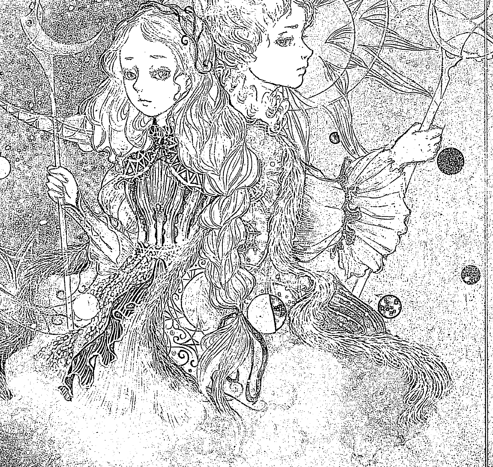

# 盛开

# Bloom

# Bloom

盛开 · 90后新概念

# 塔罗·规则

方达 主编

# Tarot

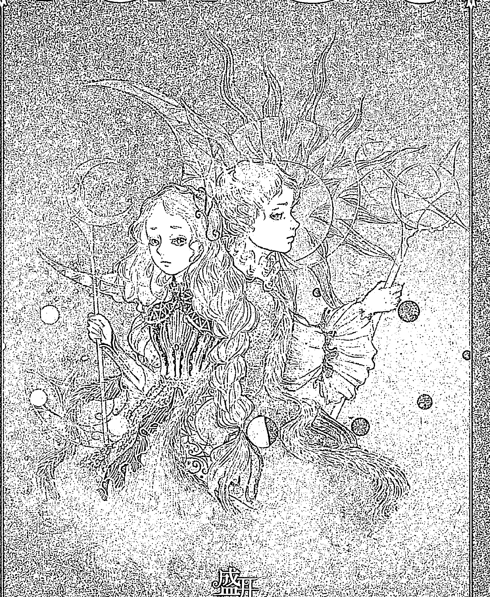

盛开

长江出版传媒 | 湖北教育出版社

# 目录

# 父亲与规则，皇帝的渴望

公羊头颅的王座，冰冷而威严
若你看到他，会想起谁
或许是父亲，或许是父亲所拥有的一切
童年的记忆里，是父亲带来了社会规则以及
对社会的征服与渴望
虽然有皇冠与权杖的陪伴，虽然身披红色斗篷与盔甲
高处不胜寒，一如在低处时看高处那绵延不绝的
孤寂感

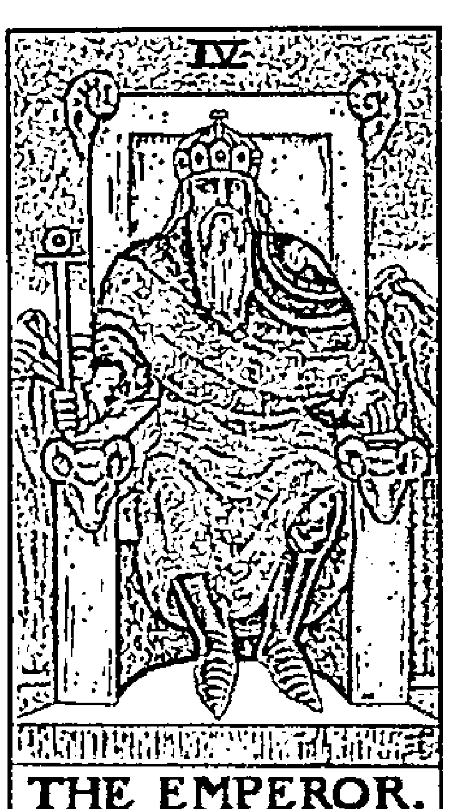

- 22 江湖 /吴大
- 42 到了春节就回家 /封尘
- 51 换世界 /宋南楠
- 68 盛宴之城 /欧阳德彬

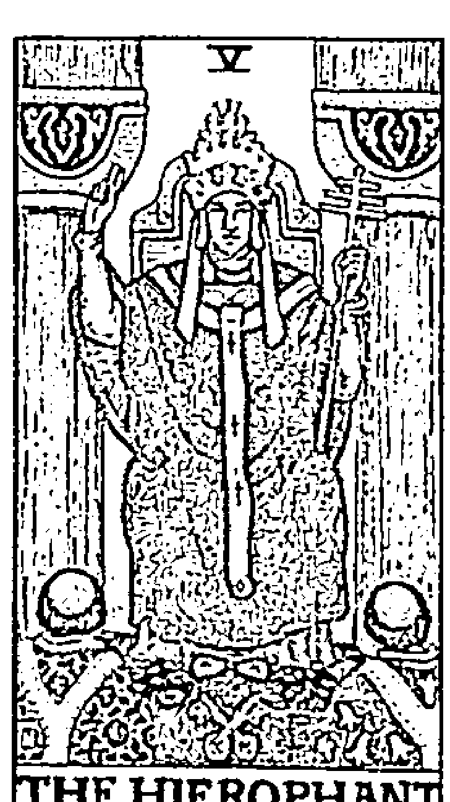

# 精神之我，教皇的百合与玫瑰

物、情、灵、三层台阶、“我”站在哪里
而他虽身披华衣、头顶三重冠冕、却仍默默关注你
与“我”同在
百合与玫瑰、纯洁与热情、相斥又相吸
站在正中的他、目光越过重重红尘
这是精神上的父亲

- 74 上帝的食指 /李遥策
- 103 那是一个风雨交加的晚上 /孟祥磊
- 110 墨香里的祖父 /潘云贵
- 115 秋天 /赵丹盈

# 无根之叶蓬勃生长，第一权杖

虚空掌握从无到有
最纯粹的能量
这木杖，无根，却有叶
澎湃的生命力，令无根之叶亦蓬勃生长
城堡在远处
河流和树木在召唤
生命力需要流动的方向
或者流向过去
回忆起青春年少
或者流向未来，充满干劲地前进

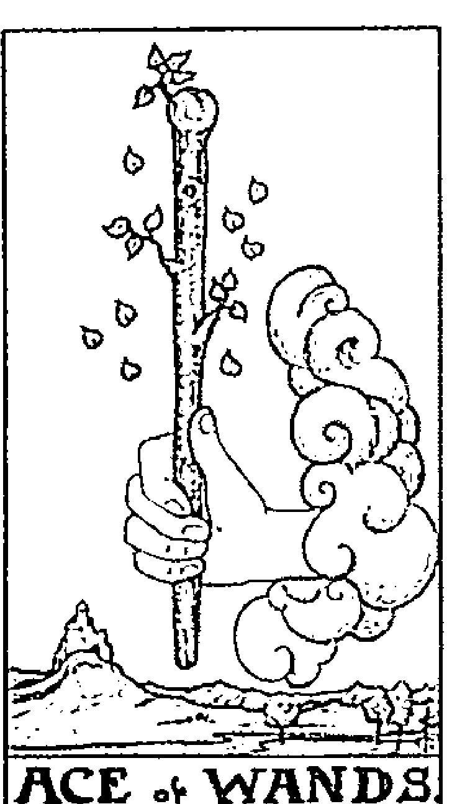

- 126 在不经意的瞬间看见回忆 /周宏翔
- 138 橘子不是唯一的水果 /陆晓彤

# 流动之水自清，圣杯一

和平之鸽衔着希望飞翔
清澈的水流，大地的恩典，映照着蓝天的情之池塘
永不枯竭的爱，水既可以倒流亦可以顺流
感情如是
回馈与舍得
唯有流动的能量
保持纯粹

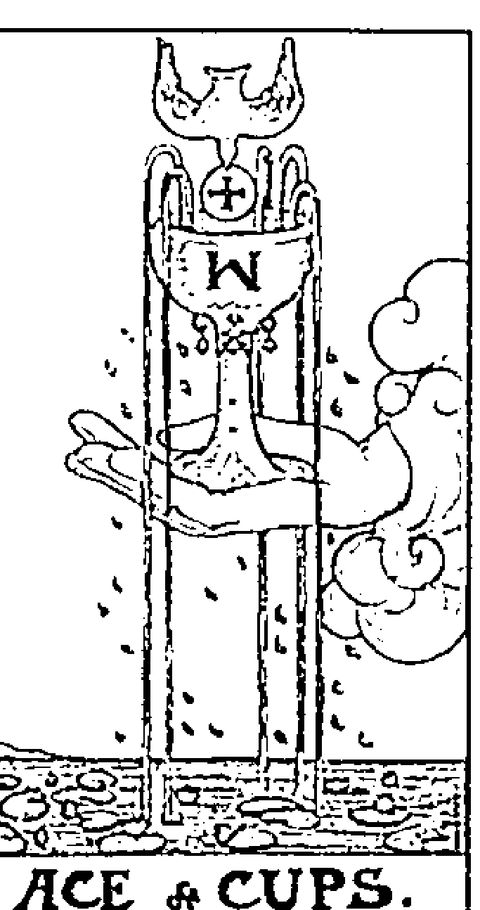

- 144 灯光影年 /樱宇
- 166 时光Guard /庄宇琨
- 187 老友记 /虞诺
- 197 黄金盟誓 /单超

# 大地，自由行走的植物，星币一

桃花源记，住在桃花源中的人
也在做着纯然的田园之梦吗
田园中的田园，纯粹的大地
容纳、接受，万物生长的基础
如如不动
赤脚站在土地上
一棵自由行走的植物
大地之母的赞礼

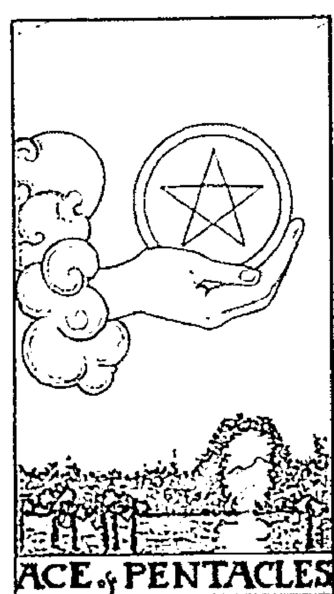

- 218 坨姑娘 /刘宝凤
- 225 回家 /徐婧
- 231 溯洄 /王君心
- 240 最后一棵皂角树 /张谋

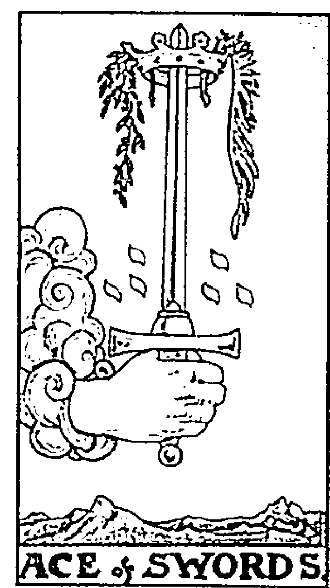

# 思辨与能断，宝剑一

众山之巅，高处不胜寒
宝剑刺穿王冠
强力意志能够穿透世间一切
风属性的剑代表思辨
会思考我是谁
从哪儿来到哪儿去的终极问题
然而思辨的意志过剩
成为自我怀疑
刺痛的许是灵魂本身

- 246 旧城：绽开的罂粟 /李达伟
- 276 捡影子的人 /谢宝光
- 281 明天醒来我会在哪只鞋子里 /韩倩雯

# 作者简介

宋南楠
90后羊城人，典型天蝎座女子，细腻、敏感，甘于孤独。常年干些买梦或卖梦的勾当，售卖文艺小吃、文学甜点，常供稿于《黄金时代》。第十一、十三届全国新概念作文大赛二等奖获得者。

李遥策
有作品发表于《萌芽》等杂志。第七届全国新概念作文大赛一等奖获得者。

周宏翔
1990年1月出生于重庆长寿，摩羯座。作品散见于《萌芽》《中国校园文学》《新蕾》，多次入选年度文本，已出版《少年们无尽的夜》《无限透明的思念》等五本长篇小说。第五届巴蜀青年文学奖得主。

晏宇
江西宜丰人，童年迁居广州，毕业于华南师范大学，中文和历史双学位，曾在网络、杂志与电视媒体发表文章，第十届全国新概念作文大赛二等奖、第十一届全国新概念作文大赛一等奖获得者。

徐婧
笔名破晓，1994年出生的摩羯，一直悠闲地过着别人口中累死累活的寒窗苦读生涯，以赤裸裸的懒惰占用了别人口中的“自觉”与“勤奋”诸词。在写了众多积极向上的考场作文之后，终于在大一决定开始尝试自己真正想做的事——写文，才发现“做自己想做的事”，注定是一段“古今多少事，一把辛酸泪”的旅程。但还好，她总算鼓足勇气上路了。第十四届全国新概念作文大赛二等奖获得者。

王君心
笔名李更阑，女，生于1994年8月，就读于厦门大学。在《儿童文学》《少年文艺》《科幻世界》《读友》等文学杂志发表童话、小说三十多万字，作品收录于《小星球90》等系列图书，出版长篇小说《秘语森林》《记忆花园》《鸽子树》《数星星的孩子》等。第十四、十五届全国新概念作文大赛一等奖获得者。

吴大
本名吴华超，90后写作者、插画作者。自小生长于南方沿海一带，现就读于武汉某工业大学。自幼开始画画，中学时代接触吉他，对音乐、美术等方面皆有涉猎。对生活充满感激和希望，少年时决意坚持朴素的生活，去想去的地方。作品散见《儿童文学》《青年文摘》《最小说》等刊物。

封尘
真名王永强，生于1992年，小说手艺人，图书编辑，《格言》签约作者。在《萌芽》《青年文摘》《格言》《知音女孩·新小说》《美文》《读友》《中学生百科》等杂志发表文章四十余万字。第十二届全国新概念作文大赛二等奖、第十五届全国新概念作文大赛入围奖获得者。

孟祥磊
青年作者，生于1992年4月，南京邮电大学本科在读。热心并且杂食的读者，偶尔文艺的学术僧一名，相信任何表达都是一场带着成见的冒险。第十四、十五届全国新概念作文大赛二等奖获得者。

潘云贵
90后新锐作家，西南大学文学院2013级硕士研究生，出生于福建长乐，非典型射手座男。走路常撞树，爱吃汉堡包和麦丽素，时常无聊，用写作打发时间，无不良嗜好，睡懒觉除外，内心善良，无比热爱世界。出版有《我们的青春长着风的模样》《飞鸟向左，扬花向右》《天真皮肤的同类》等书。第十五、十六届全国新概念作文大赛二等奖获得者。

赵丹盈
笔名边十三，女，1992年10月出生，籍贯河北承德。典型天秤座，严重选择综合征，喜好不固定，现就读于保定学院。擅长小说和叙事性散文。第十四届全国新概念作文大赛一等奖获得者、第十五届全国新概念作文大赛二等奖获得者。

陆晓彤
网名小嫣，青年作者，女，1991年生于浙江。喜欢写，偶尔写，坚持写。不想成为什么，只想叙述什么。喜宁静，爱和平，安分守己很多年。用我笔写我心。处于生长发育期，渴望爱与被爱。要一直往前走，要知足，要倔强地笑。曾在《中学生百科》《新作文》《创新作文·高中版》《作文新天地》《读者·校园版》等发表作品，第十届全国新概念作文大赛二等奖获得者。

王宇昆
笔名秀伟君，1996年生，双鱼男。厦门大学本科在读，现为北京凤凰雪漫文化有限公司签约作者，第十六届全国新概念作文大赛一等奖获得者。

莫诺
真名乐康，1992年生，就读于华中师范大学武汉传媒学院，武汉作协会员。作品载于《诗刊》《青年文学》《意林》《美文》《南方文学》《延河》《山东文学》《中国诗歌》《星星》《诗选刊》《散文诗》《岁月》《青春美文》《草原》等，第十二届全国新概念作文大赛二等奖获得者。

单超
笔名歌蒙，1991年3月1日生于河北邯郸，毕业于西安外国语大学。爱做英雄梦，梦里要吃好大一片天空，只是每每流于英雄的梦魇。梦醒后依然晴空森森，远树萧萧，所以仍然眷恋这世界，想描摹这世界，只是这样。第十五届全国新概念作文大赛二等奖获得者。

刘宝凤
笔名刘晓凤，现居西安。曾在《工人日报》《新民晚报》《秦岭文学》《川东文学》等报刊发表作品，作品入选《2012陕西青年文学选·散文卷》，并被《读者·乡土人文版》等转载，曾获第二届“禾泽都林杯——城市、建筑与文化”诗歌散文大赛散文优秀作品奖。

李达伟
笔名荒蹲，白族，现就读于大理学院文学院，云南省作家协会会员，现居大理。已在《民族文学》《文学界》《青春》《散文选刊》（上半月）《边疆文学》《四川文学》《山东文学》《黄河文学》《草原》《北方文学》《滇池》《当代小说》《青岛文学》《翠苑》《满族文学》《厦门文学》《鹿鸣》《连云港文学》《岁月》《国家湿地》《新世纪文学选刊》《散文诗》《云南日报》《西部散文选刊》等报刊发表散文作品六十余万字，著有长篇《隐秘的旧城》和《潞江坝书》。曾获滇西文学奖、滇池文学奖等。

谢宝光
1990年生，江西南康人，南昌大学共青学院中文系毕业，江西省作协会员，中国散文家协会会员，现居杭州。主要练习散文写作，注重现代意识。有文字见于《青年文学》《美文》《散文选刊》《读者·乡土人文版》等。

张谋
陕西关中人，陕西省作家协会会员。作品近百万字，散见于《散文世界》《辽河》《美文》《文萃》《延河》《漳河文学》《中国散文家》《西部散文家》《华夏散文》《东京文学》《打工文学》《佛山文艺》《南飞燕》《小品文选刊》《西部散文选刊》《新课程报语文导刊》《西安日报》《都市晨报》《陇东报》《西北信息报》等文学期刊、报纸副刊。

欧阳德彬
山东嘉祥人，深圳大学文学院硕士研究生。曾在《山花》《西湖》《野草》《岁月》《文学港》《黄河文学》《福建文学》《文学与人生》《城市文艺》（香港）等文学期刊发表中短篇小说数十万字，在《文艺报》《大公报》（香港）等发表文学评论多篇。

韩倩雯
1991年生于江苏东台，江苏省作家协会会员。现就读于英国爱丁堡大学。认为维系生命的唯一主宰是高维的情感：细琐的爱或对磅礴自由的向往，是始终被内心热焰包围和无法细说的苦涩情感。甘于寂寞，安于孤独，甘愿迷失在内心这遥远而神秘的世界里。发表作品数十万字，散见于《作品与争鸣》《青年文学》《美文》《萌芽》等。第十二、十四届全国新概念作文大赛二等奖获得者。

王宇还想起实习老师在办公室里推心置腹地和他聊天，还有小清常说的那些个眼神。这些都没有改变王宇啊，王宇还是常常走着神儿听课，这些都没有用吗？王宇突然觉得翻江倒海地难过。那次在办公室被收走手机后，王宇恶心橘子，再也不吃橘子了。橘子不是唯一的水果，不吃橘子也不缺这点儿维生素摄入，可是实习老师呢？还会有老师以这样的方式关心他吗？

> ——陆晓彤《橘子不是唯一的水果》

## 橘子不是唯一的水果

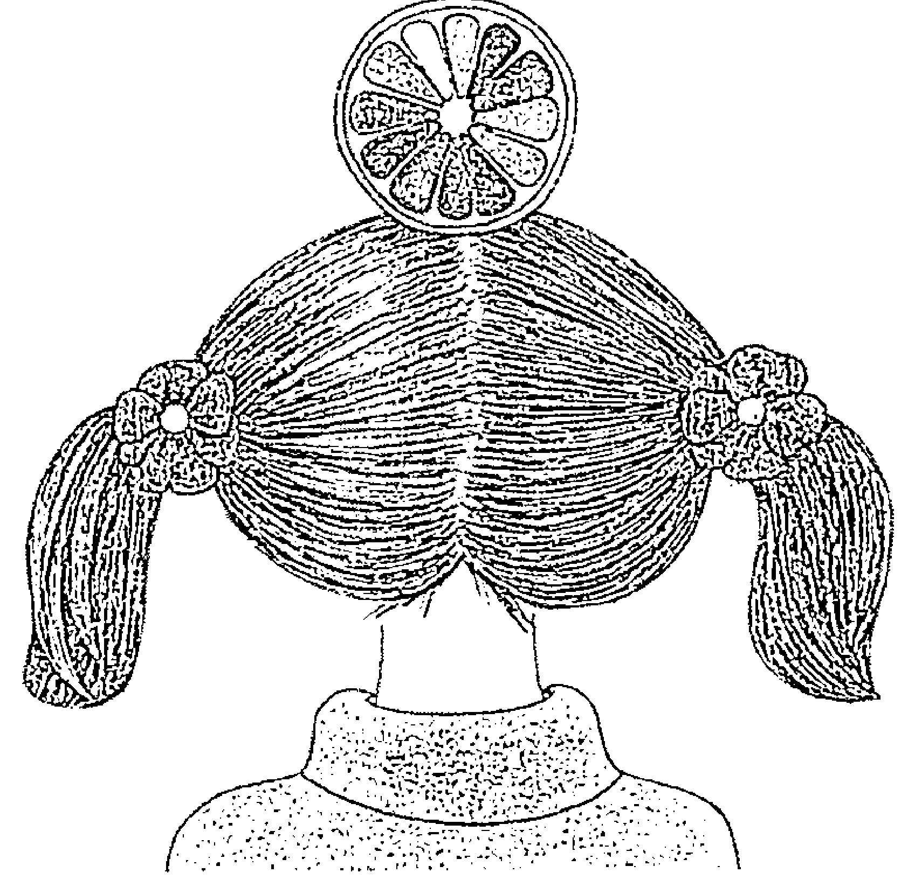

恍恍惚惚的梦里，一只老鸦飞上了皂角树，在枝头哀叫着，老鸦落过的皂角树上，皂角子遍体鳞伤。老鸦飞在这块土地上空，它从上面看得最清楚、真切。这是最后的哀叫，也是最古老的预言。

> ——张谋《最后一棵皂角树》

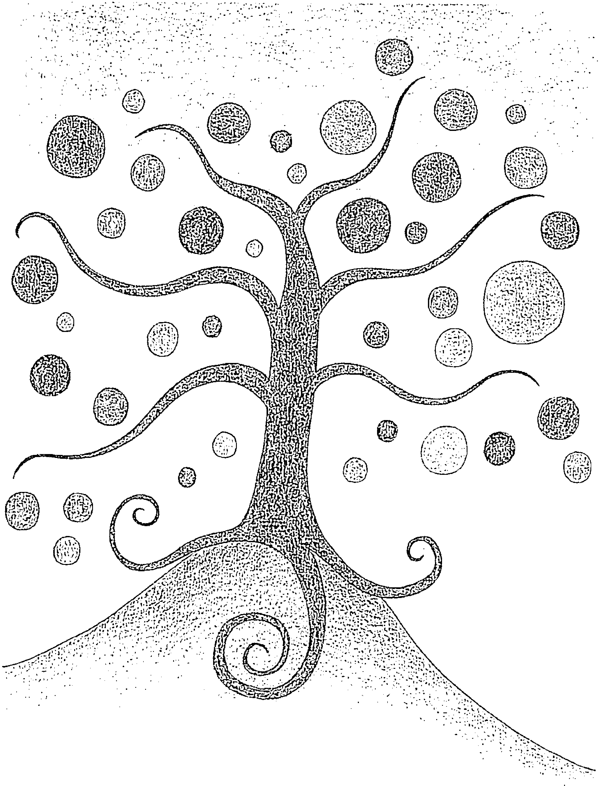

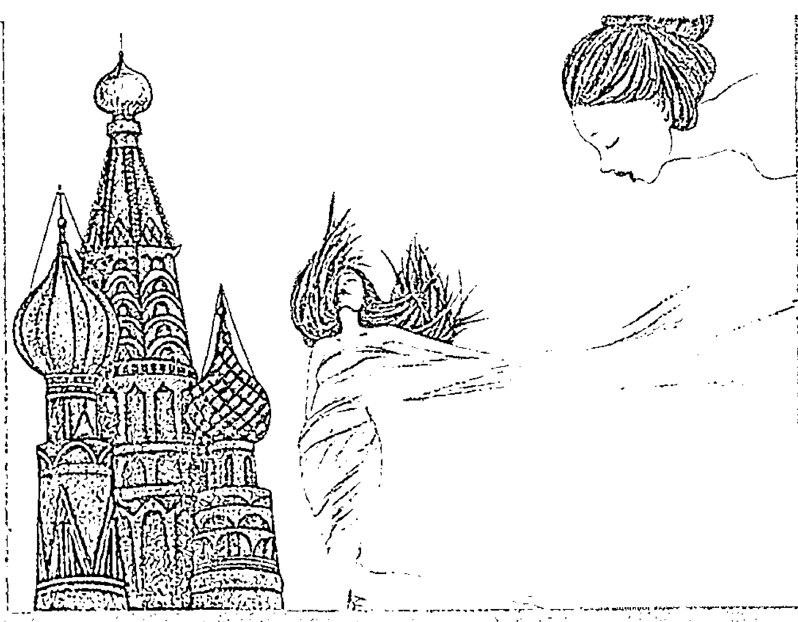

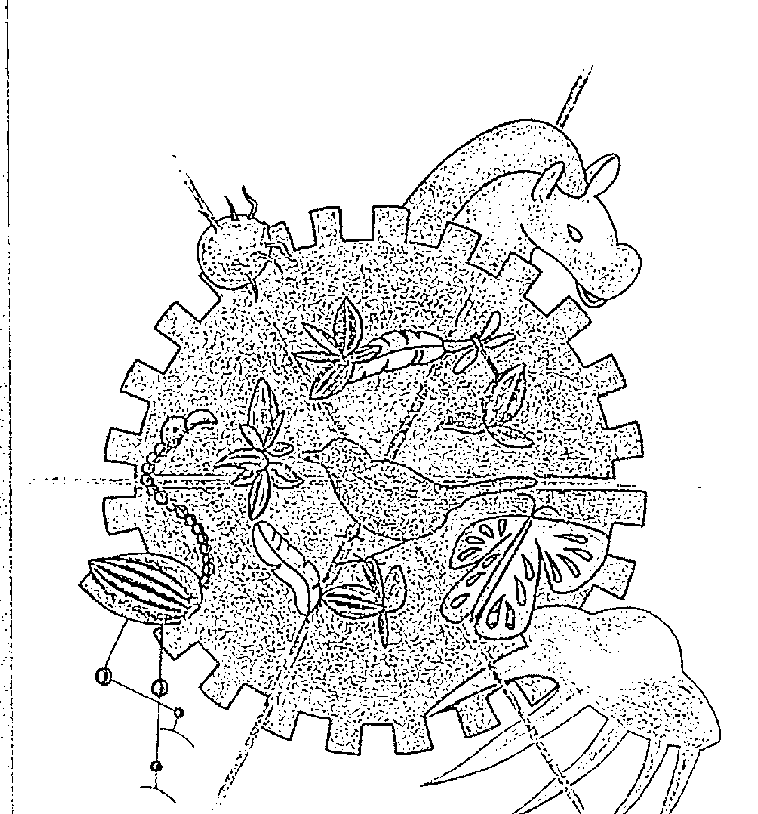

偶然翻起旅游美食类的文章，看到那些长句和华丽词藻堆砌的描述，总让我想起那些不加修饰的、带着泥土气息的、关于街头巷尾的温暖——关于我的家乡。

——徐林《向家》

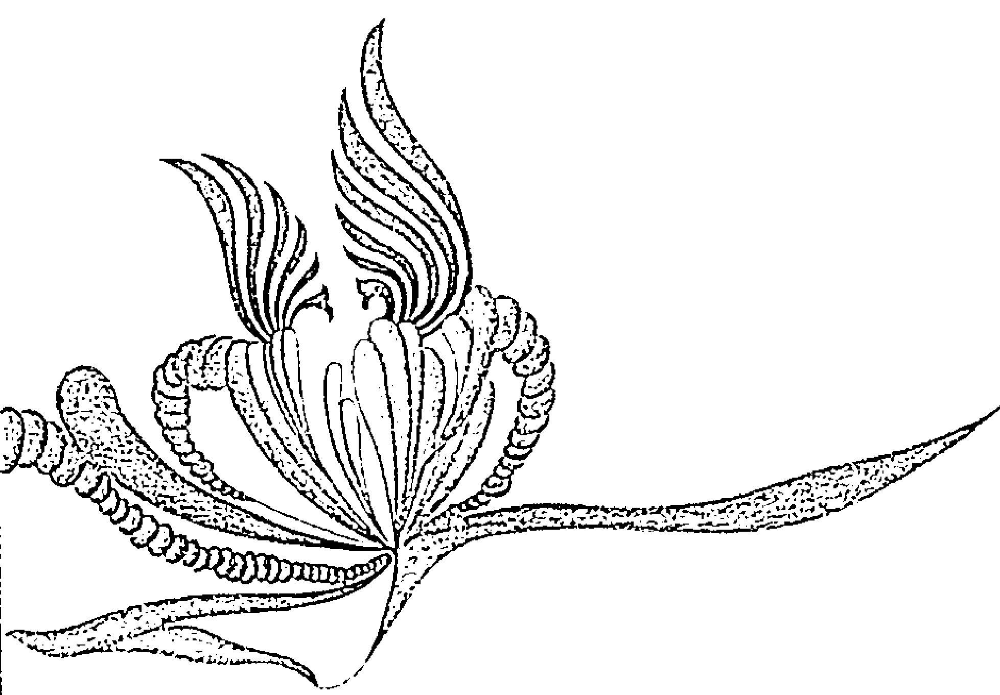

我，自小生长在湘江边，在那片土地上到处游走，熟悉每一条小巷，每一座老屋。我喜欢那里的烟火气，我喜欢那里的市井声，我在那些巷子里，到处寻找着家乡的味道，寻找着那些被时光遗忘的故事。

——李德儒《向家：绽开的紫荆》

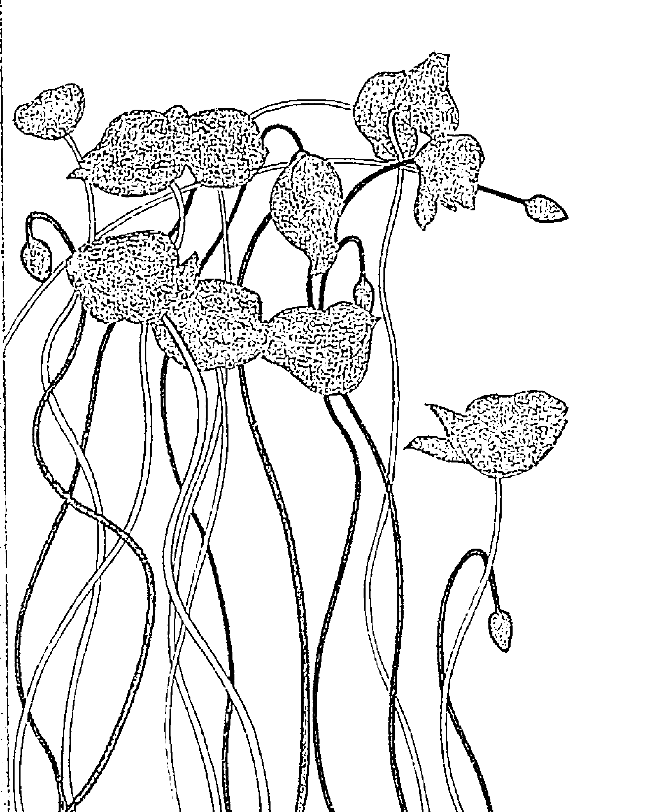

人最怕的是相遇，最难的是别离，因为一场邂逅，可能就是翻山越岭的回忆。

> ——周宏翔《在不经意的瞬间看见回忆》

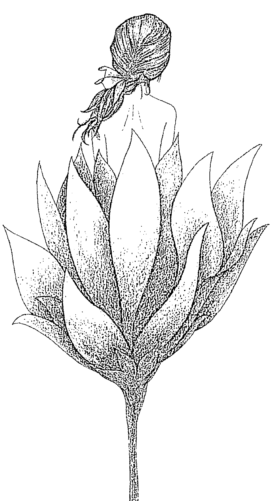

在不经意的瞬间看见回忆

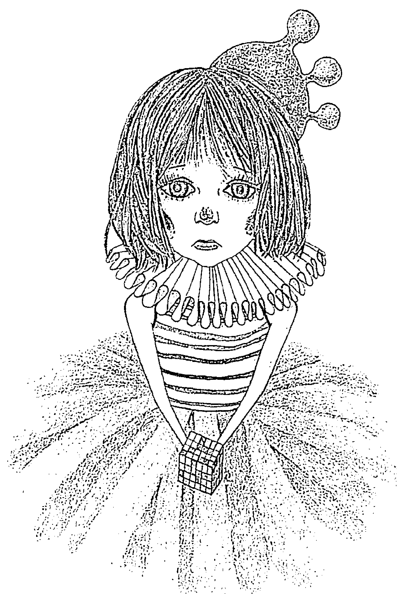

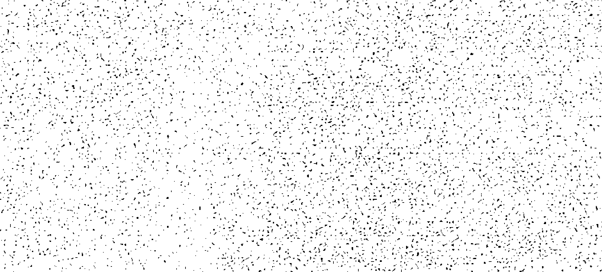

# 溯洄

不记得是什么时候的事了，只记得小小的镇子，旧旧的氛围，烛影般漾开和乐与安逸。讲故事的人在巷口坐下，用漫不经心的语调开始讲述一个故事。路过的人停下了，巷子里的人从窗口探出头来。消息传开，越来越多的人围在巷子外头，站在低矮的屋檐下静静地听。故事很长，直到全镇的人都赶了来，也只是开了个头。

> ——王君心《溯洄》

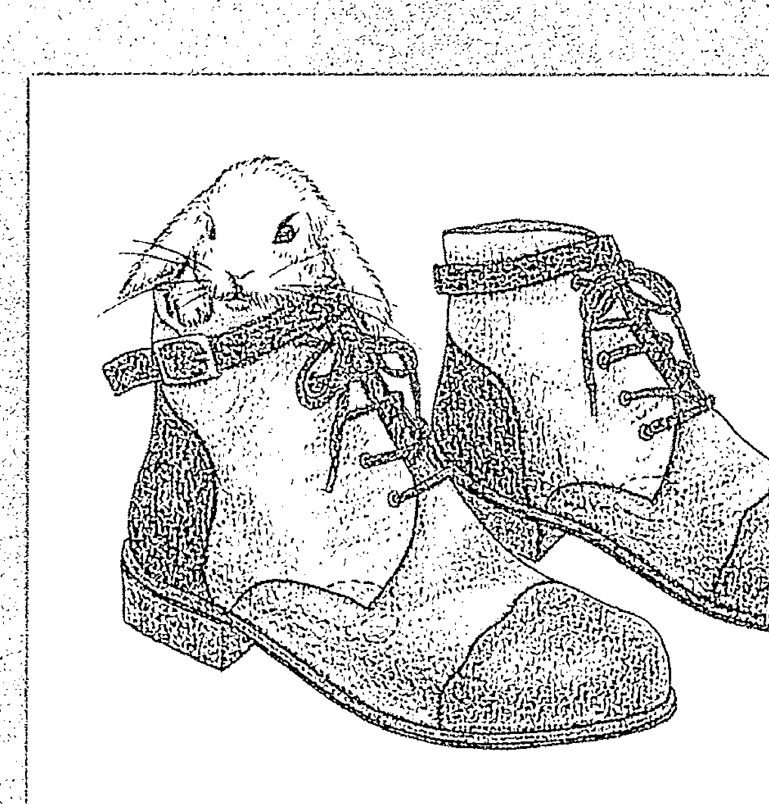

## 明天醒来我会在哪只鞋子里

管他明天醒来会在哪只鞋子里，反正不管在哪只鞋子里，都还在这个老不死的地球上。

> ——韩倩雯《明天醒来我会在哪一只鞋子里》

# PART I

# 父亲与规则

# 皇帝的渴望

公羊头颅的王座，冰冷而威严
若你看到他，会想起谁
或许是父亲，或许是父亲所拥有的一切
童年的记忆里，是父亲带来了社会规则以及
对社会的征服与渴望
虽然有皇冠与权杖的陪伴，虽然身披红色斗篷与盔甲
高处不胜寒，一如在低处时看高处那绵延不绝的
孤寂感

# 江湖

文 吴灰

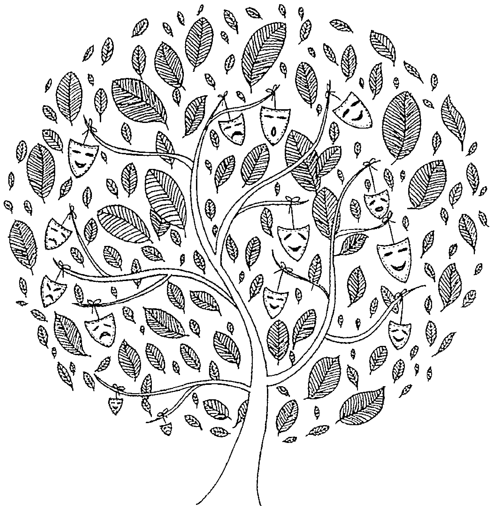

*1

我们十字四街这一带就像是一片江湖。

我喜欢这样的比喻。我喜欢“江湖”二字，听到它便热血沸腾，恨不得马上拿起刀枪走出来闯荡一番，像江湖中的豪侠一般。或者什么也不说，什么也不做，但学得一身功夫，退隐江湖，不为人知，过平静的生活。这样也行。

这一带的四条街道分别是东街、华西街、延安街和唐马街。它们在中央的大花坛处两两相接，东街的对面是华西街，延安街和唐马街自北向南铺去，四街交成一个“十”字，花坛就在中间。我住华西街。

本来我们四街的地盘是非常分明的，但那个大花坛是公共的，因此每条街的人都想要占有它。当然，这些人不包括大人，这些事从来与他们无关，他们永远有自己的事情要忙。这只是我们孩子的事情。

那个大花坛是个好东西，在里面可以玩一种叫“打鬼子”的游戏，还可以玩“摸标杆”，花坛中央有一根高高的杆子。最重要的是，要是将花坛占领下来，在别的街道的人眼里，多威风。可惜大花坛快要成为东街的地盘了，因为东街的首领是黑面，他比我们高一个年级，很厉害，几乎没有人打赢过他。延安街和唐马街的人虽然不少，却还是不敢吭声。

我很不服气，但是我们华西街的兵力并不强大，除了人数不多外，没有一个人可以当我们的首领去带领大家，连我也不行。不是因为我没有这个本事，而是因为我的妈妈。她总会在我们开会或者准备出征的时候喊我回去吃晚饭，她一喊我就得回去，而我也不能就这样眼巴巴丢下我的兄弟们无人带领。如果只是我妈妈一个人的话事情就好办了，我会说出许多的理由来抗拒，可是并不是这样。我还有个姑妈，她是教书的，非常严厉，每次来我家都叮嘱我妈妈要严格管教我。“小孩子不好好念书，将来怎么办！”她常常这么说。有时候她发现我玩得很晚才回家，就说：“这还了得！这么小的年纪就到处游荡，长大了还不当流氓去？！”我妈听了就慌了，把我看管得严严实实的，要是我姑妈很长时间没来我家了就稍微松一点儿。

我压根儿不喜欢教书的人，觉得他们都是凶残的。每次我姑妈来我家，我都得待在房间里，拿着书装模作样。时间长了我竟觉得有些讨厌自己。我觉得总有一天我会变得很强大，强大得可以轻易走出家门，走出四街，没有人能阻止我，连黑面也不能，我姑妈也不能。

*2

8月的阳光如同一只只厚实的手掌，按在街道凹凸不平的石板上。远处蝉鸣的声音好像永不停歇。蝉不像我们，我们有暑假，它们没有。每一个暑假都是如此漫长，每天的太阳早早就出来，照了一天后还迟迟不肯下去。

这是四年级结束后的暑假，和其他暑假好像没有什么不一样，只是开学后我们就升上五年级啦。不知道五年级是什么样子的，会不会也像以前一样呢？我伏在窗台看着街上来往的行人和车辆，我在想着华西街的事情，花坛已经被占据了，再这样下去我们华西街就被欺负到头上来了。我恨不得马上变得强大起来，把黑面打败，夺回江山。可是我却又没有那样的力量足以将黑面打败。

不行，我得想想办法。我妈好像外出了，我趁机出来溜达溜达。街上人不多，都在忙着各自的事情。我想去找张木，但他可能在家里看店，他家是开杂货店的，整个暑假几乎都在给他爸爸看店。除了张木，我最要好的伙伴是大麦，但他这个时候是不在家的，他家在山上有个果园，种满了荔枝树，这个时候正好是荔枝成熟的时节，大麦早已跟着他爸妈到山上住了，日夜守着荔枝树。我独自逛着，在阳光下踩着自己的影子，居然觉得有些落寞。我想起了邓然，她是我们班的女生，但和其他女孩子不一样。她们都爱哭爱闹，爱在人家背后说坏话，爱跟在成绩好的男生屁股后面。但是邓然不，她安安静静坐在座位上。

我抬头突然看见一个人在猛烈的阳光下追赶着什么，仔细看原来是在追一只老鼠。那老鼠大得跟只小猫似的，正向这边飞快地蹿来。我猛地回过神来，随手抓起一块石头飞快砸过去，老鼠倒在地上挣扎了几下，一条后腿废了。那人瞬间追了上来，一根粗大的木棍往老鼠的头部挥去，打得老鼠不能再动了才停下了，嘴里还不停地骂着什么。我这才细细打量这个人，他比我高一些，是个平头，皮肤黝黑，他为追打这只老鼠已经汗流浃背了。从目光和动作足以看出这个人疾恶如仇，身手不凡，应该是江湖中的一条好汉。

老鼠倒在了地上，头已经开了花。这人才回过神来，抬起头来冲我笑笑，表示感谢我的相助。“这些可恶的东西，我最讨厌它们。”他说着，有点儿不好意思地笑笑。这个人我怎么没见过，他也住华西街？“嗯，我也非常讨厌。”我说，“你新搬来的？”“嗯。”他笑笑，指着不远处的一间房子，“来了有几天了。”接下来不知道说什么好，于是我们相互点头，友好地告别。我往回逛，他也提着棍子回去了。

我没地方可去，又不愿意回家，于是爬到街角偏僻处的一棵大榕树上睡午觉。凉风阵阵袭来，吹走了还来不及传过来的蝉鸣声。树荫镶嵌着点点光斑，我往下看，找不到自己的影子。我躺在巨大的树杈上，睡意袭来。迷迷糊糊中我觉得有什么大事情即将来临，而且是冲着我而来。我隐约又看见自己变成了豪侠，挥剑自如。我好像还看见了邓然。

醒来的时候已经是傍晚了，太阳不见了，天是橙色的，蝉也不叫了。从榕树上下来，我还不想回家，于是往花坛逛过去。渐渐走近的时候，我发现花坛旁边围了许多人，一定是发生了什么事，我一边懊恼自己睡了那么久一边快步走上前去，希望不要错过什么。

*3

我看见四街的人都来了，围得一圈又一圈来看热闹。中间站着大麦，他低着头，手里还拿着一袋什么。他面前是黑面，黑面正在呵斥他。我顾不得那么多，拨开人群冲进去，问清楚到底发生了什么事。黑面见到我，凶狠地笑笑，说：“你来得正好，你兄弟不知好歹，敢在我的地盘闹事，你说怎么办？”黑面的话当然不可信，我揽过大麦的肩膀问他事情是怎样的。原来大麦今天提着一袋子荔枝下山，走累了路过花坛时坐在草坪上歇歇，谁知让黑面看见了，就说他私自闯入了他的地盘，要他留下荔枝才能走。平时黑面这样欺人太甚的事情是常见的，但这次居然欺负到我兄弟的头上。我火了，冲黑面嚷：“什么你的地盘！你要搞清楚，花坛我们华西街也有份。今天四街的人全在这里，你有什么证据说花坛是你的？荔枝你一颗都别想拿走。”黑面也火了，说：“什么证据？打啊，你敢不敢出来单挑？”“打就打！”我把大麦往后推了一下。话说出后我并没准备真的要打，但在这节骨眼处什么也顾不了了，唯有走一步看一步，大不了拼了。大麦也突然吓着了，上来拉拉我，小声说：“算了，荔枝我们给他。”这样哪行，今天我们低头，那明天呢，后天呢？我不说话，把大麦往后一推。不知道怎么，我这个时候居然想起邓然来。脑子有点儿乱，该想的不该想的这时候都浮了出来。估计大麦在后面吓傻了。那一瞬间我好像成了英雄，无比悲壮。但我紧握的拳头又微微颤抖着，手心渗出了汗。

黑面一拳就打了过来。我知道他的拳头有力，但没料到如此有力。凭我闯荡江湖打架多年，我下意识挡开了，但还是后退了几步。刹那间我有点儿后悔，后悔我平时不努力练武，把打沙包的时间都用来玩了，否则我的力量肯定比黑面还厉害。后悔之余我是心无下文的，能挡多少挡多少吧。就在这时候我身后突然走出一个人来，他上前就说：“先让我来。”我惊讶一下，当时眼花，好一会儿才看清楚那人，原来是那个打老鼠的人。短短的浓密头发，皮肤好像比中午见他的时候更加黑了。我们南方的太阳真是厉害啊！我暗暗想。惊讶过后我回过神来，我心里感激这位兄弟的勇敢，但我怎么能让他去替我受罪呢。“你回来，别傻了。”我拉了他一把，没想到他把我向后一推，什么也没说。就像刚刚我把大麦往后推一样，一句话也不说。

说实在的，那一瞬间我对他肃然起敬。我以前觉得在这个地方，只有我把他人推往身后来庇护的时候，从来没有我被庇护的时刻。但这一刻我明显错了。想到这些的时候，那打老鼠的人已经和黑面动起手来了。我看见他一把向黑面推去，黑面踉跄了几下，差点儿摔倒。在场观看的人都惊讶不已，包括我。黑面愤怒极了，猛地冲上来，一拳就照面而来。但他这拳不管用，打老鼠的兄弟一下子就挡了回去。两人的实力明显不同。我没想到我们华西街竟然有一个人比黑面还要厉害。黑面肯定也想不到。

黑面知道这样下去打不过对手，只会更丢脸。他怒视了我们一会儿，说了些悲愤的话，带着东街的人马愤愤离开了。他们一边离开，打鼠兄弟一边大声说：“以后花坛是四街公共的地方，谁都可以来。”他是故意说给黑面和东街的人听的。所有人鼓起掌来。这就是真正的英雄豪侠，我敢说我吴大从来没有这样敬佩过一个人。我恍然大悟，我从前就是立志要成为这样的人，有强大的力量，随时打倒江湖中的邪恶势力。如今站在我面前的就是这样的人。我真是太激动了。这英雄回过头来，笑笑，说：“我叫左北。”我说：“我叫吴大。以后我们西街又多了一个豪侠了。”左北不好意思地冲大家笑笑。

原来大麦下山是给我们大伙儿送荔枝的。我们几个人带着胜利的喜悦，来到榕树下高兴地吃起荔枝来。我对大麦说：“以后就别这么费劲给我们带荔枝了，我们可以上山去找你玩，说不定还可以帮上忙。”大麦点点头。“山上有鸟巢吗？”左北问。“嗯。唐马街后面就有一片林子，那里也有鸟巢。有空我带你逛逛这一带，好熟悉熟悉。”我说。“好的。”左北开心地点点头，又问，“你会游泳吗？”我闷住了，我不会游泳。从小我妈就不让我下水，说小孩子在河里游泳太危险。估计都是我姑妈教的。所以别的孩子都会了只有我不会，我都忘记了要学会游泳这事了。我懊恼地摇摇头。“哈哈，没关系，改天我教你游。”左北说。不知怎么，我们竟像是相识已久的故人一般。

我们坐着说着话，天渐渐黑了。我突然想起来我妈妈应该在找我了，便连忙站起来，拍拍屁股，说：“我要回去了。”“好的，那改天见。”左北笑着说。我匆匆走回去。晚上睡觉的时候我一直想着左北和黑面对决的情景。我觉得总有一天我也能像左北一样，轻易地打败黑面。

从早晨到中午好像一整天那么漫长，窗边的阳光好不容易才移动一点点。我坐在桌子旁边，幻想着许多打斗的场景，兴致来时还在本子上涂画。我坐了一会儿，走到窗边站站，又坐下。街上车和人都不多，偶尔会听见叫卖柿子的声音。突然有人敲敲窗子，我探出头一看，原来是左北，他笑嘻嘻地递给我一个大柿子，说：“你现在能出来不？”我惊讶极了，回过头听听大厅的声音，点点头。我踩着椅子爬上桌子，纵身一跳，便从屋里出来了。

我们俩在街上逛着，各咬着一个大柿子，偶尔说话，偶尔什么也不说。“我们到树林那边逛逛吧。”左北点点头。我们来到花坛，转个弯，向着唐马街走去。不说话的时候左北踢着地上的碎瓦片和小石子。“你打过沙袋吗？”他问。“是沙包吗？打过，不过我没有，是人家的。”我说。“我家有一个，你有空可以常来打。”他说着看了看我，又笑笑。我点点头。他那么厉害，大概是从家里的沙包练出来的吧。他的沙包应该很大很大。我暗暗想。

我们走着走着，前面就是树林了。树林旁边有一条河，河水很清澈，在哗哗地流着。“改天我们来游泳吧，我教你。”左北说。过了一座小桥我们走进了树林里。树林里阴森森的，蚊子很多。鸟叫声从四面八方传来。“改天我们来寻鸟巢。”左北说。我点点头。路边开着一些不知名的小野花。我见过这种花儿，在邓然的笔盒里。我突然想起邓然来，我想去找她，让左北也见见她。“我们出去吧。”我说。我们从树林里走出来，很快就从阴影里踏进了阳光中。来到花坛的时候，我说：“我们去一趟延安街吧，带你去见个人。”我恨不得马上让左北见到邓然。我们径直走向延安街。我们来到邓然家不远的一棵树下，刚好邓然在家门前的井边洗衣服，我朝她招招手，让她过来。邓然用手臂擦了擦额上的水珠，向我们走来。她的马尾辫在阳光下一摆一摆的，真好看。我们仨在阳光下逛了好半天，走到脚都累了，还不肯停下。这样真好，我们要是一直这样走下去该多好啊，不管江湖多么险恶。

我们来到了大花坛，左北往草地上一坐，直接躺了下来，嘴里叼了一根草。我们也坐下。已经是傍晚了，鸟儿一群群飞向西边的夕阳里。我们坐了好久才各自回家去。

后来的日子，我们常常这么瞎逛，仿佛真的成了游荡的豪侠。偶尔我们也叫上大麦和张木。我们上过一次山，是去找大麦的。大麦的父亲非常热情地招待了我们，我们想帮他干点儿活儿他都不让，非要我们坐在树下吃荔枝。他说荔枝容易上火，还特意给我们端来了盐水，防上火。我们坐到太阳下山了才回来。

我们就这么逛着逛着，暑假很快就过去了。天空中偶尔飞过一群群大雁，就要开学了，开学后我们就五年级啦。左北和我们一同到学校里上学，他也五年级。

左北已经和我们华西街的人混得很熟了，偶尔他身边还跟着一些人。我们不在同一个班级，但他有时会来找我一起上学。每次他到我家，我妈就开始唠叨，问这问那。要不就问口渴不，肚子饿不，来吃点儿东西。左北很有耐心很有礼貌地回答她。我在一旁听着都不耐烦了，连忙拿起书包推着左北走出来。

开学后的日子过得更快，一眨眼就到了周末，再眨眼就到了下一个周末。我们是喜欢周末的，只有在周末我们才能一起出去逛。就算不逛，光是在榕树下坐也是愉快的。我姑妈又来了，她说五年级了，要更加用功了。每天应该多看看书、多学习学习，等等。她还叮嘱我妈要把我看得更紧，我以后出门的机会更少了。

阳光渐渐不那么热了，蝉叫声也渐渐小了下来。

我在窗边坐着，神游四方。突然窗子响了几下。是左北，他一脸兴奋地说：“出来，我们去游泳。”我从窗户爬出来，突然间发现天空高了许多，风也更凉了，已经是秋天了。我们来到唐马街尽头的树林旁边。这里平时没什么人来，我们把衣服脱下放在小桥旁边，开始往水里走。左北说：“你先等等，我去探探水有多深。”他郑重地向河中心游去。一会儿又回来，说，“这边还可以，再下去就不行了，有个坑，很深。你先在这边学。”我按照他说的动作一一尝试，却总是往下沉。他很有耐心地讲给我听，手应该怎样，脚应该如何。我听得自己都不耐烦了。我很懊恼连简单的都学不会，我真想狠狠打自己几拳。我呛了几口水，再也不愿往深的地方下去。而左北总在一边说：“不要怕，我会接着你的，你只要不停下来就行了。”我在水里折腾了半天，一丝力气都没了。终于上岸了，风吹在湿湿的身子上有些冷。我们坐在草地上晒太阳。我一句话也说不出来，左北却还是很高兴的样子，偶尔还笑。他说：“没关系，下次还来。一次不会，两次就会了，要不一直学到会。还有，你一个人不要下去。”我暗暗想，怎么这样的人也有呢，一直这么有耐心，好像永远不会生气似的，白忙了半天还这么高兴。我在心里无比叹服。也许我也应该像他这样。

我们坐了好久，等我的力气慢慢恢复了才开始往回走。我突然想到现在已经是秋天了，我们还没有去寻鸟巢呢。现在鸟儿都离巢了，只有等明年春天才可以了。我想问问左北，什么时候去他家打打他的大沙包，但我什么也没说。

天开始下雨。几场雨过后，天气开始凉了下来。

有一天放学，我在延安街尽头的转角远远看见了黑面。他一定又在欺负低年级的同学了。我走过去，发现他在拦着邓然。“放开她！”我嚷了一句。“关你屁事！你们什么关系啊？你最好少管。”黑面瞟了我一眼。我火了，想马上冲上去揍他一顿。就在这时候转角走出个人来：“怎么啦？啊？”是左北。黑面诧异了一下，瞪了我们一眼，愤愤离开了，好像还说了一句“等着瞧”。邓然什么也没说，快步走回去了。我想叫她等等，但我不知道说什么。她好像和以前不太一样了。

后来我一连许多天没见着左北。我不能出门，左北也没有来找过我。一天傍晚我回来的时候在我们街上碰见张木，他叫了我一声，又匆匆走了。我远远看见了榕树下站着几个人。我走过去，左北和大麦都在。左北手上还拿着几个茶叶蛋，那肯定是张木拿给左北的。以前张木常常从家里拿茶叶蛋给我，偶尔也带些别的零食。但现在他拿给了左北，因为左北更像我们的首领。难怪他一见到我什么也不说就匆匆走了。其实我觉得没什么的，左北比我强大，换作是我，也许我也会这样。但想起刚刚的张木，我觉得我们可能再也不能像以前一样好了。我觉得有点儿忧伤，想转身回家，但左北看见了我。他喊了我一声，我走过来，像平常一样。大麦站在一旁，表情不太自然。左北却没有什么不同，他扔了两个茶叶蛋给我和大麦，自己也敲碎一个剥开来吃，还一边说味道很好。我们在榕树下坐了一会儿，大麦沉默着，我也很少说话，都只是左北在说。

后来每当我心不在焉坐在家里的时候我常常想到与左北有关的事。也许他现在在外面逛着吧，但和谁呢？张木，还有大麦？他们怎么都不来找我了呢？但我不能出去，我要读书。读好了书才能找到出路。这是我姑妈说的。

我觉得有一天我会变得很强大。不单是力量，其他也是。就像左北一样。想到这些的时候我的心跳得厉害，好像有什么大事情就要发生了。

我想和邓然说话。但她好像越来越不愿意和我说话了。但是如果有一天我变得更强大了，她就会喜欢和我说话了吧。嗯，会有那么一天的。

放学路上两旁的稻田黄了，像是盖了一片片金色的毯子。远处的芦苇开出了一团团雪白的花，在风中摇曳着。后来田里的稻子被人们收割回去了，露出了赤裸裸的土地。芦苇花越飘越少，只剩下单薄的几朵在晚风中颤抖着，好像一不小心就会被西边的夕阳给烧了。

我好像一个闭关修炼的人，离华西街越来越远了，对许多事都不闻不问。但我觉得有一天我会重新回来的，并且带着更加强大的身份。我不再担心四街的事情，因为有左北在。

但有时我又有些惆怅。我不太知道什么是“惆怅”，这是我在书上见到的词语，我觉得我可能就是这样的心情。但有时又觉得喜悦，也说不出是为什么。

左北偶尔会来找我一起去上学。周末的时候我不能出去，左北来敲敲窗子。我想翻出去，但左北说：“不用出来，你得看书。站着说说话我就走。”

这是一个无聊的周末，我在书桌前坐了一整个上午。我决定去找左北，去看看他家的大沙包。我逛到他家去，他妈妈坐在门口，她看起来像我妈妈一样和蔼。我说要找左北，她说他刚刚出去买东西了，很快就回来，叫我进去坐一下等他回来。我说不用了，等一下我再来。我突然想起这是我第一次来找左北，以前都是他去找我的。这让我感到歉疚。

我刚想转过身走出来，抬头突然看见邓然。她也来找左北。我诧异了一下，她见到我也很惊讶。我告诉她左北不在，她应了一下就什么也没说转身走了。刹那间我想起了什么。我觉得脑子里被塞满了棉花，白白的一片，什么也不能想，心里像坠了一块石头。

我继续逛着，变得漫无目的。我突然哪里都不想去了。我想起了游泳，我一定要学会游泳。要变强，一定要变强。我大步向着唐马街走去，穿过唐马街，来到了树林边的河岸。我脱下衣服，踏进水中。已经是深秋了，水是冰凉的，但我觉得我的身体是滚烫的。我有点儿恐惧，但我必须下去。我一步步走着，水越来越深。我突然什么畏惧也没有了。这是一件小事，我必须完成它，否则以后我怎能干更大的事情，成为更强的人。我的身体好像在与水搏斗，不再往下沉。我一下子游了好远。带着惊喜与悲壮，我向更深的地方游去，我要游到河的对岸去，仿佛只有这样我才能成为更强大的人。突然我感到一股急促的旋流，我像是被推着转了弯，却停不下来。是那个坑，我踏进了那个大坑里。我突然往下沉，水从四面八方覆盖而来。我挣扎不了，水从我的口中灌进去。我觉得我的身体里已经灌满了水，嘴里、胃里、眼睛、鼻子、耳朵……脑海中突然闪过一个念头：我就要死了。我的心里满是惶恐，除了惶恐，什么也不能想。我好像听见叫喊的声音，像是左北的声音，也可能是我自己的。或许我就要死了，这是我在死之前听到的声音。

我再睁开眼睛的时候开始吐，吐了好多水。左北就在我身边，他也浑身湿透了。吐完后我整个人好像又回来了。我没有死，左北救了我。我看着他，不知道说什么，只是像寻常一样笑笑。我没想到他突然朝我吼：“我叫你不要一个人来你为什么不听！你自作聪明是不是！你刚刚差点儿就淹死在里面了，你知不知道！”我吓了一跳。左北的脸和脖子都涨得通红，他是真的发怒了。我不敢看他，但也不说话。也许是太累了，也许是吐了太多，现在一句话也不想说了。原来他也有发怒的时候。我坐在岸上，冷得发抖。阳光微弱得像喘着气的老人。我们坐在岸上，一句话也没说。好久左北才站起来，说：“走吧，回去了。”

后来我持续几天发高烧。我妈吓坏了，在我好起来几天后都不敢叫我看书学习。我坐在房间里，却再也不想偷偷出去逛了。我觉得许多东西都已经不一样了。我心里有些沉重，但又隐隐约约觉得我变得越来越强大了。

左北来找过我。他站在窗子旁边，问我好了没有。我点点头，笑笑。接着便不知道说什么了。左北皱了皱眉头，一会儿又说：“你以后别老出来逛了，你得看书。有什么事情就来找我。”不知怎的，这话我听起来像是生离死别。我想告诉左北，我吴大这辈子认定你是我最好的兄弟了，日后出生入死，你找我。但我没说，只是点点头。

生活好像一下子变得平静了。我每天去上学，放学，看书，写字。偶尔还画画，画一些江湖豪侠，刀光剑影。我好像渐渐离一切远了。华西街、张木、大麦、邓然、左北。偶尔我会想，他们在干什么呢？他们现在在一起逛着吗？我越想越觉得落寞。但我记得我姑妈说，要读好书，读好书才能找到出路。我想，我们都要找到出路的。但我们为什么都要找到它呢？它在哪儿呢？在华西街？或许是在很远很远的地方吧。我不知道。

日子过得飞快。路口有一棵树快落光叶子了，秋天已经过完了。

有一天傍晚放学后我一个人走回来。在延安街我看见前面两个熟悉的身影，是左北和邓然，他们就走在前方。不知道为什么，我突然又觉得脑子里瞬间被塞满了棉花，白白的一片，无边无际，什么也不能想，心里像坠着一块巨大的石头。我不知道为什么会这样。我只觉得很难受，想冲破这层躯壳，破茧而出。我突然不想往前走了。但我听见了左北叫我的声音，他看见了我。我们仨走在延安街上，只有偶尔左北说说话。到了邓然家她就走回去了，我和左北走到花坛，转弯，走向华西街。我们偶尔说说话。

我想起以前我迫不及待地带左北去找邓然的时候。那时候他还不是我最要好的兄弟，但我只想着赶紧将我自己的东西和他分享。可是直到现在我还有一件事没告诉左北，我是喜欢邓然的。这件事我谁也没有告诉。

我们走着，来到了榕树下。我们坐了一会儿，左北还是像往常一样，偶尔说话，朝着我笑笑，好像什么也没有发生过一样。“你喜欢邓然吗？”我问他。他是我最好的兄弟，最好的兄弟应该是无话不说的。他吃惊地看看我，说不出话来。又过了一会儿，他问：“你呢？”我点点头，说：“但现在我不能喜欢她了，她不想我喜欢她。因为她喜欢你。”我说着望向远方，我心中顿时觉得无比悲壮，比任何一次打架都要悲壮，好像有什么东西就要来临了。左北没有说话。我们坐了好久，天黑了，我要回去了。我站起来，说，“我要走了。”

我一步步走回去，街道好像越来越宽阔了。好像有什么东西瞬间豁然开朗。我感到有些悲伤，但又有些喜悦。就这样了吧。邓然喜欢的是左北，而不是我，但左北是我最好的兄弟。我们三个仍然会在一起的。我越走越快。

晚上我坐在灯下看书。我想起暑假的时候，左北追着大老鼠朝我跑来。黝黑的皮肤，不好意思地笑笑，露出洁白的牙齿。但现在已经是冬天了，那好像已经是很遥远的事情了。我觉得此刻我在逐渐变得强大起来。我的体内好像有什么东西在变得越来越坚硬，越来越巨大。那是什么呢？我不知道。但书上说有一种叫“意志”的东西，也许那东西就是意志吧。

南方的冬天看起来和别的季节没有什么不一样，大多数的树依然是绿的。寒冷夹在风中，你只有站在风里才能感受到冬天。

但天越来越冷了。远处的芦苇花几乎看不见了，夕阳也是灰色的。一阵风吹来，人简直想把头缩进脖子里。

寒假就要到啦。寒假一来，新年就不远了。但想起过年，不知怎么，越长大就越不盼望过年了。也许是有了别的盼望，但盼望的是什么呢？我也不知道。

放寒假后的一天，天居然下起了毛毛细雨。那天左北突然来找我。他像往常一样敲敲窗子，我吃惊地探头看看，左北站在外面哈了一口白雾，他朝我做了个“出来”的手势，仿佛天气太冷了，怕说出来的话会立刻被冻结，于是懒得开口。我纵身一跃便从窗户出来了。外面很冷，细雨像雾一样下着，仿佛停在了空气中落不下来。我们走在湿湿的街道上，左北在路边买了两根热腾腾的玉米棒子，两人捧着咬了起来，瞬间温暖了许多。我们偶尔搭着话慢慢逛着，远远望去，花坛小得像个花盆。我们走到了榕树下，停了下来。左北看看我，又看看远处，说：“明天我要到一个远方的亲戚家去了。”我说：“哦。有多远啊？留在那里过年吗？”左北点点头，说：“很远很远，在海边。”真好，可以常常到海边去呢。过了一会儿，他又说，“我不回来了，留在那里念书。”我惊异地看着他，一时间竟说不出话来。他看看我，又笑了笑，像往常一样。但这笑很快就沉了下去。我不想相信这是真的，我才刚刚有一个最好的兄弟，而现在就要失去了。我看看远处的花坛，突然觉得我们四街原来如此窄小。以后我们都会走出去吧，我们会去很远很远的地方的。

左北从口袋里掏出一把灰色的小刀，递给我，叫我收好。“有一天我还会回来的。”他说。我接过小刀，突然想起我们还没有去树林里寻鸟巢呢。春天就快到了，可我们已经来不及了。我还没有打过左北家的大沙包呢。我觉得这些好像都不是真实的。

那天晚上我就把小刀弄丢了。我找遍了整个房间，又到街上走过的地方找了四遍都没有找到它。它好像突然消失不见了。左北走了，每次我走在街上都会低头去寻找那把小刀。也许有一天我会找到它。

我坐在房间里，常常觉得好像有人敲了敲窗。我连忙走过去探头看，可街上一个人也没有。偶尔我听见有脚步声我就跑出去看，但我知道左北已经不在了。

邓然突然不再和我说话了，张木也是。张木说，是因为我，左北才走的。大麦站在一旁沉默不语。这些我竟全不知道。

我突然深深地责备起左北来。他以为他离开了，我就可以和邓然在一起。可他错了，这些事情并不是我们所懂得的，也不是一刀一剑就能划分得清清楚楚的。像江湖，恩恩怨怨从来就无人能解。连左北也不能。他为什么没跟我说起这事情呢？他还像平常一样笑笑，他以为这是很小的事情，只要他离开一下就可以过去。多么可笑。

他不知道，在日后那么漫长的岁月中，我一定会再喜欢上别的人。可是能不能再遇见这辈子最要好的兄弟呢？日后天大地大，我该去哪儿找你呢？

后来我念完了五年级，又念完了六年级。我姑妈说要带我去别的地方念书。她坐在大厅里和我妈妈说话，说着这一年间琐碎的事情。她是这样慈祥，我一直没有发觉。我走在华西街上，我已经长得比黑面高出一截啦。我也渐渐变得沉默，不会随便对人发火了。我常常觉得我好像成了左北。

其实有一件事我骗了左北。我答应他再也不会一个人去游泳了，但我一个人偷偷去了几次，而且还游到了河的对岸。我没有跟他说过这些。

后来又过了好久好久，我渐渐觉得，左北也许并不是我最好的兄弟。我身边有了别的最要好的兄弟。我再也没有见过邓然。后来我也喜欢过别的人，但我常常觉得她就是邓然。

但这些都不重要了。有一天我会变得越来越强大。

我看见那片小小的江湖在悄然落下，而另一片巨大的江湖在慢慢升起，正在向我们袭来，无人能逃。它巨大得让人不知所措。我、左北，还有邓然都踏进其中，再也出不来了。

## 到了春节就回家

文 / 封尘

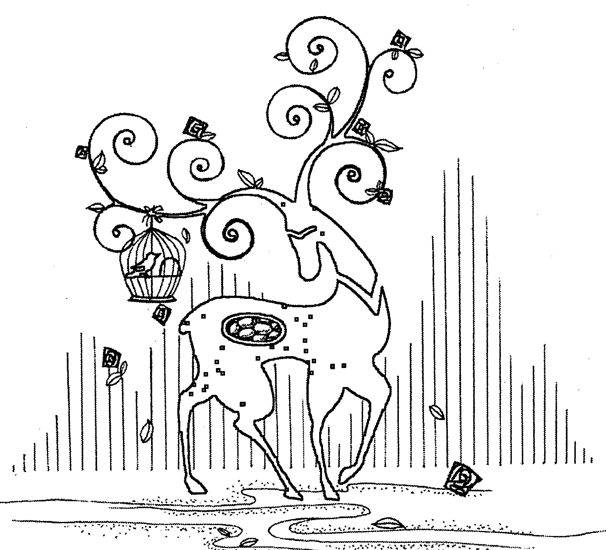

在上海的第三个年头到尾声了，冬天一如既往地难熬，倒是关于世界末日的讨论没有曾经预料的那么热烈。
我突然想起之前在猫的天空之城留下的慢递明信片，定的是末日前一天送到，只是完全想不起来写了什么。很多只言片语都是这样消失的吧。
就像那些消失在记忆里的人。
或许某时某刻又突然地出现？

2010年夏天，我在去学校书报亭领录取通知书的路上捡到100块钱，我把这作为预示选择正确的彩头揣进兜里，当日收拾行李，次日就坐车离开。

学校在杨浦区，前门是杨浦公园，如果算上稀奇古怪的宿舍区，学校正好包围了杨浦公园。但事实是，吃一个包子的时间就足够将主校区逛上一圈。

据说新校区建在浦东，这和我们已经没关系了吧？
入学时候的事情都还没来得及全部忘掉，就要面临毕业了。
那时候我们站在人群里军训，现在站在人群里递简历；那时候我们从座位上站起来慷慨陈词，现在从座位上站起来转身离去；那时候上海世博会还是最热的话题，现在那些场馆早已一一拆去建了新的商业区……
那时候，这个城市还是新的，现在，这个城市对别人来说是新的。
走过的南京路和外滩还是一样人头攒动，吃过的七宝和苏州小吃大概也没有新的品种。或者我太小看了这个世界的日新月异？
总之就是这么过来了，脚印连成串，刚印下就消散。

让这个世界疯狂旋转吧，也许真能转出个世界末日来。

我遇到的第一个面试官是出版社社长，他是个军人。他问的第一个问题是：“你是农村户口？”我说：“是。”
他说：“你别担心，我只是随便问问，不会根据这个来选人的。刚才面试过的那个人跟你是一起来的吧？他是什么户口？”
……

后来，我出大门就被门卫扣起来了，因为是骑着车出门而非推着车出门的。被扣押大半个小时，那个门卫先是威胁我的人身安全，后是警告说要扣留我的自行车。后来朋友报了警，我们才算走脱。

警察说：“这也不是针对你们骑自行车，是真有这个规定。”

人生第一次面试就此结束，第二天编辑部打电话通知上班。我说：“你们那个地方，我不敢去。”

我朋友直接没接电话。

第二次面试，是个出版界大佬新开的公司，在我们学校只招IT专员和发行助理。我想，曲线救国吧，简历上写求职发行助理。面试官是三个，两个姑娘，一个大爷。

其中一个姑娘问：“说一下你认知中的图书发行。”

我就按照我所知道的说了一通。

姑娘问：“然后呢？”

我又胡编乱造一通。

她接着问然后呢，然后呢，然后呢……到后来我终于说不下去停了下来。我想的是，都怪平时学艺不精。

姑娘停顿一下，说：“我一直问你然后，是因为你还没回答要收钱。”

……

后来另一个姑娘问：“你的人生规划呢？”

我非常诚实地回答：“在发行部好好实习，希望以后能转岗到编辑部去。”

这个姑娘立刻问：“那如果我们培养了你，你跑了呢？”

这个问题和军人社长的问题一样。

后来的结果是，第二个星期我接到电话，让去编辑部面试。我脑子里突然蹦出那个一直坐在一旁笑眯眯很少说话的大爷。

再去面试，我终于能和面试官顺利沟通了，聊下来花了大约一个小时。

其中一个长得略像徐克的面试官说：“你怎么看待图书出版这个行业？”

我说：“现在的图书出版乱，太乱了。”

他说：“既然你对这个行业的前景不看好，为什么还要来呢？”

我说：“我不是不看好，我只是觉得行业里不规范的人和事太多。行业现状是这样，我也改变不了什么，我只能在我能做的范围里尽量做一些好东西。喜欢一个东西就是这样，哪怕它有太多的不完美。”

然后，我还在等然后。

在第二次面试和第三次面试期间我去参加了上海文化行业招聘会。我排在人群中，鼓足勇气，准备好简历，规规矩矩地递出去。简历递到一半，对面的人扫了一眼我简历封面上的学校名称，开口说：“我们这里只招硕士研究生。”

我愣在那里，收回了简历，然后找了个角落。

昨天宿舍里一个人在帮忙给《小时代》剧组找群众演员。我问：“多少钱一天？”答曰：“50块。”

如果是2007年的我，多半会说：“我去。”那时候我还在看郭敬明，而《小时代》似乎刚刚开始连载的样子。

昨天我说的是：“我勒个去。”

2007年似乎是一个很遥远的年代了，周正龙和陈冠希的相机都还没出现在众人的视线里，芙蓉姐姐还没成功逆袭，中国还没进入神曲辈出的时代。

2007年算是一个安分的年头，我也安安分分上了高中。虽然多少带着点儿棱角和执拗，当着老师的面撕过某某局下发的必须选谁谁谁的选票，写过针对食堂的公开信，说过不少学校的坏话……但总归是小打小闹。毕竟，童年还没被毁。

一晃五六年过去，流行词汇换了一批又一批，当年有过的理想就是不用去上班，好好写东西，把想说的话都顺利说出来。现在的情况是，我希望公司快点儿给我打电话过来，稿费能按时发下来最好还能稍微涨那么一些。

社会就像火锅，不管三教九流都扔进来滚一滚、烫一烫，旧的去了新的又来，味道总是变不了多少。

我有个一起吃自助火锅的朋友，他两年高考失利，都和上戏失之交臂，今年好不容易决定去别的学校上学，结果去了一个月又回了中学复读。回中学没几天，他的腿就摔断了。

上个月他说还没把今年新概念的参赛稿快递出去。

我说：“你直接打电话让快递上门收件啊。”

他说：“快递根本忙不过来，‘双十一’的东西他们到现在还没送完呢。”

我说：“你家里人方便帮你快递一下不？”

他说：“不敢让他们知道，他们觉得我就是被‘新概念’害的。”

第二天我骑上自行车去他家拿参赛表，路过之前面试过的出版社，停车看了一眼，然后继续上路。

在他家聊了会儿天，他说：“我这里有些书，你拿去好了。”

他拿出一本，说：“这本是一个朋友自费做的，印了五千本，到处拿着送人。”

我大概估算了一下五千本书的成本，说：“富二代？”

他说：“是啊，富二代。”

我说：“要是给我这么多钱……”

他把话接过去说：“绝对不拿来自费出书。”

我说：“这也是新概念的人？”

他说：“不是，他没参加过新概念，他参加的是中国少年作家杯。”

有时候我还是会梦见第一次坐的火车，那是一辆绿皮火车，车窗是能够拉开的那种。我带着几斤橘子坐在靠窗的位置，看看窗外，累了休息一会儿，饿了吃橘子。列车晃晃悠悠了四十个小时。后来我再也没有坐过这么漫长的火车。

那是高三上学期还没结束的时候，我拿到萌芽杂志社寄过来的复赛通知书，和父母吵了一架，给老师留下一张纸条，准备奔赴上海。后来，我还是先坐火车到广东，然后和我爸一起去上海。

出发之前，爸爸一直很反对我去参赛，说是高三学习紧张。出发之后，他就再也没提过这话，安排好住宿和饮食，陪我去看外滩、看城隍庙。

那时候还是第十二届，转眼已经到第十五届了。每一年多少人怀揣着梦想到来，又装满友情离去，相约来年再见。

理想是需要土壤和空气的。
现在它快要窒息了。

2011年开始的时候，我们着手做《理想国》。
那时候不清楚做杂志的过程，不懂排版，没有人脉，没有资金。一群人就这么稀里糊涂而又信心满满地上路了。

想方设法约到文章和插画、找学长学姐学排版软件、骑着自行车到处找能做印刷的地方、笨嘴笨舌地讨价还价、羞羞答答地在学校主干道挂海报做宣传……第一次，第二次，第三次，第四次。

人是容易被自己感动的。有时候想到曾经为了这样一个东西跑了大半个上海、大半夜还在印刷厂看印刷效果，真会觉得很不容易。

争取过企业的基金，争取过学校的赞助，和出版公司争取过合作，成功过也失败过，一路跌跌撞撞走到今天。本来以为还很远的毕业，忽然就摆到了面前。

要毕业了，才不得不承认当初信誓旦旦的目标没能完成，也许它要无限期延后，等到有一天我们强大到能挺起腰杆把沉甸甸的理想举过头顶。

我有一个朋友，他曾经说要做最好的原创歌手，现在是个打工仔。
我有一个朋友，她曾经说要去三毛住过的撒哈拉，现在不知所终。
我有一个朋友，他曾经说要一直写小说，现在做了医生再未写过。
我有一个朋友，他曾经说要做导演，现在忙着倒卖演唱会黄牛票。
我有一个朋友，她曾经说要写让人惊叹的小说，她已经去世两年。
我有很多朋友，他们怀抱理想，却撞尽南墙。

妈妈打电话来说身体不舒服了。我说：“那你不要工作了，好好在家里休息。”妈妈说：“你爸又多喝酒啦。”我说：“爸你少喝点儿酒，多注意身体。”妈妈问：“你实习的事情怎么样了？”我说：“快了，快了，等通知呢。”

爸爸接过电话说：“你也别瞎着急，找个好单位，安安心心工作，钱要是不够用了我打给你。”

我说：“我会好好找工作的，明年等我工作稳定下来，你就不要工作了，回老家吧，庄稼不想种就不种了，栽点儿果树也行。”

妈妈接电话说：“你爸说他还不想回老家去。”

我正要说话，传来爸爸在旁边的声音：“你想吃水煮鱼了吗？过年早点儿回家吧，回家我给你做水煮鱼。”
我说：“好，到了春节就回家。”

## 换 世 界

文 / 宋南楠

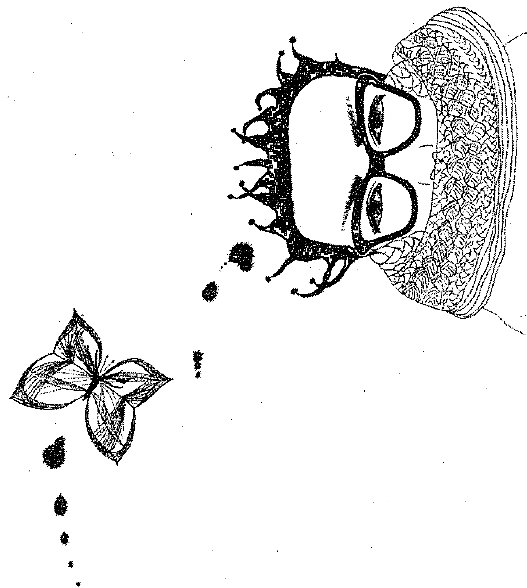

> 反正这年轻人是要远涉重洋，
仿佛要使他断绝尘世的罪恶，
那只西班牙船就是挪亚的方舟，
把他像一只希望之鸽给带走。

——拜伦《唐璜》第2章第8节

经过这次突发事件后，我决定离开这里。刚上火车，就听见刺耳的鸣笛声，火车缓缓地往前跑，那些过往的事物仿佛在向我摇动双手，我此时此刻想要呐喊，因为我将要摆脱过去的世界了。坐在我身旁的人似乎很兴奋，他或许是第一次坐火车，对火车上的一切事物都十分好奇，东瞧瞧西看看，时刻都想跟我搭讪。

因为还是上午，火车上卖报纸的服务员来回叫卖，我身旁那人就买了一份报纸，立刻打开看。他的手偶尔会摇动报纸，报纸哗啦的响声总是烦扰我休息。

“兄弟，你要不要看报纸？”他往我这边贴过来，友好地跟我说话。
“不用了，没这个习惯。”我冷漠地回答。
“赶紧看，今天的事情可有趣了。”他把报纸递给我，见我没接，他又说，“原来你不喜欢看报纸呀！你也是这小城里的人吗？我可是本地人，第一次坐火车去大城市，好兴奋，可心里就觉得不踏实。”

我见他也并无恶意，便跟他聊了起来：“我本就从大城市来到这里，住了几年，也不知道现在外面是个什么样的。”

“原来是见过世面的人，见笑了。”他看着我不好意思地笑起来。他还告诉我，他自己所想象的大城市是怎样的，问我到底是不是那样，我说八九不离十。他说的都是高楼大厦，说的都是衣食住行，说的都是城市人的生活节奏，他自己总觉得有东西没有说完，但又想不清楚是什么，他支支吾吾半天，没有说出什么。

在我刚被这个话痨感染的时候，列车上的查票员来到我们的身旁，一个穿着制服的一米八的大男人，他的脸看上去让人觉得是被困在火车中多年了，沧桑得跟被火车碾磨过一般。他毫不客气地叫我们拿出自己的火车票。

我已经习惯了，没有觉得有何不妥。当我正从钱包里把火车票拿出来递给查票员的时候，我身旁的那人说：“我的火车票丢了。我还以为上了车就用不着了呢！不用检也可以吧，没有票怎么上车啊！都是去大城市的人了，怎么会贪你那几十块钱呢！”

查票员没跟他多啰唆，把补票器拿出来就连忙叫他补票。这兄弟哪里情愿吃这亏，一分一毫都是血汗钱，他立刻就跟查票员吵了起来，还把钱包拿出来证明他不是没钱的人。这时，这个一米八的男人发挥了他身高的优势，站在高处，俯视我身旁的人，说这都是规定的，要么补票，要么到车厢办公室找列车长。我身旁的人就跟着他走了。

他们走了没多久，我就看见查票员回来继续查票，而我身旁的那个兄弟，一直到我下车还没有回来。

回到了大城市的感觉，就像换了个世界一般。火车犹如时光机，带着我穿越了时间和空间，来到一个全新的世界。我闻到这里的风，听到这里的风声，看见这里风的姿态，都与小城市的不一样。我所看见的亦如火车上那位兄弟所描述的一般，高楼林立，不见天日，只有一片钢筋水泥堆积的森林。这里的人犹如蚂蚁一般，快速地奔跑，几乎没有感觉到他们呼出的气息。

没有放下行李，我立刻打好领带往新学校跑去。刚进校门，这里的学生就用奇异的眼神看着我，仿佛看见了什么新鲜的事物一般。我还记得自己第一次走入小城市那所中学，正在打篮球的男同学邀请我一起玩；他们互相扔粉笔的时候，还会扔到我脸上，而在这里，更多的是一种严肃的感觉。

没有人会跟我说话，好像整个世界就只剩下我一个人。

报到的时候，我没有见到传说中很亲民、很喜欢讲笑话的陈校长，听说是出差去了，只有一个行政主任带我把手续都办好了。他看了一下我的个人简历，眼睛似乎瞪大了一些。他说给我安排了一个最容易带的班级。

等我到办公室的时候，老师们似乎早已经打听过我的消息了，进门的时候纷纷跟我打招呼说：“宋老师好啊！”当然也有高年级的老师工作忙不过来，头也来不及抬一下，冷哼了一声就在位置上继续工作。

来到这里的第一天，气氛真的十分冷清。因为已经是下午了，所以我逗留不到两个小时就下班了。下班的时候坐在我旁边的赵老师特地走过来悄悄跟我说：“你应该不知道那个班级的情况吧？”

“哪个班级？”我摸不着头脑。

“就是你要带的那个班级，学生都特别自觉。”赵老师说，“其实主任这样的安排对你真好，那是一个特别好带的班，压力不大。”

“真的吗？”

“不过你命真好，按照你的学历是不会被学校招进来的，现在却能调到这里来，是不是有什么关系啊？”顷刻，她又自问自答，“哎呀，我真是笨，居然问这么笨的问题，我也知道你不想做得这么明显。有什么事情记得找我帮忙。”

我都还没来得及反应过来，赵老师就把我的整个新世界定义了。她的话讲得十分尖锐直接，让我不敢再跟她交流，总觉得心里有根刺一样。我下班的时候经过教学楼，看见一个高年级的老师在教导学生，无意中听见她说：“你都是高三的学生了，早应该知道现实的形势有多么严峻。那些梦想是矫情的、是不学习的那些人用来当作借口的。现在离高考还有三个月，现在努力还来得及，放下你的吉他，放下你的CD，努力重来吧……”

无意中听了这番话，让我觉得有点儿羞耻。想起当时我在小城里当老师的时候，丝毫没有想过如何劝说我的学生好好学习。他们去玩乐也好，去下地干活也好，还是去跳舞、唱歌、追逐自己喜爱的事情也好，我都懒得去阻止。

想起过去，我7点半起床上8点钟的课的那些日子，已经不复存在了。

我现在必须6点起来，赶公交车来到学校。我那懒惰的习惯，仿佛当我来到这个世界后，也随着以前那个世界消失在我的生命里。我的身体仿佛注入了新的血液，让我重生，变成了全新的自己。看着镜子面前衣冠楚楚的自己，有一瞬间，我仿佛不认得自己了。

我站在偌大的教室里，眼前的学生比过往要沉默一点儿，他们安静得似乎在等待什么。

“我是你们的新语文老师。”我说这句话的时候学生都纷纷抬起了头，他们看了一下我，仿佛是想在这一瞬间记住我的样子，“我希望以后我们能合作愉快。”

过去我从来没有说过这种话，我跟以前那群孩子从来没有自我介绍过。因为我第一次进入他们班，他们就好奇地议论纷纷：“又来了一个新的语文老师！他看起来好有文化！”那时候我戴着一副黑框眼镜，看起来就像个学者。

我觉得自己很懒惰，上完课回来，轻松批改完作业，就会趴在桌子上睡觉。我不会主动找学生，通常都是那些积极的尖子生找我讲题。

“老师，这个世界是不是最需要人才？”学生问我。

“当然不是！什么逻辑！其实是人需要这个世界，人才也是应运而生的而已。”我自豪地跟学生说。他听完觉得从我嘴中说出来的话不会有错，就一直记着我的说法。而那些如我一般懒惰的学生，则很喜欢我这样的老师，很少的作业，不强迫他们做什么，一直处于放养状态，可是又是一个很有学问的老师，可以满足他们对所有事物的好奇心。

我其实十分满足于当时的生活，虽然什么都没有，可是每天无忧无虑，我没有追求要当一个多么好的老师，教导出多么好的学生，我只希望让我轻松存活，每天早上对着太阳伸懒腰。就是这样的我，得到了那一年小城的最杰出老师奖，把我调职来到了大城市，这个突发事件，成就了我现在的状况。

“老师，你可以开始讲课了。”大城市的学生总会给我一种疏离感，他们言语中透露出来的冷漠和严肃仿佛正在改变我。我此刻被一只无形的手推着前进，我拿起自己的教科书，打开课件，快速地开始讲课，仿佛每一个课件都是我的成就，都可以留下我人生的痕迹一样。

“老师，晚上你可以留下来督促我们晚自习吗？”
“老师，你课间的时候会在办公室吗？我有几道题不太懂。”
“老师，隔壁班老师的答案跟你的不一样，你们要不要商讨一个最终的答案给我们公布一下？”他们时常会告诉我，我可以做什么工作。我本来以为自己会觉得很烦，其实并不然，我已经觉得这是我的一种任务，是我必须要做到的事情，甚至我还想要学习、考试，拿到高级教师的资格证，或者到外面给学生补习，拿到一笔可观的补习费。

这些都是赵老师他们会做的，而我，也会做。因为在这个大城市，没有父母愿意让子女跟着一个“不好”的老师。所谓的不好，就是没有经验，没有学历，没有猜题的头脑。这样的情况，使我铁定心去累积，即使学习和工作到很晚。

渐渐地，这个学生很自觉的班级在我的带领下，平均分有了较大的提高，这也归功于赵老师指导我要对他们更加严格要求。

以前在我眼里，小城的家长们都是一副柴米油盐酱醋茶的嘴脸，我有时候会高傲地觉得自己不是在跟一个家长讲话，而是跟一粒米讲话，所以怎么会有共同话题呢？所以那时候我很反感跟家长交流。他们倒好，也不常跟我交流，尤其是学习成绩不好的学生家长几乎连家长会都不会参加，我也落得清闲。

那时候我认识一个学生小红的姑姑，二十来岁，长得十分清秀，总是在家长会上向我投以仰慕的目光。小红告诉我，她的姑姑对戴眼镜的人甚是看重，觉得都是有文化的人，值得来往。我知道这些话是小红的姑姑让她说的，于是便留意多看了她两眼。

小红的姑姑叫文静，人如其名，见到我的时候一声不吭，就只是微笑。我那时候觉得这是多美好的一个女孩，简直就是从雨巷走出来的撑着油纸伞的白衣姑娘。站在她的身后，能看见她浑圆厚实的大屁股，走起路来扭来扭去，无论是身体上还是心灵上都为她的国色天香所吸引。曾经有一度我对文静十分着迷。

她总是会盯着我的黑框眼镜看，总是会问我：“你……你到底有什么梦想？对未来有什么规划？”

“其实，我挺喜欢现在这样的，没有想过未来。”我诚实地回答她。

“听说你是从大城市来的，那么你还会回去那边吗？那边有住的地方吗？”文静追问。

“不知道会不会回去，主要是我一无所有。”

不知道从什么时候开始，我们的交往渐渐变密，文静变得不再文静。

她会问我许多我懒得回答的问题，会在我身边无所事事地走来走去，她不再用崇拜的目光看着我。终于有一天，她变成了我眼中千万粒米中的一粒米，我就离开了她。

而现在，赵老师是怎么接近我的，连我自己都不清楚。我几乎每天都会跟她讨论学生的事情，她会给我介绍一些家教的工作，在工作上也会帮我许多，虽然之前她总是会有讽刺我学历低的嫌疑。她一直怀疑我是有什么关系才进入这所学校教书的，比如像是校长派下来监督各位老师的黄马褂之类的人。

赵老师跟变化后的文静有过之而无不及，是原先我很不喜欢的千万粒米中的一粒米。她会很主动地给我许多利益，名义上是说帮助，不过从来不需要我说谢谢，而是需要我回报，需要我在领导面前为她美言几句。虽说我一直告诉她，其实没有领导这个角色的存在。

她会告诉我在这一行的竞争到底有多大，会教我猜题，跟我分享课件，甚至有时候还会告诉我，哪几个学生学习心不在焉、哪几个学生的出色表现会使我拿到很好的奖励等。我偶尔也会想看看她西装裙里包裹着的屁股是否像文静的一般，浑圆而又厚实，走起路来特别有动感。但是每次我的眼角刚触及那个点，总是会因为害怕而转过眼睛。我并没有觉得这件事情有多么不对，而是害怕别的老师看见了。

千万不能造成任何对自己不利的舆论，仿佛是这个世界的原则。

所以虽然我很想看看赵老师的屁股，我还是不敢睁开双眼。有时候我会取笑自己，到底什么时候开始从敢看变成了不敢看呢？连我自己都不明白，最真挚的我，到底是否想看，又是否敢看，是什么东西促使我，还是我自己本身呢？这个问题一直困扰着我。

## *5

跟陈校长熟悉起来已经是两年后的事情了。
陈校长不知道听谁说了黄马褂的事情，不知道是觉得很有趣还是很生气，立刻就找我聊天了。我如实告诉他事实的原委，他听了哈哈大笑地说：“大家真的疑心病很重，要不就来真的吧。你帮我好好看看哪个老师能工作、哪个老师能力不行。”
我当然知道他是开玩笑的，连忙跟着他笑道：“陈校长真的是幽默风趣，我总算领略到校长您那诙谐的功夫了。”陈校长听着很受用，拍了拍我的肩膀鼓励我说：“好好做，你一定能成为好老师的。”
从那时开始，我总在午饭的时候在食堂等陈校长，跟他聊天。赵老师看见了，饶有兴味地看着我，仿佛心里在为我打如意算盘。有了校长的鼓励，我回去对我的学生严加管教。因为之前有一个高二的语文老师休产假，表现出色的我就从初中调派去高二教语文，并且当上了班主任。现在我们班的平均分已经是年级数一数二了。
而且我取得的成绩越来越好，获得的奖励越来越多，什么最佳教职工奖、高级教师证书，作为学生征文比赛的指导老师我也收到过许多杰出老师证书，等等，摆在我家柜子上面，有一大堆。我经常会站在它们面前欣赏，感受我这几年的劳动成果和学生看着我的那种尊敬的眼神……这让我特别享受。
陈校长很满意我的成绩，看着我时的表情就像是在称赞我说“可造之材”一样。他总是会给我讲一些笑话：“小宋啊，昨晚我女儿给我讲了一个笑话，特别好玩，我跟你分享一下，让你也乐一乐。从前有一个人叫小明，有一天他剪了新头发，同学笑他很像风筝，小明哭了，然后就飞上了天……”陈校长自得其乐地说着，直到他说完，捧腹大笑，我都还没反应过来，只好跟着哈哈大笑了。陈校长特别高兴，把自己当成半个郭德纲了。

他也时常召集我们开会，确定下一学期的目标，总结这一学期有哪些方面做得不足等。他说：“21世纪最需要什么？当然是人才。”陈校长把脸转向我问，“小宋，你说是吧？”

“校长，您说得对，现在世界当然最需要人才了！”我附和着。

“是的，在座的各位老师都是人才，请大家继续努力！”陈校长宣布会议结束。

当班主任还是压力很大的，这时真的该谢谢赵老师等一群老师为我减压了。

他们也不知道我为何升得那么快，只能用“黄马褂”一词形容了，但是他们也看到了我的努力和变化，即使那些都看不见，我带的班的优异成绩就摆在那里的。所以他们很喜欢替我减压，我们周末会一起去KTV，或者一群男老师去喝酒、烧烤。

有时候玩一天下来，我累得回到家躺上床直接呼呼大睡，其实也不知道所谓的减压和娱乐在哪里，只感觉自己比原先更累了。有时候这样玩完回来已经深夜，还要备课，基本上就没有睡觉的时间了。早上又必须早起，撑着一双熊猫眼给学生上课。一双双质疑的眼神，让我很不舒服。

这样的情况是一种死循环，是无法打破的。

而我变得无法满足，无法满足于追求梦想，无法满足于追求更高的职位、更多的名誉和赞许；无法满足于玩乐，却甘于听一些找不到笑点的冷笑话；无法满足于爱情，仿佛那与许多柴米油盐酱醋茶混杂在一起，变得不再纯粹。

这个世界改变我太多，我无法阻止。

很快，我的成绩得到了认可，带了一个高三的尖子班，做他们的班主任。班里的学生都很乖，尤其是高考前夕，基本上不需要管理，等待他们拿到好的成绩庆祝一下便可，这真的是一桩稳赚不赔的生意。

但是往往现实却不那么如意。

## *6

有一个在班上成绩名列前茅的女生不知道是失恋了还是理想动摇，突然间成绩直线下滑，不仅对班上的平均分没有帮助，反而拖了后腿。我屡次找她做思想工作的时候，她仅仅是哭，什么都不说。

我把这种情况反映给了她的家长，她的家长最初仿佛很生气，让我把她的课停了两天，叫回家里进行思想教育。可是两天之后他们来到学校却告诉我，他们的女儿觉得压力太大了，他们也无法鼓励她，让她振作。

我现在还没有意识到思想崩溃到底是多么严重的事情。

我屡次把她叫到办公室来，拿出她最近考试的试卷和班上本来跟她成绩相当的人对比：“雨辰，你看看你的朋友们，以前你们的成绩不相上下，现在呢？别人平均每一科比你高十几分，这该怎么办？高考在即了，再不努力不行了！有什么不开心的情绪，失恋也好，其他什么也罢，都放一边去，好好考试知道吗？”

我越说她就越哭，有时候带着哭腔告诉我：“老师，我有好好学习的……我一直在好好学习……最近不知道为什么一直错……一直错……我不想的，老师，我不想这么差的……”我看着她哭，心里很不好受，于是就让她先回教室了。

晚上回到家，我看见自己柜子上的奖杯，我觉得自己是多么有成就感，是不应该被今天的事情影响的。我看着它们的形状，上面所写的文字、所盖的印章，无一不让我感觉到心花怒放，并且让我看见学生们一张张美丽的笑脸、陈校长那喜爱讲笑话的脸、赵老师那米粒般的脸，一切都浮现在我的眼前。

第二天早晨，我回到学校上第一节早读课。我在黑板上纠正复习内容的时候，看了一眼下面的学生，顿时让我心都凉了。他们吃早餐的吃早餐，玩手机的玩手机，还有些人无所事事，几乎没有一个人在听我讲课。当我正想发飙的时候，赵老师来到门口叫我出去。我放下了粉笔连忙跑了出去。

“我有一个不好的消息。”

“什么？”

“你是不是有一个学生叫雨辰？她父母刚刚打电话过来，说她昨晚跳楼死了，他们认为她的死与你有关，正要跟你讨个说法。他们说你逼死了他们的女儿！”

“雨辰死了？”
“是！”
“雨辰死了？”
“是！”
“雨辰死了！”我仿佛还能看见那个眼眶里布满泪水的女孩子站在我的面前，我让她好好地思考一下人生，让她为未来付出努力。可她竟然就这么离去了。我一边想着雨辰，一边看着教室里坐着的无所事事的学生，突然感觉眼前一片漆黑。

## *7

火车的轰隆隆声像雷鸣般想要炸开我的脑子，我躺在卧铺上，车厢里弥漫的一股霉味让我辗转反侧，如何都睡不安稳。我知道那件事后，想都没想就买了回小城的火车票，睡了半天的时间回到了小城。
我落魄地走在小城的路上，骑自行车路过的家长、在田里耕作的家长，凡是小城里认识我的人都欣喜地问候我：“宋老师，回来了呀！”我强颜欢笑地说：“是呀！觉得外面没这里好，就回来了！”
“那就好了，这么优秀的老师回来了！”街坊们说道。
我十分感动，在他们尊敬的目光下，我仿佛不再感觉落魄。很快，我回了学校报到。校长对我的归来感到很欣喜，因为乡村教师这样的职业不是人人都喜欢，大家都喜欢往大城市走。我重新见到了以前的学生。
一切仿佛回到了过去，中间那段世界仿佛没有出现过。
我依然7点半起床，轻松地教完一个上午的课，然后坐在办公室里批改作业、睡觉。听小红说，文静嫁人了，就在我走的那两年多里。我听完觉得无所谓，继续坐在办公室里做自己的事情。在我眼里，他们依然都是一群大米的面孔。

回来后不久，我接到陈校长的电话，他说：“小宋啊，事件已经平息了。你也不必担心，你是教师界的人才，我们学校的大门永远为你敞开。”我告诉他，让我考虑一下。回到这里，我感觉很舒服，我依然是那个戴着黑框眼镜、知识渊博、可以替家长们出谋划策的诸葛先生，我看见的天空湛蓝无比。

后来我结识了三个很热情的家长，他们邀请我到他们家里打麻将。我没有接触过那个游戏，便立刻答应了。学会玩之后，我对这个游戏很着迷，每天下午没有作业可批改了，我就会拿出自己那个袖珍麻将跟办公室里的老师打，或是上网玩桌游，这比我之前睡觉要来得有趣。

有一次在家长会上，我走到那三个热情的家长的面前说：“等会儿开完会，我们来摸牌吧？”三个家长一听，嬉笑着答应了。

我回到了原来的生活，属于这个世界的生活，十分轻松，不用担心什么压力。人仿佛可以停下脚步，不用理会自己的知识是否丰富，不用理会班上的平均分是否最高，更加不用跟任何人谈及理想。但是不知道从什么时候开始，我开始厌倦这样的生活，无趣的年复一年、日复一日，无趣的桌上游戏，无趣的人和事物。

这样的无趣，让我回到了大城市。我简单地在街上行走，看着那些匆匆路过的行人，他们如同过去的我一样忙碌，奔走在这个世界上，也许他们回到小城，也如同我一样变得缓慢。我很想摆脱小城那乏味的生活，这样突如其来的想法已经不是第一次了。来到了大城市，我又换了一个人一样，我看见街上橱窗映出的自己，强颜欢笑，虽然没有了小城的懒惰，也算不上精神焕发。

“这，真的是我吗？”

我看着橱窗里的自己，突然被惊吓得不知所措。

## *8

我不知道自己在一个什么样的世界，这个世界可以改变我，那个世界也可以改变我，我不知道自己是一个什么样的自己，没有这些世界之前，有没有原来的自己？我如同被困在一个巨大的牢笼里一般。

我拼命地想要搭乘火车逃跑，后来才明白我逃不出世界的掌控。

我恐惧得在火车上颤抖，难过地看着车窗外的事物与我离别，新的事物向我挥手。这时，我遇见了之前在火车上坐我旁边的那个人，他拍了拍我的肩膀，惊讶地对着我说：“兄弟，真的是你啊！咱们真有缘分！来，交个朋友，我是大东。”

我惊讶地看着他，与之前那个土气的农民兄弟不同，他现在已经西装革履，像我一样戴着一副黑框眼镜，我差点儿认不出他来。他对我说，那次之后，他不愿意补票，于是在中途被赶下了车，去了一个闻所未闻的大城市生活。忙碌了这些年，觉得心里很累，也是逃出来的。

“大东，我也是逃跑。”我苦笑地对他说，“你看，你改变了好多，现在就像个大老板似的。”

大东看了看自己的衣着，笑着跟我说：“是啊，改变了不少，也不知道为什么，现在觉得还是这么穿好看，比较得体。以前哪里讲究这些，还不是想要更加舒服一点儿。这次回去，还是得穿回原来的衣服，不同的地方，不同的需求。”

“因为世界不一样了。”我淡淡地说，目光又转向车厢外的风景。

“我要回我的家乡，你要去哪里呢？”

“应该无法摆脱了吧，我也不知道应该去哪里呢！”

我看着大东，觉得他很像我，很像很多活在这个世界上的人，也在换世界。我心里总是有种感觉，他会逃跑，终有一天，他会如同我一般漫无目的地逃跑。因为在这个世界上，我们都找不到自己纯粹的心灵。左边心房的那个，是变幻万千的魔鬼，接受这个世界的玩弄和改变，让我不再是自己，我无法挣扎。

我心灰意冷地扔下了自己的黑框眼镜，除了这个，我没有别的行李了。

# 盛 宴 之 城

文 / 欧阳德彬

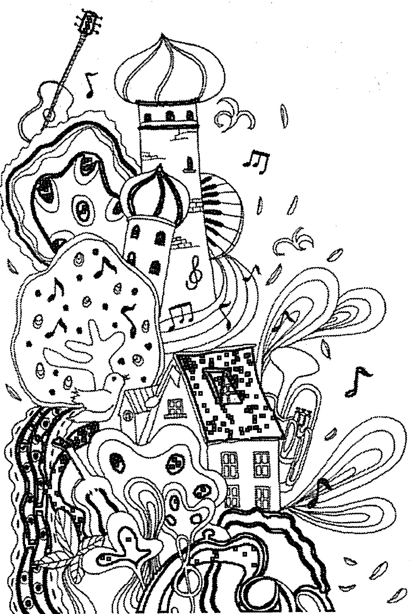

这是一座精巧的城市，我不知道它的名字，只晓得团簇的路灯如含苞欲放的牡丹，橙红的灯光辉映着行人和车辆的脸。我也忘记了来这里的初衷、来这里的时间，所有的规则开始模糊不清，也许只是神的旨意，天定的夙缘。我环顾四周，没有发现太阳的所在，路两旁高大的树木簌簌作响，行人和车辆丧失了声音。这样的布景轻而易举淡化了真实。我不知道该往哪里走，这里我不认识一个人。祖先的声音在骨子深处响起，沉闷而空洞：“孩子，到树多的地方去。”

眼前一个猿人的身影奔驰而过，他赤裸着上身，胸毛浓密杂乱，下身裹着暗黄色的鹿皮。他举着标枪，那是他最忠诚的伙伴，防身或者猎食。我知道，他要到树多的地方去，那里才有野果和禽兽，才有同类的异性，才有被丛林庇佑的安全感。

我在他后面紧紧跟随，尾随他走进一扇高大的铁门，那里果然树木葱茏、流水潺潺。那里有很多人影，兽皮裹身的、峨冠博带的、西装革履的，细看又什么也没有。他爬上了一棵古树，两腿骑在树枝上，拿标枪的手攀住树干，另一只手抓起一个苹果大的野果往嘴里塞着，津津有味地咀嚼着，几片形状怪异的树叶落在地上。他笑着，满足而惬意。我一愣神，哎呀，他分明是骑在一棵槐树上，胳膊被槐针刺出了血，槐树还未开花，他正把一绺绺槐叶塞进嘴里。他呜咽着，失落而痛苦。我正要赶上前去把他叫下来，却突然发现他没了踪影，那棵树竟是一棵粗大的泡桐，满树的花朵开得正热烈。我把那张皱皱巴巴的纸币又放回了裤兜。

我还是不知道该往哪里走，在这里我不认识一个人。不远处的池塘边有人在钓鱼，我走上前去。他四十左右的年纪，头戴斗笠，身披蓑衣，对着鱼钩在莫名其妙地笑。他竟对我的到来毫无察觉，雕塑一般。待了好大一会儿，天空不知明灭了多少次，他把线拉上岸，要换食了。哎呀，鱼钩上的鱼饵竟是一个通红的苹果，那苹果把钓竿拉得几近折断。“先生，钓鱼应该用蚯蚓或者鱼虫。”我指着苹果说。他看了我一眼，露出一排淡白的牙齿，没有发出声音。他手托着那个苹果端详了一阵，又把它投入池中。

我在心里开始嗤笑他，哼，哈哈，傻瓜，能钓上鱼来才怪呢。

又待了好大一会儿，天空又不知明灭了多少次，他把线拉上岸。哎呀，一条鱼竟然口中含着那个苹果垂挂在吊线上。那条鱼暗黑的大眼珠凸了出来，嘴里的大尖牙死死咬住苹果，体侧的鳍扇动着，遍体暗黄，像一只蛤蟆，只是没有腿。

我刚想问他原因，话还没出口，就听见他说：“这条鱼，贪、虚浮、急功近利。”我立刻觉得全身好像有火焰在燃烧，脸上尤其火辣辣。我一伸头，对着池水一望，哎呀，自己竟然遍体暗黄，体侧的鳍扇动着，像一只蛤蟆，只是没有腿，好一阵子才恢复了原貌。

那条鱼离开了水，停了一会儿，便松了口。他把它丢进池里，它泛了个水花，竟是一条白鲢，它游向了荷花深处。

他把苹果从那个大鱼钩上拔下，托在手心，放在我脸前。

“这是什么？”

“苹果呀！”

“不对，这是上帝的游泳内裤！”

“啊？”

“你再仔细看看！”

“哦？”

“上帝常在池中游泳！”

他一直托着那个苹果，又待了好大一会儿，天空又不知明灭了多少次。突然，一只圆柱形的虫子从苹果正中央爬了出来。

“哦，我明白了，它就是上帝！”我指着那只虫子说。

他看了我一眼，又露出一排淡白的牙齿，没发出任何声音。一眨眼，他不见了。池塘也变成了一条大河，波浪滚滚。

回到寓所，我把墙上贴的奖状，窗台上摆的奖杯，还有发表在报刊上的文章，以及几十万字的书稿悉数扔在地上，全烧了。

拿起镜子一照，我的胡须已垂到胸前，上身赤裸着，胸毛浓密杂乱，下身裹着暗黄色的鹿皮，只是没有标枪。

墙壁和屋顶消失了，我正独自立在无边的旷野，脚下是深厚的土地。我越来越矮，越来越矮，一直矮到泥土里。一些果实开始在地下饱满，地面上的身子是几片翠绿的小叶。我也不知道自己是什么，马铃薯、地瓜、花生抑或别的什么。

又待了好大一会儿，天空又明灭了不知多少次，一只圆柱形的虫子爬上了我的一片绿叶。“欢迎你，上帝。”我说。

# PART 2

# 精神之我

# 教皇的百合与玫瑰

物、情、灵，三层台阶，“我”站在哪里
而他虽身披华衣，头顶三重冠冕，却仍默默关注你
与“我”同在
百合与玫瑰，纯洁与热情，相斥又相吸
站在正中的他，目光越过重重红尘
这是精神上的父亲

# 上 帝 的 食 指

文 / 李遥策

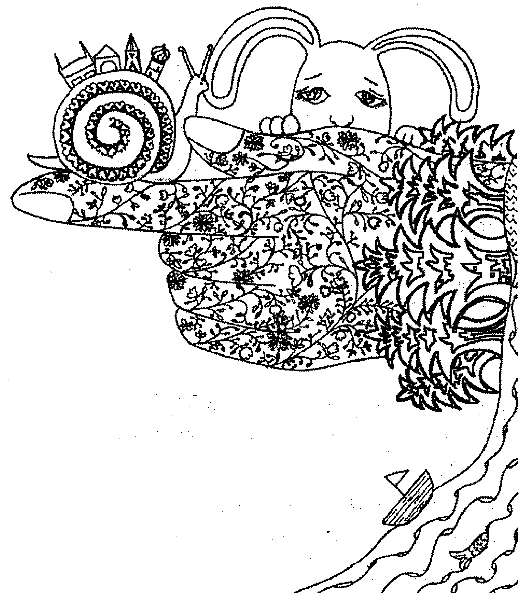

## ++ 一、距离审判日：两天 ++

L就坐在Y的身旁，手里拿着快融化的冰淇淋，他很想通过一种煽情的表达获得Y的怜悯。可是情绪酝酿了很久却始终都装不出来。

毕竟这里是游乐场——来来回回的小丑手中拿着道具，不停地给人们带来欢笑；一只小狗叼走了小朋友手中的破坏熊，正被一群大人追着绕着旋转木马奔跑；一向在笼子里闷骚的大象冲出了马戏团的帐篷，用鼻子卷起了秃头的驯兽师；一只高智商的鹦鹉不知从何处飞来，栖息在L的头上不停地学着L跟Y说话。

而偏偏，L又是一个笑点很低的少年，在这样的情况下，他实在没有办法集中精力跟Y谈判，他感觉气氛怪怪的，就像坐在星巴克里吃饺子一样。

“我们能不能不要在这种情况下说分手呀。” L无奈地转过头对Y说，冰淇淋化成奶昔正滴在他的手背上。

“看来你一点儿都不难过。”Y看着L似笑非笑的表情变得有些生气。

“再给我一天时间吧。”L只能拉住了Y的手，尽量不去理会周围的一切。

Y考虑了许久，勉强地点了点头，然后拿起包包起身离去。留下L独自坐在游乐场的长椅上，呆呆地看着满手的奶昔，耳边还剩下那只鹦鹉欢腾的鸣叫：“再给我一天时间吧，再给我一天时间吧，再给我一天时间吧。”

可是，一天时间够吗？

L看着自己的影子不断地问自己。

他却始终不知道，他和Y的爱情仅仅只剩下一天时间了。也许过了明天，他们之间就会形同陌路，就像眼前走过的小丑，卸了妆谁也认不出谁。

从局外人的角度去描述L和Y的故事，我实在有些难以下笔。

有时候，我想我宁愿去审判一对即将离婚的夫妻，也不要把工作的热情投到大学生的情感恩怨里来，比如在我面前的L。

L是一个二流大学的学生，大一的时候规规矩矩地上课，几乎帮班上所有的同学都点过名，偶尔迟到，偶尔到附近的网吧通宵，无聊的时候站在走廊抽根烟，看看楼下路过的美女。

大二的时候老师已经忘记了他的长相，班上所有的同学几乎都帮他点过名，偶尔迟到，但是仅仅发生在他打算去上课的时候，在学校附近的网吧，他已经试过了所有当下热门的游戏，一天一包烟，却不再有看美女的时间。

大二的下学期，他被寝室里的胖子拉去参加了一个搞音乐的社团。他怀着用音乐唤醒人类的梦想缴了两百块钱的入会费，可是却从来没有一次登台表演的机会。为了赚回两百块钱，在大三开学的时候，他开始不断寻找新人，并拉他们入伙。

借着这样的机会，在宿舍楼下的便利店门口，他认识了一个背着贝斯的大一女生。这个女孩长得有些清澈，从某个角度看去就像L心目中的女神堀北真希。

L顿时燃起了压抑了三年的饥渴与激情，胡乱整理了一下头发便上去搭讪了。

“加入我们的团队吧，希望有一天能听到你的演奏。”L以音乐社团学长的身份，一手插在口袋，一手做出握手的姿态。

很多年以后，当L再次回忆起和Y初次见面的场景时，他始终觉得自己原本可以装得更加帅一点儿。

可是相遇的条件无论怎样，他们的结局都是一样的。Y加入了他们的队伍。L仗着自己是Y的介绍人开始乘虚而入，每天晚上都拿着吉他为Y写一首歌，并且答应要在Y生日那天在学校的礼堂里唱给所有人听。

写到第五个星期的时候，Y控制不住内心的感动，便成全了L的追求。L听到Y害羞的回答，长舒了一口气，因为他实在找不到可以抄袭但又不易被发现的歌词和曲子了。

可是Y生日的时候，L并没有机会唱歌，他依然是组织里为主唱伴奏的吉他手。有机会的时候，老大会带着他们去酒吧驻唱，赚取一点儿生活费。业务繁忙或者人手不够的时候，L也渐渐走上了主唱的位置。

在酒吧里，L经常会在顾客的要求下唱一些他不愿意唱的歌。他背着吉他撕心裂肺地唱着，感动了很多人，可是他自己却依然很无奈，因为他终于站到了舞台上，却没有一首是他自己的作品。

> “没办法，现在去酒吧的人都喜欢听这些歌。我们作为服务行业的群体，当然不能由着自己的性子发骚了。”老大总是这样说服L。

Y偶尔也会跟着L去，静静地坐在台下欣赏L的表演，Y成了L最忠实的听众。

> “我相信，你一定会完全唤醒人类的音乐梦想的。”这是L走红之前Y一直给予他的鼓励。可是在音乐的道路上，L却朝着相反的方向走去。

至于L后来是如何在学校走红的，这又是一个很长的故事，为了留有篇幅讲述别人的故事，我做适当的省略。总之，听惯了主流音乐的同学们开始纷纷对L后来的风格产生了兴趣。有很长一段时间，L都是染着红色的头发，穿着奇特的服装走在Y的身边，看起来坏坏的，就像身怀绝技的外星来客。

这是老大给他的定位，按老大的说法，现在市场缺少这样的叛逆歌手。所以，为了保持这样的定位，他每天都要把头发梳得像一根根钢丝，在大冬天里还必须穿着网状的夹克衫。

L也凭借着摇滚曲风在他的城市里声名鹊起，一旦在学校里开演唱会，台下就会挤满狂热的粉丝。经常会有非本校的学生托自己的朋友找L签名，因为他的签名在黑市上可以炒到和一线明星一个价位。

学校里流传着一个对L的评价——他的摇滚嗓音足以让你致命。学校里对他本人也有另外一个评价——逃入人间的恶魔。

L很讨厌这个称呼，因为他觉得自己的本质是纯洁的，他只是为了音乐才走到了这一步，只不过他没有机会演唱一首自己想唱的歌。加入社团以来，他从来都没有扮演过真正的自己，甚至Y到最后都开始分不清自己的恋人究竟是什么人。也许Y和L分手很大的原因就在于此。

在酒吧里，客人也不再给L点特定的歌曲，他们只要求L唱摇滚。为了有和Y约会的资本，L只能扯着嗓子歇斯底里地演唱。他不是听众，也不是乐评人，所以不明白让人致命的摇滚嗓音到底是怎么一回事，但他坚信，如果一直这样唱下去，第一个丧命的人便是自己。

离开刚刚和Y约会的游乐场，我跟着L回到了宿舍。L泪流满面地从床底拿出了一个饼干盒。L就是一个这么多愁善感的少年，想家的时候他就会从里面拿出妈妈织的围巾，想起童年的时候就会拿出儿时收集起来的玻璃弹珠。L的饼干盒里藏着每一个他所珍惜的物品，所以L纯洁的本质的确是有依据的。

现在，他从里面拿出了一根吉他弦。根据我现有的情报分析，这根弦是Y在去年的圣诞节送给L的，买不起吉他的Y只能送给L一根弦，就像很多时候买不起电影票的L总要拉着Y在电影院门口讲述电影的剧情。

“你说，一天的时间，我该怎么挽回她呢？”L对着吉他弦，自言自语起来。

想了许多，L还是把它固定在了自己的吉他上，在空旷的寝室里，随手弹奏了起来。于是借着音乐，L的灵感来了，他兴奋地从床上蹦了下来。

一天后，打着新年演唱会的旗号，L终于在他老大的协助下包下了学校的操场。舞台是匆匆搭建的，简陋的灯光，两边各有一个低音炮，远远看去就像是一场赈灾演出。

黄昏过后，夜幕开始降临，同学们心中的摇滚吉他少年终于在欢呼声中跳上了舞台。

“其实，你们都上当了。”L站在舞台上，坚定不移地对着话筒说道，“今天，之所以有这场演出，是因为，我想通过歌声来表达我对一个女孩的爱意。”

“哇——”L的话引起了台下一片哗然。

“这当然不是什么新年演唱会，这仅仅是我情感表达的演出。现在，我要彻底地展现自我，这么多年来，我终于等到了这个机会。”L沉默了一会儿，继续说道，“Y，谢谢你的一路陪伴，今夜的歌声是属于你和我的。”

台下再次沸腾，甚至有几个失控的粉丝晕倒在地，被人抬出场外。

我作为L和Y的爱情审判者，化作空气尾随在Y的身后。现在Y的面前有一条分岔路，一条是通向操场，而另一条是通往宿舍。

“还是去看看吧。”周围的女孩们都冲向了操场，随之而来的还有拿着荧光棒的老师和教授。Y忍不住好奇，也跟在了他们的后头。

Y冲进操场的时候，L正拨动着琴弦，随着节奏用力地甩着红色的头发，把观众的情绪推向了最兴奋的高度。我也随着人潮和音乐的鼓动，开始散发出人类的活力，可是L却突然停了下来，慢慢地走到了舞台的边缘，拿着木吉他坐在了一头。

他开始轻轻地弹奏，低声而缓慢地吟唱。这是L一直以来都想唱的歌，这也是他写给Y的歌。现在他终于有了勇气和动力，不管台下多少人的反对声和呕吐声，他还是执意地唱着。

然而他的目光却柔情地注视着台下的某一个女孩，从未移开过。

“你还愿意离开我吗？”这首歌结束，L对Y说道。

这一刻，Y彻底地被L的歌声征服了，她没有说话，只是静静地望着台上的L流下了两行泪水。

尽管Y在L的感动下流出了眼泪，但是第二天，这座城市还是传出了青年摇滚歌手L失恋的消息。没有人知道Y为什么还是没能被L挽回，就连Y自己也难以琢磨自己的决定。

但是，只有我知道。因为，我是爱情的审判者。

是我宣布了L爱情的死亡，仅仅是因为L唱了一首我最反感的抒情歌曲。

所以，L的故事告诉我们，感动是无法阻碍爱情的消亡的。

## 二、距离审判日：七天

七是一个神秘的数字，人类把七天作为一个周期，方便于对生活的规划和计算。

在每一个七天里，人们可以做各种各样的活动，可以重复，可以突破，可以爱上一个人，可以忘记一个人，也可以在无所事事的时候做一些无聊的举动打发时间，就像我的直属上司用七天一不小心就创造了一个世界。

现在的名单上，Q的爱情，也只剩下七天的考验。我很想知道她将如何度过，于是马不停蹄地奔向了C城。

在去往C城的火车上，我遇到了我的同事，生命的审判者——死神先生。

在颠簸的车厢内，我们一起抽着烟。他滔滔不绝跟我诉苦，抱怨工作的劳累和生活的艰辛。

“要不是为了老婆孩子，我才不愿意坐那么久的火车去观察一个不知死活的家伙。”他的话让我心理得到了平衡，因为他的职位比我高，却并没有比我幸福。

我也只能附和着他的话，说说我在工作上不幸的遭遇。窗外的风景匆匆晃过，我们说着说着便泪流满面地抱在了一起。

想象一下，要是你坐火车，突然看到两位神仙在车厢里抱头痛哭，那该是一件多悲剧的事情。

知道死神先生要和我到达同一个目的地是因为我手里的名单掉在了地上，我捡起来的时候他借过去看了一眼，然后看着我无奈地摇摇头：“这工作，你别去了，直接在上面打叉吧。”

“怎么了？”我好奇地问道，很想听听死神对爱情的独到见解。

“唉，这两个人没戏了，Q的男朋友Z就是我审判的对象，三天后估计就成亡灵了。”他假惺惺地叹了口气说。

“这么巧，原来我们的工作对象是同一个人。”我用平淡又怪异的口吻说道，就像惊讶于我和他今天的早餐都是火腿肠一样。

“你看，如果三天后人都死了，哪来的七天时间面对爱情的审判？”他说的确实有道理。

“可是我回去后，要是Z不够达到死亡的标准怎么办？”我有点儿犹豫。

“这个好办。”他对我使了一个眼色，狡猾地笑着，“我是死神嘛。”

我当然明白他话中的意思，为了减轻工作量，我必须得依靠他的能力，可是很遗憾，我没有钱用来行贿。

“如果在七天里，Q的泪水能灌满这个杯子，我就让Q和Z在一起，并且你不能马上判定Z死亡。”我从车厢开水房拿来一个纸杯，对他说道，“如果没有，我就把我这趟差事的报酬全部给你。”

死神先生觉得这个赌注很不错，私底下便和我达成了这个协议。

火车在C城靠站，我们一下车便奔往当地最具声望的医院。

在医院的大门外，死神看到了很多他的粉丝，全是那些刚刚脱离肉体的亡灵。死神拉过一个看上去相当老实的家伙询问Z的房间，他便兴冲冲地带着我们前去了。据说昨天他就住在Z的隔壁，不幸的是等到今天他都没看到Z的灵魂和他一起出来，他心里很不平衡，一路上问死神Z到底什么时候死。

死神当然没有理他，到了重症病房门外就将他赶跑了。在病房内，我看到了Q，一个看上去有些憔悴的女孩子，她就坐在Z的床边，一夜没睡的眼睛肿肿的，让我十分心疼。

这是Z遭遇车祸的第三天，所以，故事的起因应该是在三天前的那个下午。Z为了赶往某个餐厅和Q约会吃饭，他在高速行驶的过程中与另一辆高速行驶的汽车发生了碰撞，脑部受到了重创。父母得知消息后昏倒在了手术室门口，只有Q不吃不睡始终坚持陪在Z的身边。

握着Z冰凉的手，Q想起了她和Z第一次约会的场景。那是两年前，他们刚刚从大学毕业，Q被一家外企收为朝九晚五的一员，为了庆贺，她随手翻开通讯录就把Z叫了出来。

“以前约过你好几次，你都不出来，为什么今天选择我呢？”Z坐下后问道。以前在同一个班里，Z就追过Q，只是那时候的Q并不了解Z。

“因为巧合吧。”Q说出了实话，“也许可以说是缘分。”

“为什么这么说呢？”Z温柔地问道。

“你看，我的通讯录很奇怪。”说着Q拿出了通讯录，说，“无论怎么翻，打开的都是写着你名字的那一页。”

Z也很惊讶，因为这完全不符合科学上的逻辑。如果说是有人在搞鬼的话，我想一定是两年前那个调皮的我。

想到这儿，Q的眼泪就突然滴在了通讯录上，她再次一遍一遍地翻着，却总会看到Z的名字在泪水中晕开。

在那次约会之后，两人经常见面，相处的时间久了，发现他们的共同点也越来越多，喜欢同一部漫画，喜欢同一个乐队，甚至小时候迷恋的作家都是同一个人。Q觉得Z有时候就是世界上的另一个自己，并且开始习惯性地依赖对方。

第二天早上，Q再次来到了病房，Z仍然处在昏迷状态。

但是在昨天晚上，在Z的梦境里，我看到了他努力追求Q的情景。那时候的Z还是一个低调的少年，穿着廉价的衣服，留着平实的发型，走在校园里像个新来的老师。

Z每天早上都会在Q的抽屉里放一瓶牛奶，Q很奇怪，开始打听送牛奶的人。然而为了博取Q的好感，班上却出现了很多冒名顶替的男生，甚至接连好几天Q的抽屉里都会出现各种品牌的牛奶。

那段时间学校里牛奶的销量出奇地好，以至于Z经常要5点钟起床去超市门口排队。很多人劝Z放弃，但是他仍然坚持着对爱情的执着。

在某一天的早上Z因为生病，去了医院，Q的抽屉里便少了一瓶牛奶。Q喝掉了所有牛奶后却发现少了最初的味道。后来大家问Z，为什么Q知道那天早上喝的牛奶并不是之前你送的那些牛奶的时候，Z沉默了许久，抬头望着天空，说：“因为我的牛奶里，有爱的味道。”

随着梦境的逐渐清晰，我越发觉得这像是Z在给牛奶做植入广告。

但是在Z的梦境里，最为遗憾的是，当Q知道那个送牛奶的人是Z后，就再也没有在大学里喝过牛奶了。

人年轻的时候，总要犯一些奇怪的错误，于是，才有了值得回忆的资本。不管是Q还是Z，他们都从青春的路上走过，走在了一起，或者最后没有走在一起，都是为之感动的。

现在，Q走进了Z的病房，当她打开窗帘的时候，一瓶牛奶就摆放在她的眼前。在阳光的照射下，牛奶有了一定的温度，Q将它拿起捧在手里，感觉这如同Z的呵护，Q想起了大学的时光，想起了Z最原始的可爱，于是她再次流泪了。

同时，我也为我及时摆放的牛奶道具感到庆幸。

Q第三次流泪是在第五天，这次的主题是未来。

现在的Z和以前不一样，完全是一个风度翩翩的有为青年，原本是在那次约会中向Q求婚的，可是Z却发生了不幸的事情。

Z很想永远跟Q生活在一起，和现在的很多年轻人一样，两人都是为这个目标奋斗着，并为将来的事情展开一系列的幻想。比如孩子会长得像谁，周六日谁来做饭，结婚纪念日要到哪儿去度假，等等。建立在婚后基础上的假设，让他们光靠幻想就已经乐此不疲了。

事实上，Z每个月都会给Q买一个戒指，不过Z选的全是地摊上最廉价的。

“为什么不给我买个真的戒指？”有一天Q终于忍不住问道。

“这个就是真的呀。”Z把戒指套在了Q的无名指上说，“能戴进去的都是真的。”

“我是说带钻石的。”Q调皮地笑着。

“哈哈，那样的话，以后有个人就不能傻傻地隔三岔五就跟我结婚了。”Z低着头，腼腆地开着玩笑，可是Q却感动得一塌糊涂。

Z出车祸之前，还特地去了一家珠宝店，挑选了一枚相当昂贵的钻戒，并在戒指内侧刻上了Q的名字。Z特地把钻石拿了下来，准备在结婚那天再嵌上去，因为他觉得这样才有象征性。

可是上车之后他却找不到那颗钻石了，上下反复摸着口袋寻找，以至于没有注意前方的路况，把触手可及的幸福改写成了不幸。

知道这件事的我，为了这个催泪道具，连夜赶去Z的车里寻找钻石。被我找到后，趁死神先生不在，我把它放在了Z的手心，Z紧紧地握住了它，而没有钻石的戒指，就摆放在Z床头一个不起眼的角落。

因为这个东西，太起眼了会被别人拿走，太不起眼了Q就看不到了。所以我把它放在枕头的一侧，并用一本杂志遮住它的三分之一，只要坐在病床旁边的椅子上，它就会出现在Q的右下角两公分的视野里。

在意料之中，Q早上过来看望Z的时候，看到了它，并且就在这时，Z的手也很自然地松开了，这两个物件同时出现在Q的视野里的时候，Q仿佛听到了Z在向她求婚的声音：“如果戒指失去了钻石，接下来的一生，你愿意和我一起去寻找吗？”

“傻子，即使戒指上没有钻石，我也会嫁给你的。”Q低下头轻轻说道，而眼泪再一次在地面晕开。

经过总体的测量，离灌满整个杯子只差一点儿距离了。

可是Q在最后一天却迟迟没有来，我摸着自己的钱包，心里开始发凉，而死神先生却在一旁幸灾乐祸地笑着。

时间在不易察觉的缝隙里走过，零点的钟声就要被敲响，Z的生命是否会耗尽，Q和Z的爱情是否会终结，以及我的差旅费是否要全盘交出，全搏在这一刻了。

“这么晚了，她应该不会来了。”死神看了看表，仿佛很有把握的样子。

但是，就在这个时候，病房的门口却突然传来了熟悉的脚步声……

很多年以后，我因为公事出差再次路过了C城，又十分巧合地在同一辆火车上遇到了死神先生。

“托你的福，Q和Z最后结婚了。”死神搭着我的肩膀说。

“那不错呀，我本来就相当看好他们俩。”我得意起我的工作结果来。

“但是很不幸，Z先生还是死了。”他递给我一份报告，“死因是氰化物中毒。”

“被人谋杀的吗？”我睁大眼睛看着那份报告。

“嗯。”死神先生点点头，“而凶手正是Q。”

“为什么？”我一向都接受不了这么突然的打击。

“因为Q只想用七天的时间来拿Z家族的遗产。”死神摊开手说，“现在，她的目的达到了。”

死神的消息让我很无奈，可是有时候现实就是如此，真挚的爱情的确可以抵挡死亡的侵袭，但是在金钱面前，再真挚的爱情也不过是蛊惑众神的骗局。

## 三、距离审判日：四十五分钟

“我叫T，你好，叫我双喜就行了，朋友们都这么叫我。我今年三十四岁。

“这次过来主要是受我叔叔之托，什么？你也是呀。也对，大人们都喜欢安排自己家小孩的事情，不过能有和你一起吃饭的机会我还是很开心的。

“菜都点好了吗？据说这家店的清蒸鲈鱼不错。哦，没事，我的饭量很大的，两个人应该吃得完。随便点，请不要客气。

“不是。我叔叔可能说错了，不是X大，而是M大毕业的，原来我们的学校离得很近嘛，以前没有遇见你真是可惜。

“我的爱好呀，其实并不多，本身也不太爱玩，最多就是逢年过节和朋友聚聚会，周六周日会骑车绕城区一圈，算是当作锻炼吧。

“平时是怎么过的？这个问题其实我也不太清楚。因为我的生活不知道从什么时候起被我调节得很不正常了，但是却很有规律。我每天早上起来必须要泡一杯咖啡，杯子一定要是陶瓷的，要是换成玻璃杯，就是能从外面透视到里面的杯子，我就特不习惯。

“早上具体几点起床呀，这个嘛，两点半之前，对我来说都算早上。喝完咖啡，我会打开电脑，看看当天的新闻，这期间我会抽掉一根烟，我其实没有烟瘾，只是作为一个习惯长存。

“随后就是直接吃午饭，下午是工作时间，但是受不了压力的时候，还是会偶尔偷偷懒，玩玩小游戏，时间很快就过去了。

“晚上要看一部电影，或者美剧。文艺片？不，我不太爱看文艺片，我受不了那种缓慢的节奏，主要是看不太懂，而且也不具备如此高雅的情操。

“睡觉前必然要阅读一部分书，至于具体几点入睡，这个是由书的好看程度决定。比如昨天看了一部推理小说，我就一直想往下看，才导致今天睡眠很不足，你看我的眼神就大概知道了。

“哈哈，原来你也有这种习惯呀，挺好的。

“其实，我以前当过正常的上班族的，但是上了两年就辞职了，也许是我的性格受不了那里的环境气氛吧。你不觉得那种地方就像爬满猴子的大树吗？往上看全是屁股，往下看全是笑脸，左右看都是耳目。

“收入从哪里来具体也说不清楚，总之我的收入不算稳定，但是一旦来了就可以维持很久，偶尔也会去奢侈一下，犒劳一下自己。

“以前还炒过股票，大起大落的行情已经让我绝望。股市就像一个人的女朋友，完全会左右你每天的心情，而且踌躇不前的我在那里得不到任何好处，亏是亏了，不过也学到了很多东西。

“哦，说起女朋友，以前有过两个，第一个是高中同学，高三毕业就分手了，至于为什么分手印象也不是很深了，总之就像是时间到了要下课了一样，不约而同地失去联络。后来见过一两次面，去年她刚结婚，现在就住在这附近。现在想想当初跟我分手的确是她明智的选择。

“可不嘛，你看我，停在外面那辆车还是我叔叔借我的。嗯，谢谢，其实大家都说我很诚实。

“那么，还想听听第二个吗？嗯，她是我朋友介绍的，在聚会上我们聊得比较投机，发现彼此都是单身就在一起了。但是谈了三个月就分手了，因为不是每个单身都可以凑到一块儿的，我们的追求不同、性格不同、爱好也不同，所以就分开了。对，是我提出的，但事实上是她甩了我，因为当时她已经同时有另一个男朋友了。

“我倒没有见过她现在的男朋友，不过再怎么也比我讨她喜欢吧，因为在她面前我就像一张白纸，没有一点儿实质上的内容。不，不能说是自卑，而是一种非存在感。我给人的感觉总是可有可无，相信你现在也有所体会吧。

“过奖了，其实相比之下我更喜欢一个人生活，恋爱是一件很麻烦的事情，有时候必须得舍弃一些自由。所以很长一段时间以来，我都是独自一个人。

“但是如果真的要选择跟一个人在一起或者说要结婚的话，我还是会认真对待的，作为一个男人，至少是要对家庭负责的。

“怎么说呢？看一个男人适不适合结婚，主要还是看他是否有能力撑起一个家。我吗？呵呵，虽然我比较懒散，但是对于这一点我还是很有信心的，不然我今天就不会赴约了。

“嗯，我说完了。

“好的，能方便留下电话号码下次再见面吗？”

以上的口头陈述发生在T自我陶醉的二十分钟里。那时候T就站在男厕所的镜子面前，宛如一个第一次上台演讲的演说家，他把方方面面的问题和语言修饰都记在了大脑中，自我演练了一遍，连语速和表情都把握得十分到位。

那时候，我就站在T的对面，看着T口若悬河地介绍着自己，时不时地强调自己的人生观，并为严肃中略带的那份幽默感而得意。然而我却十分无奈，听完他的排练，我觉得他被对方拒绝的可能性很大。

但是为了追求职业的素养，我仍然得在他和女孩约会完毕之后，才能给出审判的结果。

不知道从哪一年起，T左手上的感情线突然彻底消失了。正如T所说，他确实失恋过。但是失恋，不仅仅是失去恋人，更确切地说，T失恋，是失去了恋爱的能力。于是在这个红尘滚滚的俗世中，他单身的时间小幅度地降低了这个城市的早婚率。家里父母很是为他着急。

舅舅给他介绍的女孩A是一个私营企业老板的独生女，职业是某个银行的职员，年龄二十八岁，但是从照片上看起来比实际要年轻甚至漂亮，但是当事人T没有发觉这一点。

以前从未有过相亲的经历，然而这次是他成家的一个最佳的机会。下午，他怀着莫名的情绪来到了约定的餐馆。T相信自己的直觉，觉得这是一段美好的姻缘，并在此之前的几个夜晚都梦到约会的场景。

因为有了未曾谋面的A，他对生活充满了期待与激情。也许过了今天他就再也不是画面角落里最卑微的路人甲了，他想。

做好了充分的准备之后，T用冷水拍了拍脸，再次对着镜子挤出温和的笑容，并始终保持着，然后扣上衬衫的每一个纽扣整理一下衣领。他的头微微侧抬着，眼神傲慢地缓缓向下俯视，最后还是解开了一个扣子，露出了引以为豪的锁骨，满怀信心地向等待A的餐桌走去。然而——

“你好，我是A。你叫C，不是吗？那我可能搞错了。哦，对，C是下个星期三要见的那个。

“我哪里和照片上不一样了呢？其实照片不过是一种艺术，而艺术来源于生活却又高于生活，所以请别见怪。

“对不起，我不喜欢吃鲈鱼，确切地说带刺的动物我都会产生抗拒，倒不是怕被卡住，而是那种感觉——就像打针一样，在针还没扎下来前，心里总是有疙瘩。

“等一下，在听你详细介绍你自己之前我能否去一趟洗手间？

“抱歉，让你久等了，刚才我们说到哪里了？

“嗯，其实关于你的私生活，我并不在意，你喜欢喝咖啡还是喜欢喝汽水，跟我们将来的生话都是无关的。不过作为一个男人，你最好还是要早睡早起，保持一个常规性的生活状态。如果你不想在几年后去孩子学校开家长会时被老师当作孩子的爷爷的话。

“兴趣之类的话，最好不要跟我说太多，一个男人有太多兴趣爱好反而不好，这会让人想到他很清闲且不上进。而且，经验告诉我，一个整天泡在网上、面对电脑的人精神都会很丰富，但是内在的东西很匮乏，大都是社会失败者。不过让我感到庆幸的是，你没有告诉我你整天泡在猫扑和豆瓣上。

“嗯，其实我更希望你能干脆利落地说出你最大的兴趣就是工作这句话。这样会很酷，不是吗？

“还是先谈谈你的家庭情况吧。父母还健康就好，我觉得你的家境不算太差，你是不是富二代没有关系，关键是如何利用长辈的资源，以及人脉。你完全不了解社会现实。”

“再来谈谈你的工作和收入吧。”

“说完了吗？抱歉，我不能留下手机号码。”

“仍然是因为工作的关系，我读过很多爱情小说、西方文学、东方文学、古典文学、青春校园、都市言情、古今穿越……它们的特点总是扭曲人类的爱情观，我的意思是爱情原本就是美好而一帆风顺的平凡事物，如果不行就别推倒重来，可是作者们非要让主人公经历百转千回的波折才能终成眷属，有时候为了拖长篇幅骗稿费，还需要先死掉一个，再出现一个替补。主人公也非常听话，按照别人安排的命运义无反顾地在轨迹上行走，最后和读者们一起悟出爱情的真谛。”

“可是这个世界绝大多数人还是平淡的，按照上一辈人的指示去完成一项毫无激情的相亲，交换各自信息后一拍即合前去登记，最后你情我愿地熬过一辈子。”

“所以我认为，爱情的真谛，其实就是没有真谛。”

T和A交谈的整个过程，我就坐在他们的邻桌一边翻看书架上的爱情杂志，一边窃听他们的对话。在A没来之前，T就一直在座位上看这本杂志，想必是受到了杂志上那些爱情专家的影响，T才会显得那么不自在。

可是他却不知道，在专家之上，我才是爱情世界里的主宰。

原本不看好T的我，因为杂志上那些所谓爱情专家的话，因为那些爱情小说中的情节，因为凡人对爱情本质的误解而愤慨，于是我决定让他们相爱。

四十五分钟后，他们又在停车场相遇，A新买的汽车无故地抛锚，无法点火的发动机就像一只萎靡的兔子，安静而尴尬地躺在车身内部。T埋完单手里攥着一把零钱从地下室路过。

“这么巧。”他看到气急败坏的A羞涩地微笑道。
“你……送我回家吧。”A尴尬地下车对T说道。

## 四、距离审判日：负365天

W的手机只剩下一格电，为了接听一个重要的来电，他决定立刻起身回家。

但是此刻门口却又突然进来一个一身黑衣的客人，或者说，只是一个为了躲雨而不得不前来假装看书的路人。

“对不起，打烊了。”W伸出手，表现出一副冷漠的态度。
“可是，我是来买书的。”黑衣路人收起雨伞，露出委屈的表情。
“那你，请快点儿，女士。”W掏出手机，看了一下时间和电量显示，暗示对方自己非常急迫。但鉴于对方是个女性，W又不得不妥协。

可是这位客人并没有依照W的请求做，她反复在书架前来回寻觅了许久，始终没有找到要买的书籍。书店内的灯光只剩下一盏，铁闸门被拉到只有猫腰才能出去的高度，书店内昏暗而又沉闷，俨然不是在营业的气氛。对于W来说，这家开在闹市区的书店并不差这么一个客人，更何况她的购买意愿还不是特别明确。

“请问，你到底要买哪本书？”又过了许久，W便不耐烦地询问起来。

“奇怪，明明早上路过这里，我还看到了。”客人踌躇不前。

“书名记得吗？”说话间，W在昏暗的灯光下，第一次注意到了那个女人，她正盯着书架目不转睛。

“忘记了，只记得封面是黑色的。”从侧面看，她的鼻梁隆起，显得很美。

“哦，你说的是《上帝的食指》这本书吧，已经被人买走了。”

“最后一本了？”

“倒不是最后一本，而是那个客人把所有的《上帝的食指》都买走了。”W指了指门口搁着的一个包裹说道，“全部打包在那里了，我晚上正要给他送去。”

“为什么要全部买走？”

“因为他说，结局很美。”W手一摊，表示自己也无法理解。

W的手机只剩下一格电，为了接听一个重要的来电，他决定立刻起身回家。

但此刻门口却突然又进来一个一身黑衣的客人，或者说，只是一个为了躲雨而不得不前来假装看书的路人。

“对不起，打烊了。”W伸出手，表现出一副冷漠的态度。

“我是来买画的。”黑衣路人摘下湿漉漉的帽子，露出恳求的表情。

“那么，请快点儿，先生。”W说道，又突然觉得这样的对话场景，似乎在某个时间段里发生过。

黑衣男子穿过书架，快速来到展列着油画的墙壁面前注视着。他高高瘦瘦，戴着金边眼镜，像是一个略懂艺术的人，之前的雨水滑落在紧缩的眉间突然停住了，仿佛他的生命已经卷入画中，与画中所展现的那排建筑融为一体。

W第一次认识到，一幅再完美的画，也需要一个像眼前这位客人一样的欣赏者来衬托。

“这幅画，什么价位？”男人问道。

“你真有眼光，可是这幅画在上个月的画展上已经被一个客人买走了。”W不胜荣幸地回答道。

“买走了？”客人眨了眨眼睛，正准备掏钱的手又缩了回去。

“嗯，他只是暂时寄存在我这儿，今天晚上过来取走，我正在等他的电话。”W走到画前，指着画中的房子和夕阳说道，“他和你一样，都很欣赏这些高层建筑的艺术。”

我所讲述的这两个片段，都有一个第三方介入，一个是买走了所有的书，一个是买走了唯一一幅画。而把两个简单的交易弄得错综复杂的人，正是同一个人，也就是我，我通过既是书店老板又是当地画家的W，与两位客人建立了一个间接的连接纽带。

所以，我此次要审判的对象，便是上述两位客人，买书的Q小姐，以及买画的M先生。但是小标题已经注明，时间是负数，所以我要判断的结果并不发生在现在，或者将来，而是在过去——一年之前的那个黄昏。而判断Q和M最后到底是不是要分手的因素，却要通过即将发生的时间段内去寻找。

这听起来已经够复杂了，更何况此刻的Q和M已经是存在于两个平行世界中的人物，在Q的世界中，已经不存在M，在M的世界里，Q也已经消逝。所以以上两个片段，它们是发生在同一时刻，却不在同一时空。

在各自的世界里，Q和M相互爱恋、相互思念，却不能相互依存。所以我才要费尽心思，穿梭于两个时空，成为他们各自生活平行线上的交叉点。

当天晚上老板W就把我的联系方式给了Q。

她很快就找到了我，为了表示我只是个爱好书籍的文艺青年，我约她在最具书香气的茶馆碰面。

“因为那本书的结尾所描写的文字，正是M生前和我说过的最后一句话，而我买下这本书的原因，便是对M的追念。”Q坐在我的对面，见面客套几句后就把来意说明。

但是后来谈及她的恋人M先生，Q并没有表现出难过的神色。仿佛在她的回忆里，充满了祥和的阳光，相处的每一个细节，从Q的口中透露出来，都显得那么自然与美好。

在谈话中，我渐渐了解了他们的过去：一个星期有三次约会，看最热门的电影，买吃不完的爆米花；一起逛超市，一起讨价还价，争先恐后地付钱；他总吃她的剩菜，却不爱洗碗；周末的时候会骑车去郊外的田野下五子棋；从不穿情侣装，但是每次会不约而同地穿同一颜色的衣服。

“后悔认识M吗？”我问道，这是非常关键的问题，“我是说，如果你不认识M，那他可能现在依旧活着，而你也没有失去恋人的失落感和痛苦。”

“如果可以重新来过一次，我依然是会选择和M在一起，因为我们所经历的快乐比痛苦要更丰富和深刻。”

“是这样吗？”我不假思索地反问道，“我记得你们在那时候已经想过分开，如果那天你们不约在咖啡店见面商讨分手的事情的话，就不会有后面的事发生。”

“你为什么会知道这些？”

“你先回答我。”

“可是没有那么多如果。”Q被我戳中了伤疤，低下头细语道。

“如果有呢，你们还会选择在一起吗？”我打开手机，把屏幕展现在Q小姐面前，屏幕上所显示的正是一年前他们所经历事件的完整的视频。

一年前，J街的银行遭到劫匪的抢劫，Q和M约会的地点就在银行的对面。当Q丢下几句狠话要离开的时候，M奋力追了出来，他试图跑上前去拉住Q的手，挽回一切可以挽回的感情。可是这样的动作惊动了刚刚从银行撤离出来的劫匪，他们因为紧张而失控，朝着Q和M的方向开了一枪，子弹从M的侧面打入他的胸膛，M还没来得及抓住Q的手，便倒在了地上。

在前一秒还因为M的不够细心体贴而任性赌气的Q，顿时显得惊慌失措，她回过头，只看到奄奄一息的M、仓皇而逃的劫匪、开始密集的人群，以及远处行驶而来的警车。这一切发生得太快，整个混乱的场景就像Q在电影里看过的那样。

“你到底是谁？”Q睁大眼睛扫过视频的画面，显出惊愕的神色。

“所以说，在你看来，迟早要分手的恋人，倒不如不在一起要好一些呢。”我拆开书的塑封，缓缓地推到了Q的眼前。

因为要在Q的世界里寻找答案，所以那晚的M并没有在他的世界中找到我。与他见面是在第二天早上6点之后的事了，他约我一同去我家附近的奶茶店吃早点。

“画，没有带来吗？”他掰开叉烧包，看着两手空空的我坐在他的对面，有些诧异。

“画中有你要找的答案吗？”我喜欢这样莫名其妙地发问，因为这会使我显得很酷。

“我只是想知道，Q最后有没有打算继续和我在一起？”M无精打采地回答。

“哈，这也是我想知道的答案。”

“你认识Q？”M很惊讶。

“当然，并且我已经知道答案了。”我点点头说道。

“可是她的最后一刻是处在跟我分手的状态。”

“这并不重要。”我把吸管插入了奶茶杯里，不紧不慢地说道，“重要的你们依然在各自的世界里相爱着。”

“这又怎么解释？”M的杯子已经空了，思绪完全被我的话语吸引。

“我们再次回到一年前吧。”我就像占卜师要做占卜仪式般紧紧抓住M的双手，“我们来看看Q如果当时回头了结局会是怎么样。”

同样的街道，同样的咖啡馆，同样的Q丢下了同样的狠话便起身离开，M却没有追出去。我越努力让他们复合，越摆脱不了一年前必然要发生的命运。

Q停下了脚步，其实她并非下定了决心，而是像个赌气的孩子，需要大人的安慰和宠爱。

又是下午5点过5分，街对面的银行里冲出了一帮劫匪，所有人都蹲在地上不敢动弹，只有满脑子处于思考状态的Q却依然在十字路口行走。我清楚地看到，子弹以极其之快的速度穿越了空间与时间的轴心，分离出了两发子弹。

一发子弹射向了另一个世界的旋涡之中；而另一发，则飞向了正在转身回咖啡店的Q。M收起服务员找回的零钱，跨出了门口，Q倒在他不远的地方，整个画面都安静了，他觉得那一瞬间好缓慢，仿佛在哪里发生过。

在那个十字街口，Q倒地的地方，那是一片以晚霞为背景的建筑，玻璃被涂成了金色，夕阳缓缓落下，M抱起了Q，看着上方。此刻我也终于明白M为何要买下W的那幅画。因为画中的内容，正是Q人生中看见的最后的风景，也是他们最后相爱与离别的地方。

经过两个人的分手测试，我终于明白，在某种形式和理论上，他们的分开已成为必然的定论，然而，尽管如此，彼此的爱却依然在对方的精神上寄存着。

所以，即使回到一年前，我同样给不了答案与判断，因为他们两个人的世界，在那一刻起，注定要变成岔路口。

我合上报告书，在这一页写上了“结果不详”的字样，这是我至今无法抉择的事。正是因为如此，那么，我在你们心中，是否还依然如神一般地存在？

坐在茶馆里，我将《上帝的食指》递给了Q小姐，她的指尖触碰到书的那一刻，仿佛灵魂被带回了M先生的世界。Q掀开了书的最后一页的一角，她又听到了M生前跟她说的那句话：“相爱，是你见我所示、懂我所说，我说你愿听，我将你所惜。我爱你，并非一朝一夕的事；我爱你，并非一次牵手一次拥抱就可以平息的事；我爱你，在无法沟通不可理喻、大吵大闹心力交瘁、沉默不语面面相觑的时候，我却依然爱你。因为，爱你始终是一件未完成的事。因为，爱你始终是一件努力去完成的事。”

## 那是一个风雨交加的晚上

文 / 孟祥磊

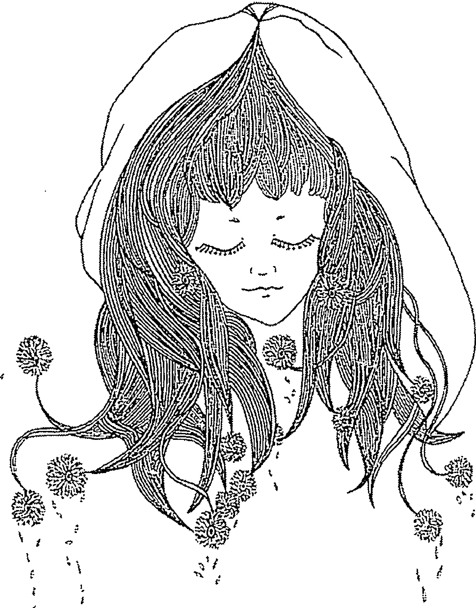

那是一个风雨交加的晚上，我跟随一位迷恋着废墟的画家，穿行在齐尔蒂亚山脉之中。

起程的时候我们放弃了四通八达、有许多交通工具可以快捷到达的大道，选择了最缓慢的一种，从许多交叉的小径中辨别出一条前行的路。画家是一点儿都不担心迷路的，我发誓他是我遇见过的最没有方向感的人，毕竟对于他来说那是一件毫无意义的事情。在我焦躁地比对着因为年老而破旧发毛的地图时，他就在荒野中不知道走到哪里去了，真是不知道辨认那些模糊的字迹还是忍受这位画家更考验耐性。

“你知道吗，地球是圆的，圆怎么会有方向呢？没什么好担心的，只要一直走下去，我们总会再遇见的。”我在野兔子的窝边逮到他的时候，这位画家依然理直气壮。如果把我们这段反反复复、曲曲折折的行进路线在地图上标出来，可能野兔的足迹会显得更有规律些。

一个风雨交加的夜晚，无论在哪个时代，都是一个足够引人入胜的开端。

“那柄剑还在他的手里，赶来的护卫把他包围起来，雨很大，衣服紧紧地贴在他的身上，剑刃上的血迹也早已经被洗刷干净了。杀掉他之后那块在心中团结的沉重的恨意也消融了，自己轻得不知所终，风声很大，他闭上了眼睛。”

“你被撒旦诱惑了，已经不是上帝的子民了。”主教对这位被修道院收养并在这里成长的修士进行了宣判。修道院的大门不顾他的苦苦哀求对他永远地关闭了，在风雨交加的晚上，没人能看得清楚他被黑暗遮盖住的表情，修士在荒野中奔跑了起来。

小镇已经有三年没有下雨了，守着神庙的巫女都携带着绝望开始了漫长的迁徙，角落里、屋梁上、窗户格子之间的蛛网上的蜘蛛都不在了，只有灰尘和沉默留了下来。一切都停止了流动，小镇好像又被掷回了宇宙的以太之中，失重、浮游在虚空里，失去庇护。小镇终于了无生迹，最后的生命被死神收割，变成了死镇，神灵终于悲恸，那一夜，电闪雷鸣，风雨交加。

很多很多的故事，看过的、听过的，其间爱恨狂放恣意汪洋的，或是缜密细腻稳稳当当的，再者热闹非凡跌宕起伏的。时光数十年碾轧过去，能记起的也只有这些零星的片段，大段大段作者费心劳力的人物对白都不见了，一个无关的雨夜却在记忆上留了下来。

遭逢暴风雨的时候是在渐入夜晚的黄昏，环顾一下我们的处境，齐尔蒂亚山脉巨大的山谷的荒野中，天色比平时更早地暗了下来，先是风起，在山谷无数沟壑间散开的风，没有丝毫的方向而言，卷携着山中各种植物的叶子，打在脸上就是一个响亮的巴掌。还要注意从山坡上滚下来的小石块带来的危险。然而让人惊悚的却是声音，强风灌入，撞击在挡住前路的山体上然后猛然转向，野蛮地蹂躏过树木，践踏过河流，不受控制，此起彼伏，重重包围。人在渺小的时候恐惧就大了起来。

接下来是雷电跟倾盆而至的雨水，自然的力量只能在旷野中体验到，在人类聚集地的建筑以及其他人造景观中，人工圈养的自然物像戴着镣铐，温恭而乖顺。然而当你行走在泥泞里，感受到从足底一路传到膝盖的大地的震颤，才知道雷电的狂野，天空中远远的一道闪电划破夜幕根本就是糊弄小孩子的童话，从天而降直击山顶的落地雷让整座山轰鸣，这才是当之无愧的王者的宣言。

画家一如不关心方向一样不关心这场暴风雨，山谷里的风景发生的种种变化，早已经让他应接不暇：“眼睛不够啊。你说，人为什么没有进化出一圈的眼睛？”不去理会这种恶心的想象，我一心想着拉他走得快一些，湿透的衣服和大风已经让我冷得够呛。自然之美、艺术什么的都滚一边去，生存意志才是最强大的意志。如果不是累坏了，我一定会把身边这个所谓的画家一棍子敲晕，没有意识的家伙控制起来才容易，拖着他也比现在的进度要快。

而我可以不计代价等他的时候，也只有在他作画的时候了。有时候很快，他一刻不停歇地移动着画笔，像是被忽然而至的神谕击中，必须在神迹短暂的显像时迅速抓住。这种时候我还来不及数过天上大朵大朵的云，看不到风把它们吹散之后重新的聚拢。更多的时候是我在小憩中几次醒来，都看到他在跟平面、线段以及虚构的空间较劲，流动的光线也变换了好几个角度，他用足够的专注与耐力在跟什么沟通着，那是一个我无法了解的世界，大概是他画笔下的世界，大概是掌管艺术的美神。我总是被这样的人吸引，他们拥有着我永远无法抵达、却能模糊感应的世界。

决定追随画家脚步的决定同样是在一个下着大雨的夜晚，雨伞完全成了装饰物，我卷起湿了的裤筒索性决定在这个乱序的世界里漫步。这个梦境的营造者显然不具有设计或者说规划的天赋，既不像我曾经走过的许多城市那般有着令人惊奇的材质或者脱离常识缰绳的想象，也显然不想把一切规划得井井有条，而是随意地，想到什么就安插一把。所以那段时间我生活的地方没有一条可以畅通无阻的大道，而你的目的地明明近在咫尺了，一条瀑布很有可能出现在你路的前方，你不得不另外选择一条路重新跋涉。

我在一条满是茂密的梧桐树的路上，发现尽头处出现了一座小丘，一条人工的小路歪歪扭扭地攀爬到山顶，在绿色成冠的树丛里露出弧形的天文台。我以闯入者身份出现的时候画家正在墙壁上驰骋他的想象。而我，看见了星空。画家把天文台这张荒废的画纸铺展开波澜的星空，湖水泛青，镜子一样水面的后方垂落到大地的天空，星星不再是孤单的光点，而是炫目如月，形状成带，组成巨大的图腾，漫天全是更加巨大、更为精致的图腾，足以把眼睛全部撑满。

事实上对于色彩我在一段时间里产生了疲倦感，相似的审美需求总是在一个同质的社会中传染开来。人们对于晕染开来的浅色或纯色有了一样的喜爱，轻飘飘的绘画到处都是；人们把微小的情绪当作对世界的敏感，把幼稚的故事当成童话来创作。在那些连接不起来的线和面中，单调重复着，寂寞与孤单、温暖与治愈成了最大的卖点。

而在这个废弃的天文台里，色彩终于自由了，线条恢复了生命的能量，在一个没有桎梏的想象中，它们飞了起来，摆脱了如轻烟萦绕的阴柔，力量从被遗忘的角落中回归，爱回到了原点。

跟着画家在这个没有格局、无比混乱的城市里又待了一个秋冬。其间避开了所有有人群的繁华地带，看着他让荒废的工厂在画纸上重生，被拆除的楼宇留下最后的影像、颤颤巍巍的老人。在用枯叶树枝燃起篝火的黄昏，我们决定走出被工业文明占据的城市，造访尚留有帝国时代遗迹的齐尔蒂亚。

一整个冬天我都待在久违的图书馆，在发黄的书卷里追踪着帝国的步伐，常常在厚实沉重的帝国史里一晃神就是一个下午。还有许多齐尔蒂亚的传说、民间故事，让人失神或者发笑。骑士是如何爱上了王后，失败的暗杀者以及篡权者头颅镶满了王位前的大殿，被弄臣耍得团团转的公爵，战争胜利之后的屠城。

在放下书本的漫长冬夜里，现下的生活跟历史交叠起来。几千年前的先民挣扎抗争，几千年后的子孙们也还是在无边的苦海里沉浮，生老病死，爱恨分合，圈子兜得极大。乐观者积极光明的未来多少年了依然没有到来，悲观者的世界一天一天地坏下去多少年也还没崩坏，历史哪里宏大，儿戏似的，都是幻灭感。

而齐尔蒂亚山脉之旅耗费的时间也远比我们一开始打算的要长，沿途的小镇村庄一待就是我们计划之外的几天。久别乡野之后风景带来的新鲜感都冲击着人的感官，年幼时在山野里随意摘野果、捕山鸡、捞河虾的记忆复活，双手皆痒，林间田地之间来来往往，一天一天过得极快。再者架不住我的劝诱，要画家讲几件路上遇到的奇闻逸事，画家受制于语言的表达力，只能借由画笔在大大小小的纸张上快速描出他在各地游历的见闻。

他所画的所有人物，一律都隐去了表情，然而发饰、服装、背景一切都交代得很清楚。带来的效果是惊人的，并不是想象中的麻木感，而是恰到好处。用画家的话说就是，表情是既不准确又不诚实的表达，写实了的画是不对的又不能矫正，干脆不画，把周围的事物干干净净、利利索索地交代清楚，表情这种东西会自动浮现出来。所以即使是在他笔下的闹区，在熙熙攘攘的人群里，因为姿势的不同，都能浮现出不一样的表情。而在这种时候，我反而对于焦点之外本来作为背景的这些人的表情有了更多的关注和想象。一个人的姿态和表情，足以呈现他的生存状态。

跟着画家的日子里，因为岁月磨损和疲惫倦怠而变钝的观察力一天一天地恢复起来，这当然不是一件全然的好事。途经的众多修道院或衰败或中兴，本属一教，却因为细枝末节上教宗教义的差别而撕破脸皮，反目成仇也不一定，即使是信仰，也划分为三六九等。往稍远处一看，阴影处的命运只显露出嘴角的弧度，分明是嘲讽，是戏弄。这些原本不关心的事情，却在看到某个修士得意或者寂寞的身影时，从意识中折射出来。

如此说来，在某种意义上，我跟画家都是带着对城市的失望而出发的。我不过是这座城市中极其普通的一员，是画家画作中充当背景的角色。正是在这个很大的背景中，在城市中阴郁的脸，一张又一张悲伤的脸努力地在他的意识里扩张，对他的伤害是不可逆转的。

本来想躲过时代的暴风眼，结果还是陷入现实的、乖戾的暴风雨之中，雨越下越大，路的前方消失在黑暗中，下一个可以休息的地方依然遥不可及，我跟画家的衣服被雨水浇得湿透了，冷极了。

## 墨香里的祖父

文 / 潘云贵

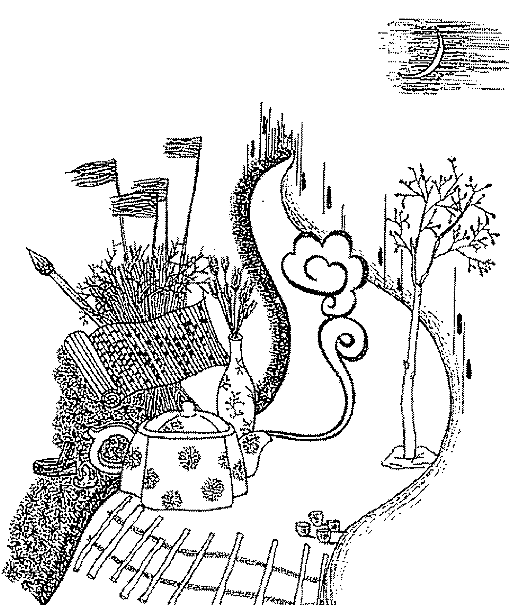

我对墨的最初印象来自祖父收藏的一幅书法作品。

王羲之的《兰亭集序》：“永和九年，岁在癸丑，暮春之初，会与会稽山阴之兰亭……”洋洋洒洒的长卷后，盖有一方印，四个字，篆体，看得不太明了，朱红的印泥，有模有样，当然还只是赝品。

字是在麻布白的宣纸上写的，黑黝黝的百行字，风吹林动一般秀丽。那黑在白里游弋着，像数百尾黑锦鲤在纸页清塘里游弋着，柔美又自然，十分赏心悦目。

花香时节，祖父常在自家庭院里摆好笔墨纸砚，趁着午后徐徐清风，挥毫一番，游侠剑客般纸上行走，笔风苍劲，一派旖旎风景。祖母常坐于其旁，织织毛衣或者采摘花草，抑或是静静看着祖父，时而竟单纯地笑着，像极了六十年前那个刚刚遇见祖父时一脸娇羞的妙龄少女。偶有几只花猫在园子里扑蝶玩耍，这般时光形若能被拂出声响。

幼童时期，自己当然是兜转在长辈们圈定的空间里，安分守己。祖父习字时常叫我取些水来，自己便拿起大搪瓷杯一股脑儿跑到古井边取水。那水自是幽凉凛冽，沾着花草园中的香气，尝几口，唇舌间亦是清香流溢。

祖父的墨，浸水之后依旧浓黑黏稠，那一笔清秀落下，便是千年江南的韵味。而我自小对这墨是惮怕的，鲜丽亮白的衣物，沾染点点，便好似乌羽附着，要想洗净得费好些功夫。母亲清洗这些衣物时自然是不情愿，每次都得嘀咕一番，水乡女人的音调是细长而尖厉的。这使我恐惧。祖父见了倒是笑笑，说：“墨是应该沾的，不沾怎么读书？”那时，我年少，愣头愣脑的，一边被母亲说，一边还在祖父那里沾了一身水墨。

记得雨天时，祖父就喜欢把书桌移至庭院的小凉亭里，沏好清茶三杯两盏，放上几瓣祖母采来的茉莉，洁白通透，砚台上滴着从飞檐上落下的雨水，这般景致自然有水墨画的意境，这是祖父一生追求来的惬意。那时祖父教我练字，我多半是跌跌撞撞地学着，运笔踉跄，行文潦草，不堪入目。祖父笑着，依旧浓密的眉毛松成柔软的笔画，他耐心地握着我的手，一笔一画地书写，一种苍老在我手心里传递着力量。那是来自沧桑人世里的笃定与充沛的情怀。幼时毕竟贪玩，哪能泡在浓得化不开的水墨里过活，便时常糊弄祖父，说身体不适或者功课未做，祖父亦不怪我，让我先把自己的事做好再来习字。每回躲在角落里窃喜的时候，看看在园中习字的祖父而又有小小的羞愧。欺骗毕竟是种罪过。

那时常写的是一些唐诗宋词，王维、苏轼、李清照，祖父甚爱之，每回都会教我写此等骚人墨客的诗词。“明月松间照，清泉石上流”是王维的闲适笃定，“十年生死两茫茫。不思量，自难忘”是东坡的悱恻思愁，“和羞走，倚门回首，却把青梅嗅”是清照的天真年少……祖父这般调教下来，到小学毕业时我便已能将往后学习的诗词识记了大半。

到了中学期间，在父母每日的叨念里身心都汇聚在了繁芜的学习上，跟祖父习字的次数自然是江河日下。祖父常常走到我的房前，犹豫很长时间才敲一下房门，见房内半晌没有回应便独自往老书房走去。而当我开门之时，常常看到的只是一个苍老沉默的背影，渐行渐远。时光前行中，我们总会遗失一些物品在最初的路口，包括心情和故事。风来雨去中，墨香也是会淡的。初三之后，课业更是如猛虎一般袭来，自己基本上已经不碰羊毫了。母亲说这叫回归正道。她和父亲都已经想到要为明天的我铺设一条怎样的康庄大道，而过去那些留在幽幽小径上的芳香景致亦是被他们忽略的。这是大人们对待子女特有的脾性，形同高墙一般的保护，那墙外的点点红梅自然是欣赏不到了。

一日，祖父特地在我一时清闲下来时把我叫到庭院里，学业询问一番后便和我聊起墨事。老人言语轻柔，充满年老书生般的淡然：“还记得以前教你的那些诗词吗？”我点点头，随即背了出来：“十年生死两茫茫。不思量，自难忘……夜来幽梦忽还乡。小轩窗，正梳妆。相顾无言，惟有泪千行。”背得越发起劲之时，却被他的一声干咳打断。祖父又问我：“还记得怎样写？”我说：“毛笔字？”祖父点了一下头。我顿时羞愧难当，因为我对毛笔字早已经没有了印象。我说，“好长时间不写已经忘了。”祖父听完，没有看我，叹了声气，背过脸去沉默了很久。这应是行走在消逝中的老人所不愿面对的一方残垣，透着时代里越渐被遗忘的文化隐忧。风中，树叶沙沙响着，祖父的眼里似乎进了沙子，他用素白长袖拭了一下眼角，便一个人拖着消瘦嶙峋的背影到书房去了。不久便取来昔日那支他万分珍爱的大羊毫，细细抚摸一番后便在我面前折成了两半，像一段被撕裂的历史再也无法复原。我走向前，看着他，无言以对，只配合着他的沉默始终也没说话。话说得多了，内心渐渐变得轻浮，有时我们需要这样一种寂然的时刻，让自己清醒并反省。祖父此时神情忧虑，拍着我的肩，说：“看来有一天这些东西终究也会和自己一道消失。”这句话落在我的肩上，微薄的肩头霎时变得沉重而深深战栗着，像入秋时节里挂在枝头的叶片摇摇欲坠，一种震撼盈满了心间。

大学的诗词课上，时常会背到曾经终日挂于唇边的诗句，自然又使自己想起幼时习墨之景。庭院花草，凉亭旧井，幽幽的水墨香气似一只只清凉凉的蝌蚪，无形地游进心坎。只是时光再也不至彼地，少年们都在哗哗流水中长大。那素素淡淡的宣纸，落着横竖撇捺弯折点，销魂的墨香终究留在了昨日。

突然间又想起了祖父，那样一个仙风道骨般的男子，不着烟尘，爱着他的羊毫纸砚朝朝暮暮，那水墨浅浅的，带着祖母一般的好，醉了清寂华裳。江南三月里，祖父过世了，一城竹兰，伴着篱落新雨，淡香入骨。可在临终前他还交代父亲，要把那只折断的毛笔装在桃木盒里，等待某天我从北方求学归来时能够打开。

“永和九年，岁在癸丑，暮春之初，会与会稽山阴之兰亭……”自己再次念到时，泪水禁不住悄悄滴落。

## 秋天

文 / 赵丹盈

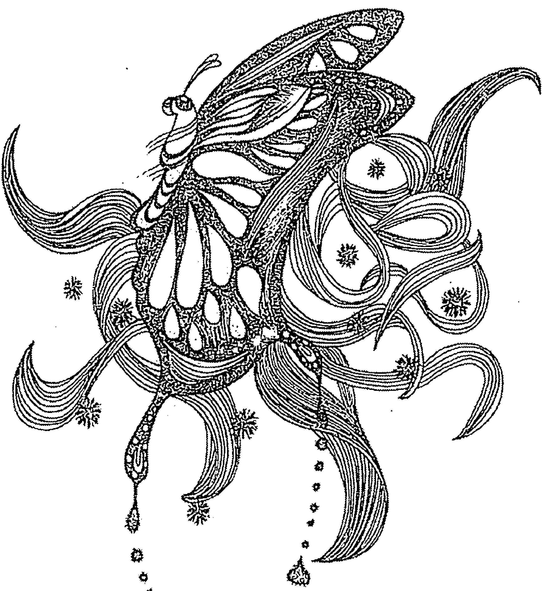

陆朝，你是我整段生命里最好的章节，带着所有的色彩款款而来。

爱是舍不得丢掉的痛苦。已经记不得是从哪里看到的一句话，像是一句预言，恰巧说的就是那时候的我。

我从十八岁的始端爱上陆朝，那个时候他二十七岁，身材偏瘦，却有微微凸显的啤酒肚，短发，每次思考的时候都会咬着下嘴唇，眉毛都纵在一起。陆朝不爱穿很紧身的牛仔裤，也不爱穿很正经的白衬衣，他拿着粉笔的时候总是把右胳膊的袖子撸起来一截，然后小幅度地翘着右手的尾指。

在我的印象里，我很少有过这么细致的回忆，可是在不经意之间想起来的时候，回忆都像是一张张未曾褪色的旧照片，边缘已经开始泛黄，可画面却一直清晰地摆放在脑子里最显眼的位置，等着我去安置。

大部分时间里我都喜欢称呼陆朝为陆先生，先生先生，舌头和牙齿温和地触碰，气流清浅地呼出去，还拖延着最后的尾音，暧昧又不过分。

每次陆朝眯起眼睛笑的时候眼角处都会纵起一点儿小细纹，那些小细纹总是让我不得不想起横亘在我们之间的时光。

不算太长，可却踏踏实实地待在那里，忽略不去。

那时候陆朝教物理，思维活跃，他的课大部分都被安排在下午的第二节，阳光正是懒散的时候。光线顺着一楼窗外的铝合金展板反射到身上，丝丝缕缕的暖意立刻蔓延了全身，然后昏昏欲睡。

我喜欢在半睡半醒之间盯着陆朝看，看着他因为说话而不断开合的唇瓣，觉得整个空间都安静得一无所有，只剩下黑板上他写过的板书。

说不上到底是从什么时候开始喜欢上陆朝的，或许是他生气皱起眉头的时候，或许是他做物理题撇着嘴角的时候，又或许是我在某一瞬间突然发觉我的眼光一直停留在他身上的时候。

我给陆朝写过很多封信，用黑色的碳素笔和彩色的格子纸，然后把每一封写好的信都放进一个天蓝色的信封里，沾染过我身体最暖的温度。信开头的称谓是陆朝，落款是秋天。完整的姓名，没有后缀。

可经过很久之后，那些信还是安静地躲在我的黄色信封里，没有邮戳，依旧只是我一个人的欢愉和悲伤，从未寄出去。

一如我那些不敢见到阳光的情愫。

我每天很多次地路过物理办公室门口，然后透过门缝偷偷地看陆朝，几乎每次他都在低着头看教案，认真而可爱。

很多时候我都只能以这么一种姿态来关注他，卑微而甜蜜。

某个周五的晚上刚好赶上我过生日。我一个人翻墙到离学校不远的烧烤摊子上吃饭，我买了一个特别小的奶油蛋糕，坐在一张很小的圆桌子旁边，要了一提绿瓶子的青岛，已经生了锈的起子被我掐在右手上，一瓶接一瓶地打开了很多银色的啤酒盖子。

嘭。

每一瓶在打开的时候都有这么一声响，我看着二氧化碳化成气体从瓶口缓缓地冒出来。我向着瓶口吹了一口气，就像是吹掉我十八岁的生日蜡烛，更像是吹散我那些细碎而繁杂的说不出口的悲伤。

我说：“秋天，生日快乐。生日快乐，秋天。”

空气里酒精的味道混着甜腻的奶油味，我的喉咙开始莫名地发紧。后来我记得那天我哭了，眼泪都落在大马路上，日后再想起的时候却早就没了痕迹。

我顺着东南角的矮围墙翻回到学校，帆布鞋底触到沙土地的时候突然打滑了，我实实在在地摔了一个跟头。我顾不上拍拍膝盖上的尘土，站起来就开始奔跑，脚底下带起的灰尘拼命地顺着嘴巴钻进喉咙里，堵住了我即将喷薄而出的情绪。

我一口气从操场东南角跑到教学楼四楼，站在陆朝办公室门口，用力地喘着粗气。我说：“陆朝我喜欢你，我特别特别喜欢你，你肯定不知道我有多喜欢你，如果你能看见我的心就好了。”

我在心里用了很大的声音呐喊着，可是站了一会儿之后，我最终还是转过身回了教室。

我觉得当时我一定特别想把自己的心掏出来摆在陆朝眼前给他看，以证明我并没有说谎。

我说陆朝陆朝陆朝，我说我爱你，我说我现在十八岁，等我八十岁的时候我肯定还喜欢你。

可最后一切都是没有声音的黑白默片而已。

高二时我成绩不好，可几乎每个月学校都会组织一场月考，按成绩排考场，我总是徘徊在最后两个考场里，想作弊都找不到正确答案。

平常上课的时候我都在看一些市面上很火的言情杂志，然后跟着很多狗血的情节哭得稀里哗啦。我习惯把那段时间称为“青春期”。

在那个荷尔蒙飙升的年代，我们总有太多的情绪没办法排解，于是只能借着故事里的情节痛痛快快地哭一场。

情绪泛滥，感情成灾，一句话、一个眼神就能触动内心最柔软的地方，轻而易举并心甘情愿地脆弱着。

那时候从我从家到学校需要转三趟地铁，路上来回一共就要耗费一个多小时的时间，可我还是在高二快要结束的时候央求父母给我办了走读。当时走读生有一个特权，不用上晚自习，所以我上完下午的课就可以回家了。

每个班里贴的课程表都一样，整个年级的课都摆在上面。陆朝一周有两个晚自习，周三和周五，周六休息，全校学生都不上晚自习。

那年陆朝刚工作没多久，还没买车，上班下班也要乘地铁，我摸清了陆朝上下班的时间，每天都会去和他“偶遇”。

其实也说不上来当初为什么会这么做，因为即使每天碰到了，我也不会和他打招呼，只是和他保持着不远不近的固定距离，看着他在麦当劳买杯咖啡，一边走路一边喝掉，或者看着他飞快地跑下楼梯冲进地铁，再或者就是看着他站在地铁上的时候身体跟着地铁摇摇晃晃再打个哈欠。

在所有这些行为里，我也不知道到底哪些是有意义的，可我就是能看着他偷偷地笑出来。虽然不属于我，但是我能够远远地观望你就够了。

心满意足。

我在十八九岁的时候，骨子里一直有一种自卑，我甘于平凡，不争不抢。也许那时候的我，就是一个没有梦想、没有追求的人。我从来没想过未来我要做什么，我也没想过我的未来是什么样子的，我像一只背着壳的小蜗牛，整日躲在墙根下，把身子狠狠地缩在壳里，然后欺骗自己世界原本就这么大，生活也会一直这么走下去。

也许我喜欢陆朝这件事，就是我在那个时候最大的不平凡了。

到了5月末的时候学校就开始组织高三的学生拍毕业照，已经临近高考，他们也不需要再穿着校服在学校里晃来晃去。大概有两三周的时间，学校里大部分都是花花绿绿的衣裳，有些高一高二的也钻着这个时间段的空子，把自己的衣服都从行李箱里翻出来每天换一身在学校里走来走去。

我还是穿着那身绿色校服，每个课间都坐在操场的台阶上看高三的准毕业生们拍毕业照。第一排的正中间坐了几个老师，然后整个班里的学生都簇拥在一起，眯起眼睛、露出牙齿、看着镜头。

高考很快就结束了，在毕业生回学校收拾东西的时候，我看见很多人都哭了，在拼了命想逃开的时候没能逃开，在不得不离开的时候却又想多停留一段时间。

这就是青春，也是人生。

我在那个时候想起了一篇文章里的一段话：喜欢一个人应该是想着怎样才能配得上他，或者是，你应该想着怎样才能和他站在一起，而不是像灰姑娘一样躲起来偷偷地想念。现实永远没有童话那么完美，你不要相信他终究会发现你美好的平凡而爱上你，你自己不努力，没人能帮你。天上掉馅饼的事情应该就类似你花一百块钱就想得到一万块钱的享受一样，不仅不靠谱，而且是特别不靠谱。如果你想得到，就别觉得委屈，更不要懦弱地流眼泪。

应该也就是在那个时候，我突然顿悟了，好像豁然开朗一样，不想再做一粒卑微的尘埃，我想让很多人都看到我，最起码要让我看到自己。

在那一整天里我都出奇地安静，一个人把头伏在胳膊圈起的臂弯里，从默默地流眼泪到哭出声音。

整整一个暑假，在很多人都出去旅行的时候我顶着大太阳上补习班，很多人晚上在看电影、打游戏的时候我在台灯下做一本本的习题册，很多人在早晨睡回笼觉的时候我5点半起床站在阳台上磕磕巴巴地读英语。

我在那个时候才明白，我欠下了多少最终还是要偿还回去多少。要让别人看得见我，我就得有让别人看得见的资本。

高三开学之后第一次月考是陆朝给我监考，看着他抱着卷子走到讲台上，我能感觉到自己拼命跳动的心脏，然后拧开桌子上水杯的塑料盖子，咕咚咕咚地喝了几口水。

从那次月考之后我的成绩一直呈直线上升趋势，从最后两个考场蹦到了中间的考场，然后维持了一个平稳的状态。

也许是心里有了底气，再看见陆朝的时候我就冲他笑一笑，我也想跟他说句话，可是我不知道开口是该叫陆老师还是叫陆朝。

真正在我们拍毕业照的那天，天气晴朗得要命，塑胶跑道被阳光烤得发热，我的额头和后背都出了汗。

我站在第二排，冲着远处的镜头咧着嘴，我不知道自己是不是在笑，或者也仅仅只是一个表情。

我站在陆朝面前，有些微红了脸颊，我说：“先生，我想和你合个影。”

陆朝答应得很痛快，我和陆朝站在一起，陆朝的手还搭在了我的肩膀上。

那是我三年里距离陆朝最近的一次，我能感觉到他的体温，能闻到他身上舒肤佳的味道，还能蹭到他衣服上最外层的小细绒毛。

可不过就只是一个闪光灯的时间，我们立刻就又恢复到了之前的轨道上。我还是一个遥遥观望你的暗恋者，你还是我心里那个高高在上的神明。幸好还有一点儿留念，就算是给我一个最好的安慰，或者是一个最踏实的念想。

我在操场上站了很久，看着陆朝和很多人合影，他一直都在笑，嘴角和眼睛都弯起来。直到他和其他老师一起走进了教学楼，我还站在操场上看着他的背影。

或许是短时间内的最后一次，我还是想记得你，用很多记忆拼凑最完整的你。

大学报到那天我给陆朝发了个短信，手机号码还是在高一的时候记下的，三年时间，也不知道他换没换过。我说：“陆朝，我开学了，我会有很长一段时间都看不见你，但我会一直向着你的方向奔跑。”

其实在发短信的时候，我没有期待陆朝能收到，我只是想安慰自己，那句话我也只是想说给自己听。

可是陆朝回复得很快，他说：“加油。I Believe You.”

也许他根本就不知道我是谁，也许他只是敷衍。可我看到之后还是觉得心底踏踏实实地暖了一下子。

大学四年我觉得无比漫长，可那四年里，我开始学着搭配衣服，学着化妆，也渐渐地留起了长头发。在我逐渐的蜕变里，最前方的光亮一直都是陆朝。

你变得越来越好，这才是真正的爱情。

高中三年，大学四年，我把陆朝当成了我的指路标，或者是为了向他证明什么，告诉他总有一天我能优雅地站在他身边，认认真真地跟他告白一次。

大学毕业之后我回了那个城市工作，再站到陆朝面前的时候，我没有口吃，也没有紧张，我用尽所有的力气优雅着。

我笑着向陆朝伸出手，我说：“陆朝，你好，我是秋天，你新来的同事。”

那天我化了淡妆，做了微卷的头发，还穿了一双白色的水钻高跟鞋。陆朝还是露着牙笑出来：“你好，我是陆朝。”

我突然想起我以前给陆朝写过那么多封信，也不知道都去哪儿了。不过也好，反正现在还来得及。

“对了，陆朝，谢谢你愿意等我成熟，更谢谢你让我因为你变得更优秀。”

# PART 3

## 无根之叶蓬勃生长

### 第一权杖

虚空掌握从无到有
最纯粹的能量
这木杖，无根，却有叶
澎湃的生命力，令无根之叶亦蓬勃生长
城堡在远处
河流和树木在召唤
生命力需要流动的去向
或者流向过去
回忆起青春年少
或者流向未来，充满干劲地前进

## 在不经意的瞬间看见回忆

文 / 周宏翔

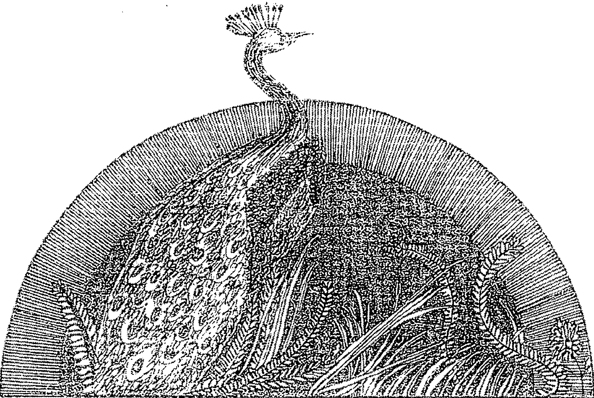

### *1

第一次和刘一刀坐在一起是上政治经济学。因为上课的老教授总喜欢在普通话中飙方言，让人云里雾里昏昏欲睡。当时刘一刀还用高中时的老套路，立着书在后面睡觉。可惜他鼾声太大，以至于最后鸦雀无声的教室里就听见他一个人的呼噜声，于是老教授很不高兴地问候了他，于是全班都知道了他的名字叫刘一刀。

很久以后谈论起这件事，刘一刀说我不仗义，一没有叫醒他，二还跟着全班看他热闹。我想我凭什么要仗义，我们俩又不熟，何况他睡醒时突兀的翘发真让人想笑。刘一刀说：“就因为你不仗义，所以皮鞋甩了你。”这人真不讨喜，一报复就揭人伤疤。那时候我刚刚失恋，整天郁郁寡欢，在酒吧喝得烂醉，恰巧碰见他，他就过来聊，聊着聊着聊到往事，再聊着聊着就打击报复起来。

刘一刀谈金大侠和古大侠，说金大侠含蓄，故事里喜欢和女人谈恋爱

## 橘子不是唯一的水果

文 / 陆晓彤

“我脑袋里好像住着一个乐队。”王宇悄悄地说，话语里有抑制不住的兴奋。

正认真听课的小清转过头，这才发现王宇耳朵里塞着耳机，敢情老师在上课的时候王宇一直在听歌！“上课呢！”小清悄悄地说，话语里有一些被打扰的责怪和恨铁不成钢的恼怒。

王宇掩了掩衣领，好更好地遮住黑色的耳机线，然后继续让乐队和乐手在他脑袋里倒腾。

“这位男生，你是怎么理解这句话的？”实习老师隔着三四排座位对着目视前方装作认真听课的王宇友好地说。小清胳膊肘一拱王宇，王宇神经质地跳站起来，“啊”的一声，班里一些昏昏沉沉听课的同学都被惊醒了。戴着耳机听歌说话的人总是不自觉地特大声，这声“啊”像是乐手通过王宇的嘴跑出来看到外面世界时惊讶地喊出来的。

实习老师脸上的笑也就定在那里了：“请坐，好好听课，旁边的女生能否帮助一下？”实习老师年纪不大，教学经验也不足，碰到这样的场面只好冷处理，再马上请其他同学来回答，好继续流畅地进行教学。

可惜小清会错意，王宇刚一坐下，小清眼疾手快一下就扯出了藏着的耳机。全班盯着被扯开的衣领和那根孤零零的耳机线顿了一秒，哄堂大笑，实习老师也下不了台了。

后半节课，小清胆战心惊，又是恨又是悔的，想着下课真不知道会面临什么倒霉的事，低着头、红着脸胡乱听着课，还时不时剜一眼王宇，怎么摊上这样一个同桌啊。王宇身经百战，对刚刚发生的事早就习惯了，更何况这次还只是个实习老师，怕什么。王宇把脑袋凑到小清旁边，悄悄地说了声“猪脑子”，这真要恼死小清了。

熬到下课，王宇和小清被请到了办公室。王宇心里暗骂一声，但还是一副吊儿郎当的模样和小清走进了办公室。办公室，班主任一脸铁青地坐在椅子上，旁边立着实习老师。小清低着头走过去，王宇一边走一边狠狠盯着实习老师。站定，班主任劈头盖脸一顿教育。王宇心不在焉，他只闻得办公室里有股味道，一瞥，一个老师拿着一个剥开的青橘子，正兴致盎然地看着王宇他们，时不时嘴巴一张一合露出里面被嚼得稀烂的橘瓤帮腔说着什么。王宇心里一阵恶心，顿时觉得橘子也不怎么好闻了，胃里直犯恶心。王宇犯恶心这阵儿，小清早已流了一串眼泪了。当然不是被橘子味熏的，王宇知道，却突然从心里可怜起小清，乖乖女，一根筋，从来没被班主任狠狠批评过，也算是被自己连累，害得她傻瓜似的白流这么多眼泪。这其实哪是批评小清呀，顶多是教育教育她，批评打击的可是王宇同志。王宇早就知道了。一阵狂风暴雨的批评又是一阵和风细雨的教育。未了，念在小清初犯，千字检讨；王宇惯犯，手机没收，两千字检讨。临走，王宇不忘避开班主任抽空瞪了全程参与的实习老师一眼，这梁子算是结下了！实习老师明显愣住了，错愕、慌乱，竟也红了脸像个学生一样，谁知道她在想什么。

也没多少天的工夫，实习老师的课就越上越好了，课堂气氛越来越活跃，打瞌睡开小差的同学明显少多了，就王宇，觉得和实习老师结下梁子的王宇一副爱听不听、要睡不睡的样子。实习老师望向王宇这边的眼神也总有一些不一样，小清说不上怎么个不一样法，但觉得那眼神里不是记恨，不是批评，不是责怪。王宇趴在课桌上，盯着课本上的插画发呆，他才不管什么细微差别，什么眼神里有什么东西。实习老师一看向王宇和小清这个方向，小清就拿手肘拱拱王宇，通常王宇会翻一个白眼给小清，谁知道小清总是时不时拱拱，拱得多了，王宇低声快回一句：“我又没手机了听不了歌，听你的课吧。”小清只好作罢。王宇心里烦着呢，因为这个实习老师，手机被没收，脑袋里的乐队也没了，还白写了检讨，再摊上一个单纯得很，又爱管闲事的同桌，真是作孽呀。实习老师的声音铿锵有力，一字一句打进王宇的耳朵里，可王宇觉得远没有住在脑袋里的乐队演奏的歌曲好听！

日子不温不火，小清能明显感受到王宇对实习老师的排斥，虽然大家越来越喜欢实习老师的课，但唯独王宇在大家兴致勃勃的时候一副蔫样。大家走入课文人物角色时王宇还是王宇，大家进入课文情境中时王宇还是在教室里什么也没感觉到。渐渐地，王宇不听课，小清也不再用手肘拱王宇了，谁管他呢，随他去吧，活该下课常被实习老师请去办公室，死性不改。

等大家都快忘了那个课堂上王宇和小清摆出的乌龙事件的时候，实习老师也差不多要走了。这个时候的实习老师不再是刚来时羞羞答答不怎么会处理突发状况的小老师了，而是和同学们混成一片、上课游刃有余的准青年教师了。实习老师要走，大家生出了很多不舍，很多同学早早地就在准备给实习老师的离别礼物。小清郑重地给实习老师写了封道歉信，抱歉在老师的课上和王宇闹了这么大一个洋相。而王宇呢，小清看到王宇还是一副满不在乎的样子。

实习老师挂着泪走了。

谁说王宇不难过，不舍得？

回到家，王宇翻开语文作业本。每天的作业批改下，都有实习老师鼓励的留言，周记本里，作文的修改意见写了满满一页。王宇还想起实习老师在办公室里推心置腹地和他聊天，还有小清常说的那些个眼神。这些都没有改变王宇啊，王宇还是常常走着神儿听课，这些都没有用吗？王宇突然觉得翻江倒海地难过。那次在办公室被收走手机后，王宇恶心橘子，再也不吃橘子了。橘子不是唯一的水果，不吃橘子也不缺这点儿维生素摄入，可是实习老师呢？还会有老师以这样的方式关心他吗？

王宇不知道，王宇只觉得后悔。

## 流动之水自清 ，圣杯一

和平之鸽衔着希望飞翔
清澈的水流，大地的恩典，映照着蓝天的情之池塘
永不枯竭的爱，水既可以倒流亦可以顺流
感情如是
回馈与舍得
唯有流动的能量
保持纯粹

## 灯 光 影 年

文 / 晏宇

那天夜里，我和黄振龙走在校内的林荫道上。那是一个迷离的春夜，空气中飘浮着湿漉漉的水雾，到处都明晃晃得似乎能照见人的影子。头顶的树荫深处不断有暖黄的灯光掉落下来，斑驳深浅，积满了那条长街。我们就在那样的一条路上走着，一边随意地聊着天，身旁不时传出车辆经过的声响，草木在四周散发着夏天即将到来的气息。多少年过去了，画面始终在记忆中流动着，如同一幕没有完结的电影。我还记得，路的前方总是悬挂着一盏灯，远远的，灯光却仿佛能够沾衣似的，总是寸步不离地跟随着你。有时不经意抬头，透过迷离的夜雾，似乎能看见高中毕业聚餐的晚上，玻璃杯里啤酒与冰块的折光。

然而往日是不会再回来了，无论其中有多少沉默与怅惘。我只是觉得，我们这样走，就像是背对着过往年少岁月的一种回忆冲动。只是那些时光在回忆中依然鲜明，我们却都已经回不去了：那些相遇而未曾相望的视线，想说却从来没有开过口的话语，那些行动和背影之间隐藏着的可能性，还未曾开始就已经全都落幕了。如今只剩下我们，在这条灯光林立的路上走着，脚踩着满地的斑驳碎影，还以为是旧年曾经落地的阳光……

大学军训结束前夜，我接到黄振龙的短信，他问我愿不愿意做他的女朋友。我看完之后脑海中反应过来的第一句话就给他回复过去了。我说：“你不是在开玩笑吧？”

那边没有传来回答，终究沉默。

## 二

我最初认识黄振龙是在高中，那也是在新生军训时。那次军训给许多人留下了无法忘怀的记忆。我在的那个班当时按照惯例和外班有一场篮球友谊赛。我还记得那次班里的男生进场之后便低头围聚在一起，不知在商议些什么，接着便集体齐刷刷地脱去上衣，光着膀子上阵，在场上场下激起一阵不小的轰动，看得本班、外班女生目瞪口呆。只是那次我们班输得特别惨，比分以9比39完败。而赵川当时也在场上。后来我问他赛前是谁出的主意，他说忘了，但感觉是一生的耻辱。

黄振龙那次并没有上场，而他也并不是不会打篮球。我早觉得此人脑子比别人要机灵，时常善于审时度势。接下来发生的一件事情证明了这一点。当时训练我们的是一个脾气特别暴躁的教官。一次队列操练的时候，一个男生动作失误之后不服气顶了两句嘴，于是被教官飞起一脚当场踹倒在地。那男生从地上站起来时，整个肩膀都在发抖，却强忍着全身的冲动一言不发。在紧张的气氛之下，站在他身旁的黄振龙突然被叫出队列。教官说：“我要拿你做示范，你先给我摆个动作。”黄振龙于是摆了个踢正步的动作，姿势无懈可击。教官转了两圈，挑不出毛病，冷不防却从身后伸脚去踹黄振龙那条伸直的腿。只见黄振龙身形一闪，灵敏地晃过，旋即又恢复成标准的正步姿势。我们见状都忍不住笑了出来，周围剑拔弩张的气氛也顿时缓和了。

那次军训，让我一次记住了黄振龙与赵川两人。

在沿途的树影里，灯光仿佛穿透昨日而来。我问黄振龙：“你多久没见到赵川了？”黄振龙说：“你还是老样子，没变。”我说：“谁要你们两个军训的时候就站在一起，而且还双双被教官整呢。”黄振龙撇撇嘴，大意是想说“我跟他不一样”。我却自顾自地想：谁要……你们又不约而同地都坐到我的身边来呢……

那个座位的安排完全是偶然的，多年后回想起来，我却觉得那仿佛是冥冥中的一种预定。记得那时班上的位置是两张桌子拼成一组，我刚好坐在右边，和黄振龙的位置中间只隔着一条很窄的过道。而黄振龙的同桌正是赵川。

而我很快地和他们混熟。从小到大，我似乎总是喜欢和男生打交道。小时候总是跟着他们没心没肺地追逐奔跑。直到十二岁那年夏天，我玩得太累，一个人靠在一棵大树底下睡着了，醒来后发现伙伴们都一哄而散。我一个人爬起来，站在树下，呆呆地看着头顶枝叶缝隙里漏下来的仲夏季节的阳光，不知道时间过去了多久。从那天起，我的行为就莫名地收敛了。回去之后父母对我训话说：“你已经长大了，以后不能再像这样男女没有界限地疯玩下去了。”直到今天我还没弄懂，在生命的某个时段，自己怎么会突然不明不白地成了所谓的女孩子，仿佛那个时刻到来，世界注定了要你这样，你就只有照这样来生存。可我还是怀念童年那个无所顾虑的时代，我也仍然喜欢和男生交朋友，感觉同女生相比，跟他们在一起多了几分不一样的豪爽与直率，和他们聊天，话题也更加天南海北。

我记得那时黄振龙与赵川是出了名地要好。他们俩分别担任班里的物理和化学科代表。可是不知为何，化学好的那一个在当物理科代表，而物理好的另一个却当上了化学科代表。高中时代理化向来是不分家的，再加上这两个人平日里又总是出双入对形影不离，我们便习惯了将他们俩当成一对搭档进行捆绑式联想，有事叫上其中一人的时候也必然不会遗漏另一个。

对我而言尤其如此。

记得高中课堂上，他们私底下聊天时冷不防就会找上我，导致许多节课就这样变得形同虚设。有时我良心发现，便会小声提醒他们现在是上课中。于是黄振龙就会露出一脸悠然的神情不置可否，赵川就会抬头假装用功地猛盯一阵黑板，然后伸过头来说：“咦，你居然还在听课啊！”

赵川时常说天才的标志就是无师自通，可我觉得那简直是中学时代最大的谎言。然而我们当年对这种说法却是膜拜得五体投地，仿佛天才果真可以一蹴而就，只要不去用功读书便能炼成。可想而知绝大多数人最后发现自己学习不刻苦之后依然不能成为天才，或者是伪装了的天才。譬如赵川，时常吹嘘自己夜里打游戏打到凌晨几点云云。这也算不上什么传奇经历，不过后来我们怀疑他的黑眼圈并不是所谓的游戏熬成的，倒真有可能是夜里在拼命用功读书。

就是跟着两个自诩为天才的人物，所以我也被迫走上了成为天才的修炼道路，比如上课无聊时就跟他们打赌十五分钟之内背熟三十六计。英语课上听写单词的时候，老师让写完相互批改，我就趁机偷偷把默写三十六计的纸条传给赵川，他批改之后打了94分，因为我漏写了一个“移花接木”。不久，黄振龙从桌子底下递过来我经他批改过的听写成绩：64分。按理说应该是59，多出来那5分是他不知怎么移花接木给我添上去的。

## 三

赵川是个奇特的人，比如他会在午饭时候坐在教室中间高谈阔论一些让人听了就忍不住想呕吐的话题，又比如他有一阵很受班主任物理老师的宠爱，于是有点儿得意忘形，一屁股便坐裂了教室门口那个千年没用过的陈旧盥洗池。而身为物理科代表的黄振龙却没做过任何引人注目的事情。我不知道黄振龙化学那么好怎么会被当成物理科代表使唤，不过他和赵川在这两门科目上也确是棋逢对手。

而那时赵川也经常做一些让女生觉得莫名其妙的小动作。比如说突然地绕到你身后，猛地弹你耳朵一下就溜走；又或者，以偷窥女生隐私为乐。尤其是他偷看我日记，指着我回忆初中的时候偷偷暗恋学长的那一段说，写得真恶心。结果我举着日记本满教室追着他打。

那个时节最容易滋生各种流言蜚语。久而久之，就有朋友在课堂上偷偷从前边扔过来一个纸团。我揭开，上面写着：“你觉得黄振龙与赵川有什么不同吗？”

我仔细回想，不同的地方？也许有吧……比如打篮球的时候，赵川和其他人都争着去当前锋，而黄振龙却只是耐心地独自在一旁练习投篮；又比如出去玩时遇到出租车乱跳表，赵川就会跳下车冲着司机破口大骂，而黄振龙却是心平气和地讲道理，可是……

“如果黄振龙和赵川让你选，你选谁？”

我顿时觉得头上长满了黑线。我在纸的背面写上：“怎么问这个问题？”

“有人想知道你的看法。”

“我的回答是：他们对我同样重要啊！”

她横批了我一个巨大的问号——“那总有一个更特别吧？”不但把那个“更”字重重地圈了出来，下面还加上一句：“难道你想一脚踏两船？”

我看了简直哭笑不得，大笔一挥，在纸上圈了一个更加诡异的问号然后扔回给她。不料用力过猛，纸团越过她头顶，直接掉进了教室前端的垃圾桶。班主任看到了还以为是男生扔的，轻描淡写地说了句：“上课不要练习投篮。”全班顿时哄堂大笑。

那的确是我高中阶段最快乐的一段时光，一种纯粹的、不分彼此的快乐。有时在一旁看着那两人勾肩搭背、你捅我捶的样子，竟也会不自觉地从内心发出微笑，替他们感到高兴，一个人偷偷自在地满足。我觉得自己正在见证男生之间的伟大友谊，在这种忘我精神的感召之下，我也根本没有想过要去区分谁又是谁。

上大学之后，我就再没见过赵川，倒是黄振龙的学校跟我离得很近，中间只隔着一条马路，偶尔会约出来一起沿着他就读的N大校园内的林荫道散步。我们有时也会聊一些往事，只是没有赵川，一切仿佛缺了些什么。就如同从前黄振龙不在时，我和赵川单独在一起时也不知该聊什么话题。只有我们三个人聚齐的时候，互动才能真正展开。他们就那样始终不可缺一地在我身旁存在着，直到很久以后我才发现他们原来是那样不同的两个人。

我不知道后来夏云每次笑吟吟地看着我的时候，眼中是不是也掠过这个问题的影子。

我也永远不会知道，她心里有怎样的答案。

走在那条路上时，黄振龙问：“你去看过他们吗？赵川和夏云，他们都在S大。”我回答说：“上次路过时曾想过去探望的，结果后来在S大校园里迷了路，加之又忘了手机号码，就没有见着。”

我没有告诉黄振龙，我其实在路上与夏云通了电话，然后便突然打消了主意。

很久以后我有时会想，如果没有夏云的到来，事情会不会就不一样了？只是岁月里并没有太多的“如果”可以追溯。当她如同一个催化剂来到我们中间，时光中所有构成的分子和原子都在不经意间慢慢被改变……

## 四

高中时候班里的座位每两个月就要调动一次。有一次我坐到了靠墙的第四组，和周围的人分开，彼此相距整个教室的宽度。

那段时光比想象中还要漫长。起初，黄振龙和赵川总是在课间横穿过教室来找我聊天。久而久之这举动便显得有点儿扎眼了，周围的人开始心照不宣地拿我开玩笑，有些人还每天打赌，看他们两个谁会先来。我一看情况不妙，便连忙跟他们打招呼让他们少来为妙。反正只是一两个月不见面而已，我想。而且，我仿佛总是极力维持着内心天平两端微妙的平衡，不想让重心过于倾侧向一端，从而影响到三个人之间同样显得有些微妙的关系。

只是，两个月过后，当我兴冲冲地抱着一堆书和本子去跟他们会合时，夏云因为换座位调来了我们身旁。

平心而论，我并不讨厌夏云。那是一个长相异常甜美的女生，五官平凡却像是精心搭配过一样，脸上时常挂着抹不去的微笑。只是她同男生和女生说话时的音调却不同。在前者面前，那嗓音像是抹了蜜似的，总带着一种说不出的娇柔和甜腻；但是面对后者，倘若不是有求于人，嗓音便粗重了许多，似乎总掺有某种不耐烦的意味。而她竟然能够拿捏得恰到好处，并不容易让人觉察，我一直觉得她在声音转换方面简直具有某种天赋。

记得有一次课间，夏云脱去了上衣，露出里面柔软的细腰。她经常在校服里面穿上一件让体态原形毕露的紧身T恤。不可否认，她的确有个好身材。

女生们像平时一样聚着聊天，她们好像在兴致勃勃地谈论什么话题，而且似乎是由夏云发起的。忽然有个叫彩嫦的女生说：“班里面我觉得最漂亮的是袁嘉，袁嘉如果头发留长一点儿，外形再稍微淑女一点儿，就更好看了。”

她的声音不知为什么显得非常响亮，周围的人，连同黄振龙和赵川，都不约而同地转头朝这里看来。我因为早上差点儿迟到来不及吃早餐，正利用这点儿时间争分夺秒地狼吞虎咽，忽然听到有人喊自己的名字，莫名之中抬头，正遇上来自不同方向的目光刹那间全集中在我脸上。我还纳闷怎么突然那么多人盯着我看，后来才发现，口里还塞着半截没来得及下咽的面包。

彩嫦瞥了我一眼，目光中似乎隐隐有些失望，而夏云的笑容仿佛凝固在了脸上。我这时隐约听明白了她们的谈话，莫名地觉得自己有点儿对不起人。我费力把面包咽下去，刚要开口，却看见夏云满脸堆笑，用我从没听过的娇美声音叫道：“彩嫦……”

从那天起，夏云和彩嫦就成了朋友，后来我总看到她们出双入对，十分亲昵。没人再提那件事情，只是黄振龙偶尔会问我：“你为什么总爱把头发剪那么短？”我总是白他一眼说：“是学校规定女生统一要剪发的！”

## 五

不知从什么时候开始，夏云开始有事没事地来找黄振龙闲聊，有时也挑逗赵川嬉笑打闹一番。因为她正好就坐在两人的前排。有时我们三个像往常一样聊得正开心时，她却会在中途横插进来，最后总把话题绕到她自己身上。这不能不引起我的警觉。况且，她会在偶尔转过头时，似有若无地看我一眼，眼中噙满了笑意，嘴角上扬间却似乎总藏着那么一丝嘲讽。

久而久之，她的笑容时常令我感到如芒在背，于是便埋头自顾自地写作业，装着对眼前发生的一切不予理睬。只是，有些时候，特别是当夏云甜得发腻的笑声传到耳边时，我便感到内心什么地方被偷偷抓挠似的一阵一阵难过。然而夏云在班上的异性缘非常好，很多男生都喜欢围着她转。我总是想到这一点，不知是要安慰自己，还是感到了某种危机。然而我又不想让自己去讨厌夏云，她总是对你那样微笑，说起话来亲切友好，而又是一副纤柔娇弱的样子。面对她的微笑，我忽然感觉自己是那样笨拙，像一个幼儿园孩子似的不知所措。而她的笑容，又像是在狠狠地嘲笑我。我别无他法，只有对一切假装视而不见。

然而慢慢地，我开始感到了孤独，这孤独日复一日地沉重，吞噬着内心。然而我又不想和夏云正面起冲突，有时候我想，也许是缺乏勇气吧。

大学军训之后，我有很长一段时间没见到黄振龙。就这样过了将近一年，N大的一个密友忽然打电话来说：“黄振龙已经从大学城搬回本校，你赶紧抓住这个机会叫他请客！”我才想起，黄振龙原本不叫“黄振龙”，那只是我室友给他起的绰号。他在军训期间追求我的那段经历在寝室里似乎人尽皆知，而且她们都知道他至今还欠着我一顿“黄振龙凉茶”，那是他军训期间答应要请我的，只是后来这个承诺一直都没兑现。

但久而久之，我也便觉得黄振龙仿佛真的叫这个名字，就像岁月的流逝之中我们记住的往往不是某个人的名字，而是他留在我们心底的代号。我和他见面，他请我去吃了一顿必胜客，但谁也没有提凉茶的事情。

那天夜晚，从必胜客出来，我们又走在旧日那条林荫道上。聊起往事，两人都哑然失笑。只是当提到夏云时，话题就会突然变得沉默。她仿佛一直都在我们中间，俨然不容忽视似的，无可回避。

我有段时间真觉得夏云喜欢上了黄振龙，想起她总是缠着黄振龙，笑眯眯的样子，我不禁情愿这样联想。而黄振龙对此也表现得来者不拒。我时常想，这些男生，有夏云这样的美女当前，他们心里说不定很享受。过去课间，原本是我跟赵川还有黄振龙在一起聊天，到后来竟变成夏云和黄振龙大谈特谈。而当他俩谈兴正浓的时候，我便在一旁费力地演算那些复杂的习题，或是捂起耳朵背英语单词，暗自心想，幸好还剩下赵川跟我是同盟，我们都对眼前这幕情形无法忍受。

一个晴朗的星期六下午，我一个人回学校上自修。教室看上去与往日有些不同，四周空空荡荡得没有半个人影。我来到自己的座位，忽然看见旁边黄振龙和夏云的椅子居然摆放在一起，脑海中浮现出上午的情景，夏云问他一道数学题，便将自己的椅子挪了过去，放学后便留在了那里……

午后阳光斜斜地照射进来，空气明亮而安静，两张椅子如同两个人头挨着头、肩并着肩一样摆放在一起，似乎在传达一种甜蜜的、意味深长的暗示。此情此景，睹物思人，我竟然看得呆住了，反应过来时，脚下差点儿站立不稳，很久才慢慢地、颓然坐在自己的座椅上。

而赵川的座椅不知被谁拉开，仿佛弃置在一旁，在四周的凌乱之中异常触目。

## 六

我开始无端地眷恋起过去。总是觉得，最美好的都是那些已经一去不返的时光。那时可以毫无顾虑地和黄振龙说笑，与赵川打闹，放学后看他们打篮球时帮他们拿衣服，然后一起到小吃店喝汽水，可以跟赵川激烈地争论问题甚至对吵，因为有黄振龙在旁调解最后相安无事……可如今多出了一个夏云，一切就似乎全变样了。她总是恰到好处地出现在相应的时间和地点，每次都打乱我一直苦心维持的平衡局面。时常她朝其中一个人说话的时候，眼神却看着另一个，偶尔眼角的余光还会斜瞟我一眼。我们三个人总是为此各怀心事，谁都琢磨不透她的用意。有时，我却感觉她并不是真的想对那两个男生说话，她和他们说话时，所有的注意力都有意无意集中在我身上。我能解开复杂的应用题，可是面对这样的眉目官司却如同坠入云里雾中。

然而，不知不觉间，两个男生的关系却开始发生变化了。

升上高二，换了班主任之后，全班的座位都打乱了重新洗牌。黄振龙仍坐得离我不远，赵川却被调到了教室的尽头。上课时总是与坐在对面的一个姓姜的男生一唱一和，中途打断老师讲课，于是两人被大家戏称为“南姜北赵”，听起来仿佛是“南腔北调”一般。

而赵川的举动却宛如一个信号，他已经不想再让自己总是跟黄振龙联系在一起了。

这种情形被我看在眼里，并忧心忡忡。

艺术节临近的时候，我终于找到了一个机会。那时班里要排演一出话剧参加学校的比赛，而导演的任务落到了我头上。我便趁机拉了黄振龙与赵川二人加盟，希望借机弥合两人近来不知为何产生的裂痕。他们都答应了。

接下来的日子，一群人关起门来准备排演。有一次为了赶时间，我主动走过去帮黄振龙系领结，因为他的戏服是一套旧式西装，打理起来非常麻烦。但不知为什么，那个领结怎么也系不好。我以前从来没有做过这种事情，第一次和一个男生站得那么近，近得几乎能够感受到他的呼吸，我竟无端地有点儿心慌意乱，手指也不听使唤。而黄振龙一直没有出声，非常乖顺地站着任我摆布。周围的目光都集中在我们身上，气氛变得有点儿微妙，当我终于哆哆嗦嗦地把那个烦人的领结整理好时，外面忽然传来了敲门声。我抬头，看到赵川走过去开门的身影。忽然一种奇特的感觉产生了，我仿佛觉得这段刚刚产生的距离刚好把我们隔开，在另一端他的身影越去越远，一直远到我伸手再无法碰触的地方。刚才那幕情形一定被他尽收眼底。

那天站在门口的是夏云，她自己另组了一个班子排演另外一出戏，而且公开地上门找我要人。我说这里的人都纯属自愿加入，无论来去都随他们自己的意愿。夏云找了黄振龙，但是被回绝掉了。于是夏云笑着对我说：“既然这样，让赵川到我们这里来吧。”我刚想问赵川，他却一口答应了。

我和黄振龙合作的话剧公映了并且获得了热烈反响。而赵川，夏云并没让他参演任何角色，而是在排练的时候支使他当勤杂工搬运道具。但赵川居然跑上跑下乐此不疲。不久，周围人都看出来，赵川迷恋上了夏云。而夏云只要朝他嫣然一笑，温柔地说上两句话，就足以使他心甘情愿受任何摆布。

而最令我百思不得其解的是，我一直以为夏云的目标是黄振龙，谁料到一转眼就换成了赵川，而且对方还一点儿都不像我所认识的那个赵川。每当看见他傻乎乎地对着夏云言听计从的样子我都恨不得照他脑袋捶上一拳，看能不能让他清醒过来。从夏云甜美而意味深长的微笑中，我仿佛隐隐察觉到某些动机，但却希望这只是我的错觉。这种感觉，就像是重要的东西被夺走了，而且还要因为它落到了陌生人手上而患得患失，担心被损坏了一样。

有一件事我没有告诉黄振龙。大学军训后不久，我有一天夜里看到赵川的QQ上线，忽然觉得他就在屏幕那一端，那么近，仿佛触手可及，而又那么遥远。我忽然很想跟他说话，又想问他夏云怎么样了，踌躇了许久却还是没有问。

因为莫名的孤寂，我一个人去了S大，最终却没有勇气去找赵川，于是又独自搭地铁，沿原路返回。

那个夜里，空气中弥漫着潮湿的气息。我在S大空无一人的校道上走着，路旁积水倒映着车灯的影子……灯光散落在四周，明晃晃的，如同千丝百结的花朵。然而，灯与灯之间隔着的黑夜却无比遥远……

我因为无人可识而一个人走在路上，毫无目的与方向地走着，脑海中翻来覆去只有一句话：赵川，你这笨蛋……笨蛋……

去S大的路上，夏云在电话里告诉我，赵川还在追她，而她已经有男朋友了……

## 七

在旁人眼里，夏云对待赵川的态度其实和其他男生没有差别。她总是逗引男生围着她团团转。而很多人早已看出夏云其实并不有心于赵川，他们仍趋之若鹜地去接近她。夏云便周旋于众多男生之间，并在女生中远近闻名。可是我却仍然觉得她待黄振龙和赵川与别人不同，那仿佛是一张她用以自恃的王牌，其中的奥秘也许我不了解，也许又觉得自己隐隐知道。

初夏的夜晚，乌云笼罩了城市的上空。顶楼教室里亮起成排的日光灯。那应该是一个雨夜，只是天空一直隐隐闪动着，雨点很久都没有落下来。在这样的夜里上自修，心里会有一种奇特的感觉。高中毕业考临近，每个人，包括平日里最不用功的学生，都被迫把自己埋进书山题海。

课间的时候，我坐在桌前，手捧一本数学题集埋头苦读。夏云就在不远处，我坐的地方刚好能够听见她的声音。她身旁围绕着几个男生，赵川也在其中。我听人说，这些天晚自修后夏云一直都叫黄振龙送她回家，而赵川明显有些焦虑。

不知为什么，我装着视而不见。过了一会儿，夏云娇滴滴的声音传来：“赵川，看书看得好累啊，你来帮我捏捏肩……”

我顿时觉得耳朵好像被什么捅了一下，但仍当作没听见。可我听到远处起了一阵骚动，只见夏云如慈禧般地端坐在当中，而赵川果真站在她身后，两手在她肩头按压，而夏云伸出的一只手，正搭在他的手上。周围似乎射来一两道嫉妒的目光。

我看了两眼便低下头去，继续装作若无其事地与那些复杂的xyz天人交战。忽然，鬼使神差地，夏云的声音响了起来：“你们看，袁嘉在那里做题啊！赵川，你帮我向她借那本书来看看好不好？”

她还是用那种慵懒的、尾音拖长了的腔调在说话，而我简直没法相信自己的耳朵。赵川显然犹疑了一会儿，但还是不情愿地踱了过来，遇上我的目光时眼神有些躲闪。

“嗯……那个……借来看看……”他吞吞吐吐地说。

我说：“你没看到我正在复习吗？”

赵川说：“打搅一下，只借一阵就还。”

我没好气地说：“谁要看，你叫她自己来。”

赵川明显有些急了，朝远处瞟了瞟，低声用恳求的语气说：“拜托，借一下，看在大家往日都那么熟的分儿上……”

我一下子火了，没等他说完，便霍地起立，用书指着他的眼睛，大声地说：“赵川，我究竟做了什么……值得你这样对我！”

说完，自己都感到声音在发抖。而赵川似乎蒙住了，半天没回过神来。我见状更加气急，忍不住抓起书狠狠地朝他脸上砸过去。混乱中耳旁传来夏云的尖叫：“哎呀，好粗鲁！”书本落地时，响声异常清晰。周围顿时一片仿佛从来没有过的安静……

我再也忍受不下去了，转头便冲出了门外。

## ………………… 八 …………………

晚自修的铃声已经响过了第二遍。

我坐在楼顶的水泥桩上，抬头望着天空。四周一片安静，起初还听到楼底下隐约传来的喧闹声，铃声响过之后，便慢慢陷入沉寂。这里通常就没有什么人来，夜里更是人迹罕至。平时我一个人肯定不敢上来，而现在，我却坐在这里，在这片灯光的孤岛上，逃离了所有人。一种比恐惧更为强烈的东西驱赶着我来到这个地方，只想一个人静静地待着，思考一些事情。

天边仍在隐隐地闪动着。顶楼的入口处有一盏陈旧的路灯，橙黄色的灯光洒落下来，映出墙角潮湿的痕迹，四周有几只蛾子绕着飞舞。灯光边缘则是一片深不可测的黑暗。我凝视着那里，内心的某个角落也似乎被那盏灯照亮着。

我想，我究竟是为什么呢？为什么会冲赵川发火，为什么不敢大声把心里的想法说出来？我虽然像是很有理、底气十足地冲了出来，但只有我自己知道，我其实是落荒而逃，自己也不知道自己究竟在逃避什么……

云层中一阵剧烈地闪动，明暗交接之间，一个念头涌上脑海，内心在刹那间似乎被照得通明：我在害怕夏云！

尽管时常对自己说，我不是夏云，我不会和她一样，以那种手段和方式……然而内心深处，我难道就不曾有过与她同样的想法吗？我难道不曾暗自希望那两个男生始终能够围在我身边吗？我的这种想法，本质上和夏云的又有什么不同呢！

但是从另一方面说，也许是一种羡慕也未可知。我从来不像夏云那样，把自己天生的优势运用得理所当然、淋漓尽致。我只有隐藏起自己女孩的一面，伪装成男生的性格，才能自如地与男生相处。我总是逃避着内心真实的自己，总是想保留童年时那种单纯的境界，却从来也不管周围的世界是否能够回到当初……

顷刻间，闪电的白光照亮了四周，过往的一切清清楚楚地展现在眼前。在那一刹我忽然想，也许，我错了，一切只不过是我的一厢情愿，但或许连我也早就隐隐察觉到，夏云那样的方式，才是他们真正想要的！只是我过去一直不愿承认而已！我一直费尽心机想要逃避、想要忘却的界限，男女之间的界限，原来自始至终一直都存在着！但事到如今知道这一切，我又该如何回去面对他们……男生和女生之间，难道真的没有纯粹的友谊吗？男生与男生之间呢，又是什么？

想到这里，胸口似乎微微有点儿发烫。夜风扑面而来，潮湿的气息钻入我的眼睛和鼻孔，眼前升起一片温热的水雾，冰冷的感觉却如同雨水般从四面八方袭来，淹没全身。

后来，天空终于飘起了蒙蒙细雨。雨丝细得几乎无法觉察，只有在灯影里才能看见无数丝丝分明的形状，毫发毕现，从四面八方的天空中飘洒下来，鼻孔周围顿时涌上无数新鲜的气息，我抬起头，贪婪地呼吸着雨水，只希望自己被这场雨彻底淋透。

天台的入口，站着一个人影。我的心猛地一跳，抬头望去，以为是赵川，定睛一看，却发现是黄振龙。他站在那里，不知道站了多久，头发沾上了一层细密的水珠。

我心里忽然掠过一阵淡淡的悲伤，像是被雨水冲洗过，说不出话来。

我对黄振龙说：“不要告诉赵川我在这里。”

黄振龙听后先是一愣，然后淡淡地说：“你就不能跟我回去吗？”

我说：“我不管，反正你们都是一伙的！”

黄振龙说：“他是他，我是我，你怎么总把我们当成一个人。”

我一动不动地坐着，过了许久，黄振龙似乎有些失望。他终于一言不发地转身走了，剩下我一人独自坐在那里。

那天晚上我回去之后就病了一场，心里却庆幸这场病仿佛突如其来，好像自己有意找了个理由可以不用去上课。

几天之后我回到学校，却听说黄振龙与赵川似乎吵了一架，然后关系彻底破裂，据说是为了夏云。据说赵川私底下找了黄振龙，两人不知为了什么事摊牌。其后黄振龙却依然我行我素，每晚放学照旧和夏云一道回家。赵川知道后，便再也没有跟他说过一句话，见了面都是冷冷的。两人之间的裂痕已经无可弥补。我们三个人也不可能再回到过去，而彼此都不约而同将一切归于沉默。

甚至长久之后，每当回忆往事，都只听见岁月的风从沉默中无声地穿过。

后来有人告诉我，那天夜里赵川打着手电筒在整个校园里到处找我，只是他唯独没有想到我就坐在楼顶的天台上。知道了这件事，我竟无端地感到了失落。有时女生的心事就是那么奇怪，一次失落就可以失落很久，很久……

## ………………… 九 …………………

很久以后我想，也许对于那些男生，夏云真的比我更明白，然而她的方式却是我一直都在逃避的。我逃避的缘故也许是想证明自己能够超越她，即使是用另一种方式也好，可我最终还是输给了她。虽然她并没有真正珍惜过他们，可她毕竟在他们的青春里留下了印记，许多年之后至少也能被当作特别的回忆来怀念。可是我，在他们的年华之中只留下大片大片未能填充的空白，而且永远无法被填充。

他们对我一直是特别的，但我却从来没有告诉他们，也从来没有表达出来。我总以为我们三个人，可以永远自由自在地相处下去，度过那些没心没肺的嬉笑岁月。我忘记了人总是会成长的，时光会把一切都改变。而我想做的只是停留在原地，退缩在自己建造的世界当中，却发现自己苦心想保有的一切都在顷刻间土崩瓦解。最后只剩下我，一个人站在残年的野草与废墟当中，睁眼张望这个世界。

想起这一切的时候，我已经留起了长发，穿着过膝的裙子站在风里，路上的行人偶尔会朝这里望上一眼。

那天夜里，当我们最后一次走在林荫道上的时候，黄振龙对我说，他从没喜欢过夏云。只因为夏云知道他不在乎她，两人纯属朋友关系，所以才放心要他晚自修后送她回家。我听后只是淡淡地应了一声，没有回答。我时常想，黄振龙那时也许是想向我解释什么，只是发生了这么多事情之后，我已经不知道怎么再去原谅他。

那晚我和黄振龙分手，回去之后，我在他的QQ留言上写道：
“你是个傻瓜，不知道什么是界限，也分不清暧昧和真心的距离。你有没有想过赵川的感受？没错，夏云对你是挺不错，但如果你真的无意于夏云，那你所有的举动根本就是在伤害赵川！你们这两个没有真感情的人，却联合在一起伤害他！只有对这件事我没法保持沉默，而你们曾经是那么要好的朋友……”

我不知道自己都写了什么，也许我根本没有权力去指责黄振龙。我只知道，消息发出去之后，我坐在电脑前，难过地哭了。

也许这场年华之中，最终错的那个人是我。我最后发现自己始终没有真正了解他们，也许自己也从来未曾被人了解，也许一个人最终开始成长的标志就是明白有些东西自己从来都未曾了解过。

那晚之后我就再没见过黄振龙。后来，我考研进了他所读的大学，可他已经毕业，离开了那里。我再也没有听到有关他的任何消息。

而我总是无端想起那个夜晚，那条光影斑驳的林荫路……当回忆终于在眼前逝去，我才发现自己曾经无数次地行走在那条路上，仍旧行走，仍旧孤独，仍旧需要长大……当蓦然回首时，灯光里却似乎充斥了昨日的背影，如同满地的落花，堆积了那些岁月。我和那些身影擦肩而过，却已经不记得他们的面容了。那仿佛是隐藏的谜，在年岁中丢失了线索和谜底，却仍旧带着淡淡的、不可磨灭的寂寞与悔恨。

我在道路尽头转身，蓦然回首，恍惚中感到有光从身后照射而来，依稀是那来自昨年的、灿烂而永无止境的阳光……

## 文 / 王宇昆

## 时光

## G u r u

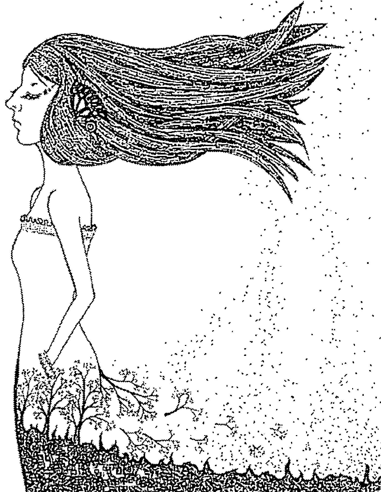

长安街的“时光Guard”大巴主营业务——带你回到从前最动人的起点，欢迎大家光临。

### *1

每两月一次的庙会，长安街每处角落挂满了大大小小的灯笼，置身其中仿佛能被这火红的气氛感染全身。

芸堇跟着妈妈和外婆一同赶庙会的时候，在这片红色的海洋中看到了一辆被改造后头顶上写着“时光Guard”的特别扎眼的浅蓝色大巴。

对小清新事物向来没有抵抗力的芸堇以看见老同学为借口告别了妈妈和外婆，在拥挤的人群中，芸堇逆着人流跑向了格外吸引人的大巴。

明明外表被装饰得如此精致动人，但真正前来驻足一探究竟的人却很少。

“小姑娘，要不要进来坐坐？时光大巴专门解决各种亲情、爱情、友情问题，不过我们这可不是简单的心理咨询，是带你回到过去找回最初的感觉哟。”正当芸堇拿着相机咔嚓咔嚓拍照的时候，大巴里坐在马扎上的大叔突然说话了。

芸堇端着相机一大步跨上大巴车，又一次被里面的布设惊艳到。大巴内部的墙壁也被刷成了青蓝色，座位五颜六色，并且都有属于自己的编号，司机的位置上挂了圣诞节才会用到的彩带，地板是草绿色的。总之一切都是那么梦幻。

“都是大叔一个人布置的？”

大叔笑着点头，然后递给芸堇一个鲸鱼形状的手链：“喏，庙会里面好贵好贵的祈福手链纯属骗人，我这个才是货真价实的，鲸鱼可是代表幸福的吉祥物。”

老板示意女生跟着自己的动作，找到大巴内任意编号的座位坐下去，将手链紧握在手中，闭上双眼。

“‘时光Guard’大巴现在要开动了，请乘客们系好安全带啊。”

芸堇就这样坐在大巴的座位上安静地闭上了眼睛，当然这可不是什么俗套的穿越，而是一个完美到发光的梦。女生走进梦境里，又变回了曾经的自己，找到原来熟悉的场景，抚摸自己小时候才会有的松针蘑菇花。

芸堇醒来的时候发现大叔在车外看夕阳。

“原来过了那么久啊，可是车子的位置为什么没变，不是大巴车吗？回到旧时光不需要发动车子？”芸堇好奇地问。

“这可是大巴车最神秘的秘密。”大叔的笑声似苏格兰排箫悠长空灵。

### *2

赶完庙会的第二天，在妈妈和外婆“跑去哪儿了，让大人担心那么久”的唠叨下，芸堇回到学校。上午没有课，按往常的习惯，芸堇打算在图书馆度过这段时光。

坐在老位子翻着《莎士比亚全集》，突然看到这样一句话：“在彼此忘记彼此的时候，旧故事成了最喜人的威士忌。”

然后芸堇就莫名其妙地想到了庆竹，往常男生总会坐在自己的旁边一格，拿着一本和自己一模一样的书，自己翻到哪一页他也翻到同一页，保持和女生同样的阅读速度。而如今，这个有些调皮和温暖的身影却不再温存。

冷战第二个月，所有美好的回忆都被不断地拉扯出来，一遍又一遍像重温老电影。

没有像昨日那样缠缠绵绵的短信，没有午餐两人面对面而坐共享一杯柠檬茶的幸福，对方像人间蒸发了一般消失在自己的世界里。

想到这儿芸堇合上书，一个人离开。

就在走下楼梯的时候男生与女生擦肩而过，庆竹一把抓住了芸堇的手腕，可能力气有些大，女生皱了一下眉头。

“你为什么不能给我解释的机会？”在悬空的楼梯上男生对着女生说道。

周围路过的人纷纷侧目。

“我给过你机会，而你却敷衍我。现在请你松开！”

芸堇挣脱了庆竹的手，那一瞬间，系在手腕上的那天在大巴车上买到的鲸鱼手链不小心滑落，女生大概没有注意到就快步跑出图书馆。

男生捡起女生遗失的手链，然后看到了手链上的一行字：时光大巴，带你找回原来的感觉，地址长安街293号。

“又是你，又在搞这些骗小女生的生意。” 想着，庆竹拿起手机打给了舅舅。

### *3

从图书馆跑出来的芸堇现在一个人待在寝室里，无聊地翻着手机里的相册，在相册的最后又看到了那张她这辈子都可能不会删除的照片。

照片是芸堇与庆竹的合影，拍摄于一年前的高中毕业典礼。

照片里的庆竹和芸堇身穿别扭的学士服冒充大学毕业生，两个人摆出好心情的姿势，男生的嘴巴撅起来，大概是想在拍照的那一瞬间突然亲一下女生。

最初遇见是在高中二年级，一切都如同漫画书和言情小说里说的那么青涩懵懂。

然后默契地相伴到大学，也不能说是兴趣完全相合。和妈妈耍了一点儿小聪明的芸堇成功地以比男生高四十分的优异成绩和庆竹收到了同一所大学的录取通知书，为此妈妈还经常感叹“可惜可惜”。

大一下半学期学校决定将男生所在的学院迁到新校区，导致正在冷战的二人之间的矛盾因为得不到面对面充分的交流而进一步激化。

长达三年的感情长跑现在被一种叫作“危机”的东西缠住了前行的脚步。

## *4

一年一度的新人歌手大赛的活动单贴满了新校区的每个角落。身为麦霸的芸堇本来想要报名却打了退堂鼓。

于是，她又去了那个浅蓝色的大巴。

“欢迎再次光临啊，小姑娘。”大叔晃动起满脸的褶子，“上次时光之旅是不是很不错呢？”大叔为芸堇端上一杯西柚汁。

说起上次的时光之旅，芸堇觉得那该是五十元花费中唯一货真价实的部分，只是自己一时间脱线，选择了回到幼儿园的时光。于是半天的时间，重温了和小伙伴争抢草莓、被幼儿园老师逼着到前边跳天鹅舞的诸多搞笑桥段。

“大叔，这次可不是来回到过去的，想跟您聊聊天。”芸堇小呷了一口柚子汁。

“说说吧，反正我也无聊。”大叔给芸堇拿来一个马扎。

“我喜欢了三年的男生现在在和我搞冷战。本来想参加他承办的校园歌手大赛，现在却没有信心了。”

大叔笑了笑：“三年有时候也是会痒一痒的，其实冷战何尝不是好事，可以让你们冷静下来彼此进一步了解，逐渐成长。不过你应该勇敢地面对不是吗？参加吧，证明你的勇气。”

告别大叔，芸堇的心情雨后初霁。女生踏出十步左右，一个熟悉的身影出现在了大巴前。

“舅舅，你又不干正经事，老拿你那一套欺骗消费者。”这个熟悉的身影就是庆竹，原来大叔是男生的舅舅，男生因为看到女生更新的日程微博，所以早早来了这里一直等女生离开。

“你这臭小子，要不是看在她是你女朋友的分儿上，我才懒得安慰她呢。”自从那次捡到女生遗失的手链，庆竹便到过舅舅这里一次。

因为一场误会而冷战的二人像热锅上的蚂蚁，男生对自己的舅舅讲明白了整个事情的经过，舅舅突然仰天长啸，说自己的外甥真是个笨蛋，连哄女孩都要自己教。

“既然她在你心里那么重要，那舅舅就好人做到底啦。把芸堇的手机号告诉我。”

男生激动地给了舅舅一个大大的拥抱。

而这一切，芸堇却一点儿也不知晓。

## *5

第二次离开大巴返校的一天午饭时间，正在啃着玉米棒的女生口袋里的手机振了振。

“午后1点1刻，地理学院静安操场见。肖庆竹。”

当看到这一串陌生的发信人号码，芸堇突然后悔不应该把男生的手机号码早早删除。

两个月来第一条对方发来的信息，纠结着到底去还是不去，去了会不会很没面子，但不去又怕万一错失重归于好的机会呢。芸堇还是从衣柜里选了一件自己最中意的连衣裙。

午后1点1刻，坐轮渡顶着烈日和眩晕的女生终于到达了地理学院所在的校区。

一下船，女生便开始呕吐，喝了一大瓶矿泉水才调整过来。

走到静安操场，远远看见的就是身高一米八的男生庆竹，本要打电话给对方的芸堇突然被出现在男生旁边的另一个女生打住了动作。

正在筹备一年一度校园新人歌手大赛的庆竹和这位陌生的女生在一同布置海选舞台。女生递给男生纸巾，然后顺手帮男生把粘在脖子上的纸巾碎屑拿掉。

如此暧昧的小动作让芸堇一时间心乱如麻。

“嘿，是芸堇吧。你好，我叫敏溪，是庆竹的直系师妹啊。”女生独有的娃娃音加上一双大大的笑眼让芸堇心中醋意直生。

敏溪说完“再见”离开操场的那一刹那，重重的背包砸向男生庆竹。

“我晕船加中暑地跑来这里，这就是你要我来的目的？有汗你自己不会擦啊！”芸堇没好气地意欲转身离开。

……

“你真是莫名其妙，不可理喻！”

男生的一句话好似点中了女生的死穴，以前从来都是谦让自己，哪怕吵架是女生错了都会先承认错误的男生竟然这样形容自己，芸堇身体里那座不算牢靠的堤坝瞬时土崩瓦解。

## *6

准备比赛顾不上吃晚饭，敏溪递给庆竹一块吐司。

“距新人歌手大赛还有一个星期的时间，可是还有好多工作没有做。真是难挨啊！”女生和男生几乎同时咬下吐司。

“宣传单只有经管学院所在的校区没有张贴和分发了。”

“对了，你女朋友不是在经管院吗？让她帮帮忙呗。”敏溪的提议让男生停止了咀嚼。

刚刚提出分手的男生现在如果拜托女生帮自己的忙，明摆着是自讨苦吃，如果遭到对方的拒绝，简直是颜面扫地。

显然庆竹没有同意敏溪的意见。

经常说现实没有小说的情节来得惊险刺激的芸堇看到端坐在眼前的敏溪时，瞬间颠覆了自己的观点。

“你为什么来找我？”因为之前的过节，芸堇似乎对敏溪没有什么好印象，因此语气里也带着些许火药的味道。

“那个你也知道，学校要举行新人歌手大赛，我是大赛承办方的一员。现在就差御园校区没有完成最后的宣传工作，离正式开赛只有一个星期的时间了，我知道你是学生会宣传部的人，我希望你能帮帮我。”

之前在校区操场看到的那一幕在脑海里挥之不去，可如果不帮助对方又会觉得自己太小气。

就算是误会，当看到其他女生给自己男友擦汗这种情景的时候谁不会小肚鸡肠？

“上次在操场你真的误会了，我只是帮庆竹拿掉碎屑，没有别的意思，别往心里去啊，庆竹还是很在乎你的。”一个勉强的答案还是让善良的芸堇选择帮助敏溪。

“帮助你的前提是帮我找到一个月前被庆竹表白的那个女生的联系方式。”

巨石掉入海中，激起千层浪花。

## *7

御园校区短短一天的时间就张贴满了新人歌手大赛的宣传单，比赛的宣传工作顺利收尾。
想向芸堇表示感谢的敏溪给庆竹发短信，希望晚上一起吃饭。
“干吗非要拉上我？”一身不情愿的男生被敏溪从相隔几海里的一个校区拖到另一个校区。
三个人围桌而坐，不敢直视对方的庆竹和芸堇，只好在敏溪的调和气氛之下生硬地点点头、张张嘴。
无心扒拉了口白饭，芸堇似乎在等待男生先开口。
敏溪用胳膊肘小心翼翼地戳了戳男生，然后用眼神暗示庆竹。
“谢谢你的帮忙。”许久才憋出这六个字的确显得很没有诚意。
“好啦好啦，你看你们小情侣之间还这么害羞。”敏溪为三人每人倒了一杯啤酒，“我代表这次比赛的承办方感谢芸堇以及宣传部的配合和帮助。”敏溪一饮而尽，剩下二人却呆在一旁。
“怎么啦，你们还不干了，逼我要你们喝交杯酒？”敏溪放大分贝，“好啦好啦，干干！”

## *8

聚餐结束回到寝室的芸堇喝得有点儿微醺，倒在床上一下子就睡着了。

梦像巨大的浪潮袭过女生，全身蜷缩在温润的海床里像在静候一场华丽的绽放。

故事发生在两个月前，还没有分校区，芸堇抱着笔记本去学校微机室报修，却在半路看见庆竹从一栋女生宿舍楼中慌慌张张地跑了出来。

芸堇在巨大的香樟树后面看见男生离开后，抱着电脑便冲去了不熟悉的女生宿舍。

身为男生竟然跑去了女生宿舍，况且还不是自己的宿舍楼。

敲开门卫大妈的窗户，一抬头就能看见桌子上摆放着的那束巨大的玫瑰花。

“刚才是不是有个男生跑了进来？”芸堇心里燃起了一团火。

“是啊，我把他赶出去了，不过留下了这束花，也没说给谁的，真是莫名其妙。”

“那个，不好意思啊，刚才那个人是我男朋友，今天是我生日，这花应该是他送给我的。”芸堇接过大妈递过来的花，然后假装走上楼梯。

走出大妈的视线，女生在花束中间找到了一张心形卡片。

草草看过肉麻的表白话，发现收件人只留了四个字“亲爱的杨”，也没有署名谁送的。

芸堇忍着心中的怒火将这张卡片紧紧攥在手中，然后将花扔到了楼梯口的垃圾箱中。

名字中有“杨”，找到她如大海捞针。

就在这一瞬间，芸堇突然醒了过来。

原来是一场噩梦，只不过是冷战以来第12次做这个梦了。

## *9

听了大叔的一席话再加上室友的鼓动，芸堇还是报名参加了新人歌手大赛。拿到报名表的那天，女生满脑子都是庆竹的样子。

冷战期间第123次想到和庆竹大学第一次约会。

男生庆竹准备了一系列的惊喜，最后一站选在了一个比较有特色的露天KTV。

这是芸堇第一次在庆竹面前唱歌。女生既激动又紧张，挑了一首最近追的电视剧的主题曲——《回温》。

这首歌在电视剧里总在最感人的桥段里出现，然后轻易博得了女生大把大把的眼泪。

歌毕，男生用特效在屏幕上打出“段芸堇，我永远喜欢你”几个大字。

这大概是十七岁女生最期待的场景，从之前偷偷摸摸地喜欢，到如今，像跋涉了千山万水终于找到憧憬的世外桃源。

看着特效烟花和字母的交织出现，庆竹给了芸堇认为是世界上最温暖的拥抱。

一米八的男生可以轻易将女生抱起。芸堇脚掌离地十厘米，心跳加速。

“扑通扑通……”

丢了神的女生咬着笔尖突然磕到了牙齿，这才从冥想中走出来。

报名表上需要简单地写上自我介绍。
——喜欢唱歌给自己最喜欢的人听。

## *10

向来遵守诺言的敏溪在比赛准备之余四处找寻那个让芸堇苦恼的人。
“竟然是我原来的宿舍楼的。”
敏溪按照芸堇那天交给自己的卡片苦苦找寻了很久，几乎将那栋女生宿舍楼所有的寝室挨个儿问了一遍，名字中带“杨”的足足有二十余人，卡片上没有任何其他明确的信息。
女生再一次仔细审视了一遍卡片上的话。
还在赞叹男生诗写得有些水平的时候，女生却意外发现整首六句七言诗歌斜着读竟然是——“我、喜、欢、你、敏、溪！”
一颗甚至都不知道埋藏在何处的炸弹爆炸了，强光和燃烧一瞬间将心中的原野燎尽。
陷入恐慌中的敏溪，究竟该怎么办？
手机此刻振动，是芸堇发来的短信：“你可是答应过我的，我要的东西你找到了吗？”
这张心形的纸片在敏溪的手中紧紧攥着，比芸堇交给自己之前更加褶皱。

## *11

海选结束，芸堇很轻松地晋级十强。比赛完的下午，芸堇第三次来到大巴。

咔嚓。芸堇惊呼着大叔为什么要偷拍自己。

大叔笑呵呵地给女生端来白水，说要帮女生做个留念。

大叔的挽救计划倒是神神秘秘的，自称时间守护者的大叔向女生做了保证，一定让二人重归于好。

> “一定要全心全意比赛，使出全力，冲到决赛，这样你的心愿才会实现。”

大叔的叮嘱让女生既感到温暖又有些摸不着头脑。

虽然大叔说的话有些着三不着四，但时光大巴却成了自己的一个精神伊甸园。每当遇到困难，遇到难以抉择的十字路口，芸堇总会到这里来闭上眼睛，仿佛真的坐着时光机回到了原来那些郁郁葱葱的时光。

一切真实得如翡翠，令人流连忘返的青春。

## *12

十进五的比赛，敏溪是坐在舞台下方的评委。

敏溪看着眼前正在深情演唱的芸堇，一时间又想到了那张卡片的事情，身后冒出了冷汗。可是自己在这之前除了在学生会和庆竹碰过几次面，剩下的时间几乎没有交集啊，只是知道庆竹同寝室的一个男生一直暗恋自己很久。

脑袋里延伸出无数个问号，疑团像滚雪球一样越滚越大，重重砸中敏溪。

芸堇的歌声让评委们折服，作为首个直接晋级的选手，场下响起了一阵欢呼。

下台后，芸堇在后台意外碰见了庆竹。

化妆台的镜子四周是发着光的暖黄色灯泡，女生一抬眼看到了镜子中的男生。

就像高二艺术节晚会第一次遇见时的那番情景。

芸堇的手不小心抖了一下，重重的头饰砸中了路过的庆竹的双脚。

芸堇已忘记自己低着头向对方说了多少遍抱歉，但庆竹却回应自己暖洋洋的微笑，就像化妆间那些椭圆形灯泡发出的柔软的光芒。

大概就是这一瞬间注定了这三年故事不断地延续。

自从那次聚餐，两人依旧很久没有联系。

“唱得不错，继续努力。还有，你的发饰有些歪。”男生先张口，芸堇的心顿时有些欣喜。

“谢谢。”可是没有等自己说出口，话到了嘴边却变成——“肖庆竹，你找死！”

男生的背影消失在瞳孔中……

## *13

决赛的前一天，敏溪还是没能沉住气，拿着这张卡片，去找了庆竹。

正在忙着布置决赛舞台的男生看到女生起初有些开心，但发现对方并不是来帮忙的时候，就变得有些不知所措。

“这张卡片是你写的？”敏溪开门见山，将纸片展开交给男生。

空气安静得仿佛能听到两个人心跳的声音。但是彼此的心情却截然相反，迷茫惆怅瞬间膨胀。

“是我写的，不过我觉得你误会了，事情是这个样子……”男生沉默之后突然抬起头注视着敏溪。

……

主持人在台前报幕，还有半个多小时就要上台演唱的芸堇在后台紧张得不停喝水。

“好啦好啦，别喝了，再喝肚子要撑爆的啦。”

敏溪的娃娃音让芸堇转过头来，还是如同往常一样的交流，只是这次芸堇面带浅浅的微笑。

“有件事情想跟你说一下。”

离上台还有最后的一刻钟。

“那张卡片的收件人是我，很抱歉在这个时候告诉你。”

两个人面对面坐着，周围是一片黑暗和寂静，仿佛刚才的喧闹一下子被抛到脑后。芸堇听完这句话突然联想到那天下午自己费力不讨好看的一幕。

“我希望你好好照顾他。”没有等敏溪把话说完，芸堇已经转身离开，脸上淡淡的笑容也不见了。

或许现在只有空气能明白女生的心情，眼睛像是被柠檬和洋葱稀释了一样，趿拉着十厘米的高跟鞋，眼泪一颗一颗地砸在地上。

临时改歌的决定让现场的工作人员有些紧张，因为要重新找到那首歌曲再经过调试需要很长一段时间。观众有些躁动，舞台上没有拉开的幕布让一切变得神秘莫测。

“怎么办？从网络上搜了好几遍，都没有这首歌的伴奏。芸堇又执意换曲。”身为工作人员的庆竹听到这样的消息也变得不安起来。

“是什么歌？”庆竹问了问音响师。

“《回温》，这首曲子听都没有听说过呢。”

观众不断发出“唱不唱”之类的哄闹声音，现场的气氛一度尴尬到极点。

“我来吧，给我一把吉他。”

## *14

三年前蝉鸣编织起来的仲夏时节。

“萌芽中学高中二年级文艺晚会现在开始。下面请欣赏吉他弹唱表演，表演者——肖庆竹同学。”

那时候坐在后台的芸堇还不知道这个节目的表演者就是刚刚自己道歉的男生，她只是在淡定地等待自己的节目到来。

舞台上，他小心翼翼地调试好吉他的和弦，弯腰鞠躬后开始弹奏准备的曲子。

边弹边唱的他引起了无数人的掌声和欢呼，芸堇仔细地聆听。

表演结束，男生起立再鞠躬。然后二人再次相遇，在前台与后台之间的楼梯上。

“你是下（上）个节目？”男生女生不约而同地惊讶。

如今夏日炎炎，蝉鸣依旧。

“芸堇，你的伴奏找好了，快登台吧。”

大幕徐徐拉开，坐在女生身旁的男生开始弹奏，场下响起如雷鸣般的掌声。

我们在隆冬时间用同一条围巾
然后一起默默祈祷天气回温
我们在暖春一起享受阳光
然后一起默默渴盼小雨降临
我们偕行度过四季
但却忘记彼此的体温
回温，回温
像那年我们遇见你我青春

芸堇有些惊讶地看着身旁深情弹奏的男生，仿佛回到了三年前那次惟妙惟肖的偶遇，那次她永远忘不了的庆生惊喜。

她想此刻定格，然后永远地埋藏在自己的心房里。

## *15

比赛结束，本应下台的两位却唯独只看到了女生消失在舞台中央。
“张芸堇，没错就是你。我们在一起三年，我很享受和你在一起的每一分每一秒。我们经受过很多考验，风浪来了我紧紧抱着你。现在，在这里，我想对你说，不管我们之间发生了什么、结果怎么样，我都永远喜欢你，永远！”男生在舞台中央对着话筒说了一通深情告白，再次点燃了全场的热情。正走回后台的女生惊诧地回头，却撞上男生急切的眼神，手就这样被对方拉了起来。
两个人跑出礼堂，一路狂奔。
“你要干什么，你松开我！”跑了很久很久，女生有些筋疲力尽，芸堇用力甩开男生，愤怒地向他吼道。
“你看那里。”庆竹突然扬起手臂，芸堇顺着男生的胳膊转动视线，视线的尽头就是那辆她再熟悉不过的“时光Guard”蓝色大巴。
原来大巴早已经被开到了指定的地方。
“我说过了嘛，挺进决赛绝对会有惊喜。现在你们坐在彼此的身边，闭上双眼。”大叔再次给两人示范动作。

## *16

梦里两个人又一次回到了那个初次相遇的后台，安排紧密的节目表，男生下台后在楼梯上靠近女生的耳边说道：“其实我想跟你解释，之前我的态度不好，敷衍你是很错误的行为，但是那次的表白事件真的就是个误会。我和舍友打赌，输了就要帮别人表白，我已经把卡片写得一清二楚了，可是没想到你还是多虑了。冷战的两个月，我知道你心里不好过，但这却是一个好机会，让我们重新审视、更加了解彼此。

> “我一直都喜欢你，你知道的，从过去的今天开始。”

时光大巴带他们回到了曾经。

一起去吃学校旁边最好吃的麻辣烫和石锅拌饭，一起去看同一部电影两遍，你过生日我送给你比你还高的熊公仔，女生用橡皮重重砸向上课打瞌睡的男生，在学校那棵老松树下约定要考同一所大学……

一幕幕像旧电影，将这三年的点点滴滴一一回放。

“我愿意做你的时光守护者，你愿意吗？”从梦境中走出来的男生说完拉起女生的手。

“从今天开始，我绝对不会让你丢掉我。”丢失的鲸鱼手链男生重新为女生佩戴好。

> “我愿意。”

芸堇搁浅两个月的小船终于驶向广阔的海外，就在这一瞬，庆竹低头吻了女生的眼睛，然后泪水就簌簌地掉落下来。

大叔拿起相机，将两人和大巴一同拍照。

> “哈哈哈，这下不愁没生意做了。”大叔笑着说。

擦着眼泪并埋怨男生油腔滑调的芸堇追逐着再熟悉不过的背影，像那年大雨，男生替因为迟到被罚跑的自己撑起雨伞的情景。

突然收到敏溪发来的短信，短信里女生说完了没来得及说完的话，至此误会全部解开。

目送二人离开后，大叔拿起手机删除了那条发件箱中半个月之前收信人是芸堇的短信，随后收到庆竹打来的电话。

“虽然舅舅帮我发的那条匿名短信得到的结果偏离正轨，但还是谢谢舅舅的‘救命之恩’。”

“臭小子以后多来捧我的场子就OK啦。”

第二天，大叔在时光大巴的车门前竖起用这一段曲折的故事做的广告牌。从此“时光Guard”成为长安街一道独特的风景线，驻足留影的顾客也渐渐多了起来。

当然别忘了那句美到溢水的广告词——

“我愿意做你的时光守护者，你愿意吗？”

# 老 友 记

文 / 莫诺

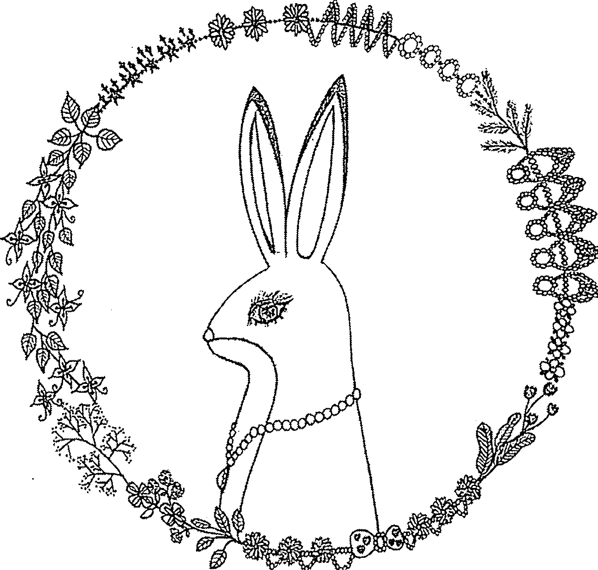

与这名女子的相遇是刚玩豆瓣不久，约莫是大半年前，偶然之中读到她的文字，清冽、凝简、清新又余韵深长，如饕餮后的一碗茶，读起来就让人心动。于是就给她发了豆邮，不想没几日便收到回信。

一来二去，喜欢跟她聊天了。三两日便有回信，说些舒心的话。

她在国内读的中文，去了美国学媒体设计。长何样、老家何处皆不知，乃至后来将她推荐到《美文》上，也没过问她的QQ、邮箱、MSN之类……就只有豆邮是唯一的联系。这种感觉挺好，就像一个不常联系的老友，心理上有安慰和陪伴。

大约是3月初，是我们的最后一次通信。其后她就消失无踪了。后来，我刚从成都回来，偶然打开久未开封的豆瓣，就看见了她的复信。心中温润惊喜。

我们之间，来来去去也有十余封信件，时长时短，择取最近的四封，以鉴岁月。

# 棋子

2013-08-03 23:48

久疏问候，望谅解。

我刚从欧洲回国，因过去参加学校项目。忙忙碌碌地做项目，顺带浏览了一些风景，回来调了几日的时差才缓了过来。在那边两个月的时间没有网络，几乎不能通信。住的城市在海边，每早醒来都被天空的颜色震慑到，倒也心境平和。

回忆起来这几个月恍如梦境。5月是毕业季，从4月起就不分昼夜地赶制毕业作品和论文，又加上搬家办理手续等琐事，压得人喘不过气来；开心的事便是收到消息说几篇文章登载在了《美文》上，也多亏你的引荐，谢谢。6月整顿好行李就从旧金山出发去了欧洲。倒像是过起了隐居的日子，每日生活规律，上课、做项目，偶尔和同去的美国同学玩闹打趣，如今回想起来真是好的经历。

不知道你近来如何？心情可开朗愉悦？心中一直惦念你，总想着给你写信，总算回来，人也稍微清闲起来，终于鼓起勇气又拾起了笔。想来你也放了暑假可以好好休息一下，希望你一切顺利。

祝好。

# 莫诺

2013-08-06 23:52

哪里来的谅解不谅解，不过是在你三两日未有回信之后，定期会来这里看看。后来日子久了，也就不来了。今日忙完琐事回来，偶尔点开豆瓣，看到你的复信，心中顿时惊喜。

确实是有好久了。仔细算下来，也近半年了，时间真不经人打发。

想来你也过得算是顺当。那便好。

这半年来，我也算是过得奇妙。自没有收到你的回信之后，没多长时日，我就从大学逃出来，在福建的沿海城市做起培训老师。日子陡然就粗糙匆忙起来。

来的是朋友刚开的一家公司，事事都须亲力亲为，前两个月日子仿佛被狗啃了似的，喘口气都觉得是奢侈。3月在苏州进行师训，4月到福建，备课、做市场、校区室内装潢、桌椅订购、打邀约电话、上课、课后回访……面面俱到“上下其手”。

人间四五月，日光已有些劣根性了，有时在公立学校门口发传单、拿学生信息、向家长推销，一站就是一天，时常还得遭人白眼。生活陡然就从大学养老院似的环境中跳脱出来，直白毒辣得像一张泼妇的嘴。

好在辛苦是辛苦，但终归上帝不会不厚待一个努力的人。况且我们还真不只是“一个”，而是“一群”。前面的付出终究有了成效，生源和教学质量都还算差强人意。

也是在出来的这段时日，省却了诸多心头杂念，渐渐好起来——生活一旦匆忙起来，哪有闲工夫顾及那些小情绪。

虽说日子匆忙了，时常也会偷点儿时间，四处走走。一个人驱车去看看大山大海，走马观花地看看别处的风景人情，倒也过得惬意。

6月回了武汉一趟，探望了母亲，参加了一个表姐的婚礼，顺道回大学考试。七科挂了五科。有得必有失，也不大在意。9月回校补考就是。

再回福建就是7月了，又去杭州西湖转了转。风景倒也没有盛传的那样美不胜收。杭州太热。回来后，又开始紧张忙碌地上班。和孩子们相处下来也真真可以让人单纯干净些，能体会到纯粹的快乐。

7月底去了成都，参加《星星》诗刊举办的“大学生诗歌夏令营”，遇到形形色色写诗的人。总觉得，文字拯救了一些人，又迷失了一些人。

活动方将我们拉到自贡——郭敬明的故乡。兜兜转转经历了一座城市的历史，倒也没有特别的感触。

几天后，回到成都，我又一个人上路，去了九寨沟。去往九寨沟的那天，正好映秀那里塌方，将我们的车堵在高速上四五个小时，最终车小心翼翼地过去了，眼之所见大山冲击而下的泥石流摧塌了桥梁道路，有一辆银色面包车被压在泥石堆里，惨不忍睹。

之后又途经了2008年地震的重灾区映秀、汶川、茂县……当年的遗址还矗立在沿路，内心的震撼不言而喻。

此后两天在川西北的羌藏区停留，看那里一碧如洗的蓝天，听那里高亢的民歌，学了几句藏语。其后又走进藏家看他们精雕细琢的壁画，黝黑淳朴的老人，体味他们的酥油茶、青稞酒、牦牛蛋……不过他们的宗教气息浓得让人感觉阴森至极，特别是看了一场羌藏民族风情的晚会之后，他们所崇敬的服饰、纹路、神兽……都让人觉得多少有些恐怖。

之后便没有过多停留，直接奔赴了九寨沟。在九寨游览了一天，便回成都，在朋友那儿借宿一晚，就回福建了。

此行从九寨沟回来，真的就笃定了对名胜不要抱有太大希望。美虽是美，但也没有传说中的那样夸大。所以说，中国的风景是为了风景而风景。如是，倒越是希望走出国门去看看了，毕竟国外的风景商业元素要比国内弱得太多。

所以，又要羡慕你了。

……

总之，日子不是这么过，就是那么过。何不过成自己想要的样子呢？
与你不说话的这半年，也算是遇人遇事成长不少，做回了一个没有情伤有故事的人，其实也挺好。

唉，也没发现，一下就絮絮叨叨了这么多……也不知你耐看不耐看。

你从旧金山去欧洲，想必除了上课、做项目，也曾溜出去一二遭，不然就太可惜了。生活过得规律必然是好，但时不时来点儿小刺激调调生活的味儿也不错。

《美文》你是发在第几期呢？该是第八期或是第九期了。真好。

谢倒是不必的。只因遇到一个笔上好友实属不易，岂能放过让你发光的机会。且不论这光大不大，是不是你所需，因你本是十分优异的女子了。能看得起我，已感激万分了。

不知你毕业后打算是怎样呢，回国，抑或在美国定居？
念好。

棋子
2013-08-26 09:36

一口气读完你的来信，真是心有千言却不知从何下笔。

从你的字里行间可以眼见你的成长，这成长不言而喻，亦难以分辨得失与好坏，却清晰地感觉到那活色生香，可喜可贺。

我是打心眼里喜欢学校这地方，所以下一步计划读研究生，也算是再出去见见世面，充实自己，学回来的东西也可以取其精华为我所用。看到你在努力打拼真是为你欣喜，我知道这必然不容易，刚起步的时候一定有许多困难，但我想是你的话应该做得到，也不知道为什么，就是这样相信着。

在希腊的时候是心境最沉静的时刻，生活规律，读书写字。虽然和导师做项目时也会忙碌不堪、焦头烂额，但如今回想起来都是好的经历。在那里的时候我突然想明白了一件事情，为什么许多哲人、画家、诗人大都喜爱于僻静偏远之地创作或思考。在这种与世隔绝的环境下极易做到心无旁骛与抛除杂念。有一次傍晚我走在小路上，街旁的当地人热情地向我挥手招呼，落日把爱琴海染得恍如梦境。真想让你也看看那样的景色。

我想你现在经历的所有东西，都必然成为你的武器，然后慢慢变成更好、更强大的人。听你絮絮叨叨说这些，心里有种奇妙的感觉，好像通过文字就可以与遥隔他乡的人惺惺相惜，倒也十分乐意与你分享这些心绪琐事。

只是再忙碌也要顾好身体，总觉得人在生病的时候会格外脆弱。现在天气渐渐转凉了些，不知道你那边是不是也有了阵阵秋意。

给你勇气和祝福。
遥祝。

# 莫诺

2013-08-27 07:21

真好。此下又心心念念看到你的复信。

世事堪玩味。其实也真不知人和人之间竟可以这样奇妙。不求QQ，不求通信地址，不求日常电话，单单一封豆邮就足以将千里之外与另一个千里之外拉得这样近。得一如此友朋，也算是人生之大幸了。

其实逐渐将生活过明白之后——其实一定还不够明白，不过是相较之前仿似遥遥无期的青春期而言，的确是过明白了些——就会知道，生活原不过是一潭清水，你每日是取水还是往里注水，注又注怎样的水，全在于自己。

我相信，你我都会是注水之人，并且，是注清水之人。

回福建之后，日子如旧，匆忙不可收拾，内心浅浅地挂着一个人，在有雨的夜里，时常拿出来想一想，不加过分念头。也权当是内心一处淡淡的景色了。

谈及这么多生活，你的感情我还丝毫无知。你该是有故事的人，若愿分享一二，我会洗耳恭听，算是八卦一下了。

那日与朋友半夜吃完街边摊，喝点儿小酒，然后他开车带我们一行三人去了坐落于群山之间的硕大水库，看日出。车在黑咕隆咚的盘山公路上小心翼翼地行驶，窗外的风有了分外凉意，吹得人清醒异常，又仿佛置身于一部青春电影之中——其实幼时一直分不清电影和生活，状态非常危险，动不动就会想到死。近一年来，电影渐渐远离生活之后，方知，生活远比电影平庸踏实而安全得多，世上是没有那么多非难或者幸运降临在自己身上的。

爱琴海的落日还只是在电影电视里见过，在七堇年的书中也见过。美不胜收得会让人有热泪盈眶的感觉。有机会一定要去看看。

那还是在青春年少时，吉赛贝·托纳多雷的声光三部曲里的《西西里的美丽传说》，那个坐落在地中海之中的美丽小岛上的阳光，简直是铺天盖地，像是被上帝之光眷顾的城市。那夕阳，金灿灿的；那小岛像是由金子打造而成；而远处的海，碧海蓝天，美得不可言喻。有生之年的首选，一定是去那里走走。

旅行于一个人，真的是自救。最起码我是这样认为的。

你爱学校，亦能在因学校之缘的同时，可以看看异国风景，实在是再好不过的事情。羡煞旁人。

马上我就要离开福建回武汉了。学校是2号开学，我3号飞机，回去还得在家里待上两日，也不知能不能赶上补考。挂科是件恼人的事情，特别是临毕业之前。

此前，我也想过考研，不是播音就是文学。但一来确实是不想让兴趣变为事业，那样会让一个人逐渐讨厌起它来——对于我而言，是如此；二来我也确实不算是读书习字的料，何苦浪费这样的精力和时间去做一些没有太大回报的事情。

人长大之后，就会各方面考虑投入与回报的事情。通常，在青翠欲滴的年纪，我们会做一些老气横秋的事情；而在老气横秋的年纪，我们却再也做不出青翠欲滴的事情了。这就是成长。虽然当前还不至于老气横秋，但也确实是多了太多顾虑。

但是于你，我相信你还是适于考研的。你准备考哪所学校呢？

这里天气一如既往，热得让人烦躁。但太阳渐渐远离北半球了，天黑得要早些了。相信要不了多久，也会穿起外套、薄毛衣，然后是羽绒服。年年岁岁，也不过是在穿衣和脱衣之间，小孩就大了，大人就老了。

岁月，真是让人唏嘘万年的东西。

无论如何，在这人间不足百年的岁月里，我们错过了前二十年，愿后面的年岁能共同遥远地见证和度过。

念好。保重身体。

天凉要记得加衣。

## 黄金盟誓

文 / 单超

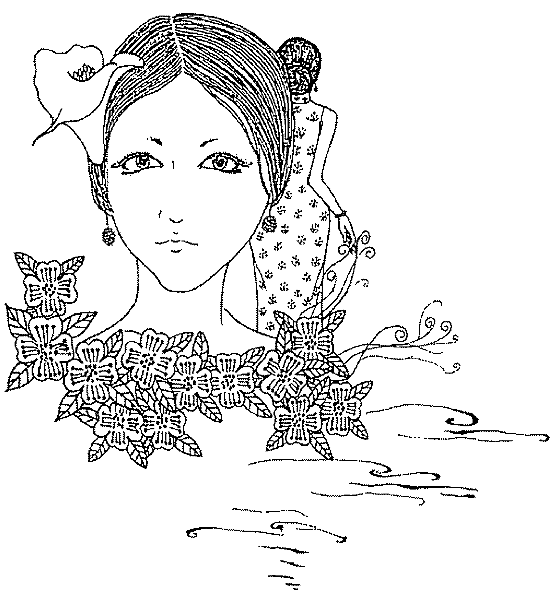

佛手是香中君子，茉莉是香中小人。君子三五年后仍是君子不变，虽难再香冽如初，倔然却是至死不放手的；小人的习性则是要把一生的浓香卷在瞬间，熏得人无处逃匿，只为了日后的回忆中还可感到惊心动魄的甜蜜。

江逾白笃爱君子，时刻给自己的心案上供几碟佛手，以图交际里的高贵；高贵之外茉莉的香气又妖娆地把他往世俗里拉扯，一刻清净也不给。若为了越性将胸中慧根拔起来，心口免不了要迸出淋淋鲜血，好在斩草除根，伤了一次也就难再复发了。

江宅是广安路上的一户独门独院。前后几家陆续迁进了公寓楼，只有江家一直耐得住性子。逾白掀起门上的铜环撞了一撞，引来江太太慌急惊喜地跑来卸下门闩。他苦笑了一下，婉转地推开母亲，坚持着要自己把行李箱拉进里屋。

进了房间，逾白转着用几根手指拂拭了一周然后坐到床上去了。红蓝两色的巴塞罗那围巾仍旧打了一折挂在脖颈上，扑着层尘雾的呢子大衣也没有脱下来——他就那样原封不动地坐在那里，双手握着床沿把自己塑成一尊塑像。

橘色的手拉箱立在门口两步的地方，是逾白忘记收进来的，然而现在只是看着他也没有动作。在逾白眼里那是个着黄裳的侍女，他要等她先开口。这时江太太走来，随手拆下掖在腰里的围裙，像拉着新媳妇似的把那位侍女引向床边雕花的衣柜。

“这次住多久？”江太太蹲下去，边给他折衣服边问。

“住不了很长时间，”逾白道，“这次是要见两个同学、办几件事，然后就回去。深圳那边盯得紧，催命一样一天一个电话。”

江太太笑了一声，拍了拍手臂上搭着的衣服道：“我说什么来着，打上中学的时候你就嫌这个县城搁不下你，就准备撩翅膀往外飞。现在看真是白养你了。”

“你替肥乡县的三十万人不平？”逾白笑问。

江太太抬头嗔视了他一眼，又笑出来：“我哪儿管得上他们，我是为自己的心不平。”

她背向逾白，左右打叠着箱子里的衣物。逾白看着母亲两手的闪动，恍惚觉得是抚琴一样的天然神韵。她就是一位如此的女性，在他的衣服上都能弹拨出开花的音律。然而鬓角已经能看得见白丝线了。森森白骨的亮白，刺得他心内绞痛。

“妈妈，如果你放不下那我就不回去了。我可以的。”

江太太回过头来，认真看了逾白一回，手搁在腰袢上说：“你就这么盼你妈不开明？跟我还说这种客套话。去吧，没人给你定罪，你的好强名声都在外边传着呢。要是摁着你不放倒显得我老糊涂没药救了。”

逾白将胸前吹着的几绺毛辫子推来荡去，感激地看着母亲。

“茉莉一早就知道你要回来了，打听了几次。她也摸不准你什么时候到家，难为她一趟趟来了。”江太太又转回去，从柜子底往外刨换季的衣裳，再折好了铺进逾白的箱子里。

逾白只顾着拿手指绕着胸前的线头，似要织出什么绫罗绸缎来。

“你倒是去看看她，别老让人家过来。毕竟是女孩子。”

“我想着她是女孩子才不方便去的，”逾白微笑着说，“一年大二年小的，况且她又跟良柯订了婚，怎么好再去。”

江太太打理好衣物，回来伏在印着散花的藏青床罩上，推着逾白的背道：“你就是一头犟驴……”待要再说什么，却忽然打住了——她的儿子，全世界的名门小姐只要他瞧不上，自己也不会高看一眼。

江太太收拾了几盘香给逾白的房间熏上便出去了。烟雾甫一散开便无序地横钻过来，闻得逾白直有些醉。房里的陈设为了防尘都苫上绛紫的帘布，时间的尘灰就因为这层隔膜而无处自容。逾白揭开一抖，它们便纷纷扬扬地落转成雨。

那只橘色的箱子仍旧文文静静地立着，只不过换了一处地方。经江太太的一番打理后成了仪态万千的佳人。逾白跟她一前一后相顾无言，大约就像古时候洞房烛影下的新爱侣。这有些讽刺的意味，几个月之后茉莉的合卺之礼就到了，他不能不有些落寞。

逾白有整理的习惯，连脑中的回忆都给订成册子。这一下落寞像一阵风，带着册子哗哗地翻，电影似的回放了一遍，最后停在一对少年男女的稚脸上，双双笑得夺目。那笑自成一枚印章，在年月里戳下的印子比什么盟誓都恒久。

余温未去的下午，连树影都软塌塌地横躺成条纹波浪。逾白看着白茉莉已经有一会儿工夫了。

毛毵毵的斜光照着那侧脸，晃得他眼睛辣辣的。她胸前敞着一朵朱红的褶绒花，像极盛时的维多利亚女王身上的装束，妩媚又威严。两臂搭在绒花的侧面，微伸着汉白玉的手指虚抵在桌子上。

逾白停下来，细细回看了一下册子，像忆起来她为何会单独地立在课堂上。那时茉莉的脸上薄暮茫茫，与太阳的余晖交映莫辨，渐渐抹清楚了逾白的疑惑。是了，那时候她是在声乐课上唱一支曲子，李叔同填了词，并且取调于约翰·奥德威的《送别》。

她轻缓地哼着，把赤色烽烟的年代一点点揪出来展览给他们这些懵懂的婴儿；又用手双双团住，漏去了战争的亡故跟血腥，留下来的只是痴男怨女们的纠缠。仿佛她自己成了李叔同的恋人，引起逾白一阵忽然的妒忌。

他吃味得有道理。茉莉这支曲子摄动了声所能及的所有人，鲜红的心被她一网打尽。唱罢她又转个圈，微笑着把底下的人再瞧一遍，还要看看有没有漏网的。她的眼光免不了要跟逾白撞到，示威似的。

“如果为了她，我倒愿意去做那个李叔同。”邻座的徐良柯道。

逾白低下头在笔记簿上画着竖道子，闷声说：“送别之前是李叔同，送别了红尘烦恼后却是弘一法师了。你拿好主意，真要赔上半辈子的苦禅？”

徐良柯想了一想，道：“要是能分享她的光阴，上半辈子已经足够了；若是不能，还要下半世有什么用？”

良柯的鬓眉浓重，像上了妆的戏子。逾白抬起头来要笑他，却被一阵茉莉的香气噎住了。她走过来俯下身子，头发从一侧斜流下来，一只蝴蝶形的鎏银发卡活生生地栖在长发上。她的白手撑在桌角，与良柯、逾白各自的一只手凑在一起，恰是三分魏蜀吴。

“这两个音乐之王，睁眼瞧一瞧我们这些俗人吧。请你们弹个伴奏都死活请不动。我们真就一点儿配不上听你们的琴？”

良柯笑着摆手：“别看我，我是鼓手。弹琴是逾白的项目。”

茉莉又转去质询逾白，那边他早就不声不响地收拾整齐，拎起包咳了两声就走了。

茉莉的脸白了一下，头上的银蝶夹子颤起来。蝶翅一动，就洒出银色的光雨。

良柯大概也替逾白羞耻，忙向她说：“逾白平时不这样的。兴许是上午练琴练得不顺才这么臭着脸。”

茉莉一笑，用粉指甲抵着逾白那块桌子来回划着：“我都知道，不用你给他开脱——他什么样我怎么会不知道，他就是一头犟驴……”她说到最后简直细不可闻。笑得也很奇怪，像映在池子里的一张笑脸，水面一皱便掺进去几道忧郁的纹路。

逾白从教室里出来就感到变了天，含着怒容的低空扮成一张女人面孔用力向下凸伸，唇吻几乎要够到他的头发了。走了一两步以后就立刻开始丢雨点，而且一滴重过一滴。逾白反倒使性子似的慢了下来，从惊叫着纷纷逃去避雨的同学中间庄严地过去。他想，那些都是按了快速键的人生，还有什么乐趣。唯有他是一勺一勺取来品尝的。

路两边的白悬铃木织了一条拱顶在头上，然而枝粗叶大，兜不住雨。几株红枫树的叶子也是闻风就落，混着悬铃木的宽叶贴在雨地里。居民的住房是红砖砌的，淋了雨后红得简直要沁出来，一幢一幢地挤出一条逼仄的路径。

逾白回头望望，看见茉莉在跟着走，而且湿漉漉得娇艳——她也赌气没撑伞。逾白便是铁石心肠也不能再装作路人了。路上就他们两个，然而夹路的两排树静静地做打扇的宫娥，左右斜举着一只象牙柄的蒲扇。她们都冷眼看着他的绝情。

揩抹几下脸上的雨水后逾白折了回去。他的视线被雨水割得零零碎碎，拼不到一起，走近了却看到茉莉手上忽然生出一柄白伞来，衣服也从红色的绒衫褪成了素白的长裙。

逾白慢慢从回忆里剥落出来，看着茉莉三两步走到跟前将伞举在自己头上，笑说：“我还道这人怎么也像你似的那么犟，原来就是正主。你什么时候到家的？”

逾白张了张嘴，忽然噎住了。她的脸还有少女时的样子，只是头发更长了些，美得更加惊魂。从前她是白茫茫的雪原，天地一色；现在成了琉璃世界的白雪与红梅，多出来的一点儿红就红了逾白的眼眶。

逾白捂了一杯热茶在掌窝里，瞧茉莉端着熨斗给他熨衣服。她的房间也没有大变，只是时间一年年地留下了印子——譬如《卡萨布兰卡》的海报颜色淡了下来，墙壁也不像他记忆里白得那么烫眼了。黄油油的一只马丁牌吉他用带子斜挂在墙上。

“你已经变成贤惠的好太太了。”逾白看着杯子里金鱼一样游弋的茶叶片，不知是对茉莉还是对自己说。

“你放过我吧，我还想多当一阵子姑娘。”茉莉对着手中的熨斗笑道，“你不是最讨厌小县城的主妇们嚼舌头吗？深圳怎么样，大地方的人应该不像我们似的惹你烦吧？”

她揶揄的时候也不忘放出茉莉的香气。手里的熨斗像泰坦尼克在逾白的衣服上驰游。

“什么大地方的人，只不过把俗气藏在心里不露出来吧。”逾白往嘴里送了一口茶，“说真心话，外面的人没一个比得了良柯。你嫁他是嫁对了。”

茉莉忽然按住不动了，仔细看着逾白：“你这是笑话他呢，还是笑话我呢？”

隔了一会儿，逾白才笑着搪塞：“哎哎，你再这么着我的衣服都要烫坏了。”

茉莉却像没听到似的，还是盯着他不放，逾白也就不再说了。两个人都沉默着，要给那件衣服执行焚烧的极刑。

快烫得冒烟时，还是逾白先过去要挪开它。茉莉的倔强劲儿却上来了，把他伸来的手拍下去。

逾白眯起眼看她，显得两个人像是西部片里一对要决斗的牛仔。遍地黄沙中双双按着腰胯一侧的左轮手枪。这一下还是逾白先发枪，他要用蛮力去夺了，拎起那块烙铁就要扯过来。茉莉便倔强地用手扣住泰坦尼克的船舷。

“你干什么！”逾白顾不得体面，掰开她的手把熨斗咣当扔出去。然而茉莉的手面还是烧出来一片淤红，像攥着一朵红牡丹似的。

有花堪折直须折，这枝花却是逾白折不下来的。他把茉莉按到沙发上，自己去她的五斗橱里抱出来一卷子绷带和烫伤膏。

茉莉笑道：“你的记性还是这么灵光，比伦敦市图书馆的馆长还要强。”停了一停后又说，“你眼角的那粒疤还在？现在我烫了一下，也算扯平了。”说着她伸手要去摘他的眼镜。逾白往后撤了一撤，躲过去了。这一下两人都有些尴尬。

逾白想，到底是跟她生分了。

他走出去站在阳台上，蹬着圆石柱围出来的半圆栏杆向外望。天许许泛蓝，像一块被风兜起来的青花布，水洗得勤快直有些发白。

逾白摘下眼镜，用指尖碰一碰眼角那里乳白的疤，跟溅了一滴牛奶似的。

这时候茉莉也一起到了外面，拿了片做到半截的十字绣出来。刚扎下去一针就把逾白的手机扎响了。

“你现在已经是职业的主妇了。”逾白拿出来电话却不接，摆在两人中间成了采访她的样子。

茉莉嗤地一笑，转过身在格子布上穿针引线，逾白便跟打来电话的人寒暄起来。他的声儿有些大，故意要她听见——他明知她是听不懂德语的。那头是一个叫许尔勒的德国青年，他在深圳的同事。

逾白一面跟许尔勒谈工作，一面来回找眼光安放的地方。他越过她的肩看到几盏黄灯摇曳，店铺也陆续泼洒了一片橙光在门前。黑魆魆的人占满了街道中央，踏在落潮的潮头上似的往家里赶。逾白的眼光游了这半日也不愿落下去。始终那些是别家的灯火。他的故乡，还在他乡。

脚下有一阵门轴转的响声，是白太太回来了。逾白越过栏杆向下看了一眼，只来得及抓住一条杏黄影子的尾巴。他和茉莉沿着栈道似的楼梯下去，看到白太太像早就预计到了一样也没有去换衣服，就立在客厅门口等他们。逾白心想，他也是个成年人了，值得别人这样整装来迎接。

客厅四角各立着一杆落地长灯，低着头放光。地上铺着波斯羊毛毯，中央又垫了一块毛垫子，像华清池里的白波。垫子上搁着几组红沙发与一条狭长的橡木茶几。

白太太早就站在门扇边上，两手扶着杏黄长衣的对襟说：“逾白过来了。应该提早告诉我，好让我有时间去收拾饭菜。你叔叔老是谈起你，等他回来了你们叙叙。你现在做出事业了，县里几个人物可都盯着你。”

逾白笑着说：“哪儿就用得着这么麻烦。我就是来看看，立刻就走的。”

白太太又客套了几句，也没忘了给逾白端上来茶果，然后才去房间里换衣服。连换双鞋子都要避开他，可见当他是货真价实的客人了，为此不惜在毛毯上踩出一溜脚印来。

逾白将烫干的大衣折了一折放下去，伸手要去取一个茶杯来，却被白家的保姆抢先拿过去，另从底下抽了一个递给他。

“怎么，那杯子不能用？”

“那个是徐姑爷用的杯子，不好再给你用了。”保姆说话的时候带着浓重的河南口音。

茉莉接了一通电话从里屋出来，见了忙说：“霞姐，你先放着吧，没关系。”

保姆看了两人一眼，提着两桶水似的一晃一晃出去了。茉莉坐下来，逾白便装作在糖果盘里找心仪的那颗。

“你还没定下来？”茉莉也伸出一根手指进来，跟他一起在盘子里搅。

“那边房子贵，我基础又不算厚，这事情还是要先放一放。”逾白在糖果的阵营里跟茉莉的手碰了几次，于是不战而退了。

“你跟良柯什么时候办事？赶在我假期里头就好了。”逾白问道。

“也许良柯并不喜欢我，”茉莉摇着头，“不过是政治婚姻罢了，他父亲不是县委的副手吗？只是我跟良柯都没有特别地反对，或许我们也都是怕人生的……”

客厅的大窗没有合上，烟岚洇透了半个天空后也生出风来，吹得窗幔鼓荡着，让人联想到十七八世纪里欧洲女人圆圆的裙箍。

茉莉又过来够逾白的眼镜。他还要躲，忽然听见她低声说：“你还要躲，还要跟我认生吗？”

逾白心里淌过一阵子无言之恸，于是死心让她把眼镜摘了去。

他自顾自地想到了深圳。那是一座翠玉生光的城市，虽然处处只要金钱、不近人情；这里却是没有上颜色的素描画，伴着黑夜加倍，素描的味道也深重起来。他往客厅外看，只看得见纪梵希礼服的浓黑。

然而还听得见鸟音，那辨不清楚方向的鸣叫就是四面楚歌。

七月十五的中元节，老师勉力在黑板上画了几笔就让放学了。逾白回到家洗了洗，换上一身干净的灰格子衫。就要出去时母亲叫住了他：

“晚上早些回来，还要去给你爸爸烧些东西。你陪着我——一个人怪犯怵的。”

逾白应了一声，将书包的肩带拉在两面肩膀上，从葡萄架漏下来的银河星汉的碎影子上穿过去。

越往南走，越见荒芜。几幢房子久不住人，两片门扉都关得紧紧的，像紧闭的女孩子的双唇。逾白挑了空地上一处拱起来的土坡，觉得那几株辛夷花够美了，就蹬上去取出背包里的木匣子。逾白凡事总要做得足够美了才肯罢手。他想，一生中总会有那么几件非办不可的事，做得足够美了才算圆满。

茉莉呢，也非她不可？

逾白推开匣子，一团白皑皑的雪绒，是只白猫，死亡之初还是睁着眼的，睁得让人周身冒汗。他伸手下去架在它的脖子上，希望它忽然梗起来。然而一圈毛茸茸的皮肉环成镯子搭在他手上，头偏在一旁，嘴唇微微地掀开一条缝。

逾白再也忍不下去，抽抽搭搭地哭了。辛夷花的花叶从一边坠下来，眼泪一样流了一匣子。

前一天，逾白终于同意跟着茉莉放学后一道去她家里。这还是经过了她苦口的劝说：“你不为我，为了看看小绿叶也应该去。难道一辈子不看它了？”

她既这么说，逾白也就顺水推舟。然而他对于她家那幢白色的洋房总有一种不能描画的恐惧。

他们两个进了门，发现良柯端正地坐在院子里，帮侍弄一盆滴水观音的白太太架着水壶。他早已经换下了校服，换上一件扣得郑重的白衬衣，套着一件黑光棉的剪尾衫，下面是黑红的灯芯绒裤，翻毛的骆驼皮鞋。他看逾白和茉莉回来了，就将水壶放下去，眉目英气地笑道：“你们两个怎么能私自结盟呢，魏蜀吴少了一个可就不成事了。”

逾白见了良柯就不怎么自在。总是这样热忱，难道他良柯就不能装出相逢不相识的样子来？那墨迹一样的眉毛真是越来越难看了。

白太太把花镜折好，张着双手仿佛翅膀一样将他们三个围进客厅里，然后一边嗑瓜子一边说话。良柯天生就懂得与大人交谈，连白太太都肃然起敬，跟他谈起来他父亲工作上的人事斗争。茉莉听得没趣，悄悄碰了碰逾白的胳膊说：“你看良柯，总有一股老人魂似的，跟我妈都聊得起来。”

逾白痴痴地道：“也许你妈妈更喜欢这样务实的。”

电视中放着一部琼瑶的旧电视剧《苍天有泪》，里头一个女孩子稚声稚气地说：“我们寄傲山庄是不欢迎你这样的人的。”逾白吓了一跳，以为她是冲自己说的。

茉莉盯住他的侧脸看了一会儿——起伏跌宕的山峰与沟壑，片片石鳞织成一件旷古的羽衣，看得她脸上红红的。

“你是不是担心了？”茉莉问道。

逾白看了看她，笑着问：“我担心什么？”

“你没有一点儿可担心的，为什么还要这样不快乐？”茉莉幽幽地说，“你存了心事不明讲出来，我就无法可想了。我离你这么近，却常常觉得连你的呼吸脉搏都抓不住，只有空空的一具衣服壳子，跟蜕完了的蚕蛹似的。”

逾白心道，是我不愿跟你坦诚吗？是你周围一层层磨不透的茜纱窗让你成了孤鸿缥缈，让我割须弃袍。

“我父亲回来了。”茉莉倚着沙发背望向窗外说。

茉莉的父亲白中舫进了门，在院子里待了片刻便撩开门帘进来了。他往客厅里一站，立刻有一阵酒气扑进来。

白中舫的脸上泛着白气，方方正正地压在斜向梳理的厚发下面。他穿了一件勾织点灰呢大衣，里面套着政府部门的一式蓝黑装。一条薄纺线围巾拆开了搭在脖子上。

“你又喝酒了。还想再搭个桥吗？”白太太拨了拨鼻梁上滑下来的金边夹鼻眼镜，叹了口气。

“抱歉夫人，又把禁令忘后边了。”中舫白涔涔的脸上透出一小截红晕，着魔一样地醉笑。大概是酒意翻了上来。

茉莉给中舫拎来拖鞋，努着脚帮他摘下围巾，又帮他把大衣脱下来，蹙着眉头说：“爸，你以后少找麻烦吧。添花也就罢了，你倒隔三岔五地添些乱子。”

中舫笑呵呵地说：“我就这么招人嫌？”他又转过去郑重地拍了拍良柯的膀子，“刚才陪我喝酒的几个里面就有你父亲。他是员骁将，可不会像你这么老实。我们俩斗了半辈子，你说能不能找个和解的由头？你来说说，良柯。”

良柯明白这是醉态。他想着白太太自然会来招待，也就笑了笑，礼貌地让过去。

逾白向沙发角里挪了挪，尽力不让中舫看见。他并没有父亲可谈，若是被看见了也只能引起一阵尴尬的寒暄，于是找个机会带着茉莉出去了。

“小绿怎么样？我妈妈实在没有精力照看了才会托给你的。希望没让你为难。”走到门外时逾白道。

“它跟你一个样，安静又不怎么动，养起来半分力都不费，”茉莉笑着说，“主仆两个这么像的我还是头一遭见。”

两个人走进厨房，翻开白纸箱的折盖，便看见两只怯生生的黑眼珠从里朝外探望着。

逾白难得地畅怀笑起来，伸手在小绿的颈窝上挠揉。茉莉索性抱它起来，将脸贴在白绒绒的毛须上，不着意地也就贴住了逾白的手背上。她分不清楚是要小绿还是要他的手。

“志愿你想要怎么填？”茉莉抬起头问。

“我要报外面的学校，到外面世界去走一走。在这个地方我觉得自己更像个外来客。”逾白背着脸说。

茉莉顿了很久没说话。晚霞照在白家的院墙上空，淡得很，一条一缕，像淡粉的莲花瓣。

## 主雅客来勤

“主雅客来勤。你就是受了委屈，我这个主人也算不上雅？”茉莉摇着小绿，是对它说的。

她又走了两步，脚下一绊失手将小绿丢了下去。它自己在空中调整了一下，落地便蹿了出去。逾白也没有在意，跟在后面要去找它。茉莉也下到院池子里，躲进他的影子里走。

年月就是这样岁岁生黑，一寸寸加长他的影子，直到完全埋没了她。但她是心甘情愿的，于是慷慨地去赴他的黑潭。

他们走进门厅，忽然从里面叫出一阵完全走了音的嘶嚎，听得人毛骨悚然，像在一片雪原上赫然发现一颗滴血的心脏。

两个人几乎沉浸到这段震惊里去了，愣愣地看着这声惨叫扑着翅膀飞出白家，飞进天空里。

还是逾白先回过神来，慌急地冲进去，把帘珠子都扯了一地。茉莉掩了掩嘴，踩着遍地的彩玻璃珠子去追他。

客厅里只亮着一杆落地灯，黄黄的有一种迟暮的凄惨。茉莉跟到楼梯后的走廊上，看见几个人围了半壁在那里站着，仿佛围着打碎了一地的花瓶。良柯木桩子似的，站着不说话；中舫的酒还没有凉下去，仍旧笑着。只有白太太捏着凤纹披肩的两角，抬起脚踢了踢小绿的身子，要看看它死透了没有。

“这个小东西跑得忒快，一不注意就钻到脚底下去了。”中舫先开了口，笑着对白太太说，“我还以为你换了家里的毯子，怎么突然就软得吓人了。”

白太太闭嘴不答，裹紧了披肩愣怔一会儿才喊道：“阿霞，阿霞，你来一下。”

“妈，霞姐今天回家了，你忘了？”茉莉幽灵一样从黯淡的黄光里浮出来，声线枯涩地道。她死死握着逾白的手，却没有底气瞧一眼他怎么样了。她忽然想起来《红楼梦》，从几年前逾白跟她的关系就是荣国府没落坍颓前的一层了，是百足之虫死而不僵。然而这最后一点儿维系终于也被她父亲踩灭了。现在她只想逾白还念着两个人的过去，在父母面前给她留个全尸。

“我倒忘记她回去了。”白太太一手扶着额头，不大畅快地对中舫说，“你真该小心些，弄死了它终究是麻烦。”

“你们娘们儿太多虑了，好好的心思都花在烧香拜佛上面。”中舫捋上袖口，露出两截白色的手臂。他又转过去，戳了戳良柯的胸口，顶得他直往后退，“怎么你也害怕？”

良柯笑了笑，挺直了背摇头。他的秀眉跟短发在暗处连成了一片黑玉。

“那才行，我虎女可不会嫁犬子。你以后跟着你父亲多历练才让我看得上。”中舫正色说，然后提起小绿的尸体往外走。

逾白早就把怒气按下去了，如今他只是一点点地生出恨来。

白太太绝口不提小绿的家源——她明知那是逾白托过来的。她也无暇再去看他一眼，只显出很累的样子，一手按着披肩一手扶着楼梯便往上去了。两只玛瑙的女鞋嗒嗒敲着梯阶，像一颗计了时的炸弹。这炸弹嵌在逾白跟茉莉中间。

良柯见白太太上了楼去，终于活过来，要去抱一抱逾白的肩膀。逾白猛地扯开他的手，甩得用力，连衣服都扯豁了。几粒扣子嘀嗒在昏暗的走廊上，倒像是逾白不争气地哭出来。

良柯揉了揉手，弯下腰摸索摔散的衣服扣，沉沉地道：“我并没有得罪你，犯不上这么恼我。方才茉莉爸妈干的那出事，你为什么一个字也不肯说？”

逾白并不管那些，径自往外逃出去了。

茉莉站得远些，不敢上去。逾白在土丘上一下一下凿挖，也并不当她在旁边。所有的男女恋人里总有一个要当关云长，不惜刮骨的自残也要用那声音去刺爱人的心，要他或她心冷。

“你就是不再理我了？我爸妈千错万错，我也不值得你理了吗？”茉莉哭着道。

逾白狠命抓着枯黄的焦叶，怎么也挖不到底似的。头上云阔天高，几只断雁起了劲儿地叫，把秋空涂了一片漠黄。剩她身上的长衣是唯一一口蓝泉。

“我明白了。早知道是这样，就不该给我这个，白让我做这么些年的梦。”茉莉拔下手指头上一只金晃晃的圆环给他掷过去，砸在叶子上滚了几圈，终于站不住脚躺下了。

逾白看也没看。他用琴弦箍了一枚粗陋的戒指给她，实在是稚气。又不是足金的，怎么锁得住她呢？而且他连父亲也没有，妈也不是亲的，自己只是被抱进江家续嗣罢了。

茉莉哭得眼泪凉透了才死了心，又呆望了他几眼，转身要回去。逾白忽然在后面冷笑着：“你姓白，我却叫逾白。逾白逾白，逾尔之白。我既逾白，你白家的女儿怎么能配得上我呢？”

茉莉呆怔着回看他，觉得他满脸是邪狞的笑，万花筒一般摇天转地。她眩晕着抓起一条树枝就朝逾白投过去。

逾白也不躲，直挺挺地让树枝扎了，捂住左眼闷闷地哎哟一声。茉莉吓得慌了神，跑来扳他捂着眼的手，被逾白恼火地一把推开。她没踩稳，横着从坡上滚了下去。蓝长衫上滚了一层的枯叶，满头满脸也都是些碎沫子。

逾白狠狠心不去管她，自己跌撞着往回跑。他是赢了，在一场男女的肉搏里赢得彻底。

“真是没注意到，原来月亮都出来了。我该回去了，不然我妈要着急上火。”逾白站起来，捞起他的外衣。

茉莉没有留他，只好说了个“好”，跟在后面要出去送。街上的路灯照出一片片惨亮，像日本艺伎涂出来的鬼魅的一张张白脸。粉蛾盘桓着不去，撞出恼人的锒铛声。

“你以后在深圳落了家，就没有来我这里坐坐的时候了。”茉莉低着头说，双手扯紧了衣襟，很冷似的。

逾白看到她手上戴着一枚金戒指，忽然想到那只可笑的圆箍。也许它现在还在那个土坡上躺着吧。在别人，从来都是恨不相逢未嫁时；他们两个占尽天时与地利，究竟也没能守住一个黄金盟誓。

他一笑，就要回去。

茉莉突然在后面哭起来，喊道：“你有多大的架子是当年不能放下的！你有什么身段是不能放的！”她反悔了一样，前面的端庄矜持都作废了。

逾白听见她在背后哭，心里忽然轻快了。十年的紧箍他给自己戴在头上，给自己念咒，现在终于摘下来了。

晚上的云雾很浓，下弦月遮遮掩掩得不显白，像女孩子的粉指甲。

客厅的灯大亮着，江太太正坐着看电视。她大约在守着门等逾白，困倦的皱纹一条条盘在眼上，是惊心的老态。见逾白进了门，忙站起来给他预备热水。

逾白见了妈妈的老态，心里一阵紧缩的窒息。他脱下鞋子站在门口说道：“妈，你也很累了，歇一歇吧。”

江太太停住看看他，咯咯笑了一下。

逾白进了房间，也不开灯，坐在床上浸着稀疏的黑夜。地上积了水似的空明，流月去无声。隔着床，那位橘色的侍女静静立着，正冲着逾白甜蜜地笑。

# PART 5

## 大地，自由行走的植物

### 星币一

桃花源记，住在桃花源中的人
也在做着纯然的田园之梦吗
田园中的田园，纯粹的大地
容纳、接受，万物生长的基础
如如不动
赤脚站在土地上
一棵自由行走的植物
大地之母的赞礼

## 坨 姑 娘

文 / 刘宝凤

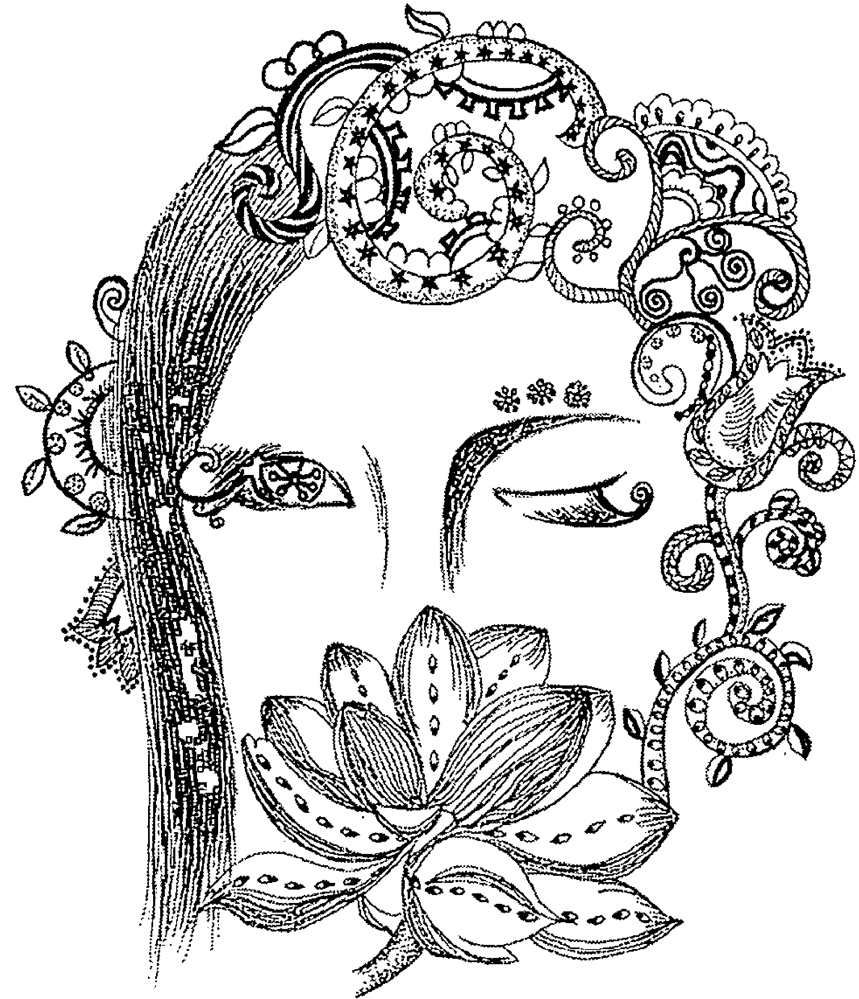

女孩从中学一毕业，就成了坨姑娘（地方方言，指待嫁的女孩），没人管你是初中还是高中，尤其是那些做媒做习惯的人眼巴巴地盯着你，生怕一不小心被别人抢了先。有含蓄些的媒人，会上门和坨姑娘的父母悄声打探，看有什么打算没，找婆家有没有什么条件。而有些热烈直接的媒人，往往见了坨姑娘就会打听：“你妈给你把婆家寻下没？”

媒人哪个不是猴精猴精的，所以直接的远比含蓄的多。这话去问一个刚毕业的学生，让人怎么回答呢？滑头一些的就会说我现在还不急着找婆家，话音没落人就跑得没影了。而那些老实点儿的，往往羞得手足无措，不知道该咋回答，我我我半天说不出第二个字，还站着不走。这时候媒人就笑着把话岔开，扯一扯别的闲话，心里却是有了数的。

所以说毕业对坨姑娘来说是个分水岭，除非你有本事能考上大学，这样才不会有人天天惦记着给你做媒，要不然就得在家面对一波又一波的媒人，寻长问短，挑来捡去。有时候媒人直接就把人领了来，羞得人想看又不敢看，不看又不甘心，只好借着拿东西的机会偷偷瞄几眼。而且介绍的小伙子好赖也全凭第一眼，首先长得体面就可以加分，再加上媒人的七吹八吹，对一个人的了解也就差不多了。回头再和爹娘一商量，这事情就定下了六七分。

至于那些彩礼钱、扯布钱等都由爹娘和媒人商量着去办了，没姑娘们啥事情了。只是那个人会时不时地来家里，各种礼俗都不落下，为的也是两家联络好感情，多和姑娘接触几回。

农村的姑娘都认死理，一般先见面，有好感了就订婚。订婚离结婚往往还有一段时间，但姑娘基本上都会认定这就是自己未来的另一半了。在订婚席上，灵醒的小伙子也早已改了口，一嘴一个妈一嘴一个爸，叫得比自己的亲爹亲娘还要亲。爸妈都叫了，姑娘的心也就铁了。虽然嘴上不说，心里早已认定那个人就是自己的女婿。手底下可能会偷偷地借来鞋样儿，钻在自己的小屋里照着描。

这项工作也多是偷偷摸摸地进行着，生怕别人看见了笑话自己。但是不做吧又心急，不知道该如何向自己的女婿表达心意。坨姑娘们平时不捉针，到了这时候又不得不临阵磨枪。因为农村的习俗就是要给未来的女婿一家上下都做双鞋，结婚的时候摆在花架子（抬嫁妆用的）里，为的是表一番心意，也是想借着鞋的谐音取和谐之意。其实好多人都是去县城买那种便宜的鞋，或者找村子里针线活做得好的人帮忙做，但给女婿这一双，姑娘往往是打定主意要自己亲力亲为的。怕别人做的不合脚，怕别人纳的鞋底子不密实……反正就是要自己做才有诚意嘛！

定下婆家的坨姑娘，好赖也是相亲好几次的人了，面对新女婿时也坦然了许多。尤其是那秋收忙种时候来帮忙干活的，当然更要精心对待，反正已经订婚了，娘也知道女儿的心思，不时地差着去地里端个茶送个水，给两人制造相处的机会。地里有爹和哥还有那个人，给爹和哥把水送到手里，便去叫那个人停下手里的活。新女婿们都这样，来丈人家肯定要多表现一下，让人觉得你实在，能踏实干活，以后才不会亏了自家女子。所以不能主家人停了你也停下，你得晚一会儿，让人家三五次地叫你才能歇下。还要装着不累的样子，其实背上的衣服早都湿透了，巴不得一屁股坐在地畔上不起来。这时候坨姑娘就会忍不住，走过去把他手里的镰刀或者锄头夺下来，把他拉到树荫下凉快的地方，送上一杯茶。

爹和哥早喝完水了，他们心明眼亮，早早就把树荫下的地方腾开了，让姑娘和他好好说几句话。不过姑娘临走的时候经过哥身边，哥就会笑着小声说，女大不中留啊。

在农村和坨姑娘最亲的当然是当哥的了，他们也喜欢故意逗妹子，尤其是见着平日里醋瓶子倒了都不扶的妹子居然能做出一双像样的鞋，更是要打趣一番：“这鞋是给我做的吧？”哥故意把妹子不想示人的鞋拿在手上摆一摆，妹子想说话又说不出来，只能说：“快还给我，还没做好哩。”哥就偏要问：“是不是给我做的？我看着大小合适，让我试一下。”说着佯装要往脚上套。妹子这下真急了：“这不是给你的。”一把夺过去又塞到被子底下。“哎呀，哥疼你二十年都没穿一双你做的鞋啊。”直到哥离开了，坨姑娘脸上还臊红臊红的。

坨姑娘心里也开始嘀咕：“就是啊，之前咋没想过给哥也做双鞋呢。哥从小到大护着我，还没穿过我做的鞋，倒叫那个人占了先。”坨姑娘把鞋又拿出来，思忖了半晌才咬牙决定，“这双先给你，给我哥的后面做。”

农村的姑娘当家意识很强烈，还没过门，就会在心里盘算自己以后的生活：怎么和公婆相处，怎么把家收拾得更好，怎么过以后的日子。她们心里都是有雏形的。这雏形往往来自村子里哪个刚过门的媳妇，听村里人说哪个嫂子会过日子、人不错，以后我就学着她……这些个小心思似乎成了坨姑娘临睡前的必修课，带着对新生活的期许入梦，梦里居然就有了那个人的身影。

真正临近婚期了，坨姑娘明显焦躁起来了，要离开生活了二十年的家，怎么着也有些舍不得。尤其是听那些刚结婚的姐妹说，婆婆如何如何不好相处，新女婿怎么摸不着脾气……心里也突生了怯意。“以后的日子真是个未知数，我能应付得过来吗？”坨姑娘心里上下忐忑，又不敢去问自己的娘，只能在心里来回揣测。

娘也不多说，只管按着自己的心思为坨姑娘准备嫁妆。大到被子床单，小到梳子镜子，似乎要把家里用的这一套全置办齐全才行。一会儿娘来问问这个喜欢不，一会儿来问问那个可心不，丝毫不见别人要嫁女儿的那种焦虑和难过。

坨姑娘心里倒又起了疑，这是自己的亲娘吗？不是说嫁女儿都是不舍的，娘咋这么开心，好像巴不得自己嫁出去似的……女人心思就是多，这样一想，坨姑娘心里更难受得坐不住了，直到晚上起夜听到娘小声地哭泣。爹说：“白天都好好的，这会子哭啥？”娘抽噎着：“女儿要嫁人了，真个舍不得……”

到了白天又丝毫不见昨晚娘的难受，这让坨姑娘有些怀疑昨晚上是不是在做梦，仔细观察发现娘的眼睛是肿的，这才放心了，自己是娘亲生的，娘舍不得自己。娘是想让自己高兴地嫁人哩！

到了嫁人的这一天，娘在外间招呼得井井有条，这个咋摆那个放哪儿，丝毫不乱章程。而里间的坨姑娘多想让娘来陪自己一会儿，她甚至能听到娘在心里的叹息声。可是娘就是不进里间来，坨姑娘心里迅速闪过无数个念头，对未来新生活的向往，对家的万分不舍，那些个陈年往事也浮上了心头，突然间坨姑娘有些后悔自己的冲动，怎么这么急就答应结婚，为什么不拖一拖日子，好和娘再相处些日子？

外间的热闹与喧闹似乎与自己毫无关系了，包括忙前忙后的婶娘嫂嫂们，她们交代这个交代那个，坨姑娘全都听不到耳里了。她在自己深深的悔意里不能自拔。直到新房的门被半大小子们挤开了，人群拥了进来，她才收回自己的思绪，才意识到今天是真的要嫁人了，离开家，到别人家去过自己的日子。想一想这句话好绕口呀，不过哪个坨姑娘能在娘家待到老呢。

催着上花车了，坨姑娘环视自己生活了二十多年的小屋，环视陪伴自己走过无数个日日夜夜的床、柜子、椅子，甚至犄角旮旯的一东一西，全是不舍与留恋。娘看坨姑娘还不出里屋的门，有些着急了，她终于放下厨房外间杂七杂八的事情，来到了里间，看着自己生养二十多年的闺女，眼泪毫无征兆地下来了，往日里偶尔会骂：“早早把你个死妮子嫁人，看你还犟嘴不。”可此时却是左看右看地不舍。

坨姑娘和娘对视的那一刻，受到了感染，眼泪也哗哗地下来了，似乎有一个声音在告诉自己，今天走出这个屋，和娘就是两个家里的人了，怎么着也不可能再像当姑娘时在娘跟前肆意妄为了。坨姑娘再也忍不住，扑到娘的怀里一千一万个舍不得，心里全念娘的好，娘每天早起扫屋做饭，娘扛着锄头下地干活，娘骂自己学习不长进……往事历历在目，坨姑娘终于在心里后悔没有听娘的话了。

12点前进夫家门，想到这里，两人很快分开。理智也回到了坨姑娘心里，给娘磕个头，走吧走吧……

## 回 家

文 / 徐嬙

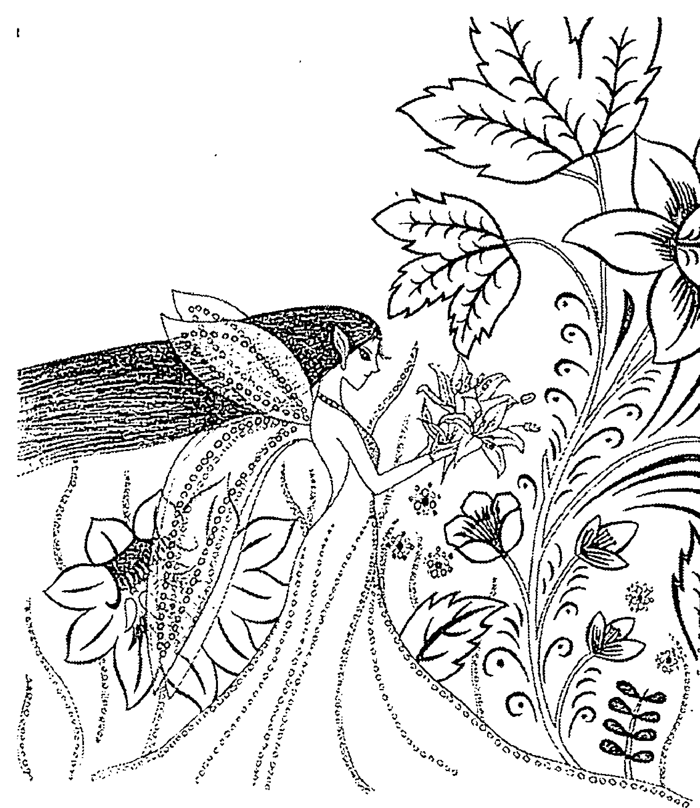

偶然刷起旅游美食类的文章，看着那长句和辞藻间弥漫着的情深意长与缠绵悱恻，我却想到抹不开的酱油糖醋的醇厚与街头巷尾的温暖——关于我的家乡。

温州，乐清。

十年前的乐清还没有二环三环四环，晚上八九点以后的灯光都聚集在海鲜排档和烧烤摊的露天桌椅上。人们用方言喧闹，大声划拳，白色塑料桌上的雁荡山啤酒咕噜咕噜冒着气泡，鲜香裹挟着热气。

晚上会缠着爸爸去吃小龙虾，脸盆一样的盘子里长满了鲜红饱满的诱惑；碰上排档里今天新进了难得的鲜货，老大一只背上脊刺鲜明的海蟹盘踞在水箱里，腮一张一合展示着自己的新鲜与张力；或者是金光未褪的小黄鱼，刚刚从海船上被卸下，唇线呈优良的三角形，使我仿佛已看到腹背上的白肉被割开撒上葱末的鲜甜。

烧烤的烟雾一点儿一点儿飘过来，舌尖上被辣椒夺了知觉。爸爸给我递了一杯啤酒，那时候我才五六岁吧，一大口咽了下去。

小个子的孩子们系着红领巾，排着队等待上公交车。小学生坐公交车只用5毛钱，站在过道里叽叽喳喳地谈论大人听来并不觉有趣的事情。

我二年级的时候开始自己学着坐公交上学，那时候的大人都不怕发生拐卖事件。中午放学走过长长的巷子，走过私人家灰色石板铺就的院子，走过爸爸彼时的旧厂子，走过一个年逾七旬的老奶奶的煎饺摊——1毛钱一个，豆腐干和咸菜馅儿，外酥里美；或是绕到桥边，买一个晶莹剔透的番薯黄夹吃吃，口舌生津。就这样一直走到爷爷家去。

很长很长的巷子，七弯八拐，支折众多，走累了就在半路上阿公家门口歇一歇，阿公很热情地邀我进门吃中饭，我咽着口水摇着头，阿公就往我手里塞一大把零食。

到了爷爷家，大大的木桌上铺着笔墨纸砚和算盘，一旁还有写着汉字偏旁的积木。现在这些东西被挂在客厅不再雪白的墙上，被奶奶小心擦拭。

院子里有一架铁制的楼梯，通往一个小小的花园。到了春末夏初，一大串一大串瀑布似的紫罗兰倒挂下来，使得一进了大门便是一派灿烂明媚的景象。

好多人家里都种养着花草，也不会被商品房的厚墙包裹起来，就露在外面，撒在街上，高高低低，红红绿绿。吊兰和紫罗兰垂下来像风一样迎送着路人，芦荟和蝴蝶兰努力仰着脖子去呼应阳光；秋天的菊和冬天的梅在各自的季节娇艳着——总之一整年都馥郁甜美。

爷爷一定在厨房里忙碌，做着我爱吃的梅干菜肉饼。外面一层梅干菜散发着咸咸的味道，里面裹着面粉和肥瘦适宜的鲜猪肉，不过弹珠大小，往油里过了，“刺啦”一声犹如拉开食宴的序幕，热气和香气一下子争先恐后地冒出来直往我鼻子里钻。

奶奶怕上火不让我多吃，爷爷就偷偷地做，出锅后还等不及凉一番我就急忙往嘴巴里塞。一口咬下去，肉汁溢出来窜满了整个口腔，酥脆的外皮在牙齿下啦啦作响，连烫了舌头都不及自知。

还有爷爷拿手的炖猪蹄和卤猪肚，盘子里盛着的好像就是耳边热情的吆喝声，酱油里透出的满满都是合家美满的味道。

后来爷爷走了，我就再也没有吃到过那般滋味。

东塔公园是娱乐的集中点之一，我今天路过它的时候依然是门庭若市、车水马龙。

公园依山傍水，风景非常不错。

泥土小径的中段有一间小木屋，屋门口的草坪上摆着一个大摊子。最开始只是供孩子们玩沙画，后来又加了另一种我叫不上名字的速干材料画，五颜六色的瓶子摆开一排，很多小孩路过那儿就再也挪不开脚步，包括童年的我。

东塔山静静地坐落在公园身后，郁郁葱葱，绿意怡人。山脚下有一处带着小瀑布的水潭，清晨或者傍晚的时候会有围着围裙的妇女在那儿汲水捶衣。

周末的时候会去攀爬东塔山。以前公园还收费的时候，就从山侧一处上山，哼哧哼哧爬到约莫二三百米的山顶，坐在东塔下的石凳上休息一会儿，然后另择一路下山到园子里，还省去了1元的门票钱，可以买串棉花糖解馋。山路上有四肢矫健的年轻人成群结队，也有一身休闲装哼着戏曲调的老人优哉游哉，十分得趣。

出了公园后再去一边的一鸣奶吧里坐坐，吃一份心爱的蜂巢蛋糕。

若是嫌那里人多了，便骑着车子绕城市半圈一直到西山上。那时马路虽然不大，但车子到底不多，骑车的环境很不错。上山的路有几段颠簸的石子道，熬过去后就可以看见西山水库碧波荡漾的身影。山的倒影、树的倒影都在这里，鱼的声音、鸟的声音也都在这里。

掬一捧水洗洗手洗洗脸，这一路的汗水也就都没白费。

后来建成的晨沐广场，吸引了一群溜着旱冰的小孩和晚饭后扭着身段的广场舞大妈，然而夜灯总取代不了晨露沾衣的生趣。

温州虽也处于鱼米之乡江南水城，但因了临海的缘故，倒多了几分爽朗粗犷。不同于苏吴软语之中的红玉香风，我的乡音有一味叠叠哒哒的气势，据说是最难懂的方言之一。

自2006年到2008年在各地做生意的温州人纷纷嗅到了投资的商机，2009年我去了杭州读书，人们对温州的印象已经都集中于炒房团等各种投资团。与二十年前的武林门事件相比，这又走向了另一个极端。

但当我自己念叨起“温州”这一词时，我首先想到的永远都不是皮鞋、房产、电器，而是邻里乡亲的寒暄和各色各样的美食。

我会想起雁荡山石壁上的火山熔岩泡，或者是楠溪江里一竿竹篙顺流而下；灵霓大堤刚建成的时候，一家人驱车采风至洞头诸岛，我在那儿吃到了这辈子最肥美的海螺；或者不需要去什么山清水秀的地方，只需要往菜市场里走一遭，那些生鲜与虾干鱼干混杂的鲜咸味，就是我家乡的味道。

也许你们看到的是土豪挥金如土，但我看见的是那些烫着头发打麻将的老娘客，说起儿女丈夫、家长里短。

这次回家，又看见许多新建的大楼拔地而起，新区一路向北延伸到我必须开导航的地方。凌晨1点到的家，阿公打来电话说准备了大鱼大肉，中饭一定要去他家吃。

酒足饭饱后穿过长长的小巷来到奶奶家，一路上遇见很多人，一开口便问：“什么时候回来的啊？有空来找我啊。”

听到熟悉的平舌音，走过建设路上的老梧桐，看见打着移动广告的红色人力车来回穿梭，我知道，我又回来了。

当我终于成长起来，成长到开始思乡，成长到一张简单的、家中的小床也足以平抚我内心的浮躁与无力，我才明白灵魂深处那温和却又无时不在的牵引。

这是一个俗不可耐的城市，这是一个不俗可爱的城市。

## 溯回

文 / 王君心

讲故事的人用故事偷走了一个孩子。

不记得是什么时候的事了，只记得小小的镇子，旧旧的氛围，烛影般漾开和乐与安逸。讲故事的人在巷口坐下，用漫不经心的语调开始讲述一个故事。路过的人停下了，巷子里的人从窗口探出头来。消息传开，越来越多的人围在巷子外头，站在低矮的屋檐下静静地听。故事很长，直到全镇的人都赶了来，也只是开了个头。

讲故事的人不动声色，沉稳、低哑的嗓音淡淡叙述。说到一句玩笑话，笑声似麦浪在人群中倒去，划破湖面般的寂静；说到悲哀处，成百上千人的叹息似落雪般扑扑簌簌，掩盖一切声息。

讲故事的人平静地结束了故事，时间已不知驻足多久。人们打着哈欠，伸伸懒腰，相互招呼着，搬起凳子散开了。等到讲故事的人收拾好行囊，空寂寂的巷口只剩下一个孩子。孩子的眼神空洞，显然是陷在了故事里，入了迷。讲故事的人不再有吹笛手的能耐，可捎走一个孩子的本事还是有的。他拍拍孩子的肩，牵起他走，没入巷子。

孩子跟着讲故事的人，涉过无尽的日子，看过无数个或喧嚣或哑然的小镇，听过无数个闪烁莹润光泽的故事。岁月飘散了他的记忆，也将他本身淡化为一个单调黯然的字符，于千万的文字述说中安静走过。

讲故事的人老了，孩子依然是孩子。讲故事的人将自己葬在一个没有结尾的故事里，松开孩子的手，孑然远去。

孩子一个人走着，不知去向何方。他看不到任何事物，听不见任何声音，只觉得手腕上好像系着一根细细的红绳，牵引着他不断朝一个方向走去。这条路上不是只有他一人，他感觉得到，四周有千千万万的人影。这些模模糊糊、影影绰绰的身形，似一尾尾鱼在温和轻柔的流水中，向着同一个地方游去。

渐渐地，有风凉凉地拂过眼睛，似露珠润着视线。淡淡的影像浮现在眼前，孩子举起手腕看着，没有红绳，却停着一只红色白点的瓢虫。他的手一颤，瓢虫飞走了。孩子紧跟着瓢虫，跑着，跑进一段记忆里。

这是世间最初留给他的影像。古朴陈旧的老屋，沉静的木墙与房梁，窄窄的窗口撒进一线光亮，在光线中蒙昧的尘埃中散发着岁月过渡的安详。屋外，门边贴着大红色春联。年幼的孩子由爷爷抱着，舞着胖乎乎的小手指认那些看不懂的字符。浓墨的黑似梅枝般遒劲，喜气洋洋的红让孩子无端感到欢喜。

院子里栽着奶奶精心打理的花草，酢浆草的小花是一派和煦的黄，溜过草叶的猫的身影，是熟透了的麦子般丰盈的颜色。院子里的绿似兰草般淡淡的。出了院子，一眼望见屋后的大山，苍莽雄浑的绿层累铺叠，像潮湿的苔藓覆上青石一般，柔软地染上孩子的心。起伏的远山是虚渺的青色，淡化在发白的天际。再仰头，天空是凉凉柔柔的蓝。

屋后不远处有一片竹林，苍翠的绿是无数竹叶的层叠。孩子顺着记忆跑入竹林，这是他撒欢儿的地方。脚下积了一层厚厚的枯黄落叶，踩上去一片酥软。竹林的影子似群鸟般悄然移动，不知在林间晃了多久，一只红色白点的瓢虫落在孩子的手背上。视线从瓢虫上挪开，就看见了站在眼前的哥哥，责备又宠溺地拍了拍孩子的脑袋。

回去的路上，犯困了的孩子由哥哥背着。他们绕了一条偏远的路，路的一侧是平静的水田，安稳地拢在环绕的山里。路上的行人都走得很慢，一步一步，像是过日子。夕阳在天边的云堆里晕开柔红，落在水田、屋檐、行人身上的却是清透明净的、粼粼闪光的金色。黄昏的气息充满倦意，红色瓢虫晃过眼前，孩子沉沉睡去。

醒来，又回到了独自一人的路上。

揉揉朦胧的双眼，已经能看清四周的人，都在朝同一个方向踱去。再远一点儿，背景是柔和的光雾蒙蒙地融成一片，分不清远近，也辨不出距离。

右前方静静地走着一位老人。花白的头发在脑后盘成一个髻，浅褐色的朴素着装，微微驼背，拄着一个木拐杖。孩子走上前。讲故事的人很少与他对话，日复一日的沉默似乎绊掉了他的声音。现在，他尝试了好几次，终于断断续续地问出了声：“你好。请问，我们这是去哪里？”

老人侧过身来，看上去丝毫没有被这句突兀的问话打扰到。语气和目光都是亲切而慈蔼的：“去教会我们感知的地方。”愉悦的神情在皱纹遍布的面颊舒展，眼里闪烁着细碎的光。

“教会我们感知的地方。”孩子在心中默念。他好像听见了什么，似清冽的溪水汩汩浣过耳畔，像遥远的牧笛声，清越悠然。

有风拂过山林，无数树叶掀动的声音，是视线之外不息的和音。鸟叫声，一声声轻灵似剥去光芒的种子；蝉鸣，夏日里不饶不休地焦灼着耳朵；雨声，密实而安然地落在心上。

“嘎——叩！”伴着清浅的水声，有人在井边打水；“突、突、突、突……”是谁家的车子开过门前？剪影般的叫卖声依稀从远方飘来。

夏日黄昏，垂着丝瓜的藤条下，裁去白昼的暑气，老人们聚在一处聊天。嚼着方言，比芝麻大点儿的事也能说得津津有味。老人们时常叨念：“我们祖上是从河北一带迁过来的呀，我们说的是正宗的古汉言。”“锅”念作“鼎”，“热水”是“汤”，“俳优”是句粗语。孩子曾听见奶奶愤恼无奈时叹一声：“丫（好）殆啊。”

“……门环里的话，我都听到了。”

耳畔响起的声音牵回思绪。孩子有点儿迷糊地看着身边的老人，不明白她说的这句话是什么意思。老人不再开口，只是微笑。孩子恍然忆起，她是邻居家的婆婆啊。

孩子记得，婆婆种了满院子的三角梅，6月末，殷红桃红朱红簇拥着花的长廊，美得能绊住时光的步伐。婆婆会泡好喝的甘菊茶，会耐心地听他把一件小事叽叽咕咕、颠来倒去地说上半天。

后来，就在他被讲故事的人带走前不久，婆婆生病了。大人们说，是很严重的传染病，不让孩子进婆婆的屋子了。孩子闷着脑袋，绞尽脑汁地想啊想啊，总算憋出了个法子。婆婆住的宅子前大门上挂着两个古旧的大门环。孩子想，婆婆的耳朵那么灵，不如把想告诉她的话说给门环听，说完敲一下门环，声音就被扣下了。

之后的每天傍晚，他都来宅子的大门前，把话说给门环听。从“又学会了几个字”“萤火虫让哥哥骗走了”，到“木瓜结果了”“吃上了最喜欢的蛋燕”……多小的事情都一股脑儿说了出来。

原来这些话婆婆都听到了。孩子有点儿不好意思地挠了挠脑袋。

顺着回忆流淌的和声留在耳畔，孩子闭起眼睛倾听，他想从这些和声里找出一个声音。一个温热的、盈润的，如蜜桃般柔软饱满的声音，像拂晓时的风一样轻轻唤着他的名字。他多想听见，可偏偏，在那么多的声音里杳无踪迹。

想起这个声音，鼻尖就好像嗅到了淡淡的馨香。温软清浅的香气，像是小时候无意间翻出的一只樟木箱子，泛黄的信笺和晕染纸上的字迹熏着岁月熨帖后的味道，很好闻。孩子隐约觉得，在他要去的那个地方，弥漫了这样的香气。樟木的气息，湿漉漉的微凉，似绿荫洒落。悠悠的木香里，渐渐透出一股果香，越发丰盈浓郁。

孩子睁开眼睛，他站在一处晒果场边上。被熟红色润透的柿子紧挨着摆在竹编担子上，另一边是满满的紫黑色李果，浸透了秋日的暖阳显得一派丰润。饱满的果实上落了一层薄薄的细盐，似初冬的薄霜。在煦暖的阳光下晒制果干，甜美的果香揉入一点儿咸味，和着脆爽的凉风扑面而来。熟悉的感觉像被清水浣洗的卵石一一浮现，孩子仿佛能看见晒好了的柿饼和李干，深棕色的果实散发着饱含阳光的浓郁滋味。那么亲切，那么熟悉。

孩子有点儿累了，打了一个好长的哈欠。眼前的景物像被秋阳融化了，他又回到一个人的路上。婆婆也不见了。

一只奶白色的猫从脚边擦过，米黄色的斑纹似阳光的吻痕。孩子感到好奇，忍不住叫出了声：“喂！”

“怎么？”猫听见了，回过身来。

“请问——”他顿了顿，忙说，“你知道我们这是去哪里吗？”

“当然。”猫有点儿郑重其事地回答，“去一个我们最熟悉、最依赖、最依恋的地方。”

看到孩子露出困惑的神色，猫又飞快地补上一句：“对我来说，就是一个有烤秋刀鱼的地方啦。”

“烤秋刀鱼？”

“嗯。烤得酥脆的鱼肉，淋上清凉的柠檬汁，真是人间最大的美味。”猫一脸幸福。

……烤秋刀鱼，孩子好像忆起了什么，是厨房里奶奶忙碌的身影。鸡蛋、面粉和清水搅拌成面糊，在油锅里摊成薄薄的饼，奶奶用锅铲在饼的边缘铲一铲，捏住卷起的部分麻利地一掀，呼起的温厚热气满是蛋的香味。把摊好的饼取到盘子里，切成略宽的长条，下到烫着肉片、香菇、胡萝卜丝和白菜的汤里，就是孩子最爱吃的蛋燕了。

一整碗热腾腾的汤，厚韧的蛋饼面条，新鲜可口的配料……孩子想起了这些味道。还有奶奶酿的红酒，棕色的液体倒入小瓷杯，爷爷在晚饭前总要抿上几口。一次，菜还没端上来，爷爷斟好了酒。孩子就用筷子尖蘸了点儿含进嘴里，只尝出了点儿微涩的滋味，却从喉头一下子暖到了胃里。他不知不觉又蘸了几口，就配着饭吃了。饭没吃完，孩子就醉倒了。

不只是这些。孩子又记起了“鼎边糊”，这曾是他最喜欢的早餐。熬着汤的大锅里，咕嘟咕嘟煮着蚌肉、紫菜、金针菇和葱条。用切出横面的生地瓜蘸上油，在锅边扫上一整圈，再飞快地涂上一圈米糊。把米糊铲下来落进汤里，就是一锅好滋味的鼎边糊了。再配上海蛎饼……孩子没发现，他的脸上露出了和刚刚那只猫一样的表情。

还有贴在大缸内壁烘烤的葱饼，用猪肉打成皮的肉燕，以及酸甜美味的柿饼、李干、橄榄……真想再尝一尝啊。

有好些东西，都是一个人带孩子去集市里尝到的。是什么人呢……他兀地想起了一只手的握感。温暖的、柔软的手，可以把他的小手安稳地拢在手心。该是很久很久以前的事了，孩子看着自己的手。讲故事的人也曾牢牢牵过，可那时，孩子已经忘了触摸的感觉。

指尖微微发痒，像在触摸一件粗糙的事物。是石像，孩子看到了，在公园里，古塔前的两尊永远静默的石像。爷爷说过的话沉在耳际，他说：“这样的塔全国只有两座——塔前的石像是文官而非武官。”那时的孩子还不懂这些，他只记得，让爷爷牵过自己的手，带撒欢儿了一整天的他回家。爷爷的手热得有点儿发烫，似粗老的树皮，紧紧箍在手腕，不舒服，却让孩子感到了长久的踏实与安稳。

手指触到新鲜柔韧的树枝，像个“丫”字，是爸爸给他做的桃枝弹弓。用弹弓击碎了不少玻璃瓶子，却从来打不下一只麻雀。瞄准麻雀的瞬间，心间总会莫名颤动——连带手中的石子偏离了方向——却是让孩子感到安心的颤动。

仅仅是手指吗……蓦地，一个怀抱的温暖像一团最柔软的云，将孩子搂住了。闭上眼睛感受，好暖和，这样的感觉只在很久以前有过。落在鼻尖的馨香，拥在身边的温暖，以及安静踏实的心跳，都是曾有过的安然。可是睁开眼睛，这份安然便像指缝间的流水，逝去无踪，只留下无力挽回的委屈、懊恼，与怅然的无奈感伤。

声音哽在喉咙，鼻子一酸，孩子很想放声大哭。

他觉得，被讲故事的人带走这么多年，自己一个人走过这样漫长的路，只为了见到这个人，只为了前往她所在的地方。他多么想见到她、听见她，让她紧紧握住自己的手，觅回这些年他失去的全部温暖、全部爱。

孩子揉一揉浸着泪水的眼睛，仰起脸，倏然望见，在路的尽头，一座古朽老旧的木屋子，一个女人静静地候在门前，微笑着，等他走近。孩子走近了，女人牵过他的手。温暖的触觉由手中蔓延，孩子的心像是晨风拂动花瓣，微微翕动了一下，弥漫胸口的安然似血液汩汩流过全身。孩子看着女人的眼睛，像一个牙牙学语的孩子，试着张了张嘴，发出人生的第一个音：“妈妈……”

“又听故事去了？”妈妈笑眯眯地揉揉孩子的头发，“吃饭了。”

她牵着孩子，穿过门，走进屋里。屋子里柔黄色的灯光亮起，晃悠悠地荡开一片温暖。木桌上摆着热气腾腾的火锅，白豆腐在热汤里滚动。爷爷、奶奶、爸爸、妈妈、哥哥，都在。就好像置身一个完整的梦中，就好像他从未离开。孩子在桌边他的位置上坐好，挨了奶奶一句晚归的斥责，贪恋地享受属于亲人间的温情与安逸。

## 最后一棵皂角树

文 / 张谋

我不知道一个人的大脑沟回能储藏多少东西。当我还是个懵懵懂懂的孩子时，我就开始往沟回里填充。那是最初的一些影像，有些模糊，有些迷离，但却是最真实的。当我回忆起那些亦真亦幻的往事时，觉得温暖，又觉得失落。当大地上的一切不断变化，当一切只存在于过去，只有在记忆的源头才能打捞起生命最初的悸动。

我确定在村口的那个老碾盘的位置上，曾存活着一棵皂角树，这么说是因为我曾经不止一次地在记忆里复苏着一个古老的场景，我曾经双手捧着一个皂角子，下到边上的水渠里，把它折断，揉搓出泡沫。那像是扁豆的放大体一样的东西，沾上些水，拿在手掌心冰凉冰凉的，光滑得像一截蛇一样的触感。在我没有留意间，那棵皂角树便消失了，如同时光悄悄地从我身边流逝……

一棵老去的皂角树，在长出皂角子的季节，显得精力旺盛。树下站着的孩子抬头看着满树的皂角子，就像抬头仰望一弯弯新月。那时候的我还太小，我心里多么渴望得到一个皂角子，但我够不着，我不能像其他大些的孩子一样拿竹竿把皂角子夹下来，我只能站在树下默默期待。我知道皂角树边上围满了村子里的人，有老人，有小孩，有妇女，有小伙子，大多时候是小伙子们把皂角子夹下来。我不知道我从哪里幸运地得到一个，我捧着它，如获至宝。那种冰凉的从手心传到心里的温度，一直湿润，浸透着记忆。等我长大一些后，却没有了皂角树。村子里、周边的土地上，存活着许许多多的树，但我再也没有找到一棵长着皂角的树。由此，我知道那是最后一棵存活在村庄里、存活在这块土地上的皂角树。

皂角树肯定是老死的。我不相信村子里的人会狠心砍倒它，大家都是那么喜欢它。女人们用皂角的泡沫洗衣服，孩童拿在手里就是一个可爱的玩具。皂角树上还挂着一个铃铛，有根绳子从树上垂下来，悬在半空。小孩子们的个头是够不着的，只有大人们才够得到。那个铃铛的意义可不一般，它一响，村子的人们都会从自家院子里跑出来，往村口张望，看是出什么事了。一般只有村长有资格拉响这个铃铛，要不就是村长让别人替他拉的。别人要是私自拉了，会被村长骂的，村子里其他人也会埋怨。铃铛一般是在午饭后，或者晚饭后被拉响，村子里的人们刚吃饱了饭，都聚集在村口的皂角树下，听村长讲话。老人们蹲在粪堆边上，抽着旱烟袋，年轻人站得相对远些，只有家里的主心骨靠前些，坐着或站着。拿凳子坐的人很少，一般都是就地取材，到旁边的沟渠边上搬块石头往上面一坐，要不干脆跑到不远处的麦草垛上撕扯几把麦草，往地上一摊，席地而坐。

有的人对开会有兴趣，扛着锄头从边上经过，嘴里嘀咕着：“净说些没用的，有这闲工夫，还不如去地里刨几个红薯实在。”在众人惊奇的眼神里，沿着乡间小路慢慢消失在田间地头。村长说着一些国家的新政策，下面的村民们议论纷纷，有人起哄，有人争执，孩子们夹杂在大人们中间跑来跑去玩耍，只觉得好玩。皂角树站立着，默不作声，午后，帮大家挡挡炙热的日头；傍晚，帮大家顶着冷风。春来秋去，皂角树立了一年又一年，终于老了。村长也老了，一代人相继老去，一些年轻人成了家里的主心骨，一些孩子变成了年轻人，又有一些孩子跑在大人们中间。皂角树屹立了不知道有多少年，村子里最年长的老者也说不上来。皂角树站累了，终于在某一天枯萎，挂在上面的那个铃铛也再不会响起，只能在几十年前的风中寻觅它的声响，深远、悠长、古老。

皂角树也曾风华正茂，舒展着身子，把枝杈伸向天际，把皂角藏进臂弯。远远望去，像一个大蘑菇。村口，那是最显山露水的位置。夏日里，村子里的人聚集在下面乘凉，有些年轻人在下面下象棋，两军对垒，杀得地动山摇；下雨时，从田间地头往家里赶的人都跑到树下躲雨，那是一个安逸的所在。我不知道皂角树消失以后，有多少人会想起它？在那块土地上，又会生长出什么呢？皂角树的消失，在很多年以前也许是种暗喻，预示着更多树的命运。那些曾经郁郁葱葱生长在村庄周围的树，开始渐次消失，皂角树仅仅只是个开始。

我对皂角树的记忆还仅限于此，但我对后来消失的一些树却能从头说到尾，比如桑树、软枣树、冬桃树、拐枣树……对于至今还存活在这块土地上的树种，我想也已经为数不多，或者也已然成为最后一棵，只是不为我所知而已。当有一个孩童和我一样，只经历最后一棵，我想，他会和我一样，在心里留下难以磨灭的痕迹，因为那是独一无二的。比我小的孩子，他们一定不会知道这块土地上曾经生长过一种树叫皂角树，他们只能从老人们口中听说，去猜想，或者从书本上了解到。他们不可能亲眼看到，也不能伸出手触摸得到。对于他们，皂角树已然成为翻过去的历史。我庆幸自己跟在了皂角树最后消失在这块土地的尾巴尖上。这残存的一丁点儿记忆，成为我对于一个村庄、一块土地最原始的印记，也将成为我打开村庄历史的钥匙与密码，所有的一切记忆都将从这里复苏。

恍恍惚惚的梦里，一只老鸦飞上了皂角树，在枝头哀叫着，老鸦落过的皂角树上，皂角子遍体鳞伤。老鸦飞在这块土地上空，它从上面看得最清楚、真切。这是最后的哀叫，也是最古老的预言。

## PART 6

## 思辨与能断

### 宝剑一

众山之巅，高处不胜寒
宝剑刺穿王冠
强力意志能够穿透世间一切
风属性的剑代表思辨
会思考我是谁
从哪儿来向哪儿去的终极问题
然而思辨的意志过剩
成为自我怀疑
刺痛的许是灵魂本身

## 旧城：绽开的罂粟

文 / 李达伟

### *1

在县城读书那几年，我被青春期的孤独、迷惘与虚空折磨，在时间的不断累积面前，它们开始在思想深处异化加深。当把那段时间分割成一个又一个镜头后，我才发现每个镜头里都有灰暗的冷色调。人事的层叠覆盖超出了想象，一些物事甚至容易混淆。当音乐介入后，那些镜头不再静止，有了流动的意味。我，耳朵里塞着耳机，在那片旧城里到处游走，漫无目的，像一尾鱼。那时我最喜欢的歌手是黄家驹，我喜欢那样的摇滚精神。我在那片旧城里，到处搜集黄家驹的歌曲，近乎迷狂。

初二那年，我十四岁，住在表哥家。我经常把随身听藏掖在被子里。那时不了解表哥，我很怕他，怕他会把听音乐当成不务正业。十四岁以前，我在县一中住宿，相对自由。那时我胆大，随身听时刻带在身边，甚至上课也偷偷听过，用一只耳朵听，用另一只耳朵听课，结果可想而知，成绩一塌糊涂。但我无法拒绝音乐，那时音乐在我身上起到的作用是双重的。在成绩不是很理想的同时，是音乐和阅读把内心那条跃跃欲试的蛇摁了下来。在那些沉寂的夜里，许多事情正在发生，不敢在白日的明亮里生长的恶之花，往往在夜间开得繁茂葳蕤。在夜间，我看到了曾经在某个乡间看到的罂粟，开出绚丽的花朵，结出我不知道的邪恶。是音乐弱化了那种植物对我的影响。

我先后换过三个随身听，更换的间隔时间，都在一年以上，相对比更换速度很快的是电池。废弃的七号电池，堆积在床角，干掉却不会腐烂。每个星期从表哥那里拿到生活费后，我经常跑到音像店里挑一些磁带。那时最让我感动的，往往还是那些近乎撕裂心肺的摇滚乐。在那些摇滚乐里，我明显感觉到了属于歌者也属于我的疼痛。

音乐是我迷茫史的一部分，在饱受青春期的困扰时，我能想到的只有听音乐和阅读。舍友张对于摇滚乐同样异常痴迷，从他的口中，我第一次听说了诸如“地下乐队”这样的字眼，后来我才了解，那是与主流音乐不同的音乐。从此，在我心中，那些音乐才是真正的音乐，才是真实的音乐。在那些真实的音乐里，我看到了自己，我看到了底层，我看到了精神的苦痛。

我总是把随身听放在口袋里，耳朵里塞个耳机，这是一直以来属于我的游荡姿态。只须付出感知器官，我付出了目光，有时还会付出触觉，用手指触摸旧城的温度。摇滚里更多的是对人间苦难的感伤与挣脱，由独具个性的个人感伤拓展到某个人间的感伤。有时我也会希望彻底放逐自己，像那些音乐人一样在苦难中成长。而在那片旧城里，我生活得安静、舒适、惬意，有时甚至会陷入慵懒困倦之中。

那时我的同学赵，因他在体育方面表现出来的潜质，被县一中破格录取。但他兴冲冲地去了体校将近一个多月后，就不再去体校训练，还经常迟到、逃课。我们在一块儿时，我曾委婉地和他谈起作为一个旁观者的感受。在我看来，如果他好好参加训练的话，将很有前途，至少比我多了一种选择，他却不无悲伤地摇了摇头：“没有办法！我已经习惯了睡眠，如果早上早点儿起来的话，就会感觉打不起精神！”他还曾说过这样的话：“有时自己会有点儿难受的，但已经没有办法了。”对于那种困倦感，赵似乎确实无能为力。现在的赵，开了个装裱店。我不知道，他最终是怎样抗拒那些嗜血般的困倦感的。而我，在听那些略带感伤却不绝望的摇滚乐

### *2

电影《岁月神偷》（看这部电影时，我早已离开那片旧城，似乎绚烂与孤寂的青春早已离我而去）表达的是肉身与思想在时间面前的脆弱与无助。看这部电影的过程中，我多次听到了来自时间对肉身的侵蚀，以及对内部的撞击。

时间的侵吞是残酷的。十五岁那年，我在县电影院大厅的那面镜子里，发现了肉身的变化：突出的喉结，拉碴的胡须，凌乱的头发，黯然神伤的表情。当发现自己被时间割裂得惨不忍睹时，我才意识到自己的内部可能已经被击垮，某些部分可能已经溃烂。

达利的那些钟表，标志着达利对于时间的感觉。时间在达利那里有了它柔软的一面，可以融化，可以伸缩。正因为时间具有那种液化的作用，它才会轻而易举地渗透到任何空间。面对那些已经融化只差蒸发的钟表，物象才会露出真实的一面，物象在那些融化的液体表面，留下诸如脚印之类的蛛丝马迹。当融化的时间再次凝固，那些留下的迹象就无法消除。在那片旧城，我甚至怀疑那些残留的壁画曾经也是在那些墙壁处于融化的状态下嵌入墙体的。

时间对记忆的塑造与替换，显得很微妙。我可能已经不自觉地给那片记忆中的旧城虚构了一些事物。在讲述中，我植入了“我”这个旁观者，似乎我目击了所有的人与事一样，其实里面有一些，是我作为旁听者所获得的。“我是作为旁观者出现的”，这是除了“游荡”之外，出现频率最高的话语。我具有大多数旁观者那种对于陌生与熟悉的双重沉迷。我依然保留着童年对所有事物的激情。童年，永远不会对熟悉的游戏和事物感到厌烦，那时可以通过想象力的丰富和思想的简洁单纯发现熟悉中的陌生与奇妙。大人把我抛到空中然后接住，我感受到了前所未有的快乐，我一次次要求大人把我抛到空中，我丝毫没有意识到，那个行为有潜在的危险。对潜在危险的迟钝，让我一次又一次充当着旁观者的角色。

那时班上那些热爱八卦的女生总会买一些娱乐杂志，并毫不倦怠地做那些选择题，测试人的性格、时运和爱情。首先是星座，是公牛座的去找公牛，是蝎子座的找蝎子，找到星座后，它出一道题，看你的回答，选A项，可能会跳过下一道题，或者很多道，或者就做下一道题，这样循环往复，但它最后是有终点的，而不是制造谜题让人无法绕出去。似乎那就是时间的阴谋，把过去、现在与以后紧密地联系在了一起。时间的真相竟暗藏在一些符号中，那种在平时只代表某种意思的符号，竟然衍生出了复调的表达！有时，我也会参与进去。有一回我参与时，最后的结果让我感到震惊：沉默寡言，需要敞开。我早已意识到自己的沉默寡言，但有时我竟习惯了沉默寡言，以及它给我带来的沉寂感与孤独感。

我根据那些选择题的指向朝后山走去。在后山，我可以在观察那些植物的同时观看一些游荡的人。一些少年会经常出现在那里，抽烟、酗酒、打架斗殴、耍酷。我就曾目睹过那群少年把朋友东堵在公园门口，搜身、抢劫。那时我也是个少年，但经常沉默寡言，以及平时穿着朴素，让我显得老成一些。其实那时的我还是用少年的眼光来看待那些少年制造的事件。内心深处同样会替那些被打的少年担心，我担心多米诺骨牌效应会给那些受到困扰的人带来连锁反应。我看到那些受到欺负的人叫来高年级学生帮忙，那群少年同样叫来高年级的人帮忙，我不知道那些事件是以怎样的方式结局。多米诺骨牌效应，同样在我的身上发生作用。我从后山回来时，往往要折到酒厂那边。那里经常有一些神思恍惚的人。那些少年是怕他们的，我却不怕，我早就意识到那些人是不会伤害别人的。我在那片旧城总共待了五年半的时间，在那段时间里，我从未听说过那些人伤害过任何人，相反，曾有一个精神有点儿不正常的青年被一家卖包子的商贩伤害。破案后，那对卖包子的夫妇口口声声说，他们看不惯那个疯子整日在他们面前晃来晃去，一副悠闲自得的样子，而他们自己却活得那么劳累。扑鼻的酒香会让我暂时忘记那群游手好闲的少年，酒香暂时让多米诺骨牌效应发生的速度变缓，却不会消失。

第二天我再次出现在后山，那群少年依然像平时一样，出现在那个公园，抽烟、酗酒和高声地谈论着关于女人的话题（这在很多时候都是我猜测的，那时对于异性的意识正在苏醒）。那时，对我所产生的影响就会再次出现，惧怕那群同龄人。那时的我已经不是一般意义上的旁观者，而是处于临界状态的介入者。到后来那群少年并没有对我造成伤害，却是一群高年级的人，把我堵在公园下去二百米左右的十字路口，把我身上的二十多块钱抢走，还警示性地踹了我两脚，我紧紧地护着裆部。

### *3

在那片旧城生活的时间里，日常生活呈散落状，其中往往还携带着几丝倦怠与臃肿。在旁观者看来，那样的感觉尤为深刻，在介入者的体验中同样异常清晰深刻。那段时间，我既是旁观者，又是介入者，在很多时候，我在这两种角色间游移不定。在游移不定中，我不断深入那片旧城。在对于介入后的旁观，以及旁观后的介入，我看重的是那片旧城里蔓延的气息对我的影响。

直到现在，那片旧城对我的影响依然经常显现，我甚至已经无法掩盖旧城的忧伤对我的浸染。现在，一个人在这个乡间的大部分时间，我总是无意识地把自己与周围环境隔离开来，一个人躲在卧室里阅读与书写。我在意的是肉身的内部，与思想有关，即便这种思想略显幼稚和混乱。似乎我并没有憎恨过自己那具肉身，但我经常憎恨自己的思想。不断拾掇关于那片旧城的记忆，其实更多时候，是在憎恨自己在那片旧城中生活，以及随之出现的恶的思想。

那时我在景风路路口租了一间简陋的厢房。有时，我会从景风路往下朝喧闹的街区走去，这是我冗长的日常生活中的片段。我不断强调，自己只是偶尔出现在那些喧闹的街区，而更多时候我出现在后山。在我不断强调的行为里，隐藏着几丝对于喧闹的惧怕。去那些街区，更多时候我是有目的的：去那些散落的书店看书，去步行街买些东西，穿过那个街区朝旧城的外部走去……相反，大部分时间里，我都无法说清自己去往后山的理由。

在那片旧城，我会猜测，自己所碰到的人群中，有很多人是漫无目的的。那是一群漫无目的的人，我能从他们的眼神里发现，那是游离于身体之外的眼神；我可以从他们的语言里发现，那是几乎没有任何意义的话语；我还可以从他们的行走姿态中看出，那是几近游荡一般的姿态。有时我甚至会怀疑，自己能嗅到在旧城里到处蔓延的游荡气息：浓厚的漫无目的，以及稀薄的有所目的。

我行走的路线主要围绕着那条步行街，那里很少有车辆，偶尔会有一两辆拉人的三轮车出现。那段时间，脑神经衰弱让自己变成了极度敏感脆弱的人。我猜测，在那条步行街上走过的人群里，同样散布着一些遭受脑神经衰弱侵害的人，在喧闹面前，往往惊慌失措。在那条步行街上，除了遭受脑神经衰弱侵袭的人外，还应该有一些得各种怪病的人，应该有一些患有强迫症的人，有一些健忘症患者，有一些高血压患者……

有时我会怀疑自己同样是个强迫症患者，我在走出那间租住的厢房后，会觉得自己没有把那扇早已适应虚掩的院门关上，我甚至会觉得在那条街道上行走会遭受意外的袭击（来自眼神、来自思想、来自具体行为）。在那条街上，我同样觉得有一些人，有着像我一样的敏感和脆弱。

我在那条街道游荡的过程中，感觉周身有一股无法释放的压迫感。在那种压迫感的作用下，人可能会做出一些让人吃惊的举动，即便我只是在思想上做出了另类的举动。在思想深处我开始报复人，报复一个与我丝毫没有联系的人，我只是觉得他（她）用某种形式的暴力侵犯了我。而有一些人就确实做出了杀人的举动，并轰动了那片旧城。一个来自旧城外一公里的农民，在妻女住院的时候把妻女活活掐死，然后自己从县医院住院部的四楼一跃而下，自杀身亡。据说，那个农民喝了一瓶高浓度的白酒（他为何喝白酒没有人知道，在我看来他只是一个酒鬼，身上还隐藏着无法消磨的暴力，只是在平时，他把它压制在了内心深处，而在酒精面前，隐秘的暴力无法抵抗，最终喷涌了出来），他在酒香满溢中杀害了妻女，他在一种迷醉的状态下杀害了妻女。有个亲戚W在县公安局，他跟别人说，他们也只能进行推测，毫无道理地推测，在那之前没有任何迹象表明他会杀害妻女，他们一家三口幸福快乐。

## *4

往往在隐秘的细节上，能得到生命更多的暗示。我一个人，从那些已经没有多少人去看的录像厅门口经过。在我无意间的注视中，我发现了那些店主已经把二楼曾经专门用来放映的房间改装成了茶室。一楼的橱柜里依然放着那些碟片，基本没有更新的碟片，落满灰尘，残损破旧。似乎那些碟片的存在，并不是等着一个旁观者的到来，只是为了保留某些信息，某些怀旧的信息。

从碟片上得到的暗示：一个远去的时间段，一个录像厅风靡的时间段，一个我们经常逃课去的角落。关于青春期的忧伤、迷惘、快乐，有那么一部分是储存在那个角落的。进入录像厅之前的我们和从录像厅里出来的我们已经不同，其实也只是暂时的不一样，我们的肉身依然是那具肉身，我们那可塑性还很强的思想在录像厅里受到了一定的震荡，但在大街上游荡一会儿，那种震荡感便荡然无存了。直到现在，我才意识到录像厅对我们的影响已经深入肉身的内部（这是深入中的一种），只是到我们相继离开那片旧城后，才再次在我们身上显现。

录像厅带给我的迷茫与忧伤，现在依然会出现。那些碟片旁站着那个面露凄楚的女店主，与多年以前不一样，多年以前她的脸上常带着的是微笑，似乎时间已经把那些笑容侵吞。偶尔会有一两个顾客，进入其间挑选那些陈旧的碟片，很廉价，十块钱就能买到一沓碟片。我还有意识地观察别的录像厅，有些招牌还在，“小玉录像厅”“小轩录像厅”……基本都以人的名字命名。当然那些录像厅不再放映录像，至今我还不知道小玉、小轩之类到底长什么样子。除了还卖碟片的那家，别的都已经改换一新，包括底层。与那些录像厅相对应的时间是容易让人浮躁的年代，那时刚刚接触电影，与露天电影稍有不同，那是些以前从未看过的电影类型，诸如爱情片、武打片、警匪片。许多人与我一样没有接触过那样的电影，那时的电影弥补了我们某些方面的缺失。经常在那些录像厅里出现的有好一部分人是像我一样来自乡间。

那些录像厅同样是旧城的隐秘组成，我们往往是遮遮掩掩地进入其中，在看电影的过程中，还会感到胆战心惊。我会担心一些熟悉的目光突然出现。当然我的担心，也并不是没有丝毫依据，那些录像厅一个下午放三部电影，一般是港台武侠电影居多，当然还会放一部色情片，有时我直接怀疑是色情片支撑起了那些录像厅。那些色情片，情节单一乏味，因为关于异性的意识正在苏醒，我们才无法抗拒那些电影的。我在那些角落里，徘徊惶惑了一个学期后，就再没有走入那些地方。到初二，我的注意力转移到了隐藏在电影院内部的图书馆，我是在无意间发现了那些散发出刺鼻腐朽的气味的书。那天我正在电影院看一部黑白电影，而我竟然忍受不了黑白电影那缓慢的节奏感。在那种缓慢的压迫中，我走出了放映电影的房间。我从侧面的楼道上了二楼，二楼、三楼、四楼放的都是图书，这让我出现了短暂的悸动。从那时起，我开始沉迷阅读给我带来的悸动。

## *5

那是一片旧城，破败随处可见，甚至还能嗅到残破的味道，甚至还能听到继续残破的声音。我的位置在景风公园后的一个斜坡上，我正坐在一些干枯的草上，那个斜坡上还长着一片同样干枯的蓬蒿。我一个人，我的表情、内心、呼吸都舒缓而平静。斜坡下面是一个渠道，用来引水灌溉。在我坐在斜坡的那个黄昏，渠道里没有一点儿水，落满枯败的落叶。在那个斜坡，我没有任何紧张与忧惧，我可以自由自在地呼吸那些自由的空气。我可以选择或坐或立或卧的任意姿势，我选择了躺在那个斜坡上，手指交叉抱头，我稍稍抬一下头，就是蓝澈的天空，我稍稍低一下头，就是那片旧城。

在县一中读高三时，我经常在晚上12点后点起蜡烛，或者打起手电，在微弱幽暗的光线中开始阅读。那段时间，我沉迷于阅读，而高考也正在临近，在旁人如火如荼的学习中，我的紧张感加深了，我不知道该如何平衡学习和阅读之间出现的裂痕，我不知道用什么来填充二者之间的空白！每天中午我都会一个人去县图书馆，那时县图书馆已经搬迁到了新城，已经抛弃了电影院的围困。我基本都是低着头走路，我很少望向那些巷道的尽头，其实不长，只是在阳光的作用下稍显凌乱狭长。当借到书回来，我在那些巷道里慢慢地走着、阅读着。

在我阅读的时候，W开始在宿舍里自我陶醉地唱着歌，沙哑、跑调。舍友W对音乐很狂热，与W的交谈中我知道了摇滚、解放、自由与地下乐队等词汇，W总会在宿舍放摇滚乐，在W看来，那才是真正的音乐，我同意W的看法。我悄悄地攒下钱买了个随身听，在阅读的同时听摇滚乐。重金属那撕心裂肺的狂躁与忧伤是那时我所沉迷的音乐形式，在那种近乎嘈杂的裂音中，我会暂时遗忘生活中无处不在的矛盾。W收集了许多摇滚乐的磁带，每天下晚自习，W就会塞着耳机听音乐。W的床铺在我对面，我能清晰地听到那些痛击灵魂的音乐，在轻微的力量中爆发出某种力量。

与摇滚不同的应该是县城里游走的卖唱者弹奏的三弦。那些偶尔会在县城的隐秘角落出现的卖唱者只有老人。与一般的流浪汉不一样，那些卖唱者给人的感觉不是肮脏，是疲惫；而那些流浪汉中的大部分人，却给人肮脏与懒散混杂的感觉。每一次我踏入艺术团大门，总会想到那些卖唱者，但我从未走近他们，这里的“走近”是一种对话与了解，我只是听他们弹着三弦唱着白曲。在阳光的照射下，那些散落的白曲异常暗哑、沉重、忧郁。而现在，在县城却很难见到他们了（那些在大地上行走的歌者），或者可以肯定地说，再也无法见到他们，而一些流浪汉却长久地在那片旧城待了下去，让人感到很惊讶。

## *6

1997年秋天，旧城里的许多事物于我而言，神秘、陌生，充满了各种可能性。那一年，县城电影院经常喧闹异常，门口的橱窗里贴满各种海报。电影院门前经常聚集着一群务虚主义者，抽烟、酗酒、聊天，横躺在那些杂乱的草丛里。由电影院往下，有许多游戏厅，许多年轻人边抽烟边紧紧盯着游戏机，外面的世界与他们无关。继续由那些游戏厅往下，有许多录像厅，门前聚集了许多人，基本都是年轻人，目光游离闪烁，充满渴望。而电影院旁边像看守所等一些建筑正在破败，拆迁是它们不可避免的命运……

那个秋天我只是作为发现者存在。我想成为一个深入者。我想进入那些事物的内部，去看一部电影，去了解那些务虚主义者，去玩一场游戏，去看一场录像，去看守所看那些被关押的人，看那些建筑是以什么样的方式倾塌甚至消失……

1998年秋天，我开始深入那片旧城的内部。我曾经渴望自己也能像电影大师希区柯克一样，让瞬间的感觉改变一生。当我把想进入看守所的想法说出来时，许多人都觉得很荒唐。到我读高中时，发生了一起初中生斗殴致死的事件。我们村在看守所工作的人开始觉得让自己的儿子进入看守所感受一下是有必要的。但我没有那样的机会。直到现在，我依然有进入看守所的渴望，我矫情地想和关在里面的那些人进行一次深谈。

“1998”起到了限定作用，那是一个交杂着喜悦、茫然与疼痛的时间段。是1997年秋天，我第一次出现在了那片旧城的街道上，是夜间3点多，看着那些花花绿绿的霓虹灯，睡意全无。旁边是一身灰尘、很是疲惫的父亲，他背着我的行李，以及背着对我的期望。那一夜，父亲和我都无法安然入睡。我没有料到，自己将陷入旧城的围追堵截中。

是那一纸通知书把我和旧城真实地联系在了一起。在那之前，连接外部世界的是爷爷的收音机。在那个乡间，那时还没有通电。收音机经常由于电池用干流出腐烂的液体，发出的声音失去了常态，以一种变异的疼痛出现，我就会担心那种声音会突然消失，那样与外界之间的联系就会断掉。那天父亲从镇上回来，带回了那纸通知书，已经变淡的印章依然以暗红一般的质地痛击着我。在去县一中前的那段时间，我每天都要拿出通知书看几眼。我常常想象县城的模样，当来到县城才发现，与想象中的有很大区别，围裹着县一中的是一片旧城，一片由清末民国时期的建筑组构而成的旧城。

到县城后，我觉得自己是一尾内心激荡却不知该游向何方的鱼。我的目的地是县一中。当和父亲来到县一中门口时，我竟把注意力集中在了那些电线杆上，而忽视了县一中的存在，电线上停留着一些鸟。那种情景在乡间很常见，我已经习惯了那样的情景。随着那些鸟的飞去，我的注意力随之转移到了那些贴在电线杆上的纸张上，破碎的纸张，一层粘着一层。纸张上面是一些略显低俗的信息，当父亲发现我竟呆呆地注意那些信息时，他显得很恼怒。

## *7

现在的电影院，无论是外观还是内部都呈现出一派荒凉的情状。我已经很长时间没有进去过它的内部。印象中它的内部，总有一股腐烂发霉的气息。对于它的外部，我曾在一些文字中不厌其烦地描述过。“剑川县电影院”，标志它是电影院的那几个字已经掉落了几个，而相反，标志电影院内部曾经有图书馆的那些字眼却完好无损，而图书馆很早以前就搬走了。

读初中那些年，学校经常组织我们去看一些感人的励志电影，每年的开学典礼也在电影院里举行。在电影院内部的幽暗中，我们清楚地看到了自身的蜕变，在里面我们度过了变声期，男女同学之间从不害羞过渡到了害羞。每学年所要进行的文艺晚会，也在里面举行。那是在我们班大合唱的过程中，我发现自己的嗓音低哑，一些女同学的声音却清悦异常。我曾经在那个舞台上参演过一个小品。我是作为丑角出现的，汉语磕磕绊绊，到现在也是，说汉语远没有说母语白族话来得利索。那个丑角在故事中总显得不知所措，总想表达自己的一些想法，但由于语言的拗口而插不上话。那个丑角表现得很恐慌，我要表现出脸红脖子粗的模样，在我努力表现出那样的情态时，突然发现自己其实是在饰演自己。到我读高中时，县电影院不再放映电影，但它对于我们学校的作用依然像以前一样重要。

在电影院旁边，能经常见到一个脑子有点儿毛病的年轻人，走路一低一高，总是面带笑容。他经常在电影院旁边的那些巷子里闲逛，有时还拦路人。有些人经常拿他取乐，特别是那些高年级里比较调皮的学生。读初一时，在去表哥家的路上经常会碰到他。有几回在那些学生的怂恿下，他把我的去路拦住，朝我傻笑，却不说话。那时我不知道该如何面对那丝傻笑，有几次我甚至差点儿就掉下眼泪。到后来我才知道他拦住路人没有恶意，但我还是想方设法避开他。他的父亲是清洁工，负责打扫那些巷子，在一些冬日的早晨，天气异常寒冷，我经常看到这样的情景：他帮着父亲推着手推车，快乐地走在父亲身后。

到我读高中时，他依然像以前一样，面带微笑，偶尔拦住路人，经常帮父亲推手推车。似乎时间在他身上定格了，时间在他身上并没有老去，而只是重复。似乎时间只是在别的事物上流逝，似乎时间从旧城上压碾过了不知几个来回，而恰恰把他忽略了。我无法定义那到底是幸运还是残忍。到我读高中时，我经常会见到：他帮着父亲把垃圾推到电影院旁边的垃圾坑，有时还用打火机点起火，把那些垃圾烧掉。从他的行为里，我总觉得他只是被别人定义为傻子，而实际情况并不是这样。

我发现有许多捡垃圾的人，出现在那个垃圾堆旁，与人群一起出现的还有那些野猫。有时人还未出现，那些野猫早就出现在垃圾堆里，吃着人们丢弃的残羹剩菜。垃圾堆里同样经常出现老鼠，我从未见过那些猫去捉老鼠的情景，它们在垃圾堆里各安天命。那些捡垃圾的人经常是拖儿带女，有时那些孩子和捡到的垃圾一起待在三轮车里，有时是用背带背着。那些孩子，头发凌乱、面部肮脏，在三轮车上或者母亲的背上安然入睡。

我曾经有意来到那些以捡垃圾为生的人所聚集的北城区。在北城区的坡地上，那些人搭建了一些简易的平房，在狭窄的房间里，堆满生活用品，堆满捡来还未卖的垃圾，那些孩子挤在屋里玩耍和学习。电影院旁边的那个垃圾坑，是那些人每天必须要来的。有段时间，电影院是我经常要来的地方，虽然没有像那些人一样每天都来，但还是很频繁。我把目光从那些人身上转移到电影院门口的那片草地上，一片没人打理自然生长的野草，长得杂乱无章、繁茂葳蕤。只有在那片野草里，我才会再次看到那些毛色杂乱的猫和老鼠相互追赶的情景，但那更像是嬉戏打闹。

印象中，那些有关凶杀抢劫的事情，大部分发生在县电影院旁。因此与电影院相关的一切，我经常会感到恐慌。那时，我喜欢的那个女孩的家就在那个电影院旁。我不顾内心的恐慌，多次偷偷来到电影院前面。那里有一座假山，没水，异常干枯丑陋。平时我几乎不去关注它，也没有时间去关注，或者只有在百无聊赖的时候我才会关注它。

## *8

初二那年，我在表哥家住了一段时间。那段时间，我每天必须经过县阿鹏艺术团。去表哥家，必须进入那个敞开的大门。艺术团在大门的右边，表哥家是直走。虽然表哥家和艺术团之间只隔着百米左右的距离，但二者的建筑样式完全不一样，甚至给人一种对不同艺术形式的追求与沉迷感觉，表哥家是旧式建筑，艺术团是新式建筑。对于艺术团，我充满了无限渴望，我渴望深入那个建筑的内部（到现在，我还没有进去过。它的内部，我依然只能靠一贯的猜测与想象）。

每天中午走入那个敞开的大门，往往能听到艺术团所独有的声音。人们在练声、排节目，总是清脆嘹亮。他们唱的基本都是白族调。我一再坚信白族调源自民间，当我第一次来到那片旧城时，我的耳朵捕捉到了来自那个建筑内部对于民间的渴望。在乡间，我听人们随意哼唱白族调时，并没有在旧城突然听到所带来的震撼强烈。在那个乡间，过多的贫困困扰着我，我一直都在努力离开那里。在乡间，我们唯一能想到离开的方式是读书。有那么一些人确实是通过学习离开了那儿，有一些人却因为学习而给家里带来了更大的灾难。那个乡间依然坚持学习是对抗苦难的最好方式。当我的内心开始植下那颗叛逃的种子，我就开始变得沉默寡言，开始变得对乡间的许多事物漠不关心（这其中就有散落在那些田野间的白族调），我甚至不会唱一句白族调。

我在那个大门口偶尔碰到那些穿着时尚、英俊漂亮的艺术团里的人时，羡慕之情溢于言表，甚至会心生嫉妒。那个艺术团里，有一个我们那个乡镇的女孩，她是个文盲，但白族调唱得很好。我羡慕那个平时话不多的女孩，在县里录制的一些碟片中，没读过一天书的她，边唱着白族调边拿起了一支毛笔。她拿起了毛笔，这是让我最吃惊的事，我猜测里面有着换位之类的技巧，但从她对毛笔有模有样的拿放中，我总觉得艺术团有一种魔力，能制造错觉，能制造美妙的错觉，能改变一个人，可能她早已不是文盲了。我坚信除了那些知道她的人外，将不会有人怀疑她是个文盲。因为那个女孩，曾经有那么一段时间，我开始妄想自己有一天也能进入艺术团，在私底下我曾深信艺术团可以重新塑造我。那时在我看来，在艺术团可以打磨任何事物。

我走进了那个敞开的大门，脑海里出现的只有对于那个建筑内部的渴望，我渴望能听到来自内部的声音。反观那段时间，我知道艺术团确实在某种程度上重塑了我，让我变得更真实。我把那种虚幻的想法抛开，我开始以另外一种方式直视艺术团。在很多时候，走进那扇大门的我总是感到很矛盾，我想见到艺术团里的人，同时又不敢见到他们，在他们华丽的穿着面前，我自惭形秽。印象中曾经有个门卫，是个老人，皱纹遍布，总是面带微笑，微笑时一口漏风的牙齿凸显出来。那时的我沉默寡言，即便是面对那个老人的笑容，我都会不知所措。我匆匆地经过那扇大门，同样匆匆地远离艺术团，我的目的地是表哥家。

那时表哥家还没有搬到新城，而是在那片旧城里租了一间狭窄的院落。那是一个二层楼的土木建筑，雕花的门窗在时间的侵蚀面前依然释放出异样的美。在那些斑驳暗淡的美面前，我真不敢想象刚雕刻安装起的门窗会是什么样子！在我的想象中，丝丝入扣的木屑香扑入鼻中，留下久久的余味暗香。而那时我所嗅到的是一种经过支离的木香，淡淡的，依然好闻。在那种淡淡的木香中，我走入或者走出表哥家。

在进入那个古旧的院落后，我发现自己要面对来自许多事物的压迫，主要是来自表哥家的压迫。表哥家异常安静，表哥沉默寡言，我也是，我们共同制造的沉默让我喘不过气来。读初二时我的成绩急剧下滑，这让父母不知所措，他们唯一想到的是让没有多少自控能力的我去表哥家住，让表哥管束我一下。但成绩的下滑似乎已经无法控制，我不知道该如何学习，同时在上课的过程中，我的目光总是望向窗外。那时我们班的教室在一楼，从我所在的位置对着的窗外是一些樱花树，我饶有兴趣地注视着樱花树的开放与凋败。那时我害怕周末，我害怕见到表哥，我害怕那扇巷子尽头的院门。当然直到因成绩原因休学回到乡镇中学，我才意识到表哥对我的关心，只是他不善于把它表达出来而已。那种误解在压迫中一直依附着在县一中度过的初中生活。

那时的我惧怕大我十多岁的表哥。表哥只有在喝了点儿酒后，话才会多起来，似乎酒精具有拒绝沉默的作用。我曾在那片旧城里偷偷地沾了一点儿白酒，但酒精的作用似乎在我身上失效了，喝过酒的我依然沉默，给我带来的只是一次扯痛心肺的呕吐。在很多时候，表哥是不喝酒的，他不是泡一杯茶去书房里看书，便是安静地看新闻。我早已忘了那时和表哥一起看了些什么新闻，表哥喜欢看新闻却很少谈论新闻，这与表哥和我所在的那个乡间不同。那些乡间的人喜欢谈论那些早已成为旧闻的信息，且谈得津津有味，人们在讲那些旧闻时还会添油加醋。在那个乡间，人们乐于那样。我偶尔把目光折向表哥，表哥一副聚精会神的样子，那个样子已经保持了很长一会儿，我再次把目光折回来。

我会一个人进入表哥的书房，在书架上找寻一些感兴趣的书来读。在表哥的书房里，我看了一部武侠书，书名我已经忘了，但里面的主人公却让我印象深刻。我总觉得那部小说里的主人公，就存在于那片旧城，能飞檐走壁，能洞悉旧城里的一切秘密。在对想成为艺术团的一员的幻想有了清醒的意识后，那是我唯一的再一次幻想，我希望自己成为那样的人，那样的话我就可以洞悉潜藏在那片旧城的许多隐秘与暗示。可最终我没能成为那样的人，而成了一个在那片旧城到处游荡的人，我唯一想到的是通过游荡解开那些谜。

有时我觉得自己需要的不是深入而是突围。我经常觉得隐秘与无法预知的危险会随时降临到自己身上。我不知道该怎样对抗来自旧城内部的忧伤气息，唯一想到的是走出那片旧城。突围，是因为对象太过陌生，或者就是熟悉背后暗藏着更深刻的陌生。在那片旧城，即便我不停地深入其中，某种陌生的气息丝毫没有减弱，反而更加强烈。

我熟悉了旧城的西片，我熟悉了旧城的南片，我熟悉了步行街，我熟悉了这些路段中的每一个节点，却感觉更陌生的旧城呈现在面前。游荡成了我的一种生存状态，即便我回到那个乡镇中学，游荡依然成为我日常生活的主要部分。

我在游荡中，渐渐忽略了艺术团，渐渐消解了表哥家里安静的压迫。

## *9

我在县一中读到初三下学期时，因为成绩原因，休学回到了乡镇。在童年的很长时间，我对乡镇充满了渴望，但来县城后，我才知道那个乡镇同样是我设法逃离的角落。

刚回来那段时间，我不知道怎样从打击中振作起来。那种疼痛的感觉并不只是皮肤被擦伤，而是内部的某些器官已经病变，以致我呼出来的气都带着强烈的忧伤气息，同时还带着浓烈的腐烂气味。有时我总有强烈的感觉，时间的深度在于与时间相关的事件对人的影响。

是在那所乡镇中学，我们一群男生开始注意到了异性的美。我们首先注意到的是物理老师丰腴的屁股，许多男生在物理课上精神矍铄、躁动不安。然后是对异性美的认识的苏醒，与女生之间不再有战争。曾经男生与女生之间的战争围绕着一张桌子展开，印象中从小学到初中，我的同桌都是女生，我们用粉笔在桌子上画出界线，每当我们的手肘不小心越界了，有时是默默的手肘之间的狠狠触碰，有时甚至会发展到吵架。我的初恋之火在那种战争得到缓和的情形下燃烧了，只可惜，初恋之火太过脆弱，只燃烧了短短的一段时间便熄灭了。其实早在县一中读书时，这种意识就已经苏醒。

在县一中，我对那些大型物资交流会充满了渴望，因为会有一些脱衣舞团体来县城表演。那时对书同样有强烈的渴望，我可以光明正大地来到那些旧书摊看书、买书，却不能光明正大地进入那些为了表演而临时搭建的帐篷。每年的8月，在城南就会有一次大型的物资交流会。8月的空气喧闹而燥热，我们一群伙伴在教室里坐立不安，我们趁教语文的女教师不注意，相互做鬼脸，我们一群人都是冲着那些脱衣舞团体的。最让人吃惊的是，相对于我们的畏畏缩缩、瞻前顾后，那些脱衣舞团体却正大光明地在市集里大声叫嚣拉拢过客。

城南的农贸市场入口处有条溪泪泪流淌，我曾顺着那条小溪朝上，它的源头是一片梨树林。我去的季节梨树刚好开花，雪白的梨花开得异常绚烂。那条小溪流到农贸市场旁，有许多垃圾混入其中，本来清澈洁净的流水散发出刺鼻的气味。有一个脱衣舞团体在入口处，当我在赤裸着上身大声吆喝的人前犹豫不定时，我感觉那股气味越发浓重，且不断压迫着我。回到那所乡镇中学，异性的美不再以那样邪恶的形式逼迫着我们。

在那个乡镇中学，我们一群人随时关注一些事件的发生，甚至我们渴望一些事件的发生。最让我们激动的无疑是老师的偷情事件，只是我们不敢确定有没有真正发生过那样的事件。我们随意制造一些绯闻，似乎只是为了消解乡间的枯燥乏味。我们有一些同伴信誓旦旦地说，他们见到了某老师和某老师经常去那个坡地，有时还进了坡地上的那个庙宇里。后来那两个老师之间的关系似乎是随着我们的传言发展下去了，但结局竟让我们不是很满意，我们的想法是那个男老师的媳妇会来学校大闹，但没有发生。

休学给我带来的疼痛一直困扰着我，这让我与别人之间有了一定的区别：在大部分时间里，与别的同学一样快乐地成长；在小部分时间，却异常痛苦和恐慌。在痛苦和恐慌中，我常常避开群体（那时我竟发现群体只能暂时麻醉痛苦和恐慌），我拿着书本来到学校旁边的那些坡地上，默默地努力刻苦。在那个坡地上，我作为一个旁观者存在着。我默默地把在那个坡地上发生的许多事情收入眼底，但几乎不曾和别的同伴说过。我发现了那些在街道上沉睡的狗来到了那片坡地上，它们在我的目睹下，为了一个婴儿的躯体争斗。

## *10

我以旁观者的角色再次进入那片旧城。与别人介入其中的视角和情感是不一样的，或者那只是属于我的旧城。那片旧城，被护城河隔开，与214国道线相连，是一片轻易就能从外观上发现它的旧的城区。它的旧由外部渗入内部，同时由内部向外扩散。

它的旧属于时间堆积和覆盖后的旧，首先是一种最直观的旧，然后是一种可以通过挖掘和赋予自我认识的旧。人们把这两种相互紧密衔接的旧割裂，生活在其中的许多人只是关注那种最直观的旧，似乎只有那种旧对他们的生活产生影响，他们却忽略了那种直观的旧覆盖下的深层次的旧已经深入他们的神色之中。作为旁观者的我，发现了那些暗藏在人们表情里的隐秘信息，但我却忽视了自己也为那种“旧”所浸泡，直到现在才发现那种隐秘的忧伤同样存在于我的神色之中，甚至已经深入我的灵魂。旧城的气息对于我来说，往往意味着隐秘，是需要有意和巧合才能发现的。在那些隐秘的角落里（现实的隐秘，同时也属于情感的隐秘），探索自己的行为以及那些事物存在的暗含的道德意义。我曾多次自责，同时也暗暗责备别人和环境，似乎那些对于道德意义的违背都源自外界，而并不是来自本身。

阿鹏艺术团在那片旧城区的南区，经过阿鹏艺术团，再经过表哥家那边，后面就是一片庄稼地。旧城的边沿往往连接起人间的气息，这里的人间应该只是我个人偏好和生硬的定义，我把与大地直接联系在一块儿的域称为人间。作为一个习惯泥土的人，在来到那片旧城的时候，我出现了短暂的迷惑。我现在所依托的只是自己的记忆，而关于县城的记忆围绕着那片旧城展开。我首先需要适应那片旧城对于泥土的重新塑造。

我回忆起第一次来到那片旧城的情景，因为那时表哥家还住在阿鹏艺术团旁边，我第一次来到县城就必须经过阿鹏艺术团，那是我始料未及的，我进入了一个未知世界，一个在内心深处已经期待多时的世界。我进入了阿鹏艺术团所在的大门，我突然被阿鹏艺术团里发出来的声音吸引，我的耳朵苏醒了，我听到了那种以前从未出现过的音符。有一些人正在练声，那些不断被拉长和切碎的音符很吸引人，在那些音符里我感受到了从未有过的愉悦感，同时我也堕入了持续的忧伤之中。在那个大门口，我的耳膜出现了被击打的痛感，是痛感，我能清晰地把那种痛感复述出来，与被火灼烧的痛感很相似。我开始怀疑自己进入了某种冥想的状态，我长时间地站在从大门踏入一步距离的位置，我被那些声音彻底吸引过去。那个时候的我对那些陌生的音符表现出了浓厚的兴趣，我期待着冥想带来的意外和美妙。对于那些陌生的音符，我能清晰地听到其中的分裂和撕扯，我同样感觉到音符与音符之间正在极力完成某种程度的缝合。

那是第一次对于音乐的觉醒，那同样是第一次对于曾经在乡野间泛滥的音符的觉醒。我突然发现了那些音符使耳膜产生的舒适感，我发现了原来在那些乡野间早就已经流淌着音乐的美感，我听到的是一种源自民间的音乐。音乐能让人在短时间内失去分辨能力，那个时候，我周围似乎没有任何人，甚至没有任何事物，只有那些从房间的覆盖中冲出来的音符。那是音符对于我的触摸，准确说应该是懵懂的感知器官对于那些音符的触摸。那些音符为我第一次深入旧城定了一个基调：震荡、愉悦、柔软、迷惑、迷茫、忧伤。

有段时间，我曾反复步入那个大门，我的目的是听听那些声音，同时想看看那些人是不是穿着时髦，长相是否漂亮英俊。我的记忆里（不是真实的记忆，是一种虚构的记忆，因为在那之前我从未见到过艺术团里的人），那些搞艺术的人就应该穿着时髦，女的漂亮，男的英俊潇洒。声音我随时可以听到，但那些人却很难见到。渐渐地我开始满足了只是聆听那些声音，对能否看见艺术团的人已经没有当初的渴望。在那里我遭遇了声音无意的重击，那是语言的另外一种形态，那是某种关于情绪的语言表达。我听到了某种情绪在阿鹏艺术团生发，同样我听到了在那个空间里人们正在制造某种情绪。

我会在那个门口看到一些人进进出出，其中有一些是艺术团里的人。我总觉得，那些穿着时髦的人是自由的，这与当时我的精神状态有关，我总觉得那个时候自己的思想状态受到了来自陌生环境的束缚。那些自由的人，往往在我出现的时间里把自己搁在那个新式的建筑里（相对旧城的民居样式而言），他们搁置的似乎只是一具肉身，他们在那个建筑里时间以及延续的音符超出了我的想象。那些人把自己搁在那些建筑里的时候，他们应该经常感受到来自音符的压迫，那些音符往往被某种静止的音符束缚，他们在那个空间里用语言的形式复述那些静止的音符，同时他们在试图用自己的音色和情绪篡改那些音符。

我同样想到了那些舞蹈的人，那些建筑里一定还有舞者，舞蹈同样是一种无声的语言，我总觉得舞蹈应该暗含了某种程度的自由，应该比面对那些固定在纸张上的音符自由得多，跳舞的人可以用身体制造一种语言，一种重在表现细节的语言。我坚信只要一眨眼，那些细节就会消失，那些细节的意义就会远离我。因此，即便是在县城那个陈旧的电影院里，我都会精神集中地把握那些细节。对音符的陌生，导致了捕捉那些音符时，很难发现那些音乐里的细微变化，我总会感觉到有许多个瞬间出现了短暂的愉悦感，那种愉悦感与在阿鹏艺术团门口用“听”所感知到的是一样的。我在县城的那个电影院里，听到了一些人唱的白族调。县电影院门口经常聚集了一些人，一些疯癫的人、一些乞丐、一些无所事事到处游荡的人，我仔细观察过那些人的神情，我发现那些神情里同样有着某种程度的陶醉，我虽然无法肯定，但我猜测那些人正在聆听电影院的声音，他们正在和那些声音进行交流，同样他们也在拓宽那些音符的域。我们旁边那个乡镇里有个女孩，就因为能唱白族调，而去了阿鹏艺术团，她开始进入了那片旧城。通过看她录制的那些曲子，我能隐隐地发现她的某些个性一直游离于旧城外面，那是属于乡野的个性。似乎只有把那种属于乡野的个性彻底磨平，才能彻底融入那片旧城，以及那片才开发不久的新城。

以前，县城就只有一个舞台，就是那个县电影院。最近才在县政府前面建了个会堂，自那个会堂建起以来，县电影院似乎彻底陷入了孤独之中。那是被时间遗忘的孤独，那是经过喧闹后陷入的沉寂，那是会让一些人备感恐慌的沉寂。在会堂前面，已经没有当年那些疯癫的人，那些乞丐，那些无所事事到处游荡的人。即便是那些人出现在会堂前面，也会因为会堂的隔音效果，而无法听到那些以前在县电影院外面轻易就能听到的声音。我甚至会猜测，那些人会陷入因为缺乏语言交流的孤独之中，那种孤独很容易就摧毁精神垒筑的墙。在语言面前，精神有时会显得极度脆弱。

阿鹏艺术团依然在原来的地方，但不知出于什么原因，在表哥家搬离那片旧城后，我就没有再踏入那扇熟悉的铁门。我似乎在刻意远离某些东西，我正在远离旧城的那些隐秘的信息和事物。

## *11

“在表哥家那边……”在这里我盗用了普鲁斯特的表达，我深知剽窃是耻辱的，更何况还是这样明目张胆地剽窃，但我知道自己是无法避开普鲁斯特式的表达。某些情感似乎早已被某种固定的格式限定，在那些固定的格式中才能寻找到情感的路径，表达开始在那个固定的形式中扩散，遗忘束缚，并长时间地依赖那种束缚。“表哥家那边”，在这里我想指明我的表达所要深入的角落是隐秘的，同时我想指明自己的表达是一种深入的动态过程。我的深入是以游荡的形式进行的，有时肉身早已进入表哥家所在的那片旧城，我的精神层面却迟迟没有进入其中，而是在那片旧城的外围徘徊，有的时候又是相反的。二者同时进入那片旧城的情况似乎没有出现过，这是我一直想不明白的，我的思想与肉身在那片旧城里竟没能达到平衡。最后我把出现这种情形的原因归结到自己在那片旧城里缺少某种交流，与人之间、与物之间的交流。

我希望在这种表达下，先前表哥家所住的那个民居里的阴暗与潮湿会得到某种程度的消解，至少在看到这几个字眼的时候，会产生一种延伸感。似乎我的表达所要深入的角落是郊外，是某片野地，里面正散发出阵阵浓郁的花香。在看到普鲁斯特的《去斯万家那边》时，是有那种感觉的，我猜测那些文字的表达一定是深入郊外。在这里我希望能让一些人出现短时间的误解。我的有意逃避似乎是对那个白族民居的恐惧，每次我深入其中的时候，我会产生一些错觉，诸如关于时间的错觉。

在“似乎”这个词条不断出现时，应该是在我无法清晰分辨一些事物的时候。我分辨不清楚具体的时间，光线的弱化带来的是对于时间的弱化，幽暗是那些民居的主要色调，那种色调不仅在民居表面弥漫，还在民居内部弥漫。时间不断堆积在那些建筑上，与时间相对的是雨水的侵蚀，是长时间缺少阳光的曝晒，是那些庭院因为长时间没有被人打理而长满杂草。我不停地在表哥家那边的民居群落里游走，同样是精神形态的游走，肉身游走的距离很短，同时游走的范围也很狭小，这同时也束缚了精神的游荡。有时在那片旧城内部，我会莫名其妙地感到压抑，自己所期望的精神方面的爬升没有得到满足。

我从那个阿鹏艺术团门口的大门进去，我没有料到的是那个大门已经为我定了基调，我正进入那片旧城的某种忧伤中。我通过一个幽暗的长廊，穿过两个小门，出现在面前的是院墙上石灰剥落，院子里长满杂草，好些水龙头已经废弃不用，布满铁锈。我是个沉默寡言的人，在那片旧城区里我却有强烈的表达渴望。只是因为那种强烈的表达欲望没有得到合理释放，我的内心才会备感压抑。到后来我的压抑感是因为阅读才得到缓解的，阅读同样是在那片旧城区里的某间厢房里进行的，因此，我的阅读面对的不只是那个文本，还要面对从旧城里扩散出来的忧伤气息。

每当走进那片旧城区的时候，我都会被种种重压困扰，再加之表哥是一个沉默的人，这样我失去了以交流的方式缓解那些重压的一些条件。当然我同样可以用另外的方式来消除那种沉默的状态，但可能是那片旧城本身的气息让我彻底放弃了表达的渴望，并让我习惯了那种沉默。似乎出现在面前的事物都是死气沉沉的，直到现在重新去认识那段时间，那段主要由旧城构造的时间才褪去了那层死气沉沉的外表。那时精神甚至都没有深入其中，或者精神无法深入其中，深入那片旧城的只是肉身，似乎旧城与精神之间存在着无法清理的隔阂。

现在的我开始安静下来，我想在安静的状态中重述那些事物。在安静的状态中，我发现了那些看似死气沉沉的事物表面关于生命的真实。那些信息的存在是隐秘的，那些信息的存在是通过时间的累积才能发现的，是时间揭开了它的面纱，或者还不是真正的发现和认识。在那些事物表面我看到了与之相对应的生命，人类的影子，一些动物的影子，甚至是一些植物的影子。人被旧城的气息覆盖感染，在那片旧城里出现的神情有一种独特的忧伤，而动物和植物的神情是细微的，只有仔细去观察和留意才能发现。我的交流欲望似乎在那些微小的事物上面得到了倾诉，与它们的交流是不需要语言的，我没有足够敏锐的听觉聆听它们的声音，我只能听到大众化的声音，或者我最多能听到的是那些人在平时刻意忽略的声音。对那些注满人类情感的物件也特别感兴趣，那些物件正在消失，那些物件往往保留在幽暗的角落。在那片旧城区里，出现在眼前的是那些独具特色的白族民居，在对那些民居不断观察和认识中，我发现了多元文化对于人类的塑造，在那里是多元文化对白族的塑造，独特的民居背后还包含着一些风水祭祀等方面的认识与倾向。在我的思想空间里，有许多巫师曾经出现在那片旧城，骑着高头大马（我小时候见过的好几个巫师都是这样），带着一面鉴亮又显得朴拙还散发出暧昧光斑的镜子，在那片民居里喃喃自语，暗示一些东西，预言一些东西，胡扯一些东西。有段时间，我曾经怀疑自己也是巫师，一个伪装起来的巫师，我只是没有巫师那显眼的外部形态而已。在那片民居里游荡的时候，我也会喃喃自语，我的自语在很多时候都是在反思，反思在那片旧城里游荡的肉身和思想，我的反思似乎是一种审判，审判一段时间对于我的塑造以及对于塑造的反抗。

## 捡影子的人

文 / 谢宝光

我一个人在一条通往山里的路上走着，走在各种树和圆鼓鼓的坟墓中间。离开镇子几百米，文明就远去了，灌木丛里随时可能有一只花斑虎扑过来，撕咬我。如果任由想象放肆，它肯定得安排一场惨烈血腥的搏斗场面，或者是发生一段荒诞的人兽友谊也未可知。那天下午，我就这样在黑森森的山里不切实际地虚构着，走着。后面跟上来一个人，手里拿着一个发亮的东西，等他走近了我才看清是一个不锈钢盆子。盆子是文明的象征，烟盒也是，我在草丛里发现了好几个利群牌的空烟盒，干瘪、裂开，亮着不甘心的猩红色，和周围安静的草木显得格格不入。格格不入的还有我和那个闪着亮光的盆子，盆子上面悬着一张不清不楚的脸，脸速度很快，赶到我前面两米的时候，朝我侧转了一个小角度，好像要确认一下我是谁。我们互相确认了几秒钟，发现谁也不认识谁。那是一张被时光磨得黑兮兮的脸，上面盖着一顶棉绒的军绿色帽子，帽檐上卷，形成一个尖尖的槽。两侧的肉使劲往里缩着，几根粗硬的须从下巴和别的部位蹭出来。倒退四十年，这张脸或许会有点儿像我的。现在它就像那几个空烟盒，混溶在一片茂盛的虚无里。他告诉我他刚从镇上卖完两捆白菜回来，卖了五十多块钱，他在这几个字上强调了一下，呵呵笑着。在渺无人迹的荒林间，在随时可能有野兽出没的地方，白菜和他手里的盆子是多么遥远和陌生的事物。甚至连我也是陌生的，只有往回走上五百米，回到那个叫吴村的小镇上，我才能找到我是谁的证据。

我在镇上一间杂货店的楼上写作。我好像只有写作才能成为我，否则我仅仅是某个人的丈夫和另外一个人的父亲。儿子不到一岁，在学走路，有一次他蹲下身子，伸出手要捡什么东西，地上什么也没有，只有他自己的影子。他在捡影子，影子是弧形的、黑的，有颜色就是存在的、可以捡起来玩的。我看见他一次次试图像捡起一张卡片似的捡起自己的影子。结果是，他一次次歪歪扭扭地躺倒在地，哇哇地哭了起来。很多年里，我就是这样，在纸上捡着自己虚无的影子，把自己从逝去的时光中捡回来。写作如同一场黑暗中进行的救亡运动，我在不断建造和解救自己，让自己的骨骼和血液清醒，危险在于，它易于在俗世的层面淹没掉自己。我不太关注身体之外的物象、风俗、伦理常纲，甚至，我不太会说话，不会喝酒。有过几次正儿八经的社交经历，酒桌上是政府领导和企业界精英，他们说着一些空空荡荡的话，就把冒着啤酒泡的杯子举过来，说“干了干了”。我也只是轻微抿上一口，便把自己埋到角落里，偶尔轮到自己说话，嘴里跑出来的也是一些偏僻的、生冷的只言片语。两年里，换了好几个工作，有的是自己辞职，有的是被炒鱿鱼。越来越觉得自己是无处栖居的游魂，活在谁也看不见的地方，东飘飘，西荡荡，就扎在了自己在纸上酿造的虚无里。

我怀疑自己是否具备基本的生存能力，妻子时常告诫我要把一半交给现实。但大部分时间我都像只不闻世事的虫子，居住在书的核里，从巴特到海德格尔，从维特根斯坦到本雅明，从舒尔茨到科塔萨尔，从勒克莱齐奥到马丁·瓦尔泽，来回穿梭着，浸泡在斑斓多姿的意象里。骨头一天天泡软，剩一个空壳，在现实物事的缝隙间行走。偶尔扯嗓子吼几句，抖掉身上一些麻木多余的尘屑。我提前过着一种老年人式的生活。在一条巷子里，我看见一辆废弃的拖拉机，锈迹斑斑，只剩几根零散骨架支撑着它喘息的灵魂。灵魂是有声音的，我坐上去，它就嘎吱嘎吱地说话，说着一种晦涩难懂的语言，语言里有铁锈和柴油的味道。我煞有介事地听着、观摩着，屁股下没有坐垫，是一个铁框，铁框下是空掉的油罐，下面连着一架柴油机和一条褐色的粗链带。这个部件大概就是拖拉机的心脏，只要它活着，拖拉机就能够开动。但开动又有什么意义，正如一个岁暮老人奔跑又能追到什么额外的价值。我不是岁暮老人，我的心脏还强有力地跳着，我应该做点儿什么让自己更鲜亮，比如说追逐啦、挣钱啦、找份安稳的工作死心塌地做着啦，然后将自己放逐在养羊人的那则寓言里。但不管下一秒要做什么，我首先得从垂垂老矣的拖拉机上下来。

一段时间以来，我在一条时而热闹时而清冷的街上活着。听不懂这里的语言，估计将来也不会懂。赶集时，我就出来游荡。一个彪悍的湖北男人在向一个更彪悍的屠夫推销刀具，月牙形的刀在早上9点的光照下一闪一闪地落下，一块猪肉骨头碎成两半。“怎么样，还利索吧？”“利索是利索，就是贵了。”随后就是一段漫长的讨价还价。在吵吵嚷嚷的繁杂集市上，各种关系紧张地发展着：湖北男人恨着屠夫，猪肉恨着刀，街道恨着人，人恨着鬼天气，我的妻子恨着我。几天前，我把嗑完的瓜子壳撒了房间一地，她咬着牙狠狠地骂我，要和我分居，这件事导致我们至今相向无话。我在恨什么呢？几天来，我都在构架文字，狠狠地抽了近十包烟，也没有搭建出自己满意的效果。朋友说语言仅仅是工具而已，但仅仅是工具吗？否则谁是卡夫卡？谁又是博尔赫斯？五十米之外，有人在盖房，盖房多简单啊，水泥、钢筋、石头、砖、沙子、搅拌机，材料都齐了，按程序走，一块块垒起来就是，全是体力活。但建筑仅仅是这么简单？如果一切创造只是数学上的公式，埃菲尔铁塔又如何存在？巴特好像说过：实用从来都只会掩盖意义。普通住房讲究实用，家居而已，衍生不了任何可供探索的意义。文字也可以讲究实用，不过以这种方式操作的人大多成了心灵鸡汤的布道者，他们是《读者文摘》之类杂志的常客。成不了克洛德·西蒙那样精怪的写作者，至少我也会离经叛道。就像往常，我总是沿着吴村镇那条溪流的上游走，现在我故意偏离习惯性的轨道，人往右一折，朝下游走去。下游肯定有上游没有的事物，比如一棵斜斜伸入溪水上空的香樟树，它的侧枝侧叶全部集中于上方，和香樟的主干垂直。下午多么安静，天多么蓝，香樟树多么古怪。更古怪的是一个在下游浣洗衣裳的妇女，我问她为什么不去上游洗，上面的水肯定比这里干净。她头也不抬，冷冷地丢下一句：“不去上面。”我又想，为什么非要去上游？上游复上游，何处不是上游，就像道路复道路，旅行的方式又岂止是在路上，通过想象照样可以完成，说不定完成得更奇谲、更丰满、更有戏剧色彩。

我爬上小溪边一个高坡上的废墟房，久无人居，残墙断垣，数不清的被阳光照白的蚊子在废墟上飞着飞着，如仙如鹤。爬上墙，临高而立，三米外是一个破损的窗牖，像是一个旧画框，画框里正好是那个埋在花花绿绿的衣服堆里搓洗一只袜子的妇女和几棵枯瘦的树。

## 明天醒来我会在哪只鞋子里

文 / 韩倩雯

### *1

颜希迎着雨水仰起脸来，冷雨终于使他镇定下来。他闭着眼睛，软塌塌地倒在地上，他用手臂支起身体往后移动，然后弓着腰倚在了墙上。他仰起头，看着纷纷扬扬落下来的雨，眼前闪现出无数光斑。他看着看着，然后再次闭上了眼睛。

他的眼前闪现出苏晓璐的额头，像是填补画面的空白一样，接着出现在眼前的是苏晓璐的眼睛、鼻子、嘴唇。他闭紧了眼睛，雨水从眼角皮肤的褶皱里流出来。他摇摇头，接着捂住了脸。

时间和记忆纠缠在一起，像乱成一团的毛线。他回想着苏晓璐白皙修长的手臂伸过来扯着他的耳朵，然后故意大声地、缓慢地在他耳边说：“我不能放弃幸福，或相反，我以痛苦为生。”

颜希握住她的手，像掌心揉着一只小猫一样拿下苏晓璐的手，他指着苏晓璐手中的诗句说：“我喜欢这句——”

苏晓璐凑过来小声读道：“地球在你屁股下，结结实实，老不死的地球你好。”她仰起脸来，说，“这句话不忧伤。”

“不忧伤？”颜希看着苏晓璐笨拙的表情，几乎要笑出来了。

而现在的颜希坐在漫天冷雨之中，屁股底下是湿漉漉的地球。他的手掌抵着脏兮兮的地面。他迷茫地看着灰蒙蒙的世界，他觉得自己错了。一开始和苏晓璐看这句诗的时候，觉得海子的这句话里透出一种充满傲气的豪气，现在想来，不过是痛哭流涕之后的癫狂。时间流逝，很多东西都被抛弃，而地球仍安静地转动，不管是自转还是公转，它不慌不乱。倒是苏晓璐喜欢的那句，让他真真切切地感到幸福是多么虚幻的东西。

追寻幸福的过程伴着真真切切的痛苦，幻想画面如同一剂一剂的吗啡注入体内。

颜希在雨中坐着，车灯的光芒从遥远的地方折射过来，让他微微觉得有些暖意，他眯缝着眼睛，追逐那道穿过雨幕的笔直光线，那光伴随着隐隐的鸣笛猛地一掉头，遁入黑暗之中了。就在这时，他看到操场那头的路灯亮了。

他站起来，拎起脚旁湿漉漉的书包，顺着围墙行走，转身进了操场。他将背包甩到肩头，脚下的塑胶草坪从脚底往外渗水，他低着头，手插在湿漉漉的裤袋里，往前走去。

“颜希——”

他听到这个声音，但是他努力抑制着自己不去看声音传来的方向。他站在塑胶跑道上，微微停了停，然后走了，把插在裤袋里的手拿出来，垂下去，他握着的拳头紧了紧，然后从操场的另一个出口走了。

雨夜的跑道在黑暗中闪烁出透明缎带般的光泽。一个身影从上面漫过去了，另一个撑着伞的身影紧接着从上面漫过去了。

“颜希——”

一双手扭过他的肩膀，他被迫扭过头看着这双手的主人。

她的目光像闪烁在冬季夜空的星辰一般，锐冽地闪着。

“你在干吗？”她问。她把伞移过去，遮住了颜希头顶的雨。

颜希摇摇头，声音沉闷：“不干吗。”

“你就这么怕？反正我不怕，不就是个上学，大不了不上了。”苏晓璐甩了甩头，眼神中的不屑透过雨幕闪现出来。

“不是你想的——”颜希的嘴唇嗫嚅着，他似乎想解释清楚，可是他知道她不会明白，他转过头，然后头也不回地跑了出去。

苏晓璐站在原地，打着的伞还倾斜在颜希那一边。她气恼地对着他飞速奔跑的背影吼道：“你用不着逃避我，你逃避的是我吗？”

风把雨水和苏晓璐的声音吹到他耳边。他听见了那个词，他最不想听到的词，是“逃避”。这是对他的羞辱。换句话说，他一直在逃避“逃避”，但是它最终还是从苏晓璐的口中飞出来了，炸响在空中。

他跑到校门口，找了一辆的士钻进去，的士在雨笼罩下的路面飞快奔驰。两旁的建筑物呈倾斜的姿势往后退去。他不知道现在回家还有什么用。

在车上，他倚着靠背，听着车上的英文歌，耳边回荡着苏晓璐的那句——你逃避的是我吗？

他面孔苍白，头发上满是水珠。苏晓璐的话从各个方向传到他耳边，包围着他，他感到自己仿佛站在一个狭窄的洞窟内，回声在石壁间来回跳跃。他捂紧了耳朵，可是那声音却如同一根根针，从毛孔刺进去，在他体内回响。

他掏出手机，想给苏晓璐打一通电话，听筒里的电子音在他耳里轰鸣：“您的手机因欠费停机，请尽快充值。”

这是第一次，第一次，他想。

这是第一次自己的电话因为欠费停机，以前妈妈总是往他卡上打钱，但是这一次她没有。颜希知道，班主任的那通电话已经过去了。

的士在雨里飞速前进，雨水打在窗玻璃上，被摇摆的雨刷一刷，就消失了。就像颜希曾经对苏晓璐说过的那些话一样，那些诺言并没有能够在他心底扎根，只要这车窗外的一场雨一阵风，便被冲刷得一干二净了。

### *2

颜希掏出钥匙，刚把钥匙插进锁孔还没转动，门就开了。他抽出钥匙，看向门口逐渐显出的一张充满怒意的脸。

“手机交出来！”

“爸——”他微微哽咽地叫了一声，以示微弱地反抗。他抬起头，看到爸爸的眼睛似乎要随时冒出火来。他的手轻轻地握了握，然后把手伸进衣袋，颤抖着将手机递过去。

“爸，别翻信息……”他几乎央求着说道。然而他看到手机在爸爸手中转了一圈，随即屏幕亮起来，按键盘的声音在紧绷绷的空气里弹起来。

他想说反驳的话，但是他爸爸闪着怒意的目光在空气中灼烧，让他失去了思考的能力。

他只是在被迫等待，在等待一个既定的结局，可怕的沉默夹杂着手机键盘起伏的声音和爸爸越来越重的喘息声。他微微缩起了肩膀，尽管这动作从外界来看几乎没有发生，但是随着这个细小的动作，他的心脏已经缩皱起来。

冗长的寂静，伴随着手机碰撞地面的声音，画上了终结。

“你真不错，真不错！学没上好，倒找了个婆娘！”

他低垂着头，没有任何回答。他的回答只是抵抗，但是他不能。他不能。在这样一个并不富裕的家庭里，父母为了他能去重点高中借读担着经济上的重负。他站在父母面前，心里有沉甸甸的愧疚，有微微的看不出波浪的反抗，这两种相反的情绪冲击到一起，在他脑里汇聚成一片巨大的空白。

“你怎么对得起我们？！”是妈妈哭泣的声音。她坐在沙发上捂着脸哭泣，“别人家的孩子多懂事，我怎么养了一个像你这样的孩子？”

他的眉头微微皱起，他抬起头来，看着妈妈哭泣的脸，她的手掌在脸上来回抹着眼泪。她的那句“别人家的孩子”激起颜希心里的一波怒气，那怒气升到嘴边，变成了一句：“你去找人家的来养啊！”

屋内的怒火瞬间被点燃，原本只是潜伏在地板上方，现在熊熊地燃烧起来了。颜希感到炙热难受，他的身体都快爆炸了。一个预料中的巴掌落下来，然后是一根棍子扬起来落到他身上，他迷蒙地看着棍子在空中闪过又砸到他身上，疼痛仿佛是游离在周身的一层薄膜，并未真正让他感到疼痛，但是两行灼热的泪被压抑着，终于压抑不住了，顺着脸颊流了下来。

心脏像是被一条铁丝紧紧箍住，发出坚硬的疼痛。他仰起脸来，只是感到棍子砸下来的时候那阵飞速掠过的气流冲击着他的脸，其他的，都是一片模糊。

当爸爸和妈妈离开客厅的时候，颜希揉了揉眼睛，眼前的画面像隔着一层磨砂玻璃。妈妈在房里啜泣的声音、爸爸急促沉重的喘息，都像是从一个遥远的世界传递过来的，隐隐约约地在他身旁响着。

他走到沙发旁，拾起手机，把散乱在一旁的电池和后盖一一装好，反过来才发现手机屏幕早已成了碎片。

刚刚坐在车上的时候还在想，是不是要给苏晓璐发个信息或者打个电话，她现在一定万分煎熬地坐在晚自习课堂里，不安地、一遍一遍地发信息。颜希握着手机，将屏幕的碎片扒掉，他看着一个空荡荡的屏幕，心也如同黑漆漆的屏幕一般空寂。

不发了。他把手机扔到地上，一仰头倒在沙发上。

他闭上眼睛想，睡一觉，或许醒来后，这个世界就会有所改变……

第二天早晨，他看到爸爸站在面前，余怒未消地吼道：“你是真不去上了？不去上我也不逼你。”说完站在一旁看着颜希。颜希支起身体，爬起来，看了一眼爸爸。他知道眼前的这个男人在等待他的妥协，只要自己轻轻地一句——爸，我以后不这样了，快迟到了，你送我上学去吧。他一定还会和往常一样做早饭，从车库里推出摩托车送颜希。

但是，颜希只是淡淡地扫视了地面上屏幕的碎片，拿起书包，推开门便走了。

在路上，他慢慢地走着，也没去取电动自行车。他知道迟到了。但是他不着急，他只想在路上静静走着，什么也不去看，什么也不去听，什么也不去想，就这样静静地沿着直线抑或曲线行走，慢慢地走，没有时间的压迫，按自己的方式走，哪怕走到学校的时候已经下课了。

他走到便利店用公共电话给苏晓璐打了一通电话。他听见电话迅速挂断了。在上课，他放下话筒的时候想。

就在他转身走下台阶的时候，他听见电话响了。他转过身抓起话筒。

“我在上课，刚刚挂了。我跟老师说要上洗手间，这才给你回电话的。”

“嗯。”颜希不知怎么了，有一股闷热的湿气涌上胸腔，他的脑海里挤满了滚滚热气，他张口说道，“苏晓璐，我爱你。”

苏晓璐显然没有反应过来，她顿了顿，然后才问：“颜希，一切都还好吧？”

“嗯，一切都好。”

“那——我还要回教室，我先挂了，你要来上学啊，我等你。拜拜。”

颜希从便利店出来的瞬间，他抬起头看向路上奔涌的阳光，整座城市仿佛是来自一颗遥远的星球，沉浸在阳光的层层包围之中，甚至他可以清晰地感到，在这座城市的周围，升起淡紫色雾霭。这是一个幻境般祥和的时刻。

颜希走在路上，他感到有一股力量托着鞋底，他的两只脚在路面上一前一后地弹动着，鞋以上的部分似乎变成了透明状，两只弹动的脚能带他去任何地方，甚至飞到这个城市的高空中，透过一只飞鸟的眼睛去看一看苏晓璐窝在教室的窗口下偷偷发信息的样子。

### *3

“你是一个借读生，如果你在学校犯错误，没有什么一次警告、二次警告，将被直接开除。”

颜希抬起头，他看到班主任以一种悠闲的姿势坐着，手指敲着键盘。

“这不公平，我们借读生花了更多的钱来这里上学，为什么我们直接被开除？这不是典型的二等公民？”

“话可不能这么说……”班主任轻飘飘地说道，“这是规定，本来你们也不应该在这里读书……”

颜希愣了会儿，在脑海里搜刮了半天，也没有搜刮到一个词，他就像个傻子一样，站在班主任旁边。

“学校明文规定的‘四不’。我们也不情愿开除哪个学生，我给你一次机会，但是下次如果还有这种事情发生，我就直接上报年级了。”

这是一次意料之外的转折，但是颜希看到班主任桌上横着两条苏烟，就明白了。

他连书包都顾不上拿便跑出校门，一口气跑到家里。

他看到做午饭的爸爸，大声吼起来：“是你给那个畜生送礼了？！”

“畜生？我从来没有听过哪个学生这样叫老师！你说话给我注意点儿！”

“一个位置三千块，我从来没有见过这样的老师！很早我就跟你说过，不要给那个畜生送礼！”

“不送礼？不送礼你现在还不知道在哪儿上学呢！你以为我情愿去送礼，是不是钱多得没处去？我和你妈连买一双皮鞋都舍不得！你还在这儿叫嚷什么？！”

颜希听到这里软下来。他看着家里的破旧家具，心里涌上一阵难过。爸妈还准备在自己中考后换掉家具的，但是为了去那所重点高中借读，家里花了几万块，这事就给撂下了。

吃饭的时候，爸妈显然和蔼了很多。他们开始给他讲，供他上这个四星级高中其实不容易，学生时期的恋爱没什么经济基础，要想以后日子过得好现在就得抓紧……

末了，爸爸的那段话让他着实难过了好一阵。

他说：“我从不求人，但是听说能找某人帮忙就能给你借读名额的时候，我带着两瓶五粮液和两条苏烟站在人家门口等了一个晚上，外面下大雨，皮鞋里都进了水。把东西推到别人面前，还要赔笑脸，这种滋味你懂吗？我没后悔，因为我屈膝求人只是为了我儿子能站得更直！”

颜希吃着饭，听完这话的时候，他抓筷子的手微微有些松。他喉咙里涌上的一股热流，让每一个通过的米粒都像梗着的刺一样令他难受不已。

吃完饭，他说：“今天的饭碗我洗吧……”

“你去复习好了，你高考考得好比洗一万个碗都让我高兴。”

颜希找出英语书背了半小时的单词，然后就去睡觉了。午休的时间漫长而又短暂，在笔直的线条一般的午睡里，他睁开眼睛又闭上，他一瞬间又感到一阵暖意拥裹了自己，整个世界，重新面向了他，重新看着他的眼睛，让他感受到了光明。

下午的课上，颜希认真地记着笔记，当他伸了个懒腰的时候，一转头，他看到了苏晓璐。他迅速掉过了头。

晚自习前，苏晓璐约他去吃晚饭。颜希说：“我们分开吃……好吗？”

“什么意思？”苏晓璐声音变大了。她的眼睛像小鹿的眼睛直直盯着颜希的脸。

“没……真的没什么，晓璐……我只是，不想太明显……”

“你出来说！”苏晓璐转身走出教室。颜希只好尾随其后。

当苏晓璐走到六楼顶层的时候，她停下来，背对着颜希。

“你是要分手？”苏晓璐在黑暗的顶层问。她依然背对着颜希。

“晓璐，我只是不想太明显。但我还是喜欢……”

“不太明显是什么意思？到最后就不明显了，然后就自然而然地没了。”苏晓璐在黑暗中转过身，她的头发在晚风中轻轻飘起。但是她的眼睛是亮的，她看着颜希，重复道，“是不是自然而然就没了？”然后她开始小声啜泣起来。

颜希有些慌了，他解释：“晓璐，不是你想的，真不是……”

苏晓璐转身直往楼梯的方向跑去，颜希一把抓住了她的手臂：“晓璐，晓璐！”他一把拉过她。她的眼睛闪着亮光扫视着自己，然后她一字一顿地说：“退、学、吧。”

颜希的手一下子松开了，他后退了几步，摇摇头：“这太不理智了。”

“那你就理智去吧。”苏晓璐说完就跑下楼梯。

颜希蹲下来，抱住头。从下方传来苏晓璐沉重的脚步声，像是一群受伤的灰鸽，零散在黑暗中，一只一只掉到了地面。他紧闭着眼睛，努力克制住自己，拦截住心底的那份难过，因为他明白，只要这泪一旦涌出来，他就想立刻弹出去追苏晓璐。他在心里一遍又一遍地说：“你不能，你不能，你不能！”手指陷进头发里，狠掐着头皮。

他感到整个世界就像盖了个盖子一样昏暗得让他难受。

回教室上自习的时候，他看到苏晓璐的座位上空荡荡的。桌上零散着书本和笔。

今天又是星期五，颜希想。星期五的时候，苏晓璐总会兴致勃勃地跑过来问：“星期天去哪里玩啊？”而颜希总是垂下手来揉揉她的头发：“随你啊。”

“那——我们去喷泉广场，我们去溜冰？”

“好啊。”

“那星期天见喽。”

颜希在座位上坐下来，他沉沉叹了口气。然后他猛地站起来，转身跑向楼梯，他跑得飞快，一步跨过四个台阶。

六楼顶部是空的。

他又飞身下来，跑回教室。

苏晓璐的位置是空的。

他又转身跑下楼梯。

操场上是空的。

他跑到观景池一旁的小亭子。

亭子里是空的。

他跑到地下车库。

放着苏晓璐车子的地方，是空的。

一切都是空的空的空的。

一块一块巨大的空白像一把巨大的金属勺子掏着他的骨髓，在他脑海里翻腾搅动。

这一块一块的空白从不同地方涌动着，一齐包围了他，在他眼前来回转动，像一个个漆黑的洞穴，从洞穴里传出的声音令他毛骨悚然。他浑身急剧战栗着，几乎不能忍受周身的空缺，他举起双手放到嘴边，大声吼了句：“苏晓璐！”

三个字，一个一个的，从唇齿间迸出来，像炸弹般在空气中接连炸响。炸完了，留下一股窒息的烟火味，最后连烟都散了，烟散了，眼前还是一个一个接连的空白。

颜希站了很久。

他闭着眼睛，不知道苏晓璐去了哪里。他心里隐含着忧虑，他担心苏晓璐，担心得快疯了，但是他也无能为力。他累了、倦了，只想停留下来，站一站、吹一吹风、淋一淋雨，再被太阳晒一晒，说不定，一切发霉的过去就会变好了。

然后他开始慢慢地往前走，不回头，往前走，风里恍惚传来他的名字，他也不去理会。他现在只是笔直地往前走，然后拿起公共电话，拨出一个熟悉的号码。

电话接通了。

“晓璐，你在哪里？”
“哦，我不在学校。”
“你在哪里，我去见你……”
“不用。你早早回教室吧。”
“我去找你。”
“老师看到我们俩的位置一齐空着不好。”
“晓璐……”

几十秒的沉寂。

然后苏晓璐轻轻地挂断了电话。

没有“再见”，没有“星期天见”。只是噗的一声，电话断了。

只是从听筒深处，隐隐传来苏晓璐朗读那首诗的声音：

> 我想我已经够小心翼翼的 / 我的脚趾正好十个 / 我的手指正好十个 / 我生下来时哭几声 / 我死去时别人又哭 / 我不声不响的 / 带来自己这个包袱 / 尽管我不喜爱自己 / 但我还是悄悄打开
我在黄昏时坐在地球上 / 我这样说并不表明晚上我就不在地球上/早上同样 / 地球在你屁股下 / 结结实实
老不死的地球你好。

管他明天醒来会在哪只鞋子里，反正不管在哪只鞋子里，都还在这个老不死的地球上。

## 图书在版编目 (CIP) 数据

盛开·90后新概念·塔罗·规则 / 方达主编. — 武汉：湖北教育出版社，2014.10

ISBN 978-7-5564-0711-8

I. ①盛… II. ①方… III. ①作文—中学—选集 IV. ①H194.5

中国版本图书馆CIP数据核字(2014)第204153号

出版发行 湖北教育出版社
邮政编码 430015 电 话 027-83619605
地 址 武汉市青年路277号
网 址 http://www.hbedup.com
经 销 新华书店
印 刷 北京京都六环印刷厂
开 本 880mm×1230mm 1/32
印 张 9.25
字 数 208千字
版 次 2014年10月第1版
印 次 2014年10月第1次印刷
书 号 ISBN 978-7-5564-0711-8
定 价 29.80元

如发现图书质量问题，可联系调换。质量投诉电话：010-82069336