# 塔羅秘密

The secret of Tarot.

## 牌義&圖案全透視

Tarot's Meaning and Design.

> 首度公開！
> 塔羅神秘學先驅——星宿老師
> 塔羅符碼終極解析

占星協會 會長
星宿 著

學習塔羅，擁有再多副牌都不夠。掌握神秘學領航大師的萬用公式，帶領你瞬間看穿塔羅符碼的秘密。無論牌卡再陌生、再複雜，都能一點就通！

# 塔羅解密

The secret of Tarot.
牌義&圖案全透視
Tarot's Meaning and Design.

占星協會 會長
星宿 著

# 目錄

CONTENTS

- 自序 ........................................................................................................ 004
- 前言 ........................................................................................................ 005

## I. 大祕儀解密 Major Arcana

- 魔法師 .................................................................................................... 020
- 女祭司長 ................................................................................................ 024
- 皇后 ........................................................................................................ 028
- 皇帝 ........................................................................................................ 032
- 教皇 ........................................................................................................ 036
- 戀人 ........................................................................................................ 040
- 戰車 ........................................................................................................ 044
- 力量 ........................................................................................................ 048
- 隱士 ........................................................................................................ 052
- 命運之輪 ................................................................................................ 056
- 正義 ........................................................................................................ 060
- 吊人 ........................................................................................................ 064
- 死神 ........................................................................................................ 068
- 節制 ........................................................................................................ 072
- 魔鬼 ........................................................................................................ 076
- 塔 ............................................................................................................ 080
- 星星 ........................................................................................................ 084
- 月亮 ........................................................................................................ 088
- 太陽 ........................................................................................................ 092
- 審判 ........................................................................................................ 096
- 世界 ........................................................................................................ 100
- 愚者 ........................................................................................................ 104

## II. 四花色解密 Four Suits

- 元素花色牌組結構 …………………………………………………… 110
- ACE 牌統論 …………………………………………………………… 120
- 權杖ACE ……………………………………………………………… 122
- 聖杯ACE ……………………………………………………………… 126
- 寶劍ACE ……………………………………………………………… 130
- 金幣ACE ……………………………………………………………… 134

## III. 宮廷牌解密 Court Cards

- 宮廷牌統論 …………………………………………………………… 140
- 權杖牌組 ……………………………………………………………… 144
- 聖杯牌組 ……………………………………………………………… 160
- 寶劍牌組 ……………………………………………………………… 176
- 金幣牌組 ……………………………………………………………… 192

## IV. 數字牌解密 Pip Cards

- 數字牌統論 …………………………………………………………… 210
- 權杖牌組 ……………………………………………………………… 212
- 聖杯牌組 ……………………………………………………………… 248
- 寶劍牌組 ……………………………………………………………… 284
- 金幣牌組 ……………………………………………………………… 320

## V. 占卜應用 Divination

- 牌義實占應用 ………………………………………………………… 358
- 使用操作歷程 ………………………………………………………… 360
- 牌陣解密 ……………………………………………………………… 363

# 自序

## 揭開塔羅體系奧祕

塔羅牌的傳世，若從近代的偉特塔羅算起，至今已歷經百年之久。今日塔羅領域已經累積了一世紀的歷史演變，然而從塔羅的理論架構，到歷來的演變曲折，一直存在著許多被忽視的層面，諸如牌義和圖案的形成緣由等，都是學習塔羅牌的重要關鍵。因而填補這塊領域的書籍，就這樣因應而生，打開世紀之謎底，揭露少為人知的範圍，也就是書名定為塔羅解密之緣由！

本書的問世並非一蹴即成，而實為源遠流長，遠在 2004 年動念寫作，約歷時一年後初稿完成，同時繪製相應塔羅牌圖稿，在 2005 年末以內部書籍的方式印行。書籍內容針對塔羅學習而構築，擷取其中部分範圍也足以成冊，曾集結成各式講義。但由於內容龐大廣泛，一直難以定出最恰當的書名。

這本塔羅書籍，宣示了塔羅的整體結構性，以及塔羅的概念化，有別於一般強調直覺卻又過度訴諸文字的矛盾特質。在書中做為輔助而同樣也無以名之的塔羅牌圖創作，則定名為「概念塔羅」，更充分以概念的呈現為主體。書籍文字內容不僅止於概念，而涉及塔羅的整體設定，並從許多觀察角度切入，像是牌序定位和秘儀內涵的固定化，或者牌義在歷史演變中的浮動，然後再經過整合，而加以評比，得讓讀者吸收和篩選應用。

本書所附牌圖豐富，對於符碼的解析亦多所著墨，具有注重圖案的特色。然而在最初的構想中，旨在強調神秘學和占卜中的語言作用，力求言簡意賅，在意詞語的分辨和鍛鍊，以有別於心得分享性質的文章或傳述性資料，而能避免學習上的混淆。希望塔羅內涵能直接以經典而實用的字句呈現，因而行文和格式極為特殊。

由於上述這些特點，也使得本著作在編排上麵臨巨大挑戰，遵從版面編輯的規則和忠於原始構想之間的調和，就讓作者和編輯雙方煞費心思，幾經多番轉折和推敲衡量。最後的成書階段，仍歷時一年有餘，就這點而言，可說是精心打造也不為過。相關團隊已經竭盡所能期使本書達到更佳成果，然而時間、篇幅和各種資源仍屬有限，疏漏在所難免，還望各方不吝指教。

誠然在本人的許多著作原稿中，有大部分沉寂在時間的洪流中，也可見得須待機緣的到來，本書方始脫穎而出，有幸正式出版而融入塔羅世界之中。源於這些機緣的啟動，接著眾人在各方面的許多協助和辛勞之下，很高興這本書終於問世，也自詡能起拋磚引玉之效，期望帶來微薄的貢獻。

星宿

# 前言——塔羅定義

## 塔羅和塔羅牌

塔羅，英文名稱就是「Tarot」，另外也會出現「Tarochi」、「Tarocco」等等字眼，其實這些都是歐洲語系對於各個地區的詞語差異，不應視為不同名稱。需要分辨的是以下幾個名詞：「塔羅」（tarot）是一種概念，「塔羅牌」（tarot deck）才是呈現塔羅的紙牌，兩者的概念是有所差別的，只是在行文使用上，兩個詞多互為涵蓋而相通。「塔羅」可視為一套思想和哲理，而以紙牌的形式來呈現就稱為「塔羅牌」。「塔羅」是可以超越工具而存在的神秘哲思，而「塔羅牌」是這套神秘哲思和紙牌工具的結合品。

## 精神和工具

塔羅屬於抽象的精神，因此不只能以具體的工具操作，也可無形地計算運用，因而能方便以純報數法推算，甚至做為程式完整運作。在此藉由其他占卜機制來比較說明會更清楚：易卦占卜的依據是《易經》卦爻和辭義，這是一套文字思想或象徵體系，而用來操作占卜的工具只是銅錢，上面並沒有寫上辭義、更沒有畫上易卦，這就是精神內涵和工具兩者截然分別。而「靈擺」之類的占卜，工具本身是唯一重點，需要親身操作才有作用，也無法抽解出內涵意義層面。

塔羅在概念上能夠分辨於工具之外，塔羅的特點仍在於其為紙牌，塔羅有別於其他占卜的特色，就是操作工具和內容解說都在於同一物件上。因此可知：塔羅是一種紙牌、更是抽象的一套哲理，通常以占卜工具的面貌被認識，其實內容和功能頗具多樣化。塔羅更屬於一項神秘學工具，以紙牌承載抽象的原理，而能夠擔任各種不同層面的運用。

## 塔羅和秘儀

「秘儀」（Arcana），原意是秘密奧義和精神儀典，沿襲自煉金術對其提煉物質的慣稱。大秘儀可簡稱為「大牌」，小秘儀則為「小牌」，那麼一張牌也可以稱為一張秘儀。「秘儀」以稱呼塔羅裡面的各張牌時，意旨偏向精神內涵，就如同塔羅是抽象精神內涵。牌卡和秘儀雖然所指對象相同，但在於正式程度與神秘化方面有所差別。塔羅是由許多張秘儀構成的，而整副塔羅牌是由一張張的牌組成。

## 編制規格

塔羅牌是一種完整多向的神秘學工具，主要是做為占卜工具被世人所熟知。塔羅的面目是一套呈現圖案畫面的紙牌，而整套牌有其規格和編制：分成大秘儀和小秘儀兩部分。小秘儀的形制為花色紙牌，分成四牌組共 56 張，各由 Ace 和 2 到 10 的數字牌以及四位階的宮廷人物牌構成，而大秘儀部分就是 22 張王牌。

現代就是將上述編制設為塔羅牌規格，簡化統稱為「78 張大小秘儀四花色牌組」。符合格式定義者即為「塔羅牌」，基本的要求就是編制和張數，成為判定的重要指標。狹義而言，塔羅牌需要完全符合標準編制，甚至連各張牌的名稱和畫面內涵都可講究。然而廣義而言，編制符合但名目內容有所差異，或者編制稍有更動者，也可能視為塔羅牌。

制定標準之所以困難，這和歷史傳承演變有關，也和應用需求有關。塔羅牌由於其工具特質的緣故，容易呈現出多變的樣貌，不同種類的塔羅牌多具有差異性，因而規格標準應有彈性。在應用層面上不需要截然絕對，一副牌能不能算是塔羅，可依符合規格和內涵的程度來衡量。許多塔羅牌雖然更動編制，卻有其變化之道理，只要保有塔羅的特色，還是能視為塔羅牌。這就是以其中的塔羅成分和精神有多少，來判斷這一副牌究竟「塔羅不塔羅」。

## 內涵要素

完整的占卜系統，必須「象」、「數」、「理」三要素皆具，而塔羅自是符合這些條件的完整設計。塔羅的特色與重點即在於圖像，畫面圖案就是內容主體，因此塔羅牌也可算是最重視「象」的占卜工具了。一般占卜系統的「象」多是較為明顯的層面，塔羅當然更是顯著，然而「數」和「理」則為背景結構，仍不容忽視。

除了牌面圖案以外，塔羅重要的成分就是「數」，有了數字編號才能顯示順序的關聯，並形成結構編制而連結於「理」。塔羅演進歷程中，秘儀的定位和編號數字逐漸具有個別專屬意義，使得塔羅的重要特色就是與數秘學的緊密結合，數字寓意和秘儀涵義愈來愈脫離不了關係。數字的神秘哲學，也就是數字的意義化，將數字的神秘內涵視為有意義的象徵符號，可統稱為「數秘學」。運用於個人出生日期相關數字解析的「生命靈數」，就是數秘學中的一種。

至於「理」，是塔羅內涵中最容易被忽視的要素，在塔羅發展歷史中關鍵性的神秘學時期，就是融入各式神秘學的系統理論，像是占星學、卡巴拉修習法中的猶太秘語和生命之樹，各種體系都能與塔羅連結和配置，而這都應歸功於塔羅本身具有完整緊密的結構體系。

## 塔羅整體結構

### 整副結構關聯

塔羅結構建立在於「數字結構」加上「編排方式」，以及元素變化和圖案連結。由於秘儀的結構意義與數字位階的關聯很深，形塑出數字附著於秘儀的觀感，然而其實不須倚賴數字，塔羅本身的結構和學理即可成立。

塔羅中隱含的結構，數字之間錯綜複雜的關係，秘儀意義和圖案之間的連結，都具有結構性。「圖徵」就是使用一部祕儀或全套塔羅來排列出特定象徵意義的圖形陣式，呈現出整體結構關聯。有許多圖徵來表現出不同的架構關係，從中可發覺塔羅祕儀所承載的豐富有趣意涵。

| 基數 | 大祕儀 | | | 小祕儀 | |
| :--- | :--- | :--- | :--- | :--- | :--- |
| | 基本祕儀 | 進階祕儀 | 繁複祕儀 | 數字牌 | 宮廷牌 |
| 1 | 1魔法師 | 10命運之輪 | 19太陽 | 四張10號牌 | 四張ACE牌 |
| 2 | 2女祭司長 | 11力量 | 20審判 | 四張2號牌 | 四張隨從/公主牌 |
| 3 | 3皇后 | 12吊人 | 21世界 | 四張3號牌 | 四張騎士牌 |
| 4 | 4皇帝 | 13死神 | 0愚者 | 四張4號牌 | 四張王后牌 |
| 5 | 5教皇 | 14節制 | | 四張5號牌 | 四張國王牌 |
| 6 | 6戀人 | 15魔鬼 | | 四張6號牌 | |
| 7 | 7戰車 | 16塔 | | 四張7號牌 | |
| 8 | 8正義 | 17星星 | | 四張8號牌 | |
| 9 | 9隱士 | 18月亮 | | 四張9號牌 | |

▲塔羅數字位階基本關係

### 基本牌序圖徵

各張大祕儀開頭呈現的圖案表達了祕儀位置，而這圖案可名為「陽性圖徵」，呈現出塔羅最基本的結構，代表牌序以及外顯的數字關係。將大祕儀分成兩大層級，並將尾數相同的牌成對排列，突顯其對立的差異變化。

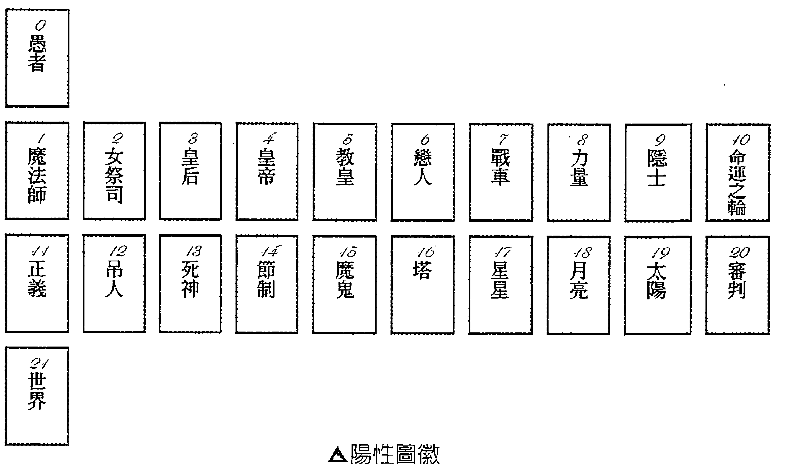

- 1&11：變易與不變堅持，有所為與有所不為。
- 2&12：對於愛的抵抗拒絕以及犧牲奉獻。
- 3&13：生命的賦予養育和剝奪毀滅。
- 4&14：擴張與節制，管理方式的異同。
- 5&15：上帝與魔鬼的兩面性。
- 6&16：結合與分裂，也是和諧與暴烈的反差。
- 7&17：躁進與寧靜的相對，未來希望同樣美好。
- 8&18：正面心態和愛的力量，相對於負面情緒和喪失真正力量。
- 9&19：生命力消沈而不見陽光，相反於太陽高昇和生命力蓬勃。
- 10&20：同為宇宙間兩種最高法則，神祕力量以及宗教力量之運作。
- 0&21：最後與開始，什麼都沒有到什麼都達成。

## 塔羅來歷解密

### 一、起源

塔羅牌並不等同於紙牌，因而考究真正塔羅牌的起始，重點不在於牌的編制形式，更重要的是精神和思想，從這個角度來看待才能正視塔羅牌的起源，不然就只是探索紙牌家族的共同來歷，忽略了塔羅牌的個別性。塔羅發端並非只能臆測，如果掌握清晰概念和脈絡，便能夠清楚評析各種說法的緣由。

#### 智慧源流

關於塔羅名稱的意義，流傳的說法是源於埃及古文的一個近似塔羅的發音，意思為神祕旅程，也有人稱其義為王者之道。其實還有其他的說法，稱塔羅是律法的另一面呈現，將「Tarot」反過來拼寫接近「Torah」，所指就是《律法之典》——上帝的意旨。再者則是塔羅以迴文拼寫，符合了拉丁語的「轉輪」（Rota），象徵命運的運轉。雖然大致都是附會之說，但是也言之有理，因為塔羅就是智慧，是道的呈現，也是命運的顯影。

#### 結構源流

塔羅牌和「花色紙牌」之間有所交集，因而兩者的來源容易混為一談。隨著花色紙牌的誕生，紙牌占卜術（Cartomancy）也在其中生根，歐洲自古流傳著紙牌與占卜，塔羅只是其中大宗，另外還有撲克和奈比（Naibes）等各式紙牌，這幾種紙牌和塔羅的小祕儀，都是四花色牌組的形制。如果就塔羅牌的編制來說，其中的小祕儀和花色紙牌有同樣淵源，確實是起源於東方的亞洲，也因而產生「印度起源說」的臆測，甚至遠溯及於中國，然而確切有跡可循的則是「中東起源」！

## 寓意源流

在中世紀期間的十四世紀下半葉，阿拉伯紙牌傳入歐洲之後，發展為56張花色紙牌，結合了一套22張的王牌（Trumps），成為整副78張的紙牌。這套王牌則是北義大利的產物，無論是否先行單獨存在過，這才是真正塔羅牌的起始。王牌中的畫面情節以及蘊含的意義和象徵，還有編排依據的制度名目，其實都是很歐洲的。創作者將各種神秘學訊息灌輸其中傳遞，尤其呈現了歐洲各種秘教與正教爭鳴之留影。思想內涵層面才是探究塔羅源流的重點，而這主要就呈現在王牌的內容上。

## 畫面源流

每一副新的塔羅問世就等於誕生一個新的塔羅種類，然而其中那22張王牌的主題向來遵循著一套標準，畫面中的圖案可能有些許變異，卻都是傳統和革新的組合，新圖案通常取材於前期的牌，並且也反映同時代的當地文化、信仰和大眾口味等等。就各種類塔羅牌的畫面風格手筆而言，塔羅牌從一開始就非常具有歐洲色彩，而後更帶有煉金術圖畫的傳統，還有隱含著密碼學模式的繪圖，都是西洋繪畫的典型手法。

### 二、歷史分期

#### 古塔羅時代

這段時代是塔羅牌最早的成形期，源頭是身為藝術品的早期塔羅圖畫，從而發展至出品流傳的塔羅紙牌。又可依據塔羅是否發行出品來劃分前後階段，前段為古典塔羅時期，而後段則為馬賽傳統塔羅時期。

「古典塔羅時期」有幾副重要的塔羅牌先祖流傳下來，成為典型代表，也比較偏向繪畫的型態。現存公認最早期【維斯康提塔羅牌】（Visconti Tarot）在十五世紀前半期出現，就確立了如今編制的雛形。雖然之後的塔羅開始變化調整，張數和結構曾經有所改變，最後還是整合出22張王牌和四花色牌組共78張牌的編制。

【馬賽塔羅】（Le Tarot de Marseille）的發行是「傳統塔羅時期」的劃分指標，馬賽系列塔羅在十七世紀已經開始通行，在編制上承襲了維斯康提塔羅牌的系統，完整確立為塔羅牌的標準編制，並影響許多早期塔羅的分支，後來發展成為現代各種「地方塔羅」。古塔羅一直出產到十九世紀末才停止，華奇特塔羅（Vacchetta Tarot）於1893年標示著古塔羅時代的真正尾聲。

#### 神秘學時代

塔羅歷史發展進入了第二個時代，在十八世紀後期大幅變革，開始神秘學家創制塔羅的時期，是塔羅的大幅度演變，神秘學家將哲學、思想、理論附加於塔羅之中，並創造出神秘學系統的塔羅，亦可再分為兩個時段，早期為個別的神秘學家創作塔羅，不一定印成紙牌發行，重點是表達意念。後期為神秘團體有意識的營造和盡製出塔羅來，並且在組織中推廣傳承。

從加百林（Antoine Court de Gebelin，1719～1784）開始將塔羅帶向神秘之路，而後是伊忒拉（Etteilla，1738～1791），以及李維（Eliphas Levi，1810～1875），終結於佩布斯（Papus，1865～1916），研究每張牌的相互關係和順序編號。回溯希伯來卡巴拉（Kabalah），重拾埃及記憶，納入靈數與星象體系。將塔羅神秘學的理念著書闡釋，或者製作出塔羅牌，這些就是早期「神秘學塔羅」。

從個體戶到神秘團體、魔法結社的統合與競爭，後有黃金黎明的誕生。黃金黎明魔法結社（The Hermetic Order of the Golden Dawn）於1888年成立，是十九世紀末神秘結社的代表。再度融合西方神秘學的各種體系，這個團體熟黯煉金術（Alchemy）和密術（Hermetic），將塔羅牌視為精神元素變化的展現以及密碼的承載。領導者和成員不但鑽研塔羅，更致力於創作出塔羅牌，而這些牌則被歸為煉金密術系列。黃金黎明能人輩出，更有突破系列的塔羅創作者，偉特（Arthur Edward Waite，1857～1942）、克洛利（Aleister Crowley，1875～1947），也都是其中成員。後世多以黃金黎明為塔羅根源，由此看來實不為過。

### 三、偉特劃時代

#### 偉特塔羅問世出品

以上這些塔羅牌傳承演變的終點，就是「偉特塔羅牌」的出現，從此開啟新一代以及現代的塔羅牌。這個現代塔羅的開山始祖，是由偉特設計的一副塔羅牌，委任了同團體的成員史密斯（Pamela Coleman Smith）執畫。更重要的是完成後由出版商Rider在1910年前後出版而廣為發行。於是這副塔羅以「萊德偉特」（Rider-Waite-deck）之名盛行於世，於今已經流傳百年之久。

這副塔羅後來有許多版本出現，都統稱「偉特（系）塔羅」，成為塔羅牌中最基本的一族，也是至今流傳最廣的塔羅牌。由於後世觀念認為畫者才是最具重要性的創作者，所以追認史密斯女士之名加於上，而Rider-Waite-Smith deck，用以統稱這系列塔羅，縮寫就是RWS，並做為一種方便而標榜新意識與認知的簡稱。

#### RWS內涵成分

偉特雖身為黃金黎明的成員，然而設計出的牌竟與團體中其他塔羅牌大相逕庭，幾乎不見煉金術風貌。其中原委應出自於偉特的想法，他想表現更寬廣的領域，因此跨越團體框架，直接訴求個人對於塔羅與占卜的傳承。他將以往出現過的塔羅牌統合，再加上自己的創見。而他熱衷於鑽研紙牌占卜術，將塔羅納入紙牌占卜的傳統，如此就統合了各路紙牌的占卜意義。

歷來塔羅的圖案以及紙牌占卜寓意，都由史密斯融為一爐，以多元和多層次的手法繪至畫面中。當然這其間也不乏史密斯本人的構思和創作空間。可知RWS整體內容具有黃金黎明和其他體系的神秘學，更包含了許多古塔羅圖案的變形以及古紙牌意涵，亦有偉特的設計和意見，還有史密斯個人的創意。

#### 偉特和RWS的地位

偉特塔羅牌問世之後廣為盛行，不只是因為受到出版發行，也是由於內容的優勢。大小牌的畫面都融入各式圖案，大秘儀修改了古塔羅的圖案，最重要的是數字牌新增情節畫面內容。牌義內涵也統整了古今，並且開創了塔羅占卜的逆位專項，而偉特對於牌義的說明文字也成為往後變化的依據。偉特牌是塔羅整體結構定案的最後一變，將小牌的金幣花色名目改成五芒星幣，而大牌的「力量」和「正義」互相挪移數字配置，後起塔羅牌不外乎遵循偉特規格，抑或追溯古典塔羅編制。

偉特塔羅如此重要而且成為經典，主因就在於歷史的承先啟後的意味，RWS完整而周延，統整了以往塔羅的工作，同時具有傳承和變革創新。也因為如此，於各類內容中用到歷史進展時，也是以之做為劃分標準，在各秘儀解說的「秘儀數序定位」、「牌義來歷變遷」中提到牌義是以偉特之名，而於圖案相關之處，包括「畫面寓意設定」等所提及則以RWS之名。

### 四、塔羅多元發展

#### 後偉特時期

偉特塔羅問世之後，陸續起而效尤者眾，各式創作塔羅陸續出現。埃及系列塔羅，源自於神秘塔羅。泛偉特塔羅，多以RWS畫面為基調，在當時紛紛跟進或仿造，出現了很多新牌種。RWS以及泛偉特塔羅牌的風格都比較寫實，容易且適合於進行占卜。

#### 透特塔羅分庭抗禮

克洛利雖是與偉特同時期的人物，然而所設計的「透特塔羅」較晚誕生，他和繪圖者荷芮絲（Lady Frieda Harris）兩人密集合作長達五年，完成後卻遲至1969年才出版。而後牌名也同樣並列設計和執畫者之名，特稱為Crowley-Harris Thoth deck。

透特塔羅從此與偉特塔羅分庭抗禮，別出獨特風格成為一尊。自此之後造成神秘學系統塔羅的復興，強調元素變化和神秘系統。「透特」和「偉特」成為兩種代表性塔羅，這也有關數字牌的發展脈絡，在古典塔羅之後數字牌有兩大走方向：其一是走向元素化，著重於闡明元素專屬物的能量呈現，甚至比古塔羅強調圖形排列，重點在物質抽象表現上，作用則在於冥想凝思的神秘學功能，更往元素內涵鑽研，力求和煉金術、占星體系融合，從神秘學時期開始，而後有黃金黎明統合，透特塔羅為集大成者。另一路線是走向劇情化，加入情節畫面，猶如漫畫般描繪出人物和故事情節，表達實際面的人事變化，作用則在於占卜諮詢或者心理方面的功能，更將意義往外想像和推演拓展，而這是自偉特才正式開始的。

#### 現代塔羅進展

塔羅牌的發展在早期並沒有固定規格，出現過許多種不同編制和張數的塔羅牌，而後經發展演變逐漸趨向一致，塔羅牌的定義愈來愈走向明確了。到了後面的歷史轉捩點，是定義最為狹隘的黃金交叉點，這時則有了塔羅公定編制78張。在這交叉點之後，依循這個定義之下又新增其他各種的塔羅牌。

現今舉世的塔羅理論，在牌義內涵以及數字的連結關係上，也都確定了一致性的公論。近十多年來的塔羅牌挾以大眾出版品之態勢，陸續出現了各式各樣風格以及不同系統和編制的塔羅牌。新時代系列塔羅興起，後現代風潮的塔羅盛行，塔羅牌進入百家爭鳴的時期。結合漫畫插畫創作的塔羅曾經蓬勃，而後獨力自製的個人化塔羅也蔚為趨勢。

## 祕儀內涵探索

### 一、牌義掌握

#### 牌義外緣層次

塔羅牌的種類不同，祕儀的牌義內涵也不盡相同，每一種塔羅會根據共通牌義加以變化，這細微或深入的層面，就屬於每一種塔羅「專牌」的解析部分。其實像「偉特塔羅」也是一種專牌，只是因為身為經典等級常被當成通用範本使用。每一種專牌塔羅的牌義層次都很多元，可能有共通牌義加上專牌牌義，再加上個人牌義。然而，不同專牌的牌義差異時常被忽略，大都使用共通牌義來代用，而在實際解牌的時候，牌義會不同是因共通牌義的變動和使用個人定義所致，並且也會隨著時機不同，而有取捨變化。

牌義誠然有個人色彩，卻更有共通語言，共通語言是不會變的，所以對於專牌牌義和共通牌義應該加以注重，釐清共通和個別牌義的差異。本書內容為共通牌義的層面，所提就是每張祕儀的內涵設定。在單張祕儀的各別解釋當中，是以牌義定位和圖案作用，加上正逆位的占卜應用三大部份為主體，都是需要了解的關鍵。

#### 牌義內涵成分

祕儀內涵仍可抽絲剝繭，所謂牌義具有許多成分，「占卜意義」只是其中一環，其他則是祕儀的主旨屬性和各種原理設定。即便是「占卜意義」也會有所變遷，了解什麼是當代適用的「主流定義」、什麼屬於「歷史牌義」，這樣才算透徹。

多數著作所引用的牌義並不知其緣由，不知道占卜意義歷史來由，或者根本沒有釐清占卜意義和其他主旨，時常更不論是否適合該種塔羅專牌的屬性。所以了解牌義歷史沿革演變更形重要，透過這觀點便可釐清牌義很多方面的問題，有助於日後各種學習理解和辨認。每張牌一連串的牌義變化，本書在此部分著墨許多，可說是重要主體內容，目的就是為了釐清眾人較於難解之疑惑。

占卜意義雖會更動，但也須基於對該牌的認定，塔羅占卜的解讀並不是完全隨心所至，而有一定原則可循。理解占卜應用的幾種原則，就可以面對各種占問而有所變化，又不至於脫離準則。類似單詞項目陳列的說明書關鍵字解讀，容易誤導為是通用意義，而忽略了實際占卜時所須鎖定的問題導向。

本書的主題是塔羅牌義的學習和應用方式，提供循序漸進、條理式的方法，幫助讀者習得牌的內涵，以及掌握各項問題的占卜意義，這樣學習起來將會更加明瞭。

### 二、共通牌義設定

#### 秘儀牌序定位

在整體結構安排下，這個主旨的秘儀為何被擺在這個位置，例如為何教皇被定位為第五號牌，這點一定要先有所理解，才不失其架構性。最基本且最共通的意義，可說就是從這個項目開始推演起的。

#### 數字寓意

塔羅秘儀的一個重點即是跟數字結合，數字具有順序和數秘涵義，塔羅牌的數字定然會有數字共通意義，也會和某些系統有交集互通。然而都是篩選後取用的意義，跟完整的數字象徵或各種系統的數字定義並非全然相同。尤其必須釐清塔羅中的數字不完全等同於生命靈數系統的數字意義，其實塔羅本身就構成一套自己的數秘體系，反而是其他系統如生命靈數必須援用塔羅數秘意義來解釋。

### 秘儀主題

牌義內容和這張秘儀的名稱主題極為相關，為什麼這張牌名為教皇，是否就是代表精神領袖，還是特指怎樣性質的宗教首領，而代表的宗教性質或者是特定宗教是什麼？教皇和女祭司的差異除了性別，還代表什麼信仰而有何意涵？這些都是值得探究的切入點。以上各項統合在書中個秘儀的「牌序定位」、「數字奧秘」和「秘儀主題」，這些都是秘儀內涵的基礎設定和原理主旨，並且是屬於共通性的。

#### 牌義沿革

事實上，占卜牌義是會變化的，並沒有絕對性，然而又有一貫相通之處。現今不同塔羅也會有不同意義，那麼就應該從歷史中的變化和差異看出如何取捨，最後就可以在牌義淵源與演變過程中挑選牌義使用，此即書中各秘儀的「涵義演變」。

每張秘儀的某些涵義可能來自某時期的定義，而另一些涵義有可能又源自其他來歷。像是偉特塔羅數字牌的畫面，有時讓人摸不明白情節主軸，其實這種模棱兩可，就是為了要表達各種不相搭的涵義存在。牌義中有些部分是超越畫面所呈現的，這就是和文字說明有時會不一樣的原因，這些可能就是歷來牌義的殘存，所以要從牌義的淵源與演變過程來了解。例如，金幣五中有戀人的涵義是來自於古代紙牌。

自古塔羅以來，甚至是各式紙牌占卜淵源，就開始出現牌義的分歧和變化，神秘學時期各家更注入許多意涵。偉特做了最早一代的總結和統合，牌義錯綜複雜，也是讓後人對此摸不清頭緒的原因。然而後偉特稍後時期，基於偉特統整的意義之下，又有一些不同理解，這時已經和偉特定義有明顯的差異，尤其對正逆位的混亂修改了很多。往後的歷史更是不斷修正牌義，而慢慢修改演進成為如今的面貌。

牌義就是這樣隨著時代而改變更動，會有當時的「主流定義」，於今也有一套較為公認的現代牌義。當今塔羅學的興盛，公認的秘儀定義也已經產生，這是從歷史演變以及理論推演而來，了解這些定調的背景和由來，才能有效學習、消化和應用。

### 三、塔羅專牌意涵

#### 專牌背景架構

由於每一種塔羅專牌有其不同的背景架構，這就是各副專牌的特殊性。這時背景系統的設定就要特別注意，可能會使每張秘儀的意義有別於一般或其他塔羅的定義，或是增加了一般秘儀內涵之外的獨特意義。塔羅創作者賦予該副塔羅專牌的寓意，是不容忽視或誤解的。

了解專牌背景系統設定，至少要判斷主題或風格以了解背景架構，例如精靈塔羅的背景是屬於奇幻世界，而不是現實世界，因此各秘儀的畫面情節就不同於一般，也代表牌義有所差異。有些塔羅為煉金術的主題，更有新的魔法修習主題，基本上可從整副塔羅風格大致了解。偉特塔羅就是一種寫實的描繪方式，設定在一般世界的情境下。

設定背景會根據塔羅專牌不同而變化，有時候必須了解專牌中每一張秘儀有無特殊指涉。例如偉特中的教皇，是否有特定對象或某位人物。傳說女祭司是中世紀的一位女教皇，但是否女祭司牌就一定代表那位女教皇，那就要根據該副塔羅的原始定義，像偉特塔羅就沒有這個指涉。這些背景知識對於各塔羅專牌而言是很重要的。

#### 專牌圖案意義

圖案就是塔羅的內容本身，是真正具體的內容和形式，附帶文字都只是塔羅外的說明。研究某一種塔羅專牌的設定，主要就是從該專牌上的「畫面情節」得知，從參考背景設定和結構來觀想，許多塔羅縱使有專牌書籍或文件說明，然而多半不會直接對於背景加以說明，也不會詳細到畫面剖析。

有些專牌的畫面中，圖案的每一部分是可以拆開解讀的，一塊塊都能夠加以分析，更可突顯不同區塊的用意，可解讀其圖案象徵寓意，非通用的圖案會更有必要個別解讀其象徵寓意。然而，亦有些塔羅畫面是不能拆解或不需要拆解的。時常產生誤解，而需要注意釐清的是，偉特塔羅其中許多圖案，其實並非完全通用，而有其專屬性，如女祭司雙柱上的字母就是一例，連泛偉特系塔羅也並不見得有出現。

#### 牌義開發

其實根據基本內涵架構和傳統的意義，加上這裡提及的塔羅專牌特殊設定，然後將個人見解灌輸進去，融貫整合出的就是較為完整的牌義了。占卜時能隨機變化，這就是最佳的塔羅應用和詮釋方式了。如果牌義內涵須加以開發，最後可以融合神祕學體系，像是星象、煉金術、卡巴拉的連結，這些範圍便屬於祕儀定位的進階項目。

### 四、牌的圖案意義研究

#### 主體畫面直接分析

塔羅牌的畫面意涵，可依循如下步驟研究：

1. 把主題和人物找出來，通常主題和人物是一致的。
2. 「配角」有其重要涵義，有些狀況下配角與主角很難分。
3. 詳細研究人物本身所穿的服飾描繪，都會有涵義。像偉特這類寫實性強的塔羅，這點就相當重要。
4. 道具作用會直接有神祕學的象徵作用。手上拿什麼，用什麼物品都很重要。例如鋤頭，就可以象徵任何的生產用具。大牌中很多道具都是神祕學圖案。
5. 場景與背景的構造也需要分析，就如戶外或戶內，所要表達的就有差異，其中細節當然更須注意了。
6. 整體下有隱藏架構在，容易忽略掉。像偉特塔羅中有很多六芒星的結構，必須整體觀察才能看得出來。偉特牌金幣三就是呈現了許多神祕幾何圖形。
7. 細部的象徵語言，例如金幣十上的家徽就可講究其象徵或典故。
8. 小圖細節也會透露含義，有時是很隱藏的。如偉特牌權杖二的其中一支權杖是被固定在城牆上的。
9. 注意隱性的串聯性，在不同張牌中出現相同的圖案，作用是表示這些牌之間的連結性。
10. 對一副牌鑽研到底時，就連圖案中附加的數字、符號、簽名等細部，也可能挖掘出涵義，有時這些符號確實有特殊作用。例如偉特的數字堅持用羅馬數字，而構圖上也彷彿巧妙配合羅馬數字形貌布局安排。

#### 圖案畫面的歷史傳承

觀覽愈多種類的塔羅牌，就能夠瞭解愈多塔羅祕儀內涵。又如偉特塔羅每一張牌的圖案來源雖不盡相同，但多為根據當時既存的紙牌圖案，像各種塔羅中的「戰車」牌有著歷史淵源傳承。而有名的偉特塔羅寶劍三，被喻為經典的三劍穿心圖案，其實承襲性遠比原創性還高，也是從圖案歷史得知。本書各祕儀「畫面寓意設定」中設有要目提點，並精選三副塔羅牌做為附圖，「馬賽塔羅」和「偉特塔羅」是塔羅各歷史分期的開端，而「華奇特塔羅」居於兩者之間的銜接地位，一併從牌圖來觀察這個傳承，將容易體悟出塔羅發展的脈絡。

#### 圖案來源和神秘暗示

西洋的圖畫有其文化性，若能多涵養西方藝術史或文化史知識，會更了解這些內涵，許多畫家本身有神秘學思想，在美術作品中灌注了神秘學符碼。其實評析塔羅畫面的方式，就等同對於美術作品的解析，因此也時常會見到有關藝術、美術史或歷史題材的塔羅牌。

而研究這些的主旨是對於神秘學體系的認識和了解，最基本的RWS中許多張秘儀的畫面，也和正教經典或秘教傳說都有關係。神秘學家發明的牌，內容更多神秘的暗示，密碼隱含在圖案之中，諸如煉金術、魔法、神話宗教的隱秘情節。其實這部分正是最原始塔羅流傳的用意，了解這些暗示才是真正學習到塔羅牌精神。

## 塔羅逆位解密

### 一、逆位應用

#### 基本概念

接觸塔羅常會聽到「逆位」這個字眼，另外又暱稱為「倒牌」，由於占卜的時候將牌擺在平面上，以某個方向為觀點來看，會出現畫面朝上或朝下兩種方向，朝上稱做正位置，朝下就稱做逆位置。有關塔羅牌的占卜實作上，認為牌的朝向不同，就表達了不同的另一面意義，重視逆位置顯示出的意義，對此做出不同正位置的解析，這正是塔羅牌占卜的特色和專項。

#### 逆位置的歷史

為何塔羅牌會發展出逆位的占卜呢？塔羅這種紙牌的圖案會因為擺放方向不同，在視覺上感到很明顯的差異，因此容易產生不同的感受，相對來說撲克牌的正逆位就很難辨認。紙牌占卜自古就有正逆位差異的用法，而塔羅牌對此最為重視的原因就在於畫面的正逆差異明顯。塔羅牌演變的歷史中，也發展出現過正逆雙向圖案的塔羅。

誠然塔羅牌的逆位置應用，的確與神秘體系的淵源比較不深，流傳而保留至今的更重要因素，其實就是占卜上的需求。偉特設計塔羅時很強調占卜的特性，他以對於占卜學的研究，統合傳統運用的紙牌涵義，自然就承襲了正逆位的觀念，定義每張秘儀的牌義時，更沒有遺漏掉逆位意義的講究。

每張牌逆位置的意義，是和正位置相互對應和轉折而來，且推理上是有跡可循的，然而實際上每張牌的逆位涵義似乎莫衷一是，這種不規律是歷史因素使然，藉由經典牌義的統整，可以歸納出一些原則。義的歷史和記載，了解有幾種轉折和走向，揀選其中最重要的，還是能歸納出各張牌的逆位牌義定案，這些就是本書各牌中「正逆轉折」的內容。

#### 占卜變化需求

那麼占卜上為何有需要使用逆位呢？可說基於以下幾點理由：

1. 機率取樣，樣本空間可以變得更大，也就是超越原本牌數，在 78 張下更能有 156 個機率變化。
2. 意義增加，除了機率取樣增多之外，全套塔羅的牌義豐富度也提高許多。此外在牌義上正逆位有所分別，也能夠使牌義方向更明確化，兩面差異也有助於占卜上的論斷。
3. 內涵深入，由於了解正牌才能了解逆位，對正逆牌義都需更深入的理解和剖析，這樣能夠講究得更貼切於事務與人心，因為逆位包含了正位，而逆位置可以更為精密，有助於了解更多細節。
4. 變化轉折，逆位會讓牌義有更多變化，由正位意義推理至逆位意義時，也因此呈現事件更多層次的轉折，也能夠描述得更為曲折生動。

占卜時逆位應用不但必要，也是一種發揮表現和藝術，甚至可以說是精髓之所在。有些塔羅牌本身的專用體系，或者如心靈導向諮商或冥想的應用法，不考慮使用正逆位差異。然而這並不代表對於使用逆位的意見有所分歧或衝突，只是個別的專用法著重點不同。對於廣泛涉獵塔羅者而言，建議視逆位占卜為必備之基礎，而在必要的時候能夠靈活應變。

### 二、逆位原則

#### 逆位通用思考

逆位意義一定是基於正位意義轉折而來，正牌的定義必須先確立，才能有逆位牌的變化。逆位是正位的變動，不確定性可能更多。然而，不可以脫離正位涵義的架構，也就是說逆位大多會包含正位意義，並且都會存在時態的差異，可說是正位置的情節延伸，有時間上的前後關係，通常是往後發展進行的。

逆位置意義依據特定方式從正位置推演而得，這就是各種「逆位原則」。而宮廷牌、ACE 牌、數字牌各類自有相關變化及適用法，原理也較為複雜，這些特別的逆位通則在各組牌的通論中還會加以解說。本書各秘儀「牌義來歷變遷」中，不只對於整張牌、甚至針對其中某項意義都會提到正逆轉折推論。

#### 逆位牌義推演法則

1. 增添作用：逆位置會加重正位的特質，但卻因特質過強而造成負面的影響，這就是「逆位過度原則」。例如皇后享受幸福，過度享樂便成為放縱，也是種物極必反的現象。另外，本來正位意義就不是很正面的特質，一經加重也變得更不好，例如皇帝的控制力成了鐵血手腕，這可稱爲「逆位加重原則」。
2. 減損作用：理解成原本牌義特質的內蘊不充實，牌格不到位的意思，可分成兩種，一是「逆位虛弱原則」，將正位置的意義變虛弱，如魔法師逆位理解爲魔法師的能耐不足，變不出把戲。另一「逆位虛假原則」可以理解爲逆位的假象，如魔法師並沒有真正能力，而如逆位的虛僞隱士就是修爲不夠，且假裝清高矜持。
3. 負面作用：直接朝向較不好的負面涵義來解釋，這就是「逆位負面原則」，專挑出缺點來說，例如皇帝的負面是專制。此外以運用不當而失利來理解，則稱爲「逆位不當原則」，可能是管理不當或做得不稱職，被視爲暴君或昏君的皇帝。
4. 反向作用：即「逆位相反原則」，直接往正位意義的相反方向來解析，也可稱爲「正逆互異原則」，如戀人的相反原則，將戀愛結合轉爲沒有在一起或者分手。另一種相近似的反向思考較少用到，可稱爲「逆位超越原則」，像是塔本來就是傾覆的負面作用，反向來看就是克服與脫逃了。

要分別判斷出牌義的逆位，就是依照這些邏輯來推論。一開始先以「逆位過度原則」來思考，如果設想不出牌義過度有何差異，那麼就取其後的「逆位虛弱原則」來思考，也有可能推不出來如何虛弱，那麼則以「逆位不當原則」來推演，總是能夠想出缺點或負面的走向，尤其是正位置牌義很美好的情況。若是正位置也包含負面的意義，那麼最後才以「相反原則」來思考。這也是因爲任何事物總有相反的一面，朝反方向容易推得結果，然而，此法容易脫離牌義，比如太陽朝相反思考，也可以推至夜晚或寒冷，但這樣一來就偏離牌義了，可見最後才使用逆位相反原則較爲適當。

## 大秘儀解密

Major Arcana

## 魔法師

The Magician

秘儀主題：
- 正 法力無邊
- 逆 技窮無路

牌序定位：
第一階大秘儀，象徵一切事物的開端和初始階段，也代表創造之起源。

各式別稱：
魔術師、變戲法者、大法師、修行者。

### 祕儀數序定位

### 數字奧秘

數字 1 的宇宙原型象徵，除了開端和第一以外，亦代表陽性原則，並具有獨一無二、頂天立地的涵義。數字 1 代表意志力，自我意識強烈，個別風格鮮明。在塔羅祕儀系統裡，這張牌呈現了數字 1 的總體原型，並特別強調創造力和變化性。

#### 象徵法則

這張祕儀象徵陽性原則、生命動力、自我信念和能力展現，主動積極而有所作為。這樣的主題所造就的人物主角，理應是生命力旺盛的男子，一般認定是位年輕人，並且強調法力以及能量傳遞的特徵。

### 內涵定義

魔法師善於掌控元素變化，能夠傳導天地之間的能量。可見能耐很強且多才多藝，擁有豐富想像力和創意。魔法師展現出開創的精神以及獨特的魅力，了解自我的天賦以及責任、熱心助人。牌中四元素花色俱全，對於占問各種問題都有良好回應，一切困難都能解決，任何目標都可以達成。

### 正位實占解釋

- 人際交誼：人際交遊廣闊，積極而活躍，彼此相處熱絡，風趣幽默。
- 戀愛情緣：交往順利愉悅，相處充滿情趣和新鮮感，令人陶醉的戀情。
- 事務進行：事務進行順利，工作得心應手。學業相關表現都不錯。
- 金錢物質：財務運作良好，能掌握與擁有，朝向獲利、賺錢、營收的趨勢。

### 牌義來歷變遷

#### 涵義演變

這張牌最古老的意義，多含有欺騙和狡詐之意，主角人物被看成是一位魔術師或變戲法者，代表詭詐多端。神秘學家修正了這一點，將主角的設定更改為真正的魔法師，導向正面的獨立和意志力。主角從不可信任到令人信賴，這兩種抵觸的涵義漸漸地轉移，但皆有不可思議的影響力。這個演變的關鍵，是對於魔法和神秘的真正力量遲疑或肯定的態度，以神秘學者的觀點看來，自是傾向採取後起的意義了。偉特賦予這張牌更為豐富的內涵，包括陽性的力量原則、個體的統合與神秘力量的結合。不過偉特對占卜意義設定中，正位仍包含有損失、痛苦、危難的意義。而偉特稍後的牌義，正位也仍包括欺騙等涵義。然而到了最晚進的時期，這一些負面意義都歸於逆位置，而正位置都是良好而正面的意義。這些正面意義也都是現今特有的涵義，包括自信心、原創、想像力、足智多謀、靈活多變、專業和技術高超。

#### 正逆轉折

偉特對這張牌逆位有許多奇怪的定義：醫師、博士。其中的負面特質包含了心理疾病、羞恥、憂慮不安。偉特稍後時期，這張牌開始加入了以「逆位弱化原則」推演出的牌義，包括意志薄弱和技巧不佳。

#### 逆位思考

運用逆位虛假原則來思考，逆位的他法術失靈，是個虛假的魔法師，只是一個變戲法的人，能力不足或是能量引導方向錯誤，還裝成很行的樣子來賣弄，甚至不惜說謊欺騙來掩蓋。這些情況可究源於內在的軟弱或輕浮的性格，缺乏真正的能力和自信，卻又自大，導致弄巧成拙。

### 逆位實占解釋

- 人際交誼：行為浮誇、待人敷衍，因而不被信任，人緣不佳。
- 戀愛情緣：感情方面真心不足、花言巧語，不願負起對關係的責任。
- 事務進行：無法具體解決難題，讓事端擴大，導致下場頗不樂觀。
- 金錢物質：偏差的理財方式和心態導致損失，財務狀況難以解決。

### 畫面寓意解碼

#### 主角人物

魔法師的形象一般是年輕或壯年男子，強調年紀正處盛年，是男性發光的人生時期，以呼應陽性創造、活躍的本質。情節重點是主角正在施法的狀態下，呈現出魔法師的專屬特色。他站立祭壇前的儀式姿態，雙手擺出特別的魔法手勢，而法器在身邊陳列。

#### 場景布置

既然是以魔法師施法為主題，整體場景更要以突顯魔法師的專長為主，也使牌義增添更多能量和法力，這就要從描繪形貌姿態和場景搭配做起。而施法儀式的場景多半在戶外，但並不空曠，可能稍有遮蔽之處，而周遭景物其實都是具有魔法或符號象徵意義的，並且具有施法的作用。愈是懂得法術，就愈能夠從其中發現端倪。

#### 樣貌外觀

魔法師的長相也透露出這張牌的牌義，外貌要清秀或有型，眼神表情銳利狡黠，且帶有神秘感。而賦予給魔法師的性格多半帶著機智和淡淡的神秘色彩。占卜時就是當事人的性格。

#### 動作姿態

這個人物表現出正在施展魔法的姿勢，突顯出魔法師的特色，根據魔法師的姿勢，便可推敲出設計者所採用的魔法和儀式。最高的魔法通常是一手握魔法杖為導體朝向天際，一手指著地面，表示接通宇宙神秘力量，整個人也成為能量的導體。

### 圖案符號解構

#### 服飾造型

魔法師的服飾必須亮眼，顏色也要強烈，全身上下配備頗多，但仍然朝向簡單俐落。每一種塔羅牌的服裝顏色使用，必須根據構圖上需要與景物搭配，以融於場景中，並且也藉以呈現不同神秘學體系上的涵義。頭飾、腰帶、披風，都是常見於魔法師身上的裝扮，各有其魔法功能和象徵意義。披風助長威勢和增添法力，亦有保護防禦之用。頭帶引動精神和意志的凝聚和規範運作。魔法師身上穿戴的神秘法器以「腰帶」最為重要，它暗示著空間存滅和界限伸縮，代表「無中生有、來去自如」，多以自吞蛇的形狀出現，更象徵宇宙神秘運作。

#### 道具配件

由於是魔法師，手上若能搭配魔法杖或其他法寶會更貼切。握住魔法杖表示能夠掌握重要的東西。畫面中大都有法桌或祭壇，表示有某種職責任務要執行，或者以立方石替代桌子，或者兩者皆具備，代表當事人正在執行任務。當然，沒有桌子，更可自由施展發揮法力。牌面上不可或缺的是代表四大元素的聖杯、權杖、寶劍、五芒星盤，四種法器擺在桌上呼應施法。並表示魔法師 1 號統領了所有元素的開始，由此連結了同樣屬於數字 1 的 ACE 牌，並使每個牌組的起始相連結。∞ 記號位於頭頂上，無限大符號表示法力無邊，也是傳導神秘力量的象徵。這個符號自古塔羅就存在所戴帽子的形狀中，也這是 RWS 所特別強調的符號，後人沿用的頗多。

#### 相隨配角

因為具有自主、獨來獨往的特質，一向獨立作業而保持神秘的魔法師，通常沒有配角相隨。如果有動物在畫面中，通常是為了襯托魔法師神秘或智慧的力量。

#### 整體搭配

顏色的搭配是本秘儀重點，要讓人們與整體產生既融合又獨立的感覺。並營造在空間中無端冒出來的感受，以符合「無中生有」的蘊義。整體畫面要極力表現豐富性和變化性，能量接通的動作以及元素操控的方式都是很重要的。

> 重要性和地位
魔法師這張牌，是整副塔羅的定調，因此極為重要。想了解整體設計的面貌和風格，就要看將魔法師描繪成怎樣的格調，就能了解整副牌的調性。

## 女祭司長

The High Priestess

秘儀主題：
- 正 智慧純淨的訊息
- 逆 一表正經

牌序定位：
第二階大秘儀，進入二元對立世界的階段，深沈地投入其中。

各式別稱：
女祭司長、女教皇、女性教宗、瓊安教皇、女修道院長、修女團之母、教母、教皇之妻。

### 祕儀數序定位

### 數字奧秘

數字 2 象徵陰性原則，以少女的純淨與文靜爲表徵。柔和及細膩的特質，符合女祭司長的靈性和易感，對於精神信仰接受性，深層隱藏的智慧也不脫 2 的意義。但這張牌弱化了具體人際方面的互動作用，在感情關係上反而是存有距離的。

#### 象徵法則

女祭司長是精神上的女性指導者，多數塔羅以少女純真潔淨表現，帶出知識和智慧，發揮直覺感應力。內斂、接納的特性，及智識的吸收能力，也都在 2 的涵義之內。有少數塔羅的主角爲成年女性，這時多是強調其閱歷體悟與洞察力。

### 內涵定義

女祭司長是持有祕密的人，肩負鎮守啟蒙關卡的職責，她會有條件地透露神諭般的訊息，內容具備著深度的涵義。她是一位解答者，也是一位傾聽者。女祭司長手中掌握了書卷，記載著神祕的智慧，此智慧是安放而藏起不動，並且被遮掩住的。

### 正位實占解釋

- 人際交誼：行爲低調，交誼並不十分熱絡，與朋友保持一定距離。
- 戀愛情緣：缺乏戀愛興趣，或者純情而重精神面，不利於親密關係發展。
- 事務進行：謹慎內斂行事，不會出差錯。具有智慧的指引而能達成目標。
- 金錢物質：對精神層面較有增進，在財物方面收穫通常不是很大。

### 牌義來歷變遷

#### 涵義演變

在早期這張牌代表智慧知識的傳承，視為啟蒙的母親，並且是比較傾向於宗教性質的，包括其他像是聖母或女神信仰。延續到神秘學家時期，愈來愈偏向神秘奧義、祕傳宗教以及高層次意識，也賦予神秘科學的內涵。一直以來，這張牌也可代表一般智識能力以及沈默堅定的特質。偉特也統合了這些特質，於占卜上增添其他意義，包括未來的預視，以及祕密的揭發。偉特塔羅的占卜牌義中，承襲了歷來的特質，包含智慧、先見之明、感受敏銳、洞察力和預視能力。但也包含感情上的負面傾向：冷漠、不動感情、獨立自主性強、理想化的戀情。現代涵義則將直覺和思維統合成爲開發意識和潛意識的功能，運用在探索未來和尋求真理。

#### 正逆轉折

偉特的逆位定義，是以逆位反向原則爲主，由低調姿態轉變爲自負驕傲，理智成了妄想，而冷漠則轉成狂熱和慾念。偉特稍後的逆位牌義較有條理，著重在偽裝虛假的感覺，也運用了正位置各項目相反的涵義，在性格上的表現，同樣是不夠沈穩，毛躁而浮動。

#### 逆位思考

以逆位虛假原則推演，是勉強裝出的沉靜和硬撐氣質，因此缺乏智慧、不學無術、無知、膚淺。以逆位不當原則推演則爲目光短淺，爲了眼前利益做出不智的決定。統合這些意義，可以這樣看待事情的成因：缺乏真正智慧，並非真心的修養，其實是裝模作樣，或因過度克制壓抑而造成偏差。

### 逆位實占解釋

- 人際交誼：對人愛理不理，態度扭捏，表面應付但內心疏離。
- 戀愛情緣：缺乏深層的感受，冷漠以對。擺出高姿態，無意願又故做矜持。
- 事務進行：受情緒蒙蔽而不安，失去準則，使得執行更不順利。
- 金錢物質：一時短視而錯估情況，判斷不明智，導致財務和金錢損失。

### 畫面寓意解碼

#### 主角人物

這張牌以崇高聖潔的女祭司長爲主角，她端坐於台座，手持奧祕之卷，正傳達神諭或暗示秘密知識的傳承。描繪則不須考量與魔法師的對應或與整副塔羅的關聯，通常以年輕女子爲主，如果有年紀，也是守貞之處女。亦可依西洋女性月神的女性三姿態之一爲象徵，以此性格爲主軸。

#### 場景佈置

女祭司長執行其職，位於聖殿之前，雙柱之間。在內外交接之處，守衛聖殿、護持神聖祕密。身後一簾帷幕，遮掩殿堂之內的奧祕。簾幕在雙柱之間掛起，布幕上裝飾物本身和排列也有深刻涵義。雙柱雕塑造型呈現殿堂和女祭司長來歷。有些塔羅牌在柱身刻劃文字或符號，具有密碼意義，代表柱子的命名和稟賦，但此設計並不一定必要。

#### 樣貌外覷

強調青春少女的清新脫俗，要有清純的氣質或神祕的色彩，甚至遮掩羞怯。也有的牌是嚴肅和堅定，但總要減少世俗味。眼神清澈、神祕，視線焦點模糊，表情寧靜平和，或者若有所思般。

#### 動作姿態

女祭司長大多是坐姿，顯得端正而不是貴氣，給人沈穩從容並非緊張的感覺。她的儀態優雅，呈現護法鎮守之姿，或許她仍會透露出神祕訊息，但不會明顯張揚。

### 圖案符號解構

#### 服飾造型

女祭司長穿著樸素的道袍，特別之處是全身緊緊包裹、層層交疊的衣物褶襉。顏色和線條都要搭配與水的連結性。頭頂上多半戴有新月圓盤狀頭冠，這是精神內涵的象徵，也是接通神祕訊息的裝置。身上多掛有神祕十字，顯示心胸的均衡調和。腳下踩著新月狀物，也是為了營造出「腳踩新月」的高潔女性形象，也以此連結與月亮的關聯，象徵潮汐和生物節律。然而，這類設計並不是每種塔羅皆然的慣例。

#### 道具配件

女祭司長最重要的是手上的卷軸或圖書，總之要有個文化和智慧的象徵。除了古卷，也可以是一般書籍，上面總顯露出印有字符的密碼。一般多是 TORA 四個字母，其雖源於聖經密碼，卻也是最能代表塔羅神祕寓意的字母。其他則是合乎密碼身分或有涵義之字母，像是 A、Ω 或是太極等符號。智慧水晶球是身上最重要的配件，戴在頭頂上代表靈性的領悟力。袍上有主要裝飾物，以胸前項鍊墜子為主，代表心的感受力。

#### 相隨配角

這張牌多半不設配角，極少像教皇般出現隨眾，藉此強調孤寂的氣氛。女主角沈靜而不與有形物溝通，也表示沒有任何陪伴和情感關係，因此通常不加配角或寵物。有少數塔羅會配給女祭司長具陰性特質或自然野性的寵物，也可能是與女祭司長特質和任務功能相稱的動物或神獸。

#### 整體搭配

利用顏色搭配，讓女祭司長融入場景中，多以藍色調呈現沈穩安靜以及智慧，並且更有象徵水與海洋的作用，表示直覺精神的世界。背景大都是填滿景物的，以顯示內涵豐富，並對比出低調靜態的氣息，服飾搭配要與整個聖殿融為一體。而雙柱的顏色成對，和布幕底色同樣表達象徵意義。

> 重要性和地位
女祭司這張牌，是整副塔羅牌中細膩刻劃之所在，無論從畫風筆觸或者蘊義內涵來看都是如此，所以這張牌可視為對一副塔羅最後的挑剔檢驗。

## 皇后

The Empress

秘儀主題：
- 正 感性的胸懷
- 逆 情意浮泛

牌序定位：
第三階大秘儀，進入多元世界的豐富階段，繽紛美好而多采多姿。

各式別稱：
女帝、女皇、女君主、女主。

### 祕儀數序定位

### 數字奧秘

3 是增生和發展的數字，樂觀和豐富的原則。皇后呈現 3 的幸福美滿，增添了實際面的充沛資源和保障。這張牌將數字 3 原有的陽剛意味和大而化之的特質弱化了，而強調藝術美感和生產力，並具有人際溝通能力與情感交流的特質。

#### 象徵法則

這張牌強調陰性原則中的關愛與哺育，也就是母親形象，是較為成熟的女性典型，並且更為積極有活力。皇后體現世俗界，呼應具體的生活、私人領域及家庭事務。掌管情感關係和情緒層面，具有熱情洋溢、浪漫滋潤的特質，是悠閒時光、美麗人生的表徵。而幸福美滿之中，更不乏物質上的豐盛。

### 內涵定義

皇后代表內心陰性層面，也是最重要的成熟女性形象，擁有高貴雍容的氣質，經現實歷練而深諳人情世故。皇后在更細微的分別下，其實存在兩種形象：一是溫柔的女性胸懷，另外是獨當一面的女帝氣度。

### 正位實占解釋

- 人際交誼：態度親切，散發出迷人風采，很有人緣，處處受到歡迎。
- 戀愛情緣：特別有利於愛情，享受戀愛的甜蜜滋味，沉浸幸福的情境中。
- 事務進行：在輕鬆愉悅的狀況下，順利進行與完成。悠閒生活和享受。
- 金錢物質：獲得充分的資源，能夠盡情享受，金錢物質都不虞匱乏。

### 牌義來歷變遷

#### 涵義演變

這張牌以滋潤生產、結合大地為特質，早期具有豐饒多產的涵義，並強調行動力和積極進取。皇后的世俗意味強烈，是人生體驗的代表，也能表示物慾和慾望，是塵世人間樂園的象徵。

偉特承襲了早期的意義，並增添了女性的特徵，賦予「難以了解的秘密」之內涵。他還加入了負面意義，如困難和疑慮、無知，顯然認為這些是屬於女性的缺點。偉特後期，加入了女性的形象和影響力，刪去了之前的負面意義，正位置一律都是正面意義。現代的解釋，仍著重女性相關的形象，於私人層面的生活領域都視為美好的情況。

#### 正逆轉折

早先偉特對皇后逆位定義很特別，部分意義反而比正位置還佳，像是愚昧轉為理智的光芒，也能解決正位置的困難和疑慮，甚至是歡欣鼓舞。

偉特稍後時期，隨著正位置代表正面特質，也將逆位一律修正成負面意義了。多半以弱化原則推演，但優柔寡斷的意義仍在。其他就是生命力的減損，像是怠惰、沒有活力，缺乏興趣和專注力。

#### 逆位思考

以反向原則推演，包括女性的負面形象，像是不貞等等。然而，現今這類解釋已經過時而少用，較被採用的是將多產豐饒之意轉為貧瘠或不孕。

總括來說，以過度原則推演，如今皇后逆位的詮釋走向感情太豐富、濫情、情緒化。

### 逆位實占解釋

- 人際交誼：由於情緒化或驕縱，影響到人緣，還可能造成朋友的困擾。
- 戀愛情緣：感情過於豐富、易感，可能顯得濫情。面對關係的態度不堅定。
- 事務進行：由於怠惰慵懶、態度消極或較無紀律，行事容易延遲、耽擱。
- 金錢物質：及時行樂而浪費奢侈，或物質流失匱乏，逃避現實隱憂。

### 畫面寓意解碼

#### 主角人物

皇后是雍容華貴的成熟女性，最高階層的貴婦。她以悠閒的儀態，坐在後宮花園內，正在享受一段美好時光和迷人景致，沉浸於自身的人生財富與資產。

#### 場景布置

宮殿花園多是開敞的戶外空間，皇后融入大自然之中，其內穀物豐碩，樹木花朵繁茂，而平地以及流水象徵著陰性能量。

#### 樣貌外觀

必然具有雍容華貴的氣質，及美貌動人的外觀。皇后多半表情溫和柔美，展露親切迷人的笑容。當然也有顯示出女性尊貴氣勢的畫法，有如女帝或女皇。

#### 動作姿態

無論是哪一類型的皇后，她總是悠閒，甚至是慵懶閒散、暢快輕鬆，自然不會太緊繃，看得出正在享受幸福。
皇后的姿勢看來彷彿正舉手與群眾打招呼，互動感十足，有別於女祭司的無視他人存在。皇后大多不是正面對著畫面，而是稍微偏側面。而在傳統或煉金術的畫法，皇后整個朝向畫面某側（多為右側），多半是為了和皇帝牌配合，讓兩人能夠面對面。

### 圖案符號解構

#### 服飾造型

皇后穿著高貴富麗，但輕鬆寬暢。衣著上的花紋是必要的，不能太素淨，紋飾多半有紅黃色系的鮮豔色彩。
她頭戴后冠，有各種樣貌，有的是抽象的十二顆星，也就是呈現了「頭戴十二星座」的尊貴女性形象。身上的飾品當然不能免，尤其是項鍊，要能突顯出品味高貴，讓這位女性人物更出眾動人，也可藉由項鍊墜子來表示皇后的心胸充滿愛心或情懷。

#### 道具配件

皇后手上通常持有后杖，向上舉起高揚。表示尊貴和身分的盾牌，放置在后座椅旁邊，或者以手執起於身前。屬於她的盾牌造型和上面的圖案，也能表現出皇后美善的特質，例如心形盾牌跟其中刻劃的金星符號。

#### 相隨配角

一般沒有配角和寵物，但有許多植物在周遭。有少數古代塔羅牌配有幾位侍者，在身旁服侍皇后。新式塔羅可能會出現寵物來陪伴皇后，這樣也是能夠突顯出貴婦之尊。

#### 整體搭配

整體畫面要讓皇后沈浸在大自然裡頭，以及融入屬於她自己的園地當中。色彩搭配要鮮明亮麗，對比強烈。景物要顯得豐富繽紛，深淺要刻劃出，才能顯示富裕和滿足的特質。

> 重要性和地位
皇后突顯出這副牌的人生觀和生活態度，尤其是對女性和相關議題的觀感，而占卜即是面對生活，觀念態度合不合是很重要的，那麼就透過皇后牌來了解吧！

## 皇帝
The Emperor

秘儀主題：
- **正** 君臨天下
- **逆** 無道昏君

各式別稱：
帝王、皇上、人皇、君上、君主、至尊、最高領導者。

牌序定位：
第四階大祕儀，進入最務實的世界，熟悉世俗的心態，體驗和掌握現實面。

### 祕儀數序定位

### 數字奧祕

數字 4 代表四平八穩，以現實基礎為原則，能穩定掌握局面。4 象徵地面上的國度，表示務實、重視事業以及世俗成就。皇帝牌將 4 的陰性和退縮特質減少，加強嚴肅剛毅的一面，從而增遞出皇帝的陽剛特質和積極力量。

#### 象徵法則

這張牌是陽性原則中的保護與掌控，代表成熟穩重的男性、父親形象，也意味著公眾領域的事項與在上位者的形象。其中含有管理、統御等意涵，權威的作風、鐵血手腕，代表事業方面的成就以及社會聲望。

### 內涵定義

皇帝代表內心的陽性層面，也是最重要的男性形象，具有充分的自信心，凡事有把握而果決，明瞭世事的運作。其中意味著執行管理的模態，掌握局面的能力，懷有雄心壯志，具備雄才大略。而性格中講究實際，也有嚴肅固執的特質。

### 正位實占解釋

- 人際交誼：領導能力雖強，然而較無親和力，缺乏情感面的交流。
- 戀愛情緣：能掌握穩定戀愛關係，稍嫌缺乏浪漫和情趣滋潤。
- 事務進行：一切在掌握中、依計畫進行，不會出差錯，而且非常有效率。
- 金錢物質：對財務有管理和掌握、控制的能力，妥善經營，不會漏財。

### 牌義來歷變遷

#### 涵義演變

這張牌一向表示世俗權勢和力量、地位和財富，也代表穩固的局面。神秘學家加入了理智的控制力，物質和精神的相互關係，是有意識的智慧。而之後偉特的占卜定義中，則加入了保護和幫助的意義。

偉特稍後時期的定義統整得較周詳，現今仍有沿用，包括世俗人生層面的成功，公眾領域的妥善管理運作、成熟穩健的特質，以及男性的形象和領域。

現今的解釋統合為男性的影響力、父權體制、世俗的權力以及男性的內心層面，包含自信和野心、掌控力和堅定的意志力，能以理智駕馭情緒，但也是最為固執難以撼動的人。

#### 正逆轉折

偉特將逆位定義為較有慈悲柔軟之心，從正位的鐵石心腸，依據「逆位反向原則」轉化而來。也據以將成熟穩健轉化為不成熟、生硬，以及無效率和障礙。

偉特稍後時期更加入了許多性格上的弱點，包含無法控制情緒、不夠果決、缺乏行動力、執行面遭遇困難等。

#### 逆位思考

皇帝逆位牌義以往都是以逆位反向、弱化和負面原則推演而來。當然使用逆位過度原則意義也相通，包含過度嚴苛，導致了抵制和傾覆……等。

如今，「皇帝」的逆位置，以一個昏君來象徵和聯想是最適合的了。占卜時可以直接套用在現實界的各種職位之上，也就是缺乏領導者的優良品質，從而導致各類事端和問題產生。

### 逆位實占解釋

- 人際交誼：以支配態度指使他人，相處嚴肅而不近人情，因而不受擁戴。
- 戀愛情緣：戀愛因為相處緊繃、無趣而產生嫌隙怨懟，有損關係發展。
- 事務進行：多半因為管理不善的緣故，運作遭遇阻礙和問題。
- 金錢物質：由於經營不善或理財控管不當，物資財產上有所損失。

### 畫面寓意解碼

#### 主角人物

皇帝代表位高權隆的成熟男性、至高領導者。皇帝威嚴地坐鎮於寶座，一國之君高高在上，君臨天下，他日理萬機，專心治理領土，手握權柄，發號施令。

#### 場景佈置

皇帝的寶座不在宮殿內而在戶外，之所以座落在至高點上，方能一覽天下、睥睨萬物，而背景綴以高山，象徵陽性能量。

#### 樣貌外觀

皇帝多半神情嚴肅、表情僵硬，長相威嚴，眼神若有所思般，可見心中城府。至於年紀以及是否蓄鬍，則因不同塔羅牌而異，但年紀都至少是成熟壯年以上，原則上不會比戰車和魔法師年輕。

#### 動作姿態

皇帝多半都以姿勢呈現固執堅持，上半身直挺，而手勢更顯示出意志堅決。有些牌的皇帝則端正坐著，兩腳開闊而腳尖踮起，感覺在緊繃狀態中。
另一類別是側面坐著或側臉向畫面，可能會翹起一腿，兩腿成「4」的形狀，這特殊姿勢有其奧祕，是煉金術的符號。側面畫法可使皇帝與皇后面對面，配合成為一對牌。兩大類典型畫法，也都表示強勢姿態。

### 圖案符號解構

#### 服飾造型

皇帝的裝扮，當然是穿著屬於他的皇袍，也多有皇冠和披風之類的服飾。而有些牌會加點配備，尊貴外衣之內藏著盔甲，表示隨時準備應戰，懷有鐵血精神。更多附加在外的服飾和徽章，都可直接解讀其作用及意欲營造的感覺。

#### 道具配件

皇帝手上通常會持有權杖，多是「安卡」十字的形狀，表示擁有至高權力。另一手可能握有尊貴的王權寶球，表示掌理天下疆域。盾牌也是皇帝的象徵，可能手持或放置在一側，除了護衛自身，其上的標誌也表明家世來歷以及過去輝煌的大業，並可與皇后的盾牌相呼應。

#### 相隨配角

皇帝多半沒有配角和貼身寵物。有些古塔羅牌配有幾位護衛或隨侍，在皇帝身旁待命。少數牌會以雄性象徵的動物，像是老鷹和公羊，來襯托其氣餒。

#### 整體搭配

要突顯皇帝坐鎮天下的感覺，多半使之高高在上，能夠俯瞰和巡視領土。場景還要有陽性的象徵，以及襯托內心的熱力與野心。服飾道具也一樣，最好能夠與皇帝的孤寂辛勞以及鐵血精神呼應。

> 重要性和地位
皇帝這張牌如何表現，是該副塔羅政治態度的呈現，作者對於皇帝這角色的觀感，就代表他對專制人物的看法，並能藉由角色的描繪呈現出他內心的投射。

## 教皇
The Hierophant

秘儀主題：
- 精神領袖
- 虛假道學

各式別稱：
教宗、教廷之父、主教、神職導師、男修道院長、法王、教父、大祭司長。

牌序定位：
第五階大秘儀，達到精神和智識領域的入門，開始探索在其中。

### 祕儀數序定位

### 數字奧秘

數字 5 是意念傳播之意，也是引導啟發和媒介。這張祕儀強調 5 的溝通和遊歷，而原先 5 較為膚淺和躁動意味，則轉向為入門和表面宗教的涵義。教皇的保守特質，與數字 5 的新鮮變化有所差異，意味著精神上的自由與提昇。

#### 象徵法則

教皇象徵精神上的父親、心靈的導師，是生命的指引、內心信仰以及精神性指標。教皇與引導和指點有關，象徵開啟人生的鑰匙以及入門儀式、開學典禮以及畢業進階。教皇是宗教領袖，也代表宗教制度、教育體系，並由宗教信仰發展出慈祥、熱心、古道熱腸、善心等特質。

### 內涵定義

教皇代表內心的權威指標，觀念中認定的高層次守則，是心理和智識的成長和建構，目標的方向和指引，也是超脫世俗的想法。在學習方面，代表正式進入師父領進門的階段。在占卜時出現，表示指引和幫助，教皇可視為當事人求助的對象。

### 正位實占解釋

- 人際交誼：廣結善緣，熱心公益。精神上的支持和指引，也可表示貴人。
- 戀愛情緣：戀情受到鼓勵，或者介紹牽線。彼此精神上或意識上的認定。
- 事務進行：可能有指導者從旁支援協助或指導鼓舞。學業進修成績不錯。
- 金錢物質：並非實質面的援助和建設，只是提供資訊或引薦。

### 牌義來歷變遷

#### 涵義演變

這張牌原本具有宗教涵義，然而這點愈來愈薄弱，而趨向於純精神和心靈，以及一般教育體系。

偉特認為，這張秘儀象徵外在宗教力量、世俗機制的最高權威，能理解的正統教義，外在生活導向的宗教，亦為救贖的導師、信仰或精神上的領導者。當然也有著宗教的慈悲與善良特質，以及啟發鼓舞的作用。這張牌也代表對於傳統的維持，這一點偉特解釋偏向負面：思想受困、謹守過時觀念、墨守成規，甚至遭到限制和束縛、禁錮。偉特定義有結婚或聯盟起誓等。

偉特稍後也跟隨這一些定義，加上不活躍和羞怯退縮等意義，並在逆位置中賦予社交、協商、溝通的意義。如今的解釋，正位置將負面意義減少了，也改掉了不活躍和不夠社交的特質。

#### 正逆轉折

偉特對教皇逆位定義為：社會、社交及良好的了解或協議，這是從教皇的內涵中分化出來的。如今已調換為：逆位才是社交狀況不良。此外偉特稍後時期解釋為異端思想、被放逐，其實是根據逆位反向原則推出的。有時候運用逆位過度原則，解釋為過度善良心軟，太容易同情別人，太過於慷慨。有時較偏向是逆位弱化原則，則變做軟弱無能，脆弱敏感。

#### 逆位思考

如今逆位意義都被規畫得較為一致：過度與不當的幫助，錯誤的指引和信仰，就是根據逆位不當原則推演出的。總括來說，可視為「不正確的教皇」來理解這些意義，由此找出問題建議和發展。

### 逆位實占解釋

- 人際交誼：過於好心幫倒忙，或者干涉太多。遇到假貴人。交友浮濫。
- 戀愛情緣：戀情方面，顯示各種受到他人干涉的狀況，嚴重的話是被介入。
- 事務進行：可能受到外力干擾，不然就是所聽從的走向不正確。
- 金錢物質：相關訊息不夠可靠而處理失當，因而更無所獲。

### 畫面寓意解碼

#### 主角人物

教皇為宗教領袖，是有修為和學養的男性，年紀設定各有不同。教皇手執法器，正在講台上演說，傳道授業解惑，不然就是正在主持入教或某種儀式。多半在畫面中會有幾位信眾或教徒，正在聆聽教誨、聽從指示，或者等待宣告。

#### 場景佈置

教皇身居殿堂之內，位於高高在上的講台尊座，聽眾站在階梯下方，強調位階有高低落差。
身旁有雙柱，代表均衡的精神支柱。身前是台階，或許有秘密通道的暗號隱藏在建築物和場景當中，這即是須以鑰匙開啟的通道。

#### 樣貌外觀

教皇有兩種面貌形象，一種強調德高望重，留著滿腮的鬍子，通常是花白長鬍，年老而慈祥。另一種是面目清秀端正的男子，臉部光滑不帶鬍渣，感覺形象清新。
無論年紀，教皇形象多半慈眉善目，和藹而讓人有安全感。不過還是有些塔羅牌的教皇神情略顯高傲，道貌岸然，不然就是有點嚴肅。

#### 動作姿態

教皇一手高舉權杖，另一手做出宗教手勢，維持宣教或主持儀典的姿態，無論是穩坐或站立都可以。他的姿勢要能讓自己有更醒目的感覺，引起眾人注目。
徒眾或教士通常背對畫面朝向教皇，恭敬受命，肅立或展現宗教儀節的姿態。

### 圖案符號解構

#### 服飾造型

教皇的服裝中總有著特別符號，這些象徵頗耐人尋味，多是依照某種宗教體系，繪出其最高首腦的既定服制，教皇服裝作用可供認出該副專牌塔羅所設定的宗教體系。

更值得探索的是較低階層兩位徒眾的服裝，除了和教皇同屬一個體系，通常又各具表示不同性質涵義的神秘符號，可突顯出教徒屬性和特質，例如 Y 字形狀表示牛軛加身，象徵辛勤的僕役。

#### 道具配件

教皇手上通常會持有專用的法杖，造型比較特殊，可能是十字形或是多重十字，象徵身、心、靈層層向上接通。當然，也有的教皇握著其他形狀的法杖，會根據所屬宗教性質而不同，意義也有所差別。

鑰匙有時候會出現在布景當中，多半在兩位聽眾之間、教皇台階之下，成為關鍵位置。鑰匙代表開啟智慧的門，兩把鑰匙交叉置放，表示煉金術交融作用和神秘啟蒙。鑰匙的顏色不同，也能夠象徵煉金術中不同的元素和精神意義。

#### 相隨配角

教皇這張牌通常需要有配角，彼此有所互動與關聯，以表現出自成一格的組織或教團。配角大多是兩位聽眾，是比教皇低階的神職人員，不然就是信眾或是入門者。有少數塔羅，強調教皇至高無上之尊，獨自登場通常暗示這個意味。

#### 整體搭配

教皇必須和他的教眾連成一氣，他們的眼光或姿態要相呼應，身上所穿著也要有關聯。此外可運用神秘圖案，讓幾位人物與場景全部融為一體，表示同屬一個體系或組織，或以位置排列成特定形狀，一般都構成正三角形的精神提昇象徵。

> 重要性和地位
教皇牌很明顯地傳達了宗教觀念，這位神秘學的宗教代表人物，他的職位稱呼和行頭很重要，因為背後代表了特定宗教或組織的性質，也可表達出創作者的中心信仰與認同。

## 戀人
The Lovers

秘儀主題：
- **正** 世間戀人絮語
- **逆** 分歧離異

各式別稱：
情人、情侶、愛人、結合、愛情、婚姻、聯姻。

牌序定位：
第六階大秘儀，進入成熟的階段，不同個體相互交融的意境。

### 秘儀數序定位

### 數字奧秘

數字 6 意謂著情感與滋潤，特別表示戀情、浪漫、互動關懷等特質。包含精神與肉體上結合的慾望，期許共同決定未來命運。這張秘儀更強調了愛情中的認同，增添了「選擇」與「決定」的意義，並附帶更嚴肅的信仰議題。

#### 象徵法則

這張秘儀代表關係的處理和選擇。人間最重要的互動就是結合，也是雙方相處及伴侶關係。從而代表愛情觀、婚姻觀和家庭觀，也可擴及一切兩性議題、合作盟約，延伸至同輩間的相處之道，一同面對不同輩分與世代關係。

### 內涵定義

戀人代表內心的情感面、戀愛感受，也是愛情觀、感情模式的確立，並代表心目中或實質上的感情對象。兩性關係的面對和體驗，各種階段的伴侶關係，是一種抉擇和認定，契約的確認和琢磨，也是一種對未來共同生活的編織和投入。

### 正位實占解釋

- 人際交誼：各種人際關係都表示很合得來，容易牽扯到喜歡或戀情。
- 戀愛情緣：占問戀愛特指感情良好、關係和諧、相愛、在一起。合適的伴侶。
- 事務進行：執行過程的氣氛輕鬆愉快，合作關係更是不錯，學業表現較弱。
- 金錢物質：在物質上享受和安逸。不是很勤奮，因而無法儲蓄太多。

### 牌義來歷變遷

#### 涵義演變

這張牌有一些變革必須注意，古典傳統塔羅多是這樣的畫面：一位男人夾在兩女性之間，而一位愛神在上拉弓射箭，這其間傳達出選擇的意味。而煉金術體系的塔羅認定這張牌是男女結合，陰陽交融之意。

偉特集合了這些內涵，轉化為一男一女的畫法，卻引用宗教故事中的亞當與夏娃，牽涉到更多神秘涵義。偉特表達出男女的純淨無邪與戀愛，以及女性的深層奧祕。

偉特稍後時期解釋，除了愛情結合以外，也是美麗及和諧，並定義出信任及樂觀開朗。選擇的意義多了掙扎於神聖與世俗的愛之間，考驗或受試煉的必要，以及成功的嘗試。現代的解釋上，更拓展於廣泛的兩性議題，也仍保存著選擇的涵義。

#### 正逆轉折

偉特定義的許多層面，都是根據正位置意義轉換為負面作用，像是事件上的失敗，還有不智的嘗試。

偉特於稍後時期便完全根據正位置各層面意義，以逆位反向原則推演出涵義：戀情轉為不順，相處不和諧或受外力干擾，甚至分別或離異，也代表禁不起考驗，善變、不可靠、不值得信賴的特質。

#### 逆位思考

如今，逆位的解釋就依循以上解釋，用於各種不同的層面，並且以正逆位判斷所做選擇的正確與否。在占卜上，戀人逆位的明確作用，是代表各種程度的戀情不順，從相處不和諧到彼此爭執，甚至吵架或分手都有可能。另外就是各類錯誤或不明智的選擇及行為態度。

### 逆位實占解釋

- 人際交誼：朋友間相處不佳，互相沒有好感，彼此合不來，或固有情誼受損。
- 戀愛情緣：錯誤的戀情，覺得彼此不搭，感情不和睦的關係或結局。
- 事務進行：走錯方向而導致不順利，相處氣氛差。合作關係出問題。
- 金錢物質：超過控制和規律，財物有損失。財務合作狀況不可靠。

### 畫面寓意解碼

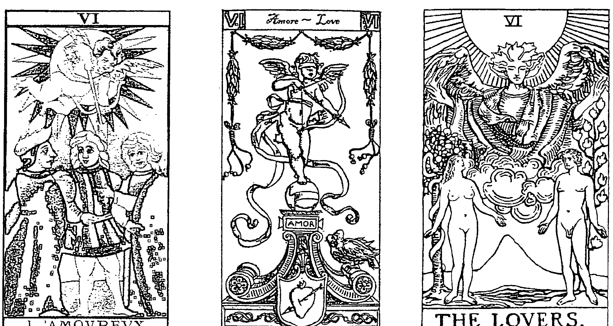

#### 主角人物

戀人有幾種典型情節版本：一為一對年輕男女，上方有見證的天使。戀人袒裎相對，或者彼此相依。天使在身後祝福，背景隱藏著詭譎多端。另一種畫面是一男夾在二女之間，上方有持弓射箭的愛神。男子面對兩個女人的左右為難，上方的愛神拉弦示意射出弓箭，看來正是為愛情做出選擇的關鍵時刻。

#### 場景布置

戀人通常會出現在戶外或者陽光之下，周遭場景要配合他們的氣氛，也可有更多寓意。而盤旋上方的無論是天使或愛神，都慣常地浮在雲端上。

#### 樣貌外觀

一男一女的單純情節中，這對戀人兩情相悅，眼神含情相視。RWS 的伊甸園場景中，由於蛇的介入而讓雙方有了分歧，彷彿思慮到日後生活的變化，男人和女人的神情變得錯綜複雜。天使的表情也有點詭異，顯露出不悅或帶著威脅，似乎不允許戀人做出大逆之事。天使的頭髮直豎尖起，氣氛更顯得緊張。

一男居中二女在旁的架構，有多種情節變化，包含善惡對立或婆媳之爭。而愛神的神情總似帶著戲謔，暗示愛情的萌生是人類無法理性思索和控制的。

#### 動作姿態

不同專牌的情節安排雖有差異，但只是戀人相愛的「級」別程度不一樣。果園的畫面著重猶疑的感覺，正在抉擇是否要遠離上帝、吃下禁果。而兩者選一的情節是最為尷尬的，男子呈現左右為難，各方動作呈現互相敏感關係。

### 圖案符號解構

#### 服飾造型

一男一女裸裎相對，大部分沒有天使在一旁的戀人，也是這樣的裸身。天使穿著制式的素淨法衣袍服。一男配二女的結構中，男子穿著看來具身分地位，一位女人的裝扮嚴謹慎重，另一位華麗活潑，可由此辨認哪個女人才是真愛良伴。

#### 道具配件

伊甸園的場景中，女人身旁有智慧之樹，代表著自主性，以及了解自我與他人。男人身旁的生命之樹，表示尊崇生命的安定，講究生活的規範。一般戀人的場合，通常也都需要植物陪襯。弓箭是愛神的道具，表示感情的喜惡萌生，愛情的認定和抉擇。

#### 相隨配角

戀人牌的主角當然是一對戀人，然而戀人身邊時常會出現其他角色。天使是上帝的使者，守護著戀人，帶來安定的環境。然而，這對於戀人是施予祝福還是干預？愛神如同其他故事中的表現，一向都很出風頭，可說是最搶戲的配角。蛇是魔鬼的化身，卻也是點燃智慧之光的契機，引導人們走向獨立，也走向危險。

戀人的環境頗為複雜，天使與魔鬼都齊聚一堂。不只如此，有些牌還有如婚禮中的花童陪伴。兩女選擇的故事中，或許也等同魔鬼和天使，都是善惡對比的結構模式。

#### 整體搭配

戀人的發揮空間很大，縱使只畫出簡單的一對戀人也符合秘儀主旨，但通常加入寓言性的故事背景，以表達更深入而豐富的涵義。古塔羅的男人從二女中擇一，RWS 的伊甸園故事，都是有名的戀人背景設定。煉金術的陰陽元素結合，也是象徵的重點之一。

> 重要性和地位

戀人牌是重點牌，代表創作塔羅者的愛情觀。這也牽涉到畫風和牌義，影響到占卜的風格和對戀愛的詮釋。除此之外，更可能從這裡牽涉到宗教議題，還有重要的社會關係及兩性議題。

## 戰車
The Chariot

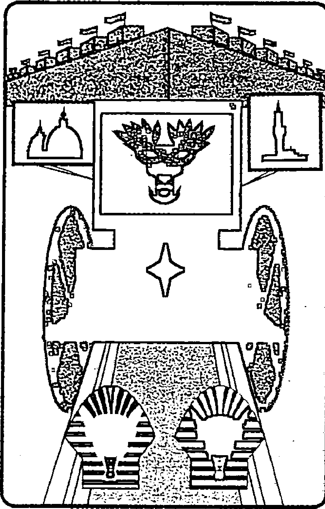

秘儀主題：
正 征途無往不利
逆 衝撞翻覆

各式別稱：
戰士、將領、將軍、統帥、王子、皇子、勝利、攻克征服。

牌序定位：
第七階大秘儀，在融為一體之後，進一步與外物結合，完成第一週期，並繼續往前行進。

### 祕儀數序定位

### 數字奧祕

數字 7 具有敏捷的反應能力，更具有智慧的涵義。這種深度的智慧具有力量和速度，能發揮如戰車般強大的動力，化解數字 7 行動力薄弱的部分。這張祕儀表示智慧、行動力，能與外界實物結合，增添了衝勁與熱力。

#### 象徵法則

這張牌象徵陽剛的動力原型，將理性和智識化為行動，是反應力的高度發揮，代表具體的交通事宜以及交通工具。戰鬥任務則象徵人生各種戰場的競爭，具體的表現為勢如破竹、無往不利，代表犀利、無堅不摧。

### 內涵定義

戰車代表積極進取的雄心壯志、野心鬥志和競爭心態，象徵行動與能耐，智識的落實能力，以及才幹的培養訓練與發揮，也意味著面對環境的明快處理，注意力和反應力，追求效率速度的熱切態度，以及行動和停留的各種心境。

### 正位實占解釋

- 人際交誼：熱烈積極，主動拓展交情和人脈，很有煽動力。
- 戀愛情緣：感情衝動，熱情如火。立即展開愛情攻勢，快速達成關係。
- 事務進行：順利而迅速完成，效率極高。奮鬥精神，積極向前衝。
- 金錢物質：大量或快速獲取金錢財物，征服佔有權益。目標物能夠獲得。

### 牌義來歷變遷

#### 涵義演變

古代塔羅的戰車畫法較為寫實，是由馬匹拉著車體。但後來神秘學家改為神力的奇幻戰車，由「人面獅身」拉車前行，並且有著神秘符號的護持法力。

偉特承襲神秘學家的路線，但認為戰車表示了解自然的奧秘，而不是神恩的秘密，且征服的是外在世界。偉特的占卜定義，還包括有幫助、支援、即時的救援；除了勝利與征服之外，也有傲慢、蠻橫，以及復仇的意義。

偉特稍後正位置意義，也沿用了以上意義，顯得有點混亂，而今改成一律是成功和正面的意義，沒了衝突和逆境。雖然仍有性急和匆忙之意，卻取消了逃逸之意。而向來具有的旅行相關涵義，則一直被保留至今。

#### 正逆轉折

戰車的逆位置多屬於比較惡性的競爭或對立，如偉特定義的爭吵、鬥爭，辯論和訴訟等。偉特稍後時期，多著重於事件的失敗，例如計畫的突然終止、被擊垮了、功虧一簣，尤其是競爭上的失利。各時期的相同點在於：只要是逆位置，任何項目都是負面的結局和狀況。

#### 逆位思考

正位置以往含有的逆境和負面涵義，如今完全分派到逆位了。現今的逆位解釋一樣是如此，以逆位不當原則推演，也就是將戰車逆位以行車不順的種種狀況，來比擬各類實際情形以及不同程度的結果，像是路途顛簸、遇到阻礙、擦撞、甚至翻車。

### 逆位實占解釋

- 人際交誼：交友過於激進，反招致不受歡迎。態度強硬蠻橫，有損人際關係。鬥爭性強，難以平心靜氣待人。
- 戀愛情緣：追求過於衝動躁進，遭到拒絕。天雷勾動地火，一時激情。
- 事務進行：過於急躁求快，反而中途受挫，停頓或者破局。競爭失敗、操作失控。欲速則不達。交通不順利。
- 金錢物質：急功近利，貪圖賺頭反而蒙受損失。開銷上克制不住衝動而失血。失去理智而造成得不償失或倒賠的情況。

### 畫面寓意解碼

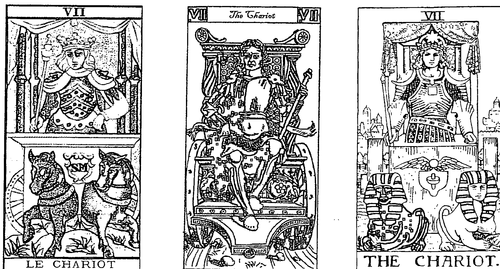

#### 主角人物

戰車駕駛者是一位氣宇軒昂的青年戰士，是高階的領軍，甚至是將領或統帥，而來歷可能是位王子或儲君。戰車是塔羅牌中的道具之最，已經達到主角等級了，何況本牌主旨名稱就是戰車。

#### 場景布置

戰士駕駛戰車，他身居戰車之上，駕駛著拉動戰車的獸類。戰車此刻停在城市之外，車後有一道護城河，後面自是一座城堡。

#### 樣貌外觀

青年戰士英氣勃發、爽朗果決的樣貌，眼光中充滿期待和希望，如星星一般的明亮，神色瞭然篤定，顯示心中滿意過去的輝煌，堅信未來的光明。

戰車通常擁有車篷，以四支柱子架起篷子，車身飾有許多神秘符號。底部應該具有車輪，是戰車行駛運轉的器具。有如寶貴的名車，車身前方通常置有標誌。

#### 動作姿態

戰車駕駛者可以站立或坐在車上。但有很多塔羅是以下半身與車體相連的畫法，代表人車一體，心思與工具合而為一。戰士挺立的身姿，顯示執著堅定而無所畏懼，胸有成竹而躊躇滿志。

### 圖案符號解構

#### 服飾造型

戰士的服飾並不簡單，而多著重在上半身。整體是古代軍裝和戰袍的造型，身上滿是應戰和防衛的配備，不過並非每一種塔羅都畫得鉅細靡遺。

額前有明亮飾物為頭盔，是身分的標示，也是目光和智慧的象徵。而胸甲是顯示神諭的寶物，也有神力的保護作用。護肩呈現喜悅和哭泣的臉孔狀，是賞善罰惡的執行力。腕套增強力量和掌握度，腰帶可代表黃道帶，其上有十二星宮符號，象徵宇宙能量。下襬上面的花紋可運用神秘文字，引動神秘的力量。

#### 道具配件

四柱撐起車篷，代表四元素穩定布局，而使其屹立不搖、頂天而行。篷布代表天空，投射出理想和心境，以星星為紋飾象徵擁有希望和光明前景。車輪有的會顯示輪輻，偶爾要注意輪輻數的象徵意義。車前標誌則暗示出這輛車的性能層級。許多牌卡上是雙翼太陽圓盤，象徵遵循太陽神軌跡，且有鷹神護持導航。各式陰陽交會符號則象徵陰陽合成綻放生生不息的能量。

戰士手執專用武器，多為長槍或矛刺形狀，也是帶領大軍的指揮杖，且可能發揮其他神奇效用。雙馬拉車的狀況會有韁繩，表示控制行進的工具。但神獸拉車多半沒有畫出韁繩，代表不必藉由物質器具，能直接由意志力駕馭。

#### 相隨配角

既是戰車，定有拉車的差事。一般是以馬匹擔任，也有其他動物或神獸。最奇幻的是人面獅身獸，須答出斯芬克斯（註：源於古埃及的神話，其一即為人面獅身。）的謎底，也就是真正了解自我，才能夠駕馭牠們。司芬克斯也有各種變化形象，如四活物神獸。不同的役獸代表的動力以及與車主關係都有差異，都表示強大的精神力量。

#### 整體搭配

戰士身上服飾和車上配件相互搭配，可加強整體感，也增添戰鬥力和神秘感。背景光明亮麗，車後實質的景致，即是戰車的戰利品和征服地，營造出戰車正前往未來、蓄勢待發的感覺。

> 重要性和地位

由戰車牌可以看出對於這張牌背景架構的應用，以及在這背景設定下的細節如何呈現。

## 力量
Strength

秘儀主題：
正 信念之奧祕
逆 欲振乏力

牌序定位：
第八階大秘儀，第一層級的統整階段，亦為第二週期的開始，表象靜止而內部循環律動。

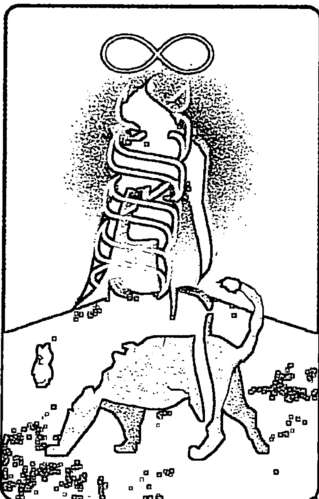

各式別稱：
堅強、堅毅、堅定、意念、慾念。

### 祕儀數序定位

### 數字奧祕

數字 8 代表能量循環，顯示出質能互換和陰陽融合的狀態。這個數字的陰性主體以女性主角呈現，而陽性面則以獅子為表徵，兩股能量交融成真正的力量。為了這個深層原理，偉特將 8 號牌編定為「力量」牌，後世跟進者很多。

#### 象徵法則

陰柔的動力原型象徵感性和心念的高度發揮。力量是出自內在的無形作用，以真誠和信心形成愛和勇氣，擁有定力和安全感，發揮出耐性、堅強和剛毅。這就是內力、實力和潛力，呈現於外則為魅力和吸引力。

### 內涵定義

這張牌暗示內在的無形力量，自心中的純摯而生，是一種堅定信心以及誠意善念。由內而發的律動和潛能，加上剛正堅定的修為，累積成魅力和吸引力，展現方式為降服而非征服，因互相交流而融合為一體。占卜時表示因內心真情流露，導向美好的結局。

### 正位實占解釋

- 人際交誼：對朋友真誠相待，具良性互動。散發出魅力而得贏得人緣。
- 戀愛情緣：愛情方面更是有魅力，和所愛的人互相吸引，熱情真摯融化對方的心。
- 事務進行：態度正確、方法拿捏得當而事半功倍。輕鬆降服、掌控局面。
- 金錢物質：能夠輕鬆運作，累積財富。轉化能量、發揮功效而有實質回收。

### 牌義來歷變遷

#### 涵義演變

這張牌的寓意深刻，從早期的古塔羅就代表內在的美德和生命力量、道德力量和所有力量的原理，並已有熱情和信心的具體意義。

偉特的畫面和古塔羅差不多，但卻悄悄地添加了一些隱藏的神秘學和煉金術內涵，包含善意的堅毅、馴服和引導，強調「神秘法則」，神聖奧義的統合、清明無邪的誠心，以及冥想凝思的力量。而占卜作用定為能量、力氣、行動、勇敢和寬宏大量。

偉特稍後時期的定義仍相差不遠，沿用早期和偉特相承而來的涵義。而在占卜解釋上，時至今日正位的定義一直都是精神層面超越物質層面，逆位則是物質凌駕精神。

#### 正逆轉折

偉特本人的定義是運用逆位過度原則或逆位負面原則，可能是過度可能是過度濫用、蠻橫專擅，也可能是不足虛弱，總之是不協調與不和諧的狀態。

偉特稍後時期，差不多沿用這些解釋，並且延伸為信心不足、身體病弱、意志不堅定，以及慾望薰心等方面。這些涵義是以「逆位反向原則」和「逆位弱化原則」所推演出來的。

#### 逆位思考

現今的逆位解釋，多不脫上述這些原則和範圍，可歸納為拿捏不當而造成的缺失，整體而言是一種因「力量」匱乏而造成的失敗。力量牌逆位在占卜時的重點，是需要解釋失敗受挫的情況原因何在，多半是缺乏誠意或勇氣，而這會影響到人際、感情，甚至事件進行和物質收穫。

### 逆位實占解釋

- 人際交誼：因為誠意不足，難以打動人心。失去群眾魅力光彩。
- 戀愛情緣：感情能量不夠，失去真誠的對待。熱情消退，慾望減低。
- 事務進行：缺乏信心，無法掌握力量，難以堅定持續，不再有所進展。
- 金錢物質：喪失恆心與毅力，財務難以增進擴充，甚至吃虧或折損。

### 畫面寓意解碼

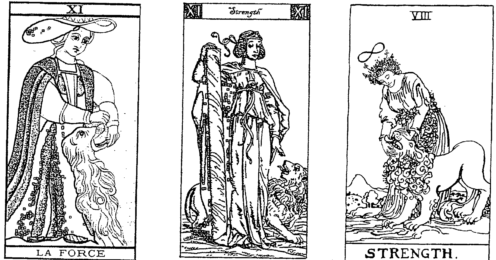

#### 主角人物

力量之女爲身懷絕技的少女，然而年紀也可以有所改變。另外還伴隨一頭猛獸，多半是獅子。若以男性爲主角，則會少了以柔克剛之意，這樣的安排多半是爲了配合整副牌故事的特殊設定，獸類也隨之而變化，不侷限於獅子。無論是女或男，無論什麼姿態，重點都要以徒手方式親身面對另一客體，不能假手工具和武器。女子維持運功般的姿態，以自身的神奇力量，徒手降服一頭雄獅，彼此正交纏著。至於男性英雄，則正在發揮武力技藝，徒手克服敵對的力量。

#### 場景布置

美女與野獸都處於平地上，背後場景有尖聳的山陵，天空明朗清亮。打鬥或糾纏的平台，呈現的型態狀貌，也象徵著內在力量運作狀態。

#### 樣貌外觀

女子神情堅定且充滿善意，沒有恐懼、更沒有仇視。不僅顯示了內在的真心誠意，也從而展露出無比的魅力。而男性主角神情樣貌則隨故事而定。

#### 動作姿態

關於雙方姿勢，細節是有得講究的。女人降服獅子的典型畫面是：女子彎下身子，以雙手按捺獅子的嘴部，控制上下顎的開合，而究竟是扳開或合攏卻有著些微區別，顯示出雙方關係的不同進展。女子略彎腰身，雙手很像環抱太極，這猶如運功練功的姿態，暗示有氣在體內運行。無論是不是像運功，總是要呈現有如發功中的特殊精神狀態，才能有無比的勇氣和信心面對獅子。

### 圖案符號解構

#### 服飾造型

女人、純白的裝束、白色的長衣、清淡雅潔，皆象徵純淨氣質和精神能量。獅子與較深的顏色，多半是火紅顏色，則象徵獸性、動力和原始能量。男性主角造型服飾以及道具配件，皆隨其故事而定。

#### 道具配件

大部分塔羅中，這張牌的主角戴有頭飾，身上有襯紋。頭飾表示精神力，也能暗示能量流動。多數塔羅主角頭戴花環，圍繞於頭額上。身上的紋路線條，是為了表達如電線般地引導能量的提昇和流通。多數塔羅女子身纏花蔓線條，從下半身往上迴繞，而藤蔓枝條與頭圈花環相連結，則象徵接通身體和頭部的能量。

無限大符號，再度呈現於畫面中頭頂上，可與女子身上的花圈或藤蔓呼應，象徵下方有一股能量正在運作中。由於強調徒手，這張牌比較少看到其他配件或武器。在男性英雄的故事中，或許會見到手執武器對付敵手的畫法，這時武器代表其性格特質。

#### 相隨配角

牌中的獅子或猛獸，通常緊鄰女子，牠被女子降服，不再掙扎而屈於低姿態，甚至是接受懷柔或呈現出幸福感，喜愛或忠誠於主人。彼此既是對立且又是融合。其實兩者都可以算是「美女與野獸」情節中的主角。

#### 整體搭配

力量牌畫面架構，動作的呈現是重點，女子與獅子互相結合成為一體，靜靜的連結，意謂著內在力量的運作與能量的流動。

環境也暗示了這股張力的強勁，背景表現出能量的運作，襯托出蓄勢待發的潛藏力量。

> 重要性和地位

力量牌號碼順序的編排可以看出這副塔羅的時代背景，以及較大的整體方向。力量位於 8 號是現近的塔羅的編排，目的要標新而有別於傳統，服膺數字學原則，也表明跟隨 RWS 系統。此外，力量牌本身的內涵以及畫出的情節內容，也代表著這副塔羅的深度和神秘傾向強弱。

## 隱士
The Hermit

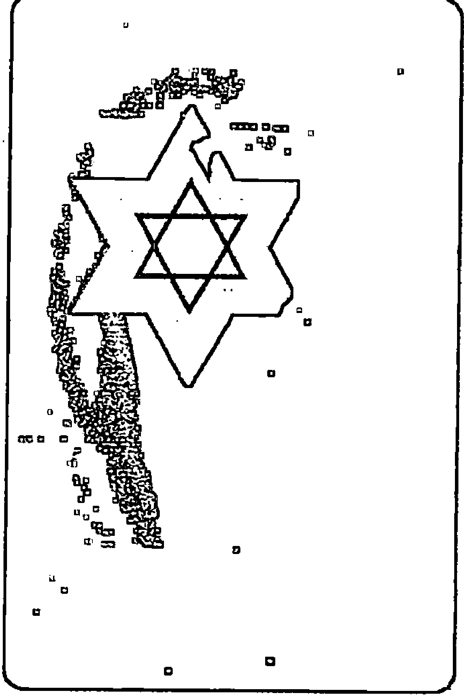

秘儀主題：
正 孤寂的探索者
逆 矯情作態

各式別稱：
隱者、密術士、秘教修士、
煉金士、煉金術士、賢者、
博士、大師、智慧老人、方
濟會士。

牌序定位：
第九階大秘儀
第一層級的最高階段，凝聚
意志力、精神力為星光。

### 祕儀數序定位

### 數字奧秘

數字 9 本被賦予高層次精神，能量很強但忽隱忽現。黑暗中一定會有一盞明燈，是隱士強大的精神能量凝聚之處。但這張祕儀，隱士少了數字 9 的衝勁和不穩定，但仍然有躁鬱情緒特質，只是常態偏向憂鬱的一面。

#### 象徵法則

這張牌象徵親身經驗的知識和智慧，是沈潛過後的理念想法以及長遠周全策劃謀略；也突顯出人與環境間的差異對比和對於理想抱持態度，代表年老、資深，顯示出世外高人的形象。

### 內涵定義

隱士代表內心中的孤寂面，世人皆醉而我獨醒的感受，突顯出退隱態度和遺世獨立的精神。其中心志與環境的作用力抗衡，保有格調和堅持立場，高調與低沈的得宜，或者亢奮與消極的控制，都呈現出內在歷練與智慧。

### 正位實占解釋

- 人際交誼：孤僻的態度，離群索居。人際關係不活潑，更缺乏熱情。
- 戀愛情緣：心如止水難以動情，寧願孤寂，或者過於堅持和保守。
- 事務進行：得到高深的指引，能出人意表地成功。遇到明燈指點迷津。
- 金錢物質：對世俗的利益較無興趣，獲利不大，但尋找失物可望獲得。

### 牌義來歷變遷

#### 涵義演變

雖然歷來塔羅這張牌的畫面都差不多，但牌義上的變化就很大了。古塔羅和偉特時期除了智慧、知識以及警惕忠告之外，都認為有許多負面作用，包括倚老賣老、裝糊塗、刻意掩飾、腐敗墮落和年老衰竭，甚至是背叛和不忠的行為。

正位置意義同時容納了明智的正面特質以及負面的老年衰弱形象，然而這樣並沒有衝突。矛盾的地方是在於：忠誠、謙遜、背叛不忠、倚老賣老，是相反不容的意義。因此後者部分在日後就規類到逆位意義去了。

隱士的特徵還有自我否定和退縮不前、臨時取消計畫、害怕被揭露或隱藏感情的傾向，這些意義包括在偉特稍後的解釋中。一直以來，隱士最大的優點就是謹慎周全、勤奮不懈，這也是最切題的意義。而現今的解釋，已將不統一的負面特質取消，歸給逆位置。

#### 正逆轉折

偉特定義逆位為謀略策劃，甚至有欺瞞假裝的意義，但也是恐懼和擔憂過度，這兩個解釋方向有所差異但能並存。偉特稍後時期，將正位置不能相容的負面意義移到逆位，兩者也由此有明確的分別。逆位多以正位意義的過度原則，或反向原則的兩種思考方向為主，解釋為過於謹慎而躊躇，造成拖延或失敗，或是急切輕率而不嚴謹，其中相同的現象是不安和疑慮。

#### 逆位思考

如今，隱士逆位牌義重整，以「逆位虛假原則」來推演，這是對於隱士逆位最佳的理解方式，視之為「假隱士」。「假隱士」的清高形象是偽裝的，內涵的智慧和優點也是虛假的。外表退縮、推讓與低調，其實別有目的而非真心。以這樣的性格和特質來揣摩，就能針對問題做出解答。

### 逆位實占解釋

- 人際交誼：內心覬覦，卻又被動推辭，還拉高姿態，可知很難相處、不受歡迎。
- 戀愛情緣：內心深處渴望情感卻又抗拒，過度防衛，難以表露真心。
- 事務進行：堅持己見，讓事態僵持不下或走向錯誤。找不到目標，失物難尋。
- 金錢物質：一意孤行、逆勢操作或誤判局勢，錯失機運，不利於金錢財運。

### 畫面寓意解碼

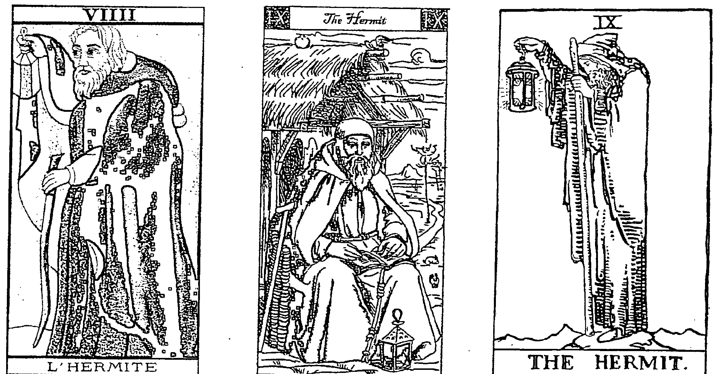

#### 主角人物

隱士是年邁而隱遁的煉金術士，絕大多數是男性長者。隱士正在探詢和揭示，雙腳杵立，但雙手各有作用：一手杵著楞杖，一手高提燈籠或沙漏等器物，表示等待期盼之心與憫懷世間之願。

#### 場景布置

黑暗的夜裡，隱士孤寂的佇立在寒冷的高峰上，身影融於一片冰天雪地中，突顯出世人皆醉而我獨醒的感受。

#### 樣貌外觀

隱士的年紀很老，多有著很長的灰白鬍子，表明年老的特徵。老人的頭臉低垂或目光朝下，有的是閉目沈思，或像是在靜靜等待。他的神情漠然，卻又很篤定的樣子，讓人覺得他雖垂垂老矣，卻老神在在。

#### 動作姿態

隱士遺世獨立的姿態，好似在靜靜等待命運的安排，或是堅持心中不變的理想。對知遇的期盼，通常以手提燈籠爲象徵。

這位老人通常筆直站立著，顯得有點僵直，而背部略微佝僂，頭頸微微低垂著。隱士就像是路燈般，屹立不動，所舉起的燈火，更像是照明世人的明燈。

### 圖案符號解構

#### 服飾造型

有帽子的斗蓬外衣，灰暗的顏色如同他的低調，陳舊的布質訴盡飽盡風霜的人生。衣物將全身裹得緊緊的、深藏不露，甚至將頭深埋其中，好似抵禦風寒，也象徵著內心的與世隔絕。

#### 道具配件

提燈是這張牌中極為重要的道具，如果沒有此燈畫面就沒有任何光亮了，主角性格也就很難彰顯了。隱士手上所提起、高舉著的，是隱士意識和精神的凝聚，算是他的一種「分身」。燈火代表智慧和啟蒙的光明，也表示溫暖的傳遞。光芒形狀多以符號形貌做為神秘象徵和智慧的凝聚，一般以六芒星符號表示精神和物質的結合。提燈的造型也有其象徵意義，其多半是燈籠外型。有時候也可以用火把、火炬來代替，而這更強調啟蒙的精神。

楞杖是具有魔法或法力的木杖，有的塔羅木杖形狀彎曲好似蛇的形貌，這就是所謂的「蛇杖」。沙漏象徵時間，也配合主角的年紀老邁，而手執沙漏更突顯等待的涵義，也具有控制時間的意味，並連結到年老的時間之神——塞坦。

#### 相隨配角

隱士牌的畫面多半是整片孤寂，沒有其他角色伴隨。有時候會有蛇出現，位於楞杖的地面旁邊或纏繞著，也有握在手中或隱藏他處的畫法。加入了蛇的角色，增添蛇本身的神秘象徵作用之外，有時也以蛇杖表示，可以變化為蛇也能還原，而這位老人也因此顯得不是普通的老人，更是一位方外高人。

#### 整體搭配

場景一片灰暗的色調，營造寒冷與黑暗的氣氛，象徵世局昏沈不明。整個畫面唯一光亮處集中在老人手上高舉的物件上，這位智慧老人和景色融合在一起，表示他其實並不願突顯自己，只願手中明燈指引世人方向。

> 重要性和地位
隱士牌可算是塔羅中代表創作者精神形象的一張牌，表現的樣貌特質，就是創作者透露出來的精神特質和所嚮往的境界，而他手上的燈代表他的精神狀態和最高指標。

## 命運之輪
The Wheel of Fortune

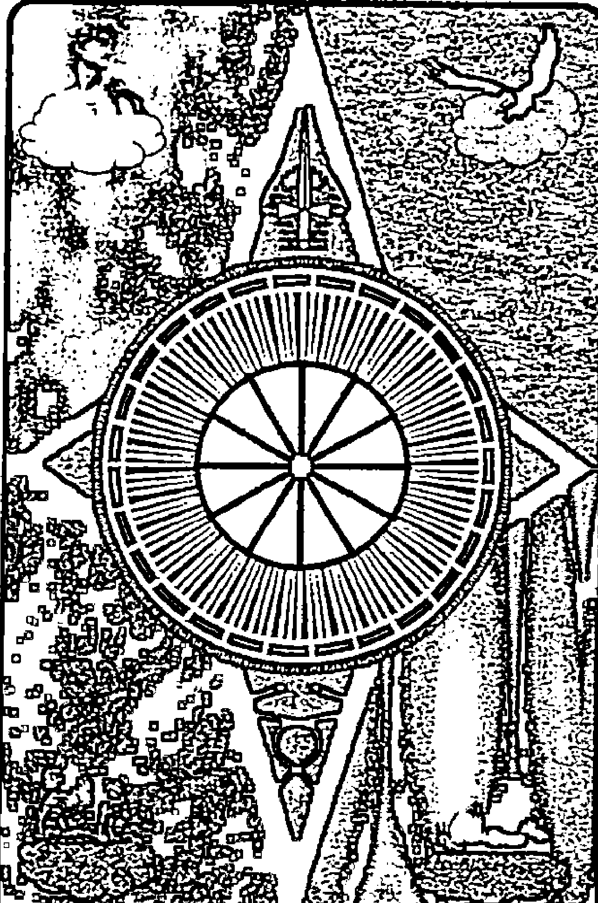

秘儀主題：
正 永劫回歸的法輪
逆 禍福難料

各式別稱：
運命之輪、幸運、命運、生命之輪、律法之輪、法輪、塔羅之輪。

牌序定位：
第十階大秘儀，新舊兩重層級的轉化變動，內在與外界相呼應。打破既往而再創造，開拓嶄新的一輪。

### 祕儀數序定位

### 數字奧秘

數字 10 是變換的創造力，是 1 的升級和演化，變動更劇烈也更複雜。1 統馭四元素的作用再度強調，0 表示週而復始的循環，具變幻莫測的意義，也具神秘的力量。因此 1 與 0 的結合，象徵命運的運行，減少了陽性意味，並且更為神祕。

#### 象徵法則

命運如輪般轉動，象徵時空循環、輪迴運行變化不已的實相，四元素在周遭則象徵具體的環境受神祕命運力量影響。命運之輪體現宇宙型態與命運的運作模式，代表神祕力量的根源起點。

### 內涵定義

命運之輪代表宿命的牽引與神祕力量的運作，作用於個人所成的型態為面對命運作用的因應和調適，對於無可預測的惶惑。占卜上的解釋則為：由於命運作用安排，一切項目都是起伏難料的際遇。

### 正位實占解釋

人際交誼：遇到貴人福星，朋友不期而遇，難能可貴的交情。
戀愛情緣：感情轉折有突破。豔遇、偶然邂逅、喜相逢。戲劇化的戀情。
事務進行：波動變化中的好運，轉機，突發奇想、臨時起意，得到驚喜。
金錢物質：預期之外的收穫，得到偏財、有中獎的可能。

### 牌義來歷變遷

#### 涵義演變

這張牌的畫面，幾乎都非常具有創意，能表達出該副塔羅創作者的宇宙觀和神秘體系。偉特在占卜上的定義很簡單，正位置就認定為各種幸運、福氣和成功，甚至連逆位意義都不錯。

稍後的牌義，才將正逆位互異分化，成為吉運和厄運的差別，後來進一步修改為，需要參考整體牌局來判斷這張牌的好壞，如此才能突顯這張牌的豐富內涵。

另外也有定義為：結果已經呈現無可避免的狀況，仍須努力，靜待命運揭曉。這樣的使用和詮釋方法，比較具神秘感和豐富性。如今較以遭遇預料之外的命運安排來看待，必須配合將面臨的好運，加上這層詮釋，更能發揮這張牌的作用。

#### 正逆轉折

偉特本身是以逆位過度原則來推演這張牌，逆位變成擴增、豐富和奢華的意義。然而在偉特稍後時期，這些方式被改變了，逆位成為壞運和不幸的象徵、無法預料的狀況和問題，以及意外事件。通常都依據偉特稍後的定義，命運之輪是突如其來的狀況和改變，正位置為好運，逆位置為惡運來解釋，也是逆位反向原則方式推演的代表。

#### 逆位思考

也有人遵從正位置的不定性解釋，而逆位就解釋成更加不定的意外狀況了。命運之輪的逆位比正位的變化更為始料未及，並且多半不是遭遇到好運的事情，因此可用意外來形容。需配合占算的問題和牌局狀況來判斷是哪方面的事件，以及嚴重程度如何。

### 逆位實占解釋

人際交誼：遇到煞星或剋星。冤家路窄、狹路相逢。發生意想不到的誤會。

戀愛情緣：感情生變，驟然發生狀況。離譜的插曲。措手不及的離異。

事務進行：變動起伏中的厄運、危機、突發狀況。橫生波折、遭遇不測。

金錢物質：意料之外的損失，忽然漏財，有可能掉錢或遭竊。

### 畫面寓意解碼

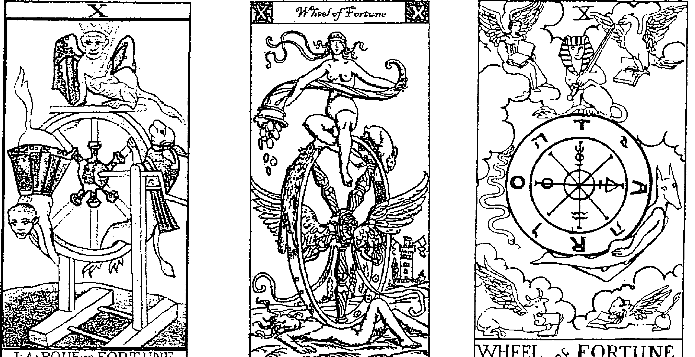

#### 主角人物

畫面主體即為命運之輪，並無主要人物，只有一些神話中的神物或神獸。刻劃命運之輪的轉動，輪的外圍緊黏著幾個神物，神物各施其力，好似與輪的轉動互有影響。多數的塔羅中，有四活物展翼並開卷讀經誦文，或是畫出代表四元素的象徵物。

#### 場景佈置

命運之輪有多種面貌，場景必須與之搭配。命輪多半呈現在中央，設定為天空或宇宙之中，通常都有神物緊鄰。多數的牌更有四活物，隔著空間和雲霧分布於四角落。如果都沒有這些景物，那麼也會呈現四元素分割背景。

#### 樣貌外觀

命運之輪能以各種圓狀物，或者能轉動的物品來表示。種類有很多，包括紡織轉輪、地球、宇宙、天球、黃道十二宮和旋轉木馬。畫面可以盡量追求立體和動態表現的模擬。最常出現的代表是古代紡織機的轉輪，有輪軸和輪輻，有時還有拉把可以操作。目前一般的命運之輪外型是正圓形，內部分成幾個層次，並也可劃分為四或八等分區域，輪內的每個區塊中，都能刻印上特殊的文字或符號。

#### 動作姿態

三女神通常出現在紡織轉輪旁，轉動和看守著織線和紡輪的轉動。三神獸則各以自己之力影響輪的轉動運作，四活物通常呈現讀書的姿態，振翅停在雲端上，專心入定念經。

### 圖案符號解構

#### 服飾造型

三女神通常穿著古典服飾，而三神獸中，人面獅身多半裸身，其他二物如果是動物形，多半也沒有畫出衣著。有翅膀的四活物，身上多沒有蔽體之物，除了那位近乎天使樣貌的人。

#### 道具配件

人面獅身多半手裡持著劍，表示以智慧來決斷。四活物面前大都有經書，好似正在翻閱或誦讀，表示明瞭智慧和啟示，或是散布福音。經書表示有更深內涵和意念的凝聚，配合四活物共有四本，表示相關於四的典籍。書與劍同時出現，隱喻了命運與智慧之間的互相影響力。紡織轉輪的畫法中，紡織機輪是命運之神的工具，象徵命運轉動。轉輪的把手是操作命運的機制，而紡輪上的絲線，則代表命運的脈絡。

#### 相隨配角

許多牌種中的命運之輪會有三人組或三神獸，各占據輪盤的邊緣。一般是人面獅身在輪的上方，輪的左下為蛇，輪的右下為犬首神。另外就是三女神圍繞紡車旁織紗。

四活物是自 RWS 後才加入命運之輪的，都是帶有羽翼的動物，各為人、獅、牛和鷹的頭和身。在命運的作用下究竟誰是主宰？這些「人物」應該都是同等地位的配角吧！

#### 整體搭配

命運之輪幾乎都是圓的形狀，讓人覺得具有圓心或輪軸，也多安放在畫面居中之處。整體畫面是奇幻式的構造，並沒有出現人類主角。類似的生物多半有三神獸，以及代表四元素的四活物，結構上必須劃分層次來安排景物，以命輪外框為界，有內部和外部的差異，而從內到外層疊分明並連貫。有些設計是以紡織轉輪來表達命運輪轉，目的是要表現命運三女神如何操控命運。

> 重要性和地位
命運之輪是非常特別也是極為重要的一張牌，通常是判斷一副塔羅的關鍵牌，因為這張秘儀是整副塔羅命運哲思的濃縮，代表宇宙觀、命運觀和人生觀的呈現。在這個宇宙和世界的架構之下，發展出全副塔羅的設定。

## 正義
Justice

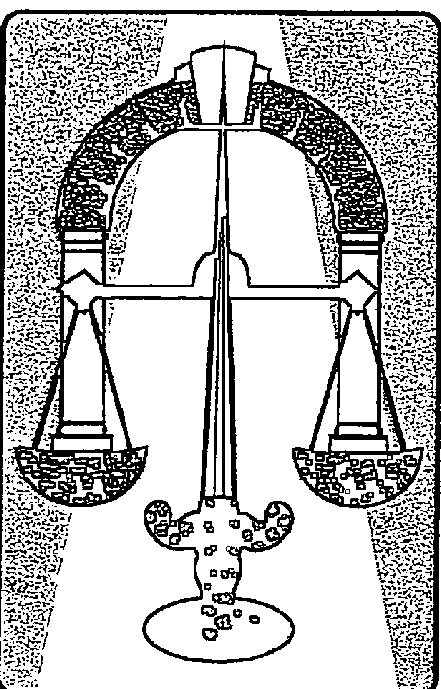

祕儀主題：
正 平衡之法則。
逆 偏頗不公。

各式別稱：
法官、公道、合理、公平合理、調整。

牌序定位：
第十一階大祕儀，是中間週期的置中階段。揭示中庸原則與衡量裁決之道，也是第二層級的新起始階段。

### 祕儀數序定位

### 數字奧祕

11 是最爲均衡而力量潛能無限的數字，在許多靈數系統中，兩位重複的數都具有神祕特殊的力量。11 號又是二位數的新開端，代表強力的智慧。11 的基數爲2，是結合陰陽的均衡數字，也是魔法師和女祭司的組合和升級。因而偉特仔細考量 11 號牌所安置的祕儀，編定爲正義牌，後世多所採用。

#### 象徵法則

此爲二元對立的高層發揮，辯證能力拓展，以及裁決定奪與判斷能力。亦象徵原則和立場的堅持，力求均衡、平等，彰顯正義、公理，代表一切法律相關制度和體系、契約與履行、須謹守的行爲規範。

### 內涵定義

正義是心中的準則，也是一貫的堅持，象徵保持立場和維護理念的心境。代表理智與情感的均衡，持平的態度，講究真正平等，破除人際中的階級地位，化解心中的傲慢與偏見。象徵以智慧之眼看待世間，穿透表面上的是非。

### 正位實占解釋

人際交誼：朋友間互相平等相待，凡事講究公平均衡、正義原則。
戀愛情緣：對象的選擇正確。彼此平等對待、維持雙方均衡、相處和諧。
事務進行：行事風格有準則，堅持原則去做，方向清晰正確。
金錢物質：得到應有的回收、報償或代價。分配得宜、值得。

### 牌義來歷變遷

#### 涵義演變

正義向來是不可或缺的中心原則，一直都有均衡的涵義，代表公平、正確、誠實清廉，也象徵法律或司法執法系統。這張牌的畫面內容能改變的不大，都是畫出「正義女神」的概念，只是取用的形象不一致，內涵意義都差不多。占卜意義一直包含有適度、均衡、和諧，擁有美德、信譽和貞節。

偉特的定義中還有主管、經營、執行，偉特稍後時期，就革除了偉特的這些涵義，與現今牌義很接近了。現今占卜運用多根據牌局和問題而變化，有時候出現這張牌，表示做了對的事、正確的決定，得到正當的報酬，走向應有的結果。

#### 正逆轉折

偉特定義逆位代表法律體系，這點目前已不再使用。因為在偉特稍後時期已經修改，將正逆位置的意義分辨為正面與負面作用。

而後正義牌的逆位一律表示法律上遭遇到問題、遭到陷害誣告，或是本身違反法律，得到不公正的決議結果，或是過度嚴苛的仲裁。另外的涵義就是頑固、執著以及偏見。

#### 逆位思考

如今逆位占卜意義運用為不正確的行為和決定，這些可以說都是依循逆位反向原則來推演的。

如此一來，正確、正當、公正在逆位中都變成了否定，所以占卜上這張牌呈現出逆位時，都是針對問題點而表示錯誤不當的意義。

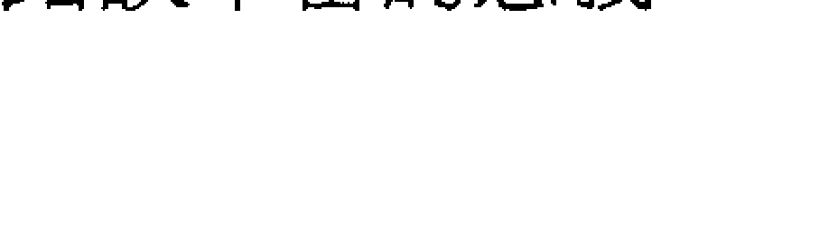

### 逆位實占解釋

人際交誼：對待別人要求過高，卻律己不嚴，偏袒自己。處世不公正。

戀愛情緣：感情上自私的現象，不平等的關係和對待。錯誤的決定。

事務進行：處置不當，錯誤的決策導致不良後果。判斷失誤、行為偏差。

金錢物質：來源不夠正當、不義之財、報償不公、待遇偏頗、分配不均、不值得。

### 畫面寓意解碼

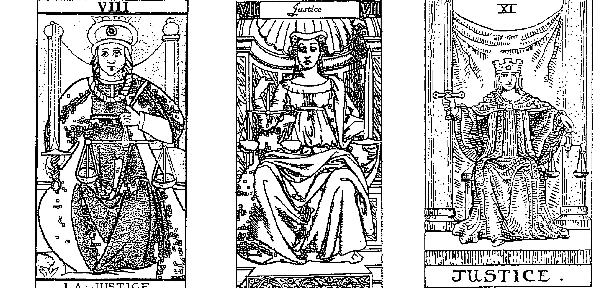

#### 主角人物

正義女神爲西方傳統的各類正義女神形象，化身爲人間執法者。正義女神在人間對應法官的形象，位居司法之職，她手執天秤以及寶劍，正在裁奪執法。

#### 場景佈置

庭長坐在執法或判決的寬廣法庭殿堂上，雙柱聳天、四壁冰冷。身後一簾布幕，色調代表審理的氛圍，嚴肅神聖而不容侵犯。女神鎮坐在天神宮殿之內，也可視爲居於地底冥府當中的判官。

#### 樣貌外觀

正義女神面貌清高，給人寬大但並非縱容的感覺，表情堅定不猶疑，顯示出公正廉明、正氣凜然的氛圍。銳利清明之眼神，能夠明察秋毫，突顯出智慧之內涵。許多塔羅中，這個角色的外貌形象很中性，有些塔羅採取蒙眼的正義女神版本，執法者被布條遮蔽雙眼，卻更表現出剛正威儀。蒙起雙眼表示不以表面判斷，不存預設立場，並且一律平等，親疏不認。

#### 動作姿態

正義女神根據不同來源而各有造型和姿儀，主要有正面和側面兩種畫法呈現。法官一手提著天秤，衡量對錯以及心的善惡；另一手將寶劍舉起，做爲裁奪之決心。這類呈現法都是正面且置身中央，而坐姿的她雙腳開闔或緊閉，也顯示其拘謹的程度。而埃及系統的女神則以側面呈現，多半將自身與天秤結合爲一體，且可能位於冥府。

### 圖案符號解構

#### 服飾造型

判官的冠冕表示智慧靈性高尚與精神內涵的深度，以及對正義的堅持。執法的袍服顯示執法者的性格，上面的服飾也有象徵符號。主持正義者的顏色，通常以紫色象徵高層次理性智慧。額頭上的寶石或裝飾，表示高能的第三眼，與蒙眼而以心觀照的情況可相比。

#### 道具配件

正義之劍這一把大祕儀之劍，表示無上的智慧，以及公正嚴明的權威，做為威勢以及裁決之功能。公平之秤出現在大祕儀中，可見是很重要的器具，做為均衡和裁量的評估標準，象徵公平正義以及尊崇法律的精神。

主角與天秤或寶劍結合在一起，代表完整的法律制度，以及公正的審理和裁決。天秤向前提起或拉高，而寶劍比較貼身者常見到疊於柱前，表示先以天秤衡量，後以寶劍執法，寶劍是備而不用，到最後才會採取的手段。

蒙眼布代表無視於強權或利誘，也是自我約束的能力，象徵法律中的審理程序。柱狀束棒上帶有斧頭，為制裁權至高無上的象徵，可以結合雙柱，或者直接將雙柱視為法械化身。聖火象徵純淨的光明，照耀出真理，可能以火炬或是火爐形態呈現，有時則單獨存在於一旁。法官雙手各執聖火和法械物，或者兩者同時存在，皆強調嚴厲肅殺和鐵面形象。

#### 相隨配角

正義牌多半沒有配角，法官是自主而獨立的，如同法律不容被外力干涉。而正義女神也是一樣的，不被任何聲音所擾。有些牌在場景中，設有物件襯托執法者至高尊嚴的特質，可能是動物，例如孔雀或蛇等。

#### 整體搭配

判官在殿堂之內，端坐於中央，表現正在執行或裁決的威儀。身居雙柱之間暗示她代表中柱，也是天秤的支架。須營造肅穆莊嚴的氣氛，無論是不是屬於人間的法庭，都是這樣的景緻。

> 重要性和地位
正義這張牌，必須配合許多設定而呈現，專牌背景體系或神話背景，已定位出此一正義的地位，怎麼勾勒作畫已經由這些因素都決定好了。

## 吊人
The Hanged Man

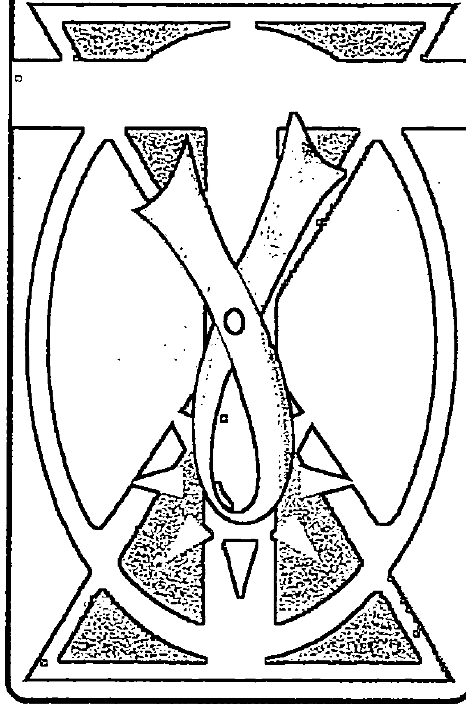

秘儀主題：
正 奉獻的姿態
逆 撥亂平反

各式別稱：
倒吊者、倒吊著的人、倒吊男、被懸吊的男子、犧牲者。

牌序定位：
第十二階大秘儀，複雜的境遇，處於中間位置之後，是新層級的進一步階段，也是另一種循環的整體終結。

### 祕儀數序定位

### 數字奧秘

12 對應黃道十二宮，是代表天的數字。1 與 2 表示自我和他人，加總基數 3 則促成完滿。整組數字陽性成分較多，陰性面則暗示犧牲，揉合為男子的倒吊，而 3 的愉悅享受，轉為以受難吃苦為喜樂，表現出超越世俗觀點的美好周全。

#### 象徵法則

面對不平的待遇採取委曲求全的立場，意味退一步海闊天空。吊人處於過渡階段，沒有著落的現況是難以承受之輕，心中盼望轉機，等待翻身而寄託未來。吊人蘊含著犧牲的願力、臣服的姿態、潛修苦行以及慈悲的情懷。

### 內涵定義

吊人呈現發自內心的深層意願，所以能夠心甘情願奉獻，忍受身心煎熬，堅信未來更好的境況來臨。以截然不同的眼界看待世間，逆向思考形成與眾不同的價值觀，代表轉念之間的心態萌生退讓、寬恕和慈悲。

### 正位實占解釋

人際交誼：必須多擔待一些，委屈忍受和付出較多。講道義、不計較。
戀愛情緣：為深情付出，犧牲奉獻的心態。對現狀認分、甘願。
事務進行：扛下責任，勞心費力。面臨關卡，應考準備。必須忍耐熬過去的人生階段。
金錢物質：著重精神面，對現實財物掌握度不高，有漏財現象。捐獻。

### 牌義來歷變遷

#### 涵義演變

這張牌的主角在初期的某些塔羅中並非呈現倒吊姿態，後來則演變爲以倒吊人爲正統的畫法。原本有人認爲內涵上包括謹慎的德行、審慎與智慧，或是占卜、預言、神諭等事件。這是因爲對主角被吊起的動作和原因，各有不同的理解和詮釋，偉特承襲了之前這些混雜的意義。

偉特稍後時期整理爲：過渡時期和緩衝階段，轉變和調整的狀態，孤獨和放逐的歷程，悔悟與更新的生命等，許多不同層面的涵義。但是這其中有很多意義，會與其他不同的牌有所重複，於是又過濾出了最有特色的犧牲、奉獻、服務等意義。占卜的詮釋方向則爲實際層面的受苦委屈，以完成精神的期待和達成目標。

#### 正逆轉折

偉特對於逆位有一些自相矛盾的定義：自私自利與人群、社會共同體，兩種意義同時並存。偉特稍後時期，將上述的奇特解釋都捨棄不用，而以正位推演出相反意義包含預言不正確、直覺錯誤，沒有必要的犧牲。

由犧牲也推演出不願意付出和奉獻，這也與前述的自我中心特質有關，所以也有心思轉回到自身的意義。這些都用到了逆位反向原則和逆位負面原則。

#### 逆位思考

這些關於面對奉獻或犧牲的態度有所轉變，就成爲一直沿用至今的逆位意義。並且可以理解爲跳離，或者是放棄這種牽絆和堅持的狀態，無論心態是逃避還是看開想通，也不論是前功盡棄或者成功熬出頭了。整體而言，吊人逆位是解除正位的懸吊狀態。然而外在事態並不見得轉變，造成何種結果可參考整體牌面。

### 逆位實占解釋

- 人際交誼：不願再屈居劣勢地位，或是付出的一方不再當冤大頭了。
- 戀愛情緣：對感情心態轉變，不再甘願委屈。掙脫關係、逃離束縛。
- 事務進行：對事件和目標採取放棄或跳脫開，不盡然已經完成了結。
- 金錢物質：盡力減低和停止財物上的折損流失，雖然效果如何並不一定。

### 畫面寓意解碼

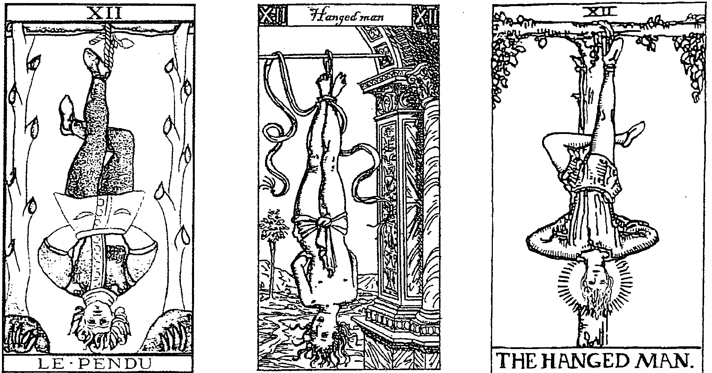

#### 主角人物

吊人是一位被倒吊的男人，大約是成年人，年紀通常不太大。男人懸掛於架上，他的腳被繩子套住，綁在橫樑下倒吊，身體懸空而姿態奇異。主角究竟是自願或被迫上架？是做為犧牲者或是祭品而吊起？是受罪伏法或代罪羔羊？甚或是為了練功而苦修？這是歷來塔羅界的長久紛論的議題，而每種各有其不同的詮釋。

#### 場景佈置

倒吊者不著地面而懸在空中，身倚樹木或柱架，他可能盪在絞刑架間，也可能在其他場所。背景可見天空的顏色，遠景依情節需要而變化象徵景物和顏色。

#### 樣貌外觀

早期塔羅中，受罰或抵罪消災的吊人，可看出承受苦難或是昏厥的感覺。若是為了犧牲奉獻，或是神秘功法的修習，這位被倒吊的人就顯得很特別，眼神迷離難以捕捉，甚至像是陶醉沈浸。他的表情沒有痛苦或是不悅，反而像是一種滿足。大多數塔羅會著墨在吊人的頭部，籠罩著一層光芒或者在頭後方背景有些空間區隔。這個光環代表能量的引導和聚集，象徵吊人的崇高精神力量。

#### 動作姿態

倒吊是最特別的姿勢，何況主角人物又維持著奇怪的姿勢，讓人感到更加神奇。其實這個姿態隱藏著心境的呈現，各種塔羅的功法和招式不同而有差異，一般基本的姿態大致是吊人雙手後背，一腿彎曲放在另一腳後邊，表現得泰然自若。

### 圖案符號解構

#### 服飾造型

身上的穿著兩截分明，上衣和褲子的顏色，多形成鮮明對比。上半身顏色顯示精神狀態，下半身顯示具體能量。少數塔羅是裸身上陣，強調渾然一體融合於自然。

吊人身上較少飾物，但是多繫有腰帶，代表被神祕的宇宙能量和運作圍繞，與魔法師的腰帶有異曲同工之妙。比較奇異的是，倒吊者的頭頂朝地，使得頭髮往下垂著，然而衣服卻並沒有垂下的感覺，或許是他的精神力使然的超自然現象。

#### 道具配件

這張牌比較少道具配件，然而吊起主角的繩索，是絕對不能忽略的。通常是一般麻繩的材質，有些牌會以繩結綑綁的模式和形狀，透露出隱藏的訊息。有的繩索是蛇的造形，或者就是真的蛇，用以象徵神祕能量運作和連結的作用。有一些塔羅畫出從吊人身上掉落的物品，多半就是代表錢財的錢幣；表示倒吊的時候，會犧牲和丟失原本擁有的東西。

#### 相隨配角

這張牌畫面很特別，不太需要配角來豐富情節。如果一定要找出來的話，那麼懸掛主角的吊架應該能算得上！它有各種不同的「款式」，以配合主角吊在上面的主旨，可能是練功、獻祭或是受罪。所以可以是絞刑臺或刑架，也可以是其他木架。

而造型有十字形架、T 字形架，或者 H 字形、拱門形，功能和象徵都有差異。像是有些吊人倚靠的是活的樹木，甚至強調是有靈性的，能補充人類的能源，兩者互相依存修練。這活樹刑架通常是 T 字形，才能在中間有樹幹而讓倒吊者能夠倚靠。

#### 整體搭配

吊人被懸吊起來，全身凌空且倒轉，以繩索綁在腳上繫於木架之下，身體倚靠或不倚靠樹幹有不同涵義。架子之後是廣闊天空的景觀，有呈現或對照吊人的心情性格的作用。若是被吊於懸崖山谷之間的設計，更是驚心動魄。

> 重要性和地位

這是最具有塔羅特色的代表牌，因此每一種類塔羅都得精心去規畫這張牌要怎樣呈現，這也相關於對塔羅的看法，甚至由此可以看出這副塔羅的神祕程度，有無蘊藏深入的神祕學要旨。

# 死神
Death

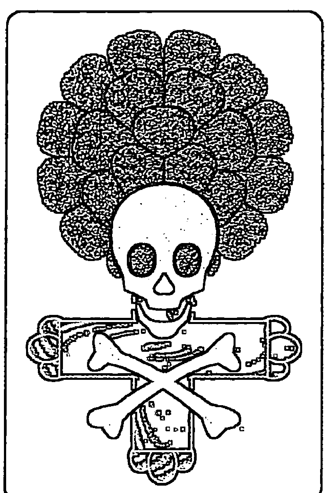

秘儀主題：
正 與死神共舞
逆 真正重生

各式別稱：
死亡之神、死亡、死、
死神之舞、蛻變。

牌序定位：
第十三階大秘儀，超過 12 的
循環終結而重新開始，也是
新層級前半部的中間階段。

### 秘儀數序定位

### 數字奧秘

13 一向是表達死神最貼切的代碼，加總基數 4 為陰性數字，更可連結地底的
國度。3 在這裡呈現出精神面，與 1 的生命能量同被 4 壓抑而潛伏。1 和 3 都是陽
性數字，具強大威勢的變革力量，象徵生命形態轉變的靈體運作。

#### 象徵法則

死神帶來人生的終結、生命的轉化和蛻變，各種事項以不同形式結束。不願意或
難以接受的殘酷事實，皆有如面對死神來臨的心境。這種將地面剷平的強大力量，更
象徵著割捨與了結，也代表特殊的精神狀態，像是空境、無意識、死寂意識。

### 內涵定義

死神是一種絕望的心境，而這沈痛的體驗，正是下定決心的契機，在痛定思
痛之下而來的醒悟。從而可以有所革新，猶如一種再世為人的心情，由此延伸為重
生、轉化。這張牌在占卜時，都可解釋為各種事件和發展上的終止。

### 正位實占解釋

- 人際交誼：某些關係產生齟齬不和。情誼中止、分道揚鑣。
- 戀愛情緣：感情遇到了休止符，驟然畫下句號。分手、離異。
- 事務進行：執行中斷或終止，半途而廢。學業中輟、中途離職、革職。
- 金錢物質：物質毀壞，金錢損失，財務窮途末路，破產。

### 牌義來歷變遷

#### 涵義演變

古塔羅除了以骷髏為死神，以表達死亡意義之外，也象徵改變和轉化，一直都包含國王之死，偉特詮釋這張牌隱含有革命的意義。而神秘學家對這張牌投入了修煉法和生命之樹提昇的意涵，而偉特則修改為啟示錄的畫面，將這張牌帶入世界心靈的境界，表示低層至高層的進化，以及生死意識。

偉特的占卜定義已經和現在頗為接近，代表結束、終止，但卻又包括損失、毀滅、破壞。偉特稍後時期承襲了這些意義，更強調蛻變、更新、重生，以及新階段的開始。且清楚地強調，不必然 是肉體的死亡。

現今的解釋多不包含死亡，也無恐怖色彩，重生和新階段歸到逆位意義中，而正位意義集中在突然的轉折或激烈的改變，以及關係、階段、境遇的結束。

#### 正逆轉折

偉特的定義是以逆位弱化原則變成「不是很徹底的死亡」，象徵不活潑、睡覺、昏睡、昏沉、醒不過來、茫然、發呆，僵化，以及夢遊病。

偉特稍後時期，逆位置定義有了改變，變成較為合理的「不徹底死亡」——緩慢的轉變，包括局部改變、遲鈍、停滯、執著。另外也有盡力阻止走向結束的意味，避免重大事故。

#### 逆位思考

如今逆位的定義運用更有深義，以逆位超越原則思考，是徹底重生、到達彼岸，已走過低谷與黑暗、更為接近嶄新生命之意。死神逆位，是遠離死神影響和其相關狀態，據此往前回溯或往後推移都是解釋的方向。無論哪一種推演方式，結果都是已經重生或已走往另一條路，擁有不同的生命和道路，進入新的階段。

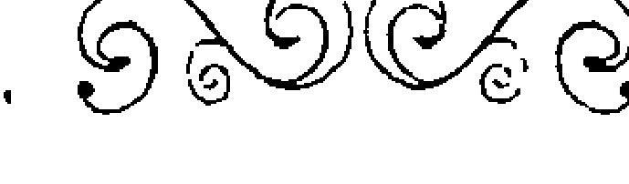

### 逆位實占解釋

- 人際交誼：面對過一場傷害之後重新看待、重頭來過，或者邁向新局。
- 戀愛情緣：安撫傷痛情緒，轉化重生。開創自己的新道路。
- 事務進行：接受了事實之後，向前走出去，重新再來或另闢蹊徑。
- 金錢物質：認賠之後重振旗鼓。採取新的路線捲土重來。

### 畫面寓意解碼

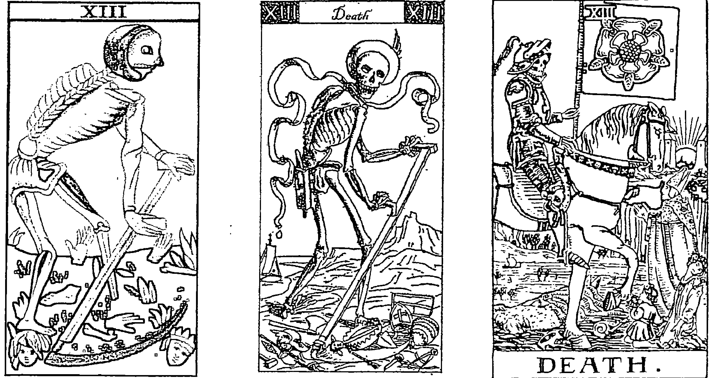

#### 主角人物

骷髏外型的死神，有時候身披斗蓬，有時則身穿盔甲。骷髏手執鐮刀收割頭顱骨骸，或者騎馬前行高舉大旗，宣告死亡降臨。死神有一類只拿鐮刀而站立、沒有騎馬；另一種是騎馬舉旗而來，也就沒有親自帶鐮刀了！

#### 場景布置

周遭地面躺著許多人，或是陳列著頭顱，代表他們瀕臨或已經死亡，國王是最早被割獲的。也有套用啟示錄末世情境畫面，但加上作者想像，背景繁複，包括高山河流和雙塔。

#### 樣貌外觀

死神空洞的雙眼，以及面無表情，讓人感到恐怖詭異。這當然不是人的外貌，但是仍然會有表情，有時候畫成像在笑的模樣而露出牙齒，好似正在諷刺人類無能抵抗死神的力量。

#### 動作姿態

死神收割頭顱的動作，有時像在割草般，正刈著露出地面的人頭。有的牌會將死神畫成類似跳舞的姿勢，或許對死神而言這算是豐收的喜悅，而其實也是要呼應歐洲中古的死神之舞。
不拿鐮刀更不直接割取頭顱，騎在白馬上的死神，高高在上而闊步前進，如同一種示威和巡行，通常高舉著死亡大旗，並喜愛配戴白花。

### 圖案符號解構

#### 服飾造型

有些畫法並無蔽衣，骷髏骨架直接暴露在外，呈現死亡的真實面。有些畫法骷髏是穿戴著衣物的，只露出面頰顴骨。
斗篷營造神祕，黑色表示肅穆沈寂。全身盔甲象徵無堅不摧的力量，並包裹隱藏身形。頭盔上面的羽毛多是紅色，是精神能量凝聚的形式。

#### 道具配件

收割頭顱專用的死神鐮刀是死神最重要配備，有的死神則會揭舉死亡旗幟，通常是黑色大旗，象徵瘟疫、生命終結等意義。
而白花時常呈現在死神畫面中，位置和呈現方式多變，通常是繡印在旗幟上面。除了做為喪花之外，更有著生命靈魂淨化的寓意。

#### 相隨配角

在死神腳下，任何人都稱不上主角，因此原先在地面上的要角人物，都屈居於配角。傳統塔羅以地面上的頭顱面孔來表示已經死亡或被剷除的人，多有其代表的角色，像是君主皇帝、教皇主教、商人富翁等等不一而足。
有些塔羅像 RWS 地面上不是人頭，這些人們或許是皇帝、教皇、女子（力量之女）、小孩（太陽之子），而在這張牌裡都一概做為陪襯。這些人們同時面對了死神，有人求生、有人已死，擔任詮釋不同的作用。
另外，也不要忽略了有些牌中，死神的坐騎——鐵蹄巨馬。巨大的馬匹是一種強大力量，而如果是白馬則具有淨化和精神的象徵。

#### 整體搭配

死神出現在荒垠，意謂著生命的戰場，氣氛肅殺而滿目瘡痍。背後場景顯得遼闊，是為了編織未來的許多可能性。畫面中有近景和遠景的層次，這樣的畫法可以表達更深遠的涵義。

> 重要性和地位
這張牌是代表生死觀與生命態度的一張牌。其中蘊含嚴肅的議題卻又具有偽裝意義，這取決作者的創意，主題設定發揮空間很大。

# 節制
Temperance

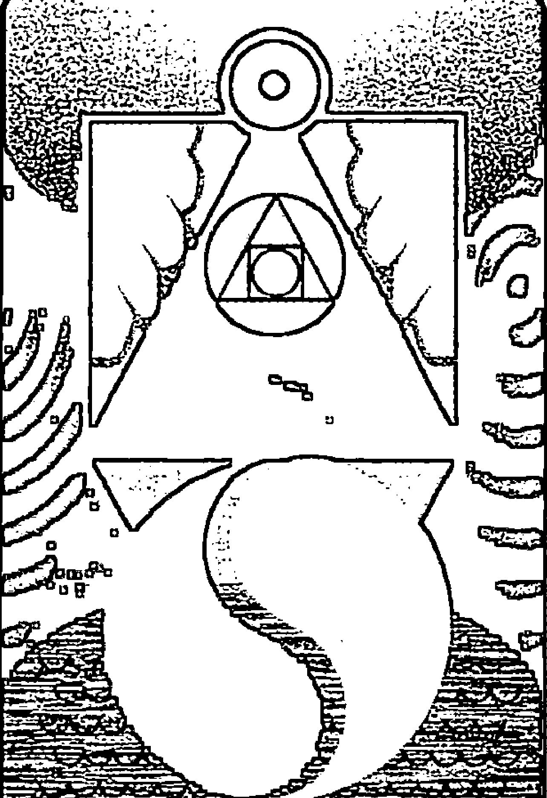

秘儀主題：
正 至高之真諦
逆 火侯不到

各式別稱：
調節、調和、藝術、煉金術。

牌序定位：
第十四階大秘儀，新層級的確立，並超越各種循環體系，亦為第二週期的總結，為深度發展第二層級。

## 祐儀數序定位

### 數字奧秘

14 象徵修煉和提昇，4 代表規範，1是觀照的自我，加總基數 5 的流通，在此融合成爲更高層級的變化之道。這張祐儀以 14 號代表節制，表示真正的修爲。

#### 象徵法則

這張牌調和守恆的自然規律，高度循環的神聖平衡，這是意識修持的信念，元素轉化之道。高層次的修煉，象徵追求更美好境界的覺醒，提昇和淨化的意識。節制就是「道」，是最高指導原則，特別代表轉化、治療與超越。

### 內涵定義

節制，意味著在人生體驗中修煉，必須秉持耐心，逐步透過修習而走向提昇。從物質的微妙而觸探心靈的奧秘，也代表人際和諧的互動，身心的融合交會。由於這張牌代表修養和修爲，在各層面都是非常美好調和的表現。

### 正位實占解釋

- **人際交誼**：良好的互動和情誼，溝通順利。有利的交流、共享、雙贏。
- **戀愛情緣**：愛情關係美好和諧，真心分享，讓感受更深刻，水乳交融的境界。一起提昇，各層面的結合。
- **事務進行**：懂得調節，進行調度安排，都十分順利暢快，學業事業都能提昇。
- **金錢物質**：善於經營運用之道，不但能獲利成功，更能充分利用發揮。

### 牌義來歷變遷

#### 涵義演變

這張牌一直都是高層次的內涵，畫面圖案也隨時代演進，愈來愈呈現出煉金術的神秘意味。偉特對這張牌的占卜意義下得很簡易，節約、簡樸、經濟，並相關於管理和經營，以及關係的適應和容納。

在偉特稍後時期，賦予的意義相差不多，但較為豐富，定義為透過自制、和緩及耐性等原則而達到成就，了解經營和進步之道，並更強調和諧與融洽，以及各種關係的結合互動交流。

以上這些作用延續為如今的一般涵義，然而更豐富深刻的意義正在增加，朝向精神指引、能量循環、高層次的真理這些方向來解釋。對於神秘內涵的追尋以及內容的深度，仍然持續開發中。

#### 正逆轉折

偉特定義了些許特殊的項目，包含教會、宗教信仰、神職等等。不過這些對於占卜作用不大，偉特稍後時期，當然捨棄了這一些較怪異的項目。

而偉特原本逆位 意義還有不幸的結合、分離不睦、利害關係的對抗爭奪，這部分延續了下來，形成各種不調和的狀態：利益衝突、甚至互相敵對，無法與人共事、對了解他人有困難。另外偉特稍後涵義的逆位，還包括了缺乏耐性以及貧瘠不育。

#### 逆位思考

如今逆位的牌義，依循逆位不當原則，採取各個項目「不調和」的方向，以及用逆位弱化原則，朝程度不足、層次不夠的方向來解釋。

占卜上的逆位解釋，就是事情的成果評價並不佳，也可說是由於不了解做人處事的黃金定律而造成的。

### 逆位實占解釋

- 人際交誼：溝通不良，或相處不融洽。不得其道、故步自封。
- 戀愛情緣：感情中忽略了重要的契機，失去美好的感受，沒有默契、不了解對方。
- 事務進行：不懂得箇中之道或是技術不佳，進行中很多摩擦阻礙。
- 金錢物質：沒有掌握到理財之道，不知開源節流、易流失金錢。

### 畫面寓意解碼

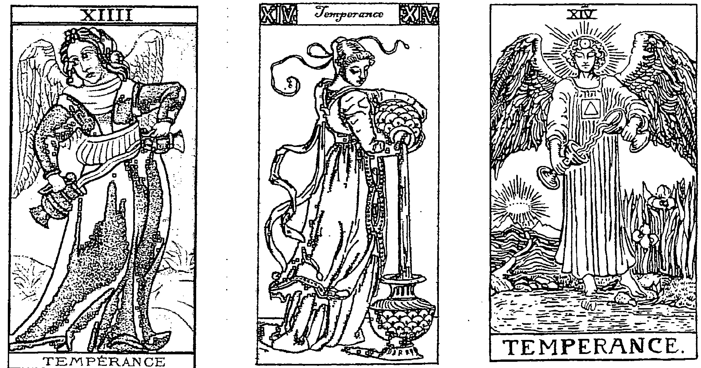

#### 主角人物

節制天使為偏向中性的神聖人物，具備高層次修為的形象。節制天使以奧妙的姿態，雙手持瓶互相傾注，正在調和其中的煉金術神秘液體或仙丹靈藥。多半塔羅還會畫出性別，有的牌偏向男性，有的偏向女性。

#### 場景佈置

場景設計較為特殊，搭配人物姿態，幾乎融為一體。在水流和陸地的交接岸邊，旁有花草、後有樹木等植物相襯。遠景有道路通往遠山，此處蘊有黃金太陽曙光，以暗示煉金術的智慧之光。

#### 樣貌外觀

節制天使是調和的化身，天使顯露出安祥平靜的表情，眼神平和而帶著隱約的微笑，卻又專注於手中的操作。他的態度祥和安寧，表現出一種謙卑的信心，也是一種修為的體現。

#### 動作姿態

節制天使大致是站立的姿勢，有些塔羅會表現出較有特殊性的動作，增添神秘奧妙感。天使一腳在岸邊陸地上，一腳伸進水裡面。這種神秘的姿勢，是一種入定和超意識的狀態，也是讓意識接通不同次元的方式。雙手各握一個法器，互相傾倒著聖水，並且滴水不外露。雖已是世外高人，仍認真專心操作，旁若無人。

### 圖案符號解構

#### 服飾造型

如果主角設定為天使，大概都是很「制式」的裝扮，通常穿著一身潔淨純白，長袍及地而具有褶襉，當然不同的塔羅會小有差異。多半會注重到主角的髮型和頭飾，額上有太陽或是金圓圈符號，象徵智慧或第三眼。胸前有七角形或是四方形加三角形符號，代表心胸或氣脈中能量的提昇。身上多會有隱約的附加飾物，形狀都是神祕符號，用來增添象徵涵義，這時就要針對符號意義去解讀。

#### 道具配件

兩只聖杯或其他器皿，由主角左右手各持一只，一對成組表示陰陽協調和交流，不過也有持一只器皿和相應用具的設計。聖杯代表水元素，象徵精神承載體，也是煉金術專用的器具。聖杯或器皿的形狀和顏色，與其在煉金術中的作用相關。當兩只杯身不同顏色時，要特別注意是一組對比的涵義。兩杯之間的液體，在節制天使身前，是神祕的流動，是抽象能量也是具體物質，存在體外也是體內。

#### 相隨配角

這張牌大部分沒有配角人物，也不一定有動物。如果有動物的話，就是煉金術畫面的象徵物，這些動物代表物質元素的精神，在煉金過程中呈現。牌中多半會出現的是植物，像是鳶尾花，表示精神層次的美感。

#### 整體搭配

環境清新、氣氛幽靜，主角人物、器物穿著以及背景皆調和一致。整個都是要配合發功狀態，必須從整體畫面來看出奧妙所在。早晨般和煦的光芒色澤，黃金黎明，出現於場景之中，呼應到身上的頭飾，呈現意識與超意識的對比，象徵智慧和修為提昇，達到煉金術的最終目的，提煉出最高智慧的精神元素，並與太陽能量相呼應的高層意識。

> 重要性和地位
節制是一副塔羅的最高指導原則，自是不容忽略的一張，雖然乍看之下差異不大，但正是要看細微之處，由此才能見到真章。如果你重視高層意義奧妙的話，勢必會在意和關注這張牌。

# 魔鬼
The Devil

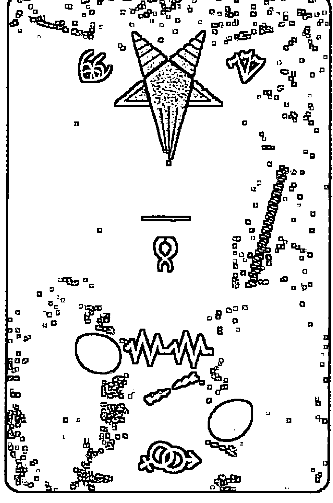

秘儀主題：
正 慾望代言人
逆 挙脫枷鎖

各式別稱：
惡魔、魔王。

牌序定位：
第十五階大秘儀，第二層級前半部的完成，第三週期之始，深入探索的階段。

### 秘儀數序定位

### 數字奧秘

15 是魔鬼的數字，1 的自我能量加上 5 的活躍，結合起來動力特強。5 的精神力被 1 破壞，呈現出極度的放縱，加總基數為 6，纏綿悱惻，綜合演變成耽溺沉浸和受到牽制。其實 6 本身也被視為魔鬼的數字，15 就是其隱藏式的變化。

#### 象徵法則

源於內在的慾望，來自外界的誘惑，是關係之間的交纏和捆綁。這張牌也象徵黑暗的魅惑，被心中生出的另一股力量控制，或意味著沈溺而無法自拔，代表故弄玄虛或神祕詭異之事物。

### 內涵定義

魔鬼表示人的慾望層面，也是精神與物質的另一種關係。魔性是不知不覺的成長和共生，對黑暗面必須加以探索，而不是逃避或忽略掩藏。惟有深入內部探照，才能有真正所覺察。

### 正位實占解釋

- 人際交誼：對人心懷鬼胎，萌生不正當的心態，不是很單純的往來。
- 戀愛情緣：曖昧關係、糾纏不清、孽緣。執迷不悟、慾望重於情感。不被社會認可的戀情。
- 事務進行：想要一步登天，不遵從規範行事，圖謀不軌。
- 金錢物質：懷有貪欲，使用手段獲取。以投機方式贏得，從非法途徑獲利。

### 牌義來歷變遷

#### 涵義演變

這張牌的字面意義似乎已經被定下了占卜意義，但魔鬼隨著時代演進，詮釋觀感也不一樣，就如同畫面也一直有所改變。有些神秘學家將內涵加深，成為某類神秘功法的練功姿態。然而偉特對這張牌定義仍在黑暗面，正位作用都是負面的：傷害、暴力、劫數、意外變故等。

偉特稍後時期的詮釋意義仍差不多，更著重在沒落、毀壞、無法實現理想、始料未及的失敗，而這些遭遇或許是考驗和警示。另外，也包括一些玄怪神秘的體驗。如今，正位意義鎖定在慾望、黑暗的心態和行為，詮釋的關鍵則是，受到引誘而被控制，因而失去自我。不合常軌的行為和戀情，情況如何判定，其詮釋也隨時代而變化，並以占卜師為導向的，關鍵在於對這些層面的理解和觀感。

#### 正逆轉折

偉特逆位定義頗為模糊：邪惡、命中注定的、虛弱、卑鄙、盲目，這些意義與正位置的分別並不大。偉特稍後時期，開始分別正逆位差異，並使用「逆位超越原則」，解釋為擺脫束縛、拋棄枷鎖。另亦以「逆位反向原則」解讀，相對於正位置的結合力，將逆位解釋為分手、割斷糾纏。另外還有相對於墮落慾望而朝向精神提昇的解釋：克服慾望、不再貪求、悔悟或認清自我，達到精神體悟和提昇。

#### 逆位思考

對魔鬼牌而言，逆位反向原則幾乎等同於逆位超脫原則，而這些推演方向，也是沿用至今的最常用法。魔鬼已是負面意義，通常逆位不用解釋為無限沈淪，反而是開始掙脫這樣的情境。雖然可能產生另一種痛苦與矛盾，也不一定就能達成目標。與吊人逆位的類似點在於脫離，但不同的是在正位時的出發點就已經天差地遠了。

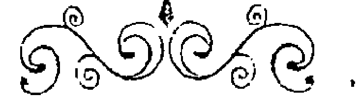

### 逆位實占解釋

- 人際交誼：擺脫一段不好的關係。不再同流合污，脫離、撇清、切割。
- 戀愛情緣：割捨，不再執迷。掙脫枷鎖、解開心結、分割。
- 事務進行：掙扎，開始後悔作風和心態。踩煞車，回到正軌。
- 金錢物質：了解理財方式不對，改邪歸正，洗手不幹。補償贖罪、不貪了。

### 畫面寓意解碼

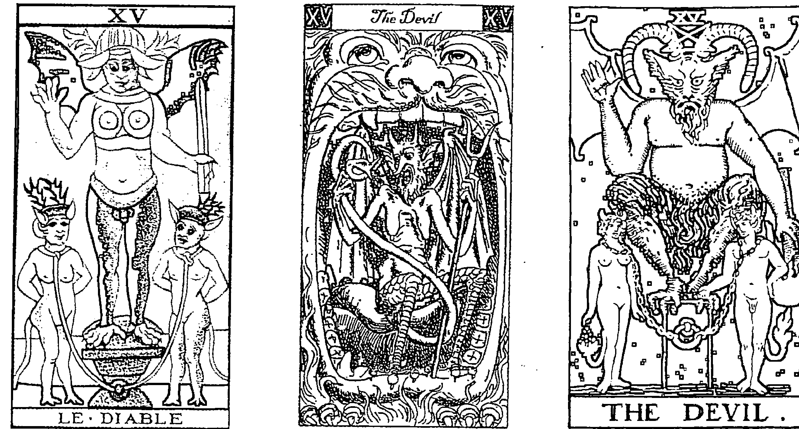

#### 主角人物

魔鬼通常是長著雙角和翅膀的魔鬼首領，是慾望和黑暗的主宰。多半的牌中都有被魔鬼禁錮的人類或小惡魔，魔鬼在祭壇上張牙舞爪，操控兩個墮落的靈魂，或是獨自藉著燭火練功增進魔力。

#### 場景佈置

魔殿是深沈黑暗的境地，猶如位於地底深淵或地獄之間。

#### 樣貌外觀

魔鬼的表情似乎多不正派，通常被描繪成邪惡的神情或笑容，有時還增添惡毒戲謔的眼神。只有少數的塔羅沒有醜化魔鬼，這時長相就較美觀些。魔鬼大部分在頭上長有一對角，有長的也有短小的。臉形多呈現倒三角，甚至連同耳朵和角組成倒五芒星外型。

兩個人類，則是彼此相望，卻似不知魔鬼的存在，互相之間有聯繫力。他們的表情顯得無奈又甘願，執著又逃避，而表情和姿態則必須依情節設定而變化。

#### 動作姿態

魔鬼蹲坐在祭壇魔座上，他一手高舉起來，做出施法的手勢，這姿態很類似於教皇，但卻是一種魔力作用。魔鬼的另一手握著火炬，向下垂著讓火勢更旺，或者是讓火延燒那個傀儡。被操縱的是兩個人類，男人被燒到尾巴而痛苦，女人閃避畏縮。也有的畫面是，兩人無視自身的處境。少數的塔羅中，這個魔鬼呈現的是一種魔法的秘密修練姿勢，以此盤坐著。不過多數塔羅不願表達魔鬼的神秘高能。

### 圖案符號解構

#### 服飾造型

魔鬼多半是沒有一般衣裝的，上半身光滑地裸露著，而下半身被身體長出的濃密獸毛覆蓋著，以醜化不堪來表現魔鬼的原始和獸性。也有些牌的魔鬼，是身上覆有鱗片膚質衣，表示具有如蛇般的神秘。這些變化都不外乎是各類動物的表皮。倒五芒星雖然已經以臉形呈現了，但多半還是會再畫出來這個符號來，位置大都位於頭的上方。

#### 道具配件

火炬是魔鬼所擁有的配備，是黑暗的權柄。火焰能在黑暗中集中光亮，是能量的凝聚，也象徵著慾望之火。鎖鏈表示很難斬斷的關係，被鑄住脖子，也就是孽緣的套牢。有時以其他工具表現，像是繩索或人偶線。有的塔羅牌中，魔鬼的中央會點燃蠟燭或薰香，也呈現了幽微的火光和煙霧，這是魔鬼在修練時所運用的法器，位於身體腹部中間；有時也做為魔鬼的配件，用以取代火炬。

#### 相隨配角

原本戀人牌中的主角人物，在這裡變成了配角，不過一樣有很重要的地位。況且誰是主角誰是配角是很難說定的，因為魔鬼也不過是人心生產出來的產物。畫面中有的不是人類，而是小惡魔的形態，可視為真正配角，或於兩人之外添加兩人姿勢變化很大：有的畫得像是甘願被奴役，有的呈現驚慌或抗拒想逃的姿態，而有的塔羅會表現魔鬼操控玩偶的動作。

#### 整體搭配

營造出魔鬼與男人、女人，三方之間主從相互控制、難分難捨，耐人尋味而詭異的關係。黑暗的緊張詭譎，濃郁沈溺的色調，是慾望與潛意識、夢境、幻覺的呈現。更高段的手法是，營造出混淆視聽的效果，這張魔鬼牌是教皇牌，也是戀人牌。如此，更能呈現出魔鬼的厲害，欺騙世人的手法。

> ### 重要性和地位
由畫風就可以看出作者對魔鬼的評價，而這就可以看出作者對黑暗面的看法和見解，得知整副牌的「正派」程度，是保守類型還是開放類型，也能評估跟自己的風格是否相搭配。

## 塔
The Tower

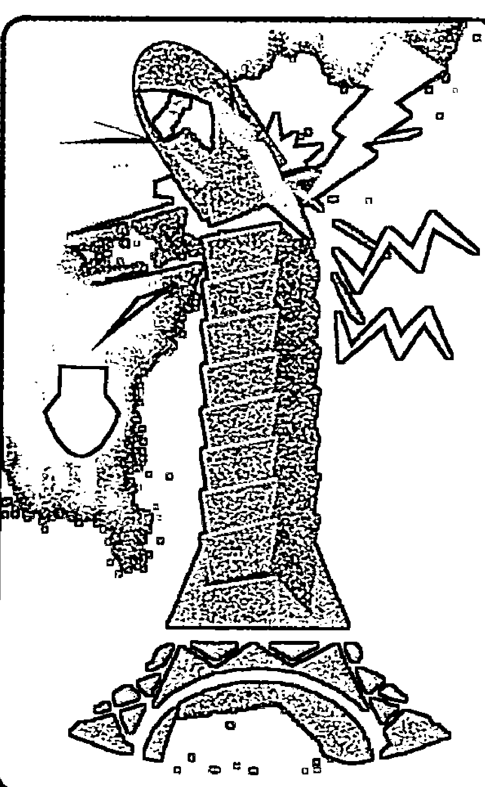

祕儀主題：
**正** 慘敗的塔樓
**逆** 絕地求生

各式別稱：
高塔、高危塔樓、驕傲之塔、雷擊之塔、閃電之塔、天上之火、巴別之塔。

牌序定位：
第十六階大祕儀，第二層級後半部開端，極力往更高度發展，面臨起落挫折，崩毀墜落的階段。

### 祕儀數序定位

### 數字奧祕

16 是熱力升高到極點的醞義，6 的熱切活力，加上 1 的能量互相增強，加總基數 7 是背後隱藏的智慧結晶。1 和 6 都有依賴與眷戀特質，與 7 的尖銳形成衝突，暗示潛伏變動因子，突顯處心積慮的建設成果遭到劇烈衝擊。

#### 象徵法則

建設與破壞的力量讓巨塔與堡壘的建構面臨災變危難，象徵遭受嚴重打擊和挫折，驟然的遽變降臨，多年的基礎毀於一旦，也代表各種天災人禍災厄戰亂，組織或個人遭逢危難局勢。

### 內涵定義

塔是一種毀滅，然而這種磅礴的破壞，卻也是鬆綁執著與依賴的力量。在意識中代表一種覺醒和身逢絕境之後的頓悟，也意味著走向頹勢的註定或偶然，經歷塔樓興起又樓塌的感觸。這張牌在占問各方面都代表破壞、傾覆的力量，象徵遭遇到空前的逆境。

### 正位實占解釋

- **人際交誼**：互相抵觸衝突，紛爭、吵架、爭奪。關係決裂、鬧翻了。
- **戀愛情緣**：感情失和、破裂、爭執吵鬧。分離、離異、切斷關係。
- **事務進行**：嚴重挫敗。開除、革職、退學。組織瓦解，公司倒閉。
- **金錢物質**：金錢損失慘重，財務遭遇重大危機。大賠、慘敗、破產。

### 牌義來歷變遷

#### 涵義演變

這張牌的意義導向都差不多，一致設定是巨塔正在崩毀，而不見得只呈現塔本身的堅固宏偉的意旨。偉特正位意義包含：痛苦、貧困、勞碌、毀滅、逆境，還有恥辱、詐欺。

偉特稍後時期，除了延續偉特定義之外，更添加了捨棄以往的關係、意外的震撼、失去安定與保障等意涵。並且重申了前人的意見，解釋為觀念上的變革，因突如其來的打擊而有所徹悟和改變，打破過往的執著。牌義上的差異只在於認定塔走向傾塌的因素，塔羅作者各以不同的故事做為寓意。最常見的就是，高傲的塔招致雷殛而自取滅亡，甚至「引經據典」認為來自上帝的懲罰。

現今在占卜運用上，就是以這些寓意直接比擬所問事項，深入剖析解體的成因，並根據問題和牌局，判定塔倒塌的規模，以及受到波及的人物是誰。

#### 正逆轉折

塔的逆位解釋必須特別思考和劃分，因為就連從畫面來看也是很難分辨正逆位的差異和「災情」的輕重。偉特定義為：情況類似正位而程度較輕微，這就是明確的以逆位弱化原則來推演。然而也指出是正位的情況而有導致的因素存在，這說明了逆位實已經歷了正位的情境。

偉特稍後時期，延續偉特的意義，表示為持續受到壓迫和限制，因循舊有習性，無力改善現狀，精神不愉悅，是一種跳脫不開的情境。

#### 逆位思考

如今的解釋有兩大方向，一為「逆位反向原則」：塔並沒有倒塌，相反地太穩固了，就像被囚禁一般。二為「逆位超越原則」：阻止崩毀，脫身逃逸，或者在殘破廢墟內求生。而建議思索方向為危難已經來臨，那麼是否也只能豁出去了？塔的逆位，就是在傾毀中以最壞的打算面對事實，或者是以徹底的決心脫離險境。至於結局如何，就要看問題和牌局，由整體狀況來決定了。

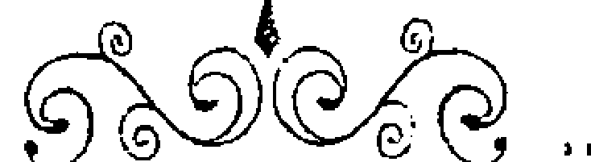

### 逆位實占解釋

- **人際交誼**：關係破裂後的相處。減輕傷害，掩蓋問題。阻止事端爆發。
- **戀愛情緣**：力圖挽救破碎的感情。決裂之後的接續處理。
- **事務進行**：殘局的善後。避難、逃離險境。力挽狂瀾，避免更大傷害。
- **金錢物質**：嚴重損失之後，如何生存或恢復元氣。竭力降低損失。

### 畫面寓意解碼

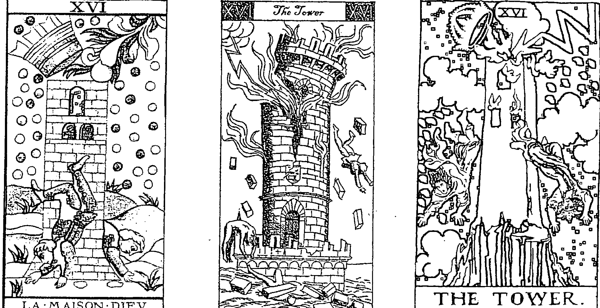

#### 主角人物

塔與塔主都是「主角」，塔主多半是兩位人物。如果為一男一女，則代表情侶，亦可以視為皇帝與皇后。
如果兩人都是男子，可以代表政教首領，那就是皇帝和教皇。畫面中塔頂聳天，觸雷而掉落頂部王冠，塔身起火冒煙，塔裡的人因而墜落塔外。

#### 場景布置

塔座落於高危之地，高地上的高塔又聳入雲霄，可見危機早已存在，如今只是爆發。高塔遭受雷擊而傾塌毀壞，場景濃黑氣氛緊張。

#### 樣貌外觀

塔本身是堅固的堡壘，多是磚石建造而成。塔頂尖聳，有的牌則畫上王冠為頂。此時呈現被摧毀的狀態，或有著火、崩裂、塌落的畫面，看怎樣去呈現，而這些呈現也預示了災難的型態。兩位人士的面貌，則是遇難時的驚恐詫異。

#### 動作姿態

閃電擊中巨塔頂峰，這個動作比擬在人身上，就是如雷轟頂，代表內心受到打擊震撼。塔正在坍塌分裂，並起火而冒出濃煙。
兩人是跳下來或被拋出的姿勢，雙手四肢伸張擺動，呈現惶恐和驚訝，充分表現他們的措手不及。

### 圖案符號解構

#### 服飾造型

從塔身掉下的兩位人士，身上的衣著完整但顯得狼狽。從其裝扮可以辨認出身分，或許頭上還頂著王冠，更顯示強調身分，多半在墜樓中跟著掉落。當然，所有的冠冕之間都是互有呼應的，包括塔頂的大冠在內。

#### 道具配件

有些牌將塔頂設計成一個大王冠的樣貌，這也算是塔的重要配備。王冠象徵著物質和現實面智慧的尖端，也比擬人的尊嚴和面子，而人物所戴的冠冕也是如此。那道摧毀塔的閃電，或者天火，可說是神的工具，或是懲戒的武器，也可視為自然的力量，象徵意識中腦中的靈光乍現，五雷灌頂的覺悟清醒。

奇異光點隨落體遍灑，表示神秘的作用力，影響圍繞他們。這些點的形狀多半是以「上帝之指」——第十個希伯來字母的形狀來呈現。上帝之指表示神意的運作，而這些點籠罩的範圍都在神的意旨控制下。有的牌會添加其他落下的物品，原本擁有而失去的東西。

#### 相隨配角

若塔樓本身算是主角，那麼兩位逃難的人士就像是配角了，在這樣混亂激烈的場合中，多半沒有其他的角色或動植物出現了。煉金術系的塔羅會有奇幻動物出現，可能在火海之中，或者煙霧之中。

#### 整體搭配

整個畫面壅塞，滿目盡是瘡痍，仰望的視角使高塔更顯危殆。以閃電等方式呈現出驟然和措手不及，猛烈的震撼的感受。

塔身裂縫傾塌、冒起濃煙著火，人物逃生或受難，刻劃如大災難般的場面，充滿混亂緊張和恐怖。

> 重要性和地位
格局龐大的「塔」，是塔羅牌中最激烈的一張牌，也是災難代表牌。無論在畫面上或牌義主旨都不會相差太遠，畫面上的差異只是各自風格和著墨細節問題。然而其實可從這張牌看出格局呈現，各自差異的細節蘊義。

## 星星
The Star

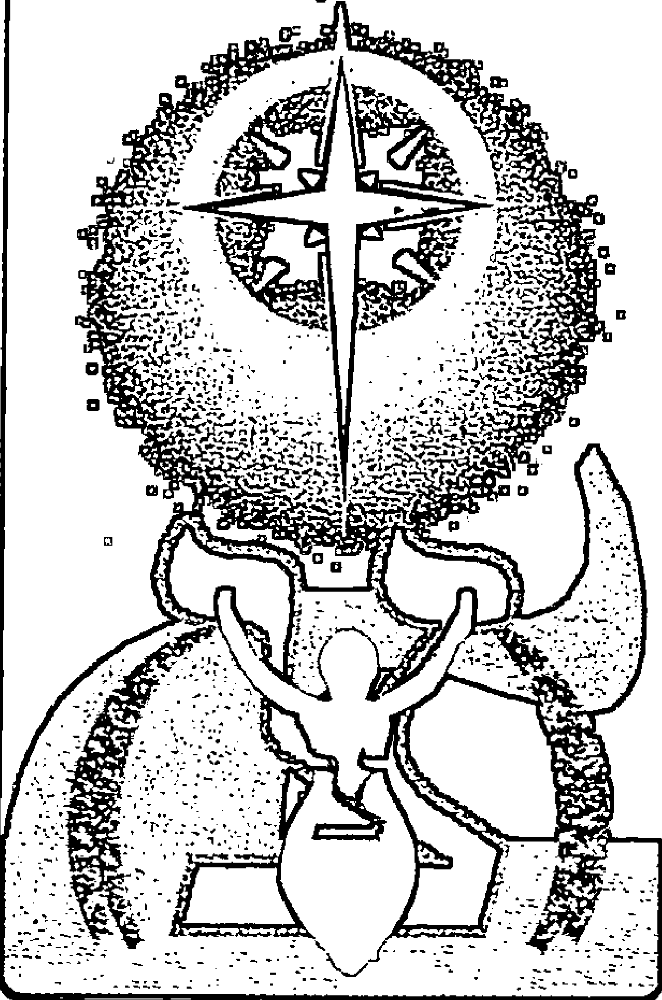

祕儀主題：
**正** 閃亮的日子
**逆** 星之隕落

各式別稱：
女神之星、大犬星、天狼星、伯利恆之星、希望。

牌序定位：
第十七階大祕儀，從無中再生有，過去歷程的證明，即將達到終點的契機。

### 祕儀數序定位

### 數字奧祕

17 是同時具有美感和理性的數字，也是精神和物質的交界。7 呈現出美感和銳利光芒，而 1 呈現孤獨之光，總基數 8 因而升級為精神新能量。1 和 7 搭配，表達出寧靜祥和以及人道理想，此即遙遠的星光。

#### 象徵法則

星光是黑夜中的光芒，象徵心中的希望和期待，是遙遠的目標與方向。美麗的光輝象徵寧靜祥和的現在，是拯救的心願，救贖的許諾，一種精神心靈層面的契約。天上的星呼應地上的國度，猶如荒漠中的甘泉，為內心的淨地與歡欣的樂土。

### 內涵定義

星星是心中願景的表露，是渴望也是理想。星星懷有最初的梦想，也是一種孕育，代表必須以信心和智慧達成。星亦是精神糧食，是靈丹妙藥，是內心不滅的明鏡。這張牌偏向心靈的滋潤，對目前實際面的影響較弱，為未來更美好的保證。

### 正位實占解釋

- **人際交誼**：祥和的交誼與群眾關係，溫馨和諧的場合或氛圍。
- **戀愛情緣**：唯美的心靈感情，不是熱情如火，但卻亮眼而令人稱羨。
- **事務進行**：事務緩慢平和的進行，未來成功耀眼的希望。
- **金錢物質**：眼前沒有實質收穫，著重於未來的保障。有利的投資、絕佳機會。

### 牌義來歷變遷

#### 涵義演變

古塔羅致力於表達出希望和真理，成爲光明願景的代表牌。偉特的占卜定義雖然保留了這些，但加入了一些很負面的作用，包括損失、竊盜、自暴自棄，或許是由夢幻不實、蒙昧不明的涵義推論出來的。

然而偉特稍後時期，正位置皆調整爲正面意義，包含信心、樂觀、滿足、愉悅、洞察力、靈感。對未來而言，是個好預兆，也是精神上的戀愛。另外還代表過去和現在的時間交織，在慾望和工作、希望和成果、愛情和表達上的適度均衡。雖然都不是很強勢旺盛的作用，但也都是很美好的意義。

星星牌特別表示占星學以及其作用影響力。現今的解釋原則上則是：未來是美好而值得期待的，因此現在充滿了希望，並能夠知足及安心。

#### 正逆轉折

偉特對星星逆位的定義有兩大走向：一是自大、傲慢，這是逆位過度原則；另一是虛弱、無力，則是逆位弱化原則。偉特稍後時期整合了之前的差異性，包括願望難以實現、失望悲觀，以及運氣不好、缺乏機運。感情不夠美好或符合預期，也有結束分手的意味。不過又有其他不同的意義，像是不平衡和頑強固執。

#### 逆位思考

現今的逆位意義，以失望遙遙無期的等待爲主要解釋，較能與正位置有對比呼應。星星逆位的解釋重點在於，期望與實際層面之間的差距。遙遙無期的等待，是一種執著也是一種迷惘，離現實很遙遠。然而失望和落空也是註定的，到時就會回到現實面了，而心中將感到極大的落差。

### 逆位實占解釋

- **人際交誼**：過度期待、希望落空。輕浮的態度，不真誠的情誼。
- **戀愛情緣**：自作多情，自以爲是的情感。虛幻的戀情、絕望的心情。
- **事務進行**：不如預期，失望的結局，失落感。成功希望渺茫。
- **金錢物質**：財務的幻想空談，兌現遙遙無期。金錢的貪念和慾望，投機的心態。

### 畫面寓意解碼

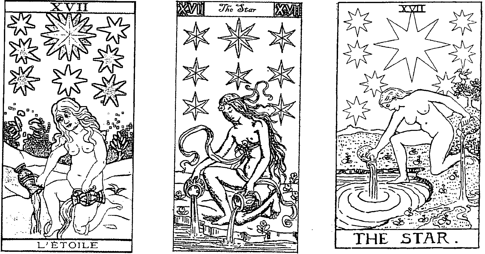

#### 主角人物

星星女神是裸身的美麗女子，星星的化身是女神降世於此。星星女神維持特殊身姿，傾倒源源不絕的生命之水，注入湖泊之中。星星牌主角都是女神，也是閃亮之星，創作者將心目中最美麗的女性外型描繪在這張牌中。

#### 場景布置

夜空星光燦爛，主星更是明亮。寧靜祥和的夜晚，女神降身在寬廣沙漠之中，身處綠洲之畔，水與陸地之間。遠景有些令人驚喜之物或暗藏玄機奧祕，主畫面是綠洲的榮景，既然有綠洲也就表示周遭是一片沙漠。

#### 樣貌外觀

星星女神一直是美麗純真而無暇的形象，女神的神情幽雅，怡然自若。而天上的星星，數量的安排，星的大小和排列，都應有不同涵義。尤其是星體的形狀最為重要，星芒數的意義是不可忽略的，而星的顏色多是螢光黃或銀白。

#### 動作姿態

星星女神多呈現出跪姿，以表示虔敬之心及祈願之心，傾注水流於湖中，是一種賜予和祝福美好，期望明天更好的動作。而這種跪蹲姿勢也較為貼近於地面和水面，顯示較為沈浸其中。她一足在陸地，一足在水裡面，表示接通跨越不同次元。這個動作與節制天使很類似。

### 圖案符號解構

#### 服飾造型

星星女神是純潔自然的，多是裸身登場，不假任何修飾遮蔽。髮型多半是飄逸長髮，髮色也多為金色。

#### 道具配件

星女神雙手持著兩只器皿，這也是煉金術用的容器。壺狀器皿表示具有神秘感，並表示包容萬千，內藏無限。器皿的顏色也可能有象徵涵義，多配合煉金術，金屬元素的顏色，包括黃金和白銀。

從器皿中傾倒出的是生命之水，亦為魔法之水，總之是代表生命的泉源，源源不絕的傾倒而出，象徵女神哺育大地，滋潤與灌溉萬物生靈。水倒進湖裡，也象徵連結大地和女神。

#### 相隨配角

沙漠中的星星女神通常與埃及有關，這樣場景中就會有一隻朱鷺，停落在樹上，等待飛翔。朱鷺或其他鳥類，是智慧和希望寄託的導引，停駐於此，具有提醒的意味。沙丘上的樹木，代表以往種子的茁壯成蔭，無心的種植成為如今的喜悅。

#### 整體搭配

星星牌是寧靜的夜晚，充滿清馨的氣氛，感到舒服美好而有希望。要營造出美麗、亮眼的形象，也是明星、偶像的典型象徵，又有溫馨療癒，純真無邪之感受。

黑夜與明亮的並存，乾旱與滋潤的對比和互相烘托，必須精準巧妙地拿捏。星女和天星之間的交互關係，也可以著墨刻劃。透過水的動線來連結，拉近加強距離。

> 重要性和地位
星星這張牌多會牽涉到異教，因為主要女神都已經出現了，無可迴避和偽裝。所以也必定會透露出作者的信仰，從中看出對異教的態度。
對一般人而言最重要的是，星星的涵義是美感，這張牌正是美學拿捏的代表，也就是重視畫面美感的人，可從這張牌來評斷整副塔羅的美學處理。

## 月亮
The Moon

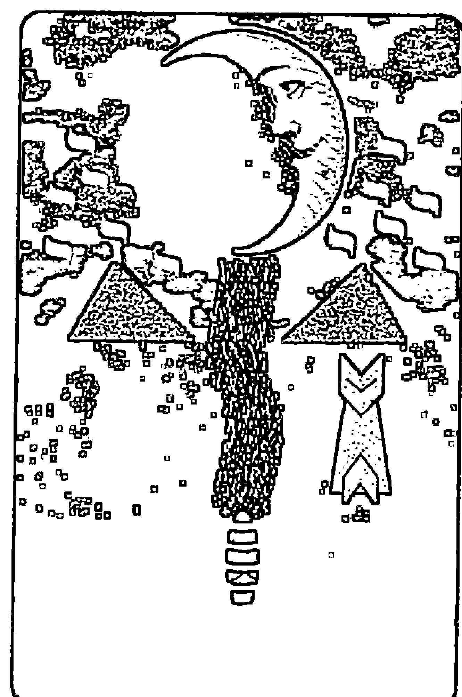

祕儀主題：
**正** 心的黑暗深處
**逆** 度過黯夜

各式別稱：
月夜、黯月、陰陽交界。

牌序定位：
第十八階大祕儀，從有之中再重新孕育的階段，進入大光明前的黑暗時期。

### 祕儀數序定位

### 數字奧祕

18 是力量強大且變動的數字，充滿能量的 1，旺盛堅定的 8，合成基數 9，在交織作用下更形成波動的現象，又蘊含著循環的規律。神祕的 9 象徵夜晚和不安的情境，1 和 8 的感應互動可比擬為潮汐對情緒的作用。

#### 象徵法則

月亮的陰晴圓缺代表人世的悲歡離合。在全然的漆黑之中，一切的景象都是內心的投射。黯夜象徵不景氣的環境，亦象徵著陰暗深沈的心境、恐懼不安的情境。深層的潛意識空間，是慾望的表露和浮現，也能有想像和歡愉在其中。

### 內涵定義

月亮是心中的深層潛意識，是想像力和幻想力的發揮，是神祕領域的探索。月亮是情緒的釋放和意念的奔馳，幻境與虛擬中的時空穿梭。這張牌是情境導向的，有時表現出心境，有時代表真實環境，占卜時要針對問題和牌局陣位而定。

### 正位實占解釋

- **人際交誼**：人際方面尤其詭譎，互相懷疑不信任。或許真有小人作祟。
- **戀愛情緣**：覺得感情關係受到威脅，互相不信任感，各懷心結。
- **事務進行**：充滿恐懼和不安全感，沒有信心。環境險惡，曲折不順。
- **金錢物質**：面臨財務危機，難以掌握情況。環境不景氣，經濟蕭條。

### 牌義來歷變遷

#### 涵義演變

這張牌的圖案其實變化不多，但意義內涵歷來卻有大幅轉折。偉特沿襲以往的定義，解釋為危險、黑暗、恐怖、毀謗和欺騙迷惑，以及隱藏的敵人。

偉特稍後時期也是偉特定義的闡發，意義包含朦朧晦暗、曖昧不明、環境險惡。尤其著重在負面的人際關係，包含心機、虛偽、不光明的行徑、隱藏的敵人、虛假的朋友，以及自私、狡猾詭詐、騙局、中傷、誹謗。

從這時候起，月亮牌就大都偏向負面的意義，而逆位置的意義則較偏向正面。這種方式一直沿用到現在。然而，最新的解釋卻導向更心靈和精神的力量，包含想像、靈感和直覺的開發，而這或許是未來牌義新拓展的方向吧！

#### 正逆轉折

月亮這張牌很特殊的地方是，自早期一直到現在，正位置都明顯的定義為負面意義，而逆位置較為正面。逆位意義是正位的險惡情況有了好轉。

根據逆位弱化原則，偉特開始就認為是「程度較輕微的迷惑和錯誤」，但偉特卻仍保存與正位接近的定義，包括不安、混亂、無常、沉默、黯淡。而在偉特稍後時期，運用了逆位超越原則推演出：識破問題避免傷害，克服慾念和誘惑，輕微的失誤。此外還有一點竊喜之意，包含占到便宜或是不勞而獲。

#### 逆位思考

現今就以「有所好轉」的推演方向，來理解月亮牌的逆位涵義，這樣的方式就是「逆位超越原則」。思維推敲如下：黯夜漫漫已接近尾聲，局勢已經扭轉過來，黎明即將來臨。這時雖仍未見到大放光明，心境卻已經較為安心和輕鬆，只要繼續再撐下去，不久一切都將復甦。

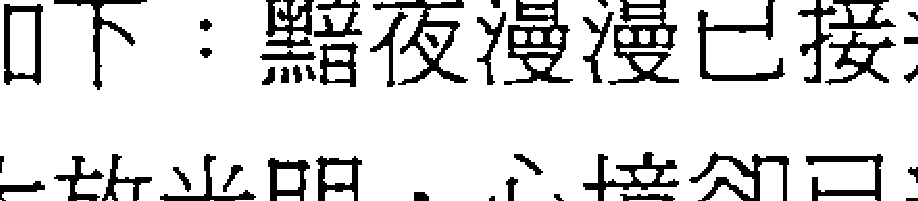

### 逆位實占解釋

- **人際交誼**：重新拾回，拉近距離和互信。化解尷尬、誤會冰釋。
- **戀愛情緣**：感情恢復了信任和了解，修補關係，解開心結。將愛找回來。
- **事務進行**：緩慢從谷底爬升，有所起色，逐漸升溫。提高信心指數。
- **金錢物質**：景氣逐漸復甦當中，從惡劣局勢中好轉。財務有所調整。

### 畫面寓意解碼

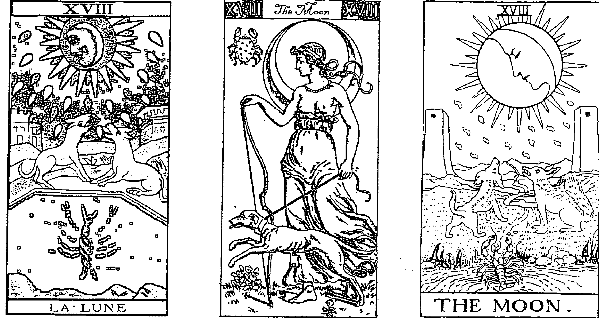

#### 主角人物

無人之境，除了月亮之外，只有地面上的動物及冒出水面的生物。月亮散發出光芒，深夜的地面上，有獸類對月的感應吠鳴，也引發水生動物的浮現。少數塔羅牌以月亮女神爲主角，牌面描繪月神的姿儀，多以手捧彎月之姿出現，此時月亮可能成爲配角。

#### 場景布置

場景在水域與陸地之間，陸上有雙塔之門檻，位於兩側而呈對稱。其間並有一條路，溝通水域和陸地，蜿蜒伸展至雙塔背後的神祕領域。這個神祕領域代表未知時空，另一陌生黑暗的世界。

#### 樣貌外觀

月亮圓盤多被分割成兩半，以同時表示滿月和新月的不同月相。像是人物般，月亮是畫出面容的，不同塔羅有不同的神情，具有兩輪或兩種不同線條的光芒，而有些塔羅設計的光芒數量是有意義的。月亮的顏色多是螢光黃色，也有銀白的月色。少數塔羅是以三面月亮女神爲主角登場，代表三位一體，包含老婆婆、熟女和少女。

#### 動作姿態

狗或狼等犬類動物，抬頭望月，正在吠叫不已，這表示牠們與月亮相呼應，象徵神祕時刻來臨，或顯示獸性的釋放。有時候會將狗擬人化，或以埃及狗頭神取代守衛雙塔的犬類動物，並身著犬首神阿努比斯的專屬服飾。而犬首神持杖面對面站立，彷彿守衛關卡。

### 圖案符號解構

#### 服飾造型

一般的塔羅牌，月亮牌中皆未出現人物，出現的都是動物，因此沒有服飾可討論。若畫面是以月神為主角，則比照神話中的裝扮，大多數是狩獵裝扮，但也隨繪畫的時代而有變化。三面月神則依照年齡層差距，服飾也有所不同。

#### 道具配件

這張牌沒有人物，也就沒有道具和配備。雙塔是場景，也可算是配件，代表不同領域交接的地界，也具鎮守觀望的功能。某些牌的雙塔具有窗戶，窗櫺表示了透視的作用，也是空間穿梭的介面。

場景的空中會有一些點狀物，是露滴或月亮的眼淚，也是上帝之指。場景中的小徑也在此探討，代表通往遙遠未知領域的歷程，連結了兩種境地，蜿蜒曲折就是路途境遇和歷程的寫照。

#### 相隨配角

地面上及水裡面的生物們，都是月亮牌中的配角，但也都可以算是主角，因為除了月亮，沒有其他主要人物出現。螯蝦類的水生動物，正從水裡探出頭來，奮力上岸往陸地攀爬，欲沿著小徑朝向塔後的遠方前進。這象徵了最底層的潛意識，將浮現出來而具體化或消失。

#### 整體搭配

黯淡的月夜，夾帶著詭異恐怖陰森的氣氛，蒙昧不安的力量在其中蠢動。月亮掛在夜空當中，透過深沈顯露光芒，呈現引誘的作用。地面上的景物呈現對稱於中間的安排，雙塔、狼與犬各居兩側，小路及螯蝦在中間。雙塔之後，是最神秘之處。前景更有一灘水域和岸邊，畫面層次分明。

> 重要性和地位
月亮牌的變化不大，如果真有差異，那麼在畫面上和牌義上都會相差很大，一種是負面黑暗情況，一種是精神奔馳，這兩種方向表示這副牌的心靈走向與態度，是著重現實占卜還是心靈感應的風格。

## 太陽
The Sun

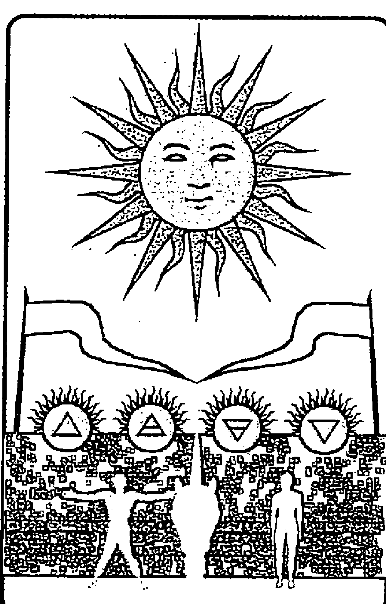

秘儀主題：
正 太陽下的新鮮事
逆 日趨沒落

各式別稱：
太陽之子、永恆青春。

牌序定位：
第十九階大秘儀，第二層級的最高階段，是極致的頂點，如日中天，大放異彩的時期。

### 祕儀數序定位

### 數字奧秘

19 是日月軌道交點的運行週期數字，更是圓周的根號數字。1 的能量和 9 的精神性，都屬陽性而具有火力，將熱能轉變成光和明亮。加總基數重複了 1，是循環而持續的熱力四射，足以代表太陽。

#### 象徵法則

太陽表示了光明磊落和坦然，樂觀開朗與大方率直，意味著正面的情緒和態度，主動積極進取，開展能力強，代表熱情活力、興旺繁榮，也象徵自由、解放、純淨，愛心以及普及的博愛精神。

### 內涵定義

太陽比擬為積極進取的人生，生命應有的展現，能量的極致發揮，代表光明的境界，敞開的心胸和溫暖及熱情，能夠攤開一切而透明化。然而總有陰暗的存在，那是角落的圍牆。太陽是純真誠摯的情感，卻也須了解烈日下的確難有細膩感受。

### 正位實占解釋

人際交誼：人際相處開朗大方、交遊廣闊、隨和快樂、光采四射。
戀愛情緣：特別代表熱情洋溢、關係純粹而光明、真摯而愉悅的戀情。
事務進行：前途光明、欣欣向榮。旺盛、興隆。達到高峰、成就非凡。
金錢物質：資源充足、繁榮成長、大豐收。財務拓展提昇、大發利市。

### 牌義來歷變遷

#### 涵義演變

古代的畫面在太陽底下有著兩個人。如果是兩個小孩則意義偏向於無私的友愛，如果是成年男女則是一對戀人。偉特改為只有一位幼孩乘著白馬，比較強調獨立和自由純真的特質。如今的太陽牌大都不脫於這兩種模式。

但無論畫面如何設計，意義都頗為一致，因為大都根據西方傳統上賦予太陽的各項象徵：太陽本就具有溫暖、真誠的特質，也代表精神力、生命力，事業上的成功和旺盛。延伸領域是戀愛、情侶、婚姻、幸福美滿的生活、物質的享樂，也有藝術上的成果，當然與小孩也有關。

偉特稍後時期則將意義稍向精神面移動，表示為單純的喜悅和精神的滿足，但前期的各項意義皆仍保留，這種解釋法一直沿用至今。

#### 正逆轉折

偉特對太陽逆位置的定義，是依照「逆位弱化原則」推導而來，與正位同樣狀況但感覺較輕微，仍屬於正面的意義，只是比較沒那麼旺盛。不過仍沒有明白指出走下坡的意思。

偉特稍後時期的觀點，則傾向於「逆位反向原則」，解釋為原本的美好景況，變成不快樂、孤單寂寞，可能計畫中斷取消，甚至婚事不成或破裂。當然一定還是保有「逆位弱化原則」，有熱力消失、沈寂或陰霾之意，另外還有晚成、遲來的盛事之意。

#### 逆位思考

如今的逆位，就是以太陽在中午運行到天頂之後，轉為開始下降做為象徵，影射為一切都不如從前旺盛。如日中天之後總會開始下滑而終至隱沒，將情況解釋為在走下坡或逐漸沒落，也可用太陽遇到陰霾。這些都強調一時的落寞，但還有復甦的可能。

### 逆位實占解釋

- 人際交誼：原本美好的友情疏離淡掉了，友誼缺乏經營，日久生疏。
- 戀愛情緣：戀愛的熱情減退，感情已經降溫，樂趣和刺激不復存在，逐漸走向平淡。
- 事務進行：不再那麼活躍或旺盛，趨勢在旺盛後逐漸走下坡。名氣聲望不熱、不紅了。
- 金錢物質：財富不如以往繁茂豐盛，收入逐漸減少。

### 畫面寓意解碼

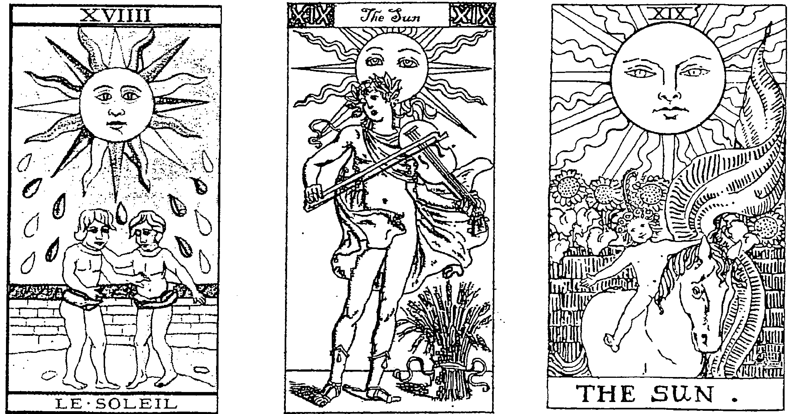

#### 主角人物

太陽之子是純真無邪的赤子，是生命精神能量的投注凝聚體，極少數塔羅是描繪太陽神之類的人物。純真的孩子在太陽底下，可能是一位騎著馬匹躍進，另一版本是兩個孩童相聯繫，也有可能是一對相愛的戀人。

#### 場景佈置

場景在光天化日之下，但人物的身後或者場景中多半都有著一道圍牆，天空晴朗無雲，並呈現出太陽的熱力。太陽下的新鮮事兒，就這樣攤開在畫面上了，怎樣安排就是作者想要表達的內容了，有些塔羅牌是高山遠景，有山襯托太陽，並呼應陽性的作用象徵。

#### 樣貌外觀

太陽要擬人化的畫出臉型和表情，當然大都是笑臉，也就是那種「太陽公公」式的笑容。小孩童稚健康，表情自然而愉悅，展現出天真無邪的笑容。兩者的關係如同父親與小孩般，也有如聖父與聖嬰的對照。

#### 動作姿態

騎在馬上的小孩，敞開雙手放鬆身體，是暢快輕鬆的喜悅。他手握著旗杆，展現初生和年輕的力量以及生命的奔放。小孩安然坐在馬背上，駕馭的方式就表示超越距離和物質牽絆，多是自由的關係。如果太陽底下是兩人，會表現出兩人的友好或親密，朋友之間牽手，或戀人之間的擁抱。

### 圖案符號解構

#### 服飾造型

小孩通常沒有穿衣服，純白的身軀，而且有一頭金髮。有的小牌頭上戴著向日葵花圈，而其實髮色金黃本身也能呼應於場景中的向日葵。有的塔羅太陽下有兩位人物，造型變化就更豐富了，但身上則多半會穿上簡單的衣物。

#### 道具配件

紅旗代表揭示熱情博愛的思潮，以及熱血精神。旗幟呈現飄盪之姿以展現動態，配合行進不停的特質。旗桿是一種堅定的決心，也是揭示和宣揚。圍牆在太陽牌中有其深入寓意，一般表示界限和藩籬，僵硬堅固的阻隔，不同空間區分的界線；也隱喻為時代躍進，可賦予這張牌奧祕、故事、看不見的背景和暗影於牆後的世界。牆多為石塊或磚塊材質堆砌的灰白牆面，表示冰冷與強硬的隔絕，能夠阻擋光熱和生命力。

#### 相隨配角

塔羅中以天體為名的牌，主角皆是二元化的，地面上的人物算是有這個星體的分身，太陽牌就是這樣的結構。這麼一來，最重要的配角就是馬匹了，牠是太陽之子的坐騎。多半小孩會騎乘白馬，馬身巨大與小孩差距甚遠，跳躍的姿勢載著小孩移動。馬與小孩的關係不是互相控制的，其間沒有韁繩羈絆。而如果太陽底下的場景是兩人組，應該就沒有坐騎動物了。

太陽牌常會出現幾株向日葵，多半種植盛放在牆上。向日葵也是太陽的象徵和化身，與太陽同樣的涵義。其實意義有點重複，只是做為陪襯或表示回應，多會想辦法賦予更多涵義，例如採取四朵向日葵來比擬四元素之統合。

#### 整體搭配

營造光明燦爛輝煌，以及熱力四射、熱情洋溢、精力充沛、活力十足，一片旺盛繁茂的景致。晴空呈現了自由敞開的精神與博愛的情懷。太陽底下是欣欣向榮的花園，小孩在園地內外遊走。圍牆是重要場景，作用是表示有藩籬，並且有著不為所知的另一面。

> 重要性和地位
看來是自由發揮的一張牌，畫面中的許多要素可以選擇，這一來也就影響了意義，甚至牽涉到全副牌的設定。

## 審判
Judgement

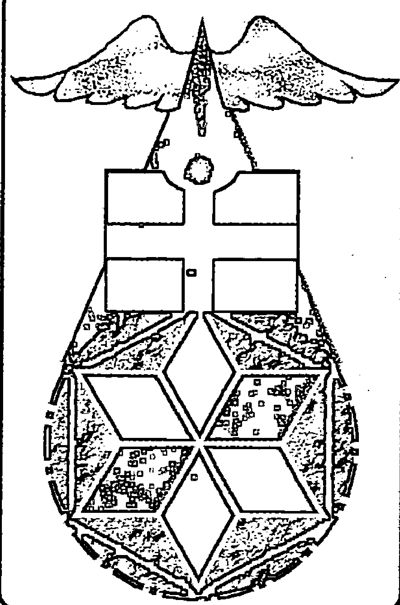

祕儀主題：
正 末世的謎底
逆 在劫難逃

各式別稱：
最後的審判、末日審判、
重生的自我、輪迴、業力、
劫期。

牌序定位：
第二十階大祕儀，第二層級
的結束，揭示最後的審判，
開啟更新層級的可能。

### 祕儀數序定位

### 數字奧秘

20 是一個循環的完成，象徵精神層面的週期輪迴，適足代表最後審判。20 為 2 的強化和提昇，轉化為自我與精神世界的接通，是信仰關係和道德互動的共同契約。而所謂的審判正是眾人齊信的願力。

#### 象徵法則

審判代表心靈感召和內在精神信仰、宗教情懷及道德觀念。其中宣判和承受的兩方並不對等，必須自身勇敢面對而後因應和修正。這是一種深層的省思，有如接受福音和洗禮，帶動調整和更新，代表著考驗人生的各種關卡。

### 內涵定義

審判是內在的道德意識，心底最深處的聲音，由於觸動了某一道底線，從而喚醒對自我的警醒，徹底而全面的省思批判，而目的在於朝向多重層面的圓融，重塑嶄新的生命樣態。占卜應用上，表示遭逢難題或考驗，必須深入反省。

### 正位實占解釋

人際交誼：必須審視自己對待他人的方式，評估如何改進以修復彼此關係。
戀愛情緣：感情相處遇到考驗，省思自身的缺失，試圖補償和挽回。
事務進行：遭遇到挫折阻礙，須檢討過去、糾正錯誤以度過難關。
金錢物質：面臨金錢財物上的損失或遇到難關，有機會尋回或拯救。

### 牌義來歷變遷

#### 涵義演變

這張牌的主旨看似和宗教議題特別有關，其實不須視爲某些特定宗教，因爲各類宗教和信仰都具有警世觀念，落實爲人心的最終道德，人們須根據這些道德而更新和提昇，這就是審判的意涵。

偉特定義正位置的解釋爲：局面的改變、革新、復甦、演變。偉特稍後牌義整合爲：自省自制，以免影響他人；贖罪、悔改和原諒；活化、重生、改善、進展、升級；面臨審判、通過判決；衡量時機妥善運用，珍惜機緣。而這些意義就這樣一直沿用下來。

現今正位置的占卜運用方式，則是以審判象徵所面臨的問題和考驗，正位置就是度過了難關，而這是因爲自身的領悟和決心調整。而審判的關卡來臨可說是早就註定，也可視爲過去業力累積所致，甚至因果報應的意味比塔這張牌還強烈，占卜時審判所代表的事況也較具針對性且個人化。

#### 正逆轉折

偉特的逆位定義有點與正位混淆，意義包含決定、決心、宣告、判決，以及協議，但也包含無力、怯懦，這跟決心的涵義是不搭的。

偉特稍後的意義爲：延遲、耽誤、蹉跎、無法面對現實、失望，其實都是延續之前有關無力的解釋。其他的意義也包含離異、分開、感情的疏遠，以及不正當的行爲，像是盜竊等。

#### 逆位思考

如今審判逆位承襲的是沒有徹底的決心，因而沒有通過考驗，導致不佳或不願見到的後果。這個逆位不當原則的推演方式，則沿用至今。與正義牌很類似的運用方式，審判的逆位置一樣是道路的錯誤，不過這時是自身心態有問題或調整不當，從而導致外在的不順暢。而所遭遇的是一個無法突破的難關，或者難以通過這個考驗，具體事態狀況的描述則根據問題和牌局來對照。

### 逆位實占解釋

人際交誼：歷經患難，友誼人情終見分曉。誤會難以冰釋，裂痕無法彌合。

戀愛情緣：情關難過，逃不離情劫。感情走到盡頭，關係破損難以挽回。

事務進行：無法通過考驗，持續受到磨難。無法避免的劫數，在劫難逃。

金錢物質：財務問題、經濟危機、金錢風波。調度困難、週轉不靈。

### 畫面寓意解碼

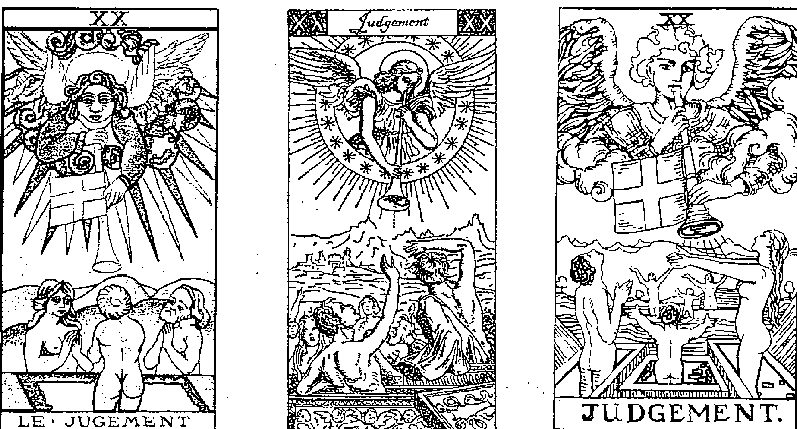

#### 主角人物

審判天使傳遞靈魂深處的聲音，上帝或最高神祇的使者為末世審判或末日終結而降臨，宣示神旨教義或傳達天意。審判天使在上，浮現在雲端，吹響號角，宣告醒世之音。而原本沈睡在地下的人們甦醒，起身伸展。

#### 場景佈置

地面上多半是冷絕之地，冰寒的山色和空氣環繞，地面也呈灰白。周遭多半會出現墓園，其中可能還有石棺打開著。無論如何，地面上一定要有呼應天使宣告的場面，甚至可排列出圖形陣式。

#### 樣貌外觀

天使有著嚴肅的神情，具剛烈的性格，又存懷憐憫之心。許多塔羅中都有從地下起身的人們，多為一家人，父母和小孩，也會有一家以上的畫面。地面三人組的表情都喜悅，因接受福音而有了生氣，人們之間的眼神，互相聯繫有關懷之意。這些人各代表生命或某個層面，如身心靈、男性面、女性面、童真或世故面。

#### 動作姿態

天使雙手持號角，正在吹奏著，將聲音傳送出去，天籟直下雲霄。天使持號的角度和旗幟的飛揚方向，會根據畫面而調整。地面上的人們歡欣鼓舞，獲得重生而充滿活力，伸出雙手好似在迎接新生，或是互相擁抱，彼此增進了連結。男女小孩各有不同的動作，卻又好似相互配合呼應。

### 圖案符號解構

#### 服飾造型

審判天使的服裝多半是簡易的素袍。頭髮顏色和形貌，與所具性格息息相關，多半帶有威儀。天使的背後有羽翼，顏色則暗示出位階或職務，像紫色即表示高階。地面上的人，通常呈現裸身且晦暗或蒼白，象徵從死亡狀態下復活。

#### 道具配件

號角具有宣布警醒的作用，這樣的樂器，多是宗教中所常用的。這樂器是神的發聲器，是天籟的振動，是福音的傳遞。啟示錄的預言，就是以天使吹號角宣示末世審判來臨。旗幟通常掛在號角之下，揭示這個審判所秉持的信念，通常顯示在上面的圖案中。

旗幟上最常見的圖案是十字，表示救贖的意念。而旗幟底色和十字符號的顏色，都有個別和組合的不同涵義。石棺、墓穴等，都象徵著對人們身心靈各層面的限制和框架。

#### 相隨配角

審判牌中的角色，主客不易分別。宣告審判的是天使，地面上的人們響應著，卻是代表當事人。從地底起身的人通常是一群，他們或許是三人組或許是雙三人組等群聚。他們的動作頗為一致，沒有個別的性格和色彩，象徵失去真正的自我，由此算是臨時演員配角身分，不過卻也是畫面中的重點。

#### 整體搭配

多重世界次元同時呈現並有連結，場景和地面多為灰暗無生命的場景和色調，表現出冷冽冰寒的境地，以及生命的枯槁死寂。然而其中天使和每位被救活的人，動作卻都具有動感，並相聯繫呼應，尤其地面上的人可能排列出某種符號的形狀，有其象徵意義。整體而言，這些安排都算是種特別的張力營造。

> 重要性和地位
審判這張牌，是塔羅中重要的環節，由此與信仰和宗教層級連結，甚至討論到靈魂重生等深入的議題，也從而增添塔羅牌的正式及嚴肅性。由畫面中審判的模式，可看出作者對於信仰觀念的態度，甚至明指其偏向何種宗教。若是輕鬆而不確定，則表示崇尚新式或自由的信仰和觀念。

## 世界
The World

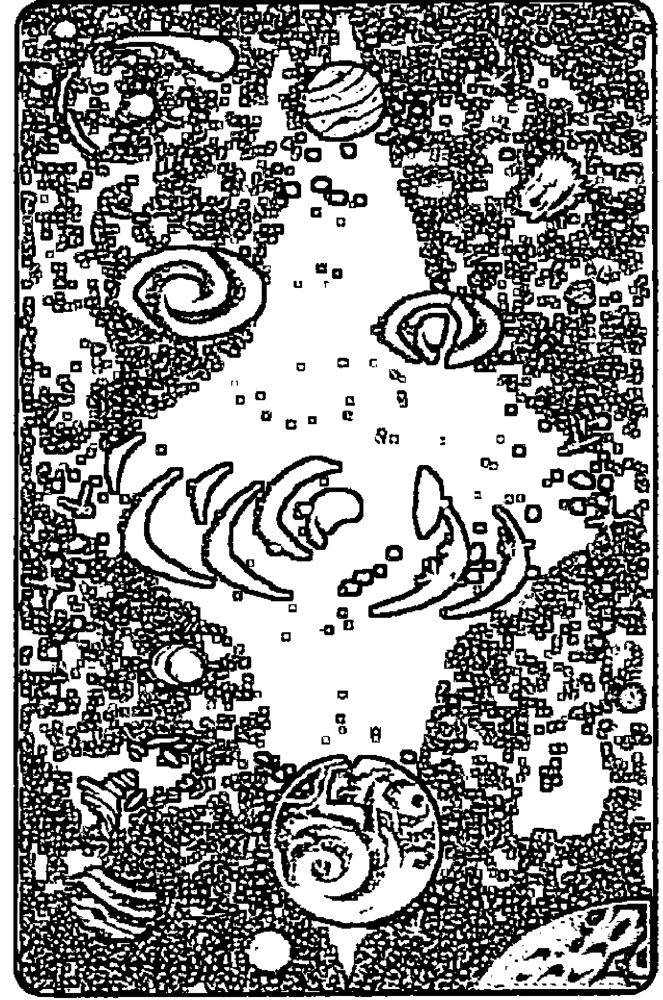

祕儀主題：
正 預約聖境
逆 未臻至境

各式別稱：
宇宙、時光、真理、純然絕對、大功告成。

牌序定位：
第二十一階大祕儀，最後最高的層級，再晉級增添，最後而最新的新生與未來。

### 祕儀數序定位

### 數字奧秘

21 代表周全的世界，蘊含欣欣向榮的意味。加總基數為 3，數字 1、2、3 到齊更呈現整體性。21 的尾數 1 具有駕馭四元素的功能，由此帶出隱含的 4 和再變化出 0，將最多數字囊括其中，也能呈現世界居於極致之理。

#### 象徵法則

一段旅程的終點站，也是整體人生重要的中繼站，代表到達與完成。大功告成更是最高層次或最美好完善境界的達成，象徵實際面中各種階段的完滿句點，意味著畢業、樂退、升學、高遷，也代表多元蓬勃發展，還有和諧及溝通。

### 內涵定義

世界是心靈最高層的境界，不受任何羈絆而渾然天成，是自然的韻律和宇宙的節奏，隨心所欲的寫照。亦代表理想的終極點，盡善盡美的功成圓滿。這張牌四元素俱全，占卜時表示各層面周到完整，樣樣都是美好的。

### 正位實占解釋

人際交誼：心胸開放、接納多元。交遊廣闊、相處熱絡而融洽。
戀愛情緣：戀情幸福美滿無缺憾，尤其擴及到實際面的助益。修成正果。
事務進行：進行順暢，高度成就。眾人共襄盛舉，有貴人幫助、全面勝利、旅遊順暢。
金錢物質：輕鬆獲得、福祿雙至、圓滿豐收。真正的富裕，連心靈也滿足。

### 牌義來歷變遷

#### 涵義演變

這張牌自古以來都是美好正面的意義，自由心靈的世界女神說明了一切。神秘學家加深其內涵解讀為純然絕對的真理，對偉大使命的領悟，以及沈浸在神聖或神秘中。這張牌也一直是人性的象徵，意味永恆生命的報償。

偉特的解說已根據牌序定義為盡善盡美的終點、世界的復甦、完美的最高程度。高層的精神境界——狂喜以及自我覺知，對占卜的事項，明白指出了旅遊、遷移等涵義，代表任何航行和出發、啟程，也包含了飛行。當然，也不可或缺成功和現實面的達成，得到各種成果和代價。

偉特稍後添加了才華洋溢、能力卓越、盡職勝任之意，然而卻有依賴、依附的缺點。不過現今的解釋，這些負面作用已經都放到逆位置去了。

#### 正逆轉折

偉特定義將正位的移動在逆位變成靜止不動，也延伸為不活躍和一成不變，或是受到限制而不自由。偉特稍後正逆位置著重在完美與否的差異：不完美、缺憾、功虧一簣，未能完成預期的目標。另外像是沒有遠見、失望、落空，也是其中的涵義，這些多半是以逆位弱化原則推演而來，也是沿用到後來的涵義。

#### 逆位思考

如今的世界逆位，主要就是以逆位弱化原則，以及逆位反向原則來推演的。世界逆位在運用上無論是人際、情感，還是事件狀況、物質條件，意義都是不夠完整、不周全，無法達成目標。各層面難以到達巔峰或最高境界，內心有所缺憾以及不安。而特別在旅遊、行動和溝通交流方面，也有阻礙和不順。若要解釋成整體傾覆或全毀也可以，不過這麼一來會顯得太過嚴重了。

### 逆位實占解釋

人際交誼：總是難以交心、不夠朋友、交情不足。關係有嫌隙，可能不歡而散。

戀愛情緣：感情獨漏重點要素，不滿足感或不夠幸福。不明確的交往、不完整的關係、不完美的結局、收場令人失望。

事務進行：稍有缺失，不夠完整或者混亂。關鍵時刻只欠東風，導致功虧一簣的下場。難以達到目標，最後草草結束。

金錢物質：營運失誤、週轉不靈。資源短缺、物質匱乏。認賠以保大局，過度注重實際而忽略了其他方面。

### 畫面寓意解碼

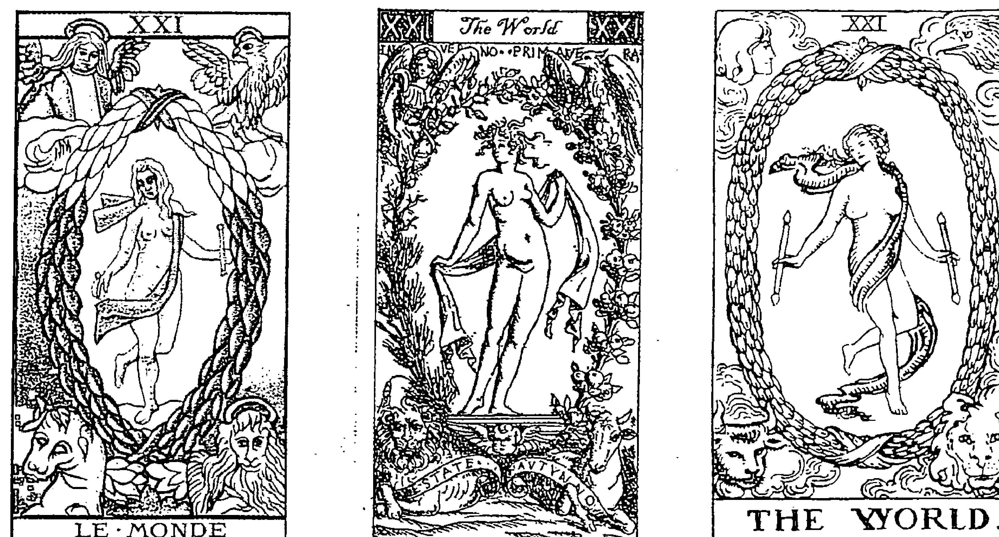

#### 主角人物

世界女神呈現完美無瑕的女性身姿，象徵心靈的自由境界。少數的塔羅是手捧世界、地球或宇宙的女人，而有些塔羅則以小孩為主角。
世界女神跟隨宇宙韻律跳著自由之舞，在花圈之中旋繞。四活物也跟著韻律擺動，好似齊聲歌頌世界人間。

#### 場景布置

在無限空間中，以花圈圍繞一周，女神通常位於中央。四活物或四元素象徵分布於四角落。有些牌是勾勒世界或地球的樣態，以星系或宇宙為場景。而無論主體差異多大，也都盡量呈現四元素於背景中。

#### 樣貌外觀

世界女神是完美的，是心中的理想化身。女神臉型端正典雅，身型姣好而曲線優美，她的表情柔和滿足，眼神超脫而喜樂。

#### 動作姿態

女神沒有固定的「立足之地」，必定是處於動態，以舞姿律動，踩著和諧韻律宇宙之舞蹈。這個姿勢須極力呈現，讓人感到很優美。在這裡四活物一樣顯現出喜悅的表情，且顏色和形象鮮明。四活物只有出現上半身，有的牌是從雲裡冒出，並都不再面對經籍。

### 圖案符號解構

#### 服飾造型

世界女神是裸身的，但因為正對畫面，有時也會有少許衣物遮蔽，所以可能根據該副牌的訴求對象尺度而有變化。
不過通常身上還是有半掩的布條，這絲絹也呈螺旋狀纏繞，隨女神舞姿而轉動飄逸。女神頭上的花環，是由桂冠所組成，通常與圍繞她的花圈相同材質，兩者彼此呼應而形成無限空間循環。

#### 道具配件

女神手上的雙杖齊握著，表示統合一切二元對立，抵除一切界線。雙杖和魔法師的魔法杖很類似，其實也代表所有牌中的各種雙柱，甚至許多二人組和其他成對的組合。
女神的能量以奇幻的方式統合了所有祕儀的內涵。桂冠花圈圍繞女神身旁，象徵著光榮與和平，也表示世界的連線、宇宙的層級、空間和次元的標示。

#### 相隨配角

世界女神並不孤獨，配角就是角落的四活物，這次形象色彩鮮明，頭臉部放得較大，通常看不到全身，也不見在誦讀經書。他們代表四元素和四方方位，或者關聯於四合一的各種象徵。四活物也隨著女神起舞般悠遊自在，世界由此而繽紛。
四元素或四活物的位置排列可能有其講究，對應於四方方位，不同的塔羅牌設計和理論亦不相同，各個活物的位置通常相同於命運之輪牌中的四活物或四元素，然而呈現方式會突顯出和命運之輪之間的差異。

#### 整體搭配

天空宇宙無邊無際，圓形的花圈更增加空間感，多半置中或位於中央，而主角更在圈線結界內，這是在說「女神為世界的中心」。盡量會營造出空間感，讓人感覺到畫面更廣大，卻又緊密協調和融合，表現出空間與次元變化多端。

> 重要性和地位
世界是真正壓軸的一張牌，因而格局也是最大的，揭示最終的目標和宗旨，幾乎就是整副塔羅的寓意了。

## 愚者
The World

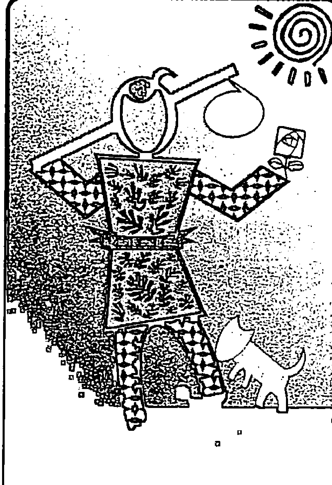

**秘儀主題：**
正 大智若愚
逆 裝瘋賣傻

**各式別稱：**
愚人、傻子、傻瓜、不智的人。

**牌序定位：**
第 0 階大秘儀，特殊的定位，一切的開始之前，也是一切的結束之後，為混沌未明的階段。

### 祕儀數序定位

### 數字奧秘

0 為無性或中性特質，即是空和無，代表未進入狀況之前，一切未知不定，充滿神秘和無限的潛能。0 也等同於 22，是個神奇潛能的數字，潛力更為強大，但也可能無法發揮。這張特殊祕儀就是如此多變和不確定性，因此以定位不明的 0 為標誌。

#### 象徵法則

這張祕儀為無與空的原型，演繹成智和愚的交互辯證與弔詭，也是原始狀態與空無之境，象徵最純然的情況，渾然天成的姿態，代表純淨和放空、率意隨性、虛心和勇氣，可能蘊藏神秘潛能。

### 內涵定義

愚者具有無比信心和勇氣，心中沒有任何成見。他一無所有，也別無所求，腳步輕盈然而也是虛浮。他或許心高氣傲，甚至莽撞無知，但內心保持純淨的狀態。既然愚者毫無禁忌，從不多想什麼，在占卜上也較難評斷好壞。

### 正位實占解釋

**人際交誼：** 隨性不掩飾，有時候容易得罪人，有時候則被認為是真誠直接。
**戀愛情緣：** 面對愛情沒有多想什麼，呈放空狀態。無對象也不考慮戀情。
**事務進行：** 對事務進行不太了解，有時候容易失誤。
**金錢物質：** 難以掌握，由於漫不經心的態度，可能會遺失或忘記。

### 牌義來歷變遷

#### 涵義演變

這張牌一直是受到注目的焦點，但也是變動最大的一張，歷來塔羅家都關注它的排序定位，這也相關於涵義問題。一直到神秘學家時期，愚者仍被視為因愚蠢而走向毀滅的象徵，這是由於對難以控制和非理性特質的恐懼感。

偉特所定的牌義還是很多負面特質，但他也在圖案上賦予許多神秘學涵義，表示可能具有無限潛能和神秘力量的護持，並不僅是招致滅亡。後來的牌義走向，就愈來愈有深層的意義，而不只是輕浮或興奮躁狂，導向熱心以及天真無邪。現代塔羅界「愚者旅程」的觀念確立之後，更是代表生命勇氣和追尋的意志。

#### 正逆轉折

愚者逆位的牌義比正位更難捉摸，隨著正位置意義的更動，逆位置意義就更為浮動不定了。偉特除了與正位置差不多的意義：粗心大意、輕率莽撞、無用的行為之外，還以逆位反向原則推演：冷淡、漠視和空虛。

偉特稍後時期，逆位仍然不脫這些意義，然而又以不夠徹底勇往直前的思考方向來推演，導出猶豫不決和躊躇不前之意。而後，愚者逆位便吸收了原本愚者的較負面意義——輕率疏忽，並加入了虛榮以及錯誤決定的意涵。

#### 逆位思考

愚者逆位在解釋上可以有很多變化，是比較自由的，可以設定為比正位難控制些，那其實也就是比較負面。大致方向是揮霍無度、隨便輕率、沒有理性、躁動不安，容易受外界聲音所干擾，產生懷疑而失去信心勇氣，反而有不利影響。另外就是，由於自身的因素或不了解狀況，因而招致危險或損失。

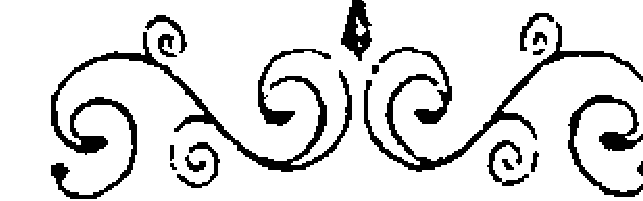

### 逆位實占解釋

**人際交誼：** 輕挑、任性、癲癲、狂妄。輕浮不穩定，不成熟的行為舉止。

**戀愛情緣：** 感情相處上我行我素，輕忽對方感受，自我感覺過於良好。可能是對於關係感到不確定。蠻不在乎自身有無戀愛或桃花。

**事務進行：** 放空、擺爛、大意失誤。沒有主見、莫衷一是。瘋狂行徑。

**金錢物質：** 跌落谷底、起伏不定、盲目跟進。無視危機存在而招致損失。

### 畫面寓意解碼

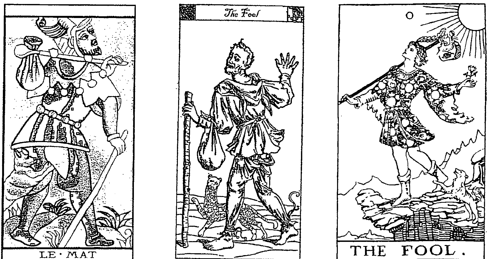

#### 主角人物

愚者是一位年輕的人物，有點中性化，不容易看出性別，更帶著令人捉摸不定的神秘感。愚者漫不經心的行走，踩著雀躍的步伐，甚至輕盈舞動著，他像是正展開一段旅程，只攜帶簡單的行囊和竹竿。

#### 場景布置

許多塔羅牌的愚者，都是踏在懸崖的邊緣上，從背後的山丘可看出其高度如何。有些牌例如埃及系統，愚者是處於深淵的岸邊。總之，是一種臨界線，而另一邊就是危險和未知的代表。

#### 樣貌外觀

呈現天真無邪的樣貌，現代塔羅中，愚者大都是年輕而中性化的。表情多半是陶醉或著迷的樣態，有的是一副心不在焉的樣子。有些牌的人物表情較為兇惡，是較為貶低的愚人意義。另外的特殊表現法，多半是暗示愚者有其來歷或是有所目的！

#### 動作姿態

愚者踩著雀躍的步伐，甚至是跳舞的的姿態。他的雙手在揮動，多半形成敞開狀貌。整體感覺為輕快的走著或暫時停頓，看起來要往前卻又不一定。或許他那種無謂的神態，是一種不為人知的堅定信心。

### 圖案符號解構

#### 服飾造型

愚者通常上半身的穿著特別繁複或花俏，然而邊緣卻有點破損。這個對比也表示愚者的多面性格——不修邊幅的放浪，卻又喜愛花俏亮麗引人注目。這一切看起來愛裝扮的特質，其實是種偽裝。愚者花花綠綠的衣服或許是特殊形式的法衣，上面繡有許多神秘圖案，且都有其神秘學意義。愚者頭上大都有飾品，可能是帽子或是花圈之類，可以推導出其精神意識狀態。

#### 道具配件

愚者的身邊至少都帶著一根棍子，多半是撐在肩上掛行囊的竿。行囊上面繡著一些圖案，具有象徵意義，像是老鷹頭，表示精神能量的轉化。多半認為行囊裡面所藏之物，代表神秘和抽象的意識。有些塔羅的愚者另一手上還持花，這也是增添神秘感的手法，而這朵花本身是情感和精神能量淨化的象徵，因此多為白色玫瑰。

#### 相隨配角

這張牌的特色，是有寵物相隨在後，多半是一隻小狗。寵物會跟隨愚者，隨他起舞，或者對愚者叫，或是咬愚者的腳。牠代表內心深處的潛藏自我，或是精神上或直覺力的指引，對外界現實面的情況發出警示。

愚者牌中可能使用不同動物形象，所表示的特質有些差異。狗偏向保守溫馴，貓偏向直覺冒險，也可以運用較凶猛的動物——小老虎，這時牠就是敵對者，會追咬愚者，表示後面有麻煩的事。敵對者可能會在前方河岸邊，或者另有一隻動物，這配角當然不是寵物，而是塔羅裡少數的反派，扮演危險和傷害主角的角色。

#### 整體搭配

不同塔羅牌的愚者設定不一樣，取決該副塔羅的大秘儀故事，或者說是「愚者旅程」的大秘儀設定。然而都極力營造出愚者輕鬆的神情，迥異於險阻的環境，兩者形成對比和張力，甚至畫面要經營得讓人感到神奇、特別，或者有所期待和藏有蹊蹺。

> 重要性和地位

愚者是塔羅牌中最起眼的代表牌，多半有隱藏整副牌的特殊寓意，最為特殊卻又無限制，能讓作者盡情發揮的一張牌，可以朝想像力擴展，或學理內蘊上的豐富深入，這是看似最膚淺也可能是最具內涵的一張牌。

## MEMO

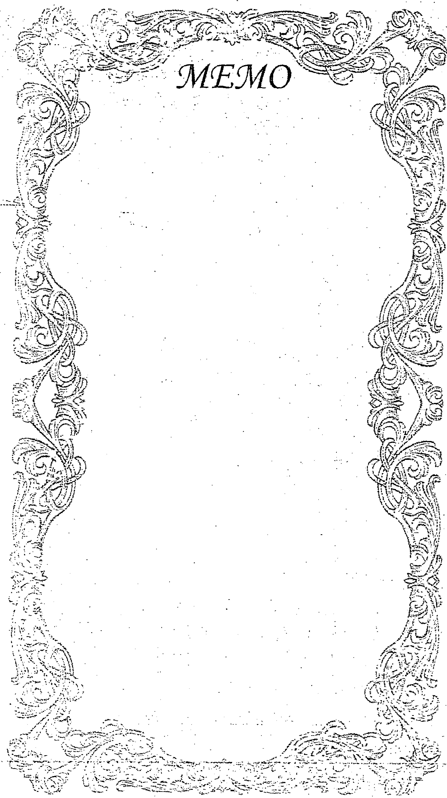

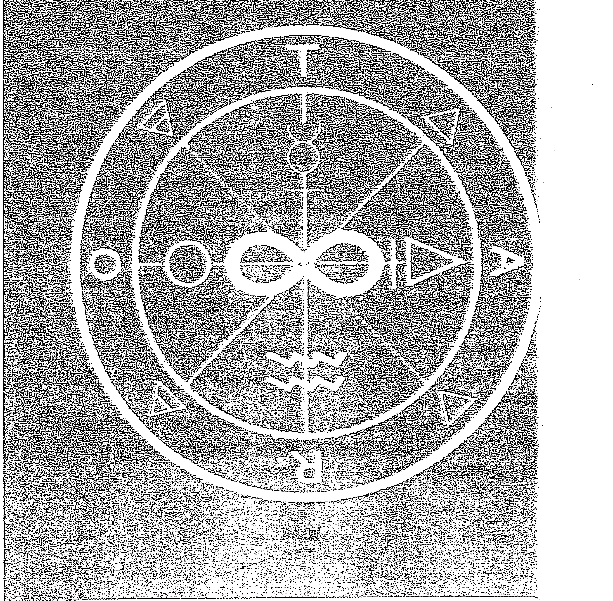

## 四花色解密
*Four Suits*

### 元素花色牌組結構

#### 四元素體系

西洋神祕學重視四元素宇宙體系，認為「四大元素」（Four Elements）是構成物質世界的元素，又可稱為四象元素，等同於四大假合。四元素的中英名稱和符號如下：火元素 Fire △、水元素 Water ▽、風元素 Air △、土元素 Earth ▽。四元素又劃分為陰陽兩個類別：陽性元素包括火元素和風元素，而陰性元素包括水元素和土元素。其實西洋在各個文化層面上，舉凡哲理、思想、宗教、神祕學、占星學、煉金術、魔法等領域，都有四元素體系的觀念，成為共通的精神信念。

塔羅承襲這些觀念，也設定四個小祕儀牌組，對應於四元素。萬物皆歸納為四元素，四元素物質之精華為四法器。元素到法器之間，有一連串的轉折過程。四種法器衍生構成四個花色牌組，對應於人生的四項層面，也從而能應用於占卜。各法器的具體呈現和元素的起始，呈現為四花色 Ace 牌，象徵四種層面的開端。

大祕儀中的愚者象徵無，從無到有的開端為魔法師，魔法師展現了有生萬物。魔法師連結四張Ace牌，通常直接在畫面中呈現四種法器，表示魔法師掌握四元素。西洋也有特別的五元素觀念，而這一串特別的牌組大祕儀，就代表了「第五元素」。塔羅以此方式將四牌組和大祕儀的開端連結起來，表達出第五元素和四元素體系之間特殊而巧妙的關聯性。

塔羅牌上，魔法師表達萬物生成，將五張第一號牌結合，也串連起各個牌組。這種設計就是要強調每張牌之間的脈絡，表現出其間相關性和同源性。下方示意圖用以就是這幾個牌組和祕儀代表的元素關係和脈絡：

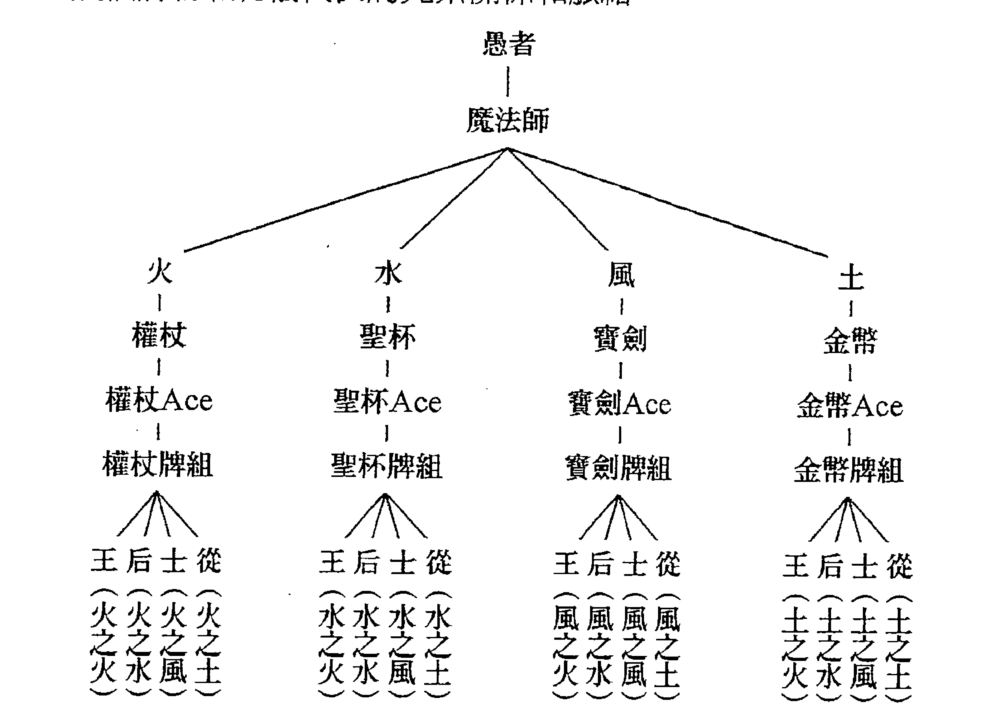

#### 花色牌組對應

塔羅牌的小祕儀分成四個牌組，四牌組各為不同的花色，每種花色選定一個器物圖案做為象徵圖騰，這個器物就是專屬物。花色專屬物的意義通常有關神秘學，亦即各花色象徵代表一種「元素」。每種花色專屬物，都是使用元素的器物，以媒介物連結於該元素，而由此四花色牌組對應了四大元素。

「元素本意」和花色屬物的涵義不盡相同，每種元素各有其原本的象徵意義，也可有直接的占卜作用，但需先了解元素涵義和象徵法則，還有自然現象和擬人化特徵。而元素和專屬物之間的關係，是經過「元素提煉」的歷程而產生連結。專屬物由元素提煉而出，視為元素的精華與轉化物，也是與元素最相關的器具，這過程是元素變化的重要環節，其間的轉折至為重要。

花色專屬物本身有其象徵意義，不同於元素的象徵意義。在占卜時所用以思考和象徵的依據，大多是以花色專屬物為主，並不是元素。因此什麼意義源自於專屬物，而什麼意義源自於元素，是有必要釐清的。

花色專屬物的形態還原成基本形狀，便成為一種符號，為最原型的象徵。而花色專屬物的物質屬性，以及做為日常生活器具的使用功能，是牌組的主要特徵和範圍。這些器具具有其社會意義，由此層面可直接的比擬於占卜上的各項意義，也能更深入理解深層涵義。這四種物品不單為生活和社會中的實用器具，也是在信仰和法術儀式中的四大法器，從這一層面加以理解更能探索其神秘性質。

由這幾層器具用途的象徵意義和隱喻內涵，能夠較完整的了解「花色作用」，掌握整體而多面的「牌組功能」，並能從牌組意義的呈現變化，歸納為一個「牌組主題」，進而了解花色牌組所蘊含的啟發。

### 名目變化

為何四花色會有各種名稱和形貌變化呢？因為其專屬物本來就不是絕對的配置，是依據元素而加以選擇使用的器物。各種紙牌的四花色牌組，包括撲克牌也是，全都連結對應於四大元素。一般塔羅牌的四花色大同小異，專屬物都是權杖、聖杯、寶劍、金幣系統，在圖案或名目上都會小有差異。有些塔羅牌將四花色系統全數更動，也有採取其中某花色有所改變，也可能是其他的變化方式。

#### 花色元素的相互關係

元素或花色順序有各種不同的排列方式，代表的關係網絡也就有所差異，淵源於各種不同的觀念和流派，皆有其成立之理。煉金術系統一般認為，權杖與聖杯對立，寶劍與金幣對立，權杖友好於寶劍、相安於金幣，聖杯友好於金幣、相安於寶劍。這些理論透過特定的使用法，根據牌局分布來判斷某張牌的元素花色能量被加強或削弱，而成為尊貴（well dignified）或失格（ill dignified）狀態，然後得出進一步訊息。

## 權杖花色

### 花色來由

權杖，是根源於火元素的牌組花色專屬物。

### 元素本意

火是一種能量，是每種物質皆具備的元素，是隱藏的能源或者呈現為動力。火元素因此被視為一切事物的溫度和熱力。火元素象徵生命、能量，推導為人的存在感受、意識層面，以及意志力。火元素沒有實質的形體，卻具有光和熱的現象，變化性也很大。

火元素具有火熱的特質、陽性的原則和男性特質，亦具生命活力的功能，如同人之間互動的熱情，象徵流動和變化性，可比喻成人的脾氣與行動反應。比擬為對人們性格的影響，就是熱誠與勇氣的特質，意識為直觀傾向和主觀理性的運作。

### 元素提煉

權杖是由火元素提煉的物質，權杖是木頭，木頭是火元素演變循環中的一個物質過程。木頭不是一般物質，原是有生命的活樹。樹木生長的能量來自於太陽的光與熱，這就是火元素的來源，而樹木吸收太陽能成為生命實體，樹木在被製成木頭、甚至木柴之後，可以進行燃燒，這就還原成為火元素。由此可見，木頭為一種能源儲存的方式，而火元素以這種管道儲存在木頭權杖中。

因此可以說，權杖即是火元素的中繼物質，是儲存火的媒介物。也可換個角度說：權杖即是由火中生出的——火成樹，樹成火。這是自然的循環關係，象徵火元素與生命能量的循環，生命就是一把火。急速的發揮生命力時，就是火的燃燒，以此還原為火元素。

### 屬物象徵

原型符號象徵：Ⅰ，這個符號是陽性的象徵，也表示男性雄風。主要是長條形狀，其實也是柱狀體，也就是立體的圖案。立體實心也暗示能夠內蘊能量而表示為火元素，這是與另一陽性元素風元素分辨的關鍵，並且也能另與許多圓柱物體產生連結。權杖的形貌象徵生命，就是有鬥爭的慾望，為了戰勝其他生物而求生存，以人的社會制度與方式執行人的慾望。因而許多塔羅的權杖長著葉子，以象徵生命和活力，這種活樹木也常暱稱為「生命樹」，但這名稱無論中英文，事實上在各式塔羅牌並不曾正式出現過。許多塔羅原名意義為木棍、棍棒，也是樸質風格，少了生活實用和社會性。有些塔羅的確畫出法杖、寶杖，這樣的名稱也較尊貴威嚴，卻又過於華而不實。囊括以上各式原文名目和繪製形態，取得兩種方向的平衡點，並抓準權杖的主要宗旨，統合定名為「權杖」。

### 花色作用

手裡握著權杖有很多象徵意義，代表掌有實際的權位，或是接掌職責任務；也代表對事務的處理，正處於執行進程中。權杖也帶有武力，具有保護、維安功能。

權杖專屬物在社會中代表職位，是帶有武力與權柄的象徵，可以表示權力。亦具有社會性的功能，是表明身分的指標，依照高低權力，所持的權杖也有所區別。因此代表一個身分地位、社會階級，當然也相對的承擔了責任。在現代與事業和工作相關，例如事務處理、執行行動。

權杖在各種宗教祭典和法術儀式上，是不可或缺的法器。指揮引導能量的權杖或是象徵權威的權柄法杖，都可用以擺設，也能握在手中操作。專用於操作的魔法杖，代表生命力和能量的運作，能和人的身心結合而引動神秘能量。

### 牌組功能

整體牌組表現各種事態的狀況和變化，主要占算事業工作和職場方面，包括一切事務執行以及各式行動現象。能夠顯示各種身心力量和能量強弱，因而也有關於健康、各種人際互動的活躍度，以及戀愛中的熱情。

### 牌組主題

權杖牌組的表現主題可歸納出一個宗旨，那就是「執杖之法」。執杖就比擬為掌權，必須秉持能耐，發揮魄力和聲勢。更重要的是達到成效，如果發號施令無人回應服從，徒然握杖也是白費，待人接物、管理統馭須有方法，才能夠順利運作下去！

### 名目變化

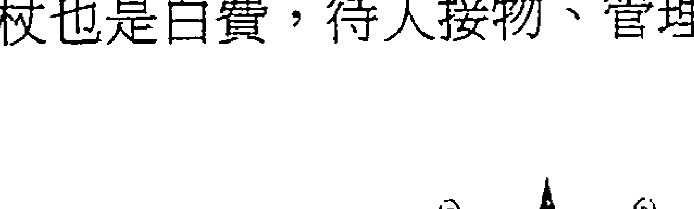

塔羅慣常名稱：木杖（wands）、權杖（staves）、棍棒（batons）、生命樹。以上各項皆統稱為「權杖」。

塔羅其他變形：儀杖（sceptre）、棒椿（takes）。

歐洲地方花色對應：橡實。

撲克花色對應：♣ 棍棒（club）。

## 聖杯花色

### 花色來由

聖杯，是根源於水元素的牌組花色專屬物。

### 元素本意

水是一種滋潤，多是隱藏於物體之中，卻不可或缺的因子。水元素因此被視為一切事物的內涵及成因，以及各種交互關係的媒介和緣分。水元素象徵人的感情和情緒，心靈層面和潛意識層面。水是液體狀態，沒有固定的形體，具備能流動的特色。

水的柔和特質連結於陰性原則和女性特質，具有滋潤的特性，可象徵人之間的愛和感情。水的流動和變化性，有如人的情緒，也有起落變化。比擬為對人們性格的影響，就是敏銳與關懷的特質，意識為情緒傾向和主觀感性的運作。

### 元素提煉

聖杯是由水元素提煉的物質，是水元素的精華與轉化，是水元素的變化過程。杯子，是一種容器，可說是由水而生，因為杯子的存在目的，本來就是做為盛水的工具，杯子是讓水能保持固定形狀的器皿。而水也必須透過杯子才能夠凝聚和成形，一切的容器工具，瓶子、盆碗，以及任何凹槽，甚至河谷和低陷地勢，這些水流領域，也都是廣義的杯子象徵體。

然而，當水被盛放在真正的杯子之中，更能夠發揮水元素的細微特質。而且透過杯子，水能夠與人們的生活產生更密切的關聯。杯子能夠裝水也能倒出水，是水元素的中繼站，是承載物也是媒介。

### 屬物象徵

原型符號象徵：Ψ、U、V、∨、▽、♀。倒三角的形狀是標誌，也是陰性象徵符號。此形狀也是人體的象徵，人體可比擬為聖杯，也是感情的媒介物。然而這只是側面，整體象徵物是立體，然而並非實體，而是凹陷的空間，這也是陰性特質。正剖面杯口是圓形，又是一個陰性象徵。

聖杯的形貌選用立體的容器，側面為反拋物線弧度形狀，開口向上且有圓形的平面，主要就是杯子之類，也可能選用相近形態的碗缽。容器可裝載物質，也象徵接納性。而杯狀器物更能貼近情感生活、人際交流的作用，也能夠做為內心情緒的寫照，因而如果講究造型能更顯示特定意義。本花色多半是採用有底之各式高腳杯，但也有更多繁複的變化。杯子最高目的是接通精神心靈層面，因而囊括各式原文名目和繪製形態，統合定名為「聖杯」。

### 花色作用

聖杯爲裝盛液體使用的器具，日常生活上常做爲飲用的工具，與生活滋養相關，是很重要的器皿。除了飲水用途，更配合生活和社會文化而多所講究，杯子種類和用途有一套規範，如何配合禮儀也有制度。

杯子的使用，通常具有社會性，尤其是饗宴和聚會的場合中，更顯現出社交與禮儀作用。一般相處中，杯子保持的距離如何，也能看出人際親疏和關係類別。聖杯沒有明顯的社會階級識別，是一種精神心靈的高下，但也能刻意突顯，爲一另類的識別等級。

聖杯在各種宗教祭典和法術儀式上，都是一種不可或缺的重要法器，是最基本的擺設，做爲人和精神界或神靈溝通的媒介物，或者賦予更多的重要功能，舉凡淨化洗禮等等。因此聖杯特別與宗教、心靈和神秘導向相關。

### 牌組功能

整體牌組表現所有的人際關係與感情事件，特別與緣分、愛情相連結。也能呈現個人內在的情緒、感受、感情、心思，以及精神和心靈的層面。以情緒的變化和情感的動向爲主軸，刻劃人生的許多層面。

### 牌組主題

聖杯牌組的表現主題可歸納出一個宗旨，那就是「御杯之情」。情感自內心深處而發源，需要加以調節引控，有如一連串的蝴蝶效應。如果善於駕馭情感，便能進而能夠洞悉緣分和安穩關係，而不會讓自身被淹沒於感情或慾望之中。

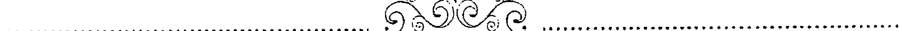

### 名目變化

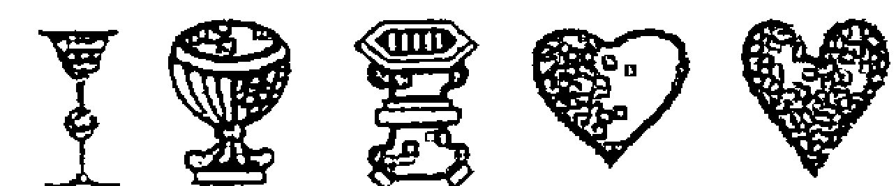

塔羅慣常名稱：杯（cups）、高腳酒杯（chalices）、儀式杯。以上各項皆統稱爲「聖杯」。

塔羅其他變形：碟盤器皿（dishes）。

歐洲地方花色對應：紅心。

撲克花色對應：♥ 紅心（hearts）。

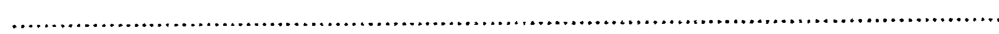

## 寶劍花色

### 花色來由

寶劍，是根源於風元素的牌組花色專屬物。

### 元素本意

風即是空氣，也是大氣、空氣或大氣流動的現象。風元素被視為事物的原理、運作的原則，象徵人的理性層面、思考認知、知識與語言。無形體和不可見的氣體，充斥在任何空間與縫隙之中，不可見的隱藏特質，不斷變化而難以捉摸，如同人的思維和創意。
各種流通的現象，象徵人與人之間的溝通以及意念的交流，也延伸至人際關係和社會制度。比擬為對人們性格的影響，就是智慧與理念的特質，意識為思考傾向和客觀理性的運作。

### 元素提煉

寶劍是由風元素提煉而出的物質，是風元素的轉化與昇華。寶劍的運作模式，有如風的流動方式，與風和空氣最能呼應，劍的揮舞有如風的吹拂。劍的形狀是薄而平的，幾乎不占有空間，然而卻又具尖與利的特質，能在空間中穿梭自如，在風中順勢行動。劍甚至可以穿透固體，如同空氣的無孔不入。
劍這種近乎無形的器具，可以發揮強勁而銳利的力量，而空氣的無形卻能成為風的強勁，這點兩者是相同的特質。風的變化莫測，在不斷變化的思緒中，找到一個固定的意志，如同風的方向感，這就是使劍的功夫。
風具備無形的傳導力，可以很溫和、也可以很犀利，能夠比擬為劍氣。而劍可以發出劍氣，也能夠形成風勢，卻必須依賴空氣，而空氣則因為寶劍得以發揮特殊功能。寶劍與風元素，互相證明彼此的存在，風的現象就是寶劍的作用。

### 屬物象徵

原型符號象徵：↑，為一長直線箭頭，直條而帶刺。也可繼續轉化為這組符號：∧ ∧，是陽性的刀刃象徵。縱使成為三角形，不再是直線，也能符合相通，允許平面的變形，主要呈現是尖角狀對立於彎曲弧狀，實物形貌就是薄而平面的長條尖刺狀。寶劍的形貌象徵思考運作，是頭腦中的主軸，猶如寶劍揮舞於風元素之中。劍是主宰性的，人以理性和智慧主宰自我。用劍代表需要修習，進而操作技藝，比喻經過修練而尋得智慧、理性和意志力。劍穿透王冠，代表劍能夠套住目標，可追尋生命中更高層次的靈光，而非運用自己的想法去侵害別人。所有的寶劍都是出鞘，智慧之劍鋒芒畢露，於是還要加上花葉之穗，轉型為祥瑞之劍，帶來幸運福祉。終極目標是探尋至高的智慧寶藏，因而統合定名為「寶劍」。

### 花色作用

寶劍是兵器、也是武器，不止能防身，還具有攻擊性和殺傷力。刀刃類的利器之屬，其中別具特殊性和格調者始能稱為劍，因而也是特殊身分的配備。日常生活甚少出劍使用，只限於專門習練，而競技和戰場上也能用於指揮。

寶劍為一利器，佳兵不祥。使劍有方法，蘊藏一種智慧或訣竅。劍是有轉折的，不只是一番淬鍊才能打造出來，成劍之後，更需要一番功夫或機緣才能降服化用。是凶器還是祥瑞之劍，須經過悉心引導。佩劍的概念，劍與人相配，都有名氣和資歷，帶有特殊的身分意味。

在各種宗教祭典和法術儀式上，都有儀式劍。匕首、刀刃和劍器之類都有同類的儀式功能，加強犀利的意志凝聚力，而劍特別有指揮召喚特質，運用起來可具有保護結界、劃分時空、防禦和驅逐的功能。

### 牌組功能

整體牌組囊括許多層面的事項，可代表學業與功課，也與才能與智慧相關。占算時多運用為溝通及人際關係，其實多半是心理上的作用關係，會有些負面的情緒。遇到難題與解決之道，許多寶劍牌的負面特質有著殺傷力，也表示不幸與厄運，這點更見於傳統的論斷牌義中。

### 牌組主題

寶劍牌組的表現主題可歸納出一個宗旨，那就是「持劍之心」。寶劍的主題都在於內心，無論是內在的思考或外在的人際，出發點和感受都在於一心。心中有智慧，劍術才會高明；秉持心思純正，劍才具有正氣和力量！

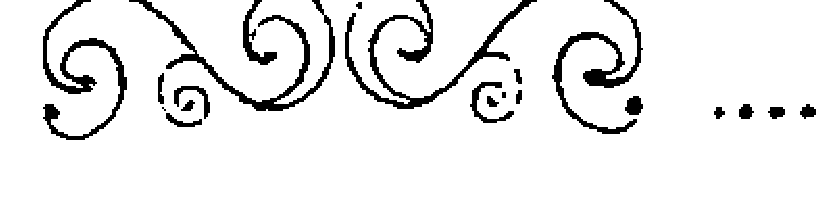

### 名目變化

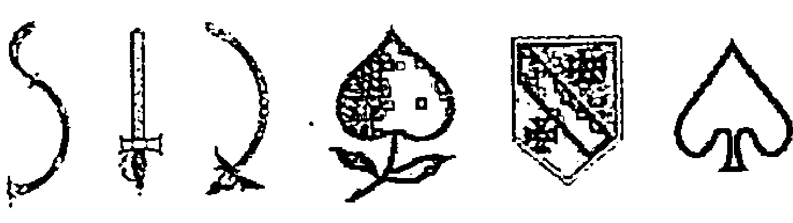

塔羅慣常名稱：寶劍（swords）。其他名稱都少見，統稱為「寶劍」。

塔羅其他變形：寶劍的變形較少，因為變化為利器，還是能夠算是寶劍。可能有刀（knives）或匕首（daggers），特殊情況下有槍或筆。

歐洲地方花色對應：樹葉。

撲克花色對應：♠ 鏟（spades）。

## 金幣花色

### 花色來由

金幣，是根源於土元素的牌組花色專屬物。

### 元素本意

土是物質的具體呈現，也是萬物生長的大地。因此，土元素被視為構成物質的實體以及實際層面。土元素象徵人的感官能力，現實面的認知與感覺。土是固體的狀態，形貌固定而不容易變動，也便利於操作運用。土元素具有堅硬的特質，表示了穩定和安全。

土亦做為哺育萬物的大地，也是母親的象徵，蘊藏豐富的功能，如同人之間的照顧與實質關懷、具體的生活，以及社會的物資。比擬為對人們性格的影響，就是毅力與堅持的特質，意識為感覺傾向和客觀感性的運作。

### 元素提煉

金幣是由土元素提煉而出的物質，是土元素的生成物與精華。金幣是由金屬和各類礦物熔鑄而成的物品，而後做為有價值之物而流通運用。金屬與礦物自是源自大地，由土元素所提煉出的物質。而這些物質是土元素所生，亦即土元素的結晶與精華。這些經過轉換的物質形成有用的物品，甚至做為錢幣使用，當做人為公定的價值指標物。

從另一個角度來說，大地生長出的作物，這些滋養的實體就是土的生成物，最後又回歸於大地之中，重新融入土元素，完成一個循環的過程。土元素，可成為人為社會中有價值的物資，而被運用過後的物質，經過回收的歷程，最終又回到土壤之中。金幣就代表了這個土元素循環轉折過程與媒介物。

### 屬物象徵

原型符號象徵：、○、Φ、○、Θ，這些符號主要都是圓形，為陰性的象徵，也具有圓融和包含的意義。圓形是平面的，圈圈也是一個領域，其中也可標示符號圖騰，而增添更明確定義，也因而有各種不同的象徵。正立的五芒星☆，四方伸展而向上接通，也是人體頂天立地的形狀，從下方大地汲取養分而向上生長，是大地母神的象徵，代表陰性的圖示。

金幣的形貌選用圓形平面並且不具立體的器物，恰是金幣和碟盤這些類別的物品。金幣象徵物質的實用性功能，具有價值，和生存資源相關。碟盤生活實用功能之外，是圓形的裝飾品和擺設物，成為儀式中重要的法器。偉特系塔羅的牌組中，金幣的符號是圓盤上飾以五芒星，並以 Pentacles 為名，真正全意應是五芒星幣盤，也可稱為星幣。

無論牌組專屬器物改成碟盤或星幣，畫面情節中都還是錢幣作用，金錢的象徵仍然不移。金色代表智慧的黃金黎明，也是世俗的金碧輝煌，兼具世俗物質和精神兩領域的作用，足以代表牌組花色專屬物名稱，因而統合定名為「金幣」。

### 花色作用

圓盤、碟子是生活必備用品，也是時常見到的物體形狀。錢幣、貨幣是經濟流通的主角，亦為重要的生活必備品。金幣的使用就是人類經濟狀況、財物的歸屬，以及物質層面的應用。

金幣為最實用的物品、土中的精華、生活上的必須品，累積愈多的精華就越富有，是一種財務狀況和經濟制度，甚至延伸為市場機制和金融體系。由財物資產而生的貧富現象，不僅是個人的生存和生活品質，也形成了一種社會階級。

在各種宗教祭典和法術儀式上，都會用到金幣屬性類別的道具，時常做為純標誌作用，或承載他物的輔助工具，較容易被忽略。聖盤、聖碟、儀式盤、儀式碟，造型樣貌等同於符號圖騰標誌，其實精神性特別強大而重要。

### 牌組功能

整體牌組表現出財務方面的變化起伏與趨勢，也呈現各種金錢資產的狀況和現象。占算上代表生活上的現實層面、經濟狀況、財務活動、物資的得失，也意味著個人的財運、生活富裕貧困，也能探究相關於工作事業的利益以及各式行動的得失。

### 牌組主題：理財之道

金幣牌組的表現主題可歸納出一個宗旨，那就是「理財之道」。物質資產、金錢財富，想要保存運作和成長發展，或都須打理，視為財務來規劃管理，在於有方法和原則。理財成效高下在於領悟其中之妙，到達某個境界就是一種藝術。

### 名目變化

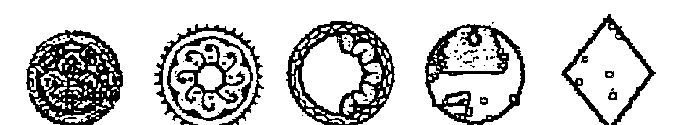

塔羅慣常名稱：錢幣（coins）、五芒星幣（pentacles）、盤碟（disks）、圓（circles），以上各項皆統稱為「金幣」。

塔羅其他變形：石（stones）、麵包（loaves）。

歐洲地方花色對應：鈴鐺。

撲克花色對應：◆ 鑽石（diamonds）。

## ACE牌統論

### 基本說明

### ACE的意義

小祕儀四花色牌組中的第一張牌稱為 Ace 牌，各牌組中並沒有 1 號的牌，Ace 就是 1 號牌。「ace」這個字詞源於古拉丁文，也就是 1 的意思，另也具有單位和統一的意義。由於代表最小數字，這個詞彙在中世紀英語曾經有低劣的涵義在，但後來也隨紙牌設定的更動而有所改觀，Ace 牌在遊戲中壓倒各種點數，代表勝利，也超越了宮廷牌的地位。而後這個字詞成為了高手、高品質和傑出人才，是優秀卓越的代表名詞。各類紙牌均不寫成 1 而保留 Ace 字樣，是經由保持紙牌遊戲傳統，而讓其意義更廣闊。Ace 能夠同時有 1 與統合等意義，此外更有統領和優越之意。

### ACE牌的特性

因為具有數字 1 的意義，然而又不只是 1，因此稱之為 Ace。如此能有起始的意義，也有統領的意味。Ace 牌是數字牌，但地位卻非常特殊，比牌組中的宮廷牌還被重視，甚至能做為牌組的代表。Ace 是各花色牌組的第 1 號祕儀，也統領整組花色和所屬元素。塔羅牌現代仍保持選用 Ace 做為位階的名稱，自是取用 Ace 源頭和延伸的涵義，才能突顯其重要性和地位。

### 位階作用內涵設定

### 位階數序設定

Ace 就牌序定位而言，是小祕儀各牌組之統領首牌，有如牌組的國度旗幟。Ace 牌是該牌組的重要指標，代表元素花色的所有涵義。Ace 為各元素之源，是純淨的元素，尚未經過分化，也表示統合性的整體元素。這個位階的數序寓意，是 1 和統合的原則，連結了該元素花色的意涵，表示該花色作用之起始，以及代表事項的整體進行。

### 共通內涵定義

Ace 牌的共通性以及單純特質，使得牌旨定義和占卜應用，都可依據理論原則著手設定。正位置皆為正面良好作用，逆位置為負面不佳作用。正位置占卜牌義的通則為：事件的開端和發生，或者正在進行中，也表示一切都很周全，並且持續發揮良好的作用。Ace 是行動的圖騰，具有強烈的行動意涵，占卜時候不用拘泥於「開始」這個涵義，也可能是遇見或出現某個人事物。無論占卜各種項目，任何花色的 Ace，一律都表示進行良好的正面現象。

### 占卜牌義

#### 正位共通演變

早期的牌義，即包括了開始、創新和啟動的涵義，也具有行動和啟程的意味。古代的 Ace 牌具有相關於家庭的項目，偉特也保存這些意義，不過後來逐漸被忽略。偉特還加強了事務進行中和整體運作，標明各類正面作用。偉特稍後時期，過濾了一些瑣碎的項目並釐清正逆位意義，而今整合為理論推演原則下的牌義。

#### 逆位共通定義

自古逆位牌義大致偏向負面，然而並不僅是如此，自早期就與正位置意義有所呼應，多半是正位意義的相反或減弱。現代逆位置一律都是較為負面的現象，可以統合為「轉折」，也就是行動生變、進行不順，甚至為失敗或退回。

正逆變化思考，Ace 位階意義以「不當原則」定調為負面走向，再根據元素花色意義的逆位「虛弱原則」或「過度原則」判斷遭遇何種阻礙和挫折，而整體正位牌義也以「正逆互異原則」推出相應的負面狀況。另外，四張 ACE 牌也適合以畫面感受來解析，而 Ace 牌的反向畫面特別明顯，而且容易理解。

#### 畫面和屬物形貌變化

#### 畫面呈現搭配

Ace 牌大都是以捧托的方式來呈現專屬物呈現，而手在雲端浮現是最常見的。從畫面出現的是左手或右手，探究寓意，至於手從哪一方向伸出畫面也可以探究，通常以對稱關係符合元素脈絡，然而花色配置的方向其實並不固定，會因塔羅不同而有差異。早期塔羅雖然有手握專屬物的傳統，但是多半的塔羅牌，陽性元素花色屬物由手握著，而陰性元素並沒有。而這樣的畫面為了避免單調，多半會增添裝飾，像是彩帶或花穗，數字牌的背景同樣如此。Ace 牌是與元素最具關聯性，背景中也常呈現出所屬元素，甚至描繪專屬物與元素的互動現象。煉金術系統和神秘學系統的塔羅，更會詳細強調這一層面。

### 花色屬物專論

Ace 牌中的專屬物，會是該牌組中最特別的一個。花色專屬物的描繪自然需要探究，而和專屬物之間相似和差異程度有其關係和變化，隱含著微妙意義。有些塔羅的同一牌組各張牌專屬物面貌差異很大，像是克洛利透特塔羅就是刻意著墨於此，後起的心靈和新時代系列塔羅也慣於使用各階差異的專屬物！

## 權杖ACE
ACE of Wands

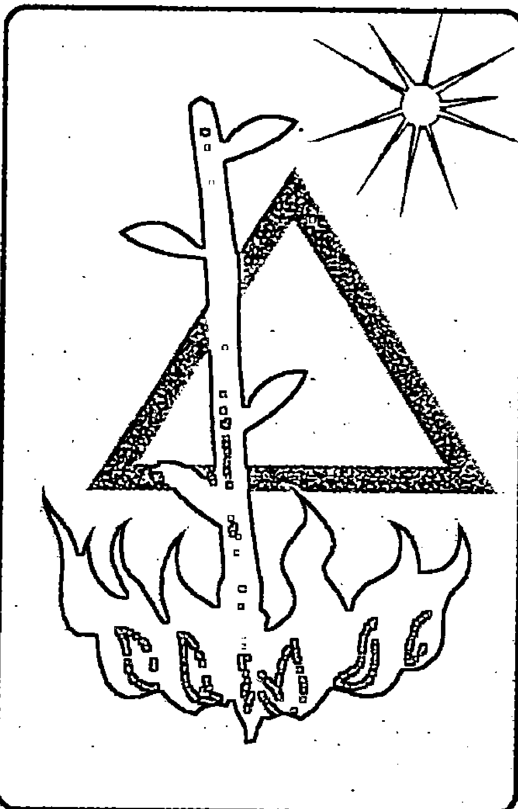

秘儀主題：
正 事務根源、信念把握
逆 事務險阻、把握失準

牌序定位：
權杖牌組之旗幟、權杖花色牌組的第一號秘儀、統領整體權杖花色及火元素。

元素位階：
火元素之源、未分化之火、火元素之初始階段、全體火象之整合。

### 秘儀數序定位

#### 位階數序

權杖之 Ace 包含，數字 1 的統合原則，連結火元素權杖的意涵，融合而表現為創造、前進以及達成之意。權杖之 Ace 引領並代表整體花色牌組，為火元素作用之起始，代表權杖相關項目的全面啟動。

### 內涵定義

權杖 Ace 代表了事務的開啟，任務行動事件的開端，事業和工作的開創，將計畫付之實施，得到權威或接受使命。對感情燃燒起熱情，對人事物感到興趣，特別代表旅行，也表示精力充沛而活躍，健康狀況良好。權杖 Ace 的秘儀主題為「事務根源、信念把握」——闡釋為能夠呈現無比的信心把握，出發點的心態保證了過程和結局。

### 正位實占解釋

人際交誼：人際關係活躍而熱絡，主動積極交流，內心充滿熱誠。
戀愛情緣：情感熱烈，關係親密。熱情洋溢、引發情慾。
事務進行：積極的行為，有力的執行。主動進取、順利成功。表示事業順暢，接任職務或者開創，都表示前景美好。
物質金錢：金錢上能有所收穫，也能掌握得住財富，繼承或接收產業有望。

### 牌義來歷變遷

#### 涵義演變

在早期這張牌含有很負面的作用，某些正位置牌義的解釋竟是代表各種災難。不過也另有截然不同的涵義，那就是金錢上的幸運或是繼承。

偉特已經一改前況，將正位置的所有負面意義去除，成爲一概都是正面的作用。強調 Ace 牌代表的開始意義，表示來源、起點，並根據元素內涵推演爲活力，導引行爲的動力。兩者統合起來，則爲創造和發明，以及生命的誕生，並且也延伸出了家庭的涵義。另一方面，也強調了權杖所代表的事業。

偉特稍後時期，承襲了上述的所有正面涵義，此外還強調了遊歷方面，即是開始一段具有新意的經歷或是冒險。

#### 正逆轉折

這張牌生產的徵兆，早期是歸給逆位置的，這時期逆位置的負面傾向不是很絕對。到了偉特，則將正逆位牌義的正負面作用分開，而將負面意義都歸給逆位，諸如消沈、衰微、毀滅，失去幸福和快樂。

偉特稍後時期，以正位置的項目直接轉化爲負面的逆位意義，表示錯誤的開始、陰霾的前景、計畫取消或半途而廢，目標無法實現。這些多半是以逆位弱化原則推演出來的。另外也有承襲自以往的意義，像是生活空虛、苦悶和衰弱。

#### 逆位思考

現代定義以逆位原則推演，火元素的「虛弱原則」爲缺乏活力、能量不足，權杖花色的「過度原則」爲過度擴張。Ace 位階「不當原則」爲各種行動遭遇困難、受阻，甚至失敗或是撤退的意思。再以「正逆互異原則」統合如下牌義：由於缺乏動力又過度求取，導致欲振乏力的狀況，難以順利前進和持續執行下去。整合出的逆位主旨結語爲「事務險阻、把握失準」，也就是任務執行不順。

### 逆位實占解釋

人際交誼：交流情況不和諧，不滿或厭惡的感覺。缺乏耐性，失去興趣。

戀愛情緣：戀愛的熱情消退，美好的感受遠去，引不起興趣了。

事務進行：進行不順暢，方向錯誤，難以達成目標。中途受阻、遭遇到挫折、失敗。

物質金錢：金錢有所損失，無力掌握，運用不當，難以控制流向。

### 畫面寓意解碼

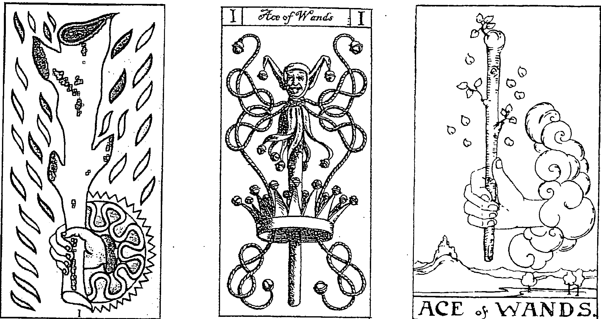

#### 屬物浮現方式

騰空雲霧中冒出一隻手。整體畫面的重點，是呈現出這隻手強有力緊握住權杖的姿態。少數塔羅的權杖 Ace 並不是以手握權杖，權杖可以佇立地面上，並且也可由孩童、天使或神話人物撐立起來。

#### 元素互動

權杖牌組較少描繪出火的意象，權杖 Ace 多以杖身的動感，或者將權杖當成活樹生長萌發，以表示生命力和能量。但有些塔羅的權杖 Ace 背景仍有火焰，或者就讓木頭燃燒，以顯示出火元素。

#### 整體營造

權杖 Ace 比較沒有特殊的畫法，以樹木為形態的權杖，多描繪葉子從上抖落的畫面，表示被力量和行動所振落，也暗喻著更新的必然。有的塔羅畫出權杖萌芽滋長，象徵生命授與和啟蒙。少數魔法神力主題的塔羅，會從木頭中燃起火焰，表示點燃光明、啟動能量，象徵好的開始。

#### 背景搭配

通常背景會拉遠景，呈現整片廣闊和豐富的景象，看得見天空晴朗，大地之上有山丘起伏和原野，甚至有水流，以空間營造出權杖移動和啟程的特質。地面景物代表權杖的出發點、過渡或終點站，多半以房屋建築象徵家庭或庇護所。

### 花色屬物專論

#### Ace 專屬描繪

本花色 Ace 牌的專屬權杖，通常與整個牌組中的權杖差別不大。多半就是堅硬的木杖或者棍棒，是陽剛的象徵。許多塔羅中的權杖都生長著綠葉，強調是仍具有生命的活樹，以表示蘊藏生命能量和活力，這也是牌組名稱被稱為生命樹的原因。雖然這個牌組的花色作用和職位相關，權杖數字牌和宮廷牌的專屬物都有分別的塔羅並不占多數，而在兩者有分別的情況下，權杖 Ace 也可能比較接近於數字牌而非宮廷牌。

#### 各階專屬物評比

每張宮廷牌獨具特色的設計安排之下，國王專屬權杖的形貌有象徵作用，雕飾的權杖是世俗權勢的象徵，是統領群雄的標示。王后專屬權杖的形貌也有其特色考量，通常不是權柄而是採取較為自然的形貌。騎士專屬權杖的形貌與行動有關，可以顯示出武力。隨從牌則可從權杖形貌看出和哪張牌相似而有較近的關聯。至於權杖 Ace 最接近牌組中哪一張，或許是牌組重點何在的暗示。

宮廷牌整體一致的設定是最常見的，也有宮廷牌和數字牌出現截然不同的劃分。古典塔羅的權杖數字牌，專屬物形狀多變形簡化，形狀接近標竿或槍矛。有畫面情節的數字牌中，如果是牌組中權杖的設定有所差異，可能會接近隨從或是 Ace。有些塔羅牌的權杖雖然華麗細膩，可能還是全體牌組都共用，連數字牌也不例外。權杖的外型大小或長度不能表示重要性或獨特性，因為這是根據畫面而搭配的。

大秘儀中有許多出現權杖的意象。魔法師四法器中的權杖，造型通常會接近牌組中的宮廷或數字牌。此花色意象也出現在「隱士」握在手中的木杖，以及「愚者」的木杖中，要注意的差別性是木頭是否為活樹，由此看待，有些塔羅中「吊人」背後的樹木也算是一種變形。另外大秘儀中有旗竿甚至柱子的牌，可以視為間接與權杖有關聯的象徵。

> 占卜訣竅提點
權杖 Ace 問各類事情都代表能夠成功順利，當然針對事業工作方面，最直接的作用。對於其他各方面，多解讀為熱力活躍而帶來幫助，雖不是那麼直接，但也多有良好的效應。而對於愛情方面，除了動力勇氣之外，也表示心中燃起熱情，這夠是戀情中很重要的一環，但是相處上不夠細膩，也不保證維繫程度，這是其中的缺點。

## 聖杯ACE
ACE of Cups

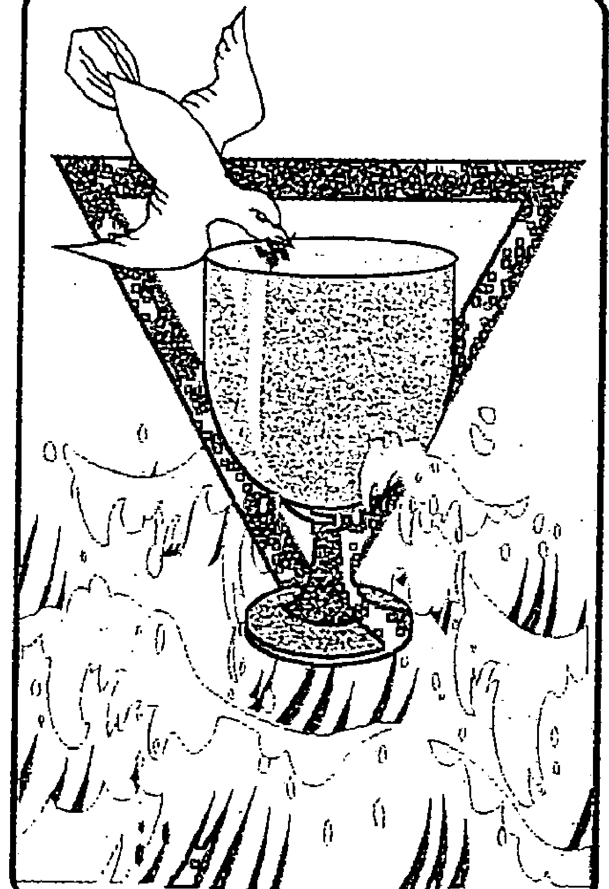

- 秘儀主題：
  - 正 情感泉源、細緻捧托
  - 逆 情感枯竭、捧托失調

牌序定位：
聖杯牌組之旗幟、聖杯花色牌組的第一號秘儀、統領整體聖杯花色及水元素。

元素位階：
水元素之源、未分化之水、水元素之初始階段、全體水象整合。

### 秘儀數序定位

#### 位階數序

聖杯之 Ace 包含數字 1 的統合原則，連結水元素聖杯的意涵，融合而表現為動心、交流以及完滿之意。聖杯 Ace 引領並代表整體花色牌組，為水元素作用之起始，代表聖杯相關項目的全面啟動。

### 內涵定義

聖杯 Ace 代表感情的發生，緣分的開端和關係的發展，得到呵護或接受照顧，戀愛和感情的萌芽，感覺互動親密。象徵滋生愛意，情史的緣起，特別代表心靈啟迪，感情生活豐富而浪漫，情緒喜悅滋潤，幸福美滿的感受。聖杯 Ace 牌的秘儀主題為「情感泉源、細緻捧托」——闡釋為保持最初的感動，猶如捧在掌中以細膩的心對待，甜蜜正果源於持續的維護。

### 正位實占解釋

- 人際交誼：各種互動關係都是融洽的，欣賞與鼓舞，精神上的和諧與認同。
- 戀愛情緣：表示愛情的開始與進行，感情美好、心靈豐富，精神感到滿足。
- 事務進行：各類事務都能有好的開始與順暢的進行，充滿人情和溫馨的氣氛。
- 物質金錢：對財務方面也是有所助益的，尤其在心理上能夠感到滿足。

### 牌義來歷變遷

#### 涵義演變

早期正位置的牌義紛雜，其中包括意志堅定與規則等意義。偉特強調聖杯相關的心靈涵義，即內心的喜悅與滿足，以真心的家延伸出家庭、住所與養育。水元素象徵的豐富充足也沒有遺漏，此時所特別強調的是畫面上特別設計出的寓意，也就是象徵幸福與心靈感召的聖餐桌。

偉特稍後時期承襲了偉特的所有涵義，也就更遠離了早期正位置的其他意義，像是滿溢著愛與善，美麗和愉悅以及美好的遠景。此外還增添了完美和財富等意義。

#### 正逆轉折

早期逆位置的意義與正位置洽為相反，是變動之意。偉特對於逆位承襲以往變化、變革、不穩定的涵義，並加入與正位意義相反的各種項目，強調以「反向原則」推演而來的虛假之心、敷衍的居所、缺乏精神的感動。

偉特稍後時期，承襲偉特的所有逆位特點，明確論述為不盡情的歡樂，沒有回報的愛，精神貧乏和物質上的損耗困頓。還有相處上的不和諧與意見矛盾分歧，這點或許是從畫面倒立的感受而來。

#### 逆位思考

現代定義以逆位原則推演，水元素的「虛弱原則」為感動已經不再，聖杯花色的「過度原則」為感情需求過度，Ace 位階「不當原則」為各種不順暢、不和諧，嚴重下甚至有分裂、分手的情況。再以「正逆互異原則」統合如下牌義：失去真情，情緒無法表達流露，卻又需要關愛，導致相互間感情失和，關係難以持續下去。整合出的逆位主旨結語為「情感枯竭、捧托失調」，也就是人際相處不和。

### 逆位實占解釋

- 人際交誼：相處不融洽，觀念不一致，性格不搭，缺乏交流互動。
- 戀愛情緣：戀情未成熟，關係無法進行。空虛、不滿足，感情付出難以回收。虛情假意，浮泛的愛情。
- 事務進行：事態變動不穩定，礙於人情難以成事，因感情而誤事。
- 物質金錢：損耗與困頓，財務失衡。情緒性的花費，消耗狀況頗難控制。

### 畫面寓意解碼

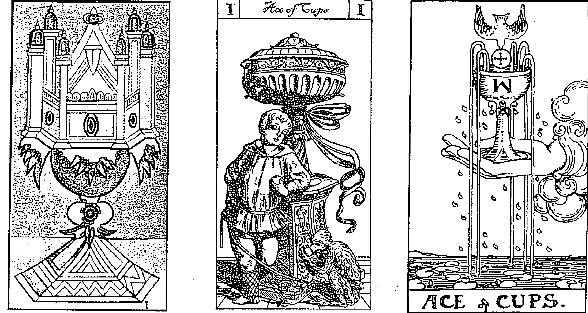

#### 屬物浮現方式

騰空雲霧中冒出一隻手，掌心托住杯子底部，或者是輕握住杯腳，托起整個杯子。也有許多塔羅畫面並沒有出現手，只讓聖杯自行立著，可以描繪孩童、天使、神話人物等伴在聖杯之旁。

#### 元素互動

多半聖杯會在一片水域環境之中，從杯內湧注或冒出水來，形成水流或水柱，然後流向水域之中，形成源源不絕的循環。杯中湧出的水，就表示了感情的開始，並且流動不已，有時候水柱的樣貌或數量，也可具有其象徵意義。

#### 整體營造

聖杯上方有白鴿銜著刻有十字記號的圓盤，將此物投入聖杯之中，杯中的水因而滿溢而向外湧出。白鴿象徵純淨聖潔的心靈以及和平安寧，也可代表聖靈本身。十字圓盤即是象徵聖體的餐餅，也比擬為心靈感召的契機。這個景象暗喻了啟動感情的關鍵，猶如愛情的靈丹妙藥，具有開啟心靈的作用，有的塔羅會依此內涵改造為不同的情節畫面，並以其他相當的事物做為象徵。

#### 背景搭配

畫面下方是一片汪洋，水面上開著蓮花，為純潔的象徵，也是水元素的代表物，許多塔羅在聖杯牌組都中出現蓮花。水面上呈現的事物依據作者而定，可依此突顯出所想強調的特質。

### 花色屬物專論

#### Ace 專屬描繪

本花色的 Ace 牌，專屬聖杯通常是較為特殊的造型，至少會刻劃得比較細緻，或者比牌組中其他聖杯大很多，以表示這個聖杯的獨特性。聖杯 Ace 是各種儀式專用的聖杯不具生活用途，雖然多是高腳杯外型，卻多綴有許多標記和裝飾。有的直接以宗教大聖爵的形態呈現，甚至也有加蓋和兩側的提把。杯上的圖案符號文字，表示來歷或其他象徵意義，例如偉特系塔羅牌的聖杯 Ace，杯上的字母意涵耐人尋味，暗示此為傳說中騎士所追尋守護的聖杯。

#### 各階專屬物評比

整個聖杯宮廷是維護心靈的家族，所持聖杯可多加著墨，而各人物的專屬聖杯也存有獨特差異。國王專屬聖杯，時常看起來不是很有特色，但這具有號召力的聖杯仍須小有著墨。王后專屬的「心靈聖杯」，可以是細緻特別的。騎士專屬聖杯是眾人追尋的聖杯，必須虛心呵護。隨從是護持者，可能手上的聖杯就是騎士或王后、國王的。也有的隨從有獨自的專屬聖杯，而從造型可知等級和職務。

聖杯牌組中宮廷牌多是隆重的聖杯，然而聖杯 Ace 不遑多讓，有時候數字牌也很特別。古典塔羅可能在特殊的聖杯 Ace 之外，另選某張聖杯的數字牌做為「商標」，畫上一些識別標誌。有些塔羅每張聖杯數字牌專屬物會各有變化，但多半塔羅數字牌專屬物形貌是一致的，些微大小差異可能別具細微涵義。

魔法師四法器中的聖杯，也可觀察屬於牌組中的哪一張。其他大秘儀中，也有聖杯出現，最明顯的是「節制」牌，通常都和聖杯牌組相近，刻意相同以表明連結性。「星星」牌女神手中的容器為有別於節制而差異較大，但有些塔羅仍然是聖杯造型，甚至看出最直接連結於哪一張牌。另外，少數塔羅牌中，戀人或是其他秘儀也可能有聖杯在畫面中出現。

> 占卜訣竅提點
聖杯 Ace 對於詢問各種範圍，答案當然都是肯定的，然而這張牌更是貼切於情感關係和人際情誼，細膩特質對這些層面最適切有效。因而對於積極奮力的工作辦事方面的項目，成效就比較有限了，是以滋潤性帶來助益的。關於財務方面則有一種間接的保證，就是愉悅的心情多少基於一定程度的現實穩定上。至於學業則表示，維持心平氣和或者有興趣而喜悅，只是專注度並不夠，會次於其他更貼切此問題的牌，那麼勝算率和名次就可能不是頂級的。

## 寶劍ACE
ACE of Swords

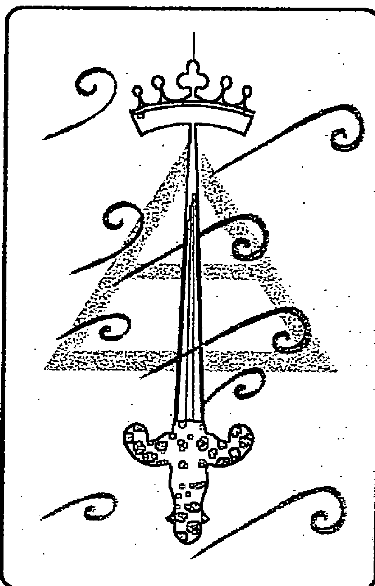

- 秘儀主題：
  - 正 智識基源、專注秉持
  - 逆 智識偏差、秉持失當

牌序定位：
寶劍牌組之旗幟、寶劍花色牌組的第一號秘儀、統領整體寶劍花色及風元素。

元素變化：
風元素之源、未分化之風、風元素之初始階段、全體風象整合。

### 秘儀數序定位

#### 位階數序

寶劍之 Ace 包含數字 1 的統合原則，連結風元素寶劍的意涵，融合而表現為啟迪、實現以及勝利之意。寶劍 Ace 引領並代表整體花色牌組，為風元素作用之起始，代表寶劍相關項目的全面啟動。

### 內涵定義

寶劍 Ace 代表了意念的發起，思緒和靈光的乍現，計畫的醞釀和萌生。表示創作的啟蒙、研究的進展、辦事的能耐，能夠帶來人氣且溝通順暢，擁有堅定的力量和強大的決心。同時象徵遇到問題迎刃而解，破除障礙而化險為夷，能夠勝利、成功和奪冠。寶劍 Ace 的秘儀主題為「智識基源、專注秉持」——高度專注和堅定秉持，始能展現駕輕就熟的能耐，藉此突破萬難達成目標。

### 正位實占解釋

- 人際交誼：理性與原則的相處模式，注重相互溝通。反應靈敏和犀利。競爭上能勝利。
- 戀愛情緣：對感情緣分也是正面的作用，雖然外在表現似乎比較冷，藏著深層的愛意。
- 事務進行：快速進行，成功在望。以智慧解決難題，開創和革新很有魄力，特別表示在學業方面有助益。
- 物質金錢：對此一樣表示能夠成功、獲勝、得利，甚至成效非常可觀。

### 牌義來歷變遷

#### 涵義演變

早期原本就象徵極端，代表極度的繁榮或者是極度的不幸。偉特也認為這是一張強大力量的牌，表示事件趨向極致或擴大增強，無論是愛或恨的力量都可能加強或極端。然而正位置已經有固定的正面意義，亦即成功、以力量獲勝、征服。並且對於畫面中一貫出現的王冠，提出了象徵的說明，認為王冠蘊含的寓意值得探索和考慮，表示所指的事件有更深的涵義存在。

偉特稍後時期，差不多承襲這些意義，卻更清楚確定為成功和權力，以及豐盛、興旺，一樣也表示深層的愛和情感。另外強調 Ace 牌的一貫意義，那就是開創和行動。也不遺漏 Ace 結合寶劍的特殊意義，推演為堅定的力量和強大的決心。

#### 正逆轉折

早期逆位置是偏向負面的，對於婚姻關係更為不妥，尤其矛頭還指向女性。這樣的觀念偉特依然承襲下來，不過也加入了其他的應用。偉特將早期正位置的極端作用放到逆位置，成為擴增作用和複雜化，甚至結果是傾向負面的。特別之處是，偉特又認為逆位置有分娩、懷孕、繁殖等意義。

偉特稍後時期，逆位置意義做了更大的調整，直接認定為災害、不幸。根據元素的弱化而來的意義是無理性、火爆脾氣、自我毀滅以及暴虐行徑。另外還有根據正位置興盛意義，以「反向原則」推演而來的難堪、障礙以及貧困。

#### 逆位思考

現代定義以逆位原則推演，風元素的「虛弱原則」為學習不足、缺乏智慧，而寶劍花色的「過度原則」為思緒混亂偏差。Ace 位階「不當原則」為溝通方面的混亂，各種人際爭執和紛爭。再以「正逆互異原則」統合如下牌義：難以解決擺平問題，還產生更多麻煩，導致結局失利慘敗，甚至遭遇殺傷力、攻擊等現象。整合出的逆位主旨結語為「智識偏差、秉持失當」。

### 逆位實占解釋

- 人際交誼：人際關係失去和諧，互相傷害，厭惡憎恨，惡性競爭。
- 戀愛情緣：感情或婚姻不順，產生紛爭或衝突，關係有裂痕。
- 事務進行：自身的失誤或他人的干預，導致挫敗或被擊倒，遭遇困難與阻礙。
- 物質金錢：理財失當，招致貧困的局面，資產可能殆盡。

### 畫面寓意解碼

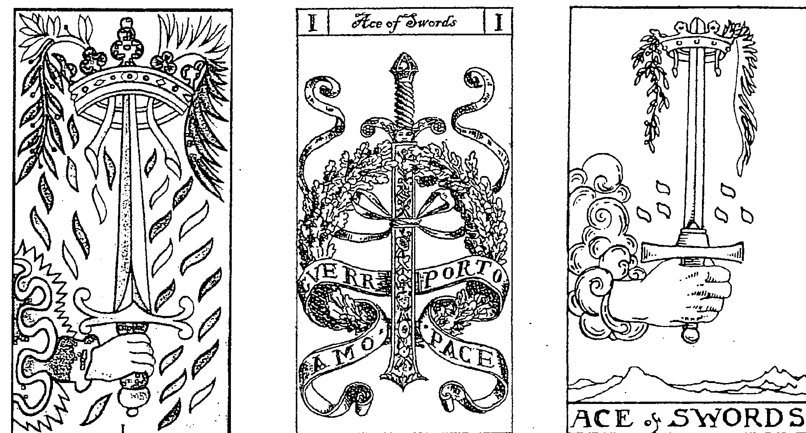

#### 屬物浮現方式

騰空雲霧中冒出一隻手，伸向寶劍手握住劍柄，持立或操作寶劍。寶劍 Ace 的浮現方式有較多的變化，會根據塔羅整體情節所需而定，也有讓寶劍直接浮現在空中的，更少數會插在地面上，或者以孩童、天使、神話人物等豎立起寶劍。

#### 元素互動

寶劍隱藏於風中，背景即是天空，以表示寶劍居於大氣中，來表達空氣風元素，通常不會刻意著墨於無形的空氣，有時會刻劃出風的線條，或者以空中的雲朵浮動來表示風的流動，也讓寶劍穿梭在風中。

#### 整體營造

寶劍 Ace 多數都是劍尖朝上，通常上端會套住一個王冠。王冠象徵著智慧與高貴層次，黃金王冠散發光芒更是無上智慧與修練成果。寶劍套住王冠，是寶劍的運作操練成果的高超技藝呈現，也藉以象徵捕捉住深奧的智慧。
枝葉掛在王冠兩側，象徵著智慧勇氣、力量和勝利特質，也增添文彩和祥瑞之氣，這是傳統塔羅既有的畫法。也時常看到劍外閃爍光點，形狀和色澤都很明顯，有點像是落葉，可視為上帝之指的符印，代表神聖尊貴與榮耀。

#### 背景搭配

寶劍 Ace 的背景可能是清澈天空或者風雲運行，這和寶劍的動態有關。當然也會看到下方的著落，通常是陸地，空曠荒原、冷山屏障。有些塔羅這張牌的背景也會透露黃金黎明的微光，呼應黃金王冠的隱喻。

### 花色屬物專論

#### Ace 專屬描繪

本花色 Ace 牌雖然造型與牌組中其他寶劍看起來差異不大，但都會刻劃描繪得較為精緻，通常也是最華麗或尊貴的，具有統領群劍之尊。既然是牌組中的名劍，自需要細微雕琢，甚至暗示特定某「名劍」而以此為雛形！這些作用的目的在於這把劍一定要特別突顯，和其他的劍一定要有所區別。而一般賦予寶劍 Ace「祥瑞之劍」的意涵，而更為人周知的智慧之劍封號也不容忽視，也可從造型和外部變化來加強，那麼特別專屬的王冠和葉穗，看來是不可或缺的。

#### 各階專屬物評比

寶劍宮廷牌的劍是真正的寶劍，各自都要有特殊性，但也有共同標誌。國王專屬寶劍，介於大寶劍和小牌之間，是王者之劍，也是仲裁之劍。王后的專屬寶劍也很特殊，是心中之劍，也是女性之劍。騎士專屬寶劍的特殊性在於，是最犀利強大、最有殺傷力而可怕的一把！隨從的寶劍可能模擬或接近其他宮廷牌，寶劍隨從多半是跟隨著寶劍騎士。

數字牌中的寶劍，都要有異於宮廷人物和 Ace 牌之劍。古典塔羅在寶劍數字牌中，專屬物形狀多變形扭曲，因而明顯和 Ace 牌大有差別。其實數字牌中各張寶劍可以有小變化安排，只是多半不是很突顯。然而整體安排的要點在於，寶劍 Ace 一定要最獨立特出於其他張牌的寶劍之外，無論這副塔羅的設計中，牌組中的劍身造型是否接近。

魔法師四法器中的寶劍，通常造型要接近寶劍 Ace，表明和寶劍 Ace 地位相當而不亞於國王之劍，國王手中的劍固然尊貴，但要真正能佩用寶劍 Ace 之劍才是真王。大秘儀中還有一把更強的「大秘儀之劍」，且同時和王冠出現在「正義」牌中，正義和寶劍牌組的連結如此明顯而不容忽略，而其專與寶劍 Ace 以及寶劍國王的相關性，也非常值得注意。

> 占卜訣竅提點
寶劍 Ace 十分強悍，對於成功效能更為提高，祥瑞之劍對於一般事情依然保證吉運。但是這麼犀利的特性，更適合於解決疑難雜症，去除問題有如快刀斬亂麻，也表示能揮劍斬情絲。這張牌可以專治學業方面，對於考試評比和各方面賽事、愈有競爭性的事件，勝利指標就愈強。寶劍 Ace 對於感情方面表示誠摯深刻的靈犀相通，然而情慾層面和世俗生活面則較為淡薄。

## 金幣ACE
ACE of Pentacle

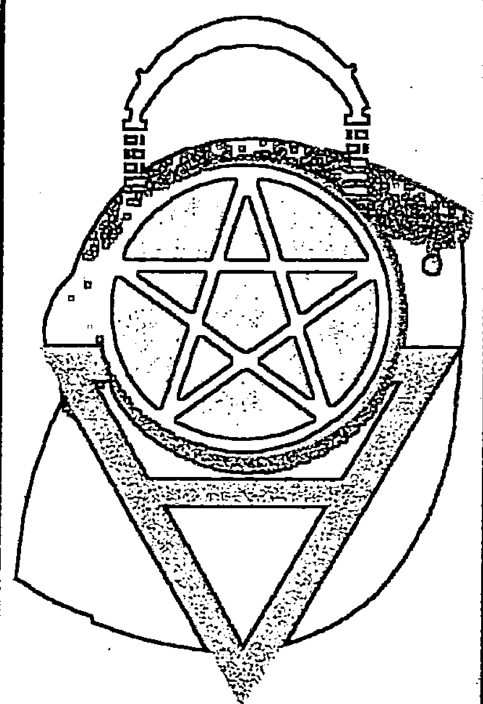

- 祕儀主題：
  - 正 財富發源、關切掌理
  - 逆 財富傾覆、掌理失衡

牌序定位：
金幣牌組之旗幟、金幣花色牌組的第一號祕儀、統領整體金幣花色及土元素。

元素變化：
土元素之源、未分化之土、土元素之初始階段、全體土象整合。

### 祕儀數序定位

#### 位階數序

金幣之 Ace 包含數字 1 的統合原則，連結土元素金幣的意涵，融合而表現為播種、成長以及收穫之意。金幣 Ace 引領並代表整體花色牌組，為土元素作用之起始，代表金幣相關項目的全面啟動。

### 內涵定義

金幣 Ace 代表實質的收穫，是財務事項的開啟，也是金錢任務的根底，代表生意的開端、財富的發跡。這也意味著財源拓展前行，走向繁榮興盛，象徵良好的開始、健全的運作與穩定的保障，亦暗示有賺頭，能夠獲利，可達到預計的成效。
金幣 Ace 的祕儀主題為「財富發源、關切掌理」——闡釋為關切的態度形成掌握的毅力，內在品質配合外在資源，而能導向開花結果。

### 正位實占解釋

- 人際交誼：利益共同體，合作共榮。互相支助扶持，彼此照應。
- 戀愛情緣：幸福感受、安全感、溫馨或恩惠，對感情關係有所幫助。
- 事務進行：情況順利、安穩，有防護與保障，能帶來實質效益。
- 物質金錢：財務穩定成長，收入進帳，獲利賺錢，都能有非常好的成果。

### 牌義來歷變遷

#### 涵義演變

自早期開始，這張牌就常被認為是最順利的一張牌。偉特同樣是這樣認為，並賦予正位置明確的正面意義，也就是完美、滿足、幸福，並表明物質的收穫與心靈的充實並進，因此也有喜樂與心靈狂喜、入神等特殊意義。物質方面的意義，除了金錢的涵義外，更可以直接代表黃金。另外也表示個人擁有高度的才智和理解力。

偉特稍後時期，幾乎跟隨偉特賦予的涵義，更具體說明為物質上和精神上滿足的結合，其他項目則偏向應有的物質層面意義，並據以往黃金的意義，轉化為有價硬幣或貴重製品，並且也代表寶物。

#### 正逆轉折

由於這張牌正位置的涵義非常好，所以逆位置也不會差到哪裡去。早期的逆位置多與正位置相差無幾，像是寶藏尋獲與分配。

偉特接受這樣的觀點，強調物質面作用與正位置差不多，仍然代表興盛富裕。差異只在於這對擁有者並沒有真正幫助，反而帶有負面效應，如因財富而來的怠惰心態或罪惡。其他的負面意義項目，僅有才智不足的涵義，這項是由正位的意義反向推演而來的。

偉特稍後時期，對以往的逆位的見解做了更明確的融合，即是富庶、但不快樂。並突顯金幣的負面狀況：不當使用金錢或浪費，為物慾而墮落，或者是吝嗇貪心，甚至因而受欺詐和損失。

#### 逆位思考

現代定義以逆位原則推演，土元素的「虛弱原則」為資源不足，金幣花色的「過度原則」為享受奢華。Ace 位階「不當原則」為各方面的運作困難，不夠穩定。再以「正逆互異原則」統合如下牌義：原始條件不足，理財模式有盲點或漏洞，導致更為匱乏和損失，難以回收賺錢，支出開銷超過負荷，財務運作發生嚴重狀況。整合出的逆位主旨結語為「財富傾覆、掌理失衡」，也就是理財進行不利。

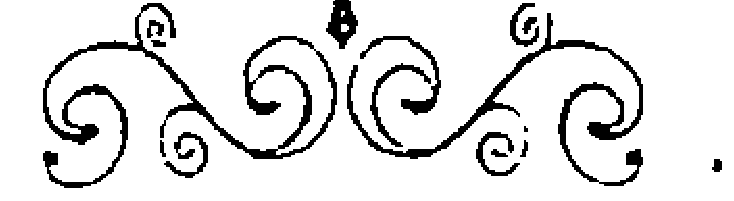

### 逆位實占解釋

- 人際交誼：吝嗇小氣，不願付出。欺瞞詭詐，互相算計。
- 戀愛情緣：相處得無趣，缺乏氣氛和感覺，照顧不周、體貼不足。
- 事務進行：不當運作或才智不足而失敗。浪費金錢或物資，墮落的行為模式。
- 物質金錢：對於財務方面都頗為不利，運作失靈，漏財、損失等狀況發生。

### 畫面寓意解碼

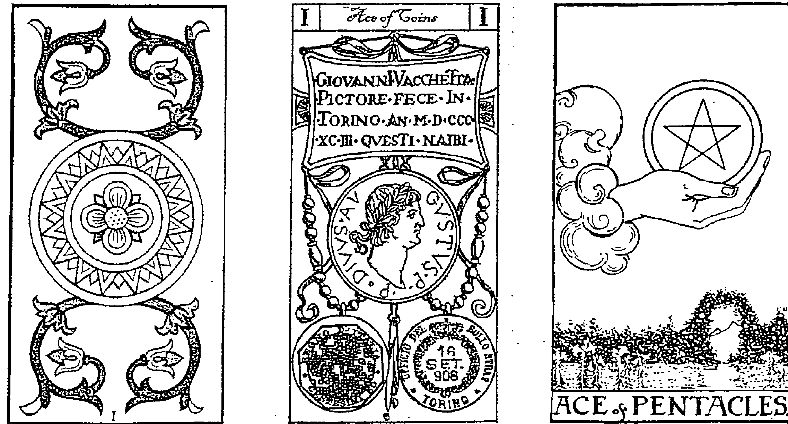

#### 屬物浮現方式

騰空雲霧中冒出一隻手，掌心捧著金幣，包圍住金幣下緣，使它直立起。另外，畫面中也可以沒有手的出現，而讓金幣著地放置，呈現法也有其他變化，古典塔羅以孩童、天使、神話人物等圍繞著金幣。

#### 元素互動

手上的金幣多半單純，少有元素的互動，或許因為本身就是土元素的精華，然而一定會有大地的背景。浮現或是著地的金幣，通常身於土元素或大地之中，或者處於大地繁茂的生長物之內。

#### 整體營造

金幣 Ace 通常是場景畫面最沒有特殊變化的一張牌。多數塔羅這張牌的金幣會呈現出閃亮與光澤，和背景的構圖產生隱約的呼應關係。金幣本身描繪是重點，在背景的空中和大地上出現，營造出生機和朝氣，以展現蓬勃發展的景況。

#### 背景搭配

地面是主要場景，以大地呈現土元素。地面有自然景致，更有人為的莊園，以及生產作物，這一切景象顯示人氣和蓬勃。然而多數塔羅有封閉隔絕的圍牆，往內深入的拱門，這表示一個穩固的領域，也是擁有權和歸屬感的象徵，同時這些營造也可暗示為一座秘密花園或者神秘境地。

### 花色屬物專論

#### Ace 專屬描繪

本花色的 Ace 牌，專屬金幣外型通常是牌組中最大的，至於形貌和裝飾之間的差別程度，則依據不同塔羅而異。金幣通常是圓盤造型，這種單純的圖案予人更多發揮的空間。圓內的花樣設計成為重點，這有關對於這個牌組的內涵認定。古典時期多為一般錢幣的畫法，而黃金黎明賦予更豐富內涵，以圓盤稱呼標榜神秘儀式和魔法意義。偉特之後多半是正五芒星符號填滿全盤，成為五芒星圓盤儀式金幣。有些塔羅在圓盤中會有特殊圖騰，甚至在形貌上有其他變化。更有塔羅牌唯獨對金幣花色加以變化，可能會讓每張牌差異很大。

#### 各階專屬物評比

由於宮廷牌的高貴性，也要求專屬物更為特殊，因此很多塔羅宮廷牌有共同特質而有別於數字牌。國王的專屬金幣要夠大，才突顯掌握財物的豐富。王后專屬金幣不一定亮麗起眼，但與鏡子、水晶球之類物品相似，具有神秘學作用。騎士的金幣有戰利品的感覺，而隨從的金幣則像是展示品。

根據通俗習慣，金幣上面紋路和外型大小就表露了「面值」大小，因此有些塔羅牌是整組牌都有不同安排和變化，金幣面值隨位階差異而有不同畫法，這點自古典塔羅就開始有所講究了。古典塔羅有個傳統，在獨特的金幣 Ace 之外，另選某張數字牌做為「商標」牌，而畫面上具有標誌圖案，其上的金幣也可能很特殊而有別於其他數字牌，識別度僅次於 Ace 牌。

和金幣牌組最有連結性的就是「命運之輪」，整個大輪盤和金幣的圓形是相通的。另外還有更不常被發現的，是將金幣圓盤上的「五芒星」符號拆解，由此和「魔鬼」牌中的「五芒星」產生了關聯性。

> 占卜訣竅提點
金幣 Ace 對於財務方面具有針對性，因此會有直接作用，也就是保證強度和速率而容易見效。占卜任何事情都屬好的趨向，只是其他層面的效應比較緩慢些。金幣 Ace 最大的優勢，就是能夠帶來穩定以及持續力，而這點和土元素較有關聯，其次才考慮元素所能提供的財富。財務原本和事業工作最能相通，因而對工作執行等事項都有助益。至於學業，可知是以穩定的力量帶來累積的成效。愛情方面的答案都頗佳，因為除了土元素的穩定作用之外，就現實生活上實況可證，財力有助於感情關係。

## MEMO

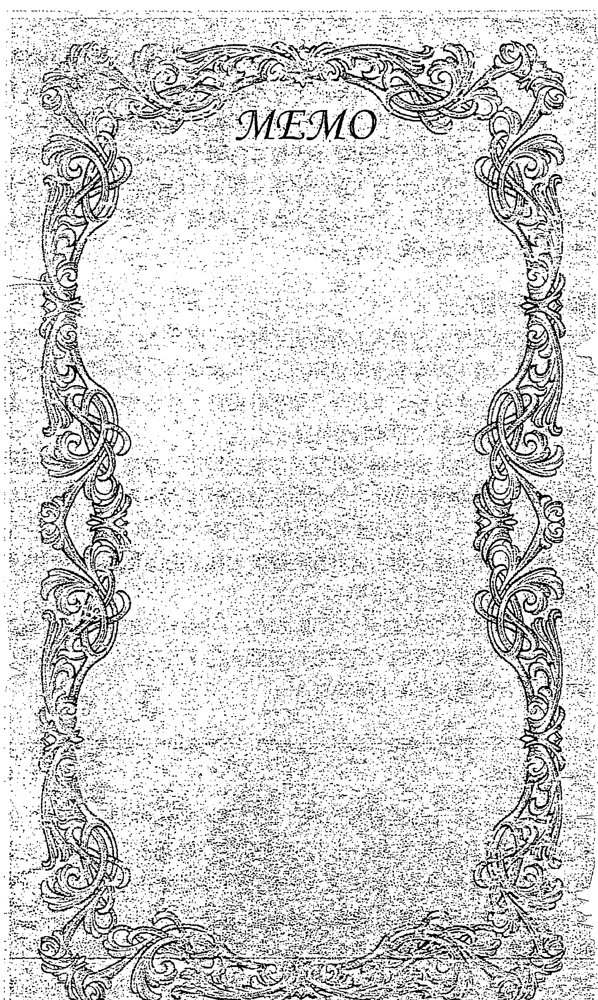

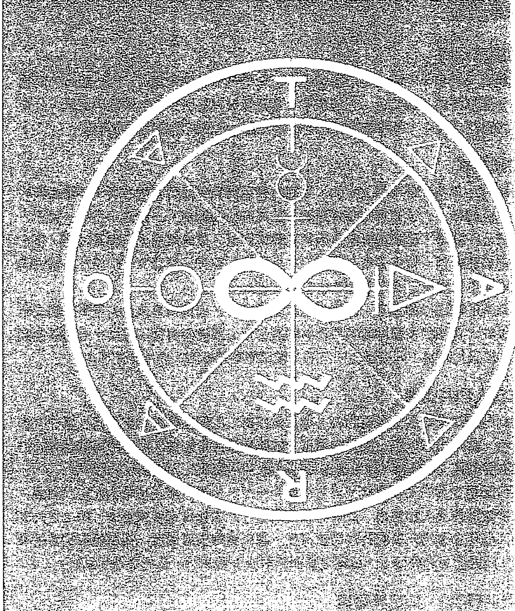

## 宮廷牌解密
Court Cards

### 宮廷牌統論

#### 何謂宮廷牌

宮廷牌又稱為人物牌，是塔羅牌和相近似的各類紙牌中都具有的一組牌，而這更成為各類紙牌的共通特色。在塔羅中，宮廷牌做為祕儀存在，屬於小祕儀，分布於四個牌組花色當中，各牌組皆有固定幾位人物，代表統領該花色的角色。

#### 宮廷制式

塔羅有十六張宮廷牌是公定的，不同種類紙牌的宮廷牌張數有異。塔羅編制約定每個花色牌組，一定要有四張宮廷牌。此即四位階編制，一般名目為——國王、王后、騎士、隨從。位階編排配合小祕儀牌組宗旨，成為規格化的牌義設定。每一人物的定義和特性，皆由元素花色和位階融合推演出來，從而有 16 種基本特質的人物，如果也考慮逆位置的變化則有 32 種人物。

宮廷牌的牌義詮釋通常不須以畫面圖案做參考，因為這些畫面也是根據制式化原則而設計，雖然很多種塔羅的宮廷牌圖案都十分講究而有個別差異，但每張宮廷牌祕儀的涵義是超越不同塔羅而一致的，畫面圖案和細節的作用性並不大。

#### 宮廷人物共通性

宮廷牌用以形容各式各樣的人，通常做為對人的個性解釋，更可代表事件中的人物角色。當然也可以照一般方式運用，依據涵義作用解釋問題。然而宮廷牌的占卜牌義主要仍是人物性格，並且無論如何演變，一直都能以規格化方式解析

正位都是正面的人物性格，以及正面的作用，依據位階花色結合而定出涵義。而逆位則較為負面人物性格，位階作用出問題，元素特質過度或流失，總之是失去了優點，但花色屬物代表的特性仍然存在，甚至會增強或過度，視為能量的濫用導致問題。因此對宮廷牌而言，位階是負面原則或不當原則，花色是過度原則。

#### 宮廷牌功能：指定牌專論

在占卜實際應用時，宮廷牌用來代表事件中某個人物，如果算得準確可達到神奇命中和精細預測的效果，然而這種設定通常使初學者感到困擾，宮廷牌也就時常被認為是不易使用的一組牌。其實宮廷牌的人物設定有更貼切的方式，就是當做「指定牌」，運用在特殊占卜模式上。大致方法是，由 16 張宮廷牌中選出一張代表占卜指定人物，所有牌之間的關係都是搭配設定好的，如此可以依照牌推敲出劇情角色關係。

這種專用法首先要選擇指定牌，有如下的方法可依循：1.針對當事人特質，占卜師感覺當事人符合哪張牌。2.針對問題性質，依此選花色，再根據當事人決定性別位階，挑出所決定的指定牌。3.問卜者自選，觀看牌面以直覺挑選。4.問卜者抽牌，從整組宮廷牌或某位階中，抽出一張牌做為指定牌。

#### 宮廷變革

宮廷牌的編制有如階級社會，是封建制度的縮影，政治變化的情況會隨之發生，出現不同的宮廷位階名目。尤其最常見的情況是，將最小位階的隨從替換成公主牌，這是因為後來男女平等以及陰陽平衡的觀念增長，所以把隨從改成公主，宮廷組成變為：國王、王后、王子、公主。

宮廷牌人物特質的詮釋隨時代和觀念差異會有所變化，然而由於制式化設定，這些演進都有相通的脈絡，現代更可以配合心理原型來延伸意涵。基本上四位階人物，可視為父親、母親、兄弟和姊妹的心理原型，這也就是如今塔羅有套用家庭編制的緣由。其他變化像是部落或特殊團體的各式職稱，介於宮廷王室和平民家庭之間，都可歸於家族制。而不管名目如何變化，同樣位階的解釋都相差無幾。

各花色配置元素是在神秘時期前後確認的，每張宮廷牌都相等一種元素、階段或象徵物。這種配置法更有助於心理原型的運用，正如星象占星，皆以元素形式特質比擬心理原型性格。其實宮廷牌編制原理本就寄託於元素原理，整個即是元素煉金術的表達，也是全副塔羅中最具煉金術色彩的部分。宮廷編制結合元素系統能夠連結更多細節和延伸體系，像是聖名四字母、生命之樹，以及占星的星座和日期等等，其中連結項目會在各張宮廷牌解說中的「神秘學理連結」中列出。

| 古典塔羅泛偉特系列 | 國王 King | 王后 Queen | 騎士 Knight | 隨從 Page |
| --- | --- | --- | --- | --- |
| 歐系地方塔羅 | 國王 Roi / R | 王后 Reine / D | 騎士 Chevalier / C | 侍從 Valet / V |
| 史派若塔羅 | 國王 King | 王后 Queen | 騎士 Knight | 公主 Princess |
| 女神，宇宙，杰尊黃金黎明系列 | 國王 King | 王后 Queen | 王子 Prince | 公主 Princess |
| 克洛利透特系列 | 騎士 Knight | 王后 Queen | 王子 Prince | 公主 Princess |
| 埃及系列 | 國王 King | 王后 Queen | 騎士 Knight | 僕役 Knave |
| 上古塔羅 | 國王 King | 王后 Queen | 騎士 Knight | 使者 Herald |
| 錦繡塔羅 | 男人 Man | 女人 Woman | 騎士 Knight | 隨從 Page |
| 朱鷺塔羅 | 男主人 Master | 女主人 Mistress | 戰士 Warrior | 奴隸 Slaves |
| 心靈塔羅 | 父親 Father | 母親 Mother | 兄弟 Brother | 姊妹 Sister |
| 海因德塔羅幻境之旅 | 父親 Father | 母親 Mother | 男子 Son | 女子 Daughter |
| 性感女巫塔羅 | 智者 Sage | 母親 Mother | 侍祭 Acolyte | 少女 Maiden |
| 藥女塔羅 | 模範 Exemplar | 屋舍 Lodge | 圖騰 Totem | 學徒 Apprentice |
| 年輕女巫塔羅 | 試煉 Trial | 女神 Goddess | 月亮 Moon | 慶典 Celebration |
| 異教徒塔羅 | 元老 Elder | 正式門人 Initiate | 見習士 Novice | 基本元素 Elemental |
| 歡慶日塔羅 | 國王 King | 王后 Queen | 戰士 Warrior | 基本元素 Elemental |

▲宮廷編制變化比較

#### 位階原則與占卜作用

關於宮廷人物牌解析，每一位階人物都有共同特性和基本設定。而至於其他實際人物特徵和各種細節的占卜解析，都能依據花色和位階的結構原則制定，例如年齡和性別就可以有不同的幾套對應。各式相應連結也在每張祕儀解說的「占卜訣竅提點」中列出，然僅供參考而可自行加以設定。

#### 國王牌

位階作用：擁有花色屬物、掌控元素的人，代表權責和管理，穩定大局的情境。
人物特質：國王人物具有穩定威嚴的特質，是熟年男性的角色，年齡層較高些，和另一男性人物牌——騎士有所區隔。而年紀是一種概況，會因社會常態和心理狀況而有差異。基本上，指內在心境上的成熟和沉穩。
逆位變化：表示國王做得不好，管理不妥善，元素掌控不當而無法呈現出力量，這樣的影響程度可能較其他人物牌來得嚴重和深廣。

#### 王后牌

位階作用：享受花色屬物、沈浸元素中的人。對花色懷有熱誠和關心，喜愛運用並且樂在其中。
人物特質：與國王同等位階，然而性別相異，是具成熟特質的女性，但不須特別強調年齡層，只要不是過於年輕的少女或小女孩就可符合。
逆位變化：過度使用或享受花色，沈溺的性格特質，濫用資源而匱乏，因而呈現出負面作用。

國王與王后雖有差異，卻同為陛下之尊，也都屬於王室，兩者都是採取坐姿，代表不用行動也不需要奔走和勞動。因而這兩個位階有時可歸納出共同涵義，例如年齡層可設定同為 40 歲之上。通常和下個位階間有段差距，騎士為一種爵位，是貴族而並非王室。如果這位階以王子為名目，則階級較高，且屬於王室成員。騎士不同於陛下而可以隨意到處移動，必須執行任務，卻仍然騎乘在馬上，有坐騎可以代步，而駕馭馳騁也表示擁有自主權。

#### 騎士牌

位階作用：追逐花色屬物、獲取元素的人，當然也因擅長此道而能獲取成功！
人物特質：人物年紀是比較年輕的男子，重點是懷有雄心壯志，並且有所專長和能力，是前途看好的人。位階高低並非重點，而是位階特色擁有配備與活力，具備馬匹與工具利器，有很強的動作性。
逆位變化：停頓延誤，執行失利，能力或技術不精，或過於急躁求速導致失誤。因為追求方式出問題，可能被打敗或被競爭出局，原來掌握之物會被搶走。

#### 隨從牌

位階作用：嚮往花色屬物、追隨守護元素的人，代表隨身之人或物品，信差或信件。

人物特質：對花色不是很純熟，尤其在運用上並沒有信心，是一個學習的角色，然而內心卻無比嚮往和認同。象徵該領域中的見習生、初學者、新手和資淺者，具有服務的精神，背負任務和職責，通常是傳遞訊息，擔任物流或各種差事。可視為幫忙做事的角色，而年紀則特別指青少年以下，或者地位、資格較為低階。隨從代表的性別，現代通常是以中性論，男女皆可通用。

逆位變化：程度要比正位置差，能力上更遜一籌，更為幼稚或退化，是個真正生手、非常菜鳥。並且更易胡搞亂來、愛鬧瞎掰，失敗和被修理得更慘，招來更為不幸的羞辱。此外，也可代表比正牌更輕的年紀，用以特指孩童。

#### 僕役

位階作用：並非主動，而是被動，甚至被迫地必須去保護或維持花色專屬物的人，也是隨身跟班之人。

人物特質：對花色陌生又不具熱誠，並且是更不起眼的人物，可認為連新手都稱不上，只是個根本不得其門而入的掃地僧，是當差服役或供人使喚的角色。

逆位變化：很不甘願的進行工作，因無心造成疏失而搞砸事情，或是不被肯定而多受責備，遭遇折磨和困境。

#### 公主牌

位階作用：元素剛醞釀成形，沒有行動，剛在內心萌芽生成，細心照應呵護。

人物特質：公主牌偏向心靈作用，較少負面的意思，比隨從懂事並具有氣質。

逆位變化：花色作用被壓抑或扼殺抹滅，相關計畫和行動並未成行或者取消。

宮廷牌的最小位階，處於宮廷人物與數字牌的交界，呈現變化而地位不定的現象，涵義作用具有多樣性，名稱和性質也常有不同的設定。根據傳統宮廷編制的塔羅牌，這個位階目前一般名為 Page，此名目並非貴族而是平民，是當差的工作人員，服務於宮廷或者做為差使。由於主要是騎士跟班的職務，因此中文可稱為「隨從」。

書中的宮廷牌秘儀說明，是以隨從為本位階代表，其他變化以通論說明，便於據以推演簡易單張牌義。隨從變化的最近似版是僕役或奴僕，不過這其實是更為降格的。少數的「使者」則是平行版，意義參考隨從即可。至於「公主」是本位階的高級變格，屬於宮廷王室的一分子，也和隨從的意義差距較大。

## 權杖國王
King of Wands

秘儀主題：
**正** 熱烈領導
**逆** 暴烈霸道

牌序定位：
權杖花色牌組的第十四序號秘儀、權杖宮廷牌的最高位階男性角色。

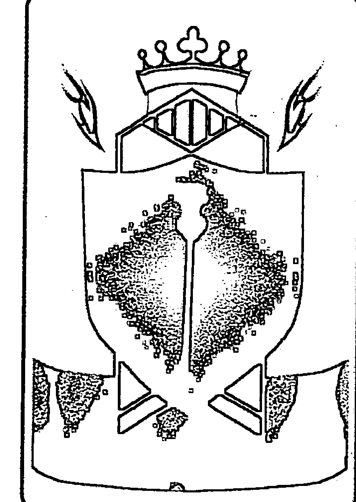

元素位階：
火元素中之火成分、強烈的火性物質、火元素的固態、固態火象、火之父。

### 祕儀數序定位

#### 位階數序

權杖牌組的成熟資深男性宮廷人物牌。根據元素位階推演出的特質是權杖的擁有者、火元素的管理者，進一步延伸為擁有權力的領導者，以及運用權威並具有主導氣勢的男人。

#### 人物原型

心理投射的人物原型是豪氣威勢的父親形象，在現實層面上的表現為魄力十足、陽剛的成熟男人，豪邁而有氣勢威嚴，具有熱烈積極的性格，待人處世慷慨大方，具有領導者的風範，是個帶頭人物。在職業身分推斷上，多為法政人士，不然就是資深主管，各單位中位居管理階層者。
本祕儀主題為「熱烈領導」——強勢威嚴的領導者。

### 正位實占解釋

**人物關係**：可能遇到符合上述特性的人物出現在所占算的故事當中，也可能代表一位與當事人有權力管理關係的長輩或上屬。
**事態局勢**：在事態上表示掌握權力，帶領管理，運作執行成功。局勢狀況則是處於權威主導，大刀闊斧的局面中。
**情態心境**：在心態上意味著豪邁直接、熱切誠摯、慷慨大方、強勢主導。心境感受則是充滿強盛和榮耀感。

### 牌義來歷變遷

#### 涵義演變

早期強調對於婚姻是有利的，可以代表良好婚姻，還有繼承上的優勢和利益，另多提及是已婚男人的身分，而且個性慈祥。這張牌也一向都與誠懇正直相關，更代表友好的特質。

偉特承襲這些涵義，也相符於他對此位階的一貫定義，並特別加上了純樸正直的特徵。後來的涵義逐漸加強，成爲成熟、智慧、友善、富同情心的特質。偉特稍後時期甚至演變爲具有學養和紳士風範。

#### 正逆轉折

早期逆位置有忠告的意義，似乎因爲傳統認定這是張很好的牌，所以就連逆位也壞不到哪裡去。偉特對於逆位意義的下筆也較輕，只設定爲比正位置的寬大優點較爲嚴厲些的特質。偉特稍後時期的逆位，則放棄了優點，改成真正嚴厲的人物形象。隨和變成堅守規則，簡單純樸變成深思熟慮。這可說是以正位置統合整體意義的「逆位相反原則」來推演的。

#### 逆位思考

現今的方式，是以規格化推論得知，這張牌的逆位原則統整而言，是權杖能量的濫用以及國王位階的不當，由此融合而成的人物特質爲，性格上霸道兇暴、弄權專制的男人。

整合出的逆位主旨結語爲「暴烈的大男人」。

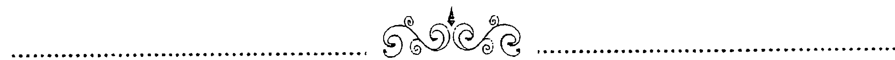

### 逆位實占解釋

人物關係：可能遭遇上述特質的人物，產生掌控占有或緊張火爆的對峙關係。

事態局勢：管理不當、領導無方，雖然採取高壓政策，但事務仍然延宕。

情態心境：暴躁易怒，控制慾強，嚴厲要求他人。

### 畫面寓意解碼

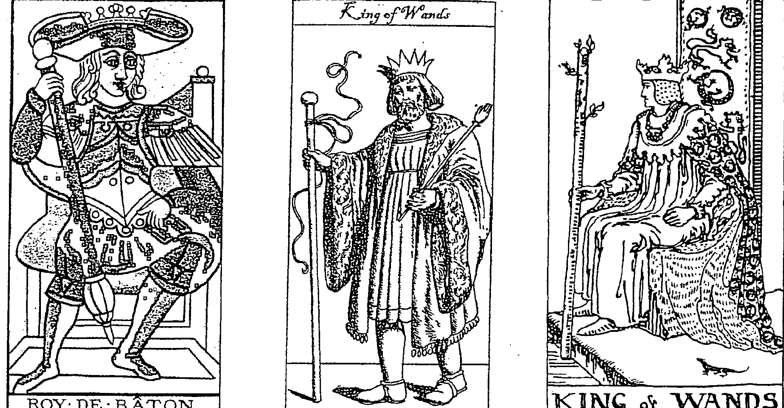

#### 主角人物

權柄在握的長者——權杖國王，這位長者坐在王座上，顯示他至尊的國王身分。王座定位於沙漠中的火山之旁，暗示火元素權杖國度的領域。

#### 場景布置

地面沙漠一片空曠且一望無際，天空晴朗而清澈無物，這些都是火元素熱力呈現的表徵。遠景中如有火山，更加強火元素象徵，並表示蘊藏強大能量。

#### 外觀姿勢

權杖國王有威嚴的神情，簡單粗獷的輪廓線條，表現陽剛男性特質。權杖國王手握著專屬權杖，執杖姿態足以表達出他的作風，牌面上時常描繪國王以權杖觸地，呈現出威嚇震撼的氛圍。

#### 專屬搭配

寶座椅背上多裝飾著獅子、蜥蜴或龍的圖騰，在權杖人物服飾也多有這些標誌。獅子圖案為雄壯威武的象徵，領導者的風範。蜥蜴紋飾則表示火元素熱烈和動力能量。龍之圖騰代表類似火蜥蜴的作用，然而這個奇幻動物更具最高權威或強大力量，匹配國王之尊貴。權杖國王的服飾造型，色澤簡單而呈對比。身穿紅袍，綠披風，模擬權杖樹木的色調。王冠外形呈現火焰狀，加強突顯火元素特質。

#### 相隨配角

火蜥蜴是生存在沙漠中或火山旁的動物，時常做為火元素權杖花色的象徵動物。

### 占卜訣竅提點

#### 實占事件角色定位

相應角色：豪邁大方的長者，很可能是个領導人物。
關係推敲：事業相關問題之資深男角、機構資源之主事者或掌控者。
逆位角色：阻撓事況的權威者、霸道不講理的長輩。

#### 指定牌選用依據

符合特徵：遇見成熟穩重而有魄力的男性，選用本牌為指定牌。
因事指定：事業工作或事務問卜之熟齡男性，可以直接指定本牌。

#### 外貌年齡參考

一般可行用法：四十歲以上的男性，特質視指定或占卜而比照上述設定。
多種族區適用：金髮或紅髮、藍眼睛、白色皮膚，年紀在四十歲以上的男人。

#### 特殊項目占卜參考

顏色運用：紅色（Red）。
天氣概況：高溫烈日。
時間期限：一年。
方位走向：1.正西方 W。
2.遠距南方。

#### 神秘學理連結

星象設定：1.獅子座（螺旋塔羅，一般神祕學塔羅及多數塔羅設定）。
2.白羊座（宇宙塔羅等少數設定）。
克洛利星象設定：天蠍座 20 度至射手座 20 度（變格為權杖騎士王）。
易卦對應：1.震卦（克洛利透特塔羅）。
2.乾卦（透特塔羅新詮釋設定）。
3.比卦（星宿對應）。

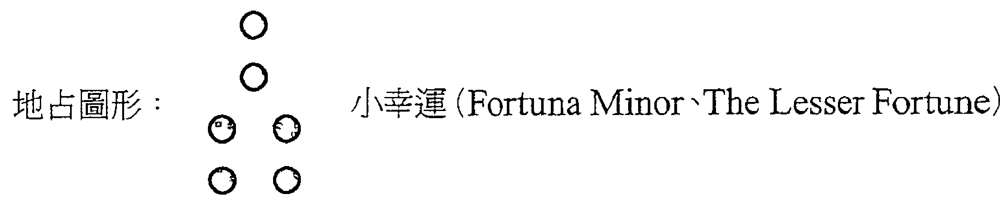

## 權杖王后
Queen of Wands

秘儀主題：
**正** 熱情女性
**逆** 驕縱女人

牌序定位：
權杖花色牌組的第十三序號秘儀、權杖宮廷牌的高位階女性角色。

元素位階：
火元素中之水成分、溫暖的火性物質、火元素的液態、液態火象、火之母。

### 祕儀數序定位

#### 位階數序

權杖牌組的成熟女性宮廷人物牌。根據元素位階推演出的特質是權杖的享受者、火元素的沈浸者。進一步推論為享受權威，或者沈浸在熱情之中，興高采烈的女性。

#### 人物原型

心理投射的人物原型是熱切急性而有主導力的母親形象。在現實層面表現上，權杖王后可以分別出幾種類型：一為性格有自我主張，事業有成或者很有能力的女強人。二為具有磁性與魅力，甚至火辣性感，熱情洋溢的熟女。三為個性強悍的女人，可能有點陽剛氣質。
整合出的祕儀主題為「熱情女性」——熱情主動且成熟堅強的女人。

### 正位實占解釋

**人物關係**：可能遇到符合上述特性的人物出現在所占算的故事當中，也可能代表一位與當事人有公務關係，或者能夠大方相處的女性。
**事態局勢**：在事態上，積極的鼓勵與讚賞，自然而真誠的對待。局勢狀況則代表活潑熱鬧或歡心喜悅的場面。
**情態心境**：在心態上意味著率性自如，活潑開朗，輕快好動而真誠熱情，充滿光明和積極。心境感受則為熱情洋溢。

### 牌義來歷變遷

#### 涵義演變

早期這是一張很好的牌，正位置代表各種方面的大豐收！偉特根據這些要點加以變化，定義為財務或事業上的成功。他對於王后位階的一貫相通意義為真誠正直、親切友善以及貞潔，而又融合權杖涵義定出人物形象，為純樸自然的女性、鄉村婦女，同時又具有權杖的榮耀，並且特別強調這張牌表示將出現對問卜者有幫助和關懷的女人。偉特稍後時期，承襲了以往的正位牌義，但比較沒那麼複雜，人物特質則從質樸轉趨於魅力和優雅。

#### 正逆轉折

早期的逆位置牌義，是正位置意義的減弱，並沒有很負面，例如良好的計畫和目標，只是沒有機會實現。偉特仍認為逆位具有好的涵義，像是熱心關切，節儉勤奮。但也認為逆位具有負面特質，只是必須根據整體牌局才能判定，他對於王后逆位的一貫定義，就是欺騙和不貞。當然也要加入火元素的負面作用，就是嫉妒和情緒化，以及權杖的負面特質，也就是反抗和不順從。
偉特稍後時期的逆位置解釋，大致跟隨之前這些牌義，但還是有所差別，取消其中好的優點，只留下負面特質，此時可說已經一律單純的以「逆位負面原則」來推論了。這樣一個女性的特質，應當脾氣頗差，其中的一種類型也因而被認定為粗枝大葉的男人婆。

#### 逆位思考

現今的方式，是以規格化推論得知，這張牌的逆位原則統整而言，是權杖能量的濫用以及王后位階的不當，由此融合而成的人物特質為性格上兇悍潑辣、善妒怨念的女人。
整合出的逆位主旨結語為「驕縱的大女人」。

### 逆位實占解釋

人物關係：可能遭遇上述特質的人物，產生嫉妒猜忌或怨恨不滿的相處關係。
事態局勢：盛氣凌人、責怪怨恨，不願順從、互相壓制，無理性的行為。
情態心境：情緒起伏大，脾氣易怒、善妒、吃味，時常不悅、不快。

### 畫面寓意解碼

#### 主角人物

緊握權杖的女人——權杖王后，這位女子坐在后座上，顯示出尊貴的王后身分。后座定位於無垠的沙漠之中，是火元素權杖國度之轄區。

#### 場景布置

身側的遠方可見到金字塔，暗示精神內涵或探索，或許存有情節作用。若背景有綠洲水源或樹蔭，表示火的國度中有水的滋潤。天空晴朗亮麗，是心境的寫照。

#### 外觀姿勢

權杖王后相貌線條簡單，可看出強勢的一面，然而也具有磁性和魅力。眼神望向遠方，顯示她的眼界和心境。權杖王后一手握住權杖，自在而安穩，大方俐落的坐姿，充滿精神並散發魅力。

#### 專屬搭配

權杖王后的寶座椅背高起，其中刻劃著火紅獅子，扶手也有獅頭裝飾，都是火元素尊貴和熱情的象徵。服飾造型來說，火紅后袍和披風，色調與場景融合一體，暗喻沙漠般的熱情以及烈日下的火焰。

有些塔羅牌會讓權杖王后另一手握著其他物品，多半是向日葵類的花卉，也可在王后身旁或紋飾中呈現。向日葵結太陽，象徵熱情和生命力，代表陽光開朗的女性，也呈現花卉具有的美感。

#### 相隨配角

做爲權杖王后的專屬寵物，是王后性格一面的象徵。貓溫柔而又桀敖不馴，而黑貓更表示神秘能量和潛藏的生命力。豹等貓科動物同樣時常做爲火元素的象徵動物，皆有類似於黑貓之作用。

### 占卜訣竅提點

#### 實占事件角色定位

相應角色：熱情洋溢的女人，多爲掌握事務進行的女性。
關係推敲：事業、工作、旅行情節之女主角，愛情故事女配角。
逆位角色：易怒或干涉事情的女性長輩。

#### 指定牌選用依據

符合特徵：遇見成熟而熱情的女人，選用本牌爲指定牌。
因事指定：事業人際問卜的熟女，可以直接指定本牌。

#### 外貌年齡參考

一般可行用法：二十歲以上的女性，特質視指定或占卜而比照上述設定。
多種族區適用：金髮或紅髮、藍眼睛、白色皮膚，年紀在四十歲以上的女人。

#### 特殊項目占卜參考

顏色運用：紫紅色（Fuchsia）。
天氣概況：燠熱有雨。
時間期限：九個月。
方位走向：1.西南西 WSW。
2.遠距西南方。

#### 神秘學理連結

星象設定：1.白羊座（螺旋塔羅，一般神秘學塔羅及多數塔羅設定）。
2.射手座（宇宙塔羅等少數設定）。
克洛利星象設定：雙魚座 20 度至白羊座 20 度（變格爲權杖女王）。
易卦對應：1.隨卦（克洛利透特塔羅）。
2.咸卦（透特塔羅新詮釋設定）。
3.漸卦（星宿對應）。

## 權杖騎士
Knight of Wands

秘儀主題：
- 正 熱血青年
- 逆 火爆浪子

牌序定位：
權杖花色牌組的第十二序號秘儀、權杖宮廷牌的中間位階男性角色。

元素位階：
火元素中之風成分、爆發的火性物質、火元素的氣態、氣態火象、火之子。

### 祕儀數序定位

#### 位階數序

此爲權杖牌組的青年男性宮廷人物牌。根據元素位階推演出的特質是權杖的追求者、火元素的掌握者。進一步延伸爲充滿雄心壯志、追求成功上進、積極掌握權勢的男子。

#### 人物原型

人物原型是心目中的英雄人物，在現實層面上的表現爲熱力爽朗、進取有爲的青年，崇尚權力而致力於事業前途，在乎自我展現和成就感，具有男性魅力和雄風，往來直接卻不夠細膩。在各場域中的的角色，若非勇氣活力的英雄，就是魄力十足的先鋒。
整合出的祘儀主題爲「熱血青年」——熱血澎湃或性格強烈的男子漢。

### 正位實占解釋

人物關係：可能遇到符合上述特性的人物出現在所占算的故事當中，也可能代表一位與當事人有業務關係，或者能坦率相處的男性。
事態局勢：在事態上表示追逐目標可以成功，能達到某種地位，或是改變或冒險，投入新領域。局勢狀況處於熱烈奔騰，躍動激進的場面。
情態心境：在心態上意味自信心與雄心壯志，對權力與事業或某項行動很感興趣。心境感受上則是衝勁十足。

### 牌義來歷變遷

#### 涵義演變

牌義並不是很固定，早期被認爲是一張不好的牌，正位置即表示了疏離隔閡與缺憾。然而偉特只保留了缺憾這個意義，給予正位置正面的人物特質，包括積極熱切和友好。另外基於他一貫對於騎士牌正位置的通義，強調了旅行或啓程相關的事件，並延伸爲飛航，以及搬遷、移民，甚至與居家狀況的變化都有關聯。偉特稍後時期，皆跟從以往這些意義，且延伸爲前往未知的領域，以及改變現狀。

#### 正逆轉折

原先逆位置和正位置一樣是負面的意義，尤其指女性的不幸遭遇，在婚姻方面受到挫折。偉特把負面的意義歸於逆位，賦予他對騎士逆位的通義，人際關係上的不和諧、爭執、分開、決裂，事件和遭遇上則是中斷和阻礙。
偉特稍後時期，延續了這些意義，並強調了預料之外的轉變，這是以正位置的轉變涵義加劇而推演出來的，可以說是「逆位過度原則」。而人物形象也偏向粗魯，這種氣質甚至可以形容爲帶有江湖味或是流氓氣的。

#### 逆位思考

現今的方式，是以規格化推論得知，這張牌的逆位原則統整而言，是權杖能量的濫用以及騎士位階的不當，由此融合而成的人物特質爲性格上火爆急躁、莽撞自豪的男子。
整合出的逆位主旨結語爲「火爆浪子」。

### 逆位實占解釋

人物關係：可能遭遇上述特質的人物，產生競爭較量或摩擦衝突的交互關係。
事態局勢：競爭受挫失利，預料之外的轉變，事務遭遇阻礙而中斷。關係不和諧，感情或婚姻不順。
情態心境：感到錯愕或驚恐、憤恨不平，心中有挫折感或沮喪。

### 畫面寓意解碼

#### 主角人物

馬背上手執權杖的男子——權杖騎士，紅馬奔馳在廣漠的沙丘之間，騎士在沙漠之中無畏艱難地前行，他正在歷經火元素權杖國度之境地。

#### 場景布置

這位男子騎著紅鬃烈馬，正行經金字塔之旁，金字塔暗示精神內涵或探索，而如此明確顯示所在地，可能為了表達情節作用。天空光亮無雲，是明快心境的寫照，也是火中之風的景致描繪。

#### 外觀姿勢

權杖騎士長相很有英氣，而且神情威武。他的馬匹前腳揚起，騎士的身姿剽悍，表示威勢與往前衝的決心，表現出騎士的熱切，期待這段旅程的展開，他必須到達目的地以完成使命。

#### 專屬搭配

權杖騎士的服飾造型，是全副盔甲武裝，亮橘黑紋外袍裹身，黑色的陪襯更添尊貴感，顏色和紋飾同樣呈現火元素象徵。盔甲飾以紅色羽毛，形似馬尾，象徵火焰，突顯火元素熱烈如火的特質。

#### 相隨配角

權杖騎士的專屬座騎，是他性格另一面的象徵呈現。他所駕馭的馬匹多為紅棕色，以配合權杖騎士的烈火熱力，馬鞍的顏色也和服飾相搭配。

### 占卜訣竅提點

#### 實占事件角色定位

相應角色：開朗陽光的年輕人、冒險者。
關係推敲：事業、工作、旅行、冒險情節之男主角，愛情故事男配角。
逆位角色：故事中想以暴力解決事情的人。

#### 指定牌選用依據

符合特徵：活力充沛、年輕氣盛的男子，選用本牌為指定牌。
因事指定：前途、事業問卜之成年男性，可以直接指定本牌。

#### 外貌年齡參考

一般可行用法：二十歲以上、未滿四十歲的男性，特質視指定或占卜而比照上述設定。
多種族區適用：金髮或紅髮、藍眼睛、白色皮膚，年紀在四十歲以下的男人。

#### 特殊項目占卜參考

顏色運用：深棕色（Maroon）。
天氣概況：熱有風。
時間期限：六個月。
方位走向：1.正西北 NW。
2.遠距東南方。

#### 神秘學理連結

星象設定：1.射手座（螺旋塔羅，一般神秘學塔羅及多數塔羅設定）。
2.獅子座（宇宙塔羅等少數設定）。
克洛利星象設定：巨蟹座 20 度至獅子座 20 度（變格為權杖王子）。
易卦對應：1.益卦（克洛利透特塔羅）。
2.履卦（透特塔羅新詮釋設定）。
3.明夷卦（星宿對應）。

地占圖形：
限制（Carcer、Prison）

## 權杖隨從
Page of Wands

秘儀主題：
- 正 熱心少年
- 逆 狐假虎威的小咖

牌序定位：
權杖花色牌組的第十一序號秘儀；權杖宮廷牌的最低位階中性角色，處於和權杖數字牌銜接的位置。

元素位階：
火元素中之土成分、持續的火性物質、火元素基底、火元素之爐、火之女。

### 祕儀數序定位

#### 位階數序

此爲權杖牌組的少年宮廷人物牌。根據元素位階推演出的特質是權杖的嚮往者、火元素的維護者。進一步延伸爲嚮往權威、渴望成功，維護權力結構和體制的躍勁少年。

#### 人物原型

社會心理上的標籤印象，是個事務運作見習生。在現實層面上的表現爲嚮往管理經營、執行任務的少年男女。由於充滿熱誠和興趣，導致經驗不足卻躍躍欲試，難免輕率粗糙。
整合出的秘儀主題爲「熱心少年」——權力結構中的基層成員。

### 正位實占解釋

人物關係：可能遇到符合上述特性的人物出現在所占算的故事當中，也可能代表一位與當事人有事務交涉關係的下屬或晚輩。
事態局勢：事態是學習或模擬如何管理，拿捏權力的行使和公器的運用。局勢狀況則爲熱情激動的氛圍。
情態心境：在心態上意味著表現發揮，或一時驕傲得意。心境上則是感受到爽快、雀躍的心情。
特別占問：公物信物遞送者，執行公告或宣告者。一切告示信函和公文。隨身物爲代表身分的各種證件、名片或會員卡，識別證、通行證和鑰匙。

### 牌義來歷變遷

#### 涵義演變

早期的牌義鎖定為人物，強調少年人，以及使者、信差，甚至是密探之類的角色，並且也跟尋人或徵求等任務相關。偉特給予的角色職務承襲了以往定義，著重於攜帶重要訊息，並且具有忠誠特質。在占卜功能上，他認為可以代表戀人，也可以視為敵手，也有可能表示受到讚揚或獎賞，不過這些判斷都要根據牌局而定。
偉特也說明需要根據花色特質來演繹牌義，其實整體的正位置的意義設定得很模糊。偉特稍後時期的牌義，偏重於人物形象，強調真誠可靠的特質，可能是善意的陌生人，或是忠誠的友人。

#### 正逆轉折

原本逆位置就特別跟壞消息相關，可以說是正位置涵義的「逆位負面原則」推演而得，也就是將訊息視為負面的。偉特對此闡釋而加上流言散布和負面報導，也賦予他對隨從逆位的一般定義，即是心理上混亂焦躁、猶豫不決，和缺乏安全感。偉特稍後時期，統合了以上這些意義，並著重於負面的消息傳布的情況，嚼舌根或八卦，以及因為這些新聞而受傷害或不愉快。

#### 逆位思考

現今的方式，是以規格化推論得知，這張牌的逆位原則統整而言，是權杖能量的濫用以及隨從位階的不當，由此融合而成的人物特質為，性格上好高騖遠、愛現賣弄而欠缺自省。
整合出的逆位主旨結語為「狐假虎威而自以為是的小咖」。

### 逆位實占解釋

**人物關係**：可能遭遇上述特質的人物，產生互相嫌惡的牽涉關係。有人嚼舌根，得到壞消息，負面的報導或評價，不佳的成績或業績。
**事態局勢**：濫用職權，拿著雞毛當令箭的作風。不純熟的執行運作和表現態度，氣氛浮躁。
**情態心境**：內心焦躁不安，急切而又擔憂，因受到批評而傷到自尊。也可能利慾薰心，而後自食其果。
**特別占問**：接收到事務、政策相關的負面或不利訊息通告。占問物品時，表示證件鑰匙等權杖隨身物的遺失。

### 畫面寓意解碼

#### 主角人物

手執權杖的少年——權杖隨從，這位少年獨自挺立在遼闊的沙漠之中，在火元素權杖國度境內，執行他的任務使命。

#### 場景布置

隨從站在古文明的金字塔旁，這樣明確表示所在之地，與其他張牌的場景相同，表示了相屬或相近關係的情節。通常場景和騎士是連接一氣的。

#### 外觀姿勢

權杖隨從神情的閃亮，可看出他正付出熱誠，認真投入於他的任務當中。他將權杖安插在地上，站立的姿態顯示出他正要宣告新的訊息。權杖隨從手按觸權杖的模樣，讓人感受到他的躍躍欲試。

#### 專屬搭配

權杖隨從全身橘紅綴以黑色花紋，為較醒目的配置。黑蜥蜴圖騰紋飾，火元素權杖花色的象徵物以及深層能量。服飾如果和騎士相近，則表示兩者的主從關係。

#### 相隨配角

權杖隨從的專屬寵物，是他性格某一面的象徵和補充表露，並也能代表訊息傳遞作用。火蜥蜴在沙漠中或火山旁出沒，時常做為火元素權杖花色的象徵寵物。

### 占卜訣竅提點

#### 實占事件角色定位

相應角色：活潑動感的少年、熱心者。
關係推敲：有助於劇情進行發展的小配角。
逆位角色：故事中的搗亂者、喧嘩好動的小孩。

#### 指定牌選用依據

符合特徵：遇見青春活潑、表現高亢的少年少女，選用本牌爲指定牌。
因事指定：未來、前途、事件問卜之青少年，可以直接指定本牌。

#### 外貌年齡參考

一般可行用法：二十歲以下的少年男女，特質視指定或占卜而比照上述設定。
多種族區適用：金髮或紅髮、藍眼睛、白色皮膚，年紀在四十歲以下的女人。

#### 特殊項目占卜參考

顏色運用：黃色（Yellow）。
天氣概況：熱而乾燥。
時間期限：三個月。
方位走向：1.西北西 WNW。
2.近距南方。

#### 神秘學理連結

一般星象設定：夏季星座——巨蟹座、獅子座、處女座。
克洛利星象設定：春季星座——白羊座、金牛座、雙子座（變格爲權杖公主）。
易卦對應：1.頤卦（克洛利透特塔羅）。
2.豫卦（透特塔羅新詮釋設定）。
3.小過卦（星宿對應）。

## 聖杯國王
King of Cups

秘儀主題：
- 正 溫和領導
- 逆 風流多情

牌序定位：
聖杯花色牌組的第十四序號秘儀、聖杯宮廷牌的最高位階男性角色。

元素位階：
水元素中之火成分、澎湃的水性物質、水元素的固態、固態水象、水之父。

### 祕儀數序定位

#### 位階數序

聖杯牌組的成熟資深男性宮廷人物牌。根據元素位階推演出的特質是聖杯的擁有者、水元素的管理者。進一步推論為，擁有豐富的情感、有感情付出對象或者感情經驗豐富的男人。

#### 人物原型

心理投射的人物原型是慈祥寬大的父親形象，而在現實層面上的表現為，深諳人情世故的成熟男人，溫暖關懷慈祥，給人充分安全感，照顧和關懷都很周到，帶有父愛或家長特質。對於關係和感情方面，分寸拿捏得很清楚。職業身分推斷上，大致為高階專業路線或者躋身上流社會，也可能為藝術和人文領域的人士，再者或許和宗教信仰相關。
整合出的祕儀主題為「溫和領導」——和藹可親的成熟男人，包容的資深長者。

### 正位實占解釋

人物關係：可能遇到符合上述特性的人物出現在所占算的故事當中，也可能代表一位與當事人有良好情誼關係的長輩或上屬。
事態局勢：事態呈現關懷照顧或庇蔭保護，有整體感歸屬感，幸福安全的情境。局勢狀況可能有人持續關心，環境祥和融洽。
情態心境：在心態上意味著充滿慈祥愛心，和藹親切、慷慨寬宏、關注照顧。心境感受則是溫暖熟悉、歸屬感或家的感覺。

### 牌義來歷變遷

#### 涵義演變

早期正位置包含許多負面的涵義，像是男性的身體健康問題，並且也是偽善的幫助。這些涵義或許與花色與位階結合的人物特質有關，只不過是朝向負面來推演。後來正位置的負面涵義還是逐漸清除掉了。

偉特以專業人士意涵配合花色，將職業身分定位於藝術和神職。但因為也認定國王代表具有經驗而善於管理的，所以也可以是法律、商人、實業家、科學家。由聖杯推出個人特質為，俊美的外貌，具有創造的天賦，且令人信賴。另外在事件上，對問卜者支助相挺或公正以待。偉特稍後時期的牌義，容納了以上的涵義，並更強調了學養氣質、體貼周到、虔誠、善良寬大等，屬於元素花色的正面特質。

#### 正逆轉折

早期逆位置涵義就比正位置更為負面，代表了損失以及不利。偉特加強正逆位的差異，將逆位視為更重大的損失，並加上他一貫賦予國王逆位的性格，不正直、不真誠和不負責任，以及行為上的邪惡行徑和名聲。事件方面就推論為欺騙、掠奪和不公道的交易。這些內容比對正位意義的項目，可知這是種「逆位相反原則」的推論。偉特稍後時期承襲了這些意義，也將人物形象解釋為：藝術家性格，詭詐而無美德的人。

#### 逆位思考

現今的方式，是以規格化推論得知，這張牌的逆位原則統整而言，是聖杯能量的濫用以及國王位階的不當，由此融合而成的人物特質為，性格上情感踰矩、行為不檢的男人。

整合出的逆位主旨結語為「用情不當或風流成性的大齡男人」。

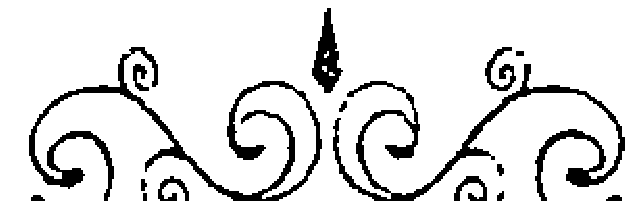

### 逆位實占解釋

人物關係：可能遭遇上述特質的人物，產生情感失控或逃避欺瞞的對待關係。
事態局勢：不負責任的態度，欺瞞和蒙蔽，遇到黑心交易而損失。
情態心境：不夠真誠，產生心機或邪念。過度的藝術家性格，無法有擔當。

### 畫面寓意解碼

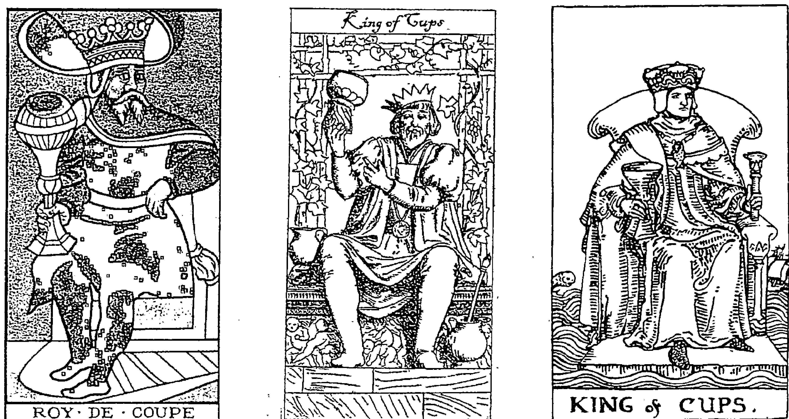

#### 主角人物

聖杯高舉的長者——聖杯國王，這位長者坐在王座上，顯示他至尊的國王身分。王座定位於汪洋大海之中，立於小島上，海洋正是水元素的疆域、聖杯的國度。

#### 場景佈置

王座孤立於海上，表明了國王能掌握水元素，控制水的流向而移動。一側水面上有船隻駛過，而另一側可見到海豚在跳躍著。船隻為海上運行交流的工具，暗示具有容載量和保護作用。

#### 外觀姿勢

聖杯國王相貌比較隨和親切，表情更是生動，刻劃了感情豐富以及和藹可親特質，而他的眼神機靈，透露出內蘊智慧。有些聖杯國王一手握著聖杯，另一手會握著短柄王權寶杖以增添國王威勢，而一派輕鬆是他的自然氣度。

#### 專屬搭配

貝殼象徵心思細膩，具有美感設計感的神祕構造。海藻是海中的生產物，也是生產力的象徵。他的服飾造型多為藍袍綠衣的組合，呈現出海洋風味、水元素的表徵。有些塔羅牌讓國王另一手握著王權寶杖，表明國王身分和尊貴權力。

#### 相隨配角

做為聖杯國王的專屬寵物，都是他性格特質象徵。海豚表示溫和的性格，活躍而深情悠遊於海洋中。

### 占卜訣竅提點

#### 實占事件角色定位

相應角色：有親和力的長者，也可能為調停角色、中間人、仲介者。
關係推敲：感情故事中的資深男角，或者是父執輩。
逆位角色：上了年紀而不夠檢點的大叔。

#### 指定牌選用依據

符合特徵：遇見成熟穩重的和善男性，選用本牌為指定牌。
因事指定：愛情問卜之熟齡男性，可以直接指定本牌。

#### 外貌年齡參考

一般可行用法：四十歲以上的男性，特質視指定或占卜而比照上述設定。
多種族區適用：棕色頭髮、灰色或藍色眼睛、白色皮膚，年紀在四十歲以上的男人。

#### 特殊項目占卜參考

顏色運用：紫色（Purple）。
天氣概況：豪雨。
時間期限：一年。
方位走向：1.正東方 E。
2.近距西南方。

#### 神秘學理連結

星象設定：1.天蠍座（螺旋塔羅，一般神秘學塔羅及多數塔羅設定）。
2.巨蟹座（宇宙塔羅等少數設定）。
克洛利星象設定：寶瓶座 20 度至雙魚座 20 度（變格為聖杯騎士王）。
易卦對應：1.歸妹卦（克洛利透特塔羅）。
2.蠱卦（透特塔羅新詮釋設定）。
3.同人卦（星宿對應）。

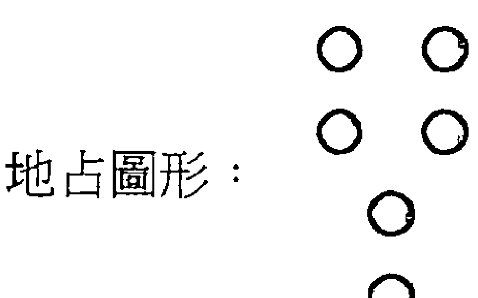

大幸運（Fortuna Major、The Greater Fortune）

## 聖杯王后
Queen of Cups

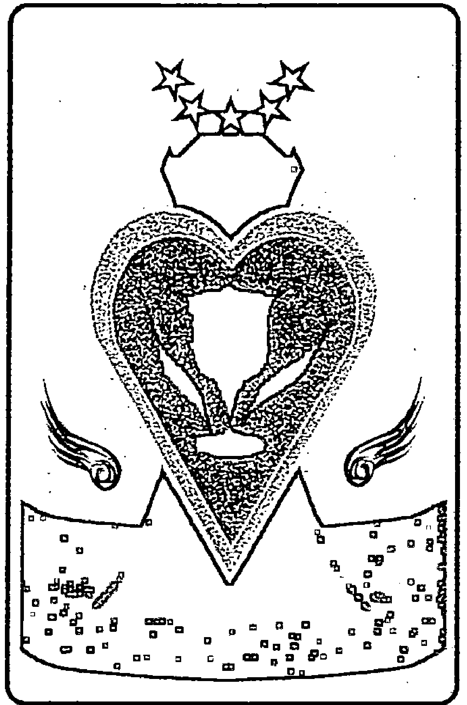

- 秘儀主題：
  正 溫柔女性
  逆 濫情女子

牌序定位：
聖杯花色牌組的第十三序號
秘儀、聖杯宮廷牌的高位階
女性角色。

元素位階：
水元素中之水成分、純
淨的水性物質、水元素
的液態、液態水象、水
之母。

### 秘儀數序定位

#### 位階數序

聖杯牌組的成熟成熟女性宮廷人物牌。根據元素位階推演出的特質是，聖杯的享受者、水元素的沈浸者。進一步延伸為享受感情的美好、沉浸在愛的幸福中的女性。

#### 人物原型

心理投射的人物原型，是溫柔慈愛而細心的母親形象。對於聖杯王后，不用考慮是什麼類型，她就是女人中的女人，溫柔體貼的性格，感情豐富細膩，氣質優雅，浪漫而富情趣。不過在現實層面上，也會因情況而有些許細微差異，但都同樣是你們心目中的理想女性典型。
整合出的秘儀主題為「溫柔女性」——溫柔體貼且感情豐富的女人。

### 正位實占解釋

人物關係：可能遇到符合上述特性的人物出現在所占算的故事當中，也可能代表一位與當事人有情感關係或相處融洽的女性。
事態局勢：事態為戀愛機緣的來臨，愉快而相處，羅曼蒂克的情境。局勢狀況則表示處於溫情或風花雪月的氛圍，
情態心境：心態上沉浸在浪漫感情中，享受戀情的幸福，關懷伴侶。心境上感受到甜蜜浪漫。

### 牌義來歷變遷

#### 涵義演變

這張牌一直都與愛情相關，也是女性特質的代表。然而早期的正位意義卻認為是個情感曖昧的女人，偏向負面評價。而偉特已更動意義為良好形象的女性，除了王后皆具有的特質，包括忠貞、正直、真誠、親切、善良、友好，以及有愛心之外，還有更多的品德和氣質，並且也強調聖杯所代表的溫柔和美麗。

在角色上更認定為是一個完美的配偶和一個好母親，對問卜者關係是一位幫助或關懷照顧問卜者的人。還有著其他與聖杯相關的正面作用，包括愛的智能、夢想中的禮物，還有各種幸福、愉快和成功。偉特稍後時期，差不多是相同的涵義，甚至有更為正面的特質，解釋為具有智慧和遠見。

#### 正逆轉折

早期的逆位牌義偏好，和正位置相差不會太大，尤其針對婚姻而言，更是令人稱羨。然而偉特加上了負面效果的但書，縱使是卓越的女人，但卻是不值得信賴的。對於王后逆位的一貫定義並沒有放棄，仍包括有狡詐或邪惡、不正當和墮落的行為。這樣也就包含女性的各種形象，這些特質頗為分歧。偉特稍後時期的詮釋，解除了這些分歧，逆位就演變為全然負面的涵義，也可說各項都是根據正位置，以「逆位負面原則」轉變推演過來的。

#### 逆位思考

現今的方式，是以規格化推論得知，這張牌的逆位原則統整而言，是聖杯能量的濫用以及王后位階的不當，由此融合而成的人物特質為，性格上濫情痴迷、軟弱依賴的女人。

整合出的逆位主旨結語為「情感氾濫的女人」。

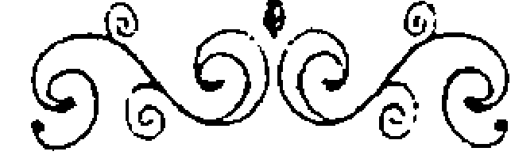

### 逆位實占解釋

人物關係：可能遭遇上述特質的人物，產生依賴糾纏或缺乏真誠的相處關係。

事態局勢：不正當和墮落的行為，不值得信賴的感情。

情態心境：沈迷夢幻、感情氾濫，情緒過度而無理性，性格依賴而黏膩。

### 畫面寓意解碼

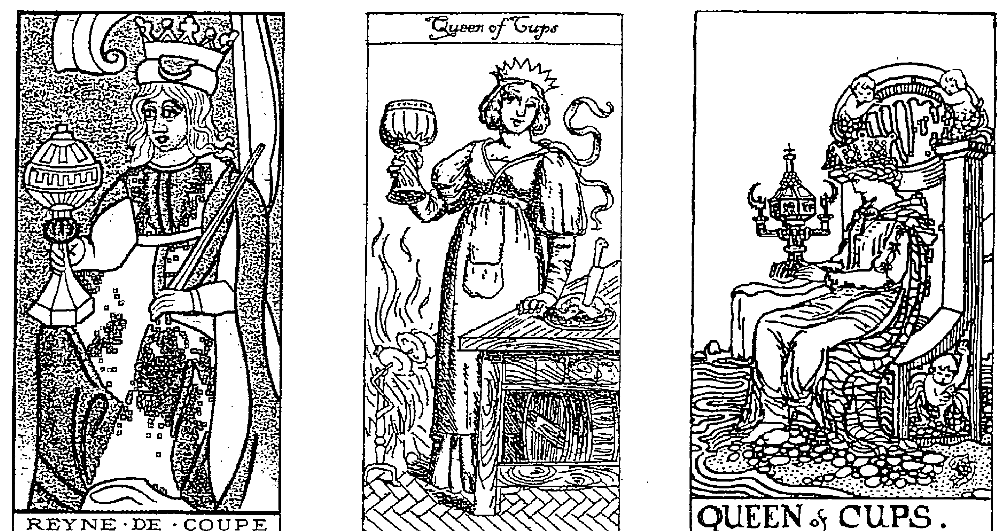

#### 主角人物

坐擁聖杯的女人——聖杯王后，這位女子坐在后座上，表示她尊貴的王后身分。后座位於海岸邊的沙灘上，水元素聖杯國度之疆界。

#### 場景布置

王后身於水與陸地的交界，陸地和海水都接觸於腳下，這是情感的落實。海洋環繞著她，遠處屏障保護著他。地面上的鵝卵石，具有美麗繽紛的色彩，藉以象徵她內心的繽紛和生活情趣。

#### 外觀姿勢

聖杯王后是最為美麗的人物，相貌呈現優雅氣質，神情之中充滿著夢幻。聖杯王后時常被描繪成這樣的姿態，凝望著聖杯正在出神，似乎杯中有著景象般，表示她的心靈倘佯於夢境之中。

#### 專屬搭配

寶座可能在被水環繞的陸地上，通常有著色彩豐富的裝飾，或者別緻的造型，例如貝殼狀的椅背。還可能有許多天使立體雕像，天使象徵善良而美麗的心，暗喻溫暖關懷的內在。聖杯王后以純淨白袍和藍白披風相間，表示海浪波紋，整體造型與海洋或水域完全融合在一起。而設計上則為純淨或華麗的造型兩大走向。

#### 相隨配角

魚群自在悠閒的漫遊，如同聖杯王后夢幻般的心思。

### 占卜訣竅提點

#### 實占事件角色定位

相應角色：溫柔嫵媚的女人，也可當做治療者、撫慰者。
關係推敲：愛情故事之第一女主角。
逆位角色：感情用事的傻女人。

#### 指定牌選用依據

符合特徵：遇見溫柔氣質的成熟女性，選用本牌爲指定牌。
因事指定：愛情問卜的女性當事人，可以直接指定本牌。

#### 外貌年齡參考

一般可行用法：二十歲以上的女性，特質視指定或占卜而比照上述設定。
多種族區適用：棕色頭髮、灰色或藍色眼睛、白色皮膚，年紀在四十歲以上的女人。

#### 特殊項目占卜參考

顏色運用：藍色（Blue）。
天氣概況：霖雨。
時間期限：九個月。
方位走向：1.東南東 ESE。
2.遠距西方。

#### 神秘學理連結

星象設定：1.巨蟹座（螺旋塔羅，一般神秘學塔羅及多數塔羅設定）。
2.雙魚座（宇宙塔羅等少數設定）。
克洛利星象設定：雙子座 20 度至巨蟹座 20 度（變格爲聖杯女王）。
易卦對應：1.兌卦（克洛利透特塔羅）。
2.坤卦（透特塔羅新詮釋設定）。
3.歸妹卦（星宿對應）。

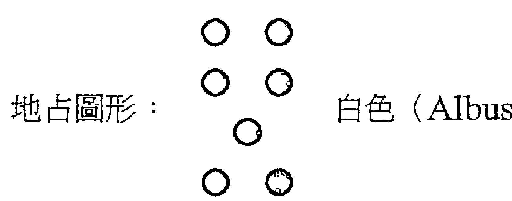

## 聖杯騎士
Knight of Cups

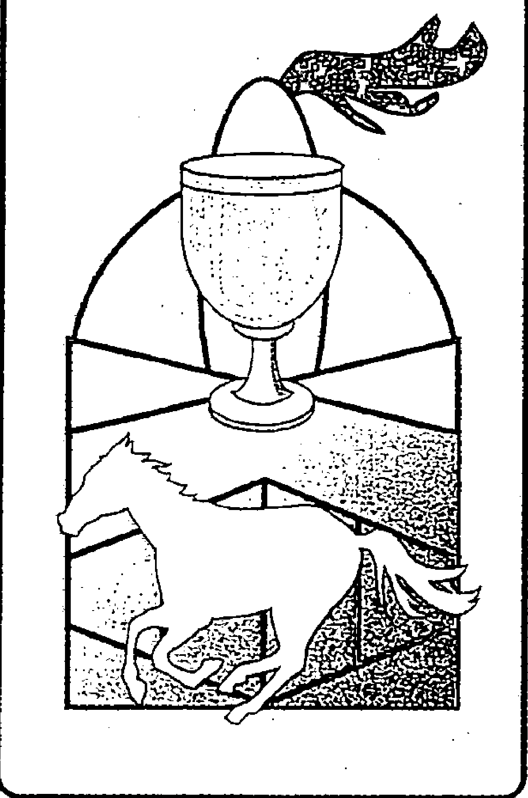

**秘儀主題：**
**正** 溫馴青年
**逆** 花花公子

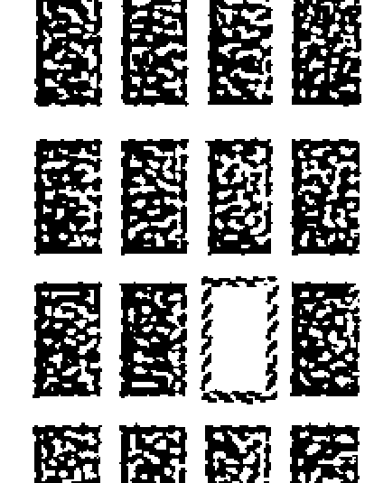

**牌序定位：**
聖杯花色牌組的第十二序號秘儀、聖杯宮廷牌的中間位階男性角色。

**元素位階：**
水元素中之風成分、揮發的水性物質、水元素的氣態、氣態水象、水之子。

### 祕儀數序定位

#### 位階數序

聖杯牌組的青年男性宮廷人物牌。根據元素位階推演出的特質是，聖杯的追求者、水元素的掌握者。進一步延伸為追求浪漫和戀情、掌握愛情心思和緣分關係的男子。

#### 人物原型

人物原型是心目中的白馬王子，而在現實層面上的表現為浪漫多情、文質彬彬的青年。重視情感和感受，對待伴侶溫柔體貼，能為愛情或對象付出，象徵具有豐富內涵，心思比較細緻，或者賦有藝術和創意的男性。這是唯一的典型形象，雖然有著各別不同的差異和想像。
整合出的祕儀主題為「溫馴青年」——翩翩佳公子，藝術家或文藝青年。

### 正位實占解釋

**人物關係：** 可能遇到符合上述特性的人物出現在所占算的故事當中，也可能代表一位與當事人有情感關係或相處融洽的男性。
**事態局勢：** 在事態上投入浪漫情境中，追求對象成功機會很大。局勢狀況處於有禮貌有風度的氛圍。
**情態心境：** 在心態上可能墜入情網，傾心於某個對象，全心對待呵護伴侶。心境感受方面則為瀟灑顧盼，充斥浪漫情懷。

### 牌義來歷變遷

#### 涵義演變

這張牌原本有傳令兵或信差的涵義。早期就與抵達有關，另外代表事件，就是遇到貴人、帶來意外之財。偉特根據傳統，加入他對騎士正位的通用涵義延伸為出發、赴約、進行、邀請、委託以及鼓勵、激發。

不過對於聖杯花色的意涵就比較沒有明顯加強了。偉特稍後時期，這張牌的正位置意義多半承襲既有涵義，只增添了騎士的挑戰特色，推導為接受挑戰和面臨機會。

#### 正逆轉折

早期的逆位置意義，一直都偏於負面，表示個性不好的男人。偉特也著墨於人物的負面特質，以花色涵義推演出欺瞞、狡詐、口是心非的行為以及詭計。更貼切於聖杯水元素的是，過於軟弱或敏銳纖細的特質。這些可說是由逆位元素的「過度原則」推論法而得。偉特稍後時期的逆位涵義大致相同，更強調的則是遇到這類人物的出現。

#### 逆位思考

現今的方式，是以規格化推論得知，這張牌的逆位原則統整而言，是聖杯能量的濫用以及騎士位階的不當，由此融合而成的人物特質為：性格上浪漫氾濫、蒙蔽自欺的男子。

整合出的逆位主旨結語為「公子哥兒或花花大少」。

### 逆位實占解釋

人物關係：可能遭遇上述特質的人物，產生曖昧尷尬或牽扯不清的交友關係。

事態局勢：追求感情不成功，可能與情敵競爭落敗。或者是情感不夠專一，多情導致感情問題。

情態心境：過於敏銳纖細，易受到挑逗和刺激。優柔寡斷，心性不穩定。

### 畫面寓意解碼

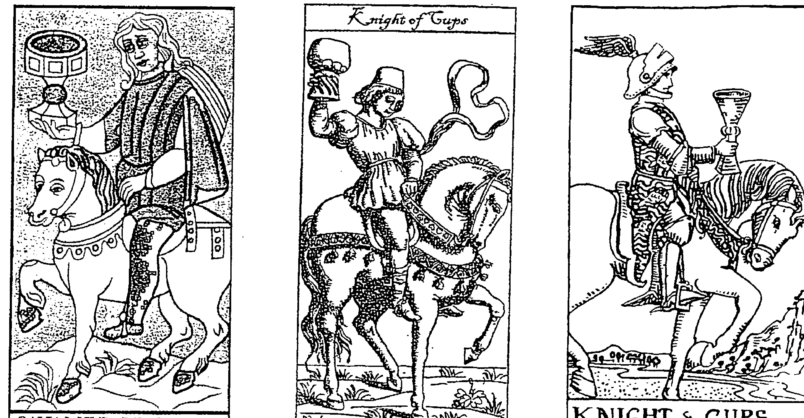

#### 主角人物

馬背上輕撫聖杯的男子——聖杯騎士，白馬漫步在溪河岸邊，騎士的前方是一道水域，他來到了水元素聖杯國度之濱。

#### 場景布置

這位男子身騎白色寶馬，如今正面臨一條河流，他將在河畔停駐或深入水中，還是跨過這道天然界線呢？這未知的體驗值得探索。天色晴朗配合水面的清澈，表明水之風的心境和場景。

#### 外觀姿勢

聖杯騎士是相貌最俊美的騎士。他雖然在馬上，眼神仍然朦朧夢幻，顯示出他浪漫的性格，靈感和想像力豐富。聖杯騎士的馬匹輕巧的踱步著，動作優美如同騎士身姿，典雅而和諧，他身爲騎士只爲了追尋理想，而非喜好武力。

#### 專屬搭配

聖杯騎士的盔甲外有藍底水紋外衣，襯托溫文儒雅的色彩。他戴著有羽翼的頭盔，表示輕盈清柔，並暗示天使般溫和善良。衣飾上如果繡著紅色的魚，就代表深藏感情和內涵的象徵，而紅色意味著熱情的散發。

#### 相隨配角

聖杯騎士的專屬座騎多爲白馬，以配合聖杯騎士的純淨浪漫，馬鞍的顏色也和服飾相搭配。

### 占卜訣竅提點

#### 實占事件角色定位

相應角色：多情浪漫的年輕人，也可以是個夢想家。
關係推敲：愛情故事之第一男主角。
逆位角色：故事中感情面的失意者。

#### 指定牌選用依據

符合特徵：遇見風采迷人或斯文有氣質的男子，選用本牌為指定牌。
因事指定：愛情問卜之男性當事人，可以直接指定本牌。

#### 外貌年齡參考

一般可行用法：二十歲以上、未滿四十歲的男性，特質視指定或占卜而比照上述設定。
多種族區適用：棕色頭髮、灰色或藍色眼睛、白色皮膚，年紀在四十歲以下的男人。

#### 特殊項目占卜參考

顏色運用：深藍色（Navy）。
天氣概況：風雨。
時間期限：六個月。
方位走向：1.正東北 NE。
2.近距西方。

#### 神秘學理連結

星象設定：1.雙魚座（螺旋塔羅，一般神秘學塔羅及多數塔羅設定）。
2.天蠍座（宇宙塔羅等少數設定）。
克洛利星象設定：天秤座 20 度至天蠍座 20 度（變格為聖杯王子）。
易卦對應：1.中孚卦（克洛利透特塔羅）。
2.革卦（透特塔羅新詮釋設定）。
3.需卦（星宿對應）。

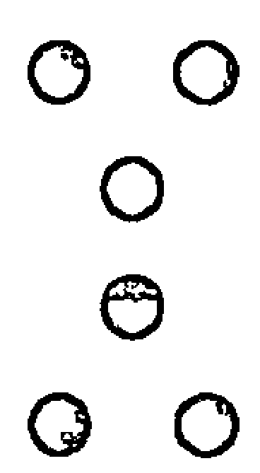

地占圖形：結合（Conjunctio、Union）

## 聖杯隨從
Page of Cups

秘儀主題：
正 溫吞少年
逆 受挫的感情入門者

牌序定位：
聖杯花色牌組的第十一序號秘儀；聖杯宮廷牌的最低位階中性角色，處於和聖杯數字牌銜接的位置。

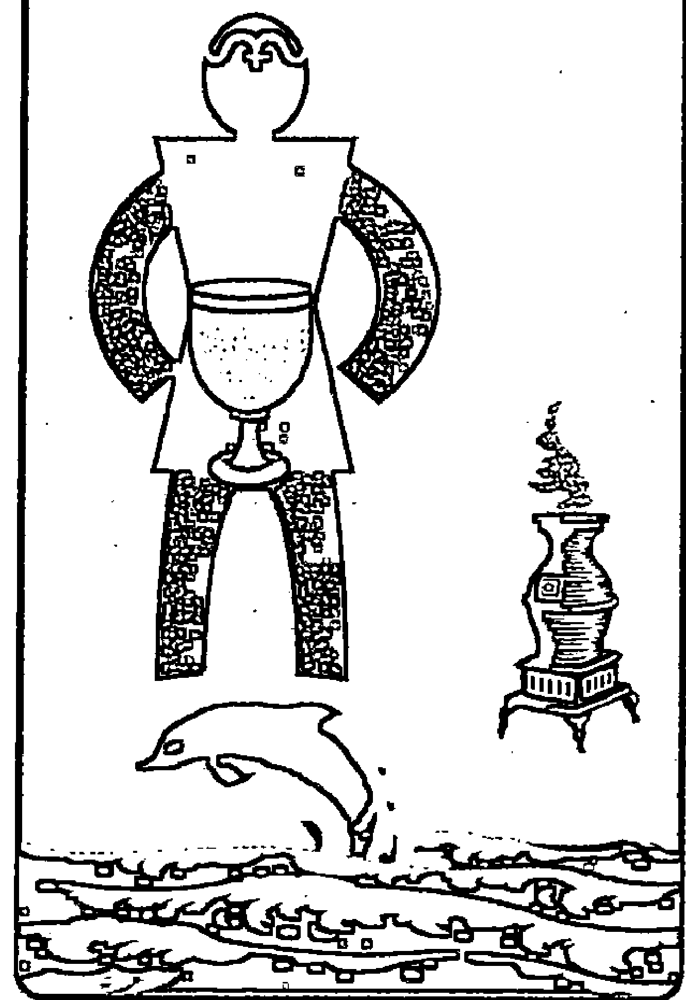

元素位階：
水元素中之土成分、停滯的水性物質、水元素基底、水元素之爐、水之女。

### 祕儀數序定位

#### 位階數序

聖杯牌組的少年宮廷人物牌。根據元素位階推演出的特質是聖杯的嚮往者、水元素的維護者。進一步推論為嚮往戀愛、憧憬愛情，維護且看重感情層面的純情少年。

#### 人物原型

社會心理上的標籤印象，是個愛情人際見習生。在現實層面上的表現為，嚮往感情的少年男女。雖然充滿思慕的純情，然而尚不太懂得感情的真實面，也不擅長表達或互動，顯得生疏稚嫩。
整合出的祕儀主題為「溫吞少年」——感情世界的初學者。

### 正位實占解釋

人物關係：可能遇到符合上述特性的人物出現在所占算的故事當中，也可能代表一位與當事人有情誼互動關係的下屬或晚輩。
事態局勢：事態上為有追求對象但技巧生疏，具誠懇的優勢，但不一定能夠成功。局勢狀況則是處於有點八卦的氛圍中。
情態心境：在心態上表示純真的心靈，細心呵護、珍惜感情。心境上則感受到羞怯、喜悅、憧憬等情緒。
特別占問：禮物遞送者，文藝作品遞送宣告者。一切私人信件和情書。隨身物為增添美感和人緣的物品，身上的飾物、攜帶式鏡子、化妝用品。

### 牌義來歷變遷

#### 涵義演變

這張牌原本意義就偏好，正位置尤其是代表好消息，不過卻又相關於少年人的愛情失利，可見其實在早期牌義就顯得有些矛盾了。偉特將意義往正面移動，除了是新聞消息和回應以外，賦予對隨從正位置一貫的設定，即專注誠懇與勤勉好學的形象，並根據聖杯特質認定爲外貌美麗的年輕人。在占卜上，表示問卜者能遇到願意提供支助的人。偉特稍後時期幾乎都跟隨這些意涵，只是較強調忠誠和有助益的人，以及值得信賴的助手。

#### 正逆轉折

早期正位置的牌義有所搖擺，逆位置卻沒有好轉，而是表示各種阻礙。偉特賦予一貫的逆位隨從意義：紛亂焦躁、表達上的不實、欺瞞、逢迎諂媚。根據聖杯特質推演出依賴與誘惑。偉特稍後時期，除了跟隨這些意義外，另包含了聖杯負面涵義而來的，行爲上的偏差越軌，以及過於敏感和脆弱的性格。這仍是根據「元素過度原則」所推演出的逆位意義。

#### 逆位思考

現今的方式，是以規格化推論得知，這張牌的逆位原則統整而言，是聖杯能量的濫用以及隨從位階的不當，由此融合而成的人物特質爲，性格上殷勤逢迎、唯諾怯懦而欠缺自信。
整合出的逆位主旨結語爲「不擅長愛情而時常受挫的入門者」。

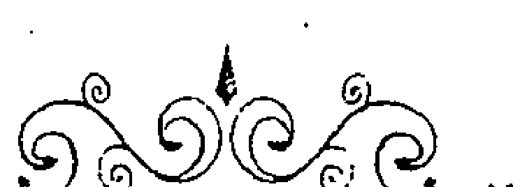

### 逆位實占解釋

人物關係：可能遭遇上述特質的人物，產生互相厭煩的牽涉關係。有人造謠傳播八卦，不實的報導、錯誤的訊息和解讀，拒絕的回應。
事態局勢：缺乏誠意的人際往來，行爲空泛、沒有準則和規律，情感表達不受肯定、遭到拒絕，氛圍很八卦。
情態心境：情緒敏感，憂鬱悲傷，易受外界影響而動搖打擊。依賴感和無助感，缺乏信心和勇氣，退縮的心態。
特別占問：接收到情感、交誼相關的負面或不利訊息通告。占問物品時，表示首飾妝物等聖杯隨身物的遺失。

### 畫面寓意解碼

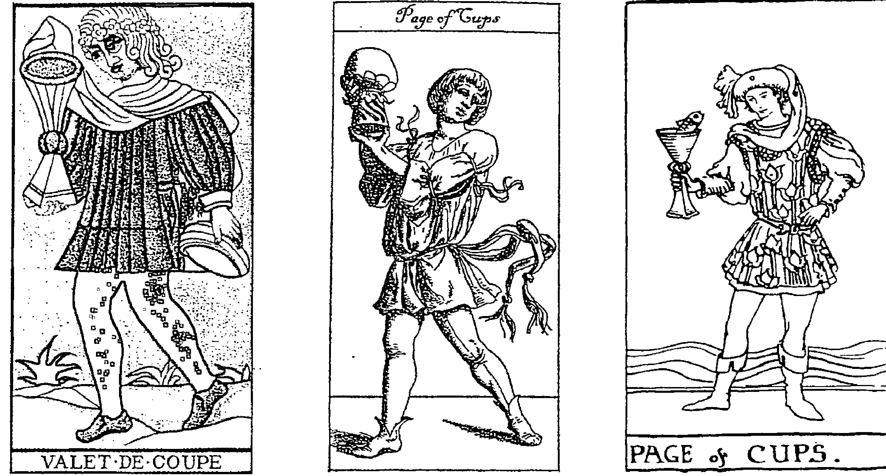

#### 主角人物

手持聖杯的少年——聖杯隨從，少年獨自站立在船隻的甲板上，在水元素聖杯國度之域，執行任務使命。

#### 場景布置

聖杯隨從站在船隻甲板上，從背景可以看到海水波浪高低起伏，整個人是在水域之中，船板代表水中之平地，卻又一起在水中隨波濤起伏，這是以情感為命運的暗喻，載浮載沉的特質。

#### 外觀姿勢

聖杯隨從的長相特別清秀，面貌姣好，顯得纖細而中性化，呈現出謙虛和上進之心。這是他任務的必經旅程，低頭與手上的聖杯中探出頭來的魚對望。多半些微側身，兩腳以不同彎曲度的姿勢站立著，表示正緊張專注中。

#### 專屬搭配

聖杯隨從服飾造型的顏色柔和粉嫩，多為粉紅搭配粉藍，是感情滋潤的顏色。在場景中或身上衣物的紋飾上出現的花朵多為蓮花，象徵純真潔淨的心靈，以及對於美好感情的盼望。

#### 相隨配角

小魚細緻和稚嫩，象徵情感的幼苗，多從杯中冒出頭來，表示新奇與陌生。小魚和人物相對眼，暗示主角的自我對話，或者在省視內心、呵護感情。

### 占卜訣竅提點

### 賓占事件角色定位

相應角色：純情的少年、關注者。
關係推敲：有關故事轉折或主角感情變化的小配角。
逆位角色：妨礙情勢發展的小角色、纖細敏感的小孩。

#### 指定牌選用依據

符合特徵：遇見誠懇真摯的少年少女，選用本牌爲指定牌。
因事指定：感情問卜的未成年男女，可以直接指定本牌。

#### 外貌年齡參考

一般可行用法：二十歲以下的少年男女，特質視指定或占卜而比照上述設定。
多種族區適用：棕色頭髮、灰色或藍色眼睛、白色皮膚，年紀在四十歲以下的女人。

#### 特殊項目占卜參考

顏色運用：深青色（Teal）。
天氣概況：毛毛雨。
時間期限：三個月。夏季
方位走向：1.東北東 ENE。
2.遠距西北方。

#### 神秘學理連結

一般星象設定：秋季星座——天秤座、天蠍座、射手座。
克洛利星象設定：夏季星座——巨蟹座、獅子座、處女座（變格爲聖杯公主）。
易卦對應：1.損卦（克洛利透特塔羅）。
2.逅卦（透特塔羅新詮釋設定）。
3.中孚卦（星宿對應）。

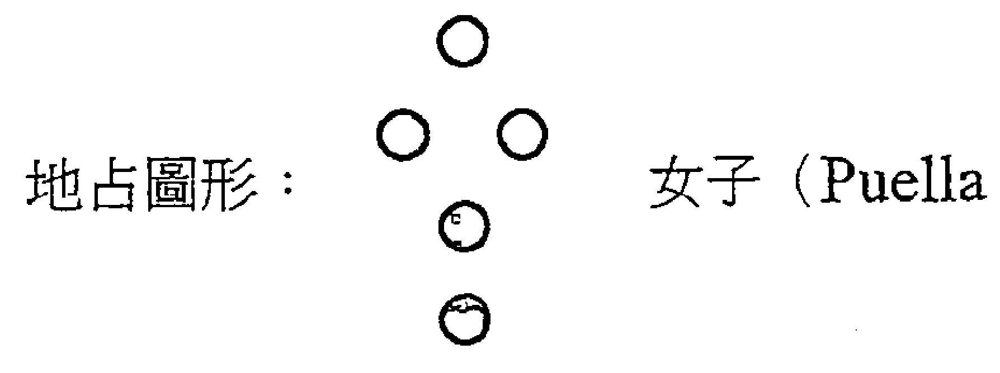

## 寶劍國王
King of Swords

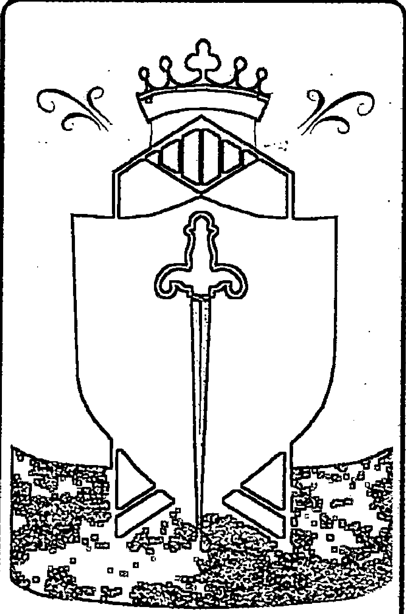

秘仪主题：
**正** 锐利领导
**逆** 偏颇强硬

牌序定位：
宝剑花色牌组的第十四序号秘仪、宝剑宫廷牌的最高位阶男性角色。

元素位阶：
风元素中之火成分、激烈的风性物质、风元素的固态、固态风象、风之父。

### 秘儀數序定位

#### 位階數序

寶劍牌組的成熟资深男性宫廷人物牌。根据元素位阶推演出的特质是宝剑的拥有者以及风元素的管理者。进一步推论为拥有丰富知识宝库、管理运作学问才智的男人。

#### 人物原型

心理投射的人物原型是坚持原则而严肃的父亲形象，而在现实层面上的表现为理智冷静的成熟男人，智慧而有理念，思虑周密严谨。个性讲理而较为冷峻严肃，魅力来自思想和智慧的光彩。职业身分推断上，多为学者、研究者、教育者，或是科学家以及各种高深专业人士如医师，法理相关行业，掌握与制度有关的事务。是重视理念的人，也可能是社会运动者、思想改革者、观察批判者。
整合出的秘仪主题为「锐利领导」——专业权威、学术代表或意见领袖。

### 正位实占解释

**人物关系**：可能遇到符合上述特性的人物出现在所占算的故事当中，也可能代表一位与当事人有学识课业或思想理念关系的长辈上司。
**事态局势**：在事态上面临定夺的景况，可能涉及法律事件。成竹于胸或者坚持立场。局势状况是周详规画并有英明的首领，具指导原则或有智者献计。
**情态心境**：在心态上是头脑清晰，见解独到锐利。秉持原则与一贯作风。心境感受则为理念充实、沈着应变、处之泰然。

### 牌義來歷變遷

#### 涵義演變

最早的涵義相關於這些職業身分，諸如律師，議員，醫生等高階層的專業人士。偉特據此賦予的牌義是，政府機構等相關事宜和運作，以及相關於法律和任何審理判斷的事物。

偉特稍後時期偏重人物特寫，納入偉特對國王位階的共通特質，配合寶劍而更強調專業性和才智，成爲具高度分析能力、行動力和決斷力強，而且穩重和經驗及指揮若定的特質更是被強調。

也可以說，正位置意義充滿智者和思想家的形象。

#### 正逆轉折

這張牌的逆位一直都是很負面的意義，人物形象是壞男人，而相關法律的事件是險惡訴訟以及警告。偉特賦予國王逆位皆然的邪惡行徑，就是背信和不忠誠，且更強調殘酷暴行。

將固執特質與寶劍負面的偏頗特性，結合成爲固執己見。這些推論是由「位階不當原則」和「元素過度原則」而來的。

偉特稍後時期的逆位，負面形象更嚴重，偏激和破壞性都增強，也表示引發衝突事件。

#### 逆位思考

現今的方式，是以規格化推論得知，這張牌的逆位原則統整而言，是寶劍能量的濫用以及國王位階的不當，由此融合而成的人物特質爲，性格上嚴苛乖僻、剛愎自用的男子。

整合出的逆位主旨結語爲「思想偏頗的強硬人士」。

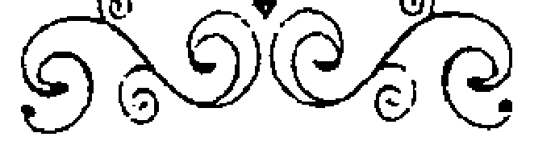

### 逆位實占解釋

人物關係：可能遭遇上述特質的人物，產生爭執對立或苛刻激烈的對待關係。

事態局勢：不符現狀的因應措施、改革方法不正確、不公義的判決、失去信用或者動搖立場。

情態心境：觀念偏頗、批判過度，偏重理論而看不清現實。

### 畫面寓意解碼

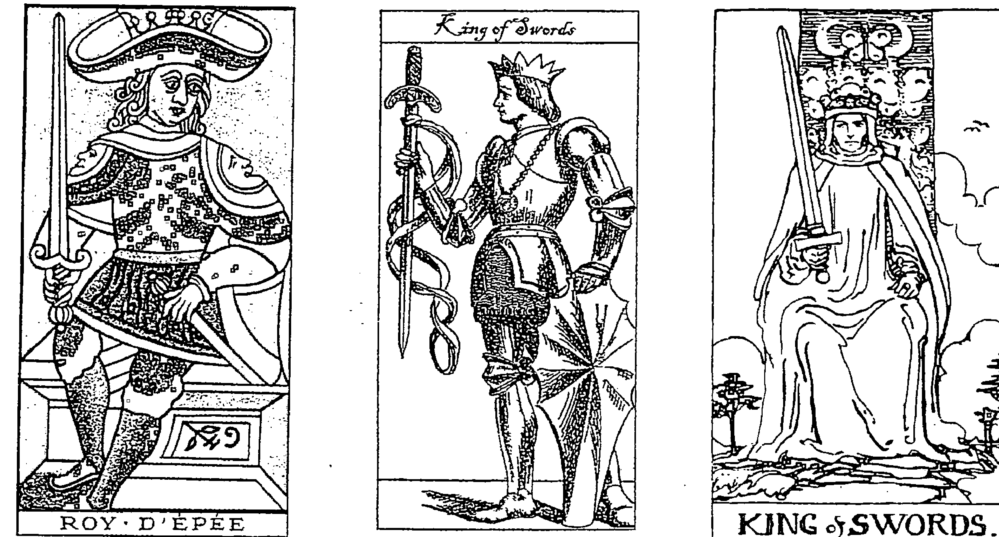

#### 主角人物

寶劍貼身的長者——寶劍國王，這位長者坐在王座上，顯示出至尊的國王身分。王座定位於高山之巔，摩天的雲間深處，表達出風元素國度的意境。

#### 場景佈置

背景中，雲的位置很低，表示此位置的高聳。牌面上可清晰見到幾隻鳥，在不遠處的遠方可見到樹木，表示領域仍然含括實地。鳥於天空中飛行，突顯領空以及風的刻劃，風表示心思如風般迅速敏捷，以及爽颯的性格，象徵風中之火。

#### 外觀姿勢

寶劍國王呈現智者的嚴肅樣貌，神情正義凜然，表現出一個判官應有的態度。寶劍國王高舉著劍，表示掌理審判，控制了生殺大權，並且也是行使公義。

#### 專屬搭配

寶劍國王的寶座裝飾並不多，椅背高長平板，上有著蝴蝶的浮雕刻鏤，全是灰階色調，代表權威、尊貴，並且不帶情緒。服飾造型方面，整體以藍白相配或淡色系代表風的顏色。紫色披風為智慧的象徵顏色，表露出這位男性智慧豐富的內在。國王頭戴王冠或便裝王帽，王冠之外也可加層帽裝，或之內穿戴護頂便帽。

#### 相隨配角

蝴蝶表現心靈高潔，瀟灑飛舞象徵精神的蛻變和淨化。飛鳥表示心思在高空中遨翔。老鷹則為猛禽，比一般飛鳥的意志力堅定，力量也更強大。

### 占卜訣竅提點

#### 實占事件角色定位

相應角色：智慧風範的長者，可能也扮演了仲裁者。
關係推敲：學業、專業相關之資深男角，或是組織或團體之幕後主使者。
逆位角色：控制思想或掌握情資的老謀深算者。

#### 指定牌選用依據

符合特徵：成熟沉穩而理智的男性，選用本牌為指定牌。
因事指定：學業應考或特殊問卜之熟齡男性，可以直接指定本牌。

#### 外貌年齡參考

一般可行用法：四十歲以上的男性，特質視指定或占卜而比照上述設定。
多種族區適用：黑髮、綠色或褐色眼睛、深色皮膚或黃色皮膚，年紀在四十歲以上的男人。

#### 特殊項目占卜參考

顏色運用：黑色（Black）。
天氣概況：暴風。
時間期限：一年。
方位走向：1.正北方 N。
2.近距東南方。

#### 神秘學理連結

星象設定：1.水瓶座（螺旋塔羅，一般神秘學塔羅及多數塔羅設定）。
2.天秤座（宇宙塔羅等少數設定）。
克洛利星象設定：金牛座 20 度至雙子座 20 度（變格為寶劍騎士王）。
易卦對應：1.恆卦（克洛利透特塔羅）。
2.旅卦（透特塔羅新詮釋設定）。
3.師卦（星宿對應）。

地占圖形：
○
○
○
○
道路（Via、The Way）

## 寶劍王后
Queen of Swords

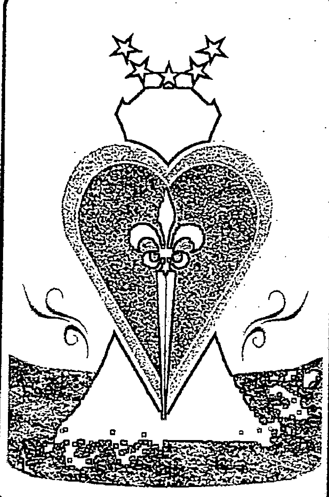

秘儀主題：
正位：犀利女性
逆位：偏激女性

牌序定位：
寶劍花色牌組的第十三序號秘儀、寶劍宮廷牌的高位階女性角色。

元素位階：
風元素中之水成分、潮溼的風性物質、風元素的液態、液態風象、風之女。

### 秘儀數序定位

#### 位階數序

寶劍牌組的成熟女性宮廷人物牌。根據元素位階推演出的特質是，寶劍的享受者、風元素的沈浸者。進一步推論為享受思緒思考的樂趣，或者沉浸在思索記憶中的女性。

#### 人物原型

心理投射的人物原型，是情感內斂、管教嚴格的老師型母親形象。寶劍王后比較複雜而難以捉摸，大致可歸為幾種類型：一為現代女性，獨立自主，有想法和見解。二為女學者、女智者，或女性專業人士。三為女性主義者，奉行某種理念的女人。四為具有防禦心態的女人，可能感情曾經受創，內心孤獨悲傷。
整合出的秘儀主題為「犀利女性」——重視理念而思想犀利，風格獨具或捍衛自身的女性。

### 正位實占解釋

人物關係：可能遇到符合上述特性的人物出現在所占算的故事當中，也可能代表一位給予當事人冷淡隔閡感受或關係難測的女性。
事態局勢：事態為人際關係較為疏離，保持君子之交，孤獨寂靜的自處階段。局勢狀況代表遇事犀利剖析，沉默低調。
情態心境：心態上意味著漠然而沒有熱情，低調或凝重，排斥與孤獨感。心境上的感受是冷靜淡然。

### 牌義來歷變遷

#### 涵義演變

這張牌在古代紙牌占卜術中，早就是非常負面的形象，不但代表了孀居，甚至被看做是位黑寡婦，不然就是一位性格恐怖或運勢悲慘的女人。偉特接受這些人物特質，不過已經轉爲比較不那麼陰暗了。

偉特稍後時期，改寫爲曾經遭遇逆境的女性。而至於那些負面傾向，也逐漸取消，代以個性的冷漠和難以捉摸。正位置意義加強王后位階應具備的優點，那就是正直。寶劍的花色優點當然也考慮進去了，成爲機智敏銳的特質，不過孤獨的境遇，以及分離、悲悼等特質仍然保留了下來。

然而偉特之後時期，這張牌的解釋就有了大幅的調整，轉而朝向心理層面的詮釋。現今縱使是同樣性格的形容方式也有所不同，這張牌被看待的觀點，已經和從前很不一樣了。

#### 正逆轉折

原本就具有比正位置更甚的負面意味，人物表示一個惡女，並表示問卜者將會生病。後來將原本這張牌的恐怖形象和負面的意義，都分派到逆位的解釋上。偉特認爲除了具有王后逆位的惡行之外，特殊之處則是冥頑不靈、偏激而假道學，不但過於拘謹並且更爲機詐，而這些都可歸結爲整張牌的「逆位負面原則」。偉特稍後時期的逆位牌義差不多，但已經較著重在心理層面上，像是報復、仇恨心態、心胸狹窄和壞脾氣。從關係上來看待，這張牌逆位置代表的是險惡的敵人。

#### 逆位思考

現今的方式，是以規格化推論得知，這張牌的逆位原則統整而言，是寶劍能量的濫用以及王后位階的不當，由此融合而成的人物特質爲，性格上思想偏激、抹煞情感的女人。

整合出的逆位主旨結語爲「偏激的女性」。

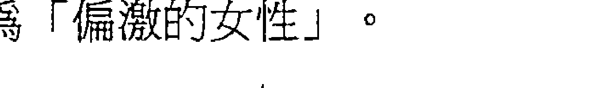

### 逆位實占解釋

人物關係：可能遭遇上述特質的人物，產生拒絕往來甚至決裂或翻臉的關係。

事態局勢：偏激的行徑，以悲情訴求，進行報復或抗爭。人際關係隔絕疏離，各懷猜疑或有心機。

情態心境：內心創傷嚴重，否定感情封鎖情緒。思想過於偏激或執著，不然就是冷眼旁觀或冷漠以對。

### 畫面寓意解碼

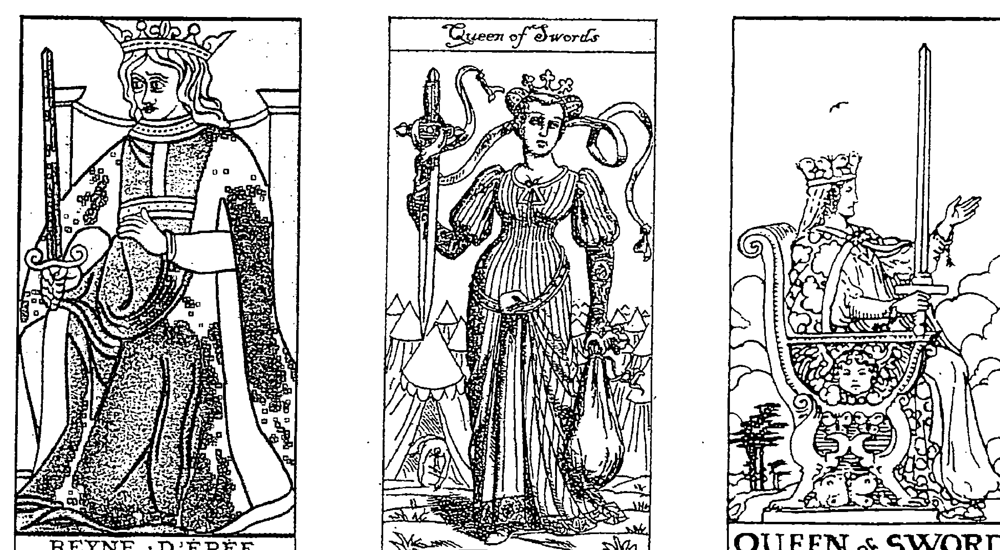

#### 主角人物

堅持寶劍的女人——寶劍王后，這位女子坐在后座上，表示她尊貴的王后身分。后座定位於高原之上、天際之下，暗示風元素寶劍國度的領空。

#### 場景布置

雲霧聚集而低沈在王后身旁，表示位置頗高，似乎也是心境高絕的寫照。空中有淡淡的孤鳥形跡，或許是隻身孤影的投射。遠方也有樹木和水流，刻劃身爲王后的滋潤性和水成分。

#### 外觀姿勢

神情看來凝重而內斂，顯示了她對悲傷的瞭然，寶劍王后一向有複雜的心境，擁有過去的特殊經歷。王后的姿勢也隱約表露內心深處的悲傷或創傷，多半一手垂直舉起寶劍，劍柄靠在她王后尊椅的扶手上，可感受到一種無奈的堅持。另一手伸出並將手臂抬起，表達出拒絕與否定的意思。

#### 專屬搭配

寶劍王后的寶座裝飾簡單，椅背末端捲曲如雲朵造型，無色彩是雲淡風輕的調調。椅上刻著蝴蝶表示心性高潔以及精神的蛻變和淨化，天使浮雕也暗示仍懷有愛心。她的服飾造型多以白色后袍爲主，披風是藍底繡上雲朵爲襯，反映出寶劍王后的心境，雲朵表示心性自由、輕盈而高尚潔白。

#### 相隨配角

飛行的鳥，象徵王后的心思在高空中遨翔，並呼應寶劍風元素。

### 占卜訣竅提點

#### 實占事件角色定位

相應角色：具有冰山美人特性、冷眼旁觀的人。
關係推敲：特殊項目或是學業問題之女主角、愛情故事之女殺手。
逆位角色：孤僻偏執的年長女性。

#### 指定牌選用依據

符合特徵：遇見較成熟冷豔或是專業形象的女性，選用本牌爲指定牌。
因事指定：學業應考或人際問卜之女性，可以直接指定本牌。

#### 外貌年齡參考

一般可行用法：二十歲以上的女性，特質視指定或占卜而比照上述設定。
多種族區適用：黑髮、綠色或褐色眼睛、深色皮膚或黃色皮膚，年紀在四十歲以上的女人。

#### 特殊項目占卜參考

顏色運用：銀色（Silver）。
天氣概況：風雨交加。
時間期限：九個月。
方位走向：1.南南東 SSE。
2.近距東方。

#### 神秘學理連結

星象設定：1.天秤座（螺旋塔羅，一般神秘學塔羅及多數塔羅設定）。
2.雙子座（宇宙塔羅等少數設定）。
克洛利星象設定：處女座 20 度至天秤座 20 度（變格爲寶劍女王）。
易卦對應：1.大過卦（克洛利透特塔羅）。
2.賁卦（透特塔羅新詮釋設定）。
3.蠱卦（星宿對應）。

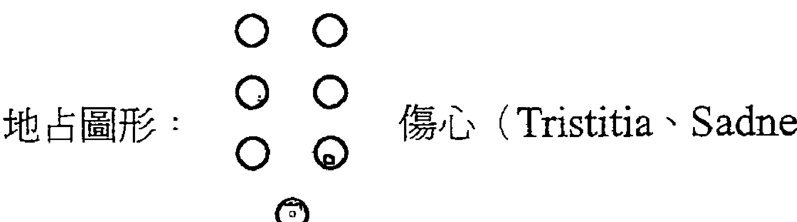

## 寶劍騎士
Knight of Swords

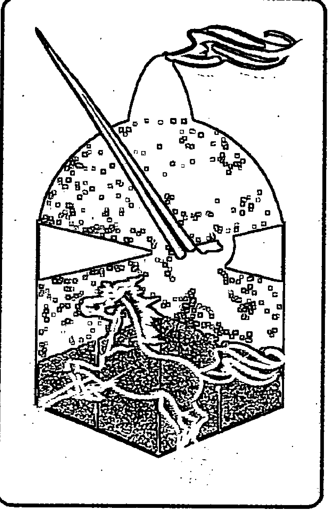

秘儀主題：
- 正 鋒利青年
- 逆 玩家殺手

元素位階：
- 風元素中之風成分、清爽的風性物質、風元素的氣態、氣態風象、風之子。

牌序定位：
寶劍花色牌組的第十二序號秘儀、寶劍宮廷牌的中間位階男性角色。

### 秘儀數序定位

#### 位階數序

寶劍牌組的青年男性宮廷人物牌。根據元素位階推演出的特質是寶劍的追求者、風元素的掌握者。進一步推論為，追求智慧思緒和實力的發揮，掌握才藝技能的男子。

#### 人物原型

人物原型是心目中不可及的獨特人士、異議的先鋒。在現實層面上的表現為，理智機靈、才能高超的青年、優秀的佼佼者，但本身較為冷酷高傲，也象徵清晰鋒利、瀟灑而自我，重視自由和理想。只有這麼一種抽象的類型，就是自恃甚高，給予他人極酷的形象感受。
整合出的秘儀主題為「鋒利青年」——才華洋溢而技藝卓越的高手。

### 正位實占解釋

人物關係：可能遇到符合上述特性的人物出現在所占算的故事當中，也可能代表一位給予當事人特別感受或各式相處狀況的男性。
事態局勢：任何疑難迎刃而解，任何競爭無往不利，凡是追逐都可獲得，而速度和成效也最快。局勢呈現出鋒芒畢露或搶眼奪目的狀況。
情態心境：心態是冷酷而犀利的，對於目標則能一心前進、旁無他驚。心境上充滿遠大志氣的自我感受。

### 牌義來歷變遷

#### 涵義演變

古代這張牌特別指軍人身分，身居士官等公職，也因此對相關身分的問卜者非常有利。然而由於相關於士兵，也就脫離不了戰爭征伐，也就帶著不幸意味。偉特對這些修正了許多，雖然正位置的涵義中也有災害、毀滅、破壞和戰爭，然而對死亡的論斷，強調必需參考其他牌面始能定論。其他的負面涵義也多少於此相關，面臨對立或阻力，以及負面情緒的仇恨和憤怒。卻也據此增加了許多正面的特色，如士兵的英勇和防禦，以及技術和能力。

偉特稍後時期，還是承襲了征伐鬥爭的意義，不過已逐漸導向正面，強調年輕的特徵，英雄的行徑及冒險犯難的精神，但也具有戰略能力和諸多才能。而後，正面特質還是在持續增加中。

#### 正逆轉折

古代逆位置仍然是負面的意義，看起來卻沒有比正位置凶險，大約是爭論和搶奪，造成破壞性的結局，甚至是男人之間為了贏得女性芳心的鬥爭。偉特大致承襲了這些涵義，並以騎士逆位的通義，形容人物的特徵，也就是以「逆位相反原則」，將正位置的有能力，轉為無能、輕率魯莽和奢侈。

偉特稍後時期也一樣承襲以往的各項目，較偏向「逆位不當原則」推得，由於衝動或者自滿吹噓的不當態度而造成失敗。運用理論原則推演，也可以用耍酷、太跳，或者過於招搖的特質，來形容這號人物。

#### 逆位思考

現今的方式，是以規格化推論得知，這張牌的逆位原則統整而言，是寶劍能量的濫用以及騎士位階的不當，由此融合而成的人物特質為，性格上心高氣傲、逞強自滿的男子。

整合出的逆位主旨結語為「玩家或殺手級人物」。

### 逆位實占解釋

- 人物關係：可能遭遇上述特質的人物，產生爭奪惡鬥或反目成仇的關係。
- 事態局勢：面臨鋒利尖銳的情勢，遭遇失敗與打擊，受傷或損失慘重。
- 情態心境：脾氣剛硬，自尊心強烈，方向不正確。容易受到激擾，做出錯誤的決定。

### 畫面寓意解碼

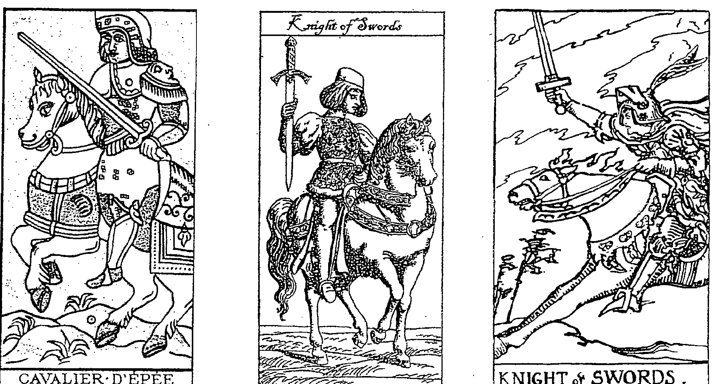

#### 主角人物

馬背上揮舞寶劍的男子——寶劍騎士，白馬疾馳在荒原之上，騎士在風中飆速，幾乎已經成了風的化身，融入風元素寶劍國度之次元中。

#### 場景布置

這位男子身騎疾影神馬，不斷前行奔騰。背景勁風捲雲，表示速度極快，然而空中仍然可見鳥影，遠方也仍有樹木。藉由樹木和雲影描繪出秋風掃落葉之勢，騎士逆風前行，可見其性格叛逆無畏。

#### 外觀姿勢

寶劍騎士神情犀利，無懼地往前衝，刻劃出典型的英雄神貌和形象。寶劍騎士的馬匹疾速前行，就像在驅逐敵人，勢如破竹。他握劍的姿態純熟而犀利，擊敗對手絕對不是問題。

#### 專屬搭配

寶劍騎士的服飾造型，是盔甲色調一致而平淡，猶如融入風元素之中。其外纏著紅色的布，隱約透露出內在有一顆熱烈的心，也可用深色或黑色調來呈現犀利和強勢力道。身上可能有蝴蝶紋飾，表示瀟灑飛舞以及心思純淨。如果有鳥類的紋飾，則代表訊息的傳遞。

#### 相隨配角

寶劍騎士駕馭的馬匹多為淡色，以配合寶劍騎士的飄忽無形，馬鞍的顏色也和馬匹、服飾相搭配。空中的飛鳥象徵心思在空中遨翔，與騎士相互呼應。

### 占卜訣竅提點

#### 實占事件角色定位

相應角色：率性傲氣的年輕人。
關係推敲：所有故事中最殺的男主角，殺手級人物介入劇情中甚至搶戲。
逆位角色：故事中耍酷的反對角色。

#### 指定牌選用依據

符合特徵：遇見風格獨具或者超酷殺氣的男人，選用本牌為指定牌。
因事指定：事務或專業相關疑難問卜之男性，可以直接指定本牌。

#### 外貌年齡參考

一般可行用法：二十歲以上、未滿四十歲的男性，特質視指定或占卜而比照上述設定。
多種族區適用：黑髮、綠色或褐色眼睛、深色皮膚或黃色皮膚，年紀在四十歲以下的男人。

#### 特殊項目占卜參考

顏色運用：灰色（Gray）。
天氣概況：勁風、寒。
時間期限：六個月。
方位走向：1.正西南 SW。
2.遠距東方。

#### 神秘學理連結

星象設定：1.雙子座（螺旋塔羅，一般神秘學塔羅及多數塔羅設定）。
2.水瓶座（宇宙塔羅等少數設定）。
克洛利星象設定：摩羯座 20 度至寶瓶座 20 度（變格為寶劍王子）。
易卦對應：1.巽卦（克洛利透特塔羅）。
2.蒙卦（透特塔羅新詮釋設定）。
3.訟卦（星宿對應）。

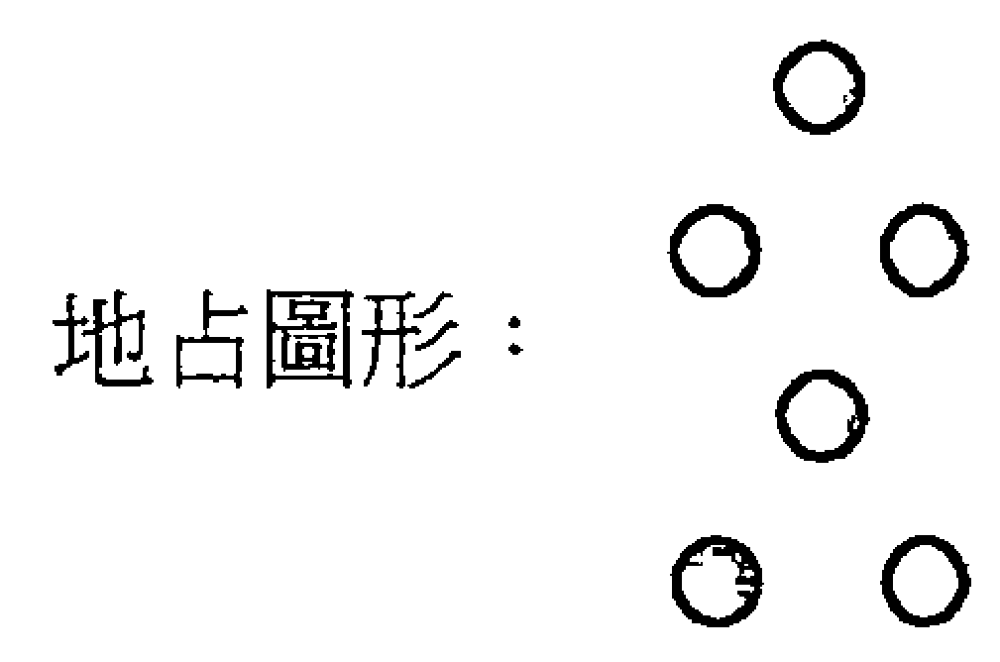

損失（Amissio、Loss）

## 寶劍隨從
Page of Swords

秘儀主題：
正 伶俐少年
逆 學藝不精的菜鳥

牌序定位：
寶劍花色牌組的第十一序號秘儀；寶劍宮廷牌的最低位階中性角色，處於和寶劍數字牌銜接的位置。

元素位階：
風元素中之土成分、乾燥的風性物質、風元素基底、風元素之爐、風之女。

### 秘儀數序定位

#### 位階數序

寶劍牌組的少年宮廷人物牌。根據元素位階推演出的特質是寶劍的嚮往者、風元素的維護者。進一步延伸為嚮往特殊技能和才藝的少年，維護其所學領域的激進分子。

#### 人物原型

社會心理上的標籤印象，是個學識技能見習生。而在現實層面上的表現為嚮往特殊技能和才藝的少年男女，期待能儘快學有所成，甚至馬上能夠盡情發揮，其實目前階段仍然不得要領。
整合出的秘儀主題為「伶俐少年」——學藝技能和智識口才的學徒。

### 正位實占解釋

人物關係：可能遇到符合上述特性的人物出現在所占算的故事當中，也可能代表一位與當事人有資訊和消息傳遞關係的下屬或晚輩。
事態局勢：在事態上變化莫測，可能是探聽內情，或發揮運用所學和長才。局勢狀況則為紛雜多元的局面。
情態心境：在心態上意味著小心翼翼、全心投入、盡力表現。心境上則感受到頗有心得，很想要露一手。
特別占問：文物書籍遞送者，公文法律遞送宣告者。一切書信文件和訊息。隨身物為通訊功能的器物機具，包括電話卡、手機、筆電。

### 牌義來歷變遷

#### 涵義演變

這張牌自古就特別與消息有關，也代表密探和間諜之類的差使。偉特的正位置意義根據這些傳統，幾乎都指特務機關或者情報單位，監視或刺探等行動，以及這些相關事物。

偉特稍後時期才更動這些屬性，然而人物性格仍依此設定出來，敏捷機靈又謹慎，具有敏銳洞察力，善於察覺分辨，以及揭露秘密。當然這些意義，也符合於隨從位階配合寶劍蘊義合成推演而出的牌義。

#### 正逆轉折

逆位置的意義根據正位置變化，將原本的消息改為令人震撼的消息。偉特也認定為意料之外或無預警下的消息，並代表疾病和各方面的困難惡劣狀況，這或許是考量到土元素特質代表身體的作用。

偉特稍後時期的逆位牌義幾乎都跟隨前期這些定義，又以「逆位虛弱原則」推演原來的正位置項目，例如間諜被揪出來，秘密被揭發了，此外則為無力抵抗強大的力量。

#### 逆位思考

現今的方式，是以規格化推論得知，這張牌的逆位原則統整而言，是寶劍能量的濫用以及隨從位階的不當，由此融合而成的人物特質為，性格上不自量力、眼高手低而欠缺自知。

整合出的逆位主旨結語為「學藝不精又臭屁的菜鳥」。

### 逆位實占解釋

人物關係：可能遭遇上述特質的人物，產生互相猜忌的牽涉關係。有人散布流言，震撼的消息、噩耗，診斷出疾病，或者得知敗跡。

事態局勢：遇到難題困擾，踢到鐵板而出糗。辯論爭勝，急於現出疏淺才學。

情態心境：好勝好強而精神緊繃，或者一時愛現、興奮過頭，造成失誤。

特別占問：接收到法律、應試相關的負面或不利訊息通告。占問物品時，表示手機配件等寶劍隨身物的遺失。

### 畫面寓意解碼

#### 主角人物

手撐寶劍的少年——寶劍隨從，這位少年獨自屹立在崎嶇的山岩上，在風元素寶劍國度之境，執行他的任務使命。

#### 場景佈置

寶劍隨從在較低的山腰，他行經的路上，地面崎嶇路途坎坷，岩石刻苦而冷峻。烏雲密布而狂亂，山風呼嘯，氣氛肅殺而詭譎，這整體場景也是風中之土的刻劃。遠方有樹木存在，是寶劍宮廷牌都有共同景物，也暗示人物有故事相關性。

#### 外觀姿勢

寶劍隨從神情緊張，眼神警覺而靈敏，高度聚精會神的行進，任務執行中、使命必達的決心！寶劍隨從輕巧靈活的穿梭在山徑，從姿態可看出身手矯健。雙手緊握寶劍向上舉起，好似是依恃著劍，又似在保護著劍。回頭看向來時路，是為了警戒身後可能埋伏或跟蹤的敵人。

#### 專屬搭配

寶劍隨從的服飾造型是淡黃底色，外加灰色暗色外衣，和場景的地面一致，這是隱匿保護的作用，也是風中之土的色調。

#### 相隨配角

這些專屬寵物，是權杖隨從性格的象徵和補充表露，也能代表訊息傳遞作用。蝴蝶表示心性高潔，瀟灑飛舞，也象徵精神的蛻變成長。飛鳥象徵心思在高空中遨翔以及訊息傳遞。

### 占卜訣竅提點

#### 實占事件角色定位

相應角色：聰慧的少年、探聽者。
關係推敲：牽涉到劇情變化轉折的關鍵配角。
逆位角色：搗亂或攪局的旁人、反應機伶的小孩。

#### 指定牌選用依據

符合特徵：遇見靈活聰明的少年少女，選用本牌為指定牌。
因事指定：事件或學藝問卜中的年少或資淺者，可以直接指定本牌。

#### 外貌年齡參考

一般可行用法：二十歲以下的少年男女，特質視指定或占卜而比照上述設定。
多種族區適用：黑髮、綠色或褐色眼睛、深色皮膚或黃色皮膚，年紀在四十歲以下的女人。

#### 特殊項目占卜參考

顏色運用：白色（White）。
天氣概況：高壓。
時間期限：三個月。
方位走向：1.北北西 NNW。
2.遠距東北方。

#### 神秘學理連結

一般星象設定：冬季星座——摩羯座、水瓶座、雙魚座。
克洛利星象設定：秋季星座——天秤座、天蠍座、射手座（變格為寶劍公主）。
易卦對應：1.蠱卦（克洛利透特塔羅）。
2.屯卦（透特塔羅新詮釋設定）。
3.大過卦（星宿對應）。

地占圖形：
○
○
○
○ ○

龍尾（Cauda Draconis、Dragon's Tail）

## 金幣國王
King of Pentacles

秘儀主題：
正 務實領導
逆 守財刻薄

牌序定位：
金幣花色牌組的第十四序號秘儀、金幣宮廷牌的高位階男性角色。

元素位階：
土元素中之火成分、堅硬的土性物質、土元素的固態、固態土象、土之父。

### 祕儀數序定位

#### 位階數序

金幣牌組的成熟資深男性宮廷人物牌。根據元素位階推演出的特質是金幣的擁有者以及土元素的管理者。進一步推論為擁有財富資源，或者運作金錢財富的熟年男人。

#### 人物原型

心理投射的人物原型是供應與照顧的父親形象，而在現實層面上的表現為，財富資源的成熟男人，講究實際而老謀深算。可說是最穩重與踏實，卻也是最固執的人，節儉或慷慨在一線之間。職業身分推斷上，是位富人、有錢人、財主，也可能是暴發戶、具有商業頭腦的經營者，是老闆、商人或企業家，甚至是經濟的領導人。
整合出的祕儀主題為「務實領導」——擁有財富而善於經營的業主。

### 正位實占解釋

人物關係：可能遇到符合上述特性的人物出現在所占算的故事當中，也可能代表一位與當事人有財務上的分配或支助關係的長輩或上屬。
事態局勢：在事態上表示經營得利，財務充裕，營運狀況良好。局勢狀況則為穩定安心，可能有人照應。
情態心境：在心態上頗重視現實層面，想要掌握占有、安全保障、物慾。心境感受則為滿足踏實而有安全感。

### 牌義來歷變遷

#### 涵義演變

早期即以相關的職業身分代表牌義，諸如商人、教授等。偉特也認定此位階代表具有身分地位的專業人士，加上金幣土元素就更強調能力和才幹，以及現實面的認知和理解力，商業和財務的能力，並且因為這些能力而達到成功，並個別賦予這位人物的性格特質為英勇的品格。

偉特稍後時期，完整的以花色元素結合位階的人物形象，解讀為經驗豐富和善於管理經營，具有品格和智慧。並表示可靠安穩的角色關係，無論是朋友或交往對象，相關事件也都是有利的，表示有能力從生意或投資中賺錢獲利。

#### 正逆轉折

自古這張牌的逆位置意義一直都比正位置負面些，人物形象多半是邪惡的老男人之類。前期這些特點，和偉特給予國王逆位的一貫涵義相符，因此他也著墨在惡行和墮落腐化。由於土元素的負面，也使得固執更嚴重，成為乖僻倔強。

虛弱和浪費墮落的涵義，則是金幣的過度濫用，都是元素「過度原則」，當然也有國王的「位階不當」問題。至於鋌而走險的行為，可認為是從正位的勇氣，以「逆位過度原則」所推得。偉特稍後時期逆位意義仍然相差無幾，只是更強調墮落和貪欲，這是由於緊密結合了元素花色的作用而來的。

#### 逆位思考

現今的方式，是以規格化推論得知，這張牌的逆位原則統整而言，是金幣能量的濫用以及國王位階的不當，由此融合而成的人物特質為，性格上倔強吝嗇、頑固昏庸的男人。

整合出的逆位主旨結語為「守財刻薄的金主」。

### 逆位實占解釋

人物關係：可能遭遇上述特質的人物，產生財務糾紛或產權傾軋的相互關係。

事態局勢：經營不善、財務困難、冒險投資而賠本，喪失既有權益。奢靡享受而浪費損失。

情態心境：由於墮落和貪欲，一時迷惑和糊塗鑄成錯誤。

### 畫面寓意解碼

#### 主角人物

金幣入懷的長者——金幣國王，這位長者坐在王座上，顯示出至尊的國王身分。王座位於城堡外的莊園，自然與繁榮的交界，更是土元素金幣國度的領土。

#### 場景佈置

場景似在城牆之旁，背景即可看見一整座城堡與廣大領地，全身被包圍融入，富裕氣派的刻劃。城堡代表安穩的庇護，穩固的財富保障。葡萄藤蔓是豐富生產的表徵，連結葡萄酒則暗示高貴和饗宴。

#### 外觀姿勢

金幣國王看似臉色相當深沈，表露出他的堅定和固執，而眼皮下垂瞇起，讓人感受到他的傲慢心態。金幣國王一手扶著金幣，一手握住王者權柄，多半不會讓手空閒著。他的腳底如果踩著他物，尤其是動物，更可表現出他頤指氣使的動作，顯露掌握資源的大權氣勢。

#### 專屬搭配

金幣國王的寶座裝飾華麗，椅背兩端與扶手前端，都裝飾有公牛頭，象徵生生不息。服飾造型多為深藍綠服裝，大都繡著葡萄圖案，這種花色繁複的裝飾法，讓國王能夠融於場景中，給人感受土之火的意象，也就是生命力融合到雄厚大地中。

#### 相隨配角

金幣國王腳底踩著的野豬為富裕的象徵，也表示繁殖與豢養。牛是踏實的精神，耕作帶來財富，而山羊為向上的積極精神以及旺盛生命力。

### 占卜訣竅提點

#### 實占事件角色定位

相應角色：固執富有的長者，多半可視為供應者。
關係推敲：財運問題之資深男人、機構資源主事者、老闆、金主。
逆位角色：老頑固或吝嗇老頭。

#### 指定牌選用依據

符合特徵：遇見成熟穩重而有擔當的男性，選用本牌為指定牌。
因事指定：財務問卜之熟齡男性，可以直接指定本牌。

#### 外貌年齡參考

一般可行用法：四十歲以上的男性，特質視指定或占卜而比照上述設定。
多種族區適用：黑髮、黑眼睛、黑色皮膚，年紀在四十歲以上的男人。

#### 特殊項目占卜參考

顏色運用：橄欖色（Olive）。
天氣概況：乾冷出太陽。
時間期限：一年。
方位走向：1.正南方 S。
2.近距北方。

#### 神秘學理連結

星象設定：1.金牛座（螺旋塔羅，一般神秘學塔羅及多數塔羅設定）。
2.摩羯座（宇宙塔羅等少數設定）。
克洛利星象設定：獅子座 20 度至處女座 20 度（變格為金幣騎士王）。
易卦對應：1.小過卦（克洛利透特塔羅）。
2.小過卦（透特塔羅新詮釋設定）。
3.大有卦（星宿對應）。

地占圖形：
○ ○
○ ○
○ ○
○ ○
群眾（Populus、The People）

## 金幣王后
Queen of Pentacles

秘儀主題：
正 現實女性
逆 拜金女郎

牌序定位：
金幣花色牌組的第十三序號秘儀、金幣宮廷牌的高位階女性角色。

元素位階：
土元素中之水成分、滋潤的土性物質、土元素的液態、液態土象、土之母。

### 祕儀數序定位

#### 位階數序

金幣牌組的成熟女性宮廷人物牌。根據元素位階推演出的特質是金幣的享受者、土元素的沈浸者。進一步推論為享受金錢財富，或者沈浸在物質或金錢打理中的女性。

#### 人物原型

心理投射的人物原型，是照顧周到的全能保母型母親形象。在現實層面上，金幣王后都是重視實際面的女性，然而有幾種類型差異：一為看重物質或崇尚金錢的女人，可能有愛錢、拜金、現實勢利的特質。二為貴婦或者出身為千金名媛，是懂得生活和享受金錢財富的女性。三為賢慧能幹的女人，勤儉持家而純樸務實，打理金錢的能力強，從而致富的女性。可能賢慧而有幫夫運，個性較沈穩而非浪漫，甚至理智而嚴謹。
整合出的祕儀主題為「現實女性」——著重現實和財務的賢妻良母或貴婦名媛。

### 正位實占解釋

人物關係：可能遇到符合上述特性的人物出現在所占算的故事當中，也可能代表一位與當事人有財務往來或實質照應關係的女性。
事態局勢：享用財物及生活，或是打理經濟財政。局勢狀況表示富庶的景氣。
情態心境：心態上意味著幸福溫馨，有安全感和踏實感，並懷著期待和希望。心境上感受到舒適安穩，安心享受。

### 牌義來歷變遷

#### 涵義演變

早期正位牌義與婚姻很有關聯，表示幸福美滿的婚姻，尤其對於男性問卜者而言更佳，表示得到豐富的贈禮。而後來牌義的演變，都是簡單的看待成富裕、安康、繁榮興旺的現象。

偉特加入了心理上的安全感，以及自由、舒坦的感受，而在人物形象方面，自不乏王后的基本特質：忠貞、優雅而善良親切，並加入金幣土元素的作用，賢淑而慷慨熱心，並且有著雍容華貴的氣質。偉特稍後時期延續這些特質，並更升級增添了仁慈的女性，以及高尚的靈魂。

#### 正逆轉折

這張牌的逆位早期就是完全負面的特質，也包括疾病的現象。偉特當然賦予他對王后逆位的一般定義，那就是邪惡、不正當的行為、缺乏責任。並且也融入了金幣意涵，像缺乏安全感、擔心焦慮、患得患失，都是基於實際面而生的。

偉特稍後時期大都延續這些意義，更完全結合金幣土元素，強調責任與信任的危機，實際層面的挫折，以及虛幻的願景和期待。這些逆位意義，也都可以視爲是根據正位置的意義以「逆位負面原則」轉變而來。

#### 逆位思考

現今的方式，是以規格化推論得知，這張牌的逆位原則統整而言，是金幣能量的濫用以及王后位階的不當，由此融合而成的人物特質爲，性格上奢侈浪費、拜金貪婪的女人。

整合出的逆位主旨結語爲「拜金女郎或敗家女」。

### 逆位實占解釋

人物關係：可能遭遇上述特質的人物，產生干擾生活或拖累經濟的相互關係。

事態局勢：濫用金錢、享受過度、敗家，或是處置不當。後果將愈趨嚴重，產生財務問題。

情態心境：對於金錢需索無度，缺乏安全感或是患得患失，對財富或保障有虛幻的期盼。

### 畫面寓意解碼

#### 主角人物

身懷金幣的女人——金幣王后，這位女子坐在后座上，表示尊貴的王后身分。后座位於花園樹林之內，也就是土元素金幣國度的領地。

#### 場景布置

樹葉和草坪營造出綠色的景致，身處莊園所屬的自然場地中，顯示富裕豐收的優渥狀況，包含水流會更呼應土中之水。花果表示豐碩的結果，而花朵則表示生活的浪漫、重視美感以及感情豐富，兩者都是收成和生命繁殖力的象徵。

#### 外觀姿勢

金幣王后的樣貌應描繪出端莊美麗，她的神情寧靜而專注，有別於聖杯王后的深情流露。金幣王后的動作姿態更為內斂，她的雙手緊擁著金幣，眼神凝望懷中金幣，好似出神凝思一般，這個動作類似於冥想，彷彿能探索深沈心靈的本質。

#### 專屬搭配

金幣王后的寶座裝飾山羊頭的造型，屬於大地的形象物，表示土元素的豐饒。她的服飾主要配合土元素的繽紛大地，多以深色褐色的基調加上紅色與綠色的相配，暗示這位女性沉穩內斂和給人安全感的性格特質，具備堅毅的耐性。

#### 相隨配角

金幣王后的身邊通常出現兔子，代表溫馴又有動感，並且象徵繁殖力，如是野兔則代表更強的活力和野性，而半寵物半獵物的動物最能搭配金幣王后。牛是踏實的精神，耕作帶來財富。山羊為向上的積極精神，生命力旺盛。

### 占卜訣竅提點

#### 實占事件角色定位

相應角色：精明賢慧的女人，有時也是支持援助者，或者撫育者。
關係推敲：財運問題之女主角、愛情故事的第二女主角。
逆位角色：成事不足的女性友人。

#### 指定牌選用依據

符合特徵：遇見較成熟務實的幹練女性，選用本牌爲指定牌。
因事指定：財務或感情、家庭問卜的女性，可以直接指定本牌。

#### 外貌年齡參考

一般可行用法：二十歲以上的女性，特質視指定或占卜而比照上述設定。
多種族區適用：黑髮、黑眼睛、黑色皮膚，年紀在四十歲以上的女人。

#### 特殊項目占卜參考

顏色運用：青色（Cyan）。
天氣概況：雪或寒冷。
時間期限：九個月。
方位走向：1.南南西 SSW。
2.近距西北方。

#### 神秘學理連結

星象設定：1.摩羯座（螺旋塔羅，一般神秘學塔羅及多數塔羅設定）。
2.處女座（宇宙塔羅等少數設定）。
克洛利星象設定：射手座 20 度至摩羯座 20 度（變格爲金幣女王）。
易卦對應：1.咸卦（克洛利透特塔羅）。
2.同人卦（透特塔羅新詮釋設定）。
3.隨卦（星宿對應）。

地占圖形：
喜樂（Laetitia、Joy）

## 金幣騎士
Knight of Pentacles

秘儀主題：
正 精實青年
逆 紈袴子弟

牌序定位：
金幣花色牌組的第十二序號秘儀、金幣宮廷牌的中間位階男性角色。

元素位階：
土元素中之風成分、鬆動的土性物質、土元素的氣態、氣態土象、土之子。

### 秘儀數序定位

#### 位階數序

金幣牌組的青年男性宮廷人物牌。根據元素位階推演出的特質是金幣的追求者、土元素的掌握者。進一步推論為追逐金錢財富，或者掌握物質、善於運用工具的男子。

#### 人物原型

心目中的多金公子或事業新貴，在現實層面上的表現為，擁有財富或努力勤奮，前途看好的男士績優股，重視財富和發展，理財或賺錢能力強。具有專業能力和才幹，精練實際且講究效能，分為兩大不同的類型：一為勤奮有為的青年，並非倚賴出身背景，以自身的奮鬥而培養能力、獲取資源，進一步達成目標。另一為富家子弟，或者說天生掌握資源，因而也深諳這一塊領域。
整合出的秘儀主題為「精實青年」——精明幹練且專注投入，前景有望的才俊。

### 正位實占解釋

人物關係：可能遇到符合上述特性的人物出現在所占算的故事當中，也可能代表一位與當事人有財務往來或實質互助關係的男性。

事態局勢：事態方面表示正在賺錢，業績良好，或財務上可望成功。局勢狀況正處於打拚務實，面臨經濟成長。

情態心境：在心態上信心堅定而沈穩實在，重視並期待實際成果。心境上很重視現實，並且渴求追逐金錢或財務穩定。

### 牌義來歷變遷

#### 涵義演變

古代就是比較偏向吉利意義的牌，正位置所指的人物是有助益的男人，以及有利的事件。偉特的大約遵照這些涵義，並加上他對此位階形象的觀感，解釋為奮發上進的年輕人；並加入土元素的作用，而加上正直、專心關注的特質，更不乏強烈的責任感，事件上則是實用和有效的。

偉特稍後時期的正位置意義差不多，但更為強調土元素和金幣花色的特質，強調人物形象為成熟可靠的人、耐性堅定的人以及有擔當的人，並且具有條理組織和辦事能力，並且使命必達。

#### 正逆轉折

早期逆位意義似乎就是從正位轉折過來的，與失去工作很有關聯。偉特據以推論為事件上的停滯或歇息，人物特質則為遲則為遲鈍、懶惰、沈寂，這些也可說特別以「逆位相反原則」所推得。而偉特由騎士逆位而得的定義為粗心大意的不佳態度，以及沮喪挫折的不順情境。

偉特稍後時期，一樣強調不利工作的態度，並加入了缺乏決斷力或迷失方向。在人物心理方面的描述為心胸狹窄、觀念受限。這些也都與逆位的元素作用相關，是元素或花色的「虛弱原則」所推得。

#### 逆位思考

現今的方式，是以規格化推論得知，這張牌的逆位原則統整而言，是金幣能量的濫用以及騎士位階的不當，由此融合而成的人物特質為，性格上遲緩無趣、故步自封的男子。

整合出的逆位主旨結語為「紈絝子弟或少爺姿態」。

### 逆位實占解釋

人物關係：可能遭遇上述特質的人物，產生利益衝突或合作失利的實質關係。

事態局勢：理財投資失誤，財源和機會爭取失敗。失去工作或事業受挫，專業能力或態度不受肯定，生計產生困難。

情態心境：焦慮煩惱，為未來生活或經濟擔憂，苦無方法改善。觀念和心思不夠開闊遠大。

### 畫面寓意解碼

#### 主角人物

馬背上高捧金幣的男子——金幣騎士，黑馬徐行在原野之中，騎士身側可見山脈岩層，他將要開闢土元素金幣國度的大地。

#### 場景布置

這位男子騎乘著一匹黑馬，來到這片廣大土地。草地、岩脈和遠方小丘陵構成了複雜的地形，蘊藏豐富多變的潛能。地面上的植物生長繁茂，暗示未來將蓬勃發展的可觀前景。

#### 外觀姿勢

金幣騎士長相厚實，臉色沈著，表情專注認真，是位顯得實際而剛強的年輕人，懷著堅定的信心和計畫。他的馬匹腳步好似將要停止，好似思忖著是否該停留下來。騎士捧著金幣，但眼神卻朝更遠的地方望去，這動作暗示心中有更遙遠的目標和夢想等待實現。

#### 專屬搭配

金幣騎士身著厚重盔甲，顏色也是深色，套著厚實的深棕色外衣，搭配成大地的顏色，也是他性格的寫照。背景明朗而光彩，呈現空氣微風的特色，這呈現出了土之風的景象。

#### 相隨配角

金幣騎士所駕馭的馬匹多為深色，以配合金幣騎士的穩重踏實。黑色的馬匹更象徵潛能無限，馬鞍的顏色也和馬匹、騎士服飾相搭配。

### 占卜訣竅提點

### 賓占事件角色定位

相應角色：深沈自我的年輕人、以金錢財物影響故事的男性。
關係推敲：財運問題之男主角、愛情故事第二男主角。
逆位角色：故事中現實面的無能者。

#### 指定牌選用依據

符合特徵：遇見重實際和成效的男人，選用本牌爲指定牌。
因事指定：投資理財或前途問卜之男性，可以直接指定本牌。

#### 外貌年齡參考

一般可行用法：二十歲以上、未滿四十歲的男性，特質視指定或占卜而比照上述設定。
多種族區適用：黑髮、黑眼睛、黑色皮膚，年紀在四十歲以下的男人。

#### 特殊項目占卜參考

顏色運用：綠色（Green）。
天氣概況：寒冷多風。
時間期限：六個月。
方位走向：1.正東南 SE。
2.近距東北方。

#### 神秘學理連結

星象設定：1.處女座（螺旋塔羅，一般神秘學塔羅及多數塔羅設定）。
2.金牛座（宇宙塔羅等少數設定）。
克洛利星象設定：白羊座 20 度至金牛座 20 度（變格爲金幣王子）。
易卦對應：1.漸卦（克洛利透特塔羅）。
2.漸卦（透特塔羅新詮釋設定）。
3.晉卦（星宿對應）。

## 金幣隨從
Page of Pentacles

秘儀主題：
正 踏實少年
逆 不諳實作的生手

牌序定位：
金幣花色牌組的第十一序號秘儀；金幣宮廷牌最低位階之中性角色，處於和金幣數字牌銜接的位置。

元素位階：
土元素中之土成分、豐沃的土性物質、土元素基底、土元素之爐、土之女。

### 秘儀數序定位

#### 位階數序

金幣牌組的少年宮廷人物牌。根據元素位階推演出的特質是，金幣的嚮往者，土元素的維護者。進一步推論為，嚮往金錢財富，或者期待日後有能力賺錢致富的天真少年。

#### 人物原型

社會心理上的標籤印象，是個理財投資見習生。在現實層面上的表現為，嚮往賺錢和投資致富的少年男女。雖然按部就班學習和模擬，但是運用方針與操作手法都尚未純熟。
整合出的秘儀主題為「踏實少年」——職場業界的新鮮人。

### 正位實占解釋

人物關係：可能遇到符合上述特性的人物出現在所占算的故事當中，也可能代表一位與當事人有財務傳送或供應關係的下屬或晚輩。
事態局勢：在事態上表示能力不足或資金沒有很雄厚，尚未真正賺錢獲利回收。局勢狀況則為環境有些許物質的誘惑力。
情態心境：在心態上意味全神貫注，興奮的投入。心境上則感受到讚嘆，想望或渴求某種目標。
特別占問：財物遞送者，帳單遞送宣告者。一切財務報表、帳單或收據。隨身物為貨幣作用的物品和配備、零用錢、各式金融卡、皮夾、錢包。

### 牌義來歷變遷

#### 涵義演變

這張牌早期即代表少年人，並且懷有任務，或者是一位低階士兵。偉特正位置牌義仍賦予隨從一貫代表的訊息和資訊，以及傳遞提供者。
人物形象也是專注用心和學習研究的精神。配合土元素的蘊義，推論為獎賞、規則，以及運用和管理。偉特稍後時期整合了以往的牌義，並以元素與位階的融合，推論出的牌義為尋找新點子和不切實際的改良。

#### 正逆轉折

早期的逆位置意義，以失去正位置的優勢來表示，遭到降級或是被剝奪權益。偉特加入了金幣花色「過度原則」負面作用的考量，也就是浪費奢侈、放蕩消耗。當然也不乏隨從逆位的一貫意義，在消息方面是不利的。
偉特稍後時期，逆位延續這些意義，另外以位階「負面原則」推論而得出人物性格方面，意味著不切實際與反叛。整體牌義以「相反原則」來推論，精明轉為思考上有問題，導致認知不清、邏輯出錯、思緒紛亂等特質。

#### 逆位思考

現今的方式，是以規格化推論得知，這張牌的逆位原則統整而言，是金幣能量的濫用以及隨從位階的不當，由此融合而成的人物特質為性格上不切實際、放縱怠惰而欠缺自律。
整合出的逆位主旨結語為「不諳市場實作的生手」。

### 逆位實占解釋

人物關係：可能遭遇上述特質的人物，產生互相排斥的關係。有人散布不滿的聲音、不利的消息，接獲負債催討、債務帳單。
事態局勢：浪費奢侈，財務失控，出紕漏和差錯，遇到實際面的困難。環境充滿利益的誘惑。
情態心境：思緒打結，認知不夠清楚。意志不堅定，受到迷惑。
特別占問：接收到財務、物產相關的負面或不利訊息通告。占問物品時，表示錢包、金錢、卡片等金幣隨身物的遺失。

### 畫面寓意解碼

#### 主角人物

手捧金幣的少年——金幣隨從，這位少年獨自佇立在空曠的田野中，在土元素金幣國度之中，執行他的任務使命。

#### 場景布置

背景看出是遼闊大地，身旁有一片草地植被，遠方為岩石山巒，刻劃出大自然各種地貌的結合，這些都是土中之土的描繪。地面很豐富多元，更有繁花繽紛。植物樹木象徵樸質毅力、耐性堅持，成林表示茂密繁盛。這和騎士的樹林可以呼應，而山脈也可與金幣宮廷牌連結。

#### 外觀姿勢

金幣隨從的面貌端正而有點嚴肅，並正呈現出全神貫注的表情，有如完成任務得到寶物後的檢視。金幣隨從的動作姿態是雙手捧著金幣，好似緩緩地高舉起來，長久凝視、關注這枚金幣。

#### 專屬搭配

金幣隨從的穿著像一棵樹，棕木綠葉，整個似乎是從地面上長出來的，是生命力從大地滋養而成長茁壯的象徵。

#### 相隨配角

金幣隨從的專屬寵物，是他性格的象徵和補充表露，並也能代表訊息傳遞作用。通常出現的寵物可能與前述宮廷牌相同。

### 占卜訣竅提點

#### 實占事件角色定位

相應角色：能幹的少年、服務者。
關係推敲：有關環境局勢演變的小配角。
逆位角色：疏於職守的派遣者、中規中矩的小孩。

#### 指定牌選用依據

符合特徵：遇見關心注重實際面的少年少女，選用本牌為指定牌。
因事指定：金錢物質問卜之年輕男女生，可以直接指定本牌。

#### 外貌年齡參考

一般可行用法：二十歲以下的少年男女，特質視指定或占卜而比照上述設定。
多種族區適用：黑髮、黑眼睛、黑色皮膚，年紀在四十歲以下的女人。

#### 特殊項目占卜參考

顏色運用：亮綠色（Lime）。
天氣概況：乾燥且無風。
時間期限：三個月。
方位走向：1.北北東 NNE。
2.遠距北方。

#### 神秘學理連結

一般星象設定：春季星座——白羊座、金牛座、雙子座。
克洛利星象設定：冬季星座——摩羯座、水瓶座、雙魚座（變格為金幣公主）。
易卦對應：1.艮卦（克洛利透特塔羅）。
2.觀卦（透特塔羅新詮釋設定）。
3.頤卦（星宿對應）。

## MEMO

## 數字牌解密
Pip Cards

### 數字牌統論

數字牌是小秘儀宮廷牌之外的部分，各張牌由數字和花色所構成。數字牌的牌義主旨是根據數字順序配上花色意義變化而來，不同花色的相同數字會有一些共同的狀態。必須了解的是，數字牌上的數秘意義，多根據編制系統內的順序數位而推得，並非完全與生命靈數的涵義等同。

除了由數位花色綜合而來的主題之外，畫面也增添了更多變化，始為每張數字牌的全部涵義。而其中自有許多部分是根據傳統論斷演進而來的，可知牌義並非完全與數字相關。而數字牌這樣多元豐富的意涵，正適合針對占卜事件做詳細狀況的分析。

#### 數字牌義概述

##### 二號牌
意義說明：二號牌代表兩者結合或者分開。兩股力量可能是對立的，而且旗鼓相當、雙方力量均等。
思考主軸：事件多為「結合」或雙方「協調」，負面現象為「分裂」。

##### 三號牌
意義說明：三號牌都表示情緒化的作用，歡欣喜悅或是相反的意義。三也代表超過二股力量、三方的組合，是共同進行之意。
思考主軸：事件的作用為「制衡」與「共享」，負面現象為「紛亂」與「失利」。

##### 四號牌
意義說明：四號牌是靜止之牌，是一種停頓現象，當然也有穩定的作用。
思考主軸：事件的正面呈現為「恬逸」、「安穩」，負面現象為「退縮」、「固執」，以及「停頓」。

##### 五號牌
意義說明：五號牌代表了變動，多是混雜和散亂的狀況，傾向比較負面的涵義。
思考主軸：逆位較為正面，為事件的關鍵與「重整」，正位主旨卻是負面的「失落」、「散亂」現象。

##### 六號牌
意義說明：六號牌主旨都是順利，呈現花色的良好作用，正巧可以用六六大順來戲稱，也多包含享受、滋潤，流動、溝通等意義。
思考主軸：正位都是事件進行「順利」以及「成功」，逆位都是負面現象，「沈迷」或者「落敗」。

##### 七號牌
意義說明：七號牌跟想像和思考有關，是花色再增添、加料的作用，多了那麼一層虛幻的面貌，可當做受到 7 的靈數意義影響。
思考主軸：往好處想，都是事件的一種「突破」，然而也易呈現出事件的負面現象「糾葛」、「紛亂」。

##### 八號牌
意義說明：八號牌代表了力量或花色作用的集中，凝聚而成爲另外一種狀況和局面。
思考主軸：若有好的現象應爲事件的「扭轉」，負面現象則爲整體的「膠著」、黏滯不前、無法動彈。

##### 九號牌
意義說明：九號表示已經到了最後的意味，也就是該花色牌組的最終境界，極度加強花色特性，由此推演出牌義。
思考主軸：事件的「充分」發揮，正面現象可說是某種最後「成果」，但負面現象爲「困頓」、全面性的「匱乏」和不順。

##### 十號牌
意義說明：十爲全然徹底的作用，且可視爲極致之後再附加上一級，時間也可往後繼續延伸下去。10 的基數是 1，具有整體花色合一的意味，表示統整融合爲一體。
思考主軸：事件完全的「解決」、「了結」，並可擔保往後持續發展，有決定性的功能存在。負面現象爲「危難」，事態程度嚴重，或是不完美、無法完整。

##### 數字牌的逆位解析

各張數字牌主旨原意的正負性質並不一定，也就是有的牌正位置卻是負面意義，可知上述各數序所提及的正負面作用，並不等於指涉正位逆位牌義。各張數字牌的逆位置意義，還是要先確認張牌的正位置涵義，再從正位推論而得。
數字牌也應用逆位原則，正位主旨爲正面意義的牌，逆位意義多使用「逆位不當原則」、「正逆互異原則」推演而得。正位主旨爲負面意義的牌，逆位意義多使用「逆位超越原則」推演而得。牌的主旨爲中間涵義難辨正負的牌，逆位多使用「逆位不當原則」、「逆位超越原則」來推演。

## 權杖二
Two of Wands

秘儀主題：
正 統御管理
逆 駕馭不住

牌序定位：
權杖牌組第二張數字牌，權杖作用的初步展現綻放。

元素位階：
火元素最有衝勁和展現力量的階段，火元素的最強烈呈現形式。

### 秘儀數序定位

### 數字奧秘

二號牌與火元素權杖的組合，代表行動和意志上的接觸與協調，也是權力的整合或分裂、行動或力量的結合或抗衡。朝向正面的進一步發展是合作和互相扶持。

### 秘儀主題

兩根權杖其實是兩股力量的統合，一起運作後更突顯駕御的重要，兩方勢力又要並行不悖，管理與控制必須得宜，而發揮集中指揮的核心權力，才更利於統合下的整體運作。

### 內涵定義

權杖二代表擁有和掌握、駕馭和支配，管理運作能力很強，有擔當和充分的魄力。在事業方面能順利進行，享受富有和權勢。如果要在正位置中看出負面的特質，那就是野心慾望過強，或是因為任務過於艱鉅，造成心理上的障礙。

### 正位實占解釋

人際交誼：在人際關係上主動出擊，贏得他人交情。彼此合作無間。
戀愛情緣：感情方面表示觸碰撞擊出熱情火花，有結合的趨勢。
事務進行：由於積極進取的態度，負責盡職的精神，並擅長管理運作，事務進行都能有好成果。
金錢物質：能夠管理運作一切，充分掌握資源，得到實質的成果。

### 牌義來歷變遷

#### 涵義演變

這張牌在古代紙牌占卜術中，正逆位意義相差無幾，正逆位中也都包含有正面和負面傾向的意義。

偉特多承襲了這一特點，於是正逆位中都有苦難、懊惱、煩憂之意。雖然正位置卻又有著極為正面的意義：富有、榮華、高貴、幸福，但偉特本人明瞭並宣稱牌義中存有矛盾，這是導致偉特後對這張牌的意義趨向模糊的原因。

其實煉金術系統中認定這張牌代表極為強大的力量，縱使可能較難控制，卻是一張優異的牌。黃金黎明和透特系列塔羅，更以強大的正面意義為這張牌的主旨。偉特就是因為想要同時保有這些牌義，所以特別容納這種現象。

#### 正逆轉折

於今牌義朝向單純化演變，依照煉金術神秘系統的定義而言，這走向也是必然的。正位置為正面積極的意義，而逆位置則為負面意義，主要就是不再正負吉凶作用混雜不清了。

#### 逆位思考

逆位置意義主要採取「逆位相反原則」的思考，也就是將正位置的好運都變成相反的。

逆位象徵內心的積極進取已不再，個人自信心喪失了，甚至煩惱和擔憂；合作上不順利和障礙，互相之間難以協調平衡；遇到挫折打擊，失去權勢和地位。而這些情況也可推斷或許有敵手從中作梗。

逆位主旨結語：駕馭不住。

### 逆位實占解釋

人際交誼：管理不當失去民心，支持度大幅滑落。合作失利而拆夥，意見互有抵觸終於分道揚鑣。

戀愛情緣：兩人情感不協調，背對背，甚至產生衝突，可能分開。

事務進行：管理不妥善、難以統合與融合、分裂。中途受到衝擊。

金錢物質：財務管控不當，有所損失。有人抽資，從而不能繼續運作。

### 象徵專屬物設定

#### 幾何排列意義

雙杖的圖式，就表示了雙方的接觸和組合，可以形成並進、合作或者是競爭。這種意義的表達，可以排列成以下的形狀 ⌐¬ 、 ⌐¬ 。
而最常見到的排列方式，則為兩根權杖交錯，然而通常不會排成垂直的十字形狀，多是斜向交叉的形狀： ⌐¬ ，這也表示兩股能量的撞擊和爆發，可以形成強大的力量。

#### 故事畫面安置

|| 兩根權杖並立，這種排列等同於塔羅中雙柱的涵義，可以暗示門檻和關卡。這種暗示可做為標誌，確立一個地標和領域，成為一道區隔的界線，可以在此內管理統轄，也可以進一步往外拓展。
由於圖案簡單，權杖直立並列的方式，另亦會以外型變化顯示出其他意義，例如直接構成雙柱型態：||，以及真正雙柱樣貌：||。

### 畫面故事情節

#### 情節發展

本祕儀通常是以男性為主角，做為相關於領土主權統御的角色，也表達陽性積極的意味。主角人物的穿著，顯示了所屬的時代和背景，以及本身的階級地位。城牆上觀望的城主，可以是任一階級領地封主，大到首領人物，而至少也是一名城堡戍衛之長。

領主與權杖的關係是牌義變化所在，主角沒有握住任何一根權杖的情節設定，通常會在權杖豎立而成的雙柱「門檻」之間，這樣的動作是單純地表明所有權的宣示。一手握住一根權杖，表示掌握自身的優勢和權力，獨立自主而統御權力強。

另一根權杖表示他人方面的力量，或許成為並肩的依靠，從而形成現在穩固的局面。然而這支權杖是如何佇立或由誰在握，也是詮釋牌義的關鍵，這突顯出另一方的狀況如何，也可以從中看出雙方之間的關係。

手握兩柄權杖的情形，則表示一次要協調兩邊，合作和合併的意味很強，也會出現兩難及必須致力於均衡的涵義。一手齊抓兩根權杖，表示強力掌控一切，雙方的融合已非常緊密，更不需要費心協調。

#### 附屬搭配

因有領域的觀念，所以這張牌畫面通常以城堡為場景，表示領地而象徵相關的資產。領土外的背景，通常描繪成很遼闊，所囊括的領域和地方，就是未來想要拓展的範圍和內容。

跟隨 RWS 的畫面，也通常附帶地球儀在主角手中，象徵心裡面模擬拓展的慾望和思量。這也成為本張牌的圖案特徵之一，縱使不是握在手上，也會在畫面中其他地方，甚至也以球體延伸出各式豐富的設計變化。

有的塔羅的這張牌會畫出特殊的圖幟，除了增加神秘感外，也是強調主角的特殊身分淵源。

> 占卜訣竅提點
多數人對權杖二印象不深刻，其實這張牌是很特別的，可以說是最強且有力的一張數字牌。這股能量起源不可抗拒的雄心壯志，也能轉化而產生權力、威勢等作用。

## 權杖三
Three of Wands

秘儀主題：
正 實力擴展
逆 裏足難行

牌序定位：
權杖牌組第三張數字牌，權杖作用的進一步拓展延伸。

元素位階：
火元素的移動和傳遞能力，火元素的擴張形式。

### 秘儀數序定位

### 數字奧秘

三號牌與火元素權杖的組合，所形成的正面作用是成長和拓展，並且增添外援，各股勢力互相制衡而產生運作機制。負面的狀況則是這些力量互相牽制，產生摩擦而行動失利。

### 秘儀主題

三根權杖，始能跨出界線，因而有進一步的向外和擴展，並且背後的實力和後盾已是充分而強大，足以往前擴張領域，可理解為平面式的延伸而非堆疊。所擁有的雄厚資源，也能促進蓬勃發展，生機無限。

### 內涵定義

權杖三是進一步的拓展，事業上的擴張，冒險的行動有所斬獲。並且代表協商，交易和生意上的往來，或是共同協力合作，有援助和依靠。個人則具有樂觀進取和冒險精神。這張牌也有旅行和遠遊的涵義，代表過程暢通順利。

### 正位實占解釋

- 人際交誼：交流互動頻繁熱絡，交遊更是十分廣闊。接受奧援。
- 戀愛情緣：感情有進展，加入更多元素，相偕遊歷，增添豐富趣味。
- 事務進行：喜歡嘗新和冒險，能向前邁進，事務的拓展和進行都很順暢。
- 金錢物質：從交易流通中能夠獲利和賺錢，或許會有人支持或資助。

### 牌義來歷變遷

#### 涵義演變

自古以來權杖三的牌義就非常駁雜，有時很積極樂觀，有時是悲傷不幸，還包括許多不同層面涵義，像是婚姻與事業。正逆位通常有所差異，但是好壞意義仍時常相混淆與對調。

偉特承襲古代涵義，然而正位置已經偏向良好的意義。煉金術系統更賦予這張牌極為正面的意義，也就是具備實力和內涵。後來這張牌連正位意義，都被定義得模糊不清，也是因為早期牌義的歷史因素造成的。

#### 正逆轉折

偉特承襲古代涵義，也定義逆位置中有許多正面意義，像是停止厄運、減輕不幸、結束煩惱等。而後為了朝向便利於解釋，演進方式還是根據煉金術系統和偉特的定義做一番調和，最後仍然統合為正位置一律為正面意義，當然有關正逆位的分別也單純化，逆位置為負面意義。

#### 逆位思考

權杖三的正逆位意義分明，需以「逆位相反原則」和「逆位負面原則」來設定逆位置的意義，既然正位置的定義如此良好，那麼逆位置的意義就顯得很負面了：多半表示事務進行失利，受到阻礙或遭遇困難。原因可能是個人的退縮封閉而裹足不前，從而拖延受阻；也表示提供的支援和幫助可能有問題，或許是別有用心的不當動機。

逆位主旨結語：裹足難行。

### 逆位實占解釋

- 人際交誼：心態放不開，人際交流較封閉，甚少對外往來。由於方法不妥，人脈拓展不起來。
- 戀愛情緣：感情沒有進展，互相之間講不開，關係難改善。漸行漸遠。
- 事務進行：營運不當，事業拓展不成功，或者因為擴張而造成失利。
- 金錢物質：交易拖延阻礙，造成損失。營運失當，拓展不成功。

### 象徵專屬物設定

#### 幾何排列意義

圖式可排列成三角形，象徵完整與和諧。而三槓交錯為六角星符號，表示力量集中於一點。則表示強力連結的幾股力量。

#### 故事畫面安置

三根權杖可視為雙柱再加上另一柱子，排列成，三點成為一平面，表示往外延伸新的空間。雙柱代表原本舊有的領域，加上一柱往外拉出去的動向，象徵領域拓展的意味明顯。雙杖外加一杖，也表示有外來資助以及附增力量，能夠據以繼續拓展。三根權杖的組合，也表示多方的聯合交流。

### 畫面故事情節

#### 情節發展

本秘儀多半以男性做爲力量拓展的運作者，然而也可以用女性做爲主角。主角人物的站立位置是牌義思索的重點。三根權杖通常會以雙柱外加另一柱的方式來表現，雙柱一樣是領域界線的意義，另一柱是前進或後退的方向指標。
主角站在雙柱之間還是雙柱之前或之後，可以看出他目前的處境和未來的動向。手握第三根權杖，有前進和拓展的意義，然而卻是在初步的階段。如果雙柱在前，而手握其中一根，也代表擴張領域，但卻是實際已完成和持續進行中。
從主角如何握杖，能看出行爲作風偏於保守或積極。有雙手握住雙柱，甚至三杖都握在手中的畫面，都表示全盤掌握的意義。
有些塔羅會出現兩個或更多的人物，雙柱代表原先的一方，而另一權杖爲新加入或外來的一方，帶來合併或支援，象徵新的一個支柱。也可將一根權杖架在雙柱上方，形成更完整的門檻，表示對既有的管轄有信心，並成爲對外交流貿易的窗口。

#### 附屬搭配

通常主角眺望著平坦而空曠遼闊的場景，其中包括了水域或海洋，甚至可以看到遙遠的彼岸，或許還有小城鎮，象徵遠方的拓展理想。
海面和船隻，表示海洋貨物以及貿易交流。船隻的描繪是許多塔羅的重點，多半不會遺漏掉。這張牌比較少有其他道具配備。

> 占卜訣竅提點
權杖三的牌義時常和權杖二混淆不清，其實箇中差異很明顯，兩張牌是有關係，這關係就在於接續，所以兩者肯定大有分別，權杖三是基於權杖二架構下，進一步拓展開來的。

## 權杖四
Four of Wands

祕儀主題：
正 穩定周全
逆 紕漏動搖

牌序定位：
權杖牌組第四張數字牌，權杖作用的穩固和靜止。

元素位階：
火元素的靜止作用。火元素的最穩定的形式，因此最適合引導及善加運用。

### 祕儀數序定位

### 數字奧祕

四號牌與火元素權杖的組合，正面作用是安全穩固，強有力的保護與庇蔭，組織架構完善。負面狀況則是相反地失去了這些作用，或者是停頓和固守而沒有進展和動力。

### 祕儀主題

猶如四根柱子，象徵穩固的建築，屋宇的棟樑給人安全感受。不但穩固安定，對未來也有保障，是絕佳的保護和庇蔭，而且其中樣樣周全，並可延伸許多內涵：感情搭配、伴侶聯姻、成家立業、開張設店。

### 內涵定義

權杖四雖有著奮鬥和突破困難的意味，所幸這個階段已經過去了，目前是休養生息的恬逸日子，甚至非常安定繁榮。不但受到保護，並能得到豐收果實或完美成果；也表示和諧穩固的組織和團體，戀情也代表十分甜蜜美好。

### 正位實占解釋

- 人際交誼：相處很和樂，特別是家庭成員或團體之間，能同心協力。
- 戀愛情緣：伴侶關係更是緊密，兩人一條心，與家人旁者也相處和諧。
- 事務進行：局面穩定而安全，獲得庇蔭和保護，興隆旺盛。
- 金錢物質：豐收的現象，生意營收興旺，並能安然保有這一切。

### 牌義來歷變遷

#### 涵義演變

原本權杖四正逆位的涵義相差不多，而且都是很正面的意義，也就是具有穩固的作用。煉金術系統也是強調穩固安定和美好周全的牌義主旨，幾乎是完美的代名詞，而煉金術系統本不講究正逆位差異，也無逆位意義。於是歷來在正逆位的劃分上，便一直保持正逆不分明的設定。
偉特也沒有將正逆位牌義分別得很清楚，都是同樣代表安穩和庇護，也可能正逆各自有專門的好項目，甚至於逆位置有更為美好安康的景況，像是家中可能有喜事之類。

#### 正逆轉折

權杖四幾乎是完美的涵義，古代占卜術無論正逆都視為非常良好的作用。後期因為正位和逆位區隔的需要，牌義演變下來，就將正位置定義為好的意義，而原先逆位置中的美好意義部分，都轉而分派給正位置，然後再根據正位置推演出相對應的逆位置意義。

#### 逆位思考

逆位置的意義是根據正位置各項目，以失去或減損或毀壞，來推演出相對的負面特質而定的，代表原本穩固安定的局面，變成了動搖而不平靜，庇護的效果不再，內心也失去了安全感。
而安定繁榮的局面也失去，甚至形成不安定的環境和心情，美麗是褪色的，快樂是不徹底的，戀情是不成功的。
逆位主旨結語：紕漏動搖。

### 逆位實占解釋

- 人際交誼：分散鬆散，不夠團結一致。分立、出走開分店，或者是拆夥。
- 戀愛情緣：感情相處不和諧，關係出現了不穩定的情況。彼此有隔閡嫌隙，或因延遲而破局。分家或分居。
- 事務進行：根基不穩、事業動搖。失去保護傘或支柱，事態搖搖欲墜。
- 金錢物質：財務基礎不夠紮實，或者出現漏洞，導致流失。金錢難守。

### 象徵專屬物設定

#### 幾何排列意義

四杖都是長條狀，除了能夠豎立四柱之外，也可構成正方形和菱形，一樣表示穩定和堅固的領域。

如果是交疊在一點上，組成米字形，同樣表示力量很強大，均勻平衡地分布，更顯示出可以由中心伸展到四面八方的概念。

#### 故事畫面安置

四根權杖的豎立能形成穩固的局面，這圖形總讓人聯想到建造物和架構物的支柱。只要有四根棍棒，就能架出穩固的帳棚庇護所，而如果四柱是堅固粗壯，甚至是鋼筋鋼骨，就會營造出一座堅固無比的建築。

四根柱子無論如何排列，總能形成四邊形的支柱，總之是很好的支撐物，像是：

如果兩柱形成一個門檻，來看，兩兩交錯之下就有許多個門檻，營造出多重空間交錯感。由此看來，一定也能造成完整而充分的保護作用。

### 畫面故事情節

#### 情節發展

本祕儀的涵義並不多變，畫面概念也都是同源。將四根權杖化為四根柱子，支撐起一個空間，而這範圍內就是一個庇護所。如果四根權杖不是架成柱子，也多排列出一個完整的領域。

身在其中的人物通常都不是孤獨的，會有互相照應的感覺。有的牌畫出小倆口，甚至有的牌畫出了一家人，包括小孩子。一群人或一家子在其內歡天喜地，像正進行慶典或歡迎儀式。當然也可以描繪任何相關於家庭或室內的活動，而且多是歡喜之事，因為本祕儀就是偏向歡樂的。

這片場所內還應有盡有，裡面放進什麼物品就表示主角們擁有什麼，並可配合他們的行動而設置。通常前方還會掛起花圈等裝飾物，更顯示出喜悅以及光耀，直接象徵喜事或光彩臨門。

後面的背景更繪畫出居住的設施和建築，有時候還會畫出城堡，表示更堅強的後盾，更加強了安穩保證和蘊藏豐富的意涵。而當有些牌沒有畫出人物時，這些景觀就更顯得必要了。

#### 附屬搭配

通常四柱之上或之間會掛著花圈，暗喻新居落成的祝賀，或是開幕的誌慶，以及對這保護所的禮讚。花圈上有什麼裝飾品，就象徵要表達的內容，有果實就是有豐收和好生活。而花圈的掛法也會有所不同，表示不一樣的歡慶緣由。

主角手上拿著的東西，會更直接表示他們正在進行什麼事。城堡表示穩定的保障，是同質重複的象徵作用，因此其實也可以不用畫出。場景中還可能包括建造物橋樑花園等，以及山陵等地勢，是刻劃園地中涵蓋的內容。

> 占卜訣竅提點
歷來正位牌義幾乎都是好的方面，不用懷疑的把這張牌當成大好的牌即可。不但各種塔羅的權杖四都是不錯的涵義，且遍及各項目都幾乎具有針對性的專屬好作用。

## 權杖五
Five of Wands

秘儀主題：
正 衝突爭鬥
逆 重整亂局

牌序定位：
權杖牌組第五張數字牌，權杖作用進入最中間階段的銜接和轉折。

元素位階：
火元素的受限和爆破狀態。火元素受到擾亂而反彈，表現出不穩定的爆破力量。

### 祕儀數序定位

### 數字奧祕

五號牌與火元素權杖的組合，容易形成混亂和複雜的局勢，競爭激烈的負面狀況，失去均衡，原有的權益受損。本祕儀主旨、常態定義和正位置牌義，是以負面作用意義為主的。

### 祕儀主題

五根權杖所形成的凌亂加上火元素的動力，交織成難以控制的局勢。並且具有火熱、暴烈的特質，是火力十足的狀況。內在的熱力多發洩在較量、競賽、爭奪、互鬥，造成立場糾紛以及利益衝突的火爆場面。

### 內涵定義

這是動作感特別強的一張牌，顯示混亂激烈的局勢，而這些事件正在進行當中。面臨競爭角逐的情況，而且可能發生爭執和吵架，各方都互相槓上了。這是浮上台面的明爭，或許顯得粗糙魯莽，但卻不是暗地的勾心鬥角。

### 正位實占解釋

- 人際交誼：對立衝突的局面，意見分歧，吵架或鬥爭，甚至可能暴力相向。
- 戀愛情緣：感情不睦，紛爭鬥嘴，吵得火熱，關係摩擦損傷。
- 事務進行：面臨強力競爭和挑戰，處於人事複雜而緊繃的環境之中。
- 金錢物質：互相爭奪利益，激烈競爭後或許能得到所求，但也可能損失或兩敗俱傷。

### 牌義來歷變遷

#### 涵義演變

早期紙牌的內涵不全然都很負面，甚至也有掙錢和賺錢的意義在。但就煉金術原理而言，權杖五的確是張很混亂紛擾的牌，就算使用正逆位意義的方式區隔，也都很難往好的方向推論。

偉特承襲了這些觀念，不過卻認為正位置仍有優點，就是爭取而成功，逆位置則與正位置有些微差別。

偉特之後的牌義，保留了正逆位有差別的特點，卻將正位置直接改為激烈鬥爭的明顯情況，而逆位置則為較不明顯的情況。

#### 正逆轉折

權杖五的牌義統合過後，正位置是如此負面的作用，逆位置可不會再那麼負面了，要和正位有所分別，因此只會比較好。所以可設定為情況有所改善，而不再那麼混亂了，甚至有辦法能夠化解問題和心結。

#### 逆位思考

逆位置的意義可以使用「逆位轉化」或「逆位超越原則」，可以視為衝突已過去。或者至少轉為較無力的形式爭鬥，如訴訟、矛盾、暗濤洶湧、台面下的計較，在事情暫時擺平的善後階段中的各種事宜。

逆位主旨結語：重整亂局。

### 逆位實占解釋

- 人際交誼：關係衝突的狀態下，盡力和諧，擺平亂象。
- 戀愛情緣：激烈爭執過後的冷靜或不悅，撫平情緒，床頭吵床尾和。
- 事務進行：營運混亂後盡力平復，處理爛攤子。收拾殘局。
- 金錢物質：收拾財務混亂的局面，在經濟亂局中掙扎。

### 象徵專屬物設定

#### 幾何排列意義

五杖還可以形成五個方向，五角形等排列方式。雖可獨立出一根，但地位並沒有那麼特殊，也只顯示出整體看來有所衝突的形勢。

以下列圖示爲例：

#### 故事畫面安置

五根棍棒，較難排列和呈現出特殊圖形，通常會顯得凌亂，感覺上破壞了四柱的整齊和穩固。因此也表示更爲複雜的關係，以及難以統合的狀況。

其實還是能夠整合出特殊的局面，讓五杖具備各種不同方向和角度，算是比較激烈的配合，但不免經過一番紛擾、摩擦和爭執！

凌亂的畫面也表示狀態不穩定或正在崩毀，是一種局勢的變動，或許也算是一種創新的局面吧！

### 畫面故事情節

#### 情節發展

本秘儀意義變化較多，畫面也比較多變。不過都有緊張的氣氛、激烈的場面。五根權杖的應用，通常被是當做武器，拿在手上而揮動著，用來打擊他人。因此也必須有不止一個人物，才能互相產生衝突，多為配合花色點數而安排五個男人各握一根棍棒，且彼此揮打鬥毆。

這麼多人的爭鬥場面，會有各種對決的狀況，有的畫面是五人混戰，有的是分成幾方對壘。而人物的動作激烈或是和緩也有一些差別，若是棍棒接觸到了身體，就顯示了比較嚴重的衝突。

有些場景是兩人互相決鬥，而不是多人的混亂局面。有些塔羅會畫出明顯的爭奪意味，表明鬥爭的原因和目的何在。

少數的塔羅畫面情節是單一的主角，通常是描繪緊張或緊急的事態。有的情節即是遭遇到了危難，而主角以權杖做為工具，在混亂之中對抗環境，從而度過了危難。

#### 附屬搭配

這張牌通常人物很多，但是其他器具卻少見，因為已經以權杖當做工具武器了，這也表示較無立即致命性，但傷害程度仍可大可小。需要注意的是人物的穿著，通常是以他們的裝扮和顏色，來辨認彼此的立場和歸屬派別。

場景的所在的地面通常崎嶇不平，表示環境也是險惡的。而每人所在的位置高低起伏不一樣，也暗示著因為地位不平等而引發的鬥爭衝突，並且也暗喻各自的階級和立場並不相同。

> 占卜訣竅提點
權杖五算是最混亂的一張牌，這個印象是很好記的，此外還有火力十足、充滿動態，這些特色應用在各種層面上，只要發揮能力串連起來，即很好理解和應用。

## 權杖六
Six of Wands

秘儀主題：
正：勝利榮耀
逆：失誤落馬

牌序定位：
權杖牌組第六張數字牌，權杖作用的下半階段開張，高度和深微發揚。

元素位階：
火元素的穩定運作，處於最均衡發揮的狀態，能夠良好控制，引導出各種能量形式，發出光芒。

### 祕儀數序定位

### 數字奧秘

六號牌與火元素權杖的組合，正面作用是行動順利而成功凱旋，達成目標或安然晉升。負面的狀況就是相反的受挫，能量不順暢而受創，結局落敗或是挫折，不然就是沈迷在虛榮當中。

### 祕儀主題

六根權杖是能量熱力交會發出光芒，處於最美麗的時期，代表輝煌亮麗的表現，莫過於以勝利和榮耀來形容，代表光輝燦爛，容光煥發而神采飛揚，並且均衡而有美感。

### 內涵定義

權杖六是凱旋光榮，獲得勝利和成功，也贏得眾人掌聲，受到支持擁護。個人有了名聲，在地位上也有所晉升。這張牌也意味著事件的進展順暢，心態和行動樂觀積極，充滿歡欣鼓舞的氣氛。占卜上可能得到了期待已久的好消息，心願能在努力下達成。

### 正位實占解釋

- 人際交誼：人緣良好，人脈廣闊，能受到眾人歡迎或擁戴。眾所矚目。
- 戀愛情緣：受人青睞和仰慕，而這也能對於戀愛運有幫助。
- 事務進行：順利進行而達到成功，榮獲勝利或是晉升加級。
- 金錢物質：物質層面有利。付出能得到預期的代價，有可能獲得獎金或得到資助。

### 牌義來歷變遷

#### 涵義演變

權杖六的牌義並不是一直很固定，然而自古至今的各家說法還是以正面意義居多。煉金術原理改為完全正面的意義，是榮耀光輝與勝利的代表牌。而後這張牌整個提昇，認定為被眾人跟從。
偉特也承襲了這樣的涵義，正位置採取完全正面的意義，逆位置則定義為負面。自此之後這張牌成為意義明顯，而且容易占算的一張牌。偉特之後的時期，延續偉特和煉金術系統的牌義，也一直沿用至今。

#### 正逆轉折

權杖六這張牌的主旨定義如此鮮明，因此正逆位的意義和差距也很分明，逆位置明顯地呈現了相反於正位置的意義。歷來演變來看，逆位置很單純，沒有出現歧異，也一律偏向較為負面的意義。由於正逆位的意義相反，因此表現為成敗好壞的落差頗大。

#### 逆位思考

權杖六的逆位置是正位代表的良好意義轉而為較差的意義，各層面的好壞也都是相對性的。於是逆位置不免就成為失敗的象徵，縱使仍然從事件中能有所獲，也只是短暫一時的，甚至是不穩定和虛幻的假象。逆位置充滿了落敗的不榮譽，也延伸為不盡力和不忠誠。
逆位主旨結語：失誤落馬。

### 逆位實占解釋

- 人際交誼：光環消退，失去愛戴，嚴重是遭受唾棄。人緣不復以往。
- 戀愛情緣：不再那麼受到青睞和重視。遭受冷落，或者忽視不屑。失意。
- 事務進行：營運不當、事業拓展不成功。績效滑落、正在走下坡。
- 金錢物質：頓失良機，煮熟的鴨子飛了。掉錢、經濟狀況大不如前。

### 象徵專屬物設定

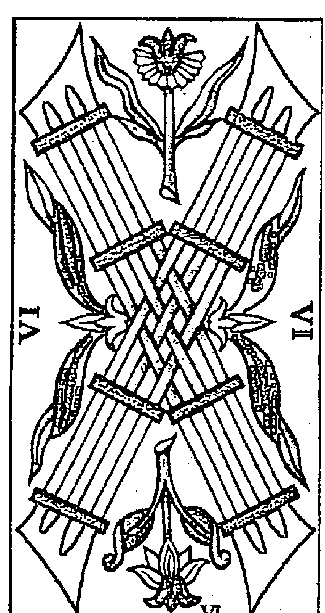

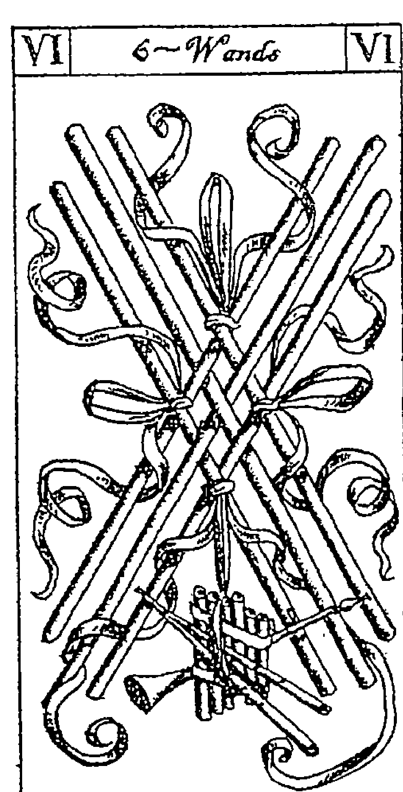

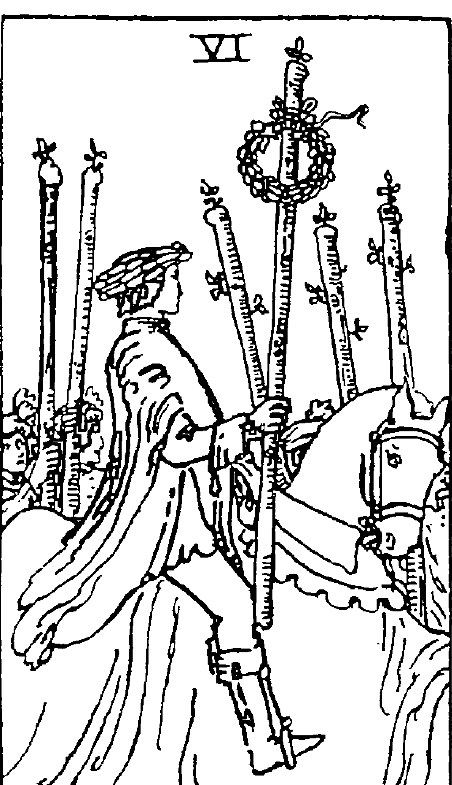

#### 幾何排列意義

六柱，另外還能排列成： |||| |||| |||| |||| |||| |||| ，或是構成完美的六邊形。這些表達方式，也都能想像為完美和光榮。

#### 故事畫面安置

六根棍棒能有許多種對稱的排列，主要是分成兩組或分成三對的方式。而每對權杖又能有不同變化，像是 |||| 或 V ，或是可以組成如 VVVV 、 VVVV 、 VVVV 各式排列變化。

縱使排列稍微隨性，也都不至於太凌亂，甚至有一定的秩序在其中。各組權杖能表達不同涵義，像 V 字形就是勝利的象徵，無論怎樣統合，六杖都不脫榮耀和成功，舉例如下：

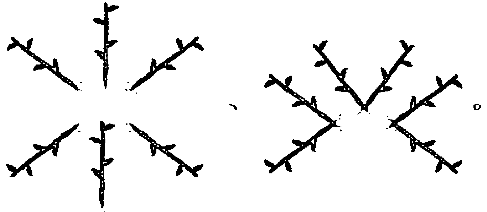

### 畫面故事情節

#### 情節發展

本秘儀主旨是榮耀光輝和勝利成功，畫面通常要表明勝利的緣由，以及得勝後的歡慶。主角可能是競賽的得勝者，或者完成某項任務的英雄，或者是一番成就的衣錦還鄉，贏得了某種資格或光榮。

有時候是表示新手或低階者的晉級，有時是比賽中的衛冕成功。多半是以男性為主角，也便於配合許多人們的喝采。

圍繞主角或夾道歡呼的群眾，表示有許多人和主角的立場是一致的。並顯示能夠集合群眾的力量，代表具有群策群力的後盾。然而不一定要有配角和群眾，只要有主角獲勝的畫面即可。

甚至也可以沒有人物，只以權杖排列出凱旋般的門廊。有的塔羅會展現強大力量或高亢的意志，自身散發出來的容光，而不是外在賦予或是由得勝而來的。這些畫面縱使不完全相似，意義卻都非常一致。

#### 附屬搭配

主角通常騎在馬上，較有威勢和風光，也能夠表示位階提昇。馬匹本身具有行動的力量，馬匹上通常也有配備和飾物，頭上戴著馬鞍而身上套著布服，加強表示尊貴的身分地位，也暗示可能有封為騎士而晉升的可能。

桂冠花圈是這張牌很重要的象徵物，主角多會戴在頭上，表示奪冠或受嘉勉。有的畫面六根權杖上都有花圈，至少也會有一根權杖上頭掛著花圈。不同塔羅縱使畫面不一樣，但都會有花圈以象徵勝利榮耀。

> 占卜訣竅提點
權杖六是一張小騎士牌，宮廷四騎士牌額外的一張數字騎士牌，不過卻不一定是額外唯一騎士。
平民升級了，象徵春風得意，也可將騎士的意義功能賦予其中，只是作用力較小。

## 權杖七
Seven of Wands

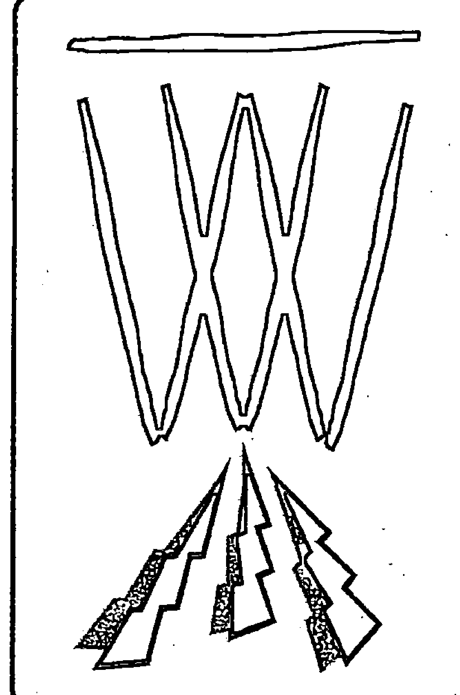

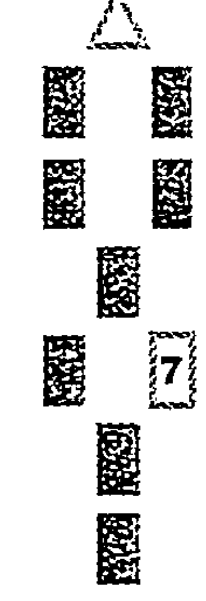

- 秘仪主题：
  - 正 英勇果决
  - 逆 寡不敌众

牌序定位：
权杖牌组第七张数字牌，权杖作用的新貌和骤变。

元素位阶：
火元素的变异和不均衡的状态。火性质的游移不定，造就炫丽色彩，能如烟火灿烂，也可能如炸药般危险。

## 秘仪数序定位

### 数字奥秘

七号牌与火元素权杖的组合，正面作用是独当一面，英勇无比的表现，能突破现状或是重围，成功解决问题。负面的状况则是匆促成军，以致局势纷乱不堪，或是冲突纠葛不断。

### 秘仪主题

纯粹行动加上智慧，就要突显反应力。不只是运动敏捷的反应，决断力更突显火元素权杖不仅止于动作和行为，内在的魄力担当和勇气的素质，也是以寡敌众人、出奇制胜的情势。

### 内涵定义

权杖七虽然都会遇到危难或紧急事件，是明确而显著的状况，但却有着坚强的防御力和先决优势，能够解决问题度过难关，具备良好的危机处理能力。正位置是保证成功，战胜他人的攻势，获致胜利取得先机，更表示本身的勇气和英明果断，以及明智机灵。

### 正位实占解释

- 人际交谊：受到敌手攻击或他人抗衡，但终能解决、打败或降服敌对者。
- 恋爱情缘：感情上及时挽回，打败情敌、驱散竞争者。
- 事务进行：事态非常紧急，必须当机立断，才能安然度过难关，并且反败为胜。
- 金钱物质：保卫自身权益，得到战利品，获取掌控权和所有权。

### 牌義來歷變遷

#### 涵義演變

這張牌的意義很紛雜，原本有遇到障礙的意思，不然就是協商或競爭的狀況，但也有獲勝與得利的意味，另外也和言語或文字各種強度的辯論有關，這些意義都被 RWS 在畫面中統合串連起來。

煉金術原理和偉特都認為這是很強勁的一張牌，演進到後來就融合成這樣的意義，代表高人一等的優勢，無比的勇氣，以及擺平一切阻撓而得到勝利成功。偉特之後的時期，牌義的演變也都不脫這些意義。

#### 正逆轉折

自古演變的情況，早期雖然有點混雜，然而逆位置也逐漸與正位置有差別，而今的項目意義都是正逆位差距頗大。

這是很單純明瞭的方向，逆位置定義為正位置意義的相反情況即可，因而以是採取「逆位反向原則」。同樣都是遇到遇到對手或敵人，在逆位置的情況則是，被對方所擺平，是失敗挫折的意義。

#### 逆位思考

情況和正位置皆為相反，所以寡敵眾變成寡不敵眾。因為本身缺乏優勢和能力，或者由於事出突然，而措手不及、反應不過來，難以因應狀況，於是遭遇到危難和被害，從而造成損失。也可能是不夠果斷和決心，緊張、焦慮或遲疑、猶豫，甚至感到茫然困惑。

逆位主旨結語：寡不敵眾。

### 逆位實占解釋

- 人際交誼：被眾人攻訐，遭受埋伏。有如被吞沒、被壓倒。
- 戀愛情緣：感情挽回不及，覆水難收。一時不察、痛失良機。
- 事務進行：緊急事故、措手不及、危機處理不當。自己栽跟斗，或是被拉下來！
- 金錢物質：交易拖延阻礙，造成損失。被他人掠奪、併吞吃掉。

### 象徵專屬物設定

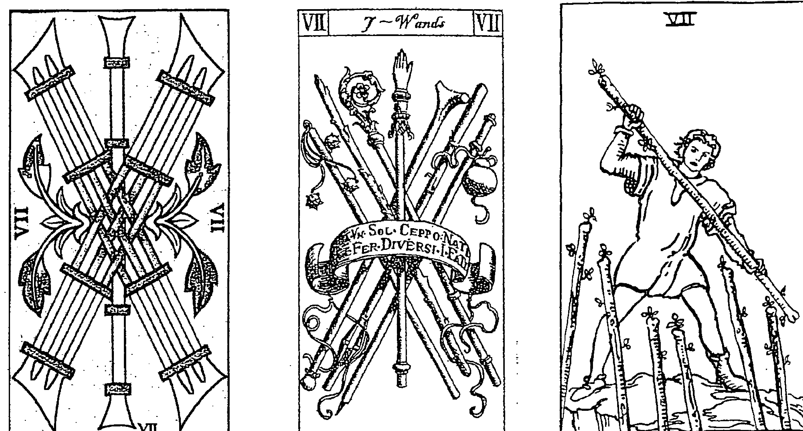

#### 幾何排列意義

七杖的許多排列法，都會有居中或獨立於外的一根權杖，像是：

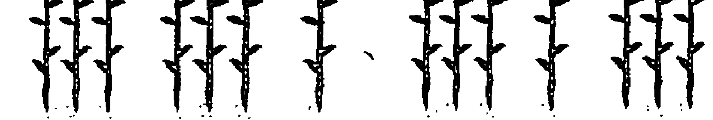

，這一杖一定是特別顯著鮮明的，表示有別於其他權杖的雙方。

#### 故事畫面安置

七根棒子，顯得難以均勻分配，然而拆解成一和六，是最容易的方式。

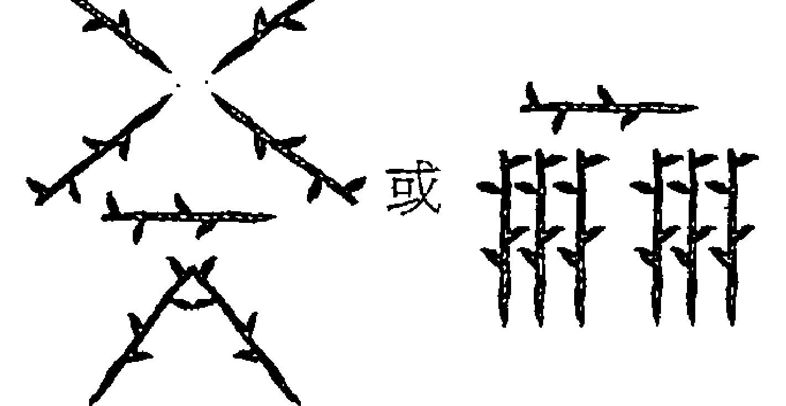

這樣的安排，突顯了這一根權杖，而這一根是橫向或直向並不重要，重點是與其他六根分別出來。一夫當關，是這一根權杖的象徵。而六根權杖方向一致，表示另一股對立勢力的整合。

### 畫面故事情節

#### 情節發展

本秘儀慣常以男性爲主角，表現警覺果斷與勇氣，幾乎都有對立的場面，以突顯主角面臨挑戰的表現。主角握住一根權杖，面對其他六根權杖，表示以一抵六、以寡擊衆、以少勝多。

主角展現的是一夫當關萬夫莫敵之姿，抓住的權杖表示緊急的權宜和有效方式。六根權杖代表與主角對抗的立場，這些持杖者若隱若現或全不露面，並且可以分散或聚集起來。

主角握棍和回擊的姿勢，以及所處環境的刻劃，比擬爲面對困難時採取的方式。多半會呈現主角出擊的勇氣和力量，並暗示須一次解決難題的緊急。有的情節主角面對的是權杖設成的障礙或柵欄，必須要去突破，比較著重在面臨危難的環境。

重點是主角要去面對外力——其他六個人的權杖，如何面對就是故事中的想像空間了，也就是如何因應的情況可以再度延伸。雖然畫面故事情節可能不大一樣，但是蘊含的意義都大同小異。

#### 附屬搭配

場景的地勢是判讀的指標，可看出主角所處局勢的優劣，也可暗示原本所居的地位高下。主角通常是站在高地，以便於居高臨下，才能克服萬難，打敗這些敵手或侵略者。

然而還要注意地面上的變化，有些畫面的主角是跨站在中隔水流的兩塊地上，表示本身所處環境雖高但卻險惡，且有分裂崩解之虞，主角必須同時面對和解決。這張牌較少出現其他配備或道具，背後的天空通常空無一物。

> 占卜訣竅提點
具有急忙的意味，一定有外力作用，注重雙方力量消長，事態是由於力量不均衡所致，但結果會傾向某一方。
抽到這張牌不見得是好事，雖然危機處理很妥當，但也揭露了總有個危機的前提。

## 權杖八
Eight of Wands

- 祕儀主題：
  - 正 速捷激進
  - 逆 欲速不達

牌序定位：
權杖牌組第八張數字牌，權杖作用的集結統合。

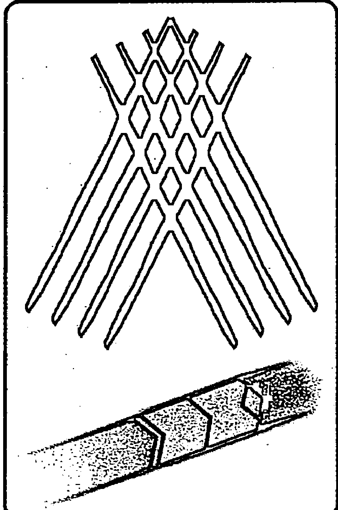

元素位階：
火元素的高速進行。火元素集中和衝刺的力量，造成速度和強大動能。

### 祕儀數序定位

### 數字奧祕

八號牌與火元素權杖的組合，正面作用是整體力量結合集中，朝一致方向發展，形成新的局勢，達成高度功效和目標。負面的狀況則是進程緩慢，膠著在原來的階段，沒有進展和功效。

### 祕儀主題

八根權杖表示多而充分，這樣的力道顯得過激，卻以整齊的畫面來呈現尚保持平順，整合力量而激發前進，形成快捷和速度，又有敏捷激動之意，代表盡力前進，與交通行動有關。

### 內涵定義

權杖八是很有動態的，主要表示移動以及速度。並由此推演為旅行遊歷，代表空中旅程，而且是順暢的旅程。其他事件好壞並沒有很絕對，在不同層面上意義需要轉折，例如應用在個性上就是很熱切或者很急躁，甚至有突兀的表現。

### 正位實占解釋

- 人際交誼：人際交流快速頻繁，關係和感情熱切但不夠深入。
- 戀愛情緣：性急、激情、熱情如火，情慾熾熱，燃燒的內心。
- 事務進行：行事衝勁十足，事務能夠迅速進行，但顯得匆促粗糙。
- 金錢物質：在物質方面或許能獲得眼前的利益，但過於急切仍可能會壞事。

### 牌義來歷變遷

#### 涵義演變

這張牌本身沒有很明顯的吉凶好壞，只描述一些遭遇和現象，而正逆位意義也沒有差很多，不然的話就是有的偏好、有的偏壞的混淆現象，歷來的解釋就是如此，而其中最重要的特別意義就是旅程和熱戀。
偉特本身對於這張牌的逆位感到頗不和諧，因此給予許多正位項目的負面情況。偉特之後時期的演變，就轉而將正逆位的分別拉大，將正位置意義設為稍微偏好，而逆位置意義則稍微偏向負面，以這樣的方式來定調。

#### 正逆轉折

延續偉特以來的做法，並拉開正逆間的相異差距，將正位置確定在導致完好效果，而逆位置是相反的方向和作用力，行為方式也是相反過來的。所以例如急切的八支丘比特之箭，從正位置轉為逆位置的嫉妒之箭。

#### 逆位思考

權杖八逆的位置，可用逆位相反原則來推演。在進行方面就是速度減緩，遲緩拖延，甚至停滯不前。當然無論事件或是旅程，都有不順暢的現象。也是力量的分散與瓦解，不再整合和方向一致。在情緒和相處上，產生不和諧與爭論，感情上有嫉妒等情況。
逆位主旨結語：欲速不達。

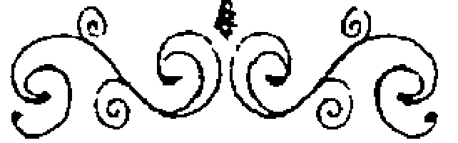

### 逆位實占解釋

- 人際交誼：焦慮急躁、激昂的態度。失控的情緒、過度囂張。
- 戀愛情緣：情緒激動、感情失控，關係相處產生衝突。
- 事務進行：營運積極、行事激烈，卻驟然停頓，或者缺乏方向感。
- 金錢物質：急功近利，反而易失落，突然逆轉下降。

### 象徵專屬物設定

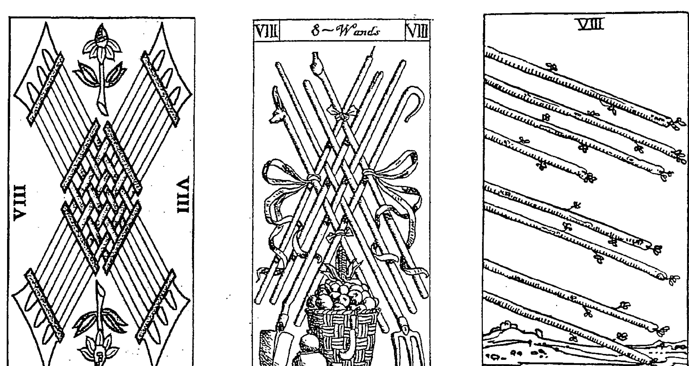

#### 幾何排列意義

八杖，其他的圖形變化比較少，感覺起來相差不大，都是整合與一致性很強，

例如：

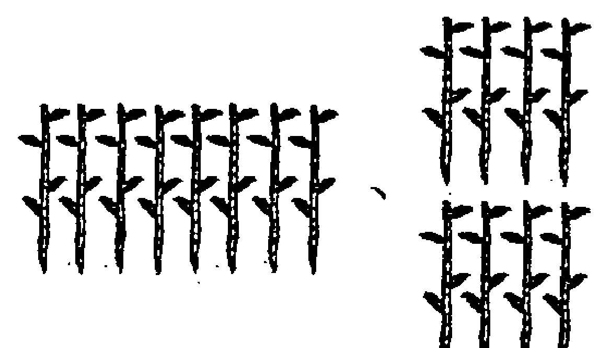

#### 故事畫面安置

八杖排列在一起，會形成一大片，感到是整合起來的強大力量。整齊劃一的八根權杖方向一致，但卻不是乖乖陳列在地上，而是從天而降，表示臨時而匆促，並且具有動態感。因此就組成了一個平面，也能表示力道集中運作。

兩者部分也能交錯：

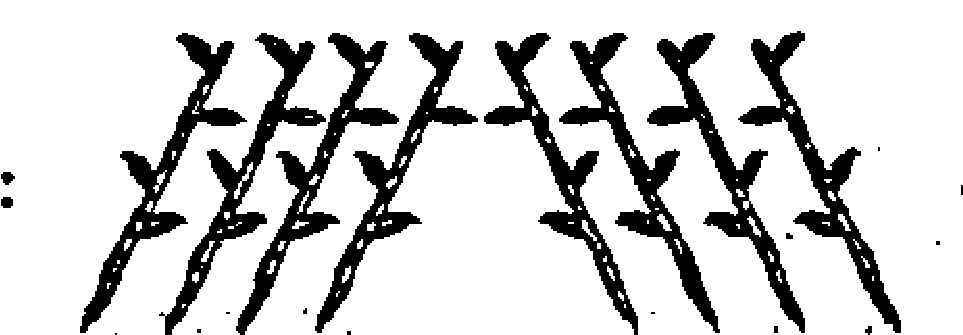

而運用

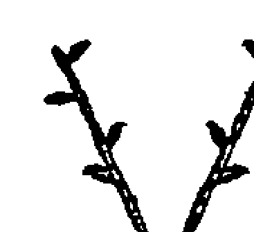

字成對的排列方式，因為前面數字牌多已繁複使用，因此在這張牌另求不同變化。

### 畫面故事情節

#### 情節發展

本張牌畫面多描繪權杖在空中飛舞，多半是八根聚集而方向一致，排列出很整齊的畫面。通常沒有具體的故事情節，只描繪出這個飛躍的情況，表現迅速的動作與強勁的力道。

權杖的排列方式相關於速度和整體力量的協調。部分塔羅權杖的聚集方式較特殊，旋捲進入雲中，這種力量較多變而猛烈。有的畫面是權杖往上飛躍，如弓箭或飛鏢般射出。而環境是在天空中，隱喻了在空中和飛行的涵義。

少數塔羅會讓人物出現，有的是人物在空中飛騰，多半是伴隨著權杖一起向前衝刺。也有的是人物是在權杖中穿梭、跳躍、奔騰，或者是操作這些棍棒，代表敏捷和迅速。

另類一點的塔羅，也會附加馬匹等相關意象，甚至直接畫上飛行器以代表飛行。雖然畫面不盡相同，但多半脫離不了起飛、空中、速度，以及敏捷等意念，由此也表示了交通和到達。

#### 附屬搭配

通常畫面是整片風景，遼闊而空曠，以距離寬廣表現出速度飛快。要呈現出位於天空中，是為了表達跨越、起飛，跟飛行飛航相關的涵義。空中出現雲霧，表示位置很高以外，也呈現了權杖突破障礙的感覺。

地面通常是平原中有略微起伏的山丘，也有河流經過，房子代表家或人的住所，都是權杖飛越的景致。暗示跨越這些高地水陸障礙，是一種無遠弗屆的交通運輸。這張牌通常無人物，當然更無配備跟道具。

> 占卜訣竅提點
由權杖八可聯想到速度力量或是飛行，除了動作就是形容詞，抓對了特點就會很好解析。只要和權杖七分清楚就好了，權杖七是被動之下採取的及時反應，權杖八卻是主動進擊的。

## 權杖九
Nine of Wands

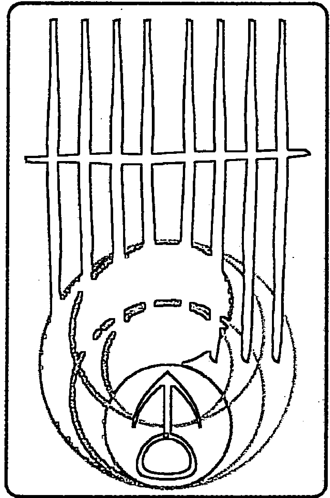

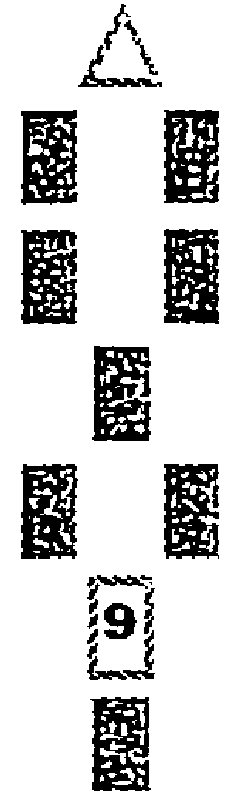

- 秘仪主题：
  - 正：坚毅保卫
  - 逆：全面倒戈

牌序定位：
权杖牌组第九张数字牌，权杖作用的极致阶段。

元素位阶：
火元素的极致和最高最后状态。由于火力很强，导致并不容易控制，须谨慎操作处理。

## 秘仪数序定位

### 数字奥秘

九号牌与火元素权杖涵义的组合，正面作用是充分的权力行使，能发挥极致的力量，行动成果良好。只是这种力量难以控制和整合。负面的状况则是遇到极大冲突和阻碍困难，遭受严重打击。

### 秘仪主题

九根权杖是算最高权能指标，所以此境地必须要有防御保护。如此多的权杖最好分配为各方防御力，很适合摆成栅栏，也由于编制可能太大、不够精简，显示出紧张过度和耗能的状态。

### 内涵定义

权杖九表示有潜伏的危机，包括暗处的敌人和难料的变动；而因应这些情势，也采取了防御和捍卫、屏障等措施。当事人尽力保有自身的权利，紧握住自己的职位，坚持既有的纪律和规范，守住最后的舞台和防线。

### 正位实占解释

- 人际交谊：人际或职场上气氛诡谲紧绷，感到隔绝、孤立、甚至敌意，周遭有小人。
- 恋爱情缘：对于感情防备心强，拒人于千里之外，对既有的控制欲强。
- 事务进行：事情进行不是很顺利，有隐藏的危机，必须加以防御和谨慎面对。
- 金钱物质：守住仅有的权益，目前所拥有的能保有，守护珍贵的物品。

### 牌義來歷變遷

#### 涵義演變

歷來的解釋狀況大致是遇到一個事態的變化，雖然有可能是難得的機運，但比較有可能的是極大的危機。這個危機和外力威脅或許會比權杖七還大，因而必須採取防禦措施。

這張牌很多層面的涵義被保留了下來，正位置的解釋好壞兼具，並不是絕對的，偉特認為權杖九並不是一張好的牌，然而其中又包含著好的作用。至今才偏向正面作用，因為逆位置是更為負面的意義。

#### 正逆轉折

自古演進以來，逆位總是承擔這張牌的負面意涵。無論正位置意義如何，權杖九逆位置就一定具有不好的意義了。

由此來說正位的意義也可取決於逆位，相較來說正位置不好的意義較少。正位置有著強勢對立的張力在，潛藏著爆發的能量，而逆位也可以認為是經歷爆發過的慘況。

#### 逆位思考

以逆位反向原則推演，牌義為可能會遭遇到對手的攻擊，採取反擊的話，也會造成事態嚴重和破壞秩序，然而若不行動則會被擊垮。不然就是遇到其他的逆境或障礙，陷入困頓當中。

逆位主旨結語：全面倒戈。

### 逆位實占解釋

- 人際交誼：大勢已去，維持不住。陣局。陣局潰堤、樁腳反噬。
- 戀愛情緣：感情挽不回，彼此翻臉不和，忍耐很久終於潰堤。
- 事務進行：進行途中被攔截、被撂倒，受到攻擊、入侵。
- 金錢物質：財務曝光，受到覬覦，金錢可能遭到奪取。失去本金、血本無歸。

### 象徵專屬物設定

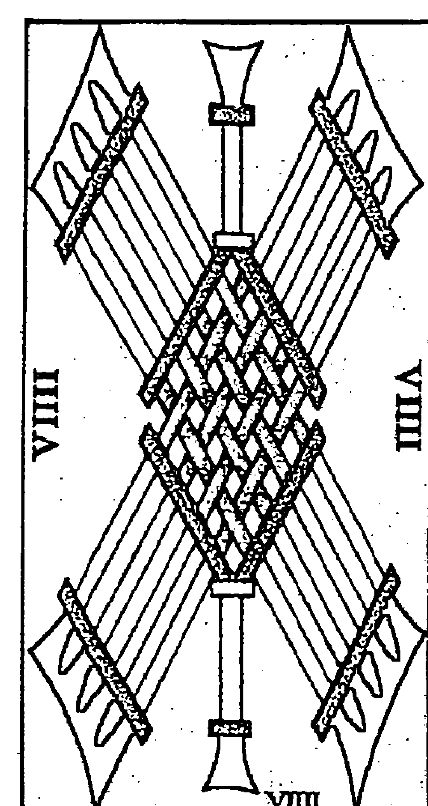

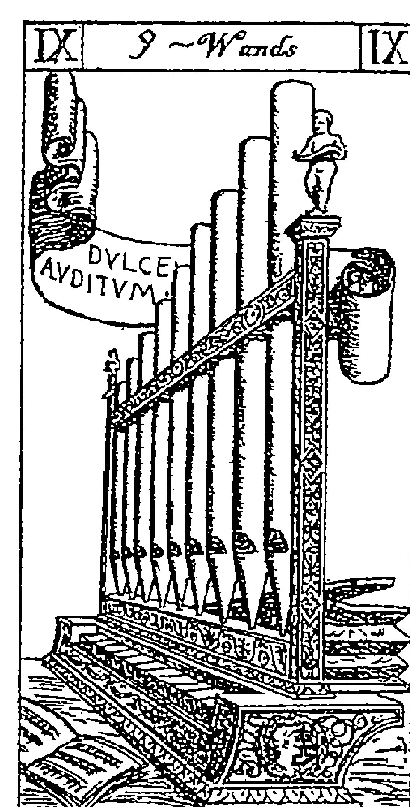

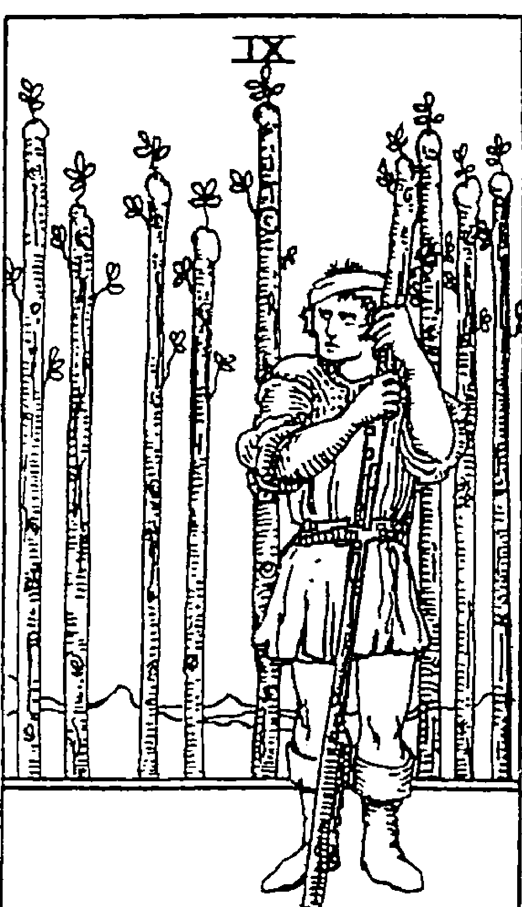

#### 幾何排列意義

九根權杖，除了排成一列：|||||||||，讓人感到充滿畫面之外，一樣也可以安排突顯出顯著的一根，像是下圖，同時表現並排多數及歧出獨一的意義，也藉以營造出對比。

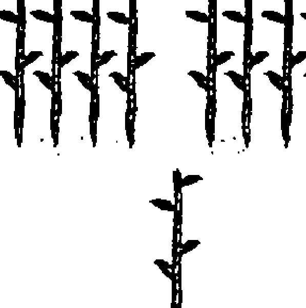

#### 故事畫面安置

九杖，這數量極多的木棒，可直接排為一列，形成一道屏障，做為柵欄或籬笆，表示隔絕或保護的作用。況且 9 數通常強調力量整合，不能夠太凌亂，因此多半相連成列。然而有時候，在整齊之中卻又獨立出一根出來，而在排列中空出一根權杖的位置，這是特別設計的圖案，表示這根脫隊的權杖是特殊的，可以賦予權柄或機會等等意義。而這根權杖握在前面主角的手上，暗示多出一項挑選或把握住機會，也隱喻了緊抓不放的意味。

### 畫面故事情節

#### 情節發展

本祕儀的涵義耐人尋味，須探究畫面中權杖的特殊作用。將權杖排列起來可以成爲屏障，具有界線和保護隔絕的作用，更能實際發揮防禦力量。更講究來說，每一權杖都代表一種職務或崗位，如此共同組成防禦攻勢。

主角手中握著的那根權杖，也可視爲其中一個職務，同時代表了主角想要保護的東西，或許是自身的權位和利益。權杖的排列方式也有深意，有些畫面的柵欄有一空缺的位置，而這根脫隊的權杖正被主角緊握住。這說明了主角與團隊的關係特殊，防禦和堅守的立場複雜。

這個緊握第九根權杖的男人，他的神情是這張牌的重點，由此可以判斷出心態爲何。有時是恐懼的保住既得利益，或者貪婪的占有，也可能是防守他人的掠奪。許多牌的情節安排差異就在於此，所畫出的臉和目光朝哪一面，表情神色如何都是詮釋的空間。

甚至連全身的姿態，握杖或持杖的方式，都可能有生動變化。有些塔羅的權杖排列方式比較不同，也不一定握住一根權杖，可能是圍繞著主角，代表是在權杖陣列之中迷失。

#### 附屬搭配

這張牌的畫面很密，很少加入其他物件。只有主角的裝扮是要注意的重點，這表示他的地位和立場，以及性格與心境的表徵。像是頭上綁著白布條，即表示固執自限和緊繃的精神狀態。

主角站立的位置也可稍加注意，可以從地面的分界劃分加以觀察，分辨出不同的涵義。遠方景物可以表示整體所處的大局勢狀況。

> 占卜訣竅提點
主旨搞清楚就好解釋應用了，一般雖知其患得患失的心境，但定義卻不夠明確，而且別忽略了加上第二意義——防禦和保衛，這是一直都存在卻容易被學習者忽略的牌義。

## 權杖十
Ten of Wands

秘儀主題：
正 重責大任
逆 壓倒釋放

牌序定位：
權杖牌組第十張數字牌，權杖作用的結束和新契機。

元素位階：
火元素的最終狀態。尾聲之後的餘響，整合之後融為一體再晉級，燃燒殆盡後，朝新的走向繼續薪傳下去。

### 秘儀數序定位

### 數字奧秘

十號牌與火元素權杖的組合，正面作用是一次解決所有問題，想讓事情或任務徹底完成。然而這是很難達到的，通常落得半途而廢，使自己面臨困難。更為負面的狀況是重擔負荷而累倒，而本秘儀主旨定義傾向負面作用意義。

### 秘儀主題

最多數量的權杖，其實並沒有帶來好處。權杖十由於加級和過度，使得難以承受，反而成為艱鉅責任。隨時間顯得愈來愈沈重，承擔起來卻不堪負荷，過程和結果都是難以有成。

### 內涵定義

權杖十的意義是被壓得喘不過氣來，努力維持下去拚到底。雖然可能完成任務，但目前的確非常難熬。而心中真正的熱情會消失，因為已經成了不得不的重擔而非興趣了，也有可能太過沈重而難以招架。

### 正位實占解釋

- 人際交誼：負責盡職於身肩的重擔，無暇顧及情誼，也不見支援的人。
- 戀愛情緣：感情受到施壓，迫於無奈而負責任。外界壓力大，無心於感情面。
- 事務進行：事務繁多，而且壓力極大，進行得很疲累，但效率並不佳。
- 金錢物質：難以獲得大錢財，扛著財務重擔。雖然勞碌但酬資微薄。

### 牌義來歷變遷

#### 涵義演變

權杖十這張牌歷來有很多不同的解釋，像是很幸運的作用，尤其是財運上的獲利，誠懇與榮耀這類的牌義也曾出現過。但較差的狀況也有人運用，這些不太一致的狀況一開始就存在著。

這些矛盾偉特也保持了下來，不過他強調了其中的責任和重擔，然而也是成功以及其後遺症。煉金術系統的對這張牌的內涵詮釋，也是偏向負面，尤其隱含著危險性。偉特後期的牌義則擷取其中的壓力，解釋愈來愈偏向辛勞繁重。

#### 正逆轉折

權杖十歷來至今的正逆位作用，都是兩者相差不大，逆位置原來多是以偏向負面居多，至今才偏向比正位置稍好的意義。

逆位意義的詮釋空間也更大了，可能是不支倒地，也可能是拋下重擔。

#### 逆位思考

逆位置的發展方向多樣，有許多未知的空間可供推演，有許多可能的狀況，好壞參半或不一定。總括來說是已經放下了重擔，但也給人倒下去的感覺，可以是擺脫了負擔，也可以是被壓垮了。縱使是正位的負擔意義的解套，也不算是很良好的意義。

逆位主旨結語：壓倒釋放。

### 逆位實占解釋

- 人際交誼：承受不住眾人壓力、累倒、一蹶不振。人仰馬翻、釋放壓力。
- 戀愛情緣：放棄苦守堅持，拋開沈重負荷。得到喘息空檔、暫時紓緩。
- 事務進行：撐不下去、放棄不再堅持。忍受不住，被壓垮而倒地不支。
- 金錢物質：負擔不起、最後一根稻草、財務頻臨破產。背債、負債累累。

### 象徵專屬物設定

#### 幾何排列意義

十杖無論怎樣排列，都容易給人有密布的感覺，讓人透不過氣來。

簡單的排列成一列，如： |||||||||| 或是兩列： |||||||||| |||||||||| ，都會有類似的感覺。全部交錯也是常見的排列 XXXXXXXXXX。

#### 故事畫面安置

十杖的整體性恨強，多半都將十合成爲一，由於十表示全部象徵物整體的結合，所以捆成一束是最常見的方式，像是 |||||||||| |||||||||| ，這樣也表示集中在一起，象徵全力以赴。

當然，整束權杖可以形成重力的感覺，表示承受壓力頗大，這個重擔如果過度就會支撐不住，會被壓垮而倒地。

### 畫面故事情節

#### 情節發展

本祕儀通常將十根權杖詮釋為重擔，而讓一位男人來承受。十根權杖綑成一束壓在身上，顯示了壓力極為沈重。不然就是一把抓起全部而彎身，表示權責或工作已經過量。每種畫法都有姿勢的差異，表現出勞碌和疲累的程度不一。

至於接受這些權杖的起因，牌中不一定有說明，可能是自願或迫不得已。也有可能是權力和利益因素使然，有些牌直接表明權杖十正處於位高權隆，因而需要有所省思和謹慎。

有些塔羅的情節，並不是主角本身去扛起權杖，而是被外力壓迫，或被權杖打擊到身體，甚至已呈現跌倒的姿勢。有一些牌是主角面對十根權杖，卻都沒有承受，也沒有接觸。

這張牌也包含了孤獨之感，只有孤軍奮戰才會勞累至此，並且勞碌與高位也造就孤獨。有些塔羅會特意強調孤獨感，十根權杖組成障礙，主角必須獨力撥開，可從而總結為含辛茹苦，而辛酸沒人知。

#### 附屬搭配

屋舍常會在場景中出現，代表工作場地或家庭，總之是主角必需扛起負責的地方。然而家也是休息的地方，這時房子會安排在濃蔭之下。無論是工作或休息之處，主角與這座房屋的距離，也可以呈現出主角還要走多少路程，估計還要扛多久的重擔才能卸下。

有時候場景會有圍牆或柵欄在一旁，表示受限制和阻礙困難。而地面平坦或崎嶇也透露了主角行路無阻或更形艱難。

> 占卜訣竅提點
十號牌有後續性，也包含之前的故事，因此特別需要交代前因後續。權杖十是轉折大的十號牌，更必須注意銜接前後。可從提問中或牌局中歸納，勾勒出來龍去脈。

## 聖杯二
Two of Cups

秘儀主題：
正 情愛結合
逆 消退隔閡

牌序定位：
聖杯牌組第二張數字牌，聖杯作用的初步交流。

元素位階：
水元素的舒暢流通，最美好和諧的作用，也是最浪漫的形式。

### 秘儀數序定位

### 數字奧秘

二號牌與水元素聖杯的組合，正面意義是感情和關係的協調，進一步是雙方結合在一起。而負面的狀況是感情和關係的不和睦，甚至雙方分開或離別。

### 秘儀主題

這張牌的主題很簡單，就是人世間的情愛，但要注意的是跟大秘儀戀人牌不一樣的地方，以及跟其他聖杯牌或有關戀愛的牌不一樣的地方。聖杯二可能算是最純正於戀情本身的一張牌。

### 內涵定義

聖杯二是單純的情愛，大秘儀的「戀人」是人生方向抉擇的重要關係。其他小牌的戀情都有受到某種環境的限定，然而聖杯二是沒有受到世俗壓力下而產生的戀情，純粹是互相的吸引力。很多用法跟戀人一樣，針對各種層面，差異是要突顯在戀愛層面的細微之處。

### 正位實占解釋

- 人際交誼：任何相互關係都是良好的，相處很和諧、也有好感。
- 戀愛情緣：問親密關係和愛情，都是美好幸福和熱烈。戀愛追求成功。
- 事務進行：面對事情都感到很快樂，和諧愉悅，合作上很順利也會帶來好運。
- 金錢物質：財物交流保持禮尚往來。維持均衡和合理的收支。

### 牌義來歷變遷

#### 涵義演變

聖杯二代表情愛的意味明顯，自古以來一向都是表示戀情的順暢和甜蜜，以及雙方結合的可能，這類的解釋讓聖杯二成了數字牌中愛情的代表牌。不同系統的像是煉金術體系也是相同涵義，偉特以降也幾乎不曾動搖，可說都很堅定於愛情。

不過實際上可能並不止於此，這張牌應是一張大好之萬應牌，除了愛情以外其他方面也都能適用，事業、娛樂、勞逸都相宜，名稱、金錢、名利兩雙收，各種人生要項的成功，這是古塔羅既有而偉特接收的牌義內涵。

#### 正逆轉折

原本正逆位只是現象不同，好壞差異沒那麼大，甚至逆位反而更專門於愛意情慾。後來正逆位的分別逐漸被重視，演變至今，就成了正面現象集中在正位置作用上，而逆位置則顯示了負面現象，不只於戀愛感情關係，牌義正負面的分別，在各項目都是一致的。

#### 逆位思考

聖杯二的逆位置顯示了相處上不能平等，各層面的交流有隔閡，熱情消退了，不能給予對方所想要的，也可以說是個人的慾望強於關係的維護。在其他各種關係上，也是類似的不和睦的現象，比擬到合作方面相關事項，也是有阻礙不順利。正位置還牽涉到人生要項的成功，那麼逆位置於這些方面就變得不夠成功了。

逆位主旨結語：消退隔閡。

### 逆位實占解釋

- 人際交誼：關係不和睦，互相看不順眼，對立、誤解，嚴重的話是決裂。
- 戀愛情緣：愛情消退、彼此有隔閡，分手、不合、分離。戀愛或追求不成功。
- 事務進行：合作不起來，難以配合，互相抵觸不協調。心情差影響事務。
- 金錢物質：合作不利，可能因為分配不均而反目，破局或拆夥。

### 象徵專屬物設定

#### 幾何排列意義

或者 這些排列都只有些微差異，上下排列的交流象徵，可以很明顯地看出。

#### 故事畫面安置

兩個杯子的圖形 ，讓人想到應是並列在一起的，也容易感覺是表達彼此之間的相互關係，因而可以象徵結合和盟約。
兩個杯子的位置平列，表示平等對待互惠。如果杯子有高低差異，一個杯子將液體注入另一個杯子中，則表示關懷。總之，都是各種互相之間的關係。
可知，兩個杯子特別是雙方關係的象徵，因此牌義也大都一樣，少有脫離雙方情感交流的涵義，兩個杯子之間的距離，可表示關係親密程度，另外也可利用杯子的傾斜角度，來顯示更為生動的相互對待方式。

### 畫面故事情節

#### 情節發展

本祕儀主題為情愛結合，這是非常明確的方向，因此不同塔羅中的畫面，並沒有變異太多的現象，幾乎很少有例外的。構圖意念大致都不脫離男女主角飲用交杯酒，也就是一對戀人的劇碼，看作者要怎樣詮釋和變化了。

通常杯子的位置是關切重點，兩杯之間的高低和距離都隱含著微妙的意義，代表親密程度以及相互地位。而兩位主角人物舉起酒杯的姿態，可看出彼此間的感情狀態和具體相處模式。

這張牌的特色，是與大秘儀的畫面情節很類似，並且多半也有守護在兩人背後的角色，做為見證者或警惕告誡者，是愛神或是天使，或者是兩人交融的意象呈現。當然，這是保守一點的畫面，小倆口若是更為親密，通常也容不下後面的天使或見證者了。

有些塔羅的男女主角動作就很親熱，更為明顯地顯示出戀愛關係，甚至有的牌會有接吻等動作，感情更為熱烈。周遭環境與主角之間的調配也要注意，鏡頭和景物遠近多會配合雙方的親密度而有變化。

#### 附屬搭配

通常背景中央上方都會出現如戀人牌般的見證者，然而比較不具人形，主要用以揭露雙方的內在關聯。只要相關於彼此交融陰陽結合的符號，都可以使用。雙蛇杖代表纏綿交流的能量，也有出現陰陽太極符號。獅子頭是煉金術的熱力物質，並且也能做為見證者的頭臉。如果是火紅色，就是熱情的象徵。

兩人所在的場合，與雙方的相處有關，空曠或隱密暗示著兩人親密程度。遠景小山丘和房子，表示未來兩人的戀愛的走向。

> 占卜訣竅提點
聖杯二就是一張「小戀人」牌。簡單來說，當成和戀人牌一樣作用就好理解掌握了，先了解其影響力稍弱於戀人牌即可，進一步學習的時候再去釐清兩者之間的更多差異。

## 聖杯三
Three of Cups

祕儀主題：
正 歡慶娛樂
逆 放縱脫軌

牌序定位：
聖杯牌組第三張數字牌，聖杯作用的動態激盪。

元素位階：
水元素發揮力量和特性，是暢快清澈的感受，如流動的河川一般。

### 祕儀數序定位

### 數字奧祕

三號牌與水元素聖杯的組合，正面作用是情緒的愉悅，處在共享歡慶的場面，也有和樂的感情。由於是多人的關係，負面的狀況下則容易變質，成爲互相牽制的情形，甚至在感情上變成複雜的狀況，第三者甚至會介入兩人關係中。本祕儀主題、常態牌義和正位置牌義，採取正面作用意義。

### 祕儀主題

這張牌的意義看起來很好解釋，但實際運用上卻不是很容易。與朋友相關的事項都是好的，屬於心胸開闊的情感，代表相關慶典、節日、歡慶場合、各式娛樂嬉戲、歡欣鼓舞。

### 內涵定義

但聖杯三正位置是指多人的快樂，兩人的戀情附帶擴及第三者都很快樂。而聖杯二專指雙方的關係，鎖定在愛情的部分。

### 正位實占解釋

- 人際交誼：朋友關係良好而愉快，歡愉、快樂，共同娛樂，彼此分享。
- 戀愛情緣：對戀愛關係會有點奇怪，指定問戀愛時，特別沒有幫助。
- 事務進行：事情進行很愉悅，勞役結合。狀況和成果都讓人感到滿意。
- 金錢物質：物質上很豐碩，財務方面收穫還不錯，也能充分享受。

### 牌義來歷變遷

#### 涵義演變

聖杯三充滿正面愉快的情緒，擁有豐富的情感。在紙牌占卜術中意義較為混亂，是人際關係和決定的猶豫。而在古塔羅時期，會較明顯的傾向朋友之間的歡樂，而且仍然是萬應的好牌，代表任何事項完美、成功。
這張牌有個重要主旨意義，那就是「治療」，在以往牌義演變中曾經出現過，因此現今多以聖杯三正位代表治療之相關意義。

#### 正逆轉折

然而逆位置，於數字的涵義讓人覺得詭異，因此除了愛情以外都是非常好的。
原本逆位也有關於事務和行動方面，接受委任、結束與達成都屬於逆位，這些涵義在偉特之後的時期消失了。取而代之，表示失去美好的擁有，包括物質、情緒、記憶，或者是關係。偉特之後的正逆位占卜牌義，就分明出正逆位作用，而逆位是較為負面的意義。逆位置在偉特時已經有過度而來的放縱意義，而對於關係之間的變化和失序方面也愈來愈被注重。

#### 逆位思考

聖杯三正位置除了愛情以外都是非常好的，在愛情方面沒那麼全然的好，因為並不是那麼地專注在兩人世界上，也由於數字的涵義讓人覺得詭異。逆位置就更為不好了，尤其直接占問愛情的時候，會產生更為弔詭的情況，也就是第三者相關的問題會浮現。其他方面的意義包括過度享樂、放縱奢侈、不知感恩，這一切都符合「逆位不當原則」的推演！
逆位主旨結語：放縱脫軌。

### 逆位實占解釋

- 人際交誼：朋友之間失去和諧，更有可能產生些紛爭而影響情誼！
- 戀愛情緣：問戀情則多半雙方不和睦，恐有第三者介入的可能，或有出軌。
- 事務進行：脫序、放縱，不照規矩走，脫離計畫。嬉戲，沒有工作氣氛，勞逸不均衡。
- 金錢物質：沒有節制地濫用資源，遊玩娛樂嬉戲的花費過多。

### 象徵專屬物設定

#### 幾何排列意義

若是平行排列，為 ⚘ ⚘ ⚘ ，表示情誼交流。然而，多半不會完全平行，至少會有上下參差的感覺。大多數的牌，三個杯子都是直接排列成爲三角形的：

更象徵了藝術和美感。

#### 故事畫面安置

三個杯子，可當成是二加一組成，感覺是二結合後生出新的一個。三個杯子讓人感到眾人同樂共享，而不是小倆口的私情，是一種附增感情——友誼，並代表協調、分享以及歡樂情緒。

如果是平行排列表示關係平等，不平行則表示有上下之分別，然而這並沒有改變同樂的意義，因爲重點是在於有三個杯子，這就已經象徵了共同飲食的饗宴意味！

### 畫面故事情節

#### 情節發展

本秘儀主題是歡欣鼓舞和慶祝，與娛樂和藝術也有關聯。主要畫面多描繪生活中遇到喜事而雀躍，眾人一起高舉杯子歡慶暢飲，多半還要表示出豐盛，受到賜予而歡欣感激。

三個女人共襄盛舉是本祕儀的特點，多會將西方三女神組的觀念融入，多為模擬其神色姿態的呈現。並由此表示女人之間及友人之間的情誼。而所表露的興高采烈情緒，多半只是一時的激昂和感動，是生活中必要的點綴而不是常態。

三個人之間的關係，是牌義變化的重點，不過只有些微的差異。極少見的變化牌種，會將主角更換為三個男性。有些塔羅只安排一位女性主角在畫面中，可說是女神三合一的意象，也表示一個人的喜樂情緒。

有的塔羅則只畫出異性的兩人，也表示情感的歡愉，有點像聖杯二，然而卻擁有更多浪漫和周邊享受，而不是只有在一起。然而，聖杯二卻不能夠只放一位，主角必須成雙成對且男女均衡，由此可見此二張牌的差別。

仍有少數塔羅會將三人行表現成小倆口之外的第三人介入，例如夫妻之外還有一個小孩。有些則是三人的聯歡外，另有他人加入。

#### 附屬搭配

主角是三女性，地面上多會堆放著許多豐盛的果實，表示豐收和禮物、賞賜，也表示時值節慶或喜事、盛宴。通常都伴以有花葉的場景，展現田園或自然風光，花朵更隱喻女人們的美善。

牌義與才藝相關，可以表現出藝術天分，尤其是動態的表演，主角們自身發揮之外，有些牌或許會有樂器等道具出現。

> 占卜訣竅提點
這裡的牌義變化或許讓你感到解起來會很複雜，其實是單純的，檢驗感情是否變質就是以正逆位判斷。當然你也可以不要用此方法，忽略變質這回事，但祕儀主題和逆位主旨兩個標題就是最正規的解釋，還是要從這裡下手的。

## 聖杯四
Four of Cups

祕儀主題：
正 恬逸平靜
逆 坐立不安

牌序定位：
聖杯牌組第四張數字牌，聖杯作用的平穩停滯。

元素位階：
水元素的靜止狀態，有如一灘死水，沒有波動和流通。

### 祕儀數序定位

### 數字奧祕

四號牌與水元素聖杯的組合，正面作用是情感關係和情緒的平穩，但負面的狀況則會感到無聊沒趣、缺乏刺激，關係停滯而不再有進展。也可能因為追求安逸而有怠惰的態度。

### 祕儀主題

聖杯在平靜中引動未來的變化，所以不是死氣沈沈的，而是恬淡安逸、平淡靜態。杯具裡面並不是完全平靜無料的，只是被蓋住了沒有被察覺。應該是屬於舒服的感覺在其中，因而也成為遐思。

### 內涵定義

正位置的主要意義是陳舊而平淡無奇的生活，在感情世界裡覺得無趣和枯燥。這是指人的情緒感受，關係目前都還是平穩的，但其中缺乏火花和刺激因素，心中不免期待新鮮的事物來臨，往內探索靜態、隱性的求道。

### 正位實占解釋

- 人際交誼：低調面對各種人際關係。覺得無趣、意興闌珊。
- 戀愛情緣：感情平淡，相處感到單調無趣，寂寞難耐。
- 事務進行：事業找不到新的方向和動力，事務進行讓人覺得平板無趣。
- 金錢物質：財務錯失良機，狀況停頓沒有進展，然而卻不虞匱乏。

### 牌義來歷變遷

#### 涵義演變

聖杯四的涵義有許多變化，正逆位置意義也不會差太多，不同時期的各式解釋，正逆位置的意義常是相互顛倒的。這張牌在早期以及神秘學、煉金術系統中，都是被認為有混雜的意義和作用存在。

這張牌後來才逐漸定調為情感的平淡，然而也不代表很好或很壞，正逆兩種位置也沒有差距很大。偉特開始稍做整合，而後這張牌才習慣被認定為正位置偏負面，而逆位置轉向好的意義。

正位置的負面的情況，在於無聊厭倦，或許源於不滿足的內心深處。而逆位置原本有好有壞，偉特卻賦予了許多正面的意義，又相較於正位的負面，於是後來也就如此對應的沿用下來。

#### 正逆轉折

歷來逐漸形成正逆位對立，且逆位置偏向正面意義。如今的解釋，逆位置跟許多四號牌一樣，具有重獲和彌補的意義。以正位置無趣之意義為基礎，反轉成新鮮有趣、充滿刺激。

如果以「逆位相反原則」推演，是各方面的除舊布新，重新尋獲喜悅。不過今日並未擴大正逆位的好壞作用和感受上的差距。

#### 逆位思考

逆位置的聖杯四，不再是平淡無趣的感受、停擺的生活。更不是對既有關係的厭倦，反而是重修舊好。更代表新的事物面臨或產生，包括新的人際關係，新的戀情，以及其他新點子新興趣，新的生活方針。

逆位主旨結語：坐立不安。

### 逆位實占解釋

- 人際交誼：潛伏很久終被挑動，耐不著寂寞，被拉抬出來，復出。
- 戀愛情緣：覺得感情生活有點趣味了，也可能是另外尋找刺激，春心盪漾。
- 事務進行：事況有了動靜，喚起了前進的意願，但也容易分心不務正事。
- 金錢物質：財務狀況終於有了起色，也能夠較寬裕地運用金錢。

### 象徵專屬物設定

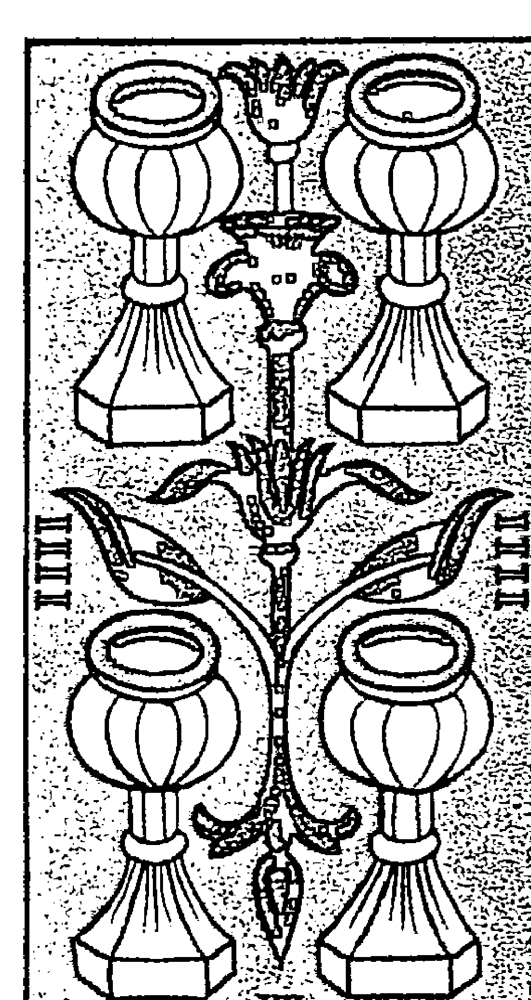

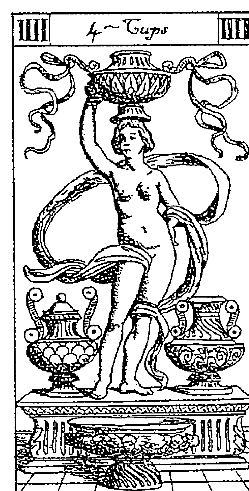

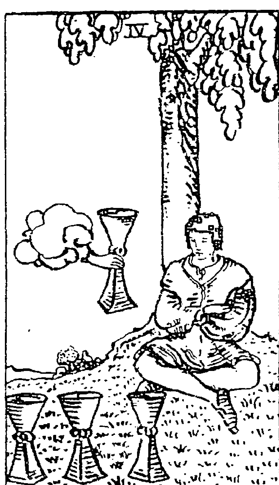

#### 幾何排列意義

這樣的排列有逸思之意：，而縱使是極爲整齊的排列方式，也有特殊意義：，有沒有「空洞」的感覺？還是蘊藏著無限可能呢？

#### 故事畫面安置

四隻杯子，一般是平版的放置方式：，這象徵平穩的日常生活，或者是正式的、嚴肅的場合，表達出沈寂、無趣、枯燥，心中不滿足的意義。

四杯，也可以視爲三加一的組成：，這原本是有別於一般的特殊設計，不過卻蔚爲盛行，因爲可表現豐富意涵，這樣的排列顯示平板之外，內心卻若有所思，存有遐想而不完全是沈寂。

### 畫面故事情節

#### 情節發展

本秘儀要表現的是沈寂但平穩的情緒，並沒有不滿或者不悅，更稱不上憂鬱。雖然很可能覺得無聊平淡，但也有機會求得恬逸和領悟。許多畫面是一個男人孤獨沈寂地坐在樹下，像是在納涼歇息，但也有可能是在靜坐悟道。他像是正在沈思，或許心裡感到百般聊賴，或許正靜心感悟。

RWS 的構圖將杯子安排得很特別，主角凝視三個杯子，而一個杯子從空中冒出，象徵心靈浮現的一個意象，或是一種渴望和幻想。有的牌是畫出天使捧來一個杯子，或是畫出已經將杯子捧在手上的畫面。

有的塔羅是四個杯子都同在現實面的安排，少數塔羅是四個都在夢幻之中。有的塔羅將情節稍做更動，描繪女人坐在庭院中小憩的夢境，或是延伸為沈思靜心或求道過程中所遭遇的各種誘惑。

大多數情節都是一人為主，強調孤獨的特質，刻劃個人私密的想像世界，因此很少有更多人物出現的情形。不過，無人的畫面倒是有的，以四個杯子的描繪為重點，像是填滿各式物品或長出花朵，也是一種靜與美的孤寂。

#### 附屬搭配

樹木是這張牌很重要的搭配，它是主角的依靠，也代表另一個聲音，甚至是主角的一個分身投射，而樹的樣貌和品種也有其象徵意義。

樹根地面高聳起來，讓主角的棲身處更為清爽明朗。主角的姿勢多為坐姿，並以神態表現出精神面和個人境界如何。雲中浮現杯子，表示幻想刺激，或是心中開始有夢。

> 占卜訣竅提點
聖杯四算是有梗的一張牌，在定義牌義的時候有納入未來，預留變化的可能性，因而有一些些的懸疑成分在其中，可供設想未來各種不同的發展。而且正逆位儘管牌義有差異，都可以這樣運用。

## 聖杯五
Five of Cups

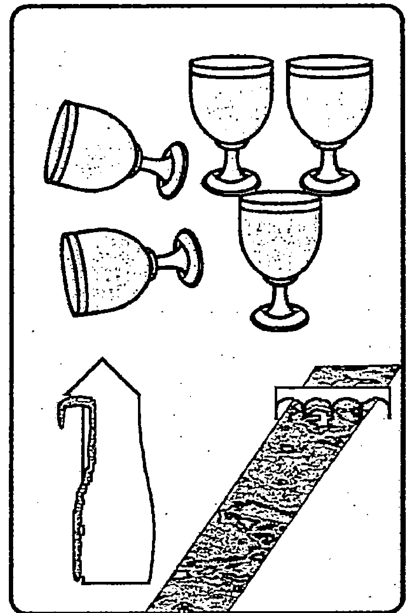

秘儀主題：
正 失落憂鬱
逆 走出陰霾

牌序定位：
聖杯牌組第五張數字牌，聖杯作用中段的秩序調整。

元素位階：
水元素波動起伏不定，混亂了情緒，是一種漩渦。五激擾了四的死水狀態。

### 祕儀數序定位

### 數字奧秘

五號牌與水元素聖杯的組合，正面作用是感情和關係的重整，和情緒的改變。但多半呈現的是負面的情況——失望與失落感、不悅的情緒、對感情有抱怨、關係不夠協調極需要改善。本祕儀主旨定義和正位置牌義，為負面作用意義。

### 祕儀主題

聖杯凌亂傾倒，發展為失意頹廢，也就是心情不好，一種失落的感覺，悲從中來的情緒，包含憂傷、鬱悶等一切負面情緒。這並不是受到激烈打擊，而是某種事與願違的失望感受。

### 內涵定義

大約都是失去和挫折的現象，像愛情和婚姻方面，以及合夥或繼承方面，都有不順暢的情況。尤其是感情層面上，遭遇到背叛或不相等的對待，而形成失望沮喪，深深的影響到內心。

### 正位實占解釋

- 人際交誼：人際關係不太好，情感不和睦，或者彼此相處不來。
- 戀愛情緣：戀情失望沮喪、失落失意、憂鬱悲傷，可能有分離吵架情況。
- 事務進行：受情緒干擾而影響到不同層面，漏掉了重要的訊息。
- 金錢物質：財物有所損失，漏財、金錢流失掉了，失去了心愛的東西。

### 牌義來歷變遷

#### 涵義演變

聖杯五的牌義一直很混亂，時而偏好、時而偏壞。有時某些項目正逆位意義都不錯，有些項目卻都很糟糕。也會有某項目有好壞差異的狀況，但又不一定是在正位或逆位。

偉特也是對這張牌如此定義，認為雖然代表壞事但其中或許還殘留些好的情況，雖然遇到好事但其中也不乏缺憾。較特別的是，牌義項目一直都涉及到人生中的各大領域。

這張牌在煉金術的元素涵義並不好，整張牌偏向於負面能量，這個觀點影響了往後時期，所以也多半被視為負面情緒和感情困擾的牌。

#### 正逆轉折

正逆位意義具有很大的差距，由於正位置是強烈的負面情緒和情況，而逆位置就轉而為偏好的結果。自古逆位置的意義牽涉也很廣，有些值得注意的項目，像是消息、親族先祖等等，也強調開始或計畫已經是錯誤了，也有回歸或回復關係的說法。

#### 逆位思考

逆位置會有好轉的跡象，原本正位置的負面情緒和狀況，或許會一掃而空。無論是情緒、關係、戀情，或是具體事務，都可以解釋為失而復得、重逢重聚、或是複合之類的景況，以及因此而帶來的喜悅。

逆位主旨結語：走出陰霾。

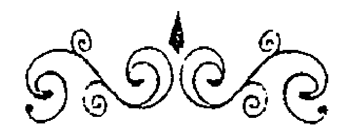

### 逆位實占解釋

- 人際交誼：對人際交流失望，逐漸調整心情，能夠面對他人。
- 戀愛情緣：在對戀情失望過後，揮別過去，或者期待和對方重修舊好。
- 事務進行：無心工作但仍盡力撐下去，試圖讓自己走出陰霾。
- 金錢物質：痛定思痛之下，決心不得不整頓財務，或許仍然無奈地進行。

### 象徵專屬物設定

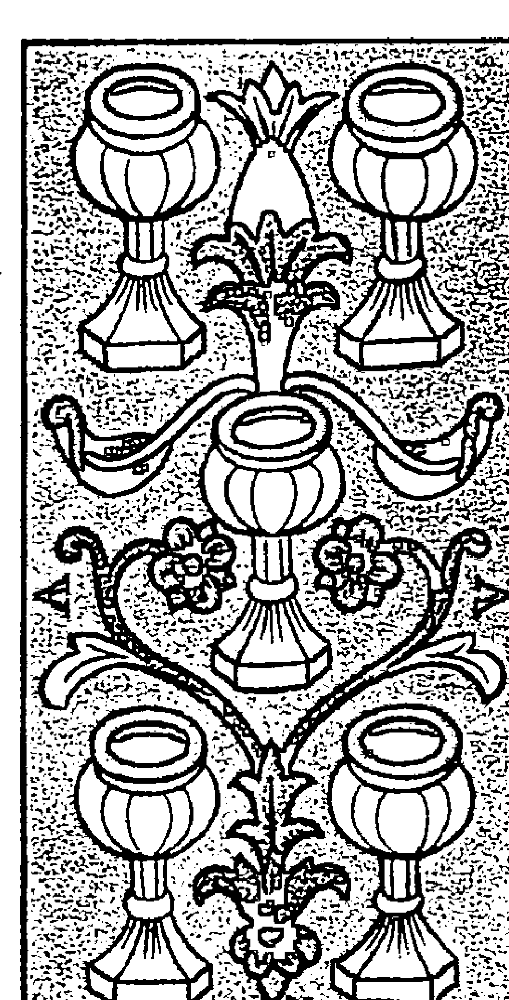

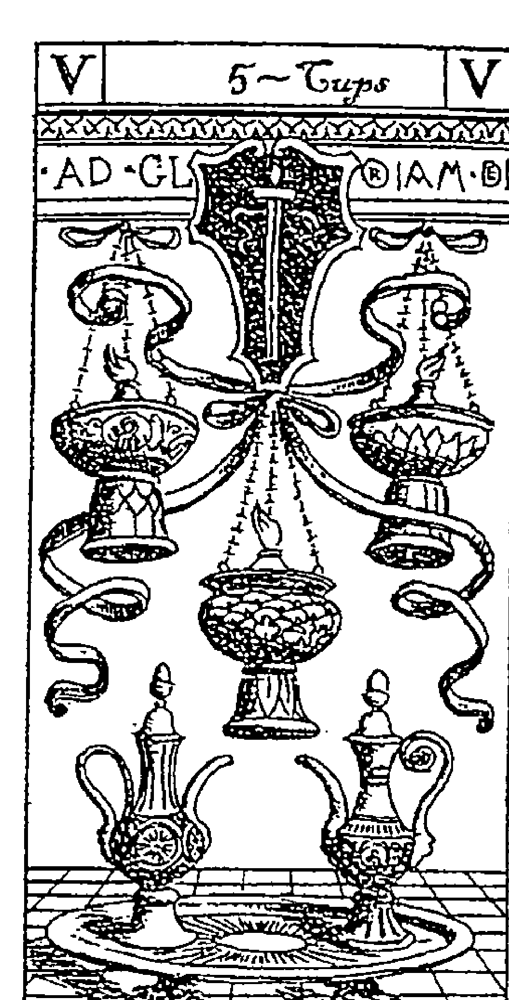

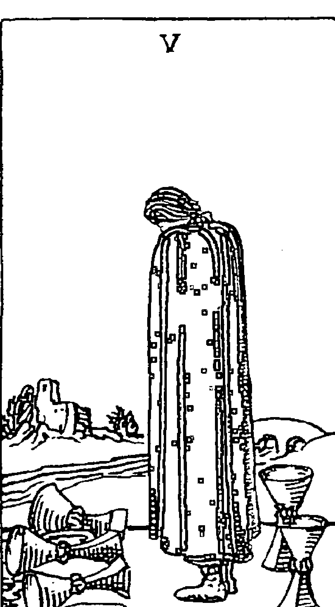

#### 幾何排列意義

很少是平鋪的五個杯子：🍷🍷🍷🍷🍷，多有變化性甚至強調不整齊，至少會排列成這樣：🍷🍷🍷🍷🍷，代表不滿意，缺憾的感覺。

🍷🍷🍷🍷🍷則象徵交錯的各種情緒，代表不同層面的感受。

#### 故事畫面安置

五個杯子是很難完善放置的，通常不容易排列整齊。所以畫面中的五杯多趨向凌亂，也藉以顯示主角情緒混亂、甚至心思矛盾，因此無暇顧及杯子擺置，甚至故意弄亂翻倒。將杯子傾倒放置的狀況，也因此常見於聖杯五。

杯子翻倒可以延伸為，在杯子使用過度後，耗盡虛脫等精神萎靡不振的象徵，有如酒醉一般。

### 畫面故事情節

#### 情節發展

本秘儀表示情緒的低落、不悅以及悵然若失的感覺。一般從主角人物的姿勢和外表，就可以看得出心情的反映，他多是僵直地佇立，別過頭去低頭不語，並且全身穿著漆黑。

杯子的排列也耐人尋味，通常是三杯翻倒，而背後的兩杯直立，但位置和主角方向也都能更動。有的塔羅五個杯子全都直立未倒，也有的是杯子全倒的狀況，有的牌的杯子甚至是存在幻境之中。

主角人物的動作多相差不大，然而面朝何方通常有不同的意向，可以用這些差異來評估憂鬱的狀況和程度。這些表現方法都是強調失意的結果，但引發的起因是什麼，則必須深入推敲，留下很大的想像空間。

牌面最好強調孤獨，單一主角在畫面中，會感到更為落寞，就像是一個人獨自喝著悶酒。但也可安排後面有人安慰，然而主角仍沈浸在愁緒中，這樣更能表現心中的沮喪鬱悶。

有些牌更為生動，在倒翻的杯中尋找殘存的餘溫。有些牌則畫出了兩人互相背對背的失和狀況，直接交代出不如意的原因是因為情感問題。

#### 附屬搭配

場景多為人物站在岸邊，因此會出現河流、橋梁，甚至彼岸的景物。流水，是愁緒的表現，抽刀斷水水更流，悵望江頭江水聲的意象。橋梁，象徵回頭或離去的考量，也是溝通管道。彼岸，暗喻未來的希望和走向。彼岸的城堡，是潛意識中嚮往的庇護所。

> 占卜訣竅提點
這張牌含有傷懷憂鬱和悲痛的感覺，感情方面走向低潮。聖杯五與聖杯四兩張牌是有差異的，刺激度不一樣。
聖杯四代表無趣，也是自己嫌棄的現況，而聖杯五是混亂不平靜的，是遭遇到不好的狀況，而不是自己願意的處境。

## 聖杯六
Six of Cups

祕儀主題：
正 溫馨愉悅
逆 嫌隙裂痕

牌序定位：
聖杯牌組第六張數字牌，聖杯作用的下半階段開張，輝煌美麗。

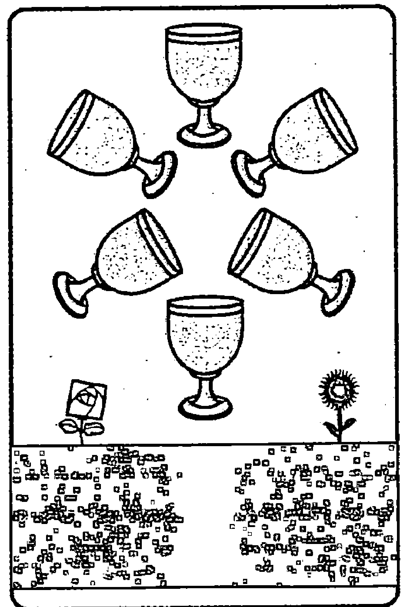

元素位階：
水元素最穩定而均衡的狀態，順暢載動，柔和溫馴而寧馨。是最美麗的形式。

### 祕儀數序定位

### 數字奧祕

六號牌與水元素聖杯的組合，正面作用是感情關係的和諧順暢，保持情緒的愉悅。負面的狀況則是沈溺在回憶中，或是耽誤在兩人相處的氣氛當中，忽略了更廣泛的層面。

### 祕儀主題

聖杯排好好的，代表累積已久的良好感情、情誼深厚。固定不動的現象，就是塵封的往事、歷程。而這都是良好的心情和回憶，雖不是激烈澎湃、熱烈激昂，卻是可以持續下去的溫馨感受。

### 內涵定義

聖杯六是溫馨安寧的情境，當然包括各種感情的和諧，也延伸到照顧撫育，因此也關聯到小孩子和童年時光，純真的心境和青澀的戀情，更進一步連結到過往回憶、往日情懷以及思鄉情緒。

### 正位實占解釋

- 人際交誼：人際關係良好，尤其是長久的情誼，溫馨的友誼。
- 戀愛情緣：兩小無猜的戀情。喚起回憶，勾起美好的感受。
- 事務進行：事務進行算是順利，有時容易沈浸於過去，難以開拓新展望。
- 金錢物質：在金錢和物資上能夠分享，並且也不虞匱乏，只是沒有很大的進展。

### 牌義來歷變遷

#### 涵義演變

這張牌一向帶著溫和的涵義，由此發展而出相關的感情和情緒狀態，與小孩、童年相關聯，也牽涉到回憶以及過往光陰。這樣的意義內涵到後來，就一直歷經各時期而保留下來。

另一方面，關於「新」和「未來」的涵義，應該算是從偉特開始刻意闡發的。原本隱藏在正位置中，而逆位置更明顯提到，並且與正位的過去相對照，過去和未來的關聯是相對性的，不如說這張牌跟時光很有關係。

#### 正逆轉折

偉特調整了正逆位置的意義差別，將最好的意義留給正位置，而稍差一點的作用就留給了逆位置。有些層面雖傾向負面，但由於牌旨溫和的前提，並不至於太激烈或糟糕。

偉特之後的牌義也都有相同的設定，主旨牌義都分派給正位置，逆位置是以「互異原則」推演出。牌中許多意涵方向都是由過去和未來延伸而得的，而未來相關的意涵後來就設定給逆位，以相對於正位的過去。

#### 逆位思考

聖杯六的逆位置，通常被視為正位置的相反作用，破壞了安全感以及和諧穩定的關係，可以說是一種彼此的裂痕。當然逆位置不單只是好壞意義的問題，例如正位「過往」與逆位「未來」的相對性，還有陳舊與新鮮等對比。

逆位主旨結語為嫌隙裂痕。聖杯六的逆位置，通常被視為正位置的相反作用，逆位置就是破壞了安全感以及和諧穩定的關係，也因而造成彼此關係的裂痕。當然逆位置並非「逆位負面」，而是真正的「正逆互異」，例如正位「過往」與逆位「未來」的相對性，還有陳舊與新鮮等對比。

### 逆位實占解釋

- 人際交誼：情誼出現裂痕、嫌隙。喜新厭舊，成長歷程的淘汰。
- 戀愛情緣：感到不再美好純真，溫馨的感受、往日的情懷不再。對以往的情誼懷疑、或有不安全感。遺忘過去，不再眷戀從前，回不去了。
- 事務進行：拋開過往雲煙，向前看，更新、迎向未來。
- 金錢物質：財務上新的路線，除舊布新，更新態度重來。

### 象徵專屬物設定

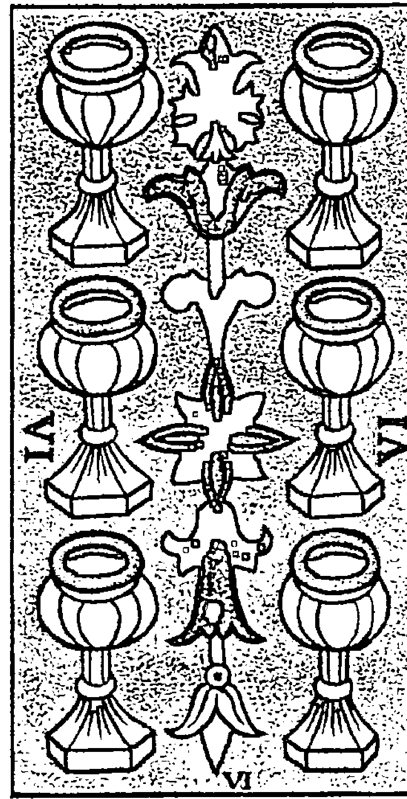

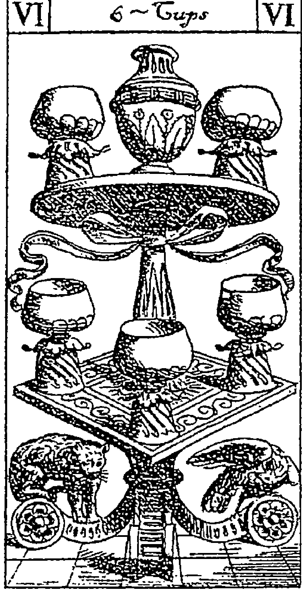

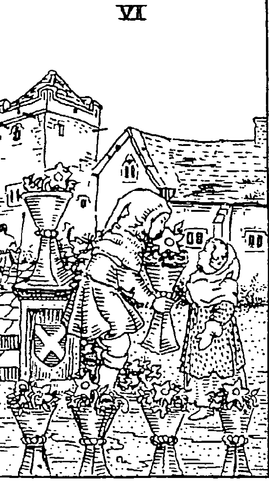

#### 幾何排列意義

無論是整齊的六個杯子：，或是參差的排列： 都隱含著六個聖杯的美感。

#### 故事畫面安置

六的排列通常是規律和美感的，而六個聖杯，更是可以說只能排列出美好的形狀。一般的排列為：。其他的變化也都相差無幾，除非刻意弄亂，但既然能排出美麗的畫面，當然也不需要特別去變化了。

 六個杯子的涵義很豐富，而通常不脫離漂亮美麗，也象徵著美好情緒以及融洽的關係等等。很多畫面會讓杯中裝滿，或讓花朵盛開，表示豐盛、滿足，也象徵著回憶。

### 畫面故事情節

#### 情節發展

本祕儀是表達寧靜溫馨的情感，美好的點點滴滴回憶，也是純真的代名詞。那麼主角當然是孩童，通常至少有一對男孩和女孩，牌義可以連結到與兒童相關的幼保、幼教以及童年，並推演到從前的美好時光，以及過往的回憶。

有的塔羅著墨於回憶這一點，以泛黃或黑白的圖案表現出回憶中的畫面，甚至有年老與幼年的對比，可知這張牌與時光也很有關聯。

花園中的場景，令人感到溫馨，累積的感情應給人厚實的感覺，於是多會在聖杯中裝滿了泥土而生長出花朵。所有這些象徵都貼近於純真的感情，由小孩子之間的相處關係，看出所要表達的意境。多以孩童的遊戲表示真摯的情誼，也延伸為不及愛情的關係。

如果認定是小倆口的戀情，也是偏向於兩小無猜、青梅竹馬，較為溫馨而非激情。有的塔羅表達的是較為成熟的愛情，甚至是浪漫熱情，這樣也無不可。有的塔羅表達的是人物與大自然或動物之間的和諧關係，而這也與童稚純真的心有關。

#### 附屬搭配

杯子內裝的實物是累積而成的，表示是實在而不是幻想或激情引發的。況且杯子是放置於城堡土地上的，表示真實境地，杯中內容都是真實的過往。開出花朵是目前的情感呈現，純潔而美麗的象徵。

聖杯六所在背景的安排，多位於城堡花園之深處，表示孩童受到安穩的照顧和保護，甚至還有守衛。

> 占卜訣竅提點
聖杯六算是一張模稜兩可的感情牌，原本就是代表純情，然而卻反過來會成爲曖昧牌。可以是友誼，也可以是愛情，看占卜者怎麼問。和聖杯二最大的差異，就在於聖杯二所指涉的角色屬於成人，而這張牌則是代表兒童。

## 聖杯七
Seven of Cups

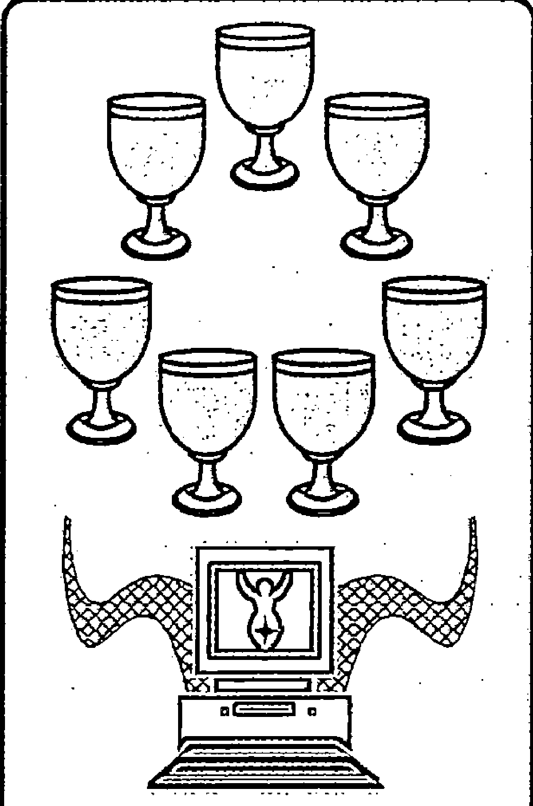

秘儀主題：
**正** 夢幻想像
**逆** 幻滅清醒

牌序定位：
聖杯牌組第七張數字牌，聖杯作用的另類道路。

元素位階：
水元素的特殊形式，可以比擬為一種噴泉，具有虛幻的美麗形式和光澤。

### 祕儀數序定位

### 數字奧秘

七號牌與水元素聖杯的組合，正面作用是感情的新進展和增添情趣。但通常會出現負面的狀況，就是過度的思緒和想像，編織出很多虛幻的情境，混淆了現實感。本祕儀主旨定義和正位置牌義，採取全然沉浸想像的詮釋。

### 祕儀主題

聖杯浮在空中，其實也就是想像的情境，飄在空中虛幻世界，表示沉浸在情中了。聖杯七代表做白日夢，活在幻想中，充滿幻想和繽紛的想像力，也象徵虛幻而不切實際，脫離現實層面。

### 內涵定義

正位置是模糊不清的幻境，許多慾念和想像，七情六欲躥竄而出，許多計畫甚至行動，都是不切實際的。縱使看起來很具體的擁有或成功，其實卻是虛假而短暫的，如夢幻泡影一般。優點應算是想像力豐富、創意十足。

### 正位實占解釋

- 人際交誼：人際之間的關係多半是虛幻的，自己所編織想像出來的。
- 戀愛情緣：單戀、一廂情願。不切實際的單相思、過於虛幻的愛意。
- 事務進行：事情並非想像的那樣，沉浸在虛構的情境之中，搞不清楚實際狀況。
- 金錢物質：沒有實質的收穫，無用的理財計畫，貪念慾求但無法獲得。

### 牌義來歷變遷

#### 涵義演變

這張牌正逆位意義有差距，但卻是一個不穩定的牌，所以意義也會飄移。在許多層面上，逆位置還會偏向好的作用，自古以來一直紛亂著。原本也多包涵著選擇和決定的意味，但後來被省略掉了。

偉特釐清正位置的想像是屬於虛幻、於實際無補，而對於決心和行動已經從正位往逆位偏移，以符合正逆差異，有意識的設定正逆為相反作用，一個是虛幻想像，而另一個偏向實際。

#### 正逆轉折

偉特之後的時期，聖杯七愈來愈明確的認定正逆位的相反差異，正位置是虛幻和想像的，而逆位置是相反地走回現實面。由正位置的不切實際轉換到逆位置的回歸人世間，像是明朗和清楚、具體和實際這一類的意義，可說算是採取「逆位相反原則」來推演的。

#### 逆位思考

逆位置卻很重實際，從虛幻中清醒過來了，走向現實面中。在態度上，是務實而果決明快的，不會拖泥帶水或不清晰，甚至可以說清明而具有智慧。代表無用的慾望和想像轉化成為意志力，能夠有真正的獲得或達成。

逆位主旨結語：幻滅清醒。

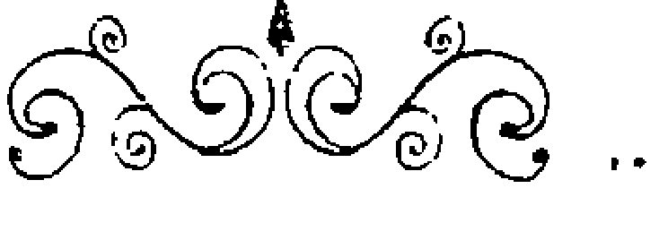

### 逆位實占解釋

- 人際交誼：發現真相，使人驚覺、錯愕的情況，從沈溺中清醒。
- 戀愛情緣：措手不及的接受殘酷的事實，不再被迷惑了，從美夢中清醒過來。
- 事務進行：搞清楚當前狀況，撥開迷霧重圍，認清現實。
- 金錢物質：面對現實問題，不再做白日夢、發財夢。開始願意腳踏實地。

### 象徵專屬物設定

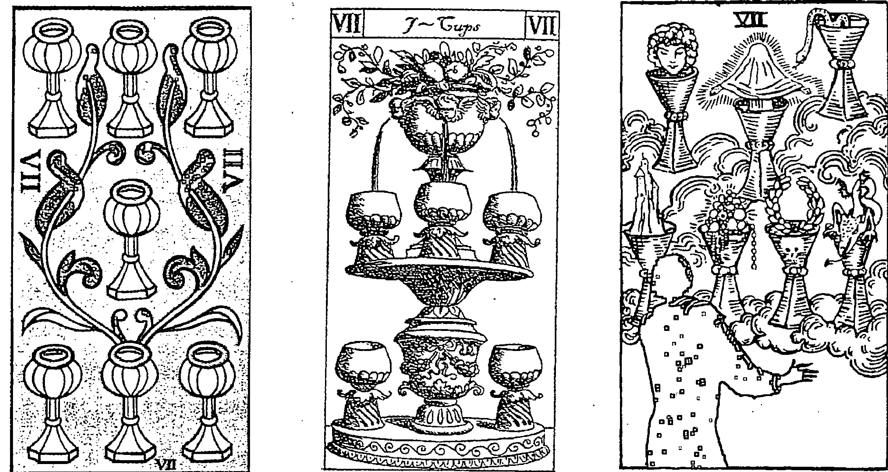

#### 幾何排列意義

七個杯子的排列，通常會兼具變化和具有整體感的形狀，最常見到的是圖一以及圖二，這兩種排列方式，都是七的象徵，有如星體的七曜，或是七芒星圖案，是一種理想的編織。

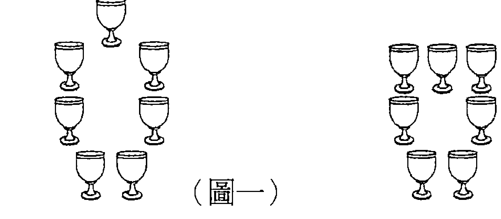

#### 故事畫面安置

七個杯子，或許比六杯的美好更甚，因為又增添了一個，然而這樣一來就略為脫離現實了。七杯的排列位置雖多不整齊，但方向一致，能夠錯落有致，這些圖式表示理想性，多象徵遐思、遐想，以及幻想、幻境，而在現實面上卻是難成或者破滅。

### 畫面故事情節

#### 情節發展

本祕儀要表達出不切實際的情況，因此大都將七個杯子畫在雲霧裡，表示這是虛幻之物。並多會讓每個杯子都裝有不同的物件，具體表示內心所想要的是什麼。

杯中物是為了進一步詳細描繪所幻想的範圍及慾望的種類，然而也可填入不同顏色的液體。甚至不一定要盛裝東西，只要讓杯子浮在雲端或空中，就表明了這是幻象。杯子也可被雲霧遮擋，或是區隔出界限，不一定要在上方浮著。

主角人物背對著畫面，面朝浮杯的幻境，他的動作是對著幻境的反應，彼此要有所互動。主角的面目多半是模糊的，背影看起來都是男性，強調女性為主的情節應有其他特殊意念。也由於重點在於杯子的刻劃，甚至可以不用出現人物。

從杯中看到幻象的呈現方式，也具有多變性，像是在鏡子中或水盆、水晶等各種靈視方法中浮現。有的還描述主角被幻象擊倒，甚至以延伸出的「誘惑」之意來構思。有些塔羅牌，會稍微加強現實感覺和行動意志，以強調理想落實，畫成編織嚮往藍圖，而不純然是空想幻覺。

#### 附屬搭配

雲霧表示幻境，象徵心中的想像投射，也因而杯中裝什麼都被視為虛幻。想像內容豐富不豐富，也可以從杯中物看出。

主角的呈現衣著裝扮，也是黑暗詭異，以增添幻覺感受。除主角與雲內杯子之外，即無其他道具物件。

> 占卜訣竅提點
這張牌其實並不含糊，究竟是虛幻還是真實可以分得很清楚，只是說虛幻與真實之間，其實占卜師也很難以評斷孰優孰劣，優缺點是因人而異，回到現實和沉浸想像世界，都是無可厚非的。

## 聖杯八
Eight of Cups

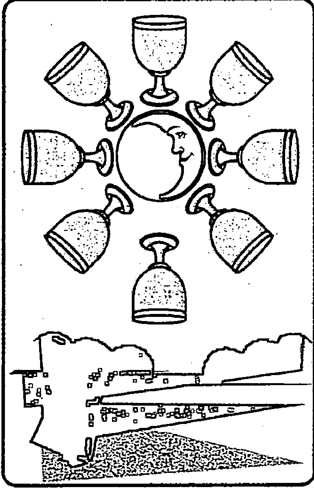

秘儀主題：
正 追尋離棄
逆 徘徊反顧

牌序定位：
聖杯牌組第八張數字牌，聖杯作用的承先啟後。

元素位階：
水元素的澎湃的狀況，也像是瀑布般，朝一定的方向固定傾洩。

### 秘儀數序定位

### 數字奧秘

八號牌與水元素聖杯的組合，正面作用是在感情和情緒層面上想要有一個整體的轉變，但是常形成負面的狀況，就是會放棄和割捨一段感情，不然就是膠著在目前關係中，不知如何取捨。

### 秘儀主題

聖杯八的主題顯得比較複雜，可能是追尋、也可能是離棄，這必須能夠拿捏得當。兩種走向都囊括於其中，其實是因為彼此相關，追尋和離棄兩者並存是矛盾，但不是模糊混淆，而追尋提昇總需要有所割捨與放棄。

### 內涵定義

本秘儀主旨如今走向更為單純化的解釋，表示對既有的情況採取一種退縮、羞怯的情緒和態度，也是朝向另一個新的未知方向的意味。因而多導向放棄原本的初衷，不再抱持希望，甚至揚棄未來的機會。

### 正位實占解釋

- 人際交誼：對關係不夠滿意，因此想要放棄，或者另謀發展。
- 戀愛情緣：意欲放棄目前的戀情，想要完成自我，或者另尋新的伴侶。
- 事務進行：事務進行不順，沒有完成就半途而廢，重新來過，另尋出路。
- 金錢物質：目前沒有得到，必須繼續追求和等待，或許會割捨放棄。

### 牌義來歷變遷

#### 涵義演變

聖杯八的牌義其實莫衷一是，有許多混雜的層面包含在其中。在紙牌占卜的正逆位意義沒有相差很多，而牌義內容跟後來的也不太一樣。有許多論法是有關戀情和豔遇的，煉金術、克洛利、偉特的看法也都不完全一致。

偉特自己也提到 RWS 的聖杯八畫面之外，也有更多可能矛盾的涵義。而他強調的層面是，情緒的沮喪低落、放棄幸福、冒險進取，也有歡樂溫馨以及羞怯謙遜的特質。而後的牌義變化多半都有保留這些項目。

逆位置的意義就更複雜難明了，從古老的說法完滿如意，到後來偉特的美妙歡愉、幸福盛宴，有的和正位置也很接近，跟隨著正位置而混亂。

#### 正逆轉折

直到後來正位置才偏向放棄和其他傾向於負面的牌義，逆位置也從而定為較佳的意義。整個牌旨愈後來愈走向心靈解讀的層面。逆位置根據偉特的傳統，有較多的正面意義：不放棄原有的堅持，繼續努力以達到成功。

#### 逆位思考

逆位的意義視為相反原則，正位置較為負面的意義在逆位轉好，像是「放棄」就轉而為努力不懈。另外針對正位置失意的情緒，變成激昂或興高采烈，甚至是歡慶盛宴，表示找到了喜悦美好和幸福快樂的契機或道路。

逆位主旨結語：徘徊反顧。

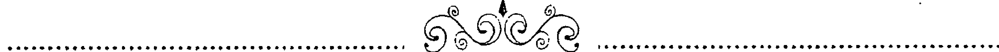

### 逆位實占解釋

- 人際交誼：應付心態的交際，不好意思拒絕他人，受到一些狀況拉鋸。
- 戀愛情緣：感情若即若離、拉拉扯扯，關係之間糾纏不清，難以割捨緣分。
- 事務進行：行進躊躇、來回反覆，沒有立定方向和決心。
- 金錢物質：對支出或進財都下不了手，平白錯失良機，因而可能損失。

### 象徵專屬物設定

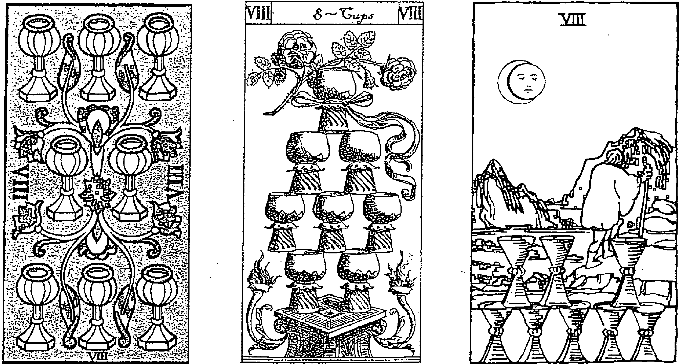

#### 幾何排列意義

整齊疊起八個杯子，表示豐富而無變化如下圖一，或者類似圖二這樣的形狀。

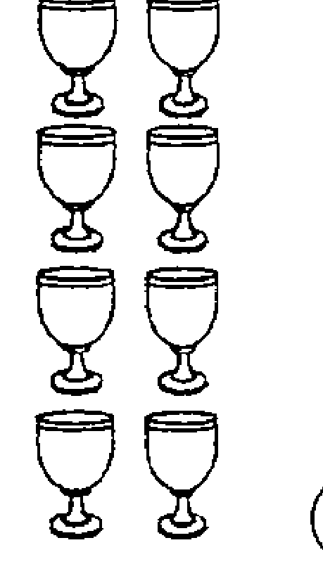

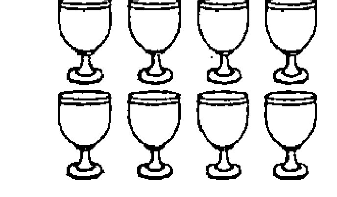

#### 故事畫面安置

八杯很容易排列整齊而一體，表示情緒穩定，以及心境平和。只是這樣的排列易流於刻板，因此會尋求一些變化，像是圖三或圖四這種特殊排列，是經過設計的留心安排，而不是隨意或混亂的放置，暗示這是用心感受之後的結果。這樣的排列圖式，表達出八杯或許讓人感到無趣，但也僅止於有形或物質的停滯，然而心靈卻能夠遠離或超越！聖杯八夾雜著沈寂落寞與欣喜繽紛的兩種情緒方向，透過精心設計而能同時蘊含。

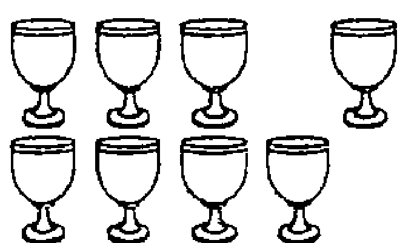

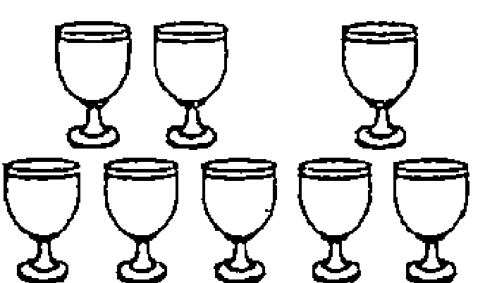

### 畫面故事情節

#### 情節發展

本祕儀內涵較多元而不易捉摸，所以畫面情節的變化也很多。通常會見到留下背影的主角，他似乎捨棄了眼前代表情感的聖杯，轉身離去，朝遠方的未知前行。我們不知他的心中，究竟渴望停留、還是渴望離開。

畫面中的杯子如何擺放，可以看出原本所處的情境，完好的放置暗示感情狀態是完整的。RWS 系的杯子排列呈現出一個空缺，暗示有不為人知的缺憾需要填補和追尋，來自於心中完美或更高境界的追求，或者是另有其他的目標。

有的塔羅會畫成杯子被打翻，情緒顯得比較激憤，也有鬱悶默默喝酒的情況，稍類似於聖杯五，這都表示對原本的關係感到受挫。

畫面中的流浪者多為男性，為追尋自身理想而出發。以女性為主角的牌義，多代表覺醒的意識，並且心情更為細膩。同樣是想離開的念頭，卻可以刻劃成躊躇思量或依依不捨。

有的塔羅會畫出出發後的歷程，甚至到達目的地的心境。當然也有塔羅描繪主角手捧聖杯，強調求道的氣氛和心境。少數的塔羅會直接和明確畫出兩人別離的場面，尋求更高境界的意味則較薄弱。然而兩人的情節也可表現得比較和諧，男女主角共望著遠景思索著未來。

#### 附屬搭配

許多主角都手握枴杖，表示攜帶著自身的原則宗旨以及既有的本領。從他身上的穿著，可以看出嚮往的目標為何。聖杯八的主角形象很接近大祕儀中的隱士，內在特質和願望目標都一樣，因此也被暱稱為小隱士。

水流與路徑，是未來的方向寫照，地勢崎嶇路途蜿蜒，未來道路艱辛並不好走，到達目標或尋得真理、獲得真愛，並不是容易的事。

遠方景致是黑暗，月亮掛在夜空，隱喻在未知中摸索而目標明確。如身在建築內，象徵與外隔絕和出發的困難度。一條向前指引的路是很重要的，也可以轉化為其他表現方式。夜空的月和水域旁蜿蜒的路，明顯的要連結於月亮牌。

> ### 占卜訣竅提點
聖杯八的情況跟寶劍二很類似，各種不同的塔羅，牌義可能有些微差異，但都可依據「祕儀主題」的幾種走向來設定，甚至顧及畫面圖案作用，照這樣來學習與使用便能清楚了解。

## 聖杯九
Nine of Cups

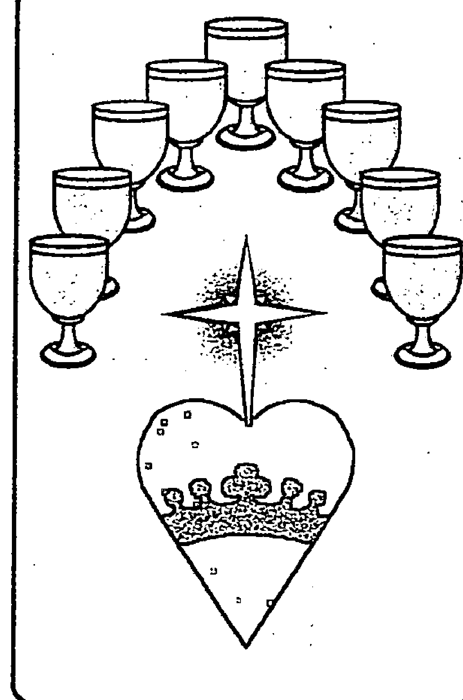

秘儀主題：
**正** 得意享受
**逆** 膨脹昏頭

牌序定位：
聖杯牌組第九張數字牌，聖杯作用的的極致階段。

元素位階：
水元素最滿足漲潮的狀態，洋溢著水的柔和美麗。

### 祕儀數序定位

### 數字奧秘

九號與水元素聖杯的組合，正面作用是滿足的情緒、生活的充實，以及感情關係的平和。然而負面的狀況則是情感失意、關係受挫、情緒感到低落，不安全和不滿足。

### 祕儀主題

處於志得意滿的狀態下，因為對於現狀欣喜愉悅，已經達到一個程度了，能夠享受完美的整體感受。過去的想望都已如願以償，圓滿成功達陣，正該得意須盡歡之時。對於未來也仍滿懷希望，也是夢想成真的保證。

### 內涵定義

聖杯九正位置是完滿的感受，美好的感覺和情緒，並且是基於現實面的，而不是空泛的純精神愉悅，所以也表示物質生活安康美滿。也意味著能夠達成與獲得，並盡情享受這一切，充滿歡樂和愉快的氣氛。

### 正位實占解釋

- 人際交誼：皆大歡喜的局面，獨樂樂或眾樂樂的饗宴，人際互動暢快。
- 戀愛情緣：感情上相處得興高采烈，達到想要的進展。
- 事務進行：事務進行順利和諧，並且能夠輕鬆安逸地運作，對此自信滿滿。
- 金錢物質：能夠獲取很多利益，財務豐收大好，物質享受不缺。

### 牌義來歷變遷

#### 涵義演變

聖杯九這張牌一直都是滿意充足的象徵，不過也隱含了許多繁雜的意義在其中，包括心靈精神感動或心願達成的意義。

偉特為了將聖杯九的牌義與聖杯十區隔，設定為趨向物質上的滿足快樂，但對這張牌所囊括的多種涵義也沒有統一。不過這時候大部分的意義都是好的居多了，還包含了和睦與滿足，更不乏優勢和勝利成功。偉特之後的牌義，也就一直沒有更動這種趨向，維持差不多的意思，不過古代的牌義也有人使用。

而對於逆位的設定，原本和正位相差無幾，到了偉特則將逆位做出特殊設定，降低優勢，並點出有不夠完美和瑕疵之意，雖然有良好意義在，但因力度不足而不夠穩定。

#### 正逆轉折

逆位置意義從偉特之後，朝向於負面意義演變，以分辨與正位置的差異。甚至有些項目，正逆位的差距頗大。逆位置就是不完美，是正位置意義的反面，也就是以「逆位相反原則」來思考。

#### 逆位思考

聖杯九逆位置，是所有正位置的情況的逆轉，是一種情緒失落、低調沈悶和不對勁的感覺。代表事情不完滿，一切的失當和錯誤，以及各種損失。意味著關係上不和諧，個人的放縱和不當的自由，也表示失去可靠和穩定。

逆位主旨結語：膨脹昏頭。

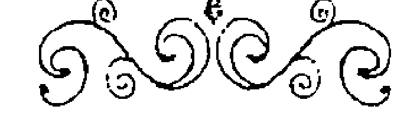

### 逆位實占解釋

- 人際交誼：過度吹噓膨脹、樂觀過頭、打壞關係。不願分享、獨樂樂。
- 戀愛情緣：過度自信吹噓，忽略對方感受，終究惹人嫌棄。
- 事務進行：因為錯誤評估、過度樂觀看不清真相，導致失敗。
- 金錢物質：奢侈生活、浮華作風。嚴重的狀況甚至坐吃山空。

### 象徵專屬物設定

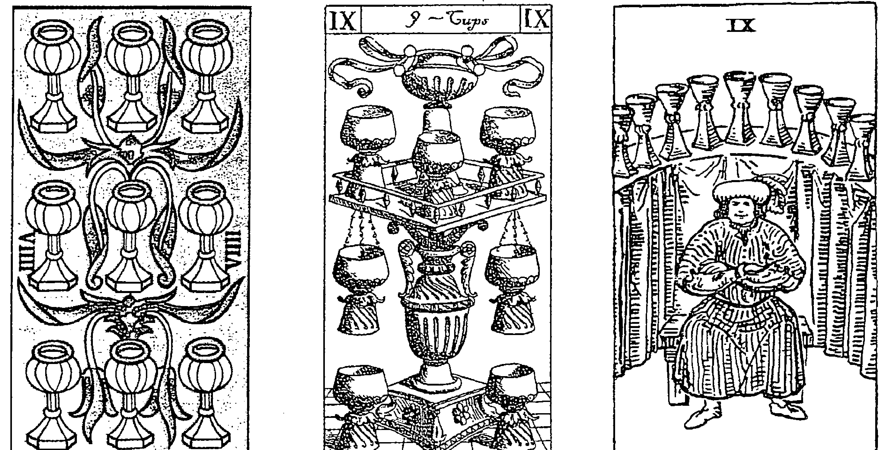

#### 幾何排列意義

九個杯子，通常都會有將畫面整個填充的感覺。當然，九個杯子也可以排成一列：🍷🍷🍷🍷🍷🍷🍷🍷🍷，或者是如圖一、圖二交錯相疊，一樣都很有氣勢。

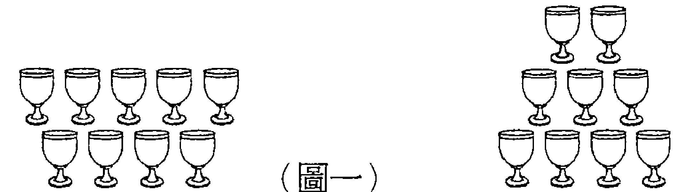

#### 故事畫面安置

九杯已是極多的杯子，可以象徵一種滿足。由於九數需要強調力量整合，且不能顯出凌亂，因此合起來圍成圓拱狀排列。
九杯高舉或置放高處，這樣陳列出來，除了表示儲存起來慢慢享用，以及心中的滿足感之外，更有著向大眾展示或炫耀的意味。情緒高昂的極多杯子，呈現透露出極為滿意的內在。

### 畫面故事情節

#### 情節發展

本祕儀旨在形容個人志得意滿的情緒，幾乎多以單一人物出現。主角獨自安坐，享受快樂欣喜片刻，這是人生的美滿自信的境界。也代表心想事成，願望達到的無比喜悅。

多半塔羅是描繪男性的歡樂以及志得意滿，給人驕傲得意的感覺。但這樣有時候看起來卻會引起反感，因此也有很多牌是以女性做爲主角。

女性主角可以表現出比較細緻的情懷以及深刻的感動，除此之外還能帶出另一重要主題——心想事成。這張祕儀也有做爲心願牌的傳統，女人對於心願達成的感受和情感寄託的態度，是較爲貼切的。

尤其是讓杯子浮在雲端，配合女性的夢幻心境。女主角的畫面通常比較靜態或偏重內心戲，爲了避免流於平板，也有較爲動態的變化畫法：讓女子隨喜悅的心起舞，杯子圍繞於四周。

仍有少數的牌是描繪兩人親熱的畫面，表現雙方融合成一體的喜悅。也有的塔羅描繪女人和小孩的互動，也是一種內心的幸福喜悅與滿足。

#### 附屬搭配

布景是什麼即表示目前處境和遭遇，以及透露出爲什麼感到滿足。帳棚表示一時的舒適與收穫。生活狀況也可由主角與杯的關係透露出，聖杯的擺設，表示得意之處，或內心的目標放在哪裡。

主角的位置和動作姿勢，代表內心的細微狀況，雙手抱胸或昂首抬臂都是不同的肢體語言。多半會有椅子，給主角人物坐著，這樣會顯得比較安穩舒適，才能泰然自若。

> ### 占卜訣竅提點
這張牌其實精神物質兩相宜，其實別太在意互相抵觸。而最重要的特色就是，這張聖杯牌比較自我一些，無論主角性別是男還是女。容易是自我情緒熱烈、感覺良好。

## 聖杯十
Ten of Cups

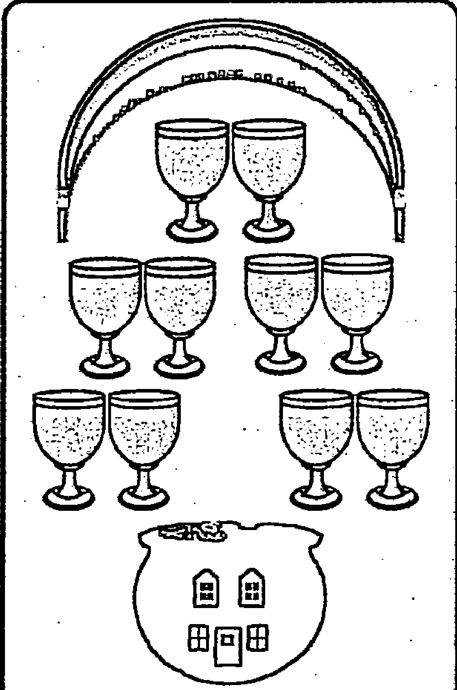

秘儀主題：
正 幸福美滿
逆 低潮落差

牌序定位：
聖杯牌組第十張數字牌，聖杯作用後的新開始。

元素位階：
水元素滿足充溢，並且將繼續蔓延下去，源源不絕的狀態如汪洋大海。

### 秘儀數序定位

### 數字奧秘

十號牌與水元素聖杯的組合，正面作用是感情面非常完滿，徹底完成人生的各種關係，並更進一步綿延下去。負面的狀況則是，遭遇不和諧和情緒的低潮阻塞。本秘儀主旨定義和正位置牌義，採取正面作用意義。

### 秘儀主題

聖杯十是整體的情感層面，代表最幸福美滿的生活，情感方面最完善極致的階級。要強調周全完滿的感情和充足的愛，並且有許多好運和幸運，有如美麗的彩虹更帶來希望，應該也不乏浪漫情懷。

### 內涵定義

聖杯十的正位置是幸福美滿的涵義，個人的情緒和精神層面上都很圓滿，各種情感關係也都和諧美好，可以擴及到各個層面。這張牌很著重家庭關係，是全家美滿幸福的象徵，與此相關的事項也都很不錯。

### 正位實占解釋

- 人際交誼：所有的關係都感情不錯，尤其家庭更是美滿和樂，親子互動良好。
- 戀愛情緣：鎖定專問戀情，則是圓熟之愛，並且親密如家人般美好。
- 事務進行：事情都能順利進行和完成，並能夠受到讚揚和肯定。
- 金錢物質：物質上的收穫不見得很多，但能夠讓你感到值得和滿足。

### 牌義來歷變遷

#### 涵義演變

聖杯十從古至今一直都是極為好運的一張牌，集合了各個層面的正面狀況，並且影響力很強。從偉特以來就完全接受承襲這些內容，後期的演變似乎也不太更動這些既有的設定。

唯有煉金術系統，在牌義上有些小小的差異，隱藏著較為奇怪的行徑之類的探索，不過大致上還是一樣的意思，不過因為元素配置沒有絕佳的緣故，也就比較沒有盛讚這張牌。

牌的主旨和正位置既然沒有疑義，那麼逆位置的作用演變如何，就是探討的重點了。原本因為主旨牌義實在太好了，連逆位置的涵義也都很难差到哪裡去。不過後來或許因應正逆位區隔的趨勢，逆位置的作用就逐漸朝向負面的作用，並趨於和正位置的意義相反作用。

#### 正逆轉折

聖杯十的逆位置的意義和正位置相反，情緒和狀態都轉為負面的，也代表存在著家庭的問題。逆位置表示情緒上的負面狀態，是不快樂和不美滿幸福的感覺，甚至是暴躁、盛怒之類的情緒。

#### 逆位思考

在家庭關係上，出現了一些問題和狀況，成員之間有紛爭或意見不合。生活方面流於瑣碎和繁雜無章，缺乏照應和整頓，內心的情緒也需要平撫。家庭以外的各種人際關係，友誼和愛情方面，也都是不和諧的。

逆位主旨結語：低潮落差。

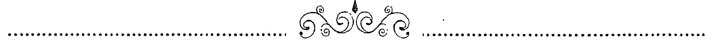

### 逆位實占解釋

- 人際交誼：成員之間互相不和諧，感到待不下而各自散去。
- 戀愛情緣：彼此之間吵架、仇視、極度憤怒、翻臉、惡臉相向。
- 事務進行：散亂不協調，難以進行。因一些感情限制使得發展困難。
- 金錢物質：錢的問題頗為嚴重，沒有或違反理財規則，因而導致虧空。

### 象徵專屬物設定

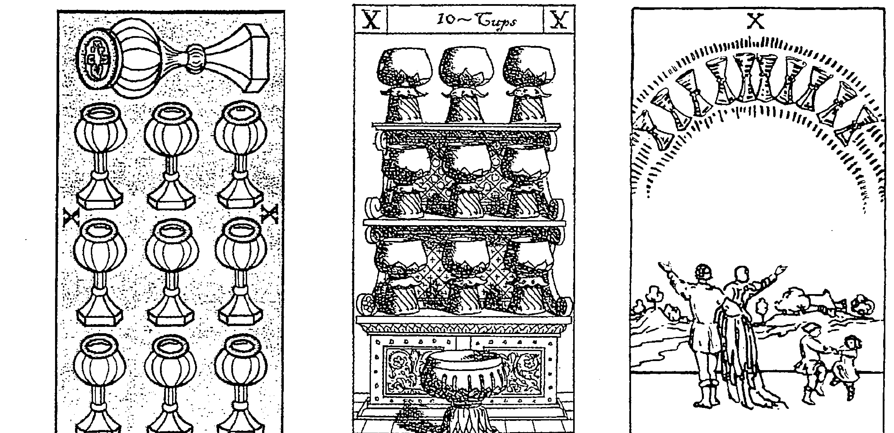

#### 幾何排列意義

十個聖杯可以拆成兩段疊放：，或者是任何其他的放置方式（如圖一、圖二），都一樣能造成滿足的視覺，暗喻了心中的感受。

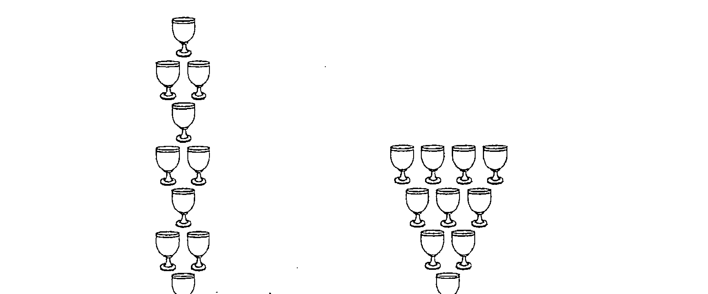

#### 故事畫面安置

十杯，是全滿而又溢增的感覺，由於十表示全部象徵物合而為一，所以要有整體結合感，因此將十杯連接，排成一道圓弧狀，以表達真正的幸福美滿。這些聖杯更有如彩虹般，背景飾以七彩，象徵一切美好的心靈境界、美麗人生。而圓弧的柔和排列形狀，非常適於表達聖杯十的祥和溫馨。

### 畫面故事情節

#### 情節發展

本秘儀主要表達親情、愛情等幸福人生，多半以全家和樂爲場景，表現美滿家庭的內心感受。重點就在於小家庭的和樂，因此多會有全家福的場景出現，夫妻子女的共處與融洽。而安全的家庭居處是很重要的，多半也會著重住所房子的建築。雖然需要表現家庭的和樂與溫暖，卻不須有人物的限定，也不一定全家人都要出現，甚至可以不用畫出人物。

而沒有人物，那麼家園的描繪就成爲主要重點了。這時多呈現出城堡莊園，甚至有高山爲屏障或建築在山上，這都表示安定穩固、有靠山。

有些塔羅並非表現全家福的涵義，而是純由兩人構築的世界，這也是一種幸福的感覺。讓彼此雙手共握一個聖杯，或是一起捧著全部的聖杯，都可以表現出關係緊密、感情深厚或者是互相扶持。

當然也會有單一人物出現的畫面，有的牌只有唯一女主角坐著，十杯水圍繞而滿溢出水來。也有塔羅一改這些意象，只畫出情感豐沛，以象徵方式來表達主題的，像是十個聖杯的特殊安排或是以水元素精靈出場的畫面。

#### 附屬搭配

天空中的一道彩虹，連結起聖杯，做爲聖杯的背景，彩虹是美好的希望和願景，也是心靈的橋梁。既然描繪家庭，那麼建築物是很必要的，具備表示安定穩固的家，物質有一定程度的安穩，才能真正和樂。

周邊環境場景有河流、山坡，描述共同生活園地，以及各自發展的空間。優美的環境就是心境寫照，晴朗的天氣更是心情開朗的描繪。

> ### 占卜訣竅提點
聖杯十是包涵萬應的感情，所有的關係的一張牌，可以說是聚集一堂，但小小的家庭和大家族的金幣十號牌是差很多的。

## 寶劍二
Two of Swords

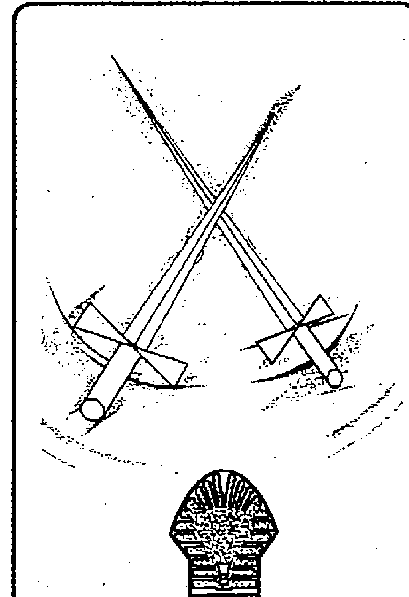

秘儀主題：
正 對峙和解
逆 索性放棄

牌序定位：
寶劍牌組第二張數字牌，寶劍開始真正運作，思索的開端。

元素位階：
風元素冷而銳利的思想力量，首先是溝通對談，以及辯證思考，以及彼此意見的交會。

### 秘儀數序定位

### 數字奧秘

二號牌與風元素寶劍的組合，表示思想的結合或抗衡對峙。正面作用是形成均衡的局面。負面的狀況則是兩難，或者兩股力量僵持不下，不然就是失去均衡。本秘儀主旨定義和正位置牌義正呼應了牌義，也是模棱兩可。

### 秘儀主題

因為旗鼓相當、勢均力敵，沒有辦法分出高下。從對峙和對立的僵持不下，然後是實力均衡下的冷戰堅持，最後進展到和解或和平相處。由此實力相當的兩方，可以營造出高度的惺惺相惜。

### 內涵定義

寶劍二是思想的對立和矛盾，從兩難中尋求平衡點，但其實並存著兩種思緒。這也顯示了沈穩的耐性，才能營造出風雨中的寧靜，通常是剛毅而非溫和親暱的。這樣的局勢應該是一種冷戰式的和平，或者是互相牽制的狀態。維持平衡，但卻是一個對立的僵局。

### 正位實占解釋

- 人際交誼：產生對立的立場，可能維持均衡或形成僵局。
- 戀愛情緣：兩人的思緒和意見不一致，彼此僵持不下，需相互妥協。
- 事務進行：事情因意見不同形成兩難的局面，難以抉擇取捨，需要仔細衡量評估。
- 金錢物質：由於態度躊躇不前，沒有積極爭取，因此也難以獲利。

### 牌義來歷變遷

#### 涵義演變

這張牌有很多人解釋成和諧與和平，甚至代表親和力，這是煉金術和黃金黎明系統的論調，然而偉特認為並非如此，於是這張牌有分歧的意見，RWS 的寶劍二表達得很含蓄而模擬兩可，這情境也是偉特的本意所想呈現的，亦即同時並存這些定義，而 RWS 確實營造了寶劍二最適切的意涵。

可以跟隨偉特的意見來應用，他認為這張牌身爲寶劍花色，不太可能代表感情的優勢，在實占上除非牌局中其他出現的牌，顯示了和平或良好的現象，不然沒必要做此解釋。

由於兩把寶劍無論如何是一種張力，在偉特稍後時期開始，就增強了分歧和僵持，而和平之意已較爲人忽視，如今牌義是沿著這個走向而來的。

#### 正逆轉折

寶劍二的逆位意義，自古一直都是和虛假詐騙或欺瞞不忠等相關，可以理解爲這是因爲思想上的對立，從而採取非正面的因應方式，因此造成了口是心非和雙面性的狀態。偉特還是將寶劍二正位置取其他意義，就是平衡、勇氣、驚喜、友誼。而將更爲不好的意義放入逆位置中，也就是沿用了古牌義的逆位解釋。

後人就 RWS 畫作之圖案本意，將僵局、僵持、對立矛盾等狀況納入正位意義之中，而逆位置就是解除、放棄。然而這張牌至今仍有著多元化的各種解釋，何況是逆位置。

#### 逆位思考

因爲正位置推演的意義，主要是放下堅持與化解矛盾，或許會讓原有的和平破局。但如此可能已經做出了決定和抉擇，而不會再停滯不前了，不一定真能解決問題或找到答案，但至少不再陷入僵局，甚至完全棄之不理，總算脫離糾結。

### 逆位實占解釋

- 人際交誼：一方的想法勝出，或者同時厭倦僵持而放棄。
- 戀愛情緣：感情關係從冷戰或僵局轉入互相妥協或敷衍的階段。
- 事務進行：不再猶豫不決，果斷下了決定。
- 金錢物質：放下堅持，著手進行規畫，但尚未見到起色。

### 象徵專屬物設定

#### 幾何排列意義

兩支劍的排列，不脫以下的幾種形狀：⚔️、⚔️、⚔️，分別代表不同涵義：對峙、分裂，以及約定結盟，這也完全符合寶劍二的各種意義範圍。

#### 故事畫面安置

兩把劍因為是武器，較沒有互相合作的感覺，而是對立的狀況。這象徵了立場上或意見上，個人和他人雙方的對峙和拉鋸，結果或許是分裂、或許是和平，大概不脫離這些範圍。

雙劍合一的使用，也需要左右開弓，須高度磨合後，才能夠運用自如配合得天衣無縫，所以平順合作的情況其實較不多見。

### 畫面故事情節

#### 情節發展

本祕儀具有許多層面的意義，從對峙到化解僵局甚至和平均勢，這過程中的每種狀況都有可能，根據所偏重的涵義而有不同的構圖。由於主題並不是很一致，情節與構圖的變化空間也就非常大。

RWS 的構圖即是女子手執兩把寶劍，蒙著雙眼，在海岸邊緣坐著，背對潮汐起伏。這幅畫面表達了許多值得探索的內涵，看似有關兩個方向的抉擇，表露內心兩種意見產生的衝突或矛盾，也暗示有如分裂或對峙的局勢，然而也是一種靜心的等候和理解。

類似的構思一直被許多塔羅所採用，而主角人物也都是女子，以表示審慎細密的心思。對於主角的處境卻有所更動，有的會增添危機重重的感覺，甚至走在繩索上。有些構圖感覺詭異但不緊張，同樣是女子在水岸邊沈思，而兩劍插於地面上。

以雙方壁壘對峙的主旨，就有截然不同的構圖，兩人以劍相抵觸形成僵局，或加入人物雙方談判的場景。有的塔羅是互相爭鋒的局面，兩人對望的意念之爭，蒙眼出擊或選劍，都是以求一搏而分勝負的對決。

至於化解對立，合作共生以及和平的牌義，則以雙劍合併、劍尖的接觸或是劍身的交錯，並以氣氛較為祥和的畫面來表達。

#### 附屬搭配

場景多蘊藏伏筆，月亮、潮水，都是影射強度的張力，並且都會隨時間而有變動。時常在海岸陸地與水的交界，增添臨界線的感覺。水裡有礁岩，甚至可看到對岸，都是為了暗示未來的瞬息萬變。

水的危險可用更具體的深淵來表達，並以跌入的可能來增添危機感。而詭譎緊張的氣氛，則多以夜晚來營造。主角的臉上如有蒙眼布，則是加強心靈層面的效果，表示傾聽海浪的韻律，或內心深處的聲音。

> 占卜訣竅提點
每種塔羅的寶劍二牌義都不一樣，原則是都不脫離「祕儀主題」的範圍，所以一定要注意到那張牌的畫面和內容解說，也因此這張祕儀畫面占非常重要的地位。

## 寶劍三
Three of Swords

- 秘儀主題：
  - 正 傷心悲痛
  - 逆 創痛療癒

牌序定位：
寶劍牌組第三張數字牌，寶劍作用的深邃力量。

元素位階：
將風元素往下拉的沈重力量，有如一種冷冽沈寂的高氣壓。

### 秘儀數序定位

### 數字奧秘

三號牌與風元素寶劍的組合，正面作用是理智地隔絕冷漠，冷而尖銳的力量加強聚焦，而負面的力量很強，並且較常形成受到傷害的狀況，思緒紛亂，感情失利而傷心欲絕。本秘儀主旨定義和正位置牌義，採取的是負面意義。

### 秘儀主題

三劍穿心，被突然而尖銳的事件打擊，是種震撼的認知，戳中心坎。集中在某一點性上的清晰刺激，沒有上麻醉藥般的錐心之痛。此即所謂心理上的傷害，情感上的受傷，接著會有難過的感受，並將帶著傷口。

### 內涵定義

正位置的意義以悲情為基調，傷心欲絕的感受刺痛心靈。因此推論環境可能有殺傷力的因素存在，遭遇到與他人爭執衝突或是分離決裂，多半是突發的狀況和改變，或是不願意接受的事實，才會帶來如此深刻的刺激和痛徹心扉。

### 正位實占解釋

- 人際交誼：受到極大的傷害，原因是無情的作風，使人心寒而感到創痛。
- 戀愛情緣：感情上遭受傷害，內心被難以接受的事實刺痛，陷入傷心欲絕的情境。
- 事務進行：事情很不順暢，可能遇到難以解決的麻煩，使人憂心忡忡。
- 金錢物質：物品或金錢的喪失帶來苦惱，錯失珍貴的至寶。

### 牌義來歷變遷

#### 涵義演變

寶劍三的意義，並不是都很糟糕的，自古有很多不同的解釋，好的與壞的意義其實都曾並存。煉金術系統開始對於這張牌的元素變化定義為元素的深暗力量。直到是 RWS 創作出有名的三劍穿心畫面問世，加強了「心」受到傷害的意象，之後這張牌就一律較少正面解釋了。

正位置的意義就被確定為這樣了，但逆位置意義早期並沒有交代清楚，和正位一樣是差不多的意思，頂多較偏向於無秩序感。關於逆位現今比較適當的設定是，處於悲傷後的階段。

#### 正逆轉折

如今正位置即是受傷與悲情，而逆位則是悲傷後的階段。已經有所損害，也留下了傷痕，因為錯誤確實已經造成。在被傷心悲痛過後，會有許多種狀況產生，也可能得到撫慰和痊癒，也可能彌補無效，甚至仍然繼續傷懷。無論如何，都是算是治療的一種進行歷程。

#### 逆位思考

在悲傷之後，必然是傷害的處理和事件的轉折。當事人可能面對和化解，不然就是逃避。因而可能是逃避壓抑，也可以是忘記淡化，讓心理或實際上疏遠相關一切。

他人也可能彌補和撫慰當事人，最後或許能夠減輕傷痛或者真正痊癒。而最差的狀況是，依舊焦慮不安，感到痛苦無法釋懷，或者是心神渙散、混亂失序，無法集中思緒和振作精神。

逆位主旨結語：創痛療癒。

### 逆位實占解釋

- 人際交誼：曾經令人痛心的友誼，如今已能再回首重新彌合。
- 戀愛情緣：感情創傷終於能夠平息，從悲情的傷痕中復原。兩人關係可能自此平淡或者形同陌路。
- 事務進行：痛定思痛，創傷過後，回復狀況或向前看，能夠再度出擊。
- 金錢物質：在金錢財物的損失之後，重新出發。再度買回失去的東西，或者更新。

### 象徵專屬物設定

#### 幾何排列意義

劍尖集中於一點，這樣的形式比較緩和，表示協約以凝聚力量。三劍集中的排列也可如下：

另外的排列除了三角形之外，會比其他花色專屬物有更多的變化，像是：

等多種方式。

這些圖式多有互相牽制的感覺，每把寶劍可代表不同的立場，藉由多方的差異和交錯，營造出整體局勢緊張嚴肅。

#### 故事畫面安置

三把劍，其實給人的感覺就是犀利的表徵，這個特質設計成圖形，就是三根直線，貫穿於一點，結果形成六角星的圖案：

這是很集中而切中要害的，這個特殊的形式，強調凝聚於一個焦點上，具有強勁而聚集的殺傷力，對於心靈上的殘害很大，多表示悲傷和心痛。

### 畫面故事情節

#### 情節發展

本祕儀要展現寶劍作用的發揮，劍的犀利特質，以及三把寶劍力量的強大，所以會顯現出殺傷力。由於力量很集中，因此也特別強勁。自 RWS 以來多是以三劍穿心為構圖，主要畫面即是大紅心居於畫面中央，而三把劍由外插入其中，並沒有人物的出現。

許多塔羅也以同樣的畫面傳達傷心悲痛的意念。據此而加以變化的塔羅很多，像是讓刺入心臟的劍有人把持。有的塔羅不但有三劍穿心的畫面，另還附帶相關的人物和情節。

就是因為穿心的畫面容易讓人感覺不舒服，也有一些塔羅並不遵循這種畫法，何況沒有以劍傷心的構圖，也能以情節來描繪相同的意念。這些塔羅的畫面營造就很多樣了，較類似的畫面是三劍分別朝向悲泣的主角人物，或是三劍飛越空中穿透雲霧，而顯現出尖銳的冷冽。

相差較多的畫面情節感更強：三個人物一起哀悼，或是孤獨的主角佇立冷冽場景中。有的主角正在傷心於某個狀況，像是被欺騙、背叛、掠奪，也有主角因傷心或羞愧的情緒而以劍自殘。

當然，這麼多不同構圖，所表達的內心感受也就略有差異，不過都不脫離相同的範圍，也就是圍繞在祕儀主題！

#### 附屬搭配

傷心的背景多是一片愁雲慘霧，有如陰霾籠罩。天空顏色，也是一片灰暗。通常各種變化畫面，都以淡淡的雨絲為襯底。

以人物故事情節構圖的，也多是營造淒涼的景象，多半以夜晚和雨天等場景，或者伴以路燈。也有以影子、夢境等意象，做為心理的恐懼或傷害根源。

> 占卜訣竅提點
寶劍三已經成為很容易解析的一張牌，可以說幾乎路人看了都懂得如何解說，所以占卜師必須解析得更為細膩和別緻。當然，比較難以理解的會是逆位置，許多寶劍牌也都有這種困難度。

## 寶劍四
Four of Swords

- 秘儀主題：
  - 正 沈寂休養
  - 逆 勉力奮起

牌序定位：
寶劍牌組第四張數字牌，寶劍作用的平息，思考的停頓。

元素位階：
風元素被密封起來，正處於靜止、停頓和凝聚的狀態。

### 祘儀數序定位

### 數字奧秘

四號牌與風元素寶劍的組合，正面作用是能夠藉此休養生息，醞釀下一步驟的開始。然而負面的狀況則是停頓不前，逃避退縮的心態，自閉而孤立。本祘儀主旨定義和正位置牌義，屬於好壞參半都有的狀況。

### 祘儀主題

風的靜止表示平息，以躺著做為象徵，代表休息、睡眠、休養、養病、沈默、死寂等等。延伸為休兵卸甲，由此探索走入沈寂的原因。一切感情的寂寥，沈悶平板，也是這些意象的延伸。

### 內涵定義

正位置代表休養生息和補充供給，而這時候是很低調的，甚至是閉關或隱居，而孤單沈寂和隔絕是難免的，或許之前遭遇了生病受傷或是引退的狀況，這時候只有基本的保護措施，然而警覺和應變能力也是降低的。

### 正位實占解釋

- 人際交誼：人際關係不熱絡，甚至停頓，猶如隱居的狀態，缺乏往來互動。
- 戀愛情緣：關係雖然維繫著，然而感情幾乎走到了冰點，不再有交流。
- 事務進行：事情停頓不前，沒有新的計畫或執行的動力，是修復和休養的階段。
- 金錢物質：物品不再擁有，財務上雖沒有損失，然而也沒有進一步獲利的可能。

### 牌義來歷變遷

#### 涵義演變

這張牌向來都與停頓相關，也一直都表現死氣沈沈的感覺。原本是一張不怎麼吉利的牌，呈現了寶劍的特色，甚至可能家庭事業同時翻覆，不然就是合作方面出了問題。然而如果妥善因應處理的話，是能夠解決問題而成功，這種翻轉局勢的情況，則特別呈現於逆位。

偉特定義主要以思緒的停息為相關，可以延伸為各種休息，正在治療或復原中的狀態，或是解除壓力、讓思想沈澱下來。這時的心情平靜，然而孤立隔絕，也延伸為隱居、退休等狀態。偉特的牌義已經排除掉較早期那類嚴重不順的作用，而以後的牌義也都承襲偉特的定調。

#### 正逆轉折

早期逆位置就是比正位置好，甚至是正位置低落狀況的翻盤現象，偉特仍加強了這種特質，翻轉為智慧經營管理和成功。偉特後期不再那麼強烈翻轉正位意義了，減輕為復甦和奮起，成功的保證度沒那麼強了。

於今逆位置所推演之定義仍和以往相去不遠。正位置意義包含停頓的各種可能狀況，中性或負面的情況居多。而逆位是正位置相反的意思，不再躺著或不再停息的狀況，也可直接視為重新來過、失而復得、東山再起。

#### 逆位思考

逆位置是醒過來和起身的意思，可能是生病痊癒，但也可能是被迫起床、抱病奮起。有沒有完全康復和恢復元氣須視狀況而定。重新站起來，意味著重獲所失去的，或是以新的智慧，經過一番整頓而重振聲威。恢復了活絡和生機，則表示了靈敏和警覺，也可視為一種覺醒、甚至是頓悟。

逆位主旨結語：勉力奮起。

### 逆位實占解釋

- 人際交誼：從沉默中發聲，浮上檯面。出關面對大眾，清晰地處理人際。
- 戀愛情緣：相處終於破冰，開始能夠互動和交流。感情如甦醒般進展。
- 事務進行：從沉寂中復甦，起身奮發去進行。接續之前的任務，東山再起。
- 金錢物質：奮力振作拯救財務，使經濟狀況融冰，景氣復甦重獲生機。

### 象徵專屬物設定

#### 幾何排列意義

四劍自可以排成各種四角形，也可以有更多變化：，感覺像是封鎖現場，也可整齊而重複的排列，或是兩兩接觸交錯卻又保持均衡狀態：、，則可聯想到門禁森嚴。

#### 故事畫面安置

四把劍的排列乍看無奇，四角形應是可推想而得的。然而四劍實可包含兩兩成組而交互作用的特色，構成對峙中的對峙，形成一種僵局。因此寶劍四一般多代表停滯、休息、等待、暫緩，或者終止。

四的圖案通常會從固定中求變化，因此寶劍四也多半不死板，在平穩中暗藏玄機。有些情節畫面將其中一劍更動位置，在平行的三把劍之外，深藏在底下：，這象徵在停頓當中隱藏或醞釀著微妙的變化。

### 畫面故事情節

#### 情節發展

本秘儀表現的是停頓的情勢，也就是劍的殺傷力休止，思緒和活動都靜止。劍的放置可以透露出休兵狀態，以配合牌義和畫面情節。主角通常正處於休眠的狀態，多半是男性人物平躺著。

寶劍的排列會根據環境而有所變化，可豐富畫面的涵義。RWS 將三把劍掛在牆上劍尖向下，床底下隱藏另一把劍。這個構思並沒有很多塔羅跟從，對於四劍排列大部分都有自己的意見：四把劍方向一致，而不同塔羅的方向不同，或者四劍都在插在地上，懸掛或放置於某處。

會有較大變化的自是主角人物的動作，躺下除了休息還有許多相關的聯想，包括睡眠、累倒、生病甚至長眠。然而有些塔羅著重休息意念，這就不一定非要躺著，不少塔羅畫面的人物就是坐著。甚至有讓人物浮在水面，強調輕鬆釋放的感受。

有些塔羅強調的是休兵意念的延伸，這樣就連整個情節都不同了。例如四個人物同時放下劍來，表示休戰和放下執著。或者是躲過追殺危難，擁有一時喘息的機會。雖然這些畫面變化豐富，但都可以歸納為相關涵義的範圍內。

#### 附屬搭配

環境場景，可猜測過去未來狀況發展。場景在室內，表示封閉且受保護。在教堂之內表示被刻意放置，有人照顧的感覺。窗戶的彩繪圖案，隱喻為夢，以及聖潔的洗滌和願望。

人物躺在什麼物件上面，可看出原意要表達處於什麼狀態。其實偉特的設計原意是人形棺，這緣由於原始意味本為不祥。但這點不一定要應用，後來的牌都改掉了。因此多視為躺在床上即可，而床下除了寶劍以外，也可以設計為隱藏一些玄機。

> 占卜訣竅提點
寶劍四目前是寶劍牌之中，正逆位意義比較好分辨的一張牌，而正位牌義也是容易解析的。畢竟正逆位變化，即是躺下與起身的差異，這樣就比較易於分辨和記憶了。

## 寶劍五
Five of Swords

- 秘儀主題：
  - 正 挫折打擊
  - 逆 撫平言和

牌序定位：
寶劍牌組第五張數字牌，寶劍的最中段的重整。

元素位階：
風的動向分歧，如同亂流般紛亂，思考的方向很多元，思想動態和路線產生糾結。

### 秘儀數序定位

### 數字奧秘

五號牌與風元素寶劍的組合，負面的狀況則是思緒和立場的紛雜混亂，無謂的爭辯模糊焦點，失去了原本的宗旨，就如同劍的互砍，平白受傷害。正面作用可說是腦力激盪，或許因刺激而有精彩的感受。本秘儀主旨定義和正位置牌義就是採取這些負面意義。

### 秘儀主題

寶劍的殺傷力，強烈的負面作用，呈現為言語的犀利和可怕的行徑。對關係、情感、心理之外，就是名譽上的損害，人事層面或其他破壞性的後果。事項進行中途的受挫和折損，事態的驟變，以及各種失敗。

### 內涵定義

正位置意義為內在思緒混亂，失去真正理智而有損條理。發揮在身外，則為意見紛歧產生矛盾衝突，好強爭勝的態度產生摩擦，互相激烈攻訐，造成無謂損失的後果。除了引發爭辯之外，攻擊和詆毀在所難免。

### 正位實占解釋

- 人際交誼：人際中充斥詭異的氛圍，環境風雲變色，謹防小人的動作。
- 戀愛情緣：感情關係很糟糕，彼此批判謾罵對方，甚至互相傷害詆毀。
- 事務進行：事態複雜而牽扯，許多糾紛和意見衝突，終究沒有實質的助益和進展。
- 金錢物質：金錢方面或珍貴物品有所損失，本身處理失當，或遭人拐奪誘騙。

### 牌義來歷變遷

#### 涵義演變

這張牌的意義一直都不是很好，自古就代表著紛亂。除了主要的現象是爭執以外，還代表著敵人朋友之間關係的錯綜複雜局勢。而紛爭所造成的影響力和破壞力可小可大，也可能涉及到許多不同層面。

偉特接受了這些定調，包括正逆位的分辨，同樣認為正逆位意義大致都相同，都是頗為負面的狀況。諸如名譽不佳、聲名受損、毀謗攻擊之類的相關意義不勝枚舉。

偉特之後牌義有了些變化，並且正逆位置的意義開始有了分別，逆位置有些牌義是從正位置的相反意義而來，然而各種項目的正負面分配，卻又有了新的混淆，紛亂的現象仍是存在。

#### 正逆轉折

寶劍五正逆位置意義原本差不多，並且都是偏向不好的，直到偉特後的牌義才往差異愈加明顯來發展。正位置代表決裂、敵人興起，但可以打敗敵人，縱使只是一時的。逆位置則是很可能被遭遇到攻擊和挫敗，而敵手或許正因得勝而耀武揚威，甚至連支持你的朋友也可能遭到波及。

#### 逆位思考

寶劍五逆位置是收拾殘局的情勢，是正位置牌義狀況下的回復，彌補爭訴過程造成的損失，並重新因應和調整關係。由於遭受到打敗擊垮，正處於虛弱匱乏的狀態，然而也有可能計畫要討回公道。

逆位主旨結語：撫平言和。

### 逆位實占解釋

- 人際交誼：在紛爭分歧的亂象之後，採取和諧的措施，言歸於好，或者回頭檢討。
- 戀愛情緣：雨過天晴，盡力撫平情緒，抹去傷痕，期許能夠重修舊好。
- 事務進行：因爭吵而無力，放棄或逃避事務，或者是面對現實收拾殘局，重新整合。
- 金錢物質：盡力打平財務金錢上的收支狀況。面對以往的爛帳，開始著手處理整頓。

### 象徵專屬物設定

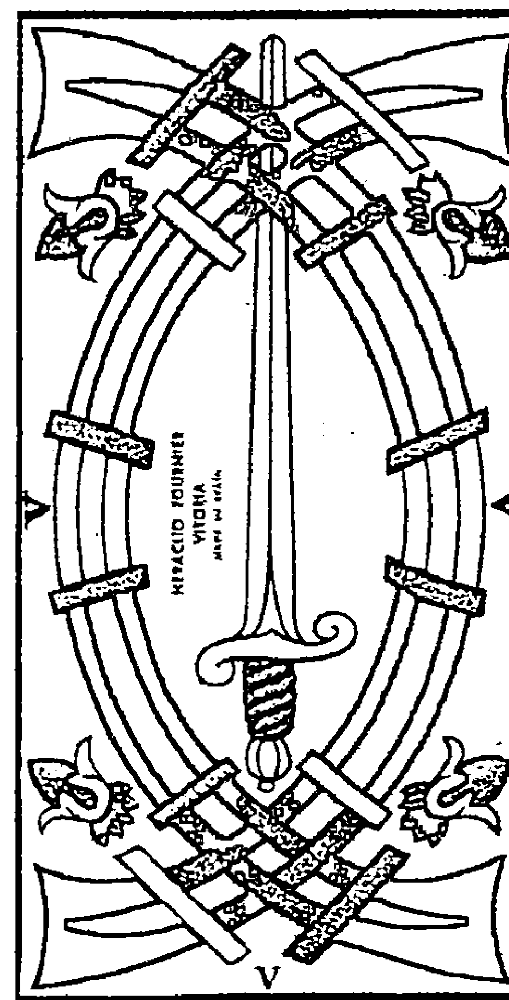

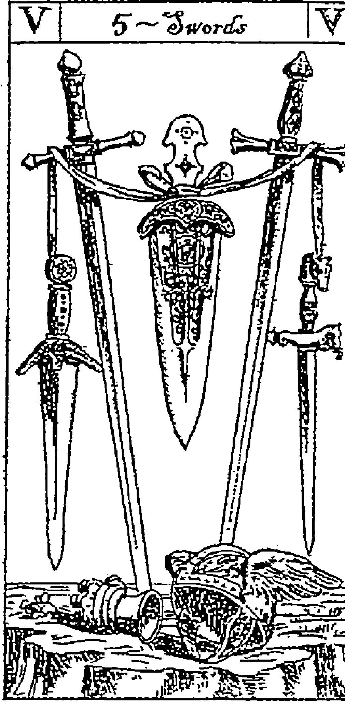

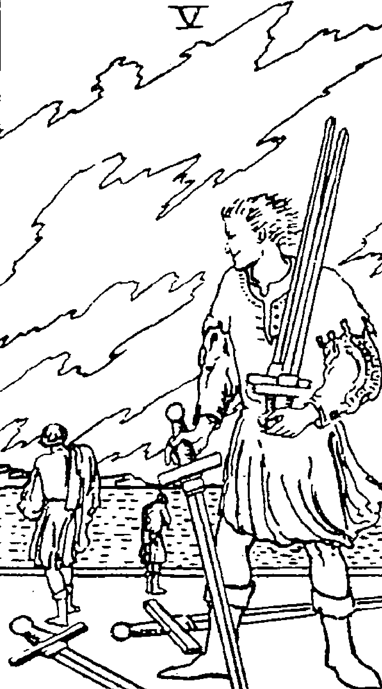

#### 幾何排列意義

五劍可以交錯成爲五芒星，也可連接成五角形，不過這樣的排列並不多見。通常是特殊的整體對稱圖形，尤會突顯出中軸的孤立：

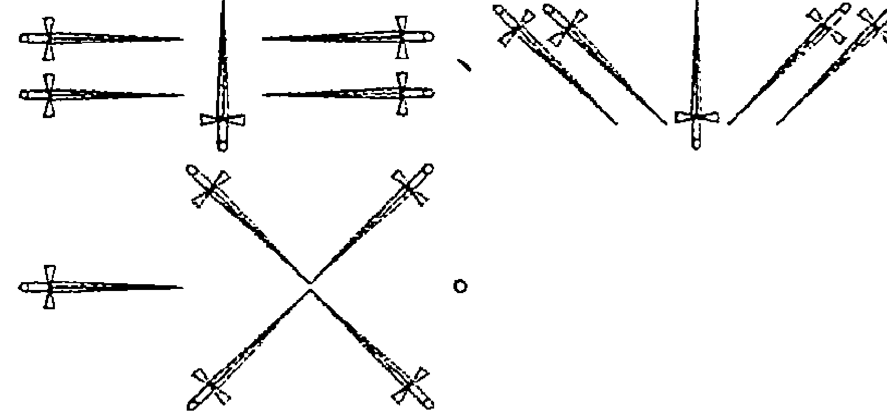

。而下圖特殊的那柄劍，居中擎肘整體局面：

#### 故事畫面安置

五把劍的排列，總會有一把較爲突出，以二分法或三分法都不能平均，無論如何都是寶劍揮動的爭鬥場合，也因此是針鋒相對的象徵。五角本易有鋒芒，與寶劍結合更見銳利，通常會有一劍脫穎而出，顯示尖銳凌厲。

寶劍五就是與紛爭、激辯和凌亂有關，當然也擺脫了沈寂而生動，算是一種腦力激盪。五劍的排列多力求特殊，像有些情節畫面中的五把劍，是類似這樣的安排：

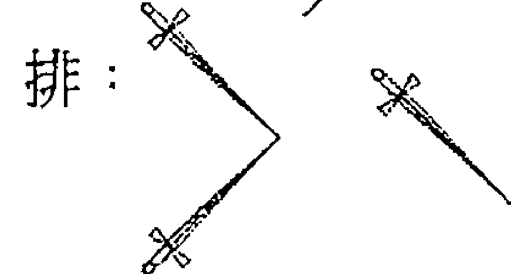

，這圖是具有以上所述的各種特性。

### 畫面故事情節

#### 情節發展

本祕儀的涵義本就較為混亂，恰如各種畫面也都不一致，人物表情是研判牌義的焦點。主旨多鎖定在：互相攻擊、分出勝敗，以及遭遇危難、挫折。

RWS 營造的是男人之間的混戰情景，以一位勝利者做為主角出現在近景，並刻劃出邪惡或詭異的笑容，呈現出一種不當的心態。多半的塔羅模擬這個爭鬥後的局勢，著重於贏的人高高在上，而輸的人在下的慘狀。更慘的變化呈現，就像在水面木筏上的生死之爭，輸的人被推到水裡，或者是懸崖邊的爭鬥，不敵的結果是摔落谷底。

有些塔羅對爭議相鬥的意念，表現得比較不那麼嚴重，改以兩人彼此間切磋琢磨，或僅止於嚇阻作用，以及驅逐趕跑對手。有的塔羅較偏重於詭異心態，對主角的刻劃較為特殊，甚至代換成女性。

有些塔羅主旨差異較大，是表達危機處理的情況。很多塔羅都以五劍插在地上配合各種情節，像是身處風雨中拔劍抵禦，或者五劍插地而主角平躺著，不然就是人被埋入地面。

少數塔羅更強調巨大的障礙和嚴重的困難，也有描繪人物被五把劍架住的，由此可知寶劍五畫面的確變化多端。

#### 附屬搭配

背景有低沈的捲雲，增添詭譎恐怖的氣氛。所處場地分隔成兩種境地，區分勝利失敗的處境遭遇落差。海面表示危險、沈浮難定。場景面海而無路，表示背水一戰，必決生死勝負，對岸或許是未來的希望或爭取的目的。

環境若是在冰天雪地之中，表示漠視冰冷的周遭。若是沙地，表示可以埋葬對手，因為原意兼有埋葬之意。

> 占卜訣竅提點
寶劍五牌義向來令人感到莫衷一是，實因代表詭譎的局勢，主旨即是「敗」字的動詞用法模擬兩可，無論勝負都能使用。其實挫折打擊的結局是兩敗俱傷，若一定要衡量勝敗為何方，可以畫面情節中的勝負角色，認定哪一方為當事人來決定。
而這甚至也是個疑義，訣竅在於小人當道，這就是一張小人牌，當道者是勝利者，被霸凌的是嘗到「失敗」的當事人！

## 寶劍六
Six of Swords

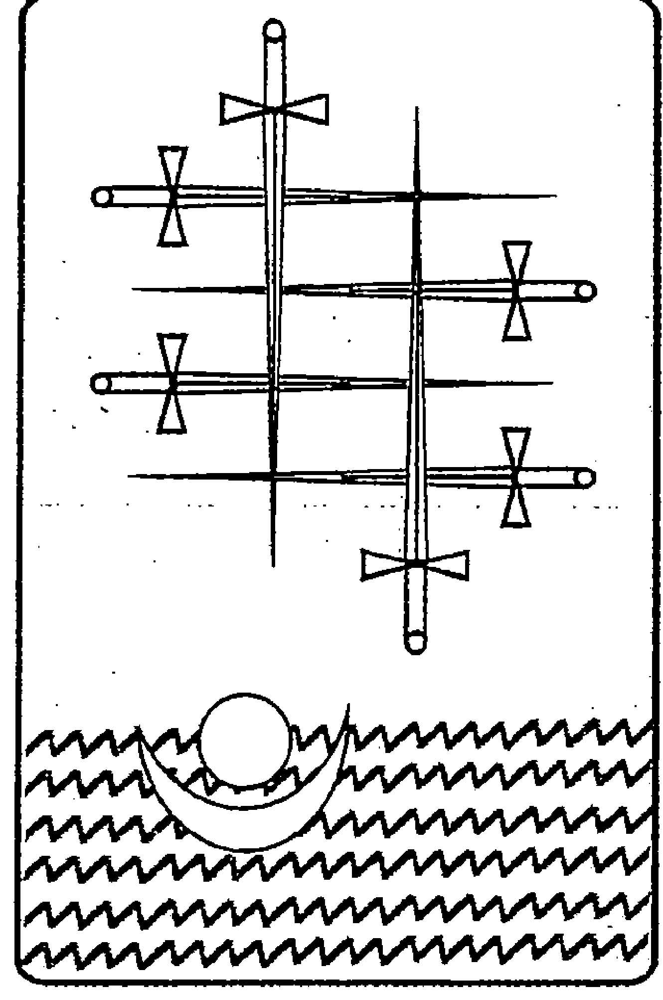

秘仪主题：
- 正 企划安排
- 逆 翻船泡汤

牌序定位：
宝剑牌组第六张数字牌，宝剑作用下半阶段开张，恢复秩序。

元素位阶：
风元素和缓均衡的状态，恒定平和的风。也可视为微风轻轻吹拂般。

### 祕儀數序定位

### 數字奧秘

六号牌与风元素宝剑的组合，正面作用是思考与沟通的顺畅与和谐，遇事能够成功解决。负面的状况则是逃避现实，迷失或走错方向。

### 祕儀主題

六柄宝剑齐聚明示着详细的思考力，发挥风元素的正面功能，整齐排列或是特殊几何图形，都象征特意的企划和安排。船只不但相关航行也相关顺流逆流，迎风逆风，这都是因应环境的策略。

### 内涵定义

正位置就是顺利和畅通之意，在旅途沟通或思绪上，或是解围脱困皆然。事务情况有如船到桥头自然直，紧凑但并不惊险。另包括出发启程、旅行、航线、路途，尤其代表水路旅行，也可以象征使者、委托运送或护送保卫等事项。

### 正位实占解释

- 人际交谊：人际圈风平浪静，沟通状况顺畅，相处上也感到轻松。
- 恋爱情缘：感情和谐，彼此能沟通，想法观念一致协调。
- 事务进行：问题能够迎刃而解，透过企划安排，更可安然度过难关，达到理想目标。也表示深谋远虑，预先安排得宜。
- 金钱物质：物品金钱的运送、传递，或是经手，也可能得到又再度流失。

### 牌義來歷變遷

#### 涵義演變

這張牌的意義一向具有爭議性，而歷來正逆位的意義好壞也都常有對調更動。最早的意義頗為單純，就代表順暢的旅途。當時逆位置的意義比較複雜，例如承受法律訴訟的不利宣判。

RWS 畫面雖然是乘船渡河，承襲了順暢旅程之意，但偉特給予的定義仍不明確，正位置成為權宜之計，這是解決疑難的一個謀劃策略。逆位置仍然複雜多變，甚至包含有宣告和表白的意義。

隱憂之類的解釋，其實是偉特之後的涵義，著墨於堅持克服困難，焦慮之後的成功，多半表示逃開或解決問題危難，局勢上和情緒上都有些許的煩惱憂慮。然而由於煉金術的意義是偏好的，這個系統也一直保持原來的純粹順暢面貌。因而如今也趨於正面意義，也逐漸摒除了解套避難的涵義。

#### 正逆轉折

寶劍六正位意義的化解問題成為重點，而逆位置意義仍為：表白、宣布，但卻是無用的提案，以及僵局成形。正位置如今以積極來理解，縱使背後有所隱憂，但頗有樂觀希望能解決。逆位置則都以較為負面的意義解釋，以「逆位負面原則」來思考推演。

#### 逆位思考

逆位置意義為事情進行的障礙，無法解決問題，難以脫逃困境。計畫和提案難以實施，也表示溝通方面的受阻和不和諧。另外還有旅途不順暢的暗示，尤其是水路旅行和親水活動都不宜。

逆位主旨結語：翻船泡湯。

### 逆位實占解釋

- 人際交誼：原本良好的關係，因為發生某些狀況而鬧翻，無風不起浪！
- 戀愛情緣：感情經不起風雨的考驗，可能因意見相左溝通不良而鬧僵。
- 事務進行：進行不順利，計畫趕不上變化，企劃失誤或方向偏差，遭遇到風浪波折而失利。
- 金錢物質：遇到難以預測的風險，評估錯誤，蒙受損失，甚至蕩然無存。

### 象徵專屬物設定

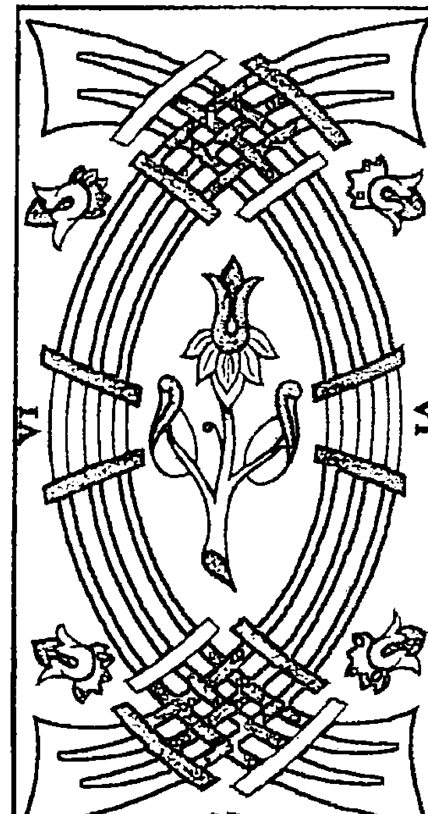

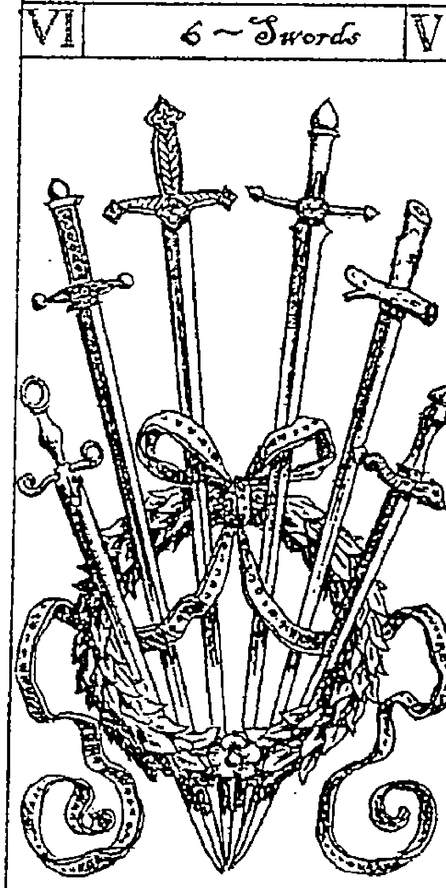

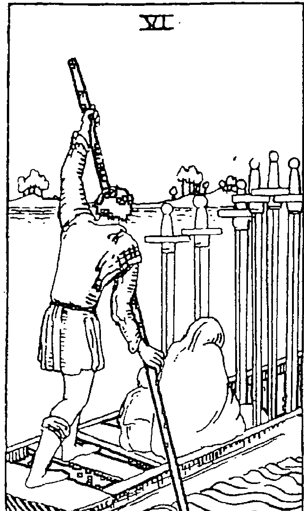

#### 幾何排列意義

六劍的基本形狀是六角形，本就象徵著設計、思維、研究，甚至學術、科技。

分成兩半直立的劍，類似雙屏而其中存在空間，像是

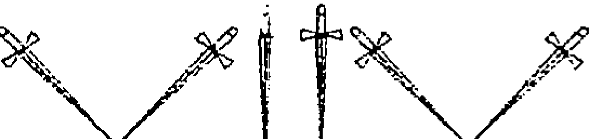

這樣的平行排列，能類比為水流波紋，或是船隻兩側的槳，與航行多有關聯性。

#### 故事畫面安置

寶劍六的排列可以很有造型，營造成特殊設計下的平衡感，例如：

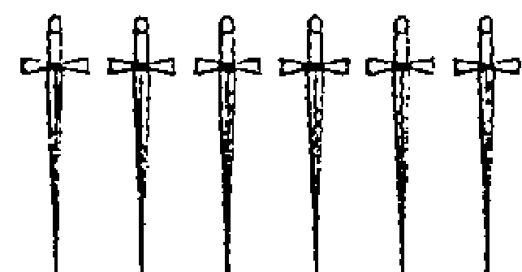

，而六把劍放置一起，並且分兩邊，而相隔的兩列，又形成了保護作用，而下圖這種整齊的設計和排列，也顯示了一種井然有序，隱喻著順暢和流通，並能象徵一種溝通，或者延伸為順水推舟。

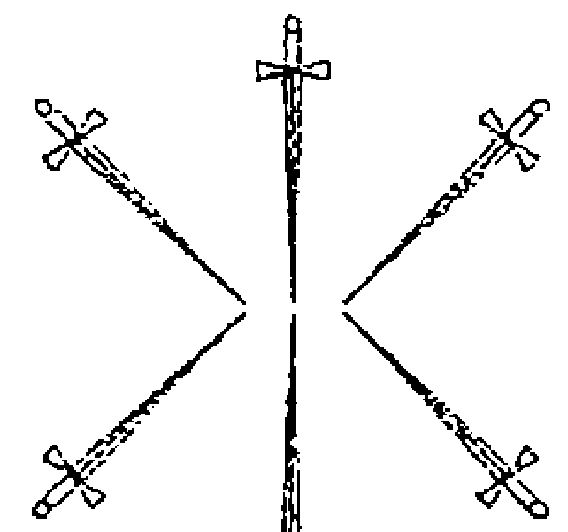

### 畫面故事情節

#### 情節發展

本祕儀涵義較為不明確，或許因為具有多重意義，畫面中呈現的情節要點會比較不明朗。大多數塔羅都是順水行舟的構圖，以渡河到彼岸的情節為主，呈現各種不同變化。

舟上的乘客多是婦女攜帶小孩，表示一種保護照顧。不可遺漏掉擺渡的人，他多半代表幫助者，以及掌握技術和資源的人。划舟前行表示有預設目的地，離開岸邊是有安排的計畫，船隻、水流都表示解決問題。插於船沿的劍，也有保護和秩序的意味。

當然，潛藏的危機和風險難免，畢竟是在水中船上，不及陸地安穩。有些塔羅更以橋上或是路途藏有劍，來表達閃避危險。有以兩艘船甚至多艘船互相照應的方式。有些塔羅則表達面臨不如預期的難題需要解決，到達河岸邊卻發現沒有船隻接應。

也有運用陸地場景的構思，人物穿梭小路而通行。畫面中還有一個要點是，透露出目標所在和引導的方向，有些塔羅會加入引路者或相關工具。另外還有很多變化，因為祕儀主題是企劃安排，可以詮釋為策劃謀略，也是一種智識與科學的象徵。而也有少數塔羅表現的是，溝通順暢與輕鬆自在的情況。

#### 附屬搭配

整體場景是在水上，是另一種通行管道。陸地在遠方彼岸，彼岸是目標也是希望，更是未來的改變提昇境界。最重要的道具自是乘載工具——船隻，是溝通交流工具，也是因應環境的工具。

划船的槳是度過危難的關鍵物，擺渡人則是度過危難的幫助者。這張牌意味著天使指路，或是引路甲蟲等，也代表心靈的指導者，洞悉方向的高等能力。

> 占卜訣竅提點
流動、過關，是本張牌的重點，看成將要遇到的危難來解，其實會失去本意的。真正暗示在於人物表情，背後有故事或玄機在，但這應是前提的事件，危難其實是在過去，而不需要想到後面會翻船，實在用不著這麼的懸疑！

## 寶劍七
Seven of Swords

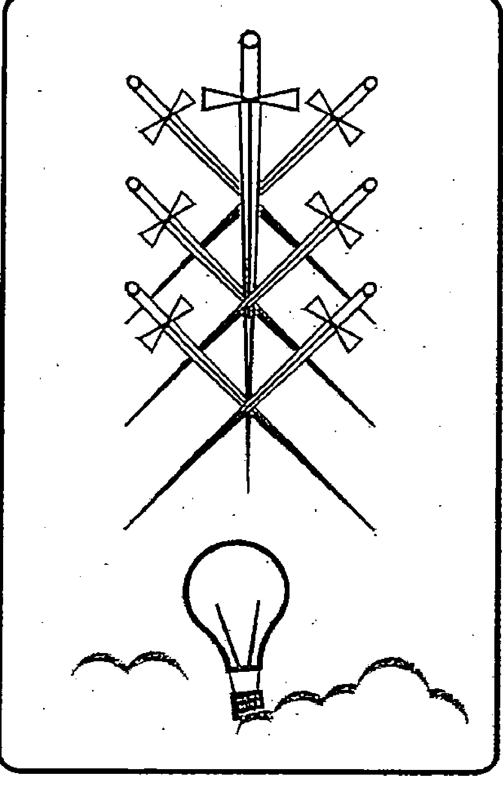

秘仪主题：
- 正 投机冒险
- 逆 铤而走险

元素位阶：
风元素的激发状态，像是一种乱流，激扰的、突发的气流。

牌序定位：
宝剑牌组第七张数字牌，宝剑作用的变异。

### 祕儀數字定位

### 數字奧秘

七号牌与风元素宝剑的组合，正面作用是突破现状，找出点子化解危机，但有时会陷入思绪纠葛，难以判断负面状况，甚至因而误触法网。本秘仪主旨定义和正位置牌义有点负面，也不失正面性。

### 祕儀主題

不是很整齐规则，却又不只是凌乱，正可谓机巧的特性，很有创意点子和特殊性，比较不符合常轨和另类的。在复杂环境实况下，采取投机取巧或冒险犯难的精神，也可能足以解决难题，甚至有更大的斩获！

### 内涵定义

正位置是内心有所企图或希望、心愿或幻想，不然就是因应环境困难和压迫，从而萌生构想，然后设计成形、采取行动，因而也具有尽力而为的坚忍毅力。不过这些构思多半是具有风险的方法，必须信心十足才能成功。只是这仅是过关或一时的成功，并非真正的成功或长久之计。

### 正位占卜解释

- 人际交谊：交友的诚意不足，群体之间互相打着盘算，暗著来些勾当。
- 恋爱情缘：感情不是很真诚坦率，有点不安分，私下有些不轨的举动。
- 事务进行：用非常手段来面对或解决问题，以投机取巧的方式达成目的。
- 金钱物质：投机方式取财，或者透过一些特殊管道而获得目标物，非正规的管道。

### 牌義來歷變遷

#### 涵義演變

這張牌在早期階段的就意義多變，包含許多好壞兼具的矛盾。正位同時代表好運也代表黑暗的人，好運如承諾富足收入，被保障後的鄉居生活。逆位置開始有忠言勸告的意義，不過這聲音可能被忽略。

到了偉特的解說，也是認為這張牌的意義很不確定。然而牌義已經以打破成規、發揮想像和創意智慧為主了。不過成功失敗都有可能，且還有爭吵和激惱。

於是後來的牌義就往這個調性發展，但稍微更動而固定了方向，為一時的或局部的成功，但仍將爭執、中傷、胡言亂語等，全分給逆位。

#### 正逆轉折

早期的逆位置意義多和言語有關，偉特也承襲這些意義：有益的忠告、進言勸告、教誨，也有毀謗或胡言亂語。偉特之後整頓了逆位置，將勸告改為不明確的建議，並有慎重的涵義。

現在的設定是，無論正逆位出發點都是一樣的，是一種打破規則的思考或舉動，根據問題和牌局而變化，正逆位的差異在於指出了成功或是失敗的結果，而逆位置解成慎重或打住的答案，則多已經排除不用了。

#### 逆位思考

寶劍七逆位置代表的是一種隨性的、越軌的思考和行徑，不為世所容。是一種胡思亂想和胡言亂語之意，會觸法網而被逮到。也是混亂紛雜的各種溝通，包括誤解和無用的勸告，爭執和互相中傷詆毀。

逆位主旨結語：鋌而走險。

### 逆位實占解釋

- 人際交誼：互相打探窺伺，心機很重、爾虞我詐、各懷鬼胎、互揭瘡疤。
- 戀愛情緣：感情上有偷雞摸狗的現象，甚至背地裡偷吃亂來，並可能被抓包。
- 事務進行：走捷徑、鑽漏洞，或者各種雞鳴狗盜的行徑。不聽勸告，容易栽跟斗，被人揭發或逮到。
- 金錢物質：可能是不當獲利或者非法所得，然而很可能偷雞不著蝕把米，得不償失。

### 象徵專屬物設定

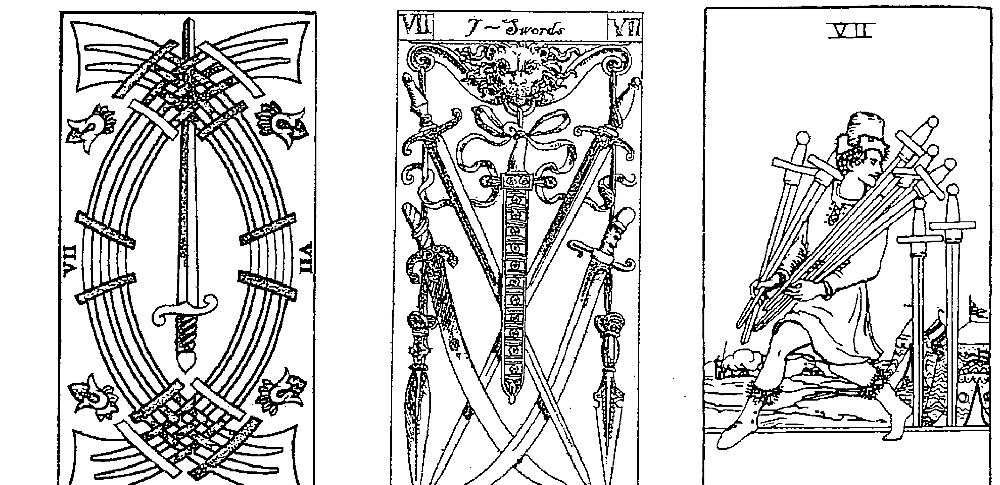

#### 幾何排列意義

七劍可參差錯落排列，也可分半排列成兩種圖案再組合，也多可能會有一把劍居於最特殊位置：[圖示]，這些圖式都能暗示在環境中周旋進而經營局勢。

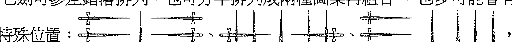

左列排法則令人感到取巧得勝。

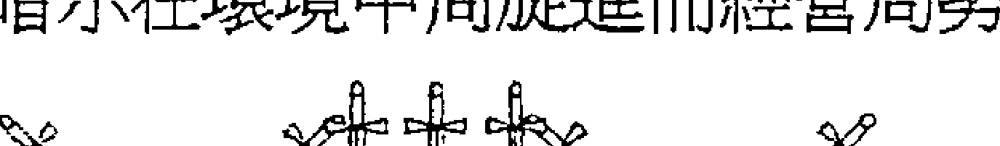

#### 故事畫面安置

七支寶劍，排列和組織較具難度，因為七角耀眼而不馴。機巧和智囊，是寶劍七劍的特色，因此七劍的排列組合，要考慮如何表達機變運用，為了這因素須尋求更多變化。

上面的圖示是將劍分成兩部分，在情節畫面上就是將幾把插在地上，另外幾把抱在手上。每一劍各有不同的功能展現，這情形表示有特殊策略，以及詭譎複雜的局勢。

### 畫面故事情節

#### 情節發展

本秘儀主題明顯，都是與投機和計謀相關，也脫離不了冒險的情況，雖因此得以有許多發揮空間，但這些意義都在一定的範圍內。

一般主角都表現出偷雞摸狗的姿態，也多出現在兩軍對壘的危急局勢中，主角可能先前潛伏在敵對陣營中探聽消息，而正從此處逃出。這號人物是一個探子或間諜，甚至是個小偷，不然也算是雞鳴狗盜之輩，這樣的風格很少以女性為代言。

主角的動作如何也相關於情節變化，並與寶劍的安排有關。多半畫出這號人物目前正在趁機脫逃，但目的是設下埋伏或陷阱，保護自己和我方。因此劍可以當做防身利器或埋伏陷阱，也可以是戰利品。

有些塔羅抱走全部的劍，一手挽住或雙手都拿劍。許多塔羅場景比較有差異：雖然一樣是潛逃，卻沒有軍營的背景，另外也有純粹是逃難脫困的畫法。有時候會畫出兩個人物看地圖計畫，更著重於策略謀劃。

寶劍七的特色就是不正面交鋒，而情勢卻比寶劍五緊急匆促。這張牌也有其他較不相關的變化主題，然而也不脫複雜多變的局勢或詭譎隱密的氣氛。至於投機還是巧計，是創意還是暗中行事，畫面情節並沒有透露出定論。

#### 附屬搭配

軍營表示強大和有備而來的敵對陣營，暗示面臨極為困難的處境，看看作者畫出多大的陣容，並且衡量距離遠近。帳棚表示配備強大，炊煙表示有人正在活動，旗幟標明所屬旗下。

從主角人物裝扮可看出身分性格、目前所處狀況。地面分野，分辨區域是在敵方還是我方。有的塔羅中有配角出現，像是狐狸等動物，表示機靈詭詐，出沒神秘。

> 占卜訣竅提點
本牌有關於聰明度，聰明度很高、甚至過高，這種過度容易造成奇巧另類，聰明反被聰明誤，因而是驚險過關，有別於寶劍六，是種冒險而不是排解。
而失不失誤也成為重點，也可當做正逆位置的分別。探聽訊息的任務，和寶劍隨從相關，可說是小小隨從！

## 寶劍八
Eight of Swords

祕儀主題：
- 正 困擾牽制
- 逆 突破困境

牌序定位：
寶劍牌組第八張數字牌，寶劍作用的集中凝聚。

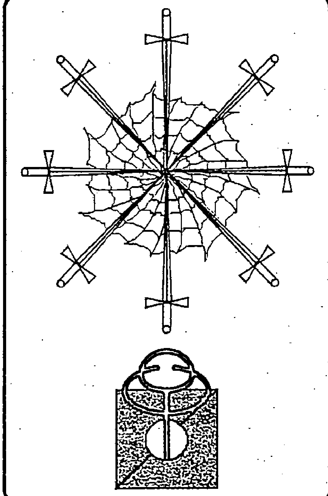

元素位階：
風元素的凝聚，旋轉或環繞，形成包圍的狀態，如同被封鎖、固著，令人動彈不得。

### 祕儀數序定位

### 數字奧祕

八號牌與風元素寶劍的組合，這是意念的膠著，使得觀念和行動受到綑綁而動彈不得。產生的正面作用是在局勢中沈穩下來，盡力一搏。

### 祕儀主題

各種塔羅的寶劍八頗為一致，都是圍繞煩惱，外在聲音內化，形成了讓人很想擺脫的情況。四面八方的圍繞產生密不透風的效果，能夠包圍住主角而成為結界困境，成為思緒相互影響，因而受到極大的牽制和干擾。

### 內涵定義

正位置的意義大都是負面的，遭遇到限制，被綑綁束縛甚至控制。這是一個人所遇到的難關和緊張對立的局面。或許是面臨責難或批判和緋聞，並形成是一種悔恨難當的心境，以及恥辱的感受。除此之外，負面的意義還包含了生病等。不過，好處是能培養出一種堅毅的力量和困境中的提昇和成長。

### 正位實占解釋

- 人際交誼：周遭的人與自己意見相左，甚至對自己不利，感到人言可畏，或是四面楚歌的局面。
- 戀愛情緣：感情路不被人諒解，而且多半與其他人際層面糾葛在一起。
- 事務進行：事務上遇到障礙和瓶頸無法突破，感到綁手綁腳難以施展。
- 金錢物質：財務上遇到困難，無法獲得更多資源，也沒有辦法周轉。

### 牌義來歷變遷

#### 涵義演變

紙牌占卜和古塔羅的牌義上，有著廣泛的意義，包括法律文件上的問題以及緋聞之類的事件。大致上涵義都是偏向挫折和限制，而且正逆位涵義並沒有相差很多，不過逆位恐爲更嚴重。

後來演變的取向是受到束縛、禁錮等限制。RWS 畫面就是這個正位置意義，像是懊惱悔恨，不願聽到的消息，處於危急和爲難的情勢當中。偉特後仍舊延續這些解釋法，正位置占卜意義幾乎全都延續而相同。

#### 正逆轉折

偉特時期和古代一樣，正逆位意義相差不多，是焦慮不安、困難、反對、背叛、預料之外的事故。偉特之後的演變，逆位置意義沒有改變多少：過往的背叛、消沈、辛勤工作，其他項目完全一樣。

而今牌義逆位置設定與正位相反，並爲更後起的狀況，相反於原本的束縛，是從中掙脫解套，離開困境的意義，因而逆位置涵義較爲正面。

#### 逆位思考

目前設定寶劍八的逆位置是一種解套：從窘迫的局面中逃離，掙開一切束縛和綑綁。不再被不好的關係所牽絆，離開或分手，對過往的背叛求償或算帳。拋開內心中的焦慮，解開思想上的疑慮。

逆位主旨結語：突破困境。

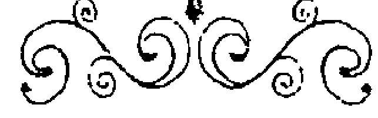

### 逆位實占解釋

- 人際交誼：踏出步伐，擺脫衆說紛紜，找到方向，走出自己的路。
- 戀愛情緣：走出感情的局限，不受對象或旁人干擾，做出自我的選擇
- 事務進行：能夠動彈、突破重圍、突破瓶頸。擺脫局限、踏出困境。
- 金錢物質：某些困境或套牢的現象開始能夠解套。

### 象徵專屬物設定

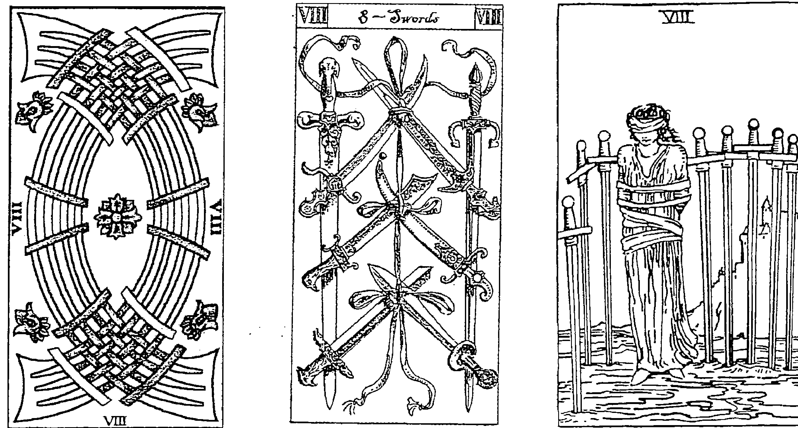

#### 幾何排列意義

八劍可以排成類似這樣的圖式：[插图：交叉的剑]，形成中心的焦點而感到受困，集中力與威脅感更強。中心焦點的營造，也是寶劍八所具的特色。

另外 [插图：平行的剑]、[插图：交叉的剑] 這些排列方式，也表示各方串連而共同圍起形成阻擋。

#### 故事畫面安置

八支寶劍，可以有多種排列法，但為顯出與他張牌不同的特色，且需集中寶劍的作用，因此必須有特殊的安排。畫面情節中的寶劍插地豎立圍成一圈，是一個很獨創的構思。這樣的排列可以產生立體感，且能讓寶劍繞住人物，形成一種藩籬，發揮八個方向的包圍力。

[插图：放射状的剑] 八劍營造了禁錮的場面，表示限制和封鎖，居於各方位的劍象徵不同方向的意見，是嚴苛而過度的壓力。

### 畫面故事情節

#### 情節發展

本秘儀主旨是表現受困的情況，遇到阻礙或難關，內心的牽制與實際的阻礙，主題比較固定而沒有爭議，也因此不同塔羅的畫面都較為一致。RWS 的構圖設計很具創意，成為經典畫面：史密斯小姐以自身為樣本，八把寶劍將主角圍繞在其中，並以繩索或繃帶將自己纏繞綑綁住。

這張牌的主角絕大多數是女性，因為男性不太容易受到威脅而驚恐屈服，比較會有反抗的力量和意志，然而女性就較有可能被制約。女子的身姿也可以透露很多訊息，雙手與雙腳的位置，所站立的境地都有豐富的涵義。

也因為史密斯小姐的構圖表現手法成功，許多塔羅都跟隨仿效。然而也有些塔羅會稍做更動，像是主角被綑綁而沒有畫出被寶劍包圍，也有的是雖被包圍卻沒有遭受綑綁或蒙眼。

縱使畫法差異較大的塔羅，也是要表達相近的涵義，主角改以雙手蒙起自己的眼睛，或是以八劍插地成為阻礙物，表示前路窒礙難行。有的塔羅相同意念的特殊表現，男女兩人一起被圍在劍中的，表現雙方緣分關係的進退維谷，是另一種變化的佳作！

#### 附屬搭配

地面上的水流，來自遠方，表示接觸他處。水也象徵潛意識，而土地象徵意識。身後的城堡，是強大的外力的靠山，也是內心渴望寓居的庇護。

有些塔羅背景的遠方綻露曙光，代表心中的希望，契機的萌生。蒙眼表示傾聽內心聲音，用身體感覺、用心靈去感應。綑綁表示身體肉身受限，動作不能自主，缺乏自由。

> 占卜訣竅提點
這張牌，本來就具有受人關注的特殊性，大概是因為可以講的心理層面很多吧，是很著重在內心戲的一張牌！然而還有更精采之處，那就是逆位的解釋了，更有戲劇感和動作感。

## 寶劍九
Nine of Swords

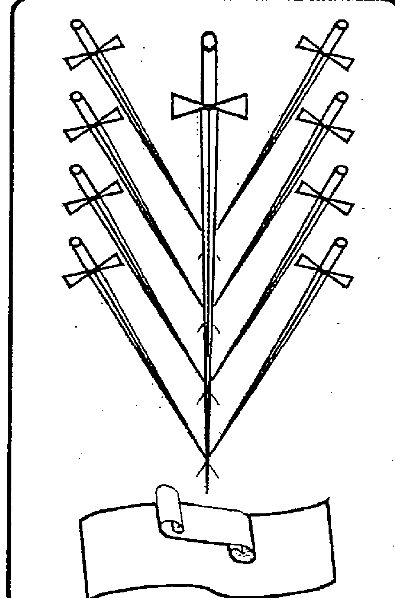

- 秘仪主题：
  正 绝望沮丧
  逆 暂避舒缓

- 元素位阶：
  风元素极大力量，成为难以承受的凄风。

- 牌序定位：
  宝剑牌组第九张数字牌，宝剑作用的极致阶段。

### 秘儀數序定位

### 數字奧秘

九号牌与风元素宝剑的组合，常态状况通常是思绪的困顿和心理的匮乏空洞，宝剑的力量充分发挥。较为正面的情况是，了解体验深刻的情绪，调整得当也可从低潮当中恢复平稳。本秘仪主旨定义和正位置牌义，采取的是负面意义。

### 秘儀主題

宝剑九都是很沉重的，重度忧郁的沮丧，失落绝望的感受。受到过去的干扰颇大，累积层叠的过往记忆，使人内心难堪、情感伤害，对未来也觉一片黑暗。刻画心情和记忆的内在描述，又具有实际面和心境的结合。

### 内涵定义

代表心理受创，形成情绪失调，悲伤落泪、叹息、忧郁失眠。目前遭遇多半是心中挂念于爱人，饱受相思之苦，甚至受到爱情的折磨，而多半带着失望沮丧。遇到挫败或遭受欺骗。

### 正位实占解释

- 人际交谊：关系相处不好，充满忧虑失意，受到欺瞒或是流言中伤。
- 恋爱情缘：为爱挂念伤心。感情层面的沉痛记忆累积，形成阴影笼罩。
- 事务进行：事情使人焦虑头疼，人事麻烦不断，感到痛心追悔，或是孤立无援。
- 金钱物质：物品失去难再寻回，或者面临经济上的苦恼，缺乏支援和帮助。

### 牌義來歷變遷

#### 涵義演變

寶劍九一直以來都是牌義不怎麼好的一張牌，至於逆位置的牌義，也一直都不怎麼樣，早是悲苦淒慘的代表牌。
尤其是偉特仍然特別強調其黑暗面，這張牌就更以傷心失落和悲情憂鬱爲主了。絕望失望自不待言，事情的失敗或失誤延遲都是小事，還有欺騙和出賣，更有甚者幾如死神牌般。此時的逆位解釋卻跟正位沒有很大分別，另包括監禁、羞恥、恐懼、懷疑和不信任。
在偉特之後的發展，仍是類似的涵義而沒有改變，正位置的占卜意義還另加上爲所愛的人擔心或流產。而逆位置的占卜意義也大致一樣，更多了些其他負面的意義，像是流言中傷之類。

#### 正逆轉折

如今的牌義走向是正位置保留原本悲傷的涵義，而逆位則能暫時從中抽離解脫。逆位置不會比正位置好太多，但也不代表完全轉向，但相較之下，不再具有那麼深度和沈浸的情緒和心境。

#### 逆位思考

逆位置的意識比較清晰，從悲情和陰鬱中暫時走出。不再被惡夢纏身。有時候表示心中有著不安和懷疑，但都是有根據的，不是妄想和誇大。另外也表示羞怯和恥辱的情緒，以及顧忌的心態。
逆位主旨結語：舒緩暫避。

### 逆位實占解釋

- 人际交誼：曾經因爲一些狀況，友誼關係緊繃，目前已稍微冰釋，或許已經能夠互相理解，但仍然未能熟絡。
- 戀愛情緣：試圖恢復溝通，餘悸猶存，情感尚未完全彌合。
- 事務進行：目前可以打起精神，暫時能撥開雲霧、揮別陰霾。
- 金錢物質：浮雲退散後清醒了些，明瞭過去財務上的疏失而有所改善，逃脫出困境的陰影。

### 象徵專屬物設定

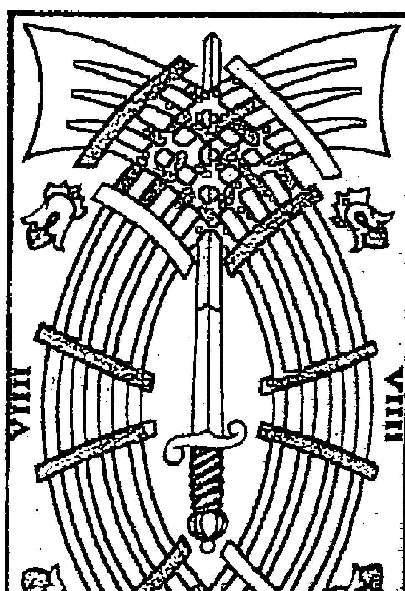

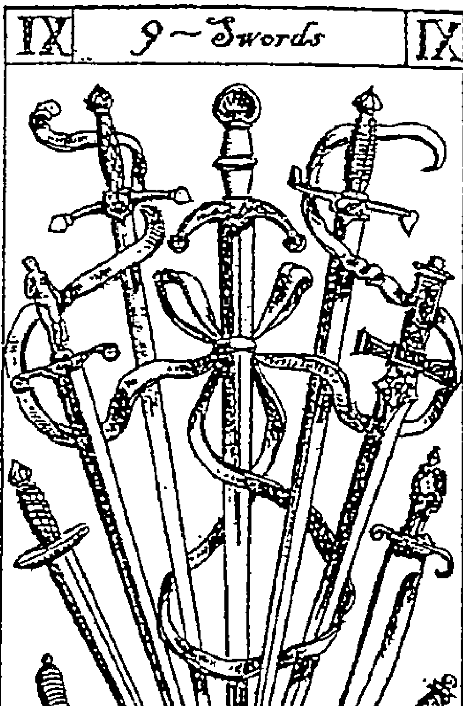

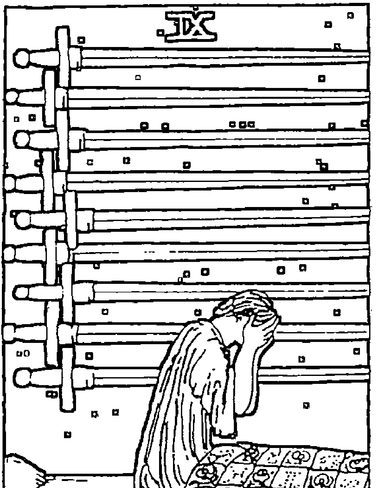

#### 幾何排列意義

九支劍幾乎已經占滿畫面，充分表達劍的思慮過度。紛亂飛舞的寶劍排列則表示心思更為混亂，不過通常仍排列得工整：

，象徵不同來源和類別的思緒，也暗示較具整理與分辨能力。

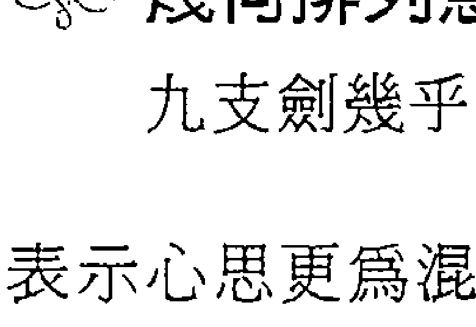

#### 故事畫面安置

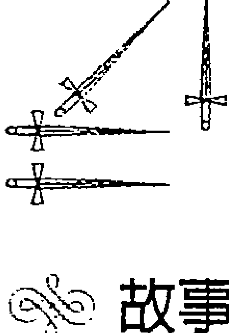

九支寶劍已是最多的一級，算是寶劍的最高作用，因此畫面多將劍直接作用到主角人物。九數需要強調力量整合而不能太凌亂，所以畫面呈現的多是九劍層層疊上，且劍尖方向皆一致。這表示每個層面都造成影響，也象徵各式悲觀負面的情緒，受到引動和刺激，包括憂慮、煩惱、悔恨等。

### 畫面故事情節

#### 情節發展

本祕儀須表現寶劍傷人的力量，而以一個人的內心憂愁為主題。畫面情節多是失眠的景象，且在夜晚裡從睡夢中驚醒，甚至起身掩面哭泣。主角人物多半是女子，較適合傳達纖細的思緒，而極少數塔羅會以男子為主角。主角多處於意識不明下的脆弱中，因過往的遭遇而驚恐懼怕，並襯以九把寶劍的犀利，表現出內心的痛苦和不堪回憶。

九把劍的表現方式很多種，多半是在主角頭上略過，但卻不在現實的空間中，也有不以睡夢和夜晚為構圖，而一樣表現沮喪和悲慘的變化。有的主角雙手被綑綁，有的主角是將九把劍全都攬在身上。

有的塔羅會表現得更激烈些，這時寶劍在構圖中是真實的存在，這表示所有的痛苦是目前當下的遭遇，而非既往或存留心中的傷痕。有些主角遇到亂劍而致落敗下跪求饒，有些是九劍同時刺向主角，甚至描繪成劍落如雨，而這些主角當然都是驚惶失措。也許因為是極致，使得有些畫面的殘酷程度，可能已經很接近於寶劍十。而且，幾乎都不出悲慘沮喪的主題，並沒有翻案的狀況出現。

#### 附屬搭配

背景為漆黑的空間，配合黑暗的心境。床板的圖案暗示這是主角的夢，也是內心的癥結和恐懼來源，推敲內容是什麼，可以知道是哪一類型的事件。

RWS 棉被上的花紋、星座占星符號，象徵所面對的繁複世界，有一些塔羅跟進仿用這個畫法。

> 占卜訣竅提點
這張牌與寶劍三必須做點區隔。主要的差異在於寶劍三有痛快之感，而且是一擊必殺，不過寶劍九卻是一種長痛，長時期的折磨煎熬，情況已經很久了，且已經深入而融合了。

## 寶劍十
Ten of Swords

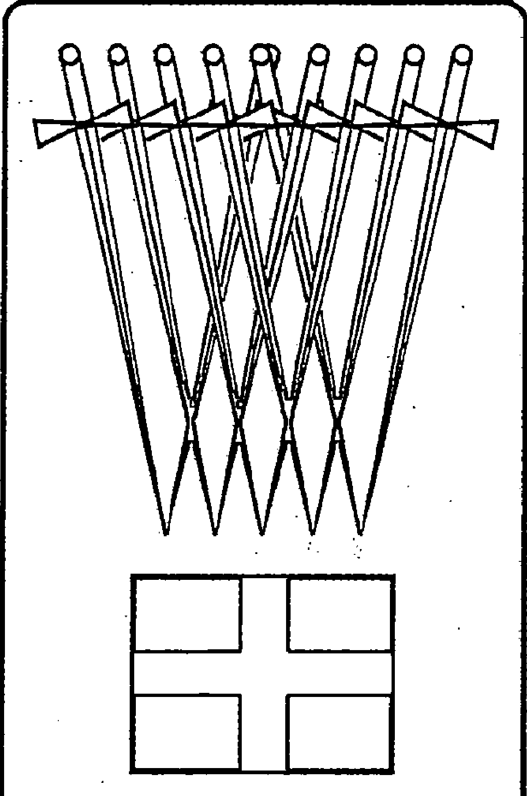

- 秘儀主題：
  正 毀滅崩潰
  逆 暗夜曙光

- 牌序定位：
  寶劍牌組第十張數字牌，寶劍作用的徹底結束和等待重生。

- 元素位階：
  風元素超級強勁的作用，強力而不絕，繼續運作下去，有如狂大暴風一般。

### 秘儀數序定位

### 數字奧秘

十號牌與風元素寶劍的組合，完全出籠的寶劍殺傷力很強，代表非常危難的狀況，這些都是很負面的。而正面情形是隱藏在未來，能夠獲得重生。

### 秘儀主題

黑暗而毀滅性，全面崩潰的格局，難以恢復的慘烈！力量集聚且具時間性，有延續的損傷，是種不留後路和餘地的狠勁。多半起因於有計畫性的刻意安排，而不是偶然的意外，是一種徹底追殺或註定的毀滅。

### 內涵定義

如今正位置仍是悲慘的代表，遭遇到極大的困難，或受到重大的打擊。殘酷的事實，不幸的事件，或是心中的絕望痛苦，受到極大的摧殘和折磨。得救或復原的可能性很渺茫，只能從精神層面解脫。

### 正位實占解釋

- 人际交誼：環境險惡莫名，受到中傷誹謗或是破壞惡搞。關係幾乎要決裂，徹底感到沮喪與失望。
- 戀愛情緣：感情關係非常糟糕，受到刻意傷害，並且難以再復原。
- 事務進行：事務上遭遇到莫大的困頓、危難和禍害，難有成功和希望。
- 金錢物質：沒有獲利的可能，無法挽回的失去，甚至一無所有，或許有破產之虞。

### 牌義來歷變遷

#### 涵義演變

最古老的牌義曾經包含實際、合理，而從較早期的說法，這張牌的就是以不幸與困難的涵義居多。至於逆位置卻捉摸不定，有時候是獲利的，然而有時候逆位卻比較慘。

後來這張牌顯示的意義，可說是跌到谷底了，幾乎是數字牌中最慘的一張。偉特定義在猛烈死亡之外，還有痛苦、折磨、撕裂、悲哀、淒慘。而這種意義是分派給正位置，也因此逆位會讓人感覺有一線轉機，這樣也能有別於正位置，甚至反而是能夠一時獲利和有力的現象。

偉特後的牌義，則和以往是一樣的涵義，更是毀滅、不幸、失望。而此時逆位置的意義，則是即將受惠或取得利益、改善情況、暫時的擁有、剎時的成功、瞬間的優勢。

#### 正逆轉折

演化到今日，逆位的說明多半是暫時性的回復，並不是永續和長久的利益，有關真正獲利的解釋不再被提起。無論如何都是轉機的意義了，發揮了逆位轉折的用法，以逆位轉向原則來推演即可。

#### 逆位思考

逆位置是基於正位置的遭遇景況，而可能稍有轉機，也算是並沒有直接到最慘的境地，或許會有一些較好的轉變，但可能只是短暫或臨時的現象，不能保證長久持續生效，更難以全然復原。

逆位主旨結語：暗夜曙光。

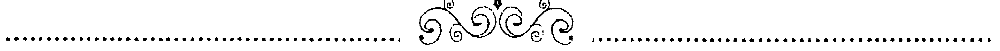

### 逆位實占解釋

- 人际交誼：不必要的補償，無用的彌補與挽回，希望終究能扭轉局勢。
- 戀愛情緣：破滅的感情後等待奇蹟發生，期待不可能的轉機或救贖。
- 事務進行：原本已經無望的事情，最終出現轉機的曙光，起死回生。走到無路可走，退無可退，終於殺出一條血路、逆轉勝。
- 金錢物質：財務上的重大危機，終於有救了，具有一絲希望可挽回！

### 象徵專屬物設定

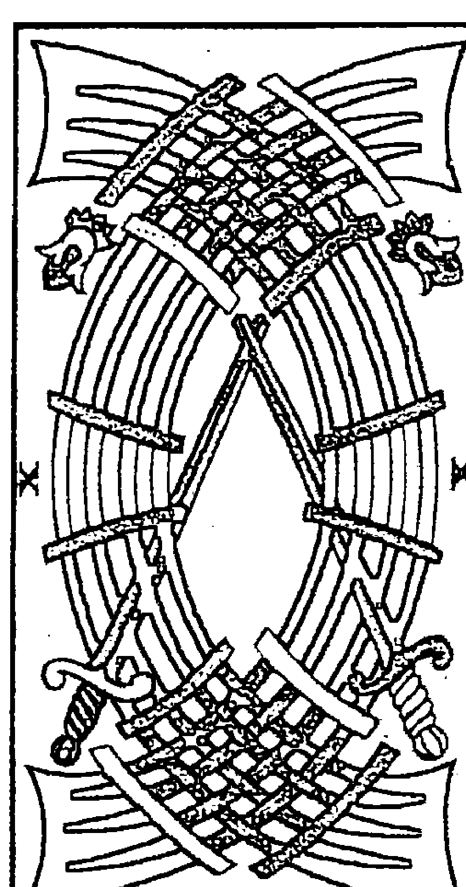

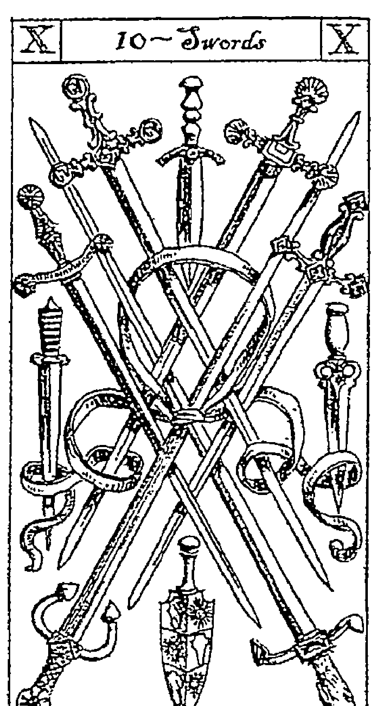

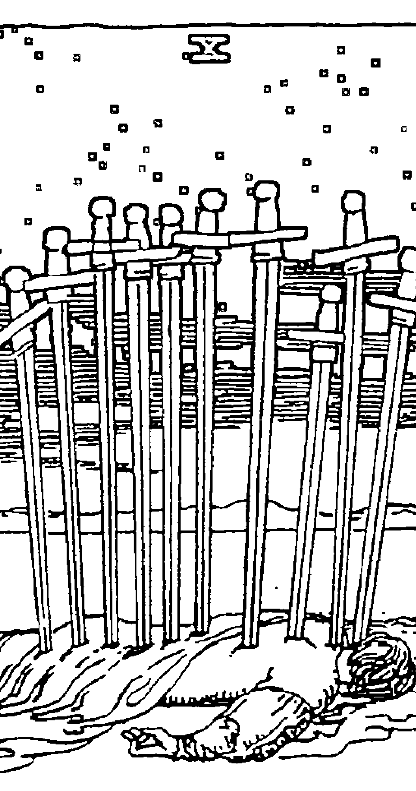

#### 幾何排列意義

十劍一定會呈現充斥畫面的感覺，讓人感到驚恐氣息。若求有所變化，多會以分組方式排列：

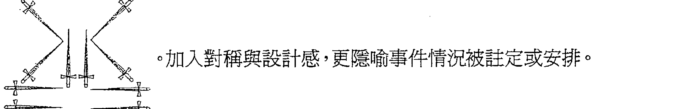

。加入對稱與設計感，更隱喻事件情況被註定或安排。

#### 故事畫面安置

十劍，是寶劍極致殺傷力再更加強的涵義，讓人感到滴水不漏，嚴加追殺。而十表示全部象徵物合而為一的整體結合感，因此十劍須集合成組，形狀不須太花俏，只要整齊劃一的排列，就能感到力量強大而震撼。也由於一致感多是人為所造成，更能感到刻意安排的可怕。

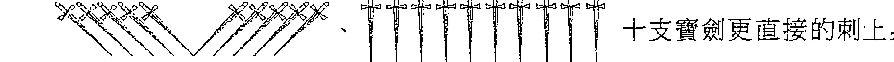

十支寶劍更直接的刺上身去，實質傷害到了主角，危及了許多層面，完全表達了毀滅的涵義以及寶劍招致厄運的作用。

### 畫面故事情節

#### 情節發展

本祕儀須描繪出寶劍的極度威力，遭受此一力量的悲慘狀況。眾所周知的畫面是，主角已經倒在地上，被寶劍所刺傷，而且因為是十把，傷害非常嚴重而徹底。這位被劍所傷的人多半是男性，也是避免傷害女性的殘忍畫面。
這位被害人倒在地上，但仔細觀察發現他的手捏了神訣，暗示他心中期待能夠得到拯救。很多塔羅會跟隨這樣的畫法，可以注意這一點。
各種受傷和倒地方式，目的在表現嚴重打擊和摧毀，可以是臥倒或趴倒以及其他姿勢，甚至可以沒有昏厥，而神色痛苦或流淚悲泣。其他的情節變化只是更動了場景，仍是要表現悲慘絕境。
有的塔羅會畫出施以十劍的迫害者，甚至主角還被踐踏，或是出事倒地之後被尋獲的。有些塔羅的構圖比較非現實，以抽象或幻想的方式來表達，同樣是慘狀，卻比較不會那麼直接：如針的劍紛紛扎在臉上，或是十把劍為精靈所持而刺向主角。
有些塔羅改變了悲慘境遇，因為劍十也能以元素形態來呈現，這反而比寶劍九有更動的空間。例如畫面就沒有被刺的人物，而十把劍聚集在同一點上。甚至反而是排除十劍的危害。

#### 附屬搭配

被劍刺的部位，表示受傷之處何在，以及該處功能有毀損。彼岸的意義是救贖，以及原本的願望殘念。黑暗之下透露出光芒，表示絕望時豁然開朗的心境。遠方的曙光，是未來新的希望和期待，只不知是慰藉還是諷刺！

> 占卜訣竅提點
寶劍十統合全部寶劍牌的各種毀滅狀況，表示傷害仍會持續的，嚴重在於後續的毀滅性，是有所後患的傷害，日後很難復原，並且可能遭遇有計畫的追殺，這張牌算是較大格局的數字牌。

## 金幣二
Two of Pentacles

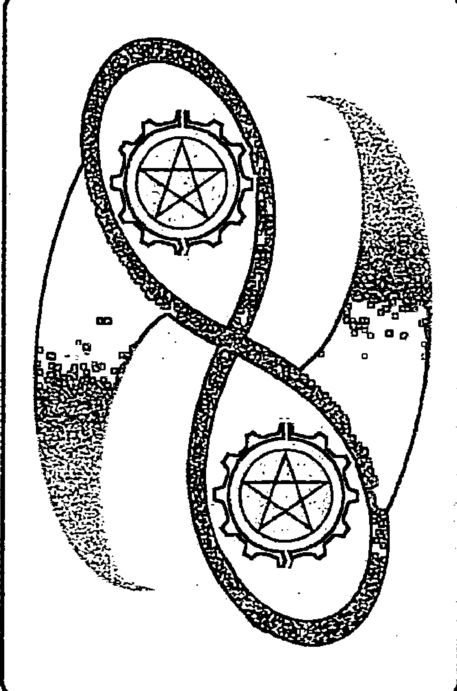

- 祕儀主題：
  正 協調轉化
  逆 週轉不靈

- 牌序定位：
  金幣牌組第二張數字牌，金幣作用的流通周轉。

- 元素位階：
  土元素的運轉，這種形式與這個元素很難搭配，因而掌握度不高。

### 祕儀數序定位

### 數字奧祕

二號牌與土元素金幣的組合，正面作用是經濟方面的調度和協調，交流合作，然而負面的狀況則是失誤而差池，運作不協調，關係或合作不利。本祕儀主旨定義和正位置牌義，仍然可算是正面作用意義。

### 祕儀主題

金幣交換旋轉，互相輪流替換，是變化莫測的循環現象，因而也可包羅萬象，任何變換和循環，生生不息的現象，都包含在這個象徵之中，並且也延伸為化解問題、解決和調整。

### 內涵定義

正位置定義為健康樂觀的心境去處理周遭的事，以超脫的意志操控物質，而不是被牽制。環境各方面可能有改變或運勢起伏，但能夠保持靈活和彈性來因應，無論是對經濟狀況或是對人際關係。縱使愛情受到阻撓，仍能從中獲得快樂。

### 正位實占解釋

- 人际交誼：人際交流活絡，利益往來、互通不成問題，卻不夠熟稔或深交。
- 戀愛情緣：以愉快輕鬆的心情面對伴侶或追求對象，需要更深入用心。
- 事務進行：事情需要不斷協調，忙碌而驚險，偶爾有起伏，嘗試執行新的計畫。
- 金錢物質：金錢物質的周轉和流通、交換，或者是經手，可能從中獲取利益。

### 牌義來歷變遷

#### 涵義演變

這是正逆位意義最為接近的一張牌，而且定義也都很浮動不定，正面或負面的傾向也不明顯。恰好這張牌的主要意義就跟改變、起伏有關，所以也就捉摸不定了。然而自古以來的本意上，正位置本還是正面些，逆位置則不太好。

偉特也在牌義上認定了快樂和娛樂的涵義，另外還有障礙、起伏、煩惱、混亂。而逆位特別包含了文字和寫作、勉強的歡顏、假裝的愉悅。正逆都好壞意義摻雜。

偉特牌 RWS 的畫面沒有解決這個問題，反而造成更多混淆。偉特稍後牌義被這影響，正位置開始與以往不太一樣，困境、難堪，新的麻煩或執行新計畫時的困難，這其實和偉特設定並不符合。然而經過單純化後的定義，以及煉金術體系，皆以和諧的改變為主軸，面對環境的起伏，保持愉快的心境，而逆位置就接收了憂慮和事態嚴重的意義。

#### 正逆轉折

金幣二的牌義應該修正回來，正位置定調以愉快輕鬆的心情，但是可能需要應付變動的環境。雖然有時會有點窘迫，然而真正有問題的狀況要放到逆位置去。逆位置在情緒上原本就傾向負面，其他也一樣看成正位置的各項反義，這可說是以「逆位負面原則」或「相反原則」推演而得。

#### 逆位思考

逆位置表示對目前的狀況束手無策，或者事態變得嚴重，讓你應接不暇、手忙腳亂。身邊潛藏著微妙關係，必須透過手腕甚至花招來應付，但多半比較難圓滿解決。最明顯的情況是，類似周轉失靈的現象產生，擔憂的情緒油然而生，現實面確有許多問題存在。

逆位主旨結語：週轉不靈。

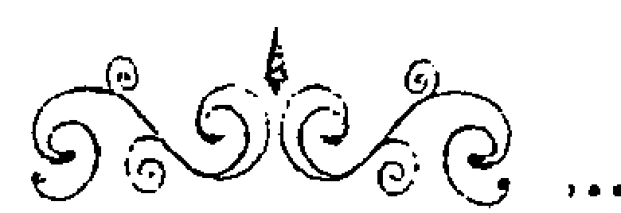

### 逆位實占解釋

- 人际交誼：多方兼顧之下應接不暇，不夠周全妥善，反而出差錯得罪人。
- 戀愛情緣：耐心不足或不夠專一，因分身乏術，導致關係出問題。
- 事務進行：心情低落、緊湊匆促、粗心大意不專注、應付不來而失控。
- 金錢物質：週轉不靈、調度不及，在某環節上卡住，導致財務可能崩盤。

### 象徵專屬物設定

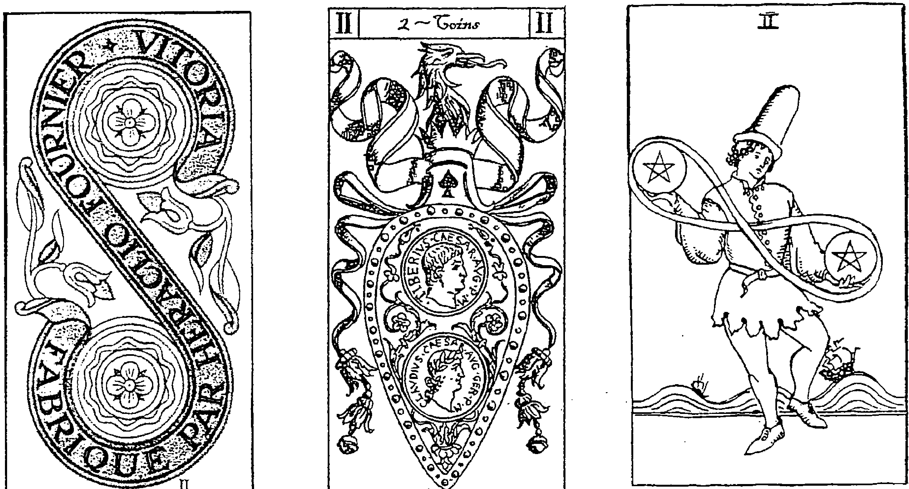

#### 幾何排列意義

雙幣平行放置：⊕⊕、⊕ ⊕，也可代表雙輪，運轉快速，方向一致。
另外也可有上下高低的排列方式：⊕
⊕，這樣可表示運轉更為強烈，具有變動起伏的特質，甚至暗示轉動方向的差異性！

#### 故事畫面安置

兩枚金幣排列不出具體形狀，只能連成一直線和方向，因此重點在於兩枚金幣的關係。由於是圓的形狀，兩枚金幣給人兩相互繞的感覺。
⊕ ⊕
或是 ⊕
⊕，這也成為設計的重點，因此連幾何圖形的畫面表現都有互相旋繞，以及飾帶串連的表現方式。可知意義不離周轉、交流、傳達等方面。
雙幣圓盤既然有如運轉的兩個輪子，通常在畫面中有不可或缺的附加圖案，可以說是兩輪之間的鏈帶，不能忽略兩圓之間總有此物做為連結。這慣例起始於傳統塔羅上的飾帶，演化到後來成為「循環雙紐帶」的圖形，也就是無限大符號「∞」。

### 畫面故事情節

#### 情節發展

本祕儀主旨特別，涵義又很豐富，所以畫面所傳達的涵義較難揣摩。通常都有一個男人爲主角，像是在雜耍般的轉動著兩枚金幣。兩枚金幣剛好能夠左右移動，多以雙手操作互繞旋轉。

主角通常擺出特殊的姿勢，甚至還身處於搖晃的甲板上，讓人感到會很累甚至疲於奔命。這個奇特的動作，用以象徵許多不同的涵義：財務的周轉、事務的協調、危機的轉化，甚至包括娛樂表演等。

從人物的扮相，可以了解他與這兩枚金幣的關係，以及所扮演的角色。轉動金幣的動作方式或是紐帶，都能據以增添許多變化和創意：一個人加上自己的影子一起操作金幣，或是小丑的左右兩側服裝衣著相反，或者是主角戴著面具隱藏真面目。這都是要更增添雙重性，表示左右逢源或兩面討好。

另外還有更爲特殊的轉化，有些塔羅將金幣和紐帶分開，分別安排在畫面的不同地方出現，也不以轉動金幣爲主要姿勢，將金幣二的特殊神秘力量用其他方式展現出來。甚至有的塔羅更動了人物：將主角改爲女性，或是改爲兩人一起操弄或交換金幣，也增添更多的意義。

#### 附屬搭配

若場景有船隻和海浪，是爲了烘托波濤起伏洶湧，象徵人生的擺盪不安。場景也可暗分兩種領域，表示兩面忙碌奔波。

神奇紐帶與無限大符號，圍繞在兩枚金幣之外，連結兩枚金幣，這創意來源是古塔羅金幣二裝飾的變形。用以表示運作當中呈現的能量，能夠引動無限潛能。這個符號也有獨立在外的表現模式，像魔法師牌的畫法，甚至更神奇的光芒或磁場呈現。

> 占卜訣竅提點
二號牌的牌義好像被後人弄成曖昧不明，金幣二也是這樣，然而二號牌其實都是很明確的，金幣二雖然好壞強烈度不高，但仍有主要方向，而且周轉調度爲重點，副主題愉快和娛樂也可參考不容忽略，這樣就能掌握這張牌的要義了！金幣二甚至可比擬大祕儀的節制來理解！

## 金幣三
Three of Pentacles

秘儀主題：
正 專業技能
逆 摩擦失序

牌序定位：
金幣牌組第三張數字牌，金幣作用的精緻深入。

元素位階：
土元素的精緻調配，因此具有高價值和質感。

### 秘儀數序定位

### 數字奧秘

三號牌與土元素金幣的組合，正面作用是在實際面，如專業和工作上合夥共事，團隊進行、齊心致力。負面的狀況則是意見紛歧、人多手雜，或者群龍無首、莫衷一是。因而運作失誤，或者造成摩擦而誤事。

### 秘儀主題

固定的金幣象徵穩紮穩打的方式，有如品質保證的口碑，事業經營的成果。高檔技術和高品質，專業技術能力，也代表專注專心，凝聚精神力量。彼此合作無間，完成任務使命。

### 內涵定義

正位置主要談的是工作以及由此發展的各層面，首先是報酬方面，名聲口碑或實質利益的回收。與工作相關的還有合作、分工，以及接洽、行銷等方面。跟工作技能相關的，還有才能與學習等事宜。

### 正位實占解釋

- 人際交誼：小團體或利益共同體，成員間關係密切，不注重廣泛的人脈交誼。
- 戀愛情緣：透過工作使得感情結合度更高了，不像一般的浪漫，卻也是別有滋味。
- 事務進行：運用專業技能，或以分工合作方式完成事務。業務或案子接洽成功。
- 金錢物質：獲得有價值的報酬或應得的薪資，以及額外的獎賞。可能得到至寶或藝術品。

### 牌義來歷變遷

#### 涵義演變

這張牌的意義爭議較多，有著許多混雜和分歧，層面也包羅甚廣，不只在金錢財務方面。
偉特統合了財務和其他層面，成爲工作技能和名利報償的意義。而逆位這時也根據正位置而確立爲匱乏或挫折，而煉金術系統的設定，和偉特也幾乎如出一轍，主題就是工作。
往後的牌義演進，就更加純粹化了，不相關的層面像是貴族或聯姻等項目，就逐漸剔除了，成爲尊嚴、名聲，可呼應於工作專業上，更強調極強的商業或工作技能、優異、完美，以及美術才能。

#### 正逆轉折

正位置鎖定在事業、工作、專業、技術和能力上，逆位置的內容範圍也都是這幾個相同的項目，而皆以不順和低落的情況論之。並且逆位置還特別強調財務上的問題，雖然正位置是鎖定工作而並沒有特別提到財務。另外在性格方面特質爲情感脆弱、低EQ。

#### 逆位思考

金幣三逆位置是從正位置意義以「逆位不當原則」推演出來，代表工作進行不順暢，成果並不理想，這也會影響到報酬和聲譽口碑的問題，而有時候是報償或財務上本身出狀況。當然，合作或洽商的問題也有可能。對自身而言，技能方面的不足或才華平庸，或是學習不力。
逆位主旨結語：摩擦失序。

### 逆位實占解釋

- 人際交誼：群體之間相處上，協調不良，節奏不合拍，產生嫌隙摩擦。
- 戀愛情緣：感情上因實際面的意見不合，產生不滿、怨懟或懷恨。
- 事務進行：太緊湊匆促，趕工忽略品質，安逸而延宕正事。團隊失和，配合度不佳，事務難以進行。
- 金錢物質：因工作上的問題，喪失工作或機會本身。沒有得到應得的利潤和報償。

### 象徵專屬物設定

#### 幾何排列意義

三枚金幣的排列，可以連成一直線，無論是縱向或橫向的排列，然而這些都是最沒有特色的：☆☆☆。只要不排成直線，三枚金幣就會呈現出三角形，並且更時常排成等邊或對稱的三角形。如果是倒立的三角形：☆☆☆ 就暗示微妙複雜的相互供應關係。

#### 故事畫面安置

金幣三最有可能的是排列成三角形，這樣的平面排列，就能形成堆積的感覺了：☆☆☆ 這種形狀顯示並非獨力奮鬥，也不只雙方合作，而是多方協力、互相扶持相拱的感覺。如果緊密相鄰支撐著，更表示團結，象徵與同心合作。金幣本來就常類同於五芒星，五角形配合三角形，會有很多種圖形因應而生，構成豐富的幾何呈現，可以表達很多設計上的涵義：也能以此暗示特殊技能、專業的工作、精工，以及幾何等。

### 畫面故事情節

#### 情節發展

本祕儀表現金幣的精緻作用，不脫離實際而又兼具美學，不是只有金錢的價值。於是畫面通常都強調金幣位置的變化，再來才是人物特徵。這張牌的構圖多以金幣配合場景，營造出更多意義變化。

三枚金幣在上，是眾人齊心努力的精神目標。金幣如果鑲在牆上，表示努力得成就和名譽。是不是位於教堂內，則與精神奉獻相關。通常畫面都會出現不止一個人物，共同進行某項工作任務，這具有團隊工作的涵義。而從人物裝扮可看出在這項任務中擔任的角色，三個人物各執其事，則暗示了專業技能。

RWS 畫面的角色有工匠師傅、建築設計師以及教堂人員，表示各方的協調。當然，人物數量會有所改變，有些塔羅以單一主角獨力完成工作，但專業的涵義仍須保留，像是一人手執設計圖或進行工作。

很多塔羅著重於工作型態的變化，可以直接描繪一般工藝的創作製造，也可以展現對金幣的掌握技巧，甚至更為複雜龐大的設計工作，金幣成為運轉機輪。這張牌也具有才華的意義，有一些塔羅據此而將畫面做一些更動，構思成其他對才藝的表現有意義的情節畫面，甚至描繪一場舞台登場表演，金幣轉化成了聚光燈。

#### 附屬搭配

工作器具根據工作性質而定，代表謀生技能和工具。設計圖是才藝、智慧結晶，是計畫規劃與精心設計。

畫面中多要呈現設計，並增添空間營造感。建築並以幾何圖形突顯出設計感和古典風格。教堂建築花紋雕刻，其他裝飾的配合，可看出這張牌的定位。玫瑰等圖式符號，表示其中有秘密契機存在。

> 占卜訣竅提點
金幣三與環境的結合度高，是高技能表現之外，也是一種提昇，超越物質層面的代價和成果。另外，無論怎樣定義，在工作層面上，總是和金幣八分清楚差異。

## 金幣四
Four of Pentacles

秘儀主題：
正 掌控固守
逆 顧此失彼

牌序定位：
金幣牌組第四張數字牌，金幣作用的穩定。

元素位階：
土元素的強力凝聚，穩定的局面。

### 祕儀數序定位

### 數字奧秘

四號牌與土元素金幣的組合，正面作用是守住金幣，財務穩固安定而有保障。負面的狀況則是過於執著固守，財務沒有進展和流通。本祕儀主旨定義和正位置牌義就呈現出兩面作用了。

### 祕儀主題

這是財務的某種狀態，事務的某種最堅固階段，保守傳統的特質，更加穩定甚至牢不可破。或許感到在方法上不知變通，而且也容易錯過良機，卻也相對的呈現安穩固定。

### 內涵定義

正位置描述的財務狀況是穩固安定，金錢物質的囤積，不是流通的經濟狀況。然而，卻也有著心態上吝嗇的意味，也可由此推測人際上和情感上的封閉或不討喜，關係上比較枯燥。

### 正位實占解釋

- 人際交誼：人緣上很不討喜，由於吝嗇和斤斤計較而欠缺人緣。
- 戀愛情緣：感情更嫌枯燥，掌控慾更強，相處上感到枯燥乏味。
- 事務進行：處理方式固執保守，能按部就班並維持穩定，然而缺乏創新和變化。
- 金錢物質：資產保固良好，妥善收藏或囤積物品，守財節流嚴密，財務非常穩固。

### 牌義來歷變遷

#### 涵義演變

這張牌在早期和現在的意義不完全一致，古代的解釋，就財務而言好壞也不一定，正逆位的意義相差不大，好壞程度也不會很絕對。

直到偉特統整後，就定義很清楚而不再跟從前一樣了，正位置意義為，堅守擁有的物品，所有權的擔保、遺贈、繼承。逆位置意義為：延遲耽擱、擔心、對立。煉金術系統和偉特，都將這張牌視為擁有力量，元素和數字變化的特點，就是極度的「安穩」。

偉特稍後時期，金幣四就鎖定了財務穩定相關的意義——對物質財富的喜愛，且更著重於囤積，而延伸為這樣的特性——吝嗇成性，無法與人分享。

#### 正逆轉折

各時期金幣四的逆位置也都基於正位置加以轉化，一直以來都是如此。物質事務方面設定為挫敗，抗拒進一步獲得，疑慮和耽誤、揮霍無度的人。原本的守財卻成了漏財或揮霍，或者因固守而失去更多。總之，金幣四逆位置造成的結局是損失或者得不償失。

#### 逆位思考

逆位置自然是原本狀況的改變，以「不當原則」或「相反原則」來設定，推演出失去穩固的狀況，變成財務動搖不穩定，甚至損失挫敗。也有可能是財貨原封不動，但卻貶值或淪為無用失效。

逆位主旨結語：顧此失彼。

### 逆位實占解釋

- 人際交誼：或許由於自身過於吝嗇，人際上不受歡迎，遭到唾棄嫌棄。
- 戀愛情緣：感情僵化，極力控制關係，卻處理過當而導致破局。
- 事務進行：墨守成規或食古不化，或因後顧之憂而導致事情失敗。
- 金錢物質：在理財方面，過於保守固執，不知變通，反而招致損失。

### 象徵專屬物設定

#### 幾何排列意義

金幣四的方形排列：[图标] 可明顯感覺到極為穩固！

[图标] 這個排列的涵義，類似於前述的垂直排列法。

#### 故事畫面安置

四枚金幣，能排成一個方形，給人的感覺就是固若金湯，這樣的堅固方形，就象徵著固守，甚至是吝嗇節儉守財。
然而四的排列，通常會在穩定中求變化，因此四枚金幣不一定只排成方形或一直線。
在故事情節畫面中，尤其會添加變化如下圖，這樣縱橫兩方向垂直排列，也能涵蓋二度空間平面，並且表示儲蓄有方法，也不乏理財技巧或規則。

### 畫面故事情節

#### 情節發展

本秘儀主旨極為明確而固定，就像牌義也是穩定的意思，因此連畫面更動也不會相差太遠。財務的穩定需要節流儲存，多半以守財奴般的金主當主角人物。通常會畫出一個男人抱緊著錢，露出吝嗇的表情。

然而從另外的角度來說，這也是一種堅強的意志力和凝聚力。並隱含有金幣與身體結合的感覺！這種坐擁金幣的動作讓人印象深刻，許多塔羅都會據以變化。這個男人有各種造型，以及各種類似的動作：四枚金幣全都抱在身上，雙腳各踩住一枚金幣而雙手高舉各抓住一枚金幣，躺在金幣之上，也有不接觸金幣的，用心去掌握而不著形跡。

當然，也不乏刻劃女人愛錢的情節，女人抱錢緊緊不放，正在採集金錢，或者單純是心裡對於金幣的擁有而感到喜悅。

這張牌也頗重視主角所處的場合，居於室外室內的差異，在於心態與實際上的封閉程度，室內的布景刻劃通常也是心境的寫照。

比較大的變化是增添其他人物，這就一改封閉的形象，情節也會有較多差異。富商與人協商生意，用金幣的排列位置暗示分文必爭的性格。仍然相同的特色是財力雄厚的財閥意味。

#### 附屬搭配

主角坐鎮的姿態，必須要有椅子，且多是堅固的石椅。由人物裝扮可以看出他的身分地位。頂上的帽子更暗示主角自認的階層。

若有房間，是主角的小環境，生活和心境寫照。房間的門窗，是與外界聯絡的管道。背景若看到城鎮，是主角的大環境，看出主角的金錢流通領域和社會面。

> 占卜訣竅提點
這張牌義好像很固定，似乎也是眾所皆知，而大致都相同，但多半對主角懷有不好的印象，其實也是有他的好處的。只要注意逆位置的變化，這張牌就沒問題了。

## 金幣五
Five of Pentacles

秘儀主題：
正 耗損患難
逆 熬過難關

牌序定位：
金幣牌組第五張數字牌，金幣作用中段的轉折變化。

元素位階：
土元素的不和諧狀態，造成崩塌離析的現象，無法安然保有。

### 秘儀數序定位

### 數字奧秘

五號牌與土元素金幣的組合，負面的狀況則是漏財，失去金錢和物資，財務狀況混亂。正面作用是重整生活和經濟狀況。本秘儀主旨定義和正位置牌義，採取的是負面作用意義。

### 秘儀主題

金幣五代表金錢財務損失，危機、危難、折損、困難、憂患，以及後續的事情——顛沛流離。金幣的穩定中，帶著隱藏的轉折和變動意味，可望而不可及的金碧輝煌，是患難損耗的對比和諷刺。

### 內涵定義

正位置在金錢上出現困頓的情況，因為長期累積的原因，又無法受到接濟，是財務匱乏貧窮的牌。貧富差距和對立環境冷暖，都可以突顯出來。愛情上的意義多半跟環境造就有關，這張牌在金錢和愛情方面的好壞意義，恰好呈現出相反的作用。

### 正位實占解釋

- 人際交誼：環境突顯出了患難見真情的情狀，體驗到人情冷暖。
- 戀愛情緣：尤其詢問愛情，在特殊情境下相依為命彼此扶持，可說是患難見真情！
- 事務進行：遇到風霜考驗和困難的局勢，環境很黑暗不景氣，事態非常不順利。
- 金錢物質：金錢上有損失，經濟狀況窮困，容易散財，無法進財或是錯失機會。

### 牌義來歷變遷

#### 涵義演變

紙牌占卜時代的意義是好運，這剛好與現在的通用意義相反，甚至是財務的大驚喜，而到了古塔羅才轉變成財務的問題，但在其他方面，像是愛情上一直都是很好的意義。

偉特定調了兩個方面的牌義：財務方面的問題和貧困，愛情則延續原來的意義。而逆位置意義則全部不會好到哪裡去，無論是哪一方面。從煉金術的角度來說，這個元素特質呈現出負面的作用，所以不好的涵義更被強調了。

往後的塔羅牌義，多半都是以財務問題的貧困之牌看待。戀人的意義雖然可能無意中被忽略，卻沒有真正消失。

#### 正逆轉折

自古每階段的逆位，都是正位置的反向，在其中的財務和愛情兩條相反作用的路線上，都是朝反向作用就對了。隨著時代演進正逆位更加釐清，這一點就更明確了。而後至今的逆位置，就這樣演變成正位置的狀況有所好轉的牌義。但是原本在愛情方面好的作用，逆位意義卻成爲失和、分離。

#### 逆位思考

金幣五就是簡單的以「逆位互異原則」可推得逆位置涵義，代表物質困難會好轉，最差的時機已經撐過去了，環境逐漸復甦不再蕭條寒冷，而自身的情況也會有所改善，這也可視爲「逆位超越原則」。而戀情方面，可視爲因爲環境的變遷，原本的情誼也隨之動搖了。

逆位主旨結語：度過難關。

### 逆位實占解釋

- 人際交誼：人情冷暖嚐盡，終於苦盡甘來，受到滋潤。
- 戀愛情緣：愛情出了問題，兩口子因環境變遷，不再能同甘共苦。
- 事務進行：危機逐漸解除，低潮即將過去，將要重見光明與溫暖。
- 金錢物質：財務狀況已然探底，在度過低谷之後，即將有復甦的希望。

### 象徵專屬物設定

#### 幾何排列意義

金幣本來就類同於五芒星，五枚金幣排成五角形是很自然的呼應：。

五枚金幣還可排成： 或是這樣 ，都表示有藏住的錢，是一種奧祕或難尋的至寶，貴重而難以觸及。

#### 故事畫面安置

五枚金幣可以堆成五角形，無論怎麼排，形狀一定很特別。四角上疊一枚，是比較合乎日常能排出的五角形狀：。

許多排法都會有突出的一枚，或者遺漏於四枚整體之外的一枚，這一枚金幣是這張牌的要點所在。圖形中頂端突出的那枚金幣，位置高高在上，可望而不可及。如果這枚金幣是滾落於外的，那麼表示金錢的散逸，象徵財務上的虧損和漏失。

綜合這幾種象徵，五枚封存金幣難以運用，掉落的金幣也暗示經濟崩盤。因此金幣五即是象徵貧窮，或者是貧富差距的涵義。

### 畫面故事情節

#### 情節發展

本祕儀在表現上比較特殊的是，由於主題是貧困患難，金幣反而成爲沒錢的象徵，多半營造出貧富差距的對比。首先要描繪主角自身的困乏，要畫出人物的窮困潦倒，感覺像是街友。人物衣衫襤褸的狀況，也可判斷貧困的嚴重與否。

再來要讓環境困難險惡，以雪上加霜更形嚴重。因此天氣要很惡劣，表現出飢寒交迫，並以黑夜爲場景來呈現。黑夜裡融入明亮教堂金幣高掛的景象，是要營造與窮困的對比。

一般都將金幣高掛教堂，距離主角十分遙遠，以表示不可及的階級差距。有些塔羅會呈現教堂內景象，突顯出更強烈對比。也有的塔羅是以其他建築或室內做爲對比而不是教堂。

部分塔羅則將金幣做其他安排，也能呈現經濟的低迷。最窮困的情節，是刻劃一群貧困的難民，整體都是在斷垣殘壁的場景，而五枚金幣鑲在其中一個斷柱上。

雖然處境困苦但並不孤獨，這個情節通常有兩位男女主角，他們可以互相拖累，也可以互相扶持，是患難見真情，也是貧賤夫妻百事哀。他們或者是革命情感，或者是私奔的情節，總之其間感情是推敲重點。

彼此關係在畫面中都會表現出來。比較溫馨的畫面是兩人烤火取暖，或在桌上對飲。有些塔羅更不殘酷，沒有著力在表現貧窮，兩位主角在教堂下談情說愛，這些變化是融合了兩種涵義。

#### 附屬搭配

枴杖表示行動不便以及支柱。殘障或受傷，失去正常謀生能力，是一種無奈而非不努力。雪衣表達了主角的受凍保暖度如何，也能形容不堪程度。

教堂燈火表示裡面的富裕和幸福，與教堂外形成強烈對比，因此教堂外大都必須呈現黑夜和下雪的場景。

> 占卜訣竅提點
有如月亮牌相同的用法，逆位具有時間性，是正位置情況往後的發展和演變，所以是度過黑暗期，重新好轉的意義。而在金錢以外方面的解釋，正逆位必須就各項目逐一對照。

## 金幣六
Six of Pentacles

秘儀主題：
正 獲利分配
逆 失利不均

牌序定位：
金幣牌組第六張數字牌，金幣作用下半階段開張，成熟運作。

元素位階：
土元素的均衡和諧，穩固發展，成熟穩健，是土元素的最佳狀態。

### 秘儀數序定位

### 數字奧秘

六號牌與土元素金幣的組合，正面作用是均衡獲利、財務順暢、生意興隆、心境平和良善。負面的狀況則是障礙，沈溺於物慾追求，財務上造成失敗和沒落。本秘儀主旨定義和正位置牌義，採取正面作用意義。

### 秘儀主題

分配和均衡，重點在於獲利！首先寓意著有資源的增進，而後才能有順暢地分配，別忘了強調獲利。由於每一方都互利都獲利，要從這個角度看這張牌，也因而延伸出合作和共享等事宜。

### 內涵定義

正位置涵義是物質方面的成功，生意興隆，財源廣進。應得的回收和報償回收是沒問題的。另一方面卻又不失慷慨慈善之心，有施捨與分享的行為。對接受的一方而言，是得到饋贈。

### 正位實占解釋

- 人際交誼：人際互動良好，因為慷慨大方而得人緣，相處上和諧均衡。
- 戀愛情緣：感情和關係互相平等，照顧面面俱到。有條件式的交往。
- 事務進行：財務狀況良好，生意交易興旺，事務進行順利均衡。合作。
- 金錢物質：生意興旺而賺錢，能得到不少利益，進帳頗為豐厚，也能夠與他人分享。

### 牌義來歷變遷

#### 涵義演變

早期的涵義比較複雜，後來逐漸強化了財務上均衡發展的特點，還有饋贈或贈禮的事宜。因而也包含了慷慨的特質，但對這種特質的評價很不一致。戀情方面是複合或新關係的跡象。

偉特承襲了這些牌義，又加強了財務興盛、投資時機、生意的特點。

偉特之後的時期，就一直是生意成功的涵義，持續進帳且盈餘豐厚。然而也加強了慷慨慈悲之心、布施，有公平、分享的意義。

#### 正逆轉折

偉特賦予逆位置的意義為意義為為意義為慾望、貪財、羨慕、嫉妒、幻象，由貪婪而起爭奪。偉特後則逆位置對於財務負面狀況事件更明確了！金幣六的逆位置打破財務上均衡和既有的穩定狀況，相對於賺錢、回收，表示生意上損失和賠錢。而共通的特性就是，沒得賺了，可視為其中每種角色都一起失利，無論哪一方而言都是損失的！

#### 逆位思考

逆位置表示財務的分配不平均，遭受不公平待遇，不相等的付出回收，或是供需不平衡。還有像是申請不到、等不到錢的狀況。也表示自私自利的心態，或是嫉妒或貪求作祟，不滿現有貧富差距狀況，從而覬覦、眼紅他人。逆位的貪婪不願付出的心態，也因應了「逆位不當原則」或「正逆互異原則」。

逆位主旨結語：失利不均。

### 逆位實占解釋

- 人際交誼：互動地位不平等，階級落差形成問題難以調解，共識談不攏。
- 戀愛情緣：相處上很多不協調，彼此對待不公平，地位不平等。
- 事務進行：事務因資源分配問題進行不順。生意不佳、門可羅雀、乏人問津，難以帶動熱潮。
- 金錢物質：一起失利，財務分配不均。處置不當、營運不良、賠錢折損。

### 象徵專屬物設定

#### 幾何排列意義

對稱和整齊，表示衡量和規畫，是理財的成長或是資金的累積，有許多呈現方式：

六角形的方式，顯示出金錢的美好：，六枚金幣互相連結運轉，連成波浪狀，也表示生生不息以及財源滾滾，象徵生意興隆。

#### 故事畫面安置

六枚金幣，容易給人均衡的感覺，能夠排成最佳圖形，並且兼顧很多層面。將六分成兩部分還是三部分皆可，如何取捨就象徵了對於分配的考量。這也就是金幣六所代表的意義：衡量供需、公平交易、經濟均等。而天秤狀是最佳排列法，例如：

天秤就是金幣六的宗旨，象徵施與捨，付出與回收，營利與賺錢之道。如果營造成另一圖形的樣貌，就是天秤傾斜了，可用以表示正在衡量拿捏中，或是有所偏頗。

### 畫面故事情節

#### 情節發展

本祕儀主題由幾個方向組合而成，生意的經營與賺錢、獲利，也是資源的分享和施予。由於涵義比較廣泛，畫面情節也多變，因為主題繁複，登場的人物角色也有很多個。主要人物多賦予成功的商人形象，另外的對比是貧困的人，並表現金主給予、分享或者施捨的動作。RWS 畫面即是男性的金主，正施予金錢給兩位乞求的人。

幾乎所有塔羅畫面都有「天秤」在手，以便於進行衡量。需要衡量分配的事情有兩大方向，一是交易，二是賜予施捨分享。強調交易的塔羅很多，一般都會表現出交易和獲利的情節，或是做生意的畫面。有些塔羅的畫面看來類似一般交易，卻是奇怪情節，常見的如老人做為中間人的金主與美女交易，有各種表現法。

多半會將施予的情節，結合在生意成功的畫面中，融合主題為有能力維持好生意和收穫，並關注如何分配這些資金。有些塔羅則強調賜予的意義，畫出教堂內傳承的畫面。

當然也有塔羅捨棄以上所有主題故事，直點出金錢成功的感受的。只有一位主角享受因能力而獲得的金錢，甚至沒有主角只出現天秤和金幣的畫面。只是這樣的情節較無特色，容易與其他金幣數字牌的意義混淆，因此不並多見。

#### 附屬搭配

天秤象徵衡量、交易與公平。城鎮是交易和賺錢對象和來源。眼前的場景是正在分配或施予，不然就是談一筆交易，總之都是與人的故事有關。

有些施捨的畫面會畫出多出來的小枚金幣，是在六枚主要金幣之外的增添，當然也有直接用這六枚表達的。從接受者的姿勢，可以看出兩方之間的關係如何，而他們是索求還是乞討。

> 占卜訣竅提點
金幣六主旨，別忘了獲利是要強調的主題，然而不一定要鎖定樂善好施，仁慈是本質，應該是在賺錢之前，這應該算是本源，表示會賺錢的原因，是因為心存善念，而布施的畫面只是這個本質的證明。

## 金幣七
Seven of Pentacles

秘儀主題：
正 投注期盼
逆 無期難測

牌序定位：
金幣牌組第七張數字牌，金幣作用的蛻變。

元素位階：
土元素的空泛和虛浮，
是一種寄託。

### 秘儀數序定位

### 數字奧秘

七號牌與土元素金幣的組合，正面作用是等待更好的突破，把握機會，然而常會有負面的狀況產生，就是冒險而使得財務狀況混亂不堪，甚至金錢關係牽扯不清。本秘儀主旨包含了正負兩面意義，但多半傾向於正面。

### 秘儀主題

金幣不整齊，有點隨機、有點投機，但都是一份心意，因而可知不純是理性的，是對實質金錢財務的心情期待和盼望。而這都和投注有關，無論有形無形、物質或精神，金幣七可象徵一切。

### 內涵定義

如今金幣七的牌義，主要是表示財務上的進步和成長，或許是耕耘之後等待豐收，或許是有利的理財計畫，並且運作順利。雖然目前還沒有大量回收，但是成果指日可待。除非專牌特別表示其他傾向。

### 正位實占解釋

- 人際交誼：沈溺於自身的事務，人際關係貧乏，缺乏關注和互動。
- 戀愛情緣：對感情投入很多，期待有所回報，殷殷盼望，殷切對待。
- 事務進行：逐步進展中，但仍須等待良好時機，要在未來才能達到成果。
- 金錢物質：財務增值和收入需要等待，以投資的方式來獲利，也是未來獲利的保障。

### 牌義來歷變遷

#### 涵義演變

金幣七的涵義多半是狀況不明朗，不穩定的財務現象，這時候意義紛陳，有豐收之說，也有損失之說，有的解釋爲大好時機，有的解釋爲困難的決定。這個曖昧爭論和模棱兩可似乎延續到今日。其實因爲黃金黎明和透特的卡巴拉系統，金幣七很明確是土元素的敗北削弱，這自然影響了其他解釋。

偉特本身也是綜合了許多種涵義於這張牌，代表事業、交易，金錢財務和投資，又有爭論之意，還有無邪和淨化。RWS 圖案就是刻劃用心耕耘投注後的期盼。

偉特後更爲明確，是在事業、投資和生意方面的成功，代表財務成長、技巧敏銳，以及如獲至寶。

#### 正逆轉折

偉特正位置意義包含財務狀況，逆位置的意義就成爲，金錢上的焦慮，爲財務問題擔憂，甚至有借貸的要求。偉特後期的牌義鎖定在事業和工作，於是逆位置意義也主要爲財務損失，投資不明智，代表行動不謹慎、無耐性、侷促不安。

而如今的定調則爲，正位置是投資獲利的代表，也是良好的機會；而逆位置也就成爲投資失利、財務困境的現象。

#### 逆位思考

金幣七逆位置以「逆位不當原則」推得，代表財務計畫和投資上的失利，造成財務上的損失，或是被套牢。這是由於不明智或不恰當的計畫所致，或是評估失誤、看錯時機。這跟自身的性情不夠謹慎、缺乏耐性，或是應變處理的能力有關，並且也表示心態上沒有安全感。

逆位主旨結語：無期難測。

### 逆位實占解釋

- 人際交誼：朋友間的情誼或義氣，最後付諸流水，很無奈、無言。
- 戀愛情緣：用心投注對方身上，難以得到回報，熱臉貼冷眼，或是白當好人。
- 事務進行：想法失當或評估錯誤，最終難以達到成功。
- 金錢物質：投資失當，回收遙遙無期。因爲投機造成損失、賠本。

### 象徵專屬物設定

#### 幾何排列意義

七個圓圈，難以分配平均，必須費一番思量：或是都會特別突顯一枚金幣，代表著前述的自由資金或特殊期盼。

#### 故事畫面安置

七枚金幣的排列，由於七角難成，通常是堆積成尖狀，然而卻又不夠高。因此除了表示堆積、累增，並有期盼、等待的意味！七枚金幣是在雙數之外多出一單數，以金幣六為基礎，多出一枚金幣的變化。這枚特殊的金幣，即是那期待、回收，及自由運用的一枚。

既然是金錢的等待，投資的風險和危機自是難免，當然也可隨意排列，表示經濟環境的難測。在一些情節畫面中，七枚金幣即是如下圖排列。跟金幣五不一樣的是，七枚金幣可能會凌亂，然而卻較無散逸和貧富差距的涵義。

### 畫面故事情節

#### 情節發展

本祕儀主題和投資很有關係，而且投資的概念範圍很廣泛，所以情節畫面可以有很多差距變化。畫面的要點是主角很專注，也透露出殷切期盼的心境。動作多是正在種錢，呵護的神情表示投注很多心力。投資或付出必須在先，然後未來才有所得。因此這種方式也有其風險存在。

有些塔羅強調「一分耕耘一分收穫」，所以堅持將主角畫成一個種田的男人。不過，種植的方法就有很多種了，主角在穀物田地耕作，而七枚金幣在上空，或是農夫直接把金幣埋進土裡種植，身上帶著種子而地面正發芽出金幣，最常見到的是已經生長出金錢果實的作物。

至於這些付出的收穫如何，場景和人物神情的描繪，就可以看出未來局勢演變。有時候農夫不是盼望而是神色悲戚，就表示已經了解到未來的欠收。更常運用場景黯淡氣氛詭譎，來暗示未來的前景堪慮。背景亮麗和表情喜悅，表示較有美好的希望。甚至也可以出現祥瑞之物，來暗示未來豐收的徵兆。

這張牌與未來十分相關，因此這些不同設計的主要差異點，就在於未來的答案不盡相同。

#### 附屬搭配

鋤頭代表賺錢工具，這張牌還是有一些勞動的，雖然是從無中生有，以少生多。工具的依賴也表示，縱使是投資，還是必須付出努力和技術。

當然有耕作的農地，這就是擁有投資的領域和場地。葡萄藤是主要作物，是呵護之下的結果。葡萄結實纍纍，象徵有價值而令人喜愛的產物。

> 占卜訣竅提點
最後到底成果收穫如何，常是這張牌使人納悶之處。其實不同塔羅的確是稍有差異，可以參考看看圖案畫面的設定，或查閱有關說明。無論差異如何，總是在「祕儀主題」範圍內，逆位也是不脫逆位主旨。

## 金幣八
Eight of Pentacles

秘儀主題：
正 審慎勤奮
逆 徒勞無功

牌序定位：
金幣牌組第八張數字牌，金幣作用的累積整合。

元素位階：
土元素大量集中的狀態，且是具體的形式，比較有未來保障。

### 秘儀數序定位

### 數字奧秘

八號牌與土元素金幣的組合，正面作用是努力工作，使財務好轉和持續進展。而負面的狀況則是陷入工作中，沒有進展和達成功效，成績或回饋並不理想。本秘儀主旨定義和正位置牌義，採取正面作用意義。

### 秘儀主題

金幣八立體而豐厚，然而這種穩固，也代表牢靠的收入和儲蓄。這來源是因為有鐵飯碗，但不是特殊才藝，是努力付出的支票。這些都需要具備審慎的心態，以及勤奮的努力行動。

### 內涵定義

正位置是進行中的一些事務，且都與金錢的報酬相關。所以幾乎就是代表工作的一張牌，所有正面的工作才能、技藝、學習、辦事能力、努力專注、誠信等良好態度，都包括在內。也代表工作本身之外相關的委託、接洽、酬勞等事項的順暢。

### 正位實占解釋

- 人際交誼：人際關係普通，只有特定的往來或事業上的接觸，無暇聯繫朋友之間情誼。
- 戀愛情緣：感情上縱使專注殷勤並且老實，在情趣魅力上卻顯得不足。
- 事務進行：事務大有進展，相關層面都處理得當，並且能夠從中學習和進步。
- 金錢物質：打造金錢有成果，財務正在添加和增值中，持續有充足的收入。

### 牌義來歷變遷

#### 涵義演變

在紙牌占卜上的正逆位意義包含層面卻都很廣泛，除了職業也扯到戀愛婚姻。古塔羅已將這張牌逐漸單純化，跟工作搭上關係，並由此連結到金錢的作用。
偉特開始更是將這張牌清楚限定在某些性質的工作，工藝和專業上的技能，或許在預備的階段中。逆位置顯得比較有心機，顯得貪婪些。而後更演化成學徒、學習快速、謙遜的心、手工藝品、個人的努力。

#### 正逆轉折

在紙牌占卜上，正逆位意義沒有相差很多，而逆位還更複雜一些，也包括了金錢糾葛。而古塔羅開始簡化並分別正逆位。逆位在金錢方面的糾葛和借貸問題，則是自古即有的涵義更明確化。
如今正位置已確定為正面作用，然而無論正位置如何演變，逆位置的意義一直都是偏向負面的。工作上不靠實力、虛偽、阿諛諂媚，甚至密謀策略，而性格上代表自滿、吹噓、虛榮。

#### 逆位思考

逆位置意義從正位置推演而來，這張牌主要範圍是工作和所得，於是逆位推為不務正業，或者不能真正振作，甚至頹廢墮落淪為沒有志氣和品格。逆位置顯得比較有心機，顯得貪婪些，因此可能不老實、偷工減料、賺黑心錢，採取投機的理財方式或是不正當的撈錢手段。也表示是心態上，有奸詐虛偽的意義，似乎都是職業道德的問題。
逆位主旨結語：徒勞無功。

### 逆位實占解釋

- 人際交誼：苦心經營卻白費工夫。職場人際問題，或因工作忽略人情。
- 戀愛情緣：賠了夫人又折兵，為現實面忽略情感，結果兩頭落空。
- 事務進行：付出沒有達到應有成果，中途受阻不順利，總之徒勞無功。沒有按部就班進行事務，不照規矩來而想走捷徑。
- 金錢物質：沒有得到應得報酬，勞務代價扣減。可能是資方問題，也可能是勞方本身問題，偷工減料或怠惰。

### 象徵專屬物設定

#### 幾何排列意義

規律的排法有三種（如圖一、圖二、圖三），皆表示財富豐收，並能夠靈活運用。而較有變化的方式其實不少，如圖四。

#### 故事畫面安置

八枚金幣最容易排成整齊劃一的圖形，可以表示累積，表示有紀律的編列財務。然而，或許是因為很容易有規律，有些情節畫面就刻意以不規律的排列，表示正處於進行財富累積的過程當中，不整齊的排法是特殊的變化方式（如下圖），這些金幣一樣是凝聚起來，也暗示質能互換，以努力換取金錢，是工作和事業收入的象徵。

### 畫面故事情節

#### 情節發展

本祕儀是勤奮努力的代表，直接訴求賺錢，顯示目前正忙於「打造金錢帝國」的階段，創造財富而打拼。強調努力勤奮的特質，這是有異於金幣三之處。

通常畫面中主角還不是最專業的，但也足以掌握分內的工作。或許仍處於新手階段，還沒有成爲大師傅，卻已經有鐵飯碗了，所以也收入無虞。但有些塔羅畫面中還有設計圖，這時主角顯得更專業些。差不多主角都是以男性工匠形象出現，但也會根據情節中的工作不一樣而有變化。

爲避免讓人感到紙上談兵，除了手中正在畫的大餅金幣外，其他金幣都展現爲實際的成果。金幣放置有各種不同的構圖，表達的涵義也稍有不同，多半是幾枚掛在牆上或柱上而幾枚在地上，也有一起放置在牆上，或是在窗台等明顯地方展示出來，金幣在門上在戶外等不同處，也都有不同的暗示意義。

有些塔羅的畫面情節，雖一樣是在工作，卻不是在製作錢幣，而直接畫出製作產品。製作任何物資、生產物都可以象徵，有些是師傅正在雕塑，不只是造錢，有些是織女在細心的刺繡，最直接的是做出麵餅等食物。

比較強調賺錢涵義的塔羅，則營造成撈錢、地上挖錢、樹上摘錢等動作，或是突顯致富意念。

#### 附屬搭配

生財工具是畫面中必然的配件，由打造的工具是什麼，可以具體看出工作性質和生產方式。工作場合的樣貌，也可看出工作環境。半戶外是表示開放流通的特性。長條板凳，同時是工作平台以及座位。怎樣的板凳或椅子，會配合主角的工作姿勢而設計。背景也要注意，表示工作事業往來的對象，多半會畫出城堡。

> 占卜訣竅提點
金幣八的重點是勞動，強調努力、付出，也強調回收、獲得。金幣八和金幣三的差異和分別，偉特本人有說明清楚了，大部分塔羅跟隨這個細微設定，也有兩張刻意調動的塔羅。

## 金幣九
Nine of Pentacles

秘儀主題：
正 優裕豐收
逆 揮霍流失

牌序定位：
金幣牌組第九張數字牌，金幣作用的極致階段。

元素位階：
土元素的極致狀態，能夠擁有和運用，紮實的作用。

### 秘儀數序定位

### 數字奧秘

九號牌與土元素金幣的組合，正面作用是財務獲得充分，經濟層面已經完成，所以也就能夠豐收和享受。負面的狀況則是匱乏和不足，失去和追悔。本秘儀主旨定義和正位置牌義，採取正面作用意義。

### 秘儀主題

豐碩的果實纍纍，這就是九個金幣多而豐盛的感受，成果、收穫的源源不絕，優渥量多而且質料好。至於箇中滋味，自然是擁有的心情和享用的感受，或許可能隱藏著黯然的情緒。

### 內涵定義

這張牌是繁華富裕，擁有金錢卻不是固守財務，是可以適當良好的運用，真正能享受生活。除了金錢的富足之外，心情上也是很愉悅的，更是一種心理上的滿足和自我肯定。但是在權力方面，就不是非常高的，表示孤獨和缺乏精神上的自由。

### 正位實占解釋

- 人際交誼：人際關係尚可，能偶爾與朋友娛樂消遣，但不見得有知心的好友。
- 戀愛情緣：感情生活有點悶，心情不夠開朗，雖然物質環境聊以慰藉。
- 事務進行：事情進行順暢，以柔性訴求為導向，任務已經圓滿達成了。
- 金錢物質：生活非常富裕，擁有豐碩的物資，並能充分享受，財務狀況良好而能獲利。

### 牌義來歷變遷

#### 涵義演變

這張牌雖然也有著其他紛雜的好壞涵義，但無論正逆位皆代表著財務上的大豐收。而逆位置或許有些狀況稍微不及正位置來得好，往後的發展則逐漸拉大正逆位意義的差距。

偉特開始確定正位置是金錢物質上的富足以及個人成就，而逆位置不再是收穫，而成為揮霍殆盡，或財務損失的代表。偉特之後的牌義，除了擁有財力以外，其他還有包含有遠見和洞察力，還有對於大自然的喜愛。

#### 正逆轉折

由於最早的牌義正逆位都有好壞作用，甚至有些項目是逆位優於正位的情況，因此正逆轉折中，最重要的是逆位置和正位置的意義先對調過來，逆位置要將這張牌好的涵義轉壞，都歸好位然後才是兩者愈來愈有分別。除了財務以外，各層面的項目也分辨清楚，像是將原本正位的洞察力和營運，轉向為意圖不軌，營運失利或遭遇風暴。

#### 逆位思考

金幣九逆位置是以逆位負面原則來推演，可廣泛應用於各個層面，代表錯誤的方針、短視近利，以及許多負面的心態、驕傲自滿、愛慕虛榮、勢利眼等。遇到生活上的風險，或是財務危機。最重要的意涵是損失，無論損失金錢或是任何珍貴的東西，包括無形的情感或友誼。

逆位主旨結語：揮霍流失。

### 逆位實占解釋

- 人際交誼：人際關係磨掉了，沒有熱衷於聯絡，因勢利眼而流失朋友。
- 戀愛情緣：感情尋找慰藉而遍尋不著，沈悶枯燥寂寞，百無聊賴。
- 事務進行：事情不順、不夠積極、依賴、好逸惡勞、浪費資源。
- 金錢物質：過度的物質享受、揮霍、奢華的態度，然而仍難以滿足空虛的心情、金錢流失。

### 象徵專屬物設定

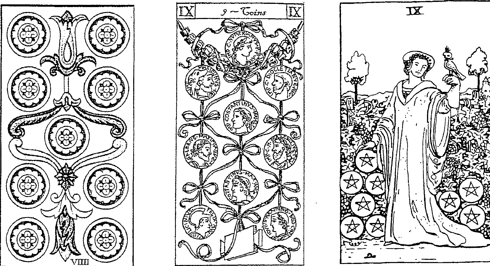

#### 幾何排列意義

九枚金幣可以排列成完美的圖形，像是圍繞成九角星圓圈。這個數量給人充實感，如九宮格（圖一），不然或是往上增長的感覺（圖二）。

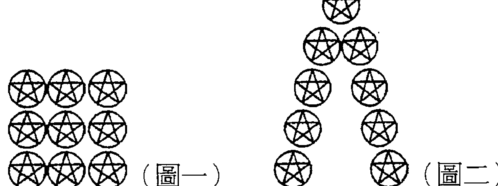

#### 故事畫面安置

九枚金幣，可以充分表示堆疊累積。此時形狀似乎已經不太重要，怎麼排列都能顯示數量豐富。雖說九需要強調力量整合而不能太凌亂，然而因為是滿滿的財富，排列上當然可鬆散隨性一點，只要能有往上堆積的感覺，下多上少的安穩形狀即可。這樣就能表示財富的最高境界，到達財富上位頂峰階層。下圖常見於情節畫面中，三枚金幣一堆而共有三堆，表示有規畫分配的儲蓄。

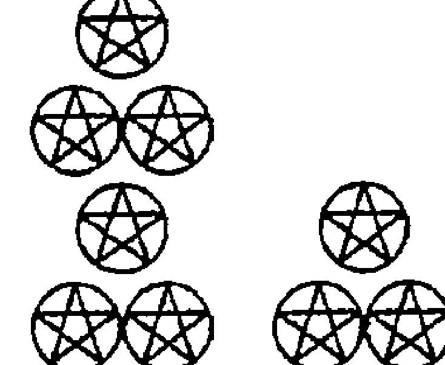

### 畫面故事情節

#### 情節發展

本秘儀主題是享受金錢，過著優渥的日子，享受悠閒時光。財富充裕而且轉化為實質用途，不是只有累積起來，是懂得生活的牌。畫面多依此旨而設計，因此大多以女性為主角，很少是男性，比較不會有俗氣的感覺！

這張牌也就這樣成了貴婦生活的寫照，在花園之中，獨自優雅的過日子，姿態優雅閒散，而環境顯示了豐富盛況。會刻劃女人種花養鳥，也表示心境上很投入於大自然，雖然享受但並不是頹靡。這些園中花草樹木和小動物，都是她生活中的一部分，除了顯示享受生活，也象徵大自然之愛。

牌義鮮少有很大差異，比較會有變化的地方，是畫面中金幣的位置：多半會融合在景物中呈現，常見的是變換為園中的花果，甚至是成串的小果實。與建築相關的也很多，鑲在建築上方而為了顯示富裕，置於窗戶上方或窗外景致中。

很多塔羅是金幣化為首飾穿戴在身上的畫法，如串成項鍊掛在胸前。多半都是這樣擁有財富收成，悠閒的貴婦下午茶。其實這些金幣只要連成一弧線，也有足夠的氣勢。也有的塔羅畫面中沒有主角，場景一樣是房子和花園，只要能呈現出富麗堂皇就可以了。

#### 附屬搭配

這張牌沒有謀生工具，是過生活的牌，享受收穫代價，不是工作的牌。

鳥象徵主角的精神或心思。鳥的種類不一樣，有象徵的差異。牠的造型和姿勢以及和主人的關係，都透露了重要的訊息，可以暗示深層生活狀態。蝴蝶象徵轉化，也有飛鳥的涵義在。蝸牛象徵時間的停頓，或豐收的過去。

> 占卜訣竅提點
金幣九這張牌的享受意義不要忽略了，金幣牌一向過於心靈的解讀法，這張牌更是不例外，切題的時候可以細微刻劃心情，但是財務的問題，答案仍應是很正面的，何況這種物質和情緒的反差，其實是金幣十專有的。

## 金幣十
Ten of Pentacles

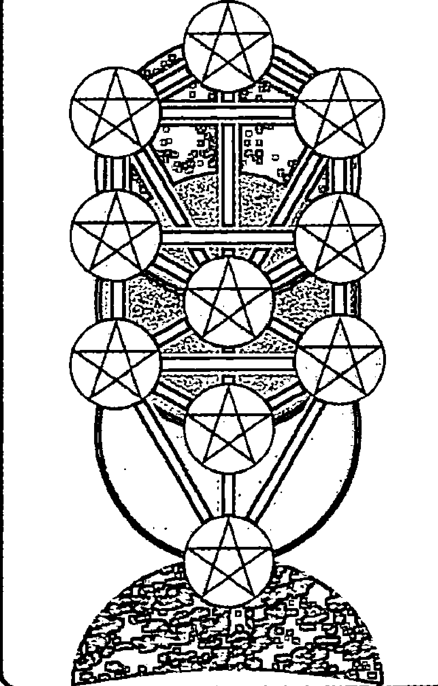

祕儀主題：
正 富有繁榮
逆 危機敗壞

牌序定位：
金幣牌組第十張數字牌，金幣作用的總結和延續。

元素位階：
土元素的飽和狀態，並且能夠繼續繁衍增值下去。

### 祕儀數序定位

### 數字奧秘

十號牌與土元素金幣的組合，正面作用是財務上的富有，更進一步的成長延續，徹底而永續的營運。負面的狀況時，財務上的危機也會是非常嚴重的。

### 祕儀主題

富裕的環境基於深厚的累積，也是永續發展的保證。成串的金幣之樹與生生不息的宇宙法則相連結，象徵繁盛興隆的一片榮景。富麗堂皇的庭院宅第，身處其中的人擁有資產，也肩負責任使命，必須掌握營運之道。

### 內涵定義

正位置在財務上都是非常讚的，並能夠永續經營或是守成。並且對於家族、事業，家庭、住宅、房屋不動產，以及繼承等相關事項上的有利。當然也牽涉到家庭，關係穩固只是情感上較為平淡。這些涵義之間並無衝突，甚至有密切關聯，可以分項來看待，也可逐步推演。

### 正位實占解釋

- 人際交誼：擁有財富但卻人情淡薄。因實質因素而建立的關係，互動不夠熱烈。
- 戀愛情緣：情感和相處上很平淡無趣。夾雜事業和現實因素的關係。
- 事務進行：事務都已經底定或完成，一切狀況都在掌握之中，並且能穩定持續進展。
- 金錢物質：金錢和物質層面穩定而興旺，能夠持續發展，也可能有其他各種來源的資產。家庭或團體的經營，經濟上的後盾。

### 牌義來歷變遷

#### 涵義演變

紙牌占卜中代表旅行遷移，也有其他方面的涵義，當然不乏財務上的事宜。古塔羅也多半是表示財務上的綿延不絕，後來逐漸與家庭和住宅特別相關。原本的正逆位都有不錯的涵義，偉特牌的正逆位間就有了較大的好壞差異了。
偉特稍後時期，相關於家族血統、家庭事務相關的意義也明定下來。而正逆位的作用就愈分愈清楚了，正位置作用大好而逆位置就屬不佳。正逆位都有關於財務方面，然而不再混淆不清了！

#### 正逆轉折

古塔羅正逆位都屬大吉，逆位置只是正位置力量的縮小，甚至有過之而無不及。偉特將逆位納入負面意涵，但其中卻仍有財務上的獲利，像是贈禮、退休金，同時是機會也是危機，獲利或損失都並存。
偉特稍後時期，上述情況逐漸改變了，逆位已經有別於正位，就是各種項目上的負面情況。家庭方面也會有問題，代表事業財富的繼承出狀況，而逆位時，情感上的無趣或悶悶不樂，並不會往好轉發展。

#### 逆位思考

逆位置走向愈來愈簡單，就是財務上的負面傾向。這時候是以逆位不當原則來推演的，正位置是財富豐盛的意義，而逆位置就是破財損失。於是金幣十逆位，就代表時運不濟，財務上不順暢，各方面的損失都有可能發生，甚至與正位置相反，表示將會破產而無法持續和保有下去。
逆位主旨結語：危機敗壞。

### 逆位實占解釋

- 人際交誼：隨著大環境崩塌而一起潰散。團體分崩離析，樹倒猢猻散。
- 戀愛情緣：感情關係隨著環境的變化而破局。勞燕分飛、各奔西東。
- 事務進行：營運低落走下坡，勢態大不如前，不復以往盛況。
- 金錢物質：破產、倒閉，營運終止，延續不下去。沒有繼承遺產，或者巨大損失。

### 象徵專屬物設定

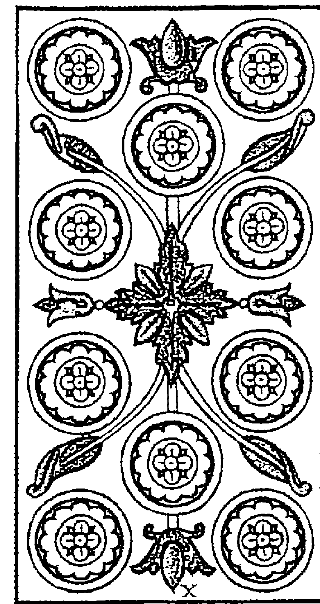

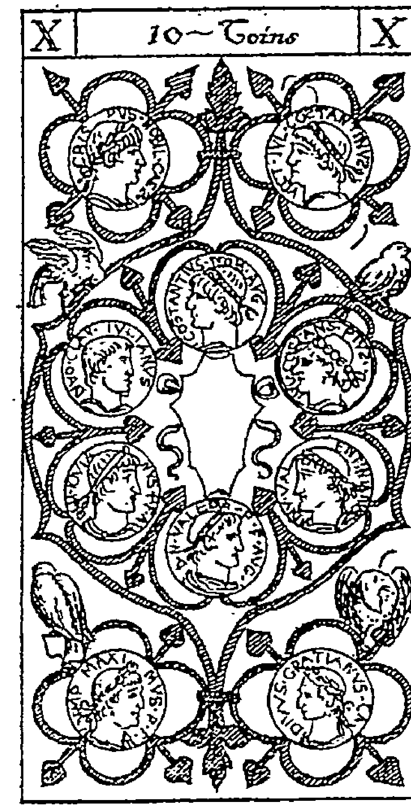

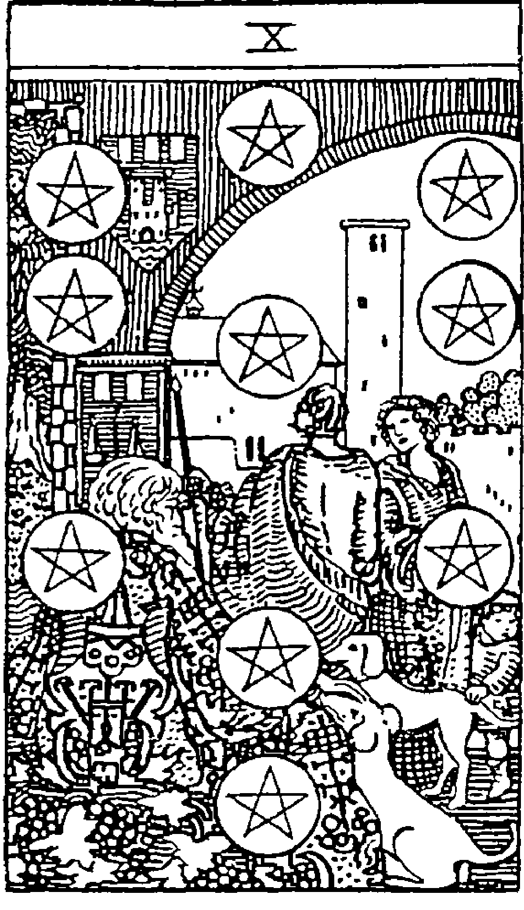

#### 幾何排列意義

最多枚的金幣無論怎樣排列，都能讓畫面感覺非常豐富。只是通常對於這些圓圈的安排會多加考量，安排對稱或組合成特殊圖案。十枚金幣，也能組合成完整的金字塔，象徵豐富的寶藏：

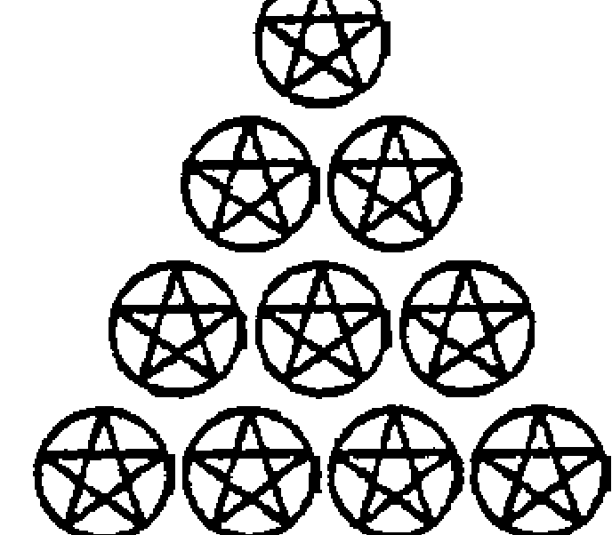

#### 故事畫面安置

十枚金幣，表示比最多還要更多的財富，並且延續到以後。十需要呈現全部象徵物合而為一的整體感，所以可以將十枚金幣繞成圓圈，或是組成特殊圖形。
在許多畫面中，金幣構築成一組生命之樹圖形，這是一種神秘學圖案，具有豐富的涵義。這些沒有緊鄰的金幣其實具有整體性，不但能夠對稱，更有特殊的規律蘊含其中，圖示如：

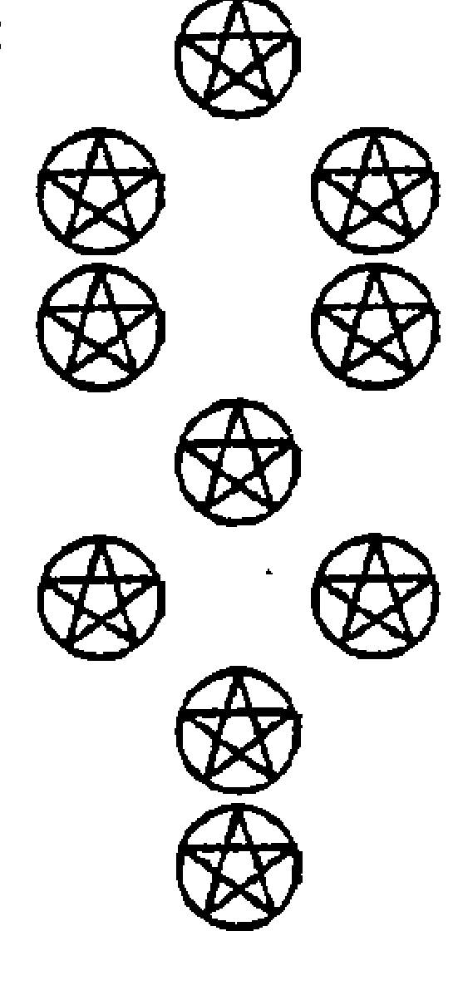

### 畫面故事情節

#### 情節發展

本秘儀主題是大量的財富，多以家產的傳承來表現富有繁榮，因此都不乏家族的刻劃，以及大家宅第的描繪。畫面情節多以名門望族或家族企業為主角，也表現了貴族的朱門恩怨劇情。

由於與繼承有關聯，除了需要畫出大家族並加上很多位家庭成員之外，也要表現出世代同堂，以及表現各種關係。這些成員大致是父母小孩還有老人與狗。當然這些成員會有更動，也有更多人口或世代的畫面。人數較少也可以，最少的只有一個主角獨擁城堡家園。

有些塔羅很著重於屋宅的描繪，這樣子跟房地產或住宅的相關就更密切了。有的牌十分注重城堡的營造，十枚金幣鑲在建築上，更與住宅強力結合。也有不著重建築的塔羅，可以不畫出房子，只要家族和傳承刻劃出來即可。甚至可以沒有房子且只有一人，獨自掌控所有金幣大權。

有些塔羅的金幣十，並沒有畫出家族相關場景，甚至整體更改，連人物都沒有。因為是十號牌，可以捨棄情節安排，轉變成整組金幣元素的呈現，例如十枚金幣排列成生命之樹。

#### 附屬搭配

家徽表明家世背景地位，家徽圖案樣式則透露家族的特質和過往。建築物內的器材產物表示家族著重什麼，有無生產的工作。

煙囪代表炊事，有無荒廢顯示家庭溫暖存在與否。圍牆代表隔閡、封閉的空間，拱門則是入口與資格。

這張牌多有狗，或其他寵物出現，表示受照顧的對象。老人與權杖表示家族歷史見證和精神支柱。

> 占卜訣竅提點
金幣十自然格局頗大，可說是整個營運狀況，所以是統合全部金幣牌代表的意義在其中。
也表明了金幣牌在於情感面上的作用，是間接的支柱輔助，但卻不如想像般能直接帶來快樂，而這就是實際生活的真相。

## MEMO

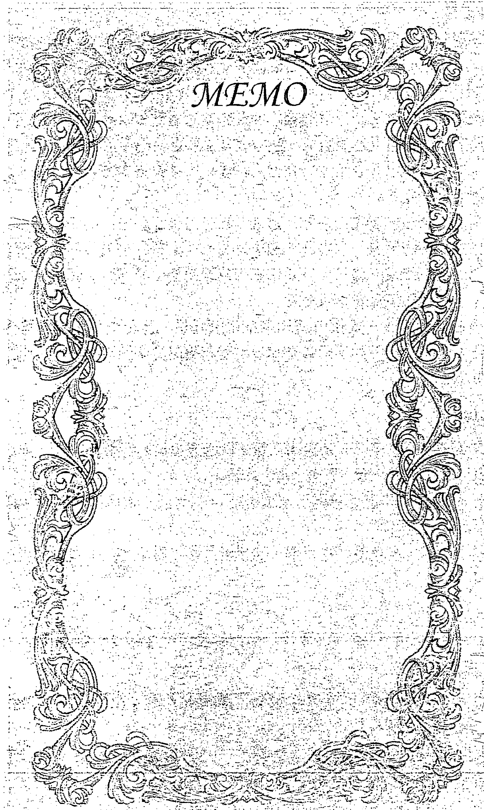

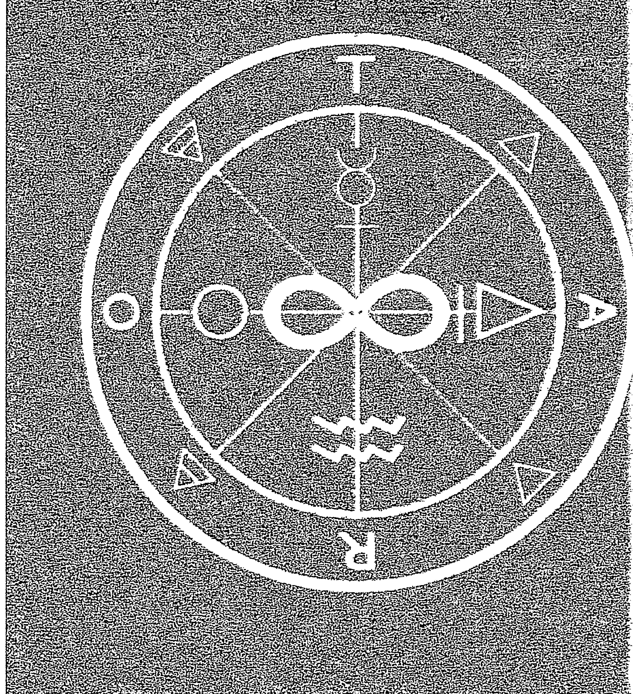

## 占卜應用
Divination

### 牌義實占應用

#### 一、統合使用

##### 牌義使用說明

祕儀內涵包括許多層面，主旨定義特質和占卜牌義不一樣，縱使是基本牌義本身，也會隨時代改變觀點。而塔羅共通意義又會因使用專牌的系統而有變異，個人解釋更有多元變化，可知牌義詮釋法是無法被完全包羅的。牌義設定更可不斷開發，占卜解說也因應問題和牌陣而變化，隨著牌局而有所更動。學習是擴展挖掘，應用則須篩選分明，中間還要透過對牌義應用的「設定」過程。

##### 牌義設定的層級

塔羅牌義有多個層級的設定，也有交互作用的影響，共通牌義外的各等級設定多有差異。設定有所差異最顯著的例子，就是宮廷牌有多套不同的星座連結。對獨特性強烈的牌義深入了解，能夠對於解牌的風格特色加分，可知有容納這一等級設定的必要性，而這部分正是牌義「推敲修正」階段所要強化的。

有限度的牌義個人化，可各別設定某張牌，也可以整體系統化設定。而各等級設定的作用力，可依據強弱排列為：個人設定、專牌設定、主流設定、原理設定。而愈高等級的設定作用力愈弱，像專牌設定時常被忽視，但仍然能夠占算。如果各等級設定的意義不同，較近等級的作用力則愈大，甚至會蓋過原來的共通涵義。

那麼應該謹守塔羅共通設定而限制個別變化嗎？

其實兩者可以取得平衡。若是講究和堅持塔羅占卜，就會希望有足夠成分的塔羅設定，這也才能成為共同溝通的語言。而且塔羅設定必然有其深奧整體性，個人突發奇想的牌義設定，在深度占卜解析時，很可能禁不起考驗。

##### 牌義變化應用

祕儀占卜的牌義會時常浮動，將祕儀放在不同陣位，解析便會不同，而在各種情節下也有不一樣的解答。在設定完成之後，占卜須根據以下幾個層次調整更動：

1. 實占前提條件：問卜者、基本情況、問題事項、涉及對象。「問卜者」和「問題」本身須相互配合，我們可以簡稱為「核心」。
2. 牌陣和陣位：這是最重要的變化，根據陣位而改變牌義，這是基本法則。
3. 出現的祕儀：此為主軸，這時考慮基本通用設定牌義、塔羅種類牌義，像是宮廷牌結構也會有差異，最後亦可參考占卜師的個人設定。
4. 最後，根據整體牌局修正牌義，這時也可以加入個人的臨場感應，也就是直覺，然而過度依賴總會有出錯。

統合這些要點的原則，必須依據上述項目順序，後項必須以前項為底。

#### 二、進階學習方案

##### 塔羅範圍層次

塔羅牌的基礎入門就是從通用的部分開始，先認識基礎秘儀牌義或主題，再深入紮根以掌握奧義，而進一步邁向理論架構，或是深入了解塔羅圖案象徵。針對塔羅中的大秘儀、宮廷牌、數字牌，以及逆位詳解、牌陣專研，對於局部範圍深入探索。塔羅專牌也能精密細究，如偉特塔羅完全攻略、透特塔羅圖解剖析、女神塔羅探索等等。而塔羅名著原文的翻譯閱讀，也是一個進階的範圍。

接下來從塔羅用途來拓展，塔羅的用途自不止於占卜，另有神秘學上的多樣功能。塔羅可分成九層功能，是循序漸進的塔羅鑽研歷程。

「美覺集藝」是蒐集塔羅和分類，從中可學習許多知識，尤其是塔羅演進變遷歷史，而從牌種與牌義的關係中也可習得不少。「遊戲對局」是塔羅身為遊戲紙牌的一種功能，也是屬於歷史探索範圍。真正與牌義相關的層次，其實可以分為「溝通交流」和「占驗問卜」兩層。塔羅心測和心理分析、心靈解法，都可歸於溝通交流領域。占驗問卜為實占解牌，是塔羅實用的重心，是更進階和深入的塔羅研究，須了解更多全方位塔羅牌操作，許多重要訓練都屬於這領域。

「論命推運」是塔羅命理化的機制，也是塔羅自身數秘的應用。「冥想凝思」為塔羅占卜以外最重要的功能，由此進入「感應存取」，感受神秘磁場，發展出塔羅療法。再進入「祈願施術」，運用塔羅祈願或進入塔羅魔法領域。最終的「次元轉換」，可以扼要歸結為塔羅功法這個名詞。

其他更多方向，除了原理研究探索外，重點是神秘系統宏觀連結，諸如塔羅與占星、塔羅與生命之樹卡巴拉學理。變化應用上也可和西洋的如恩石（Runes）、地占（Geomancy）等連結，甚至拓展到的東方神秘學系統，如易經等。

##### 進步方針

- 定勢操作：遵守固定、相同之操作程序規範，不可太過於隨機，這就是定勢。實地操作演練，保持客觀，運用方法解牌。步驟流程和動作必須熟練，不斷琢磨修正，更進一步形成風格。
- 去除依賴：牌陣的運用法在理論上，不能再補牌，也不需要底牌。盡量不要補牌，是為了避免破壞牌陣架構以及打亂牌局解析。底牌最好也不要使用，就算使用，最多加了一個陣位即可，擴大解釋並不合理，並且也會影響心理運思。
- 少用偏方：加入一些特殊發明的方法，都是沒有必要的，這些無根據的奇特招術只是使你更異化，卻不見得更為別緻，那麼還是拋到腦後去吧。另外要項還有排除干擾，將偶發的掉牌或缺牌等特殊現象也當做占卜的參考，這是一種契機動占，也必須先行預設如何看待和使用，才能做到面對各種突發狀況皆不為所動。

### 使用操作歷程

#### 一、觀念釐清

##### 訓牌歷程

雖說「塔羅」很重視概念，然而塔羅牌占卜卻非常重視實質運作層面，因此占卜操作方法更形重要了。因而先行了解占卜的型態，詢問自身問題稱為「親問」，詢問自身以外問題稱為「私問」，為自己占卜解答稱為「自占」，這些都是平日練習的方式。多以對話或日記流水帳的方式開始，接著私問自占其他人事物或公眾人物議題，預測自然、政局、世局、時勢，都可做為練習。隨著對牌義的掌握，逐漸擺脫自占而進入實際幫他人占卜的階段是必要的，愈正式的體驗占卜，愈會發覺這種感受很不相同，經歷這些階段才能朝向更專業或成熟的占卜。

##### 平時運用

塔羅牌操作有不少儀式，然而卻因為不了解箇中奧妙而容易變質。像是需不需要占卜配備，如布套、占卜布，使用蠟燭或薰香的必要與否，還有對時間、場合的要求。這其實都是個人習慣，但卻不牽涉神秘範圍。其他諸如拆封或接手的儀式，平時的一般保養擺放，都會講究淨化消磁或冥想，這也是無可厚非。

至於不給人碰觸塔羅的禁忌，是被過度渲染的，真正在意這點的占卜師不多，因為占卜操作多半會讓問卜者接觸塔羅。那麼占卜時接觸與否，對於準確度有何影響？其實這亦牽涉到私問或親問的議題。當事人親問或授權，具有面臨問題的觸機，這樣占卜之下自更容易準確和應驗。這和占卜後能量回饋之類的問題，同屬於神秘學理論的探討範圍，然而只要心態不輕率，就不須特別在意能量相關問題。

##### 占前問後

這裡先說明整個占卜過程的前後步驟。解完牌後須對問卜者表示關切，給予當事人建議與相關輔助。「占後施術」是緊隨占卜後的神秘學處理，以精神能量的形式導正心態，強化改變負面結果和逆轉局勢之信心。

如果占問解析差不多完結，當事人需要更多補充說明或旁生問題，盡量從原本牌局中找出答案得到解決，如果和主題差異很大，而為了方便，可以補牌或另開牌局稍做參考，但是完全不同的問題最好還是重新洗牌另占一局。

占卜師常遭遇到問卜者提出相同問題重複占卜的狀況，對此古有明訓—「初噬告，再三瀆，瀆則不告」，重複詢問並不恰當，占卜師須堅守這個心態和立場。如果一定要重占，至少要隔段時間才可行，如果隨即重占更須用不同的方式詢問，並且選擇不同牌陣運用解析。

整個占卜都結束後自須收牌，建議洗牌均勻再收齊，如果講究一點，還可依照順序收起來。這是一種理牌手續，實用上的方便就是下次開占可以很容易的找出「指定牌」。除了牌序重整，心理上和精神上也有平復之感，可以比擬為完整的收功程序。

#### 二、統合使用

##### 占卜過牌流程

占卜須有前提條件才能解析，因此首先要確實協定問題。幫他人占卜時，占卜人須讓問卜者詢問並告知基本狀況，例如事件相關對象也要知悉，可以共同討論確認問法。了解細節的內容必須要有一個平衡點，知道愈多也就要解得愈詳細豐富。

占卜師此時即要針對問題謹慎選妥牌陣。然後就進入「過牌」階段，直至排成牌陣之前，進行「洗牌」和「切牌」等操作，盡量讓問卜者接觸牌，可以邊洗牌邊默念或冥想問題。收攏整副牌後切牌，可先行示範一次，再讓給問卜者照著做！

接著要注意牌的「轉向」，將橫向擺放的牌轉為直立，會有順逆時針方向兩種選擇。解牌皆以占卜師視線方向為正，轉牌方向要固定，最好遵循通則。幫自己占算，以順時針方向轉成直立；幫他人占算，則以逆時針方向轉。而後才是擺牌（layout），將牌陣構築完成。擺牌要蓋住還是翻開皆可，何時翻牌或次序都行，只須注意動作要以左右方向掀開。

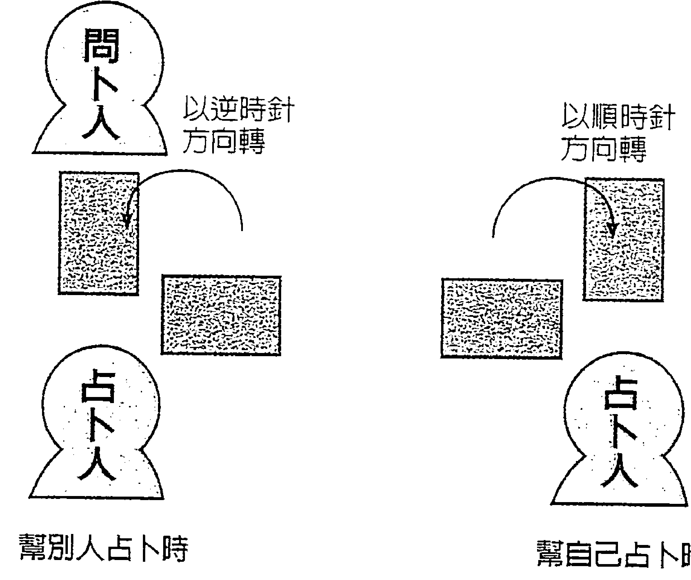

##### 認識測牌法（為不在場者占卜時使用）

開占抽驗允許牌，這是一種允占的測試機制，塔羅古法即有此應用。其他類別的占卜也有相似的機制，不過塔羅於今較被忽略這一點。有許多變化方式，可融入占卜流程中，最簡易的方法就是配合指定牌，在過牌階段以切牌分墩，設定選中含有指定牌者，即表示可繼續進行占卜。

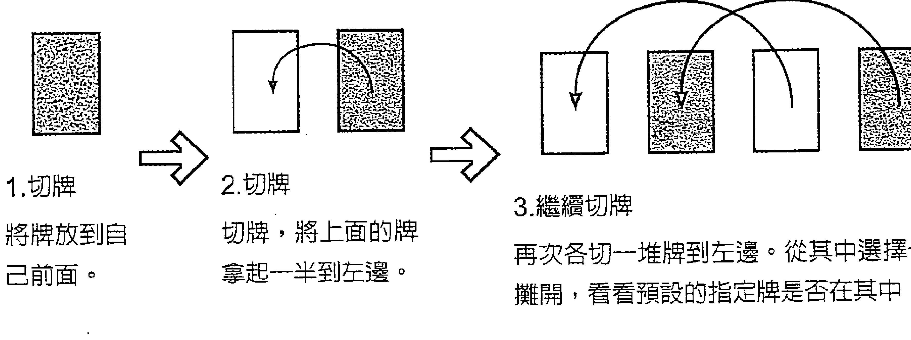

##### 取牌法鑽研

塔羅只要進行占卜就必須「取牌」，取牌方式有很多種，必須講究的原因主要是和機率與可信度有關。塔羅的結構設計十分完整，包含宇宙法則和心理原型投射，這也是塔羅為何能如此準確之因。各種牌數的占卜取用張數，有不同的排列組合與機率變化，必須加以了解並善加選用，從而配合適當的牌陣。

抽牌法是讓問卜者抽牌的方式，在此之前當然要先推牌（又稱：扇牌、鋪牌、展牌），這動作並不容易，需要多練習，適合心靈導向的諮詢。而發牌法則是由占卜師掌控，可直接連續排成牌陣。其中有間隔發牌的方法，可特稱為「數牌」，適合客觀性的剖析角度。另外，還有報數取牌、配牌法等多種較為特殊的取牌方式。

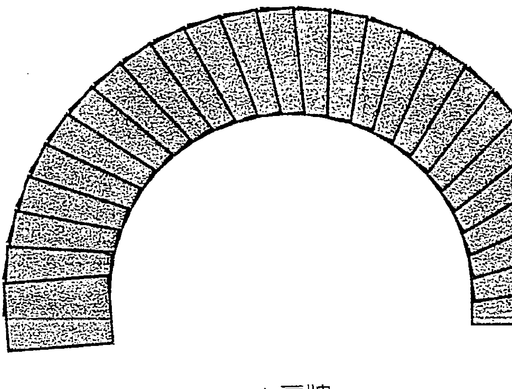

##### 操作與準確度

前置準備上若能周全，將使用的牌和相關配備都準備好，場合、時間、心態都調整適宜的情況，就愈能夠駕輕就熟。而操作程序若正確，將問題釐清和確認之後，慎選牌陣並遵循定勢操作，占卜就有品質保證。解牌首要關鍵是根據問題斟酌牌義，然後讓陣位引導解析方向，並講究整體搭配和全盤觀照能力，秉持這個方向進行就能夠順利解牌。

### 牌陣解密

#### 一、牌陣要略

##### 何謂牌陣

塔羅牌與占卜牌陣是並行共存的，這原則在占卜時如此，其他層面的運用也仍是如此。針對占卜而言，牌陣就是占卜法，是和占卜同時存在的。從英文名稱來了解：名為 Spread，就是「開展法」，也有使用 Lay-out，擺放「排列」之意。中文名之為「陣」，是因為這些開展排列中有寓意和功能存在，如同陣式的作用一般。

可知只要占算而擺牌就是「陣」，縱使打破規律或位置，但依然不脫其為牌陣，就算只取出一張牌也是一張牌的牌陣，所以說「有牌就有陣」。牌與陣就是塔羅牌的兩大方向，也是最基本的兩種學習範圍，缺一不可。

##### 牌陣結構

一個牌陣的內容，包涵這幾個要素：

1. 張數：最基本的要素，可牽涉到牌陣規模，有關機率取樣問題。
2. 陣位（position）：預設放牌的位置，設定意義規範解牌方向，是牌陣主要結構。有時候幾張牌相連而有相同意義，也代表同個陣位，這可特稱為複陣位。
3. 陣形：為整個牌陣排列的形狀，牌陣一定有其外型，無論有沒有特地規定。
4. 順序：陣位的順序形成了關聯性，也可加強結構嚴密性。
5. 理論：牌數和陣形都可能內藏寓意，或在結構上結合某種系統，理論原理愈深或愈複雜，功能性可能會愈強。

##### 牌陣功能

塔羅愛好者應對牌陣建立正確觀念，牌陣能引導和釐清牌義解讀方向，其中陣位的作用是輔助而不是限制。牌義都有時態變化，像隱士牌究竟處於退休階段還是追尋階段，就需要陣位來判斷。陣位本來就可以打破而多加運用，不被陣位綑綁才能有助於發揮，嘗試和使用更多的牌陣來占卜，更有機會不斷地進步和領悟。

##### 牌陣的占卜運用

每一次占卜在牌陣上的整體牌面呈現，視為「牌局」。每張牌須針對問題以及所放置的不同陣位而變化牌義。陣位之間的牌又有關聯，這些關聯又隨整體牌局而有調整，所出的牌也根據牌局而修正意義。

牌陣的選擇對於問題的回答很重要，適合的牌陣能因位置適當而更能發揮。而不適合的牌陣，可能妨礙解讀而拖累占卜師。占卜時應該在協定問題後慎選牌陣，以確認回應的方式。因此牌陣樣式需要多認識一些，這可以從熟悉牌陣分類著手。

#### 二、牌陣分類

塔羅牌陣樣式眾多，加以分類歸納有助於學習，也能便於應用選取，畢竟牌陣以實用為主。

##### 三軸分類法

占卜者通常會面臨記憶和選擇使用的困擾，「三軸分類法」提供實用的分類依據，直接能配合應用和學習，更利於占卜時快速思索判斷選擇，特色是「問題導向」，類別即是針對占卜問題而分，以了解問題狀況的程度，對於占卜判斷有無影響來做判斷。任何牌陣都能以這三個軸向來分類，思考屬於哪種類別。

回應式牌陣：也就是通用或萬應的牌陣，根據提問而回應解答，陣位意義都能適用各種問題，像是「過去」、「環境」等。這是最常使用的一類，一般通行的「六芒星牌陣」、本書選介的「凱爾特十字牌陣」，都是屬於此類。

專題式牌陣：專門適用於各種類型問題的特定牌陣，像是愛情專用牌陣或事業專用牌陣。其中每個陣位都會緊扣問題細節，如「他對我如何」、「在一起的可能」。只要認識牌陣，看到牌局就知道問題是什麼，也能夠參與解牌。

統論式牌陣：用以剖析整體各層面的情況，不針對特定問題回應，適用於問卜者想占卜，但沒有特定問題時。面對牌局不用特地考慮提問，針對各陣位解牌即可。例如，各種身心靈探索的牌陣、整體運勢牌陣。

所有的牌陣，都可以歸於此三大類。不過其間也會有交集存在，從而也可細分為更多類別，然而這些深入的變化，可待學習牌陣時再加以專研。

##### 作用效果

了解牌陣的分類，其實就是了解牌陣的各層面結構，尤其三軸分類法對於研究陣位最為便捷。回應式牌陣是最普及的陣位，建議當成最基礎的牌陣類別，具有用途廣泛的便利性。統論式有多元變化的陣位，可用以拓展領域，運用在大格局方向。專題式有更細微深入的陣位，有助於學習敏銳化，用以專項透徹解析。

#### 三、牌陣選介

##### 凱爾特十字

凱爾特十字牌陣（Celtic Cross spread）歷史非常悠久，距今至少有一百多年以上，是當今流傳最廣泛的重要牌陣，也因而版本變化眾多。如此具有世界通行性，自是首選介紹的牌陣。這裡的版本是「橫豎式」，且是「指定牌占卜法」專用。

▲凱爾特十字牌陣

##### 陣位說明

| 編號 | 陣位 | 陣位說明 | 法文圖像 | 英文圖像 |
| :--- | :--- | :--- | :--- | :--- |
| 0 | 他 | 當事人主角 | 指定牌 | The Significator |
| 1 | 中 | 現況 | 囊括他 | That covers him |
| 2 | 橫 | 背後的問題 | 橫過他 | What crosses him |
| 3 | 上 | 顯意識（浮上台面的狀況） | 在他頂上 | What crowns him. |
| 4 | 下 | 潛意識（隱藏起來的狀況） | 在他底下 | What is beneath him |
| 5 | 左 | 過去（成因） | 在他過往 | What is behind him |
| 6 | 右 | 未來（趨勢） | 在他前方 | What is before him |
| 7 | 法則 | 法則（立場、處理方式和原則） | 自身作為 | Himself |
| 8 | 現象 | 環境（狀況與外在現象） | 所處環境 | His house |
| 9 | 精神 | 心境（精神狀態與內在願望） | 心境變化 | His hopes or fears |
| 10 | 結果 | 結果（最後的大結局） | 註定到來的結局 | What will come |

▲凱爾特十字解牌概略

十字中央「現況」的第 1 張牌直接解釋為主角當前狀態，橫放交疊的第 2 張牌「背後的問題」是關鍵點，正面意義代表因缺乏此要素而造成問題，負面意義顯示問題結果。上方的第 3 張牌「顯意識」和下方第 4 張牌「潛意識」的陣位做為輔助，襯托現在狀況。第 5 張牌代表「過去」，是形成現在狀況的因素，第 6 張牌則是「未來」，意味著下一步的走向，但後面直式陣位也相關於未來。第 7 張牌代表「法則」，是當事人處理方式，和指定牌與現況位置最有關聯，而第 8 張牌「環境」和第 9 張牌「心境」的時態為現在而偏向於未來，至於第 10 張牌「結果」自是未來的總結。

##### 指定牌占卜模式

指定牌牽涉到整套規格化設定，使用指定牌可視為一種占卜模式。在指定牌模式下，主角認定以及相互關係都要根據指定花色，整個宮廷牌人物作用需要重新確認，以特定的著眼點看待，當然牌義的詮釋法也有所差異！例如指定牌同花色與不同花色的宮廷牌作用有別，同花色陣位是相關指定人物的事件。指定牌占卜適用的牌陣，主要是凱爾特十字，專門適用於指定牌模式。其他牌陣也可以使用指定牌，然而需要加以因應設計，讓實際解牌能更適切和便利。

#### 四、牌局實占技巧

##### 牌義問題導向

秘儀主題和要旨延伸的占卜牌義，對於不同領域的影響作用是有差異的，可大致歸納為人、事、物三大主要方向，由此再更進一步詳細變化，針對任何範圍項目都足夠迎刃而解。不同問題的項目就循序找出不一樣的答案。

鎖定核心：解釋牌義屬於問題導向，當事人所問才是回應的重點，沒有提問的範圍不需要回答。一切解析都必須鎖定前提條件，秘儀配合陣位而產生的意義無法脫離問題「核心」，尤其使用「回應式牌陣」更是如此。占卜中的每一影響層次，都必須考慮進去，無論任何牌陣位置和出牌都須緊扣住。

找出關鍵：要看出牌的切題與否，能分辨出切題的牌和不切題的牌，至少花色要能判斷切題程度。例如，詢問愛情而牌局若出現金幣，該如何看待和解說。更須注意的是特別項目的啟示，直接切中要點的牌就有特殊作用，出現與否其實很重要。例如問旅遊出現代表旅遊的牌，特別具有效力和啟示，可稱為關鍵牌。

##### 牌局整體觀察

如果只有單張牌逐一解釋，容易錯過重要的關鍵，必須時刻不忘參考旁邊出現的牌，在全盤觀察之後才能夠有效論斷。上述關鍵牌或其他牌搭配的狀況（張數和位置），也非常重要。另以下列方法看出牌的關聯性，這些條件形成的作用，就是牌局解析中可以超越陣位的層面。

-   1. 牌組花色比例：整局中，可由大小牌的比例和分配，找出較具重要性的位置。從小牌花色的分配，亦能看出牌局中各種層面的分量，例如聖杯牌組多寡、感情因素重不重要。而從同花色牌組能看出其中的位置關聯度。
-   2. 數字位階之間的分配：可以觀察的面向包括了整體的各種數字比例、大牌間相同基數的牌與陣位連結、小牌間相同數字位階的牌與陣位交互作用、大小牌間數字或位階有無相同、同數同位連結而增生新的涵義。針對宮廷牌連結，對立與整合要先設定好，這牽扯到花色元素的相合度。而位階可以化成數字，與大秘儀之間相連結。
-   3. 各式數字關係：從大牌間的各式關聯性觀察，例如對立或連接，以及大小牌間，數字有無互通或相應的地方，亦可注意數字順序關係，包括同牌組順序和跨牌組順序，找出連號關係，陣位之間也有脈絡可循。
-   4. 其他相關性：諸如圖樣間的關係和連結、人物間的角色與代表性等問題，以及觀察該副塔羅的畫面主角、神話系統以及深層涵義的設定相關性，也可以研究相關陣位的連結。

整體關聯意義的實占應用，訣竅在於明瞭，而非直接解釋，照本宣科搬出某號牌共通意義或背誦牌義，其實於事無補。應是將呈現出的意義加以聯想，讓變化涵義活用於劇情編織上。

## 塔羅解密：牌義&圖案全透視

作者 星宿

發行人 黃鎮隆
協理 陳君平
資深主編 周于殷
特約編輯 張美華
美術總監 沙雲佩
美術設計 果實文化設計

印製 明越彩色製版印刷有限公司
出版 城邦文化事業股份有限公司 尖端出版
台北市民生東路二段141號10樓
電話 / (02) 2500-7600 傳真 / (02) 2500-1971
發行 英屬蓋曼群島商家庭傳媒股份有限公司
城邦分公司 尖端出版行銷業務部
台北市民生東路二段141號10樓
電話 / (02)2500-7600 傳真 / (02)2500-1979 劃撥專線 / (03) 312-4212
劃撥帳號 / 50003021英屬蓋曼群島商家庭傳媒(股)公司城邦分公司
※劃撥金額未滿500元，請加附掛號郵資50元
法律顧問 通律機構 台北市重慶南路二段59號11樓

台灣地區總經銷
◎ 中彰投以北（含宜花東）高見文化行銷股份有限公司
電話 / 0800-055-365 傳真 / (02) 2668-6220
◎ 雲嘉以南 威信圖書有限公司
（嘉義公司）電話 / 0800-028-028 傳真 / (05) 233-3863
（高雄公司）電話 / 0800-028-028 傳真 / (07) 373-0087
馬新地區總經銷 / 城邦（馬新）出版集團
Cite(M) Sdn.Bhd.(458372U)
電話 : 603-9056-3833 傳真 : 603-9056-2833
◎大眾書局（新加坡）
電話 : 65-6462-9555 傳真 : 65-6468-3710
E-mail : feedback@popularworld.com
◎大眾書局（馬來西亞）
電話 : 603-9179-6333 傳真 : 03-9179-6200、03-9179-6339
客服諮詢熱線 : 1-300-88-6336
香港地區總經銷 / 城邦(香港)出版集團
Cite(H.K.)Publishing Group Limited
電話 : 2508-6231 傳真 : 2578-9337

版次 2015年5月1版3刷 Printed in Taiwan

◎ 版權所有，侵權必究 ◎
本書如有破損或缺頁，請寄回本公司更換

國家圖書館出版品預行編目（CIP）資料
塔羅解密：牌義&圖案全透視 / 星宿作. --
初版. -- 臺北市 : 尖端, 2011.12
面 ; 公分
ISBN 978-957-10-4703-4(平裝)
1.占卜
292.96 100021851