# 塔羅牌研究所3

# 四週實戰課

—— 橫掃日、韓塔羅排行榜，塔羅系統式自學第三彈 ——

# 4週間でマスター！
書き込み式78枚で
占うタロットレッスン

LUA——著 Shion——譯

製作專屬的【關鍵字集】、【牌面交叉比對】、
【過往占卜內容驗證】，
給處在塔羅學習進階期，解讀想獨創個人見解的你。

# 塔羅解牌研究所3

四週實戰課

—— 橫掃日、韓塔羅排行榜，塔羅系統式自學第三彈 ——

4週間でマスター！
書き込み式78枚で
占うタロットレッスン

楓葉社

# 78張塔羅牌

# 製作專屬於您的關鍵字集

初學者在解讀塔羅牌時很容易面臨障礙。正因為過度受限於文本上的意義，才會感覺解讀得不順利。畢竟要將78張塔羅牌義全背下來有難度，而即使在占卜時一邊跟經典大眼瞪小眼，鑑定的結果也會顯得欠缺靈活度。

而在這種時候，本書中專屬於自己的關鍵字集就能派上用場。請您寫下從牌面上感覺到的任何事物。經典的解牌法雖然很重要，但自己憑直覺獲得的意象也相當寶貴，這也是屬於塔羅牌與您之間的「秘密暗號」。

比如說，看了「太陽」這張牌，腦中若是浮現「日曬」，就將之寫進關鍵字集裡。當占卜時出現「太陽」，而單靠其他書籍又解讀不出來時，或許就是「太陽」正在試圖向您傳達「日曬」這樣的訊息。您所收集的原創關鍵字應該能如此成為提示才對。請當成製作專屬於自己的塔羅牌辭典般，試著寫下來看看吧。

# 關鍵字集的閱讀方式

本書收錄了78張塔羅牌的基本關鍵字。
請在此確認各項目的閱讀方式、MY KEYWORD的運用方法。

不知道事情會變得怎麼樣
新的邂逅／輕鬆的步調／不太計較的單純性格／抽象的／自由業／靈光一閃／大剌剌／無拘無束／空白／無關緊要／樂觀的／愛作夢／偶然

KEYWORD: 自由

由於猶豫不決而任人擺佈
玩咖／左手賺錢右手花錢／隨便／逃避現實／沒有計畫／看不見未來／不負責任而難以信任／人云亦云／猶豫不決的態度／見異思遷／裝腔作勢地耍流氓／三分鐘熱度

MY KEYWORD
- 超乎想像
- 輕鬆隨意的
- 或許有點像 A 同學
- 外出牌
- 無固定座位制

① 塔羅牌的名稱與編號
22張大阿爾克那全都有名字；小阿爾克那則僅有一（Ace）、侍者、騎士、王后、國王有名稱標示。2～10則沒有名稱，而是以四種花色（符號）的物品與數量組合而成。

② 塔羅牌的圖案
塔羅牌的圖案是解讀塔羅牌的重要關鍵。本書中介紹的是最為基礎的塔羅牌「萊德・偉特・史密斯塔羅」。

③ KEYWORD
這裡所寫的是作為塔羅牌核心的關鍵字。重點在於如何從這裡拓展意象，與占卜主題相連繫。

④ 正位的意義
當塔羅牌圖面以正面呈現時的意義及關鍵字。

⑤ 逆位的意義
當塔羅牌圖面上下顛倒時的意義及關鍵字。

⑥ MY KEYWORD
請寫下關於這張牌所意識到的事物或自己的詮釋，就算不一口氣挑戰全部的塔羅牌也不要緊。在執行本書課程、實際占卜的過程中如果有發現，就請將內容填入。只要製作出專屬於您的關鍵字集，就不會侷限於文本的解析，而能掌握符合自己風格的解讀方式。

# 填寫範例

- 出現這張牌時，就有極高機率發生○○。
- ○○○牌（塔羅牌的暱稱）。
- 如果以諺語來比喻……
- 出乎意料地不是一張壞牌。
- 不知為何，在占卜戀愛時經常出現。
- 可能也有○○的意思。

在此察看LUA對78張塔羅牌的原創解釋。請試著當作自由詮釋的提示。

## 何謂大阿爾克那？

作為塔羅牌最核心的22張牌，
愈是重要就愈需要平易近人的詞彙呈現

許多人聽見「塔羅牌」一詞時，會在腦中浮現的形象應該是大阿爾克那（Major Arcana）吧。大阿爾克那共有22張牌，以0號「愚者」開始，最後以「世界」結束。據說0～21號牌的內容正代表著世界的完成或是一場人生旅程。

大阿爾克那的特徵，正是具有角色以及由各式各樣的神秘學與思想所構成的主題。與代表日常生活事項的小阿爾克那呈現對比，大阿爾克那的主題多具有「命運」或「命中註定」等宏偉的涵義。在展開塔羅牌時，只要注意出現大阿爾克那的位置，應該就能順利解讀。

只不過，如果過度在意其宏偉的牌義，就只會浮現偏離現實的詞彙，而淪為沒有現實感的占卜。在撰寫 MY KEYWORD 時，最重要的是蒐集貼近日常生活的詞彙。如果能用熟悉的詞彙加以表現，比如說〈女祭司〉代表「知識分子」等等，應該就能更快熟稔。

**正位**

不知道事情會變得怎麼樣

新的邂逅／輕鬆的步調／不太計較的單純性格／抽象的／自由業／靈光一閃／大剌剌／無拘無束／空白／無關緊要／樂觀的／愛作夢／偶然

> [ KEYWORD: 自由 ]

**逆位**

由於猶豫不決而任人擺佈

玩咖／左手賺錢右手花錢／隨便／逃避現實／沒有計畫／看不見未來／不負責任而難以信任／人云亦云／猶豫不決的態度／見異思遷／裝腔作勢地耍流氓／三分鐘熱度

#### MY KEYWORD

## THE FOOL
## 愚者

## 1
### 主動展開行動

- 美好戀情的開端
- 大展長才
- 具獨創性的工作
- 準備就緒
- 靈感滿滿
- 精明的人
- 有自信
- 有利的談判
- 巧妙地周旋
- 站在起跑線上

KEYWORD: 創造力

### 只想獲得利益或好處

- 猶豫
- 標新立異的行為
- 只顧自己方便的情人
- 準備不足
- 無法發揮才能
- 敷衍
- 笨拙
- 變得消極
- 事情無法順遂
- 束手無策
- 毫無根據的自信
- 吃得很開

## THE MAGICIAN
## 魔術師

MY KEYWORD

## 2
### 以智慧與理性凝望

- 高不可攀
- 柏拉圖式愛情
- 勤勉
- 認真
- 內心細膩
- 理性判斷
- 纖瘦
- 強烈憧憬
- 不依賴人而獨立
- 素雅
- 少女特質
- 浪漫
- 黑白分明
- 有工作熱忱的人

KEYWORD: 精神性

### 只看見自己想看的事物

- 神經質的人
- 嫉妒
- 能力不足
- 不成熟
- 完美主義
- 不懂裝懂
- 潔癖
- 排除不中意的人
- 過時
- 情緒不穩定
- 偏見
- 歇斯底里
- 沒有餘裕
- 獨裁女王
- 起口角

## THE HIGH PRIESTESS
## 女祭司

MY KEYWORD

## 3
### 盡情享受豐饒的收成

- 女性魅力
- 愛人與被愛的關係
- 母性
- 懷孕
- 游刃有餘
- 產生利益
- 舒適的職場環境
- 放鬆
- 奢侈
- 不求回報的愛
- 成熟
- 優雅
- 才貌兼備

KEYWORD: 愛

### 對過多的恩惠感到厭倦

- 吊兒郎當
- 肉體關係
- 出軌
- 互相依存
- 行為不檢
- 無利可圖的工作
- 怠惰
- 一無所獲
- 發胖
- 過度保護
- 過度干涉
- 劃清界線
- 只考慮自身利益的人
- 依賴外力

## THE EMPRESS
## 女皇

MY KEYWORD

MY KEYWORD

得到持續性的穩定

正位

- 以結婚為前提交往
- 領導能力
- 能幹
- 獲得權力
- 信賴關係
- 建立穩固的友誼
- 自信
- 強悍
- 父性
- 值得信任的人
- 經營者
- 勝利
- 男性特質
- 支柱

[ KEYWORD: 社會 ]

藉由力量獲得一時的穩定

逆位

- 自私自利的戀情
- 逞強
- 過於冷淡
- 厭倦
- 被逐出原本的地位
- 不受支持的領袖
- 高壓態度
- 應該接受他人意見
- 自我中心
- 逃避責任
- 甘於第二
- 眼界狹隘
- 固執的人

## 4

## THE EMPEROR
## 皇帝

MY KEYWORD

受倫理道德締結的信賴羈絆

正位

- 能成為精神寄託的戀情
- 受到祝福的婚姻
- 信賴關係
- 法律
- 精神上的羈絆
- 倫理觀一致
- 婚喪喜慶
- 傳統
- 禮節
- 領導者
- 敬愛
- 背負期待
- 神聖的事物
- 重視倫理道德

[ KEYWORD: 倫理道德 ]

利用信任與羈絆而違反倫理道德

逆位

- 隱藏的慾望
- 賤賣自己
- 利用善意
- 價值觀不合
- 不道德
- 別聽信花言巧語
- 懷疑
- 為善
- 桃色陷阱
- 盲目相信
- 無法信任
- 過於自由而散漫

## 5

## THE HIEROPHANT
## 教皇

MY KEYWORD

如同置身於夢境般的幸福

正位

- 墜入愛河
- 如作夢般的戀情
- 愉快的工作
- 夥伴關係
- 交涉成立
- 相談甚歡
- 玩心
- 純粹的心情
- 不受打擾
- 平易近人
- 受喜愛的角色
- 信任

[ KEYWORD: 舒適愜意 ]

耽溺於眼前的逸樂

逆位

- 三角關係
- 隨便的戀情
- 沒有愛情的交往
- 合不來的對象
- 躁動
- 敗給誘惑
- 享樂的
- 態度敷衍含糊
- 沒有獲益的行動
- 過於晚熟
- 成癮而戒不掉

## 6

## THE LOVERS
## 戀人

MY KEYWORD

**正位**
果敢地挑戰事物
積極拉近距離／一口氣發展／克服障礙／乘勢而行／意見通過／贏過競爭對手／行動力／勇氣／移動／旅行／活力十足的人／忙碌的情況／奔跑／決戰之時

[KEYWORD: 能量]

**逆位**
無法自我控制
吵個不停／性急的人／情緒失控／企劃落空／激烈衝突／被迫面臨苦戰／變更路線／得意忘形／疲勞／拖拖拉拉／趁機胡鬧／徒勞無功／沒自信

## THE CHARIOT
### 戰車

MY KEYWORD

**正位**
渡過困難
長時間成就的戀情／解除對方的戒心／努力到最後／化敵為友／大器晚成／將逆境化為助力／拿捏力度／獲得後盾／成熟的應對／不屈不撓的意志／克服弱點

[KEYWORD: 原力]

**逆位**
難以忍耐而撒手不管
需要察言觀色的對象／想放棄一切／在達成前夕放棄／自私任性的人／逃避／不想正視問題／只差一步卻放棄／逞強／不認輸

## STRENGTH
## 力量

MY KEYWORD

**正位**
追求理想
隱藏在心裡的戀情／年長的對象／率領部下／專業職務／令精神感到充實的工作／商量對象／狂熱／學習的時刻／維持現狀／過去藏有提示／無論好壞都沒有變化／享受孤獨

[KEYWORD: 尋求]

**逆位**
不正視現實
妄想戀情／緊抓著過去的戀情不放／不適應社會／無業／性格內向／過去的榮耀／封閉內心／過於堅持／難以取悅／自我陶醉／眼界狹窄／在意面子／畏縮怯懦

## THE HERMIT
## 隱士

## 10
事態因為命運的洪流而好轉
一見鍾情／結婚／掌握機會／直覺敏銳／狀態絕佳／臨機應變／初次見面就情投意合／靈魂伴侶／感興趣／適時出現的事件／走在命運的岔路

> [ KEYWORD: 命中註定 ]

被命運玩弄於股掌之間
短暫的戀情／錯過好機會／努力徒勞無功／運氣不好／不擅長的工作／違和感／形勢變得不利／過時／無趣／不合時宜／時機不佳／逆水行舟／驚心動魄

## WHEEL of FORTUNE
## 命運之輪

MY KEYWORD

## 11
不夾雜個人情感地冷靜應對
對等的情人關係／合適的對象／正當報酬／事業生活兩得意／平等／平手／不喜歡也不討厭／審判／不流於情感／公私分明／行為中立／比較

> [ KEYWORD: 平衡 ]

受到情感左右而採取不合理的應對
經過計算的戀情／作為備胎的情人／不公平的職場／以自己方便來思考／內疚／失衡的關係／罪惡感／正確卻缺乏人情的應對／使詐或作弊曝光／為了自保而拼命辯解

## JUSTICE
## 正義

MY KEYWORD

## 12
面對現況而冷靜思考
戀情停滯／奉獻型的戀情／孤立的狀況／一味地忍耐／自我犧牲／嚴以律己／感覺到無力／等待時間解決問題／超過容許範圍／手足無措的狀況／正在反省

> [ KEYWORD: 靜止 ]

無法接受現況而掙扎
伴隨著痛苦的戀情／陷入泥沼／在意回報而工作／即使抵抗也沒有改變的狀況／只考慮到自己／焦急而失敗／靜靜等待才是聰明的選擇／無法下定決心／自虐

## THE HANGED MAN
## 吊人

MY KEYWORD

### 前往新的階段

新戀情的開始／離別／跳槽或異動／失業／合理性思考／放下執念／搬家／心態重整／轉捩點／新舊更迭／世代交替／華麗的退場／起死回生之時

> [ KEYWORD: 定數 ]

受到過去束縛而無法前進
難以放棄的戀情／令人著急的單戀／孽緣／倔強／重複同樣的事／無法應對變化／難以割捨過去／半途而廢／遲疑不決／依戀不捨的言行／不肯輕易死心

## DEATH
## 死神

### 接受全新事物

合得來的情人／討論／不同行業間的交流會／相互理解的關係／與人往來／聽取許多人的意見／折衷方案／安排得當／給予正向刺激的人／重新檢視生活習慣

> [ KEYWORD: 反應 ]

無法接受異己的事物
沒有交集的戀情／欠缺協調性／獨自扛起工作／無法敞開心胸／不聽取他人意見／怕生／溝通不足／無效／獨裁體制／性質不合／抗拒／錯身而過

## TEMPERANCE
## 節制

### 敗給心裡的惡魔

出軌／戀愛依存／家暴／在工作上欺騙自己／撒嬌／壞朋友／養成壞習慣／無止盡的慾望／無法自律／醜陋／沒有常識／低級的言行／好色／鬼迷心竅而失去一切／被掌握弱點

> [ KEYWORD: 咒縛 ]

與心裡的惡魔交戰
斬斷孽緣／端正內心／要求改善待遇／健康的人際關係／面對自卑感／努力戰勝恐懼／重生的機會／察覺到自己的過失／改正墮落的生活

## THE DEVIL
## 惡魔

### 突如其來的衝擊

- 閃電結婚／大膽地改革／破產／職場環境一百八十度轉變／出乎意料的麻煩／情緒爆發／打破常識／意外／很有個性／事故／改造／變得自暴自棄／革命

> [ KEYWORD: 破壞 ]

### 漸漸發生的衝擊事態

- 分手的意識產生／露出破綻／想改變卻改變不了一觸即發／忍耐的極限／九死一生／老化／緊繃的氛圍／沒提出解決方案而崩潰／迴避最糟糕事態

### 迎向光明的未來

- 產生期待／有希望／理想的情人／燦爛的工作／成為明日之星／上軌道／積極正向的思考／酒／藥物見效／身體狀況恢復／純真／湧起幹勁／獲得靈感

> [ KEYWORD: 希望 ]

### 希望隨無法實現而消逝

- 理想過高／悲觀／希望變成失望／努力白費／失去目標／廢話過多／遺忘過去／沒精神／理想論／不單純／很掃興／幻滅／看不見未來

### 沉浸在幻想中無法看清現實

- 虛偽的戀情／善變的心／杜撰的工作／不公開／招致誤解／互相刺探內心想法／隱藏真正的自己／遍尋不著／幻象／倦怠的心情／沉浸在妄想中／痴心

> [ KEYWORD: 神秘 ]

### 一點一點地看得見現實

- 察覺到虛偽／想隱藏的關係曝光／幻滅／回過神來／濃霧散去／說出真心話／疾病痊癒／看見現實／甩開臆測／得以預測／不安消散／確認內心## 19
#### 獲得努力的成果

健康的愛情／公認的情侶／態度坦率／獲得成功／重見光明／出人頭地／能令人重振精神的對象／揮灑個人本色／健康／孩童／毫無隱瞞的關係／充實的每一天／活化

- 健康的愛情／公認的情侶／態度坦率／獲得成功
- 重見光明／出人頭地／能令人重振精神的對象／揮灑個人本色
- 健康／孩童／毫無隱瞞的關係／充實的每一天／活化

[ KEYWORD: 歡欣 ]

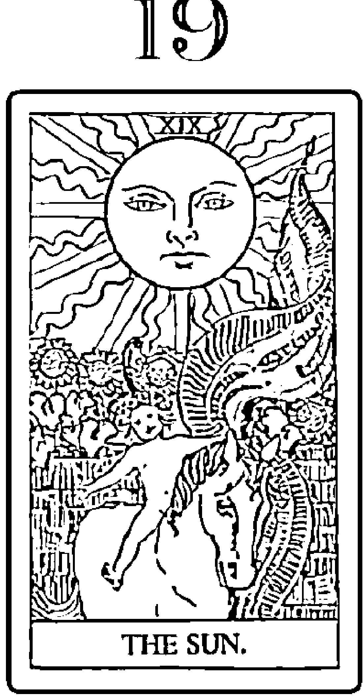

## THE SUN
太陽
## 看不見陽光

無法坦率地感到高興的愛情／眾矢之的／沒有已經成功的真實感／回報很少／無法由衷露出笑容／有陰霾／無法展現自己／體力不足／顧慮太多／基於計較而行動／偏袒

- 無法坦率地感到高興的愛情／眾矢之的／沒有已經成功的真實感／回報很少
- 無法由衷露出笑容／有陰霾／無法展現自己／體力不足
- 顧慮太多／基於計較而行動／偏袒

## 20
### 掌握轉瞬間的機會

認定是命中註定的愛情／表白／破鏡重圓／再次挑戰的機會／長時間擱置的計畫再次執行／作個了斷／回想起來／恢復／卸下重擔／回歸初衷／轉捩點

- 認定是命中註定的愛情／表白／破鏡重圓／再次挑戰的機會
- 長時間擱置的計畫再次執行／作個了斷／回想起來／恢復／卸下重擔
- 回歸初衷／轉捩點

[ KEYWORD: 解放 ]

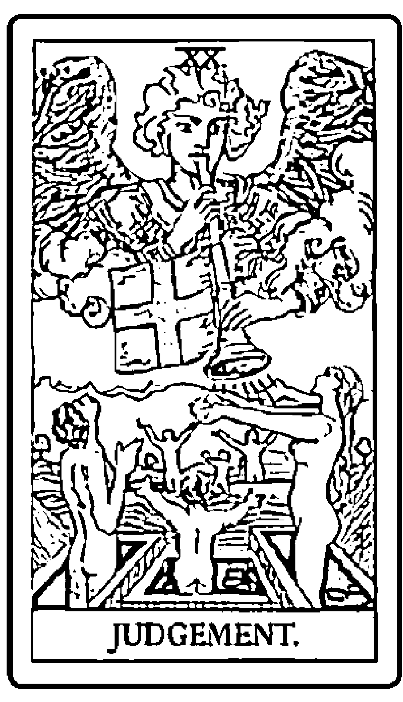

## JUDGEMENT
審判
### 延遲後就錯過機會

留戀／愛情沒有結果／準備不足／錯失機會／懷疑自己的幸運／延遲決定／受到過去束縛／為時已晚／遺忘／找不到／推遲討厭的事／腐敗

- 留戀／愛情沒有結果／準備不足／錯失機會／懷疑自己的幸運
- 延遲決定／受到過去束縛／為時已晚／遺忘／找不到
- 推遲討厭的事／腐敗

## 21
### 達成目標而感到滿足

兩情相悅／幸福的婚姻／天職／品嚐成就感／想要更上一層樓／老交情／最棒的自我肯定感／勝利／理解一切／無論結果如何都感到滿足／快樂結局

- 兩情相悅／幸福的婚姻／天職／品嚐成就感
- 想要更上一層樓／老交情／最棒的自我肯定感／勝利
- 理解一切／無論結果如何都感到滿足／快樂結局

[ KEYWORD: 完成 ]

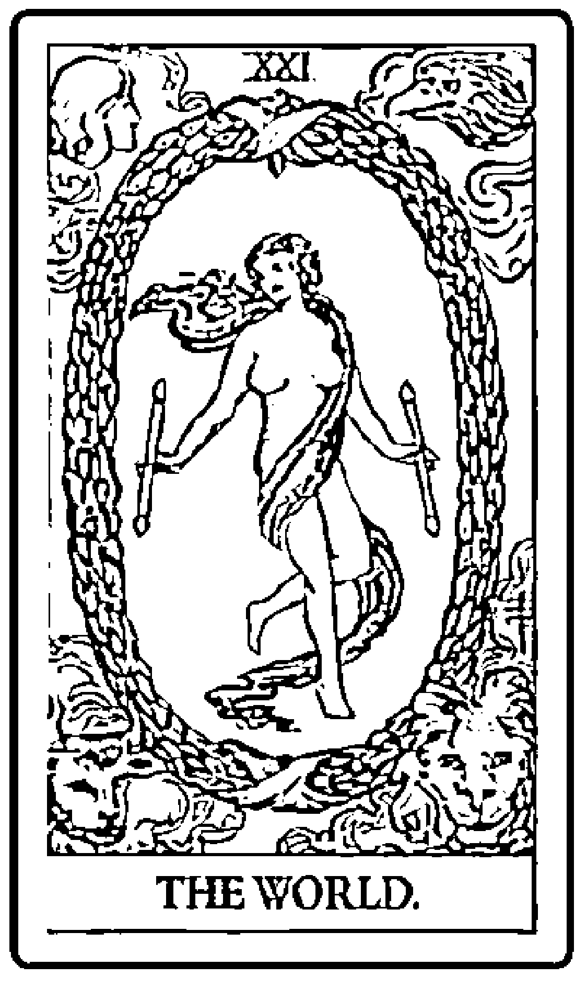

## THE WORLD
世界
### 因不滿意的結果而撤退

失去對情人的感恩之情／制式化／驕傲／功敗垂成／不完全燃燒／未完成的工作／遲遲沒有進展／維持現狀／半途而廢感到後悔／專注力中斷／沉浸在自我陶醉中

- 失去對情人的感恩之情／制式化／驕傲／功敗垂成
- 不完全燃燒／未完成的工作／遲遲沒有進展／維持現狀
- 半途而廢感到後悔／專注力中斷／沉浸在自我陶醉中

## 何謂小阿爾克那？

56張描繪著日常情景的塔羅牌，關鍵在於感受其中的微小差異

小阿爾克那(Minor Arcana)是以四種花色(符號)所構成的56張塔羅牌，花色分別對應「構成萬物的四大元素」與「人生的四大動機」：權杖(棍棒)對應火與熱情；錢幣(金幣)對應地與物質；寶劍對應風與智慧；聖杯對應水與情感。

此外，各花色分別由描繪了侍者、騎士、王后、國王的宮廷牌(人物牌)，以及一(Ace)至十的數字牌所構成。宮廷牌的特徵是代表牌意與人物的契合度及其形象；數字牌則以代表「起始」的一最強，其餘數字則各自擁有不同日常生活中的意義。

小阿爾克那的張數眾多，也存在構圖或意義上容易混淆的牌。因此在撰寫 MY KEYWORD 時，事先將專屬於自己的分辨方式記錄下來，就會更加方便。

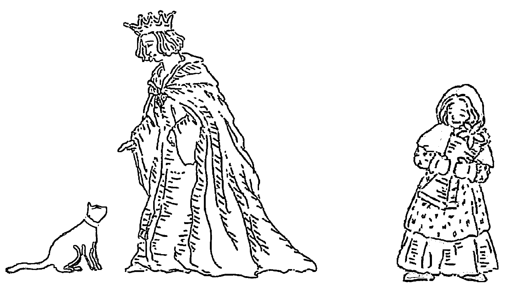

## 權杖（棍棒）
WAND

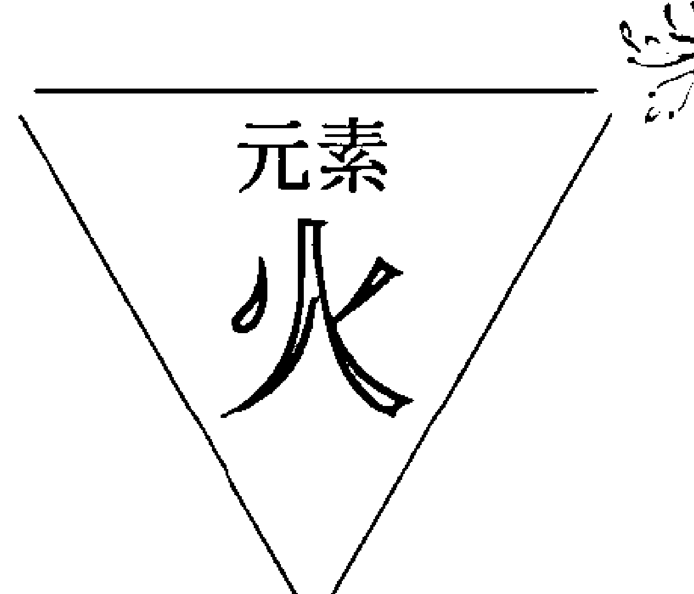

代表生命力、熱情等本能力量

所謂的權杖指的就是棍棒，據說是人類第一種使用的工具。
這種原始的木棒也用來作為武器、生火工具或是房屋的建材，可說是支撐人類文明「起源」的重要物品之一。
因此權杖對應著火元素，連結著生命力及爭鬥心。渴望「獲得」、「獲勝」的想法(動機)皆屬於權杖牌的領域。

- 展開新的挑戰
新戀情／沉迷／懷孕與生產／幹勁十足／誕生／靈光一現／可以成為夥伴／更加展現熱情／積極正向／開始／充滿活力地活動／順應直覺／邂逅／旅行／氣勢
[ KEYWORD: 生命力 ]

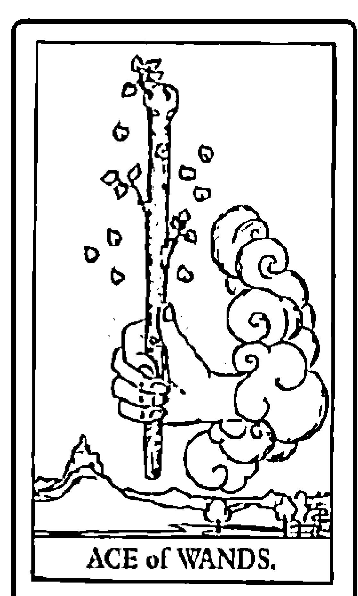

- 一項挑戰結束
解除關係／抽身／精神衰弱／每況愈下／事物回歸原點／延期／因惰性而停擺／無精打采／被扯後腿／清算／士氣低落／離職／破產

### ACE of WANDS
權杖一

- 達到目標而充滿自信
獲得意中人／終點就在眼前／實績獲得認同／自信滿滿／感覺得到未來性的人／進步／喪失信心而轉換跑道／萌生新的野心／高度上進心
[ KEYWORD: 達到 ]

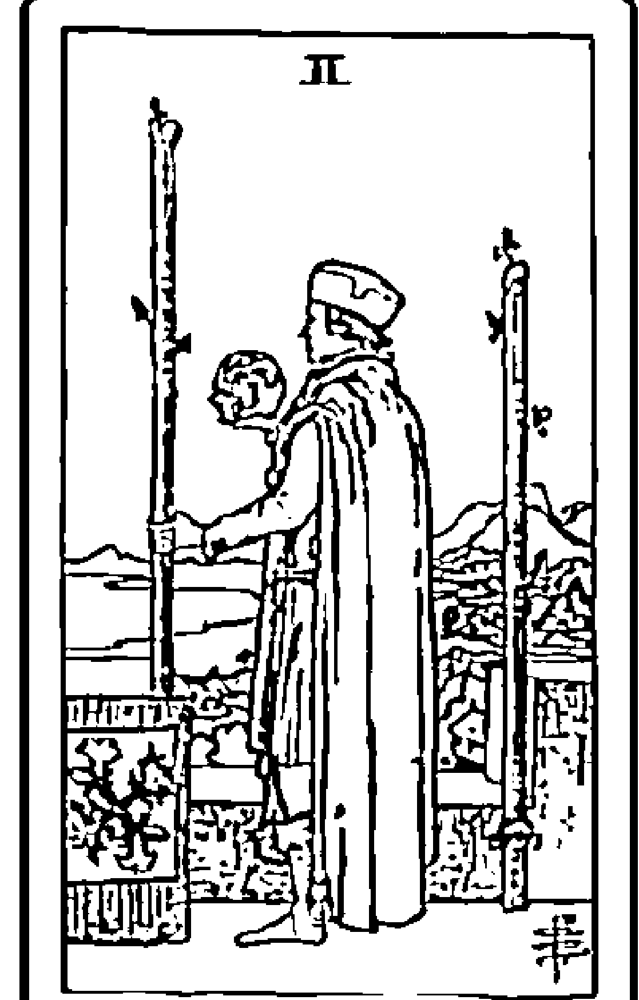

- 快要失去達成的事物
關係不順利／焦躁／控制欲／看不起／步調不一致／預期之外的突發事件／感覺受到背叛／杜撰的計畫／疏於自我管理／應該準備好備案

### TWO of WANDS
權杖二

#### 窺探挑戰的機會

論及婚嫁的戀情／有一線希望／好消息／新緣分／商務機會／擴大事業／獲得長久期望的事物／大幅發展的氣息／積極進取的人／為旅行作準備

> [ KEYWORD: 摸索 ]

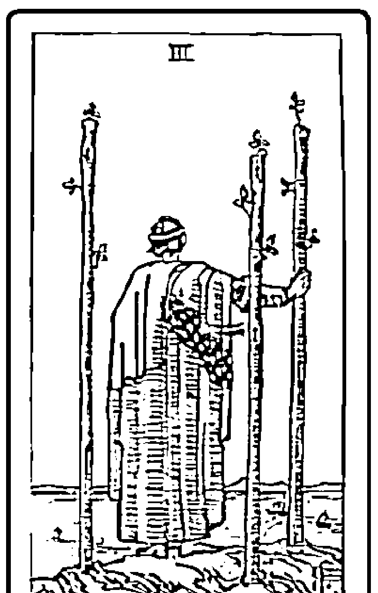

### THREE of WANDS
權杖三

#### MY KEYWORD

#### 期待在閃躲的情況下告終

對方不把你當作對象／以單戀結束的戀情／沒有回應／錯過時機／利益減少／關係每況愈下／空有期待卻不採取行動的人／出發得晚／延期

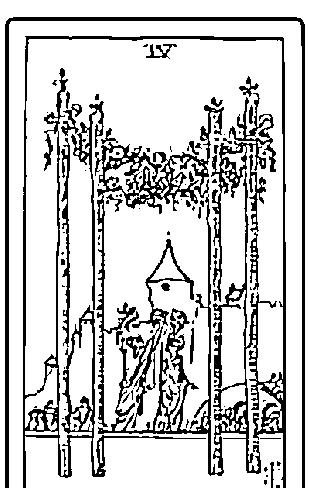

### FOUR of WANDS
權杖四

#### MY KEYWORD

#### 由衷的喜悦

新的戀情／結婚典禮／在一起能感到安心的人／放下肩上的重擔／告一段落／興高采烈／休長假／家人團聚／祝福他人的幸福／參加活動或派對／放鬆

> [ KEYWORD: 歡喜 ]

#### 現有的喜悅

墨守成規／爭風吃醋／安於現狀／喪失進取精神／工作偷工減料／無法公私分明／忘記感恩／受到期待而驕傲自滿／情緒起伏大的人

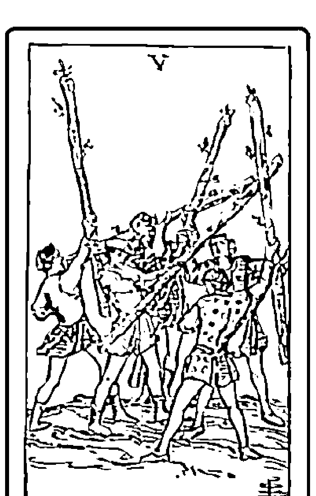

### FIVE of WANDS
權杖五

#### MY KEYWORD

#### 一邊切磋琢磨一邊奮鬥

與情敵競爭／橫刀奪愛／打開天窗說亮話／愈吵感情愈好／分出勝負／參加比賽或甄選會／有益的辯論／競爭／反骨精神／吵鬧嘈雜

> [ KEYWORD: 取勝 ]

#### 擊潰對手

複雜混亂的爭執／暴力的伴侶／被害妄想／想做什麼就做什麼／乖戾的人／陷入膠著狀態／內鬨／為求勝利不擇手段／不肯輕易死心

#### 受到極力讚美而感到自豪

- 表白成功／獲得稱讚，受到矚目／團隊的勝利／活躍受到認同／晉升／想向人自誇的心情／新成員加入／抱持自信處理事務／坦率地接受稱讚／驕傲

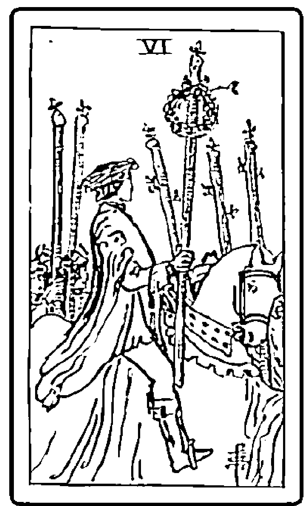

MY KEYWORD
[ KEYWORD: 稱讚 ]

#### 對於不合理的結果感到不滿

- 誤以為被對方喜歡上／愛情的熱度冷卻／留下不協調感的勝利／只有形式上的晉升／受到嫉妒／沒人跟隨／自我意識過剩／空有氣勢的人／沉浸在優越感中而失敗

### SIX of WANDS
權杖六

#### 基於有利的立場而取勝

- 猛烈地接近／粉身碎骨的決心／掌握主導權／強力的贊助商／強勢的應對為佳／不認輸的心情／獲得充裕的資金／有勝算的挑戰／明確地獲得 YES 或 NO 的回應

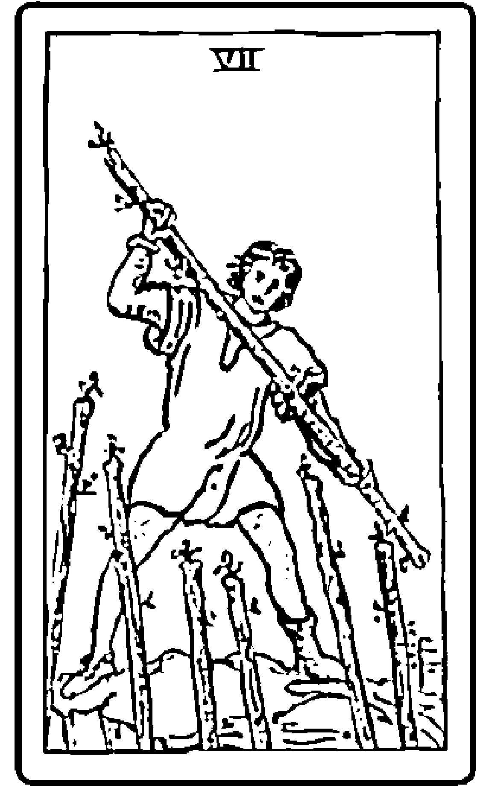

MY KEYWORD
[ KEYWORD: 奮鬥 ]

#### 在不利的狀況下面臨苦戰

- 情敵／無法下定決心而失戀／敗戰／遭遇妨礙或干涉／優勢被奪走／喪失戰意／無法表露真心／弱勢／不擅長應付強勢的人／心生膽怯而落敗／內心糾葛而無法使出全力

### SEVEN of WANDS
權杖七

#### 以令人眼花撩亂的速度前進

- 熱情地追求／展開出乎意料的戀愛／順利進展／一切流暢地推動／訂單／投資或股票成功／相信運勢而前進／積極正向思考的人／一帆風順／倉促

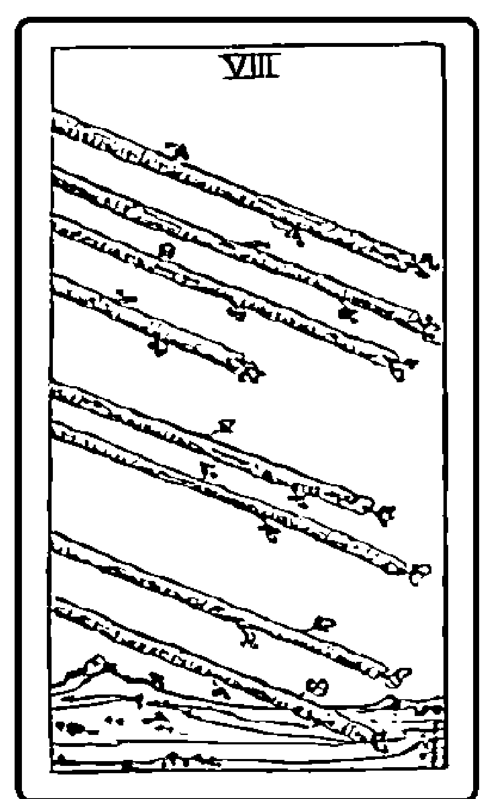

MY KEYWORD
[ KEYWORD: 急速發展 ]

#### 在意想不到的地方停滯不前

- 受到束縛／嫉妒／因武斷犯錯而起爭執／不帶期望而改變心意／感到不滿的狀況延續／陷入僵局／預定計畫突然變更／計畫遭受挫折／被放鴿子／失去熱情

### EIGHT of WANDS
權杖八

#### 準備臨機應變

在意中人面前感到緊張／提防競爭對手／有備無患／小心謹慎的人／迎擊體制／設想各種事態採取行動／仔細地預作準備／以經驗為糧食／感覺到壓力

#### KEYWORD: 準備

#### 因為驕傲而遭受沉痛打擊

自以為「對方也喜歡自己」／準備不足／過於自我中心／毫無根據的自信／駭客／沒有從過去的經驗中學習／不靠別人／意料之外的突發事件／切勿大意

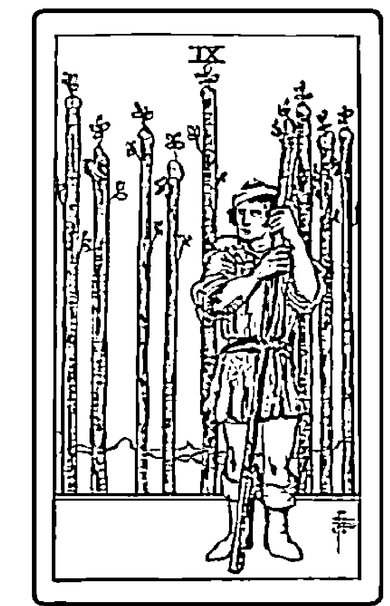

#### MY KEYWORD

### NINE of WANDS
#### 權杖九

#### 因自己選擇的重擔而竭盡全力

為了避免被討厭而逞強／因義務感而持續的戀愛／需要照顧的人／過勞／勞碌命的人／苦戰／心情鬱悶／獨自扛起／備受期待而感到壓力／看護／育兒

#### KEYWORD: 沉重的壓力

#### 放下逼迫自己的事物

拋棄情人逃跑／分手／遭到責備／有著麻煩的人／態度驟變地認為自己沒錯／互相推卸責任／受到牽連／半途棄權／姑息自己／持續失敗而遭受挫折

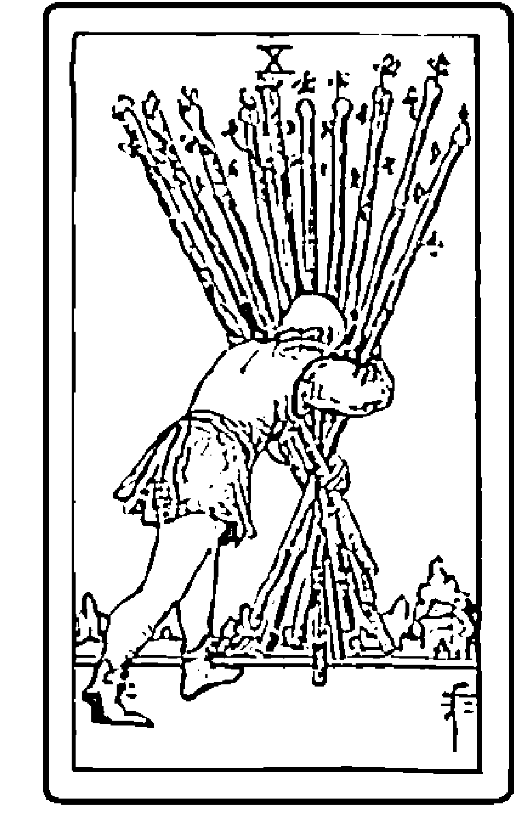

#### MY KEYWORD

### TEN of WANDS
#### 權杖十

#### 確信未來而燃燒熱情

愉快的戀愛／老少戀／熱衷到看不見周遭的程度／幹勁十足／機會降臨／學會技能／外國事業／由衷享受交談／有精力的／接到聯絡／單純

#### KEYWORD: 傳令

#### 沾沾自喜地說大話

隱瞞的事被揭穿／單方面地強加自己的心情／心神不定／為反對而反對的行為／欠缺深思熟慮／幼稚的言行舉止／虛榮心／想引人注目的人物

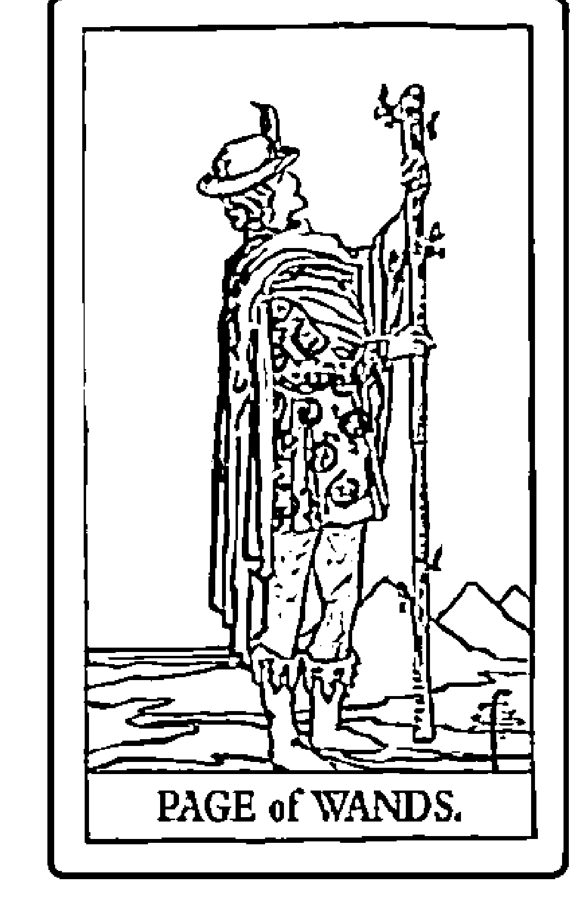

#### MY KEYWORD

### PAGE of WANDS
#### 權杖侍者

#### 朝著新天地出發

熱情地追求／肉食系的人／不可思議的機緣／興奮期待／積極主動／跳槽或調動／遇見具影響力的人物／東奔西跑／改變想法／開始／與其考慮不如採取行動

KEYWORD: 出發

#### 追不上的內心變化

經常吵架的情侶／利己主義者／引發麻煩的預感／氣勢洶洶／落於人後／趕不上／誇張的言行舉止／麻煩製造者／因驚慌而失敗／迷失自我／興奮過度

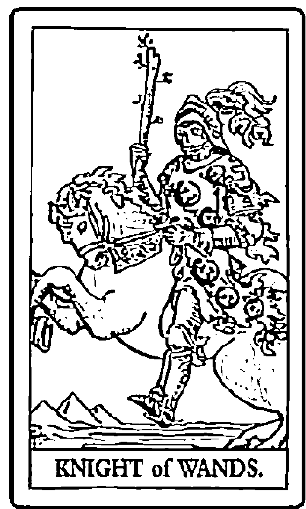

#### 周遭的任何人都會受到吸引

令身心灼傷般的愛／性感的人／貞操／凝聚人望／能維持原本的自己／找出這麼做的價值／不想撒嬌的心情／受到周遭提拔／有年長風範／可以理解別人的心情

KEYWORD: 魅力

#### 強硬態度會造成誤解

互相依存的關係／強烈嫉妒／轉嫁責任／任性的舉止／認為自己很強／無法受囑目而不滿／嘮叨多話的人／粗野的人／多管閒事／魅力不足／對周遭擺架子

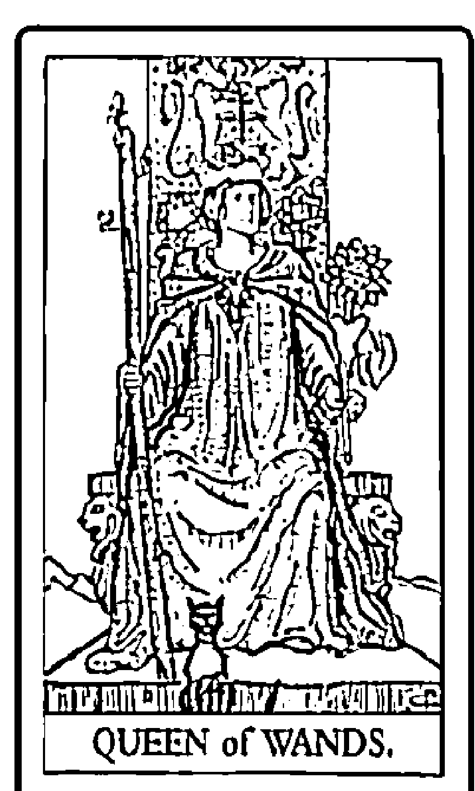

#### 以信念達成事情

令人由衷感到愉快的戀情／與外表不符，害羞的人／獲得成為自身支柱的事物／積極樂觀的人／發揮領導能力／被要求表現出不會動搖的言行舉止／顧問／開拓新事業／獨立

KEYWORD: 果敢

#### 強硬地掌控事物

勉強的關係／一夜情／暴力／將風險置身度外的決定／欠缺關心的態度／脾氣暴躁的人／奧客／以立場或權力打壓／被小心翼翼地對待／小氣／性急

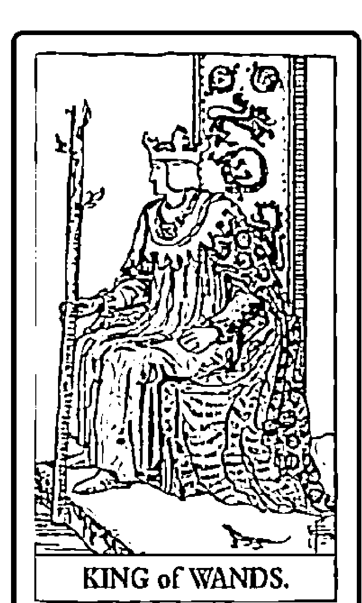

## 錢幣（金幣）
PENTACLE
### 意味著物質或各種豐饒

所謂的錢幣就是金幣。對應的是地元素，司掌人類生活所需的各種物質。換言之，就是金錢、房屋及健康等。透過使用金幣，可獲得物品、推動人們，讓單靠一人做不到的事化為可能，因此也帶有豐饒的意義。

此外，錢幣所意謂的豐饒不僅限於物質，也代表著地位、頭銜、穩定或技術等無形的事物。

### 發揮力量獲得豐饒

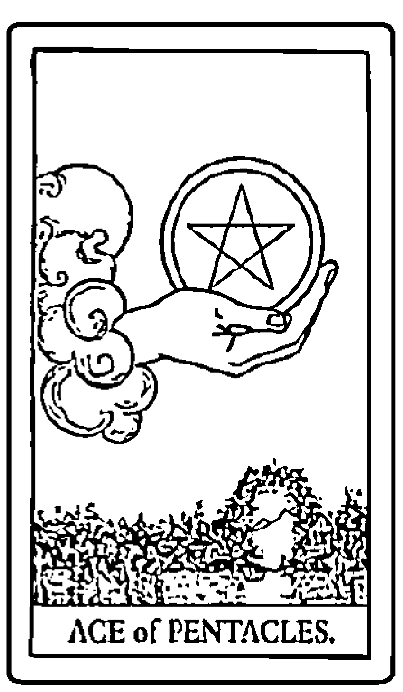

想法開花結果／穩定地培育愛情／獲得滿足的婚姻／喜獲麟兒／自己的房子／實行計畫／有臨時收入／有穩定的工作／能幹的人／讓點子具體成形／獲得有益的資訊／建設性

[ KEYWORD: 實力 ]

### 以利益為優先，使努力化為泡影

順應情勢發展的戀情／失業／放棄地位或頭銜／沒有回饋／對財務上感到不安／沒有將來的願景／拜金主義／想法天真而損失慘重／低俗的人／浪費才華或錢財／支付

### ACE of PENTACLES
錢幣一

#### 掌握狀況而採取正確行動

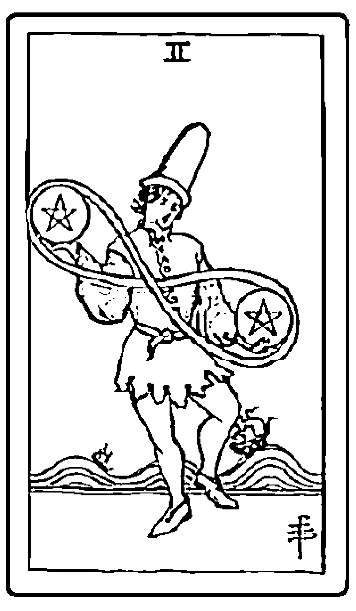

讓對方感到開心／令人興奮的戀情／變化豐富的兩人／能夠同時處理好幾件事／輕鬆／服務業／自由業者／專注而沒有雜念／遊玩／遊戲／臨機應變／受歡迎職業

[ KEYWORD: 柔軟度 ]

#### 無法應對狀況而吃盡苦頭

不知道會發生什麼事的戀情／隨便的交往／笑點不同／條件不合的對象／肩負／厭倦／應對隨便／工作態度差，會遲到或打瞌睡的人／忙不過來／無業

### TWO of PENTACLES
錢幣二

#### 培養能力而獲得好評

- 認真交往／戰略性的接近／以結婚為前提交往／受到提拔／根據計畫進行／獲得評價／晉升或升級／堅持到底的強韌意志／追求完美／堅持／加入一流的夥伴／證照

> KEYWORD: 技術力

#### 擁有的能力未獲得評價

- 抬不起頭來的關係／溝通困難／時機尚未成熟／引發錯誤的疏忽／愈發不滿／用功不足／不走運／放棄／沒抓到重點的應對／沒有認清立場／無知的人

#### 以穩定的利益為優先

- 可望生活穩定的戀情／金龜婿／同居／執著於利益／害怕事物被搶奪／想保護重要的事物／有備無患／占有欲／擬定踏實的計畫／成功地與大人物建立交情

> KEYWORD: 占有欲

#### 變得貪婪而迷失自我

- 奪去自由的戀情／挑剔／受到阻撓／支配慾望／利用他人的錢財／吝於出錢出力／唯利是圖的人／計策造成反效果／互扯後腿／被討厭的人／使財富發揮作用／損失

#### 因困難的狀況導致精神上的荒廢

- 妥協的愛情／冷淡的反應／財務上的煩惱／運氣不佳／認為「反正一定不行」的心態／下下籤／被託付棘手的工作／解僱／閉門羹／互舔傷口的關係／失去救命稻草／總是缺錢的人

> KEYWORD: 困難

#### 由於救贖而取得希望

- 心意終於相通／瞬間的喜悅／在演變成分手前和好／重得希望／救贖之光開始灑落／坦率地發出求救訊號／解圍／擺脫困境／遇見指導者／互相幫助

MY KEYWORD

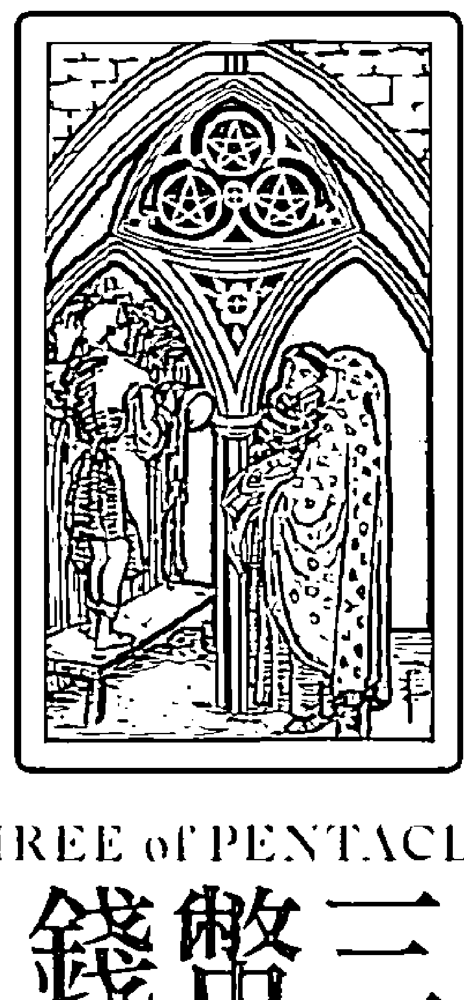

MY KEYWORD

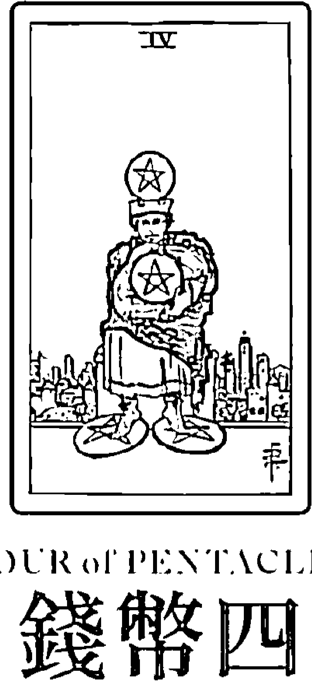

MY KEYWORD

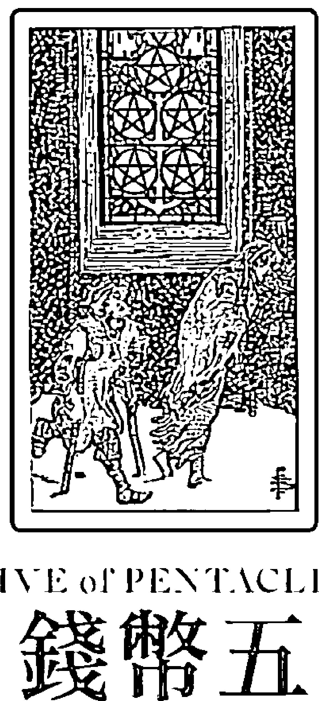

#### 提出善意者與接受者的關聯

奉獻的喜悅／送禮作戰／心意被對方接受／分享豐饒／不求回報地服務／經營業務／獎金／互相幫助的關係／仲介角色／親切獲得回報

#### KEYWORD: 關聯性

#### 支配者與受支配者的關聯

追求回報的愛情／假面夫妻／不對等的關係／裝成好人／想受到感謝／強迫推銷恩惠／努力以徒勞無功告終／黑心企業／以事物引誘／偽善者／偏袒／取得有利地位

#### MY KEYWORD

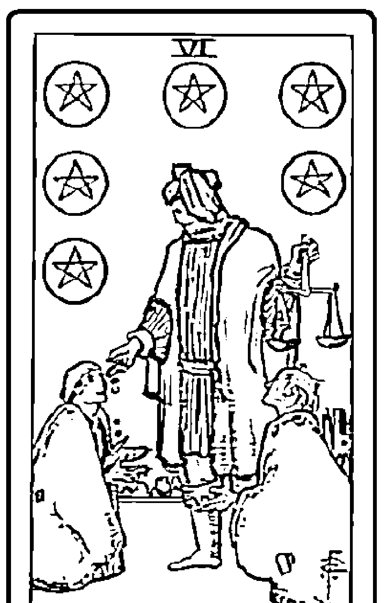

#### 改善問題，邁向下個階段

目睹理想與現實間的差異／思考將來／掌握狀況／估價／審核／獲得報酬／檢討更好的方法／尋找下一個目標／有上進心的人／過勞／休息一下，重新擬定作戰計畫

#### KEYWORD: 成長

#### 懷著不安並漫不經心地渡過

可有可無的戀情／彼此是「騎驢找馬」的關係／逐漸衰退／沒有願景／偷工減料的工作／僅有自我評價很高／自我感覺低落／淨是抱怨不滿的人／賴帳／失望

#### MY KEYWORD

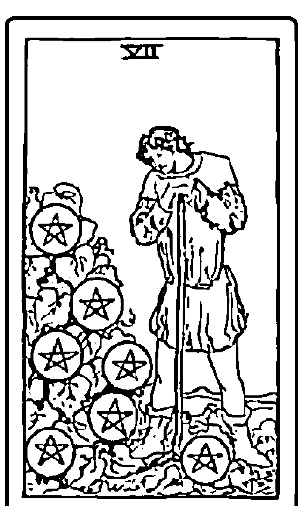

#### 專心處理眼前的事情

拚上全部精力的愛情／勤快聯繫／笨拙卻耿直的人／磨練自我／應該專注的時機／竭盡全力／全神貫注／遇見良師／腳踏實地地努力／預習及複習／重視堅持

#### KEYWORD: 修行

#### 無法專注於眼前的事情上

喜歡上有情人的人／跟蹤狂／受到阻撓／雜念過多／令人分心的環境／吝於展現才華或技術／偷工減料／過了截止日／模仿他人／壞習慣／過於纏人

#### MY KEYWORD

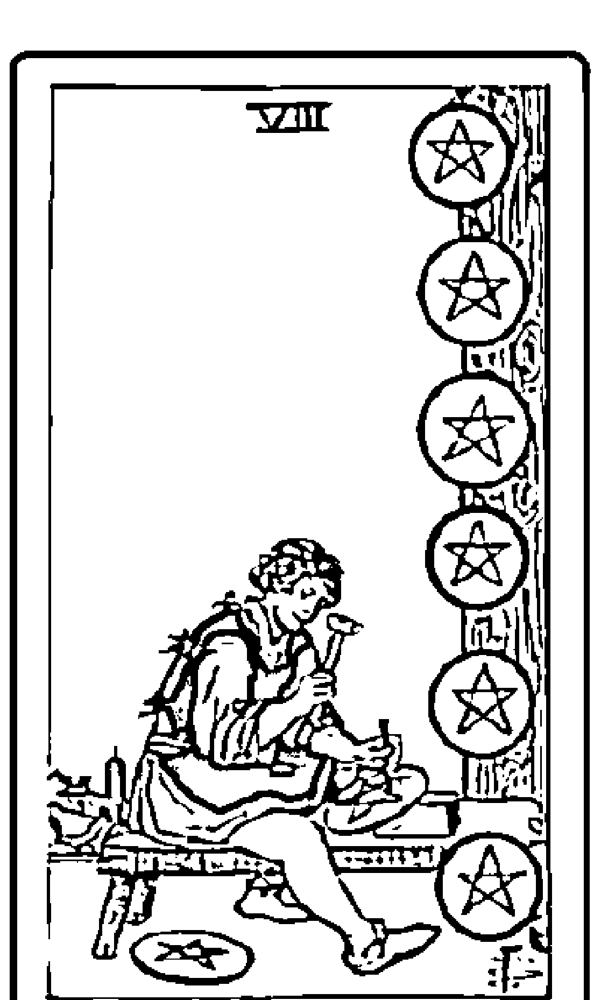

### 正位

#### 受到提拔而成功

心意開花結果／受到追求／金龜婿／有地位的關係／意想不到的援助／通往更上一層樓的世界／融資／贊助商／一帆風順地出人頭地／萌生自信／特種行業／人望

[ KEYWORD: 達成 ]

### 逆位

#### 以謊言或造假謀取成功

以財富或肉體為目標的關係／出軌／婚外情／壞傳聞擴散／討好他人／失去好感而失勢／試圖班門弄斧／厚顏無恥／金錢至上主義／使詐或舞弊／假面具被揭穿

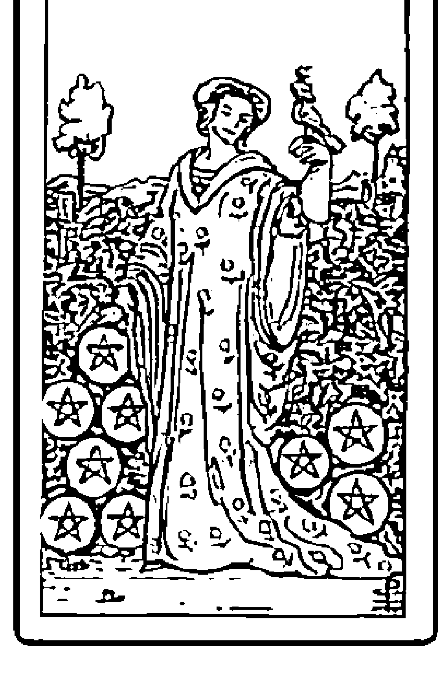

### NINE of PENTACLES
錢幣九

### 正位

#### 以繼承的事物維持穩定繁榮

開始同居／家族間的往來／喜獲麟兒／生活能力高的人／重視傳統文化／被提拔肩負重大責任／隊伍團結一致／大企業或行政機關／家族的繁榮／平凡百姓的幸福

[ KEYWORD: 繼承 ]

### 逆位

#### 繼承的事物面臨極限

離開不了父母的伴侶／家庭問題影響到戀情／因為配額或繼承問題起爭執／被迫承擔重任／拘泥於家世／偏袒自己人／背負貸款／繼承糾紛／籌錢失敗

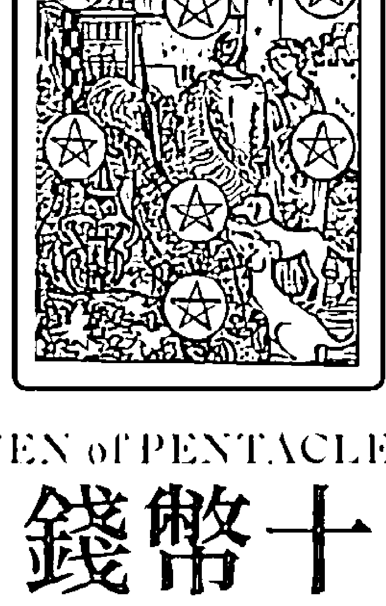

### TEN of PENTACLES
錢幣十

### 正位

#### 花時間累積

謹慎發展的戀情／正直的對象／累積見面次數／努力的時候／提升技能的時候／應徵工作／探究心旺盛／想認真學習的事／朝著希望的出路前進／實習

[ KEYWORD: 誠摯 ]

### 逆位

#### 淨是浪費時間

誤以為是戀愛／幼稚的對象／逃避現實／看不見周遭／徒勞無功／被報酬蒙蔽雙眼／空有理想卻毫無成果／避重就輕／放棄／經驗不足／空口說白話

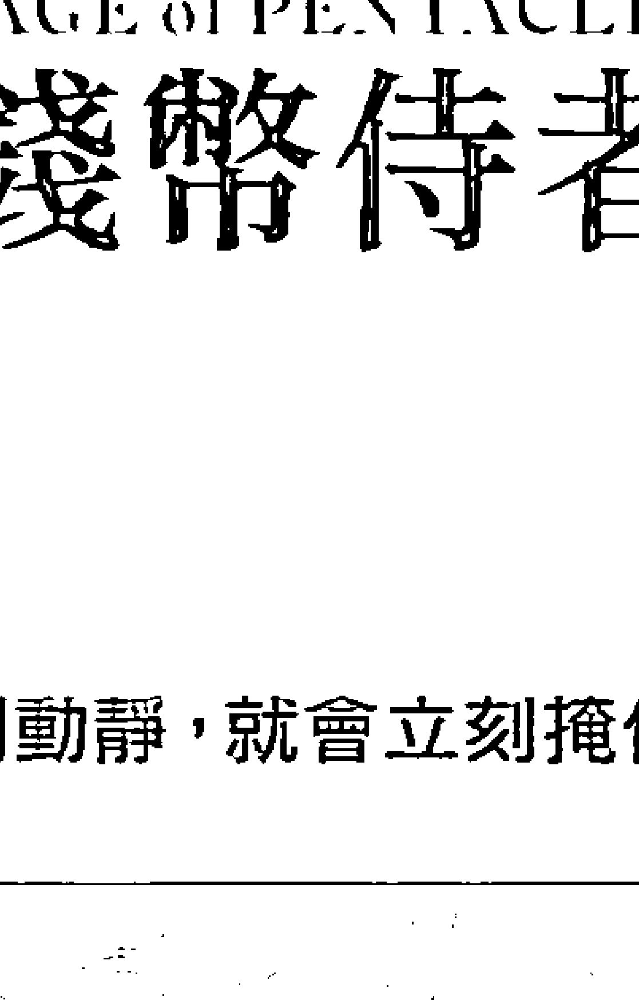

### PAGE of PENTACLES
錢幣侍者##

**正位**

#### 貫徹始終
純情的情侶／應該鎖定一個目標／努力開花結果／變得謹慎／天真無邪的人／受到信任／責任感／取得證照／認真工作／比起速度更重視品質／獨立／長年往來

[KEYWORD: 現實性]

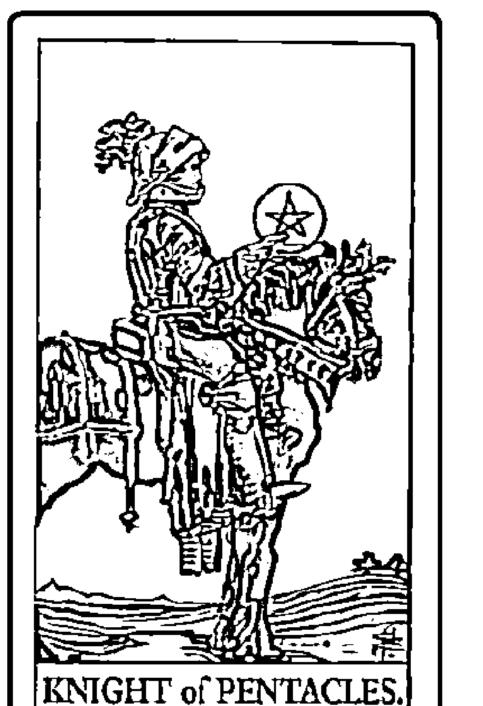

**逆位**

#### 以維持現狀告終
過於晚熟而毫無進展的關係／不可靠的對象／慢吞吞地進行／無法被放心交付任務／不划算的工作／單一模式化／流於形式／半吊子的努力／想追求輕鬆／原因在於不得要領

**正位**

#### 培育人者自己也得以成長
平穩而舒適的戀情／賢妻良母／延續到結婚的關係／培植部下／為了某人煞費苦心／有包容力的人／可靠的上司／困難時可互相幫助的夥伴／高級名牌／內在的小孩

[KEYWORD: 寬容]

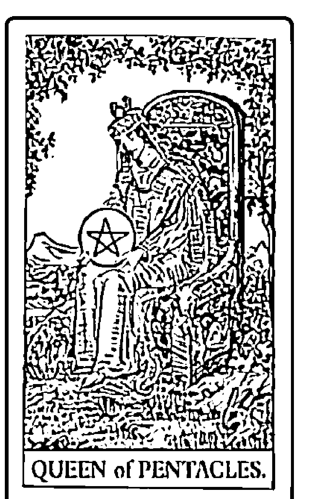

**逆位**

#### 姑息寵溺只會毀滅彼此
心意無法傳達出去／得不到回報的戀情／方便的對象／有情人／長期建立的關係化為烏有／忙不過來／經常做白工的職場／假裝忙碌的人／愛慕虛榮／遲鈍／吝嗇鬼

**正位**

#### 試圖讓自己的力量派上用場
長久的往來／富裕的對象／有包容力的男性／財運提升／有商業頭腦的人／為組織或世界做出貢獻／幫上對方的忙／互利的關係／被人需要

[KEYWORD: 貢獻]

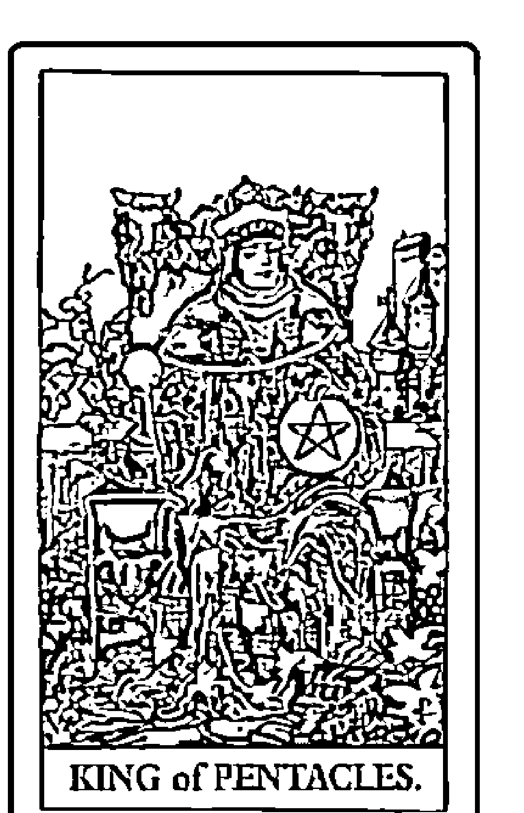

**逆位**

#### 沒有善加活用自己的力量
因慣性而苟延的關係／話不投機的對象／希望更受信賴／不諳世事／令人焦急／膽怯／未活用知識或經驗／推銷／無法應用而派不上用場／古板而遲鈍的人／放棄也是很重要的

MY KEYWORD

MY KEYWORD

MY KEYWORD

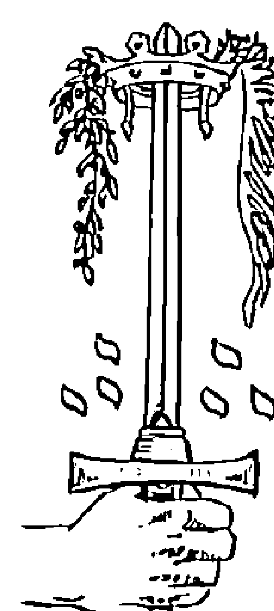

## 寶劍
SWORD

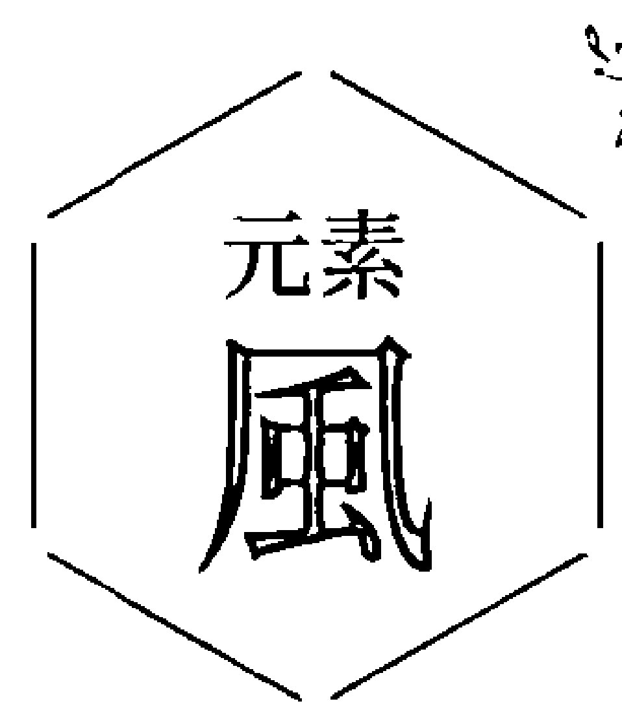

### 理性、思考與溝通的象徵
寶劍是以金屬加工製成，因人類的發明而誕生的物品。因此司掌著智慧、靈感，對應的元素為風。

人類又進一步將刀劍利刃加工成更多物品，但劍終究是能傷害、奪去他人性命的工具。出於智慧的詞彙或策略，同樣也可能因為使用方式不同，而化為傷人的刀刃，這一個花色同樣也在勸誡著人們這一點。

- 開闊以達成目標
- 跨越困難而結合
- 冷酷的戀愛
- 下定決心
- 面對勝負
- 因機智而突破危機
- 揭發不法行為
- 合乎邏輯的
- 聰明的人
- 讓心煥然一新
- 客觀性
- 善惡基準

KEYWORD: 開拓

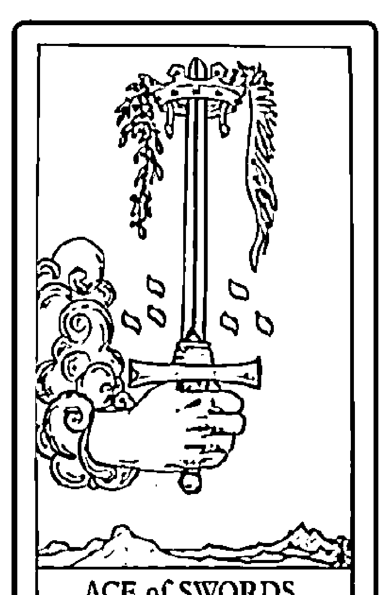

### ACE of SWORDS
寶劍一

MY KEYWORD

**正位**

- 強硬態度招致毀滅
- 無視於對方心情
- 試圖試探周遭而失敗
- 粗野而暴力的人
- 濫用職權
- 使詭計
- 打算強硬推行
- 破壞衝動
- 變成加害者
- 不擇手段的強硬態度

**逆位**

- 以平靜的心保持和諧
- 萌生戀慕之情
- 與比自己年輕的人往來
- 知性的對談
- 平衡感
- 問題逐漸解決
- 和平的職場
- 等候對方的態度
- 總是很溫柔的人
- 接受其他人的價值觀

KEYWORD: 糾葛

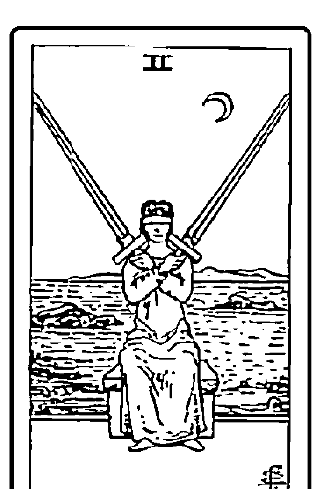

### TWO of SWORDS
寶劍二

MY KEYWORD

**正位**

- 只想敷衍了事而走投無路
- 裝作不感興趣而被討厭
- 幼稚的愛情表現
- 假裝成熟
- 結婚詐欺
- 不正視自己的情感
- 壓抑
- 靠口才或手腕
- 巧言令色
- 疏遠他人的態度
- 有人對自己說謊
- 背叛

**逆位**

#### 接受事物的核心

- 陷入僵局而失敗／發現出軌或三角關係／以疼痛為糧食／烏雲籠罩／受到打擊的事件／失敗／不錄用／機械式的作業／言詞不當／應該正視現實／成長的時刻／心理創傷

KEYWORD: 疼痛

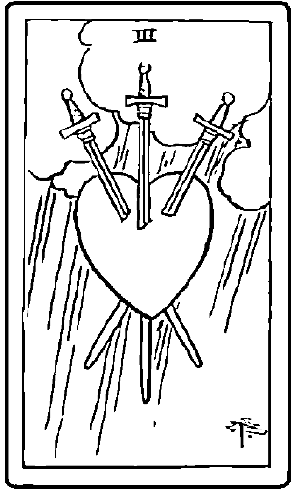

MY KEYWORD

### 寶劍三

**正位**

#### 拒絕真相而掙扎痛苦

- 害怕失戀／不想承認結束／強烈嫉妒的人／認為自己「遭到背叛」的情感／惡劣的職場／無法放棄的工作／無法整理內心／被害妄想／排斥反應／責備自己

**逆位**

#### 安靜休息調整態勢

- 正在調解／現在應該保持距離／獨處的時間／重新擺好架勢／暫時擱置／休假／能給予冷靜建議的人／離開問題／懷念回憶／按摩等療癒行為／掃墓

KEYWORD: 恢復

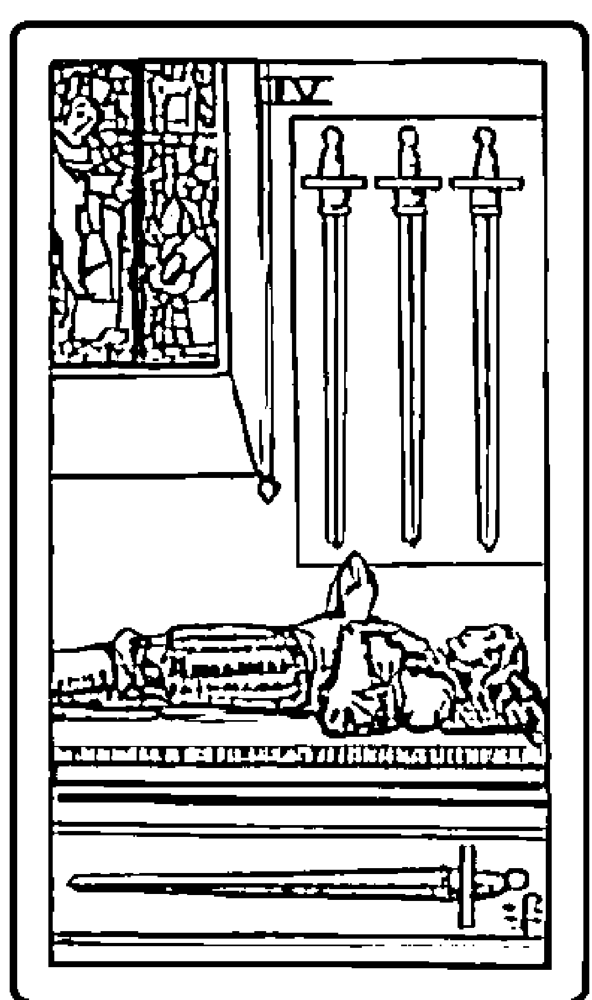

MY KEYWORD

### 寶劍四

**正位**

#### 做好準備再次啟動

- 展開一段新的關係／發現自己真正喜歡的人／進入對方的私人領域／恢復／休假結束／復職／心癢難耐地想展開行動／原本擱置的案子開始啟動／切換為新體制

**逆位**

#### 不擇手段強取豪奪

- 愛上別人的對象／橫刀奪愛／對待伴侶的態度隨便／顧不了那麼多／非法的作戰方式／派系鬥爭／利己的人／使詭計／不能大意的關係／把他人作為踏板／勝之不武／小偷

KEYWORD: 混亂

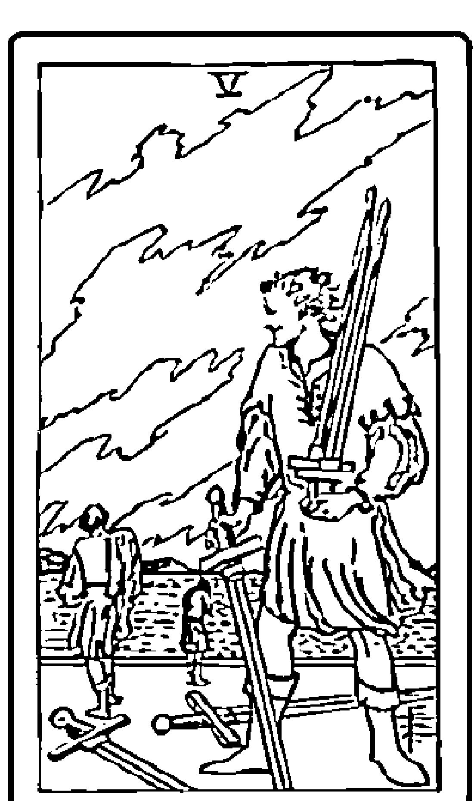

MY KEYWORD

### 寶劍五

**正位**

#### 重要的事物被奪走

- 被情人戴綠帽／察覺遭到欺騙／敗戰／敗北感／被某人惡意介入／落入陷阱／功勞被搶／職權騷擾或找碴／被當作弱勢欺侮／粗心大意／忍氣吞聲

**正位**

#### 脫離困難的狀況
新戀情的開始／私奔／有人伸出援手／遠離麻煩／事物上了軌道／新計畫／出差或調職／搬遷／三十六計走為上策／在旅行中遇見的人／返鄉／有人前來迎接

KEYWORD: 中途

**逆位**

#### 返回從前的困境
連續劇／泥沼般的關係／四處碰壁／強烈後悔／想要拋棄一切的想法／需要重新審視計畫／受到連累／靠不住的人／逃不掉／應該做好心理準備迎戰

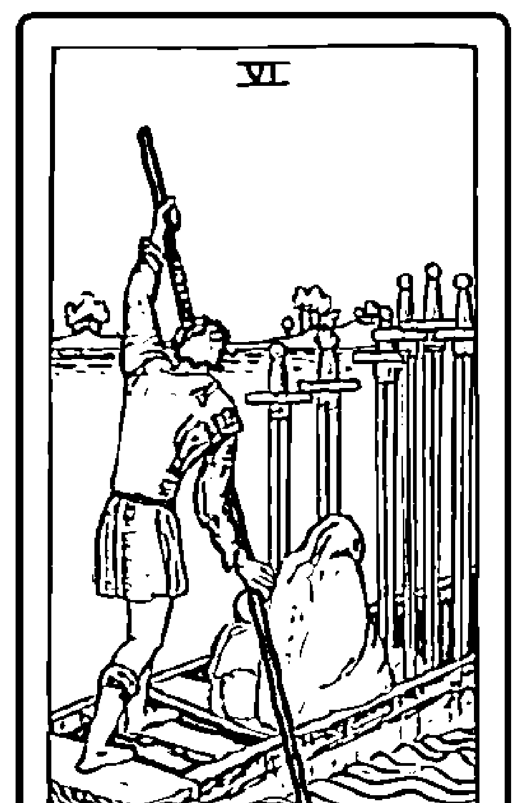

### SIX of SWORDS
寶劍六

MY KEYWORD

**正位**

#### 偷偷摸摸地在暗地裡策劃
出軌或外遇／雙面人／被刺探秘密／詭計正在暗中進行／不法盛行／做壞事的自覺／好處被搶／間諜行為／連夜逃跑／一時衝動

KEYWORD: 背叛

**逆位**

#### 察覺危險並做好萬全準備
意料之外的美好戀情／超乎預期的對象／千鈞一髮之際迴避危險／防範麻煩於未然／聽從建議為佳／商量煩惱／收集情報派上用場／內心的悶氣消除

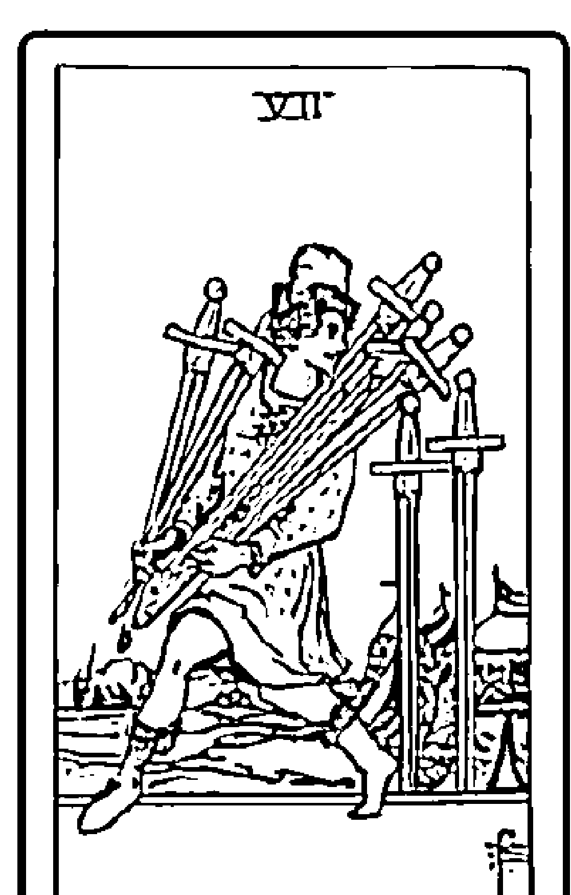

### SEVEN of SWORDS
寶劍七

MY KEYWORD

**正位**

#### 在痛苦的狀況下等待救援
沉醉於悲劇或妄想中／都是對方害的／互相束縛的關係／受拘束的環境／過度干涉／規矩很多的職場／管理過嚴／監視／被害妄想嚴重的人／狹窄的地點／誹謗中傷

KEYWORD: 忍耐

**逆位**

#### 在沒有後援的狀況下胡鬧
意氣用事地不願分手／互相傷害的關係／並非本意的狀況／不滿快要爆發／傷害對方的發言／愈發焦躁／將自己的行為合理化／不道歉的人／過於在意他人目光

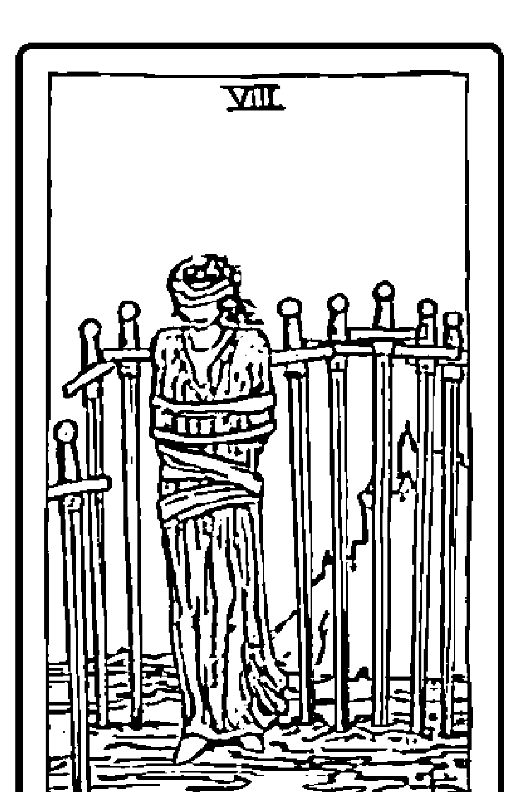

### EIGHT of SWORDS
寶劍八

MY KEYWORD

**正位**

#### 無法挽回的絕望
瀕臨陷入僵局而失敗／不想失去的對象／強烈後悔／因為悲傷而夜不成眠／緊張／反覆過去的失敗／自我否定／眼界狹隘而看不見周遭／神經衰弱

> KEYWORD: 苦悶

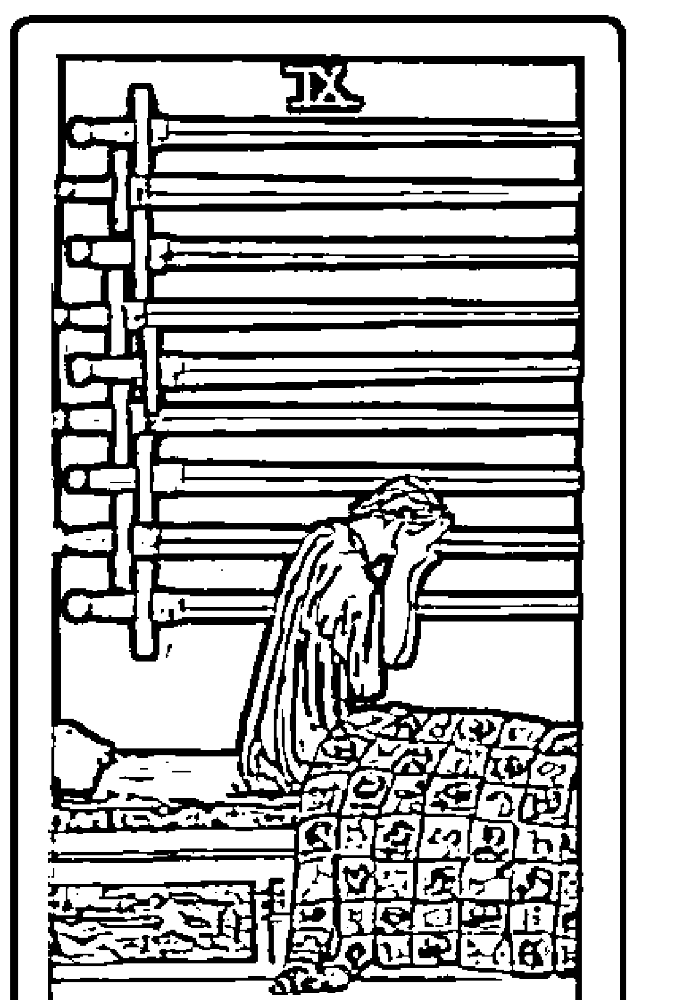

**逆位**

#### 不想面對糟糕的狀況
歸咎於他人／對問題視而不見／幻想有人正在妨礙自己／自怨自艾／不承認錯誤／因反被怨恨而失控／被流言耍著玩／為了自衛而攻擊人

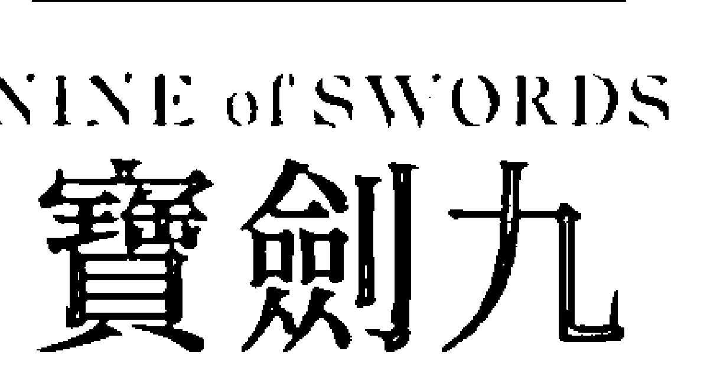

**正位**

#### 接受一切後決定前進
透過戀愛醒悟／接受對方的一切／脫離最糟的狀態／內心的迷霧消散／接受自己的缺點／真心受到了考驗／從頭開始的機會／精神上的成長

> KEYWORD: 岔路

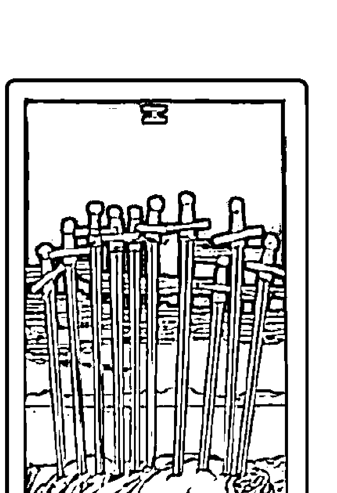

**逆位**

#### 只往對自己好的方向看
沉浸於悲劇收場的戀愛中／運氣差就逃跑／只接受對自己方便的現象／重蹈覆轍／臨場湊合的應對／客套話／抱怨／陶醉於自怨自艾中／並未從根本上解決

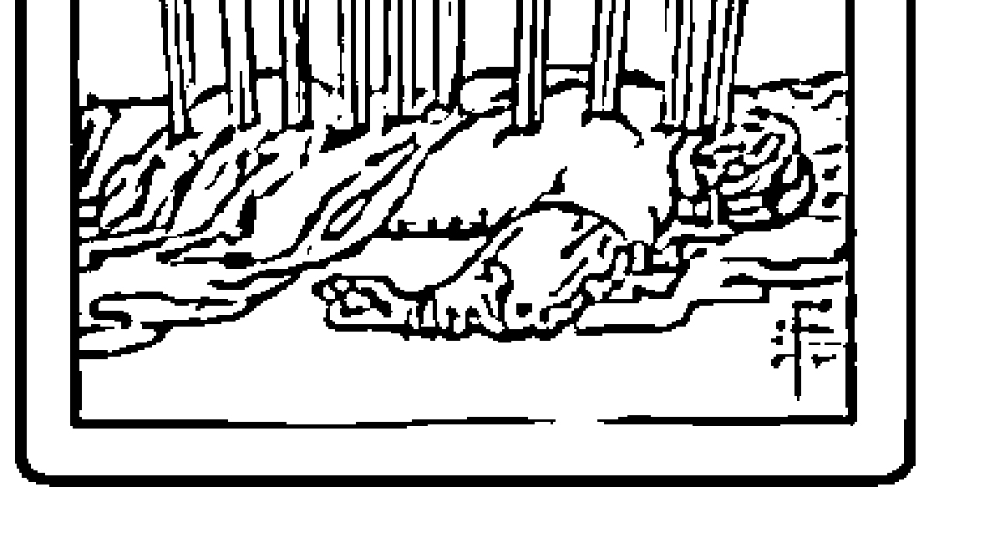

**正位**

#### 看清狀況而小心謹慎
享受戀愛的策略／想了解彼此的階段／保密的戀情／暴風雨前的寧靜／精於鑽研的人／交涉事情／工作時毫不猶豫地下結論／知道對方的弱點／有緊張感的氛圍／神經過敏

> KEYWORD: 警戒

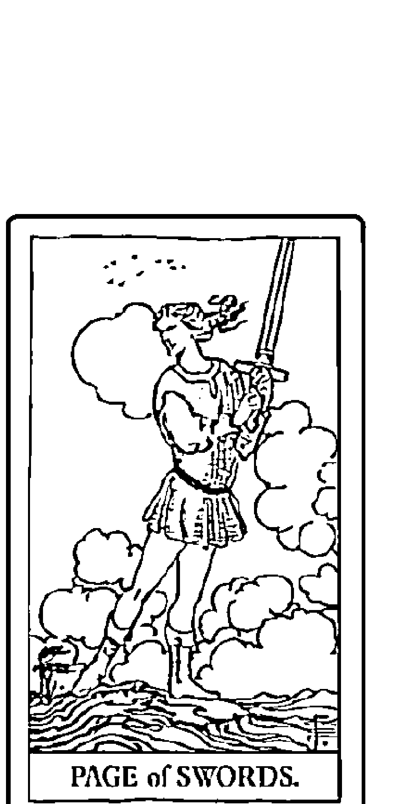

**逆位**

#### 防備顯得有些不嚴謹
冷靜而欠缺氣氛／似乎有所隱瞞／不能公諸於世的戀情／有漏洞的計畫／暗中動手腳被發現／引發錯誤的疏忽／大意會喪命／禍從口出／猜忌／失言／不受信任

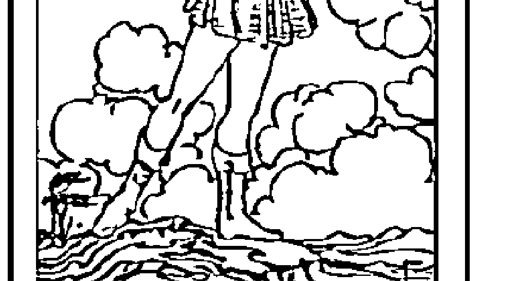

### KNIGHT of SWORDS
寶劍騎士

**正位**

#### 條理分明地下定決心前進
- 引領情人
- 在速度上獲勝
- 重視效率
- 菁英
- 有先見之明的人
- 節奏明快的對話
- 辯論
- 被要求迅速判斷
- 分析能力
- 冷靜應對
- 神出鬼沒

> [ KEYWORD: 果敢 ]

**逆位**

#### 招致無謂的爭端
- 盲目的戀愛
- 欠缺細膩度的對象
- 做著毫無成果的努力
- 焦急而導致出錯
- 器量狹小
- 單方面的主張
- 過於好戰
- 自戀的人
- 強詞奪理的人
- 武斷犯錯而失敗

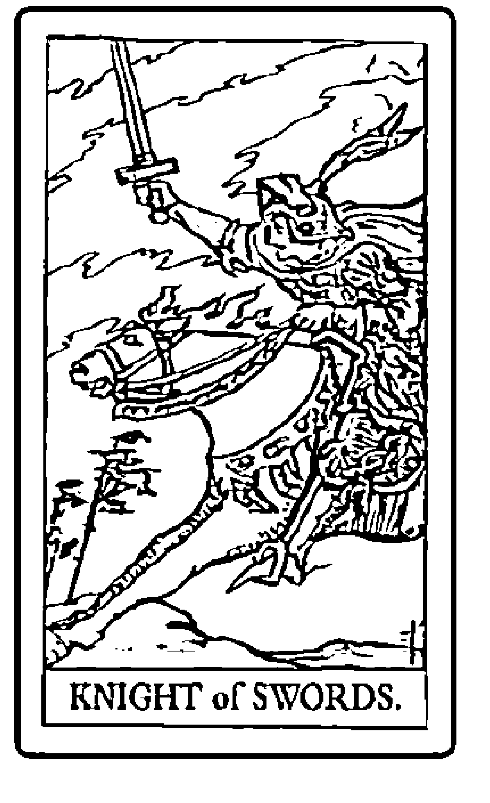

### QUEEN of SWORDS
寶劍王后

**正位**

#### 正確的言行舉止令人敬佩
- 令異性無法接近
- 知性魅力提升
- 離婚
- 正視現實
- 壓低成本
- 不隨波逐流的強悍
- 連難以啟齒的事都能說出口的關係
- 表達意志
- 難以親近的氛圍

> [ KEYWORD: 正確 ]

**逆位**

#### 為了自我防衛的武裝
- 關係降溫
- 驕傲自大的態度
- 懷疑出軌
- 歇斯底里
- 防衛過度
- 只會傷人的批評
- 薄情寡義的人
- 不可愛的人
- 不會誇獎人的上司
- 對於自己與他人都過於嚴厲
- 辛辣


### KING of SWORDS
寶劍國王

**正位**

#### 以客觀的分析作判斷
- 建立平等的關係
- 兩人都在工作
- 下決定的時候
- 能幹的商人
- 好的商量對象
- 冷靜而聰明的人
- 撲克臉
- 找出好的解決方案
- 雖然嚴厲卻有益的話語
- 公正

> [ KEYWORD: 嚴格 ]

**逆位**

#### 獨裁地守護威嚴
- 自私的情人
- 沒有戀愛的關係
- 認為「只有自己才是正確的」
- 搶了部下的功勞
- 偏見
- 欠缺情感的舉止
- 自作多情招致麻煩
- 不夠體貼
- 擅自作結


## 聖杯
CUP


### 顯示如流水般的愛與情感
所謂的聖杯，是在向神獻祭的儀式或婚禮中會使用的物品。另一層意義則是作為承接或遞出情感或祈禱等無形事物的容器。

基於這點，聖杯對應水元素，是司掌情感或情緒的花色。

從無論在何處都能自由地改變姿態，孕育生命的水之形象，到心臟機能、感受性及內心印象等肉眼看不見的事物，都屬於聖杯的世界。

### 充滿愛與希望
新戀情的預感／實際有被愛的感覺／著迷的對象／活用人脈／像家一樣的職場／財源／獲得部下或上司／豐富的情感表現／與某人心靈相繫／情操教育／實現心願


> [ KEYWORD: 愛的力量 ]

MY KEYWORD

### ACE of CUPS
聖杯一

**正位**

#### 因失落感而感到空虛
單戀告終／理應是幸福的卻無法滿足／戀情冷卻／單是自己的事就忙得不可開交／希望別人讓自己靜一靜／內心空洞／回歸原點／沒有價值的工作／茫然自失／好意反而徒增麻煩

**逆位**

#### 建立良好的信賴關係
萌生愛意／相親相愛的兩人／登記入籍／共享願景／交涉成立／可信任的人／締結契約／和好／推心置腹地交談／同性間的友誼／超越性別的羈絆／互相幫助／允許


> [ KEYWORD: 互相理解 ]

MY KEYWORD

### TWO of CUPS
聖杯二

**正位**

#### 內心頑固地緊閉
從盤算開始的戀愛／虛有其表的戀情／無性／假結婚／意見不合／留下不滿的決定／合不來的人／封閉內心／無論如何都無法原諒／聯絡出錯／解除婚約

**逆位**

#### 與夥伴共同慶祝喜悅
聯誼活動／明朗愉快的關係／團隊合作／企畫案成功／慶祝的氣氛／慶功宴／開朗爽快的人／共享喜悅／談笑／內心的悶氣消除／酒友


### THREE of CUPS
聖杯三

[ KEYWORD: 共鳴 ]

**正位**

#### 沉浸於怠惰的快樂中
快熱快冷的戀情／於心有愧的關係／悔婚／空歡喜／串通一氣／沒有結論的會議／重做／不感興趣的人／遊手好閒的人／過於放蕩而後悔／不養生／成人病／裝作感情要好

**逆位**

#### 心懷不滿而悶悶不樂
無法接受目前的關係／倦怠期／微妙的結果／甘於忍受有所不滿的環境／愛抱怨的人／陷入負面思考／替自己找藉口／維持現況／無聊且難以忍受的情況／正在思考


### FOUR of CUPS
聖杯四

[ KEYWORD: 疲憊 ]

**正位**

#### 找出解決不滿的方案
朝著新戀情展開行動／事物因猶豫而告終／走上不同的道路／提出異動或調職／辭職／著手新案件／決心做某件事／開朗的意見／邁向下一階段／憑靈感行動

**逆位**

#### 因失去的悲傷而置身於後悔中
失戀／分手後才意識到重要性／因為悲傷而無法思考任何事／重大損失／受到連累／眼界狹隘的人／希望時間倒流／自我嫌惡／依戀不捨／後悔莫及／情緒不穩


### FIVE of CUPS
聖杯五

[ KEYWORD: 喪失 ]

**正位**

#### 面對全新局勢重振旗鼓
從失戀中振作／與過去告別／重新來過／重振旗鼓／動力高昂／彼此激勵／市場調查／組織或企畫重整／展現諸多可能性的人／下定決心／振奮

**正位**

#### 內心充滿懷念之情
初戀／酸酸甜甜的戀愛情況／舊情人／前同事／前公司／過去的經驗成為提示／回到原點／天真爛漫的人／傷感的／返回赤子之心／同學會／年幼的記憶／故鄉

> [KEYWORD: 內心淨化]


### SIX of CUPS
聖杯六

MY KEYWORD

**正位**

#### 無法捨棄過去的記憶
沒有察覺新的邂逅／忘不了舊情人／互相依存的關係／緊抓著過往的榮耀／變得感傷／互舔傷口／封閉的環境／美化回憶／該放下過去向前邁進的時候

**逆位**

#### 沉迷而迷失於夢境中
戲劇般的戀情／見異思遷的愛情／只看表面／受到妄想束縛／想擴展範圍卻失敗／貪婪／紙上談兵／花言巧語／隨心所欲地選擇／糾葛

> [KEYWORD: 夢境]


### SEVEN of CUPS
聖杯七

MY KEYWORD

**正位**

#### 為了實現夢想而下決定
從妄想的戀愛觀中醒來／明白對方的本性／冷靜下來／思考實現可能性高的計畫／減少選項／著手行動／斬斷迷惘／決定優先順序／作決定的時候

**逆位**

#### 明白終結，再次啟程
下定決心分手／放棄單戀／斬斷依戀／過了巔峰的狀態／停損／貶職／死心／斷絕聯繫／變得疏遠／抽身離去／出發旅行／引退

> [KEYWORD: 轉變]


### EIGHT of CUPS
聖杯八

MY KEYWORD

**正位**

#### 再次向同一主題挑戰
重新迷上對方／分手被挽留／再次挑戰原本一度放棄的事情／抱著即使失敗也無妨的態度交涉／回收再利用／發現全新價值／從過去的經驗中找出可學習的事／重逢／回顧

**正位**

#### 一償宿願，內心感到滿足
- 愛情長跑開花結果／充實的戀愛／獲得令人滿意的利益或報酬／得到期望的環境／財務、精神上游刃有餘的人／高傲的人／坦率地感到高興／八分飽／知足

> [ KEYWORD: 願望 ]

**逆位**

#### 受欲望支配而判斷錯誤
- 只有肉體關係／扭曲的愛情／自吹自擂／因為欲望而失去理智／得意忘形／深不見底的欲望／以利益為首的經營方式／任性的人／高高在上／沉溺於奢侈／負債或借貸


### NINE of CUPS
聖杯九

**正位**

#### 從平穩的每一天感覺到幸福
- 心靈相通／家人增加／結婚生活／品味幸福／獲得確實的職位／精神充實／能夠去愛周遭的人／關係和樂融融／和平／理想的家庭／成就感

> [ KEYWORD: 幸福 ]

**逆位**

#### 因無趣的每一天感到愈發不滿
- 追求理想的戀愛／視周遭一切為理所當然／忘記對對方的感謝／進取心低落／例行業務／無論被怎麼對待都不開心／無趣的人／愛慕虛榮／曖昧含糊的幸福


### TEN of CUPS
聖杯十

**正位**

#### 接受一切而悠然自得的心
- 浪漫而甜美的戀情／發展成肉體關係／被人表白／視內心情況而定，不可能也能化為可能／個性／別出心裁／具創造性的工作／共享秘密／端莊秀麗的人／體察對方想法

> [ KEYWORD: 接納 ]

**逆位**

#### 容易受到誘惑的軟弱內心
- 妄想延伸的愛情／彼此都不成熟的情侶／在感情上不可靠的人／互相依賴／無法專注工作／任性的工作態度／無能的部下／被花言巧語欺騙／說謊／誘惑／無法成長的關係


### 正位

## 達成理想的喜悅

被求婚／羅曼史的預感／花花公子／接到令人高興的通知／大大提拔／出人頭地／深思熟慮的言行舉止／內心溫柔的人／心情爽快／精神充實／細膩／接受邀請

> [KEYWORD: 理想]


### KNIGHT of CUPS
聖杯騎士

### 逆位

## 面對現實的悲哀

從一開始就看得見結局的戀情／遭人玩弄／令人作嘔的臺詞／不履行契約／面對預定之外的工作／跟聽說的事不一樣／講話前後矛盾／應變能力不佳的人／為了獲得感激而施恩於人／不滿足

### 正位

## 接納並看穿本質

得到摯愛之人／再次確認愛情／理解對方／貼近內心／柔軟的應對／為組織或公司奉獻／溫暖的職場／溫柔的上司／具母性的人／自省／品德／陷入沉思

> [KEYWORD: 慈愛]


### QUEEN of CUPS
聖杯王后

### 逆位

## 接納並沉浸於同情中

沒有愛情的婚姻／隨波逐流／多情的人／優柔寡斷／想辭職卻沒實行的人／沒個性而容易遭埋沒／筋疲力竭的關係／請安問候／人很好／舉棋不定的態度／依賴或串通一氣

### 正位

## 從容不迫地完成事情

視為家人般疼愛／有安心感的關係／順從內心的聲音／體貼的上司／合乎期望的待遇／守護部下成長／品味或喜好合得來的人／敦厚的男性／藝術家／悠閒有餘的態度

> [KEYWORD: 寬大]


### KING of CUPS
聖杯國王

### 逆位

## 遭到玩弄而失去自我

無法信任情人／被劈腿／形跡可疑的男性／賄賂／逃漏稅／企圖哭訴／被公司剝削／反覆無常的上司／刻薄的話語／沒有一貫性的人／姑息自己與他人

# Message From LULU

## 何不試著更隨心所欲地
享受塔羅牌的樂趣呢？

對您而言，塔羅牌是怎樣的存在呢？ 雖然想徹底融會貫通，卻感到很困難？ 不管過了多久，都無法擺脫按照文本解析的習慣嗎？ 應該有許多人都抱持著「我想將塔羅牌掌握得更純熟」、「要是能進一步解讀更多事就好了……」的願望吧。

希望能讓這樣想的您縮短與塔羅牌之間的距離。 希望您能跟塔羅牌成為朋友，占卜各式各樣的事情、在煩惱時獲得提示或生活指南——本書正是出於這樣的心願應運而生。

藉由實踐一天四頁，滿載學習塔羅牌的訣竅及提示的課程內容，想必就能對每一張牌有更深一層的理解，並提升解析能力。

您所需要的物品只有一枝筆、一副塔羅牌，以及對塔羅牌的愛。 每面對一天的課程，想必都能為您帶來「只要這樣思考就行了！」的發現與覺察。

相信在四週後，您就會擁有足以媲美專業塔羅牌占卜師的解析技能囉！

# 78張塔羅牌

# Message From LUA

邊享受樂趣邊嘗試，在四週內提升等級

## 何謂大阿爾克那？

- 4 0愚者
- 5 1魔術師／2女祭司／3女皇
- 6 4皇帝／5教皇／6戀人
- 7 7戰車／8力量／9隱士
- 8 10命運之輪／11正義／12吊人
- 9 13死神／14節制／15惡魔
- 10 16高塔／17星星／18月亮
- 11 19太陽／20審判／21世界

## 何謂小阿爾克那？

- 13 權杖／權杖一／權杖二
- 14 權杖三／權杖四／權杖五
- 15 權杖六／權杖七／權杖八
- 16 權杖九／權杖十／權杖侍者
- 17 權杖騎士／權杖王后／權杖國王
- 18 錢幣／錢幣一／錢幣二
- 19 錢幣三／錢幣四／錢幣五
- 20 錢幣六／錢幣七／錢幣八
- 21 錢幣九／錢幣十／錢幣侍者
- 22 錢幣騎士／錢幣王后／錢幣國王
- 23 寶劍／寶劍一／寶劍二
- 24 寶劍三／寶劍四／寶劍五
- 25 寶劍六／寶劍七／寶劍八
- 26 寶劍九／寶劍十／寶劍侍者
- 27 寶劍騎士／寶劍王后／寶劍國王
- 28 聖杯／聖杯一／聖杯二
- 29 聖杯三／聖杯四／聖杯五
- 30 聖杯六／聖杯七／聖杯八
- 31 聖杯九／聖杯十／聖杯侍者
- 32 聖杯騎士／聖杯王后／聖杯國王

## The 1st Week

注視每一張牌，以熟悉塔羅牌

- 40 Day 1 從圖案自由拓展想像
- 44 Day 2 試著將塔羅牌比喻為各式各樣的事物
- 48 Day 3 試著鉅細靡遺地檢視牌面的每個角落
- 52 Day 4 將11組牌融會貫通
- 56 Day 5 找出牌面圖案的共通點
- 60 Day 6 掌握小阿爾克那的元素
- 64 Day 7 學會解讀宮廷牌

## The 2nd Week
深入解讀牌陣

- Day 8 以時間之流掌握流勢
- Day 9 以二選一做出更好的選擇
- Day 10 以六芒星解讀契合度
- Day 11 讀懂凱爾特十字
- Day 12 以Ｖ字形馬蹄鐵解決問題
- Day 13 以黃道十二宮占卜全面運勢
- Day 14 以心之聲解決人際關係問題

## The 3rd Week
迴避解析時的障礙

- Day 15 高明地解讀逆位
- Day 16 活用建言牌
- Day 17 提升提問能力以引出精確答案
- Day 18 將「目前的自己牌」運用自如
- Day 19 將塔羅牌應用在任何問題上
- Day 20 注意差異，加深對塔羅牌的理解
- Day 21 解讀時別被牌陣的配置束縛

## The 4th Week
以自己的風格解析

- Day 22 以故事串連排出的塔羅牌
- Day 23 藉由接觸其他塔羅牌以擺脫千篇一律
- Day 24 試著將塔羅牌比喻為諺語或童話
- Day 25 解牌時結合流行或最新話題
- Day 26 試著將日常生活比喻為塔羅牌
- Day 27 就連直覺也能精準解讀
- Day 28 試著驗證以前占卜過的事

給四週以來貫徹到底的您……

> LUNA的塔羅牌圖鑑 高塔 彷彿從清水舞臺往下跳的瞬間。是懷著相當程度決心所做的挑戰。

## # 邊享受樂趣邊嘗試， 在四週內提升等級

本書收錄了各式各樣幫助各位熟稔、理解塔羅牌，並提升實踐能力的填充式課程。一週七天份，四週共有二十八天份的課程。第一週為初級篇，然後隨著每週進行，一點一點地提升難度，因此請務必從 Day 1 開始挑戰。

理想情況下是每天執行一項課程，不過用不著勉強也無妨。相信每個人都會有忙碌或提不起勁的時候，這時就算休息也沒關係，只要不半途而廢，將四週份的課程執行到底作為目標即可。努力必定會開花結果，讓各位掌握能臨機應變地解讀任何一張牌的「塔羅牌力」。

### ## The 1st Week

**注視每一張牌，以熟悉塔羅牌**
塔羅牌的提示為圖案。為了能隨心所欲地詮釋，避免受到文本的關鍵字束縛，首先要掌握拓展意象的方法。

### ## The 2nd Week

**深入解讀牌陣**
本週將解說使用展開複數塔羅牌的牌陣占卜時，特別著眼的重點，藉此提升解析的應用能力。

### ## The 3rd Week

**迴避解析時的障礙**
雖然嘗試了占卜，卻總是摸不著頭緒，只能得到模稜兩可的答案——藉此克服這類常見的障礙吧。

### ## The 4th Week

**以自己的風格解析**
本週課程將以能得心應手地解析為目標，藉由讓日常生活與塔羅牌相結合，讓您學會以自己的風格解讀。

### ## 今天抽到的牌

所謂的「單張牌」就是向塔羅牌拋出一個問題後所抽出的一張牌。在一天的課程結束後，試著挑戰看看吧。只要養成習慣，每當日常生活中不經意地浮現任何疑問時就抽張牌，這麼一來在正式解析牌義時，也能夠確實地解讀。

# 展開填充式課程吧

一天份的課程內容為四頁，每七天將一個主題融會貫通。即使無法每天持續執行，也請在喜歡的時間、有空的時候嘗試看看。最重要的是持之以恆。

## ① 本日目標

此處會解說今天準備了何種主題的課程，藉由實踐，而能提升何種能力。

## ② 問題

每天會準備一到兩題的練習。不需要想得太難，請以輕鬆的心情面對。建議手邊有塔羅牌的人，一邊看著實物一邊練習。


## ③ 範例

此處為回答範例。作為告訴各位「可以這樣寫」的提示。

## ④ Point

不知道該如何作答時，可以作為參考的提示。

## ⑤ LUA 的解說

進一步詳細解說課程內容，並說明操作是筆者會如何解讀問題，以及重點為何。

## ⑥ 今天抽到的牌

請寫下當天的單張牌解讀內容，無論占卜何種主題都OK。建議選擇能馬上得到結果、簡單好懂的問題，比如說「如果出門會下雨嗎？」，或是以占卜「今天的運勢如何？」來代替日記也不錯。

## ⑦ 年、月、日、星期

寫下占卜日期，對於日後回顧時很有幫助。

## ⑧ 占卜主題

寫下提出的問題。

## ⑨ 大阿爾克那、小阿爾克那

大阿爾克那的牌名可直接寫下；小阿爾克那則是圈選W（權杖）／P（錢幣）／S（寶劍）／C（聖杯），再寫下數字。另外也可將正（正位）、逆（逆位）的結果圈選記錄下來。

## ⑩ 第一印象

請寫下看到牌面時，下意識浮現腦海的關鍵字。

## ⑪ 解釋

請對照問題內容，以自己的風格寫下對塔羅牌的解釋。

## ⑫ 結果如何？

在得出結果之後，將結果寫下來。您對於自己的解析滿意度有多少呢？最高為五分，請依評價替☆上色。

## 今天抽到的牌

**20XX年 4月 15日 (三)**

**占卜主題：** 明天的面試會如何？

| 大阿爾克那 | 小阿爾克那 | 結果 |
| :---: | :---: | :---: |
| X | X | 正、逆 |
| W P S C | 正、逆 | |

**第一印象：** 貌似似乎很不錯！心情愉快。

**解釋：** 雖然現在很緊張，但因為是聖杯，到時候似乎能心情平靜地面對。牌面上還有小孩子在跳舞，或許能獲得很棒的結果，興高采烈地回家也說不定。

**結果如何？**
雖然有點失敗，但多虧了前輩出手幫忙而平安過關了。
牌意搞不好其實是「兩人互相合作」的意思也說不定？

**滿意度** ☆☆☆

## 注視每一張牌，以熟悉塔羅牌

提升塔羅牌能力的第一步，就是熟悉塔羅牌。
隨心所欲地拓展每一張牌的意象，
與塔羅牌友好相處吧。

## 一旦將本週課程融會貫通……

- [x] 將懂得如何辨別塔羅牌
- [x] 將掌握解讀小阿爾克那的基礎
- [x] 將提升塔羅牌占卜所需的基礎體力

## 本週的學習內容

## 拋開成見，
掌握想像的能力

第一週的課程目標為拋開所謂「非得這樣解讀不可」的成見。

或許有很多人會擔心自己能不能將多達78張的塔羅牌運用自如，能否記住規則或每一張牌的牌義。

不過別擔心，提升塔羅牌能力所需要的並非死記，而是認識塔羅牌，並培養想像的能力。首先請排除困難的部分，從凝視牌面開始吧。這麼一來，應該就能切身感受到解讀的幅度出乎意料的寬廣。

此外，本週也包括了如何親近大、小阿爾克那的課程，請在這一週內掌握解讀塔羅牌的基本能力吧。

## 第一週行程表

- Day 1 從圖案自由拓展想像                               P40
- Day 2 試著將塔羅牌比喻為各式各樣的事物                 P44
- Day 3 試著鉅細靡遺地檢視牌面的每個角落                 P48
- Day 4 將11組牌融會貫通                                 P52
- Day 5 找出牌面圖案的共通點                             P56
- Day 6 掌握小阿爾克那的元素                             P60
- Day 7 學會解讀宮廷牌                                   P64

# Day 1

## 從圖案自由拓展想像

如果能將塔羅牌轉成影像、取暱稱，就能更容易理解

第一天的課程內容是拓展牌面圖案的意象，以及替塔羅牌取暱稱。請各位仔細地花些時間凝視每一張牌，培養基礎「解讀塔羅牌的眼力」吧。

該怎麼做才能與塔羅牌熟稔起來呢？那就是積極地凝視著牌。在占卜時，如果連牌面都不看，只一味地尋找著文本中的關鍵字是不行的。正是因為靠自己從圖案中找出其涵義，才能縮短與塔羅牌之間的距離，並提升解析能力。

如果要跟塔羅牌變得親密，建議試著想像牌上所繪製的景象如影像般動起來的模樣。「這個人有著怎樣的個性，正在思考什麼事情呢」、「接下來會發生什麼事呢」，只要這樣想像，就更容易從圖案中獲得靈感。

此外，如果像面對朋友一樣替塔羅牌取個暱稱，在解析時也能派上用場。正因為是感覺不擅長相處的牌，才需要一張張好好面對，並替它取個適合的暱稱。這麼一來，塔羅牌就會一口氣變得惹人憐愛，而變得容易解讀。

- 請試著用以下三個模式思考暱稱：
1. 以跟塔羅牌相似的人物、物品、事件命名
2. 每當出現這張牌時，常會發生○○的事情，所以取名為○○牌——像這樣以占卜結果命名
3. 以自己的方式替牌義換句話說來命名。這一招特別適合用來熟悉沒有名稱的小阿爾克那。

### Q1 請您試著想像牌面上的人物
如影像般動起來會如何。

請圈選與這名女性的形象相近的詞彙。


- * 年紀（年少／壯年／老年）
- * 經濟狀況（貧窮／普通／富裕）
- * 性格（溫柔／嚴厲／難以判斷）
- * 請圈選認為符合形象的詞彙。

可愛／帥氣／正經／鬆懈／不起眼／勇敢／
冷靜／易怒／潔癖／美麗／醜陋／熱情／開朗／遵守約定／毀約／豪爽／保守／追星族
／有趣／不能開玩笑／陰沉／
其他形象：

請試著想像牌面上的男性處於何種狀態。


- * 這個人現在的狀態是（好／壞）。
- * 這個人正在思考的事情：
- * 這個人接下來：


* 年紀
（年少／壯年／老年）
* 經濟狀況
（貧窮／普通／富裕）
* 性格
（溫柔／嚴厲／難以判斷）
* 請圈選符合形象的詞彙。
可愛／帥氣／正經／鬆懈／不起眼／勇敢／冷靜／易怒／潔癖／美麗／醜陋／熱情／開朗／遵守約定／毀約／豪爽／保守／追星族／有趣／不能開玩笑／陰沉／其他形象：平時不會化妝

* 這個人現在的狀態是
（好／壞）。
這個人正在思考的事情：
我得快點設法
做些什麼！
這個人接下來：
似乎會像撐竿跳
那樣奮力一躍。

### Q2 如果要替塔羅牌取暱稱，請問您會怎麼取？

請以自己的風格替下列四張牌取暱稱。


（ ）牌

原因：


權杖八

（ 順暢 ）牌

原因：

因為只要出現這張牌，交通上就會暢行無阻，能順利抵達目的地。


（ ）牌

原因：


（ ）牌

原因：


（ ）牌

原因：

> Point
選擇對自己來說容易使用的合適名稱
塔羅牌的暱稱只要能與塔羅牌的基本牌義及自己的意象相結合，接下來就可以隨心所欲。最重要的是對自己來說容易運用，請輕鬆地試取看看。

## 只要仔細面對塔羅牌，就會產生專屬於您的解釋

第一堂課程感覺如何呢？
在Q1中，藉由詢問「這名女性的年紀」等問題，是否讓各位更容易且具體地拓展了意象呢？只要至少著手寫下一句話，就代表您正在從塔羅牌上獲得靈感喔。
在Q2中，您或許無法替某些牌想出滿意的暱稱。不過請別擔心，在實際占卜的過程中，就可能會閃現「這張牌是〈○○牌〉？」的想法，或者是在日常生活中體會到「那張牌的意義或許是這樣」的瞬間。即使有的牌得花上好一段時間培養感情也無妨。
在這堂課程中只使用了一小部分的塔羅牌。也請您以自己的方式，拓展對其他牌的意象，並試著替它們取個暱稱。這麼一來，在實際占卜時就能更加流暢地以言語表達出來嘍。

## 今天抽到的牌

| 欄位 | 內容 |
| :--- | :--- |
| 日期 | 年  月  日（ ） |
| 占卜主題 | |
| 大阿爾克那 | 正、逆 |
| 小阿爾克那 | W  P  S  C        正、逆 |
| 第一印象 | |
| 解釋 | |

#### 結果如何？

滿意度

# Day 2

## 試著將塔羅牌比喻為各式各樣的事物

## 牌義不是靠死記，而是靠聯想的

第二天的課程內容，是透過塔羅牌拓展變化多端的豐富意象。首先希望各位記住的是「沒有不正確的答案」，只要是浮現在您腦海裡的詞彙，全都是正確答案。請當作聯想遊戲，無拘無束地想像看看。

塔羅牌是非常自由的工具，完全沒有困難的規則，也沒有「非得是嚴重煩惱才能占卜」這樣的事。當您日常生活中突然浮現疑問時，只要當作是向朋友詢問「你覺得呢？」的感覺輕鬆開口即可。

人們很容易誤以為塔羅牌具有崇高而永恆不變的意義，但絕對沒有這回事。重要的並非塔羅牌本身，而是您如何從中聯想。

今天希望各位學習的是拋棄固有觀念的課程。當出現〈戀人〉時，只會浮現「戀愛、伴侶、快樂……」等既定詞彙，是因為您被文本的關鍵字侷限住了。

如果將〈戀人〉比作食物，會浮現何種意象呢？或許有人會從背後的樹木聯想到「水果」；此外也有人會從「快樂」這個關鍵字，聯想到「最喜歡的食物」；或是從位於中央的天使聯想到「指導如何煮火鍋的人（火鍋料理）」也說不定。這樣和樂融融地用餐的景象，也很容易與〈戀人〉重疊在一起。

只要如此養成將身邊熟悉的事物加以應用的習慣，在占卜煩惱時就能引出許多種解釋了。

### Q1｜如果將塔羅牌比作人物或事物的話會如何？

請試著從圖案或牌義拓展意象，將其比喻成各式各樣的事物。


- 如果比作人物……
外表：
個性：


寶劍三
如果比作人物……

外表：
服裝很時髦，
可惜卻忘了
拆掉吊牌。

個性：
感覺雖然是個好人，
卻是偶爾
會失言的類型。


- 如果比作食物……
味道：
口感或氣味：


- 如果比作時尚……
設計：
材質或穿著舒適度：

### Point

試著將感受到的事物
直接化為言語
如果突然要逞強地想
「把塔羅牌比作○○
吧」，可能會想得太
難。首先請試著放點緩
衝物——將從塔羅牌的
牌面上感覺到的事物、
想像到的事物化為言語。


- 如果比作地點……
具體位置：
氣氛：# Q2 如果試著將一張塔羅牌比作各種事物的話會如何？

請試著將一張牌比喻為各式各樣的事物，想到多少就寫多少。


### 戰車

> KEYWORD: 能量

- **人物：** 開朗且強而有力、容易與人起爭執
- **食物：** 漢堡
- **服裝：** 決勝服裝
- **地點：** 體育場、車流量大的道路
- **音樂：** 節奏輕快的類型
- **職業：** 運動員

Point
請試著從外觀聯想
〈戰車〉是一幅接下來將赴戰場的人物圖畫。
建議先將您直接感覺到的印象寫下來，比如說服裝是「決勝服裝」、個性是「容易與人起爭執」等。

# # LUA的解说

# ## 请从看了牌面图案后
直觉感受到的事物自由想象！

看了〈圣杯六〉的女孩子想到头巾、从〈战车〉的车辆联想到车流量大的道路，将图案内容直接加以套用，是不是更加容易呢？
不过，如果想将塔罗牌上绘制的事物套用到截然不同的主题上，就会有极限在。如 Point 所写，最重要的是「从塔罗牌上感觉到的事物」。比如说，从〈圣杯六〉感觉到「怀念」的话，就能转为另一种解读方式「曾经喜欢的时尚风格」，拓宽诠释的幅度。

您从塔罗牌上感受到的「感觉」是无形的宝物。如果将描绘的事物转换为感觉，就能更顺利地浮现其他对象。只要做到这一点，相信就能排除「无法将没有绘制人物的塔罗牌套用到人身上解读」等常见的阻碍了。

# ## 今天抽到的牌

| 项目 | 内容 |
|---|---|
| 年 月 日 ( ) | 解释：
| 占卜主题： | 
| 大阿尔克那 | 正、逆
| 小阿尔克那 W P S C | 正、逆
| 第一印象： | 

#### 结果如何？

（空白填写区域）

满意度

# Day 3

## 試著鉅細靡遺地檢視 牌面的每個角落

## 每一處都隱藏著 與詮釋相關的提示

第三天的課程內容，是一邊定睛細看塔羅牌的圖案，同時試著體驗理出頭緒以及「令人在意」是怎樣的感覺。因為這是類似心理測驗的內容，請放輕鬆嘗試。或許會浮現出令您意想不到的真心話也說不定。雖然抽了牌，卻感覺摸不著頭緒……在這種時候，您是不是馬上就會翻開文本呢？或是想著「剛才的不算！」，又重抽了另一張牌。

請稍等一下。解讀的提示其實就在您的眼前，抽出的牌本身正是最大的提示。

需要注意的重點是牌面。在看著塔羅牌時，首先映入眼簾的圖案通常會是您現在最為關心，或是與重要的事物有所關聯。正因為是令人掛念的事，才會讓您目光停駐於此，並有所感應。

如果是像〈力量〉這張牌一樣，有複數要角出現的情況，會將自己投射在女性身上，或是把獅子當作自己，如此也會令解讀方式獲得極大的不同。

重點在於請別忽視您所抽到的牌。畢竟它會來到您的手上，就表示有著某些緣分，請養成仔細凝視圖畫，徹底解讀的習慣。在看著牌面圖畫時，即使暫且忘掉原本的牌義、是否符合占卜主題等也無妨，首先請確認令您感到在意的部分。

### Q1 請問牌面上的哪個部分令您感到在意？

請將塔羅牌上令您在意的圖案全部圈選起來，並回答以下問題。


錢幣十

最令您感到在意的圖案為何？

您認為自己為什麼會感到在意？

您認為其中可能有什麼涵義？


錢幣十

最令您感到在意的圖案為何？

右下方的兩隻狗

您認為自己為什麼會感到在意？

因為鄰居有養白狗，所以不由得注意到牠們

您認為其中可能有什麼涵義？

因為狗是安產的象徵，或許可以與關鍵字「繼承」相連結？具有養狗的財力。

### Point

請試著注意細節部分

後方的塔也許與大阿爾克那的〈高塔〉意思相通？而彷彿與背景融為一體的老人的披風，仔細一看也有著各式各樣的圖案。乍看之下似乎是很幸福的親子，但父母親彷彿擦肩而過的位置關係也值得注意。

### Q2 請問您能夠無一遺漏地確認牌面整體嗎？

〈權杖王后〉中不只有王后與黑貓，還繪製了許多的「臉孔」。請盡可能地找出牌面上所有臉孔圈選起來，並回答以下問題。


權杖王后

請問您能在牌面上找到幾張「臉孔」呢？

張

請問您最在意哪張「臉孔」呢？

您認為其中可能有什麼涵義？


權杖王后

請問您能在牌面上找到幾張「臉孔」呢？

7 張

請問您最在意哪張「臉孔」呢？

王后所坐的寶座上，面朝左側的獅子。

您認為其中可能有什麼涵義？

感覺似乎很開心，所以給人愉快的印象。因為如同守護王后一般在她身邊，或許是以笑容彈開厄運也說不定。

> Point 請別因為是普通的花紋或背景就錯過 在服裝的花紋、家具器具或背景等處，隱藏了不少動物或天使等圖案，其中有些甚至是不仔細觀察就不會發現。請注意畫了許多圖案的地方。

## LUA的解說

## 即使記住了塔羅牌，仍要養成定睛細看的習慣

即使以同樣的主題占卜、出現同一張牌，塔羅牌也會根據解讀對象或當下情況，而改變需要注意的圖案。比如說〈錢幣十〉，有時看了會將老人與自己重疊，另一天或許反而會對狗印象深刻。這種感覺正是最重要的解讀用材料。因此並沒有「只要記住牌義，就不需要仔細看牌」這種事，請注重占卜當下映入眼簾的圖案。

Q2的課程是「找出臉孔」。臉孔是代表人心的部位，因此非常重要。看見笑容，會覺得那是發自內心，還是表面工夫呢？背對著的人物露出的是何種表情呢？請特別意識到這些事情一邊確認。

即使牌面上並非有臉的圖像，但您覺得看起來像臉孔，那或許也是一種訊息，請好好重視自己的感覺。

## 今天抽到的牌

年 月 日（ ）
解釋：

占卜主題：

大阿爾克那
正、逆

小阿爾克那
W P S C
正、逆

第一印象：

> 結果如何？

滿意度

# # Day 4

# ## 將11組牌融會貫通

# ### 以成對方式記住大阿爾克那，就能加速理解

一旦排列出好幾張塔羅牌時，就很難統整出結果。在這個時候，大阿爾克那將能作為提示。大阿爾克那在塔羅牌中不僅是意義最強勁的，如果在占卜結果中出現成對的塔羅牌，更是代表有著特殊涵義。LUA 將這種成對的塔羅牌取名為「11組牌」。

所謂的11組牌，指的是將大阿爾克那的數字相加之後為20的成對牌，一共有11組（不過唯有〈命運之輪〉與〈世界〉相加為31）。

〈愚者〉與〈審判〉代表「未定與決定」；〈魔術師〉與〈太陽〉代表「開始與終點」；〈女祭司〉與〈月亮〉代表「黑白與灰」；〈皇帝〉與〈高塔〉代表「穩定與革新」；〈教皇〉與〈惡魔〉代表「理性與欲望」；〈戀人〉與〈節制〉代表「愉悅與好奇心」；〈力量〉與〈吊人〉代表「動與靜」；〈隱士〉與〈正義〉代表「內在世界與現實社會」；〈命運之輪〉與〈世界〉代表「過程與完成」，每組牌各自擁有對比的意義。如果出現了11組牌，就請試著以這些意義為關鍵進行解讀。掌握11組牌的好處，是能幫助各位更快記住大阿爾克那的牌義。由於是以某個主題為主軸，涵義呈對比的兩張牌，因此各自的涵義都十分顯眼，會比起單純背誦22張牌來得更快。

而在前面沒有提及的〈女皇〉與〈星星〉、〈戰車〉與〈死神〉的涵義，請在 Q2的課題中一起來思考。

### Q1 請問您能找出「11組牌」嗎？

請從下列大阿爾克那中找出四組11組牌的組合，並將塔羅牌的名稱寫進以下空格中。

Point

請仔細尋找相加起來為 20 的組合

11組牌的規則十分簡單，只要數字相加起來為20就是一對。在您還沒記住之前，占卜時請仔細確認出現的牌相加是否為20。不過，只有〈命運之輪〉與〈世界〉是例外，相加起來為31，請特別注意。

- 0 愚者
- 1 魔術師
- 2 女祭司
- 3 女皇
- 4 皇帝
- 5 教皇
- 6 戀人
- 7 戰車
- 8 力量
- 9 隱士
- 10 命運之輪
- 11 正義
- 12 吊人
- 13 死神
- 14 節制
- 15 惡魔
- 16 高塔
- 17 星星
- 18 月亮
- 19 太陽
- 20 審判
- 21 世界

與

與

與

與

與

與

### 解答


### Q2 | 請問您知道11組牌的特殊意義嗎？

請依下列兩張牌寫下呈對比的部分，並試著以自己的風格表現11組牌的涵義。


女皇

星星

呈對比的部分：

11組牌的涵義：


女皇

星星

呈對比的部分：
女皇穿著禮服，而星星則是裸體。
星星是更為純真無邪的存在，而女皇則帶給人充滿豐富經驗的印象

11組牌的涵義：
現在擁有的財產與未來的財產。


戰車

死神

呈對比的部分：

11組牌的涵義：

Point
請試著比較圖案的細節之處
圖案中存在著尋找牌義的提示。〈戰車〉與〈死神〉中的人物年齡大約幾歲？姿勢上有何不同嗎？背景呢？請試著深入比較細節，以找出其中涵義。

## LUA的解說

## 如果看見大阿爾克那，
請注意11組牌

由於大阿爾克那各自具有衝擊性，乍看之下似乎沒有什麼成對的要素。然而只要仔細觀察圖案，應該就會明白11組牌的主題。

從〈女皇〉身穿豪華禮服、階級與游刃有餘的坐姿，可以看出她是呈現「獲得滿足的狀態」，並有一定的年紀；另一方面，從〈星星〉呈現代表純粹的裸體，以及動態的姿勢來看，則能得知她是「擁有未來可能性」的年輕少女。

少女。〈戰車〉與〈死神〉兩者的共通點是同樣乘坐在交通工具上，但〈戰車〉為「出於自身意志向前衝的戰士」；而〈死神〉則相反，是無關意志，「如命運般可能造訪任何人的事物」。

如果在占卜時出現了大阿爾克那，請養成尋找11組牌的習慣。這將會成為解讀的主軸，並協助您更容易掌握其餘的牌義。

## 今天抽到的牌

年 月 日（ ） 解釋：

占卜主題：

大阿爾克那 正、逆

小阿爾克那 W P S C 正、逆

第一印象：

結果如何？

滿意度

# # Day 5

# ## 找出牌面圖案的共通點

# ### 了解物品的意義，就更容易拓展解釋

至今為止的課程都在告訴各位，對圖案的印象是所有詮釋的基礎。

現在各位是否已經可以針對描繪在塔羅牌上的事物，觀察其細部的象徵、人物表情，從中想像角色個性或故事等，並從一張塔羅牌盡情拓展各種意象了呢？

請好好珍惜在仰賴文本的關鍵字前就獲得的線索，並試著以自己的風格聯想，只要重視這項基本規則，無論別人拋來何種問題，想必都可以確實解讀牌義。第五天的課程內容是藉由比較牌面，讓每一張牌的涵義變得更為鮮明。

在大、小阿爾克那共78張的塔羅牌中，有些牌的構圖不可思議地相似。代表範例就是「裸體人物」及「兩根柱子」。由於擁有相似的印象，或許有許多人會將解釋混淆。

記住塔羅牌的訣竅，就是找出共通點以及相異點。只要能明確掌握「這裡不一樣」，就不會做出曖昧的詮釋，或有混淆意義的情況了。

除了在本課程中介紹的牌之外，還有許多構圖相似的塔羅牌。像<寶劍二>與<錢幣二>如出一轍的地方是兩者皆手持兩樣物品。各位也可以用自己的方式，整理出這類塔羅牌的共通點與相異點。

### Q1 | 請問擁有共通圖案的塔羅牌，涵義相異之處為何？

裸體的人物呈現出毫無隱瞞的狀態，意謂著忠於某種事物。請問您認為這分別意謂著忠於何種事物呢？


戀人

忠於


惡魔

忠於


戀人

忠於 快樂


星星

忠於


太陽

忠於


審判

忠於


世界

忠於

### Point

也試著從牌的名稱來聯想
只有大阿爾克那才有繪製裸體人物。或許正是因為是擁有強勁意義的大阿爾克那，才會有毫無隱瞞的裸體人物登場也說不定。不僅從圖案，也請試著從牌的名稱聯想看看。比如說〈惡魔〉也可以解讀成「壞事＝忠於欲望」呢。

### Q2 請問您能推演出呈對比的兩種要素嗎？

柱子或成對的塔，代表的是呈對比的兩種要素或價值觀。請試著思考下列塔羅牌顯示的是何種成對要素。

- 女祭司
- 女司祭
- 白與黑

- 死神
- 月亮
- 與

> Point
在柱子或門的另一側有著什麼？
請試著將成對的柱子或門視為通往另一個世界的入口。
〈死神〉代表死亡之神，因此前方繪製著躺了遺體的情景，然而在門的另一側，太陽正綻放著光芒；〈教皇〉牌中，教皇坐在柱前，彷彿是為了擋住柱子另一側的景象不讓前方的修士看見。柱子的另一側究竟有什麼呢？
只要思考柱子（門）所分隔開的事物為何，就能看清主題了。

- 教皇
- 正義
- 與

## LUA的解說


## 推薦以自己的方式

## 整理共通主題

會穿著服裝的只有人類，這可說是顯示社會立場，換言之就是理性的主題。而當出現繪有裸體人物的牌時，也可以解讀成代表著「更為本能的情感」。我將〈戀人〉解讀為忠於快樂、〈惡魔〉忠於欲望、〈星星〉忠於希望、〈太陽〉忠於成功、〈審判〉忠於時機，而〈世界〉則忠於自己本身。

黑」、「陰與陽」等各種成對要素的存在；〈死神〉可以解讀為「結束與起始」，或是更直接的「生與死」；〈月亮〉上的門似乎區隔著「現實與幻想」；而〈教皇〉因為是向人們宣揚神之教誨的人物，則可認為在他身後的柱子是區隔神界與人界的入口；〈正義〉則代表著「善與惡」。在占卜時如果出現了這些牌，可能顯示出存在著某些糾葛。


## 今天抽到的牌

| 字段 | 内容 |
|------|------|
| 年 月 日（ ） | 解釋： |
| 占卜主題： | |
| 大阿爾克那 | 正、逆 |
| 小阿爾克那 | 正、逆 |
| W P S C | 正、逆 |
| 第一印象： | |

> > 結果如何？
>
> 滿意度

# # 掌握小阿尔克那的元素

若能与实际体验相结合，就更容易掌握意义

第六天的课程内容为加深对元素的理解。当各位能够以自己的方式表现四种花色与元素时，想必会发现自己已经能够得心应手地解释小阿尔克那了。由于小阿尔克那不像大阿尔克那一样绘有主题，总会令人有些难以掌握牌义。

如果想跨越这道障碍，您在思考时可以先意识到「小阿尔克那是以火（权杖）、地（钱币）、风（宝剑）、水（圣杯）四种元素作为主轴」一事，并当成基础。

这时候的重点在於不仅是记住词汇，还要伴随着意象或体感来感受元素。

各位在做什么行为时，会感觉到火所象征的「热情」呢？那时的情感可以化作何种词汇呢？

各位在现实生活中，什么时候能感受到地所代表的「丰饶」呢？最近是否有过某些脚踏实地完成事情的经验呢？

各位曾经经历过代表风的「思考」化为如宝剑般锐利刀刃的体验吗？有没有切身体会到言语在沟通交流中的重要性？

各位体验过水所代表的「爱情」吗？那是在怎样的情况下，对象又是怎样的人呢？

如果能分别与实际体验相结合，并转化为自己的语言，相信您对小阿尔克那的解释将会变得更为生动。

### Q1 如果試著將元素以擬聲語、擬態語描述，會變成如何？

請試著以「閃閃發亮」或「沙沙沙」等擬聲語、擬態語，用您自己的方式呈現火、地、風、水四種元素。

### 例

### 水元素的情況

- 濕答答
- 嘩啦嘩啦
- 啪沙啪沙
- 沙沙沙沙
- 淅瀝淅瀝

- 火
- 地
- 風
- 水

### Point

擬聲語、擬態語可協助解讀「這個元素有這樣的意思……」重點在於別像這樣想得太困難。請試著直接一點想像元素，比如說「火焰轟隆轟隆地燃燒著」、「火星啪噠啪噠地散落」等。

### Q2 請問四名騎士分別是如何抵達目標的？

即使同樣身為騎士，花色不一樣，前往目的地的過程也不盡相同。第一個抵達目標的騎士是誰？請在（ ）中寫下抵達順序，並基於花色的意義寫下這麼認為的原因。


排名（ ）
原因：


錢幣騎士
排名（ 4 ）
原因：
因為看起來似乎是最沒有動靜的。


排名（ ）
原因：


排名（ ）
原因：

Point
請注意馬的奔跑方式
騎士並非前往戰場的人，而是朝著目的地邁進的存在。而他們如何策馬奔騰，可以顯示出他們是如何朝著目標邁進的。
花色的個性會顯現在馬匹的速度感上。<錢幣騎士>的馬匹看起來就像完全沒有在動似的。


排名（ ）
原因：## LUNA的解說

## 試著以容易理解的花色

為核心作比較

為了理解元素，有項課程希望各位今後也能加以實踐：請平時在使用火或水的時候、感覺到風的時候、接觸到土的時候，都要有意識地去感受。「哦，原來火是這樣的事物啊」——請切身體會並記住這種真實感。這種「感覺」訓練將能鍛鍊您的直覺。

在 Q2 中，我個人的解讀方式是〈權杖騎士〉最有氣勢，〈寶劍騎士〉以絲毫沒有多餘的動作向前衝，〈聖杯騎士〉會隨著心情改變速度，而〈錢幣騎士〉則是腳踏實地地前進。訣竅在於以感覺容易解讀的花色為中心，與其他花色相比較。這次是以最沒有動靜的〈錢幣騎士〉為中心，來思考「比它稍快一點的是聖杯」。在占卜時也經常運用像這樣藉著與其他花色的涵義相比，突顯出想解讀牌義的手法。

## 今天抽到的牌

| 年 月 日（ ） | 解釋： |
|--------------|--------|
| 占卜主題：   |        |
| 大阿爾克那   | 正、逆 |
| 小阿爾克那   | W P S C 正、逆 |
| 第一印象：   |        |

> 結果如何？

滿意度

# 學會解讀宮廷牌

## 理解階級與花色，替其設定角色

第七天的課程內容，是組合以人物呈現的宮廷牌花色與階級，並練習隨機應變地解讀。

在實際占卜時，如果能了解宮廷牌，會更容易獲得各式各樣的提示。這是因為宮廷牌會呈現出抽牌者本身的心境，或暗示關鍵人物的存在。

首先請將宮廷牌想像成「家庭」，就會更容易理解。每個家庭都分別有侍者、騎士、王后、國王四人（四種階級），然後四種花色的家庭都有著不同的氛圍。權杖（火）一家人既熱情又充滿活力；錢幣（地）一家人注重腳踏實地，似乎能組成穩定的家庭；寶劍（風）一家人雖是家人，卻不講情面，喜歡議論；而聖杯（水）則是舒適自在、氣氛和樂融融。

此外，構成每個家庭的四種階級，則意謂著會如何表現出該花色的特質。年幼的侍者會單純地享受花色的特質；年輕的騎士會以話語表現其特質；身為母親的王后，會以愛和情感表達花色所具有的涵義；身為父親的國王則是以行動表現花色的人。比如說，如果是〈聖杯騎士〉，就可以將愛（聖杯）與化為言語的人（騎士）加以組合來解釋。只要將花色與階級構造融會貫通，相信就算沒有文本，各位仍能確實掌握16個角色。

### Q1 請問四名侍者分別有著怎樣的口頭禪呢？

請一邊想像著每種花色的侍者會是何種個性，並試著寫下他們似乎會常說的話。


> 我想做的事情實在太多了！一旦沉迷其中，時間一眨眼就過去了呢。

### Point

將花色與侍者的個性組合起來解讀 侍者指的是「實習生少年」。在宮廷牌中最為清新的存在，會簡單地表現出各花色的特質。正因為凡事毫無經驗才會態度謙虛，或是反過來懷有強烈野心？ 請試著這樣想像看看。 將其套用在學生時代的同班同學身上來想像，或許也是個有趣的做法。

LUNA的塔羅牌閒見 權杖十 打扮年輕的樣貌。裙子出乎意料地短，但當事人沒有察覺。而周遭則是……

### Q2 寶劍宮廷牌可能會分別給自己怎樣的建議呢？

如果向寶劍宮廷牌詢問提升工作業績的方法，會獲得怎樣的建議呢？請試著想像看看並寫下來。


寶劍侍者


寶劍騎士


寶劍王后


寶劍國王


> > 為了遇到任何事都能馬上應對，我認為神經應該要繃得更緊一點比較好喔。

### Point

階級表現出花色的意義 各位只要記得宮廷牌是「以適合其階級（侍者、騎士、王后、國王）的方式表現花色的涵義」，就會更容易解讀。如果是向〈寶劍國王〉尋求建議，就可以組合成「以行動表現（國王）思考（寶劍）的人」，並解讀為「以嚴謹的態度思考問題，改變現實狀況」等意思。

## LUNA的解說

## 只要能理解16名角色，解讀起來就會更加容易

在 Q1 中，侍者對您說了些什麼呢？如果覺得摸不著頭緒，想不出適合話語的話，請準備一個在自己身邊、容易想像的情境。以侍者來說，可以試想成剛進公司的晚輩。權杖侍者在面對接下來的工作時，或許會熱情積極地喊著「要上囉！」；而如果是聖杯侍者，可能會以討人喜歡的態度說「謝謝！」，浮現想吸引人關照疼愛的形象。

在 Q2 的課程中，區分同花色的四人的個性會不會很困難呢？感受圖案的印象是首要基礎，接著再搭配今天所學習的花色與階級組合的方式，來想像他們的人物形象。「如果由侍者來表現寶劍的思考會如何？換成騎士的話呢？」就像這樣一邊比較階級，一個一個仔細地搭配組合。一旦能明白其中差異，解讀起來就會更加容易。

## 今天抽到的牌

| 字段 | 內容 |
|---|---|
| 年 月 日 ( ) | 解釋： |
| 占卜主題： | |
| 大阿爾克那 | 正、逆 |
| 小阿爾克那 W P S C | 正、逆 |
| 第一印象： | |

> 結果如何？

滿意度

# 深入解讀牌陣

所謂的牌陣，指的是多張塔羅牌的排列方式。可針對一個問題，從許多角度加以解讀。

一旦將本週課程融會貫通……

- 將能流暢運用多張牌的牌陣占卜
- 將提升針對各種問題的應用能力
- 將能明白該特別注意的塔羅牌為何

## 本週的學習內容

### 懂得掌握整體牌陣，而非一張張分別解讀

到目前為止，各位是否跟塔羅牌熟稔許多呢？第二週要攻略的內容為塔羅牌的樂趣所在——牌陣。

所謂的「牌陣」指的是排列塔羅牌的形式。牌陣賦予每個位置各自的意義，「出現在這裡的塔羅牌，代表著問題的這個面向」等，並詳細分析。展開牌陣時，能導出不同於單張牌（只抽一張牌）的資訊；此外，還能從相鄰的牌或整體印象等獲得新的資訊。只要鍛鍊出能審視整體牌陣的眼力，相信問題的答案就會接連不斷地閃現。

## 第二週行程表

- Day 8 以時間之流掌握流勢 ................. P70
- Day 9 以二選一做出更好的選擇 ................. P74
- Day 10 以六芒星解讀契合度 ................. P78
- Day 11 讀懂凱爾特十字 ................. P82
- Day 12 以V字形馬蹄鐵解決問題 ................. P86
- Day 13 以黃道十二宮占卜全面運勢 ................. P90
- Day 14 以心之聲解決人際關係問題 ................. P94

# Day 8

## 以時間之流掌握流勢

### 養成以時間之流審視整體的習慣

時間之流的張數較少，能夠得出直截了當的答案，是十分推薦初學者使用的牌陣。一開始先練習時間之流，就可藉此掌握應用其他牌陣的技巧。

第八天的課程內容，是一邊學習兩種時間之流的基礎，同時試著從牌陣整體辨別塔羅牌的強弱。

時間之流主要有兩種活用方式。分別是以「過去、現在、不久後的未來」占卜運勢的方式，以及「原因、結果、建言」來分析所面臨的問題，並找出解決方案的方式。兩者都只要用僅僅三張牌就能占卜，可說是十分好用的牌陣。

首先，在解讀運勢的時間之流牌陣中，重點在於掌握「過去、現在、不久後的未來」的流勢。請審視整體，並判斷氣勢究竟是正在增長還是逐漸衰退，哪裡才是最首要的重點。如果出現大阿爾克那或小阿爾克那的一（Ace）等強勁的牌時當然很重要，但是請別拘泥於這點，請一邊比較牌的強弱，並解讀前後的流勢。

而尋找解決問題方案的方式也一樣，只要能看清牌的強弱，以強勁的牌為主軸來解讀，應該就能更容易串成故事。

時間之流由於張數少，很容易審視整體，因此也很容易察覺主題或圖案上的共通點。提示常會隱藏在意料之外的地方，因此建議可以稍微拉開距離，以審視牌陣整體。

### Q1 請問您會如何解讀占卜運勢的時間之流牌陣？

現在依下列主題展開了時間之流牌陣，請一邊看著牌陣，一邊回答以下問題。

主題：突然被告知要人事異動。我的工作運將會如何？


①過去 權杖五


②現在 隱士


③不久後的未來 權杖二

請看著牌陣，寫下您所在意的事或主題。

所有的人物都是男性，全部都是正位。

您預期這將會是怎樣的未來？請圈選認為符合的項目。（變得更好／變得更糟／不確定）

請試著寫下自己的解釋。

雖然是個嘈雜且忙碌的部門，事到如今，這樣的過去卻令人感到幸福且懷念。今後若能活用至今為止的經驗，向全新事物挑戰或許會很不錯。

### Point

找出哪張是強勁的牌 若要解讀塔羅牌的強弱，關鍵在於出現大阿爾克那的位置。而出現共同花色的位置也是可供判斷的素材。由於時序是從〈權杖五〉到〈權杖二〉，因此看起來是朝著未來愈發穩定的情況。由於〈隱士〉也持有權杖，或許可以窺見提問者對工作的強烈積極性。

### Q2 請問您會如何解讀占卜「原因、結果、建言」的時間之流牌陣？

現在依下列主題展開了時間之流牌陣，請一邊看著牌陣，一邊回答以下問題。

主題：雖然想與父母建立起良好關係，卻總是忍不住起爭執。我該怎麼做才好？


請看著牌陣，寫下您所在意的事或主題。

出現了大阿爾克那，右邊兩張牌都繪製著從雲中伸出的手。

「原因」與「結果」之間可能發生了什麼事呢？

錢幣跟太陽很像……
西斜的太陽（逆）仍確實地綻放光芒（錢幣一），換言之，可能發生了「下雨後地面變硬（※ 意指「不打不相識」）」。

請試著寫下自己的解釋。

從太陽（逆）來看，原因可能是吵完架後就擱置不管。如果能努力解除尷尬的狀況（聖杯四（逆）），或許就有機會和好（錢幣一）。

### Point

以簡單好懂的牌為主軸來解讀

從「結果」的〈錢幣一〉可得出「無論現在如何，關係應該會變好」，請試著以這點為前提來解讀。原本明朗的親子關係或許也能解釋成如同〈太陽（逆）〉所示，只是暫時倒過來了而已。

## LUNA的解說

### 解讀時只要以強勁的牌為主軸，就更容易建構出整體流勢

Q1中唯一的大阿爾克那〈隱士〉似乎是關鍵。換言之，重要的是②「現在」，因此要根據影響了現在的「過去」來解讀「未來」。牌面上也可看見〈隱士〉凝視著〈權杖五〉，呈現出看著與夥伴切磋的過去，產生「那時比較好」的心境。不過，如果將〈權杖二〉手中的地球視為「培養至今的技能或人脈（〈權杖五〉的夥伴）」，今後也能繼續努力吧。在Q2中，若是把〈錢幣一〉看得比逆位的〈太陽〉更重要，以此解讀的話，就會做出「就結果而言能成為良好關係」的判斷。③「建言」的〈聖杯四（逆）〉的主題是「脫離千篇一律所導致的負面模式」。如同〈太陽〉的暗示，原本應該是個很好的家庭，卻因為出現了逆位，反而使得「只是這樣又沒關係」的任性或自私部分突顯出來也說不定。而建言則可解釋成「即使親密仍要有分寸」吧。

## 今天抽到的牌

| 年 月 日（ ） | 解釋： |
|--------------|--------|
| 占卜主題：   |        |
| 大阿爾克那   | 正、逆 |
| 小阿爾克那   | W P S C 正、逆 |
| 第一印象：   |        |

> 結果如何？

滿意度

# 以二選一做出更好的選擇

### 關鍵在於如何客觀看待問題本身

第九天的課程內容，是透過二選一來練習如何讓提問者的狀況與占卜結果產生關聯。

人生就是一連串的選擇。如果有兩種想要的事物，該選擇哪種；A計畫與B計畫，哪一種比較好？人們在日常生活中，常會面臨遇到複數選項而猶豫不決的情況。

基本上，答案是由自己來決定的，但既然會產生迷惘，就表示其中存在著某些令人不安的因素。而二選一牌陣就能夠將其做整理，從另一個角度檢視，幫助您更容易下決定，並從背後推您一把。

我經常聽到有人詢問這樣的問題：出現怎樣的牌才是正確答案（正確選擇）？雖然很容易被誤會，不過塔羅牌是不會告訴您「這邊才是好的」，而只是提供「也可以這樣思考」的提示罷了。無論出現好牌或壞牌，到最後做出選擇的人還是您自己，千萬不能認為「是塔羅牌這麼說的」而放棄自己的責任！

其中重要的關鍵就是③提問者的態度。出現在這個位置的牌與整個選擇息息相關。這個選擇有意義嗎？這就是全部的選擇嗎？有時根據內容，甚至會得出「暫緩下決定比較好」的結論。

如果能透過二選一的課程，養成俯瞰問題本身的習慣，想必就能從更為客觀的角度解讀。

### Q1 如果在二選一中出現這張牌，請問您會選擇哪邊？

現在依下列主題展開了二選一牌陣，請一邊看著牌陣，一邊填寫空格，並回答以下問題。

主題：有女人味的襯衫與輕鬆簡便的針織衫，要買哪一件？

| 選項 | 如果買這件的話會如何： |
|---|---|
| ①選項A 襯衫 | 雖然不差，但設計似乎會讓人看膩。 |
| ②選項B 針織衫 | 一旦碰到下雨，馬上就會壞掉。 |


提問者表現出何種態度？

請圈選符合您最後判斷的項目。（襯衫 ／ 針織衫 ／ 兩種都買 ／ 兩種都不買）

### Point

試著確認整體
在三張中有兩張出現了逆位，這點也需要注意。或許也能解讀成這並不是很適合購買的物品，或是其實不太感興趣。此外，如果注意「針織衫」、「提問者的態度」同樣出現了「三」這點，似乎也能解讀成受到那邊吸引。

### Q2 如果展開了二選一牌陣，卻反而更加迷惘，該怎麼做？

現在依下列主題展開了二選一牌陣，請解讀塔羅牌，並將答案寫在空格中。

主題：跟男友約會。海邊跟遊樂園，選哪邊可以玩得比較愉快？


①選項A 海邊 寶劍七


②選項B 遊樂園 正義


③提問者的態度 命運之輪（逆）

您的解釋：

〈命運之輪(逆)〉顯示這次約會並不能令關係有所進展。〈寶劍七〉顯示前往海邊可能會遇到刁難他人的人，留下不愉快的回憶。如果要選擇，應該是遊樂園的〈正義〉，但似乎會沒什麼氣氛。

您讀取到何種建言：

因為出現的是代表力量的〈權杖國王〉，在遊樂園乘坐會令人尖叫的遊樂設施，或許能炒熱氣氛？不過因為是逆位，要注意惡作劇。

### Point

請試著隨心所欲地想像選項的情況
由於是代表對等的〈正義〉，似乎能有一場平實的約會，但〈寶劍七〉是來自大海的背叛，換言之也能解讀成天氣有可能不好。明明是約會，卻出現許多持劍的牌，散發出欠缺甜蜜氛圍的氣息，這點也是特徵。

進一步詢問「為了讓約會成功，還需要些什麼」並加抽。請試著解釋下面的塔羅牌。


加抽建言牌 權杖國王（逆）

您讀取到何種建言：

## LUNA的解說

### 依結果而定，或許還能發現其他選項

關於 Q1，由於出現在③「提問者的態度」的〈權杖三（逆）〉是權杖，可以看出與其說是想要這份商品，倒不如說只是想花錢揮霍的念頭。此外，也含有「如果能更便宜一點」、「萬一買下來後又看到更好的商品怎麼辦？」的不安。相信提問者應該最明白答案會是「還是先觀望比較好」。

Q2從塔羅牌的強度來看，應該是出現〈正義〉的遊樂園，但③「提問者的態度」是〈命運之輪（逆）〉這點令人在意，顯示提問者認為這兩個選項「似乎都不太對」。如果無論如何都無法選擇，進一步提出問題並加抽一張牌也是個辦法。由於出現的是〈權杖國王（逆）〉，事先準備好幾個選項，作為依照當天情況彈性調整的備案或許也不錯。

也請您不需硬是做出結論，而是加以重新審視整體的方向性。

## 今天抽到的牌

| 年 月 日（ ） | 解釋： |
|--------------|--------|
| 占卜主題：   |        |
| 大阿爾克那   | 正、逆 |
| 小阿爾克那   | W P S C 正、逆 |
| 第一印象：   |        |

> 結果如何？

滿意度

# ✦ Day 10 ✦

## 以六芒星解讀契合度

### 掌握該解讀的地方，聚焦在重點上

第十天的課程內容，是以六芒星為題材，練習如何整理張數較多的牌陣資訊，找出該解讀的地方，並了解可從中編織出何種故事。

所謂的六芒星是當您浮現「我跟那個人的契合度如何？」、「那個人對我有什麼想法？」這類疑問時，能夠派上用場的牌陣。牌陣由兩個三角形重疊而形成六芒星的形狀，可一邊比對自己與對象的狀況，一邊解讀。

話雖如此，由於這個牌陣需要使用七張牌，可能會令人感到混亂、難以掌握牌義而讓解讀沒有進展。而且在面對張數較多的牌陣時，如果試圖平均解讀每一張牌，反而可能產生模稜兩可的結果。重點在於該將重點聚焦於何處，這時候就有幾個應該注意的地方。

首先，請確認塔羅牌的強弱。哪個位置出現了大阿爾克那或一（Ace），或是正、逆位的平衡如何，都會影響結果。

接著要尋找塔羅牌之間的共同點。圖案、數字、主題、構圖、11組牌等等，有好幾個重點需要檢視。

而男女比例或花色比例也能作為重點。比如說，如果在占卜戀愛問題上出現較多寶劍牌，就可以解讀成「或許是顧慮太多了」，掌握這種整體印象也會對解讀有所幫助。

### Q1 | 如何以六芒星解讀契合度與運勢？

現在依下列主題展開了六芒星牌陣，請一邊看著牌陣，一邊填寫空格，並回答以下問題。

主題：我想知道與新進晚輩之間的契合度！


①過去 月亮（逆）


⑤晚輩的心情 權杖國王（逆）


③不久後的未來 錢幣四（逆）


④建言 女祭司


⑦最後預測 聖杯七（逆）


②現在 寶劍侍者


⑥提問者的心情 寶劍四（逆）

- □ 出現大阿爾克那
- □ 正位較多
- □ 逆位較多
- □ 男性較多
- □ 女性較多
- □ 出現所有花色
- □ 出現的花色較傾向其中幾種
- □ 有複數張同數字的牌
- □ 有複數張構圖相似的牌
- □ 出現一（Ace）
- □ 出現宮廷牌
- □ 出現11組牌

牌陣導出的契合度如何？請參考上述清單寫下來。

- ☑ 出現大阿爾克那
- ☑ 逆位較多
- ☑ 男性較多
- ☑ 出現所有花色
- ☑ 有複數張同數字的牌
- ☑ 出現宮廷牌
- ☑ 出現11組牌

逆位較多，暗示了對晚輩的負面想法。月亮（逆）與寶劍侍者則代表正在試探晚輩的狀態。而對方則是任性妄為的權杖國王（逆）。這樣下去，雙方似乎都會變得固執。由於月亮與女祭司是11組牌，關鍵為不要採取模稜兩可的態度，而要理性對話。

### Point

### 稍微拉開距離審視

如果想找到塔羅牌的共同點，重點在於稍微拉開距離審視。請以欣賞繪畫的感覺眺望牌陣整體。形狀相似的主題、相似的構圖、相似的色調……請注意第一眼映入眼簾的資訊，並加以解讀。

### 請根據79頁的內容，寫下解析結果。


①過去
月亮（逆）

兩人原本的關係：


②現在
寶劍侍者

兩人現在的狀況：

①過去
兩人原本的關係：
勉強掌握了彼此的個性。

②現在
兩人現在的狀況：
互相提防着彼此。


③不久後的未來
錢幣四（逆）

兩人的關係將會演變成何種狀況：


④建言
女祭司

如果想和睦相處，需要注意：

③不久後的未來
兩人的關係將會演變成的狀況：
對彼此固執己見。

④建言
如果想和睦相處，需要注意：
以理性態度採取行動。


⑤晚輩的心情
權杖國王（逆）

晚輩對提問者的想法：


⑥提問者的心情
寶劍四（逆）

提問者對晚輩的想法：

⑤晚輩的心情
晚輩對提問者的想法：
希望能讓我更隨心所欲地行動！

⑥提問者的心情
提問者對晚輩的想法：
差不多該設法處理彼此之間的關係了。


⑦最後預測
聖杯七（逆）

兩人最後將會是何種關係：

⑦最後預測
兩人最後將會是何種關係：
認為彼此是獨一無二的存在。

## LUA的解釋

### 試著尋找肉眼看不見的 關聯也很重要

一旦試著實際排出牌陣後，會發現 整體顯得很殺風景。並非「即使什麼都不做也很合得來」的印象，彼此似乎都需要做些努力。特別是⑤「晚輩的心情」為〈權杖國王(逆)〉、⑥「提問者的心情」為〈寶劍四(逆)〉，心情上完全相反。代表②「現在」的〈寶劍侍者〉也顯示出緊張感，這樣下去可能會演變成③「不久後的未來」的〈錢幣四(逆)〉所暗示的，形成互相牽制的關係。

不過，請注意〈女祭司〉與〈月亮〉是11組牌（參照52頁）。主題為「黑白」與「灰」。換言之，提問者身為前輩，必須避免像至今為止那樣模稜兩可的態度（月亮），而改採毅然的態度應對（女祭司）。這麼一來，就能如最後預測的〈聖杯七(逆)〉一樣排除兩人之間的迷惘。一旦找出如11組牌這類塔羅牌之間的關聯，就能立刻解讀出來，這也是常有的情況。

## 今天抽到的牌

| 年 月 日（ ） | 解釋： |
| :--- | :--- |
| 占卜主題： | |
| 大阿爾克那 | 正、逆 |
| 小阿爾克那 W P S C | 正、逆 |
| 第一印象： | |
| 結果如何？ | |
| 滿意度 | |

> LUA的塔羅牌小知識 錢幣四 就像守財奴。或許是為了守護權力或地位而亮出錢財也說不定？

# 讀懂凱爾特十字

## 分成幾個部分解讀，整理起來會更容易

說起受塔羅牌愛好者喜愛的牌陣，就一定得提凱爾特十字。不僅張數眾多，排列起來美觀，而且牌陣形式不可思議，相信會令許多人心動不已。此外，由於凱爾特十字也非常適合用來面對自卑情緒或本人的願望等內容，因此足以令人體會到塔羅牌占卜的樂趣。

只不過，掌控10張牌的技巧極其困難。此外，也是很容易讓人遭遇「『不久後的未來』與『最後結果』有何不同？』、「該如何解讀『表意識』與『潛意識』才好？』等障礙的牌陣。

因此在第十一天的課程內容中，將為各位介紹把凱爾特十字分解成三部分，並分別解讀每個部分的方式。

首先是以屬於【縱向部分1（提問者的狀態、意識）】的①提問者的狀況、②成為障礙的事物、③提問者的表意識、④提問者的潛意識，來深入發掘提問者目前的心情。接著再以屬於【橫向部分2（時間軸）】的①、②加上⑤過去、⑥不久後的未來，來追蹤運勢如何發展；最後以屬於【縱向部分3（環境、不久後的未來）】的⑦提問者所處的立場、⑧周遭（或是對象）的狀況、⑨提問者的期望、⑩最後預測，來解讀周遭的狀況與未來。

這個牌陣的張數雖然很多，但只要藉由個別分析各部分，解讀時就能鎖定重點，並得出明確的結論。而且再也不會發生只看完「不久後的未來」與「最後預測」就結束的狀況了才是。

### Q1 請問您會如何解讀複雜的凱爾特十字？

現在依下列主題展開了凱爾特十字牌陣，請回答以下問題。

主題：我為什麼無法擁有幸福的戀情？


③提問者的表意識 (思考的事) 惡魔


⑩最後預測 錢幣八 (逆)

②成為障礙的事物 權杖七


⑥不久後的未來 權杖九


①提問者的狀況 寶劍四


⑤過去 皇帝 (逆)


⑨提問者的期望 死神 (逆)


④提問者的潛意識 (感覺到的事) 寶劍國王


⑧周遭 (或是對象) 的狀況 教皇 (逆)

請看著牌陣，寫下您所在意的事、主題及看了牌陣整體後感覺到的事。


⑦提問者所處的立場 權杖國王 (逆)

請看著牌陣，寫下在意的事、主題及看了牌陣整體後感覺到的事。

男性人物的牌多得驚人，這是強烈表現出對男性的負面意識嗎？花色中沒有聖杯，牌面整體給人戀愛氛圍不足的感覺。

### Point

### 試著掌握整體傾向

牌面上的人物淨是男性，女性則只出現在〈惡魔〉上，這點令人印象深刻。尤其是出現許多位於領導者立場的男性，如〈皇帝〉或國王等，可以看出提問者具有「我就是這樣」的強烈意志。如果能在想法上更加靈活柔軟些，或許會更好……即使只是粗略確認整體，也能讀取到這樣的內容。

### 將凱爾特十字牌陣分成三部分，分別解讀每個部分。

### 【縱向部分1（提問者的狀態、意識）】

### 【橫向部分2（時間軸）】

### 【縱向部分3（環境、未來）】


③提問者的表意識（思考的事） 惡魔


②成為障礙的事物 權杖七


①提問者的狀況 寶劍四

④提問者的潛意識（感覺到的事） 寶劍國王

如何解讀提問者的狀態？

+   ①目前是完全沒有戀愛徵兆的狀態。
    ②該做的事情太多，無法進入戀愛模式。
    ③雖然會對戀愛有所幻想， 
    ④內心卻是冰冷的。

### ②成為障礙的事物 權杖七


⑥不久後的未來 權杖九


①提問者的狀況 寶劍四


⑤過去皇帝（逆）

運勢會如何改變？

+   ⑤過去封閉在自己的世界裡。
    ①、②因為忙碌而無法啟動戀愛開關，
    ⑥但似乎終於做好了心理準備。


⑩最後預測 錢幣八（逆）


⑨提問者的期望 死神（逆）


⑧周遭（或是對象）的狀況 教皇（逆）


⑦提問者所處的立場 權杖國王（逆）

整理「環境」或「願望」並寫下來。

整合三個部分全部內容，寫下最後結果。

不該被他人的戀愛所左右，而應該單純面對。

### Point

### 在每個部分裡分別找出關聯

以1～3的各個部分創作故事吧。在將內容整合起來時，③〈惡魔〉、⑧〈教皇〉是11組牌這點，或許也能成為提示。

+   ⑨害怕自己年紀漸長卻談不了戀愛。
    ⑧周遭有許多在戀愛方面過於開放，給人負面印象的人物，
    ⑦令人焦躁，這是原因。
    ⑩即使認真考慮戀愛的事，似乎也會因此分心。

## LUA的解說

### 將分開解讀的每個部分整合成一個故事

首先從【縱向部分1】看提問者的現況，如同〈惡魔〉所呈現的，提問者雖然對談戀愛感興趣，但潛意識卻如〈寶劍國王〉般冰冷，「一個人比較愜意」或許才是他的真心話；在【橫向部分2】中，⑤「過去」的〈皇帝（逆）〉說明他對戀愛沒有自信，而⑥「不久後的未來」也令人感受到抗拒感或猶豫；而在【縱向部分3】中，出現在⑧「周遭的狀況」的〈教皇（逆）〉是關鍵，由於周遭人們的背叛或不誠實，似乎令他產生了如⑨「提問者的期望」的〈死神（逆）〉所呈現的，對戀愛的恐懼。而〈惡魔〉、〈教皇〉為11組牌，這點值得注意。從⑩「最後預測」也可看出周遭扭曲的愛情觀似乎對他造成了影響。

而將這三個部分整合起來，可解讀成提問者應該要摒棄「與其談著像周遭人們那般不幸的戀愛，還是維持單身生活就好」這種對戀愛的負面預設。

## 今天抽到的牌

| 年  月  日 (    ) | 解釋： |
| :--- | :--- |
| 占卜主題： | |
| 大阿爾克那 | 正、逆 |
| 小阿爾克那 | 正、逆 |
| W  P  S  C | |
| 第一印象： | |

#### 結果如何？

滿意度

> LUA的塔羅牌獨見 錢幣六 為了獲得優惠券或點數，連非必要物品都買的人。

# Day 12

## 以V字形馬蹄鐵解決問題

### 根據最後結果解讀不同的建言

呈馬蹄形的 V 字形馬蹄鐵牌陣，是非常適合用來尋找問題原因、獲得某些行動方針或建議的牌陣。如同在凱爾特十字的頁面（第十一天）所言，牌陣解析的訣竅是將張數較多的牌陣分成幾部分解讀。

第十二天的課程內容，就來練習以④建言為主軸，將 V 字形馬蹄鐵分成【時間 × 建言】、【環境、結果 × 建言】兩個部分解讀的方法。

在切分之前，請先綜觀牌陣整體，試著掌握可能會有問題的地方。

牌陣左半邊——【時間 × 建言】部分呈現出的是時間序列。關注塔羅牌的強弱，將會成為掌握提問者心情的重點；而右半邊——【環境、結果 × 建言】則適合用來尋找問題的原因。V 字形馬蹄鐵就像是將時間之流的兩種解讀模式（過去、現在、不久後的未來／原因、結果、建言）合而為一的牌陣。

④建言是⑦最後預測的解釋關鍵。

只要實踐了④建言，就能獲得⑦最後預測的結果；只要實踐了④建言，就能避免⑦最後預測的結果。

⑦最後預測的內容，可根據出現的牌做出兩種解讀方式。至於要採用何種解釋，則取決於您當下的直覺而定。請按照您的感覺解讀。

### Q1 | 請問您能找出問題的真正原因嗎？

現在依下列主題展開了V字形馬蹄鐵牌陣，請回答以下問題。

### 主題：該怎麼做才能擺脫自卑感？


+   ① 過去 太陽
    ② 現在 錢幣侍者
    ③ 不久後的未來 寶劍王后
    ④ 建言 權杖五（逆）
    ⑤ 周遭的狀況 權杖六
    ⑥ 成為障礙的事物 聖杯五（逆）
    ⑦ 最後預測 寶劍二（逆）

> 出現兩張數字五的牌。有許多人物面朝右側的牌。時間軸全為正位，有兩張宮廷牌。出現太陽與月亮（寶劍二）的圖畫，是不是某種暗示？

請比較牌陣左右兩部分，寫下您所注意到的事。

### Point

### 比較左右兩側的印象

在眺望完整體後，可以試著比較對左右兩側的印象。左側看起來有許多直立的人物，而右側則有寶劍、權杖、聖杯等各種花色散落各處。從這裡也可以推論出提問者身邊的狀況或許並不穩定，而被周遭的人折騰玩弄著。

試著分別解讀【時間×建言】與【環境、結果×建言】，並統整整體作結論。

### 【時間×建言】


①過去
太陽


②現在
錢幣侍者


③不久後的未來
寶劍王后

從【時間×建言】中得知的事情為何？

### 【環境、結果×建言】


⑦最後預測
寶劍二（逆）


⑥成為障礙的事物
聖杯五（逆）


⑤周遭的狀況
權杖六


④建言
權杖五（逆）

從【環境、結果×建言】中得知的事情為何？

從牌陣整體得知的問題原因與建言為何？

從【時間×建言】中得知的事情為何？
①、②、③全是正位，因此④只要不與人競爭，坦率地以高處為目標，似乎就能建立自信。

從【環境、結果×建言】中得知的事情為何？
④、⑤看見他人的成功時，自卑感很容易受到刺激。而⑥現實看多的結果，似乎會造成⑦想逃避現實。

從牌陣整體得知的問題原因與建言為何？
回想起自己其實擁有耀眼的才華，以自己的步調發展自身的力量。應該就不至於過分悲觀，而能以客觀的角度看待自己。

### Point

### 接受建言並將未來作兩種解讀

③「不久後的未來」與⑦「最後預測」兩者都是寶劍的女性牌，這點令人印象深刻。如果試著將⑦「最後預測」解讀成按照現狀發展的未來，③「不久後的未來」解讀成實踐了④建言後的結果，會如何呢？

## LUA的解說

### 試著想像提問者的狀況，
解讀整體時會更加容易

如果在過去有著最佳狀況，之後的未來就會顯得朦朧不清。從左側的「過去」閃耀的＜太陽＞來看，才剛開始努力的「現在」的＜錢幣侍者＞，很容易令人感覺到不成熟的狀態。而在意識到提問者是在容易失去自信的狀況下提出疑問後，解讀時就能順利地將整體的故事串連起來。

解讀右側時，如同＜權杖六＞所象徵的，周遭存在才華洋溢的人物，或許就會如＜聖杯五（逆）＞所暗示的一般兀自感到沮喪也說不定。

而將這些訊息整合起來後提出的建言則是＜權杖五（逆）＞。只要不胡亂對周遭的人燃起競爭意識，就不會因為自卑感而感到沮喪。這麼一來，應該就不會如＜寶劍二（逆）＞那般陷入「自己很糟糕」這種眼界狹隘的狀況，而能像＜寶劍王后＞一樣看清未來並冷靜行動了。

## 今天抽到的牌

| 年 月 日（ ） | 解釋： |
| :--- | :--- |
| 占卜主題： | |
| 大阿爾克那 | 正、逆 |
| 小阿爾克那 | 正、逆 |
| W P S C | |
| 第一印象： | |

結果如何？
滿意度

# Day 13

## 以黃道十二宮占卜全面運勢

### 藉由聚焦在主題上，讓該確認的重點明確浮現

面對張數較多的牌陣時，如果試圖平均解讀每一張牌，反而容易產生分散焦點的答案。因此，為了練習如何挑選塔羅牌具特徵的部分解讀，就來挑戰黃道十二宮牌陣吧。所謂的黃道十二宮，指的是西方占星術中的星辰配置圖。這種將12張塔羅牌擺成一圈的牌陣，解讀方式有二，一種是分別將12張牌對應12個月分，以解讀當月運勢；另一種則是對應戀愛、工作等類別來解讀該主題的運勢。而第十三天的課程內容，就是練習第二種解讀方式。

如下方所列的①~⑫內容所示，這個牌陣共存在12種類別。想了解整體運勢時，可以依序解讀這12處，而在已經決定主題，例如「想了解戀愛運」時，則有該重點式解讀的位置。

如果是戀愛運就看⑤、⑦；財運就看②、⑧；工作運就看⑥、⑩；學習或旅行則看③、⑨；人際關係看④、⑪；了解自己則是①、⑫。將兩張牌組合在一起時，會拓展出何種意象呢？除此之外，若能找出圖案上的共通點，將資訊整理出來，解讀起來就會更加容易。

### 宮位的意義

+   1. 提問者、性格
    2. 金錢、所有物
    3. 知識、溝通
    4. 家庭、親戚
    5. 戀愛、娛樂
    6. 工作、健康
    7. 夥伴關係、婚姻
    8. 繼承事物、性愛
    9. 旅行、理想
    10. 職務、名譽
    11. 希望、夥伴
    12. 下意識、競爭對手
    13. 最後預測、建言# Q1 若想順利解讀張數較多的黃道十二宮，該怎麼做？

現在依下列主題展開了黃道十二宮牌陣，請圈選可能成為關鍵的塔羅牌、主題，並記錄您所注意到的事。

主題：我想了解現在的運勢，尤其是財運！


-   ① 提問者、性格：錢幣八 (逆)
-   ② 金錢、所有物：審判
-   ③ 知識、溝通：權杖國王
-   ④ 家庭、親戚：聖杯四
-   ⑤ 戀愛、娛樂：錢幣一
-   ⑥ 工作、健康：魔術師 (逆)
-   ⑦ 夥伴關係、婚姻：錢幣二 (逆)
-   ⑧ 繼承事物、性愛：寶劍三 (逆)
-   ⑨ 旅行、理想：戀人
-   ⑩ 職務、名聲：寶劍八
-   ⑪ 希望、夥伴：權杖六
-   ⑫ 下意識、競爭對手：月亮
-   ⑬ 最後預測、建言：聖杯王后


Point
縱覽整體時，哪種花色的牌最多？
根據在四種花色當中出現最多的是哪一種，可以得知您特別重視的是戀愛、工作、財運、熱情中的哪個類別。如果錢幣牌較多，或許代表著您對財運較為關心。

LUA的塔羅牌臆見 錢幣九 雖然看似優雅，其實是勞碌命。以擔任馴鷹師維生。

請根據91頁的內容，解讀各類別的運勢，並試著填入空格裡。


### 接下來的戀愛運：


### 接下來的財運：


### 接下來的學習運：


### 接下來的工作運：


### 接下來的自己本身狀況：


### 接下來的人際關係：


### 最後預測、建議：


接下來的戀愛運：雖然會遇到有錢人，但契合度差，似乎沒有緣分。

### Point

用兩張牌輕鬆解讀運勢
比起用一張塔羅牌解讀，若有兩張牌就更好產生故事，解析起來會更加容易。想確認戀愛運、工作運，或是財運時，請分別組合起兩張牌的牌義，以自己的方式想像運勢。

## LUA的解說

### 試著針對想了解的部分

### 重點式解析

在整體牌陣中，特別引人注意的是⑫的〈月亮〉與⑤的〈錢幣一〉。兩者牌面中都有明顯的圓形，可看出焦點在於金錢，請試著一邊意識到財運一邊解讀；出現在⑤位置的〈錢幣一〉暗示著戀情的起始，因為花色為錢幣，對象或許是有錢人。不過因為在⑦的位置顯示玩弄著兩枚錢幣，代表候選人可能有兩人；關於工作運，⑥、⑩兩者看起來似乎都很痛苦，但因為③、⑨都出現了強勁的正位牌，因此推薦學習某些事情，或投資在可以讓自己休息的旅行上；從④、⑪看來，人際關係上則是吉凶參半。
而關鍵的財運方面，要確認②與⑧。雖然顯示難以期待獲得些什麼，但〈審判〉暗示著遺忘在過去的錢財將會回到手邊；而⑬「最後預測、建言」為〈聖杯王后〉，可以解讀為與其節省，內心有餘裕施予他人更為重要。

## 今天抽到的牌

| 年 | 月 | 日（ ） | 解釋： |
| :--- | :--- | :--- | :--- |
| 占卜主題： | | | |
| 大阿爾克那 | 正、逆 | | |
| 小阿爾克那 | 正、逆 | | |
| W P S C | | | |
| 第一印象： | | | |

#### 結果如何？

滿意度

# Day 14

## 以心之聲 解決人際關係問題

### 養成確實確認每一張牌的習慣

聚焦重點解讀固然重要，但是也千萬不能忽略每一張塔羅牌。因此第十四天的課程內容，是利用能從各種角度分析人際關係問題的LUA的原創牌陣——心之聲來練習如何仔細解讀。

六芒星也很適合用來占卜契合度，不過心之聲更能仔細分析對象的心理。為了了解對象對於自己外在與內在的看法，重點在於每一張牌都必須認真解讀。

應該注意的是⑤對方的狀況、⑦提問者的狀況，在這牌陣中會清楚呈現出兩人之間的關聯。一看圖案就直覺做出判斷，想必會有更多吻合之處。

另一項特徵是③對提問者的印象（內在）、④對提問者的印象（外在）。關於對象對於自己的看法，能在這直截了當地獲得答案。話雖如此，並沒有半張塔羅牌的關鍵字描寫著「這種外表」的內容，因此，這時就要發揮在「今天抽到的牌」培養出來的想像力了。如果要以這張牌來比喻人的外表時，會如何形容呢？

心之聲牌陣中沒有多餘的牌，為了想像兩人之間的關聯，重點在於仔細解讀每一張牌。不僅如此，最後能得出「該怎麼做才能令關係變得更好？」這樣的結論，正是此牌陣的竅門。

### Q1 若想仔細解讀每一張牌，該怎麼做？

現在依下列主題展開了心之聲牌陣，請回答以下問題。

我最近在意起某個人，他對我有什麼看法？


請看著牌陣，寫下您所在意的事。

〈聖杯國王〉、〈女皇〉、〈聖杯一〉，與戀愛相關的牌全是逆位。

請從關鍵字或牌面圖畫，來解讀④「對提問者的印象（外在）」。 正視現實地思考並採取行動的人。外在令人想實際交往看看？

Point 從塔羅牌想像實際人物的訣竅 想從塔羅牌聯想到人類的外表或許是件難事，不過請隨心所欲地想像看看。比如說〈聖杯七（逆）〉就是「毫無迷惘，喜歡的類型」、「服裝品味很好」、「有一項格外具有魅力之處」等。試著舉出身邊形象相似的人作比喻也很不錯。


請根據95頁的內容，將牌一張張解讀後填入空格裡。


①現在
吊人

目前兩人之間處於何種狀況：


②不久後的未來
聖杯國王（逆）

今後兩人之間將會處於何種狀況：


①現在
吊人

目前兩人之間處於何種狀況：
無法接近彼此
的狀態。


③對提問者的印象
（內在）
權杖七（逆）

對方對提問者內在的想法：


④對提問者的印象
（外在）
聖杯七（逆）

對方對提問者外在的想法：


②不久後的
未來
聖杯國王（逆）

今後兩人之間將會處於何種狀況：
流於情感影響
而迷失自我。


⑤對方的狀況
權杖八（逆）

目前對方處於何種狀況：


⑥對方的期望
女皇（逆）

對方對提問者的期望：


⑦提問者的狀況
寶劍騎士

目前提問者本身處於何種狀況：


⑧建言
聖杯一（逆）

關於這個問題，需要注意的事：

### Point

就像看圖說故事般一張張解讀
只要一張一張地解讀塔羅牌，就能看見兩人之間的故事。尤其是③「對提問者的印象（內在）」，就是造成目前情況的契機，而⑥「對方的期望」則多會呈現解決問題的提示，請試著仔細解讀看看。

## LUA的解說

### 將登場人物視為主角，把整體當作戲劇內容

請試著將心之聲牌陣整體當作戲劇內容來解讀看看。
代表①置身的狀況的牌是《吊人》，暗示著有些情況妨礙了進展；而⑦「提問者的狀況」與⑤「對方的狀況」，看起來像不像是《寶劍騎士》在追趕著逃跑的《權杖八（逆）》呢？
對方對提問者外在的印象為《聖杯七（逆）》，由於逆位代表的是「察覺真正的價值」，看來是認為提問者擁有某些過人之處；只不過，對內在的看法則是《權杖七（逆）》，顯得相當混亂，或許是認為不清楚提問者在想些什麼而感到不信任。話雖如此，心之聲的下半部分出現的是《女皇》、《聖杯一》、《聖杯國王》等與戀愛相關的牌，這點是優點。由於全都是逆位狀態，如果想將其轉變成正位的意義，似乎得如⑧「建言」所提的，需要更坦率地表達自己的好感才行。

## 今天抽到的牌

| 年 月 日（ ） | 解釋： |
| :--- | :--- |
| 占卜主題： | |
| 大阿爾克那 | 正、逆 |
| 小阿爾克那 | 正、逆 |
| W P S C | |
| 第一印象： | |

結果如何？

滿意度

LUA的塔羅牌臆見 錢幣騎士 由於沉穩而強大，感覺像是搭乘著曳引機等大型機器的農民。

# 迴避解析時的障礙

雖然翻開了牌，卻為之語塞，得不出貼切的答案……就來練習如何跨越這道障壁吧。

## 一旦將本週課程融會貫通……

-   - [x] 將能明確掌握每一張牌的牌義差異
- [x] 將能做出精準的解析
- [x] 將不會再有無法解讀的牌

## 本週的學習內容

### 跨越「自以為懂得解讀」，做出精準解析

明明已經記住牌義，也將牌陣融會貫通了，為什麼還是無法讀懂牌義呢？第三週的課程是練習如何迴避這類障礙。本週的重點在於意識到自己是「自以為懂得解讀」的情況。只聯想到得到固定的關鍵字，難以區分相似的塔羅牌而曖昧地解讀，這樣下去，或許會因為陷入千篇一律的狀態而放棄塔羅牌。

只要掌握了訣竅，就能輕而易舉地排除這類障礙。藉由每一天跨越一項障礙，應該就能輕易感受到自己的進步才是。敬請細細品嚐這份理解了原以為難解的牌陣或牌義後的喜悅。

## 第三週行程表

-   - Day 15 高明地解讀逆位 ………………………………………………… P100
- Day 16 活用建言牌 ……………………………………………………… P104
- Day 17 提升提問能力以引出精確答案 ………………………………… P108
- Day 18 將「目前的自己牌」運用自如 ………………………………… P112
- Day 19 將塔羅牌應用在任何問題上 ………………………………… P116
- Day 20 注意差異，加深對塔羅牌的理解 …………………………… P120
- Day 21 解讀時別被牌陣的配置束縛 ………………………………… P124

# Day 15

## 高明地解讀逆位

若能將牌義與圖案兩種解讀方式融會貫通，就能順利解讀

展開的牌面上下顛倒的情況稱作「逆位」。由於解讀時是將原本的牌義扭曲呈現的狀態，因此一旦出現了逆位牌，或許會令人感到沮喪而想放棄吧；或許也會對於該怎麼將涵義作反面解讀而感到不知所措，突然搞不懂該如何解釋。

因此也有許多人不採納逆位牌義，但考慮到「牌面出現顛倒」這個事實本身也有其意義在，直接無視實在太過可惜了。

因此第十五天的課程內容，就是練習如何順利讀懂逆位牌。

在解讀逆位牌時的基礎規則有二。第一個方法是以正位的意義為基礎，掌握牌義是如何產生扭曲的。請試著依以下幾種變化版本思考：①出現牌義完全相反的情況、②出現牌義變得消極負面的情況、③出現未達牌義的情況。

-   ①出現牌義完全相反的情況、②出現牌義變得消極負面的情況、③出現未達牌義的情況。

另一個方法則是透過凝視顛倒的牌面，簡單地拓展意象。這部分是第一眼的印象就是一切。

第一種方法可說是從詞彙思考，而第二種方法是從牌面圖案直覺地獲得靈感。並沒有哪一種比較好，或哪一種比較差。您可以根據當下情況，或是判斷自己擅長與否來適當地運用。

### Q1 | 請問您能否從牌義來解釋逆位？

請依照三種解讀模式來思考下列塔羅牌的逆位牌義。

### 審判

KEYWORD: 解放


### 例

-   ①解讀成出現牌義完全相反的情況時：
受到過去束縛而維持沉睡

-   ②解讀成出現牌義變得消極負面的情況時：
再次發生麻煩、期望之外的重逢

-   ③解讀成出現未達牌義的情況時：
看似有機會卻遲遲沒出現

### Point

## 進一步拓展變化

①只要試著想像反義詞，應該就更容易理解；②則可試著想像成牌義雖然實現，卻朝著負面狀況發展、事與願違；③的情況可以試想成想實現牌義的力量不足，或是時機不夠成熟，這麼一來就會比較容易浮現詞彙。

### Q2 | 請問您能否從牌面圖案來解釋逆位？

請試著僅透過從上下顛倒的牌面圖案中接收到的意象來解讀逆位，而不受關鍵字或Q1的解釋影響。


### 太陽（逆）

在毒辣的陽光從下方曝照下，隱藏的事物遭到揭發。馬匹看起來似乎失去了活力。


### 錢幣一（逆）


### 權杖七（逆）

### Point

## 看起來像是如何？珍惜這份印象

原本應該高掛天空綻放光芒的〈太陽〉掉落在地上時，會給人何種印象呢？〈錢幣一〉如果顛倒過來，看起來反而像是在試圖守護錢幣免於某些事物襲擊；而原本位於高處，在戰鬥中處於優勢的〈權杖七〉一旦顛倒，看起來就像是正遭到驅趕似的。解讀的訣竅在於不受牌義束縛，而是從第一眼的印象來拓展想像。

## LUA的解說

### 別排斥逆位，反而應該視為一大提示

在 Q1中，以三種解讀方式來解釋牌義時，根據採用的是①～③當中的何者，可能會使得意義變得完全相反。此外，①～③的解釋不過是其中一種例子，此外還可以解釋成「牌義過於強烈而失控」、「牌義並未確實呈現」等。只要思考「對自己來說，出現逆位牌最為貼切的原因為何」，應該就能明白對您而言的正確答案是什麼了。

如 Q2這樣擴展意象的方法，很容易幫助連結提問內容並編織出故事，因此很建議一開始先採用這個方法。

逆位雖然容易被討厭，卻也是簡單明瞭地表現出問題的重要提示。或許也可以解讀成「只要讓出現逆位的牌回到正位狀態，問題就會解決」，倒不如說，可以試著將逆位牌視為重點。

## 今天抽到的牌

| 年　　月　　日 (　　) | 解釋： |
| :--- | :--- |
| 占卜主題： | |
| 大阿爾克那 | 正、逆 |
| 小阿爾克那 | 正、逆 |
| W　P　S　C | |
| 第一印象： | |

> 結果如何？

滿意度

# 活用建言牌

只要「加抽」牌，就能解讀到最後

「雖然解讀了牌陣的九成，卻有一張無論如何都解讀不出來，令人煩悶。」、「看了占卜結果後，反而湧現了新的疑問。」您有沒有過這樣的經驗呢？如果因為解讀不出來就將其無視或重新占卜，反而可能會令人感到更混亂。在這種時候，您該做的事並非「重抽」，而是「加抽」建言牌。

加抽的時機大致上可分為三種。第一種是「針對整體的建言」：這時是為了實現期望的未來，而加抽建言牌以尋求綜合性的建議。主要用在二選一或凱爾特十字等沒有「建言」位置的牌陣上；第二種是「想獲得解析用的提示時」：在解讀牌陣時，如果出現感覺無法解釋的牌時，就可加抽牌以獲得提示；第三種是「若是有想要進一步了解的內容時」：在得出結果後，如果有想要進一步了解的事情時，就可以加抽牌。

至於加抽牌時不得超過幾張，這點並沒有明文規定，只要能讓自己一定程度地整理好想了解的事情即可。

在第十六天的課程內容中，首先要來解讀牌陣，再根據結果進一步解讀三種建言牌。

解讀建言牌的訣竅，在於尋找與牌陣裡的牌之間的共同點。藉由緊密結合建言牌與牌陣，應該能讓意象變得更加具體，並獲得更多提示。

### Q1 | 請問您能否因應結果，適當地運用建言牌？

現在依下列主題展開了六芒星牌陣，請一邊看著牌陣，一邊回答以下問題。

主題：即將跳槽的公司與我的契合度如何？

請看著牌陣，寫下您所在意的事或主題。


花色淨是權杖與聖杯。逆位較少，出現在最後預測的牌是大阿爾克那，因此整體給人積極正向的印象。

請看著牌陣，寫下您所在意的事或主題。

### Point

## 注意塔羅牌的強弱與花色！

這次牌陣中的重點在於花色傾向聖杯與權杖，以及出現了大阿爾克那。此外，甚至出現了兩張宮廷牌，這點也相當特別。其中究竟含有何種意義呢？

根據105頁的內容，加抽了三張建言牌。請一邊尋找建言牌與牌陣之間的共同點，並加以解釋。

### 建言牌①

「我不知道在不久後的未來出現聖杯六的原因，想進一步詳細了解。」


權杖六

> 建言牌①「我不知道在不久後的未來出現聖杯六的原因，想進一步詳細了解。」


權杖六

今後似乎能做出結果並獲得稱讚。聖杯六與其說是「過去」，或許其實是「獲得某些事物」的意思。

> 建言牌②「我想進一步知道新公司的人際關係會如何。」


太陽

> 建言牌③「我想再詢問一項整體建議。」


高塔（逆）

### Point

印證？抑或是新建議？即使是原本就配置了建言的牌陣，也可以加抽針對整體的建議。而抽出的牌有時會印證先前出現的建言，有時也會提示盲點。

## LUA的解說

### 在確實掌握想了解什麼內容後，才加抽建言牌

加抽建言牌對於解讀牌陣來說很有幫助。即使只是下意識加抽，有時也會出現能直指解析盲點的牌。

不過，基本上必須先確實掌握自己想了解的內容。如果未經思索地加抽好幾張牌，反而可能會令您陷入混亂，並讓占卜本身就在含糊不清的情況下結束。此外，也請注意別做出「如果加抽出正面意義的牌，就表示未來光明」之類依自己方便的解釋。

尋找建言牌與牌陣裡的牌之間的共同點，也是很重要的。建言牌①〈權杖六〉的權杖牌有出現在牌陣裡；而建言牌②〈太陽〉與牌陣裡的騎士牌也同樣出現了馬匹，這似乎強調著強而有力的發展——請試著注意像這樣出現在構圖、花色或數字上的共同點。

## 今天抽到的牌

年    月    日 (    )    解釋：

占卜主題：

大阿爾克那

正、逆

小阿爾克那
W P S C

正、逆

第一印象：

| 區域 | 描述 |
|---|---|
| 日期 | 年 月 日 ( ) |
| 解釋 | 解釋： |
| 占卜主題 | 占卜主題： |
| 大阿爾克那 | 正、逆 |
| 小阿爾克那 | W P S C 正、逆 |
| 第一印象 | 第一印象： |

結果如何？

滿意度

| 項目 | 內容 |
|---|---|
| 標題 | 結果如何？ |
| 區域 | （一個空的填寫框） |
| 子項目 | 滿意度 |

# Day 17

## 提升提問能力
以引出精確答案

> 一旦明確掌握自己想要如何，
問題也會隨之定下

第十七天的課程內容，是為了提升提問能力而學習如何濃縮想占卜的主題，並練習怎麼選擇牌陣。順利的話，有時甚至不需要用塔羅牌占卜，煩惱就能迎刃而解。

其實所謂的塔羅牌占卜，有八成的答案會根據提出怎樣的問題而定。人類的煩惱十分複雜，幾乎都是由各式各樣的因素錯綜複雜地交雜在一起。占卜戀愛問題時，想了解的是對方的想法？戀情無法順利進展的原因？還是今後邂逅的時機呢……即使隨手抽了牌，也只會得到些模稜兩可的答案。出乎意料地，即使自己認為「想這麼做」，但進一步深入思考後，卻會發現「其實並非如此」、「自己只是在思考不採取行動的藉口罷了」的事實。可能是誤解了自己的真正想法，或是並未注意到謊言，這些都是在替別人占卜時需要特別注意的事。

一旦確認自己想怎麼做之後，就能設定出「我想了解關於這件事的內容」這樣明確的問題。

此外，也需要根據問題來選擇牌陣。請試想您所想得知的事情是屬於「所處的現況」、「人的心情（包括自己）」、「契合度」、「原因」、「建言」和「運勢（現在、過去、未來）」以上六種之中的哪一種。再根據是想獲得簡單的答案，還是想仔細占卜來決定張數後，選擇適合的牌陣。

### Q1 請問您能否針對問題，適當的設定問題？

請閱讀某篇關於自身煩惱的範例文章，並回答問題。

> 我現在正在談戀愛。對象是我的客戶，算是有地位的人，對方也很喜歡我，託他的福，我的工作也進展得出奇順利。

我們從幾個月前起就會一起用餐，假日也會一起外出。但直到最近，他才告知我已有妻兒的事實，令我大受打擊......

雖然明白自己應該跟對方分手，卻因為無法捨棄對他的心意，也擔心對工作造成影響，令我遲遲無法說出口。

根據上述煩惱，能設定怎樣的問題、占卜主題呢？請將想到的內容盡量寫下來。

例
根據上述煩惱，能設定怎樣的問題、占卜主題呢？請將想到的內容盡量寫下來。

- 他期望今後發展成何種關係？
- 今後將會如何發展呢？
- 如果分手，會對工作有負面影響嗎？
- 我想知道該怎麼做才能妥善地分手！

### Point

看穿並未察覺的真正想法

以範例的情況來說，戀愛與工作問題複雜地交雜在一起。首先需要看穿提問者究竟想怎麼做。她為什麼會認為應該分手？「○○比較好」、「應該○○」、「一定是○○沒錯」這類話語的背後，常會藏有當事人的臆測、常識或周遭人們的意見，因此得仔細分析梳理。

### Q2 | 請問您知道該選用哪種牌陣來占卜嗎？

請將您所擁有的煩惱寫在下方。試著盡可能地詳細描述狀況或相關人物等內容。

原本感情要好的鄰居，態度突然變得冷淡。我們最後一次交談，是在當地舉辦的慶典上。雖然認為當時沒有發生問題……但我是不是做錯了什麼事？如果可以，希望能回到以前那樣開心地聊天！

- 請針對上述煩惱，勾選您想了解內容的項目。
- □ 我想得知所處的現況
- □ 我想得知對方的心情
- □ 我想整理自己的心情
- □ 我想得知彼此的契合度
- □ 我想得知原因、理由
- □ 我想獲得建言
- □ 我想知道運勢
  (現在、過去、未來)
- □ 我想以較少張數簡單地獲得答案
- □ 我想以較多張數仔細占卜

- 請針對上述煩惱，勾選您想了解內容的項目。
- [x] 我想得知對方的心情
- [x] 我想得知原因、理由
- [x] 我想獲得建言

請根據上述勾選內容，寫下適合您想知道項目的牌陣。（可複選）六芒星

### Point
選擇適合問題的牌陣
牌陣各有其擅長對應的領域。凱爾特十字及心之聲對應「人的心情」；六芒星對應「契合度」；時間之流及V字形馬蹄鐵對應「原因與建言」；時間之流及黃道十二宮對應「運勢（現在、過去、未來）」。而單張牌最為萬能，可對應任何問題；如果想比較選項時，就使用二選一。

## LUA的解說

### 抽牌前的自問自答
已經屬於占卜了

各位應該已經明白，一項煩惱可以延伸出無限個問題。根據切入的角度而定，獲得的答案也會隨之改變。該如何提問，則取決於提問者的判斷力。請反覆自我分析，試著探究更適當的問題。

雖然也有人說過同一個問題只能占卜一次，但實際上未必如此。因為煩惱自己與單戀對象之間的關係，而用六芒星占卜目前的契合度；接著又

用凱爾特十字深究自己在戀愛上的自卑情結為何；進一步再用時間之流占卜接近對方的機會何時到來……像這樣針對一項煩惱，變換牌陣從各種角度來占卜也是沒有問題的。

倒不如說，反而可以藉此深入解析，比如說能敏銳靈活地分析，或甚至會因為在不同牌陣中出現同一張牌，而產生新的觀點。

## 今天抽到的牌

年 月 日（ ）

占卜主題：

大阿爾克那
正、逆

小阿爾克那
W P S C
正、逆

第一印象：

解釋：

結果如何？

滿意度

# Day 18

## 將「目前的自己牌」運用自如

### 目前的狀況也會反映在占卜答案上

在占卜某些事情時，考慮到提問者處於何種狀況是很重要的。當提問者心情沮喪時，無論是提問、解釋或從中獲得的結果，都容易變得負面消極。這時就是「目前的自己牌」派上用場的時候。在展開牌陣前，可預先從78張牌中抽出一張，這張牌就代表著提問者的狀態。

內容呈現的是情緒、所處狀況，還是願望，可以邊看著牌面邊進行自我分析，也可以一邊解牌，一邊確認其中的關聯。

「目前的自己牌」的優點，在於能夠藉此客觀自我審視。人類有時會連自己的事情都搞不清楚。即使以為自己很健康，其實身受重傷；或是嘴上說著並不想要，內心想法卻並非如此。很多時候，人們是透過塔羅牌才能看清自己真正的心情，而解析內容也會隨著這樣的結果大為改變。

有的牌陣中也會配置「提問者的態度」等，代表自己目前狀況的牌。這種時候就可以分開解讀，將「目前的自己牌」視為提問者的整體狀況，而「提問者的態度」則視為面對問題的方式。

第十八天的課程內容，學習的是如何抽取「目前的自己牌」，以及如何將其活用在解析當中。

### Q1 請問「目前的自己牌」表現出的，是您目前的哪個面向？

請從您的塔羅牌裡抽出一張「目前的自己牌」，並寫下抽出的牌名。

目前的自己牌：

抽出的牌與「目前的自己」之間有何共同點？請從下方項目中，圈選認為符合的詞句。並請試著思考這張塔羅牌與目前的自己之間有何具體的共同點。

符合的詞句為何者？

- 目前自己的情緒
- 目前所處的狀況
- 目前的表情或姿勢
- 目前所穿的服裝
- 目前面臨的問題
- 目前在自己附近的事物
- 目前想要的事物、願望
- 對某人的想法
- 目前所畏懼的事物
- 其他：

為什麼這麼想？跟抽到的牌之間的具體共同點為何？

請試著以此為基礎，分析自己的狀態。

例

目前的自己牌：聖杯四

符合的詞句為何者？

- 目前自己的情緒
- 目前所處的狀況
- 目前的表情或姿勢
- 目前所穿的服裝
- 目前面臨的問題
- 目前在自己附近的事物
- 目前想要的事物、願望
- 對某人的想法
- 目前所畏懼的事物

為什麼這麼想？跟抽到的牌之間的具體共同點為何？

總覺得聖杯四的鬱悶感很符合自己目前的心境。

請試著以此為基礎，分析自己的狀態。

「有沒有什麼好事呢？」這種期待周遭的人為自己做些什麼的被動狀態。

### Point

使用目前的自己牌，重要的是直覺

確認「目前的自己牌」呈現出何種內容時，請將看了牌面後第一時間湧上心頭的感覺視為最優先。將感覺「跟目前的自己很像！」的事情寫下來，接著再從牌義尋找共同點。

### Q2 | 請問您能否將「目前的自己牌」運用在解析上？

現在依下列主題抽了「目前的自己牌」，並展開了二選一牌陣，請一邊看著牌陣，一邊回答以下問題。

### 主題：我有兩個感到在意的對象，我應該跟A還是B發展關係？


請寫下您能從「目前的自己牌」與「提問者的態度」讀取到的內容。

如果是您，會根據「目前的自己牌」提供何種建言？

請寫下您能從「目前的自己牌」與「提問者的態度」讀取到的內容。

提問者目前整體而言是感到滿足，擁有自信的狀態。內心萌生「無論是哪一個人，都能讓對方屬於自己」的想法。

如果是您，會根據「目前的自己牌」提供何種建言？

如果選擇A，因為他個性謹慎，感覺進展會很慢，欲求不滿；如果選擇B，雖然在一起的可能性高，但會顯得平穩缺乏刺激。感覺會敗給〈惡魔〉的誘惑而腳踏兩條船。因為現在的狀況很好，要不要考慮尋找其他對象？

### Point 塔羅牌的張力差異也是重要提示

在「目前的自己牌」的牌很好，但「提問者的態度」的牌不佳的情況，可以解讀成整體狀況雖然好，但針對這個問題卻顯得消極，或是心懷抗拒；而「目前的自己牌」的牌不太好，但「提問者的態度」的牌很好的情況，則可以解讀成雖然處境艱難，卻能在這個問題上尋求希望。

## LUA的解說

### 以「目前的自己牌」為中心連接牌陣

藉由引進「目前的自己牌」，可以看穿提問者的真心話與表面話，並掌握面對問題的方式等。更方便的是，還能在展開牌陣之際，協助您更容易找到提示。

如果在哪個位置出現與「目前的自己牌」同樣花色或數字的牌，就可以解讀成提問者對這方面內容感興趣或關心。此外，如果「目前的自己牌」呈現逆位，就可以解讀成只要該張牌變成正位，在牌陣中呈現逆位的其他牌也會跟著回到正位；換言之，就是只要解決自己的問題，未來就會朝著好的方向改變。

藉由將「目前的自己牌」視為主角，可更容易與其他牌之間建立關聯。

「目前的自己牌」是連結「自己」與「牌陣」之間的橋樑。請您也務必運用在自己的解析上。

## 今天抽到的牌

年 月 日（ ）
占卜主題：
大阿爾克那
小阿爾克那
W P S C
第一印象：

> 結果如何？

滿意度

LUA的塔羅牌看見 寶劍七 企圖惡作劇的人。感覺是個淘氣的人，自己也樂在其中。

# Day 19

## 將塔羅牌應用在任何問題上

### 透過聯想遊戲，增加能運用的詞彙種類

如果在占卜戀愛主題中出現了〈戀人〉牌，各位一定會解讀成這份戀情會順利發展吧。那麼，如果在占卜工作主題時出現〈戀人〉牌時呢？您是不是被〈戀人〉所具備的戀愛形象所限制，而無法做出適當的詮釋？倘若塔羅牌本身所具備的形象不符合占卜主題時，就常會發生突然不知如何解讀的情況。這麼一來，就很容易覺得「不準」、「摸不著頭緒」而放棄塔羅牌。

第十九天的課程內容，是練習如何除去這類對塔羅牌的刻板印象。訣竅是回想起您在第一週學過的內容，並非受牌義束縛，而是從牌面圖案來拓展想像，這麼做的話，就常會因此蹦出意想不到的詞彙。

占卜工作時，如果出現了舉杯歡慶的〈聖杯三〉？這張牌的關鍵字雖是「共鳴」，但從牌面圖案上，或許能獲得「舉辦聯誼酒席，加深友好關係很重要」這樣的具體提示。

此外，也很建議用類似聯想遊戲的方式，從一個詞彙來拓展意象。比如說如果是〈戀人〉，就會聯想到「心靈相通」、「約定」、「吃醋」、「糾纏玩鬧」、「約會邀請」、「展現自我」、「愉快的時光」、「對未來不感不安」等，這些延伸聯想到的詞彙，應該也有些能應用在戀愛之外的問題上。此外，您會將戀愛視為「甜美的事物」，還是「能給予刺激的事物」？根據您對戀愛抱持著何種價值觀，隨之聯想到的詞彙應該也會截然不同。

### Q1 請問在占卜工作運時出現〈戀人〉牌，該如何解讀？

請將能從〈戀人〉一詞聯想到的詞彙寫下來，並加以延伸聯想，想到多少就寫多少。接著，再將似乎適合用在占卜工作運上的詞彙做記號。


現在依下列主題以單張牌占卜，抽出了〈戀人〉牌。請寫下您的解釋。

主題：該怎麼做才能提升工作業績？


示意图：☆夥伴、☆達成交涉、☆合得來、打得火熱、好朋友（围绕戀人牌）

### Point 重視速度，在3秒鐘內聯想 聯想關鍵字的重點在於一句話。引出更多詞彙的訣竅，在於不假思索地寫下當下閃過腦中的詞句。

### Q2 如果出现感觉不准的牌的时候请问会怎么做？

请试着解释占卜主题与塔罗牌形象相异的情况。解读依下列主题抽了单张牌的结果。

**主题：该怎么做才能让意中人认为自己「可爱」？**


模式1
宝剑九


模式1
宝剑九

并排的宝剑看起来很像横条纹，穿着休闲服飾似乎能提升好感度。从搗着脸的姿势判断，即使装扮偏中性，态度还是略显害羞或许比较好。


模式2
隐士

### Point

深入钻研塔罗牌思考形象
当占卜主题与塔罗牌形象相距甚远，就很容易令人感觉不准确。「可爱」想必很难跟（宝剑九）、（隐士）、（死神）联想在一起。这种时候，可以试着思考「这张牌所具备的可爱的一面为何？」，（隐士）谦逊拘谨的态度或许显得有些可爱。注意图画中的细节也是一招，如（死神）的骸骨就浮现了神秘的笑容。


模式3
死神

## LUA的解說

### 愈是難以解讀時，愈能獲得接近核心的答案！

各位學會如何從牌面圖案及詞彙拓展聯想，與問題相結合了嗎？之所以會覺得出現的牌「不準」，有可能是因為您已經事先在心中預設好答案，認為「一定會出現這樣的牌」，或是「這麼做應該是正確的」。容易解讀的牌不脫假設範圍，而難以跨越想像的高牆。因此也無法獲得令人眼睛一亮的創新答案。

換言之，愈是感覺到「不準」、「難以解讀」，就愈是察覺自身盲點、獲得有益提示的好機會！請幹勁十足地嘗試解讀「這張牌究竟想表達什麼？」吧。只要在感覺塔羅牌不準的時候沒有直接放棄，而是全力面對，努力練習到最後，相信您將會大幅提升在日常生活中解決問題的能力。

## 今天抽到的牌

| 项目 | 内容 |
|------|------|
| 年月日（ ） | 解釋： |
| 占卜主題： | |
| 大阿爾克那 | 正、逆 |
| 小阿爾克那 | W P S C 正、逆 |
| 第一印象： | |

#### 結果如何？

滿意度

# Day 20

## 注意差异，加深对塔罗牌的理解

### 只要整理出有何差异，就不会再感到迷惘

在第二十天的課程內容中，將要練習整理擁有類似形象的塔羅牌，並重新理解。

正如我在第五天時解說過的，在78張大小阿爾克那之中，存在主題或構圖相似，或是牌義相似的牌。接下來不只是找出共同點，而是更進一步學會用自己的話語來說明其中有何差異吧。比如說，〈正義〉與〈審判〉兩者都帶有審判的形象，但您能說明兩者的牌義有何差異嗎？〈權杖二〉與〈權杖三〉兩者都繪製了眺望遠方的男性，兩人的心境究竟有何不同呢？〈寶劍六〉與〈聖杯八〉兩者都繪製了離開之人的背影，兩者間又有何相異之處呢？

這類塔羅牌很容易令人下意識地混為一談。因為很容易流於大同小異的解釋，使得答案變得模稜兩可，而導致解析內容令人摸不著頭緒。

重點在於並非靠關鍵字死背牌義差異，而是一邊看著塔羅牌，一邊動腦理解「這裡雖然相同，但這裡不一樣」。

在這種時候，圖案也能作為提示。首先請試著找出相似的部分、共同的主題。接著，只要找出明顯不同的部分、每一張牌中獨具特徵的地方，就會更容易整理出牌義有何差異了。

### Q1 | 請問您如何區分兩張塔羅牌的特徵？

請分別寫出下列兩張塔羅牌的共同點與相異點。


- 共同點為何？
  - 牌面圖案上：
  - 牌義上：

- 相異點為何？
  - 牌面圖案上：
  - 牌義上：

例

共同點為何？
牌面圖案上：
兩者都繪製了月亮。
中央都有
一名女性。
牌義上：
代表智慧的寶劍與
司掌智慧的女祭司。
兩者都是編號二。

相異點為何？
牌面圖案上：
女祭司的眼睛是
張開的，寶劍二的
眼睛則被朦住。
牌義上：
女祭司試圖看清真
相，而寶劍二則對
問題視而不見。

### Point
請試著俯瞰牌面整體
〈女祭司〉與〈寶劍二〉
同為一名身穿白色服裝
的女性端坐正中央，構
圖十分相似，兩者間的
哪裡大為不同呢？筆直
豎立的柱子與傾斜的寶
劍顯得十分引人矚目。
不仅是牌面構圖，也請
注意表情、背景、配件
及整體色調。相較於黑
白分明的〈女祭司〉，
〈寶劍二〉則呈現灰暗朦朧的印象。

請參考121頁的Q1，說明下列相似塔羅牌在牌義上的差異。


皇帝


錢幣四


皇帝


錢幣四

兩者似乎都在守護著某些事物。皇帝的規模較大，或許甚至不惜一戰；而錢幣四與其說是守護，更像是緊抓著目前擁有的事物不放。


聖杯二


聖杯六

### Point

找出共同點後，注意其中差異

由於〈皇帝〉與〈錢幣四〉兩者都是編號「四」的塔羅牌，主題為「穩定」。而兩者在呈現「穩定」上有何差異呢？此外，男女以聖杯為中心相對的〈聖杯二〉與〈聖杯六〉的構圖也十分相似。如果說主題為「彼此心意相通」，該如何考量牌中人物的年紀或背景上的差異才好？請以共同點為主軸，找出相異之處。

## LUA的解說

### 若能區分差異，就能獲得更為具體的答案

只要搞清楚形象相似的塔羅牌之間的差異，就能感覺到詮釋的內容一口氣變得有深度。如果除了在課程內容所提及的塔羅牌之外，還有其他「感覺很像而難以解讀」的牌，建議可以事先整理在筆記本上。

比如說，被插了十把劍的〈寶劍十〉與〈死神〉牌所顯示的「結束」有何差異？繪製感嘆的人的〈聖杯五〉與〈寶劍九〉之間的悲傷有何不同？描繪了幸福家庭的〈錢幣十〉與〈聖杯十〉當中的幸福有何相異之處？試著思考這類事情也很不錯。

對於平時就習慣深入思考事情的人來說，這份作業的難度應該不會太高。如果覺得困難，也很推薦從日常生活中就增加觀察人類的機會。這麼一來，您就會發現即使是「悲傷」一種情緒，也有著各式各樣的類型。

## 今天抽到的牌

| 年 | 月 | 日 ( ) | 解釋： |
|---|---|---|---|
| 占卜主題： | | | |
| 大阿爾克那 | | 正、逆 | |
| 小阿爾克那 | | 正、逆 | |
| W P S C | | | |
| 第一印象： | | | |

> 結果如何？

滿意度

# ✧ Day 21 ✧

## 解讀時別被牌陣的配置束縛

### 如果出現了感覺不準的牌，就改變觀點

第二十一天的課程內容，是配合牌陣的位置，練習如何透過各式各樣的觀點來解讀塔羅牌。

明明想跟感到在意的他在一起，卻在「期望」位置出現了〈死神〉；在最近感覺跟伴侶之間的關係變得僵化時，竟在「障礙」位置出現了〈節制〉……像這樣，在「期望」位置出現壞牌，或在「障礙」位置出現了好牌時，想必會懷疑占卜是否失準？而感到不安。正是這種時候，才更需要深入解釋。

以上述範例來看，在「期望」位置出現〈死神〉時，可以解讀成與其說是「希望跟他在一起」，不如說是「希望這份難受的心情能快點結束」這樣的心情更勝一籌；而在「障礙」位置出現了〈節制〉的情況，也能解讀為「無論是好是壞，都過於接受彼此，導致沒了刺激」。當在「障礙」出現了好牌時，只要在牌義後方加上「過於○○」的詞彙，就會變得容易解讀；而在「建言」位置出現壞牌的情況，則並非代表「應該做壞事」，而是解讀成「必須引以為戒，不能變成這樣」比較正確。另一種訣竅就是加上「在好的意義上應該○○」。如果在發生過討厭事情的「過去」位置出現好牌，就請試著換個方式解讀成「客觀來說，是幸運的情況」。

即使出現了難以解釋的牌，也別武斷地認為不準，請試著改變觀點看看。就察覺自己意料之外的真心話或死角上這點來說，可說是相當重要。

### Q1 請問您如何解讀建言與障礙？

現在依下列主題展開了V字形馬蹄鐵牌陣，請一邊看著牌陣，一邊重點式地解讀建言與障礙。

### 主題：想擁有能持續堅持減重的精神力。


您的解釋：

或許可以解讀成「因為沒有充足睡眠，睡覺是很重要的」。


您的解釋：

### Point

拋開好牌、壞牌這種先入為主的成見
請想成世界上並不存在100％正面意義的牌，也沒有100％負面意義的牌。即使是好事也會適得其反，原本認為是壞事的情況也可能會在某處產生益處。請拋開「無法把好牌解成負面意義」這種死心眼的想法吧。


您的解釋：

LUA的塔羅牌獨見

寶劍騎士 角色扮演成騎士，騎在旋轉木馬的白馬上，心情愉快。

### Q2 | 請問您如何解讀潛意識與期望？

現在依下列主題展開了凱爾特十字牌陣，請一邊看著牌陣，一邊重點式地解讀潛意識與期望。

### 主題：最近會毫無理由地感到煩悶，想要排除這種感覺。


+   * ①提問者的狀況：權杖二（逆）
* ②成為障礙的事物：戰車
* ③提問者的表意識（思考的事）：聖杯四
* ④提問者的潛意識（感覺到的事）：世界
* ⑤過去：權杖五
* ⑥不久後的未來：審判
* ⑦提問者所處的立場：錢幣八
* ⑧周遭的狀況：權杖六
* ⑨提問者的期望：寶劍十
* ⑩最後預測：聖杯一

為什麼會在④提問者的潛意識出現〈世界〉？

為什麼⑨提問者的期望會是〈寶劍十〉？

為什麼會在④提問者的潛意識出現〈世界〉？

或許因為過於滿足，導致自己處於想獲得刺激的狀態？

### Point

並不期望的事情出現在「期望」上？

有時比起「希望變成這樣」，在「希望不要變成這樣」的意念較強時，就可能會出現負面意義的牌。此外，有時其實是在內心的某個角落期待著這樣的情況發生，因此請果斷認定「我才沒有期待這種事！」

## LUA的解說

### 請試著懷疑覺得占卜不準的自己

或許有人會在今天的課程中察覺，會認為塔羅牌占卜中「在這個位置出現意料之外的牌」，其實是解讀者先入為主的成見。實際上，出現不符合的牌的情況幾乎不會發生。若能將乍看之下失準的牌解讀到自己能接受的程度，並切身感覺到「塔羅牌正是因為這個意思才會出現在這個位置」的話，就是您能確實面對並解析的證據。這麼一來，解讀能力就能確實地提升。

我也很推薦練習從好牌中尋找負面部分，比如說「〈聖杯十〉雖然幸福，卻有點和平過了頭而缺乏危機意識的感覺」；或是從壞牌中尋找正面部分，比如說「〈高塔〉是為了變好而必須的革命」等。若能將每一張牌同時應用於正面積極與負面消極的面向上，相信無論哪張牌出現在哪個位置，您都能順利解讀。

## 今天抽到的牌

| 年 | 月 | 日（ ） | 解釋： |
|---|---|---|---|
| 占卜主題： | | | |
| 大阿爾克那 | | 正、逆 | |
| 小阿爾克那 W P S C | | 正、逆 | |
| 第一印象： | | | |

> 結果如何？

滿意度

# 以自己的風格解析

只要學會專屬於自己的解讀方式，就能獲得符合狀況的具體答案。第四週就以符合自己風格的解析為目標。

一旦將本週課程融會貫通……

+   - [x] 將不會再受到文本侷限
- [x] 將能把塔羅牌串成連續故事來解讀
- [x] 將能以自己的話語來表現解析內容

## 本週的學習內容

### 鍛鍊直覺、轉換、詞彙，以做出自己風格的解讀為目標

當看了牌面，發現內容與自己的狀況十分符合，並導出了具體的答案時，就會感覺塔羅牌是準確的。而這是光靠背誦關鍵字所無法辦到的。為了獲得具體答案，關鍵將在於獨自的解讀方式。

在最後一週將完成的課程，是至今為止所學習的，自己風格的解析所需的直覺、轉換與詞彙。將看了塔羅牌後直覺感受到的事物作為解讀材料，以塔羅牌呈現日常生活中所發生的事情，或是以自己的話語來表現塔羅牌。透過學習這週課程，相信無論出現了哪一張牌，都能視為專屬自己的狀況來解讀。

## 第四週行程表

+   - Day 22 以故事串連排出的塔羅牌 P130
- Day 23 藉由接觸其他塔羅牌以擺脫千篇一律 P134
- Day 24 試著將塔羅牌比喻為諺語或童話 P138
- Day 25 解牌時結合流行或最新話題 P142
- Day 26 試著將日常生活比喻為塔羅牌 P146
- Day 27 就連直覺也能精準解讀 P150
- Day 28 試著驗證以前占卜過的事 P154

## # Day 22

## ## 以故事串連排出的塔羅牌

### ### 自然地連接多張卡片的圖案和涵義並解讀

第二十二天的課程，是想像兩張塔羅牌之間在交談，並試著練習從牌的組合來創作故事。

大部分的塔羅牌上都繪製著人類。請試著想像看看，如果牌面上的人物相遇了，可能會聊些什麼？可能會發生什麼事呢？

為此您所需要的，是能讓牌中人物在腦中場景裡隨心所欲地行動的想像力。由於塔羅牌的圖案是以中世紀歐洲為舞臺，或許感覺難以想像，因此您可以試著想像「如果將塔羅牌的舞臺搬到現代，這些人會變成怎樣的角色呢？」。

個性一絲不苟的〈女祭司〉與態度從容的〈女皇〉如果是同班同學，會產生怎樣的故事呢？像這樣將兩人替換成身邊的人物來想像也不錯。

只要進行這項練習，解析牌陣的能力就會一口氣提升。這是因為串起複數塔羅牌來找出故事的做法，與想像、解讀牌陣中的牌之間的關聯，兩者的過程是相通的。

戀愛、工作、友情、家庭……會用塔羅牌占卜的煩惱大多與人相關。或許甚至可以說一切煩惱都能以「人際關係」一語道盡。而愈是為人際關係所煩惱的人，應該愈能透過這項練習做出更深入的解析才是。

### Q1 | 請問如果並排的塔羅牌在交談，會聊什麼？

請想像下列組合會針對指定的主題交談怎樣的內容，並在對話框裡寫下臺詞。

例 主題：求婚

> 妳就是我的性命，今後能不能也跟我一同步上人生旅程？

### 主題：求婚


聖杯國王


錢幣王后

### 主題：處於離婚邊緣的兩人


皇帝（逆）


女皇（逆）


聖杯國王

> 我雖然不才，這輩子還要請你多多指教了。


錢幣王后

### Point

讓我們試著確認兩者是否「契合」。比如說，活潑的人與文靜的人是好朋友；個性相似的人容易吵架。這會讓人感覺「這兩人很合得來(合不來)」吧。請試著在塔羅牌上挑戰判斷同樣的事。拿起塔羅牌，像玩紙娃娃一樣讓它們交談，就會更容易想像。

### Q2 | 請問宮廷牌之間可能會誕生怎樣的故事？

請試著想像這兩人相遇時可能會發生的故事，並寫下大綱。


錢幣國王


聖杯王后


錢幣國王


聖杯王后

聖杯王後是個最喜歡浪漫事物的二十幾歲粉領族。她的座右銘是「全心全意地工作」。她的上司錢幣國王雖然沉默寡言，但認真的工作態度獲得好評。國王被王后的溫柔體貼所吸引，開始暗戀起她來。而纖弱的王后也對可靠的國王心生好感……


教皇


惡魔

### Point

思考時別受時代背景或服裝所拘束
這項練習最重要的訣竅，是別受塔羅牌的中世紀世界觀所束縛，在思考故事不去考慮國籍或時代。要想像成戀愛、喜劇、科幻、懸疑故事都是您的自由！請試著作各種設定來思考。

## LUA的解說

### 接觸許多故事是提升解讀能力的關鍵

所謂的解析，是串連起展開的牌創作故事的行為。今天的練習目的可說是鍛鍊基礎的解析能力。
話雖如此，由於眾多塔羅牌上都繪製了人物，要將所有牌都設定成登場人物來思考故事，其實十分辛苦。因此重點在於請以審視圖案時，特別有感覺的牌作為主軸，也就是將其作為主角。
請試著替換塔羅牌用各種組合進行這項練習。這麼一來，您應該會逐漸感覺到在展開牌陣之際，自己的解析能力有所提升。
訣竅在於日常生活中就盡量接觸電影、漫畫等各式各樣的故事。試著將塔羅牌套入看過的作品，或許也是一種不錯的練習方式。只要透過這樣日積月累地練習，就不僅只於列出關鍵字，而能做出將整體串連起來的解讀了。

## 今天抽到的牌

| 年 | 月 | 日（ ） | 解釋： |
|---|---|---|---|
| 占卜主題： | | | |
| 大阿爾克那 | | 正、逆 | |
| 小阿爾克那 W P S C | | 正、逆 | |
| 第一印象： | | | |

> 結果如何？

滿意度

LUA的塔羅牌獨見 聖杯二 由於兩人的視線沒有相對，看起來就像在進行某種秘密交易。

## # Day 23

## ## 藉由接觸其他塔羅牌 以擺脫千篇一律

### ### 只要換個圖案，就能獲得全新靈感

第二十三天的課程內容將會作個實驗，看看如果使用偉特塔羅 以外的塔羅牌，產生的意象會有何差異。

一旦習慣了塔羅牌，詮釋變得千篇一律也是沒有辦法的。即使 抽了牌，浮現在腦海裡的詞彙都差不多，剛開始時那種靈光乍現的 感覺變得薄弱許多。

這個世界上有好幾千款塔羅牌在市面上流通。以動物為主題的 牌、如漫畫般逗趣的牌、配置了神秘象徵符號的牌等等，款式豐富。

在本書中所使用的「偉特塔羅」是全世界最為普及的塔羅牌。由 於細膩的符號幫助我們更容易地拓展意象，連小阿爾克那都以圖畫 方式呈現，因此很推薦使用偉特塔羅來入門。但這並不表示其他塔 羅牌是錯誤或不正統的。

比如說〈惡魔〉就存在著獨特的惡魔、正經的惡魔、頹廢而美麗 的惡魔……分別反映出藝術家的世界觀，有多少創作者，應該就有 多少版本的〈惡魔〉存在。藉由接觸其他人的價值觀，或許會將〈惡 魔〉解讀成「所表現出來的欲望絕非邪惡，對於略微壓抑自我的人來 說，這其實是表現出心情上解放的好牌」也說不定。

如果覺得最近無論占卜什麼內容都有些制式化，或許也可試試 購買新的塔羅牌。按照用途分別使用不同的牌應該也是不錯的方法。

### Q1 | 請問您能從圖案的差異產生別種意象嗎？

即使是同一張牌，如果圖案不同，意象會產生怎樣的改變呢？請寫下您自己的意象。

### 主題：戀愛


異教徒貓咪塔羅牌 力量

從這張圖畫接收到的「戀愛」意象：


偉特塔羅 力量


小熊軟糖塔羅牌 力量

從這張圖畫接收到的「戀愛」意象：


異教徒貓咪塔羅牌 力量

從這張圖畫接收到的「戀愛」意象：

成年的貓在玩弄著幼犬般，稱心如意地掌握主導權的戀愛。

> Point
圖案不同，看法也會隨之改變
暖心風格「小熊軟糖塔羅牌」的〈力量〉，看起來就像軟糖小熊正想掰開體型比自己龐大的獅子的嘴。在主題為戀愛時，這種牌面究竟意謂著什麼？
而「異教徒貓咪塔羅牌」的〈力量〉，為美麗的白貓正用尾巴引誘著類似鬆獅狗的小型犬。從這樣的牌面，會拓展出何種意象呢？

請根據135頁的內容，一樣以偉特塔羅以外版本的塔羅牌圖案，帶入人物性格或工作來拓展意象。


### 偉特塔羅 錢幣騎士


### 家庭主婦塔羅牌 錢幣騎士


### 家庭主婦塔羅牌 錢幣騎士

### 人物性格：

個性認真，任何事都必須確實做完才會罷休的類型。興趣是週末園藝。

### 工作：

從草地被修剪成漂亮的圓形來看，工作能毫無失誤地進展。由於身穿整齊的西裝，也帶有商務禮儀的意象。


### 殭屍塔羅牌 錢幣騎士

### Point

角色的差異也能清楚呈現

「家庭主婦塔羅牌」的〈錢幣騎士〉繪製的是一名身穿正式西裝，正操作著割草機的男性。從這裡可以產生「好爸爸」或「妻管嚴」的形象。相對地，「殭屍塔羅牌」繪製的則是開車撞上街燈的男性。或許可以解讀成「關鍵時刻卻動彈不得的人」。

## LUA的解說

### 使用的塔羅牌擁有自己喜歡的世界觀，就更容易拓展意象

塔羅牌中既存在著如「小熊軟糖塔羅牌」般，雖然改變主要角色或細微主題，整體構圖仍模仿偉特塔羅的款式；也存在著如「家庭主婦塔羅牌」般，構圖及意象都截然不同的款式。

前者的牌義與偉特塔羅沒有太大差距，但僅是稍微改變圖案，就能更容易浮現不同的靈感；而從後者身上獲得的答案則可能會大為改變。在這種情況下，如果是自己感興趣的世界觀，想像也能變得更加具體。

如果身為家庭主婦，在看到「家庭主婦塔羅牌」的〈錢幣騎士〉穿著西裝在割草時，可能會做出「丈夫雖然認真，但為我做的事情總是不得要領」這種獨特的解釋。

請您也務必試著尋找擁有自己喜愛世界觀的塔羅牌。

## 今天抽到的牌

| 年 | 月 | 日（ ） | 解釋： |
|---|---|---|---|
| 占卜主題： | | | |
| 大阿爾克那 | | 正、逆 | |
| 小阿爾克那 W P S C | | 正、逆 | |
| 第一印象： | | | |

> 結果如何？

滿意度

LUA的塔羅牌獨見 聖杯四 一张慰勞牌。送飲料給打瞌睡的人，對他說「打起精神」……## Day 24

## 試著將塔羅牌比喻為諺語或童話

### 藉由比喻，能提升以自己的詮釋表現的能力

即使理解牌義，也無法順利地化為言語，說出的語彙因此變得單調——如果有這樣的障礙，就來練習如何增加詞彙的抽屜吧。

第二十四天的課程內容，是練習如何將塔羅牌比喻為諺語或成語。這與其說是占卜，或許更像在上國文課，但豐富的詞彙能力在塔羅牌上也是不可或缺的。就算能隨心所欲地盡情拓展意象，若是無法用正確的詞彙來換句話說，也無法導出令人信服的結果。

尤其在替人鑑定時，必須以簡潔易懂的話語來傳達內容，自然希望能先將各種詞彙運用自如。因此請各位從平時就吸收各式各樣的表現或措辭，鍛鍊塔羅牌的「語文能力」。

而在提升「語文能力」這方面，創作故事的能力也是不可或缺的。將牌陣中的牌義串成一個故事，對不少人來說都是一項難事。

在這時候，不如試著反過來將塔羅牌帶入原本就已經存在的故事裡。藉由練習將塔羅牌比喻為灰姑娘的故事，掌握將塔羅牌串成故事的感覺。

塔羅牌所呈現的運勢分為過去、現在、未來、最後結果與重點，而若能掌握想像牌與牌之間的故事，能力更會大為提升。

### Q1 請問您如何試著將塔羅牌以各式各樣的詞彙呈現？

請列出符合下列諺語、成語的塔羅牌名稱，並寫下這麼認為的原因。

例
「喜愛生巧」解釋：喜歡的事物進步就會很快。
塔羅牌名（ 錢幣八 ）
原因：
因為看到專心工作的男性，感覺到正因為喜歡而投入心力去做，才能磨練技術。

「喜愛生巧」解釋：喜歡的事物進步就會很快。
塔羅牌名（ ）
原因：

「塞翁失馬」解釋：人的吉凶是難以預測的。
塔羅牌名（ ）
原因：

「前途似錦」解釋：未來有如錦繡般充滿希望的狀態。
塔羅牌名（ ）
原因：

Point
試著換個簡單易懂的詞彙來描述
塔羅牌與諺語這種措辭含蓄的表達方式，契合度出乎意料地高。如同「喜愛生巧」是「只要是愈喜歡的事物，就會進步得愈快」一樣，若能簡單易懂地換句話說，或許就更容易比喻。

LUN的塔羅牌調理 聖杯五 由於灑出的液體就像鮮血，讓男子彷彿呆立於戰場上。

### Q2 請問如果將塔羅牌比作知名童話會如何？

請在空格裡寫下符合童話《灰姑娘》起承轉合的塔羅牌。

- 失去母親的灰姑娘被繼母及姊姊欺負，雖然拼命工作，還是無法參加舞會。
塔羅牌名 (             )
原因 :

- 灰姑娘被現身的魔法師變成美麗的模樣，前往舞會。
塔羅牌名 (             )
原因 :

失去母親的灰姑娘被繼母及姊姊欺負，雖然拼命工作，還是無法參加舞會。
塔羅牌名 ( 寶劍三 )
原因 : 
心臟被寶劍插著的模樣，彷彿表現出灰姑娘的悲傷。

- 灰姑娘在舞會上與憧憬的王子殿下共舞。聽見十二點整的鐘聲響起，她逃了回去。玻璃鞋在半路上掉落，王子尋找著鞋子的主人。
塔羅牌名 (             )
原因 :

- 得知玻璃鞋的失主是灰姑娘，王子跟她結了婚。灰姑娘從此過著幸福快樂的日子。
塔羅牌名 (             )
原因 :

《賣火柴的少女》
塔羅牌名 ( 聖杯七 )
理由 
因為雲上的寶物，看起來就像點燃火柴時浮現的幻影。

請找出最適合代表下列童話的那張塔羅牌。
《賣火柴的少女》
塔羅牌名 (                                     )
原因 :

《國王的新衣》
塔羅牌名 (                                     )
原因 :

> Point
導出故事的重點
以故事中的何種事物作為題材是很重要的。比如說，在選擇「起」的塔羅牌時，整理出來的重點有「失去母親」、「受到欺負」、「不能參加舞會」。根據如何、以哪個重點為焦點，就能得知該選哪張牌。

## LUA的解說

### 找出結合牌義的詞彙或場景

您學會如何將塔羅牌與故事相結合了嗎？為了覺得很困難的人，再來介紹幾個回答範例。
從「塞翁失馬」的吉凶無法預測聯想到〈愚者〉，或是從命運的惡作劇這個形象似乎可以聯想到〈命運之輪〉；而「前途似錦」則能從前途光明的意義上聯想到〈權杖三〉；由於「月亮」代表著曖昧不明的狀態，或許也能用「五里霧中」來表現。

故事簡短、起承轉合明確的童話，是很適合用來練習塔羅牌的方便材料。應該也能練習將登場人物比作宮廷牌。
試著預測當灰姑娘去不了舞會，傷心流淚時，如果用塔羅牌占卜的話，可能會是怎樣的結果，也能幫助您愉快地提升解析技巧。而刻意站在壞心的姊姊或王子的立場來進行同樣的預測，似乎也挺有意思的。

## 今天抽到的牌

| 项目 | 内容 |
| :--- | :--- |
| 年 月 日 ( ) | 解释： |
| 占卜主题： | |
| 大阿爾克那 | 正、逆 |
| 小阿爾克那 W P S C | 正、逆 |
| 第一印象： | |

> 结果如何？

满意度

# Day 25

## 解牌時結合流行或最新話題

### 使用符合現代的表達方式，讓解析也能變得具體

第二十五天的課程內容，是試著挑戰符合您生活方式的原創詮釋。要從圖案還是牌義來聯想都沒有問題。

塔羅牌其中一項有趣之處，就是雖然是誕生於中世紀歐洲的產物，卻甚至能用來占卜最新的話題或流行趨勢。您可以將塔羅牌帶入現代才有的景物，比如說〈權杖騎士〉的馬匹是「汽車」；〈權杖十〉是「超過數據用量」；〈權杖侍者〉是「戶外慶典的工作人員」等。進一步說，若能將塔羅牌以流行語或全新概念來表現，比如說〈正義〉是「工作與生活的平衡」；〈星星〉是「夜間泳池」等，詮釋的幅度也能大為擴展。

當以「他最近為什麼不聯絡我？」這項主題來占卜對方的心情時，若是出現〈權杖十〉，一般會解讀成「提問者的愛情過於沉重，令人感到厭煩」吧？不過，如果切換成「超過數據用量」這個角度，就能解讀成「搞不好他的手機到月底都無法使用……」了。請以圖案或牌義為基礎，培育符合現代的詮釋。

正因為是各式各樣的技術、文化與概念發達的現代，將這類要素納入解析當中，更能提升占卜的精準度。請務必以靈活的想像力嘗試看看。

### Q1 請問您能做出專屬於自己的詮釋嗎？

請按照賦予下列塔羅牌的主題來解讀。

主題：網際網路

隱士

您的解釋：

寶劍七

您的解釋：

隱士

您的解釋：

數位落差。遠離塵世而居的隱士，看起來就像一個跟不上網際網路進步的人。

主題：結婚活動

月亮

您的解釋：

寶劍四

您的解釋：

### Point

注意每個主題及關鍵字
在範例中，雖然從這幅與世隔絕而居的老人的圖畫，解讀出「數位落差」，但從隔絕這點，也可以解釋成「收不到訊號的地點」。而關鍵字為「尋求」，可能也暗示著「沉迷於網路的人」。請試著將其組合起來變成「網路、尋求」、或「網路、沒有人煙」解讀看看。

### 在您的興趣當中，您認為下列塔羅牌代表著何種場景？

您的興趣：

您的興趣：
烹飪

節制

錢幣二

節制

您的解釋：

您的解釋：

您的解釋：
天使混合杯中的水的模樣，看起來很像混合調味料時的步驟。

戰車

### 請試著隨心所欲地將下列塔羅牌用網路用語、商業術語、流行趨勢、運動、時尚等身邊的題材來比喻。

您的解釋：
從華麗的服裝與戰鬥的形象，令人聯想到職業摔角。

戰車

權杖三

您的解釋：

您的解釋：

> Point
從各種角度尋找相似的部分
「因為興趣是運動，所以跟〈節制〉之間似乎完全沒有共通點……」會這樣想的人也別輕易放棄。如果換個角度，比如說補給水分或跟健身房夥伴交談等等，一定會湧現意象的。

## LUA的解說

### 找出現實中的表現方式
以做出更精確的解讀

各位在今天的課程中，是否大幅提升以自己的風格詮釋的能力了？如果您會覺得「原來塔羅牌如此自由啊」，就表示您跟塔羅牌熟稔許多；而如果您還是覺得很困難，請別在意牌義，而是先練習單從圖案的印象來尋找相似之處。「〈世界〉四個角落的聖獸看起來就像社群軟體的頭像」、「〈女皇〉身穿的禮服花色，看起來像是奶油蛋糕」等

等，像這樣僅聚焦於一部分主題上也是可以的。此外，也很推薦參考其他人的詮釋方式，或試著詢問不懂塔羅牌的朋友，牌面看起來像什麼圖畫。這麼一來，就能不僅只是掌握文本中的關鍵字，還能藉由引進現代話題，讓自己的解析變得更加具體。畢竟如果任何占卜都只是按照文本來解讀，或許也太可惜了呢。

## 今天抽到的牌

| 年 月 日（ ） | 解釋： |
|------|------|
| 占卜主題： |  |
| 大阿卡那 | 正、逆 |
| 小阿卡那 | W P S C 正、逆 |
| 第一印象： |  |
| 結果如何？ |  |
| 滿意度 |  |

LUA的塔羅牌問答 聖杯八 正懷著依依不捨的心情先行返家。是誰在目送他離開呢？

# Day 26

## 試著將日常生活比喻為塔羅牌

### 將塔羅牌與日常經驗相結合，以提升表現力

在塔羅牌占卜上，如何解讀事件比會出現哪張牌更為重要。這是因為如果僅將注意力放在牌義的好壞上，反而會無法得出具體答案，使得占卜失去意義。

不過，單是練習如何將塔羅牌轉換解讀為事件，也難以產生「塔羅牌真的是指這件事」的實際感覺。因此，就反過來試試「將事件帶入塔羅牌的練習」吧。

比如說，如果被上司稱讚就是〈錢幣三〉；家族團圓，愉快地生活則是〈聖杯十〉等，試著將令人印象深刻的事件比作塔羅牌。

第二十六天的課程內容，是練習如何將範例文章的日記比喻為塔羅牌。如果是感覺重要的事件就是大阿爾克那，複雜的事件則是逆位牌等，請試著帶入您感覺符合的塔羅牌。此外也有從過去的實際經驗聯想塔羅牌的練習，請試著用塔羅牌呈現曾經體驗過的事情。

即使在課程結束後，也請務必繼續練習如何將體驗轉換成塔羅牌，比如說「今天工作的進展方式是〈寶劍騎士〉啊」等。這麼一來，您對塔羅牌的詮釋方式就會隨著人生經驗愈發豐富。藉由將塔羅牌與日常生活中的事件緊密結合，也能更容易獲得更加具體的答案。

### Q1 | 請問您能將多少日常生活的內容轉換為塔羅牌？

下列文章是A先生的日記。請在似乎能以塔羅牌表現的句子下方劃線，並寫下適合的塔羅牌及原因。

由於今天有重要的會議，我特地早起做好準備。卻遇到電車誤點，甚至還發生有人身體不適在我面前昏倒的情況，讓我這輩子頭一次叫了救護車。真是一團混亂的早晨。雖然會議稍微遲到，但在我說明原委後，對方也能夠諒解。會議的進展順利得驚人，也統整出好點子，真是太好了。我本來打算直接回家，但在同事的邀請下去喝了一杯。結果聊著彼此的戀愛話題，氣氛非常熱烈，真是愉快！

由於今天
有重要的會議，
節制
因為有溝通。

我特地早起做好準備。
→ 權杖九
因為有做準備
的意思。

Point
帶入的塔羅牌會隨著
注意的地方而改變
以「重要的會議」這句話
來看，注意的如果是「重
要」，或許會聯想到《命
運之輪》；不過，注意的
如果是「會議」，也能聯
想到《節制》吧。就像這
樣，帶入的塔羅牌會根
據著眼點而改變。您所
注意的地方是哪裡呢？

### Q2 請問哪張塔羅牌符合您的經驗？

請寫下您最近感到開心的事情，並試著思考哪張塔羅牌貼近這件事，以及這麼認為的原因。

感到開心的事情：

認為貼近這件事的塔羅牌是（                                                                 ）

請寫下選擇這張牌的原因。

請一邊意識著塔羅牌的圖案與牌義，寫下在您至今為止的經驗中，感覺到貼近〈審判〉的事件。

事件：

什麼方面符合〈審判〉？

感到開心的事情：

我所崇拜的隔壁部門前輩在發土產時，甚至來發給我們部門，令我非常開心！

認為貼近這件事的塔羅牌是（錢幣六）

請寫下選擇這張牌的原因。

因為中間正在施捨的男性，身影看起來跟發土產的前輩重疊。

事件：

在心情沮喪時，收到了通知我抽到演唱會門票的電子郵件，讓我一口氣恢復了精神。

什麼方面符合〈審判〉？

通知收到電子郵件的聲響是天使的小號。我則是在牌面下方的人，感覺自己彷彿復活了。

### Point

從「復活」或「解放」聯想到的事情為何？
〈審判〉給人壯闊的印象，不過也能帶入身邊的事物中。您有沒有遇過原本以為結束的事情又重啟、耗費長時間準備的事情終於順利進展的經驗？那正是〈審判〉。

## LUA的解說

### 在候選的塔羅牌中，
最為符合的是哪張？

各位是否靠著將日常生活比喻為塔羅牌，對塔羅牌有更進一步的理解了呢？有時候會認為「只有這張塔羅牌能代表這件事！」，也可能會遇到有好幾張候選牌的情況吧？在遇到複數張牌的情況下，思考究竟何者最能真實體現那件事，能夠鍛鍊精準解析的能力。
只用「很開心」這樣的一句話來表現一件好事是很容易的，然而，獲得成功時的喜悅，與在平凡日常生活中感覺到的喜悅並不相同吧。光是如此，聯想到的牌也會隨之改變。要提升塔羅牌能力，所需要的是整理「發生了什麼事、是怎麼樣的開心？」。如果能輕鬆地浮現「這份經驗與其說是〈審判〉，更貼近〈命運之輪〉」等想法，在實際占卜時就更容易解讀出現的牌究竟有何暗示了。

## 今天抽到的牌

| 年 月 日 ( ) | 解釋： |
| :--- | :--- |
| 占卜主題： | |
| 大阿爾克那 正、逆 | |
| 小阿爾克那 W P S C 正、逆 | |
| 第一印象： | |

結果如何？

滿意度

# Day 27

## 就连直觉也能精准解读

### 进行能立刻将感受到的事物表达出来的训练

只能按照文本解读塔罗牌、解释时耗费太多时间——有个练习方式推荐给有著这类烦恼的人，那就是如同交谈一般，将问题接二连三地抛给塔罗牌。

手拿著整叠塔罗牌，提出简单的问题后抽一张牌，并在三秒以内开口说出自己看了牌面后的感受。如此一来，就能在您动脑思考“文本上说的是……”之前先一步解析了。

一旦解读完第一张牌后，就再次抛出从那张牌上感觉到的问题，接著再抽一张牌……反复进行这样的流程。重点在于不去在意是否符合文本中的意思，总之就是将感受化为言语。藉由将感受实际说出口，就更容易掌握将塔罗牌化为言语的感觉。一开始只要能挑战10张左右即可。

在习惯到一定程度后，也可以挑战连续以直觉解读22张大阿尔克那加上小阿尔克那，共78张塔罗牌的“单张牌完整版”。

一开始您或许会觉得这是看不见终点的练习，不过随著练习，脑中浮现话语的速度就会愈来愈快，而能短时间完成78张牌。

由于练习时可能会闪现今后能派上用场的关键词，或是有趣的提问切入点，因此建议准备录音机等器材把声音录下来。

今天的课程内容，就来练习单张牌完整版吧。

### Q1 | 請問無論出現何種牌，您都能在三秒以內回答嗎？

請在第一個空格裡寫下您的煩惱，並依序看著塔羅牌，在三秒以內寫下您看到牌後的感受。

您的煩惱：

皇帝（逆）

例
您的煩惱：
總覺得男友最近有些冷淡……該怎麼做才好？

寶劍三

皇帝（逆）

意思是他的內心沒有餘裕嗎？

星星

### Point

### 不要害怕改變主題

重要的是鍛鍊直覺，要在三秒以內想像。隨著塔羅牌一一展開，也有可能會逐漸從一開始的主題轉成其他話題。在單張牌完整版的練習中，這樣是沒有問題的。

接續152頁

權杖王後

權杖王後

真想成為能發揮自身魅力的女性啊～

寶劍四

寶劍四

意思是魅力目前正在沉睡嗎！？

聖杯二

錢幣九（逆）

Point
儘可能地接續回答，不要停滯
比起解析的意義是否正確，更重要的是儘可能地接續寫下想法，不要停滯。即使內容異想天開也無妨。

請寫下最後察覺到的事情、感受。

## LUA的解說

### 發掘以言語表現直覺感

對於認為「塔羅牌占卜是侷限於一個主題，並以固定張數占卜」的人來說，單張牌完整版或許相當新鮮。在沒有決定牌陣或占卜主題的狀態下，接連翻牌找出答案，是非常能鍛鍊直覺的做法。此外，應該也有人隨著過程進行，主題也朝著意想不到的方向改變吧。有時還會出現自己平時不太會說的話語。像這種無法預測的部分，以及發現自己全新面向的部分，都是這項練習的有趣之處。

今天的課程只是單張牌完整版的一部分，請各位務必以全部的78張塔羅牌來挑戰，掌握與牌對話的感覺。如果能全面地接觸78張牌，也能提升解讀到最後的能力，而不會輕易放棄。

## 今天抽到的牌

| 年 月 日 ( ) | 解釋： |
| :--- | :--- |
| 占卜主題： | |
| 大阿爾克那 | 正、逆 |
| 小阿爾克那 W P S C | 正、逆 |
| 第一印象： | |

結果如何？

滿意度## Day 28

# 试着验证以前占卜过的事

### 藉由回顾，可学习到许多事物

我请各位在至今为止的二十七天，实践了“今天抽到的牌”。想必会有觉得“完全说中了！”的日子，也有“差强人意”的日子吧。第二十八天的课程内容，就来回顾至今为止的“今天抽到的牌”。当下认为“不准”的塔罗牌，在隔了一段时间、能力提升的现在，或许能导出截然不同的答案。

首先，想请各位确认自己的问题是否显得暧昧不清？即使获得的答案看似未必准确符合问题，但或许其实呈现出了该问题的另一个面向；此外，也要确认自己是否依自己方便做出了解释，一旦怀着“希望如此”的想法，就只会注意到符合该方向的部分；而只解读塔罗牌的粗略形象时，也很容易陷入诠释千篇一律的情况。

有些事物或许正是因为过了一段时间才能意识到。能否从图案上拓展其他意象？结果与塔罗牌之间有没有什么关联？也推荐各位试着思考这些问题。

并非以塔罗牌占卜未来，而是将已经发生的事情带入塔罗牌的作业，或许会令人觉得这对于占卜毫无意义。不过，实践“今天抽到的牌”的目的，与其说是要准确占卜，更重要的是提升解析能力。这会成为学习“这张牌也能这样解释”的教材，只要仔细回顾，就能确实地掌握能力。

### Q1 | 请间隔了一段时间后，您能够重新诠释吗？

请写下在至今为止的“今天抽到的牌”中，满意度低的日子。并一边确认“诠释检核表”，试着重新验证当天的结果。

**占卜主题：**
年　　月　　日（　）
**出现的塔罗牌：**

**诠释检核表**
- 提问方式是否暧昧不清？
- 是否做出依自己方便的解释？
- 能否将图案主题比喻成其他事物？
- 有没有能与实际结果相结合的要素？
- 是否只解读塔罗牌的粗略形象？
- 能否将塔罗牌的世界转换成现代场景？

**重新解释、发现的內容等。**

**例**
占卜主题：今天公司的喝酒聚会会如何？
出现的塔罗牌：权杖十
2020 年 XX 月 XX 日（五）

**重新解释、发现的內容等。**
原本的解读是“被上司或前辈施压很疲惫”，结果却聊得很愉快，是塔罗牌不准吗？不过现在回想起来，塔罗牌或许是在告诉我“喝太多了很痛苦”……

**Point 找出与其他事件的连结**
如同范例所示，塔罗牌可能会呈现截然不同的另一个面向，可以舍弃之前的答案，重新寻找符合塔罗牌的点。

**占卜主题：**
年 月 日 (  )

**出现的塔罗牌：**

**诠释检核表**
- 提问方式是否暧昧不清？
- 是否做出依自己方便的解释？
- 能否将图案主题比喻成其他事物？
- 有没有能与实际结果相结合的要素？
- 是否只解读塔罗牌的粗略形象？
- 能否将塔罗牌的世界转换成现代场景？

**重新解释、发现的內容等。**

## LUA的解说

### 藉由客观验证 来了解自己的习惯

回顾这项作业的好处，在于能够客观地看待解析内容。您应该能藉此看出自己的习惯或倾向，比如说过度拘泥牌义、从图案拓展意象时过于跳跃、诠释容易偏向负面消极等。这将会成为察觉“原来自己很容易这样解读啊”的契机。

比如说，如果曾经有过在占卜是否有访客时，出现的是代表“迅速”的〈权杖八〉，结果在几分钟后，大门的门铃就响起了的经验。这么一来，当占卜其他问题出现〈权杖八〉时，您就会回想起“是当时的那张牌！”并能够解释成“正在接近当中”了。

另一项优点是更容易记住塔罗牌。愈是将塔罗牌与实际体验相结合，就愈容易留存在记忆里。

今后也请各位勤快地回顾占卜结果，相信您的解析能力一定能够显著提升。

## 今天抽到的牌

| 年 月 日 ( ) | 解释： |
| :--- | :--- |
| 占卜主题： | |
| 大阿尔克那 | 正、逆 |
| 小阿尔克那 | W P S C 正、逆 |
| 第一印象： | |
| 结果如何？ | |
| 满意度 | |

# 给四周以来贯彻到底的您。。。。。。

### 请藉着将塔罗牌运用自如，来品味多采多姿的人生

辛苦各位了。结束四周的课程后，各位与塔罗牌之间的关系是否变得亲密了呢？

有没有发现，这本书已经成为世界上唯一一本专属于您的塔罗牌文本了？请不只一次，而是试着一而再再而三地复习课程内容。有没有即使是同样的问题，却得出与之前不同答案的情况？这就是您的解析技能提升的最好证据。

人生中的一个月或许仅是短短的一瞬间，不过，在实践课程的这二十八天中，一定加强了您与塔罗牌之间的联系。

有时候，您可能会遇到决心动摇、得不出答案的日子。也可能会遭遇无法解决烦恼、被迫接受他人的选择。这种时候，就请试着运用塔罗牌来反映自己的内心，如果是现在的您，应该能明白怎么做可以导出答案才是。

您是否已经透过课程察觉到了？无论任何烦恼都存在着可能性，而答案也并非只有一个。您的选择并没有错误，有的只是后悔下决定或否定自己。重要的是，无论任何结果都加以接受，并将心思放在今后要怎么做上。

在塔罗牌的解读上，最重要的是不受限于文本的形式而导致变得僵化。如同在这世界上有多少人，就有多少个人生一样，反映内心的塔罗牌就算存在着同等数量的诠释，也没什么不可思议的。

描绘在塔罗牌上的人物，都活在您的体内。“今天的我就像〈女祭司〉，确实地完成了工作”、“我昨天有些失控，就像〈权杖骑士〉的逆位啊”等等，在回顾一整天时，脑中有没有浮现许多塔罗牌呢？人类拥有各式各样的面向，这么一想，您应该已经察觉，如果凡事只看事物的一面并做出种种判断，未免也太可惜了。

塔罗牌赋予了我们摒弃无趣的价值观并发现更多事物的双眼。
即使遭逢难受的事，只要能培养透过塔罗牌看世界的感觉，无论何时都能够冷静下来。心情变得游刃有余，而能从其他角度拓展全新的可能性。因此请走出名为“自己”的狭小世界吧。
愿各位都能随心所欲地将78张塔罗牌运用自如，藉此开拓美好的人生。


**LUA**
自幼就对超自然与神秘的世界十分感兴趣，曾任电脑CG设计师，于二〇〇四年转任占卜师。熟习西洋占星术、塔罗牌、卢恩字母、探測术、数秘术等。现在则撰写与监修于杂志、书籍、网络等各方媒体上刊载的占卜相关原稿。特别喜爱蜘蛛与恐怖片。
http://www.luaspider.com/

- 艺术指导　　　　江原レン (mashroom design)
- 装帧・本文设计　森纱登美 (mashroom design)
- 插画　　　　　　Hanna
- 编辑协力　　　　山田奈绪子、西川幸佳、新美静香 (说话社)

KAKIKOMISHIKI 78 MAI DE URANAU TAROT LESSON
Copyright © 2019 LUA
All rights reserved.
Originally published in Japan by NIHONBUNGEISHA Co., Ltd.,
Chinese (in traditional character only) translation rights arranged with
NIHONBUNGEISHA Co., Ltd., through CREEK & RIVER Co., Ltd.

# 塔罗牌解牌研究所 3 四周实战课

- 出版／枫叶社文化事业有限公司
- 地址／新北市板桥区信义路163巷3号10楼
- 邮政划拨／19907596 枫书坊文化出版社
- 网址／www.maplebook.com.tw
- 电话／02-2957-6096
- 传真／02-2957-6435
- 作者／LUA
- 翻译／Shion
- 企划编辑／陈依萱
- 校对／周佳薇、许瀞云
- 港澳经销／泛华发行代理有限公司
- 定价／350元
- 出版日期／2021年11月
- ISBN／9789863703624