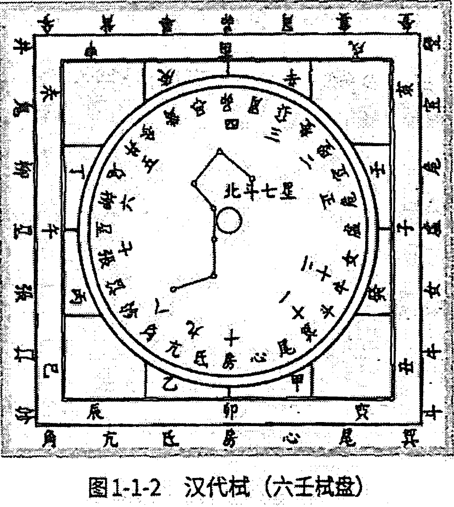
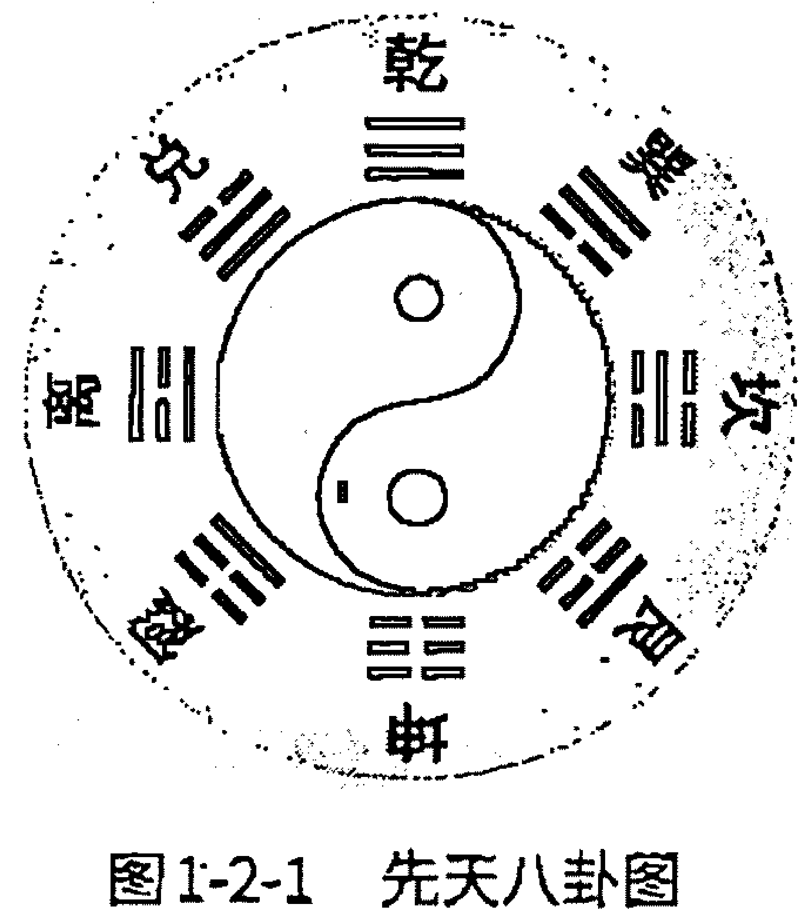
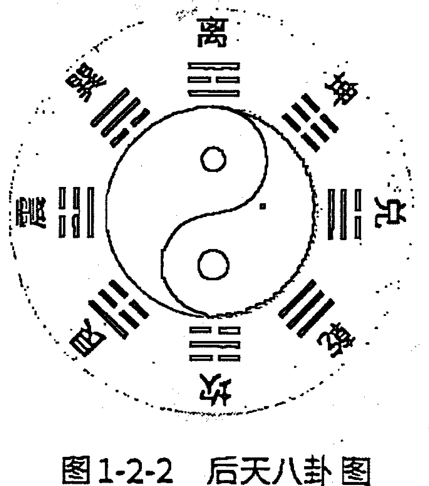
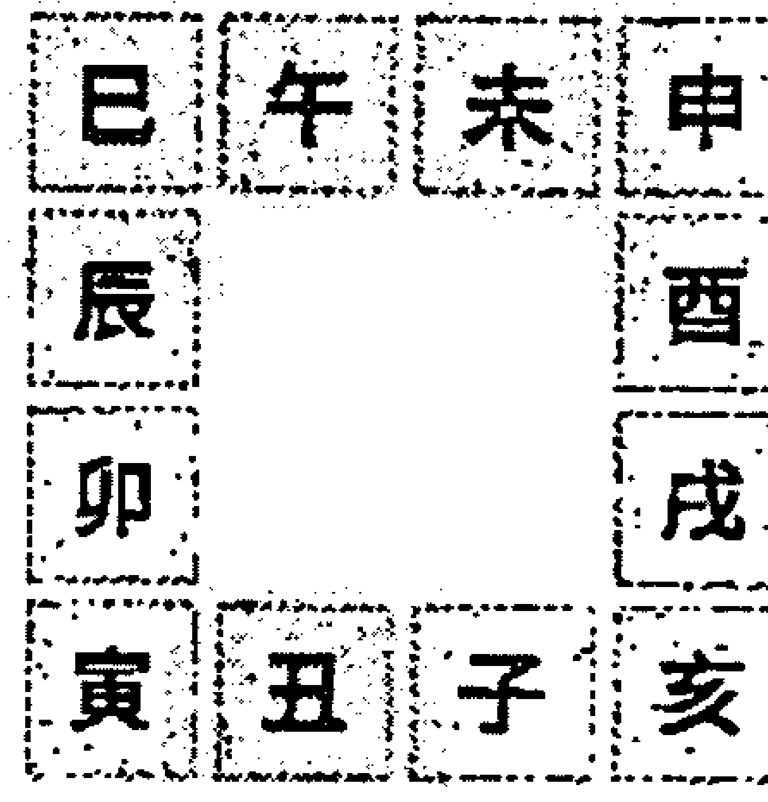
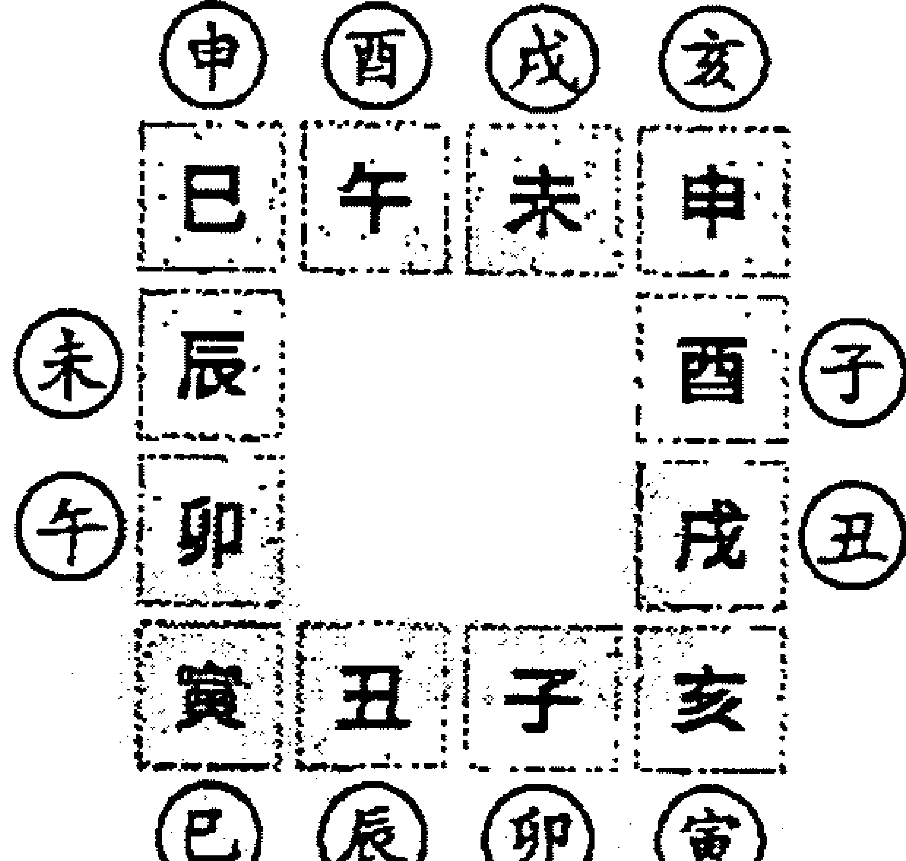
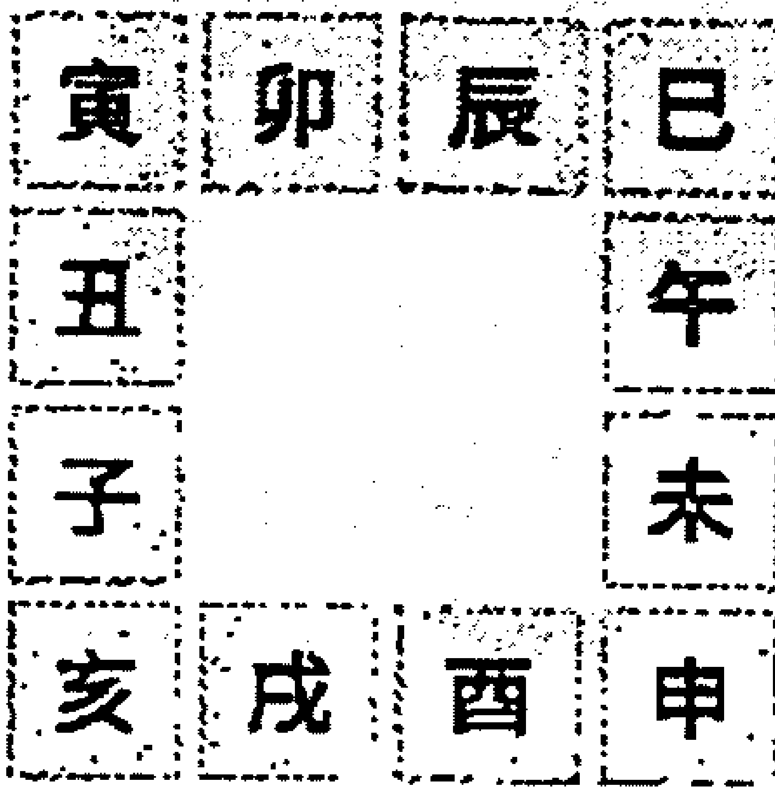

细玩课象 意境深远 意味无穷

读圣贤智慧洞悉宇宙奥秘
学六壬数术方悟人生百态

—— 王雷之 著 ——

# 壬学正解
### 周易大智慧

中国新闻联合出版社
China News United Publisher

---

壬学正解 / 王雷之 著. —中国新闻联合出版社 (CHINA NEWS UNITED PUBLISHER) , 2018.1
ISBN 978-988-78726-1-0
Ⅰ.壬… Ⅱ.王… Ⅲ.易学—传统文化—中国—当代

# 壬学正解

- 作    者：王雷之
- 责任编辑：碧  荷
- 装帧设计：郭书泽
- 出版发行：中国新闻联合出版社 (CHINA NEWS UNITED PUBLISHER)
- 地    址：香港新界沙头角麻雀岭116号1楼C室
- 网    址：www.zhonglianshe.com
- 邮    箱：zhonglianshe1@126.com
- 开    本：710 × 1000 1/16
- 印    张：23
- 字    数：378千字
- 版    次：2018年1月第一版
- 印    次：2018年1月第一次印刷
- 书    号：978-988-78726-1-0
- 定    价：58.00元

版权所有 翻版必究

---

中国著名易学家、全国易学泰斗 廖墨香先生 为本书题字

### 洁净精微
### 含弘光大

廖墨香书赠言 岁次甲午冬

- 天津大六壬高级面授班师生合影 (2014.11.26)
- 第六期大六壬面授班师生合影 (2015.10.6)
- 作者在第九届世界易学大会论坛上演讲六壬学术
- 段建业老师为作者题字
- 学员们送王雷之老师锦旗
- 王雷之著作

---

### 内容提要

王雷之先生深究六壬二十多年，2006年由中国香港哲学文化协进会出版社正式出版了《大六壬现代预测指南》和《大六壬实占百例精解》两书，得到了广大读者的一致好评，同时亦为研究大六壬的学者起到了搭桥引路的作用。

2014年应天津南开大学数学系教授、北大传统文化发展中心首席专家、易学泰斗廖墨香老师邀请在天津宾馆开展了大六壬培训讲课，并为客户现场预测解答，得到了廖墨香老师的高度评价。之后应廖老师的要求，写出了《壬学正解》这本教材，让更多人了解中国古代高级术数哲学文化之大智慧！

是书以正知、正见按照古代传统断壬方法而描述的。上编以基础理论为主，下编以实例为主，全书共分二十三章。理论与实例相结合，且每一实例都有事后真实反馈，笔者不厌其烦，将反馈的实言全附案后，目的是让读者有更好的研究价值，从而提高大六壬的预测水平。书中所选实例大多数为笔者实战中较有代表性的案例，并附有壬占古籍《心机独悟》的判断原则作为依据；是书内容较为全面，对各类占法（除股市占法外）均有涉及，对学习大六壬术数的爱好者来说，无疑是一部实用性很强且具有收藏价值的好教材。

---

## 序

被誉为“群经之首”的《周易》，是中华传统文化的瑰宝。在当今国家全面复兴中华传统文化的大好形势下，“北方易学研究中心”专家王雷之先生所著《壬学正解》大作的出版，真是恰逢其时，可喜可贺！

《壬学正解》一书，又称“大六壬神课”，是根据易学原理推演出来的高层预测学，是中国古代“三式”“绝学”中之一。其中大六壬是占测人事之最。《四库全书》中记载：“六壬与遁甲、太乙世谓‘三式’，而六壬其传尤古。”可见大六壬为术数体系之鼻祖。

王雷之先生，天资聪颖，酷爱易学，博览群书，造诣颇深。曾写过多部易学应用专著，今天出版的《壬学正解》是他三十年磨一剑的杰作，书中内容丰富，理论完善，其中的案例都是他几十年实战中的作品，具有真实性和生动性，是理论与实践相结合的好佳作，故隆重推出此书，以飨读者。

廖墨香
2017年12月于天津

#### 廖墨香简介

1933年出生于湖南新化县天门乡，中国著名易学家。1959年毕业于北京师范大学数学系。曾任天津南开大学允公高等教育进修学院副院长；南开大学国学研究中心副主任；北京大学新世纪传统文化发展中心易道部首席专家。1991年著《周易预测学指南》、1994年著《周易与现代经济预测》等，被公认为影响很大的易学专著。撰写的“浅论周易与管理决策”论文在中共中央党校“科学社会主义”杂志上发表。由“全国易学人网络”公开投票，推选为全国易学泰斗人物。

---

### 前言

改革开放以来，中国传统文化得到了承传，这是易学与时俱进的自然规律，亦是易学界之幸运。在这二十多年的周易热潮中，中国易学呈现出一片朝气蓬勃的景象。各类术数都得到了继承与发展，并已应用于社会，服务于民众。易学包括各类术数，而术数是由象、数、理、占四个要素组成的。这些要素均来源于《周易·八卦》。《周易》是一部伟大的哲学著作，是中华传统文化之瑰宝，誉为群经之首。作为中华炎黄子孙应该认真研究这部传统文化经典。

天津师范大学教授杨效雷先生，于2014年8月在辽宁省政府人民礼堂举行的“传统文化与现代文明国际论坛”上曾言：“《周易》是以卜筮为外衣的，富含哲学智慧和历史经验的，指导人生决策以趋吉避凶的上古巫史文化的百科全书。巫，沟通天人者也；史，通古今之变者也。能够沟通天人，能够通古今之变，就能预知未来，所以称《周易》为预知书亦可。《周易》的简易、变易、不易、交易之理，时、位、应、中等思想，对人生决策都有宏观的指导意义。《周易》之所以能够指导决策，是因为《易》学乃‘推天道以明人事’的天人之学。《周易·文言》：‘夫大人者，与天地合其德，与日月合其明，与四时合其序，与鬼神合其吉凶。先天而天弗违，后天而奉天时。’有大德之人，须与天相应。有学者曾从生命和星球的关系、生命的节律、人体在太空中的变化、遗传学以及疾病的产生、诊断和防治等方面论述了‘天人相应’思想的科学性，有理有据。在《周易》的作者看来，六十四卦是体现天意的符号，通过对六十四卦象的观察揣摩，可以获得启发，指导人生决策。如观乾卦之象而自强不息，观坤卦之象而厚德载物，观剥卦之象而‘厚下安宅’等。”杨先生说得甚为至理。然而，在易学诸术数中而最有理致的莫过于古代“三式”，“三式”者，即六壬、太乙、奇门也。

六壬其传尤古，以占测人事“最验”而著称于世，古谓“神课”又谓“占卜之王”。其实六壬是一种成式非常严密、逻辑推理很强且信息量最大一种时空数理模型。因六壬是全方位立体型的系统模型，所以它蕴含了天地人三才之道，能反映出人事物的内在规律与外在形象及其性质。由于有如此莫大的功能，故而学好此术，亦非易事。明末清初时的六壬名家陈公献先生曾言：“六壬更饶繁剧，非九年面壁莫窥其源。”此言实乃陈公学壬的肺腑之言。可见六壬数术的确较其它术数相对难学，但它在占测人事上之准确度及信息量又较其它任何一种术数要丰富，这也是六壬之所以流传至今，又被历代睿智之士所喜爱的原因之一。

我是1987年开始学易，1995年接触大六壬，至今已近二十年，在这漫长的学壬岁月里，的确耗费了我不少精神和心血，回忆起研壬的心路历程，觉得真是不容易啊！偶尔面镜一照，却见两鬓出现片片银丝，正是：十载玩易忘自我，两鬓如霜亦未知。我学习六壬是从最基础的起课发传学起，直到娴熟《毕法赋》才进行实践为人断课的。从不断地实践中摸索并总结经验，为人预测事例已达数千计之多。从这些案例中悟出了很多壬占技法，使我的壬学知识不断地得到提高。因此便将从实践中得来这些有用的东西编写成六部壬学著作，本书就是其中的一部。

从目前易学界的动向看，我初步了解到现代研究六壬的学者亦不在少数，但真正有实战能力即判断事件准确者为数不多，有的连大致吉凶成败都无法判断准确，我想这与实践经验缺乏是有关系的原因之一。大部分习壬者，都是学习古人理论的多，研究并注解古人案例者亦大有人在。我认为古人的经验我们应该汲取，但我们还要进行辨证地学习，用实践去检验古人理论的正确与否，应择其善者而从之，其不善者而弃之，不能食古不化。“实践是检验真理的唯一标准”。如果光究古书而缺乏实践，那就达不到学壬的真正目的，也就达不到学以致用了。古人的理论要学，实践检验更不可缺，只有理论与实践相结合，才能真正学好大六壬。易学的实践应用，是很有价值的，可谓是决策学，不但在经济上可以指点让人避免或减少损失，有时在疾病预测上还可以挽救人的生命。

如2012年12月8日，在北京铁道设计院工作的唐女士因两岁的小女儿患急病，在北京人民医院抢救，效果不佳，生命岌岌可危，在打算放弃治疗的情况下，特来电话要求笔者为其指点，我立即传出一课，课上显示果然大凶，但又显示其女儿病有一线挽救之机，并显示有“北儿东”三字之星象及谐音，我马上告诉唐女士，要她速转院到“北京儿童医院”治疗，必能治愈。后转北京儿童医院治疗，一星期后果真病愈了，挽救了一条生命。又如本市企业家李老板于2004年因开药酒制造厂亏损几百万后，来我处求测，我起课为其预测，并按课理指点他，告诉他不能开药厂，应转行搞房地产土行业可以大发。果2006年后，他搞房地产至今短短几年就发了几千万。诸如此类事例较多，都得到了求测者的认可，同时也证实了周易预测是科学的。

本书是我学习大六壬从理论到实践的一些初步总结。是书分上下两编完成，上编是六壬预测的基础理论，包括《毕法赋》与《六十四课》之具体内容；下编为分类占法与实例，其中有部分较为精彩的案例，笔者都加有按语进行课理解析，对学习六壬者很有参考与研究价值。相信本书对学习大六壬的读者来说，会有一定的启发与帮助作用。但书中亦未免存在一些不成熟或不当之处，希望易学专家及同仁们给予斧正！本人深表感谢！

王雷之
2014年仲冬写于祁阳泰安演易中心

---

### 目录

### 上编 大六壬基础常识概述

## 第一章 太极阴阳与六壬原理
- 002 / 第一节 太极阴阳与五行
- 003 / 第二节 大六壬的史志记载
- 004 / 第三节 大六壬成式的因素
- 005 / 第四节 六壬式的原理及其优长之处

## 第二章 六壬术的基本要素及其作用
- 008 / (一) 干支的阴阳
- 008 / (二) 干支的旺衰
- 008 / (三) 干支的作用及五行之十二宫状态
- 009 / (四) 太岁
- 009 / (五) 月建
- 009 / (六) 月将
- 010 / (七) 占时
- 010 / (八) 空亡
- 010 / (九) 十二天将
- 011 / (十) 十干寄宫
- 011 / (十一) 遁干
- 011 / (十二) 阴神
- 011 / (十三) 年命
- 012 / (十四) 天地盘的相互作用
- 013 / (十五) 二十八宿及十二支分野
- 014 / (十六) 八卦及河洛、大衍数

## 第三章 六壬课式的起法
- 015 / 第一节 六壬起课的初步程式
- 020 / 第二节 三传九宗法——推演三传的九个法则

## 第四章 六壬判断基本原理
- 035 / 第一节 论八煞
- 038 / 第二节 论九宝
- 042 / 第三节 十二天将
- 053 / 第四节 十二月将
- 058 / 第五节 《六壬大全》十二神摘要及古歌赋录
- 063 / 第六节 神煞

## 第五章 六亲性质及格局
- 072 / 第一节 论财
- 074 / 第二节 论官（鬼）
- 075 / 第三节 论父母
- 077 / 第四节 论兄弟（同类）
- 077 / 第五节 论子孙（脱气）
- 078 / 第六节 论己身

## 第六章 四课三传之运用法则
- 080 / 第一节 日辰四课的运用法则
- 085 / 第二节 三传的运用法则
- 088 / 第三节 课传及年命三者之间的相互关系

## 第七章 课体及《毕法赋》概述
- 093 / 第一节 六十四课体及其衍生之格局
- 108 / 第二节 《毕法赋》及其衍生之格局

## 第八章 六壬应用的基本法则
- 138 / 第一节 六壬占断八门法
- 143 / 第二节 类神取法及运用
- 149 / 第三节 六壬预测的具体分析思路及占断要点
- 156 / 第四节 六壬断应期的主要方法

### 下编 大六壬应用法则及实例

## 第一章 天时气象预测
- 164 / 第一节 古人判断法则注解
- 169 / 第二节 天时占断法则及实例

## 第二章 恋爱婚姻预测
- 173 / 第一节 古人判断法则注解
- 177 / 第二节 婚姻占断法则及实例

## 第三章 怀孕分娩预测
- 183 / 第一节 古人判断法则注解
- 188 / 第二节 孕产占断法则及实例

## 第四章 求学考试预测
- 194 / 第一节 古人判断法则注解
- 196 / 第二节 考试占断法则及实例

## 第五章 工作仕途预测
- 201 / 第一节 古人判断法则注解
- 204 / 第二节 工作占断法则及实例

## 第六章 人体疾病预测
- 213 / 第一节 古人判断法则注解
- 217 / 第二节 疾病占断法则及实例

## 第七章 经营求财预测
- 227 / 第一节 古人判断法则注解
- 232 / 第二节 求财占断法则及实例

## 第八章 出行预测
- 246 / 第一节 古人判断法则注解
- 249 / 第二节 出行占断法则及实例

## 第九章 行人走失预测
- 254 / 第一节 古人判断法则注解
- 259 / 第二节 行人占断法则及实例

## 第十章 钱物盗失预测
- 263 / 第一节 古人判断法则注解
- 269 / 第二节 盗失占断法则及实例

## 第十一章 官司诉讼预测
- 274 / 第一节 古人判断法则注解
- 278 / 第二节 官讼占断法则及实例

## 第十二章 阳宅预测
- 283 / 第一节 古人判断法则注解
- 290 / 第二节 阳宅占断法则及实例

## 第十三章 阴宅预测
- 297 / 第一节 古人判断法则注解
- 299 / 第二节 阴宅占断法则及实例

## 第十四章 人生运气预测
- 305 / 第一节 判断年运经验荟萃
- 306 / 第二节 古今课例解析（10例）

## 第十五章 其他杂项预测
- 315 / 第一节 趋避
- 320 / 第二节 来意
- 321 / 第三节 书信
- 323 / 第四节 兵占
- 325 / 第五节 射覆
- 330 / 第六节 时事
- 333 / 第七节 择日

351 / 后记

---

## 上编
### 大六壬基础常识概述

## 第一章 太极阴阳与六壬原理

### 第一节 太极阴阳与五行

《易经》曰：“无极生太极，太极生两仪”。这两仪即内含阴阳。由无极生太极，由太极生阴阳，由阴阳生五行，由五行生万物，这就是宇宙发展的变化过程。具体而言，太极即阴阳未分时浑浑混混的广大之气，由宇宙（无极）生太极，再生阴阳，即太极变化而生出阴阳，有阴阳而生天地。天地变而产生金、木、水、火、土五行。

宇宙是运动的，运动是被万物的联系所制约的。万物的联系是对立而统一的联系，因为万物都具有阴阳的性质，所以，天与地、日与月、水与火、昼与夜、明与暗、寒与暑、静与动、表与里、上与下、左与右、前与后、刚与柔、迟与速、雌与雄、生与死等无不体现着阴阳的性质，又无不发生着普遍的联系。

阴阳只是标示事物的性质，并不代表某种具体的事物。当事物在其运动形态上表现为两种相反的趋向时，阳通常趋向明亮、活跃、向前、向上、温热、充实、外露、伸张、扩散、刚健、开放等；而阴通常趋向暗晦、沉静、向后、向下、寒冷、虚空、内藏、压缩、柔弱、封闭等。故古人云：“阴阳者，天地之道也，万物之纲纪，变化之父母，生杀之本始，神明之府也”。阴阳广泛涵盖着事物对立统一的两个方面，那么阴阳也并不是一成不变的，它可以随着外界条件的转化而相互转化，阳极生阴，阴极生阳。所以《老子》说：“万物负阴而抱阳”。

太极图中，就是负阴抱阳之势，且显示了阴阳顺逆互转之态。阴阳关系是普遍存在的，这种普遍性可表现为：宇宙间万事万物不论多么复杂，不论有多少种表现形式，不论有多少种发展趋势，都可以纳入到阴阳这两大类范畴之中，即阴阳可以包罗万象。

由无极生太极，太极生两仪，即分为阴阳两个方面：阴气和阳气。阴阳二气相互交错作用，才形成万物的五行结构。而万物具有了五行结构，才构成了五行运动。

《尚书·洪范》曾这样记载说：“五行：一曰水，二曰火，三曰木，四曰金，五曰土。水曰润下，火曰炎上，木曰曲直，金曰从革，土曰稼穑。润下作咸，炎上作苦，曲直作酸，从革作辛，稼穑作甘。”

古人认为，天地万物都是由金、木、水、火、土等五种基本物质组成的。由于这五种基本物质的运动变化，从而构成了丰富多彩的物质世界。

战国时期，“五行”学说十分风行，并且还进一步总结摸索了一套“五行相生相胜”的原理，即五行之间的相生相克原理。它是固定不变的。其生克规律即木生火，火生土，土生金，金生水，水生木；木克土，土克水，水克火，火克金，金克木。

五行中的每一行都承受着“生我”、“我生”、“克我”、“我克”的四种关系。虽然就任何两行之间的直接关系（或生或克）来看是不平衡的。但就五行关系的总和及五行结构的整体来看，相生相克则是平衡的。五行之间的这种生克制化，是事物在正常情况下的内在联系，它们维持着事物的正常生化和协调发展。这就是生克制化的五行法则。

相生相克象阴阳一样，是事物不可分割的两个方面。没有生，就没有事物的发生和成长；没有克，就不能维持事物在发展和变化中的平衡与协调。因此，相生相克是相辅相成的。没有相生，也就没有相克；没有相克，也就没有相生。这种生中有克，克中有生，相反相成，相互为用的关系，推动和维系着事物的正常和发展。

### 第二节 大六壬的史志记载

《四库全书·六壬》云：“六壬、遁甲及太乙，世谓三式，而六壬其传尤古。”

可见大六壬是出于遁甲、太乙之前矣。实际上，六壬术早在东汉就已盛行，这亦说明六壬术在汉代以前就已形成矣。六壬一类的书籍，在《隋志》、《唐志》中已有记载，至郑樵《通志》所载六壬书目并八十二部，计一百九十一卷；明焦竑的《国史经籍志》所列多至八十二家。清代编修《古今图书集成》，其中主要收取《大六壬类聚》；编修《四库全书》，其中收取《六壬大全》。

历代六壬著述者，有唐之徐道符的《大六壬心镜》，宋之苗公达《六壬密旨》、宋之邵彦和的《口鉴》、《断案》及宋之祝泌的《六壬大占》、明之陈公献的《六壬指南》、郭御青的《大六壬大全》。清代六壬著述仍有很多，如张官德的《六壬辨疑》、刘赤江的《六壬梓言》、张江村的《六壬说约》、刘日新的《大六壬玉藻金英》、徐端华的《六壬直指》等；迄于民国，大六壬的研究与著述相续不绝，如韦千里的《千里秘笈》、袁树珊的《大六壬探原》和徐养浩的《大六壬金铰剪》等。

然而，在历代史志记载中，精于六壬者，有汉之东方朔、三国之管辂、晋之戴洋、唐之李靖、南宋之邵彦和、元之刘秉忠、耶律楚材、明之刘青田、明末之陈公献等，皆精其学，固非渺见寡闻之辈所能精通者也。而《吴越春秋》则载伍子胥、少伯、文种、公孙圣；《晋书》则载戴洋；《龙城录》则载冯存澄；《五代史》则载梁太祖；《夷坚志》则载蒋坚；《裨史》则载朱允升；《尧山堂外纪》亦载朱允升；《徽州府志》则载程九圭；《松江府志》则载陈雨化；《苏州府志》则载徐大衍、皇甫焯；《元史》则载刘秉忠。然古今书籍中之言善六壬者，当不止这些人。尚有三国时诸葛亮撰有《六壬类苑》，唐代天文学家僧一行撰有《六壬髓经》，宋代自然科学家沈括撰《梦溪笔谈》，明代学者王肯堂撰《郁岗斋笔尘》，明代茅之仪撰《武备志》等等皆善六壬，均有大六壬的研究或阐述，这说明大六壬居于殊尊的地位。

由此可知，在壬学上有重要著述与研究者都是历史的著名人物，及自然科学家，军事谋略家。正如西汉初年著名的大儒、政论家、文学家贾谊所言：“吾闻古之圣人，不居朝廷，必在卜医之中。”

### 第三节 大六壬成式的因素

六壬课式是由月将，占时，地盘，天盘，四课，三传，天官，遁干，年命，神煞等多种组织因素而构成。至于月将加占时形成天地盘，运用日辰在天地盘上之加乘而演成四课，由于干支四课的阴阳五行属性及其生克关系而推出三传，再以贵人为首按顺逆运转之序而配以天官，则壬式模型成矣。

值得一提的是：所谓“月将”，就是太阳所躔宫度（太阳在天体中运行的黄道经度数），每月节气的中气过宫。例如：一年有廿四个节气，每个月有一节与一气，正月建寅，以立春为一岁之始节，交雨水为中气过宫起亥将，这个亥即是太阳躔在亥宫，亦称月将。起法是正月起亥，二月起戌，逆行十二支。

盘式起课引例：在上海博物馆收藏的六壬盘式，由两部分组成，内层的圆盘称天盘，嵌在外层的方盘中，可以自由转动。方盘即地盘，标示着八干、四维、十二辰、二十八宿躔度。天盘运行其中，天盘中央的列宿称为北斗七星，其中天枢、天璇、天玑、天权四星组成北斗星的斗魁部分，而玉衡、开阳、摇光三星则组成北斗星的斗杓部分。由于地盘是固定的，所以其二十八宿分列十二辰也有其相对固定的宫度；天盘运行其中，以斗杓所指定四时、十二建，并由此显示太阳躔度的星辰变化。1978年安徽阜阳汝阴侯墓（汉代）出土了六壬式盘实物（图1-1-2）：

大六壬的本质是揭示宇宙间天人合一的运动规律以及事物运动、发展、变化的全过程。具体地说，大六壬是一门综合性强的学术，几乎贯穿宇宙、天体、人、事、物等变化的规律；同时亦贯穿了所有术数的基本要素及学术思想。

### 第四节 六壬式的原理及其优长之处

何以名“六壬”，盖壬者天一生水，为五行之始，寄位乎乾，为八卦之始，故易以乾为首，课以壬为名矣。《释壬贯道篇》云：“壬之一字，其义何居？老子云：‘道生一，一生二，二生三，三生万物。’董子曰：‘三画而连其中者谓之王，天地人参而通为者也。’孔子曰：‘一贯三为王。’壬字与王字何以异？其异者，王字三画皆同，壬字三画各别耳。盖圣人取义，用天一生水，天五生土，水为万物之血脉，土为万物之根基，同生同死。水数一，土数五，合而成六；且壬上一画斜者，象水之朝东，下一画重者，象地厚载，中一画长者，纵则为天地，横则为宇宙，与天地宇宙同用，加以水土生育之功，有覆载之至德，即谓以此命名六壬，谁曰不然？

故壬式上盘圆法天，下盘方法地，在天成象有星宿，故用天罡为斗杓，太阳为月将，二十八宿为直符；在地成形有方岳，故用八卦据四方，四维立四门，二十四气为准则。中明人道，仰观天文，俯察地理，故有三奇、二烦、稼穑、游子等课之占，或用岁不出岁，月不出月，或用二十四气，则半月之间，或用本候，则五日之期，皆法天地，轨于历数者也。

其于尊卑，则天为尊，地为卑；其于亲疏，则日为亲，辰为疏；其于夫妇，则日为夫，辰为妇；其于父子，则日为父，辰为子；其于君臣，则天乙为君，诸将为臣；其于职位，则丞相将军；其于进退，则前一后一；其于升黜，则有逆在顺；其于生杀，则有阴有阳。降于玄女，演于轩辕，上则乾象之休咎，中则占人事之吉凶，下则占地纪之灾祥，一世一身，一时一刻，无幽不烛，无事不明，彰往察来，见微知著，修身治己，保国宜家，纤悉不外于其理，毫发莫逃于此数，君子可豫定趋避，小人亦免罹陷阱。休泥丸珠之在盘，当求三隅之反一，乃作赞曰：

> 效法天地，贯通鬼神，启建皇极，轨范人伦，述于贤者，作于圣人，无物不照，无祷不灵，垂教万古，月异日新，含宏精奥，大哉六壬！

六壬式的原理，完全是按照道家的“无极生太极、太极生两仪、两仪生四象、四象生八卦”的程序进行。夫月将加时则无极而太极也，加时而有天盘动为阳、地盘静为阴，乃太极生两仪即阴阳也。用干支表示，则天干为阳，地支为阴；六壬式中，古人以干称谓日、支称谓辰。太极生两仪者，亦即日（阳）与辰（阴）也；两仪生四象者，即日上阳神为第一课，乃阳中之阳也；辰上阳神为第三课，乃阴中之阳也；日上阴神为第二课，乃阳中之阴也；辰上阴神为第四课，乃阴中之阴也；此乃四象。四象成则三才发，壬式成矣。

六壬与易无殊，易以阴阳消长，明进退存亡之道。六壬以日干为本，生克为端，生即长，克即消，其理亦然也。大六壬是一个全方位的立体模型。总体上看，它是720课体，但课式却能演变上万种之多。曾有人这样计算过，即课体是60甲子×12支＝720课。再加上其它的因素，如12神、12将、阴阳两类、地支正反转得：720 × 2（阴阳） × 12（十二神） × 12（十二将） × 122（地支正反转）＝25,297,920种课式，即两千多万个信息单元。那么它蓄藏的信息量是相当庞大的，可谓是诸术数之最。

壬为北方属水，在河图中有“天一生水，地六成之”之论。是说，水为万物之母，其生数为一，其成数为六。所以，万物从一开始而生成，正符合老子所说：“道生一、一生二、二生三、三生万物”。六壬术就是效法天地人三才之道，符合“道”之规律，故六壬式能模拟万事万物，能上测天、下测地、中测人事，其中又以占测人事最为优长，故被誉为“万占之祖”、“占卜之王”。

如果学好了大六壬，则可通诸数术学的基本思想，所谓“一通则百通”是也；其它的各种东西，也都包括在六壬这个大道之中，就像站在高山顶上、远处的美景便可一目了然矣。

在六壬、太乙、奇门“三式”中，太乙以九宫为主，奇门以八卦为主，而六壬则以天、地、人三才为主，能完美体现“道”之意境。所以六壬最为优长，被誉为“三式”之最。

## 第二章 六壬术的基本要素及其作用

学习大六壬必须要懂得子平命理学的基础知识，对干支的生克制化、刑冲合害、旺衰状态及八卦、河洛等基本原理必须要了解清楚，才能进行六壬术的学习。

### （一）干支的阴阳

- 十天干：甲、乙、丙、丁、戊、己、庚、辛、壬、癸，这十干是每日的天干即日干。
- 十二地支：子、丑、寅、卯、辰、巳、午、未、申、酉、戌、亥，这十二支是每日的地支即日支。

其中：甲、丙、戊、庚、壬为五阳干，乙、丁、己、辛、癸为五阴干；子、寅、辰、午、申、戌为六阳支，丑、卯、巳、未、酉、亥为六阴支。这十干十二地支，不仅是六壬术的理论基础，而且是整个数术的理论基础。

### （二）干支的旺衰

甲乙寅卯木旺于春，丙丁巳午火旺于夏，庚辛申酉金旺于秋，壬癸亥子水旺于冬，戊己辰戌丑未土旺于四季。

### （三）干支的作用及五行之十二宫状态

在六壬术中，干支亦称日辰，在课式的判断过程中，始终围绕日干为主体、日支为客体，日干为人为我，日支为宅为他为事，按干支五行寄长生十二宫的状态，以及各神将对日干支的利弊来判断主客体的吉凶。

将五行十二宫状态列表如下（表 1-2-1）。以上是五行起长生十二状态之法。在六壬占测中，十干阴阳不以“阳生阴死”、“阳死阴生”的“阳顺阴逆”法而论，应以阴随阳“同生同死”论、且水土同论是也。

#### 表1-2-1 五行十二宫状态

| 干支 | 庚辛 申酉 | 甲乙 寅卯 | 壬癸 亥子 | 丙丁 巳午 | 戊己 辰戌丑未 |
| :--- | :--- | :--- | :--- | :--- | :--- |
| **五行状态/地支** | **金** | **木** | **水** | **火** | **土** |
| 子 | 死 | 败 | 旺 | 胎 | 旺 |
| 丑 | 墓 | 冠带 | 衰 | 养 | 衰 |
| 寅 | 绝 | 禄 | 病 | 长生 | 病 |
| 卯 | 胎 | 旺 | 死 | 败 | 死 |
| 辰 | 养 | 衰 | 墓 | 冠带 | 墓 |
| 巳 | 长生 | 病 | 绝 | 禄 | 绝 |
| 午 | 败 | 死 | 胎 | 旺 | 胎 |
| 未 | 冠带 | 墓 | 养 | 衰 | 养 |
| 申 | 禄 | 绝 | 长生 | 病 | 长生 |
| 酉 | 旺 | 胎 | 败 | 死 | 败 |
| 戌 | 衰 | 养 | 冠带 | 墓 | 冠带 |
| 亥 | 病 | 长生 | 禄 | 绝 | 禄 |

### （四）太岁

太岁即占卜时的年支也。其管事时间，从此年立春至下一年立春为止。太岁是至尊之神，谁都不能侵犯它，若日干上神或年命上神见太岁乘吉将来生日干，必然大吉，遇凶可解；若乘凶将克日干而无救者，大凶难免。仕宦之人见太岁生日，必受君恩之喜；若见太岁克日，主君上不喜，易遭降罚。太岁作贵人生日干即使不入课传亦可助吉，故太岁是壬学中的重要神煞，切不可忽视。

### （五）月建

占卜时的月令也。管事时间是从本月节令至下月节令为止。其作用是衡量各五行的旺相休囚死及论定五行寄生十二宫状态之原理。

### （六）月将

管辖此月中所有事情之神将称为月将，亦即太阳入黄道十二宫之何宫，即定为何将。太阳在黄道带十二宫之运行皆在二十四节气之中气交换过宫，故月将逢每月中气而换将。月将入传，为福不浅，系吉神则增吉，系凶神则减凶。纵值空亡，亦不以空论，临干支年命上生日干者，光明而吉。

### （七）占时

占时即起壬式所用的时辰，确定占时的方法有如下几种：

- 1. 按事件发生的当时或心动而求占当时为占时，又称为正时。
- 2. 采用十二支竹签，于每签刻上一时辰，分别为子、丑、寅、卯、辰、巳、午、未、申、酉、戌、亥。求测者静心虔诚地瞑想求占之事，待心处空灵时抽取一签即为占时。
- 3. 请求测者随口报某一时辰作为占时。
- 4. 求测者可随意书写一时辰作为占时；或随意写一汉字，按此字的笔划数所对应的时辰为占时（字划数超过12者，用12除之，取余数为占时）。
- 5. 报数法，报1数为子，2数为丑，余依此类推。所报数字超过12数以上者，用12除取余数为占时，刚被12整除则为亥时。
- 6. 用雷击枣木做成一个盘盒，盒内制12圆孔，每孔刻上12时辰，再备一珠子即成。求占者须诚心冥想所问之事，以双手握盒，盖覆珠子在内摇动，看珠子落于何孔时，即为占时。

上述方法以1所得的占时称为正时，2、3、4、5、6所得的占时统称活时。

> 清代六壬名家程树勋在《壬学琐记》有言：“六壬最重正时，正时者，吾心忽于此时发动，自与天机感应也。其次则以雷击枣木制盒摇时；至拈门抽签等法，尤不及报时之准。但报时必须随口，若稍迟疑，则天机不在。或云：壬将静则在位，动则周游天上人间，凡事皆知；故一旬之中各有本旬神将主事，即不占之时，壬将亦在；不在一身之左右，即在书盒之左右。故凡置盒之处，皆须洁净，则神将敬服，有断即灵。”

### （八）空亡

以日干支所在之六甲旬中论空亡，如甲子旬空戌亥，甲戌旬空申酉等与四柱推命法论旬空相同。壬课的组成来自天地盘，天盘空亡乃谓游行空亡，壬式中以“◎”表示。地盘空亡乃谓落底空亡，又谓陷空，壬式中以“⊙”表示。吉神不宜落空亡，凶神喜空亡；盖空则无力故也。又谓太岁、月建、月将虽值空亡，不以空论，占短期事出旬有验，此乃填实之义。惟占时（指活时）空亡，百事难遂。

### （九）十二天将

即天地盘中，天盘上十二支所乘之将也。十二天将的排列次序及五行属性为：贵人己丑土，腾蛇丁巳火，朱雀丙午火，六合乙卯木，勾陈戊辰土，青龙甲寅木，天空戊戌土，白虎庚申金，太常己未土，玄武癸亥水，太阴辛酉金，天后壬子水。

十二天将之排列飞布是以贵人为首，求出贵人之落宫，视落宫在地盘何宫而带领十二天将顺逆飞布。凡贵人临于地盘亥、子、丑、寅、卯、辰六位，则天将顺布；凡贵人临于地盘巳、午、未、申、酉、戌六位，则天将逆布（有关十二天将的意义及作用详下第四章第三节）。

### （十) 十干寄宫

十干寄宫主要是用于起四课（具体起四课及发三传法，详下第三章）。阳干寄于禄地，阴干寄于刃地（即四墓也）。古歌诀为：

> 甲寄寅兮乙寄辰，丙戊寄巳不须论；
> 丁己寄未庚申上，辛戌壬亥记取真；
> 问到癸兮丑宫坐，分明不用四仲神。

因六壬课式的日干是用天干表示，其它均用地支，日干上神（即天盘）以日干寄宫上神定之。另外，涉害课中常用到十干寄宫论涉害深浅取用，详见第三章第二节（三）涉害法。

### （十一）遁干

壬课中，除日干外，其它皆以地支表示，实际每个地支都配有一天干，此天干隐而未显，故名遁干。其法是先查以当日干支在何旬，即课传中之支在该旬中所遁之天干为何干，此天干即是遁干。古人也有用“五鼠遁时法”，遁得课传中之辰在该旬中所得何干，而以此干为遁干。此两种遁干法各有其理，祸福潜伏在其中，习者不可不知也。

### （十二）阴神

课传中每神均有阳有阴，阳神显而阴神隐，欲穷事之究竟，必须审视阴神。十二天将中除贵人以昼夜互为阴神（即昼占以夜贵为阴神，夜占以昼贵为阴神）外，其它各以所乘地盘之上神为阴神（有关阴神的作用，后面第六章、第一、三节中有详论）。

### （十三）年命

六壬神课的判断方法，必须加入个人年命合参，方不致产生误断。有时课式出现吉而年命凶，致使吉象被制化为凶象了；有时课式凶而年命吉，致使凶象被制化为吉象了。年命上乘吉神吉将多应吉，乘凶神凶将事多转凶。所以年命在六壬判断上称为“变体门”。

年命的起法是：命即出生时的年支。年即行年，男命一岁起丙寅，依次顺数至十一岁起丙子……以此类推；女命一岁起壬申，依次逆数至十一岁起壬戌……以此类推。俱以虚岁论之。

#### 附行年表如下：

| 甲子 | 乙丑 | 丙寅 | 丁卯 | 戊辰 | 己巳 | 庚午 | 辛未 | 壬申 | 癸酉 |
| :--- | :--- | :--- | :--- | :--- | :--- | :--- | :--- | :--- | :--- |
| 59 | 60 | 1 | 2 | 3 | 4 | 5 | 6 | 7 | 8 |
| 9 | 8 | 7 | 6 | 5 | 4 | 3 | 2 | 1 | 60 |
| **甲戌** | **乙亥** | **丙子** | **丁丑** | **戊寅** | **己卯** | **庚辰** | **辛巳** | **壬午** | **癸未** |
| 9 | 10 | 11 | 12 | 13 | 14 | 15 | 16 | 17 | 18 |
| 59 | 58 | 57 | 56 | 55 | 54 | 53 | 52 | 51 | 50 |
| **甲申** | **乙酉** | **丙戌** | **丁亥** | **戊子** | **己丑** | **庚寅** | **辛卯** | **壬辰** | **癸巳** |
| 19 | 20 | 21 | 22 | 23 | 24 | 25 | 26 | 27 | 28 |
| 49 | 48 | 47 | 46 | 45 | 44 | 43 | 42 | 41 | 40 |
| **甲午** | **乙未** | **丙申** | **丁酉** | **戊戌** | **己亥** | **庚子** | **辛丑** | **壬寅** | **癸卯** |
| 29 | 30 | 31 | 32 | 33 | 34 | 35 | 36 | 37 | 38 |
| 39 | 38 | 37 | 36 | 35 | 34 | 33 | 32 | 31 | 30 |
| **甲辰** | **乙巳** | **丙午** | **丁未** | **戊申** | **己酉** | **庚戌** | **辛亥** | **壬子** | **癸丑** |
| 39 | 40 | 41 | 42 | 43 | 44 | 45 | 46 | 47 | 48 |
| 29 | 28 | 27 | 26 | 25 | 24 | 23 | 22 | 21 | 20 |
| **甲寅** | **乙卯** | **丙辰** | **丁巳** | **戊午** | **己未** | **庚申** | **辛酉** | **壬戌** | **癸亥** |
| 49 | 50 | 51 | 52 | 53 | 54 | 55 | 56 | 57 | 58 |
| 19 | 18 | 17 | 16 | 15 | 14 | 13 | 12 | 11 | 10 |

注：上面一行数为男命行年，下面一行数为女命行年。上表中的数字即为行年岁数（指虚岁），如某男43岁，查表上数43为戊申，行年即为戊申。如某女18岁，查表下数18为乙卯，行年即为乙卯。

### （十四）天地盘的相互作用

天地盘加临之组合是壬占中体现吉凶信息的重要因素。地盘为体，天盘为用；天盘是活动的，地盘是千载不移的。世上万物皆立足生长于地球之上，故地利重于天时。若某种五行虽得天时而不得地利，纵兴旺也是暂时的，时令一过，一击便倒；或得地利，虽不得天时，暂时虽衰，但衰而有气，击而不倒，富有潜力，终必兴旺。故有“地盘克天盘名内战，忧重；天盘克地盘名外战，忧轻”之论。天地盘不但互论生克刑害关系，而且互论长生十二宫状态关系。此点在壬占中尤为重要，卦卦须审详也。

### （十五）二十八宿及十二支分野

二十八宿星象是我国古人对天文学研究较为突出的依据之一。在壬占中，古人常运用二十八宿所对应十二宫来作为判断方位区域之依据。二十八宿分布在东南西北四方，每方各有七宿，又谓东方苍龙、西方白虎、南方朱雀、北方玄武。

- 东方七宿：角、亢、氐、房、心、尾、箕；
- 西方七宿：奎、娄、胃、昴、毕、觜、参；
- 南方七宿：井、鬼、柳、星、张、翼、轸；
- 北方七宿：斗、牛、女、虚、危、室、壁。

对于我国地域方位的分野，《六壬大全》中有两种分法，一是以十二地支配我国古代国名及州名；二是以二十八宿分野论之。但《六壬大全》中的这种分法，大多是采取宋代分野。可是宋代在历史上从来没有统一过全国，其分野在当时尚可适用，可至现代根本不足为凭。随着历史的发展，时代的变迁，国土逐步统一了，《六壬大全》中所言的这种古代分野也就失去了现实意义。其二十八宿分野也不例外，同样不能作为现代全国地域方位分布的依据。

从地图上看，我国地域的中心太极点应定在西安这个位置，那么以西安为坐标，按十二地支对应的方位而论，其分野应是：

- 子属正北，分野应在山西及内蒙中部。
- 丑属东北，分野就是河北、北京、天津。
- 寅属东北，分野应是东北三省，即黑龙江、吉林、辽宁。
- 卯属正东，分野应是山东、江苏、安徽及长江以北。
- 辰属东南偏东，分野应是浙江、上海、安徽、江苏长江以南。
- 巳属东南，分野应是江西、福建、台湾。
- 午属正南，分野应是广东、湖南、海南、广西东部。
- 未属西南，分野应是广西西部、贵州。
- 申属西南，分野应是云南、四川。
- 酉属正西，分野应是青海、西藏。
- 戌属西北，分野应是陕西、甘肃、新疆。

- 亥属西北，分野应是宁夏及内蒙西部。

其中，辰戌丑未四支虽各有分野，但土属中央，所以其分野均兼河南、湖北、中原之地。

### (十六) 八卦及河洛、大衍数

八卦分先天八卦和后天八卦；先天八卦又称为伏羲八卦，后天八卦又称为文王八卦。

- 先天八卦方位是：乾南，坤北，离东，坎西，震东北，兑东南，巽西南，艮西北。(见图 1-2-1)
- 先天八卦图中，乾一、兑二、离三、震四、巽五、坎六、艮七、坤八，此为先天八卦数。
- 后天八卦方位是：离南坎北，震东兑西，坤西南，乾西北，巽东南，艮东北。(见图 1-2-2)

后天八卦图中，坎一、坤二、震三、巽四、中五、乾六、兑七、艮八、离九，此为后天八卦九宫数。

在预测学中，以宋·邵雍的《皇极经世》理论，取先天八卦数后天八卦方位为用。

壬占中常用之数有“河图数”、“洛书数”、“大衍数”等。河图数为：一六北方水，二七南方火，三八东方木，四九西方金，五十中央土，常用即水一、火二、木三、金四、土五。洛书数即后天八卦数。大衍数为：甲己子午九，乙庚丑未八，丙辛寅申七，丁壬卯酉六，戊癸辰戌五，己亥四数中。数的用法，应旺相则倍之，休取本数，囚死减半。

## 第三章 六壬课式的起法

### 第一节 六壬起课的初步程式

学习大六壬的第一步，就是要学会起四课发三传的方法，否则就无法进入大六壬的殿堂。如果熟练掌握了起课发传之法，就已经踏入了大六壬的门槛。

### (一) 求月将法

起四课，首先必须明白天盘和地盘是怎样构成的。天盘的排法是由月将决定的，所谓月将就是管辖这个月所有事情的神将，亦称太阳。那么太阳在何宫，就用何神作月将。正月建寅，太阳居亥宫，亥就是寅月的月将。月将是每月中气后开始换将即取月建合神。

月将求法如下：

- 正月雨水到春分，月将为登明亥；
- 二月春分至谷雨，月将为河魁戌；
- 三月谷雨至小满，月将为从魁酉；
- 四月小满至夏至，月将为传送申；
- 五月夏至至大暑，月将为小吉未；
- 六月大暑至处暑，月将为胜光午；
- 七月处暑至秋分，月将为太乙巳；
- 八月秋分至霜降，月将为天罡辰；
- 九月霜降至小雪，月将为太冲卯；
- 十月小雪至冬至，月将为功曹寅；
- 十一月冬至至大寒，月将为大吉丑；
- 十二月大寒至雨水，月将为神后子。

### (二) 天地盘的排法

地盘的定位主要是依据河洛图所定之方位，即后天八卦方位排列（图1-3-1）：

图1-3-1

北方为亥子丑，东方为寅卯辰，南方为巳午未，西方为申酉戌。此乃地盘方位式是固定不变的。地盘是从天罡辰起始顺时针运转而组成的，故有“天罡为领袖之神”此一说。

天盘主动，其排位由月将决定；地盘主静，实质就是十二个时辰即占时（占时在前面第二章（七）中有论述）。

图1-3-2

那么，月将加占时就形成了天地盘，即月将加在地盘占时之上，顺时针运转十二地支得出的动盘即为天盘。

例如：亥将申时占课，即亥加申、子加酉、丑加戌、寅加亥……等天地盘组合。天地盘式为（图1-3-2）：

图1-3-3

打“圆圈”的为天盘，天盘内是地盘。

古代先贤对六壬的盘式，只列天盘，不列地盘。原因是地盘主静，千载不移，故而省略，不必再写了。又如：酉将子时占课，只写出天盘式(图1-3-3)：

地盘分布熟记于心即可。为了使初学者排盘简便，也可写于纸上，一目了然。笔者主张用横式排列较清楚，而且对初习六壬者，相当有帮助，一看天地盘加临，就十分明晓。（这种排法，得到很多易学研究者的认可。如刘永昱先生曾在《国际易经》杂志上公开提倡。他说：“从《大六壬预测风水二例赏析》来看，王雷之先生在六壬上有一定的造诣，分析思路符合传统六壬理论大纲，另外传统六壬地盘12支隐而不写，只写四方天盘12神。王雷之先生将天地盘上下叠加，两行横排，这个创意也是可行的，并没有什么不妥。不过传统六壬天地盘有直观的方法显象功能，天地盘横排后，12支方位亦不受什么影响。这种排法似乎更直观，更好用。”）

排法是先写出地盘的十二地支，以子时开始从左向右排：子丑寅卯辰巳午未申酉戌亥，此为地盘。

如上例：亥将申时占课，以月将加占时依次顺序排成天地盘：

| 天 | 卯 | 辰 | 巳 | 午 | 未 | 申 | 酉 | 戌 | 亥 | 子 | 丑 | 寅 |
| :--- | :--- | :--- | :--- | :--- | :--- | :--- | :--- | :--- | :--- | :--- | :--- | :--- |
| 地 | 子 | 丑 | 寅 | 卯 | 辰 | 巳 | 午 | 未 | 申 | 酉 | 戌 | 亥 |

### (三) 四课起法

天地盘排好后，再起四课，四课中除日干外，其余七字均用地支表示，然必须要熟记日干在地支的寄宫（十干寄宫见前第二章（十））。

- **1、第一课的取法**
  天地盘已定，即先把日干写上，然后依十干寄宫之法，找出此日干在地盘上的寄宫，看其寄宫的天盘上是何字，便将天盘上这个字写在日干之上，就是第一课。
  如：庚寅日午时辰将占，月将加在占时上得天地盘：

| 天 | 戌 | 亥 | 子 | 丑 | 寅 | 卯 | 辰 | 巳 | 午 | 未 | 申 | 酉 |
| :--- | :--- | :--- | :--- | :--- | :--- | :--- | :--- | :--- | :--- | :--- | :--- | :--- |
| 地 | 子 | 丑 | 寅 | 卯 | 辰 | 巳 | 午 | 未 | 申 | 酉 | 戌 | 亥 |

根据此天地盘，日干庚寄申宫，地盘申上是午（即天盘午字为日干的上神），那么第一课即是午加庚上面。

- **2、第二课的取法**
  将第一课日干上天盘午字换成地盘来看，则地盘午上神是辰字，那么第二课即是辰加午上面，写在第一课的右边。

- **3、第三课的取法**
  看日支上神天盘是何字，今日支寅上天盘是子字，那么第三课即为子加寅上面，写在第二课的右边。

- **4、第四课的取法**
  将第三课日支寅上的天盘子字换成地盘看，则地盘子上神为戌字，那么第四课即是戌加子上面，写在第三课的右边，如此则四课就排好了。上述四课为：

| 午 | 辰 | 子 | 戌 |
| :--- | :--- | :--- | :--- |
| 庚 | 午 | 寅 | 子 |

第一课和第二课为干之两课，第一课是干之阳神，第二课是干之阴神；第三课和第四课为支之两课，第三课是支之阳神，第四课是支之阴神。

古人将日干称为日，日支称为辰。那么干上两课亦称为日上两课，支上两课亦称为辰上两课，日辰共得四课。日辰类似两仪，演成四课类似四象，由四课发三传类似八卦六爻，一切事物的萌芽皆蕴含在四课之中。事物的吉凶变化过程，则由三传来反映（三传的具体起法，将在下一章详述）。

### (四) 十二天将的排法

十二天将是六壬占测中不可缺少的组成因素。十二天将以贵人为主，前有螣蛇、朱雀、六合、勾陈、青龙五位；后有天后、太阴、玄武、太常、白虎、天空六位。

十二天将加乘在天盘十二月将之上，以贵人带领运转，其次序为：贵、蛇、朱、合、勾、龙、空、虎、常、玄、阴、后。

凡贵人临地盘亥子丑寅卯辰六位之上，那么十二天将顺布；凡贵人临地盘巳午未申酉戌六位之上，那么十二天将就逆布。

贵人有昼夜之分，即阳贵人与阴贵人；阳贵为昼贵，阴贵为夜贵。古人将贵人亦称为“天乙”。然而，昼夜贵人之分法，自古至今存在着两种观点。清代以前研壬用壬者，都是以“甲戊庚牛羊，乙己鼠猴乡，丙丁猪鸡位，壬癸蛇兔藏，六辛逢马虎，此是贵人方”这种按九天玄女式留下来的古传口诀而应用的。至清代，由于有《星历考原》和《协纪辨方》两书的出现，对昼夜贵人之分法出现了与古传口诀不同的观点，唯对甲乙丙辛壬五干的昼夜贵人分法与古传口诀中的昼夜贵人分法恰恰相反，其它五干却是完全一致的。如此一来对后世研壬者产生了很大的疑惑，不知谁非谁是，谁对谁错以致混淆不清。

如果我们从《六壬断案》、《六壬指南》两书中的占例来看，可知古人用的是古传口诀中的昼夜贵人分法，亦十分灵验。清代至现代，大多研壬者是应用《协纪辨方》书中的贵人分法。如，清代的张官德、张铉（张江村）、程爱函（程树勋）、王牧夫，民国时韦千里、袁树珊，现代台湾的张定洲、秦瑞生等人。从他们的著作中，亦可看出运用《协》书中的贵人分法，也很灵验。这样一来，导致现今研壬者莫衷一是。

为何古人与今人所用的两种不同贵人分法，而在古今占例中均能灵验呢？笔者认为，这就是“天人感应”、“天人合一”的宇宙感应能量。这与“错卦正断”一样准验的道理是一致的。清初六壬名家陈公献先生在其《六壬指南》书中，就有数个占例连月将都搞错了，结果占断亦皆验；笔者在实占中也有起错课而不知的，其占断结果同样亦验。当然此谓应“机”，这只能在未觉的情况下，方谓之神示。未断先觉，则不可乱为也。《易经》云：“阴阳不测谓之神”就存于此理。

实际两种贵人分法均各有其理，故而张铉在《六壬说约》言：“……平时守定一法，临占皆验，不必互相訾议。”然笔者在多年的实占中检验，运用《协》书之贵人分法亦准确无误。故希望当今研壬者，不必为此争论不休，亦不必为此而疑惑不解，两法皆可，只要执定一法，占断无不应验。笔者前十年研壬用壬所运用的贵人取法是按《协》书和《考原》两书上的同一观点而应用，见《壬学精华》便知；十年后至现在所运用的贵人口诀均按九天玄女留下之古传口诀而应用的，见《六壬一点金》便知。

为了简便起见，现将古传口诀中昼夜贵人起法简述如下：

凡在卯辰巳午未申六个时辰内占课则用昼贵，凡在酉戌亥子丑寅六个时辰内占课则用夜贵。

**贵人口诀：**
> 甲戊庚牛羊，乙己鼠猴乡，
> 丙丁猪鸡位，壬癸蛇兔藏，
> 六辛逢马虎，此是贵人方。

（口诀中每句的两个生肖，前一个是昼贵，后一个是夜贵。）

列表如下：

| 天干日 | 昼贵 | 夜贵 |
| :--- | :--- | :--- |
| 甲戊庚日 | 丑 | 未 |
| 乙己日 | 子 | 申 |
| 丙丁日 | 亥 | 酉 |
| 壬癸日 | 巳 | 卯 |
| 六辛日 | 午 | 寅 |

凡贵人加临地盘亥子丑寅卯辰上则天将顺布，凡贵人加临地盘巳午未申酉戌上则天将逆布。具体排写法举例如下：

庚午月戊寅日未将，下午申时来占抽亥时。以月将未加活时亥得天地盘：

| 天 | 申 | 酉 | 戌 | 亥 | 子 | 丑 | 寅 | 卯 | 辰 | 巳 | 午 | 未 |
| :--- | :--- | :--- | :--- | :--- | :--- | :--- | :--- | :--- | :--- | :--- | :--- | :--- |
| 地 | 子 | 丑 | 寅 | 卯 | 辰 | 巳 | 午 | 未 | 申 | 酉 | 戌 | 亥 |

要说明的是，这里排盘用的是活时亥，但我们起贵人必须要以正时来定。此正时为申为昼时，故用昼贵人即阳贵人。戊寅日阳贵为丑，则在天盘丑上标上贵人。那么找到了贵人后，看贵人临地盘何字来决定贵人的顺逆运行；今丑贵临地盘巳（凡贵人临地盘巳午未申酉戌六时之上，天将逆布），则贵人逆行。

按照贵蛇朱合勾龙空虎常玄阴后此十二将的排列顺序进行逆布，即贵人在丑、螣蛇在子、朱雀在亥、六合在戌、勾陈在酉、青龙在申、天空在未、白虎在午、太常在巳、玄武在辰、太阴在卯、天后在寅。

| 天将 | 龙 | 勾 | 合 | 朱 | 蛇 | 贵 | 后 | 阴 | 玄 | 常 | 虎 | 空 |
| :--- | :--- | :--- | :--- | :--- | :--- | :--- | :--- | :--- | :--- | :--- | :--- | :--- |
| 天盘 | 申 | 酉 | 戌 | 亥 | 子 | 丑 | 寅 | 卯 | 辰 | 巳 | 午 | 未 |
| 地盘 | 子 | 丑 | 寅 | 卯 | 辰 | 巳 | 午 | 未 | 申 | 酉 | 戌 | 亥 |

| 四课 | 贵 丑 戌 | 勾 酉 丑 | 合 戌 寅 | 虎 午 戌 | 三传 | 贵 丑 | 勾 酉 | 合 戌 |
| :--- | :--- | :--- | :--- | :--- | :--- | :--- | :--- | :--- |

此天地盘、四课、三传及天将的排列就全面完整了，读者应知举一反三。

### 第二节 三传九宗法——推演三传的九个法则

三传者，是传递事物发展变化的三个过程，即事物的开始过程、中间过程、最终的过程。

求取三传的法则共有九种：一贼克、二比用、三涉害、四遥克、五昂星、六别责、七八专、八伏吟、九反吟等。三传九宗法的推演过程虽较为复杂，但它是六壬预测模型中一个不可缺少的重要组成部分。只有熟稔了九宗法，才能深入六壬术的殿堂。

### (一) 贼克法

贼克者，取四课中，一下克上者为发用。如无下克上，则以一上克下为用(初传)。下克上曰“贼”，上克下曰“克”。下贼上所得之课体名《重审课》，上克下所得之课体名《元首课》。无论下贼上，或上克下，均取上一字(天盘神)为初传，然后以地盘初传上神天盘之字为中传,再以地盘中传上神天盘之字为末传。若既有上克下，又有下贼上之课，则先以下贼上论发用。

- **1、重审法举例如下：**
  夏至后未将，庚辰日寅时占课

| 天 | 巳 | 午 | 未 | 申 | 酉 | 戌 | 亥 | 子 | 丑 | 寅 | 卯 | 辰 |
| :--- | :--- | :--- | :--- | :--- | :--- | :--- | :--- | :--- | :--- | :--- | :--- | :--- |
| 地 | 子 | 丑 | 寅 | 卯 | 辰 | 巳 | 午 | 未 | 申 | 酉 | 戌 | 亥 |

| 四课 | 丑 庚 | 午 丑 | 酉 辰 | 寅 酉 | 三传 | (初传) 寅 | (中传) 未 | (末传) 子 |
| :--- | :--- | :--- | :--- | :--- | :--- | :--- | :--- | :--- |

第一课丑庚（土金），第二课午丑（火土），第三课酉辰（金土），上下均无克。惟第四课寅酉（木金），乃下克（贼）上，即以上一字寅为初传。地盘寅上神天盘未为中传，地盘未上神天盘子为末传。

- **2、元首法举例如下：**
  处暑后巳将，己亥日申时占课

| 天 | 酉 | 戌 | 亥 | 子 | 丑 | 寅 | 卯 | 辰 | 巳 | 午 | 未 | 申 |
| :--- | :--- | :--- | :--- | :--- | :--- | :--- | :--- | :--- | :--- | :--- | :--- | :--- |
| 地 | 子 | 丑 | 寅 | 卯 | 辰 | 巳 | 午 | 未 | 申 | 酉 | 戌 | 亥 |

| 四课 | 辰 巳 | 丑 辰 | 申 亥 | 巳 申 | 三传 | 巳 | 寅 | 亥 |
| :--- | :--- | :--- | :--- | :--- | :--- | :--- | :--- | :--- |

第一课辰巳（土土），第二课丑辰（土土），第三课申亥（金水），上下均无克。惟第四课巳申（火金），乃上克下（取上一字发用），即以巳字为初传。地盘巳上神天盘寅为中传，地盘寅上神天盘亥为末传。

### (二) 比用法

四课中，上下相贼克不止一课，而相贼克之各课中，仅有一课之上一字与日干“相比”（“相比”指阴阳相同），即以此一字发用。若相贼或相克有两课或两课以上，先论相贼，无贼则论克。即取下贼上相比者为《比用课》，取上克下相比者则名《知一课》。

- **1、阳日比用法举例如下：**
  夏至后未将，庚寅日子时占课

| 天 | 未 | 申 | 酉 | 戌 | 亥 | 子 | 丑 | 寅 | 卯 | 辰 | 巳 | 午 |
| :--- | :--- | :--- | :--- | :--- | :--- | :--- | :--- | :--- | :--- | :--- | :--- | :--- |
| 地 | 子 | 丑 | 寅 | 卯 | 辰 | 巳 | 午 | 未 | 申 | 酉 | 戌 | 亥 |

| 四课 | 卯 庚 | 戌 卯 | 酉 寅 | 辰 酉 | 三传 | 戌 | 巳 | 子 |
| :--- | :--- | :--- | :--- | :--- | :--- | :--- | :--- | :--- |

第一课卯庚（木金），第二课戌卯（土木），均系下贼上。第三课酉寅（金木），为上克下。第四课辰酉（土金）无克。必以第一、二课下贼上先论发用，取上一字与日干“相比”者发用。庚为阳日，第一课上神卯为阴与日不比，故不取。第二课上神戌为阳与日相比，故取戌为发用初传。地盘戌上神巳为中传，地盘巳上神子为末传。此为《比用课》。

- **2、阴日比用法举例如下：**
  霜降后卯将，辛未日未时占课

| 天 | 申 | 酉 | 戌 | 亥 | 子 | 丑 | 寅 | 卯 | 辰 | 巳 | 午 | 未 |
| :--- | :--- | :--- | :--- | :--- | :--- | :--- | :--- | :--- | :--- | :--- | :--- | :--- |
| 地 | 子 | 丑 | 寅 | 卯 | 辰 | 巳 | 午 | 未 | 申 | 酉 | 戌 | 亥 |

| 四课 | 午 辛 | 寅 午 | 卯 未 | 亥 卯 | 三传 | 卯 | 亥 | 未 |
| :--- | :--- | :--- | :--- | :--- | :--- | :--- | :--- | :--- |

第一课午辛（火金），第三课卯未（木土），均为上克下，其它课无克，午为阳神与日不比，卯为阴神与日相比，即取卯为初传，地盘卯上神亥为中传，地盘亥上神未为末传。此为比用《知一课》。

### (三) 涉害法

如四课中，上下相克不止一课，而与日干相比者又不止一课，或俱不与日干相比（即无法用“贼克”、“比用”之法），则各就所克之处，由地盘涉归“本家”（即地盘本位），以克多者为发用。

如果涉害深浅相等(即受克多少相等),则取孟上神发用(寅申巳亥为孟),谓之《见机格》。如无孟，则取仲上神发用，谓之《察微格》。如果俱在孟上，或仲季上，则刚（阳）日取日上神为发用，柔（阴）日取辰上神为发用，谓之《缀瑕格》。涉即渡，害即克，故名《涉害课》。

- **1、涉害深浅不等举例如下:**
  例1: 夏至后未将，甲申日亥时占课

| 天 | 申 | 酉 | 戌 | 亥 | 子 | 丑 | 寅 | 卯 | 辰 | 巳 | 午 | 未 |
| :--- | :--- | :--- | :--- | :--- | :--- | :--- | :--- | :--- | :--- | :--- | :--- | :--- |
| 地 | 子 | 丑 | 寅 | 卯 | 辰 | 巳 | 午 | 未 | 申 | 酉 | 戌 | 亥 |

| 四课 | 戌 甲 | 午 戌 | 辰 申 | 子 辰 | 三传 | 子 | 申 | 辰 |
| :--- | :--- | :--- | :--- | :--- | :--- | :--- | :--- | :--- |

第一课戌甲（土木），第四课子辰（水土），均为下贼上，它课无贼克。相贼之课上神戌、子均属阳，与日干甲俱比，无以取用，则以戌、子所加之位，由地盘顺数至本家（本位）就受克多少论其涉害深浅，以涉害深者为发用。

今戌临甲，经甲寅卯乙四重克归本家〔因戌一受地盘甲克、二受寅克(甲寄宫寅)、顺数至前位卯克、辰克（乙寄宫辰）共四重克，至巳午未申酉归本家戌位均无克。

子临辰，历经辰、戌、己、未、戊五重克归本家〔因子一受地盘辰克，顺数至巳克（戊寄宫于巳），午无克，未、己克（己寄宫未），申酉无克，戌克，亥无克归本家子位〕，故应以子水发用。地盘子上神申为中传，地盘申上神辰为末传。三传为子申辰。

## 例2：冬至后丑将，戊子日辰时占课

| 天盘 | 酉 | 戌 | 亥 | 子 | 丑 | 寅 | 卯 | 辰 | 巳 | 午 | 未 | 申 |
| :--- | :--- | :--- | :--- | :--- | :--- | :--- | :--- | :--- | :--- | :--- | :--- | :--- |
| **地盘** | **子** | **丑** | **寅** | **卯** | **辰** | **巳** | **午** | **未** | **申** | **酉** | **戌** | **亥** |

| 四课 | 寅 | 亥 | 酉 | 午 | 三传 | 寅 |
| :--- | :--- | :--- | :--- | :--- | :--- | :--- |
| | 戊 | 寅 | 子 | 酉 | | 亥 |
| | | | | | | 申 |

第二课亥寅（水木），第三课酉子（金水），均无克贼。第一课寅戊（木土），第四课午酉（火金），均为上克下。而寅、午俱为阳，与日干戊俱比，故以涉害深浅（克多者为用）论发用。

以寅木而论，由所临之巳位顺数历经：戊、己、未、戌、丑五重克〔即巳为一克（戊寄宫巳），至午无克，至未（己寄未）两克，至申、酉无克，至戌一克，至亥、子无克，至丑一克，共五克〕归本家。

以午火而论，由所临之酉位顺数历经：酉、辛二重克〔即酉为一克，戌（辛寄宫戌）一克，亥、子、丑、寅、卯、辰、巳俱无克，共二重克〕归本家。故取寅木为发用，寅上神亥为中传，亥上神申为末传。三传为寅亥申。

## 2、涉害深浅相等举例如下：

##### 例1：处暑后巳将，丙子日戌时占课

| 天盘 | 未 | 申 | 酉 | 戌 | 亥 | 子 | 丑 | 寅 | 卯 | 辰 | 巳 | 午 |
| :--- | :--- | :--- | :--- | :--- | :--- | :--- | :--- | :--- | :--- | :--- | :--- | :--- |
| **地盘** | **子** | **丑** | **寅** | **卯** | **辰** | **巳** | **午** | **未** | **申** | **酉** | **戌** | **亥** |

| 四课 | 子 | 未 | 未 | 寅 | 三传 | 子 |
| :--- | :--- | :--- | :--- | :--- | :--- | :--- |
| | 丙 | 子 | 子 | 未 | | 未 |
| | | | | | | 寅 |

此四课俱为上克下，惟第一、四课上子、寅为阳，与日干俱比，则以涉害深浅论发用。今以子水而论，由地盘巳顺数历经：丙、巳、午、丁共四重克归本位。

以寅木而论，由地盘未顺数历经：未、己、戌、丑共四重克归本位，今子、寅与地盘的涉害深浅相等。子加巳，巳为孟；寅加未，未为季；故取子水孟上神为发用初传。子上神未为中传，未上神寅为末传。此为《见机格》。

##### 例2：夏至后未将，庚午日卯时占课

| 天盘 | 辰 | 巳 | 午 | 未 | 申 | 酉 | 戌 | 亥 | 子 | 丑 | 寅 | 卯 |
| :--- | :--- | :--- | :--- | :--- | :--- | :--- | :--- | :--- | :--- | :--- | :--- | :--- |
| **地盘** | **子** | **丑** | **寅** | **卯** | **辰** | **巳** | **午** | **未** | **申** | **酉** | **戌** | **亥** |

| 四课 | 子 | 辰 | 戌 | 寅 | 三传 | 辰 |
| :--- | :--- | :--- | :--- | :--- | :--- | :--- |
| | 庚 | 子 | 午 | 戌 | | 申 |
| | | | | | | 子 |

第二课辰子（土水），第四课寅戌（木土），均是上克下。辰、寅俱为阳神，与日干庚俱比。

以辰而论，由地盘子顺数历经：子、癸共两重克归本位；以寅而论，由地盘戌顺数历经：戌、丑共两重克归本位；是涉害深浅相等。必以孟上神为发用初传，然辰加子（仲），寅加戌（季），俱非加在孟上，故当取仲上神为发用，即子（仲）上是辰为发用初传，辰上神申为中传，申上神子为末传，此名《察微格》。

##### 例3：冬至后丑将，戊辰日午时占课

| 天盘 | 未 | 申 | 酉 | 戌 | 亥 | 子 | 丑 | 寅 | 卯 | 辰 | 巳 | 午 |
| :--- | :--- | :--- | :--- | :--- | :--- | :--- | :--- | :--- | :--- | :--- | :--- | :--- |
| **地盘** | **子** | **丑** | **寅** | **卯** | **辰** | **巳** | **午** | **未** | **申** | **酉** | **戌** | **亥** |

| 四课 | 子 | 未 | 亥 | 午 | 三传 | 子 |
| :--- | :--- | :--- | :--- | :--- | :--- | :--- |
| | 戊 | 子 | 辰 | 亥 | | 未 |
| | | | | | | 寅 |

第一课子戊（水土），第三课亥辰（水土），第四课午亥（火水），均系下贼上。第一课子与第四课午俱与日干戊相比。

以子水论，由地盘巳顺数历经戊、己、未、戌共四重克归本位；以午火论，由地盘亥顺数历经：亥、壬、子、癸共四重克归本位，是涉害深浅相等。而子加巳、午加亥俱在孟上，而戊为阳日，故取日上神子水为发用初传。子上神未为中传，未上神寅为末传。此为《缀瑕格》。

## (四) 遥克法

四课俱无克贼，则取课上之神遥克日干者发用，名《蒿矢格》。如无遥克日干之神，则取日干遥克课上之神发用，名《弹射格》；遇有两克，则取与日干相比者为用。

### 1、遥克《蒿矢格》举例如下：

大暑后午将，癸巳日巳时占课

| 天盘 | 丑 | 寅 | 卯 | 辰 | 巳 | 午 | 未 | 申 | 酉 | 戌 | 亥 | 子 |
| :--- | :--- | :--- | :--- | :--- | :--- | :--- | :--- | :--- | :--- | :--- | :--- | :--- |
| **地盘** | **子** | **丑** | **寅** | **卯** | **辰** | **巳** | **午** | **未** | **申** | **酉** | **戌** | **亥** |

| 四课 | 寅 | 卯 | 午 | 未 | 三传 | 未 |
| :--- | :--- | :--- | :--- | :--- | :--- | :--- |
| | 癸 | 寅 | 巳 | 午 | | 申 |
| | | | | | | 酉 |

四课上下俱无克贼，惟第四课之上神未土遥克日干癸水，故取未土为用初传，未上神申为中传，申上神酉为末传。此名《蒿矢格》。

### 2、遥克《弹射格》举例如下：

谷雨后酉将，癸未日亥时占课

| 天盘 | 戌 | 亥 | 子 | 丑 | 寅 | 卯 | 辰 | 巳 | 午 | 未 | 申 | 酉 |
| :--- | :--- | :--- | :--- | :--- | :--- | :--- | :--- | :--- | :--- | :--- | :--- | :--- |
| **地盘** | **子** | **丑** | **寅** | **卯** | **辰** | **巳** | **午** | **未** | **申** | **酉** | **戌** | **亥** |

| 四课 | 亥 | 酉 | 巳 | 卯 | 三传 | 巳 |
| :--- | :--- | :--- | :--- | :--- | :--- | :--- |
| | 癸 | 亥 | 未 | 巳 | | 卯 |
| | | | | | | 丑 |

四课上下俱无克贼，课上之神又无一遥克日干，而日干癸水却遥克第三课上神巳火，则取巳为发用初传。巳上神卯为中传，卯上神丑为末传。此名《弹射格》。

## (五) 昂星法

昂星者，四课无克贼，又无遥克，则阳（刚）日取地盘酉上之神为发用，以辰上神为中传，日上神为末传，名《虎视格》。
阴日取天盘酉下之神为发用，以日上神为中传，辰上神为末传，名《冬蛇掩目》格。

### 1、昂星《虎视格》举例如下：

春分后戌将，戊申日酉时占课

| 天盘 | 丑 | 寅 | 卯 | 辰 | 巳 | 午 | 未 | 申 | 酉 | 戌 | 亥 | 子 |
| :--- | :--- | :--- | :--- | :--- | :--- | :--- | :--- | :--- | :--- | :--- | :--- | :--- |
| **地盘** | **子** | **丑** | **寅** | **卯** | **辰** | **巳** | **午** | **未** | **申** | **酉** | **戌** | **亥** |

| 四课 | 午 | 未 | 酉 | 戌 | 三传 | 戌 |
| :--- | :--- | :--- | :--- | :--- | :--- | :--- |
| | 戊 | 午 | 申 | 酉 | | 酉 |
| | | | | | | 午 |

四课全无克贼，亦无遥克。戊为阳日，则取地盘酉上神戌土为发用初传。以辰上神酉为中传，日上神午为末传。此名《虎视格》。

### 2、昂星《冬蛇掩目格》举例如下：

春分后戌将，乙未日子时占课

| 天盘 | 戌 | 亥 | 子 | 丑 | 寅 | 卯 | 辰 | 巳 | 午 | 未 | 申 | 酉 |
| :--- | :--- | :--- | :--- | :--- | :--- | :--- | :--- | :--- | :--- | :--- | :--- | :--- |
| **地盘** | **子** | **丑** | **寅** | **卯** | **辰** | **巳** | **午** | **未** | **申** | **酉** | **戌** | **亥** |

| 四课 | 寅 | 子 | 巳 | 卯 | 三传 | 亥 |
| :--- | :--- | :--- | :--- | :--- | :--- | :--- |
| | 乙 | 寅 | 未 | 巳 | | 寅 |
| | | | | | | 巳 |

四课全无克贼，又无遥克。乙为阴（柔）日，则取天盘酉下之亥水为发用初传。以日上神寅为中传，辰上神巳为末传。此名《冬蛇掩目格》。

#### （六）别责法

四课无克贼，又无遥克，而四课中有二课相同，实际只有三课。则阳日取干合上神（即干合神之寄宫上神）为发用。阴日取支前三合（即三合局中，日支前一字）为发用。中、末二传，不论阴阳日，均取日上神。

### 1、阳日《别责课》举例如下：

雨水后亥将，戊辰日戌时占课

| 天盘 | 丑 | 寅 | 卯 | 辰 | 巳 | 午 | 未 | 申 | 酉 | 戌 | 亥 | 子 |
| :--- | :--- | :--- | :--- | :--- | :--- | :--- | :--- | :--- | :--- | :--- | :--- | :--- |
| **地盘** | **子** | **丑** | **寅** | **卯** | **辰** | **巳** | **午** | **未** | **申** | **酉** | **戌** | **亥** |

| 四课 | 午 | 未 | 巳 | 午 | 三传 | 寅 |
| :--- | :--- | :--- | :--- | :--- | :--- | :--- |
| | 戊 | 午 | 辰 | 巳 | | 午 |
| | | | | | | 午 |

第一课与第四课相同（戊寄宫于巳），仅有三课，既无克贼，又无遥克。戊为阳日，戊与癸合，癸寄宫于丑，则以地盘丑上神寅为发用初传。中、末二传，俱取日上神午。三传即寅午午。

### 2、阴日《别责课》举例如下：

霜降后卯将，辛酉日辰时占课

| 天盘 | 亥 | 子 | 丑 | 寅 | 卯 | 辰 | 巳 | 午 | 未 | 申 | 酉 | 戌 |
| :--- | :--- | :--- | :--- | :--- | :--- | :--- | :--- | :--- | :--- | :--- | :--- | :--- |
| **地盘** | **子** | **丑** | **寅** | **卯** | **辰** | **巳** | **午** | **未** | **申** | **酉** | **戌** | **亥** |

| 四课 | 酉 | 申 | 申 | 未 | 三传 | 丑 |
| :--- | :--- | :--- | :--- | :--- | :--- | :--- |
| | 辛 | 酉 | 酉 | 申 | | 酉 |
| | | | | | | 酉 |

第二课与第三课相同，实际仅有三课。既无贼克，又无遥克，辛为阴日，日支酉之三合为巳酉丑，日支前一字为丑，故取丑为发用初传。中、末二传，仍取日上神酉。三传即丑酉酉。

## (七) 八专法

四课中，干支同位，实际只有二课，且无贼克（不取遥克）。则阳日取日上神顺数至第三字发用。阴日则从第四课上神逆数至第三字发用。中、末二传，均取日上神。

### 1、阳日《八专课》举例如下：

冬至后丑将，甲寅日辰时占课

| 天盘 | 酉 | 戌 | 亥 | 子 | 丑 | 寅 | 卯 | 辰 | 巳 | 午 | 未 | 申 |
| :--- | :--- | :--- | :--- | :--- | :--- | :--- | :--- | :--- | :--- | :--- | :--- | :--- |
| **地盘** | **子** | **丑** | **寅** | **卯** | **辰** | **巳** | **午** | **未** | **申** | **酉** | **戌** | **亥** |

| 四课 | 亥 | 申 | 亥 | 申 | 三传 | 丑 |
| :--- | :--- | :--- | :--- | :--- | :--- | :--- |
| | 甲 | 亥 | 寅 | 亥 | | 亥 |
| | | | | | | 亥 |

四课中，干支同位，实际只有二课、上下无贼克（若有贼克者，仍按贼克法取用）。甲为阳日，故取日上神亥顺数至第三字（亥子丑）即得丑发用，中、末二传，均取日上神亥，三传即丑亥亥。

### 2、阴日《八专课》举例如下：

小满后申将，己未日酉时占课

| 天盘 | 亥 | 子 | 丑 | 寅 | 卯 | 辰 | 巳 | 午 | 未 | 申 | 酉 | 戌 |
| :--- | :--- | :--- | :--- | :--- | :--- | :--- | :--- | :--- | :--- | :--- | :--- | :--- |
| **地盘** | **子** | **丑** | **寅** | **卯** | **辰** | **巳** | **午** | **未** | **申** | **酉** | **戌** | **亥** |

| 四课 | 午 | 巳 | 午 | 巳 | 三传 | 卯 |
| :--- | :--- | :--- | :--- | :--- | :--- | :--- |
| | 己 | 午 | 未 | 午 | | 午 |
| | | | | | | 午 |

四课中，干支同位，实际只有二课，上下均无贼克。己乃阴日，当取第四课上神巳逆数至第三字（巳辰卯）得卯为发用初传。中、末二传，均取日上神午，三传为卯午午。

## (八) 伏吟法

月将与用时相同，致天地盘同位，名曰《伏吟》。若第一课有贼克，仍照贼克法发用，初传之刑为中传，中传之刑为末传；若第一课无贼克，则阳日取日上神，阴日取辰上神为发用，初传之刑为中传，中传之刑为末传。如初传自刑，日上神发用者，则取辰上神为中传；辰上神发用者，则取日上神为中传，中传之刑为末传。如中传又自刑，则取中传相冲之神为末传。

伏吟法举例如下：

### 例1：大寒后子将，癸丑日子时占课

| 天盘 | 子 | 丑 | 寅 | 卯 | 辰 | 巳 | 午 | 未 | 申 | 酉 | 戌 | 亥 |
| :--- | :--- | :--- | :--- | :--- | :--- | :--- | :--- | :--- | :--- | :--- | :--- | :--- |
| **地盘** | **子** | **丑** | **寅** | **卯** | **辰** | **巳** | **午** | **未** | **申** | **酉** | **戌** | **亥** |

| 四课 | 丑 | 丑 | 丑 | 丑 | 三传 | 丑 |
| :--- | :--- | :--- | :--- | :--- | :--- | :--- |
| | 癸 | 丑 | 丑 | 丑 | | 戌 |
| | | | | | | 未 |

第一课丑癸（土水）上克下，仍照贼克法，取日上神丑为发用初传。初传之刑，即丑刑戌，戌为中传。中传之刑，即戌刑未，则未为末传。此名《不虞格》。

### 例2：雨水后亥将，戊寅日亥时占课

| 天盘 | 子 | 丑 | 寅 | 卯 | 辰 | 巳 | 午 | 未 | 申 | 酉 | 戌 | 亥 |
| :--- | :--- | :--- | :--- | :--- | :--- | :--- | :--- | :--- | :--- | :--- | :--- | :--- |
| **地盘** | **子** | **丑** | **寅** | **卯** | **辰** | **巳** | **午** | **未** | **申** | **酉** | **戌** | **亥** |

| 四课 | 巳 | 巳 | 寅 | 寅 | 三传 | 巳 |
| :--- | :--- | :--- | :--- | :--- | :--- | :--- |
| | 戊 | 巳 | 寅 | 寅 | | 申 |
| | | | | | | 寅 |

第一课无贼克，戊乃阳日，取日上神巳为发用初传。巳刑申为中传，申刑寅为末传，此名《自信格》。

### 例3：大暑后午将，丁巳日午时占课

| 天盘 | 子 | 丑 | 寅 | 卯 | 辰 | 巳 | 午 | 未 | 申 | 酉 | 戌 | 亥 |
| :--- | :--- | :--- | :--- | :--- | :--- | :--- | :--- | :--- | :--- | :--- | :--- | :--- |
| **地盘** | **子** | **丑** | **寅** | **卯** | **辰** | **巳** | **午** | **未** | **申** | **酉** | **戌** | **亥** |

| 四课 | 未 | 未 | 巳 | 巳 | 三传 | 巳 |
| :--- | :--- | :--- | :--- | :--- | :--- | :--- |
| | 丁 | 未 | 巳 | 巳 | | 申 |
| | | | | | | 寅 |

第一课无贼克，丁乃阴日，取辰上神巳为发用初传。巳刑申为中传，申刑寅为末传。此名《自信格》。

### 例4：夏至后未将，壬午日未时占课

| 天盘 | 子 | 丑 | 寅 | 卯 | 辰 | 巳 | 午 | 未 | 申 | 酉 | 戌 | 亥 |
| :--- | :--- | :--- | :--- | :--- | :--- | :--- | :--- | :--- | :--- | :--- | :--- | :--- |
| **地盘** | **子** | **丑** | **寅** | **卯** | **辰** | **巳** | **午** | **未** | **申** | **酉** | **戌** | **亥** |

| 四课 | 亥 | 亥 | 午 | 午 | 三传 | 亥 |
| :--- | :--- | :--- | :--- | :--- | :--- | :--- |
| | 壬 | 亥 | 午 | 午 | | 午 |
| | | | | | | 子 |

第一课无贼克（虽日遥克三、四课上神午，但不取遥克），壬乃阳日，当取日上神亥为发用初传。初传亥系自刑，日上发用者，故当取辰上神午为中传。午又为自刑，故取午之冲神子为末传。凡初传自刑名“杜传格”，此课亦然。

### 例5：小雪后寅将，辛亥日寅时占课

| 天盘 | 子 | 丑 | 寅 | 卯 | 辰 | 巳 | 午 | 未 | 申 | 酉 | 戌 | 亥 |
| :--- | :--- | :--- | :--- | :--- | :--- | :--- | :--- | :--- | :--- | :--- | :--- | :--- |
| **地盘** | **子** | **丑** | **寅** | **卯** | **辰** | **巳** | **午** | **未** | **申** | **酉** | **戌** | **亥** |

| 四课 | 戌 | 戌 | 亥 | 亥 | 三传 | 亥 |
| :--- | :--- | :--- | :--- | :--- | :--- | :--- |
| | 辛 | 戌 | 亥 | 亥 | | 戌 |
| | | | | | | 未 |

第一课无贼克，辛乃阴日，当取辰上神亥为发用初传。初传亥系自刑，故当取日上神戌为中传，中传之刑即戌刑未，则未为末传（注：若中传自刑，则末传取中冲之神）。

## (九) 反吟法

反吟者，即月将与用时相冲，构成的天地盘对冲。四课中，若有贼克，仍照贼克、比用、涉害等法发用（遥克不取），中末传取法亦按该法，此名《无依格》。
如无贼克，则以辰（支）之驿马为发用，均以辰上神为中传，日上神为末传。无贼克仅丑、未二日有之，名《井栏射格》，亦名《无亲格》。

### 例1：夏至后未将，壬辰日丑时占课

| 天盘 | 午 | 未 | 申 | 酉 | 戌 | 亥 | 子 | 丑 | 寅 | 卯 | 辰 | 巳 |
| :--- | :--- | :--- | :--- | :--- | :--- | :--- | :--- | :--- | :--- | :--- | :--- | :--- |
| **地盘** | **子** | **丑** | **寅** | **卯** | **辰** | **巳** | **午** | **未** | **申** | **酉** | **戌** | **亥** |

| 四课 | 巳 | 亥 | 戌 | 辰 | 三传 | 巳 |
| :--- | :--- | :--- | :--- | :--- | :--- | :--- |
| | 壬 | 巳 | 辰 | 戌 | | 亥 |
| | | | | | | 巳 |

第一课巳壬（火水）下贼上，第二课亥巳（水火）上克下，故仍依贼克法；下贼上者先论取，则取巳为发用初传。巳上神亥为中传，亥上神巳为末传。此名《无依格》。

### 例2：大寒后子将，己未日午时占课

| 天盘 | 午 | 未 | 申 | 酉 | 戌 | 亥 | 子 | 丑 | 寅 | 卯 | 辰 | 巳 |
| :--- | :--- | :--- | :--- | :--- | :--- | :--- | :--- | :--- | :--- | :--- | :--- | :--- |
| **地盘** | **子** | **丑** | **寅** | **卯** | **辰** | **巳** | **午** | **未** | **申** | **酉** | **戌** | **亥** |

| 四课 | 丑 | 未 | 丑 | 未 | 三传 | 巳 |
| :--- | :--- | :--- | :--- | :--- | :--- | :--- |
| | 己 | 丑 | 未 | 丑 | | 丑 |
| | | | | | | 丑 |

四课上下均无贼克，则取支之驿马发用，即亥卯未支马在巳，巳为发用初传。以辰上神丑为中传，日上神丑为末传。此名《井栏射格》，亦名《无亲格》。

### 例3：小雪后寅将，辛丑日申时占课

| 天盘 | 午 | 未 | 申 | 酉 | 戌 | 亥 | 子 | 丑 | 寅 | 卯 | 辰 | 巳 |
| :--- | :--- | :--- | :--- | :--- | :--- | :--- | :--- | :--- | :--- | :--- | :--- | :--- |
| **地盘** | **子** | **丑** | **寅** | **卯** | **辰** | **巳** | **午** | **未** | **申** | **酉** | **戌** | **亥** |

| 四课 | 辰 | 戌 | 未 | 丑 | 三传 | 亥 |
| :--- | :--- | :--- | :--- | :--- | :--- | :--- |
| | 辛 | 辰 | 丑 | 未 | | 未 |
| | | | | | | 辰 |

四课上下均无贼克，则取支之驿马亥为发用初传。以辰上神未为中传，日上神辰为末传。此亦为《井栏射格》、《无亲格》。

至此，三传九宗法的推演过程已基本论述清楚了。由九宗法推演出来的课式，共有七百二十课。

要迅速、准确推出三传，对初学者来说，并非易事。读者可查阅《七百二十课三传一览表》以作核对。

## 附录 《七百二十课三传一览表》

| 日辰 \ 日上神 | 子 | 丑 | 寅 | 卯 | 辰 | 巳 | 午 | 未 | 申 | 酉 | 戌 | 亥 |
| :--- | :--- | :--- | :--- | :--- | :--- | :--- | :--- | :--- | :--- | :--- | :--- | :--- |
| 甲子日 | 戌申子 | 子亥戌 | 寅巳申 | 辰午午 | 辰午申 | 申亥寅 | 辰申子 | 子巳戌 | 寅申寅 | 寅酉辰 | 戌午寅 | 午卯子 |
| 乙丑日 | 巳丑酉 | 丑戌未 | 亥酉未 | 子亥戌 | 辰丑戌 | 寅卯辰 | 申戌子 | 未戌丑 | 酉丑巳 | 寅未子 | 戌辰戌 | 卯戌巳 |
| 丙寅日 | 子未寅 | 戌午寅 | 亥申巳 | 丑亥酉 | 子亥戌 | 巳申寅 | 辰巳午 | 辰午申 | 申亥寅 | 酉丑巳 | 子巳戌 | 寅申寅 |
| 丁卯日 | 巳戌卯 | 卯酉卯 | 戌巳子 | 未卯亥 | 子酉午 | 亥酉未 | 丑子亥 | 卯子午 | 辰巳午 | 酉亥丑 | 酉子卯 | 亥卯未 |
| 戊辰日 | 子未寅 | 子申辰 | 寅亥申 | 丑亥酉 | 卯寅丑 | 巳申寅 | 寅午午 | 申戌子 | 亥寅巳 | 子辰申 | 寅未子 | 亥巳亥 |
| 己巳日 | 巳戌卯 | 巳亥巳 | 酉辰亥 | 卯亥未 | 寅亥申 | 丑亥酉 | 卯寅丑 | 巳申寅 | 申申午 | 亥丑卯 | 申亥寅 | 酉丑巳 |
| 庚午日 | 辰申子 | 辰酉寅 | 寅申寅 | 戌巳子 | 子申辰 | 巳寅亥 | 寅子戌 | 午巳辰 | 申寅巳 | 戌未酉 | 申戌子 | 酉子卯 |
| 辛未日 | 寅辰午 | 亥丑丑 | 亥卯未 | 巳戌卯 | 巳丑辰 | 酉辰亥 | 卯亥未 | 亥未未 | 午辰寅 | 巳辰卯 | 未丑戌 | 申亥申 |
| 壬申日 | 丑寅卯 | 子寅辰 | 巳申亥 | 未亥卯 | 辰酉寅 | 寅寅申 | 午丑申 | 子申辰 | 巳寅亥 | 午辰寅 | 戌酉申 | 亥申寅 |
| 癸酉日 | 未午巳 | 丑戌未 | 亥子丑 | 丑卯巳 | 辰未戌 | 酉丑巳 | 未子巳 | 卯酉卯 | 亥午丑 | 巳丑酉 | 午卯子 | 未巳卯 |
| 甲戌日 | 午辰寅 | 子亥戌 | 寅巳申 | 辰巳午 | 辰午申 | 申亥寅 | 寅午戌 | 子巳戌 | 寅申寅 | 子未寅 | 戌午寅 | 申巳寅 |
| 乙亥日 | 未卯亥 | 丑戌未 | 酉未巳 | 戌酉申 | 辰亥巳 | 丑寅卯 | 申戌子 | 未戌丑 | 未亥卯 | 寅未子 | 巳亥巳 | 午丑申 |
| 丙子日 | 子未寅 | 申辰子 | 午卯子 | 丑亥酉 | 戌酉申 | 巳申寅 | 寅卯辰 | 辰午申 | 申亥寅 | 酉丑巳 | 巳戌卯 | 午午子 |
| 丁丑日 | 巳戌卯 | 亥未丑 | 卯戌巳 | 巳丑酉 | 子辰戌 | 亥酉未 | 子亥戌 | 丑戌未 | 申酉戌 | 酉亥丑 | 午戌辰 | 酉丑巳 |
| 戊寅日 | 子未寅 | 戌午寅 | 寅亥申 | 丑亥酉 | 子亥戌 | 巳申寅 | 辰巳午 | 辰午申 | 亥寅巳 | 丑午酉 | 子巳戌 | 寅申寅 |
| 己卯日 | 巳戌卯 | 卯酉卯 | 戌巳子 | 未卯亥 | 子酉午 | 亥酉未 | 丑子亥 | 卯子午 | 辰巳午 | 亥丑卯 | 酉子卯 | 亥卯未 |
| 庚辰日 | 辰申子 | 寅未子 | 寅申寅 | 午丑申 | 子申辰 | 巳寅亥 | 寅子戌 | 卯寅丑 | 申寅巳 | 午未申 | 申戌子 | 寅巳申 |
| 辛巳日 | 寅辰午 | 申亥寅 | 酉丑巳 | 卯申丑 | 巳亥巳 | 未寅酉 | 午寅戌 | 寅亥申 | 丑亥酉 | 卯寅丑 | 巳申寅 | 午未申 |
| 壬午日 | 丑寅卯 | 申戌子 | 酉子卯 | 未亥卯 | 辰酉寅 | 午子午 | 午丑申 | 戌午寅 | 巳寅亥 | 寅子戌 | 戌酉申 | 亥午子 |
| 癸未日 | 巳辰卯 | 丑戌未 | 申寅申 | 巳未酉 | 辰未戌 | 酉丑巳 | 巳戌卯 | 未丑未 | 卯戌巳 | 卯亥未 | 戌未辰 | 巳卯丑 |
| 甲申日 | 午辰寅 | 子亥戌 | 寅巳申 | 辰巳午 | 辰午申 | 申亥寅 | 辰申子 | 子巳戌 | 寅申寅 | 戌巳子 | 子申辰 | 巳寅亥 |
| 乙酉日 | 巳丑酉 | 丑戌未 | 未巳卯 | 申未午 | 辰酉卯 | 亥子丑 | 申戌子 | 未戌丑 | 申子辰 | 未子巳 | 卯酉卯 | 午丑申 |
| 丙戌日 | 子未寅 | 酉巳丑 | 亥申巳 | 丑亥酉 | 卯寅丑 | 巳申寅 | 亥子丑 | 子寅辰 | 申亥寅 | 酉丑巳 | 申丑午 | 巳亥巳 |
| 丁亥日 | 巳戌卯 | 巳亥巳 | 午丑申 | 未卯亥 | 巳寅亥 | 酉未巳 | 戌酉申 | 亥未丑 | 申酉戌 | 酉亥丑 | 午戌辰 | 未亥卯 |
| 戊子日 | 子未寅 | 巳申丑 | 寅亥申 | 丑亥酉 | 戌酉申 | 巳申寅 | 寅卯辰 | 辰午申 | 卯午酉 | 辰申子 | 巳戌卯 | 午子午 |
| 己丑日 | 巳戌卯 | 亥戌巳 | 卯戌巳 | 卯亥未 | 子辰戌 | 亥酉未 | 子亥戌 | 丑戌未 | 寅卯辰 | 卯巳未 | 午戌辰 | 酉丑巳 |
| 庚寅日 | 辰申子 | 子巳戌 | 寅申寅 | 戌巳子 | 子申辰 | 巳寅亥 | 午辰寅 | 子亥戌 | 申寅巳 | 辰巳午 | 辰午申 | 申亥寅 |
| 辛卯日 | 巳未酉 | 酉子卯 | 亥卯未 | 卯申丑 | 卯酉卯 | 戌巳子 | 未卯亥 | 子未子 | 亥酉未 | 丑子亥 | 卯子午 | 辰巳午 |
| 壬辰日 | 丑寅卯 | 申戌子 | 戌丑辰 | 未亥卯 | 寅未子 | 巳亥巳 | 午丑申 | 子申辰 | 巳寅亥 | 寅子戌 | 戌酉申 | 亥辰戌 |
| 癸巳日 | 卯寅丑 | 丑戌未 | 未申酉 | 未酉亥 | 申亥寅 | 酉丑巳 | 午亥辰 | 巳亥巳 | 卯戌巳 | 巳丑酉 | 戌未辰 | 丑亥酉 |
| 甲午日 | 寅子戌 | 子亥戌 | 寅巳申 | 辰巳午 | 辰午申 | 申亥寅 | 寅午戌 | 子巳戌 | 寅申寅 | 酉辰亥 | 戌午寅 | 申巳寅 |
| 乙未日 | 卯亥未 | 丑戌未 | 亥寅巳 | 戌卯午 | 辰未丑 | 酉戌亥 | 申戌子 | 未戌丑 | 亥卯未 | 巳戌卯 | 戌辰戌 | 午丑申 |
| 丙申日 | 戌巳子 | 子申辰 | 巳寅亥 | 丑亥酉 | 卯寅丑 | 巳申寅 | 酉戌亥 | 子寅辰 | 申亥寅 | 酉丑巳 | 卯申丑 | 寅申寅 |
| 丁酉日 | 未子巳 | 卯酉卯 | 亥午丑 | 巳丑酉 | 午卯子 | 丑巳巳 | 申未午 | 酉未丑 | 亥子丑 | 酉亥丑 | 子卯午 | 亥卯未 |
| 戊戌日 | 子未寅 | 寅戌午 | 寅亥申 | 丑亥酉 | 卯寅丑 | 巳申寅 | 亥子丑 | 子寅辰 | 亥寅巳 | 寅午戌 | 申丑午 | 巳亥寅 |
| 己亥日 | 巳戌卯 | 巳亥巳 | 午丑申 | 未卯亥 | 巳寅亥 | 卯丑亥 | 戌酉申 | 亥未丑 | 丑寅卯 | 丑卯巳 | 寅巳申 | 亥卯未 |
| 庚子日 | 辰申子 | 巳戌卯 | 寅申寅 | 戌巳子 | 子申辰 | 午卯子 | 午辰寅 | 戌酉申 | 申寅巳 | 寅卯辰 | 辰午申 | 午酉子 |
| 辛丑日 | 卯巳未 | 巳丑丑 | 酉丑巳 | 卯申丑 | 亥未辰 | 卯戌巳 | 巳丑酉 | 巳未未 | 亥酉未 | 子亥戌 | 丑戌未 | 寅卯辰 |
| 壬寅日 | 辰巳午 | 辰午申 | 申亥寅 | 未亥卯 | 子巳戌 | 寅申寅 | 午丑申 | 戌午寅 | 巳寅亥 | 戌申午 | 子亥戌 | 亥寅巳 |
| 癸卯日 | 丑子亥 | 丑戌未 | 辰巳午

16. 仕宦以鬼为官星，忌逢空落空。鬼乘白虎，名“催官使者”，临日或发用，为立即赴任之象，但占疾病则大忌，遇之必死。课上众鬼，亦名催官符，仕宦喜逢。

## （七）论败

败者，衰也；颓废之象也。

- 1. 败即五行十二长生运之沐浴，木败于子，火败于卯，金败于午，水败于酉。
- 2. 败加于干支，主事多败坏。干支皆乘败气，占身则气血衰败，占宅则屋宅崩颓，或各评事体必至彼此同败。
- 3. 败忌与破碎临宅，主其家必有人破败（破碎煞：孟日用酉、仲日用巳、季日用丑）。如支上乘干之败气，又兼为支辰之破碎，即破败神临宅，主家多破耗。
- 4. 败亦与咸池、桃花、色情有关。若咸池入传，又乘后、合、玄、阴者，易见色情之事。

## （八）论空

空者，虚也，无也；虚而不实之象也。

- 1. 空即旬空，消极事宜空，如病讼；积极事不宜空，如求财官、文书等。
- 2. 日上神为空，且乘天空，则占事全无实象。
- 3. 占求财忌财空，占仕宦忌官鬼、文书空；占子孙忌子孙爻空，余类推。
- 4. 日干为我身，若其寄宫空亡，即我身空亡，则无力。
- 5. 类神空亡者，所占之事空虚不实。
- 6. 日辰上神俱值空亡，乃四课皆空，宜解散，不宜谋事。占病，久病者死，新病者愈。
- 7. 凶神喜空亡，吉神忌空亡。如逢鬼煞，遇子孙救神，救神不宜空。
- 8. 初传入空亡，末传为实者，先无力而后有成之兆。
- 9. 中传空亡名断腰，诸事将中止。末传入空亡，凡事至终皆无结果。

### 第二节 论九宝

所谓九宝，就是德、合、奇、仪、禄、马、生、旺、贵等，为吉利的因素；亦是六壬预测中的重要因素。

### （一）论德

德者，得也；福佑之神也。

- 1. 德有天德、月德、日德、支德四种，而以日德最重要。德神临日入传，能转祸为福。宜旺相，不宜休囚，忌逢空落空及神将外战。
- 2. 凡德神加干发用为鬼，不可作鬼断，仍作德断，盖德能化鬼为吉也。
- 3. 凡德神下贼发用，得贵人生扶，仍作全吉断。
- 4. 德神临日又作贵人，主有意外之喜，惟不宜占病讼。
- 5. 德临死绝之地，又值凶神，减力十分之七。
- 6. 日德发用，上下神同克日干，名“鬼德格”，邪正同途。
- 7. 日德发用，作日之官鬼，又乘朱雀，名“文德格”，主应举得官，在官得荐。
- 8. 日德加亥发用，因亥为天门，故名“德入天门”，有官者主升迁，占试者中。
- 9. 日德受上下夹克，为“灭德格”，主事与愿违，不能如意。

### （二）论合

合者，和顺之神也；合作、和谐之意也。

- 1. 合有支之三合、六合及干合三种，还有遁干与日干相合者，但不甚重要。
- 2. 凡三合入传，主事关牵连，必过月方能了结，又主朋侪众多之应。
- 3. 三合入传缺一神，为“折腰格”，亦名“虚一待用格”，占事必待缺神值日方能成就；若所缺之神有日辰凑足，为“凑合格”，主有意外和合之事，以所凑合之将决之。
- 4. 日辰上下作三合，而日上神克辰，辰上神克日，主外合中离，各怀猜忌，或为挑拨以致不和。
- 5. 六合与德同入传，百事皆吉，即会凶神，亦主凶中有吉。
- 6. 六合入传，决定进退时，若三传为进连珠，进则有利，三传退连珠，退则有利。
- 7. 寅亥相合，谓“破合”；巳申之合，谓“刑合”，谋事不合不成，若加贵、龙、德、禄则进行顺利。
- 8. 六合入传，谋事皆成，但不能即时了结，不宜占病、讼、产。
- 9. 六合逢空落空，又见刑害，主合中藏祸，有德可解。
- 10. 六合克日，或乘蛇、雀、虎等凶将，主合中有害，不可托人谋干。
- 11. 天后与神后作合，占婚姻立成。
- 12. 日辰相合，日辰上神亦相合，名“同心格”。主一切谋望皆能同心合力。若见刑害，又主同心之中暗生妒忌。
- 13. 凡日干与支上神相合，支辰与干上神相合，名“交叉格”，主交易交换之事大抵利合谋，不利解散。

### （三）论奇

奇者，奇遇也；特殊际遇之意也。

- 1. 奇有两种，一为旬奇，即甲子、甲戌旬奇在丑；甲申、甲午旬奇在子；甲辰、甲寅旬奇在亥。二为干奇，即乙丙丁天上三奇，甲戊庚地下三奇。以旬中遁干而论。
- 2. 三奇入传，大利官爵，士有奇遇，消灾避祸，若奇作空亡，其力减半。

### （四）论仪

仪者，礼义之尊也。

- 1. 六甲旬中以旬首之支为仪，如甲子旬仪在子；甲午旬仪在午，余类推。
- 2. 旬首发用，为六仪课；旬首为星宫之长。占主凡事皆吉，不忌刑煞，即遇魁罡，亦化凶为吉。
- 3. 仪克行年上神者，凶。
- 4. 旬首又作贵人，名“富贵六仪”，更吉。有官者主升迁，占试者中。

### （五）论禄

禄者，食禄之神也。

- 1. 禄临日入传皆吉，宜旺相，不宜休囚。
- 2. 禄主食禄事，禄所临之处，即为食禄之方。
- 3. 禄临干或干上神为日之旺神，宜守成，不宜别谋进取。
- 4. 禄临支，名“权摄不正”，占官为暂摄之象。
- 5. 禄若逢空或落空，不论入传不入传，占久病必死。旺禄既空，不宜坐用，须要弃禄，别谋改要。
- 6. 禄逢空陷或临死绝，仕宦、病占皆不吉。

### （六）论马

马者，驿动、驿递、迁移之意也。

- 1. 马即驿马，有年、月、日、时四种，普通所称之马，系指日驿马。
- 2. 仕宜占遇马，主升擢；平民占遇马，主奔波。
- 3. 马与禄会，尤吉。忌逢空落空。
- 4. 马临长生，或落空亡，占行人必不归。
- 5. 马入墓地，或落空陷，仕宦、病占皆不吉。

### （七）论生

生者，生机之意也。

- 1. 生即生扶，又有一意即生计、长生、创新。
- 2. 三传递生日干，主众人拥护，多人推荐，三传成合局生日亦然。
- 3. 日上神生日，或辰上神生日，万事易得辅助。
- 4. 日上神生支辰，支上神生日，主彼此相助。
- 5. 三传合父母局生日，不利子孙。

### （八）论旺

旺者，气势鼎盛之意也。

- 1. 旺即得气，如木旺于春、火旺于夏、土旺于季、金旺于秋、水旺于冬。
- 2. 干支发用，或三传合局得旺气，名“得旺”，主事起当时，无不亨泰。
- 3. 日上神为日之旺气，支上神为支辰之旺气，名为“俱旺”，主谋为省力。但不能有意外之求，反招损。
- 4. 日上神为支辰之旺气，支上神为日之旺气，名曰“互旺”，主经营得意。
- 5. 传财太旺，反无力担财，实乃旺极为衰之象，求财不利。
- 6. 鬼当旺当时尚无凶危，因鬼旺自鸣得意，尚不为凶。

### （九）论贵

贵者，尊贵也；百神之主也。

- 1. 贵人旺相得位为福，休囚失位为殃。
- 2. 贵人顺治与日相生，纵遇凶将，亦不致大害；贵人逆治再加克日，纵逢吉将，也不为深喜（唯仕宜不忌）。
- 3. 贵人忌逢空落空，忧喜不生。
- 4. 贵人临辰戌，名“贵履罗网”，主贵人有烦恼，未能坐堂理事，不利谒贵。
- 5. 贵人临克地，主贵人自顾不暇，难得贵人之力。
- 6. 贵人临亥，名“贵登天门”，诸煞被制，利于进取。
- 7. 贵人临寅，名“贵塞鬼户”，众鬼恶煞，难以为害。
- 8. 贵人临卯酉，名“贵立私门”，主贵人有私，不宜于贵，惟宜阴谋私祷。
- 9. 贵人作太岁生日，不管入传不入传，均得贵人之力。
- 10. 贵人入墓，主贵人自身晦滞，不能坐堂理事，凡是谒贵，必有阻滞。

## 第三节 十二天将

壬式中共有十二位天将亦名天官，皆以天乙贵人为主，带领众将按所临地盘何辰而决定将之顺逆运转；壬式中十二将各有其性质、位置、次序及类象。故十二天将是壬式预测模型中不可缺少的组成部分。

### （一）贵人

贵人即天乙，属己丑土，吉将也。主官爵、诏命、田土等事（贵人在占课中的吉凶，详前述“（九）论贵”，这里不再赘述）。

- 1. 贵人发用，若课体又吉，主升迁求谋皆遂意。
- 2. 贵人加临日辰、年命，主近贵人，告贵大吉。若贵人生合日干者，凡事得贵解，可逢凶化吉。
- 3. 贵人有昼夜之分，昼占则夜贵隐而昼贵显，夜占则昼贵隐而夜贵显。此隐藏之贵人，名“帘幕贵人”。考试占得帘幕贵人加临日干年命者，必得高第。在职官吏见到幕贵，反有休官退职之兆。常人逢之，又主林下官扶持。
- 4. 贵人作日德加临日干，名“贵德临身”，虽遇恶煞，亦可免祸。
- 5. 贵人临干支，被发用遥克，凡占不吉。
- 6. 贵人作墓加干，必被贵人欺蒙；贵人作鬼临干，为天乙神祇或被贵人克制；贵人作脱气加干，必被贵人所脱赚。
- 7. 四课、三传俱见贵人，为“遍地贵人”，反无依靠。
- 8. 贵人拟人，主庄重、不佻，厚重、清雅。
- 9. 贵人类象为官贵、尊长、俸禄、文章、首饰、珍宝、神佛、牛、谷麻、鳞角之物，色黄白，数八。
- 10. 《心印赋》中贵人乘临（按：古人以临为论，乘临除贵人不乘辰戌外，余皆可同论。）十二支神之象意，是壬占中判断吉凶信息的一个因素，简述如下：
    - 贵人乘子名“解纷”，能解去纷扰。
    - 贵人乘丑名“升堂”，宜持文书上公堂，正大光明。
    - 贵人乘寅名“凭几”，有可乘之机，利于私访。
    - 贵人乘卯名“登车”，宜诉词求于正人君子，事多不宁。
    - 贵人临辰名“天牢”，居非法之地，有非常之辱。
    - 贵人乘巳名“受贡”，多受赞赏，上下皆喜。
    - 贵人乘午名“受贡”，受赏识而迁官，君喜臣悦。
    - 贵人乘未名“列席”，宴会托贵，无不遂也。
    - 贵人乘申名“移途”，道路荣遂。
    - 贵人乘酉名“私室”，贵趋谒于私门，宜私不宜公。
    - 贵人临戌名“地狱”，居非法之地，有非常之辱。
    - 贵人乘亥名“还轸”，诸煞被制，利于进取。

### （二）螣蛇

螣蛇属于巳火，凶将也。主火烛、血光、惊恐、怪异、缠绕等事。

- 1. 螣蛇与乘神相生或比和则吉，内外战则凶，空亡减半，披刑带煞，灾病立至。
- 2. 占怪异，螣蛇乘旺神，为生物；乘死囚神，为死物或有声无形。
- 3. 螣蛇乘火神，临火乡，或占时下见火，主火灾，亦主口舌官事。
- 4. 螣蛇所乘神为日财，且神将旺相相生，占求财大吉，反之则主惊恐。
- 5. 螣蛇临日辰，占进货，必得下贱之物。
- 6. 丙日干上神戌墓乘螣蛇，名“两蛇夹墓”，宜占人年命上有天罡辰冲之，叫“破墓”方可免祸，否则主人昏蒙。占病，腹内有积块，病、讼皆凶。
- 7. 螣蛇作鬼加干，名“蛇鬼”，主有惊危之事，若蛇鬼加支，主宅中必有怪异；若乘火鬼临宅克宅，必防火灾。惟六处有冲克蛇鬼者，方可解救。
- 8. 金日逢丁马乘螣蛇在六处，名“蛇乘遁鬼”，主至凶至怪，纵空亡亦难救解。
- 9. 螣蛇拟人，头尖面赤，身材苗条，瘦弱，生性多疑；其性主虚浮、虚伪狡猾、少信实多心机、猜忌多变等，又主缠绵棘手，缠绕难解，怪梦阴邪等。
- 10. 螣蛇类象为文字、火光、血光，痴妇，荧惑小人，绳、电线、豆、黍、蛇，色红紫，数四。
- 11. 《心印赋》中螣蛇乘十二支神之象意，简述如下：
    - 螣蛇乘子名“掩目”，凶无所施，无患无忧。
    - 螣蛇乘丑名“蟠龟”，祸消福来。
    - 螣蛇乘寅名“生角”，贪荣不祸，有福无害。
    - 螣蛇乘卯名“当门”，有灾害事，出门防害。
    - 螣蛇乘辰名“象龙”，有化之机，难释灾消。
    - 螣蛇乘巳名“乘雾”，休祥不辨，宜谨慎避之。
    - 螣蛇乘午名“飞空”，大志始展，宜居安思危。
    - 螣蛇乘未名“入林”，优游之乐，逢林有蛇，还当莫入。
    - 螣蛇乘申名“衔剑”，彼生大惠，惟退潜避之。
    - 螣蛇乘酉名“露齿”，危害非浅，阴人怪异，宜于退藏。
    - 螣蛇乘戌名“入冢”，灾难全消。
    - 螣蛇乘亥名“坠水”，逢凶化吉，随心所欲。

### （三）朱雀

朱雀属丙午火，凶将也。主文书、信息、口舌、词讼等事。

- 1. 占公事，遇朱雀逆布，且刑克日干，必被长官嗔责，反此无害。
- 2. 占考试，须视朱雀，如所乘之神为岁月建或月将，或与岁月日相合，且遇禄马、日德加临生旺之地，必掇高第。若被刑克或落空亡，或临死绝之乡，试文必不合格。
- 3. 朱雀乘火神临火乡，用时又值火，主火灾，若系伏吟课体，神煞伏而不动，或可避免。若朱雀并火鬼克宅，主宅遭火焚。
- 4. 德作官星，将乘朱雀，名“文德”，主应举得中，在官得荐。
- 5. 朱雀乘午名“真朱雀”，利于考试，若朱雀生太岁又生日干，必得高中。
- 6. 朱雀克太岁，名“赤鸟犯岁君”，占讼必达朝廷、政府，罪必致死，惟逢申酉年。
- 7. 朱雀乘神克帘幕贵人，占试其文不帖主考官心意。
- 8. 考试在放榜之时占，若朱雀乘丁马，名落孙山。
- 9. 朱雀拟人，面赤身轻，性急而善口才，旺相能文，休囚带雀斑。同时又主口舌是非，公文扰身，多招诽谤等。又为书信消息，装饰华表，嘴巧舌尖之人。也类口才、宣传档案、手机、电话等。色红赤，数九。
- 10. 《心印赋》中朱雀乘十二支神之象意，简述如下：
    - 朱雀乘子名“损羽”，进退有伤，不利试文。
    - 朱雀乘丑名“掩目”，动静俱吉，不利文书。
    - 朱雀乘寅名“安巢”，文章奏卷淹滞，口舌可息。
    - 朱雀乘卯名“安巢”，诉讼自息，文书不失。
    - 朱雀乘辰名“投网”，文书遗亡，凶而不起。
    - 朱雀乘巳名“昼翔”，音信俱至，口舌词讼凶。
    - 朱雀乘午名“衔符”，官讼难免，考试得中。
    - 朱雀乘未名“临坟”，诉讼不断，口舌悲哀。
    - 朱雀乘申名“厉嘴”，讼非难免，文考得志。
    - 朱雀乘酉名“夜躁”，口舌入门，官灾难免。
    - 朱雀乘戌名“投网”，乖错遗忘，讼狱官非。
    - 朱雀乘亥名“入水”，急用文词，不能得用。

### （四）六合

六合属乙卯木，吉将也。主子孙、和合、婚姻、交易等事。

- 1. 六合得地主和合之事，失地则主阴私暗昧之事。
- 2. 六合乘旺相气发用入传，主婚姻胎产或财物之喜，若乘死囚之气发用且刑克日干，主财物口舌，或阴人缠绕。
- 3. 六合乘酉戌，主部属出走；占盗贼、逃亡难获。
- 4. 六合与天后同入传，名“狡童佚女”，主奸邪不正，凡事须防色情招灾。乘卯酉尤的。
- 5. 六合乘申临卯，名“六片板”，占病必死。
- 6. 六合拟人，神清骨秀，身细长貌美。又主头脑灵活，人事和合，宴会、婚喜、交易、中介、财物等。类为仕宦、术士、隐逸之士，巧工、小儿、朋友、媒妁、牙侩。类物为竹、木、盘盒、盐、粟。为天地私门，为兔，色青，数六。
- 7. 《心印赋》中六合乘十二支神之象意，简述如下：
    - 六合乘子名“反目”，彼此反目，无礼所致。
    - 六合乘丑名“严妆”，以贱谒贵，事将成就。
    - 六合乘寅名“乘轩”，媒妁成欢。
    - 六合乘卯名“入室”，事可成遂。
    - 六合乘辰名“违理”，自失检约，以致招祸。
    - 六合乘巳名“不谐”，惊恐不吉。
    - 六合乘午名“升堂”，志向展现，事皆成遂。
    - 六合乘未名“纳彩”，迎新成喜，事可成就。
    - 六合乘申名“结发”，联合欢庆。
    - 六合乘酉名“私窜”，阴私逃窜无害，光明正大反殃。
    - 六合乘戌名“亡盖”，苟求会合，引祸招灾。
    - 六合乘亥名“待命”，必有成就。

### （五）勾陈

勾陈属戊辰土，凶将也。主战斗、词讼、争论、勾留、田园、坟墓等事。

- 1. 勾陈主勾留迟滞，枝节横生，若遇丧吊，则为不孝之神，易见丧事。
- 2. 在官者，以勾陈为印绶，旺则吉，衰则凶。
- 3. 占讼事，以勾陈为类神。勾陈克日，冤不得伸；日克勾陈，讼终得直。勾陈之阴神乘螣蛇、朱雀且带煞克日者，尤凶。若勾陈克日，而勾阴乘贵生日，可化凶为吉，但须本人行年不落空亡。
- 4. 占宅墓，勾陈旺相临日辰者主安，若乘休囚气且与日辰刑克者不安。
- 5. 勾陈披刑带煞伤日，灾祸即临。
- 6. 占晴雨，遇勾陈入传或临日辰，且其所乘之神适克玄武所乘之神，定主天晴。
- 7. 勾陈乘日墓覆日，必被囚禁。
- 8. 凡勾陈、朱雀同会入式，或午加辰发用，皆主官讼。
- 9. 勾陈拟人，眼恶睛黄、身粗短，形貌丑。性稳重、敦厚、有信用、保守、勾留、死板、行事迟缓、好静不好动等。类人为大将军、主帅、官吏，兵卒、捕盗人；类物为田土、宅基、瓦、石、金、铁；在食为果；类禽为鱼、龙、勾虫等；类事为产业、庄稼、牢狱、官讼等。其色黄，数五。
- 10. 《心印赋》中勾陈乘十二支神之象意，简述如下：
    - 勾陈乘子名“投机”，投狂妄之机，暗遭毒手。
    - 勾陈乘丑名“受越”，受远越之讼，暗受欺凌。
    - 勾陈乘寅名“遭囚”，宜上书献策，揭发罪行。
    - 勾陈乘卯名“临门”，争神入门，家庭失和。
    - 勾陈乘辰名“升堂”，斗讼勾连，招来冤屈。
    - 勾陈乘巳名“捧印”，仕人遇升迁，常人遇多忧。
    - 勾陈乘午名“反目”，遭人逆戾致讼。
    - 勾陈乘未名“入驿”，词讼往来，行途坦道。
    - 勾陈乘申名“趋户”，灾难临门，返转抽身避之。
    - 勾陈乘酉名“披刃”，主有刑责，躲避祸凶。
    - 勾陈乘戌名“下狱”，入狱诉讼，宜早退避。
    - 勾陈乘亥名“蹇裳”，勾连反复，动身躲避。

### （六）青龙

青龙属甲寅木，吉将也。主升迁、喜庆、财帛、谷米、婚姻、书契、官府等事。

- 1. 占公事，以青龙为喜神，若所乘之神披刑带煞入传克日，反主凶。
- 2. 占婚姻，以青龙为男、天后为女类神。
- 3. 占求财，以青龙为类神，若青龙入传或临日辰上，乘旺相气、临旺相地与日辰相生则大利。
- 4. 占捕盗，最忌青龙入传，因龙有见首不见尾之象；占行人，遇青龙入传，亦主行人转往他乡。
- 5. 占病，见青龙入传伤日，其病必因酒食而得，或因房事而得。青龙又为纸钱煞，占病忌见之。
- 6. 占官职，文视青龙，武视太常，与日干生合者吉，反此者凶。龙常乘太岁入传，必主迁转。
- 7. 青龙乘月内生气或乘日之长生，加临干支者，主功名显达，家遇荣昌，忌空亡。
- 8. 青龙乘巳午未申，名龙神飞天，主雨；再有贵人临亥子，主雨尤的。
- 9. 青龙拟人，身长玉立，眼目分明，清秀貌美，为人慈祥，聪明能干，和颜悦色，高雅端正等。类物主财帛、文字、书籍、棺桶、飞机等；类事为升迁、婚姻、胎产、宴喜；类人为官贵、富人、丈夫、酒色之人；类禽为龙。色碧，数七。
- 10. 《心印赋》中青龙乘十二支神之象意，简述如下：
    - 青龙乘子名“入海”，增福解祸，有非常之庆。
    - 青龙乘丑名“蟠泥”，所谋未遂。
    - 青龙乘寅名“乘云”，施展所能，利于经营。
    - 青龙乘卯名“驱雷”，施展所能，事至宏大。
    - 青龙乘辰名“飞天”，大有作为。
    - 青龙乘巳名“掩目”，有不测之忧，谋求失利。
    - 青龙乘午名“烧身”，引火烧身，财物受损。
    - 青龙乘未名“在陆”，失地受困，谋望难遂。
    - 青龙乘申名“伤鳞”，动谋受伤，宜安居静守。
    - 青龙乘酉名“摧角”，不可妄动，动必遭厄。
    - 青龙乘戌名“登魁”，小人争财，谋为艰难。
    - 青龙乘亥名“游江”，龙入江海，非常吉庆。

### （七）天空

天空属戊戌土，凶将也。主市井、契约、部属、虚诈，亦为奏书之神。

- 1. 天空主有名无实，与空亡相类，主虚伪诈巧等事。
- 2. 天空乘脱气加临日辰，名“脱上空”，主虚诈不实。
- 3. 三传中有二传空亡，另一传乘天空，亦作三传皆空论，事无准实。
- 4. 占词讼，发用或末传乘天空，定主讼解；占求财为大忌。
- 5. 占婚姻，遇天空发用或临日辰，其家必有孤寡之人，否则祖业凋零。
- 6. 占部属，以天空为类神，若天空乘神与日干相生合为吉，主部属得力。反之，不得力为凶。若天空乘神为魁罡，该部属必非良善。
- 7. 占考试遇天空发用主吉，因天空为奏书之神。
- 8. 占求财，忌天空乘财爻、禄神，主财禄不实。
- 9. 天空拟人，面带孤冷单寒，身肥而陋，乘丑为矮子，为人虚诈，好虚荣，多生是非；类人为丑妇、奴婢、贫人、下人；类物主井灶、金铁矿物、枯空、空缺之物；在天为晴；类禽为狼、犬。天空又为虚臭恶神，色黄，数五。
- 10. 《心印赋》中天空乘十二支神之象意，简述如下：
    - 天空乘子名“房室”，阴人有灾，百事有忧。
    - 天空乘丑名“侍侧”，仕宦迁擢，平民防欺。
    - 天空乘寅名“被制”，谋为阻滞，公私口舌。
    - 天空乘卯名“乘侮”，暴客欺凌，花言巧语。
    - 天空乘辰名“处机”，事有欺侮，小事可成。
    - 天空乘巳名“受辱”，血痢之疾，占谋则吉。
    - 天空乘午名“文明”，利读书识字，情伪难测。
    - 天空乘未名“待机”，事可小吉，欺诈得财。
    - 天空乘申名“鼓舌”，巧言奸诈，情伪难测。
    - 天空乘酉名“蔽匿”，奴婢走失，奸人诡计。
    - 天空乘戌名“待发”，顺意而为，百事俱虚。
    - 天空乘亥名“濡冠”，奸人诡计，失脱不免。

### （八）白虎

白虎属庚申金，至凶之将也。主道路、杀伐、疾病、刑戮、血光等。

- 1. 白虎威猛为威权之将，占官爵喜白虎发用或入传，带刑煞尤佳，最利掌刑杀、武职。
- 2. 占疾病，最忌白虎。如白虎乘神克日，或带煞克日，或斗魁乘虎克日或克行年，或虎之阴神克日辰、年命，皆凶。白虎临空亡，或附日德，可化凶为吉。但凶煞极重者，亦不能解救。

- 3、白虎、螣蛇二者最凶，为血光之神，占公讼事，最忌虎蛇克日。
- 4、占墓宅，视白虎临何方，可断其方有岩石或神庙。
- 5、占行人，以白虎为道路之神，白虎乘初传，主行人立至，乘中传在途中，乘末传则失约不来。
- 6、白虎带丧门、吊客临支，主家中有丧服或外服入宅。
- 7、占天时，以白虎为风，白虎乘风神发用主大风。
- 8、白虎乘驿马克干者，名“虎鬼戮马”，凶祸最速。如为仕宦占，名“催官使者”赴任极速。
- 9、昴星课中，将乘白虎，凶祸难免，凡占值此，必有惊天动地而有凶祸。
- 10、白虎作鬼加干为“虎鬼”，占病必危，占讼受刑，主灾祸难逃；若虎乘死气更凶，须课传或年命上有制虎鬼之神，方能免祸。如虎鬼临支，主家宅不安。
- 11、白虎乘遁鬼克干亦凶，若白虎乘墓临干，主昏昧凶恶，占病多凶。如带死神、死气，名“虎衔尸”；若临支辰，主家中有孝服动。
- 12、白虎拟人，面方身肥或带疾；性刚强、豪爽、心狠、果断、好斗打、气势汹汹等。类人为凶犯、孝子、病人；类物为金、银、铜、铁、刀剑；麦、麻。类禽为猿猴、虎。其色白，数七。
- 13、《心印赋》中白虎乘十二支神之象意，简述如下：
    - 白虎乘子名“溺水”，音信不至，道路有阻。
    - 白虎乘丑名“在野”，损伤财物及耕牛，无不凶矣！
    - 白虎乘寅名“登山”，仕主生杀之权，平民逢之凶。
    - 白虎乘卯名“临门”，门庭生患，折伤人口。
    - 白虎乘辰名“噬人”，官灾刑戮，大凶必避。
    - 白虎乘巳名“焚身”，音书不至，祸害消除。
    - 白虎乘午名“焚身”，凶而不起，反祸为昌。
    - 白虎乘未名“在野”，损害财物及绵羊，无不凶矣！
    - 白虎乘申名“衔牒”，道路畅通，佳音可望。
    - 白虎乘酉名“临门”，门庭生患，折伤人口。
    - 白虎乘戌名“落阱”，出狱解讼，祸消平安。
    - 白虎乘亥名“溺水”，音信阻隔，但无凶险。

### （九）太常

太常属己未土；吉将也。主宴会、酒食、衣冠、文物、绢帛、印绶、田土等事。

- 1. 太常为职，占官最喜太常。如初末传见太常，且遇天、驿二马，所求必遂。传中见河魁、太常，主有两重印绶，盖河魁为印，太常为绶也。
- 2. 太常作长生加日辰发用，定有喜庆。若太常旺相，神将相生者，利武职；若乘休囚且神将内战（神克将为内战，将克神为外战），主财帛不安，货物不足。
- 3. 太常并死气作日鬼加临日辰或并吊、丧者，主有孝服（太常为孝服煞）。
- 4. 太常拟人，耳大面圆，丰满端庄，偏肥而好饮；类人为贵人、武官、贫妇；类物为酒食、店肆、衣裳、麻、金石、毛发；类事主宴会、剪彩、开幕、就职、喜庆事等；类禽为雁、羊。色黄，数八。
- 5. 《心印赋》中太常乘十二支神之象意，简述如下：
    - 太常乘子名“遭枷”，因酒食受罚，受诉遭降罚。
    - 太常乘丑名“受爵”，主进职迁官。
    - 太常乘寅名“侧目”，畏有谗佞，凶难忍免。
    - 太常乘卯名“遗冠”，冠裳不正，财物遗失。
    - 太常乘辰名“佩印”，仕宦升迁，平民难当。
    - 太常乘巳名“铸印”，征招喜庆，封官得权。
    - 太常乘午名“乘轩”，调升改职，君子大庆。
    - 太常乘未名“捧觞”，宴会相饮，酬酢喜庆。
    - 太常乘申名“衔杯”，主进职迁官。
    - 太常乘酉名“立券”，宜表文书，事后争夺。
    - 太常乘戌名“逆命”，尊卑失和，讼非难免。
    - 太常乘亥名“征召”，征召冠裳，上喜下憎。

### （十）玄武

玄武属癸亥水，凶将也。主盗贼、走失、争斗、阴私、奸诈等事。

- 1. 占盗贼，以玄武为类神，玄武之阴神为盗神；若贼之阴阳神与盗神之阴神三者递相生，又乘吉将者，其贼难获；若三者相克或乘凶将，主贼败露。
- 2. 玄武临日辰，须防盗失；若克日辰，须防小人暗算。
- 3. 玄武乘日德临日辰，占走失人物，主能寻觅或自归。占失物，若类神逢玄武者，已被盗。
- 4. 昴星课中，玄武临寅卯必主失脱，公家须防狱囚走失。
- 5. 玄武乘月将，名“太阳照武”宜擒贼，因贼喜夜以隐形，今被太阳照射，则盗贼之形现露，不劳捕捉，必自败。
- 6. 占求财，玄武乘财、禄之神，主财禄有分夺或暗失；占胎孕，玄武乘胎神，主有私孕。
- 7. 玄武乘日墓名“收魂神”，占病凶。若乘死气尤的。
- 8. 玄武拟人，面带微黑，行动敏捷；类人为盗贼、小偷、赌徒、骗子、投机者，又为狡猾之客、黑道人士。其性主阴谋、暗昧不明，私情、风流、奸诈、悭吝、淫邪等。类物为墨池、文章、女子之物，五谷为豆。类禽为猪，带鳞甲之物。其色褐黑，数四。
- 9. 《心印赋》中玄武乘十二支神之象意，简述如下：
    - 玄武乘子名“散发”，畏捕慌张，走失财物。
    - 玄武乘丑名“升堂”，诈骗财物，奸谋败露。
    - 玄武乘寅名“入林”，小人得志，难于觅求。
    - 玄武乘卯名“窥户”，盗贼入门，诸事不利。
    - 玄武乘辰名“失路”，擒贼追物，祸消福至。
    - 玄武乘巳名“反顾”，虚惊不已，贼难为害。
    - 玄武乘午名“截路”，狗急跳墙，贼怀恶意。
    - 玄武乘未名“不成”，君子之庆，小人之忧。
    - 玄武乘申名“折足”，贼人失势，捕之必擒。
    - 玄武乘酉名“拔剑”，贼势猖獗，攻之反伤。
    - 玄武乘戌名“遭囚”，贼人深畏，失势被擒。
    - 玄武乘亥名“伏藏”，盗贼潜伏，捕无所获。

### (十一) 太阴

太阴属辛酉金，吉将也。主妇女、情妾、嫁娶、隐私、暗昧、奸邪等事。

- 1、占盗贼，遇太阴入传，或临日辰定主难获，因太阴为天地之私门。
- 2、占墓宅，遇太阴入传，则其所临之方定有佛寺，或奇美景物。
- 3、占婚姻，太阴乘卯酉亥未发用或临日辰，其女不正。
- 4、占刑事，遇太阴入传与日相生，宜自首。
- 5、太阴主隐私、隐藏不为人知，利阴谋私祷事。
- 6、失物之类神上乘太阴，其物必被隐藏，恐难寻觅。
- 7、太阴蔽匿，利阴私事而不利光明。
- 8、太阴拟人，形瘦面方，风雅宜人，美貌娇淫，性情阴沉内敛。类人为兄弟、姐妹、贱妾、情妇、老妇；类物为金银、铁、刀、针、女子用物。五谷为小麦。类禽为鸡、雉、乌鹊。其色白，数六。
- 9、《心印赋》中太阴乘十二支神之象意，简述如下：
    - 太阴乘子名“垂帘”，阴人侮辱，争端失和。
    - 太阴乘丑名“入内”，贵涉阴私，尊卑蒙蔽。
    - 太阴乘寅名“跳足”，财物、文书暗动。
    - 太阴乘卯名“微行”，私行不正。
    - 太阴乘辰名“造庭”，争宠乖变，勾连争讼。
    - 太阴乘巳名“伏枕”，卧病不起，口舌惊忧。
    - 太阴乘午名“脱巾”，文书暗动，背后相助。
    - 太阴乘未名“观书”，文雅修养，涵咏优游。
    - 太阴乘申名“执政”，行处旺地，秉德执政。
    - 太阴乘酉名“闭户”，妄行生忧，静养安宁。
    - 太阴乘戌名“被察”，阴人暗损，怪异忧疑。
    - 太阴乘亥名身材细长，狡猾不正，古之乐师也。”

- 类：雷神、长子、东宫、公主、沙门、贼人、驴、骡、前门、竹木、桥梁、车船、窗牖、梯椅、衣架、棺椁、杓梳、床、幡竿、香盒、笙簧、鼓笛、轮、竹篱、箱、木器。

《指掌赋》云：“卯太冲，主林木舟车”。又云：“卯为豫州，更为棺椁门窗”。又云：“卯为门户，会玄武而为经纪，主手背而病在膏肓。”（按：卯乘玄武名“窥户”，主盗贼入门；卯类手，占病手有疾）。又云：“卯上乘传送为匠所”（按：卯为林木，加申为刀斧，斧斫木而成器，故为木匠。）

## 从魁酉

从魁者，斗魁第二星也。《大全》云：“从魁神，形貌端正，黄白色，古之女巫也。”

- 类：雨、霜、雪、妓女、婢妾、酒人、孝服、口、血、金银首饰、珍珠、铜、铝、铁、小刀、为私门，鸡、鸟。

《指掌赋》云：“酉从魁，主金刃奴婢；天空临酉，走失家奴”。又云：“从魁若乘武合，妻妾怀娠”。又云：“酉加午上，为宠婢登堂，会六合必主淫乱。”（按：酉为婢妾，午为堂屋，酉加午，乃婢妾入堂之象，上见六合，必主婢妾入室淫乱）。又云：“酉为门户，主口耳小肠喘咳难当”。《玉成歌》云：“从魁同虎住干支，宅中须言有孝人。”

## 四仲神总论

《指掌赋》云：“虎踞二八之门，入难兴而三灾发。”（按：二八门乃卯酉也，白虎凶神加临卯酉门上者，为白虎临门，必生凶灾）。又云：“子午卯酉为关格，谋为多主难成”。又云：“年作卯酉而入空亡，随娘再嫁”。《穿杨百章歌》云：“卯酉为格子午关，天罡加处事多艰；罡加子卯多阻滞，午酉河津道路难。”（按：罡加子卯为天关，多因天时风雨阻，罡加午酉为地格，多因路险河涨关津所格。尤其是子酉午卯逆传者尤验）。又云：“子加天罡作白虎，辛日占病定难医；午作螣蛇临酉上，一体消详不用疑。”（按：天罡作白虎临子，子息病凶；午鬼作螣蛇临酉上，辛日禄损病体消磨）。

《指掌赋》云：“二八如同阴武，私通门户摇动。”（按：卯酉门户也；太阴、玄武为蔽匿阴私之将，二者加临门户，主私门淫佚，门风不正）。又云：“天后临卯酉，一举成名。”（按：天后乃恩泽之神，若加临卯酉门户，占试主恩泽临门，有金榜题名之喜）。又云：“年命加临卯酉，作事朝移暮改”。《心印赋》云：“所以遇子遇午若往若来，值卯值酉为门为户。”（按：子午为天地道路，卯酉为门户，三传全子午，为道路往来；三传全卯酉，为串门走户）。又云：“动望行人，观二八卯酉之限”。《指南·疾病》云：“岁墓干墓并蛇虎，如临卯酉犯重丧”。《三才赋》云：“子卯与玄武同传，当举之贼盗”。《百章歌》曰：“卯酉上有六合攻，人离财散见灾凶”。又云：“天空加卯土塞门，信牒虽来病者悲”。《心印赋》云：“大冲盗贼及车船，从魁金银与奴婢”。

## （二）论孟神（孟神者，寅申巳亥也。）

### 功曹寅

《大全》云：“功曹者，十月万物大聚，岁功成就，而会计于曹也；功曹神，面方，色青，有须，势大，身材大，古之司命也。”

- 类：木器、文书、财帛、官吏、道士、道观、公衙、山林、栋梁、风、虎、豹、猫、狸。

《指掌赋》云：“寅功曹主木器文书”。又云：“寅乘龙合，儿孙欢庆；寅作朱雀，会卯为文章之辈；寅乘玄武，见巳为炼丹道人”。又云：“寅主幽燕亦栋梁寺观；寅主道路，入长生则为道士”。《玉成歌》云：“将是神兮神是将，若得青龙便是寅”（按：神将一元论）。《百章歌》云：“玄武传来赔退财，盗贼淫诀事须乖，唯见功曹为一气，寅亥相合事和谐。”（按：玄武乘寅为寅亥合，寅作类神而受益）。

### 传送申

《大全》云：“传送者，四月万物茂盛，阳极将退，一阴欲生，传阴而送阳也；传送神，项短目圆睁，微有须发，大身，古之行人也。”

- 类：道路、信耗、巫医、银铁匠、僧、商贾、屠户、骸骨、为肺、大肠、祠庵庙堂、城宇、池湖、刀兵、碓磨、大麦。

《指掌赋》云：“申传送主行人消息”。又云：“传送上会青龙，子孙财损。”（按：青龙乘申名‘伤鳞折角’主子孙财损）。又云：“天空会申名和尚”。又云：“申乘合作医人”。又云：“申为晋域，更主神祠鬼屋”。又云：“申为驿递，主骸骨心胸脉络不利”。《括囊赋》云：“申为朱雀，阴书必起途程。”（按：朱雀乘申，途中传音信。）

### 太乙巳

《大全》云：“太乙者，太微垣所在，太乙所居也。又七月百谷成实，自能任持之义。太乙神形貌，高额赤，大口，黄发，眼目不正，古之锻工也。”

- 类：窑灶、弓弩、炉冶、火光、砖瓦、乐器、管籥、瓷器、丧车、车骑、厨夫、店人、术人、画工、乞丐、妇人、花果、飞虫、飞鸟、蜥蜴、蜡、蛇。

《指掌赋》云：“巳太乙惊怪癫狂”。又云：“太乙若逢白虎，家多疾病”。又云：“见巳为炼丹道人”。又云：“巳入酉宫为犯刑远配，会太阴亦作淫娼”。又云：“巳定荆州兼为弓弩帘筐”。又云：“巳为炉灶小口，主咽喉面齿血光”。《百章歌》云：“天空加巳灶口破，人口屯蒙多灾祸”。

### 登明亥

《大全》云：“登明者，正月三阳，始兆于地上。又‘亥为天门，故曰登明’。登明神，面长发黄，手足黑色，带破为阴水，亦名天怪，古之修宫室匠人也。”

- 类：雨师、乞丐、宝殿、楼阁、庭院、图书、笔墨、伞盖、青笠、葫芦、厕、稻、盐、骨、头、水道。

《指掌赋》云：“亥登明，阴私哭泣”。又云：“亥乘玄武，乞丐鬼神”。又云：“常遇登明，亲朋酒食”。又云：“亥为厕阁虚痢，定应脾疝膀胱”。又云：“亥为幽地，更为屋榭厩房”。又云：“见亥亦作孩儿”。又云：“登明临日辰为茹连，事情和美。”（按：亥为乾位，加日辰是统天之德聚于日，天德照临，人情自然和美。）

## 四孟神总结

《指南》云：“寅为天吏，申为天城”。三传寅申寅，道路反复动连结。《百章歌》云：“寅申寅上乘青龙，对神隔将祸难容”。又云：“巳亥巳上见玄武，船车反复水来苦。”（按：课传见巳亥巳上乘玄武，不利水行。）

《指掌赋》云：“巳亥若逢阴后，二女奔淫不已”。又云：“占官职，当明天吏天城”。《心印赋》云：“巳为双女亥双鱼，用起须知两事俱”。《三才赋》云：“巳亥逢驿马，并驾在路奔腾。”

## (三) 论季神 (季神者，辰戌丑未也。)

### 天罡辰

《大全》云：“天罡者，斗杓之所建也，又入枝条坚刚之义。天罡神，黄色，面圆满，多须，古之狱师也。”

- 类：狱神、军警、屠夫、恶人、石栏、众、坟墓、田园、山坡、水库、池塘、皮毛、网罗、鱼龙物。

《指掌赋》云：“天罡为词讼兼主死丧”。又云：“辰乘贵人合禄，公门役吏，遇马而为奔走公人；辰上见白虎是屠人”。又云：“辰逢勾虎，必问田坟”。又云：“辰为兖州，亦主井泉坟墓；辰为墙垣书簿，主皮毛臃肿之灾”。又云：“天罡加四仲为关隔，人事阻滞”。《心印赋》云：“天罡为用象如何，旧事重新灾自磨”。《玉成歌》云：“罡作朱雀狱讼兴”。又云：“天罡立用须干众”。《照胆秘诀集》云：“罡乘天后阴人忌，有孕切忌伤胎气”。《轩辕肘后经》云：“斗在日前灾已过，若居日后事还迟”。《玉藻金英》曰：“太常加辰为争酒。”（按：太常为酒食，辰为争斗神，二者加乘主有醉酒之争）。

### 河魁戌

《大全》云：“河魁，即天魁，斗魁第一星，抵于戌，故名建戌之月，万物皆生，根本以类聚合。魁者，聚之义也。河魁神，古之

## 表格(2)

| 月支 | 天鬼 | 成神 | 天马 | 天财 | 皇恩 | 丧魄 |
| :--- | :--- | :--- | :--- | :--- | :--- | :--- |
| 寅 | 酉 | 巳 | 午 | 辰 | 未 | 未 |
| 卯 | 午 | 申 | 申 | 午 | 酉 | 辰 |
| 辰 | 卯 | 亥 | 戌 | 申 | 亥 | 丑 |
| 巳 | 子 | 寅 | 子 | 戌 | 丑 | 戌 |
| 午 | 酉 | 巳 | 寅 | 子 | 卯 | 未 |
| 未 | 午 | 申 | 辰 | 寅 | 巳 | 辰 |
| 申 | 卯 | 亥 | 午 | 辰 | 未 | 丑 |
| 酉 | 子 | 寅 | 申 | 戌 | 酉 | 戌 |
| 戌 | 酉 | 巳 | 戌 | 申 | 亥 | 未 |
| 亥 | 午 | 申 | 子 | 戌 | 丑 | 辰 |
| 子 | 卯 | 亥 | 寅 | 子 | 卯 | 丑 |
| 丑 | 子 | 寅 | 辰 | 寅 | 巳 | 戌 |

### 月煞歌(2)

天鬼起酉逆四仲，
成神起巳顺四孟；
天马起午顺六阳，
天财起辰亦同之；
皇恩起未顺六阴，
丧魄起未逆季逢。

说明：天鬼、成神、天马、天财、皇恩、丧魄等月煞，皆是以寅（正）月始起，见上表其理自明。

## 表格(3)

| 月支 | 天鸡 | 月厌 | 风煞 | 风伯 | 雨煞 |
| :--- | :--- | :--- | :--- | :--- | :--- |
| 寅 | 酉 | 戌 | 寅 | 申 | 子 |
| 卯 | 申 | 酉 | 丑 | 未 | 卯 |
| 辰 | 未 | 申 | 子 | 午 | 午 |
| 巳 | 午 | 未 | 亥 | 巳 | 酉 |
| 午 | 巳 | 午 | 戌 | 辰 | 子 |
| 未 | 辰 | 巳 | 酉 | 卯 | 卯 |
| 申 | 卯 | 辰 | 申 | 寅 | 午 |
| 酉 | 寅 | 卯 | 未 | 丑 | 酉 |
| 戌 | 丑 | 寅 | 午 | 子 | 子 |
| 亥 | 子 | 丑 | 巳 | 亥 | 卯 |
| 子 | 亥 | 子 | 辰 | 戌 | 午 |
| 丑 | 戌 | 亥 | 卯 | 酉 | 酉 |

### 月煞歌(3)

正月天鸡戌月厌，
风煞风伯寅申辨；
逆行十二地支数，
雨煞起子顺四仲。

说明：天鸡是正月起酉，月厌正月起戌，风煞正月起寅，风伯正月起申，此皆逆行十二辰为寅至丑月的月神煞。惟雨煞是正月起子，顺行四仲神。见上表其理自明。

## (四) 干煞

日德：甲己德在寅，乙庚德在申，丙辛德在巳，丁壬德在亥，戊癸德在巳。德乃福佑之神，能逢凶化吉，诸占皆喜。

游都、鲁都：游都者，甲己在丑，乙庚在子，丙辛在寅，丁壬在巳，戊癸在申。鲁都者，乃游都所冲之辰也。皆主盗贼、来敌。

列表如下：

| 日干 | 游都 | 鲁都 | 日德 |
| :--- | :--- | :--- | :--- |
| 甲己 | 丑 | 未 | 寅 |
| 乙庚 | 子 | 午 | 申 |
| 丙辛 | 寅 | 申 | 巳 |
| 丁壬 | 巳 | 亥 | 亥 |
| 戊癸 | 申 | 寅 | 巳 |

### 干煞歌

阳干之德在禄位，
阴干相合从阳类；
游都丑子寅巳申，
天干五合依次配；
游都对冲为鲁都，
盗贼来敌以此推。

说明：阳日干以禄神为德，阴日干以所合之干的禄神为日德。游都煞只要记住丑子寅巳申五个字，再以十干五合自甲至癸顺次相配即可。

## (五) 支煞

- 劫煞：寅午戌日在亥，亥卯未日在申，申子辰日在巳，巳酉丑日在寅。主劫盗伤杀之事，诸占速应。劫煞乘白虎、玄武、并贼符等，必主劫盗之应。(贼符者，子卯巳申四神也)。
- 亡神：寅午戌日在巳，亥卯未日在寅，申子辰日在亥，巳酉丑日在申。占病占物忌类神并亡神入空亡之乡，必应人亡物失之事。
- 驿马：三合局头一字相冲之辰也。驿马为动移之神，喜与禄神相并，谓之禄马同乡。求功名最喜驿马，乃赴读、赴任之神。马虽主动，若逢空陷、夹克、入墓、绊合，则动而不动也。
- 华盖：三合局末一字也(如寅午戌日见戌)。华盖最忌与日干之墓相并，为“华盖覆日人昏晦”，凶也。
- 破碎煞：四孟日在酉，四仲日在巳，四季日在丑。主破损财物，血光、刀刃之伤等。若再与败神相并，破败尤甚。
- 雨师：子日起申顺行十二辰也。占天时用之，主雨。
- 晴朗：子日起午顺行十二辰也。占天时用之，主晴。

上述支煞列表如下：

| 日支\煞 | 驿马 | 华盖 | 劫煞 | 亡神 | 破碎 | 雨师 | 晴朗 |
| :--- | :--- | :--- | :--- | :--- | :--- | :--- | :--- |
| 子 | 寅 | 辰 | 巳 | 亥 | 巳 | 申 | 午 |
| 丑 | 亥 | 丑 | 寅 | 申 | 丑 | 酉 | 未 |
| 寅 | 申 | 戌 | 亥 | 巳 | 酉 | 戌 | 申 |
| 卯 | 巳 | 未 | 申 | 寅 | 巳 | 亥 | 酉 |
| 辰 | 寅 | 辰 | 巳 | 亥 | 丑 | 子 | 戌 |
| 巳 | 亥 | 丑 | 寅 | 申 | 酉 | 丑 | 亥 |
| 午 | 申 | 戌 | 亥 | 巳 | 巳 | 寅 | 子 |
| 未 | 巳 | 未 | 申 | 寅 | 丑 | 卯 | 丑 |
| 申 | 寅 | 辰 | 巳 | 亥 | 酉 | 辰 | 寅 |
| 酉 | 亥 | 丑 | 寅 | 申 | 巳 | 巳 | 卯 |
| 戌 | 申 | 戌 | 亥 | 巳 | 丑 | 午 | 辰 |
| 亥 | 巳 | 未 | 申 | 寅 | 酉 | 未 | 巳 |

### 支煞歌

劫煞三合季前辰，
对冲之宫作亡神；
三合头字冲驿马，
三合末字华盖星；
四孟金鸡四仲蛇，
四季丑土破碎煞。
子日起申雨师推，
晴朗日破天时寻。

说明：以子日为例，与子三合局为申子辰，辰为季神，辰前一位是巳，则巳即为劫煞；劫煞已对冲为亥，则亥为亡神；子日三合头一字为申，申对冲为寅，则寅为驿马；子日三合末一字为辰，则辰为华盖，余类推。凡四孟日，以酉为破碎煞；四仲日以巳为破碎煞；四季日以丑为破碎煞。子日以申为雨师，丑日以酉为雨师，余仿此顺推。凡日支对冲之辰为晴朗煞。其规律见上表自明。

## （六）旬煞

- 旬奇：甲子甲戌旬奇在丑，甲申甲午旬奇在子，甲辰甲寅旬奇在亥。奇主奇遇，逢凶化吉。
- 三奇：甲戊庚为人间三奇，乙丙丁为天上三奇，主有奇遇，能消灾避祸。
- 旬仪：六甲旬地支也。甲子旬仪在子，甲戌旬仪在戌，余旬仿此。利功名，凡事吉庆，有礼仪之尊。
- 旬丁：又名丁马，甲子旬中丁卯，甲戌旬中丁丑，甲申旬中丁亥，甲午旬中丁酉，甲辰旬中丁未，甲寅旬中丁巳。丁马主动摇不安、变动、出行之事。
- 旬癸：又名闭口，每旬之中六癸之辰也。闭口主人不言，病不食，机关莫测。禄神闭口，难依俸禄；财作闭口，难求此财；长生闭口，生计已尽；鬼作闭口，官讼不起。凡事闭口不言，祸可渐散也。

### 旬煞歌

甲子旬仪即为子，
余旬仿此理类定；
甲子甲戌旬奇丑，
甲申甲午子作奇；
甲辰甲寅旬奇亥，
记住奇仪莫乱猜。

## 第五章 六亲性质及格局

壬学中的六亲与四柱、六爻卦中的六亲是一致的，其六亲均指财、官、父、兄、子、己身六类。占断人事之吉凶成败，主要是依据此六亲的五行生克关系而论。

### 第一节 论财

财，泛指金钱，有价值的、贵重的物品皆是。壬占中，以日干为己身，日干所克之神为财神。男占，财又代表妻妾、配偶等；占财及妻妾等事，以财为类神，宜财神入课传不落空陷不遭夹克为吉。占父母、生计事，忌财神旺而伤之反主不吉。

凡财神处空陷休囚或乘玄武、天空者，皆不利求财；财神遁鬼或坐鬼乡或助鬼伤干，乃凶险之财，取则易生祸；财神坐死绝、入墓又逢大耗（岁破）或逢月破并破碎者，均不利求财。水日逢丁为财动，易得远方或买卖动中之财。

求财占，财旺固然为美，若满盘皆财而身衰无气，则不能胜财，反主财亏；故《毕法赋》有云：“传财太旺反财亏”，必待身（日干）旺之时方能求财。

《六壬大全·毕法赋》中，对财之解释衍生出很多格，简述如下：

- 1、因财致祸格：指日上神作长生爻，却被辰上或发用之财伤之，必因妻财伤害生计，以致命运衰败；不然则是娶恶妻而不孝父母。财乘凶将尤的。
- 2、财遁暗鬼格：指日上神作财却遁旬中干鬼，必因财致祸；财又为饮食，亦主为食伤身，或因妻致讼。
- 3、传鬼化财格：指三合课中，三传虽合鬼局，有两传皆空，独存一传为财者，乃名全鬼变财，其财终是危险中出，纵得之亦不安稳。识时务者，必不妄取其财。如占者年命上神有日鬼，此又谓财助鬼，取财生祸，岂为财乎？
- 4、取还魂债格：指三传全为脱气，反生起干支上财神者，谓之取还魂债，最宜讨账索债。
- 5、求财大获格：指自日干克初传，初传克中传，中传克末传，形成递克作财，求财大获。另有干上作鬼，自鬼迤递而克至末传，乃是凶里藏财。如乙丑日干上酉鬼，三传寅未子，乙日依仗干上酉鬼克初传寅木；初寅克中传未土，中未克末传子水，末子来育日干，实乃否中生泰，凶里得财也。然初寅若遭夹克，休囚无气则又主不吉。
- 6、求财急取格：指日财作墓加干，名财来就人，急取可得，缓则被其所墓，恐为祸也。另有辛卯日，卯为日财加干，亦名财来就人，宜速取其财，如稍缓则被卯木克其戌土（日寄宫），反而有害。
- 7、财神空亡格：指日财逢空陷，暂不能得到外来之财，求财反费己财。
- 8、末助初财格：指初传为日财，末传为子孙（脱气）反生起初传日财，主暗中有人以财相助。如占博弈，最宜。虽末助初财反克伤干上生爻，名贪财坏生计，则又不宜求财也。
- 9、土将助财格：指三传所乘之将皆贵勾常土将反生起三传财神，大宜求财。如六丙日，三传巳酉丑皆上乘土将即此格，尤宜成合万事；却不利占父母尊长疾病。然亦宜日旺方可担财。
- 10、避难逃生得财格：指日墓临干发用，初末传又见空、脱，投入三传皆主无依，只好弃其三传坐守日下财神，取之受用也。
- 11、支坟财并格：指支辰之墓却作日干之财，必主贩商折本，在路阻程，凡谋塞滞不亨通。《毕法》云：“支坟财并旅程稽”即此意也。
- 12、懒去取财格：指日干上神作兄爻（比劫），纵传内见财爻，也不利求财，如求财必多退悔，懒去取财，恐争夺之意也。另外，凡干支相同，亦难求财，乃各相争夺之意，借钱还债却宜。

对“懒去取财格”，也不能死执原意，纵干上比劫旺，只要支上或传中有脱气（子孙爻）化比劫而生财，同样也可获财，且逢比劫值日获财更丰。歌云：“干支同类在传中，钱财耗散及妻凶。干支上神乘子息，妻宫无恙反财丰。”

举例如下：

丙戌年辛丑月己酉日丑将丑时，占本周财运？得伏吟课：

| | 虎 | 虎 | 玄 | 玄 | | | 己 | 酉 | 玄 |
| :--- | :--- | :--- | :--- | :--- | :--- | :--- | :--- | :--- | :--- |
| 四 | 未 | 未 | 酉 | 酉 | | 三 | 丁 | 未 | 虎 |
| 课 | 己 | 未 | 酉 | 酉 | | 传 | 癸 | 丑 | 蛇 |

断曰：干上同类比劫，谓“懒去求财格”，似乎不利财运。岂知酉金子息临支发用，窃其比肩之气而生财，求财必获之象。且庚戌、癸丑二日获利甚丰。果庚戌日获厚利，癸丑日亦获利，余日皆获小利。

由此可知，对古人所衍生的格局，我们不能片面性视之，应灵活通变，用辩证的眼光去看格局，对壬式进行全面分析推断，方不致误。

### 第二节 论官（鬼）

官鬼者，贼害我之神也。与日干阴阳同性而克日者，谓之“鬼”；与日干阴阳异性而克日者，谓之“官”。仕途之人求官或女人占夫，得鬼旺者，可作官论，余占皆以鬼论。

凡一切损我、害我、伤我、给我带来压力之人、事、物皆为鬼也。此处所言“鬼”者，并非神话中之鬼怪，而是指一种不利的五行之气，其体现的事象概主疾病、灾祸、官讼、小人、是非、强盗、黑社会、官职、政府、压力、自然灾害……

鬼有干上鬼，支上鬼，年命上鬼，传中鬼，遁鬼，阴神鬼等几种形式。干上鬼及命上鬼乃贴身之鬼，为祸尤速，此名鬼缠身，必须传中有制化之救神，方能逢凶化吉。

干上有鬼，支上有子孙救神，祸虽来自外，须家人解救；支上有鬼，干上或命上有子孙救神，祸来自家人，须本人自解救；初传有鬼，末传见子孙救神，虽事初起祸端，然终可解救，逢凶化吉；末传为鬼，必赖年命上神有子孙救神，方可逢凶化吉；阴神作鬼为背后鬼，暗中生灾，须传中或年命上有救神，方能逢凶化吉；遁干为鬼即暗鬼，宜式中之神遁干子孙以冲克之，方不作害。

《六壬大全·毕法赋》中，对官鬼之解释衍生的格简述如下：

- 1、“众鬼虽彰全不畏”，指三传皆鬼来克日干，本乃凶兆，若干上有子孙敌其众鬼，使其不能为害，凡占虽值惊危，终不能为祸也。
- 2. 家鬼害人格：指鬼从支课发用，引入中末鬼乡，全赖干上有子孙救神，虽祸害来自家族内部，然皆可得到贵人解救，不致深害。
- 3. 家人解祸格：指干上日鬼发用，或三传皆鬼，诚为凶兆，殊不知支上有子孙可以敌其鬼贼，使之不能为祸。此即宅中之人解祸。余仿此。
- 4. 引鬼为生格：指初传为日鬼，末传为生爻（父母爻），初传之鬼反生末传来育干者是也。虽先凶而终应吉也。
- 5. 传鬼为生格：指三传皆作日鬼，反生起干上神而育干者是也。另有癸巳日，巳加酉发用，用夜贵皆土将克日，然有三传金局化土而生日，虽凶而转吉也。
- 6. 贵德临身消除万祸格：指六阴日，贵人作日德加临日干，除此之外，若传中不见日鬼或见鬼而被克制者，此名贵德临身能消万祸。
- 7. 天将为救神格：指辛巳日午加辛发用，三传火局来伤日干，诚为凶兆；辛酉日寅加辛发用，三传亦火局伤日干，如视天将昼夜皆是贵勾常土将，窃其火气而生日干，亦能免祸。同理，癸未日，酉加巳发用，三传虽金局生干，若用昼贵皆乘土将伤日，虽有金局惜逢空，若在春占，金局休囚是谓真空，不能窃土将而生日，诚为凶兆，此谓“天将为祸神格”。
- 8. 脱气为救格：指壬癸日有之，三传皆合为脱气，若三传天将皆作贵勾常土将来伤日，反赖三传木局去其土将，此皆作反祸为福视之。

至于“鬼贼当时无畏忌”、“鬼临三四讼灾随”、“金日逢丁凶祸动”等等皆与鬼贼有关之论，笔者将在第七章第二节《毕法赋》中有详论，在此暂不作赘述。

### 第三节 论父母

所谓父母，乃生我养我之神也，亦谓生气（生计爻）。凡一切庇护我之人、事、物皆可谓父母生气也。

占父母尊长及文书之事，以父母爻为类神，忌财爻入课传伤父母；占子孙病，则忌父母爻入课传伤子孙；占前途生计事，喜父母爻旺相入课传，忌休囚空破或不入式。式中虽有众鬼，见父母有气，则可引鬼生身，逢凶化吉。生气爻为阳支类为父，为阴支类为母。父母爻空陷、休囚受克伤者，占父母、生计事不吉；父母爻休囚空陷并死神死气等凶煞者，占父母病大凶。

《六壬大全·毕法赋》中，对父母之解释衍生之格简述如下：

- 1、避难逃生格：指三传俱作鬼、脱、空而无益可依，不免须就干支上之生，乃应避难逃生之语。此共有五种情况：一就干上之生，二就支上之生，三就日下地盘之生，四本命乘丁坐地盘长生，五就日下财乡。
- 2、舍益就损格：如壬寅日已加申发用，壬日不就干上之申金为长生，愿加支寅上而受其脱，实乃不受福德，而舍益就损也。
- 3、舍损就益格：指干支上皆无所益，宜弃此损而就三传之生。如甲辰日干上丑，丑财乃日之破碎；支上卯与支六害，又作干之羊刃，故宜弃此而就三传子亥成为生计；凡占不免舍无益而就亨旺也。值此者，一则有寿，二则自微至显。
- 4、舍就皆不可格：指干上有生气，而生气乘蛇虎或遁丁马或逢空亡，守就而又不安，若舍之而就三传，则又逢空脱或虎鬼，此舍就皆不可也。如乙酉日干上亥，辛丑日干上未；庚子日干上辰空亡，庚午日干上戌空亡。
- 5、寻死格：指退连茹三传生日而皆逢空陷，占父母病，乃寻死格也，死尤急；占子息病无畏，占讼理亏，必官人不主张，缘生我者空亡故也。如丙午日三传卯寅丑、乙卯日三传丑子亥皆是。
- 6、末助初生格：指初传为父母，末传作官鬼生助初传而生日干，必主傍人暗助推荐而得益亨旺。然必年命上有制鬼之神方可言吉，反之而助末传鬼者则凶也。
- 7、德贵合局生身格：指六阴日，德贵临干，三传合父母局生日干是也。如乙酉日干上申作日德，虽三传合水局生日，缘天将昼夜皆贵勾常土将使其水局不能生助乙木；如用昼贵，则赖贵德临身，尤能勉强倚贵而求生计。
- 8、互生格：指干上神生支，支上神生干是也。此例两相有益，各有生意。如虽有生而作墓败空亡者，实乃有生之名，反作衰败空耗矣。
- 9、俱生格：指干上神生干，支上神生支是也。凡占值此，主各有生意，彼此和顺，或两家合本作营生尤应也。
- 10、白蚁食尸格：指父母爻乘白虎坐墓上，必主父母墓穴中生白蚁，或兴起祸端。如父母尚在，则主有病灾。若父母爻又作月内死神、死气者，占父母病必死。
- 11、雨露垂恩格：指四课皆上神生下神，占试必中，常人亦得长上呵护而受益，福泽深厚。

### 第四节 论兄弟 (同类)

与我日干五行同类者，乃兄弟也。凡一切助我、帮我，然又劫夺我财，易起争执之人、事、物皆可言兄弟也。

占求财及妻妾事，日干旺相有气，忌兄弟爻入课传年命上，以致夺妻伤财；日干衰弱财神太旺者，又喜兄弟帮我担财。干支皆兄弟，不宜求财，以免各相争夺，然见子孙则又无妨。兄弟重叠乘勾陈、朱雀、玄武者，多因钱财之事而起争执，以致官司是非。

兄弟发用，事干同类或破财伤妻；末居兄弟，终主耗财(禄神除外)。满盘兄弟劫财，兄弟入墓日获财。暗干遁兄弟，主暗中耗财或起争执、或事关同类。三传纯兄弟或合兄弟局，妻财必遭伤。《毕法赋》云：“六爻现卦防其克”即此意也。

兄弟作日禄，则以禄神论；兄弟作羊刃，则以羊刃、旺神论。忌日禄乘白虎、天空、玄武，主日禄有损；忌羊刃乘蛇虎并血煞，主血光伤灾。占求财，干支皆兄弟或干支上神俱见羊刃，本主不宜求财，若传见子孙窃兄弟羊刃之气而生财，则又主求财必得。

例如：丙戌年乙未月甲寅日午将巳时，占本周财运？得课如下：

| | 勾 | 合 | 勾 | 合 | | | 丙 | 辰 | 合 |
|---|---|---|---|---|---|---|---|---|---|
| 四 | 卯 | 辰 | 卯 | 辰 | | 三 | 丁 | 巳 | 朱 |
| 课 | 甲 | 卯 | 寅 | 卯 | | 传 | 戊 | 午 | 蛇 |

断曰：干支相同，其上神皆作旺刃，本不利求财。岂知传入子孙化比劫而生日财，为有财之象。又干支互旺、俱旺，《毕法赋》云：“互旺皆旺坐谋宜”，坐地经营必获财无疑。结果本周果获厚利。可见断无死法，活变在人。

### 第五节 论子孙 (脱气)

我生者，子孙也，泄我之神也，故亦名脱气。多主消耗、散失、解脱、操劳及衰败之事。惟占子孙或课传见鬼煞伤日者，又喜子孙脱气入式，因官鬼克日，则脱气化为子孙救神，可以制鬼护身，唯忌子孙遁暗鬼虽救而暗生祸也。测疾病，日鬼为病，则子孙制鬼为良医，此时的脱气又可作医药论。

三传皆为日干脱气，反生起干支上神财爻者，为取还魂债格，大利索债，也主有意外之财。

四课皆下生上者，名“源消根断”格。凡占主财物日渐消耗，以致贫穷不堪。占经商求财或企业生计等事逢之，主连本亏尽，老本吃光。疾病逢之，多因平时不注意保养身体，肆意伐生以致病患。占仕宦逢之，升迁无望，反有剥官削职之兆。占个人前途，显示竭尽全力服务于人，终难得回报，操心费神，终不得志。

《六壬大全·毕法赋》中，对脱气之解释衍生之格如：无依脱耗格，脱盗格，脱空格等。简述如下：

- 1、无依脱耗格：指课传中满盘脱日，无一生日干是也。如丁未日反吟，干支阴阳众土脱干，传中又脱，一火逢九土之脱；丁未日八专课，亥加申发用亦然。凡占值此，忧事不止一件，若止见一件，别项又来，必生灾咎。惟宜坐待。
- 2、脱盗格：指日干上逢脱气，其所乘天将作玄武者是也。如六辛日干上亥夜占乘玄武，六壬日干上寅夜占乘玄武皆是，余仿此。实乃脱上盗也。
- 3、脱空格：指干上神为脱气而旬空或乘天空是也。凡占皆无中生有，全无实象，不足信也。如辛卯日干上子夜占上乘天空，遥克发用，中末皆空，凡占尽被脱空。六辛日干上子乘空，六乙日干上午乘空，余仿此。癸丑日干上寅空亡，三传寅卯辰，癸水日干被三传脱空，纵家有千金，亦不足其周用。若逢昼占，干上空乘玄武，其空脱尤甚。占讼费不值，占病脱耗虚甚。

至于“脱上逢脱防虚诈”、“人宅受脱俱招盗”、“眷属丰盈居狭宅”、“屋宅宽广致人衰”、“制鬼之位乃良医”等皆与脱气有关之论，笔者将在第七章第二节《毕法赋》概述中有详论，在此暂不作赘述。

### 第六节 论己身

所谓己身者，乃指日干也。干为尊、为外、为动、为客；干者我也，课传中诸神皆以我为体也。

有恩于己身者，乃父母也；助我衰身者，乃兄弟也；克害己身者，乃官鬼也；脱泄己身者，乃子孙也；耗己身而又为己身所受用者，乃妻财也。

己身宜逢生旺，方能胜任财官，即得时令旺相或坐地盘逢生助为吉。忌衰弱又逢死绝之地或逢空陷。阳干寄禄，干空即禄空，岂利占食禄事？占求财，“日干空亡赤贫断”乃己身不足也；占病，日干空亡近病者吉，久病者凶。

壬占中，以己身为主体，万占皆围绕“己身”利弊而论吉凶成败，犹如四柱命学中之日主矣。故己身喜逢生逢旺，忌休衰空破受克制也。惟仕宦占，以克为官，则又不忌克也，然亦须己身有气，方保身无虞矣！余占皆喜生旺。

如：乙酉年庚辰月 Geng 午日戌将酉时，占妻已与人合作承包医院能否获利？得课如下：

| 四课 | 阴（酉） | 玄（戌） | 贵（未） | 后（申） |
| :--- | :--- | :--- | :--- | :--- |
| | 庚 | 酉 | 午 | 未 |

| 三传 | 遁干 | 支 | 将 |
| :--- | :--- | :--- | :--- |
| 初传 | 甲 | 戌 | 玄 |
| 中传 | 辛 | 未 | 贵 |
| 末传 | 癸 | 酉 | 阴 |

断曰：干上旺神并太岁，支上贵人作生计，阴神又为禄神，生爻发用传入生旺，一片受益之象。干支上俱逢罗网，不宜妄动谋为，只宜静守本院为旺，最终必获厚利无疑。后果验。

## 第六章 四课三传之运用法则

四课即四象，由日辰生出。日辰（干支）即两仪，由两仪生出四象，四象生八卦，由四课发三传类卦之六爻也，亦即天人地三才也。如此四课三传就形成了完整的六壬课式。

在判断上，一般以日为主体，辰为客体，四课三传皆以日为坐标，按日之五行对应课传上是“长生十二诀”的何种状态，视日干上下与支辰上下的生克制化、刑冲合害墓空等对日干及类神的利弊关系，并结合年命来作出综合判断，则事体之吉凶悔吝必应矣！

### 第一节 日辰四课的运用法则

日辰者即占日干支也，乃四课之根本。

#### （一）日辰阴阳

日干上神为日之阳神，干阳神化出干之阴神；支辰上神为支阳神，支阳神化出支之阴神；即干之阴阳两课与支之阴阳两课合成四课，亦即四象。

#### （二）日辰主客定位

凡属阳性的人、事、物，皆以日干代表；凡属阴性的人、事、物，皆以支辰代表。如占天时、地理，以干为天，以支为地；干为陆，支为水；干为外，支为内；干为左，支为右；干为前，支为后。占孕产，干为子，支为母；占家宅，干为人，支为宅；占婚姻，干为男为夫，支为女为妻；占买卖，干为卖主，支为买主；干为货主，支为货物；占官讼，干为原告，支为被告；占疾病，干为病人，支为病症，干为上部，支为下部；占考学，干为考生，支为考场；占失物，干为失主，支为失物；占竞赛，干为客方，支为主方；占贵贱，干为尊贵，支为卑贱等等，读者可依此理类推。

#### （三）日辰阴阳神的相互关系

日辰阴阳神的相互关系是壬占中的重要一环，干支阳神为关系大体分为三组：

- ①上下关系，即日（干）上神与日，支（辰）上神与支的关系。以日干而言，日为体，日上神为用；日为我之内身，日上神为我之外表；日为我之本体，日上神是我本体状况的体现，故日干之状况皆由日上神来体现。支辰的状况皆由支上神来体现，因此干支上神各自体现出自身的情况。
- ②日上神与辰上神的关系，干支在地盘，干支上神在天盘，地盘为内，天盘为外，支干之间的关系为彼此内在关系；支干上神之间的关系为彼此外在关系。
- ③日与辰上神及辰与日上神的关系，为彼此交错关系，体现彼此双方的交协情况。

干支阴神之关系大体分为两组：

- ①干阴与支阴的关系，干阴为日干本体之内部一类，亦为干阳背后潜伏之状况；支阴为支辰之内部一类，亦为支阳背后潜伏之状况。它们之间的关系是彼此双方背后潜藏的一种外在关系，也是事物发展变化后出现的彼此相互关系。
- ②干阴与干阳之关系，支阴与支阳之关系：干阴神是干阳神之变化，阳为显，阴为隐。阳神与阴神关系实际是表象与隐象、明与暗、露与藏、量变与质变之关系。相当于六爻卦中主爻与变爻之间的关系，反映己身内部情状变化之结果。

支阴神是支阳神之变化，其理同于阴神与干阳神关系为一致，反映他人内部情状变化之结果。

阴神是阳神的底蕴，乃事之归宿，是阳神的发展变化；若阳神是吉神而阴神是凶神，则吉转化为凶，事情之背后必然隐藏凶兆（如阳神为财爻，其阴神为兄爻乘玄武，失财难免）。反之，阳神是凶神而阴神是吉神，则凶化为吉，事情终会出现吉兆（如阳神为虎鬼，阴神是子孙制鬼或长生爻化泄鬼）。若阳神为吉神而被阴神克制破坏或阴神空亡，则无吉可言（阳神为财神而其阴神作鬼爻或旬空，名财神化鬼化空）；若阳神为凶神而阴神反生助凶神，其凶更甚；若阳神虽为凶神而被阴神克制破坏，凶神无力作用，反而无凶矣！宜结合所乘天将综合而断，吉凶隐显昭然若揭。

四课中，以日为主、为体，干支上神（阳神）对日干之利弊是表象、显象；干支阴神对日干之利弊是隐象、真象，是事物变化发展的结果，因阴神是阳神的内在实质，故欲知事之究竟及彼此之间利弊，必视干支阴神方能知晓。

兹举一古例说明：

### 伍子胥占楚平王拘父

《吴越春秋》所载，楚国的伍奢为太子太傅，因费无忌的谗毁而遭楚平王系狱三年。公元前522年己卯，平王又因费无忌之言，令伍奢召其二子伍尚、伍子胥去与父亲相会，伍奢说长子伍尚为人慈温信仁，闻召即来，次子伍子胥少好于文，长于武，文能治邦国，武能定天下，能成大事，为前知之士，岂能召来？使者至伍尚及伍子胥处，云伍奢已免罪，因久囚系而忧思二子，王欲封二人为侯，奉进印绶，要二人速往见父。伍尚乃入报子胥，曰：“父幸免死，二子为侯，使者在门，兼封印绶，汝可见使。”子胥曰：“尚且安坐，为兄卦之。今日甲子，时加于巳，支伤日干，气不相受。君欺其臣，父欺其子。今往方死，何候之有？”尚曰：“岂贪于侯，思见父耳。一面而别，虽死而生。”子胥曰：“尚且无往。父当我活，楚畏我勇，势不敢杀。兄若误往，必死不脱。”伍尚欲去，伍子胥占课知为大凶，必被加害，不去，伍尚不听子胥之劝，随使行数百里往见父，立即被平王执而囚之，伍子胥已潜逃，伍奢闻之，曰：“楚国君臣，将来必遭兵戈杀戮之苦！”楚平王遂杀伍奢、伍尚。伍子胥先至宋国，后逃至吴国。

甲子日巳时丑将：

| 天盘 | 申 | 酉 | 戌 | 亥 | 子 | 丑 | 寅 | 卯 | 辰 | 巳 | 午 | 未 |
| :--- | :---: | :---: | :---: | :---: | :---: | :---: | :---: | :---: | :---: | :---: | :---: | :---: |
| **地盘** | 子 | 丑 | 寅 | 卯 | 辰 | 巳 | 午 | 未 | 申 | 酉 | 戌 | 亥 |

| **四课** | 合 | 虎 | 龙 | 玄 | | **三传** | ◎甲 | 戌 | 合 |
| :--- | :---: | :---: | :---: | :---: | :---: | :--- | :---: | :---: | :---: |
| | 戌 | 午 | 申 | 辰 | | | ◎庚 | 午 | 虎 |
| | 甲 | 戌 | 子 | 申 | | | 丙 | 寅 | 后 |

**分析：**

干为伍子胥兄弟，支为彼此、亦为楚平王，能否去楚城见父，察支上阴阳神便知。

今支上阳神申金作龙鬼伤干；此乃凶兆，去必遭杀身之祸；支之阴神乃天罡（刑狱之曜）乘玄武作财星助鬼伤干，显示楚平王必怀虚假欺瞒不良之心，此去必定受骗上当。干支交车相克名“芜淫”课，主彼此两情相背。去必遭杀害无疑。

课得“斩关”，将逢六合，传见白虎驿马，只利逃亡。因六合为天地私门，主隐匿潜藏，逃亡出行，有如神助，永不获矣。故伍子胥按照课理先至宋国，后逃至吴国。幸免一死，竟能达成志愿。

干之阴阳神反映我方之情形，支之阴阳神反映彼方之情形。如上课，干上六合乘戌名“亡盖”，因苟求合会，招来罪灾（戌财与六合卯木相合，实为外战）；干阴白虎乘午名“焚身”，午为日干之死神又遁庚金暗鬼伤干，兆示我方遭暗害之象。又我方（干之阴阳）合寅午戌火局被彼方（支之阴阳）合申子辰水局来克，亦兆示我方之情形十分不利，必遭彼方之害。

#### （四）日辰总论

古人对日辰（干支）关系有如下名词：

- 日归福（支加干生干）生我者众，大都从心。
- 日俯就（干加支受生）求彼者多，不尽如意。
- 日脱我（一名偃蹇，支加干受生）人来作盗，预防减轻。
- 日履虚（干加支生支）自寻亏耗，不知分量。
- 日欺我（支加干克干）小人道长，横逆相加。
- 日取辱（干加支受克）君子道消，咎由自取。
- 日招夫（支加干受克）得非分之财。
- 日赘婿（干加支克支）受他人之利。
- 日壮基（支加干比干）得道多助。
- 日培本（干加支比支）乐成人美。
- 日归合（支加干合干）不劳而获。
- 日求合（干加支合支）屈志从人。

至于干支上下阴阳神之间的关系在《六壬大全》、《壬归》等书中均有详论，读者亦可参读。笔者经过多年实践，将日辰四课的具体运用原则总结如下：

日辰简称“干支”。日干为外事门，日支为内事门，凡干上两课发用主外事，支上两课发用主内事。类神在干课上，主其类在外地，远处；类神在支课上，主其类在内地、宅中、近处。

日干得天时（时令）旺相，主有气势，正值时候，凡事有信心、有力量；日干失天时，主气势不强，凡谋无力或信心不足。日干虽失天时但得地利（地盘生旺助）亦为内旺有气，谋为尚可。盖日辰得天时为外旺，得地利为内旺，外旺为一季之旺，过之则衰，内旺为始终之旺，内气十足。大凡出行、守城，皆喜干支内旺，谓之旺气在内，邪恶难侵。反之，若外旺内虚，易遭邪恶，终主不吉。

干课是当事人的现状，亦体现人事之思维过程；支课是事体的实质状况，亦体现事之发展趋势。大凡干课应事在目前或过去事，支课应事在现在或将来事。干课上逢岁月破，主目今时运不济；支课上逢岁月破，主所谋事体难遂。

干课上乘吉神吉将者，自身状况佳，宜静守此吉；支课上乘吉神吉将不被三传克破者，事体多益。支课上乘凶神凶将、三传无制救者，事多凶而不遂。

干课吉，支课凶，自身现状吉，谋为事多凶；干课凶，支课吉，且吉神入传者，事终应吉。干课实、支课空，有目标、向往、思维、意识，而事之实质多虚少实，或半途而废。若三传吉者，谋为终成；三传凶者，百无一成。

大凡干课吉则自身吉，干课凶，自身衰败、运气晦滞。凡支课吉，宅吉、店吉、他人吉也。

干阳神吉，干阴神凶，谓吉转凶；干阳神实，干阴神空或乘天空，谓之化空，事之进展潜伏虚兆。支阳神吉，主事吉，若支阴作鬼墓者，事由吉转凶；若支阴作忌神克制支阳吉神者，亦主先吉终凶，先得后失；支阴作鬼乘蛇虎凶将，事终凶险或阻滞不遂；支阴冲支，主事体变迁或事散。

干支阴神为吉神，终主逢凶化吉；干支阴神俱为凶神，传无制救，事终应凶，乘凶将尤的。

凡干上虎鬼并生气者，虽凶而不致大凶；并死气伤干无制者必大凶。凡支上蛇鬼发用，支阴又不制鬼者，鬼旺必凶。

干支皆被上神克、脱、墓者，不利动谋，若三传又不吉者，动谋必失。干支犯自刑者，多主忧虑不安，愁闷难解。干支各自反吟六冲，而干支上神六合者，终归和局。

- 干支上各乘生旺气或互生，凡事有生意，人宅皆吉。
- 干支上各乘死气或互死，凡事无气，谋为不利，止宜休息。
- 干支上各乘绝神或互绝，凡事宜结绝，谋为不久即绝。
- 干支上各乘败气或互败，主人宅衰败，谋为不遂。
- 干支上乘空破，人宅无气，谋为多败。
- 干支上乘罗网或互为罗网，人宅不能亨快。
- 干支坐绝、坐墓、坐克、坐空，谋为不遂，出行多凶。

总之，干支乘死绝败空，吉事难成，纵成亦短暂不能持久，衰败必矣！

宋朝凌福之在其所撰《毕法赋》中对日辰在四课组合中的关系作出了精确的描述。如：互生俱生凡事益，互旺皆旺坐谋宜，人宅受脱俱招盗，干支皆败势倾颓，人宅坐墓甘招晦，干支乘墓各昏迷，交车相合交关利，上下皆合两心齐，万事喜忻三六合，合中犯煞蜜中砒，宾主不投刑在上，彼此猜忌害相随，干支值绝凡谋决，人宅皆死各衰羸，富贵干支逢禄马，夫妇芜淫各有私，等等。

皆言日辰上下彼此之间的相互关系以至吉凶状况，诸如此类笔者在此就不详加阐述了，读者可参看《六壬大全·毕法赋》之具体解释及本书第七章第二节《毕法赋》。

### 第二节 三传的运用法则

#### （一）三传应事规律

三传者，即初、中、末三传也。初传又名发用，它是根据四课而得来的，事情的发展变化规律皆视三传来决定。发用初传为事体，事之吉凶视初传可知，初传亦为事体的开始，中传为事体吉凶发展的中间过程，末传是事体吉凶发展的最终结果。三传之间的关系是，初传与中传、中传与末传、末传与初传是互论生克冲合墓害之关系的。三传对应人、事、物有次序、位置、远近、主客之分，由三传可以模拟人、事、物发展变化的动态规律。

### （二）初传 (发用) 乃事之伊始

清代壬家张官德曾言：“初传为成卦之主，亦即主卦之主。”

初传可反应事之根源，决事之初始吉凶成败。古人曾以日干十二长生诀及十二天将性质来体现发用应事之吉凶。

古人以日干十二长生诀论发用吉凶，有如下名词：

- 曰遐龄 (长生乘青龙为初传) 主喜庆，又应望重年高。
- 曰洁己 (沐浴乘玄武为初传) 主委靡，又应洁身去垢。
- 曰凶服 (冠带乘白虎为初传) 主忧惊，又应丧服齐衰。
- 曰衣禄 (临官乘太常为初传) 主财帛，又应食禄出仕。
- 曰崇位 (帝旺乘贵人为初传) 主尊荣，又应庙堂贵显。
- 曰荒淫 (衰乘天后为初传) 主破败，又应好色戕身。
- 曰久患 (病乘勾陈为初传) 主挫折，又应疾病缠绵。
- 曰暗死 (死乘太阴为初传) 主昏聩，又应死亡不明。
- 曰禁系 (墓乘天空为初传) 主违法，又应困守樊笼。
- 曰决绝 (绝乘朱雀为初传) 主废除，又应断绝难续。
- 曰孕儿 (胎乘六合为初传) 生生气，又应隐匿怀胎。
- 曰异产 (养乘螣蛇为初传) 主完美，又应进步添丁。

古人以十二天官论发用吉凶，亦有如下名词：

- 曰日前程 (马为初传) 应劳动出行。
- 曰天恩 (太岁为初传，乘贵、合、龙、常、雀、后，与日干相生相合) 应极尊极贵。
- 曰天祸 (太岁为初传，乘蛇、虎、阴、勾、武、空，与日干刑冲破害) 应至大至凶。
- 曰时泰 (月将、月建为初传，乘贵、合、龙、常、雀、后，不与日干刑、冲、破、害) 应时亨运泰。
- 曰时否 (月将、月建为初传，乘蛇、虎、勾、武、阴、空，与日干刑、冲、破、害) 应时乖运否。
- 曰干贵 (初传乘贵人) 主事属官贵。
- 曰恐惧 (初传乘螣蛇) 主惊惶怪异。
- 曰文书 (初传乘朱雀) 主文章音信。
- 曰交合 (初传乘六合) 主往来和好。
- 曰争讼 (初传乘勾陈) 主诉讼纠缠。
- 曰喜庆 (初传乘青龙) 主富贵吉祥。
- 曰朝天 (初传乘天空) 主奏对虚伪。
- 曰灾伤 (初传乘白虎) 主疾病忧丧。
- 曰宴会 (初传乘太常) 主酒食衣冠。
- 曰逃脱 (初传乘玄武) 主盗贼失脱。
- 曰暗昧 (初传乘太阴) 主婢妾阴私。
- 曰干妇 (初传乘天后) 主事起妇女。

#### （三）三传之间应事吉凶

初传为事情的开端，初传凶，中传吉，事情可以移凶化吉，反之初传吉，中传凶，也可由吉变凶。初中凶，末传吉，亦能逢凶化吉。初传凶，末传吉，事虽开始艰难，而终能达到目的。初传吉，末传凶，事虽开始容易且吉，终归艰难而不吉。初末传俱吉，事始终俱吉；初末传俱凶，凡事艰难，始终俱凶。若初末吉中凶，事虽有阻隔，然终会成功；若初末凶而中吉，事之开始凶，中途有好转，然最终还是无成。

总之，初传吉宜末传生助则更吉，初传凶宜末传克制则逢凶化吉；末传吉宜初传生助则终归大吉，末传凶宜中传克制则凶中有救。若初传吉末传来克制终归不吉，初传凶末传来生助则更凶，末传凶而初传或中传去生助亦更凶，末传吉而初传中传去克制吉而不就。

#### （四）三传入占吉凶

初传为日之长生，末传为日之墓库，名自生传墓，凡占有始无终；初传为日之墓库，末传为日之长生，名自墓传生，凡占则先难后易，先凶后吉。

三传自昼传夜，乃阳消阴长，先吉后凶；三传自夜传昼，乃自暗投明，先凶后吉。

三传皆空，占事了无一实。如两传空，一传实却乘天空，亦作三传皆空论。初中空，以末传为主，中末空，以初传为定。

三传自干上发用，传归支上者，名朝支格，主我去求人干事；自支上发用，传归干上者，名朝日格，主人来托我干事。

三传不离干支，求物得，谋事遂，行人回，贼不出乡，逃不脱；三传不离四课，名“回环”谋事成。吉则吉，凶则凶，惟不宜占解散事，如占病、讼、忧、产皆忌。

三传生日百事吉，占讼轻，虽无理论，亦不至于大凶。三传克日事大凶，若日辰年命上有制化之神或三传所乘之天将解救者，则不为凶。

三传脱气，只宜退散，更防耗失财物。若生起干支年命上财神者，仍可求财。

三传自日干克初传，初克中，中克末者，名求财大获格。

三传被日辰夹定居中者，若乘凶将，凶不可逃；乘吉将，吉乃可从，惟宜成合诸事。若占忧、病、讼、产、行人，皆不利。三传有透出日辰之外，名透关格，凡事失时，或心力不逮，以致事成则被人破坏。

三传虽在日辰中间，而前欠一位，或后欠一位，谓之夹定虚一格，主有小节不完备。若是财，则因财不足不能成事，各以所欠神将而断之。

初传生中传名母传子，主顺。中传生初传名子传母，主逆。

三传递生干者，初生中、中生末名遗失，则益我之气薄而事久陵夷；末生中、中生初名荣盛，则益我之气专而人多推荐。

初传空名“断头”，事始多虚；中传空名“折腰”，事多中阻无成；末传空名“折足”，事无结果。

宋·凌福之作《毕法赋》对三传应事判断作出了精辟的见解。如：末助初兮三等论、初遭夹克不由己、不行传者考初时、传墓入墓分憎爱，将逢内战所谋危、用破身心无所归等。

有关《毕法赋》的具体解释在《大六壬大全·毕法赋》中有详论，读者亦可参阅第七章第二节《毕法赋》概述。

### 第三节 课传及年命三者之间的相互关系

这个问题，初习壬者易生混淆而疑惑难解。故笔者在此作一说明：四课中，干支之阴神可以主动生克冲合干支之阳神，而干支阳神只能处在地盘位才能与干支之阴神直接论旺相休囚死及长生十二宫状态，并不是在天盘上与其阴神主动作用而直接论生克关系。因阴神是一个前提，是事物的原状，只有通过变化（阴神）才能发生改变。

比如占病，阳神为子孙在天盘不能主动直接生克冲合其阴神之鬼，只有在地盘方能克制其上神（阴神）之鬼。对此问题表面看来，阴阳神生克与天地盘生克似乎其理相同，但实质却存在着两个不同的概念。阳神在天盘上不能主动直接与其阴神作用，但其阴神则可以主动直接生克冲合阳神，设若阳神乘白虎克干，而虎之阴神能制虎，则病虽危而终可逢凶化吉；如阳神为子孙爻，其阴神却为鬼煞，此谓子孙化鬼，则事由吉转凶。比如甲日占病，干上巳为子孙爻，其阴神为申作鬼煞伤干，然申巳相合，是阴神申主动去合巳火子孙，非巳火主动去合克申金。这里的巳火相当于六爻卦中的主爻，而申金相当于卦中的变爻，与其道理是完全一致的。那么，这个巳火子孙只有处在地盘时，才可制合申金。若申金值旺令时，申临巳地作鬼临长生论；反之，申金值休囚时，申临巳地作鬼临鬼贼论；这时，申金鬼被坐下地盘子孙巳火克制，终不能为祸也；设若巳火休囚空破，则申金鬼终必生祸矣。

一般来讲，四课中，干之阳神与支之阳神论生克关系，干阴神与支阴神论生克关系；干之阳神与干阳神论生克，但不直接与支阳神论生克。同理，支之阴神与支阳神论生克，但亦不直接与干阳神论生克，它们之间的生克关系只是一种信息之象。这也与六爻卦中的变爻与变爻之间可论生克，本位化出之变爻只能与本位之爻论生克，不能再与其它之爻直接论生克的道理是一样的。

然而，四课中要区别的是，四课上神皆可与日辰（干支）互论生克关系，这点必须清楚，不能混为一谈。

同理，干支上课可以与三传互论生克关系，相对而言，四课为静，三传为动，三传可以生克冲合四课之神，年命上神可以生克冲合课传之神，课传之神虽与年命上神论生克关系，但年命上神能直接生克冲合课传之神，而课传之神只有在气势强旺时，方可化被动为主动而生克冲合年命上神，否则，就处于被动状态而不能主动作用于年命上神矣。此乃阴阳动静之理也。惟有岁月日时可以与课传及年命上任何神互论生克冲合之关系。此乃层次不同之故。

阴神是阳神的后期，阳神应事在先，阴神决事在后；课传应事在先，年命决事在后，比如，三传纯财生起日干上之鬼爻克干，若年命上有子孙爻虽可制干上鬼煞，但亦可贪生三传之财爻，如此则变为“成败萧何”，常占必先应凶险而后得平安。此乃年命为决事在后期之故也。若年命上是生爻父母，则父母可化干上鬼煞而转生日干；凡占值此，凶不成凶，均以吉论。惟年命上神之救神休囚空亡或被岁月制之，而课传中凶神太甚强旺者，则救神无力制凶，终属无救矣。

四课大多反映事体的目前状态，而三传则反映事物发展变化从始至终的全过程。

凡占彼此主客对待关系之事，多以四课为主来定夺，不必再视三传；凡占个人之事，应以三传为主，四课为次。

《六壬大全》云：“课为体，传为用。传吉课凶事终吉，传凶课吉事少成，纵成亦无终始。”《壬归》有云：“四课定人我之情，三传决始终之要。”由此可知三传重于四课。若四课吉，三传凶，诸事难成，即使干上神生干，不过仅可守成，必无进展。若课传俱凶，则诸事无望，凶祸必至。惟年命上神有旺相之救神，方可减凶。反之，若课传年命俱吉，百谋皆就也。又若年命或其上神作忌神冲克课传类神、吉神者，事虽先应吉，而终吉不就，甚至转吉为凶，故年命为“变体门”。

兹举数例说明：

例1：壬午年庚戌月戊寅日（空申酉）下午2时许，唐老板特来占问与广东某老板合作投资办厂，对方答应近几日前来签订合同，不知合同是否可以签成？

太冲卯将，甲辰命甲辰年昼占抽甲时。

| | 空 | 龙 | 勾 | 合 | 朱 | 蛇 | 贵 | 后 | 阴 | 玄 | 常 | 虎 |
| :--- | :--- | :--- | :--- | :--- | :--- | :--- | :--- | :--- | :--- | :--- | :--- | :--- |
| 天 | 未 | 申 | 酉 | 戌 | 亥 | 子 | 丑 | 寅 | 卯 | 辰 | 巳 | 午 |
| 地 | 子 | 丑 | 寅 | 卯 | 辰 | 巳 | 午 | 未 | 申 | 酉 | 戌 | 亥 |

| 四课 | | | | | 三传 | | |
| :--- | :--- | :--- | :--- | :--- | :--- | :--- | :--- |
| 蛇 | 空 | 勾 | 玄 | | 丙 | 子 | 蛇 |
| 子 | 未 | 酉 | 辰 | | 癸 | 未 | 空 |
| 戊 | 子 | 寅 | 酉 | | 戊 | 寅 | 后 |

### 析断：

- 1. 占彼此对待关系，以四课为主，不必再视三传。干为唐方，支为对方，对方是否有诚意来合作投资，视支课便知。今支寅作日鬼，支上酉为破碎又作支鬼乘勾陈，此乃对方时运不济，因勾搭牵连事而感压力难免。支阴辰作支财上乘玄武与支鬼六合，支财化鬼之象；支财辰又落入空陷，此乃对方独有虚名并无实力，寒酸之象可知，安能有资金来合作？
- 2. 支上二课空陷，又支上脱干气，其阴神又乘玄武，虚假之象极明。干支互败、课体四绝、朱雀入墓、先锋空亡等诸象，均兆示对方无诚意又无实力合作，合同必无法签成。

后证：对方来签合同者，果一副寒酸样，提出条件很苛刻且杂乱，以致合同无法签成。诸如此类占彼此双方对待关系之事，必重四课，观四课已明事体，就不必再视三传了。

例2：丙戌年壬辰月己卯日戌将午时，某女士（己酉命乙未年）占升迁？得课如下：

| 四课 | | | | | 三传 | | |
| :--- | :--- | :--- | :--- | :--- | :--- | :--- | :--- |
| 蛇 | 玄 | 龙 | 蛇 | | 乙 | 亥 | 蛇 |
| 亥 | 卯 | 未 | 亥 | | 己 | 卯 | 玄 |
| 己 | 亥 | 卯 | 未 | | 癸 | 未 | 龙 |

### 析断：

占升迁，官星为类神。今传合木局，官星峥嵘，且时逢春，木气尚旺，又蛇化龙，功名显赫之课也。岂知酉作本命冲破官局，命上丑土又冲龙神，变体坏局，安能升迁？

后果验。由此可见，课虽吉而年命不利，事终不遂。

有关课传关系，凌福之的《毕法赋》亦有精辟的论述：前后引从升迁吉、前后逼迫难进退、三传递生人举荐、三传递克众人欺、彼求我事支传干、我求彼事干传支、六阳数足须公用、六阴相继尽昏迷、来去俱空岂动移、空空如也事休追，等等。

至于占一个人或一个国家的安危以及事件的吉凶发展的变化过程，大多均要综合课传来看。

兹举一古例说明：

## 公孙圣为吴王占梦

书载：公孙圣，吴国东掖门亭长越公弟子。少而好游，长而好学，多见博观，能知鬼神之情状。吴王夫差欲伐齐国，忽做一梦，未知吉凶，先令太宰伯嚭解梦。

伯嚭曾受勾践贿赂，在夫差面前诽谤伍子胥，极力怂恿夫差伐齐，于是将此梦大大吹嘘了一番，说是大吉之兆，吴破齐国、四夷将服、诸侯朝见、邻国贡献，钱财无数云云，令夫差大悦，意犹未尽，又令王孙骆召公孙圣来占梦。王孙骆至公孙圣处，见公孙圣伏地而泣，有顷而起。其妻从旁谓圣曰：“子何性鄙！希睹人主，卒得急召，涕泣如雨？”公孙圣仰天叹曰：“悲哉！非子所知也。今日壬午，时加南方，命属于天，不得逃亡。非但自哀，诚伤吴王。”

公孙圣知若不说实话，则身名可保全，若对吴王实言，必死于吴王之前。至姑胥台，仍不顾性命对夫差直言之，据吴王之梦，解说出一幅幅吴亡的凄惨图象，又说好战者必亡，吴将兵败，夫差将无烟火之食，越军入吴国伐宗庙、掘社稷，夫差身死。公孙圣又劝夫差按兵修德，切勿伐齐。言毕，夫差大怒，认为自己天之所生，神之所使，叫力士石番以铁槌击杀公孙圣。公孙圣被杀后，夫差乃使太宰伯嚭为右校司马，王孙骆为左校，及从勾践之师伐齐。

公孙圣之占课为壬午日午时亥将：

| | 贵 | 蛇 | 朱 | 合 | 勾 | 龙 | 空 | 虎 | 常 | 玄 | 阴 | 后 |
| :--- | :---: | :---: | :---: | :---: | :---: | :---: | :---: | :---: | :---: | :---: | :---: | :---: |
| 天 | 巳 | 午 | 未 | 申 | 酉 | 戌 | 亥 | 子 | 丑 | 寅 | 卯 | 辰 |
| 地 | 子 | 丑 | 寅 | 卯 | 辰 | 巳 | 午 | 未 | 申 | 酉 | 戌 | 亥 |

| 四课 | | | | | 三传 | | |
| :--- | :---: | :---: | :---: | :---: | :--- | :---: | :---: | :---: |
| 后 | 勾 | 空 | 后 | | 庚 | 辰 | 后 |
| 辰 | 酉 | 亥 | 辰 | | ☉乙 | 酉 | 勾 |
| 壬 | 辰 | 午 | 亥 | | ⊙戊 | 寅 | 玄 |

此课，干上神克干，支上神克支，大凶之象，属倾败之课。《毕法赋》云：“彼此全伤防两损”又云此课主鹬蚌相持，渔人坐收其利。四课不备，干神归支，利静而不利动，干加支克支，伐齐必先胜，其阴神作日干之鬼墓克干，又转为凶象，后必惨败。天罡发用为斩关，惟中末空亡，反作鬼墓，斩关不断，官鬼无制，岂利出兵？干上辰墓，主国君将亡，亥作德禄加支被阴神墓且克之，疆域不存，亡国之象。中传酉，为干之空败，末传寅空陷不能制鬼，反作空脱，吴国亡矣。斩关逢中末空，受上神克，主人不能逃亡。故公孙圣所言：“命属上天，不得逃亡。非但自哀，诚伤吴王。”后来的历史发展，一一如公孙圣所预言。

笔者按：此课已显示了一幅幅吴亡的凄惨图象：干为吴，支为齐，支阴为越（隐伏在后）；干加支克支，正是吴伐齐之象，吴胜齐在先。支阴辰作干之墓鬼复临干上克干发用，此乃隐伏在后的越军出现伐吴宗庙、掘吴社稷之象。中传干败，末传救神惜逢空陷，此乃吴国无救、无法逃亡，亡国之象明矣！吴齐相战，正似鹬蚌相持，越王坐收其利称霸天下之应矣。

## 第七章
### 课体及《毕法赋》概述

大六壬课主要是由月将加占时形成天地盘，再由干支起出四课，由四课发三传，因此而构成了完整的六壬式盘。每日有十二时辰，而干支组合共有六十组，古称六十甲子。那么，六十甲子就可排列起出七百二十（60×12=720）种静态课式。

在这七百二十种课式中，古人经过长期总结，从易道中得出可用六十四课体来概括之。因易有六十四卦，故而古典《六壬大全》中，将六十四课体与《易经》六十四卦相互联系、相互对应，以求壬易统一为目的。

六十四课配六十四卦表：

| 课 | 卦 | 课 | 卦 | 课 | 卦 | 课 | 卦 |
| :--- | :--- | :--- | :--- | :--- | :--- | :--- | :--- |
| 元首 | 乾 | 重审 | 坤 | 知一 | 比 | 涉害 | 坎 |
| 遥克 | 睽 | 昂星 | 履 | 别责 | 涣 | 八专 | 同人 |
| 伏吟 | 艮 | 反吟 | 震 | 三光 | 贲 | 三阳 | 晋 |
| 三奇 | 豫 | 六仪 | 兑 | 时泰 | 泰 | 官爵 | 益 |
| 富贵 | 大有 | 龙德 | 萃 | 轩盖 | 升 | 铸印 | 鼎 |
| 斫轮 | 颐 | 引从 | 临 | 亨通 | 谦 | 繁昌 | 咸 |
| 荣华 | 渐 | 德庆 | 需 | 合欢 | 恒 | 和美 | 丰 |
| 斩关 | 井 | 闭口 | 遁 | 游子 | 观 | 三交 | 姤 |
| 乱首 | 师 | 赘婿 | 旅 | 冲破 | 夬 | 淫泆 | 既济 |
| 芜淫 | 小畜 | 孤寡 | 革 | 度厄 | 剥 | 无禄绝嗣 | 否 |
| 连福 | 屯 | 侵害 | 损 | 刑伤 | 讼 | 二烦 | 明夷 |
| 天祸 | 大过 | 天狱 | 噬嗑 | 天寇 | 蹇 | 天网 | 蒙 |
| 魄化 | 蛊 | 三阴 | 中孚 | 龙战 | 离 | 死奇 | 未济 |
| 灾厄 | 归妹 | 殃咎 | 解 | 九丑 | 小过 | 鬼墓 | 困 |
| 励德 | 随 | 盘珠 | 大壮 | 全局 | 大畜 | 玄胎 | 家人 |
| 连珠 | 复 | 间传 | 巽 | 六纯 | 无妄 | 杂状 | 节 |

其间对壬占贡献较大的乃宋时凌福之，其以简明扼要的语言作《毕法赋》对壬占进行了精确的描述，颇具实用价值。然而，六十四课体对壬占亦的确起到了十分重要的参考作用。那么《毕法赋》又为历代研壬者奉为圭臬。为了让读者熟悉并重视课体及《毕法赋》，笔者在这一章里，将六十四课体及所衍生的课格与《毕法赋》一并进行概述之。

### 第一节 六十四课体及其衍生之格局

- 1、元首课：凡一上克下，余课无克，为元首课。象天，如君克臣，必顺其正，无乱动反常之理。为九宗之元，六十四课之首，故名元首。占主天地得位，品物咸享，事从外来，事起男子，忧喜皆实。臣忠、子孝、婚谐、谋遂、孕生男、兵讼先者胜、贾人获利、官职首擢，利见大人。如发用值旺相乘吉将，更逢富贵、官爵、三光、三阳等吉课，仕人贵显不可言；如上克下发用，而上休囚死气，下却旺相德合，主上虽制下而下不受制，更乘恶将者，反主不吉。
- 2、重审课：凡一下贼上，余课无克，为重审课。象地，以下犯上，如臣诤君，不敢擅为。必再三详审定计而后入，故名重审。占主不忠不孝，事从内起，事起女子，受孕女形，兵讼后者胜，诸般谋望，先难后成。大抵贵顺吉，贵逆凶，墓绝传生旺吉，生旺传墓绝凶，初克末吉，末克初凶，宜末传得吉将天、月德等，可化凶为吉也。一下贼上发用，而下休囚死气，上旺相德合，则下虽乖违，终不能肆害。
- 3、知一课：凡课有二上克下，或二下贼上，择课之阴阳与日比者为用，名知一课。二爻皆动，事有两岐。占主事起同类，祸自外来，失物寻人俱在邻近，兵讼宜和。凡事狐疑不决。若是吉神，比者为近，不比为远；若是凶神，比者为吉，不比为忧。此课大端：舍远就近，舍疏就亲，恩中有害之象。
- 4、涉害课：克贼重重，与日俱比或俱不比，名涉害课。占者，凡事艰难险阻，必有稽迟，进退不定，多历风霜而后成。上克下忧轻，下贼上忧重；神将吉忧轻，神将凶忧重。用在孟上神名“见机”，主事有两求且多反复，凡事迟疑，不可守旧；用在仲季上神名“察微”，事主反复无定，凡事未萌，须预察其吉凶。
- 5、遥克课：四课无克贼，取神遥克日，或日遥克神发用，名遥克课。神遥克日名“蒿矢”，如箭持蒿草之杆而射物，力弱难伤，虚惊而已。占事始若雷吼惊恐，终却无妨。忧在西南，喜在西北。日遥克神名“弹射”，如打弹丸，相隔甚远，不易射中。占者事远难就，终成虚名，不得实用。忧事主散。故《心印赋》云：“遥克所卜难成”。蒿矢、弹射俱主远事，虚惊不安，动摇不定，人情倒置，纵有成就亦为虚名虚利，难望遂意。第一二课发用为近射，凶势略大；三四课发用为远射，凶势渐小；蒿矢见金为有镞，弹射见土为有丸，皆可伤人，主蓦然有灾。若传空又名遗镞失矢，不能成事，祸福俱轻。
- 6、昂星课：凡四课上下无相克，又无遥克，取从魁（酉）上下神为用，名昂星课。此课乃虎狼当道之象。刚日昂星又名“虎视转蓬”，占主惊恐，忐忑不安，关梁闭塞，越度稽留。大抵祸从外起，居家静守则安；柔日昂星又名“冬蛇掩目”，占主事多暗昧不明，进退两难，女多淫泆，祸从内起，行人淹滞，做事难成，只利潜藏隐形，尤忌子午卯酉日占之。惟午加卯见于课传，则主吉昌。《壬窍》云：“刚日昂星，占事稽留于外，柔日昂星，占事伏匿于内，不利举动，宜守旧。”
- 7、别责课：四课缺一，实则只有三课，且无克贼，又无遥克，别取一神为用，名别责课。占者，凡事不备，谋为欠正，财物不全，占婚主男女私合，求婚别娶，求谋不遂；凡事倚仗他人，借径而行，吉凶多系于人，屈己从人为宜。故《心印赋》云：“别责所占罔济”。（注：凡四课缺一，名“不备”。阳日不备留干神二课，阴日不备留支神二课。如：阳日第一课与第四课相同，则弃支课留干课，名支阴不备，若为阴日，则留支课，名干阳不备。余依此理类推。）
- 8、八专课：干支同位，无克贼名八专课。占主二人同心，其利断金。刚日为尊长欺卑幼，主事超迅速；柔日为妻奴背夫，主事退缩迟疑。干支同位，实则两课，故主占事多不完备。若逢后合、玄武入传，为帷薄不修格，主私浃不明，内失其礼，淫乱必矣。八专又主尊卑共室，男女混杂，事多重叠，忧喜再来。八专逆数到日，三传同并一酉字，名独足。凡事不能动移，尤多费力，或中末传皆空亦然。
- 9、伏吟课：十二神各居本位，伏而不动，名伏吟课。占主屈伏而不得伸，伏藏而不安，久静欲动，呻吟之象也。刚日伏吟名“自任”，柔日伏吟名“自信”。自任者，自强出头而当闭塞，惟柔顺守静，吉而事成。占行人立至，失物逃亡不远，病主呻吟不语，淹滞岁月。自信者，占主不能动身，占行人难期，家宅不宁之兆。伏吟课，发用自刑（辰午酉亥）者，名“杜传”，占事中止，改图可成。总之，伏吟静则宜，动则滞，主事藏匿不动，静中求劳，若有丁马，方可言动。
- 10、反吟课：十二神各居冲位，名反吟课。占主欲动不动，疑而不决，事从内起，臣慢其君，子逆其父，夫妻反目，朋友失信，凡动无得。阳日反吟名“德丧禄绝”，多应结绝旧事。反吟无相克又名“井栏射”，如井上架木，易欹易斜，不能长久，动则宜，静则扰事无凭依；凡事难成易破，虽遇吉神，亦是半遂。忧疑、近病遇之易散，久病遇之则凶。此课虽云主动，若去来空亡，又不以动论。
- 11、三光课：凡课发用、日辰旺相，且三处更乘吉将，名三光课。盖日为人，辰为宅，用为动作，三者旺相，上乘旺相吉将皆有光华，故名。占主光辉通达，百事吉昌，皆无费力而成。如神将生合，初、末逢吉将，则始终吉庆，纵年命凶煞，亦不为凶。唯日辰居天乙后，末传囚死乘凶将，名三光失明。前有功德虚喜，后复抑塞难通。
- 12、三阳课：凡课天乙顺行，日辰有气、且居贵人前，旺相气发用，为三阳课.盖天乙顺行，阳气顺，一也；日辰旺相有气居贵人前，阳气伸，二也；用神旺相阳气进，三也。有此三者，乃三阳开泰，万物生辉，故名。占主吉庆，凡求皆遂。如神将吉上下相生，定主官职高迁，纵逢刑害亦无妨。惟天乙在辰戌，为贵人坐狱，狱阴也，岂阳乎？用神为鬼克目，中、末无救神，则为三阳不泰，占事暗昧难就，先吉后否。
- 13、三奇课：凡课得旬日之奇发用或入传，名三奇课。如甲子、甲戌旬用丑，甲申、甲午旬用子，甲辰、甲寅旬用亥，此为旬三奇。还有遁干三奇，即三传遁得乙丙丁，亦名三奇课。盖丑为玉堂，子为明堂，亥为绛宫，三者为旬用之奇，故名。占者百祸消散，凡事吉利。此课，如奇作空亡，未免奇精有损，其福减半，先明后暗，吉凶皆无成。若传遁乙丙丁三奇，占主凡事逢凶化吉，士有奇遇，病讼可解。
- 14、六仪课：凡课旬首之仪发用或入传，名六仪课。甲子旬用子、甲戌旬用戌、甲申旬用申、甲午旬用午、甲辰旬用辰、甲寅旬用寅，此为旬六仪。盖旬首为六阳，星宫之长、直符之使，有礼仪之尊也，故名六仪课。占主凡事逢凶化吉，不忌刑杀，求望得，投书干贵宜，病遇良医，罪赦官擢。若旬首为用，更作今日贵人，为富贵六仪；作帘幕官，仕人高第。若奇仪全，遇事其间对壬占贡献较大的乃宋时凌福之。百吉不可言。惟仪克行年凶。

## 15、时泰课
凡课用起太岁、月建，乘青龙六合，又带财德之神，名时泰课。盖太岁为天子，月建为诸侯，青龙为官长、尊贵、钱财、喜庆，吉神六合为婚姻、合和，四者并入传，又兼日之财德，如人时运通泰，故名时泰。

占主皇恩欲拜，谋为无碍，灾患潜消，孕生贵子，病痊、囚赦。若传见空亡，又名天恩未定，事多虚喜，上人虽有意施惠，但犹豫未决。

## 16、龙德课
凡太岁、月将乘贵人发用，名龙德课。盖太岁，人君也；月将乃一月主宰之神也，月将即太阳，悬象在天，明照四方；贵人，吉将之首也，降福致祥而消苦超贫，若太岁和月将并者，更乘今日之贵人作发用，如龙行雨泽，德及万物，故曰龙德课。占主天子恩泽，福神相助，君臣际会，所谋并吉，财喜重重。

## 17、官爵课
凡课得岁月年命驿马发用，又天魁、太常入传，名官爵课。盖驿马为驿递之神，传命之使也。又天魁戌为印绶，故名官爵。

占主庶人吉庆，仕宦升擢。惟驿马逢冲破，魁常值空亡，日用休囚，主事迟滞而反主栖惶，乃官爵失印之课。主占遭黜罚，文书沉匿，变喜为忧，谋为不成。

## 18、富贵课
凡课得天乙乘旺相气，上下相生，更临日辰年命发用，名富贵课。盖天乙在紫微门外，近于左枢，居太乙之后，为十二神之首，主升官上任等事。

占主家昌官显，富贵两全，孕生贵子，诸事谋遂。如传遇戌加巳，又为富贵权印之象，更吉。若遇太常为绶，及驿马乘青龙，尤主积代富贵，无官者有官，有官者高官。此课如贵人入狱，又名势消课，告贵不允，所占皆凶。惟乙辛辰戌日及年命者，又不以此论。

## 19、轩盖课
凡课值胜光为用，遇太冲、神后，名轩盖课。占者主加官荣显，凡事吉庆，乃士子发达之课也。若蛇虎乘死气入传克日辰年命，或卯作丧车或传遇空亡，同变“轩盖”为“三交”，乃乘轩落马之象，望事无成。

## 20、铸印课
巳火发用，中末传为戌卯，名铸印课。盖巳为炉，戌为印，卯为印模又为轩车，亦名铸印乘轩。

此课多主事成迟晚，惟利仕宦，得吉将，有职加官迁之象。常人不吉，更不利于病、讼、忧、产四事。春夏月之巳午日时乘蛇雀为火太旺，或三传中任何一传逢空亡岁月破，皆名铸印损模，官必不迁；若又遇神将凶，则主徒劳心力，事终不成。

## 21、斫轮课
卯加庚辛或申酉发用，名斫轮课。卯为车轮，庚辛为刀斧，木就金斫，故而名之。占者官禄位加迁，将得龙常阴合，求则亦获。此课多主事成迟晚，占孕、病、讼皆忌。若卯木休囚乘白虎为棺椁，值空亡又名朽木难雕，谋为须另改业。

春季甲乙寅卯日时木太重为伤斧；秋季庚辛申酉日时金太重为伤轮，均凶。

## 22、引从课
凡课日辰或上神之前后神为初、末传，名引从课。初末引从干神或两贵拱干，主官职升迁吉；引从支神或两贵拱支，主迁移家宅吉庆。惟占婚，引从干神男有不良之行；引从支神女有不良之行。

## 23、亨通课
凡课用神生日，及三传递生日干，或干支俱互生旺，名亨通课。

占主大吉，递生得人重重举荐，始终成就。彼此互生旺，主两相投奔，互有兴旺，谋为省力。若递生值空亡破刑克害，无甚解救者为凶，主凡事难就。

## 24、繁昌课
凡课夫妻行年立德方发用或值德合，且行年干支相合乘旺相气，本命或行年立时令旺相之乡，名繁昌课。

占主阴阳和合，万物生成。命招贵，孕娠主男形，谋为大利，家道自兴。此课专以夫妻行年为主论，若夫妻行年俱乘衰败气，或互相克害，则名德孕不育，主小产或流产。

## 25、荣华课
凡禄马贵人临干支年命，并旺相气发用入传，更乘吉将，名荣华课。

占主人宅俱利，经营俱亨，动止均美，孕育麟儿，婚成连理。用兵征讨，得地千里。

## 26、德庆课
凡课干支德神（日德、支德）及天月二德发用，并在年命上神乘吉将，名德庆课。

凡占谋望事，主吉昌。德神在位，诸煞潜藏，囚禁释解，病危无妨，婚成佳配，孕产贤郎。如德神空亡，或神将外战、休囚被制，为减德或灭德，主事体参商不遂。

## 27、合欢课
凡课日辰遇天干作合，及支三合、六合发用，并占人年命上俱乘吉将，名合欢课。

占人情欢悦，相助成事，求名干贵，皆宜交易，婚姻更吉；惟孕迟生，病迟愈，讼以和为贵。三合事关众多，克应过月。若合中被刑冲破害，名蜜中藏砒，反为凶兆。发用逢空，事多难成或为虚喜。

## 28、和美课
凡课干支遇三合、六合，上下递互相合者，为和美课。若干支上神有与合局中神六合者，名三六相呼。凡谋皆遂，全无障碍。若干支上神有与合局中神刑、冲、害者，名三合犯煞。主恩中招怨，事成有阻。若干支脱，彼此脱耗；干支交害，主客各有嫉妒；干支交刑、冲、克，主先合后难，合而争讼，笑里藏刀。

## 29、斩关课
凡魁罡加日辰发用，为斩关课。盖辰为天罡，戌为天魁，日辰，人宅也，魁罡天关也。

魁罡加日辰，犹人遇凶神，重土闭塞，若天关难度，欲通道道路必须斩开关门，故名斩关。占者利阴私、行藏、隐避。传中遇太阴、六合、青龙、丁马此数神者，可致远。逃亡出行有如神助，全无阻碍。若传中有虎阴申酉者，为斩关得断，逃者永不获矣；若中末传逢空落空又为斩关不断，终不能逃也。

## 30、闭口课
凡旬尾加旬首，或旬首乘玄武，或旬首上神乘玄武发用者，为闭口课。

盖癸为六阴之终，亦同旬尾，旬首为头，故首尾相加，似物闭藏，环圆无端，不见其口，故名闭口。

凡占多主闭密，不能测其机关。如旬尾加旬首传逢六合者，事成而凶难散。日禄逢闭口又系无禄课者，占病必绝食而死。

## 31、游子课
凡课三传皆土，遇旬丁、天马为用，名游子课。盖季神归墓五行之时，有遍历巡游之象，旬丁、天马俱主摇动，使人好游，故名之。占主利出行，不利守静，病凶，婚阻，逃之难获，天阴不雨，调迁必动。

此课大凡主动摇不定，若与五墓四煞并之神将凶者，主事违遭，岁内官灾，恶祸相攻，疾病必死（有魂游西去之兆）。若值三奇、六仪、神将吉，六处有冲克救神，可逢凶化吉。

## 32、三交课
四仲日占，四仲神加日支，三传皆仲神，发用乘阴合，名三交课。

占主事体，奸私隐匿，交加连累，暗昧不明，进退两难；或家隐私人，或己身逃匿，谋事被人阻破，求望难，病讼皆凶。若值凶将，男犯重法，女犯奸淫；若年命日用旺相乘吉将，传得午卯子，又名轩盖课，占官大贵。

## 33、赘婿课
干加支上克支发用，或支加干上被干克发用，名赘婿课。占者凡事不快，身不自由，屈意从人，事多牵制，胎孕迟延，行不淹滞，凡事依仗他人势力，事乃可成。干加支克支，宜动不宜静，利先动，不利后动；支加干被干克，反客为主，宜静不宜动。

## 34、乱首课
凡课日往加辰被辰克，或辰往加日而克日者，名乱首课。盖日为尊长，辰为卑幼，辰克日，乃下犯上之象。又辰来加日而克日，为上门乱首。自取乱首者，尊上自己失礼，为支所犯，其事尤轻。上门乱首者，卑下无端敢来犯上，其事尤重。

占值此课，子忤其父，弟背其兄。君骄臣逆，尊卑不分。以下犯上，悖逆重重。发用为鬼，其祸尤速。惟三传、年命上有制凶之神或生我之神，名患门有救。

## 35、冲破课
凡课日辰之冲神加破为用，名冲破课。冲者，动摇也；破者，解散也。

占事逢冲破课，主人情反复，门户不宁，婚姻不遂，胎孕难成。一切谋望，成而复倾。惟占病讼逢之，却主冲散为吉。

## 36、淫泆课
凡课初传卯酉为用，将乘后合，名淫泆课。盖卯酉为阴私之门，后合乃淫欲之将，主淫奔泆欲，故名淫泆。

占者利私谋，不利公谋。阴私莫禁，淫乱成风，嫁娶不吉，逃亡却利。若与三交课并，名浊滥淫泆，所私绝非一人一处。课中上克下发用，过在男子；下贼上发用，错在女子。若值空亡，淫泆为虚。

## 37、芜淫课
凡四课有克，缺一为不备，且日辰交互相克，为芜淫课。

占得此课，主彼此两情相背，家门不正，事多淫乱，夫妻私通，琴瑟不调也。四课缺一名不备，占事不周全，物偏缺，病难愈，求望难成。阳不备，兵讼利为主，贼不来；阴不备，兵讼利为客，贼必来。凡占多以不周全意断。

## 38、解离课
凡夫妻行年相冲克及上下神互相克贼。名解离课。盖夫行年上神克妻行年，妻行年上神克夫行年，此乃交相克，主夫妻各有异心，故名解离。

此课大抵不宜占婚姻，主夫妻分手之象。若四课中，干支交车相克，亦主琴瑟不调；若夫妇行年又值此者名真解离，占解离事尤的。

> （附：孤寡课——四季之孤寡神发用，或发用空亡，皆名孤寡课。用见孤神或为阳神空曰孤，用见寡宿或为阴神空曰寡。主背井离乡，别亲孤宿，不利占婚。）

## 39、度厄课
凡四课内三上克下，或三下贼上，名度厄课。盖上为尊，下为卑。三上克下，则尊长欺幼，小幼困厄；三下贼上，则尊长不正，幼小凌犯，故名度厄。

占主家门不吉，骨肉乖离，事忧老幼，患病重来，出军失利，行者多灾。类神旺相，祸去福来。如发用为阳神乘凶将，主伯叔尊长有灾；发用为阴神乘凶将，主姑姨幼小有灾。惟日辰旺相，类乘吉将，反凶为吉。

## 40、无禄绝嗣课
四下贼上名无禄，四上克下名绝嗣，上下动乱之象。犯上凌下，父子分离，求谋不遂，动作多疑。无禄课不利尊长，占父母病大凶，兵讼后者胜，凡事静而必动；绝嗣课不利幼卑，占子孙病大凶，兵讼先者胜，凡事动而必静。无禄亦称“无路”，占主孤独，多刑伤，病者死。为官者，轻则罚俸，重则削职，若神将凶尤的，惟三传有救，方免灾危。

## 41、连福课
凡课八连得五福，名连福课。所谓八连，即时令死气发用一也；用被地盘旺气所胜二也；用仰见丘三也；俯见仇四也；乘凶将五也；带刑害六也；课多下贼上七也；凶将临日辰相克八也。经云：“占主一切凶病危，遭官坐死谋无成。”所谓五福，即初传囚气、末传旺相一也；末传吉神生助初用二也；初传凶将，末传乘吉将三也；初传为鬼，年命上神能克之四也；日辰旺相上逢吉神将五也。八违得五福，占事先凶后吉，事终成就。

## 42、侵害课
凡课日辰六害相加，并行年为用，名侵害课。盖害神临干支发用，故名。并临行年尤的。

占主六亲冰炭，骨肉刑伤，财利潜害，疾病殴伤，求婚人破，出军阵亡，胎孕防堕，干谒不祥。

## 43、刑伤课
凡课中三刑发用并行年，名刑伤课。盖恶莫大于刑，刑主伤残，然发用刑干或刑支或刑行年兼三传互刑皆是，故名刑伤。

占主偏欹失位，家门不昌，胎孕欲堕，婚姻不良，谋为乖戾，凡事遭殃。如刑神加临日辰乘凶将发用，多主伤残，人情不和也。

## 44、二烦课
凡四仲月将，遇四正及四平日占，得日月宿加四仲，斗罡系丑未，名二烦课。即四仲日（子午卯酉）占，日宿（月将）和月宿（月亮）均为仲神，且加临仲神，又斗罡临丑未是也。盖日宿即太阳，临仲神名天烦课；月宿即月亮（太阴宫神），临仲神名地烦课；日宿和月宿均临仲神，故名二烦。

占主极凶，春夏尚可生，秋冬必死，百事祸散复至，殃及子孙，喜进反怒，解者更结，虽有吉神亦难救。日宿临卯午，为春夏天烦，男犯刑囚徒配；临酉子，为秋冬天烦，男犯刀刑，法死不葬；月宿临卯午，为春夏地烦，女产难，斗讼血流；临酉子，为秋冬地烦，女犯重法，为男所杀。男女行年并之尤的。

## 45、天祸课
凡四立日占，得今日干支加临昨日干支，或昨日干支加临今日干支，名天祸课。盖四立前一日（昨日）叫四绝日，绝神为四时穷日，四立日干支与绝神干支互加，乃德绝用刑，上下皆不愿处，如天行时灾，人受其祸，故名天祸。

占主动凶，不可妄为，出行死，干谒不见，造葬更忌。如绝神是火，主火灾，或雷霆变异；是水，主水灾，或盗贼淫乱；是木，主屋倾；是金主兵战；是土，主土瘟或官司牵累，应验不出节内九、十日也。

## 46、天狱课
凡课因死墓神发用，斗系日本，名天狱课。占得此课甚凶，如发用刑日，带恶煞尤凶；此乃忧患难解，萎靡不振之课也。若干支、行年临旺相气又遇日德者，则可逢凶化吉。

## 47、天寇课
凡四离日占得月宿加离辰，名天寇课。盖分至日（即春分、秋分、夏至、冬至四日）的前一日为四离日，如占事当日的月宿加临四离日支，是谓天寇课也。

占主凡事破坏，多值乱离、盗猖兵败、病者死，婚拆散，谋望不成，一动即生分离死别，虽有救神莫解，惟居家守静可也。月宿加离辰不在课传，亦凶，发用更甚。乘玄、勾作游都、贼符、盗神，盗必来，来必战；乘虎作鬼劫，为真天寇，凶尤甚。此时不可出行、市贾，主劫盗、丧亡，若占人年命见月宿加离辰，必已身欲为盗来问也。或月宿值太阳日月并明，主盗贼败露，为败寇。

## 48、天网课
凡课占时与发用同克日，名天网课。盖时为目前，用为事始，时用既为日鬼，如人举目见天网，故名天网。

占者，凡事不能踊跃登高至远，乃罗网在头之课。动谋见阻，孕损子，战有埋伏。惟利田猎、行刑、追逃、捕盗，或日上与中、末及年命上有子孙冲破克鬼者，为解网。反凶为吉。

## 49、魄化课
凡白虎带死神死气，临日辰行年发用，名魄化课。盖虎乃凶将，乘旺相气受制，不能为害。若遇死神死气及囚死之神，则为饿虎，定是伤人。如魄神受惊，化而飞散，故名魄化。

占主凶病者死，无病者亦有病讼忧惊。孕伤子，战损兵，谋为招祸，远行更忌。如日墓作鬼乘虎，或作魁罡带囚死发用，为虎衔尸更凶。若在年命上，主自寻死；若贵临鬼门，日辰年命上得吉神能冲克白虎，或虎阴能制虎，为魄化魂归，先忧后喜。

## 50、三阴课
凡天乙逆行，日辰在后，用起囚死，将乘玄虎，时克行年，名三阴课。盖贵人逆治，日辰在后，阴气不顺一也；用神囚死，动作无光，阴气不振二也；将乘玄虎，时克行年，阴气不利三也。此三者，暗昧幽晦，故名三阴课。

占主暗滞沉沦，见官屈伏，病多沌、名位失、财破婚无就、孕生女，凡事不通，多有晦滞。如日辰发用，又带墓鬼克行年，最凶，主公私事皆不成；或带丧魄、游魂、天鬼诸煞，占病必死。此课虽凶，然六处有救解，末传旺相者，反凶为吉。

## 51、龙战课
凡卯酉日占，卯酉为用，行年立卯酉上，名龙战课。盖卯月阳气南出，万物发生；阴气北入，榆荚落。酉月阳气北入，万物凋；阴气南出，麻麦生。此阴阳出入，刑德聚会，其体如龙一生一条，相战于门，故名龙战。

占主疑惑反复，门户不宁，出忌南行，入忌北行。合者将离，居者将徙，欲行莫行，欲止难止，婚阻孕不安，财不聚，家室分离，兄弟异居也。

## 52、死奇课
斗罡加临日辰发用，名死奇课。因辰为天罗，刑狱之曜。

凡占得此课，诸事不吉，若天罡带日鬼日墓乘白虎为必死之兆。天罡加日，祸不出旬，加孟忧双亲，加仲忧己身，加季忧妻奴。如果初传旺相乘吉将，或六处有救神，或天罡作月将，名死奇回光，可除祸为福。

## 53、灾厄课
凡丧车、游魂、伏殃、病符、丧吊、丘墓、岁虎发用，名灾厄课。

占主灾厄重重，妖孽为害，疾病死亡，财喜破坏，婚姻多凶，征战大败，行人不归，访人不在。

## 54、殃咎课
凡三传递克日干，神将克贼，或干支乘墓坐墓，名殃咎课。

占逢此课。五行克贼，多凶少吉，病势多危，讼事难息。民罹罪愆，官遭弹劾。逆克主被人欺凌。夹克主身不由己，受人驱策。内外战，主家法不正，丑声外扬，占病最凶。乘墓主人宅各欠亨通；坐墓主人宅自招晦祸。

## 55、九丑课
凡戊子、戊午、壬子、壬午、乙卯、乙酉、己卯、己酉、辛卯、辛酉，十日为九丑日。如四仲时占，丑临日加四仲上发用，名九丑课。

占主大祸，臣叛子逆、奴欺妻背、不可举兵、嫁娶移徙、起土、出行、埋葬，吉将祸浅，凶将祸深，祸不出三月三年，若与大小时并，不出月内。

## 56、鬼墓课
凡日辰之墓神兼日鬼发用，为鬼墓课。盖鬼主伤残，墓主闭塞不通，暗昧不振。凡事逢墓则止，此五行受鬼克贼，又加四墓，故名鬼墓。

占主一切凶，不利谋望，家不昌、病凶、财耗、盗难获，只宜退藏。惟鬼墓为旺相气又兼吉祥神将，求官大利。或魁罡及丑未作日鬼，占科名高中。若日鬼发用，中、末逢墓，乃鬼传入墓，常人为喜。或自墓传生，或鬼墓逢冲克破之，或墓逢空，主变凶为吉，病者生，囚者释。凡事先忧而后喜也。

## 57、励德课
凡天乙立卯酉，名励德课。盖卯酉为阴阳交易之位，贵人临之门户，主动摇进退不定也。故占逢此课，君子主迁动官位，平民主身宅不安，若安分循理，亦能获吉。

如日辰阴阳俱在天乙前，为蹉跎格。主小人进职，君子退位，事体稍迟，小处则可，大干不可也。

## 58、盘珠课
凡课太岁、月建及日时，并三传皆在四课之中，名盘珠课。如盘中走珠，不出于外，故名。

占主事远大非常，事干朝廷，可以成就。惟不宜占病、讼、忧、产之事，反凶。

三传不在四课，仅有年月日时在四课中，名天心格；仅有三传在四课上，而年月日时不在者，名回还格。

## 59、全局课
凡课得三合俱在传者，名全局课。如三传申子辰合水局，名润下格，主沟渠、鱼网等事，占天阴雨；寅午戌合火局，名炎上格，主炉冶、文书等事，占天晴旱；亥卯未合木局，名曲直格，主车船、种植利修造；巳酉丑合金局，名从革格，主兵戈金铁，利更改；辰戌丑未传，名稼穑格，季夏旺相，动作遂意；秋冬衰败，田墓有忧。

占逢此课，吉事必成，凶事难释，尊长恩荣，常人财喜，利合婚姻，谋为大利。

全局课，乃同类欢会之课也。然其五行之性又各分离。润下三传申子辰，水性润泽就下，故名“润下”。占主悠悠长久，事不急迫。亦主迟留屈伏，然终不能静也。占文书不利，因克雀故也。三传喜顺，逆倒非水性，反主事逆迟。大抵润下，主事浮游不安，后合并，定主淫；玄武并，定主盗。惟智者乐水兼有润泽之象，宜施惠于人也。

炎上三传寅午戌，火性炎蒸上行，故名“炎上”。占主文书，金并主炉冶事。占天大晴，占人性急，占行人来，火性动故也。失物藏窑炉处，事主急速，枉图不遂，虚多实少，或朋党疏狂鼓扇而成，先喜后嗔，先合后散，盖火焰不久成灰矣。忌戌加寅，为墓临生，盖火以虚而明，实则暗，占事明者反为暗昧。午加戌，戌为狱神，传墓有讼狱事。壬癸日为财，其实是鬼，盖火生土，土能克水，名子母鬼。凡占主破骨肉，解破其事。大抵炎上，利于见官，雪明皂白。秋夏占，为恃势，谋事成。庚辛日名带杀，来意主占病讼。如年命上更乘火神，病死讼凶；辛酉日，寅加辛为用，主因财成怨也。

曲直三传亥卯未，木性曲折又直，故名“曲直”。占主进退未决，动则如意，不动不宁，盖木为震，主动也。春占最宜，自下传上则直，未加亥是也；自上传下则曲，亥加未是也。卯加亥先曲后直，卯加未先直后曲。先曲后直者始难终易，先直后曲者有始无终。

木主风，风传事多不实，病因风肝症，宜托人求贵暗祷。凡亥加卯作雀，望信未来，雀内战故也；亥加未作蛇，内战主失财；未主桑绢之属，卯加未作虎，身灾，克命尤应；未加卯作后，阴人灾病，有离哭之兆。失物藏茂林、木器中。曲直作鬼，讼主枷杻。

从革三传巳酉丑，既锻炼相从，又故旧可革，故名“从革”。占主变动，革故鼎新。若遇旺相气吉将并，主革变富贵；遇岁月破及蛇虎，主死丧、兵革。巳加酉，主改革不宁，或有阴人离别之象，占婚大忌，仍以衰旺神将言之。大抵从革与金鬼并，遇秋作游都，定主金革血光逃亡。占失物，遇从革，必藏山石道途之处；占病在肺、在筋骨；占讼有罪，盖三传见劫煞故也；求财获珍宝（身主旺利求财）远行隐避最宜（利远行）。

此课虽宜改动更新，然值酉加巳、巳加酉，方孚改革之应。若火多金少，火旺金囚，或将得玄后盗金气，即名从革不革，来意主事欲动未能。

稼穑三传，辰戌丑未无丁马是也。土主稼穑事，故名“稼穑”。占主沉滞，戊己日更属艰难，惟壬癸日为脱难杀，谓物极则变，变则通，危反解散。常人占则名鲸鲵归润，凡事逼迫，不由自己，遇雷神（太冲、六合）方能变化。此课大凡为事迟钝，病者在脾。游子稼穑亦名“五墓四煞卦”，不宜占病。

## 60、玄胎课
凡孟神发用，传皆四孟，名玄胎课，占主事皆新意，有婴儿隐伏之象。事主远而多伏，暗昧不通，触则成祸，身喜心忧。玄胎又分生胎、病胎、绝胎，孟临长生为生胎，凡事有生意，为退步长生，主事迟；孟临病地为病胎，为进步长生，主事速。若孟临反吟为绝胎，虽开花而不结子也。

此课不利病讼，老幼占病为后世投胎之兆，大凶。若发用作子孙空亡，名玄胎不育，凡占无成。

## 61、连珠课
三传相连茹，名连珠课。

占主吉凶各重叠不已，孕必连胎，事当续举，时旱多晴，天阴久雨。

进连珠事顺，主进展，占积极事宜进取，逢之则吉；占消极事（如病、讼、忧事）宜退化，逢之则凶（主难解散）。退连珠事逆，主退化，占积极事宜进取，逢之不吉；占消极事宜退化，遇之则逢凶化吉。

### 顺连珠十二格：

- 亥子丑名龙潜，阳光在下，空怀宝以迷邦。盖亥子丑俱在夜方，全无阳气，故云潜龙而勿用，又名三奇润下，如天将吉，其飞腾不可测。
- 子丑寅名含春，和气积中，勿炫玉而求售。
- 丑寅卯名将泰，有声名而未蒙实惠。
- 寅卯辰名正和，展经略而果浴恩光。
- 卯辰巳名离渐，利用宾于王家。
- 辰巳午名升阶，亲观光于上国。
- 巳午未名近阳，名实相须。
- 午未申名丽明，威权独盛。
- 未申酉名回春，若午夜残灯。
- 申酉戌名流金，似霜桥走马。
- 酉戌亥名革故，小人进而君子退。
- 戌亥子名隐明，私事吉而公事凶。

## 逆连珠十二格：

- 亥戌酉名回阴，心怀暗昧之私。乘玄阴夜将主淫乱。
- 戌酉申名返驾，主行肃杀之道。返驾回归之应。
- 酉申未名出狱，主离丑出群，疏者亲而亲者疏。
- 申未午名凌阴，主行险侥幸，安者危而危者安。
- 未午巳名渐晞，脱凡俗而渐入高明。
- 午巳辰名登庸，舍井蛙而旋登月阙。
- 巳辰卯名正己，人物咸亨，庶绩咸熙。
- 辰卯寅名返照，行藏攸利。
- 卯寅丑名联芳，晦吝，须知否极泰来。
- 寅丑子名游魂，乘凶坐见，事成立败。
- 丑子亥名入墓，有收藏之态，仕进无心。
- 子亥戌名重阴，安嘉遁之形，宁甘没齿。沉入低谷之象。

62、间传课：三传均相间一位，名间传课，有顺间传与逆间传两类。三传顺间主事顺，传间主事阻，事体大致顺利发展，中间不免有阻隔。三传逆间主事逆，传退主事退，传间主事多间阻，即事体艰难勉力退回之象。

## 顺间传十格：

- 子寅辰，名向三阳格。盖子属北方阴暗之乡，寅辰为东方日出阳明之方，由于子传辰，有自暗投明之象，故名向三阳。占主初凶后吉，病愈讼解，人情皆美。
- 寅辰午，名出三阳格。盖午后阴生，自寅传午，有出三阳之象，故名。占主灾咎相侵，病讼皆凶，此出阳入阴故也。
- 辰午申，名登三天格。盖巳午未申四位为天，辰为龙，辰居午申之上、有龙登天之象，故名。因龙登天则行雨，官登天，则迁转，惟忌空脱。此课占讼，事情转大，占病加重，占贼必来，占行人，三天内至，久旱占者雨。
- 申戌子，名涉三渊格。盖亥子丑寅四位属地，由申传子，有临深渊之象，故名。因龙涉三渊不雨，贼涉三渊不来，病讼危险，目前阻隔；占官不吉，谋望不成；占前程，主跋涉奔波，劳而无成。
- 丑卯巳，名出户格。盖卯为门户，巳为地户，自丑传巳，有出户之象，故名。凡占访人不在，占盗贼难获，占行人不归，惟占试则吉。
- 卯巳未，名盈阳格。盖卯巳为二阳，未乃阴之始。自卯传未，阳已至盈，有物极必反之象，故名。凡事当急就之则吉，迟干则为凶也。
- 巳未酉，名变盈格。盖阳至午而盈，未为一阴，酉为二阴，又酉为日落之时，自巳传酉，势过人衰，物满必缺也。凡占皆凶，占官被黜，占物非当时用，占疾病，久病者愈，新病则死。
- 未酉亥，名入冥格。盖酉亥为日冥之时，有阳消阴长之象，故名。夕阳西下，天将背黑，急起直追，时不可失，占讼求官，均主不吉。诸事均宜速办急进，缓则不宜。
- 酉亥丑，名凝阴格。盖亥丑属北方，又属冬季，阴气凝结，有严霜坚冰之象。凡占事主幽暗不明，淫欲奸盗，诸事不吉。
- 亥丑卯，名溟濛格。盖亥丑为极阴，卯为微阳，二阴之下见微阳，正在溟濛之时，故名。凡占事体不真，忧惧不宁，进退未决也。

## 逆间传十格：

- 戌申午，名悖戾格。盖午为阴气始生，申戌乃阴之盛旺，自深退浅，逃祸不能，有勉强后退、悖逆乖戾之象，故名。占主不进而退，强进而祸，占行人未至，占贼不来，作事成祸。
- 午辰寅，名顾祖。盖午为寅之子孙，寅为午之长生，自午传寅，有子孙回顾其祖宗之象，故名。凡占求财谋望皆吉，占贼去，行人来，仕人占官，有休官之象；占久病有回山归西之象，大凶。“惟有庚日不宜见，鬼来又入鬼乡居”，故庚日占病大凶尤验。占讼主原有讼根（前科）。
- 寅子戌，名冥阴格。盖寅为日出之方，子戌阴气盛旺，自寅传戌，有阳退入阴之象，故名。占主事体自明入暗，尤防暗损，占官最凶。
- 子戌申，名偃蹇格。盖申亦阴方，自子传申，以阴入阴，历涉艰难，有重遭荆棘之象，故名。凡占主迷暗不明，行军被围，出入、谋为皆不吉。
- 亥酉未，名时遁格。盖酉为太阴，未中有丁，为玉女，自亥传未，如人入幽暗求隐遁，故名。占行人不来，捕盗难获，贼去不来，病讼皆凶，惟利隐遁潜形。
- 酉未巳，名励明格。盖巳为阳明之地，自酉传巳，有从暗入明之象，故名。占主自暗入明，勉强而行，前途坦荡，所欲从心。仕人逢之，宜取禄位，平民逢之，宜早营运，奋力取获之课也。
- 未巳卯，名回明格。盖未为一阴，巳卯为二阳，自未传卯，由阴至阳，有缺月渐圆之象，故名。占逢此格，循序而进，狭窄自消，凡事不可急举，只宜迟进，吉事渐成、凶事渐消。久雨逢之则晴。
- 巳卯丑，名转悖格。盖巳卯为二阳，丑乃纯阴，自巳传丑，弃明投暗，以巧就拙，事转悖戾之象，故名。占主弃正归邪，不知检点，好出风头，败家之子，贤郎难求，家业凋落，不循正轨，不知守分安命也。
- 卯丑亥，名断涧格。盖卯为一阳，丑亥为二阴，自卯传亥，一阳深入二阴，阳明断送，陷入深涧水底，有阴长阳消之象。占主仕宜退职，平民灾殃。
- 丑亥酉，名极阴格。盖丑亥酉均属阴方，自丑传酉，达乎阴之极处，有阴入阴之象，故名。凡占主淫佚酒色之事，极阴如月陷西山，占病主死，讼至省部，行人不来，出行不行，捕盗不获，诸占不吉，惟利隐遁潜形。

63、六纯课：凡四课三传俱阳，或四课三传俱阴，名六纯课。六阳课宜于尊贵，占天庭之事。六阴课宜于卑下，占阴私之事。占者逢之，六阳动达，如登三天，私凶公告，官职升迁。六阴朦昧，似涉重渊，公凶私利，病患缠延。

64、杂状课：凡课俱取初传动爻，以别五行纯杂、数目、物色为用，名杂状课。盖子午卯酉支中仅藏一种五行，故为纯。寅申巳亥、辰戌丑未支中皆藏有杂气五行，故为杂。占数目、物色必视用神五行纯杂而言之方的。

至此，六十四课全部概述完毕。有的书中将六十四课体的最后一课列为物类课，实质杂状课、物类课古人无非是凑足六十四课之数而已，难免有牵强附会之嫌。

其实，六十四课名的由来，主要是依据三传之阴阳顺逆组合及岁月日时与天官而命名的。古人也并不是凭空臆造的，其中是有至理所在。壬占中，吉凶的判断主要是依五行生克制化及旺衰而定，然而课体也的确起到了重要的参考作用。值得注意的是，课体因旺衰空墓及天将的影响，导致吉课变为凶课或凶课变成吉课了，又因所占事体不同，课体吉凶成败的判断亦各异，学者宜细辨清楚，方不误断。有关这一点，将在后面壬占基本法则章节中有涉及，在此不论。

除上述六十四课体之外，壬式中还存在着其它的课格，这将在下节《毕法赋》概论中涉及。

## 第二节 《毕法赋》及其衍生之格局

### 1、前启引从升迁吉
（引干宜进职，引支宜迁宅）

如遇初传居干前为引，末传居干后为从，凡值此格，必主官职升迁；若遇初传居支前为引，末传支后为从，值此格者，主迁修家宅则吉。

由本法又可衍生出如下课格：

- ①拱贵格（指初末传夹拱日贵在内，如庚辰日，初寅、末子，夹拱干上丑贵是也）。利升擢官职也。
- ②两贵引从天干格（指昼夜两贵作初末两传夹拱于上神在内，如壬子日，初巳、末卯，夹拱于上神辰是也）。值此，必得上人提拔或两处贵人引荐成事。
- ③初末引从地支格（指初末两传夹拱支上神在内，如己亥日，初巳、末卯，夹拱支上神辰是也）。宜迁修家宅则吉。
- ④两贵拱年命格（指昼夜两贵加临于支上夹拱占人年命上神在内，如丁酉日，干上酉、支上亥，夹拱年命申上神戌是也；或昼夜两贵作初末传夹拱占人年命上神在内，如癸未日，初巳、末卯，夹拱年命亥上神辰是也）。宜告费用事，必得两贵人成就。
- ⑤干支拱禄格（指干支上神夹拱日禄是也，如丁巳日伏吟，干上未、支上巳，夹拱日干丁禄午。惟伏吟课有之）。宜占食禄事，惟癸亥日嫌禄空。
- ⑥干支拱夜贵格（指干支上神夹拱夜贵是也。如甲子日伏吟，干上寅、支上子，夹拱夜贵丑。惟伏吟课有之）。宜告贵人求事。
- ⑦干支拱地盘贵人格（指支干夹拱地盘夜贵在内是也，如庚午日，支午、干申，夹拱地盘夜贵未）。宜告贵而成合事。

实际上，两贵拱干、拱支、拱年命诸格，惟壬癸、丙丁日有之，余无。《课经》中的引从课，亦同本法之意。

### 2、首尾相见始终宜
（攻必取，战必胜）

指干上有旬尾，支上有旬首，亦即“一旬周遍格”。凡值此格，占事不脱漏，所谋皆成。占赴试宜代工，占讼宜换司易局，占交往用事，去而复来，惟不宜占解散事。此格占兵，主团结合作，士气贯注，攻必取而战必胜。

由本法衍生出有如下课格：

- ①天心格（乃年、月、日、时皆在四课之内）。凡占乃非常之事，即日而成，或干天庭之事，定然成就，如占阴私，常用鄙俚之事，反成咎也。
- ②回还格（乃三传在四课之中，如辛亥日，干上酉，三传戌酉申全在四课之上是也）。占凶凶成，占吉吉就，主谋为称意，凡事只宜守旧，不宜图新，占病主反复难退，占讼难解，占人去而复来，占贼未出境，凡占反复难脱意断。

《课经》中的盘珠课及《六壬粹言》中“三传回环守旧宜”，皆同此意。

### 3、帘幕贵人高甲第
（班超封万里之侯）

帘幕贵人，指昼占得夜贵，夜占得昼贵。又名帘幕官，旧指主考官，专管科举考试，今指评卷老师。幕贵加临日干或年命上者，考试必定高中。惟在任官者值此占，将有休官之兆，平民值此占，得林下官扶持。

本法衍生出有如下课格：

- ①斗鬼相加格（缘丑中有斗宿，未中有鬼宿，丑未相加即斗鬼二字合为“魁”字）。丑未互加作年命日干者，主中魁元。
- ②德入天门格（指日德加亥发用），占试必中。
- ③真朱雀格（指朱雀乘午生太岁、日干而言），占试，主其文贴上意，必得高中。盖朱雀主文书，生太岁又生日干之故。如真朱雀克太岁，占讼必达朝廷。昼夜两贵拱年命者，赴试必中。
- ④源消根断格（指四课中，四下神生其四上神）。凡占主消耗、脱费，占病主虚脱，占财入不敷出，脱耗老本，凡谋主脱耗甚重。

### 4、催官使者赴官期
（惟将赴任宜见）

凡占求官，见到日鬼乘白虎加在日干或年命上发用者，名催官使者。主赴任极速，惟不宜空亡。

本法衍生出有如下课格：

- ①催官符：如官加临日干、年命者，其三传上神生其官星是也；又如仕人求官占得课传鬼多，亦名催官符，利赴任。
- ②四时返本煞：春得金局、夏得水局、秋得火局、冬得土局是也。占赴任极迟。

### 5、六阳数足沉公用
> （随六三，系丈夫，失小子，随有求得，利居贞。扬兵于九天之上。）

四课三传均处六阳之位。占得此课，利公明正事，不利阴私暗昧事。

本法衍生出有如下课格：

- ①六阳格（指子寅辰午申戌，此六阳支皆在课传中现）。凡占皆利公干，不利私谋。
- ②悖戾格亦名“倒拔蛇”（四课三传虽处六阳之地，盖三传退间）。主事间阻艰难，凡占事皆艰辛，尤不免公用也。
- ③五阳格（课传居五阳之上者，若占人年命填补之，亦名六阳）。事主公用明白，利公不利私也。

### 6、六阴相继尽昏迷
> （随六二，系小子，失丈夫。伏兵于九地之下。）

四课三传均处在六阴之位。凡占得此课，利阴谋私事，不利公明正事。

本法衍生出有如下课格：

- ①六阴格（指丑卯巳未酉亥，此六阴支皆在课传中现）。凡占利阴谋私干，不利公闻，尤尽昏迷也；或自昼传夜昏迷愈甚。
- ②五阴格（课传止五阴者，占人年命填之，则成六阴）。凡占利私不利公，利小人不利君子。

《课经》中的六纯课与本法之意同。

### 7、旺禄临身徒妄作
> （不战而屈人之兵）

凡日干之禄神或旺神加临日上，只宜静守此禄、此旺为吉，切不可动作另谋他事。

本法衍生出有如下课格：

- 禄被玄夺格（指日干之禄神上乘玄武者是也）。职禄被剥夺，遂不可守，或禄财被盗耗以致损失。

### 8、权摄不正禄临支
> （不为邻国之游士，亦作幕府之客臣）

凡日禄加临支上，主不自尊重，委屈就人，或掌权不正，遥受职禄之应。若日干之禄加临支上被支辰墓、克、脱者，必因起盖房宅而以禄偿债，导致禄神受损。

### 9、避难逃生须弃旧
（四面受敌，亦有无敌之处）

指三传作日干之空、脱、墓、鬼，凡值此课，不利谋为。因三传无益可取，日干只好趋向于上神的生；或趋向支上之生；或趋向坐下地盘之生；或趋向本命乘丁坐地盘之长生；或趋向坐下之财乡，可以避难逃生也。

本法衍生出有如下课格：

- ①避难逃生得财格（指墓神覆日发用，中末传又空脱，日主只能弃三传而就支辰取财者是也）。盖三传墓、克脱、空，止宜弃三传而就他处之财。
- ②舍益就损格（亦名不受福德），指日干不就上神之长生，愿干加支而受宅脱。凡占乃追求微小利益，反将失去更可贵的东西。
- ③舍就皆不可格（指干上生计逢空亡，投他处又逢空、脱、墓、克者是也）。凡值此格，诸事皆不得如愿。
- ④墓作太阳格（指墓神覆日却作太阳是也）。凡事难中得上人提携。此与《六壬粹言》中之“逢阳逢生忧变喜”句意同。

### 10、朽木难雕别作为

卯加庚或卯加辛发用，且卯木空亡或落空，名朽木难雕，即斫轮课。因卯为车轮，庚辛为刀斧，凡值此课，谋为不遂，只宜改换工作，另谋生计。

本法衍生出有如下课格：

- 斧斤不利格（指卯加申发用，而申酉空亡，卯木加空地，似斧斤不利，难能琢木成器是也）。凡谋不遂。

本法与《课经》中的斫轮课及《六壬粹言》中之“木被斤施轮可驰”句义同。

### 11、众鬼虽彰全不畏
（虽有乌合之敌众，难当虎豹之雄师）

指三传俱为日鬼，实为可怕。若干支上神作子孙救神可以制鬼，或干支上神作长生父母可引众鬼而生身，凡值此者，鬼虽多而不畏也。

本法所衍生之课格，见第五章第二节论官鬼，在此不再赘述。

### 12、晏安狐假虎威仪
（夫仗他人之力，乞儿向火何倚冰山之徒）

干支上神为鬼煞，而支辰作子孙救神，凡值此者，名狐假虎威。以日干喻狐，日支喻虎，日干依赖日支制鬼，使鬼不敢伤日干也；或日上神作脱气，日之寄宫能制脱，使日干之气不致脱尽，亦谓狐假虎威。因干为动，支为静，故得此课只宜静守，不宜动作谋为。

兹举一实例说明：

2003年农历十二月二十七日，王某闻听在广东打工的同乡说其小舅子在广东遇上了麻烦事，恐难回家过春节了。顿时王某心动，遂求占一课看结果如何？

壬午年 癸丑月 壬寅日（空辰巳） 神后子将，昼占（酉命亥年）得丑时。

| | 虎 | 空 | 阴 | 玄 | | | 庚 | 子 | 玄 |
|---|---|---|---|---|---|---|---|---|---|
| **四课** | 戌 | 酉 | 丑 | 子 | | **三传** | 己 | 亥 | 常 |
| | 壬 | 戌 | 寅 | 丑 | | | 戌 | 戌 | 虎 |

断曰：干支上神俱鬼，且酉命坐鬼乡，又戌作虎鬼并官符伤日，其舅子遇官非事的确。幸虎鬼之阴神乃酉命自可化鬼生身，丑鬼之阴神子水作太阳发用，事可辨雪。尤妙支辰寅木可以制鬼，即壬干喻狐，寅可喻虎，实乃“狐假虎威”，惟宜静守，囚禁自出。待立春后，救神当令，逢辰月冲破虎鬼定然出狱归家。后果验。

### 13、鬼贼当时无畏忌
（吴释越而终为越灭吴）

指三传众鬼得时令旺气，如春天之木鬼，夏天火鬼之类，因贪荣盛，无意伤干，故不足为畏。若值时令已过，鬼必来伤身，然干支或年命上，必要有制化鬼煞之救神，方不致祸。

《六壬捷录》有云：“财多不美，鬼多不凶”之句，《六壬粹言·毕法补谈》中有云：“长生无气鬼何忌”，如干上长生休囚又遭夹克谓之无气，反喜发用官鬼生助长生，亦名引鬼为生。

兹举一例说明本法之运用：

丙戌年 丙申月 甲申日（空午未） 巳将申时，廖老板（卯命酉年）昼占已开发的旅游漂流公司，可否再投资，抽亥时。

| | 蛇 | 虎 | 虎 | 蛇 | | | 庚 | 寅 | 虎 |
|---|---|---|---|---|---|---|---|---|---|
| **四课** | 申 | 寅 | 寅 | 申 | | **三传** | 甲 | 申 | 蛇 |
| | 甲 | 申 | 申 | 寅 | | | 庚 | 寅 | 虎 |

断曰：阳日反吟名“德丧禄绝”，干支上自乘绝神，止宜结绝旧事，不宜再行投资。课传明暗七鬼又逢蛇虎凶将，似乎极凶，幸鬼贼值时令正旺，鬼自贪旺，不得为害，可谓“鬼贼当时无畏忌”也。不但无凶，本月必获厚利。后果然本月生意兴隆，一月之内获厚利150万左右。

### 14、传财太旺反财亏
（汉赎武而海内空虚）

指三传合成财局又得时令旺相，而日干休囚，凡值此课，求财无得反而亏耗，必待日干逢旺相之时，方能得财。

本法衍生出有如下课格：

- ①进退连茹为财格（指进连茹或退连茹，三传皆为日财）。如网江鱼之喻，求财不宜财坐墓，亦忌财加鬼墓。
- ②财神空亡格（指日财逢空或落空）。求财反费已财，缘见己之财已空，求外来之财，岂有得也？如辛亥日，干上寅、支上卯，二财皆空是也。

> 《六壬粹言》中所云：“财休财旺因时断”、“旺体分处灾祥别”，与本法之义同。

### 15、脱上逢脱防虚诈
（金以议和愚宋，而宋以议和自愚）

指日干生其上神，上神又生天将；或日干生支上神，支上神又生天将，名脱上逢脱。凡值此课，多是虚诈不实，财物脱盗耗失。

本法衍生出有如下课格：

- ①无依脱耗格（指课传俱作脱气，无一生扶日干，如丁未日反吟，干上丑夜将乘勾陈，为一火逢九土之脱）。值此占者，如忧事不止一件，若止见一件，别烦又来，必有大灾。
- ②脱盗格（指干上逢脱气，天将又乘玄武者是也）。

> 《六壬粹言》中云：“人宅受脱多失耗”与本法意同。

### 16、空上乘空事莫追
（陈隋基业于唐，五代收功于宋)

指日干上神空亡又乘天空，或支上神空亡将乘天空，此名空上空。凡值此课，事多脱空，全无实象。惟宜占解散忧疑事，占新病安，占旧病死。

本法衍生有如下课格：

- 脱空格（指干上有脱气乘天空是也）。凡占皆无中生有，尽是脱空全无实迹，不可取信也。

### 17、进茹空亡宜退步
> (坎初六, 习坎, 入于坎陷, 凶。遇此课宜班师)

指三传进连茹, 逢中末空亡或三传俱空, 凡值此格, 诸事不宜向前发展, 只宜退步抽身, 免致谋为耗脱无成。

《六壬粹言》中云: “声传空谷须退步”与本法意同。虽言宜退不宜进, 但在退中, 也须干支上或年命上见财、禄方可安身立命, 否则一事无成。

### 18、脚踏空亡进用宜

指三传退连茹全遇空亡, 既退后遇空, 则宜进而不宜退也。

本法衍生出有如下课格:

- ①寻死格(凡退连茹, 三传生日而皆空是也)。如占病多凶, 占父母尊长病死尤急; 占子息病无畏; 占讼主理亏, 必官人不主张, 缘生我者空亡故也。
- ②脚踏空亡格 (惟不宜前进者, 指初传为本旬之空, 中传为后旬之空, 末传为外后旬之空亡)。如甲子日, 戌加子发用, 中传申为后旬之空, 末传午为外后旬空亡。凡值此类, 纵前进亦全无实意, 尽无成就。

### 19、胎财生气妻怀孕

指日干之胎神作日之妻财, 又为月内之生气。占问妻子之事, 必定妻已怀孕; 支之胎神作月内生气加临干支, 亦然。

本法衍生出有如下课格:

- ①损胎格 (指妻财爻并胎神、生气发用, 但值空亡是也。)
- ②互胎格 (指干上神作支之胎神, 支上神作干之胎神。)
- ③忧子格 (指六合加临月之死气受克是也。)
- ④忧母格 (指天后乘季神, 又作月内死气是也。)
- ⑤损孕格 (指胎神空受克是也)。占产当日便生, 占孕必损。
- ⑥胎受克绝格 (指胎神临本日及临绝受克是也)。占孕占产俱畏。
- ⑦胎神坐长生格 (指日之胎神自坐长生也)。大宜占孕, 惟不利占产, 占产遇此反凶。
- ⑧腹胎格 (指丑腹加胎神也)。来意主妻有孕。
- ⑨腹空格 (指天盘之丑腹逢空或落空也。) 如占产则速, 占孕必损。
- ⑩全伤格 (支干全伤也)。主子母俱凶, 独支受伤害母, 独干受伤害子。

## 20、胎财死气损胎推

指日干之胎神作日之妻财，然为月内之死气，占妻怀孕，必是损胎流产。妇占，胎神作日鬼亦然。

## 21、交车相合交关利
（临机应变，或战或守或退或和，视课体而行焉）

指日干与支上神相合，支辰与干上神相合，名交车相合。主交易、交换、交往等成合之事。凡值此课，惟利合谋，不利解散。

本法衍生出有：交车长生、交车合财、交车脱、交车害、交车空、交车刑、交车冲、交车克、交车三交、交车三合等情形。本法与《六壬粹言》中的“交车互合共维持”、“人宅受脱多失耗”意同。

## 22、上下皆合两心齐
（上下同心，三军协力）

指干支上神成六合，干上神与干，支上神与支亦成六合；凡值此课，彼此主客相和顺，乃神合道合之象。

本法衍生出有：干支相合、上下俱合、交互六合、外好里槎枒（干支上神六合，地盘支干六合）等情形。本法与《课经》中之和美课及《六壬粹言》中的“干支和合情欢悦”句意同。

## 23、彼求我事交传干
（彼有事必来求于我者）

指初传从支上起，末传归于干上者，凡占值此，必主他人委托我谋划事情，吉凶皆成。占行人至，求职得。

## 24、我求彼事干传支

指初传从干上起，末传归于支上。占者凡是勉强为之，难免俯就他人，亦被人压抑勒索，倔志难伸，只宜低心下志，不宜清高自大。否则，百事不举，家庭失和，行人不至，病者难愈。日用旺相尤吉，死囚则不安宁。

## 25、金日逢丁凶祸动
（海内方宁，不料盗贼蜂起）

指庚辛二日干，遇上干支上神、三传、年命六处遁干为旬丁之神，必会有凶险之事发生。如丁神乘勾陈恐有官府词讼事；如遁丁之神作日财，则因妻子或财事而凶动。余均以遁丁之神将意象而推之。

凡值此课，官人占之，赴任极速，常人占之反凶，宜占者年命上有克去六丁之神，方免凶咎。

本法衍生出有如下课格：

- ① 火鬼蛇雀克宅格（缘火鬼乘朱雀而克宅神，其末传又乘丁而遥克日干，惟庚辰日，支上卯克宅，冬占用昼将是也）。如值此课必遭天火焚伐而无怨也。
- ② 人宅罹祸格（指日上神克日，而辰上神乘丁又克日。）凡占值此，主身宅皆凶，人灾而宅必动摇，惟官人占赴任极速。
- ③ 蛇虎遁鬼格（指六处有遁干作日鬼，且上乘蛇虎者是也）。凡占至凶至危，至怪至动，纵空亡不能解救。
- ④ 马载虎鬼格（指传中有日鬼并驿马乘白虎者是也）。凡占主凶速。惟虎鬼空亡不能为害。
- ⑤ 蛇虎乘丁格（指丁作白虎克支辰是也）。凡占值此，必因家宅而有动，不然屋宇倒塌，以致损人口或染灾而不可免。

还有：传鬼为生格，贵德解祸格、天将救人格等，可参看前第五章第二节论鬼之内容。《六壬粹言》中“丁作动神两岐断”、“遇虎逢蛇害更滋”之句与本法之意同。

## 26、水日遁丁财动之
（掠敌人之粮必得）

指壬癸二日干，遇上干支上神、三传、年命等六处有遁干为旬丁之神，谓之财动。凡值此者，必会有远方之财物或速买速卖之财到来；如未娶妻，则有娶妻之喜，已娶妻者，则有别妻之忧；如遁丁之神作子孙爻，则因孩子而得财。余均以遁丁之神将意象而推之。惟忌占者年命上神冲克六丁之神，则财不动。

本法衍生出有如下课格：

- ① 财乘丁马格（指财神乘丁或驿马者是也）。占值此者，必因出入求财或因妻动用之事也。
- ② 牛女相会格（盖丑中有牛宿，子中有女宿，子与丑合乘太常为用）。凡值此者，大宜占婚。

## 27、传财化鬼财休觅
（不宜掠军粮，不可受敌贿赂）

指三传皆作日财，而生起干上或支上之日鬼来伤害日干，名财化鬼也。占者若取此财必致祸。惟宜年命上神有制鬼之神，方不致深害。

财遁鬼者，亦谓财化鬼也，恐因妻财而致讼祸，占者无贪妻财，方可免祸。

本法衍生出有如下课格：

- ① 传财化鬼格（指三传作日财反生起支上神来伤日干）。占值此格，祸害必自宅中而发，惟要年命上神克制其鬼庶不致深害。惟宜纳粟得官或以财告贵买恩泽而补授极妙，有官者占之则吉，必有升擢官职。
- ② 因财致祸格（指财神乘凶将白虎反克干上生计是也。）占者值此，主命运灾衰，不然娶恶妻而不孝于父母。
- ③ 财遁鬼格（指日上神作财却遁旬中干鬼）。凡占值此，必因财致祸，为食丧身，因妻成讼。
- ④ 借钱还债格（指干支相同者是也）。不宜求财，盖此日借钱还债不明也。

## 28、传鬼化财钱险危
（占兵同前）

指三传皆鬼，却能去比劫而存财。若干支或三传遁财，其财就能安稳不破；若三合课中，三传二鬼一财，惟鬼空财实，乃名全鬼变财，此皆危险之财，纵得恐不安稳，不取为上；若课传比劫满盘，遇墓库收众劫归库，反主得财。

本法衍生之格有：取还魂债格、求财急取格、空财格、危中取财格（指干克支辰为财，支上神为鬼者）等，读者可参看前第五章第一节论财之内容自明。

## 29、眷属丰盈居狭宅
（凡占兵利先举）

指三传生起日干，反而脱其支辰之课。因干为人口、为眷属，支为家宅，故主家庭人口兴旺，而住宅却十分狭窄。凡占值此课，切不可迁居至宽厚的住宅，以免导致灾祸。其余诸占，皆主我盛彼衰，我胜而彼负也。

本法衍生出有如下课格：

- ① 人旺弃宅格（指三传生其日干而克其支辰者）。占人虽亨旺而无正屋可居，纵为官多是寄居或欲逃亡而弃其家尤的。
- ② 赘婿格（指支加干而被干克者，其支上又乘脱气或克支者）。凡占值此，必无正屋可居。

## 30、屋宅宽广致人衰
（占兵利为主而后应或营空虚）

指三传脱盗日干，反而生其支辰之课。此乃宅广人稀之象，易致使人口日渐衰微，病患频生，凡值此课，有利迁居，以免病患。其余诸占皆我衰彼旺我负彼胜也。

本法衍生出有如下课格：

- ① 卖宅备患格（指三传生支克干）。占值此格，惟宜兑卖宅舍以备灾患之费。
- ② 狮兽冲宅格（指支之冲辰上神乘白虎即对邻有兽头物冲其本家，或有狮子、道路冲宅）。值此者，必致家道衰替，惟对邻空亡不足畏也。
- ③ 血厌克宅格（指天后乘血支血忌，作月厌临支克支）。占值此者，凡交易买卖铺店皆忌此。

## 31、三传递生人举荐
（生干客胜，生支主胜）

指初传生中传，中传生末传，末传生日干；或末传生中传，中传生初传，初传生日干。凡占值此二种，主有上人推荐成事，事情会得到有始有终的成就。如逢中、末传空亡，即便有推荐之心，终无成就之实。

本法衍生出有如下课格：

- ① 将生财神格（指三传作财，其天将又生财神者）。占值此格，大宜取财。
- ② 支干相生格（指支上有鬼反生起干上长生而生日，不可畏支上为鬼，然后作福）。
- ③ 两面刀格（指末传为鬼伤干，也能助初传生干，名“成败萧何”。另外还有三传生干，天将俱作鬼伤干，也能助三传生干，亦然）。

## 32、三传互克众人群
（克干客败，克支主败）

指初传克中传，中传克末传，末传克日干；或末传克中传，中传克初传，初传克日干。凡占值此二种，必有人来陷害欺侮于我，或告状揭发众口一词论罪于我。应早提防发生过错，自束己行为上。

本法衍生之格有：求财大获格、土将助财格、雀鬼格（朱雀作日鬼加干，如在朝官防弹章及不宜上书献策，反受责黜）、三传内战格（三传俱下贼上，凡占必有窝犯，讼自家出）。

《课经》中的殃咎课与本法之意同。

## 33、有始无终难交易
（占兵有先后，互为胜负）

指初传为日之长生，末传为日之墓神，凡占值此，始虽如花似锦，终却无成，故谓有始无终。难变易，指初传作日之墓神，末传作日之长生，凡占值此，则始难终易，先暗后明，事终可成。

本法衍生出有如下课格：

舍损就益格（指干上神空破，支上神并凶煞或上下相害，惟宜弃此而就三传之生）。凡占不免舍无益而就享旺也。占得此格，一则有寿，二则自微至显。

《六壬粹言》中“自墓传生终有庆”之句含本法之意。

## 34、苦去甘来乐里悲
（不成功处反成功）

指末传生中传，中传生初传作鬼克日干，然末传又可以制初传之鬼成为救神，喻苦去甘来也。又或初传克中传，中传克末传，末传克日干，谓乐里带悲；然末传又可生起干上父爻而生日干，亦为先苦后甘，成败萧何之谓也。

本法衍生出有如下课格：

- ① 一喜一悲格（指日鬼乘青龙吉将，乃幸中不幸；长生爻乘白虎凶将，乃不幸中幸）。
- ② 乐里生忧格（指干支上各自逢长生，但干支交车互为脱盗），凡占值此，止宜坐待用事，尽有其益。若动其干支交协会谋，则终主盗耗。
- ③ 恩多怨深格（指干生初恩也。初生中、中生末、末却克日干，反而成仇是也）。

## 35、人宅受脱俱招盗
（占兵主客俱不利）

指干支上神各为脱气，或干上神脱支，支上神脱干。凡值此占，必会招人脱赚或蒙骗；家宅财物亦恐遭到盗失。

本法衍生出有如下课格：

- ① 财空乘玄格（指日财旬空乘玄武发用）。占者亦防失脱。
- ② 鬼脱乘玄格（指日鬼或脱气乘玄武发用）。来意占失脱尤的。

《六壬粹言》中的“人宅受脱多失耗”与本法意同。

## 36、干支皆败势顽颓
（占兵同前）

指干支上各乘败气或交互乘败气。凡占值此，乃彼此衰败之象。问病必是气血衰败，问宅兆示房屋崩塌颓败。问官讼必牵连旧过，双方败露各获罪也。

本法衍生出有如下课格：

破败神临宅格（指支上有败气，又为破碎煞是也）。凡占值此，必家中有人不利，而致日渐衰残，家道破败，宜详其破碎者类神便知是何人。

## 37、末助初兮三等论
（占兵视其或利主或利客）

一指末传生助初传而生日干；二指末传生助初传克制日干；三指末传生助初传而作日财。这三等情况均是从旁有人相助于我而各成其事。唯二等末助初传克日干，必须占人年命上神有制化初传之鬼，才可言吉兆，否则遭人暗算或因妻财致祸。

本法衍生出有如下课格：

- ① 抱鸡不斗格（指末传助初传克日干，而因初传空亡或落空本无意克其日干，其末传徒为怨憎，奈初传无力终不能克干）。
- ② 枉作恶人格（指末助初传克日干，而因末传空亡或落空不能助其初传，其教唆人必自败露）。
- ③ 谒求祸出格（指支上神作财生于上神为鬼者是也）。占值此者，大不利谒贵求财，犯之即有祸出。
- ④ 自招其祸格（指年命自助其初传而克干者，乃自招其祸必致患害也）。

## 38、闭口卦体两般推
（捕盗亦可察）

指旬尾加旬首，或旬首乘玄武，或旬首上神乘玄武发用，名闭口卦体。凡占值此，主事机难明，机关莫测，求人不语，病主肿塞痰迷，讼屈难伸，孕生哑子，只适宜捕盗追逃。

本法衍生出有如下课格：

- ① 禄作闭口格（指日禄遁癸干而形成闭口禄），若日禄又居日之绝乡，占食禄必不可得，占病必绝食而亡。
- ② 财作闭口格（指日财遁癸干而形成闭口财），占求财皆不可得，如坐空尤的。《课经》中的闭口课及《六壬粹言》中的“癸作闭口各般推”之句与本法之意同。

## 39、太阳照武宜擒贼
（不利劫营伐路）

指玄武乘月将之上，因玄武为盗贼喜夜晚可藏形，若被太阳光照耀，必会败露形迹。凡值此占，抓贼不用费神即可捕捉。然忌太阳临夜地（酉戌亥子丑寅），名太阳西坠无光，反主捕盗难获。

本法衍生出有如下课格：

- ① 天网四张格（指用神与正时同克日是也）。惟宜有子孙救神冲克初传之鬼，方能破网，化凶为吉也。
- ② 捉贼不如赶贼格（指以日鬼为贼，不可便用子孙去克之，因子孙虽能去鬼亦窃日干之气，尤忧所费，不如以父母生爻暗窃日鬼，尤生日干为妙也）。
- ③ 贼捉贼格（如壬癸日辰戌丑未等为传，三传自相刑冲，可以凶制凶，又内有四金字可以化鬼也）。

## 40、后合占婚岂用媒
（大过九五生花，家人九二喃喃嘻嘻，占兵有敌与臣下私谋者。）

指干支上神乘天后六合。因天后为女，六合为男，俱为阴私淫匿之将。凡占值此，主应男女私情，婚占岂用媒人。男年加支，女年加干，占婚亦然。

《课经》中的淫佚课亦含本法之意。

## 41、富贵干支逢禄马
（功成受赏）

指日之禄神加支上，支之驿马加干上，名真富贵课。凡占值此，君子升官加禄，常人宅移身动。

《课经》中的荣华课及《六壬粹言》中“逢禄逢马是荣期”之句与本法意同。

## 42、尊崇传内遇三奇
（如占大吉，有成功封拜之喜）

指三传遁干为乙丙丁天上三奇，或遁干甲戊庚地下三奇。凡占值此，君子必会官居一品之尊，常人亦会吉祥安泰，逢凶化吉。

《课经》中的三奇课与本法之意同。

## 43、害贵讼直作屈断
（虽有深谋密计，终主败露无成）

课传见贵人本吉，如逢与贵人相害之神出现，反是弄巧成拙。占讼理直，必作曲断，事虽小而凶大。余占亦宜识时屈就，方不为害。

## 44、课传俱贵转无依
（李广不封侯，乐毅见疑）

指昼夜贵人满课传，贵多者反不贵。凡值此课，主权摄不一，托事无成，求贵而无可依。

## 45、昼夜贵加乘两贵
（亦可请谒于诸侯）

指课传年命六处有昼夜贵人天地相加之课。凡占值此，如干贵求事，必得两个贵人帮助周全，才能成事。谒见贵人必难面其贵，恐贵去见官人，惟同官人反宜谒见；如贵人空亡，不以此论。

本法衍生出有如下课格：

- ① 贵覆干支格（指干支上皆乘昼夜贵人）。凡占亦得两贵人周全而成事。
- ② 两贵空害格（指昼夜两贵加临支干与支干相克害，且贵人空亡是也）。凡占必家庭神位不齐，尊卑相厌，邪正同处，以致人口灾患，又不宜告贵，告则反逢其怒。

## 46、贵人差迭事参差
（权臣在内，忠臣不能在外立功）

指昼贵临于夜地，夜贵临于昼地，故名贵人蹉跎。凡占值此，干求贵人，事情多不归一；正如“尖担两头脱”之也。

本法衍生出有如下课格：

- ① 贵人顺治格（指一日内全无逆贵人者）。凡告贵皆顺，竟无阻宜进取。唯甲戊庚日有之，贵若空亡，则无用。
- ② 贵人逆治格（指一日内全无顺贵人者）。凡告贵竟无相允意，止宜退步不宜进前，如进则反受挫，惟甲戊庚日有之，忌贵人空亡。

《六壬粹言》中“顺逆分行凶吉歧”、“立门入狱宜私祷”皆含本法之意。

## 47、贵居在狱宜临干

指贵人加临地盘辰戌之上，因辰戌为罗网不法之地，故谓贵人坐狱。凡占值此，干求贵人，必主贵官发怒或不能坐堂理事。只宜私下筹谋，暗中祈求，此亦名贵人受贿。

如是乙、辛二日占问，却名贵人临身，反宜投靠贵人，周全成事；如是辰、戌二日占问，名贵人入宅，值此四日者，均不作坐狱论也。

## 48、鬼乘天乙乃神祇
（当行反间，可得敌人之助）

指日鬼临干又作贵人之课。凡占值此，切不能作鬼祟看待。如占问病因，必是神祇为害；如临于支上，必是对家中所供奉的神像不恭敬，以致病患发生，应修建功德，安慰宅神，方可消灾除祸。

本法衍生出有如下课格：

- ① 贵人空亡格（贵人作空亡者，亦是神祇挠害，占讼大凶，亦为之闲贵人，尤忌。）
- ② 贵人作墓格（指六甲日未为昼贵作墓神加干，六庚日丑为昼夜贵作墓神加干。）
- ③ 贵人脱气格（如六壬六癸日，以卯为昼夜贵人作脱气者是也）。

占值此者，必被贵人脱赚或神祇降殃以致脱耗。

## 49、两贵受克难干贵
（去鲁适周，终身不遇知己之主）

指昼夜贵人坐于地盘被克制之位。凡占值此切不可求贵干事。因贵人受克，自顾不暇，必然自怒而不能助我谋为成就。

本法衍生出有如下课格：

- ① 白虎或乘临丑格（指白虎乘丑或白虎乘神临地盘丑位）。凡占干贵官值此，必招贵人嗔怒，占讼尤忌。
- ② 贵人忌惮格（指朱雀乘神克贵人是也）。占值此者，不可告贵求托，必贵人忌惮而不肯用事，占用文书之事亦不吉。
- ③ 真朱雀格（指朱雀乘午是也）。惟可求文书于朝廷或达于至尊之前，最宜辰戌丑未年占之，以朱雀生太岁故也。若申酉年占之大忌。

《六壬粹言》中“贵逢空克事难期”与本法之意同。

## 50、二贵皆空虚喜期
（咸，象曰：山上有泽咸，君子以虚受人，功无成，而终多不见用）

指昼夜两贵处于旬空或落空。凡占值此，如谒贵求事，即便能得到应许，后来却被人干扰，终乃弄巧成拙。若闻报喜，亦多虚也。

## 51、魁度天门关隔定
（贲六五，贲于丘园，束帛戋戋，吝，终吉。犹驾舟楫而登剑阁，如御擂重而过江津。）

指戌加亥发用之课。因戌为天魁，亥为天门，凡占值此，谋为必有阻隔。如占病多是隔气或食积，占捕盗难获，访人难见，诸占难免“关隔”阻也。

《六壬粹言》中“魁度天门事莫为”与本法之意同。

## 52、罡塞鬼户任谋为
（当行周文仁义之师）

指辰加寅之课式。因辰为天罡，寅为鬼户，凡占值此，不论在传不在传，皆名罡塞鬼户。使众鬼不能窥觊伺机作祸。此课最宜躲灾避难，暗中谋划，合药治病，画符驱邪，万鬼潜藏。

本法衍生出有如下课格：

- ① 贵塞鬼户格（指三传作日鬼，若有贵人临寅鬼门，杜鬼贼不出，万事皆宽。如不在传上，若占人行年本命在寅亦然）。占值此者，所作任意谋为，无阻无碍也。
- ② 神藏煞没格（指贵人登天门是也，惟甲戊庚三日以丑未临亥者尤的。余日有神藏无煞没，有煞没无神藏）。值此，主百煞拱护，凡谋亨利。

《六壬粹言》中“塞户登天有庆随”与本法所衍生的格局意同。

## 53、两蛇夹墓必难免
（兵战流血，视其主客孰先预定）

指丙戌日戌加巳上，支辰来墓日干，兼昼夜天将乘螣蛇。因地盘巳亦是蛇之本家，故名两蛇夹墓。凡占值此，占病必有积块存腹或身生癌瘤，以致无救。如年命是戌，死尤急；惟年命上有天罡辰不空者，可以冲破蛇墓，方能得到解救。

《六壬粹言中的“两蛇夹墓吝无疑”与本法意同。

## 54、虎视逢虎力难施
（颐六四，颠颐，吉，虎视眈眈，其欲逐逐，无咎。项羽临垓下，韩信入未央。）

指柔日虎视（亦名“冬蛇掩目”）课中的天将乘白虎，凡占值此，纵使勇士到了此时，也难以施展能力，难免受到惊危或致凶祸。

《课经》中的昂星课与本法之意同。

## 55、所谋多拙逢罗网
（犹瞽者纳诸陷阱之中）

指干上神为干前一辰，支上神为支前一辰，名天罗地网。凡占值此，入宅就象在罗网里兜着，不能亨快，静守为旺（指干支上各为旺神而言），动谋多凶。若干支交互罗网，主我想网罗他，他已网罗我，互相欺蒙。

## 56、天网自裹已招非
（霍光有废立之功，卒招夷族之祸）

指干上乘墓神，其墓又为占人之本命，名天网自裹。凡占值此，必是自招其祸，不牵涉他人算计，乃自命气衰，如处于云雾之中，遭人戏弄，以致昏晦招来是非。

本法衍生出有如下课格：

- 丁神厌目格（指日墓遁丁马履日，且作月厌、天目等煞是也）。若占人本命作日墓，必自招其祸尤的。此墓如临宅上，必宅中多怪异事。

## 57、费有余而薄不足
（四夷虽服而海内空虚矣）

指干支上神作长生而值空亡，不免去就三传；虽见到初传之财，却遇中末传之鬼；或三传虽合局生日，而生爻旬空落空，独存鬼实。凡占值此，因生爻空而鬼、脱者实，均主得益少而失耗多，入不敷出也。

本法衍生出有如下课格：

- 得少失多格（如甲寅日，干上卯乃日之旺神，三传辰巳午彼此引入初传辰，乃干上卯之六害，中末盗气，此所谓“贪他一粒米，失却半年粮也”。）

## 58、用破身心无所归
（志决身藏，三军务劳）

指初传虽为日财而上乘白虎又坐克地，此险财难得，反引入中末传鬼乡，本乃凶险，幸鬼亦空亡，故吉凶难成。

凡占逢财、禄落空或遭夹克难以为用，而鬼、脱亦空难以为害的课象，若有所谋，必无收获。

## 59、华盖覆日人昏晦
（君有羁縻之令，将有无用之功）

指支之华盖作日干的墓神且临干发用。凡值此者，占身位多是昏暗隐晦，难明事体，或遭受冤枉，难以伸雪；占行人不归，且在他处不能如意。

## 60、太阳射宅屋光辉
（无邀正正之旗，无击堂堂之阵）

指支墓临支，占家宅多晦而不亨快。如支墓作月将，名太阳照宅，则主家宅辉煌且向阳明朗；若太岁贵人临支，则家宅更添华美。余占利彼不利我，因支乃他人故也。

《六壬粹言》中“逢阳逢生忧变喜”之句含本法之意。

## 61、干乘墓虎无占病
（不利交兵接刃）

指六辛日，丑墓覆干又上乘白虎，占病大凶。若丑墓空或遁丁神作鬼，其凶尤甚。

凡值此课，诸占主昏迷凶险，切防他人暗算。惟丑土旺相作库（季冬占丑旺可论库），灾厄稍轻。

本法衍生出有如下课格：

虎鬼加干格（指白虎乘日鬼加临日干是也）。占值此者，主有疾病、凶灾、惊恐等事。

《六壬粹言》中“墓乘蛇虎多伤损”之句与本法之意同。

## 62、支乘螣虎有伏尸
（大过九三，栋挠，凶。不利深沟高垒）

指干墓乘白虎临支，或支墓乘白虎临支。凡占值此，问家宅，宅中必有伏尸鬼作祸。如墓虎不克宅，则凶祸稍轻；若墓虎克宅，其祸尤重，或有孝服出现；若墓神作月将，不以此论。

本法衍生出有如下课格：

- ① 虎鬼克支格（指支鬼乘白虎加临支宅是也）。
- ② 墓门开格（指干墓乘蛇虎加临卯酉宅上是也）。主重重死丧，卯酉日占尤的。
- ③ 蛇墓克支格（指干墓乘螣蛇加支又克支也）。主宅内怪异频见。

《课经》中的鬼墓课亦含本法之意。

## 63、彼此全伤防两损
（鹬蚌相持，渔人坐收其利）

指干支各自被上神克制者，叫彼此全伤。凡占值此，问身体被伤，问家宅崩塌。占讼两家均被罪责。占彼此，两败俱伤。

## 64、夫妇荒淫各有私
（两敌阴相图议）

指干被支上神克制，而支被干上神克制，名荒淫。占婚值此，主夫妇失和各怀私情。占交涉，主彼此各怀恶意。若干克支上神，支克干上神，夫妇行年又遇此者，名真解离课。主分散离别，解离事尤的。

《课经》中的荒淫课及《六壬粹言》中“干支乘鬼有灾祸”含本法之意。

## 65、干墓并煞人宅废
指日干之墓神作四季之关神发用。如值日上两课发用者，必主人衰；辰上两课发用者，必主宅废。凡占值此，宜静不宜动，若动必身处灾滞。

| 季节 | 关神 |
| :--- | :--- |
| 春 | 丑 |
| 夏 | 辰 |
| 秋 | 未 |
| 冬 | 戌 |

本法衍生出有如下课格：
墓神覆日作生气格（指日墓并生气加临日干）。如占作库务差遣必得，勿作墓论。

## 66、支墓作财阻行程
（钟邓终没于蜀）

指支辰之墓作日干之财神者，必主贩商折本，外出行程受阻。凡有谋为，必塞滞不亨通也。

本法衍生出有如下课格：
疑惑格（指卯酉日占事，如行年又在卯酉之上者是也）。占值此格，主兄弟乖张，妻子不亲，行人进退心疑惑。

## 67、受虎克神为病症
（受虎克之国民流兵疫）

指占病时，多以白虎所克之神来判断病症。如虎乘金神，金克木，必是肝经受病；虎乘木神，木克土，必是脾经受病；余类推。惟虎受克或空亡，则易治。

本法衍生出有如下课格：

- ① 禄粮神格（指日干之禄神，亦名禄粮神，唯不可落空亡及作闭口或受克）。禄临绝乡又作闭口，又名无禄卦，占久病值此，必绝食而饿死，占食禄事亦忌。
- ② 生死格（依生气与死气之生克比和而论吉凶者是也）。如生气克死气，占病则无妨；如死气克生气，或生气空亡而死气实在，占病可畏，如行年上神能克制死气，则病尚可医；如生气与死气不相克者，占病虽无妨，但迁延而未即痊瘥也。白虎乘日鬼而作空亡，必已病而未瘥。
- ③ 虎墓格（指日干之墓乘白虎在六处者是也）。占病值此，必是积块病，宜以破积药治之。如墓虎空亡，则病无畏或容易治疗。
- ④ 虎乘丁鬼格（指六辛日，有白虎乘丁神者是也）。占病必知所患疼痛之处也。如亥乘白虎作丁神，必为头疼以致不救；丑为脾疼或腹疼，卯为手疼或目疼，巳为齿疼或咽喉疼，未为胃疼或积块疼，酉为大肠。亥临戌亥子丑寅卯为头，亥临辰巳午未申酉为肾，余逐类言之。亦可以日鬼言病，如火为鬼言肺病，水为鬼言心病，余类推。如鬼受克而非空亡，不必疗亦瘥。
- ⑤ 斩轮格（如卯加申、戌加卯是也）。占病必手足不举或有伤。
- ⑥ 六片板格（指六合乘申临卯是也）。占病必死，如申并死气尤的。详其类神而言之。
- ⑦ 白虎入丧车格（指申加巳发用为的）。占病可畏。
- ⑧ 入人鬼门格（指庚日申为本命，得反吟课是也）。占病必死。
- ⑨ 收魂神格（指戌日辰乘玄武者，占病可畏，辰为死气尤的）。
- ⑩ 寒热格（指巳午加亥子，或克日主痨病，逢反吟必心患痞症）。
- ⑪ 宴喜致病格（指未乘太常作鬼临宅或发用是也）。如占病必因喜事及宴饮或往亲戚家带病而归。若是官人占之，必因赴宴过觞而得病，余占皆因前事而致不美。
- ⑫ 因妻致病格（如壬子、癸丑二日未遁旬丁者，必主往妻家得病极验，惟占者年命上有寅卯作子孙救神，则速治为妙，倘稍缓，则寅卯木反被未墓之，则难救治也）。
- ⑬ 血厌病虎作鬼格（白虎乘病符克干尤可畏，或年命上乘血支、血忌者，必是血病，或女命占病又带月厌作血支、血忌，必是血崩或堕胎尤验）。

## 68、制鬼之位乃良医
（访贤求救于制鬼）

指占病求医，应向能克制鬼煞的方位寻找医生，必是良医可治好病。因制鬼之神为救神，就是子孙爻。如乙日，酉作鬼，午能制鬼，往南方可找良医。

本法衍生出有如下课格：

- ① 天医作鬼格（指天医并日鬼克干）。占病值此，不宜医者治，虎乘干鬼，必有不明之人作祸。
- ② 病体难担荷格（指三传俱财无制财者是也）。占病必死，若有制财者可救。

如丁巳日干上申，三传申戌酉俱为日财，占病必因伤食而得，以致不救，缘丁火逢病死墓，更于秋冬占之死无疑也。如占求财，春夏二季却有，缘干强之故也，若财空而忧喜俱无。

> 《六壬粹言》中“克贼无伤赖扶持”及“患门有救事两歧”皆含本法之意。

## 69、虎乘逼鬼殃非浅
（入峻巉之敌境，遇伏藏之强卒）

指白虎乘神遁暗鬼伤干，凡占值此，必灾祸深重。若明暗鬼皆乘白虎克干，占病极凶。

本法衍生出有如下课格：
明暗二鬼格（指干上神作日干明鬼，又支上神遁旬干作日干暗鬼）。

## 70、鬼临三四讼灾随
（先和好而后有兵谋）

指日鬼加临第三、四课之上。凡占值此，必有官讼、病患接踵而至。惟鬼空陷，方不为害。

本法衍生出有如下课格：

- ① 岁破作鬼临支格（指岁破之辰作日鬼加临支上）。如再克支辰，讼灾难免。
- ② 天鬼作日鬼格（指天鬼并日鬼在六处）。占病必是疫气，如天鬼作日鬼空亡者，病虽似疫，旋即无事，头疼发热而已。
- ③ 朱勾相会格（指午辰相加在六处，因午为朱雀，辰为勾陈故也）。朱雀入勾陈，必有非常之讼。

## 71、病符克宅全家患
（兵疲师老，为主将者宜深忌焉）

指本年之前一年即旧太岁为病符也。若临支又克支者，主全家人患病；若病符又并天鬼克宅，必染上流行病无疑；若病符乘白虎克宅，病者将有死丧之忧；病符作月内生气，虽病无妨；若作月内之死气并天鬼克宅，病者必死。病符生宅或生日干又作贵人、财神者，适宜成合残年旧事，不作病符论之。

## 72、丧吊全逢挂缟衣
（主帅丧亡，三军皆服缟素）

岁前二辰为丧门，岁后二辰为吊客。如果干支上全逢此二煞，必主有孝服。若占者年命上临之，必定会哭送姻亲，身披孝服。

本法衍生出有如下课格：

- ① 内外孝服格（指日鬼作死气而乘太常加干上，必主有外孝服至。如支鬼乘白虎或太常遁丁神克支，亦防有内孝服）。
- ② 孝白盖妻头格（指妻之年命上乘华盖，又作太常为日鬼并死气、吊客者，占夫病必死）。
- ③ 墓门开格（指岁后五墓又为干墓；临卯酉作蛇又作月厌，必主重丧）。

## 73、前后逼迫难进退
（前有强敌后有追兵）

指三传皆凶，前进不得，后退不行。如三传进连茹皆空，不可前进，欲后退又逢脱气、干鬼，亦不为吉。幸好可守干上之旺气，则安；若动谋，则虚耗百出，诸占皆不遂意。

本法衍生出有如下课格：

- ① 全伤坐克格（指支干各受上神克，又坐于地盘克位者是也）。
- ② 顾祖格并回环格。止宜守旧，亦进退不能也。

## 74、空空如也事休追
（不可受降盟约）

指三传皆空，或两传空，一传不空而上乘天空者亦然。凡占值此，均是指空话空，全无实际。惟宜解散忧疑事。占病、久病者死，新病者安。

本法衍生出有如下课格：
四课全空格（指四课上神皆逢空落空）。四课无形，事不出名，纵然出也，也是虚声。

《六壬粹言》中“传课皆空事莫追”之句含本法之意。

## 75、宾主不投刑在上
（犹金宋之和议，而毕竟相侵）

指干支上神相刑，或干支交车相刑。凡占值此，必宾主不投，彼此相互刑伐，恩中招怨，谋划交涉之事，必定各有异心。

本法衍生出有如下课格：

- ① 金刚格（三传金局，支干上复见酉者）。
- ② 火强格（三传火局，支干上复见午者）。
- ③ 水流趋东格（三传水局，干支上复见辰者）。
- ④ 木落归根格（三传木局，干支上复见亥者）。

以上皆不宜值之，如占讼，不论一字刑、二字刑、三字刑，皆被刑责，如乘凶将，其凶尤甚。唯空亡或带皇恩、天赦可解。

- ⑤ 四胜煞格（指酉午加干支者是也）。凡占各逞其能或比邀功逞俊之意。
- ⑥ 助刑伐德格（指六处有神作支之自刑，又作干鬼，又结连三传为鬼是也。如庚午日，午加庚发用者是，惟有天乙临于本身可以解凶）。

《课经》中的刑伤课及《六壬粹言》中“宾主伤伐刑在上”之句皆与本法意同。

## 76、彼此猜忌害相随
（威振人主者身危，功盖天下者不赏）

彼此相害，共分五种。一、干与上神，支与上神，各自相害。主两意相谋，各有利害。二、干支上神相害，主相互猜忌。三、干支相害，干支上神亦相害，其戾尤甚。四、干支与三传均为六害，全无一点和气。五、干支交车相害，主相互猜忌怨害。害中带刑，其恶更甚。

本法衍生出有如下课格：
人喜我忧格（指干上下作六害，支上下作六合）。占值此者，主他人逸乐，自己煎熬。

《课经》中的侵害课与本法之意同。

## 77、互生俱生凡事益
（南唐有顺正之忠，宋祖有褒封之惠）

指干上神生支，支上神生干，名互生；干上神生干，支上神生支，名俱生。互生者，主两相有益，各有生意；俱生者，主彼此和顺或合本营生，人宅皆利。

本法衍生出有互生格，俱生格、自在格（支加干上而生日也）。

## 78、互旺皆旺坐谋宜
（运筹于帷幄之中，决胜于千里之外）

指干上神为支之旺神，支上神为干之旺神，是互旺格。主彼此宜两相投奔，各有兴旺，客旺主而主亦旺客，宜动。干上神为干之旺神，支上神为支之旺神，是自旺格。主彼此、主客、人宅皆兴旺，然宜坐待，不宜动谋，动则变为罗网缠身，必主晦滞多灾。若罗网逢空或六处有冲破罗网者，则无咎。

本法衍生出有互旺格、皆旺格。

《课经》中的亨通课含本法之意。

## 79、干支值绝凡谋决
（立三穴而欲晋室，终不能遂其谋）

指干支上皆乘绝神。凡占值此，只宜结绝事体。如绝神作财，宜结绝财事；绝神作鬼，宜结绝官事，解释病讼之事。

本法衍生出有如下课格：

- ① 绝神加生格（指日之绝神加临长生之地发用，如庚辰日，寅加亥发用是也）。最不宜占结绝事，盖绝神反坐长生之上，凡事卒未了当，必止了又兴，或年命乘之亦然。
- ② 递互作绝神格（指干支交互乘绝神，如甲申日伏吟是也）。最宜两相退换屋宇或兑替差遣，交代职任等事。

## 80、人宅皆死各衰羸
（全师皆没）

指干支上各乘死神，或互乘死神者，凡值此占，问宅，主人宅皆不利；问病，多凶；诸事宜静不宜动。

本法衍生出有：干支上互乘死气格，支干全乘死气格，凡此皆宜休息，万事不利动谋。如死气又并乘月内之死气，占病死尤的。

## 81、传墓入墓分憎爱
（当知主客孰憎孰爱）

指中末传为初传之墓神，名传墓入墓。凡值此者，有憎有爱。如日之长生、财神、禄神、官星等吉神，不宜入中末传之墓；如是日之鬼煞及盗气等凶神，却喜入中末传之墓。总之，类神、喜神不宜传入墓，否则所占事不吉。

本法衍生出有如下课格：

- ① 德禄传墓格（指日之德神、禄神，传入中传之墓。如丙子日，巳加子为用，三传巳戌卯，巳为日之德禄入中传戌墓，余类推）。
- ② 长生入墓格（指日之长生，传入中传之墓）。
- ③ 脱气入墓格（指日之脱气，传入中传之墓）。
- ④ 财神传墓格（指日财发用，传入中传之墓）。
- ⑤ 鬼入墓格（指日鬼发用，传入中传之墓）。

以上格局，若所喜之神传入墓，则不吉。反之，所忌之神传入墓，则反以吉论。

## 82、不行传者考初时
指初传不空而中末传空亡，名不行传。吉凶皆以初传为断。

本法衍生出有如下课格：
独足卦（己未日干上酉，初中末并支干皆在未上，七百二十课中，仅止一课，故名独足）。占值此课，如欲商贩，利行舟而不利陆路，如欲逃亡者亦然，占病死。

## 83、万事喜忻三六合
（民安物阜，君明臣良）

指三传、三合成局，干支上任何一神与三传之三合局中神成六合者，名三六相呼。凡占值此，所谋皆就，全无障碍；或有人从中相助而成合事体。惟不宜占解释忧疑事。如占病，主迁延难愈。

《课经》中的合欢课与本法意同。

## 84、合中犯煞蜜中砒
（饵兵勿食）

指三传、三合成局，干支上任何一神与三传之三合局中神相冲、刑、害者，名合中犯煞，好似蜜中掺入砒霜一样。凡占值此，求谋事体，必定笑里藏刀，恩中招怨，合中有破。事将成合，却被他人阻隔。

## 85、初遭夹克不由己
（指日克捷而班师之诏屡颁）

指初传坐地盘克方，又被上乘之天将克制，名初遭夹克。凡占值此，主身不由己，受人驱策。若夹克财神，主财不由己费用，惟鬼遭夹克，反为吉兆。

本法衍生出有如下课格：

- ① 家法不正格（指三传皆受夹克，唯乙丑、乙卯、乙亥日夜占有之）。
- ② 俯丘仰仇格（指用神下临墓地，上见囚神或被天将所伤）。凡占值此，事多不遂。

## 86、将逢内战所谋危
（不知祸起萧墙内，空筑防胡万里城）

指初传坐地盘克方，初传又克其上乘之天将，即地盘、初传、天将，自下至上形成递克。凡占值此，主家法不正，丑声外扬，谋事将成，而中被人扰乱。

本法衍生出有如下课格：
三传日辰内战格（支干三传皆下克上者是也）。凡占皆是家法不正，或自窝犯或丑声而出于堂中以致争竞，斯占极验。

## 87、人宅坐墓甘招晦
（鲁酒薄而邯郸围）

指干支皆坐入地盘墓地，名人宅坐墓；或干坐支墓，支坐干墓，名彼此互坐墓。人宅坐墓者，主心甘情愿受其暗昧。互坐墓者，主彼此互招昏晦，切不可两相投奔。凡占值此，谋为多败。

## 88、干支乘墓各昏迷
指干上神为干墓，支上神为支墓，谓自乘墓；或干上神作支墓，支上神作干墓，谓互乘墓。自乘墓者，主人宅皆昏暗，彼此不享快。互乘墓者，主我欲蒙昧他，他却蒙昧我也。凡占值此，谋为皆不通也。

本法衍生出有如下课格：
欲弃屋宇格：凡干加支，求宅必得，缘己身入宅故也。或被支所克或被脱，虽目下强，得其屋后无益也。凡支加干，得之尤不费力，缘宅来就人故也，亦不可受宅克、墓、脱，如我有屋宅欲出兑者，如值干加支，乃人尚恋宅，或支加干，乃屋恋人，二项皆不能脱也。其支干相加，宅生其人，切不可弃之，后有长进，如被克、脱、墓者，终被屋所累矣！

## 89、任信于马须言动
（如占访人虽不藏匿，必在他处相见，有仓卒之军旅）

指伏吟课，刚日伏吟名自任，主可委任他人。柔日伏吟名自信，主可取信于自己。凡占值伏吟之课，本主伏匿不动，然课传中出现丁、驿、天三马者，却主静中有动。

## 90、来去俱空岂动宜
（复七日来复，虚张声势）

指反吟课，初传、中传、末传往来交互而动，故言来去。课得反吟，本主动摇，若三传俱空，虽有动意，实不能动也。

本法衍生出有如下格：

- ① 德丧禄绝格（指阳日反吟课是也；若阴日子加巳，乃四绝体）。
- ② 移远就近格（指天罡乘青龙、六合在日上，乃真斩关卦，如占时为发用，名动中不动，寻远在近处，兼中末空亦然。如初见太岁，中末见月建或日辰，亦名移远就近，将缓为速）。

## 91、虎临干鬼必速速
（克干客败，伤支主败）

指日干上之鬼，乘白虎者，其凶必速。惟仕途中人占功名，谓催官使者，主升迁甚速。如虎鬼虽临干但旬空落空，亦主无害；如虎阴能制虎，虽灾终无害；如虎鬼作支之驿马或遁丁马，亦主发祸甚速。

本法衍生出有如下格：
马载虎鬼格（指虎鬼作日之驿马是也）。占值此者，凶祸尤速，占讼必得罪于远方。
《六壬粹言》中的“虎鬼载马凶为甚”含本法之意。

## 92、龙加生气吉迟迟
指青龙乘生干之神，又作月内之生气者。凡占值此，虽眼下没有峥嵘华贵，却能慢慢得到发达。若龙空陷，不作此论。

《六壬粹言》中“龙乘生气尊荣日”与本法意同。

## 93、妄用三传灾福异
指发用错误，以致三传皆非，妄用三传所断，则灾福定然不同。如辛酉日干上亥，时师以发用为亥，是取第四课地盘戌上神亥为初传。三传为亥子丑。然邵公以日干为定，不取地盘戌上亥为用，而以别责之法取丑亥亥为三传，甚为至理。邵公在《断案》中有明言：如己酉年二月乙巳日戌将亥时，邵秀才问宅及父母一例：乙巳日干上卯支上辰，三传辰卯寅。

> “邵先生曰：凡传用，若干支阴阳已先据其位，只以不备推测，不可重复取用。今第一课卯加辰，卯木辰内乙亦木不克，第二课寅加卯第三课辰加巳俱不克，第四课卯加辰，乙巳为干先据，何得重传？是支课不足用也，当日遥克为用，卦名弹射，如此占之主应，术人多以第四课发用为元首，传用已差，占何得应？皆由用术不精，反云六壬不灵，岂不诬哉？”

又如乙酉日干上亥，第二课午加亥有克，第四课亥加辰亦有克，有两克时，时师便取与日相比的亥为发用初传，则三传为亥午丑。岂知第四课亥加辰与第一课相同，实则只有三课，而第四课之辰须与日干乙同论五行而与亥亦作无克论，则四课让位于第一课，课中仅有第二课午加亥相克，以午为发用初传，三传午丑申是也。又如戊寅日干上申，四课中有一四两课同而实则共三课，时师便以第四课申加巳有克，取申为发用初传，则三传取申亥寅，岂知第四课被干课先据，故须让位于干课，则三课无克，仅取日干戊土遥克第二课上亥水财为发用初传，三传为亥寅巳。如此则课传应事必灵。否则妄用三传，则灾福岂能评乎哉！

又如甲辰日干上戌，时师以戌加寅涉害为用，三传为戌午寅。此课本乃涉害课体，应取涉害深者发用才对。戌加甲，历甲寅卯乙四重克。子加辰，历辰戊己未戌五重克，应取涉害较深的子水为发用初传，三传应为子申辰。前者三传火局脱日干，此乃三传水局生日干，亦灾福显然各异也。

## 94、喜惧空亡乃妙机
（强敌宜落空亡）

指空亡有喜见者有怕见者，其中有奥妙玄机。如生我、救我、利我者害怕空亡；克我、脱我、无益于我者却喜空亡。若求财，不宜财禄落空亡；求功名，不宜官印落空亡；问忧患，喜鬼煞落空亡等，玄机皆藏在“空”字之中。

本法衍生出有如下课格：

- ① 见生不生格（指日之长生交自坐生地，谓之恋生不来生日。或长生交自坐克地被制，亦不能生日。如长生交落入空亡，则生计已空，占父母上人之病，主不救）。
- ② 见克不克格（指日鬼自坐克地被制，或日鬼自坐生地恋生，或日鬼落入空亡，皆无力伤日，不足为畏。惟日鬼空亡加临六处无制伏者，终必生患，宜细辨）。
- ③ 见财无财格（指日财加临兄弟爻位，不可取财也；或日财空陷，亦无财得，反有所费；如财临鬼乡，亦有所费。此皆见财无财是也）。
- ④ 见救不救格（指传内见日鬼，日辰上见脱气乃为救神，若救神加临克地被制或作空陷，或自坐恋生，此皆不能为救也，如此反为灾咎）。
- ⑤ 见盗不盗格（指日之脱气加临克地被制或作空陷，不能盗我之气也）。
- ⑥ 德贵合局生身格（指六乙日，干上申作德贵，若夜占，虽三传合水局生日，缘天将皆贵勾常土将，使水局不能生其乙木，赖贵德临身，如用昼贵亦然，犹能勉强倚贵而求生计）。
- ⑦ 长上灾凶格（指日之长生爻空亡是也）。
- ⑧ 喜惧格（指干上长生，三传皆鬼）。

## 95、六爻现卦防其克
指六亲爻现于三传聚合而旺，必具克力。如三传合财局，必克父母，占尊长病必死；占家事主有恶妇欺凌父母，其余类推。惟干支年命上有制化之神，或三传克神旬空、落空，或受克之神不现课传。如此则可以防避其克也。

歌云：“三传俱作日之财，得此须忧长上灾，年命日辰乘干鬼，争知此类不为乖。”

如：辛未日干上午，三传卯亥未木局，三传皆作日之财，虽忧父母，赖干上先有午火生其父母爻窃其财爻，此名传财化鬼而人知，但言父母等类而不知，言传财化鬼，如欲占财则有灾祸耳，余日辰年命上无官鬼爻者，乃可言父母灾也。亦必支干年命上先有父母爻，后被传财克者，始可言父母长上灾。如无父母在，则亦不言。

本法衍生之格有：支干同类格、懒去取财格、德丧禄绝格、白蚁食尸格（指父母爻乘白虎坐墓，必父母墓中生白蚁或兴祸端。如父母在，主病灾。更作月内死气、死神，占父母病必死）。

## 96、旬内空亡逐类推
（财空军储乏，鬼空敌入遁，救空谋策拙，比空赞佐慵，生空防失惠。）

指六甲旬之空亡爻入课传年命六处之上，若为类神，则因空而无用。惟太岁、月将、月建不作空论也。如甲子旬中戌亥空亡，戌为妻财，亥为父母，两者皆空也。余依此理类推。

### 97、所筮不入仍凭类

指所占问之类神不入课传年命六处，也要以所占之事类从盘中找出来判断吉凶。如占失盗，以玄武为盗贼类神，虽玄武不入课传，仍可以从天地盘中找出玄武，以其所临方位及颜色、状态而言之。

### 98、非占现类多言之

> （凡行师之日，以干为三军，支为营垒）。

指占事首重类神。如占文书、合同，以朱雀、父爻为类神，如此二神课传不现，或虽在课传却处旬空、落空，则可言一时文书难得，合同不成。切不可言求占者没有父母，或没有文化，以免导致不验。

### 99、常问不应遭吉象

> （贵课利贵人，不利小人，太平时虽有破敌之策，而无所用之日。）

指平常人占问，得到龙德、铸印、高盖、乘轩、富贵、斫轮、官爵、三光、三奇、三阳等吉课，并不一定应验有课意之吉；相反还有可能应官讼之凶。惟有仕途中人得之，方可应课意之吉也。

### 100、已灾凶兆反无疑

指丧魄、天祸、伏殃、天狱等诸多凶课，若求占者已经遭遇到了病讼、破耗、伤厄等灾，主灾难已过，祸患消除，不足为忧也；若未见灾祸，必然应凶，亦宜谨慎防患。

本法衍生出有如下课格：

- ①结绝格（指干支上乘绝神，止宜结绝旧事。如六丙日干上亥，或常问必主病讼，如已见凶灾，反宜结绝旧事，又作夜贵，尤宜告贵人而结绝凶事。）
- ②以凶制凶格（六癸日干上辰，此乃墓神覆克日，诚为凶也，如夜将又乘蛇尤凶，以末传戌乘白虎冲辰，谓之破墓冲鬼，以凶制凶，凶即散而无咎也。六癸日干上戌，昼将亦赖末传辰乘蛇冲戌虎，尤宜解忧也。）

《毕法赋》是六壬术占断之要领，实为难得而可贵，读者若能精研《毕法赋》，以至掌握纯熟，就完全进入了六壬的殿堂。

## 第八章 六壬应用的基本法则

### 第一节 六壬占断八门法

六壬占断法则有一定的次序，大概可分为：先锋、直事、外事、内事、发端、移易、归计、变体等八个法门。

### 1、先锋门

先锋者，即占时也。先贤云：“卒然相遇之谓机，自然符合之谓神。”故占时为事之机兆，是激发祸福的根源。一切神机尽藏于占时之中，乃祸福之先兆，故曰先锋门。

每当心中空灵，机锋自然灵活，占时一出，机锋已显，使可知其来意，故占时是占断来意的重要一环。

- ①占时（活时）落空亡，多为遗失事，所占事难成。
- ②占时为日之官鬼，常人所占则为灾祸或疾病之事，仕人多为工作升迁事。
- ③占时为日之墓神，所占多为蒙昧不明或坟墓、疾病、死丧事。
- ④占时为日之病、死之神，多主运势衰败。
- ⑤占时为日之劫煞或为日比乘玄武，多主盗难事件。
- ⑥占时为日之刑、害，多主官讼、损失、是非之事。
- ⑦占时为日之子孙，多主子孙幼卑之事，或脱耗事。
- ⑧占时为日之财神，多主求财或女人之事。
- ⑨占时为日之长生，多主父母、恩惠或创新生计之事。
- ⑩占时为日之禄神，多主名誉、职务、事业之事。
- ⑪占时冲日支，多主移动、纷争、不安之事。
- ⑫占时为日之德、贵，多主与贵人、工作有关之事。
- ⑬占时为日之桃花乘太阴、六合或合日干，多主色情和合事。

总之，根据占时及所乘天将与干支之生克及神煞关系，则大概可知求占者之来意；若再根据发用，综合判断，测占来意大多无爽。

例如：2001年农历四月十一日（丙寅）晚上戌时，广东的陈先生特来我处，刚坐下便说：想测一事。笔者还未等他把话说完，就抢先说：“你是想测儿子的事对吗？”陈先生点点头。笔者仔细地看着书页上早已起好的课式继续说：“你主要是想预测儿子的婚姻大事，对吗？”陈先生回答：“目前儿子谈到了一个对象，已相处得很好，但我夫妇作为孩子的父母，想知道一下，他俩结合是否有好的结果。”

笔者作出如此判断而得到证实，理由就是根据占时这个先锋门而断的。因此时来占，正时为戌恰是日干丙的子孙及空墓，故知他为儿子事而心中空虚昏蒙无把握而求占。占时戌乘天后，其阴神又为酉金财神乘太阴；天后为女人，从魁酉财及太阴均为少女类神，故断不爽。

又如：2001年农历三月十一日（丁酉）晚上亥时，两位68年出生的男子同来我处占事，占前他想考考笔者的预测功底，于是便说：你看我俩想测何事？能测准，就有真功夫。

我见先锋占时亥为日干丁的官星、日德又作驿马，于是便回答对方：“你先开口，你想占问的事可能是工作调迁之事，对吗？”对方笑着说：那他想测的又是什么事呢？笔者再根据发用，见初传申为日干丁之财神遭腾蛇外战，又遁比劫，故而回答：“他必定发生了官非破财事，想测结果，是吗？”对方伸出大拇指说：“真厉害。”

再如：2002年农历八月二十六日（癸卯）中午，笔者正在给学员讲课，见易友朱经理来到我处说：“丢失了一件东西，你给测测看能否找回？”笔者请其抽得未时，排出一课，见正时午为日干癸水之财，必丢失财物无疑，又午为《离》为电，其阴神卯乘朱雀作脱气；朱雀为信息，卯为手，故断其丢失的东西是手机。结果丝毫不爽。

由此可知，先锋门作为占断来意之信息的确不虚，然亦必须根据其阴神以及发用综合决之，方可不误。初学者可多作练习试测，久而久之，必然得心应手。

### 2、直事门

直事者，月将也。月将又名太阳，为动静之枢纽，祸福之权柄。壬占中，必以月将加占时，才能形成天地盘，以成乎阴阳四象，乃至发出天地人三才，则吉凶祸福之变化发展全蕴藏在其中矣！因此，非月将无以成式，更无以决吉凶也，故谓之直事门。

月将即太阳为光辉之象，此神所到之处，百恶消散。临干主福德临身，临支宅必光辉，吉而平安；入三传可散一切凶恶；为吉神其吉倍增，为凶神亦可减凶作福；月将空亡，也不以空论，缘太阳当空更明也。

### 3、外事门

外事者，日干也。凡占事以日干为人、我、主体，一切动作谋为皆与日干有关，故谓之外事门。若发用来自日上两课者，主事由外起。

日干为我身，宜生、旺、合为吉，忌克、泄、刑、冲、破、害、墓、空。若在四立日占，不宜与四绝日互相加临。日上神与日干之关系很密切，日上神宜生旺日干或作日之德禄财合亦吉，忌鬼、脱、墓覆；若日上神为凶神，然其阴神能制化凶神，则终可逢凶化吉。

### 4、内事门

内事者，支辰也。凡占事以支辰为宅、他人、客体，占宅或与他人、客体有关之事，必须详察支辰的旺衰及生克以定其吉凶。支为宅为静为内，发用来自辰上两课者，主事由内起，故谓之内事门。

支上神与支辰之关系十分密切，支上神宜生助支辰则家宅旺；若克脱墓覆支辰，主家宅衰颓。支上神宜生旺合助日干，则家宅、他人、客体俱对我身体有利；支上神为凶神，若其阴神能制化之，则可逢凶化吉。

### 5、发端门

发端者，初传也，又名发用。乃心之所主，事之所向，一切事之动机皆蕴于发用。发用吉事吉，发用凶事凶。此乃祸福之始端，故谓之发端门。

《百章歌》云：“壬癸占来玄武初，失脱遗亡事不虚”。《玉成歌》云：“太阳为用主阴谋”、“天空立用事无凭”、“天魁立用须干众”。等等皆言发用主事之性质及动机。

初传宜旺相有气得地为吉，忌休囚空破事体难成。亦忌日之鬼脱墓神发用，主事体压抑、脱耗、迟滞。宜神将比和，上下相生为吉。若逢德禄旺相发用，谋为称意。书云：“时为目前，用为事始”，时用均蕴藏事之先机、动机，故时用同克日名天网课。如人举目见网，不能登高至远，谋为多拙。

占时吉，发用不吉，主事发之期虽吉而成凶；占时凶，发用吉，是凶中有吉（宜神将合看）。如占时为日禄，发用为脱盗，必主先得后失；如占时乘天空，发用乘玄武，必是先有欺诈，以致引起暗昧阴私及盗失暗害之事。

### 6、移易门

移易者，中传也，乃事体中间过程。凡占事以中传为事之中应，初吉中凶，事由吉而变凶；初凶中吉，事由凶而转吉。有变动未定之象，故谓之移易门。

中传为鬼，事主中途事坏；中传为墓，事主中途沉滞；中传为害，事主中途多阻；中传为破，事主中缀无成；中传空，事主中途不成。各以所占事体喜忌及传中生克制化综合而定吉凶，方致不误。

### 7、归计门

归计者，末传也，乃事之结果。凡占事以末传为事之终应，所谓发用在初，决事在末也。初中虽凶，末传却吉，事终有成；初中虽吉，末传却凶，事终有悔。因此事物的发展变化至最终结局是吉是凶，全依末传来决定，故末传谓之归计门。

如初传为鬼，末传为子孙能制鬼，事虽初凶，终可逢凶化吉；如初传子孙、中传财、末传为鬼煞，则终成凶而不吉；故末传在壬课中的位置比初传更显重要。末克初传为终克始，事多应成；初克末传为始克终，事多难成；然亦宜审视旺衰喜忌而定成败。若末传空亡，事之吉凶均无结果。

### 8、变体门

变体者，年命也。命为身之应，年为用事之助，课传之吉凶每随各人年命而变易，故谓之变体门。

年命宜临坐生旺之地为吉，忌坐死绝空墓之地。课式一定，而年命各异，吉凶结果悬殊。若课传中有凶神，年命上有制化凶神的救神，则事之结果可逢凶化吉；课传中神将吉，而年命上冲克去之，则事之结果反吉为凶。如传财为吉神，年命上见鬼，财反而生鬼为凶；传鬼为凶神，年命上见子孙制鬼或父母化泄鬼，逢凶化吉。故年命乃为决定吉凶成败的重要一环。

兹举一例说明占断八门的具体用法：

2005年10月6日（农历九月初四）晚上9时55分，李玲女士从台湾来电说：“浙江老家的大弟弟，早上6时骑着自行车在公路上被安徽打工仔所开的小四轮撞成重伤，目前昏迷不醒，送医院鉴定，结果为脑部有瘀血，已经进行了一次手术，但还未清醒。请师傅给测测，看是否有生命危险？”

笔者按正时起课，即乙酉年乙酉月癸亥日（空子丑）亥时，天罡辰将，李玲夜占（弟：乙巳命丙午年）吉凶。

| | 阴 | 玄 | 常 | 虎 | 空 | 龙 | 勾 | 合 | 朱 | 蛇 | 贵 | 后 |
| :--- | :--- | :--- | :--- | :--- | :--- | :--- | :--- | :--- | :--- | :--- | :--- | :--- |
| **天** | 巳 | 午 | 未 | 申 | 酉 | 戌 | 亥 | 子 | 丑 | 寅 | 卯 | 辰 |
| **地** | 子 | 丑 | 寅 | 卯 | 辰 | 巳 | 午 | 未 | 申 | 酉 | 戌 | 亥 |

| 四课 | 玄 | 勾 | 后 | 空 | | 三传 | 戌 | 玄 |
| :--- | :--- | :--- | :--- | :--- | :--- | :--- | :--- | :--- |
| | 午 | 亥 | 辰 | 酉 | | 中 | 亥 | 勾 |
| | 癸 | 午 | 亥 | 辰 | | 末 | 辰 | 后 |

**析断：**

- ①先锋门即亥时，恰为日干癸水之兄弟爻，亥上乘勾陈外战，其阴神辰又作鬼墓，正应其弟受伤入医院之象。亥为头为血，被辰墓所克，头部瘀血之象明矣！
- ②直事门即天罡辰也，辰为鬼墓加支克支，本为大凶之象，幸辰作太阳虽为凶神但可减凶作福，况且辰之阴神为太岁酉可化鬼生干，此乃临危有救之象。
- ③外事门即日干癸水，得时令相气又坐长生之地，吉兆。干上午为日财又为支财乘玄武外战且遁暗鬼，必是双方破大财之象（李玲必破财）。
- ④内事门即支亥水也，恰为兄弟爻，支上神鬼墓克支且收亥弟入墓，是其弟头部受伤入医院之象，但辰作月将又化出阴神酉金太岁生干支，乃逢凶化吉之兆。
- ⑤发端门即初传戌也，午财乘玄遁鬼自干上来，主事从外起而成凶，破财治病之兆。亦兆示事之初阶段不吉，患者昏迷难以清醒（玄武主昏迷）。
- ⑥移易门即中传癸亥也，亥为其弟遁闭口，主弟不能言语；亥乘勾陈加临午上，名“勾朱相会”（午为朱雀），必牵涉官非争执事。
- ⑦归计门即末传丙辰也，辰为鬼墓似乎终归大凶，然辰为月将，辰阴又为太岁生干支，且上乘天后恩泽之将，凶而不凶也，终归有救。
- ⑧变体门即巳命上戌乘青龙虽作鬼，然其阴神为贵人卯木作子孙救神，且戌能破末传辰土鬼墓，名以凶制凶，乃先迷终醒之象。午年上亥恰为其弟类神助干为吉，且亥为天医，巳命并驿马又作地医，变体亦吉。故断其弟先迷后醒，虽危而终得救，无伤生命也。

后证：医院通过再次手术，抽出了脑部瘀血，其弟于次日终于苏醒过来了。通过此一实例，读者应知占断八门之运用法则了，望能举一反三。

### 第二节 类神取法及运用

### 一、类神取法

六壬占测之类神取法，主要从月将、天将、六亲、神煞这四大类象中来取出所要占测的事体之类神。

如占求财，就以妻财爻及青龙为财之类神；占文书，以朱雀、功曹、父母爻为类神；占职务升降，以官鬼爻及青龙(文)、太常(武)为官职之类神；占小儿，以子孙爻及六合为类神；占婚姻，男占以妻财、天后为妻之类神，女占以官鬼及青龙为夫之类神；占兄弟姊妹及同辈好友，以兄弟爻及太阴为类神等。其中所言，青龙、太常、朱雀、天后、六合、太阴是取天将作为所占事体之类神；妻财、父母、官鬼、子孙、兄弟等，是取六亲爻作为所占事体之类神。

又如占总统、元首，以太岁为类神；占专家、高人，以日德为类神；占工作调动，以驿马、丁马为主要类神；占强盗、来敌，以游都、贼符及鬼煞为类神；占妇女孕否，以胎爻及丑腹为类神；占部下、民工以河魁戌(男)、从魁酉(女)为类神；占失马，以午为类神，失羊以未为类神；占小孩走失，可以亥子为类神等。其中太岁、日德、驿马、游都、贼符、胎爻是取神煞为所占事体之类神；河魁、从魁、丑腹、午、未、亥、子等是取十二支月将用作占测事体之类神。诸如此类，首取入式者为用，若入式中多现，则应以天官类神作为所占事体之主象、正象较为贴切，其余皆为次象、偏象。古法云：“凡类神，以入课传，临命者为用，若见二神同出现，不取兼神，止凭乎天将。如占妻妾，不取财爻，只用天后之类。”由此可知，如占求财，既有财爻又有青龙，则以青龙为主象，财爻为次象；若主次两象同并一神，则此类神应事之神准尤的；如占婚姻，固然以财爻为女方、天后为妻之类神作为主象，然财爻又乘天后，那么财爻、天后两象并为一象了，则此财爻为妻之类神应事必定神准。不管主象、次象，总以入式为的。类神不入式，所占事难成。若本命入式，优先取本命为类；类神入式，应以主象取类为优先，在无主象的情况下，则取次象为类神。主、次象俱不入式者，方可以支辰为类神，或从盘中寻找类神可也。

如占子孙，以式中子孙爻为主象类神，若式中无子孙爻而有六合，则以六合为男性子孙类神，以太阴为女性子孙类神；若式中既无子孙爻又无六合、太阴，而有亥、子神者，则可以亥、子神为子孙类神；若式中诸类俱无，则又可以支辰为子孙事体之类神，再参看盘中子孙爻位即所占事体明矣。

例如，乙酉年甲申月处暑后巳将，乙酉日中午笔者昼占抽得子时，看文书资料何日收到？

课中朱雀不现，父母空陷，似乎文书难得，恰好十二支神中的功曹寅加临支辰酉（宅）门户之上，寅之类象亦为文书，故知文书临门，此时必速到也。未几，邮递员果然送书入门，此例极验矣！

由此可知，类象中之类神只要入课传，则验事有准。若式中类神多现者，则以主象断事为准；若类神两象相并者，则又以相并者断事尤准。如乙酉年癸未月甲午日未将午时，占妻走失。天后乘驿马入课，天后、驿马两象相并加临未地，未为西南，果然其妻去了西南方。

《肘后经》云：“酒食有无看小吉，衣物将来视太常。此是神仙肘后诀，能晓乾坤掌中藏。”可见类神在占测中十分重要啊！只有选准了类神，则断事清晰明朗。笔者在实践中发现：类神不入课传，应看发用，发用为动作，为发端，发用不吉，中末传又无助，大多谋为难成。

六壬古籍中占测事体之类象远不如现代占测事体之类象多样化、复杂化。比如，古代没有飞机，没有电话、手机。那么，现代可以青龙取为飞机之类神，朱雀为电话、手机类神。这就是类神在类象中随着时代的推移亦在不断地扩展。

古人对人、事、物类神总结了一些歌诀，今录于下：

### 人类神：

- 父母生气与日本，父兼德神母天后；
- 妻责天后并财爻，神后之神亦为取；
- 兄弟姊妹责太阴，及兼兄弟之爻神；
- 子孙六合子孙爻，太冲登明亦可寻；
- 奴责河魁及天空，婢责从魁太阴中；
- 朋友单来责六合，以上人之类神从。

### 事类神：

- 求官龙常及官星，求名文书朱雀中；
- 干贵贵人婚天后，求财青龙财交通；
- 衣服酒食责太常，雨责青龙晴天空；
- 田土勾陈路白虎，以上事之类神名；
- 人事类神兼二三，以入传课为取用；
- 若是皆入皆不入，不用兼神责将神；
- 如妻止去责天后，财爻神后不须论；
- 不在课传为局外，所临地位看原因；
- 有气亦远无气难，旺相德合终可亲。

### 人身类神：

- 甲胆乙肝丙小肠，丁心戊胃己脾乡；
- 庚是大肠辛主肺，壬癸膀胱癸肾藏；
- 子肾膀胱耳腰液，丑脾腹兮与两足；
- 寅胆风门筋脉发，卯肝血筋手背目；
- 辰皮肤肩暨背项，巳焦小肠面齿股；
- 午心目神气与舌，未胃腹口唇齿户；
- 申为大肠筋骨间，酉肺口鼻声血路；
- 戌乃命门膝胁胸，亥膀头髓二便呼。

### 农桑类神：

- 木主谷禾及瓜果，当于寅卯位中寻；
- 火主黍稷与红豆，巳午之位乃为亲；
- 午神又为蚕之命，腾蛇蚕象妙有因；
- 土主麻与大黄豆，辰戌丑未为其根；
- 金主二麦八月时，申当别论酉为真；
- 水主黑豆与稻菜，亥子之位所必云；
- 旺相德合为收成，死囚克墓是所嗔；
- 日主农人辰禾类，生合吉将喜忻忻；
- 日克支上农事荒，支克日上禾必损；
- 太岁上神生何类，即主何类收十分；
- 太常小吉为棉花，又在五行之外存。

### 器物类神：

- 寅：桌、椅、机、凳； 卯：橱、柜、舟、车；
- 巳：炉、扇、弓、弩； 午：书、画、旌、旗；
- 申：刀、戈、碾、磨； 酉：珠、玉、金、银；
- 亥：符、图、伞、笠； 子：胭、粉、戥、环；
- 辰：械、称、尺、网； 戌：盔、甲、印、绶；
- 丑：斛、冠、带、翎； 未：盘、盏、布、帛。

### 动物类神：

- 子鼠蝎燕丑犀牛，虎豹猫狸寅上求；
- 卯兔驴骡狐共取，鱼龙蛟蜃盖辰求；
- 蛇蝽蝉蝎蚯蚓巳，天马獐鹿崔午头；
- 鸠鹰雁鸽羊崔未，申鹏鹅及猿弥猴；
- 鸡鸭乌鹊问酉鸦，豺犬狼獒戌土留；
- 猪豚熊类皆属亥，十二宫中细分详。

### 二、类神的运用：类神之隐、显、亲、疏、聚、散

何谓“隐”，大凡类神不入局者，谓之隐。隐者，事远、事迟，若有气，久而久之尚有可望；若无气，望事无成矣。

何谓“显”，大凡类神入局出现者，谓之显。显者，事近，谋为易成。旺相者事速，休囚者稍迟。

何谓“亲”，大凡类神加临日干年命者，谓之亲，亲者有情，谋为易成。

何谓“疏”，大凡类神不临日辰年命，或不入六处（七处）者，谓之疏。疏者，谋为难成。

何谓“聚”，大凡类神与日辰年命及传用三六合者，合而有情谓之聚。聚者，显隐亦显、显远亦近、显疏亦亲。

何谓“散”，大凡类神与日辰年命及传用六冲者，冲而无情谓之散。散者，谋为难成。

举例说明如下：

例1：庚寅年甲申月庚子日（空辰巳）辰时午将，笔者突然发现常戴在手上的黄金戒指不见了，看能否找到？

| | 蛇 | 朱 | 合 | 勾 | 龙 | 空 | 虎 | 常 | 玄 | 阴 | 后 | 贵 |
| :--- | :--- | :--- | :--- | :--- | :--- | :--- | :--- | :--- | :--- | :--- | :--- | :--- |
| **天** | 寅 | 卯 | 辰 | 巳 | 午 | 未 | 申 | 酉 | 戌 | 亥 | 子 | 丑 |
| **地** | 子 | 丑 | 寅 | 卯 | 辰 | 巳 | 午 | 未 | 申 | 酉 | 戌 | 亥 |

| 四课 | 玄 | 后 | 蛇 | 合 | | 三传 | ◎ | 辰 | 合 |
| :--- | :--- | :--- | :--- | :--- | :--- | :--- | :--- | :--- | :--- |
| | 戌 | 子 | 寅 | 辰 | | 中 | ⊙ | 午 | 龙 |
| | 庚 | 戌 | 子 | 寅 | | 末 | | 申 | 虎 |

析断：黄金戒指，以酉金为类神。今类神不入局，又遁丁马，此谓之“隐”。

亦谓之“疏”，似乎戒指失而难找回。幸支阴辰乘六合发用与类神恰又六合，是将类神合来之象，此谓之“聚”。聚者，虽疏亦亲，虽隐亦显，虽远亦近。故知戒指不失，必能找到。

辰为水库入空亡，又上见合，必是空水盒之象，亦即洗衣机之象。辰临寅为东北方，洗衣机恰放在东北方的洗手间内。后开机一看，果然见到戒指在洗衣机里。

## 例2: 戊子年癸亥月丙子日 (空申酉) 辰时寅将，笔者发觉放在厨柜里的户口簿突然不见了，心急之下，袖传一课看可否找到? (卯命亥年)

| | 后 | 贵 | 蛇 | 朱 | 合 | 勾 | 龙 | 空 | 虎 | 常 | 玄 | 阴 |
| :--- | :--- | :--- | :--- | :--- | :--- | :--- | :--- | :--- | :--- | :--- | :--- | :--- |
| 天 | 戌 | 亥 | 子 | 丑 | 寅 | 卯 | 辰 | 巳 | 午 | 未 | 申 | 酉 |
| 地 | 子 | 丑 | 寅 | 卯 | 辰 | 巳 | 午 | 未 | 申 | 酉 | 戌 | 亥 |

| 四课 | 勾 | 朱 | 后 | 玄 | | 三传 | 丁 | 丑 | 朱 |
| :--- | :--- | :--- | :--- | :--- | :--- | :--- | :--- | :--- | :--- |
| | 卯 | 丑 | 戌 | 申 | | | 乙 | 亥 | 贵 |
| | 丙 | 卯 | 子 | 戌 | | | ◎乙 | 酉 | 阴 |

析断: 失户口簿，以朱雀为类神。今朱雀类神加卯命直接发用，此谓之“显”又谓之“亲”；据此，断物必不失，很快找到。

卯为东方类木柜，户口簿必在东方木柜里无疑。后于巳时果在东方门旁木柜里找到。

## 例3: 丁亥年丙午月丁酉日 (空辰巳) 酉时未将, (巳酉命辰年) 杨某占外出签订承包公路的合同成否?

| | 蛇 | 朱 | 合 | 勾 | 龙 | 空 | 虎 | 常 | 玄 | 阴 | 后 | 贵 |
| :--- | :--- | :--- | :--- | :--- | :--- | :--- | :--- | :--- | :--- | :--- | :--- | :--- |
| 天 | 戌 | 亥 | 子 | 丑 | 寅 | 卯 | 辰 | 巳 | 午 | 未 | 申 | 酉 |
| 地 | 子 | 丑 | 寅 | 卯 | 辰 | 巳 | 午 | 未 | 申 | 酉 | 戌 | 亥 |

| 四课 | 常 | 空 | 阴 | 常 | | 三传 | 辛 | 丑 | 勾 |
| :--- | :--- | :--- | :--- | :--- | :--- | :--- | :--- | :--- | :--- |
| | 巳 | 卯 | 未 | 巳 | | | ◎乙 | 巳 | 常 |
| | 丁 | 巳 | 酉 | 未 | | | ◎乙 | 巳 | 常 |

析断: 占签合同，主以朱雀为类神。今类神朱雀七处皆不见，此谓之“隐”。且发用丑土克朱雀亥水，此谓与类无情，亦谓之“疏”。

更甚者，中末两传皆冲类神朱雀亥水，此谓之“散”，散者，谋事无情也。

后果验!

## 例4：丁亥年庚戌月丁丑日（空申酉）辰将午时，某书记光临寒舍占升迁（丑命子年）。

| | 后 | 贵 | 蛇 | 朱 | 合 | 勾 | 龙 | 空 | 虎 | 常 | 玄 | 阴 |
| :--- | :--- | :--- | :--- | :--- | :--- | :--- | :--- | :--- | :--- | :--- | :--- | :--- |
| 天 | 戌 | 亥 | 子 | 丑 | 寅 | 卯 | 辰 | 巳 | 午 | 未 | 申 | 酉 |
| 地 | 子 | 丑 | 寅 | 卯 | 辰 | 巳 | 午 | 未 | 申 | 酉 | 戌 | 亥 |

| 四课 | 空 | 勾 | 贵 | 阴 | | 三传 | 乙 | 亥 | 贵 |
| :--- | :--- | :--- | :--- | :--- | :--- | :--- | :--- | :--- | :--- |
| | 巳 | 卯 | 亥 | 酉 | | | ◎乙 | 酉 | 阴 |
| | 丁 | 巳 | 丑 | 亥 | | | ⊙癸 | 未 | 常 |

判断：太岁作德贵入宅发用，必有大贵人扶持。尤妙亥贵加临本命，此谓之“亲”，必升迁无疑。所嫌者，支阴酉财作夜贵空亡，当年不能升迁。至丑年酉月，太岁并命上见亥官德贵，酉月填实酉财生官，递生格成。必升迁无疑。

后果然！

此课即是类神加命为亲而事终成矣。

按：此课虽为“五阴”之课，似乎不利公明正事之占，但目今社会求官者，哪有不走阴私后门的呢？此课亥水官贵加命，阴神酉财乘太阴，酉为私门为后门，末传太常为礼物，正暗示了此一现象。

## 例5：庚寅年甲申月癸卯日（空辰巳）午将午时，酉命卯年，某女教师逢学校改革调整，怕自己被革出本校，特来求占。

| | 龙 | 勾 | 合 | 朱 | 蛇 | 贵 | 后 | 阴 | 玄 | 常 | 虎 | 空 |
| :--- | :--- | :--- | :--- | :--- | :--- | :--- | :--- | :--- | :--- | :--- | :--- | :--- |
| 天 | 子 | 丑 | 寅 | 卯 | 辰 | 巳 | 午 | 未 | 申 | 酉 | 戌 | 亥 |
| 地 | 子 | 丑 | 寅 | 卯 | 辰 | 巳 | 午 | 未 | 申 | 酉 | 戌 | 亥 |

| 四课 | 勾 | 勾 | 朱 | 朱 | | 三传 | 辛 | 丑 | 勾 |
| :--- | :--- | :--- | :--- | :--- | :--- | :--- | :--- | :--- | :--- |
| | 丑 | 丑 | 卯 | 卯 | | | 戌 | 戌 | 虎 |
| | 癸 | 丑 | 卯 | 卯 | | | 乙 | 未 | 阴 |

判断：干上勾鬼发用，课传五鬼伤干，目今压力极重，丑为腹作病符，土为脾胃，为此工作之事已致脾胃不佳，不思饮食矣。

三传季退，此工作必会降退，有退出之危也。幸支上卯乘朱雀制鬼，似乎靠家人或属兔之人可以解救，或投诉解决。

惜酉命人冲救神卯木，此谓之“散”。散者，谋为难成。尤嫌者酉命逢丁马，伏吟逢马须言动。断此事无解救，必退出无疑。后果然！

按：此课即是救神逢冲谓之“散”，而致无解。

### 第三节 六壬预测的具体分析思路及占断要点

### (一) 占必心诚

郭御青的《六壬大全·自序》中有云：“大约天下事皆象心为之，未有无心而有事者也，如人闭目凝神，虽坐静一室，而室外步履音响，洞垣如见。如心偶他驰，人过吾前而不见，声震吾耳而不闻，是心一不在。虽面前形声，且不见不闻，而况传课中隐深之义乎！卜筮家每云，心不诚则神不告。非幻冥之神不告，乃吾自心之神不出现也。上彻九天，下透重渊，皆人心灵为之。舍自己心灵而求课象，必不得之数也。余持是说，以告占验家，百不失一矣。”

近代著名易学家尚秉和先生曰：“布卦时必专精覃思，杂念皆除，庶几得卦，无不冥符。及其推也，必先自信我所布之卦皆从精诚感来，万不能讹。然后罄神凝虑，即象玩占。”

日本明治时代，易学大师高岛吞象占筮，注重占前祝祷，讲究凝神息虑，屏住呼吸，排除杂念，尤其是在卦数决定的瞬间，作者谓之“间不容发”。此法作者称之为“至诚无息之术”。可见筮时之严格。

又《壬课纂义·序》有云：“……矧天道昭然，神明格焉，非诚敬，焉可轻谈？夫天即理，理即天，不诚则无物，何吉凶昭报之有？”

又《卜筮论》中有云：“至于出而问世，尤当知禁忌之所在焉。一在求数者来意不虔，率尔索占，或以猥琐之事，虚诳之言，故作戏耍，则不应；二在衍数者心绪不一，勉强从事，或当酣醉之后，疲惫之时，漫为酬答，则不应；三在成数之后，有以数事致问者，有以屡卜致请者，易曰‘初筮告，再三渎，渎则不告’，如此者亦不应。更有疾风迅雷，弦晦分至，并宜忌之。”其意为：卜筮必坚守三条禁忌：一、求占者来意不虔诚，轻率求占，或者以无聊之虚诳之言故意戏耍，占则不灵。二、占卦者心绪烦乱，勉强从事，或酣醉之后，疲惫之时，漫无边际敷衍应对，占则不灵。三、多次占卜，或以数事占卜，占则不灵。

《括囊赋》云：“术之至幽也，莫深乎课；道之至远也，只在乎心。心既达于玄妙，课亦通乎古今。无常德兮不为卜，有正己者乃可为。占欲求夫感应，志其在乎精严。”意言求测之人，必其心正且事切，方可动问，于斯则课符实情，占无不验，若漫然无事而戏占，难求其验也。

### (二) 壬课入占分析步骤

大六壬预测涵盖了四柱、六爻、卦象等多种预测方法，其根本是以象、数、理之《易经》原理来模拟事物发展变化吉凶成败之结果。以四课三传及年命五行间之生克制化、刑冲合害及“长生十二诀”状态之关系进行逻辑思维、模拟“写真”。

课式立成，首察先锋占时，以知事之机兆，次观日干是否得天时地利，得月令旺相气谓之得天时；得地盘生扶比助谓之地利。得天时地利者，我身旺也，气势强也；不得天时地利者，我身衰也，气势弱也。仅得天时而不得地利者，气过则衰；仅得地利而不得天时者，虽目今似衰，而终不衰也。身强者可任财官，纵遇鬼脱之气，一时难以击倒；身衰者难任财官，惟喜生扶，若逢鬼脱耗气，必然弱不禁风。再视支干阴阳，以知彼我之情状。生我旺我者喜得天时地利，克我脱我者宜失天时地利。

看发用得天时地利否，以知事之休咎，生旺气发用事多吉，囚死气发用事多凶；视发用可知事起内外及方来过去，观变化须视中传，定结果必审末传与年命。总以干支上神、三传、年命七处（日上、辰上、三传、年、命共七处）论生克制化，合害刑冲及“长生十二诀”为原则来进行推断，围绕日干、类神这个主体以定吉凶成败。

值得注意的是，要看事情发展的三个阶段之期限，初传为事之起始阶段，应事在初期；中传为事之变化阶段，应事在中期；末传为事之终点阶段，应事在后期。如占有关个人之事，则年命为决定吉凶成败的最终权柄。

### (三) 观象

实际壬学即象学，从一个课式中能看出各种类象，根据所占事类依理取象，以象断事，如此即可对所占事体达到切合实际且有奇验的模拟“写真”。

课式立成，干支发用三处上下组合所形成的象尤为重要，它可以反映出主体事物信息之象。如戊子日占家宅，支课巳加子上，乃宅克人也，此宅不吉，巳命人尤验；占病，子巳相加构成“死”字亦多不吉。又如支课酉加戌上，酉为刃，戌类为脚，酉戌相害，是刀伤足之象；酉类为门，亦门伤脚之象，庚日占，酉作羊刃尤验。再如午加戌上呈象，午为《离》卦，类为中女，今午加临戌墓之上，是女子入墓之象，占中女疾不吉；又午类目，目入墓，乃失明之象；又午为马，今午入戌墓在支课，主宅中不利养马，午上乘凶将尤验。诸如此类呈象，不胜枚举。《指掌赋》中多有提及。学者只要熟稔十二神之类象，细察悉知。

兹举一例：甲申年乙亥月壬寅日辰时卯将，一妇求测运气，得如下盘式：

| | 常 | 玄 | 阴 | 后 | 贵 | 蛇 | 朱 | 合 | 勾 | 龙 | 空 | 虎 |
| :--- | :--- | :--- | :--- | :--- | :--- | :--- | :--- | :--- | :--- | :--- | :--- | :--- |
| **天** | 亥 | 子 | 丑 | 寅 | 卯 | 辰 | 巳 | 午 | 未 | 申 | 酉 | 戌 |
| **地** | 子 | 丑 | 寅 | 卯 | 辰 | 巳 | 午 | 未 | 申 | 酉 | 戌 | 亥 |

| 四课 | 虎 | 空 | 阴 | 玄 | | 三传 | 庚 | 子 | 玄 |
| :--- | :--- | :--- | :--- | :--- | :--- | :--- | :--- | :--- | :--- |
| | 戌 | 酉 | 丑 | 子 | | | 己 | 亥 | 常 |
| | 壬 | 戌 | 寅 | 丑 | | | 戌 | 戌 | 虎 |

断象: 
①求测运气，应以日干为主，首观先锋以定事之机兆。今先锋辰时为日干之墓鬼，又被上下两蛇夹墓，《毕法赋》云：“两蛇夹墓凶难免”，故知他目前已出现了凶事。幸日干得天时又坐旺地，气势尚佳，然日上神虎鬼并关加临又遁暗鬼，《毕法赋》云：“虎临干鬼凶速速”，凶不可免。

②出现何凶? 必须观象可知: 虎鬼戌克日干壬水，壬寄宫在亥，亥类象为头；亥又为污秽之地，亥为月建入中传；白虎主血光，发用自支阴来，由此诸类象可知，她一个月前在厕所内摔伤了头部。若进一步深究伤其究竟，必视虎之阴神，今虎阴为酉亦不制虎，名虎鬼无制。酉为《兑》卦，数为二，主毁折；“酉”字象“口”，又象：“牙齿”上乘天空，空主缺；酉在天盘为上，干课为左边，故断她左上牙被摔断缺两颗。支为宅，今支寅作子孙救神可以制虎鬼，故无生命之危险。

③戌官亦类为丈夫，今戌并丧门、寡宿作虎鬼乃丧夫之象；支为宅，支上丑宫被宅克，亦乃克夫之象；本年太岁申至戌为岁前二位，故断她在二年前(2002年壬午)已丧夫。

④丑作官星乘太阴(太阴为阴私暧昧)，兆示有第二夫临宅，宅爻寅乘天后正是此男之妻，寅后克丑官，丑官乘太阴，其阴神为子上乘玄武与丑官六合；子又类为孩子(子阴为亥为双孩)，故断她与一个离过婚的男子结了婚，且此男原本有二子。

虽然断弦再续，但重新组合的家庭夫妻关系多不和睦，常吵口伤骂，此乃干支交克、上神相刑之故也。

以上四点被笔者一一言中。第①点，只要熟稔《毕法赋》即可知晓；第②③④点，是取类观象依理所断。六壬观象断事，信息十分丰富，象的则事准，由此可见一斑。

熟稔《毕法赋》的运用，就已达到了壬占的中层次，只有精熟了象占，才能达到壬占的最高层次。自古以来，象占最有代表之作，莫过于宋·邵彦和的《六壬断案》。从其作品中可知，邵公象占水平之高可谓是前无古人后无来者矣。

### (四) 课传断事辨析

- **1、虚实进退**
四课为体，三传为用。三传是决定事体发展变化的重要组成部分。以三传断事，是由初传传变至末传，必视是虚传实，还是实传虚；旺传衰还是衰传旺；生传死墓还是死墓传生；有气传人无气还是无气传人有气；昼传夜还是夜传昼；退传进还是进传退等。
凡占吉事或进取积极事，喜衰传旺、墓传生、无气传有气、暗传明、退传进，主先难后易，先迷后醒。占忧事、消极事，喜实传虚、旺传衰、进传退，主先危后安，先大后小，先有后无。
如占行人，喜逢退茹，主行人必归；占官非、疾病，逢退茹，必主退化。占讼忧事，喜传人空亡，名“声传空谷”，主讼忧必散。
如午巳辰三传为连茹退、丑戌未三传为间隔退等等，皆不利占积极事，多主半途而废。

- **2、神将内外战**
指地盘克天盘，天盘克天将名“内战”，祸起内部，内乱忧重；天将克天盘，天盘克地盘名“外战”，祸起于外，外乱忧轻。凡三传神将内外战，占病大凶，占讼必刑，占彼此失和，内外作乱之象；凡内战，必有内扰，外战必有外扰，神将内外战，事之发展多不遂意。
神与其所乘之将可互论生克关系，吉祥吉将喜受生、忌受制，凶神凶将忌受生、喜受制。如壬癸日，干上申金长生乘玄武，玄武凶将受申金之生，其凶性愈显；玄武性贪好盗，此人必因贪盗而惹招受损。又如青龙乘申，龙神内战，青龙财神受损，公用求财难免内遭损失；六庚日寅作日财，寅上乘白虎外战，公用求财难免受损。再如六合乘申酉内战受损，合和谋事必有内扰。其余神将皆依此理类推。
三传天将贵勾常皆土将与日辰论气势之生克，非直接论生克。如癸日三传巳酉丑，天将皆贵勾常土将克日，实为凶兆，幸赖三传金局直接化土将而生日，终转凶为吉。惟三合金局中神酉金空亡，合局不成，则不能化土将，或土将司令，金局亦不能尽化土将，以致土将伤日而生灾。又如壬日三传亥卯未合木局，夜占三传皆贵勾常土将伤日，全赖三传木局以制之，使土将不能伤日，若中神卯木休囚空亡无力制土将，则土将仍有伤日之危，占病逢之必凶。凡此类者，皆依此理推断。

- **3、课格应事**
壬学大家程树勋在《壬学琐记》言：“凡占事之重大者，课体最重。若课体不吉，即有一二吉神，无补于课体之疵也。”由此可知，课体为占断之大象也。
如得轩盖(三传午卯子)、铸印(三传巳戌卯)、斫轮(卯加庚辛发用)、雨露垂恩(四课俱上生下)等不逢空破者，大利占试、占官。然轩盖课必须神将吉，三传旺相，方为真轩盖课。如神将皆凶，发用死绝或空亡，则变轩盖为三交课矣，反主阴私不明，谋为不遂。铸印课，以卯为模，切不可乘白虎伤模，亦不可旬空，谓之铸印破模，占功名不利，占病讼反散；轩盖、斫轮逢卯木空破，谓之坠轩落马、朽木难雕，占谋改图，占功名屡试不中。
蒿矢、弹射，虚而无力，所卜难成。若蒿矢带金、弹射有丸，占行人速至，占试亦中。又如别责课，占事多迟滞，另有所图；求婚别墅，占家宅、夫妻等事，多以淫断。
无禄课，本不利食禄，任职不久之象。盖四上克下，天动于上为纯阳，主动。若久困在下者遇之而发，居家者出。反吟、四绝体，诸占不能持久，终败；若乘凶将，谋为难成，尤的。
六阴之课，只利女人不利男人，公谋难成；六阳之课，阴私暗昧定然多败。赘婿课，支来加干，占宅必无正屋可居，多借居他乡。罗网之课，如同出门见高山之阻，强敌环伺，须要破罗破网才吉。阳日八专事超迅速，阴日八专退缩迟缓，事多重叠。向三阳(子寅辰)自暗投明，不逢空亡，先凶后吉；出户格(丑卯巳)，访人不在，行人出利；登三天(辰午申)三传引进，不逢空陷，功名大利，纵四课不佳，亦可有成。向阳、出户、登天皆利功名，乃向高之意。
斩关、游子课，大利出行逃亡。贵登天门、罡塞鬼户、贵塞鬼户，大利避灾、避邪，书符合药治病。
龙化蛇(初传乘青龙，末传乘裣蛇)，事大化小，功名岂利乎？讼忧病祸逢之反吉；蛇化龙(虎)，事小化大，占试高中，前程远大。回环、周遍格，占事不脱，谋事可成。连茹、三合、一旬周遍、夹定三传等，岂利占病？多主迁延。等等课格应事，不胜枚举。学者若能熟稔《毕法》及课体，必见课明断，得心应手。

- **4、主客动静**
动者为客，静者为主；先动者为客，后动者为主；干为客，支为主；初传为客，末传为主；天盘为客，地盘为主。
上克下利客不利主，兵讼先者胜；下贼上利主不利客，兵讼后者胜。上生下利主，下生上利客。干加支上被克，以动就静，利主不利客；支加干上，以静就动，利客不利主；日墓临支，是主受客愚，而遂客计，利客不利主。据此，则利主利客明矣！伏吟主静，反吟主动；伏吟遇丁驿二马可言动也，反吟无马、来去俱空可言静也；斩关、游子课利动，罗网、昂星宜静不宜动；回环宜静、赘婿宜动，静宜为主，动宜为客；魁罡、三马入式；动象也；支加干，动象也；干神归支，静象也；马入墓地，静象也；旺禄临身、三传无益宜静守，日辰上各乘死气，宜静不宜动。日上无依、三传见吉宜动谋。尚须见课细辨，宜动宜静可知矣。

- **5、遁干吉凶**
《壬归》有云：“至于明吉而遁凶，是必防其暗损；明凶而遁吉，尚有与其默益。”可见遁干在壬占中对吉凶的判断起着重要的作用。神有空论，而遁干却不以空论。比如庚午日，戌亥旬空，然戌遁干为甲是为日财（暗财），不以空论，求财有得。遁干值得注意的有下列情况：
妻财遁干为鬼，名财藏鬼，亦谓之鬼财，取财有祸；官鬼遁干为鬼，名鬼藏鬼，亦谓之明暗鬼，凶甚；长生父遁干为鬼，名父母藏鬼，亦谓之生中有鬼，明生暗克，吉中藏凶；兄弟遁干为鬼，名兄化鬼，亦谓之背后鬼，明助暗损，吉中藏凶；子孙遁干为鬼，名子孙与鬼为朋，亦谓之子化鬼，救中藏祸；妻财遁干为兄弟，名财遇劫，亦谓之暗劫，明得暗耗；妻财遁干为财，名财化财，亦谓之明暗财，取财丰富；官鬼遁干为父母，名凶中藏吉，亦谓之暗生，凶中有救；官鬼遁干为财，名鬼化财，亦谓之鬼财，取之有祸；官鬼遁干为丁财，名财动鬼，亦谓之鬼财，去妻家得病或取财生祸。

- **6、简论“理、气、类、象”**
六壬占课的法窍，离不开“理、气、类、象”四字，纵千言万语亦不能越其范畴。所谓“理”者，乃指断课时必须依据生活自然之理即符合客观规律之道理来作判断方验。否则就未必取验。如占科甲喜“铸印乘轩”课，而占病逢之不吉；占胎，喜胎爻临生旺为吉，若逢反吟蛇虎二血支空而不吉；占产则喜见反吟蛇虎二血支空，而胎爻长生合旺反不吉；又占升迁官职喜鬼爻白虎，而常见反凶；等等不胜枚举。只有掌握壬占之理即人、事、物及世理此一原则，方可断验。
所谓“气”者，乃指五行类象在四时旺相休囚之气也。如课体无气、类神无气，事不能成，课体类神吉旺有气，事必有成矣。《壬归》中有云：“吾身之与万类，得气则吉，不得气则凶，两言决耳”。乃言气之重要。如夏之金局处死令而无气，秋之木局亦然；冬得火局为四时返本煞，谋为极其阻滞；冬之木局，乃寒木无生气等等。

大凡课格、类神无气，皆主谋为迟滞难遂也。

所谓“类”者，乃指类神，类象也。大凡一课，首要定准类神及所涉及之类象，因事而取类。不同之事，则取类亦各异。取类精准，断必易灵；取类差错或模糊，断必无验，或疑而难决。类神吉旺现于六处，事必有成；类神不入而伏，或入式而休囚空破无气者，事必难成。如占失物，物类入课传有气不空，必易寻；如物类不入而伏藏无气，必难寻也。又如占工作，禄马贵人财官等类象入式有气者，必工作有望；若禄马贵人财官等类象不入式者，或入而空亡无气者，工作必无望矣。又如占求财，财爻休囚空亡，纵课逢罡塞、贵登，吉神满课，亦难求财遂意。世上万事万物皆有类象，弃类象而不顾，则占无准绳也。

所谓“象”者，乃指像也。《系辞》曰：“易者，象也；象者，像也。”“在天成象，在地成形。”“象”，简言之，即形象、象征之意。大凡术数之占，皆不离“象”，有象方言有形，有形方言有数，有数方言有理，故象、数、理、占，乃《易》占之道也。吉神吉将聚于课传，乃应吉象；凶神恶煞聚于课传，乃应凶象。有其象，则必有其应。如支加干，丁、驿二马发用，必应动象；白虎临卯酉入式，必应凶象；勾陈临门发用或加日辰年命入传者，必应讼论。又如卯加戌、申加卯、戌加酉发用入传者，多主手足不举或有伤。等等类象不胜枚举，神而明之，存乎其人。

## 七、课传综合应事举例

甲申年庚辰月壬申日卯时戌将，任某（甲午命丁巳年）占问用房屋抵押去银行借款能成否？得课如下：

| | 常 | 虎 | 空 | 龙 | 勾 | 合 | 朱 | 蛇 | 贵 | 后 | 阴 | 玄 |
| :--- | :--- | :--- | :--- | :--- | :--- | :--- | :--- | :--- | :--- | :--- | :--- | :--- |
| **天盘** | 未 | 申 | 酉 | 戌 | 亥 | 子 | 丑 | 寅 | 卯 | 辰 | 巳 | 午 |
| **地盘** | 子 | 丑 | 寅 | 卯 | 辰 | 巳 | 午 | 未 | 申 | 酉 | 戌 | 亥 |

| **四课** | 玄 | 朱 | 贵 | 龙 | | **三传** | ⊙庚 | 午 | 玄 |
| :--- | :--- | :--- | :--- | :--- | :--- | :--- | :--- | :--- | :--- |
| | 午 | 丑 | 卯 | 戌 | | | 乙 | 丑 | 朱 |
| | 壬 | 午 | 申 | 卯 | | | 壬 | 申 | 虎 |

析断：

- ①日干休囚又坐墓地，自身衰败可知；干上午财又作本命发用乘玄武遭夹克，破财而心不自由，财不由己把持；干阴丑鬼乘雀，财爻化鬼引来口角是非。
- ②支上卯贵脱气，贵人脱赚难以求贵；支阴青龙作鬼，财务压力极重；干支（人宅）坐墓，谋事甘招其晦，彼此衰败之兆。
- ③三传递生，有人推荐去银行或他人处去借款。妻财发用事从外起，在外合谋开厂亏耗之象，亦乃财被妻子把住难以费用之象。朱雀乘丑作鬼，丑为房屋，朱雀为房产证，今作鬼皆无作用，银行必不借款。三传递生本吉，惜初传空陷，源头已涸，递生不成，妻财无望。传入中传递朱雀丑，丑乃北方，去电话至北方之象，再传入末传申作长生，乃向北方之尊长求生（实际是打电话去北京向其叔叔借钱）之象极明。申金（叔叔）被初克中墓全然无气，岂肯借钱？

巳年上子水六合（兄爻）得申生合欲助日干，惜子与命上丑鬼入传相合，又与干上午冲，无心助干（实乃其叔推荐其堂姐（叔女）借钱，堂姐亦未答应）。课得“涉害”，艰难困苦久矣！借款之事终成泡影。

实际：任某与人开个小厂，投入资金几万元已亏，工厂不景气，尚须投资，任某原本无钱，家中钱财全部被妻子把持，不肯放出给任某。任无法，于是听从了同伙的主意向银行贷款，可是银行量人而不肯借出。任只好打电话去北京一个叔叔那里求借，惜叔叔又要他向其女（堂姐）说，结果也未答应，借钱之事终未成功。

仅举此例反应事体发展与壬占的断法步骤惊人地契合，望读者能举一反三。

### 第四节 六壬断应期的主要方法

在诸多预测术中，均以定应期为最重要的一环，大六壬也不例外。然而定应期是最精密而又神奇的一项，它的难度也相对较大。事体之吉凶及来龙去脉皆断准了，如果应期没有断准，那么就会影响预测的最佳效果，甚至在应用指路方面导致误事，故而断应期显得十分重要。尽管应期较难推测，但先贤在实践中也总结了不少经验，给今人研壬留下了几页不可缺少的重要资料。

现笔者根据古人断应期的一些方法并结合自己的实践经验，将应期的断法归纳总结如下：

#### （一）以发用论应期

- ①太岁发用，其吉凶应于本年之内。
- ②月建发用，其吉凶应于本月之内。
- ③月将发用，其吉凶应于本月将主事之内。
- ④旬首发用，其吉凶应于本旬十日之内。
- ⑤四立日发用，其吉凶应于本季之内。
- ⑥节气发用，其吉凶应于本节本气半月之内。
- ⑦每一节气分三候，一候五日，候头发用，其吉凶应于本候之内。
- ⑧干支发用，其吉凶应于本日。
- ⑨正时发用，其吉凶应于当时。
- ⑩年月日时气候并同发用，则酌迟速而论应期。岁月日时气候均不见发用，则子日，丑发用，吉凶应于第二日；寅发用，吉凶应于第三日；卯发用，吉凶应于第四日；超出四日则不取也。
- ⑪发用为鬼，待鬼当值之月、日或鬼加临地盘之月日应凶（初实中末传空尤验）。
- ⑫以发用之阴神（即中传）为应期。
- ⑬以发用前辰加临月日为应期（如亥子发用，以丑所临地盘辰为应期，余类推）。
- ⑭季神发用，亦以前季加临之月日为应期（如戌发用，以丑所临之辰为应期，余类推）。

#### （二）以合冲空论应期

- ①以初传、末传所合之辰为成期，末传所冲之辰为散期。
- ②以类神三合、六合之辰为成期，类神三合、六合逢冲类神之辰为散期。
- ③传中三合少一字，以此一字填实为成期。
- ④类神三合少一字或空亡一字，以此一字补足或填实为成期。
- ⑤类神或发用空亡，待未来填实为应事之期。
- ⑥干支夹定三传虚一待用时，以虚一之字填实为应期；有本命或命上神填实亦可成事。
- ⑦遇反伏吟课，以末传冲合之辰下临地盘之月日为应期。
- ⑧发用逢合以冲为应期，发用逢冲以合为应期。
- ⑨占失物，类神入墓待冲墓之日时为应期。

#### （三）以旺衰墓绝论应期

- ①占结绝事，以发用墓绝为应期；阳日发用取绝，阴日发用取墓；以日干墓绝定应期，阳日看墓，阴日看绝。
- ②日干或类神休囚，吉课待日干生旺之月日应吉；凶课待克制日干之月日干支应凶。
- ③类神休囚待类神值日为应期，或类神所临地盘之月日为应期，或类神上乘天盘之月日为应期，应酌迟速而定。
- ④占病论，以官鬼逢绝、子孙逢旺之月日应病愈论了结。
- ⑤占财，兄弟叠旺劫财，待兄弟入墓之日应得财。
- ⑥占行人，类神、驿马、日干逢墓绝之日，行人归。驿马逢合亦然。
- ⑦占婚，有以大吉丑上神为应期。

#### （四）过去、现在、未来

- ①以求占岁月为主，太岁加临后月为事已过去，太岁加临前月为事属将来（如子年寅月占，子加丑为前月，子加卯为后月，余类推）。
- ②旧太岁发用为已往事；今太岁发用为本年事；明（新）太岁发用为将来事。
- ③太岁在中传为去年事或方来过去事，在末传为二、三年前之事。同理，月建在中传为前月事或刚过去事，在末传为二、三月前之事。
- ④旺气发用为现在事，相气发用为未来事，休囚死气发用为过去事。
- ⑤发用临干前（发用加临之辰在干寄宫前）为已往事；发用临干后为未来；发用临干为当日事。
- ⑥占灾患事视天罡，罡临干前（即天罡加临之辰在日干寄宫前）为已往事；罡临干后为未来事；罡临干为当日事；如临离干四位，无灾。

#### （五）应期迟速

- ①干支（以支为主）在贵人前，或发用在贵人前，或干支入传，凡占主事速。
- ②干支在贵人后，或发用在贵人后，或干支不入传，凡占主事迟。
- ③发用在日辰（以辰为主）前，发用在贵人前，均主事速；发用在日辰、贵人后，主事迟。
- ④发用临干支主事速，临支尤速。
- ⑤天乙顺治，劫煞或天驿丁三马发用，主事速。
- ⑥以课体及发用而言：反吟、元首、比用、阳日八专、天乙顺行、发用旺相，主事速。伏吟、涉害、遥克、昂星、别责、阴日八专、天乙逆行、发用空墓休囚，主事迟。

大凡应期，远应年月、近应日时。兹举数例说明断应期的基本方法及其运用，以作抛砖引玉。

**例 1：** 2006年8月5号（农历七月十二日）下午2时30分，高女士前来中心说：“目前所在的私营企业单位更换了老总，须重新进行组阁，不知上班是否稳定，能上多长时间？”

丙戌年乙未月丙寅日(空戌亥)抽戌时, 胜光午将, (己酉命乙未年)。

| | 后 | 贵 | 蛇 | 朱 | 合 | 勾 | 龙 | 空 | 虎 | 常 | 玄 | 阴 |
|---|---|---|---|---|---|---|---|---|---|---|---|---|
| **天** | 申 | 酉 | 戌 | 亥 | 子 | 丑 | 寅 | 卯 | 辰 | 巳 | 午 | 未 |
| **地** | 子 | 丑 | 寅 | 卯 | 辰 | 巳 | 午 | 未 | 申 | 酉 | 戌 | 亥 |

| **四课** | 勾 | 贵 | 蛇 | 玄 | | **三传** | ◎甲 | 戌 | 蛇 |
|---|---|---|---|---|---|---|---|---|---|
| | 丑 | 酉 | 戌 | 午 | | | ◎庚 | 午 | 玄 |
| | 丙 | 丑 | 寅 | 戌 | | | 丙 | 寅 | 龙 |

析：课得三合，惜合中犯煞，又干支上神相刑，内部必有矛盾，是被组阁出来之象。

何时停止上班？这就涉及到应期的断法了。按“末传冲处为散期”这条断应期的经验是很适合此课的，因此课恰为三合课，合待冲。末传青龙为生计逢申冲则破，本可断申月停止上班，然申下临子，子乘六合协作鬼爻恰冲三合火局之中神午，故断子月停止上班，更为确切。

后果在本年冬子月被组阁出来了。此例应合待冲为应期。

**例 2：** 2006年3月17号(农历二月十八日)上午，本县彭女士求测广东有一贵人欲来本地与她合伙办厂，不知此贵人何时能来？

丙戌年辛卯月乙巳日(空寅卯)抽申时, 登明亥将, (辛卯命丁丑年)。

| | 龙 | 勾 | 合 | 朱 | 蛇 | 贵 | 后 | 阴 | 玄 | 常 | 虎 | 空 |
|---|---|---|---|---|---|---|---|---|---|---|---|---|
| **天** | 卯 | 辰 | 巳 | 午 | 未 | 申 | 酉 | 戌 | 亥 | 子 | 丑 | 寅 |
| **地** | 子 | 丑 | 寅 | 卯 | 辰 | 巳 | 午 | 未 | 申 | 酉 | 戌 | 亥 |

| **四课** | 蛇 | 阴 | 贵 | 玄 | | **三传** | 丁 | 未 | 蛇 |
|---|---|---|---|---|---|---|---|---|---|
| | 未 | 戌 | 申 | 亥 | | | 庚 | 戌 | 阴 |
| | 乙 | 未 | 巳 | 申 | | | 癸 | 丑 | 虎 |

析：占贵人能否来，今贵人、日德申金恰加临宅上，贵人必来之象；申贵之阴神亥作驿马长生，此贵人有帮扶彭女士之意，惜亥上乘玄武冲宅(厂)，主此贵终非诚意。三传纯财互刑，财坏生计，合作终不成功。

贵人何时可来？视驿马便知，今贵阴亥作驿马处时令休气，必贪恋所坐长生之地而不来。待亥月驿马值令，旺而思动必来无疑。

后果在亥月广东的贵人来了，一看彭女士的厂址，嫌厂址太窄，便不愿投资开办，只愿给点业务让彭女士为其加工，但彭终未去做。此例应衰待旺为应期。

**例 3：** 丙戌年辛丑月己未日 (空子丑) 神后子将, 廖某书一“寅”字, 占女友因生气出走可否回到身边来?

| **四课** | 龙 | 合 | 龙 | 合 | | **三传** | ◎乙 | 丑 | 蛇 |
| :--- | :--- | :--- | :--- | :--- | :--- | :--- | :--- | :--- | :--- |
| | 巳 | 卯 | 巳 | 卯 | | | 丁 | 巳 | 龙 |
| | 己 | 巳 | 未 | 巳 | | | 丁 | 巳 | 龙 |

析：丁、驿二马临干支，末足抵宅人必回。《照胆秘诀》云：“用空传复支与干，旧久重新废欲完”。必去而复回，来而复去也。

何日归？盖发用空亡，出空值日必归。后果第六天即乙丑日回到廖某身边。一个多月后即次年仲春，其女友再次携钱离去。此例应空值填实为应期。

**例 4：** 壬午年癸丑月甲午日 (空辰巳) 巳时, 神后子将, 本县广播电视局的胡女士特来笔者演易中心, 因其姐夫遭车祸, 求测能否有救?

| **四课** | 朱 | 玄 | 空 | 蛇 | | **三传** | 丁 | 酉 | 朱 |
| :--- | :--- | :--- | :--- | :--- | :--- | :--- | :--- | :--- | :--- |
| | 酉 | 辰 | 丑 | 申 | | | ◎甲 | 辰 | 玄 |
| | 甲 | 酉 | 午 | 丑 | | | ⊙己 | 亥 | 勾 |

析：干人支病，日俯见丘仰见囚，占病极凶。酉鬼加干遁丁马发用，中末空陷。《毕法赋》云：“不行传者考初时”，酉鬼丁马独发，酉日必死。

后果第四日丁酉，胡女士姐夫不幸撒手西归。此例应初传独发值日为应期。

**例 5：** 2007年元月18号 (农历丙戌年十一月三十日) 下午5时50分, 奉女士来电占问她家婆目前病重, 何时去世? 丑月壬子日酉时, 大吉丑将, (未命巳年)。

| **四课** | 阴 | 朱 | 后 | 合 | | **三传** | ⊙丁 | 未 | 朱 |
| :--- | :--- | :--- | :--- | :--- | :--- | :--- | :--- | :--- | :--- |
| | 卯 | 未 | 辰 | 申 | | | 辛 | 亥 | 空 |
| | 壬 | 卯 | 子 | 辰 | | | 〇乙 | 卯 | 阴 |

析：干为尊为其家婆，今干上卯作死神，支上辰作墓神，又三传皆空（中传亥乘天空），久病逢空必死。未命逢丁马，乃魂魄出游之象，末传卯木克未命，卯空填实必死。

果于占后第三日乙卯（21号）凌晨2时30分去世。此例应空填实为应期。

以上数例仅是对应期的一些基本断法，望读者能知举一反三。在应期的断法上，笔者认为，主要应从课传中去找，则更容易切中。然而，我们既要根据古人经验又要结合实际，灵活变通。久而久之，方能得出更多更准的应期经验来。有关应期的详论，读者可参看拙著《六壬一点金·断应十法》。

## 下编 ○ 大六壬应用法则及实例

## 第一章 天时气象预测

天气的变化对农业生产影响较大，因而引起了国家的重视，所以在全国各地均设有气象局，对每天的天气都进行了预测，且在每晚电视里进行播出，这样对人们的生活、工作带来了较大的参考作用。尽管如此，但有时气象局对天时预测的平均准确率难以超过百分之七十以上。如果我们运用古代的六壬术来占测天气的变化，只要我们精研六壬，那么预测每天天气的变化情况比气象局测的准确率还要高得多。因此，用大六壬占测天时一项，值得深入研究和重视。

### 第一节 古人判断法则注解

#### （一）《心机独悟·天文》

> 先占不测之风云，泄尽玄机之秘；复推晨夕之祸福，旁通玉简之玄。

注：先贤推测天气的风云变幻，已透露了很多宝贵的经验与心得秘笈，要反复推算天气朝夕之变化情况，务须精通先贤所留下的六壬经典秘笈。

> 课途不备，以阴阳而分晴雨；

注：占天时得不备课，阴不备主晴，阳不备主雨。

> 卦遇局成，凭水火以定风云。全为水母多阴，曲直则风行四表；土为火子多晴，润下则雨沛诸乡。

注：课式立成，大凡水主雨、火主晴、金主阴、木主风，土主阴云。三传合局成炎上主晴、润下主雨、曲直主风、从革多阴、稼穑多晴。

> 更详传墓传生，且看为仇为喜。

注：宜细察三传变化，爻上自生传墓主晴，润下自墓传生主雨。相克为仇，相生为喜。求晴，忌火土神被克主不晴；求雨，喜金水神逢生主雨。

> 风雷煞动，定拔木而摧山；云雨神临，必盈科而溢泽。

注：风煞：正月起寅逆行十二辰。雷煞：正月起亥逆四孟。风煞、雷煞并风伯、木神发用，定有恶风厉雷；云神、雨师并临发用，必然大雨如注。

> 丁神猛恶可怪，飞符迅速堪惊。

注：丁神、飞符皆主速，若雨师遁丁神发用，必大雨倾盆；飞符并雷煞发用，春秋占定有恶雷惊人。飞符正月起申，顺行至丑，七月起未，逆行至寅。

> 马乘云委化龙驹，霖霪漂泊；阳透耳目并蛇雀，星月交辉。

注：天驿二马若与亥、子、玄、后并，名化龙驹，主骤雨。天耳：春戌、夏丑、秋辰、冬未。天目：春辰、夏未、秋戌、冬丑。若阳神并耳、目乘蛇雀发用，主晴。此皆言神煞应矣。

> 遇生则行，遇墓则止。

注：金水遇长生则行雨，遇墓绝则雨止。

> 亥子水润于天固雨，空土愁逢；巳午火寓于地固晴，怕际金水。

注：亥子水临日发用入传原本主雨，若逢土制或值空亡则无雨；巳午火神临日入传本主晴，若火神将被水神冲克制反不晴。

> 金神遭克雨无多，水神乘旺晴不久。

注：金为水母，若金神遭克制则断了水源，纵雨亦不多不能持久。水神主雨，若水神乘旺相气临旺相地或逢生扶，纵天晴亦不久即雨。

> 先看青龙为雨主，入江入庙非宜；次推白虎作风神，至野至山可畏。

注：占雨以青龙为主，亥子为江湖，青龙乘亥子名入江，或临子丑亦然；寅类庙宇，青龙乘寅名入庙，入江入庙则不雨。白虎主风，寅卯为山林，若白虎乘寅卯，则为跨山出林，而风恶矣。

> 蛇入水化蛟龙，贵居云为神圣。

注：蛇乘临亥子，则有化龙之象，主雨。亥子亦为云霖雾雨之神，贵人乘临亥子位，则为行雨之神也。

蛇雀乘丁加卯，雷电霹雳飞腾；

注：蛇雀乃火将，卯乃震卦主雷电，丁马主迅速。春占，蛇雀乘卯遁丁，必有雷电霹雳。

课传俱土逢阳，日月星辰照列。天罡阳晴阴雨，月建刚旱柔霖。

注：课传皆土神名稼穑，若逢太阳（月将）入传，必主晴空万里。天罡辰加临阳神（子寅辰午申戌）主晴，加临阴神（丑卯巳未酉亥）主雨。若夏季巳午未月火神值令，式中逢蛇雀勾空等火土之将，或逢炎上、稼穑格，必主久旱。春占寅卯辰木神值令，式中逢青龙、蛇雀、丁神，或逢曲直、润下格，必主雷雨矣。

阳将大神多亢旱，阴将水神必凝阴。要察刑冲，须明衰旺。

注：课传逢蛇雀阳将又逢巳午火神者，多主亢旱；课传逢玄后阴将再逢亥子水神者，必主阴雨。风伯被刑冲而动，主有风；雨师被刑冲而动，主有雨；雷公、雷煞被刑冲而动，主有雷；总之，生旺逢冲则应，休囚逢冲则否。

课中有水宿，加临以定润占时日。若然不见亥子，龙合堪详。

注：四课中有亥子水宿，加于何字之上，便知雨当于何日见也。如亥子加寅卯，则甲乙日见也；加巳午，则丙丁日雨；加申酉，则庚辛日雨；加亥子，则壬癸日雨；加辰戌丑未，则戊己日雨。如四课中不见亥子水神，或亥子虽见而空亡者，以青龙合神为雨期也。如子乘青龙，以丑字上之神为雨期也，余仿此。此言雨期。

日在贵前，走石扬沙于顷刻。若在贵后，平川满溢于须臾。白虎乃风起之方，小吉则飘扬时也。青龙乃雨来之处，神后则灌注时焉。

注：日在天乙之前，大风立起；日在贵后，大雨立至。夫贵人之行有顺逆，不可以贵子而曰丑为前、亥为后，贵在午而曰未为前、巳为后也，当以蛇朱为前，太阴天后为后是也。凡看风雨来方，白虎所在为风起之方，青龙所在为雨来之处。神后所在见雨之日时，小吉所在为见风之日时。以上言风雨所至日时。

欲望天晴，先求阳备。苍龙潜而朱雀举，红轮炳炽。炎上生而润下墓，黑雾屏形。天土登途云返海，水金不见日当天。

注：阳备阴不备者晴，炎上传生者晴，润下传墓者晴，青龙居亥子丑者晴，朱雀居巳午未者晴，四课三传上火土多者晴，金水全不见者晴。

罡临盘内四隅，亦为晴兆。罡去日前几辰，便是晴期。月符加月建，丙丁临处微浓云；正将加正时，神将至方占瑞雪。

注：罡加临地盘辰戌丑未之上，主晴。如巳午加地上离日前几位，乃天晴之日。如占晴而已午加亥子，则未至亥四，至子五，应四五日方晴，余仿此。又月符加月建，以两日所临之处为晴，然不及课中之立成也。兹不赘。月符，八干俱视禄，惟戊日在辰，己日在戌。占雪之法，亦用正将加正时。

课逢三白宜生，传见二水忌克。六合如奇花之势，巽字犹雷字之形。腾蛇则同飞舞之曲弯，丙辛乃为水阴之运化。玄后并为水主，龙阴俱属阴神。更详诸家之奥旨，莫泥一法以搜求。

注：三白者，白虎也。戌为白羊宫，未乃白羊本位也。二水者，亥子也。六合者，如出之飞花也。太乙中有翼宿，其字如雪头也。腾蛇，屈曲之形。丙辛化水，玄武癸亥、天后壬子皆水神。青龙为雨之主，雪占亦有玉龙之说。太阴辛酉金能生水。凡此等神有气相生，皆可言雪矣。

《未悟》歌曰：
太阴寅卯值用神，定知雪落乱纷纷。
青龙暂时天后久，学者应须求此门。
戌未白虎为三白，六合应如六出花。
太乙巽蛇头有雪，天干遁起丙辛加。
雨水三传无战克，满盘和气漏天涯。
更有龙阴玄后合，半天游戏象腾蛇。

《金镜录》云：
- 玄武连珠亥子，久雨不晴。
- 朱雀巳午加临，须防亢旱。
- 白虎加巳，不久风生。
- 青龙临卯，浓云霭霭。
- 太常六合，必定阴晴。
- 天后太阴，微云薄雾。
- 白虎逢卯，霹雳惊天。
- 太阴朱雀，阴霖度日。
- 玄武天空，云开霁色。
- 虎临申酉，雪定纷纷。
- 阴虎同勾，须防霰雪。

占霜雪冰冻法：
酉申子亥递互加巳，为之冻神。火多水少，主冻有雪。虎乘申酉雪纷纷。申酉并阴勾虎，主霰雪。子巳相加，卯酉加寅，午子见水神，主霜厚。龙虎合加土，微霜。天空空亡，无霜。见勾，微寒。

## (二)《大六壬会纂指南·天时》

天象先占火角星（辰），指阴主雨指阳晴。贵登天门时雨沛，预卜阴晴此法精。

注：角星即二十八星宿中之角木蛟，居辰宫。辰临六阴位主雨，临六阳位主晴。绛宫亥也，明堂子也。贵人乘临亥子二宫，有行雨之象，主有雨。运用此法预测天时变化准验。

龙入庙晴升天雨，虎出山林主烈风。

注：寅为庙，青龙乘临寅位谓入庙，主晴；青龙乘巳午未申谓升天（《指南》中谓龙临辰巳午未为升天，待考），主雨。寅艮为山，卯木为林。白虎主风，虎乘寅卯上为出林，主大风。若并劫煞、飞廉、丁神，必烈风暴起。

水运乎天叹霖泽，火寓于地仰晴空。

注：亥子水加临巳午天位上，主累日雨。加申酉大雨。巳午火加临东南之位上，主晴。

风雨之方看龙虎，风雨之期寻羊鼠。

注：龙主雨，虎主风；龙所临地盘之位是雨来之方，虎所临地盘之位是风来之方。羊，未也。未为风伯，未加临之地为风起之期。如六乙日未加寅，主甲乙日寅时起风。鼠，子也。子加临之地为雨起之期。如六丙日子加申，主庚辛日申时雨起。

腾蛇朱雀加卯丁，电雹霹雳空中晤。

注：腾蛇丁巳之神，朱雀丙午之神，卯属震宫为雷，丁为玉女类电主速。春占，蛇雀乘卯遁丁发用，必见雷电霹雳。

壬癸亥子临寅卯，甲乙之日见淋漓。若加季位寻戊己，巳午丙丁依例推。

注：壬癸亥子临地盘寅卯之上，主甲乙日雨；若临地盘辰戌丑未之上，水神被制，主戊己日晴；若临地盘巳午之上，主丙丁日雨；若临地盘申酉之上，主庚辛日雨。其余占阴晴之应，亦仿此理类推。

课传不见亥子临，或见空亡可类寻。子乘龙神丑上推，青龙合处雨期霖。

注：亥子水神主雨，若值空亡反不雨；亥子不入传课，可从盘内寻。如子乘青龙入传不空陷不被制，则主有雨，以合子的丑上神断雨期。

衰旺空刑须细辨，克日有气滂沱见。无气空亡微雨来，如响应声真可羡。

注：有气者，谓旺相气也。课传中见亥子等神旺相有气，刑克日干、或日上神，主有雨。如值休废空亡且与日干相生，即有雨亦微小。如甲寅日三传子亥戌，壬子水发用，奈与日干相生，又属空陷，春夏占为休囚气，即有雨亦小也。如丙辰日三传亥申巳，癸亥水发用克制日干丙火，于秋冬占之为旺相气，主有雨。

风雷煞动大风起，云雨神临骤雨来。猛烈惟风真足畏，迅速飞符疾雨雷。

注：风煞、雷煞发动主风起，云神、雨神互加发用，必有雨至，如并劫煞、飞符，必风云雷雨速发。

雨师会毕雨满天，风伯会箕风满谷。干在贵前雨倒河，干在贵后风拨木。

注：雨师丑也，酉中有毕宿好雨，丑与酉合，乃雨师会毕宿，主大雨。风伯未也，寅中有箕宿好风，未与寅合，乃风伯会箕宿，主大风。干在贵前阳气伸，故主雨；干在贵后，阳气不伸，故主风。

罡加四季天无云，去日几位是其候，月将加时再一看，丙丁之下晴光透。

注：斗罡加临辰戌丑未位上，主天无云；罡加临之辰与日（寄宫）相隔位数是晴之应期。如六乙日辰加午，为去二两位，主次日晴。如辰加未，为去日三位，主第三日晴也。丙丁之下，指遁干丙丁下临地盘之辰为晴期也。如庚午日反吟，寅遁丙临申，卯遁丁临酉，主申酉日晴也。

金为水母巽风从，震为雷兮兑为泽。更加神煞旺相推，晴雨掌中端可索。

注：申金为水母，巳从风，卯为雷，酉为泽。配合神煞及旺相休囚推断，则晴雨可知矣。

阳备晴兮阴备雨，曲直生风炎上旱。从革主阴润下霖，稼穑是土晴可断。

注：不备课中，阳备者，则阴不备也，故主晴；阴备者，则阳不备也，故主雨。曲直课主风，炎上课主旱，从革课主阴晦，润下课主雨，稼穑课主晴。

占雪之法以何云，太阴寅卯值用神。青龙暂时天后久，戌未白虎六合真。

注：太阴主霜雪之神，如乘寅卯发用主雪，克日更的。如乘青龙虽雪亦暂时，乘天后则持久也。戌未发用乘白虎、六合，亦主有雪尤的。

太乙巽蛇头有雪，天干遁起丙辛知，雨水入传无克战，玄后龙阴布六出花。

注：太乙巳也。冬至后巳主雪，如遁干见辛更的。盖巳中丙火与辛金作合，化而为水也。蛇为丁巳之神，又其字如雪头弯曲之形，故亦主雪。亥子水入传不遭克损，又乘玄后龙阴之将，亦主雪。

### 第二节 天时占断法则及实例

#### （一）判断天时经验荟萃

占测天气情况，根据古人经验：金为水源，式中金水多者主雨，土多主阴云。又以丑为雨师、未为风伯、青龙为雨神、白虎为风神，毕宿（酉）好雨，箕宿（寅）好风。太阳、火将、晴朗煞主晴，贵登天门、登三天格主雨等等。

日上神属火，而所乘之将为蛇雀者主晴。若为日所克则反主雨。日上神属水，而所乘之将为玄后者主雨。若为日所克则反主晴。蛇雀乘巳午发用不空陷者主晴；玄后乘亥子发用不空陷者主雨。炎上主晴，若值空陷反不晴；润下主雨，若值空陷反不雨。曲直主风，若值空陷则无风而晴；从革主阴雨，若值空陷则不雨而风。稼穑主阴晴，若值空陷则不晴而风。

天罡加临阳神主晴，加临阴神主雨。太阳入课传，若乘火土之将发用者主晴；青龙入课传，若乘雨师或乘水神发用者主雨。勾陈临日辰入传克制玄后者，雨止转晴。丑酉相加发用者主雨，寅未相加发用者主风。阴不备课主晴，阳不备课主雨。三传炎上，自墓传生主晴，自生传墓则不晴；三传润下，自墓传生主雨，自生传墓则不雨。正时作太阳乘天空者主大晴，贵人登天门、雨师遁丁发用者主大雨。水神空陷或遭夹克不雨，火神空陷或遭夹克不晴。水、火神空陷，待冲实或填实应晴雨。

青龙登天（龙乘巳午未申为登天）主有雨，白虎登山（虎乘寅卯）主大风。朱雀乘巳午主风；寅申未相加入课传者主风。朝雨暮晴者，金水发用而末传天空乘土神。日出而不晴者，朱雀乘巳午发用而被下神或中末传所克制；云簇而不雨者，天后乘亥子发用而被下神或中末传所克制。白虎乘申酉发用者，冬占主雪；太阳乘申酉发用者，冬占主霜。冬占得铸印，必有大雨雪。

#### （二）实例析断（4例）

#### 〔实例1〕天气久晴，何日下雨

2006年9月29号（农历八月初八）下午，笔者心动有感，自占天气因久晴看何日下雨？
丙戌年丁酉月辛酉日（空子丑），天罡辰将，昼占抽子时。

| 天盘 | 辰 | 巳 | 午 | 未 | 申 | 酉 | 戌 | 亥 | 子 | 丑 | 寅 | 卯 |
| :--- | :--- | :--- | :--- | :--- | :--- | :--- | :--- | :--- | :--- | :--- | :--- | :--- |
| **地盘** | 子 | 丑 | 寅 | 卯 | 辰 | 巳 | 午 | 未 | 申 | 酉 | 戌 | 亥 |
| **天将** | 阴 | 玄 | 常 | 虎 | 空 | 龙 | 勾 | 合 | 朱 | 蛇 | 贵 | 后 |

**四课：**
- 第一课：寅/辛（贵）
- 第二课：午/寅（常）
- 第三课：丑/酉（蛇）
- 第四课：巳/丑（玄）

**三传：**
- 初传：甲寅（贵）
- 中传：壬午（常）
- 末传：庚戌（勾）

**析断：**
日上箕宿作旬首发用，似乎旬内起大风，然被日所克，故无大风。辰上雨师会毕宿，亦似乎有大雨，然雨师空亡，故难下雨。发用贵人登火库之上，又斗罡指阳，皆主无雨之象。旬首发用，传合火局，格成炎上，又天将纯土，岂能下雨？然久晴逢炎上，有物极必反之象，火旺于午，待出旬后庚午日炎极之时，必会下雨，且午上火墓遁壬水，故断庚午日下午雨必矣！但雨过后仍主久晴。

**结果：**
本旬内天阴有小风，出旬后天阴转晴，果然庚午日上午下起小到中雨，下午雨止。次日交入寒露，炎火入墓，天阴沉沉，后一直无雨。

#### 〔实例2〕周内天气变化如何

2007年4月2号（农历二月十五日）上午，因时近清明，原来王先生与自家兄弟早有协商，准备在清明前后改迁父坟，最后择定在清明后一日改葬。但目前天气阴晦，王先生很担心怕天气下雨，遂求占一卦，看周内天气变化如何？
丁亥年癸卯月丙寅日（空戌亥）河魁戌将，抽寅时。

| 天盘 | 申 | 酉 | 戌 | 亥 | 子 | 丑 | 寅 | 卯 | 辰 | 巳 | 午 | 未 |
| :--- | :--- | :--- | :--- | :--- | :--- | :--- | :--- | :--- | :--- | :--- | :--- | :--- |
| **地盘** | 子 | 丑 | 寅 | 卯 | 辰 | 巳 | 午 | 未 | 申 | 酉 | 戌 | 亥 |
| **天将** | 后 | 贵 | 蛇 | 朱 | 合 | 勾 | 龙 | 空 | 虎 | 常 | 玄 | 阴 |

**四课：**
- 第一课：丑/丙（勾）
- 第二课：酉/丑（贵）
- 第三课：戌/寅（蛇）
- 第四课：午/戌（玄）

**三传：**
- 初传：甲戌（蛇）
- 中传：庚午（玄）
- 末传：丙寅（龙）

**析断：**
干上丑作雨师，其阴神雨师会毕，似有雨象。幸太阳加支发用又上乘腾蛇火将，且三传合成炎上，岂能下雨？然仔细一瞧，三传炎上逢空，周内不晴之象，天必阴晦无疑。然三传自墓传生，终有可晴之日。何日大晴？因太阳发用逢空，故周内难出太阳，必待甲戌填实，方可见红日东升。

**后验：**
果从占日起，天气一直阴晦潮湿。直至甲戌日（4月10号）这一天，一轮红日从东方升起，万里无云，太阳高照。

#### 〔实例3〕测明日是否会下雨？

2007年8月9号（农历六月二十七日）下午3时45分，自称“佛祖”的张某夸海口说自己有“呼风唤雨”之法，他对笔者说：“天气久晴无雨，我要天上明日下午未时起风，申时下大雨。”笔者听后，觉得十分可笑，遂按此正时起课，看明日究竟会下雨否？
丁亥年戊申月乙亥日（空申酉）申时，胜光午将。

| 天盘 | 戌 | 亥 | 子 | 丑 | 寅 | 卯 | 辰 | 巳 | 午 | 未 | 申 | 酉 |
| :--- | :--- | :--- | :--- | :--- | :--- | :--- | :--- | :--- | :--- | :--- | :--- | :--- |
| **地盘** | 子 | 丑 | 寅 | 卯 | 辰 | 巳 | 午 | 未 | 申 | 酉 | 戌 | 亥 |
| **天将** | 阴 | 玄 | 常 | 虎 | 空 | 龙 | 勾 | 合 | 朱 | 蛇 | 贵 | 后 |

**四课：**
- 第一课：寅/乙（空）
- 第二课：子/寅（常）
- 第三课：酉/亥（后）
- 第四课：未/酉（蛇）

**三传：**
- 初传：乙酉（后）
- 中传：癸未（蛇）
- 末传：辛巳（合）

**析断：**
干上寅为箕宿好风，支上酉为毕宿好雨，且毕宿发用，似乎有风有雨之象。惜毕宿酉空亡，传入中传未为风伯空陷又闭口，主无风雨之象。天罡指阳，亦主无雨。明日丙子，子水为雨神，然被其阴神戌克，主无雨。下午未时风伯值时，应有小风。若要有雨，必待出旬后丁亥日方能下雨，盖毕宿酉下临亥水故也。据此，笔者对张“佛祖”直言：“明日未时有小风，但一整天皆无雨。若要下雨，必过十天后到8月21号的丁亥日才有可能下雨。”

**结果：**
次日整天无雨，未时起了小风，申时不但未下大雨反而还见太阳。直到出旬后的丁亥日凌晨果大雨倾盆，上午小雨，所断皆验。

#### 〔实例4〕久晴干旱，看何时下雨

2009年9月9日（农历七月二十一日）下午申时，由于本县两个多月天未下雨，大地燥热，人们难受，笔者心动，故而占课预测何日下雨？
己丑年癸酉月丁巳日（空子丑）申时，胜光午将。

| 天盘 | 酉 | 戌 | 亥 | 子 | 丑 | 寅 | 卯 | 辰 | 巳 | 午 | 未 | 申 |
| :--- | :--- | :--- | :--- | :--- | :--- | :--- | :--- | :--- | :--- | :--- | :--- | :--- |
| **地盘** | 子 | 丑 | 寅 | 卯 | 辰 | 巳 | 午 | 未 | 申 | 酉 | 戌 | 亥 |
| **天将** | 阴 | 后 | 贵 | 蛇 | 朱 | 合 | 勾 | 龙 | 空 | 虎 | 常 | 玄 |

**四课：**
- 第一课：辰/丁（龙）
- 第二课：丑/辰（朱）
- 第三课：寅/巳（合）
- 第四课：亥/寅（贵）

**三传：**
- 初传：癸亥（贵）
- 中传：庚申（玄）
- 末传：丁巳（空）

**析断：**
干上龙神，又天罡指阴，似乎有雨之象；亥为水神发用，中传又见申金水母乘玄武水将，此皆主下雨之象。但末传作太阳天空，乃是雨后久晴之象。据此，断癸亥日有雨。然仔细一瞧，旬尾加旬首发用，乃闭口卦也。水神闭口，安能有雨乎？故断癸亥日仅有一点小雨而已。

**结果：**
至癸亥日果然天气转阴，但昼不见雨，直至夜晚7时半左右下起了半小时小降雨而止，三日后又高温久晴矣。

## 第二章 恋爱婚姻预测

婚姻是人生大事，一对幸福美满的婚姻，将会促进家庭事业的发展；一个离别破败的婚姻，将会造成家庭事业失败，给双方带来痛苦，甚至导致精神崩溃，影响了子女的健康成长，给社会造成不利的因素。所以在恋爱谈婚的过程中，就要进行选择，实施合理的婚配，以免导致婚灾。至于婚姻的吉凶成败，我们通过大六壬占测，可以得出完整的结论，有利于防患于未然。

### 第一节 古人判断法则注解

#### （一）《心机独悟·婚姻》

凡占婚姻，先观彼此。男干女支，熟相克而孰欲背；阴阳年命，孰相加而孰欲成。

注：占婚，以干为男，支为女。若干上神克支，主男嫌女；支上神克干，主女嫌男。干加支，男追求女；支加干，女追求男。男命加支，女命加干，或男年加支，女年加干，主先奸后娶；男女年命互加亦然，乘后合尤的。

遥生干兮当面有多人推荐，末助初兮暗里有佳客扶持。

注：三传递生日干，必有多人荐婚，若末传生初传，必暗中有人相助护婚。

中间实者利媒妁，末传合处是成期。

注：从三传而论，以初传为男，末传为女，中传为媒妁。若初末空亡，诸占无首尾，占婚则利媒人说合相保，免得两边脱漏，方保婚成。一切喜庆之事，以末传合日验成期。

三六合为百年之鱼水，干支刃为一世之薰莸。

注：占婚逢三合课，且干支上神相六合，主夫妻百年合和。若干支上逢羊刃（罗网），则一世夫妻无缘，相处成仇。

财临旬空孤飞，鬼坐天中鸳独立。

注：财空妻不就，鬼空夫不就，财鬼若空婚亦不成。

传财生鬼贪淫欲，而败夫君于泉下；传财克生恃凶狠，而逆父母于庭中。

注：凡财局生起干支上之鬼者，主妻淫乱以致克夫（指无制化）。若传财克干支上父母爻，主要凶悍逆公姑而不孝；若无父母不论。

隐暗鬼则讼起妻宫，生明鬼则命倾彼手。

注：干上财爻乘旬中之遁鬼，多因妻致讼，且妻不孝翁姑。若财生明鬼，亦主有讼。三传全财而克去日干上所乘之神，必被妻伤命。

魁度天门而风波起，丁乘马而喜庆生。

注：戌加亥上名魁度天门，占婚主阻隔不成。壬癸日占，有丁马临干支、年命、发用者，即有娶妻之喜。

牛女乘常利谐秦晋，财常加日宜向冠裳。

注：丑中有牛宿，子中有女宿，凡丑子相加乘太常，占婚大利。凡财爻乘常临干支者，来意必占婚。

女貌妍媸，察后阴而立见。男材美恶，详龙阴而即知。

注：后之阴神上得何神以定女貌性情，金义水智木仁火礼土信，如金清、形方，木瘦、形长，水肥、形厚，火炎、形上尖下圆，土浊、形方圆之类。再将天将之吉凶衰旺言之。龙之阴神得何神以详男貌性情，亦如此断。

又断《妍丑歌》：
要知新妇容妍丑，神后临阳季加斗。
忽然面上见魁罡，不是眼斜即歪口。
或察佳人貌若何，木乘天后容仪好。
日辰旺相更相生，红颜柳眉如画少。

又断《性情歌》：
未知和睦为定意，上下日辰旺相吉。
如若吉神内不战，聪明性顺无与匹。

又歌《辨贞洁》：
女命常将传送加，寅临生月意无瑕。
更看神后临其上，白玉贞心貌若花。

- **金为天后：**白净光莹，性刚无私，旺相白净而有果决，休囚刚露而性硬。
- **木为天后：**清秀而长，心性阴毒，旺相面清而长足，休囚则阴狠而淫污。
- **水为天后：**肥厚多情，心性圆融，旺相面圆而厚，休囚则多欲而淫。

色黑而心性和顺，旺相则华丽而不正，休囚则癯瘦而毒心。火为天后，头尖面赤，心性躁暴，旺相红而妍，休囚则性急。土为天后，旺相则端庄而稍肥，休囚则面黄而性拙。

## 芜淫不顺而萧墙祸起，解离非利而心腹患生。

注：干上神克支、支上神克干，名芜淫课，主夫妻各有私情，详干支上相生相合，以知何处人有私情。得此者，占婚不利。干克支上神、支克干上神，名解离卦，若男女行年更与之相加并克，虽已成婚，占得此亦主离，况新婚耶？

## 阳不足则二女争夫矛盾起，阴不足则两男竞女祸锋兴。

注：四课不全，阳不备主二女争夫，阴不备主两男竞女，占婚必兴词讼。

## 孤辰寡宿多妨害，狡童佚女主奸淫。

注：男见孤辰妨妻，春巳夏申秋亥冬寅。女见寡宿妨夫，春丑夏辰秋未冬戌。此二神宜发用。三传得卯酉，初传天后乘卯，末传六合乘酉，名佚女卦。初传六合，末传天后，名狡童卦，非未婚先有好私，必有他项淫佚不正之失。

## 干支逢后合，定先通而后娶，生气会青龙，定有吉而无凶。

注：干支上神乘后合，占婚主先有私通而后娶。生气乘青龙加干，主吉而无凶，利夫。

## 后克干而夫早丧，龙克支而妻早亡。印绶为公姑之位，安可伤乎？益气乃子息之宫，不当刑也。

注：天后类妻，若天后克日干主克夫；青龙类夫，若青龙克支辰主克妻。天后乘神克父爻主妨公姑，刑冲子爻主妨子息。

## 四课无遥婚不成而暧昧，九丑有克事难就而惊忧。

注：四课无克无遥乃昂星也，占婚不成，主暧昧淫佚。九丑课主奴逆妻背，有悲泣之声，占婚难成，主凶祸而惊忧。

## 内战凶深难解结，外战祸浅易禁当。

注：地盘克用神，用神克天将曰内战。天将克用神，用神克地盘曰外战。内战较外战尤重，两者俱不利占婚。

法实最多，理无执一。嫁娶有出入之方，选择有日时之吉。错综三元，详明六甲，始可言术之精密也。注：占法多种，不能死执板法，须以理变通。嫁娶因方所各异，选择吉日亦因人而定，细审四课三传，亦察子嗣有无，方可悉知嫁娶之宜忌。

## (二)《大六壬会纂指南·婚姻》

夫卜妻姻成不成，财居旬后总无情。女推夫婿将何断，鬼坐天中同此评。

注：男占婚，以妻财爻为妻之类神，若财值空亡，则妻缘浅，终主离别。女占婚，以官鬼爻为夫之类神，若官鬼爻值空陷，亦主夫缘浅，终别夫无疑。

传将生合百年配，干支刑克朝夕背。男女年命孰相加，欲知其事两法对。

注：课传逢三六生合且乘吉将者，占婚主夫妻终生合和；干支上下相刑克，或干支交相刑克，主夫妻朝夕不和；若男命加支女命加干，或男年临支女年临干，占婚主先奸后娶；若男女年命互加亦然。

欲知偕老是何术，全凭财官虚与实。财乘旬后风孤飞，官坐空亡鸾失匹。

注：财官主夫妻缘分，财空主失妻，官空主失夫，夫妻能否偕老，全以财官虚实而定。

中不虚兮初末虚，冰人脱骗两相欺。递生干兮倍人赞，末传合处验成期。

注：“冰人脱骗两相欺”之句恐原书有误，应为媒人说骗两相欺。因初男末女中为媒，初末空而中实，故依媒人欺瞒两边说合而成婚事。三传递生日干，必有多人吹嘘而成其事。以末传相合之月日应成婚之期。

财常日本必占姻，水逢丁马吉祥新。河魁度亥风波动，牛女乘常晋合秦。

注：财乘太常或常加日本，来意皆占婚。水日逢丁马为财动，男占有娶妻之喜。后二句与上述《心机独悟》中之句同。

传财生鬼必贪淫，财克生爻侮悍情。财乘暗鬼官讼起，财克阳生夫命倾。

注：传财生鬼伤干，其妻必淫欲，财克生爻，其女必性情悍泼也。暗鬼者，乃遁干之鬼也。妻财通暗鬼，主成后有讼。财克生爻又乘恶将，必被妻而伤其命，或不孝于其父母。

日辰逢引两不良，后合干支丑行扬。龙伤支兮如先损，后克干兮夫早亡。

注：初末两传引从日干，主男有不良之行；引从支辰，主女有不良之行。后合乃淫佚之将，如后合乘卯酉入课传，必有私合事而丑声外扬。青龙克支辰，主夫不利妻；天后克日干，主妻克夫。

印绶公姑安可犯，子孙嗣息忌刑临。女貌妍媸寻后次，男才修短看龙阴。

> 注：此数句与本章《心机独悟》中之句意同。

四课无遥婚必舛，九丑有克定忧临。芜淫解离心腹祸，外争凶浅内争深。

> 注：此数句见本章《心机独悟》中之句意同。

阳课不足女争夫，阴课不备男竞女。孤辰寡宿多克刑，狡童佚女奸淫许。

> 注：此数句与本章《心机独悟》中之句意同。

传将见妻复入空，中年弦断无续姬。空于其妻又见妻，初虽有伤后再娶。

> 注：三传中见妻财且空陷，主断弦无续。若三传中，初中传见财爻空陷，而末传又见财爻不空者，故虽初伤妻而后得再娶也。

### 第二节 婚姻占断法则及实例

### (一) 判断婚姻经验荟萃

婚姻占测，一般以干支上神言其婚姻状况，以行年上神及龙后阴神言其相貌，命上神言其性情、德性，财官言其夫妻缘分深浅。

干支上神旺相生合乘吉将，则男女俱吉且贵；干支上神忌刑冲破害或落空亡而乘恶将，主男女不良多离散。干支之阴神旺相乘吉将，主男女家富，反之则贫。干支上神生合、行年生合，夫妇必好；干支上神刑害，行年冲克，夫妇必恶。男女年命上神宜生合比和吉论，忌见刑冲克破，主男女缘浅。干支三传逢六合三合成局者，婚姻必成。干支生合，财官不空，成神、会神、天喜、德合填满课传，子丑相加发用者，皆主婚成。

干上神克天后，男嫌女而不娶；支上神克青龙，女嫌男而不嫁。财官一空，半路离别；魁度天门，阻隔难成。后合乘卯酉入课传，必有男女私合事；女年命在干，男年命在支，必有肌肤之欢；支上神为卯酉亥未乘太阴、六合、玄武发用者，主女不正；若并丁神、天马发用主淫奔。引从课中，引从干神者，主男有不良之行；引从支神者，主女有不良之行。妻财遁暗鬼，婚后必有讼或私通。不备课主男女争婚，连茹课主夫多妻多。财之阴神见财男多情人，官之阴神见官女多偏夫，以阴神神将言其为何人及性情、相貌。

青龙旺相生支，男为佳儿；天后旺相生干，女为良妇。青龙伤支妇先损，天后克干夫早亡（指无制救）。初传为男，末传为女，中传为媒。初凶末吉，女旺男衰；初吉末凶，男强女弱。初克末，男图女而性刚；末克初，女图男而不淑。初末旺相逢生合乘吉将，则男女相得。三传相刑冲而白虎发用，或天空、空亡发用者，占婚主虚意而不成。天罡加孟婚难成，加仲婚不定，加季婚必成。

干之长生冲天后或支辰，男家父母不喜女方；支之长生冲青龙或日干，女家父母不喜男方。男占婚，忌兄弟合局或兄弟发用无制化，主争婚伤妻破财；女占婚，忌子孙（伤官）合局或子孙发用无制化，主伤夫。男占婚，忌妻财休囚空陷不入式；女占婚，忌官爻休囚空陷不入式。

占婚得：反吟、别责、三阴、九丑、芜淫、乱首、孤寡、从革、狡佚、八专（遇后合）、无禄绝嗣，皆主不良，终不美满。

## (二) 实例判断 (7例)

### [例1] 李老师占婚姻能否白头偕老

2003年2月24日（农历正月二十四日）上午，李玲老师特来笔者预测中心，求测婚姻能否白头偕老？
癸未年甲寅月戊辰日亥将巳时，（癸亥命子年）其夫（己未命寅年）。

| | 虎 | 空 | 龙 | 勾 | 合 | 朱 | 蛇 | 贵 | 后 | 阴 | 玄 | 常 |
| :--- | :---: | :---: | :---: | :---: | :---: | :---: | :---: | :---: | :---: | :---: | :---: | :---: |
| **天盘** | 午 | 未 | 申 | 酉 | 戌 | 亥 | 子 | 丑 | 寅 | 卯 | 辰 | 巳 |
| **地盘** | 子 | 丑 | 寅 | 卯 | 辰 | 巳 | 午 | 未 | 申 | 酉 | 戌 | 亥 |

| **四课** | 朱 | 常 | 合 | 玄 | | **三传** | ⊙己 | 巳 | 常 |
| :--- | :---: | :---: | :---: | :---: | :--- | :--- | :---: | :---: | :---: |
| | 亥 | 巳 | 戌 | 辰 | | | ⊙乙 | 亥 | 朱 |
| | 戌 | 亥 | 辰 | 戌 | | | ⊙己 | 巳 | 常 |

判断：此反吟之课，占婚似乎主散，幸反吟三传逢空，《毕法赋》云：“来去俱空岂动宜”，占婚逢此，反主婚姻稳定，不会动荡。

结果：李玲结婚后，至今已十年了，婚姻尚无动荡。

### [例2] 夫妻矛盾，此婚姻结果如何

2007年元月26日（农历十二月初八）下午，李老板因夫妻闹矛盾，心中不安，求测夫妻感情发展结果如何？
丙戌年辛丑月庚申日（空子丑）子将，昼占抽寅时。

| | 玄 | 阴 | 后 | 贵 | 蛇 | 朱 | 合 | 勾 | 龙 | 空 | 虎 | 常 |
| :--- | :---: | :---: | :---: | :---: | :---: | :---: | :---: | :---: | :---: | :---: | :---: | :---: |
| **天盘** | 戌 | 亥 | 子 | 丑 | 寅 | 卯 | 辰 | 巳 | 午 | 未 | 申 | 酉 |
| **地盘** | 子 | 丑 | 寅 | 卯 | 辰 | 巳 | 午 | 未 | 申 | 酉 | 戌 | 亥 |

| **四课** | 龙 | 合 | 龙 | 合 | | **三传** | 戌 | 虎 |
| :--- | :---: | :---: | :---: | :---: | :--- | :--- | :---: | :---: |
| | 午 | 辰 | 午 | 辰 | | | 午 | 龙 |
| | 庚 | 午 | 申 | 午 | | | 寅 | 蛇 |

析断：干为夫，支为妻，今干支上下相同，上火下金，主双方性格暴躁，脾气刚硬。干支上神俱鬼，彼此全伤，又干支上神自刑且作败气，是双方心中有气，互不相让，两败俱伤，自寻磨折，导致心灰意冷。幸干支阴神六合乘辰可化鬼生身，又课得“顾祖”，有复旧情之象；传中财官相生，尚不致离婚。但财生鬼伤干，终必因妻财带来压力。课得六阳，宜光明正大，面对现实，不宜有暗思邪想，则矛盾自解也。

结果：数日后，双方怒气全消，重归旧好。

### 〔例3〕 小何预测与一女孩恋爱有结果否

2007年11月28日（农历十月十九日）清晨，在贵州的何自力因爱好六壬，起得一课占与一女孩恋爱是否有结果，遂打来电话要笔者帮忙分析如何结果？
丁亥年辛亥月丙寅日（空戌亥）卯时寅将，（男庚申命巳年，女壬戌命未年）。

| | 贵 | 蛇 | 朱 | 合 | 勾 | 龙 | 空 | 虎 | 常 | 玄 | 阴 | 后 |
| :--- | :---: | :---: | :---: | :---: | :---: | :---: | :---: | :---: | :---: | :---: | :---: | :---: |
| **天盘** | 亥 | 子 | 丑 | 寅 | 卯 | 辰 | 巳 | 午 | 未 | 申 | 酉 | 戌 |
| **地盘** | 子 | 丑 | 寅 | 卯 | 辰 | 巳 | 午 | 未 | 申 | 酉 | 戌 | 亥 |

| **四课** | 龙 | 勾 | 朱 | 蛇 | | **三传** | 甲 | 子 | 蛇 |
| :--- | :---: | :---: | :---: | :---: | :--- | :--- | :---: | :---: | :---: |
| | 辰 | 卯 | 丑 | 子 | | | ◎乙 | 亥 | 贵 |
| | 丙 | 辰 | 寅 | 丑 | | | ◎甲 | 戌 | 后 |

析断：占婚干男、支女，今干支上神比和，似乎有成，但干支阴神子卯相刑，双方内心必不投和，各怀异心。支作长生学堂，支上又作朱雀，此女孩文化较高，应有大专学历。支阴作蛇鬼发用，事有变化，且子水神后代表女方，是女方有变化之象。然而，发用子丑相加为“牛女相会”，似乎又为必成之象，但中末传空，实传虚，占婚主有始无终。魁度天门、天罡指孟，又女命戌恰乘天后冲干上龙神，此皆主姻缘难成之象也。

结果：后果悉验。

### 〔例4〕 某女占婚

2007年4月17日（农历三月初一）上午9时48分，某女士特来我处求测婚姻如何？
丁亥年甲辰月辛巳日（空申酉）巳时戌将，（庚申命巳年）。

| | 玄 | 常 | 虎 | 空 | 龙 | 勾 | 合 | 朱 | 蛇 | 贵 | 后 | 阴 |
| :--- | :---: | :---: | :---: | :---: | :---: | :---: | :---: | :---: | :---: | :---: | :---: | :---: |
| **天盘** | 巳 | 午 | 未 | 申 | 酉 | 戌 | 亥 | 子 | 丑 | 寅 | 卯 | 辰 |
| **地盘** | 子 | 丑 | 寅 | 卯 | 辰 | 巳 | 午 | 未 | 申 | 酉 | 戌 | 亥 |

| **四课** | 后 | 空 | 勾 | 后 | | **三传** | 己 | 卯 | 后 |
| :--- | :---: | :---: | :---: | :---: | :--- | :--- | :---: | :---: | :---: |
| | 卯 | 申 | 戌 | 卯 | | | ◎甲 | 申 | 空 |
| | 辛 | 卯 | 巳 | 戌 | | | ⊙丁 | 丑 | 蛇 |

析断：干阳缺一课，即二阴一阳，一男二女，一夫拥二妻之象。卯加辛发用为“斫轮”，有木被金离之象，占婚不吉；又干支上神合克，干加支墓支，主夫妻不和，离婚之象；卯门乘天后发用，主女性多淫，岂利婚乎？夫命辰，被妻年巳上戌冲；妻命申被夫年酉上寅冲，此年命上逢冲，实为夫妻分居相离之象。中末传空，夫妻有始无终，安能白头偕老？

结果：此女士反馈：本人为县中学教师，目前夫妻已分居生活，准备离婚。

### 〔例5〕 唐某求测与女友能否终生成为夫妻

2008年8月29日（农历七月二十九日）下午3时许，唐某特来中心求测其未婚妻外出能否回来，结为终生夫妻？
戊子年庚申月辛丑日（空辰巳）巳将未时（辛丑命丑年）。

| | 常 | 虎 | 空 | 龙 | 勾 | 合 | 朱 | 蛇 | 贵 | 后 | 阴 | 玄 |
| :--- | :---: | :---: | :---: | :---: | :---: | :---: | :---: | :---: | :---: | :---: | :---: | :---: |
| **天盘** | 戌 | 亥 | 子 | 丑 | 寅 | 卯 | 辰 | 巳 | 午 | 未 | 申 | 酉 |
| **地盘** | 子 | 丑 | 寅 | 卯 | 辰 | 巳 | 午 | 未 | 申 | 酉 | 戌 | 亥 |

| **四课** | 阴 | 贵 | 虎 | 玄 | | **三传** | 己 | 亥 | 虎 |
| :--- | :---: | :---: | :---: | :---: | :--- | :--- | :---: | :---: | :---: |
| | 申 | 午 | 亥 | 酉 | | | 丁 | 酉 | 玄 |
| | 辛 | 申 | 丑 | 亥 | | | 乙 | 未 | 后 |

析断：五、六月其女友必有流产堕胎之厄，必因此事而外出打工，此去一时不会归家相见，此婚不成，未可奢望也。盖干男支女，支上亥作“孩”乘白虎死神加临丑腹被克，末传天后冲破丑腹，是以知五、六月有流产之厄。驿马白虎发用，丁马并从魁入中传，又干支上神相害，末传天后冲宅支丑命，故知此女外出打工，不会归家成婚矣。

丑命上见死神白虎病符，又盘中丑命加卯（秋木为棺）上乘青龙夹克，实为大凶之兆。防来年冬病凶。

结果：唐某反馈：“五月（午月）女友怀孕，我不许其生，导致双方争吵，她一气之下去医院打了胎，尔后出家去外地打工了，至今无联系电话。”次年（2009年）仲冬，唐某因患风痛病，医治无效，不幸去世。

按：白虎驿马并病符、死神加临丑命发用，故应丑年冬病死；丑命乘龙加临卯棺被夹克，实为棺板夹命之象，安能逃脱定数乎？神兆如此显象，莫不叹六壬之神奇哉！

### 〔例6〕 张小姐求测婚姻及事业如何

2006年10月30日（农历九月初九）11时，张小姐经人介绍前来笔者演易中心，求测婚姻及事业如何？笔者按正时起课，断了如下几点：

- ① 你们男女双方已有肌肤之亲，但此婚先好后散终是不成之象。
- ② 你的男友性情激躁，脾气不好，而且此男必好色，爱虚荣。
- ③ 你父母表象不和，常闹伤骂，但不离婚；父母皆有婚外情，且你母亲可能是肖鸡的。
- ④ 你目前经营的项目可能是花木行业，以卖花卉为主。
- ⑤ 断你今年财运不佳，明年财运有好转。

课式如下：丙戌年戊戌月壬辰日（空午未）巳时，太冲卯将（戊辰命甲寅年）昼占。

| | 龙 | 勾 | 合 | 朱 | 蛇 | 贵 | 后 | 阴 | 玄 | 常 | 虎 | 空 |
| :--- | :---: | :---: | :---: | :---: | :---: | :---: | :---: | :---: | :---: | :---: | :---: | :---: |
| **天盘** | 戌 | 亥 | 子 | 丑 | 寅 | 卯 | 辰 | 巳 | 午 | 未 | 申 | 酉 |
| **地盘** | 子 | 丑 | 寅 | 卯 | 辰 | 巳 | 午 | 未 | 申 | 酉 | 戌 | 亥 |

| **四课** | 空 | 常 | 蛇 | 合 | | **三传** | 庚 | 寅 | 蛇 |
| :--- | :---: | :---: | :---: | :---: | :--- | :--- | :---: | :---: | :---: |
| | 酉 | 未 | 寅 | 子 | | | 戌 | 子 | 合 |
| | 壬 | 酉 | 辰 | 寅 | | | 丙 | 戌 | 龙 |

解析：
① 占婚以干为男，支为女。今干上酉金作桃花与支辰命交合，支上寅年与干亦六合；日干上下与年命交相合，故断男女双方已有肌肤之亲。然干上酉乘天空，干阴未空亡，且干支上神金木相克，故知此婚先好后散不成之象。
② 青龙亦为男为夫，今青龙临子，男恐为肖鼠人，青龙戌为天魁，故知此男性情激躁，脾气不好。干上酉为色，且酉作败气又乘天空，故断此男必好色，且爱虚荣。
③ 青龙伤支（戊辰冲），天后伤干（辰克壬），男女相克，此婚无缘。干为乾为父位，支为坤为母位，今干支交合，上神相克亦兆示张小姐父母表象不和，常闹伤骂，但不离婚。干上酉类为少女又作桃花，酉为印爻，兆示父母皆有婚外情，干上酉为阴，母亲恐肖鸡。
④ 问事业：干为人，支为职业。今支上寅乘蛇，寅类树木花草，蛇类藤为花卉，其阴神子水乘合加寅木上，乃水浇花木之象。故断其目前经营的项目可能是花木行业，以卖花卉为主。支上寅作驿马发用克宅，恐所租居的店面会拆迁或转让之象。课传及年命上俱不见财爻，故断今年财运不佳，明年行年在丑，丑上亥作来年太岁又为日禄，故知明年财运有好转。

结果：张小姐听完笔者断课后，当场反馈：“王师傅，你所断都对。我目前所谈的这个男朋友是84年出生，属鼠，已与我相好有年多时间了，他确实脾气暴躁，一旦心情不好就拿我出气，讲他几句，他就动手打我，现在我们已经分手了。我母亲确实是属鸡的，父亲是属虎的，我目前是开了个花店，生意不怎么样，店租快到期了，我准备迁走，不在那里开花店了。”

笔者按：其父亲肖虎者，恰应支上功曹寅也，乃干支阴阳互换位置而已，可见此课显象与事实十分契合。

### 〔例7〕：王经理夫妇占问女儿婚姻情况

2012年7月10日（农历五月廿二日）上午10时许，王经理夫妇占问女儿婚姻情况？口报“2”数即丑时。
壬辰年丁未月壬申日（空戌亥）未将丑时，女儿：丁巳命酉年，婚：庚戌命申年。

| | 蛇 | 朱 | 合 | 勾 | 龙 | 空 | 虎 | 常 | 玄 | 阴 | 后 | 贵 |
| :--- | :---: | :---: | :---: | :---: | :---: | :---: | :---: | :---: | :---: | :---: | :---: | :---: |
| **天盘** | 午 | 未 | 申 | 酉 | 戌 | 亥 | 子 | 丑 | 寅 | 卯 | 辰 | 巳 |
| **地盘** | 子 | 丑 | 寅 | 卯 | 辰 | 巳 | 午 | 未 | 申 | 酉 | 戌 | 亥 |

| **四课** | 贵 | 空 | 玄 | 合 | | **三传** | 丙 | 寅 | 玄 |
| :--- | :---: | :---: | :---: | :---: | :--- | :--- | :---: | :---: | :---: |
| | 巳 | 亥 | 寅 | 申 | | | 壬 | 申 | 合 |
| | 壬 | 巳 | 申 | 寅 | | | 丙 | 寅 | 玄 |

析断：干上巳为女儿命爻乘贵加干，干为尊长为外事门，主女儿目前不在夫家而在外家即自己父母家居住。又干为男支为女，今干支上下六害，主男女双方有点内部矛盾。课体反吟，主夫妻欠和且离过婚。幸干支交和，且女命加干，虽夫妻感情欠佳，但还相聚在一起合而不离之象；又主离后而复合之象。子孙爻乘玄武发用，主女儿头脑有点胡思乱想，有错觉的行动。三传以支传支，乃内传内，主内动而传不出外，故女儿婚姻虽有过反复不定，但终还是难离夫家。

果验！

## 第三章 怀孕分娩预测

人结婚以后，孕产子女，这是人性的本能，人之所以有这个本能，人类社会才会延续至今天。然而，有些女人怀孕后生产顺快，母子平安；有些女人怀孕后生产却不顺，引起难产；更甚者，导致母子俱亡。在古代社会，由于缺乏先进的医疗设备及尖端的科学仪器，因而出现难产，以致母子俱亡的现象很多。而现代社会，有高科技的医疗设备，即使有难产的现象，然大多数产妇通过剖腹都能平安生出子女。

至于孕产的是男是女？医学上通过B超可以提前知道，但只限于在怀孕数月后，方能测出，否则就无法测知。如果运用中国古老的传统数术《大六壬》进行预测，不管是在未怀孕之前，或刚怀孕之后，都可以超前预知孕妇腹内的胎儿性别，以及生产过程吉凶结果等等。

### 第一节 古人判断法则注解

#### (一)《心机独悟·生产》

> 占胎占产，细分课体之幽玄。推吉推凶，详审将神之奥妙。
> 干支相加，看生迟而生速；日辰相克，审伤母以伤儿。

注：干为子，支为母，如干加支上，乃子恋母腹，占胎稳，问产迟。支加干上，乃母弃子，占胎即堕占产即速也。若干支乘鬼，或互乘鬼，乃母子俱伤也。

> 二曜夹三传而气闭，旬尾加旬首而音哑。

注：干支夹定三传，初末再见六合，乃气闭于中，子母不保。如母年命透出干支三传外者，可保无虞。旬尾加旬首发用名闭口卦，必生哑儿。

> 内战外战分轻分重，进间退间详喜详忧。

注：内战忧重，外战忧轻。进间传，占产顺；退间传，占产逆。

> 自裹天罗为可畏，如逢地网更堪惊。

注：干墓或支墓临干上，产母年命又与墓并，并干墓者谓自裹天罗，并支墓者谓自裹地网，皆主凶，惟逢冲破、空亡乃可救也。干支上乘罗网（见罗网课），主难产。如值空亡，或年命上有神冲破，可免。

> 满屋乘腾蛇夹墓，宜见年冲。一门推夹胎财生，忌逢旬后。

注：干支之墓乘蛇夹之，或临干支，或入传内，或加年命，必产母难保，惟年命乘神破墓为有救，却忌空亡，盖冲神空亡不能为救。腾蛇乘墓加卯酉空亡乃墓门开，必死三五口人。干之胎神作干之财爻，乘月内生气，占妻妾，有喜孕，惟空亡则堕胎也。

> 支胎生气喜，或临三处以详看。空胎死气忧，更见二血而须察。

注：支之胎神乘月内生气，虽不为日之财，而临干支上或妻妾年命上，亦主有孕，惟空亡或月内之死气，则是鬼胎，极验。又血支、血忌并养神而克胎者，占胎必堕，占产速生，或二血作胎神亦同，作空亡不妨。

> 递互逢胎，作应微之麟趾。临绝受克，为追魄之魔王。

注：干乘支胎、支乘干胎，再作夫妻之年命，有孕生子无疑。胎神空亡及受克者，占产当日生，占孕必损。胎神临绝受克，占产孕俱大凶。

> 年命冲伤而怀孕者愁见，长生坐立而临产者忧途。

注：产母年命冲克胎神者必小产。胎坐长生，占孕吉，占产迟而且凶。

> 胎神临日当日添丁，死气加年其年损母。

注：胎神临于日干之上者，主当日生子。死神、死气加临产母行年之上者，主当年损母。

> 丑腹空而诞速，魁度门而产迟。

注：丑为腹。丑临胎神加日或发用者，来意占孕极验。丑落空亡，占产速生。戌加亥发用，占产主迟，难产，若年命为辰冲之亦速。

> 卯手成足，喜指天而忌指地；后母合儿，当乘生而莫乘死。

注：卯加戌发用，乃手在上足在下，主产逆；戌加卯发用，乃足在上而手在下，主产顺。天后为母，六合为儿，乘生气吉，乘死气凶，临克地亦然。

> 龙生当喜而吉，财生则孕亦谐。

注：青龙乘月内之生气加干生干则喜气重重而至。财爻乘月内之生气，虽不是胎神，占妻亦主有孕。

> 偏财乘武子非真，富贵产婴命必贵。

注：偏财非妻，乃妾辈也，乘月内之生气则妾有孕，乘玄武则私情所出，非己出也。贵人发用，名富贵卦，占产占孕逢之，必生贵子。

> 三等玄胎详损益，两课无淫见男女。

注：三传皆孟为玄胎课。寅加亥为生玄胎，取长生也；寅加巳为病玄胎，生子衰弱；寅加申为绝玄胎，生子不肖。刚日昴星，以从魁仰取为用，生女；柔日昴星，以从魁俯取为用，生男。

> 地烦休遇，天德宜逢。

注：凡太阴月宿加四仲上发用，天罡加丑未者，名地烦，主妊娠有血光之灾。天德：春午，夏辰，秋子，冬寅。若天德加凶神上，主化难而成恩。

> 受孕之期，年神之本辨阴阳；分娩之辰，月令之喜安方位。

注：胎神逢月内生气所临为受孕之期，以行年上神阴阳定男女性别。生产之期，以四季中之天喜神所临之日为生子之期。

> 破刑胎位及生神，五行养处及子本，母命纳音之胎神，破胎也是喜之程。

注：以冲刑破胎之日生，月内生气之日、子父长生日、胎之养神日、及母命纳音之胎神逢冲破之日为生期。

#### (二)《大六壬会纂指南·孕产》

> 受胎之期长生看，妻年上神此处算。月归生年日归月，时又归日再一玩。

注：以妇命胎神之长生所落之地为受胎之月，又以月之长生所落之地为受胎之日，又以日之长生所落之地为受胎之时也。

> 妇孕中加天命上，妇行年上一详推。阴神生女端可必，阳曜生男却莫疑。

注：妇人怀孕是男是女，以孕妇行年上神决之，年上神为阳是男胎，年上神为阴是女胎。

> 男女须观日上神，刚干阳比是男身。若还阴比知为女，不比阴阳两处巡。

注：阳日上神亦阳为比是孕生男儿，阴日上神亦阴为比是孕生女儿；若阴阳日上神俱不比，则以干及干阳、干阴合定。二阴一阳为男，二阳一阴为女。

> 传合西北为弄瓦，传合东南是弄璋。二阳包阴女衣褐，二阴包阳男衣裳。

注：三传成从革、润下局，主生女；三传成曲直、炎上局，主生男。三传二阳一阴主生女，二阴一阳主生男。

> 纯阳之课多生女，课传阴极复生男。罡加比日为男喜，不比端然作女拳。

注：课传六阳主生女，课传六阴主生男。罡加临之辰与日比者为男，不比者为女。

> 阴阳昴星两课举，阴俯是男阳仰女。不备何能十月全，阳备为男阴备女。

注：昴星课，刚日生女，柔日生男；不备课，主不能足月。阴不备主生男，阳不备主生女。

> 一乳二子理甚约，年命课传须审确。重逢建将是双胎，男女阴阳再思索。

注：月建、日建重叠作胎神，占产主生双胎，以胎神所属卦象阴阳定男女。如胎神为酉，乃兑卦为女儿；胎神为午，乃离卦亦女也；胎神为卯乃震卦为男，胎神为子，乃坎卦亦男也。宜综合课传断方的。

> 变阴为女建阳男，卦象阴阳一法参。男女双生何处断，干支胎位两重探。

注：建阴谓午酉也，建阳谓子卯也。以干支的胎神所属卦象之阴阳辨双胎之男女。参上句注解。

> 欲识产期何者善，胜光所临最为便。又有冲胎一法看，女命纳音冲处验。

注：胜光午也，乃产神。如胜光入课传，则观午下所得神，便知为何日生也。亦可以冲破胎神之日为生期；还可以产母命纳音之胎神逢冲破之日为生期。

> 生养之下定产期，胎乘鬼死堕胎推。年命冲克胎神者，生儿不育令人悲。

注：生者，乃长生也（如甲乙日在亥）；养者，乃四季之养神也；以长生、养神加临之辰定产期，俱以见于课传为的。胎神并死神、死气作日鬼，主堕胎或夭折。如产母之年命上神冲克胎神，必是小产。

>怀胎凶吉古今难，全凭落处地盘看。生旺比和详可知，刑害克绝凶立验。

注：凡占孕，胎神并生气、子爻发用，或加临命上者，主有孕。而胎神加临之地、尤宜细玩。如与地盘生旺比和则吉，刑害克绝则凶。

> 子母平安最为要，须用支干细参照。支伤损母干损儿，两处无伤母子笑。

注：占产，母子是否平安很重要，必须细辨干支旺衰及得地与否，若支上神乘凶将克支，或支坐死墓空克之地又休囚无气者，主损母。若干上神乘凶将克干或干坐死墓空克之地又时令无气者，主损儿。干上神乘凶将冲克支辰，支上神乘凶将冲克日干，主母子俱损。干支上神乘吉将逢旺相气又与干支生合比旺者，主母子平安。

> 又审盘中合后神，死生克制细评论。合受下克伤儿命，下制天后危母身。

注：占母子安危，又须细审天后、六合之生克旺衰，盖天后为母，六合为儿；六合克天后，儿不利母；天后克六合，母不利儿。六合临地盘克地，或临死墓空地并月内死神、死气煞者，主子夭；天后临地盘克地，或临死墓空地并月内死神、死气煞者，主损母。

> 生儿顺逆理通玄，卯戌相加细细研。卯加戌上手指地，戌加卯位足朝天。

注：卯为手，戌为足，卯加戌上，乃手在上足在下主逆生；戌加卯上，乃足在上手在下主顺生。

> 干加支上子恋母，支临干位儿生速。胎加生方子生艰，两仪夹传产门塞。

注：干加支上，谓干加支而相生者，乃子恋母主产迟；支临干位，谓支加干而克干者，乃母弃儿，主产速。胎神加临生合之地，主产迟；连茹课中干支上神夹定三传者，主气塞于中，母子不保。如母之年命透出干支之外（即不现于干支三传上者），可免。

> 罗网日墓母多忧，蛇夹月厌亦罔求。年命乘神若冲破，转凶为吉又何忧。

注：占产逢罗网课，或产母命作日墓临干，主难产不利母；两蛇夹墓或两蛇夹产母年命又命并月厌者，亦凶。若年命上有神冲破，则可转凶为吉。

> 贵传俱逆生颠难，贵传俱顺生最易。魁度天门阻滞多，煞没神藏应快利。

注：贵人逆治，三传逆退，占产主迟滞；贵人顺治，三传顺进，占产主速顺。戌加亥发用，占产多主阻滞。贵登天门，罡塞鬼户，占产主速而吉。

> 胎逢偏鬼及玄神，种子私娠断却灵。天乙发传名富贵，可知儿是石麒麟。

注：胎神作鬼乘玄武者，非正夫之种，必为私孕。若贵人发用生日干，必生麒麟富贵儿。

> 恋胎五等详宜忌，寅加亥上家禄利。临子为败已病推，申辰衰绝君须记。

注：寅加亥，顺行而进，居五行长生之位，名生玄胎，主母子清吉；寅加子为败地、加巳为病地、加申为绝地、加辰为衰地，盖寅加巳，逆行而退，居五行之病位，名病玄胎，主母子多病。总之，顺行者吉，逆行者凶。

### 第二节 孕产占断法则及实例

#### (一) 判断孕产经验荟萃

占产以干为子，支为母；天后为母，六合为子。占孕男孕女，从三方面入手综合参断：其一，视孕妇行年上神之阴阳；其二，视正时下之辰与日干阴阳相比与否；其三，视课传阴阳以定男女；以此三个方面综合而定，方能不误。

- **有无怀孕：** 胎爻作妻财并生气加临干支发用者，主妻怀孕；干支上神互为胎神，亦主妻怀孕；胎爻坐长生比和之地者，主胎安稳而吉；胎爻受孕妇年命上神冲克，主小产。
- **胎儿性别：** 以孕妇行年上神决之，行年上神是阳则孕男，行年上神是阴则孕女。时（正时）下之辰与日干阴阳相比为男，不比为女。六合及子孙爻为阳神乘旺相气加临日干或发用者，主孕男。三传二阴包阳则孕男，二阳包阴则孕女。课传六阳反孕女，课传六阴反孕男。阴不备课生男，阳不备课生女。从革、炎上孕女，润下、曲直孕男。昴星课，刚日生女，柔日生男。
- **孕产吉凶：** 六合临克地乘月内死气煞，生子殇夭。子孙爻乘蛇虎受克无救者，生子必夭。胎爻乘死气受克或落墓绝空亡之地者，主损胎。反吟六冲课胎孕易损。父母满式，三传极阴，子孙不见者无子。干上神乘凶将克干或支上神乘凶将克干，天后克六合者，主损子。干支上神克干支，母子俱伤。干支上神乘吉将逢旺相气相生合者，主母子平安。干上神冲克支上神，支上神乘凶将冲克支辰及六合克天后者，皆主损母。天后并死气、凶煞坐墓绝空克之地，主产母凶。
- **产之迟速：** 四课不备，孕妇行年上神冲克胎神，干支三传互冲，支加干等，皆主早产。胎坐长生、干加支、伏吟无丁、阴日昴星，皆主迟产。贵顺传顺、戌加卯上、干支互加相克、反吟、胎爻空亡临绝、丑腹空陷等，占产主速顺。贵逆传逆、卯加戌上、魁度天门、支干夹定三传、干支休囚、伏吟无丁马等，占产主迟逆。干支之胎爻并月日重叠，或干支之胎爻俱现三传中，多主双胞胎，以胎爻所类卦象定男女。
- **生产日期：** 以发用之三合定月期；以发用之刑冲定日期；以发用后一辰或发用之阴神定生时。另法：以冲破胎爻之辰定日期，天罡加临为生时。

#### (二) 实例析断 (8例)

**〔实例1〕 电问侄女是生男还是生女**

2006年12月20号（农历十月初一）12时30分，笔者正在家里吃中饭，突然手机响了，原来是学员王善元来电，占问其侄女在近几日生产，是生男孩还是生女孩？

丙戌年庚子月癸未日（空申酉）午时，功曹寅将，（孕妇：己酉命乙未年）。

| | 玄 | 常 | 虎 | 空 | 龙 | 勾 | 合 | 朱 | 蛇 | 贵 | 后 | 阴 |
| :--- | :--- | :--- | :--- | :--- | :--- | :--- | :--- | :--- | :--- | :--- | :--- | :--- |
| **天盘** | 申 | 酉 | 戌 | 亥 | 子 | 丑 | 寅 | 卯 | 辰 | 巳 | 午 | 未 |
| **地盘** | 子 | 丑 | 寅 | 卯 | 辰 | 巳 | 午 | 未 | 申 | 酉 | 戌 | 亥 |

| 四课 | 酉/癸 | 巳/酉 | 卯/未 | 亥/卯 | | 三传 | 卯 | 朱 |
| :--- | :--- | :--- | :--- | :--- | :--- | :--- | :--- | :--- |
| | 常 | 贵 | 朱 | 空 | | | 亥 | 空 |
| | | | | | | | 未 | 阴 |

- 析断：
  - ①时下之辰与日不比，女胎之象；
  - ②三传纯阴，亦女胎之象；
  - ③行年未上神卯为阴，女胎之象；
  - ④干上酉为《兑》，且与日俱阴，亦女胎之象；
  - ⑤三传《曲直》，男胎之象。

据此上述五条，女象多现，应断生女孩。

结果：12月26号（农历十一月初七）下午6点30分，其侄女在医院剖腹，果然产下一女孩。

笔者按：此课按古法，则纯阴反阳，必生男孩。而实际确是生女孩，可见古法并非全面性地看问题，而是片面性地下断语。故研壬者不可教条依从古法，而要多实践检验，对事物的结果作综合判断方的。

**〔实例2〕 妻子腹痛是吉是凶**

2005年6月7号（农历五月初一）晚上8时20分，小李从深圳来电说其妻突患腹痛病，要求笔者为其预测吉凶如何？

乙酉年壬午月壬戌日（空子丑）戌时，传送申将，夜占（其妻：丙辰命癸卯年）。

| | 虎 | 空 | 龙 | 勾 | 合 | 朱 | 蛇 | 贵 | 后 | 阴 | 玄 | 常 |
| :--- | :--- | :--- | :--- | :--- | :--- | :--- | :--- | :--- | :--- | :--- | :--- | :--- |
| **天盘** | 戌 | 亥 | 子 | 丑 | 寅 | 卯 | 辰 | 巳 | 午 | 未 | 申 | 酉 |
| **地盘** | 子 | 丑 | 寅 | 卯 | 辰 | 巳 | 午 | 未 | 申 | 酉 | 戌 | 亥 |

| 四课 | 酉/壬 | 未/酉 | 申/戌 | 午/申 | | 三传 | 戌 | 后 |
| :--- | :--- | :--- | :--- | :--- | :--- | :--- | :--- | :--- |
| | 常 | 阴 | 玄 | 后 | | | 辰 | 蛇 |
| | | | | | | | 寅 | 合 |

- 析断：
  - ①干支之胎爻为午，今午为妻财乘天后恰类其妻。午财作胎坐病符发用，妻患腹痛病必因怀孕所致。
  - ②三传间退，天乙逆治，必主产迟。六合乘寅作子爻，寅加辰上辰月生（支辰为胎墓，辰月破墓)。
  - ③干上从魁主生女，先锋合传成炎上，亦主女胎。子冲午胎，卯破午胎，必子日寅时或卯日巳时生。
  - ④干子支母上下相生，后合坐地亦无伤，自以知母女平安。

结果：2006年4月20号上午10时30分即丙戌年壬辰月己卯日己巳时，其妻产下一女婴，重8斤。母女平安。

笔者按：应卯日巳时生者，乃二血相加破胎之故也。

**〔例3〕段女士求测胎儿是男是女，生产是否平安**

2007年6月14日（农历四月二十九日）上午10时47分，段女士特来中心求测所怀胎儿是男是女，生产是否平安？

丁亥年丙午月己卯日（空申酉）巳时申将，（孕妇：庚申命乙巳年）。

| | 玄 | 常 | 虎 | 空 | 龙 | 勾 | 合 | 朱 | 蛇 | 贵 | 后 | 阴 |
| :--- | :--- | :--- | :--- | :--- | :--- | :--- | :--- | :--- | :--- | :--- | :--- | :--- |
| **天盘** | 卯 | 辰 | 巳 | 午 | 未 | 申 | 酉 | 戌 | 亥 | 子 | 丑 | 寅 |
| **地盘** | 子 | 丑 | 寅 | 卯 | 辰 | 巳 | 午 | 未 | 申 | 酉 | 戌 | 亥 |

| 四课 | 戌/己 | 丑/戌 | 午/卯 | 酉/午 | | 三传 | 酉 | 合 |
| :--- | :--- | :--- | :--- | :--- | :--- | :--- | :--- | :--- |
| | 朱 | 后 | 空 | 合 | | | 子 | 贵 |
| | | | | | | | 卯 | 玄 |

- 析断：
  - ①孕妇行年巳上神申为阳，是男胎之象；
  - ②正时巳下寅与日不比，是女胎之象；
  - ③三传二阴包阳，是男胎之象；
  - ④胎爻午下临卯，卯乃《震》卦为阳卦，是男胎之象；

综上四点，男象多现，断生男无疑。按预产期断戌月生；胎爻午火养日为丑，又月内天喜星为丑，故必丑日生。干支上下皆无相克，且天后临比地，六合虽临克地但自空为避克，故断生产时母子平安。

结果：段女士反馈：本年农历九月十二日生下一男孩。正是庚戌月己丑日生，母子亦平安。

**〔例4〕王占何时怀孕生子**

2006年9月28日（农历八月初七）上午10时许，一阿婆前来求测其女今年能否怀孕？因阿婆的女婿家底很厚，其女结婚后先生一女；后连怀四胎，B超皆女，全部打胎。大有不怀男孩决不罢休的顽固思想，故而前来求测。

丙戌年丁酉月庚申日（空子丑）辰将，抽亥时，（其女：戊午命辰年）。

| | 常 | 虎 | 空 | 龙 | 勾 | 合 | 朱 | 蛇 | 贵 | 后 | 阴 | 玄 |
| :--- | :--- | :--- | :--- | :--- | :--- | :--- | :--- | :--- | :--- | :--- | :--- | :--- |
| **天盘** | 巳 | 午 | 未 | 申 | 酉 | 戌 | 亥 | 子 | 丑 | 寅 | 卯 | 辰 |
| **地盘** | 子 | 丑 | 寅 | 卯 | 辰 | 巳 | 午 | 未 | 申 | 酉 | 戌 | 亥 |

| 四课 | 丑/庚 | 午/丑 | 丑/申 | 午/丑 | | 三传 | 卯 | 阴 |
| :--- | :--- | :--- | :--- | :--- | :--- | :--- | :--- | :--- |
| | 贵 | 虎 | 贵 | 虎 | | | 丑 | 贵 |
| | | | | | | | 丑 | 贵 |

- 析断：
  - 先锋亥作子孙爻，恰符所问之事；亥为阴为女、数四，今亥被天罡压克，损四胎女必矣。
  - 干支上丑腹死气旬空，阴神见虎鬼害腹，明显是其女儿怀孕多次流产见血光之象。
  - 胎爻卯木发用，本主怀孕，惜胎逢月破又被行年上神酉冲破，明显今年不能怀孕。
  - 明年太岁作子孙爻临命，可以怀孕，最宜在冬季子孙逢旺为吉，后年太岁在子，子为阳爻，为男孩，又能冲克干支阴神虎鬼，消除压力，故断后年必得贵子。

结果：后果在2008年（戊子）农历八月二十三日午时剖腹产下一男孩，满足了她全家人的心愿。

**〔例5〕 李女士来测腹内胎儿是男是女**

2008年7月11日（农历六月初九）下午2时40分，李女士经人介绍前来求测腹内胎儿是男是女？

戊子年己未月壬子日（空寅卯）未时未将，（己未命卯年）昼占。

| | 玄 | 阴 | 后 | 贵 | 蛇 | 朱 | 合 | 勾 | 龙 | 空 | 虎 | 常 |
| :--- | :--- | :--- | :--- | :--- | :--- | :--- | :--- | :--- | :--- | :--- | :--- | :--- |
| **天盘** | 子 | 丑 | 寅 | 卯 | 辰 | 巳 | 午 | 未 | 申 | 酉 | 戌 | 亥 |
| **地盘** | 子 | 丑 | 寅 | 卯 | 辰 | 巳 | 午 | 未 | 申 | 酉 | 戌 | 亥 |

| 四课 | 亥/壬 | 亥/亥 | 子/子 | 子/子 | | 三传 | 亥 | 常 |
| :--- | :--- | :--- | :--- | :--- | :--- | :--- | :--- | :--- |
| | 常 | 常 | 玄 | 玄 | | | 子 | 玄 |
| | | | | | | | 卯 | 贵 |

- 析断：
  - ①时下之未为阴与日不比，女象也；
  - ②罡下之辰为阳与日相比，男象也；
  - ③干上神亥为阴与日不比，而干阴又阴，乃二阴一阳，男象也；

- ④ 行年上神卯为阴与日不比，女象也；
- ⑤ 末传见子孙爻卯为阴空亡，阴空反以阳推，男象也；
- ⑥ 胎爻午为阳，男象也；
- ⑦ 三传二阴包阳，男象也；
- ⑧ 课传上七处皆属阳卦，男象也。

综上八点，有六象为男，二象为阴，阳象多现，必产男孩。

干支上下皆比无克，亦主母子平安。然支上子亦类“孩子”，子乘玄武，恐非正受，私孕必矣！

结果：因李女士去过医院B超，胎儿的屁股遮住，根本无法辨别男女，故而前来求占。后于六月十五日凌晨子时，剖腹产下一男孩。笔者的学员告之，说此男孩是通过人工受精而得的。

### 〔例6〕李老师占胎孕男女及生产是否平安

2009年2月24日（农历正月三十日）下午3时许，本县大村甸中学女教师李某特来笔者中心求测所怀胎儿是男是女及生产是否平安？

己丑年丙寅月庚子日（空辰巳）亥将未时，（癸亥命丙午年）。

| | 玄 | 常 | 虎 | 空 | 龙 | 勾 | 合 | 朱 | 蛇 | 贵 | 后 | 阴 |
| :--- | :--- | :--- | :--- | :--- | :--- | :--- | :--- | :--- | :--- | :--- | :--- | :--- |
| **天盘** | 辰 | 巳 | 午 | 未 | 申 | 酉 | 戌 | 亥 | 子 | 丑 | 寅 | 卯 |
| **地盘** | 子 | 丑 | 寅 | 卯 | 辰 | 巳 | 午 | 未 | 申 | 酉 | 戌 | 亥 |

| 四课 | | | | 三传 | |
| :--- | :--- | :--- | :--- | :--- | :--- |
| 蛇 子 | 玄 辰 | 玄 辰 | 龙 申 | ◎甲 辰 | 玄 |
| 子 庚 | 辰 子 | 辰 子 | 申 辰 | ◎丙 申 | 龙 |
| | | | | 庚 子 | 蛇 |

断曰：干上抬头见子，子为阳，似乎孕男胎之象；三传纯阳润下亦似乎男象。但时下之神为卯为阴为女象；行年未上亥亦阴为女象，似乎男女难分。然仔细一瞧，四课不备，且为支阳不备，阳不备主生女，仅此一条，足证所怀胎儿是女孩无疑！

胎爻卯与酉冲，与午破，断孟秋后酉日或午日必生；干支皆坐生地，且不受上神克（辰虽克子孙爻，但休囚空亡），天后、六合亦不受损，故断生产时母女平安。

结果：果当年七月初十下午申时产下一女孩，且母女平安。生产日正是丙午日。

### 〔例7〕唐某来测要孕是男是女，吉凶如何

2009年4月25日（农历四月初一）下午4时40分，好友唐某前来中心特问其妻已怀孕4个月，看胎儿男女及平安否？

己丑年戊辰月庚子日（空辰巳）酉将申时，(孕妇：癸丑命申年)。

| | 贵 | 蛇 | 朱 | 合 | 勾 | 龙 | 空 | 虎 | 常 | 玄 | 阴 | 后 |
| :--- | :--- | :--- | :--- | :--- | :--- | :--- | :--- | :--- | :--- | :--- | :--- | :--- |
| **天盘** | 丑 | 寅 | 卯 | 辰 | 巳 | 午 | 未 | 申 | 酉 | 戌 | 亥 | 子 |
| **地盘** | 子 | 丑 | 寅 | 卯 | 辰 | 巳 | 午 | 未 | 申 | 酉 | 戌 | 亥 |

| 四课 | | | | 三传 | |
| :--- | :--- | :--- | :--- | :--- | :--- |
| 常 酉 | 玄 戌 | 贵 丑 | 蛇 寅 | 壬 寅 | 蛇 |
| 庚 酉 | 酉 戌 | 子 丑 | 丑 寅 | 癸 卯 | 朱 |
| | | | | ◎甲 辰 | 合 |

析断：干上酉乃《兑》象也，酉为月将月亮也，女象极明。支上丑腹内下子为阳男象也；但三传二阳夹阴，名阳包阴生女必矣；又时下未与日不比亦女胎象；罡下卯与日亦不比，女胎之象；据此种种呈象，断必怀女胎无疑。

干支上罗网，占孕产不吉，胎爻卯木闭口又传阴神六合空亡亦不利胎象；更甚者，孕妇行年申上酉金冲卯胎，主流产象；支上丑腹作太岁克子爻，亦损胎儿象；干为胎儿，干申并死气加死神未上，二死相加亦主堕胎，未月冲破丑腹解支上子丑之合，必小产无疑。

结果：当年立秋前几日，孕妇果然流产了，流下的胎儿是一女婴。

### 〔例8〕唐女士身孕是男是女

2010年7月9日（农历五月二十八日）下午4时，唐艳前来求测所怀胎儿是男是女？

庚寅年癸未月庚申日（空子丑）未将丑时，（丁卯命酉年）口报“2”数即丑时。

| | 虎 | 空 | 龙 | 勾 | 合 | 朱 | 蛇 | 贵 | 后 | 阴 | 玄 | 常 |
| :--- | :--- | :--- | :--- | :--- | :--- | :--- | :--- | :--- | :--- | :--- | :--- | :--- |
| **天盘** | 午 | 未 | 申 | 酉 | 戌 | 亥 | 子 | 丑 | 寅 | 卯 | 辰 | 巳 |
| **地盘** | 子 | 丑 | 寅 | 卯 | 辰 | 巳 | 午 | 未 | 申 | 酉 | 戌 | 亥 |

| 四课 | | | | 三传 | |
| :--- | :--- | :--- | :--- | :--- | :--- |
| 后 寅 | 龙 申 | 后 寅 | 龙 申 | 甲 寅 | 后 |
| 庚 寅 | 寅 申 | 申 寅 | 寅 申 | 庚 申 | 龙 |
| | | | | 甲 寅 | 后 |

析断：正时申下寅与日相比，罡下之神亦与日相比，男胎之象；行年酉上卯太阴作胎爻，女胎之象；三传纯阳又男胎之象；课传阳卦多于阴卦，亦男胎之象；断生男必矣。

课体反吟四绝，占产速而占孕则早产，又卯命上见酉刃勾陈，必动手术剖腹无疑；酉刃旺于八月，断八月必手术剖腹。

结果：于酉月（农历七月二十三日）剖腹产下一男婴。

## 第四章 求学考试预测

自古至今，文化知识都具有重要的历史意义。古人云：“十年寒窗无人问，一举成名天下闻。”

古代的学子们发奋读书，主要是为了金榜题名取得功名富贵；现代的莘莘学子发奋读书，大多也是为了上大学，考研、考博以达高文凭来获得自己理想的工作待遇；这也是理所当然的事。因为有了文化知识才可以推动社会的发展，没有文化知识社会就难以进步和发展。特别是现代社会高科技的发展，完全离不开文化知识，故而读书学文既有利于自己，也有利于国家。学子们都希望自己读书能上大学，能有出息，每个家长都希望自己的子女能金榜题名，虽然有这种愿望但能不能实现？那就要靠各人的天赋了。

不管是升学考试，还是技术职称考试，以及考研、考博的成败，我们都可以用大六壬进行提前预测出来，以做好考前的思想准备。

### 第一节 古人判断法则注解

#### （一）《心机独悟·选举》

> 帘幕贵逢，可望高登黄甲；魁罡将遇，必然稳步青云。

注：帘幕贵加临日干、年命上者，最利应试。天罡为首领之神，天魁为文明之宿，魁罡加临日干、年命上者，考试必然高中，忌空陷。

> 牛羊鬼斗临干，敢轶郊祁；朱雀文章克岁，谩夸班马。

注：丑牛、未羊，丑中有斗宿，未中有鬼宿，丑未相加临日干、年命，合成“魁”字，考试必中魁首，忌空。朱雀为文章也，太岁乃至尊至贵，相生则吉，相克则文不合上意。

> 从魁端似亚元，辰未合为解首。

注：从魁酉也。乃斗魁第二星为亚魁，占试喜此星加临日干年命上不空者，主中亚元。辰中有角宿，未中有羊宿，辰未相加合成“角羊”即“解”字，若辰未相加临日干、年命者，主中解元。

> 万里风云生足下，蛇化飞龙；数年泉石隐形踪，退潜虺蛰。

注：三传顺进，初蛇末龙，乃蛇化飞腾之龙，终必有成；三传逆退，初龙末蛇，乃龙头蛇尾，终无成就。

> 六阳数足，相逢月将更光辉；两贵提携，若值末初犹称遂。

注：凡课传上出现子寅辰午申戌六阳神，谓之六阳数足，若仅五阳而年命上神补足六阳亦然；若传中又逢月将，则光明奋进，利公干而不利阴私。阴阳两贵居初末传而引从日干、年命者，告贵求名犹为遂意。

> 昏晦墓神覆日，奔波罗网缠身。

注：日墓临干主昏晦蒙昧，课逢罗网主奔波而不亨快，占试难中。

> 喜德临乾，忌魁渡亥。

注：德乃日德，乾指亥为天门，德入天门发用，占试必高中。魁指戌，戌加亥发用谓魁度天门，凡事阻隔。

> 旬首冠群英，须分五甲。

注：旬首加临日干、年命，必首荐也。如甲戌旬中，戌即一等，子二，寅三，辰四，午五。甲申即空亡，六等无疑。

> 真朱超品汇，当审三凶。

注：真朱乃朱雀乘午也，主文章极美。如生太岁或生幕贵、或生日干，见课传年命上，其文必贴试官之意。三凶者，一克太岁、二克幕贵、三榜将出而乘丁马。如课体吉，亦不必过拘。

> 格见天心，又掀天而揭地；源消根断，定垂首以表神。

注：年月日时俱在课传者，名天心格，贵显非常。如四课俱是下神生上神，如木断其根，水消其源，无本之象，不能中也。或四课全见上生下者，名雨露润泽，必中无疑。

#### (二)《大六壬会纂指南·选举》

> 帘幕贵逢黄榜客，魁罡将遇青云客。鬼斗临干魁可拾，文华克岁犯时贵。

注：幕贵临干，魁罡临干，皆主考试高中之象。朱雀文章克太岁，主文不合上意被黜。

> 从魁生扶正魁中，辰未来临解首途。万里风云看龙备，一生泉石有蛇封。

注：此数语与本章《心机独悟》中之意同，见前注解。

> 六阳月将生光辉。两贵拱夹荣名遂。墓神履日文理差，罗网缠身书旨晦。

注：此数语亦与上述《心机独悟》中意同，见上解。

> 德入天门中必崇，河魁度亥失登庸。旬首冠群详五甲，真朱超众忌三凶。

注：此数句与本章《心机独悟》中意同，见上解。

> 格见天心贵异常，源消根断费商量。雨露润泽中无虑，刑害空亡取次详。

注：天心格，雨露垂恩（四上生四下）皆主试中；源消根断（四下生四上）、课传见刑害，朱雀、幕贵、德禄、驿马空亡，皆主不中，宜细详之。

### 第二节 考试占断法则及实例

#### (一)判断考试经验荟萃

占科举高考，以干为考生，支为考场、班级，朱雀为文书试卷，亦为录取通知书，长生印星（父母爻）为学堂及学业成绩，太岁、月将为主考老师，幕贵为评卷老师，禄神为高等院校，驿马为迁移、赴读之神，罡魁、亚魁为魁元首象。

**考试必然及第之条件：**
日辰上下相生乘吉将或禄马互见者，能考上。三传旺相为官印乘吉将，或三传递生日干、类神者，能考上。青龙、朱雀乘日上神发用且作日德、日官不空陷者，能考上。日上神作仪奇而发用腾蛇，末见青龙者，必能考上。辰为天罡领袖之神，戌为天魁文明之宿，若辰戌加临日干年命者，必中。丑未相加斗鬼二字合成“魁”字加并日干年命上，必中。六阳格逢太阳加临日干年命者，必中。蒿矢有镞、弹射有丸，占试必中。四课四上生其四下名“雨露润泽”，必中。六癸日伏吟，得皇恩、天喜、天马等神，最利科名。贵登天门发用，文场得意；德入天门贵生日，考试必中。两贵引从干神或年命，或两贵拱命、拱禄，或三传引从干神者，主有贵人推荐保送之象。魁星作旬首，长生乘青龙，或太岁、太阳、亚魁、河魁、幕贵不空加临日干年命上者，终能考上。铸印、斫轮、轩盖、天心、龙德、富贵课等，考必中。

**考试必然落第之条件：**
日辰上下相冲克乘凶将，三传刑害无气乘凶将或三传递克而克日者，必落第。勾陈、玄武、太阴乘日上神与发用作日刑、日害、日墓而无吉将者，必落第。墓神覆干支，或日上发用空亡，或官印空陷不入课传者，皆主落第。罗网缠身乘恶将无破解者，文书不达；魁度天门，必然试卷遗珠之憾。天乙逆治，三传天将龙化蛇，一生泉石。放榜时占，朱雀乘丁马及根断源消课，皆主名落孙山。赤鸟（朱雀）克岁君、克幕贵，榜上无名。魁星遭夹克、长生作闭口，朱雀、幕贵落空陷或闭口，太岁、幕贵克朱雀，龙空禄陷马亡墓，“朽木难雕”、“铸印破模”等皆主考试落第。无禄绝嗣课、青龙乘未申、朱雀乘亥子、贵人坐狱或空陷者，占试皆有瑕疵。

#### （二）实例析断（6例）

### 〔实例1〕 今年能否考上研究生

2006年10月17号（农历八月二十六日）下午，唐女士代占某男今年年底能否考上研究生？

丙戌年戊戌月己卯日（空申酉）酉时，天罡辰将，(考生：丙午年命)。

| | 龙 | 勾 | 合 | 朱 | 蛇 | 贵 | 后 | 阴 | 玄 | 常 | 虎 | 空 |
| :--- | :--- | :--- | :--- | :--- | :--- | :--- | :--- | :--- | :--- | :--- | :--- | :--- |
| **天盘** | 未 | 申 | 酉 | 戌 | 亥 | 子 | 丑 | 寅 | 卯 | 辰 | 巳 | 午 |
| **地盘** | 子 | 丑 | 寅 | 卯 | 辰 | 巳 | 午 | 未 | 申 | 酉 | 戌 | 亥 |

| 四课 | | | | 三传 | |
| :--- | :--- | :--- | :--- | :--- | :--- |
| 阴 寅 | 合 酉 | 朱 戌 | 虎 巳 | 戌 | 朱 |
| 己 寅 | 寅 酉 | 卯 戌 | 戌 巳 | 巳 | 虎 |
| | | | | 子 | 贵 |

析断：先锋作亚魁，本乃吉兆。惜亚魁空亡，事之机兆不遂。朱雀乘魁作旬首并太岁发用；占试吉兆，成绩定然不错。成数5下临卯数6，相乘得三百分左右。惜中传驿马坐墓，岂能赴读？又太阳西坠、德禄入墓绝之乡，长生官印皆坐入墓，生机不见之象，岂能考上？

断其人今年考不上研究生。

结果：次年春得知，此人考得总分294分，尚属不错，惟英语成绩不合格，终归落榜。

### 〔实例2〕 丈夫考研能否上线

2006年10月23号（农历九月初二）上午，本县邹女士特来求测丈夫去长沙、武汉方向考研，是否能上线？

丙戌年戊戌月乙酉日（空午未）天罡辰将，未时，（考生：壬子命庚子年）。

| | 蛇 | 朱 | 合 | 勾 | 龙 | 空 | 虎 | 常 | 玄 | 阴 | 后 | 贵 |
| :--- | :--- | :--- | :--- | :--- | :--- | :--- | :--- | :--- | :--- | :--- | :--- | :--- |
| **天盘** | 酉 | 戌 | 亥 | 子 | 丑 | 寅 | 卯 | 辰 | 巳 | 午 | 未 | 申 |
| **地盘** | 子 | 丑 | 寅 | 卯 | 辰 | 巳 | 午 | 未 | 申 | 酉 | 戌 | 亥 |

| 四课 | | | | 三传 | |
| :--- | :--- | :--- | :--- | :--- | :--- |
| 龙 丑 | 朱 戌 | 阴 午 | 虎 卯 | 己 丑 | 龙 |
| 乙 丑 | 丑 戌 | 酉 午 | 午 卯 | 丙 戌 | 朱 |
| | | | | ◎乙 未 | 后 |

析断：先锋未时作墓神又空亡，事之机兆不佳。龙神加干发用，其阴神朱雀乘魁并太岁入传又值建旺，似乎学业成绩尚佳。惜朱雀阴神作日墓空亡，考研试题岂能解答合格？成绩难上分数线无疑。

干支互乘死墓，日禄空陷，朱雀克幕贵，三传纯财伤印（文），传将逆退，此皆考不上之象。亚魁临年命，是中魁之象。明年行年至丑，太岁在亥，丑上乘朱雀魁星是考上之象；亥作日干长生，且亥上又见德贵登天门，亦乃试中之象。

断其丈夫当年考不上研究生，明年再考有希望。

结果：2007年仲春，邹女士母亲反馈：“王师傅，您说我女婿去年考研不上，今年才有希望，果然测得对，他去年的确未考上。”后07年底得知邹女士丈夫考上了研究生。

### 〔实例3〕女儿报考公务员，不知能否考上否？

2006年10月15日（农历八月二十四日）下午2时多，唐女士求测女儿今年报考国家公务员，不知能否考得上否？

丙戌年戊戌月丁丑日（空申酉）丁未时，天罡辰将，（考生：壬戌命戊申年）。

| | 阴 | 后 | 贵 | 蛇 | 朱 | 合 | 勾 | 龙 | 空 | 虎 | 常 | 玄 |
| :--- | :--- | :--- | :--- | :--- | :--- | :--- | :--- | :--- | :--- | :--- | :--- | :--- |
| **天盘** | 酉 | 戌 | 亥 | 子 | 丑 | 寅 | 卯 | 辰 | 巳 | 午 | 未 | 申 |
| **地盘** | 子 | 丑 | 寅 | 卯 | 辰 | 巳 | 午 | 未 | 申 | 酉 | 戌 | 亥 |

| 四课 | | | | 三传 | |
| :--- | :--- | :--- | :--- | :--- | :--- |
| 龙 辰 | 朱 丑 | 龙 辰 | 朱 丑 | 乙 亥 | 贵 |
| 丁 辰 | 辰 丑 | 未 辰 | 辰 丑 | 庚 辰 | 龙 |
| | | | | 庚 辰 | 龙 |

析断：太阳龙神加干支，又德贵塞鬼户发用，《会纂》云：“魁罡将遇青云客”，《心印赋》云：“月将乘青龙，片言入相”，故断必考上无疑。

后验：次年春，唐女士反馈说，其女果考上了国家公务员。

笔者按：此课丁丑日占，无意中将支辰写成了“未”字，断完后才发觉，实乃灵断错课之例也。

### 〔实例4〕 一本不行，二本可考上

2007年6月9日（农历四月二十四日）上午8时49分，本县电力局朱副局长特来我处占问儿子本年是否能考上大学本科？

丁亥年丙午月甲戌日（空申酉）辰时，申将，昼占（考生：戊辰命乙酉年）。

| | 玄 | 阴 | 后 | 贵 | 蛇 | 朱 | 合 | 勾 | 龙 | 空 | 虎 | 常 |
| :--- | :--- | :--- | :--- | :--- | :--- | :--- | :--- | :--- | :--- | :--- | :--- | :--- |
| **天盘** | 辰 | 巳 | 午 | 未 | 申 | 酉 | 戌 | 亥 | 子 | 丑 | 寅 | 卯 |
| **地盘** | 子 | 丑 | 寅 | 卯 | 辰 | 巳 | 午 | 未 | 申 | 酉 | 戌 | 亥 |

| 四课 | | | | 三传 | |
| :--- | :--- | :--- | :--- | :--- | :--- |
| 后 午 | 合 戌 | 虎 寅 | 后 午 | 寅 | 虎 |
| 甲 午 | 午 戌 | 戌 寅 | 寅 午 | 午 | 后 |
| | | | | 戌 | 合 |

析断：干为考生，支为考场，今干支上神及阴神俱相生，且课传皆成三合局，《毕法赋》云：“万事喜忻三六合”，主利考试，谋望必成之象。课传炎上格，炎上为《离》卦象，主文明，亦利文考。惜课逢三合犯煞，《毕法赋》云：“合中犯煞蜜中砒”，意示在考试中，必有出现错误的答案。幸太阳临命、幕贵临年，是必考上之象。据此，断考一本无希望，二本能考上。

结果：考分出来后，朱局长反馈：“儿子考上了二本，一本没上线；二本上线分为487分，儿子考得506分。就读在湖南工程学院。”

笔者按：湖南工程学院位居湘潭市，是祁阳（考生出生地）的东北方，恰应子孙爻所临之地也。

### 〔例5〕 预测儿子今年能否考上音乐学院

2008年3月24号（农历二月十七日）下午，唐女士慕名前来中心求测其子今年能否考上音乐学院？报数“11”。

戊子年乙卯月癸亥日（空子丑）戌时戌将，（考生：戊辰命戌年）。

| | 龙 | 勾 | 合 | 朱 | 蛇 | 贵 | 后 | 阴 | 玄 | 常 | 虎 | 空 |
| :--- | :--- | :--- | :--- | :--- | :--- | :--- | :--- | :--- | :--- | :--- | :--- | :--- |
| **天盘** | 子 | 丑 | 寅 | 卯 | 辰 | 巳 | 午 | 未 | 申 | 酉 | 戌 | 亥 |
| **地盘** | 子 | 丑 | 寅 | 卯 | 辰 | 巳 | 午 | 未 | 申 | 酉 | 戌 | 亥 |

| 四课 | | | | 三传 | |
| :--- | :--- | :--- | :--- | :--- | :--- |
| 勾 丑 | 勾 丑 | 空 亥 | 空 亥 | ◎乙 丑 | 勾 |
| 癸 丑 | 丑 丑 | 亥 亥 | 亥 亥 | 壬 戌 | 虎 |
| | | | | 己 未 | 阴 |

析断：幕贵作朱雀、昼贵作日德、驿马，两贵拱辰命，是考上之象；命上见天罡，年上见魁星作太阳，又干支拱禄，占试必中无疑。

惜发用天喜日干空亡，课传凶将叠现，恐差点分数，但癸日伏吟，占试必中。

结论：考音乐学院纵差点分数，但必近录取分数线，录取无疑。

结果：2009年正月十八日，唐女士发来短信反馈：“我儿子去年考试只差一分，但已被录取，您测得对极了。”

#### 〔例6〕高考落榜，复读再考如何

2008年6月28日（农历五月二十五日）本中心隔壁的粉店老板娘因女儿08年高考落榜，占问复读一期至09年再考如何？笔者让其口报一时，她随口报出“寅”时。

戊子年戊午月己亥日（空辰巳）未将寅时，（考生：庚午命寅年）。

| | 虎 | 空 | 龙 | 勾 | 合 | 朱 | 蛇 | 贵 | 后 | 阴 | 玄 | 常 |
| :--- | :--- | :--- | :--- | :--- | :--- | :--- | :--- | :--- | :--- | :--- | :--- | :--- |
| 天 | 巳 | 午 | 未 | 申 | 酉 | 戌 | 亥 | 子 | 丑 | 寅 | 卯 | 辰 |
| 地 | 子 | 丑 | 寅 | 卯 | 辰 | 巳 | 午 | 未 | 申 | 酉 | 戌 | 亥 |

| 四课 | 贵 子 | 虎 巳 | 常 辰 | 合 酉 | 三传 | ◎乙 巳 虎 |
| :--- | :--- | :--- | :--- | :--- | :--- | :--- |
| | 己 | 子 | 亥 | 辰 | | ⊙戊 戌 朱 |
| | | | | | | 癸 卯 玄 |

析断：贵人临干被干克害，阴神父爻自空坐克，不利之象。更甚者，亚魁落空陷，此考不上之象也。

三传“铸印”破模，又盘中朱雀落陷，且“赤鸟犯岁君”，岂能考上？虽年上太阳龙神，但龙神入庙；命上亥财冲破父母用神，据此，断次年高考二本也必差分数，考不上本科。

结果：次年仲夏求测者来中心反馈：“王师傅，我女儿去年高考落榜，后去职业中专复读一期，今年高考离二本分数线差12分，您断得真准！”

## 第五章 工作仕途预测

在现代这个经济社会里，有工作单位的人，均希望自己的工作一路顺遂；也希望单位的待遇优厚；更希望单位上的薪水提高。如薪水太低则又希望能够调动到薪水高的工作单位；为官者，希望自己的仕途平坦，官职高升；无工作单位的人，又希望自己能够有就业的机会；更希望自己能拥有一个满意而稳定的工作。等等这些只是各人的心愿罢了。如果通过努力去追求又是能否达成目的呢？只要我们大家精研中国传统的古代数术，提前通过大六壬的占测，那么是可以超前预知的。

### 第一节 古人判断法则注解

#### （一）《心机独悟·仕宦》

- 六阳数足，功名显达果何如；二贵引从，卿相投携真罕绝。
注：六阳课，如课传皆居于子寅辰午申戌六阳神之位，占功名必烈烈轰轰，正大光明，远而且高也。若六阳不足，以年命上补之。昼夜二贵引从天干在内，或年命在内，必有大贵人携拔引荐，以致功名显达。又有初末引从天干或年命，亦如上言。

- 传神互克，须防台谏封章，课速递生，定见公卿褒誉。
注：三传互克至克日，即自末克中、中克初、初克日干，有自初克中、中克末、末克日干，又有三传合局克日干而天将克三传者，皆主台谏参劾。在朝者任官得此占，须防黜责。三传递生日干，即自末生中、中生初、初生日干，或自初生中、中生末、末生日干，又有三传合局生日干而天将生三传者，定有公卿交誉称赞。皆主隔三隔四暗地得人引荐，忌空亡。

- 退间则拔蛇于窟，进茹则飞龙在天。
注：三传退间，望功名如拔蛇之难；三传进间、进连茹，占功名可望腾达。

- 将逢内战，官居名位胜龚黄；德入天门，莅任庭除过王谢。
注：地盘克用，用克天将为内战，诸占皆忌，惟占功名为上达之象；德入天门发用，前程远大。

- 一详鬼曜，如逢白虎号催官；二察禄神，若值临支当替役。
注：白虎为道路之神主速，仕宦逢之名催官符。如官鬼乘白虎临日发用入传，主赴任极速。仕宦占，如日禄临支主权摄不正，受制于人，或替职于人。

- 富贵日辰乘禄马，速见丁神。凶丧罗网履干支，迟遭返宿。
注：干上乘支之驿马，支上乘干之禄神，名富贵卦，主高擢之喜。见丁神，主动之速，惟忌年命、支辰上神克其丁神，则反迟。干支各互乘罗网，主丁忧。干乘罗，父忧；支乘网，母忧。返本煞者，春得金局，夏得水局，秋得火局，冬得土局，主赴任有阻而返。

- 忌魅度天门龙化蛇，喜贵临鬼户蟠成龙。
注：戌加亥发用，初龙末蛇，皆主不利功名；贵临寅发用，初蛇末龙，皆利功名。

- 诸卦殊情，众局异用。
注：铸印、高盖乘轩、官爵、三光、三阳、斫轮、富贵、三奇、六仪等卦，皆君子之喜，小人之惧也。故曰殊情。天心、循环、周遍、自在，皆君子之喜。若根断源消、铸印损模、朽木难雕之类，皆功名不喜，见返吟，不满任之象。

- 朱雀文章，若值退交防黜落。天官举主，如临私户号蹉跎。
注：朱雀乘太岁作鬼伤干，在职者防贬职。贵人立卯、酉私门之上为励德卦。日在贵后为微服，日在贵前为蹉跎，主淹留。若贵生日干，亦名恩举主。

- 六处喜生旺，诸占忌墓绝。
注：六处者，日辰、三传、年命也；皆喜生旺得地，忌休囚刑克墓绝空亡。干支乘墓、互墓，有冲则吉，惟库务不作墓论也；干支乘绝、互绝，俱不久之兆，若交替职役却喜见也。

- 看操觚染翰之文，龙宜有气；察执锐披坚之士，常要无空。
注：文视青龙，武视太常，若临巳、戌为捧印主大吉。二神要旺相，忌休囚、墓绝、空亡、受克，皆主不吉。

- 月建诸侯，军功刑煞。功曹刀笔吏，印绶补身流。
注：诸侯将相视月建，军功视羊刃、驿马、白虎、勾陈等刑煞，吏视功曹寅，补身替职役并袭爵视长生神，此皆言取类神也。

- 欲问迁期，各从其类。去干年而支月，所生日以克时。
注：如文看青龙，去日干几辰是几年迁去，支前几辰是几月迁。又以青龙所受生处是日，所受克处是时也。如戊子日，卯时占，午为青龙，戊课在巳，去干一位是一年；支至午七位，是七个月；午火生在寅，寅上见亥，亥中有壬，当在壬寅日；水克火，所当在亥、子时也。

- 日与用神，生分内外。
注：龙常生日干或龙常克日干，在内任；日干克龙常或生龙常，在外任。

#### （二）《大六壬会纂指南·仕宦》

- 欲问前程有与无，日辰虚实定荣枯。临官帝旺干支遇，爵禄峥嵘任帝都。
注：虚实乃衰旺之意。如甲乙日春占，得木火神为旺相，得金水神为休囚。长生、帝旺、德禄、驿马加临干支，主官运亨通，仕至京都。

- 六阳数足功名显，前后引从卯相荐。传神互克防弹章，课将通声声誉遍。
注：此数句与本章《心机独悟》中之句意同，见前注。

- 三传退间蛇倒拔，三传引进龙飞天。将逢内战官超转，德禄天门名显传。
注：此数语与本章《心机独悟》中之句亦意同，见前注。

- 鬼曜逢虎号催官，禄神临支当替役。凶丧罗网返遭迟，富贵日辰丁见疾。
注：前二句与本章《心机独悟》中之句意同。仕宦逢罗网课，主有丁艰之事（父母丧服事）。干支上互乘禄马，名富贵课。

- 魁度天门龙化蛇，贵临鬼户蛇成龙。吉课珠情分仕应，大格异用别贤庸。
注：前二句见《心机独悟》中之注。仕人占得吉课、吉格，如铸印、轩盖、富贵等课，主升官进职；平民逢之则不利也。格之吉凶，乃因事因人而异，则吉凶亦各异也，宜辨之。

- 天乙卯酉号蹉微，朱雀值鬼防黜落。六处生旺远大推，凡占墓绝亏官爵。
注：天乙加卯酉之上为励德课。日在贵后为微服格，日在贵前为蹉跎格，主淹留。朱雀乘日鬼，为官者防贬职。六处喜生旺，忌休囚墓绝空亡，否则，为官者必应丢官失职。

- 武视太常文视龙，二神切记怕逢空，龙常克下驾班僧，下克龙常灾度丛。
注：青龙文职、太常武职，忌逢空陷。若龙常克下，主不得人心，自欲退位；龙常下贼，有人拆台，岂安于位？

- 帝旺临官日辰上，城吏龙常仕途畅。迁期干年支月推，内外日用生克量。
注：此数句与本章《心机独悟》中之句意同，见前注。

### 第二节 工作占断法则及实例

#### （一）判断工作经验荟萃

工作就业的预测包括：求职就业、工种分配、官职升降、工作调动等。大抵以日干为人，支为工作及单位，长生父爻亦可类为单位，财禄为薪水（工资）；又以青龙为文职工作，太常为武职工作，太岁为高级领导，贵人为顶头上司，朱雀为文书调令，三马、龙神、魁罡均为变动之神。

能否晋升官职，要以式中官星为主要类神，兼看贵人、太岁、德禄、驿马、青龙、朱雀等，结合课传作综合分析判断。

工作就业得失条件：干支上神相生且乘吉将，或干支交车相生合，支课上乘吉将，发用、贵人、财禄不空陷者，能够找到工作而就业。贵人发用生扶日干，传中官印相生，必得工作。太岁作生爻入传，财爻不空陷闭口者，本年即能就业。两贵空陷，三传空陷，求职就业均无成，干支交车刑冲克害，发用空亡或贵人、财禄空陷或作闭口者，难得工作就业。所谓之类神不空亡而加临日干年命之上，且财爻入式不空陷者，所谋求之业可成。

工作调动与否之条件：青龙乘驿马入传或三马入传带朱雀者，调动必成。德贵登天门发用，驿马入传者，调动可成。年命犯太岁，贵人遭刑冲破害，龙空禄陷或马空入墓，难得调动及晋升。两贵空陷或坐狱，或朱雀、贵人作闭口，末传空亡者，调动之事终不成。干支交车刑克，贵人逆治，三传化退，魁度天门，或鬼煞叠见无制化，三马无一入课传等，皆难调动。伏吟无丁马难调动，游子课见动神能调动，退茹传、顾祖格、回环格等，皆有调去复回之象。

有利官职之条件：拱禄、拱贵，青龙、长生临干支年命上者，晋升必成。太岁作贵人，官印两旺入传者，晋升必成。贵常作官星或月将乘青龙加临日干年命上者，必主晋升；若月将又并太岁者，必主大贵。课得轩盖、铸印、斫轮、天心、三奇、富贵、亨通等，皆利晋升（忌空破）。白虎乘官星为催官使者，主威权且赴任极速。

任职远近及方位：龙常乘神生日干或克日干者，在内任职；日干生龙常乘神或克龙常乘神，在外任职。以龙常并禄神（日、命禄）所临地盘之分野为所任之方所；以生日干或生本命之辰所属之方为有利食禄之所。

不利官职之条件：阳日反吟名德丧禄绝，占官禄多不满任，如神将吉，纵得官职亦难持久。太岁乘朱雀作鬼克干，在任者必遭弹劾；龙神克太岁，为官者必遭贬罚。青龙下贼，有人从下拆台，不能安于位；龙神克下，主制下而不得人心，自欲退位。太阳西坠（临酉戌），为官不久。子爻发用或末传为子爻或年命上神见子爻旺而无制化者，终不利官，削职丢官难免。官星休囚空陷或被冲破，三传递生不成（空陷），两贵坐狱等，皆主不能晋升。财官休囚或官遭夹克或官星被合去或官星不现或幕贵临年命，皆主休官。朽木难雕、铸印破模、罗网、顾祖、逆间传、三传递克、三传逆退龙化蛇，无禄课等，皆主休官。河魁加亥、四时返本（春占得全局，夏占得水局，秋占得木局，冬占得火局），赴任滞迟。

#### （二）实例析断（10例）

##### 〔实例1〕 谋求调动，枉费心机

2006年6月25日（农历五月三十日）11时30分，本县黄某怀着试探的心情来到笔者演易中心，请笔者为其预测，看究竟今年能否工作调动？

丙戌年甲午月乙酉日（空午未），小吉末将，子时。(壬寅命庚戌年)

| | 后 | 贵 | 蛇 | 朱 | 合 | 勾 | 龙 | 空 | 虎 | 常 | 玄 | 阴 |
| :--- | :--- | :--- | :--- | :--- | :--- | :--- | :--- | :--- | :--- | :--- | :--- | :--- |
| **天** | 未 | 申 | 酉 | 戌 | 亥 | 子 | 丑 | 寅 | 卯 | 辰 | 巳 | 午 |
| **地** | 子 | 丑 | 寅 | 卯 | 辰 | 巳 | 午 | 未 | 申 | 酉 | 戌 | 亥 |

| 四课 | 合 亥 | 阴 午 | 常 辰 | 合 亥 | 三传 | 丁 亥 合 |
| :--- | :--- | :--- | :--- | :--- | :--- | :--- |
| | 乙 | 亥 | 酉 | 辰 | | ◎甲 午 阴 |
| | | | | | | ⊙己 丑 龙 |

析断：日上神长生作丁驿二马乘六合吉将发用生日，似有贵人帮扶工作速调之象。惜干阴脱空，此谋潜伏空兆。

支为工作调动事，今干加支被支脱，实乃合益就损，不守福德自取其辱之象；辰乘太常作日财生支鬼，实乃请客送礼，耗费之象也。三传中，中末空陷，丁驿二马作长生独发，似乎调动升迁无疑。岂知二驿坐墓，驿马入墓地，安能动哉？丁马又被行年戌上神癸巳冲损，调动必然无望。

支酉为官作病符得上神乘太常岁破生合，又干课不备，其欲调之位置乃被他人占据之象；贵人冲命，课传自刑，贵人岂能得力？调动不成，心中难安可知。

结果：笔者断完此课，说黄某调动不成。黄心中不服，带有肯定的口吻说本月自己一定能动，且很满意。并指责笔者占卜恐会误导他人。实际黄某为调动之事找笔者曾占卜多次，皆言难以调动。这次黄去省里找关系，得到同乡在省工作的贵人承诺，在本月让黄某工作速调并升级调动，谁知被原单位外调的领导又速调回，捷足先登占据此位，导致黄调动失望，黄某在事实面前不得不服，终于明白了周易是科学的。

##### 〔例2〕求测儿子今年能否受警

2004年12月1日（农历十月二十日）本县曾女士慕名前来求测其子在公安部门今年能否受警？

甲申年乙亥月甲寅日（空子丑）寅将酉时夜占（其子：辛酉命丑年）。

| | 常 | 虎 | 空 | 龙 | 勾 | 合 | 朱 | 蛇 | 贵 | 后 | 阴 | 玄 |
| :--- | :--- | :--- | :--- | :--- | :--- | :--- | :--- | :--- | :--- | :--- | :--- | :--- |
| 天 | 巳 | 午 | 未 | 申 | 酉 | 戌 | 亥 | 子 | 丑 | 寅 | 卯 | 辰 |
| 地 | 子 | 丑 | 寅 | 卯 | 辰 | 巳 | 午 | 未 | 申 | 酉 | 戌 | 亥 |

| 四课 | 空 未 | 蛇 子 | 空 未 | 蛇 子 | 三传 | ◎甲 子 蛇 |
| :--- | :--- | :--- | :--- | :--- | :--- | :--- |
| | 甲 | 未 | 寅 | 未 | | ⊙丁 巳 常 |
| | | | | | | 壬 戌 合 |

析断：能否受警，主视日禄与太常（太常为服又为武职，主警服之类）。今日禄德在寅，寅上未墓本不吉，幸行年丑可破墓，先滞后顺之象；寅禄加临酉命，是子能得俸禄之象；惜寅为岁破，主本年不能受警。然而寅禄并太阳加命，前程光辉之象，惜太阳西坠，故此事必有阻滞。

子孙爻巳火遁丁马恰乘太常，又主其子能受警获服。但巳火子孙爻空陷，必待来年巳月填实方应；禄乘天后恩泽之将加来年太岁命爻，亦主来年可成。

子孙巳火丁马主动，但被初克末墓此乃不吉，子亦类子息，今子爻乘蛇被未土克之；巳火子孙爻被子克被戌墓，巳为眼，断其子会有伤病之灾，心目有疾。

结果：曾女士反馈：其子在一个月前因骑摩托车摔伤了眼睛部位，医治时缝了五针。当年其子未能受警，次年四月初一（辛巳月壬辰日）公安局正式批准其子受警，发给他警服及徽章。

> 按：一课出来，必审准其类神，类神定准了，断法则易矣！

##### 〔例3〕桂书记求测官运能否升迁否

2007年10月19日（农历八月三十日）中午1时，朱副局长带着原金洞镇桂书记等三人前来寒舍，桂书记记录测近年官运能否升迁？

丁亥年庚戌月丁丑日（空申酉）辰将午时，（辛丑命子年）

| | 后 | 贵 | 蛇 | 朱 | 合 | 勾 | 龙 | 空 | 虎 | 常 | 玄 | 阴 |
| :--- | :--- | :--- | :--- | :--- | :--- | :--- | :--- | :--- | :--- | :--- | :--- | :--- |
| 天 | 戌 | 亥 | 子 | 丑 | 寅 | 卯 | 辰 | 巳 | 午 | 未 | 申 | 酉 |
| 地 | 子 | 丑 | 寅 | 卯 | 辰 | 巳 | 午 | 未 | 申 | 酉 | 戌 | 亥 |

| 四课 | 空 巳 | 勾 卯 | 贵 亥 | 阴 酉 | 三传 | 乙 亥 贵 |
| :--- | :--- | :--- | :--- | :--- | :--- | :--- |
| | 丁 | 巳 | 丑 | 亥 | | ◎乙 酉 阴 |
| | | | | | | ⊙癸 未 常 |

析断：“课传俱贵反无依”，不利求贵；课传纯阴，“六阴相继尽昏迷”，岂利公门正事？此大象似乎不利。

幸喜德贵驿马作太岁官星临命发用，此吉星聚集一点，实乃“一贵当权，群邪降伏”，求官必得之兆。然官星德贵之阴神酉金入空亡，幸退神逢空反利进取。太岁作贵人发用加临丑命，许其丑年酉月必然晋升！

结果：桂书记当年果未得升迁。至 2009 年秋，桂书记晋升为场长之职。

##### 〔例 4〕求测工作今年能否得到安排

2008 年 8 月 2 日（农历七月初二）笔者在本县白水镇上吃酒，晚饭后，内人之姨哥黄某特问其妻工作今年能否得到安排？

戊子年己未月甲戌日（空申酉）戌时午将，（其妻：丙午命寅年）。

| | 龙 | 勾 | 合 | 朱 | 蛇 | 贵 | 后 | 阴 | 玄 | 常 | 虎 | 空 |
| :--- | :--- | :--- | :--- | :--- | :--- | :--- | :--- | :--- | :--- | :--- | :--- | :--- |
| 天 | 申 | 酉 | 戌 | 亥 | 子 | 丑 | 寅 | 卯 | 辰 | 巳 | 午 | 未 |
| 地 | 子 | 丑 | 寅 | 卯 | 辰 | 巳 | 午 | 未 | 申 | 酉 | 戌 | 亥 |

| 四课 | 合 戌 | 虎 午 | 虎 午 | 后 寅 | 三传 | 甲 戌 合 |
| :--- | :--- | :--- | :--- | :--- | :--- | :--- |
| | 甲 | 戌 | 戌 | 午 | | 壬 午 虎 |
| | | | | | | 戌 寅 后 |

析断：占工作主视禄神、长生，今干上成财夹克而发用，正是为妻工作事而心不由己。支上午虎脱气自刑，午主心，虎不安，正是为此事内心尚且不安；末传天后乘德禄并行年，天后恰类妻，今天后作禄是吉象，尤妙日禄加临午命又生命爻，且午命又作太阳吉神，是妻命得工作之象。

课名“斩关”，此事尚有点阻隔，但三传递生初传日财，必有贵人举荐帮助，工作今年必能得到安排。待秋冬之交定有佳音。

结果：2008 年农历 9 月 29 日，林场有关领导开会决定此事，十月初四（壬戌月乙巳日）正式上班了。

##### 〔例5〕 田女士求测工作近年能否调动?

2008年12月7号（农历十一月初十）下午2时20分，永州市附一医院副院长田女士求测工作在近年能否调动?

戊子年甲子月辛巳日（空申酉）寅将，（戊戌命午年）昼占抽子时。

| | 常 | 玄 | 阴 | 后 | 贵 | 蛇 | 朱 | 合 | 勾 | 龙 | 空 | 虎 |
|---|---|---|---|---|---|---|---|---|---|---|---|---|
| 天 | 寅 | 卯 | 辰 | 巳 | 午 | 未 | 申 | 酉 | 戌 | 亥 | 子 | 丑 |
| 地 | 子 | 丑 | 寅 | 卯 | 辰 | 巳 | 午 | 未 | 申 | 酉 | 戌 | 亥 |

| 四课 | 空 子 | 常 寅 | 蛇 未 | 合 酉 | 三传 | 戊 寅 常 |
| :--- | :--- | :--- | :--- | :--- | :--- | :--- |
| | 辛 | 子 | 巳 | 未 | | 庚 辰 阴 |
| | | | | | | 壬 午 贵 |

析断：先锋作岁月加干死脱日干，主目前田女士肾脏或泌尿系统有疾；又子被天空夹克，主不利子，必生育有问题。

干阴寅为天吏乘太常并天医发用，太常为官职，正是田女士现任永州市附一医院副院长之职（寅为四维为副职）。支上未乘蛇害克子水，且两蛇夹未，主目前工作不安，支阴酉禄空亡，日干又坐空地，目今不能升迁之象。

驿马亥空陷，贵人坐狱又被干上太岁冲破，岂能得贵扶助？朱雀为调令逢空亡；三传名“出三阳”，出阳入阴之象；课为“遥克弹射”，且为“源消根断”，据此种种不利因素，断其工作调动无希望。

结果：田女士因子宫有疾，已动手术割去了子宫。当年12月23日下午田女士来电告知说目前办调动事已没有希望了。又问明年五月前能否有机会调动，笔者回答：“还是调不成”。

##### 〔例6〕 求测今年工作调动情况如何

2009年5月29日（农历五月初六）上午9时40分，黄某特来找笔者为其占测今年工作调动情况如何?

己丑年己巳月甲戌日（空申酉）申将巳时，（壬寅命丑年）。

| | 阴 | 玄 | 常 | 虎 | 空 | 龙 | 勾 | 合 | 朱 | 蛇 | 贵 | 后 |
|---|---|---|---|---|---|---|---|---|---|---|---|---|
| 天 | 卯 | 辰 | 巳 | 午 | 未 | 申 | 酉 | 戌 | 亥 | 子 | 丑 | 寅 |
| 地 | 子 | 丑 | 寅 | 卯 | 辰 | 巳 | 午 | 未 | 申 | 酉 | 戌 | 亥 |

| 四课 | 常 巳 | 龙 申 | 贵 丑 | 玄 辰 | 三传 | ◎甲 申 龙 |
| :--- | :--- | :--- | :--- | :--- | :--- | :--- |
| | 甲 | 巳 | 戊 | 丑 | | ⊙乙 亥 朱 |
| | | | | | | 戊 寅 后 |

析断：占调动最重驿马与龙贵，今驿马传送乘青龙作旬首发用，本调动大利之象。但龙神驿马逢空，又中传朱雀长生爻空陷，主调令空陷，暂不能成。

太岁作贵人遁丁临宅（丑贵太岁临戌不以坐狱论，以入宅论也），必有大贵人动来助之。又青龙作太阳发用，《心印赋》云：“月将乘青龙，片言入相”；又三传递生末传本身，寅命乘天后恩泽之将，城吏入传，大象已吉，是调迁必成之象，惜初中空陷，递生不成，必待立秋后，驿马龙神填实，方有希望调成也。

结果：果申月底下了调令，酉月初由东安县调至祁阳县联社上班。

## [例7] 邓某求测仕途如何

2009年8月4日（农历六月十四）上午9时许，电力局邓某特来中心求测仕途如何？

己丑年辛未月辛巳日（空申酉）辰时午将，（甲辰命亥年）。

| | 常 | 玄 | 阴 | 后 | 贵 | 蛇 | 朱 | 合 | 勾 | 龙 | 空 | 虎 |
| :--- | :--- | :--- | :--- | :--- | :--- | :--- | :--- | :--- | :--- | :--- | :--- | :--- |
| 天 | 寅 | 卯 | 辰 | 巳 | 午 | 未 | 申 | 酉 | 戌 | 亥 | 子 | 丑 |
| 地 | 子 | 丑 | 寅 | 卯 | 辰 | 巳 | 午 | 未 | 申 | 酉 | 戌 | 亥 |

| 四课 | 合 | 蛇 | 常 | 空 |
| :--- | :--- | :--- | :--- | :--- |
| | 酉 | 未 | 寅 | 子 |
| | 未 | 巳 | 子 | 辛 |

| 三传 | 庚 | 寅 | 常 |
| :--- | :--- | :--- | :--- |
| | 壬 | 辰 | 阴 |
| | 壬 | 午 | 贵 |

析断：干上子孙脱气，幸阴神作夜贵财神乘太常吉将发用生官，利仕途之象。

支上未土生干，支阴六合乘日禄，事体吉利之象。财星发用，事关钱财，财能生官，弃财就贵必成。中传天罡作本命，阴神见贵人，必有贵人扶持；然干上子冲午贵，幸支上未制子水合午贵，此乃合解冲也。

尤妙末传午贵作官星又为太阳临命，大吉之象，终必提升。三传寅午官局缺戌，当年季秋（甲戌月）填实合局，必成晋升之日期。

结果：果在当年甲戌月甲午日（10月16日）上级宣布邓某升电力局副局长之职。

按：此课之吉，主在贵作官星并太阳临命，吉星集聚一点之故也。课虽为“遥克弹射”又“根消源断”格，亦无妨大吉之象。

## [例8] 电力局的陈先生占升迁

2009年5月24日（农历五月初一）下午4时16分，本县电力局的陈杰特来中心占问是否有升迁的机会？

己丑年己巳月己巳日（空戌亥）申将申时，（癸丑命寅年）。

| | 贵 | 蛇 | 朱 | 合 | 勾 | 龙 | 空 | 虎 | 常 | 玄 | 阴 | 后 |
| :--- | :--- | :--- | :--- | :--- | :--- | :--- | :--- | :--- | :--- | :--- | :--- | :--- |
| 天 | 子 | 丑 | 寅 | 卯 | 辰 | 巳 | 午 | 未 | 申 | 酉 | 戌 | 亥 |
| 地 | 子 | 丑 | 寅 | 卯 | 辰 | 巳 | 午 | 未 | 申 | 酉 | 戌 | 亥 |

| 四课 | 虎 | 虎 | 龙 | 龙 |
| :--- | :--- | :--- | :--- | :--- |
| | 未 | 未 | 巳 | 巳 |
| | 己 | 未 | 巳 | 巳 |

| 三传 | 己 | 己 | 龙 |
| :--- | :--- | :--- | :--- |
| | 壬 | 申 | 常 |
| | 丙 | 寅 | 朱 |

析断：干支拱禄，大利升迁。

支上龙神建旺且发用生日，升迁无疑。尤喜末传官星并行年作来年太岁生助初传龙神，主明年春夏定有佳音。

干上未作白虎道路之神，中传太阳太常为职作传送，必调往西南任职，日干临未亦乃西南也。

果于2010年孟夏，陈某从祁阳电力局调往道县（西南）电力局任副局长之职。

按：此课即“龙加生气吉迟迟”也。此课为三传递克，古人示为不吉，而实际并不尽然，可知学古而不能泥于古也。

## [例9] 贵州小何求某煤矿能否恢复开工

2009年6月20日（农历五月二十八日）晚上8时许，贵州读者何自力在网上与笔者对话，说他自己起了一课测所在的煤矿出事，因死伤三人而被查封。问是否倒闭？能否恢复开工？本人何时能上班工作？要求笔者帮其占断。

己丑年庚午月丙申日（空辰巳）申将戌时（庚申命未年）。

| | 蛇 | 朱 | 合 | 勾 | 龙 | 空 | 虎 | 常 | 玄 | 阴 | 后 | 贵 |
| :--- | :--- | :--- | :--- | :--- | :--- | :--- | :--- | :--- | :--- | :--- | :--- | :--- |
| 天 | 戌 | 亥 | 子 | 丑 | 寅 | 卯 | 辰 | 巳 | 午 | 未 | 申 | 酉 |
| 地 | 子 | 丑 | 寅 | 卯 | 辰 | 巳 | 午 | 未 | 申 | 酉 | 戌 | 亥 |

| 四课 | 空 | 勾 | 玄 | 虎 |
| :--- | :--- | :--- | :--- | :--- |
| | 卯 | 丑 | 午 | 辰 |
| | 丙 | 卯 |申 | 午 |

| 三传 | 辛 | 丑 | 勾 |
| :--- | :--- | :--- | :--- |
| | 己 | 亥 | 朱 |
| | 丁 | 酉 | 贵 |

析断：支上羊刃建旺乘玄武克支，阴神又作白虎天罡，正应凶兆，天空卯处死令，又被末传死神丁马冲克，空为奴，木数三，故死伤员工三人。传中勾朱相会，故而官司，煤矿被查封矣。

干支上首尾相见，名“一旬周遍”，如环无端，停而复起，安能倒闭？末传贵人作财逢丁登于天门之上，又加朱雀上，故断立冬后必能批准启动开工。

又问与一甲子年生女孩谈婚能成否？断曰：支上玄武，阴神天罡白虎，其女不正且性刚，干支上卯午相破，三传“极阴”间退，此婚终不能成。虽一时难脱，断而复恋，恋而复断，仅暗昧阴私春梦一场而已。

结果反馈：所断悉验！

## [实例10] 香港梁先生求测何时找到工作

2012年10月28日（九月十四），下午6时04分，香港梁先生求测何时找到工作？

壬辰年庚戌月壬戌日（空子丑）卯将酉时，甲辰命寅年。

| | 蛇 | 朱 | 合 | 勾 | 龙 | 空 | 虎 | 常 | 玄 | 阴 | 后 | 贵 |
| :--- | :--- | :--- | :--- | :--- | :--- | :--- | :--- | :--- | :--- | :--- | :--- | :--- |
| 天 | 午 | 未 | 申 | 酉 | 戌 | 亥 | 子 | 丑 | 寅 | 卯 | 辰 | 巳 |
| 地 | 子 | 丑 | 寅 | 卯 | 辰 | 巳 | 午 | 未 | 申 | 酉 | 戌 | 亥 |

| 四课 | 贵 | 空 | 后 | 龙 |
| :--- | :--- | :--- | :--- | :--- |
| | 巳 | 亥 | 辰 | 戌 |
| | 壬 | 巳 | 戌 | 辰 |

| 三传 | 丁 | 巳 | 贵 |
| :--- | :--- | :--- | :--- |
| | 癸 | 亥 | 空 |
| | 丁 | 巳 | 贵 |

析断：酉为印，正是求职之事。丁马加干发用，是欲求财之动象，命上河魁亦乃求工职之象。年上申作驿马长生乘白虎，心动极明，命上龙神作鬼，在家经济财务压力大之象。

丁马巳发用，求工作应有两岐事象。课体“反吟”，求职不稳定，做不长久又会变换之象。

梁先生说：“是呀，年头做过临时工，清明后没有了。现在根本没工作可做。”

“鬼临三四”，求职多阻碍迟滞。

梁先生说：“请问这么多年找不到工作的原因能否看出来？”

支上本命作墓神名“天网自裹”，鬼墓罗网在宅爻，是家中风水极为不利而影响前途运气。若能调理家居风水，则有所改善现况。太岁作鬼墓，今年一年都找不到如意职业。而且千万不要找土行职业，即房地产、公路、桥梁、农产品等为土行。否则不但无利，反还招非。

巳火财作来年太岁发用，明年才有希望找到工作。

梁先生说：“请问明年大约什么时候？”

明年春夏是会动找工作的，明年立夏后巳月必可找到工作。

梁说：“情况很坏啊，我已等了五年，没心情再等大半年。”

最好在自己的睡床枕旁放置一个开光的铜猴（申）来作化鬼育干为利。盖申合巳则能以合解冲也，申为日干长生故也。从课象看：你的活动范围较窄呀，朋友少，怀才不遇理固然也。

梁先生说：“你说得对，朋友也不多。而有了铜猴是否能早点有工作？”

工作必须明年才能找到，不过今年可试一试而已。注意家中尊长及己身肾脏水方面有疾病，课上已显得很明。

梁先生说：“我爸爸八十多岁，肾的确不好。没办法，只有一间房子，政府的。”

三年后行年到巳上见禄，会转变好景。

### 2013年4月20日反馈：

谢谢王老师的意见，这个道理我当然明白！其实在香港我已经找过不少英语教师的职位，但一来我没英语教育文凭及教学经验，二来我年纪又这么大，我连面试的机会也没有，人家根本不会考虑我，要培训有潜质的人，人家也会找些年轻的。今时今日的社会并不是你有实力就一定能脱颖而出，凡事皆讲求包装宣传！

同样地，在国内我的情况只会更差，我没考到国内的专业考试，自己的普通话又不好，又没有教学经验和知名度，凭什么他们会要一个年近半百的人？

其实我最想找回做行政的工作，我有近廿年的相关经验，但仍然找不到，故此我认为能在国内找一份教师工作的机会相当渺茫！但既然王老师你预测我在立夏后的那个月还是有机会找到合适工作的，故此我会多等到公历六月初，这期间我会积极继续找我的行政工作，之后再不行便唯有放弃了，我已尽了力！

若我能幸运地找到工作，我迟些会给你反馈，另外我想告诉你，你同期预测的二件事：家中长者身体不好和我的肾脏问题，算是十分准确，希望你的另一个预测也会应验！在这里，我再一次感谢你的关心！祝君安康！

### 于 2013 年 04 月 30 日 20:44 分（星期二）梁先生再次发来邮件告知：

王老师你好，节日快乐！

我想告诉你知我终于找到工作了，是我的老本行行政。刚刚收到消息，我会在五月廿号上班，希望一切都顺利！

在此，我想说的是，你去年十月底给我预测的几件事，基本上全部准确。王老师不愧是当今国内的六壬高手，将来有空我也想来祁阳跟你学六壬，但一切等我工作安顿好再说吧。

再一次感谢您的关心和指导，谢谢！

## 第六章 人体疾病预测

一个人一生中都不患疾病，那是很少见的。吃了五谷杂粮，难免会出现大小不一之病，正如俗话说：“百病从口入”嘛。

病是一种痛苦，不管是谁，不管有多富多贵的人都怕病，历代的帝王将相莫不如此。现代的医学技术比较发达，用科学的仪器可以探测人体内脏的各种疾病。然而，有的病轻可以治好，有的病重难以治好，甚至无法治好，导致死亡，此种现象在所难免。

从五行学说来论，人是禀受天体五行之气而生的，一旦人体五行之气产生相克逆乱而受阻，则自然就产生了疾病，所以人体的气场与天体的气场是息息相关的。那么，人生了病用某种药物治疗而效果好，用某种药物治疗而效果较差；在某个方位治疗效果好，在某个方位治疗而无效果。这就是人体感应天地万物及天体各方所属五行之气场不同之缘故。

古代的数术学就是根据时空（时间、空间）方位而创立，以五行的生克乘侮关系来判断吉凶的依据，故而运用传统的数术学完全可以预测人体的疾病发展变化，通过预测，可以提前采取措施防患疾病恶化；更可以选取对人体有利的方位及有利的药物与方法来进行有效的治疗。这样既可以减少病人的痛苦，又可以减免经济损失，这又何乐而不为呢？大六壬就是最古老的传统数术学，对疾病的预测具有较高的准验率及超前的预知功能。

### 第一节 古人判断法则注解

#### (一)《心机独悟·疾病》

> 测病应受感之源，先详虎鬼；起沉疴临危之际，次看生龙。

注：四课、三传、年命上见白虎，可视虎为病症。不见白虎者，可视官鬼爻为病症。金为虎鬼，则病在肝，可治肺而不可治肝，余仿此。虎鬼空亡，不治自愈。龙乘生气生干，病至危而复生。

> 虎鬼驾马为可畏，如逢死墓病丧倾。

注：白虎乘鬼并丁驿二马临干大凶，如又并死神、死气、日墓者，死尤速。

> 子孙加临名有救，若值贵医年命愈。

注：子孙乃制鬼之神，若加临日干年命上者，主有良医解救；若贵人并天、地医加临年命者，亦主得良医解救而愈。

> 丧吊哭送姻亲阻，常加而分内分外；

注：四课上见吊丧全者主孝服，吊丧入传或临年命者亦然。太常为孝服煞，若太常乘死气、死神或作鬼加于支主外孝，加支主内孝。

> 病符临传奏属亡，鬼动而详死详生。

注：病符临支发用克宅，主全家易患病，若并死神、死气又乘白虎者，必有亲眷病亡；若并日鬼发用，而日干年命上有制化之救神者，则病危复生；若病符作日鬼并死神、死气乘白虎发用而无救解者，必死。

> 引鬼为生，切忌收魂神至；

注：三传皆鬼而干上为父母爻者，有三传皆鬼而天将为父母爻者，俱名引鬼为生，病虽昏沉而不死。鬼受夹克亦不死。收魂神者，乃干墓乘玄武是也。占病忌见。

> 因妻致疾，还防冢墓门开。

注：三传俱财，生起日干之鬼者，必因妻财或饮食致疾。日墓乘蛇虎临卯酉发用，名冢墓门开，占病主死丧。

> 脱败见而虚赢，鬼死逢而危笃。

注：干支乘脱气、互脱气，主上吐下泻，身体虚亏；若干支乘败、互败气，主因酒色以致身体衰败。官鬼全见，干支互乘死气，主日渐危弱矣。

> 鬼户宜关，人若入而不利；天门怕渡，贵如登而反忻。

注：寅为鬼户，年命日干加临寅上，占病大凶。魁渡天门（戌加亥）发用，占病多阻隔而滞；贵登天门发用，占病逢之反喜。

> 导死极速，拔蛇愈迟。

注：退连茹生日干本吉，而逢空亡，名寻死格，父母、己身病凶，子孙病反吉。退间之卦，如倒拔蛇，岂能速愈乎？

> 一尸入棺愁易毙，两蛇夹墓病难除。

注：凡六合乘申加卯又逢死气，名死尸入棺，占病必死；若无六合而逢生气，主病在床。六合如六片棺板之象也。两蛇夹墓，占病逢之主有积块存内，不易清除。

> 忌支病血，妇人逢崩漏伤胎；常后因婚，男子遇筵席损胃。

注：干支年命上乘血支、血忌二神，妇人逢之，主生血病；太常、天后乘神临干支克日或发用，男子遇之，主因婚宴酒食而起胃病。

> 丁详金水，空验新陈。

注：金日逢丁多不救。水日逢丁，病因妻财或饮食而致，久病逢空亡必死，新病逢空亡即愈。

> 岁墓干墓临卯酉，如逢感煞主重丧。网罗日罗履干支，若得喜冲而化吉。

注：太岁后五辰为岁墓，若又为日墓，加卯酉，上乘蛇虎、月厌，主重丧。干支乘罗网凶，年命上神冲之或空亡，可化吉。日墓与命并加干，名天网自裹，亦凶。

> 闭口绝食，更忌末初之合；盖头孝吊，还防年命加乘。

注：占病逢闭口课，又逢财、禄闭口，必主绝食而死；如初末传相合或初乘六合，主气塞于中，咽喉闭隔而死。妻占夫病，忌年命上乘太常、华盖、日鬼、死气、吊丧相并，为孝帛盖头，必死。

> 蒿矢不可见金，浴盆岂宜有水。

注：蒿矢本力微，虽鬼贼而不凶，若申、酉、太阴、白虎、旬遁庚、辛为发用，名蒿矢有镞，占病则凶。浴盆有水则可淹人，凡浴盆煞乘后、玄，加亥、子水上，占小儿病尤凶。

> 自墓传生迷亦醒，虎头蛇尾病还轻。

注：初传为干墓，末传为干之长生，曰自墓传生，主先凶后吉；若自生传墓则终凶。初传白虎，末传腾蛇，曰虎头蛇尾，病虽来势较凶，但会渐渐减轻，凶而不死也。

> 卢扁亦会杀人，医神乘乎天鬼；汤药不能愈疾，药物异于子孙。

注：天地医作日鬼者，主医者不能治病，反而误治害人，若乘凶将必是庸医，并天鬼者害人尤甚。子孙爻为治病之药物，子爻为水宜汤药，为木宜散药，为金宜针刺，为火宜火灸或热敷，为土宜丸药。同理，金鬼忌针，木鬼忌散，水鬼忌汤，火鬼忌灸，土鬼忌丸。如木为鬼，宜金以制鬼，若用汤药（水）生木（鬼），此不但不能制鬼，反而脱子孙而助鬼，则病必不能治愈，盖药物五行属性与子孙（救神）五行属性不同之故也。

> 恶德丧禄绝，喜贵福集身。

注：德禄忌临空、墓、绝地，占久病必死。喜贵德子孙临身，能消万祸。

> 生气死神各有吉凶，循环周遍不作祯祥。

注：生气克死气吉，反此凶。生气忌空，死气喜空。年命克死气吉，克生气凶。二气不克病愈缓，死克生气死尤速。循环、周遍，绵绵不休病难脱。

> 卯戌逆而风搐，子巳会而死亡。

注：卯为手，戌为足。戌加卯，足在上、手在下，乃倒立之象，主癫痫风症也。子为阳生，巳为阳绝，子加巳为阳生临于阳绝，又合成“死”字，主死亡。

> 诸卦喜忌，六亲详类。

注：卦喜三奇、六仪、三光、三阳，忌飞魂、伏殃、魄化、九丑、天烦、地烦、斩关、玄胎、返吟、从革，大抵久病见从革必死。父母爻见，不利子孙，比肩可救。子孙爻见，不利占夫，财爻可救。官鬼爻见，不利己身、兄弟，父母可救。比肩爻见，不利妻妾，子孙可救。财爻见，不利父母，官鬼可救。

#### （二）《大六壬会纂指南·疾病》

> 病症之源寻虎鬼，沉疴之际看生龙。须防虎鬼驾马恶，死墓绝空最为凶。

注：此数句与《心机独悟》中之句意同，见前注。

> 福德加临名解厄，贵医年命病全安。丧吊死常分内外，病符亡鬼死生看。

注：此数句与《心机独悟》中之句意同，见前注。

> 引鬼为生忌收魂，因妻致病嫌乘墓。全然脱败身衰羸，鬼死两逢症愈痼。

注：此数句与《心机独悟》中之句意同，见前注。

> 鬼户宜兴人恶入，天门魅忌贵登佳。生空退茹寻死格，逆间迟瘥倒拔蛇。

注：前二句与《心机独悟》中之句意同，见前注。三传退连茹三会生爻而逢空陷名寻死格，占尊长病必死。三传退间名倒拔蛇格，主间阻，占病难愈、愈迟。

> 身尸入棺亡可断，两蛇夹墓疾难除。忌支血症多崩呕，常后婚筵起病切。

注：此数句与《心机独悟》中之句意同，见前注。

> 金水遇丁须两论，旧新疾病验空亡（新病应上字，旧病应下字）。岁墓干墓并蛇虎，如临卯酉犯重丧。

注：前二句与《心机独悟》中之句意同，见前注。岁墓（太岁后五辰也）日墓乘蛇虎加临卯酉门上，名墓门开格，主重重死丧，占病大凶。

> 罗网日墓覆支干，善神冲克危即安。闭口绝禄忌合绝，华盖孝吊命难难。

注：干支上乘罗网或日墓临干，占病本凶，如年命上或传中有冲破网墓之神，则转危为安。闭口课中，财、禄逢闭口，必主绝食而死；若又逢六合发用，占病必气塞于中，咽喉闭隔而死。后句见《心机独悟》中注。

> 蒿矢见金亦甚凶，浴盆有水还须忌。自墓传生危化安，初生末墓多忧事。

注：此数句与本章《心机独悟》中之句意同，见前注。

> 虎头蛇尾重还轻，龙末虎初凶变吉。庸医杀人官鬼乘，子爻无微能疗疾。

注：初传乘青龙，末传乘白虎，占病初吉终凶；初传乘白虎，末传乘青龙，病主初凶终吉。余见《心机独悟》中注。

> 德丧禄绝最为凶，贵临福集祸转福。循环周遍二课名，占病途之多反复。

注：此数句与本章《心机独悟》中之句意同，见前注。

> 卯加戌逆主风搐，子临巳位定死亡。六亲逆当逐类看，课占大吉两端详。

注：前二句见上述《心机独悟》中注。占六亲病还应以六亲所属类神论定吉凶。如占得铸印、轩盖、龙德、富贵等大吉之课，求官则宜，占病未必为吉，相反时应大凶。学者宜细详。

### 第二节 疾病占断法则及实例

#### (一)判断疾病经验荟萃

占病以日干为人，支辰为病，官鬼、白虎为病殃，虎鬼所克之神为病症，墓神亦为致病之神。天地医为医生，且子孙爻为医生、医药，亦称为救神。虎鬼居日上两课，多主病在表，应左边；若居辰上两课多主病在里，应右边。虎鬼居初传，病在头部及上身；虎鬼居中传，病在胸腰部；虎鬼居末传，病在腿足及下半身。四墓覆生，必是旧病再起；回环周遍亦同此断。上下生其四上名“源消根断”，占病必因不摄食而致，以致全身气力耗尽。卯加申、戌加卯，占病必是手足不举或有伤。血支血忌乘白虎或并病符克日，必主血病。两蛇夹墓病积块。白虎乘日墓加临干支年命者，亦同此断。天鬼作鬼在六处，必患流行疾病。占病逢伏吟，疾病恐潜伏。日禄闭口临绝乡，无法进食，若乘六合尤的。干上克支吉，支上克干凶。白虎乘死神、死气加临干支克日无解救者，必死。日干、年命上覆墓神或墓神发用，无冲墓之神解救者，病必死。久病日禄逢空陷者必死。马亡禄绝，马墓禄空，皆是死兆，久病尤验。凶煞满课传而内有克日成鬼煞者，大凶。青龙为纸钱煞，太常为孝服煞，龙常乘死气并二马加临干支年命上者，病必死亡。病符乘死气克日主死，乘生气克日或生日，虽病不死。六合乘临卯名“六片板”格，占病死兆，若值死气死尤的。卯加日墓或日墓加卯，名棺墓互见，大凶；卯戌相加乃合棺入土之象，大凶，乘六合尤的。申为“身”，寅为“鬼户”，申加寅名“身入鬼门”，占病大凶，申为本命者尤的。日墓乘蛇虎临卯酉门上，名“冢墓门开”主丧事。若日墓又适值岁后五墓，必有重丧。子巳相加为“死”字，占病多凶。

占老幼之病，逢“玄胎”课，有别处投胎之兆；占老人病，逢“顾祖”课，有回山归西之象；皆主死兆。退连茹，而三传长生逢空陷名“寻死格”，占父母病必死。玄武乘日墓发用号收魂，占病多凶。长生乘白虎加墓上，占父母病必死。浴盆煞乘玄后水将加亥子水神者，占小儿病必死。四上克下名“绝嗣”，占幼卑病大凶；四下贼上名“无禄”，占尊长病必死。太常作鬼并华盖加干支或年命上者，名孝帛盖头，主丧。“六爻现卦防其克”，克类神者凶。进茹、回环、周遍、不利占病，多主反复。病人（类神）并驿马，乃魂魄出游之象，占病大凶。类神乘六合，下临寅卯双木夹克大凶。死气克生气，占病凶。斫轮、铸印占病多凶。铸印破模，近病即散。课传皆财或课传皆鬼无制化者，占病大凶。占得游子课或课传纯土者，病多为癌症，逢蛇虎相冲者，名以凶制凶，近病即愈。占病逢“反吟”课，近病即愈，久病必死。四课之上吊丧全逢，占病必死，三传退茹病渐轻，三传进茹病迁延。

白虎乘神虽克日，而日上神或虎之阴神能克制白虎，或年命虽坐墓而墓值生气，或课传虽凶而类神临生旺之乡，或课传中虽填满死神、死气、飞魄、丧魄、月厌、大煞等，但无一克日干，凡此皆不死之征。干支生旺、类神生旺、三传虎头蛇尾、三传自墓传生、三传引鬼为生等，占病虽初危而终有救；干支死绝、类神空墓、三传蛇化龙、传财化鬼、虎鬼无制化、德禄食神空亡等，占病无救。涉害深者必久病，久病者，类神、本命落空亡，大凶。年命作鬼者亦凶。占母、妻病，天后乘辰戌者凶。传见三丘并五墓（春丑夏辰秋未冬戌为三丘五墓煞），病人作福也难留。三传为日或类神的死墓绝神者，多凶；三传为日或类神的长生帝旺者多吉。

子孙爻、天、地医为医生，要天地医及子孙爻不空陷能制克虎鬼，则病必有救；若子孙爻空亡或天地医生助鬼煞或作鬼者，医者用药无效，必误诊反来伤身，此乃大忌。天地医、子孙爻乘贵人、青龙乃名医专家，乘勾蛇为庸医，乘玄武为非法医生。总之，天地医能制克虎鬼则病有救，方为良医。

求医方位：以天罡（辰）加行年上，男视功曹寅下为医师之方；女视传送申下为医师之方。课传有子孙救神克制虎鬼，则又可以子孙救神所属五行之方求医为良医。

#### （二）实例析断（11例）

### 〔例1〕桂女士求测家公病情吉凶

2008年6月16日下午未时（公历7月18号），桂女士慕名特来求测家公目前病情吉凶如何？
戊子年己未月己未日（空子丑）未将，口报“酉”时，（患者：癸酉命辛巳年）。

**天地盘：**
| | 阴 | 后 | 贵 | 螣 | 朱 | 合 | 勾 | 龙 | 空 | 虎 | 常 | 玄 |
| :--- | :--- | :--- | :--- | :--- | :--- | :--- | :--- | :--- | :--- | :--- | :--- | :--- |
| **天** | 戌 | 亥 | 子 | 丑 | 寅 | 卯 | 辰 | 巳 | 午 | 未 | 申 | 酉 |
| **地** | 子 | 丑 | 寅 | 卯 | 辰 | 巳 | 午 | 未 | 申 | 酉 | 戌 | 亥 |

**四课：**
| 第四课 | 第三课 | 第二课 | 第一课 |
| :--- | :--- | :--- | :--- |
| 卯 (合) | 巳 (龙) | 卯 (合) | 巳 (龙) |
| 巳 | 未 | 巳 | 己 |

**三传：**
| 初传 | 中传 | 末传 |
| :--- | :--- | :--- |
| 丑 (蛇) ◎乙 | 巳 (龙) 丁 | 巳 (龙) 丁 |

析断：占家公，应以干为尊，支为病，又以父爻为类神，综合而断。今干上巳火龙神恰为其家公行年，占病类神乘青龙又遁丁马，本为不吉之象，有魂魄出游之象，且干支阴神卯乘合为“棺”皆作死鬼，名父化鬼亦凶兆，第四年辛卯年，太岁作死鬼伤干必亡。

然而，占尊长鬼爻又生父爻暂不以凶论。三传中，初空而中末父爻实，且能化卯鬼生干，纵巳火生爻并丁驿二马，仅是精神恍惚，似老年痴呆症而已，暂应属无妨，三年内不会导致生命垂危。

课传日干、类神皆不受损，目今虽病亦为小疾。桂女急说：“本县人民医院的医师诊断后说是危病，必无救，叮嘱家人准备后事”。笔者再叮嘱桂女士：“县人民医院医技水平差，不如去省‘湘雅医院’确诊为好”。但至辛卯年太岁作鬼克日冲命必危。

结果：桂女士听从笔者的意见，与其家人商量，最后转院至长沙“湘雅医院”诊治，专家确诊为小小毛病，并没有什么重病，通过输液并服了点药，一星期就痊愈了。后于辛卯年农历五月初七寅时病故。

### [例 2] 占弟媳病害凶

2008年6月21号（农历五月十八日）上午9时多，因弟媳病患喉癌晚期，笔者心动有感袖传一课，看吉凶如何？
戊子年戊午月辛卯日（空午未）辰时申将，（患者：己酉命巳年）

**天地盘：**
| | 螣 | 朱 | 合 | 勾 | 龙 | 空 | 虎 | 常 | 玄 | 阴 | 后 | 贵 |
| :--- | :--- | :--- | :--- | :--- | :--- | :--- | :--- | :--- | :--- | :--- | :--- | :--- |
| **天** | 辰 | 巳 | 午 | 未 | 申 | 酉 | 戌 | 亥 | 子 | 丑 | 寅 | 卯 |
| **地** | 子 | 丑 | 寅 | 卯 | 辰 | 巳 | 午 | 未 | 申 | 酉 | 戌 | 亥 |

**四课：**
| 第四课 | 第三课 | 第二课 | 第一课 |
| :--- | :--- | :--- | :--- |
| 子 (玄) | 申 (龙) | 未 (勾) | 卯 (贵) |
| 申 | 辰 | 卯 | 辛 |

**三传：**
| 初传 | 中传 | 末传 |
| :--- | :--- | :--- |
| 未 (勾) ◎乙 | 亥 (常) ⊙丁 | 卯 (贵) 辛 |

判断：占弟媳应以财爻为类神，但课传中不见财爻，则主视日干为病人，鬼为病。今干上卯为日死但又可视为救神，惜卯木子孙之阴神未勾作鬼，名“子孙化鬼”主救而不救。支上申乘青龙，龙为“纸钱煞”占病忌见。

发用未土勾鬼空陷，主目前病不致命。中传亥禄落空又乘太常，太常名“孝服煞”占病忌逢。惟末传子孙卯木似乎可以制鬼，惜卯被酉命及年上神冲制又处时令死囚无力制鬼，更何况卯阴作鬼又墓卯，故救神无力。

日禄亥落空，“久病逢禄空必死”，未鬼空亡，必待未月填实鬼旺，病故无疑。

结果：果在当年六月（己未）十三日（丙辰日）凌晨丑时去世。
按：应辰日丑时者，乃日干入墓又遇旺鬼重重伤之故也。

### [例 3] 彭女士占问母亲乳房肿瘤手术吉凶

2008年9月6号（农历八月初七）下午4时32分，彭女士慕名前来中心求测其母患乳房肿瘤开刀手术吉凶如何？并问是良性还是恶性的，能否开刀？
戊子年庚申月己酉日（空寅卯）申时巳将，（患者：癸酉命巳年）

**天地盘：**
| | 玄 | 阴 | 后 | 贵 | 螣 | 朱 | 合 | 勾 | 龙 | 空 | 虎 | 常 |
| :--- | :--- | :--- | :--- | :--- | :--- | :--- | :--- | :--- | :--- | :--- | :--- | :--- |
| **天** | 酉 | 戌 | 亥 | 子 | 丑 | 寅 | 卯 | 辰 | 巳 | 午 | 未 | 申 |
| **地** | 子 | 丑 | 寅 | 卯 | 辰 | 巳 | 午 | 未 | 申 | 酉 | 戌 | 亥 |

**四课：**
| 第四课 | 第三课 | 第二课 | 第一课 |
| :--- | :--- | :--- | :--- |
| 卯 (合) | 午 (空) | 丑 (蛇) | 辰 (勾) |
| 午 | 酉 | 辰 | 己 |

**三传：**
| 初传 | 中传 | 末传 |
| :--- | :--- | :--- |
| 午 (空) 丙 | 卯 (合) ◎乙 | 子 (贵) ⊙壬 |

析断：干为尊为母亲，今干上辰罡墓干，辰为山岗主突，正是母亲乳患肿瘤之象。干阴螣蛇冲干，岂能安宁。辰墓上乘凶将勾陈，其母所患肿瘤应是恶性的。恶性肿瘤不能开刀手术，以免癌细胞扩散，导致生命危险。

支上午禄并大耗死气乘空发用，主治病破财之象；支阴卯鬼幸空亡，休囚无力伤干，中末传空陷，初传又乘天空，《毕法赋》云：“空空如也事休追”，疾病之占逢之反喜，不动手术则无性命之忧。

结果：彭女士家人将其母带到长沙湘雅医院由专家检查判断果是恶性肿瘤，不能做手术切除，只好搞化疗治疗了。

### [例4] 唐女士占问姑父的身体吉凶如何

庚寅年丙戌月壬寅日（空辰巳）辰将巳时。口报“6”数即巳时，（姑父：癸巳命亥年）。

**天地盘：**
| | 空 | 龙 | 勾 | 合 | 朱 | 螣 | 贵 | 后 | 阴 | 玄 | 常 | 虎 |
| :--- | :--- | :--- | :--- | :--- | :--- | :--- | :--- | :--- | :--- | :--- | :--- | :--- |
| **天** | 亥 | 子 | 丑 | 寅 | 卯 | 辰 | 巳 | 午 | 未 | 申 | 酉 | 戌 |
| **地** | 子 | 丑 | 寅 | 卯 | 辰 | 巳 | 午 | 未 | 申 | 酉 | 戌 | 亥 |

**四课：**
| 第四课 | 第三课 | 第二课 | 第一课 |
| :--- | :--- | :--- | :--- |
| 子 (龙) | 丑 (勾) | 酉 (常) | 戌 (虎) |
| 丑 | 寅 | 戌 | 壬 |

**三传：**
| 初传 | 中传 | 末传 |
| :--- | :--- | :--- |
| 子 (龙) 庚 | 亥 (空) 己 | 戌 (虎) 戊 |

析断：白虎明暗作鬼临干，又入末传伤干，是终凶之象。虎阴酉金似乎可以化鬼，惜酉金遁丁马乘太常作破碎煞动，《指掌赋》云：“太常乘破碎为孝服”，今孝服煞动，必是死兆。

支上死神作勾鬼加死气上，是“勾魂”神矣。三传自夜传夜，又名“重阴”，是魂魄归阴之象。青龙为纸钱煞，占病最忌；今青龙子水发动，死象尤的。断死于子月无疑。又巳命并先锋空亡，填实必应。故断必死于子月巳日。

结果：在戊子月丁巳日丑时，唐女士的姑父因肝癌而去世。后请笔者为其姑父点地立庚。

### [例5] 占问对母病断吉凶

2008年9月17号（农历八月十八日）本县政府办刘主任邀请笔者去其老家农村为其老母寻找龙穴（因刘母已是耄耋之人，近期病倒在床）。吃完午餐后，刘主任堂弟突问笔者，其母今年能否过得去？笔者遂袖传一课以答之：“难过今年九月”。
戊子年辛酉月庚申日（空子丑）未时巳将（其母：庚申命辰年）。

**天地盘：**
| | 玄 | 阴 | 后 | 贵 | 螣 | 朱 | 合 | 勾 | 龙 | 空 | 虎 | 常 |
| :--- | :--- | :--- | :--- | :--- | :--- | :--- | :--- | :--- | :--- | :--- | :--- | :--- |
| **天** | 戌 | 亥 | 子 | 丑 | 寅 | 卯 | 辰 | 巳 | 午 | 未 | 申 | 酉 |
| **地** | 子 | 丑 | 寅 | 卯 | 辰 | 巳 | 午 | 未 | 申 | 酉 | 戌 | 亥 |

**四课：**
| 第四课 | 第三课 | 第二课 | 第一课 |
| :--- | :--- | :--- | :--- |
| 辰 (合) | 午 (龙) | 辰 (合) | 午 (龙) |
| 午 | 申 | 午 | 庚 |

**三传：**
| 初传 | 中传 | 末传 |
| :--- | :--- | :--- |
| 戌 (龙) ◎ | 辰 (合) 丙 | 寅 (蛇) 甲 |

析断：占母本以长生爻及天后为类神，若类神不入式，就以干为尊为母，此课恰好庚干就是其母命爻(申)，代表其母尤的。

干上午鬼乘青龙发用，占病以龙为“纸钱煞”，逢之不吉，目前其母病重可知。干支上俱鬼，中传又暗鬼，明暗鬼叠叠，干支阴神辰土本可化鬼育干，惜辰土(生爻)遁暗鬼又坐午鬼乡，安能化鬼育干？母病无救之象矣！

课得“顾祖”，占老人病，是回山寻祖之象，大凶！青龙作鬼发用得末传螣蛇助初鬼伤干，又龙临申上，正是一条耗龙陪随六合棺木驾鹤西去之象。三传火局缺戌，必至戌月填缺，合成鬼局，克死日干申命，辰土又逢月破无化鬼之能，其母必逝。

结果：果然在戌月丙申日下午午时(农历九月二十五日)刘母逝世了。

### [例6] 唐某来测儿子身体如何

2009年3月26日(农历二月三十日)下午5时18分，唐某经人介绍前来中心求测其子身体状况如何？
己丑年丁卯月庚午日(空戌亥)申时(真太阳时)戌将，(其子：庚辰命亥年)。

**天地盘：**
| | 螣 | 朱 | 合 | 勾 | 龙 | 空 | 虎 | 常 | 玄 | 阴 | 后 | 贵 |
| :--- | :--- | :--- | :--- | :--- | :--- | :--- | :--- | :--- | :--- | :--- | :--- | :--- |
| **天** | 寅 | 卯 | 辰 | 巳 | 午 | 未 | 申 | 酉 | 戌 | 亥 | 子 | 丑 |
| **地** | 子 | 丑 | 寅 | 卯 | 辰 | 巳 | 午 | 未 | 申 | 酉 | 戌 | 亥 |

**四课：**
| 第四课 | 第三课 | 第二课 | 第一课 |
| :--- | :--- | :--- | :--- |
| 戌 (玄) | 申 (虎) | 子 (后) | 戌 (玄) |
| 子 | 午 | 戌 | 庚 |

**三传：**
| 初传 | 中传 | 末传 |
| :--- | :--- | :--- |
| 申 (虎) 壬 | 戌 (玄) ◎甲 | 子 (后) ◎甲 |

析断：干加支被宅克，名“自取乱首”，居宅不利人之象。申为本身又作兄爻上乘白虎被宅克，宅中不利本人及兄弟居住，否则必发血光疾病之灾。

干阴子孙爻并病符坐戌被克，是不利子之象，主儿子身体必有疾。申乘虎发用，虎亦类病；中类骨，直断其子必有骨病。断至此，求测者才开口说：“儿子手腕骨脱节了”。虎之阴神戌土乘玄武克子爻，成为山岗为突，子孙病符加戌上，是儿子手腕骨上患有肿瘤之象。在旁的刘局追问：“你看是左手还是右手？”，笔者细察类象，子孙类神在干课，干课在左；又申（骨）为阳，亦主左手，故断应该是左手上有疾。

课名“涉三渊”，反喜中末空亡，涉不至深渊矣。但课成“不备”又成“回环”，主此病不能彻底痊愈，必存有轻微之后遗症。

求测者问：“房屋不利住人，那能否卖得出去？”笔者回答：“干神归支，静象也，又是人恋宅，不肯卖之象。”求测者点头说：“对！是自己亲手建造的房屋，不舍得卖掉。”接着又问：“儿子的手骨还要不要复做手术将骨头填满？”笔者答：“干神归支，利主不利客，利静不利动，又中末空陷，目前暂不动手术为宜。”

结果：实际唐某的儿子因手腕上患一肿瘤，导致左手伸张不便，已做了手术，但骨头空缺未能填满。术后出现后遗症，于是还想去重做填骨手术，又不知做了是否有作用？故而前来求测以望指点。

### 〔例7〕 对某测兄患病如何

2009年3月10日（农历二月十四日）晚上8时35分，本县教育局副局长因其兄病而心动，于是起课测病情如何？后将此课拿来让笔者试断，笔者断其兄必死无疑，最迟死于酉月。
己丑年丁卯月甲寅日（空子丑）亥将，抽得寅时，（患者：壬辰命亥年）。

**天地盘：**
| | 常 | 玄 | 阴 | 后 | 贵 | 螣 | 朱 | 合 | 勾 | 龙 | 空 | 虎 |
| :--- | :--- | :--- | :--- | :--- | :--- | :--- | :--- | :--- | :--- | :--- | :--- | :--- |
| **天** | 酉 | 戌 | 亥 | 子 | 丑 | 寅 | 卯 | 辰 | 巳 | 午 | 未 | 申 |
| **地** | 子 | 丑 | 寅 | 卯 | 辰 | 巳 | 午 | 未 | 申 | 酉 | 戌 | 亥 |

**四课：**
| 第四课 | 第三课 | 第二课 | 第一课 |
| :--- | :--- | :--- | :--- |
| 亥 (阴) | 寅 (螣) | 申 (虎) | 亥 (阴) |
| 寅 | 亥 | 亥 | 甲 |

**三传：**
| 初传 | 中传 | 末传 |
| :--- | :--- | :--- |
| 丑 (贵) ⊙乙 | 亥 (阴) 癸 | 亥 (阴) 癸 |

析断：干为病人，今干上长生闭口，干支阴神皆白虎明暗四鬼克干，大凶之象。幸亥水作太阳临身，似临危不死，然仔细一瞧，太阳入夜地，又为夜占，太阳无光安能救乎？

命上丑贵发用空亡，空有玄机，丑为腹为胃，胃空则烂，即腹内胃糜烂之象，断为胃癌无疑。三传以阴入阴，癸亥为六十甲子之终，亦是尽头。虎鬼旺酉，故断本年酉月必死。

刘局问：干支上亥水长生可以化鬼育干，本应不死呀，这怎么解析？答曰：亥水似乎可以化鬼育干，但鬼作白虎明暗来克，一旦鬼逢旺令，亥水就无力化旺鬼矣，更何况长生闭口又被地盘寅木合住，根本无能化鬼育干矣！安能不死？

结果：刘局反馈：“病是胃癌，酉月乙丑日辰时死亡。”
笔者按：“阳神应事在先，阴神决事在后”，此课明证矣。刘局曾测某女（戊寅命）考重点初中亦得此课，结果考中且超出分数线，其问又作何解？答曰：长生临命，干支上官印相生，安能不中？果验！

### 【例8】 詹某将来问母病

2009年9月12日（农历七月二十四日）下午2时30分，本县唐东山与其姐同来中心，占问母寿如何？因母近日发病故问。
己丑年癸酉月庚申日（空子丑）巳将未时，（其母戊辰命亥年）。

**天地盘：**
| | 玄 | 阴 | 后 | 贵 | 螣 | 朱 | 合 | 勾 | 龙 | 空 | 虎 | 常 |
|---|---|---|---|---|---|---|---|---|---|---|---|---|
| **天** | 戌 | 亥 | 子 | 丑 | 寅 | 卯 | 辰 | 巳 | 午 | 未 | 申 | 酉 |
| **地** | 子 | 丑 | 寅 | 卯 | 辰 | 巳 | 午 | 未 | 申 | 酉 | 戌 | 亥 |

**四课：**
| 第四课 | 第三课 | 第二课 | 第一课 |
| :--- | :--- | :--- | :--- |
| 辰 (合) | 午 (龙) | 辰 (合) | 午 (龙) |
| 午 | 申 | 午 | 庚 |

**三传：**
| 初传 | 中传 | 末传 |
| :--- | :--- | :--- |
| 戌 (龙) 丙 | 辰 (合) ◎乙 | 寅 (蛇) 甲 |

析断：干为尊长为母，今干支上双龙作鬼克干，龙为纸钱煞，大凶之象。干阴神辰作母命爻化鬼生干似乎有救，惜辰遁暗鬼，又六合盖命，安能救乎？

发用午鬼克干，末财作驿马助鬼伤日，课名“顾祖”，老人占病乃回山归西之象；又青龙在前头，螣蛇结尾摆，实乃“耗龙”之象。断其母难过一星期。

结果：果9月17日（农历七月二十九日）乙丑日上午10时15分其母病故。应乙丑日者，日干入墓日故也。

### 【例9】 邹某占女病吉凶

己丑年丁丑月庚午日（空戌亥）巳时巳将，邹老先生占问其女儿肺病是否有救？其女（壬寅命未年）

**天地盘：**
| | 龙 | 勾 | 合 | 朱 | 螣 | 贵 | 后 | 阴 | 玄 | 常 | 虎 | 空 |
|---|---|---|---|---|---|---|---|---|---|---|---|---|
| **天** | 申 | 酉 | 戌 | 亥 | 子 | 丑 | 寅 | 卯 | 辰 | 巳 | 午 | 未 |
| **地** | 子 | 丑 | 寅 | 卯 | 辰 | 巳 | 午 | 未 | 申 | 酉 | 戌 | 亥 |

**四课：**
| 第四课 | 第三课 | 第二课 | 第一课 |
| :--- | :--- | :--- | :--- |
| 戌 (合) | 寅 (后) | 辰 (玄) | 子 (蛇) |
| 寅 | 午 | 子 | 庚 |

**三传：**
| 初传 | 中传 | 末传 |
| :--- | :--- | :--- |
| 子 (蛇) 甲 | 申 (龙) 壬 | 辰 (玄) 戊 |

析断：支上寅命爻乘后正是其女之象，上见六合魁星，合为团象、成为山……岗土突象，其女必患肿瘤病无疑矣。支上乘白虎，病必是心、肺系统所属，盖《毕法》有云：“白虎克神为病症”故也。

寅命上被六合（棺椁）盖住，下坐午火死地，是合棺入土之象，大凶无疑；申为“身”上乘龙神木又上见死神，下坐死地，二死夹“身”，亦乃死象；又父占女，亦可视子孙爻，今子爻子水乘蛇坐墓又传入墓，且被岁克月克日冲时绝，子爻无气；课传皆合，占病逢合病牵延，断此病无救。来年行年到午，正是命爻死神，又午冲子爻，清明后子爻入辰墓必是死期，宜做好后事准备。

结果：其女患肺癌，医治无效，果死于次年辰月。

## 〔例 10〕一女士从广州来电求测身体如何

2011年10月1日第二届大六壬高级面授班学员刘先生在课堂上要求笔者当场预测一女子身体如何？其言求测时间为：2011年10月18日晚8时许，一女士从广州来电求测身体如何？

辛卯年 戊戌月 乙巳日（空寅卯）戌时 辰将。（壬子命 巳年）

| | 阴 | 后 | 贵 | 蛇 | 朱 | 合 | 勾 | 龙 | 空 | 虎 | 常 | 玄 |
| :--- | :--- | :--- | :--- | :--- | :--- | :--- | :--- | :--- | :--- | :--- | :--- | :--- |
| **天盘** | 午 | 未 | 申 | 酉 | 戌 | 亥 | 子 | 丑 | 寅 | 卯 | 辰 | 巳 |
| **地盘** | 子 | 丑 | 寅 | 卯 | 辰 | 巳 | 午 | 未 | 申 | 酉 | 戌 | 亥 |

| 四课 | 第一课 | 第二课 | 第三课 | 第四课 | | 三传 | | | |
| :--- | :--- | :--- | :--- | :--- | :--- | :--- | :--- | :--- | :--- |
| **天盘** | 戌 | 辰 | 亥 | 巳 | | **初传** | 乙 | 巳 | 玄 |
| **地盘** | 乙 | 戌 | 巳 | 亥 | | **中传** | 辛 | 亥 | 合 |
| **神将** | 朱 | 常 | 合 | 玄 | | **末传** | 乙 | 巳 | 玄 |

析断：笔者立即排出此课，略加分析，当场断了如下5点：

- 1. 此女子病在腰部内暗藏，是管道方面有疾，可能是结石病。而且不止一颗，应有两颗结石，一显一隐。
- 2. 此病可治，但必须手术切除，无生命危险。否则，病情会反复难愈。
- 3. 要想断根，可能有两次手术，而且可选择北方或南方医院治疗皆可。
- 4. 治疗最佳时间，应在本年戌月，或次年仲夏。
- 5. 找朱姓、马姓、张姓及火旁字姓者治疗效果尤佳。

断完上述5点，刘先生反馈：是自己在广州的女儿来电占问的课，老师所断极准。女儿病发剧痛，去广州医院检查，确诊是胆管结石病，医嘱必须手术开刀才能治好。现准备到北方即长沙“湘雅医院”做手术治疗。请王老师解析断此课的理由好吗？

解曰：以虎鬼为病。此课日上戌土为山岗为突，适庚金暗鬼克合乙木日干，木主肝胆，且白虎上下夹克卯木，卯亦主肝胆；又戌中辛金恰在中传亥为遁干暗鬼，亥为水道，水道旁有暗鬼辛金，辛为颗粒、砂石；中传为腰部、中焦位置，综合而断：是管道有结石病，且在肝胆，即胆管结石矣。发用巳为双，中传亥乘六合，亥亦为双，六合不止一粒，故断有两颗结石也。干上暗庚为隐，入传的辛鬼为显，自以断一显一隐矣。

发用巳为血忌，且命上地医乘太阴（酉为刀），故知要手术开刀；子命上见救神午火作地医可制鬼，故知无生命危险。但课体反吟，若不开刀见血，则有反复难愈之象。

发用巳作血忌，巳为双，故断可能两次手术。午火救神为南方，下临子水为北方，故断北方或南方医院皆可治。

## 〔例 11〕 天津小伙问吉凶

2012年7月16日（农历五月廿八日）中午，天津一个小伙子来电说其前段日子去了一个娱乐场所，回家后心里一直不安、恐慌、害怕会出问题，占卜了一课，求测吉凶？

壬辰年 丁未月 戊寅日（空申酉）午时 未将

| | 贵 | 蛇 | 朱 | 合 | 勾 | 龙 | 空 | 虎 | 常 | 玄 | 阴 | 后 |
| :--- | :--- | :--- | :--- | :--- | :--- | :--- | :--- | :--- | :--- | :--- | :--- | :--- |
| **天盘** | 丑 | 寅 | 卯 | 辰 | 巳 | 午 | 未 | 申 | 酉 | 戌 | 亥 | 子 |
| **地盘** | 子 | 丑 | 寅 | 卯 | 辰 | 巳 | 午 | 未 | 申 | 酉 | 戌 | 亥 |

| 四课 | 第一课 | 第二课 | 第三课 | 第四课 | | 三传 | | | |
| :--- | :--- | :--- | :--- | :--- | :--- | :--- | :--- | :--- | :--- |
| **天盘** | 午 | 未 | 卯 | 辰 | | **初传** | 庚 | 辰 | 合 |
| **地盘** | 戌 | 午 | 寅 | 卯 | | **中传** | 辛 | 巳 | 勾 |
| **神将** | 龙 | 空 | 朱 | 合 | | **末传** | 壬 | 午 | 龙 |

析断：以支为往方即娱乐场所，今支上卯作桃花鬼，阴神又见六合，此娱乐场所必然有烟花女子勾情（钱），干上见青龙午得卯生破，已与此一女子发生性关系矣。且此女子漂亮貌美善口才，何以知之？盖支上卯为桃花朱雀故也；此一女子患有花柳梅毒病也。何以知之？盖支上卯为“病符”，卯乃木类，有梅、柳之象故也。今卯作鬼伤日，阴神六合又发用来墓日，求测者已有感染此疾；又干上午自刑作月病符，亦显此象，故而心感恐慌压力难免矣。

辰为山乘合为肿瘤或疱疹，中末传巳午禄刃，三传进茹，病必牵延日久，一时难以根除，又干支夹拱三传亦显此象。

课体“罗网”本不利动，如网缠身，不得安宁。幸命为子，能破干上网刃，且鬼有印化，终不致大危，可逢凶化吉矣。然课为“重审”，又天医在支，建议去医院审查以采取治疗措施为宜。

小伙反馈：所断极准！后去医院检查，确诊有梅毒感染。

## 第七章 经营求财预测

在现代这样的经济社会里，对个人来说，如果没有钱财就难以生存，因财为养命之源嘛；对集体企业或工厂来说，如果没有雄厚的资金作后盾，以致工厂发不出工资，则此企业、工厂恐怕也难以顺遂地发展下去。那么，经营求财就成了大多数人的向往了，投资某项企业及经营结果如何，是获利还是亏损，是得财多还是得财少等这些问题，也许求谋者心中就没有底了，如果提前通过预测，就能知道投资、经营求财的得失赢亏，或许可以避免不必要的经济损失，达到避损获利的目的。

### 第一节 古人判断法则注解

#### （一）《心机独悟·求财》

**传财明休旺，喜将生而忌生官。**

注：凡日休囚传财太旺，求之不得。若日旺而传财休囚，喜天将生助之，则大利求财；若传财生起日干之鬼者，则因财致祸矣。

**彼我看干支，宜遇合而恶遇害。**

注：干己支彼，宜上下相生相合及交车生合，则主客相投；若干支上下相刑害冲克，名合中犯煞，则不可求也。

**旺禄休谋，临支受脱名偿债。干财传脱，反加生益号还魂。**

注：禄乘旺气临干，坐守则宜，动则变为羊刃罗网，岂能得财？若禄临支上，被支脱其禄之气，则以禄偿债之象。若临身禄空亡者，乃可动谋求财。禄乘玄虎，亦不可守，反利谋动求财。三传虽脱干之气，而干上乘财，则三传生起干上财爻矣，乃去而复来，名还魂债也。三传脱干之气而生起支上之财，亦同。

**递生固吉，顺克非凶。**

注：自初生及末、末又生干，或自末生及日干，主隔二隔三有人推荐。干克初而及末者，求财大获。

**全比必起分争，纯财反妨生计。**

注：兄弟爻旺则分夺财矣，如有子孙爻入传及在年命上，仍吉。三传全财虽可求财，而生计不利，盖克父母爻也。三传财克干上父母，主因财致祸。

**末助初传人暗助，支传干上利求谋。**

注：凡末传生助初传日财者，主人有暗助而生财也。初传是支发用，末传归于干上，乃彼求我也，利求谋。

**艰难避难，细详坐末之神；渡户渡门，宜验发端之将。**

注：三传初中空亡，末传为财者，艰难后得。三传官鬼、脱气，而干坐财爻之上，乃避难求财也。艰难之财在末传，避难之财在身下，故曰详坐末之神也。渡户，言“罡塞鬼户”发用也，若发用上乘玄后水将，谓之内战，主求谋不顺；若乘六合名夹克，财遭夹克则财不由己把持。渡门，言“魁度天门”发用也，若发用上乘六合木将，谓之外战，主求谋遇阻隔外扰，亦不遂也。故曰宜验发端之将。

**以财于贵财生贵，两贵宜合。财逢夹克忌求财，墓生空恶。**

注：财爻生助干上所乘之贵，利以财干贵，财贵宜坐生合之地，尤吉。财爻忌坐克地，天将又克之，财不为我用矣。财坐克空墓之地，皆不可得财，强求不免反费无益。

**交车合财，喜遇相呼愁破碎。丁马主动，将生传吉鬼逢凶。**

注：交车合，作干财，则利交关取财。交车刑害克冲空墓，反凶。三六相呼作财爻，大利求财。干支乘破碎煞，求财甚不利，必破财琐碎。破碎煞，子日起巳，逆丑酉金局。庚辛日见木为财，而木中有丁则因财而致凶动，逢蛇虎尤甚。壬癸日见火为财，有丁神为动财或远方之财寄来也，丁乘父母爻则父母寄来，兄弟爻则兄弟寄来。余仿此。若驿马相并，更速。如财乘驿马，虽不见丁，亦主因财出入。三传为财，将又生之，大可求财，若三传隐旬中之遁鬼，则凶。

**险鬼乘财财出险，最喜导入；绝神加利利结绝，不当乘墓。**

注：三传全鬼，则无劫夺之患，若见一财，则全鬼变为真财矣。宜急取，稍迟恐鬼伤人。财临干上曰财来就人，取之易得。财临绝地或并作绝神，宜结绝财事；财若坐墓、作墓，亦宜急取，缓则财被墓，反昏晦矣。

**玄亥交加吏叠叠，还怕内争。龙生相佐喜盈盈，仍忧退间。**

注：凡财爻乘亥，又见玄武，主重重失财。内争即内战，凡谋难遂，况求财乎？青龙神生干，作月内之生气，主重重喜事。若三传退间，亦难得。

**闭口昴星皆少力，罗网无信总成空。**

注：旬尾加旬首曰闭口课，与昴星课皆不利求财；伏吟见丁马为无信，与罗网课亦皆不利求财。

**奇仪周遍，枯木逢春。**

注：三奇、六仪、周遍等课，求财如意。

**欲问成期，末传合位。**

注：一般得财之期，以末传之合神或合神下临之神为应期。如末传寅，寅与亥合，亥下见午，则亥日或午日财可到手。

#### 《心机独悟·买卖》

**交车十等，须迹生合为宜。末助三般，若遇递生尤利。**

注：交车长生，大宜合本营生。交车合财，则宜交关取财，以财交涉最利。交车合三交，则因交涉而有两三事。交车三合，则家人和美，外人相助而成事。若交车脱害刑冲空，则不吉。末传生初传为官、为父母、为财，三等也。而生助父母、财爻为用，主暗地得人扶助生意进财也。递生者，自末而生及日干，或自初而生及日干，皆主隔三隔四有人推荐成事。

**经商则辰为主而日为客，看神将之旺相以卜合宜。**

注：若类神无克贼物，与日无克害，则吉。又云：三传旺相，物价倍增。支来加干，物不及时。若日辰、三传俱生旺，价利十倍。若蛇虎魁罡，虽主易求之物，亦必难得。若物之类与日比，易得。日辰俱吉、交关者成，日辰俱凶、交关者不利。此买卖之要也。其脱卖货者，《心镜》曰：有物市日则变时，干支俱吉大为宜。干吉支伤忧利省，干伤支吉不嫌迟。时下无妨犹珍宝，干支俱损却难为。上下俱各相生旺，各得吉将十倍之。又曰：日加支兮货不合，日上传支脱不得。若日上吉神而克辰上之休囚凶神者，尤利少也。辰为主入，日为客，比和者吉，凶神克害者凶。

**互相生旺愁罗网，如逢死墓怕关妻。**

注：干上神生支、支上神生干，曰互生。干上神生干、支上神生支，曰俱生。最宜合本生意。干支乘干支之旺神，或自乘或互乘，则守之为宜，若动则变为羊刃罗网，反费财招祸。如冲破、空亡，方吉。干支自乘死气，或互乘死气，俱不可谋生计，止宜休息。干支各乘墓、坐墓或传入墓，皆主昏晦折本。干墓并关神，主废弛。支墓作日之财爻，主贩商羁旅折本，不利生涯也。

**旧事更新，病符并生加两曜。动中求静，禄神乘旺履干支。**

注：病符临干生干，或加支生支，为财爻或为贵人，宜成合旧事。盖旧年太岁也，乘月内生气妙甚。禄神乘旺临干，守之则宜，动反耗费。盖禄为同类，旺为羊刃煞也。禄临支生支，因宅丧禄。玄、白、空亡与禄神并者，皆不吉。

**进步甚艰难，初中不利。生涯深迷意，昼夜相从。**

注：初传、中传空亡，而末传为生为财者，于艰难中再进步竟觅出一点结果，勿休心也。初末引从天干、二贵引从天干、初末引从年命、干支引从年命、二贵引从年命；此等格主有贵人引荐提拔，生涯必深遂也。

**登门度门，内战外战。**

注：辰加寅、贵加寅、贵加亥，皆吉。戌加亥，阻隔不通。内战祸重，外战祸轻。

**生气会青龙，重重喜至。印财乘太常，屡屡兴隆。**

注：青龙乘神生干，更逢月内生气，主重重财喜。印乃父母，与财爻乘太常加干支之上，宜酒食衣帛铺则大兴。

**独足利蛟龙背上兴家，九丑畏狼虎头前求利。**

注：己未日，干上酉，名独足，诸事不吉，惟贩商行舟则得利。九丑主居家犹不利，况欲行于狼虎头前？远去觅利，必然折本丧身矣，凶甚勿蹈。

**闭口源消非可用，天心周遍莫猜疑。传进当行，间退须止。**

注：闭口及根断源消，主虚费折本。天心、周遍、循环格，皆久远有利之象。三传进间、进茹，可进不可退。若退间、退茹，虽见财亦不可前往。源消见科举、词讼门，仕宜、趋谒亦忌。

**妨生计只为财多，损资财盖由劫众。**

注：三传全财，财可求而生意不能久，父母受伤也。三传全比，资本必亏。

**归结合神成事业，财爻空绝损精神。**

注：末传之六合上乘何神，是成事之期。财入绝乡、空亡之地，不可得财，辛苦无益不必求也。

#### (二)《大六壬会纂指南·求财》

**财明体旺生官忌，彼我干支害合论。旺禄受脱名偿债，干财传助号还魂。**

注：前二句与本章《心机独悟》中之句意同，见前注。日禄加支被脱，必因造房以禄来还债；若禄被支墓克，则必因盖房宅而失其职禄，或因事而求他人被其脱赚。三传俱成脱气，却生起日干上之财神，谓之取还魂资格，利索债求财。

**顺克非凶递生吉，妻防生计兄争力。末助初财暗助多，支干相加彼我益。**

注：日干克初传、初传克中传、中传克末传，名求财大获格。三传递生日干名亨通课，求谋称意。占生计生意事，若三传财爻旺克父母爻，虽目下财盛，但终妨生计以致败落。课传兄弟爻太旺必克妻财，主破财伤妻。若末传生助初传财爻者，主暗中有人以财相助，大利博弈；问来意占婚尤的。支加干生干利我，干加支生支利彼，干支交互受生，主彼我两相有益。

**艰难避难详坐末，塞户度门验发端。贵坐生合求财吉，财逢空墓最为难。**

注：前二句与本章《心机独悟》中之句意同，见前注。贵作日财坐生旺比和之地，求财吉。若财逢空亡或坐入墓地，求财不易。

**交车十法损益配，喜遇生合愁破碎。财乘丁马忌庚辛，壬癸见丁看事类。**

注：凡干支互生、俱生、互旺、皆旺，主彼此求财皆益。若干支遭刑冲克害，则求谋不遂。故喜干支上神相生合，忌相冲并乘破碎煞，主不利求财。金日逢丁鬼动，不利谋求；水日逢丁财动，主得远方或动中之财。

**鬼财险出须急求，绝财了结入墓忧。玄武防失内争妥，龙生值喜徐徐收。**

注：前二句见《心机独悟》注。财乘玄武防失脱，财坐克地内战亦不利求财。青龙乘生气爻，主财利渐渐而至。

**奇仪周遍枯木荣，闭口昴星皆不成，网罗无信空费力，成期须将末合详。**

注：此数句与本章《心机独悟》中之句意同，见前注。

#### 《大六壬会纂指南·买卖》

**交车生合动无迷，末助三般递生奇。互相生旺愁罗网，死墓如逢怕关妻。**

注：凡交车合财，宜以财交涉最利；若交车三交，则因交涉而有二三事；交车脱、克、害、刑、冲、空、墓，皆主不吉；惟交车生、合、旺，主吉。动谋宜详此十等。末传生助初传财，必有人暗中助生财；末传生助初传父，必有人暗中推荐而亨旺；惟末传生助初传鬼伤日，必有人暗唆恶人谋害，忌求财、取财。三传递生日干，必得人举荐，谋为亨通。

干支互生，宜合本生意；干支乘旺、互旺，则守之为宜。所忌者，逢干支罗网。干支乘死气、互乘死气，止宜休息，不可求谋生意。干支乘墓、坐墓，墓神入传、传墓入墓，必昏晦折本。干墓并关主废弛。支墓作日财，旅途阻滞，经商主折本。

**进步艰难喜末吉，病符逼生旧更新。生涯逆意两贵拱，禄神乘旺静无屯。**

注：初中传空陷，末传不空，要见财德长生为吉，主从艰难中更进一步，方得如意。病符作日干之长生，主旧事再新。两贵夹拱年命在课传，主求谋遂意。干支上乘禄旺之神，宜静守则亨旺。

**登天度门分善恶，内战外战察重轻。生气青龙财叠叠，帝乘财印喜盈盈。**

注：戌加亥发用名魁度天门，凡谋难免阻隔，若发用再乘六合为外战；贵登天门本吉，若逢内外战，皆求谋不遂。青龙乘生气爻，太常乘财爻或生爻，皆主求财如意。

**龙背兴舟独足利，虎头免利九丑忌。闭口源消自不佳，天心周遍财如意。**

注：凡八专课，三传皆归一处名独足格，或中、末传皆空亦然。凡事不能动移，一足难行，尤多费力，惟利水上舟行谋为。昴星、九丑课，皆不利谋为，多主徒劳辛苦；闭口、源消根断格亦不利谋为求财。若逢天心格，一旬周遍格，则求财如意。

**传进当行间退止，有妨生计为财多。损耗资财因劫众，财交空绝必蹉跎。**

注：三传顺进宜求谋，三传退间宜止步静守。生爻入课传，忌财多坏生计以致衰败。课传兄爻多，见财必劫，唯有子孙可化。财爻逢空陷或作绝临绝休囚无气，求财难得。

### 第二节 求财占断法则及实例

#### (一)判断求财经验荟萃

求财包括：企业投资、买卖经营、中介、技艺、打工、借贷等谋利。所谋之事能否获利主要视财神、青龙及生气爻三神而定。

日财临支辰二课，谓外财入内，主获财。日、辰、命三者俱下贼上为日、辰、命上之财，求之必得。三传皆财，日干得令旺相，求财大获；若日干休囚则不能担财，无财可获。三传无财，而三传所乘之将俱为财，乃名天将助财格，大宜求财。三传全为脱气反生起干支上神财爻者，名“还魂债”格，最宜索债求财。三传自日递克初至末传，乃求财大获格。

三传合成鬼局，两传俱空，独存一传为财者，乃名全鬼变财，财虽可得，恐不安稳。传中见日禄或命禄，谓之一禄胜千财，求财吉。日干之墓作财加干，速求可得，缓慢不得反遭晦；若乘凶将尤的。末助初传财，必暗中有人以财相助，大宜博弈；若末助初财反克干上神生气爻者，则不宜求财也。水日逢丁，必有远方之财来就人，或有速买速卖动中之财，求之必得。禄乘青龙临年命，求财可得。课传不见财，年命上见亦可求。德贵乘吉将旺相又遁暗财发用者，求财遂意。初中空亡，末传为生为德禄财者，于艰难中再进步，终有结果。支辰之墓作日财，必主贩商折本，在路阻程，凡谋蹇滞不亨通。凡干支相同者，不宜求财，恐因财而起争夺。财逢岁月破且作破碎煞者，必破耗财物。初财中末墓，财传入墓终难得。财遁闭口财难得，惟闭口之财旺相作太阳可获利。无禄绝嗣课，纵课体现财亦难求财遂意。三传俱财或生起干支上日鬼者，若年命上无制化之神，求财必生祸。财遭夹克主破财或财被他人把持，不易自由获得。命上有财利长期求财，年上有财利短期求财。年命上神俱比劫刃者，终必破财。占时空亡或作墓鬼者，求谋不遂。传中爻神空亡而遁干为财者，求之亦得。财作发用或临日辰者易求，财在末传或不入六处者难求。课传多吉将，干支交互相生者，求财易；课传多凶将，干支刑冲克害者，求财难。天将伤财，财易耗退。财之阴神作鬼，取之生祸。

罗网、杜传空费力。闭口、昴星、源消根断皆不利求财。太岁、月建作日鬼，若乘玄武防官方敲财。凡财爻旬空、陷空、乘天空，均不得财反易失财。财乘玄武，暗失财物，纵获亦阴私暗昧之财。财乘白虎、遁鬼、坐鬼乡，皆为凶险之财，不仅难取，取则生祸矣！财遭夹克、财坐死绝、财爻入墓，皆主求财不利反费己财。财爻不宜太多太旺，尤忌空绝，兄弟爻不宜多现，凡此皆不利求财。课传见巳亥丁马驿马，求财在远方，近则难捉，如并游神尤验。

求财方向，以财爻 or 青龙吉神（在课传者）所临之方向求之。求财数目，以发用或干上神或财爻上下数定之。旺相加倍，休囚减半，视财爻所乘天将来定何人何类之财。

经商吉凶：干支交车相生合为吉，如刑冲克害墓脱则凶，吉则经商顺利，凶则阻碍重重。贵人临年命，或贵人生年命，或贵人与年命作三六合则吉，若与年命上神刑冲克害则不吉。墓作革关动不宜，即关神、华盖作墓宜忍守。病符（旧太岁）作日干之长生，主旧事再新，重起炉灶。课得两贵夹拱，易得贵人提拔或助益，经经商顺畅。旺禄临身，只宜静守，不利动谋。无处逃生最不吉，如初传日禄旬空，中传又为日墓加干上，末传长生、惜乘玄武或白虎凶将，主惊危盗窃，无处逃生，不宜经商。课传比劫重重争财、力难施，财何能有？日干空亡赤贫断，本身乏力无资本。交车相加财合，双方有利，利合伙、交易、结盟等。日财坐绝乡，欲乘时令之旺气，主空手起家。青龙乘生气或太常乘日财、长生，加干支上者，主欢欣盈盈，进益多多。干上日财旬空，支上日禄又与支六害，凡占宜弃四课以就三传之生、财，方有所获。干支各乘长生，但交车反作脱盗，是明显受生，暗实有损。日干生初传、初生中传、中生末传克日干，名恩多怨生，主我助人，人反伤我之应。干上下相害，支上下六合，此为自身熬煎，他人逸乐。干之长生加于支上而为其所脱耗，主张罗资本营生，必多亏折。财神空亡，再逢劫煞内战，资本必然大亏。遁干之财为暗财，可囤积居奇；若日财伤年命上神，防争斗。日禄空亡，不宜坐用，必弃禄就传，不宜守本业，宜改业。四课四下生其四上，名根断源消，不利经营。旬首旬尾见于干支上，名一旬周遍，经营如意。神煞之天财星加日干年命上最吉。岁破加临月破中，上下相逢财物空，主财物耗损。玄武乘申酉或乘遁干庚辛克日干，易遭劫盗。空亡脱气贫穷，如癸丑日，干上寅，本是脱气空亡，而三传寅卯辰更脱癸水，虽有千金亦不周其用，如再乘玄武更甚。天空为市井之神，若带天喜、财神，可营运经商。玄武作生干之神旺相有气，宜求财于阴私中，如作鬼克日干，主失脱，更须防盗、防骗，或有小人脱赚之事，不克日则无妨。课传进连珠或进间格，则宜进、扩充，若得退连珠或退间格，则宜止、缩小规模；若干支上互乘罗网，更宜谨守。干支乘墓或坐墓，经商必昏晦折本。

### 交易状况
交易、合伙、买卖以日干为我，支辰为彼、为货物。又以日干为买主，支辰为卖主，发用为物事。干支生合，交易成功。

支上神旺相生合比和日干，或类神生合日干，或支上作月将生合日财者，购买此物将来有利可图；若支上神空破又乘凶将或作日鬼、日墓，此物不可买，必为赝品假物而无用；类神空破或作鬼、墓亦然。

干支上神刑冲克害，交易难成。日上神生日，支上神克支辰，售虽速而利少；日上神克日，支上神生支辰，售虽迟而利厚。

#### （二）实例析断（14例）

### 〔例1〕 开办酒厂会蚀本，不开为好
2004年2月27日（农历二月初八）下午2时许，本县企业家李老板慕名前来中心求测，问开办酒厂发展前景如何？

按正时起课，甲申年丙寅月丙子日(空申酉)未时, 登明亥将, (丁酉命癸丑年)。

| 天盘 | 辰 | 巳 | 午 | 未 | 申 | 酉 | 戌 | 亥 | 子 | 丑 | 寅 | 卯 |
| :--- | :--- | :--- | :--- | :--- | :--- | :--- | :--- | :--- | :--- | :--- | :--- | :--- |
| 地盘 | 子 | 丑 | 寅 | 卯 | 辰 | 巳 | 午 | 未 | 申 | 酉 | 戌 | 亥 |
| 天将 | 龙 | 勾 | 合 | 朱 | 蛇 | 贵 | 后 | 阴 | 玄 | 常 | 虎 | 空 |

| 四课 | 酉 | 丑 | 辰 | 申 | | 三传 | ◎乙 | 酉 | 贵 |
| :--- | :--- | :--- | :--- | :--- | :--- | :--- | :--- | :--- | :--- |
| | 丙 | 酉 | 子 | 辰 | | | ◎丁 | 丑 | 常 |
| | | | | | | | 辛 | 巳 | 勾 |

**析断：**干上酉财作贵人，似乎求财吉兆，惜酉财空亡，干阴丑脱气又陷，《会纂》云：“财逢空墓最为难”，主不利求财。

干上酉类“酒”，亥子水亦可类“酒”，此一酒空亡，一酒作鬼，类神已不吉，岂利酒行？支上龙神作天财，支阴申财乘腾蛇，皆主外战，且申财亦空，书云：“财空不利求财”，此谋必有外扰；又贵人逆行，求谋安能顺遂？

发用初、中空陷，唯末传禄实且遁暗财，似乎终主有利。岂知末禄逢破碎且其阴神又化空财，实乃终主无益之象。更甚者，三传天将纯土脱干，金局逢空(中神空)不能化土将而生财，破耗蚀本无疑。

今年行年在丑，其上神巳作日禄，尚可平稳；明年行年在寅，其上神午刃冲宅爻子水官符又遁暗鬼劫财，必有官非破财事发生；后年行年在卯，冲破财局，且其上神未作朱雀脱干，必然不能维持，倒闭无疑。

**结果：**李老板对所占之课，半信半疑，主观认为开办酒厂有利可图。于是听而不闻，决心已定，立即筹备资金数百万，轰轰烈烈办起了“永州市益林酒业有限公司”。

次年立冬后，由于内部有人告状，诉之所生产的“雄鞭酒”掺假，导致了官非破财，且被省技术监督部门限制其酒不能外省销售，就这样致使李老板生产出的酒销路不通，于2006年酒厂停止生产，趋向倒闭。

### 〔例2〕 搞房地产开发项目可否赢利
2006年4月11号(农历三月十四日)下午4时45分，本市房地产开发公司的饶老板求测在本县的中心地带购买一块约一千六百平方的土地建造大型商场楼，看可否赢利？

丙戌年壬辰月庚午日(空戌亥)申时, 戌将, (庚戌命寅年)昼占。

| 天盘 | 辰 | 巳 | 午 | 未 | 申 | 酉 | 戌 | 亥 | 子 | 丑 | 寅 | 卯 |
| :--- | :--- | :--- | :--- | :--- | :--- | :--- | :--- | :--- | :--- | :--- | :--- | :--- |
| 地盘 | 子 | 丑 | 寅 | 卯 | 辰 | 巳 | 午 | 未 | 申 | 酉 | 戌 | 亥 |
| 天将 | 玄 | 常 | 虎 | 空 | 龙 | 勾 | 合 | 朱 | 蛇 | 贵 | 后 | 阴 |

| 四课 | 子 | 辰 | 戌 | 寅 | | 三传 | 戌 | 辰 | 玄 |
| :--- | :--- | :--- | :--- | :--- | :--- | :--- | :--- | :--- | :--- |
| | 庚 | 子 | 午 | 戌 | | | 壬 | 申 | 龙 |
| | | | | | | | 甲 | 子 | 蛇 |

**析断：**干上子水脱气，投资耗财之象；干阴天罡乘玄武发用，幸能制脱而生日干，投资有利之象。支课空陷，又课为“斩关”，谋求此项必然阻滞重重。涉害之课，艰辛难免。

中传龙神作德禄并天财星，中途必有进利之象；末传子乘蛇作脱气幸遁暗财，惜三传合申子辰水局又带水兽脱盗日干，主此项工程投资必然很大。尤妙行年寅并入支阴作财又加临成命上，得传中水局生之，实乃命中之财。据此，断此项房地产开发项目可以投资，虽事主艰辛，但赢利必然。

**结果：**饶老板果然投资三四千万元巨款购定本县中心黄金地约一千六百平方的占地面积，建造大型商场楼房，在运作不到半年时间，楼房尚未建起，上面数层的商品套房被预售一空。地层商铺门面也预售了大部分。到商场楼竣工后，门面及套房销售一空。饶老板以此开大型超市，生意十分火爆，至今已成亿万富翁。

### 〔例3〕 测我目前财运如何
2007年元月1号（农历丙戌年十一月十三日）下午2时许，学员陈女士特来我处求测目前三人合伙所开的美容保健店财运如何？笔者让她书写一时，她随手写出“申”字。

丙戌年庚子月乙未日（空辰巳）申时，大吉丑将，（丁巳命癸卯年）昼占。

| 天盘 | 巳 | 午 | 未 | 申 | 酉 | 戌 | 亥 | 子 | 丑 | 寅 | 卯 | 辰 |
| :--- | :--- | :--- | :--- | :--- | :--- | :--- | :--- | :--- | :--- | :--- | :--- | :--- |
| 地盘 | 子 | 丑 | 寅 | 卯 | 辰 | 巳 | 午 | 未 | 申 | 酉 | 戌 | 亥 |
| 天将 | 玄 | 阴 | 后 | 贵 | 蛇 | 朱 | 合 | 勾 | 龙 | 空 | 虎 | 常 |

| 四课 | 酉 | 寅 | 子 | 巳 | | 三传 | ◎乙 | 巳 | 玄 |
| :--- | :--- | :--- | :--- | :--- | :--- | :--- | :--- | :--- | :--- |
| | 乙 | 酉 | 未 | 子 | | | ◎戌 | 戌 | 朱 |
| | | | | | | | 癸 | 卯 | 虎 |

**析断：**干上酉病符作蛇鬼伤干，酉为肺、喉部，酉类刀，必应目前喉部有疾动手术之象；酉冲末传行年卯禄，且其阴神寅木劫财乘空，目前因病开刀破财之象。

支上子为店被上下夹克相害，化出巳火乘玄武脱空发用，店内必有遗失被盗之事；巳加子发用，必应本月（子月）。初中空陷，且命爻乘玄武作脱气发用，遭上下夹克又传入墓，必防水火之灾。

卯为店门遁闭口，是关门转让之象。又课成“铸印模模”岂利财运？末传卯作行年并日禄闭口逢白虎外战，又“斗系日本”，课成“天狱”，此实为凶兆。白虎为凶病进入卯门，卯作火鬼并死神加临成炉之上，此乃店门紧闭，内藏炉火之象。必防火灾或煤气中毒事发生。巳命上戌财空陷，卯年上申作德贵，遇凶尚可逢凶化吉。

**结果：**陈女士当场反馈：“我近期口部十分疼痛，去长沙湘雅医院检查，医师说喉管食道处有一肿瘤要动手术，最后不得已只好按医师之言动了手术，昨天才回来，目前身体还不太舒服。前段时间店里又进了盗贼，盗走了一台价值5000元的电脑和一部分昂贵的美容产品，相当于损失七八千。”一个月以后，陈女士再次来我处说：“立春前，也就是半个月前，店内发生了煤气中毒，我已昏死过去，差点没命了，幸好抢救及时，终于脱险。但服了很多药，才使身体恢复正常。”

笔者按：此课呈象丝丝入扣，可见精谨取象，必有神验。后至2008年仲春陈女士三人合伙开的美容保健店终于关门转让。

### 〔例4〕 投资四万修电站，多年未得到利润
2004年10月8日（农历八月二十五日）上午，本县电力公司朱经理前来笔者预测中心求测为其姐姐投股四万元修水电站将来能否获利？

甲申年甲戌月庚申日（空子丑）辰将，（壬寅命申年）昼占抽辰时。

| 天盘 | 子 | 丑 | 寅 | 卯 | 辰 | 巳 | 午 | 未 | 申 | 酉 | 戌 | 亥 |
| :--- | :--- | :--- | :--- | :--- | :--- | :--- | :--- | :--- | :--- | :--- | :--- | :--- |
| 地盘 | 子 | 丑 | 寅 | 卯 | 辰 | 巳 | 午 | 未 | 申 | 酉 | 戌 | 亥 |
| 天将 | 后 | 贵 | 蛇 | 朱 | 合 | 勾 | 龙 | 空 | 虎 | 常 | 玄 | 阴 |

| 四课 | 申 | 申 | 申 | 申 | | 三传 | 庚 | 申 | 虎 |
| :--- | :--- | :--- | :--- | :--- | :--- | :--- | :--- | :--- | :--- |
| | 庚 | 申 | 申 | 申 | | | 甲 | 寅 | 蛇 |
| | | | | | | | 丁 | 巳 | 勾 |

**析断：**能否投资，主视财爻（利润），今干支上白虎比爻重重又发用，明暗各五虎冲克寅木命财，“群劫争财”岂能投资？必破损无疑。

三传刑冲互战，凶将叠叠，蛇虎纵横，一片惊扰之象，投资安能如意乎？不投资入股为上！

**结果：**朱经理对此课所断，半信半疑，最后还是为其姐利益着想，决定投资四万元入股修水电站。谁知至今已五年了，还未能得到收获，仅2006年收到1200元小利，实际是连本带利一无所得。

### 〔例 5〕 美容保健店不开为上
2006年7月17日（农历六月二十二日）傍晚，陈女士求测与二位女子共三人合作租一新门面楼二层重新装修开设女子美容保健会所，发展前景如何？

丙戌年乙未月丁未日（空寅卯）未将，（丁巳命卯年）夜占抽未时。

| 天盘 | 子 | 丑 | 寅 | 卯 | 辰 | 巳 | 午 | 未 | 申 | 酉 | 戌 | 亥 |
| :--- | :--- | :--- | :--- | :--- | :--- | :--- | :--- | :--- | :--- | :--- | :--- | :--- |
| 地盘 | 子 | 丑 | 寅 | 卯 | 辰 | 巳 | 午 | 未 | 申 | 酉 | 戌 | 亥 |
| 天将 | 玄 | 常 | 虎 | 空 | 龙 | 勾 | 合 | 朱 | 蛇 | 贵 | 后 | 阴 |

| 四课 | 未 | 未 | 未 | 未 | | 三传 | 丁 | 未 | 朱 |
| :--- | :--- | :--- | :--- | :--- | :--- | :--- | :--- | :--- | :--- |
| | 丁 | 未 | 未 | 未 | | | 癸 | 丑 | 常 |
| | | | | | | | 庚 | 戌 | 后 |

**析断：**课体伏吟本不利动谋，然伏吟逢丁，故其心已动矣。一丁遇七土脱耗已尽，开设此店必然投资不小，且耗力费神。

干支互加，实乃合谋自愿之象。惜课传朱雀喧哗，岂能安宁？口角是非亦难免；虽末传墓神遁庚暗财，然被六丁所克，如杯水车薪，安可周济？

巳命上勾陈牵缠并驿马，卯年上见空败，变体亦不利。故断不开此店为上，否则投资太大且导致亏本。

**结果：**陈女士因求财心切，对笔者的判断半信半疑，欲抱侥幸心依仗他人运气，终于决定合作开起了“名兰女子美容保健会所”，运作一年多时间，生意一直下滑，最终关门转让，每人亏损十多万元。

### 〔例 6〕 不听劝告，走入监牢
2006年10月13日（农历八月二十二日）下午3时12分，税务局的奉珂平特带其兄前来中心，刚坐下，其兄说：“现在我已投资与广西南宁人合作搞大理石四年多了，还未获利，此项目的总老板是台湾人，加入投资的股份很多，若要获利还要进一步投资。王先生请给预测，看继续投资是否能获利？”笔者让其书写一时，他写出一“午”字。

丙戌年戊戌月乙亥日（空申酉）辰将午时，（戊戌命寅年）昼占。

| 天盘 | 戌 | 亥 | 子 | 丑 | 寅 | 卯 | 辰 | 巳 | 午 | 未 | 申 | 酉 |
| :--- | :--- | :--- | :--- | :--- | :--- | :--- | :--- | :--- | :--- | :--- | :--- | :--- |
| 地盘 | 子 | 丑 | 寅 | 卯 | 辰 | 巳 | 午 | 未 | 申 | 酉 | 戌 | 亥 |
| 天将 | 阴 | 玄 | 常 | 虎 | 空 | 龙 | 勾 | 合 | 朱 | 蛇 | 贵 | 后 |

| 四课 | 寅 | 子 | 酉 | 未 | | 三传 | ◎乙 | 酉 | 后 |
| :--- | :--- | :--- | :--- | :--- | :--- | :--- | :--- | :--- | :--- |
| | 乙 | 寅 | 亥 | 酉 | | | ⊙癸 | 未 | 蛇 |
| | | | | | | | 辛 | 巳 | 合 |

**析断：**能否获利主视财爻，今未财作蛇墓入传且逢闭口落陷，求财难得之象。虽干支交合，但又交车克脱，失脱之象明矣。

三传初中空陷，虽末实然亦为下旬之空，“空空如也事休追”，又课得“遥克蒿矢”，求利遥远，虚象极明。三传递生日鬼伤干，且干上乘官符劫支，支上见鬼、墓，安能投资，否则引鬼克身，必犯官灾是非。

**结果：**2009年仲秋，奉某来反馈：“那次测卦说我哥不能再投资，可是他不听，后与广西北海一开店的女人相好，骗那女人将店出售转出几万元投了进去，结果全部亏光。后因事牵连，被官方将他抓进监狱坐牢，今年才出来。”

### 〔例7〕 开办中药原料加工厂，发展如何
2007年6月4日（农历四月十九日）上午10时06分，邹女士特来求测丈夫与人合伙开办中药原料加工厂发展前景如何？

丁亥年乙巳月己巳日（空戌亥）申将巳时（夫：壬辰命酉年）

| 天盘 | 卯 | 辰 | 巳 | 午 | 未 | 申 | 酉 | 戌 | 亥 | 子 | 丑 | 寅 |
| :--- | :--- | :--- | :--- | :--- | :--- | :--- | :--- | :--- | :--- | :--- | :--- | :--- |
| 地盘 | 子 | 丑 | 寅 | 卯 | 辰 | 巳 | 午 | 未 | 申 | 酉 | 戌 | 亥 |
| 天将 | 玄 | 常 | 虎 | 空 | 龙 | 勾 | 合 | 朱 | 蛇 | 贵 | 后 | 阴 |

| 四课 | 戌 | 丑 | 申 | 亥 | | 三传 | 壬 | 申 | 勾 |
| :--- | :--- | :--- | :--- | :--- | :--- | :--- | :--- | :--- | :--- |
| | 己 | 戌 | 巳 | 申 | | | ◎乙 | 亥 | 蛇 |
| | | | | | | | ◎丙 | 寅 | 阴 |

**析断：**干课上皆比爻，欲投资办厂耗财之象。支上申金传送可类医药，支阴亥水作财乘蛇又空亡，求得难得之象。《会纂》云：“财入空墓最为难”。

幸勾陈发用作长生遁暗财，有小财可进。然中传空财遁鬼，末传又见鬼，长期发展必无利。中末空亡，办厂一时，终无结果。

辰命上龙神作比，得财亦有分夺；酉年上子财作贵，目今亥子（2007 — 2008）两年财并太岁，此厂尚可维持，能获小财。至2009年行年到亥，上见寅鬼入末传冲支上长生，此厂必散也。

尔后，至2010年邹女士又来求测并为此课作了反馈：“王先生您测得很准。我丈夫办的那个加工厂在去年就停业了，将机械设备全卖了，但各分了部分小财，算来也没亏本。”

### 〔例8〕 学员邓某占回本地搞预测业务如何
2009年10月7日（农历八月十九日）下午，湖北的学员邓某特求测回本地搞预测业务如何？

己丑年癸酉月乙酉日（空午未）辰将抽辰时，（己亥命辰年）

| 天盘 | 子 | 丑 | 寅 | 卯 | 辰 | 巳 | 午 | 未 | 申 | 酉 | 戌 | 亥 |
| :--- | :--- | :--- | :--- | :--- | :--- | :--- | :--- | :--- | :--- | :--- | :--- | :--- |
| 地盘 | 子 | 丑 | 寅 | 卯 | 辰 | 巳 | 午 | 未 | 申 | 酉 | 戌 | 亥 |
| 天将 | 贵 | 蛇 | 朱 | 合 | 勾 | 龙 | 空 | 虎 | 常 | 玄 | 阴 | 后 |

| 四课 | 勾 | 勾 | 玄 | 玄 | | 三传 | 壬 | 辰 | 勾 |
| :--- | :--- | :--- | :--- | :--- | :--- | :--- | :--- | :--- | :--- |
| | 辰 | 辰 | 酉 | 酉 | | | 乙 | 酉 | 玄 |
| | 乙 | 辰 | 酉 | 酉 | | | 辛 | 卯 | 合 |

**析断：**干上天罡发用，目今急欲坐车回家之象。但辰乘勾陈，勾主迟滞，又支为往方，支上酉鬼乘玄武与干上辰六合，合亦滞象，断此行在途中必有阻滞不遂。

干人支店，今支上酉为门户上见玄武又作日鬼，本难开成之象，知其回家开预测馆必不遂意。尤防身体不支，酉类酒，切不宜醉酒导致身体疾病阻碍预测。

三传初财生鬼，末传六合卯财惜遁暗鬼，搞预测业务焉能遂意？幸亥本命作长生尚可引鬼生身，不致大危。

后邓学员来电反馈：“果回家在途中车遇阻而致不遂；回家后病了个多月，是坐骨神经痛，经住院治疗渐有好转。”次年邓某又来电说：因坐骨神经病不能久坐，导致预测业务无法进行，此馆至今未开成。

### 〔例9〕 天津某银行刘先生来电要求解课
2011年11月1日（农历十月初六）晚上8时44分，问明年能不能做大业务，赚到大钱？

辛卯年戊戌月庚申日（空子丑）卯将戌时（乙卯命壬寅年）

| 天盘 | 巳 | 午 | 未 | 申 | 酉 | 戌 | 亥 | 子 | 丑 | 寅 | 卯 | 辰 |
| :--- | :--- | :--- | :--- | :--- | :--- | :--- | :--- | :--- | :--- | :--- | :--- | :--- |
| 地盘 | 子 | 丑 | 寅 | 卯 | 辰 | 巳 | 午 | 未 | 申 | 酉 | 戌 | 亥 |
| 天将 | 阴 | 后 | 贵 | 蛇 | 朱 | 合 | 勾 | 龙 | 空 | 虎 | 常 | 玄 |

| 四课 | 空 | 后 | 空 | 后 | | 三传 | 乙 | 卯 | 常 |
| :--- | :--- | :--- | :--- | :--- | :--- | :--- | :--- | :--- | :--- |
| | 丑 | 午 | 丑 | 午 | | | ◎乙 | 丑 | 空 |
| | 庚 | 丑 | 申 | 丑 | | | ◎乙 | 丑 | 空 |

**分析：**干支上皆为墓神且空，《毕法》云：“干支乘墓各昏迷”，又干支阴神皆作日鬼败气，主时运不济之象。虽乙卯乘太常作日财发用且并太岁，似乎当年财运很好，岂知财阴神申作禄伤财且乘腾蛇绕身，又时逢秋卯财凋，三传中末两墓空上空，安能有大财？

卯命上见比劫腾蛇，寅年上见命墓但可破墓，变体一吉一凶，亦无补救。来年壬辰岁，辰上见酉刃，行年到卯，上见蛇比，此皆不利财。故断次年不能做大业务，赚不了大钱，相反还有耗财之象也。

## 〔例10〕 二人占问同一课，结果大同

2011年11月1日（农历十月初六）下午4时许，本市企业家李老板特来中心占问去山西与人合作搞一项房地产工程吉凶如何？

辛卯年戊戌月庚申日（空子丑）申时卯将，丁酉命申年。

| | 空 | 龙 | 勾 | 合 | 朱 | 蛇 | 贵 | 后 | 阴 | 玄 | 常 | 虎 |
| :--- | :---: | :---: | :---: | :---: | :---: | :---: | :---: | :---: | :---: | :---: | :---: | :---: |
| **天盘** | 未 | 申 | 酉 | 戌 | 亥 | 子 | 丑 | 寅 | 卯 | 辰 | 巳 | 午 |
| **地盘** | 子 | 丑 | 寅 | 卯 | 辰 | 巳 | 午 | 未 | 申 | 酉 | 戌 | 亥 |

| 四课 | 阴 | 合 | 阴 | 合 | 三传 | 壬 | 戌 | 合 |
| :--- | :--- | :--- | :--- | :--- | :--- | :--- | :--- | :--- |
| | 卯 | 戌 | 卯 | 戌 | | 丁 | 巳 | 常 |
| | 庚 | 卯 | 申 | 卯 | | ◎甲 | 子 | 蛇 |

**析断：**干上卯财，似乎伸手可取，但遭夹克，《毕法》云：“初遭夹克不由己”，况卯财时令休囚无气，岂易得财？又干支坐墓，《毕法》云：“人宅坐墓甘招晦”，是不遂之象；又本命上见天罡暗鬼乘玄武冲发用六合，冲则散，合作岂能成？况“金日逢丁凶祸动”，末传空亡结蛇尾，必无结果。不去合作为上！

与此同时，在云南大理的唐老板打来电话说：欲购他人的一批矿物，不知转手可否获利？要求笔者为其计算一下。唐老板乙卯（75年）生。

**断曰：**卯命并太岁、月将作财加干，似乎伸手可得财，惜卯财休囚又被双金夹克，乃不利财也。干支不分，我财亦彼财也，庚与申内外皆斧，财被斧削，安能不耗衰乎？

初传六合建旺合财生日，速购速卖尚可，稍一延迟，则入中传明暗丁鬼伤日，必亏损无疑矣。

**结果：**唐老板自认为能速购速卖，立即购了此批矿物。购后的确有人出高价购买，谁知因手续的原因，耽误了两个多月，此矿物价格大幅度下跌了，因而误了良机，最后却又卖不出去了，导致亏损20多万。很后悔！

## 〔例11〕 高老板特来求占今年续做香烟生意发展如何

2012年2月5日（农历正月十四日）上午9时55分，高老板特来求占今年续做香烟生意发展如何？

壬辰年壬寅月丙申日（空辰巳）巳时子将，（丁未命戌年）。

| | 常 | 玄 | 阴 | 后 | 贵 | 蛇 | 朱 | 合 | 勾 | 龙 | 空 | 虎 |
| :--- | :---: | :---: | :---: | :---: | :---: | :---: | :---: | :---: | :---: | :---: | :---: | :---: |
| **天盘** | 未 | 申 | 酉 | 戌 | 亥 | 子 | 丑 | 寅 | 卯 | 辰 | 巳 | 午 |
| **地盘** | 子 | 丑 | 寅 | 卯 | 辰 | 巳 | 午 | 未 | 申 | 酉 | 戌 | 亥 |

| 四课 | 蛇 | 常 | 勾 | 后 | 三传 | 戌 | 戌 | 后 |
| :--- | :--- | :--- | :--- | :--- | :--- | :--- | :--- | :--- |
| | 子 | 未 | 卯 | 戌 | | ◎乙 | 巳 | 空 |
| | 丙 | 子 | 申 | 卯 | | ⊙庚 | 子 | 蛇 |

**判断：**干上子蛇作太阳然也克干，幸阴神作本命制之而无害；支上卯旺气生干，然其阴神戌作行年发用墓干，中传日禄空上乘空，末传子蛇落空，如此三传无益可取，似乎此课谋为不利。幸卯作支财生干，此为一利；尤妙本命未上见寅木作长生六合，寅乘合恰是香烟类象，故命上见类神生日，做此类行必获利无疑矣。尤利下半年，盖自未月始，一路见长生龙旺故也。所嫌者，财乘玄武并入宅，上见盗神贼符，卯月须防盗失财物。

高又问：“今年儿子情况？儿子91年生。”答曰：子孙戌作墓乘天后，此子学业今年成绩差，考试难及格。又儿子本命加神后子上，此子必然在校恋爱而影响了学习成绩。

高当场说：“果如先生所言。”

次年春正月，高老板又来占流年运，反馈说：去年春二月家中进了贼，偷去现金17000多元。总体来说，去年还算获了厚利。所断甚验！

## 〔例12〕 上海魏女士来电占问其夫在新疆的铜矿，周末就派人去工作了，求测此一铜矿发展前景如何？

2013年3月4日（农历正月廿三日）上午11时04分，上海魏女士来电占问其夫在新疆的铜矿，周末就派人去工作了，求测此一铜矿发展前景如何？

癸巳年甲寅月己巳日（空戌亥）巳时亥将，（夫：乙卯年命）。

| | 空 | 龙 | 勾 | 合 | 朱 | 蛇 | 贵 | 后 | 阴 | 玄 | 常 | 虎 |
| :--- | :---: | :---: | :---: | :---: | :---: | :---: | :---: | :---: | :---: | :---: | :---: | :---: |
| **天盘** | 午 | 未 | 申 | 酉 | 戌 | 亥 | 子 | 丑 | 寅 | 卯 | 辰 | 巳 |
| **地盘** | 子 | 丑 | 寅 | 卯 | 辰 | 巳 | 午 | 未 | 申 | 酉 | 戌 | 亥 |

| 四课 | 后 | 龙 | 蛇 | 虎 | 三传 | ⊙己 | 巳 | 虎 |
| :--- | :--- | :--- | :--- | :--- | :--- | :--- | :--- | :--- |
| | 丑 | 未 | 亥 | 巳 | | ⊙乙 | 亥 | 蛇 |
| | 己 | 丑 | 巳 | 亥 | | ⊙己 | 巳 | 虎 |

**判断：**干课上皆比劫财，支上亥财大耗遁鬼坐绝乘蛇化虎，不利之象明矣。三传来去俱空，岂宜动行，又蛇虎敌纵横，惊恐之象。三传俱空，空空如也事休追矣。又命上酉金破碎四废何能生空财？退出转卖为上策。

三个月后，魏女士反馈：今年正月派人去继续开采，仍不见矿，破耗甚重，准备卖掉此矿山。

## 〔例13〕 笔测香港钟先生能否收回货款

钟先生发来邮函：

王老师：
您好！
我是香港钟梓林先生，今天在朋友处看到您所著“壬学精华”，我朋友是业余六壬爱好者，刚学不久，略懂一、二，然对您学养敬慕不已，极力建议我找你卜卦，所以我才冒昧打电话给您帮忙卜一课六壬，希望从卦象能预知结果，情况如下：

去年底至今年三月上旬分批交了约600万货，去年底至4月中旬陆续收了约200万货款，尚余约400万货款未收，虽极力追讨，然对方却总找借口拖拉，令我十分担心，不知能否收回及大概什么时候可收回这笔货款？

### 2011年6月8日（农历五月初七）酉时钟先生占问之课
辛卯年甲午月甲午日（空辰巳）酉时申将，丙午命。

| | 常 | 虎 | 空 | 龙 | 勾 | 合 | 朱 | 蛇 | 贵 | 后 | 阴 | 玄 |
| :--- | :---: | :---: | :---: | :---: | :---: | :---: | :---: | :---: | :---: | :---: | :---: | :---: |
| **天盘** | 亥 | 子 | 丑 | 寅 | 卯 | 辰 | 巳 | 午 | 未 | 申 | 酉 | 戌 |
| **地盘** | 子 | 丑 | 寅 | 卯 | 辰 | 巳 | 午 | 未 | 申 | 酉 | 戌 | 亥 |

| 四课 | 空 | 虎 | 朱 | 合 | 三传 | 庚 | 子 | 虎 |
| :--- | :--- | :--- | :--- | :--- | :--- | :--- | :--- | :--- |
| | 丑 | 子 | 巳 | 辰 | | 己 | 亥 | 常 |
| | 甲 | 丑 | 午 | 巳 | | 戊 | 戌 | 玄 |

**断曰：**
- ① 本命临支，干支交车脱害，主原来在开始交协时双方关系尚不错，但交协一段时期后对方就不实在了，老讲空话，失去了信用。且双方相互猜忌而拖延不果。
- ② 干上丑财乘天空遁暗鬼，目今我方有财务压力了；干阴子水白虎暗鬼作败气，有导致企业衰败之危。而对方即支课空亡又乘朱雀，对方时运亦不济，一时拿不出现款，且有合作上的口角是非。因此双方都不景气，相互脱耗下去。
- ③ 发用子水月破又遁暗鬼作虎，此款实难收回。幸中传亥水长生克支生干又遁暗财合日，中途（亥月）尚可收得对方一部分欠款。末传戌财乘玄武覆压长生与行年，此欠款具有危险性和欺诈性，且三传退茹，事情渐渐在退化，退至末传戌玄武，乃是支之墓，兆示对方（欠款方）有逃避之象。至农历亥月以后就难了，亥传退至戌，再退就是鬼地了。故须在农历十月内尽量给对方施加压力，多费口舌，方有可收回约半多的欠款，若要对方如数归还不是易事矣。若超出农历亥月后尚未收回，则此款必成为泡影。

**钟先生反馈：**
王老师：您好！
真想不到您会关心及跟进预测结果，实非一般以此道为业者所能比拟，您古道热肠太让我感动和喜出望外了.

贷款至目前为止只收到十分之一，正准备采取法律行动追讨，同时找人追收，双管齐下给他压力，希望再追多一些回来减少损失，谋事在人，成事在天，结果会如何谁也不知道，只能做该做和能做的事而已，您老乃饱学之士，人生阅历应比我这个晚辈丰富，在下冒昧请求您，可否不吝给我一点指教去处理此事，我不胜感激，谢谢!!!!

儒者典范，读书人本色，让我肃然起敬，在此向您敬个礼!!!

后来笔者给钟先生进行指点收款事宜。直至2012年10月29日10时55分钟先生再次反馈：
王老师：您好！
有37万贷款在法院排期(一月四日开庭)，此笔收回胜算颇高，另有一百多万供应商工厂资盘故不追究我的责任，余二百来万就很难讨回来了，已安排社会上的人找他，找到看可否再逼他还一些，谢谢关心！
钟

## 〔例14〕 购买门面交易成否

2015年1月29日(农历甲午年十二月初十)上午11时许，邓明明在长沙来电求测在长沙高岭副食品商城投资百多万购买一个门面，看可否购成？前景如何？

甲午年丁丑月乙巳日(空寅卯)巳时子将，乙巳命卯年。

| | 龙 | 勾 | 合 | 朱 | 蛇 | 贵 | 后 | 阴 | 玄 | 常 | 虎 | 空 |
| :--- | :---: | :---: | :---: | :---: | :---: | :---: | :---: | :---: | :---: | :---: | :---: | :---: |
| **天盘** | 未 | 申 | 酉 | 戌 | 亥 | 子 | 丑 | 寅 | 卯 | 辰 | 巳 | 午 |
| **地盘** | 子 | 丑 | 寅 | 卯 | 辰 | 巳 | 午 | 未 | 申 | 酉 | 戌 | 亥 |

| 四课 | 蛇 | 空 | 贵 | 龙 | 三传 | 丙 | 午 | 空 |
| :--- | :--- | :--- | :--- | :--- | :--- | :--- | :--- | :--- |
| | 亥 | 午 | 子 | 未 | | 癸 | 丑 | 后 |
| | 乙 | 亥 | 巳 | 子 | | 戌 | 申 | 勾 |

**断：**干上亥水驿马作蛇,之前有点犹豫,但阴神作太岁发用,又本命并入宅,主有信心购此门面。支为门面，上见子水贵人并太阳生干，主此门面位置不错，向阳明朗，较为高贵。支阴害贵又作墓，此事有阻挠。干上冲支，事有变动，亦主购不到此一门面。发用休囚乘天空，《玉成歌》云：“天空发用事无凭”，又初传为第一层，午为堂为屋乘空又冲支上，主第一层门面购不成，出售之言虚而不实。中传丑财亦主门面，丑作闭口，主第二层有门面尚未出售，丑乘天后与支上子合，主其妻强烈欲购，支阴未龙冲丑，则闭口开，可以买成第二层之门面。末传申遁财作勾鬼，买门面尚有少缺资金而压力。幸三传递生虽克日，但有日辰上生文华之雨育干，事终能成。太岁发用，应在当年。即立春前（十二月十六日立春）可成交。

**后果：**在次日下午其妻看见了在转角处的第二层尚未出售，于是夫妻协商，终于交了十多万元定金，交易成功。

## 第八章 出行预测

出行包括出差、旅游、走人家、出国等，一路行程是否平安顺遂呢？因现代人出行，基本上离不开坐车、乘船、坐飞机等几种交通运输工具。那么途中是否会出现交通事故或障碍，造成凶灾或不顺等这些现象，给人们造成经济损失，甚至人命关天，这是每一个出行者及其家人十分关心的事。

如果一旦出行的时机不利，就有可能出现伤病甚至死人的血光之灾；如果我们事先进行占测，也许就可以避免不该发生的事，造成不必要的损失。因此，大六壬占测出行一事显得十分重要。

### 第一节 古人判断法则注解

#### （一）《心机独悟·出行》

安居尚虑屯凶,远出岂不筮吉? 先看丁神驿马,惟愁遁鬼主殃深; 次察天罡河魁,若遇合龙皆吉盛。

> 注：丁驿二马为动神，六处有丁驿二马主动，若发用必速动，丁马较驿马更速。惟庚辛日逢丁为鬼动，不利出行，动防灾殃。魁罡亦动神，若魁罡乘合龙加临日辰发用，名斩关课，利远行。

中末逢空, 发用占时宜远格; 艰难进步, 两头逼迫退传归。

> 注：若占时发用、中末传空，名移远就近格，动中不动。初中空，末作财爻、长生，方可进取。若末传凶，则进何益？三传为脱、空、鬼，亦不可进，守之为吉也，不然去亦徒劳而归。

旺禄出门，翻撞罗网之内；墓空登路，逐投云雾之中。

> 注：干上逢旺禄，宜静守为吉，若动作则变为罗网而晦滞不亨。日干休囚，发用墓空，如投入云雾之中，主晦滞。日上乘空墓亦然，宜破墓方可。

动而有悔，日干所临不逢生；移本无心，年命到家重会合。

> 注：日干加临之地为生、旺则吉，若为空、墓、刑、克俱忌，动必有悔。年命临支，乃命恋宅，主自己无欲动之心也。

羁绊孤程财墓见，丧亡道路死绝临。

> 注：支墓作干财入传发用，主商贩折本，进退两难，出行行程受阻。干支乘坐墓、绝、死，皆主不利。发用为日干之死、墓、绝，动移多凶。故书云：“支墓作干财，商贩哭将来。干加死绝胎，商贩扛回来。”

虎蛇逢逼鬼，遥伤马驾则诸凶骤至。贵德入吾门，壮恶龙生则诸吉骈臻。

> 注：甲乙日虎乘庚，庚辛日蛇乘丁，大凶。天乙乘日德临干，消除百祸。青龙乘神生干，更乘月内生气，无往不宜。

双蛇夹墓，须用年冲。二土临门，还凭发动。卦凭善恶，煞验休咎。

> 注：双蛇夹墓，须年命上神能冲破之。二土谓辰戌。辰加寅，吉。戌加亥，凶。卦喜奇仪、三阳、三光、时泰。煞喜二马、二德、喜、生。卦忌昴星、闭口、九丑、天寇、天祸。煞忌天目、游都、鲁都、月厌、直符、大煞、往亡、天坑、丧车。伏吟见丁宜行，返吟逢空勿往。

#### （二）《大六壬会纂指南·出行》

出行先看天干踪，务求地道五成逢，中末两仪玩其义，七战当须断是凶。

> 注：地道即地盘，五成即生、旺、德、合、相也，两仪即干支也，七战即刑、冲、克、害、空、墓、绝也。故出行先视日干所临之地，逢生、旺、相、德、合，则吉。若临刑、冲、克、害、空、墓、绝，或课传见之则凶也。

中末逢空初不空，游人半路欲回踪。初中空陷末传助，在此艰难在彼丰。

> 注：初传实中末空，出行难行彼地，亦主半途而返；初中空陷末传为禄、财、长生，则薄此厚彼利彼地发展。

更忌驿马居天中，劝君不必似萍踪。若逢抬头及关隔，道路四塞何时通。

> 注：驿马逢空陷难成行，必多阻滞，亦不利出行。抬头即月建，又名小时煞。如乘蛇虎加干支，主有惊恐。子午为关、卯酉隔，若天罡辰加四仲上，或子加卯、午加酉关隔互加，皆不利出行，主道路阻塞。

逼迫令人难进退，干前之神测何因。狐假虎威休妄动，若还强动有忧辛。

> 注：三传皆凶，前进不得，后退不行。惟宜审视干上神以定动静吉凶。干支上神作鬼煞，而支辰为子孙救神能制鬼，惟宜守宅不动方不致害。以干喻狐支喻虎，故曰狐假虎威。

远行谁不渡江河，发用支干要合和。干逢生旺宜行陆，支上无伤听棹歌。

> 注：出行宜发用旺相生合日干为吉，若刑冲突害墓日，多主不遂。干上神旺相乘吉将生日，则宜陆行；支上神旺相乘吉将生支，则宜水行。反之，则不利。

河井相加不可往，卯辰对立死不爽。太岁遭虚宜避之，登明加季须放桨。

> 注：壬（亥）、癸、子为三河，卯、酉、辰为三井。有一河加井则不可渡江。天罡加卯，车船必定多阻，若乘凶将卯逢空破者，大凶。丙子、癸丑、癸未为触水龙日，不可渡江。戊寅、己卯亦同。此皆支伤干之故也。太岁加子发用，主有水患，亥加季神发用，利渡江。

干乘玄劫克命年，陆路提防盗贼连。白虎临干克命年，断然抱病客中眠。

> 注：干上神乘玄武并劫煞克年命，出行防盗贼，克日亦然；若上神乘白虎克年命，出行防病，克日亦然。

年命加支三与六，吾爱吾庐乐潜伏。驿马居夜静中看，必俟天明方驾辕。

> 注：年命临支与支成三合、六合者，名本命恋宅，主静不离宅，驿马临夜地，主暮静朝动。

灭没飞符去不宜，长生日德遇合奇。方神最忌年相克，丑酉未寅一探之。

> 注：灭没谓四旺神（子午卯酉）是也，年被方克、日被方克，主不吉。如占人行年上乘四季，午位上乘寅卯是也；又如庚辛日占南行，丙丁日占北行，名为灭没旺方，出行不吉。书云：“飞符方上难逃避”，出行忌去飞符方。逢长生、日德加干发用，主吉；逢丑酉相加、未寅相加发用，主有风雨。

干乘凶将支上吉，急往他乡应有益。支见恶煞干上无，若安本分忧疑释。

> 注：干为本地，支为他乡，干凶支吉，急往他乡有益；若支上乘凶将、干上吉，则居家为宜。

斗系日干利家栖，天网张时急避宜。庶人占得大吉课，出门有益在家危。

> 注：天罡加日之长生发用，宜居家。占时与用同克日，名天网课，不利出行。凡常人占得大吉之课，宜出外他乡谋为。

初传旺相末传否，前去行藏叹不偶。初传囚死末传旺，彼处机缘真个有。

> 注：初旺终休，则所往不吉；初休末旺，为客当有机缘也。

丁马如季奔走占，传阴传阳两法推。传阳宜动传阴静，须求微理不须猜。

> 注：游子课逢丁马主动，利出行。凡三传是阴传阳，主在家欲出。如乙巳日，三传未戌丑，顺行是也。三传是阳传阴，主在外思归。如乙亥日，三传丑戌未逆行是也。

丧亡道路死绝临，羁绊孤程财墓见。善恶课体细推详，神煞乘之吉凶验。

> 注：此数句与本章《心机独悟》中末句意同，见前注。

旺禄出门罗网加，墓空登路雾云遮。虎蛇遁鬼凶重叠，贵德登门吉事夸。

> 注：前二句见本章《心机独悟》中注。虎蛇遁鬼临支发用，动主凶祸。德贵登天门发用，利出行。

### 第二节 出行占断法则及实例

#### （一）判断出行经验荟萃

出行包括出差、旅游、走人家、出国等，究竟能否成行及一路行程吉凶如何，以及出行办事成败等问题。一般以日干为行人，支辰为家宅亦为所往之地；又以日干为陆路，支辰为水路。乘飞机亦以干为空行，以青龙为飞机，以太冲为车船。六亲以父母爻为行李，以子孙为伴旅，以财爻为资本，观日辰三传综合论断，吉凶自明。

出行应知天气变化，阳神火将主晴，阴神水将主雨，土云、木风，各依三传而定，则天候晴雨可知。日上逢丁、驿、天三马或魁罡，不落空亡不遭夹克者，必行。日上逢关神、墓神、鬼爻、空亡者，不能成行。白虎传送临日发用，或三马发用，或逢斩关、游子、伏吟丁马，皆主出行可成。反吟之课，发用不空，而中末空陷者，出行半途而返。传中逢转煞，亦主去而复转。（转煞：春卯、夏午、秋酉、冬子）关墓临干，或罗网临干，不能成行，若年命上神有冲关破墓、破网者，则仍然可以。成行，或待冲关破墓破网之月日，方能成行。干上空亡，旺空冲实可行；干上逢鬼，发用子孙制鬼则去阻可行。干上神乘吉将生干，则陆地可行，乘凶将克干，则陆行不利；支上神乘吉将旺而生支，水路可行，乘凶将克支，水行必凶。

卯为车船，宜卯旺相则车船安稳；卯带凶煞或遁暗鬼上见魁罡，则车船必定多阻；卯木休囚上下刑害或逢夹克，必有破毁之危；卯木空陷，水则无忧，陆防倾陷或多阻。课传无太冲，见马亦类车，马宜旺相，忌休囚空陷或遁鬼伤干无制化，须防车祸。日干加临生旺之地，可望前往，日干加临死墓绝空之地（自身状态不佳），不可前往，往则多凶。支为往方，支上神日之生气、财神，往必有利；支上神作日之鬼煞或遁暗鬼，往必有凶；支上神害脱墓干者，往而无益，反遭晦损。涉三渊间传有阻，登三天远行难归。传进遇空，本命恋宅皆难动。

课传俱阳，事必显而多功，其动必速；课传俱阴，事必阴私而多晦，其动必迟。三传刑冲或三传作日之死墓绝鬼者，出行不吉，宜防凶咎；三传有寅申、卯酉又多凶将者，出行易有车祸伤灾，六处见玄武克脱日干者，出行防盗。白虎临干克年命，出行防病。往方克日亦不吉，庚日南行为例。

占投宿：以日为行人，辰为旅舍，日辰上神乘吉将生合比合则吉。若辰上神乘凶将克日或日上神，则不可投宿。

#### （二）实例析断（4例）

### 〔例1〕 占出行求医

2007年3月10日（农历正月二十一日）上午辰时，内人要求笔者同她一起去县人民医院找王医师治疗腰间盘突出病。笔者袖传一课，知此时去找王医师必不在院上班，于是不愿意去，可是内人硬抱侥幸之心要前去试探，无法我只好同她去了。

丁亥年癸卯月癸卯日（空辰巳）辰时，登明亥将，昼占。

| | 阴 | 玄 | 常 | 虎 | 空 | 龙 | 勾 | 合 | 朱 | 蛇 | 贵 | 后 |
| :--- | :--- | :--- | :--- | :--- | :--- | :--- | :--- | :--- | :--- | :--- | :--- | :--- |
| **天盘** | 未 | 申 | 酉 | 戌 | 亥 | 子 | 丑 | 寅 | 卯 | 辰 | 巳 | 午 |
| **地盘** | 子 | 丑 | 寅 | 卯 | 辰 | 巳 | 午 | 未 | 申 | 酉 | 戌 | 亥 |

| 四课 | 1 | 2 | 3 | 4 | | 三传 | | | |
| :--- | :--- | :--- | :--- | :--- | :--- | :--- | :--- | :--- | :--- |
| **神将** | 申 (玄) | 卯 (朱) | 戌 (虎) | 巳 (贵) | | **初传** | 戌 | 虎 | |
| **干支** | 癸 | 申 | 卯 | 戌 | | **中传** | 戌 | 虎 | |
| | | | | | | **末传** | 巳 | 贵 | (乙) |

析断：找高明医生，以日德、天医为类神。今支阴巳恰为日德并天医作驿马坐入病符戌墓，支为医院，支阴为医师家，可知王医师不在医院而回家休假了。类神巳逢空亡，且仰见其囚、俯见其丘、又冲犯太岁，是不祥之兆，兆示王医师有疾缠身或出意外之灾。

结果：我们夫妻俩去人民医院找到了他的工作室，室内另一名医师说王医师今日未上班在家里休假，等明天他上班时再来找。次日，由于内人月事已至，不便看病，只好等月事过去再去找他治疗。谁知一星期后的壬子日，我们听到了噩耗，人民医院的王医师突发急病死亡。

### 〔例2〕 出行长沙打工顺利否

2007年7月2日（农历五月十八日）上午7时35分，奉女士测儿子与其未婚妻出行长沙打工吉凶如何？

丁亥年丙午月丁酉日（空辰巳），小吉未将，辰时。（儿子：丁卯命，行年戌）

| | 常 | 虎 | 空 | 龙 | 勾 | 合 | 朱 | 蛇 | 贵 | 后 | 阴 | 玄 |
| :--- | :--- | :--- | :--- | :--- | :--- | :--- | :--- | :--- | :--- | :--- | :--- | :--- |
| **天盘** | 卯 | 辰 | 巳 | 午 | 未 | 申 | 酉 | 戌 | 亥 | 子 | 丑 | 寅 |
| **地盘** | 子 | 丑 | 寅 | 卯 | 辰 | 巳 | 午 | 未 | 申 | 酉 | 戌 | 亥 |

| 四课 | 1 | 2 | 3 | 4 | | 三传 | | | |
| :--- | :--- | :--- | :--- | :--- | :--- | :--- | :--- | :--- | :--- |
| **神将** | 戌 (蛇) | 丑 (阴) | 子 (后) | 卯 (常) | | **初传** | 子 | 后 | (庚) |
| **干支** | 丁 | 戌 | 酉 | 子 | | **中传** | 卯 | 常 | (癸) |
| | | | | | | **末传** | 午 | 龙 | (甲) |

析断：干为行人，支为往方，今干上戌作蛇墓本不利动，幸先锋辰时可冲开戌墓，此时可行。

干上蛇墓作病符又为行者行年，兆示其子出行打工易致理智不清，易做错事。支上子乘天后作鬼，支阴卯又作败气，防往方老板之妻或女老板排斥。此一老板娘可能属鼠。

干为出行者，支为其未婚妻，今干支交车六害，主儿子与未婚妻有争斗相害之象，以致不和。支酉被干上戌害，酉类少女，恰为其未婚妻，戌类为狗，酉戌害，主儿子的未婚妻在外必有被狗咬之象。

支阴卯恰为儿子命爻，卯又为支之胎神，今被酉冲，儿媳去长沙有不利胎孕之兆。又卯类车，酉类刃、玻璃物之类，酉卯冲，是儿子有被金属物伤或发生车祸意外；亦主儿子被对方女老板排斥而不能持久在长沙打工，很快离开彼地之兆。

蒿矢带金发用，又三传刑冲并战，格成“三交”，乃阴私凶谋不利出行，强行必生灾祸也。幸太岁作德贵生卯命，儿子虽遇事凶，不致危其生命，可逢凶化吉。

结果：其子携未婚妻于7月2号去了长沙，找到某玻璃店打工，次日（7月3号）儿子的未婚妻被邻家的一狼狗咬伤了脚，送医院注射“狂犬疫苗”进行治疗。7月7号（出行的第5天）其子骑着三轮送货车，途中翻车，一车玻璃被损坏，车轮亦损破了，幸好人未能受伤。

由于儿子多次出事，其未婚妻与他闹骂不停，且被她抓破背肤伤迹累累。此事引起了玻璃店老板娘（实是壬子年生，肖鼠）的极大反感，结果被老板娘辞退，于7月24号（农历六月十一日）回家，途中因女友疲劳过度，导致堕胎。所断悉验。

### 〔例3〕 刘某占问去江华县帮某矿厂做管理吉凶如何

2008年6月19日（农历五月十六日）傍晚5时40分，朋友刘四元来电占问去江华县帮某石矿厂做管理吉凶如何？

戊子年戊午月庚寅日（空午未）申将酉时（戊戌命，行年辰）

| | 常 | 虎 | 空 | 龙 | 勾 | 合 | 朱 | 蛇 | 贵 | 后 | 阴 | 玄 |
| :--- | :--- | :--- | :--- | :--- | :--- | :--- | :--- | :--- | :--- | :--- | :--- | :--- |
| **天盘** | 亥 | 子 | 丑 | 寅 | 卯 | 辰 | 巳 | 午 | 未 | 申 | 酉 | 戌 |
| **地盘** | 子 | 丑 | 寅 | 卯 | 辰 | 巳 | 午 | 未 | 申 | 酉 | 戌 | 亥 |

| 四课 | 1 | 2 | 3 | 4 | | 三传 | | | |
| :--- | :--- | :--- | :--- | :--- | :--- | :--- | :--- | :--- | :--- |
| **神将** | 未 (贵) | 午 (蛇) | 丑 (空) | 子 (虎) | | **初传** | 子 | 虎 | |
| **干支** | 庚 | 未 | 寅 | 丑 | | **中传** | 亥 | 常 | (丁) |
| | | | | | | **末传** | 戌 | 玄 | (丙) |

判断：干支上神及阴神俱六冲，又三传皆夜神化退，是去不吉之象。课传不见财爻及青龙，难求财，不去为上。

子孙月破乘白虎作死神发用，中传又见子孙并病符遁丁鬼，《毕法赋》云：“全日逢丁凶祸动”，主动易生病受伤，且因女儿惹来灾祸。

结果：刘某携女儿（午命）去了江华了解情况，其女儿回家后的确生了一场病。6月26日，刘某家中两个女儿吵架，小女（午命）一气之下，拿刀子割断了自己的手腕脉膊，幸抢救及时免得一死。大女儿一气之下，当日下午逃之夭夭。

### 〔例4〕 出行上海顺利否

2013年2月17日（农历十二月初八）下午4时50分，自占明日去上海一路行程顺利否？

癸巳年甲寅月甲寅日（空子丑）子将占辰时，癸卯命，行年辰。

| | 龙 | 勾 | 合 | 朱 | 蛇 | 贵 | 后 | 阴 | 玄 | 常 | 虎 | 空 |
| :--- | :--- | :--- | :--- | :--- | :--- | :--- | :--- | :--- | :--- | :--- | :--- | :--- |
| **天盘** | 申 | 酉 | 戌 | 亥 | 子 | 丑 | 寅 | 卯 | 辰 | 巳 | 午 | 未 |
| **地盘** | 子 | 丑 | 寅 | 卯 | 辰 | 巳 | 午 | 未 | 申 | 酉 | 戌 | 亥 |

| 四课 | 1 | 2 | 3 | 4 | | 三传 | | | |
| :--- | :--- | :--- | :--- | :--- | :--- | :--- | :--- | :--- | :--- |
| **神将** | 戌 (合) | 午 (虎) | 戌 (合) | 午 (虎) | | **初传** | 戌 | 合 | (壬) |
| **干支** | 甲 | 戌 | 寅 | 戌 | | **中传** | 午 | 虎 | (戊) |
| | | | | | | **末传** | 寅 | 后 | (甲) |

析断：河魁戌加干支发用，课名“斩关”，是动而出行之象也。阴神午马又作天马白虎入中传，正是坐飞机去沪之象；青龙传送亦类飞机，今龙申空亡加太阳上，是飞机腾飞高空之象也。盘中鬼落空陷，且日干寅乘天后恩泽之神，主去必无阻而平安。

课体炎上三合，去上海，福主必热情似火，如亲友善待之象。卯命上亥作长生朱雀，去必会得到文书之象。惟嫌阴神午乘虎作日死神又并月内死气，恐对身体有些妨害，午为心脏位，即会心火炎上而有小不适。但年上子蛇作太阳可破午虎，死气得制，亦主无碍。又卯类车，卯坐未地入墓，主车有阻也。

结果：自家出发至上海一帆风顺，去后福主待客十分热情周到。去后六壬学员白鹤易人赠送笔者六壬与奇门共四本书。回家自上海至长沙飞机亦顺快，中午至长沙南站坐汽车时，购票紧张，幸购得了一张傍晚的车票，后车亦误点未及时发车，足足延缓了半天多时间，直至晚8时才发车始出长沙城，子夜才到家。果一一如占。

按：朱雀亥数四，加卯命上，卯为手，故易人赠了四本书入吾手；且亥与支寅合，亥为双，故有两本（六壬与奇门）留在福主家。

## 第九章 行人走失预测

外出行人在外是否平安顺遂，现代社会电信事业发达，一般都会互通电话得到消息。但是也有人外出找不到工作，心情不好，未能一时与家人通电联系；更甚者，有人外出遇到歹徒恶人，身遭不测，亲人不知；还有一些人，大多是小孩或少女，被人拐卖；或有些人自动有意躲避亲人，逃往外地等这些现象，使家人中父母十分担心、难过，故而预测行人一项是有价值的，值得研究和重视。

### 第一节 古人判断法则注解

#### （一）《心机独悟·行人》

- **年命入宅魂已归家，干克临支身离被土。**
    - 注：行人年命加支上，指日回也。干加支克支，行人来。

- **断桥则中途被阻，循环则不久归家。**
    - 注：中传空行人有阻，三传不离四课，行人必归。

- **支传干上干乘墓，生气青龙喜叠来。**
    - 注：支传干来，干传支不来。干乘干支之墓神者，行人来。青龙乘生神或作生气加干，来必有喜。

- **我求彼事被连关，死囚白虎凶群集。**
    - 注：干伤支不至。四季关神发用，阻滞不至。关神者，春丑夏辰秋未冬戌是也。白虎乘死囚气发用名魄化课，主行人凶而不来。

- **天罗自裹，淹留而坐卧非宁，三六相呼，春恋而资囊盈溢。**
    - 注：日墓作本命临干，主行人淹留他乡而心不安宁；干墓作支之华盖发用亦然。课传逢三六之合，主行人眷恋他乡资财而不欲归。

- **支墓夹财非吉兆，传入坟墓速奔临。**
    - 注：支墓作干财发用，主旅程稽阻。初传巳，中传戌，是传墓入墓，行人即归。初子，中巳，末戌，亦是入墓，行人主必来。

- **退传则归，进茹则滞。**
    - 注：三传逆退行人归，三传进茹行人游。

- **龙战则进退狐疑，反吟则去来不定。**
    - 注：课逢龙战，行人不归遂意；课逢反吟，行人反复不定。

- **东走南行酉为速，西将北转卯非迟。**
    - 注：行人去往东南方，以酉为限，子上神为至期；如行人去往西北方，以卯为限，午上神为至期。盖北方子为冬至，南方午为夏至，行人当至故也。

- **近出看罡临而分前后，远行详魁值以别壅通。**
    - 注：天罡加在日辰前，远近将来赴会筵；天罡加在日辰后，纵然隔壁也无缘。戌加日辰发用名斩关，上乘龙阴合乃真斩关，大利远行，主行人不思归；戌加亥发用名魁度天门，主行人有阻难归。

#### （二）《大六壬会纂指南·行人》

- **行人占法实多门，学者还当仔细论。二马并命入传课，归期有法后诗存。**
    - 注：二马者，乃驿马、天马也。二马旺相发用，主行人即至。入中传稍迟，入末传又稍迟。如并传送乘白虎尤急。马入墓夹克则不行。年命并临宅爻，行人指日即归。

- **传逆贵逆日用前，白虎催程远故园。更求末足抵辰日，干支互临又何延。**
    - 注：凡人顺则游，逆则归，自然之理也。故三传逆行贵又逆，发用在日前，主行人归。若乘白虎发用，归期尤速。末传加临干支，行人归。干支互加，行人速归。

- **支上传干人固来，干传支上亦同渊。干若克支离彼方，反此卜归归未得。**
    - 注：初传归支上，末传归干上，谓支传干主行人来；初传归干上，末传归支上，谓干传支上行人必归。干加支克支，行人来。反此则不来。

- **刚日伏吟丁马见，立刻游人到草堂。乘日丁马逢刑战，关河虽远亦还乡。**
    - 注：刚日伏吟为自任，柔日伏吟为自信。自任逢丁立至，自信难期，若逢丁驿二马亦可言归。

- **初传若是逢空陷，有阻还当逆类推。末遇天中邻近滞，仍详神将为何迟。**
    - 注：初传空亡，先时有阻；中传空亡，半途有阻；末传空亡，邻近有阻。欲知因何事阻，则以课传神将决之。如年命、日上有病符鬼克年命日干，必因疾病等事而阻。余类推。

- **中传空亡途路阻，详察何类知为谁。反吟四绝人必至，虽见天中亦不羁。**
    - 注：中传空亡，中途有阻。反吟课、四绝体占行人必归，纵逢空亡亦无碍。

- **四季玄临法最奇，六三合用地盘宜。玄神乘季传末入，更在支辰下位知。**
    - 注：四季玄临，谓甲戊庚三干，玄武乘辰戌发用是也。凡占值此，则以用神合处断其来期，近地则用六合，远地则用三合。如玄武乘辰戌入于末传，则观支辰（日支）下位所得神，便知其为何日也。余干无此例。

- **正时天乙入支干，湖海行人会不难。久去不知踪迹处，游年分野细推看。**
    - 注：正时、占时也。如正时、贵人同加干支之上，主行人即至。如丁丑日酉将巳时，干上亥贵，支上巳时。分野：子为正北，属山西及内蒙中部等之类见前第二章（十五）。如不知行人何往，则以行人行年所临何宫论之。

- **天上行年遇陷空，游人染恙客帏中。行年加孟他乡吉，加仲为灾加季凶。**
    - 注：行人行年逢空落空，则主在外染病。若行年加临孟位，主在他乡平安；加临仲位，主在他乡有忧；加临季位，主在他乡遭凶。

- **年居生旺比合喜，刑克墓绝悲哀拟。吉凶好向课传看，此法从来为正理。**
    - 注：行年加临德合生旺比合皆吉，加临刑克害绝空地则凶。行年上神宜生合日干吉，冲克日干亦不吉。

- **迢迢年命离支辰，地角天涯几度春。巳亥若临归日近，无期因是在寅申。**
    - 注：年命离支辰者，谓行年上神与支辰相离三位以外也。如甲子日，支上巳加子，行人行年在丑，为支前一位，在寅为前二位，在卯为前三位，皆可望其至。如居辰巳以前，则与支辰远矣，必不来也。

- **不识行年何以分，又当辰上致殷勤。相生旺相俱为吉，恶煞刑冲作晦云。**
    - 注：如不知行年，则视天罡，以罡加孟为安，加仲为忧，加季为死。仍视所乘之将而言其吉凶。

- **日与年神生合吉，日上年神刑害凶。支水干陆宜乘吉，玄劫并河祸事重。**
    - 注：年上神与日干、日上神与行年，宜生合比合吉。忌刑冲克害凶。支为水行，干为陆行，宜乘吉神将则吉，若上乘玄武、劫煞及河井相加，必凶。

- **年临三四来期速，日之二课到时迟。书信几番人未至，支前四位上神知。**
    - 注：干为人，支为宅，如年命临三四课之上，则人来宅中，故主速。如年命临一二课之上，则人尚未到宅，主迟。日克干上神，主凡事抑塞，亦主迟。从地盘支辰位上起，顺数至第四位上，观其所乘之神将，便知其为何因也。如丙寅日，支寅顺数第四位即巳，巳上丑为日之脱气，昼占乘朱雀，必因文书、口舌阻滞。余例类推。

- **孟迟仲中季季速，用神墓绝日归来。游神加孟归期远，仲在途间季速回。**
    - 注：天罡加孟主迟，加仲途中，加季主速至，以发用之墓绝日为归期。亦可用日以墓所临之辰定来期，阴日以绝所临之辰定来期。游神（春丑夏子秋亥冬戌）加孟主迟归，加仲途中，加季速回。

- **所占若入课传中，通其类兮天盘探。将神之司各有门，子父财官须一勘。**
    - 注：凡类神入课传，则以类神为主。如占妻则以天后、财爻论之，天后不现以财爻断，两者俱现，则以天后为主财爻为次；两者俱不现，则以课传为主论断。余例类推。

- **发用前于本日支，便观天当日临时。若还发用居他处，旅次盘桓未动移。**
    - 注：发用在日支前，主行人归期速，发用为本日支，行人当日归，以所临之辰为归时。若发用离日支远，行人尚未动身。

- **三千里外卜将军，千里须令看岁支。五百之遥寻月建，百里干临五十时。**
    - 注：三千里外，视大将军之下神为归期（大将军：亥子丑年在酉，寅卯辰年在子，巳午未年在卯，申酉戌年在午，即四方败神也）。千里外人视岁支下神，五百里外人视月建下神，百里外人视日干下神。

- **须度门限与二堡，未度何须望远征。更逢游戏二马到，生日之神定何程。**
    - 注：以卯、酉二门为度限，子、午二至为来期。如行人在寅卯辰巳午未六方，以酉为限，子上神为至期；行人在申酉戌亥子丑六方，以卯为限，午上神为至期。发用所临离门限四位内为近，越四位为远。若课传见游神、戏神、丁、驿二马者，主必来。

- **传墓入墓不须疑，征途揽辔归心迫。间进间退两课名，他乡阻隔分明白。**
    - 注：初传入中传墓库，末传又入墓乡，主行人速归。间进则进有阻隔，间退则退有阻隔，仍视所问之神将而言其何因。如丁卯日，三传酉亥丑，间一为戌，戌为脱气，昼占乘蛇，必有恶小缠绕之事。夜占乘后，必有合恋女色等事也。

- **末传与支会日干，三会归时早晚回。魁罡二将乘二马，虽不入传回故山。**
    - 注：末传互见干支之上。如癸丑日，干上酉、支上酉，三传巳丑酉是也，占行人不日而归。天、驿二马加临辰戌位上，虽不入传行人亦归。

- **天罡加在日辰前，千里迢迢必着鞭。若要居在日辰后，纵然咫尺不思旋。**
    - 注：天罡加临之辰在日辰前，主行人至；天罡加临日辰后，主行人不至。

- **卯酉为隔子午关，魁罡加处事多艰。津梁风雨时时阻，中路行人未得还。**
    - 注：卯为天隔，酉为地隔；子为天关，午为地关。如魁罡二神，加子午卯酉发用，为天地关隔。关梁不通，行人有阻。

- **朱雀天鸡及信神，课传乘马信音频。三神若或逢空陷，鱼雁寥寥尺素沦。**
    - 注：天鸡，正月起酉逆行十二辰；信神，正月起酉顺行十二辰。如朱雀等神，带二马入于课传，主有信到。如临卯酉，主信到门；如天鸡、信神、朱雀三神为凶神将加临年命，作刑冲破害为凶信。其信到之期，以三神三马等相临处为断。若三神空陷，则主无音信。

- **克日生合书必来，干克用神书不奇。天耳临时有便鸿，逆类求之识何事。**
    - 注：天鸡、朱雀、信神，此三神如克日干或生日干、或与日干六合，则音信必来。如干克三神，则音信不至也。又干克用神亦同。天耳即天喜，时乃正时，如天耳临正时，亦有信。视类神及课传神将可知其为何事也。

- **循环周遍两课名，旦夕游人抵家门。初克末兮游已还，末克初兮车未驾。**
    - 注：循环、一旬周遍格，主行人速至。初克末传，行人已归途；末克初传，行人未起程。

- **传将若合三六中，眷恋他乡资斧丰。支干上逢罗网罩，淹留客舍叹飘蓬。**
    - 注：三六相呼之课，主行人眷恋他乡资财而不欲归。罗网课，不利行动，主行人阻滞不遂。

- **游子斩关退作传，丁马再动归旧处，游杀丁马行不停，退则来兮进则去。**
    - 注：游子、斩关课，如三传顺行，主居者必行；如三传逆行又逢丁马，主行人立至。

更详年月节旬候，日辰正时鳞次递。应期再向此中求，诸法精奇无注漏。

注：此数句皆言应期的推法，详参本书第八章第四节可也。

### 第二节 行人占断法则及实例

### (一) 判断行人经验荟萃

外出行人何时归家，行人走失是否可归，吉凶如何？一般以日干为行人，支辰为所在之地。以三马、魁罡、传送、白虎为动神；以三传初传象首、中传象身、末传象足。行人走失何处及吉凶专视干支及类神以决之。

干上吉，行人安；干上凶，行人不安。支上吉，谋事成；支上凶，谋不遂。干支休囚上乘凶神凶煞，行人在外蹇滞困苦，谋事未成。干支年命发用六处见动神，行人必动。三传逆退贵又逆，行人归；三传顺进贵亦顺，行人游。

行人动静迟速：天罡、游神临四仲，行人在途中，归迟；临四孟行人未发；临四季行人不日会见面。干加支或干传支，行人必归。初克末传人出发，末克初传人未旋。末传抵宅即末传加临支辰，行人速归。三传不离四课，行人在近处可找。天驿二马临魁罡，虽不入传返故园。传墓入墓行人归，三传逆退至宅上，行人立至。回环周遍且夕归，伏吟自任（刚日）行人归，反吟四绝行人必归。进茹空亡行人归，退茹空亡人难归。传送发用临干支，行人返归。自墓传生人不至，自生传墓人必至。马临门户，行人即归。

凡类神、年命、三马空亡，三传传进、马被夹克或恋生、关墓覆日、发用空亡、伏吟无马、昴星课、魁度天门等，均主行人难归。走失行人专重类神和本命，类神或本命旺于月令或坐地得生助，行人在外平安；若类神或本命休囚无气且乘凶将又坐死墓绝克之地及久出行人类神空亡者，行人在外必大凶。类神本命入课传者，行人可找回；类神本命不入课传者，行人难找回；类神本命入传且传至四课之上，行人自归；类神本命发用或并临支辰上者，行人速归；类神本命现中末传者，迟归。天盘日干寄宫按贵人顺逆转至地盘日干寄宫，经过门户卯酉之上神及遁干不克行人行年及日干，行人可归；反之，不经过门户或经过而卯酉上神及遁干克行年、日干及日上神克日者，行人不归。

古法又以卯、酉二门为度限，子午二至为来期，如行人在寅卯辰巳午未六方，以酉为限，子上神为至期。如行人在申酉戌亥子丑六方，以卯为限，午上神为至期。如占西北方行人，类神、驿马离酉（门限）近（至酉三位内为近，出四位为远），或加临酉上，则行人速归；反之，则迟归。贵人顺治，三传进茹，行人不思归。类神入墓临宅，行人必归。天驿二马并临干支或临年命发用者，行人速归。

外出行人离家距离，以天魁加临上下数相乘来定，旺则加倍，囚则减半；或以行人年命上神合数而定之。又以日干为行人，支辰为占者，干支生合及交车生合，行人思归，易得信息；干支相克，人不思归，难得信息。类神本命刑克日辰，行人不思归；类神本命生合日辰，行人必归，类神本命被日辰刑克者，惧而不敢归。三传递生日辰或干支相加，行人思归。朱雀、信神、天鸡入三传不空陷者，主必有音信，三传不现者无音信，三传虽现而落空亡者，行人虽有信发出终不能传到家；朱雀、天鸡、信神如临卯酉，则信到门；若然日干克三神、日干克发用，信息难得矣。

日克支上离彼方，支合干上人难归。乱首、绝嗣、三传递克日干，行人不归。众鬼克干人不归，三传无鬼定安然。

行人出走方向：一般以类神、驿马所临之地而定。若青龙、丁马、传送、白虎入传，亦可以此神而作综合定之。

应期：以日干、类神、马星墓绝之日为归期，亦有以末传合神为归期，应据课理断之可也。

### (二) 实例析断 (4例)

#### 【例1】测某老人走失吉凶如何

2008年12月24日（农历十一月二十七日）上午，本县教育局刘副局长为人占测某老人走失吉凶？后刘局将此课拿来让笔者判断，笔者见课直断：“此老人已死于外面”。

戊子年 甲子月 戊戌日 (空辰巳) 辰时丑将 (辛未命未年)

| | 贵 | 蛇 | 朱 | 合 | 勾 | 龙 | 空 | 虎 | 常 | 玄 | 阴 | 后 |
| :--- | :---: | :---: | :---: | :---: | :---: | :---: | :---: | :---: | :---: | :---: | :---: | :---: |
| **天盘** | 子 | 丑 | 寅 | 卯 | 辰 | 巳 | 午 | 未 | 申 | 酉 | 戌 | 亥 |
| **地盘** | 卯 | 辰 | 巳 | 午 | 未 | 申 | 酉 | 戌 | 亥 | 子 | 丑 | 寅 |

| 四课 | 蛇 | 阴 | 空 | 合 | | 三传 | | |
| :--- | :---: | :---: | :---: | :---: | :---: | :---: | :---: | :---: |
| | 寅 | 亥 | 未 | 辰 | | **初传** | 壬寅 | 蛇 |
| | 戊 | 戌 | 寅 | 戌 | | **中传** | 己亥 | 阴 |
| | | | | | | **末传** | 丙申 | 虎 |

**析断：**
干上寅作蛇鬼发用，此必成凶应。干为尊为老人，支上未恰为老人本命爻，今日干本命俱被蛇鬼发动来克，虽有末传申金子孙救神制鬼，惜金休囚又被坐下亥水入传所泄，制鬼力弱。更何况三传自末传递生初鬼伤干，鬼又得时令相气，克力甚大，日干、本命毫无救应，死兆明矣。

先锋作墓，又与岁月及末传合申子辰水局旺助蛇鬼伤干，占尊长乃大凶之象。且日禄巳火空亡，禄空乃“禄粮神”已尽，亦是死兆，故断老人在外已死矣！支阴辰并死气为日干、本命之墓，恰压盖未命，辰为水库，故老人应死于河中。

**结果：**十天后，有人发现老人的尸体浮现在河中。

#### 〔例 2〕占岳母是否回家

2011年10月3日（农历九月初七）早晨，岳母本是农村来到县城女儿家玩了几天，却被女儿一时话不投机而生气回家。已中午1时35分了，电话打到岳母家之邻居，邻居说未见她回去。又拨有关亲戚电话，皆说未去。于是心中焦急，因岳母是个没文化的农村妇人，又六十多岁的人了，怕她走失，遂按此正时起一课，看看吉凶如何？

辛卯年 丁酉月 辛卯日（空午未）未时辰将（岳母：癸未命子年）

| | 后 | 贵 | 蛇 | 朱 | 合 | 勾 | 龙 | 空 | 虎 | 常 | 玄 | 阴 |
|---|---|---|---|---|---|---|---|---|---|---|---|---|
| **天盘** | 未 | 午 | 巳 | 辰 | 卯 | 寅 | 丑 | 子 | 亥 | 戌 | 酉 | 申 |
| **地盘** | 戌 | 酉 | 申 | 未 | 午 | 巳 | 辰 | 卯 | 寅 | 丑 | 子 | 亥 |

| 四课 | 后 | 朱 | 空 | 玄 | | 三传 | | |
|---|---|---|---|---|---|---|---|---|
| | 未 | 辰 | 子 | 酉 | | **初传** | 戊子 | 空 |
| | 辛 | 未 | 卯 | 子 | | **中传** | 乙酉 | 玄 |
| | | | | | | **末传** | 甲午 | 贵 |

**析断：**
支为来方（女儿家），则干为去方（岳母家）。岳母未命作天后临干，恰是岳母外出已归家之象；未命上见太阳吉神，岳母平安无事。又干为尊亦代岳母，子午为天地道路，今子乘天空加卯，天空成即日干（寄宫），卯为车为门，亦即岳母坐车临门到家之象也。

**结果：**后岳母家邻居来电告知：她老人家果然在未时回了家，一切平安。

#### 〔例 3〕电问到何处去才能找到丈夫

2013年2月6日（农历正月廿五日）晚10时，范女士来电占问其夫因精神病而外出已一天时间了还没找到他，不知吉凶如何，问到何处去才能找到其夫？

癸巳年 乙卯月 辛未日（空戌亥）亥时亥将，其夫庚子命未年。

| | 龙 | 空 | 虎 | 常 | 玄 | 阴 | 后 | 贵 | 蛇 | 朱 | 合 | 勾 |
|---|---|---|---|---|---|---|---|---|---|

难捕获。玄武在三传加临日辰上，主贼人归还。

**三传玄神贼居处，初中有克末神寻。**
**行年上神伤武盗，发使追求早见擒。**

注：玄武居三传中，若初中二传相克，则以末传临处寻捕可获。若行年上神克制玄武者，追捕必获。

**盗神朱虎勾蛇合，不死遭官被吏缠。**
**更将玄武三传算，上克下贼即败旋。**

注：如盗神乘朱虎勾蛇，必主遭官吏擒。另法，以玄武为初传，次用玄阴作中传，谓之盗神，再用盗神之阴为末传。合而观之，如神将上下相生，其贼难获。神将上下相克，则其贼败露。

**天乙顺行贼游走，逆行方知贼藏瞒。**
**里数但知玄武上，上下相乘数若干。**

注：贵人顺行，则贼游难捕；贵人逆行，则贼未远逃易获。里程以玄武加临上下数乘之可知。

**火贼亡神天目星，贼居其下莫教惊。**
**亡神旬内甲居乙，天目春辰顺季行。**

注：如捕大贼须视亡神、天目二神，往此二神所在之下追寻可获。（亡神：正月起巳逆四孟；天目：春辰夏未秋戌冬丑是也。）

## 附：逃亡

**追寻达士详日德，捕极逃奴看支刑。**
**德克刑神必易获，刑克日德定难寻。**

注：尊贵则视日德，卑贱则视支刑。如占尊贵，刑克德则易获，德克刑则难寻；如占卑贱，德克刑则易获，刑克德则难寻。至于寻获之期，尊贵则以日德受生之日，卑贱则以支刑受克之日为断。

**父子夫妻属六亲，还将逊类细详因。**
**酉婢戌奴现异姓，空阴两魁落处真。**

注：此数句皆言取类也。如太常类父，天后类母亦类妻，青龙类夫，太阴类姊妹婢妾，六合类子孙、朋友，天空类奴仆，此以天官言类。又以长生为父母，比劫为兄弟、朋友，官鬼为夫，财为妻，脱气为子孙（阳为子、阴为孙），酉为婢，戌为奴，此以神言类也。取其入课传，视其所临何方，即可知其所在。

**盗窃奸淫论贼耶，伏吟主近无依退。**
**里数多寡测魁罡，推格善恶定凶嘉。**

注：盗贼以玄武论。三奸谓天盘之亥子丑，有一神加于仲位之上，则对冲下即为三奸，从三奸处可捕获也。伏吟课寻人在近处；反吟课在对冲处。路程看河魁戌，以上下数乘之；以课格好坏论吉凶。

## 第二节 盗失占断法则及实例

### （一）判断盗失经验荟萃

丢失钱物或被盗失财物的占测，一般以日干为失主，支辰为失物。然究竟物落何处，能否找回，则必视类神。失钱财以财神、青龙为类神，失金银以从魁酉金为类神，失车则以太冲、驿马为类神，失衣裳以太常为类神，失文书、信件以父母爻、朱雀为类神，失六畜则以六畜生肖为类神等等。推测盗贼，一般以玄武为盗贼，玄武阴神为盗神（主犯），亦以鬼爻为贼人、凶犯。以勾陈、子孙爻为公安、执法、捕盗人员。

贵人顺行，课传年命不见玄武，或见而落空陷或玄武生助日干者，皆主自己遗失，非人盗去。凡类神不见，或见而乘玄武，或玄武克日干、类神者，主被人盗去。玄武乘鬼煞、脱气、财神、不空亡者，亦主被人盗去。玄武乘卯辰巳午未申，则白日盗去；若乘酉戌亥子丑寅，则夜里盗去。凡类神入课传而不乘玄武、不落空亡者，当于类神所临之地寻之可得（如酉为类神加子，子为房，房内寻）。类神生旺生合日干，或加临年命日干之上不落空亡者，失物可回。类神作长生或入墓发用，物失必得。辰上神乘天空、太阴者，恐家人隐匿，若疑家人为盗，则可查玄武所临之神是其行年。失物遇反吟，多主失而复得，然类神必生旺不空者方应。类神旺相不空，干支相生，支上神生干上神或日干者，物不失。三传递生日干，类神不空者，失物可回。类神入墓，失物深藏，待冲墓之日时或类神值日或逢旺之日时，寻之必见。类神加临支上二课（三、四课）失物在家里或单位内。伏吟、比用、回环课，失物不远，近处可寻。类神休囚坐死绝之地，或逢月破、空陷、闭口又末传空陷者，失物难寻，终不可获。干支及上神相冲克，或先锋（占时）空亡，或类神空亡、或支课空亡、或财禄空亡，皆为失物难回之象。

失物之新旧，视类神旺衰而定。如类神得时得地生旺乘吉将，所失之物为贵重新物；如类神休囚失地，则所失之物为旧物，若又乘凶将则为贱物或破废物。盗贼人数，视盗神隔玄武几位而定，亦应按旺相休囚以增减之。盗贼之状貌，以玄武乘神五行类象论之（如玄武乘子，则盗贼面色黑，身长，衣灰黑色，可能是惯犯、船员、渔夫等，余类推）。玄武旺相乘四孟为青少年，乘四仲为中壮年，玄武休囚乘四季为老年。失物被盗，贼在何方，专视盗神五行即知（如盗神是子，则贼在正北方，上乘水将，是北方近水泽之处；若上乘六合，是水边竹木之处，余类推）。脏物藏于何处，则视盗神所生之方为的（按阴阳相生论）。盗去之路程，则视盗神所临之地上下载合之或相乘之而定。捕盗方向，以玄武所临之地为盗贼来处，来处所临之地为盗贼去处（如玄武乘申加临丑地，盗贼来自东北方，丑加临午，则盗贼作案后必往南方逃窜），往去处捕之可获。

以三传论，初传为贼，中传为脏物，末传为捕人。初克末难捉，末克初易擒；初空贼不可获，中空脏物不回，末空捕人无用。初生末，捕人受贿，贼不可获。玄武在末传又临日辰之上，或玄武乘日德加临日辰上者，主贼人将脏物自动归还。勾陈所临之地克玄武所临之地，或玄武乘辰戌者，均主盗贼自败而暴露。玄武乘神作羊刃克制勾陈乘神，捕者必被贼所害，不可不防。玄武乘亥子为强盗或惯犯；玄武乘青龙与风伯、雨师并者，主难捕获。能否捕获破案，专视勾陈。勾陈克玄武，勾阴克玄阴，捕盗必获。若日干、勾陈、年命上神均不克玄武者，案不能破，失物难追回。若勾陈与盗神相生合或勾阴与玄武相生合，主捕盗者内部有人合谋作案；勾阴生玄阴，即使捕获终因受贿而释放。破案应期，以勾陈或勾阴当旺之时为捕获应期。

一旬周遍格、天网课（网无破者）、太阳照武，捕盗必获。凡占得斩关课，日鬼或盗神乘龙、合、阴，或遁丁马发用、或三传相生者，捕盗难获。

#### （二）实例析断（8例）

#### 〔例1〕：户口簿不见了，看能否找到

2008年12月2号（农历十一月初五）上午8时许，笔者正在随便整理东西，发现原处所放的户口簿不见了，于是问内人前几日拿了户口簿给孩子办身份证后放回何处了，内人说仍放回原处，可是笔者到处翻找不见，此时夫妻俩同时找都未发现户口簿，心急了，于是起一课看看户口簿究竟落于何处，可否找到？

戊子年癸亥月丙子日（空申酉）辰时寅将，（卯命亥年）

| 天盘 | 戌 | 亥 | 子 | 丑 | 寅 | 卯 | 辰 | 巳 | 午 | 未 | 申 | 酉 |
| :--- | :--- | :--- | :--- | :--- | :--- | :--- | :--- | :--- | :--- | :--- | :--- | :--- |
| **地盘** | **子** | **丑** | **寅** | **卯** | **辰** | **巳** | **午** | **未** | **申** | **酉** | **戌** | **亥** |

| 四课 | 四 | 三 | 二 | 一 |
| :--- | :--- | :--- | :--- | :--- |
| **天盘** | 勾卯 | 朱丑 | 后戌 | 玄申 |
| **地盘** | 卯丙 | 丑卯 | 戌子 | 申戌 |

| 三传 | | | |
| :--- | :--- | :--- | :--- |
| **初传** | 丁丑 | 朱 | |
| **中传** | 乙亥 | 贵 | |
| **末

## (二)《大六壬会纂指南·占讼》

占讼日辰分主客，课传官鬼断输赢。勾陈带木虎壬并，庭讯须知犯有刑。

> 注：前二句与本章《心机独悟》中句意同。勾陈为刑罪神，勾陈乘神遁甲乙，谓勾陈带木；白虎为杖责神，亥为天狱，白虎乘神遁壬或加临亥子，皆为犯刑入狱之应。

子孙制鬼惠有救，父母化官祸无伤。害合区分窥解结，仍观旺败定灾祥。

> 注：此数句与本章《心机独悟》中句意同，见前注。

空亡喜惧推亨通，墓库欣憎分结散。传互克干有众欺，用神内战寓相扼。

> 注：前二句见本章《心机独悟》中句意同。三传递互克干，必遭众人欺侮，发用逢内战，主内乱生非。

末助三传仔细论，将传间退祸难伸。贵里藏户知殃退，虎鬼乘骐识祸频。

> 注：末传生助初传长生育干为吉；生助初传财，主有人暗中以财相许；惟忌末传生助初鬼伤干。传将间退，主事有间阻，讼难伸雪。后二句见本章《心机独悟》中句意同。

朱勾克日莫兴词，妄举轻为自投死。二将若也生日干，勘官昭雪人欣喜。

> 注：朱雀、勾陈克日干，不利诉讼，起诉多主败诉。若雀、勾二将生日干，必讼直理伸。

虎头蛇尾祸不凶，雀入勾乡讼为最。若犯岁君坐死推，螣蛇失墓小翻大。

> 注：此数句与本章《心机独悟》中句意同，见前注。

丁动刃逢遭缥缈，龙阳生遇祸消时。五行决罪明天将，二救解凶分地支。

> 注：此数句与本章《心机独悟》中句意同，见前注。

兔犬相加防吊拷，螣蛇发用定成徒。循环周遍日缠泄，根断源消终罄无。

> 注：详本章《心机独悟》中句意同。

勾陈白虎同克日，犯法之人遭刑戮。太岁贵人作恩星，罪虽至重还轻饶。

> 注：勾陈、白虎同克日，犯罪人必遭刑狱；若有太岁作贵人生日，虽重罪亦能解救，以致罪重轻罚。

格凶定当以凶断，课吉还须作吉推。鬼贼绝处讼了结，末传冲处定散期。

> 注：讼结期，以官鬼绝处上字定绝期；以末传冲处上字定散期。

### 第二节 官讼占断法则及实例

### (一) 判断官讼经验荟萃

诉讼分为民事诉讼与刑事诉讼两类，民事诉讼一般以日干为原告，支辰为被告，官鬼为法院审判机关，勾陈为审判长。日干之子孙为原告律师，支辰之子孙为被告律师；日干之父母为原告文卷证据，支辰之父母为被告文卷证据；日干之兄弟为原告证人，支辰之兄弟为被告证人。朱雀为起诉书（状纸），亦为布告通知；贵人为具体受理诉状之人。以三传论，初传为原告，中传为法院，末传为被告。

刑事诉讼，以日干为当事人（犯法之人），勾陈为审判机关，官鬼为公诉机关，日干之子孙为律师（解救之神）。

投诉讼状看朱雀，如朱雀乘神与天乙乘神相生合而发用又生日者，状准；反之则否。如朱雀与天乙虽相克，然朱雀阴神与天乙相生，诉状亦勉强合准。当诉状获准时，若勾陈克日，理难伸雪；日克勾陈，讼得理伸。干克支及支上神，原告胜；支克干及干上神，被告胜。干支均受上神克制，两败俱伤。日上神乘吉将，而支上神乘凶将，或日上神克支上神，则尊长与原告胜。反之，则卑幼与被告胜。朱勾克日，原告败；朱勾克辰，被告败。勾陈克日辰主两败，勾陈与日辰比和，主不决。若勾陈生日利原告，生辰利被告。三刑六害凶神恶煞叠加于日辰发用，讼必负。干支上神相生合及三传亦相生合，讼必和解而散。勾虽克日，若勾陈之阴神乘贵带生气而生日，虽有罪终主释放；勾虽生日，勾陈之阴神乘白虎带破碎等凶煞而克日，则吉变为凶，主有重罪。太岁兼贵人生日，罪虽重可望特赦，终可减罪。斗罡临日，子孙入传，或贵人入狱，囚禁释出。天乙加日而顺治，直者胜而曲者负也；天乙发用克日，宜申请移转管辖，天乙值空亡，案久悬而不结。勾陈、白虎同克日，犯法之人遭刑戮。年命上见皇恩、天赦或青龙乘太阳、生气临日者，纵有罪罚可消解。

凡午加辰为雀投勾陈，申加午为虎入朱雀，赤鸟犯岁君，龙德、登天，岁破作鬼克支等皆主有讼。课得顾祖，原有讼根。凡占诉讼，三传虎头蛇尾，虽凶不祸。凡传中自生传墓，关神克日，乘墓坐墓或互墓，伏吟课等，均主官司囚禁时间长。若自墓传生，墓作生气，反吟课、斩关课，辰戌加日干年命上或六处见天赦、皇恩者，主官司囚禁时间短或即日释放。刑事诉讼占，若得子孙制鬼或父母化鬼，必得解救。子孙临年命日干者，可自解其祸；子孙见于三传且乘贵人，必得贵解。三传空亡讼可解，初中空解前不解后，末传空或乘天空，终则事解讼和。用神内战窝里生非，贵德临身众鬼莫欺。鬼贼绝处论了结（官鬼爻逢绝之月日为结论之期），末传冲处为散期，子孙制鬼决讼期。

## （二）实例解析（3例）

### 〔例1〕 王某来测近日会不会出麻烦事

2007年7月29日（农历六月十六日）上午8时27分，本县白水镇信用社王某来电求测近日会不会出麻烦事？

丁亥年 丁未月 甲子日（空戌亥） 辰时 午将（壬子命，丑年） 昼占。

| 天将 | 龙 | 勾 | 合 | 朱 | 蛇 | 贵 | 后 | 阴 | 玄 | 常 | 虎 | 空 |
| :--- | :--- | :--- | :--- | :--- | :--- | :--- | :--- | :--- | :--- | :--- | :--- | :--- |
| **天盘** | 寅 | 卯 | 辰 | 巳 | 午 | 未 | 申 | 酉 | 戌 | 亥 | 子 | 丑 |
| **地盘** | 子 | 丑 | 寅 | 卯 | 辰 | 巳 | 午 | 未 | 申 | 酉 | 戌 | 亥 |

| 四课 | | | | 三传 | | |
| :--- | :--- | :--- | :--- | :--- | :--- | :--- |
| 合 辰 | 蛇 午 | 龙 寅 | 合 辰 | 初传 | 戌 玄 | 庚 |
| 甲 | 辰 | 子 | 寅 | 中传 | 午 蛇 | 壬 |
| | | | | 末传 | 申 后 | 壬 |

**析断：**
干上辰罡作财被夹克发用，阴神午火死脱又遁暗鬼，目前因钱财事而心不由己，状态不佳。

会不会出麻烦事？主视鬼爻，今课传惟有末传申鬼伤干，但坐午地被制，虽伤干而力弱，且夜贵登天门、天罡塞鬼户，煞没神藏，不会生灾，目前应不会出麻烦事。然而，午虽制鬼但又遁鬼，救而藏凶，一至立秋后，鬼值时令冲克甲寅（本身）有力，恐有麻烦矣！有职之人，主以龙神为官职，今末传天后冲龙神（本身），在工作上防女人告状，以致丢官。

**结果：**
实际王某主要担心欠他人款未还怕出麻烦事。然而，当年虽没出什么凶的麻烦事，但因在工作上班时与人打牌，影响形象，被人告发，立秋后，上级下令撤销其主任之职。

### 〔例2〕 学生跳楼自杀，此事结果如何

2008年4月14日（农历三月初九）下午5时45分，因本县职业中专美术班一位女学生早晨6时40分跳楼自杀。就业办主任问教育局刘副局长此事如何处理，结果如何？刘来电告知此课让笔者判断：

戊子年 丙辰月 甲申日（空午未） 酉时 戌将

| 天将 | 贵 | 蛇 | 朱 | 合 | 勾 | 龙 | 空 | 虎 | 常 | 玄 | 阴 | 后 |
| :--- | :---: | :---: | :---: | :---: | :---: | :---: | :---: | :---: | :---: | :---: | :---: | :---: |
| **天盘** | 丑 | 寅 | 卯 | 辰 | 巳 | 午 | 未 | 申 | 酉 | 戌 | 亥 | 子 |
| **地盘** | 子 | 丑 | 寅 | 卯 | 辰 | 巳 | 午 | 未 | 申 | 酉 | 戌 | 亥 |

| 四课 | | | | 三传 | | |
| :--- | :--- | :--- | :--- | :--- | :--- | :--- |
| 朱 卯 | 合 辰 | 常 酉 | 玄 戌 | 初传 | 辰 合 | 壬 |
| 甲 | 卯 | 申 | 酉 | 中传 | 巳 勾 | 癸 |
| | | | | 末传 | 午 龙 | 甲 |

**析断：**
干支上乘罗网，朱雀加干，官符并财爻发用，正符因死人之事而致经济官司发生。支上酉恰是少女（学生）类神，今酉并破碎、桃花作鬼，且其阴神戌财乘玄武害酉，恐因男女感情问题而致自杀。

酉鬼克甲，申鬼冲甲，甲为头，必是头部先落地而触死。辰恰为就业办主任之命，巳恰为死者之命，今辰巳皆入传；辰乘六合与酉（少女）桃花合，且辰被六合上下夹克，辰为众，为斗打，主事发后，主任被打之象。三传进茹逢空，事无结果，难明真相。官符作财发用传入大小耗，此官司导致学校必破财无疑。辰数5，下临卯数6，约赔偿死者家属五、六万元左右。幸中传子孙救神可以制鬼，但救神闭口，必待旺相当令之期方能制鬼而结案，即交立夏后此场官司才能解散。

**结果：**
此案的实际情况皆如上述所断。死者家属整日在学校哭闹不散，要求学校赔偿重大的经济损失，直到5月5日（立夏日）即丁巳月乙巳日学校赔偿损失6万6千元而结了此案。

### 〔例3〕 涂先生求测兰州银行侵权案

2012年10月8日（农历八月廿三日）上午11时16分，江西南昌的涂先生特来电求测兰州银行侵权案件结果如何？

壬辰年 庚戌月 壬寅日（空辰巳） 巳时 辰将（乙卯命，卯年）

| 天将 | 空 | 龙 | 勾 | 合 | 朱 | 蛇 | 贵 | 后 | 阴 | 玄 | 常 | 虎 |
| :--- | :---: | :---: | :---: | :---: | :---: | :---: | :---: | :---: | :---: | :---: | :---: | :---: |
| **天盘** | 亥 | 子 | 丑 | 寅 | 卯 | 辰 | 巳 | 午 | 未 | 申 | 酉 | 戌 |
| **地盘** | 子 | 丑 | 寅 | 卯 | 辰 | 巳 | 午 | 未 | 申 | 酉 | 戌 | 亥 |

| 四课 | | | | 三传 | | |
| :--- | :--- | :--- | :--- | :--- | :--- | :--- |
| 虎 戌 | 常 酉 | 勾 丑 | 龙 子 | 初传 | 子 龙 | 庚 |
| 壬 | 戌 | 寅 | 丑 | 中传 | 亥 空 | 己 |
| | | | | 末传 | 戌 虎 | 戊 |

**析断：**
1. 干上明暗虎鬼，支上勾鬼，目今心负压力，忧虑重重之象。三传连茹，事多牵连，又干支夹拱三传，进退不得，两难之象也。初中双比同类相助，然两贵空亡，求贵无力，末传又见大耗虎鬼，又禄作天空，终是不利，难遂心愿之象。
2. 干为原告，支乃被告，勾为法官，朱为诉状。今勾陈加支克干，不利原告，朱雀卯为证据、诉状，卯木休囚落空，诉状不力或证据不效。又此课官司，支阴与勾作六合，法官必心向被告。魁度天门，阻隔重重，今岁诉讼难结。
3. 龙神为财作旺发用，惜龙乘劫又被支上勾鬼合住，此财有失而岂易得乎？此课本是败诉之象。幸支上见解神，且命上寅入宅作救神，本可“狐假虎威”，惟待明春救神当旺，尚有一线微薄之望，但要想对方赔偿损失，非易事矣。

**2013年4月13日涂先生反馈：**
> “哦，4月3日开庭了，对方没有拿出过硬的证据！想拖延时间，法院想要和我们调解，我们律师还没有答应！”

**太极三丰（小涂）于2013年06月19日 16:45（星期三）发来反馈：**
> “6月18日，双方第二次开庭，我方证据是2002年设计，对方设计公司是2008年设计的，双方各自陈诉，还在法庭上做了对比，法官问是否接受调解，双方没有作答！我方律师说，法官不敢判令我方输，对方证据不足！但是要等到调解的话，时间上不好把握？要看对方的态度！”

**太极三丰于2013年08月20日 20:16（星期二）发给笔者：**
王老师：
谢谢您还关心我这个案子！目前律师给我答复是，法官决定不了这个案子，要上区法院的审判委员会裁定。从目前的情况看，法院不敢轻易判定我方输。我作为一个外乡人，又是个人，对方作为一个银行，又有势力，如果不是我方有铁定的证据，估计这个案子早就判我输了！我方律师说，要我有耐心，只有把银行逼到无路可退了，才会答应与我和解！
小涂

**2013年12月31日 22:52（星期二）涂先生发电邮反馈：**
> “谢谢王老师，9月30日，我们从兰州银行提交的证据中找到了一份重要证据的对我方有利的证据；所以，为了保险起见，律师建议我10月份官司从兰州银行撤诉了，12月份转到北京朝阳区法院立案起诉设计公司及兰州银行；北京的司法环境比兰州好，审理程序也要快多了！估计过了阴历年就会开庭了！官司打赢的把握在手了！”
祝新年快乐！

**于 2014 年 03 月 20 日 19:39 (星期四) 涂先生又发来消息：**
> “还没有开庭，兰州银行提出了管辖权异议！”

**小涂于 2014 年 05 月 11 日 20:39 发来：**
> “我们与对手在朝阳区法院的民事赔偿官司也马上开庭了；这个官司我们是去年 12 月起诉的，但是对方提出了管辖权异议，也就是希望官司到兰州法院来管辖，但是 4 月 25 日经过第三中级法院终审裁定驳回他们的请求！”

**小涂于 2014 年 06 月 26 日 13:03 发来：**
> “不过，虽然一中院商标官司没有裁定，但朝阳区法院民事赔偿官司开庭时间确定了，是 7 月 8 日上午 8 点 40！本案对方是否愿意调解，就在 7 月 8 日，我们证据在手，对方已经无路可退了！”

**笔者于 2014 年 9 月 2 号给涂先生发件：**
> “涂先生：兰州侵权案到现在有没有给你一个答复？”

**涂先生于 09 月 03 日 06:23 回复：**
> “开价太少，我没有同意！现在还没有裁定！”

2014 年冬，笔者再次追问结果，可是涂先生久久都未回复消息。
此场官司快两年了还未能结案，看来真的要应课所断矣！

## 第十二章 阳宅预测

家居风水的选择，自古至今在人们的心里都存在着一种传统的风水学理念。黄帝著《宅经》云：“夫宅者，乃是阴阳之枢纽，人伦之轨模……凡人所居，无不在宅，虽只大小不等，阴阳有殊，纵然客居一室之中，亦有善恶……”可见居住环境对人的影响是存在的，人的一生中约有三分之二的时间在室内度过，约余三分之一的时间在户外活动。故而择地选房，改善居住环境是当今经济社会不可缺少的一个追求。

然而，大六壬的预测就可以帮助人们如何进行选择适合自己最佳的居所，从而达到趋吉避凶为目的。

### 第一节 古人判断法则注解

#### (一)《心机独悟·家宅》

> 论人灾福，看天干所际何神。验宅休咎，考地支相逢甚将。

注：岁前五位为岁宅，并生气发用，或加干支之二课，来意占宅也。占法以第一课为人，则日干乃课中之主也；第二课为外人，则奴仆雇工之类也；第三课为宅，则支辰为宅之主也；第四课为外宅，则庄房坟地之类也。各看神将相生相克、破合刑冲、十煞五行、生旺六亲之吉凶而言之。

> 干支加临，固求居之得意，须详破合刑冲。

注：凡干加支上，为身入宅；支加干上，为宅就人。欲求居者，必得意。如脱盗干气贼克日干，而及为日干之墓神者，虽易得，然无益于人，反有害于己，纵欲出脱不居，卒然不能也。

> 末初夹拱，虽迁移之称心，再察克生墓旺。

注：初传居地支之前，末传居地支之后，名初末引从地支格，占迁移、修宅舍，大有利盖。若昼夜二贵居地支之前后，又名二贵引从地支格，必得贵人资助光饰屋宅。再查旺相相生相合则尤吉，如相克刑冲墓绝则终不吉。

> 循环周遍，宜守旧以丰亨。内战外争，纵从新而殃咎。

注：四课不离三传，三传不离四课，名曰循环格。干见旬尾，支见旬首，名曰一旬周遍格。宜守旧，不可迁移修造，如修造迁移必有悔不及之失。若天神克初传，初传克地盘，地盘克天神者，名外战。或支辰及发用为地盘所克，发用又克天将，名内战。又曰：将逢外战，祸患易解；将逢内战，祸患难禁。得此占，守避犹恐凶害，岂可妄动而迁移修造耶？

> 凡看三传，察其益人益宅；更参诸格，究其伤日伤辰。所益不当年去克，有伤岂可命来生。

注：若三传生支克干，宜卖宅避患；若生干克支，必无正屋可居。若传财生起干支之鬼者，主疾病破家，宜年命上神制之为吉，切忌年命上神助鬼甚凶。

> 三合为内顺外助，最嫌蜜里之砒。六合为神和道合，切忌槎芽之害。

注：凡三合课中，如申子辰作三传而干支见丑，巳酉丑作三传而干支见辰，寅午戌作三传而干支见未，亥卯未作三传而干支见戌，乃三六相呼而见喜忻，纵然带恶不成嗔，故为内顺外助之象，迁移大吉。如无六合神而天将六合见于干支上者，亦如此说。若申子辰三传而干支上见午冲、未害、卯刑，巳酉丑三传而干支上见卯冲、酉自刑、戌害，寅午戌三传而干支上见子冲、午自刑、丑害，亥卯未三传而干支上见酉冲、子刑、辰害，俱名合中犯煞，如蜜中之砒。若初迁移虽吉，不久有祸患矣。又有干支交互六合，上神六合，各乘六合交车三合者，并主客相顺，神和道合，迁移一任为之，无不吉也。一字空亡则不吉。外有干支上神虽合，地下则六害，名外好里槎芽，必家内事有不美，非外人可知也。又有支上下六合，虽利迁移，干上下六害，人则熬煎之类。不可不知，宜精密也。

> 饰宅失禄，缘墓或贼伤神。产贵怀娠，因将为生乘贵。

注：凡日干之禄神加于支上者，宜居宅中之禄矣。若支辰或为禄神之墓神，或为禄之克贼者，必因改造迁移而失禄也，惟脱禄神之气则耗，而不至如此危殆耳。若墓神临支，宅不亨快也。若是月将，则不以墓神论，而宅必向阳明朗，常有上人光饰。或太阳作贵人而生支宅者，宅下必有宝藏，不然则其年必生贵子。

> 禄马在干支，必人荣而家富；罗网裹身宅，定屋坏而人伤。

注：日禄加支，支马加干，主人宅荣华。干支上逢罗网主不吉，若乘吉将助旺干支，居守为宜，不以凶断。否则以凶论，惟年命上冲破罗网有救。

> 干支乘鬼，物我遭伤，逢日刑而尤畏；三四遇官，病讼交至，见岁破以偏嫌。

注：干为人，支为宅为物，干支上各自乘鬼，主人宅两伤，更兼日刑日冲尤凶。鬼临三四，主有病讼，若逢岁破作鬼伤支，主一年不利。

> 脱则赚诈盗贼，生则进益亨通，死则衰赢，墓则混沌。

注：干支上俱乘脱气或互乘脱气，主人宅招盗而多失耗，乘玄武尤的。干支上俱乘生气或互乘生气，主人宅两益。干支上俱乘死墓或互乘死墓，主人宅衰赢、昏晦。

> 破败认是何人，纵经营而倾颓狼狈。兴旺决于暮季，若谋动而罗网牵缠。

注：支上乘破碎煞，又作干之败气者，名曰破败神，主宅内有人不自立，家道日渐破败。如乘螣蛇，乃女人不自立而破败。乘六合，乃小儿不自立而破败。乘天后，妻不自立而破败。酉乃妾破败，又因酒色破败之类。又干乘支之败气、支乘干之败气，主人渐疾病，宅渐倾颓，日逐狼狈也。破败煞，寅申巳亥日在酉，子午卯酉日在巳，辰戌丑未日在丑。四败，木败于子，火败于卯，金败于午，水土败于酉。干乘旺，支乘干旺，名互旺。或干支上各乘旺神，名曰俱旺。凡事亨通，不用力，亦可坐待自然之福。若妄动则变为罗网煞、羊刃煞，伤财起祸，不止一端而已。

> 墓虎伏尸，详是家亲外祟，若逢丧吊必停丧。

注：墓乘白虎而临支，或支墓乘白虎而临干者，占宅必有伏尸鬼为祸，或见形响，人丁不安，财畜不旺。克干，伤人口；克支，宅中人多病。若乘丧门、吊客，其年必见停丧之应。又并蛇虎者，主重丧也。干之墓神乘白虎临支者，乃家亲为祸。支之墓神乘白虎临干者，乃外鬼为祸也。丧门，子年起寅，顺十二支。吊客，子年起戌，顺十二支。

> 坟墓怪异，有等命际旬丁，若并关神定衰废。

注：干支之墓乘蛇临支而克支者，必宅中常见怪异，此名墓门开，主死亡三五口人也。干之墓与本命、行年相并而临支，更作旬中之丁神者，宅中必有怪形或见言语不见人之类，宜醮谢遣之。又四季中之关神乘墓临第三四课上，宅日废，全无长进，不然宅中出不自立之人，破荡而消之也。若临第一二课，人日衰劣，或疾病死亡，或混沌颠倒全无长进也。关神，春丑夏辰秋未冬戌。

> 乘墓则身居云雾宅生尘，坐墓则宅假人践身招侮。

注：干支乘墓、互墓、坐墓，皆主昏晦，人宅俱不吉。干支坐墓，将宅借人。任其作贱而心甘情愿。

## 冲则祸可消除，互绝则家宜退换。

注：虽干支各乘墓神，而三传中或年命上见冲动其墓之神，祸必解轻矣。干乘支绝、支乘干绝，名曰互绝，占宅宜两相退换屋宇。若支干自乘其绝，止宜结绝买卖。

## 若夫白虎虽凶，见腾蛇则忌门有救。青龙甚吉，乘生气则锦上添花。

注：白虎，至凶之神，入宅则宅必凶，妨人矣。如传中及年命上见腾蛇，自能克散白虎之凶，为无事，乘月将尤吉，如患厄中而有救星矣。青龙，至吉之神，入宅则宅必吉。若乘月内生气加宅生宅，加日生日，则人宅喜气洋洋，日盛一日，百福咸集，如锦上添花之兆矣。

## 卧顾回之陋巷，邻善冲伤。居石崇之金谷，虎龙拱卫。

注：白虎乘神与支冲射者，主被对邻之兽头冲本宅，以致家道日衰，人口不利，贫乏疾病皆是也。凡天空临支上，则青龙白虎在支宅之左右矣，名龙虎夹拱宅也。但贵人顺行则左虎右龙不正，仍不大吉，须贵人逆行则左青龙、右白虎，方大吉，必兴人家而致良福也。

## 寅木被虎伤，必见崩摧之恐吓。支辰乘太常，死有丧孝之悲惶。

注：白虎临寅加支宅之上，占宅必有屋梁摧崩之患，为恐吓也，极验。太常乘月内之死气临支克支，主宅中有孝服。

## 死神白虎虽绝齐兴，必应其人阴司勾去。

注：白虎乘月内之死气、死神而年中之丧神又为绝神加临于干上，必其人阴司勾去而死，宅中挂孝也。死神，正月起巳，顺十二支。

## 火鬼朱雀传丁弄动，定共家天火烧来。

注：火鬼，正月起午，顺行四仲。朱雀乘火鬼临支克支，而传中之丁神又克日干者，其家天火焚罚。

## 午克干而身凶，更乘蛇则沉疴不免。丁克支而宅动，再见虎则崩塌伤人。

注：六庚、六辛日，巳午火加临干上，六丁加临支上，主身凶祸、宅动摇也。又丁神作白虎临支而家宅摇动，不然则屋宇崩塌伤人或灾病不免。如鬼作蛇乘丁神者，尤凶也。

## 逢血厌而凶多，遇丧吊而吉少。

注：血支、血忌、月厌，此三煞并临支上名血厌入宅，更克支墓支大凶，有堕胎血光之灾。丧吊全逢，必有孝服。

## 病则合家疾疫，死则人口丧亡。

注：岁煞病符临支又克支者，主合宅疾病。乘月内死气，则人口必死，乘白虎凶不可当。惟病符生干支或为日财或乘天乙贵人，则宜成合残年旧事也。血忌，正月起丑，顺十二支。血支，正丑二未三寅四申，与续世同位。生气，正月起子，顺十二支。对冲处即死气。

## 三交匿逃亡之客，九丑妨白首之翁。

注：三交课主隐匿逃亡，暗昧不明。九丑课，主家长丧亡，远三年，近三月。

## 财忧父母，若化鬼而无妨；生愁子息，如变比而不忌。

注：三传财多必忧父母，若干支、年命上有官鬼，则可引财生父母，谓财化鬼反主无妨。三传父多必伤子息，若干支、年命上有比劫（兄）能引父母转生子息，亦不为忌。

## 支两傍为左右之邻，辰正射为对门之舍。

注：支之左右为傍邻，干阴为左、支阴为右，支之正冲为对门之邻。

## 金见大蛇，以验锅鸣釜响。木乘金虎，以验凳损桌伤。

注：金爻见火克乘蛇，生锅釜之怪。木爻见金克乘虎，主凳桌之损。

## 卯门酉户，雀官玄临，防官司贼盗之纷扰。未井巳灶，腾蛇加弄，惧魑魅魍魉之侵凌。

注：朱雀乘官鬼入卯酉之支门，主有官非口舌。玄武入宅，虽不克支，亦防窃盗。井灶若见腾蛇，则有怪异之害。

## 震巽为栋宇，坤艮作垣墙。

注：震巽二卦属木，壬课中以寅卯为之。坤艮二卦属土，壬课中以丑戌未辰为之。

## 一是阳神，看家翁之否泰；二为阴将，验奴仆之慵勤。

注：干为阳为尊，视干之阳神知家尊之吉凶及性情。支为阴为卑，视支之阴神可决卑仆之善恶。

## 河魁天空是仆，从魁太阴为婢。蛇后妇人，莫沉湎于酒欲。六合小子，勿从事于奸偷。

注：戌与天空是奴仆，酉与太阴是婢妾，腾蛇、天后是妇人，六合是小儿。

#### （二）《大六壬会纂指南·阳宅》

支来干位宅就人，干来支位人入宅。刑冲克害生旺看，否则二者有损益。

注：干为人，支为宅，支来干上，求宅尤不费力。干来支上，求宅亦必得。如干加支而被支墓克脱，目下虽得其屋，后总无益。有屋出售者，值干支相加皆不能脱，或支生其干，后必有长进，切勿妄弃。干支生旺方有益，干支克害人宅伤。

初末引从支贵神，肯奁肯构气维新。周遍循环宜守旧，外战内争动有违。

注：初末引从贵人，主屋宅气象新荣。周遍、循环二格宜守旧为吉。神将内外战，移居值此亦主违。

三传脱支生日干，人多屋少从此断；三传盗干生支辰，屋旺人衰何必算。

注：三传脱支生干，主人多屋窄；三传脱干生支，主屋广人衰。

三传生支克日干，卖屋售人免灾晦。三传生干克支辰，屋假他人弃家退。

注：三传生支克干，惟宜兑卖宅舍，以钱预备灾患之费。三传生干克支，主无正屋可居。

三传作财生两鬼，官非疾病一时生。支干相加被脱克，居无正屋自然明。

注：三传作财生起三四课之鬼者，主病讼交至。干加支上克支或支加干上被干克名赘婿，主无正屋可居。

内顺外助三合格，最嫌莹里暗藏瑕。神合旺相六合局，切忌三合为害之。

注：四课三传皆成三合局为吉，但最忌合中犯煞。干支上六合，亦忌合中带刑冲破害，主先合后散，先吉后凶。

日禄加支被脱克，造房修屋防耗厄。墓神临支少欢娱，如透月将高明宅。

注：日禄临支被支脱，必因起屋而以禄偿债；日禄临支被支克，必因起屋而失其禄。墓神临支，宅必昏晦。如墓为月将，则其宅必向阳而明朗。

太阳生辰显者至，宝藏麟儿喜庆来。干支禄马如逢吉，身动家迁事事谐。

注：太阳临宅生宅，宅内必有宝藏，或于其年得子必贵显。干支上逢禄马且乘吉将，所谋遂意。

罗网来乘身宅下，颓垣败栋不堪居。干支乘鬼伤人宅，遇日刑冲凶岂虚。

注：此数句与本章《心机独悟》中句意同，见前注。

## 三四逼官灾讼起，若逢岁破少安宁。干支上神如互脱，防脱防偷事不停。

注：此数句与本章《心机独悟》中句意同，见前注。

## 虎入宅凶蛇冲吉，龙乘生气家日昌。居金谷兮龙虎拱，卧陋巷兮邻善伤。

注：支上神乘白虎本凶，若得传中腾蛇乘神与白虎乘神互冲，名以凶制凶，不为害也。支上神为日之长生乘青龙或并月内生气生合支辰者，主家宅日日昌盛。初末传乘龙虎拱其支上神，主家宅广大轩敞，有金谷之气象。白虎入式冲其支上神，主对邻有兽头物冲其屋宅，以致家庭衰微。

## 寅木虎伤崩摧见，支乘常死孝服招。死虎丧绝阴司去，火鬼带丁天火烧。

注：寅为梁栋，若白虎乘寅入支，主屋梁摧折崩塌。支上神乘太常并死神死气者，主有孝服事。白虎乘死气丧魄临支克宅或作日绝者，生者灾病者死。火鬼乘蛇雀临于支克宅者，必遭火灾，若值丁神尤凶。

## 午克身凶忌见蛇，丁伤支动须防虎。血忌月支厌煞入宅，更防呕血堕胎苦。

注：午乘腾蛇加干克干，主凶。春占防火灾。支上神通丁作支鬼，乘白虎尤凶。二血并月厌临宅，防家有血病之厄，克宅尤的。

## 丧吊干支两处逢，姻亲啼哭恨无穷。旧岁更乘天鬼煞，克支灾疫一家中。

注：干支上丧吊全逢，家属中必有孝服事。天鬼并病符加支克宅，主一家人患疾疫。

## 三交九丑妨白发，远在三年近三月。金财化鬼亲无妨，无鬼父母眉寿塌。

注：三交课，主隐匿埋名；九丑课不利尊长，远则三年近则三月，有丧尊长之应。三传全财忧父母，若干支上有官鬼爻，则谓全财化鬼，主父母无妨；若无鬼，则财必克父母，父母必寿促。

## 传官太旺伤兄弟，遁印之时方得安。兄弟重逢真财损，子爻出现反成欢。

注：官旺伤兄有印可解，兄重伤财有子无碍。

## 父母乘传嗣息忧，比肩若透反多子。传中盗气本伤官，六处有财偏吉喜。

注：传中父旺伤子息，干支上见比肩则可化去父母而生子，反主多子。传中子孙旺必伤官，六处有财化去子孙而生官，反主官旺。

## 支之左右是傍邻，辰宫正冲即对门。金见腾蛇锅鸣怪，木逢白虎栋摧论。

注：前二句见本章《心机独悟》中注。蛇主怪异，金爻乘蛇外战，主怪异声。木乘白虎外战，主梁栋摧折，入宅方验。

卯作门兮酉为户，须防官讼盗来侵。未为泉井巳为灶，要得平安吉宿临。

注：卯酉为门户，若鬼爻、玄武加临门户之上，须防官讼盗贼来侵。未为井、巳为灶，若乘吉将上下相生合，必主平安。

震巽木星为栋宇，艮坤土宿作墙垣。乘凶乘吉须先定，安宅安人继后言。

注：木为栋梁、土为墙垣，乘吉将上下相生合，主宅安稳而吉。若乘凶将上下刑克空害，主宅不宁而陋。

### 第二节 阳宅占断法则及实例

#### （一）判断阳宅经验荟萃

买卖房宅：凡租居买房；干加支必得，因干为人，支为宅，人身已入宅故也；支加干得之尤不费力，因宅来就人也。支来加干生干或干临支受生得此住宅，日后必因宅兴旺发福。支来加干墓克脱干者，得此住宅日后必然不利；必因房屋而拖累。干支逢生合，求之必成。凡出租卖房，喜干支刑冲，反易脱手。伏吟逢丁驿二马及反吟九丑课等必能脱手。干上神为旧宅，支上神为新宅；支上神生干或作日财、生爻，必因宅获益，宜买不宜卖；支上神作鬼贼劫刃，则因宅破费。遇解离、芜淫课，主出脱可成，支上神空亡亦然。干支相加，乃人宅相恋，不能出手。若干支坐墓，乃将家宅房屋借助于他人，任其作贱而心甘情愿。

宅之吉凶：支上神为生气或与支比和相生又乘吉将者，主家宅安稳且富有生气。若支上神来墓脱克败、刑冲破害日辰且上乘凶将者，主宅舍破败，家道不振，灾厄频生。凡月将加临支辰为太阳照宅，其屋必向阳明朗，充满生气；凡干支之墓乘蛇虎临支克宅者，主宅下有坟墓作殃。若支之墓鬼乘腾蛇并天鬼、天目者，主宅中有鬼怪作祟；若贵人作鬼加临支宅者，必家中所供神像不洁以致人口灾患。宜修设功德，安慰宅神，方得无咎。三传脱支生干乃人丁兴旺家舍狭窄之象，不利迁居；三传脱干生支为人衰屋广之象，速迁免难。三传生支克干，速宜卖宅备患；三传生干克支，人口虽旺然无正屋可住。

人宅相互关系及吉凶：干为人，支为宅，干支各得上神生，或干支互生、互旺者，主人宅皆吉。干支上神逢禄马，或干支上神乘吉将作三六德合不空者，人福宅吉。支加干上而生干，或干支上神乘吉将并发用生日者，主人宅俱吉。干支受脱或交脱、干支受克或交克、干支乘墓或交互墓、干支乘败或交败等，皆主人宅俱灾。干支上各乘死气或互乘死气，主人宅俱衰羸。干支上各乘罗网或互乘罗网，主宅破人伤；若年命上神有破罗网之神，方免灾咎。干支上神刑冲破害，若乘凶将者，主人祸宅凶。支加干克干或干加支被支克又复乘恶将者，皆主尊卑悖乱，宅广人稀。干支上神乘凶将发用，或三传无气发用空亡者，主人祸宅凶。干支上神见吊丧，或见太常、白虎并死气作鬼者，主宅中有死丧之灾。支上逢败气又作破碎煞者，主家人破败。病符临支克宅者，全家人生疾，若又逢天鬼并死气者，尤的。干支三传俱下克上者，名“内战”主家生内乱，家丑外扬。四课俱下生上，名“源断根消”，主家中破败贫穷。禄临支且被支墓克者，必因房宅而失禄。蛇虎入传冲支上神者，主对邻有兽头或道路冲本宅。六爻现卦防其克。如三传财旺妨父母，三传父母忧子孙，余类推。

家宅状况：子为寝室，丑为厨房或庭园，寅为外面道路，卯为大门，辰为仓库，巳为炉灶，午为房间，未为水井或泉水，申为后面道路，酉为后门，戌为厕所，亥为浴室。支辰之左右是傍邻，支之正冲为对门，可视其所乘天将神煞推其善恶。左右正冲，如己卯日，支上午，则干阴丑为左邻，支阴酉为右邻，午之对冲子为对门。宅之高低：干为前，支为后，干加支前高后低，支加干前低后高。有气为高，无气为低；干上发用为高，支上发用为低。宅神逢上克下宅必低，逢下贼上宅必高。

#### （二）实例析断（6例）

#### 〔例1〕求测购房吉凶

2009年6月2日（农历五月初十）中午12时30分，广东花都朋友彭某来电问欲购一套房，看吉凶如何？

己丑年 己巳月 戊寅日（空申酉） 午时 申将（丁未命 申年）

| | 蛇 | 朱 | 合 | 勾 | 龙 | 空 | 虎 | 常 | 玄 | 阴 | 后 | 贵 |
| :--- | :--- | :--- | :--- | :--- | :--- | :--- | :--- | :--- | :--- | :--- | :--- | :--- |
| **天** | 寅 | 卯 | 辰 | 巳 | 午 | 未 | 申 | 酉 | 戌 | 亥 | 子 | 丑 |
| **地** | 子 | 丑 | 寅 | 卯 | 辰 | 巳 | 午 | 未 | 申 | 酉 | 戌 | 亥 |

| **四课** | 未 戊 | 酉 未 | 辰 寅 | 午 辰 | **三传** | 辰 壬 | 合 |
| :--- | :--- | :--- | :--- | :--- | :--- | :--- | :--- |
| | 空 | 常 | 合 | 龙 | | 午 壬 | 龙 |
| | | | | | | 申 ◎甲 | 虎 |

析断：先锋午作印爻乘龙，龙为喜庆之将，印为房，明显符合购房之事。但午龙之阴神空亡，恐房屋购不成之兆。干支上比爻本不利财，是购房花钱之象，房屋吉凶主视支上，今支上天罡六合作日墓发用，本不吉之象；六合又主合谈，今六合被下贼，是合谈不利之象。幸支阴午火乘青龙生干又遁暗财，购买此房屋居住尚可有益。又午为支之右邻并将星，可断此房右边邻居是个武官，比较富贵。干支互墓，此点是最不利之象，主双方相互欺蒙，又墓神发用，此事必滞而不遂，课成“斩关”必有阻隔；发用遭夹克，主购此房心不由己所望，又课名“登三天”逢空，是登不上天的（这里引伸是登不上此楼房）；三传传空，事终无结果，主此事难成。

结果：彭反馈：那房屋的右邻的确是个武官，是部队团级转业的，家中较富。现房主改变主意不卖了，购房事未成，所断悉验。

#### [例2] 一块宅基造房吉凶如何

2009年12月7日（农历十月二十一日）上午10时39分，易友唐某特来中心求测自己的一块土地作宅基造房吉凶如何？

己丑年 丙子月 丙戌日（午未空） 寅将 巳时（壬子命 卯年）

| | 阴 | 后 | 贵 | 蛇 | 朱 | 合 | 勾 | 龙 | 空 | 虎 | 常 | 玄 |
| :--- | :--- | :--- | :--- | :--- | :--- | :--- | :--- | :--- | :--- | :--- | :--- | :--- |
| **天** | 酉 | 戌 | 亥 | 子 | 丑 | 寅 | 卯 | 辰 | 巳 | 午 | 未 | 申 |
| **地** | 子 | 丑 | 寅 | 卯 | 辰 | 巳 | 午 | 未 | 申 | 酉 | 戌 | 亥 |

| **四课** | 合 寅 丙 | 贵 亥 寅 | 常 未 戌 | 龙 辰 未 | **三传** | 亥 丁 | 贵 |
| :--- | :--- | :--- | :--- | :--- | :--- | :--- | :--- |
| | | | | | | 申 甲 | 玄 |
| | | | | | | 巳 癸 | 空 |

判断：支上未作太常，支阴天罡龙神俱作子孙，此地平稳，尚可造宅，惟嫌地不周正耳。且此地基多石（戌内藏辛，又成为山岗），但不致凶。支阴辰作水库又乘青龙，宅基右前方必有口大水塘，且水放光；亥水丁马发用归辰库，水必自西北偏北而入塘；庚为道路，干上寅遁庚，道路必自左水倒右而去，又宅左亥逢建旺，宅右辰时令休囚，来路必左高右低。

唐某反馈：果是！

#### [例3] 唐某求测家宅运气

2010年6月30日（农历五月十九日）上午11时10分，唐某特来中心求测家宅运气？

庚寅年 壬午月 辛亥日（空寅卯） 未将 巳时（当地真太阳时），壬寅命 寅年。

| | 常 | 玄 | 阴 | 后 | 贵 | 蛇 | 朱 | 合 | 勾 | 龙 | 空 | 虎 |
| :--- | :--- | :--- | :--- | :--- | :--- | :--- | :--- | :--- | :--- | :--- | :--- | :--- |
| **天** | 寅 | 卯 | 辰 | 巳 | 午 | 未 | 申 | 酉 | 戌 | 亥 | 子 | 丑 |
| **地** | 子 | 丑 | 寅 | 卯 | 辰 | 巳 | 午 | 未 | 申 | 酉 | 戌 | 亥 |

| **四课** | 空 子 辛 | 常 寅 子 | 虎 丑 亥 | 玄 卯 丑 | **三传** | 丑 癸 | 虎 |
| :--- | :--- | :--- | :--- | :--- | :--- | :--- | :--- |
| | | | | | | 卯 乙 | 玄 |
| | | | | | | 巳 乙 | 后 |

析断：此课不利有三：一主妻子不利，妻常患病；二主儿子脱败家产，不务正业，嫖赌逍遥；三主家中无宁日，口舌争斗事频见。盖因祖上父母坟中潮湿且生白蚁食尸；又主住宅前有塘水放光，以至妻常患病。若能砌堵围墙遮住水光，则妻病自愈；若能将祖上父母之坟改迁风水吉地，则子必成家立业，家运自此亨通也。

唐某反馈：“本人有二子，大子生于89年己巳命，自07年开始至今，每日游手好闲，吃喝嫖赌，逼父母给钱挥霍无度，卖尽家中所有电器，败家子耶！前几年妻子又常患病，后得风水高人指点，在家前方砌了围墙遮挡了屋前大塘水，妻子病渐渐自愈了。现在最使我难过的就是这个败家子耶……”

按：干上子支并桃花脱空日干，故出败家子；支上丑土病符白虎克宅，且丑为日墓作父母爻坐水地又乘白虎，故言祖上父母坟内有水生白蚁；支宅亥水冲天后巳火，故言宅前有塘水放光（亥旺为江河、亥为池塘）不利其妻。

### 以下三例录自《六壬断案》：

#### 〔例4〕宋·邵彦和为任太公占宅

戊申年正月 丙戌日 子将 辰时，任太公甲午生七十五岁占宅。

| | 玄 | 阴 | 后 | 贵 | 蛇 | 朱 | 合 | 勾 | 龙 | 空 | 虎 | 常 |
| :--- | :--- | :--- | :--- | :--- | :--- | :--- | :--- | :--- | :--- | :--- | :--- | :--- |
| **天** | 申 | 酉 | 戌 | 亥 | 子 | 丑 | 寅 | 卯 | 辰 | 巳 | 午 | 未 |
| **地** | 子 | 丑 | 寅 | 卯 | 辰 | 巳 | 午 | 未 | 申 | 酉 | 戌 | 亥 |

| **四课** | 朱 丑 丙 | 阴 酉 丑 | 虎 午 戌 | 合 寅 午 | **三传** | 酉 乙 | 阴 |
| :--- | :--- | :--- | :--- | :--- | :--- | :--- | :--- |
| | | | | | | 巳 癸 | 空 |
| | | | | | | 丑 己 | 朱 |

邵先生曰：此课干支六害，一主牛马自伤，盖以丑为刑神，作朱雀，是害牛也。何不言田而言牛？春丙火相气相生，主息，牛乃生息之物也。午为屋、为马，言马不言屋也，因午空亡，乃不实之物，且正月天马在午故也。作空亡而入墓乘虎，是害马也。二主妇人失明，盖午为妇人，午乃《离》，为目，入墓是失明也。三主自身有淫婢，而婢从淫僭，盖以巳加酉，巳即丙，午为丙身，以申为妻，以酉为婢。巳加酉是宠婢也。天空为奴，从而加之，是仆僭乱有欲也。四主老妇血疾成痨，盖初传太阴与酉一体。太阴为老妇，从革体也。五主山地有争，乃末传丑是也。春占巳上见丑，是相气，火生丑土，丑遇生气本牛也。然至末传则是秋冬，非丙火旺可以生丑土言也。故曰山地，朱雀主争，子主池塘，行年上见子加辰，又乘蛇，主争必失理也。

笔者按：
- 1. 占宅干为人，支为宅；干上丑属牛与宅支戌相刑，是宅中不利养牛之象。支上午属马空亡入宅支戌墓，是宅中不利养马之象。又干支上丑午、牛马自害，且白虎临宅，牛马岂能不伤乎？
- 2. 午为《离》卦，中女之象，类为妇人；午为目，今午空亡坐入墓地又上乘虎，是妇人伤目之象，故主妇人失明。
- 3. 干阴酉为日财又上乘太阴，酉为婢妾，太阴暗昧多情，且日干加临酉上，故主自身有淫婢，且宠爱婢也。天空类仆，然天空乘巳加临酉婢之上三合，主家仆性乱与婢亦有暧昧关系。
- 4. 发用太阴，太阴类老妇，今太阴酉金被中传克末传墓又逢时令绝气，全然无气，酉类血为肺，故主老妇血疾成痨。
- 5. 丑又类田土、山地，丑上乘朱雀，朱雀主口舌争执，故主山地有争。任太公行年在辰，辰上子水作蛇鬼伤干，又争讼以父母爻为理，今父母爻不入课传，且盘中父母寅卯俱落空陷，三传全财伤印，故主争讼必失理也。

#### [例5] 宋·邵彦和为冯修职占宅

戊申年五月 乙酉日 申将 卯时，冯修职己卯生三十岁占宅。

| | 虎 | 空 | 龙 | 勾 | 合 | 朱 | 蛇 | 贵 | 后 | 阴 | 玄 | 常 |
| :--- | :--- | :--- | :--- | :--- | :--- | :--- | :--- | :--- | :--- | :--- | :--- | :--- |
| **天** | 巳 | 午 | 未 | 申 | 酉 | 戌 | 亥 | 子 | 丑 | 寅 | 卯 | 辰 |
| **地** | 子 | 丑 | 寅 | 卯 | 辰 | 巳 | 午 | 未 | 申 | 酉 | 戌 | 亥 |

| **四课** | 合 酉 乙 | 阴 寅 酉 | 阴 寅 酉 | 龙 未 寅 | **三传** | 未 ◎乙 | 龙 |
| :--- | :--- | :--- | :--- | :--- | :--- | :--- | :--- |
| | | | | | | 戌 ◎戌 | 贵 |
| | | | | | | 巳 癸 | 虎 |

邵先生曰：此课支来加干，名上门乱首；又用神当囚死，斗罡系日本，墓神加寅，名天狱，不有大服，必有大祸。支神犯日，酉为婢妾，恐婢妾死亡为。累。初、中传六害，贵人又加行年之上；甲乙以子为父母，主先遭横祸，次值凶丧。又防失火，此凶课也。时冯为主簿，五月初二日占课，六月十七日，婢子争宠，因责之，遂自缢，县尉与主簿不足，依法看验，申州被拘，在能仁寺将及一月；母亡，遂得丁忧而去。盖支辰犯日，乃下犯上也。酉为婢，六合为人口。五月火鬼在酉，故婢横死；酉金克乙木，故为所累。贵人六害，所以被拘。又未为眷属，本宫上见子为父母，母受土克，又受未害，行年加之，重克重害，所以母亡。五月以巳为月病符，行入未传，乘虎加母之本宫，归丧于家也。又两月母之妹又殁，此为冯之姨母，供养在家者也；未葬而厨下火发，延烧将及堂前而灭。大凡火鬼克人，不是一个可当。六合为棺木，卯神亦是。

笔者按：

- 1、宅爻加干克人，是宅不容人之象。此课名上门乱首，必主婢幼逆犯尊长而致祸矣；此课又名天狱课，必天降灾殃，人罹网难也。酉为婢妾，上乘六合内战，六合为众，必众婢争宠；又酉被六合双木夹之，如“六片板”格凶象也。五月初二占课，若月值建巳，则酉恰为死气，故主婢妾死亡尤的。
- 2、乙日以子为父母，乙为阴，子为阳，是阴阳异性，故子爻类母尤的。子水仰见绝虎，俯见未害，休囚无气，至午月，子水母爻月破，又遭上下夹克，故主母亡。
- 3、行年未害子贵，《毕法》云：“害贵讼直作屈断”，再加上“天狱课”有入狱难兆，故因婢妾之死而惊动县尉，依法定罪被拘。
- 4、未为眷属作日墓并病符星发用，又遭上下两龙劫煞夹墓克之且值空亡，主眷属中人病死，未之阴神恰为子（母）爻，故母及姨母皆病死。
- 5、火鬼酉并宅克人，故宅内厨下起火也。

## [例6] 宋·邵彦和为叶助教占宅

己酉年二月初四癸丑日亥将午时，叶助教丙辰生五十四岁占家宅。

| | 贵 | 蛇 | 朱 | 合 | 勾 | 龙 | 空 | 虎 | 常 | 玄 | 阴 | 后 |
| :--- | :--- | :--- | :--- | :--- | :--- | :--- | :--- | :--- | :--- | :--- | :--- | :--- |
| **天盘** | 巳 | 午 | 未 | 申 | 酉 | 戌 | 亥 | 子 | 丑 | 寅 | 卯 | 辰 |
| **地盘** | 子 | 丑 | 寅 | 卯 | 辰 | 巳 | 午 | 未 | 申 | 酉 | 戌 | 亥 |

| 四课 | 蛇 午 | 空 亥 | 蛇 午 | 空 亥 | | 三传 | 丙 午 蛇 |
| :--- | :--- | :--- | :--- | :--- | :--- | :--- | :--- |
| | 午 亥 | 亥 丑 | 午 亥 | 亥 癸 | | | 辛 亥 空 |
| | | | | | | | 甲 辰 后 |

邵先生曰：主宅后东厕水沟不通，一主人患眼疾，二主人常有肠风泻痢之疾，三主妇人血脉不通，四主人浮肿而死，只因西北水路闭塞，所以如此。若不开通，定主妇人癫狂重病也。叶家果有人常患眼疾，兼妇人有病。盖因西北水沟为人所塞，凡雨后东厕及后屋常为水浸，助教自有肠风疾，妻妾每患吐泻。盖三传辰土塞亥水，亥克午火，午却逃临身宅，身虽制得他，宅却为他所害，故宅被害而反害人也。干属水，支属土，土来克水，中传又是水，末传天罡截住，壅塞亥水，故水不通，血脉不行，致生诸病。至戊午年妇人产后遂患癫病，盖为螣蛇所扰耳。午为心，血脉不通而克心，故有是病。

笔者按：

亥为宅，支上午丑相害，宅中不宁之象。午从宅上发用，被中传亥水所伤，亥水又被末传辰土所伤，形成三传递克。午类为目为妇人，亥并驿马乘天空类为水沟，又亥属西北，亥水克午火，故因西北边水沟而致有人患目疾。辰土克亥水，水为血液，辰为胃肠，故因水沟被阻塞而致主人肠风泻痢，妇人血脉不通。午又类心神，今被亥水所伤，心神受损，戊午年，午上亥克午火，午又上乘螣蛇，故其年妇人产后遂患癫病。

## 第十三章 阴宅预测

阴宅风水的吉凶看法，自古以来，一直在民间流传着。晋朝郭璞著《葬书》所言：“葬者，乘生气也。”可见“气”在风水中显得最为重要。得山川之灵气，受日月之光华，地灵方出人杰。

风水对人的吉凶是有一定的影响，故堪舆家们可以就地作出选择，以趋吉避凶。那么，运用大六壬这门古老的传统数术，对风水进行预测，以作出趋吉避凶的正确选择是很有必要的。

### 第一节 古人判断法则注解

#### （一）《心机独悟·地理》

- 辰阴乃山主，看坐向相生相合；冲位为对象，详加临相克相生。
  注：辰阴乃第四课，为坟穴。宜上下相生合为吉，相刑克为凶。辰阴所临之辰为坐落，对冲为对象，亦宜上下相生合为吉，相刑克为凶。
- 上下皆合，定风完而气足，干支全损，必水涣而砂分。
  注：课得三六之合，上下皆合，主藏风聚气。干支上下刑克，必飞砂水走之地。
- 青龙左喜，不当落在空亡；白虎右忻，岂可临于刑害。
  注：青龙为穴之左砂，宜旺相不空可护穴；白虎为穴之右砂，亦不宜空，更忌上下刑冲克害，喜上下相生抱穴有情。
- 墓虎临而尸伏损眷，空亡见而山案倾欹。
  注：干墓乘虎加第四课，主有伏尸在地，若安坟人口必损伤。主山、对山、左右之山各忌空亡，见则缺陷。
- 土神旺来龙不错，螣蛇落处穴无差。
  注：土神旺相加支生支，来龙必佳。以螣蛇为穴心，螣蛇旺相临支课生支者，穴必聚气。
- 水有之玄之水，亥子壬癸遇玄武；
  注：水形如“之”字、“玄”字，则曲曲有情。若课传中见亥、子水或旬中之遁干壬、癸水，上乘玄武、天后者，应之尤的。
- 山逢合抱之山，未成丑辰透土宿。
  注：山有合抱之形为吉，若土爻加临三四课，再乘贵、常、勾、空土将，则应此形矣。
- 所喜者旺相生合，所忌者死绝刑冲。
  注：四课上下相生合，乘时令之旺气则吉。若相克刑冲，乘坐死绝，皆凶。
- 甲乙木神落处，有森森之茂林。丙丁火宿加临，见叠叠之崇岗。
  注：旬中甲乙丙丁看其落于何处。如甲戌旬，戌加子，亥加丑，子丑加寅卯，便主正北稍偏东有草木之应，正东及偏北有崇岗之应。
- 道路专看庚辛，见刑冲软斜不正。坟墓只择戊己，遇生旺重叠朝迎。
  注：旬中庚辛落处为道路，旺相则正，刑冲必僻。戊己落处有坟冢，旺相为新坟，休囚则古冢。
- 壬癸加临，水局不谬。
  注：壬癸落处有水泽，旺活水，休囚主死水。

#### （二）《大六壬会纂指南·阴地》

- 辰阴主山看坐落，生合冲刑定吉凶。冲位对山防克害，旺生稳合最宜从。
  注：支之阳神为墓，阴神为穴，凡占阴地最重主山。如支之阴阳二神作生合德禄等神，则吉；如值刑害冲破空陷则凶。
- 上下皆合风气聚，干支受克沙水去。青龙左辅空陷忧，白虎右扶刑破虑。
  注：前二句见本章《心机独悟》中注。龙虎皆宜旺相生合，不宜刑冲破害也。
- 伏尸支上临墓虎，朱雀空刑山案差。土神旺处龙不错，螣蛇居处穴应佳。
  注：干支之墓乘白虎加支上，主地下有伏尸。朱雀为前案，若朱雀空亡或逢刑克，主案山差。后二句见本章《心机独悟》中注。
- 玄神乘水水之玄，土宿临山山势抱。阴后水口蛇罗城，勾陈明堂阴阳考。
  注：前二句与本章《心机独悟》中句意同，见前注。太阴为水口，螣蛇为罗城；勾陈阳神为内明堂，勾阴为外明堂。
- 甲乙木种树琳森，丙丁火宿岗峦叠。庚辛冲克路歪斜，戊己古冢休旺别。
  注：甲乙旺则为林，休则为树。丙丁旺处必有高岗横岭。庚辛为道路，临干课为左道，临支课为右道，若逢冲克则道路歪斜。戊己为古墓，旺则墓多，休则墓少。
- 壬癸如临水不谬，旺相休囚仔细详。祸乱相见为祸乱，祯祥如遇断祯祥。
  注：壬为大水，癸为小水，如加临亥子位上，则水势不谬，加临死绝克地，则水小无势。吉课应吉，凶课应凶。

### 第二节 阴宅占断法则及实例

#### （一）判断阴宅经验荟萃

凡占阴宅之吉凶：以日干为生人，以支辰为亡者坟地为主山，以支阴为穴。支辰生日或支上神生日者吉，支辰克日或上支神克日者凶。支辰之阴阳二神宜生合德禄则吉，如值刑冲破害空陷则凶。辰上乘吉神旺相生合日者，墓安而吉，反之则不安而凶也。干支上下交车及上神皆相生合者，则为藏风聚气之地；干支上下交车及上神皆相刑冲克者，则为砂飞水走之凶地。又以玄武所临地盘论方所，螣蛇所临地盘定穴情，喜逢生旺，主龙真穴的，忌休囚空陷，主无真龙正穴。

发用生日者吉，日生发用者不吉。木神发用，旺相乘吉将，子孙宽容仁慈，多出文贵；若休囚乘凶将，子孙刚愎固执，且多为竹木之匠。火神发用，旺相乘吉将，子孙亢爽信实，多为文艺家；休囚乘凶将，子孙奸诈浮嘴，多为炉冶之工。土神发用，旺相乘吉将，子孙敦厚忠良，多为富家之翁；休囚乘凶将，子孙顽愚迟钝，多为田舍之子；金神发用，旺相乘吉将，子孙刚强坚毅，多为统兵之将；若休囚乘凶将，子孙凶狠残暴，多为屠宰之辈。水神发用，旺相乘吉将，子孙聪慧智巧，多为发明之家；休囚乘凶将，子孙游荡轻浮，多为破落之户。

葬后之代数：以初传为第一代，中传为第二代，末传为第三代，均以其所得神将定其吉凶。若值空亡无生气、又无救解之神，则可言某代不吉，宜改迁免咎。

形势状况：青龙为左砂，白虎为右砂，皆宜旺相生合，不宜刑冲破害支辰阴阳；玄武为后山，如玄武乘旺相气、临旺相地，加支生支，则后山来龙必佳；朱雀为前案，故不宜空刑；勾陈阳神为内明堂，其阴神为外明堂，俱要旺相生合支辰之阴阳；太阴为水口，螣蛇为罗城；玄后二将乘水神，则水势活泼。若生合支辰，则水曲折有情。遁干甲乙春为林，休囚言树；丙丁夏则为高岗横岭；庚辛为道路，临干为大道，临支为小道；戊己为古墓，旺相墓多，休囚墓少。

水局顺逆：天乙顺治，为顺水局；天乙逆治，为逆水局。青龙居左为长房，白虎居右为季房，朱雀居前为仲房。占墓穴，螣蛇临于支课生墓穴，其地必佳，克墓穴则易生蛇蚁，其地不佳。勾陈乘旺相气加临支课，墓穴安；若乘休囚死气刑克支课，则墓穴不安。总之，干课吉人吉，支课吉地吉；支课见吉神吉将与干课相生合，则为吉穴。反之，若支课并凶神凶煞刑冲害克干课（日干为主），则为凶穴。

#### （二）实例析解（5例）

##### 【例1】八字面授班学员重庆的易先生来测

2012年12月21日（农历十一月初九）傍晚5时30分，重庆来的六壬学员易先生，这次又到笔者处学习八字命理，在下午下课后，他要求笔者用大六壬课为其占测所迁之祖坟风水吉凶？笔者按正时起了一课断了几条：

壬辰年壬子月丙辰日（空子丑）酉时寅将。

| | 常 | 玄 | 阴 | 后 | 贵 | 蛇 | 朱 | 合 | 勾 | 龙 | 空 | 虎 |
|---|---|---|---|---|---|---|---|---|---|---|---|---|
| **天盘** | 巳 | 午 | 未 | 申 | 酉 | 戌 | 亥 | 子 | 丑 | 寅 | 卯 | 辰 |
| **地盘** | 子 | 丑 | 寅 | 卯 | 辰 | 巳 | 午 | 未 | 申 | 酉 | 戌 | 亥 |

| 四课 | 蛇 戌 | 空 卯 | 贵 酉 | 龙 寅 | | 三传 | 甲 寅 龙 |
|---|---|---|---|---|---|---|---|
| | 戌 丙 | 卯 戌 | 酉 辰 | 寅 酉 | | | 己 未 阴 |
| | | | | | | | ◎甲 子 合 |

- 1. 此祖坟已破坏不利了，不迁则不行，现已迁到另一山头葬了。
- 2. 来龙则是从西边入首，龙起伏活跃；左砂青龙高于右砂白虎，青龙砂上又突出一座圆形山峰；后山空凹，应是横龙结穴；前面明堂必宽广，且前有河沟水，水旁有罗星，河沟水弯环左出，外青龙双重抱水，水口重重紧锁。
- 3. 此坟葬后尤利长房，长房必发，中房不利人丁，目今中房应缺丁，少房一般有人丁；初代好，二代平平不缺人丁，三代人丁不足也。总之：此坟尚可、但不算太好，平安小富之地而已。

易先生当场反馈：所断山水形势准确。尤其断中房目前缺人丁，极验！中房结婚后妻一直无生育能力，现抱养一个小孩。

以下二例录自《六壬断案》：

##### 〔例2〕 宋·邵彦和为郑三公占坟地

己酉年正月二十三壬寅日子将寅时，郑三公辛亥生五十九岁占坟地。

| | 龙 | 勾 | 合 | 朱 | 蛇 | 贵 | 后 | 阴 | 玄 | 常 | 虎 | 空 |
|---|---|---|---|---|---|---|---|---|---|---|---|---|
| **天盘** | 戌 | 亥 | 子 | 丑 | 寅 | 卯 | 辰 | 巳 | 午 | 未 | 申 | 酉 |
| **地盘** | 子 | 丑 | 寅 | 卯 | 辰 | 巳 | 午 | 未 | 申 | 酉 | 戌 | 亥 |

| 四课 | 空 酉 | 常 未 | 合 子 | 龙 戌 | | 三传 | 戌 戌 龙 |
|---|---|---|---|---|---|---|---|
| | 酉 壬 | 未 酉 | 子 寅 | 戌 子 | | | 丙 申 虎 |
| | | | | | | | 甲 午 亥 |

邵先生曰：此课艮山行龙，坎山落穴，不是正龙，左边无山，右有两重白虎，第三重为案，主子孙贪淫好酒，后为酒家佣，妇人不正，随人淫奔，且墓内棺中有泥，白蚁食尸，右边有水，末主人为道童，自身为酒所败，老无妻，以他人之妻为妻，六年患酒病，更三年终矣。郑三公乍富，教子读书，指望及第，故请先生占之。其地果艮山来龙，坎山落穴，无正山，以过山为主，右两重白虎，案山亦从右边来，似乎三重。三公日夜饮酒，后二年妻死，娶徐知府之妾为妻，又行事不正，三公死后，次子伴徐氏卖酒，妻与媳被外人领走，子孙不成器，一向非为。三公六十四有酒病，六十七上终，皆如先生之言也。

笔者按：
- 1、占阴宅，干为生人，支为亡者又为坟地，支阴为穴。今支寅乃青龙本家，寅艮同宫，故知此地乃艮山行龙也。支阴临子，子即坎，故知为坎山落穴。以玄武为后山，今玄武临申冲来龙寅，故言不是正龙也。
- 2、凡坎山离向，必左右西，今东边寅卯辰皆处空陷，右边申酉戌龙虎俱全，故言左边无山，右边两重白虎（青龙戌之阴神亦为白虎）。玄武乘午，其后神为巳辰皆空亡，故此坟必后山空陷，应属横龙结地。支辰之对冲为对案，今支寅之对冲为申，申即对案，申恰为白虎，故知第三重为案，实属白虎回抱作案之形。
- 3、支为卑，今支上子乘六合恰为子孙类神，子作干刃支败，又贪恋于上酉败之生，合为“酒”字，故主子孙贪淫好酒，后为酒佣。末传午为妇人，上乘玄武，主妇人不正；又午加临驿马申冲宅爻寅，故主妇人不居家而随人淫奔。
- 4、申为日干长生为尊长（已故前辈），今申作病符乘白虎临戌地，戌类泥，虎类蚁，故知墓内棺中有泥，白蚁食尸。干课为左，支课为右，今子水临支，故右边有水。干为自身，支为妻位，今干上酉作空败，支上子作羊刃克妻，故言自身为酒（酉类酒）所败，老无妻。午乘玄武为人妾，故娶他人之妾为妻。
- 5、干上酉数六，酉下亥数四，故郑三公六十四岁有酒病。日干壬水死于卯，卯下临巳恰为日绝，又冲本命日干，故六十七岁丁巳年太岁作绝神冲命死矣。

##### 〔例3〕 宋·邵彦和为徐承务占坟地

己酉年九月癸卯日辰将卯时，徐承务丁未生六十三岁占坟地。

| | 阴 | 后 | 贵 | 蛇 | 朱 | 合 | 勾 | 龙 | 空 | 虎 | 常 | 玄 |
| :--- | :--- | :--- | :--- | :--- | :--- | :--- | :--- | :--- | :--- | :--- | :--- | :--- |
| **天盘** | 丑 | 寅 | 卯 | 辰 | 巳 | 午 | 未 | 申 | 酉 | 戌 | 亥 | 子 |
| **地盘** | 子 | 丑 | 寅 | 卯 | 辰 | 巳 | 午 | 未 | 申 | 酉 | 戌 | 亥 |

| 四课 | 后 寅 | 贵 卯 | 蛇 辰 | 朱 巳 | | 三传 | ◎甲 辰 蛇 |
| :--- | :--- | :--- | :--- | :--- | :--- | :--- | :--- |
| | 寅 癸 | 卯 寅 | 辰 卯 | 巳 辰 | | | ◎乙 巳 朱 |
| | | | | | | | 丙 午 合 |

邵先生曰：此地甚好，但恐此时不可得而葬。徐曰：如何？先生曰：前后左右皆有空穴，山侧又有一阴人坟，如何葬得？须于中赔钱去之，然后可葬，必出贵人，最好是水合星辰，山川清秀，文笔双峰，必是卯龙入首，作乙山辛向也。夫辰为坟地，作空亡而发用，故主有空穴，戌亦是墓，加酉，酉作天空，亦是虚坟，以初传为主山穴，对前戌墓也。卯为子孙作贵人，不为脱气也。徐宅问汪家买山，汪兄弟三分其二分，将来买长兄一分，故将空棺自理其内。先前亦有三四个虚穴，皆不葬。徐丈贯钱向汪长兄买之。庚戌年九月葬妻，以后子孙皆中举及第，皆此地发也。

笔者按：
- 1、“螣蛇落处穴无差”，今螣蛇乘土宿作太阳临支，支阴又作德财驿马乘朱雀，故言此地甚好。辰阴巳为穴，巳前乃午，巳后乃辰，皆处空陷，故言前后左右皆有空穴也。又以玄武为主山，今玄武子右侧为丑，丑为坟墓，丑乘太阴，故知山侧又有一阴人坟也。
- 2、支辰卯乃子孙乘贵人，又亥子水神助干生支，申酉水母亦生日，故言葬后必出贵人，是水合星辰。支阴巳主双，乘朱雀为文笔峰，故言山川清秀，文笔双峰。
- 3、“辰阴主山看坐落”，今辰阴巳坐辰，辰即乙（寄宫），又支为山龙、坟地，故言卯龙入首，作乙山辛向也。
- 4、子孙作吏人、贵人，朱雀文星作日德、日财、驿马、幕贵入传，故徐承务葬妻后，子孙皆中举及第。

以下二例录自《六壬辨疑》：

##### 〔例4〕 清·张官德自占妣墓

道光乙巳年亥月丁巳日午时寅将，自占妣墓。

| | 玄 | 阴 | 后 | 贵 | 蛇 | 朱 | 合 | 勾 | 龙 | 空 | 虎 | 常 |
| :--- | :--- | :--- | :--- | :--- | :--- | :--- | :--- | :--- | :--- | :--- | :--- | :--- |
| **天盘** | 申 | 酉 | 戌 | 亥 | 子 | 丑 | 寅 | 卯 | 辰 | 巳 | 午 | 未 |
| **地盘** | 子 | 丑 | 寅 | 卯 | 辰 | 巳 | 午 | 未 | 申 | 酉 | 戌 | 亥 |

| 四课 | 勾 卯 | 贵 亥 | 朱 丑 | 阴 酉 | | 三传 | 癸 巳 虎 |
| :--- | :--- | :--- | :--- | :--- | :--- | :--- | :--- |
| | 卯 丁 | 亥 卯 | 丑 巳 | 酉 丑 | | | 乙 未 常 |
| | | | | | | | 己 卯 勾 |

张先生曰：贵人乘轩策马发用，又逢建旺，作官星德神，三传会局，得时令相气，以生干支，应主人丁科名，发福悠远。惜朱雀逢空，酉财坐空，对岸关水不紧，目下不免破耗耳。须填补之，乃吉。

案验：葬后二纪，酉年发科，以幕贵加次子之丑命也。累添孙曾，皆系木局之年，而亥命者居半。三纪，次孙入学，夫安亲否，非为后计也。

笔者按：酉为亚魁，又为幕贵，加次子丑命上，故次子酉年发科。三传合木生起干支丁巳火转生丑土子孙，故应木局之年添丁，而亥居半者，盖因亥作“孩子”发用也。书云：“山管人丁水管财”，财空，必水无关锁。朱雀为前案，逢空则前无关拦，故不免破耗耳。

##### 〔例5〕 清·张官德为虞姓占地

咸丰甲寅年午月己卯日巳时未将，虞姓占地。

| | 阴 | 玄 | 常 | 虎 | 空 | 龙 | 勾 | 合 | 朱 | 蛇 | 贵 | 后 |
| :--- | :--- | :--- | :--- | :--- | :--- | :--- | :--- | :--- | :--- | :--- | :--- | :--- |
| **天盘** | 寅 | 卯 | 辰 | 巳 | 午 | 未 | 申 | 酉 | 戌 | 亥 | 子 | 丑 |
| **地盘** | 子 | 丑 | 寅 | 卯 | 辰 | 巳 | 午 | 未 | 申 | 酉 | 戌 | 亥 |

| 四课 | 合 酉 | 蛇 亥 | 虎 巳 | 龙 未 | | 三传 | 乙 亥 蛇 |
| :--- | :--- | :--- | :--- | :--- | :--- | :--- | :--- |
| | 酉 己 | 亥 酉 | 巳 卯 | 未 巳 | | | 丁 丑 后 |
| | | | | | | | 己 卯 玄 |

张先生曰：此必占女坟，巳山亥向也。六合子孙逢空，乃损丁之墓，不迁必绝。而天后乘丁，文书作马，已有迁改之意。太阳会青龙，向西南方求之则吉。

附识：问棺可迁否？曰：白虎乘文书，主有白蚁；玄武乘卯克日，又主水伤。巳为破碎，卯棺逢冲，棺木已朽。

案验：此系占祖母墓，坐东南朝西北。葬后父行四人皆死，现存二孙亦未生丁，本年欲迁。

补识：问何为女坟？曰：巳属巽，未属坤，皆女象也。问四下生上，占地应好？曰：占天宜下生，占地宜上生，因有此说。然须详其大局，不可以一格论之。如三传四课，全逢冲破，不能藏风聚气可知。墓神宜静，丑乘丁马，不安可知，加以干支受脱，岂非虚耗无气乎？

笔者按：断坟为男为女，主视支课及发用、类神。此课支课巳未皆阴卦，又发用亥为阴支且其阴神丑恰为坟墓类神，丑乘天后入传，当是女坟无疑矣。

干上子孙酉又恰乘六合，阴神亥亦类孩子，今俱逢空落空又被支冲，故此坟不利人丁。白虎乘巳作驿马脱支，主坟中有白蚁，又卯乘玄武水将，安能不被水浸？支阴未乘青龙并太阳应为龙穴之方，故向西南未方求地为吉。此课俱四下生上，名源消根断，故此墓地主虚耗无气，不利子孙，改迁为宜。

## 第十四章 人生运气预测

### 第一节 判断年运经验荟萃

六壬占测人生运气较之四柱更直观、具体，根据古人经验，一般以干为当事人，为夫位；支为宅为妻位、为事体。以干支来言夫妇关系，以支课言其事类信息。占测终身，主重日干上神，干上神体现人一生的性情及机遇。支上神体现家宅及妻缘，家庭人员皆以六亲爻及本命爻而言之；终身运程吉凶以三传言之，初传为早年，中传为中年，末传为晚年。流年吉凶信息可从四课中辨之，流月应事吉凶，以月支字面上之天盘神将对干支（人宅）的利弊而断之。其他六亲事类皆以类神及年命为主，视类神旺衰及年命上神与日干关系来决定吉凶。

为了方便读者研究与借鉴，兹录古法《心机独悟·占命》内容如下：

大要以月将加正时，以人生日干支定其四课三传，以所乘之神定其吉凶。流年则以岁支加其月将，流月则以月合加月将。初传为初限，中传为中限，末传为末限。流年，一传管四月；流月，一传管十日。若将神课传上下相生，彼此相生，则为福，反此则为祸，祸福之应，则以神将之所符者言之。

大命攸关于一日，终身所履尽三传。禄马并骤荣显，壮岁声名；罗网交加偃蹇，少年事业。遭逢顺逆相生，福祉悠远；遇合往来互充，灾咎牵长。朱雀飞曜，应知动则招愆；龙合加临，自是往无弗利。中末逢空，勤劳无咎；初中落陷，辛苦有归。

德禄入天门，皇家梁栋；勾陈居帝位，阖处干城。潜龙衔驾，科甲英名；天马腾空，江湖道术。四进三空，徒觅封侯之志；马亡禄绝，空怀绣虎之才。孤寡则夫妻有刑，战斗则行止不一。奇神是展经纶，更详诸卦之吉；引从堪舒志气，还审众格之宜。

九丑僧道无依，独足姻亲寡助。递互盗生，肥马轻裘历顾境；三六相合，内外欣庆遇良期。刑冲克害，弱草连霜；绝败死囚，枯木望雨。墓库昏迷颠倒，逼迫困苦流离。印绶乘旺，祖父荣华过伦；盗气连生，子孙贤淑拔类。娈带咸池，不闲礼义之守；子乘劫煞，多肆悖逆之行。父子刑害发用，非损克必至相残；财官相合入传，非姻亲定由指腹。

子乘白虎多刑克，父落空亡是死离。财连鬼克难偕白发之缘，官遇长生必显青云之器。无禄定防夭折之忌，绝嗣恐成继续之忧。六亲长短，按生旺而即见；五伦贵贱，观神将而即知。

### 第二节 古今课例解析 (10例)

#### 【例1】向小姐求测流年运气

2008年4月12日（农历三月初七）上午9时27分，向小姐特找笔者求测流年运气如何？

戊子年丙辰月壬午日（空申酉）戌将，（癸丑命酉年）手写“辰”时。

| | 玄 | 常 | 虎 | 空 | 龙 | 勾 | 合 | 朱 | 蛇 | 贵 | 后 | 阴 |
| :--- | :--- | :--- | :--- | :--- | :--- | :--- | :--- | :--- | :--- | :--- | :--- | :--- |
| **天盘** | 午 | 未 | 申 | 酉 | 戌 | 亥 | 子 | 丑 | 寅 | 卯 | 辰 | 巳 |
| **地盘** | 子 | 丑 | 寅 | 卯 | 辰 | 巳 | 午 | 未 | 申 | 酉 | 戌 | 亥 |

| 四课 | 阴 | 勾 | 合 | 玄 | | 三传 | 壬 | 午 | 玄 |
| :--- | :--- | :--- | :--- | :--- | :--- | :--- | :--- | :--- | :--- |
| | 巳 | 亥 | 子 | 午 | | | 丙 | 子 | 合 |
| | 壬 | 巳 | 午 | 子 | | | 壬 | 午 | 玄 |

断：干上财神被阴神禄冲，财禄互战，又三传财刃冲战，求财不利。支上六合乘子支加临宅胎之上，明显今年会怀孕生小孩，但胎爻发用被夹克，又主不利胎，欲打胎流产之象；胎阴又复见子爻六合且作羊刃，此乃动手术剖腹产之象，但课体“反吟”，主反复不定，欲流欲保两种想法皆有，幸末传（终应）又复见胎爻，终还是保胎之象，更何况三传以支传支，事不离内；三传“回环”，占事不脱，保胎必矣！

丑命上未太常作官星，未为亲眷、太常为喜，未属羊，今年必有肖羊男子相恋，必成眷属。但课体“反吟”，不会持久。

自巳月至戌月上神一片比劫、脱气，此数月财不利，财来财去。然而，午为胎爻发用，必在午月怀孕，明年卯月生产，恐产女孩。

结果：年底向小姐反馈：阴历4月至9月在外打工，没有挣到钱，仅保生活费。男友确实属羊（己未生），今年阴历五月怀孕了，但男友要我打胎，使我左右不定，最终我决定还是生下来；孩子刚生下，我与男友分手了。

#### 〔例2〕一陌生男子来中心求测目前运气

2008年7月19日（农历六月十七日）晚7时多，一陌生男子踏入中心的门槛求测目前运气如何？

戊子年己未月庚申日（空子丑）未将，（辛酉命午年）夜占口报“辰”时。

| | 常 | 玄 | 阴 | 后 | 贵 | 蛇 | 朱 | 合 | 勾 | 龙 | 空 | 虎 |
| :--- | :--- | :--- | :--- | :--- | :--- | :--- | :--- | :--- | :--- | :--- | :--- | :--- |
| **天盘** | 卯 | 辰 | 巳 | 午 | 未 | 申 | 酉 | 戌 | 亥 | 子 | 丑 | 寅 |
| **地盘** | 子 | 丑 | 寅 | 卯 | 辰 | 巳 | 午 | 未 | 申 | 酉 | 戌 | 亥 |

| 四课 | 勾 | 虎 | 勾 | 虎 | | 三传 | 乙 | 丑 | 空 |
| :--- | :--- | :--- | :--- | :--- | :--- | :--- | :--- | :--- | :--- |
| | 亥 | 寅 | 亥 | 寅 | | | 癸 | 亥 | 勾 |
| | 庚 | 亥 | 申 | 亥 | | | 癸 | 亥 | 勾 |

析断：先锋辰作官符乘玄武，又课成“源消根断”且勾陈作脱气加干，阴神日财乘虎外战，目前必因官讼是非而破财。支上亦勾陈乘死气，支阴驿马、丧门乘白虎冲干支，必是因道路上发生车祸，导致官司破财。墓神天空发用，中末脱气勾陈闭口，事终可散。

结果：求测者当场反馈：“前月开车撞伤了一人的腿部，已导致了官司破财几万元”。

#### 〔例3〕为某女士测运

2008年4月13日（农历三月初八）晚上8时许，邻居伍老娘急忙敲门而进入笔者寒舍，未坐下就急着说要笔者为一女士测运。（寅命戌年）

戊子年丙辰月癸未日（申酉空）戌时戌将

| | 玄 | 阴 | 后 | 贵 | 蛇 | 朱 | 合 | 勾 | 龙 | 空 | 虎 | 常 |
| :--- | :--- | :--- | :--- | :--- | :--- | :--- | :--- | :--- | :--- | :--- | :--- | :--- |
| **天盘** | 子 | 丑 | 寅 | 卯 | 辰 | 巳 | 午 | 未 | 申 | 酉 | 戌 | 亥 |
| **地盘** | 子 | 丑 | 寅 | 卯 | 辰 | 巳 | 午 | 未 | 申 | 酉 | 戌 | 亥 |

| 四课 | 阴 | 阴 | 勾 | 勾 | | 三传 | 丁 | 丑 | 阴 |
| :--- | :--- | :--- | :--- | :--- | :--- | :--- | :--- | :--- | :--- |
| | 丑 | 丑 | 未 | 未 | | | 甲 | 戌 | 虎 |
| | 癸 | 丑 | 未 | 未 | | | 癸 | 未 | 勾 |

析断：以干为此女士，支为事体。干上丑乘太阴，此女身材必矮胖，性情内敛。支上勾鬼并死神冲克干，此女目前运势不佳，必牵连斗讼之事。课体伏吟，主呻吟难安之象。

干丑鬼并破碎发用遁丁财，《毕法赋》云：“水日逢丁财动之”，必是暗中失财造成重重压力；干支交冲，人宅不宁，夫妻不和，争执之象。

三传刑冲作鬼，乃是痛苦欲绝之象，幸鬼化退，忧虑尚可渐轻。此女寅命自作赦神，又上神乘天后恩泽之神可以制鬼，然天后类母，此女必靠其母劝解心结，以免自杀；戌年上白虎作鬼本凶，幸戌作太阳，尚可减凶，不致悲伤自杀。明年行年酉作生败，尚不能去其压力，后年行年至申作长生龙神，可以化鬼生日，方能去其压力，心处平衡也。

结果：伍老娘听完笔者断课后反馈：“此女士是我的长女，身材是矮胖点，她在城监队工作。2006年打牌就输了六万多元，去年一年未打，今年又打牌赌博了，这次输了十六万元，将公款输掉了，单位准备拘捕她，目前她痛哭欲绝，后悔已晚，夫妻又吵闹不休，我怕她自杀，心都被急碎了，所以找先生指点。”

#### [例4] 老吴问运气

2008年12月18日（农历十一月二十一日）傍晚6时28分。永州市的房地产老板吴某特打来电话要求笔者为其测测目前运气，并问今年是否有孝服？

戊子年甲子月壬辰日（空午未）酉时寅将，（乙未命未年）

| | 阴 | 玄 | 常 | 虎 | 空 | 龙 | 勾 | 合 | 朱 | 蛇 | 贵 | 后 |
| :--- | :--- | :--- | :--- | :--- | :--- | :--- | :--- | :--- | :--- | :--- | :--- | :--- |
| **天盘** | 巳 | 午 | 未 | 申 | 酉 | 戌 | 亥 | 子 | 丑 | 寅 | 卯 | 辰 |
| **地盘** | 子 | 丑 | 寅 | 卯 | 辰 | 巳 | 午 | 未 | 申 | 酉 | 戌 | 亥 |

| 四课 | 后 | 空 | 空 | 蛇 | | 三传 | 庚 | 寅 | 蛇 |
| :--- | :--- | :--- | :--- | :--- | :--- | :--- | :--- | :--- | :--- |
| | 辰 | 酉 | 酉 | 寅 | | | 乙 | 未 | 常 |
| | 壬 | 辰 | 辰 | 酉 | | | 戊 | 子 | 合 |

析断：支加干作墓鬼，上门乱首也。辰土类房地产，干阴又作空败，目前必因房地产滞销而导致经济压力极重。支阴脱气发用，资金缺乏、消耗之象；中末传空，一时难有起色。

吴既问孝服事，则自然注视尊长类神矣。今干上天后乘墓作鬼，天后乘辰名“毁妆”，主悲哭羞辱，明显是其母亲有病伤之灾象也。后临亥，必去年丁亥年应灾。

又干为父位，今干(壬)被辰罡压克，阴神又作空败，必是父患泌尿系统之疾，以致气血衰败也。幸发用寅作子孙救神又并太阳可以制鬼，今冬明春，父母皆无生命之忧，暂不必为此担心。但至明冬亥月，上见罡墓克干，乃父死之期也。

结果：实际吴老板06年购买了大片土地建造商品房，08年工程全面竣工后，套房及门面仅卖出三分之一，还有三分之二未能卖动，故而导致经济压力极重。去年(07年)其母摔断腿脚，而父亲今年(08年)又患膀胱癌，去长沙两次手术后，严重的病症才开始得到控制，身体稍有好转了。

后记：2009年农历十月十一日(丙子)下午酉时，吴父病逝。

#### 〔例5〕老朱占问今年运气会发生何事

2009年5月2日(农历四月初八)上午9时14分，本县电力局老朱前来占问今年运气会发生何事？

己丑年戊辰月丁未日(寅卯空)酉将辰时，(壬寅命丑年)。

| | 空 | 龙 | 勾 | 合 | 朱 | 蛇 | 贵 | 后 | 阴 | 玄 | 常 | 虎 |
| :--- | :--- | :--- | :--- | :--- | :--- | :--- | :--- | :--- | :--- | :--- | :--- | :--- |
| **天盘** | 巳 | 午 | 未 | 申 | 酉 | 戌 | 亥 | 子 | 丑 | 寅 | 卯 | 辰 |
| **地盘** | 子 | 丑 | 寅 | 卯 | 辰 | 巳 | 午 | 未 | 申 | 酉 | 戌 | 亥 |

| 四课 | 后 | 空 | 后 | 空 | | 三传 | 乙 | 巳 | 空 |
| :--- | :--- | :--- | :--- | :--- | :--- | :--- | :--- | :--- | :--- |
| | 子 | 巳 | 子 | 巳 | | | 庚 | 戌 | 蛇 |
| | 丁 | 子 | 未 | 子 | | | 乙 | 卯 | 常 |

析断：干上子水作桃花鬼乘天后克干；且子为病符星，必是在外有桃花事，且妻子有病，病必是泌尿系统之病，破财无疑。

天空作劫爻发用，中传又作日墓；天空巳为官符，为有同事告状来害，幸末传传空，铸印破模，忧事必散，事无结果，不会闹出大事来。

朱当场反馈：“妻今年患子宫肿瘤，已手术两次，花费了六七千，本人工作上遇了点麻烦事，是有人告状。”后果验！

#### 〔例6〕船沉水中，人出事否

2009年7月22日(农历六月初一)晚上7时30分左右，舅子所买的三条挖砂铁船经过本县浯溪桥坝口时，由于坝口水深激流，三条船全被沉没于水中，船上的三名船夫去向不明。在这心急如焚的时刻，笔者夫妇分别起卦进行预测，看船上的三人是否丢失生命？

己丑年辛未月戊辰日(空戌亥)未将戌时

| | 阴 | 玄 | 常 | 虎 | 空 | 龙 | 勾 | 合 | 朱 | 蛇 | 贵 | 后 |
| :--- | :--- | :--- | :--- | :--- | :--- | :--- | :--- | :--- | :--- | :--- | :--- | :--- |
| **天盘** | 酉 | 戌 | 亥 | 子 | 丑 | 寅 | 卯 | 辰 | 巳 | 午 | 未 | 申 |
| **地盘** | 子 | 丑 | 寅 | 卯 | 辰 | 巳 | 午 | 未 | 申 | 酉 | 戌 | 亥 |

| 四课 | 龙 | 常 | 空 | 玄 | | 三传 | 丙 | 寅 | 龙 |
| :--- | :--- | :--- | :--- | :--- | :--- | :--- | :--- | :--- | :--- |
| | 寅 | 亥 | 丑 | 戌 | | | 乙 | 亥 | 常 |
| | 戌 | 寅 | 辰 | 丑 | | | 壬 | 申 | 后 |

析断：青龙临干发用克日，《五成歌》云：“青龙克日主破财，或因交财得祸来。”必破财无疑矣。

寅乘龙作驿马，恰类铁船之象，今克日，故船沉水底；亥为江河，亥加盖寅上，亦船沉水底之象。

支上天空，支阴河魁恰类船夫之象，支阴戌魁乘玄武冲支（辰），辰恰类河坝，正是船夫思想意识错误，盲目冲向坝口，导致覆舟。幸天空、河魁并临太岁天喜，不受克损，白虎凶神又不入式，故断船上三人未伤生命。戌并死神逢空，反主不死，亦显此象；末传申金乘天后恩泽之将制鬼，亦显示人不死之象。但支课丑戌相刑，刑者伤也，恐有人受点轻伤而已。

末传传送申金乘天后恩泽又遁暗财制鬼，兆示管理此河坝的航运公司最终会赔偿六七万元损失费，盖申数7、遁壬数6故也。

笔者将预测结果立即电告舅子，舅子听说人未伤命，于是心就平静了许多。

结果：由于坝水太大，铁船沉入水底无法打捞上来，亏损21万，幸航运公司最终答应索赔7万元作为责任损失费而了事。船上三人无生命危险，仅一人腿脚受点轻伤而已。

#### 〔例7〕王先生占流年财运

2012年2月5日（农历正月十四即立春后一日）上午9时10分，王先生占当年流年财运？

壬辰年壬寅月丙申日（空辰巳）子将抽未时，卯年命。

| | 空 | 龙 | 勾 | 合 | 朱 | 蛇 | 贵 | 后 | 阴 | 玄 | 常 | 虎 |
| :--- | :--- | :--- | :--- | :--- | :--- | :--- | :--- | :--- | :--- | :--- | :--- | :--- |
| **天盘** | 巳 | 午 | 未 | 申 | 酉 | 戌 | 亥 | 子 | 丑 | 寅 | 卯 | 辰 |
| **地盘** | 子 | 丑 | 寅 | 卯 | 辰 | 巳 | 午 | 未 | 申 | 酉 | 戌 | 亥 |

| 四课 | 蛇 | 常 | 阴 | 龙 | | 三传 | 癸 | 卯 | 常 |
| :--- | :--- | :--- | :--- | :--- | :--- | :--- | :--- | :--- | :--- |
| | 戌 | 卯 | 丑 | 午 | | | 丙 | 申 | 合 |
| | 丙 | 戌 | 申 | 丑 | | | 辛 | 丑 | 阴 |

析断：此课蛇墓加干，二血加支墓支，人宅昏蒙之象。幸太岁天罡破干墓，人能转滞而通也。妻财乘墓在宅，墓带二血，阴神又作阳刃并死气，当防妻室有疾。用卯加戌，本命上又见申金，当防手足疼痛，因风所致。本年命发用，上见申财乘合吉将，虽财克年命，但年命逢旺气又不畏克，一年财利甚丰。

- 正月建寅，寅作长生乘玄武，寅上见未勾陈滞神，防风疾；有文书及风水方面之财，但不甚丰。
- 二月建卯，卯乘太常，上见申财作六合与日又合，有传递走动之财。有手臂疼痛之疾。
- 三月建辰，辰乘白虎，上见酉财作朱雀乘丁马，有风水财及远方文书财。此财甚丰。
- 四月建巳，巳乘天空作禄，上见戌墓作蛇，本月财差，有小财。
- 五月建午，午乘青龙作首，午上见亥贵，有贵人财及远方飞来之财。此财甚丰。
- 六月建未，未乘勾陈脱气，未上见子天后作鬼并太阳，本月财差，有小财。
- 七月建申，申乘六合作财，申上见丑遁辛财作太阴合日，有外出风水业务及动财。但丑作脱气，财有支出。
- 八月建酉，酉乘朱雀作财，酉上见寅为长生学堂作玄，有文书玄学业之财。此财甚丰。
- 九月建戌，戌为日墓乘蛇，戌上见卯作太常生日又作病符，有学术之财，但戌墓午，主妻（午命）生疾破财。
- 十月建亥，亥乘贵人作鬼，亥上辰虎脱气噬蛇墓，有风水及动中财，财来必多费去。防风疾。
- 十一月建子，子乘天后作鬼，子上见巳禄作天空，然子作太阳遁庚财，可获利。
- 十二月建丑，丑乘太阴，丑遁辛财合日，上见午龙作旺，有风水业务财，必获厚利。

结果：正二月王手臂痛风至三月始愈，此二月财利较可；三月办班财丰；四月财差，小利；五月财丰；六月财气平平；七月财尚丰；八月传教学术，财丰厚；九月办班财丰，但其妻疾手术而费去约半；十月财来财去，感患老慢支疾；十一月办班财尚可；十二月外出深圳、佛山看风水，获财丰厚。

按：此课为细断流年例。此课重点呈象：支申财六合吉将加命，而命又旺气能胜财，故一年财利较丰。支财乃妻位，上见丑墓并血支、血忌，阴神又午恰为妻命并死气丧门，故其妻当年生疾二次动手术。卯加戌、申加卯，故手臂痛风而不利。蛇墓覆日，幸得太岁破墓，故一年财运亨通。

下面录古例三则：

#### 〔例 8〕 宋·邵彦和占流年案例

己酉年正月庚辰日子将寅时，刘监仓庚午生四十岁占年内事。

| | 玄 | 常 | 虎 | 空 | 龙 | 勾 | 合 | 朱 | 蛇 | 贵 | 后 | 阴 |
| :--- | :--- | :--- | :--- | :--- | :--- | :--- | :--- | :--- | :--- | :--- | :--- | :--- |
| **天盘** | 戌 | 亥 | 子 | 丑 | 寅 | 卯 | 辰 | 巳 | 午 | 未 | 申 | 酉 |
| **地盘** | 子 | 丑 | 寅 | 卯 | 辰 | 巳 | 午 | 未 | 申 | 酉 | 戌 | 亥 |

| 四课 | 蛇 | 合 | 龙 | 虎 | | 三传 | 壬 | 午 | 蛇 |
| :--- | :--- | :--- | :--- | :--- | :--- | :--- | :--- | :--- | :--- |
| | 午 | 辰 | 寅 | 子 | | | 庚 | 辰 | 合 |
| | 庚 | 午 | 辰 | 寅 | | | 戌 | 寅 | 龙 |

邵先生曰：日鬼传归宅上，宅上却又生鬼，一防仓库有火，二防当直人走或非理死，三防妻有暴乱之疾；正月小子防有飞灾退失，二月因省墓起山林之扰，三月妻扰，四月官长追迫，五月当直人有失，六七月防火，八月因闲扰，九月进横财，财中有失，十月婢妾阴私上有失，十一月仆走，十二月媳妇有服。果本年七月仓邻火发，竟烧仓。经曰：“火鬼春归午，夏月逐鸡飞，三秋寻鼠穴，冬至兔相期。”今本身值火星，又传从火上起，支上与末传寅又生火也。五月一当直人差去捉人，暗中堕深坑死。三月妻偶中风遂成重疾。其余十二月分，祸福悉应。盖午为仓库火鬼，来乘克身，故应。九月妻兄弟争分，刘在官上请假半月，与分得财物二十余缗，遣人往买米，为贼所掇，始信数有前定如此。

笔者按：

- 正月建寅，寅上子水作脱气乘白虎，故言小子防有飞灾退失。
- 二月建卯，卯上丑类山地、坟墓，丑作日墓遁丁伤日，故言因省墓而起山林之扰。
- 三月建辰，辰上寅作妻财加临宅上助鬼伤日，故言妻扰。
- 四月建巳，巳上卯乘勾陈助蛇鬼伤日，勾陈为捕人，卯为岁破，故言官长追迫。
- 五月建午，午上辰乘六合外战，又被其阴神并末传寅木所伤，故言当直人有失。
- 六月建未，未上巳火乘朱雀伤日；七月建申，申上午作蛇鬼并火鬼加干发用伤日，故言六七月防火。
- 八月建酉，酉上未作闭口贵，故言闲扰。
- 九月建戌，戌上申作日禄乘天后冲克宅上寅财，又申禄逢空加临玄武位上，故言此月进横财，财中有失（此月与妻兄弟争分，分得财物遣人买米，为贼所掇）。

- 十月建亥，亥上酉乘太阴作日刃逢空亡，故言婢妾阴私上有失（酉为婢妾，太阴主阴私，空亡主失）。
- 十一月建子，子上戌乘玄武，成为奴仆，玄武主逃亡，故言仆走。
- 十二月建丑，丑上亥乘太常，亥为子孙爻、为阴，太常为孝服煞，故言媳妇有服。

### 〔例9〕 清·张官德为梁姓占终身

甲寅年巳月乙酉日辰时酉将，梁姓占终身。

| | 玄 | 阴 | 后 | 贵 | 蛇 | 朱 | 合 | 勾 | 龙 | 空 | 虎 | 常 |
| :--- | :--- | :--- | :--- | :--- | :--- | :--- | :--- | :--- | :--- | :--- | :--- | :--- |
| 天 | 巳 | 午 | 未 | 申 | 酉 | 戌 | 亥 | 子 | 丑 | 寅 | 卯 | 辰 |
| 地 | 子 | 丑 | 寅 | 卯 | 辰 | 巳 | 午 | 未 | 申 | 酉 | 戌 | 亥 |

**四课：**
- 第一课：蛇 酉 乙
- 第二课：空 寅 酉
- 第三课：空 寅 酉
- 第四课：后 未 寅

**三传：**
- 初传：未 癸 妻财（后）
- 中传：子 丙 父母（勾）
- 末传：巳 辛 子孙（玄）

张先生曰：初传克中、中传克末、末克日上酉、酉克日干，为三传互克。三下克上又名重审，主一身辛苦，众人欺压之象。初传妻财空墓，而末传助之，应主断弦复续。天罡加亥斗系日本，父母早亡，祖业空虚。末传子临月建，晚子可许，又生初财，白手成家，衣食不亏。

案验：幼失父母，多受欺凌，中年丧妻，复娶得一子。

笔者按：此课盘中父母爻神俱落空陷又休囚，且斗系日本（长生被罡墓克），故幼失父母。课名上门乱首，三传互克，故被众人欺压。初传为早年，今初传日墓又空亡，主少年孤苦；天后财爻内战又逢空亡，且财助鬼伤身，故中年丧妻；子爻巳火被夹克，本不利子，幸巳火子爻值建旺又得宅上太岁生，且末助初财，故复娶晚得一子。

### 〔例10〕 清·张官德为黄维型占终身

咸丰甲寅年午月壬子日酉时申将，衣店黄维型占终身。

| | 空 | 龙 | 勾 | 合 | 朱 | 蛇 | 贵 | 后 | 阴 | 玄 | 常 | 虎 |
| :--- | :--- | :--- | :--- | :--- | :--- | :--- | :--- | :--- | :--- | :--- | :--- | :--- |
| 天 | 亥 | 子 | 丑 | 寅 | 卯 | 辰 | 巳 | 午 | 未 | 申 | 酉 | 戌 |
| 地 | 子 | 丑 | 寅 | 卯 | 辰 | 巳 | 午 | 未 | 申 | 酉 | 戌 | 亥 |

**四课：**
- 第一课：虎 戌 壬
- 第二课：常 酉 戌
- 第三课：空 亥 子
- 第四课：虎 戌 亥

**三传：**
- 初传：戌 庚 官鬼（虎）
- 中传：酉 己 父母（常）
- 末传：申 戊 父母（玄）

张先生曰：虎作干鬼又逢死气，课传重见，九月定有凶事，非止一端也。三传退茹，急宜引退，然白虎克干，干神归支，而支阴又克之，是内外不安之象。传聚西方遥冲空亡之子孙，子嗣维艰，三虎纵横，难免灾祸。

案验：九月妻以产亡，子亦未出。

笔者按：此课盘中胎财逢建旺，故妻怀孕。发用财墓乘虎伤干，天后、妻财午火入墓登天之兆（亥为天门）。支为妻位，支子水占据妻位冲克午火，是克妻之兆，九月（戌）午火休囚入墓即克也。盘中寅卯子爻空亡，又被三传西方金局冲克，焉能得子？妻、子皆凶之象。又魁度天门，主阻隔，三传退茹，岂能顺产？故而九月妻以产亡，子死腹中。

## 第十五章 其他杂项预测

### 第一节 趋避

所谓趋避，就是应用六壬术对事物的占测作出趋吉避凶的选择。具体而言，就是针对不利的因素，采取某些相应的策略进行处理，从而达到趋吉避凶为目的。

如选择或改造环境风水，利用时空的能量来趋吉避凶；选择有利的时辰出行或动作，或选择利用某一时空方位趋吉避祸等等。

如避灾躲难，可向“天三门、地四户”方位去，则可避之。所谓“天三门”，即指太冲（卯）、小吉（未）、从魁（酉）三神。其法用月将加用时，向“天三门”加临之辰的方位去，则可避祸。如正月雨水后，用午时出行，以登明亥将加午时得天地盘。太冲卯加临戌位，那么戌方为天门，往西北方去，可以避难逃生，故古人谓此方位为太冲天马方。若往小吉加临之方或从魁加临之方避之亦然。

所谓“地四户”，即指除、定、危、开四日。其法以月建加用时，视除、定、危、开在何处，即为地四户。按顺序：建、除、满、平、定、执、破、危、成、收、开、闭。

正月寅上起建，二月卯上起建，余仿此。如九月某日用巳时，以戌建加巳时得天地盘。以戌上起建，顺行则除乘亥加午，满乘子加未，平乘丑加申，余仿此类推。则午（除）、酉（定）、子（危）、卯（开）四方俱吉。若与天三门同宫尤吉。

同理，如果出行的方向已固定，则可按此法推出有利此方的时辰出行亦然。若遇开山、动土、移坟、拆迁等事，怕出蹊跷及触犯“神灵”等，可选择“罡塞鬼户”、“贵塞鬼户”、“贵登天门”等时辰进行动作，则可平安无事。其它所涉及的各项事件，均按课理选择趋避方法进行即可。

大凡鬼临三四课，传中无制者，不宜远行；三传逢亥酉未者为时遁格，乃幽暗求隐之象，宜静不宜动；三传戌子寅为入三渊格，乃屈不能伸，宜静不宜动；三传丑亥酉为极阴格，宜静不宜动，若逢太阳驿马德贵者，又可动谋；三传无一可取者，宜静不宜动；传中见马入墓者，宜静不宜动；河井相加者，不宜水行；罗网无破者，宜静不宜动；伏吟无马者，宜静不宜动；天罡加四仲为关格，主人事睽违，动必有阻，宜静不宜动；昴星逢蛇虎，宜静不宜动；柔日昴星，乃蝙蝠遇昼、冬蛇掩目，伏匿于内，不利举动；反吟见蛇虎纵横者，宜静不宜动；龙战课，主更改而犹疑不定；斫轮课，斧斤不利、朽木难雕者，宜改业别谋；三马加临日命为用者，宜动；《玉成歌》云：“斩关游子身当动，支来日课亦如然。”故干神归支者，静象也；支神加干者，动象也；斩关、游子课皆宜动；等等课象不胜枚举。习壬者宜依课理进行趋吉避凶。

兹举例如下（6例）：

### 〔例1〕不听劝告，出行访友破财

2005年4月18日（农历三月初十）下午，一位仅读完初中毕业的李某，因在家失业，心多不安，愿与其父亲外出广东打工。临行前来笔者中心预测，问外出打工顺利否？笔者起课断之：“这次你父子去广东打工不利，去不久就会返回家乡，有可能你父亲会发生伤灾，要特别小心防患，最好不去为宜，否则不但赚不到钱，反而还会破财而归。”

乙酉年庚辰月壬申日（空戌亥）河魁戌将，（甲子命丁亥年）抽辰时。

| | 玄 | 常 | 白 | 空 | 青 | 勾 | 六 | 朱 | 螣 | 贵 | 后 | 阴 |
| :--- | :--- | :--- | :--- | :--- | :--- | :--- | :--- | :--- | :--- | :--- | :--- | :--- |
| **天** | 午 | 未 | 申 | 酉 | 戌 | 亥 | 子 | 丑 | 寅 | 卯 | 辰 | 巳 |
| **地** | 子 | 丑 | 寅 | 卯 | 辰 | 巳 | 午 | 未 | 申 | 酉 | 戌 | 亥 |

**四课：**
- 第一课：阴 巳 壬
- 第二课：勾 亥 巳
- 第三课：螣 寅 申
- 第四课：白 申 寅

**三传：**
- 初传：寅 丙 螣
- 中传：申 壬 白
- 末传：寅 丙 螣

析解：先锋作墓鬼，事之机兆不吉。占出行，干为人，支为往方，今日干壬水空亡，自身状态不佳。支上寅脱气乘蛇作驿马，乃脱上逢脱，外出打工必难获利，且多消耗。支阴长生本吉，惜坐绝地又上乘白虎，此乃幸中不幸。又申者“身”也，| | 玄 | 阴 | 后 | 贵 | 蛇 | 朱 | 合 | 勾 | 龙 | 空 | 虎 | 常 |
| :--- | :---: | :---: | :---: | :---: | :---: | :---: | :---: | :---: | :---: | :---: | :---: | :---: |
| **天** | 辰 | 巳 | 午 | 未 | 申 | 酉 | 戌 | 亥 | 子 | 丑 | 寅 | 卯 |
| **地** | 子 | 丑 | 寅 | 卯 | 辰 | 巳 | 午 | 未 | 申 | 酉 | 戌 | 亥 |

| 四课 | | | | | 三传 | | |
| :--- | :--- | :--- | :--- | :--- | :--- | :--- | :--- |
| 朱 | 空 | 虎 | 后 | | 壬 | 寅 | 虎 |
| 酉 | 丑 | 寅 | 午 | | 甲 | 午 | 后 |
| 戌 | 酉 | 戌 | 寅 | | | 戌 | 合 |

析解：
- ①测来意，首先视先锋与发用。今先锋亥时，亥为日财，事与妻财有关；亥财之阴神为太冲卯，卯为桃花乘太常作鬼，又与干上朱雀子孙门户相冲，故断发生了感情风波，且与孩子有关。
- ②卯并丧车与天鬼酉金相冲，又虎鬼临支发用，支阴又见羊刃，故断在外面发生了车祸或伤灾事，因三传合成生局，虎鬼有制化，故而有惊无险，逢凶化吉。
- ③因干上酉金子孙作天鬼被上下夹克，且落空陷之地，妻财亥水亦遭上下夹克，故其妻恐有疾，导致无孕生孩子。

## 第三节 书信

自古至今，书信是传递信息交流的一种工具，虽然现代电信事业非常发达，但仍然缺少不了书信的来往。邮寄书信或包裹虽然是一种普遍的现象，但能否收到或何时收到？为避免不必要的担忧，只有通过预测，就可做到心中有数了。

### 〔例1〕 近日能否收到书信

2006年3月30号（农历三月初二）下午1时许，笔者因有月余时间未能收到易学界的信息，于是心动有感，遂占一课看近日能否收到外界来信？

丙戌年辛卯月戊午日（空子丑）河魁戌将，（卯命酉年）昼占抽酉时。

| | 贵 | 蛇 | 朱 | 合 | 勾 | 龙 | 空 | 虎 | 常 | 玄 | 阴 | 后 |
| :--- | :---: | :---: | :---: | :---: | :---: | :---: | :---: | :---: | :---: | :---: | :---: | :---: |
| **天** | 丑 | 寅 | 卯 | 辰 | 巳 | 午 | 未 | 申 | 酉 | 戌 | 亥 | 子 |
| **地** | 子 | 丑 | 寅 | 卯 | 辰 | 巳 | 午 | 未 | 申 | 酉 | 戌 | 亥 |

| 四课 | | | | | 三传 | | |
| :--- | :--- | :--- | :--- | :--- | :--- | :--- | :--- |
| 龙 | 空 | 空 | 虎 | | ⊙甲 | 寅 | 蛇 |
| 午 | 未 | 未 | 申 | | 戌 | 午 | 龙 |
| 戌 | 午 | 午 | 未 | | 戌 | 午 | 龙 |

析断：
- ①测文书信件，主要以朱雀、功曹及父母爻为类神。今支作生爻乘青龙加干，《毕法赋》云：“龙加生气吉迟迟”，文书有望。支来上门生干，支之阴神作传送乘白虎道路之神又并天驿二马及天鸡，实为邮递员送信上门之象。
- ②寅木功曹加丑发用，寅丑皆《艮》卦，《艮》为止，信件已到邮局之象；中末两传俱作龙神生干，午乃《离》卦，亦文书之象。课中三午，应有三封书信到。
- ③朱雀为文书类，今盘中朱雀乘门（卯）临寅地，寅卯为东方，寅临丑地，丑乃东北，故知东方、东北方必有书信到；中传午作青龙生爻临巳地，东南方亦有书信到；今日建并龙神加干，今日即到。
- ④虽发用功曹空陷，然逢时令旺，不以真空论，逢申冲之则实必应，且末传合处亦为应期，故知本日下午未申时信件必到手无疑。然三传合局缺戌待用，戌下临酉，自以知酉戌日亦有信至。

后验：当日下午3时15分，笔者接到四川纳溪区邓老师的来电，又同时收到邮递员送来的两封书信。一封来自浙江（东方），一封来自黑龙江（东北方）。4月2号（辛酉日）上午8时许，又收到香港来函一封，所断皆验。

### 〔例2〕 何日可收到香港出版的六壬著作

2006年8月20号（农历七月二十七日）下午3时56分，笔者突然心动有感，测香港中国哲学文化协进会出版的《大六壬现代预测指南》一书已发出，看何日收到？

丙戌年丙申月辛巳日（空申酉），胜光午将，（癸卯命己酉年）抽亥时。

| | 虎 | 空 | 龙 | 勾 | 合 | 朱 | 蛇 | 贵 | 后 | 阴 | 玄 | 常 |
| :--- | :---: | :---: | :---: | :---: | :---: | :---: | :---: | :---: | :---: | :---: | :---: | :---: |
| **天** | 未 | 申 | 酉 | 戌 | 亥 | 子 | 丑 | 寅 | 卯 | 辰 | 巳 | 午 |
| **地** | 子 | 丑 | 寅 | 卯 | 辰 | 巳 | 午 | 未 | 申 | 酉 | 戌 | 亥 |

| 四课 | | | | | 三传 | | |
| :--- | :--- | :--- | :--- | :--- | :--- | :--- | :--- |
| 玄 | 朱 | 朱 | 虎 | | 癸 | 未 | 虎 |
| 巳 | 子 | 子 | 未 | | 戌 | 寅 | 贵 |
| 辛 | 巳 | 巳 | 子 | | ◎乙 | 酉 | 龙 |

析断：
- ①测文书，应以功曹及朱雀为类神。今朱雀子临宅，是文书必得之象。支加干上作长生，是文书已寄出之象。
- ②白虎作生爻发用，兆示书正在邮驿途中；中传寅（文书类神）乘贵人，传至末传青龙日禄本吉，惜末传龙禄空亡，空有玄机，故知出旬填实的乙酉日下午申酉时必能收到文书。

结果：果在8月24号乙酉日下午4时35分收到邮递员送来的包裹单，次日上午取回文书。

### 〔例3〕 测香港书稿何日收到

2006年11月15号（农历九月二十五日）下午，笔者心动有感，自测香港寄来的书稿何日收到？

丙戌年己亥月戊申日（空寅卯），太冲卯将；（卯命酉年）昼占抽卯时。

| | 后 | 贵 | 蛇 | 朱 | 合 | 勾 | 龙 | 空 | 虎 | 常 | 玄 | 阴 |
| :--- | :---: | :---: | :---: | :---: | :---: | :---: | :---: | :---: | :---: | :---: | :---: | :---: |
| **天** | 子 | 丑 | 寅 | 卯 | 辰 | 巳 | 午 | 未 | 申 | 酉 | 戌 | 亥 |
| **地** | 子 | 丑 | 寅 | 卯 | 辰 | 巳 | 午 | 未 | 申 | 酉 | 戌 | 亥 |

| 四课 | | | | | 三传 | | |
| :--- | :--- | :--- | :--- | :--- | :--- | :--- | :--- |
| 勾 | 勾 | 虎 | 虎 | | 乙 | 巳 | 勾 |
| 巳 | 巳 | 申 | 申 | | 戌 | 申 | 虎 |
| 戊 | 巳 | 申 | 申 | | ◎甲 | 寅 | 蛇 |

- ①以支为文稿，今支上申乘白虎作传送，虎为道路之神，传送为驿邮之神，实乃书稿在途中邮递之象。
- ②朱雀类为文书，今朱雀乘卯作太阳临命，书稿必得之象；传送、德禄、驿马俱入三传，文书必到无疑。
- ③何日到？功曹寅木（文书类神）入末传，三日内可到。辛亥日可合末传驿马文书，又可解干支上巳申之合，故知辛亥日必得书稿。

后验：农历十月二十八日（辛亥日）上午巳时，果然收到了香港寄来的书稿。

## 第四节 兵占

六壬占测虽言以人事为主，但应用于战争的预测亦未尝不可，且其准验度很高，可与奇门遁甲相提并论。古人应用六壬在预测战争这方面就留有很多宝贵的经验及案例。

《六壬大全》中就有大篇幅的理论是关于“兵占”的论述；《大六壬指南》卷四“六壬占验兵斗”章节中，有关“兵占”的占验课例亦为数不少，给今人对大六壬兵占的研究留下了较为丰富的学习资料。

大凡兵占，以游都为贼为“来敌”，若游都入课传，预示敌军来侵，旺相发用来势凶猛。若游都不入课传或离日支四位外，则预示贼兵不来侵犯。如不见游都，有鲁都、贼符、玄武、天鬼入课传，亦主有贼兵来犯；如值空亡，则又无妨。凡此皆不见者，则可视贵人。《大六壬兵机》云：“不见游都视天乙，临日还如都将推”。

贼兵多寡，一般以游都上下盘合数按旺相休囚而决定。

敌我双方战争胜负必分主客，以先动或进攻者为客，后动或静守者为主。干为客，支为主；损支主败，伤干客输。日上见凶将，客凶；辰上见凶将主凶。干上克支上，客胜主败，支上克干上，主胜客败。又以初传为客，末传为主，初克末，客胜主；末克初，主胜客；初传空亡，客终败；末传空亡，主终亡。初生末，客让主胜；末生初，主让客胜。初末相生乘阴合者，主内出暗降勾结之人。干支旺相，囚气在内，宜进攻，静守必败；干支休囚，旺气在内，宜静守，进攻必败。

《六壬大全·兵占》云：“太平之世，出师征讨，又以先动者为主，所征者为客。若陈兵原野，与敌对垒，则以先动者为客，后应者为主，此真秘法也。”据此，临阵之时为主为客可知矣！如利为客，我多张旗帜，鼓角高鸣而先行；如利为主，我应掩旗息鼓，按兵不动。

总之，六壬兵占理论繁多，在此仅简言其要，以作判断时参考。有关军事行动的详细占法，待以后再著专书论述。

以下二例录自《六壬指南》：

### 〔例1〕 扬州西门将士占吉凶

乙酉四月丁丑日甲辰时，大兵用铳攻扬城，守西门将士索占吉凶：

| | 空 | 龙 | 勾 | 合 | 朱 | 蛇 | 贵 | 后 | 阴 | 玄 | 常 | 虎 |
| :--- | :---: | :---: | :---: | :---: | :---: | :---: | :---: | :---: | :---: | :---: | :---: | :---: |
| **天** | 巳 | 午 | 未 | 申 | 酉 | 戌 | 亥 | 子 | 丑 | 寅 | 卯 | 辰 |
| **地** | 子 | 丑 | 寅 | 卯 | 辰 | 巳 | 午 | 未 | 申 | 酉 | 戌 | 亥 |

| 四课 | | | | | 三传 | | |
| :--- | :--- | :--- | :--- | :--- | :--- | :--- | :--- |
| 后 | 空 | 龙 | 贵 | | 辛 | 巳 | 空 |
| 子 | 巳 | 午 | 亥 | | 甲 | 戌 | 蛇 |
| 丁 | 子 | 丑 | 午 | | | 巳 | 常 |

断曰：游都建旺发用，忌临畏地，主敌人迫于不得已而死战也。今日干支虽旺相，然旺相之气在外，休囚之气在内，城安能保乎？嫌中传被支所刑，辰时又来冲破，铸印见刑冲则为破印矣。且成为州城、牢狱，勾陈又克日上神，屠城放狱应在咫尺。饭后步入旧城，城已破。

笔者按：
- 1、此课日干丁值时令孟夏为旺，支辰丑土处相气，此谓旺相之气在外。日干丁（未）加临地盘寅，寅在孟夏处休气，支辰丑加临地盘申，申金在孟夏处死气，此谓休囚之气在内。干支旺相，囚气在内，宜攻不宜守，静守必败。
- 2、三传已成卯，乃铸印图象。今被先锋破印又被支刑，铸印损破之象也，故主城破。

### 〔例2〕 李少文占兵

戊子二月乙亥日癸未时，兴化台中李少文先生相召往宁牛湾园，虑金兵卜占。

| | 常 | 虎 | 空 | 龙 | 勾 | 合 | 朱 | 蛇 | 贵 | 后 | 阴 | 玄 |
| :--- | :---: | :---: | :---: | :---: | :---: | :---: | :---: | :---: | :---: | :---: | :---: | :---: |
| **天** | 辰 | 巳 | 午 | 未 | 申 | 酉 | 戌 | 亥 | 子 | 丑 | 寅 | 卯 |
| **地** | 子 | 丑 | 寅 | 卯 | 辰 | 巳 | 午 | 未 | 申 | 酉 | 戌 | 亥 |

| 四课 | | | | | 三传 | | |
| :--- | :--- | :--- | :--- | :--- | :--- | :--- | :--- |
| 勾 | 贵 | 玄 | 龙 | | 癸 | 未 | 龙 |
| 申 | 子 | 卯 | 未 | | 乙 | 亥 | 蛇 |
| 乙 | 申 | 玄 | 卯 | | 己 | 卯 | 玄 |

断曰：金兵不但不能南下，且不能持久。游都居西南恋生，且离日辰远。贼符临干支，水陆布有伏兵，然乘死绝之气，且初传休囚、夹克，末传建旺制劫，是守坚敌弱，故知其必不东下而又不能持久也。但太岁合水局，以生春夏之木，只今颇能坚守，一交丑年，巳酉丑金局破坏传中之木，即难支吾矣。

次年正月果验。

笔者按：
- 1、游都子加临申地离日支亥刚四位为远，且子与日辰俱不相克，此皆为休兵之象。
- 2、申为劫煞又为贼符，卯亦贼符又乘玄武，干陆、支水，贼符临干支，是水陆布有伏兵之象。课得三合，坚固之象，故目今能坚守。一交丑年，丑上巳，巳上酉，天地盘互加合成金局破三传木局，故难支吾，坚守不住也。

## 第五节 射覆

射覆，用俗语来言之，就是“猜物”。古人常乐于此道，用射覆来检验易占者的象数功底，这在传统的六壬典籍中多有记载。

精通此道者，可以射中物件的性质、形态、数目、色泽、价值及名称等。但没有很高的象数思维能力和深厚的生活阅历是不易做到的。故而研究射覆非常有应用价值，可大大提高易占的象数功力。据古人经验可知，射覆主视发用初传，次观课体、课格，再结合神煞及正时即可测中。

发用空陷、正时空亡、支课空陷，多主无物可射；发用值旺相气临旺相地，见生气者，多主活物；发用值休囚死墓及见死气者，多主死物。发用旺相乘吉将，多为贵重、新物；发用休囚乘凶将，多为贱物、旧物。

水神发用者，物质柔软，为近水曲物；木神发用者，物直长屈曲草木花果木器类；火神发用者，物上尖下阔质虚近火类；土神发用，物圆块泥土瓦石类；金神发用，物质刚硬，为方圆金铁矿冶之物。

以三传论，润下与水有关或弯曲之物；曲直为斜长草木之物；炎上为近火虚尖质轻之物；稼穑为土产圆厚之物；从革为金铁坚硬之物。

以课格论，伏吟为近物，伏匿不动之物；反吟为远方物，或道边往来动中之物；不备课为不完之物；涉害、昂星、八专、连茹课，主藏物多件，又八专主物重叠成双，连茹主物牵连等。

以神煞论，丁驿天三马主动物，生气活物，死神死气为死物，破碎为不完之物，太阳为光亮贵重物，天地医为医药物，信神、皇书为文书类物，闭口为环状之物等。

以天将论，青龙、贵人为贵重之物，太常、六合为宴喜之物或衣帛物，太阴、天后为女性私用物，白虎为开口奔动之物，天空为空中之物或枯朽之物，腾蛇为绳索长形物，朱雀为文书、语音、飞禽物，勾陈为连带缠绕物，玄武为暗昧、水边之物，总之，宜变通运用方验。

### 〔例1〕 射文书

本例录自《大六壬指南·射覆》

丙寅五月未将甲申日癸酉时，南京陈开子山右司化南相顾问相问彼袖中是何物件，余袖传一课以射之：

| | 玄 | 阴 | 后 | 贵 | 蛇 | 朱 | 合 | 勾 | 龙 | 空 | 虎 | 常 |
| :--- | :---: | :---: | :---: | :---: | :---: | :---: | :---: | :---: | :---: | :---: | :---: | :---: |
| **天** | 戌 | 亥 | 子 | 丑 | 寅 | 卯 | 辰 | 巳 | 午 | 未 | 申 | 酉 |
| **地** | 子 | 丑 | 寅 | 卯 | 辰 | 巳 | 午 | 未 | 申 | 酉 | 戌 | 亥 |

| 四课 | | | | | 三传 | | |
| :--- | :--- | :--- | :--- | :--- | :--- | :--- | :--- |
| 后 | 玄 | 龙 | 合 | | ◎甲 | 午 | 龙 |
| 子 | 戌 | 午 | 辰 | | ⊙壬 | 辰 | 合 |
| 甲 | 子 | 申 | 午 | | 庚 | 寅 | 蛇 |

断曰：“此必文书之类。”
化南云：“何以知是文书？乞一理。”
余曰：“用东方朔射覆断。本课三传纯阳，取遁甲丁卯，仰视丑字，阴神是亥，故取亥为初传，三传亥酉未，亥主图书，又甲日文书爻。”

果透易书一册。余曰：“八十四页。”果然亥天罡本课。

笔者按：
- 1、此课午火乘龙发用，午乃《离》卦，龙亦主文，是文书之象。又末传寅亦类文书，寅午火局，故应知为文书。
- 2、三传上下数：初传午9加申7为16，中传辰5加午9为14，末传寅7加辰5为12，合计为42数，故可断该书八十四页（42张）。
- 3、值得注意的是：据此课推测，丑月应为五月才对，恐作者陈公献笔误，或印刷时将“五”字印成了“丑”字。占课时间应为丙寅五月未将甲申日癸酉时，方符合课式。

### 〔例2〕 有趣的“射覆”

2005年10月15号（农历九月十三日）早晨，笔者被主家邓某邀请，前往农家乡里为其父亲选墓。随同一起去者，有本县电力局朱副局长及笔者的学员即本县商业公司退休的副经理王善元等三人，兴高采烈怀着舒畅的心情，坐上飞快的“猎豹”，刚上车不久，朱副局长提起话题说，一大清早就听到一只鸟鸣了十一声。此时，觉得既奇怪又有趣。于是心动有感，遂袖传一课，看应何事？结果正应了外出为朋友父亲选墓一事。

乙酉年丙戌月壬申日（空戌亥）卯时，天罡辰将，壬寅命昼占。

| | 阴 | 后 | 贵 | 蛇 | 朱 | 合 | 勾 | 龙 | 空 | 虎 | 常 | 玄 |
| :--- | :---: | :---: | :---: | :---: | :---: | :---: | :---: | :---: | :---: | :---: | :---: | :---: |
| **天** | 丑 | 寅 | 卯 | 辰 | 巳 | 午 | 未 | 申 | 酉 | 戌 | 亥 | 子 |
| **地** | 子 | 丑 | 寅 | 卯 | 辰 | 巳 | 午 | 未 | 申 | 酉 | 戌 | 亥 |

| 四课 | | | | | 三传 | | |
| :--- | :--- | :--- | :--- | :--- | :--- | :--- | :--- |
| 玄 | 阴 | 空 | 虎 | | 乙 | 丑 | 阴 |
| 子 | 丑 | 酉 | 戌 | | 丙 | 寅 | 后 |
| 壬 | 子 | 申 | 酉 | | 丁 | 卯 | 贵 |

析断：
- ①射何事？首视先锋与发用，今先锋卯遁丁马，丁马主动，卯类车，有坐车外出之兆；卯作死气贵人，似乎外出见死贵人之兆；卯之阴神天罡乘蛇，蛇主怪异，辰类山岗；且丑土乘太阴并死神发用，传入驿马寅又并死气，丑寅皆《艮》卦，艮为山，据此可知，必是坐车外出登山看阴宅风水无疑。
- ②鸟叫十一声，为成数；成乘白虎（主丧）冲天罡辰，冲则动；辰为干墓亦类坟地，干为尊，是改祖移坟之象，且改的是已故尊长贵人之坟。
- ③太阴丑土作坟墓发用，必改葬坐丑山未向，传入中末寅卯克丑土，点穴者必肖虎、肖兔，又支为坟，支上神酉，必肖鸡者举行葬坟仪式。
- ④以支为坟，支阴为穴。今支阴戌乘虎空亡，所点墓穴右边虎砂必然空短。但三传连茹，子孙化进，乙丙丁三奇入传，又水日逢丁逢丙，主葬此坟后，必对主家丁财有利。

结果：实际上是外出为本单位朋友的父亲选墓地改葬一事。主家父亲生前为本单位的领导，因2001年出车祸死亡。原葬后，对其家属中女人不利，故而改葬。主家所邀请去选墓者，恰是肖虎（62年出生）、肖兔（63年生）、肖鸡（45年生）三人，同坐一辆车出发直至山岗。经过细致挑选，终于选定了一坟地穴。穴场形势：后山玄武丰厚有力，来龙亦远，前面以田作明堂，堂外见一口半月形水塘拱抱向穴，对面朝案二三层，美观好看；唯嫌右边虎砂较空短。幸可立葬八运的丑山未向下卦，《玄空》属旺山旺向之吉线，又结合运用杨公水法合局。主庚理事者恰是肖鸡。迁葬后，主家十分满意。

笔者按：此课为本县电力局朱副局长提供。虽为事后“诸葛”，然此课所应何事，确呈现了相当明显之事象，由此可见大六壬这门古老数术之神奇。此坟经笔者点穴迁葬三年后，主家兄弟皆兴旺，长子自职员而升为电力局局长。实乃课中三传遁乙丙丁三奇故也。

### 〔例3〕 今日能否钓到鱼

2008年12月6号（癸亥月庚辰日）下午2时32分本县教育局刘副局长和唐某夫妇一起前往茅竹塘钓鱼，刚到塘边，唐某突问刘局长：“你算一算今日能否钓到鱼？”在旁的唐妻同时又问：“哦！刘局长我早想请教您一事：去年我儿子做了腕骨手术至今未愈，能否再做手术将骨头填满？”

刘局长立即起出一课作了简单回答。刘局回来后将此课拿出让笔者断之，笔者略加分析作出了如下结论：“第一件事：今天钓鱼不多，最多仅能钓上6条小鱼，但是赤色鲤鱼，恐会逃跑一条；第二件事：唐某的儿子手术应是去东北方（长沙）做的，且手术医师是名医、专家，但技术未到家，故而留下后遗症。主因是手腕骨头空了，导致活动不自由，应该再去求医将骨头填满；实质上得此病主因，应与居住的房屋风水有关，唐某的住宅不利子孙，最好搬离此宅或进行调理，否则还会出事，应离宅往正北方租居，才能保家人平安。”

癸亥月庚辰日（空申酉）未时寅将（其子：庚辰命戌年）

| | 空 | 龙 | 勾 | 合 | 朱 | 蛇 | 贵 | 后 | 阴 | 玄 | 常 | 虎 |
| :--- | :--- | :--- | :--- | :--- | :--- | :--- | :--- | :--- | :--- | :--- | :--- | :--- |
| 天 | 未 | 申 | 酉 | 戌 | 亥 | 子 | 丑 | 寅 | 卯 | 辰 | 巳 | 午 |
| 地 | 子 | 丑 | 寅 | 卯 | 辰 | 巳 | 午 | 未 | 申 | 酉 | 戌 | 亥 |

| 四课 | 阴 | 合 | 朱 | 虎 | | 三传 | 壬 | 午 | 虎 |
| :--- | :--- | :--- | :--- | :--- | :--- | :--- | :--- | :--- | :--- |
| | 卯 | 戌 | 亥 | 午 | | | 丁 | 丑 | 贵 |
| | 庚 | 卯 | 辰 | 亥 | | | 甲 | 申 | 龙 |

析断：第一件事：以支上亥水为鱼（亥为双鱼），干上卯木财亦类鱼食（财为饮食）；亥虽值令，但被坐下罡墓克之，故断钓鱼不多，辰罡数5，可知能克到5条，又卯数6，故断最多仅能钓上6条小鱼；亥鱼上乘朱雀，雀色赤、美丽好看，故断是赤色鲤鱼矣。第二件事：支上亥为“孩”、类为其子，亥被宅支辰墓克之，且亥又为病符星，故恰是其子有病之象；亥阴见虎鬼伤日，必是其子遭血光伤病灾（实为开刀手术），又成为其子行年，上乘六合（合为小儿）恰象其子，戌被下神卯克、上被合克、卯类手在干课，应为左手受损；戌乘合又可类为肿瘤，正符其子手腕上有肿瘤。白虎发用，虎为道路之神，虎乘鬼明显示去医院做手术之兆，中传丁马并墓，墓为医院且丑墓为东北方，故知是去长沙也。末传申类骨，申空则骨头空了，丑为天医，正是长沙医院医师象，丑遁丁鬼又作墓神，故断医师技术未到家；但丑乘贵人故知是名医、专家。宅支辰土克亥水又冲六合成，故断居住房屋风水不利子孙，惟有亥、子水可克虎鬼，故断宜去正北方租居可保家人平安。如要调整风水应先调大门方向，盖卯类门克六合行年故也。

结果：刘局反馈：“钓上5条小鲤鱼、1条小鲫鱼，共6条，但因鲫鱼太小，将它丢了。唐家风水确实不好，出过几件大事，其子生病可能与其家风水有关。”

## 〔例 4〕测动向

2012年6月5日（农历闰四月十六日）中午12时16分，西安张女士发来短信：“王老师您现在若有时间和兴趣，愿意‘射覆’一下我现在在干什么吗？这两天我要去哪干什么？这是一时兴起，我很希望您能测准发表在您的网上，多好啊！”此时我正吃午饭，吃完饭后，我就起了一课来试试，看能不能测对些。

壬辰年乙巳月丁酉日（空辰巳）午时申将

| | 玄 | 常 | 虎 | 空 | 龙 | 勾 | 合 | 朱 | 蛇 | 贵 | 后 | 阴 |
| :--- | :--- | :--- | :--- | :--- | :--- | :--- | :--- | :--- | :--- | :--- | :--- | :--- |
| 天 | 寅 | 卯 | 辰 | 巳 | 午 | 未 | 申 | 酉 | 戌 | 亥 | 子 | 丑 |
| 地 | 子 | 丑 | 寅 | 卯 | 辰 | 巳 | 午 | 未 | 申 | 酉 | 戌 | 亥 |

| 四课 | 朱 | 贵 | 贵 | 阴 | | 三传 | 丁 | 酉 | 朱 |
| :--- | :--- | :--- | :--- | :--- | :--- | :--- | :--- | :--- | :--- |
| | 酉 | 亥 | 亥 | 丑 | | | 己 | 亥 | 贵 |
| | 丁 | 酉 | 酉 | 亥 | | | 辛 | 丑 | 阴 |

课式一出，略加分析，笔者即回复：“干上丁、支上马，心急迫奔动之象。丁马酉朱发用，有人叫或电告；丁亥合，与丈夫合动相会在一起，酉为口食，正有饮食到来。中传亥为贵亦为孩，是夫妻一起急奔去见孩或去见贵（神佛）之象。干传支，去后不久又会归家也。”

张女士反馈：“我跟老公一起去普陀山朝拜观音，当时正在火车上吃东西。呵您很厉害！朝拜观音不是见贵吗？的确是和老公一起，利用休假时间，一周后返回。您厉害！可以发表出来。”

笔者又补充说：“你是为己、孩身体愿望而去的吧”，她回复：“完全正确！”

解析：干上丁马，支上驿马，正是奔腾之象。丁为己，亥为官星为夫，丁亥（壬）合，是夫妻合会一起之象。酉为《兑》为口为饮食，即饮食到来之象，正是吃东西；酉乘朱雀，火车声音（车上人群叫杂声），亥为贵作日鬼，《毕法》云“鬼乘天乙乃神祇”，且阴神丑乘太阴，正寺庵之象，故断去见神佛。支加干，又干上丁神发用传归支阴上，乃外出不久又归家之象也。发用酉自干来，传至中亥末丑，皆子孙爻象，而亥水月破，丑上见卯为病符，是以知为己、孩身体愿望而去也。

由此可见：大六壬谓之“神课”，毫无夸张矣！望学易者好好研究之。

## 第六节 时事

时事预测，一般是指国家发生某些重大事件之信息预测，只要不影响国家和人们利益之重大事件，皆可进行预测。如此，方可做到心中有数，以便告诫人们防患于未然。

如：自然灾害预测，水灾主视亥子玄后水神将之呈象如何；火灾主视巳午蛇雀火鬼之呈象如何；瘟疫流行病，主视日鬼、天鬼、白虎之呈象如何；风灾主视风伯、箕宿、白虎之呈象如何；地震主视太冲、鬼爻、白虎之呈象如何等等。各依类神在式中呈象吉凶论定。

### 〔例 1〕汶川地震，震撼人心

农历2008年5月12号（四月初八）下午2时28分，我国四川的汶川县发生了8级的特大地震灾害，给人们带来了重大灾难，给国家带来了巨大的损失，这次地震的发生震撼了全国各族人民的心。震发的第二天，四川泸州的易友邓靖然老师特打来电话要求笔者帮忙为其所起的预测地震之壬课看看发展吉凶如何？笔者当时作出了简捷判断，并将结果告诉了邓老师。现将我对此课的判断作个综合分析如下：

戊子年丁巳月壬子日（空寅卯）酉将未时

| | 后 | 贵 | 蛇 | 朱 | 合 | 勾 | 龙 | 空 | 虎 | 常 | 玄 | 阴 |
| :--- | :--- | :--- | :--- | :--- | :--- | :--- | :--- | :--- | :--- | :--- | :--- | :--- |
| 天 | 寅 | 卯 | 辰 | 巳 | 午 | 未 | 申 | 酉 | 戌 | 亥 | 子 | 丑 |
| 地 | 子 | 丑 | 寅 | 卯 | 辰 | 巳 | 午 | 未 | 申 | 酉 | 戌 | 亥 |

| 四课 | 阴 | 贵 | 后 | 蛇 | | 三传 | ⊙ | 甲 | 辰 | 蛇 |
| :--- | :--- | :--- | :--- | :--- | :--- | :--- | :--- | :--- | :--- | :--- |
| | 丑 | 卯 | 寅 | 辰 | | | | 丙 | 午 | 合 |
| | 壬 | 丑 | 子 | 寅 | | | | 戌 | 申 | 龙 |

析断：
- ① 测地震，以鬼爻、蛇虎为灾祸。干为人，支为宅；今蛇鬼作墓并血支发用克干支，是人伤宅毁之象；辰数五、十，恐要死亡五万或十万人，干支壬（亥）子类为孩子，孩子死伤较多。
- ② 辰鬼自支阴发用，主事发突然；辰为山岗、大地，今已发动，正是山崩地裂之象；辰作墓鬼克亥（壬）子，亥为西北、子为北，主四川泸州的西北、北方遭受损失最大；辰为众，故所克之地不止一处，乃多方受损之象。
- ③ 中传午财助鬼，财化鬼之象，正符地震发生后国家遭受经济损失矣。幸末传龙神乘传送作长生可引鬼育干，传送申金类车辆、器械、医药，龙类飞机，正是抗震救灾之运输工具，三传自墓传生，应灾在前、应救在后，惜长生遁暗鬼，一主道路受阻，二主救人危险飞机故障有损之害，三主余震不断。幸初末与太岁三合成局助于抗克，正是国家领导人与军民联合抗震救灾、众志成城之象。
- ④ 三传“登三天”格，事主远大，惊震中央朝政及全世界，课名又含“等三年”谐音之意，亦主三年后才能全面恢复家园美景。日辰上丑寅皆入《艮》卦，艮数八，故震级应为8级。

结果：后来的实际情况与上述分析结果基本一致。

### 〔例 2〕成都今年还会发生地震否

2008年5月15号傍晚6时19分，四川泸州的邓老师发来短信：“王老师，今日早晨6点40分有人问成都今年还会发生地震否？”笔者遂袖传一课以答之。

戊子年丁巳月乙卯日（空子丑）酉将卯时

| | 阴 | 后 | 贵 | 蛇 | 朱 | 合 | 勾 | 龙 | 空 | 虎 | 常 | 玄 |
| :--- | :--- | :--- | :--- | :--- | :--- | :--- | :--- | :--- | :--- | :--- | :--- | :--- |
| 天 | 午 | 未 | 申 | 酉 | 戌 | 亥 | 子 | 丑 | 寅 | 卯 | 辰 | 巳 |
| 地 | 子 | 丑 | 寅 | 卯 | 辰 | 巳 | 午 | 未 | 申 | 酉 | 戌 | 亥 |

| 四课 | 朱 | 常 | 蛇 | 虎 | | 三传 | 乙 | 卯 | 虎 |
| :--- | :--- | :--- | :--- | :--- | :--- | :--- | :--- | :--- | :--- |
| | 戌 | 辰 | 酉 | 卯 | | | 辛 | 酉 | 蛇 |
| | 乙 | 戌 | 卯 | 酉 | | | 乙 | 卯 | 虎 |

断曰：课得反吟，正是当地还有余震反复不断之象。卯为《震》卦，今卯乘白虎发用，主震动；但卯被夹克，不会大震，仅是余震而已，成都不会导致震灾。然蛇虎纵横，实为凶象，但灾已发，《毕法赋》云：“已灾凶兆反无疑”，故断定成都不会再发地震致凶。

实际：事发一星期内，成都虽余震340多次，但没有再发生地震致凶。

### 〔例 3〕克里能否竞争为美国总统

2004年2月15日（农历正月二十五日）晚上亥时，易友朱经理正在家中观看电视《晚间新闻》内容，得知美国竞选总统一事，而实力较强的竞争对手乃是克里先生。从当时的民意调查初步测定，克里被当选总统的可能性要比小布什高于几个百分点。

朱经理心动有感，遂按正时起了一课，看看克里究竟能否竞争为美国总统？从课理得知：克里竞争终告失败。其后朱经理将此课拿出让笔者断之，亦得出同样的结论。

甲申年丙寅月甲子日（空戌亥）亥时，神后子将，（克里：1943年生，癸未命丁卯年）。

| | 贵 | 螣 | 朱 | 六 | 勾 | 青 | 空 | 白 | 常 | 玄 | 阴 | 后 |
| :--- | :--- | :--- | :--- | :--- | :--- | :--- | :--- | :--- | :--- | :--- | :--- | :--- |
| 天 | 丑 | 寅 | 卯 | 辰 | 巳 | 午 | 未 | 申 | 酉 | 戌 | 亥 | 子 |
| 地 | 子 | 丑 | 寅 | 卯 | 辰 | 巳 | 午 | 未 | 申 | 酉 | 戌 | 亥 |

| 四课 | 朱 | 六 | 贵 | 蛇 | | 三传 | 戌 | 辰 | 六 |
| :--- | :--- | :--- | :--- | :--- | :--- | :--- | :--- | :--- | :--- |
| | 卯 | 辰 | 丑 | 寅 | | | 己 | 巳 | 勾 |
| | 甲 | 卯 | 子 | 丑 | | | 庚 | 午 | 青 |

析断：
- ① 测克里能否竞选，应以干为克里，支为竞选事体，亦为选民。今日干虽得时令旺气，又上乘卯木旺神，意示克里条件不错；贵人临支本吉，惜被支阴寅木（日干寄宫）克制，与贵相克难成大贵。
- ② 干支上神乘罗网，求谋拙策之象。意示克里不利竞选。朱雀为选票，今朱雀克贵人，则选票必不多或难获贵位。
- ③ 发用天罡辰为领袖之神，惜遭上下夹克，兆示总统宝座不由自己决定。中传、末传俱为子爻剥官之神，事之结果不利仕官竞选。
- ④ 未命上神虽作太岁乘白虎，太岁为元首、总统之位，此象显示克里似乎可得总统之位，惜太岁（申）冲克干（寅）又被中、末子爻剥（制）之，此乃与太岁（元首之位）无缘之象。卯年上天罡辰又遭夹克，威权难显之象，可知克里不但不能竞选得位，反有遭网罗缠身之兆。故断克里不能竞选为美国总统。

结果：本年11月4号（农历九月二十二日）观电视新闻得知，克里竞选总统之位终告失败。

### 〔例 4〕北京奥运会能否顺利进行

2008年5月16号上午7时35分，邓靖然老师又发来信息：“王老师今日早晨6点50分有人问奥运会能顺利进行否？我看顺利，您帮忙看一下，谢谢！”我遂袖传一课回答：“奥运会能顺利进行”。后来本县易友刘局长来我处探讨壬课，我拿出此课，刘局一看便问中国队能不能获得金牌第一？我马上作出了如下判断：

戊子年丁巳月丙辰日（空子丑）酉将卯时

| | 玄 | 阴 | 后 | 贵 | 蛇 | 朱 | 合 | 勾 | 龙 | 空 | 虎 | 常 |
| :--- | :--- | :--- | :--- | :--- | :--- | :--- | :--- | :--- | :--- | :--- | :--- | :--- |
| 天 | 午 | 未 | 申 | 酉 | 戌 | 亥 | 子 | 丑 | 寅 | 卯 | 辰 | 巳 |
| 地 | 子 | 丑 | 寅 | 卯 | 辰 | 巳 | 午 | 未 | 申 | 酉 | 戌 | 亥 |

| 四课 | 朱 | 常 | 蛇 | 虎 | | 三传 | 丁 | 巳 | 常 |
| :--- | :--- | :--- | :--- | :--- | :--- | :--- | :--- | :--- | :--- |
| | 亥 | 巳 | 戌 | 辰 | | | 癸 | 亥 | 朱 |
| | 丙 | 亥 | 辰 | 戌 | | | 丁 | 巳 | 常 |

析断：
- ① 测奥运顺利否，则先看是否有阻碍。以鬼爻为阻碍之神，今亥鬼乘雀临干，似乎有阻或不顺之消息。然亥鬼月破坐绝本为无力，且支为事体、亦为奥运会场，支上戌魁作救神制鬼，主能克服阻碍，顺利进行。
- ② 从主客论，支为主为静、干为客为动，奥运在我国北京进行，故支为我国，干为他国。戌为魁星临支，且干生支、支上神又克干上神，明显是主胜客败之兆。
- ③ 发用德入天门，利功名；三传水火互战，主奥运比赛竞争激烈，场面十分活跃之象。

结果：2008年8月8日晚上8时奥运会在北京准时召开，比赛结果，中国获得金牌51枚，银牌22枚，铜牌28枚，其中金牌数排全球第一。与笔者的预测基本一致。

按：支上戌魁数5、10，故获金牌51枚。惟此点当时未细断出。

## 第七节 择日

大六壬择日法在中国古代就已经形成，明朝的六壬名家刘日新，清朝的风水大家张九仪皆宗之，张九仪在《仪度六壬选日要诀》中指出：“第一要取本山禄马贵人到本山，或发传，则化机灵，方能发福。如不发传，止为禄贵暗加减轻本山福。贵人到向方亦然。”又云：“六壬的选择，十二支神须与山命相生，或本山禄马贵人到山到向，或太岁、或日干禄马贵人到山到向，并发传，上吉；不发传或发传不到山到向，次之。若上官、迁徙、嫁娶、出行等事，尤重禄、马、贵人发传，命盘取不克而已。”

### 大六壬选择吉课基本要求

- 1、长生、禄、马、太阳、文昌（朱雀）加临坐山入传为吉，并入坐山亦吉；到向次之。
- 2、年月日干之禄，或年日支之马并入山向，或临山到向为吉，发用入传大吉。
- 3、本命（造人生命）作贵人、禄马到山到向发传者，大吉。
- 4、本命年干之禄、贵临山到向亦吉，发传尤吉。

正五行择吉有灵验，而用大六壬日课更灵验无比。兹举两例如下：

### 〔例 1〕唐女士新居入宅日课

2013年农历九月初二子时，唐女士新居入宅日课：癸巳年、辛酉月、乙巳日、丙子时，此课从正五行课来看，年月巳酉半合金局，八月秋金当旺，为杀重也，癸丙即伤无力制杀，杀为小人，故用后多犯小人之害。八字多金看祸尚轻，八字忌金看，祸较重。

此课若用先天日课看：癸巳、丙申、己丑、戊子，天干惟年月水火相克，地支巳火生申金，申金又生丑土，丑土生子水，单论先天课尚属吉利。再与根基课对应：壬辰、癸巳、甲午、乙未，月干丙与癸火水相克，时干乙与戊相克，时支子水克未火，时干支皆相克且带子未害，故而不吉，按理不能用此时入宅也。可以说用先天配根基课看是不吉利的。

再按大六壬日课：癸巳年辛酉月乙巳日（空寅卯）子时辰将。

| 天 | 辰 | 巳 | 午 | 未 | 申 | 酉 | 戌 | 亥 | 子 | 丑 | 寅 | 卯 |
| :--- | :--- | :--- | :--- | :--- | :--- | :--- | :--- | :--- | :--- | :--- | :--- | :--- |
| 地 | 子 | 丑 | 寅 | 卯 | 辰 | 巳 | 午 | 未 | 申 | 酉 | 戌 | 亥 |

| 四课 | 申 | 子 | 酉 | 丑 | | 三传 | 己 | 酉 | 蛇 |
| :--- | :--- | :--- | :--- | :--- | :--- | :--- | :--- | :--- | :--- |
| | 乙 | 申 | 巳 | 酉 | | | 癸 | 丑 | 龙 |
| | | | | | | | 乙 | 巳 | 亥 |

入宅日课主要视宅爻，今宅爻巳乘玄武，作日之盗气，乃盗贼入宅之象；又巳为厨灶，有盗贼入厨盗偷之象也。宅上酉乘蛇作鬼又为盗神发用，蛇类荧惑小人，亦主小人入宅之象。三传合鬼局正当旺令，干上申虽为贵人然亦助鬼，课中无制化之神。入宅后必有盗失财物事发生。

男福主乙卯命，卯上未遁丁动作日命之墓；女福主癸丑命，丑上巳乘玄武脱盗入宅，必遭盗失无疑矣。据此可知此时入宅不吉明矣。

再从福主双方的八字看：男福主乾造：乙卯、乙酉、庚辰、庚辰，八字以卯为财，年月支卯酉冲，卯财月破被劫；又阳刃格八字，无官杀制刃，最忌酉刃来劫财为忌。今入宅日课选用辛酉月，劫刃正值逞强，安能不劫财乎？女福主坤造：癸丑、甲子、壬午、癸卯，八字月日子午冲，幸有年支丑合子解冲，亦阳刃格八字，用丑午中己官制刃。亦喜月干甲食泄水吐秀生财。最忌金水。今入宅日课正逢金旺生水之月，又日课四柱巳酉半合金局，再择于子时并入命主八字月支，使子水劫刃逞强冲克午财，故此时入宅必破失钱财无疑矣。

实际：唐老板此日新居进了火，入宅居住刚半个月，即农历九月十六日（壬戌月己未日）傍晚七时多，一盗贼从他人未装防盗网的宅子窗口扒入，再从唐老板的厨灶窗口进入唐宅，盗走现金一万六千元与价值万元左右的黄金手镯，共损失约二万六千多元。

### 〔例 2〕择日作命局财禄贵，两次中大奖

在上海打工的安徽宿州学员宋某，2013年农历九月初八和九月十八两日皆中福彩合计50万元。现根据宋先生八字进行分析中奖之因：

| 乾造 | 才 | 才 | 日 | 劫 | | 大运 | 辛 | 壬 | 癸 | 甲 | 乙 |
| :--- | :--- | :--- | :--- | :--- | :--- | :--- | :--- | :--- | :--- | :--- | :--- |
| | 庚 | 庚 | 丙 | 辛 | | | 巳 | 午 | 未 | 申 | 酉 |
| | 戌 | 辰 | 子 | 卯 | | | 3 | 13 | 23 | 33 | 43 |

分析：此造八字日主丙火生于季春，为食神格，天干三财，日主无根，时支卯木正印被辛劫盖头难以生身，日主只好弃命从财。时支卯木反而为忌，大运去之为佳。

2013年刚交乙酉大运，运干乙财合庚化金为喜，运支酉贵作财冲去原局时支卯木，从财格真。逢癸巳流年，巳虽为日干禄根但也为金财之长生，且巳与运支半合金亦为喜。逢壬戌月，戌土冲辰引动旺食生财大利。再选辛亥日，辛为日财合身与日两六合，亥为日干天乙贵人，故此日彩票中矣。再看辛酉日，辛同样为日干正财合身，酉为财旺禄又作贵人财，故此日购福彩又中矣。（值得一提的是：命主之妻为己酉命，酉恰为日贵正财，故而命主利用阴阳交感之力，使财力更强，喜上增喜，于是当日与酉妻发生性爱，结果显奇效。）

命主辛酉日去购福彩之前，用大六壬活时申起了一课：| | 阴 | 玄 | 常 | 虎 | 空 | 龙 | 勾 | 合 | 朱 | 蛇 | 贵 | 后 |
| :--- | :--- | :--- | :--- | :--- | :--- | :--- | :--- | :--- | :--- | :--- | :--- | :--- |
| **天** | 申 | 酉 | 戌 | 亥 | 子 | 丑 | 寅 | 卯 | 辰 | 巳 | 午 | 未 |
| **地** | 子 | 丑 | 寅 | 卯 | 辰 | 巳 | 午 | 未 | 申 | 酉 | 戌 | 亥 |

| 四课 | 贵 | 勾 | 蛇 | 龙 | 三传 | ◎乙 丑 龙 |
| :--- | :--- | :--- | :--- | :--- | :--- | :--- |
| | 午 | 寅 | 巳 | 丑 | | 丁 巳 蛇 |
| | 辛 | 午 | 酉 | 巳 | | ⊙辛 酉 玄 |

此课干支上俱鬼，且支上丁巳蛇鬼发动，传出中末龙禄俱空，又三传合为比劫金局，似乎不利之课。《毕法》有云：“金日逢丁凶祸动”，本不利动谋，为何动谋而获利呢？

其理由有：
1. “九流求财不忌鬼”。
2. 干支阴神俱为财龙，亦是暗示有财之象。
3. 干上午贵遁戌生干，支上巳蛇作日干长生，又巳丁动乘蛇，有电线网络之象，亦符福彩之信号，三传中末空陷，比劫局难成反不劫财，又官鬼可制劫护财，故此课利求九流财。
4. 戌命上有午贵，丑年上有酉禄虽乘玄武，但此种彩票横财亦符玄武之性，故禄乘玄武无碍矣。

由此可见：择日选月日时，必须综合事主的八字参看，避免选取命局中忌神当旺的月时用事。否则真是福未至而祸先来也。

**【例3】** 本县辽炮厂厂长陈老板父亲辞世了，陈老板特地来请笔者为其点穴安葬。笔者欣然答应。穴点好后，就择吉选课安葬其父。

定于2012年三月初二辰时动土开金，定于三月初三下午未时安葬。正五行日课如下：

| 年 | 月 | 日 | 时 |
| :--- | :--- | :--- | :--- |
| 壬辰 | 癸卯 | 甲申 | 辛未 |

穴立午山子向，当年犯“三煞”，但亦必须妥善落葬，人死则以入土为安。笔者只好选用尊、帝二星到山向镇之；奇门有丙奇镇坐山。并用大六壬选吉课：

壬辰年癸卯月甲申日戌将，选用未时安葬。排课如下：

| | 阴 | 玄 | 常 | 虎 | 空 | 龙 | 勾 | 合 | 朱 | 蛇 | 贵 | 后 |
| :--- | :--- | :--- | :--- | :--- | :--- | :--- | :--- | :--- | :--- | :--- | :--- | :--- |
| **天** | 卯 | 辰 | 巳 | 午 | 未 | 申 | 酉 | 戌 | 亥 | 子 | 丑 | 寅 |
| **地** | 子 | 丑 | 寅 | 卯 | 辰 | 巳 | 午 | 未 | 申 | 酉 | 戌 | 亥 |

| 四课 | 常 | 龙 | 朱 | 后 | 三传 | 甲 申 龙 |
| :--- | :--- | :--- | :--- | :--- | :--- | :--- |
| | 巳 | 申 | 亥 | 寅 | | 丁 亥 朱 |
| | 甲 | 巳 | 申 | 亥 | | 庚 寅 后 |

此课笔者选德禄驿马入传，三传递生日命（陈先生壬寅命），朱雀文星作长生学堂入中传，年禄马、命禄马作仪神发用，如此，德禄驿马长生文昌皆入课传，用之必大利。又用先天课法旺财，从而达到趋吉避凶、增福旺财为目的。

此一日课真正做到了又扶山又旺主，趋吉避凶。用事后，至今一切平安顺遂。

再如壬寅命在壬辰年庚戌月丁巳日造艮山坤向宅，可选午时用事，因此日时是霜降后月将为卯，故卯加午时得课，三传为亥申巳。亥为年禄、命禄，又为丁日之贵，巳日之马，加临艮寅山上，乃禄马贵人到山发用也。用之之后，寅亥命人必发富贵无疑矣！

习壬者如用上述方法选吉课也并非难事，望学者应知举一反三。

## 附录

### 关于真太阳时的问题

在古时没有产生北京时间统一的年代，人们基本上是根据太阳的出没及太阳在天空中的高度位置来定时辰的。到后来，北京时间产生了，全国各地统一按北京时间为准绳来确定时辰。实际上这并非真正的地方时间。事实上，据天文学的理论考察，时间随着经度的不同而有变化，故而在同一时刻，北京是白天，而美国却是夜晚，这就是在不同的地方，有不同时差的缘故。

只要懂点天文知识的人都知道，地球是绕着太阳公转的，它的运行轨道是呈椭圆形的，那么每天时间的昼夜长短就定然不一。一昼夜24小时，这是平均值，并非真值之标准。因而我们在预测利用正时起卦或排盘的时候，应该用当地的真太阳时为标准。具体而言，就是将北京时间换算成真太阳时即可。我通过较长时间的实践检验，发现用真太阳时定卦推算的结果是准确无误的。

对于这个问题，四川的邓靖然老师给我的来信中已提到了这一点，他用大量的实例进行检验，结果也是准而不爽。为了引起读者对此一问题的重视和应用，我将邓靖然老师给我发来的一篇关于“如何确定当地真太阳时”的论文发表如下：

### 如何确定当地真太阳时

真太阳时是借（真）太阳时角的变化来计算时间的计时系统。古人以晷针投在晷盘上的日影计时，反应出来的时间完全是当地真太阳时，依此取出的时辰是相当准确的，符合“日出卯时”“日中午时”“日入酉时”的定时要求。而我们现在使用的北京时间是为了统一与协调人为规定的法定时（北京时间是以东八区120°经度定为法定时），与当地真太阳时相差很大，如果直接用来取时起卦那就完全错了。当今有不少易学爱好者不知其换算方法，盲目使用北京时间来为人算命择时，结果导致准确率大大下降还不知什么原因。为了让广大易学爱好者能准确确定当地真太阳时，在这里我把当地真太阳时的推算方法告诉大家。

在某地要取得正确的当地真太阳时，由北京时间来换算有两种差要修正。一是各地经度不同而存在时间差。比如北京市地区的经度是116°19′与东经120°相差3°41′，通过计算1°=4分钟差，那么北京市地区的时间与北京时间相比应晚15分24秒。二是由于地球自转变化和黄赤交角与地球公转不均等影响，导致每天太阳过当地中线的时间都不同，这就存在一个差值，此差为“真太阳时差”，由于此差数每天不一样，凡进行预测就得每天进行修正，将两种差修正后才能取得当地真太阳时。为了让大家使用方便，下面将《廿四节气逐日真太阳时差表》和《我国主要城市的经度表》转附于下：

### 廿四节气逐日真太阳时差表

| 节气 | 春分 | 清明 | 谷雨 | 立夏 | 小满 | 芒种 | 夏至 | 小暑 | 大暑 | 立秋 | 处暑 | 白露 |
| :--- | :--- | :--- | :--- | :--- | :--- | :--- | :--- | :--- | :--- | :--- | :--- | :--- |
| | ±分秒 | ±分秒 | ±分秒 | ±分秒 | ±分秒 | ±分秒 | ±分秒 | ±分秒 | ±分秒 | ±分秒 | ±分秒 | ±分秒 |
| 本日 | -7.24 | -2.54 | +0.58 | +3.17 | +3.31 | +1.31 | -1.33 | -4.44 | -6.23 | -5.30 | -2.28 | +2.9 |
| 1 | 7.6 | 2.37 | 1.11 | 3.22 | 3.27 | 1.20 | 1.46 | 4.54 | 6.25 | 5.31 | 2.12 | 2.30 |
| 2 | 6.48 | 2.20 | 1.23 | 3.27 | 3.23 | 1.9 | 1.59 | 5.3 | 6.26 | 5.23 | 1.35 | 2.51 |
| 3 | 6.30 | 2.3 | 1.35 | 3.31 | 3.18 | 0.57 | 2.12 | 5.12 | 6.26 | 5.14 | 1.28 | 3.12 |
| 4 | 6.12 | 1.46 | 1.46 | 3.34 | 3.13 | 0.46 | 2.25 | 5.21 | 6.27 | 5.4 | 1.21 | 3.33 |
| 5 | 5.53 | 1.30 | 1.57 | 3.37 | 3.7 | 0.34 | 2.37 | 5.28 | 6.26 | 4.54 | 1.4 | 3.54 |
| 6 | 5.35 | 1.13 | 2.8 | 3.39 | 3.0 | 0.22 | 2.50 | 5.36 | 6.25 | 4.43 | 0.46 | 4.15 |
| 7 | 5.17 | 0.57 | 2.18 | 3.41 | 2.53 | 0.9 | 3.2 | 5.43 | 6.23 | 4.32 | 0.9 | 4.37 |
| 8 | 4.59 | 0.42 | 2.27 | 3.42 | 2.46 | 0.3 | 3.15 | 5.49 | 6.18 | 4.19 | +0.10 | 4.58 |
| 9 | 4.40 | 0.27 | 2.36 | 3.43 | 2.38 | -0.16 | 3.27 | 5.55 | 6.14 | 4.4 | 0.29 | 5.20 |
| 10 | 4.4 | 0.11 | 2.44 | 3.43 | 2.20 | 0.28 | 3.39 | 6.1 | 6.10 | 3.53 | 0.49 | 5.41 |
| 11 | 3.47 | 0.3 | 2.52 | 3.42 | 2.11 | 0.41 | 3.51 | 6.6 | 6.5 | 3.40 | 1.9 | 6.2 |
| 12 | 3.29 | 0.18 | 2.59 | 3.41 | 2.2 | 0.54 | 4.2 | 6.10 | 5.59 | 3.28 | 1.29 | 6.24 |
| 13 | 3.11 | 0.31 | 3.6 | 3.39 | 1.52 | 1.7 | 4.13 | 6.18 | 5.53 | 3.13 | 1.49 | 6.45 |
| 14 | 2.54 | 0.45 | 3.12 | 3.37 | 1.41 | 1.20 | 4.24 | 6.21 | 5.47 | 2.59 | 2.9 | 7.6 |
| 末日 | | | +3.34 | | | -4.34 | | | -2.43 | | | |

| 节气 | 秋分 | 寒露 | 霜降 | 立冬 | 小雪 | 大雪 | 冬至 | 小寒 | 大寒 | 立春 | 雨水 | 惊蛰 |
| :--- | :--- | :--- | :--- | :--- | :--- | :--- | :--- | :--- | :--- | :--- | :--- | :--- |
| | ±分秒 | ±分秒 | ±分秒 | ±分秒 | ±分秒 | ±分秒 | ±分秒 | ±分秒 | ±分秒 | ±分秒 | ±分秒 | ±分秒 |
| 本日 | +7.27 | +12.17 | +15.35 | +16.19 | +14.0 | +8.44 | +1.39 | -5.15 | -10.57 | -13.57 | -13.58 | -11.28 |
| 1 | 7.48 | 12.34 | 15.43 | 16.16 | 13.44 | 8.19 | 1.9 | -6.8 | 11.15 | 14.3 | 13.52 | 11.14 |
| 2 | 8.9 | 12.50 | 15.50 | 16.11 | 13.27 | 7.52 | 0.0 | 6.34 | 11.31 | 14.8 | 13.45 | 11.0 |
| 3 | 8.29 | 13.6 | 15.57 | 16.6 | 13.9 | 7.26 | -0.10 | 6.59 | 11.47 | 14.12 | 13.38 | 10.45 |
| 4 | 8.50 | 13.22 | 16.3 | 16.1 | 12.51 | 6.58 | 0.20 | 7.24 | 12.3 | 14.15 | 13.30 | 10.30 |
| 5 | 9.10 | 13.37 | 16.8 | 15.54 | 12.32 | 6.31 | 0.50 | 7.49 | 12.17 | 14.17 | 13.22 | 10.14 |
| 6 | 9.30 | 13.51 | 16.13 | 15.46 | 12.32 | 6.3 | 1.20 | 8.12 | 12.31 | 14.18 | 13.13 | 9.58 |
| 7 | 9.50 | 14.5 | 16.17 | 15.38 | 11.51 | 5.35 | 1.49 | 8.35 | 12.43 | 14.19 | 12.53 | 9.42 |
| 8 | 10.9 | 14.19 | 16.22 | 15.29 | 11.30 | 5.6 | 2.48 | 8.58 | 12.55 | 14.18 | 12.42 | 9.26 |
| 9 | 10.28 | 14.31 | 16.23 | 15.18 | 11.8 | 4.37 | 3.5 | 9.19 | 13.7 | 14.17 | 12.31 | 9.9 |
| 10 | 10.47 | 14.44 | 16.24 | 15.7 | 10.46 | 4.8 | 3.23 | 9.40 | 13.17 | 14.14 | 12.19 | 8.52 |
| 11 | 11.6 | 14.55 | 16.24 | 14.56 | 10.23 | 3.39 | 3.52 | 10.1 | 13.36 | 14.11 | 12.1 | 8.35 |
| 12 | 11.24 | 15.6 | 16.23 | 14.43 | 9.59 | 2.9 | 4.20 | 10.20 | 13.44 | 14.7 | 11.55 | 8.17 |
| 13 | 11.42 | 15.16 | 16.21 | 14.29 | 9.35 | 3.39 | 4.48 | 10.39 | 13.51 | 14.3 | 11.42 | 8.0 |
| 14 | 12.0 | 15.26 | 16.19 | 14.15 | 9.10 | 2.9 | -5.15 | 0.57 | 13.57 | 13.58 | 11.28 | 7.42 |

注：“+”号是提前，“-”号是延后。

### 我国主要城市经度表
（选自刘南编著的《地球概论》）

| 地名 | 东经 | 地名 | 东经 | 地名 | 东经 | 地名 | 东经 |
| :--- | :--- | :--- | :--- | :--- | :--- | :--- | :--- |
| 北京 | 116° 19' | 哈尔滨 | 126° 38' | 西安 | 108° 55' | 南昌 | 115° 55' |
| 上海 | 121° 26' | 齐齐哈尔 | 123° 56' | 延安 | 109° 32' | 九江 | 115° 58' |
| 天津 | 117° 10' | 牡丹江 | 129° 36' | 银川 | 106° 16' | 福州 | 119° 18' |
| 石家庄 | 114° 30' | 厦门 | 118° 06' | 石咀山 | 106° 46' | 西宁 | 101° 45' |
| 唐山 | 118° 12' | 台北 | 121° 31' | 兰州 | 103° 47' | 格尔木 | 94° 53' |
| 邯郸 | 114° 28' | 高雄 | 120° 15' | 玉门 | 97° 34' | 乌鲁木齐 | 87° 37' |
| 保定 | 115° 30' | 郑州 | 113° 39' | 鸡西 | 130° 57' | 伊宁 | 81° 17' |
| 太原 | 112° 34' | 洛阳 | 112° 26' | 济南 | 117° 00' | 喀什 | 76° 00' |
| 大同 | 113° 17' | 开封 | 114° 20' | 青岛 | 120° 19' | 克拉玛依 | 84° 52' |
| 呼和浩特 | 111° 41' | 武汉 | 114° 17' | 烟台 | 121° 23' | 哈密 | 93° 27' |
| 包头 | 110° 02' | 宜昌 | 111° 17' | 南京 | 118° 47' | 成都 | 104° 04' |
| 沈阳 | 123° 26' | 长沙 | 113° 00' | 无锡 | 120° 18' | 重庆 | 106° 33' |
| 旅大 | 121° 35' | 衡阳 | 112° 34' | 苏州 | 120° 38' | 自贡 | 104° 49' |
| 鞍山 | 122° 57' | 湘潭 | 112° 53' | 徐州 | 117° 11' | 贵阳 | 106° 42' |
| 抚顺 | 124° 50' | 广州 | 113° 13' | 合肥 | 117° 18' | 遵义 | 106° 55' |
| 本溪 | 123° 47' | 汕头 | 116° 40' | 淮南 | 117° 00' | 昆明 | 102° 43' |
| 锦州 | 121° 07' | 海口 | 110° 20' | 蚌埠 | 117° 22' | 个旧 | 103° 08' |
| 阜新 | 121° 38' | 南宁 | 108° 18' | 芜湖 | 118° 21' | 拉萨 | 91° 02' |
| 长春 | 125° 20' | 柳州 | 109° 24' | 杭州 | 120° 10' | 日喀则 | 88° 55' |
| 吉林 | 126° 34' | 桂林 | 110° 17' | 宁波 | 121° 32' | 昌都 | 96° 59' |

当地真太阳时计算举例：
- 东经120° 以东的地区用北京时间加经度时差；
- 东经120° 以西的地区用北京时间减经度时差。

**例一：**
2006年4月6号北京市这天当地真太阳时与北京时间的时差是多少？
1. 查表可知北京市的经度是116° 19' ，在东经120° 以西。
   经度时差是：-(120° - 116° 19') × 4分 = -14分44秒（原稿注：相差3°41′，计算为-15分24秒）。
2. 2006年4月6日是清明后第二天，查表可知这天的真太阳时差是：-2分37秒。
3. 由以上可知，北京市这天当地真太阳时与北京时间的时差是：(-15分24秒) + (-2分37秒) = -18分01秒。
也就是说这天北京市当地真太阳时比北京时间推迟18分01秒，由此可知这天北京市地区在北京时间11点18分01秒才进入午时，到13点18分01秒午时才结束，其它时辰类推。

**例二：**
2006年8月10日湖南长沙这天当地真太阳时与北京时间的时差是多少？
1. 查表可知长沙的经度是113°，在东经120°以西。
   经度时差是：- (120° - 113°) × 4分 = -28分。
2. 2006年8月10日是立秋后第3天，查表可知这天的真太阳时差是：-5分23秒。
3. 由以上可知长沙这天当地真太阳时与北京时间的时差是：(-28分) + (-5分23秒) = -33分23秒。
也就是说这天长沙当地真太阳时比北京时间推迟33分23秒，由此可知这天长沙地区在北京时间7点33分23秒才进入辰时，到9点33分23秒辰时才结束，其它时辰类推。

**例三：**
2006年11月7日四川泸州这天当地真太阳时与北京时间的时差是多少？
1. 查地图可知泸州的经度是105° 30'，在东经120°以西。
   经度时差是：- (120° - 105° 30') × 4分 = -58分。
2. 2006年11月7日这天是立冬，查表可知这天的真太阳时差是：+16分19秒。
3. 由以上可知这天泸州当地真太阳时与北京时间的时差是：(-58分) + (16分19秒) = -41分41秒（原稿计算为-42分29秒）。
也就是说立冬这天泸州当地真太阳时比北京时间推迟42分29秒。

为了方便读者快速推出当地真太阳时，现将《中国环境地理学》中附录的中国各主要城市经度及地方平太阳时差值表附下，以便查对。

## 中国主要城市经度及地方平太阳时差值表

| 城市 | 经度及地方平太阳时差值 | 城市 | 经度及地方平太阳时差值 |
| :--- | :--- | :--- | :--- |
| 北京 | 116° 24' / -14' 24" | 天津 | 117° 12' / -11' 12" |
| 上海 | 121° 28' / +5' 52" | 重庆 | 106° 33' / -53' 48" |
| 哈尔滨 | 126° 32' / +26' 08" | 齐齐哈尔 | 123° 55' / +15' 40" |
| 鸡西 | 130° 58' / +43' 52" | 鹤岗 | 130° 18' / +41' 12" |
| 双鸭山 | 131° 10' / +44' 40" | 大庆 | 125° 06' / +20' 24" |
| 伊春 | 128° 50' / +35' 20" | 佳木斯 | 130° 19' / +41' 16" |
| 七台河 | 131° 00' / +44' 00" | 黑河 | 127° 32' / +30' 08" |
| 绥化 | 126° 59' / +27' 56" | 大兴安岭 | 124° 43' / +18' 52" |
| 牡丹江 | 129° 38' / +38' 32" | 长春 | 125° 19' / +21' 16" |
| 吉林 | 126° 33' / +26' 12" | 四平 | 124° 21' / +17' 24" |
| 松原 | 124° 50' / +19' 20" | 白山 | 126° 25' / +25' 40" |
| 通化 | 125° 56' / +23' 44" | 辽源 | 125° 09' / +20' 36" |
| 白城 | 122° 50' / +11' 20" | 延吉 | 129° 31' / +38' 04" |
| 沈阳 | 123° 26' / +13' 44" | 大连 | 121° 37' / +6' 28" |
| 鞍山 | 123° 00' / +12' 00" | 抚顺 | 123° 48' / +15' 12" |
| 本溪 | 123° 46' / +15' 04" | 丹东 | 124° 21' / +17' 24" |
| 锦州 | 121° 08' / +4' 32" | 营口 | 122° 14' / +8' 56" |
| 阜新 | 121° 40' / +6' 40" | 辽阳 | 123° 14' / +12' 56" |
| 盘锦 | 122° 04' / +8' 16" | 铁岭 | 123° 44' / +14' 56" |
| 朝阳 | 120° 27' / +1' 48" | 葫芦岛 | 120° 50' / +3' 20" |
| 呼和浩特 | 111° 45' / -33' 00" | 包头 | 109° 50' / -40' 40" |
| 乌海 | 106° 48' / -52' 48" | 赤峰 | 118° 53' / -4' 28" |
| 通辽 | 122° 14' / +8' 56" | 鄂尔多斯 | 109° 47' / -40' 52" |
| 呼伦贝尔 | 119° 46' / -0' 56" | 巴彦淖尔 | 107° 23' / -50' 28" |
| 乌兰察布 | 113° 08' / -27' 28" | 海拉尔 | 119° 44' / -1' 04" |
| 石家庄 | 114° 31' / -21' 56" | 唐山 | 118° 11' / -7' 16" |
| 邯郸 | 114° 32' / -21' 52" | 秦皇岛 | 119° 36' / -1' 36" |
| 保定 | 115° 28' / -18' 08" | 张家口 | 114° 53' / -20' 28" |
| 承德 | 117° 58' / -8' 08" | 廊坊 | 116° 41' / -13' 16" |
| 沧州 | 116° 50' / -12' 40" | 衡水 | 115° 40' / -17' 20" |
| 邢台 | 114° 30' / -22' 00" | 郑州 | 113° 38' / -25' 28" |
| 开封 | 114° 18' / -22' 48" | 洛阳 | 112° 27' / -30' 12" |
| 平顶山 | 113° 12' / -27' 12" | 许昌 | 113° 51' / -24' 36" |
| 漯河 | 114° 01' / -23' 56" | 三门峡 | 111° 12' / -35' 12" |
| 南阳 | 112° 32' / -29' 52" | 商丘 | 115° 39' / -17' 24" |
| 信阳 | 114° 05' / -23' 40" | 周口 | 114° 42' / -21' 12" |
| 驻马店 | 114° 01' / -23' 56" | 安阳 | 114° 24' / -22' 24" |
| 鹤壁 | 114° 18' / -22' 48" | 新乡 | 113° 56' / -24' 16" |
| 焦作 | 113° 15' / -27' 00" | 濮阳 | 115° 02' / -19' 52" |
| 济源 | 112° 36' / -29' 36" | 济南 | 117° 07' / -11' 32" |
| 青岛 | 120° 23' / +1' 32" | 淄博 | 118° 03' / -7' 48" |
| 枣庄 | 117° 19' / -10' 44" | 东营 | 118° 40' / -5' 20" |
| 烟台 | 121° 27' / +5' 48" | 潍坊 | 119° 10' / -3' 20" |
| 济宁 | 116° 35' / -13' 40" | 泰安 | 117° 05' / -11' 40" |
| 威海 | 122° 07' / +8' 28" | 日照 | 119° 32' / -1' 52" |
| 滨州 | 117° 58' / -8' 08" | 德州 | 116° 21' / -14' 36" |
| 聊城 | 115° 59' / -16' 04" | 临沂 | 118° 21' / -6' 36" |
| 菏泽 | 115° 29' / -18' 04" | 莱芜 | 117° 41' / -9' 16" |
| 太原 | 112° 24' / -30' 24" | 大同 | 113° 18' / -26' 48" |
| 朔州 | 112° 26' / -30' 16" | 忻州 | 112° 44' / -29' 04" |
| 阳泉 | 113° 35' / -25' 40" | 晋中 | 112° 45' / -29' 00" |
| 吕梁 | 111° 09' / -35' 24" | 长治 | 113° 07' / -27' 32" |
| 晋城 | 112° 51' / -28' 36" | 临汾 | 111° 31' / -33' 56" |
| 运城 | 111° 00' / -36' 00" | 西安 | 108° 56' / -44' 16" |
| 咸阳 | 108° 43' / -45' 08" | 渭南 | 109° 31' / -41' 56" |
| 延安 | 109° 29' / -42' 04" | 宝鸡 | 107° 14' / -51' 04" |
| 榆林 | 109° 44' / -41' 04" | 铜川 | 108° 57' / -44' 12" |
| 汉中 | 107° 01' / -51' 56" | 安康 | 109° 02' / -43' 52" |
| 商洛 | 109° 56' / -40' 16" | 兰州 | 103° 50' / -64' 40" |
| 嘉峪关 | 98° 17' / -86' 52" | 金昌 | 102° 11' / -71' 16" |
| 武威 | 102° 38' / -69' 28" | 酒泉 | 98° 30' / -86' 00" |
| 张掖 | 100° 27' / -78' 12" | 白银 | 104° 08' / -63' 28" |
| 平凉 | 106° 40' / -53' 20" | 庆阳 | 107° 39' / -49' 24" |
| 天水 | 105° 43' / -57' 08" | 陇南 | 104° 55' / -60' 20" |
| 定西 | 104° 38' / -61' 28" | 临夏 | 103° 13' / -67' 08" |
| 甘南 | 102° 55' / -68' 20" | 银川 | 106° 13' / -55' 08" |
| 石嘴山 | 106° 23' / -54' 28" | 吴忠 | 106° 12' / -55' 12" |
| 固原 | 106° 15' / -55' 00" | 中卫 | 105° 12' / -59' 12" |
| 西宁 | 101° 47' / -72' 52" | 格尔木 | 94° 56' / -100' 16" |
| 德令哈 | 97° 23' / -90' 28" | 南京 | 118° 48' / -4' 48" |
| 无锡 | 120° 18' / +1' 12" | 苏州 | 120° 35' / +2' 20" |
| 南通 | 120° 54' / +3' 36" | 泰州 | 119° 55' / -0' 20" |
| 徐州 | 117° 17' / -10' 52" | 淮安 | 119° 01' / -3' 56" |
| 宿迁 | 118° 16' / -6' 56" | 连云港 | 119° 13' / -3' 08" |
| 扬州 | 119° 25' / -2' 20" | 常州 | 119° 58' / -0' 08" |
| 镇江 | 119° 26' / -2' 16" | 盐城 | 120° 10' / +0' 40" |
| 杭州 | 120° 10' / +0' 40" | 宁波 | 121° 33' / +6' 12" |
| 温州 | 120° 42' / +2' 48" | 嘉兴 | 120° 45' / +3' 00" |
| 湖州 | 120° 05' / +0' 20" | 绍兴 | 120° 35' / +2' 20" |
| 金华 | 119° 39' / -1' 24" | 衢州 | 118° 52' / -4' 32" |
| 舟山 | 122° 12' / +8' 48" | 台州 | 121° 25' / +5' 40" |
| 丽水 | 119° 55' / -0' 20" | 合肥 | 117° 14' / -11' 04" |
| 芜湖市 | 118° 26' / -6' 16" | 蚌埠 | 117° 23' / -10' 28" |
| 淮南 | 117° 00' / -12' 00" | 马鞍山 | 118° 30' / -6' 00" |
| 淮北 | 116° 48' / -12' 48" | 铜陵 | 117° 49' / -8' 44" |
| 安庆 | 117° 04' / -11' 44" | 黄山 | 118° 20' / -6' 40" |
| 阜阳 | 115° 49' / -16' 44" | 宿州 | 116° 58' / -12' 04" |
| 滁州 | 118° 19' / -6' 44" | 六安 | 116° 31' / -13' 56" |
| 宣城 | 118° 46' / -4' 56" | 池州 | 117° 29' / -10' 04" |
| 亳州 | 115° 47' / -16' 52" | 福州 | 119° 18' / -2' 48" |
| 厦门 | 118° 05' / -7' 40" | 三明 | 117° 38' / -9' 28" |
| 泉州 | 118° 41' / -5' 16" | 漳州 | 117° 39' / -9' 24" |
| 南平 | 118° 11' / -7' 16" | 龙岩 | 117° 01' / -11' 56" |
| 宁德 | 119° 33' / -1' 48" | 台北 | 121° 33' / +6' 12" |
| 新北 | 120° 59' / +3' 56" | 台中 | 120° 56' / +3' 44" |
| 高雄 | 120° 40' / +2' 40" | 台南 | 120° 15' / +1' 00" |
| 武汉 | 114° 18' / -22' 48" | 十堰 | 110° 48' / -36' 48" |
| 襄阳 | 112° 07' / -31' 32" | 随州 | 113° 23' / -26' 28" |
| 荆门 | 112° 12' / -31' 12" | 孝感 | 113° 55' / -24' 20" |
| 宜昌 | 111° 17' / -34' 52" | 黄冈 | 114° 52' / -20' 32" |
| 鄂州 | 114° 54' / -20' 24" | 荆州 | 112° 14' / -31' 04" |
| 黄石 | 115° 02' / -19' 52" | 沙市 | 112° 15' / -31' 00" |
| 长沙 | 112° 56' / -28' 16" | 株洲 | 113° 08' / -27' 28" |
| 湘潭 | 112° 57' / -28' 12" | 衡阳 | 112° 34' / -29' 44" |
| 邵阳 | 111° 28' / -34' 08" | 岳阳 | 113° 08' / -27' 28" |
| 常德 | 111° 42' / -33' 12" | 张家界 | 110° 29' / -38' 04" |
| 益阳 | 112° 21' / -30' 36" | 郴州 | 113° 01' / -27' 56" |
| 永州 | 111° 37' / -33' 32" | 怀化 | 110° 00' / -40' 00" |
| 娄底 | 112° 00' / -32' 00" | 湘西 | 109° 44' / -41' 04" |
| 南昌 | 115° 52' / -16' 32" | 上饶 | 117° 57' / -8' 12" |
| 九江 | 116° 00' / -16' 00" | 景德镇 | 117° 11' / -11' 16" |
| 萍乡 | 113° 51' / -24' 36" | 新余 | 114° 55' / -20' 20" |
| 鹰潭 | 117° 04' / -11' 44" | 赣州 | 114° 56' / -20' 16" |
| 宜春 | 114° 25' / -22' 20" | 吉安 | 115° 00' / -20' 00" |
| 抚州 | 116° 21' / -14' 36" | 广州 | 113° 16' / -26' 56" |
| 深圳 | 114° 03' / -23' 48" | 珠海 | 113° 35' / -25' 40" |
| 东莞 | 113° 45' / -25' 00" | 佛山 | 113° 07' / -27' 32" |
| 中山 | 113° 24' / -26' 24" | 惠州 | 114° 25' / -22' 20" |
| 汕头 | 116° 41' / -13' 16" | 江门 | 113° 04' / -27' 44" |
| 茂名 | 110° 56' / -36' 16" | 肇庆 | 112° 28' / -30' 08" |
| 湛江 | 110° 22' / -38' 32" | 梅州 | 116° 07' / -15° 32" |
| 汕尾 | 115° 23' / -18' 28" | 河源 | 114° 42' / -21' 12" |
| 清远 | 113° 03' / -27' 48" | 韶关 | 113° 36' / -25' 36" |
| 揭阳 | 116° 22' / -14' 32" | 阳江 | 111° 59' / -32' 04" |
| 潮州 | 116° 37' / -13' 32" | 云浮 | 112° 03' / -31' 48" |
| 南宁 | 108° 22' / -46° 32" | 柳州 | 109° 25' / -42' 20" |
| 桂林 | 110° 17' / -38' 52" | 玉林 | 110° 10' / -39' 20" |
| 北海 | 109° 07' / -43' 32" | 百色 | 106° 37' / -53' 32" |
| 河池 | 108° 05' / -47° 40" | 梧州 | 111° 17' / -34' 52" |
| 钦州 | 108° 39' / -45' 24" | 崇左 | 107° 22' / -50' 32" |
| 防城港 | 108° 21' / -46' 36" | 来宾 | 109° 13' / -43' 08" |
| 贵港 | 109° 36' / -41' 36" | 贺州 | 111° 34' / -33' 44" |
| 海口 | 110° 19' / -38' 44" | 三亚 | 109° 31' / -41' 56" |
| 三沙 | 112° 21' / -30' 36" | 香港 | 114° 07' / -23' 32" |
| 澳门 | 113° 33' / -25° 48" | 昆明 | 102° 50' / -68' 40" |
| 曲靖 | 103° 48' / -64' 48" | 昭通 | 103° 43' / -65' 08" |
| 玉溪 | 102° 33' / -69' 48" | 楚雄 | 101° 32' / -73' 52" |
| 红河 | 102° 25' / -70' 20" | 文山 | 104° 13' / -63' 08" |
| 普洱 | 100° 58' / -76° 08" | 版纳 | 100° 48' / -76° 48" |
| 大理 | 100° 16' / -78' 56" | 保山 | 99° 10' / -83° 20" |
| 德宏 | 98° 35' / -85° 40" | 丽江 | 100° 14' / -79° 04" |
| 怒江 | 98° 51' / -84° 36" | 迪庆 | 99° 42' / -81' 12" |
| 临沧 | 100° 05' / -79° 40" | 贵阳 | 106° 38' / -53' 28" |
| 遵义 | 106° 56' / -52' 16" | 安顺 | 105° 57' / -56' 12" |
| 六盘水 | 104° 50' / -60' 40" | 成都 | 104° 04' / -75' 44" |
| 自贡 | 104° 47' / -60' 52" | 攀枝花 | 101° 43' / -73' 08" |
| 泸州 | 105° 27' / -58' 12" | 德阳 | 104° 24' / -62' 24" |
| 绵阳 | 104° 41' / -61' 16" | 广元 | 105° 51' / -56' 36" |
| 遂宁 | 105° 36' / -57' 36" | 内江 | 105° 03' / -59' 48" |
| 资阳 | 104° 38' / -61' 28" | 乐山 | 103° 46' / -64' 56" |
| 眉山 | 103° 51' / -64' 36" | 南充 | 106° 07' / -55' 32" |
| 宜宾 | 104° 39' / -61' 24" | 广安 | 106° 38' / -53' 28" |
| 达州 | 107° 28' / -50' 08" | 巴中 | 106° 45' / -53' 00" |
| 雅安 | 103° 01' / -67' 56" | 甘孜 | 102° 59' / -68° 04" || 地区 | 经度 / 差值 | 地区 | 经度 / 差值 |
| :--- | :--- | :--- | :--- |
| 阿坝 | 102° 13' / -71' 08" | 凉山 | 102° 16' / -70' 56" |
| 万州 | 108° 25' / -46' 20" | 乌鲁木齐 | 87° 37' / -129' 32" |
| 玛依 | 84° 53' / -140' 28" | 哈密 | 93° 31' / -105' 56" |
| 和田 | 79° 49' / -160' 44" | 拉萨 | 91° 08' / -115' 28" |
| 昌都 | 97° 10' / -91' 20" | 林芝 | 94° 22' / -102' 32" |
| 山南 | 91° 46' / -112' 56" | 日喀则 | 88° 53' / -124' 28" |
| 那曲 | 91° 59' / -112' 04" | 阿里 | 80° 06' / -159' 36" |
| 林周 | 91° 16' / -114' 56" | 贡嘎 | 90° 59' / -116' 04" |
| 曲水 | 90° 45' / -117' 00" | 达孜 | 91° 21' / -114' 36" |

注：上表中的“'”为分钟的代表符号，“''”为秒的符号。

通过上表根据某地经度推算出来的当地时间称为平太阳时，还不是真正的太阳时，因为地球绕日运行的轨道是椭圆的，所以地球相对于太阳的自转周期并不是十分均匀的，一年之内，有的时期要快一些，有的时期要慢一些，平均起来，折合一天 24 小时，称为平太阳时。一年 365 天，每一天的平太阳时与真太阳时都或多或少有些差异，未可忽视。下面将真平两种时间的差值列出，以供换算之需。

### 真太阳时与地方平太阳时差值表

（用平时加减差值得真时）

| 日期 | 差值 | 日期 | 差值 | 日期 | 差值 |
| :--- | :--- | :--- | :--- | :--- | :--- |
| 1月01日 | -3' 9" | 1月02日 | -3' 38" | 1月03日 | -4' 6" |
| 1月04日 | -4' 33" | 1月05日 | -5' 1" | 1月06日 | -5' 27" |
| 1月07日 | -5' 54" | 1月08日 | -6' 20" | 1月09日 | -6' 45" |
| 1月10日 | -7' 10" | 1月11日 | -7' 35" | 1月12日 | -7' 59" |
| 1月13日 | -8' 22" | 1月14日 | -8' 45" | 1月15日 | -9' 7" |
| 1月16日 | -9' 28" | 1月17日 | -9' 49" | 1月18日 | -10' 9" |
| 1月19日 | -10' 28" | 1月20日 | -10' 47" | 1月21日 | -11' 5" |
| 1月22日 | -11' 22" | 1月23日 | -11' 38" | 1月24日 | -11' 54" |
| 1月25日 | -12' 8" | 1月26日 | -12' 22" | 1月27日 | -12' 35" |
| 1月28日 | -12' 59" | 1月29日 | -13' 10" | 1月30日 | -13' 19" |
| 1月31日 | -13' 37" | 2月01日 | -13' 44" | 2月02日 | -13' 50" |
| 2月03日 | -13' 56" | 2月04日 | -14' 1" | 2月05日 | -14' 5" |
| 2月06日 | -14' 9" | 2月07日 | -14' 11" | 2月08日 | -14' 13" |
| 2月09日 | -14' 14" | 2月10日 | -14' 15" | 2月11日 | -14' 14" |
| 2月12日 | -14' 13" | 2月13日 | -14' 11" | 2月14日 | -14' 8" |
| 2月15日 | -14' 5" | 2月16日 | -14' 1" | 2月17日 | -13' 56" |
| 2月18日 | -13' 51" | 2月19日 | -13' 44" | 2月20日 | -13' 38" |
| 2月21日 | -13' 30" | 2月22日 | -13' 22" | 2月23日 | -13' 13" |
| 2月24日 | -13' 4" | 2月25日 | -12' 54" | 2月26日 | -12' 43" |
| 2月27日 | -12' 32" | 2月28日 | -12' 21" | 2月29日 | -12' 8" |
| 3月01日 | -11' 56" | 3月02日 | -11' 43" | 3月03日 | -11' 29" |
| 3月04日 | -11' 15" | 3月05日 | -11' 1" | 3月06日 | -10' 47" |
| 3月07日 | -10' 32" | 3月08日 | -10' 16" | 3月09日 | -10' 1" |
| 3月10日 | -9' 45" | 3月11日 | -9' 28" | 3月12日 | -9' 12" |
| 3月13日 | -8' 55" | 3月14日 | -8' 38" | 3月15日 | -8' 21" |
| 3月16日 | -8' 4" | 3月17日 | -7' 46" | 3月18日 | -7' 29" |
| 3月19日 | -7' 11" | 3月20日 | -6' 53" | 3月21日 | -6' 35" |
| 3月22日 | -6' 17" | 3月23日 | -5' 58" | 3月24日 | -5' 40" |
| 3月25日 | -5' 22" | 3月26日 | -5' 4" | 3月27日 | -4' 45" |
| 3月28日 | -4' 27" | 3月29日 | -4' 9" | 3月30日 | -3' 51" |
| 3月31日 | -3' 33" | 4月01日 | -3' 16" | 4月02日 | -2' 58" |
| 4月03日 | -2' 41" | 4月04日 | -2' 24" | 4月05日 | -2' 7" |
| 4月06日 | -1' 50" | 4月07日 | -1' 33" | 4月08日 | -1' 17" |
| 4月09日 | -1' 1" | 4月10日 | -0' 46" | 4月11日 | -0' 30" |
| 4月12日 | -0' 16" | 4月13日 | -0' 1" | 4月14日 | +0' 13" |
| 4月15日 | +0' 27" | 4月16日 | +0' 41" | 4月17日 | +0' 54" |
| 4月18日 | +1' 6" | 4月19日 | +1' 19" | 4月20日 | +1' 31" |
| 4月21日 | +1' 42" | 4月22日 | +1' 53" | 4月23日 | +2' 4" |
| 4月24日 | +2' 14" | 4月25日 | +2' 23" | 4月26日 | +2' 33" |
| 4月27日 | +2' 41" | 4月28日 | +2' 49" | 4月29日 | +2' 57" |
| 4月30日 | +3' 4" | 5月01日 | +3' 10" | 5月02日 | +3' 16" |
| 5月03日 | +3' 21" | 5月04日 | +3' 26" | 5月05日 | +3' 30" |
| 5月06日 | +3' 37" | 5月07日 | +3' 36" | 5月08日 | +3' 39" |
| 5月09日 | +3' 40" | 5月10日 | +3' 42" | 5月11日 | +3' 42" |
| 5月12日 | +3' 42" | 5月13日 | +3' 42" | 5月14日 | +3' 41" |
| 5月15日 | +3' 39" | 5月16日 | +3' 37" | 5月17日 | +3' 34" |
| 5月18日 | +3' 31" | 5月19日 | +3' 27" | 5月20日 | +3' 23" |
| 5月21日 | +3' 18" | 5月22日 | +3' 13" | 5月23日 | +3' 7" |
| 5月24日 | +3' 1" | 5月25日 | +2' 54" | 5月26日 | +2' 47" |
| 5月27日 | +2' 39" | 5月28日 | +2' 31" | 5月29日 | +2' 22" |
| 5月30日 | +2' 13" | 5月31日 | +2' 4" | 6月01日 | +1' 54" |
| 6月02日 | +1' 44" | 6月03日 | +1' 34" | 6月04日 | +1' 23" |
| 6月05日 | +1' 12" | 6月06日 | +1' 0" | 6月07日 | +0' 48" |
| 6月08日 | +0' 36" | 6月09日 | +0' 24" | 6月10日 | +0' 12" |
| 6月11日 | +0' 1" | 6月12日 | -0' 14" | 6月13日 | -0' 39" |
| 6月14日 | -0' 52" | 6月15日 | -1' 5" | 6月16日 | -1' 18" |
| 6月17日 | -1' 31" | 6月18日 | -1' 45" | 6月19日 | -1' 57" |
| 6月20日 | -2' 10" | 6月21日 | -2' 23" | 6月22日 | -2' 36" |
| 6月23日 | -2' 48" | 6月24日 | -3' 1" | 6月25日 | -3' 13" |
| 6月26日 | -3' 25" | 6月27日 | -3' 37" | 6月28日 | -3' 49" |
| 6月29日 | -4' 0" | 6月30日 | -4' 11" | 7月01日 | -4' 22" |
| 7月02日 | -4' 33" | 7月03日 | -4' 43" | 7月04日 | -4' 53" |
| 7月05日 | -5' 2" | 7月06日 | -5' 11" | 7月07日 | -5' 20" |
| 7月08日 | -5' 28" | 7月09日 | -5' 36" | 7月10日 | -5' 43" |
| 7月11日 | -5' 50" | 7月12日 | -5' 56" | 7月13日 | -6' 2" |
| 7月14日 | -6' 8" | 7月15日 | -6' 12" | 7月16日 | -6' 16" |
| 7月17日 | -6' 20" | 7月18日 | -6' 23" | 7月19日 | -6' 25" |
| 7月20日 | -6' 27" | 7月21日 | -6' 29" | 7月22日 | -6' 29" |
| 7月23日 | -6' 29" | 7月24日 | -6' 29" | 7月25日 | -6' 28" |
| 7月26日 | -6' 26" | 7月27日 | -6' 24" | 7月28日 | -6' 21" |
| 7月29日 | -6' 17" | 7月30日 | -6' 13" | 7月31日 | -6' 8" |
| 8月01日 | -6' 3" | 8月02日 | -5' 57" | 8月03日 | -5' 51" |
| 8月04日 | -5' 44" | 8月05日 | -5' 36" | 8月06日 | -5' 28" |
| 8月07日 | -5' 19" | 8月08日 | -5' 10" | 8月09日 | -5' 0" |
| 8月10日 | -4' 50" | 8月11日 | -4' 39" | 8月12日 | -4' 27" |
| 8月13日 | -4' 15" | 8月14日 | -4' 2" | 8月15日 | -3' 49" |
| 8月16日 | -3' 36" | 8月17日 | -3' 21" | 8月18日 | -3' 7" |
| 8月19日 | -2' 51" | 8月20日 | -2' 36" | 8月21日 | -2' 20" |
| 8月22日 | -2' 3" | 8月23日 | -1' 47" | 8月24日 | -1' 29" |
| 8月25日 | -1' 12" | 8月26日 | -0' 54" | 8月27日 | -0' 35" |
| 8月28日 | -0' 17" | 8月29日 | +0' 2" | 8月30日 | +0' 21" |
| 8月31日 | +0' 41" | 9月01日 | +1' 0" | 9月02日 | +1' 20" |
| 9月03日 | +1' 40" | 9月04日 | +2' 1" | 9月05日 | +2' 21" |
| 9月06日 | +2' 42" | 9月07日 | +3' 3" | 9月08日 | +3' 3" |
| 9月09日 | +3' 24" | 9月10日 | +3' 45" | 9月11日 | +4' 6" |
| 9月12日 | +4' 27" | 9月13日 | +4' 48" | 9月14日 | +5' 10" |
| 9月15日 | +5' 31" | 9月16日 | +5' 53" | 9月17日 | +6' 14" |
| 9月18日 | +6' 35" | 9月19日 | +6' 57" | 9月20日 | +7' 18" |
| 9月21日 | +7' 39" | 9月22日 | +8' 0" | 9月23日 | +8' 21" |
| 9月24日 | +8' 42" | 9月25日 | +9' 2" | 9月26日 | +9' 22" |
| 9月27日 | +9' 42" | 9月28日 | +10' 2" | 9月29日 | +10' 21" |
| 9月30日 | +10' 40" | 10月01日 | +10' 59" | 10月02日 | +11' 18" |
| 10月03日 | +11' 36" | 10月04日 | +11' 36" | 10月05日 | +11' 53" |
| 10月06日 | +12' 11" | 10月07日 | +12' 28" | 10月08日 | +12' 44" |
| 10月09日 | +12' 60" | 10月10日 | +13' 16" | 10月11日 | +13' 16" |
| 10月12日 | +13' 31" | 10月13日 | +13' 45" | 10月14日 | +13' 59" |
| 10月15日 | +14' 13" | 10月16日 | +14' 26" | 10月17日 | +14' 38" |
| 10月18日 | +14' 50" | 10月19日 | +15' 1" | 10月20日 | +15' 12" |
| 10月21日 | +15' 21" | 10月22日 | +15' 31" | 10月23日 | +15' 40" |
| 10月24日 | +15' 48" | 10月25日 | +15' 55" | 10月26日 | +16' 1" |
| 10月27日 | +16' 7" | 10月28日 | +16' 12" | 10月29日 | +16' 16" |
| 10月30日 | +16' 20" | 10月31日 | +16' 22" | 11月01日 | +16' 24" |
| 11月02日 | +16' 25" | 11月03日 | +16' 25" | 11月04日 | +16' 24" |
| 11月05日 | +16' 23" | 11月06日 | +16' 21" | 11月07日 | +16' 17" |
| 11月08日 | +16' 13" | 11月09日 | +16' 9" | 11月10日 | +16' 3" |
| 11月11日 | +15' 56" | 11月12日 | +15' 49" | 11月13日 | +15' 41" |
| 11月14日 | +15' 32" | 11月15日 | +15' 22" | 11月16日 | +15' 11" |
| 11月17日 | +14' 60" | 11月18日 | +14' 47" | 11月19日 | +14' 34" |
| 11月20日 | +14' 20" | 11月21日 | +14' 6" | 11月22日 | +13' 50" |
| 11月23日 | +13' 34" | 11月24日 | +13' 17" | 11月25日 | +12' 59" |
| 11月26日 | +12' 40" | 11月27日 | +12' 21" | 11月28日 | +12' 1" |
| 11月29日 | +11' 40" | 11月30日 | +11' 18" | 12月01日 | +10' 56" |
| 12月02日 | +10' 33" | 12月03日 | +10' 9" | 12月04日 | +9' 45" |
| 12月05日 | +9' 21" | 12月06日 | +8' 55" | 12月07日 | +8' 29" |
| 12月08日 | +8' 3" | 12月09日 | +7' 36" | 12月10日 | +7' 9" |
| 12月11日 | +6' 42" | 12月12日 | +6' 14" | 12月13日 | +5' 46" |
| 12月14日 | +5' 17" | 12月15日 | +4' 48" | 12月16日 | +4' 19" |
| 12月17日 | +3' 50" | 12月18日 | +3' 21" | 12月19日 | +2' 51" |
| 12月20日 | +2' 22" | 12月21日 | +1' 52" | 12月22日 | +1' 22" |
| 12月23日 | +0' 52" | 12月24日 | +0' 23" | 12月25日 | -0' 7" |
| 12月26日 | -0' 37" | 12月27日 | -1' 6" | 12月28日 | -1' 36" |
| 12月29日 | -2' 5" | 12月30日 | -2' 34" | 12月31日 | -3' 3" |

- 注：1、由于公历年与回归年的差异，以及闰年与平年的差异，实际的时差可能是前一日或后一日的数据，其误差可忽略不计。
- 2、上表中的“'”为分钟的代表符号，“"”为秒的符号。

## 后记

大六壬是可以预测世上万事万物的，它被誉为“三式”之最是名不虚传的。六壬不但以占测人事最验而著称，而且占测兵战亦是极为优长的。大六壬是古人留下来已经经过几千年的历史了，是有丰富文字依据的一门预测学，故而值得深入研究和发掘。大凡古人没有留下有文字依据的预测学门类是不值得可信的，学预测学最好是学传统的，大六壬也不例外，只有传统的大六壬才是真正可学的大六壬，其他脱离了传统的大六壬多数是主观臆造出来的。

笔者学习易学术数，一开始是学相学，后陆续学习八字、地理、六爻、梅花易、奇门遁甲、大六壬、金口诀、七政星命等，每一科都学有三年以上的经历。单从占卜学来论，笔者是最喜好传统“大六壬”的，因大六壬课就是现实生活的模拟，是很具哲理的。细玩课象，意境深远、意味无穷。六壬乃“万占之祖”、“占卜之王”，故在六壬上笔者付出的精力与心血是最多的。在二十余载的学易过程中，笔者总结了不少实践经验，亦陆续著述了十二部易学著作，其中有六部专著是大六壬内容，有三部在香港出版，出版后，有很多读者来信来电给予了好评。甚至还有不少易学爱好者购买了笔者的全套著作，给予了支持与鼓励，并要求笔者在大陆正规出版社出版大六壬著作，以方便读者购买与学习，使大六壬这门高级预测学得以普及。笔者应了这一承诺，因而才有《壬学正解》这部专著在中国新闻联合出版社正式出版，以飨读者。

为了让大六壬在易学界得到普及，为了让读者正确认识大六壬的预测方法，笔者几易其稿，使本书内容更加完善充实了。这部《壬学正解》是以正知、正见按照古代传统断壬方法而描述的。上编以基础理论为主，下编以实例为主，每一实例都有事后真实反馈，笔者不厌其烦，将反馈的实言全附案后，目的是让读者有更好的研究价值，从而提高大六壬的预测水平。书中所选实例大多数为笔者近年来预测中较有代表性的实例；是书内容较为全面，对各类占法（除股市占法外）均有涉及，实乃一部较为实用且具收藏价值的书。而且对初习大六壬爱好者来说，无疑是一条登堂入室的捷径；对学壬有年的壬友们来说，亦是有一定的启发作用。大六壬是预测学，又可谓决策学，对现代经济商战起着极为重要的决策价值。因此，我们作为传统文化的继承者，必须精研大六壬，让大六壬这门高级预测决策学传承下去并发扬光大。笔者最注重的是实践，只有多实践，才能得到丰富的断课经验。古谚云：“学会王叔和，不如见症多。”一旦实践经验丰富了，面对一课，才能作出正确的判断，才能正确地指点人生，走向成功！

在此笔者首先要感谢给予我支持和鼓励的读者易友们！同时也要感谢的是，德高望重的著名易学泰斗廖墨香老师，他作为传统易学文化资深顾问，为中华传统国学、易学文化的推广作出了较大的贡献！

最后欢迎本书读者及易界同仁们提出宝贵意见，不吝赐教。

王雷之
2014年12月28日于祁阳泰安演易中心

- 通信地址：湖南省祁阳县白竹湖社区桔山花苑2栋一单元3楼18号
- 邮    编：426100
- 联系电话：13874705697
- 微    信：W3210187
- 邮    箱：wlz1963126@163.com
- 博    客：http://blog.sina.com.cn/u/1822005363
- 作者网址：http://www.wlz1963.com