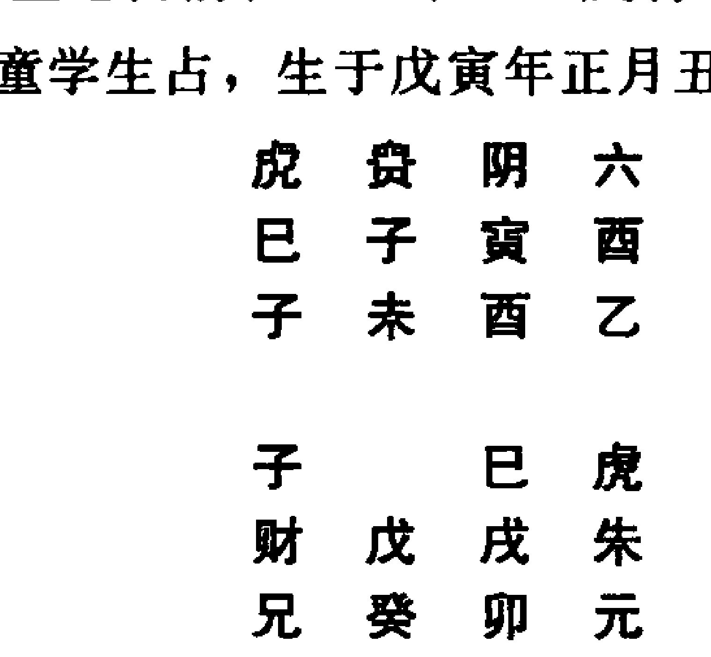
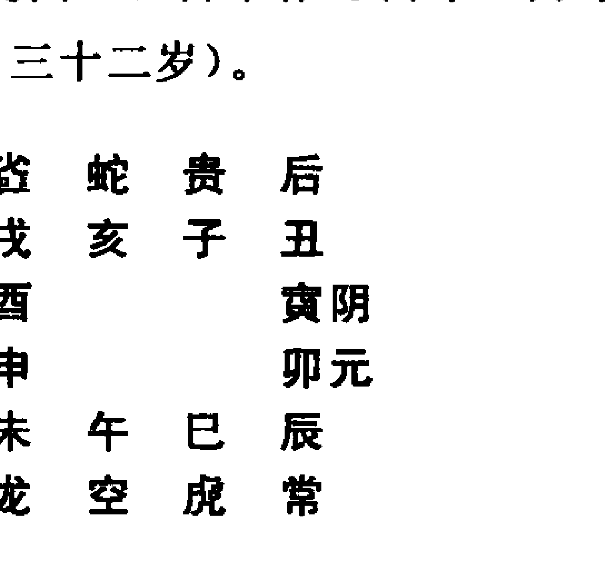

# 大六壬毕法案赋
【宋】邵彦和◎撰 刘科乐◎校注

广博精当，大有心得。
刘氏疏正，索隐探赜，
幽微决断，言词朴拙。
交易谋为，出行访谒，
天子庶人，靡不心悦。
言忠教孝，规过劝善，
既敬且诚，占无不中。
邵氏之壬，神乎其技；

邵彦和，宋代浙江衢州人，六壬宗师，壬学传世之第一人。其学生汇辑邵公日常占验而成的《大六壬断案》一书，乃壬学之指南，学者之圭臬。书中课例的壬占理则和用象方法，神妙非常，学壬者未有不以契悟《大六壬断案》为终身目标者。是书内容丰富，其所涉及的领域，远远超越了壬学乃至《易经》、术数的范畴，甚至于古代的政治、经济、官制、人物、民俗、律历、天文、五行、中医等，也均有涉及。刘科乐先生集十年之功研究此书，对于书中所涉及的政治、人物、官制、民俗等各个方面，全面系统地进行了考证。邵氏之壬，神乎其技，刘科乐先生以深厚的壬学功底对邵氏的占验方法、推断思路、取象用象、课传理气等等，补缺拾遗，详解疏正；既融贯旧说，又独有发明。学者备此书于案头，日日研习，自当获益无穷。

# 大六壬指南
【宋】邵彦和◎撰
刘科乐◎校注

责任编辑：薛 治
责任印制：李未炘

# 图书在版编目（CIP）数据
大六壬断案疏正/（宋）邵彦和著；刘科乐疏正.—北京：华龄出版社，2012.1
ISBN 978－7－80178－917－4
Ⅰ.①大… Ⅱ.①邵… ②刘… Ⅲ.①命书－研究－中国－宋代
Ⅳ.①B992.3
中国版本图书馆 CIP 数据核字（2011）第 254056 号

| 属性 | 值 |
|------|------|
| 书名 | 大六壬断案疏正 |
| 作者 | (宋)邵彦和著 刘科乐疏正 |
| 出版发行 | 华龄出版社 |
| 印刷 | 九洲财鑫印刷有限公司 |
| 版次 | 2012年1月第1版 2012年1月第1次印刷 |
| 开本 | 720×1020 1/16 |
| 印张 | 24.25 |
| 字数 | 400千字 |
| 印数 | 1～6000册 |
| 定价 | 58.00元 |
| 地址 | 北京市西城区鼓楼西大街41号 |
| 邮编 | 100009 |
| 电话 | (010)84044445 |
| 传真 | 84039173 |

# 序
大六壬是中国最古老的一种占卜术，与太乙、奇门合称“三式”。太乙占天、奇门占地、六壬占人。三式之学是术数领域里的最高级预测学。大六壬占断以占人事为最，准确率极高，灵验异常，所以又有“占卜之王”的美誉。六壬流传尤古，应起于春秋时代，《吴越春秋》、《越绝书》早有记载，流传至今，保留下来大量古籍和珍贵资料。六壬古籍多过百种，其中经典如：《六壬大全》、《六壬指南》、《六壬总归》、《壬窍》、《六壬琐记》、《六壬心镜》、《六壬未悟》、《管子神书》、《壬占汇选》、《邵彦和断案》等等。在古代研究学习六壬的人很多，可以说上至皇帝下到百姓。据说春秋时代的伍子胥、宋朝的仁宗皇帝、明朝的刘伯温无不精通六壬。近几年国内外研究学习六壬爱好者人数与日俱增。但学好六壬并非易事，正如《指南》所说的：“非面壁九年不能也”。学习六壬除熟读《心印》、《指掌》、《互变》、《中黄》、《毕法赋》外，多精研古代案例无疑是提高占断水平的最佳途径。研究六壬古人案例，以《壬占汇选》、《邵氏断案》为最好。《壬占汇选》集占例六百多个，邵氏断案二百多个，篇幅巨大，想真看懂，需对当时的历史背景、文化、考试制度、官职名称、地名等都要熟知才行。这对于一般的读者而言，真是困难重重。

邵彦和是宋代浙江衢州人，六壬宗师，六壬学传世的第一人。他的学生汇辑邵公的日常占验而成《大六壬断案》一书，堪称壬学指南，学者圭臬。《大六壬断案》中课例的壬占理则和用象方法，神妙非常，学壬者都以契悟此书为终身目标。这本书内容丰富，它所涉及的领域，远远超越了壬学乃至《易经》、术数的范畴，甚至于古代的政治、经济、官制、人物、民俗、律历、天文、五行、中医等，也均有涉及。刘科乐老师花费了十年的时间研究这本书，对于书中所涉及的方方面面，都进行了全面系统地考证。邵氏之壬，神乎其技，刘科乐先生以深厚的壬学功底对邵氏的占验方

# 大六壬断案疏正
法、推断思路、取象用象、课传理气等等，补缺拾遗，详解疏正；既融贯旧说，又独有发明。青年学者能有此功力，非常难得。

几年前经朋友介绍有幸认识了刘科乐老师。他为人豪爽、聪明好学，六壬一脉师承于民国命理大师韦千里，同时不乏个人全新之领悟。其中最有特色当数他独创的“刘氏断应法”金三角原理，即：神将一元大论、理气归象大论和气候应象大论。这种创新无疑又为广大六壬研究爱好者将占断准确性提高到了一个更好的境地。今有幸得知好友科乐的《大六壬断案疏正》即将出版。这本新书对六壬爱好者而言无疑是研究邵氏断案的福音，对研究古人经典案例的一大帮助，使这门中国古老的六壬绝学更加发扬光大。

北京周易研究会 王力军
2011年10月初于北京

# 前言
大六壬，相传是在轩辕黄帝战蚩尤于涿鹿时，由九天玄女神授给黄帝的兵法，也被后世称为“玄女式”。对此，《四库全书·六壬大全》提要认为：“六壬与遁甲、太乙，世谓之三式，而六壬其传尤古。或谓出于黄帝、玄女，固属无稽。要其为术，固非后世方技家所能造”。虽然这里并没有明确指出六壬肇始的时代信息，但从《周礼·春官》关于太史一职，已有“大师，抱天时，与大师同车①”的记载来看，最晚在周朝时，六壬已被应用于与国政、军事有关的预测了。其后，相关的提要还说道：“《吴越春秋》载伍员及范蠡鸡鸣、日出、日昳、禺中四术，则时将加乘与龙、蛇刑德之用，一如今世所传”，从这段文字及汉墓出土的大量六壬式盘，可进一步推知，六壬在汉时应用广泛，并已形成了以天盘、四课、三传为课式，以神将乘临为判断依据的预测方法。

到了两宋，因宋仁宗皇帝的偏好，使六壬在文人士大夫中广为流传，六壬的专著也如雨后春笋般大量涌现。仁宗时期，既有像苗公达、楚衍那样以六壬见长，而成为帝王顾问的壬学大家，也有随军阴阳官元轸那样专司壬占的谋略家。这一时期的壬学水平，不仅逾越了前代，也是此后的明清壬家所无法企及的。而就在这河汉般璀璨的两宋壬学星空中，最耀眼的那颗明星，则非邵彦和莫属。诚如清代壬家程树勋在《壬学琐记》中所说：“宋仁宗最嗜六壬，故其时习此学者甚多，而以元轸、苗公达为最。至徽宗、高宗时，邵彦和一出，又架诸人之上。理宗时，有凌福之等本邵公之法作《毕法赋》，于是诸法咸备，至平至当，一扫疑神疑鬼之习气”。

# 大六壬断案疏正
据《邵彦和先生六壬断案分编》一书的《弁言》载，“邵彦和先生，宋人也。据其自占动静一数而推之，生于英宗治平二年乙巳，殁于高宗绍兴三年癸丑，似浙江之太末人”。《大六壬断案》是邵公的学生记录他日常占验，汇辑而成的。该书有《元》、《亨》、《利》、《贞》四编，总共收录历代传抄邵公案验218个，分列于天时、宅墓、前程仕进、终身、流年、婚姻、胎产子息、财产、一课二事各断式、交易、出行访谒、行人音信、疾病、六畜、亡盗、官讼、杂占诸条目之下。

上世纪九十年代，随着壬学渐为易学爱好者所知，这一“旧时王谢堂前燕”，也随着易学发展的春风，终于“飞入寻常百姓家”了。世纪之交，《大六壬断案》重现于世。由于书中仅录邵氏案验，并无体系性的理论构建；所存案验的注解，也仅就个别用象加以简单说明，并不系统；行文文白相间，间或混以浙西乡音，令人通读其书尚难，更遑论理解了。而让读者不能释怀的是，每个案验的断语又与实际人事吻合得天衣无缝，一时间，有褒者认为，邵公或有“怪力乱神”之能，其书实为无解的“壬学天书”；更有贬者评其书“断语失次、遣词俚俗”，而指为后世伪书。

我从2000年开始钻研《大六壬断案》。时对外界的评论，个人的观点是，如邵公断课，有所谓怪力乱神或特异功能之助，那一般的壬学研究者无此异能，将作何解？果如此，则《大六壬断案》无传世与研究之价值。可是，此书在南宋时已为人反复传抄，且被历代壬家奉为圭旨，可见其学术价值和研究价值非同一般。或如贬者所指，是后世伪托邵公之名而谋利求名，那么，作为乡间卜士的邵彦和先生，在他生活的时代既不出名，后世经籍家、术家也鲜及其名，托这样一位无名隐士之名而作伪书，不是事与愿违么？更何况，《大六壬断案》诸验皆与人事相符，后世作伪者要从考定宋历、按历拟课，到编造断语，再捏造相对应的人事，且非止于一课一案地编，而是要将二百余案一一造来，其人须智巧过人，且壬学水平也必当远在《大六壬断案》之上，方能造就这样一部千古“伪书”。试问，既然此人水平远过于《大六壬断案》，那又何必费心造假，须知造假的工作量比起自占自断来，岂一二倍人工可以胜任？世上会有这等智巧远胜于人，而做事反至愚于人的傻瓜么？

因此我认为，邵氏《大六壬断案》虽乏系统注释，但以理断课，以断

应事，毋庸置疑！决非怪力乱神的巫妄之言。这一点，如上述程树励“一扫疑神疑鬼之习气”一语可证，不遑多论。伪书之说，更属无稽之谈，不须置论！作为一名当代的壬学爱好者和研究者，只有思考怎样从古人的案验中汲取宝贵的经验，才是正道。从2005年起，我摈除一切外缘，专攻《大六壬断案》。2006年，初探门径，知邵公断课，必由课体入手，循课传之次第，搜年命之变体，循规蹈矩，条理分明。

时年，始萌注解《大六壬断案》之想，以期对数年来研究《大六壬断案》的心得做一小结。初步的设想，只是在原注及程爱函按语基础上，对原书断语稍加整理和补注，以眉批的形式做一点拾缺补遗的工作。但一经实施，才发现《大六壬断案》实在是一部内容丰富、知识面广的大书。其所涉及的领域，远远超越了壬学乃至易经、术数的范畴，如古代的律历学、天文学、五行学、中医学，也均有涉及。不仅如此，像前程仕进、终身等类占，事涉科举、职官的，因古今政体不同，职官名称迥异，还须对宋代的职官制度予以查考；此外，因大部分案验占于宋室南迁以后的建炎之初，人事发生地多在闽浙、两湖及以南地区，断事每涉地方风物、民俗，故对这一时期路、府、州的设置和地名的考证，实属必须；对相关的风物、民俗的简单介绍，也不可或缺。这一来，仅仅补注已很难满足《大六壬断案》注疏的要求。加之原注多出自邵公学生手笔，难免揣测、错讹之嫌，遂一改初衷，决心对《大六壬断案》进行全面、系统的注疏。书名定为《大六壬断案疏正》，其“正”之一字，通假为“证”，以涵二义：一、正原注之误解；二、证断语之理法。

邵公的生活年代，在两宋之间。原书断语中引据的壬学古籍理论，仅有《大六壬心镜》① 和《六壬玉成歌》中的片言只语。可见，邵公是研究过《心镜》的。本次注疏《大六壬断案》，为尽量避免个人观点改邵案之头，换“刘案”之面，凡原书断语与《心镜》义合者，均引《心镜》之语。然而，《心镜》尚简，未能尽《大六壬断案》理路之一分，要想最大可能地向读者展现邵案本义，实属难能。好在《四库书目总要》为我注疏《大六壬断案》的另辟一径。《总要》对《毕法赋》提记曰：“宋凌福之撰。

① 唐徐道符著，以下简称《心镜》。

# 大六壬断案疏正
福之履贯未详。核其自序，盖理宗宝庆间人也。始徐道符作《六壬心镜》，建炎中又有邵彦和者著书，名曰《口鉴》，以阐明徐氏之说。后多为俗学所窜乱，福之因用彦和法作七言百句注释之，以成此书，融贯旧说，而缀以心得，独为精当。自序谓虽言词鄙拙，实决断之幽微，可为定论。世之言壬术者，多奉为秘钥。亦载《六壬大全》中，故与《心镜》并存目焉。”结合程树勋“有凌福之等本邵公之法作《毕法赋》”之说，可以相信，《毕法赋》的撰著是建立在总结和发挥《大六壬断案》理气的基础上的。为此，凡原书断语与《毕法赋》义合者，均引《毕法赋》之诀，以力争还原邵公断课的理路。

也许有读者会质疑，邵案历千年而无确解，即使是为邵公记录案验的及门弟子也未能尽传其义理，你还邵公本面的这份自信，经得住推敲么？对此，我的回答是，要完全还原邵公在断课当下的理路，即使是邵公本人，也未必能做到。这是因为，《大六壬断案》中的不少案例都是多年才得到验证的，断、应之间间隔时久，即卜者自己也很难还原彼时的判断思路，况是悬隔千年的后学？但我既于邵公心怀私淑之意，在下手注疏时，力求所用理气、象数具备系统性、逻辑性和统一性。所谓系统性，即不离《心镜》、《毕法》，不引明清壬家著述。所谓逻辑性，即对于同一案验中前后断语的注疏，尽量在逻辑上保持一贯性，并突显出个别断语中的个别用象之间的关联性，使读者在阅读注疏时，产生用象、理气一气呵成的感觉。所谓统一性，即不同案例间近似的判断在用象理气上必须前后一致，并引相关案例的断语互相印证，以确证其思路的统一性。如在注疏 § 宅墓 02•022 时，就事主冯修职“被拘能仁寺”这一断应，我原先的解释是“尤恶者，未中有井、鬼二宿。既得井宿加寅为枷锁，哪堪‘鬼宿照鬼门’？”及注至 § 前程仕进 03•098 时，邵公原断中有“鬼宿入鬼门“句，虽然星宿“照”鬼门比“入”鬼门在表达上更为生动形象，但仍尊邵公本人断语，改“照”为“入”，以显注疏非出个人臆揣。且就我之“鬼宿照鬼门”与邵公之“鬼宿入鬼门”表义相同而言，也增加了我通过注疏邵案还原邵公断课思路的信心。

注疏《大六壬断案》期间，我还从中总结出了一套行之有效的断课方法，即“大六壬刘氏断应法”。其中，神将一元大论、理气归象大论和期

候应象大论是大宗法，故曰“大论”，这也就是近年逐步在海内外壬友及国内高校易学爱好者中公开讲授的“刘氏断应法金三角理论”。此外，当事件头绪繁复，或一时中多人问多事时，另创三才易简法、分爻次客法和课眼统驭法三法，以提高用象的精确性，化博为约，以简捷的逻辑判断驾驭复杂的人事断应。这三条称为“刘氏断应法简单性原理”。
本书中，结合邵案的注疏，首次公开了“金三角理论”应用原则。在邵案的读者中，普遍存在这样的疑惑，即邵公断课，往往看似不循四课、三传的即定方向，而是大胆越过课传的“雷池”，在天、地盘神将乘临中寻找与人事相关的信息作断，妙笔连连、直断不谬，的是“神鬼不测之机”。放眼古今壬家，能作如是语者，唯我邵师独一人耳！但究其理气，却又罔无踪迹，堪称“神龙见首不见尾”者也。
实际上，邵公所以能在课传以外的天、地盘中自在地“悠游”其神妙无方的判断思路，正因为他能娴熟地运用神、将间一元转换的理气原则。此一原则在 § 宅墓 02・029 中初露端倪，如断语云“雀乃午也，七月尚是午将，‘将’下见酉，乃‘酱’也”；复于 § 终身 04・106 中全显大用曰：“酉即太阴，太阴即酉”。由此，我总结了出了神将一元大论的应运方法，一改单一的纵向神将乘临关系，为神将互换关系，使神、将间发生了对角斜向的、阳神与阴神间横向的，以及由课传指向天盘的螺旋式位移，大大丰富了神将的取象延展性和必然性，由显而微地揭示了课传与天、地盘间内在的互动关系。
在神将一元大论的基础上，我进而提出了有别于传统壬学理气学、象数学并重、平行的理气归象大论。理气归象论的主旨是“凡所有象，无非理气”。这亦即是说，断语中的每一个别用象间都存在着内在的关联，而这种内在关联正是由课传理气作为逻辑支撑的。这里所谓的“理气”，与传统壬学的五行生克理气有着质的不同。我认为，神、将间的五行生克理气，并非真正意义上的理气。理由是，五行生克是朴素唯物主义的自然法则，如金之生水，水之克火，法尔如是，理与不理都是同样的结果。而理气归象之“理气”理的是课传、盘理间神将内在的关联性，使看似无关的个别神将乘临间生克式的“物理运动”发生“化学反应”，从而把“事一类一象”三者高度统一起来，为精准的六壬断应服务。这才是与五行生克

大六壬断案疏正
理气迥异的真理气。

六壬之难，最难者在于断应期。而六壬之精醇远驾其他术数门类之上者，也正在于对应期的精确把握。传统的应期判断方法，拘于岁、建、将、旬之间，缚于冲合、夹拱、生扶、制化之中，看似处处合乎五行理气，实则每令学者迷失于抽象数理的汪洋，难登畔岸。而刘氏断应法的期候应象论则采取了一种简单的断应思路。由于以上两条原理的运用，大大提高了用象的精确度，在用象确定的前提下，期候的断应问题也就迎刃而解了。所谓期候应象，即应期之判断，必须与具象的人事象类高度统一，何象取验，便于何象克应，分毫不爽！唯此，始可与言“数不妄发”者。

以上简明扼要地介绍了《大六壬断案》的特点，以及刘氏断应法的一般性原则，希望广大壬学爱好者能在《大六壬断案疏正》的阅读过程中，真正地从这部大书、天书中有所收获。

辛卯年霜降日刘科乐志于沪东浬水斋寓次

# 目录
序

前言

## 邵彦和先生大六壬断案分编
凡例
弁言

# 元 集
天时第一
§ 天时 01・001
§ 天时 01・002
§ 天时 01・003
宅基第二
§ 宅基 02・004
§ 宅基 02・005
§ 宅基 02・006
§ 宅基 02・007
§ 宅基 02・008
§ 宅基 02・009
§ 宅基 02・010
§ 宅基 02・011
§ 宅基 02・012
§ 宅基 02・013
§ 宅基 02・014
§ 宅基 02・015
§ 宅基 02・016
§ 宅基 02・017# 大六壬断案疏正

## 亨 集

### 前程仕进第三

- §宅墓02·018……37
- §宅墓02·019……39
- §宅墓02·020……41
- §宅墓02·021……43
- §宅墓02·022……45
- §宅墓02·023……47
- §宅墓02·024……49
- §宅墓02·025……51
- §宅墓02·026……52
- §宅墓02·027……54
- §宅墓02·028……55
- §宅墓02·029……57
- §宅墓02·030……60
- §宅墓02·031……62
- §宅墓02·032……63
- §宅墓02·033……64
- §宅墓02·034……66
- §宅墓02·035……68
- §宅墓02·036……70
- §宅墓02·037……71
- §宅墓02·038……74
- §宅墓02·039……75
- §宅墓02·040……76
- §宅墓02·041……78
- §宅墓02·042……79
- §宅墓02·043……81
- §前程仕进03·044……85
- §前程仕进03·045……87
- §前程仕进03·046……89
- §前程仕进03·047……91
- §前程仕进03·048……93
- §前程仕进03·049……97
- §前程仕进03·050……98
- §前程仕进03·051……100
- §前程仕进03·052……101
- §前程仕进03·053……102
- §前程仕进03·054……104
- §前程仕进03·055……107
- §前程仕进03·056……108
- §前程仕进03·057……109
- §前程仕进03·058……111
- §前程仕进03·059……112
- §前程仕进03·060……113
- §前程仕进03·061……115
- §前程仕进03·062……116
- §前程仕进03·063……118
- §前程仕进03·064……119
- §前程仕进03·065……120
- §前程仕进03·066……121
- §前程仕进03·067……123
- §前程仕进03·068……125
- §前程仕进03·069……126
- §前程仕进03·070……128
- §前程仕进03·071……129
- §前程仕进03·072……131
- §前程仕进03·073……132
- §前程仕进03·074……135
- §前程仕进03·075……136
- §前程仕进03·076……138
- §前程仕进03·077……140
- §前程仕进03·081……148
- §前程仕进03·082……151
- §前程仕进03·083……153
- §前程仕进03·084……154
- §前程仕进03·085……156
- §前程仕进03·086……158
- §前程仕进03·087……160
- §前程仕进03·088……162
- §前程仕进03·089……164
- §前程仕进03·090……166
- §前程仕进03·091……168
- §前程仕进03·092……169
- §前程仕进03·093……172
- §前程仕进03·094……173
- §前程仕进03·095……175
- §前程仕进03·096……176
- §前程仕进03·097……177
- §前程仕进03·098……179
- §前程仕进03·099……180
- §前程仕进03·100……182
- §前程仕进03·101……183
- §前程仕进03·102……185
- §前程仕进03·103……186

## 利集

### 终身第四

- §终身04·104……191
- §终身04·105……192
- §终身04·106……193
- §终身04·107……195
- §终身04·108……196
- §终身04·109……197
- §终身04·110……199
- §终身04·111……200
- §终身04·112……202
- §终身04·113……203
- §终身04·114……204
- §终身04·115……205
- §终身04·116……207
- §终身04·117……209
- §终身04·118……210
- §终身04·119……211

### 流年第五

- §流年05·120……213
- §流年05·121……215

### 婚姻第六

- §婚姻06·122……216
- §婚姻06·123……217
- §婚姻06·124……218

### 胎产子息第七

- §胎产子息07·125……220
- §胎产子息07·126……222
- §胎产子息07·127……223
- §胎产子息07·128……224
- §胎产子息07·129……225
- §胎产子息07·130……227
- §胎产子息07·131……228

### 财产第八

- §财产08·132……229
- §财产08·133……231
- §财产08·134……232
- §财产08·135……233
- §财产08·136……236
- §财产08·137……237
- §财产08·138……238
- §财产08·139……239
- §财产08·140……240
- §财产08·141……241
- §财产08·142……242
- §财产08·143……243

### 一课二事各断式第九

- §一课二事各断式09·144……245
- §一课二事各断式09·145……249
- §一课二事各断式09·146……252

### 交易谋为第十

- §交易谋为10·147……255
- §交易谋为10·148……256

### 出行访谒第十一

- §出行访谒11·149……258
- §出行访谒11·150……260
- §出行访谒11·151……261
- §出行访谒11·152……264
- §出行访谒11·153……265
- §出行访谒11·154……266
- §出行访谒11·155……267

## 贞集

### 行人音信第十二

- §行人音信12·156……271
- §行人音信12·157……272
- §行人音信12·158……273
- §行人音信12·159……274
- §行人音信12·160……275
- §行人音信12·161……276

### 疾病第十三

- §疾病13·162……277
- §疾病13·163……279
- §疾病13·166……284
- §疾病13·167……286
- §疾病13·168……288
- §疾病13·169……290
- §疾病13·170……291
- §疾病13·171……292
- §疾病13·172……295
- §疾病13·173……297
- §疾病13·174……299
- §疾病13·175……300
- §疾病13·176……301
- §疾病13·177……302
- §疾病13·178……303

### 六畜第十四

- §六畜、走失14·179……305
- §六畜、走失14·180……306
- §六畜、走失14·181……307
- §六畜、走失14·182……307
- §六畜、走失14·183……308
- §六畜、走失14·184……309
- §六畜、走失14·185……310
- §六畜、走失14·186……310
- §六畜、走失14·187……311

### 亡盗第十五

- §亡盗15·188……312
- §亡盗15·189……313
- §亡盗15·190……314
- §亡盗15·191……316
- §亡盗15·192……317
- §亡盗15·193……318
- §亡盗15·194……319
- §亡盗15·195……320
- §亡盗15·196……320## 大六壬断案疏正

- § 亡盗 15 • 197 …………………………………………………… 321
- § 亡盗 15 • 198 …………………………………………………… 322
- § 亡盗 15 • 199 …………………………………………………… 323
- § 亡盗 15 • 200 …………………………………………………… 324
- § 亡盗 15 • 201 …………………………………………………… 325

### 官讼第十六

- § 官讼 16 • 202 …………………………………………………… 326
- § 官讼 16 • 203 …………………………………………………… 327
- § 官讼 16 • 204 …………………………………………………… 329
- § 官讼 16 • 205 …………………………………………………… 331
- § 官讼 16 • 206 …………………………………………………… 332
- § 官讼 16 • 207 …………………………………………………… 333
- § 官讼 16 • 208 …………………………………………………… 335
- § 官讼 16 • 209 …………………………………………………… 336
- § 官讼 16 • 210 …………………………………………………… 336
- § 官讼 16 • 211 …………………………………………………… 338
- § 官讼 16 • 212 …………………………………………………… 338

### 杂占第十七

- § 杂占 17 • 213 …………………………………………………… 340
- § 杂占 17 • 214 …………………………………………………… 341
- § 杂占 17 • 215 …………………………………………………… 342
- § 杂占 17 • 216 …………………………………………………… 344
- § 杂占 17 • 217 …………………………………………………… 345
- § 杂占 17 • 218 …………………………………………………… 345

## 《毕法赋》引证

# 脚注

## 神煞

# 参考书目

# 后记

## 邵彦和先生大六壬断案分编

古歙槐塘程铨爱函氏辑

## 凡 例

- 一、本次点校、注疏所用底本，为上海图书馆馆藏古籍《邵彦和先生六壬断案分编》。
- 一、上海图书馆馆藏古籍《精抄历代六壬占汇选》（以下简称《壬占汇选》）中收录了《大六壬断案》全部案例，点校过程中，凡文义相同，而行文有异的，仍按《大六壬断案》原文点校。凡《大六壬断案》中行文错漏，必须按《壬占汇选》订正的，均在小注中予以注明，并录《大六壬断案》原文，以供读者参考。
- 一、凡《大六壬断案》案例所用记年与《壬占汇选》有出入者，考《宋史》、《二十史朔闰表》以作订正的，均在小注中注明。
- 一、每个个案的编号由占类、章节号和顺序号组成。如“§天时01・001”，占类为天时，章节为第一章，顺序号为001。为读者阅读和检索方便，案例的顺序号不按章节顺序，而是按全书案例的顺序编排。如“§婚姻06・122”，占类为婚姻，章节为第六章，该案例在全部案例中为第122个课案。
- 一、《大六壬断案》原文中间插有抄录者程爱函氏按语的，均以（）标明。
- 一、凡引用《壬占汇选》抄录者程树勋按语的，均注明出处。
- 一、注疏过程中，凡涉及宋代职官名称、品级的，均以《宋史・职官志》为准，并在小注中注明。
- 一、注疏过程中，凡涉及路、府、州及地名的，均考自《宋史》、《中国历代职官沿革史》（陈茂同著），并在小注中注明。
- 一、【评疏】以下为本人疏正。

### 弁言

邵彦和先生，宋人也。据其自占动静一数而推之，生于英宗治平二年乙巳，殁于高宗绍兴三年癸丑②，似浙江之太末③人。按：断语中有云，日后动于东北，近二百里，果辛亥年十月过婺州④，自乡里行一百八十里，然则在婺州之西南方也。婺州西南一百八十里，是为太末人。云壬子年过严州，自乡中东北过西北，然则在严州之东南方也。严州⑤东南，亦太末也。

先生精于六壬，占无不中，且言忠教孝，规过劝善，各因人而施，是知为年高德劭之耆英，非徒以六壬见长也。所存断案，盖及门⑥诸子所编，委曲详明，以诏后之学者。奈历年既久，率多散逸，缘后人各凭己见，互有去取于其间，于是原本渺不可得矣。尝读凌福之先生《毕法赋》序，知在理宗宝庆以前，已有将先生之案，分析措辞，而兴贩利者。何况由南宋至今，历六百七十余年久哉？

余自弱冠之前爱习，凡见先生断案，便录而珍藏之，三十年来，仅得五本。其一为前明万历年间梦醒头陀所钞，附于《捷要》一书中也，二则《口鉴》中之注也，三则《前知书》中所引者也，四则方仰松先生所购于武林者也。（方仰松先生自记云：乾隆五十一年三月初二日，余游武林，遍求六壬书，于市中无有可观者，最后得此册于肆中，缺其首尾不全，然其古者之官衔，皆南宋时衔，元明以后所无，知为宋人之遗书也，其断验神妙，出诸家之上，真六壬中之秘本，书虽不全，然举隅三反，所得为不少矣！）其五则宋人原书，仅有己酉年元旦起，至六月十六日止一册也。

凡兹五本，多寡不齐，语句亦异，乃细心考订，择其理长者，分类编次之，共得二百一十六数。天时三，宅墓三十九①，前程仕进五十八②，终身一十六，流年二，婚姻三，胎产子息七，财产一十二，一课二事各断式三，交易二，出行访谒七，行人音信六，疾病一十七，六畜九，亡盗一十四，官讼一十一，杂占六，以为六壬之钤式。然先生享年将及古稀，断案讵止于此？此固据余之所见者也，倘有同志君子，惠余所未见者焉，行将补成全璧，是则余之所厚望者矣！

古歙槐坢③程铨爱函氏

① 宅墓实四十式。
② 前程仕进实六十式。故《大六壬断案》计二百一十八式。此或《弁言》计数之失。
③ 古歙，今安徽省黄山市歙县的古称。今歙县西郊仍有槐塘村。

## 元集

### 天时第一

### § 天时 01 · 001

韩太守①占祈雪。建炎三年②，己酉岁，十月初四③己卯日，寅将酉时。

```
龙  贵  武  陈
丑  申  巳  子
申  卯  子  己

父  辛  巳  元
兄  甲  戌  朱
鬼  己  卯  虎
```

```
雀  合  勾  龙
戌  亥  子  丑
蛇酉      寅空
贵申      卯虎
未  午  巳  辰
后  阴  元  常
```

邵先生曰：数日以来，天气和暖，宛如三、九月，州县虽然祈雪，皆无响应。今得此课，明日天色必变，巳时风起转寒，未时有雨，亥时作雪，厚有七寸。

众官皆笑曰：今日晴暖，雪从何来？当日已晚，次早众官在坛，待至巳时，果然风起，霎时云合。未时微雨，众官散后，北风大作，甚冷。二更后下雪，至次日未时方止，果积七寸。

盖此课，火伏于下，水升乎上，不拘占雪占雨，皆当日有。况申为夜贵，正是权柄；日上又见天河之水，腾运乎上，必流乎下；初传巳火，临子被克，上见元武，变成大风雪。盖巳、戊、卯铸印，春、夏、秋必雨，冬必雪。未传卯作白虎，与申皆是白色，申乃空亡，正是空中降下，乃造化之所生也。夫火伏于下，水腾乎上，一雨也；申、子为水，加临日辰，二雨也；三传顺行，三雨也；卯为雷，雷过西方，为虎所制，虽冬月无雷，岂深冬无雪乎？子作勾陈，占雨主连绵，占雪主深厚。

凡铸印课，占天时必大雨雪。

【评疏】此占，就天盘来看，方隅皆悖，申、酉、戌西方金入震、巽，寅、卯、辰东方木临乾、兑，巳、午、未南方火伏北坎之下，亥、子、丑北方水升南离之宫。由于地盘巳、午、未、申四宫均处于地盘上方，巳居东南巽宫，阳明之位，午乃先天乾位，中天之象，未、申踞于西南，位近乎天，其象表“天”。亥、子、丑北方水运于天上，巳、午、未南方火反伏于地盘下方，这就形成了文中所称的“火伏于下，水升乎上”的局势。以此作为“必雨”的首要依据，是符合现代气象学关于雨、雪形成的科学理论的。

其次，因占时酉当夜时，支上申乘贵人，申为水母，贵人为权柄，故曰：“申为夜贵，正是权柄”。支阴丑临之，丑为北方水之余气，冬占坐生方，将乘青龙，有龙神升天之象。古人认为青龙生旺升天，主大雨。再论干上，干上神后为天河，与支上申半合又化水；其阴神巳加子发用，有“天河之水，腾运乎上，必流乎下”的意象。子乘勾陈，象主勾连不散，因此“占雨主连绵，占雪主深厚”。

接着，再论三传。三传发用巳火居于巽宫，主风，因此判断巳时“风起转寒”。巳火乘玄临子，受上下夹克，而传于河魁，遂“变成大风雪”。末传卯乘白虎，上见申金，皆为白色，与雪的颜色相符；申为旬空，居于天盘之上，有“空中降下”之象。由巳及戌而至卯，为顺传，天将又为顺治，由上而下谓之顺，故主降雪。课得巳、戌、卯为铸印，故断言：“春、夏、秋必雨，冬必雪”。

此占应期，以日主卯加旬首戌在末传，本主当日应。文中也说“不拘占雪占雨，皆当日有”，文中“明日”、“次早”恐为传抄之误，亦未可知。如《壬占汇选》所录：“……今得此课，今日天色必变……众官皆笑曰：如此晴暖，雪从何来，待至巳时，果然风起……”，既无“明日”、“次早”等字，但也不可信为确凿。

课体课格：知一 铸印 乘轩 励德

#### § 天时 01·002

十二月戊申日，子将申时，占晴雨。

```
元  蛇  贵  勾
辰  子  丑  酉
子  申  酉  戌

兄  甲  辰  元
子  戊  申  龙
财  壬  子  蛇
```

```
勾  合  雀  蛇
酉  戌  亥  子
龙申      丑贵
空未      寅后
午  巳  辰  卯
虎  常  元  阴
```

邵先生曰：润下课，元临子作用，中传龙又乘申，末传又是夜青龙。若春占主水涨，今冬占必有大雪。果辛亥日雨，丙辰日大雪，戊午日晴而起风。

【评疏】此占，天盘与前占相似，都有“火伏于下，水升乎上”的特征。三传润下，初传水库，中乃水母，末为雨水；乘神元武、青龙、螣蛇（螣蛇擅水行）又都是生活在水中的动物，所以占晴雨，主雨，冬占主雪。邵公不说末传乘蛇，而说“夜青龙”，是指在夜占的情况下，贵人起自未顺行，则子乘青龙，也是主雨之神。这种昼用夜将、夜用昼将的方法，是邵公占断的一大特色。

至于期候的克应，因亥为十二月的雨煞，临未乘午，水火相激，所以辛亥日雨。丙辰日大雪，主要因为辰上申为水母，乘青龙将的缘故。同时，从魁乘勾陈加于干上，冬占晴雨，酉主霜雪，十二月占，酉为雨师，且与辰合，也是造成丙辰日降雪的因素之一。戊午日火坐长生，合功曹冲破润下局，故主晴；胜光乘白虎，虎本雷部中风伯，居于寅为虎入山林，因此起风。

课体课格：元首 润下 励德 六仪

### § 天时 01 · 003

庚辰年①浙江大旱，八月癸丑日②，辰将辰时，占雨泽。

```
勾  勾  勾  勾
丑  丑  丑  丑
丑  丑  丑  癸

贵  后  阴  元
巳  午  未  申
蛇辰      酉常
雀卯      戌虎
寅  丑  子  亥
合  勾  龙  空

鬼  癸  丑  勾
鬼  庚  戌  虎
鬼  丁  未  阴
```

邵彦和曰：伏吟课，定是今日未时有云，一霎时起大风，又下小雨。明日甲寅，一日大风，下微雨。至乙卯日风止，大雨一日，水暴涨也。

盖丑在癸上，即癸丑为初传，而中戌、末未，叠叠刑开，使癸水下注。癸丑纳音属木，木主风，故未时兼有风，是八月十五日也。至十七日乙卯，是大溪水，故大雨水涨。由丑、寅二日，风以动之也。太阴月宿十五日在戌，十六、十七日在酉，乃是月宿离于毕③，毕在酉宫也。十七日朱雀加卯，火败于卯，而得月离于毕，故主大雨。雨常附阴而降，以酉为太阴之门，纯阴之位。凡占雨，但用月宿到今日，看临在酉，则是月离于毕也。癸丑纳音木，克乘神勾陈土，土溃而水漏，故一霎时风雨。甲寅乘六合，木盛多风。至十八日丙火辰土，而纳音又土，辰又为八月太阳，上乘螣蛇火神，至是雨霁而晴矣。

【评疏】此课原题“庚辰年浙江大旱，九月十五日癸丑日，州官占雨，辰将辰时。(断语遗失)”，未免美中不足。今据《壬占汇选》补录其断，题记亦准该书。

癸丑日伏吟占雨，重土阻塞之象。发用丑乘勾，主旱。中传戌并月建，乘虎遁庚，虎为雷部中风伯，庚为水母，主大风雨。白虎、丁神皆主速，日内即起大风。末传丁未乘太阴，主云集天阴；诸土因戌、未刑冲散开，癸水雨露遂籍太阴、庚金滋养而降，主小雨。

甲寅日，将得六合，“木盛多风”。何又有微雨？寅、戌合午，引动天后，水火相激，微雨之兆。乙卯日，将得朱雀，火神逢败，土神克死，癸水尽得引出，“土渍而水漏”，主大雨水涨。丙辰日步太阳躔度，辰乃水库，遁干与将均为火神，又是勾神本家，主“雨霁而晴”。

上述依据，为常法成例，足以解释断语，最可凭信。但原注仍提供了两点辅助依据，以尽其义。一曰纳音五行，其法《大六壬心镜》间有论及，宋人因之。

如本案，取癸丑纳音属木，佐证了当日起风；又以乙卯纳音大溪水，佐证了卯日暴雨、水涨。就涨水而言，“大溪”二字的确验得最是恰当。不过前一日甲寅纳音也属大溪，为什么只降了微雨呢？这里又用到了第二个辅助依据——月宿。

月宿之说，《心镜》“二烦课”有专论，惜乏古例以证，今人则谤为穿凿。其实壬占造式源自古代天文学，起课既专责太阳躔度，断时见太阳在传课，向不轻忽，何故独轻于月宿呢？回答恐怕还是惧其繁琐之故吧。现略举月宿躔度之法，备为一说。

1. 月宿过官：月宿即太阴每日躔度，以每月初一移一宿，见下表：

| 月令 | 正 | 二 | 三 | 四 | 五 | 六 | 七 | 八 | 九 | 十 | 十一 | 十二 |
| :--- | :--- | :--- | :--- | :--- | :--- | :--- | :--- | :--- | :--- | :--- | :--- | :--- |
| 宿度 | 室 | 奎 | 胃 | 毕 | 参 | 鬼 | 张 | 角 | 氐 | 心 | 斗 | 虚 |

2. 月宿推算：从每月初一宿值某星起算，依下表日进一星。逢奎、张、井、翼、氐、斗六星，重算一日，数至起课当日即为月宿所在。

| 十二地支 | 辰 | 卯 | 寅 | 丑 | 子 | 亥 | 戌 | 酉 | 申 | 未 | 午 | 巳 |
| :--- | :--- | :--- | :--- | :--- | :--- | :--- | :--- | :--- | :--- | :--- | :--- | :--- |
| 二十八宿 | 角亢 | 氐房心 | 尾箕 | 斗牛 | 女虚危 | 室壁 | 奎娄 | 胃昴毕 | 觜参 | 井鬼 | 柳星张 | 翼轸 |

八月占，初一起角宿，初二亢，初三氐宿重算，初四仍躔氐；初五房，初六心，初七尾，初八箕，初九斗宿重算，初十仍躔斗宿；十一日牛，十二日女，十三日虚，十四日危，十五日室，十六日壁，十七日奎宿重算，十八日仍躔奎宿。八月十九癸丑日，月离于娄。次日甲寅宿度胃，廿一日乙卯月离于昴，正是太阴酉宫正度，“雨常附阴而降”，斯说虽善，但原注与历不符，置疑之。

以上断语之义尽矣，然尚有三点启示值得吾人借鉴：

1.  伏吟课天地盘不动，水还是水，火仍居火，在这种情况下占雨，怎样克应？从天盘乘将来看，元、阴、后金水之将升天；天后家神后，乘胜光则水火冲激；元武乘传送，中传戌又遁庚乘虎，水母运化有功，虽逢大旱，仍主日内有雨。此意原注未申，至为重要。否则水火不济，水母不运，伏吟不动，重土阻塞，纵邵公之神，也不敢许以日内风雨。
2.  纳音五行的运用虽难窥全豹，但从中也可借鉴一二。
3.  月宿躔度虽乏例证，但也不可轻易谤为无用，宜在常占中发见其实践意义。

课体课格：伏吟 自信 稼穑 乱首 励德（卯为贵人）

神煞：

| 神煞\月令 | 正 | 二 | 三 | 四 | 五 | 六 | 七 | 八 | 九 | 十 | 十一 | 十二 |
| :--- | :--- | :--- | :--- | :--- | :--- | :--- | :--- | :--- | :--- | :--- | :--- | :--- |
| 雨师 | 子 | 卯 | 午 | 酉 | 子 | 卯 | 午 | 酉 | 子 | 卯 | 午 | 酉 |
| 雨煞 | 子 | 丑 | 寅 | 卯 | 辰 | 巳 | 午 | 未 | 申 | 酉 | 戌 | 亥 |
| 风伯 | 申 | 未 | 午 | 巳 | 辰 | 卯 | 寅 | 丑 | 子 | 亥 | 戌 | 酉 |
| 风煞 | 寅 | 丑 | 子 | 亥 | 戌 | 酉 | 申 | 未 | 午 | 巳 | 辰 | 卯 |
| 雷煞 | 亥 | 申 | 巳 | 寅 | 亥 | 申 | 巳 | 寅 | 亥 | 申 | 巳 | 寅 |
| 雷公 | 寅 | 亥 | 申 | 巳 | 寅 | 亥 | 申 | 巳 | 寅 | 亥 | 申 | 巳 |

| 神煞\日支 | 子 | 丑 | 寅 | 卯 | 辰 | 巳 | 午 | 未 | 申 | 酉 | 戌 | 亥 |
| :--- | :--- | :--- | :--- | :--- | :--- | :--- | :--- | :--- | :--- | :--- | :--- | :--- |
| 晴朗 | 午 | 未 | 申 | 酉 | 戌 | 亥 | 子 | 丑 | 寅 | 卯 | 辰 | 巳 |
| 雷电 | 辰 | 辰 | 未 | 未 | 戌 | 戌 | 丑 | 丑 | 寅 | 寅 | 卯 | 卯 |## 宅墓第二

### § 宅墓02·004

张九翁戊午生五十一岁，占宅。戊申年九月庚寅日，辰将未时。

虎 阴 蛇 勾
申 亥 寅 巳
亥 寅 巳 庚

鬼 癸 已 勾
财 庚 寅 蛇
子 丁 亥 阴

蛇 雀 合 勾
寅 卯 辰 巳
贵丑       午龙
后子       未空
亥 戌 酉 申
阴 元 常 虎

邵先生曰：干支皆受上神来长生，利宅不利人。干上发用归传支，末传亥脱今日之干，而生今日之支，因充役①费用，又与姓陈吏人不和，尊长末后为儿娶妇，所费尽坏家计。十一年间阴人守寡，是时家产四分矣。

张九翁果先好，后因充役，大有所费。又为妻叔与陈姓吏人作鬼，因来动店内物，却乃争讼。后二年，又与子娶妇，倍陪女家。后五年，因弟有事，遂作四分分也。

盖庚生于巳，寅生于亥，庚脱于亥，寅脱于巳，干支俱受生，而互受脱，是先兴旺而后衰败也。亥数四、寅数七，乃十一年也。亥脱今日干，则耗泄我矣，故主费财。亥为支之长生，生宅脱我，岂不是为宅、旧役累，而费用乎？宅上亥乃脱神，从宅发出为末传，又来脱我，亥为妇人，故曰为子娶妇费坏也；上加太阴，为老阴人，故又主阴人守寡。中传寅为吏人，上为蛇挠，又为今日绝神，且寅又为今日财神，阴人得亥为脱气，故主因妻与吏人争讼也。

> ① 宋朝有依户等充乡役的制度。户等有五，两宋政府一般将第三等以上较富裕的主户，充任里正、户长、耆长、都副保正、大小保长、甲头等乡役，从而对县、乡级的税赋徭役和社会治安进行有效管理。

##### 【评疏】

此占，干支上均得长生，似乎人、宅兴旺，不知乃是四生坐脱气，名病胎课。又因干上脱支，支上又脱干，干支互脱，遂应《毕法赋》之“人宅受脱俱遭盗”。发用巳火克干，递传入干之绝地，却见宅神寅木；末传脱干生宅，故曰“利宅不利人”。况三传昼入夜，天将顺治逆传，勾、蛇、阴均为凶神，占宅得此，多牵连纠缠于衰退、损耗、阴私、病讼之间，难以自拔。

至于具体克应，更当详明。法以旬尾加旬首，《毕法》谓之“闭口卦体两般推”，有冤难申之象；传不离课谓回环格，不利释散。发用日鬼乘勾克身，勾陈主官事牵连，因此生出许多口舌是非。传阴功曹为胥吏，乘蛇，被充役之事纠缠；寅乃日财，传归亥水阴耗灭没之乡，且脱我生彼，所以“充役费用”。

且巳为店业，勾主纷争；中传财爻妻子，又逢上下蛇绕，竟被争店兴讼纠缠在内。寅为功曹“吏人”，临巳为“陈姓”，暗遁兄弟劫夺之神，末传丁鬼盗气逼身，真《毕法》之“金日逢丁凶祸动”也。故“妻叔与陈姓吏人作鬼，因来动店内物，却乃争讼”。

谓“阴人”者，妇女也，太阴之属。申年占亥为孤寡，“亥数四、寅数七”，故断“十一年间阴人守寡”。

复次，亥本子孙，将乘太阴为酒食，干支上下自作六合，综此断作“尊长末后为儿娶妇”。亥为双，主“倍陪女家，所费尽坏家计”。

由占时起算，经十一年太岁为戊午上见朱雀夹定卯木，卯木者，日财也，遁干辛为庚之弟，“因弟有事”。戊午年张九翁行年立寅，恰值末传亥水脱尽庚干，亥数四，“是时家产四分矣”。

课体课格：元首 元胎 回环

### § 宅墓 02 · 005

叶助教①戊午生五十一岁，占宅。戊申年正月辛卯日，子将未时。

戊 丑 申 | 朱 申 卯 | 朱 申 卯 | 武 卯 辛

勾 戌 合酉 雀申 蛇 未 | 龙 亥 空 子 贵 贪 常 卯 元 后 阴

财 辛 卯 武
兄 甲 申 朱
印 己 丑 虎

邵先生曰：此课支来就干，为干所制，名曰“赘婿”。太岁入宅克宅，宅来就人，又被人克，六年中家破屋拆，遂成墓地，必葬尊长在内。六年之前，四分五裂，门户分张，主外姓或还俗僧人入挠，遂宅破矣。

盖末传丑为辛日之墓神，临太岁上；太岁为其所墓，遂来宅上而克宅；宅被克，走回日上，又为日所克，宅既不留，屋何存立？又自身上发传入宅，又逢太岁来加；又太岁上见今日之墓神丑，丑土生申金，是申金之尊长，庚辛墓于丑，是尊长葬埋之处。卯数六，故不出六年。申为僧，辛与申同类，还俗僧也。（或乙酉见辛卯，或辛酉见乙酉，皆系还俗僧。乙为沙门，辛为僧舍也。）卯上见元武，故主门户分张。

后癸丑年其叔死，遂殡于内。叔有三子，一子为僧，还族归分家产。助教不肯，经官断定，作诸子分家。与叔共五子，助教亦得一分，作六分分矣，戊申至癸丑乃六年。当年又死一男一女，乃太岁克宅故也。其经官者，亦太岁入宅克宅也。

##### 【评疏】
如所周知，课传的形成端视月将加时的铁则。而如何宏观地把握课传生克往来的互动关系，则取决于断课的主体——人。邵公此案，就合理地诠释了课传互动关系，虚拟了未来六年中，即将发生在叶助教家里的变迁。现在，我将循着邵公的思路，以“理气归象论”为切入点，为读者作一番浅近的解构。

> 《六壬心镜》云：“赘婿日干加克辰，辰来加日制其身”

此占正合，盖日为尊，辰为卑，辰加于日而受克，如人之入赘妻家，不由自主。此乃大局。

壬占发用因循克则触机的原理，此课以卯受地盘辛干之克，触机发用，并无例外。所不同者，乃另就支上申金太岁不甘丑墓，起而克支这一“动机”，动态模拟了“太岁入宅克宅，宅来就人”这一意象。

> 《太岁歌》云：“太岁当头立，诸神不敢当。若无官事扰，必定见凶丧”。

由此推断，这位助教家的宅运伏有隐患。

支神卯木既畏申克，遂“走回日上”。卯者，宅主也；临干作日财，乃我之财也。今被下贼发用，传归于支，事必发于外，而害生乎内。这就直接导致了“宅既不留，屋何存立”严重后果。

戊申年占，叶助教戊午年二月十三日寅时生人，邵公行年时有按生日换算者，则行年或尚在乙卯，适与发用同被岁克；兼课得赘婿，身不由己，乃不得已而动之。又回环格，不利变动、释散，终成凶咎。

且申者，僧也，作日之同类，乃兄弟也；由外事门退归宅上，合《毕法赋》“彼求我事干传支”之论，“主外姓或还俗僧人入挠，遂宅破矣”。

> “其经官者，亦太岁入宅克宅也”。

经官而不允，因卯财乘武作闭口故也。卯数六，一主宅产均分六份，还俗僧亦得一份；二者，埋下了“六年中家破屋拆”的祸殃根。

此间爱函按称辛酉见乙酉、辛酉见辛卯为还俗僧，揣其意，或以乙寄辰、辛寄戊，有寺庙宫观之象，卯、酉门户上见冲，是寺观中不容此僧道，当还俗也。其说失之迂曲，何如原断申（僧）自外传内来得直捷，姑辨之以明其自然与牵强之别。

最后论末传，末传丑作日墓与父母，“是尊长葬埋之处”；癸丑年，叶行年到酉，上见功曹乘常，孝服发动；应叔死者，同类申上传出，是兄弟之尊长故也。更日墓居支阴，死后殡于宅基内。戊申至癸丑，全六年之应。

此占结局凄凉，良可叹也！或申金不作太岁，行年不与卯并，亦不至这付惨淡光景了。

课体课格：
- 重审
- 断轮
- 赘婿
- 回环
- 不备
- 励德（寅作贵人）

### §宅墓02·006

邵三翁癸亥生，四十六岁，占宅。戊申年八月辛巳日，辰将亥时。

后 勾 空 后 | 勾 合 雀 蛇
卯 戌 申 卯 | 戌 亥 子 丑
戊 巳 卯 辛 | 龙酉 寅贵
空申 卯后
未 午 巳 辰
虎 常 元 阴
财 己 卯 后
比 申 空
父 丁 丑 蛇

邵先生曰：此课乃妻为主，日去加辰，夫去脱妻，妻为长，夫反为少也。然汝之妻，本兄之妻，而汝得之，日后只得九年相守。第八年因作生地，与兄弟不足，生虽得此地，而死不得葬也。目下主丧妻，缘是磨压东门，所以有再娶之患也。

申为磨，加卯为压东门也。辛以卯为妻，上见天后，妻为主。干又就支，反致勾留，上见勾陈故也。申加卯上，作天空，申乃今日之同类，而加妻上，是兄之妻也。（申同类为兄，加卯妻爻上，是为兄之妻。然不知申本空亡，又作天空，必兄已亡过，遂有其妻，所以邵公敢开此口。若申不空，则不可乱断。）末丑为辛之墓，加于同类之上，并蛇；丑八数，是以八年因开生地，与兄弟不和，丑土生申金，乃生地也。九年死者，戊加巳，上五下四，共九数也。

##### 【评疏】
此占开门即言“妻为主”，盖以干为夫，支为妻，今干之尊却去加辰，而受辰生，课得俯就故也。成本辛干寄宫，加支上变为土，反而去脱地支巳火，乃“夫去脱妻”。秋占巳、戌、勾皆休囚气，在人为老；辛干为夫，金当旺得令，是少壮人，所以判断“妻为长，夫反为少也”。支阴卯乘后，即是妻之类神，阴神申为卯之夫、辛之兄，乘空旬空，是兄殁后，遂妻其嫂。

然就原断观之，占时三翁应该另有妻子，其嫂也尚未改嫁于彼。如云“目下主丧妻，缘是磨压东门，所以有再娶之患也”。否则，伊与寡嫂“日后只得九年相守”之断便成矛盾。细玩课象，妻星两现，干上先见者发用，乃是眼前之妻；阴日干课不备，阴见申乘天空为砻磨，申克其卯，致生磨压东门之应；秋占卯乘死气传空，又遭申克，主丧妻再娶。而原注“干又就支，反致勾留，上见勾陈”等语，想乃丧妻之后，就其寡嫂之情言诸。

末传日墓丑加于同类申上，遁丁乘蛇，正应《毕法赋》之“金日逢丁凶祸动”，象主兄弟争产。申乃丑土之长生，始生之地，“乃生地也”。申空而身之寄官作仪神，又坐巳德神上，其地为三翁所得。后九年丁巳，“老人五行投生方也”（语出§出行访谒11·155）；巳临子为哭泣，身加其上，丧本身矣。是年行年庚申，申为尸骨，落空陷之乡，丑墓又被戌刑，故尔“死不得葬也”。

课体课格：重审 励德 断轮 不备 俯就

#### § 宅墓 02·007

邵秀才①癸丑年生五十七岁，占宅及父母。己酉年三月②乙巳日，戌将亥时。（邵秀才名百一，闰月十二日辰时生。）

龙 勾 空 龙
卯 辰 寅 卯
辰 巳 卯 乙

财 甲 辰 勾
比   卯 龙
比   寅 空

勾 合 雀 蛇
辰 巳 午 未
龙卯     申贵
空寅     酉后
丑 子 亥 戌
虎 常 元 阴

邵先生曰：凡传用，若干支阴阳已先据其位，只以不备推测，不可重复取用。今第一课卯加辰，卯，木，辰内乙亦木，不克；第二课寅加卯，第三课辰加巳，俱不克；第四课卯加辰，乙巳为干先据，何得重传？是支课不足用也，当以日遥克为用，卦名弹射，如此占之方应。术人多以第四课发用为元首，传用已差，占何得应？皆由用术不精，反云六壬不灵，岂不诬哉！

此课乙木克土，卯来害日，宅不容人。初传辰，自宅上传出，中仍归卯位，此乃夺父之财禄。三传不离支干，乙以卯为禄，寅为同类，必有兄弟出去了，后复归来。辰为勾陈，主争讼，课中不见父母，止同类自相吞并。占者与父母各居十六、七年，至五十九、六十，行年到亥、子上见父母，则有服矣。后分毫不爽。

> ① 秀才，别称茂才，本系通称才之秀者，汉以后成为举荐人才的科目之一。后世亦泛指一般的读书人，以作为府、州、县学生员的统称。
> ② 原作“二月乙巳日”，用历大有错误。考《朔闰表》，建炎三年二月朔庚戌，则乙巳已过，为正月廿六日。然§前程仕进03·091爱函氏按称“己酉元旦尚未交春”，则正月廿六乙巳日月将应躔在亥。故据《朔闰表》三月己卯朔，定为三月廿七。此占《壬占汇选》题“三月乙巳日”。或谓未交清明，故用二月。据《朔闰表》记，三月己卯朔乃公历之1129年3月22日，值春分前后，至是月廿七，必已交清明矣。邵秀才生日亦误，盖癸丑年为北宋神宗熙宁六年（公元1073年），是年未置闰。

##### 【评疏】
《毕法赋》云“妄用三传灾福异”。此占向学者揭示的，不仅是对于课传的单纯解析，而且还对乙巳日特殊的传用取法，予以了辩证。乙巳日第二局，第一课乙上卯，第二课卯上寅，第三课巳上辰，第四课辰上卯，诸书、诸师及目前的各类大六壬起课软件，均依元首课取传用，以支阴上卯木克辰土为用。但邵公提出了独特的见解，他认为支阴与干阳相同，干阳为先，其上下神乙和卯同属木，无克；支阴被干阳占据，不能重复取用，因此，应遵循遥克法发用，三传辰、卯、寅，课名“弹射”，而不是元首发用的卯、寅、丑。这种特殊的取用法则，只发生在少数不备课中。余如辛酉日辛上亥、乙酉日乙上亥、戊寅日干上申亦准此例。

此占，乙为柔日，先尽支阴，干阳不备。乙本为木，寄于辰宫，克寄宫之土；卯由宅内传出，加于干上，与干的寄宫辰土克害并见，故邵公开宗明义，断曰：“乙木克土，卯来害日，宅不容人”。

复次，如《毕法》云“权摄不正禄临支”，自释曰：“谓日干禄神加临支辰上者，凡占不自尊大，受屈折于他人。如占差遣，主权摄不正，或遥授职禄。或正宜食宅上之禄，或将本身之职禄替于儿男者，斯占尤的”，是占正合，故断“夺父之财禄”。

疏至此，有一个现象要提请读者注意，如课示，既以“宅及父母”为索占项，而课传偏偏没有明显代表父母的象类出现，反在卯木门户上见克害、不备，干支又互见孤寡，这些课象无不指向同一个克应，即事主必与父母分居。

论过四课，次及三传。发用日财辰乘勾，中传空害，末传日之兄寅木来克，准《毕法》“费有余而得不足”之议，处处皆藏因财致诤之兆。寅居干阴空而乘空，本主兄弟在外；课得回还，卯来支阴乘龙，龙即功曹，恰与末空中克下之寅相呼应，主兄弟“后复归来”。课得中、末传空，《毕法》云：“不行传者考初时”，发用勾陈口舌神与支上自刑，故是“同类自相吞并”。

此课的应期年限判断依据，也不同于前几例，并不是直接从类将取数相加，而用了行年应事的方法。这里，还是有必要对邵秀才的出生日期作一个估算。原题“邵秀才名百一，闰月十二日辰时生”，但该年并无置闰的记载，“闰月”乃是抄讹。

在宅墓§02·005的注疏中我已经向大家介绍了，邵公的行年换算有时会以占者生日为限，此例亦是。盖男命59岁行年甲子，60岁乙丑，乃是常理。但邵公却称“至五十九、六十，行年到亥、子”，可知邵秀才生日必在占日后。唯生于占日后，才要后赘注明。

当事主年立亥、子之际，为见父母。子乘太常加破碎，主哭泣和丧事；亥乘元武加于子上，义近，所以断“有服”。有服者，古人称为父母治丧为服。此合“所筮不入仍凭类”之议，盖课传六处无类神，类神出现则有事矣。或今之俗师妄说废课，诬象类不显之课为“废”，乃于先贤之论，未尝深究耳。

据此，我们进一步反推，事主占时也应续用五十六岁的行年辛酉。我之所以不厌其烦地估算其行年，一个重要的原因，就是为了解释“占者与父母各居十六、七年”。由占时己酉逆溯十六年前，太岁应为癸巳年，行年应是丙午，由于未交生日，仍为乙巳；再前推一年为壬辰太岁，已交生日后行年也是乙巳。而乙巳恰巧就是占日。这样一来，行年与前释以卯、辰克害并见，干支互为孤寡为据，断占者与父母分居就完全吻合了。否则，“十六、七年”之数就得不到一个合理的解释了。

或者读者会问，如果此课三传依元首发用，得卯、寅、丑，会有什么出入呢？我认为，卯、寅、丑三传引兄弟寅木出于课外，就不会有外出的兄弟回来之应了。

课体课格：遥克 斩关 励德 退茹 不备 回还 俯就 返照

### §宅基02·008

邵巡检①癸亥生，四十六岁，占宅。戊申年六月庚辰日，二十七，午将寅时。

龙 蛇 武 龙 | 岱 合 勾 龙
子 申 辰 子 | 西 戌 亥 子
申 辰 子 庚 | 蛇 申 丑 空
贵 未 寅 虎
印 庚 辰 武 | 午 巳 辰 卯
比 申 蛇   | 后 阴 元 常
子 丙 子 龙 |

邵先生曰：金日得水局，三传日辰皆子孙爻，脱处见青龙，生处见元武，临官上见螣蛇，一生被子息作吵，一个死了，一个又来，且生得好取尽父母气力了方休，家计亦被子孙磨灭。此宅十二年后出怪，住不得，必别迁。初受任日，兵卒不合，末后却吉。后任必得巡检水陆之处，更后在水边屯三任，六十三难过也。

邵娶宗女②为妻，得被恩泽，前后生八子，或三岁、二岁、一岁即死。及妾生三子，亦然，再纳一妾，又生二男一女，前后委被子息坏尽精气。

先生初不与巡检相识，便知其详如此。及巡检任满，果授英州③水陆巡检，本州驻扎。至绍兴十五年乙丑四月初三作古，果年六十三矣。

盖金日得润下局，及干支上神各为脱气，庚以子为真气，子息乘青龙脱气，又有元武、螣蛇二凶，兼青龙，三个皆水兽，只管盗其真气，故一子死，一子又来。日临辰作蛇，日申七数，辰五数，凑成十二年。螣蛇变龙，所以怪出扰害，遂迁寺中居住。六十三上死者，盖子加申，子九数，申七数，七九共六十三也。

##### 【评疏】
课得润下格，金日占为脱泄；三传辰、申、子，传课不离，回还往来，由内传外，由生传脱，是始终脱耗。更脱处子水上见青龙，生处辰土上见元武，临官申金上见螣蛇，均为水兽，水神、水局乘水将，其脱泄之力可想；青龙属木，螣蛇属火，由子水脱身起算，迭生木、火，是脱上逢脱，谓之脱尽。庚以子水、元武为真气、元精，今课传神将递相脱耗，主“一生被子息作吵，一个死了，一个又来，且生得好取尽父母气力了方休”。至于“家计亦被子孙磨灭”，也是由于青龙财帛乘子水脱气的缘故。因刚日占，庚辰日三合局的课虽不以不备论，但支阴不足，仍主磨灭家计。

此外，虽然邵巡检之妻为宗室之女，非邵公断出，但课中原有显象。壬占以支为妻妾，今岁君立于支上，主妻为宗女，阴神神后乘青龙加传送，恩泽之象宛然若在。

论完家事，再看禄命。巡检为武职，用爻辰为兵甲守门之吏，其象正合。同时，因天罡乘元，中传传送乘蛇，主“巡检水陆之处”，职司亦符。据《壬占汇选》录，邵乃癸亥年九月初九酉时生人，占时未过生日，行年仍在庚戌，戌为兵卒、集众之类，上见白虎，尤的。次以支辰为任所，行年冲之，主“初受任日，兵卒不合”。此因行年不利所致，出年无妨，故曰“末后却吉”。三传辰、申、子均在水边，中传虽空，太岁实之，主“更后在水边屯三任”。

此课中、末传居宅二课，申乘蛇变子乘龙，蛇主“怪出扰害”；申空陷，子不备，主宅不得住；申空为沙门，辰元为僧舍，主寄居寺院。十二年之应准原注，不赘。况十二年后行年在酉、戌之间，与宅冲合往来，亦主离宅寄居。

凡断寿数，或取忌杀，或责死、墓、绝，此课数拟申、子，是由于禄空更传归死地之故，申七、子九，六十三即巡检大限。其殁时太岁乙丑，作身墓，行年到辰，作本命墓；辰乘元发用，为收魂煞，凡此皆主死殁。

课体课格：元首 润下 励德 回还

> ① 巡检，宋代始设。主要设于沿边、关隘要地，或管数州、数县，或管一州一县，均以武官任之，受州、县指挥。
> ② 宗女，与君主同宗的女儿，即宗室之女。
> ③ 英州，今广东省清远市。

#### § 宅墓 02·009

任三翁庚午生三十九岁，占宅。戊申年十一月壬寅日，丑将申时。

| 虎 | 朱 | 勾 | 后 |
|---|---|---|---|
| 子 | 未 | 酉 | 辰 |
| 未 | 寅 | 辰 | 壬 |

| 兄 | 庚 | 子 | 虎 |
|---|---|---|---|
| 财 | 巳 | 贵 | |
| 鬼 | 戌 | 戌 | 龙 |

| 龙 | 空 | 虎 | 常 |
|---|---|---|---|
| 戌 | 亥 | 子 | 丑 |
| 勾酉 | 寅玄 |
| 合申 | 卯阴 |
| 未 | 午 | 巳 | 辰 |
| 雀 | 蛇 | 贵 | 后 |

邵先生曰：此课占宅，而身宅居墓无气。因婢妾相争，遂出其婢，而后再归，却与宅又合。又常被子息及兄弟作扰，又门户上口舌不足。只喜末空亡，又是绝乡，下梢口舌扰乱俱绝无矣。

何以知婢再归？盖天盘酉之阴神，却乃寅加酉，又是宅也。兼酉加辰与辰合，天将勾陈夹住，勾陈为牙人，故主辰日其婢再还也。（辰又日上神故也。）大凡隔七八局，三传回还。只是发用，与宅六害，故事多阻。巳既绝地，故至甲辰、乙巳日自绝也。果一一如占。

【评疏】

《毕法赋》云“干支乘墓各昏迷”，此占，干为上神辰所墓，支为上神未所墓，正合，故云“身宅居墓无气”，象主凶；更虎动于内，与宅墓相害发用，当主凶咎。

详本案，重审发用，与宅相害，中末传空，合《毕法》“不行传者考初时”之义，所以原注称：“只是发用，与宅六害，故事多阻”。

复次，子即子息，又是日之兄弟劫财，乘白虎凶将在传，故断“常被子息及兄弟作扰”。中传巳乃水之绝地，且作旬空，故曰“巳既绝地，故至甲辰、乙巳日自绝也”。

细究之，干上戴墓，天后毁状，主受辱、担忧一类事情；阴神酉为门户，乘勾陈口舌之神，必“门户上口舌不足”。《毕法》云“水日逢丁财动”，丁马遁酉，酉亦婢妾，在外事门，主事向外应；酉、辰皆自刑之神，“因婢妾相争，遂出其婢”。酉阴寅木入宅，与干相合，谓之“与宅又合”，主去而复返。更以辰类牙人，酉临其上，与之相合，将乘勾陈，上下夹合，“故主辰日其婢再还也”。

最后，原注在解析课例之余，还就相似课例间的差异作了比较。如上例，在壬寅日第八局，与同为壬寅日的第二局间隔七局，彼课干上戌，三传子、亥、戌，为回还课，故曰“大凡隔七八局，三传回还”。学者细辨即知其中同异之别。

+ ① “梢”字诸本皆作“稍”，唯《壬占汇选》抄本作“梢”。浙中俚语，“下梢”作将来、末了、最后解，若是“下稍”，则不知所指了。后同。
+ ② 牙人，即在买卖双方之间说合交易，并收取佣金的牙商，这里也指婢女的介绍人、担保人。

课体课格：知一 铸印 三奇

#### § 宅基 02·010

邵伯达占宅基。己酉年十月庚寅日，十五，寅将酉时。

```
龙 贵 后 空
子 未 午 丑
未 寅 丑 庚

子 戊 子 龙
官 癸 已 阴
父 丙 戌 合

合 勾 龙 空
戌 亥 子 丑
省酉  寅虎
蛇申  卯常
未 午 已 辰
贵 后 阴 元
```

邵先生曰：大凡占求宅基，以日为人，辰为宅，须看支辰，今支上空亡，是宅不可得而图也。本身近基且近宅，何以得移？初传脱气，虽得青龙，又在空地，亦是暂住，尚未有定论也。中传巳，巳为店业。太阴为妇人，巳加子作太阴，庚生于巳，是买得老妇人店业，便是宅基。

其妇人干办，是本人亲族，事皆由他。伯达以兄弟众多，伯叔共住，欲谋迁外居，累求未许。其妇人店屋，是伊房叔母，因无生计，与彼当门户。却要设计买得店屋，遂与彼私增价买之，至丁巳年方才造此宅也。

夫宅要看支，支上空，是未有宅基也。却见中传长生，便就长生上言。况求新宅，看何方生旺即是。巳为店，加子为北方，太阴为妇人。未传戌属土，生今日之庚，乃是尊长作干人。戊又为仆，乃干仆也。六合则成就也。

【评疏】

此占原注解得颇为明白，对其略作疏理如下：

1. 来意为占宅基，以支为宅，支上未土落旬空，尚无宅基。未乃眷属，父母爻是长辈妇人，空则“无生计”；乘贵人是“与彼当门户”。庚为身，上见墓神是近墓，寄宫申与宅神未相邻，是近宅，故断“本身近墓且近宅”。奈初传子水青龙由支阴发出，却是脱气空害，故当前居所仅为暂住。

2. 原注言“求新宅，看何方生旺即是”，中传巳火为干之长生，正合；巳为店业，乘太阴而乘死气为老妇人，“是买得老妇人店业，便是宅基”。太乙加神后，店屋在北方。

3. 末传戊与申、酉一气，同属西方金气，故是亲族；戊乘六合，是中保干办之人；从巳火递传生身，主委托亲族女性从中斡旋而成事。戊乃父母爻，六合则能成合其事也。

4. 发用子乘青龙为财帛，作日干之脱气，主“与彼私增价买之”。店屋已在青龙上，应丁巳年矣。

+ ① 干办，委托办理的意思。
+ ② 当门户，意指当家。

课体课格：知一 铸印 三奇

#### § 宅墓 02·011

童保仪丁巳生五十二岁，占宅。戊申年六月丁巳日，初四，未将酉时。

```
勾 空 空 常
丑 卯 卯 巳
卯 巳 已 丁

子 丑 勾
鬼 癸 亥 雀
财 辛 酉 贵

空 虎 常 元
卯 辰 已 午
龙寅 未阴
勾丑 申后
子 亥 戌 酉
合 雀 蛇 贵
```

邵先生曰：此课六阴相继，更无阳神，更六月建未，又是阴月，丁巳又是阴命，从此衰败不振；兼婢不测，殒命于厕；丁巳二火，自旺方递归死绝之地，宅前有大树枯朽，若不去之，闲事相扰；主有一子患腹气；又不合将后阁为猪圈，猪盛克人；四年败，六年败尽也。

童保仪因地方寇发，遂得名目，自后成家兴旺。及先生与占，却云四年败，六年败尽也，彼不深信。本年十月，一婢上厕，不觉坠死厕中。宅前有二百年大枫树，已枯朽大半，系族人祖坟。（阅此更妙，卯阴上得丑为墓，日治得朱，暮治得勾，且又发用，是以主闲事相扰。）十二月外乡一人来树下自缢。其第二子常患疝气。其家屋宽，兄弟分出，去后无人居住，遂以后阁养猪。第四年拆四边屋卖，六年果败尽，仅存五口，移出店铺居住。

大凡丑、亥、酉、卯此四支，先生皆以为极阴；丁巳日又传归阴方绝地，宅上卯，末传酉，俱六数，故主六年败尽。（此断家宅，故取宅上神，酉为归计门，是以取此二处决之也。）加于巳、亥上，亦四年之数。甲寅旬乙卯为真木（一本作卯加巳为真木），故有大树在门，天空主朽。丑为阁，亥加丑上，故养猪；酉加亥为今日死神，酉为婢，亥为厕，故主婢死于厕也。

【评疏】

《毕法赋》云“六阴相继尽昏迷”，说的是课传居于六阴之位，在人则昏罔不明，在宅则悔暗衰败，在事则阴私暧昧，在理则偏阴击刑。此例课传纯阴，身虽与太阳并，但占时酉为夜时，且是阴支，月建未并起身官，“又是阴月”。至此，课传凑齐六阴位矣。又五十二岁男占宅，本命与行年亦同为丁巳，可算得阴退昏昧之极，与诀正合，象主“从此衰败不振”。复次，丁上巳火，乃支加干，上下二火，秉时令之旺，是谓“旺方”，故此占时家业兴旺可推。巳阴卯，与支课并，柔日占为干阴不备，乃用支阴丑土重审发用。丑近于寅，同踞东北，丁火长生于寅，乃发用邻生方。奈中传亥为火之绝处，末传又归于火之死地，故云“自旺方递归死绝之地”。从中，我们可以领略到邵公这位壬学巨匠，驾驭课传气机往来的娴熟技艺。此其总象，更详三传个别之验。初传丑为子孙爻，为腹，自作脱气、空亡，又传入寒湿、泄气之地，“主有一子患腹气”。中传癸亥，元武本家，“元武主疝气”（语出§终身04·109），印证“其第二子常患疝气”。中医理论认为，成人的疝气是由疏泄过甚、寒湿下滞所致，与课理正合。

课得干阴卯木不备，卯为人口、兄弟，乘天空由干阴递去生宅，符合《毕法》“屋宅宽广致人衰”的意象，故断“其家屋宽，兄弟分出，去后无人居住”。中传亥为猪，与丑均有楼阁之象，因而“将后阁为猪圈”。亥上遁癸，明暗均是日鬼，克丁冲巳，在风水上犯了人畜混居、“猪盛克人”的形煞之凶。

那么，风水犯了上述形煞，究有何应呢？法以亥临丑乘月内囚气类为厕所，乘雀则神将内战，合“将逢内战所谋危”之议，为有咎。六月占亥为死气，末传酉金作丁之死神加死气上，兼是破碎，“故主婢死于厕也”。应十月者，亥当月建之故。

最后再解释“宅前有大树枯朽”之应。准原注，甲寅旬卯为真木，为门户。加于巳上，木坐病地，而乘天空，类作“宅前有大树枯朽”。如爱函氏按语称，卯阴丑为四墓之一，居宅内，“系族人祖坟”；贵人昼治丑乘朱雀，夜治丑乘勾陈，均主口舌；中末亥、酉与巳、卯冲克并见，遂被“闲事相扰”。复因丑为白衣，巳乘太常，蛇绕卯木，有自缢之兆；卯骑丁马，跃于天空，干课不备，外事不足，招“外乡一人来树下自缢”之晦。

至于四年败、六年尽的期应，原注解释明白，不复赘。末后“移出店屋居住”者，乃因亥冲巳，巳无从安守其宅，而奔丁上，因有此应。

+ ① 保义郎，职官名，宋代始设的低级武官散阶。原名右班殿直。北宋徽宗政和二年（公元1112年）改为保义郎，为武官散阶五十二阶中第四十九阶。南宋高宗时降为五十阶，品级为正九品武官。因文中有“童保仪因地方寇发，遂得名目”一语，故疑“保仪”非其名字，实为“保义”之讹。
+ ② 原本作“初七”。经核《朔闰表》，建炎二年戊申六月甲寅朔，丁巳日应为六月初四日，此与 § 宅墓02·015 之占于六月初十癸亥日亦合。故订正之。

课体课格：重审 不备 极阴 退间

神煞：

| 神煞\月令 | 正 | 二 | 三 | 四 | 五 | 六 | 七 | 八 | 九 | 十 | 十一 | 十二 |
|---|---|---|---|---|---|---|---|---|---|---|---|---|
| 生气 | 子 | 丑 | 寅 | 卯 | 辰 | 巳 | 午 | 未 | 申 | 酉 | 戌 | 亥 |
| 死气 | 午 | 未 | 申 | 酉 | 戌 | 亥 | 子 | 丑 | 寅 | 卯 | 辰 | 巳 |
| 死神 | 巳 | 午 | 未 | 申 | 酉 | 戌 | 亥 | 子 | 丑 | 寅 | 卯 | 辰 |
| 白衣 | 未 | 辰 | 丑 | 未 | 辰 | 丑 | 未 | 辰 | 丑 | 未 | 辰 | 丑 |

#### § 宅墓 02·012

郑宣义占宅。八月癸丑日，巳将丑时。

```
空 朱 空 朱
酉 巳 酉 巳
巳 丑 巳 癸

父 己 酉 空
鬼 癸 丑 阴
财 乙 巳 朱

空 虎 常 元
酉 戌 亥 子
龙申 丑阴
勾未 寅后
午 巳 辰 卯
合 雀 蛇 贵
```

邵先生曰：此课人盛宅狭，人与宅替；不出四年，必主修造酒房；厨下一婢，酒中死；不要买叔婆之产，必有退悔；又主有三所店，先开二所见财，后开一所主败。宅前不合置淘镬，主八年内淘镬屋下必停丧，是时其家四分矣。

郑兄弟十人，共四十余口，未曾分；至辛亥年，公果造酒房；十二月婢盗酒饮，醉死。己酉年与叔婆交易，叔婆有子二人，年幼不曾预名，后果退悔。又丙辰、戊午二年两店兴旺，己未又开淘镬，正对门前，至乙丑二月弟妇死，殡于内。

盖谓人盛者，癸日遇巳、酉、丑，八月旺金来生也。宅狭宅替者，丑为宅，值金局而脱气也。丑为八月死气，加于酉婢之上，丑上见巳，巳为厨灶，癸水见酉，乃酒也，故主婢死于酒房厨下。三店者，日上、支上、传上见三个巳，巳为店业。一所败者，癸水绝于巳故也。又巳为锅镬，值癸水乃淘镬也。八年者，双巳四数也。

附论：支上巳，末传巳，皆为日财，故二所见财。日上巳，独不以财爻论，乃绝神加日也，故主败。丑为宅，上加巳，是必宅前置淘镬也。又一人论曰：“癸绝于巳，似矣。然予犹有说焉，丑生于申，宁不绝于巳乎？则绝巳云云者，非其至也。其或癸水克巳，巳为店受克，则自败。庶几近是。”（爱函曰，此二论不知何人之笔，附录于此，以便对考。要知先开二所见财，似指干支上二巳而言也。后开一所主败，似指末传上巳而言也。末传为归计，不宜逢绝之意。）

【评疏】

邵公断宅墓、终身、前程仕进等，应事多错综，此例亦然。试析之：

癸丑日占，传合金局，脱支生干，主有《毕法赋》“眷属丰盈居狭宅”之应。干支同位，人随宅替，运因宅衰，曰“人与宅替”。

在本书《前言》中，我向读者介绍了“刘氏断应法”的三大基本原则，即：神将一元大论、理气归象大论和期候应象大论。邵公此课，正是对理气归象论和期候应象论的最佳诠释。法以癸寄丑，乘阴临酉，太阴即酉，酉、癸相见，合之谓“酒”。上见厨灶、锅镬之类巳火临之，巳数四，“不出四年，必主修造酒房”。

更断“主有三所店，先开二所见财，后开一所主败”者，文末附论三种辩之，前二则皆失之迂曲，次论尤甚，大失邵公之意。独爱函氏按语谓“后开一所主败，似指末传上巳而言也。末传为归计，不宜逢绝之意”，最贴课理，为最善，从其所诠，不复赘。

论毕宅运，接着，让我们来讨论宅运对人事克应的影响。首先，以巳财为厨灶，巳上之酉本婢妾之属，天空乘之，主失财物。所忌者，丑墓乘阴作月内死气覆之，末传又投炉冶，合之断婢在酒房厨下偷酒醉死。应十二月者，丑值月建也。

其次，巳为妻财，兼摄兄弟之媳。巳临宅为宅前，责之以“宅前不合置淘镬”。酉乃巳之死地，且是破碎乘空，故“弟妇死”。据刘氏期候应象论，取丑墓酉，淘镬巳临丑，丑数八，“主八年内淘镬屋下必停丧”。巳数四，破碎临之，“其家四分矣”。乙丑年，墓神并宅神，遂殡于淘镬屋下。

未以酉金乘空，生身类尊长叔婆。酉上丑并宅神，乃是叔婆之产；日干寄之，我欲买之。奈二酉自刑，因断“不要买叔婆之产，必有退悔”。巳酉年又见自刑，应退悔矣。此亦合《毕法》“避难逃生须弃旧”之得财格所议。

+ ① 宣议郎，正七品文官。
+ ② 此数原本仅标“八月癸丑日”。因先断“不出四年，必主修造酒房”，后应“至辛亥年，公果造酒房”，推知应占于戊申年。戊申至辛亥，恰为四年。经核《壬占汇选》，作“戊申年八月癸丑日”。又考《朔闰表》，建炎二年戊申八月癸丑朔。
+ ③ 原本作“己丑又开淘镬，正对门前，至乙卯二月弟妇死”，年限的传抄也有讹误。无论从第二个店铺开业的戊午年起算，还是从郑的弟媳逝世的乙卯年起算，至己丑年都逾半甲子三十余载，期应与断语殊为不合。《壬占汇选》作“己未又开淘镬，正对门前，至乙丑二月弟妇死”，己未至乙丑，首尾共七年，符合“后开一所主败。宅前不合置淘，主八年内淘镬屋下必停丧”的判断。故订正之。

课体课格：涉害 从革 赘婿

#### § 宅墓 02·013

王德卿辛酉生四十八岁，占宅。戊申年十月壬子日，卯时卯将。

```
龙 龙 空 空
子 子 亥 亥
子 子 亥 壬

比 辛 亥 空
比 壬 子 龙
子 卯 朱
```

```
贵 后 阴 元
巳 午 未 申
蛇辰      酉常
雀卯      戌虎
寅 丑 子 亥
合 勾 龙 空
```

邵先生曰：此课财禄极稳，但自有膀胱气，及阴肿水气之扰。宅上帝旺，财物兴隆。今年进子又添孙，中传及支子也，子边作亥，乃“孫”字也。末传卯乘朱雀，主门户不宁，户役事扰。堂上不合安符，主家中无一时安静。家资得地，池塘之利，必然大发。尚有十六年寿，主水肿而亡。

王乃士人，善治家，只是受膀胱病累。本年三月生子，十二月又添孙；常为户役聒吵；堂上挂一天师，自此梦寐不安，怪异影响，遂去之，果无事。其家池塘最盛，一年有数万鱼利。越十六年果死。

盖壬子日十月亥、子水旺，又壬禄居亥，而旺于子。亥四数，课中四个亥，四四一十六年也。（此非先生意，乃及门诸子增入之辞也。何则？课传止二亥，亥为旺气，当倍进，即曰伏吟，断少则二亥八年，又不可云十六年矣。且亥乃日禄，何反之决死？是此说之谬可知矣。按邵公之意，或用越十六年而行年在辰，辰为壬日之墓，流年太岁在亥，太岁乘空临身，所谓当头立也。太岁即临身，而行年又入墓地，故主十六年而亡耳。邵公之意，毋乃在此乎？）

【评疏】

壬子日伏吟课，德禄登天门，又是十月令星，宅上青龙财帛作日之帝旺，与德禄受太岁之生，其财禄之稳可想。

伏吟、杜传，象主呻吟、杜塞。发用亥水乘空，依神将一元的原则，天空即戊，戊乘虎，作月病符（释见§疾病13・163），克亥、子水，病在泌尿系统可知。子属膀胱，主“自有膀胱气”；亥为阴囊，兼有“阴肿水气之扰”，后亦死于水肿。此即理气归象的作用。否则于六处不见白虎、病符、鬼贼，岂敢于亥、子上断病症？如星命家亦尚谈理气生克，却唯有六壬家善于洞悉、阐发象类之精微，这正是壬家深谙象、理互动关系的缘故。故知理气不能归象，则尚难深入壬占堂奥。

至于“堂上不合安符，主家中无一时安静”之应在天师像，是由发用上断出。课以亥乘天空为用，主图画、怪诞；天空即戌，成为堂，亥乘之，主挂于堂上。

复次，课传无财，比肩多透则益子，况子为子息神，受太岁申金之生，主有添丁进口之喜；子边有亥，“亥”字近“系”，“子”、“系”相邻合为“孫”字，故年内不独进子，且有添孙之喜。更以亥、子为壬干之禄旺，课传水繇，故曰：“家资得地，池塘之利”。“尚有十六年寿”者，爱函之按辨得明白，准其意，不复赘言。

课体课格：伏吟 杜传 三奇 励德（贵人乘卯）

#### § 宅墓 02·014

童得松丁巳生五十三岁，占宅。己酉年六月壬戌日，未将丑时。

```
龙 后 勾 阴
戌 辰 亥 巳
辰 戌 巳 壬

财 丁 巳 阴
兄 癸 亥 勾
财 丁 巳 阴
```

```
勾 合 雀 蛇
亥 子 丑 寅
龙戌       卯贵
空酉       辰后
申 未 午 巳
虎 常 元 阴
```

邵先生曰：此课德丧神消，人亡家破。何以言之？盖壬德在亥，亥为闭口，无德可言，是谓德丧。（爱函窃谓：亥德临绝地为德丧。）身命临亥，火被水克，是谓神消。生气受克，而死气为主，是谓人亡。辰来破宅，又为干支之墓，是谓家破。一为宅水不通，二为灶厕不便。（巳为灶，亥为厕，巳、亥相加为不便。）我去彼绝，彼来此绝，墓来克日，是为凶课。

童闻先生之言，遂迁店居住，其户遂宁，而祸亦解。

【评疏】

前一课伏吟，此则返吟。壬以亥为德禄，返吟盘亥加巳上，为壬之绝气；未月占，亥作月内死气；癸亥又是六甲之末，乃闭口重重，德绝禄丧之征。邵公谓：“亥为闭口，无德阿言，是谓德丧”，是假课理喻人伦，即《弁言》中赞云：“先生精于六壬，占无不中，且言忠教孝，规过劝善，各因人而施，是知为年高德劭之耆英，非徒以六壬见长也”。其实也就是欧阳修《醉翁亭记》所说的“醉翁之意不在酒”。

本案发用丁巳，乃亶之本命，故是用与命临亥，身与亥相并，非“身命临亥”。巳为月内生气，临亥则受克，谓之“神消”，因“生气受克，而死气为主”，故主人亡。就支上言，辰冲宅谓之“辰来破宅”，占日壬戌，干支均墓于辰，主“家破”。灶、厕不便，固然是因为巳为灶、亥为厕，互相冲破的缘故。而“宅水不通”又该怎么理解呢？以神将一元论来看，中传亥水乘勾陈，可以联系到宅上的辰土，并发现辰不仅“破宅”，而且还是亥水的墓神，所以亥水乘勾，实质上就是为其墓神所覆，这就造成了“宅水不通”的克应。

这样的凶课，除了搬迁，别无可解，课以丁马发用，中传又是太岁、本命之马，因此最后以“迁店居住”避祸为上策。

+ 课体课格：返吟 绝胎 励德

#### § 宅墓 02·015

徐八公甲寅生五十五岁，占宅，戊申年六月癸亥日，初十，未将酉时。

```
阴 常 常 空
未 酉 酉 亥
酉 亥 亥 癸

鬼 己 未 阴
财 丁 巳 贵
子 乙 卯 雀
```

```
雀 蛇 贵 后
卯 辰 巳 午
合寅 未阴
勾丑 申元
子 亥 戌 酉
龙 空 虎 常
```

邵先生曰：癸亥是六甲极日，阴长阳消，而此课又为六阴相继，宅势到此极矣。然物极必变，今宅中现在六分共居，而甲寅人多是从门侧出入。（本命寅，天上寅，却作合，为私门。又在卯侧，故主从门侧出入。）来年有阴人死，各自东西南北去。必升进，颇胜于前。时有阴贵人，乃守## § 宅墓 02·016

刘将仕①庚午生四十岁，占宅，己酉年五月戊申日，未将卯时。（戊申乃六月朔，因未交小暑，故言五月也。）

```
        元 蛇 贵 勾                勾 合 雀 蛇
        辰 子 丑 酉                酉 戌 亥 子
        子 申 酉 戌                龙申        丑贵
                                空未        寅后
        比 甲 辰 元                午 巳 辰 卯
        子 戊 申 龙                虎 常 元 阴
        责 壬 子 蛇
```

邵先生曰：即恋一旧妾，又讨一新妾，精气衰耗，渐不支持。三传皆财，为家贼所偷；宅上子作螣蛇，主子外横，乃宅水不合被长生耗去，故多招是非，常不安妥。今年太岁值水败尚可，明年不利。本身有脏毒②，终为所苦。沟渠为土淤塞，（子作沟渠，上加辰作武，故主为土淤塞。）坤申方有涧水来克，子必不肖，而婢为宅主也。

刘将仕果有新旧二宠，盖因酉作勾陈，加行年，又在日上，是有两婢也。破碎乘勾，主旧事扰攘。戊日水局，财气太盛，自库传出，又传出去。只因库中有鬼贼，（辰比劫财，又元盗神故也。）所以偷去。子作蛇加申，主子息非理废用。至丁巳年退至八分，庚申年退尽。（巳上见酉为破碎，故丁巳退八分。申上见子，作蛇挠之，故退尽。）辛酉年四月脏毒死矣。盖酉为脏毒，临巳为四月，又遇酉年，破碎重见故也。

##### 【评疏】

细详之，干上酉为婢妾，破碎乘勾陈主陈旧，加日干戊上为原来有之，上下相合得局，是恋一旧妾。刘将仕占时四十岁，行年在乙巳上又见酉，与太岁并为新，主当年又讨一新妾。酉阴见丑，贵人乘之，居家治事；更宅之阴神辰与酉合，符合“婢为宅主”的断应。

复次，酉年申为病符入宅，阴又见蛇，有疾病缠身（申）之虞。酉加干为“太岁当头立”（详§宅墓02·005《太岁歌》），象主官非凶丧。原注称“酉为脏毒”，其义未尚毕竟，今析之令尽。法以酉为毒，乘勾有久困沉疴之苦；阴见丑为腹，遂有“脏毒”之断。辛酉年四月，建星巳上见酉，合初传收魂煞，毒发而死。

更以子加宅神类作宅水，坐下见申金本水、土长生，却去脱干，故云“宅水不合被长生耗去”；申为坤宫卦，主“坤申方有涧水来克”。子阴辰，乃水之墓并乘玄武幽闭之神，因断“沟渠为土淤塞”。既以子为子息类神，那一旦风水上犯了与子水相关的形煞，就会导致“子必不肖”的后果。子乘蛇为惊扰，“主子息非理废用”，在外横行，多招是非。“丁巳退至八分”者，五月月破碎在巳，丁巳年行年丑数八故也。“庚申年退尽”者，太岁脱行年辰，岁上子在未传又脱申，被脱尽也。这两点我的理解与爱函氏之意小异。

以上四课断，更视传用。三传润下，发用辰乘元武，由支阴传出，主阴耗；中、末递脱，末传子为精，既脱尽，主“精气衰耗，渐不支持”。

戊日占得润下格，为财气太盛。用神辰本财库，遁甲为鬼，乘元为贼，故作“库中有鬼贼”云云；辰由宅内传出，象从失窃、脱耗；三传金水连脱，家财必为家贼所偷。“今年太岁值水败尚可，明年不利”，是因为次年太岁庚戌，与用神冲破，用即为财库，今被冲破，所以盗尽库财。

由此可见，如邵公大宗师断课，下手时看似仅凭经验、直观和灵感为前导，铁口直断，毫不含糊。实则先贤心法，似直而曲，必是专擅干支、传课、神将的生克往来，而后始能理气归象，一丝不乱。对此，学者在解析时，切不可轻易放过。

- 课体课格：元首 润下 励德 六仪
- 神煞：

| 神煞\太岁 | 子 | 丑 | 寅 | 卯 | 辰 | 巳 | 午 | 未 | 申 | 酉 | 戌 | 亥 |
| :--- | :--- | :--- | :--- | :--- | :--- | :--- | :--- | :--- | :--- | :--- | :--- | :--- |
| 病符 | 亥 | 子 | 丑 | 寅 | 卯 | 辰 | 巳 | 午 | 未 | 申 | 酉 | 戌 |

## § 宅墓02·017

何丞务①丁巳生五十三岁，占宅。己酉年二月②戊子日，戊将巳时。（爱函得古本作丁未生六十二岁，盖未交生日故也。）

```
六 常 阴 六
戌 巳 卯 戌
巳 子 戌 戌

印 癸 已 常
比 丙 戌 六
鬼 辛 卯 阴
```

```
合 雀 蛇 贵
戌 亥 子 丑
勾酉        寅后
龙申        卯阴
未 午 已 辰
空 虎 常 元
```

邵先生曰：此课日往加辰，是人广而宅狭也。宅上发用，传出日上，是宅居不得许多人而后出也。末传归第二课，又见宅不纳人。然非宅克人，是人多欲自出也。若移出各人自为活计，将因太阴扰动而兴词讼，（太阴乘卯为今日鬼，故就卯上论之，在末传，故至十三年后。）十三年后见之。后人财亦兴旺。何居祖宅，宅窄人众，此是日来加宅，相逼又作破碎也。本年十一月移出店房居住，自做经营，（亦应初传巳为店业，妙！妙！）前原是兄嫂掌家，后十三年，岁在甲子，果因家财争讼。是以加子，人宅相克也。巳四、子九，并成十三年也。其壬戌年有卯制，故不动；癸亥年天罡压之，亦不动。甲子年人宅相逼，所以至此方争也。讼起于甲子之春，至乙丑四月方止，宅上见禄神，尚自兴旺，人财尚可旺发也。

##### 【评疏】

此占首句看似费解，其实懂得理气归象，又会觉得邵公断语无一字不在情理之中。课以干加辰，乱首发用，刚日占支阴不备，邵公因以“宅上发用，传出日上”一语概括全课传用，不愧为大宗师手笔。日加支发用，支传归日上而生日，与《毕法赋》“眷属丰盈居狭宅”相符，故曰“日往加辰，是人广而宅狭也”。末传干阴卯木与子相刑，故云：“末传归第二课，又见宅不纳入人”。

邵公断语，环环相扣，字字珠玑。戊子日已加子，不作宅克人论。干为人，由支上传出，主“人多欲自出也”。已为店，故迁居于店房，自己经营。课传应验到这种程度，不得不令人拍案叫绝，难怪爱函氏在按语中连呼“妙！妙！”其实，爱函氏还忽略了第三个“妙”——移居店房期应为建子的十一月，与已火受克发用的理气吻合。

> 《毕法》云：“权摄不正禄临支”，此占德禄临宅，正合。宅阴戊土乃干之同类，可视为兄嫂，原来合居时，兄嫂掌家。末传卯乘太阴克干，谓之“太阴扰动”。原注据用爻巳四、子九推论十三年后兴讼之断，姑许之。十三年后为壬戌年，戌为卯制，无虞；至癸亥年，朱雀闭口，又为天罡所墓，亦不动。第十五年甲子，子、巳“相逼又作破碎”，子为日财，因财争讼。好在财上见干禄，尚不至影响宅运的兴旺。

- 重审
- 铸印
- 乘轩
- 乱首
- 不备

## § 宅墓 02 · 018

任太公甲午生七十五岁，占宅。戊申年正月①丙戌日，子将辰时。

| 六 | 虎 | 阴 | 朱 |
|----|----|----|----|
| 寅 | 午 | 酉 | 丑 |
| 午 | 戌 | 丑 | 丙 |
| 财 | 乙 | 酉 | 阴 |
| 兄 | 癸 | 已 | 空 |
| 子 | 已 | 丑 | 朱 |

| 盗 | 合 | 勾 | 龙 |
|----|----|----|----|
| 丑 | 寅 | 卯 | 辰 |
| 蛇子 | 已空 |  |  |
| 贵亥 | 午虎 |  |  |
| 戌 | 酉 | 申 | 未 |
| 后 | 阴 | 元 | 常 |

邵先生曰：此课干支六害，一主牛马自伤，戌以丑为刑神，作朱雀，是害牛也。何不言田而言牛？春丙火相气相生，主息，牛乃生息之物也。午为屋、为马，言马不言屋也，因午空亡，乃不定之物，且正月天马在午故也。作空亡而入墓乘虎，是害马也。二主妇人失明，盖午为妇人，午乃离，为目，入墓，是失明也。三主自身有淫婢，而婢从淫僭。盖以巳加酉，巳即丙干，为本身①，以申为妻，以酉为婢。巳加酉是宠婢也。天空为奴，从而加之，是仆僭乱有奸也。四主老妇血疾成痨，盖初传太阴与酉一体。太阴为老妇，酉为血，加丑上，为墓所埋，是血不行也。末传带破碎而成痨，痨，从革体也。五主山地有争，乃末传丑是也。春占巳上见丑，是相气火生丑土，丑遇生气本牛也。然至末传则是秋冬，非丙火旺可以生丑土言也，故曰山地。朱雀主争，子主池塘，行年上见子加辰，又乘蛇，主争必失理也。

##### 【评疏】

此占从理气归象的角度，解释了畜养动物的克应。在以圈养宠物为时尚的今天，其可兹借鉴的价值不言而喻。

凡占物生死，古以生气、长生、帝旺、禄、旺气、相气为活物，以死气、死绝、休囚为死物。正月占，木旺、火相，丑土在相气上受生，又是天牛煞，所以是牛，不是田地；午火本身乘三春相气，正月占又是天马，旬空主其物不定，所以是马不是屋。占家畜以宅为根本，戌日占，丑与戌相刑，与午相害，丑乘雀，本家又是丙午火，明暗叠遭刑害，主害牛；午被乘神虎噬而投坐下戌墓，兼害马。

其次，午本妇女，坐下戌乘天后又是妇女，卦属南离类为眼睛，乘虎为目疾，作日之阳刃坐墓，主失明。

再论传用。初传酉在本案中应了两件与妇女有关的事件。首先，申为妻，传课中无，却见丙遥取酉，酉本婢妾，暗合于丙，因宠婢“而婢从淫僭”可想。且巳凌（临）酉，乘空为奴仆，“是仆僭乱有奸也”。同时，太阴乘酉，春占休囚，又可类为老年妇女；酉为血，作月内破碎兼坐墓，主血气不行；末传丑为日之破碎，传合从革，递脱于干，痨症可推。这里间插一个说明，民间所谓的痨症，多指肺结核。其实，人体的各个脏器，甚至骨头、淋巴都会感染结核病，所以痨症实为结核类疾病的统称。

此课最后以末传应山地之争，与前面以丑乘相气断作牛不同的是，由于用爻酉乃八月建星，而丑建腊月，所以“至末传则是秋冬”。此丑非干上受相气所生之丑可比，春占死土乃是田地；乘雀害丑，必兴争讼。占者七十五岁行年庚辰，上见蛇乘子水，子为池塘，蛇为口舌，蛇窜龙穴，“主争必失理也”。

课体课格：遥克 从革 回环 励德

神煞：

| 月令 | 正 | 二 | 三 | 四 | 五 | 六 | 七 | 八 | 九 | 十 | 十一 | 十二 |
|------|----|----|----|----|----|----|----|----|----|----|------|------|
| 天牛 | 丑 | 寅 | 卯 | 辰 | 巳 | 午 | 未 | 申 | 酉 | 戌 | 亥   | 子   |
| 天马 | 午 | 申 | 戌 | 子 | 寅 | 辰 | 午 | 申 | 戌 | 子 | 寅   | 辰   |

#### § 宅墓 02·019

王解元①辛未生三十九岁，占宅。己酉年三月癸巳日，戊将未时。

```
空 六 朱 后
亥 申 未 辰
申 巳 辰 癸
印 甲 申 合
比 丁 亥 空
子 庚 寅 元
```

```
合 勾 龙 空
申 酉 戌 亥
雀未    子虎
蛇午    丑常
巳 辰 卯 寅
贵 后 阴 元
```

邵先生曰：此课利宅不利人，若占病讼，真闭口卦也。日上墓作天后，主迟滞，时运未通。盖天后滞神，更见墓，愈见迟滞也。幸得宅之六仪长生而引进，又与宅合，主进人口，妇人怀胎；然终不安，幸长生可以保全。亥作天空乘丁，主移动缸瓮。末传子息，因湿感风。西南、西北二角，不可修动。田遭水患，行年在申，主内事讼，得一道士解和。

##### 【评疏】

王自发解①后，皆不利，疑其宅生灾，故占之。身乘墓作天后，辰虽月建，主兴讼，旺却是墓神滞神，目下如何发得？宅上见本旬仪神，引出长生，旬首加旬尾，乃周而复始格。六合发用，故主进人口、血财②。中亥乘丁，加旬首上，属西南、西北不可兴工。辰加丑为破，不可开田，必被水冲。后其田辛丑年开，尽被水冲作污沙。又除夜③移水瓮，妻胎几堕而得全。盖寅并元武主堕胎。幸申作六合引长生，能制之，故保全也。其长子十二岁，自学舍归而澡浴，因湿而感风，后却无事。家族争讼，得族人为道士者劝和。盖寅加长生之地，为道士也。经曰：寅作长生道士身。

《毕法赋》云：“天网自裹已招非”，法以年命与墓神相并覆日，名为“天网自裹”，此课王解元辛未生三十九岁占宅，行年甲辰，并墓神覆日，不利于人。癸巳日占，旬首加支，为真闭口课，有病凶讼结之应。天后与墓俱主迟滞，临身克身，“主迟滞，时运未通”。

次论宅运，仪神合宅生身，主添丁进财。四生顺加发用名生胎格，多主妻子怀孕。更用乘六合，作干之长生，其象极真。中传旬丁、驿马动入宅内，“水日逢丁财动之”，兼进血财。然丁主摇动，遁亥临申，亥为西北，申乃西南，故“西南、西北二角，不可修动”。若移动，有砂走水涣之虞，最不利。亥乘天空，传终寅乘元武，又冲初之六合，主孕妇堕胎之厄。

复以干论外事，干课四土相叠，辰来破丑，癸寄其中，阴神又见未土来冲，尤不可开田，开则必遭水患。占者不遵此嘱，因开田而遭水患。

后应辛丑者，恐是“癸丑”传抄之讹，盖辛丑在己酉后五十二年也。癸丑年，行年到申上并起传用，因此应开田水倾之厄。

风水不利，其凶有三。一因巳为妻爻，申为子息，传阴天空冲巳，妨子息耳。因循刘氏神将一元大论，天空即戌，戌为瓦器，天空乘亥类为缸瓮；二马主移动，应其妻移动水瓮，几致堕胎。干为胎儿，幸喜仪神生之，终得保全。

二则，未传寅亦子孙爻，又主风邪，上下元武夹之，长子又因洗浴被风，寒湿入体致病；寅作月内生气，终无大碍，“后却无事”。

三则，申乘合临巳，有“将逢内战所谋危”之险，“主内事讼”。幸未传归计上寅乘元武，讼事可息。寅坐长生乘元为道士，得族内做道士的亲戚调停而和解。

- 课体课格：重审 元胎 六仪 闭口

#### § 宅墓 02·020

何宣义丁丑年三十三岁，占宅。己酉年三月癸巳日，戌将酉时。（一作辛丑生，爱函曰：古本作辛丑生，六十九岁二月二十四日卯时生。）

| 陈 | 六 | 贵 | 后 |
|---|---|---|---|
| 未 | 午 | 卯 | 寅 |
| 午 | 巳 | 寅 | 癸 |
| 鬼 | 未 | 陈 | |
| 父 | 甲 | 申 | 龙 |
| 父 | 乙 | 酉 | 空 |

| 合 | 勾 | 龙 | 空 |
|---|---|---|---|
| 午 | 未 | 申 | 酉 |
| 雀 | 巳 | 戌 | 虎 |
| 蛇 | 辰 | 亥 | 常 |
| 卯 | 寅 | 丑 | 子 |
| 贵 | 后 | 阴 | 元 |

邵先生曰：本身贪色，心高志大。三传与宅并在南方，一生难为眷属，未为眷属空亡故也。劳心费力，积得财物。未传至酉，晚年愈贪色。有一妾为主，反欺众人，终死于此妾之手。家计异日比今日增数倍，只是后来被此妾盗去财物。行年支破作太常，主外服。又主儿妇因病退产，只在三月尽、四月初见之。

何果高傲好胜，劳心费力，营运积财。庚子暂停，以庚子与身居于下也。宅上财与三传皆在南方，所以此人运货至南方，获利成家。只是不合过宠一妾，被他盗去财也。当年五月，有丈母之服，三月长媳小产，七月次媳因感风发热，亦小产。

盖日上天后乘寅木脱神，而寅木又脱于巳、午，故主三、四月妇人不产，寅以酉为破碎加申，故七月亦然。寅以亥为长生，上作太常，故主孝服。（亥卯未三合，五月月建上得未，故五月有服。）其晚年愈贪色者，酉作天空，加癸水长生之上也。

##### 【评疏】

邵公断课，首重课格课体，此与今之俗师辄言课体无用，形成了鲜明的对比。如此课论人性情，因课传一路进茹，至午、未、申三天之上，却落旬空，则其人“心高志大，高傲好胜”可想。其实课格课体的形成，多是先贤们通过对理气归象的长期研究和实践，总结归纳出来的一种课传定式，也是理气归象说的具体表现，有点象西方逻辑中的定理。

此例癸日占，午财空陷，却得中传青龙长生之吉。午为心，空则劳心，龙乃财帛神，故主“劳心费力，积得财物”。支二课巳、午、未财全南方，主贩货至南方发迹。庚子年，癸干寄官丑加子上，与身居于地盘的下方，原注谓之“庚子与身居于下也”，所以暂停。

此外，这位宣义郎还有一个“贪色”的毛病。《毕法赋》云：“后合占婚岂用媒”，是说后、合同时在课传出现，多主色情一类的事件。此课干支上后、合并见，乘神寅、午作合，午又是日之咸池桃花，正合此应。

论罢四课，更详传用。发用未土起于支阴，却乃旬空，未既为眷属，自然“一生难成眷属”，此言其宅运不利于眷属也。末传主晚景，传归于酉，作日之败神，因此“晚年愈贪色”。

癸日占，巳为妻，以午作妻财同类，为妾。午踞于宅上，与干上生合有情，必“有一妾为主”。所不美者，寅与巳刑、午与身害，诀合“合中犯煞蜜中砒”；尤忌午财空、脱，虚合支阴，支阴即娘家，主被她盗去，补娘家用度。

何宣义占时三十三岁，行年戊戌。断曰“行年支破作太常”，是就年上神亥水言之。亥乘常，破外事门上寅木，主外服。且寅者，妻之母，乘后尤的；寅死于午，故“当年五月有丈母之服”。按语以“亥卯未三合，五月月建上得未，故五月有服”为据，略嫌牵强。

复以子孙爻寅乘后类儿媳，因癸水病于寅，所以“又主儿妇因病退产，只在三月尽、四月初见之”，“盖日上天后乘寅木脱神，而寅木又脱于巳午，故主三四月妇人不产，寅以酉为破碎加申，故七月亦然”。脱气之用之“退产”亦确，姑准其说。唯妇人产厄实事后之验，以寅、后解之颇穿凿，置疑之。

课体课格：遥克 进茹 回春

#### § 宅墓 02·021

林丞务丙辰生五十四岁，占宅。己酉年七月十五辛卯日，午将辰时。

蛇 后 常 空
未 巳 寅 子
巳 卯 子 辛

官 癸 巳 后
父 未 滕
兄 乙 酉 勾

蛇 雀 合 勾
未 申 酉 戌
贵午 亥龙
后巳 子空
辰 卯 寅 丑
阴 元 常 虎

邵先生曰：日上子为盗气，又见天空，主下部遗泄，兼子息不美。支上破碎，又兼发用；中传空亡，末传又加空亡之上，作今日禄神，禄神即空，前程不永。宅犯破碎，子作盗气，是诸子耗盗财物，各抽入己，于我则空。除非另爨，可以少延，否则家破财散矣。

林丞务有四子，二妻所出，家道不齐。堂前之物，子尽盗之，为之一空。本身常有淋疾。家计渐觉退败。盖辛见子盗气，宅上又见破碎；子为一阳之始，已为六阳之终，而始于身、终于宅也，故始主自身下部遗泄，而卒于破家。子为子息，所以败家由子也。初传宅上，中、末俱空，号曰不行，故只以干支二处分断。（中、末皆空，初仍宅上，等之无传矣，故只就干支分断。若初传不从宅与日上起，则又当细审，不得概为不行也。）然初传更加一重破碎，子为脱空，六阳至此极处；又见破碎作初传，上见天后，数又名泆女卦，其妻最淫荡。第四子最蠢者是其所生，更有两子尤作手脚。若占病必死之课，占前程脱精而亡。

【评疏】邵公总以六合为人口，子孙爻为子息，子水为男子元精。此占既判“子息不美”，又断遗泄，理出于此。课以子水加干脱干，主损耗；将乘天空，本家在戌，戌为命门，元精之府；本是上下紧夹子水之势，可惜辛金非土，夹不住，反被子水脱泄，久则成淋疾，课理与病理吻合。

邵公论破碎，有从月建，有从日支，也有从类神上论，较为灵活。如前课谓寅之破碎在酉，此课谓“支上破碎”，是其明证。破碎发用，传归空方，却见禄神，在仕人谓之“前程不永”，仕途不能长久之意。

用起宅上，中末传空谓之“不行”。《毕法赋》云：“不行传者考初时”，初既在宅上，所以不再论三传，而只就四课内取验克应。在这里，爱函氏按语认为，只有当初传居于宅上或干上时，才可以在干支二处分断，否则仍须审视三传取应。其义未臻究竟，姑准其说。

现在再切回到课的主题中来。本课有一个很特别的断应，即“子为一阳之始，巳为六阳之终”，这里引用的是辟支卦的卦气说。卦以一阳始于子为复卦，六阳终于巳官为乾卦。课以子泄一阳于辛干，巳尽六阳于卯支，象合《毕法》之“人宅受脱俱遣盗”；辛干为身，则脱泄始之于身；卯支为宅，占者最终卒于家道的破落。

那么，林丞务的家道又是怎么破落的呢？首先仍由传用起论，传起于巳，便是日德；辛卯日系甲申旬，日德遁癸作闭口，所乘又是天后灭没之神，临卯兼是火之败地；卯为宅、为门户，象主家门败德。况中传逢空，禄居空上，又是禄丧，德绝禄丧，家产安不荡尽？复以干上子类子息，乘天空兼是脱气，生子不肖，败家由子。

更卯日巳为破碎，宅上先见一重，发用又是一重破碎；卯本六合，日之妻财，天后乘巳临之发用，为“泆女卦”，邵公因之断“其妻最淫荡”；课得两重破碎，主四子中有两子为其妻与人暗合而生，故云“尤作手脚”。家有妻、儿如此，岂有不败尽之理？这也是林丞务己德不修，家道不齐的下场。

课体课格：遥克 变盈 汰女 龙战

#### § 宅基 02·022

冯修职己卯生三十岁占宅，戊申年五月乙酉日，申将卯时。

| 龙 | 阴 | 阴 | 六 |
|----|----|----|----|
| 未 | 寅 | 寅 | 酉 |
| 寅 | 酉 | 酉 | 乙 |
| 财 | 未 | 龙 |    |
| 父 | 戊 | 子 | 贵 |
| 子 | 癸 | 巳 | 虎 |

| 雀 | 蛇 | 贵 | 后 |
|----|----|----|----|
| 戊 | 亥 | 子 | 丑 |
| 合酉 |    | 寅阴 |    |
| 勾申 |    | 卯元 |    |
| 未 | 午 | 已 | 辰 |
| 龙 | 空 | 虎 | 常 |

邵先生曰：此课支来加干，名上门乱首；又用神当囚死，斗罡系日本加亥，名天狱，不有大服，必有大祸。支神犯日，酉为婢妾，恐婢妾死亡为累。初、中传六害贵人，行年又加其上；甲、乙以子为父母，主先遭横扰，次值凶丧。又防失火，此凶课也。

时冯为主簿，五月初二日占课，六月十七（一作七月）日，婢子争宠，因责之，遂自缢。县尉与主簿不足，依法看验、申州，被拘在能仁寺，将及一月。母亡，遂得丁忧而去。盖支辰犯日，乃下犯上也。

酉为婢，六合为人口，五月火鬼在酉，故婢横死；酉金克乙木，故为所累。贵人六害，所以被拘。又未为眷属，本宫上见子为父母，母受土克，又受害，行年加之，重克重害，所以母亡。五月以巳为月病符，行入末传，乘虎加母之本宫，归丧于家也。

又两月母之妹又没，此为冯之姨母，供养在家者也。未葬，而厨下火发，延烧将及堂前而灭。大凡火鬼克人，不是一个可当。六合为棺木，卯神亦是。

##### 【评疏】邵公断课，大抵从课体课格入手，这证明课体课格是不可轻忽的。课体课格为大象、总象，应事也多为大事，故以乱首、天狱克其“不有大服，必有大祸”之应。

先论上门乱首。法以干加支而受克，尊临卑位而受凌辱，故名乱首。此占乃支来加克干，卑凌尊位，表义亦同。原注谓“酉为婢，六合为人口，五月火鬼在酉，故婢横死”，姑以为用象值得商榷。经曰：“火鬼春归午，夏月逐鸡飞，三秋寻鼠穴，冬至兔相期”（见§流年05・120）。火鬼入宅，未见巳火，巳为窑灶，验诸“厨下火发”则可。婢子缢死，终非其类。

从理气上来看，支来干上求合，主“婢子争宠”；酉阴寅，棒杖之属，受责之象；五月占，酉为死神，又是长绳鬼，干神上下辰、酉均自刑之位，据此断其受责自缢，始为的当。

次详天狱。《心镜》云“占课用神当囚死，仰见其坁俯见仇；更值斗罡加日本，四凶天狱是其由”。此中仇者，克也；坁者，三丘，春丑、夏辰、秋未、冬戌者是。又云：“正月乙酉午时课，小吉临寅故曰坁。春占土死未为墓，土畏于寅又是仇”。此占功曹不备，而有“县尉与主簿不足”之咎。今功曹被太阴、从魁逼克投于未墓；不料未墓遭功曹、青龙夹克不过而发用，正是遍地皆仇。

尝闻《毕法赋》云：“初遭夹克不由己”，未既受克，遂奔中传子贵日印，却与子贵空害，正合“害贵讼直作屈断”之议，故县尉“依法看验、申州”。奈未害子在先，子贼巳于未，主有“三传互克众人欺”之晦。

尤恶者，未中有井、鬼二宿。既得井宿加寅为枷锁，哪堪“鬼宿入鬼门”（语出§前程仕进03・098）？寅本庵观神祠，龙神入庙，其象尤的，故系狱于能仁寺。此即“横扰”之应。

《心镜》复云：“乙生于亥将为本，斗系当防父母忧”。夏月占，天罡为坁，墓系日本，主忧父母。“忧”即丁忧，结合中传子水父母被害，也加重了母丁忧的应象。未传巳乘虎，水来此绝，因服母丧而出狱。以上皆占者行年在未之咎。原注又以巳为月病符，相关讨论见§疾病13・163。

当然，婢之受责自缢、系狱于能仁寺及姨母之丧毕竟都是事后的克应，对其进行解析，也只为了进一步深化对理气归象的理解。
课体课格：知一 天狱 不备 乱首
神煞：

| 月令 | 正 | 二 | 三 | 四 | 五 | 六 | 七 | 八 | 九 | 十 | 十一 | 十二 |
|---|---|---|---|---|---|---|---|---|---|---|---|---|
| 神煞 | 酉 | 午 | 卯 | 子 | 酉 | 午 | 卯 | 子 | 酉 | 午 | 卯 | 子 |

#### § 宅墓 02·023

叶油饼店店主庚戌生五十九岁占宅，戊申年六月戊辰日，未将酉时。

```
虎 龙 空 勾
子 寅 丑 卯
寅 辰 卯 戌

比 乙 丑 空
财 亥 常
子 癸 酉 阴

勾 合 雀 蛇
卯 辰 巳 午
龙寅      未贵
空丑      申后
子 亥 戌 酉
戌 常 元 阴
```

邵先生曰：丑、亥、酉为极阴课，幸甲子旬中末皆空，故虽有灾危，不至不测。只是子孙多，门户事扰，遂消折财本，晚年不得意而死。不合土塞东门，其外又不合堆木板，太阴乘酉加亥，败处乘空，母主酒病死，家道衰矣。

叶宅东边有门，果有泥土，乃戊辰干支加土，丑土又加卯门之上发用，故主土塞东门。二木来克干支二土，故知壁外有木板。课得极阴，主灾变，最喜空亡可解。今中末空，不入亥地阴极之处，故不至大灾，然毕竟阴耗财物也。子孙繁多者，戊辰一带皆是东方丑寅卯之旺气也。甲子旬中乙丑、丙寅、丁卯乃真三奇，所以无灾。不合退归亥、酉西北，土败于酉，三奇亦暗，日月星辰倾于西北，自然消折也。母酒病，至辛亥年死者，太阴老妇肖母，酉乘亥为酒也；死于辛亥者，太岁填实亥，仍入极阴不空也。男女七人，婚姻所费，家业消矣。

【评疏】今天上午，有一位壬友打来电话，问了我一个很有意思的问题：“刘老师，我最近读《大六壬断案》发现，邵彦和入手作断就能精确地阐明事件的全局，后面的断语，只是对事件过程的细化，这是为什么呢？”我简明扼要地回答他：“道理很简单，邵公首重课体课格，而今人多谤《课经》为穿凿，数典忘祖，遂致舍本逐末，而迷于群象纷繁不能自拔。”

此案由极阴课直切事件主题，正是邵公法眼使然。丑、亥、酉三神时位均处夜时，故课名“极阴”。

甲子日占，丑发用，中传亥为旬空，未传酉为临空，乃极阴传空，“不入亥地极阴之处”，因此“虽有灾危，不至不测”，就是不至于发生重大意外的意思。这里，邵公不仅对大局作了精确地把握，同时更为后学提供了凶课的化解之道，后文谓“课得极阴，主灾变，最喜空亡可解”即是。

次论传用，课以丑为用爻，中、末递入空乡，是谓“不行传者考初时”，专责初传克应。丑为土神，将乘天空，又是土将；丑加卯上，卯乘勾陈克干，勾陈即辰，卯乘之谓之入宅，因有宅之东门一说（课详 § 宅墓 02·006）。今卯上俯仰见土，主东门为土壅塞。干支上神寅、卯均为木，寅克宅、卯克人，“二木来克干支二土，故知壁外有木板”。

总之神将一元，理气归象，惟其如是，干支、课传，乃至天地盘的一切生克合化、刑冲破害始得贯通一气，从而极尽事象变化的所有细节。这就是为什么“邵彦和入手作断就能精确地阐明事件的全局，后面的断语，只是对事件过程的细化”的原因所在。

中传亥空，六月占为月内死气；上得酉乘太阴，酉加亥为酒，夏占太阴休囚，乃老年妇女，故主其母因酒病而死。应辛亥年准原注填实之说。这里提醒读者注意死气这个神煞，死气、死神专主死亡的信息，其例甚夥，此课若非死气，以酉临亥为加病官，不过断其酒病，岂可以辛亥填空证其死？此固邵公引而不申，留待后学之雅望也。

行传入空，兼论四课，是邵公不传之秘，断语昭然，是为明证。本案是兼从四课的理气中来断其家业兴废的。四课上神丑、寅、卯为连茹，丑遁乙，寅遁丙，卯遁丁，乙、丙、丁为日、月、星三奇，三奇可以消灾解厄，所以也不惧极阴课。邵公谓“甲子旬中乙丑、丙寅、丁卯乃真三奇”，何则？盖“戊子牛头”，甲子旬以丑为奇，遁乙发用在传，丙、丁遁寅、卯在课，乃真三奇。丑为贵人本家，掌祸福之权柄，夏占为天喜星，主喜事；寅为青龙本家，课以支上龙乘寅，既是入庙，又是入宅，也主吉庆；卯为六合本家，吉则有进口添丁之喜，今卯遁丁，尤的。更何况支宅辰土又乘六合，未月乘旺气，故判断“子孙繁多者，戊辰一带皆是东方丑寅卯之旺气也”，是以方局的理气作为类象取验的范例。否则戊日占寅、卯为鬼象，怎么可以断子孙人丁兴旺呢？
传用丑土，遁乙干为日精，乘天空，却落于夜时，是日奇无光；递于亥上传空，亥在西北，又是天门，有天倾西北之象，故曰：“三奇亦暗，日月星辰倾于西北，自然消折也”。寅、卯居干支上作鬼，故此人丁虽旺，却终为“门户事扰，遂消折财本”，盖鬼能盗泄财气之故。
占人之晚景视未传，未传为干这败气，且临空，主其人“晚年不得意而死”。

课体课格：重审 极阴 三奇 励德 退间

丙戌年十月十九日记于沪东泣水斋寓次

#### § 宅墓 02·024

童秀才庚辰生二十九岁占宅，戊申年三月十一日乙未，戌将丑时。

龙常朱龙
丑辰戌丑
辰未丑乙
财辛丑龙
财戊戌朱
财乙未后

空虎常元
寅卯辰巳
龙丑午阴
勾子未后
亥戌酉申
合雀蛇贵

邵先生曰：此课人来就宅，正是求新宅之课。夫宅不可无土，今四土俱备，是前后左右皆有山也。主山太高来逼宅，山有新坟欲开辟，定与坟主争竞。宅左青龙带破碎，（此云宅左青龙是以支阴论，不以天盘论。惟断坟墓方用天盘看坐山朝山等。家宅则止就四课言，邵公诸案皆然也。）须用土填，将来必富。（青龙加丑虽云破碎，却又不备，故左必不完，宜用土填也。）但无清秀之士。初传青龙，妻为之主，末财作天后，主妇人守寡。（未财作后，何以便曰妇人守寡？盖财，妻也；后，女也；未，妇人也。未又今日乙未之墓，却来刑日上之丑，刑则克，故主妇人皆寡。受函窃谓：未为年之寡宿杀，故邵公敢如此断。）又主家西北界未备，主与人争界。（西北当作东北，爱函见数本皆作西北，玩味争界二字，似指戌乘朱雀而言，戌为西北，雀主争也。）奈何都无水出，主出人重浊。乙以土为财，又临旺地，天将更无凶神，故主其家大发。又缘初财爻，兼得青龙财星也。造宅二十年应，未八戌五，五八相乘得四十，春木旺土死，当折半，故二十年而应也。

【评疏】乙未日占，干课不备而奔支，却落旬空，故曰“人来就宅，正是求新宅之课”。此与 §宅墓02·017何丞务占宅例，亦干加支，亦不备课，应有迁居店房居住之义近。

课传辰、戌、丑、未四土全备，主四维皆山，干支无水，故云“奈何都无水出，主出人重浊”，“无清秀之士”；戌“为平地起堆之象”（详 §宅墓02·025），值月将主高耸，冲宅上神，“主山太高来逼宅”。

凡四土相加，占宅墓多有坟茔之应。此占干上鬼墓发用，春占乘龙为新；支上又是空墓，被中传戌土来冲；戌者，丑之阴，月将，亦主新；丑乃破碎，戌乘雀主口舌，故主“山有新坟开辟，定与坟主争竞”。

初传丑乘龙，在支阴，主青龙方砂水；当破碎又是不备，主左侧龙方砂水形峦不完整，带缺损破碎。“须用土填，将来必富”者，青龙主财帛一也，课得稼穑作日财乘旺气二也。

此间爱函氏按曰：“此云宅左青龙是以支阴论，不以天盘论”，谓“天盘”者，即天盘也。所以指称“天盘”为“天盘”，是因为四课上神均在天盘，容易导致概念上的淆，并非别于“天盘”之外另置“天盘”之名。今网间留传《大六壬断案》电子文档，均易“天盘”为“天盘”，是不明堪舆的义理造成的错讹。

末传未为宅主，乘天后为妇人，作日财乃妻之类，故妻为宅主。戌申太岁以未为寡宿煞，未上辰，两相互为孤寡煞；既以未为宅，上神辰又旬空，主在家寡居，独守空房。

至其数应，准原注，不赘。

课体课格：重审 稼穑 励德 不备

#### § 宅墓 02·025

何七秀才壬申生三十七岁占宅，戊申年二月甲子日，亥将午时。

```
六 常 蛇 空
戊 巳 子 未
巳 子 未 甲

父 甲 子 蛇
子 己 巳 常
财   戊 六
```

```
合 蛇 蛇 贵
戊 亥 子 丑
勾酉   寅后
龙申   卯阴
未 午 已 辰
空 虎 常 元
```

邵先生曰：岁内眷属人来，必成大狱。天罡加日本，名天狱故也。（《指掌赋》云：太常乘破碎为孝服，加天狱螣蛇，生灾致讼。）破碎作太常入宅，主有丧服人归来分挠，被他争产。以行年与身作一处，（爱函曰：盖未交生，行年尚在丑，丑加申命，故曰“行年与身作一处”。）只是今年事。末后须添一口，又见分灶也。

盖未加甲乃墓神，未为眷属，天空为平地起堆之象。初传子为父母，未为眷属，而作六害，害人也，螣蛇扰人也。传归人宅，却是两重破碎，巳为厨灶，必主分灶不宁也。何秀才兄弟五人，最小者与姊为子，父母在日，家产分作四分了。当年四月其姊夫死，姊亦先亡，家务已退，六月小弟归家，兄弟皆不容，遂兴讼。州县断理拨财产与之，着依旧归姊夫家，他乃不服，直至大理与拘法遂有归条。自戊申六月兴讼，至壬子年十二月方止。（甲以巳为子息，末传戌刑未，故动而有事，所谓不冲不发，不刑不动也。戌乘六合，卯与戌合，主进人口，主此子归来之兆。当年六月兴讼，未上子蛇挠之。初子与未相害，故兴讼。壬子年十一月，又见子水克火，制破碎，故宁贴。）

【评疏】此占以天狱课为主线，以度厄课为辅断之。课以人来争产而兴狱讼始，以息讼终，余些子均为支末小应，故重在课体可知。

甲子日知一发用，长度厄主尊长有厄。子加未下贼发用，未为眷属，又是干墓，作二月之死气；将得天空，天空家在戌，戌为冈岭，故曰“平地起堆之象”，在这里一主坟茔，二则喻为平地起风波；克害子，主事因眷属亡故及相害而起；子乘蛇，神将内战，则有惊扰也。何事惊扰？视阴神，阴见巳作第二传，巳为子息，又是蛇，作月内破碎之神乘太常入宅，“主有丧服人归来分挠”，且被缠绕不休；这与长度厄忧尊长之应，可相为表里。此人本是同胞兄弟，过继给大姐，即为子息辈。大姐夫妇死后，于当年六月回家争财产。因父母在世时先已将财产分讫，自然不肯再予，遂致讼。这里有三点提请读者注意：

1.  在服丧的克应上，此占用的是度厄之象，理取眷属之类未乘天空断出。
2.  “父母在日，家产分作四分了”，子为父母，位居支宅，上见巳作破碎，巳数四，分作四份。
3.  占者壬申命三十七岁占，申上丑为行年，是未交生日之故。丑乘贵人，加申金太岁上逆治，主狱讼必达天庭，在此课则为国家最高法院——大理寺。应六月者，子、未相害发用也。

至于添丁分灶之应，取象在中、末传。中传巳为灶，当破碎之煞，由宅上入传，是重见破碎，主分灶。添丁应未传戌，以六合为人口，乘戌入宅为添丁；与身上未、行年丑三刑，主因添丁而兴词讼。末后以分拨财产，准其分灶结案息讼。壬子年十一月息讼者，实则取义归计门传空，并旬仪制破碎生身。

课体课格：知一 天狱 度厄 六仪 铸印 回还

#### § 宅墓 02·026

某占家宅。戊申年九月甲申日，辰将亥时。

```
后 空 龙 贵
午 丑 子 未
丑 申 未 甲

父 戊 子 龙
子 癸 巳 阴
财 丙 戊 六
```

```
合 勾 龙 空
戊 亥 子 丑
雀酉        寅虎
蛇申        卯常
未 午 巳 辰
贵 后 阴 元
```

邵先生曰：此宅原是空坟，今墓神作梗，宅内常有声。见一人裹帽①而行，乃六十老人墓于内，尚有游尸，所以出来作怪。每主克子，因灶下皆坟，若移灶则无声。更第三间阁下是此裹帽老人葬处，掘下五尺便见矣。果然，因丑为裹帽老人也。

> 【评疏】《毕法赋》云：“干墓并关人宅废”、“干支乘墓各昏迷”，此占墓神覆日，兼作四时关神，即是。关神者，春丑、夏辰、秋未、冬戌。大象如此，宅运衰退可想。更究细象。

首先，干墓害用，故“今墓神作梗”。中传巳加子为哭声，主“宅内常有声”；将乘太阴，神将内战，象主惊扰；巳乃甲之子息，又为炉灶，受克于子，并投于墓，墓更作六合子息神，所以“每主克子，因灶下皆坟，若移灶则无声”。

次因支墓乘空，“此宅原是空坟”。且“支乘墓虎有伏尸”，甲日丑为游都，更临驷马，必游尸作祟。甲为首，冠带在丑，象属帽；加日辰为老人，乘天空本秃子，今作帽冠，纵非秃子，岂不为“裹帽老人”乎？丑为阁，踞第三课，埋申金尸骨在内，故葬第三间阁下；土数五，“掘下五尺便见矣”。

鬼神之说，圣人“存而不论”，以表儆尤。学者应更多地关注邵公的用象，而不要钻“鬼神”的牛角尖。鬼神之说常被一些江湖术士和巫婆神汉作为骗人工具，学者要引以为戒。

课体课格：知一 天狱 铸印 三奇

神煞：

| 神煞\天干 | 甲 | 乙 | 丙 | 丁 | 戊 | 己 | 庚 | 辛 | 壬 | 癸 |
|-----------|----|----|----|----|----|----|----|----|----|----|
| 游都      | 丑 | 子 | 寅 | 巳 | 申 | 丑 | 子 | 寅 | 巳 | 申 |
| 鲁都      | 未 | 午 | 申 | 亥 | 寅 | 未 | 午 | 申 | 亥 | 寅 |

大六壬断案疏正

#### § 宅基 02·027

郁氏女乙酉生三十二岁，占宅。丙辰年五月初八日丁亥，申将。

阴 贵 空 常
未 酉 卯 巳
酉 亥 巳 丁
财 乙 酉 贵
子 未 阴
兄 癸 巳 常

空 虎 常 元
卯 辰 巳 午
龙寅 未阴
勾丑 申后
子 亥 戌 酉
合 窣 蛇 呆

邵先生曰：弹射格，一主妇人患血气，主门户不宁，三主婢妾出去，四主家主患口舌之疾。此课可改门户，否则口舌立至矣。五月十五日皆应。

【评疏】此占原本作五十二岁，然乙酉生至丙辰年为三十二岁，恐传抄有误，订正之。另外，据邵公自占动静一数，知师生于宋英宗治平二年乙巳，神宗熙宁九年丙辰师年十二，五月朔丙辰，初八日癸亥，占日与历不符，故非是年所占明甚。师殁于南宋高宗绍兴三年癸丑，丙辰年已是绍兴六年，五月朔戊辰，初八日乙亥，占日亦与历不合。唯宁宗庆元二年丙辰，五月朔庚辰，初八日丁亥正合。然去癸丑已63年之远，由此推定此占为后人托伪之作。今试析之。

此数课传年命俱阴，《毕法赋》谓之“六阴相继尽昏迷”，占宅晦咎可想。宅上发用，励明传空，仍归干支上作断（详 § 宅基 02·021）。发用酉金即是妇人之类，金生于巳病于亥，主女人血病。盖酉为血路也。

其次，酉为门户，临宅上作破碎、败神，更发用冲干阴之卯，“二主门户不宁”。申将必戌时占，夜时其凶犹甚。

其三，酉本婢妾之属，贵人乘之名“窜私室”，象主不宁。传阴更见太阴旬空，其人不在宅内可推；末传传出日上，日为外事门，故“三主婢妾出去”。

其四，贵人临宅，又并占者本命，乃宅主本人也。前言酉临病宫，兼主口鼻之疾；结合身上巳为面齿之类，干遁旬尾，阴见卯作病符，断“四主家主患口舌之疾”。

最后，据卯、酉相冲，嘱其“可改门户”解之。卯乘天空，若不改，“口舌立至”矣。
奈课得回环，不利释散。没等事主改造门户，一周后，“五月十五日皆应”。其日甲午，乘元临申，神将外战；上见太岁乘白虎作宅墓，兼害干阴，所应皆凶。

课体课格：弹射 励明 退间 回还

## § 宅墓 02 · 028

邵三公壬申生三十八岁占宅，己酉年正月壬午日，子将子时。

六 六 常 常 | 雀 合 勾 龙
午 午 亥 亥 | 巳 午 未 申
午 午 亥 壬 | 蛇辰 酉空
贵卯 戌虎
兄 乙 亥 常 | 寅 丑 子 亥
财 壬 午 六 | 后 阴 元 常
兄 丙 子 元 |

邵先生曰：此课本身自然禄，又有持服①人相助，一生守己，衣食自如，难为六亲，并子女妻妾。干本自身，自刑自，若得残疾压之方吉。宅上主添造，造了却进人口。盖乘天马故也。后被子孙出来使钱。初因猪上发，后因猪上败。妻能起家，生子又多。（午乃妻财，故起家，乘六合故多子。）九年痨病（午九数），连克子孙矣。

邵公十七岁丧父，自起家，一生守己。养猪成家，妻有才干，男女十二人，死七人，存三男二女。本身有偏僻疾。后娶妇造屋。壬子年娶第二新妇，乃宦家女，日费数倍。又因猪瘟死，食其肉，举家遂病，其妻即成痨，至癸亥止存一女，又丧四人。

日上自刑，乃人刑人也；宅上自刑，宅不居人也。末子作元武，子者，子息也；元武为费用神，元武本是本身之亥，我去刑他，元武便走在子息上，故主子息使钱。己巳年家退尽。

> 【评疏】《毕法赋》云：“富贵干支逢禄马”，壬午日伏吟课，干、支上各自见禄，故曰“本身自然禄”。春占水休，今自得禄神，兹以成就家业，乃是自旺，主自起家，一生守己。

宅之旺神在午，正月占因寅木建星而旺；午又是月内死气，更身上禄乘太常孝服神，主“又有持服人相助”，然究作何应，原文没有交待，不敢擅自揣测，或者即是指其妻言也未可知。此外，文中说明占者“十七岁丧父”，推其行年，十七岁恰在壬午，亦是应在死气。

正月占亥为天猪煞，作日禄，乃安身养命的本钱，故主“初因猪上发”；课得杜传，用起自刑，传入宅上，又见自刑，末后宅中财神却被子水冲破，主败家业。发用为起因，末传为结果，末乘元即初之亥，由此判断“因猪上败”。后果因吃了瘟死的猪肉导致全家生病，妻子也因此成了痨症。在这里，爱函氏以午数九来解释“九年痨病”之应，姑以为不确。我认为，既然这一凶应是结局性的，那么必定据末传的子水来断“九年”之应；子乘元武，主阴耗，痨病为虚耗之症，课理与病状完全相符。从己酉年求占后推九年，是丁巳年，天猪煞最畏六丁，那堪巳再作正月死神来冲，故传猪瘟导致人畜病亡。

干为本人，上下自刑杜塞，为命中所忌。亥又是足，自刑则残疾，可保无虞。今占者“本身有偏僻疾”，是其克应然也。偏僻疾者，偏瘫也。

复次，壬以午为妻，乘相气为贤良之人，主“妻有才干”，而能起家。午为屋，正月受生于寅，又入传，主造新房；将乘六合人口神，故“造了却进人口”，生子又多。只可惜宅神本身作死气、自刑，是宅伤人口，主“难为六亲，并子女妾妄”。又因午乘六合子息神，末传子水冲之，主子女多有伤克夭折。这里间插一句，§宅墓02·018正月占支上午断为养马，为什么这里断作造屋呢？邵公在彼课中讲得明白“因午空亡，乃不定之物”，学者当于这些细微差别的克应中，仔细体会大宗师取象的高明。

末传子乘元武，元武为费用损耗之神，子作月内生气为子息之神，故主子孙不惟持家，胡乱花钱。在这里，结合神将一元论与理气归象论，再次将子乘元与亥的自刑联系了起来，以亥即元武，所以亥的自刑也就是元武的自刑；又因为是杜传发用，乃是干去刑它，元武害怕自刑，“便走在子息上”，导致家业渐被子孙花尽。其实，壬子年娶宦家女作新妇，家用倍增，也是子乘元主费用之应。己巳年家业退尽，是年占者五十八岁，行年癸亥，太岁冲去身禄故也。

课体课格：伏吟 杜传 励德

| 月令 | 正 | 二 | 三 | 四 | 五 | 六 | 七 | 八 | 九 | 十 | 十一 | 十二 |
|------|----|----|----|----|----|----|----|----|----|----|------|------|
| 神煞 | 天猪 | 亥 | 戌 | 酉 | 申 | 未 | 午 | 巳 | 辰 | 卯 | 寅 | 丑 | 子 |

## § 宅墓 02 · 029

江文老占家宅，七月十五丁酉日①，午将辰时。

阴 贵 贵 朱       勾 合 雀 蛇
丑 亥 亥 酉       未 申 酉 戌
亥 酉 酉 丁       龙午       亥贵
                  空巳       子后
财 丁 酉 雀       辰 卯 寅 丑
官 己 亥 贵       虎 常 元 阴
子 辛 丑 阴

邵先生曰：汝家中所奉之神非正，乃邪也。是独足五通之类。与正神相反，独足亦是自为祸，侵淫了少女，又坏你一缸酱，兼蛇人宅也。是时江氏供一五通神，损折一足，只一足在。

盖酉为五通，丁只一足；雀乃午也，七月尚是午将，“将”下见酉，乃“酱”也。丁主怪异坏物，课中有酉、丑会起巳，巳临门，故主蛇人宅。酉又为兑，兑少女也。故主侵淫少女。丁以酉为妻，丁主独足，故主妻生独足儿。

【评疏】此占支来加干，受克发用，三传酉、亥、丑名“凝阴”，且合《毕法赋》“六阴相继尽昏迷”。占宅宜乎光明祥和，今则反是，满盘阴霾深锁，丁死于酉而绝于亥，支干上见之，象从凶推。

丁日占，酉为幕贵，二贵相加，阴见鬼贵人（详 § 终身 04 · 115），“鬼乘天乙干神祇”，所以首详神祇。五通神的断应，是本案最引人注目、令人费解之处。要拟象依据解构，就必须了解五通神的缘起和祭祀情况。

① 《壬占汇选》此数题“戊申年”，经核，§ 宅墓 02 · 008 占于六月二十七日庚辰，§ 一课二事各断式 09 · 144 占于七月初一日癸日，推至七月十五日恰丁酉，《朔闺表》亦同，确系戊申年占无疑。

大六壬断案疏证

为了不影响评疏的整体性，特作《五通神小考》附于文末。

首先，酉本属巫，七月占为桃花、戏神，主不正；自刑发用主“自为祸”。阴神亥本元武，生于申而败于酉，兼作酉之脱气，邵公多责为阴耗淫逸之事。未传丑土乃酉之墓神，作月内邪神，仍主不正。结合发用月破碎，兼被旬丁克破的理气，断作独足五通邪神。解至此，“酉为五通，丁只一足”之义尽矣。

义虽如是，理不尽然。诚如清人程树勋在《壬学琐记》所说的那样，“六壬之切于日用”才是其流传绵远不绝的原因所在。邵公的这一神机妙算，也正是扣住了“日用”的脉搏，把课象中淫祀邪祭的征兆，与当时五通神受到浙闽民间普遍供奉的文化背影相印证，从而得出了精确的判断。否则，以唐宋神仙之众，纵邵公神明，也不敢轻开此口。这就说明，占断理气的取验，与社会生活的实践是密不可分的。

复次，既以酉论色情事，酉属兑，象类少女，传终更见阴奸，主“侵淫了少女”。酉又是财，妻子之类。酉即太阴，乘丑为胎腹，主妻怀妊。胎责日干，今支加干，酉又见丁，丁之寄宫为月病符，故胎月中有病；“丁”字仅一足，干阴不备，遂产“独足儿”。这对于胎产占中畸形儿的断应，是很有参考价值的。

此数，邵公还玩了个“拆字”的小游戏。法以酉乘朱雀，朱雀即午，午值月将，所以雀乘酉变成了“将”加“酉”，合之得“酱”字；复因自刑并夹克，主坏一缸酱。

> “蛇入宅”之验，准原注。

课体课格：重审 凝阴 间传 励德 不备 回还

## 神煞

| 神煞\月令 | 正 | 二 | 三 | 四 | 五 | 六 | 七 | 八 | 九 | 十 | 十一 | 十二 |
|----------|----|----|----|----|----|----|----|----|----|----|------|------|
| 戏神     | 巳 | 巳 | 巳 | 子 | 子 | 子 | 酉 | 酉 | 酉 | 辰 | 辰   | 辰   |
| 邪神     | 未 | 午 | 巳 | 辰 | 卯 | 寅 | 丑 | 子 | 亥 | 戌 | 酉   | 申   |
| 阴奸     | 未 | 午 | 巳 | 辰 | 卯 | 寅 | 丑 | 子 | 亥 | 戌 | 酉   | 申   |

#### 附：五通神小考

五通神，又称五显神、五猖神。起源于中国古代民间的鬼信仰，较为正式的民间祭祀可能始于唐代。如柳宗元《龙城录》记：“柳州旧有鬼名五通，余始到，不之信。一日偶发箧易衣，尽为灰烬。余乃为文醮诉于帝，帝恳我心，遂尔龙城绝妖邪之怪，而庶士亦得以宁也。”

宋末，对五通神的祭祀之风已经盛行江浙民间，据明代田汝成《西湖游览记》载：“华光庙，在普济桥上，本名宝山院，宋嘉泰间建。绍兴初，丞相郑清之重修，以奉五显之神。亦曰五通、五圣，江以南，无不奉之，而杭州尤盛，莫详本始。……五显者，五行之佐也，无姓氏可考。宋时赐号，一曰显聪昭圣孚顺福善王、二曰显明昭圣孚信福顺王、三曰显正昭圣孚智福应王、四曰显直昭圣孚爱福惠王、五曰显德昭圣孚信福庆王。五王封号，皆有‘显’字，故谓之‘五显庙’云”。这里记录了五通神在南宋高宗时曾受封赐，从而成为江南民间普遍供奉的重要神祇的过程。又据宋代《夷坚丁志卷十九·江南木客》条载：“大江以南地多山，而俗禨鬼。其神怪甚诡异，多依岩石树木为丛祠，村村有之。二浙江东曰‘五通’，江西闽中曰‘木下三郎’，又曰‘木客’，一足者曰‘独脚五通’。名虽不同，其实则一。考之传记，所谓林石之怪夔魍魉及山魈是也……大抵与北方狐魅相似，或能使人乍富，故小人好之，致奉事以祈无妄之福。若微忤其意，则又移夺而之他。……尤喜淫，或为士大夫美男子，或随人心所喜慕而化形，或止见本形，至者如猴狲、如龙、如虾蟆，体相不一。皆矫捷劲健，冷若冰铁，阳道壮伟。妇女遭之者，率厌苦不堪，羸悴无色，精神奄然。”由之可知，民间对五通神的祭祀，目的是为了谋其乍富，或歆其妖妄，带有邪祀、淫祀的迷信色彩。

元末明初，五通神彻底沦为淫祀。如冯梦龙《情史·五郎君》载：“杭人最信五通神，亦曰五圣。姓氏原委，俱无可考。相传其神好矮屋，高广不逾三四尺，而五神共处之，或配以五妇。凡委巷，若空围大树下，多建祀之，而西泠桥尤盛。或云其神能奸淫妇女，运输财帛，力能祸福，见形人间。”清康熙时，汤斌上《奏毁淫祀疏》，遂为禁绝。

综上所述，五通神作为民间鬼信仰和鬼祭祀的邪神，多与盗窃、破财、邪淫联系在一起。鲁迅在《朝花夕拾·五猖会》一文中也用“殊与‘礼教’有妨”对五通神予以了讽刺。

我认为，五通神的信仰其实是与民间的巫卜信仰相关联的。神是淫祀，而真正干着邪淫、偷盗等苟且妖妄之事的，却是那些假借献祭为名的巫师、神汉。这与今天偏远乡村中，时以钱财、色诱为目的的神棍、巫婆，实属一丘之貉。人有邪欲，始造邪神。邵公此占假言神道设教，实为揭露淫祀邪祭。

#### § 宅墓 02·030

徐大夫①乙丑生占家宅，戊申年正月丙戌日，子将未时。

左侧部分：
| 六 | 常 | 常 | 蛇 |
|----|----|----|----|
| 申 | 卯 | 卯 | 戌 |
| 卯 | 戌 | 戌 | 丙 |
| 财 | 甲 | 申 | 合 |
| 子 | 已 | 丑 | 阴 |
| 兄 |    | 午 | 龙 |

右侧部分：
| 蛇 | 贵 | 后 | 阴 |
|----|----|----|----|
| 戌 | 亥 | 子 | 丑 |
| 雀酉 |    | 寅元 |    |
| 合申 |    | 卯常 |    |
| 未 | 午 | 已 | 辰 |
| 勾 | 龙 | 空 | 虎 |

邵先生曰：支来加日、墓日，上又騰蛇夹住，主人如处云雾中，进退不得。且天地转杀加宅克宅，太常为服，丙以卯为母，母当六月亡。妻加天地转杀上，六合夹之，妻不宜孕，孕主亡。（申妻也。上作合，儿也。卯即申金之胎，故以孕断，妙绝！）本命上午作末传，虽空却是帝旺。先防妻母，子年己身不善终矣。

徐五月丁服，庚戌授监司②。辛亥赴任，壬子十一月赃败自刎。盖一者支加干墓，干又被蛇夹，是真墓不可脱；基本身上见卯，乃天地转杀，乘旺克宅；而太岁又加转煞上，本命又加太岁上，墓压太岁，太岁逼杀，杀遂人宅克宅，递互相逼，遂成凶咎。

解曰：此课十二位上下带杀，五月、六月是今日鬼月，子、丑年是丙火绝地，本命加太岁，岁逼杀人宅，一凶也；本命加岁墓岁，二凶也；空亡阳刃加本命反克岁，三凶也；子、丑年丙之同类不得地，四凶也。壬子年太岁在子，行年在丑，不法死也。（爱函曰：午为阳刃死气，加命害命，子年冲动大凶。况行年又见阳刃，午为自刑，是以自戕而死也。）

> 【评疏】此占，四墓覆四生，戌蛇由支来墓丙干，正合《毕法赋》之“两蛇夹墓凶难免”，所以谓“真墓不可脱”。宅既为日墓，哪堪上神卯木作天地转煞，乘三春旺气来克？卯木既带了凶煞来克，其上怎能再见太岁来逼？岁既为君，岂可我之本命作墓神加临其上？此课理气，正是由课传逆论到丙干，以明其种祸之深：

1. 丑为占者本命，加值年太岁上，有悔君威之嫌；岁君不受其悔，逼克于卯，卯为转煞，故曰“太岁逼杀（煞）”——此乃本课第一凶。
2. 逼煞则发用，申为日财，上下六合，所应在妻、子，盖卯木之与六合，均为子息类象，作申之胎财，主妻子怀孕；申为卯之绝，主“妻不宜孕，孕主亡”。
3. 卯为日母，太岁逼之，乘太常主大服，故母丁忧。邵公断“母当六月亡”，因未为卯之墓也。木死于午，午、未上见亥、子日鬼，“是今日鬼月”，因此实际克应于五月殁。
4. 转煞为岁君所逼，又去克宅，宅不奈其克，去奔日上墓干，日并乘神二蛇夹墓，遂成凶咎，故“先防妻母，子年己身不善终矣”。

此举其总象，与占者相关的期应具详于下：

本案，旬仪并太岁驿马发用，暗遁生身，仕官主升迁。古代的官制，官员丁忧必须在家居丧，申年不应。乙丑生人，青龙临命；戊申年占，四十四岁行年巳酉，抬头见长生生身；正月占戌为天喜，恰是监司类神；庚戌年太岁临身，行年亥又是官贵，故“授监司”。辛亥年官贵当权，日马填实，上见斗罡乘虎，为“催官使者赴官期”，主赴任。

原注解曰“此课十二位上下带杀”，是就天官乘临而言。先视六凶神：戌乘蛇临巳为两蛇夹墓，雀乘酉为“夜噪”，勾乘未“入驿”主语讼，空乘巳遁癸为“受辱”并天空见泪，虎乘辰有“咥人”之凶，元乘寅曰“披发”主虚喜、隐匿；六吉将多失吉位，且乘临又以克害为主，乃神将披刑带煞之义。大盘步步凶险，如履薄冰，传课又怨仇叠见，真可谓“险象环生”。

课又以末传阳刃为第二凶。壬子年年、命同丑，上见午火死气、阳刃害命，恐妨寿元。子年子月，丙遭克绝，阳刃受冲，触怒凶神，是凶汇矣。午为自刑，致有自刎之厄。

课体课格：知一 六仪 不备

神煞：

| 神煞 \ 季节 | 春 | 夏 | 秋 | 冬 |
| :--- | :--- | :--- | :--- | :--- |
| 天喜 | 戌 | 丑 | 辰 | 未 |
| 天转煞 | 乙卯 | 丙午 | 辛酉 | 壬子 |
| 地转煞 | 辛卯 | 戊午 | 癸酉 | 丙子 |

## § 宅墓 02 · 031

郭德占家宅，壬申生三十八岁，己酉年六月甲寅日，未将午时。

邵先生曰：人宅皆逢旺神，今六月占非本姓之旺，乃守东方之旺，只宜守分，不宜运用。若安分则自享福，一运用便有艰辛。辰加卯六害，六合又锁之，巳加辰作勾地网，又逢勾陈锁之；迤逦传出子息，火为子息，破费钱物，因此衰败。子又个个多病，费尽却死，是取债之子，来年、后年行年到处，子愈取债也。

【评疏】甲寅日占，干支上见卯为逢帝旺，邵公明言“守东方之旺”，是以六月火旺，三传进茹化火，反为日之脱气，故只宜安守自身之旺，不可妄求月气之旺。此以四课论。至其传用，则辰乘合临卯，被六合夹克，故云“一运用便有艰辛”。辰、巳相见为地网，中传巳乘勾，谓“勾地网”，有被地网勾留之象。中、末传巳、午为甲之子息，午乘龙为财帛，乘旺气脱干，主因子息破费钱物而败。巳为干之病宫，主“子又个个多病”；甲木死于午，主“费尽却死”。谓“来年、后年行年”云云，三十八岁人占时行年在卯，来年在辰，后年在巳也。
课体课格：重审 进茹 升阶

## § 宅墓 02 · 032

叶助教丙辰年四月初九日寅时生，五十四岁占家宅，己酉年二月初四癸丑日，亥将午时。（爱函以历法推之尚是正月节，此与姜伯达占前程之数同，然彼是未将寅时，说见姜伯达课内。）

| 左部 | 右部 |
|------|------|
| 空蛇空蛇 | 龙空虎常 |
| 亥午亥午 | 戌亥子丑 |
| 午丑午癸 | 勾酉 寅元 |
| 财丙午胜 | 合申 卯阴 |
| 兄辛亥空 | 未午巳辰 |
| 鬼甲辰后 | 雀蛇贵后 |

邵先生曰：主宅后东厕水沟不通。一主人患眼疾，二主人常有肠风泻痢之疾，三主妇人血脉不通，四主人浮肿而死。只因西北水路闭塞，所以如此。若不开通，定主妇人癫狂重病也。

· 叶家果有人常患眼，兼妇人有病。盖因西北水沟为人所塞，凡雨后东厕及后屋常为水浸。助教自有肠风疾，妻妾每患吐泻。

盖三传辰土壅亥水，亥克午火，午却逃临身宅，身虽制得他，宅却为他所害，故宅被害而反害人也。干属水，支属土，土来克水，中传又是水，末传天罡截住，壅塞亥水，故水不通，血脉不行，致生诸疾。至戊午年，妇人产后遂患癫病，盖为螣蛇所挠故耳。午为心，血脉不通而克心，故有是病。

【评疏】此课，首以亥乘天空类厕所，作元武之本家入宅，阴见辰土，乃东方木之余气，故主宅后东侧有厕所。今亥水被墓神辰土壅塞，主厕所的水沟不通，排水不畅；传用起自干二课，为外事发动；亥在西北，主“西北水沟为人所塞，凡雨后东厕及后屋常为水浸”。
住宅的风水在厕所和排水上出了问题，会对居住在里面的人造成什么影响呢？邵公在此用课理为我们解释了宅运和命运的互动关系：未传辰土墓亥水，谓之“壅”，在风水上主排水系统受堵；水流不畅，于是回克午火；火惧其克，“逃”回干上，午火为月内死气，干能制之，不被其害，遂走入宅上；午、丑相害，破坏宅运，从而对住户产生不良影响。

有风水常识有易友都知道，厕所的排水一旦出现问题，首当其冲的克应就是消化系统和排泄系统的疾病。助教本人丙辰命，己酉年二月五十四岁求占时，还没过生日，行年仍在午，所以是年、命入传，主“自有肠风疾”；午为癸之妻，阴见亥为泻痢之疾，主“妻妾每患吐泻”。

> 《心镜》云“土神为虎遥克水，男女肾经血气萦”，这是水主女性血脉和男性肾精的明证。此课亥为肾精，春占休囚，肾精不足；入墓受克，有“浮肿而死”的危险；又以癸水为妇女经血，因本身受乘将太常之克，再传归墓乡，必主“妇人血气不通”。

此外，作为南明离火的午还有眼睛的象义，受克发用，主眼疾。午还是日之胎财，三春得相气主妇人怀孕；午乘螣蛇主妇人癫疾，行传递克主水沟堵塞，因此邵公判断“若不开通，定主妇人癫狂重病也”。后戊午年果应妇人因分娩受惊而罹患癫疾，这是由于心主神明，今以午为心，中传亥水为辰所塞，反将午火克绝，神明一丧，遂致癫狂。

课体课格：重审

## § 宅墓 02 · 033

童三十四公丙申生七十四岁，占家宅。己酉年戊申日①，巳将卯时。

| 后 | 元 | 常 | 空 |
| :---: | :---: | :---: | :---: |
| 子 | 戌 | 酉 | 未 |
| 戌 | 申 | 未 | 戌 |
| 财 | 壬 | 子 | 后 |
| 鬼 | 寅 | 蛇 |
| 兄 | 甲 | 辰 | 合 |

| 空 | 虎 | 常 | 元 |
| :---: | :---: | :---: | :---: |
| 未 | 申 | 酉 | 戌 |
| 龙午 | | 亥阴 |
| 勾巳 | | 子后 |
| 辰 | 卯 | 寅 | 丑 |
| 合 | 雀 | 蛇 | 贵 |

① 本月令缺。然巳将在七、八月间，且 § 前程仕进 03 · 093 为己酉年八月丁未日，午将子时占，前此一日，知戊申日适交处暑，建星尚在申。又考《朔闰表》，己酉年八月丁未朔，戊申为八月初二。

邵先生曰：此课老反送幼，良为不利。初子亦为子息，天后为少女，既有初而无中、末，是家务不进也。身上见眷属，行年上引出破败，宅上戌作元武，主诸子分居，财各入己。其第三子最不肖。四课内发用，更又传出元之阴，是子孙是贼也。

当年丧第三媳，又嫁少女。次年争讼，二子死。壬子年丧长子，甲寅年丧四子，财物悉尽。童公有五子，至此仅存其二矣。

盖日上未为眷属，阴上见酉，酉属兑，兑为少女。初传见子，子是子息也。皆是己下之人，而无老阴老阳之辈。且行年上巳为老阳，却临卯上自败；亥为老阴，却在酉上自败。中寅日德而空亡，辰为财库，库既空，财亦空矣。

【评疏】此占专责发用断事，断语简约，邵公下手老辣，可见一斑。

首先，课得宅神乘玄，幽闭晦暗，阴见滞神天后入庙，传行更递入空乡，象主家务停滞不前、耗费多端。复次，“身上见眷属”未土，既刑宅神，兼害子息，阴见破碎、日败，主与诸子分居。子为日财，加戌土同类之上，有尽被分夺之虞，此即家财为诸子据为已有的主要判断依据。至于“行年上引出破败“云云，是从七十四岁人行年卯上已作破碎，而卯又败已的理气中拈得之象，作为佐证可也。

次详用爻子水，诀曰：“不行传者考初时”，此例最贴；又案中尝将神后、六合凭为子息，此课即是例证。申月占，子为死气，未传水之空墓来克，主“老反送幼”。此其大象，尤当细务诸子各别之应。

其一，明“其第三子最不肖”之断。此句《壬占汇选》作“戌为季，主第三子尤不肖”，这依据的是子息临戌，季秩第三的原理。然此或后世师心改灶之笔，非出邵公高明，姑准之。

其二，连丧三子的克应。谓“次年争讼，二子死”者，因七十五岁行年立辰，午乘青龙，由上生下，口舌得文书之助，而起争讼；辰本子墓，故殁二子。壬子年丧长子，抑是占者年值午火，上见申乘白虎，生合死气的缘故吧。甲寅年，岁上又见子之墓神，行年申上玄武逼子，丧第四子。子亦财，“中寅日德而空亡，辰为财库，库既空，财亦空矣”，故“财物悉尽”。

此外，子乘天后，月之相气，踞第四课卑小之位，也可视作儿媳；子乃戌之妻，戌即为第三子，则子理应是三子之媳。子作死气，受克于武，遂丧之。应当年者，太岁乘常，作吊客之阴，年内必有丧也。

最后，以酉为少女，当岁、月建之旺，与末传旬仪、天喜六合，且乘临并见太常宴乐之神，非“嫁少女”者何？当然，这都是占余应验，勉为诠解，仅为帮助读者加深对理气归象的理解。

原注赘有“老阴老阴”之论，被程树勋评为：“愚按，此节自‘阴上见酉’以下五十八字，与‘老反送幼’相矛盾，必非邵公之语，乃后人强作解事者杜撰之辞”，壮哉！斯言。设或假卦气之说，远求卯上巳为六阳之卦，名之“老阳”，亥为六阴之卦，名之“老阴”，均居自败之地，为不吉，则何以子、媳皆死，唯童公本人独活？故其费辞曲折，徒增画蛇添足之笑，最不足训。

以上辩证，源自程氏“邵公既引而不发，以待学者之自悟。奈何后人不谙此理，节外生枝，使明镜而生尘埃也乎？”之议。然而，这并不是说，我有影射邵公的“藏私”故意。读者应知，《大六壬断案》乃邵公及门诸弟子听受汇辑，后世辄复传抄，除断语出自邵公手笔外，事应及解析，未必邵公本心。邵公随课直断，洞微即可，不必阐幽，无须每置一辞，均申明其理气所本。因此，才要留待后来高明自参自鉴。

+   课体课格：重审 间进 向三阳

#### § 宅墓 02·034

汪四六公癸丑生五十七岁占家宅，己酉年壬午日①，辰将申时。

| 戌 六 朱 阴 | 勾 合 蛇 | 
| 戌 寅 卯 未 | 丑 寅 卯 辰 | 
| 寅 午 未 壬 | 龙子 已贵 | 
| | 空亥 午后 | 
| 官 甲 戌 虎 | 戌 酉 申 未 | 
| 财 壬 午 后 | 虎 常 元 阴 | 
| 子 戌 寅 合 | |

邵先生曰：水日火局，人皆曰财，不知反生日上未土，土反克水，见财化为鬼矣。然皆是眷属未了，或男未娶，或女未嫁，使用太过。宅上子息不齐，堂屋栋木，先不是蛇居木，即雷嗔木，累出作怪；否则是庙宇中木，主雷嗔惊人，更十年在讼中死。

汪家事悉为扳高亲费尽，甲寅年屋被雷嗔，戊午年讼死。盖八月雷杀在戌，戌加寅，更见虎，自是雷嗔；寅加午在高处也，故当是栋木。自己酉数十年，太岁在午，甲木死于午，故此年死。

【评疏】

《毕法赋》云：“传财化鬼财休觅”，此占传合财局，生起身及用爻之鬼来克，正合此诀。夫未为眷属类，占时行年在戌，年并初传与身、命合三刑，因此判断“皆是眷属未了”。干支交车合，曰“交车相合交关利”，故心怀攀高亲之意。奈支干壬、午克破，上神寅、未克破，是“合中犯煞蜜中砒”；更嫌末传寅木明合暗耗，连生诸鬼，主“为扳高亲费尽”。

干为人，事，支为宅运。宅上见六合子息又遁暗鬼，是“宅上子息不齐”也。午乃堂屋类神，上见寅木为栋梁。戌来临此发用，八月占为雷杀，相克主“嗔”，主甲寅年栋木被雷击毁。

“戊午年讼死”之应，原注以“甲木死于午，故此年死”。细详之，甲既非日干，又不是年、命，没有据此断死之理。余度邵公之意，既曰“更十年在讼中死”，必取虎鬼戌数五，发用与支阴两个戌合十年；且始以财助诸鬼为咎，那么，戊午年行年并身上鬼，太岁生合诸鬼，亦是“讼死”凶应的要因。

此类似是而非的注释，隐诸案中最坏邵公英名。然细辨之，也有增长学问之益。

课体课格：重审  炎上  六仪  励德

神煞：

| 神煞\月令 | 正 | 二 | 三 | 四 | 五 | 六 | 七 | 八 | 九 | 十 | 十一 | 十二 |
| :--- | :--- | :--- | :--- | :--- | :--- | :--- | :--- | :--- | :--- | :--- | :--- | :--- |
| 雷杀 | 卯 | 辰 | 巳 | 午 | 未 | 申 | 酉 | 戌 | 亥 | 子 | 丑 | 寅 |

# 大六壬断案疏正

## § 宅墓 02 · 035

伊伯廷甲戌生三十六岁占宅，己酉年丙午日①，卯将申时。

| 元 | 朱 | 常 | 臊 |
| 申 | 丑 | 未 | 子 |
| 丑 | 午 | 子 | 丙 |
| 鬼 | 壬 | 子 | 蛇 |
| 子 | 丁 | 未 | 常 |
| 父 |   | 寅 | 六 |

| 蛇 | 雀 | 合 | 勾 |
| 子 | 丑 | 寅 | 卯 |
| 贵亥 |   |   | 辰龙 |
| 后戌 |   |   | 巳空 |
| 酉 | 申 | 未 | 午 |
| 阴 | 元 | 常 | 虎 |

> 邵先生曰：子与丑合，末又长生，虽子克丙，得丑、寅引鬼为生；初、中虽六害，可望先凶后吉。奈何寅是空亡，所以不能引进，见生不生，反成凶咎。甲寅必有大灾。子、丑年多事，急移可免。

伊为人狂妄自高，甲寅年与大辟人②过财，干人命入狱百余日，几死。子、丑多事，己未妻、母皆丧；庚申丧子，后移居始免灾。大凡干支见合，须有副则为好课。今甲辰旬却入见寅，进则空亡，退又子克，所以灾起子丑之年，死亡于甲寅之岁也。夫以旬末而又引入空亡，故即以其年分言之。

【评疏】此占，因初、末虚拱丑土，始可说“子与丑合”。子原是日鬼，传归日本，又虚拱丑土冲去害子、墓寅之未，使子得入寅而生身，接气有功，理近乎《毕法赋》之“苦去甘来乐里悲”一诀。可惜甲辰旬寅木一空，非独不能引进，且再欲退归日上，鬼仍是鬼，生却不见生，遂成虚喜空望，故邵公谓其“反成凶咎”，实亦“前后逼迫难进退”之意。

“子、丑年多事”者，子为日鬼，乘蛇入传用，主惊扰，“多事”自不遑多赘。丑年亦多事者，是由子暗合丑，丑内寄藏之鬼经中传未土冲破，明透于遁干，乘朱雀口舌之神来逼身造成的。

“甲寅必有大灾”，乃此课之神笔，参《毕法》“喜惧空亡乃妙机”可

① 原本无月令，核 § 宅墓 02 · 041，彼占于己酉年九月癸卯日，推知此亦必九月占。
② 大辟，商、周、春秋、战国时期死刑的总称，包括：袅首，腰斩、剖腹、镬烹、车裂等。

知。盖壬占对于旬空的解释，与星命家、阴阳家无异，然而在实践中，旬空的断应却又并不简单地局限于应空与填实。因此，只有从理气归象的角度出发，才能对应空的吉凶、填实的休咎作出精确的判断。此课如就一般的旬空理论来讲，不过吉不成吉罢了。但邵公结合了身上鬼入传用这一气机，由未传长生空陷反断其凶咎。首先，甲寅年填实应空，大象应凶不应吉。其次，未土井宿上见寅乘合，象类井枷，主占者与死囚过财，而系狱逾百日。这是极具壬占特色的旬空断验，也是最值得读者深玩的地方。值得庆幸的是，甲寅年占者行年在午，命与身受午之生旺，兼日鬼被冲破，故凶虽“几死”，却终逃得苟活。

“己未年丧母皆丧”者，盖因己酉年占，以未、亥为吊客、丧门，己未年占者行年在亥，乃“丧吊全逢挂缟衣”，未又是太常，主重丧。丙以寅为母，寅于未上入墓，主母丁忧。丙以申为妻，在第四课乘元武坐墓，其妻健康本就堪忧；九月占，申为死气，丑为死神；未年冲开妻墓，动起死神，行年亥水脱尽申金去助初鬼，遂丧妻。次年庚申丧子者，申上卯乘勾，卯为六合人口之神，神将内战，又坐木之绝地；庚申年行年在子，子即子息，又是日鬼刑卯，故有丧子之厄。

此占凶应，总不离子、未，是未传落空，引进不成，反成递克之祸。

##### 课体课格：知一

##### 神煞：

| 神煞\太岁 | 子 | 丑 | 寅 | 卯 | 辰 | 巳 | 午 | 未 | 申 | 酉 | 戌 | 亥 |
|---|---|---|---|---|---|---|---|---|---|---|---|---|
| 吊客 | 戌 | 亥 | 子 | 丑 | 寅 | 卯 | 辰 | 巳 | 午 | 未 | 申 | 酉 |
| 丧门 | 寅 | 卯 | 辰 | 巳 | 午 | 未 | 申 | 酉 | 戌 | 亥 | 子 | 丑 |

## § 宅墓 02 · 036

某占家宅，正月丁卯日，子将卯时。

阴 蛇 朱 龙
酉 子 丑 辰
子 卯 辰 丁

鬼 甲 子 蛇
财 癸 酒 阴
兄 庚 午 虎

合 勾 龙 空
寅 卯 辰 巳
雀丑      午虎
蛇子      未常
亥 戌 酉 申
贵 后 阴 元

邵先生曰：主门户幽暗，有重丧。又阴小有灾。子作蛇入宅为用，虎乘午在酉上作末，是蛇虎加二八门也，故主重丧。又子加卯相刑也。

当年其人自死，又孙死。因虎乘死气在末传，又子、午为道路神，而乘蛇虎加门户，上乘死煞，故尔如此。

【评疏】《心镜》云：“龙战元黄二八门，春生秋杀决于分”，其小注谓：“二月建卯生万物，八月建酉杀万物；卯日出门，酉日入门”，凡卯、酉日占，用起卯、酉，谓之“龙战课”，占者行年立之尤的，此占即合。

子加卯，卯为门户，子为夜正，阴神酉又是夜时，癸酉加甲子乃旬尾加旬首，真闭口课，故“主门户幽暗”。子乘蛇，与宅相刑发用，中传酉为破碎，兼作天鬼；上见白虎凶将，作月内死气踞末传，谓之“蛇、虎加二八门”，是用起于蛇而终于虎，起于子之生气而终于午之死气，主重丧，其克应即“当年其人自死，又孙死”。

课体课格：遥克　三交　龙战　六仪

神煞：

月令
神煞 | 正 | 二 | 三 | 四 | 五 | 六 | 七 | 八 | 九 | 十 | 十一 | 十二
---|---|---|---|---|---|---|---|---|---|---|---|---
天鬼 | 酉 | 午 | 卯 | 子 | 酉 | 午 | 卯 | 子 | 酉 | 午 | 卯 | 子

#### § 宅墓 02·037

汪解元占宅基，庚戌日，亥将酉时。丁卯年十二月二十九日午时生，己酉年四十三岁，二月朔占。

蛇 后 后 武
寅 子 子 戌
子 戌 戌 庚

子 壬 子 后
财 寅 蛇
父 甲 辰 合

空 虎 常 元
未 申 酉 戌
龙午 亥阴
勾巳 子后
辰 卯 寅 丑
合 雀 蛇 贵

邵先生曰：宅后逼山，宅前逼水，水虽东流过宅，反直去。若为宅基，主女多男少，子为吏人，孙为军卒仆从，财退人散。盖四阳虽临东南，无关格拘检，日后主水坏宅，因身役而尽败也。

此宅基乃庚兑山行龙，坎山为主，盖缘逼迫，遂欲凿辛山为之，果是后逼山，前进水。次年建造，不过十年，连产四女。男作县吏，自后诸孙为屠儿，又有为仆从，又有投军者。此宅因为公人押网，折破败坏。后卒为水冲其基也。

盖为宅来加申，戌为山岗，是后逼山也。宅上子作天后，是前逼水也。水横过寅，为直去。东南两处风路，为螣蛇所挠，故主吏人，又主失陷财物，兼木败坏在子故也。末传辰为军卒仆从，六合加之故也。

【评疏】此课支阳不备，验之目前，则尚未有宅，而占宅基；应之将来，“日后主水坏宅”必矣。

更以戌为宅基，视其加临。戌本山岗，乘武则宅后逼山；宅上子水为戌所逼，主宅又逼水。传统风水的基本理论认为，山管人丁水管财。而《天玉经·内篇》“正神百步始成龙，水短便遭凶”，指的就是龙小水短、堂局逼仄之凶。今宅后逼山，主人丁不旺，纯阳反阴，更子息乘天后，主“女多男少”；宅前逼水，不利财运，主“财退人散”。

事实的情况是，这块宅基所在的行龙来自庚兑方，戌加申，庚寄其内，与行龙入首正合。申为驿马，将乘白虎，行龙形体必僵直无情；子为坎，加于戌上，故其落脉以“坎山为主”。“凿辛山为之”者，宅神戌中有辛寄之故也。

以上是“山”的状况，再来论水。准上说，子受戌克，主宅逼水。春占水休，用神失令，阴传腾蛇凶将，主水不照穴，“果是后逼山，前近水”。占时日辰并来年岁建，主“次年建造”。次年占者行年酉上见子孙爻亥，太阴入庙锁定，生必女孩；亥四临酉六，相加十数，“不过十年，连产四女”。

复次，三传子、寅、辰名“向三阳”，惜乎中传旬空，末传临空，可看末传之阴。辰之阴上见午火，日丽于午，乃第四阳；加末传辰土之上，居东南隅，乃是四阳临东南。

但是，诚如《龙首经》云“魁罡所临为拘检”，今辰坐空，宅水“无关格拘检”可推。子发用，却传空，所空者，寅木也，遂有“水横过寅，为直去”之应；寅为风，乘蛇，则“东南两处风路，为腾蛇所挠”耳。我们知道，腾蛇在人事方面，是扰乱、口舌之神也。

以上讲的都是风水宅运，最后让我们来看相应的人事克应。诀云：“子为子息渔屠儿”，又云：“卒奴吏官仆凶戌”，本例恰是子、戌相加，主子孙为吏人、军卒、仆役、屠儿。寅木为日财，加子上却是财败；功曹为役吏，其财“因身役而尽败”，后果应“公人押网，折破败坏”。子归辰墓，兼冲宅基，主“后卒为水冲其基也”。此亦关乎东南隅形煞之凶，又不独以课理断之。

又酉时用昼贵，邵公应是拈得活时为之。

+   - 课体课格：重审 不备 向三阳

附论：
一友丁巳命，曾于2004年5月31日问公务员面试是否录取，行年癸巳。甲申年己巳月庚戌日，四月申将午时，同得此数。

| 蛇 | 后 | 后 | 武 |
|---|---|---|---|
| 寅 | 子 | 子 | 戌 |
| 子 | 戌 | 戌 | 庚 |
| 子 | 壬 | 子 | 后 |
| 财 | 寅 | 蛇 |
| 父 | 甲 | 辰 | 合 |

我当时断：贵登天门之课，幕贵乘空临年命，必定录取。友问：有必要托人去人事部门打控消息吗？答：不必打听。盖四阳乘龙，合寅、戌化火，文书官贵皆旺，必得成就。后果录取。

## 附论二：
### “魁罡所临为拘检”的实例验证

2009年1月3日中午，《刘氏断应法纲要》狮城讲学圆满结业，事先拟定的教学计划全面实现。由于《纲要》写作本着合理性、简明性和实用性的宗旨，以“怎么断就怎么学”为教学理念，将日常的判断过程贯穿到整个《纲要》的编排，因此，初步达成了让学员听懂、学会的教学目标。本次教学内容，由宗门九课起讲，不仅包括了传统壬式判断的全部要义，而且以刘氏断应法“金三角理论”：神将一元大论、理气归象大论及期候应象大论为纲，为初学者厘正了壬式研学、进阶的次第。扫尽了传统壬学博而弗约的故态，在壬式的讲、闻与实践方面刮起了一阵“易难为易之，玄通一纸揭”的新风。

结业当天下午，师生问答在欢快的气氛中开始。适有学员李先生索占公司风水，得戊子年甲子月戊申日，丑将申时课。

虎 贵 阴 合        合 朱 蛇 贵
午 丑 卯 戌        戌 亥 子 丑
丑 申 戌 戌        勾酉        寅后
                      青申        卯阴
官    卯 阴        未 午 已 辰
子 戌 申 青        空 虎 常 玄
兄 癸 丑 贵

断曰：公司所在楼宇为未、丑山向，楼前尝有新的建设规划动工，导致地价攀升。

答：确实是未山丑向。前面造了一幢新楼，已经竣工，还有些装修工程在进行中。

断曰：新楼对公司所在楼宇呈压逼之势，所以不利。

答：公司所在旧楼比较低，新楼是高层建筑，被压得很厉害。

断曰：主西北上形峦缺少关拦，一路风口直撞正东。

答：西北方两幢建筑物形成了一个很大的风口，向东是一条路。老师，是不是犯煞不好呢？

断曰：风口外还有一块空地吧？

答：真的是一块空地。

断曰：这一形煞不利于公司内的女性员工，主女员工会短期离职。

答：公司根本没有女员工。因为过去一般女员工任职期都不长，有一个较长一点的，居然在工作期间罹患脑癌去世了。这以后就没有再招女员工了。老师，有什么方法可以化解吗？

断曰：可以用石磨来化解此煞。另外，此楼多犯路煞，正南有一条小路斜冲到楼前，所谓射胁水也。

惊叹：老师断得很神，正南是有一条斜路冲到门前，有办法化解吗？

断曰：此路主口舌，在室内对应位置放水养鱼即可化之。

问：老师看有没有搬迁的必要。

预之曰：目前搬不得，须等到来年巳、午月间才能搬迁。

答：尚有一年租约，所以暂时没考虑搬。老师，帮看下神位安得吉利与否好吗？

断曰：神位落申方，无不利。只座下似乎有些空破之象，不知何故？

答：观音神位是新安的，没有破损，不过原来打算在下面安个土地公，一直没有安好。

#### § 宅墓 02·038

某占宅，癸酉日，已将申时。

| 朱 | 后 | 阴 | 虚 |
| :--- | :--- | :--- | :--- |
| 卯 | 午 | 未 | 戌 |
| 午 | 酉 | 戌 | 癸 |

| 财 | 庚 | 午 | 后 |
| :--- | :--- | :--- | :--- |
| 子 | 丁 | 卯 | 朱 |
| 兄 | 甲 | 子 | 龙 |

| 合 | 雀 | 蛇 | 贵 |
| :--- | :--- | :--- | :--- |
| 寅 | 卯 | 辰 | 巳 |
| 勾丑 | | | 午后 |
| 龙子 | | | 未阴 |
| 亥 | 戌 | 酉 | 申 |
| 空 | 虎 | 常 | 元 |

邵先生曰：凡四正相加，非死即败。今午加酉作后发用，午火至酉而无光；天后水又败在酉，即用死败神，则主男女淫奔。今加宅，主宅中有淫乱不明事也。

后因媳妇归家，公淫之。盖子作龙加卯，为无礼刑。又酉乃酒色淫败，龙乘水则脚浮。戌加日上主动，故应此也。

【评疏】此课名为三交，发用午火临酉支上，处死地，故曰“无光”，主宅运昏暗；癸败于酉，酉败于午，遂主“男女淫奔”。前有案例云：“盖壬德在亥，亥为闭口，无德可言，是谓德丧”（详 § 宅墓 02·014），这里以酉为门户，作日干与传用的死败神入宅，乃是门风败坏。更以末传子临卯木门户上，作无礼之刑，主门户非礼，长幼失序。门风一败，礼数一乱，难免男女淫奔。此乃邵公循课理“言忠教孝，规过劝善”之妙，否则仅凭败神，是绝不能草率地断人家宅淫乱的。

癸日占以午为妻财，在三、四上乃位居卑下；阴见卯木子息之神，乃是子之妻。酉日占以午为桃花咸池，将得天后又是淫逸神；入传用，与干之阴阳作三六合，乃自身妇德有亏。中传卯为旬丁，所谓“水日逢丁财动之”，入支阴主“媳妇归家”；卯为床笫，与干上戊又六合，正是媾合之象。末传子乘龙名之“入海”，龙脚浮动；戊加癸干，有斩关、游子之义，主动，更主隐慝；子与癸之寄宫丑仍作六合，故此乱伦的家丑终难脱免。

课体课格：涉害 见机 三交 轩盖

#### § 宅墓 02·039

某占家宅，正月己巳日，子将酉时①。

| 蛇 | 勾 | 后 | 朱 |
|---|---|---|---|
| 亥 | 申 | 丑 | 戌 |
| 申 | 巳 | 戊 | 己 |
| 子 | 壬 | 申 | 勾 |
| 财 | 亥 | 蛇 |
| 官 | 丙 | 寅 | 阴 |

| 勾 | 合 | 朱 | 蛇 |
|---|---|---|---|
| 申 | 酉 | 戌 | 亥 |
| 龙未 | | 子贵 |
| 空午 | | 丑后 |
| 巳 | 辰 | 卯 | 寅 |
| 虎 | 常 | 元 | 阴 |

邵先生曰：家中有妇人，损一牙齿。近来又因新修厨灶，你家地上须用新砖结砌。盖用申作勾加巳，巳为双女为口，申为骨牙，勾主损折，传破故主此。更巳为炉灶，乘旺相主新修。

果其人有姐妹缺口齿，而灶新修。

【评疏】邵公断语多有新意。此占行传入于空乡，“不用传者考初时”，以申乘勾临巳断“家中有妇人，损一牙齿”。法以巳为长女、妇人，在人身原作“面齿”论，乘白虎将尤验。巳上申来加之，又是骨牙之象，而与巳火合中带刑；申乘勾发用，正月占巳上见勾陈将名“拔剑”，主病伤，故曰：“勾主损折”。亥、寅相破，又旬空、临空，传归空破，遂有妇人损齿之厄。巳为炉灶，春占乘相气，但不足以断新修。姑以灶之上神乘勾陈主陈旧，传见空破主破旧，三传合成元胎课主立新，遂有“新修厨灶”之吉。

课体课格：重审 元胎 励德

## § 宅墓02·040

郑三公辛亥年四月一日未时生，五十九岁占坟地，己酉年正月二十三壬寅日，子将寅时。

| 龙合常空 | 贵后阴元 |
| :---: | :---: |
| 戊子未酉 | 卯辰巳午 |
| 子寅酉壬 | 蛇寅未常 |
| | 雀丑申虎 |
| | 子亥戌酉 |
| | 合勾龙空 |

邵先生曰：此课艮山行龙，坎山落穴，不是正龙；左边无山，右有两重白虎，第三重为案。主子孙贪淫好酒，后为酒家佣；妇人不正，随人淫奔。且墓内棺中有泥，白蚁食尸。右边有水，末主人为道童。自身为酒所败，老无妻，以他人之妾为妻，六年患酒病，更三年终矣。

郑三公乍富，教子读书，指望及第，故请先生占之。其地果艮山来，坎山落穴，无正山，以过山为主，右两重白虎，案山亦从右边来，似乎三重。三公日夜饮酒，后二年妻死，娶徐知府之妾为妻，又行事不正。三公死后，次子伴徐氏卖酒，妻与媳被外人领走。子孙不成器，一向非为。三公六十四有酒病，六十七上终。皆如先生之言也。

左边无者，传不行也。申作白虎，午加申上，又是虎，故两重来为案山。子午作元合，故主子孙邪淫。壬日酉作天空，故主酒败，子孙为酒家佣，亦主妇人为妓。酉六数，故主六年酒败，更三年死，酉增一半也。

【评疏】

《大六壬会纂指南》尝以“辰阴主山看坐落”，我对此向来深表怀疑。如此案，邵公直接以支神上下断行龙入首与穴之坐落，可知占阴地总以辰为坟茔穴口，此乃正法，另从辰阴上求验未免失之于曲。

法取寅论行龙入首，寅属艮卦，故断“艮山行龙”。寅乘螣蛇，即是穴口，上见神后属坎卦，主“坎山落穴”。艮宫入首，坎宫坐落，主无正山落穴，是以过龙为主山。“左边无山”者，课以河魁乘龙为用，与未传胜光虚邀寅为左边形砂，寅坐空乡，所以左边缺少形砂。右边形砂看中传申金，申临成为山冈，主一重形砂；将乘白虎，乃第二重白虎。未传午与坐山子水相冲，正是案山，加于申上，且神将皆逆，是其案山自右左旋而来，星辰不正，“似乎三重”；将乘元武，加临水母之上，乃是“右边有水”，水星克火，犹主骄奢淫逸。原注谓“左边无者，传不行也”，不空不知何以作不行传论；又谓“申作白虎，午加申上，又是虎”，亦无从解。想是门人错疏邵公之意。

凡未丧之穴，贵在旺相。课以寅蛇为穴，秉三春旺气，上神子水又是月将、生气，兼作日之旺神，主“郑三公乍富”。堪舆家多以主山坐落论子孙，今无主山，借过山为之，是子孙不肖。又以左边龙方砂水论夫道齐家，左边无山，则家道不齐。右边虎方砂水，专责妇道持家，现有两重白虎，案山亦自右出，主“妇人不正”，不守妇道。午为妇人，乘元则淫贱不堪；午为天马，加驿马上，主妇人“随人淫奔”，后果应“妻与媳被外人领走”。

此外，未葬之穴以干为本身，穴星寅来破之。郑三公辛亥生，本命与干并，上见酉为身、命之败神，酉加亥为酒，主“自身为酒所败”。干上天空，主“老无妻”；壬以午为妻，后二年太岁辛亥，午被克绝，其妻死。更以酉为婢妾，阴见太常官星，故娶官宦之妾续弦。六年病者，酉数为六；已酉至甲寅乃六年，水病于寅，主“六年患酒病”。更三年死者，顺数三年为丁巳，水之绝地，月之死神，安得不死？

邵公断子息，多在神后、六合上取验。或谓此占子息神阴见戌发用，故子孙做仆佣。然戌乘龙，其受佣于人已属硬凑，断“酒家佣”则完全找不到依据。其实，已葬之墓凭日干论其子孙，如上说，亥、酉相加，互为败绝主“子孙贪淫好酒”；上乘天空为卑小、奴仆，依之断“酒家佣”始合。

至于判断“墓内棺中有泥”者，是由于用神戌合卯为棺椁，与子水六合刑破，又被丑来加临的缘故。复以壬癸日占，用申为父母之尸骨，乘将白虎为白蚁，取为“白蚁食尸格”，法详《毕法赋》“六爻现处防其克”下的诠释。

课体课格：元首 悖戾

## § 宅墓02·041

徐承务①丁未生六十三岁占坟地，己酉年九月癸卯日，辰将卯时。

朱 蛇 贵 后
巳 辰 卯 寅
辰 卯 寅 亥
鬼 辰 蛇
财 巳 朱
子 甲 午 六
合 勾 龙 空
午 未 申 酉
雀 巳 戌 虎
蛇 辰 亥 常
卯 寅 丑 子
贵 后 阴 元

邵先生曰：此地甚好，但恐此时不可得而葬。徐曰：如何？先生曰：前后左右皆有空穴，山侧又有一阴人坟，如何葬得？须于中陪钱去之，然后可葬，必出贵人；最好是水合星辰，山川清秀，文笔双峰；必是卯龙入首，作乙山辛向也。

夫辰为坟地，作空亡而发用，故主有空穴。戌亦是墓，加酉，酉作天空，亦是虚坟。以初传为主山穴，对前戌墓也。卯为子孙作贵人，不为脱气也。

徐宅问汪家买山，汪兄弟三分其二分，将来买长兄一分，故将空棺自埋其内。先前亦有三四个虚穴，皆不葬。徐丈赍钱问汪长兄买之。庚戌年九月葬妻，以后子孙皆中举及第，皆此地发也。

已加辰作贵，已主双，故有双峰，号为文笔星。宅又得贵人，癸见卯不可为脱气，乃子孙贵人也。申、酉为今日水母，故水来去，皆合星辰。已为双女，故出双贵人也。

【评疏】此占坟莹，直言“必是卯龙入首，作乙山辛向也”。法以辰土坐下卯为行龙入首，螣蛇点穴，今蛇乘辰土，便以辰论穴口，乙寄辰，“作乙山辛向”为得穴。仅凭这一判断，足证入首出面及穴之坐朝，均在支辰上下取验，谓“辰阴主山看坐落”实皆画蛇添足，徒增魔障罢了。

邵公本意，固以辰土为主山穴口，盖辰不独乘蛇，且本身肖龙，可谓龙真穴的。或谓甲午旬辰落空处，其穴不真。不知“喜惧空亡乃妙机”，今辰值太阳躔度，最喜空亡，故必是真穴无疑。辰乃日墓，既入传用，却又进茹逢空，故概而言之，断“前后左右皆有空穴”。若以“戌亦是墓，加酉，酉作天空，亦是虚坟。以初传为主山穴，对前戌墓也”，非但失之迂曲，不近课理，且前之虚坟固以戌、酉乘临硬凑，“左右皆有空穴”又当从何处断出呢？想必是门人强疏臆揣之笔，不足为据。

卜地以朱雀为论朝案。本案朱雀乘巳，作幕贵人生起主山，则峰峦秀丽，文星得用，故有“文笔双峰”之奇。

论过主山朝案，再看来去之水。癸日占，癸乘太阴，太阴即今日之水母；上见寅乘天后加临，秋占水相木绝，寅、卯均不作脱气论，反而是天后雨露恩泽沐于身上，故曰“水合星辰”。寅之阴即卯贵行龙，迤逦入于穴中，与幕贵拱穴有情；卯即子息，主子孙中将出贵人。此外，更以太阴乘丑，丑为太阴之墓，居行龙来水之侧，遂断“山侧又有一阴人坟”。

课以巳为妾，自空临空作孤辰，主要妻已亡故。又以午为财，与日相害，主有“陪钱“之应。午乘六合，为交易神，故“费钱问汪长兄买之”。“庚戌年九月葬妻”者，因戌乃巳之墓神之故。葬后墓得填实，遂荫及子孙，有“中举及第”之庆。

课体课格：重审 进茹 升阶 斩关

#### § 宅基 02·042

刘秘教占宅，四十一岁己巳命，己酉年六月初一戊申日，未将酉时。

| 六 | 腊 | 空 | 勾 |
|----|----|----|----|
| 辰 | 午 | 丑 | 卯 |
| 午 | 申 | 卯 | 戌 |
| 兄 | 癸 | 丑 | 空 |
| 财 | 辛 | 亥 | 常 |
| 子 | 己 | 酉 | 阴 |

| 勾 | 合 | 雀 | 蛇 |
|----|----|----|----|
| 卯 | 辰 | 巳 | 午 |
| 龙玄 | | | |
| 空丑 | | | |
| 未贵 | | | |
| 申后 | | | |
| 子 | 亥 | 戌 | 酉 |
| 戌 | 常 | 元 | 阴 |

邵先生曰：家势退矣。日上空亡克日，又作勾陈，旧事百般，尽牵在己。宅上午上螣蛇带羊刃，主家人争屋，四散分飞。初传丑作天空在卯，主泥土塞门户。妇人脾腹常疼痛，又有白带。自身主脾泄，末传尽去破败①，来年难过，主太阴少妇管家。乙卯年果将住宅拆毁，各人四散分居矣。

【评疏】占宅而得极阴课，又从干阴发出，主人不吉。法以干上身鬼乘勾，勾陈为旧，并为勾连，主自身被陈年旧事牵连。卯为门户，丑作旬尾加临其上，闭口，故主泥土闭塞门户。

人既不吉，宅又被克；戊死于卯，而金死在夏，所以是“干支皆死各衰赢”。午乃干之羊刃，今去克败于宅，故主宅败；螣蛇、羊刃俱主分破，遁丙干在夏月为天转煞，其凶可想，故“主家人争屋，四散分飞”。此外，午还是宅主；午为妇女，其阴神见辰乘六合，合末传酉金太阴，仍是妇女之象；酉为值年太岁，故“主太阴少妇管家”。

此占更以宅神为病符，来脱泄于身，因此判断占者及其家人多病。发用丑乃脾腹神，作干之阴神传之于亥，于病为泄痢，故“自身主脾泄”。末传酉为妇女，又是私门，变通为女性外生殖器（详§胎产子息07·131）。酉加亥上，亥乃女性阴液，即白带之类的阴道分泌物，太阴与酉皆白色，其象更的。传课名“极阴”，丑、亥、酉在人均属下路，性又偏重金水，象类阴湿凝结下焦，主妇人白带异常之症；申日占，巳、亥为勾绞，并主腹疼。这是以课理拟之于医理的判断方法。

##### 课体课格：重审 极阴 励德

## 神煞

| 神煞 / 日辰 | 子 | 丑 | 寅 | 卯 | 辰 | 巳 | 午 | 未 | 申 | 酉 | 戌 | 亥 |
|------------|----|----|----|----|----|----|----|----|----|----|----|----|
| 勾神        | 卯 | 戌 | 巳 | 子 | 未 | 寅 | 酉 | 辰 | 亥 | 午 | 丑 | 申 |
| 绞神        | 酉 | 辰 | 亥 | 午 | 丑 | 申 | 卯 | 戌 | 巳 | 子 | 未 | 寅 |

> ① 原本作“彼被”，不知何指。《壬占汇选》作“破败”，以末传酉为日败，又作破碎，义准此，故改之。

#### § 宅墓 02·043

郭仲起辛未生三十九岁，占宅。己酉年六月甲寅日，未将寅时。

龙 贲 龙 贵
子 未 子 未
未 寅 未 甲

父 子 龙
子 丁 已 阴
财 壬 戌 合

合 勾 龙 空
戌 亥 子 丑
雀酉 寅虎
蛇申 卯常
未 午 已 辰
贵 后 阴 元

邵先生曰：本命自来墓身，谓之天网自裹。又来本命上发用，又见空亡，中传又临空处，乃子息上又见子息，主克子退子，定是星运不利。虽登仕路，亦无寸进。末又见妻财，必是再娶。未年始有萌芽之意。盖宅有井，井为未克人。若不肯迁移，必主十二年而死。未乃八数，两个八年是十六年也。先个八年全用，后用一半，故十二年也。次年郭丈即迁居，料想其凶可免。

【评疏】此数，课题占者本命辛未，将乘贵人，坐下身禄与旬仪并，乃是仕宦占宅，兼问前程。干支同位，占者本命非独墓身，且亦墓宅。《毕法赋》“天网自裹已招非”、“干支乘墓各昏迷”二诀，信据于此。占宅逢之，宅运晦暗。

发用起自命上子水龙神，奈落旬空，中又临空，三传铸印不成，主本身蹇滞，“虽登仕路，亦无寸进”。子乃子孙，发用而传见巳火，亦甲之子息，将得太阴，自下递克天官，名为神将内战，“主克子退子”。此外，未财还是妻子类神，阴神空害，而末传又见一妻财乘合，“必是再娶”。

复以未为井，既遁暗鬼，又被井煞子来凌之，故断“盖宅有井，井为未克人”。遂谏以搬迁，以求化解。

课体课格：知一 铸印 天狱

##### 神煞：

| 神煞\月令 | 正 | 二 | 三 | 四 | 五 | 六 | 七 | 八 | 九 | 十 | 十一 | 十二 |
|---|---|---|---|---|---|---|---|---|---|---|---|---|
| 井煞 | 未 | 申 | 酉 | 戌 | 亥 | 子 | 丑 | 寅 | 卯 | 辰 | 巳 | 午 |

# # 亨 集

### 前程仕进第三

#### § 前程仕进 03·044

应贡元①丁卯生四十二岁占前程，戊申年六月丁丑日，午将未时。

贵 蛇 空 虎 | 龙 空 虎 常
亥 子 已 午 | 辰 已 午 未
子 丑 午 丁 | 勾卯 申元
合寅 酉阴
官 丙 子 蛇 | 丑 子 亥 戌
官 乙 亥 贵 | 雀 蛇 贵 后
子 甲 戌 后 |

邵先生曰：此课虽魁杜天门，不作阻隔论，乃六仪扶护，三奇拱秀，小则郎官②，大则侍从③，未易量也。因有活人之功，上天降福，北斗扶身，三光拱照，禄神催逼，即日食禄矣。

人见此课，将谓退连茹，殊不知甲戌旬，戌为六仪，戌加乾谓之朝天。亥、子、丑为三奇拱照；午乃丁禄临干，日禄扶身，行年并逼白虎，为催官符使；贵人在三奇之中，而前后拱之。此蛇为吉将，名前一先锋，高甲无疑矣。丁德在亥，戌、亥、子俱属阴，故知阴德洪大，神明福佑也。亥为上帝，子为紫微，丑为北斗，是以得上天之降福也。

+   ① 贡元，古时对贡生的尊称。在封建科举制度中，地方生员（秀才）升入国子监肄业后，脱离州、府地方学籍者为贡生，意即将人才贡献给皇帝。
② 最早为帝王侍从官的通称，职责为护卫陪从，随时备顾问、建议及差遣，战国始置，秦、汉沿袭此例，有议郎、中郎、侍郎、郎中等名。东汉时以尚书台为政务中枢，分曹任事者为尚书郎。后世遂以侍郎、郎中、员外郎为各部要职。
③ 宋代称大学士至待制为侍从官，因常在君主左右备顾问，故名。其后又称六部尚书、侍郎及学士、两制等在京职事官通为侍从。又称从官。

# 大六壬断案疏正

考之贡元，三十八岁北虏犯边，伊在东京挟友三十余辈，庇护李家宅眷七十余口，兼不识姓名者三十七人；又以所乘舟及朋友舟载渡诸人，自率友沿岸西走。此所以先生见课，即知阴德扶持也。后贡元官至礼部，贵寿两全。

> 【评疏】此占，一曰仪神朝天以解“魁杜天门关隔定”之厄，二谓三奇拱照以救阴退之险，三名旺禄临身以荫贵寿之福，总象固尽于兹，未尽之笔，揭之以昭后学壬占幽微奥义。

占仕进的课，最爱子水官星临丑发用，支全北方水神，乃三奇俱见。遁干乙、丙、丁为日、月、星三奇，更是三奇重见三奇，奇中之奇。《毕法赋》“尊崇传内遇三奇”之意，此占最贴。尤喜者，天倾西北而水荡，今传尽西北，可谓占官见官，官星得用。

既逢官，便看禄，禄在身上，谓随身禄；六月占，禄神当旺，又作月将，与太阳交相辉映，自然光芒万丈。

复次，甲戌旬丁丑日占，午禄遁壬干，将乘白虎，呈现出壬水逼克白虎所乘午火之势。占者丁卯生四十二岁，已过生日，行年在未；未过生日，行年在午。今于“日禄扶身”句后紧接“行年并”，推知必定未过生日，行年尚在午。这一来，行年午与身禄午联合起来，“并逼白虎，为催官符使”。此乃“催官使者赴官期”之吉，仕宦得之，晋升翘首可盼。岂“虎乘遁鬼殃非浅”可比焉？

在职守判断方面，本命上见功曹，许“小则郎官”；德与贵并，则“侍从”可期。“后贡元官至礼部，贵寿两全”者，命见长生，身上佩禄之故。

更就理气归象言之，既合奇仪呼应、仪神朝天、天降德贵之吉，所以无往不利。

视传，子为一阳始萌之卦，阳动于下而退居六阴之位，归于六阳消极之宫，故子、亥、戌三传名“重阴”，然师因传阴德贵，却拟出了“阴德洪大”之象，这就不得不让我辈后学叹服不已。

可这中间到底隐含着什么样的理气原理呢？如《毕法》云：“鬼乘天乙干神祇”，课中贵人乘亥为上帝，子为紫微帝座，丑为北斗拱扶，可见其人德合天心，必得上天垂顾。末传又恩泽系乎天后，非“神明福佑”而何？由此可见，邵公断课只有必然，没有或然。这亦即是说，只有明晰的思路才是构成理性直观的基础。

至其阴德之因于活人之功，尤当详审。如《大六壬玉成歌》云“天魁立用须干众”，今末传魁渡天门，将乘天后荫佑之神，故有活人之功。此亦重阴传退的本象，非我刻意附会。

在本例中，蕴藏着极为丰富的断应象类，除了上面讨论的仕进及阴德外，还有一个与科名占相关的重要判断。如原注云“此蛇为吉将，名前一先锋，高甲无疑矣”，乃以螣蛇为前一车骑都尉，贵人作日马居其中，而魁星扈从其后，乃贵人出行，有引有从之象，科名逢之深喜。这一克应在公务员考试方面极具实践意义，是很值得借鉴的。

最后，须提请注意的是，“非占现类勿言之”，此数如非占仕进，而换诸黎庶杂占，以三传鬼象重重，谋为不利；占婚得此，必有再醮之应。这些是读者要仔细推敲的地方。

课体课格：重审 六仪 退茹 重阴

## § 前程仕进 03 · 045

何秀才己未生五十一岁占应试，己酉年正月庚辰日，子将酉时。（爱函曰：古本作何省干，己未闰月十三日丑时生。）

| 六 | 贵 | 虎 | 勾 |
|---|---|---|---|
| 戌 | 未 | 寅 | 亥 |
| 未 | 辰 | 亥 | 庚 |
| 财 | 戌 | 寅 | 虎 |
| 官 | 辛 | 已 | 阴 |
| 兄 |  | 申 | 勾 |

| 蛇 | 雀 | 合 | 勾 |
|---|---|---|---|
| 申 | 酉 | 戌 | 亥 |
| 贵未 |  | 子龙 |  |
| 后午 |  | 丑空 |  |
| 已 | 辰 | 卯 | 寅 |
| 阴 | 元 | 常 | 虎 |

邵先生曰：何丈已两次赴试，今年虽占试，却不中，惟令郎二十八名。何曰：“我子读书少，安得中？”先生曰：“此课暮秋虽有喜，又有悲，十月防有炊臼之梦。”何丈当时望中甚切，临场病阻。其子入场，全不得意。及放榜，果中二十八名。先生曰：“何丈不入场，正使令郎中也。若入场，必不教子作此等文字，不下第必矣。吾丈五旬后得官，一二年当寿阻，不能度甲子一周矣。”

盖日上亥是庚之子孙，来夺庚之气，庚去生水，又得勾陈，不落第矣，所以子得中试。亥四申七，四七二十八也。亥为水道，勾乃滞神，加日上，故本身痢疾。庚以寅为妻，加盗气上，临于十月，白虎又加，所以丧妻。（寅财加亥，虽脱气，却六合而长生，不知乃是脱上逢脱，故邵公方敢下此口。然非白虎乘之，其不可此断也。爱函窃以为，干支乘丧门吊客，行年上又见吊客，主孝服。寅财乘虎，而加丧门之上；且行年上未，又为寅财之墓，财乃妻，故此丧妻断也。）夜贵在宅乘未闭口，又是本命，故将来虽得官，不久即死。（未虽夜贵加宅，然其子既中，则兆于先矣。而邵公后云何君自中，何也？盖未系何公本命，故云耳。不可不知。）后何公五十七岁及第，五十九岁死矣。

##### 【评疏】

应试之占，总宜身旺、逢印，禄马不空，墓贵、魁星、龙雀等象类与身命生合有情，始可许以功名。此占反是，一则庚金、未土均失令，乃身命困于休囚之乡；二则自身被亥水脱耗，用起寅木日财，乃占试之恶煞，故不中必矣。

庚以亥为子息，亥却以庚之寄宫申为长生学堂；未为日印贵人，亥与未合，将乘勾陈，有被钩起之象，故曰“不落第矣，所以子得中试”。至于考试的名次，准原注，不赘。

申年以未为病符，与本命并。未贵临辰，是贵人入狱，然五十一岁占，行年在辰，亦是贵人临行年，《毕法》云“贵虽值狱宜临干”，今虽不临干，却临行年，亦同此论。唯未又是病符加行年，占者一定健康状况不佳，始有“临场病阻”之厄。论病症视白虎，虎乘寅临亥，亥为二便，作日之泄神，“故本身痢疾”。庚乘螣蛇临巳，为两蛇所夹，主惊梦；巳为炊，申空为白，主“炊白之梦”。庚以寅为妻，将乘白虎，则妻不吉；正月占巳为死神，末传申为寅之绝气，正是传归死绝；尤忌占者行年上吊客来墓妻爻，主年内丧妻。应十月者，建星亥为丧门，与宅上未合成“丧吊全逢挂缟衣”之厄。爱函氏仅据妻财乘虎断其丧妻，理由似嫌不够充分，这一点将在§前程仕进03·046中得到进一步论证。

占者虽然当年因病放弃应试，但由于他的本命作贵人，因此仍许功名于将来。其美中不足者，贵人作旬尾闭口，兼身禄在归计门上空亡，主得功名而寿短促。五十七岁占者行年至戊，有魁星照命之吉，故及第；五十九岁行年到子，庚死于子，遂卒。

课体课格：遥克 元胎

#### § 前程仕进 03·046

应秀才占前程，亦得此课。己酉年七月初四庚辰日，午将卯时，应秀才乙亥生，三十五岁占前程。

> （爱函曰：应秀才虽同得此课，而月将必不同，故所断亦异。古本己酉正月并无应秀才课也。）

```
六 贵 虎 勾
戌 未 寅 亥
未 辰 亥 庚

财 戌 寅 虎
官 辛 已 阴
兄     申 蛇
```

```
蛇 雀 合 勾
申 酉 戌 亥
贵未      子龙
后午      丑空
已 辰 卯 寅
阴 元 常 虎
```

邵先生曰：此课先失后得，先虚后实，耗废尽了，却得妻财起来助起家。因水利中得财，不可不知。若求问功名，不可得也。虽是败尽再发，兄弟亦星散。所可喜者，妻与子成家，末年享福有寿，就店房居住，宅舍无气也。

盖日上见亥，金生水而脱气，自然受脱不能发也。又在脱上发用，脱上逢脱，必诗书荒废，家道空虚。初见妻宫，引归中传长生。中又引归末传，却见本身，是破败后得妻子起家，因之有福。

应果得妻家做酒生理，诸子皆好，遂享福而终。盖日上初传俱脱，却得妻爻引归生路；寅上巳乃庚长生也。末传申加巳，是得生路在末传。故主晚年享福也。（未申乃是禄神，故晚年享福。爱函曰：巳为店业，禄加之，故因做酒生理而起家，但应秀才不知是何年命。查阅各书皆不载，盖在当时已遗之也。大凡占前程，禄重于财，邵公诸案皆然，可考而知。）

> > 【评疏】此数课式完全与 § 前程仕进 03•045 相同，因此缺少占日月将及占者本命，就无法解释两课异趣之理了。

前例占者已未命，是本命贵人，占时辰行年，贵人不作入狱论，故仍可许以功名。本例辛亥命，贵人入狱，有被嗔责之虞；本命坐学堂而落空，主“诗书荒废”，难遂功名。

其次，两例均以干上亥水为脱气，以发用寅木为脱上逢脱，乘将也完全相同，可为什么前例年内丧妻，此例却因妻致富呢？这是因为前例占者行年上见丧门与妻墓并，妻爻又传归死绝，而此例以巳为月内生气，又作干之长生，在脱气中见生，“却得妻爻引归生路”，故主“败尽再发”，得妻子的内助而起家。应秀才占时三十五岁，行年到子，乘将青龙主财帛，主“因水利中得财”。青龙即寅，仍是妻家，乘子加酉便是“酒”，所以“得妻家做酒生理”之助。

由于宅上贵人有系狱之忧，又被阴神戌土刑破，其宅内之气涣散，故曰“宅舍无气”。宅既无气，不免就中传巳火长生，巳为店，遂“就店房居住”。前例占时庚金失令，身禄到底是空。此例占时已近未月末，出旬又出月，出月即得建星填实。推寿元总以禄为养命之本，今身禄在归计门作本命长生，其寿考可想。庚以亥为子息，与本命并且有未传生之，故主“诸子皆好”，“晚年享福”。

课体课格：遥克 元胎

#### § 前程仕进 03·047

徐将仕辛卯生十八岁占前程，戊申年六月戊辰日，未将巳时。（徐将仕生于辛卯年三月三十日巳时。）

```
虎 龙 常 空
申 午 酉 未
午 辰 未 戌

子 壬 申 虎
兄 戌 武
财 甲 子 后
```

```
空 虎 常 元
未 申 酉 戌
龙午 亥阴
勾巳 子后
辰 卯 寅 丑
合 雀 蛇 贵
```

> 邵先生曰：涉三渊数主劳，跋涉奔波，劳力无成。干支上午与未合，出身甚妙，历事三授，两丁上服。申为子孙，居午火上，难为子息，日后以弟为子，妻又因产而亡。所授之差，一任远，一任劳，终死于外州矣。四十五、六行年到子、丑，为过三渊之外，然虽过得此年，亦不济事也。盖涉三渊，一传远一传，又入空亡上去。况初传子息，居阳刃鬼上，故难得子；中传同类为兄弟，加子息上，当以弟为子；末妻爻坐空，天后秽神，加之不吉，故因产而亡。戊辰干支皆东南神，辛卯命又是东方，三传反流入西方，那更涉三渊，顺行陷于西北，故死于外州。传既不回，故子亦不归也。

徐二十五上铨试中，当年授岳州尉。二十七丁父忧，二十九授浑州尉。三十丁母忧，三十三授复州司户，当年冬赴任。三十四妻因产亡，有四女，遂以小弟为子。任满再授广西提学干官，又授广州东莞县。年四十五遂亡于彼，继子遂家于彼而不归。

##### 【评疏】

涉三渊之课，主前程险阻，劳碌奔波，传入空乡主“劳力无成”。进传逢空，只宜退守，退守于宅却见阳刃凶顽之神相逼害。申本岁君，岂容小人加害，又入传用，而履涉三渊之深险。此举理气大概，也道出了占者平生的写照，下面让我们再来分析具体的断验。

此占论出身，是就入仕出身而言，并不是指家庭出身。按理说占仕进以干上幕贵为凶，却不知来人占时尚未入仕，但问前程，反以“帘幕贵人高甲第”为科名第一吉神。法以幕贵临身，受支上午火、青龙秉月建之旺来生合于我；午火、青龙均主科名、文书，相生相合则吉，更得本身阴神为亚魁，其人必定科甲出身，故曰“甚妙”。

论过四课，再看传用。发用起自辰阴申金，日干长生与太岁并，正是父母类神，加吊客上传出丧门，主父母丁艰，“两丁上服”之厄。又以申为子息，加阳刃上受克，主“难为子息”。申与酉为同类，酉加未受建星之生，今无子，岂无女？金数四，故“有四女”。中传戌为同类兄弟，加子息上合午火入宅，故以弟为螟蛉。戌为六月死神，子乘后作妻爻坐空于戌上，主丧妻；水、土以午为胎神，午乃阳刃，秉旺气来冲妻爻，主妻因产厄而死。

凡前程占，克应、期候以年命为凭。占者二十五岁行年值功曹，上见辰乘六合，主中铨试；辰与酉合，酉秉西方肃杀之气，将得太常，主武举、武选，故授岳州尉。二十七岁行年上抬头见父母，天罡上见阳刃与吊客并，主父丁忧。二十九岁年甲午，六月天吏在午，上逼岁君申虎，乃“行年并逼白虎，为催官符使”（语出 § 前程仕进 03・044），故又授浑州尉。次年年上见酉，夏占乘死气，将乘太常，太常即未，故是太常重见太常，主孝服动；先既以午火断父丁忧，午以酉为妻，理该以酉断母丁忧。三十三岁行年到戌，上见仪神遁鬼，又任复州司户。至此圆“历事三任，两丁上服”之应。

邵公以涉三渊为“一任远，一任劳”，复州任满后果历授两广，一任远胜一任。传归空亡谓之“传既不回”，隐有客死异乡之患，果四十五岁庚戌行年卒于东莞任上，“继子遂家于彼而不归”。

课体课格：重审  间传  涉三渊

神煞：

| 月令\神煞 | 正 | 二 | 三 | 四 | 五 | 六 | 七 | 八 | 九 | 十 | 十一 | 十二 |
|---|---|---|---|---|---|---|---|---|---|---|---|---|
| 天吏 | 酉 | 午 | 卯 | 子 | 酉 | 午 | 卯 | 子 | 酉 | 午 | 卯 | 子 |

#### § 前程仕进 03·048

徐教授丙子生三十三岁占前程，戊申年甲寅月丙寅日，亥将申时。

```
六 空 贵 六      合 螣 蛇 贵
申 巳 亥 申      申 酉 戌 亥
巳 寅 申 丙      勾未      子后
                  龙午      丑阴
                  巳 辰 卯 寅
                  空 戌 常 元
```

邵先生曰：申本时临日，为日所克，又丙为夫，申为妻，初传又临其上，空亡又临妻宫，目下主克妻，亥四，主克四妻；仲冬子息亦克，以六合不得地也。申为西南之金，到巳之炉冶上，必有声名于西北也。申乘今日之马，四维皆是，年高历任，至老不倦也。宅上丙火受寅而生，不可以外内言也。将四旬必遇曹姓人而显身，又坐本命之马而长生，所以至老不倦也，终于六曹。中传亥乃月将，不论空亡，但时少迟。月将贵乘临时上，又临身作传，四年之后，便显自绛帐，从此达于天庭。又寅来生身，十一月天马在寅，临天门，亥归本家，为黑煞。中传既有天门，末又在天门上以见天，天必出疆见诸侯，然后入奉天子，处六曹中带刑职者，黑杀之故也。四维主代天子而守四方，必四任也。

徐君当年服满从吉，得江州德化县令，次任二月，次任五月，丧妻杨氏。庚戌再娶李氏，辛亥年宣抚使刘大中保举，得诸王府教授。李氏又亡，又娶毛氏，此应中传之亥。自绛帐而入绛帐，从此达于内庭。果然四年自诸王教授，出作饶州通判。丁母忧，再得宣州通判。是时曹泳知州，乃秦太师上客，曹赴京因荐之，徐随赴。毛氏死，再娶江氏。转知江阴州军，召为监察御史。七月除吏部侍郎，出作奉使兼枢密院都承旨。又除集英殿修撰。绍兴十三年五月，除徽猷阁直学士、知成都府。绍兴十七年丁卯三月十九日，得代而归，卒于夔州。寿止五十四。

##### 【评疏】

徐教授三十三岁占前程，行年在巳，本命丙子，子上见贵，谓之坐命贵人。干上见申为日马，乘六合，主得师职、学官。申作妻财，空亡加日，主“目下主克妻”。亥数四，又主“克四妻”。六合为子息，乘申加寅，寅为南方火地，六合属木，至此失位，故“仲冬子息亦克”。

发用申为西南之方，加临日干丙火之上，丙火炼申金，故“必有声名于西北”。申为日马，加于四维（寅、申、巳、亥），主“年高历任，至老不倦”。宅上见寅木生丙火，为内外皆吉之象。

中传亥为月将，又为天门，乘贵人，虽空但因月将不作空论，故“四年之后，便显自绛帐（指教授之职），从此达于天庭”。末传申加巳，巳为炉冶，亦为驿马，得长生，故晚年仍得任六曹中带刑职之官（指侍郎、承旨等），并“代天子而守四方”，历任多地长官。但三传由生地（寅）传至绝地（巳），又归本位（申），终主客死于夔州。

——

1.  应贡元丁卯生，三十八岁时值宋徽宗宣和六年甲辰。金军犯宋为徽宗宣和七年乙巳（公元1125年），是年徽宗禅位于赵桓（钦宗），次年改年号“靖康”。靖康二年，徽、钦二宗被金军俘虏掳囚，后死于五国城（今黑龙江依兰）。
2.  东京，五代梁、晋、汉、周与北宋定都于唐的汴州，史称东京，也有称汴京者，即今之开封市。
3.  隋、唐时期，始于尚书省设吏、户、礼、兵、刑、工六部，长官称尚书，后代沿袭。礼部，隋称祠部，唐改称礼部，掌管典章法度、典礼、祭祀、学校、科举及四方宾客的接待事务。古人有仅以部名省称各部尚书的习惯，因此“官至礼部”，实即对礼部尚书的省称。
4.  即铨选。唐代至清代时有选官制度。除最高级官员由皇帝亲自任命外，一般职官均由吏部按规定遴选补用。凡经考试、捐纳或原职起复具资格者，均须在吏部听候铨选。如唐《通典·选举制第十五》：“自六品以下旨授。其视品及流外官，皆判补之。凡旨授官，悉由于尚书，文官属吏部，武官属兵部，谓之铨选”。
5.  岳州，宋时属荆湖北路，即今之湖南省岳阳市。
6.  浑州，在今之山西省大同市境内。
7.  复州，宋时属荆湖北路，即今之湖北仙桃市。
8.  汉、魏时置户曹掾，主管民户，为郡之佐吏。唐制，府一级的称户曹参军，州一级的称司户参军，县级称司户。宋沿用此制，属州以下诸曹官，从八品。
9.  北宋徽宗时设提举学事，简称“提学”，掌一路、州、县的学政。
10. 宋代始设的学官名。除诸王宫学、宗学、律学、医学、武学等置教授传授学业外，各路州、县学均置教授，掌学校课试、执行学规等事，位居提督学事司之下。
11. 《后汉书·马融传》：“常坐高堂，施绛纱帐，前授生徒，后列女乐。”后世以“绛帐”为师长或讲座的代称，含有尊敬美称的意思。
12. 江州，宋时属江南西路，辖境相当于今江西省九江、德安、彭泽、湖口、都昌等市县。五代南唐时曾改江州为德化。
13. 宣抚使，路级军民长官，多带经略使、马步军都总管兼衔。有节制兵马、赏罚官吏、发布命令、督理刑狱，稽查钱谷兵器等权力。以二品以上大臣充任，时称安抚大使，得兼宣抚使。
14. 饶州，宋时属江南东路，隋开皇九年（公元589年）始置州，治鄱阳，辖今之江西省鄱江、信江两流域（婺源、玉山除外）。
15. 职官名，宋太祖建隆四年始置诸州通判，作为州、府长官的行政助理。州、府公牍须守臣与通判连署签书，才能下发执行，且拥有监督地方官吏的实权。有“监州”之称。据《宋史·职官七》载“建隆四年，诏知府公事并须长吏、通判签议连书，方许行下。时大郡置二员。馀置一员。州不及万户不置，武臣知州，小郡亦特置焉。其广南小州，有试秩通判兼知州者，职掌倅贰郡政，凡兵民、钱谷、户口、赋役、狱讼听断之事，可否裁决，与守臣通签书施行。所部官有善否及职事修废，得刺举以闻”。
16. 宣州，属江南东路。隋开皇九年改南豫州置，治宣城（今安徽省宣州市），唐辖境相当于今安徽长江以南、黄山、九华山以北地区，及江苏省溧水、溧阳等市县地。南宋乾道二年（公元1166年）升宁国府。
17. 秦太师，即秦桧，高宗时佞相。原本作“奉大涉”，不知何指，或传抄者蔑视秦奸，故意抄错。今据《壬占汇选》订正。
18. 江阴，军名，治江阴，辖境与今江苏省江阴市相当。
19. 权知某州军州事，简称知州。
20. 监察御史职属御史台，《宋史·职官四》：“监察御史：六人，掌分察六曹及百司之事，纠其谬误，大事则奏劾，小事则举正”。
21. 古时称拜官授职为“除”，如白居易《除苏州刺史》“老除吴郡守，春别洛阳城”。
22. 吏部，官署名，居六部之首，掌管全国官吏的任免、考课、升降、调动等事务。
23. 六部的副长官名为侍郎。
24. 奉使，礼部、兵部均有设。《宋史·职官志》记礼部所掌记：“……凡关于礼乐者，皆掌之。建炎三年，诏鸿胪、光禄寺并归于礼部，太常、国子监亦隶焉。分案五：曰礼乐，曰贡举，曰宗正奉使帐，曰封册表奏，曰检法。各随其名而治其事”。又兵部所掌记：“……凡奉使之官赴阙，视其职治给马如格”。又军械监所掌记：“隆兴初，诏置造军器，已有军器所隶工部，本监惟置丞一员。乾道五年，复置少监及簿，六年，以少监韩玉往建康点检物马，以奉使军器少监为名”。
25. 炊臼之戚，比喻丧妻之痛。唐·段成式《酉阳杂俎·梦》：“贾客张瞻将归，梦炊于臼，问王生。生言：‘君归，不见妻矣。臼中炊，固无釜也。’贾客至家，妻果卒已数月。”无釜，谐音“无妇”。

#### § 前程仕进 03·049

杨秀才辛未生三十九岁占前程，己酉年二月庚戌日，亥将辰时。

蛇 常 六 阴
子 巳 戌 卯
巳 戌 卯 庚

父 庚 戌 合
鬼 乙 巳 常
孙 壬 子 蛇

蛇 贵 后 阴
子 丑 寅 卯
雀 亥      辰 元
合 戌      已 常
酉 申 未 午
勾 龙 空 虎

邵先生曰：到老奔波，只是士人书会①而已。庚上见卯空，是朽木不堪雕琢。徒有斫轮虚名，戌为模范，亦落空地，虽是巳之炉火，却无模范铸。末传盗气，主子孙不读书，宜改业，临于店案之上。四年后得店屋为宅，家计虽不宽，亦不饥寒。子孙以水磨水碓为生计颇好。盖斫轮不成，正可作水碓之论、磨春之范而已。虽不富贵，却有寿。金长生在巳，巳四，二巳得八，巳上见子得九，八九七十二也。

杨读书淹博，累试不中。后徐侍郎知州，令权教授，人称杨教授，果是虚名。四十二分得店屋居住，其子作水碓生理，果如先生之言。

【评疏】此占尽在斫轮、铸印上克应取验。《毕法赋》云：“朽木难雕别作为”，此即是就斫轮之卯木空破而言。斫轮不成，只能改图，师于此间妙笔频转。如云“只是士人书会而已”，理取天魁集众之义，兼乘神六合为“会”，支上太常为娱乐、戏曲之类，而置此断。更谓“斫轮不成，正可作水碓之论”，尤为妙绝。江南水乡，乡间每多水利碓房，灌溉农田之余，兼可用作磨春。今之浙西山村，仍可见到碓房的踪迹。在这一课里，卯木固然不堪雕琢，末传子水作为子息神，先与头上墓贵相害，亦必疏于学业；但子受庚干之生，可以改业。庚金传送作日马，主运转；卯为轮，作日财加干，子水动之，所以子孙以水利碓房为生计。

秀才读书，只为功名，但戊土临空发用，铸印损模，又是魁星落空，只主虚声，难遂功名。后得教授之职，也不过是权令暂代罢了。此外，三传干传支而受生，巳数四，主“四年后得店屋为宅”。第四年太岁恰与未传壬子并，是在归计门上入宅之应。中传巳乃干之长生，又生本命，虽不许富贵，岂无寿考？至于寿限，权准原注。

> ① 宋元时戏曲、曲艺作者的组织，参加者称才人。

+   - 比用
- 斫轮
- 回环
- 孤辰

#### § 前程仕进 03·050

己酉年六月己卯日，午将丑时，应秀才癸酉生三十七岁占前程①。

| 龙 | 贵 | 玄 | 勾 |
| :---: | :---: | :---: | :---: |
| 丑 | 申 | 巳 | 子 |
| 申 | 卯 | 子 | 己 |

| 雀 | 合 | 勾 | 龙 |
| :---: | :---: | :---: | :---: |
| 戌 | 亥 | 子 | 丑 |
| 蛇酉 | | 寅空 |
| 贵申 | | 卯戌 |
| 未 | 午 | 已 | 辰 |
| 后 | 阴 | 元 | 常 |

邵先生曰：课主吾兄心术多，且又毒，以鼠忌羊头上，鸡惊犬吠喉。凡行皆是妒忌之心，好闻是非，好谈人短，所以灭前程也。大凡七杀元辰，若占前程，多妒忌，常占多主事体切害。初破乘武，又是驿马，面东指西，走南奔北，多图多觅之人。身宅皆有贵人，而子作勾陈，申作空亡，谓之指空话空。己以巳为父母，加妻宫，为妻所制，又乘马与破碎，是不在侍傍，踪迹不定，一不足也。子息倚身，为身所克，子息难得，二不足也。申犯空亡，作夜贵加宅，是神像不安，三不足也。妻临身宫，上下夹克，若非不和，便多疾病，四不足也。铸印乘轩之课，巳作元武加子，上火下水，元武为贼，谓之走范。卯作白虎加戌，谓之破模。虎伤卯，又为坠轩，故主功名不成。且防覆墜之患也。

后至壬戌二月因争役乘轿入城，坠而折足，血气上攻而死。盖卯为车轿驴骡，巳土死于卯，支神最紧，若非己卯日，不可言死。

> 【评疏】元辰煞，法以阳男阴女，在本命冲前一位支辰；阴男阳女，在本命冲后一位支辰，俗以“鼠忌羊头上，鸡惊犬吠喉”为元辰歌。此煞壬家罕用，唯星命家专视此煞为命中恶曜，如《珞琭子三命消息赋》云：“宣父畏其元辰”，从中可见此煞卑恶于一斑。邵公此占责元辰上取验，盖爱自《心镜》。此煞《心镜》谓之“毛头煞”，诀云：“元辰本命加年上”。癸酉男元辰也在寅，三十七岁占，行年也在寅，与诀相符。命学巨著《三命通会》论元辰曰：“岁运临之，如物当风，动摇颠倒，不得宁息，不有内疾，必有外难……生命逢之，主形骸陋朴，面有颧骨，鼻低口大，眼生威角，脑凸臀高，手脚强硬，声音沉浊。生旺则落魄大度，不别是非，不分良善，颠倒鹘突；死绝则寒酸薄劣，形貌猥下，语言浑浊，不识羞辱，破败坎坷，贪饮好惰，甘习下流”，这与邵公断“课主吾兄心术多，且又毒……凡行皆是妒忌之心，好闻是非，好谈人短，所以灭前程也”，是一致的。

课以铸印乘轩为用，按理说占前程是大吉之兆，但可惜炉冶乘元临子，火有克灭之虞。中传朱雀为文印之神，却投入戊墓之中；戊土受制于遁鬼，传阴又见卯木克破，象主破模走范，因此反主功名不成。未传卯乘虎，名曰“坠轩”，主有跌扑伤；虎鬼克身，主有口舌争执；巳本死于卯，卯加戌，戌为足，六月死气又在兹，故主折足而亡，“后至壬戌二月因争役乘轿入城，坠而折足，血气上攻而死”。

卯日占，巳为破碎，作驿马入传用，故曰“初破乘武，又是驿马”，东南之巳，传入西北之戌，所以是“面东指西，走南奔北，多图多觅之人。”巳为日之父母，却受妻财之克而乘马发用，正是本身孝道有亏，妻室妇道有损，不侍父母之兆。巳日占，申、子为旦暮贵，申旬空，子克绝，有同于无。子为子息，故一主“子息难得”；神后为日财，将乘勾陈，不是夫妻不睦，便是妻子疾病缠绵。贵人乘申为宅内藏神，落空便是藏神不定，尤嫌阴见旬丁作贵人墓，又冲干，故主“神像不安”，于人亦殊多不利。

##### 课体课格：比用 铸印 乘轩 励德

##### 神煞：

| 元辰 \ 本命 | 子 | 丑 | 寅 | 卯 | 辰 | 巳 | 午 | 未 | 申 | 酉 | 戌 | 亥 |
| :--- | :---: | :---: | :---: | :---: | :---: | :---: | :---: | :---: | :---: | :---: | :---: | :---: |
| 阳男阴女 | 未 | 申 | 酉 | 戌 | 亥 | 子 | 丑 | 寅 | 卯 | 辰 | 巳 | 午 |
| 阴男阳女 | 巳 | 午 | 未 | 申 | 酉 | 戌 | 亥 | 子 | 丑 | 寅 | 卯 | 辰 |

#### § 前程仕进 03·051

叶助教四十五岁占前程，戊寅日，申将未时。

| | | | | | | | |
| :--- | :--- | :--- | :--- | :--- | :--- | :--- | :--- |
| 六 | 朱 | 空 | 龙 | | 龙 | 空 | 虎 | 常 |
| 辰 | 卯 | 未 | 午 | | 午 | 未 | 申 | 酉 |
| 卯 | 寅 | 午 | 戌 | | 勾巳 | | | 戌元 |
| | | | | | 合辰 | | | 亥阴 |
| | | | | | 卯 | 寅 | 丑 | 子 |
| | | | | | 雀 | 蛇 | 贵 | 后 |

+   - 兄 庚 辰 六
- 父 辛 巳 勾
- 父 壬 午 龙

邵先生曰：干支皆天罗羊刃，四课发传，归于日上，主目下赴任。但值罗、刃，来年行到地盘亥上见子，即凑今日之地网，来年必阻父丧。四十九岁到寅上见卯，即是今日支神，卯六数，初辰五数，中巳四数，共十五年，合作监司之职。十六、七年必降官闲住；再八年，连前十五年共二十三年而寿阻。

先生以卯、辰、巳三位，共十五年，而不及午者，何也？盖以从支上迤逦而来，故迁转。一到午羊刃上便不好。午数九，八年出得，所以死也。

【评疏】课得进茹，动用便是罗网；午为戊之刃，卯为寅之刃，故曰“干支皆天罗羊刃”。占时行年在戌，升阶之课，而有戊作仪神，与干支合火生身，更四课上发用，经中传德禄传归日上见刃；刃即身上青龙，必“主目下赴任”。

戊以午为父母，次年行年亥临戌，与辰、巳凑齐天罗地网。且亥乃午之绝神，亥上子又冲午，主父丁忧。亥、子气逆课传，神将乘临均主迟滞，天后更归家乘子，故“来年必阻于父丧”。

四十九岁行年寅上见卯，卯为日之官星，传用亦起自卯上，故数自卯起算。卯数六、辰数五、巳数四，合为十五数；用爻辰为监司，故主十五年中“作监司之职”。

何不用午数？盖羊刃旺极，踞于传终，旺极而衰，富贵亦止，不独不算，兼主“十六、七年必降官闲住”。午数九，至第九年须在午数之上终极，故断“再八年，连前十五年共二十三年而寿阻”。由寅起算二十三年，行年到子，亦是触怒羊刃之凶而卒。

##### 课体课格：重审 进茹 升阶

#### § 前程仕进 03·052

伊秀才戊辰生四十一岁占科试，戊申年六月初十①癸亥日，未将巳时。

| 阴 | 常 | 贵 | 阴 |
| :---: | :---: | :---: | :---: |
| 卯 | 丑 | 巳 | 卯 |
| 丑 | 亥 | 卯 | 癸 |
| 官 | | 丑 | 常 |
| 子 | 乙 | 卯 | 阴 |
| 财 | 丁 | 巳 | 贵 |

| 龄 | 合 | 勾 | 龙 |
| :---: | :---: | :---: | :---: |
| 未 | 申 | 酉 | 戌 |
| 蛇午 | | | 亥空 |
| 贵巳 | | | 子虎 |
| 辰 | 卯 | 寅 | 丑 |
| 后 | 阴 | 元 | 常 |

邵先生曰：课名出户，占试则吉。太阴乘卯作幕贵，加日干，又日贵在未传，先晦后明，准拟登科也。明年五甲②无疑矣。盖癸亥乃六甲极日，日去就支，主终身如斯而已。喜得旧蒙晦窒，斯道发辉而出。幕贵传出，又出而向日贵，日贵在夜贵之上，故先晦后明。且行年午上乘申，为干支长生，系文星学堂，合起日贵。寅上辰为本年，昼夜贵人拱之，故必及第也。

伊乃伊知县之弟，屡试不中，今先生许其中，渠甚不信。及试果得第，次年中五甲矣。

【评疏】六甲尽日占，得干加支，上下又是癸亥，主宅运晦暗，本身运程羁滞，且不利举试科名，故“屡试不中”。发用起自宅上极阴之地，主“旧蒙晦窒”已极。丑为自身，旬空兼不备入传用，主本人应试准备不充分，缺乏自信，故虽有邵公之神，许以及第，“渠甚不信”。中传卯为门户，日出之而夜终，故三传丑、卯、巳名曰“出户”。卯又为雷，春雷一动，遂建仲春惊蛰之月，举凡蛰伏之物，皆蠢蠢欲动，象主“先晦后明，发挥而出”。卯为幕贵，乃科名第一吉神，上乘巳火贵人，为二贵相加。尤吉者，巳、卯更拱占者本命辰土在内，辰命人申年占，行年在午，抬头便见太岁作干之长生学堂，更无不中之理。最为深喜的是，归计门上巳贵作日德合身，虚邀亚魁生身，“故必及第”。酉乃来年太岁，故期应却待明年。甲榜止于五，而占者本命辰土恰是五数，二数相符，遂许“五甲”。

> 1. 原题“戊申年癸亥日”。§ 宅墓02·015占于同年六月初十癸亥日，据之补人。
> 2. 宋代科举制度，自北宋太宗太平兴国八年（公元 983 年）起，进士始分三甲。真宗景德四年（公元 1007 年），颁《亲试进士条例》，规定：“其考第之制凡五等：学识优长、词理精绝为第一；才思该通、文理周率为第二；文理俱通为第三；文理中平为第四；文理疏浅为第五。然后临轩唱第，上二等曰及第，三等曰出身，四等、五等曰同出身”。以上三等五甲的进士及第、进士出身、同进士出身统称进士。

+   - 课体课格：元首
- 间传
- 出户
- 不备
- 回环
- 励德

#### § 前程仕进 03·053

应寺簿①甲戌生三十六岁占前程，己酉年七月丁丑日，午将辰时。

| 空 | 常 | 贵 | 朱 |
| :---: | :---: | :---: | :---: |
| 巳 | 卯 | 亥 | 酉 |
| 卯 | 丑 | 酉 | 丁 |
| 财 | 酉 | 朱 | |
| 官 | 乙 | 亥 | 贵 |
| 子 | 丁 | 丑 | 阴 |

| 勾 | 合 | 雀 | 蛇 |
| :---: | :---: | :---: | :---: |
| 未 | 申 | 酉 | 戌 |
| 龙午 | | 亥贵 | |
| 空巳 | | 子后 | |
| 辰 | 卯 | 寅 | 丑 |
| 虎 | 常 | 元 | 阴 |

邵先生曰：寺簿中年，水作官星，宜作朝郎，可为难及。奈何满局皆贵人，是多谋也。身与初中皆空，募十不得一，是徒费心也。日上发用，加亥官星，末传支又加亥上，是日去投绝，支来迎绝，兼支上得卯木，丁火败于卯，丑土死于卯，此非酒色事。盖日上太岁作雀，是欲上书言事，为此何益？徒贬窜耳。然寺簿所亏有二，断至如此。其一宠妾而贱妻，其二不孝母，故减前程，且寿不永。若能改过，尚可延年也。

应嘿嘿而去，果作书十条呈上，内四条言张廂、刘四廂等，或死或窜，实无辜。此时秦桧正嫌此说，若非指明，必招窜贬也。

盖日上太岁作雀，是欲上书也。日贵作鬼，加岁克日，是上书必窜也。三传及日上俱贵人，贵多不贵，綦十不得一也。丁日申为妻，酉为妾，酉加日上，夫又作贵人加之，反克申，申又空亡，是宠妾而贱妻也。丁以卯为母，而酉制之，是宠妾而不敬母也。母本宫见巳，会起酉、丑，是与母隔别不同居也。丁自败卯、死酉、绝亥，亏伦伤本，造物不容，何问前程耶？若能克己修德则可，否则祸不旋踵矣。

> 【评疏】此与前占，均是昼夜贵加，二贵俱入课传，何以前占不言“满局皆贵人”，此则却因之而断“多谋”呢？其实这两课间的差异，正是对《毕法赋》“非占现类勿言之”的最好诠释。课传遍地皆贵，不过主贵多不贵，无贵可依可谒、可告可干。前占科试，并非告贵，即非现类，言之多余。此占问宦海前程，官场干贵钻营，寻求靠山，最是寻常。课传满盘贵人，干贵主“课传俱贵转无依”；二贵相乘临，主“昼夜贵加求两贵”。惜乎二贵人旬空坐空，“二贵皆空虚喜期”，无贵可依，由此断“綦十不得一，是徒费心也”。

课以太岁为朝廷，临身发用，阴见亥水官星，故以中年为限，断其“宜作朝郎”。若非身上太岁见官星，以亥为驿马，岂可冒断“朝郎”？丁死于酉而绝于亥，末传丑由酉、亥递传入宅，谓之“日去投绝，支来迎绝”，尤忌丑上卯木作日败克宅，最为不利。邵公每以败神断酒色淫逸，今自言“此非酒色事”，乃因卯上天空奏书临败，酒色非现类故也。

仕宦之占，岁乘朱雀，亦主上书奏表。太岁在丁上乘雀，乃是夹克；六阴相继，不利公谋，此时上书，有贬窜之虞。在 § 前程仕进 03·044 中，我对阴德的克应作了周详的诠释，此占仍因袭其说，法以亥为德贵，亥败于酉，衰于丑，所以阴德有衰败之兆。所谓数不妄发，六阴之卦虽能瞒过世眼，却逃不过神目如电，故此邵公断“寺簿所亏有二”，一曰宠妾贱妻，二谓不孝母亲。

> 1. 宠妾贱妻：准原注，丁以申为妻，旬空不在课传，主受轻贱；复以酉为妾，太岁不论旬空，临于身上，因此宠妾。
> 2. 不孝母亲：丁以卯为母，干上太岁破之，卯畏其破，避难于支。卯阴之巳乃“母本宫见巳”，卯被巳、丑间隔，不能生合于干，自是“隔别不同居也”。

综上所述，丁败于卯，主不孝而败前程；丁死于酉，主宠妾而溺于欲；丁绝于亥，主丧德而福寿阻。盘中贵人踞二八门，乃“励德”之体，故谏“若能克己修德则可，否则祸不旋踵矣”。这是邵公善于“言忠教孝，垂示后人”之处。

> ① 宋时置太常寺、宗正寺、光禄寺、卫尉寺、大仆寺、大理寺、鸿胪寺、司农寺、太府寺，统称为九寺，各寺或设卿、少卿，或设判寺主事，下设寺丞、寺监、主簿等职。寺簿即九寺主簿之简称。

##### 课体课格：元首 间传 励德

##### 附论：

大清早，庠友杨君过晤，闲聊间，谈到美国大选。我不懂政治，所以一向不关心政治，听杨君侃得兴起，遂引旧案聊作谈资。课如下：

2008年1月3日，丁亥年壬子月壬寅日占美民主党预选，丑将戌时。

合 贵 贵 玄
申 巳 巳 寅
巳 寅 寅 壬

父 丙 申 合
兄 己 亥 空
子 壬 寅 玄

合 勾 青 空
申 酉 戌 亥
朱未 　 子虎
蛇午 　 丑常
　 巳 辰 卯 寅
贵 后 阴 玄

此课曾讲解于1月4日刘氏断应法理气原理函授班开学礼。占时不知民主党三位候选人本命，仅以类象挟之。因课传无神后、天后、太阴、从魁等妇人类象，所以希拉里无份也。发用申坐旬空，传阴又见天空，金色白，白种候选人亦无份。传终玄武入庙，乃是黑煞，黑种候选人奥巴马当可胜出。

杨君惊叹壬式神奇之余，告知奥巴马生于1961年8月4日。如此则玄武入庙锁定者，正是奥氏行年。贵登年上，且是贵杜鬼门，真吉兆也。

#### § 前程仕进 03·054

密院承旨①。八十六，至老不倦。

【评疏】此占《壬占汇选》题“徐教授丙子命十一月二十一日丑时生，三十三岁占前程”。据“辛亥年宣抚使刘大中保举，得诸王府教授”推度，乃中传亥贵绛帐之应。丙子生人至辛亥年三十七岁，甲寅年恰圆四年绛帐之应。时年四十，得知州曹泳推荐，又与未传“将四旬必遇曹姓人而显身”的克应吻合。故此，应以《壬占汇选》的“丙子命”为的。

课得年、月、日、时俱在课传，名“天心格”，吉凶眼前即应。申为正时，又乃太岁，妻财临干化鬼、化绝，主妻有凶厄；申乘六合，木神乘绝，兼是月破，棺椁之类，有妻入棺椁之象；更嫌传趋空乡，故断“目下主克妻”；亥数四，时上、岁阴、干阴、三传四处有亥，主连克四妻。

复次，六合乃子息，支阴卑小之位不备，神将内战，兼主克子。所以应仲冬者，是因为乘将申死于子，而太常临子的缘故。此外，由于占者命上旬丁作父母乘常，上下相刑，主有旧服在身；旬丁主动，子作生气，“服满从吉”。

此论宅内之事，至其前程，邵公开宗明义地判断：“申为西南之金，到巳之炉冶上，必有声名于西北也”。如所周知，申踞西南隅，性属金，故曰“西南之金”，可为什么经东南巳之炉冶，却“有声名于西北”呢？其实这是传用理气使然，时师不解其中奥妙，往往异说纷纭，又皆出诸臆猜之笔。本案发用起自巳火炉冶，于中爻传空，且亥倾西北，主驰声西北。

如《毕法赋》云，“富贵干支逢禄马”，此占日驿临身，德禄归支，极贴。驿马起用，课全四维，主“代天子而守四方，必四任也”。

尤喜者，课得申、亥、寅作传，“宅上丙火受寅而生，不可以外内言也”，而以传终生身，“三传递生人举荐”验之。功曹长生上见德禄，举荐者必曹姓也。巳数四，“将四旬”始应。中传亥乃帐幕，贵人乘之名“绛帐”，值太阳躔次为官贵人，太阳喜空，遂有“显自绛帐”之吉。亥主迟滞，“但时少迟”耳。又申即身，贵人临之，故曰“临身作传”；申本岁君，并正时生合本命、日干，格合天心，主“从此达于天庭”。

此外，寅处传终作本命之马，兼生月天马，二马驰于天门，阴神复望天空，故谓“末又在天门上以见天，天必出驷见诸侯，然后入奉天子”。亥为自刑，元武归本家名“黑煞”，主“六曹中带刑职者”。

最后，由于传尽长生，许其“年高历任，至老不倦也”；长生作功曹，“终于六曹”。后应“七月除吏部侍郎，出作奉使兼枢密院承旨”者，“权摄不正禄临支”，主有兼职也。至于寿终八十六者，应是年行年卯乘太常，与本命相刑，更上见午火阳刃与死气并，冲本命故。

##### 课体课格：重审 元胎 不备 天心

> ① 《宋史·职官志》记：“惟枢密院与中书对持文武二柄，号为‘二府’。……枢密院：掌军国机务、兵防、边备、戎马之政令，出纳密命，以佐邦治。……应给诰者，关中书省命词。即事干大计，造作、支移军器，及除都副承旨、三衙管军、三路沿边帅臣、太仆寺官，文臣换右职，仍同三省取旨。……诸王府长史、司马司天少监枢密都承旨。如客省使以下充者，依本职同班。……枢密院副承旨、诸房副承旨如带南班官者，在诸司使之下；不带南班官者，在皇城副使之上。……枢密都承旨在阁门使下，副承旨、诸房副承旨在诸司使下，逐房副承旨在洗马下。……枢密承旨、副承旨，骁骑尉，为正六品”。

# # 大六壬断案疏正

#### § 前程仕进 03·054

马知丞①（一作宋冯丞）戊辰生四十二岁占升迁，己酉年十月丙子日，卯将丑时。

```
龙 戊 贵 朱
辰 寅 酉 未
寅 子 未 丙

子 庚 辰 龙
兄 壬 午 合
财     申 蛇

雀 蛇 贵 后
未 申 酉 戌
合午     亥阴
勾巳     子元
辰 卯 寅 丑
龙 空 虎 常
```

邵先生曰：登三天本主升迁之象，但嫌登不过关。关者，子日也者。既不过关，难以升迁。若跳过则又进锐退速，目下必有阻，堂上孺人定难久远。白虎入宅，父母乘之，主父母棺内白蚁蚀坏，遂成灾咎，不利子孙。盖辰为命，为丙火子孙，自子升起登三天，却及身而止，（午撞巳而止，故曰及身。）末传虽透过身去，又是空亡，所以子孙不利也。

【评疏】凡占，以干前一位为“关”，支前一位为“隔”；又用子、午为关，卯、酉为隔。此之关，盖日前之午也。原文以“关者，子日也者”，想是一再传抄之讹。此占支阴辰土发用，进间传名“登三天”。中传午本干之帝旺，且是阳刃撞干，刃必锐始成利器，用之撞干入申，故不言“进速”，而言“进锐”。可惜的是，申金在末传空陷，难以跳过，只能退归日干，“及身而止”。申本虎穴，将乘螣蛇，虎咥蛇吻动皆速，既因申空“登不过关”，则“退速”可想。“进锐退速”四字，不仅用象准确，而且与词义全然吻合。诚极妙哉！

上举理气大象，再究细验。准原断：“目下必有阻，堂上孺人定难久远。”

① 知大宗正丞事，职事官。北宋熙宁三年二月十二日始置。南宋沿置。由文臣升朝官以上充。如熙宁三年以都官员外郎差充知丞事，都官员外郎其时因唐制为从六品上，至元丰后为正七品。元丰改制后，升朝官以上，即通直郎以上。

远，知其人必将居丧持服，而阻仕途。详其依据，三点可证。一曰罡加日本，囚死发用，课得天狱，在§宅墓02·022冯修职占宅例中，邵公责此格“不有大服，必有大祸”，《心镜》也指出“斗系当防父母忧”，这不仅明确了天狱主服的意象，同时，在本例中也被用作主要的判断依据。其二是由于死神、白虎来乘父母，传用复引父母奔于死绝之乡，末了又被申蛇冲克，正合《毕法赋》“六爻现处防其克”之议，故将之作为持服的辅助依据。更举第三，谓戊辰生人四十二岁占，行年未作父母之墓，与吊客并，遁暗鬼癸水，兼是闭口加身，遂阻仕途。

其次，邵公以“白虎入宅，父母乘之”断棺椁，尚未厥申正义。且§宅墓02·034以宅上寅为栋梁，这里怎么又断棺椁了呢？答，彼课宅神为午，作堂屋解，寅居其上，自是栋梁；本例所临子水并无屋宇之象，更当别论。法以寅木父母爻，作月内死神居支上，阴见鬼墓，断父母棺椁；寅乘白虎，象类白蚁，鬼墓又被功曹、青龙夹克，主“棺内白蚁蚀坏”。

末以传用辰土为日之子孙，递传间进，在中传受生，却是被刃；归计门作土之长生学堂，却嫌传空，亦挝不过关而止，主子孙科名难伸，而被妨害，终于“不利子孙”。

##### 附议：

此数《壬占汇选》占人作“冯知丞”，并录《口鉴》断语曰：登三天，本主升迁之象，但嫌登不过关。关者，日干是也。既不过关，难以升迁。若跳过，则又进锐退速。白虎入宅临父母，目下必因丁艰而阻。且主父母棺内白蚁食坏，以致不利子孙，遂成灾咎。服满之后，虽得一任差遣，恐不能终任矣。知丞乃机宜之弟，课象主服不利，彼此相同，果因阻服未升迁。及举母棺，欲与父合葬，因起父坟视之，尽为泥水白蚁伤坏，遂不敢葬。续有堪舆人，言此地本吉，因葬高露风不利，若葬低便发。知丞又来占，极断其不可，而知丞不听，竟合葬焉。及服满，授黄州推官，赴任数月，因病假归，十二月卒。夫日干是丙，即身也。辰、午登天，至撞巳而止；末传虽透过巳去，却是空亡，所谓登不过关，及身而止也。行年未上见酉，再作空亡，逢空则止，运亦尽矣。

这里讲“关者，日干是也”，与《大六壬断案》异。然而，此中“干”字手抄时是盖在“午”字上的。对此，可以揣想两种解释。一、“午”字确系“干”字之讹，“干”盖书“午”上属于订正行为；二、“日午”二字文理不通，抄者如非辑录者程树勋本人，甚或不明课占之理，为求文理相通，私自篡改成“日干”。不论何种解释，总之以干为关，仅此一例，诸书不著，用时更宜谨慎求证。

或以辰为干前之关，入用传空，“嫌登不过关”，亦允其说。然辰实是撞干，言“撞关”，不如取午直捷耳。

文谓“知丞乃机宜之弟”，尝考其课，题：“冯机宜丁亥生二十三岁”，既较知丞为幼。兄弟失次，置疑之。

阻服之应，有郑体功眉批“正时太常遁丁主孝服，正时主目下”，与理亦合。唯其后称“上见卯为丙之母，故知其母孀人难久远也”，似是实非。盖正时不在课传，只就时论事，不可更视阴神。否则正时之阴必日宿太阳，尽可禳时下之咎，岂非咎无可应了吗？且正时之议尤须详审，若知丞果机宜兄弟，二人拈数分占的可能性更大，则此数丑时之与机宜数戌时又皆活时耳。疏解邵公断语，赘一语即成多余，忽一辞则成臆揣，过犹不及，恪应细辨，然后置辞。

不利子孙之应，据郑氏意，象从“子又为子息，子水病在寅，带白虎加之故也”，理虽许其此说，但舍传用子孙爻而用克我之子水论子息，失之于曲，录之备玩。

仕途之应，程树勋的解释是：“服满得一任者，青龙发用也，不能终任者，中传得阳刃，末传即空亡也”，以为此说最善，兹并录出，供广大壬友学习。

岁次丁亥朔庚辰日洹水斋主记

+ 课体课格：重审
+ 进间
+ 登三天
+ 天狱
+ 励德（亥作贵人）

#### § 前程仕进 03·055

赵将仕丁巳生五十二岁占武试，戊申年十二月庚辰日①，子将子时。（赵生于丁巳年六月七日亥时。）

```
合 合 后 后
辰 辰 申 申
辰 辰 申 庚
```

```
省 蛇 贵 后
巳 午 未 申
合辰　　　酉阴
勾卯　　　戌元
寅 丑 子 亥
龙 空 虎 常
```

邵先生曰：将仕之禄，乃虚禄也。夫武职兵权，惟要金盛，无金何武？此课无武有文，今任必不赴，改岳庙之职，就彼处宜读书取科第也。己酉中举，庚戌登科，二甲二十一名。
盖庚禄在申，禄空，太常又不入传，故不可为武。寅上青龙入庙，天后为恩泽神，故宜习文。末巳作朱雀，一为长生，又为官星学堂，故主科甲。日干天地盘皆空，禄空，故武不成。宜岳庙者，宅上见辰，辰为山岗，寅为庙，故宜就岳庙读书而取功名也。
赵不信，后果不能赴广南任，遂授潭州②岳庙，因邀数人同读书，己酉投国子监中举，庚戌及第。

【评疏】课占武举，专责金神与太常，此课用爻申金正是期望所系、类神空陷。三传申、寅、巳，既有禄马青龙，又得学堂文章，独遗太常，故劝其弃武从文。又因太岁并德禄空陷，遂断“今任必不赴”。
初传既空，则视中传。中传功曹为将来月建，作驿马乘青龙，名龙神入庙，仕进占主走马上任。更以支断任所，支上辰土为山冈寺庙，所以判断“改岳庙之职”。末传官星已乘朱雀，长生学堂作文章之类，“故宜习文”。巳合申，申为水母，乘天后恩泽神，最利科甲功名。

至于应期，法以巳酉年太岁合支，行年到午，断其中举；庚戊年干禄填实，魁星生身，许以及第。“二甲二十一名”疑为事后之验。或谓科名星巳火的先天生数二，申数七，干上两个申，发用一个申，三七为二十一，其说曲，牵强耳。

课体课格：伏吟 元胎

① 考《宋史》建炎三年己酉，正月朔庚辰日，今言“戊申十二月庚辰”，是未交立春，建星仍在戊申年丑月。
② 潭州，属荆湖南路，隋开皇九年改湘州为潭州，治长沙（今市）。唐代辖境相当于今之湖南省长沙、株洲、湘潭、益阳、浏阳、湘乡醴陵等市县地。宋代辖境略有扩大。

#### § 前程仕进 03·056

邹大官人庚辰生三十岁，占比试弓马取功名。己酉年四月初一戊申日，酉将申时。

```
武 常 空 龙 | 戊 酉 未 午 | 酉 申 午 戌
龙 空 虎 常 | 午 未 申 酉 | 勾巳 | 戌元 | 合辰 | 亥阴
兄 庚 戌 武 | 子 己 酉 常 | 父 丙 午 龙
卯 寅 丑 子 | 岳 蛇 贵 后
```

邵先生曰：课得昴星，名虎视，身上有马而无弓，马带阳刃，若见焦黄马，决不可骑，为他所害。况所走之地，有污秽，不可令新衣人在傍。如要去，须先解禳。
盖干支上各自刑，宾主不投。行年上申，申是箭，却不得地。干见酉，支见午，名四胜杀，主各逞其能。阳刃午作青龙，仅得兵部①垂顾。初戊作元武，又六害，如何比得中？盖巳为弓，申为箭，今有马有箭而无弓，所以事终不成也。邹后果屡试不中，得赵侍郎权兵部，乃与他一虚官衔。

【评疏】此占，昴星发用，《心镜》云：“出入关梁日月门，举动稽留难进止”，意谓虎视卦再逢卯、酉在传，主动用受阻。弓马比试之占，以已为弓，申为箭，午为马，戊申日占，戊干不作巳看，乃有马有箭而独缺弓，所以不利。
武选之太常如科举之朱雀。此占太岁并太阳，作支之阳刃乘太常入中传，权柄之威重可想。酉与干生合，本主大吉。奈何课为昴星，酉先受传用戊乘元武来害，主功名难期；尤忌午作干刃在未传克之，名四胜杀，其咎足畏。如前说，课以午论骑乘，因占时近夏月，火太过则焦，象主焦黄马；午克太常，故骑焦黄马则必受其害。午又为道路，天空临之，主途经之处有污秽。天空乘未，未即太常本家，为衣服之类，乘月内旺气主新，因此特别嘱其“不可令新衣人在傍”，否则有污彼新衣之虞。又因为酉为巫星，兼主解散，故宜享先解禳消灾。
未了，谓：“阳刃午作青龙，仅得兵部垂顾”，乃以阳刃作兵部，青龙类功名，午火生身为垂顾而得。然就克应之“得赵侍郎权兵部，乃与他一虚官衔”来看，若用酉乘西方肃杀为兵刑，兼作赵姓，太常乘之为武将，与身相合有情为垂顾，似更的当。

+ 课体课格：昴星

① 兵部，官署名，三国曹魏曾置五兵部尚书，晋、隋因之，唐始综合为兵部，为尚书省六部之一。主管中央及地方武官的选用、考查，以及兵籍、军械、军令等事务。

#### § 前程仕进 03·057

龚县尉辛巳生二十九岁，占前程。己酉年十月壬午日，寅将寅时

```
合 合 常 常
午 午 亥 亥
午 午 亥 壬

兄 乙 亥 常
财 壬 午 合
兄 丙 子 元
```

```
雀 合 勾 龙
巳 午 未 申
蛇辰      酉空
贵卯      戌虎
寅 丑 子 亥
后 阴 元 常
```

邵先生曰：此课本身现在戴禄，又兼太常，必有兼职之事，俸禄亦增。若论升转则未。盖干支自刑，日后因得其宠，遂做不廉之事。又因纳一宠妾，贪色寻医而治。欲解任不能，幸遇一外路监司恳告，遂得解任。伏吟时下未发，只等替时自见耳。
盖干支自刑，主自满。月建前一辰，子上是元武，乃为天医。冲起行年上午之六合，昼贵又乘后，为干之偏财，乃妾也。上见武、合、后，故主贪色不正。子又为天医，故主寻医之兆。子午乃官员往来之所，道路神也。月建前神是外监司，必外除方解。
龚尉因主簿坏去，遂权其职，得太守宠，遂傍若无人，乃干支自刑，故自满也。又纳一妾，下梢元合，多不正，余言皆验。

【评疏】此占断语稍嫌含糊，今试疏正以明其理气所由。

+ 首先讨论“兼职”的断应。此占伏吟课，传用起自身上之禄，将乘太常，克应为武职，占者任县尉，正合。亥为双数，当建星之旺，阴神重见禄，尤的，遂有兼职之应，且“俸禄亦增”。干课上下自刑，因得太守宠信而骄傲自满。
+ 其次，壬以巳为妻，午为妾。课中午火夜占乘合，昼占乘后，乘将淫而不正，更兼自刑，所以宠妾又贪色。
+ 复次，正时寅乃干之病宫，脱处遁鬼，贪色致疾。原注认为月建前一辰为天医，因此“寻医而治”。但天医居月建前二辰，今错贲子水，定非邵公原笔可想。揣师意，或因寅乘后本具之“医”象，作占日之地医星（详§ 疾病 13·167），躔日宿之次加临病处，有解厄救病之功，故“寻医而治”。
壬午日伏吟，初传自刑，名曰杜传，中传取支上，午又杜塞，主前程重重有阻；反复自刑，自有解任之意。伏吟、杜传，“欲解任不能”。末传“子为漕”（语出§ 前程仕进 03·090），类为转运使，亦监司之属；踞于月建之前，乃外路监司也。杜传格，子在末传冲破杜传，故断“幸遇一路监司恳告，遂得解任”。

课体课格：伏吟 杜传 励德 元胎

#### § 前程仕进 03·058

邓巡辖①本命寅，行年酉，占赴任，己酉年戊申日，酉将子时。（邓生戊寅年六月十三日子时，三十二岁四月初一占。）

```
龙 朱 常 龙
寅 巳 亥 寅
巳 申 寅 戊
```

```
龙 勾 合 龟
寅 卯 辰 巳
空丑     午蛇
戊子     未贵
玄戌 酉 申
常 元 阴 后
```

邵先生曰：大凡占官要见官，今寅值龙作官，奈何寅空，必不得也。却就支宅上去作朱雀，乃戊禄临支也，宅神申又加亥为末传，此任莫非虚度？盖寅是官星，已是禄位，寅乘龙不空，即当赴任。即空反作鬼论，鬼来逼日，日去加支，克支之申，主权摄不正。又戊禄在巳，巳与申合，禄在支，故正任不可望，却乃食禄。内主陈姓人不足，且当西南上避嫌，待陈姓退去，方得正任。行年上午乘蛇临行时，主妇人缠绕也。
邓果于当年十一月上任，因陈提刑与伊尊人有仇隙，故行至半途，遂不敢往。经过鄂州②，素与太守有旧，遂令权公使及酒务。至次年八月陈替去，邓始得到任。

【评疏】举凡仕宦之占，无非官、禄两样最为切要。此课传用起自干上，却落旬空，所以变鬼逼身。身去就支，乃是德禄临支。支辰申金本干之长生，今被干之禄神刑克；阴神官星不备，而坐身禄之上，与《毕法赋》所谓的“权摄不正禄临支”正合。官星与驿马并，有走马上任之象，马动于空乡，故断“此任莫非虚度”。
课以支为任所，支上巳为陈姓人；阴见寅木，功曹之属，支全三刑，提刑之象；已为父母，阴谋不备，故“陈提刑与伊尊人有仇隙”。用起于鬼，而传入长生，因此“当西南上避嫌”。次年占者行年到戊，上见贵人墓其身鬼，且助旺于身，八月又得金制木鬼，故“至次年八月陈替去，邓始得到任”。

课体课格：知一 病胎 不备

① 原本作“郭巡辖”，与断语中“邓”不合。今据《壬占汇选》订正作“邓巡辖”。巡辖，宋代监管、检查驿传的职官，多由郎官充任兼职。
② 鄂州，属荆湖北路。隋开皇九年改郢州为鄂州，治所在江夏（今武汉市武昌）。唐辖境相当于今湖北省武汉市长江以南部分、黄石市和咸宁地区。宋以后逐渐缩小。

#### § 前程仕进 03·059

徐学士[^1]戊辰年正月初四日寅时生，行年四十一岁，占前程。戊申年二月甲子日，亥将巳时。

```
蛇 虎 后 龙
子 午 寅 申
午 子 申 甲
比 丙 寅 后
鬼 壬 申 龙
比 丙 寅 后
```

```
雀 蛇 贵 后
亥 子 丑 寅
合戌     卯阴
勾酉     辰元
申 未 午 巳
龙 空 虎 常
```

邵先生曰：此课庚戌年徐充解及第，其子治《春秋》亦及第，在五甲。本身及第，唱名在第三甲，其子则曰亦沾恩及第，在第五甲。铨试不中，六月授潭州司户，七月病死。
盖日上见申，读书人见之为无后，又是太岁来克身，当年可见不宁。何直至庚戌年及第方死耶？盖行年上子水生甲木，宅上午火制申金，且是催官使者，须见官而后死。及至庚戌年，行年在申，甲木绝于申，故死。初、末寅作天后，两重雨露恩神在官星之上，官星加寅，甲与寅皆承其恩泽。甲乃尊也，父也；寅乃卑也，子也。故俱沾恩。庚戌年身死，甲寅年子死，乃刑冲之故。又行年神克第三课，死神乘白虎入宅，为水所克，又甲木以午为子息，故子必受殃也。

【评疏】此占原注的解释颇觉含混，今疏其正义如下：

首论课体，亥将巳时，课得返吟，干上申乘龙，龙神入庙锁定官星，功名可期。然申为绝气临身，阴见天后，“读书人见之为无后”。
次言三传，传用起寅，将乘天后恩泽神，又是日之德、禄、马，许其本身及第。返吟课，德、禄在初，绝气居中，更并太岁克身，主先及第、见官后死。末传归计门复沾一重恩泽，作子孙午之长生、学堂。寅始春，加申上，申始秋，非“其子治《春秋》亦及第”者何？午遁庚鬼乘虎乃催官符，甲死于此，准“催官使者赴官期”之议，“须见官而后死”。
更详年命，戊辰人占时行年午，子水克之，安许得中？庚戌年值申，其上俱见德、禄、马，所以本人与子同时及第。本身三甲者，甲所寄寅踞十二支之第三官也；子唱五甲者，六合子孙临第五官辰上也。或谓木数三应三甲，土数五应五甲，亦确。是年六月，丑贵临未建，授潭州司户。七月建星与年并来绝我，致死。又二月占，午作死神乘虎。甲寅年，占者行年子冲午，子亦死。

课体课格：返吟 元胎

[^1]: 学士，宋时翰林院、诸殿、诸阁均设学士衔。《宋史·职官志》记：“大凡一品以下，谓之‘文武官’；未常参者，谓之‘京官’；枢密、宣徽、三司使副、学士、诸司而下，谓之‘内职’；殿前都校以下，谓之‘军职’”。

#### § 前程仕进 03·060

谢省元①乙丑生四十五岁，占赴省试。己酉年九月甲子日，卯将寅时。

```
龙 空 六 勾
寅 丑 辰 卯
丑 子 卯 甲
财 戌 辰 六
子 巳 巳 朱
子 庚 午 蛇
```

```
蛇 贵 后 阴
午 未 申 酉
雀巳      戊元
合辰      亥常
卯 寅 丑 子
勾 龙 空 虎
```

邵先生曰：谢省元三次到场屋，今次定不得，更五次不遂，不免受文学中心病而死。烦董兄与他说知之，异日亦要课验，予不敢面说也。盖甲日迤逦生去，更不回顾，以此言之，无文学尚可，有则不利。盖因亥加戌，亥乃甲之长生学堂，甲子旬亥、戌空亡，学堂加空，而宅上日贵又乘天空，故虚名文学耳。中末传巳午脱去，不意午之心病，见蛇病必死。
谢果省试不中，后为文学不遂，遂纳贿，又是五甲，甚不如意，归来遂成心病，辛酉年十一月卒。
盖甲木生巳午蛇雀诸火，木又随火上炎，又去南奔，本主便死。因背后有行年见亥，亥加戌，尚有虚名而未死耳。造化前定，所以不由人也。

【评疏】

此数，甲日传入巳，午，东南上进茹之格，作干之脱气，木畏南奔，非但不利文学，且有文学上致病之虞。午为心火，木之死地，乘将螣蛇，主“不免受文学中心病而死”。
占赴试以幕贵为第一吉神，今占者本命并幕贵，又入宅类场屋，本主吉利。奈在归计门上被午所害，兼冲宅神；午为文卷，既害幕贵，文意难贴，岂能及第？复以长生为学堂，甲子旬戌、亥空，学堂旬空、坐空，《毕法赋》所谓“空上乘空事莫追”；占时行年庚戌，名之“应空”，“故虚名文学耳”。月破发用，辰合五数，据之判断“更五次不遂”。
原注认为占时行年上见干之长生，乃当年未死的原因。既然这样，那辛酉年行年上同样是长生，何故又卒于十一月呢？况亥水究竟为空，于学堂上仅得虚名，岂能于长生上有救于身？这一解释于理最不合，置疑之。
实际上，壬占为时课，时课之旨，旨在时占，故占时最关切要。但占时又不限诸正时、活时，而年、月、太阳、本命、行年亦皆“时”也。其旨之归，归乎期候。此法历来壬家鲜及，有知者秘之宝之，不知者乱盖迷彰。诸书以岁、月、旬、候、日、时诸建论此，或期岁内，或候旬月，越一纪之验，了不可得。然邵公诸占，往往一生荣枯，识来掌中。盖时课之秘，期候也；期候之秘，遁干也。明之则远年近时，无不理据因循。不明者，中则偶中，误则当然矣。

+ 课体课格：重审 进茹 升阶

① 宋代礼部试进士第一名称“省元”。礼部属尚书省，故称。又称省魁。

#### § 前程仕进 03·061

赵公占子国子监①试，其子戊子年正月十三日酉时生，二十二岁，己酉年正月②辛巳日，子将亥时。

龙 勾 阴 武
未 午 子 亥
午 巳 亥 辛

官 壬 午 勾
父 癸 未 龙
兄 申 空

勾 龙 空 虎
午 未 申 酉
合巳 戌常
雀辰 亥元
卯 寅 丑 子
蛇 贵 后 阴

邵先生曰：此课主泄精，否则小便脚手痰痛，四肢无力，二三月皆是病月，四月方安。官星临厨，必入天厨，今年必高中，官星作幕贵也。癸丑及第，（寅贵加丑上之故。）只是不享，终三十五岁矣。

赵生自十九岁每患遗精，公因其病，以婢与之为伴，恐其未有房室也。当年发举，癸丑及第，为司户，三月丁巳再授司理③，己未丁忧，癸亥三十五岁（爱函按，此句当是己丑年生。）十月十二日死。盖十月辛上见亥作元武，一金生二水，水主肾，自然遗泄，不合末又入空，空上又见天空，是得官徒空也。申七、未八，空亡减半，平生为亥所苦，故又见癸亥年而死。

> 【评疏】男占，得金日干上逢亥、子，或亥、子入传用，更将乘元、后，邵公多断遗溲元精及小便淋漓，这是象类使然的缘故。此占，以辛干上亥水乘元武，为“一金生二水”，断其人遗溲之疾。更以帘幕官午火入传用，无伤克而又与干相合，断其人试必高中。现就这两方面克应分论如下。

就健康来看，冬春之交，金本休囚，水多则元精虚泄，再逢木旺，遂有脱上逢脱之危，故断“二三月皆病月”。递至巳月建，金之长生，日之德神，所以“四月方安”。酉年占，申为病符，赵生十九岁行年到申，上见白虎凶将，所以遗精之病始于十九岁。更以子乘太阴为婢女，遂“以婢与之为伴”。

此占又以支为日德，上见墓贵遥克发用，其命中尚有功名可享。当年高中者，因太岁从魁作日禄。癸丑年，太岁上见贵人，与初传午火及日干三合官局，主及第，又出仕为司户、司理。这是因为，官星午火乘勾陈，而勾陈主狱讼，故任主讼之职。三传由中传之未而入末传之申，有递生递脱之象，犹嫌末传申金空而乘空，因此己未年父母爻上申金一立，便转丁忧。癸亥年，元武入庙，冲破日德、长生，主寿终。

课体课格：蒿矢 进茹 罗网

#### § 前程仕进 03·062

邵二十一公占孙前程，同此数。邵公系癸巳年四月十二日丑时生，七十六岁，其孙二十二岁，（爱函按邵公之年岁，当是戊申年占，其孙乃丁亥命也。）戊申年十一月辛巳日，寅将丑时。①

| 勾 | 龙 | 阴 | 武 |   | 勾 | 龙 | 空 | 虎 |
| :--- | :--- | :--- | :--- | - | :--- | :--- | :--- | :--- |
| 午 | 未 | 申 | 酉 |   | 午 | 未 | 申 | 酉 |
| 合巳 |   |   | 戊常 |   | 合巳 |   |   | 戊常 |
| 雀辰 |   |   | 亥元 |   | 雀辰 |   |   | 亥元 |
| 卯 | 寅 | 丑 | 子 |   | 卯 | 寅 | 丑 | 子 |
| 蛇 | 贵 | 后 | 阴 |   | 蛇 | 贵 | 后 | 阴 |

邵先生曰：课主虚耗，宅上火生土，土又生金，不独前程不显，尚有天丧之患。盖连茹喜进，不喜空亡，更四年肾病而死。

邵公之孙果清瘦，患遗耗，至壬子年十二月身死。夫辛金生二水，初鬼作勾，若女占即吉，男子未娶是克也。己酉娶妻后，成痨而卒。末传同类空，诸孙皆前后丧。盖亥加辛乃面前脱气，午勾是日贵，作鬼入宅，支干上皆自刑，自支上一阴至亥，乃六阴也，一味行阴道，如何得久？更何问功名？(爱函曰，课同断异因亥为本命而脱干，故其凶较甚。)

> 【评疏】此课与前占同一数，因“时”有所不同，其克应也随之产生了相应的差异。或谓如爱函曰，课同断异因亥为本命而脱干，故其凶较甚。对此，我的看法是，辛日占课，得占者之孙本命丁亥，便应《毕法赋》“金日逢丁凶祸动”一诀，克泄交困，不仅于个人健康方面“凶较甚”，且更是功名无望的原因之一。课仍以巳为日德，以为日之官星，被本命乘旺气冲破，是命中无功名。此外，前占以午为帘幕官，此占何故作鬼？这是因为前占月建介于丑、寅之交，子为月将，不独对午火不构成威胁，反而还有太阳照命之吉；此例子为月建，午为月破，所以前以午为帘幕而就功名，此因鬼克而伤身。

午为遥克神，三传进茹，递相脱气，末传申金太岁，本不作空论，但由于乘将天空，故而可作传空论。《毕法赋》云“进茹空亡宜退步”，此占退归于宅，便见乃祖本命，却是身鬼兼死神，干畏其克，曰“前后逼迫难进退”，遂还传中应脱气空亡。申乃干之同类，亦邵廿一公孙辈，今却空亡，主“诸孙皆前后丧”。

午为一阴卦，起于宅上，递进由西南入西北，终于身上亥水六阴之卦，谓之“一味行阴道”。亥即占者孙子的本命，将乘元武脱干，主遗溲夭丧之患。亥为肾，数四，故断“更四年肾病而死”。金死于子，墓于丑，遂于壬子年十二月寿终。

由此看来，此与前例质的区别在于，子为太阳，此为建星，时之不同，此其应也。

课体课格：同前

## § 前程仕进 03 · 063

何知丞丙寅二月三日酉时生，四十三岁，占赴任，戊申年十二月癸丑日，丑将未时。

常 朱 常 朱
丑 未 丑 未
未 丑 未 癸

鬼 丁 未 朱
鬼 癸 丑 常
鬼 丁 未 朱

空 虎 常 元
亥 子 丑 寅
龙戌       卯阴
勾酉       辰后
申 未 午 巳
合 雀 蛇 贵

邵先生曰：此课旧政上又见旧政，不知已有几年。何曰：有三年。先生曰：以此观之，第六年方得赴任。何以为不然。盖何欲归安县，被吏部差一考，果六年至任。先生曰：知丞终此任矣。果六年至任，八年丧归。盖戊申年未为旧政，初末日辰皆见，又十二月月建丑，又加于旧上，来往皆是旧人，故不能速。未八是八年，满盘是鬼，丑为墓田，未与常加之，故然。

> 【评疏】返吟课，主旧事再来。且戊申年未为旧太岁，太岁为时政，旧太岁即旧政。传用始于旧政，于归计门上又见旧政。未与丑隔六位而冲，未为旧，建星丑便是新，所以“第六年方得赴任”。课得稼穑，鬼象重叠，丑为破碎，未乘太常，乃破碎上见太常，主白衣孝服；稼穑见旬丁为游子，所以寿终于任上，客死异乡。未数八，主“八年丧归”。

课体课格：返吟 稼穑 游子 励德（贵人乘卯）

## § 前程仕进 03 · 064

陈学谕①辛未十二月二十八日生三十八岁，占前程，戊申年九月甲申日，辰将亥时。

| 后 | 空 | 龙 | 贵 |
| :--- | :--- | :--- | :--- |
| 午 | 丑 | 子 | 未 |
| 丑 | 申 | 未 | 甲 |
| 父 | 戊 | 子 | 龙 |
| 子 | 癸 | 巳 | 阴 |
| 财 | 丙 | 戊 | 合 |

| 合 | 勾 | 龙 | 空 |
| :--- | :--- | :--- | :--- |
| 戌 | 亥 | 子 | 丑 |
| 雀酉 |   |   | 寅虎 |
| 蛇申 |   |   | 卯常 |
| 未 | 午 | 巳 | 辰 |
| 贵 | 后 | 阴 | 元 |

邵先生曰：干支皆墓，主前程迟滞，凡事不通。今喜甲申旬未乃空亡，本身之墓既空，渐次脱去，次第亨通。初传遇贵人六害，不利考试。偏堂太阴亦不利，旬末终为病扰妻宫，加子主无子。今年防被医人所误。（行年上申为医，而为蛇鬼故耳。）本命是木墓，在本身上，贵人又乘空，乃是虚贵。宅上又带墓，宅既不显，人亦不兴。三十发解便不济，如处云雾中，妻亦不利。

其人果受乳母之气，得心痛疾，九年而卒。妻血病，五年卒。本年患痢，医人误为热症，几死，庚申年亡。

> 【评疏】此占如《毕法赋》云“干支乘墓各昏迷”，指的就是此例中干、支各为上神所墓的情况，所主宅运昏晦，人亦迷惘。

课以身上贵人旬空，传用害之，无贵可言。况此贵实乃身墓，占者本命并之，《毕法》谓之“天网自裹己招非”，终身如处云雾中。三十岁行年值未贵，填实旬空，仅得发解。

甲日占，以亥为母，子为偏堂、乳媪。子入传来害占者本命，主“受乳母之气”。戊申年占，旧太岁未为病符，中爻巳又乃甲之病官，火属心胞络，故“得心痛疾”。

复次，病符上见天医，主寻医就诊。占时行年卯即六合本家，上神申为医，作蛇鬼与太岁并来逼身克年，乃庸医，判断“今年防被医人所误”。幸九月占，申为生气，当年终不致死。

由于本人“庚申年亡”，因此“九年而卒”者，乳母也。既以用爻子为乳母，子绝于巳，数拟九，主乳母“九年而卒”。

又以中传巳为子息，作闭口兼受子克，阴又为墓所覆；子墓乘六合，亦子息神，种种不利，断其无子。

中爻太阴为偏室，乘巳乃子息，准“六爻现处防其克”之义，是“偏堂太阴亦不利”。

最后，末传戌加旬尾，病宫上见妻爻，故曰“旬末终为病扰妻官”。戌与干、支上的昼夜二贵相刑，重重要财，重重刑破，故“妻亦不利”。戌数五，上见太常乘卯来克，应妻子五年血病而亡。

庚申年，岁作蛇鬼绝我，阴神丑又作占月之死神，因此寿终。

课体课格：比用 铸印 天狱 三奇

神煞：

| 神煞\月令 | 正 | 二 | 三 | 四 | 五 | 六 | 七 | 八 | 九 | 十 | 十一 | 十二 |
| :--- | :--- | :--- | :--- | :--- | :--- | :--- | :--- | :--- | :--- | :--- | :--- | :--- |
| 血忌 | 丑 | 未 | 寅 | 申 | 卯 | 酉 | 辰 | 戌 | 巳 | 亥 | 午 | 子 |

#### § 前程仕进 03·065

施主簿乙亥年七月初二日亥时生，三十四岁，占前程。戊申年九月十五丙申日，辰将丑时。

```
        虎 阴 阴 螣
        寅 亥 亥 申
        亥 申 申 丙

        财 丙 申 螣
        官 己 亥 阴
        父 壬 寅 虎

蛇 贵 后 阴
申 酉 戌 亥
雀未       子元
合午       丑常
      巳 辰 卯 寅
      勾 龙 空 虎
```

邵先生曰：支来就干，为干所克，其人无正宅，多在寺观及外处居住，或在妻家。盖课名赘婿，所以无正居也。传见蛇虎必多丧服，将来终于曹职。末传寅作虎，终于水边，作州府职官而已。

其后果丁父母四丧，果于甲子年授江阴军知录①，己巳有事矣。盖宅加日受克，宅上见亥，金反去生亥，安得正宅？末寅生于亥，丙生于寅，为水边州府也。寅为曹职，今知录亦然。大凡占官，寅申为迁转之神，既为蛇虎所挠，故止于知录。

> 【评疏】本例赘婿发用，支阳不备，主“其人无正宅”。干乃外事门，申乃寺观类神，六亲又作妻财爻，故断“多在寺观及外处居住，或在妻家”。申乘螣蛇，两蛇夹财，传归父母，将得白虎，主妨父母而多丧服。这是《毕法赋》之“六爻现处防其克”的典型断应。

末传功曹乘虎即曹职，临亥遁壬便是水边之职。秋占木死，九月占，寅为月内死气，又居传终，故有“将来终于曹职”之应。己巳年，行年在申，申为丙干绝处，而冲去末传长生，故“己巳年有事矣”。有事者，指其死殁而言。

课体课格：重审 元胎 赘婿 不备 回环

## § 前程仕进 03 · 066

邵梓材戊寅三月初一辰时生，三十一岁，占前程。戊申年九月二十一壬寅日，辰将酉时。

后 空 朱 武        合 雀 蛇 贵
辰 西 丑 午        子 丑 寅 卯
酉 寅 午 壬        勾亥        辰后
                                 龙戌        已阴
财 甲 午 武        酉 申 未 午
鬼 辛 丑 朱        空 虎 常 元
父 丙 申 虎

邵先生曰：此课名四绝，且干支自刑，又名六害。其不利者有三：一者居偏室无正位，二者妻宫不利，三者眼不明。因他父坟不利，皆是白蚁，左畔已虚空矣。前程非惟不远，又且寿夭。九年将屋基作田园，家破碎，贵贱皆因酒而败也。

邵解元闻先生言，欲启父坟，因兄弟众多，不肯行。妻不生子，常有血气，至辛亥年病眼。（武壬皆亥，夹克午，故主亥年而应。）男女皆因酒而败。乙卯年众拆屋，一半作田，一半作园。邵氏居于店屋。（水死于卯，又卯上得戌作鬼，故卯年应。）戊午身丧。己未启父坟，果骨为蚁食矣。盖壬以申为父，父在墓，守白虎，主白蚁。上午为目、为妻，火绝于亥，故不利。丑加午六害，丑为田园，午为屋，水克午而屋坏，土克水而以屋成田园。宅上见酉，壬败于酉，故为所败，又是破碎，主男女皆因酒败也。

> 【评疏】此占，四正加四孟，金旺于酉而绝于寅，酉临寅，金绝矣；水旺于子而绝于巳，子临巳，水绝矣；木旺于卯而绝于申，卯临申，木绝矣；火旺于午而绝于亥，午临亥，火绝矣。金、水、木、火四行各临绝地，故名“四绝课”。又以辰、午、酉、亥四神为自刑，四课俱见，故曰“干支自刑”。传用起自干上午火，中传害午，末传害干，故曰“又名六害”。此举课格大象凶咎，所主有三：

-   1. 法以支为宅，宅既为寅，将乘螣蛇，便是店屋。寅上酉为四正之位，将乘天空，阴神更落旬空，主“居偏室无正位”。
-   2. 又以干上午为妻之类神，乘元临亥，妻遭夹克，所以不利。午发用，作日之胎财，阴见死神丑土脱害，主“妻不生子”。丑中寄癸，在女子为天癸经血，胎与经害，末又见水母传送作胎神病宫，其妻不孕是因经血不调所致。
-   3. 更以午为眼睛类神，被上下元武克绝，遂有“眼不明”的克应。辛亥年，太岁并元武，其妻患眼疾。这与§宅墓02·032的克应有相似之处，读者宜参酌取验。

以上三事，取验侧重于四课，再论三传。初传午火，象类房屋，今在课中被中传丑土破碎所害，丑为田园，午为九数，主“九年将屋基作田园”。末传申金乃日之父母，并太岁尤的。申临丑墓而上见卯木，将得白虎，主父亲之坟被白蚁蚀坏。

古人论风水与命运的关系，有一坟、二宅、三命、四德之说。本例中，因宅、墓的破败不堪，从而直接对占者的命运造成了不利影响。占者戊寅本命，寅即宅神，上见酉金，作日之败神，将乘天空，主其人命中无正宅可居，且无功名。三十一岁占，行年至申，上见卯贵闭口兼坐绝，壬干又死于卯，故主“前程非惟不远，又且寿夭”。戊午年，身、命与行年相互叠见死绝，卒。次年太岁冲破中传之丑，遂有“己未启父坟，果骨为蚁食”之应。
至于“男女皆因酒败”之验，准原注，不复赘。

课体课格：重审 六仪 四绝

#### § 前程仕进 03·067

邓省干癸未年十月初七申时生，二十六岁，戊申年九月二十一日壬寅，辰将未时占前程。

元 空 贵 元
申 亥 巳 申
亥 寅 申 壬

财 已 贵
子 壬 寅 六
兄 己 亥 空

合 省 蛇 贵
寅 卯 辰 巳
勾丑        午后
龙子        未阴
亥 戌 酉 申
空 虎 常 元

邵先生曰：此课与前课大不同，干支皆受上生，日上得申长生，却即去生寅。初巳贵人作财，日上长生学堂，尽可取功名。但嫌贵空，又为元武所滞，只运司①解发而不能及第。初任管铜铁，次任管坑冶，三任水船官而止。

邓果初任铸钱有功，再任坑冶司检踏官，次得明州②船场，归家而死。盖申来生壬为长生学堂，故壬子年发解，初巳作贵，为德神加学堂上，寅又加巳生贵生德，故终得前程。铜铁者，申金也；坑冶司者，巳加申也，水船场者，江湖临于寅上也。寅木未成船，而卯已成船，故主船场修造也。

> 【评疏】此为壬寅日第四局课，进步长生格；前例邵梓材所得为壬寅日第六局，乃四绝体课。谓之“大不同”，实际是指两课间理气上的差异。但此占问科名亦不利，这是因为壬寅日属甲午旬，昼占慕贵卯上遁癸，作旬尾加旬首，为闭口卦，且乘雀临午，所“闭”者乃朱雀文书之口，正是问科名第一凶卦；又壬日占，干与上神逆隔四位，正是学堂被上下元武所夹脱，又是阴耗灭没之象；九月占，巳为月德乘贵，奈是学堂上传来，非但本身无德无贵可言，更引长生入于旬空之乡，所以科名无望。壬子年，占者行年未上见辰，太岁与年合干上学堂成润下水局，虽发解，却不能及第，此其数之使然也。

《毕法赋》云：“权摄不正禄临支”。占者虽然科名无望，可由于身之德禄临支生支，“即去生寅”，更受岁君之生，故此仍有权柄俸禄可摄。法以干上申为铜铁，将乘元武为钱币，财贵巳火加克申金入传用，主初任管铜铁铸钱有功。巳为炉冶窑灶，值旬空则陷于东南，故次任在坑冶司。第三任明州船厂者，乃中、末之应。中传寅乘六合，六合即卯，卯即舟船，上得亥水江湖之神尤的；同时，寅临巳坐空乡，又传见亥水乘天空，空而逢空，其船未成，故为船场。传阴起自干阴而止于支上，支阴长生不备，故断“三任水船官而止”；外事门上发用而传入宅内，宅既是寅，却作月内死气，遂有“归家而死”之应。

这一课在细象的择取上，符合刘氏断应法的第二条规则——神将一元论，这一点在船场的断应上已经有了明晰的诠释，兹不赘论。另就一课断应诸事的内在关联上看，又与刘氏断应法的第三条规则——理气归象论吻合。从中可以看出，笔者所创立的“大六壬刘氏断应法”，完全阐尽了邵公《大六壬断案》的密意心法，是一种合乎古人“大道至简”理念的断应方法，既简单，又实用，易学、易用，易知而简能。

课体课格：
- 元首
- 元胎
- 不备
- 历虚
- 闭口

神煞：

| 月令 | 正 | 二 | 三 | 四 | 五 | 六 | 七 | 八 | 九 | 十 | 十一 | 十二 |
| :--- | :--- | :--- | :--- | :--- | :--- | :--- | :--- | :--- | :--- | :--- | :--- | :--- |
| 神煞 | 巳 | 寅 | 亥 | 申 | 巳 | 寅 | 亥 | 申 | 巳 | 寅 | 亥 | 申 |

#### § 前程仕进 03·068

江司户辛未年十二月廿一日午时生，三十八岁，戊申年十月戊午日，卯将寅时占官职。

虎 空 空 龙
申 未 未 午
未 午 午 戊

官 甲 寅 螣
父 戊 午 龙
父 戊 午 龙

龙 空 虎 常
午 未 申 酉
勾巳        戌元
合辰        亥阴
卯 寅 丑 子
雀 蛇 贵 后

邵先生曰：司户今无正位，必主上司责罚，而别有迁改。卯寅乃今日鬼，鬼生午火，午乃今日阳刃杀，且是天鬼，在于中末传。支上未与午合，亦忧宅眷人口有死者。后果病死三人，又为米仓事发，遂罢去也。

盖寅乃日鬼，生三个午，十月建亥，合寅来生。宅犯丁神，（以未中有丁，非旬丁也。）丁主动，天空主空屋，宅亦主空。是月因患时气，遂死三人。十月间，米因提举①检踏常平仓②败事露，遂致败斥。

> 【评疏】凡占官职，以支为任所，支即不备，而见幕官乘空，故此判断“司户今无正位”。四课无克，别责发用，却见功曹坐空乡，化官为鬼此占不利仕官可想。日鬼乘蛇，官司缠身。别责课中、末视身上，身上被刃，更作自刑，“必主上司责罚”。亥月占干当月破，当月因米仓事发，而遭州路监司败斥。

此以传用断官职，再凭四课论家宅。如《毕法赋》云：“病符克宅全家患”，此占戊申年未作病符，虽不克宅，但坐月内天鬼午火之上，亦能为祸。宅犯丁神，主人口不安。天空主空亡，宅上逢之，亦主空虚。

课体课格：别责 游子 劝学为祸。未中见丁，名之“宅犯丁神”，丁神与天鬼相合，阴神上更见白虎乘申，所以宅内眷属必为时疫侵害。阳日占得不备格，支阳不备，且抬头见天空，主宅不利人。冬月宅神乘死气，而递为未、申脱耗，主有人死宅空之厄。亥月建而得宅上见未，虚邀死气卯木化鬼局，故月内便见凶应。应病死三人者，支去附干，别责发用，干上与中、末传共见三个五鬼、死神，遂有其数。

- 课体课格：别责 六仪 不备 罗网

#### § 前程仕进 03·069

冯机宜①丁亥生二十三岁占前程，己酉年十月②丙子日，卯将戌时。
（爱函曰：当是寅将酉时，不然即非十一月也。）

| 蛇 | 常 | 空 | 螣 |
|:---:|:---:|:---:|:---:|
| 戊 | 巳 | 卯 | 戊 |
| 巳 | 子 | 戌 | 丙 |

| 兄 | 辛 | 已 | 常 |
|:---:|:---:|:---:|:---:|
| 子 | 甲 | 戌 | 螣 |
| 父 | 己 | 卯 | 空 |

| 蛇 | 贵 | 合 | 勾 |
|:---:|:---:|:---:|:---:|
| 戊 | 亥 | 子 | 丑 |
| 贵酉 | 宙龙 | 后申 | 卯空 |
| 未 | 午 | 已 | 辰 |
| 阴 | 元 | 常 | 虎 |

邵先生曰：主此人必见回避，前程未通。卯来克戌，戌去墓丙，丙与已遂走入宅，为宅所克，定是阻服，服满后得差。又合回避所恼，尚有九年端坐，方得出头，数已尽矣。此乱首自下犯上，照管堂上孺人，既有大灾难治，皆自己命滞，所以如此。

盖丙火败于卯，墓于戌，败神逼克戊墓，戊墓遂来墓日，日遂奔入宅，被克，去住不容。宅上已四，日上戊五，共九年，故主九年。九年后卯主事，败而加丙墓上，即是败木，乃棺椁入墓，自然死也。然卯为今日之母，母先入墓，次及我身矣。

- ① 机宜，诸路、州监司下属的文字官。
- ② 原本作“己酉年十一月”，据历，卯将为九、十月间日宿躔次，不可能跨至十一月。考《宋史》，建炎三年己酉十月朔即丙子日，故订正之。

冯乃待制之子，授江州安抚①，十二月母死，阻服。癸丑年再授洪州②，因妹丈除江西运使，遂回避，得台州③崇道观④，二十个月得病，戊午年死。

> 【评疏】此占，身上藏墓，阴见败神，故曰“丙火败于卯，墓于戌，败神逼克戌墓，戌墓遂来墓日”。就一般的理气而言，代表自身的日干并不喜见日败、日墓，丙畏戌墓，俯就于支。不想支作日鬼，反来克身，乱首发用，仍走归日上墓、败，故曰“卯来克戌，戌去墓丙，日遂奔入宅，被克，去住不容”，此即《毕法赋》之“前后逼迫难进退”。

细详之，既占食禄，自以德禄巳火为凭。巳为今日破碎乘常，更被阴神所墓，象从孝服。二十三岁人占事，年行在子，正是孝服神所践，应事当在年内。戌阴见卯，本日之母，却乘天空败我，尤乃酉年岁破、月内死气，由此可推断其仕途必受丁忧之阻。木死于午，丑月上见午而入死地，故“十二月母死，阻服”。

其次，日干畏墓而就支上德禄发用，用爻数四，楚荆分野，故经四年于“癸丑年再授洪州”。正所谓“权摄不正禄临支”，今丙既为自身，巳更为同类，却脚踏子鬼，上见戌墓，仰俯俯仇，支阴不备，事主任所上“回避所恼”，遂有避嫌改迁之验。戌乃寺观冈岭，迁转而“得台州崇道观”。中传“两蛇夹墓凶难免”，未传墓上再见败木，象类棺椁，有妨寿限。巳四、戌五，上下相加，合九年数尽，因此卒于第九年戊午岁。

课体课格：重审 铸印 乱首 回还 不备

- 1. 安抚使，隋制行军主帅为安抚大使，隋仁寿四年（文帝杨坚年号，仁寿四年即公元604年）始设。宋时诸路设经略安抚使，掌管地方军、政官员，南宋有帅司之称。常由知州、知府兼任，二品以上大臣充任时称安抚大使，得兼宣抚使。
- 2. 洪州，即今之江西省南昌市。
- 3. 台州，唐武德五年（公元622年）改海州为台州，以境北天台山得名，治临海。宋时属两浙路，辖境相当于今浙江省台州、临海、温岭、仙居、天台、宁海、象山等市县。
- 4. 《宋史·职官志》记“宋制，设祠禄之官，以佚老优贤。……在京宫观，旧制以宰相、执政充使，或丞、郎、学士以上充副使，两省或五品以上为判官，内侍官或诸司使、副使。……又有提举、提点、主管。其戚里、近属及前宰执留京师者，多除宫观，以示优礼”。具体设置为“杭州洞霄宫、亳州明道宫、华州云台观、建州武夷观、台州崇道观、成都玉局观、建昌军仙都观、江州太平观、洪州玉隆观，五岳庙自今并依嵩山崇福宫、舒州灵仙观，置管干或提举、提点官”。

#### § 前程仕进 03·070

刘运干丁卯生四十二岁占前程，戊申年十月乙卯日，卯将未时。

```
虎  后  常  贵
未  亥  申  子
亥  卯  子  乙

财  己  未  虎
禄  乙  卯  合
父  癸  亥  后
```

```
蛇  雀  合  勾
丑  寅  卯  辰
贵子  已龙
后亥  午空
戌  酉  申  未
阴  元  常  虎
```

> 邵先生曰：此课身坐贵人，又来生日，三传又是木局，乙木生亥、旺卯、库未，自墓传旺，自旺传出亥，必由穷途渐至荣显，至侍从。先丧妻、害眷属，须先纳兄弟一子，后一小妻，大有财物，寿近九十矣。

刘①此时为朝议郎②，辛亥丧妻，乙卯丧子，继兄子为子，庚申又娶妻。其时年五十四，妻三十九，有数万贯钱来嫁。后直至吏部侍郎，八十七而终。盖乙卯皆本亥、子并生，曲直又助，自墓传生，一则有寿，二则自微至显。末亥为天门，木局为持橐③，故主侍郎也。此课本主父子同类，作六合，是纳兄弟之子。妻财空墓乘虎，主先丧偶。卯禄加未，末传天后长生，归于禄地；后妻乃未，卯禄加之，是后妻财物旺也。又曰：天后是妻，归卯地也。

> （爱函曰：未财为前妻，乘白虎，阴神卯木克之，故丧也。天后为后妻，为长生而临日禄，故后妻财物旺也。）

##### 【评疏】

乙卯日占，干支皆木，身上子，宅上亥，谓之“亥、子并生”，主福寿绵长。乙以子为昼贵，冬占乘王气不作真空论，尤喜阴见岁君乘太常，作日之官星，递生干上子贵，二贵相加，合化有情，官禄有凭。这是举四课以断大局，再由三传论平生荣枯。
传起支阴，三合木局，与干支有同类之“谊”。用爻未土乃日财，兼作墓神害贵，所以一主仕入穷途，二主妻官不利。申年占，未作病符，将乘白虎，阴见死气卯木当头克下，故“先丧妻”。未又是眷属类神，眷属上并见克害，主“害眷属”。邵公尝以子水为子息神，子空临身，更被未害，主本身无子。乙卯年，死气与子相刑，遂有丧子之厄。

次看中、末传。中传卯木禄神正当日躔，制未土令其不能害贵，正是仁宦之救神，最为深喜。卯为乙之兄弟，将乘六合，主“纳兄弟一子”嗣嗣。末传亥归日之长生，乘天后恩泽之神，谓之“自墓传生”，一主“自微至显”，二主妻财之助。但因居于末传，且神、将均主迟缓，故克应于晚年。

首先，就仕途言，亥有天门、征召、笔墨等象，卯手持之，合未化木，象类“持橐”，故终于吏部侍郎。其次，亥乘天后象类妻，踞日禄之旺而生干，遂有妻财内助之应。庚申年，占者行年到未财上沐天喜之恩，因娶妻而得厚奁。

未了，邵公更断占者“寿近九十”，乃据干上子水九数而得。

- ① 原本作“钱”，疑与 § 前程仕进 03·076 钱通判一课混淆，兹订正之。
- ② 职官衔，即朝奉郎，正六品上。
- ③ 橐者，契囊。《汉书·赵充国传》“安世本持橐簪笔，事孝武帝数十年”，意指皇帝身边侍从顾问的近臣。

- 课体课格：元首 曲直 狡涣

#### § 前程仕进 03·071

郑子云乙亥生三十四岁占前程。戊申年十月乙卯日，卯将辰时。

```
蛇  朱  朱  六
丑  寅  寅  卯
寅  卯  卯  乙

财  丑  蛇
父  子  贵
父  癸  亥  后
```

```
勾  龙  空  虎
辰  巳  午  未
合卯  申常
雀寅  酉元
丑  子  亥  戌
蛇  贵  后  阴
```

邵先生曰：此课主来年再举，亥年及第高甲，迤逦在朝，更不外任，直至八座①位了，却贬降，终不得地，无正宅而居。

郑子云二十九岁发解，三十五又发解，三十七登第。初任临安教授，历太学秘书郎①、司业②、工刑二部，皆京官，因与秦桧一言不合而罢。盖乙禄在卯，迤逦归亥长生之地，自亥至卯，一带生旺，地支相连，禄神作太阳，朱雀作仪神，中末若不空，则五府③之课，今既迤逦入近天门，故在朝八座也。子为紫微宫，亥为元穹④宫，亦主八座。退入空亡，主晚年谪降矣。

##### 【评疏】

本例断语与诠释看似相符，其实细读之下，却存在着三大疑问：

1. 三传均在夜方，而退入癸亥极阴之地，何以仍许高官厚禄？
2. 五府之课从何说起？
3. 此与前占，均由宅内起传用，又都是由妻财传归天后，何以彼则有续弦之福，此却无再醮之应呢？

对于第一个疑问，《毕法赋》之“踏脚空亡进用宜”一诀解得最确。如此占，初传丑与中传子均为空，末传亥又临空，正合“踏脚空亡”；同时，身上卯禄躔日宿之次，最宜进用，故许官禄。更喜者，支上功曹作仪神加日禄，且与位居天门的亥水相合，主历任京官。支为任所，功曹即六部，主由学官而掌“工刑二部”，故断“直至八座位了”。可惜的是，课得干阴朱雀不备，必因文书、口舌不足，而遭“贬降”，后“因与秦桧一言不合而罢”。

据此断应，本是十分简捷明了的事情，可原注偏偏赘以“中末若不空，五府之课”，这又从何说起呢？在我看来，这恰是本例诠释的一处败笔。作此解者，必是以三传不空，则有三奇俱全之美，子贵生身之吉。不料中末不空，则同属夜将的丑、子连退于癸亥，哪还会有经地方而中央、由学官而郎官的步步升迁呢？这其实就是《毕法赋》“喜惧空亡乃妙机”的灵活运用，学者切不可死执一二类神、类将的细象，而轻忽课体课格的大局啊！

至于第三个疑问，我的理解是：前例后合入传，传用三合，都是婚姻和合之象，所以可言婚姻。此例三传皆空，象既不类，事又从何而应呢？

- ① 掌管图书经籍收藏和抄写的职官。
- ② 司业，古代主管音乐的职官。《礼记·文王世子》：“乐正司业”。业，覆乐器的板。隋炀帝大业三年（公元607年）设置国子监司业，后世沿隋制，为学官。
- ③ 东汉始以上公（太傅）、三公（太尉、司徒、司空）及大将军并称“五府”。
- ④ 元穹即宇宙，如《全唐文》卷九十六“夫以元穹列象，三辰所以丽天”。

《毕法赋》云：“非占现类勿言之”，由字面上看，固然是指与来意索占之事不符的象类，不可随意轻便下判断。但就其隐义言之，又何尝不是在告诫学者，课传象类所不具备者，也同样不能臆断臆猜呢？

此外，邵公原有“无正宅而居”之断，细思之，必是以宅神卯上寅当岁破，且阴神旬空发用为据。

课体课格：重审 退茹 不备 三奇

## **§ 前程仕进 03·072**

何上舍①己巳②年八月二十日午时生，四十岁占前程。戊申年十月辛酉日，卯将未时。

| 龙 | 蛇 | 勾 | 贵 |
| :---: | :---: | :---: | :---: |
| 丑 | 巳 | 寅 | 午 |
| 己 | 酉 | 午 | 辛 |
| | | | |
| 官 | 丁 | 巳 | 蛇 |
| 父 | | 丑 | 龙 |
| 比 | 辛 | 酉 | 武 |

| 龙 | 勾 | 合 | 雀 |
| :---: | :---: | :---: | :---: |
| 丑 | 寅 | 卯 | 辰 |
| 空子 | | | 巳蛇 |
| 虎亥 | | | 午贵 |
| 戌 | 酉 | 申 | 未 |
| 常 | 元 | 阴 | 后 |

邵先生曰：官星临日，初传应之，谓之催官符。官星又作贵人，辛藏于戌，主庚戌年及第。及第后便丁父母服，服满赴任，见禄而终，（酉加空亡故也。）止于五十四矣。兄弟相害，因分争而大生不足，又不得子息力。其旬丁作蛇，不云怪者，辛以巳为德神。子不得力者，空亡也。辛见午为官，巳又助之，名催官符。

何果庚戌及第，壬子丁母忧，乙卯丁父忧，庚申赴利州③推官④，五十三岁卒。先是戊午年兄弟争分四次，入官估札以死，子三人皆再娶生。巳为生方作旬丁，又作蛇，是丙丁也。金日金局，是兄弟争也。三传无爻爻，故子不得力。五十四者，乃午九、酉六，六、九五十四也。

##### 【评疏】

此占，总以身上官贵人加夜贵人，与身三合化火，作身之官局，许以科甲功名；别以三传断其终身仕途休咎。

就科甲言，以身加帘幕，寄官天魁，将乘太常，主庚戌年及第。庚戌年者，太岁上官贵故也。

次论官运，法以官贵加身，德禄入宅，更起传用，主功名可期。邵公此处据巳德之官助午贵之官为催官符使，与《毕法赋》“催官使者赴官期”之议稍异，亦是旬丁乘蛇主速的一种变通。

可惜的是，中传父母空亡，又是身之墓神，主父母丁忧而受阻仕途。尤嫌者，本命并用爻，递被中、末脱盗，末传禄见破碎、临空，将乘元武，故是其寿限尽处。

庚申年，行年见巳，“赴利州推官”。次年辛酉，五十三岁，太岁并日辰见禄，遂有寿终之应。其后注强扯午、酉拟数，则头上安头①，殊为无稽。

此外，辛以酉为同类兄弟，酉踞支辰，为宅、为门户，作破碎而受用爻乘蛇当头克下，主“兄弟相害”；巳数四，故“争分四次”。复次，辛以子为子息，甲寅句子水旬空，自乘天空，坐墓上，遂断“不得子息力”。邵公自释亦称：“子不得力者，空亡也”。

此二处原注的诠解不得要领，今疏正之。

课体课格：知一  从革

- ① 上舍，宋制，太学分外舍、内舍和上舍，学生在一定年限和条件下，可循次上升。
- ② 原本作“乙巳”，但乙巳生人戊申年该六十四岁，校《壬占汇选》，题“己巳生”，始合，兹订正之。
- ③ 利州，属利州路，治兴安。宋辖今四川省广元市与旺苍县地。
- ④ 推官，宋代州府勘问刑狱的职官。
- ① 宋·释道原《景德传灯录》卷十九：“饶你道有什么事，犹是头上着头，雪上加霜。”宋·黄庭坚《拙轩颂》：“头上安头，屋下盖屋，毕竟巧者有余，拙者不足。”

## § 前程仕进 03 · 073

童七秀才壬申生三十七岁，占前程，戊申年六月丁巳日，未将未时。

```
空  空  常  常
巳  巳  未  未
巳  巳  未  丁

空  虎  常  元
巳  午  未  申
龙辰       酉阴
勾卯       戌后
寅  丑  子  亥
合  雀  蛇  贵

兄  丁  已  空
财  庚  申  元
父  甲  寅  六
```

> 邵先生曰：此课主来年发解，行年到寅，寅、卯同收，只是不及第。又妻为猿猴所迷，四年后移居妻家，因妻家子死，并为一家住。又合主科第，授推官①将满，丧妻。再授财赋官，至任七月，而终于奴婢之手。不见子息，一边动哀，一边子息喜事至。

童果次年得解，至今赴省。其家近山，妻为猿猴所迷，终日歌笑不已。邻人记得先生言，治之而愈。四年遂移妻家，居七年，妻父母止一子，亡，遂与童共居。戊辰科及第，授南安州②司李③，任满妻叶氏亡。再授临安楼务官，到任七月，二子归秋试。童死，只有五六奴婢措置后事。及子息来扶丧，次子得第七名解矣。

盖丁以末传寅为学堂，末寅行年卯扶，故次年发解举。又日上常为职，初传临官天空，主声誉也，充解。中传妻宫，元武乘之，并光怪杀，申为猿，武为贼，故主猿迷。归妻家者，日止一丁，已有两丁，支上、初传也，皆生于寅，宅为妻，故主人妻家，丁生于寅，故同居。充解及第，皆末传寅也。死不见子者，传中无子爻也。

##### 【评疏】

丁未日伏吟占前程，三十七岁人“行年到寅”，正是学堂，何以不许科甲？答，太岁乘玄武幽闭之神破寅，学堂不堪用矣。寅乘六合，正是次年行年所立之卯，“寅、卯同收”，却并为岁破，故无及第之份。又“来年发解“为何？用起临官，旬丁、驷马。《毕法赋》云：“任信丁马须言动”，此之谓也。已乘天空奏书之神，新太岁酉作帘幕合之，及第难期，仅主发解。所幸者，申、酉岁建俱与辰合，辰乘青龙，象类文书。因循刘氏神将一元大论，青龙即寅，寅本学堂，遂有“戊辰科及第”之庆。

次断“妻为猿猴所迷”者，理出《心镜》。盖正时作病符，兼是月内天目、光怪，事多怪异。至其克应，“先视螣蛇，次看月厌、大杀、直符”，此数发用丁巳乃蛇之本家，六月月厌（见§疾病13·167）恰在巳官。伏吟用刑，中传见妻爻申乘元武，以“申旦猿昼猴暮狱”抉之，“申为猿，武为贼”，所以妻遭猿猴惊吓之厄。

家宅之断，尤宜详审。课得丁马动于宅，固主移居。“宅为妻”，已数四，主“四年后移居妻家”。

复次，丁以巳为同类，妻家原有兄弟也。丁、巳并以寅为长生，乃妻之父母。今因太常临外事门，主外服动。天空乘巳，“妻家子死，并为一家住”。

断毕宅运，更详仕途。仕人见太常临身为权柄，仕进可期。传全三刑，专责刑名，及第后遂“授南安州司李”。

宋制，地方官三年一易，由“任满妻叶氏亡”推之，占者任满时应是辛未年，太岁立当头，兼是太常孝服动，行年丑又是妻之墓神，因丧其妻。次任税赋官者，应中传申财。前任辛未满，次任须次年壬申除。丁病于申，乘将又见元武灭没之神，与未传长生冲破，有妨寿限。申数七，主到任七月而亡。“终于奴婢之手”者，支为任所，天空奴婢临之也。

最后原注云：“死不见子者，传中无子爻也”，姑准其说。所宜补充者，传中虽不见子爻，课内有之，盖外事门上子爻未土乘太常印绶之神，故“一边动哀，一边子息喜事至”。

课体课格：伏吟  自信  元胎  励德（卯作贵人）

神煞：

| 季节\神煞 | 春 | 夏 | 秋 | 冬 |
| --- | --- | --- | --- | --- |
| 光怪 | 戌 | 未 | 辰 | 丑 |
| 天目 | 辰 | 未 | 戌 | 丑 |

- ① 唐宋时，始以盐铁、度支、户部为三司。《宋史·职官志》谓：“天下财赋，内庭诸司，中外筅库，悉隶三司。……掌邦国财用之大计，总盐铁、度支、户部之事，以经天下财赋而均其出入焉”。推官是三司的属官，主管各案公事。又开封府左、右厅亦各设推官一名，主理公事词讼。宋室南迁后，临安府设节度推官、观察推官各一名，诸州亦设，以充幕职。
- ② 南安军，属江南西路。北宋淳化元年（公元990年）分虔州置军，治大庾（今江西省大余）。辖今江西省章水、上犹江流域。
- ③ 古时“李”与“理”通假，司李即司理。

## # 大六壬断案疏正

#### § 前程仕进 03·074

陈主簿戊寅生三十二岁，占官任吉凶，及问迁擢。己酉年十月庚辰日，寅将辰时。

```
后  蛇  六  龙
子  寅  辰  午
寅  辰  午  庚
官  壬  午  龙
父  庚  辰  六
财  戊  寅  蛇
```

```
省  合  勾  龙
卯  辰  巳  午
蛇寅  未空
贵丑  申戌
子  亥  戌  酉
后  阴  元  常
```

邵先生曰：日上发传，退入支上，又是顾祖，末又见本命入宅，须是差出，经过乡里而有是非。（寅为驿马，故主经过，又是本命，所以主自蒙差出，而后经乡里也。）不然须是有甚不到处，不合日上退归本命入宅，为蛇所扰，又是共屋人之事。

盖主簿大族，被诸房分多，遂告台部争分。十一月文书下，令知州差人押归，分折了去赴任。陈押归，分未半，因房产又入状监司，奏罢下狱，始分成。

盖日上牛为堂屋，又为官鬼，乘龙加申为退鳞，欢中生悲，退财损身之兆。初午已是不好，奈中辰不归午，末寅又生午火，只管克庚，命又戊寅，是我又去生火，毕竟自己不是，致令如此。况在任只要升转，今初传是上降下，又自外回家，岂不倒退？又名顾祖，夫复何疑？况庚以寅为财，是争财也，本命作财，我与彼争也，蛇在寅，我被挠也。行年乘夜贵，昼作天空闭口，是官未可告也，夜贵废职也。未为眷属，天空主争，是因眷属而争也。贵人闭口，无用也。

> 【评疏】 凡占仕途，忌得顾祖课，更嫌行年作帘幕、本命退入宅，综此，断其仕途必定受阻。这是以课格证大象休咎，更由传用详其细务。

课以青龙乘官鬼爻午火发用，由身上逆间退入宅内。由于干尊支卑，因此这种传退也带有黜降之象。又初乘龙，末归蛇，由蛇化龙则飞腾变化，而龙入蛇穴却不免惊辱受欺。《心镜》论青龙，尝以午为无尾、损伤，申为无鳞、折角，午、申相加，其象尤的。邵公于此易“无鳞”为“退鳞”。鳞”，最是传神。总论了三传的局势，再让我们来辨各传的克应。占仕官最怕自身与官爻空陷，此占却是官爻于身上临空发用，奔入宅上，其咎可想。《毕法赋》云：“鬼贼当时无畏忌”，此占午乘孟冬死气来克，化官为鬼，反主词讼。邵公每以子、午贵道路，故断“须有差出”。中传辰主争讼，将得六合私门，主门户分争。未传功曹作驿马加宅上，主“经过乡里而有是非”。辰为田宅，寅为日财，故有争分家产之应。辰为监司，又为牢狱，阴见驿马被蛇缠绕，争分不息，必“入状监司，奏罢下狱，始分成”。原注谓行年“未为眷属，天空主争”，其理亦合，可视作三传克应的辅助依据。

- 课体课格：涉害 间传 顾祖 回环 励德

#### § 前程仕进 03·075

徐通判戊午生五十一岁，占赴任及前程，戊申年十二月壬辰日，丑将午时。

```
后 空 陈 后
午 亥 丑 午
亥 辰 午 壬
龙 勾 合 雀
子 丑 寅 卯
空亥 辰蛇
虎戌 已贵
酉 申 未 午
常 元 阴 后
财 午 后
鬼 己 丑 陈
父 甲 申 武
```

> > 邵先生曰：课名乱首，日后因到官中取财，为仆所持，妻被仆奸淫，本身则死于仆手。其父墓元武不垂头，拒尸之故。若速移此坟，可保性命，否则戊午年必见凶也。

徐辛亥赴任，权州事，有一妇人打死一婢，徐得二千贯，从轻发落。后新知州怪其用度过，遂与不足。而徐有仆童吉，常持二十千贯以挟其主，遂奸其妻，夫知竟不敢明责。乙卯升池州①，不带此仆去，仆每恨之。戊午仆来池州，徐见喝去，云：你尚敢来？次日，仆持刃，刺徐于门。盖

① 池州，宋时属江南东路，治秋浦，辖境与今安徽省贵池、青阳、东至等市县。

其父墓坎山，元武七十余丈，葬在六十丈，前面又有十余丈，果不垂头。

亥加辰，乃自取乱首，天空仆犯主也。午为财，丑为鬼，丑鬼加午财上，故在任受财。午到亥，六阴终始，仆奸其妻，壬乘午之故也。天后在上，主淫乱。壬以申为父，加丑是父墓，元武长生而不垂头，为拒尸。午、亥俱自刑，故仆伤，下犯上，乱首也。

> 【评疏】此例之最大疑问，是三传递生，由墓传生，何以竟克以凶应？末传之长生难道竟变成催命的无常了么？细详四课之后我们发现，本例固以乱首为凶应的始作俑者，而占者本命加干与干俱受乘临神将夹克，才是导致其一家始终难脱晦咎的要因。

就理气言之，首以干为自身，干奔支上而受支克、支墓名上门乱首，是自身甘招其晦。阴神财作用神，却是不备；上见官爻，主贪财种祸，“在任受财”；亥乘天空，卑小之神，故授仆以柄，“为仆所持”。午本妻爻，将乘天后更的；午辟一阴之卦，以一阴而垢五阳，有淫泆之象。午临亥上，亥即元武，卦全六阴，亦主淫泆晦暗，今并天后夹克于妻，而又传终于元武，遂有“妻被仆奸淫”之事发生。

尤为糟糕者，次传投入鬼乡，兼乘勾陈加不备上来逼身，主由官事与上级生嫌。末传申金乃太岁，其后二辰午为吊客。太岁作日之长生本主有救，不想吊客上见鬼作岁墓，岁君临之，反主凶戾；长生并太岁为父亲，坐墓上即断父墓不吉，乘元武便是坐山“元武不垂头”。《葬书》以“玄武垂头，朱雀翔舞，青龙蜿蜒，白虎驯服”四应为吉穴，此墓玄武强直，去穴六十丈，谓“不垂头”。申为尸骸，故有“拒尸”之应。阴地形峦逢此，于课传理气方面更遇自刑、肃杀帮凶，主伤儿孙人丁，唯移坟可解。

乙卯年，太岁上见虎鬼，正应“催官使者赴官期”，故“升池州”。戊午年，太岁并本命填空，自刑遁鬼；行年到酉，又是自刑，将乘太常，竟被恶奴刺杀。此数与§前程仕进03·066邵梓材之占俱壬日午、丑、申三传，二皆戊午年殁，宜互参。

课体课格：知一 乱首 不备

## § 前程仕进 03 · 076

钱通判丁巳生五十三岁占前程，己酉年正月庚辰日，子将巳时。（古本作十一月二十一日丑时生）

| 左列 | 右列 |
|------|------|
| 虎 朱 六 阴 | 蛇 贵 后 阴 |
| 午 亥 戌 卯 | 子 丑 寅 卯 |
| 亥 辰 卯 庚 | 雀亥 辰元 |
| 官 壬 午 虎 | 合戌 已常 |
| 父 丁 丑 贵 | 酉 申 未 午 |
| 兄 申 龙 | 勾 龙 空 虎 |

邵先生曰：无禄课，虽受通判，必不能食禄；兼父母年高，先亡母，后亡父；下来又有别差，将及瓜①而止。末又是禄，乘空亡入墓，亡在乙丑年六十九上，又荫不得子也。

钱乃奉议郎②，受临江军通判，庚戌至任，至三月三日作寒食会，母醉死。壬子冬又差南康通判，甲寅又丁父忧。丁巳受江南安抚，己未避嫌，得台州崇道观，壬戌再转岳州通判，乙丑五月丧本身矣。

乙丑者死，乙禄在卯，卯绝在申，而天盘申却入墓在丑，又空亡；且申乃今日之庚，便是我身，身上有卯，卯中有乙，申乃今日之庚，墓丑，故乙丑年死。相次转朝奉郎③，止争二日，不得荫子④。

##### 【评疏】无禄课，如《心镜》云：“四课上神俱克下”，《课经》同此说，亦用“四上俱克下为无禄课”。但《课经·订讹》称：“以下犯上，被上夺禄，故名无禄”，乃与前说反，而同上例。

对此，《琐记》中辩证道：“课名多有不可解处，如四上克下为无禄是矣，而四下贼上为绝嗣，其意何居？《订讹》则云‘上克下为绝嗣，以上不容下也；四下贼上，名无禄，位居下而敢犯上，上必夺其禄也’，此说

- 1. 《左传·庄公八年》：“齐侯使连称，管至父戍癸丘，瓜时而往，曰：‘及瓜而代’。”后以“及瓜”作为任职期满的代名词。
2. 北宋寄禄官名，由太常、秘书、殿中丞、著作郎阶改，正八品文官。
3. 寄禄朝官名，三朝郎之一，正七品文官。
4. 《宋史·职官制》记：“中大夫至朝奉郎及诸司使，本宗有服亲一人荫补恩泽”。

### 前程仕进第三

微有委曲。官应震则云：‘此二课须交互言之。总之，一则犯上，一则凌下，皆属不利。’乃《磨镜药》、《前知书》中占六甲，以之分男女，并不言其凶，何也？《心镜》占男女歌云：‘用神克下生男子’。范蠡三更奏越君，原注引《越覆经》云：‘越王四月辛巳日，申将子时，召范蠡占郑妃产。蠡曰，上胜光克下必生男。……初不计其凶灾也”。其说非但没有越辨越明，反而更增疑窦。如其“占六甲”之论。盖所引“范蠡三更奏越君”一课，仅干上胜光克辛，余课上下相生无克，不在无禄、绝嗣之辨，“不计其凶灾”是理所当然的。如度厄课，三课有克贼便可言凶，而无禄、绝嗣，四课并为克贼，岂有不计凶灾了之理？

核诸《大六壬断案》全编，二百一十九式中无禄课有其二，如 § 杂占17·219 蔡相公占长星，自言“大凡四上克下，名无禄”，知邵公无禄课也取的是四上克下。而此数开门先明“无禄课”，或因无禄绝嗣课本为一类二式，言“无禄”是无禄绝嗣之简称。且“未又是禄，乘空亡入墓”，亦可谓之“无禄”。禄虽在末，象却先行显露，成了整课判断的大方向。

数卜前程仕进，得用起虎鬼，合《毕法赋》“催官使者赴官期”一诀，当主升迁。奈传阴见父母爻与日墓并乘贵人，来害官星用爻，有“害贵讼直作曲断”之忧。更末传申禄空虚，主父母丁忧而阻仕途。

庚戌年，太常加临岁建，钱五十四行年立未，未又为母，上见寅木克之，“先亡母”。壬子年“又差南康通判”，却不幸因甲寅年岁克丑土，行年亥上又见虎鬼，“后亡父”。此皆“不能食禄”之应。

然丑虽事主两服，乘贵遁丁，未有日禄青龙虚从，仕途未穷，所以“下来又有别差”，历授江南安抚、台州崇道观、岳州通判等职。这又是中传蹭蹬中见亨通之处。

可惜的是，归计门上的青龙乘申，谓之“折角”，日禄旬空，既难满任，必“将及瓜而止”。由此可见，神将简单的乘临，完全有可能同时藏吉隐凶，这对时师师心臆造的“点将法”是最好的驳斥。

寿算之验，原注释来颇觉迂曲。简言之，盖因丑作春正死气、三丘，乙丑年，丘墓上身并禄神空亡，岁干之禄卯又坐绝于申，五月金被克败，遂“丧本身矣”。

至于“荫不得子”之断，绝嗣故也。

课体课格：涉害 绝嗣

#### § 前程仕进 03·077

时监院①庚午生四十岁，占谋动迁转。己酉年正月辛巳日，子将酉时。

```
元 空 朱 后
亥 申 辰 丑
申 巳 丑 辛
```

```
空 虎 常 元
申 酉 戌 亥
龙未        子阴
勾午        丑后
巳 辰 卯 寅
合 䗍 蛇 贵
```

```
兄     申 空
子 乙 亥 元
财 戊 寅 贵
```

邵先生曰：此课守妻家，卒未能动身。今喜日墓带丁，遂有变动之意。监庙满后，必得京局监，多是药院之类。末传寅在前，引动墓，人遂得出去。又是夜贵人，乃久困之贵人，今得用于朝，因此可以引之②。若见厨灶煮面，仆子为汤所伤，即是喜事到；又主小儿落佛堂外水坑，亦应也。

时自二十三上，就舍妻家。是年欲谋动，占得此课，庚戌七月岳祠满，讨得监和剂局③。因他丈人徐侍郎在九宫观，遂得差遣，所云“夜贵久困”是也。辛亥其女生日，厨下煮面，仆子托面出，被人冲在身，而被汤伤。又家宴更深，亲戚小儿戏佛堂外一小池中，次日早晨来催赴任。

丑加辛作墓神，天后又是滞神，丑中有旬丁为动换。申为医药，加巳，巳为厨灶，申又为面，天空为仆；亥加申为元武，武乃水神为池，元武又为堕水；辛以亥为子息，孩童堕此池中。末却见贵人乘天门，便是赴任。

【评疏】此占，由于上旬丁动开身墓，至末传夜贵引动而得迁转之理，时人循原注，均能轻易理解、接受，但厨下汤面伤仆、佛堂小儿堕水这样的断语，终究还是颇出人意料的。细究之余，我们更会发现，其实包括迁转在内的所有断应，几乎都存在有疑点。现将所有疑点，一一揭出，疏解

##### 疑点一：“守妻家”的依据是什么？

“守妻家”最直捷的显象是干上的丑墓乘天后。这从紧接其后“今喜日墓带丁，遂有变动之意”的断语中，是可以得到佐证的。

##### 疑点二：传用空，何故仍许前程？

既以三传为前程，传合元胎，本主气象苏醒。奈初传有《毕法赋》“空上乘空事莫追”之咎，因何邵公反作吉断？由原文记录的个人信息可知，其人占时的职务为岳祠监院，属于神职人员。发用申乘空，与其特殊身份相符，不畏其空，此即“喜惧空亡乃妙机”所诠之义。复次，申为药石，所以由监庙而迁监和剂局。

##### 疑点三：“夜贵人”究竟起了什么样的作用？

在本案中，寅加亥居日前，又“引动墓”。传起旬空，“夜贵久困”。中传见马，逮至传终，贵登天门，受用于朝，遂成引进、脱困之功。

# 疑点四：家仆烫伤和小儿坠水的克应“灵感”从可而来？

如果说上述的克应都是题内应有之义，那么，家仆的烫伤和小儿的坠水就完全是“神来之笔”了。不过，由课传理气辨之，这个灵感却又完全成了情理中事。

视课，生胎课主胎产、喜庆之事。因巳火炉灶上见申金大麦，“厨下煮面”；天空临之“仆子托面出”；申与巳刑，伤仆可推；亥马来冲，“被人冲在身，而被汤伤”。复以申、亥相见为小儿水厄，遂有“小儿落佛堂外水坑”之险。

未了，传归于寅，《神煞赋》谓“临官地上接皇书”，春季皇书正是寅贵，一番虚惊后，“即是喜事到”，果有赴任之吉。

寅贵临亥，应辛亥也。

课体课格：重审 生胎

## § 前程仕进 03 · 078

陈上舍戊辰生四十二岁，占科举。己酉年正月己亥日，子将未时。（四月十六巳时生）

| 六 | 常 | 戊 | 贵 |
| 酉 | 辰 | 已 | 子 |
| 辰 | 亥 | 子 | 已 |
| 父 | 已 | 虎 |  |
| 比 | 戊 | 戊 | 朱 |
| 鬼 | 癸 | 卯 | 元 |

| 卨 | 蛇 | 贵 | 后 |
| 戌 | 亥 | 子 | 丑 |
| 合酉 |  | 宀阴 |  |
| 勾申 |  | 卯元 |  |
| 未 | 午 | 已 | 辰 |
| 龙 | 空 | 虎 | 常 |

邵先生曰：初未夹定日墓，又名引从。引既不起，从亦不动，前程只如此。已、戊、卯铸印格，乃贵人课；又贵人临日，可谓吉矣。见壬子年，方脱墓神之滞，终见及第，便持两服。服满得任，又不终矣。有坎山坟，白蚁遍食，所以前程不通。

陈生当年不中，壬子得解及第，持母服；乙卯又持父服。丁巳年授浦江①簿，庚申九月身亡。后开坎山坟，果得蚁食者矣。

夫引从之格，已见已为绝，辰为墓，墓辰死卯；日上水子亦墓辰、绝已、死卯。今反引出死、墓、绝，及白虎、元武夹定支干之墓。墓加宅，所以引起孝服。庚申年死者，行年又临已宫，乃是绝地。已与申合，合起墓绝，所以死也。

【评疏】《心镜》论富贵课云：

> > 天乙加来乘旺相，临在行年与日辰；发用传中吉有气，便是从前富贵人

此课四十二岁人占，行年与日干并在未，得昼贵子水作月将加临，若入传用即是。今干二课俱下贼，按知一法比取巳火发用，又不合格。邵公指为“贵人课”者，乃假象说事，以证壬子年及第之吉，学者可将其视作一种变通的断课技巧。就课体论，本例为铸印乘轩课，兼初末引从支辰在内。结合身上财贵生气之吉，按理说求占者的前程应该是很乐观的。然而，邵公却以“引既不起，从亦不动”为据，得出了全然相反的论断。

姑准原注，己土与亥水俱长生于申，而死卯、墓辰、绝巳，课以巳虎、卯元为初、末传，引从辰命在内，辰乃日墓，所以前程灭没；乘太常，兼主“引起孝服”。况“铸印损模”，兼岁星旬内遁丁，从魁被克，则“当年不中”必矣。尤嫌者，子贵临身，却与未穿害，更注定了“前程只如此”的命运。

壬子年，贵人主事，行年到戌，河魁乘雀，冲开辰墓，遂有“方脱墓神之滞，终见及第”之吉。然而，幸中不幸的却是，正月巳为死神，又乃虎乘父母，阴神见戌来墓，主持服；巳为双数，须受“两服”之晦。逮子年“太岁立当头”，动出巳火，巳为母，故“持母服”。乙卯年，行年丑上巳火同类午乘正月死气，将得天空，主再“持父服”。

以上即初、中传的克应，再论未传。未传卯为日鬼，春占当王气与干支三合官局，许其“服满得任”；“丁巳年授”者，巳受卯生，谓之末助初，初又生身，暗合《毕法》“末助初兮三等论”之议，史其填实，死灰复燃矣。

至于“不得终”之断，乃由卯乘元武幽闭之神来刑子贵，又当岁破断出。庚申年，行年到午，并非原文所称的“行年又临巳官”。午乃死气克太岁，又犯身上贵人，故殁于此。应九月者，建星戌上闭口所致。

最后，因课中关涉的坟茔乃本人葬处，理应以日干未土鬼墓为凭。未上子，“有坎山坟”，子即坎也；子阴巳，虎来入穴，主“白蚁遍食”。

- 课体课格：知一 铸印 乘轩 引从 励德（申乘贵人）

# 大六壬断案疏正

## § 前程仕进 03・079

欧阳秘教戊寅生三十三①岁，占秋试，己酉年六月己卯日②，午将戊时。

| 后 | 六 | 六 | 虎 |
|---|---|---|---|
| 未 | 亥 | 亥 | 卯 |
| 亥 | 卯 | 卯 | 己 |

| 兄 | 癸 | 未 | 后 |
| 鬼 | 己 | 卯 | 虎 |
| 财 | 乙 | 亥 | 六 |

| 龙 | 空 | 虎 | 常 |
|---|---|---|---|
| 丑 | 寅 | 卯 | 辰 |

| 勾子 | | 已元 |
| 合亥 | | 午阴 |

| 戌 | 酉 | 申 | 未 |
| 雀 | 蛇 | 贵 | 后 |

邵先生曰：上门乱首，不利有三：一者防犯讳字及时禁忌，二防场屋中有斗争，三防与尊长不足。第二场兼防污涂，（鬼在中传也）。己日得木局，助支克干，专主用伤，今年不是功名之年。若免得是非也，是幸事矣。后人试聚众相争，喧闹场屋，试官申学降罢。

大凡上门乱首，不是犯家中尊长，自是占尊长不足。今行年上见马，马主动在外，而破碎元武，又是不正神，已是不利；不合本命又来刑了行年上巳，是刑了马与破碎，扛起元、合，故生起是非犯上。况己日卯加己，是克己，兼木局又从而助之，是聚众来伤，势不可遏也。更天后六合又乘三合，自然群众。且白虎主斗，天后主朋友相识乎？然若非年上驿马引出，或主内乱，不可专言外也。

【评疏】举凡赴试占，喜生不喜克，喜印不喜鬼，其大要如是。此占诸多克败，所以不利。

准原注，课名乱首卦，象主冒犯尊长。戊寅生人命乘天空，天空临午，名之“识字”；午躔太阳，时当吉论，但坐夜方墓地，兼乘太阴，反成时之所忌，故警其“一者防犯讳字及时禁忌”。

其次，己卯日占，干支自作三合，涉害发用而会起木局，有聚众之

- ① 戊寅生人己酉年应为三十二岁。
② 考《朔闰表》，建炎三年己酉七月朔丁丑，则己卯日已是七月初三。今称“六月己卯日”，必因未交立秋，建星尚在六月之故。

象。中传白虎临门，初、末助起，当头克下，正合《毕法赋》“合中犯煞蜜中砒”一诀，故“二防场屋中有斗争”。此外，虎鬼色白；阴见亥为笔墨，助鬼为忌，有“第二场兼防污涂”的可能。

第三，阴日三合课，先尽支课，干阴不备，干为尊长，因谅以“三防与尊长不足”。此间“尊长不足”系出不备，并非乱首本象。

是义尤宜详审。如《毕法》“首尾相见始终宜”论回环曰：“至于干支自作三合者，内多回还格，乃干支相会，不可作不备言之”，明言干支三合格并非不备。如此，则仍取义乱首犯...之课，兼取父母爻坐空于行年及申贵长生旬空，始为的当。此说较前迂曲。

但 § 出行访谒 11·150 庚辰日三合课，曰：“盖子发用，虽与日辰三合，奈辰课不足”；§ 出行访谒 11·151 甲午日三合课，曰：“主下梢埋怨不足……且四课不足”，俱是干支三合格以不备取验的明证。姑以为，邵案须本邵公意趣，可以不备释之。学者于常占实践中注意验证，甄别取舍可也。

以上据课体课格作断，更究六处细象。戊寅人三十二岁占，行年到酉，刑于岁君，兼身上卯当岁破，故曰“今年不是功名之年”。原注自“今行年上见马”至“故生起是非犯上”句，意谓年上神已作卯日破碎，“扛”起六合亥水助卯，本命上又见刑，所以不利。此说虽然于理不悖，但嫌多赘。盖亥在传用助鬼，纵无已“扛”，亦成凶咎；况已乘元临酉，受金水灭没之困，或真如邵公所祝，“若免得是非也，是幸事矣”。

或问，天后之神，专责婚姻、女子、私慝、淫奔等事，原注何故设问：“天后主朋友相识乎？”答，如《毕法》云：“非占现类勿言之”，举子占赴试科名，非关妻女、阴私，用象亦别。如《心镜》论天后条有诗云：“若逢君子延宾客，如是常人议礼姻”，讲的就是仕人占以天后责宾客，而庶民占以天后问婚姻的道理。本例天后拟象“朋友相识”，信据于此。既以天后为朋齐，复乘用神聚起虎鬼加、克于身，从而强化了乱首犯上的作用，遂有“后入试聚众相争，喧闹场屋，试官申学降罢”之应。

- 课体课格：涉害 曲直 乱首 洗女

## § 前程仕进 03 · 080

徐秀才丙子生三十四岁占秋试，己酉年二月十三①壬戌日，亥将申时。
（古本作十一月十六日寅时生）

后 常 贵 元
辰 丑 巳 寅
丑 戊 寅 壬

官 丙 辰 后
鬼 己 未 朱
官 壬 戊 龙

合 勾 龙 空
申 酉 戊 亥
雀未 子虎
蛇午 丑常
已 辰 卯 寅
贵 后 阴 元

邵先生曰：此课不可问试，防今年有风疾，似乎瘫痪之类；兼破碎位太常乘鬼人宅，若无疾则有服，碎临空主外服。初墓加破上，虽空亦主妇人有血气疾。甲寅旬寅加亥真闭口，三传并宅四土塞之，气血不行，荣②卫不通，能早疏决，不致瘫滞，可免瘫痪。

当年三月因食菱成风，四肢不遂，状如瘫痪。后虽无事，却行履不得。六月丧妻母，九月又丧生母。

盖甲寅加癸亥真闭口，元又乘之，又是一重闭口，寅主风，元亦主风，寅与亥合，故主瘫痪。辰戊丑未重重瘫塞，又兼闭口，便是血气不调，所以主此病。要好，决坤申水，通艮寅风，便可免此灾，否则更甚。其人当年果不得试。

> 【评疏】此占，用《毕法赋》三诀释之最贴。

一谓“闭口卦体两般推”。法以甲寅旬寅加亥，为旬首加旬尾，名“真闭口”。《大六壬断案》中如 § 宅墓 02 · 019 王解元占宅、§ 前程仕进 03 · 088 王法司占前程、§ 一课二事各断式 09 · 145 及 146、§ 疾病 13 · 170 樊郎中占项秀才病等皆类此。曰“两般推”者，谓此课除私愿、息讼、亡盗，余占得之，殊多不利。科名占逢此，尤为深忌，所以上来即告以：

> ① 原题无月、日，考《朔闰表》，建炎三年己酉“二月庚戌朔”。此占用亥将值事，未交春分，推知占时为二月十三壬戌日；《壬占汇选》亦作“二月壬戌日”，故补之。
② 荣气即营气，传统中医理论认为，营气为运化滋养之本。

#### § 前程仕进 03·081

何知录丁丑生三十一岁，占前程。戊申年五月丙戌日，申将未时。

后 贵 勾 龙
子 亥 未 午
亥 戌 午 丙
官 丁 亥 贵
官 戊 子 后
子 己 丑 阴

龙 勾 合 雀
午 未 申 酉
空巳
戌蛇
虎辰
亥贵
卯 寅 丑 子
常 元 阴 后

邵先生曰：吾兄今虽授台州知录，然此任不能赴，必有阻也。将来食禄在江西，有刑法二字，次任湖南、北，三任江东，四任近京为安抚司，恐此后虽授州郡之名，不得赴任也。

当年乳母死，丁心丧，不赴此任。后任江西、湖南、北，得提刑司简，任满又近京为安抚司，后除饶州，不赴任而死。

盖日上午作龙，乘刃为之退鳞，又是空亡。午为心，所以不得赴任，而遭心丧。次任江西者，亥加戌，水受土制则为江，临西方故言江西。刑法二字者，支、干皆自刑，更“法”字从“水”、从“去”，亥、子、丑顺流而去，故为“法”字。子为江湖，又在北方，初中皆官相连，故江西与湖南、北相连也。又四任近京者，丁生人丙日占，丙、丁皆寅为生地，父母之邦，故言京也。但与日远，故不言都下，而言京西。未传本命见太阴加子、丑，土也，土为守土，为太守，加在江湖地，依旧饶州也。授而不赴，太阴不显也。既不显，安得赴？丙子年死，不出亥、子、丑也。丑是本命，乘阴不显，不显便是死也。

秩九曰：丑是本命，为午龙六害。又作官星制神，既害品制，官焉乎得显？不显自死矣。丑独加子，故不出丙子年。又曰：午得龙为官品，既空则此任虚庆矣。然脱此则就支上官星贵人，况更发用，三传皆是，乌得不显？故便从官贵上断之。

##### 【评疏】

未疏之前，先应订讹：

- 一、丁丑生人戊申年占时应为三十二岁，今作三十一岁，或因抄错，或因未交生日，盖邵公有以生日换行年者。
- 一、上文“子为江湖，又在北方”中的“北方”诸本皆作“此方”，子本位据正北，与“初中皆官相连，故江西与湖南、北相连也”句连读，则“子为江湖”应象与“湖南、北”对应明甚，推知“此方”实乃“北方”之讹。
- 一、文末秩九按曰“不显自死矣。丑独加子，故不出壬子年”。由占时戊申至壬子，仅隔四年。知录历任诸州，却四年而殁，与事实不符。今据《壬占汇选》订正。

此占原解相当透彻，因此只需简单疏理如下：

首先，理取干上青龙为官职、升迁，如文末秩九谓为“午得龙为官品”，而这正与 § 前程仕进 03·054 马知丞问升迁课中，程树勋疏称：“服满得一任者，青龙发用也”理趣一致。惜乎龙乘午，在《心镜》称为“无尾”、“损伤”，余又名“焚身”，皆主有咎；本例谓之“退鳞”，盖午作日刃，鱼龙之属见之有退鳞之忧；况申年午值吊客，其应多类妇女死丧；阴神未为眷属、乳媪，故有“乳母死”之厄。更午为心，被刃当“忍”，所以“丁心丧”。丙戌日属甲申旬，空午、未，恰是“空上乘空事莫追”，主“不赴此任”。此任者，身上此一任也。

此外，姑以丑命人申年占，行年酉作帘幕，乘将朱雀克年；雀即午火，阴见戌蛇，恰是身墓，亦有心丧而暂滞林下之验。不过此意原断所无，不过私意锦上添花罢了。

其次，仕人占官，一喜身旺得令，二喜官贵在传。本例夏月丙火，得官贵亥水冲起，又进茹格传合三奇，目前龙潜一时，将来前程高远可许。初传亥水，自刑加戌，戌为监司，提刑亦监司之属，斯象最著。原注以“支、干皆自刑”取“刑”字，“‘法’字从‘水’、从‘去’，亥、子、丑顺流而去，故为‘法’字”，而有“刑法”二字之验，其说颇合字义。

复次，地分之断，不用分野，而取字义，是由于南宋偏安江南，江北大好山河失陷异邦，分野不俱的缘故。准其说，亥加戌为江，邻地盘酉官，正西之位，故曰“江西”；子为江湖，正北之位；尝考南宋版图，江南西路与荆湖南路、荆湖北路接壤，故断“湖南、北”。此后的江东、近京之任，原注略显含混，应更详审。法以传用起自西方，由西而北，涉诸江湖，更转东北丑位；丑近寅，身又临辰、近卯，据之断江东最贴。“江东”即江南东路，也与江西路交界。

复取寅木类京都“父母之邦”，依据原注析之甚详。在此，我仅以讨论的形式，取寅为社稷，象类皇城作为判断依据，供读者参考。寅与丑土毗邻为近，而日干去之四位为远，遂断“近京”。近京都下之辨，学者最宜深玩。另就地理位置来看，江东路地处南宋都城临安之西，故此“近京为安抚司”很有可能就是江东任，这点可从原注“不言都下，而言京西”见其端倪。

或问，末传旬空，可视末传之阴，近代亦有称第四传取验之法。今此课三传不空，何故竟论第四？答，此中非谓第四，乃以丑、寅相邻言近，讲的是官位，不是阴神。这点可以从“与日远”得到佐证。这里有必要间插一议，姑以为江东、近京之任，是以干支、课传由南而西、而北，渐近东北的趋势为拟象依据的，并不一定是据末传丑土断出的。末传丑土“为太守，加在江湖地”，似指饶州任的克应更妥。

疏至此，范仲淹《岳阳楼记》中“居庙堂之高，则忧其民；处江湖之远则，忧其君”的慨叹，不禁浮现脑海。观其占，玩其象，既以寅为父母之邦，则“庙堂之高”抑隐约其象哉？况生逢乱世，群黎堪忧，此固寅之为元武之验欤？然其忧者，为是居庙堂之高的何知录，复是处江湖之远的邵彦和呢？籍古怀怅，又皆无从稽考者也。

叹惜之余，再让我们回到讨论的主题中来。最后，归计门上丑土虽与亥、子一气，其势却逆，且作乘神太阴之墓，致“太阴不显”；更害干上旺神，终于不赴后任而殁。死期的克应，邵公断语不著，事后取验，略嫌附会之陋，姑准原注。

课体课格：重审 进茹 三奇 龙潜

## § 前程仕进03·082

童七占前程。乙未日，戊将巳时，（爱函曰：古本作己酉年三月十七日童学生占，生于戊寅年正月丑日丑时，三十二岁）。





邵先生曰：酉作六合，主生莲花痔，因色中躁怒而得。（色者何？酉为色也。何言躁怒？酉克乙木，木肝，肝主怒，非色中躁怒而何？）正妻无子，必主偏生。三下贼上，前程未能兴发。初巳作虎，子息防水厄。（初巳子爻，加于子水之上作虎，虎，凶将，又遭下克，是以主乎水厄。中戊，戊阳乙阴，正妻也，加子爻空亡上，乌能生子？奈又作子爻之墓何？）戌作雀，防妻有汤火厄。末卯作玄，防出入骑乘，有伤手足。文书在盗气上，前程难显。宅上贵人六害，未财禄又入盗气，更三十不得意而死。

日上酉作合，酉为血，合为莲花，来克身，故主莲花痔。以巳为子息，巳乃旬空，又作虎，中妻又临空，无子又妨妻。

后辛亥年大水，子堕水几死；丁巳妻醉后脚烧，乙卯骑马入城，扑折左足，其言皆应也。六十三因侄分去产，不得意而死。

盖乙以戊为财乘空，末又被元引将去，反失财也。卯六戊五，五六三十，故更三十死。

（看验处着着俱妙，邵先生亦未之及也。辛亥年，亥、巳相冲，子动也。妻戊加巳，巳火戊足，足加火上，非烧足而烧何？巳上故巳年应之。卯驴本日禄，不可言凶，乘玄乃凶耳。卯，驴马类也。克戊是折足，阳左阴右。故折左足。爱函曰：卯乘元武，又受酉冲，故主骑乘而扑折。若无酉冲，或不至此。大抵卯为舟车与骡驴，一遇酉冲，便主翻覆跌扑，予尝得验也。）

① 考《宋史》，建炎三年己酉三月己卯朔，至三月十七果乙未日。
② 医学上称为环状混合痔，常因肛漏日久，由单发、多发痔核恶化为绕肛一周，其外口伴有肉芽组织增生，及脓肿破溃。《外科大成》谓其：“状如莲花，层层叠起，有细孔，痒痛出脓水”，又称“花圈痔”。

##### 【评疏】

此占，一因铸印逢空破，文书爻乘墓临巳火盗气上，判断“前程不能兴发”；次以三贼在课名度厄，致生诸多不利。若非先责课体，则身上有官，支上有贵，细象上最易混淆，用象一背，满盘皆错。

凡课，得虎、鬼、病符在干支、传用、行年者，多主疾病。本例太岁当头克身，主自身有病。邵公谓：“酉作六合，主生莲花痔，因色中躁怒而得”，语虽简，却蕴藏着深刻的理气归象之机。法以酉为色欲，乙即肝脏；今乙受制于酉，主肝气不疏；酉乃血液，阴神寅木乘太阴，乃酉与太阴并克二木，二木又秉时令之旺爻困二阴。这就从病理上印证了肝阳躁亢、血滞血瘀的症候。

对此，我之所以不吝笔墨地详加解构，其目的旨在通过讨论课理与医理的相似性，进而充实疾病类占的方法和依据。对于务实的学者来讲，这一讨论的必要性将在 § 胎产子息 07•127 的相似断应得以充分体现。当然，就占断本身来而言，邵公简捷的断语已指明干课理气归象的要点了。

以上凭干二课论罢本身，次及家宅六亲，又皆支课、传用上取验，原注理气大象无差，姑不再赘。现就几处细象，更尽其义：

- 1. 宅上子贵害宅，究应何事？答，子贵作日败，既灭前程，与宅穿害，又主宅运晦滞。
- 2. 卯为骑乘，“未卯作玄”，《心镜》“玄武”条下诗云“君子奴逃车马失”，主跌扑。今由戌上传出，戌为城廓，卯手戌足，故断“防出入骑乘，有伤手足”。
- 3. 寿数克应，多凭死、墓、绝，此数用禄，是义云何？答，寿责死、墓、绝，是就喜忌上拟数。而禄之为物，位处绝之对官，仕人养命之本，寿元系之，故从类取禄亦确。视传，卯禄在未传乘元，谓之闭口，既是盗劫阴耗之神，兼妨寿元；因之拟数，卯六、戌五，遂据“未财禄又入盗气”断“更三十不得意而死”。然又非“文书在盗气”上之盗气，彼是子孙爻脱气，朱雀文书神乘之而言盗，此就天官上言盗失也。卯为门户，禄为财产，由宅阴传出，又被勾乘，是人来分产，失意而殁。应六十三岁者，行年来身上见鬼克故也。

课体课格：知一 铸印 长危 励德（申作贵人）

#### § 前程仕进 03·083

盖判院辛未生三十九岁，占前程。己酉年五月壬子日，未将子时。

| 左部 | 右部 |
|------|------|
| 蛇 常 朱 元 | 合 雀 蛇 贵 |
| 寅 未 丑 午 | 子 丑 寅 卯 |
| 未 子 午 壬 | 勾亥 辰后 |
| 财 丙 午 元 | 龙戌 已阴 |
| 鬼 癸 丑 朱 | 酉 申 未 午 |
| 父 戊 申 虎 | 空 虎 常 元 |

邵先生曰：此课动涉中皆有利害，又名四绝，偃蹇不通。身与初传玄武入庙，中雀又害，末申作虎入墓。宅未作常，六害，又兼四绝体，前程如此。主妻不足，妻死。又主亲戚入宅，亦死。只因损掘艮方父母坟，所以前程不通也。

盖与妻果不和，辛亥妻死，却令姨母来家住，又死。因开坟，果如先生言。壬以申为父母，申墓于丑，是父母坟也。白虎主损坏，以致家败身不荣也。

##### 【评疏】

课用未将子时占，得酉金临寅而绝，子水临巳而绝，卯木临申而绝，午火临亥而绝，名四绝体，象主“动涉中皆有利害”。

次曰“身与初传玄武入庙”，盖壬日占，午火乘玄临亥发用，身寄亥亦玄武，身随午之乘神归家名“入庙”，行人思归，仕途受阻，最是“偃蹇不通”，动用不得。

初已不利，中传更见癸丑乘雀临午，一日闭口，二作脱气，三名六害。末传申金学堂“作虎入墓”，始终居家难出之象。此间强调入庙而不言夹克，为的是突出偃居不仕的克应。

课传如此，前程无望，更详家宅六亲休咎。课见子宅上未来害，宅运衰替可知。复因午为壬日之妻，妻来加身却受上下元、亥“夹板气”，身既不容，乃去冲宅，“主要妻不足”。己酉年见亥、未为丧、吊，未乘太常加子水丧车上，名白头煞，故丧事频连。传用发自第一课丧门之上，正是妻财，至生“辛亥妻死”之厄。中传丑为田园，作末传父母之墓，故主父母墓田。丑乃艮卦摄，先被初午所害，又遭末虎来坏，自然艮方损掘。

其后姨母入住而殁的事件，若单就事后应象言，取申亦确。夏占金死，自坐墓上，姨母亦死。

此数《壬占汇选》有“盖判院欲来年冬赴任，当年患眼，又因屋倒受惊，其目愈昏，所授之任不能赴”等语，录在“盖与妻果不和”句前，与《毕法赋》“初遭夹克不由己”之议最合。盖午为眼，遭夹克则生疾。“又因屋倒受惊”者，支阴寅蛇克宅神未土之应。末了称“癸丑年而亡”，行年并传终申金之故。

课体课格：重审 四绝

##### 神煞：

| 神煞\季节 | 春 | 夏 | 秋 | 冬 |
|-----------|----|----|----|----|
| 丧车      | 酉 | 子 | 卯 | 午 |

#### § 前程仕进 03·084

应解元辛未生三十八岁，占前程。戊申年十二月廿八戊寅日，子将午时。

```
虎 蛇 阴 勾
寅 申 巳 戌
申 寅 亥 戌
官 戌 寅 虎
子   申 蛇
官 戌 寅 虎

勾 龙 空 虎
亥 子 丑 寅
合戌       卯常
雀酉       辰元
申 未 午 巳
蛇 贵 后 阴
```

邵先生曰：此课主人脱空乱语，侮弄神道，绝德丧身，命将不久。汝急祷神修身，庶前程未料，不则丧无日矣。

应疏狂，贪酒好色，家中姬妾最多，常携妓于庙宇行淫，故先生止之。应见说，遂修身斋戒改过。后应死入冥中，冥以其修省放还。

盖戊德在巳，巳加绝，又受克。宅又受申克，申上又克寅。今何以言神道也？寅、申为寺观，申乃空亡，是空中神道来克我也。我去又遭彼克，是死无日矣。日上亥，亥乃天门，乘勾，是勾追也，故主多凶。

##### 【评疏】

昼时而用夜将，却是夜占拈活时。既用夜将，传用又尽在寅、申僧道、寺院之间，断语自然也就多与冥事相关了。

如课，得戊寅日返吟，干上亥，支上申，申本日之长生，奈甲戌旬申、酉空，遂变长生为脱气；申乘蛇，神将外战，巳为口愿，遂断“此课主人脱空乱语”。课有三下贼名长厄，主卑凌尊长，兼申作太岁，加日鬼上，象类神道，故接前断，曰：“侮弄神道”。尤恶者，传用始终虎噬蛇吻，因此前程自灭。或谓寅鬼乘虎，正是催官，然值岁破，到底无用。或谓太岁有填空的作用，但反吟课反复冲破，终究不以生论。

复次，戊以巳为德、禄，巳加亥，冬占德绝禄丧，哪堪申金盗气助亥，所以“绝德丧身”。况身本太阴，太阴即酉，亥勾加之，非留连酒色者何？

又《毕法赋》云“昼夜贵加求两贵”，故嘱以“汝急祷神修身，庶前程未料，不则丧无日矣”。

这位应解元，金屋藏娇，尤嫌不足，更狎妓野合于寺，必定人神共愤日久，乡邻多所不齿。寺庙狎妓，今人往往难以置信，但色情业兴自两宋，除公开的秦楼楚馆，一些寺院尼庵也秘密储妓，招揽不规的香客、书生，宋、明稗史多有记之。

邵公借课发挥，以“言忠教孝，规过劝善”，亦不乖圣人神道设教之旨。至于冥司先拘后释之应，究无稽考，又属虚妄。或是邵公及门诸弟为附和师议，更多此一赘以警世之纨绔，亦未可知。

课体课格：返吟　长厄

#### § 前程仕进 03·085

方县尉己卯生，占前程。庚戌年四月初七戊寅日，申将辰时。（爱函见古本作己酉年五月初一日辰时占。）

```
六 虎 贵 勾          勾 合 雀 蛇
戊 午 丑 酉          酉 戌 亥 子
午 寅 酉 戌          龙 申 丑 贵
                     空 未 寅 后
                     午 巳 辰 卯
                     虎 常 元 阴
```

- 兄丁丑贵
- 父壬午虎
- 子酉勾

邵先生曰：日上空亡，到好处不中事。勾陈乘子息，乃是虚勾。时下有八年，且赴一任半。要特达须待五十四岁，方可言升迁，只做刑部长子、中子俱不得荫泽，下梢第三子受也。五十四上再十四年，得边上太守，带武职而终。

方后果授温州尉，任满授饶州，十四月丁母忧归。恰好八年矣。后五十三上，得台州黄岩县，得奉朝请。长、次子俱不得受恩，第三子受恩。

盖行年在酉，因青龙在辰故也，从酉数至辰八位，故八年。又五十四上显者，上酉六，辰上午九，六、九五十四，在空亡内也。十四年又迁者，丑加酉，丑八酉六，得十四也。丑作贵加酉，虎视课，主边郡兼武也。第三子受恩者，丑作贵人，季乃三也。

（从年数至辰，八位为八年。古本授黄岩县后，又得提刑司干官，任满得大理寺正，出知和州，兼淮上兵马路，钤朝请郎，致仕。）

##### 【评疏】

此课邵公断得明白，及门弟子疏得错乱，致生许多歧义，今疏正如下：

四课无克无遥，须寻昴星。戊寅刚日占，理取仰视，用酉上丑贵入传。仕人问前程得贵人上起传用，最为所喜。丑数八，故有八年任期可许。奈干上旬空乘勾，又是脱气，一片“虚勾”之象，所以“到好处不中事”。细究之，则身乘太常，破碎临之，宅上虎噬父母，阴见戌墓，遂有阻服之忧。断“一任半”者，用丑上巳为双；先一任者，丑贵也；另半任者，空酉临身，折半为用也。更午九加戊五，合“十四月丁母忧归”。

次传不论阴神巳禄，便用同类午火，此真“性相近，习相远”也。盖日禄者，官俸也，今乘常加丁，动见孝服，是有服夺俸也。然邵公断语谓“只做刑部官”，则方县尉久困复任，进而升迁，却是得力于午刃之助。如课所示，虎临寅鬼，正是催官，刃备于午，自刑之位，非刑职而何？后果历任提刑司、大理寺。

拟数之法，取午数九，天干遁壬数六，六、九非五十四者何？午阴戌，数五，古人平均寿命远短于今人，五十四岁人禄命不永，后任期促，恰得“提刑司干官”。任满得“大理寺正”，是午上见虎，寅上乘虎，双虎争午，午九、寅七，十六之数，与“五十四上再十四年”暗合，出知和州，带武职而终。

① “因青龙在辰故也”句，本在文末按语之中，曰“任满得大理，因青龙在辰故也，寺正出知和州”，文理不通。据《壬占汇选》，此句作“任满升大理寺正，出知和州，……盖行年在酉，青龙在辰，从酉数至辰，八年也”，文理通顺，义理皆合，兹据之将此句补入“盖行年在酉”句后。
② 干官，掌均输之职。《宋史·职官志》记：“监司有干官，州都有职官，以供签厅之职”。
③ 寺正，大理寺左、右寺均有设，掌管天下刑狱之官。
④ 和州，属淮南西路。北齐时置，治历阳（今和县）。辖今安徽省和县、含山等地。
⑤ 朝请郎，文散官，正七品上。
⑥ 《宋史·职官志》记“致仕：凡文武朝官、内职引年辞疾者，多增秩从其请，或加恩其子孙”。

##### 九、五用加，断“五十四上再十四年”。此断实际的克应为“后五十三上，得台州黄岩县，得奉朝请”，这是由于拟数类从，实应行年之故。法以五十三岁人行年戊午，这与中传催官的作用是吻合的。

或问，酉在归计门，后任十四年正该由酉、丑上拟出，何必迂求午阴戌土？此不独与邵公神明不合，即先生向尚至简之道，而作此扭捏之疏，难道也沾染到独辟蹊径、哗众邀宠的浮夸学风了么？答，非为奇巧独胜，实理出自然也。如前已明，酉落天中，数须折半，六折其半则三，与断尽差。然以午为职任之凭，舍酉用午，兼取阴神，在在处处，无非理之常然，根本不存丝毫师心臆揣造作的成份。

至是，中传之用毕矣，末论酉金。酉秉西方肃杀之气，又是昴星虎视入传，拟诸兵部、武职最切。惜乎破碎秉四月死气传归身上，丧本身矣，主“带武职而终”。然官运未尽，尚可荫子。

恩荫之应，原注释作“第三子受恩者，丑作贵人，季乃三也”，盖丑临子孙酉金也，其说牵强，姑准之。

课体课格：昴星 励德

## § 前程仕进 03 · 086

仪上舍占前程，己酉年五月初四①辛巳日，申将寅时。

| 元 | 六 | 勾 | 阴 |   | 合 | 雀 | 蛇 | 贵 |
|---|---|---|---|---|---|---|---|---|
| 巳 | 亥 | 戌 | 辰 |   | 亥 | 子 | 丑 | 寅 |
| 亥 | 巳 | 辛 |    |   | 勾戌 |   |   | 卯后 |
|    |    |    |    |   | 龙酉 |   |   | 辰阴 |
| 官 | 辛 | 巳 | 元 |   | 申 | 未 | 午 | 巳 |
| 子 | 乙 | 亥 | 六 |   | 空 | 虎 | 常 | 元 |
| 官 | 辛 | 巳 | 元 |   |    |    |    |    |

邵先生曰：此课日上见辰，乃浊气所生，非秀丽也。长生陷入鬼地绝，此不是及第课，主三番读书，四番废业，少学无成，头不应尾，五年后做东不成，又去做西。丧妻又娶妻，十六年内家计荡尽。妻嫁武官，子无头尾。

仪上舍发举了，妻家以一庄赠，果己酉至乙卯如意。乙卯后不济，试皆不利，癸亥丧妻，饮酒无度，家计荡尽，子留外家，后妻嫁一武进士。

大凡巳、亥、巳，惟壬日阳得便宜，他来我处绝，又是财。丙、戊日我去克处逢绝，凡事不利。若辛巳日，辛生于巳，巳绝于亥，初临尚可，末又临绝，长生尚自受克绝，我何望生乎？即不可望生，却就辰之生，为失十得一，岂不费力哉？

【评疏】返吟课干上辰生身，四土为杂气印绶，故“乃浊气所生”。读书人由浊气生出，主文不秀丽，所以续曰“非秀丽也”。

凡学业科名之占，专责火、雀、墓、魁，与及长生学堂，又以鬼、墓、绝为忌。辛巳日辰，支即学堂，今于学堂上见克绝，学业必定荒废；返吟冲去又来，“主三番读书，四番废业”。复因干寄旬首斗魁之宫，上见斗杓携大角星来冲，而哂彼“少学无成，头不应尾”。这就是“不是及第课”的理气依据。

学既不成，理应在家安守家业。先五年应初传日德、长生，既利科名，又兴家计，故发举又得妻家赠产。此后传绝，乃败。况日课见辰，东南之罡奔西北，西北之魁趋东南，更土数五，可断彼“五年后做东不成，又去做西”。下来置言“十六年内家计荡尽”者，因巳、亥均四数，四、四相乘得十六年；长生入宅为家计，亥逼巳绝为荡尽。

至于妻官、子息之验，更须分别。盖亥为日之子，乘六合子息神尤的。传内亥被宅神巳火冲破，是宅不容其子，而“子留外家”。

妻子断应，历来诸家不识，今试为一疏，当否乞诸高明斧正。姑以正时寅财为妻，寅阴见申，是临空乘亦空，来去都是空，主先丧一妻。申阴见寅，寅乘天乙战斗之神，主“后妻嫁一武进士”。

课体课格：返吟 绝胎 回还

#### § 前程仕进 03·087

毛主簿乙亥生三十四岁，占前程。戊申年五月初四丁亥日，申将午时。

```
常 阴 贵 雀
卯 丑 亥 酉
丑 亥 酉 丁
财 乙 酉 雀
官 丁 亥 贵
子 己 丑 阴
```

```
勾 合 雀 蛇
未 申 酉 戌
龙午     亥贵
空巳     子后
辰 卯 寅 丑
虎 常 元 阴
```

邵先生曰：日上酉为妻，雀乃文书，妻之恩泽也。日上破碎，大段破财。中官星又加破碎上，三传日辰遍地贵人，主簿在任，须多差使兼权摄。且九丑在宅，主淫乱。本命上丑见太阴，主贪色而死。末又见丑，加官星上，主在任死。

毛巨富，受妻恩泽，缘此结纳四方，乃得此任。任中尽将家财用去，在任差使，更不得停。其家果淫乱，又好色，昵于婢妾。乙卯年死，盖乙卯年上有巳，却会起巳、酉、丑，合起破碎、九丑、日上死神，兼与中亥相冲，冲起绝神，死与绝会，是以死也。邵先生每畏遍地贵人，又怕年上会起杀神，丁亥日有酉、丑欠巳，至卯上见巳，不怕不死。

【评疏】此课疏正之前，先辨课体。《心镜》九丑卦诗云：“乙戊己辛壬五日，四仲相并九丑神。大吉临在支辰上，值此凶灾将及人”，意谓此课唯乙、戊、己、辛、壬五干值四仲日方有，诸书皆同其说，故邵公称支上“九丑入宅”，非谓九丑课。盖支上丑遁己，数九，凭意取得名“九丑”。此与 § 前程仕进 03·076 之“无禄课”意近。

尊邵至此，壬友必笑我以痴，姑拟诗以答：

> 古式寻踪韩雪覆，家国兴替玄象殊。
> 真似拈得微妙语，翳云遮月待清疏。

接下来，让我的疏理带您走进毛主簿远年的人生吧。

南宋高宗建炎二年的五月初四，恰是相仿的仲夏季节。时近晌午，邵公简单地用罢午饭，正斜倚着凉榻假寐小憩。而我呢，吃过了妻裹的燕皮云吞，又继续畅想在先贤的妙断神应中了。这是一种思维的超然与翱翔，并不趣向于广袤的天空，却回旋在古意盎然的书香里。

便是这神魂大定、天人交感的时机，有位毛姓主簿叩开了邵公的家门。一番繁文礼让后，宾主就坐。申明来意，邵公的思维也腾然飞舞起来。是的，大宗师断课，有时就象在观摩五行理气的妙曼之舞。

毛主簿不是一个正经科甲出身的官员，干上的幕贵传绝泄了他的老底。好在帘幕乘财，生起中传官贵，官贵又与身相合有情，所以邵公上来就大胆推断，“日上酉为妻，雀乃文书，妻之恩泽也”。这里的“恩泽”，当然不是通常意义上所说的恩泽神天后，而是就二贵相加传出官贵来论的。对此，《毕法赋》之“昼夜贵加求两贵”的注释有更周详的阐述。

复次，课以丁干寄未，未即太常，主有酒食之美；丁上朱雀临之，乃同类宾朋，乘酉名日夜噪；酉与亥加，为之“酒”字，亥贵合身，故宴乐不休、觥筹难歇，往来逢迎，“结纳四方”。毛亦因此由富而贵，由微而显，此其利者，然利中亦有咎。盖酉财破碎，又入阴耗灭没之乡，伊虽巨富，终于“尽将家财用去”。

既有二贵临身，且得二贵在传，日支亥上乘太阴，太阴即酉，又是二贵入宅，颇合《毕法》“课传俱贵转无依”之议。仕宦之占，以官贵为权摄。遥想邵公当年，捻须默传此数，见干、支、传用遍地是贵，便笑谓主簿：“须多差使兼权摄”。

时当正午，风静蝉鸣。冒着阵阵袭人的热浪，邵公慢摇蒲扇，虚合双脸，只专心注定了课传。课断至此，三传由干入宅，生了些许变化。这当口，他一盹而寤，虚拈“九丑”之象，对主簿家风不齐，宅中多淫逸放荡，作了委婉劝诫。并嘱其惜福摄生，否则一味溺于情色，必有寿促之忧。

其实，就课理论，支上太阴临亥，即可断酒色淫荡。今特以九丑论，必是出于规过劝善的考虑，借名点醒，令彼略生顾忌，收歛形骸。不幸的是，江山易改，本性难移，毛主簿老调常谈，“昵于婢妾”。邵彦和一语成谶，遂有“本命上丑见太阴，主贪色而死。未又见丑，加官星上，主在任死”的克应。

至其死期，及门诸弟作了十分详实的讨论。约略言之，总以干上酉为死神，为丁之死地，为日之破碎，支上兼有九丑逞其凶顽；乙卯年，丁败于卯，卯乘太常，天空乘巳加临，叠见太常、天空，巳又来合起酉、丑，兼冲日之绝神亥水克身而卒。且乙卯年，行年午本日禄，却是旬空，禄命失养，所以有死。

故事和疏正到了这个地步，似乎十分尽兴了。但我还有一处细惑未断，遂默祝邵公神明开我愚蒙。

如课所示，干上酉雀见亥，水败火死金沉，藉此即可言“淫乱”，为什么邵公一定要舍近求远，由支上的丑土拟象作断呢？这样玄想着，苍茫的远天传来亲切的乡音，先生曰：“干课酉、亥，支课亦是亥、酉，然干为外事门，酉、亥、太常均为酒食，官来合身，非结纳官僚而何？支为内事，九丑入宅，则非唯一人贪色，是阖家淫乱也。”

真是一语惊醒梦中人啊！从半梦中醒来，我立即记录下这段奇妙的体验。而伴着上面的文字，一起从心际流淌出来的，是我对邵公无尽的私淑和感恩之情。

时维丁亥五月十八日旬丁日志于沪东湟水斋寓次

课体课格：重审　回还　励德　凝阴

#### § 前程仕进 03·088

王司法①乙亥生三十四岁占前程，戊申年六月甲寅日，未将戌时。

| 后 | 常 | 后 | 常 | 龙 | 勾 | 合 | 雀 |
|---|---|---|---|---|---|---|---|
| 申 | 亥 | 申 | 亥 | 寅 | 卯 | 辰 | 巳 |
| 亥 | 寅 | 亥 | 甲 | 空丑 | 午蛇 |
|  |  |  |  | 虎子 | 未贵 |
| 财 | 丑 | 空 | 亥 | 戌 | 酉 | 申 |
| 父 | 癸 | 亥 | 常 | 常 | 元 | 阴 | 后 |
| 父 | 癸 | 亥 | 常 |  |  |  |  |

① 司法，主管刑法的职官。唐制，在府称法曹参军，在州叫司法参军，在县称司法。宋制司法参军外，又设司理参军。原题“王法司”，乃司法之抄讹，后“温州司法”亦同。《壬占汇选》亦作“司法”，订正之。

邵先生曰：亥是本命，加支干相生极好。只不合是旬末，为闭口，主父母闭口。兼行年又在其上，而父母上见公婆，是父母见公婆也。空丑又乘天空作初传，虚墓已动，更加辰为锹锄杀。当主十月亡母，次年正月亡父。本人须入学馆，历台谏①、侍从，只不守土。至戊子年七十四或七十八死矣。

王当年十月丁母忧，次年正月丁父忧。三十七得温州司法，三十九得太常学录②，又迁司业、正言③，不曾守土。七十八卒。

此课旬末加旬首，名闭口。父母加主父母亡，自身闭口，仕途不通。然既言七十四，又言七十八，何也？亥加寅，亥四，寅七，乃七十四也。亥有四个，又添四数，七十八也；况甲与寅上两个亥，故云。又云，亥乃父母爻，作真闭口，作太常；阴神又见申金乘后，而与亥六害，无惑乎父母之亡也。初，丑土也；空上乘空，故终身不能守土。亥乃天门，又是长生学堂，中末都是，所以入学馆也。

【评疏】甲寅日占，干上亥作日之长生、父母，却是旬尾来加，为真闭口。乙亥生人三十四岁亥乃行年，六月又是死气乘常，亥阴尤见长生，“老人五行投生方”（语出 § 出行访谒 11·155 邵先生占动静）亦主死，故有服父母。父与母者，亥数双之故。戊申年占，太岁乘后，夏占乘休囚气加父母上，“当主十月亡母”；“次年正月亡父者”，正月日系娵訾，加身上乃身上孝服也。邵公原断谓“而父母上见公婆，是父母见公婆也”，乃指长生亥上尤见申作父母之父母，假言人事，允其说。

甲寅日八专课，用爻丑空，谓之“虚墓已动”。邵公此间取丑临辰拟出锹锄杀，尝考诸书，有《心镜》云：“魁罡又主锹锄煞”，附注曰：“丙、丁日，天罡作白虎加日，为锹锄煞，辰中有墓水克日也；壬、癸日天魁作白虎加日辰亦是”。本案甲、乙日占，丑中有墓金克日，更加天罡入传，故得名。

《心镜》又云：“丑是墓田寅卯榔”，今丑当月破，加父母墓上，其锹锄所动者，父母之虚墓也，故葬父母于眼前。但这些并不是有服的正议，只能作为辅佐性质的判断依据。

邵公尝以丑、未为守土之官（详 § 前程仕进 03·081 与 § 一课二事各断式 09·146），然丑空，反守不得土。丑乘天空，天空乃言官、台谏之类，纵不守土，岂连台谏亦无着落之理？故许台谏。

复次，丑为帘幕，中、末俱见学堂，故“须入学馆”。三十七有温州司法者，行年寅禄上见亥也，亥为自刑，主掌刑职。三十九得太常学录者，行年辰上见帘幕而入学馆也。

末后侍从，似指正言之验，这也许是身上学堂合未贵，未贵作太阳从于岁君之侧的缘故。有关侍从的克应之理，读者可以在 § 前程仕进 03·044 的相关讨论中找到。

寿数之验，更当辨明。盖干上长生又见长生，定有寿考可享。原注谓“亥四，寅七，乃七十四也”，准之不赘。七十四人行年卯上见子乘虎，太岁并之，故妨寿元。

次又云“或七十八死矣”，这是因为子虎旬空，卯乃甲之帝旺，理有未必然也。申邻未，未为身墓，兼七十八岁行年所立，申七、未八，七十八岁必卒矣。由此知原注“亥有四个，又添四数，七十八也；况甲与寅上两个亥，故云”，殊为穿凿。或曰，发用丑亦八，何以舍丑之显象不取？答，丑旬空，数折半为四，且与申远，故不用。

- 八专
- 闭口
- 寡宿

#### § 前程仕进 03·089

赵监务①丁丑生三十二岁占赴任，戊申年辛巳日，子将辰时。（爱函曰：实系己酉正月初二日占，未交春，故仍作戊申年也。赵生于丁丑年九月十日丑时。）

| 元 | 龙 | 勾 | 贵 |
| 酉 | 丑 | 寅 | 午 |
| 丑 | 巳 | 午 | 辛 |
| 官 | 壬 | 午 | 贵 |
| 财 | 戊 | 寅 | 勾 |
| 父 | 甲 | 戊 | 常 |

| 龙 | 勾 | 合 | 雀 |
| 丑 | 寅 | 卯 | 辰 |
| 空子 | 巳蛇 | | |
| 虎亥 | 午贵 | | |
| 戌 | 酉 | 申 | 未 |
| 常 | 元 | 阴 | 后 |

① 宋于路、府、州、军等地方行政区划外，特于坑冶、铸钱、牧马、产盐等地区置监，设知监、监务理之。

邵先生曰：主今年二月上任。日上官星作贵，会火局，金被火逼，行年又来赶，必然动身。须防尊长病酒几死，即应矣。宅上丁神已动了，临交代之时，必有阻节。得十六个月遭父丧而回。

赵因前任填补，遂于二月催赴任。二月二日父大醉几死，六、七日而文字来。八月交割，前任官要赵认欠，方得交代。次年十一月丁父丧归，共十六个月也。

盖平人怕官鬼劈头来克，主有官事丧祸。惟官人赴任，须要官星旺，即赴任也。辛长生于巳，巳为父，巳加酉上见蛇，酉为酒，蛇挠之，所以为酒伤。巳、午相连，巳应了，午便应也。

【评疏】《毕法赋》云：“贵虽在狱须临干”，此占“日上官星作贵”即是。且三传“会火局，金被火逼”；次年己酉行年戌上又见午，“行年又来赶，必然动身”。己酉正月初二尚未交立春节，续用戊申年丑建。克应始自己酉，二月建卯，上见亥马，“主今年二月上任”。

“宅上丁神已动了”，奈阴神禄又空亡，“临交代之时，必有阻节”。况干支上神六害，乃“彼此猜忌害相随”，故“前任官要赵认欠”。八月建酉，禄得填实，须滞至“八月交割”。

次详宅内事，法以宅上丑为父，阴见酉乘玄为酒，破碎病伤，更坐墓上，“须防尊长病酒几死”。丑为旬丁暗鬼，诀合“鬼临三四讼灾随”，丁主速，加蛇上为惊扰，故“即应矣”。

那为什么“得十六个月遭父丧而回”呢？盖初作吊客，终见丧门、太常，有“丧吊全逢挂缟衣”之厄；用爻午九加寅七，十六个月也。由己酉年八月走马上任，到“次年十一月丁父丧归”，头尾恰合十六个月。原注误执长生、丑土为父丧之据，致“十六”之数泯没近千年，实皆不识邵公本意之失也。今揭此密，则拟数之义尽矣。

至于“巳午相连，巳应了，午便应也”句，实指辛巳日午临身，巳、午课中同时出现，期应又相连而言。

课体课格：元首 炎上

## § 前程仕进 03 · 090

赵知县①丁已生五十二岁在任占前程，戊申年十一月乙未日，寅将未时。

```
六 阴 空 蛇
酉 寅 午 亥
寅 未 亥 乙
```

```
贵 后 阴 元
子 丑 寅 卯
蛇亥     辰常
雀戌     巳虎
酉 申 未 午
合 勾 龙 空
```

```
子 甲午 空
财 辛丑 后
官 丙申 勾
```

邵先生曰：甜处遭苦，乐里生忧，此课是也。亥来生乙，蛇来挠之。宅上寅作太阴，寅与亥合，因州中曹职吏人暗谮，而成不足。初是死地，午为心，见天空，主心间恍惚。又主子息暴病，妻宫产难几死，盖火阁压中堂。任满下梢难脱，有七日曹职之权，后得虞姓人而解任矣。

赵果与判官不足，遂被何孔目②间谍。因屡谮于太守，亦与赵不足，下心遂恍惚暴燥。子病几死，妻次年产，几不得生。任满权官，不能解任。值虞运使③经过，与太守解纷，遂得归。

盖乙本生于亥，亥不合螣蛇来挠。寅作太阴，寅为曹职吏人。午为子，子加父母上，自然不安。乙以丑为妻，丑为产神，加今日六害上，故主产厄。末神七，申乃日鬼，入于深墓中，故能谮而不能脱。子作贵加巳，子为漕，巳为爐，主姓虞运使解纷也。

【评疏】此数，可引《毕法赋》三诀解之。

一乃“苦去甘来乐里悲”，其中恩多怨深格记“缘干生初，恩也。初生中，中生未，未却克日干，反成仇是也”，今乙被午火脱去生申鬼即是。在任占前程逢此，由天空传见幕贵，主解任之兆。这就是那公开门明“甜处遭苦，乐里生忧”的言下之意。否则断应多因寅、亥打搅，鲜及三传，岂不偏题？

视课，干上长生本吉，奈“蛇来挠之”。亥阴胜光，下贼入传，将得天空，名之识字，必生口舌中伤。又以支为任所，上神寅为曹职胥吏，太阴外战主阴私口舌；与亥蛇合，所挠者，正是“州中曹职吏人暗谮”也。

复次，正时与支病符并见，发用午来脱干，“主心间惚惚”。中传丑更来脱午，丑为守土官，故“因屡谮于太守，亦与赵不足”。末传申见帘幕，本主解任，然被天官勾连在丑墓上，遂有“任满下梢难脱，有七日曹职之权”之忧。七日者，申数也。

凡占，总以年命为变体门，在本案中，丁巳生人五十二岁行年并巳，上得子贵解纷。准原注，“子为漕，巳为熖”，漕即转运使之别称，空熖无焰为之“虚”，故“值卢运使经过，与太守解纷，遂得归”。至是，“苦去甘来乐里悲”之义尽矣。

第二诀云：“六爻现处防其克”，乃初传子孙爻临绝被克，断“子息暴病”之凶。有关这一克应，《大六壬玉成歌》中也有“父母临干忧子孙”的类似论断。幸而恩多怨深格，“缘干生初”，更自作仪神、解神，才没有危及生命。

午传丑，乃日财，乘天后必是妻室。午为火、为堂，丑为阁，与午穿害，故曰“火阁压中堂”。此间用一“压”字，喻其相害也。既相害，必有厄。对此，原注的解释是“乙以丑为妻，丑为产神，加今日六害上，故主产厄”，姑准其说。

三者，次年己酉，并起第四课日鬼，真“鬼临三四讼灾随”也。而占者行年立午，上下逼害，故“妻次年产，几不得生”。终亦无虞者，丑上传送作妻爻长生，为有救也。

最后，更设一疑，虽与断应无涉，却能阐发救神的隐义，姑揭出之。盖此课原断称“初是死地”，传终复是鬼绝之处，因何无死殁之厄？答，干上长生，名“众鬼虽彰全不畏”也。

课体课格：重审 六仪

① 知县，唐代称佐官代理县令为知县事。宋代往往派遣中央官员知甘县事，管理一县的行政。也有戍兵驻县的，兼管兵事，简称知县。

② 孔目，掌管文书档案、收贮图书的职官。因事无巨细，均经其手，一孔一目，无不综理，故称。宋时秘书诸馆、盐铁度支户部三司、都转运司等及王府皆有孔目或都、副孔目，专管稽核文簿。

③ 即转运使，掌一路或数路军需粮饷财赋，并有监管地方官吏的权力。南宋称之为漕司或漕帅。

神煞：

| 神煞/月令 | 正 | 二 | 三 | 四 | 五 | 六 | 七 | 八 | 九 | 十 | 十一 | 十二 |
|-----------|----|----|----|----|----|----|----|----|----|----|------|------|
| 解神       | 申 | 申 | 戌 | 戌 | 子 | 子 | 寅 | 寅 | 辰 | 辰 | 午   | 午   |

## § 前程仕进 03 · 091

韩省干乙亥生三十四岁，占赴任及岁中事。己酉元旦庚辰日，子将亥时。（己酉元旦尚未交春，仍作戊申年占。）

```
蛇 朱 元 阴
午 巳 戌 酉
已 辰 酉 庚

官 壬 午 蛇
父 癸 未 贵
兄     申 后
```

```
蛇 贵 后 阴
午 未 申 酉
雀巳     戌元
合辰     亥常
卯 寅 丑 子
勾 龙 空 虎
```

邵先生曰：支干夹定三传，更三、四课及初传俱是鬼，有官人欲赴任，为催官符，上任必在三月尽，四月初。奈何未禄却空亡，上任不久，必主尊堂服动，子又病。盖日辰夹定，凡事皆紧，只不合夹鬼与空亡耳。

韩乃运使之子，授得盐仓，果于三月文字来催，四月赴任。韩记先生言，不去。六月十七丁母忧，二月子大病。

> 《玉成歌》曰：“日鬼加临辰两位，门中官病两相侵”。占赴任人，却名催官符。只不合日辰夹住，又空亡临身，太阴乘之，所以丧母。（干支乘天罗地网，主丁忧。）庚以子为子息，又加子息亥上，为虎所逼，幸不刑伤，所以不死只病也。大凡日辰夹定，有鬼鬼应，有空空应，双有则俱应矣。

【评疏】此数身自空，上神亦空，真《毕法赋》之“空上乘空事莫追”也。奈支二官贵不空，又是遥克，传用尽被干支夹定，“有鬼鬼应”，所主依旧“文字来催”。巳乘朱雀文书，至“三月尽，四月初”催上任。然身之与禄二皆旬空，“有空空应”，必难赴任。

其次，原注以干上太阴母作阻服之据，稍嫌草率。如《毕法》云：“丧吊全逢挂缟衣”，今己酉元旦尚未交春，仍在戊申太岁，干、支阴神丧、吊俱见，兼是元、蛇凶神，宅上月内死气临父母墓，服动必矣。应尊堂者，中传癸未类母，闭口复被末传引入空乡，且作六月建星，故“六月十七丁母忧”。考《宋史》，高宗建炎三年“六月戊申朔”，六月十七乃甲子日。

更凭年命、正时断子病。盖亥生人，亥时占得子将，亥乃戊申行年，子属己酉行年，所以取用以断子息之事。病因原注解得明白，不赘。只病不死者，子受虎生旺日宿之故。

唯原注所引《大六壬玉成歌》与四库本《六壬大全》所录小异，彼诀曰“日鬼加临辰两课，门中官吏乃相萦”，似与邵公催官之意相允，或传世歌诀诸家有所不同也。此诀亦合《毕法》“鬼临三四讼灾随”之义。

- 课体课格：蒿矢 进茹 丽明

#### § 前程仕进 03·092

伊知县丙寅生四十四岁，占赴任及前程，己酉年六月癸亥日，未将亥时。（六月十六日占。）

| 贪 | 常 | 阴 | 空 |
|---|---|---|---|
| 卯 | 未 | 巳 | 酉 |
| 未 | 亥 | 酉 | 癸 |

| 鬼 | 己 | 未 | 常 |
| 子 | 乙 | 卯 | 贪 |
| 兄 | 癸 | 亥 | 勾 |

| 雀 | 蛇 | 贵 | 后 |
|---|---|---|---|
| 丑 | 寅 | 卯 | 辰 |
| 合子 | | 已阴 |
| 勾亥 | | 午元 |
| 戌 | 酉 | 申 | 未 |
| 龙 | 空 | 虎 | 常 |

> 邵先生曰：公既贪女色，又贪男色。若能调摄，可以赴任。若不节欲，必入泉乡。近日饮酒不得，渐欲呕吐。伊曰：果然。先生曰：此乃醉饱之后，郁气积聚，五脏走作，故呕逆也。子息加太阳，公子清贵过于公。伊曰：得子强我尤妙，但我寿若何？先生曰：寿尽于今年八月，因公避妻并母，在灶后与婢行淫，灶君申奏于天，遂折公寿矣。伊大惊，泣曰：为之奈何？何以忏悔否？先生曰：须是露天谢罪，如此七夜，方可少延也。

伊遂每夜拜天谢过，不入寝室。八月初一梦神告曰：汝知过修德，增寿一纪。伊后竟不仕，至庚申年八月十六日而殁。有三子，长早丧，次子戊辰科及第，少子甲戌科及第。盖癸上见酉作天空，干支皆败于酉，阴阳俱败，故主女色男色，酉为色故也。癸见酉为酒，天空主吐逆，故渐不纳酒。此课六阴俱备，且癸亥为六甲极日，癸亥俱败于酉，死于卯，那更水日又得木局，阴中逢脱，自然暗消；内既空虚，外徒形体。巳为丁神而临行年，又作太阴；巳为灶，太阴为阴私；酉为婢，是于灶间行淫，以致酉来败损。况又是破碎，破碎者，色与酒病俱发也。水日木局，故主子位，太阳发传，又子爻加太阳之上，故显。（爱函曰：已为日德，故改过修德，尚可延年也。）

【评疏】南宋高宗建炎三年的六月初二己酉日，适两浙久雨成涝，帝召在京臣僚朝议阙政。时员外郎赵鼎奏《罢王安石配享神宗庙庭》。安石卒于英宗元佑元年丙寅（公元1086年），赠太傅。绍圣中，谥曰文，配享神宗庙庭。徽宗崇宁三年甲申（1104年），又配食文宣王庙，列于颜、孟之次，追封舒王。其人性最奸慝，未闻达时，苏轼父洵作《辨奸论》刺之。及仕为相，罢黜中外老成人几尽，多用门下儇慧少年。又训《诗》、《书》、《周礼》，既成，颁之学官，天下号曰“新义”。又罢先儒传注，黜《春秋》。晚作《字说》，殊多穿凿附会。帝闻奏，遂罢停王安石宗庙配享，削其王封，改司马光配。

十三日庚申，皇太后至建康府。次辛酉日，帝以久阴，更下诏以四失罪己：“一曰昧经邦之大略，二曰昧戡难之远图，三曰无绥人之德，四曰失驭臣之柄。仍榜朝堂，遍谕天下，使知朕悔过之意。”

十六日癸亥，伊知县请占于严州卜士邵彦和，起得未将亥时课。

仕人于“六甲极日”占赴任，兼有“六阴相继尽昏迷”之兆，更三传脱气化局，定主休官剥职。身落天中，天空加临，又是《毕法赋》之“空上乘空事莫追”，赴任无期。

复次，支上未鬼乘常发用，传合木局盗我之气，乃饮食失调、房事无度而致病。又癸上酉加为酒，将乘天空则气结胸胁，吐逆呕酒；兼作破碎，贪女色也。且宅上、命上龙、常并见，“又贪男色”。这一断应，可借鉴用来占断与同性恋相关的人事，从而赋予壬式这门古老的术数学以更多的现代应用意义。

出于规过劝善的动机，虽然休官已成定局，但邵公还是从摄生惜福角度上，许其“若能调摄，可以赴任”。同时，也戒以“若不节欲，必入泉乡”的警告。

初传断罢本身前程，日干论毕性情疾病，次以中传推及子息。中传卯乘贵人，由月将传出，未归木之生地，远胜伊之空上乘空，见此，邵公断曰：“子息加太阳，公子清贵过于公”。

然而，知县大人更放心不下的是每况愈下的健康。此时，他已顾不及子孙的休咎，只一味追问道：“得子强我尤妙，但我寿若何？”

原是为了公务求占，现在却不得不先为自己的寿限担忧，这实在是很慨叹的事情。视课，纯阴无阳，必关阴私。干上酉本婢妾之属，今窃踞尊位而私媾于身，并来败日，淫逸可推；酉为日之父母而乘空，阴见妻财，却乘阴慝之神，主“避妻并母”；巳为灶厨，此淫婢之所也。又巳加岁君，乃“灶君申奏于天”。癸绝于巳，由败而绝，“遂折公寿矣”。

闻此断，伊大惊，泣曰：“为之奈何？何以忏悔否？”见知县悔意顿生，邵公拟解禳之法曰“须是露天谢罪，如此七夜，方可少延也”。盖用爻太常本祭祀神，巳火又是日德、生气，乘阴临酉，正宜拜忏修德，以求延寿。酉乘天空，所遁辛干数七，故须露天七夜以谢。取遁干拟数的案例甚寡，此准§前程仕进03•087“九丑”之例。

八月初一，竟得神来梦中告以延寿一纪。一纪者，十二年也，已酉至庚申恰合，故卒。这当然是无从稽证的事情，信则有之，不信敬之以慎独可也。

最后，有关子息的克应，再插一议，即“长早丧”，必因于幼度厄，兼日鬼作吊客发用的作用而验。

由伊知县昏晦的前程，我再次联想到南宋王朝短暂而逝的运命。从表面看，伊知县是一个身份光鲜的国家干部，是受人尊敬的父母官，可骨子里却是贪色败德的人。由人而家、而国，而天下，南宋的偏安政府何尝又不是一个金玉其表、败絮其中的惨淡景象呢？追忆着诗人林升《题临安邸》的惆怅，我不禁漫吟道：

> > 山外青山楼外楼，西湖歌舞几时休。
> 暖风熏得游人醉，直把杭州作汴州。

岁次丁亥六月朔己酉子正于湟水斋寓次

- 课体课格：涉害 曲直 幼厄 励德（昼占巳贵）

#### § 前程仕进 03·093

童巡检丁卯生四十三岁，占前程。己酉年八月丁未日，午将子时。

阴 勾 阴 勾          雀 合 勾 龙
未 丑 未 丑          亥 子 丑 寅
丑 未 丑 丁          蛇戌      卯空
                        贵酉      辰虎
比 乙 巳 常          申 未 午 巳
子 癸 丑 勾          后 阴 元 常
子 癸 丑 勾

邵先生曰：一火生四土，行年虽有木，又不得地，如何救我？次第须有旧事牵绊。初驿马动，便见起程，不是六十里，即一百二十里。后来降官坏任之忧，不是一件，定是二件。若止一件，必有大灾，只愿寿永也，是大幸，不可别图升擢也。（重重丑土作勾，岂是一件可了？）

童十月起程，过信州①，果一百余里。蓦见追回，究前任不了事，遂不赴任，被拘四个月。得赦回家，方欲再去，被差保正②。及分析了，又被侄儿争分，留连半年，竟失此任。又过母坟，被山人诳，开穴犯地道。次年六月遂死。

盖火生四土四勾，岂不脱气？丑为旧事，又为今日子孙勾，主后必被诸事脱耗财物也。

> 【评疏】仕人问前程，岂可叠叠脱气加身？虽以行年申上寅木长生为救神，奈寅落天中，更坐绝乡，既不得地生根，又怎么能起而生身？邵公开门曰：“一火生四土，行年虽有木，又不得地，如何救我？”是一语道破了此课的症结所在。

返吟无克，斜射驿马为用，“便见起程”。身作丁马，拟数为六，阴仍归丁，故“不是六十里，即一百二十里”。次第推之，则干支上尽为勾陈所扰，勾陈为陈旧，非“次第须有旧事牵绊”而何？原注谓“丑为旧事”，实指勾陈言之。后果“究前任不了事，遂不赴任”。“被拘四个月者”，或因已数四也。

以上初传，更详中、末。中、末俱见勾陈，爱函称其“重重丑土作勾，岂是一件可了？”，斯为善说。盖先见之勾，“被差保正”；后见者，乃“子孙勾”，遂“被侄儿争分”。课得满盘子孙，所以“竟失此任”，且“不可别图升擢也”。丑复冲未，乃是母墓，遂有开穴之咎。

末因身、命二丁皆死于酉，本命又被岁破，婉言“只愿寿永也，是大幸”。己酉未死者，年上长生乘龙，《毕法赋》“龙加生气吉迟迟”之救，暂延。次年太岁来墓，年立于酉，故卒。

- 课体课格：返吟 井栏 励德

① 信州，属江南东路，治今江西省上饶市，辖今江西贵溪以东、怀玉山以南地区。
② 北宋王安石改募兵为保甲法，十户设保长，五保为一大保长，十大保充一都保，设正、副都保正。

## § 前程仕进 03 · 094

应汝言癸未生二十七岁①，占前程。己酉年丁未日②，卵将寅时。

| 贵 | 蛇 | 贵 | 蛇 |
|---|---|---|---|
| 酉 | 申 | 酉 | 申 |
| 申 | 未 | 申 | 丁 |
| 财 | 戊 | 申 | 蛇 |
| 财 | 己 | 酉 | 贵 |
| 子 | 庚 | 戌 | 后 |

| 合 | 雀 | 蛇 | 贵 |
|---|---|---|---|---|
| | 午 | 未 | 申 | 酉 |
| 勾巳 | | | 戌后 |
| 龙辰 | | | 亥阴 |
| | 卯 | 寅 | 丑 | 子 |
| 空 | 虎 | 常 | 元 |

邵先生曰：若问功名难许，问财即富家矣。身宅、初传皆财，中传上下皆财，财多宜以财营运，必因妻财起家，须把稳不可狂图。下梢主婢仆上耗费。盖末传是火库，非财库，丁以金为财，若是金库财收住，今见火库反熔坏财矣。蛇主非横，所以自婢仆生出事来，因此破财，不意而死。

汝言此时尚未有妻，次年成亲，颇有嫁资，遂得此营运。十余年成富翁，四十二典钱，四十七、八愈厚。五十一岁癸酉年，因婢、仆通奸，汝言责之，仆缢死。被告人官，费用财产一空，得罚赎而归。甲戌年死。

【评疏】

此课有财无官，传归子孙，“若问功名难许”。前数“一火生四土”，所以滞仕途；本例一火克四金，传用又尽归西方，故而“问财即富家矣”。财旺深喜库以收藏，奈归计门上戊非财库，既无收藏之功，又复脱干助财之旺，如此则财有太旺之虞，因嘱其“须把稳不可狂图”。

课以干上申为妻，次年太岁庚戌上见妻之类神天后，行年癸巳上见婚姻类神六合，巳与申合，故有婚姻之喜。申起传用，与宅神并，故得妻之嫁资兴家。四十二岁，年上申金，本天钱星，故典钱；四十七岁年上丑乃财库，收藏有功，四十八财库上见长生，故愈厚。

复次，申乘蛇名唧刀、拔剑，必生怪异。更夜占贵人立昼方，昼贵人又投夜时，《毕法赋》谓之“贵人差迭事参差”，主官事相挠。中末酉、成为婢之与仆，戌乘天后，所谓“将逢内战所谋危”，更作身库故邵公言“盖末传是火库，非财库，丁以金为财，若是金库财收住，今见火库反熔坏财矣”，主婢仆事上生出耗费也。

次传酉金自蛇传出，却是贵人窜于私室，象主阴私暧昧事上见惊扰。末传戌为仆，与乘神天后并败于酉，邵公每从酉败断淫乱事，此占断语未著，后应不爽，是其例也。

奸淫事发，“汝言责之”，此贵窜私室必然之验。其仆受责不过，竟自缢者，戌坐自刑及九月长绳之上，非缢死而何？

仆既死，更经官兴讼，此乃戌害酉贵之过，亦《毕法赋》“害贵讼直作曲断”之义。凡金之旺，其势之极又在乎戌，旺极之财无库可藏，反生“传财太旺反财亏”之咎，因此“费用财产一空，得罚赎而归”。

甲戌年，身库动于火之死地，丧本身矣。

这不禁使我昔年从师学命时，师尝引韦公千里杂气印绶之说，以广其墓库余气之论。邵案此例，正是二师立说的大用现前，伟哉！斯言，四土之扼要毕竟于兹，则邵公与韦公之学，虽有理象之殊，然彼教吾之恩，诚千载不易其趣耳！

- 课体课格：重审 进茹 流金

① 此数原本题“癸巳生二十九岁”，癸巳生人己酉占仅十七岁，至癸酉年兴讼合四十一岁，知是生年有误。考《壬占汇选》，题“癸未生二十七岁”，年与占时、期应均符，据之订正。
② 原本仅标“己酉年丁未日”。今据卯将，及《朔闰表》己酉年九月丙午朔，知占于九月初二日。

#### § 前程仕进 03·095

姜子安壬申年三十八岁。己酉年己酉日①，卯将子时。

| 龙 | 常 | 虎 | 阴 |
| 卯 | 子 | 丑 | 戌 |
| 子 | 酉 | 戊 | 己 |

```
贵 后 阴 元
申 酉 戊 亥
坨未
岱午
子常
丑虎
巳 辰 卯 寅
合 勾 龙 空
```

邵先生曰：吾丈暗昧，亦不永远。惟令郎好，与老阴人可以享此。今则福谢灾生，身宫不明，何望显达？须管一有福之子，丧则君不禄矣。况初中空亡，惟末撞在日之后，作败神，主酒色伤身夭寿。三年半期，恐难过也。

姜子安好奇异，闻言哂而不信。至壬子年，一子果死。其子温厚，姜氏悲怆，日夜追思，相继而亡，果三年半也。

盖己酉日见支前之太阴，是暗昧在前也。宅上子作常，己以子为财，财来此败；太常己未土，亦随此败。初上见卯，土死于卯，卯又空亡，是空亡死也。初中即空，只在末酉，又在日后。（爱函曰：日干之后也。己日在未，申为前，而午为后，酉加午，故曰在日后也。）夫太常到酉上败，是进败也；酉在日后，是退败也。太阴即酉，又来日上败我，进亦败，退亦败，现在亦败，岂得不死？壬子年，子上卯，宅自子引入本宫，己土至彼败且死，人宁不亡欤？

> 【评疏】此数日缠氏宿之次，斗罡系丑，兼是四仲日占，四仲相加，四仲入传，乃天烦兼三交，又是昼传夜，正日月韬晦，三光不照之课，故邵公开门言“吾丈暗昧”。课以卯、午、酉为传，初鬼空，中坐空，至末上见败神归支，所以“亦不永远”。

原注谓“己酉日见支前之太阴，是暗昧在前也”，实指“身宫不明，何望显达”而言。盖太阴临身，四土叠见，非独鸿鹄之志空怀，显达之望泡幻，兼且福谢灾生，人宅罹难。

复次，邵公总以酉败为酒色，酉坐午败，撞在干后；上见子乘常，子本日财，太常即身，与财并败酉上。酉在日前，是即“进亦败，退亦败”也。

酉为日之子孙爻，初、中皆空，唯酉并宅神、太岁在未上不空，兼乘天后恩泽神，是“令郎好”；天后即酉上子水，象属阴人，乘败为老，故“与老阴人可以享此”。

子虽有福，然由空中传来，而归子水死地，妨克子矣。壬子年丧子者，正酉归死地之验。子上卯，乃丧车煞，巳土死于卯，自亦“相继而亡”。自己酉至壬子，三年半期候之由来也。

- 课体课格：蒿矢 三交 二烦 励德（子乘天乙）

① 原题“十一月己卯日”，《壬占汇选》作“十月初四己卯日”。考《朔闰表》，以《壬占汇选》为的，订正之。

## § 前程仕进 03 · 096

童知丞乙亥生三十五岁，占在任吉凶。己酉年十月初四①己卯日，寅将丑时。

| 左侧 | 右侧 |
|---|---|
| 六 勾 后 贵 | 雀 蛇 贵 后 |
| 巳 辰 酉 申 | 午 未 申 酉 |
| 辰 卯 申 己 | 合巳 戌阴 |
| 兄弟 庚辰 勾 | 勾辰 亥元 |
| 父 辛巳 六 | 卯 寅 丑 子 |
| 父 壬午 朱 | 龙 空 虎 常 |

邵先生曰：此课因祸成福。本路除一监司，合主回避。回避中却有好处，终久此贵人不历此任，而我已别除了。童曰：何等贵人？曰：必提刑与知丞是亲，来此得请职，因得周旋文字改官。初六害，勾亦辰，所以滞许多时。中驿马乘龙，飞腾豹变②。末禄在马上，主坑冶干官之属。巳午为炉，六合为模范，乘马不定，往来东南。
次日妻父除提刑，遂回避，得提点坑治司铸钱。即受职，而提刑罢官而去。庚戌年又差诸路盐司，辛亥改官。
盖日上贵人长生，乃尊长父母属；乘空亡是前妻父也。不久罢去，亦空亡也。行年丑作虎，丑乃丁神，虎乘丁是极动；又虎为道路神，宅见辰作勾，六害，是久滞也。中马巳，丑合起，其势必动。午禄神，又临马上，其职不停。巳为炉冶，午为雀并之，故文书职事在炉治中。（日上贵人长生，故得此周旋文字改官，毕竟空亡脱气，所以此任合当回避。）

【评疏】本案若无注，则邵公之意最显。乃干为人，支为任所。支上辰土害支发用，任所中生变故也。辰为监司，自刑为刑职，主“本路除一监司”，职掌提刑。旬空临身，自己“合主回避”。所避者，以干上长生贵人合辰土，作尊长父母之属，阴见天后，乃妻之父；天后亦在空中，“是前妻父也”。然贵人乘空，彼亦难以长久，遂断“终究此贵人不历此任”。

复次，传起勾陈，留连之象，“所以滞许多时”。辰属龙，“中驿马乘龙”，腾于三天，传阴见文字之类，通《革》之“豹变、文蔚”，遂得“别除”及“文字改官”。巳为东南炉冶，乘六合乃模范，日禄加之，“主坑冶干官之属”，且“乘马不定，往来东南”。

如此极显。原注谓“行年丑作虎”云者，实指次年庚戌行年立丑，上见天空，天空即戌，戌亦监司，克应为“庚戌年又差诸路盐司”。辛亥改官者，行年寅上青龙来冲身上贵人之故。

- 课体课格：重审 进茹 斩关

② 《易·革》，上六，君子豹变，小人革面。征凶，居贞吉。象曰：君子豹变，其文蔚也。小人革面，顺以从君也。

#### § 前程仕进 03·097

赵主簿丙子生三十四岁，占前程。己酉年辛亥日①，卯将巳时。

##### 六壬课式

| 课位 | 天将 | 十二天将 | 地支 |
| :--- | :--- | :--- | :--- |
| 初传 | 贵人 | 鬼 | 丙午 |
| 中传 | 朱雀 | 父 | 甲辰 |
| 末传 | 勾陈 | 财 |  ?寅 |

##### 天地盘图示

|  |  |  |  |  |  |  |  |  |  |  |  |
| :--- | :--- | :--- | :--- | :--- | :--- | :--- | :--- | :--- | :--- | :--- | :--- |
|  | **后** | **元** | **贵** | **阴** |  | **合** | **雀** | **蛇** | **贵** |
|  | **未** | **酉** | **午** | **申** |  | **卯** | **辰** | **巳** | **午** |
|  | **酉** | **亥** | **申** | **辛** |  | **勾寅** |  |  | **未后** |
|  |  |  |  |  |  | **龙丑** |  |  | **申阴** |
|  |  |  |  |  |  | **子** | **亥** | **戌** | **酉** |
|  |  |  |  |  |  | **空** | **虎** | **常** | **元** |

① 原题“己酉辛亥日”。日躔卯将，九、十月占。考《朔闰表》，建炎三年己酉九月丙午朔，知为初六。

# 大六壬断案疏正

邵先生曰：主簿美差不能赴，自是岳庙。两次二任岳庙，后虽授美差，必不得赴而丁忧，服满更授差遣，下梢丧妻，以妾为主，贪酒中风而死。

赵不信。庚戌年当赴任，因新任运使是姑丈，遂回避就岳庙。二任既满，受乌江丞，丁父母忧。服满授寿昌令。诸宾作贺，醉后不律，中风而死。

盖初传日贵，传归夜贵，自治事，终反不治事。日上申作太阴，申为神佛，太阴管阴私；寅为庙，艮为山岳，自日归夜，自然监庙；又是顾祖，何能赴任？自宅上一带引去，直至东南而止，潭州岳庙正在东南上也。一味投绝，又自日传夜，所以如此。

> 【评疏】仕官占得顾祖传空，天乙又降帘幕，前程自然就成镜中花、水中月了。

大象如此，尤详细验。首先，自身秉建星之旺，午火官贵合之，曰“自治事”，必授美差。可怎么又“不能赴”了呢？盖《毕法赋》云：“权摄不正禄临支”，此占日禄归支，更自刑、破碎并见于任所，辛以寅为幕贵，传空名“终反不治事”，如何赴得美差？

姑准原注，以申乘太阴为一任岳庙，幕贵在传为二任岳庙。“庚戌年当赴任，因新任运使是姑丈，遂回避岳庙”者，法以庚戌年行年并本命在子，“子为漕”（语出 § 前程仕进 03·090），是运使也；乘空临空于帘幕，故须回避。课有辰作父母，戌乃辰之同类，避姑丈也。

此后，“二任既满，受乌江丞”，此验初传官贵之用。因丁忧而阻者，中传父母上见月内死气克下，诀合“六爻现处防其克”也。

末传功曹，青龙本家；乘勾临辰，官员见之为之印绶，所以“服满更授差遣”。然寅者，辛之绝神，今在天中，是空绝来合我，安得不死？且寅为风，为死气；甲辰仪神为首，首被被寅克，“中风而死”。何以知“贪酒”引发中风？支亥上有酉，酒之类神；作日禄，则一向好酒可推。酉阴见未，未即太常，宴乐之神；将乘天后，“天后主朋友相识乎”（语出 § 前程仕进 03·079），因此有“诸宾作贺，醉后不律，贪酒中风而死”之厄。

末后，因天后败在破碎，致“下梢丧妻”；复以酉为妾，窃踞宅上，故“妾为主”。

课体课格：元首 间传 顾祖

#### § 前程仕进 03·098

陈殿院占谪官衢州，甲申秋壬辰日，巳将子时。

```
蛇 空 空 后
寅 酉 酉 辰
酉 辰 辰 壬

龙 勾 合 雀
戌 亥 子 丑

空酉            寅蛇
虎申            卯贵

未 午 已 辰
常 元 阴 后
```

```
子 庚 寅 蛇
鬼    未 常
兄 戊 子 合
```

邵先生曰：寅作蛇，加酉为用，蛇入鸡穴而破肠；未加寅为中传，是鬼宿入鬼门；子加未作末传，乘六合，是势害也。那又辰加壬，作天后，刑胜德。此课三不吉。内有天后乘喜为恩神，虽带恩动，而过多，加官不起。后谪官编官柳州而死。经曰：“魁罡若向日辰游，贬出天涯地角头”，此之谓也。

> 经曰：“魁罡若向日辰游，贬出天涯地角头”，此之谓也。

【评疏】古代官员因罪降黜或流放称“谪”。壬辰日，天罡自支来加凌干，课名乱首、斩关；驿马发用，游子之象；第四课重审发用，谓之远，持此式问谪官，遂有“贬出天涯地角头”之叹。然此诀未知出处，或改自《心镜》游子卦“逃出天涯地角寻”未尝可知。
又三不吉共此数。一者，如董仲舒《春秋繁露》云：“阳者，天之德；阴者，天之刑……然天之任阳不任阴，好德不好刑。故阳出而积于夏，任

> 《春秋繁露》云：“阳者，天之德；阴者，天之刑……然天之任阳不任阴，好德不好刑。故阳出而积于夏，任

德以岁事；阴出而积于冬，错刑以空处也”。今壬日占，以亥为德，亥乘勾陈，即是天罡辰将。“辰加壬”，支与干上自刑；刑神辰能制德，是一不吉。虽传课多阳，辰作天喜乘后，恩泽有加，但秋占一阴运乎下，“刑胜德”，所以不利。阳日占，得支不备课，乃任所不足，故“加官不起”。

二者，初传功曹乘蛇，加酉上，乃“蛇入鸡穴”，酉为肠，与寅相贼，拟象“破肠”。中、末旬空、坐空，准《毕法赋》“不行传者考初时”，前程尽被蛇挠，如何得脱？

三者，中传未中有鬼宿，临鬼门功寅上，“是鬼宿入鬼门”，重重鬼克，仕途险阻可想。末传害未，传合“三传互克众人欺”之议，因此迭受贬谪。“后谪官编官柳州而死”者，鬼宿传出月内死气，作日之刃也。

或谓干课亦符“墓神覆日人昏晦”之议，但这仅是判断有咎的辅助依据，非关主旨。

课体课格：重审 乱首 斩关 不备

#### § 前程仕进 03·099

李大夫占忧银纲事，恐罢官。己丑年十二月甲子日，子将戌时。

```
合 龙 蛇 合
辰 寅 午 辰
寅 子 辰 甲
财 戌 辰 合
子 庚 午 蛇
官 壬 申 后
```

```
贵 后 阴 元
未 申 酉 戌
蛇午 亥常
雀巳 子虎
辰 卯 寅 丑
合 勾 龙 空
```

> > 邵先生曰：登三天，主有挠。中年作蛇，五月末冲替可知。末申作后，六月初有赦。寅作龙入宅，明年三月必转官。

果然。庚寅年正月，朝廷差两浙提刑，三月转官，五月末冲替，六月赦。

1. 纲，古时成批运输货物的组织。如茶纲、盐纲、花石纲等。
2. 此数占于北宋徽宗大观三年（公元1109年）。尝考《朔闰表》，此年十二月朔辛未，则占时尚在十一月廿四日。然课题标明“子将”，则已交大寒之气，建丑之月，故作十二月也。

盖明年者，来年太岁上发用也。五月替者，蛇入中传也。六月赦者，太阳交午，申加午作天后也。寅作龙入宅，寅为天吏，故主升转。

（爱函曰：以上两课恐非邵公断案，存此待考。）

> > 【评疏】此亦登三天课，然与§前程仕进03·054换日干丙为甲，则不同矣。彼则申空，曰：“但嫌登不过关……难以升迁……却及身而止”，此则归计官星、恩泽，有得赦转官之吉。

复次，阳日占支阴不备，是任所中有事不足。何事不足？盖不备者，日财也；发用者，日财也；斩关者，亦日财也，故有“忧银纲事”之占。且如《毕法赋》云：“初遭夹克不由己”，日财兼前三忧而于夹克中入用，其事难由己也。

所幸者，冬月得甲子日，《神煞赋》所谓“天赦须知四日逢，春戊寅来夏甲午，戊申甲子记秋冬”是也，所以忧疑中却有思赦。况《毕法》有“罡填鬼户任谋为”之论，此数非独罡填鬼户，且临身作传；身者，来年太岁寅也，罡者，三月建星也，故断“明年三月必转官”。

又次传者，十二月解神午火也，解神冲支，非“五月末冲替”而何？五月末至六月初，按历之常，太阳当躔鹑未，今日躔鹑火午，盖徽宗大观四年庚寅闰八月，闰月前节气超前之故也。课得午将上天后恩泽之神临之，遂于“六月初有赦”。末传官遁生身，将来前程正远。课传纯阳不杂，“六阳数足须公用”，因此往来始终在公务事上作断也。

更赘一语，原注中称“寅为天吏”，天吏度子、午、卯、酉四正之方，十二月天吏为子，寅龙临之，似作“寅作龙入宅，寅临天吏”为的。

最后，爱函对此与前数是否邵案，提出了疑问。就我看来，上二数的占断风格，与建炎年间的占验基本相近，所欠者，周全缜密与“老谋深算”也。果若邵公遗案，则先生占断思路的纯熟过程也就可见一斑了。

| 神煞 | 正 | 二 | 三 | 四 | 五 | 六 | 七 | 八 | 九 | 十 | 十一 | 十二 |
|------|----|----|----|----|----|----|----|----|----|----|------|------|
| 天吏 | 酉 | 午 | 卯 | 子 | 酉 | 午 | 卯 | 子 | 酉 | 午 | 卯 | 子 |

课体课格：重审 斩关 不备 狡童 俯就 登三天

#### § 前程仕进 03·100

姜伯达丁卯生四十三岁，占前程。己酉年六月初六日癸丑日，未将寅时。（此课与叶助教占宅课相同，然彼是亥将午时，故邵公之断语不同。不知何人将二课皆作亥将午时占，而入于一课二事各断式例内，凡错误多矣。今将宋本改正，程氏爱函识。）

| 勾 | 元 | 勾 | 元 |
| 亥 | 午 | 亥 | 午 |
| 午 | 丑 | 午 | 癸 |
| 财 | 丙 | 午 | 元 |
| 兄 | 辛 | 亥 | 勾 |
| 官 | 甲 | 辰 | 后 |

| 龙 | 勾 | 合 | 雀 |
| 戌 | 亥 | 子 | 丑 |
| 空酉 |  |  | 寅蛇 |
| 虎申 |  |  | 卯贵 |
| 未 | 午 | 已 | 辰 |
| 常 | 元 | 阴 | 后 |

> 邵先生曰：吾子平生有三苦：一为屋苦，二为妻苦，三为心所苦。初午被癸克，妇人常患心血不宁。中亥为同类，临屋上，主官讼争产。（爱函曰：勾陈主争也。此惟夜贵则乘勾，若作亥将午时，则用昼贵，亥乃乘天空，何从而断其官讼争屋乎？）末墓作天后，主女人血气之灾。自身随传入墓，必是公姑乾亥山之坟内，有泥水侵棺，走兽入内为穴，所以前程不通。九年心病，又四年遭同族争产，又五年死。若不动移，必然丧身也。

伯达乃士人，占课之时，殊不为意。其后宅宇摧损，拆而再造毕，遂心气发作，日夜呻吟，财物耗散，妻亦心血不安，此九年午所管也。第十年兄弟日夜争吵，或塞东厕，或开西库，又争三处店房，遂致兴讼，此四年亥所管也。末辰却管五年，二年女人血病死，三年自身大病。遂移公婆之坟，启攒视之，泥土淤塞，除泥改丧，后乃安宁。

盖午受癸克，走回本家，又受亥克，虽虎贲之勇，亦不能当，所以见诸般不利。午为目、为屋、为妻，故皆不安也。

〖评疏〗此数，午来害宅，“一为屋苦”；午亦妻爻，传阴绝之，传归天后，却又乘鬼，“二为妻苦”；午为心，占时行年立申，病符乘虎，虽云长生有救，奈遁暗鬼，变生为克，兼克本命，准《毕法赋》，“虎乘遁鬼殃非浅”之议，故“三为心所苦”也。

至于期应，准刘氏断应法“期候应象大论”拟数推限之法，以初午九，断九年中屋摧财耗，“遂心气发作，日夜呻吟”；六月午本血支，“妾亦心血不安”。

中亥四，日之兄弟也；将乘勾陈，争产兴讼。况亥既克初，又被传终辰土克，诀合《毕法》之“三传递克众人欺”，主“又四年遭同族争产”。东厕、西库，事后之应，若谓亥厨得东方辰土塞之，辰库有西方天空开之，亦皆附会之笔。乃更有俗师，妄取干支、传用三个午受克于亥，证“又争三处店房”，尤属穿凿。大谬斯说，岂诬邵公为至愚哉？

末辰五，日墓逼身，“又五年死”；将乘天后，临六月死气亥上，“女人血病死”。更以月之死气亥水戴墓论坟茔，支阴定山向；墓神乘后，公姑之坟。勾陈乘亥为污泥之类，故“有泥水侵棺，走兽入内为穴，所以前程不通”。幸辰作旬仪，上见恩泽，移坟可解。所以“除泥改葬，后乃安宁”。

课体课格：重审

神煞：

| 神煞 | 正 | 二 | 三 | 四 | 五 | 六 | 七 | 八 | 九 | 十 | 十一 | 十二 |
|------|----|----|----|----|----|----|----|----|----|----|------|------|
| 血支 | 丑 | 寅 | 卯 | 辰 | 已 | 午 | 未 | 申 | 酉 | 戌 | 亥   | 子   |

#### § 前程仕进 03·101

冯干办丁卯年八月十七日辰时生，占前程。己酉年正月甲午日，子将午时。

```
虎 蛇 后 龙          雀 蛇 贵 后
午 子 寅 申          亥 子 丑 寅
子 午 申 甲          合戌      卵阴
                       勾酉      辰元
兄 壬 寅 后          申 未 午 已
鬼 丙 申 龙          龙 空 虎 常
兄 壬 寅 后
```

> 邵先生曰：此课德绝禄丧，妇人主家，干支尽伤，病符临身，不久主瘫痪风疾之忧，生气作蛇入宅，主生男子。见此子后，其病便生，须是珍重，不可贪色也。甲寅年尤甚，其宅十八年变为溪沟也。

冯受转运司干办公事，有三年缺。上任一岁中风，自后瘫痪更不动。止因壬子得子，贺喜过饮，遂成风疾。解任归，日食自费两千余。虽卧病不起，其食自倍。至甲子岁大水，宅为水所冲损破，果作溪沟矣。

【评疏】甲日返吟格，以寅加申为日之德、禄，然坐绝，故曰“此课德绝禄丧”。或谓《大六壬指南》内有甲戌年二月戊辰日丙辰时，小僮持字占一式，判戊辰日返吟格为“德入天门”何？答，据历，占时未交春分，仍躔亥将。亥落旬空，月将偏喜，德禄巳本临绝，亦因月将而翻为德入天门矣。否则戊辰日亥空，戊戌日巳空，逢返吟仍作德绝禄丧断。乃有时师不明其义，论返吟课而妄称：“丙戌壬日德绝禄丧，占禄不宜。戊日德入天门，试中金榜”，足戒。

言归正题，仕占前程，理取支为任所，支上子为漕，干禄寅为吏，故在“转运司干办公事”。既云“德绝禄丧”，又兼“病符临身”，遂因病休官。何病所致？视病之阴，春占见寅，为风疾，所以“不久主瘫痪风疾之忧”。

次详支课，法以子、午皆女子类神，断“妇人主家”。子又是子息神，元胎课得月内生气并之，临子孙上，六阳数足，罡加比日，“主生男子”。壬子得者，类神出现也。

上因寅加申为病，在子之前，则“见此子后，其病便生”。更因“天后主朋友相识”（语出§前程仕进03·079），加喜庆神青龙上，“止因壬子得子，贺喜过饮，遂成风疾”。“甲寅年尤甚”者，亦因类神并起太岁之故。病人以财禄为食，传中二禄绝于一申，纵无官禄，岂更无食？况身禄既丧，反生劫财之咎，故“虽卧病不起，其食自倍”。

复次子为日败，须戒以“不可贪色也”。子为溪沟，加脱气午火上，数俱拟九，二九一十八，故“其宅十八年变为溪沟也”。

课体课格：返吟 元胎

#### § 前程仕进 03·102

邓十八官人乙酉年二月十二日亥时生，占漕试。己酉年四月初一戊申日，酉将丑时。

| 龙 | 元 | 朱 | 空 |
| 子 | 辰 | 酉 | 丑 |
| 辰 | 申 | 丑 | 戌 |
| 财 | 壬 | 子 | 龙 |
| 子 | 戊 | 申 | 蛇 |
| 兄 | 甲 | 辰 | 元 |

| 空 | 虎 | 常 | 元 |
| 丑 | 寅 | 卯 | 辰 |
| 龙子 |  | 已阴 |  |
| 勾亥 |  | 午后 |  |
| 戌 | 酉 | 申 | 未 |
| 合 | 雀 | 蛇 | 贵 |

邵先生曰：土日得财局，须是用财为之。却吉，漕司正是申、子、辰水局也。既以漕司为财，须费己财为佳。身上是昼贵作天空，主帘幕贵人驰声于我，我遂得功名也。宅作元武，是本局作贼。须三换名字，及换卷子，并令人代之，此所以不正中也。甲辰旬十日，皆是魁星，此乃为魁首也，但不知何以有。即日东方江边鱼盐之职也。

邓宅虽是积世武官，大有钱谷。申、子、辰正是漕司之局，戊用水为财，所费不可言。知有关节，又闻有易卷之说，不知何如也。末传归宅是辰，却是甲辰旬之魁首也，作本经魁。次年虽省试不中，却试了弓马，得明州象山县税务。

盖戊土以辰为库。辰土生于申，乃真库也。凡墓与库二名而同体，何以分别？盖生处为库，死因为墓。今辰生于申，实真库。天罡为鱼盐之物，故盐务兼煎盐，故此实大验也。

> > 【评疏】占试得文书灭没之局，本主不利。然漕试得子水发用，恰是类神作用爻，兼得局化水，“却吉，漕司正是申、子、辰水局也”。戊日水为财，故曰“既以漕司为财”。财由支二传出，乃是内财；中传脱气，未归元武，主“须费己财为佳”。

复次，“身上是昼贵作天空”，诀合《毕法赋》之“帘幕贵人高甲第”，“主帘幕贵人驰声于我，我遂得功名也”。幕贵作旬尾加干，旬首临支，名一句周遍格，事主不脱。今天罡作旬首，“此乃为魁首也”。日支申作长生学堂，元武临之，名“宅作元武”；传出于未，合起水局，“是本局作贼”，主图谋不规之事，可换名字、试卷，代工图之。《毕法》“首尾相见始终宜”诀下注称：“占赴试宜代工，占讼宜换司易局”，理据于此。末传即旬首，“作本经魁”。

最后，断“即日东方江边鱼盐之职也”，乃因神后江湖，龙潜渊潭，与天罡、元武并为鱼、盐之属，遂得鱼盐税务之职。税务者，财库之司也，末传即是。不以身之墓神论者，“盖生处为库，死因为墓。今辰生于申，实真库”，斯为善说！

课体课格：重审 润下 周遍

#### § 前程仕进 03·103

刘干运丙寅生四十四岁，占前程。己酉年六月戊申日，未将寅时。

| 后 | 空 | 常 | 合 || 合 | 勾 | 龙 | 空 |
| :---: | :---: | :---: | :---: || :---: | :---: | :---: | :---: |
| 午 | 丑 | 卯 | 戌 || 戌 | 亥 | 子 | 丑 |
| 丑 | 申 | 戌 | 戌 || 雀酉 | 寅虎 |
| 鬼 | 卯 | 常 || 蛇申 | 卯常 |
| 子 | 戌 | 申 | 蛇 || 未 | 午 | 巳 | 辰 |
| 兄 | 癸 | 丑 | 空 || 贵 | 后 | 阴 | 元 |

邵先生曰：此课无造化。戊以卯为官星，甲辰旬空亡也；戊以申为长生学堂，人在空亡；只有末传是丑，丑又来刑日上戌，且作天空，昼贵人空虚，是贵而无位也。晚年孤独，只与奴婢过残生，俱不见妻子续。后果然。

【评疏】此邵公原断，简捷精当，难增一辞，略作疏解，也不过画蛇添足罢了。

课以卯木官星为用，却值旬空、岁破，是无官也。

中传长生学堂坐空，传出墓神、天空。据《毕法赋》“传墓入墓分憎爱”诀下“生我者传墓入墓”之议，亦不利也。

“只有未传是丑，丑又来刑日上戊，且作天空，昼贵人空虚，是贵而无位也”，此与《毕法》“贵人差迭事参差”之诀正合。况丑阴午火作文书爻暗来害之，文书又自乘天后灭没之神，所以“此课无造化”。

未取归计为老运。今初、中空，而丑土不空在未传，将乘奴婢天空，兼被午害，故曰“只与奴婢过残生”。午乘后为妻，临天空而丑害之；干上六合为子息类神，六合即阴神旬空之卯，更遭丑刑，则“俱不见妻子续”必矣。

此课三传，空而传空，真《毕法》所谓“空空如也事莫追”也。

课体课格：元首 回环

# 利 集

### 终身第四

#### § 终身 04·104

何三公丙午生六十三岁，占终身。戊申年六月丙寅日，未将寅时。

合 阴 空 蛇
子 未 卯 戌
未 寅 戌 丙

蛇 雀 合 勾
戌 亥 子 丑
贵酉 寅龙
后申 卯空
未 午 巳 辰
阴 元 常 虎

鬼 甲 子 合
比 己 巳 常
子 戌 蛇

邵先生曰：干支带墓，第四课见子鬼发动，却又传归日上。六月死神在戌，作蛇，主有伏尸；带迷惑杀，殃及于人。因宅中皆是旧墓，前后俱有尸骸，鬼入四课，在内之鬼也。传出日上，渐次侵害于人也。主不出八年，痨病来缠，当死五人。中传虽有生气，受克，化为鬼，是以不利。戌年戌月，难以救也。

考何三公宅内，原是旧冢，闻先生之言，乃掘之，共掘得十四穴，皆无主之墓。庚戌年九月末日，何公不禄。七年之中，果丧五人。

> 【评疏】此数邵公开门曰：“干支带墓”，凌福之得之拟象作歌：“干支乘墓各昏迷”也。

视课，传用起自支墓，终于干墓。支墓者，太阳者也。奈夜贵乘太阴，终于不显。且“鬼临三四讼灾随”，“鬼入四课，在内之鬼也”。内鬼传归干墓，却临身，“六月死神在戌，作蛇，主有伏尸”。未乃支墓，兼是“鬼宿入鬼门”，“因宅中皆是旧墓，前后俱有尸骸”。义近《毕法赋》“支乘墓虎有伏尸”一诀。戌又为迷惑，所以“渐次侵害于人也”。申数七，太岁倍之，数合十四，“乃掘之，共掘得十四穴”。

何事害人，乃仍取宅上旧太岁作病符，义近“病符克宅全家患”。传干上，却是“两蛇夹墓凶难免”，遂有“痨病来缠”。未数八，“主不出八年”。戊数五，“当死五人”。或谓中传月内生气为救，惜遭子克、墓覆，“是以不利”。况戊乃何本命之墓，故“戊年戊月，难以救也”。

余初识此课在癸未年，略窥邵公神龙之首而已。丙戊膝伤，卧床三月，读《壬占汇选》又及此，复将旧日书侧之笔阅一过，省知牵强附会处甚夥。因下心重拜邵公遗案，竟得垂青，授予密旨。今择邵公意允之说疏正之，以惠壬友。

课体课格：重审 知一 铸印 六仪

神煞：

| 季节 | 春 | 夏 | 秋 | 冬 |
|------|----|----|----|----|
| 迷惑 | 丑 | 戌 | 未 | 辰 |

## § 终身 04 · 105

袁知镇癸酉命三十六岁，占终身。戊申年十一月戊戌日，丑将卯时。

```
龙 虎 贵 雀
午 申 丑 卯
申 戌 卯 戌

兄 辛 丑 贵
财 己 亥 阴
子 丁 酉 常

雀 合 勾 龙
卯 辰 巳 午
蛇寅         未空
贵丑         申虎
子 亥 戌 酉
后 阴 元 常
```

邵先生曰：此极阴课，戊土死于卯，败于酉。初传贵人，享父之福；中传临官加丑，亦秉父之财。（丑为父母类神，贵人加之更的，故曰享父之福。）末传酉为日败，又是本命，而加于亥，主自身自败坏矣。中水、末酉，必因酒色也。又乘阴常，丑土归西北而倾，必因酒色而成痨病。亥四、酉六，主四十六岁亡。后又因有服尊长为主，凡事尽决于他。盖以宅上见申，戊土生于申，故为有服尊长也。后俱应。

【评疏】占终身而得极阴、退间之课，身又死于干上，传用更引归败地，晦吝阻滞可想。

初传贵人乘丑，父之类神，合身又合命，“享父之福”。“中传临官加丑”，却乃日财，“亦乘父之财”。末传日败为色情，与本命并，“主自身自败矣”；“中水、末酉，必因酒色也”。

传用起自身上鬼，倾于西北金、水连脱之乡，脱则虚痨，“必因酒色而成痨病”。身自空，而与支课交车合，合中巳、申刑，卯、戌克，阴神午、丑害贵，真《毕法赋》之“合中犯煞蜜中砒”；支上长生乘虎，乘临俱见丧吊，诀合“丧吊全逢挂缟衣”，“后又因有服尊长为主，凡事尽决于他”。

拟数准原断，不赘。

- **课体课格：**
  - 重审
  - 极阴
  - 励德
  - 退间

#### § 终身 04·106

王解元辛丑年九月二十八日辰时生六十八岁，戊申年正月丁亥日，子将寅时，占终身。

| 阴 | 贵 | 空 | 常 |
| --- | --- | --- | --- |
| 未 | 酉 | 卯 | 巳 |
| 酉 | 亥 | 巳 | 丁 |
| 财 | 乙 | 酉 | 贵 |
| 子 |   | 未 | 阴 |
| 兄 | 癸 | 巳 | 常 |

| 空 | 虎 | 常 | 元 |
| --- | --- | --- | --- |
| 卯 | 辰 | 巳 | 午 |
| 龙寅 |   | 未阴 |   |
| 勾丑 |   | 申后 |   |
| 子 | 亥 | 戌 | 酉 |
| 合 | 雀 | 蛇 | 贵 |

邵先生曰：主外人有服人分，终被他所挠。我人不明之地，而受太阴之抑。酉作贵，登天门，乃夜贵用事，又是不明。酉即太阴，太阴即酉，互相掩蔽，终于失理。行年上太阴，门户亦主分破。况身、宅、三传、行年皆在阴上，正是不利之年。七十岁必死也。

何以见外人有服人分？宅主破碎，作事乘马故也。太常已未土入本家，乃家人也。丁，我也，丁被已乘马逼身，而未遂加酉，托于今日阴贵人用事；阴贵人入宅，却又作破碎，反为他破；未作太阴入酉，是为他所蔽，阴翳不明也。托用事贵人，却临阳贵人上，为今日鬼，又不明也。又自阳贵人上发传，终历阴贵人，末又归我身上，依旧支破，当主炉灶败坏。已之本家，又见卯作天空，主门户分破。

## 大六壬断案疏证

王有一弟少年与人了，次年父死，乘服未满归宗。六月入状争分，托乡中徐通判料理，尽为徐所用。然后复分与他，门户中门折断，作两处厨灶皆坏。此事戊申何故不发，至己酉四月方发耶？盖戊申阳年，虽六阴全而不能举，己酉阴年故发也。

【评疏】弹射发用，准《心镜》云：“家有宾来不可容，每忧口舌西南至”，邵公开门断“主外人有服入分”，与此议不悖。更自设问：“何以见外人有服入分？”自答：“宅主破碎，作事乘马故也。”法以支神亥遁丁论马，用爻破碎临之，又是日财，系争者，财产也；阴神未土，循“酉即太阴，太阴即酉”之例，此未即干上太常神；春占土死，必持服人归分家产也。

此中“酉即太阴，太阴即酉”，与刘氏断应法中的神将一元论有大因缘。尝读《大六壬玉成歌》，一诀云：“将是神兮神是将，若得青龙便是寅”。初不甚解，得此数，则神将一元明矣。盖神因将而理气有凭，将由神而象类显明，唯神将一元论之，则理气始归象类。否则神自是神，将仍为将，或有理气无象可归，岂非空谈？或象类无理可凭，竟成巫妄。

在此基础上，通过对神将一元论更为全面的探索和深化，并结合日常占验，我又解构出了刘氏断应法的第二大基本原则，也是最本质的一条原则——理气归象论。这一原则彻底阐明了理气与象类高度统一的辩证关系，从而明确了理气只有归诸象类，才是有意义的理气，才是真正的壬学理气；而象类也只有出诸理气，才能得出可靠无误的判断。由此可见，基于对《大六壬断案》深入、周详地疏理而构建起来的刘氏断应法，揭示和突显的正是六壬判断中理气一象类一事应的必然性，进而达到由象数理气到观象玩占的奇妙升华。而这，亦即本书《前言》中强调的“凡所有象，无非理气”的全部奥义。

疏归正题。此数卜终身而先言宅主，断应亦多在宅上打搅，盖酉入传用也。宅阴未，乘阴临酉，不明也；丁寄之，“丁，我也”，“我入不明之地”；未被夹脱，“而受太阴之抑”。所以甘入不明者，盖丁上巳，同类驿马，而遁暗鬼，“丁被巳乘马逼身，而未遂加酉”。准神将一元说，巳即騰蛇，騰蛇即巳，传于归计，课名回环，“终被他所扰”。

复次，巳服太常，乘马临丁，“太常巳未土入本家，乃家人也”，主“王有一弟少年与人了，次年父死，乘服未满归宗”。应次年者，“盖戊申阳年，虽六阴全而不能举”；来年太岁入用，“己酉阴年故发也”。“六月入状争分”者，建星并未，我入不明，而受抑于太阴、破碎也。

更“酉作贵”，登天门本主明，奈寅是夜时，用阴贵人，名之入室，暗昧不明也。然用事，仍须“托于今日阴贵人用事”。既“托用事贵人，却临阳贵人上，为今日鬼”，“阳贵人”者，昼贵亥也，遂“托乡中徐通判料理”。亥即元武，元武即亥，夜作帘幕，“又不明也”，遂“尽为徐所用，然后复分与他”。

酉“自阳贵人上发传，终历阴贵人，末又归我身上，依旧支破，当主炉灶败坏”，“作两处厨灶皆坏”者，巳、亥数主双。“巳之本家，又见卯作天空，主门户分破”，未了有“门户中门折断”之厄。

庚戌年，太岁作日墓，行年亥上破碎亦是日之死地，故“七十岁必死也”。

课体课格：弹射 回环

## § 终身 04 · 107

邵木匠乙丑年六月六日未时生四十四岁，占本身。戊申十月一日①壬子，卯将丑时。

蛇 后 贵 阴
辰 寅 卯 丑
寅 子 丑 壬

鬼 甲 辰 蛇
财 丙 午 合
父 戊 申 龙

勾 龙 空 虎
未 申 酉 戌
合午 亥常
雀巳 子元
辰 卯 寅 丑
蛇 贵 后 阴

邵先生曰：登三天本是至高至危之象，今细微中出人人，却能显焕又富贵也。盖身宅皆居西北极地，迤逦出东南来，将来必做富人。中传见财，末长生，有财有寿。长生入财位，子先死，孙送终矣，长生能害子孙故也。

邵仁占课时，四十四岁正窘，与人工作。后七年与城山寺造殿，从此兴旺。六十左右，家典钱；连丧三子，丙寅丧一子，辛未、癸酉又丧二子，是时六十九矣。后七孙送终，寿七十七。充保正，至甲午年死。

① 原题“十一月”，据《朔闰表》补正。

盖壬子皆西北方，至幽至阴之地，转出东南旺方。宅上有寅，寅为子息空亡。初辰为鬼，又临寅地，中午为财，末申为长生，故有财有寿，而难为子息也。（邵公盖取中午为孙。）

【评疏】三传辰、午、申名登三天，“本是至高至危之象”。然邵师语峰急转，谓邵木匠乃“细微中出入人”者，指其工匠的社会地位而言。传起身库，末归长生，准《毕法赋》“有始无终难变易”中“难变易”之议，可许“显焕又富贵也”。

壬倾西北，子在正北，“身宅皆居西北极地”。幸壬由丑而卯，子因寅趣辰，“迤逦出东南来”，更传中见财则富，“将来必做富人”。

又四十四岁人行年立酉，身坐败地，所以“正窘”。“后七年”为乙卯年，五十一岁行年到辰上见午财六合，乃“中传见财”；辰本寺观，遂“与城山寺造殿，从此兴旺”。“末长生，有财有寿”。

壬以寅、卯为子，干阴、支阳上即是，奈空亡；况身之长生正是寅、卯绝地，作末传并值年岁君冲克，必害其子。这是对《毕法赋》“六爻现处防其克”最贴切的诠释。

复次，中传午火为子之子，我之孙也。孙爻上长生作末传，故断“长生入财位，子先死，孙送终矣”。“至甲午年死”时，未交生辰七十七行年仍立午，“长生入财位”，寿终耳。

课体课格：重审 六仪 登三天 励德（天乙乘巳）

#### § 终身 04·108

傅清卿壬申年三十八岁，占平生。己酉年丁亥日，辰将丑时。

| 勾 | 虎 | 常 | 后 |
|----|----|----|----|
| 巳 | 寅 | 丑 | 戌 |
| 寅 | 亥 | 戌 | 丁 |
| 兄 | 午 | 六 |    |
| 子 | 丙 | 戊 | 后 |
| 父 | 庚 | 寅 | 虎 |

| 蛇 | 贵 | 后 | 阴 |
|----|----|----|----|
| 申 | 酉 | 戌 | 亥 |
| 未 | 子元 |    |    |
| 合午 | 丑常 |    |    |
| 巳 | 辰 | 卯 | 寅 |
| 勾 | 龙 | 空 | 虎 |

邵先生曰：自有随身库，何必求财？傅曰：随身库所主何也？曰：只利书会。此随身库，余不利。盖父母在鬼乡，又作虎，才讨生涯，便生不足。初禄加卯又空，不独不利，终身亦只书会为活耳。

【评疏】此数身自空而墓乘之，名“自有随身库”。四课无克，阴日昴星俯视酉下之禄，酉者，财贵人也，坐空禄上，故云“何必求财”，实指其平生乏财可求也。

午禄既空，养命无本，中见身库覆干，仍是昏囧不明。迭末传上见长生，却乘虎临鬼。此鬼者何？宅内绝我之鬼也，故“才讨生涯，便生不足”。

以上邵公断语最明白，唯“书会”之象隐去，今试疏之。盖“丁，我也”（语出§终身04·106），丁寄未，乘雀临辰，雀者文书、口舌也；辰者，秋令天喜星也，象属戏曲。丁上戌有集众之象，三传合火，课名全局，正是“书会”。因自身之乘临只如此，故“终身亦只书会为活耳”。

课体课格：昴星 炎上 斩关

## § 终身 04 · 109

叶七秀才丁卯生四十二岁，占平生。戊申年十一月初十①辛卯日，丑将寅时。

| 后 | 贵 | 空 | 虎 |
|---|---|---|---|
| 丑 | 寅 | 申 | 酉 |
| 寅 | 卯 | 酉 | 辛 |
| 父 | 己 | 丑 | 后 |
| 子 | 戊 | 子 | 阴 |
| 子 | 丁 | 亥 | 武 |

| 雀 | 合 | 勾 | 龙 |
|---|---|---|---|
| 辰 | 巳 | 午 | 未 |
| 蛇卯 | | 申空 | |
| 贵寅 | | 酉虎 | |
| 丑 | 子 | 亥 | 戌 |
| 后 | 阴 | 元 | 常 |

邵先生曰：你堂上所葬，乃丑加寅，艮山地也。水便陡泻，自西北上出去。庚上有一石山，其形甚丑，必主人腰钱而死。你因妻起家（妻财作贵之故），不是六年，是七年丧妻，自此退耗。一则男女债，二乃子不成器，三有水坏田。九年大退，十三年当患疝气而卒。叶母艮山坤向（丑上乘天后，故主乎母），水从胁下流去西北，庚上有一山，生来皆是怪石。壬子年妻弟来家相访，因腰钱入城，中途腹痛而死。甲寅年丧妻，年内卖产嫁女；长子赌钱好色；卯年大水，溪边田尽坏；丙辰十一月疝气而亡。

盖丑土生辛金，故为母。辛以寅为妻，故因妻起家。寅艮方，丑加之，故艮山坟地。金绝于寅，故主妻死。传见子亥，金水相生，传见退脱，是以退也。辛以子为子、亥为女，太阴男不明，元武女多赔耗。亥四、子九，四九三十六，亥为肾，元武主疝气，金死于子，故十三年疝气而亡。

（沈曰：丑为辛墓，又是父母，是以主堂上坟。然不发用，不可乱断。水便陡泻，自西北上出去者，子亥逆入西北，是以言陡泻也。）

##### 【评疏】

辛日占，墓神入传，逆连茹得“入墓”之卦，墓连父母，将乘天后，判为“你堂上所葬”，此象决定了全课的整体气势，须以坟茔风水为主线展开。

丑墓加寅，上下皆艮官卦，乃“艮山地也”。三传丑、子、亥，逆水之局，“水便陡泻，自西北上出去”，冬月水星当王，必是直来逆去的射胁之水，最是无惰。复因申为石，将乘天空，“天空为平地起堆之象”（语出 § 宅墓 02 • 025），故“庚上有一石山”；言庚不言申者，与罗经理气有关。“其形甚丑”者，天空失时为怪石垒堆也。

综合以上课式象类及风水形煞，邵公铁口直断道：“必主人腰钱而死”，这是为什么呢？视课，辛死于子，诀云“子肾膀胱耳腰液”，是以子为人体腰部之类；将乘太阴，银钱之属，故此“腰钱而死”。后应“壬子年妻弟来家相访，因腰钱入城，中途腹痛而死”，是以子乘阴为腰钱人的明证。子为道路神，受抑于丑腹之上，与“中途腹痛而死”甚贴。

复次，财贵入宅，二财相叠，须“因妻起家”。十一月占卯作死神，妻财临之主丧妻。“不是六年，是七年丧妻”者，卯六、寅七，取寅当岁破拟数之故。丑加寅妻发用传退，中、末迭见脱气，所以“自此退耗”。丑数九，“九年大退”。

“辛以子为子、亥为女，太阴男不明，元武女多赔耗”，因此“一则男女债，二则子不成器”。“三有水坏田”者，盖一土之入二水，冬令又是水荡之月也。

末传亥为辛之病官，乘“元武主疸气”，临子水死地，子九、亥四，“十三年当患疸气而卒”。后第九年丙辰十一月即应者，想必是由于占者卯命上见寅来绝我，再逢卯行年并之造成的吧。与此相关的理气，在§终身04·115中有明确论述。
原注谓“四、九三十六”则误矣。

- **课体课格：** 重审 励德 退茹 入墓 天狱 三奇

#### § 终身 04·110

傅大禄己巳生四十岁，占平生。己酉年正月十五甲午日，子将卯时。

（傅生于十一月初三日午时。）

后 朱 虎 阴
子 卯 申 亥
卯 午 亥 甲

官 丙 申 虎
子 已 勾
兄 壬 寅 蛇

蛇 雀 合 勾
寅 卯 辰 已
贵丑 午龙
后子 未空
亥 戌 酉 申
阴 元 常 虎

邵先生曰：此课亥来生日，是官星垂顾，太阴神佑之象。但羊刃作雀入宅，乃本家之朱雀，恐目下本家有事起。初虎作鬼，亡祟暗害。是家中人所为，从此遂自生事。末寅加已，远则四年，近则四月，被事牵缠。若见金司年，入讼，其身不便无疑。

傅后与弟不足，挟恨告其子违法事（巳乃子也），第四年八月配英州死。

盖第四年太岁在子，子上得酉，乃己酉太岁得助，故为祸百端。八月者，复助酉也。（同日同时，又有何子重一数，亦增入王知县数后。）

【评疏】夫甲日占，亥作长生乘太阴临身，因循刘氏神将一元大论，“酉即太阴，太阴即酉”（语出§终身04·106），乃官星乘亥，谓之“亥来生日，是官星垂顾”。太阴并岁君，乘太阳生合于身，正是“太阴神佑之象”。
复次，“羊刃作雀入宅，乃本家之朱雀”，指的是卯木乘雀临午言之。朱雀本家在午，今引卯刃入宅归家，所以“恐目下本家有事起”矣。
课因蒿矢近射发用，“初虎作鬼”，申金即是，卦名有镞。申由长生上起而绝我，由生变绝，岂不祸发？况鬼作亡神，作正月破耗之神，传阴死神来勾，非“亡祟暗害”而何？

或谓，中传旬空如何？答，师据生辰换行年，己巳年十一月初三午时生人，占时尚未交生，行年仍立于巳，中传年命填之，其祸无可避免。传行迤逦入刑，其凶因之而发。何凶之有，更详中末。

次又判定“是家中人所为，从此遂自生事”者何？姑准爱函氏按语，以巳火为子孙，将乘勾陈，传全三刑，刑讼勾连子孙也。何等人事相勾？传终寅为同类兄弟，乘蛇来缠，主“与弟不足，挟恨告其子违法事”。

“未寅加巳”，巳数四，“远则四年，近则四月，被事牵缠”。第四年“子上得酉”，子亦子息，酉金败之，且是“金司年”。壬子年十一月初三前行年立申虎，主“入讼，其身不便无疑”。八月建酉，将乘太常，举丧必矣。应“配英州死”者，指其子而言。子孙坐驿，兼作死神，徒配而死也。

此课之凶，皆由本命系巳而起。盖巳本旬空，本命填之不空，势成两蛇夹身，脱空于我，尤因蛇绕，凶咎难释耳。

课体课格：蒿矢 病胎

神煞：

| 神煞 | 寅 | 午 | 戌 | 申 | 子 | 辰 | 巳 | 酉 | 丑 | 亥 | 卯 | 未 |
|------|----|----|----|----|----|----|----|----|----|----|----|----|
| 亡神 |    | 巳 |    | 亥 |    | 申 |    | 寅 |    |    |    |    |
| 劫煞 |    | 亥 |    | 巳 |    | 寅 |    | 申 |    |    |    |    |

## § 终身04·111

王知县己未生五十岁，占身位。戊申年四月①甲申日，申将丑时。

```
六 常 元 朱
戊 卯 辰 酉
卯 申 酉 甲

财 丙 戌 六
子 癸 巳 阴
父 戊 子 龙

龙 空 虎 常
子 丑 寅 卯
勾亥         辰元
合戌         巳阴
酉 申 未 午
雀 蛇 贵 后
```

① 建炎二年戊申五月朔甲申，此云“四月甲申”，想未交建之故。

邵先生曰：日上乘破碎，作鬼克身，主与阴人兴讼；官位不明，来年或八月事起，必相扰。干支罗网，不可受财，定被事贬谪。更老阴人因一子不成器，用度不足，心中怏怏，但难开口。四月十一日必进人口。来年己酉太岁防谪为曹属也，庚戌则大数莫逃矣。

王知县次年受乡中徐知府长子钱五百缗，知府恭人所揭，王被责劾。盖徐长子乃义子，与次子争分，次子乃亲子也。王受贿，判与长子，故至此。庚戌在任，不意而终。

盖阳日阴官作雀，故本身有讼，官位不明。酉为兑，兑为泽，故恩泽受财。初传在日之前，甲克戌为财，卯与戌合，又得六合，是暗受财。被追扰者，干支罗网，不可脱也。己酉遭责，是酉克甲也。酉加寅上，故曰曹属。庚戌年死者，巳加戌，乃甲申旬末，故闭口不能言也。庚戌行年在巳之本宫，为子所克，反加戌又入墓，又是极末，故闭口而死也。

又云，一老阴人因不子息不足，中心怏怏者，王知县有弟，不才而窭，母深惜之。王不垂顾①，尝怏怏不足。盖巳为闭口，乘太阴，故怏怏不言也。巳下人者，甲以巳为子弟也。

【评疏】数因酉来克我，酉，阴人也；破碎并之，变官为鬼，“主与阴人兴讼”。朱雀乘酉，名之夜噪，“官位不明”；神将外战，必生是非。论之期应，或酉月，或酉年，故“来年或八月起事，必相扰”。己酉年，太岁当头立，有贬谪之晦。酉加寅，“为曹属也”。

《毕法赋》云：“初遭夹克不由己，将逢内战所谋危”。课以支为任所，神将内战，任内不安。干支前位为罗网，今交互见之，曰“干支罗网”；更戌财迫夹克入用，警其“不可受财，定被事贬谪”。财合卯刃，主受财遭谪始贴。

复次，中传巳乘阴坐墓为老阴人，末传子为阴人子息，坐绝神上，断“更老阴人因一子不成器，用度不足”。旬内闭口，故“心中怏怏，但难开口”，此应后具。戊申年四月朔甲寅，十一日恰是甲子，将得青龙，“必进人口”，其应未著。

“庚戌年则大数莫逃矣”，原注引行年并闭口，传终克之，而奔墓上，其说颇善。

课体课格：知一　铸印

①　原本作“不王垂顾”，文理不通，据《壬占汇选》改正。

# § 终身 04 · 112

何子重辛酉生四十八岁，占平生。己酉年正月十五日甲午，子将卯时。

```
后 蛇 虎 阴
子 卯 申 亥
卯 午 亥 甲
```

```
蛇 雀 合 勾
寅 卯 辰 巳
贵丑 午龙
后子 未空
亥 戌 酉 申
阴 元 常 虎
```

```
鬼 丙 申 虎
子 已 勾
兄 壬 寅 蛇
```

邵先生曰：来年行年到寅，因人丧亡，水边得物。十有一年之宽余，往后依旧不足，犯刑。刑后做炉匠，被姓陈人坏了。

次年果有一僧过水而死，身边有银四锭，被何子重拾得，作小买卖，果有十一年宽余。第十二年又在此溪边，却因伤人受刑，后作坑冶匠人。未足四年，被陈姓人告抢踏作贼，配池州。申七加亥四，乃十一年也。

【评疏】此与 § 终身 04 · 110 傅大禄同一数，索占项亦同，亦“亥来生日，是官星垂顾，太阴神佑之象”。何故彼课话峰转入卯刃，此数却得亡人财物？答，命数使然也。盖傅生己巳，二蛇夹身，非“被事牵缠”者何？何则辛酉生人，酉本银钱、赏赐，旬仪驾龙而至，财帛临私门也。

上举总象之别，兼尽次客之义。次详断语，邵公开门曰：“来年行年到寅，因人丧亡，水边得物”。盖四课无克，遥取亥上申金入用，申本驿马，加亥，水上过也。申传空乡，僧人之属；传见死神，所以丧亡。何辛酉生人，己酉年行年本立寅，必未交生，仍续用四十八岁行年丑。迭交入甲寅行年，德禄上见长生阴佑，于水边得亡人物。亥数四，故“有银四锭”。亥四加申七，“十有一年之宽余”。

此后递入中传空脱之所，“往后依旧不足”。复因虎鬼逼身，脱处勾连，传合三刑，有“犯刑”之厄。

最后，归计门上见寅禄加巳，巳乃炉冶，所乘之蛇又是炉冶，主“刑后做炉匠”。巳数四，旬空为不足，故“未足四年”；寅加巳为陈姓人，蛇主缠绕，到底仍“被陈姓人坏了”。

课体课格：蒿矢 病胎

# § 终身 04 · 113

姜子昭①庚午生四十岁，占向后如何。己酉年己酉日，卯将丑时。

```
虎 元 元 后
丑 亥 亥 酉
亥 酉 酉 己
```

```
兄 癸 丑 虎
鬼 卯 龙
父 乙 巳 六
```

```
蛇 贵 后 阴
未 申 酉 戌
卬午 亥元
合巳 子常
辰 卯 寅 丑
勾 龙 空 虎
```

邵先生曰：支来加干败，又作天后，一主不能读书，二不得妻子力，三宅气衰败，走失财物，四坟中满棺是水，又有泥并白蚁。吾丈又贪色，夫妻一味娇态，不管家务，今六阴皆备，不即日为泉下人矣。若改乾亥山向，决宅水东流，戒酒色，犹可延，否则死无日矣。

姜好酒色，后月余吐红，遂成反胃，小肠刺痛，大肠结，十月死矣。

大凡六阴，自是不利，自夜传出日尚可，日传入夜，其阴愈甚。今干生支酉，酉金生亥水，更行年上未，六阴俱全。本命又见脱盗，且迤逦传出寅卯，自败传死，自死传绝，行年又加绝上，即是巳禄本身与行年，相继投绝，安得不丧？日上酉为血，天后厌秽，自内传出，是吐血也。武、亥加血上，亥本宫被丑克，故反胃。丑作虎，故小肠痛，大肠结也。巳作六合，绝处入庙锁定，兼六阴相继，所以不通，传绝而死。

> 【评疏】此数原注甚善，准之不赘。 其中“坟中满棺是水，又有泥并白蚁”之验，乃因丑为墓田故也。改山决水之法，未及实施，效果未著，置之弗议。

课体课格：元首 不备 出户

# § 终身 04 · 114

顾孔目甲子生四十六岁，占平生。己酉年己未日<sup>①</sup>，卯将寅时。

##### 课体

```
后 贵 后 贵
酉 申 酉 申
申 未 申 己
```

##### 三传

```
比 己 未 蛇
子 丙 申 贵
子 丙 申 贵
```

##### 天地盘与天将

```
雀 蛇 贵 后
午 未 申 酉
合巳 　 戊阴
勾辰 　 亥元
卯 寅 丑 子
龙 空 虎 常
```

邵先生曰：己去就禄，便就禄上<sup>②</sup>作初传。若贵人相委财赋，须是仔细，不得走作财物，及非理饮酒，与亲戚妇人交往，皆主杖责。责了，却得垂顾带去，终有名目相呼。此长生贵人垂顾之力也。

顾缘初太守委提点财赋，后用官钱失检，杖八十。月余又与妇人在酒店饮酒，被仇人翁中达理论，太守勘无赃，杖一百。又二月郑仕郎上任，顾甚得庞，遂成家计，得本州参军<sup>③</sup>。后随郑去五年，大得意归。

盖己禄在午，刃在未作蛇，主非横得罪；未为眷属、酒浆，蛇主棒，故见之，且不合在初传也。中、末皆长生贵人，可以立身。郑贪贿，顾与他经画，因得意。盖土生金，申又作贵，为日长生，中、末皆是，故以此终。

> 【评疏】此数邵公断语尤妙！盖己寄未临午，名“己去就禄”。复因时施宜，据八专法，以支阴酉逆退三位，取未作初传，谓“便就禄上作初传”，“禄即财”（语出 § 终身04·116），兼合身，故不可走作贵人委托之财。

又己未并几于酉，酉乘天后，为酒、为妇人，遂有“非理饮酒，与亲戚妇人交往”诸验。己以未为羊刃，未乘蛇，“蛇主棒”，故“皆主杖责”。

或问，“郑贪贿，顾与他经画，因得意”，课中有象否？答，有。法以八专课，尊卑失秩为大象；又以申金长生贵人为垂顾，申阴酉败为贪贿。

课体课格：八专

# § 终身 04 · 115

宣和三年十二月二十七日丁巳①，子将申时。丁丑人二十五岁，占终身。

```
阴 朱 常 贵
丑 酉 卯 亥
酉 巳 亥 丁
```

```
财 辛 酉 朱
子 丑 阴
兄 丁 已 空
```

```
雀 蛇 贵 后
酉 戌 亥 子
合申 丑阴
勾未 寅元
午 巳 辰 卯
龙 空 虎 常
```

邵先生曰：丁日见亥，是鬼贵人，切不可近，当为贵人所害，丁火绝在亥也。支为宅，见破碎，又作阴贵人，乘朱雀。丁巳二火，皆以酉为财，财即破碎，又是阴贵人，切忌与贵人交财。日后宅子及财物皆为人所有，当主为阴人所坏。中传丑作太阴，加酉上。丑是空亡，中间家资必丧尽。有老阴人守寡，田地皆尽。末传巳即宅神，临丑上，是空亡，田园屋宇安能存留也，三十岁其不免乎？后果一一不爽。

人问其故，先生曰：予与此人占时，乃宣和三年十二月二十七日，十二月十一日立春，则作壬寅岁占也。占人二十五岁，行年在寅见午，午为日之禄神，并干支旺相，故无恙。至二十八岁，其人为本土徐参议兜尽家财田宅。是岁行年在巳，巳上酉，乃破碎，雀乃文书，是必阴贵人文书，兜罗卷尽也。三十岁其人身亡。乃靖康元年也。其母守寡，其屋零落，不久必卖，何也？丁为日干，见亥是日干绝气也。支上见酉，又是支干之死神，故主此人不长。况三十岁行年在未，又见亥水，是身与年俱绝，所以死也。大凡占人，不见死、墓、绝，未可言死，既见休、囚、死、墓、绝，行年又临此地，鲜有能外者矣。

> （爱函曰：邵公断案，建炎年间多，宣和年间少，今得此案，不异隋珠卞璧也。）

【评疏】研壬有年，也常与同道交流心得。近年来，由于个人占验被公诸网络，贱名日著，时来请教学理、秘诀的壬友也多起来。今夜更深，浏览博客，适有壬友留言，请抉宣和三年“鬼贵人”理气依据之疑。盖世眼每为异说所感，余每鄙世之俗师舍直求曲，如时师以旺弱辨官、鬼二贵，以定灾祥，其说似是实差，更执世所谓“已知因”论此者，尚立邵公门外耳。

或救之曰，为官为鬼，向凭旺衰，旺官衰鬼，一定不变之理，何言有差？况“已知因”作为近年出现的壬学新名词，涵盖了索占项及、求占者综合信息等内容，为实际占断提供了有益的参考系数，何必责之过苛？

今辨其非。托“已知因”者，无非以仕人、官宦卜前程、科名，干上乃日德、官贵；若黎庶占终身逢此，鬼贵、绝气处之可也。此数有否“已知因”难以确定，姑从旺衰上论官、鬼。不知弄巧成拙，本拟说明“鬼贵人”由来，却因画蛇而露马脚，多此一举也。

盖课传全见六阴支，真《毕法赋》之“六阴相继尽昏迷”也。诸占得之，无问家宅、仕宦、科名、终身，抑或婚姻、商贾、病论、谒贵，但公谋之事，皆云不利。《毕法》释此曰：“凡占利阴谋私干，不利公闻，尤尽昏迷也”。《大六壬断案》诸占，如§宅墓02·011、029，§前程仕进03·087，§交易谋为10·150，俱六阴相继之课，或凶或晦，应验不爽。唯§宅墓02·015徐八公占宅，传用夜传昼有回明格解之，亦先受柳暗之抑，后始称花明之吉。

特终身占数全六阴，平生如为云雾所翳，再贵人当头克下，神将外战，纵不知来者啥等样人，不辨官鬼旺衰，也完全可以取为“鬼贵人”。而这，才是直取壬断捷径的高明之道。

课传以六阴为晦，贵人以鬼克为凶，见来合身，遂警其“切不可近，当为贵人所害，丁火绝在亥也”。此亦《毕法》“合中犯煞蜜中砒”之义。

次论传用，课以宅上财爻作阴贵人入用，本主吉利，奈是身宅死地兼破碎煞；中传田宅神旬空，末传宅神又乘空临空，诀合“用破身心无所归”。故一则戒以“切忌与贵人交财”，二则守寡阴人坏资财，三则荡尽田园屋宇。以上略疏课之大义，至理气归象，邵公自下注脚最贴，末学未敢置辞，私淑以表诚敬之意！文末“大凡占人，不见死、墓、绝，未可言死，既见休、囚、死、墓、绝，行年又临此地，鲜有能外者矣”，乃期候不二法门，学者举一反三，必收事倍功半之效。

岁次丙戌年冬十月十五日记

又跋：《大六壬断案》疏正过半，得此数，忆先有所辨，乃取视复审其文。所辨“鬼贵人”者，义理甚合，更补“合中犯煞蜜中砒”、“用破身心无所归”二诀圆其大要。

丁亥年白露志于滏水斋寓次

再跋：《〈大六壬断案〉疏正》付梓在即，子夜审校此案，见“爱函以历法推之，果不错误，益知非后人之托名也”一句，诚哉！斯言。今之俗师，不明《大六壬断案》诸占象数理气，竟诬为伪书，爱函此按，足证俗辈心胸狭劣耳！

辛卯年季秋识于滏水斋寓次

课体课格：重审 从革

# § 终身 04 · 116

某占终身。戊申年正月初一日丙戌，子将未时，乙亥生三十四岁。

```
六 常 常 蛇
申 卯 卯 戌
卯 戌 戌 丙
```

```
财 申 六
子 己 丑 阴
兄 午 龙
```

```
蛇 贵 后 阴
戌 亥 子 丑
酉         寅元
合申        卯常
未 午 已 辰
勾 龙 空 虎
```

邵先生曰：日上见戌，作蛇，是支来墓干也。巳本蛇属，与蛇夹一墓在中间，其人腹必有疾病，戌土主块积。答曰：腹中果有一块。先生曰：原因感风起，因入丧家，遇食不化，遂成痞块，不医命必不久。问：何故？曰：初传卯上见申作六合，合亦是卯，两卯夹一申，卯为风，申为肺，风传入肺脏也。卯为申金所克，遂奔居戌上，戌上有太常，为丧吊家，卯为风，亦为食，因素食久伤脾胃也。戌既为卯所克，走来墓于干上，二巳又夹一墓，墓乃坚牢。此病不能脱矣。是年占人年三十四岁，行年在亥，三十五岁遭官灾，大有破费。盖丙即巳，行年到子，巳受官鬼克，兼作天空，必主虚诈财物。丙禄在巳，禄即财，子水为地盘之鬼，天空克耗之故也。此年行年又遇巳，八月随丧尽。八月火死土旺，前面便是戌，戌是墓，九月建成，所以过不得也。

【评疏】此与 § 宅墓 02・030 同日时，二课殊异中隐共性，相较议之，阐幽发微。

先辨二者命运走势不同。徐大夫丑生人，青龙乘相气临之；占时年立酉，身上长生生之，前程可期。某亥生人，身上本库，命上亦本库，乘蛇虎凶神，安得快意称心？或谓命上之虎可冲身上之蛇，岂非有救？不知“二巳又夹一墓，墓乃坚牢。此病不能脱矣”，冲破何益？

大象分判，吉凶歧途，其余细验，莫不因此而异。夫蛇、虎者，终究凶神恶煞；午龙者，到底阳刃空亡；申虽太岁仪神，毕竟墓覆、卯夹；戌虽天喜临身，难逃两蛇夹墓，故徐虽一时兴旺，终归“赃败自刭”。此则虎墓覆命，病气起用，病厄而终。乃不同中同也。

又彼数财被胎神所夹，从胎孕上断。然丑本腹，申与六合孕之，其佐象如此也。此则“巳本蛇属，与蛇夹一墓在中间，其人腹必有疾病，戌土主块积”，然传送即大肠，丑腹中受卯夹则难以运送，亦块垒之佐象也。虽云男、女有别，病、胎迥异，但也是差异中见相似也。

此课断病证有一特殊之处，即舍干支而凭五行取验，盖木主风疾，金为肺肠，土睽脾胃。今见申金乘临皆卯木，故曰“原因感风起”。卯被申逼迫，遂乘太常往奔克戌，戌乃丧门，太常加临，“为丧吊家”。卯与六合，行俱属木，“因素食久伤脾胃也”。

余如官讼、病丧期应之验，邵公随断详解，后学不敢置辞焉。学者参徐课自明。

课体课格：知一 六仪 不备

# § 终身 04 · 117

或占平生，二月壬午日，亥将酉时。

```
龙六阴常 雀合勾龙
戌申卯丑 未申酉戌
申午丑壬 蛇午亥空
```

```
父申六 鬼甲戌龙
兄丙子虎
```

```
辰卯寅丑
后阴元常
```

邵先生曰：申作合，加宅发用，主迁宅改宅。六年内移屋，造新宅，午为宅也，主二娶妻。戌加申乘龙，主儿得解。子加戌作虎，明年主死小口二人。三年下状争田得胜，为丑加壬作常，丑田也。此课日上见类神，故得田也。

> 【评疏】此数占平生，而年月、年命未著，实际克应全无可稽考，亦难辨是否邵公之案，故无从细疏。

原断曰：迁宅者，宅上马动也。午本日财乘蛇，上神空之，干上害之，是害妻也；丑遁丁财，正《毕法赋》之“水日逢丁财动之”，“主二娶妻”；丁、壬皆六数，期应六年也。申为壬之学堂，子息神六合乘之，二月占为解神，阴见旬仪天魁，故儿得解。末传子虎临戌上受克，若以戌当太岁论之，既言“明年主死小口二人”，是己酉年三月初四日占，因未交建故用“二月”。须死二口者，子为一口，阴神寅亦壬之子孙爻，乃第二口也。

至于“三年下状争田得胜”，《壬占汇选》录吴稼云与程树勋二人按语辨之，甚有参考价值，兹录之于下：

吴稼云曰：丑既克干，何以断得乎？○愚按：丑虽克干，然旬遁是丁，水日财动，又丁、壬合，故得田也；克干故争也。

- 重审
- 进间
- 励德
- 九丑

# § 终身 04 · 118

徐承局①辛未②正月初一子时生，占向后如何。己酉三月初一己卯日，戊将寅时，三十九岁。

```
后 六 六 虎
未 亥 亥 卯
亥 卯 卯 己
```

```
兄 癸 未 后
鬼 己 卯 虎
财 乙 亥 合
```

```
龙 空 虎 常
丑 贵 卯 辰
勾子 已元
合亥 午阴
戌 酉 申 未
雀 蛇 贵 后
```

邵先生曰：承局服侍通判，岂可得犯上之课？此课支加干、克干，名上门乱首，传得曲直，又名失友，主日后因犯官长，断勒归家。又与长上争分，于争分中，又不合强淫尊辈，遂犯重罪，减等充军于东海，与妻死在配所也。

当年六月，果因犯上，责而遣归。与叔争分家产，而烝③其叔母。叔知之，借他事告发，配在明州。娶后妻，同死于配所。

大凡上门乱首，多是下犯上。春占木鬼贪旺而不发，至夏木休，其事将发；至秋木囚死，则事乖张，便主争竟；冬有生气，但存诸心，恐未形之口。《经》曰：“旺相相生灾未发，死囚刑克便灾临”是也。

同日时，有一行者，占得此课，先乱了禅堂及诸房。后归家，又扰兄弟，其身终无所归。却与一不正妇人苟合，中风而死。

> 【评疏】此数，支由卑位凌于日之尊位，名乱首卦，乃“犯上之课”。“春占木鬼贪旺而不发”，此亦《毕法赋》“鬼贼当时无畏忌”之义。选用传未土，鬼墓是也，六月建星并之则犯上矣。未入支阴，身寄之而入宅，故“断勒归家”。

此间兼辨本命，诸书著“辛亥正月初一子时生”。然辛亥生人己酉年合五十九岁，此一差；二差者，五十九岁人年立子上有申贵，正是我之长生，且己酉年三月初一未交建，二月月德系之，岂无救助乎？若己酉占时三十九岁，应是辛未生人，身、命相并，行年辰上有勾，所乘之子又来刑卯，非争讼责遭而何？此见辛未生人较确，姑改正之。

复次，干阴财爻不备，妻财上不足也。其显著者，“又与长上争分”也；未昭而克应中有之者，“娶后妻”也。

其三，后、合并见名淫泆卦，“又名失友”。《心镜》云：“天后常为厌翳神，须知六合是私门。二将取名淫泆女，夫妇交失异情恩。欲知男女谁淫荡，更向传中辨将论：六合即为男诱女，元武女携男子奔”，言其多生奸淫暧昧之事。在本例中，“于争分中，又不合强淫尊辈，遂犯重罪”，是其应也。尝读《毕法》“后合占婚岂用媒”之诀，信据乎此。

以上争于长上义凭乱首，淫泆应强淫尊辈。特程树勋《壬占汇选》中按：“‘强淫尊辈’者，淫泆卦而卯支加未，未作天后为尊辈之妇也”，其说穿凿。盖若以“未作天后为尊辈妇”，何后更曰：“与妻死在配所者，天后为妻乘死气也。三月初一尚是二月节，死气在未支也”？岂配所后娶之妻，即伊尊婶乎？故此乱首、淫泆断“强淫尊辈”，未乘天后仅指其妻明甚。

更“同日时，有一行者，占得此课”，因乱首“先乱了禅堂及诸房”，淫泆又“与一不正妇人苟合”。身随兄弟爻未土入宅，所以“后归家，又扰兄弟”。末后因干虎论病，曲直卦“病者因风致有祟”（《心镜》语），主“中风而死”。

课体课格：涉害 乱首 淫泆 曲直 不备

# § 终身 04 · 119

韩监仓①修职癸酉生三十七岁，占平生。己酉年六月十五壬戌日，未将巳时。

```
元 虎 阴 常
寅 子 卯 丑
子 戌 丑 壬
```

```
兄 子 虎
子 甲 寅 元
鬼 丙 辰 蛇
```

```
笳 合 勾 龙
未 申 酉 戌
蛇午 亥空
贵巳 子虎
辰 卯 寅 丑
后 阴 元 常
```

邵先生曰：此课虽曰向三阳，奈初中空亡，依旧不见阳光。四课间隔，事多阻滞。支内干外，支刑日上神，主孝服。（爱函曰：太常破碎加干，亦主服。）虽是空亡不死人，亦多是非。（此句有讹错。）为何起棺而未葬，致亡者不安？传进而子息落空，才生一子便死。非是过去空亡，庶不害现在子息也。现在子息临宅，加于犬地而见虎，若见鼠咬衣服，小儿必有大灾。宅内不合蓄水，若不开导，监仓自损，身亦难保矣。（爱函曰：此断多失误，姑录在此，俟得善本改正。）

【评疏】爱函氏评之曰：“此断多失误”，实于式中理气未深玩，致生此叹。若细详精研，则不必“俟得善本改正”耳。

《易》以子为一阳来复，寅当三阳始泰，辰全五阳号夬，进阳消阴，传课得此，名“向三阳”。“奈初中空亡，依旧不见阳光”，平生不利可想。

复次，壬日寄亥，干课亥、丑、卯间子、寅，支课戌、子、寅间亥、丑，为之“四课间隔”，遂致“事多阻滞”。干上太常乘破碎，支来刑之，本主孝服，幸是空亡，仅主是非，不论死丧。

谓“多失误”者，后断即是，盖未尽传中气机妙用也。视课，月内死神入支，白虎动其上，阴神寅又是死木棺椁，所以“起棺而未葬，致亡者不安”。寅乃子孙爻，既死且空，须先害一子在前。

子亦子息、小儿之属，今“加于犬地而见虎”，非“若见鼠咬衣服，小儿必有大灾”而何？鼠咬衣服者，子与寅夹干头太常破碎在内故也。子类沟渠，宅上见之则蓄水于宅。日刃凌虎，行年加之，“若不开导，监仓自损”；年乘元武，元武即亥，因此“身亦难保矣”。

课体课格：重审 间进 励德 向三阳

### 流年第五

#### § 流年 05·120

刘监仓庚午生四十岁，占年内事。己酉年正月庚辰日，子将寅时。

邵先生曰：日鬼传归宅上，宅上却又生鬼，一防仓库有火，二防当直人走或非理死，三防妻有暴风之疾。正月小子防有飞灾退失，二月因省墓起山林之扰，三月妻扰，四月官长追迫，五月当直人有失，六、七月防火，八月因闲扰；九月进横财，财中有失；十月婢妾阴私上有失，十一月仆走，十二月媳妇有服。

果本年七月仓邻火发，竟烧仓。经曰：“火鬼春归午，夏月逐鸡飞，三秋寻鼠穴，冬至兔相期。”今本身值火星，又传从火上起，支上与末传寅又生火也。五月一当直人差去捉人，暗中堕深坑死。三月妻偶中风，遂成重疾。其余十二月份，祸福悉应。

盖午为仓库火鬼，来乘克身，故应。九月妻兄弟争分，刘在官上请假半月，与分得财物二十余缗，遣人往买米，为贼所掇，始信数有前定如此。

> 【评疏】数因前定，堪立筮道大义；人分贤愚，岂皆算无遗策？
此数占于己酉年元旦日，爱函氏于 § 前程仕进 03·091 按称：“己酉元旦尚未交春，仍作戊申年占”，兹准其例。如此则午仅是身上鬼，而非注中所指之“火鬼”也。
传起身上鬼，将乘螣蛇主惊扰、缠绕，阴见辰土，季月中是库非墓，所以“一防仓库有火”。次传辰乃胥吏之属，功曹来加尤的，故是当直人。课名涉害，动涉中有相害之义。兼之类神当月内死神，其上又见功曹驿马动之，“二防当直人走或非理死”。“日鬼传归宅上”，而见日财功曹，我之妻也；“宅上却又生鬼”，准《毕法赋》“末助初兮三等论”之议，正须“三防妻有暴风之疾”。暴风者，木主风疾风患也。
以上总论，犹须细审流月之变。正月抬头见虎，却乘子息神脱我之气，更灾煞并之，以“小子防有飞灾退失”论。
顾祖之课，二月门户上见墓田，有省墓之应。设未交惊蛰，则祸福仍系乎寅建，白虎临寅名“登山出林”，遂生“山林之扰”。
三月建星上有妻财，“妻扰”必矣。果然“妻偶中风，遂成重疾”。
四月建巳，将乘朱雀，官星长生，事因官长。勾陈临门，岂得安宁？“官长迫迫”，是其验也。
五月传用起也，上见辰乘合正冲元武，差去捉人的当直人堕坑而死。或谓未交午建可用辰作天坑煞论也。
“六、七月防火”者，或六月小暑前午鬼得用，或七月交秋后身上鬼发故也。后七月中应之，盖“鬼贼当时无畏忌”也。
贵踞二八，名之“励德”，今在酉上逆治，是为“八月因闲扰”。
九月禄乘天后恩泽，有横财之喜，奈是空亡，须减半论之，因而“财中有失”。后所得“为贼所掇”者，建星乘元主盗失也。
十月酉与太阴败在亥上，“婢妾阴私上有失”。
十一月上戌乘元武，奴仆走失可想。
腊月见太常临破碎上，孝服动矣。
以上断流月法尽乎兹。或监仓本命不与午并，则然中有未必然欤？

##### 课体课格：涉害 励德 间传 顾祖

##### 神煞：

| 神煞\月令 | 正 | 二 | 三 | 四 | 五 | 六 | 七 | 八 | 九 | 十 | 十一 | 十二 |
|-----------|----|----|----|----|----|----|----|----|----|----|------|------|
| 灾煞      | 子 | 酉 | 午 | 卯 | 子 | 酉 | 午 | 卯 | 子 | 酉 | 午   | 卯   |
| 天坑      | 丑 | 寅 | 卯 | 辰 | 巳 | 午 | 未 | 申 | 酉 | 戌 | 亥   | 子   |

#### § 流年 05·121

唐丞务占一年事，戊申年庚辰日①，子将子时。

```
六 六 后 后
辰 辰 申 申
辰 辰 申 庚
兄     申 后
财 戊 寅 龙
鬼 辛 巳 朱
```

```
雀 蛇 贵 后
巳 午 未 申
合辰     酉阴
勾卯     戌元
寅 丑 子 亥
龙 空 虎 常
```

邵先生曰：主丧妻又得妻，妻有财。后争店事起讼，有四人遭刑。又主与尊长争厨屋地基。

其人当年三月丧妻，十一月再娶，乃客人之妻。甚有财，遂以财开店。与原债人相打官司，四人各杖二十。次年七月与叔争厨屋地，却得理。

> 【评疏】用爻天后旬空又坐空，真《毕法赋》“空上乘空事莫追”之谓也，“主丧妻”。中传见财爻而“又得妻”，将乘青龙财帛神，“妻有财”；末传巳为店，“遂以财开店”。
奈何中、末财帛与店皆由刑中而来，末传巳更乘雀，故“后争店事起讼”；巳数四，“有四人遭刑”；中传寅乘龙棍棒，因有杖责之验。
末后，因巳乃厨灶，作日之生地为尊长之属，“又主与尊长争厨屋地基”。“却得理”者，七月中巳作月将合身之故。

课体课格：伏吟 自任

### 婚姻第六

#### § 婚姻 06·122

祝省元占婚，男戊辰生四十二岁，女己丑生二十一岁。己酉年二月己卯日①，戌将辰时。（爱函按：断语中有“血支在卯”一言，则当是三月占，盖血支正月在丑，顺行十二支也。）

| 元 | 六 | 龙 | 后 |
| 卯 | 酉 | 未 | 丑 |
| 酉 | 卯 | 丑 | 己 |

| 鬼 | 己 | 卯 | 元 |
| 子 |   | 酉 | 六 |
| 鬼 | 己 | 卯 | 元 |

| 蛇 | 贵 | 后 | 阴 |
| 亥 | 子 | 丑 | 寅 |
| 省戊 |   |   | 卯元 |
| 合酉 |   |   | 辰常 |
| 申 | 未 | 午 | 已 |
| 勾 | 龙 | 空 | 虎 |

邵先生曰：此课占婚，何必有媒？私情久已通矣。其家房舍广阔，东西皆有小门。因婢子为脚，遂与人通。今所议之人，亦与奸淫。血支在卯，必非女身，主暗有退子。

且男以克干为嗣，女以干生为子（爱函曰：此二句乃禄命家之言，今亦用之，何也？）一土生二金，是退子也。女命上见日干青龙，是女先有其夫也；男年并日上见天后，是男先有其女也。女命乘男，男年乘女，婚姻岂有不成之理？酉乃婢，六合加之，为和合。又加元武奸淫之神，更加酉上，婢子为引无疑。且门来加户，户又加门，是主门户重叠。卯为宅，上见酉，故云小门在宅也。凡占婚，遇此等课，必然之应。

【评疏】邵公谓“此课占婚，何必用媒？私情久已通矣”，此一言既蔽尽了整课象义，更引发了凌福之“后合占婚岂用媒”的宏论。古哲的炬眼睿智，足生吾辈绝迹望尘之叹啊！
至于课中细验，更宜详审。姑以为“且”字以下注释，量非邵公原笔，何以知之？盖“且男以克干为嗣，女以干生为子”云者，最是穿凿，奈爱函氏设问未置厥辞，竟成哑谜。若邵公高明，向擅运常理而化神奇，故其本意，必遵干贵夫君、支为妻的婚姻占铁则，以支二课观女之丑慝性情、德荫门风、富贵贫贱也。
此数元、合乘私门为传用，干上龙、后应之，真男女淫奔之课，故曰“私情久已通矣”。况九丑之格，女之本命乘后临男之行年与身，非“女先有其夫”而何？男之行年复往加女之本命，非“男先有其女”而谁？
支课卯、酉相加，返吟在私门上，女非贞良可想。下论“血支在卯”者，正谓其非处身也。
门户叠加，而见太岁在宅上，岂不是“房舍广阔”？卯乃建星，比之岁君为小，今加酉西，所以“东西皆有小门”。酉又属婢，自是“婢子为脚，遂与人通”。
“暗有退子”之断，理取卯即六合，六合即卯，子息之神；中传更见子孙乘合，乃子息冲中有往来，直取斯象断“退子”可也，何劳远取禄命家言？故原注是否出诸邵公亲笔，深质之！
疏古人书，应舍自意而从他意。若先已有注，宜更疑之、正之，如此始可令蒙尘珠玉重焕新辉。否则，或以劣智度诸贤哲，或无问对错，一味推为先贤妙辞不可置疑，则不独画虎类犬，兼坏先贤绝学，良可哀叹！今辨此，可还邵公真面耳。

课体课格：返吟 无依 九丑

#### § 婚姻 06·123

孔七公戊午生五十二岁占婚，己酉年十月癸巳日，寅将亥时。

```
常 龙 勾 蛇            龙 空 虎 常
亥 申 未 辰            申 酉 戌 亥
申 巳 辰 癸            勾未      子元
父 甲 申 龙            合午      丑阴
兄 丁 亥 常            已 辰 卯 寅
子 庚 寅 后            眚 蛇 贵 后
```

邵先生曰：孔丈五十二岁，又做新郎。今日上方出墓寻生，其亲必成也。此女清白轻盈，知书算，善治家，即生二子享福，但恐不久尊堂服动。

孔笑①曰：何以知之？先生曰：课中自见，恨今人不习耳。盖癸日见初传申长生，主轻盈；金主清白，长生为学堂，主知书算，善治家。但亥乘丁临长生之上，又乘常，故主服动。末寅为子孙，同天后加木之长生丁亥上，所以成亲即有子息。巳与申合，寅与亥合，所以无不成就。四课三传无空亡，所以终身享福也。

孔公前妻李氏亡，续妻童氏，次年果即生子，五十八又生一子。而此妇于前夫处，亦有收拾，且能书算，家务全仗其照料。娶来未十四个月而母亡矣。

【评疏】此数邵公自释最明白，妄置一辞则多，遵原释。

课体课格：重审 元胎

#### § 婚姻 06·124

李二伯乙酉生二十五岁占成亲，己酉年十月庚子日，寅将未时。

| 后 | 空 | 六 | 阴 |
| 寅 | 未 | 戌 | 卯 |
| 未 | 子 | 卯 | 庚 |

| 父 | 官 | 子 |
| 戌 | 已 | 庚 |
| 戌 | 常 | 子 |
| 六 | | 蛇 |

| 蛇 | 贵 | 后 | 阴 |
| 子 | 丑 | 寅 | 卯 |
| 雀亥 | | 辰元 | |
| 合戌 | | 巳常 | |
| 酉 | 申 | 未 | 午 |
| 勾 | 龙 | 空 | 虎 |

邵先生曰：此课必成，恐成亲后，再归去生小口舌，兼难得子。盖日上便见妻宫，妻宫上作天罗地网，兜牢不欲开去。子作蛇，名退子，纵生子不育。又主妻宫血风，从此成废疾矣。盖酉作勾故也。

【评疏】此数，“日上便见妻宫”，兼后、合俱见于课传，故曰：“此课必成”。
何故又“恐成亲后，再归去生小口舌”？盖后、合之中见相刑故，独不闻《毕法赋》“宾主不投刑在上”之议乎？况身上卯妻阴神见戌，正是天罗地网，“兜牢不欲开去”，亦象中应有之义。
何以知“兼难得子”？乃末传子水乘蛇，又在绝神上坐空，“名退子”，安能得子？
末后更新“又主妻官血风”者何？法因天后为妻，乘寅则起风；酉来克之，酉为血，主要妻有血风之疾；勾陈乘之，“从此成废疾矣”。

课体课格：知一 铸印

### 婚姻第六

### 胎产子息第七

#### § 胎产子息 07·125

白生占产妇，夫四十三岁，妻二十二岁。己酉年九月庚申日，卯将寅时。

| 武 | 阴 | 武 | 阴 |
| 戌 | 酉 | 戌 | 酉 |
| 酉 | 申 | 酉 | 庚 |
| 子 | 癸 | 亥 | 常 |
| 比 | 辛 | 酉 | 阴 |
| 比 | 辛 | 酉 | 阴 |

| 蛇 | 贵 | 后 | 阴 |
| 午 | 未 | 申 | 酉 |
| 巳 |  | 戌 | 元 |
| 辰 |  | 亥 | 常 |
| 卯 | 寅 | 丑 | 子 |
| 勾 | 龙 | 空 | 虎 |

邵先生曰：干支不分，人宅不辨，故不可晓。且庚为子，申为母，见酉为阳刃，乃面前阳刃也，太阴兼之尤甚；申母以酉为破碎，乃面前破碎也。夫行年兼之，是与妻、子皆受破碎。女行年亥上见子乘虎，又泄气，作大福方可保。夫干支、中末，俱见阳刃破碎，又是自刑自害，必不利于子母也。

白妾连生子皆不育，至壬戌生子，其子倒生，用刀破身方出，母几不保。

先生曰：公前后生子不育，皆此子作祟耳。今虽得免，若不戒欲，必为他害。盖干支见酉，皆阳刃破碎自刑，故先害身，却来害母耳。于是白生与妾分居，乃得免。

> 【评疏】予研壬式，凡十载余，甘苦尝尽，冷暖自知。先五年中，常占起数，喜有贼克，不喜无克；字多之课，验之甚贴；字少之格，恍惚象义。数遇八专、伏返，更是气短唇涩，浅度吉凶辄止，安敢深务精研？此抑邵公“干支不分，人宅不辨，故不可晓”之谓乎？
壬午年自港购得《大六壬心镜》，初窥课体鸿旨。是年未，以《心镜》复印件换得《大六壬断案》电子文档，惜乎内多错讹，粗略玩之，未得真味，抱为憾事。
癸未、甲申，遍搜港台壬书，目为之广，学因而进。更读《大六壬断案》，始识邵公神明，私淑之余，尝亦叹为壬书观止之文。
乙酉秋，庠友之知我者自港归省，携阴阳书十余种裹吾所嗜，内有《大六壬断案新编》三册，疏虽浅，却足补校勘电子版错讹之功。丙戌春，陡遘跌扑卧床之厄，释林同修杨君作筏，印得上海图书馆馆藏《精抄历代六壬占验汇选》忌余，足慰聊赖之寂。自此，得揣尽壬式精义，敢称算无遁策耳。
回顾十年来的壬学历程，特将前五年英雄气短的感慨，广诸壬友，响应者众。虽说多实践、多总结是一条行而有效的解决之道，但直接借鉴前人案验的成功经验，也不啻为一条通幽达玄的捷径。如此数，八专占产，干支同位，子母同宫，如何为之？对此，邵公的断验回答了学者的疑惑。
> 如云：“且庚为子，申为母，见酉为阳刃，乃面前阳刃也，太阴兼之尤甚；申母以酉为破碎，乃面前破碎也”。何以故？答，干为胎儿，酉于庚干上论“面前阳刃”也。庚本寄申，支明产母，申上之酉，“面前破碎”。或云“太阴兼之尤甚”，刑杀不明故也。
既以庚为子、申为母，今得“夫行年兼之”，则“妾子”间须“、”开，曰“是与妾、子皆受破碎”始的。俗师不明义理，妾、子不分，是疏略也。至于妾年亥上有虎，又不过助破、刃自刑之凶，辅从之物，无关主要。
本案理气扼要如此，应验具于原断，不赘。大宗师断课，虽极平常之理，亦幻生花妙笔，真“黄绢幼妇”①之占也。

课体课格：八专 三奇

#### § 胎产子息 07·126

翁秀才占子息，二月丙申日，戌将亥时。

| 合 | 朱 | 空 | 龙 |
| 午 | 未 | 卯 | 辰 |
| 未 | 申 | 辰 | 丙 |

| 父 | 癸 | 卯 | 空 |
| 父 | 壬 | 寅 | 虎 |
| 子 | 辛 | 丑 | 常 |

| 龙 | 勾 | 合 | 雀 | |
| 辰 | 巳 | 午 | 未 | |
| 空 | 卯 | | 申 | 蛇 |
| 虎 | 寅 | | 酉 | 贵 |
| 丑 | 子 | 亥 | 戌 | |
| 常 | 元 | 阴 | 后 | |

邵先生曰：此课干支皆子息，而初、中父母反克之，是上人坟墓不招也。况身上子孙并龙作空亡，是子息无分也。末传子孙受下克，又不招也。宅上未并雀，子息可招，又被末传丑来冲破，虽屡得子息，皆花而不实。若要得子，须移了艮山坟墓，使丑、寅不来冲克宅上之未。未临申上，乃是长生，可招一子。

盖日上辰作青龙，值空，夫宫自是孤虚，不得子息。惟宅上未作朱雀，妻宫可招子也。日为夫，支为妻，妻宫虽有子带生，奈何被末传丑来冲破；丑为坟墓，坐在丙日所生之神上，生日者，寅、卯也，不合反来克子息，妻虽得子而不存也。除非移了艮山坟墓，不克妻宫，庶几丙火生未土，土长生于申，子息所以存住也。

【评疏】丙申日占，干支上俱见子孙爻，发用太冲亦类子嗣，干遁旬尾，乘空临空，且反作父母来害子孙，曰“此课干支皆子息，而初中父母反克之”，何能有子？因之拟象作歌，有《毕法赋》之“六爻现处防其克”一诀。传起父母，终于墓田，更乘太常与支上子孙未土冲破，故“是上人坟墓不招也”。
支为妻宫，今被冲破，更视干，奈“身上子孙并龙作空亡，是子息无分也”。原注称：“夫宫自是孤虚”，乃引兵家奇孤虚之法，喻干上龙子空脱之咎。《史记·龟策列传》：“日辰不全，故有孤虚”，所指即六甲孤虚法。其法如甲子旬空戊亥，戊亥即为孤，辰巳即为虚。盖旬空为孤，对冲为虚。余旬准此类推。
或谓干上子孙虽旬空，然末传亦子，何以不招？答，“末传子孙受下克，又不招也”。“支上未并雀”，雀即支阴之午，午乘六合，又生合于未，“子息可招”。奈“又被末传丑来冲破”，午、未皆妇女之象，“虽屡得子息，皆花而不实”，意谓其有女无儿，生儿皆难存活也。
综上所述，命主祖坟风水不利，导致其膝下“孤虚”。欲求解禳之法，仍视课传。课既以类神未乘朱雀为救助，以艮宫寅克、丑冲为忌，“若要得子，须移了艮山坟墓”禳之。
壬本道术，明则通神，能移造化，可夺天工。信非虚妄也！

课体课格：元首 退茹 斩关

#### § 胎产子息 07·127

何解元癸酉生三十六岁，占子嗣。戊申年八月初七①己未日，巳将卯时。

```
蛇 六 蛇 六          龙 勾 合 爸
亥 酉 亥 酉          未 申 酉 戌
酉 未 酉 己          空午      亥蛇
                    虎巳      子负
子 辛 酉 六          辰 卯 贵 丑
子 辛 酉 六          常 元 阴 后
子 辛 酉 六
```

邵先生曰：课名独足，若传飞散，便不应也。何兄此占，当有五女，若要得子，除非过房。行年在丑，酉为六合，而冲卯之元武，毕竟男胎不成也。本身有肠风痔病，乃好色得之。不利成名，成名则不过四十八矣。

盖身、宅、三传俱是酉，酉为兑，兑为少女；六合乘酉，亦是女；三传日辰俱见酉，故主五女也。行年上见卯，为震，为长男。酉来合丑，而卯相冲，上见元武盗耗，所以不成胎也。酉金为大肠，又酉为血，故为肠风脏毒也。酉为脱气，又为色欲，六合为女，故主好色也。酉六、未八，乃六、八四十八也。

> > 【评疏】独足课在壬式 720 课铃中，堪称别具一格，唯己未日十一局合格。《课经》谓此曰：“凡八专课，逆数到日，中、末相并，为独足格。夫三传皆归一神，如路遥驿递，无人传送，独展一足难行，故名独足格”。
此数干、支、三传五个酉作子爻，酉兑为女，“当有五女”。三十六岁人行年到丑，上见卯木本是长子之类，奈被传中三酉冲破，“毕竟男胎不成也”。然行年丑乃日之同类，上神卯与日元、亥水三合得局，“若要得子，除非过房”。
复次，未为病符，与日辰并，上见酉金脱气为病。酉类肠，又乃血毒、色欲，六合为风疾，故好色而致肠风痔病。细心的读者也许对此会产生这样的疑问，在§ 前程仕进 03·082 中，有“日上酉作合，酉为血，合为莲花，来克身，故主莲花痔”的断应，同为酉乘六合，何以此处不断莲花痔呢？善哉！斯问。盖二课五行寒暖燥湿各别，用诸病理，亦须分而处之。此即类将相同而断应殊异的原因所在。
末后断“不利成名”者，乃因课传纯阴，干支脱处见自刑，本命更并独足，遂注定了袁元公仕途难进，前程不通的命运。至寿数之断，原注甚贴，不复赘。
或问，独足飞散，是义云何？答，当于 § 官讼 16·207 陆孔目占官事一数中辨之。

课体课格：八专 独足

#### § 胎产子息 07·128

季官人己卯生三十一岁，占过房子息。己酉年九月十六日辛酉，卯将午时。

| 六 | 贵 | 朱 | 后 |
| 卯 | 午 | 辰 | 未 |
| 午 | 酉 | 未 | 辛 |

| 鬼 | 戊 | 午 | 贵 |
| 财 | 乙 | 卯 | 六 |
| 子 | | 子 | 空 |

| 勾 | 合 | 雀 | 蛇 |
| 寅 | 卯 | 辰 | 巳 |
| 龙丑 | | 午贵 |
| 空子 | | 未后 |
| 亥 | 戌 | 酉 | 申 |
| 虎 | 常 | 元 | 阴 |

> 邵先生曰：此乃天网课，若讨子，便是一个冤家入门，自后生出无限事。支干上午与未合，合起天网，妻卯加鬼上，必无亲子，末子爻加妻爻## 财产第八

### § 财产 08 · 132

童监税庚午生三十九岁，占财产。戊申年三月十一日乙未，戌将丑时。

| 左列 | 右列 |
|------|------|
| 龙 常 朱 龙 | 空 戌 常 元 |
| 丑 辰 戌 丑 | 寅 卯 辰 巳 |
| 辰 未 丑 乙 | 龙丑 午阴 |
| 财 辛 丑 龙 | 勾子 未后 |
| 财 戊 戌 朱 | 亥 戌 酉 申 |
| 财 乙 未 后 | 合 雀 蛇 贵 |

邵先生曰：此课日上见财，主进田庄。不用钱买，中间一人争竞，又复还他。后却得众财，乃是服满人家得来。六月防家中斗殴，不然，却门前有尊长新坟，与之争讼。所得之财，悉化为鬼矣。

是年童监税与妻家主张分产，遂得田二十亩及财物。有第三房舅嫂守寡，得产不中意，要告官悔，众分不欲破开，因将童氏众人地与寡妇，众人遂陪却童氏财物。

盖乙木以辰戌丑未为财，又以丑未为妻，故财自妻家而得。何以见彼之分产？乙未日破碎杀在丑，丑为田，田上有青龙，故得之不费钱买。中传戌作朱雀，故有人争。末传未作天后，是又彼人之产复还也。既还产又得众财，乃辰加未，便是乙加未也。去克宅，宅者，彼也，故彼为财；辰为众，故得众人之财也。

当年九月有一尊长葬于童氏门前坟地上，侵童监税地界，遂与斗，争讼于官，所得之财，果然悉化为鬼矣。

盖日为尊长，日为前，支为后，日加支，故为宅前；辰为日墓，故曰新墓。经曰：“三传全财化为鬼”，若非春占，乙木旺于春，财不可得，则反损己财也。

> 【评疏】此数，邵公断验之明白与注释解析的糊涂恰成比，今更疏正，使神明者逾明，蒙尘者还净。

视课，稼穑多土，作日之财，日上丑属田园，财乘青龙，“主进田庄”，是其应也。或谓独木难制重土，不独“三传全财化为鬼”，且《毕法赋》“传财太旺反财亏”之议，亦难许之，今得财为何？盖三月春占，身旺财亦旺，旺身正可任旺财，所以仍可许其得财。

次又断“不用钱买，中间一人争竞，又复还他。后却得众财，乃是服满人家得来”，原注称“盖乙木以辰戌丑未为财，又以丑未为妻，故财自家而得”，此释似是实非。彼必未明“不用钱买”之据，强攀“是年立监税与妻家主张分产，遂得田二十亩及财物”与“不用钱买”之间的联系，将后所应验偷梁换柱，纂为前因，妄下注脚，以掩其陋。实不省起点一错，后释尽差，不独啰里，尤恶其穿凿焉！

余度邵公之意，必因干与青龙乘时令之气夹克于丑，主进财添产之喜，始许“不用钱买”。否则以师之高明，必自断妻家得来田产，今未明言，是象所不显也。言“中间一人争竞，又复还他”者，丑本破碎，中传朱雀归库，故须还他。“后却得众财”者，戌为集众，而传出未财归于日辰之故。辰不具其象，又怎么可以指鹿为马地强认“辰为众”呢？

何又断“乃是服满人家得来”？答，乙寄辰，往加支，将乘常，恰是“服满人家”。深究之，乙奔支上得财，支本妻家，遂因妻家分产得财，其应如此。况三十九岁人行年立辰，自然当年即有。

复次，天罡主斗讼，来加宅，“六月防家中斗殴”。应六月者，下临未建之月也。辰本财库，兼是宅墓，宅上乘常，论方为前，遂因“门前有尊长新坟，与之争讼”。用爻丑本鬼墓，干遁暗鬼，《毕法》谓之“传财化鬼财休觅”，致“所得之财，悉化为鬼矣”。

- 课体课格：重审 稼穑 回环 不备 励德（子乘贵人）

### § 财产 08 · 133

张克用商人占远方买卖，己未日亥将酉时。

| 蛇 | 合 | 蛇 | 合 |
|----|----|----|----|
| 亥 | 酉 | 亥 | 酉 |
| 酉 | 未 | 酉 | 己 |

| 子 | 辛 | 酉 | 合 |
| 子 | 辛 | 酉 | 合 |
| 子 | 辛 | 酉 | 合 |

| 龙 | 勾 | 合 | 雀 |
|----|----|----|----|
| 未 | 申 | 酉 | 戌 |
| 空午 | | 亥蛇 | |
| 虎巳 | | 子贵 | |
| 辰 | 卯 | 寅 | 丑 |
| 常 | 元 | 阴 | 后 |

邵先生曰：酉为兑，兑为泽，六合为船，只利船行。独足无足，不利陆行，若船行加倍得利。果应。

> > 【评疏】此数占营运买卖，清人程树勋《壬学琐记》评为：“独足课最不吉，邵公为人占买卖得此为独足，宜舟行不利陆行，舟行必加倍获利，是说也，予未尝试，未敢以为必然。”更举所占索还财物及代办口岸二例佐之，极证其凶。然不省所占事类既异，用象亦差。

视课，三传皆酉，独足难行之象。然酉即兑，象从水泽，阴见太阳躔娵訾之次作日财，主水泽中有利可图。更喜酉乘六合，准神将一元之议，六合即卯，象属舟船，用水为财，偏利船行。八专日财重见，“若船行加倍得利”可想。

课体课格：八专 独足

附论：

予尝于丙戌年己亥月己未日（2006年11月25日）子夜，为易友占投标某市水利工程改造项目事，拈得寅将子时课，亦此数。

| 元 | 后 | 元 | 后 |
|----|----|----|----|
| 亥 | 酉 | 亥 | 酉 |
| 酉 | 未 | 酉 | 己 |

| 子 | 辛 | 酉 | 后 |
| 子 | 辛 | 酉 | 后 |
| 子 | 辛 | 酉 | 后 |

断曰：此课名独足，偏利水中财，须经年始得，费时更耗力。果签约于次年酉月。

### § 财产 08 · 134

邵七丞务戊寅生三十二岁，占求财。己酉年癸巳日①，寅将丑时。

勾 合 后
未 午 卯 寅
午 已 宜 癸
鬼 未 勾
父 甲 申 龙
父 乙 酉 空

合 勾 龙 空
午 未 申 酉
巳       戌成
蛇辰       亥常
卯 寅 丑 子
宜 后 阴 元

邵先生曰：汝欲妻家去取财，未得，又欲问令岳丈借之，占人笑曰：果是。盖癸以午为财，又为妻，旬空，故未得。日上寅为子孙，生起午火，故云又借。中传为日长生，为尊长，又乘龙为财类神，再借必得也。后必主婢女所费，且受责。酉为婢，天空淫，阴上戊作鬼故也。

邵丞务先岳丈许田未与。后经多年生子，欲往取之，岳丈与之三百千。邵有人力宜童、婢荣奴，奴偷钱与人力，被邵见了，乃行吊打。当夜宜童持刀要杀荣奴及主，荣奴被刀杀，不死，邵幸走脱。遂解人官，依法治童，邵以不税田受责。

> 【评疏】壬之运于式哉，曰干支理气；其行乎于亨占，曰神将象数。惟理气尽归象数，堪谓壬德也。如此数，理气用象，诚无遗漏，始能于事，算无遗策。今试析之，以明理气归象之旨。
求财视财爻，乃通法常理。此课干上后合支上财，是向妻家取之。支财旬空，“先岳丈许田未与”。财坐日德，干上后乘子息来生，所以“后经多年生子，欲往取之”。由字里行间看，占时必因得子而再谋其财，恐不得而有此占。幸中传龙乘长生，为尊长财帛，遂得“岳丈与之三百千”。
所恶者，初旬空、中临空，末又乘空，三传俱在空地，末传更归酉败之地，“酉为婢”，将乘天空奴仆之属，故有婢仆通奸窃财之晦。天空者，土将也，阴神戊土也，传化虎鬼，致生经官受责之厄。三十二岁人行年正值酉，其厄难脱可想。

课体课格：遥克 进茹 回春

### § 财产 08 · 135

林子成占平生养息，三月乙亥日，戊将午时。

| 龙 | 武 | 贵 | 勾 |
|----|----|----|----|
| 未 | 卯 | 子 | 申 |
| 卯 | 亥 | 申 | 乙 |

| 合 | 雀 | 蛇 | 贵 |
|----|----|----|----|
| 酉 | 戌 | 亥 | 子 |
| 勾申 | 丑后 |
| 龙未 | 寅阴 |
| 午 | 巳 | 辰 | 卯 |
| 空 | 虎 | 常 | 元 |

| 财 | 癸 | 未 | 龙 |
| 父 | 乙 | 亥 | 蛇 |
| 兄 | 己 | 卯 | 武 |

邵先生曰：凡占，课见传送空亡克日，不可者四，一者养鹅不得，二者不得为医，三者不得买碓，四者不宜为道士。林曰：我自二十七岁亡父，二十九岁买得一水碓及磨坊，日与争讼，今十七年矣，累得累失，是我命不招乎？先生曰：汝命不得碓磨力，莫妄用心。因传送空亡，四者终非已有也。支上幸有卯在长生上，一为驴骡，二为竹木，三为术士沙门，三者皆汝前程，必遂所得也。

林遂弃碓磨，养孳畜，多种竹木。有牝驴二头，七年生五驴，竹木又大盛。先生过其门，林再三拜谢。先生又谓之曰：卯可舟车，何不兴贩？林又从之，数年大发。乡人叩问曰：向者指彼数事，今皆大遂，可见吾丈神术有准。先生曰：大不然，是此人造化所该耳。

盖乙日木局，全旺在卯，卯生于亥，故卯全有气也。元武入庙，又就本家生旺，此所以大全美也。且曲直木局，生于亥，旺于卯，末传逢禄、逢旺，诸事遂意，尽在末也。初限卯六、未八，乘之得四十八，折半得二十四；又加卯，地盘三数，共二十七数，（一云初传未八、青龙七，地盘卯六，未之本数土五，并之得二十六，故初限二十六年。）正在父母庇荫之下享福。十六娶妻，财又大盛，至二十六岁限足。二十七岁交中限，父母便死。何以其父先死？因中传亥加未上，亥为乾，乾为父，亥又为乙木之父，下被未克，上见螣蛇凶将，所以先丧父也。二十九岁买水碓磨坊，争十七年犹不已者，是申加辰，申七、辰五，五七三十五，空亡减半，得十七年。申空加日上，是平生所不利，故因碓磨而费十七年之财。若申不是鬼，犹不至于讼。

后予相见时，林年已四十八岁，遂令息争改业，而向驴骡、船只、竹木营生。今己酉年已五十四岁。现在末限，末传卯加亥，卯六、亥四，相乘得二十四，折半为一十二，加亥，地盘四数，共十六数，五十六岁交末限，（一云五十岁交末限。）尚有十六年财利。此限遇亥与元武水，并力生卯禄旺，是以诸事如意。三传三限也。

大凡日上所见者，生我即利，脱我即为彼所苦；我克者为财，克我者，文武职人则为官，常人则为鬼；同类加干，则是兄弟助我也。

或又问曰：中限父亡之后，累累官司，何也？先生曰：是蛇相扰，又申、亥六害，害者，害我也。

或又问曰：初传未亦可以养羊、卖酒，中传亥亦可以养猪，何独取卯乎？先生曰：曲直全在卯，乙禄到卯，长生于亥，故取其全盛之地营之。且未加卯，亥加未，皆受下克，故受生为利，受克为害也。

##### 【评疏】

此数未标占人本命及占时年月，好在原注仍为我们提供了相关线索，如称：“今己酉年已五十四岁”，由此推知林子成生于丙辰年；占时林年届四十八岁，其课必占于宣和五年癸卯（公元1123年）。尝考《壬占汇选》，题记“宣和癸卯年三月乙亥日，戊将午时。林子成丙辰生四十八岁占平生养息”，斯是其证。

五年三月朔甲寅，廿二日乙亥，乡邻林子成持平生养息事请占于师。是日将躔天魁，时加日中，格合曲直，全局之卦。邵公谓此曰：“三传俱合课，若干支见一神与中一字作六合，凡谋必遂，全无阻滞。亦有人于中相助成合，俱求解事则不能散。若见天将六合亦妙。或一传与支干上神作刑冲破害者，名三合犯杀，合如不合，人情美中有恶。俗谓笑中藏刀者也。”当然，此仅举要言之，实际占断时，仍要因人、因事而异。

得数，师由干上起论曰：“凡占，课见传送空亡克日，不可者四，一者养鹅不得，二者不得为医，三者不得买碓，四者不宜为道士。”此中所举，俱申所管，申为天医、道士，为碓磨，加乙为鹅。乘勾克身，必兴争讼。验之，果“二十九岁买得一水碓及磨坊，日与争讼，今十七年矣，累得累失”。断至此，林子成叹道：“是我命不招乎？”鉴于丙辰生人命与身并，师劝到：“汝命不得碓磨力，莫妄用心”。

干既无凭，详支及传。传起墓神，由墓传生，曲中有直，亦为深喜。况“乙日木局，全旺在卯，卯生于亥，故卯全有气也；元武入庙，又就本家生旺，此所以大全美也”，据此，嘱其易碓磨，养驴骡、营竹木。叟其家道渐兴，“先生又谓之曰：卯可舟车，何不兴贩？林又从之，数年大发。”

至于卯由未、亥传出，何不许羊、许猪？原注明甚，不赘言。

期应之验，尤宜辨明。本案期应，断语中未尝及之，注释中以三传拟数，划定三限，此本壬理使然。盖传有初、中、末，犹人生有少、壮、老，其法《六壬寻原》推命章中明之曰：“三限者，即初、中、末三传，主人之少、壮、老三限也。如初传是寅，寅乃七数；位居地盘亥上，亥为四数，其并之得四、七廿八；再减半得数十四，仍以地盘亥上四数加之，得十八年为一限。余可类推。当看其神煞吉凶、生克比和，而断其三限之得失。”

依法，初未八乘卯六，四十八折半得廿四，更加卯六，初限管三十年；中亥四乘未八，三十二折半得十六，更加未八，中限管廿四年；末限自五十四岁起算，卯六乘亥四，廿四折半得十二，更加亥四，末限管十六年，此为的当。

然原注运限之法全无章法，必后人为显邵公断验之神，强凑其数，以自释的口吻混淆视听，致使明珠蒙尘，徒增画蛇添足之笑。何以知之？答，常理初限三十岁，今地盘卯必折半加之，是为了强凑“我自二十七岁亡父”之数。此句并非邵公断出，实命主自己吐露在前，注者附会于后。

若必以三限论之，初限未管，财爻作墓神，克传阴父母爻，《毕法赋》谓之“六爻现处防其克”，主持父母服。应父者何？原注颇为可采。二十七者何？行年辰墓上见申来害父也。

中限亥管，“上见螣蛇凶将”，去害身上勾陈，遂有经年争讼之咎。末限全功于卯禄，养驴种竹、舟车贩运，“数年大发”。

《大六壬断案》注释，鲜出邵公亲笔，此予必详加甄别，去伪存真，疏以正之者也。

- 课体课格：重审 全局 曲直

① 阃阈，古之门限、门槛也，假指妇女居住的内室，也作妻子的别称。此处是邵公对郭妻的尊称。
② 上天、天帝的别称，典出三国魏曹植《武帝诔》：“弃离臣子，背世长终。兆民号啕，仰想上穹。”

#### § 财产 08·136

张公癸卯十月初四亥时生，六十六岁，占店业。戊申年九月初九日庚寅，辰将丑时。

| 蛇 | 阴 | 虎 | 勾 |
|---|---|---|---|
| 申 | 巳 | 寅 | 亥 |
| 巳 | 寅 | 亥 | 庚 |

| 蛇 | 雀 | 合 | 勾 |
|---|---|---|---|
| 申 | 酉 | 戌 | 亥 |
| 贵未 | | | |
| 后午 | | | |
| 巳 | 辰 | 卯 | 寅 |
| 阴 | 元 | 常 | 虎 |

| 兄 | 甲 | 申 | 蛇 |
|---|---|---|---|
| 子 | 丁 | 亥 | 陈 |
| 财 | 庚 | 寅 | 虎 |

邵先生曰：干支上皆盗气，其家世店业十退五六矣。初申加巳，庚禄在申，禄来加蛇上，又蛇扰，是少人钱物。中亥加日上，脱气太重。末财在脱上，又遭虎克，到此十分去尽矣。主四年中去一半，七年中全退，又妻生病死。占时家甚费力，至辛亥年两店皆歇。（亥为庚脱，且巳为店，亥又克之，故重会亥而歇业。）甲寅欠债狼狈，为人所讼。（寅支为店，既为巳脱，故至寅而废也。）妻病浮肿而死也。

【评疏】本案来意“占店业”，那么寅支所代表的就是店铺情况，今支上类神巳火作日之长生尤的。既然支上见干之长生，而干上也有支之长生，那照《毕法赋》“互生俱生凡有益”的观点，谓“互生格，干上神生支，支上神生干是也。此例两相有益，各有生意”，岂不是大有进益吗？若作此解，必大错矣！

盖干上亥脱干生支，支上巳脱支作干之长生，合《毕法》“人宅受脱俱遭盗”一诀之义，大象危哉！故师开门判其“干支上皆盗气，其家世店业十退五六矣”。后§疾病13·166同日时张逸士占病，判“此课大凶，上下俱脱，其病恐是泄泻上得之”，亦因此也。

尤可畏者，“初遁夹克不由己”，今传起太乙，将乘螣蛇，传行困阖！用诸判断，即师所谓“初申加巳，庚禄在申，禄来加蛇上，又蛇扰，是少人钱物”者是。何况用爻德禄即旬仪，临旬尾发用，是奔入幽闭之乡也。申刑巳，倾店业；其数七，空拆半，“主四年中去一半”。

复次，“中亥加日上”，脱我之气，是“脱气太重”。亥遁丁鬼，“金日逢丁凶祸动”，动则冲支上类神巳火，“至辛亥年两店皆歇”。应两店者，身上与传中重见故耳。

最后，传止于寅，戊申年寅本岁破、大耗，产必荡尽，是“末财在脱上，又逆虎克，到此十分去尽矣”。庚以寅为妾，乘虎主妾浮肿病；九月死气入寅，妻必病死。寅数七，所以“七年中全退，又妾生病死。”由戊申至甲寅，七年也。

- 课体课格：重审 生胎 六仪 回环

#### § 财产 08·137

曹八秀才戊辰生四十二岁，占开店。己酉年十月己亥日，寅将酉时。

| 蛇 | 常 | 武 | 勾 |
|---|---|---|---|
| 酉 | 辰 | 已 | 子 |
| 辰 | 亥 | 子 | 己 |

| 省 | 合 | 勾 | 龙 |
|---|---|---|---|
| 戌 | 亥 | 子 | 丑 |
| 蛇酉 | | | 宾空 |
| 贵申 | | | 卯虎 |
| 未 | 午 | 已 | 辰 |
| 后 | 阴 | 元 | 常 |

| 父 | | 已 | 元 |
|---|---|---|---|
| 兄 | 戊 | 戊 | 朱 |
| 鬼 | 癸 | 卯 | 虎 |

邵先生曰：日上见贵财，支上见财库，日上财神，又归财库，此大利。初又为店，但修葺有费耳。盖元武为费用倍常也。中又为店之库，重重皆是财利奋发。但未传被人取店，须用争竟。曹曰：莫货，买之如何？曰：买亦争竟，以九年为期。曹曰：九年再问。

乃问汪七娘货房，大费修葺。入店三年大发，积百万，第六年汪七娘以店卖与之。第七年汪七秀才因分取赎不肯，具告陈论与他。果如先生言。

大凡占店少得如此等课。日上见财，且是行年，安得不厚？更中传又是已火归库。若未非卯鬼破库，财可永久。今既遭破，且尽，已之四，戊之五，共九年也。

> > 【评疏】凡占开店，支表店业。此数日财上见类神入用，课象极真。
> 占店无非财利兴衰，课得“日上见贵财，支上见财库，日上财神，又归财库，此大利”。师所谓“贵财”指的是已日昼贵子水而言。今时加日沉，实乃禄贵人用事。这种在今人看来不合常理的贵人论法，在宋人案验中，特别是在邵案中却并不鲜见。此课类神乘元武，且旬空，支上神亦空，不利占店业，故师曰“初又为店，但修葺有费耳。盖元武为费用倍常也”。中戌作“店之库，重重皆是财利奋发”者何？因店之库冲破财之库，令财利流通故也。

末卯为门，虎鬼相乘，主争竟也。此处尤生疑窦，如《毕法赋》云“末助初兮三等论”，“谓末传助其初传而生日干者”与例正合，何凶之有？对此，凌福之自释称：“内末助初生日者，欲年命制末始可言吉，年命生末反凶。”是说何义？盖生日者，父母也，末助之者，必鬼也，年命制鬼则吉，无制则凶，理气使然也。此无制伏，虽助初生日亦有咎。况甲午旬卯遁暗财，主争竟中有破费耳。

至于应期，巳四、戌五，合九年之应。
课体课格：知一 铸印 乘轩 励德

#### § 财产 08·138

曹八秀才癸酉生三十七岁，占进屋。己酉年十月二十五庚子日，寅将未时。

| 后 | 空 | 六 | 阴 |
|---|---|---|---|
| 寅 | 未 | 戌 | 卯 |
| 未 | 子 | 卯 | 庚 |
| 父 | 戌 | 戌 | 六 |
| 官 | 乙 | 已 | 常 |
| 子 | 庚 | 子 | 蛇 |

| 蛇 | 贵 | 后 | 阴 |
|---|---|---|---|
| 子 | 丑 | 寅 | 卯 |
| 雀亥 | | | 辰元 |
| 合戌 | | | 已常 |
| 酉 | 申 | 未 | 午 |
| 勾 | 龙 | 空 | 虎 |

邵先生曰：斩轮课，须仔细，后必争竟。支受干制之课，犯者畜产不生。宅上天空作害，主有幼小干上，互换罗网，必有小扰大之事。太阴宅母不明，兼行年凑成罗网，定是不足。末蛇乘子，绝了又生，生了又绝，切不可居。（庚以酉为天罗，卯为地网。）

> 【评疏】此数足见师运理气于象极为纯熟，然时人尝生如对哑谜之叹，现勉为疏理，以惠同好。视课，庚日卯上起传，递克中取比日者为用爻，迭相克贼，师谓之“斩轮课，须仔细”，斯断极善。铸印多口舌，传终见蛇扰于宅，故判“后必争竟”。或占六畜，以支为凭。奈何干上卯财克支上未，师遂以“支受干制之课，犯者畜产不生”戒之。庚子日占，天空乘未害宅，曰“宅上天空作害”，天空为卑劣小人，子乃日之子孙爻，二者相害，“主有幼小于上”。支上未以庚所寄申为天罗，以阴神寅为地网；庚以上神卯作地网，以所临丑为支之天罗，故言“互换罗网，必有小扰大之事”。子以庚为母，子为宅，庚便是宅母也。课得太阴凌日，宅母荫弊不明可想。三十七岁人行年到寅上见庚之天罗酉金，又是日上太阴，“兼行年凑成罗网，定是不足”。最后“未蛇乘子，绝了又生，生了又绝”最为索解，今更揭之。盖水、土同生于申而绝于巳，初戊既来巳上绝，绝处见子遁庚干，庚即是水母申金；虽“绝了又生”，却被两蛇夹定，终于“生了又绝，切不可居”。本案断语句句取理气要害处下手，用象丝丝入扣，读来神完气足，诚为妙绝！
课体课格：知一 斩轮 铸印

#### § 财产 08·139

水四哥占求财，己酉年十月廿七①壬寅日，寅将申时。

| 元 | 六 | 空 | 贵 | 空 | 戌 | 常 | 元 |
|---|---|---|---|---|---|---|---|
| 寅 | 申 | 亥 | 巳 | 亥 | 子 | 丑 | 寅 |
| 申 | 寅 | 巳 | 壬 | 龙 | 戌 | 卯 | 阴 |
| 子 | 壬 | 寅 | 元 | 勾 | 酉 | 辰 | 后 |
| 父 | 丙 | 申 | 六 | 申 | 未 | 午 | 巳 |
| 子 | 壬 | 寅 | 元 | 合 | 笾 | 蛇 | 贵 |

邵先生曰：主先讨他还本，今再重讨利。是如此否？水曰：然。先生曰：壬水绝于巳，巳财绝了，又见申长生，是还本后重讨也。但讨得此财，下梢必被他扰害，定成不足，四年外必见是非。

① 据《朔闰表》补入。

后癸丑年果争息钱下狱，得赦免罪。（丑年者，惹动丑上朱雀鬼故也。）

> 【评疏】此数断得明白，但亦藏哑谜。盖反吟始可将本求利，若不是返吟，纵师之神明，岂敢仅凭干上绝气之财断讨得本钱？
> 又邵公断时预“四年外必见是非”，未尝及癸丑也。“后癸丑年果争息钱下狱”乃事后克应，爱函氏据此赘言“丑年者，惹动丑上朱雀鬼故也”，不免穿凿。予度师意，必干上绝了之财，却被支上长生扰动，致生息钱枝节。更财绝处见天空凌之，亥又遁暗鬼害申，所以有讼。亥数四，遂断四年。第四年恰是癸丑，太岁受朱雀冲动，凶应也。
> 时师必以壬日反吟亥临绝为德绝禄丧非之，谓德绝禄丧兼乘天空，即可凶推，何必管巳绝、害申许多闲帐。不知若就德绝禄丧取验，下狱则有死矣。今反得赦免者何？正确的解释是，十月亥德不绝，兼太阳入宅，长生有救，故凶处有赦免耳。
> 末了，赘一闲话，本案事主“水四哥”，干二课即是其名，真是数不妄发啊！
课体课格：返吟 绝胎 励德（卯乘贵人）

## § 财产 08 · 140

刘五官己巳生四十七岁占店，乙卯年十月①戊寅日，寅将丑时。

| 六 | 勾 | 贵 | 蛇 |
|---|---|---|---|
| 辰 | 卯 | 未 | 午 |
| 卯 | 寅 | 午 | 戌 |

| 兄 | 庚 | 辰 | 六 |
|---|---|---|---|
| 父 | 辛 | 巳 | 朱 |
| 父 | 壬 | 午 | 蛇 |

| 蛇 | 贵 | 后 | 阴 |
|---|---|---|---|
| 午 | 未 | 申 | 酉 |
| 雀巳 | | | 戌元 |
| 合辰 | | | 亥常 |
| 卯 | 寅 | 丑 | 子 |
| 勾 | 龙 | 空 | 虎 |

邵先生曰：此课三传被日辰夹定，占店终久得之。亥、卯、未生人方成，其店被人买断。三年后其主必定来赎，此店却发。目下至丙年，四、五、六年，方见头尾断赎，再求方得。谓日辰抛离后再赎，恐后有司事发不一。此屋死人多，无气故也。

① 此乙卯年乃宋高宗绍兴五年，公元 1135 年。考《朔闰表》，是年十一月朔庚午，十一月初九日戊寅。原题十月者，必是亥建之末，未交大雪也。

> 【评疏】此案想非邵案。盖据§出行访谒11•153师自占动静一数，有“癸丑又到婺州，终于衙中”之语，此数断于师殁后，决非师案。
> 观其断语，含混不清，大意谓干支在地盘夹定三传，“占店终久得之”。支上勾陈乘卯，干阴贵人乘未，虚邀亥水，故“亥、卯、未生人方成，其店被人买断”，言其店先已被亥、卯、未生人买断。
> 乙卯年占，十月死气在卯，勾陈作鬼，所以“此屋死人多，无气故也”。后三年恰尽日辰夹定三传之势，可以“日辰抛离后再赎”。曰“目下至丙年”者，丙所寄已是夹定尽处之故。但次年太岁丙辰，因赘言“四、五、六年”。四年后经未贵转入申方见长生，乘神天后又是财帛神，死地求生，主“此店却发”。
课体课格：重审 进茹 升阶

## § 财产 08 • 141

甲申生人三十三岁占求财，丙辰年五月十八日①丁酉日，申将未时。

| 左列 | 右列 |
|------|------|
| 贵 蛇 朱 合<br>亥 戌 酉 申<br>戌 酉 申 丁<br><br>鬼 己 亥 贵<br>鬼 庚 子 后<br>子 辛 丑 阴 | 龙 勾 合 窃<br>午 未 申 酉<br>空巳 &nbsp;&nbsp;&nbsp;&nbsp;&nbsp;&nbsp;&nbsp;&nbsp;&nbsp;&nbsp;&nbsp; 戌蛇<br>虎辰 &nbsp;&nbsp;&nbsp;&nbsp;&nbsp;&nbsp;&nbsp;&nbsp;&nbsp;&nbsp;&nbsp; 亥贵<br>卯 寅 丑 子<br>常 元 阴 后 |

邵先生曰：进连茹三传皆鬼，只喜日上作财，而辰上作六害。日上申加丁作六合，支上戌加酉作蛇，六合乃卯，蛇乃巳，此是卯与戌合，巳与申合。又末见财之库，三传虽鬼，只是少阻无妨。此是来往故事，再三方得。本命行年俱在传课，又本命作财，必主喜兆，非鬼兆也。

> 【评疏】此例同占于邵公殁后，必门人或好事者负师盛名之笔。今试析其陋于下。
> 盖此数，日上虽有财，奈莲茹抵鬼乡始入用，兼之辰上六害，课传俱不吉。六合虽卯，蛇虽太乙，但神仍是神，将自归将，神与将合，理之所无，此等画虎类犬之笔，岂比邵公日月之明？所幸者，传入鬼方却见中、末遁暗财，乘神不妒。更“本命行年俱在传课”，本命作身上财；传终财又归库，夏占天喜并之，“必主喜兆”。尤喜三奇在传，能化凶为吉，“非鬼兆也”。明此，知《毕法赋》“传鬼化财钱险危”非虚言也。
课体课格：知一 进茹 三奇

① 考《朔闰表》高宗绍兴六年六月朔丁酉，原题五月十八日实是乙酉，丁酉日误。

#### § 财产 08·142

己巳生人四十八岁占求财，丙辰年六月甲寅日，巳将亥时。

| 龙 | 蛇 | 虎 | 蛇 |
| --- | --- | --- | --- |
| 寅 | 申 | 寅 | 申 |
| 申 | 寅 | 申 | 甲 |

| 勾 | 龙 | 空 | 虎 |
| --- | --- | --- | --- |
| 亥 | 子 | 丑 | 寅 |
| 合戌 | | | 卯常 |
| 雀酉 | | | 辰元 |
| 申 | 未 | 午 | 巳 |
| 蛇 | 贵 | 后 | 阴 |

| 兄 | 甲 | 寅 | 虎 |
| 鬼 | 庚 | 申 | 蛇 |
| 兄 | 甲 | 寅 | 虎 |

邵先生曰：此乃反复争夺之财，甚薄。应在戊寅日得之。据课体本无财，盖此人己巳，乃是寅作德，又蛇制申金，行年财临，甲戊日得之也。此课又是论化气，甲日己年，甲己化土也。

【评疏】《大六壬断案》之堪登壬式之极，非无疵。如此与前二，书中之伪托粗弊者也。此式月将错躐，断语尽差，尤为三例中最弊恶者。尝校《壬占汇选》，题记“丙辰年八月甲寅日”，则月将合矣。
返吟求财，缘木求鱼。乘神蛇虎交加，无如与虎谋皮。行年上有财贵，奈是空破无用。言己用甲德，神名日德，岂可命上取之？至于“甲己化土”云者，是引禄命家言乱纂耳。
《琐记》每非师之独足课，独于此三伪劣，何视而不见乎？莫非疏略焉？
课体课格：返吟

## § 财产 08 · 143

钱三郎甲戌生三十六岁，占开店。己酉年丙戌日①，辰将寅时。

| 元 | 后 | 朱 | 勾 |
|---|---|---|---|
| 寅 | 子 | 酉 | 未 |
| 子 | 戌 | 未 | 丙 |

| 鬼 | 戌 | 子 | 后 |
|---|---|---|---|
| 父 | 庚 | 寅 | 元 |
| 子 | 壬 | 辰 | 虎 |

| 勾 | 合 | 雀 | 蛇 |
|---|---|---|---|
| 未 | 申 | 酉 | 戌 |
| 龙午 | | | 亥贵 |
| 空巳 | | | 子后 |
| 辰 | 卯 | 寅 | 丑 |
| 虎 | 常 | 元 | 阴 |

邵先生曰：此课开店来，当有他事相扰。主方开店，便有人来算虚帐。本主无人，此必是隔皮亲人，反去报他，遂来相攻。不能为害，其店终嘈杂，不甚兴。令郎长大，因淘汰钱物使用，动众一挠，其店遂止。

此向三阳，乃向高之意，终不可止也。钱氏重阳日开店。有邵一郎，与他是姨夫，因前数次向钱氏假贷不允，今因开店，邵令彼主母入状，索前签过帐内钱七十贯。官中令追还，依旧开店，果不兴发。至壬子年，其子斗黄禽，与两边收钱不明，遂相打经官，因此歇店。

盖日上未作勾陈，空亡，空挠也。支子作天后，厌翳无兴发也。中寅作元武，子偷钱物也。末辰作白虎，动众相打也。

【评疏】此数千支，非我之与店，乃就外内上断应。盖支属内事，将乘腾蛇，店业也；干为外，空亡上勾来凌之，空挠也。
何以知“方开店，便有人来算虚帐”？盖戌蛇为新开之店业，贼子水入用，却与干上勾陈相害故也。勾陈乘未，落于天中，“本主无人”；未类眷属，在外事门主远，“此必是隔皮亲人”。勾陈主口舌官讼，致有“反去报他，遂来相攻”之咎。干阴本财乘雀，与身虚合，“便有人来算虚帐”。所幸未空，丙所寄巳又乘天空，《毕法赋》所谓“空上乘空事莫追”，“不能为害”。

① 考《朔闰表》，建炎三年己酉八月置闰，丁丑朔，占时乃闰八月初十。《壬占汇选》亦题“己酉年闰八月丙戌日”。

复次，传合向三阳，“乃向高之意，终不可止也”。既然势不可止，那吉凶之应也就如影随形地展开了。传归天罡，又见勾陈，“其店终嘈杂”。辰为脱气，将乘白虎合“脱上逢脱防虚诈”之议，虽月将难解；更“支子作天后，厌翳无兴发也”，所以店业“不甚兴”。

此外，用爻子为子嗣，作日鬼子必不肖。“中寅作元武”，“因淘汰钱物使用”。末虎鬼冲支为结局，支戌为众，“动众一挠，其店遂止”。这也是《毕法》“虎乘遁鬼殃非浅”之义。
应壬子年者，甲戌生人壬子年行年立辰故也。
课体课格：重审 三奇 天狱 励德 向三阳

## # 一课二事各断式第九

## § 一课二事各断式 09 · 144

王县丞①丙寅生四十三岁，占官职。戊申年五月初一甲申日，申将已时。

| 后 | 朱 | 龙 | 常 |
|---|---|---|---|
| 寅 | 亥 | 申 | 巳 |
| 亥 | 申 | 已 | 甲 |
| 官 | 甲 | 申 | 龙 |
| 父 | 丁 | 亥 | 朱 |
| 兄 | 庚 | 寅 | 后 |

| 白 | 勾 | 合 | 雀 |
|---|---|---|---|
| 申 | 酉 | 戌 | 亥 |
| 空未 | | | 子蛇 |
| 虎午 | | | 丑贵 |
| 已 | 辰 | 卯 | 寅 |
| 常 | 元 | 阴 | 后 |

> > 邵先生曰：日上见已作太常，主兼职而费力。初传官主兼职；中传临宅上，主上人垂顾，兼职而加俸；末传寅临亥，名字必达到庭。是费力中得便宜，劳苦中得迁转。任满朝廷面君，有内绛帐之荣。

后王县丞因知县恩泽，受财事发，遂擢县印。两项职事，悉皆了办。见知上司，列荐得旨。任满日引见，遂得诸王宫教授。

缘日上见已，是甲木生已火，故费力也。太常为职，已为双女，故曰兼职。初传申官临于双女之上，亦是兼职。青龙主喜庆，中传亥与行年上亥，皆是官长之属。亥为天庭，朱雀为举荐。末传寅为己身，下临于长生之地，又登天门，上乘天后恩泽之神，同生甲与寅木。甲以亥为长生学堂，故主绛帐之职。在天门则为内绛帐也。甲木生已火，虽云费力，却得天后水及亥水之生，申金官星居已火之上，又得青龙，所以费力中而加

① 官名。始置于战国，秦汉相沿。典文书及仓狱，为县令的佐官。历代所置略同。俗称“贰令”。

升也。

汪五公丁未生六十二岁，占买卖，同得此课。

邵先生曰：如何染得许多红紫？今已发变斑点，都是染皂用耳。汪公尚不觉，及开包裹看之，果然红紫皆退，又发斑点。汪大惊，曰：大端怀此绢帛，奈何？先生曰：不妨，十月染皂不折本，但滞得半年耳。

盖日上见巳蚀甲，寅去亥上受生，未甚费力。今又添行年丙，便是两个巳而蚀一甲。虽寅受生于亥，费有余而得不足也。太常为绵丝衣帛，在日上与行年上皆赤，便是红紫之类。寅作天后为改色，寅为虎，主斑点。初传官鬼破身伤财，又立于耗盗之上。中传亥来生甲，只宜染暗青黑绿，以北方主黑，亥加申，白而生黑。

州人仿他铺，染暗青黑绿都不好，八九月亦不翻腾。汪公至十月染皂，铺中有买卖，果不折本。

盖末传有寅，生于亥上。中传亥却为旬丁，主变动之神。末传天后水为皂色，以此妇人俱重此色衣服。亥为十月，信知造物亦有时也。可见六壬占验之神，与造物无间耳。

或问：王县丞与汪五公同月将日时，同得此课，何以王县丞许其升迁，汪五公却说彩帛变色？先生答曰：县丞本命寅，下临长生，得恩泽之神；行年添一官星，在任者宜占之，必然升迁。汪公命本未，下临魁罡，上得虚诞之神；行年上添一盗气，经纪者忌见之，必然败坏。幸得汪公寅加亥上，中传亥又来生身，为不折本耳。

##### 【评疏】

凡占，象因类著。一课二事，甚或多事，以事判类，用象亦殊。
南宋高宗建炎三年己酉的春夏，兵戈铁马，阴晴瞬变。这不，歇晴才几天，到了五月初一日甲申，浙西南的天又阴了下来。适交禺中，竟淅淅沥沥地下起雨来了。
雨声“嘀嗒”中，严州卜士邵彦和家门环轻扣，来了位求卜前程的县丞大人。宾主在客堂落座之后，乘着寒暄的功夫，师默运一式于胸，须臾断到：“日禄挂在支阴，贰令目下屈居檐下。然由吾观之，必非久困也。盖日上太常为印，龙乘官星临巳入用，巳为双女，主掌二职之印。太乙脱气，颇觉费力？”王县丞答道：“先生神明，求卜将来”。师笑谓曰：“传阴有亥，作日之长生临支，乃是署中官长也。旬丁动于年上，主上人垂顾，兼职而加俸。”

### 一课二事各断式第九

撇着茶面的浮沫，师继续道：“雀翔天门，举荐必传天庭。且亥者，帐幕也；长生者，学堂也，传终禄马驰于天庭，是费力中得便宜，劳苦中得迁转。任满朝廷面君，有内绛帐之荣。”

“谢过先生吉言，可叹身轻位卑，显达难期尔！”

师曰：“身当旬首，印佩旬尾，加临于我，所谓‘首尾相加始终宜’也。且回环格，前程正远，何必作此英雄气短之态呢？”

“如此，全仗先生阴阳有准了。”话毕，县丞起身辞了出来。

送别县丞，已是巳正。小僮更引一客索占，却是邻街开染坊的汪五公卜买卖。邵公重又落座，捻须便断：“此数大不妙，如何染得许多红紫？今已发变斑点，都是染皂用耳。”汪五公不信，求师另起一课再验。师正色道：“数不妄发，正时尤关切要也。公速向坊间验之，吾立等，必证所断不谬。”

五公惴惴不安而归，至坊间及开包裹看之，果然红紫皆退，又发斑点。移时，复戚戚返，惊曰：“大端怀此绢帛，奈何？”师戏曰：“许得两丈秋衫布，予有解数。”五公一躬到地，急应承道：“听凭取用。”师曰：“此数名为‘费有余而得不足’。适公自言乃丁未年七月初八日子时①建生，目下未交生辰，行年续用丙寅。寅者，身所寄；丙者，身上巳。巳乘太常，绵丝衣帛。”

看着五公一脸的忸怩，师虚映了一口酽茶道：“眼前已值月建，在日上与行年上皆赤，便是红紫之类，所以问汝‘如何染得许多红紫？’只不合甲病于巳，使年之寅与日之甲，尽被丙、巳来蚀，巳蛇寅虎，蛇斑虎纹，岂非今已发变斑点焉？”

五公叹到：“坊间之事，您先生居然比我伙计还清爽，真神人也。”

师虚揖一礼，续前断曰：“言费有余得不足者，巳蚀、申克，未免就支上生处图之，奈是小耗，须稍等待。十月染皂不折本，但滞得半年耳。”

许是生意人的本性，五公怀疑地望着邵公问：“恐怕染皂也卖不脱，岂不拆本？”

师哂曰：“我说你个汪五，死马权当活马医。亥为皂色，中传亥却为旬丁，主变动之神。末传天后水为皂色，以此妇人俱重此色衣服。亥为十月，信知造物亦有时也。可见六壬占验之神，与造物无间耳。放心转去，保你不赔钱。”

此二事，经先生门人验之，分毫不差。或疑休咎两歧之义，先生答曰：“占官喜见官、印，县丞之课，本命寅来亥上得助，所乘又是恩泽之神，行年添一官星，兼有‘三传递生人举荐’之吉，必然升迁。汪公不然，命坐天罡，又落旬空，命上河魁又是虚诞之神，上下俱见不实。更行年上并见盗气，岂不蚀本？幸长生上有德，中传亥又来生身，才不致拆本。”

其实，汪公之课还是一个极好的射覆案例。邵公断课有一个基本原则，就是不戏占。射覆带有一定的游戏性质，因此《大六壬断案》中并没有专门射覆的案验。古来射覆诸课，附会象理者有之，曲屈求验者有之，唯自然而然者寡。而令人称奇的是，向不射覆的邵公，却往往能在看似一般的事占中，不露痕迹地运用射覆来为占验添彩。如 § 宅墓 02·019 中断“亥作天空乘丁，主移动缸瓮”；§ 前程仕进 03·056 中断“若见焦黄马，决不可骑，为他所害。况所走之地，有污秽，不可令新衣人在傍”；§ 前程仕进 03·077 中断“若见厨灶煮面，仆子为汤所伤，即是喜事到；又主小儿落佛堂外水坑，亦应也”；§ 疾病 13·168 “失去情人所赠之物”；余如诸例中断堂阁灶厕、车轿驴骡者甚夥，不一而足。此类断语朴实平直，毫不造作，虽字字珠玑，而又句句浑如璞玉，最可采信。学者玩之日久，自知其妙。

更就“以此妇人俱重此色衣服”的断应而言，即便是时尚瞬变的今天，邵公也可算是一位领导时尚风向标的拉风人士了。

课体课格：重审 元胎

#### § 一课二事各断式 09·145

刘判官①己未生五十岁，占前程。戊申年七月初一癸未日，午将卯时。

| 常 | 朱 | 后 |
|----|----|----|
| 丑 | 戌 | 未 |
| 戌 | 未 | 辰 |
| 未 | 辰 | 癸 |

| 合 | 勾 | 龙 | 空 |
|----|----|----|----|
| 申 | 酉 | 戌 | 亥 |
| 雀未 | 子虎 |
| 蛇午 | 丑常 |
| 巳 | 辰 | 卯 | 寅 |
| 贵 | 后 | 阴 | 元 |

官 庚 辰 后
鬼 癸 未 朱
官 甲 戌 龙

邵先生曰：日上见墓神，天后又是滞神。今方自墓中脱去，中传未是旬末。末传归家，却见旬首，旬首加旬尾。做官方始起，却早归家，如何得改官迁转？不如治生。何以见之？本命在中传，甲戌旬末是癸未，未土、癸水为三传全鬼，却变成财。若要求官仍复为鬼，所以治生，必然兴发，为甚佳也。

刘判官三十八上及第，到五十方受第一任。缘丁了三服，乃是庶出，兼有丧服。后做判官任满，不得改官，任中文字又多不足，遂思先生之言，归家治生。开杂卖铺，见利为之，靡所不至。自初归时，止有三千余贯，后十二年共发至三十五万贯。造屋买田，如法做起，信知先生之言不妄也。

刘一翁代一人占身位亦同此课，其人丙辰生五十三岁。

邵先生曰：此人不长久，目下如云雾中行耳。明年五十四岁，行年在未，上见戌为闭口，戌为九月，其人九月间患积块疼痛，气塞胀蛊而终。

或问：此人与刘判官同月将日时，同得此课，何故前言治生，此言就死？邵先生曰：前是己未生，中传得本命，自墓引出来；末传见旬首，周而复始，三传全鬼，却化为财，所以治生发旺也。此是丙辰生，他的本命自来墓身，既来添墓，如何去得？

① 职官名，唐代始置。开始仅为临时派遣职务的大臣提供佐理，向后逐渐推广到节度使、观察使。宋代沿置于各州、府；各路经略、宣抚、转运和中央三司、群牧诸使亦有设，职位略低于副使。

【评疏】此例与前又不同，前则一课二事，此则前程、身位，占事相类，以邵公之重正将正时，必以次客法分断之。在我的日常占应中，时有亲友欢聚袖占一数的场面。新年伊始，宴乐多年运、财官之占。为了一显壬式的神奇，同时，也作为检验自己水平的尝试，次客成了甄别吉凶的首选。经过多年实践和经验总结，易于操作及效果显著的次客法可分为以下几类：

- 1. 性别：男、女取象不同
- 2. 年命：事主生辰
- 3. 身份：职业职务或社会地位的类象
- 4. 方位：座位所在宫位
- 5. 先后：事主求占的先后次序。

此外，如有外地甚或外籍人士求占，也可以使用分野或国籍类象来次客。不过，通常情况下地分很难确认，而分野又不能涵盖当代中国的疆域，国籍类象又不确定，建议慎用。

疏归正传，癸日问前程，得稼穑课，本象从吉。惜乎身上戴墓，墓神覆日，变休为咎，将官作鬼矣。

墓神乘后发用，却是滞神入传；中传旬末，旬首传终临之，遂成鬼局。更身宫随传入于宅阴，为之“末传归家”，“做官方始起，却早归家，如何得改官迁转？”所言“归家”者，非乘神临地盘本宫之谓，是身爻入宅归家也。此所举即刘判官一数理气大概。

所幸者，判官本命己未，斩关破墓之课，得命入中传冲身爻，“自墓引出来”，便见乘神朱雀作日财，遂变三传之鬼为治生兴发之本也。

至于期应，如“三十八上及第”，因行年卯作帘幕，上见午火，午即朱雀，真朱雀生合命爻，有《毕法赋》中“帘幕贵人高甲第”之吉。其次，斩关“方自墓中脱去”，又于行年上逢胜光，因此“到五十方受第一任”。太常乘身归家，兼是破碎，此前仕途必因服动受阻。判官任满无从改官者，周而复始格无改官迁转之意也。且朱雀闭口，主“任中文字又多不足”，遂“归家治生”而发。

课断至此，全功可收。而师却在末后问答中多赘一语曰：“末传见旬首，周而复始，三传全鬼，却化为财，所以治生发旺也”，按时人理解，此名殊不妥当。盖首尾相加，名之闭口，见财耗财，逢禄夺禄，何吉之有？为何邵公错用周而复始格，纂凶为吉焉？答，《毕法》为凌福之揣邵案之意拟象作歌，其“首尾相加始终宜”诀下，虽“谓干上有旬尾，支上有旬首，名周而复始格，亦名一旬周遍格”，然吾师在前，凌氏步其后尘，岂可将后出者证前人之失？其实闭口课正是因为首、尾相叠，如环闭合，无所谓始终，故而得名。师言“周而复始”，假象言事，明此格占事不脱之义，用象最为吻合。

故知凌氏固有遗漏，而时人师古不化，昧于一孔，执绳一端，泥为准绳。实皆是不肯追根溯源之失。《楞严经》云：“如人以手指月示人，彼人因指当应看月。若复观指以为月体，此人岂唯亡失月轮，亦亡其指。何以故？以所标指为明月故”；又云：“如实观察者，诸事悉无事。如愚见指月，观指不观月。计著名字者，不见我真实。”讲的就是这类不知变通发挥的愚夫。我们研究古人案验和理论的目的是什么？不正是为了由继承走向发展么？因此，这种刻舟求剑式的研究方法是很要不得的。

尤有疑之者曰，独不闻乎《毕法》云“传鬼化财钱险危”哉？邵公何言不及此，是疏略欤？答，固然。但《毕法》所谓传鬼化财，指的是三合鬼局逢空，而独财居中不空之例。此则癸日稼穑全鬼，凌氏释中“谓三传俱鬼，则能去比肩，既无夺财之神，于传内有一作财现，其财安稳而无破也”者是，故无惊险。或问，课全鬼象，是义云何？答，“鬼贼当时无畏忌”，占时建未，正是鬼贼当时，无所畏忌耳。

疏至此，尤补一象，发吾师密意。盖天马入传，传归旬仪青龙，课名游子，“主万里奋飞，斩关并，为绝迹课。如范蠡、张良归山灭迹”。大家知道，越王灭吴后，范蠡挂印辞官，泛舟五湖，做起了富可敌国的陶朱公。世皆知游子远行之数，最利逃亡，不晓得有财亦主豪富。今补此，游子义尽之矣。

又刘一翁代一丙辰生五十三岁人占身位，亦得此课。同样是墓神覆日，却全无生意，这到底是怎样择别的呢？师答曰：“此是丙辰生，他的本命自来墓身，既来添墓，如何去得？”是意云何？试引《毕法》二诀解之。盖用爻者，身上墓神也，与本命并，乃是“天网自裹已招非”也。且季夏占，辰为关神，兼咎有“干墓并关人宅废”，象从凶推，断“此人不长久，目下如云雾中行耳”。

三传众鬼，疾疚缠绵。次年五十四岁行年值未，见于中传，行并旬尾，旬首临之，自作闭口，建戌之时，积块疼痛、气塞胀蛊而死。

本案中，师所用次客法，是最为常用的年命次客法。

课体课格：元首 稼穑 斩关 回环 游子

#### § 一课二事各断式 09·146

何秀才丁亥生二十二岁，占前程。戊申年五月丁酉日，申将辰时。

| 空 | 阴 | 常 | 贵 |
|----|----|----|----|
| 巳 | 丑 | 卯 | 亥 |
| 丑 | 酉 | 亥 | 丁 |
| 鬼 | 己 | 亥 | 贵 |
| 父 | 癸 | 卯 | 常 |
| 子 | 乙 | 未 | 勾 |

| 雀 | 蛇 | 贵 | 后 |
|----|----|----|----|
| 酉 | 戌 | 亥 | 子 |
| 合申 | | 丑阴 | |
| 勾未 | | 寅元 | |
| 午 | 巳 | 辰 | 卯 |
| 龙 | 空 | 虎 | 常 |

邵先生曰：本命在日上作初传，即是官星，上见贵人，贵人带官来，三十岁定主及第。及第后须见大病，病后却吉，迤逦至守土官。宅上丑作太阴，终身居于旧宅，一生不能建造。但有守土之名，无守土之实。残病在身，不能赴美任矣。

何二十九中举，三十及第。第六任授台州太守，为风瘫不能赴任。盖亥水克丁为官，本命又是官，是自家官星相催也。三十乃丙辰年分，辰上见申，申金生亥水，官星有气，故及第。及第后大病，四十余日方安者，先论官，次论克也。病得不死者，亥、卯、未木局，木能生火故了。卯乃生丁之神，卯数六，故六任。末传未是本身，加日禄卯上，为勾陈所拘，木能生风，死败之气，乃虚风也。勾陈留滞之神，故终为之缠也。未即今日之丁，未死于卯，丁败于卯，未为守土之任，既死败不能赴也。

何学录庚申生四十九岁，占身位及家宅，同得此课。

邵先生曰：前课二十二岁，官星未过，是取官之年；今乃四十九，官星已过，乃是绝神克身；未又受克，不能制水，是数不永，辛亥必死矣。况卯乃截路空亡，未加于上，亦以空言，所以不得力。更宅前左手，不合被人迁坟，掘断龙脉，葬老阴人，因此生事，家计悉破也。

何三十二上中举，已满官星之数，四十外已无力，故不及第，为学录。至辛亥年死。盖亥克丁为官，亥四未八，四、八三十二，故四十外即不得力。既不为官，即是鬼，鬼来克身，又是丁之绝神，至亥年鬼旺，身不可逃，故死。又酉日丑加酉为墓神，丑在前，西方看北方，是左手也。太阴，老阴人也。五十二死者，命上子水，变杀破禄也。夫同此一课，而命添一水，便乃迥异如此。

【评疏】本案一占前程，一问身位，准前例，以年命次客分断。

何秀才丁亥命占前程，本命并起身上官星，“是自家官星相催也”。五月占身方当王，贵临身乃官贵人，故曰“贵人带官来”。男子三十岁行年立未，恰是干之寄宫；年上亥乃日德，岁建上申金生之，身、官、年命并在旺处相催，因此“三十岁定主及第”。申年占未为病符，亥来克之，是隐忧也。行年一旦并起，主“及第后须见大病”。注中称“先论官，次论克”者何？答，既云“催”，则准 § 前程仕进 03·059 “催官使者，须见官而后死”之议，所以论毕官再论克。

云“病后却吉”者，木得局正可化鬼生身也。言“迤逦”者，比喻传用动自驿马而传入身之本宫未土，是自身去守土也。可惜的是，本命作初传克身，中传卯木作截路空亡败我，末归乎身，却被病符勾住，到底为病所苦。木生风邪，多主瘫痪，故“但有守土之名，无守土之实，残疾在身，不能赴美任矣”。

截路空亡，选择涓吉用之。乃五子元遁至壬、癸加临者即是。丁酉日寅、卯遁壬、癸，且旬遁亦是癸卯，故取用以证运限之晦。

推罢前程，兼详宅运。理取支上丑坐败地，又被太阴入庙锁定，断“终身居于旧宅，一生不能建造”。语虽简，但用象之精醇，堪敌万卷壬籍。

次占何学录身位、家宅。先责身位，身上官贵同是其类。奈庚申人占，官星作本命脱气，一不利也。二者，初限管青年，学录占时四十九岁，归中限败神卯管，初官变鬼，是绝神也。原注以初亥数四，乘所临之未八，得三十二岁为初限。三十二岁人行年丁酉，恰是占时日辰；帘幕乘雀，乃“帘幕贵人高甲第”。于是搭上了初限的“末班车”，而有中举之庆。官星之数至此已极，后于败地逢截路空亡，“四十外已无力，故不及第，为学录”。

末传未为病符，而庚申生人又是命中病符，非但不能制鬼，反而助鬼气焰。火死于酉，辛亥年岁并绝神，五十二岁行年巳又引丁归于死地，“是数不永，辛亥必死矣”。

复论宅运，此间师置妙断曰：“更宅前左手，不合被人迁坟，掘断龙脉”。我初读此断，不知所云，百思不解。及至注中说明“丑在前，西方看北方，是左手也”，始信师之断象最有凭准，非出臆造。今试揭之，以惠同好。法以支酉为宅，遁丁主摇动。酉在西方；上神丑为宅前，北方水之余气，“西方看北方”，正在“宅前左手”。堪舆形峦学常识告诉我们，宅左砂水名青龙位。丑之阴神，乃见巳之破碎，所以因他人迁坟而断了龙脉。

次因丑墓乘太阴入庙，夏月死金投墓，遂“葬老阴人”于内。尤嫌巳乘天空，“因此生事，家计悉破也”。这样一个迷样的妙断，终因“西方看北方”五字陡泄天机，诚吾辈后学幸事耳！

或问，前程、身位，因人本命而异，宅运凭支，为什么前者终生难改旧宅，后者迁坟掘断龙脉呢？答，原注以“夫同此一课，而命添一水，便乃迥异如此”点一睛，今仿之曰“夫同此一课，而命添一金，仍仍迥异如此”再点一睛。盖秀才亥命，化冲为生；学录申命，命与太岁结党，为凶最烈，终身难辞其咎。这也就是人们常说的“命该如此”吧。

课体课格：元首 曲直

### 交易谋为第十

#### § 交易谋为 10·147

周氏占与罗氏交易，建炎五年①正月乙巳日，亥将巳时。

| 虎 | 蛇 | 常 | 朱 |
|---|---|---|---|
| 巳 | 亥 | 辰 | 戌 |
| 亥 | 巳 | 戌 | 乙 |
| 子 | 乙 | 巳 | 虎 |
| 父 | 辛 | 亥 | 蛇 |
| 子 | 乙 | 巳 | 虎 |

| 蛇 | 贵 | 后 | 阴 |
|---|---|---|---|
| 亥 | 子 | 丑 | 寅 |
| 雀戌 | 卯元 | | |
| 合酉 | 辰常 | | |
| 申 | 未 | 午 | 巳 |
| 勾 | 龙 | 空 | 虎 |

邵先生曰：反吟体，见凶将，必难成。又日上见财乘雀，必见争闹而后成。只是两家俱有孝服。

后来周姓果丧母，罗姓亦丧妻。又至后有三人来作闹，丁丑日事成。其闹者，乃过房子也。盖乙以巳为儿，巳中丙、戊，二姓主过房子来争也。

##### 【评疏】

此数原断简捷明了，本来不必另作诠释。然必有疑之者谓，先已判“必难成”，何故又断“必见争闹而后成”？盖课得反吟，传见凶将，本主凶。但反吟格事主反复，支课全见月合、成神，干课天喜、天财叠见，最是交易谋为所喜，故后成。虽许成，因干上雀闹，须争后始成。

复次，“两家俱有孝服”者，乙以戊为妻财，以亥为父母，戊、亥皆墓于辰；辰者，身所寄，将乘太常，岂非孝服？尤恶者，干支互为孤寡，白虎乘死神入宅，传中重见，所以两家俱见孝服。

① 据《宋史·本纪第二十六》记载，“绍兴元年春正月己亥朔，……下诏改元”。这一年为公元1131年，岁建辛亥。因此题记“建炎五年”实为“绍兴元年”。

丁丑日戌亨时，已是二月初十，将换降娄，天喜值事。以刘氏期候应象大论议之，返吟六冲，待合成事。史争闹过后，值丑日财合用爻，遂得财。

“过房子”争闹之应，断时未及，权准原注。

课体课格：反吟 绝胎

神煞：

| 月令\神煞 | 正 | 二 | 三 | 四 | 五 | 六 | 七 | 八 | 九 | 十 | 十一 | 十二 |
|---|---|---|---|---|---|---|---|---|---|---|---|---|
| 成神 | 巳 | 申 | 亥 | 寅 | 巳 | 申 | 亥 | 寅 | 巳 | 申 | 亥 | 寅 |
| 天财 | 辰 | 午 | 申 | 戌 | 子 | 寅 | 辰 | 午 | 申 | 戌 | 子 | 寅 |

#### § 交易谋为 10·148

曹将仕丙午生六十四岁，占谋干。己酉年癸卯日①，寅将辰时。

```
空 勾 常 空        雀 蛇 贵 后
亥 丑 酉 亥        卯 辰 巳 午
丑 卯 亥 癸        合寅      未阴
                      勾丑      申元
官 辛 丑 勾        子 亥 戌 酉
兄 己 亥 空        龙 空 虎 常
父 丁 酉 常
```

邵先生曰：支上丑作勾陈，自宜用旧，未利谋新；况三传四课皆阴，岂宜进干？若阳则宜进干。

> 岂不闻《心镜》曰：“大吉临干为死旧，天罡加日是生新”？《心镜》全以阴阳二字，分别阳宜动，为生、为新、为德；阴宜静，为杀、为旧、为刑也。

【评疏】此数断得明白，注得糊涂，今更疏以正之。

盖师明言“支上丑作勾陈”，必因丑乘冬月囚气，兼勾陈类“旧”，判“自宜用旧，未利谋新”。其次，以阳进阴退之故，断“三四课皆阴，岂宜进干”。此与《毕法赋》“六阴相继尽昏迷”之议正相吻合。
且六十四岁人占时行年立巳，财贵空死无气，干课不备，亦不宜有所谋干。
原注所引《心镜》之文，断章取义矣。《心镜》原文云：“柔须求德加临日，乙德居庚是土因。大吉临干为死旧，天罡加日是生新”。其下小注释之曰：“假令乙丑日是柔日，乙德在庚，金生于土，天罡、小吉加日上，即生、新物；大吉加日上，是故物也”。此指天罡临乙，能生日德庚金为生、新，丑墓日德为故、旧之义极明。以师之神明，怎么可能至愚到死执大吉为旧、天罡为新的程度呢？故原注不足为凭，新旧、生死总以旺衰为绳，别取类神为准。
课体课格：涉害 极阴 不备 乱首 回环

① 原题“己酉年癸卯日”。考《朔闰表》，占时为十月廿八日。

# 大六壬断案疏证

### 出行访谒第十一

#### § 出行访谒 11·149

应秀才三十四岁，占出行。己酉年九月癸亥日，卯将酉时。

勾  阴  朱  常
亥  巳  丑  未
巳  亥  未  癸
财  丁  巳  阴
兄  癸  亥  勾
财  丁  巳  阴

勾  合  雀  蛇
亥  子  丑  寅
龙戌          卯贵
空酉          辰后
申  未  午  巳
虎  常  元  阴

邵先生曰：此课出行，当主半路归家。何也？盖自支发出，少间复回，末又归支。当主一骨肉有丧，遂遣人邀归。应曰：何故？先生曰：初以巳发用，中传复回，末传又见巳，如何去得？应恐家中有事，先生曰：非也。

应遂行，欲往袁州①岳丈任中。次至抚州②界，却有一亲戚，乃伊亲姐，在信州玉山县③，赴任病重，遂遣人赶应回。亲姐死，应遂不得袁州去。

盖宅上见巳，初末皆巳，巳乃癸之绝神。虽为绝神，却是三层驿马，又以旬丁，所以主动。但中即传宅阴，所以半路归也。日上未鬼作太常，主亲戚眷属之服。日主外，故主外服。发用太阴，主阴人丧。所乘之巳为妻，是妻之姐也。巳火亥水，去了又来，互换相冲，不得不动。既动彼此俱绝，所以止也。

【评疏】凡占出行，遇反吟、互绝之盘，“当主半路归家”。盖反吟多反复，绝体阻行程，故有此验。然已酉年三十四岁之人，正是丙子命亥行年，年上丁、驿二马发动，必行无疑。马动而绝日，中又入宅，所以“少间复回”。

次更新断曰：“当主一骨肉有丧，遂遣人邀归”。何以知之？原注谓“日上未鬼作太常，主亲戚眷属之服”，后赘言“所乘之巳为妻，是妻之姐也”，语焉不详，皆隔靴搔痒也。

予度师意，必因“六甲极日”（见§宅墓02·015）占得此数，更已酉年占，亥为丧门，未乃吊客，“丧吊全逢挂缟衣”也。此极浅近而又所当然之理，较胜于原注耳。

##### 课体课格：返吟 绝胎 励德

##### 附论：

2011年10月15日，辛卯年戊戌月癸卯日，宁波壬友求占与外地一友人在甬初次会面，成否。辰将戌时。

| 贵 | 空 | 朱 | 常 |
| :---: | :---: | :---: | :---: |
| 卯 | 酉 | 丑 | 未 |
| 酉 | 卯 | 未 | 癸 |

| 子 | 癸 | 卯 | 贵 |
| :---: | :---: | :---: | :---: |
| 父 | 丁 | 酉 | 空 |
| 子 | 癸 | 卯 | 贵 |

| 勾 | 合 | 朱 | 蛇 |
| :---: | :---: | :---: | :---: |
| 亥 | 子 | 丑 | 寅 |
| 青戌 |  | 卯贵 |
| 空酉 |  | 辰后 |
| 申 | 未 | 午 | 巳 |
| 虎 | 常 | 玄 | 阴 |

余断曰：反吟课，门户上见往来，是相约见面也。但旬丁被反复冲破，主联系不上，终因事而阻，无法相见。果然。

#### § 出行访谒 11·150

李秀才占往元真观访紫衣张道士，十月庚辰日，寅将午时。

| 龙 | 蛇 | 蛇 | 武 |
|---|---|---|---|
| 申 | 子 | 子 | 辰 |
| 子 | 辰 | 辰 | 庚 |

| 贵 | 后 | 阴 | 元 |
|---|---|---|---|
| 丑 | 寅 | 卯 | 辰 |
| 蛇子 | | 已常 | |
| 雀亥 | | 午虎 | |
| 戌 | 酉 | 申 | 未 |
| 合 | 勾 | 龙 | 空 |

邵先生曰：此课占访人，其人在本处水火之傍，造墨或为细务。因事未毕，必然不出见也。

盖子发用，虽与日辰三合，奈辰课不足，必主事务未毕也。且今日庚金，子水发用，庚落空亡，不能生子，子反畏日上天罡，所以主不出见。罡加孟，为在内，故言在家。言为生计者，庚为水之源，而生神后；神后加辰，神后，北方也，黑色；交合辰土，生计是造墨也。润下卦，有螣蛇火神为用，故曰近水火之傍也。

李果访之不见，后询之，果因造墨未毕也。

> 【评疏】访谒之占，得三合全局之卦，定然相见。但中传断桥，访之反不得耳。
>
> 且此类占，干总为我，支多论所访之人。此数支辰乘武，正是玄门，龙蟠支阴，便是道士。盖青龙即功曹也。龙临子，子乘蛇，主“其人在本处水火之傍”。子为夜正，细微之事；正北黑色，文墨之象，故断“造墨或为细务”。庚辰阳日，支课不备，“因事未毕”。传中申金水母，造墨者张道士也。申落天中，未归玄武幽闭之所，“必然不出见也”。
>
> 原注稍显迂曲，未免多费“文墨”耳。

##### 课体课格：重审 润下

### § 出行访谒 11 · 151

管学正辛酉生，占往宜兴谒县尹杨公。己酉年十月甲午日，寅将戊时。

| 虎 | 六 | 六 | 后 |
|---|---|---|---|
| 寅 | 戊 | 戊 | 午 |
| 戊 | 午 | 午 | 甲 |
| 兄 | 壬 | 寅 | 虎 |
| 子 | 甲 | 午 | 后 |
| 财 | 戊 | 戊 | 合 |

| 雀 | 合 | 勾 | 龙 |
|---|---|---|---|
| 酉 | 戊 | 亥 | 子 |
| 蛇申 |  | 丑空 |  |
| 贵未 |  | 寅虎 |  |
| 午 | 巳 | 辰 | 卯 |
| 后 | 阴 | 元 | 常 |

邵先生曰：详课意，吾兄若欲行正道，则不必见之；若行邪道，见之不妨。（爱函曰：此四句当有讹错。）盖寅、午、戊相习而为狂党，天后六合不正之神，又为失友，主下梢埋怨不足，互相冤抑。夫甲日火局，十二分盗气，支又来耗我，大有所费。吾兄纵有所得，左手得钱，右手便送娼家，被官知觉，亦轻视不肯惠矣。管笑曰：杨尹有书来，安得无利？

遂往。杨尹大喜，所赠甚厚。管竟入娼家，杨察知之，曰：吾多方照顾，欲尔收拾养家，如此胡为，枉做人情矣。遂不相信，仅与盘缠而归。

盖炎上课，甲日自是不利；又午来蚀甲，天后、六合皆不正之神，主酒色蛊惑；且四课不足，虽厚本亦主消折，况赤手空拳乎？

> 【评疏】《心镜》论访人见否云：“斗罡加孟也相亲”，法以斗罡加孟，在家得见；斗罡加仲，立门可待；斗罡加季，访人不见。此数罡加神后，干支三合，访之必得；支阴虎乘功曹入用，传合火局，须先通音信，而后成行，果“杨尹有书来”相邀。日德发用，传终有财，定为得财利而去也。
>
> 又课，得后、合并见名淫浃卦，“又为失友”，象主淫邪不正。故师开门即曰：“吾兄若欲行正道，则不必见之；若行邪道，见之不妨”。此总举课体用象，爱函曰：“此四句当有讹错”，是未悟吾师“失友”二字深意也。
>
> 次言“寅、午、戊相习而为狂党”者，乃师假课象申明大义，真神合道心之语也。盖寅木、午火、戊土，五行之性殊异，而结火局脱干之情却同，“相习”遂成狂党。况乘神后、合，皆不正之神，师之深意，乃谓持邪道而谒之，以支课不备，往彼处定“主下梢埋怨不足，互相冤抑”，致有“失友”之叹耳。故不如持正不往。
>
> 且“甲日火局，十二分盗气”，事主“大有所费”。所费者何？答，《毕法赋》云：“支坟财并旅程稽”，今财作支之墓神覆支，斯象极真，必是稽迟处有所费也。何处稽迟？答，午乘天后，加干脱干，必因妇人而有破费。支上戌乘合，十月阴奸、邪神在戌，因此敢断“吾兄纵有所得，左手得钱，右手便送媚家”。
>
> 尤可畏者，功曹制戊为用，乘虎主责罚，所以“被官知觉，亦轻视不肯惠矣”。
>
> 火局狂党之论，后世用之最验者，《牧夫占验》甲子日占病一数。今录之于下，供参考。
>
> 乾隆乙卯年子月甲子日，丑将巳时，某占辛亥女病，二十九岁。
>
> | 左列 | 右列 |
> |------|------|
> | 玄 青 虎 合 | 空 虎 常 元 |
> | 辰 申 午 戌 | 丑 寅 卯 辰 |
> | 申 子 戌 甲 | 龙子 已阴 |
> | 财 戌 合 | 勾亥 午后 |
> | 子 庚 午 虎 | 戊 酉 申 未 |
> | 兄 丙 寅 后 | 合 雀 蛇 贵 |
>
> 王牧夫曰：占病得寅、午、戊炎上之局。天后在下，上生午火，戊墓盖之，火不能出；炎上为狂荡，病由高兴太过所致，无碍久而自痊。此数细看，支上申作青龙为夫星，而天后即乘寅，本命上未作天空。申阴神又作华盖，此与僧人有私，狂荡太过，有所伤而致病耳。不然何故局得炎上，支得申、子相生，子乃妇人，行年上与申会合，种种可疑。后有人道其事，始知数不妄发耳。
>
> 综上二式观之，火之为忌、为病，多因个人喜好甚至放荡造成，极为明显。先贤课验如此，足为吾辈道梯。

##### 课体课格：
- 元首
- 炎上
- 淫泆
- 失友

##### 附论：

2008年2月23日，学员代姐占事。事主女，61年农历八月生人，欲出租宾馆经营权，下午来人洽谈，不知成否。占人辛丑命，未交生行年立戊。戊子年甲寅月癸巳日，亥将午时。

| 阴 | 青 | 空 | 蛇 |
| 卯 | 戌 | 亥 | 午 |
| 戊 | 巳 | 午 | 癸 |
| 财 |   | 午 | 蛇 |
| 兄 | 丁 | 亥 | 空 |
| 官 | 壬 | 辰 | 后 |

| 青 | 空 | 虎 | 常 |
| 戌 | 亥 | 子 | 丑 |
| 勾酉 |   | 寅玄 |   |
| 合申 |   | 卯阴 |   |
| 未 | 午 | 已 | 辰 |
| 朱 | 蛇 | 贵 | 后 |

断曰：宾馆转租，支为出让方，干为受让方。此数支辰巳乃店业，其象极真。发用天驿二马，支课天头加地足，主往外地洽谈转让事宜。

答曰：北京。

断曰：支为财，墓神覆之，《毕法赋》谓之“支坟财并旅程稽”，阴又见卯，亦车马远行之象，故此时来人在路，尚未到达。

答曰：果在道路，相约下午到达。

断曰：占者行年戊，与干上遥合，主亲自接洽。

答曰：果然。

断曰：宾馆规模不大，年前刚刚进行了改造装修。宾馆颇有盈利，出租经营权，并非经营不善，而是为了扩大规模。

答曰：的确。

断曰：盖以店为财，春秉相气，必有效益。戊临巳，财归正库，岂不有利？

赞曰：就是这样，老师神啊！

断曰：只对方嫌价高，必借口有事不来赴约。盖空害罗网发用故也。

答曰：人必来。

断曰：依我之见，不如寻求合作，或者聘人管理为妥。

当晚反馈：中午那课人果然没来，说今天有事明天来。准！

26 日告曰：老师您好！这几天家里有事，现在反馈。24 号交易方来人洽谈，姐姐因家中有事，未与对方谋面。25 号来电话称，他们不租赁宾馆啦。铁口神断，名不虚传。谢谢！

## 出行访问第十一

#### § 出行访谒 11·152

史某占访僧见否，乙酉日，酉将辰时。

龙 阴 阴 合
未 寅 寅 酉
寅 酉 酉 乙

雀 蛇 贵 后
戌 亥 子 丑
合酉　　　寅阴
勾申　　　卯元
未 午 巳 辰
龙 空 虎 常

子　　　未　龙
父　戌　子　玄
子　癸　巳　虎

邵先生曰：和尚出门撞见，要回寺。又有一贵人来访，僧设宴款待。吾兄不得豫也。史果至寺门相见，待欲留茶，俄有侍御来见，设席果不豫宴。

盖发用空传，又贵为日之三合，故主一贵人来。未为酒食，原为此贵设也。酉来合乙，得六合，故主寺门相见。酉为酒，克日，故虽有酒，不宴我也。一云，史公不豫宴者，贵人乘子，加未空亡上也。

【评疏】此数原断最明白，后释似是而非，反令师意白璧蒙尘矣。
盖干本我，支乃僧及寺庙。今支上功曹随乘神太阴入庙，斯象极真。课因我欲访他而占，今却见支辰酉乘六合，奔干上合我；酉与六合，象属门户，主“和尚出门撞见”。干阴不备，主僧“要回寺”。
发用小吉乘龙临寅，准《毕法赋》“初遭夹克不由己”之议，事无主张也。传阴神后道路，将乘贵人，来生寅木，主“又有一贵人来访”。贵人列席于未，“僧设宴款待”。何又判“吾兄不得豫也”？答，未落天中，我无份也。
原注称“酉为酒”，用象大谬。盖酉须乘临处有水，始成酒，无水怎可称“酒”？况佛门清净地，何以萦酒待客？壬理、事理如此，何劳酒醉胡言之辈多赘哉？

## 课体课格：比用　乱首　天狱　不备

### § 出行访谒 11 · 153

邵先生乙巳年十月十八日亥时生，六十四岁占动静。戊申年十月丙辰日，卯将子时。（用旦贵何也？）

蛇 勾 贵 六   合 雀 蛇 贵
戌 未 亥 申   申 酉 戌 亥
未 辰 申 丙   勾未 子合
龙午 丑阴
巳 辰 卯 寅
空 虎 常 元

邵先生曰：我欲占动静，今申生于巳，亥生于申，寅生于亥，巳生于寅，宅上又是勾陈入庙，至辛亥年十月方得身动。当往东北，近二百里。又转西北脱处，终于东北之上，年六十九矣。

果辛亥十月十七辛巳起行，过婺州，自乡里行一百八十里。壬子年过严州，自乡中从东北过西北。癸丑又到婺州，终于衙中。

盖丙以申为妻，巳与申合，又作六合，更未作勾陈在本家，所以恋家，卒难脱解。至辛亥年巳亥相冲，而寅、申又冲，十月又是亥月，三个亥冲巳，又寅马加亥，得冲而动。所以能行动于东北者，乃寅马合亥难脱，得冲则行也。癸丑死者，老人五行投生方也。一曰，未加辰宅，辰加丑上，辰为岁之墓也。

> 【评疏】此邵师自占动静之数也。
>
> 丙日寄巳，旬丁乘空，心思动矣，而有此占。四课无马，更干上合支，干阴合支上，“宅上又是勾陈入庙”，诸象俱无动意，“所以恋家，卒难脱解”。
>
> 次断“至辛亥年十月方得身动”者何？答，本命并日，辛亥年太岁冲之，命随身动；岁上寅马动跃于末传，“方得身动”。十月之应，原注释此曰：“三个亥冲巳，又寅马加亥，得冲而动”，意谓合多必待冲多。
>
> 复次，由于身骑寅马，所以知将来“当往东北”。“近二百里”之断，以支为路途，支课四土相叠，一土数五，四土二百里也。寅马由本家往西北亥地见之，遂由东北转西北而去。
>
> 或有好事者，取初、末寅申二七，加中传亥四，附一百八十里之会。但拟数向凭类象上下，向无合三传拟数之例。
> 最后断“终于东北之上”，盖艮止乎东北，传终见寅，卦配艮宫，而岁建亦由西北行入东北，老人问动静而得终止之课，岂非深忌？癸丑乃生方寅之前辰，亦艮宫卦。尤恶者，“老人五行投生方也”。暮年问寿数最忌五行入长生之地，如§疾病13·165中，师自云：“六旬向上人，占病不宜见父母。盖父母既故，是下世重见父母也”。
> 此数或问交易、经营、婚姻诸和合事，及店业、谋财之占，俱以吉论。这是因为课得干支、课传生和有情，日财发用，传归长生，诀合《毕法赋》“上下皆合两心齐”的缘故。

##### 课体课格：重审 生胎

### § 出行访谒 11 · 154

某人丁已生五十二岁，占出行。己酉年正月十五甲午日，子将午时。

| 虎 | 蛇 | 后 | 龙 |
| 午 | 子 | 寅 | 申 |
| 子 | 午 | 申 | 甲 |
| 兄 | 壬 | 寅 | 后 |
| 鬼 | 丙 | 申 | 龙 |
| 兄 | 壬 | 寅 | 后 |

| 雀 | 蛇 | 贵 | 后 |
| 亥 | 子 | 丑 | 寅 |
| 合 | 戌 |    | 卯 | 阴 |
| 勾 | 酉 |    | 辰 | 元 |
| 申 | 未 | 午 | 巳 |
| 龙 | 空 | 虎 | 常 |

邵先生曰：主有三千里之动，七年、八年方归也。七月，果随一官员到广，二千三百里，至八年方归。

盖日上驿马交驰，寅申各七数，故有七年之测。行年亥加已，天门地足，主动必远也。

> 【评疏】丁已人已酉年占事，行年当立五十三，今续用旧行年，盖师据生辰换行年，其时尚未交占者生辰也。
> 数占出行，得干支、课传俱是道路神，更天马入支，行年已上驾岁驿，远行之象，必动无疑。复次，壬式以成为天头，已为地足，天门临地足，地足登天门，“主动必远也”。
> 原注此释虽贴课意，但邵公开门即判“主有三千里之动”，取象似较此更为简捷。余度师意，必借大将军煞为据也。《心镜》云：“三千里外将军下，千里还须看岁支，五百只应求月建，百里干临五十时”，意谓行程三千里者，须责大将军煞。己酉年大将军在午，正时即是，师引申其意，判三千里也。
>
> 何以知“七、八年方归也”？因反吟课，行传取六冲之神，首尾实得七位，一也；二因中传申乃绝我之马，主归来，申亦七数；占时未交生，续用旧行年，故断应期时须添一岁，约言七、八年也。此乃刘氏期候应象大论“取格断象，气象兼顾”之秘。
>
> 七月建申，“果随一官员到广，二千三百里，至八年方归”。

##### 课体课格：返吟
##### 神煞：

| 神煞 \ 太岁 | 亥 | 子 | 丑 | 寅 | 卯 | 辰 | 巳 | 午 | 未 | 申 | 酉 | 戌 |
|---|---|---|---|---|---|---|---|---|---|---|---|---|
| 大将军 | 酉 | 酉 | 酉 | 子 | 子 | 子 | 卯 | 卯 | 卯 | 午 | 午 | 午 |

#### § 出行访谒 11·155

邵先生自占一人相访去吉凶，戊辰日，子将酉时。

六 贵 勾 蛇
戊 未 亥 申
未 辰 申 戌
财 亥 勾
官 丙 寅 虎
父 己 巳 阴

蛇 雀 合 勾
申 酉 戌 亥
贵未 子龙
后午 丑空
巳 辰 卯 寅
阴 元 常 虎

邵先生曰：其人是孤恓一身。盖亥加申为用，乃六害空亡，是真正孤辰寡宿课，故知其人单独一人而已。

【评疏】 此数断语极简，义尚未尽之也。盖六害空亡中见孤辰入用，“是真正孤辰寡宿课”。占出行访晤以马星为类，中传虎鬼作马，传终又见支之孤辰，岂不是往来“孤恓一身”焉？

##### 课体课格：弹射 生胎 寡宿

## 贞集

### 行人音信第十二

### § 行人音信12·156

黄秀才占行人，庚午生三十九岁。戊申年正月丁巳日①，亥将未时。

| 阴 | 朱 | 常 | 贵 |
|---|---|---|---|
| 丑 | 酉 | 卯 | 亥 |
| 酉 | 巳 | 亥 | 丁 |
| | | | |
| 财 | 辛 | 酉 | 朱 |
| 子 | | 丑 | 阴 |
| 兄 | 丁 | 巳 | 空 |

| 雀 | 蛇 | 贵 | 后 |
|---|---|---|---|
| 酉 | 戌 | 亥 | 子 |
| 合 | 申 | 丑 | 阴 |
| 勾 | 未 | 贯 | 元 |
| 午 | 巳 | 辰 | 卯 |
| 龙 | 空 | 虎 | 常 |

邵先生曰：此课亥作贵人，加丁，是绝神。亥又来克我，本主行人来。奈缘所干事未遂，兼以宅上财作文书，乘破碎，文书次第未备，尚有更改之意。行年在辰，辰上见申，亥水又生在申，绝神带生，目下未归。在三月子日至也。

黄占友人过浙干事，行人是庚午命。午加寅，是行人脚下生气，踪迹不定，又过东北干事也。亥为绝神，临日克日，主必归。行年上见申又来生，故不归。又不合初传自宅上发用出来，又归今日支神，在东北上作末传，宅神反出在彼，是二不归。日上亥水，病于东北，巳乃水绝，反去彼绝，其人在彼，是三不归也。后果于三月初九日戊子至。

> 【评疏】夫此类占以干为我，支为彼。今驿马作绝神加克干，“本主行人来”。奈何支上文书神朱雀乘破碎、财爻，文书有妨。中传断桥，又是财库，缘“文书次第未备”而受阻。末传丁神主动摇，将乘天空，传合从革，主事有更变，故“尚有更改之意”。行年上神生日，又逢绝神带生，故“目下未归”。应期之断，以亥为绝神，临日克日，又为使命之神，主归。三传自四课发用，终于三合之方，盘桓不定，归期取冲，三月建辰，冲戌上神，故断“三月子日至也”。验于三月初九戊子，果符。

### 疾病第十三

#### § 疾病 13·162

孟承务占幼童，己酉年二月①壬午日，戊将丑时。

| 六 | 贵 | 阴 | 虎 |
| :---: | :---: | :---: | :---: |
| 子 | 卯 | 巳 | 申 |
| 卯 | 午 | 申 | 壬 |
| 财 | 辛 | 巳 | 阴 |
| 子 | 戊 | 寅 | 蛇 |
| 兄 | 乙 | 亥 | 勾 |

| 蛇 | 贵 | 后 | 阴 |
| :---: | :---: | :---: | :---: |
| 寅 | 卯 | 辰 | 巳 |
| 雀丑 | | 午元 | |
| 合子 | | 未常 | |
| 亥 | 戌 | 酉 | 申 |
| 勾 | 龙 | 空 | 虎 |

邵先生曰：此课主病，上热下冷；上膈虽热不渴，中间风气相击，下部不通。因食冷咸物损肺，遂上喘下痞，今宜补肺通肠。盖曾寄出家，未曾还愿之故。今若寄出家，可以免灾，终是衰弱。二十一岁后状如老人，皮消肤瘦，若痨病状。二十八岁，不能过也。

其子病症果是上热下冷，因食冷鲞鱼汤与麻参，遂得此症。当初舍在净安寺，继而赎归，遂不安，常若痨怯状。寄在外祖家养育，瘦弱愈甚。不曾娶妻，至绍兴十六年四月三日病故，果二十八岁也。

夫日上长生是空亡，申为寺院，虚生是寄舍也。壬受申之虚生，却去生寅木；木生巳火，克申金，申金受克，走来壬上避之，非本意来生也，故终身瘦弱。申数七，亥数四，四、七二十八也。初巳火主上热，末亥水主下冷，上膈虽热而不渴，中间缘寅木，主风气相击，下部不通。又巳火伤申金，肺脏上喘必矣。

【评疏】数卜幼童，干上长生旬空，乃是虚生，作病符乘虎，主虚痨之症。巳火临病符上发用，末归亥水，初为上，末为下，症必“上热下冷”；巳乘阴临申，二皆水母，所以“上膈虽热不渴”；太阴为肺，甲戌旬巳遁辛金亦属肺，金受火销，损肺可推。

中传功曹引身爻入病宫，故“中间风气相击”。末传亥为二便，将乘勾陈，“下部不通”，有被痞块堵塞之虞。壬以亥禄作病人饮食之类，亥为咸，为冷食，主“因食冷咸物损肺，遂上喘下痞”。

以上断病体病症，次详阴骘。申为僧，旬空尤的，故判其“曾寄出家”。用爻巳为口，所乘太阴神为神佛香愿事，临空作传，“未曾还愿之故”。或谓二月愿神在亥，亦的。

至于解救之道，由医方言，“宜补肺通肠”；由信仰言，“若寄还出家，可以免灾”。此皆以身上长生为解救明甚。“终是衰弱”者，嫌申空虚生也。

寿限之断，须明生年。此童“至绍兴十六年四月三日病故，果二十八岁也”，南宋高宗十六年岁在丙寅，由此推之，当是己亥生人，占时十一岁。壬午日占，身命相并，命上长生旬空，发用引归绝地。寿止于绝，巳四、申七，相乘乃二十八岁也。

又断“二十一岁后状如老人，皮消肤瘦，若痨病状”者，初传之限也。法以初巳四乘地盘申七得廿八，折半十四，复加地盘申七，二十一岁也。初限太阴管，尚有生意，虽病无妨。二十一岁后传中见寅，病处蛇扰，蛇即绝我之巳，寅又脱我，遂致此验。

期间“不曾娶妻”者，巳、午日财俱在空乡故也。

课体课格：元首 病胎

神煞：

| 神煞\月令 | 正 | 二 | 三 | 四 | 五 | 六 | 七 | 八 | 九 | 十 | 十一 | 十二 |
| :--- | :---: | :---: | :---: | :---: | :---: | :---: | :---: | :---: | :---: | :---: | :---: | :---: |
| 愿神 | 戌 | 亥 | 子 | 丑 | 寅 | 卯 | 辰 | 巳 | 午 | 未 | 申 | 酉 |

#### § 疾病 13·163

王县丞甲戌生三十五岁占病，戊申年六月甲寅日，未将卯时。

| 合 | 虎 | 合 | 虎 |
| :---: | :---: | :---: | :---: |
| 戊 | 午 | 戊 | 午 |
| 午 | 寅 | 午 | 甲 |
| 鬼 | 庚 | 申 | 龙 |
| 子 | 戊 | 午 | 虎 |
| 子 | 戊 | 午 | 虎 |

| 勾 | 合 | 雀 | 蛇 |
| :---: | :---: | :---: | :---: |
| 酉 | 戊 | 亥 | 子 |
| 龙申 | | 丑贵 | |
| 空未 | | 寅后 | |
| 午 | 已 | 辰 | 卯 |
| 虎 | 常 | 元 | 阴 |

邵先生曰：此课日辰皆见午，甲寅二木，皆死于午，那堪中末又是午，初传又是绝神？六月午为月病符，旺火蚀休木，本宫又克父母，既无父母，亦难为子息及自身。幸行年在子上，烧不尽。三十七行年到寅，恐难。三十九行年到辰见申，尤难过矣。须先克了子，便乃心病，且作废人也。

王县丞授邵武军，是年遭丧男女四人，果成心病，不赴任，恣狂而走。至三十七癫痴不知人事，亦不饮食，几两月方瘥。三十九上，又复如此，却不死。四十一岁①上，太岁到寅，死矣。

盖日上午、辰上午、中传午、末传午，共四午来蚀甲寅，是四个月病符、四个天鬼、（天鬼常传四仲神，建寅居酉逆相巡，行年日上如遭着，灾祸刑伤病扰人。）四个天地转杀、（春卯，夏午，秋酉，冬子。）四个白虎，所以丧四子。午为心，遇虎故主癫狂。木死于午，故为废人。天鬼多生于疫病，故死者非二、四，即五、六也。

【评疏】甲寅日八专课，日辰二木俱死于午，夏占“旺火蚀休木”，其象尤恶。又因为六月交退的旧建午火，乃月病符，乘虎蚀木，病凶可想。或问，病符向用旧太岁，今用旧月建，于义合否？尝考《钦定协纪辨方书》，“病符”条下说明称：“新岁将旺，旧岁必衰，衰则病也”。既然病符取义于衰退，那推之旧月建，与义不悖。

初传太岁绝我，申鬼乘龙，名曰“折角”；中、末死地上重见蚀我之火，作病符、天鬼，病符主病，天鬼主丧，遂叠逢病丧矣。

午之本宫，阴神戊土，戊本日财，准《毕法赋》“六爻现处防其克”之议，能克父母。父母即月建上亥水长生，父母乘雀，正合《毕法》“将逢内战所谋危”之议。更受建星之克，父母危矣。

复次，午又是日之子孙爻，本官上见子孙之墓乘六合，又是子息神，作月内死神，申年午、戊又并称丧、吊，故“亦难为子息”；戊并占者本命，兼“及自身”。

既以午为子孙，干支重见，太岁起用，中末更添两个午，致生“是年遭丧男女四人”之变。午又为心，白虎、病符交加，“便乃心病”。夏占戊午乃地转煞，主颠狂；驿马作鬼发用，申、午又皆道路神，故“恣狂而走”。幸蛇乘行年冲虎为救，“烧不尽”，暂保无虞。夏月四废于子，“且作废人也”。

“三十七行年到寅，恐难”。好在日禄沐天后思泽临之神，天后即神后救神，禄旺地上而乘救神，苟可延其残喘。三十九岁，年上见绝，“尤难过矣”。然行年上下合起太岁，得局化水，绝处逢生，“却不死”。叟四十一岁卒者，行年乘虎，引休木南奔，合本命戊汇齐火局，遭焚灭之凶故也。

由此观之，行传往来，虽飞鸟难灭其迹；年命穷通，差毫厘吉凶殊异。明乎此，前知非难事欤！

课体课格：八专 励德

神煞：

| 神煞\季节 | 春 | 夏 | 秋 | 冬 |
| :--- | :---: | :---: | :---: | :---: |
| 四废 | 酉 | 子 | 卯 | 午 |

① 原本作“四十岁上，太岁到寅”，讹。据《壬占汇选》校订。

### § 疾病 13 · 164

徐孺人己卯生三十岁占病，戊申年五月癸巳日，申将卯时。

| 阴 | 龙 | 空 | 蛇 | | 龙 | 空 | 虎 | 常 |
| :---: | :---: | :---: | :---: | - | :---: | :---: | :---: | :---: |
| 卯 | 戌 | 亥 | 午 | | 戌 | 亥 | 子 | 丑 |
| 戌 | 巳 | 午 | 癸 | | 勾酉 | | 寅元 |
| | | | | | 合申 | | 卯阴 |
| 财 | | 午 | 蛇 | | 未 | 午 | 巳 | 辰 |
| 兄 | 丁 | 亥 | 空 | | 雀 | 蛇 | 贵 | 后 |
| 鬼 | 壬 | 辰 | 后 | | | | |

邵先生曰：日上午作蛇，见空亡，为偏室①阴人所苦，遂至心下不足。遇饥则气攻心胸，眼目昏暗。生子多，但不实，内一子足多一趾。中年血海②败，五十左右则成血瘿③，不宜破，破则死矣，在五十四、五之间。平生不宜养蚕，恐因蚕得病也。

徐孺人之父有妾，即孺人乳母。父死，随孺人在徐司理家，常与司理不合，故孺人得病，以乳母故也。生子十一胎，存三人，内一子多趾。四十一血败，三年成瘿。五十四因养蚕夜出，胃冷致疾，瘿破出血数升而死。

盖日上见午，为心，癸水灭午火，又空亡，是心受制而不足。午为阴人，空则无位，为妾，蛇在午上扰，故知为此阴人所苦。又午为目，蛇扰水制，又空亡，自然昏暗。饥痛者，己卯生人，禄在午，空则乱也，蛇扰故痛。戌土上见青龙，故主多趾，又戌为足也。血败者，亥坐空亡，又乘天空故也。血瘿者，辰加亥为天后，辰坚土，加血上，故为血瘿。天后主

① 原作“偏空”，《壬占汇选》作“偏室阴人”，断与应符，表意亦切，订正之。
② 有三说：一者，《灵枢·海论》中四海之一，即所谓“冲脉者，为十二经之海……血海有余，则常想其身大，怫然不知其所病；血海不足，亦常想其身小，狭然不知其所病”。二者，指肝脏，因肝脏有贮存、调节血液之功能。三者，针灸穴位名，属足太阴脾经，位于股内侧区，膝髌上二寸处，主治月经失调、网漏及风疹痒痛等症。本文中的“血海”，泛指前二。
③ 瘿病，指结喉部两侧的结块肿大。由饮食、水土失宜，七情内郁，气结痰凝，聚结于劲前引起。古称瘿气、瘿瘤、瘿囊、影袋，今之甲状腺炎、甲状腺肿大、甲状腺机能亢进症、甲状腺肿瘤皆属其症。血瘿，结喉部瘿块见明显血及筋结者是，由心火热所致。

【评疏】

疾病之占，首责白虎，次及官鬼，此常理也。盘中白虎临干鬼，乃旧太岁兼作病符，虽不见之于课传六处，但准《毕法赋》“所筮不入仍凭类”之议，亦责其为类作断。又诀曰“受虎克神为病症”，虎乘神后，冲克“日上干”，其病当在心目。

午“作蛇”，在外事门，主外事纠缠搅扰。何事相扰？答，午入传用，兼责病因。午本妇女之属，作日之偏财，其象尤的；今螣蛇空扰，“为偏室阴人所苦”；“见空亡”，“遂至心下不足”。果“徐孺人之父有妾，即孺人乳母。父死，随孺人在徐司理家，常与司理不合，故孺人得病，以乳母故也。”

夫财禄者，饮食之类，生计系之。论之饮食，空则饥饿，“遇饥则气攻心胸”。推之生计，午乃桑蚕，空则不宜；中末鬼、劫递克，“三传互克众人欺”，嘱孺人“平生不宜养蚕，恐因蚕得病也”。午又为目，癸贼之传空发用，传阴又被天空克之，兼主“眼目昏暗”。

妇人占病，以癸为天癸①，血海盈则天癸至，血海败而天癸闭。癸上发用空，次传乘天空，所谓“空上乘空事莫追”也；且日支巳本癸水绝地，作月内血支、病符，故断血败。中传主中年事，主“中年血海败”。应四十一者，行年辰上酉为血，败癸也。

末归天罡，鬼墓乘天后，血滞逢坚土，主痈肿瘿瘤。辰数五，“五十左右则成血瘿”。辰为身墓，故“不宜破，破则死矣”。女性五十四岁行年卯，癸死于卯，申引六合入庙锁定，尸身入棺之象；五十五岁行年寅上有未，“鬼宿入鬼门”（语出 § 前程仕进 03 • 098），“在五十四、五之间”妨寿元矣。

复以支课论宅内事，支上降娄集众之神，支阴命爻卯木子息神，主“生多子”；戌五、卯六，有“生子十一胎”之验。五月建午，卯之死地，戌秉死气，“但不实”，故子多夭折。木生数三，仅“存三人”。戌为足，卯为手，五、六相加，“内一子足多一趾”。

课体课格：重审

① 天癸，中医学名词，指促进人体生长、发育和生殖机能，维持妇女生理活动所必需的物质。其盛衰与肾气盈亏直接相关。

#### § 疾病 13·165

伊秀才占父病，父丙辰生六十四岁。己酉年十月丙申日，寅将寅时。

蛇 蛇 勾 勾
申 申 已 已
申 申 已 丙

兄 已 勾
财 丙 申 蛇
父 壬 寅 虎

勾 合 雀 蛇
已 午 未 申
龙辰 酉贵
空卯 戊后
寅 丑 子 亥
虎 常 元 阴

邵先生曰：此课自本身传归妻宫，妻宫又传归父母，六旬向上人，占病不宜见父母。盖父母既故，是下世重见父母也。行年与本身并，（爱函曰：六十四岁行年在已，已既丙，丙为本身，故云行年与本身并。然则是六十四岁。）因财上及旧事不足，（酉年以申财为病符，病符主旧事，的是己酉年占，其本命定丙午年。爱函又识。）以致伤心。中间又是财爻入课，必是财切，兼与妻不足，遂激成病。末传生气，此课本主未死，缘父母宫艮山坟，左边地风吹骨转，右边白蚁又入棺，若急移坟，可以延年，否则归冥矣。

伊父之病，因为子娶妇囊空，不顺意，烦恼，遂心热致渴成病，日渐狼狈。兼子又无书舍，愈增烦闷。先生令其移坟，渠及移利方，移意遂决。及开棺视之，则地风吹棺中骸骨颠倒，白蚁满棺，泥土淤塞，于是易棺移葬，病日渐退，从此安好。次年其子又得一好书舍，雍容而过，安乐八十岁方卒。

盖丙日寅为父母爻，上见白虎，定是父母坟不安。（六旬人见父爻，本不利。然寅为丙之长生，故得不死，而以父母坟断也。）白蚁之凶，乘白虎也。此伏吟上下皆父母，非他占可单用也。（余按寅木主风，故云“风吹骨转”。）

【评疏】诠释此数断语之前，须先对代占者父亲的本命做简单疏正。准爱函氏按语，男性六十四岁行年己巳，为占日日干寄宫，由“行年与本身并”一语度之，事主的岁数与行年无误；另详“因财上及旧事不足”，知申财为旧太岁，则己酉年占事亦无误；六十四岁男性己酉年占病，“其本命定丙午年”。考《壬占汇选》，题“建炎己酉年十月丙申日，寅将寅时，伊秀才占父病，丙午生六十四岁”，疑“丙辰生”乃抄讹所致。

# 大六壬断案疏正

占病得伏吟卦，其象斯真。伏吟无克，刚日用刑，传起干上，自任刚暴。“此课自本身传归妻宫”，亦是由干传支，宅内生事。占父母病，中爻病符作妻财，“妻宫又传归父母”，《毕法赋》所谓“六爻现处防其克”，乃以妻财为病为忌。占时伊父六十四岁，“六旬向上人，占病不宜见父母。盖父母既故，是下世重见父母也。”

“行年与本身并”，却逢旬空，年内事有不足；中爻宅内财动，旧太岁又主旧事，病“因财上及旧事不足”。火之病，系乎心，巳火空中受刑，“以致伤心”。次言“中间又是财爻入课，必是财切，兼与妻不足，遂激成病”，是对此断之补充。

末传功曹父母，因先伏“父母既故”之笔，此间兼作父母坟茔解。卦属艮宫，“缘父母宫艮山坟”。寅乃青龙之本家，主左边之砂水，将乘白虎，即中爻申金，有尸骨之象，寅木风神冲之，则“左边地风吹骨转”。白虎乃右边砂水，又类白蚁，乘寅木棺椁上，知“右边白蚁又入棺”。寅本丙之生宫，申之驿马，作月之相气与月将，故曰“末传生气”。“此课本主”即伊父，占时“未死”，见“末传生气”为有救。故准《毕法》“任信丁马须言动”之议，“若急移坟，可以延年，否则归冥矣”。此中“生气”，非神煞中之生气也。

至于“伊父之病，因为子娶妇囊空，不顺意，烦恼，遂心热致渴成病，日渐狼狈。兼子又无书舍，愈增烦闷”者，或因本命午亦心目之属，将乘六合之故。然断语未及，尤不宜附会耳。

课体课格：伏吟 元胎 自任 寡宿

## § 疾病 13 · 166

张逸士庚戌生五十九岁占病，戊申年九月庚寅日，辰将丑时。

蛇 阴 虎 勾
申 巳 寅 亥
巳 寅 亥 庚

比 甲 申 蛇
子 丁 亥 勾
财 庚 寅 虎

蛇 雀 合 勾
申 酉 戌 亥
贵未     子龙
后午     丑空
巳 辰 卯 寅
阴 元 常 虎

邵先生曰：此课大凶，上下俱脱，其病恐是泄泻上得之，自后寒热往来，必成五痨七伤①，又兼翻胃吐食。况日上生水，金去生水，多主冷涎；支上见巳，木生虚火，必心下不宁，遂至此病，兼之白浊②。死在二十八日，不然再历二十八日难过矣。

盖此课始终见凶神，上下皆盗气，巳、亥俱四数，申数七，四、七二十八，两处皆见，五十六日也。

【评疏】“此课大凶”，盖四课上神均坐生方，“上下俱脱”，是义尝论诸于 § 财产 08·136 中，兹不赘述。彼数同日时占财，致“七年中全退”之咎，今问疾，见庚病于亥，而亥脱乎庚，“其病恐是泄泻上得之”。

上举总象，次责三传。传起于巳，火旺之地，却奔西北，水荡之府，庚寄于申，而被火克水泄，“自后寒热往来”可想。谓“必成五劳七伤”者，泛指其人体弱多病。“又兼翻胃吐食”者，如《毕法赋》云：“受虎克处为病症”，虎乘木将，逆克脾土故也。

复言“日上生水，金去生水，多主冷涎；支上见巳，木生虚火，必心下不宁，遂致此病”云者，乃邵公自释理气根源，以诠前文“寒热往来”之义，学者宜着意观之。

且庚所生者，亥水也。亥又生寅，脱上逢脱，遗泄过甚。亥乃二便，阴见白虎，“兼之白浊”也。

至其生死，神煞可明。盖九月占，生气发用，传归死气、绝神，一必死；本命上见身墓作月内死神、哭神，将乘天空，乃空坟待填实，二必死；秋占卯为丧车，乘太常来加行年，此三必死。寅七、亥四，相乘得二十八，“死在二十八日”；传中与干课“两处皆见”，“不然再历二十八日难过矣”。

- 课体课格：重审 生胎 六仪 回环

① 中医学上五劳指心、肝、脾、肺、肾五脏的劳损；七伤指大饱伤脾，大怒气逆伤肝，强力举重、久坐湿地伤肾，形寒饮冷伤肺，忧愁思虑伤心，风雨寒暑伤形，恐惧不节伤志。泛指身体虚弱多病。
② 白浊，又称尿精，系指尿道口滴出白色浊物，可伴小便涩痛的一种病证。《内经》称之为“白淫”，《诸病源候论》谓之：“胞冷肾损，故小便白而浊也。”其病多因酒色无度，败精瘀阻；或肾精亏损，相火妄动败精挟火而出；或湿热流注精室而成疾。挟血者亦称“赤浊”。多见于慢性前列腺炎、淋病、精囊炎等。

神煞：
| 神煞 | 季节 | 春 | 夏 | 秋 | 冬 |
| :--- | :--- | :--- | :--- | :--- | :--- |
| 哭神 | | 未 | 戌 | 丑 | 辰 |

#### § 疾病 13·167

叶八郎行医求占生意，戊申年十二月辛卯日，丑将巳时。

后 虎 勾 贵
未 亥 寅 午
亥 卯 午 辛

父 未 后
财 辛 卯 六
子 丁 亥 虎

龙 勾 合 雀
丑 寅 卯 辰
空子 已蛇
虎亥 午贵
戌 酉 申 未
常 元 阴 后

邵先生曰：金日得木局，满盘皆财。不合午来化许多败气，木又死于午，作贵人，偏不利医贵人。却有天医在中传，地医在末传，能制午火。贵人管事，是临危之病，方来相请。有一妇人害反胃者，医肝不医胃；有一小儿中风气者，通水脏，不得治风。依此行人，可以取效也。汝屋上不合着一兽头东立，人家亦有一兽头，相触而害人，故财不入耳。

叶八郎医道不甚兴，治小儿有效，才治大家便不效。其先人因对面有破山头，遂以兽头屋上镇之。西北之家亦然，在叶氏屋前对冲。盖以白虎立亥，在卯之上，是本家屋上之兽头也。亥本宫上见未，有夜之白虎，是西北邻家之兽头也。叶因先生之言，而去之。

次年正月初七日，杨七小娘子患翻胃，前请数十医，经年不效。是日请叶治之，叶思先生之言，遂调治肝经即效，得钱二十余缗①。至三月十八日，徐参议之孙六岁，中风四、五日，瞑目不动，来请。叶又思先生之言，遂以泻药利其水脏，六、七日能行，脱然无虞，又获钱三百余缗。自此医道大行。

遂缘天后在未来加亥，卯来克未，未遂克亥，故主反胃。先因卯克之，卯属肝经，所以当治肝也。亥为幼子，亥水生木成局，则生风。若导水使行，则风自息矣。未为亥，胃覆，生在下，故翻胃。（一作覆在卯下，故主反胃。爱函按：未加亥并非受生，则覆在卯下为是。）三传木局，木克土，故治肝木而不治胃土。辛日亥为幼子，加卯六数，是六岁。亥水生木，木主风，故理水脏而不治风木也。白虎在亥，通之为佳，故宜泻也。

【评疏】辛日“行医求占生意”，医星卯并财星卯，其象斯真。传用未、卯、亥合化木，名“金日得木局，满盘皆财”。金生于巳而败于午，火生乎寅而败乎败，课见午鬼败日，支神卯又来败午，和合中叠见克败，故曰：“不合午来化许多败气”。俗谓干课合鬼局为败，则非。辛以寅、卯为财，“木又死于午”，此午不利可想。午“作贵人”凌身，“偏不利医贵人”。

> 如《心镜》云：“日辰月建前居二，此是天医对地医”，腊月以卯为月之天医，传中见之，故“却有天医在中传”；卯日以巳为日之天医，冲取地医，故亥作“地医在末传”。前以午为忌，传终地医“能制午火”，真“制鬼之位乃良医”也。

次谓“贵人管事”者，重言贵人临身也。盖魁罡本牢狱地，贵人坐此有“入狱”咎。然“贵虽入狱宜临干”，乙、辛日占贵人立魁罡为临干，非入狱可比，是管事贵人。贵人本至尊之象，今乘日鬼，非因小病延医，“是临危之病，方来相请”。

尤详传用。初传空，占时“叶八郎医道不甚兴”。初父母为长者，末子孙为小儿，“治小儿有效，才治大家便不效”。大象如此，细务之，初未病符，疾困胃脘；将乘天后，主“有一妇人害反胃者”。病虽见乎胃，而卯在中爻克之，病根实系木。卯本日财，饮食之属，克则反，主“反胃”。

> 医家《金匮要略》开宗云：“问曰：上工治未病，何也？师曰：夫治未病者，见肝之病，知肝传脾，当先实脾，四季脾王不受邪，即勿补之。……经曰：虚虚实实，补不足，损有余。是其义也。余脏准此”。此所言者虽曰肝，实亦关脾。盖脾因肝克而受病，肝不治则脾病难瘳。邵公谅以“医肝不医胃”，理本式盘理气，而得医家上工妙旨，由此足证医易同源耳。

### 疾病第十三

# 大六壬断案疏正

附克应六岁孩童之会，以事类象六合乘处拟数六，与式法无违，姑从其说。

此占别有一处妙断，谓“汝屋上不合着一兽头东立，人家亦有一兽头”，法以卯为宅，位居东；上见亥作月厌临之，主怪异惊扰入宅，将乘白虎，“兽头东立”。原注复因“亥本宫上见未”，若行夜将，幕贵立寅，未“有夜之白虎”，所临又是西北隅，“是西北邻家之兽头也”，是说的，固允之。二兽头“相触而害人”，未空而财局不全，“故财不入耳”。

课体课格：知一　曲直　寡宿　泆女

神煞：
| 神煞\月令 | 正 | 二 | 三 | 四 | 五 | 六 | 七 | 八 | 九 | 十 | 十一 | 十二 |
| :--- | :--- | :--- | :--- | :--- | :--- | :--- | :--- | :--- | :--- | :--- | :--- | :--- |
| 月厌 | 戌 | 酉 | 申 | 未 | 午 | 巳 | 辰 | 卯 | 寅 | 丑 | 子 | 亥 |

#### § 疾病 13·168

樊郎中往治项秀才病，来占。项，丁丑生三十三岁，己酉年九月甲子日，卯将申时。

后 空 武 勾
寅 未 辰 酉
未 子 酉 甲

兄 丙 寅 后
鬼 癸 酉 勾
财 戊 辰 武

蛇 贵 后 阴
子 丑 寅 卯
雀亥　　　辰元
合戌　　　巳常
酉 申 未 午
勾 龙 空 虎

邵先生曰：此病人往妻家，有私情。因暗中相约，又失去情人所赠之物，遂思虑而得病，久而不治，必成痨怯。日上见酉作勾陈，思虑已伤肌肤。酉为闭口，此事难言也。

当时樊亦庸医，因先生之断，假托诊脉为名，言其病症，人皆惊异以为神医。盖项因妻母死，往妻家，与舅嫂通，被妻舅知觉，遂归。舅嫂以手帕赠之，项归而失去，被妻拾得，收藏。项不敢问，思之成病，肌肤消瘦。项既不言，妻亦不解。及闻樊郎中之言，妻乃出帕还之，樊深戒利害，服药而愈。

盖此课日投入四课发用，复传归日，循环不断。支为宅，支上未为妻，四课者，宅内也，是妻家矣。今寅投入四课，加妻爻上作天后，是与妻家妇人通矣。日上酉作勾陈，酉为色，勾为思虑，今得日鬼，思虑已伤肌肤，安得不病？然甲子旬酉为闭口，此事难言。辰为皮，为肌肤，加酉败气上，乘元武，为走泄，故主消瘦。行年在戌，戌上巳作太常，常主丝棉，是手帕也。巳与酉三合，故主情人之物也。（爱函曰：太常加空，故遗失。）明说而安者，行年上巳火能制酉金也。

【评疏】建炎初，严州樊郎中者，行歧黄于世道，而医声未著乡里。三年秋，项秀才省亲妻家，归，日见羸瘦。延聘樊郎中诊脉，虽旬月难瘥，渐转沉疴。樊尝闻吾师神数之名，往占斯事。

时维己酉年九月十九日，日躔大火，时加夕食①。运式观之，鬼克当头，且作病符，类神斯真。妻爻临宅，妻之娘家。身寄宅内，随妻归省。传起天后，事关女眷。项之行年，戌乘六合，后、合并见，持此断曰：“此病人往妻家有私情。”

樊郎中疑之曰：“此病固因色痨乎？”

邵公沉吟道：“盖今日甲子，中爻酉乃咸池桃花，乘勾尤主情色勾引。项本命丑，年上巳，与酉私会，”顿捻须笑谓：“私情已通，因暗中相约。”

樊郎中摆手虚掩师口，曰：“先生神数不妄，久有所闻。然事关两家门风、令誉，岂可轻薄哉？”

邵公拂袖道：“数不妄发，决非诬诳。盖戌为财，上见巳与酉会，必有馈赠，不合财落空乡，又失去情人所赠之物。”

樊郎中至此颇觉得趣，笑问：“知何物否？”

邵公颦眉道：“此岂猜枚戏焉？然巳乘太常，乃绢帛耳。”

樊郎中惊曰：“莫非失物为人镇魇，致此疾邪？”

邵公思之移时，曰：“汝不必见疑，日鬼乘勾，苦于相思也。既失其物，遂思虑而得病。公知其脉，而难察其情，久而不治，必成痨怯。”

樊郎中闻断，击案呼“妙”，曰：“先生果神明，真痨怯也！”

邵公手捧茶盅，撇过浮沫，复断：“日上见酉作勾陈，阴归勾之本家，辰本皮肤，思虑已伤肌肤。旬尾凌干，酉为闭口，此事难言也。”断毕饮茶。

> ① 申时别称。

樊紧问之：“可言否？”
答：“酉为病，为闭口，巳合中见克，真制鬼良医，说穿可愈。”
樊归急报项妻，项妻本深隐其丑，及闻樊郎中之言，妻乃出帕还之，樊深戒利害，服药而愈。樊亦自此医道大行。
或问，归丧妻家，象有凭乎？答，宅上财作吊客，年上破碎乘常，所以归丧妻家。
此数，可参《毕法赋》“制鬼之位乃良医”、“闭口卦体两般推”二诀之议。
课体课格：度厄 知一 回环

#### § 疾病 13·169

某占病，戊申年二月初四戊午日，亥将戌时。

| 后 | 贵 | 贲 | 蛇 |
| :---: | :---: | :---: | :---: |
| 申 | 未 | 未 | 午 |
| 未 | 午 | 午 | 戌 |
|  |  |  |  |
| 鬼 | 甲 | 寅 | 龙 |
| 父 | 戌 | 午 | 蛇 |
| 父 | 戌 | 午 | 蛇 |

| 蛇 | 贵 | 后 | 阴 |
| :---: | :---: | :---: | :---: |
| 午 | 未 | 申 | 酉 |
|  | 巳 |  | 戌 |
| 合 | 辰 |  | 亥 |
| 卯 | 寅 | 丑 | 子 |
| 勾 | 龙 | 空 | 虎 |

邵先生曰：天鬼午，受病鬼之生，犯了东岳城隍香火神，乃疫气入宅，主合宅病。盖寅正春旺之鬼，鬼有气，不止一人，其家七口，病死三人。急告东岳，余人遂得免。盖中、末、日上三个羊刃杀，所以丧三人。龙到巳、午，皆名夺命神，最不利。（爱函按：此句似用昼贵，其故何也？）

【评疏】此数，举象合《毕法赋》“病符克宅全家患”一诀。盖戊申年以支上旧太岁未为病符，准诀下小注“若病符临支又克支者，乃主阖家病患”，知“乃疫气入宅，主合宅病”。然此非克宅，但未作死气，乘二月“天鬼午”，颇合“更乘天鬼，定遭时疫而无疑也……或作月之死气必死”之议，且午亦二月死神，死气、死神入宅，凶厄可想。
次因戊午日支来加干，乃天鬼并阳刃临身，此二凶也。
又别责用寅鬼，戊病于寅，而寅生乎午，乃天鬼“受病鬼之生”。全此三凶，病侵而殁者，非仅一二可止。

此外，鬼发初爻，课传天鬼、螣蛇重见，古人一般会认为是神鬼作怪。如《心镜·疾病门·占何鬼祟》诀云：“传中有鬼传今日，看是何神作祸殃”，下之小注云：“得青龙，贵人鬼，及司命、愿神”。功曹东方木神，类寺庙宫观，遂推测“犯东岳城隍香火神”。

至于拟数，“盖寅正春旺之鬼，鬼有气，不止一人”；寅数七，“其家七口”。“病死三人”者，“盖中、末、日上三个羊刃杀”并天鬼、死神，“所以死三人”。

遵师嘱，“急告东岳，余人遂得免”。

未赘言“龙到巳、午”云者，若以昼贵论之，则寅为蛇，而龙乘午也。

课体课格：别责  六仪  不备

## § 疾病 13 · 170

尹邦达庚申生五十岁占妻病，妻同庚。己酉年丁亥日①，辰将亥时。

贵 虎 常 六
酉 辰 已 子
辰 亥 子 丁

蛇 雀 合 勾
戊 亥 子 丑
贵酉      寅龙
后申      卵空
未 午 已 辰
阴 元 常 虎

邵先生曰：丁日会起水局，日上子作六合，主孕，恐是鬼胎②。众笑曰：五十何能有胎？先生曰：受气于秋何以决？妇在子兮夫立申。今正秋占，及时之课，故主怀孕。只不合丁日会水局，故主鬼胎。空中必有影响，来年二月必见鬼形。

- ① 考《朔闰表》，建炎三年己酉八月置闰，朔丁丑，占时为闰八月十一日。
- ② 妊娠数月，腹部异常增大，隐隐作痛，阴道反复流血或下水泡如虾蟆子者，称为鬼胎，亦称伪胎。本病相当于西医学的葡萄胎、侵蚀性葡萄胎。此病主要机理因素体虚弱，七情郁结，湿浊凝滞不散，精血虽凝而终不成形，遂为鬼胎。常见有气血虚弱、气滞血瘀、寒湿郁结、痰浊凝滞四种类型。

# 大六壬断案疏证

尹妻数日后渐安，腹渐大，果是孕。次年二月三日生，乃鬼胎也。生了时时或瓦落，或物响，更不令安居。

盖丁日火生于寅，胎在子，子又为子息，更作六合，临日，正应《心镜》之论。然会起水局为鬼，故曰鬼胎。未见卯与子刑，故次年二月见鬼形也。若他人占，行年不并，不见鬼，不可云鬼胎。若不会起申、子、辰，却是官星，必生贵子，非鬼胎也。

【评疏】夫妇庚申生，夫占妻病，己酉年夫年卯，妻年未。占日丁亥，时加登明。准《心镜》卷二《新孕门·旺孕卦》所云：“夫妇行年旺相神，异方三合类同群。春占有孕在何处？妻午夫年立在寅。受气于秋何以决？妻在子兮夫立申。此类悉皆三合论，欲求他卦自区分”。盘中夫年上申乘后，“日上子作六合”，作胎神加临妻年，支上水库，秋占金水旺相之地相会合，“主孕”；唯“丁日会起水局”，却乃鬼局，诸多不利，“恐是鬼胎”。

夫占妻病，铸印本凶，虎乘支坟，病患相侵。孕忌马，初驿马，乘太常，必损胎。中身库，并天目，两蛇绕，怪诞生。末日败，月厌神，天空庙，见鬼形。卯乘空，子临空，空处见相刑，“空中必有影响”。卯乃二月建星，加来年新岁建，“来年二月必见鬼形”。后应“次年二月三日生”，考《朔闰表》，四年二月朔甲戌，恰丙子日生。

原注末后赘言，“若他人占，行年不并，不见鬼，不可云鬼胎。若不会起申子辰，却是官星，必生贵子，非鬼胎也”云云，谓行年不并，不会鬼局，更子胎作官星论，主生贵子。

课体课格：重审 铸印

#### § 疾病 13·171

叶解元丁丑生三十四岁占病，庚戌年六月壬辰日，午将巳时。

| 蛇 | 贵 | 常 | 虎 |
| :--- | :--- | :--- | :--- |
| 午 | 巳 | 丑 | 子 |
| 巳 | 辰 | 子 | 壬 |
| 鬼 | 巳 | 丑 | 常 |
| 子 | 庚 | 寅 | 元 |
| 子 | 辛 | 卯 | 阴 |

| 蛇 | 爻 | 合 | 勾 |
| :--- | :--- | :--- | :--- |
| 午 | 未 | 申 | 酉 |
| 安巳 |  |  | 戌龙 |
| 后辰 |  |  | 亥空 |
| 卯 | 寅 | 丑 | 子 |
| 阴 | 元 | 常 | 虎 |邵先生曰：此课本身虽坚固，不合传进迤逦脱气。子与丑合作常，因与人相会饮酒食，而喜乐太过，遂惑风邪。今已七八分了。以行年退一步而就禄，壬水又旺，玄又同途，水既太盛，虽生木不为害，但只补元气，其风自退。宅上见绝神，三传丑、寅、卯，若非行年退却一步，定见进脱，不可疗矣！大凡壬日得丑、寅、卯，迤逦进脱，支上又见绝神，必不可治，不问老少皆以死论。惟此课行年在后一位，引退就禄，虽名进，其实就退。只不合初传本命来与子合，太常为燕乐神，过饮遂使风邪入内，以致生病。然喜时令在秋，壬癸水秋生，得亥子相并旺相，必不至死。主今冬得子，若是来年正月节生必贵子，内有暗贵人故也。目下主服，初丑破碎作常是以主之。

【评疏】此数，言“本身虽坚固”者，指身上旺神乘虎，神将相生有情也。帝旺前辰发用，却是日之衰宫，衰易致病，更传进入病宫，木星重见，“不合传进迤逦脱气”，病之必矣。
疑之者曰，如 § 疾病 13·164，传课六处类象不显，据《毕法赋》“所筮不入仍凭类”、“受虎克神为疾病”疏明类象取用之理；本例身上白虎，占病正象，今反疏诸吉，诚愚如童蒙耳！答，邵公理气之秘，世眼莫辨，惟自释中“喜时令在秋”一语泄之，汝独不见乎？此课占时，适交立秋，虎当建令，岂不闻《毕法赋》“鬼贼当时无畏忌”之议乎？况子临身，化虎为生，亦“众鬼虽彰全无畏”之义也。更诘之，发用日鬼，尚可言其为病为殃，中、末制之，《毕法》所谓“制鬼之位乃良医”，邵公视作脱气，先生附之，何其迂哉？答，秋木死贪生，遂成脱气。此间吾师重在旺衰判休咎也。
次言“太常为燕乐神”，有酒食之美。尤有疑是义者诘曰，破碎乘常乃孝服，占病犹属其类，邵公尝取之不误，今却先论以酒食，是义云何？答，吾师拟象，非偏就纵向乘临为足，凡断，必先整合课传六处理气往来，然后综合断象应事。视课，子与丑合，和合之象，和合中逢宴乐神，非“与人相会饮酒食，喜乐太过”而何？
既然以寅为病，木为脱气，木主风邪，“遂惑风邪”。“七八分”者，丑数八，寅数七，其病肇因于兹，故拟丑、寅之数约言之。
复次，壬绝于巳，“宅上见绝神，三传丑、寅、卯，定见进脱”，脱中趋绝，“不可疗矣”！推而广之，“大凡壬日得丑、寅、卯，迤逦进脱，支上又见绝神，必不可治，不问老少皆以死论”。

# 大六壬断案疏正

所幸者，丁丑生三十四岁人占时行年亥，谓之“行年退一步而就禄”；年上子乃水之旺地，故曰“壬水又旺”；玄武本家居亥，又并身与行年，据神将一元论之，云“玄又同途”。“水既太盛，虽生木不为害”，纵病无大妨碍。尤喜建令申本水母，水之生宫，正宜籍秋金之旺补益于身。长生即元气，因此“只补元气”，以扶正怯邪；申正击寅，得偿元气，“其风自退”。结申其义，“惟此课行年在后一位，引退就禄，虽名进，其实就退”，所以有救。
末后“主今冬得子”，盖脱气亦子孙爻，身上旺神神后与末传太冲俱子息类神，遂有此断。三传二阴包一阳，乃是儿男。占时六月已交立秋，推之岁建，新正当建于腊月除夜之前。传终卯作幕贵，为“暗贵人”，加正月建星寅上，“若是来年正月节生必贵子”。初丑乘常，孝服已动，坐临丧门，“目下主服”。
世之俗师不明吾师密意，妄造点将之法，实谬在千里之外矣！若点吉凶神将之多寡，则课传并见虎、常、元、阴，字字乃占病深忌；或行年引退为救，白虎加临，仍属凶神。如此则六处凶多吉少，何尝有救？余承师之理趣，试以理气归象论疏之，则病遇白虎，明旺衰未必深害，元、阴并见，审进退堪为救助。由此观之，死执点将法者，深肖旧时惜褒足布成癖之朽儒者也。

##### 课体课格：元首 进茹 将泰

##### 附论：

尝见行年引退，而入鬼绝乡中，致病凶难救者，录之：
2008年5月16日，某女壬辰生，书“偉”字自占鼻痛休咎。戊子年丁巳月丙辰日，四月酉将活时戌。因正时酉正初刻，昼时贵人乘酉。

虎 空 空 青 青 勾 合 朱
寅 卯 卯 辰 辰 巳 午 未
卯 辰 辰 丙 空卯 申蛇
父 乙 卯 空 虎寅 酉贵
父 甲 寅 虎 丑 子 亥 戌
子 丑 常 常 玄 阴 后

断曰：“正时为类象，生气发用击之，乃是救神。只嫌辅助治疗的药物或设备不足，虽不影响疗效，到底欠缺。”
答：“果如先生所断。接受放化疗后，喉部疼痛干涩不已。本来有专门药物可缓解这一附作用，只是目前缺货，勉强忍耐，受了不少折磨。”
问：“新正寺院敬香，佛前有否动了口愿？”
答：“春节去龙华寺敬香，但祈早解病苦，未尝许愿。”
断曰：“若无香愿，定然去年外孝服动，落葬之日往葬家吊唁，触了晦气，所以有此厄。”
答：“去年清明前确有其事，然有二宗，一则内弟岳丈，一则远亲瓜葛，不知犯了哪家？”
断曰：“若亡者肖鼠、肖牛，墓田又被路逼，坟茔不甚周整者便是。”
答：“先生所断，恰是内弟岳丈之坟，亡者确是肖鼠之人。”
此数，生气入用，传退，又见长生，本主吉。虽末见破碎乘常，旬内空亡，亦无畏。所患者，行年引退，入于鬼绝之乡。明年行入绝地，墓神又来杜之，恐难！

### § 疾病 13 · 172

韩省干戊寅生三十三岁占子病，子五岁，丙午生，庚戌年七月己亥日，午将未时。

| 元 | 阴 | 龙 | 空 |
| :--- | :--- | :--- | :--- |
| 酉 | 戌 | 巳 | 午 |
| 戌 | 亥 | 午 | 己 |
| 兄 | 戌 | 戌 | 阴 |
| 子 | 丁 | 酉 | 元 |
| 子 | 丙 | 申 | 常 |

| 勾 | 龙 | 空 | 虎 |
| :--- | :--- | :--- | :--- |
| 辰 | 巳 | 午 | 未 |
| 合卯 |  | 申常 |  |
| 雀寅 |  | 酉元 |  |
| 丑 | 子 | 亥 | 戌 |
| 蛇 | 贵 | 后 | 阴 |

邵先生曰：此病至危，宅中谢神请医，费尽千万钱，而不知病在眼前。今主至困而又发吊，手足拳束，口眼喎邪，还是风症否？曰：然。曰：若作风病，其病必死。其病因尊驾①领出，与冷粽子吃，及归又吃冷淘面，二物积中，遂发热，积坚肠塞，致令手足拳束耳。可依此治，即安也。
韩丈之子，因七月十五仆家裹粽、烧纸，遂与食之，归又吃冷淘面，晚遂得病，困重求神请医，费千万钱不效。闻先生言，医遂以陈皮、青皮①、乌药汤②治之，便觉身轻，下黑粪三、五块而全愈。
盖己日见戌为同宗，日上见午，火中之物也；己乃未，形似“米”，以“米”配“宗”字，象粽子；加亥水上，故曰冷粽。太阴老妇，乃仆人之母与之也。酉麦、申面，故曰面，元武主过水，是以谓冷淘也。

##### 【评疏】

占小儿病，身寄月之病符、小煞而乘虎，岁建作小儿年命之墓入用，“此病至危”！天医发用，古时巫医同流，天医即天巫，更将乘太阴荫佑之神，阴见从魁巫祝香愿之神，主“宅中谢神请医”。申、酉为钱，传退而脱泄于身，所以“费尽千万钱”。庚戌以酉为病符，中爻见之，遁丁则“其病因尊驾领出”。酉为来月建，因此“而不知病在目前”也。至其症状，因支课、传中金多，必阴厥之症。酉乃日败，申作吊客，拈“吊”字断“今主至困而又发吊”。《中藏经·阴厥论第五》③ 志其症状：“暴哑卒寒，一身拘急，四肢拳挛，唇青面黑，目直口噤，心腹满痛，头颔摇鼓，腰脚沉重，语言蹇涩，上吐下泻，左右不仁，大小便活，吞吐酸渌，悲忧惨戚，喜怒无常者，此人之阴厥也”，此与断语“手足拳束，口眼喝邪”正合，知邵公兼谙医理脉象也。传送主风，询“还是风症否？”得到确认后，师断：“若作风病，其病必死”。何也？盖末虽归于长生，却作吊客，更申、酉、戌全，肃杀为性，己日叠逢脱气，故而可从死推。何又知积食不化？盖亥乃冷食，上神戌与己同宗，“己乃未，形似‘米’，以‘米’配‘宗’字，象粽子”，遂“与冷粽子吃”。此义虽曲，然邵公间有用之，如§宅墓02·029“雀乃午也，七月尚是午将，‘将’下见酉，乃‘酱’也”，§官讼16·207之“酉合巳，象‘配’字”，皆是此类。

-   1. 陈皮与青皮，同为橘皮。秋熟后取皮备干者为陈皮，春夏未熟之青橘皮备干者为青皮。《本草纲目》云“陈皮浮而升，人脾、肺气分。青皮沉而降，人肝、胆气分。一体二用，物理自然也。小儿消积多用青皮，最能发汗，有汗者不可用。说出杨仁斋《直指方》，人罕知之。”陈皮有理气健脾、燥湿化痰之功效，青皮有疏肝破气、散结消痰之功效。故此间合乌药汤治积食阴厥之症。
-   2. 乌药汤，以乌药、香附、当归、木香甘草（炙）为之，有行气止痛之功效，常用于治疗妇人经痛。
-   3. 《中藏经》，传为华佗所著。然《隋书》及新旧《唐书》均未著录，疑为六朝人所作，假托华佗之名而已。

所应者，“韩丈之子，因七月十五仆家裹粽、烧纸，遂与食之”，因成为奴仆，将乘太阴，“乃仆人之母与之也”。
复次，返驾主归，“酉麦、申面，故曰面，元武主过水，是以为冷淘也”，故“及归又吃冷淘面”。魁杜天门，“二物积中”，戌中有丁，“遂发热”。申遁丙，丙小肠，申大肠，“积坚肠塞，致令手足拳束耳”。
七月生气在午，干上见生，制金为救，“可依此治，即安也”。

课体课格：元首 退茹 斩关 返驾 励德（贵人乘申）

##### 神煞：

| 月令 | 正 | 二 | 三 | 四 | 五 | 六 | 七 | 八 | 九 | 十 | 十一 | 十二 |
| :--- | :---: | :---: | :---: | :---: | :---: | :---: | :---: | :---: | :---: | :---: | :---: | :---: |
| 神煞 | 丑 | 戌 | 未 | 辰 | 丑 | 戌 | 未 | 辰 | 丑 | 戌 | 未 | 辰 |

### § 疾病 13 · 173

蒋六公乙巳生六十五岁占自身不安，己酉年辛酉日①，已将寅时。

```
蛇 阴 朱 后
卯 子 辰 丑
子 酉 丑 辛

财 乙 卯 蛇
官 戊 午 勾
兄 辛 酉 虎

空 虎 常 元
申 酉 戌 亥
龙未       子阴
勾午       丑后
巳 辰 卯 寅
合 雀 蛇 贵
```

邵先生曰：吾丈年高，尚有此病，何也？凡三爻中有空亡六合者，皆不正之合，其患有三，一主吾丈思前妻；二主恋一少妇，不在眼前，多方烦躁，遂致下部流利不实；三主长子非横，因成病。今行年在未传带禄居火上，为鬼所弄，不免贪食生冷酸咸之物。若能如愿，尚可活七八年，否则怀死定死矣。
蒋公欲取一意中人，诸子不肯，心遂躁怒。又大郎奸一奶子，又生烦躁，遂得下部病。只好酸咸物吃。后先生劝彼乃郎，取此意中人与之，其病渐减。盖果至丙辰年死。

> ① 占时日躔鹑首，考《朔闰表》，建炎三年己酉八月丁未朔，八月十五辛酉日。

# 大六壬断案疏正

盖支干上子丑合，而乘太阴，又是夜神，是淫乱合也。却又空亡，乃虚想其合，而无实效。四课遥克为传，事主在内。长子非横，乃卯为长子，作蛇故主非横。主事初传空亡，便不行传。喜得末上行年相接，所以用之。日上丑土得中午生，土遂生金，丑八，故八年也。

> 【评疏】据《课经》载：“凡四仲日占，四仲加日辰，三传皆仲，将逢阴、合，为三交课”，《课经·订讹》补后、雀二将，谓：“三交，四仲日时占为一交，课传皆仲为二交，将逢后、雀、阴、合为三交”。允其说，则此数的是三交课。
准上论，三交之为格，神将多阴私、和合，传行又败而不正，故《心镜》约言：“三交家匿奸私客，不是自逃将避迹”。
“蒋六公乙巳生六十五岁占自身不安”，却见三交情色奸私之象，且干支上神空中见合，乃虚合意淫，所以邵公开门质之：“吾丈年高，尚有此病，何也？”继而自释：“凡三交中有空亡六合者，皆不正之合”。“不正之合”如何？答，“其患有三”。
一者，干上天后乃妻子，乘空亡而阴神墓之，主丧妻鳏居，因断：“一主吾丈思前妻”。
二者，支上太阴乃婢妾，与干之上神空合，必心怀再醮之想而不得，遂判“二主恋一少妇”。四课无克，遥取第四课上卯木发用，事主远，“不在眼前”可想。中爻火鬼，“多方烦躁”。太阴乘子，临水败之地，男子病主遗泄，“遂致下部流利不实”也。
三者，宅之内爻入用，事发宅内。卯本六合，子息之象，序之长幼，乃长子也。卯乘螣蛇，子必惊扰，阴见勾陈，《心镜》有云：“螣蛇放火勾陈斗”，事皆非横，“三主长子非横，因成病”。卯凌子，无礼之刑，子乘阴，妇人之属，应“大郎奸一奶子”。
复次，传中午鬼，兼是蒋六公行年立处，“为鬼所弄”。未归年上日禄，乃曰：“今行年在末传带禄居火上”。禄乃辛之食，上神子水能冲克于午，《毕法赋》取“制鬼之位乃良医”，是为救神。太阴夹定神后，为“生冷酸咸之物”，既作救神，“不免贪食”。子乘太阴为所恋之妇，“若能如愿”，可以延年。
至于应期，程树勋于《壬占汇选》中按：“丑为墓库，何得因此而活八年？此转抄钞者之误，或疏解者之错也”，一语否定了原注“丑八，故八年也”的说法，斯为善说。程氏意取“金数四，旺则倍之，故八年也”。
细究之，占者行年上日禄酉金当王，尤喜本命日之生宫上见申来比我。申七数，金生数四，申、酉二金得八数，许其“尚可活七八年”。“否则怀死定死矣”。第八年丙辰，行至丑墓填实，死耳。
详课，干上墓神兼是日之华盖，断事颇合《毕法》“华盖覆日人昏晦”之议。
本案，兼能借鉴应用于当代空巢老人的晚年再婚类占。

课体课格：弹射 三交 励德（贵人乘午）

### § 疾病 13 · 174

蒋七婆戊申生六十二岁占子病，子辛未生三十九岁。己酉年辛酉日，已将申时。

六 贵 朱 后
卯 午 辰 未
午 酉 未 辛

鬼 戊 午 贵
财 乙 卯 合
子     子 空

勾 合 雀 蛇
寅 卯 辰 巳
龙丑       午贵
空子       未后
亥 戌 酉 申
戌 常 元 阴

邵先生曰：病因情人或眷属不足，致得此病。此情人乃官作使女之类，欲见不能，思恋极矣，故生心病。若要病好，须是释思。更妇人临别，赠有手迹，他尝留身畔，须烧了，与他另娶方可，否则日渐成痨矣。
蒋七婆之子因丧妻，遂与邻妇通奸。他丈夫得知，却典雇与何判院，此人苦思成病。又妇人行时，绣一香囊与之，其子时常观玩，睹物思人，其病更甚。七婆闻先生之言，遂与彼烧绝，又为彼娶一妇，病果自愈。
盖未作后生日，支上午与未合，乃鬼合，便是不正之交，传退与妇人相离也。三交交易之象，宅上贵人是合人贵人宅去也。未传是子，行年上丑，子又与丑合，更日辰上实合，末又见空亡合，即是思望悬切。欲合不合，传退既值空亡，只得在此思想，所以成痨。午、未合，子、丑合，子、午冲，丑、未冲，合处相伤，反成不足。子、丑又空，是去彼不得见矣。

【评疏】此与前数同日占，前“蒋六公”，此“蒋七婆”，或中表之亲也。
课见支上动出午鬼克身，的是占病。身上未本眷属，作岁之吊客合鬼，“眷属不足”。鬼合不正乃情人，开门遂断：“病因情人或眷属不足，致得此病”。神将后合并见，六合在传，狡浃之象，“蒋七婆之子因丧妻，遂与邻妇通奸”。且三交见合为交易，未兼眷属、情人之象，而奔支上合官贵，“此情人乃官作使女之类”。身畏午克，“欲见不能，思恋极矣”，午为心，“故生心病，若要病好，须是释思”。
复次，中爻卯为手、为财，乘六合为交接，故断“更妇人临别，赠有手迹，他尝留身畔”。卯由午上传来，午乃丝织品，应“妇人行时，绣一香囊与之”。火上传出木，“须烧了”此物。
末传神后，依神将一元论，即身上天后；天后所乘乃七婆其子本命，病根所系，正是丧妻鳏居也。因此“与他另取方可”。否则子在末传脱空，久不续弦，终有“日渐成痨”之虞。
原注谓“传退与妇人相离”，尝见《指掌赋》颠逆之论有“四仲逆传，子、酉、午、卯。春占陷阱，如鸟投笼；夏占正烦，若牛受刀；秋失友，既离而复合；冬出渐，阴极而阳生”，可供参考。复论行上丑与子合，非关切要，存之备玩。

课体课格：元首 三交 励德 高盖

### § 疾病 13 · 175

某占病，二月庚辰日，亥将辰时。

|   |   |   |   |
| :--- | :--- | :--- | :--- |
| 虎 | 朱 | 六 | 阴 |
| 午 | 亥 | 戌 | 卯 |
| 亥 | 辰 | 卯 | 庚 |
| 鬼 | 壬 | 午 | 虎 |
| 父 | 丁 | 丑 | 贵 |
| 兄 |   | 申 | 龙 |

|   |   |   |   |
| :--- | :--- | :--- | :--- |
| 蛇 | 贵 | 后 | 阴 |
| 子 | 丑 | 寅 | 卯 |
| 雀亥 |   |   | 辰元 |
| 合戌 |   |   | 已常 |
| 酉 | 申 | 未 | 午 |
| 勾 | 龙 | 空 | 虎 |

邵先生曰：四课俱下贼，绝阴之象。白虎乘午作鬼，男病主三日内死也。何则？无阳气也。不合灸，又不宜服药。此是血病，盖午主心，心主血也。宅中有阴人，死得不明，作鬼为祸。要阴鬼退，须门前社庙作福，午是阴人，乘虎作鬼故也。又午是天之真火，克日，主炙神，乘虎故不宜灸。又是天医，故不宜服药。涉害深为用，主久病。若是阴人，则死尚可缓。且火加水，主寒热往来，克日，主痨血。

【评疏】凡占病，得“四课俱下贼”，名绝嗣卦，《课经》谓“乃主小人无礼暗算，横灾殃祸，病者死，逃者转匿，尊长见灾；战斗利主，讼宜后对；中年多子息，老后主孤独”。此一凶也。
二凶者，午临亥入用。准《易》之辟卦说，午者，辟一阴之卦，曰《遁》；至亥则绝乎六阴之爻，而曰《坤》，故谓之“绝阴之象”。
三凶者，综合行传趋势，初传“白虎乘午作鬼”，《毕法赋》谓之“虎乘干鬼凶速速”；中爻日墓遁丁鬼，身坐此有“金日逢丁凶祸动”之厄；未归空禄，龙神折角，尤妨寿限。
综此三凶，判“男病主三日内死也”。复自设问：“何则？”盖前言绝阴无阳，“无阳气也”。“三日”者何？自占日庚辰至壬午日，越三日也。
且二月占，午为月之死神，涉得四课上发用，合乎《毕法》“鬼临三四讼灾随”之议。第四课即宅之内爻，午亦阴人之属，遁壬则不明，主“宅中有阴人，死得不明”。春占辰为天目，天目入宅多怪异，遂“作鬼为祸”。
身上太冲，门户之类，将乘太阴，私门之象。卯上天魁，将乘六合，入庙锁定，门前寺观。作旬仪冲支，“要阴鬼退，须门前社庙作福”。
余如“不合灸，又不宜服药。此是血病，盖午主心，心主血也”等断，自释甚明，不复赘论。

课体课格：涉害 绝嗣

#### § 疾病 13·176

某占病，丁巳日，未将寅时。

| 空 | 蛇 | 常 | 六 |
| :--- | :--- | :--- | :--- |
| 卯 | 戌 | 已 | 子 |
| 戌 | 已 | 子 | 丁 |
| 兄 | 丁 | 已 | 常 |
| 子 | 壬 | 戌 | 蛇 |
| 父 | 乙 | 卯 | 空 |

| 蛇 | 雀 | 合 | 勾 |
| :--- | :--- | :--- | :--- |
| 戌 | 亥 | 子 | 丑 |
| 贵酉 |   |   | 寅龙 |
| 后申 |   |   | 卯空 |
| 未 | 午 | 已 | 辰 |
| 阴 | 元 | 常 | 虎 |

# 大六壬断案疏正

邵先生曰：主病人狂言发喘而死，巳作常为用，主言语。丁日巳用皆火，中又蛇乘戌加巳，是火加旺地，故主发狂。火墓戌，阴气尽也。凡人以内阴气为主，阴日养阳，今巳绝，则阳气上攻，而不能生，阴绝阳弱，更主发喘。果狂言发喘而死。

【评疏】此课占病，就课传本身论，其凶有三：丁日占，未将寅时，身随寄宫“鬼宿入鬼门”（语出 § 前程仕进 03・098），其凶一也；日鬼临身，克害于我，其凶二也。此二固凶顽，皆不足以从死推之。惟其三者，传尽巳、戌、卯，课成铸印、回环，太常入用，两蛇夹墓，病讼愈深之数，死之必矣。
至其病状，因日躔鹑，乃夏月占，“巳作常为用，主言语。丁日巳用皆火”，得时令之旺，“主病人狂言发喘而死”。此虽假象课式，实亦深契歧黄之道也。
如《内经素问・阴阳应象大论篇》云：“阳胜则身热，腠理①闭，喘粗为之俛仰，汗不出而热，齿干以烦冤，腹满死，能冬不能夏。”盖初巳极六阳之卦，中传“阴气将尽于戌”（语出 § 疾病 13・178），乃“阳胜”之症；末传卯有四阳，亦阳壮阴衰之卦，极贴《内经》之论，“狂言发喘”可想。夏得“阳胜”之病，“能冬不能夏”，故死。

课体课格：重审 铸印 回环

### § 疾病 13・177

某占病，十二月丙午日，子将亥时。

蛇 朱 朱 六
申 未 未 午
未 午 午 丙

财 戌 申 蛇
财 己 酉 贵
子 庚 戌 后

合 雀 蛇 贵
午 未 申 酉
勾巳 戌后
龙辰 亥阴
卯 寅 丑 子
空 虎 常 元

邵先生曰：定是咳嗽狂言，见鬼见神之状。盖三传金，主肺主嗽，而午火又加丙，午火盛发，心神散乱，故主发躁狂言。鬼神之状者，申加未，未临宅，未主鬼神之状。其人死者，传归死墓也。(未中有鬼宿)。

【评疏】此课“定是咳嗽狂言”者，因午为言语，“而午火又加丙”，阳刃助火，阴见口舌神朱雀入庙，故有此断。此义近 § 疾病 13·176 论“狂言”之理。

支阳不备，遥取宅阴，用乘螣蛇，多主怪异。准按语，宅上“未中有鬼宿”，乃“见鬼见神之状”。

日之病官发用，传尽西方，“盖三传金，主肺主嗽”。进茹不空，其病愈见困重。火死于酉而墓于戌，传行迭入死墓之方，必死无疑。

-   课体课格：弹射 进茹 流金 不备

## § 疾病 13 · 178

某占儿病，己丑日，丑将辰时。

| 后 | 朱 | 龙 | 常 |
| :--- | :--- | :--- | :--- |
| 未 | 戌 | 丑 | 辰 |
| 戌 | 丑 | 辰 | 己 |
| 财 | 戊 | 子 | 勾 |
| 兄 | 壬 | 辰 | 常 |
| 兄 | 丙 | 戌 | 朱 |

| 空 | 虎 | 常 | 元 |
| :--- | :--- | :--- | :--- |
| 寅 | 卯 | 辰 | 巳 |
| 龙丑 | | 午阴 | |
| 勾子 | | 未后 | |
| 亥 | 戌 | 酉 | 申 |
| 合 | 雀 | 蛇 | 贵 |

邵先生曰：昴星课，纯阴之象，阴掩其阳，是无阳气也。辰作常覆日，阴上被丑破，未戌加丑。阴气将尽于戌，阳气将尽于辰，阴阳气绝，绝者促也，病人当气促而短。阳气将尽，外应虚热烦躁，又主热渴。其人果先热渴，而后喘死。

> 【评疏】《课经》云：“昴星者，酉中有昴宿也。酉位西方，白虎金位，性主刑杀，义司决断，死生、出入之门户”。《五行大义》云：“德为阳，以从乾；刑为阴，以从坤”，又云：“刑有杀罚削夺，所以配阴”。昴星课“性主刑杀”，乃“纯阴之象”；阴日昴星名“冬蛇掩目”，故称：“阴掩其阳，是无阳气也。”

上明课体，次详传用。初传俯取酉下神后，酉辟四阴之卦，子乃一阳萌动，阴盛阳衰，刑胜德败。中用干上，却是墓神“辰作常覆日”。《毕法赋》云：“干乘墓虎无占病”，言其病凶致死，此虽墓乘常，亦主沉疴危重也。辰之“阴上被丑破”，丑即占日支神，未传归支上，却见戌来刑之。

在十二辟支卦中，已尽六阳于乾，而辰得五阳之夬，故曰“阳气将尽于辰”。未归支上戌土，戌近亥，亥尽六阴于坤，戌辟五阴之剥，故曰“阴气将尽于戌”。阴阳二气将尽，而丑复刑破之，则“阴阳气绝”矣。

《中藏经·阴阳大要调神论》云：“阳者，生之本；阴者，死之基。”今占病得“阴阳气绝”之数，课中墓神重叠，四库深锁，岂有生路？况绝则短促，以形推象，曰“绝者促也，病人当气促而短”。

细究之，中传辰纳水库，更“阳气将尽”，论病症必“外应虚热烦躁，又主热渴”。未传火库乘雀，当主发喘。“其人果先热渴，而后喘死”。

邵公惯以课传理气往来驾驭象数，以上四例迥异余趣，未循常规理气、象数，直以阴阳消长之理作断，用象质朴，古意盎然，且不悖医、易通则，充分展现了古式法断验的简捷之美，诚为妙绝！

课体课格：昴星

### 六畜第十四

### §六畜、走失14·179

吴四公六十四岁占进畜，己酉年九月癸亥日，卯将辰时。

| 常 | 戊 | 空 | 龔 |
| :--- | :--- | :--- | :--- |
| 酉 | 戌 | 亥 | 子 |
| 戌 | 亥 | 子 | 癸 |
| 鬼 | 壬 | 戌 | 虎 |
| 父 | 辛 | 酉 | 常 |
| 父 | 庚 | 申 | 元 |

| 蛇 | 贵 | 后 | 阴 |
| :--- | :--- | :--- | :--- |
| 辰 | 巳 | 午 | 未 |
| 卯 | 申元 | | |
| 合寅 | 酉常 | | |
| 丑 | 子 | 亥 | 戌 |
| 勾 | 白 | 空 | 虎 |

邵先生曰：欲进六畜，而猪、牛栏皆不得其所。戌加亥作白虎，大猪入栏反小，只如犬大，兼且多病死伤。牛临寅地，自是畏乡，岂能长久？要好移栏到长生西南之地，牛、羊、猪皆可养之。宅基皆不利畜，牛、羊、猪、鸡皆无位，至于犬反要咬猪，猫亦不能捕鼠。盖缘天目在宅，宅中有伏尸，所以不荣。五年之内，伏尸必伤人矣。

吴宅自造屋十三、四年来，诸畜皆养不得，故占之。当先宅前一半是田，一半是山，其山有古冢骸骨，不知姓名，吴尽撒去造屋，是以不利。后至甲寅三月，宅中屡现火光，怪异并作。吴记先生断课之语，遂迁别宅居住。大凡占宅，天目加支，多主伏尸。秋以戌为天目，戌数五，故主五年必现影响也。

【评疏】六畜者，马、牛、羊、鸡、猪、狗之统称也。在本案中，除牧马外，余皆有论，这与浙江多丘陵，不利放牧，而水系四通八达，水路交通便利的地理特征有关。夫数卜六畜，因类决之。邵公开门云：“欲进六畜，而猪、牛栏皆不得其所”，所以者何？答，“戌加亥作白虎”，魁杜兼鬼克，退茹入败地，故“大猪入栏反小，只如犬大，兼且多病死伤”。亥被虎噬，猪被犬伤，“至于犬反咬了猪”。

支本宅基，支上虎鬼克亥，又能害酉，兼刑丑、未，推而广之，“宅基皆不利畜，牛、羊、猪、鸡皆无位”。秋占天目在戌，“盖缘天目在宅”，乘白虎为尸骨；姑准原注“大凡占宅，天目加支，多主伏尸”之论，可断“宅中有伏尸，所以不荣”。戌为干支之鬼，数五，“五年之内，伏尸必伤人矣”。第五年甲寅，占者六十九岁年立天魁，并起传用，故“宅中屡现火光，怪异并作”。

复次，丑加寅，寅属虎“牛临寅地”而见克，“自是畏乡，岂能长久?”丑、亥、未均长生于申，申属西南，“要好移栏到长生西南之地，牛羊猪皆可养之”。

更新“猫亦不能捕鼠”者，因白虎为猫，传归申金生合于子之故。宅运颓败如此，唯搬迁可解。事发后，“吴记先生断课之语，遂迁别宅居住”。

课体课格：元首 斩关 退茹 返驾

#### § 六畜、走失 14·180

王寺丞占出兵往饶州取马，何故未回？丁亥日，戊将卯时。

| 朱 | 虎 | 阴 | 六 |
| :--- | :--- | :--- | :--- |
| 丑 | 午 | 酉 | 寅 |
| 午 | 亥 | 寅 | 丁 |
| 蛇 | 雀 | 合 | 勾 |
| 子 | 丑 | 寅 | 卯 |
| 贵亥 | 辰龙 | | |
| 后戌 | 已空 | | |
| 酉 | 申 | 未 | 午 |
| 阴 | 元 | 常 | 虎 |
| 兄 | 午 | 虎 | |
| 子 | 己 | 丑 | 朱 |
| 财 | 甲 | 申 | 元 |

邵先生曰：其马必被虎伤死矣。五日后兵士报曰：放马山上吃草，被虎所食。盖午为马，乘虎加亥为用，自刑加自刑上，午被亥克，故然。

> 【评疏】此数“盖午为马”，初传主事旬空，更“乘虎加亥为用，自刑加自刑上”，“午被亥克”，又克乘神白虎，真《毕法赋》“将逢内战所谋危”也。午坐绝于亥，“其马必被虎伤死矣”。

课体课格：重审

#### § 六畜、走失 14·181

遂安官人占失马，十一月壬午朔，丑将卯时。

| 六 | 蛇 | 阴 | 常 |
| :--- | :--- | :--- | :--- |
| 寅 | 辰 | 未 | 酉 |
| 辰 | 午 | 酉 | 壬 |

| 雀 | 蛇 | 贵 | 后 |
| :--- | :--- | :--- | :--- |
| 卯 | 辰 | 巳 | 午 |
| 合寅 | 未阴 | | |
| 勾丑 | 申元 | | |
| 子 | 亥 | 戌 | 酉 |
| 合 | 空 | 虎 | 常 |

邵先生曰：此马不见矣。午为马，加申道路之上，正行也。被人骑去矣。果然。

> 【评疏】占失马，传中无马，“此马不见矣”。占马以午为类神，支辰即是，“午为马，加申道路之上”，临空方，“正行也”。《六壬大全·十二将释》论天后曰：“其戾主帷簿不修、阴私不明、欺诈不实、口舌走失”，后乘午，作小耗，“被人骑去矣”。

课体课格：元首 间传 冥阳

#### § 六畜、走失 14·182

某占失马，丁丑日，亥将申时。

| 勾 | 虎 | 阴 | 蛇 |
| :--- | :--- | :--- | :--- |
| 未 | 辰 | 丑 | 戌 |
| 辰 | 丑 | 戌 | 丁 |

| 合 | 雀 | 蛇 | 贵 |
| :--- | :--- | :--- | :--- |
| 申 | 酉 | 戌 | 亥 |
| 勾未 | 子后 | | |
| 合午 | 丑阴 | | |
| 已 | 辰 | 卯 | 寅 |
| 空 | 虎 | 常 | 元 |

邵先生曰：马在东方寺院围墙内，不能出。须从一破门入去，寻见在己卯日也。果于二十五日，于东方寺院从轮藏①前破门入墙内寻见。盖马属午，作龙为用，类神在传也。破门者，午破卯，卯为门也。墙垣者，四土周围也。

【评疏】柔日昴星，白虎临支，《毕法赋》谓之“虎视逢虎力难施”，故午虽发用，马纵在传，日内却难觅得。盘中午临卯地，马在东方。课因四土相叠，马必受困于墙垣之内。辰、戌皆寺观之象，主“马在东方寺院围墙内”，蛇蟠虎踞，主“不能出”。课传中丁寄之未与戌、丑与辰、卯与午俱相破，“须从一破门入去。寻见在己卯日也”。

尝有王牧夫先生“杨商占散轮否”案，议轮之象曰：“夫轮之象，循序动而不息，中传传送，乃其象也”，今末传辰遁庚乘虎，虎之与庚皆传送之象，后“果于二十五日，于东方寺院从轮藏前破门入墙内寻见”。

课体课格：昴星

### §六畜、走失14·183

某占失羊，戊子日，酉将寅时。

| 后 | 空 | 空 | 蛇 |
| :--- | :--- | :--- | :--- |
| 寅 | 未 | 未 | 子 |
| 未 | 子 | 子 | 戌 |
| 财 | 戌 | 子 | 蛇 |
| 兄 | 未 | 空 | |
| 鬼 | 庚 | 寅 | 后 |

| 蛇 | 贵 | 后 | 阴 |
| :--- | :--- | :--- | :--- |
| 子 | 丑 | 寅 | 卯 |
| 雀亥 | 辰元 | | |
| 合戌 | 已常 | | |
| 酉 | 申 | 未 | 午 |
| 勾 | 白 | 空 | 虎 |

邵先生曰：子作蛇临日为用，主非横事。中、未加子作天空，未，羊也，加子为六害，羊非水物，不宜临子。况上又作天空，是戌戍土，戌刑未，戌为犬，犬伤羊。子，水也，此羊被犬赶入水中。为人宰了，以瓮器盛之，藏在厕中。天空无气为器物，又为污秽。寅加未，虎又啖食之兽，所以伤羊。不出今日须败，果当日捉获。

【评疏】邵公驾驭理气、类象，诚为妙绝。此数试以刘氏断应法释之。戊子日，“子作蛇临日为用”，多非横惊扰，“主非横事”。“中、未加子作天空，未，羊也”，未“加子为六害”，羊本陆生哺乳动物，“非水物，不宜临子”。不备课，类神旬空乘空，象主遗失。准神将一元之议，“况上又作天空，是戊戊土，戊刑未，戊为犬，犬伤羊”。师常擅于归纳传用理气之往来而断象，法以小吉临子，“子，水也”，前被犬刑伤，知“此羊被犬赶入水中”。

末传“寅加未，虎又咬食之兽，所以伤羊”。辰月未为月内死神，戊作月破小耗，羊必“为人宰了”。“天空无气”，不作生物论，故“为器物，又为污秽”，遂断“以瓮器盛之，藏在厕中”。

传不离课名“回环”，失而复得之兆。占日与时俱在课传，准期候应象论，事应当日，所以“不出今日须败，果当日捉获”。

-   课体课格：重审 赘婿 回环 不备

#### § 六畜、走失 14·184

某占失羊，丁未日，未将未时。

| 常 | 常 | 常 | 常 |
| :--- | :--- | :--- | :--- |
| 未 | 未 | 未 | 未 |
| 未 | 未 | 未 | 丁 |
| 子 | 丁 | 未 | 常 |
| 子 | 癸 | 丑 | 朱 |
| 子 | 庚 | 戊 | 后 |

| 空 | 虎 | 常 | 元 |
| :--- | :--- | :--- | :--- |
| 巳 | 午 | 未 | 申 |
| 辰 | 酉阴 | | |
| 卯 | 戌后 | | |
| 寅 | 丑 | 子 | 亥 |
| 合 | 雀 | 蛇 | 贵 |

邵先生曰：伏吟课，其羊定在西南，兄弟姊妹亲眷家寻之，今日申时可见。果申时在西南方妻姊家寻见。盖未为羊，上作太阳月将，丁未日又未发用，故在西南。亲眷者，未为眷属者也。伏吟在本位不旺，未乃月将，五月当相气，故不失。

【评疏】此数邵公断语甚明白，唯隐申时期应之秘。其实，师之自释已泄其半，盖“伏吟在本位不旺”，曳申时者，待类神生方得日财，而申亦西南故也。

-   课体课格：伏吟 自信 稼穑 励德（贵人乘酉）

#### § 六畜、走失 14·185

某占失羊，己卯日，亥将未时。

| 蛇 | 龙 | 元 | 蛇 |
| :--- | :--- | :--- | :--- |
| 亥 | 未 | 卯 | 亥 |
| 未 | 卯 | 亥 | 己 |

| 合 | 雀 | 蛇 | 贵 |
| :--- | :--- | :--- | :--- |
| 酉 | 戌 | 亥 | 子 |
| 勾申 | | 丑后 | |
| 贵未 | | 寅阴 | |
| 午 | 巳 | 辰 | 卯 |
| 空 | 虎 | 常 | 元 |

邵先生曰：春占曲直课，未加卯作龙为用，其羊不失。乃走入他人羊群中，信东方寻之必见。果于东方园内羊群中寻见。盖初传是类神，作龙入传，加日辰，故不失。

> 【评疏】“春占曲直课，未加卯作龙为用”，类神受旺木夹克，“其羊不失”。且传不离课，格成回环；更未传归宅，元武入庙，故占物不脱，失而复得。谓“走入他人羊群中”者，乃因柔日干阳不备，我无他有也。回环课，卯在正东，“信东方寻之必见”。

课体课格：涉害 全局 曲直 回环

#### § 六畜、走失 14·186

某占失狗，甲辰日，戌将寅时。

| 蛇 | 龙 | 后 | 合 |
| :--- | :--- | :--- | :--- |
| 申 | 子 | 午 | 戌 |
| 子 | 辰 | 戌 | 甲 |

| 空 | 虎 | 常 | 元 |
| :--- | :--- | :--- | :--- |
| 丑 | 寅 | 卯 | 辰 |
| 龙子 | | 已阴 | |
| 勾亥 | | 午后 | |
| 戌 | 酉 | 申 | 未 |
| 合 | 雀 | 蛇 | 贵 |

邵先生曰：白狗寻不见矣。盖戌为类神，加日虽主自归，奈何戌与寅虽作三合，又作六合，而寅反作虎，在末传克戌，故寻不得，定被杀了。后知被木排上人杀了。（寅作虎克戌，寅木也。遂应木排上人，奇妙至此。）盖卯为排，夹克戊土故也。

> 【评疏】 失狗戌为类神，阴见天后，主走失也。戌遁庚，白狗也。占求失畜，如《心镜》云“加在干支归本方”，此数类神乘合临日，兼三合局，本主自归，常亦多作此推。然邵公慧眼如炬，洞若观火，取“寅反作虎，在未传克戌”，且德神旬空，失而不复得，所以直断“白狗寻不见矣”。戌乘六合，六合即卯，类神徒迫乘临夹克，真《毕法赋》“初迫夹克不由己”也，其凶莫之能逃，“定被杀了”。寅与六合皆属木，木排竹筏之象，“后知被木排上人杀了”。

课体课格：涉害 炎上 斩关 狡童

#### § 六畜、走失 14·187

某占失鸡，辛亥日，子将丑时。

| 虎 | 常 | 空 | 虎 | 蛇 | 合 | 勾 | 龙 |
| :--- | :--- | :--- | :--- | :--- | :--- | :--- | :--- |
| 酉 | 戌 | 申 | 酉 | 辰 | 巳 | 午 | 未 |
| 戌 | 亥 | 酉 | 辛 | 蛇卯 | | 申空 | |
| 父 | 庚 | 戌 | 常 | 贵寅 | | 酉虎 | |
| 兄 | 己 | 酉 | 虎 | 丑 | 子 | 亥 | 戌 |
| 兄 | 戊 | 申 | 空 | 后 | 阴 | 元 | 常 |

邵先生曰：鸡寻不见矣。被犬冲人邻家，一奴便捉去，杀而食之矣。盖戌为用，奴偷也。邻近人家者，酉为刃作虎，申亦是虎，加酉，酉与戌邻故也。酉为鸡，虽类神入传，加日主自归，奈何加戌，阳刃杀上作虎，如何得活？

> 【评疏】《心镜》云：“天空元武贼偷去”，戌即天空，临武斩关，传阴见酉，主“鸡寻不见矣”。戌乃犬，害类神，且“酉与戌邻”，必“被犬冲入邻家”。天空、河魁，奴之类也，为“一奴便捉去”耳。类神自刑，乘虎加临日之羊刃，刃头见虎，“申亦是虎”，必杀之也。戌乘太常，“杀而食之矣”。

课体课格：元首 退茹 斩关 回环 不备

### 亡盗第十五

### § 亡盗 15 · 188

某占捕逃有罪人，己酉年十月癸卯日，寅将辰时。

```
空 勾 常 空          雀 蛇 贵 后
亥 丑 酉 亥          卯 辰 巳 午
丑 卯 亥 癸          合寅 未阴
官 辛 丑 陈          勾丑 申玄
兄 己 亥 空          子 亥 戌 酉
父 丁 酉 常          龙 空 虎 常
```

> 邵先生曰：此课干来加支，即发用，退归西北，其人逃往买卖人汪家后，空猪圈内藏匿。亥四丑八，去此三十二里。有婢在宅前，着孝衣，洗酒器，不在，可问之。在崩败东厕内，可往擒之。

水日见亥，亥内有壬，壬加水，汪姓也。酉加亥为酒器，酉又为婢，作破碎，乘太常为丧服。

【评疏】邵师开门言“此课干来加支，即发用”者，明课传之由来也。凡占盗失，总以天空、玄武、河魁、登明为事类象，尤以玄武为盗贼正神正象。今课传中见天空乘亥，是其象类也，故次言“退归西北”。断“其人逃往买卖人汪家后”，后释有“水日见亥，亥内有壬，壬加水，汪姓也”之注脚，甚明白。亥为猪，乘天空，“空猪圈内藏匿”。逃亡里数凭类神乘临之数决之，“亥四丑八，去此三十二里”。支为宅，发用起自宅上，乃宅前也；末传“酉加亥为酒器，酉又为婢，作破碎，乘太常为丧服”，故指“有婢在宅前，着孝衣，洗酒器，不在，可问之”。亥又为坑厕便溺，遭丑土克破，丑在东北，“在崩败东厕内”。丑乘勾陈，专制盗神，“可往擒之”。

课体课格：退间传 回环 六阴 极阴

附论：

2011年6月30日，一位女士打来电话称，她的侄女放暑假后出门去玩，已经四天没有回家了，家人已经报案，十分着急，求占吉凶。辛卯年甲午月丙辰日，未将酉时。侄女乙亥命辰年。

| 蛇合朱勾 | 勾青空虎 |
| :--- | :--- |
| 子寅丑卯 | 卯辰巳午 |
| 寅辰卯丙 | 合寅 未常 |
| | 朱丑 申玄 |
| 子 丑朱 | 子亥戌酉 |
| 官癸亥贵 | 蛇贵后阴 |
| 财辛酉阴 | |

余观此数，干上门户，支上六合又是门户，是不失也。初虽空，然中合支上六合，未与支辰六合，必在同学家住，主酉时得信，亥时领归也。后一一应之不爽。

#### § 亡盗 15·189

李四官占失盗，十月辛卯日，寅将巳时。

| 武空朱后 | 勾合答蛇 |
| :--- | :--- |
| 酉子辰未 | 寅卯辰巳 |
| 子卯未辛 | 龙丑 午贵 |
| | 空子 未后 |
| 子戊子空 | 亥戊酉申 |
| 父 未后 | 戌常元阴 |
| 子戊子空 | |

邵先生曰：辛卯日，三传不行，单只在支干上。初传是支上之子，中传是干上之未，末传又归支上子。子、未相害，虽喜未能制子，无奈未乃旬空，不能克制，徒作干上空亡，自合失脱也。未空不能生辛金，而辛金反能生支上子水，为之脱气，故捉贼不得。但初传自宅发用，末传又归宅上，是贼不出门也。当主本家眷属为脚耳。

后却知是大兄、二兄之子，偷回房中，三日后方携出使用。李四官失钱谷二物。大凡占贼，日传归日，辰传归辰，皆不是外人。况辛卯日，三传皆在干支上耶。若末传出去，庶可向外寻耳。占人行年又在卯上，乃家贼无疑耳。

【评疏】此数断语虽简约，然字字珠玑，竟无一语可略，若非宗师金口铁笔，岂能为耶？凡断课，先明发用起自何处，传行走向何方，内外、往来、虚实，处处皆关紧要，一处不可轻忽。“辛卯日”寅将己时，四课无贼克、遥克，柔日昴星取酉下之子发用，“三传不行，单只在支干上”也。问盗失，专责元武、天空，今用爻乘空，是其象也。

谓“初传是支上之子，中传是干上之未，末传又归支上子”者，乃与后文“初传自宅发用，末传又归宅上，是贼不出门也。当主本家眷属为脚耳”之判断相呼应之笔。前以行传往来引出后之动静响应也。

次传来干上，“子、未相害”，即以子为失脱之机，未既害之，便是喜神。“虽喜未能制子，无奈未乃旬空”，与子仅成空害之势，“不能克制，徒作干上空亡”。干为自身，身上空故，“自合失脱”也。“自合失脱”句乃承上启下之文。若细究理气，若未不空，非独害子，兼可生身。今旬空则不能耳。既不能生身害子，“辛金反能生支上子水，为之脱气，故捉贼不得”也。

迭传终，又归支宅，以初、未尽在宅上，“贼不出门”，自是家贼。尤赘言“占人行年又在卯上”者，盖行年并支宅之爻，定“乃家贼无疑耳”。

课体课格：昴星

### § 亡盗 15 · 190

官人寓寺中，失婢而占，甲寅日，卯将丑时。

| 蛇 | 六 | 蛇 | 六 |
| :--- | :--- | :--- | :--- |
| 午 | 辰 | 午 | 辰 |
| 辰 | 寅 | 辰 | 甲 |
| 财 | 丙 | 辰 | 六 |
| 子 | 戊 | 午 | 蛇 |
| 鬼 | 庚 | 申 | 后 |

| 贵 | 后 | 阴 | 元 |
| :--- | :--- | :--- | :--- |
| 未 | 申 | 酉 | 戌 |
| 蛇午 | 亥常 | | |
| 雀巳 | 子虎 | | |
| 辰 | 卯 | 寅 | 丑 |
| 合 | 勾 | 龙 | 空 |

> 邵先生曰：此婢走不远，被一凶徒藏在西南阁子上，只在今日败矣①。

① 《壬占汇选》作“只在明日败矣”。

##### 【评疏】

辰加寅作六合，甲寅日纳音属水，水墓辰，人皆言斩关课。日辰上见魁罡①，必主动。近者远去。殊不知甲寅水墓辰，辰为初传，午为阴妇人，在辰上曰阻关，所以不进。末申作后，是女鬼，加午道路上，被鬼阻，不行。天后主厌翳、藏匿。又勾在卯，武乘戌。戌为楼阁，故藏高处阁上。主败者，内战也。

果次日于寺西南人家阁上擒之。

在中国古代的封建制度里，主人视奴婢为一己的财产，此数为“失婢而占”，六合乘财爻发用，是其类也，故邵师自释作“辰加寅作六合”云者。

“日辰上见魁罡”，课名斩关，占人“必主动。近者远去”。今师却断“走不远”，何也？盖甲寅纳音大溪水，水墓在辰，反行不远。师曰“殊不知”云，因纳音之法，今人鲜有知之者也。且魁罡为关隔，中传午为道路神，“辰为初传，午为阴妇人，在辰曰阻关，所以不进”。

有何阻隔？更视末传，末传申鬼，乘天后为女鬼，道路上见之，“被鬼阻，不行”，是言其有所畏也。且“天后主厌翳、藏匿”，故所失之婢有被凶徒藏匿之虞。

亡盗之占，以玄武为盗神，捕盗则视勾陈，“勾在卯”，卯乃月将，故寻之可得。何处得之？视玄武，玄武乘戌，“戌为楼阁，故藏高处阁上”，临申地，在西南也。“主败者”，戌乘玄武，神将内战，《毕法赋》云“将逢内战所谋危”，该凶徒之谋必败无疑。

此数三传辰、午、申，又名“登三天”，在整部《大六壬断案》中，关于登三天这一课格的论述，因占日不同与占事不同，有 § 前程仕进 03·054 “马知丞戊辰生四十二岁占升迁，己酉年十月丙子日”之“登三天本主升迁之象，但嫌登不过关”；§ 前程仕进 03·099 “李大夫占忧银纲事，恐罢官。己丑年十二月甲子日”之“登三天，主有挠”；§ 终身 04·107 “邵木匠乙丑年六月六日未时生四十四岁，占本身。戊申十月一日壬子”之“登三天本是至高至危之象，今细微中出入人，却能显焕又富贵也”

① 原本作“辰上见魁罡”，《壬占汇选》作“日辰上见魁罡”。尝考之 § 前程仕进 03·098《陈殿院占谪官衢州》一数，有“魁罡若向日辰游”云者，语出《心镜》游子卦“魁罡若向日辰游，逃出天涯海角寻”句。此数甲寅日占，日辰同位，的是魁罡加临日辰，姑据《壬占汇选》改之。

等。其中分别，学者若能能参互发明，则理气之妙用自显矣。

课体课格：间传 斩关 登三天

附论：

2010 年 6 月 23 日上午，和朋友在一起喝茶聊天，时友致电律师，久未接通。吾疑其事，默运一式占之。庚寅年壬午月甲辰日，未将巳时。

| 后 | 蛇 | 蛇 | 合 |
|---|---|---|---|
| 申 | 午 | 午 | 辰 |
| 午 | 辰 | 辰 | 甲 |
| 财 | 甲 | 辰 | 合 |
| 子 | 丙 | 午 | 蛇 |
| 官 | 戊 | 申 | 后 |
| 贵 | 后 | 阴 | 玄 |
| 未 | 申 | 酉 | 戌 |
| 蛇午 | | | 亥常 |
| 朱巳 | | | 子虎 |
| 辰 | 卯 | 寅 | 丑 |
| 合 | 勾 | 青 | 空 |

时谓友人曰：“定是被骗了钱财，才找律师。今律师身在边远之地，恐要到申日才回。”友人因参加“分时度假”计划被骗数万，想通过律师诉诸法律。午时，与律师取得联络。该律师称在黑龙江出差，过几天才回上海。后果申日返沪。

此课盖取支财临干而遁夹克为骗财，斩关发用，传行登三天为高远也。

#### § 亡盗 15·191

某占失婢，己酉日，酉将未时。

| 后 | 蛇 | 蛇 | 六 |
|---|---|---|---|
| 丑 | 亥 | 亥 | 酉 |
| 亥 | 酉 | 酉 | 己 |
| 兄 | 癸 | 丑 | 后 |
| 鬼 | | 卯 | 元 |
| 父 | 乙 | 巳 | 虎 |
| 龙 | 勾 | 合 | 省 |
| 未 | 申 | 酉 | 戌 |
| 空午 | | | 亥蛇 |
| 虎巳 | | | 子贵 |
| 辰 | 卯 | 寅 | 丑 |
| 常 | 玄 | 阴 | 后 |

邵先生曰：此婢不失，但往来处寻之，六里内必见也。日辰三传俱在阴位，阴主伏匿，巳作虎临门户上，其人出①门去便止也。

① 此数断语与《壬占汇选》所抄小异。如此句，《大六壬断案》原文作“其人入门去便止也”，《壬占汇选》作“出门去”。索占失婢，依文义，似“出门去”为妥，姑据《壬占汇选》订正。余仍准《大六壬断案》原文。

盖己日为尊，酉辰为婢，今加日上，是婢来就尊。日辰相加，所以不走。酉六，故不出六里必见。果往东方六里内寻见，乃失路不能归也。

【评疏】此与前数，俱失婢之占。就事件始末本身论，皆与占行人同，然古时视奴婢为财产，故奴婢出行未归，以亡盗走失论。

数占奴婢走失，以干为尊、为主，支为卑、为奴。索占失婢，支辰酉加日干，“是婢来就尊”，故断“此婢不失”也。类象之墓爻发用，又乘天后迟滞之神，“日辰三传俱在阴位，阴主伏匿”，途中必生羁留而未归也。

中爻旬空，谓之“断桥”，占行人、盗亡主中途折返。卯为门，丑为艮宫卦，艮止之象，故曰“其人出门去便止也”。卯、酉数六，“六里内寻之必见也”。

末传“巳作虎临门户上”，畏虎而归。丑为东北、卯为正东，巳为东南遂有“往东方六里内寻见”之验。

> 清《牧夫案验》录“己巳年五月己酉日，申将午时，占行人”，同此数。

王牧夫曰：

行人已出户外。到期不远，丙辰日验。其人果于丙辰日到。此在外望宅中行人之占，故以支加干为宅就人。酉乘六合，门户动。课名“出户”，马带蛇逢冲，俱是来象。动爻丑土，乘后作合，中见官鬼，末见白虎，皆速到也，故即以马为应期。马亥临支，又与未冲，归着当在马。马带辛，丙与辛合，遁丙在辰，故断丙辰日也。

- 进间传
- 不备
- 出户

## § 亡盗 15 · 192

某占婢走失，己未日，子将戌时。

| 元 | 后 | 元 | 后 |
|---|---|---|---|
| 亥 | 酉 | 亥 | 酉 |
| 酉 | 未 | 酉 | 己 |

| 子 | 辛 | 酉 | 后 |
|---|---|---|---|
| 子 | 辛 | 酉 | 后 |
| 子 | 辛 | 酉 | 后 |

| 蛇 | 贵 | 后 | 阴 |
|---|---|---|---|
| 未 | 申 | 酉 | 戌 |
| 午 | | | 亥武 |
| 巳 | | | 子常 |
| 辰 | 卯 | 寅 | 丑 |
| 勾 | 龙 | 空 | 虎 |

邵先生曰：独足课，酉为婢，加未，不离身宅矣。兼独足体，一足焉能动焉？不须寻，当日归矣。

【评疏】此数邵师断语简捷明了，即曰“不须寻”，吾亦不须注耳。

课体课格：八专 独足

## § 亡盗 15 · 193

某因亲事筵会失银而求占，庚辰日，酉将辰时。

| 后 | 勾 | 虎 | 贵 |
| :--- | :--- | :--- | :--- |
| 寅 | 酉 | 午 | 丑 |
| 酉 | 辰 | 丑 | 庚 |

| 财 | 戊 | 寅 | 后 |
| :--- | :--- | :--- | :--- |
| 父 | 癸 | 未 | 空 |
| 子 | 丙 | 子 | 蛇 |

| 合 | 雀 | 蛇 | 贵 |
| :--- | :--- | :--- | :--- |
| 戌 | 亥 | 子 | 丑 |
| 勾酉 | | 寅后 | |
| 龙申 | | 卯阴 | |
| 未 | 午 | 巳 | 辰 |
| 空 | 虎 | 常 | 武 |

邵先生曰：寅作后加酉，为隐蔽。酉金，类神也。合加支上，日上有丑墓。寅作用，中又未，作墓覆其上，凡见墓则为藏物。有类神，主其物不失。中、未墓作天空，主污秽，那更辰作元武，传人勾陈，勾陈在酉，而败元武，故主寻之必得。果于厕坑之侧寻见。

【评疏】课占失银，寅财乘天后，临酉金发用，酉为银钱类神，天后“为隐蔽”。兼之干上见身与类神之墓，“寅作用，中又未，作墓覆其上，凡见墓则为藏物”。酉临辰，与辰六合，辰乘玄武，玄为盗神，酉金又空，课象与索占事项相符。所幸者，酉乃月之太阳，《毕法赋》云“太阳照武宜擒贼”，故曰：“有类神，主其物不失”。

且以墓为藏物，即以墓断藏物所在，癸未乃旬尾，将乘天空为污秽之地。况类神临支辰，乘勾陈“而败玄武，故主寻之必得”。辰乘玄临亥，类为坑厕，“果于厕坑之侧寻见”。

课体课格：蓦越 引从

## § 亡盗 15 · 194

同日酉将午时寻之未见，其子再占。

| 六 | 空 | 后 | 朱 |
|---|---|---|---|
| 戌 | 未 | 寅 | 亥 |
| 未 | 辰 | 亥 | 庚 |

| 财 | 戌 | 寅 | 后 |
|---|---|---|---|
| 鬼 | 辛 | 已 | 常 |
| 兄 | | 申 | 龙 |

| 龙 | 勾 | 合 | 雀 |
|---|---|---|---|
| 申 | 酉 | 戌 | 亥 |
| 空未 | | 子蛇 | |
| 虎午 | | 丑贵 | |
| 巳 | 辰 | 卯 | 寅 |
| 常 | 武 | 阴 | 后 |

邵先生曰：其物在厕屋左右。盖寅加亥为用，末申系类神，辰作元武加丑金墓，辰上见天空，主污秽处藏匿，寻之必见。果于申牌①后于厕坑左右寻得，与前课不异。

【评疏】此数《壬占汇选》所抄稍异，较为详明，姑录之：
其物在厕屋左右。盖寅加亥为用，亦乘天后隐蔽之将。末传申是类神，加于巳长生之上，其物不失。辰作玄武加金墓，上见天空，主污秽处藏匿，故在厕屋左右。果申处于后于厕坑左右寻得，与前课不殊。
参互以上两种详略稍异的断语，我们可以看到，邵师判断的重心仍放在类神申金，以及显示失物藏匿处的未土上。天后乘财爻发用，表财物被藏匿。传出类神坐长生，“其物不失”。天空乘未，“主污秽处藏匿”。
凡此诸断，与前数的用象吻合得丝丝入扣。应申牌寻得者，类神申金为日之德神，德者，得也，应填实也。

课体课格：遥克 元胎

#### § 亡盗 15·195

某妇占失金耳环，十一月己丑日，寅将戌时。

| 蛇 | 武 | 虎 | 六 |
|---|---|---|---|
| 酉 | 巳 | 卯 | 亥 |
| 巳 | 丑 | 亥 | 己 |
| 子 | 乙 | 酉 | 蛇 |
| 兄 | 己 | 丑 | 龙 |
| 父 | 癸 | 巳 | 武 |

| 蛇 | 雀 | 合 | 勾 |
|---|---|---|---|
| 酉 | 戌 | 亥 | 子 |
| 贵申 | | 丑龙 | |
| 后未 | | 寅空 | |
| 午 | 巳 | 辰 | 卯 |
| 阴 | 玄 | 常 | 虎 |

邵先生曰：金环以酉为类神，初传即加巳上，乃长生之地，不落空亡，又是三合金局，此物乃自己遗失，见在必得。巳为炉灶，酉加之，得蛇亦巳火，当失炉灶灰中。火至冬而死，故云灰中。寻之，果于炉下寻见。

> 【评疏】此数邵师断得分明，解得透辟，不复赘释。

课体课格：全局 从革

#### § 亡盗 15·196

僧占失度牒，辛卯日，酉将辰时。

| 戌 | 朱 | 朱 | 武 |
|---|---|---|---|
| 丑 | 申 | 申 | 卯 |
| 申 | 卯 | 卯 | 辛 |
| 财 | 辛 | 卯 | 武 |
| 兄 | 甲 | 申 | 朱 |
| 父 | 己 | 丑 | 虎 |

| 勾 | 龙 | 空 | 虎 |
|---|---|---|---|
| 戌 | 亥 | 子 | 丑 |
| 合酉 | | 寅常 | |
| 雀申 | | 卯武 | |
| 未 | 午 | 巳 | 辰 |
| 蛇 | 贵 | 后 | 阴 |

邵先生曰：被亲偷去，火焚了。其人脚跛，手指缺。盖度牒以朱雀为类神，申为僧人，而元武乘卯合辛，故为亲人。辛克卯，故卯遂偷去。知乃是外弟偷去，手足有疾，不谬。

> 【评疏】此数断语的主线，既度牒被亲戚盗去火焚，邵师自释甚明。
法以朱雀为度牒的类神，申金为僧人，加玄武上入传主盗失。辛寄戌，戌旬遁丙，丙与辛合，戌与卯合，故断被亲戚偷去。朱雀外战，又投丑墓，所以“被亲偷去，火焚了”。
语中隐而未发者，盗贼形貌诸断也。盖戌为足，乘勾兼被卯克，主跛足难行。卯为手，阴神申金化克，且是不备，故“手指缺”。

课体课格：不备　赘婿　励德（寅乘贵人）

## § 亡盗15·197

知县宴同僚，反失去银物衣物而占，九月癸丑日，卯将卯时。

| 勾 | 勾 | 勾 | 勾 |
|---|---|---|---|
| 丑 | 丑 | 丑 | 丑 |
| 丑 | 丑 | 丑 | 癸 |

| 贵 | 后 | 阴 | 武 |
|---|---|---|---|
| 巳 | 午 | 未 | 申 |
| 蛇辰 | | 酉常 | |
| 雀卯 | | 戌虎 | |
| 寅 | 丑 | 子 | 亥 |
| 合 | 勾 | 龙 | 空 |

| 鬼 | 癸 | 丑 | 勾 |
|---|---|---|---|
| 官 | 庚 | 戌 | 虎 |
| 鬼 | 丁 | 未 | 阴 |

邵先生曰：其人须在高处下来作窃，其物必藏在神庙中，未出衙门。今日午时，二姓徐、王人败。

丁已在未，故主二姓人。癸为日主，刑戌，戌为人力，又为高楼宿处，伏吟不离本家也。未为木墓，内有鬼宿乘太阴，主神庙。太阴主隐匿也。人在高处者，元武在申，申为高处也。后果于本衙中神庙龛下寻见，乃是楼上打更人偷。丑为官星，勾作刑，故获。

> 【评疏】癸丑日伏吟，干支同位，天地不转，故曰“伏吟不离本家也”。伏吟用刑，中爻虎乘戌，“戌为人力，又为高楼宿处”。而玄武盗神乘申，“申为高处”，所以“其人须在高处下来作窃”。末传未乘太阴，“太阴主隐匿也”，“未为木墓，内有鬼宿乘太阴，主神庙”，“其物必藏在神庙中”。丁、未同宫，断有二姓；太阴为徐姓人，用爻丑断王姓人。日辰四课俱见勾陈，“丑为官星，勾作刑，故获”。

课体课格：伏吟　自信　稼穑　游子　励德（卯乘贵人）

## § 亡盗 15 · 198

某占失银子，庚午日，子将丑时。

| 六 | 朱 | 蛇 | 贵 |
|---|---|---|---|
| 辰 | 巳 | 午 | 未 |
| 巳 | 午 | 未 | 庚 |

| 官 | 庚 | 午 | 蛇 |
|---|---|---|---|
| 官 | 己 | 巳 | 朱 |
| 父 | 戊 | 辰 | 六 |

| 合 | 雀 | 蛇 | 贵 |
|---|---|---|---|
| 辰 | 巳 | 午 | 未 |
| 勾卯 | 申后 | | |
| 龙寅 | 酉阴 | | |
| 丑 | 子 | 亥 | 戌 |
| 空 | 虎 | 常 | 武 |

邵先生曰：其物在南方，炉灶近水边湿泥中，土藏之。若落水缸畔，中有杨树傍，乃有木果处寻。后于灶边水缸下寻见。盖缸边者，发用巳、午、蛇、雀。近水泥湿者，乃午、未上遁得壬、癸水也。类神酉临火墓，作太阴，是以贼不出去也。

> 【评疏】 此数断得灵，解得却牵强，料非邵公意耳。盖四课无克，数取遥克，巳、午二神俱克日，《心镜》云“知一卦何知？阴阳比日宜”，故比取干阴午火发用。又云“事因同类起，婚姻失和怡；失物邻人取，逃亡不远离；论讼和允好，为事尚狐疑”，考“后于灶边缸下寻见”之应，想非远来之贼所窃。兼之玄武盗神乘戌入庙，合《毕法赋》“魁度天门关隔定”之议，占盗失主易获也。更退茹格，传不离课，名之“回还”，其物不失也。
此皆由课体取用断出，今俗师所谓“课体可废”云者，真痴人梦臆耳。
且课以午发用，中、末巳、辰，乃外传内，物就宅也。午为南方，巳为炉灶，故断南方、炉灶。原释称，“近水泥湿者，乃午未上遁得壬癸水也”，未知象数之然者也。盖以午断南，巳断灶，必以末传水库辰土断“水边湿泥中，土藏之”也。辰为缸瓮，将乘六合木神，所以“若落水缸畔，中有杨树傍，乃有木果处寻”。

课体课格：遥克 比用 回还 退茹 登庸

## § 亡盗 15 · 199

寻物未见，再占。庚午日，子将酉时。

| 蛇 | 勾 | 后 | 朱 |
|---|---|---|---|
| 子 | 酉 | 寅 | 亥 |
| 酉 | 午 | 亥 | 庚 |
| 兄 | 癸 | 酉 | 勾 |
| 子 | 甲 | 子 | 蛇 |
| 财 | 丁 | 卯 | 阴 |

| 龙 | 勾 | 合 | 雀 |
|---|---|---|---|
| 申 | 酉 | 戌 | 亥 |
| 空未 | | 子蛇 | |
| 虎午 | | 丑贵 | |
| 巳 | 辰 | 卯 | 寅 |
| 常 | 武 | 阴 | 后 |

邵先生曰：物在南方炉灶前，水湿处寻之。乃自家人盗耳。盖辰作元武，主仆辈。酉为类神，作勾临午，更太阴临水，故主湿处。后果然。凡失物须看类神在传，或加日辰定见。传日不出日，传时不出时，宜秘之。

【评疏】此与前数，同占失银。四仲日，四仲时将，四仲相叠，传行四仲，后、阴相见，名三交卦。《心镜》云“昂宿房星加日辰，太阴六合又骈臻，今日复当逢子午，三传四仲类相因。三交家匿奸私客，不是自逃将避迍，螣蛇放火勾陈斗，武盗虎伤曾杀人”，以此知非外人盗窃也。
银钱以酉为类神，“或加日辰定见”，今加支辰，物不脱耳。午为南方，亦是厨灶窑冶，酉临之为前，故断“物在南方炉灶前”。类神乘勾入用，勾能制元，占盗失易获也。
占盗失须视玄武，“辰作元武”，盗神与宅上类神相合，乃家中奴仆作贼也。玄武乘辰名失路、入狱，占盗主败露。末传太阴，临子水上，“故主湿处”。
末言“传日不出日，传时不出时”，乃克应之法，专视发用。此课占时入用，想必酉时寻得也。

课体课格：三交

#### § 亡盗 15·200

某占失舡①，十一月朔日壬午，丑将卯时。（此与遂安官人占失马同式，见六畜内。）

| 六 | 蛇 | 阴 | 常 |
|---|---|---|---|
| 寅 | 辰 | 未 | 酉 |
| 辰 | 午 | 酉 | 壬 |

| 子 | 戌 | 贵 | 六 |
|---|---|---|---|
| 兄 | 丙 | 子 | 龙 |
| 官 | 甲 | 戌 | 虎 |

| 雀 | 蛇 | 贵 | 后 |
|---|---|---|---|
| 卯 | 辰 | 巳 | 午 |
| 合寅 | | 未阴 | |
| 勾丑 | | 申武 | |
| 子 | 亥 | 戌 | 酉 |
| 龙 | 空 | 虎 | 常 |

> 邵先生曰：舡往东南方②寻之，初八日内见。舡在旱地上，所以不进。寅作合加辰为用，舡在地之象。寅木也，乘合、卯乃舡。且今日卯为类神，加巳，是在地户东南上也。寅、卯木三数，辰③五数，共八，故初八日内也。果初八日于东南上寻见。

【评疏】占失船，发用寅乘六合即是。类神在支阴，仿出行占之例，以支辰为路，寅加辰，在东南；辰乘蛇临午，上下二火炎一土，船在旱地可想。寅三、辰五，“共八，故初八日内见”。
此数与 § 六畜、走失 14·181“遂安官人占失马”同课，均由类神上下断出，断语简明扼要，读者可与前课参详取法。

课体课格：退间传  冥阳

## § 亡盗 15 · 201

某占失麦面，丁卯日，卯将戌时。

| 勾 | 后 | 常 | 六 |
|---|---|---|---|
| 丑 | 申 | 已 | 子 |
| 申 | 卯 | 子 | 丁 |
| 兄 | 己 | 已 | 常 |
| 子 | 戌 | 蛇 | |
| 父 | 丁 | 卯 | 空 |

| 蛇 | 雀 | 合 | 勾 |
|---|---|---|---|
| 戌 | 亥 | 子 | 丑 |
| 贵酉 | 宾龙 | | |
| 后申 | 卯空 | | |
| 未 | 午 | 已 | 辰 |
| 阴 | 武 | 常 | 虎 |

邵先生曰：据此数，是人力勾引来合偷了。后知是人力与对门面店博士①合偷了。盖已为炉灶，又铸印体，太常为博士，亦主酒食。戌为人力，天空亦是，两人力合偷也。申为麦面，故云。

【评疏】据此数——今人好新废古，我独以拾邵师牙慧为乐，老子云“我独异于人，而贵食母”耳。
据此数，玄武不在传课，古法以发用为盗贼，不必专责玄武。盖戌时占，“戌为人力，天空亦是”；用爻已为兄弟，能劫我之财物，太常为食物；已与申合，申为麦面，已合之，故师开门断“是人力勾引来合偷了”。且“太常为博士”，“后知是人力与对门面店博士合偷了”。

- 课体课格：铸印

### 官讼第十六

## § 官讼16·202

童秀才壬戌生四十七岁占讼，戊申年丁酉日，午将辰时。

| 阴 | 贵 | 贵 | 朱 |
|---|---|---|---|
| 丑 | 亥 | 亥 | 酉 |
| 亥 | 酉 | 酉 | 丁 |

| 财 | 丁 | 酉 | 朱 |
|---|---|---|---|
| 官 | 己 | 亥 | 贵 |
| 子 | 辛 | 丑 | 阴 |

| 勾 | 合 | 雀 | 蛇 |
|---|---|---|---|
| 未 | 申 | 酉 | 戌 |
| 龙午 | 亥贵 | | |
| 空巳 | 子后 | | |
| 辰 | 卯 | 寅 | 丑 |
| 虎 | 常 | 武 | 阴 |

邵先生曰：昼贵在夜，夜贵在昼，谓之贵人失位，不宜讼，必主断理不明。今贵人差迭，主以财结托，及暗通贵人关节。酉作雀，徒然结托，必主又换衙门。行年寅，又为今日父母，主吏人及尊长为鬼。盖不合寅反加鬼乡故也。官断不明，末传太阴故也。以后彼必葬老阴人于内，太阴作丑，为墓故也。

童有房，卖田并山，其兄应分取赎，弟反增高价，遂讼于官①。买主系童秀才之姑，自戊申至辛亥六月，姑死，彼家果扛姑葬于内，而赎不得。

【评疏】昼占，贵人亥临酉，酉乃夜之始，是“昼贵在夜”；幕贵酉临未，未是昼时，是“夜贵在昼”。《毕法赋》云：“贵人差迭事参差”，邵师“谓之贵人失位，不宜讼”。励德之课，事主艰难；间传之盘，事主羁迟；六阴相继之体，不利公讼。此亦《毕法》“六阴相继尽昏迷”之论，故继而曰“必主断理不明”。且支加干，而受干克，课名赘婿，事不由己。酉## § 官讼 16 · 203

汪淑仪壬戌生占讼，辛丑日①戌将巳时，戊申年占。

| 龙 | 贵 | 朱 | 武 |
|---|---|---|---|
| 亥 | 午 | 申 | 卯 |
| 午 | 丑 | 卯 | 辛 |

| 财 | 癸 | 卯 | 武 |
|---|---|---|---|
| 兄 | 丙 | 申 | 朱 |
| 父 | 辛 | 丑 | 虎 |

| 勾 | 龙 | 空 | 虎 |
|---|---|---|---|
| 戌 | 亥 | 子 | 丑 |
| 合酉 | | 寅常 | |
| 雀申 | | 卯武 | |
| 未 | 午 | 巳 | 辰 |
| 蛇 | 贵 | 后 | 阴 |

邵先生曰：干上旬尾，支上旬首，为一旬周遍格，又名周而复始格。来了又去，去了又来。日上，我也；支上，彼也。我见卯旬尾，是事了毕。彼见午旬首，其事又起。末传丑与支上午六害，卯财又乘元武，到了翻论，才输财，又被人诓赚。辛墓于丑，丑墓于申，主在外州入狱而羁绊也。他是午火，反生他州狱神。我是卯木，能克狱神，翻至二次，却能胜也。

汪与张氏争山起讼。汪氏初入状果胜。张氏翻论至州，汪又上司入状，送随州①。张又上司翻告，送严州司理狱，又入州县狱，方得了绝。

盖午作贵人，作日鬼临支，却是六害，故彼自然失理也。汪氏被人啜了银一百两，乃卯作元武临干也。卯乃闭口，说不得，又不敢问。凡人不识课名，此为一句周遍格，若辛未日卯加未，午加辛亦然。谋诸事作吉成凶，作凶成吉，惟讼要散，不要关锁也。

【评疏】此数名一句周遍格，或周而复始格。后释有“凡人不识课名”一语，可见课体课格之重要性，诸学不可轻忽也。邵公案验，此格有三，一则 § 宅墓 02・019 王解元占宅例，一则 § 一课二事各断式 09・145 刘判官与刘一翁分事各断例，此二皆旬首、旬尾相加之例，《毕法赋》归入“闭口卦体两般推”条下论诸。独此以旬尾临干、旬首加支而成格，与《毕法》“首尾相见始终宜”之论颇吻。如云：“谓干上有旬尾，支上有旬首，名周而复始格，亦名一句周遍格……占讼宜换司易局”。

邵公总谓一句周遍格曰：“来了又去，去了又来”，是明其宜成事而不宜释散也。继而曰：“日上，我也；支上，彼也”，是定干支彼我所属也。凡占诉讼，总以日为原告，支辰为被告，遂有此判也。云“我见卯旬尾，是事了毕”，此应重视。凡占，旬尾与玄武虽不似旬首、旬尾相加临的典型闭口课例，但均有闭口之象，学者详“闭口卦体两般推”可知。干上旬尾入用，当主诉事了结，故先断“是事了毕”。次详支课，支上日鬼，乃“鬼临三四讼灾随”也；日鬼作旬首主事端之起始，故断“彼见午旬首，其事又起”。

夫干为原告先讼者，上见闭口，理屈难申。然传阴见朱雀乘申临卯，乃口舌临门之象，后必有上诉翻论之应。“卯财又乘元武”，主财有耗失，更中传见兄弟劫财，“到了翻论，才输财，又被人诓赚”。“卯乃闭口，说不得，又不敢问”，此闭口之确应也。

末传入支，丑能害午贵人，此《毕法》所谓“害贵讼直作曲断”是也。支为被告，所害之贵在彼，“故彼自然失理也”。辛、申均以丑为墓，三月占，丑又是狱神，主入狱羁绊。此间狱神非指辰、戌二狱言也。

或问，丑在支，为内，何以断“他州入狱而羁绊也”？盖干我支彼先已确定，由于传入支，故入狱于他州也。“他是午火，反生他州狱神”，主被告翻告于他州。“我是卯木，能克狱神”，二次翻告有利于原告，所以“翻至二次，却能胜也”。

① 据《朔闰表》，建炎二年戊申三月朔乙酉，辛丑日为三月十七。
① 随州，在今之湖北省北部，邻接河南省。

课体课格：重审 断轮 一旬 周遍 励德（寅作贵人）

神煞：

| 神煞\月令 | 正 | 二 | 三 | 四 | 五 | 六 | 七 | 八 | 九 | 十 | 十一 | 十二 |
|-----------|----|----|----|----|----|----|----|----|----|----|------|------|
| 狱神      | 未 | 戌 | 丑 | 辰 | 未 | 戌 | 丑 | 辰 | 未 | 戌 | 丑   | 辰   |

## § 官讼 16 · 204

陆孔目癸亥生四十七岁占讼，己酉年九月庚申日，卯将巳时。

六 龙 六 龙
辰 午 辰 午
午 申 午 庚

官 戊 午 龙
父 丙 辰 合
财 甲 寅 蛇

雀 合 勾 龙
卯 辰 巳 午
蛇 寅
贵 丑
子 亥 戌 酉
后 阴 武 常

邵先生曰：此课讼有源头，今乃再发，非蓦地生起也。盖顾祖课，主原有讼根耳。且金日得巳时，又午发用，为天网。此事已不及止，更与人多不足，始终被他害。末寅只管生午火，遂来克身，又是自取其灾也。兼为事太过当，故至此。何以知之？行年自会起火局，所以招致。用火自去烧身，甲寅旬见寅，乃第一位公人害你。午为伙计，配一千八百里也。

陆初与徐都院不足，被害窘拾不服。遂至后来有短事，再被窘拾。遂送至院，众人又来首。初时陆氏不合强骂众人，因被众谮①。

所谓会成火局，乃是他自凑起。又是天网，亦自取也。因彼之身与宅，先见克，则末寅乘势而生火。若不自招，如何得见此事？事了配鄂州，一千八百里。因午又见午，二九一十八，是其数也。午加申，乃西南方，阳刃破碎加本命，真针也。其青龙加申为退鳞，所以笞②背。行年见戊，则为配军也。

① 谮，音 jiàn，在这里有差错、过失、乱的意思。如《诗·大雅·抑》“不谮不贼”。
② 笞，音 chī，鞭打也。

【评疏】《通神诀》云：“课体以定住来意，日辰年命三传记”，其诀与此数断法最贴。如断：“此课讼有源头，今乃再发，非蓦地生起也。盖顾祖课，主原有讼根耳”。盖午入传用，间传退入火之长生寅地，午本寅之子，故课名“顾祖”。在本案中，取其追根溯源之意。又《毕法赋》云“末助初兮三等论”，今初乘之龙，依神将一元论，即末传生我之寅，主旧事再发，遂有前断。

次如《课经》云：“凡课，占时与用神同克日，为天网课。盖时为目前，用为事始，时、用既为日鬼，如人举目而见天网，故名天网”。占讼而得天网之课，自然兜罗难脱耳。

既以课体课格确定了求占者的来意，以及人事发展的大方向，次论星日辰、三传、年命以求细验。初因午火克身入用，中传天罡乘六合，有聚众之意，如 § 前程仕进 03・079 云：“更天后六合又乘三合，自然群众”。此数虽非三合全局之课，然四十七岁人行年在子，上见河魁凑足三合，河魁能聚众，故亦在其例。因“行年自会起火局，所以招致”，所以断“此事已不及止，更与人多不足，始终被他害”。末传功曹，“只管生午火，遂来克身，又是自取其灾也”，是重申末助初鬼之厄也。言“兼为事太过当，故至此”，亦年上神自去会起鬼局之咎也。寅木功曹，公人胥吏之属，今作旬首生起初鬼克身，“乃第一位公人害你”。午乃道路神，庚申日寅作驿马，又是道路神，更“行年见戌，则为配军也”，有徒配之凶。午数九，支干上重见，“配一千八百里也”。

后引“真针”云者，凡干支中见甲、辛、卯、午、申字者，名悬针煞。本案求占人本命亥上酉遁辛，庚以酉为阳刃，申以酉为破碎，阳刃、破碎与辛字悬针重犯，故谓“真针”，主刺面徒配也。当今社会不少追求时尚的非主流男女青年，好纹身、穿环或佩钉，以彰显所谓个性者，多是四柱中犯有此煞所致。

又青龙乘申名“折角”，乘未始为“退鳞”，姑正之。

课体课格：退间传 顾祖 天网 励德

## § 官讼 16 · 205

林文丙辰生五十三岁占讼，戊申年七月辛卯日，午将戌时①。

虎 六 贵 常        蛇 贵 后 阴
未 亥 寅 午        丑 寅 卯 辰
亥 卯 午 辛        雀子      已元
                  合亥      午常
父   未 虎        戌 酉 申 未
财 辛 卯 后        勾 龙 空 虎
子 丁 亥 六

邵先生曰：主有服人争讼，挟起卑幼，遂乃动众。夜贵加在日贵，宜暗计嘱托，庶可。传财太盛反化鬼，若要此事了，须至贴幼小财物自止。徒尔有众，不能成事也。

林兄弟三人，又叔伯兄弟四人。分产时，诸弟皆小，所分不均。后兄死，嫂与小弟论他不当，叔伯兄弟从之。

盖木局生于上午火，火来克日，行年上又见寅，日贵午虽是关切②，又是鬼。寅木又生鬼，故有事。贴幼子即止者，因宅见亥为幼子，亥水能制午火。然诸木又生于亥，故住与不住，皆由于亥，故必贴幼小方得止也。后果贴幼弟物，诸人皆散。

又论曰：日上太常，是服也。午则妇人，故因嫂而动也。三传生鬼，动众之兆。寅加午上，贵人差迭，宜告贵人矣。挟起卑幼，亥水又作六合也。午空无力③，故不必贴妇人。亥能制午，是以贴幼子耳。

【评硚】此数，案中原释云“日上太常，是服也”，故上来断“主有服人争讼”。据邵公法，多以太常乘破碎始断孝服，今占断八门，俱无破碎，仅以太常为持服人，理据稍欠。然邵公向来铁口取验，言必有据，释义从简，厥未明之，今更深疏，以透晰其因由根源也。

如《毕法赋》云：“丧吊全逢挂缡衣”，戊申年以午、戌为丧吊，数中丧吊加临，太常相乘，行年戊午并之，持服之征一也。午乘太常，即用爻未，未乘白虎，凶丧之神，持服之征二也。午鬼临干，事由外发，“主有服人争讼”也。复以支为卑下之位，传起于支阴，克亥发用。亥者，孩也，将乘六合，幼小之辈，合起寅贵而生干鬼，故“挟起卑幼，遂乃动众”。

辛日夜占，用寅为贵人，今夜贵人临昼贵人午，乃“昼夜贵加求两贵”；午乃昼时，又是“贵人差迭事参差”，故断“夜贵加在日贵，宜暗计嘱托，庶可”。

复言“传财太盛反化鬼”者，因三传会起财局，独末传遁丁鬼，乃应《毕法》“传财化鬼财休觅”、“金日逢丁凶祸动”二诀之论也。何又知“若要此事了，须至贴幼小财物自止”？盖子孙爻亥乘六合为幼子也。原注中有“午空无力，故不必贴妇人。亥能制午，是以贴幼子耳”之语，乃以午作妇人看，亦与义合，姑准之。

末云“徒尔有众，不能成事者”，合局中见旬空入用也。

课体课格：全局 曲直

① 此数原题标“戊申年辛卯日，戌将午时”，用历有误，贵人亦误。若戌将午时盘，则寅贵临身矣。《壬占汇选》题标“戊申年七月辛卯日，午将戌时”，考《朔闰表》，建炎二年戊申七月朔己丑，辛卯日为七月初三，姑订正之。
② 《壬占汇选》此句作“日贵午虽是关节”。关切与关节义近音似，姑准《大六壬断案》之文。
③ 原文“午空无刃”，午非辛刃，与义不吻。《壬占汇选》“午空无力”，始与义合，姑从之。

## § 官讼 16 · 206

祝秀才壬申生三十八岁占讼，己酉年乙酉日，辰将卯时。

| 天盘 | 地盘 | 三传 |
|---|---|---|
| 后 阴 空 龙 | 亥 戌 午 巳 | 戊 酉 巳 乙 |
| | | 父 丁 亥 后 |
| 空 虎 常 元 | 午 未 申 酉 | 父 戊 子 贵 |
| 龙巳 | 戌阴 | 财 己 丑 蛇 |
| 勾辰 | 亥后 | |
| 卯 寅 丑 子 | | |
| 合 雀 蛇 贵 | | |

邵先生曰：主子卖物，出外卖之。迤逦闲气成讼，阴人乘势争财，少妇从而应之。进茹课，遂连绵起事，却幸我行年自前截住，终为我遏。

盖自酉上见戌，亥、子、丑，年在卯，加寅截住，此名挫锋，众议俱解。但前进则胜，畏惧则被攻不止矣。

祝有子，将众物偷卖，其嫂弟之女说知，遂经官讼。祝秀才挽陈公人调停，其事遂止。

【评疏】凡断课，须从干、支、四课入手，渐及传用，始无遗漏。如此数，干上子孙爻财帛，在外事门脱气于干，所以上来先断：“主子卖物，出外卖之”。且干之阴爻见天空，乃有“将众物偷卖”之应可验。盖天空主亡盗、遗失也。
天空乘午火，有口舌之象。甲申旬午空亡，乃是闲气。而所乘天空，正支上河魁，讼事遂起。言“迤逦”者，盘用进连茹也。
次视支上。支上戊乘太阴，乃夹定之象，太阴者，妇女也，主“阴人乘势争财”。太阴之阴神下贼入用，却是天后乘亥，亥乘月内相气，天后亦妇女之属，知“少妇从而应之”也。况行传“进茹课，遂连绵起事”。
论毕传课象数，未视年命有无救助，此论课之逻辑也。今之俗师有称三传重于四课，或执四课重于三传者，此于论课之门径，已入歧路矣。更甚者，乃置年命罔问，或妄谓年重、命重，乃于课之理路全未了解耳。正确之方法，应视年命为变体，以定最终之休咎，始为的当。
本案进茹主事递进不止，占讼事犹难期平息。唯三十八岁人占事行年立卯，卯“加寅截住”未传丑土。丑乘前一先锋螣蛇，被寅截住，“此名挫锋，众议俱解”。何以寅能截住丑？其义有二，一则，由五行言之，寅木能制丑土，“截住”一也；二则，由卦气言之，寅属艮宫卦，艮为止，故能解息讼事。案中自释云：“但前进则胜，畏怕则被攻不止矣”，亦因前进则见寅、卯，寅能制土，卯乘六合，能合用爻故也。

课体课格：重审 进茹 龙潜

#### § 官讼 16·207

陆孔目己已生四十一岁占官事，己酉年己未日，卯将丑时。

| 元 | 后 | 元 | 后 |
|---|---|---|---|
| 亥 | 酉 | 亥 | 酉 |
| 酉 | 未 | 酉 | 己 |

| 子 | 辛 | 酉 | 后 |
|---|---|---|---|
| 子 | 辛 | 酉 | 后 |
| 子 | 辛 | 酉 | 后 |

| 蛇 | 贵 | 后 | 阴 |
|---|---|---|---|
| 未 | 申 | 酉 | 戌 |
| 雀午 | | | 亥武 |
| 合巳 | | | 子常 |
| 辰卯寅丑 | | | |
| 勾龙空虎 | | | |

邵先生曰：己巳生人，见酉乃破碎。今日又是己日，未即是己，支干又皆败于酉，酉合己，象“配”字。行年便作背后悬针杀，一因奸事，二防官钱，三防酒，必配本州。盖独足不行也。配后，当再配西北牢城方止耳。

陆漫应之，月余太守差沽酒，渠夹带刘宅私酒，又与二夫娘何盼盼凭照。因太守轿出，见他在面店。太守即搜寻他事迹，互用官钱五十多贯，及招认奸事，配本州牢城。后即在通判厅，累与他作闹，再与何盼盼往来。通判大怒，禀过太守，断配润州。

盖独足课，故在本州。本年行年加日辰上，却成飞散之法。既飞散，必再出外方。酉、亥、丑传归西北，乃江海，必润州矣。况并众即散，来年行年并聚，遂即飞散。有二己字，岂一番可了？（不合是己巳生）末传飞开，丑加亥是西北海角，亥为点水，酉为门，丑似玉字，点水边作门，门内有玉，乃润字也。

【评疏】此数看似只以独足课课体论诸，而断语周详缜密，实令人叹为观止。

准先生断语所明，本案均以独足课一“酉”字断出。如断：“己巳生人，见酉乃破碎”，此以求占者之本命巳与酉论破碎煞也。既言官事，而见破碎，来败于身，破败可想。

次又归乎干支作论曰：“今日是又是己日”，己为身，破碎败我，是所不容也。曰“未即是己”者，因己寄于未，故干支同位，尊卑不分也。今“支干又皆败于酉”，正合《毕法赋》“干支皆败势倾颓”之议也。“酉合己，象‘配’字”，问官事主流配也。“己巳生四十一岁占官事”，年立丙午，午为悬针杀，在干支之后，故云“行年便作背后悬针杀”，悬针主刺面徒配，前§官讼16·204已明，兹不赘述。

复判其官事“一因奸事，二防官钱，三防酒”者，亦本诸酉字也。首先，“酉为色”（§疾病13·168语），将乘天后，故“一防奸事”。其次，酉为银钱，败身又败支，须“二防官钱”也；最后，于酉之阴上见亥，亥、酉相加为酒，“三防酒”也。三传皆酉，课成独足，“必配本州，盖独足不行也”。然酉既因行年飞开，所以“配后，当再配西北牢城方止耳”。此亦注中“有二己字，岂一番可了”之义也。

由此可见，以课之三传独足，论“配本州牢城”；又因行年飞开，论“再配西北牢城”甚明。选原注“本年行年加日辰上”，致生混淆耳。如上巳申，四十一岁人行年在午，非“本年行年日辰上”也。尝考《壬占汇选》，此句“来岁行年到日辰上”，始与义合。

飞散之法，唯《心镜》有之，如诗云：“有时数到日辰上，三传飞散莫重临，正月己未酉时用，此卦占之难可寻”，条下郑体功按语云：“四句入式作，‘有时三传叠日辰，还须飞散莫重临，假如正月己未酉，常人莫作独足吟’”。以此论之，则独足须用飞散法，无独足矣。然独足之为法，古今存验夥矣，何仅此一例用飞散法，余皆以独足取验哉？实为独足飞散须有条件也。

《大六壬断案》一书中，独足课共有四例，一则§胎产子息07·127何解元占子嗣，一则§财产08·133张克用商人占远方买卖，一则§亡盗15·192某占婢走失，一即此课也。前三例行年不与未并，不用飞散之法，本案行年一并，始用之。

至于注中将亥拟“氵”，酉拟“门”，丑拟“王”，凑出“润”字，乃事后附会，非原断断出，仅可参考也。

课体课格：八专 独足

## § 官讼 16 · 208

某占讼，七月庚午日，午将未时。

六 勾 龙 空
辰 巳 午 未
巳 午 未 庚
鬼 庚 午 龙
鬼 己 巳 勾
父 戊 辰 六

合 勾 龙 空
辰 巳 午 未
觜卯 申虎
蛇寅 酉常
丑 子 亥 戌
贵 后 阴 元

邵先生曰：凡占官讼胜负，先以刑德言之。今庚午日，午作龙为用，午火刑胜德，中巳火又助午伐德，末又罡加日本，凶课也。主事未了，又一事发，必吃棒也。果然。

【评疏】刑德之论，§前程仕进03·098疏中已明，不复赘。此数占讼事，先生自言“凡占官讼胜负，先以刑德言之”，是就发用午与支辰自刑，午为月将，能制庚之德神申金言之。故续断曰：“今庚午日是，午作龙为用，午火刑胜德”。

复次，课以遥克、知一发用，三传退茹，初午鬼克日、胜德，“中巳又助午伐德”，是助午之凶焰也。言“末又罡加日本者”，七月建申，秋金当王，午入囚地，课成天狱，乃“凶课也”。又传不离课，回环之格，“主事未了，又一事发”。辰、巳同属巽卦，有棍棒之象，“必吃棒也”。

课体课格：茹矢 知一 登庸 退茹 天狱

## § 官讼 16 · 209

某占讼，五月乙未日，未将卯时。

元 蛇 贵 勾
卯 亥 子 申
亥 未 申 乙

父 巳 亥 蛇
兄 癸 卯 元
财 乙 未 龙

合 龙 蛇 贵
酉 戌 亥 子
勾申        丑后
龙未        寅阴
午 巳 辰 卯
空 虎 常 元

邵先生曰：一出头，便被枷锢，后却无事。盖申作勾加身为鬼，所以枷锢。却是日德合，未有龙，故无事。果丙申日被枷，后即疏放。三传曲直，应先曲后直也。

【评疏】此数断语甚明白，不复疏。应“丙申日被枷”者，正是“申作勾加身为鬼”之验也。

课体课格：全局 曲直

## § 官讼 16 · 210

某占因人力打死欠米钱人，解官。辛丑日，子将未时。

龙 贵 朱 元
亥 午 申 卯
午 丑 卯 辛

财 癸 卯 元
兄 丙 申 朱
父 辛 丑 虎

勾 龙 空 虎
戌 亥 子 丑
合酉        寅常
雀申        卯武
未 午 已 辰
蛇 贵 后 阴

邵先生曰：主以财结托”。贵人临酉，入私室而不遑宁处，须“暗通贵人关节”也。

此就四课言之，次论用爻三传。《毕法》云：“初遭夹克不由己”，今酉遭丁、雀夹克作初传，岂得自便？故邵公曰：“酉作雀，徒然结托”。酉遁丁，主摇动，“必主又换衙门”。四十七岁人年立壬子，上见寅，“又为今日父母”，乃我之尊长也。寅亦功曹胥吏之属，乘玄临子，俱是鬼乡，故“主吏人及尊长为鬼”。

中传亥水贵人，又引财入鬼方。未传丑入支之内爻，传不离课，格成回环，丑乘太阴，必致“官断不明”之咎。太阴本婢妾女人之象，乘丑为老阴人，丑乃太阴金神之墓，遂断“以后彼必葬老阴人于内”以结。

课体课格：重审 间传 励德 赘婿 疑阴## § 官讼 16 · 211

邵先生曰：此课凶，然今次却免难。六年后俱恶死矣。宅上有寡母，乃天空加宅也。又须有一女损目，午为目，被亥克也。天后为用，后遇恩赦免矣。果蒙恩赦而免死编管。六年后二人复打死人，一人自缢，一人刑死，盖申金入墓也。

【评疏】此数恐抄讹，盖“宅上有寡母，乃天空加宅也”、“天后为用，后遇恩赦免矣”二句与式不符。传课以午为贵人，天空在未，何来“天空加宅”？盘中天后在巳，若错用子为贵人、午为天空，则天后在丑，何来“天后发用”耶？

且《壬占汇选》同录此课，其断语曰：“天乙作鬼，加丑支而六害；玄武乘卯，加辛干而发用。却被中传申作朱雀来克（稼云曰：朱雀克干上神，犹之克干也），未传又是白虎乘墓，恐其入狱而死，果二月死于狱中。”断语与此迥异，克应亦非。然所言天乙、玄武朱雀、白虎，均与课传相吻，似以《壬占汇选》之断较为切近。又《壬占汇选》卷三壬辰日条下录“十二月壬辰日，子将巳时，某占因二人力，打死一人解官”，列式如下：

| 左列 | 右列 |
|---|---|
| 后 空 勾 后
午 亥 丑 午
亥 辰 午 壬

财 午 后
鬼 己 丑 勾
父 甲 申 虎 | 龙 勾 合 雀
子 丑 寅 卯
空亥 辰蛇
虎戌 已贵
酉 申 未 午
常 武 阴 后 |

断语与此同，唯无“宅上有寡母，乃天空加宅也。又须有一女损目，午为目，被亥克也”句。

兹按壬辰一式略疏如下：

谓“此课凶”者，日往辰上受克，课成乱首，而发用又“初遭夹克不由己”也。况午与丑六害，所以凶推。“然今次却免难”者，初用旬空，凶难成故。且“天后为用，后遇恩赦免矣”。“六年后俱恶死矣”者，末传申虎坐墓之故，申阴见卯，数六，是六年后也。后应“六年后二人复打死人”，亦是末传虎主凶丧也。“一人自缢，一人刑死”，初午自刑入传也。

+   课体课格：辛丑日课——重审 励德（天乙乘寅）
壬辰日课——涉害 长度厄

## § 官讼 16 · 211

或占杀死二人如何决断，壬辰日，酉将寅时。

| 元 勾 朱 元 |
|---|
| 午 亥 丑 午 |
| 亥 辰 午 壬 |
|
| 财 午 元 |
| 鬼 己 丑 朱 |
| 父 甲 申 虎 |

| 合 蚤 蛇 贲 |
|---|
| 子 丑 贲 卯 |
| 勐亥 辰后 |
| 龙戌 巳阴 |
|
| 酉 申 未 午 |
| 空 虎 常 武 |

邵先生曰：此课大凶，盖自取乱首也。日加辰作勾，上下夹克。午作为用，日辰上下皆是自刑，宅上勾陈俱是天罡。罡是鬼，又是死奇，又是日墓。末申又作虎人墓，其凶不可言，恐死不完尸也。后果处决。

【评疏】此数与前数同，唯乘神昼夜有异也。谓课必大凶，亦乱首与“初道夹克不由己”也。且酉将在辰月，是月宿；日加辰，将乘勾陈，又是天罡夹克，是死奇卦；天罡作日之鬼、墓，较前数更凶恶也。午、亥、辰俱是自刑，犹增凶焰也。末传申虎坐墓，是尸骨，故断“其凶不可言，恐死不完尸也”。

+   课体课格：比用 乱首 死奇 度厄

## § 官讼 16 · 212

张大郎占官事，丙戌年①十二月辛酉日，丑将丑时。

| 虎 虎 常 常 |
|---|
| 酉 酉 戌 戌 |
| 酉 酉 戌 辛 |
|
| 兄 辛 酉 虎 |
| 父 壬 戌 常 |
| 父 己 未 龙 |

| 合 勾 龙 空 |
|---|
| 巳 午 未 申 |
| 勐辰 酉虎 |
| 蛇卯 戌常 |
|
| 寅 丑 子 亥 |
| 贲 后 阴 元 |

① 北宋徽宗崇宁五年丙戌，公元1106年。

邵先生曰：本主徒罪，因发用自刑，乘虎临门户也。喜得中戊作常，末天喜乘龙作解神，必有恩赦相救，先凶而后吉也。果然。

【评疏】此数，自刑发用，又是白虎临门，“本主徒配”。幸是杜传，中传戊与太常又来生我，末传未作“天喜乘龙”，又是解救之神，“必有恩赦相救，先凶后吉也”。

### 课体课格：伏吟　杜传

### 杂占第十七

### § 杂占 17 · 213

沈保正壬戌生四十八岁占役事，己酉年九月乙丑日，卯将戌时。

| 六 | 阴 | 空 | 蛇 |
|---|---|---|---|
| 亥 | 午 | 寅 | 酉 |
| 午 | 丑 | 酉 | 乙 |
| 兄 | 丙 | 寅 | 空 |
| 南 | 辛 | 未 | 常 |
| 父 | 甲 | 子 | 勾 |

| 雀 | 合 | 勾 | 龙 |
|---|---|---|---|
| 戌 | 亥 | 子 | 丑 |
| 蛇酉 |  | 寅空 |  |
| 贵申 |  | 卯虎 |  |
| 未 | 午 | 巳 | 辰 |
| 常 | 元 | 阴 | 后 |

邵先生曰：保正不能脱手，于道理合当做此役也。酉加乙作蛇，官鬼自缠身也。初传功曹，身已在公了，为保正之后，平安无些子事。你若不认此役，须是监系，必待认了方释。又行年与宅上午作太阴，有一人与你阴人是亲眷，来与你打关节，反探你口气，却去报他，为内鬼也。

盖乙见酉为官所制，蛇是被监勒，初寅作天空为官吏。若不认，必入狱。中传是认了却无虑。末子作勾陈，是晚而复做也。沈公之事，皆如其言。自后既脱，九年又做一次。

【评疏】这一课，处处是机关，般般隐哑谜。虽云：“酉加乙作蛇，官鬼自缠身也”，然何以断狱？虽见“宅上午作太阴”，只可断阴人，何又知“有一人与你阴人是亲眷”？午为口舌，是“探你口气”，为甚“却去报他”？是为疏。

秋占，寅入囚地，更罡系日本，是天狱课。寅为功曹胥吏，能制天罡，故“初传功曹，身已在公了，为保正之后，平安无些子事”。不认此役，便应天狱，“须是监系，必待认了方释”。

四十八岁人，行年与宅并，宅上“午作太阴”，午与太阴都是妇女之象，宅内是家中阴人。中传不是“认了却无虑”，因未与午六合，未为眷属，知“有一人与你阴人是亲眷”，午是口舌，本命戊乘雀，又是午，所以“来与你打关节，反探你口气”。甲子旬，午、未遁庚、辛日鬼，助起身 上蛇鬼来缠，“为内鬼也”。

末传神后，既冲了午，兼能败日，因此探得了口风，“却去报他”。盖子乘勾陈，又是口舌也。末子生初寅，勾陈犹见勾连，故“自后既脱”。子数九。“九年又做一次”也。

课体课格：重审 天狱 励德

## § 杂占17·214

沈四公庚戌四月十八日辰时生，五十九岁，于戊申年七月二十三日乙巳日，午将亥时，因争保正而占。

| 后 | 勾 | 阴 | 六 |
| :---: | :---: | :---: | :---: |
| 未 | 子 | 午 | 亥 |
| 子 | 巳 | 亥 | 乙 |
| 子 | 丙 | 午 | 阴 |
| 财 | 癸 | 丑 | 龙 |
| 官 | 戊 | 申 | 贵 |

| 勾 | 龙 | 空 | 虎 |
| :---: | :---: | :---: | :---: |
| 子 | 丑 | 寅 | 卯 |
| 合亥 |  |  | 辰常 |
| 雀戌 |  |  | 已武 |
| 酉 | 申 | 未 | 午 |
| 蛇 | 贵 | 后 | 阴 |

邵先生曰：课名重审，末本绝神，不合亥、子又来生日，绝中又起。奈何你母劝你休争，你女又劝，俱不听，下梢自做。虽得财，不善，可恶，后有悔。所得之物，可以移翁棺葬此内，必生贵子，为大和尚。汝葬祖侧也。

沈母乃童氏，其女亦嫁童家。童家服满，沈公欲争保正。母与女①劝不听，乃自做了。后童分家，请沈公作主，沈却于公共内，取一生坟安葬。四年生一儿，为大和尚，于广教寺。

盖乙以子为母，午为女，亥为父，申为翁；丑为墓，申加之，是为翁墓也。本命庚戌，庚金墓丑，是自亦墓此矣。申为僧，丑为贤，上见贵，是大和尚也。

① 原文作“母与又劝不听”，文理不通。《壬占汇选》作“母与女劝不听”，与前文“奈何你母劝你休争，你女又劝”之断相呼应，兹据《壬占汇选》订之。

【评疏】此数，深刻揭示了六壬象数学中神将类象与六亲理气的运用原理。原释稍嫌模糊，试详析之。
凡课，子、午、卯、酉临地盘绝神，名四绝体，多主结绝旧事，不利革故从新。然乙日干支上俱见亥、子父母爻，绝处逢生，“绝中又起”，故沈四公有争保正之占。乙以子为母，子乘勾，主口舌，故母来相劝。子与未有合意岂肯听劝？乙以午为女，乘阴坐绝，女儿之劝，亦是枉然。据此，断“奈何你母劝你休争，你女又劝，俱不听”。课以申贵为归计于，遂有“下稍自做”之断验。

午入用，生丑财，丑财乘龙，财帛田宅，惜乎末传化出申鬼，准《毕法赋》“传财化鬼财休觅”之论，所得之财必“不善、可恶”。申来绝乙，乙畏申克，所以“后有悔”。且子孙爻发用，传出贵人，“必生贵子”。巳日以丑为华盖，申为僧，临华盖“为大和尚”。

次断又涉“翁棺”云者，考翁有三义，一谓老翁，二谓父亲，三谓夫之父或妾之父，本案之“翁”当指沈父而言。乙以亥为父，坐辰墓上是父墓；亥为驿马，“可以移翁棺葬此内”。

乙以申为祖，申坐丑墓，是祖坟也。“本命庚戌，庚金墓丑，是自亦墓此矣”，因断“汝葬祖侧也”。

+   课体课格：四绝

#### § 杂占 17·215

潘道士乙亥生，占住持。戊戌日，戊将寅时。

| 戊 | 后 | 蛇 | 空 |
| 亥 | 午 | 酉 | 丑 |
| 午 | 戌 | 丑 | 戌 |

| 空 | 戊 | 常 | 武 |
| 丑 | 亥 | 卯 | 辰 |
| 龙子 | 已阴 | 勾亥 | 午后 |
| 戌 | 酉 | 申 | 未 |
| 合 | 省 | 蛇 | 贵 |

邵先生曰：大凡僧道占住持，以日为我，支为住持。春得炎上局，却喜旺相，只是不合阳刃乘后加支，主任持九月与朱姓人交通，遂受刑而出。初传是鬼，临妇人上，虽三传化火生干，然火旺不久便暗。而寅木独为戊鬼，身上丑作空，正是传法之空门。目下即成，后因同牒人反来做造，因奸而坏也。

潘谋住持，丑作天空，是荐贤空门之象。丑为僧，僧与道同，此住持必成。果五月受贴，六月至观。宫畔有朱百户妻，遂与往来，自六月至次年二月共九月。被原与同牒人汪三，使人告发，至官被刑而出。

大凡炎上局，自是有头无尾，如火之炎，暂时便止。那更合、后，遂为失友。午作天后，是妇人，午、未字像朱姓。戊日阳刃在午，故主刑。自第四课传出，故出观。暗贵作空，故可至观。既至自然被害也。

> （一订云，午乃离、朱雀，故姓朱。午、未字像朱说非。又曰，后乃妇人，午亦妇也。加支为日之刃，故因妇人受责。在支上是以主得住持而始蒙责。）

【评疏】

此数，上来先判干支定象，曰：“大凡僧道占住持，以日为我，支为住持”，原理与官员占仕途，以干为我，支为任所义近。戊戌日占，戌为寺院、官观，又有聚众之意，其象尤的。占时戌为月将，干课又合从革体，革故鼎新之兆也。

或谓身上丑作天空不吉，则非。盖戊日丑为幕贵人，宗教、学术机构最喜幕贵。且僧道乃空门中人，喜空不畏空也。故言“身上丑作天空，正是传法之空门”，又言“丑为僧，僧与道同”。天空即戌，春季戌是天喜星，“此住持必成”也。

再视三传。春占传合炎上之局，得时相气，本是吉兆。所畏者，蒿矢卦，虎鬼自第四课入用，是“鬼临三四讼灾随”也。尤恶其作天后之阴神入传，空门人“临妇人上”，岂所宜哉？况天后乘午，又是妇人，兼作阳刃，因判“只是不合阳刃乘后加支”。

中爻戌乘六合，和合之象。戌为月建，九月中有和合亨发也。末传午乘天后，午是朱雀本家，“字像朱姓”，“主住持九月与朱姓人交通”。二阳刃自刑，“遂受刑而出”。何又知“后因同牒人反来做造”，六合乘兄弟爻，同牒人也。后、合并见为失友卦，“因奸而坏也”。

+   课体课格：全局 炎上 失友

## § 杂占 17 · 216

长老常占，己丑年三月癸丑日①，酉将戌时。

| 常 | 元 | 常 | 元 |
|---|---|---|---|
| 亥 | 子 | 亥 | 子 |
| 子 | 丑 | 子 | 癸 |
| 兄 | 壬 | 子 | 武 |
| 兄 | 辛 | 亥 | 常 |
| 鬼 | 庚 | 戌 | 虎 |

| 蛇 | 龄 | 合 | 勾 |
|---|---|---|---|
| 辰 | 巳 | 午 | 未 |
| 贵 | 卵 | 申 | 龙 |
| 后 | 寅 | 酉 | 空 |
| 丑 | 子 | 亥 | 戌 |
| 阴 | 武 | 常 | 虎 |

邵先生曰：子作元武，加日相合。即作初传，加丑为阳刃、大吉，又是僧寺。中传亥加子作常，亥即元武类，作常加子，又是势害。末虎克日，此课凶矣。必旬日内盗欲入方丈不得，乃入库下偷三人物，后来干三人命。盖连茹体也。且损水姓人。

果第七日贼入库，偷监寺、副寺、典库②三人物。既觉，行者寻踪，往他客汪家捉获，将汪氏一铁椎击死。因解行者至官，狱死。三僧吃棒，一僧患杖死。皆因连茹在不明，末虎作鬼故也。库中者，丑为库也。

【评疏】本案无明确索占事项，仅曰“常占”。因夜时占，课传“连茹在不明”，占时上见天空，发用见元武，主盗贼事也。

癸丑日，“子作元武，加日相合”。癸亦是丑，“即作初传，加丑为阳刃、大吉，又是僧寺”。阳刃刚暴之神，子因阳刃下贼入用，必见凶横。

“中传亥加子作常，亥即元武类”，又是盗贼。太常本家己未，未能害子，亥“作常加子，又是势害”。“末虎克日，此课凶矣”，尤见凶丧耳。

阳刃应事速，虎亦主速，事必“必旬日内”应。元临日，子乃日禄，所以“盗欲入方丈不得”。又归支上起传，丑为库神，连亥、子俱属北方水，“乃入库偷三人物”。既递传见虎鬼克日刑支，“后来干三人命”。究其因，“盖连茹体也。且损水姓人”。

+   课体课格：重审 退茹 重阴

① 此课占于北宋徽宗大观三年，公元1109年。原题“己丑年二月癸丑日”，但考《朔闰表》，该年二月丙子朔，无癸丑日。三月乙巳朔，三月初九日癸丑。《壬占汇选》亦题“三月癸丑日”。故订正之。
② 原作“监寺副典库”，据《壬占汇选》改“监寺、副寺、典库”。

#### § 杂占 17·217

或占求酒，壬子日，申将亥时。

| 元 | 空 | 阴 | 虎 |
| 午 | 酉 | 巳 | 申 |
| 酉 | 子 | 申 | 壬 |

| 蛇 | 贵 | 后 | 阴 |
| 寅 | 卯 | 辰 | 巳 |
| 丑 |    | 午 | 武 |
| 合 | 子 |    | 未 | 常 |
| 亥 | 戌 | 酉 | 申 |
| 勾 | 龙 | 空 | 虎 |

邵先生曰：酉加子作天空，支为酒，其酒必败，器必破，必无酒也。酉为酒加子，酉破子，乃破器也。子水败于酉，酉金死于子，乘空为虚诈，又传人空亡，是以无酒。

【评疏】此数直以酉加子作酒之类神断出，断语明白，不复疏。

课体课格：知一 三交 轩盖

#### § 杂占 17·218

长星见于西方，蔡相公京①占应于本身有何吉凶，四月辛未日，酉将寅时。

| 龙 | 贵 | 朱 | 武 |
| 酉 | 寅 | 子 | 巳 |
| 寅 | 未 | 巳 | 辛 |

| 雀 | 蛇 | 贵 | 后 |
| 子 | 丑 | 寅 | 卯 |
| 合 | 亥 |    | 辰 | 阴 |
| 勾 | 戌 |    | 巳 | 元 |
| 酉 | 申 | 未 | 午 |
| 龙 | 空 | 虎 | 常 |

邵先生曰：酉作龙为用，酉于辛为上元真禄，寅乃地下真官，又是天吏，中、末又俱自刑，相公目下虽有挠，全罪有赦，将来朝廷必大用，威权震上矣。

后庚寅果再人朝大用。大凡四上克下，名无禄，天动于上为纯阳，主动。若久困在下者遇之而发，居家者出。

按：崇宁五年丙戌春正月，慧星出西方长竟天。二月，蔡京有罪，免为中太乙宫使①。大观元年丁亥春正月，以蔡京为门下侍郎。戊子二月②加蔡京太师。己丑三月③……

① 北宋徽宗年间权相。生于宋仁宗庆历七年（公元1147年），死于宋钦宗靖康元年（公元1126年）。

【评疏】古时候，当彗星出现时，预示着国家将有大灾难，或朝中出了权奸弄臣。宋徽宗崇宁五年，彗星出现在西方，言官纷纷上弹章参劾权相蔡京，蔡京因此得罪追贬，遂“占应于本身有何吉凶”。

课以月将“酉作龙为用”，《壬占汇选》程树勋按语曰：“月将乘青龙，主入相”，亦是一说，兹引之。辛以酉为禄神，甲子旬，“酉于辛为上元真禄”，坐地盘功曹神上，谓之“寅乃地下真官”。且酉乘龙临寅，为龙神入庙锁定，增其吉也。言“又是天吏”者，或吏神之误。春占寅作吏神，将乘贵人，暗遁丙官，是课之第一吉神。

三传酉、辰、亥，俱见自刑，不仅“中、末又俱自刑”也。然初酉有月将之吉可解；辰乘太阴，又是酉将，亦无足惧；末亥传空，尤不足畏。所以“相公目下虽有挠，全罪有赦”。况蔡京乃宋仁宗庆历七年丁亥生人，丙戌年行年立丑，正与皇恩并，“将来朝廷必大用”。次年行至丙寅，并起支上贵人，助起身上德神，故“大观元年丁亥春正月”，得以起复，“以蔡京为门下侍郎”。戊子年，行年卯被初、末引从于地盘，正应“前后引从升迁吉”，更卯乘天后恩泽之神，“加蔡京太师”也。

关于蔡京这一时期的经历，《宋史·蔡京传》有详细的记载：“五年正月，彗出西方，其长竟天。帝以言者毁党碑，凡其所建置，一切罢之。京免为开府仪同三司、中太乙宫使。其党阴援于上，大观元年④，复拜左仆射。以南丹纳土，躐拜太尉，受八宝，拜太师。三年①，台谏交论其恶，遂致仕。犹提举修《哲宗实录》，改封楚国，朝朔望。太学生陈朝老追疏京恶十四事，曰渎上帝、罔君父、结奥援②、轻爵禄、广费用、变法度、妄制作、喜导谀、箝台谏、炽亲党、长奔竞、崇释老、穷土木、稔远略。乞投畀远方，以御魑魅。其书出，士人争相传写，以为实录。四年③五月，彗复出奎、娄间，御史张克公论京辅政八年，权震海内，轻锡予④以蠹国用，托爵禄以市私恩，役将作以葺居第，用漕船以运花石。名为祝圣而修塔，以壮临平之山；托言灌田而决水，以符兴化之谶。法名退送，门号朝京。方田扰安业之民，回土聚徙郡之恶。不轨不忠，凡数十言。先是，御史中丞石公弼、侍御史毛注数劾京，未允，至是，贬太子少保⑤，出居杭。政和二年⑥，召还京师，复辅政，徙封楚国，三日一至都堂治事。

由上述史料来看，“后庚寅果再入朝大用”的克应与史实并不相符。庚寅年蔡的行年至辰，正是中传太阴抑制的作用。政和二年壬辰，未传刑煞传空，行年未上正遇史神寅贵，“召还京师，复辅政，徙封楚国，三日一至都堂治事”。自此，真正“威权震上矣”。

课体课格：涉害 无禄

神煞：

| 季节/神煞 | 春 | 夏 | 秋 | 冬 | 正 | 二 | 三 | 四 | 五 | 六 | 七 | 八 | 九 | 十 | 十一 | 十二 |
| --- | --- | --- | --- | --- | --- | --- | --- | --- | --- | --- | --- | --- | --- | --- | --- | --- |
| 吏神 | 寅 | 巳 | 申 | 亥 | - | - | - | - | - | - | - | - | - | - | - | - |
| 皇恩 | - | - | - | - | 未 | 酉 | 亥 | 丑 | 卯 | 巳 | 未 | 酉 | 亥 | 丑 | 卯 | 巳 |

+   - ① 徽宗大观三年己丑，公元1109年。
- ② 奥援，暗中勾结私党之义。
- ③ 徽宗大观四年庚寅，公元1110年。其年彗星又出奎、娄之间，蔡京再次因花石纲事发，言官参劾，被贬为太子少保。
- ④ 锡予，赐予财物之义。
- ⑤ 太师，太傅，太保，都是东宫官职。太师教文，太傅教武，太保保护其安全。少师，少傅，少保均是他们的副职。
- ⑥ 徽宗政和二年壬辰，公元1112年。
- ① 原作“中太乙宫便”，据《宋史》订正。中太乙宫使是翰林院侍读致仕宫观讲读官的闲职。
② 原作“二月戊子”，似为“戊子二月”之误。
③ 原作“三月己丑”，似为“己丑三月”之误。文至此脱漏，《大六壬断案》全卷终。
④ 徽宗大观元年丁亥，公元1107年。

## 《毕法赋》引证

#### § 宅墓 02·004
人宅受脱俱遭盗 闭口卦体两般推 金日逢丁凶祸动

#### § 宅墓 02·005
彼求我事干传支

#### § 宅墓 02·006
金日逢丁凶祸动

#### § 宅墓 02·007
妄用三传灾福异 权摄不正禄临支 费有余而得不足 不行传者考初时 所筮不入仍凭类

#### § 宅墓 02·009
干支乘墓各昏迷 不行传者考初时 水日逢丁财动之

#### § 宅墓 02·011
六阴相继尽昏迷 屋宅宽广致人衰 将逢内战所谋危

#### § 宅墓 02·012
眷属丰盈居狭宅 避难逃生须弃旧

#### § 宅墓 02·015
六阴相继尽昏迷 眷属丰盈居狭宅 水日逢丁财动之

#### § 宅墓 02·017
眷属丰盈居狭宅 权摄不正禄临支

#### § 宅墓 02·019
天网自裹已招非 水日逢丁财动之 将逢内战所谋危

#### § 宅墓 02·020
后合占婚岂用媒 合中犯煞蜜中砒

#### § 宅墓 02·021
不行传者考初时 人宅受脱俱遭盗

#### § 宅墓 02·022
初遭夹克不由己 害贵讼直作屈断 三传互克众人欺

#### § 宅墓 02·023
不行传者考初时

#### § 宅墓 02·026
干墓并关人宅废 干支乘墓各昏迷 支乘墓虎有伏尸

#### § 宅墓 02·027
六阴相继尽昏迷

#### § 宅墓 02·028
富贵干支逢禄马 催官使者赴官期

#### § 宅墓 02·029
六阴相继尽昏迷 鬼乘天乙干神抵

#### § 宅墓 02·030
两蛇夹墓凶难免

#### § 宅墓 02·033
不行传者考初时

#### § 宅墓 02·034
传财化鬼财休觅 合中犯煞蜜中砒

#### § 宅墓 02·035
苦去甘来乐里悲 前后逼迫难进退 喜惧空亡乃妙机 丧吊全逢挂缟衣

#### § 宅墓 02·038
水日逢丁财动之

#### § 宅墓 02·039
不用传者考初时

#### § 宅墓 02·042
干支皆死各衰赢

#### § 宅墓 02·043
天网自裹已招非 干支乘墓各昏迷

#### § 前程仕进 03·044
魁渡天门关隔定 尊崇传内遇三奇 催官使者赴官期 虎乘遁鬼殃非浅 鬼乘天乙干神抵 非占现类勿言之

# 大六壬断案疏正

#### § 前程仕进 03·045
贵虽值狱宜临干 丧吊全逢挂缟衣

#### § 前程仕进 03·047
帘幕贵人高甲第

#### § 前程仕进 03·048
富贵干支逢禄马 三传递生人举荐 权摄不正禄临支

#### § 前程仕进 03·049
朽木难雕别作为

#### § 前程仕进 03·053
非占现类勿言之 课传俱贵转无依 昼夜贵加求两贵 二贵皆空虚喜期

#### § 前程仕进 03·054
六爻现处防其克

#### § 前程仕进 03·058
权摄不正禄临支

#### § 前程仕进 03·059
催官使者赴官期

#### § 前程仕进 03·060
空上乘空事莫追

#### § 前程仕进 03·062
金日逢丁凶祸动 进茹空亡宜退步 前后逼迫难进退

#### § 前程仕进 03·064
干支乘墓各昏迷 天网自裹己招非 六爻现处防其克

#### § 前程仕进 03·065
六爻现处防其克

#### § 前程仕进 03·067
权摄不正禄临支

#### § 前程仕进 03·069
前后逼迫难进退 权摄不正禄临支 两蛇夹墓凶难免

#### § 前程仕进 03·071
踏脚空亡进用宜 喜惧空亡乃妙机 非占现类勿言之

#### § 前程仕进 03·072
催官使者赴官期

#### § 前程仕进 03·073
任信丁马须言动

#### § 前程仕进 03·074
鬼贼当时无畏忌

#### § 前程仕进 03·075
催官使者赴官期

#### § 前程仕进 03·076
催官使者赴官期 将逢内战所谋危

#### § 前程仕进 03·077
空上乘空事莫追 喜惧空亡乃妙机

#### § 前程仕进 03·078
末助初兮三等论

#### § 前程仕进 03·079
合中犯煞蜜中砒 首尾相见始终宜 非占现类勿言之

#### § 前程仕进 03·080
闭口卦体两般推 鬼临三四讼灾随 丧吊全逢挂缟衣

#### § 前程仕进 03·081
空上乘空事莫追

#### § 前程仕进 03·083
初遭夹克不由己

#### § 前程仕进 03·084
昼夜贵加求两贵

#### § 前程仕进 03·087
昼夜贵加求两贵 课传俱贵转无依

#### § 前程仕进 03·089
贵虽在狱须临干 彼此猜忌害相随 鬼临三四讼灾随 丧吊全逢挂缟衣 众鬼虽彰全不畏

#### § 前程仕进 03·090
苦去甘来乐里悲 六爻现处防其克 鬼临三四讼灾随 众鬼虽彰全不畏

#### § 前程仕进 03·091
> 《毕法赋》引证
空上乘空事莫追 丧吊全逢挂缟衣 鬼临三四讼灾随

#### § 前程仕进 03·092
> 六阴相继尽昏迷 空上乘空事莫追

#### § 前程仕进 03·093
> 龙加生气吉迟迟

#### § 前程仕进 03·094
> 贵人差迭事参差 将逢内战所谋危 害贵讼直作曲断 传财太旺反财亏

#### § 前程仕进 03·097
> 权摄不正禄临支

#### § 前程仕进 03·098
> 不行传者考初时 三传互克众人欺 墓神覆日人昏晦

#### § 前程仕进 03·099
> 初遭夹克不由己 罡填鬼户任谋为 六阳数足须公用

#### § 前程仕进 03·100
> 虎乘遁鬼殃非浅 三传递克众人欺

#### § 前程仕进 03·102
> 帘幕贵人高甲第 首尾相见始终宜

#### § 前程仕进 03·103
> 传墓入墓分憎爱 贵人差迭事参差 空空如也事莫追

#### § 终身 04·104
> 干支乘墓各昏迷 支乘墓虎有伏尸 鬼临三四讼灾随 病符克宅便宜患 两蛇夹墓凶难免

#### § 终身 04·105
> 合中犯煞蜜中砒 丧吊全逢挂缟衣

#### § 终身 04·107
> 有始无终难变易 六爻现处防其克

#### § 终身 04·108
> 非占现类勿言之

#### § 终身 04·111
> 初遭夹克不由己 将逢内战所谋危

#### § 终身 04·115
> 六阴相继尽昏迷 合中犯煞蜜中砒 用破身心无所归

#### § 终身 04·117
水日逢丁财动之 彼此猜忌害相随

#### § 终身 04·118
鬼贼当时无畏忌 后合占婚岂用媒

#### § 流年 05·120
末助初兮三等论 鬼贼当时无畏忌

#### § 流年 05·121
空上乘空事莫追

#### § 婚姻 06·122
后合占婚岂用媒

#### § 婚姻 06·124
宾主不投刑在上

#### § 胎产子息 07·126
六爻现处防其克

#### § 胎产子息 07·128
天网自裹己遭非

#### § 胎产子息 07·129
课传俱贵转无依

#### § 胎产子息 07·131
虎乘遁鬼殃非浅

#### § 财产 08·132
传财太旺反财亏 传财化鬼财休觅

#### § 财产 08·135
六爻现处防其克

#### § 财产 08·136
互生俱生凡事益 人宅受脱俱遭盗 初遭夹克不由己 金日逢丁凶祸动

#### § 财产 08·137
末助初兮三等论

#### § 财产 08·141
传鬼化财钱险危

# 大六壬断案疏正

#### § 财产 08·143
空上乘空事莫追 脱上逢脱防虚诈 虎乘遁鬼殃非浅

#### § 一课二事各断式 09·144
首尾相加始终宜 费有余而得不足 三传递生人举荐

#### § 一课二事各断式 09·145
帘幕贵人高甲第 首尾相加始终宜 传鬼化财钱险危 鬼贼当时无畏 天网自衰已招非 干墓并关人宅废

#### § 一课二事各断式 09·146
帘幕贵人高甲第

#### § 交易谋为 10·148
六阴相继尽昏迷

#### § 出行访谒 11·149
丧吊全逢挂缟衣

#### § 出行访谒 11·151
支坟财并旅程稽

#### § 出行访谒 11·152
初遭夹克不由已

#### § 出行访谒 11·153
上下皆合两心齐

#### § 行人音信 12·158
贵虽在狱宜临干 两贵受克难干贵

#### § 疾病 13·163
六爻现处防其克 将逢内战所谋危

#### § 疾病 13·164
所筮不入仍凭类 受虎克神为病症 三传互克众人欺 空上乘空事莫追

#### § 疾病 13·165
六爻现处防其克 任信丁马须言动

#### § 疾病 13·166
受虎克处为病症

#### § 疾病 13·167
贵虽入狱宜临干

#### § 疾病 13·168
制鬼之位乃良医 闭口卦体两般推

#### § 疾病 13·169
病符克宅全家患

#### § 疾病 13·171
鬼贼当时无畏忌 众鬼虽彰全无畏 制鬼之位乃良医

#### § 疾病 13·173
制鬼之位乃良医 华盖覆日人昏晦

#### § 疾病 13·175
虎乘干鬼凶速速 金日逢丁凶祸动 鬼临三四讼灾随

#### § 疾病 13·178
干乘墓虎无占病

#### § 六畜、走失 14·180
将逢内战所谋危

#### § 六畜、走失 14·182
虎视逢虎力难施

#### § 六畜、走失 14·186
初遭夹克不由己

#### § 亡盗 15·190
将逢内占所谋危

#### § 亡盗 15·193
太阳照武宜擒贼

#### § 亡盗 15·198
魁度天门关隔定

#### § 官讼 16·202
贵人差迭事参差 六阴相继尽昏迷 初遭夹克不由己

#### § 官讼 16·203
闭口卦体两般推 首尾相见始终宜 害贵讼直作曲断

#### § 官讼 16·204
末助初兮三等论

#### § 官讼 16·205
丧吊全逢挂摘衣 贵人差迭事参差 传财化鬼财休觅 金日逢丁凶祸动

# 大六壬断案疏正

#### § 官讼 16·207
干支皆败势倾颓

#### § 官讼 16·211
初遭夹克不由己

#### § 杂占 17·214
传财化鬼财休觅

# 脚注

## 帝号:
- 英宗……弁言
- 高宗……弁言

## 职官:
- 大师……前言
- 太守……01·001
- 助教……02·005
- 秀才……02·007
- 巡检……02·008
- 保义郎……02·011
- 宣议郎……02·012
- 待制……02·015
- 将仕郎……02·016
- 丞务……02·017
- 解元……02·019
- 修职……02·022
- 主簿……02·022
- 县尉……02·022
- 大理……02·025
- 大夫……02·030
- 监司……02·030
- 承务……02·041
- 贡元……03·044
- 郎官……03·044
- 侍从……03·044
- 礼部……03·044
- 司户……03·047
- 提学……03·047
- 教授……03·048
- 宣抚使……03·048
- 通判……03·048
- 知州……03·048
- 监察御史……03·048
- 吏部……03·048
- 侍郎……03·048
- 奉使……03·048
- 枢密院承旨……03·048
- 寺簿……03·053
- 知丞……03·054
- 兵部……03·056
- 巡辖……03·058
- 学士……03·059
- 省元……03·060
- 国子监……03·061
- 司理……03·061
- 学谕……03·064
- 知录……03·065
- 发运司……03·067
- 提举……03·068
- 机宜……03·069
- 安抚使……03·069
- 朝议郎……03·070
- 八座……03·071
- 司业……03·071
- 五府……03·071
- 上舍……03·072
- 推官……03·072
- 司李……03·072
- 奉议郎……03·076
- 朝奉郎……03·076
- 监院……03·077
- 和剂局……03·077
- 提刑司……03·081
- 判院……03·083
- 刑部……03·085
- 奉朝请……03·085
- 干官……03·085
- 寺正……03·085
- 朝请郎……03·085
- 司法……03·088
- 台谏……03·088
- 学录……03·088
- 正言……03·088
- 监务……03·089
- 知县……03·090
- 孔目……03·090
- 运使……03·090
- 保正……03·093
- 参军……04·114
- 承局……04·118
- 监仓……04·119
- 县丞……09·144
- 判官……09·145
- 中太乙宫使……17·218

## 礼制：
- 及门……弁言
- 充役……02·004
- 宗女……02·008
- 户役……02·013
- 孺人……02·015
- 发解……02·019
- 丁忧……02·022
- 衰帽……02·026
- 持服……02·028
- 大辟……02·035
- 铨试……03·047
- 绛帐……03·048
- 除……03·048
- 五甲……03·052
- 及瓜……03·076
- 荫子……03·076
- 守土……03·081
- 致仕……03·085
- 经魁……03·102

## 地名：
- 太末……弁言
- 婺州……弁言
- 严州……弁言
- 古歙……弁言
- 英州……02·008
- 东京……03·044
- 岳州……03·047
- 浑州……03·047
- 复州……03·047
- 江州……03·048
- 饶州……03·048
- 宣州……03·048
- 江阴……03·048
- 潭州……03·055
- 鄂州……03·058
- 明州……03·067
- 洪州……03·069
- 台州……03·069
- 利州……03·072
- 南安州……03·073
- 池州……03·075
- 浦江……03·078
- 温州……03·085
- 和州……03·085
- 信州……03·093
- 乌江……03·097
- 寿昌……03·097
- 衢州……03·098
- 柳州……03·098
- 明州……03·102
- 袁州……11·149
- 抚州……11·149
- 润州……12·157
- 汀州……12·158
- 河州……12·158
- 随州……16·203

## 时间：
- 十月初四……01·001
- 庚辰年……01·003
- 八月癸丑日……01·003
- 月离……01·003
- 己酉年三月……02·007
- 十一月廿二……02·009
- 初四……02·011
- 八月……02·012
- 二月……02·017
- 正月……02·018
- 七月十五……02·021
- 七月十五丁酉日……02·029
- 己酉年戊申日……02·033
- 己酉年壬午日……02·034
- 己酉年丙午日……02·035
- 子将酉时……02·039
- 己未闰月……03·045
- 题记年月……03·046
- 书会……03·049
- 题记本命……03·050
- 六月初十……03·052
- 己酉正月朔庚辰……03·055
- 正月……03·061
- 题记年月……03·062
- 己酉年十月……03·069
- 六月己卯……03·079
- 己酉年二月十三……03·080
- 己酉年三月十七日……03·082
- 己酉年五月……03·083
- 十二月廿八……03·084
- 题记年月……03·085
- 己酉年五月初四……03·086
- 己酉年丁未日……03·094
- 己酉年己酉日……03·095
- 己酉年十月初四……03·096
- 己酉年辛亥日……03·097
- 甲申秋……03·098
- 己酉年十二月……03·099
- 戊申十月一日……04·107
- 戊申年十一月初十……04·109
- 戊申年四月……04·111
- 己酉年己未日……04·114
- 宣和三年十二月二十七日丁巳……04·115
- 戊申年庚辰日……05·121
- 己酉年二月己卯日……06·122
- 戊申年八月初七……07·127
- 己酉年癸巳日……08·134
- 乙卯年十月……08·140
- 丙辰年五月十八日……08·141
- 己酉年丙戌日……08·143
- 己酉年癸卯日……10·148
- 戊申年正月丁巳日……12·156
- 己丑年十二月十四……12·157
- 戊戌年六月……12·158
- 己酉年二月……13·162
- 己酉年丁亥日……13·170
- 己酉年辛酉日……13·173
- 辛丑日……16·203
- 午将戌时……16·205
- 丙戌年……16·212
- 己丑年三月癸丑日……17·216

## 杂注：
- 《大六壬心镜》……前言
- 弁……弁言
- 宅墓……弁言
- 前程仕进……弁言
- 宋高宗建炎三年……01·001
- 梢……02·009
- 牙人……02·009
- 干办……02·010
- 当门户……02·010
- 己未又开淘镬……02·012
- 脏毒……02·016
- 已即丙干……02·018
- 血财……02·019
- 除夜……02·019
- 瘑……02·021
- 淋疾……02·021
- 大灾……02·023
- 破败……02·042
- 靖康耻小考……03·044
- 炊臼……03·045
- 丙子生三十三岁……03·048
- 秦太师……03·048
- 常平仓……03·068
- 崇道观……03·069
- 刘……03·070
- 瘑……03·070
- 元穹……03·071
- 己巳……03·072
- 头上安头……03·072
- 引之……03·077
- 戊寅生三十三岁……03·079
- 荣……03·080
- 莲花痔……03·082
- 因青龙在辰故也……03·085
- 癸未生二十七岁……03·094
- 豹变……03·096
- 纲……03·099
- 来年太岁……03·099
- 王不垂顾……04·111
- 姜子昭……04·111
- 辛未……04·118
- 烝……04·118
- 非……04·119
- 咲……06·123
- 黄绢幼妇……07·125
- 尊阃……07·129
- 上穹……07·129
- 丁未年七月初八日子时……09·144
- 建炎五年……10·147
- 四十一岁……13·163
- 偏室……13·164
- 血海……13·164
- 血痿……13·164
- 天癸……13·164
- 五痨七伤……13·166
- 白浊……13·166
- 缉……13·167
- 夕食……13·168
- 鬼胎……13·170
- 尊驾……13·172
- 青皮……13·172
- 乌药汤……13·172
- 《中藏经》……13·172
- 轮藏……14·182
- 只在今日败矣……15·190
- 日辰上见魁罡……15·190
- 牌……15·194
- 衄……15·200
- 东南方……15·200
- 辰五数……15·200
- 博士……15·201
- 遂讼于官……16·202
- 偕……16·204## 大六壬断案疏正

- 答……16·204
- 日贵午虽是关切……16·205
- 午空无力……16·205
- 母与女……17·214
- 监寺、副寺、典库……17·216
- 蔡京……17·218
- 戊子二月……17·218
- 己丑三月……17·218
- 大观元年……17·218
- 三年……17·218
- 奥援……17·218
- 四年……17·218
- 锡予……17·218
- 太子少保……17·218
- 政和二年……17·218

## 神煞

### 天时：

- 雨师、雨煞、风伯、风煞、雷煞、雷公、晴朗、雷电 § 01·003

### 宅凶：

- 生气、死气、死神、白衣 § 02·011
- 寂宿、孤辰、破碎 § 02·015
- 病符 § 02·016
- 天牛、天马 § 02·018
- 长绳 § 02·022
- 游都、鲁都 § 02·026
- 天猪 § 02·028
- 戏神、邪神、阴奸 § 02·029
- 天喜、转煞 § 02·030
- 雷杀 § 02·034
- 吊客、丧门 § 02·035
- 天鬼 § 02·036
- 勾绞 § 02·042
- 井煞 § 02·043

### 前程仕进：

- 天吏 § 03·047
- 元辰 § 03·050
- 血忌 § 03·064
- 月德 § 03·067
- 光怪、天目 § 03·073
- 丧车 § 03·083
- 解神 § 03·090
- 天吏 § 03·099
- 血支 § 03·100

### 终身：

- 迷惑 § 终身 04·104
- 亡神、劫煞 § 终身 04·110

### 流年：

- 灾煞、天坑 § 05·120

### 交易谋为：

- 成神、天财 § 交易谋为 10·147

### 出行访谒：

- 大将军 § 出行访谒 11·154

### 行人音信：

- 皇书 § 行人音信 12·159

### 疾病：

- 愿神 § 13·162
- 四废 § 13·163
- 哭神 § 13·166
- 月厌 § 13·167
- 小煞 § 13·172

### 官讼：

- 狱神 § 官讼 16·203

### 杂占：

- 吏神、皇恩 § 杂占 17·218

# 参考书目

- 《邵彦和先生六壬断案分编》	上海图书馆馆藏古籍
- 《精抄历代六壬占验汇选》	上海图书馆馆藏古籍
- 《大六壬心镜》	港版图书
- 《四库术数类丛书》	上海古籍出版社
- 《史记》	中华书局
- 《宋史》	中华书局
- 《二十史朔闰表》	中华书局
- 《朱子语类》	中华书局
- 《夷坚志》	中华书局
- 《容斋随笔》	中国社会科学出版社
- 《黄帝内经素问校注》	人民卫生出版社
- 《中国历代职官沿革史》	百花文艺出版社
- 《中国历代职官知识手册》	百花文艺出版社

# 后记

在这个收获的季节里，《大六壬断案疏正》即将付梓。《大六壬断案》的注疏，历时五年。

期间，为求治学的严谨，期望还原邵公生活时代历史的大背景、人文的大环境、术数的大方向，以及传承的大系统，都做了力所能及的考训。就我来讲，与其说这是一种自我的苛刻体验和心灵洗礼，毋宁如时尚用语所说，是某种超时空的穿越。总之，我个人的最大感受是，这是一场坚毅的人生磨砺。

《大六壬断案》无论是对于我，抑或是广大壬友，都是一座贯绝古今、继往开来的丰碑。而我为了注好这部“壬学天书”，竟为吾师邵公熬得华发早生了。

同是这样的五年，读者对于《大六壬断案疏正》的那份认可，那种期待，甚至说对我借《大六壬断案》沽名钓誉的质疑，都成了我完成此书的动力。特别是新加坡的贤绅士黄耀宗先生，自从08年邀请我去新国讲授六壬以来，对《大六壬断案疏正》总是抱以极大的热忱。特别让我感动的是，他从不计个人的得失，多年的交往中，一向以推广我的学术为人生之乐事，给予多方的鼓励和支持。

外邦哲人著书，多有向名流献礼之风。西学之风东渐今已极盛，故我谨以此书献礼给耀宗先生！祝他阖家幸福安康！

《大六壬断案疏正》注的是前人的书，有人说这是“为先贤续绝学”，我想大概是过誉了吧。此书的竣稿，实则也是学术方面的新起点。在近年六壬教学的基础上，撰著一部壬学理论著作的工作已开始实施。书名《六壬大占纲要》。《壬占纲要》将保留全部内部讲义的内容，并配以教学光盘同时出版发行，以飨读者。

辛卯年霜降日刘科乐志于沪东沤水斋窗次