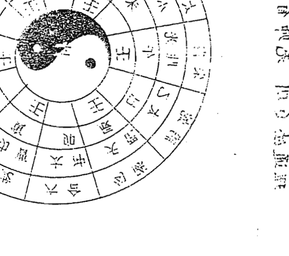

广州得计策划咨询有限公司编印

# 六壬神课金口诀 分类解断

张得计

近照

广州得计策划咨询有限公司总经理

广州天河体育东路尚雅街4号102室

邮编：510620

电话：020-87504140

手机：1382981331

BP机：87789668 20

金口诀预测学在当今玄学系列风起云涌之际脱颖而出，她以理论上系统而完整取胜，以入手简易取胜，以在实践中的准率高取胜。她内容丰富而细腻的预测，让人为之惊叹，以为神遇，这门古老的预测学散发出独具的魅力。

“六壬神课金口诀”七十八代传人张得计先生为宏扬这门预测学，广大这一独特的民族文化，打破门规，在全国范围内讲学，进行了函授面授。为使我们能一览这一千古绝学秘术，在第一期初级函授面授中，受到广大易学爱好者的热烈欢迎，各种信件从各地飞来，谈感受、咨询、赞扬，而更多的信件表达着同一个主题：中级班什么时候开办？

为圆许多学员进一步学习的梦，张老师又编写了这本中级教材，这是在初级教材的基础上，针对学员在实践运用中所遇到的情况而编写，把初级教材中的基础深化，分门别类地列出近二十种现实生活中遇到的预测方法，可以说，中级教材是一本实践教材，教会你如何把握，真正做到“真传一句话”的境界。

## 前言

太极文化
## 合
养生
气功

| 项目 | 时间 | 地点 |
|------|------|------|
| 研讨会 | 10:00 | 会议室 |
| 交流 | 14:00 | 大厅 |

>> 研讨会通知：
>
> 关于太极文化学术研讨会的通知，
> 讨论内容包括养生、气功等主题。
> 时间：一九九四年五月五日

可以说字字珠玑，这种编写教材的方法实在难得。最后，真诚地祝愿学员们通过中级班的学习，可以解决现实生活中各类现象的预测，不负张先生编写此书的目的。1998年5月于广州

## 目录

- 前言
- 第一章 基础知识
  - 第一节 阴阳五行
  - 第二节 十天干
  - 第三节 十二地支
- 第四章 金口诀入式歌解注
- 第五章 五行例断
- 第六章 十二贵神见五行所主
- 第七章 预测实分解
  - 第一节 经济预测
  - 第二节 人事预测
  - 第三节 经营、合伙、合同章
  - 第四节 求官章、升学章
  - 第五节 恋爱婚姻章
  - 第六节 求人办事章
  - 第七节 词讼章
  - 第八节 交通出行
  - 第九节 出行章
  - 第十节 行人章
  - 第十一节 走失章
  - 第十二节 盗贼失物章
  - 第十三节 疾病章
  - 第十四节 阴宅章
  - 第十五节 日占章
  - 第十六节 天气章
  - 第十七节 射覆章
  - 第十八节 杂占章
  - 第十九节 将神所主歌
  - 第二十节 将神歌解
  - 第二十一节 贵神所主歌
  - 第二十二节 人元吉凶所主
  - 第二十三节 四位五行所主
- 第四节
- 第五节
- 第六节
- 第七节
- 第八节
- 第九节
- 第十节
- 第十一章
- 第十二章
- 附录:

## 第一章 基础知识

### 第一节 阴阳五行

阴阳五行观念是古人长期与自然界斗争中形成的，是古人对自然的一种理性认识，也是我国古代文化的宝贵遗产，翻开历史书籍，诸子百家，三教九流，任何一种哲学思想，文学流派都不同程度地受到阴阳五行思想的影响。阴阳五行观念是一种朴素的唯物辩证法。

古人认为：无为万物之始，无极生太极，太极生两仪，两仪生四象，四象生八卦。万物生成皆由阴阳二气交感而成，孤阳不能独生，单阴不能独成，必须阴阳相配万物化生，如同男女，必须婚配才能完成传宗接代的任务。

古人对阴阳的认识是辩证的，不同的事物有阴阳之分，同一事物也有不同的阴阳属性。比如说：天为阳，地为阴；男为阳，女为阴；君为阳，臣为阴；夫为阳，妻为阴等。再如人体头为阳，脚为阴；上为阳，下为阴；左为阳，右为阴；前为阳，后为阴等。古人同样认识到阴阳可以互相转化，“万物负阴而抱阳，负阳而抱阴”，阴阳之关系不

五行是指金木水火土五种构成世界万物的基本元素符号，是五种不同形态的场能。那时古人对世界的认识比较简单，万物皆由五行间的相互作用而生成，即五行间存在着生克制化的关系，我们称之为相生，相克，反克：

- 相生：水生木，木生火，火生土，土生金，金生水
- 相克：金克木，木克土，土克水，水克火，火克金
- 反克：木克金，水克土，火克水，金克火

这些生克制化之理都是自然界存在着的客观现象，当然我们不能简单的把五行看作实在的五种物质，最多只能看作近似于五种物的五种符号。

五行的旺相休囚死，同样来源于自然之理，旺生者为相，生旺者为休，旺克者为死，克旺者为囚。它们之间的规律可以示为：

- 春：木旺火相土死金囚水休
- 夏：火旺土相金死水囚木休
- 秋：金旺水相木死火囚土休
- 冬：水旺木相火死土囚金休
- 四季：土旺金相水死木囚火休

五行之中唯土特殊，旺于四季，即辰月最后十八天，未月最后十八天，戌月最后十八天，丑月最后十八天。因土有生育万物之功，金木水火离不开土。

明白了以上的五行生克之理，就等于找到了打开预测学的钥匙，这是基础的基础。但还须明白：

- 金克木，木畏金克，但木无金克不成材，如一棵大树，若不砍伐加工不会成为栋梁之材。
- 火克金，金畏火克，但金不炼不成器，只是一块无用的金属而已。
- 水克火，火畏水克，但无水则火自然自灭，水火既济方佳。
- 土克水，水畏土克，但无土水不聚，因水无形，随方而方，随圆而圆，有土方能成江河。
- 木克土，土畏木克，若无木克之土乃废土，不能生长草木的废土。

五行间的相互生克制化之理，变化无穷，非常微妙，只有深悟其中奥旨，存乎心发于外，方能鬼神莫测，灵验异常。

### 第二节 十天干

#### 一、 十天干

- 甲
- 乙
- 丙
- 丁
- 戊
- 己
- 庚
- 辛
- 壬
- 癸

#### 二、 天干阴阳所属

甲、丙、戊、庚、壬为五阳干，乙、丁、己、辛、癸为五阴干。

#### 三、 天干五行方位

甲乙东方木，丙丁南方火，西方庚辛金，北方壬癸水，中央戊己土。

#### 四、 天干所具属性

- 甲木，纯阳之木，名为大林木，有参天之势，性坚质硬，栋梁之材，故为阳木。
- 乙木，属纯阴之木，名为花草之木，能装扮人间之美，性柔质软，故为阴木。
- 丙火，属纯阳之火，名为太阳之火，有普照万物之功，性情刚烈，故为阳火。
- 丁火，属纯阴之火，名为灯烛之火，有照亮万户之功，性柔质弱，故为阴火。
- 戊土，属纯阳之土，名为高原之土，为万物之司命，其性高，质硬，而向阳，故为阳土。
- 己土，属纯阴之土，名为田园之土，有生育万物之功，培土溶水之能，其性湿质软，低洼向阴，故为阴土。
- 庚金，属纯阳之金，名为剑戟之金，有刚健肃杀之力，其性刚质硬，故为阳金。
- 辛金，属纯阴之金，名为饰金，能增艳人间之美，其性软洁静，故为阴金。
- 壬水，属纯阳之水，名为江河海洋大水，随地球运转川流不息，故为阳水。
- 癸水，属纯阴之水，名为雨露坑涧之水，气化而得，其性静弱，资生万物，故为阴水。其水有形，无体，随变而变，一生飘流。

#### 五、 天干配四时方位

- 甲乙木：时间为春天，其位东方，名为甲乙东方木。
- 丙丁火：时间为夏天，其位南方，名为丙丁南方火。
- 庚辛金：时间为秋天，其位西方，名为庚辛西方金。
- 壬癸水：时间为冬天，其位北方，名为北方壬癸水。
- 戊己土：时间为四季末，其位中央，又主每个季节的最后十八天，名为戊己中央土。

#### 六、天干与人体的关系

歌诀：甲头乙项丙肩求，丁胸戊肚己脐腹。庚为腰间辛为肋，壬是股部癸四肢。

甲头、乙项、丙肩、丁胸、戊肚、己脐、庚腰、辛肋、壬股、癸四肢。

#### 七、天干与五脏六腑的关系

甲胆乙肝丙小肠，丁心戊胃己脾乡。
庚是大肠辛主肺，膀胱之焦在壬方。
若问肾水心包处，二者皆在癸中藏。

#### 八、天干之间的相互关系

甲与己合，乙与庚合，丙与辛合丁与壬合，戊与癸合。

甲己化土，乙庚化金，丙辛化水，丁壬化木，戊癸化火。

甲与庚相冲，乙与辛相冲，丙与壬冲，丁与癸冲。

甲木生丁火，乙木生丙火，丙火生己土，丁火生戊土，己土生庚金，戊土生辛金，庚金生壬水，辛金生癸水，壬水生甲木，癸水生乙木。

甲克戊，乙克己，丙克庚，丁克辛，戊克壬，己克癸，庚克甲，辛克乙，壬克丙，癸克丁。

#### 九、十天干颜色

- 甲青、乙蓝、丙红、丁粉红、戊黄、己土色、庚纯白、辛灰白、壬墨绿、癸明绿。

#### 十、十天干吉凶应验

甲为天福星，宜行恩施惠，成功赏德，吉庆喜美，婚姻可成，升官发财，喜乐康宁，家长、领导、文字、老翁、荣华、富贵、金榜题名，旺相一生禄位清闲。眉清目秀称富豪，品德高尚受尊敬。

乙为天德星，宜施恩赏德，体恤安抚之情，旺相求财有得，交易合成，门户兴旺，受克时盗贼损害，斗讼官司，损车，损身，伤四肢。

丙为天威星，宜发号施令，以显雄威，又主暴躁、火光、血光，受克时主有水灾、烫伤、头痛、头晕、斗讼官司、文字争扰、忧愁伤残。

丁为阴火，主烟光，鬼怪、血灾、凶伤，因妇女发生斗讼和牢狱之灾，虚惊及被外人谋害。

戊为天武，宜发号施令，受克外来民讼，家宅损破，贫穷及破产，如旺相主先贫后富，出访有得，斗打官灾伤灾，胃病，田宅斗讼，及邻后口角，亲属发生斗打。

己为六合，宜修疆理城，阴私事，得酒食，阴人田宅，或因田宅而斗讼官司，受克主伤身损财。

庚为天狱，主官灾伤残，凶祸，军人，凶死在外，血光，车祸，被火克主凶伤致命。见水土无事，见木主刑狱，斗打事。

辛为天庭，宜正法洽囚，对吉事不利，见火主外丧凶事，天灾人祸，伤筋动骨，被暗箭所伤，有肺病及呼吸道之病，又主更改门户数次，有克时主贼人伤身。

壬为盗贼，毒药，不灾，伤骨，伤腰，肾病，尿道病，寡妇孤儿，丢失，冤屈，邪淫，奸私，暗昧婚姻，有外情。

癸为积蓄税气，乞索之物，田宅房屋，斗讼事，水灾伤人，走失四足动物，婚姻斗讼，争婚姻事。

#### 十一、天干出行应验

- 六甲：出行最吉利，宜逢贵人，见喜庆事，见婚姻事，求财可得，见首脑及地省官员。
- 六乙：出行吉庆，见秃子及有官之人，见交易谈对象之人，酒食宴会，见水主阴私事。
- 六丙：见人骑车过路，见汽车是高档的，并为官禄之人所坐，车为红色，见水为黑红色，见金为红白色，见木主灰色，见土主黄色。
- 六丁：主见高官、老总、经理、厂长，又主有惊恐之灾，虚惊，火光，烟光，伤灾，及风魔之人，或气喘之人。
- 六戊：见气功师及僧道，见两妇女身穿黄衣，见官司斗打事，或牢狱之人，见口舌血灾，见预测师或过土坡地。
- 六己：见贫穷之人，被贬斥之人，见老妇及斗打妇人，买火烧之物，吃食果物，酱菜，买菜之人。
- 六庚：主道路，斜路，军人，持枪及金银铜铁器等，车辆，出外见丧孝，车祸及在外凶伤，见官事是非口舌。
- 六辛：小路，斜路，仙佛，阴私情人，合和事，喝酒及酒晕之人，见烟酒店门市部，吃食果物及买果物之人。
- 六壬：出行见河洞坑沟及过桥，见堆石，见穿黑衣之人，见手艺人，受克伤脚腿之人，乌鹊鸣，见丑恶之人。
- 六癸：见四足走失，或见四足之动物，见四个小儿在路边玩耍，见山林隐士，气功师，阴人小口迎面而来。

### 第三节 十二地支

#### 一、地支名称

子、丑、寅、卯、辰、巳、午、未、申、酉、戌、亥。

#### 二、十二地支阴阳

子、寅、辰、午、申、戌是六阳支，丑、卯、巳、未、酉、亥是六阴支。

#### 三、地支属性

子为阳水，亥为阴水，寅为阳木，卯为阴木，午为阳火，巳为阴火，申为阳金，酉为阴金，辰戌阳土，丑未阴土。

#### 四、地支方位

寅卯东方木，巳午南方火，申酉西方金，亥子北方水，辰戌丑未中央土。
子正北方，丑北偏东，寅东偏北，卯正东方，辰东偏南，巳南偏东，午正南方，未南偏西，申西偏南，酉正西方，戌西偏北，亥北偏西。

#### 五、十二地支与四季

寅卯辰春季，巳午未夏季，申酉戌秋季，亥子丑冬季。又论：辰戌丑未土在每个季节的最后十八天，最后一个月为土月。

#### 六、十二地支与五脏六腑的关系

| 地支 | 子 | 丑 | 寅 | 卯 | 辰 | 巳 | 午 | 未 | 申 | 酉 | 戌 | 亥 |
| :--- | :--- | :--- | :--- | :--- | :--- | :--- | :--- | :--- | :--- | :--- | :--- | :--- |
| 脏腑/部位 | 膀胱水道耳 | 肚脐及脾胃 | 胆目疾脉两手 | 十指内肝方 | 脾肩胸痰 | 面齿咽小肠肛 | 心脏并眼目 | 胃脾并脊梁 | 大肠经络肺 | 咽喉及气管 | 命门腿踝足 | 发骨尿道肾 |

#### 七、十二地支与月份关系

> 古人说：“一二三阳开泰，斗柄回寅万事春”。就是说，每一年的北斗星的斗柄指向寅位时，万物萌生，于是把斗柄所指寅位的这个月定为寅月，指向卯位的月份定为卯月，依次分出十二个月，即寅为正月，卯为二月，辰为三月，巳为四月，午为五月，未为六月，申为七月，酉为八月，戌为九月，亥为十月，子为十一月，丑为十二月。

在本书里每个月的规定与节气相关，正月建寅，必须在立春之后，惊蛰以前这段时间才算正月，二月建卯，须是惊蛰以后，清明以前。三月建辰，须是清明之后，立夏之前才算三月，四月建巳，须是立夏之后，芒种之前才算四月，五月建午，须是芒种之后，小暑之前才算五月，六月建未，须是小暑之后，立秋之前才是六月，七月建申，须是立秋之后，白露之前为七月，八月建酉，须是白露之后，寒露之前为八月，九月建戌，须是寒露之后，立冬之前为九月，十月建亥，须是立冬之后，大雪之前为十月，十一月建子，须是大雪之后，小寒之前为十一月，十二月建丑，须是小寒之后，立春之前为十二月。

#### 八、十二地支与属相

子鼠、丑牛、寅虎、卯兔、辰龙、巳蛇、午马、未羊、申猴、酉鸡、戌狗、亥猪。

#### 九、十二地支间的相冲关系

子午相冲，丑未相冲，寅申相冲，卯酉相冲，辰戌相冲，巳亥相冲。

#### 十、十二地支相合关系

子丑合土，为克合；寅亥合木，为生合；卯戌合火，为克合；辰酉合金，为生合；巳申合水，为克合；午未合土，为生合。

#### 十一、十二地支的相害关系

子未相害，丑午相害，寅巳相害，卯辰相害，申亥相害，酉戌相害。

#### 十二、十二地支间的三合关系

寅午戌合火局，亥卯未合木局，申子辰合水局，巳酉丑合金局。

#### 十三、地支间的三刑关系

寅刑巳，巳刑申，申刑寅，为无恩之刑；子刑卯，卯刑子，为无礼之刑；丑刑未，未刑戌，戌刑丑，为持势之刑；辰、酉、亥，三者相见为自刑。

#### 金口诀五行配数法：

水土一五七，金木三六九，火主二四八。

#### 金口诀天干地支配数法：

甲己子午九，乙庚丑未八，丙辛寅申七，丁壬卯酉六，戊癸辰戌五，巳亥主数四。

## 第二章 金口诀入式歌解注

“金口诀”在消息妙论中言：入式歌言其大象，五动爻观其大意，以格局看其事体，凭驿马神煞定其吉凶，以空亡月破支干三合六合验其成败，潜心推测，无不神妙。我们在入门教材中已把五动爻、驿马神煞、空亡月破、三合六合等解说清楚，也说把入式歌留在这里专题。下面对入式歌一一解注。

### 入式歌解

1.  地分：取课者以自己所处位置为中心，以正北为子，正东为卯，正南为午，正西为酉，按子、丑、寅、卯、辰、巳、午、未、申、酉、戌、亥，顺转定出十二地支与空间的对应位置。这样每一地支代表30度空间方位，取课者以左15度，右15度，确定问课者或站或坐的方位，即为地分。
2.  月将：又称十二将神，以亥为正月、戌为二月、酉为三月、申为四月、未为五月、午为六月、巳为七月、辰为八月、卯为九月、寅为十月、丑为十一月、子为十二月。取课者以取课时的时辰为参照，将月将加在时辰上，按顺时针数至地分所代表的地支上，即为月将。如申时地分为午，农历五月，以五月的月将未加在申时上，按未、申、酉十二地支顺序数至午为巳，已就是要取的月将。
3.  贵神：贵神有十二，依次为贵神、腾蛇、朱雀、六合、勾陈、青龙、天空、白虎、太常、玄武、太阴、天后。以甲戊庚日贵神在丑羊（未）为例，白天按贵神在丑，依顺序数到地分上，看何神落于该地分上。若在晚上，则贵神在未，逆时针数到地分上即可。如戊日申时，地分为午，农历五月，申时为白天，贵神落于丑位，依次顺数贵腾朱六勾青，青龙落在午位，贵神为青龙。
4.  人元：人元按“甲已还作甲”之法寻人元。又称“五子元遁”法。如上例，戊癸壬作首，壬子为子时起头，按十二时辰顺数至午为戊午，此时人元为戊。立课之法简捷明其内，通晓五行之理，定能在断课、解课上有所精进。

### 更将神将论吉凶

1.  凡身占之，贵神为主为尊神也，人元为客。若求财则贵神为财，人元为主为身。课内主客相合，万事可求，主客相克，万事难成。
2.  凡月将为相，相者取事也。阳将为男，阴将为女。阳将主事宜速，阴将事宜迟。若以四位内灾福为十分论之，则七分在于神将之间生克关系，其余三分在于人元与地分的关系。为什么神将间的关系占七分呢？因事物发展的中间阶段是决定事物成败的关键，它规定了事物的发展方向，故神将间的关系最为重要，十分灾福七分于此。
3.  以事情发展进程或事件的首尾而论，人元与贵神主事情发展的开始，为初，为上，为头。而地分与将神为事情发展的结束，为下，为足。贵神与将神为事情发展中间阶段，为中，为腹。若四位相生主吉庆、喜美，万事和合。相克则万事有阻，无不凶。若四位遇凶神，有生则凶中隐吉；凶中有克，逢凶不凶。吉神逢生更吉，但吉中有克；吉神有克，吉中不吉，顺中有阻。在课中论四位旺、相、休、囚、死，需配物极五行之内细推元。

人元、贵神、月将、地分，以此四位的五行生克与年、月、日、时的五行生克配合，或用本人的年、月、日、时配合加以推断，根据相互之间的合化冲破刑害克关系，知事物的吉凶祸福。

将神、地分见木，指事之结尾时求难得。

五行生克取自然之理，非死般硬套才能论之。若课中见土、水、木、

课中以五动论：将克人元，地分又克人元，又称鬼动。贵生将，贵生地，神干又生将干，故木爻旺相。卯为门户，寅主财，财在卯之外，即在门之外。因将为内，地分主外之故。树见水、土、火才能茂盛，无金克只是荒树不配成材。见水、土、火、金才能成为栋梁之材。人生转运、求官、求名须待金年、金月日时为变更期。

| 死 | 旺 | 休 | 旺 |
| :--- | :--- | :--- | :--- |
| 土 | 木 | 水 | 木 |
| 戊 | 己卯（太冲） | 丁亥（天后） | 寅 |

七里应之，寅木旺常以七数论之，或论远近，财帛多少等都用七数论之。

月将、地分为内爻，人元、贵神为外交，旺内克外，求必有得，必亲手求之；旺内生外，财向外流，带财求人，因财得名；旺外克内，必须损财，外求争财，外人争物；旺外生内，不求自得，常有贵人相助，名利双收。

### 二土比和迟晚看

1.  四位内见二土主迟晚，因土有生育万物之功，（未土不生万物，辰土生也，丑土生物不旺，戌土只助不生），厚重而实在，为人热情，性格坚强而固执，很难更改本人的意志。又因土主迁移迟缓，不易变更，为土之本性。
2.  形体相貌上主其人困圆脸，为黄色，偏胖，旺相主个头高大，休死主低矮瘦小。
3.  人元、贵神见二土，主开头办事虽成而迟；贵神、将神见二土，办事中间困难较多，迟缓而反复；地分、将神见二土，主结尾不顺，虽然以前有答复，常一拖再拖，且有反复。
4.  假如立课，求财帛之事，以问课者四月中将、丙丁日、巳时间事，立课为：

| 死 | 旺 | 休 | 死 |
| :--- | :--- | :--- | :--- |
| 土 | 木 | 水 | 土 |
| 辰 | 乙未（小吉） | 庚寅（青龙） | 壬 |

（1）、课中四位内将克人元，人元生贵神，必反之理，然后断吉凶善恶，无不神念。

### 方察来人见的端

-   1. 以问课人从何方而来作地分，配十二将神，十二贵神，人元。仔细辨别神将地分及人元神干将干的生克化合关系，知事情发展开始、中间、结尾过程中吉凶祸福的经过。察来人方位，知来意断吉凶，都是以地分为立课之本。
-   2. 从吉神上来，主有财帛之喜，迁进之事，万事如意之象。何为吉神？天德、月德、天喜、天赦、天月德合处，三奇、三合、六合、生气之方，青龙、六合、功曹、大吉、小吉等皆为吉神。此乃旺则成，生合则就，百事无凶。
-   3. 从凶神凶位上来，主逃亡、走失、争斗、狱讼、官灾、疾病、斗打之事。凶神者，飞符、五鬼、丧门、吊客、白虎、天空、勾陈、太冲、游都、死气、天罗、地网、天结等皆为凶神。又以刑克冲破之方为凶神。事有专章论述）。
-   4. 以方位知来意，以四孟为遗失、财物、文字、器物。四仲主交易、买卖、求财、求事于人、外出等。四季问婚姻、争媒、文字信息或暗昧不明之事。
-   5. 以坐位为灾祸，以来人问事所坐之方位。如子位立课，课中见火入水，主炎伤、投河自溢或患心脏病、十二指肠溃疡等病症。如见寅主财旺、文官、福禄之人。
-   6. 用天干论吉凶神，古人常以“甲己在艮，乙庚在乾，丙辛坤位喜神安。丁壬原来在离宫坐，戊癸原来在巽间”。“甲己端坐乙庚睡，丙辛怒色皱双眉。丁壬吃的醉醺醺，戊癸原在喜神推”而论之，亦可参考用之。

### 二木为爻求难得

二木为爻为何求难得？皆以木为树，树遇风吹即动。遇事没有主见，易听别人的意见。又以木多茂盛，丛林交错，主事体无头绪而杂乱。以此二木主事，事必动荡杂乱，求必难得。

-   二木为爻求难得，又可分成三种情况：
    1.  人元、贵神见木，指作事开始求难得。
    2.  贵神、将神见木，指凡事中间求难得。
    3.  将干乙与神干庚合，青龙黄寅木旺。青龙主官贵、财帛，又看主客是否相合，合即得，或外生内，以外人帮助自己，外助内。又以贵神克将，事在门户亲朋，主相互牵连，有斗讼、官讼之忧愁。

### 二金刑克都无顺

-   1. 何为二金刑克呢？金性刚硬，宁折不弯，办事快而急躁，多口舌是非、官司、斗讼。金性暴，易有权位，主官贵，掌军权，又可主军人伤亡，兄弟不义。课内见二金主相争执，主刑克。
-   2. 以形貌而论，旺相肥胖，休死瘦小，脸为方形，受克为方中带尖。其面色为白色，见土金为黄白，水金为玉色，木金为青色，火金为红白。
-   3. 人元、贵神见金，见刑克即遇木火，主血光伤残，口舌斗打之事。贵神、将神见二金，主事情的中间过程，人生的中年运程，或亲属、门户、朋友有凶灾、伤残、斗讼之事。地分、将神见二金，主结尾不顺，或家中孩子遇血光、伤残、斗讼事，或六畜有损。
-   4. 若课中人元、贵神为金，将神为木，将神为内爻主妻，外二金克木，逢金旺年、月、日主亡妻。若地分、将神为金，贵神为木，主财动，财旺伤官、伤身，求财不得反破身、官司。
-   5. 如课：

| 五行 | 干支（神煞） |
| :--- | :----------- |
| 水   | 癸           |
| 金   | 甲申（白虎） |
| 金   | 乙酉（从魁） |
| 土   | 未           |

-   6. 金见土得生气，见火成器具，又见水变坚硬，有逢凶化吉，因祸而得福之功。若金见木损伤财产，又主口舌斗讼，损坏车马。见双金，主争钱财，争房屋，树伤枝干，伤树皮，人损。

四位内地分生将神、贵神，贵神、将神相比，土旺层层生上，主易出外经商。

### 火 戌午（胜光）午火

贵神克人元为官动，贵神卯木生将神、地分午火，地分午火生人元为父母动，为印绶。四位六合卯木旺火相，地分、将神主财帛，财帛旺相主大富也。东方求财大吉利。木生火财旺见官动，求官可得，主升官。若无官之人即官司缠身。

-   5. 以五行而论，因木旺生火主富贵，课中将地分为财爻旺相，主家大业大或因家长祖辈带来的财富，或论因财得官。凡人无戊己，见火生，主先贫而后富，若无木主暴发一时，见木可富足百年，概因水能生木。六合卯木主交易买卖，故能得大财。如到金乡损财，出车祸或家中分离。木旺生火，又可同火而论，火旺极，则财有外流之象。火见土，土可泄火气，若火旺极见土，火燃有形，主其家必大富。

### 二水皆为大吉象

-   1. 二水何以为大吉？因水能生万物，土无水不能生万物，木无水不生长，金得水淘洗而...四肢或筋骨。若火旺见金，主血脓不离身、气管炎、肺炎，又主便秘、大肠有病、皮肤有病、疮灾或被马咬伤，又主烧伤、摔伤在交叉路口附近。

### 二火为灾百事残

-   1. 二火何以主灾、主残？因火焰无情，五行中克金、焚木、使土焦、熬水。主残伤、狠毒、暴躁，敢于抗上。逢善不欺，逢恶不怕，办有主主张，愿意当排头兵，愿出风头，办事情干脆利索，可主夫妻妻格格不入。
-   2. 以相貌而论，见旺相高大，头尖手指尖。休囚主矮小瘦小。面色见木火主青紫红，金火主白红色，土火为黄红色，水火主黑红色。
-   3. 人元、贵神为火，主初运凋残，易受火烧、烫伤，克父母；贵神、将神为火，主中年运伤残，是非、官灾、文书、官讼、火烧伤；若地分、将神见火，主末运官灾、火灾、心脏病、肾病、便泌、干瘦、分散、血光、伤灾等。
-   4. 以四位而论，如课：土 木 戊 乙卯（六合）

有光，水有形无体，易顺从别人，无主见善动，多淫私、盗贼、丑恶、放荡，为别人办事热心；好交朋友，付出的多，得到的少；生性未定，无归宿。

-   2、以相貌而论，水匪相兼主长胖，体固矮小。脸小稍长，面色则褪水金为白金色，水木则黑青略灰，水火黑红，水土黑黄。此人喜欢浅色庄重的衣服。到西方发财，东方付出，到南方损财，到北方本位得助。
-   3、人元、贵神见水主吉庆，初运好，聪明但多防水灾，得长掌疼夏，或认干亲。贵神、将神见水主中年淫荡、奸私、偷盗或官司伤财。将神、地分见水主未运漂流、孤寒无依靠，有外人盗财，或田宅斗讼。
-   4、以四位论课，如课：

| 金 | 庚戌（天空） |
| 土 | 癸卯（太冲） |
| 木 | 亥 |
| 水 |  |

地分生将神，将克贵神，贵神生人元，人元克将神，人元生地分。四位内金旺木死，内爻生克外爻；有外出之象。财动可求财，因将神木财爻死，求财不成反伤财。

### 水乘入火妇难安

1、何为水来入火？指水在上，火在下。何为妇难安？因火主妇女，火能炎上，立于土上没有根，逢风吹即劫，缺土主见。火主心脏、小肠，水能润下，在火之上，水旺火死，主死人口、难产、损胎等。凡事调残，主心脏病。

### 2、如课：

| 水 | 壬 | 甲午（朱雀） |
| 火 | 癸巳（太乙） |
| 土 | 辰 |

5、以五行论课，求到火乡，水因无功；到西方；主得外人帮助；水多淫滥漂流动荡。盖非方流到木位归入夫涛，若见土克，水有根，方能主吉庆、喜事、进财添宝也。

主口舌斗讼、怨、损财、争财、车祸、伤四肢、门户斗打、伐树、争树、伤父母等。四内再见朱雀、螣蛇、辰戌土等，主口舌之神，因事而发用，无不斗讼。

-   2、如课：
    -   金金木木
    -   庚丙申（白虎）辛卯（太冲）寅

以人元为外，为客，主上级领导、天时、祖辈；贵神为中级领导、父母、官禄；将神为妻财、亲属；地分为部下、小口、为内。人元、贵神克将神，外二金克木主内忧愁，外人谋害家中人，卯木主门户，论家内损门户，及更改门户，损车马，丢车子；人元、贵神又克地分寅木，主损财、伤腿脚、伤小口等。幸遇将干与神干丙相合，化水泄金气生木，主有死而复生之象，可解灾解难。

### 火临金位遇艰难

-   1、何为火临金位？位，地分也，即地分为金，以癸巳为用主，被入壬水克之，主肚腹肠有寒痛症。人元克贵神主心脏痛，地分克人元主头晕、呕吐、吐血、水灾等。辰主疮灾，为田宅斗讼。课中壬水克二火，主烫伤二次。天干为头，遇克主头痛、头晕、呕吐或头部有伤灾；贵神为胸肋，受克主心脏病，气短、胸闷、胸痛等；将神为肚腹，受克主肚腹痛、伤疤、妇科病、腹泻、痔痛等；地分为腿脚，遇克主腿脚受伤。
-   3、以四位论，地分克人元，人元克贵神、将神，神将生地分，四位土旺，又神干与将干合，甲为寅，癸为亥，寅与亥为六合。
-   4、以五行论，因火主心，水主肾，土主胃，木主肝。故人元贵神火主心脏病、心痛、小肠炎症。地分辰土旺克人元，主肾病、骨病、毛发脱落、牙痛、骨折等。

### 金入木多忧口舌

-   1、何为金入木多？金在上为贵神，木在下为将神为地分。何为忧口舌？因申酉金与寅卯木相冲、相绝、相刑。如申见卯，寅见酉为绝，主分离、分散，相互隔绝。金克木

将神为火。困难中而不能前进，地分为申或酉，将神为胜光午火、太乙巳火，必有此事，再以贵神论事无不应验。

### 2、如课：

| 水 | 火 | 金 |
| :--- | :--- | :--- |
| 甲子（玄武） | 己巳（太乙） | 酉 |

以四位论，人元克将，贵神克将，将克地分，地分又生人元、贵神，神干与将干甲己合化为土，又克水。外人元与贵神为同类为比，主外干扰自己，同克将神太乙巳火，主损财、伤妻、乞索、生闷气、官灾、斗讼等，或因妇女争斗，或有外人欺侮家中人。地分是酉主宅院，人元、贵神克将神，将神克地分，自外重克内，主外欺内。自家宅院、财产被外人纷争夺；神干与将干相合化，贵神克将巳火主门户亲朋间争斗。玄武子水位于贵神上，主盗贼、谋害、文状、词讼或争田宅，失理等。因三阴一阳贵神为用爻，可以贵神论事。

### 3、以五行论

火受克主心脏病，火克酉金主肺病，水旺主肾炎。中医曰：旺阳为炎症，衰阴为虚症。实症阳，虚症阴，虚补实泄，补其母保其子，此乃万物之理与自然之理皆通验也。

### 4、如课：

| 金 | 木 | 火 |
| :--- | :--- | :--- |
| 庚 | 甲寅（青龙） | 丁巳（太乙） |
| 申 | | |

人元庚金克青龙木，主损财失官，或因财、树发生争斗，或主家中老人伤亡，或无官，无贵，文化程度低。又贵神生将神，主门户之间产生纠缠之事，或生气之事。四位内火旺临金，求事困难重重，并家有血肉伤灾。

### 木来入土为刑狱

-   1. 何为木来入土？指贵神为木，将神为土。何为刑狱？需地分见巳亥或贵神见巳亥，或神干、将干见丁癸者。将神必须见辰戌或人元见戊己土，为斗打、官司、口舌、争斗，辰戌为天罗地网、天牢地狱、杀斗之事，故必主牢狱之事。若贵神为青龙、六合及人元见

甲乙者，为木入土或土上见木为关，人元见木为徒刑，见土主官司斗打牢狱，见金为罪重斩杀，见火主血光，见水主水灾。

```
2、癸 辛卯 壬辰 巳
丁 己卯 庚辰 亥
己 庚寅 戊戌 亥
乙 癸卯 甲辰 巳
（水灾）（斩杀）（火光）（牢狱）（徒刑）
```

-   （1）、以斩杀课论，贵神青龙木克将神戌土，为木入土者。地分见巳为地结，主牢狱之灾。贵为官贵为身为为主，遇金克必为斩杀，乃身受克，克必死也。
-   （2）、以牢狱课论，土上见木为关，木上见土为隔，牢狱之灾重矣。
-   （3）、凡冲破、空亡或见天月德者为破灾或贵人相助为解灾。

### 土行水上竟庄田

1、何为土行水上竟庄田？皆因水土为田庄，

### 但取寅申为贵神

寅为青龙为贵神，为天吏。申为传送为天城。故为贵神 子午卯酉为吃食果物类，以可食果物论断。

-   （2）贵神受克，主损官中物或失官，因财失官，或病在心胸，或伤家长。客克外来索物之象。
-   （3）克将神，主伤妻损财，或在家内失财。
-   （4）克地分，主伤小口，损田宅，失器物或六畜。
-   （5）将神生地分，主小口、田宅、六畜兴旺，母亲有义，子女成才。
-   （6）地分生将神，婚姻喜美，子女孝顺或子女有声誉。

-   （1）贵神生人元，主外出寻人有喜美之事，寻人必见。
-   （2）人元生贵神，主外生内，喜事外来，外人寻内。
-   （3）贵神生将神，门户亲属相见，因官得财，或得官中财物。
-   （4）将神生地分，主小口、田宅、六畜兴旺，母亲有义，子女成才。
-   （5）地分生将神，婚姻喜美，子女孝顺或子女有声誉。

### 巳亥常为乞索物

巳亥为乞索之物，亦可以财论之。

### 小吉妇女酒食筵

小吉主妇女酒食宴会，亦可以邀侯用也。

### 水土金火为窑灶

四位内见之主争田土，占宅必有窑灶，占怀中所藏是瓦器。

### 庚辛碾磨及门窗

见木位为庚见申为磨，辛见酉为碾。见庚为门，见辛为窗，受克为旧门窗或门窗有破。

### 庚午改门并接屋

人元见庚临午，或贵神、将神见庚午均为改门，午为南方也。不然接其门或由西南一根柱再接屋或造新房。如见二金更主增接椽，为新屋二间。如下克上，其家右侧必有石头。

### 四孟相生有草房

四孟者，寅申巳亥也，假如课内见壬寅、戊申、乙巳、辛亥，是为相生，家有草房。论课要活不能死，现在社会发展进步，某些地区已不见草房，就无须再以草房论。

### 丙丁旺处人最恶

以求问宅而论，课内丙丁旺相，主高岗上住，也主其家人必狠戾也。水过旺，主沉溺、淫

木过旺主不义，金过旺主不顺。

### 与姓相生子孙昌

即旺爻与本姓相生，主子孙昌盛，如火旺，又是角徵宫姓人占之，是宅有气又相生也。

### 四位相刑主有克，上下相生福满堂

四位之内重相克必主事不利，如何宅，见三下克上，主破了天窗。也主官事重重，多有头患，头目之人为最凶。三上克下，主屋舍必塌，又主破财，子孙必弱。

### 上克下兮宅必下，下克上兮岭头庄

如何家宅家事，遇上克下，主家宅低洼，家事不和，假设得课为地分辰，将神天罡辰土，贵神六合卯木，人元戊土。木克两头其家不和，更无祖爻。为木克天罡，戌与辰皆一空，上克之，主兄弟分张，更木在两头，大者主会争官事，小者要远离故乡。必其家在东西侧下住。

课内如见下克上其家宅必高，举例说明，课为地分巳，将神勾陈辰土，人元为己，其庄在南山侧下，门西向，不然出门向西行，家中妇人争执吵闹。凡占宅，四位内见火旺，主宅在高冈上，其宅与其姓相生有气，主大喜。如姓旺气在丙又克于下，主家内分张重。

其家虽有旺气，家人必凶恶。四位内见土旺；主宅必重冈上住，其家必有坟墓，或近丘墓住；若土上见木，必主疾病痛惨死之人。四位内见木呈现有官事，其家主新居屋舍，必林木蔚茂，兄弟不义，如木上见金，亦主斗讼，木上见水，主财帛之喜。木上见火，主家内生女子，如火上见火，主空中阴火患病。四位内见金旺者，金为克刑之神，主其家斗讼，兄弟不义，当出军人，入庙出武贵，亦主人凶恶也，如旺金上见土神，主多般灾厄，比和合，主先凶后吉，金上见木，主伤六畜，又主官事，患病者愈凶，如金上见水，主大吉，若是玄武水，主作偷盗之人。四位内见水旺，主作贼人，其宅当近河，有水灾，出鬼驼子孙，亦常为贼侵害也，火在上主产难，在下夫妻不和，木在上有财帛之喜，见金亦喜，上见土不利产妇，或水气残病死也。

### 水在火下主产难

在上面两句解说中，已讲解到课内水旺，如火在上主产难。即是此解。

### 甲乙为林单见树

以甲己还作甲遁人元，地分不变，得甲乙，行到本位寅卯上，必见林木。若单见，一般作单断，如甲乙临水，其家有菜园。如甲乙行土上，其树必有枯枝，如甲乙临火，主有火，树亦干焦，如临金亦主有树木，其树必虚空，多为槐树。

### 见金枝损及皮伤

地分不变，人元见庚者，以乙庚两作首行地分上见干为甲，即为人元两遍。如地分为申，人元为庚，行人元两遍干为甲，甲庚对冲树伤枝也。见阳克枝，见阴克皮。

### 丙丁旺处为高岭

行人元两遍，见丙丁旺处为高岭横冈。课中见地分临子丑或午未为东西横，临寅卯辰巳申酉戌亥为南北横，临亥子水更主水冲道，有水沟破地而出，或阴沟。下克上者为高冈，若丙丁临地分寅卯位，必有山林。

### 庚辛为斜道宜详

课中以人元行两遍通之而论，或课中神将见庚辛而论，皆相同。地分或将支、神支见四孟，遇庚辛金，其道必斜。以干见庚辛金为大道，支见申酉金为小道。若临本位酉主大道，临别位主小道。若临巳午或丙丁对冲主岔路，有岔路或十字路。

### 戊己为坟看旺处

行人元两遍，遁出人元不克戊己，课中见戊己旺相者，必有山墓。课内死者患何病而死，需依后法占断。穿何种颜色的衣服，以人元遁两遍。只用人元与地分配的干支纳音论其颜色。

### 土为坟陇痛楚殃

课以神将干见庚或地分见寅木，主其坟塌陷，坟中人因病痛惨死而亡者，亦主曾经修补过坟墓。若贵神上见青龙、六合，主墓上必有开花的树。

### 壬癸长河及沟涧

人元见癸为沟涧，人元与地分配的干支，若纳音见水必主河涧有水。若被戊己对冲，见白虎申金主道路，或主河道交会处。若见大吉丑地，必有土桥。见太冲卯木，主有船、车辆。

### 湾环曲折见刑伤

课中以人元行两遍通之而论，或课中神将见庚辛而论，皆相同。地分或将支、神支见四孟，遇庚辛金，其道必斜。以干见庚辛金为大道，支见申酉金为小道。若临本位酉主大道，临别位主小道。若临巳午或丙丁对冲主岔路，有岔路或十字路。

行人元两遍，遁出人元不克戊己，课中见戊己旺相者，必有山墓。课内死者患何病而死，需依后法占断。穿何种颜色的衣服，以人元遁两遍。只用人元与地分配的干支纳音论其颜色。

课以神将干见庚或地分见寅木，主其坟塌陷，坟中人因病痛惨死而亡者，亦主曾经修补过坟墓。若贵神上见青龙、六合，主墓上必有开花的树。

人元见癸为沟涧，人元与地分配的干支，若纳音见水必主河涧有水。若被戊己对冲，见白虎申金主道路，或主河道交会处。若见大吉丑地，必有土桥。见太冲卯木，主有船、车辆。

湾环曲折见刑伤

壬癸为河涧，课中见壬寅、癸卯者，其河涧南北长，水向南流。见辰暗克水必向东西，因见丙丁在前，故旺处刑克，其后见未暗克，须向北流入乾地，因壬寅、癸卯、甲辰、乙巳、丙午、丁未冲克壬癸水，水向北入本位也。

| 列1 | 列2 |
| :--- | :--- |
| 大树死时家长死 | 水上来穿近洞旁 |
| 贵神神祠并宅道 | 太阴碓磨共相连 |
| 前一腾蛇为窑灶 | 朱雀巢窝有克伤 |
| 六合树木看生死 | 勾陈渠洞土堆滩 |
| 青龙神树并枪刀 | 天后池塘涧水泉 |
| 玄武鬼神并图书 | 太常酒食五谷昌 |
| 白虎道路及刀剑 | 天空庙宇道僧仙 |
| 此是孙膑真甲子 | 天地移来掌内观 |

## 第三章 五行例断

-   水加木，买卖交关婚事足。水加金，文书远信酒食迎。
-   水加火，惊恐官灾心痛祸。水加土，防妻破财害田土。
-   土加水，遗忘田土官不喜。土加木，卖却田园分产屋。
-   土加金，竟界争田坟墓侵。土加火，信息田园和会我。
-   金加火，丧却妻儿家痛苦，金加木，分散家财损六畜。
-   金加土，土中金宝藏难聚，金加水，子孙喜非成行起。
-   木加火，多为子孙失小口，木加土，牢狱争财竞田土。
-   木加金，自家财物被人侵，木加水，益进资财旺子孙。
-   火加木，朋友酒食远相逐。
-   火加土，争竞财气因妇女，火加金，病死伤亡官事侵，火加水，伤妻损财官事起。

## 第四章 十二贵神见五行所主

天乙贵神，吉时，主人君、大臣、贤士、大夫，为人厚重，相生为之美庆，印信文书，遇金火主迁官进职，逢水主争竞，逢木主去官职，逢辰戌贵人病困不和。

腾蛇，吉时，主文书喜美，信息梦寐。为女子主轻薄，遇未好饮酒。逢申金逐人走失，逢克主娼淫，落亥宫有火灾，主惊恐。见土木则吉，见水金主妇女病患不利。

朱雀，吉时，主赦书、天恩、文书、鞍马、服色。有克，主口舌、惊恐、官讼，见其血光。逢土木则吉，逢金主病，遇水主女人产难，男子痔漏，水下主吐血，投井自缢而死。

六合，吉时，主买卖交易，婚姻喜美。为男子作公吏，为经纪亦主媒人。克主有官追捉，逢水火为之有气，遇土官司文状，遇金口舌破财。

勾陈，吉时，主官职田土，阳用主贫贱，阴用为丑妇贫婆，有文状动。克主奴婢走失，见金火则吉，逢水主争竞田土，遇木官事牢狱，为勾陈惹引之人也。

青龙，吉时，主文书财帛，为人清贵，有官职，秤迁官吉庆，克主官事急速，见水火则吉，逢金主口舌，失文书破财，遇土有官司，辰戌为牢狱，丑为笞杖。

天空，吉时，为僧道骸骨，凶，主骗诈不定，为奴仆，见金火则吉，遇水主争竞，逢木主官司牢狱。

白虎，凶，主人凶恶，眼黄项短，为凶丧孝服，道路惊恐，刀枪剑戟。见水则无事，逢木口舌凶恶，遇火主死丧灾病，下克上，凶在外，上克下凶在内。

太常，吉时，主女人能言善语，作媒婆，婚姻、酒食买卖。见火金二合，上吉。见水争竞，遇木官事不利。

玄武，吉时，为军人或谒见贵人，凶，为盗主阴谋，见火则偷。克将主失财，见金木则吉。遇火妇人灾，逢土男子竞。

舌，见金主碾道路损失，见火主人不足，突病死，不利走失。

从魁酉金，主阴人清标恬静，钗钏酒食。见金主阴私，遇木主口舌，见火主失财病患，卯酉相冲主休妻离别，见水土大吉。

河魁成土，为僧道孤寡，凶。主骗诈不实，亦为骸骨。克方主失六畜，见金火稍吉；见水争田宅，见木官事牢狱。

登明亥水，主阴人婚姻，为乞素物耳。见金木则吉，见土争斗，见水火妇女病患，水土产难，水上血自缢。

神后子水，为男子好淫幸，主妄想，亦主随波逐流。见木金则吉，见土争竟，见火妇人病。

大吉丑土，主人直蠢，咀咒冤仇者。见金火则吉，见水主争竞田土，见木官非阴病。

功曹寅木，文书、财帛、官贵、吏人、老叟、医士。见水火清高，见金主口舌，失财人病，见土官事是非。

太冲卯木，为劫贼、凶恶、门户、车船、无徒之人。见水火则无事，见金口舌失财，见土官事牢狱。子克，问破迫呼，见贵主兄弟各

太阴，吉时，主女人沉静、为金银首饰。逢合主有阴人淫乱，见水土则吉，遇木口舌是非，逢火主灾病不利。

天后，吉时，主赏赐。主女人主善良，逢合主婚姻有求索。遇上主事，见火主妇人不利，见木上吉。

## 第五章 十二将神见五行所主

天罡辰土，吉时，为医人药物，主人好斗，文状凶，主无徒。为屠宰，见金火则吉，见水主争竞田宅，见土主官司牢狱不利。

太乙巳火，主文书梦寐。为阴人，主轻薄好淫乱。为惊恐，主乞索。为火，窑灶。见土木则吉，见水主妇人病，见金主疾病屯蹇。

胜光午火，主文书财帛信息鞍马。为人好利禄，主富贵。见土木则吉，见水土失财、妇病、马死、贫迫。见金不足，灾病惊恐不利。

小吉未土，主妇人。为酒食宴会，婚姻喜美。见金火大吉，见水主争竞，见木官事破财，妻病不利。

传送申金，为行移奔走之神。主出外动移，为人官贵。为刚果，见水土则吉，见卯木于口

## 第六章 十二贵神所主信息

贵神，尊长，贵人，领导，神佛，宫殿，星斗牛。
腾蛇，灾怪，惊恐，取索，官司口舌，文字怪信，画斑点，轻狂，磁器，精神病。
朱雀，文字口舌，密灶，交通工具，名利，官职，信息，服饰，有文凭之人，教练官，文化之所。
六合，婚姻喜美，财物交易，妇女喜庆或私情，为竹，为床，家母，门窗。
勾辰，争讼斗打，男女贫穷，诉讼动用，军兵小卒，医生，药物，屠户，岗岭，土堆，坟墓，僧道，瓦盆类。
青龙，财帛喜庆，文字信息，有权之人，老年人，道士，公检法部门，刀剑类，山林花木。
天空，空诈不实之人，田土宅基，牢狱，寺院，孤寒，僧道，气功师，预测师，医生。
白虎，道路凶丧，车祸，跌打损伤，军人，武官，贵客，射击手，老年人，名人，行人，湖池，石器。

## 第七章 预测实例分解

### 经济预测

随着社会的发展，经济意识已深入人们的思想，如何在这竞争的社会中立于不败之地，成为人们最关心的问题。人们从各方面考虑问题，学习经济预测学，为的是在经济大潮中把握时机，求得发展。然而无论你对经济的问题作多深的...

太常，妇女，酒食宴会，为妇女能言善辩，媒人，酒店，酒器，师巫，农民，经商人。
玄武，军人，盗贼，阴谋小人，不务正业人，美术画家，艺术家，小儿，乞丐，伞笠，江河楼台。
太阴，妇女阴私事，不正当的男女关系，珍珠铜器，果实，外亲，女子爱零食，歌星演员，翻译，校长。
天后，上级下达调令，妇女小产，田宅争执，为名门之女，为漂亮之女，河泉，地井，布帛珠玉。

壬寅 戌 为别人求于自己，人将财送于自己。

-   2. 春天木旺，则其所求之财大也，又神将生合求财易得，又神将生合为亲戚，可知求财过程中，必得亲戚的帮助。
-   3. 课中寅不宜自空，可知其事目前必未成也。
-   4. 到今年冬天，木见水，见土，见金，则其木成为大木，成为有用之材，到时求必得也

#### 实例二，甲戌年，戊辰月，壬午日，丁未时，亥位，刘某问出外求财如何？

```
辛 庚戌 辛丑 亥
```

-   1. 用爻庚戌为太岁，可知其人能力必强，成又主吃物，其求财必为食品之类也，戌又为空，其为虚假之神，故求财中必有奸诈之事。
-   2. 月建辰土冲克用爻，辰戌为斗打之神，可知你此月中必与人发生斗打。
-   3. 贵神生人元，可知你已与人联系过，但戌与辛酉即人元相害，主客不合，求财必不顺也。
-   4. 又神将相刑，戌见酉为四季会煞，见亥为

研究，仍会出现失败，在生意场上亏损连运。如何把握时机才能更好地在生意场中左右逢源，使自己的事业兴旺发达呢？预测学以其全息性理论解决了这方面的问题，“金口诀”在这方面有其完备性和极强的实践性。

### 第一节 求财章

凡求财以财爻为主，再参之四位关系，定其成败。

-   1. 看主客是否相合，和则财可得，否则事多阻。
-   2. 财爻须旺相，其财必大也。
-   3. 见财动利求财，如得年月日时之助，其财必得，冲克难成。
-   4. 财爻旺相、生合、财动，求财易得。
-   5. 财爻休、囚、死、刑、冲、克、害、空，求财难得。
-   6. 再参之以神煞。

#### 实例一：甲戌年、丁卯月、丁未日、丙午时，一人问求财成否？以其写“大数星”三字而立课为：

```
庚 辛亥
```

-   1. 神、干、干相生合，为主客和合，求财易得也，人元生贵神

#### 实例三，甲戌年，戊辰月，甲子日，甲戌时，子为方位问求财如何？

天盘，可知你求财不成，且有牢狱之灾；到六月末月，三刑具全，其必为官司缠身。当时我苦心劝说，其人不听，一意孤行，愤然而去，其结局不问可知也。

-   1. 四位内以白虎为用，土旺金相又是旺爻，交易数额必大。白虎是官爻，应是军警界当官人物。
-   2. 以白虎为用，官动克甲木主应得财。
-   3. 课见二子为天喜，但又是四大空亡，主空喜。
-   4. 驿马入课，官动利求官，见马主升迁，主官方有人带财来，驿马入课主马上带走他方。
-   5. 用爻入墓无能为力，寅申又冲时又空主此事难到手。
-   6. 财来而又走，必待秋天金旺日时可求。

实例四，壬申年，癸丑月，己卯日，子时，卯位，问求财如何？

-   1. 丑月前6天为水，中6天为金，后18天为土，今乃交节之第9天为金，因三丁火克金，金不能行令克木，故以火融金为冬季水断。
-   2. 用爻逢太冲，旺，落于冬季相，有力，求财可得。
-   3. 将卯被年支申绝，年干壬冬水泄金气生财，财不绝。又因人元神将干丁火拘金，金不能近前绝卯木，只有绝意。卯为车子。至秋季应损失车三辆。
-   4. 课内见三卯木，与申相距，与子相刑，主撞车三次，人车两伤。
-   5. 如求财到北方，此乃生气方故。
-   6. 以卯六数，丁六数相加，得数十二，应主财有12000元。
-   7. 课内见二木为用，求财难得。今见三木，主官司缠身，又见三木生一火，三人争一财。因丁烟主生气，故发生三人为争财而斗打事。

+   8、太冲主兄弟分张事，见同尖三木为兄弟，为分物，为斗讼事。

+   9、此课论财，虽可得但不顺利，又为争斗之财，气索之财，逢旺相之时可得。

+   10、卯木与子水为无礼之刑，又主争斗，互不尊重之事。故他人无礼仪，为争财不顾手足之情。

#### 实例五，癸酉年，戊午月，丁亥日，甲辰时，寅位，问做一次钢材生意能成否？

壬 癸卯 乙巳 寅

+   1、以太乙巳火为用，主虚惊，为做此生意而担心害怕。

+   2、人元生六合木，是对方先找你们公司，六合主交易，主客和合，事情能成。

+   3、月干戊与神干癸合，贵神卯生月支午火，主事情来回商讨子了几次才定下来。由于贵神生合本月，又得木生，主财过旺，这次生意能得大利。

+   4、用爻巳火夏天旺，又得木生，主财过旺，这次生意能得大利。

+   5、用爻巳火为驿马，主此事宜速不宜迟，如过夏天完不成，秋天金旺克六合木，水相克财爻巳火，就不必再铸了，做必赔本。

+   6、用爻巳火被日辰冲破，防临成而变化。

+   7、用爻火旺，得木生主8数，又被水克以6计，此生意需60万元本钱。

+   8、由于用爻巳火受日冲，受人元壬水克，断此交易虽成而败，应败于秋天申月，申巳冲于寅日支，水害于中。结局在十月最惨。

+   9、事过后李总找到我说，我白费了心血，亏了十几万，因当时是价格最高点，货进后价格一降再降，直到十月无法抗拒，只好认亏十几万。

+   10、李总问什么时间还有转机，找出原课解断，你进入农历十二月即好转，抓住时机能补回损失，进入九四年的春天抓住时机能得两笔大财，能得三十万左右吧。

+   11、九四年果得财三十一万元，李总特向我表示谢意。

#### 实例六，癸酉年，戊午月，辛巳日，乙未时，辰位问求财

壬 午 甲午

#### 壬辰

+   1. 课中以朱雀为用，又是本月月建，月建入用爻不出月，主本月有力，又主此求财是本月内之事。
+   2. 甲木为天喜，生用爻朱雀，主有喜事应发生在本月之内。
+   3. 四位纯阳，此求财事顺中有阻。
+   4. 地分克人元为鬼动，此事应出外求之，宜速不宜迟。
+   5. 人元克贵神，为主客不和，求财难得，客克主争而得之，宜努力争取，不要迟疑。
+   6. 朱雀主口舌，天罡主争斗，求财中应出现争斗口舌事。
+   7. 将神克人元，求财能得。
+   8. 人元克贵神主有外人谋害自己。
+   9. 贵神生将神、生地分，主有两笔财可得。
+   10. 看数日以用爻干乘论。因壬水克午火，故以甲数来论，甲主九数，应有9000元。

由以上实例我们可以看出金口诀在求财中的具体运用情况，它有着自身的许多优点，即操作简易，断课准确度极高，对实践有极强的指导

# 作用。这里我们再把其操作程序总结如下:

得
3、几见贼动，鬼动，方克将，井日冲月破，休死空亡，虽得反破也
4、如分局相克，财分之又分，又曰“分局相克成须破，合局相生定乐随”。

#### 实例一

癸酉年，戊午月，丁亥日，甲辰时，寅位，有人问与人合伙作生意如何？

#### 壬 癸 卯 乙 巳 寅

-   1、人元与贵神生合，为主客生合，求财易得，又贵神生月将，内外和顺，此事可成。
-   2、将神得地分寅木相生，但生中逢刑，可知求财必中有阻，但夏天火旺，木休、水囚，无力刑巳火财爻。
-   3、又人元壬与日干丁合而化木生助巳火，神干癸与月干戊合化火以助巳火，又巳火值月建，可知其财必大，且所求之人必能帮助自己，此次求财必易得也。
-   4、此事应开始于4月份，是用爻见月建年为过去之事，并且有两个人参与此事，一人为

#### 主客

+   生、合：求财易得
同比：有干扰求财难

+   克冲刑害绝

#### 订合同

+   旺相：合同签成
生合：顺利有助
休、囚、死：合同不成
克：有阻

#### 用爻

#### 借贷

+   旺、相：可借
生、合：可借
休、囚、死：不可借，无力归还

#### 用爻

#### 经营、合伙、合同章

-   1、凡求财，贵神为青龙，太常乘旺相气，此为吉也。
-   2、凡占经营求财，首先看主客是否相合，相生，课中将干是否相合，神将是否相生，或财爻动，如果是经营求财可得，否则经营求财不

#### 实例二，甲戌年，戊辰月，甲申日，己巳时，一人问交易能成否？

丁
庚午
辛未
卯

-   1、神、将、午、未为旬空，为空合，可知此事必反复多次而定不下来，因“用爻空亡，事多虚假难成。
-   2、人元与贵神相比，又人元克神干庚金，主客不和，外人制约自己，而自己不占主动权，受制于人，求财不吉也。
-   3、地分卯木与月将半合木局，可以生助午火，但未逢自空，又将干辛金为破局，而卯未不成合局，反使卯木克制月将未土，此财爻受克，求财不吉也。
-   4、地分卯木本可生助午火，但不易被日中金所克绝，被月建辰土所害，其使卯木受害，无力生助午火，可知此事必不成，须临成而败也。

实例三，癸酉年，戊午月；乙丑日，庚午时，问合资如何？

甲
乙丑
乙丑
子

-   1、以大吉丑土为用，与地分子合，主本单位已经决定搞合资。
-   2、甲木克贵神为主客不合，主对方内部不团结。
-   3、贵将比，此次合资是亲戚牵线。
-   4、将神乙丑与戊午月建相害，此次合资，外面有设置障碍的。
-   5、人元克将神主破财，此次合资过程中财产应有损失，对方不想合资，此事有困难。
-   6、神与将比主格格不入，必有僵持。
-   7、取人元甲木旺为对方公司的实力大及公务员的素质高，又主左右配手不听话。
-   8、内爻是将神丑土克地分子水，又论子丑合我公司的领导与公务员一致，但是实力不如对方。
-   9、取外克内对方不想合资，取地分生人元，我求于对方。
-   10、取子水生甲木，又子与丑合，应在子月开始合资。

### 第二节 人事预测

在一范围内，我们把求官、升学、恋爱、婚姻、生育、求人办事等放在一起讨论，因为这些往往可以影响人的一生，故在预测学中也占据着极为重要的位置，这些问题能否顺利解决，是每个人十分关心的。如何在金口诀中解决这些问题呢？我们一一加以说明。

### 求官章

-   1. 凡求官以贵神为官爻，旺相为有官，休、囚、死无官。
-   2. 如见刑、冲、克、害，官有损，或罢职。
-   3. 贵神落空亡，主无官或无名誉之官。
-   4. 见驿马、天马、官动主升官。
-   5. 贵神临太岁、月建，如旺相是高官，休囚为小官，天乙贵神、青龙、朱雀、白虎旺为有官之人，方生干为印绶，印为权柄，方克干为鬼动，出外求官有利。
-   6. 见三合连动主兼职。
-   7. 四位相生求官吉利，如有克战则失职罢官。

#### 8、问调动，见二马主快，见官爻旺主可成，见合主事情已决定，见生为有助，空破则不成。

实例一，癸酉年，丁巳月，丙中日，癸巳时，午位，一人问官运如何，以其写“李”字为七数，起课：

```
甲
丙中
丁酉
午
```

+   1. 课中贵神为丙中，临日建，可知其人必为有官之人。
+   2. 用爻为丁酉值太岁，可知今年运气必好也。
+   3. 地分见午火克二金，但一火难克二金，又临太岁，其午火只有克意，却无克力，可知其求官必顺中有阻。
+   4. 课内中克甲为官动；“官动利求官，相逢必位迁”。又天干甲木生神干丙火，可知领导重视你，想提拔你。
+   5. 又中子辰日马在寅，甲为寅木逢驿马，可知其求官必快。
+   6. 到今年秋天中酉月，官爻、用爻旺相，又值太岁，见官动，驿马，其到时必升官也。

人好友。

+   3、将克贵为财动，贵将干同为比，为同类，主在单位与自己的同事争财而想离开本单位。
+   4、戊土克玄武水，水土主争田宅之事，用爻为水，空亡而无力，戊土旺，本人在与对方争住宅没成功而想调走。
+   5、丙火生贵干、将干两戊土，领导人没有在争宅上分清是非，而是和了稀泥。
+   6、申子辰合水局，调动工作需到水旺之月日才能调动，详而论之，辰月已动念，申月可初成，子月定成。

### 升学章

-   1、凡问升学，以用爻定成败，用爻旺相主成绩好，休、囚、死主成绩不理想。
-   2、将克干，主有喜事，榜上有名。
-   3、三土一金课，主蟾宫折桂，定能升学。
-   4、逢天喜主能升学，逢空则难成。
-   5、逢三合，三奇，皆主事情顺利。
-   6、逢空、破、刑、冲、克、害难以成功。

实例一，癸酉年，乙卯月；戊申日，辛酉时。问升学如何？

壬

癸亥 癸丑 子

+   1、以大吉为用爻，位内旺与地分相合家中人支持升学。
+   2、日干戊与用干癸合，时干辛与人元壬，用干癸组成三奇，主有人全力帮助解决升学问题。
+   3、以季节论，春天土死，用爻无力，说明这个学生的学习成绩不好，只凭考试是解决不了升学问题。
+   4、亥为天喜，虽考不上学，但要用其他办法也能升学。

实例二，丁丑年，甲辰月，甲午日，己巳时，问其女儿升学情况如何？

壬申 甲子 申

+   1、课中以白虎为用，考试成绩本不错，但受日支午所克，故不太理想。
+   2、壬为月德，有人帮助，但落空亡，最后都靠不住。

### 恋爱婚姻章

-   1、谈恋爱看将方，相生合婚姻可成而美满。相克不成，被他爻克有阻。
-   2、逢妻动婚姻不成，男方有意见。
-   3、已婚夫妻看将神，相合夫妻感情融洽，相冲克主感情破裂而离婚。
-   4、看夫妻寿限审干方，干克方或方生干妻先死，反之夫先亡。
-   5、课中遇合或天月德，主婚姻美满。
-   6、干克神主婚姻前期不顺，神克将中期不顺，将克方主后期不顺。
-   7、太阴入课，婚姻有阴私事。
-   8、用爻逢冲婚姻有变。
-   9、四柱相生合婚姻和美。
-   10、用爻逢冲、空、休、囚婚姻多不成，成有破也。
-   11、课内见天后，六合，太常旺逢生合婚姻美

满，休因遇克婚姻难成。

+   12、以地分的六合处为对象方位。
+   13、欲知对方的各种情况，以用爻的干合之地另立课断之。

#### 实例一，癸酉年，甲子月，癸巳日，己未时，亥位，一女子问婚姻如何？

癸
壬戌
丙辰
亥

+   1、用爻为丙辰，为女子，贵神为壬戌，为其夫。
+   2、辰、戌成为斗讼之神，相冲克，可知其两人感情不好，经常打架。
+   3、此课又为分山川相克课，占事为分之又分之象，可知两人必会分离。
+   4、神干壬水克将干丙火，可知到时必是男子先提出分离。
+   5、今年为癸酉年，辰与酉相合，其关系得太岁之助，可知两人不会分离，到明年甲戌年，太岁入课，冲动用爻，到时两人必分离也。

### 实例二，癸酉年，甲子月，庚寅日，甲中时，男问婚姻

丁
乙酉
庚辰
亥

+   1、用爻为庚辰，与神乙酉天地合处，主婚姻美满，但不意酉为四大空亡，庚也为四大空亡，乙庚、辰酉之合只为空合，因此可断其与男友感情必好，但必没有结果，只是一种私合而矣。
+   2、凡发用空亡，占事必反复多次，且事多虚假难定。
+   3、到乙丑月，人元丁为巳火与神酉金合成金局，到时男友必有外心也，但金局为空亡，难定成败。
+   4、到甲戌年，甲戌与用神天地冲克，又害于酉金，可知到94年两人必分离也。

#### 实例三，癸酉年，己未月，丁酉日，乙巳时，男问婚姻

丙
戊中
丁未

69

#### 午

+   1. 以小吉未为用，白虎见火主此人是军官，并有车祸。
+   2. 人元丙、将神干丁同生贵神干戊土，此男有情人两个。
+   3. 其中一情人于未年曾离婚，因91年辛未与人元丙合。
+   4. 将神、月建与地分午火相合，今年五月谈的，本月可定婚。
+   5. 将神小吉临巳午主争婚，四月份曾有一女追求。
+   6. 课中有丙丁无乙，而乙巳位为媒人之方。

#### 实例四

+   1. 以太乙为用爻，主该女多梦，举止轻浮，能言善语，性格急燥，并有心脏病，盗汗等病症，子水克巳火故也。
+   2. 将神与地分相生，婚姻能成，而且和美。

|   |   |
|---|---|
| 乙 |   |
| 乙丑 |   |
| 己巳 |   |
| 丑 |   |

+   3. 巳火生贵神，男方现在还有一个对象。
+   4. 用爻临劫煞主迅速，要抓紧定下来，否则有变，且因婚事而有灾。
+   5. 课中无酉，至癸酉日去商量，可以定下来。

#### 实例五

+   1. 男用爻戊申，女用爻丙午，两人性格不合，男刚暴，女性燥，婚后将因二人性格不合而生气。
+   2. 男课丁，女课乙丙成奇合，男用爻与女地分巳相合，婚姻能成。
+   3. 女课丙午相合男地分未，决心已定，男糖果将相比，正处于犹豫状态。
+   4. 女用爻丙午，主此女高个子，长脸形，额部较高，下部略窄，红脸膛，喜打扮。
+   5. 女课乙木生丙午火，主此女曾被烧烫两次。
+   6. 乙木入火主自身焚烧，女有头痛之疾。

|   |   |
|---|---|
| 丁 |   |
| 己酉 |   |
| 戊申 |   |
| 未（男） |   |
| 乙 |   |
| 辛丑 |   |
| 丙午 |   |
| 巳（女） |   |

#### 实例六

丙寅 辰

- 1、月将是寅，阳木，主应生一男孩。
- 2、课见三土，生育迟。
- 3、寅木克地分，主难产，生了孩子难以抚养。
- 4、寅为天医，虽生育困难，有医可治，没有危险。

危险

- 5、寅不克得日助为旺，此子将来聪明。
- 6、寅木克外，主小孩子将来志向远大，是有官职之人。
- 7、木克三土，平生多口舌、官司，如在政法部门工作可免。

求人办事章

- 1、凡求人办事，要看主客，神为主，干为客，主客和合，求事利成，否则，办事必不顺也。
- 2、看用爻，用爻旺相，得年、月、日、时生助，逢驿马，天马，求事顺且快也，否则办事必有阻碍。
实例一，甲戌年，庚午月，戊寅日，丙辰时，寅位，问当律师情况如何？

女问离婚如何？

丁 辛巳 庚辰

丑（男） 酉（女）

- 1、男课用爻庚辰，性格认死理，爱争理，说话罗嗦。
- 2、腾蛇主妇女，丁与巳火为一家，同生用爻，主男方有情人两个。
- 3、火生土主富，男方家庭生活先贫而后富。
- 4、女用爻神后，主淫乱，生外爻乙木，乙木又生将干丙火，往来相生，主有情人三个。
- 5、女课乙丙，与男课丁奇合，二人结婚前巧遇成婚。
- 6、男用克女用，夫妻生气都是男方先找事引起。
- 7、男庚辰，女丙子，三合水局，其婚因女方让步而难离成，七月庚申，双方可望和好。
实例七，甲戌年，庚午月，己卯日，戊辰时，问孕育。

丁巳 丁巳 寅

- 1、丁巳为用爻，临月建，得日建相生，又寅为文字之事，生助巳火，可知此事已在四月份办成。
- 2、干生神，方生将，为合局相生课，可知其会越干越好。
- 3、课中寅、甲之木本与巳火相刑，刑主官司缠身，其为律师怕的就是无官司可打，现在官司缠身，可知其生意兴隆也。
- 4、课中寅木值日，为占日不出日，可知你今日必有官司在手，又二木生火，为木火通明之象，可知你到时必声名通扬。
- 5、课中所嫌者，为神将相比，可知同行中必有人妨忌于你。
- 6、当律师尽管去做，兴旺发达，防同行使鬼，找你麻烦。

- 1、此课为纯阴课，纯阴反阳解之。
- 2、课内见三火，主有被烧伤之人在家，或家有烫伤人。
实例二，壬申年，壬子月，辛酉日，壬辰时，酉位，问求人办事如何？

甲午 酉

- 1、用爻甲午，主忧愁、惊恐、文契、财帛之事，但其逢月破，在冬天为死地，在课内被子水克刺，午火休囚，可知其办事必不顺，难成。
- 2、又主客相克，相绝，丁为巳火，子巳相见为绝也，可见主客不和，寻人办事不得别人相助。
- 3、此旬为甲寅旬，子水旬空，酉金四大空亡，求事多为虚假反复也。
- 4、由以上断之，此次出外办事必无成，反损钱财，因午火为财爻，被克主损钱财。
- 5、建议，不必出外办事，或重新选择出行时间，和所求之人。

- 1、此课为纯阴课，纯阴反阳解之。
- 2、课内见三火，主有被烧伤之人在家，或家有烫伤人。
实例三，壬申年，己巳月，乙未日，丑时，问家中如何？

- 3、腾蛇大乙，主家有神经病者或疯子。
- 4、外三火，主其家有天天与火打交道之人，在作涉火生意，又火克金，主在炼铁炉旁工作。
- 5、外三火生内一位，主得阴人财产，又地分主田园之事，主家内田园广大。
- 6、外三火地分，王子孙中有巨富之人，主人住处分散及东奔西走，又主被南方之人所伤，或被火烧伤，或去南方有伤身之灾。
- 7、凡辛金入火，必有伤灾血光。
- 8、贵将干辛金为天德，主死而复生，身有伤残。
实例四，癸酉年，甲寅月，戊寅日，戊午时，问出外访人如何。

丁 丙辰 丑戌 巳

- 1、人元生贵神，地分生将神，为合局相生，这次出访顺利，能达到目的。
- 2、下生上，上生下，主还有一人访问此人。
- 3、用爻成土，到此人冢，略等一会儿即能见到此人。
壬戌

- 4、二火自外生用爻，此人没有外出。
- 5、月建寅、时建午与用爻成三合火局，此人正在家与朋友聚会，午为吃物，举行酒宴。
- 6、丁巳火、勾陈土皆主妇女，此酒宴上有两个妇女参加。
- 7、辰戌同一位，主口舌打斗，丁巳火旺，主两妇女争斗。
- 8、日月同克辰成土，又见巳，主其家应有官司牢狱，但以其家人在看守所工作应之。

总结，人事预测是一个多而庞杂的系统，然而万变不离其宗，只要牢牢把握金口诀的预测原理，我们就可以推断人间万事。这里再把此部分的预测手段加以概括。

求官

| 官爻状态 | 解释 |
| :--- | :--- |
| 旺相 | 高官 |
| 休 | 小官 |
| 囚 | 囚官而得官司 |
| 死 | 无官或免官 |
| 三合、六合 | 兼职 |
| 官动，驿马，天马 | 升官，事快 |
| 刑、冲、克、害 | 无官，或官职有损及削官罢职 |
| 伤身 | 患病，天灾人祸 |
| 空 | 无官及名誉之官 |
| 鬼动 | 出外求官有利 |

调动

| 调动状态 | 解释 |
| :--- | :--- |
| 旺相 | 调动能成 |
| 生 | 有助 |
| 合 | 事情已定 |
| 天马驿马 | 调动速度快 |
| 冲空休囚死 | 事有不成 |

恋爱

| 恋爱状态 | 解释 |
| :--- | :--- |
| 相生合 | 婚姻可成而美满 |
| 相克 | 不成 |
| 妻动 | 男方有意见 |
| 他爻克 | 事有阻 |

婚姻

| 项目 | 解释 |
| :--- | :--- |
| （男）将神 | （女）地分 |
| 相生合 | 婚姻可成而美满 |
| 相克 | 不成 |
| 妻动 | 男方有意见 |
| 他爻克 | 事有阻 |
| （男）贵神 | 相生合：夫妻感情融洽 |
| （女）将神 | 相冲克：感情破裂而离婚 |
| 夫妻寿限 | （男）人元 |
| 人元克地分，地分生人元： | 妻先死 |
| 人元生地分，地分克人元： | 夫先亡 |
| （女）地分 | |

婚姻阶段

| 阶段 | 看法 | 顺逆 |
| :--- | :--- | :--- |
| 前期 | 看人元与贵神 | 相生则顺，相克则不顺 |
| 中期 | 看贵神与将神 | 相生则顺，相克则不顺 |
| 后期 | 看将神与地分 | 相生则顺，相克则不顺 |
| 外生内 | 男问，女追男，女问，男追女 | |

用爻

| 用爻状态 | 解释 |
| :--- | :--- |
| 旺相 | 婚姻美满 |
| 合 | 婚姻美满 |
| 天月德 | 婚姻美满 |
| 休、囚、死 | 婚姻难成 |
| 冲克空 | 婚姻有变，婚不成，成有破 |
| 害、刑 | 婚姻难成 |
| 太阴 | 婚姻有阴私事 |
| 天后 | 旺相生合，婚姻美满 |
| 六合 | 休囚死克，婚姻难成 |
| 太常 | 四位内相生合，婚姻美满，四位内多克战，必主不顺 |

生育

立课：地分，来人方位，将神，太乙火

月将加“女方属相”顺

推寻“地分”求之，贵神人元，按常法起之。

解课：生男生女，将神阴，将神阳，将神阴，男孩，女孩。

孩子状况，旺相：孩子聪明，体健前途远大。

休囚：休弱，智力欠佳

死绝：胎儿有危险。

词讼章

凡占词讼，应先看是否有官动，如见之，且用爻旺相主讼必得理，反之则失理也。

- 1、输赢看生克，主克客，客输，客克主，主输。
- 2、其次看用爻，是否处空刑克害之地，如是，必定不利。
- 3、如外生内，外求讲和，外理亏，内生外，内求讲和，内理亏。
- 4、如年、月、日、时生助于内，有人帮助自己。

- 1、用爻白虎，得日白生为有力，克人元，主此官动，问课人一方取胜。
实例三，癸酉年，己未月，丙申日，壬辰时，问官司胜败如何。

甲 丙辰 午

- 1、神克干为官动，其人必有官司，又辰见巳为地结吉，主官司囚禁之事。
- 2、但在甲午旬，辰巳为空，癸壬为四大空亡，发用主事多虚假，反复不定，又五劫空亡，事多虚假难定，可知这必是一场虚假官司。
- 3、课内日内克外，可我强他弱，又壬辰与太岁相会，在外自己必有贵人相助。但不宜被时辰克地冲，可知自己近来必不得力也。
- 4、课中空亡频见，可知此事必是虚假之事，此人只是有告官之心，却未上告官府；到八月合成金局，日之世辰土克人元之力，此事必分解也。

己丑 巳

- 1、以动曹寅木为用，主财帛事，但与年月日时构成三刑，主讨债不顺利。
- 2、贵神为青龙主能讨一笔大财，但贵神克人元为官动，丙寅
实例四，壬申年，壬寅月，己巳日，己巳时，问讨债如何。

己 丙寅 乙亥 巳

- 2、甲木夏天虽休囚，但用爻受三火之克，夏季火旺，故官司不能全部取胜，属于基本上取胜。
- 3、神克干主官动，有官司之事。
- 4、申是92年太岁，此官司应起于92年。
- 5、神干丙与91年辛未相合，是91年的事情引起的官司。
- 6、神将比，主门户亲属，是亲属引起的官司；共两次。
- 7、方克神主下级告上级，甲木为官，二金克之是争官职而引起的官司。
- 8、两火得甲木生，克白虎，问课人官司虽胜而遭到群众的非议。

实例一，甲戌年，甲戌月，丙戌日，甲午时，未位，一人问出行如何？

乙
乙未
庚辰
未

用爻为庚辰，与神干乙，人元乙，与庚六合，可知你今天必与两人同行。
又人元自外壳内，出行主不顺也。
课内用爻庚辰，与年月日相冲克，辰戌又为斗讼之事，可知今天出行必与人发生争执打架之事。
此课见三土，主迟也，可知今天外出必晚也。
此课用爻休囚，可知其出行必有阻，不顺。

实例二，甲戌年，丁卯月，己未日，戊辰时，辰位，一人问出行如何？

辛
壬申
乙丑
未

壬申为用，逢春季为休囚，又临四大空亡；
主客不和，空手不还之；要不来，还应发生口舌。
寅为衣服，为卖衣服之款而讨债。
地分刑将神，家庭内部要发生争斗之事。
将神克人元，主出外顺中有阻，求财有得，多少能讨回一点钱。结果讨回了三分之一。

第三节 交通出行

出行章

- 1、凡出行忌逢劫煞，五鬼，贼动，往亡，如见之，出行必不顺。
- 2、如用爻为金，忌南方之行，火忌北方，土忌东方，木忌西方。
- 3、外克内，克于将神者，不利所往也。
- 4、凡出行，忌天盘地结，戊亥为天盘，辰巳为地结。
- 5、见上下相生，逢日月生助，出行必顺也。
- 6、逢合，出行有人帮助。用爻虽生外，出外行路顺而求谋不成。
- 7、外克内，有关隔锁，出行不顺。

可知其出外必反复多次而没有定下来。

- 2、乙日将神生贵神，但申为四大空亡，丑为空，其神将空生，主其人所谋之事皆为虚假之事，反复难定也。
- 3、又年戌与将方构成三刑，丑、未又主四空妇女之事，可知家内必有外人来欺辱，因妇女，四空日发生口舌，官可之事，而阻出行。
- 4、从以上观之，其人春季出外必无成也，到秋天金旺之季，出外才能如愿也。
实例三，壬申年，辛亥月，乙卯日，庚辰时，问出行如何。

庚辰
戊寅
庚辰
辰

- 1、用爻勾陈生外，主出行，亥卯未，劫煞在申，主出行计划已定，而且很快即要走出。
- 2、庚为行移，勾陈为妇女，生庚金，主此外还有一位妇女同行。
- 3、功曹克地分和贵神，主此人在家发生两次分争而想出外，木上见土为隔，虽想出去但阻隔不通，需改变出行计划。

行人章

- 1、凡测行人先观内外，何为内外，神为内，干为外，将方为内，干神为外。
- 2、外生内，想回来，内生外，不想回，外克内，想回而不来内克外，不想回来，行必阻。
- 3、而论用爻，如用爻为四孟，其人没动身。用爻为四仲，其人必在半路。用爻为四季，其人马上到。
- 4、如见天马、驿马，其人来必快也。
- 5、如见天罗、地网、劫煞、冲克，其人在外有灾。
- 6、逢生合，办事顺利，贵人相助。
实例一，癸酉年，乙未月，辛卯日，壬辰时，问行人来家否？

丁 戊子

虽有来意，却被阻而不能来，又壬与日干丁化木，以助木力，本可来也，但甲午旬水为空亡，故壬水空而不化，故其人未来。
- 4、到壬寅日，寅木值日建，又为劫煞，必然来，到时家内必有争讼之事发生。

走失章

- 1、凡走失人口，以月将加时寻走失人的属相落处为地分，即为走失方向。
- 2、外生内，有人引出，内生外自己走出。
- 3、外生内，想回来，外克内，想回来而回不来。内克外，不想回来。
- 4、见二马主远去难寻，见天罗地网走不远易找到。
- 5、遇劫煞、五鬼、飞符、外克在外有灾。
实例一，癸酉年，丙辰日，庚申日，甲申时，一人占其走失亲戚如何，发其属相为地分立课。

壬 戊寅
癸未
午
己亥
酉

- 1、用爻玄武为游神，主此人已行动，在路途。
- 2、今日驿马在巳，主9点至11点到家。
- 3、二水克入丁火，火爻上，水润下，主此人出外办两件事均未完成，而且有官事口舌发生。
- 4、戊已入课主家贫，见火生之主贫而富，此人先贫而后富。
实例二，癸酉年，乙丑月，丁酉日，癸卯时，一人问近来有人来否。

甲
壬寅
辛丑
辰

- 1、辛丑为用爻，在课内死绝，但其逢月建不作弱论。
- 2、外二木克下二土，可知近来必有人来家争讼财物，因为“木来入土为刑狱”，寅为青龙，为官府中人，其克于内爻将方，将为财，方为宅，可知到时必入官中之人来争论财物也。
- 3、今日为丁酉日，酉克绝于寅木，可知其人

+   1、用爻癸未在课内休死，不吉也。
- 2、又寅木克未，可知出外必遇不顺，寅为青龙，为官职人员，可知其人在外受到官方人员的责罚，神干戍与将干癸相合化火，泄木克土之力，使其生火以助未土，为先凶后吉之象也。
- 3、地分午与月将相合，可知其必与人相约而走。
- 4、壬克午火地分为妻动，壬为子，子午相冲主道路不安，可知其在别处四处奔走，报失钱财也。
- 5、寅为驿马，克未土，为外克内，右知其已有归心，未又为四季土，占行人即刻则到。
- 6、到戍日，寅午戍合成火局，以生助用爻，戍日其必回也。
实例二：癸酉年，丙辰月，庚申日，甲申时，问小孩走失如何。

壬 戊寅 癸未 午

- 1、用爻癸未，不空不破，辰月土旺，小孩子在外安全。
- 2、天月德壬入课，有人帮助照顾，不必忧虑。
- 3、未为木库，小孩走不远，能找到。
- 4、人元生贵神，是外人将他引出。
- 5、午与未合，向西边找即可。
- 6、课中有寅午无戍，到壬戌日可找到，如到时找不到，戊寅为天赦，戊寅日自己回来。后果在戊寅日回来。

第四节 失物章

- 1、凡测失物，先看用爻，用爻逢驿马、天马，其物已向远移动，难寻也。
- 2、用爻逢天罗、地网，其物就在近处或家内，可寻也。
- 3、上克下，其物未远失，或在家内，可寻。
- 4、下克上，其物在外，难寻也。
- 5、上下相生，其物在邻里间，可在附近寻找。
- 6、神将相生，在亲属家内，可寻。
- 7、见贼动，为贼盗去，其贼为近处之人。
实例一，甲戌年，丙寅月，庚辰日，乙酉时，一人问530元钱丢失否，卯位。

己 壬午

- 3、卯木克人己为“木入土乡为刑狱”，可知为此事必有斗讼之事发生，又见鬼动，必连累他人。
- 4、卯木克月将，必损财物也，又卯为门，克于月将，可知在门户之内为羊必产生斗讼之事也。
实例三，癸酉年，己未月，庚戌日，辛巳时，丢失的工具能找到否。己为地分。

辛
庚辰
壬午
巳

- 1、地网已入课，又见辰为地结，此物不远，能找回。
- 2、辛金生壬水，被子人借走，能送回。
- 3、辰为天马，主快。即送回快也。
- 4、庚当中用，合水局无子，可知子日送回。
实例四，癸酉年，戊午月，戊子日，丙辰时，问失物。

丙卯
己未
辛巳
卯

- 1、壬午为用爻，其逢旺，又与年、月构成火局，火势旺也，火主文字之物，可知其物必是被带有字迹的纸包着，但见壬水为坏局，可知其纸必破也。
- 2、课内巳为天罗，又为劫煞，见辰为地结，其物必在家内。
- 3、课内卯木为门户，可知其物必在家内，卯又为床，可知其物必在床的被盖下面压着。
实例二，甲戌年，丁卯月，庚戌日，壬午时，卯地，一人问羊是否丢失。

己
壬午
癸未
卯

- 1、壬午为用爻，又与月将相合，神将相合为亲戚，可知其羊在亲戚家中。
- 2、地分卯木克月将未土，未为羊，又被年、日这刑，被子月克，其在秋季处死地，其羊难活也，卯逢旬空，今日无事，三天后卯木出空，合成木局，其羊必死无疑。

辰

- 1、课中以未为用，被贵神卯来克，贼动，被人偷去。
- 2、小吉为钱财，旬空，主难找回。
- 3、未为地网，木走不远，但受六合木克，虽有网而破，找不到。
- 4、乙木克己土，共丢失两次。
- 5、课中有乙丙无丁，丁亥日被子盗。
- 6、小吉为土，水土主一、五、七数，午月旺，应主失物价值五百七十元左右。
- 7、人元丙，被子日克，主盗贼之事。

第五节 疾病章

- 一、凡测病，先须分清四位关系。
  1、人元为头部，贵神为胸，将神为腹，地分为腿脚。
  2、见克、刑、害、休、囚、死处为有病处。
- 二、须分清干支与身体的对应关系。
  1、甲背，庚腰，乙辛胁，戊肚，己脐，丙丁肩，壬腹，癸是足
  2、甲肝，乙胆，丙小肠，丁心，戊胃，己脾乡，辛为肺部，庚大肠，癸为肾水壬膀胱。

- 1、用爻为月将壬寅，其被人元冲克，寅为肝胆，可知其人必肝胆有病，又寅木为肝胆受克，肝胆又连双目，可知其人眼睛必近视。
- 2、课内两见壬寅，同克于地分丑土，丑土为地分主腿脚，可知其人腿脚必时常疼痛，且应有两次折伤。
- 3、神将相比，相争，又寅木主脊柱，可知其人脊柱不正，常弯曲行坐也。

三、五行的对应五脏的关系

金为肺，水为肾，木为肝，火为心，土为脾

四、看用爻

- 1、用爻为四孟，天行疫病
- 2、用爻为四仲，饮食得病
- 3、用爻为四季，因气得慢性病

- 3、午头，未面，巳申肩，辰酉两膊，卯戌股，寅亥为膝，子丑足。
实例一，癸酉年，丙辰月，壬戌日，戊申时，丑位，一人问病如何。

辛
壬寅
壬寅
丑

多与北方人有接触，可寻北方名医诊治。
实例三，癸酉年，己未月，辛丑日，丑时，问病。

第六节 阳宅章

- 1、凡占家宅，应以地分为主，因地分为其旺相，逢合、生，其宅必大且好也。
- 2、次看内外生克关系，如内外生合，其富，子孙昌盛。如内外乱战，其宅必不安人口破败也。
- 3、凡占宅四位相生占无不吉，相克占无不凶。如克人元主管官事，克贵神伤尊长，克将神伤口舌，克地分伤小口及家宅。

- 4、辛壬为天医，课内见两壬水生助用爻，可知其人病必不重，病时自有名医为其医治。
实例二，癸酉年，辛酉月，丙午日，壬辰时，一苏女士问病。

- 1、用爻戊子死于课中，又自身相克，其病必在肚腹。
- 2、用爻水被人元巳土，地分丑土，将干戊土重重克制，又甲与子合化土，重重向子压来，可知其女子必被子谋害也。
- 3、课中子丑相合，但合中带克，子丑合为亲戚，可知在内也有亲人谋害其女，内外勾结，其女冤屈难以明言，其病必在于此。
- 4、又子水为肾，为生殖器官，可知其病必在于此。
- 5、又子午相冲，其人内心必痛苦不堪，必有心痛病也，因“水来入火妇难安”课中又无天医，地医，难治也。
- 6、建议，不可过分虑其病，心病还须心药治，

- 4、凶神有生，凶中获吉，吉神有克，吉中隐凶。
实例一，壬申年，丁未月，乙巳日，辛巳时，卯位，一人问家宅如何。

- 1、用爻为将神庚辰，辰为斗打之神，主家内必有斗打之神。
- 2、地分卯木为宅，其克月将辰土，人元己土，可知家内宅门户必不安定。
- 3、贵神见同类卯木也克于月将辰土；我元己土，卯为同类，为兄弟，可知家内兄弟必因分家而相互谋害，斗打了官司不绝，并有牢狱之灾，因“木来入土主刑狱”。
- 4、其家必贫，有外来之官讼，因“戊己入课主家贫，有克官司被公论”可知其家宅必破，兄弟分张财产，各奔东西也。
实例二，壬申年，丁未月，癸巳日，戊午时，寅位，问家宅如何。

癸 壬戌 丁巳 亥

- 1、课内见纯木，家内林木必盛。
- 2、四位见纯木，比合为兄弟，可知其兄弟不和，家中贫穷，官司缠身，因位相比为相争，比合为兄弟，故兄弟不和。其课中不见水，土，金，火，其天生无克，故其家必穷也。
- 3、取六合卯木为用爻，主其家门东向开，因卯为门户，又课中见纯木，不见其余五行，可知其家必无门户，无墙，只有一片大树。
- 4、卯木为六合，旺相，可知其家必出木匠，买卖交易之人。
实例三，甲戌年，庚午月，甲戌日，己巳时，问宅如何，属虎。

命前五辰为宅未，分别立出十二课，断宅吉凶和该宅四周情况。

辛 甲戌 乙亥 癸酉

甲 乙卯 甲寅 寅## 未

- 1、以天空为用，主斗打官灾，天空为今年太岁，今年即有打斗官灾。
- 2、辛金克甲乙木，可知此官灾是由于外人侵害引起。
- 3、酉与太岁戌相害，主下犯上，单独离家，家中有不听官教的孩子。
- 4、戌土克亥水，主该家有田宅官司。
- 5、乙亥主盖新房，在家西北角刚盖了新房四间。
- 6、甲戌主院内戌地原有大树一棵，被辛酉金克，癸酉年伐掉。
- 7、戌亥为上克下，主其宅比较低洼，因戌旺主高岗，现在宅基垫高了。
- 8、辛金为人元，又主行移，其家有外出之人，月建午火克辛金，又主外出之人死亡外地，辛金又主祖父是兄弟姐妹三人。
- 9、甲戌主父母一辈人，主有兄弟姐妹七人，因酉与戌相害，主曾经死亡一人。
- 10、乙亥是问课人一辈主兄弟姐妹五人，彼此之间多争执。
- 11、酉主小口，晚辈，与父母一辈人关系不好，因彼此相害。

## 二、正西西地

- 1、在其家西边，原有空地一片，天空主之。其中有大树一棵，甲木主之，乙主小树，得水生，主有小树数棵，长势较旺。
- 2、亥主沟洞，其家西边有小沟一条，戌土克之，沟中经常无水。
- 3、酉主庭院，西边有一空院，酉又主阴私之事，此院中（学校）的师生有阴私之事。
- 4、戌主官司，克亥水，主该院有争田土之事而起官司，应于癸酉年和戊辰年。

#### 三、其家西北方

壬 壬申 甲子 甲子 中

- 1、用爻白虎，见月建午火，在西北角有一家，其家有出外当兵的。
- 2、课中三水，主其家住在坑边，其坑南北长，戌土克之，北边窄，中金生之，南部较宽。
- 3、课中有申子无辰，其家大门在东南角开，向东走。
- 4、甲子为水木相生，主财，主其家84年开始发家的，生活水平好转。
- 5、申主道路，其家西边有南北路一条。

#### 四、该家西北偏北方

- 1、课中丑未相冲，该方有一家妇女有凶灾。
- 2、癸为劫煞，太常临之，主其家损财三次，妇女服毒。
- 3、太常见亥为井，其家住处离井较近。
- 4、丑为园，住在菜园附近。
- 5、丑未相冲，其家夫妻为不是原配，应是后娶之妇，太常五数，后妇应姐弟五人。
- 6、丑未是南北方向，丑为妇，其后妇是北边的人。
- 7、分局相克，其家人中不团结，与四邻也不和睦。

| 癸 | 辛未 | 乙丑 | 乙亥 | 酉 |
|---|---|---|---|---|

#### 五、该家正北方

- 1、玄武为用，干方相生，主北方这家有财，甲木为外财，又旺，并有外财，玄武为不明之财，主因诈骗而得财。
- 2、玄武入课临子，主其家住水边，水边有大树数棵。
- 3、丙寅主财，92年壬申干支相冲，主有官司事损财。
- 4、甲子旺，其家一男子皮肤青黑色，长脸形，甲子分别主9数，被月建午冲，主此人个子1、78米。
- 5、甲子与己巳合，其家巳地开门。

#### 六、该家正北偏东方

| 甲 | 甲子 | 丙寅 | 甲子 | 戊 |
|---|---|---|---|---|

+   乙
癸酉
丁卯
乙丑
亥

- 1、课中太阴金旺，这家人中有阴私不明之事。
- 2、神克干官事，口舌。
- 3、课中卯酉相冲，主这家夫妻曾离婚。
- 4、丁卯为财，夏天休囚，被金克主其家破财，经济不宽余。
- 5、乙木克丑土，见亥，家中曾有官司而被关押。

#### 七、该家东北角方

+   甲 乙亥 戊辰 丙寅 子

- 1、这家因辰土受克，住处地势低洼，有大树两棵。
- 2、寅木克辰土，这家人应有官司两起，因争钱财而起。
- 3、水土相克，其家夫妻不和。
- 4、寅木主财旺，其家生活较好。
- 5、寅木又主文化，其家中有文化程度较高之人。
- 6、寅为地分，主小口，其家孩子之中将来有

#### 八、该家正东方

+   乙 乙丑 己巳 丁卯 丑

- 1、天乙贵神入课，主此家出有官司之人。
- 2、乙木克丑土，主有损，主此人现已经被罢了官。
- 3、丑土厚重，诚实，主此人是一老实诚恳之人。
- 4、地分克贵神，主此家出不孝顺的孩子。
- 5、巳火得两木生，家内有火灾两次。
- 6、土主胃，木克之，此家有胃病之人。

#### 九、该家东方辰地情况

+   丙 己巳 庚午 戊辰 寅

- 1、三火生一土，辰地有一家住在窑附近。

#### 十、东南巳地的情况

- 1、位内火旺，主其家有火灾。
- 2、火旺，又主出残疾妇女。
- 3、螣蛇火旺，主其家有一女人患精神病。
- 4、辰土见三火，其家大富。
- 5、月将干庚金被火克之，主其家人有车祸。
- 1、巳地有一家出当官之人，其人高个，红脸，口才好，大学毕业，90年有过车祸。
- 2、午未相合，与妻子感情好，婚前因争婚生气。
- 3、其人妻子临未，未主酒食，善饮酒。
- 4、小吉临巳午，又见地分卯木，主其家有患食道癌的。
- 5、小吉又主井，巳地有井一眼，因课中无水，故是枯井。
- 6、三火生一土，其家富，有汽车。

#### 十一、正南午地

+   丁
庚午
辛未
己巳
卯

106

#### 十二、正南未地

- 1、正南午地家有一军人，中空现在不是了，经常外出，有过灾祸。
- 2、人元戌土主漫坡，这家在一土坡上住。
- 3、戌主坟墓，其家南边有坟墓。
- 4、六合主交易经纪，可知其家有善经营、会交易的商人。
- 5、戊土旺克壬水，主其家的妇女有妇科病，又主生产孩子时有灾。
- 1、勾陈见未主孤寡，正南未地有一寡妇住此。
- 2、勾陈土旺，主吃物，其家做面食生意。
- 3、又主其家从东南角开门。

+   戊
丁卯
壬申
庚午
辰
己
戊辰
癸酉
辛未
己巳

107

有其独特之外，其主要注重当的日、时之作用，而忽略年月，尤其是年克的作用，这是以上几章所不具备的特性。

#### 二、此章在解课时，思路与前几章类同。

实例一，壬申年，壬子月，癸亥日，巳未时，一人问今天如何，亥位。

+   癸 壬 丁 亥 戌 巳

- 1、用爻为壬戌，克人元癸水为官动，戌又为斗讼之神，可知其人今天外出办事必不顺，且与人发生争斗之事。
- 2、神干与将干壬相合，神将相合为亲人，可知今天应与亲人相会。
- 3、又巳为驿马，可知其人来必快也，但其来时不能见面，因癸为外克内，其人必来也，但被贵神戊土所阻，而不能相见，到戊午时，戊癸合化火生神成土，可知到午时可与来人相见也。
- 4、将方巳亥相冲，可知家内必犯口舌争执之事，巳亥为取索物，巳为财物受克，可知家内必因钱财发生争执也。
- 4、从魁主阴私之事，其家寡妇有外情，是外边的人先找她。
- 5、未主井，其家有井，酉主石，井上有石，巳火克金，石上有孔。

#### 十三、西南申地一家

+   庚 丙 壬 甲 寅 戌 申 午

- 1、中地一家出一高官之人，青龙入课主之。
- 2、青龙夏季休囚；受人元庚克，但庚空，主其人虽当官并不得意，有人想陷害他。
- 3、寅午戌合火局，主其家人出外有伤灾三次，但金空而没有生命危险。
- 4、地分申金受火局克，其人足部有伤疮三处，行动不便。
- 5、将干甲生神干丙火，主出外，其家有出外生活之人，夏天丙火旺，主到南方生活。

### 第七节 日占章

一、为何把日占单列一章，因日占章在解卦时，忽略年月，尤其是年克的作用。

实例二，壬申年，壬子月，己巳日，己巳时，占今日如何，未位。

辛
壬申
丁卯
未

实例三，甲戌年，庚午月，庚辰日，壬午时，问本月如何。

- 1、壬申为用爻，其克内为凶神，又“白虎当凶事不长，丧失人口见逃亡”，申为白虎，为走移之事也，可知今天在外东奔西走，中辛在甲寅旬中为四大空亡，可知出外办事必无成也。
- 2、外二金克内卯木，卯为车，可知今天必为车子发生口舌，争执之事。
- 3、卯木克地分未土，未为小口，又主酒食，可知今天小口必因争食而被责罚。
- 4、神将干生合，主亲戚，又神、干相比，可知今天必有二人寻我，一人为亲属，其二金克于内卯木中知到时必有口舌发生，辛申为四大空亡，又被时所克，其虽有气而发不出也。

实例四，壬申年，壬子月，庚辰日，癸未时，问今天如何。

辛
庚辰
壬午
己

- 1、壬午胜光为用，当月令，主有惊恐之事，又为财被子壬水克，因财帛而引起争斗、口舌。
- 2、勾陈当日令，午火生之，旺主有官司，斗打之事，而且牵涉多人。
- 3、巳为地网，是上月月建，主曾有官司牢狱之灾。
- 4、地分克人元鬼动，其官司亦牵涉多人，又：
- 5、辛为月德合，本能解忧愁，但落空无力解救。
- 1、外克内，主今天有外人来寻事。
- 2、辰戌临，同入课，主在本单位有斗打之事。
- 3、神克将为贼动，今日本单位内有盗贼之事，又主破财。
- 4、干克神，主今日谋事不成，且发生口舌诉讼事。

实例五，甲戌年，庚午月，壬午日，丙午时，问今日如何。

| 丁 | 己 | 戊 | 未 |
|---|---|---|---|

-   传送主行移之事，想出去，但因落空出不去。
-   已成生用，主外来两人来求我本人。
-   未为木库，可当木用，二金克之，主破财。
-   未为本人属相，丁火自外生之，当月日时建主外一男三女来找本人。

### 第八节 天气章

- 1、测天气，应观课中五行的旺相休囚，如见水多，旺，必有雨，见金为雷、电、云霞，见火为晴，见木主风，见土为云雾。
- 2、看是否有驿马、天马、劫煞，见此三者，主天气变化不定。
- 3、最终根据课内五行的生克，旺相，刑害，旬空等到关系判断。

实例一，甲戌年，戊辰月，癸酉日，甲申时，问有雨否，亥位。

| 乙 | 癸酉 | 乙亥 | 玄 |
|---|---|---|---|

-   课中金旺局水相，主必有雨，又癸酉时入课，可知必在癸酉时下雨。
-   课中甲申旬为四大空亡，无力生水，可知虽有雨却不大。
-   因酉空亡，其克乙木甚弱，可知到时必有风，但不大。

实例二，壬申年，乙巳月，壬寅日，己酉时，申位，问下雨否。

| 戊 | 庚子 | 丁未 | 申 |
|---|---|---|---|

- 1、此旬为甲午旬，水为四大空亡，可知水之气甚弱。
- 2、天干见戊土旺相，为云，今天必为阴天。
- 3、今日申为驿马，主天气变化不定，子又为天马，可知到戌亥时，天气变化不定，到戌时冲开戌土，放出子水，即成时应下雨。
- 4、又丁未将干与日干壬合成木，但壬空不化，可知今天虽有风不大也。

实例三，甲戌年，庚午月，丙戌日，丙申时，问今天天气如何。以子为地分立课

- 1、课中土旺，子时阴天，无雨。
- 2、课内金相，无劫煞、驿马，到丁酉时有雷雨，金空有小雨。

| (一) | (二) | (三) | (四) |
|---|---|---|---|
| 戊 | 辛 | 甲 | 丁 |
| 癸巳 | 壬辰 | 丙申 | 丁酉 |
| 丁酉 | 戊子 | 辛卯 | 甲午 |
| 子 | 卯 | 午 | 酉 |

- 1、用爻戊子，自身相克，主无雨。
- 2、勾陈主阴天，受木克，多云。
- 3、辛主白色，其云白也。
- 4、卯木主风，木受金克无风，但金空不克卯木，卯夏天休，得水生为有气，主有二三级风。

以午为地分立课

- 1、课内火旺，主午时晴天。
- 2、卯主风，丙申合辛卯，有西南风，微风。

以酉为地分立课

- 1、主课中一片旺火，主天晴。
- 2、甲木主风，被酉金克去，故天气炎热，干旱。

实例四，甲戌年，庚午月，丁亥日，己酉时，申地来云问有雨否

- 1、用爻玄武，主雨，庚金空不生水，主有小雨。
- 2、戊土旺，主阴天，见玄武，主有雨，如金不空主大雨。

实例五，甲戌年，庚午月，戊子日，乙卯时，问今天有雨否。

- 3、丙午为月建，火旺，主天气热。

### 第九节 射覆章

- 一、射覆时主要根据课内的五行断物：
    - 1. 用爻旺相其物必是成形之物，以贡神论物的形状，以人为断颜色。
    - 2. 土旺为其物圆如包裹，见水为细碎，见木为长，火性为尖，金为方。
    - 3. 火为书籍文字之类，木为器物、草木之类，金为石、铁之类，土为瓦器粗糙之物。
- 二、看课内的关系辨之：四位相生为重合之物，如相克为破碎之物。
- 三、论其物所放位置：
    - 1. 如被克在物之下，如其克别位，则在物之上。
    - 2. 如被生在物之下，如其生别位，则在物之上。

实例一，壬申年，乙巳月，甲辰日，辰时，问藏物所在。

```
庚 丙寅 甲戌 午
```

- 1. 课内寅午戌合成火局，见合局主其物是成形物。
- 2. 课内见火主声音，主文字之物，见金为金属之物，可知其物为一金属能发声音，文字之物，故其必为收录机。
- 3. 以五行断之，金为方，有克为尖形，可知其物为正中带尖之形也。
- 4. 下火克天干，可知其物在其他物体上明摆着。
- 5. 天干庚金受克，可知其物上部已被损坏也。
- 6. 课中午火旺，又逢合，其物必在南方午地放着。

实例二，壬申年，庚子月，丁酉日，乙巳时，测钢笔藏在何处，以共写一“苦”字立课。

```
乙 戊午 壬戌 卯
```

- 1. 用爻壬戌，夏天相，又得火生，主阴天。
- 2. 卯克戌土为下克上，云满天。
- 3. 地分卯又得时，主有风。
- 4. 朱雀火，夏天旺，主炎热。

### 第十节 杂占章

此章课例，为一些特殊事情的课例，列于此供大家参考学习，以明金口诀推测万事万物之理。

实例一，癸酉年，戊午月，癸酉时，甲申日，问今天能买到食物否，未位。

- 1、以甲辰为用，辰物主坚硬之物，被月将克制，主其物中间已坏。
- 2、卯木克用爻辰土，可知其物在卯之下，卯为床，可知其物必在床下。
- 3、人元丁火生辰土，可知物在床中有红色的东西，因丁火无形，可知其为柔软之物，应为红色的床单也。
- 4、又神干木克未土，可知，其物又在未土之上放着，未为衣服，则其钢笔必在铺着红色床单的衣服上放着。

实例二，癸酉年，戊午月，庚辰日，己卯时，一气功师问收一弟子如何，戊位。

辛
乙丑
己巳
未

- 1、用爻巳与日建申天地合处，必能买到食物。
- 2、甲己合化为土，又课内见二土旺相，可知食物必为面食也，因巳火生二土，可知应买到两份也。
- 3、又巳酉丑合金局，但甲申旬中金为四大空亡，又逢死绝之地，可知其面食上只有零星几个肉丝。

丙子
戊寅
丙戌

- 1、用爻为丙子，子为玄武，主盗贼之事，可知其人人品不好。
- 2、以人元为君，神为臣，子水冲克人元丙火，以下犯上，可知其人必有不尊师之心，现在为午月，火旺之地，水力甚弱，而不克敢火，反被火局所克，但到冬天，或子亥之年月，其人必犯上。
- 3、干、将、方构成火局，而被神子水坏局，破局，可知其到时对此气功大师的全局和发展必有不良影响，又火主文字被水克，可知其人到时必偷盗研究成果，由以上观之，其人不可收为弟子也。

实例三，癸酉年，乙未月，丙申日，戊戌时，一人问官司如何。

+   癸
壬辰
己丑
己

- 1、神克干为官动，其人必有官司，又辰见巳为地结吉，主官司囚禁之事。
- 2、但在甲午旬，辰巳为空，癸壬为四大空亡，发用主事多虚假，反复不定，又五动空亡，事多虚假难定，可知这必是一场虚假官司。
- 3、课内日内克外，可我强他弱，又壬辰与太岁相会，在外自己必有贵人相助。但不宜被时天克地冲，可知自己近来必不得力也。
- 4、课中空亡频见，可知此事必是虚假之事，此人只是有千官之心，却未上告官府，到八月合成金局，日之世辰土克人元之力，此事必分解也。

实例四，癸酉年，己未月，丙申日，壬辰时，问官司胜败如何。

+   甲
丙申
丙申
午

- 1、用爻白虎，得日白生为有力，克人元，主此官动，问课人一方取胜。
- 2、甲木夏天虽休囚，但用爻受三火之克，夏令火旺，故官司不能全部取胜，属于基本取胜。
- 3、神克干主官动，有官司产生。
- 4、中是92年太岁，此官司应起于92年。
- 5、神干丙与91年辛未相合，是91年的事情引起的官司。
- 6、神将比，主门户亲属，是亲属引起的官司，共两次。
- 7、方克神主下级干上级，甲木为官，二金克之是争官职而引起的官司。
- 8、两火得甲木生，克白虎，问课人官司虽胜而遭到群众的非议。

实例五，壬申年，壬寅月，己巳日，己巳时，问讨债如何。

+   己
丙寅
丙寅
己

- 1、以功曹寅木为用，主财帛事，但与年月日时构成三刑，主讨债不顺利。
- 2、贵神为青龙主能讨一笔大财，但贵神克人元为官动，主客不和，空手不还之，要不来，还应发生口舌。
- 3、寅为衣服，为卖衣服之款而讨债。
- 4、地分刑将神，家庭内部要发生争斗之事。
- 5、将神克人元，主出外顺中有阻，求财有得，多少能讨回一点钱.结果讨回了三分之一。

## 第八章 十二将神所主歌（1）

- 寅为功曹号役人，见午福康喜庆吉。（2）
- 临于传送必伤身，到亥便为猫入室。（3）
- 见戍还当犬出门。（4）
- 太冲本位后妇人，到于酉位必伤身。
- 见临午位主见怪，居于辰位兄弟分。
- 到亥交易见婚姻。（5）
- 天罡到戍家不和，临于寅位畜伤多。
- 见申奴婢须逃走，卯方病患肿疟魔。（6）
- 子方田宅有争议，到巳还见妇人争。（7）
- 太乙临卯蛇禽现，亥上釜鸣光在楼。
- 午位女家招外婿，子位幼妇女先休。
- 临中暗隔有祸端。（8）
- 胜光木位足资财，临寅必主名自来。
- 申酉官灾须见血，子方马死产生灾。
- 见辰还主不明财。
- 午方血光恐伤灾。（14）
- 大吉到成为旺方，丑上面丑肚脂囊。临卯必须头顶秃，青龙位上损牛羊。午位吉庆喜事生，见酉赏赐自妇人。

注解：

- 1. 十二神将临地分所主歌。
- 2. 木火通明，借助别人力量起家，主喜庆。
- 3. 主衣食丰足，自由，有权柄，有成信，威震四方。
- 4. 主办事无力，被人欺辱，乃木到火库自焚也。
- 5. 卯木到亥主阴私私事，婚姻会众，买卖交易事。
- 6. 辰到位主争田宅、人死、官讼。
- 7. 辰到巳主官司，妇女人斗讼，因喜事争财帛。
- 8. 太乙见中主女人明合暗克，主伤灾车祸，或主人。
- 9. 中见卯主门户更改或车翻伤人牛，折左角。
- 10. 从魁见卯心为暗疾，更改正门户，夫妻分离，伤四肢。
- 11. 戌到午主生气，先贫后富，亦主此人心地善良，逢善不欺，恶不怕，平生做事有主张。
- 12. 亥到申主喜庆，财帛之喜，有气索之事。
- 13. 亥到卯求婚姻，交易，牵连三个人。
- 14. 子见午主冲动，损财，血光伤灾；惊恐忧愁。

小吉临戌女守孤，临寅还主病吉呼。有气婚姻临中酉，当迎卯上出师巫。巳午位上要财争。

传送到成为旺方，临子爱武乐刀枪。见午必主军人辈，到巳位上患喉疮。卯方车倒伤人牛。（9）

从魁到午伤残甚，子位阴私祸更多。巳上悲谤兼自缢，到辰须是出师婆。卯方门户换新颜。（10）

河魁到丑魔神藏，中上军人天寿郎。辰位宅边枯骨犯，徙刑卯上痛伤亡。到午心善乐助人。（11）

登明到丑病瘥黄，到巳必主少阴亡。未上猪羊饶失散，戌方还出丑儿到中须见喜庆事，临到卯方求婚嫁（13）

神后临酉见金神，至寅儿主乐工文。戌上中央为病患，后妇辰方绝子孙。

## 第九章 十二将神歌解

- 1、天罡战斗争文状，医药屠厨凶恶人。
- 金火相生为小吉，木来舌事兄弟分。
- 若逢水上争田宅，斗打官灾寅卯刑。
- 太乙言是凶怪动，梦寐虚惊鸟雀鸣。
- 妇人轻薄淫乱事，阴私传送走西东。
- 若逢土木为文字，金水阴灾病患沉；
- 上克下兮为产难，下克上兮口吐红。
- 胜光发用忧惊恐，财帛文书信息临。
- 富贵生合鞍马事，宜居土木喜相逢。
- 若逢金水凶伤病，马亡财失血光生。
- 水在上兮文书阻，水若在下失公文。
- 小吉酒食来合会，婚姻妇女并交易。
- 相生五谷物钱文，相克阴谋无不济。
- 金火旺处喜相逢，寅木损财百事凶。
- 若临水上竞田园，克者为无旺者是。
- 传送有人奔走出，水土相生人富贵。
- 见火入灾病主脓，木来口舌凶晦至。
- 道逢车碾卯寅冲，问觅军人已午是。
- 从魁妇女索离休，火克阴私为此由。
- 土生妇人多厚重，钗钏金银酒器求。
- 木来口舌阴私祸，见火电灾损女忧。
- 登明无事莫追求，乞索求财仔细搜。
- 妇人无淫情性善，生木金旺美中收。
- 若逢土上争田地，见火阴灾妇病休。
- 河魁狱讼畜亡游，僧道奴仆贵贱搜。
- 见墓尸骸逢水克，木遭刑苦主人忧。
- 生合金火贫后富，若见刑冲定主愁。
- 神后奸淫失望求，临子随波性逐流。

## 第十二章 十二贵神所主歌

### 其一

天乙贵神喜庆多，投知参谒事皆和。须知接引从来成就，旺相相生贵客多。
螣蛇妇女应阴私，火旺光明鬼怪尸。惊恐恍疑人口病，失物官灾须应之。
朱雀南方是火精，女人鞍马讼公庭。火光口舌须见血，飞鸟文书是此情。
若居金木重重吉，见土相争日与嗔。入火妇灾阴患病，血光惊恐理中搜。

大吉咒咀作冤仇，直爽之人贵贱求。宜临金火生合吉，见木相争自有由。
见木官灾详上下，五行生克课中谋。

功曹官吏簿书司，贵重清高富贵奇。大树老医医者乐，相生水火喜无疑。
见金口舌钱财散，无贵无官文字迟。若逢土上遭官事，四位之中仔细推。

太冲劫煞伤人物，门户车船并桥木。见金口舌斗相争，入土伤财官事毒。
若逢水上来人，断此无凶乃有福。

注解：
1.  贵神金、地分火相生主吉庆、官禄、艺术。
2.  贵神木主口舌、斗讼、牢狱。
3.  地分为水主田宅、官司、疮灾。
4.  贵神寅、地分卯主斗打官灾。
5.  主吐血或血压高。

六合公吏应阳人，门上追呼官事临。成合婚姻事成就，若居囚死病呻吟。
青龙富足贵人名，旺相资财喜自生。益禄官迁进人口，适逢百事尽欢荣。
勾陈妇女爱争张，应得田宅克土桑。两木上下克紧，官灾妻女丧亡。
天后良家妇女名，为人多喜应财兴。婚姻嫁娶临金上，得位重重禄渐生。
太阴妇女应金星，或吉或凶未见情。立于水上多招吉，木火人谋暗味生。
玄武阳人眼斜窥，有人谋害见逃移。被人盗窃妻女走，鬼动神来无不知。
太常阴人财帛喜，此神上课主亨通。不忧上下临金火，只怕木来重克凶。

1、两木上下：人元见甲，贵神为勾陈，将神见卯木，地分为子。

### 其二

注解：
天乙官私陈文状，调贵投知去赛神。有克尊亲防病患，家中土地犯伤人。
腾蛇神动主忧疑，失物光明鬼现之。小克病缠应小口，妇人争竞斗闲词。
朱雀口舌斗争来，文状人论火发灾。焰影辉煌照堂内，飞禽为祟病为阶。
六合堂位喜情欢，买卖交关和合安。
天空惊恐主先忧，辰戌临家主病忧。木克本神家长死，阴支受克妇人休。
白虎当凶事不常，死丧道路见逃亡。临于本位重重祸，入木口舌入火伤。

天空惊恐失精魂，奴婢逃亡屋作声。恍见驴骡僧鬼怪，妖魔凶事克虚惊。

亥为高楼及岭冈，胎伤贼盗小口亡。应在孟冬十月将，阴私鬼魅有逃亡。

成为妖魔宅为坟，须有官灾及病人。玄武更逢秋季里，神妖鬼怪哭声频。

从勉财帛事少明，阴人媒保口舌生。财散人离方克将，动在中秋辛与庚。

申为往还宅动移，丧服官病有呼招。吉神吉将相生吉，恶煞临中起祸殃。

未主婚姻宴合娱，丧服口愿有年余。将到季夏看神断，并院风衢枉守孤。

成就婚姻须见水，被刑勾唤急追官。

勾陈官事竞田庄，争斗家中女族强。疑惑二心无定执，克来妇病怪伤财。

青龙受克事可藏，须损人财口舌详。旺相贵人来接比，克来争物被人伤。

天后比和喜和谐，若乘木上必招财。病灾产厄须临土，金上逢水嫁娶来。

太阴同处丑未宫，妇女妻财必信通。火主灾生木谋害，若临辰戌病深浓。

玄武鬼贼二事同，人论官事状难穷。更临二水非为喜，金上逢之定不凶。

太常妇人酒食筵，婚姻口愿两相关。求就望成无不应，立于巳午喜中安。

白虎闻丧道路中，亡人惊走失财凶。须忧边关逢巳午，灾厄河魁被午冲。

午为文状动官方，阴私信息定荣长。卯到蕤宾丙丁日，妇人鞍马血脓疮。
巳为忧虑失财惊，病临阴小影光生。四月朱门才始旺，梦魂厨灶釜虚鸣。
辰为斗讼恶人欺，家中不明防财帛。动在季春辰戌日，死亡人口竞田宅。
卯主伤人贼盗财，阴私抗拒口舌灾。动在春分卯酉里，木人兄弟应时来。
寅为文字动官私，口愿神祇树影移。应在孟春甲乙日，贵人家长及僧师。
丑主比邻桥梁间，贵人进身小人闲。必是竞争田产事，季冬丑未日灾殃。
子为奸狡不明白，定主婚姻有暗隔。必是仲冬十一月，不然人死更遭贼。
天乙求财看谒人，钱财信息征召君。文字贤人酒食至，寒热头目疼痛真。

腾蛇惊恐梦多般，词讼囚系火异光。门户不安有官事，血疾头痛凶事多。
朱雀口舌书信息，印绶女人兼怪异。钱财飞鸟入官门，血光詈骂惊忧至。
六合婚姻赏赐财，酒食交易合私谐。妇女阴私求事来，全身会众至亲来。
勾陈斗打主勾连，争财入官为田宅。逃亡捕贼妇人事，血光痈肿及伤残。
青龙婚姻书信求，血光痈肿及伤残。酒食妇人及赏赐，寒热不定更使来。
天后妇人阴私多，衣服嫁娶不明得。酒食钱财水溺至，便利不定怎奈何。
天空妖祸虚诈因，流遗虚耗走失陈。夫妻离散阴私事，怪怯孤穷鬼乱入。

有克伤财及骡犬，兔猫为怪宅惊人。乙来旺相资财足，天干逢之有吉祥。
有克门灾窗牖破，下来克上马频瘅。
丙逢旺相见烟光，必有蛇禽现灶伤。若是更逢玄武克，忧多口舌贼来伤。
丁来木位贵贱残，后嗣英雄武贵迁。有克畜伤并犬伤，更兼子死病缠绵。
戊己入课主家贫，外来官事被公讼。占宅定知家宅破，克来灾祸损其身。
庚为金牛临朱雀，定见损伤有灾亡。上克必应人口死，旺相还生马越常。
辛来有克劳病多，自缢恶疮无奈何。当旺自然家大吉，重重富贵主谐和。
壬旺相重喜自新，临金文雅越常人。木上见之皆有气，克来刑破滥沱身。

太阴妇人主虚姻，阴私酒筵斗惹中。因讼奸祸丝娟嫁，不明女子哭声频。
玄武盗贼遭亡由，夫妻离散走央求。口舌伏匿言事起，肠虚腰痛足不周。
太常和合酒食筵，婚姻会从征召迁。衣服钱财赏赐得，天神送福吉神来。
白虎丧门哀痛哀，财散道路口舌灾。斗打哭声剥爵位，官中见血谋我灾。

注解：
1.  戌亥主天井，卯主风窗，辰是守孤。
2.  蕤rui草木茂盛的样子。
3.  朱雀主印绶。
4.  罵li骂。

## 第十一章 十二地支并贵神所主

## 第十二章 人元吉凶所主

甲为神树天马上，口愿祈多未赛神。癸未入课怪神动，仍看将神并地分，相生更得旺相爻，决定家中有愁闷。

## 四位五行所主

人中灾福最幽玄，四位相生一处看。地分受克为六畜，更兼人死损财钱。将神受克为财帛，妇死财损已数年。责神外被天干克，人口凶灾及伤残。

下克干今人逃亡，死囚官事亦乖张。地分克干祸在外，干克地分器物当。

将克干今应有喜，重重喜庆合荣昌。干若乘克月将上，破家财损贼须防。

二火见金财帛损，阴私讹滥外边厢。火见二金双女竞，外来妇女在家藏。二水见金主文章，二金二水喜非常。二木忽来临火内，火光口舌宅灾殃。二土有水争田土，官事重重屡见凶。

田蚕不送财难聚，外来人口忠家中。

## 四位杂断歌

又推何神立何干，看其喜神重入临。干若乘克将上宿，灾祸连绵定是深。将又依前来克方，六畜死伤灾更深。太阳太阴为喜曜，上和下睦皆同心。此是孙膑真妙诀，后人加意细推详。

干克贵人人谋己，贵人克干己谋人。方将克干幼犯长，干神克将主妻凶。将克方今伤小口，重重克上独勾荣。重重克下多灾病，内争外战乱纷纷。

人元生神多富贵，方生神将事和平。将生地分财帛喜，干生贵将友人临。神生干今寻大吉，将贵相生孝子孙。位生将主婚姻美，重重生上外人钦。

墓绝之方主瘫痪，五行之内须消息。

土来若逢死败乡，必主其人风胀疾。大冲克土必耳聋，墓绝克下必残疾。向上克时鬼蛊气，向下克时主水溺。

上火下水头目盲，下火上水必气冲。火克金时咳嗽频，下克金来新患得。白虎庚辛在外亡，若加火上须刀伤。

丙午朱雀还逢水，自缢或投井里亡。太常劫逢人毒药，更兼呕吐见血光。四孟火多天行病，太阴入墓妇人伤。

或是恶疾多疮苦，暗昧不明恶自当。玄武遭克眼斜盼，路亡恶死遭伤患。

六合祖吏必受诛，腾蛇多灾逢坎难。死气青龙累世贫，勾陈受克财亡身。

男子守鳏女守寡，更无衣禄一身贫。天后神后遭水溺，若遇天空财横屯。

四位相生百事吉，若逢刑克事无凶。阳多阴少女人事，阴多阳少男人从。

干来克贵失官阶，庶者人谋患己财。若忧官事仍消散，胸膈生疮自己灾。

人元克将将克位，求财不得返成衰。将克人元方克贵，所谋难得尊长乖。

方生干兮添印缓，干若生方福自来。方刑月将妻财损，月将刑方官非该。干方同类兄弟动，朋辈相逢事故放怀。

## 附: 上局论灾福歌

混沌初分天与地，五行造化生万类。阳多纯阳定是男，阴多阴胜女人辈。二阳夹阴主女人，二阴夹阳男子真。

木若无气有刑克，克上头面下腰膝。

### 中局论妇女

妇女灾祸克阴阳，水土多愁入墓乡。产血之灾频过了，木败风邪咳嗷伤。
守寡水逢四季土，恶煞加之无移语。将方克贵须损夫，入墓之方水蛊疸。
太阴入卯主自缢，太冲到酉事同占。后遭阴刑入死地，十中八九定不良。
小吉太常临巳午，木煞加之是噎伤。更逢劫煞临其上，饿死之时难以当。
辛酉共逢贼下火，血肉身亡无遮方。庚辛见之道路死，阴虎同乡亦有伤。
如克寅方先死父，若还克卯母先亡。

### 下局论生产

神将相克结发死，干神加克不久长。人乘阴阳父母精，两和相感腹中生。
怀胎十月人难辨，须定阴阳配五行。月将加临十二位，一撮鬼镜别阴阳。
贵腾朱六勾青位，空白常玄阴后方。阳生男儿阴生女，消息四位要加临。
颜色只于干上定，五行辨之分富贵。临旺之方色分明，若逢衰败事不成。
木青水墨金言白，火紫土黄定本因。旺处显荣衰处贱，皆就阴阳可细分。
金瘦土敦水主秀，衰逢丑陋旺聪明。若逢败绝空亡煞，只恐生育难保身。

## 第十四章 贵神临地分十二位所主

天乙临寅帝命恩，贵人文字犯宅神。射复珍宝奇异物，路逢官鬼道游人。

天乙临卯兄弟乖，官事伤财又到来。射复木克须细碎，逢医木士杀车推。

天乙临辰状落空，奸邪文字斗争凶。邀侯官官牛倒死，怀藏圆物及铜镜。

天乙临巳急书来，厨灶虚声怪见灾。射复只言射宝器，牵牛骑马次相催。

天乙临午为征召，进禄添财福有余。占射宝珍神祀物，送迎官贵马驱驰。

天乙临未投友知，喜事诸般见不迟。怀里美香珍果物，路逢羊酒话婚姻。

天乙临中贵客期，远乡书信带凶疑。路逢甲队兵官过，珍宝金钱药石资。

天乙临酉酒食排，商逢出入不为灾。射复刀钱及盖镜，妇婶随行自外来。

天乙临戌官事灾，旧来沉滞再成乖。犬咬牛骡重接贵，怀藏药物及钱火。

天乙临亥竞田庄，官事斗讼因小伤。邀侯花珍及幼物，物为眼铐带钢圆。

天乙临子吉神殃，猫鼠同行子必亡。射复彩妆经妇手，逢人外死妇还伤。

天乙伏位课占神，邀侯禽鸣游女逃。射复绯红及翠羽，天乙临丑忧愁多。

## 附：腾蛇临地分十二位所主

腾蛇临寅文字忧，光影空中神树求。射复花锦衣赤白，鹑禽斗阋吏人游。

腾蛇临卯为开窗，盗贼惊忧女病殃。邀候小儿三五个，怀藏果食草木香。

腾蛇临辰官事兴，好苗昏昧田土争。射复尾磁钱药类，路逢妇过见喧声。

腾蛇伏位梦中惊，鬼怪飞虫人病荣。蛇鹊空中争散乱，射复蝇虫花木青。

腾蛇临午远信附，官事火光忧惊惧。邀候禽鸣游女逃，射复绯红及翠羽。

腾蛇临未忧井灶，孤女财帛防失耗。路见妇女来迎人，射复丝麻钱谷料。

腾蛇临申金器鸣，有人外病死荣荣。厨灶移断军人气，怀中金石钦铜名。

腾蛇临酉主阴私，奴婢逃亡暗昧疑。占射钱刀针镜钮，路逢女主发悲词。

腾蛇临戌忧丧失，斗打冤仇何事急。邀候驴驮一小童，怀中砖瓦骨石充。

腾蛇临亥贼盗忧，水火冲刑急讼愁。乞丐路逢并燕鼠，怀藏尖细插花文。

腾蛇临子急闭门，蛇鼠堂中怪象频。邀候同前依法定，怀藏尖细插花文。

腾蛇临丑防咒诅，火光烧宅邻居仇。邀候园边逢二女，射为五谷铜铁求。

### 朱雀临地分十二位所主

朱雀临寅文字信，官事追呼役吏因。邀候见人随父母，射为花草赤衣新。

朱雀临卯倌上门，火光口舌女灾屯。路逢弃床刺绣女，怀中果食味何新。

朱雀临辰事纷纷，讼切须防官事讼。邀侯逢人相斗打，尖刚破瓦赤花盆。

朱雀临巳口舌事，厨中火发病萦萦。邀侯飞禽及小女，怀中状物似龙形。

朱雀临午火光惊，信因官灾定缠荣。邀侯倡优骑马过，飞禽怀里已成形。

朱雀临未争婚姻，阴人财帛女婿分。路上急逢媚女过，怀藏甘果赤衣文。

朱雀临中信行，人亡官事怪妖生。邀侯道中鸦鹊闹，怀中石铁事推明。

朱雀临酉妇损胎，火起厨房官事灾。口舌生疮头面肿，怀中书册及资财。

朱雀临戌费家名，小人多事主相争。兽禽飞禽人怪恐，骨瓦文书是此情。

朱雀临亥是非张，水火相刑夫妇伤。在路忽逢禽打兽，怀藏尖细物非常。

朱雀临子主喧争，求事无成心痛生。禽噪高枝兽引路，射言毛羽黑灰轻。

朱雀临丑田庄，火烧屋舍厄桥梁。妇嫁担盘及送柜，射为毛羽鼠巢根。

### 六合临地分十二位所主

六合临寅文契交，公私兄弟有呼招。更有上梁新盖屋，怀藏竹器把枝条。

六合临卯交斗争，成和来合已两重。邀侯担盘床重叠，竹罗瓜果青柳松。

六合临辰契约交，争更公私六畜逃。

六合临巳神宅厨，成就交关不义谋。见视携瓶并挈甑，射为木器为烧炉。

六合临午有追呼，文字交私望信书。怀里物红并赤果，妇人担水又推车。

六合临未和会亲，酒筵钱谷聚宾邻。邀候乐声祈赛祭，怀中甘果带青根。

六合临申逃亡因，捕贼官司禁系身。邀候群车军伍过，钗环纸裹射如神。

六合临酉易改门，屋舍别迁更改新。来意只因争役吏，路逢刀剑镜钗论。

六合临戌斗争论，田土奸欺在四邻。习射伤人邀侯见，怀藏卵骨刻刀文。

六合临亥产儿初，心在阴人欲见之。水上见木还是木，路逢猪儿担瓦壶。

六合临子寻人难，求物参投事亦然。射复花果及细软，路逢竹笼抱枯竿。

六合临丑求望情，咒诅争论百事荣。匮匣复随担笼担，盘粮斛斗铁铜名。

### 勾陈临地分十二位所主

勾陈临寅妇女亡，争竞田庄业木桑。邀候妇女陈状立，怀中有土圆及黄。

勾陈临卯家不和，妇人家事及沉疴。邀侯鬼风飞鸟闹，怀中瓦器笔多毛。

勾陈临辰主争张，家宅不和争田庄。见高居家并血肉，射为砖瓦土圆黄。

勾陈临巳宅灶凶，怪动忧疑梦贼动。见视鸟鸣空散乱，土中炉冶为中红。

勾陈临午文状争，争田竟土高由行。

勾陈临未子孙孤，嫁妇重婚妻失夫。

勾陈临申中必死伤，事占人口见逃亡。

勾陈临酉斗还争，妇人做事不分明。

勾陈临戌成斗争，坟墓迷亡子不兴。

勾陈临亥必争论，斗竞庄田有病人。

勾陈临子失则来，水道沟渠入损灾。

勾陈临丑争田园，分居新宅神不安。

### 青龙临地分十二位所主

青龙临寅为兄弟，喜悦文书财立兴。

青龙临卯远信来，忧财文状后和谐。

青龙临辰官司动，桑田钱财值词讼。

青龙临巳财忧损，光影飞虫神树死。

青龙临午书信情，文状争财役吏荣。邀候贵人发重妇，文章花果缕衣轻。

青龙临未欲求财，妻损祈神和会神。邀候虫伤羊忽病，怀中衣物食中来。

青龙临申欲争财，出外商途贼窃来。邀候官员远信争，怀中铁石宝金灰。

青龙临酉客上门，来意谋求财物因。邀候军乐及筵散，怀中钱宝与金银。

青龙临戌贵人还，民遮占身财畜禳。邀候青黄猫犬过，射为印物小刀环。

青龙临亥欲进行，财物兴隆官贵荣。生产或将财进纳，路逢车马水中生。

青龙临子喜重成，妇女婚昧见产生。买马辰中立树神，怀中花果食堪烹。

青龙临丑争名利，母亡官事财物滞。若言邀候与射占，图画神祇铜钱类。

### 天后临地分十二位所主

天后临寅财物兴，婚姻和会富家豪。七里路边逢贵妇，射为草木彩花袍。

天后临卯妇外情，贼盗人亡官事兴。外妇人家蚕茧好，纯丝竹木带盗行。

天后临辰不可当，争张产难妇人伤。园邱翁破遭水溺，木杓破罐刀具藏。

天后临巳宅血凶，水火相煎口舌重。妇女灾病心气痛，丝蚕减耗血财凶。

天后临午阴人灾，文状口舌事不谐。水克妇死或心痛，出门又见妇悲哀。

天后临未家有井，后妇损儿许愿成。邀侯群女临井畔，不然荠菜抱麻行。

天后临申儿诞生，夫妻分离向外行。邀侯妇人担小女，怀藏金镜及磁瓶。

天后临酉事不明，妻奴盗贼出游行。婚姻喜庆占财吉，射候为情是此情。

天后临戌有争呼，钱帛官灾有外谋。邀侯必逢担瓦器，怀中红破药铜钱。

天后临亥到本家，钱帛婚姻财物发。望喜求官定不失，见猪形黑更无差。

天后临子喜神和，万事占之福必多。射复定知青细碎，路逢酒器及师婆。

天后临丑后妇多，阴私争论友沉疴。射复只言神器物，路中逢见害眼婆。

### 太阴临地分十二位所主

太阴临寅字交，财帛虚耗有呼招。七里路边逢代树，怀中金宝火金销。

太阴临卯暗阴和，女子犯私盗贼过。六里内逢车截粟，射为盏托竹丝多。

太阴临辰恶人败，作事难成百事迟。五里内逢屠户至，怀中金石物推之。

太阴临巳主凶丧，悲泣沉疴火发光。门里必逢丧孝子，射为钱铁盖磁缸。

太阴临午主喧争，官事阴私斗讼生。九里内逢风迅急，怀中失物与金明。

太阴临未欲谋财，和合婚姻求祝媒。八里内逢三孝子，射为金帛在于怀。

太阴临申远行人，其家恐被贼兵惊。七里内逢军队过，凶死龙虎石金形。

太阴临酉落天星，占事死亡谋计成。六里途中逢二女，刀环钱物镜中青。

太阴临戌主争张，官事阴私妇人伤。五里内逢兵卒过，怀中钱镜乐中王。

太阴临亥人图谋，阴宅损伤小口居。四里途中逢一妇，手提衣物坐当途。

太阴临子忧胎失，盗贼邻欺文字匿。九里路逢一妇逃，怀中五谷文章觅。

太阴临丑兄诅己，暗昧人谋灾祸起。八里妇女牵黄牛，铜铁怀中见府究。

### 玄武临地分十二位所主

玄武临寅文状论，争讼付托鬼着人。七里树边见黑马，怀中竹木帛缠根。

玄武临卯盗贼来，求事难逢官讼灾。患眼缺唇六里见，发毛草木竹曾栽。

玄武临辰争斗击，恶人牵惹庄田失。五里必逢持猪屠，射复瓶壶盏药觅。

玄武临巳鬼怪动，死亡口舌及恶梦。四里乞丐及军人，射为禽兽弄。

玄武临午六畜亡，官事口舌人伤残。九里逢马及惊斗，怀中毛羽笔文章。

玄武临未井院坟，财帛失耗鬼神惊。八里师婆道路见，射为盒子果中存。

玄武临申主逃亡，官事因争道路伤。邀侯军人并死贼，怀中铁炭中藏。

玄武临酉贼上门，死亡官事欲缠身。妻奴投井看应死，占射应藏铁石盆。

玄武临戌占墓丘，争讼贼伤死恨仇。五里有犬咬食子，军人争应射毛裘。

玄武临亥死还生，虚惊后喜事还明。四里只见九人至，怀中有物黑兼青。

玄武临子到本方，冤贼投井产妇亡。九里逢人来取火，堪食物鸦鼠怀藏。

玄武临丑文状殃，贼谋诅咒争桥梁。八里见人逢水害，水土度量更求长。

### 太常临地分十二位所主

太常临寅号得奇，万里宜占只克妻。来意只因文契事，千般动用好行移。

太常临卯酉为财，盗贼口舌不为灾。六里路边逢羊兔，果花吃食在于怀。

太常临辰财物交，恶人诋毁逞粗豪。家中迟疑逢载用，药钱食物射难逃。

太常临巳妇人忧，井灶钱财散失愁。占病必除缝绢帛，钱财吃食果中求。

太常临午家吉昌，赏赐添买外田庄。家贫妇人道中见，女人头面及衣裳。

太常临未到家来，酒食财币妇人陪。邀候阴人求子息，占财还是自家财。

太常临申必逃游，商逢百事好图谋。假令贼动人财散，外面来朝莫身求。

太常临酉喜为财，阴人酒食婚姻谐。六里出军逢赏赐，射为头面及金钗。

太常临戌贵家陪，争财名利五谷堆。遨候犬衔破衣走，更看少妇礼坟来。

太常临亥宅不安，争田竟土女伤残。破财只为神克将，小吉加亥必孤单。

太常临子与前同，家中伤残少亡凶。横死伤财兼患眼，射为衣盏物须红。

太常临丑家丰余，争讼孤儿外姓居。后妇强争斗讼事，家舍应被别人图。

### 白虎临地分十二位所主

白虎临寅主杀伤，远人凶死病须亡。孝子军都逢七里，射为金宝及衣裳。

白虎临卯死伤起，伤亡人口外来欺。官事贼人杀害伤，孝子丧车金木理。

白虎临辰必死亡，六畜相争坟墓伤。五里逢人相斗讼，丝麻瓦布袖中藏。

白虎临巳瓦灶鸣，脓血人亡痛叫声。四里逢人夯锅铁，砧刀金类事推明。

白虎临午凶孝系，官灾病患宅难居。九里路逢花马过，怀中尖破物何疏。

白虎临未主孤军，竟妇争婚病怎愈。八里羊且逢孝子，怀中有物解方圆。

白虎临申武贵官，远事兵凶逃出难。七里异音逢兵队，丝绵金中袖中看。

白虎临酉主死亡，不明暗昧有灾殃。六里只逢人病死，石金怀里或刀藏。

白虎临戌占骨重，争张多为坟墓移。五里内逢人斗打，怀中灰骨土烧之。

### 天空临地分十二位所主

天空临寅怪惧多，文书鬼怪出颠魔。七里僧来忽乘马，球瓶怀里射无疑。

天空临卯贼盗惊，门户开张屋爆鸣。六里逢年有破瓮，怀中圆物眼刀成。

天空临辰四足伤，恶人奸诈惹官方。五里驴骡三五个，瓮盆破损药应方。

天空临巳怪空惊，飞鸟毛虫官病凶。四里瓮盆担已去，物因窑灶射争明。

天空临午不可当，惊怪文字官讼伤。虚诈不然见争讼，怀中无物手虚藏。

天空临未孤独郎，疾病官司失物亡。八里有羊僧孝子，怀中有物未堪当。

天空临申道路乖，贼马忧愁恐祸事。七里有车声闹响，怀中金器自釜来。

天空临酉失惊忙，六畜分张口舌防。六里有人将信过，如珠圆物铁为光。

天空临戌力斗强，四足人亡狱讼伤。五里驴骡僧或见，射为枯骨及干粮。

天空临亥产生凶，争讼钱财亡失空。遨侯何期知边塞，钱财气索在怀中。

天空临子主奸诈，盗贼鬼神亡死多。九里空中见泉出，物圆中镜似瓶锅。

天空临丑惊恐频，贼火驴骡杀害冤。八里逢车翻在路，声出铜铁隔衣言。

### 功曹临地分十二位所主

- 临辰戌：主官事文书动，争竞钱财、马匹奴婢之事，亦主官灾、狱灾，损田产损财。
- 临卯：主有同姓争张奸私，来意为修宅扩展争事。
- 临巳：主远信悲泣，亦主灶神动。
- 临午：主官事动及争文字交加，亦主迫摄之事。
- 临未：主克妻亦有后妇，又主有文契及财帛争讼。
- 临申：主有婚姻并为此反复争张，亦主损财、人口伤，牛马多次有伤。
- 临酉：主家乱，损妻财，争更役。
- 临亥子：主家有入赘婿，外财进象，六畜兴旺，大富贵。
- 临丑：主有胸疾，患耳聋头疮眼病，又主损田户大畜。
- 临本位：主有神树动，其家新修屋舍，出官贵名人和役人。

### 太冲临地分十二位所主

- 临辰：主其家累位墙根被车碾破，水荡出有死尸，有斗讼牢狱之灾，来意为钱。
- 临巳：其家生小口，灶神动，忧人口散乱影形或见火光。
- 临午：主有官事急速，忧愁惊恐，文字交加，斗讼之事。
- 临未：必为婚姻争张，伤六畜、损妻财，斗讼，筵会吃物。
- 临申：主车翻伤人，伤四股，凶残口舌斗打，损树木，牛折左角。
- 临酉：主门户争讼反复，失锁一匙，盗贼入房，盗衣物器物。
- 临戌：主官灾牢狱，失骨殖争财，亦主四足之物走失，求事以相合而论。

### 太乙临地分十二位所主（胜光同断）

- 临未：主争婚姻或争妇女头面上所用物（手饰与化妆品）。
- 临申：主血脓伤灾，被金铜铁所伤，肺病，气管病，亦主铜铁鸣。
- 临酉：主官事斗争，伤手指，烧伤。
- 临戌：主文讼，官司文字动，官争分张或由喜事而引起争张。
- 临亥：主牢狱口舌索取，来意为心痛病。
- 临子：主夫妻分离，妻有产灾及流产，必被打。

### 天罡临地分十二位所主

- 临巳：主兵鬼作怪，因小女病而虚惊，灶神动，火光之灾。
- 临午：主有恶信来，官事口舌，牢狱，妇女因家事斗争。
- 临未：主损牛羊，争婚姻，孤寡人在家，皮肤癌症，灾厄，肠胃病。
- 临申：主官私逃亡，失家中田宅，为田产而争斗，亦主外事争张。
- 临酉：主鸡犬作怪，发现火光，争财与铜铁。
- 临戌：主争讼买卖，其家有死亡之事，为驴和田宅而斗打。
- 临亥：主兄弟不义，争财，不宜占宅。
- 临子：主有妻女逃亡，出外有水灾，有幼子投井。
- 临丑：主父母病，伤妻，割卖田庄或分田土损牛羊。
- 临寅：主家中树旺，兄弟不合，先贫后富。
- 临卯：主东边有枯井一眼，并且家生二女，盗贼二次入门，丢失财物。
- 临辰：主家中树旺，兄弟不合，先贫后富。

临亥：主争田宅而惊恐，损六畜。
临子：临水池、坑沟而斗打，有腰痛病人，或四足之物怪动。
临丑：主有仇恨斗打官司。
临寅：主文状，车祸，官灾，凶死，牢狱斗打，亦主贵宾不和。
临卯：主井水沟坎，惊怪，妇女凶灾，亦主艺术之家。

### 小吉临地分十二位所主

- 临丑：主文字暗昧不明事，亦主有人暗害。
- 临寅：主神树动，口舌书信，亦主损财伤妻。
- 临辰：主文字交加，因文字斗讼口舌。
- 临巳：主家有破灶或盖起厨房；连续伤财。
- 临午：主家巨富，外财特旺，家有文
- 临未：主孤寡人持家，阴旺阳衰，或有情妇在
- 临申：主家长妇女生外心，而因此破家，亦主走失远行。

### 传送临地分十二位所主

- 临酉：主有后妇出嫁，争财帛，更主丧事。
- 临戌：主争财，墓葬不利，后妇入室，绝后嗣。
- 临亥：主死伤三女，田庄失散，猪食其子。
- 临子：主鬼怪，有灾病，产灾损胎。
- 临丑：主子孙
- 临寅：伤老翁伤尊长损官职，文化程度低、车祸祸，无父母，迁移田宅则吉。
- 临卯：主绝子孙，出外，损财，盗贼，损车，移门。
- 临辰：客死远方；剑下死，军人凶丧在外。
- 临巳：二次移灶，亦主家中灶鸣，灶漏破。
- 临午：主家有刑配之人，避官事远走，有血灾。
- 临未：主口愿未还，随他人出走，私奔出去，婚前有情人。
- 临申：先祖得官，是武官，死亡在外，移宅坏家产。

临戌：出恶徒伤人，伏尸在西地，男患头目眼疾。
临亥：主婚姻成，生女，妻生外心，淫逸之事。
临子：主夫妻分离，与亥同断，求财必遂，更主葬埋之事。
临丑：主与比邻阴人相谋，盗卖他人田地，主立虚契。

### 河魁临地分十二位所主

- 临寅：主有恶犬伤人，官司斗讼，以戌年、月、日应之。
- 临卯：主怪起，外来四足之物入门，官事起家内，虽卯与成合，明合暗克，三分合七分克。土木又为关隔，万事不顺，如取方位、归期，当以六合合处为用。
- 临辰：主二次斗讼，兄弟分张，官司斗打，宅田牢狱、疮灾、癌症。
- 临巳：主灶神动，犬上屋作怪，亦主自杀、凶怪恶伤、风魔，妇女精神病。
- 临午：主争讼口舌，信息往来，必有文字争持，暴之人。
- 临亥：主财不聚，六畜流移横死，损伤病疾。
- 临子：主鬼崇在家，子孙孤独外死之象。
- 临丑：主有人偷牛，四足之物惊怪，盗失，因田宅而起官司，亦主三年内曾有铜铁鸣。

### 从魁临地分十二位所主

- 临寅：主其家被贼盗财物或自缢阴人，家有宝刀一把曾伤人，家无尊长，恶死一人，夫妻分离而忧愁。
- 临卯：主暗昧，争文字，夜间金声见光移，亦主夫妻分离。
- 临辰：主争铜铁器物和文字动，合有争张等事应之。
- 临巳：主钱物破损，阴人灾难索惹生事，或失音、暗疾。
- 临午：占射白物，来意必为心肺病，又主丧亡、血光、伤灾、凶残、火光。
- 临未：主有羊、酒、吃食，宴会之吉。
- 临申：主兄弟姐妹聚会，远出回家吉。
- 临本位：金声暗鸣，盗贼夜间开门奸淫妇女。

- 临未：主犬咬羊，妇人病。贵人有禄，后妇嫁，争婚姻，概因未木库生成火库，木库休主病伤残，戌火库旺得贵人相助，未土后妇生外，主嫁于外。
- 临申：主有游子在外，儒士或好艺术、文书人。
- 临酉：主有不明事或不语，有暗疾，此乃从魁主阴私事，土主不明事；土多埋金成火库中有火克金之故。
- 临戌：主四足物走失，因排挤而外出。
- 临亥：主小女私通，伤小口，主肾脏或妇科病。概阳土克阴水主伤小口，又戌亥相连、水土相容主私通。
- 临子：主遇盗贼伤财，子为天盗，水多冲土而财散也。
- 临丑：主贼怪铜铁鸣。因丑为金库，被戌火库克之，应金鸣，金逢火炼而成宝主先凶后吉、先吉后凶。

### 鉴明临地分十二位所主

- 临寅：主财帛六畜旺，有官贵吏役之人，得赏赐之财。
- 临卯：主盗贼动，死伤六畜，官司缠绕，阴水漂阴木，身无定处无主见无归宿。
- 临辰：主失四足，争婚姻，人死堂中，只因为水之库，又主寡妇孤儿。
- 临巳：主口舌争斗不祥，被贼盗谋害，盗阴人财物，亦主伤小口、水灾、心脏病。
- 临午：主伤车马伤男口，火光忧愁，投井、河、坑。
- 临未：主争财帛文字契书，或因妇女起事端。
- 临申：主游子在外，出外经商求财，得外人之财物，家出儒生得富贵。
- 临酉：夫妻分离，反睦不和。酉木主阴私暗昧，神后亦主暗隔私通，二神相见之故。
- 临戌：主水盆自破，黑猪自死，三年内子绝，以阳土克阴水。
- 临本位：主子孙水灾，死神以贵神见朱雀为应，主投河溺死，又主家起盗贼两次，伤骨或肾病之人。

人姐妹间为田产而争执。

### 贵神重临地分十二位所主

- 临子：主昏浊不明，暗隔不顺，阴私。
- 临丑：主田园更改，争田宅，或外谋害。
- 临寅：主怒，贵神受术制而发怒。
- 临卯：受制不和，损阴人财物。
- 临辰戌：名入狱，进退两难，迟滞。
- 临巳：主忧惊不决之事，妇女斗讼之事。
- 临午：主动用文书，官职升移，求财于南方或午时，吉。
- 临未：主筵会酒食庆贺之事，更改计划，动迁之事。
- 临申：主珍宝传送，在外做官或奔走之官，主吉象。
- 临酉：主暗受贿赂，阴私暗通。
- 临亥：主为财帛、田产之事而争斗、损财。

主贼神动，妇女奸淫，人失财散，或有水穿破墙根及坟墓。

临丑：主争田庄及有患眼病之人。

### 大吉临地分十二位所主

- 子：主母灾或伤牛、眼疾，有外游人，亦主损财、伤灾、头顶秃。
- 临寅：主张咒诅，冤仇争田产，为主孤寡妇人。
- 临卯：主争小口，及禽鸟口舌争金银，只因巳丑半合局，主争讼口舌事来。
- 临辰戌：主惊恐火光，亲属及朋友斗讼，亦主损田宅、牛羊。
- 临巳：主争他人黍豆，因兄弟仇恨不和。
- 临午：主远行人，争道或争铜铁器物。
- 临未：主家内不和，阴怀怨恨，妇人包张，只因丑酉半合局，主人为田宅财产而争讼。
- 临申：主有凶灾及风魔之人在家。
- 临酉：主争沟池，伤小口。概因子丑明合暗克，主有脚疾，同位比主争，主妇克，亦有脚疾，主损财产。
- 临亥：主争沟池，伤小口。概因子丑明合暗克，主有脚疾，同位比主争，主妇克，亦有脚疾，主损财产。

### 朱雀重临地分十二位所主

- 临亥子：主妇人产事、水灾、心脏病、血光、宅内缠绕阴影。
- 临辰戌丑未：埋没不明、或坟墓有争。
- 临寅：主产难、惊恐、有财帛之喜、求事难成。
- 临卯：主小儿惊风、惊吓、或妇人惊恐、火光、烧伤。
- 临午：主惊忧、文字、文书有争。
- 临巳：为财帛事、官事起。
- 临申酉：主人死、阴私、奴婢逃亡、暗昧不明、争执之事、火入金位，亦主伤损之灾或被刀剑所伤。
- 临寅卯：主文书信息，旺相，动用顺利，名利双收。
- 临辰戌丑未：主暗信，私事、私约、乃为信息。

临午巳：主文契私约、外来喜信、家中富贵、官贵，是名门后代，若见财爻动，必主文契。

临申酉：主官中口舌，血光，伤残在路，伤财不利。

### 六合重临地分十二位所主

- 临子：得养子富，水下木上为漂木，求事难成。
- 临丑未：田园有损米物有伤，母有病灾，求谋难成。
- 临寅：动用财物，买卖求财则可得。亦主宴会酒食之事，因土上见木为美也。
- 临卯：主门户更改，盗贼入家，损财，亦主术数、气功师之类。
- 临辰戌：破损财物官司斗打，田宅损伤，牢狱之灾，坟墓有损。
- 临巳：门户忧愁虚惊，破损。
- 临午：主文书往来，内有喜庆之事。
- 临申：亲人远行阻隔，小儿病疾，求事不成，伤车损车，交易不成。
- 临酉：暗昧损财及财物不明。
- 临亥：阴私聚会，家中有交易，朋友合伙经商，又主私门不正，偷盗财物。

### 勾陈重临地分十二位所主

- 临亥子：伤财、怪物动有灾，外来侵害，肾脏病。
- 临辰戌丑未：斗讼田宅，妇女强斗，官司牢狱疮灾，孤儿寡妇，家有两姓三人葬。
- 临寅卯：受制不利，徒刑牢狱，官司斗打损财。
- 临巳午：文书重重，反复不利，争文契，丑恶妇当家。也主个头高，能言善语，性刚强，家中有艺术之人。
- 临申酉：争路夺桥，损失财物，也主争家宅、金银财产，妇女有外情动。

### 青龙重临地分十二位所主

- 临亥子寅卯：为名木入水，百事皆吉。求财有喜，婚姻有成，也主艺术音乐上有所作为。
- 临丑未：求财买货得钱财俱吉，内有暗昧不明之财。
- 临巳午：为脱气，求财求名文书动，俱先付出而后得果。

### 天空重临地分十二位所主

- 临亥子：主因田宅家产而起官司斗讼。
- 临寅卯：主盗失财物，忧愁，官司，牢狱。
- 临辰戌：主虚诈不实，盗失财物，孤苦贫寒、迟滞，损财不利，求事不成。
- 临巳午：主虚诈文书不实，官司斗讼。
- 临申酉：主不语、凶死，军人在外，刀剑之鬼。
- 临丑未：主虚诈孤独，孤寡或寡妇持家。

### 白虎重临地分十二位所主

- 临亥子：主动用吉，亦主灾病，骨折，肾病，肺病，损财。
- 临寅卯：主伤损财物、树木、四肢及车马。
- 临辰戌丑未：主破财死伤，坟墓骨殖或移动。
- 临巳午：主血光破损、耗散之事，路边血光伤。

### 太常重临地分十二位所主

- 临申酉：主不顺，斗讼、是非、伤灾，为官隔破耗。
- 临亥子：主家人远走行商，妇女为田宅之事斗争。
- 临寅卯：主家买卖求财。远行求财难得，办事难成。
- 临辰戌：主家争田园，暗昧婚姻，孤寡、疮灾。
- 临巳午：主远行，生将士主吉庆，得赏赐之财
- 临丑未：主重婚姻，或以年论苗稼大吉昌。
- 临申酉：主争婚姻，外出求财，也主争竞损失。
- 临卯：主财物有伤破，主求财中有亲友相助。
- 临辰戌：主家争田园，暗昧婚姻，孤寡、疮灾。

### 太阴重临地分十二位所主

- 临亥子：主家中有机密不语之事，有暗昧之灾，盗贼与家人有朋友关系或家住河边。
- 临寅卯：主盗贼位于树旁或将盗来之物寄于别人家。
- 临辰戌：见天马入课为登云贼，盗贼难获。否则辰戌为天罗地网必入牢狱或被擒获。
- 临巳午：主机谋狡猾，道路不明，水克火主盗贼搬动财物。
- 临申：主得刀、财物、珠宝，也主贼旺不可近前。
- 临酉：佩剑不利，主贼旺不可近前。
- 临丑未：主盗贼自败，土克水贼无力。外人争田宅，邻居不睦。
- 临亥子：为遮隐之神，主阴私递财物，私语，不明事。
- 临寅卯：动用关隔，又寅酉金绝主夫妻失散，隐匿暗昧不明。
- 临申酉：主阴私、暗昧私情。

临巳午：产厄、血光、心脏病。
临申：受害、损伤、疾病。
临酉：主暗昧阴私或有暗疾。
临亥：主盗贼、淫私暗昧、气索之事。

临辰戌：主孤克，奴婢走失，暗昧不明事，辰酉合主私通不明事。
临巳午：主血光口舌，伤残，血脓不离身，损财。
临丑未：主争竞田园，阴通，得阴人财物、宝物。

### 分十二位所主

天后垂临地

- 临子：动用房屋而喜美。
- 临丑未：主酒食宴会，官贵喜事，遇恩赦文书，亦主争田园。
- 临寅卯：主暗合婚姻，因寅亥、卯亥合主有暗合之情；动用财帛，赏赐，美人计。
- 临辰戌：主孤寡、子孙刑独，外人伤田园，为六畜斗讼，损财。

## 附录：

## 走入玄学殿堂，扭转阴阳乾坤

## ——记‘金口诀’预测学专家张得计先生

邴辛

#### 一、结易缘寻访张得计

能结识张得计先生，是机缘，也是命运作了巧安排。张先生是一代易坛宗师，在追寻他的过程中确有些众里寻他千百度之感，而在回道时，为之深深地折服了。

因受家庭影响，我自幼就对中国古文化报有极大的兴趣，后来读中学便知‘群经之首’的《易经》，知其有博大精深的内容，知道了它对汉文化广泛而深刻的影响。大学时期，翻开了这部典籍与相关书籍，更知道了数千年从历代君王到平民百姓，从饱学鸿儒到江湖术士，从世外隐士到凡夫俗子，从军事家到政治家，从思想家到科学家，无不不以言太医”，“不知易，不可为将相”，“不知易经者，不得入内阁”，也知道了易经对世界的影响，世界范围内都有周易研究会，计算机的二进制的发明就是受周易的启发，所以它被推为‘科学顶峰上的皇冠’。在那时期我与易经结下了不解之缘，对易理中的辩证思维方法，辩证推理方法惊叹不已，若要从理论上求教于校园的学者尚可为之，然而要说到把这些知识在实践中支用，指导实践，则都无能为力。无论什么知识，不能运用于实践，那么它还有什么用处呢？因而，我不安分的眼光越过学院的高墙，开始在社会上寻求知名人士。在苦苦寻觅中，追求中，虽然访过一些名人，得到的答案却不尽人意。

95年夏，我刚好大学毕业，好友何胜来谈天，他兴奋地对我说他现在正学习‘金口诀’，并对这种术数大加赞赏，我便让他预测一下我的毕业论文成绩，他随即起课占之，便肯定地回答我：成绩为‘优’，论文因选题角度巧，观点新颖而得导师赏识。我惊奇地点头称是，便追问他：不摇钱，不报数，如何取信息点，如何测断？他笑着告诉我，这就是‘金口诀’的特点，起课方法灵活，以人问课时的方位起课便可解断，‘金口诀’解万事，答百问，奇验...

无此。于是他向我介绍了“金口诀”的传人张先生，谈他出神入化的预测，说他在气功方面的造诣。在这些年通过对预测知名人士的拜访，我知道许多预测师只徒具虚名罢了，而好友从不轻易敬服人的，从其言谈间可以知道他对张先生佩服之致。于是在我的心中深深地刻下了张先生的名字，亦动了拜访的念头，然而总与张先生联系不上，大概缘还未到吧。从此后开始读金口诀相关的书籍。

缘分说来便来，今年夏初，一位知我正苦苦寻来张先生的朋友兴冲冲地给我送来一本《气功与科学》，告诉我这里有张先生的消息。于是在这期杂志上一睹张先生的风采，又读他的系列文章——《揭开玄学之谜》，再次被他在易学领域的研究成果震惊。张先生这位易坛风云人物象强大的磁场深深地吸引了我，七月的流火正是我此时最的炽盼，在七月阳光最亮丽的一天，去广州拜访了张先生。

第一次见到张先生，他质朴中的睿智，平易中的豪放，随和中的严谨，举首投足间自然流露出学者的风范，给了我极深的印象。当我和他们谈起古玄学至理时，他并不因我身小言微而有丝毫的偏见，那种仁者诲人不倦的态度令人感动。当我说起易学之路，金口诀缘时，张先生笑了：“你的这段缘将越结越深。”

当张先生给我与学员们讲解“金口诀”易理时，有人敲门，进来的是位60多岁的老人，来人介绍自己是江苏省镇江市气功协会常务副会长，禅密功研究员陈仁博。陈会长充满激情地对张先说：“久仰张老师大名，现在才有缘一见......”

陈会长落座后，报了自己的属相，显然神情仍很激动：“听说张老师创编“观世音舍利丹大法’，在气功界有极高的名望，在去年年底的首界全国全民健身气功养生交流大会上曾获最高荣誉，还听说张老师的六壬金口诀运用更是出神入化，能否赐教一二？”

张老师对来者突然发问轻松微笑：“陈老师过誉了，我们探讨一下，互相切磋吧，陈老师自出生以来身体就弱，七岁当有一次伤害......十九岁命运开始发生转折，是独立的开始，二十七岁是人生的大转折，入仕途，官场发迹......陈老师的婚姻不顺，两人个性不合，你的文化程度较高，知识面广，在单位内无私奉献，对领导诚心相见，但仗义直言，最后为领导所忌，双方产生很大分歧……真是一身正气无人识，两袖清风自风流。

> “对极了，张先生真是奇人，全测对了，”

陈会长听到这里；连声赞叹：“对极了，张先生真是奇人，全测对了，我出生一年多就体弱多病，七岁时曾受伤，较重。十九岁参加工作，二十七岁由基层技术岗位调政府机关工作。婚姻多波折，工作中与领导常常意见不一，得罪领导……张老师果真名不虚传，令我眼界大开，也是我三生有幸。……”

听到这里，我对眼前的这位貌不惊人的易坛宗师油然而生一层敬意，他心中深藏无限玄机，那高超的预测技艺已入化境，曾是我闻所未闻的，这种准确细致的预测简直不可思议。

> “陈老师，张老师预测真是那么准吗？您以前认识张老师吗？怎么找到这儿的？”

> “真的，真的，”

陈会长肯定地说，“张老师的预测真可以说是达到通神的地步，如同他见到我的经历一般，我以前也不认识张老师，但在气功协会的活动中一来二往的同行同道都盛传有位艺道艺德都受人称赞的张得计老师。”

上个月下旬来广州看女儿，得知张老师也在广州，给张老师打了几次电话，说张老师被企业家接去，直到今天才得以相见。不亲身经历，‘真令人难以相信如此神测技艺。’

陈仁博会长告辞时留下两张信笺：“……，对张先生的渊博的学识，精深的造诣，娴谐技艺……，真乃我国术数界，气功界的骄傲，张先生所从事的跨世纪的大业，意义深远，必将载入文化史册……，此次来穗，欣闻张先生于此作研究事业，觉得获一见，实乃大幸，又觉得如能将毕生积累、心智无条件的奉献于张先生所领街的大业，才是其正不负此生……”

一位60多岁，历经世事沧桑，至今还身居领导地位的老干部，和张先生第一次见面，谈了一个多小时，写出了如此至诚的誓言，张先生为何有这么大的吸引力呢？

此时此刻，我亦被张先生的心内藏玄机、掌中运乾坤的预测深深地打动。张先生自己却说，我只是一个平凡的研易之人，若是有些独到的发现与体悟，只是我比别人更加努力勤奋罢了。是的，成功的花，人们只惊羡她一时的明艳，然而当初她的芽儿却浸透了辛勤的汗水奋斗的血泪。

二、敢问求易之路在何方

张得计先生的易学之路也是曲折多磨难，据其家人朋友说，他自小对算命预测之事有一种不自觉的迷恋，现在他亦能背出小时从乡村算命先生处听来的歌诀，对能给人相面算命的术士产生了一种敬佩感，然而，随着年龄的增长，他知道了一些相面算命和人只是玩些语言游戏，说些模棱两可的话，并没有预测本领。

虽然如此，确也有人能测出人们的大概的吉凶祸福，这使他迷惑不解：算命是迷信吗？是骗人的吗？能测准人生吗？若能，那将帮助多少人迷途知返，正确把握自己的命运。如果一概否定，为什么又有人确能推知准确呢，这又该如何解释呢？那时他尚不知道这些预测术的缘起，这些问题足够他苦苦思索的了，要知道那个时侯做这些事，是很危险的，然而迷上了就一生难以放下他想把这些问题弄明白，可这些问题不能问学校的老师，有时悄悄地问一些算命测字之人，往往别人对他的问题不经意一顾，就是回答，也往往不能使他满意。他多么渴望有一本这样的书啊，有位明师指点自己该多好啊。然而，光阴流转，他一直就这样陷入苦苦的思索中。探索的路往往就是如此艰难，对于弱者只能选择放弃，对于强者这是毅力与耐力的考验，天将降任必先苦其心志。俗语云：易得的东西往往不知珍惜，故而命运的安排让他整数迷茫了二十年，思索了二十年，在这条路上也磕绊了二十年，机遇也该来了，姗姗来迟的机遇更见可贵。

时过境迁，时光已推到公元一九八〇年，这时的中国已逐渐摆脱了动乱的影响，农村开始了轰轰烈烈的改革运动，在思想文化界也悄然发生着一场革命，这时的农村集镇开始充满生机，充满活力。张得计先生时年26岁，他那一代人错过了升学的机会，这时的他凭着聪明与勤奋学会了服装加工，在集市上支起了加工服装的摊位，就是这个摊位后来经营成菏泽市有名的张记服装城。

张得计此时努力经营着服装加工，而不知什么时候他的摊位旁多了个卦摊，卦摊的主人鹤发童颜、精神矍铄，有一种仙风道骨之状。张先生暗暗佩服此人的胆略，尽管当时政治气候宽松了，然而预测仍被看作封建迷信，不免有危险，而这位老人敢冒如此风险，决不是泛泛之辈。泛泛之人，一定知道自己行动的结果，不然决不敢冒天下之大韪，也一定有非凡的本领。张得计凭着自己的直觉判断着老人的来历，而起他对老人一连串的思考，此人是谁？他来自何方？他对预测学的造诣高深吗？困惑我二十年的问题他能为我揭开吗？张先生不再专往自己的职业，而开始留意起这位老先生来，连日来这位老先生给人预测特别准，别人问什么答什么，看看一个个愁眉苦脸的人被老先生指点后转忧为喜，满意而去，老先生却不计报酬，多则多给，少则少给，没有不给。张先生被老人的风度技艺与品性震动了，二十年来苦苦追求的目标此刻在他心中明晰起来，这就是他要寻求的高人，也是他追求的境界。而此刻有关老先生的神奇预测故事开始在大街小巷流传，这位传奇人物便是孙膑阴兵法第77代传人——吕鸿雁先生。

与人为邻好相处，张先生无论多忙，每天都要放下手中的活计与老先生叙谈一番，与他叙人生经验，世态人情，老先生无话不谈，而涉及他的预测绝技，他总能巧妙回避，然而，张先生不弃不馁，依然恭敬如初，以诚相待，照例每天为他端水，而老先生来者不拒，毫不谦让。张先生相信精诚所至，金石为开。日复一日，春去夏来，一天，张先生收了活计，又给老先生端来一碗水，老先生微微一笑，点点点头，从这些细微的举动中，张先生感到此时是求老先生的时候了，便随即请其为自己预测一下将来，老先生微微一乐：“小伙子，你的过去我不多说了，我只说一点，你七岁的时候在河中洗澡，大腿处被蚂蝗叮了，很厉害，至今还留有一个伤疤……”老先生说至此，张先生惊呆了，如此神算，简直不可思议，急切地追问：“那我今后命运如何？”“以后你将去完成一件重要的事。”“什么重要的事？”“到时我自会告诉你。”“我能向您学预测术吗？”老先生一惊，后又缓缓说道：“我从不传人的。”张先生露出一丝遗憾的神情。

改革后第一个果实累累的秋天，是一个吉祥如意的丰收季节。老先生郑重其事地对张先生说：“小伙子，我有件重要的事与你商量，有时间吗？”“有。”张先生毫不犹豫地回答，随即收了摊位。

老先生领着张先生来到他的临时住处，才对张先生说：“小伙子，你还想拜我为师吗？”张先生激动万分，忙说：“想啊，只是您上次拒绝我后，我不敢在存非分之想。”说完倒身要拜。老先生扶住他，仰天大笑。“一年多年的考察，老夫总算没有看错人。”接着老先生说出一段令张先生万分的事情来。

原来，吕鸿雁自幼精研“六壬神课金口诀”，受其师孔先生真传，相传“六壬神课金口诀”自先贤口口相传，上源于姜尚鬼谷子，自孙膑祖师自幼上云蒙山拜鬼谷先生为师，学兵法和日月星象，晚年退隐后，留两兵法传世，一为阳兵法，一为阴兵法，阴阳互合，战无不胜，后孙膑传一了仙师，后又代代口传心授至汉张子房，唐李靖等到都是“金口诀”门内传人，到吕鸿雁时已是第77代传人。“金口诀”原本帝王之学，得之者视为珍宝，用之者无不奇验，后逐渐隐入民间，作为77代传人，自然精通其术，故为人预测，往往应验如神，至今在其老家山东定陶一带还流传着他的许多传说。吕鸿雁所处的时代，正是中国传统文化遭受批判的时代，他一生尽管精于象数，但也无法施展，到了晚年他想找个继承人，以便把祖先创下的这门学问流传下去。于他算定自己择弟子的方向，寻至此地后，一眼便认准了张先生，于是便把卦摊设在他摊位旁，以便从旁观察，在言谈举止间他发现张先生确具慧心，且明了他自小就与易学的奇缘。通过一年多的实际考察，他发现张先生不计名利，不浮不躁，具有仁者风范，耐性深厚；他对这个年轻人是个德才兼备的继承人十分满意，确认这个年轻人是个德才兼备的继承人。“金口诀”代代流传中有一句话叫“得之不传者有罪，传而不真者有罪，传错人者亦有罪”，所以吕鸿雁一定要把“金口诀”传下去，还必须找个可靠的人，现在他可以放心地将“金口诀”传给张得计了。公元1981年9月16日

三、走上清华的讲台

张得计正式拜师，成为“金口诀”的第78代传人。张得计师从吕鸿雁先师后，登堂入室，始得“六壬神课金口诀”之精华，传承其衣钵。十年间，他承受着各种压力，他所从事的事业有多少人能够理解呢？甚至有人讽刺他不务正业，只有他最明白自己在追求着什么，自己肩负着一种使命。十年间刻苦精演，寻根溯源，多少个通宵长夜中记下了他苦读的身影，那种煎熬是蜕变前化蝶的蛹动，其艰辛之状非言语所能尽述。十年磨一剑，面壁十年图破壁。张得计师从吕鸿雁先师后，登堂入室，始得“六壬神课金口诀”之精华，传承其衣钵。十年间，他承受着各种压力，他所从事的事业有多少人能够理解呢？甚至有人讽刺他不务正业，只有他最明白自己在追求着什么，自己肩负着一种使命。十年间刻苦精演，寻根溯源，多少个通宵长夜中记下了他苦读的身影，那种煎熬是蜕变前化蝶的蛹动，其艰辛之状非言语所能尽述。十年磨一剑，面壁十年图破壁。

学至深的精奥的理论体系中有许多不解之谜，所有古玄学的源头在何处呢？为了给古玄学讨个明明白白的说法，张得计走进了北京大学的校门，开始了他“揭开玄学之迷”的课题研究。在这个高等学府中，在这个学术氛围浓厚的环境中，张先生如饥似渴地阅读了大量的有关资料，获得了充足的古文化滋养，这里的的工作是披沙拣金的辛苦，而对张先生来说这不但不苦反而是一种享受，因为正是在这个过程中获得许多灵感发现，他找到了一系列的玄学之迷，古玄学实际上是人们在与自然斗争过程中发现的自然规律，在人们使用过程中发现意罩上了神秘的面纱，是使用的人因各种原因而借用的手段，正象孔明借东风，孔明不指借风台，不施法借风，风自然也会来，因孔明知风的规律，其他人不知这规律，孔明便通过借的形式来服众，树立起自己形象的需要。玄学实际上研究的就是宇宙自然之理，古人把这一规律用“气”的形式，用“阴阳五行”形式给固定下来，因这里牵涉到天文学、地理学、气象学、医学、心理学等各方面的知识，是一个门庞大复杂的系统。而被设置神秘色彩的人一迷再迷，从而逐渐与一般人为脱离，为一般人所不理解，虽然一些人进入玄学之门，也往往知其然不知其所以然，只能按照别人造好的公式去套用，无法灵活变通，故不能跟上时代步伐，陷入尴尬之地。张先生有十多年的大量实践知识，读万卷书，行万里路，此时在北大校院内系统学习后，从思维角度来看，他已跳出单一的仅从玄学自身来思考问题的方法，从理论上来，他突破了狭隘的固有的玄学理论，从研究方法上看，他已找到了一条属于自己的方法论。这时的张先生无论从思想境界，还是从知识体系上，都得到了一种质的突变，他已成为一个学者，一个在玄学方面卓有成效的学者，他破译了系列的玄学之谜，以一切源于宇宙自然之理的红线，问鼎千年玄学，找到了一条研究玄学之理的新路子，在易学方面建立起自己的恢宏理论。清华这所高等学府容纳各种理论体系，接受检验各种研究成果，张先生在此学习期间，随着研究成果的增多，已是这里的特邀学者，而当张先生讲授“玄学之谜”的海报贴出后，校园内沸腾了，张先生的讲课既有充分的理论知识，又当场把预测结合起来，这堂讲课征服了许多对玄学报有偏见的学生与教授，在学生的请求下又讲了第二堂课。就这样张先生把玄学之谜引进了大学校园，同时在大学校园内培养了一批有志于这方面研究的大学生研究生。

四、中国预测第一人

张先生在易理上有高层建筑的理论，在实践中他的预测技艺如何呢？这里引用国际通用全息技术研究会（IOIHT）会长Dr Mr Liu Changqing称张先生为“中国预测第一人”。我们在这里举数例以飨读者。

- 例一、93年春，马来西亚某羊毛集团总经理李明秀问合资生意状况如何。得课如下：癸酉年 乙卯月 庚寅日 壬午时 壬 戊寅 丙戌 午
- 1、课内四位纯阳，主事易速不易迟，故此事当为很快办成的事。
- 2、以青龙戌寅为用，求财大吉象，金口诀有言：求财青龙贵神好，要看主客合不合，主客相生财有气，不求自获意如何。人元壬水为客生用爻寅木，用爻主此事体，外生内，主财可得，事可成。
- 3、又论神寅、将戌、方午，合火局，主此项合资为三家合作。寅午戌火局主文字之合，由于寅戌午构成隔合，故事体来回往复商谈，主合同协议意见分歧，争执不下，须防合作协议中的文字之错。
- 4、90年为庚午年，火局见午为生旺，但同时又与寅戌争合，主事成而败，成而变，聚而散。所以以此协议开始于90年正月，五月份初步达成协议。九月份当草签合同，又因地分与太岁同，主争执，故在签协议时有分歧，协议最后未能如愿签成。
- 5、91年为辛未年，为过渡期，年支未与地分午构成六合，推翻原计划，又开始酝酿新的合作协议，又因用爻青龙寅木克91年太岁未土，主新的合作协议也不会成功，反而损财，因财爻丙戌土，与91年太岁辛未合中带刑，会因财发生一场争执，大则可能酿成斗讼官司。
- 6、92年壬申年，是用爻青龙的驿马，92年主在外奔波，四处活动，申也主文字房子，故这年损财搬家。
- 7、课中人元壬与92年岁干同，克课内寅午戌火局，外克于内，主事体聚而散，成而败，主以前谈好的生意不欢而散，火局受水克之故也。
- 8、93年癸年，用爻干戌与本年年干癸合而后化火，助课内寅午戌火局，火局生旺，又得春天卯木所生，火克者为财，故金为火之财，故此次合资为金属生意。
- 9、课内见三合，三家意见基本达成一致。从今天往后推十八天，丁未日为与地分、人元天地合处，这一日为你们聚会签约日。（李总听到这里，忙去翻翻日历，即3月27日，她连声惊呼，太神了，3月27日正是我们约定的签约日，我们也正是三家合资，一家台湾，一家美国，成立一家跨国的有色金属贸易公司，各年的状况正如张先生所断，张先生我们这家公司发展前景如何，应注意哪些情况？）
- 10、抓住时机，百事成也，在签约时，最好争取与自己有利的时间，即能尽量在11点—3点之间签约，不然，事情可能又会复杂，一切心血将付之东流。
- 11、课中火旺，财旺也，火入库戌，大财得也，故居94年戌年为收回投资赢利，可得大钱也。但须防因财而遭官司，95年防损财，因火局被水冲克，同时防盗、防骗……

张先生话无虚言，接着把签约后可能出现的情况作了深入分析，把各年的运作一一作了说明，把解决方法作了详细的说明。李明秀总经理激动万分，立刻诚心邀请张先生加入其总公司，专为其谋划，张先生微微一乐，谢其盛情美意，李总亦无遗憾。

六、化心结解危急鼓其生活风帆

北京吴先生经营电器生意，获利近千万元，最后改行经营，因经营不善导致失败，负债二百多万，前后反差太大以致不敢面对现实，写下遗书，又经朋友介绍找到张先生，张先生立课为之解课如下：

乙亥年 丁酉月 庚子日 癸巳时
成寅 辛巳 午

- 1、课中以辛巳为用，课内水旺，火死，财爻处死绝地，求财不吉。
- 2、课中神将寅巳相刑，人元壬当子来用，子巳相绝，人元地分子午相冲；整个格局已坏，故主此人生意、财产已破，主生意破财了。
- 3、课中看，85年秋后开始做生意发财，86 — 91年木旺，火旺，主其春风得意之日；财源广进，得财极为容易，赚钱数目较大。
- 4、92年开始低落，如此时你能守住原有生意，不外求，可保平安，可惜那时正是春风得意，你放弃原有生意开始施其它计划，因课内寅午戌马在中，申主变移之神，这一年你在外边跑的时间多，去考察市场行情，然而收集到的信息不准，判断失误，故断的生意必使你陷入困境。
- 5、93年为癸酉年，因酉与寅相绝，为木绝，也主车祸损伤，又辛巳主女人，寅木坐火上，伤其身损其财，故因女人开车出外而发生车祸。
- 6、此次车祸应发生在座93年阴历八月十三下午3——5点，出事地点离水较近。这次车祸死两人，伤自身四肢。
- 7、这次车祸后，官司连连，是生意走下坡路的开始。
- 8、93年冬天十月十一月间，大局不利，因你做的为水类生意，（此人说是办饮料厂）此时因这类生意多，竞争厉害，你的饮料因具竞争力而卖不出去。
- 9、94年甲戌年，寅午戌合局，略见起色，但寅午戌劫煞在巳，课内巳为劫煞，巳又主女人，故因沾花惹草又被女人所骗所害，损财连连，财失殆尽。今年乙亥年，巳亥相冲，冲财爻主债主逼债午亥为绝，午为田宅，主田宅受损，故你被逼无奈，想卖房子还债。今年你欠债达二百多万，债主威逼，你已失了主张，走投无路，有轻生的打算。

此人听至此声泪俱下，哽咽请求张先生设法救他，他亦承认自己写好了遗书，张先生本着救人济世之心，以他运程进行谋划，指点其今后的生活道路怎么走，如何去做，为其鼓起了生活的信心。

如此奇准的预测，在张先生看来都是事物内在的规律决定的，并没有什么莫测的东西，每个人都可以学而掌握，这一点张先生在其论文中作了明晰的解释。

张先生把“孙膑阴兵法”的运算原理与现代市场经济的运作规律相结合，指导企业经营，参与市场竞争，对企业有扭亏为盈，起死回生之效。故而张先生身兼数家公司的顾问，“陈傻子包子宴有限公司”，“中国北京深港蓝波万咨询中心”等都物聘其为理事长，高级顾问。

在这里提一下天津“陈傻子包子宴有限公司”的故事，95年这家公司生意一落千丈，然而屋漏偏遇连阴雨，偏偏这个时候又发生了官司，亏损连连，公司进退维谷，一愁莫展，就在这位总经理周围有幸结识了张先生，张先生为其预测人生运程，并对公司内部环境作了一系烈的指导，调整了经营策略上进行了一系列的指导，三个月后奇迹出现了，生意又重新红火起来，现在这家公司财源广进，经营得法，已开设了

五、只留清气满人间

张先生精研奇门、太乙、六壬三式，博涉紫微、铁板、邵子神数，在“金口诀”上达到了炉火纯青，已入化境。中国预测学专家委员会组织国内一流专家，对张先进行了预测精确度的严格考核，证实他的预测准确性可达 95%，令人景仰的是他的预测准确性高达 95%，令人景仰的是他正将自己的全部预测实践经验毫无保留地写成现代学术著作，现已整理成书的有《六壬神课金口诀快速入门》，《六壬神课金口诀详解》，《金口诀经济预测学》，《金口诀四柱预测学》，《金口诀风水学》，《金口诀与军事预测》，即将整理成书的有《金口诀疾病诊治》，《金口诀全方位预测学》，《数理时等等。他多次在国际学术会议上呼吁：“从个体之保守，门派之封闭中走出来，把毕生预测理论与实践经验无所保留的条理分有的传授每一个热爱传统文化的现代人，是中国预测家的历史现使命！” ——这种“以此之秘，急欲传世”的大师风度，这种“大匠诲人，必以规" 的学者风范，实值得众多易学教授预测家们借鉴。

张先生在易学界名望极高，他是中国河洛易经学院术数教授，人体生命节律研究会研究员，易数信息高级顾问，新加坡易经研究院授予他当代易学家的称号，香港易学院永久性会员，北京大学访问学者……

在这里我想提及的是他担任中国人民解放军军事统筹学会军事谋略研究中心主任研究员一职。让我们把目光转向1996年7月4日下午4点，把目光转向北京香山脚下炮兵招待所会议厅内，中国军事统筹谋略研究中心正在组织召开一个小型“中国兵阴阳学术”讨论会；军事谋略研究中心主任李炳颜，副主任朱国林，二炮科技委委员席力和软科学研究会会长游石松等人正在聚精会神地倾听、观看张得计先生的预测演示，这是一次用现代军事科学对中国传统哲学和阴阳学说在军事信息预测中的严谨考证，所以会场内的气氛轻松中不乏肃穆……会议从当天下年持续到第二天上午；这里不是战场上的指挥所，也不是战场上的指挥官，一切都是采用模拟战争的形式来进行演示，这里的预测包括作战双方的情况，进军路线，战争进程，如何调整部署，转换时空以达到转败为胜的目的。结果预测准确度达到85%以上，令在场的专家大开了眼界。而张先生由此走上了“孙膑阴兵法与现代军事科学”的研究道路。中国军事统筹谋略研究中心并其为主研究员，成为走入军界的预测专家第一人。

现在，张先生在广州和气功协会共同创办了“广州得计得计策划咨询有限公司”，一边作研究，一边实践服务于社会。张先生为企业个人与企业预测策划，指导他们把握命运进程，抓住机遇，创造人生辉煌。同时，他开办了“金口诀”面授与函授班，给广大易学爱好者提供了学习的机会。张先生为了尽快地把自己的研究成果奉献给社会，服务于民，他夜以继日地工作着，在公司的办公室内，在电脑旁熬过了多少个不眠之夜，已无法计算。今年，公司开发了“人生节律地球仪”，“交通出行指南日历”，“人生节律指南日历”。同时，公司承担了孙膑纪念馆主体碑的筹建工程，从设计到碑文，这耗费了他多少血啊。然而最主要的是资金的筹集，张先生是一个以事业为重的人，从不计较自己的得失，他把自己开发新产品所得全拿出来作为筹建资金。 “路漫漫其修远兮……”，张先生以他对事业的无比忠诚与热爱工作着，以严谨的治学精神对传统神秘文化不断探索着、研究着，并身恭力行地把它们应用到现实中去，为人民服务。不期拥有身外之物；但愿清气永留人间。

他脚下的路还长……## 后记

六壬神课金口诀，乃传承于著名军事家孙膑阴兵法，神课金口诀模拟天体运行，揭宇宙全息之理，取瞬间定位之法，上测天时无穷变化，下测地理复杂环境，中测人事成败得失，吉凶祸福，无不神验。固有“祖师留下金口诀，千金莫与外人传”的信条，又有“断言既出，无可更易”之美誉。

金口诀自在全国开展函授面授以来，受到广大学员的认可。使这一绝学秘术为更多的人掌握，让这古老的玄学文化为现代人生活服务，也让有缘之士继承并宏扬这一传统绝学，张先生集几十年的研究成果，与现代生活结合起来，创新并发展了这门预测学，如今又把这一成果贡献出来。

本教材只作为函授面授使用，中级班函授收费低廉，然而，它的实用价值却很高，就是为了让更多的人有条件参加学习。我们本着宏扬这门文化的态度来交结有缘之士，望学员尊重，本教材不得随意传，以免一些见利忘义之徒盗用。



阴阳二气交感，五行生克制化，吉凶祸福，推断如神。学者宜潜心体悟，方得真传。