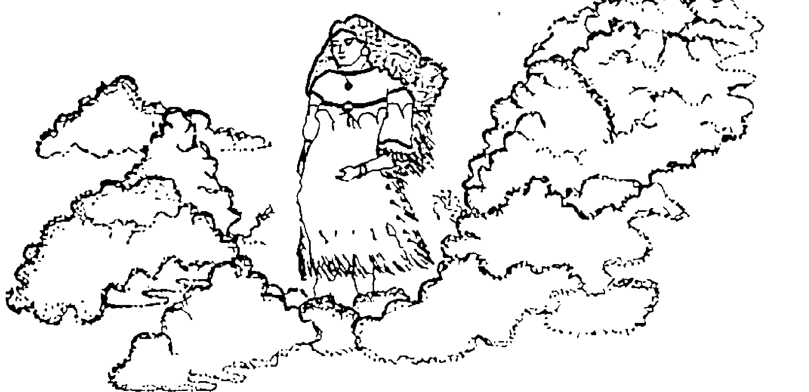
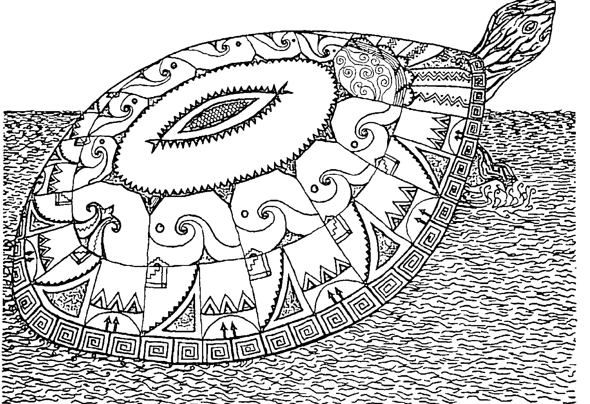
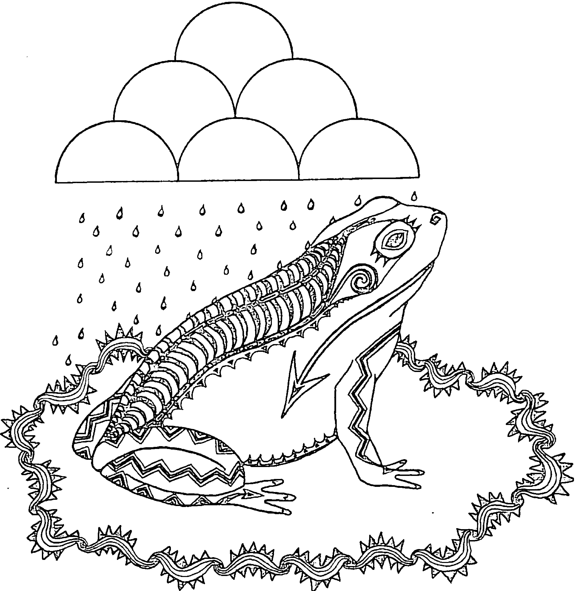
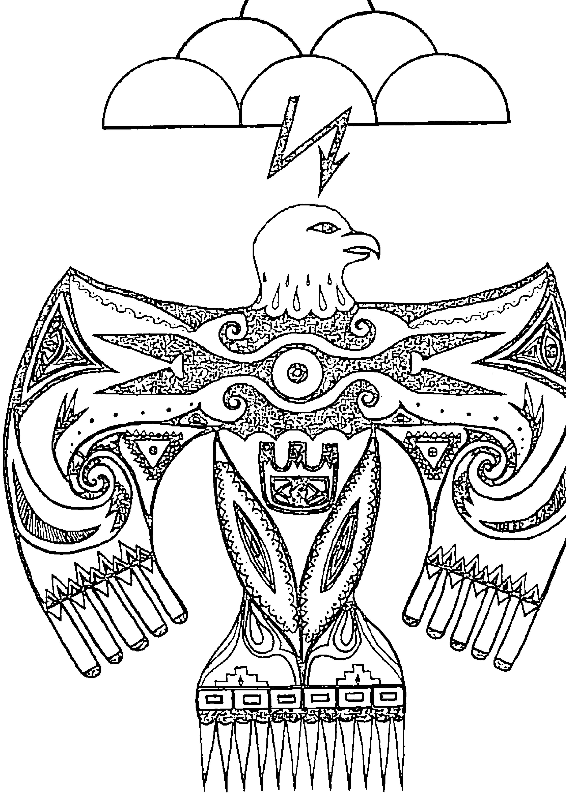

## The Medicine Wheel 藥輪
### 大地占星學 Earth Astrology

太陽熊 Sun Bear
瓦奔·風 Wabun Wind——著
許玉珍——譯  黃裳——審訂

## St. Royal College 天使神秘学院

- ※ 专业占卜预测机构
- ※ 神秘学培训机构
- ※ 水晶能量研究中心
- ※ 官方淘宝：http://strc.taobao.com
- ※ 官方微博：http://weibo.com/715104687
- ※ 新书发布QQ群：659338717
- ※ 购买更多好书请联系院长大天使

### 大天使
天使神秘学院 院长
QQ：715104687
手机/微信：13641926204
微信公众平台：strc2011

## 制作说明

本书由《天使神秘学院》出重金从台湾购入的原版书籍扫描制作完成。为达到最好阅读效果，特地把原版书全部切开后，再经由专业扫描设备高精度扫描完成，并经过一张张的PS后期处理最终成书，其间花费大量的人力、物力以及时间，只为能给大家提供经济并优质的神秘学学习资料而努力。

本学院强力谴责某些机构和个人，把本学院花心血制作完成的电子书籍，包装后直接放在自家淘宝网上低价倾销的行为，以谋取不劳而获的经济利益。如果长此以往最终将无人愿意再为大家花心思制作电子书，那以后可能大家再无新书可读。

为让大家以后能够读到更多的好书，也为了本学院的良性发展。本学院恳请大家尽量做到如下几点：

1. 尽量在本学院的网站购买电子书籍。
2. 请勿用技术手段把电子书内的水印及加密去掉。
3. 在收到电子书后小范围传阅即可，千万不要公开传播，更别挂到淘宝网上低价销售。

同时为答谢广大支持者，学院电子书将做如下调整：

1. 学院会把一些早已收回制作成本的电子书折价销售。
2. 最新制作的电子书籍会开放打印功能，大家购买后有条件的可自行打印成书。

天使神秘学院

## 讚揚 太陽熊 與 藥輪

> 「太陽熊是誰？他遠不止是一個凡人……他所預見的，是一個偉大薩滿導師的靈境。」
> ——史蒂芬·福絲特 和 瑪拉蒂茲·里特，《靈境追尋》作者

> 「這正是一個『藥輪』將被領受的時代。我們的文化處於不安穩的狀態，精神上、社交上、生態上……皆需要療癒和安頓，這門『大地占星學』將確切幫助許多人。我對太陽熊的靈境致上最深的信任；我同樣深深地相信他和瓦奔所獻給我們的這條醫藥道路，足以修復人們和大地之間的健康關係。」
> ——約翰·懷特，《地球極點轉移》作者

> 「太陽熊的生命故事……不止啟發人心，甚且不可或缺。」
> ——瓊·哈利法斯，《薩滿之聲》作者

> 「太陽熊是一個築橋者……他終其一生的移動，已經轉變了整個社會各個階層。」
> ——伊芙琳·伊頓，《薩滿與藥輪》作者

> 「我由衷地相信，假如更多人能夠走進太陽熊的藥輪聖圈靈境之中，將會拯救這個世界！」
> ——湯姆·布朗，《追蹤師》作者

> 「太陽熊的生命與靈視，為『人們』及其駐居的『地球』帶來整合。如果我們聆聽這個男人的教導，且讓這些教導轉為實相，那將會是一個多麼不同的世界！」
> ——裴吉·布萊恩，《星神再度降臨》作者

## 太陽熊 作品

- 《在藥輪裡做夢》：太陽熊 和 瓦奔 · 風 以及 熊歐迪希
- 《黑色黎明／燦亮白晝～千禧年的印地安預言書》：太陽熊 與 瓦奔 · 風
- 《與藥輪共舞～藥輪工作簿》：太陽熊 與 瓦奔 · 風 以及 蝶蛹 · 慕利根
- 《曙光之女 ～ 一場靈性的飄泊與追尋》：瓦奔 · 風
- 《在平衡中漫步 ～ 快樂、健康、和諧人生的指路》：太陽熊、瓦奔 · 風、蝶蛹 · 慕利根、以及彼得 · 紐佛
- 《太陽熊～力量道途》：太陽熊、瓦奔 · 風、巴里 · 偉恩斯塔克
- 《自立更生的熊部落》：太陽熊、瓦奔 · 風 和 尼米摩夏
- 《光明種子～既摩登又古老的水晶知識》：瓦奔 · 風 和 安德森 · 瑞德
- 《白水牛之心》：太陽熊
- 《人的法則》：瓦奔 · 風
- 《以荒野為家》：太陽熊

## 僅獻此書

紀念太陽熊
他的靈境
以及他所奮力實現的一切

紀念那些建構了古老藥輪的祖靈
感謝祂們所分享給我們的願景

## 目錄 Contents

| 標題 | 頁碼 |
| :--- | :--- |
| 中文版作者序 | 8 |
| 一場靈境、一個聖圈、一部遺產：藥輪的歷史 | 11 |
| 追憶太陽熊 | 15 |
| 太陽熊的叮嚀 | 23 |
| 藥輪靈境 | 27 |
| 序幕 | 30 |
| 月亮和圖騰 | 36 |
| - 大地復甦之月（雪雁） | 38 |
| - 休眠淨化之月（水獺） | 49 |
| - 大風之月（美洲獅） | 59 |
| - 萌芽樹之月（紅尾鷹） | 71 |
| - 青蛙歸返之月（海狸） | 83 |
| - 玉米種植之月（鹿） | 95 |
| - 烈陽之月（紅翼啄木鳥） | 106 |
| - 採莓之月（鱒魚） | 118 |
| - 豐收之月（棕熊） | 130 |
| - 群鴨飛遷之月（渡鴉） | 141 |
| - 天寒地凍之月（蛇） | 152 |
| - 漫長冰雪之月（麋鹿） | 163 |
| **方位的力量** | 174 |
| - 白水牛、老鷹、土狼和大熊如何開始幫助靈性守護者？ | 176 |
| - 北方的靈性守護者 瓦布絲 (Waboose) | 180 |
| - 東方的靈性守護者 瓦奔 (Wabun) | 184 |
| - 南方的靈性守護者 熊歐迪希 (Shawnodese) | 188 |
| - 西方的靈性守護者 默加奇維思 (Mudjekeewis) | 192 |
| **元素家族** | 196 |
| - 海龜如何幫助建造大地？ | 199 |
| - 海龜家族——土元素 | 203 |
| - 為什麼有些青蛙會離開水？ | 207 |
| - 青蛙家族——水元素 | 213 |
| - 蝴蝶如何學會飛？ | 218 |
| - 蝴蝶家族——風元素 | 222 |
| - 雷鳥如何生成？ | 226 |
| - 雷鳥家族——火元素 | 230 |
| - 青蛙——海龜（水——土） | 234 |
| - 雷鳥——蝴蝶（火——風） | 237 |
| - 蝴蝶——海龜（風——土） | 240 |
| - 蝴蝶——青蛙（風——水） | 242 |
| - 雷鳥——青蛙（火——水） | 244 |
| - 雷鳥——海龜（火——土） | 246 |
| - 相同家族聯盟 | 248 |
| - 在藥輪中旅行 | 251 |
| - 建構一座藥輪 | 257 |

## 中文版 作者序
### 瑪莉絲 · 瓦奔 · 風

我永遠記得太陽熊告訴我有關於他的**藥輪**靈境的那一天，我全然知道這個靈境將會改變許多人的生命。我很榮幸可以和太陽熊一起把這個靈境視聖境落實在人們的現實生活之中，並教導人們如何與**大地母親**以及這塊土地上的萬物建立更好的連結管道。

一直以來《藥輪》就是一本象徵南方靈性守護者～熊歐迪希(Shawnodese)以及土狼這個狡滑動物的一本書。對於北美原住民而言，土狼是一種相當重要的動物。因為即便在你完全不願意學習的狀況下，牠仍然可以利用自己高超的騙術，來達到讓你學習的目的。此時，我們正需要懂得偽裝自己的土狼，來教導我們重要的生命功課。在現今的社會中，人們花在觀賞大自然景物的時間著實太少。反之，將大部分時間侷限在與其他人以及人類所創造出來的高科技互動關係上。書寫《藥輪》這本書的目的即在於：希望讀者能藉由閱讀這本書來更加了解自己、朋友以及伴侶。然而，就在各位閱讀的當下，也可以同時學習到如何與這個偉大生活圈中的各種礦物、植物、動物、所有人類、以及所有神靈和能量體建立起合宜的關係。同時，在本書中，我們也會以截然不同於現今生活但卻更為宏觀的方式，把這些存在於我們生活圈中的生命共同體，介紹給這片土地上的人們。

現今，**大地母親**之所以生病的其中一個重要原因，正是因為人類太過於輕忽其他創造物的存在。我們必須學習如何專注在建立自己與**大地母親**之間的關係上，才能夠對於療癒大地母親真正有所貢獻，《藥輪》就是為了這個目的而書寫的一本書。

長久以來，我對於從一個當代靈視中衍生出的這麼多美麗智慧感到驚奇。你們可以在接下來的《藥輪的歷史》這個章節中，讀到一些有關這方面的訊息。大家也可以在《追憶太陽熊》這個章節中，讀到藥輪創始者太陽熊的生平事蹟。接下來，大家更可以在《太陽熊的叮嚀》這個章節中，看到太陽熊詳細闡述這個強而有力的靈境。我衷心希望這本書能夠鼓勵更多的人，去尋找並且擁抱和分享屬於他們自己的靈境。

太陽熊在《藥輪～大地占星學》、《與藥輪共舞～藥輪工作簿》以及《在藥輪裡做夢》這三本書中，完整地闡述了他的靈境。在第一本書被出版之後，太陽熊所屬的醫藥社群～熊部落，就在全世界各地支持者的贊助下，開始在各地大型的藥輪匯聚中，重新將他的靈境如實地呈現出來。在每一場大型藥輪匯聚中，參加人數都有數百人甚至超過千人以上的規模。到目前為止，我們在全世界各地已經舉行了上百場的聚會。在這些大型活動中，我們也邀請來自許多國家的原住民部落導師們，前來傳承他們的智慧。同時也鼓勵人們將他們在藥輪儀式中所習得的知識帶回自己的家鄉，並且在自己的土地上建構出屬於他們自己的藥輪。當每一個藥輪被以虔敬的心和恰當的態度建構出來時，祂就會成為這片土地以及所有使用這個藥輪儀式的人們療癒的中心。

當《藥輪》這本書第一次被出版時，在很短的時間內就被翻譯成八種語言，同時受到讀者們極大的喜愛。特別是在極端需要被療癒的德國這片土地上，人們不但舉行了非常多的藥輪匯聚和儀式，並且藉由這些方式學習到更多以大地為基礎的靈性課題。我感受到在中國這塊土地上的許多人們，也將會被藥輪的教導所吸引，同時也能藉由這樣的教導，去療癒他們自己以及屬於他們的這片古老土地。

從1980年開始，《藥輪》這本書不但持續在美國各地印刷出版，而且每一天都有新的讀者加入這個知識的行列。許多出版書籍通常只會有一年或兩年的出版期，因此《藥輪》這本書的紀錄著實令人稱奇。在過去幾年之中，《藥輪》已經以各種不同的語言在許多國家出版。2014年，這本書首次在西班牙出版，而在2017年，《與藥輪共舞》這本書也第一次在法國出版。

現在，這兩本書都將以中文版的形式獻給大家。我相信太陽熊會像我一樣開心，因為這意味著在地球上將有百分之二十的人口，可以藉由閱讀這兩本中文書籍，來開始自己療癒大地母親的神聖工作，而且所有的事情都終於匯聚成圓了。回想我們的第一本《藥輪》是在美國東岸出版的，而第一次的藥輪匯聚則是在美國西岸舉行。此後，藥輪匯聚就在包括夏威夷的美國各地以及歐洲陸續蓬勃發展所帶來的療癒力量所籠罩。如果太陽熊此刻能與我們同在，我相信他一定會說：「兄弟姊妹們，這真是太棒了！這真是太棒了！」

非常感謝各位購買這本書，並且仔細閱讀當中的一切。請你將自己在書中所學習到的訊息，用來療癒大地母親以及你自己！

瑪莉絲·瓦奔·風
Marlise Wabun Wind
寫於2017春天

## 一場靈境、一個聖圈、一部遺產
### 藥輪的歷史：大地占星學

在第26頁，你可以讀到**太陽熊**的**藥輪靈境**，他在1970年末得到的一個預視。**太陽熊**知道這個願景需要被遵循、被實現，他需要和其他人分享。於是他帶著這個靈境前來，和我一起填滿細節，他一心惦記著～這個靈境將把人們帶進一個與土地、以及與所有在她（**大地母親**）之上的其他存有們更美好的關係裡。

1978年，熊部落出版了《**藥輪聖圈**》，一個在藥輪之中的小藥輪，祂訴說著關於年曆的各種圖騰特質。我送了這樣一個小**藥輪**給奧斯卡・卡利爾 (Oscar Collier)，他是我的文字經紀人，也是培生教育出版社 (Prentice Hall) 的編輯。這個**藥輪**在他生日時抵達，他讀了，也連結了自己那時期的生命……奧斯卡分外感動，他連繫我們並要求我們將**藥輪**發展成為一本書。再也沒有比這更好的方式，能讓人們去知曉關於太陽熊的靈境。

《**藥輪 The Medicine Wheel**》，這本書出版於1980年4月。它起步得很慢，但有趣的是它持續地成長著。隔年，這本書在德國出版，出乎意料的成功，而後也陸續在荷蘭、丹麥、土耳其、法國、義大利、西班牙、日本、以色列和希臘出版……當時的許多書籍，都僅有幾個月或幾年的上市期，但《**藥輪**》這本書，如今竟已發行了37年。

當這本書在世界各地出版的同時，我們也開始支持各地的**藥輪匯聚**。太陽熊希望能有數以百計的人們相聚在藥輪儀式中，確切地實現他的靈境。他們一起建構一座藥輪，並圍著藥輪參與儀式，學習更多關於大地母親的智慧，以及如何療癒自己和土地的方式。

1980年的8月，我們在美國華盛頓州靠近西雅圖瑞尼爾山 (Mount Rainier) 山腳下的一個森林露營區，贊助了第一場藥輪匯聚。在那場聚會中，有數百人共襄盛舉，一起見證太陽熊的靈視世界。那次成功經驗之後，我們又陸續在加利福尼亞州、紐約和德克薩斯州舉辦了其他的藥輪匯聚。尤其在紐約的那場聚會中，有超過一千位夥伴，熱情地加入了我們的行列，甚至有兩家當地電視台也前來全程拍攝這場活動……接下來的十年裡，熊部落每年至少會贊助四場以上藥輪匯聚，每場參加人數皆多達五百至一千人，聚會地點也遍佈美國各大區域、夏威夷以及歐洲。

我們也很榮幸能提供各種教師，去協助這些在世界各地逐漸開花結果的藥輪匯聚，這些聚會會給予各種背景的人們一個絕佳機會，能向原住民長老學習如何正面積極去療癒我們的大地，這也正是那些長老們長久以來一直引領企盼的願景。

這些教導藥輪儀式的老師們，大都來自美國各州的原住民部落，有另一部份的教師則來自澳洲、非洲、加勒比海、歐洲以及西藏各地。參與藥輪匯聚的教師名單之長，讀起來簡直像是一本原住民以及新時代的名人錄。

許多人參加過藥輪匯聚之後，回到了自己的家鄉，並在自己的土地上建構藥輪，也在那裏舉行了儀式，將他們所學到的珍貴知識傳遞出去。另外一些人，則去到了世界各地的聖地建構藥輪。此外，也有些人試圖在森林中或樹林周遭建構藥輪並舉行儀式，然而為了保護這些森林生態不被人們所破壞，我們不得不請求大家停止這個行為，不要再做出有可能危害森林的舉動。

### The Medicine Wheel 藥輪

這些年以來，愈來愈多的人對藥輪產生了極大的興趣，於是蝶蛹．慕利根、太陽熊和我著手寫了一本《與藥輪共舞～藥輪工作簿》，這本書在1991年由西蒙．舒斯特出版社 (Simon & Schuster) 出版，書中不但涵蓋了藥輪圖騰每一個面向更深入的知識，其中所教導的觀想練習和儀式，也幫助人們更加了解自己與其他創造萬物之間的關係。

在1994年，我和熊歐迪希 (Shawnodese) 完成了太陽熊離世前即已開始寫作的《在藥輪裡做夢》這本書，教導人們在使用藥輪時如何去詮釋他們的夢，以及如何與夢境工作。

在《藥輪》這本書首次發行之時，人們對於「藥輪」這個名詞並沒有太多概念。而今，它已經成為一個全世界大多數人都曾聽聞或知曉的名詞。早在1978年時，人們只會在考古學或人類學的文章中，以及在荷耶梅約斯特．巨風 (Hyemeyohsts Storm) 所著的《七支箭 Seven Arrows》這本書中，見過這個名詞。現在，人們只要在任何一個書店的搜索引擎中輸入「藥輪 medicine wheel」這個名詞，即可找到超過三十本在1980年之後出版的藥輪相關書籍。此外，現在的我們也會看到許多以藥輪為主題而創作的歌曲，或甚至是一整張以藥輪為主題的音樂專輯，可供人們選擇。

我們也可以看到許多針對藥輪而創作的藝術家們，為了這個主題而創作了一系列的繪畫、盾牌或陶藝作品……從1992年開始，我為藥輪年曆的內容擔任文字部分的撰寫工作，也同時結識了為這個年曆而創作的優異藝術家。例如：格溫．喬治．黑文思、普魯頓斯．思益，以及珊卓拉．史坦頓……等人。此外，我也開始和那些在工作中運用了藥輪概念的人們書信往來，這之中包括療癒師、醫師、學術人士、整體合一療癒師、中醫、靈境探尋嚮導們、珠寶設計師、占星人士、手工藝工匠、靈媒以及各類型的教師們……。

我知道有數百人或甚至數千人在他們其他屬性的著作中，也曾用他們自己的方式，來詮釋過「藥輪」這個名詞。儘管我們無從得知這本書確切感動了多少人，但事實上從1980年開始，這本書在全世界各地已經以多國語言出版，而且銷售量遠超過一百萬本以上，直接參與我們藥輪儀式的人數也超過數萬人。

我衷心地感謝太陽熊和我們所有人分享了他的靈視夢境，也感恩那些幫助這個靈境得以實現的人們。

瑪莉絲·瓦奔·風
2004 年 6 月

## 追憶太陽熊

太陽熊，這位將藥輪分享並教導給世人的導師，於1992年6月19日辭世。這個男人感動了無數人，太陽熊究竟是誰？究竟是甚麼原因，讓他的靈性高度遠遠超越其他人？他如何能透澈了解人類的各種景況，並以他源自於真實領悟的慈悲，來對每一位相遇的人訴說真理？在他幼年時，又是遭遇了甚麼樣的意外或環境，才使得這位「只受過八年正規學校教育的貧苦印第安保留區男孩」，得以蛻變成一位靈性導師，啟發了成千上萬比他更為富裕或學識淵博的人們，去開始追尋並找到他們自己的力量道途？

太陽熊於1929年8月31日出生於北明尼蘇達州的白土地印第安保留區。在他出生後的兩個月，美國股票市場面臨崩盤的命運。太陽熊曾說過，股災事件以及他從小的飯碗裡只有泥土這兩件事，深刻地影響著他的成長過程。當時，農夫們完全不顧後果地掠奪蹂躪著土地，一場起因於小麥的瘟疫浩劫於焉展開……在保留區長大的太陽熊，從小即被他的奧杰布瓦族祖母教導有關植物以及大自然世界的一切知識。他的兩位叔父都是巫士 (Medicine Man)，負責教導他許多關於療癒以及其他醫藥形式的知識。在印地安原住民文化中，醫藥人士 (Medicine people) 是神聖的導師，可以和實相中的許多畛域溝通並帶來領悟，他們也是療癒身體、頭腦、靈魂和心的巫醫。這兩位醫藥叔父同時也教導太陽熊關於靈境 (Vision)，太陽熊將之定義為一個體與造物主神靈之間的一種私人化溝通感應方式。

在太陽熊的一生當中，曾經經歷過許多的靈境。他的第一個靈境發生在他幼年時候，當時年僅三歲。他對這段過程沒有太多記憶，大部分的細節是由家人轉述告知的。當時的他剛從睡夢中醒來，口中不斷地發出一位憤怒的戰鬥酋長的吼聲，太陽熊發狂似地吼叫著，直到他的叔父給他一些醫藥之後，他才又沉沉睡去。

太陽熊的第二個靈境發生在五歲那一年。當時的他患了白喉而臥病在床。他看見一隻被彩虹繽紛顏色包圍的大黑熊，這隻大黑熊伸出手掌，穿過了彩虹圈，並撫摸了他的頭……在這次異象之後，他從抽搐中醒來，並健康地存活下來。

太陽熊在以他父親命名的拉度克學校一直讀到八年級。他不喜歡老是枯坐在課堂裡上課，他只喜歡每天早上步行到學校的那段時光……太陽熊的家除了有一個大花園之外，還養了一些動物，所以即便在美國經濟大蕭條的那段時間中，他們的生活仍然比別人好些。有一陣子，太陽熊會跟隨著他的父親四處旅行求職。在他七歲那一年，為了幫助紓解家庭的經濟壓力，他不得不學習設立陷阱來捕捉獵物，但長大之後，他對於設陷阱獵捕這件事卻極力反對。九歲那年，太陽熊開始狩獵取食……也是基於這些童年經驗，他後來開始教導熊部落自力更生，並寫就了《以荒野為家 At Home in the Wilderness》和《自力更生之書 The Self-Reliance Book》。

太陽熊在十五歲那年，參加了白土地部落的議會。他在會中力勸他的族人們以自力更生的方式，來善加運用部落資源。但參與會議的人們認為他太過年輕，甚麼都不懂，所以對他的建言毫無興趣……沒想到二十五年之後，當太陽熊成為一位經濟發展專家時，他自己的族人以及二十五個奧杰布瓦族和溫尼貝戈族的聯盟族群，竟然需要付費請他回到部落，重新講述當年他在部落會議中所闡述的自力更生之道。

當年，太陽熊在他第一次不甚愉快的部落議會結束不久，便獨自一人離開了白土地保留區，他開始在美國各地嘗試各種類型的工作，例如：種田、伐木、撿拾馬鈴薯、當洗碗工、在墓地幫忙喪葬事宜、擔任銷售員以及廚師……等等。在這段時間中，他接受任何的工作機會，來維生並且拓展他的世界觀。

當太陽熊在白人世界裡探索時，他仍然沒有遺忘要去探索自己印地安背景的一切教導。在美國各地旅行期間，也給了他機會結識許多醫藥巫士、導師以及各原住民部落的族人。太陽熊也正是在這段時間中，定義出他日後所教導的那些生命哲學。偶爾，他會重遊自己生長的白土地保留區以及那兒的森林，那是他首次在生命中學到了四季更迭的地方，他也在那裡學會了去愛大地母親。

太陽熊非常喜歡這種吉普賽生活方式，但就在此時卻爆發了韓戰。他的朋友和親戚們都建議他直接從軍，而不要等到被徵召入伍。當時他的確聽從了大家的建議，且通過了一切必要的入伍基本訓練。只是在訓練結束之後， he突然領悟到一件事。他告訴自己：「如果我要戰鬥，那我一定是為自己的國家而戰，我絕對不會為了其他原因，而去攻打韓國人民……」於是他逃往山林藏匿了九十天，他思忖著：「我要從此銷聲匿跡，過著和以往完全不同的生活，讓這九十天成為一個奇蹟……」太陽熊不但成功的隱居山林九十天，甚至在接下來的四年當中，美國聯邦調查局的人員，對他的行蹤完全沒有任何頭緒。

在太陽熊銷聲匿跡的這四年當中，他仍然持續不斷地工作著，同時也花了更多的時間去學習關於自己部落的各樣事物。他曾去到好萊塢擔任演員工作，在那段期間，他同時也活躍於洛杉磯印地安人組織 (Los Angeles Indian Center)，參與早期原住民文化復興的活動。他在雷諾．斯巴克思印地安社區 (Reno Sparks Indian Colony) 教導原住民們從事手工藝製作，並且教導他們如何重視自己的居住地以及自我肯定與尊重的課題。同時，他也開始學習與媒體打交道，並成功地透過募捐的方式，募得了足夠的漆料，來為整個社區粉刷翻新。但也就在此時，美國聯邦調查局的人員終於盯上了他，並將他逮捕歸案。

當太陽熊在軍事法庭接受審判時，許多來自各行各業的軍人都前往聲援。他們認為太陽熊做了那麼多大眾服務工作，應該可以功過相抵，而不該被判徒刑。但在那個基於道德原因而拒絕兵役還不盛行的年代裡，太陽熊仍然因為樹立了不良的行為示範而遭到判刑，監禁一年。太陽熊並沒有因此而埋怨自己的命運，反而利用這牢獄時光去更加認識自己。他是一個在任何景況中都能善加利用環境的人，而這也正是他在往後教學時，強調學生們最應該具備的能力之一。愈來愈多的人們聲援支持釋放太陽熊，在這樣的輿論壓力下，他只在獄中服刑六個月即得到開釋，回復自由之身。

在太陽熊得到釋放後的那段時間裡，他將自己大部分的時間一分為二。一邊在洛杉磯從事電影工作，一邊前往雷諾繼續教導原住民學習各種生活自助方式。當時艾森豪政府正極力提倡要取消原住民保留區，並強迫這些原住民遠離自己的文化，前往城市生活。太陽熊於是結合了洛杉磯印地安人組織的力量，來幫助那些被異地安置的原住民同胞們，讓他們有足夠的食糧可吃。經過一段時間之後，他決定一路搭攔便車前往華盛頓特區，促請政府重視原住民族群的議題。太陽熊頭戴印地安戰帽，手持寫著「給毯子，才旅居」的標語牌，沿途中，他一直不斷向那些對他的號召感興趣的人們解說，並請求支持。在這段旅途中，他遇見了貝蒂‧伯恩斯坦 (Betty Bernstein)，兩人生下了女兒薇諾娜‧拉度克 (Winona LaDuke)，並一起攜手共同為原住民議題打拼了四年半的時間。

在接下來的十年中，太陽熊持續在雷諾和洛杉磯兩地之間工作。他在柏克萊舉行的言論自由活動中結識了尼米摩夏 (Nimimosha)，兩人一起在洛杉磯地區出版了一份名為《狼煙四起 Many Smokes》的通訊週報，後來這份週報還演變成了一份以亮光紙印刷出版的全國性刊物。之後，他們又一起攜手出版了《以荒野為家 At Home in the Wilderness》這本書。接下來，太陽熊前往內華達州跨部落議會工作，專職原住民自力更生計畫。當他成為經濟發展方面的專家時，他發現自己必須花許多時間處理文件，卻不能再與人們直接有所互動，於是他毅然決然地辭去了這份工作。

離開了那個職務之後，他來到加州大學戴維斯分校 (University of California, Davis)，協助校方一起設計原住民研究課程。就在此時，他又書寫了另一本書《白水牛之心 Buffalo Hearts》，來讚揚原住民部落的偉大領導者們。接下來，太陽熊開始了他在實驗學院的教職工作，並在同時間醞釀自己未來人生工作的種苗。這段時期，他透過自己在實驗學院的教職關係，開始與戴維斯校區的一群人固定聚會，這個團體裡的人們，也就是後來成立熊部落的創始核心成員。

熊部落就像是太陽熊的靈視之子，這也是他打從五歲就開始誕生的一幅願景。這個想法在他接下來的其他靈視中也持續的產出。他非常清楚自己要建立一個專司教導的部落，部份族人的責任，就是去和他人分享那些能夠透過自身生命去學習到的和諧與平衡。

熊部落於 1970 年在加利福尼亞州正式成立，到 1971 年時，這個部落的居民超過兩百人，他們共同居住在超過十七個人們捐贈的土地上。這時候，太陽熊開始接到來自全球各地關於部落的演講邀約，同時也有更多人請求能進入熊部落共同生活。當熊部落的人數開始增加時，更多問題也接踵而至……終於，這些問題的壓力已遠遠超過了太陽熊建立這個部落時的喜悅。因此，他帶著其中一小群人，包括在 1972 年為他生下女兒的晨星 (Morning Star)，轉往雷諾。

太陽熊花了很多長一段時間，慢慢地對自己靈境的第一個挫敗和所產生的疑惑釋懷。此後，為了避免重蹈覆轍，他花了更長的時間去評估當初所遭遇的問題，並且也獲得了一些實驗性的結果。他發現自己想要設立的這個共居團體，必須以真正的大愛為基礎，而且這之中不能有小我的貪念、嫉妒、恐懼或競爭，才能成就一個這樣的社區。太陽熊深知自己想要從主流社會教育長大的人們之中，找到一群奉此宗旨為圭臬的人來組成一個師資部落，著實談何容易？但藉由那些認同他夢想的人們協助，以及他接下來幾次靈境中的教導，他始終堅守著自己的信念。

在其中一次的靈視經驗中，太陽熊被帶往華盛頓州斯波坎市 (Spokane, Washington) 郊外一個名為靈境山的地方。在那塊土地上，太陽熊見到人們不但學習如何自力更生，而且他們和大地母親之間也有著真切的連結。

在另一次靈境中，他則看到所有氏族的人們，從四面八方返回到這個聖圈中央，他們心中充滿和平、口裡唸誦著祈禱，全都来到了他族人所建立的神聖圓圈。在這次的靈視中，他獲得了三個異象：藥輪聖圈，《藥輪～大地占星學》這本書，以及藥輪匯聚。太陽熊的訊息感動了數十萬人們，他也因為這個靈境、因為對人們及大地的療癒，備受全世界各地的肯定。

在另一次靈境中，太陽熊看見自己獨自站在完全漆黑的山頂，他對著造物主虔誠地祈禱。在禱告中他的手突然開始移動，凡他所指之處，就會有一道亮光出現，這些亮光有著不同的大小、形狀以及顏色……他突然憶起了孩童時候的那個靈境，在那場異象中，曾出現一隻全身被繽紛彩虹光芒所籠罩的大黑熊……這一次，大靈在靈境中告訴太陽熊：這些亮光代表著那些將會來到他面前學習、並且把這些醫藥知識帶回世界的人們。他也同時被告知：必須倒空自己原有的知識，才能接受即將到來的更多新知。

在 1980 年代的那段時間中，太陽熊完全依循了大靈的指示而行。在熊歐迪希以及我的幫忙下，太陽熊建立了他自己的師徒制度，也收納了許多來自各地的學生。就在同時，他也加緊自己的腳步旅行到世界各地演講，太陽熊的內心似乎知道自己沒有太多的時間，能夠為這樣的工作繼續發光……於是他的內心有一個迫切的需求，他必須持續不停地旅行到各處，教導並分享他的洞見。

來自全世界各地的大型演講邀約愈來愈多，而且參加的人數也不斷地攀升。熊部落的課程甚至還需要有候補名單，才能應付大量的需求。而且，每年太陽熊都會旅行前往歐洲、澳大利亞和日本教學。

你或許會問，太陽熊滿足了嗎？他一心只想成功地教導人們關於他的靈境，而這無關乎個人成就。雖然她的伴侶也是他的太太家雅 (Jaya) 和我，我們持續在同樣的事功上努力，但是我們卻無法擁有和他相提並論的成就。太陽熊是一個永遠不會將錢花在奢侈品上的人，他認為辛勞工作就是為了實現自己靈境中的願景，而不是將所得用在生活中放縱自己的慾望。

他常常會說：自己的靈境是每天驅策著他向前的動力，這會幫助他去完成此生為人的目標。事實的確如此，雖然有好幾位精彩的女人陪伴過太陽熊的一生，但是他的初戀，也是他的最愛，仍舊是他的靈境。

或許，這個靈境才是真正得以將他和世俗之物隔開的主因。即便在現實狀況不容許的情況下，他仍然可以展現出無比的勇氣，去保有自己的夢想並將之實現。他也深深地覺得：每一個人都有權利去擁有心中的靈境和願景！

許多人就因為深信著太陽熊的教導，並且願意透過這個命運乖戾的單純男人的雙眼，去看見生命的真實美麗，於是徹底改變了他們對這世界的觀點。

太陽熊在世的所做所為，將透過他的教導以及我們的書寫，持續在世界各個角落開花結果。我衷心的希望～我們的孩子以及他們的兒女們，還有那許許多多追隨太陽熊教導的人們，能從這個不可思議的男人身上，得到各自生命中最大的益處。

瑪莉絲・瓦奔・風
2004 年 6 月

## 太陽熊的叮嚀

如果人們長時間的追溯原住民歷史，一定會發現一個事實，無論是美洲印地安人或大部分國家的原住民，他們的宗教和生活基礎，都建立在個人的靈境之上，這是一種個人和造物主大靈之間的溝通方式。

靈境會以各種不同的方式來到個人的生命之中。人們可以上到高山、下至山谷，也可以高聲為自己呼喊，希望能獲得自己的靈境。有時候人們必須重複上述的過程許多次，才有機會獲得他們朝思暮想的異象，但對其他人而言，即便是做了一切的努力，也不意謂著這件事一定會發生在自己身上。有些人的靈境會呈現出完整的整體概念，足以明確地教導得到這個靈視的人，有關於整個宇宙以及他個人在這宇宙中的位置。然而，對於其他某些人而言，靈境可能出現在自己身體不適之際、或是瀕臨死亡經驗之時、或出現在人們的一般日常生活之中……。

神聖的導師多半過著以他們自己的靈境為基礎的生活，他們的經驗也較為豐富，因此，當人們有靈視經驗並請求協助解讀時，他們也就能依據自身的豐富經驗，協助人們詮釋他們的夢境。每一個人都應該知道要尊重彼此的靈視經驗。在現今世界中，許多人早已遺忘了自己也能擁有靈境的可能性。他們將這個能力視為是古老的遺跡，就像那些被珍藏在博物館裡的寶物一樣，只是某些精美得令人好奇的展示品，卻和現代生活沒有太大的關係。

我們每一個人，其實生來就有做夢和預視的能力，這也正是身為人類的我們，之所以能藉由這個天賦在地球上做夢、追尋並實現自己願景的主因。這個能力，也幫助我們去反思那股創造我們的力量與自身的關係。

這本書的誕生，源自我很久以前的一個靈境。在這個靈視經驗中，我看見了**大地母親**和所有人類的進化，對於大地以及在她之上所有存在的關係，也有了更美好更真實的理解，而這個美好時刻正在逐步靠近……在實現這個靈境之前，我也看到所有人類必須先學會將足以分裂彼此的那些恐懼放在一旁，並且學習以愛的方式，彼此像兄弟姊妹般的生活在一起。我同時也看到我們必須去尋找那些願意和我們共享這心之所嚮的人們，無論他們的種族背景為何，我們的力量必須結合在一起，成為一個又一個的群體，做為大靈的管道來幫助療癒**大地母親**。我還看到這些族群的人們，巨大地影響著此刻正在發生的地球淨化。

這是當前在我靈境中可以分享的最重要的部份，自從得到這個異象之後，我也一直不停地努力去實現它。到目前為止，我算是獲得了不錯的成效。**熊部落**是一個以這靈境為基礎而建立的跨種族醫藥組織。身為這個組織的領導者，我帶領成員用我們的力量，將這個靈境的觸角伸及許多人的生活之中，也將我們被交付要傳遞的訊息告知這些人們。

「平衡的行走在**大地母親**懷裡」這句簡短的話，就是我們想要表達與傳遞的訊息。這句話反映出所有人的態度，也就是人們的生活必須與自己內在及周遭所有事物完美融合。我們此刻已經走到一個真正接近這個靈境的時間點，我們可以感受到彼此的合一，這足以讓我們與整個宇宙連結在一起。同時我們也應該在自己生活的所有面向中，映照出如此的合一秩序。

在這本書中所提到的**藥輪**，則出現在我較新近的一個靈境中。當我收到這個靈境的指示後，我在我的醫藥幫助者～瓦奔的協助下，將這個藥輪的細節發展出來，並書寫下這些教導做為**藥輪**重要的教導素材。至於瓦奔所擁有的這一切醫藥知識，則是她從自己一次次的靈視中累積而來。

當我們收到請求，去撰寫一本關於這個**藥輪靈境**的書時，我們彼此都認為這樣一本書，可以幫助更多人去認識並理解我的靈境，而且祂也可以幫助人們，敞開心去面對自己在**大地母親**上的所有關係。這本書中的訊息都來自偉大的**大靈**，來自我們自己對於人類、動物、植物和礦物王國之間關係的觀察，也來自其它人某些觀察的理解。雖然我們偶爾會和一些具有占星背景的人士談論話題，但是我們並沒有研讀過任何星象學。這本書中的資訊，並非用來增進人們對於美洲原住民任何一個部落族群的知識，而是我們被告知可以去幫助療癒此刻**大地母親**的一種新方法。**藥輪**與占星學或其他任何形式的自覺皆有著許多雷同之處，這所有的相似性，我們歸因於～所有的真理都來自相同的源頭。

這就是本書誕生的過程。請讓我們所有人敞開自己的心，共享這個美好的**靈境**。不論我們的種族與國籍，我們都共享著同一個**大地母親**，因此，請讓我們學習用愛、平靜與和諧的方式，在生命中追尋美好的道路。

能把這些話說出來，真是太棒了！

> ——太陽熊

## 藥輪靈境

我看見一處光禿禿的山頂，陣陣微風吹過，周遭草原上的青草正溫柔地擺動著。隨後，我看見一堆圍成圓圈的石塊，被擺放成車輪輪軸的模樣，而且在靠近這個圓圈正中心的地方，又有另外一圈石塊。我立即知道自己看見了屬於部落族人的神祕聖圈。在聖圈中央的內圈之中，擺放著一顆被烏鴉啃食精光的白水牛頭骨。然後，在聖圈的東、南、西、北四個方向，我看見了類似動物的形象……等我再靠近時，我才發現原來他們是戴著頭飾、身穿動物皮毛的人們。他們一群一群依序照著太陽移動的方向，魚貫地順時針朝向聖圈移動。他們圍繞成一個完整的圓，最後安坐在藥輪裡各自的位置上。

首先就定位的，是來到北方位置的人們。北方代表著冬天，是人們和大地母親休養生息的地方。北方，也象徵我們頭上有了覆雪般白髮的時刻，更是我們預備更換形體、轉換生死兩個世界的時候。接下來，我看見來到東方位置的人們……東方代表春天，是一個甦醒和出生之地。東方象徵著人類的誕生和生命的起源。然後，我看見人們往南方的位置移動。南方代表著夏天，結實累累和快速成長的時節。最後一群人來到西方，我們在這秋天時分收穫豐盈，並找到了歸於自身中心所需的知識。西方也是西風的故鄉，祂是所有風的父親。

在這個圓圈裡的人們，各自唱著屬於自己的季節、礦物、植物及動物圖騰的歌。聽啊！他們正為了療癒大地母親而歌唱……當他們唱歌時，其中一位領導者開口說道：「請讓這個聖圈的醫藥從此被散佈流傳，讓許多人們橫越大地來到這個聖圈，為了療癒大地母親而獻上他們的祈禱，請讓藥輪聖圈的力量再次歸返！」

在這場靈視之旅中，我看見來自四面八方各個部族、各個圖騰代表的人們齊聚一起，而他們每個人的心中都滿懷和平……這就是我所看見的靈境。

## 藥輪對照表

| 方向 | 日期 | 月亮 | 動物 | 植物 |
| :--- | :--- | :--- | :--- | :--- |
| 北方 | 12.22-1.19 | 大地復甦之月 | 雪雁 | 樺樹 |
| | 1.20-2.18 | 休眠淨化之月 | 水獺 | 顫楊樹 |
| | 2.19-3.20 | 大風之月 | 美洲獅 | 芭蕉 |
| 東方 | 3.21-4.19 | 萌芽樹之月 | 紅尾鷹 | 蒲公英 |
| | 4.20-5.20 | 青蛙歸返之月 | 海狸 | 藍色卡馬夏 |
| | 5.21-6.20 | 玉米種植之月 | 鹿 | 西洋蓍草 |
| 南方 | 6.21-7.22 | 烈陽之月 | 紅翼啄木鳥 | 野玫瑰 |
| | 7.23-8.22 | 採莓之月 | 鱘魚 | 覆盆子 |
| | 8.23-9.22 | 豐收之月 | 棕熊 | 紫蘿蘭 |
| 西方 | 9.23-10.23 | 群鴨飛遷之月 | 渡鴉 | 毛蕊花 |
| | 10.24-11.21 | 天寒地凍之月 | 蛇 | 薊草 |
| | 11.22-12.21 | 漫長冰雪之月 | 麋鹿 | 黑雲杉 |

| 方向 | 礦物 | 靈性守護者 | 色彩 | 互補動物 |
| :--- | :--- | :--- | :--- | :--- |
| 北方 | 石英 | 瓦布絲 | 白色 | 紅翼啄木鳥 |
| | 銀礦 | 瓦布絲 | 銀色 | 鱒魚 |
| | 土耳其石 | 瓦布絲 | 藍綠色 | 棕熊 |
| 東方 | 火蛋白石 | 瓦奔 | 黃色 | 渡鴉 |
| | 矽孔雀石 | 瓦奔 | 藍色 | 蛇 |
| | 苔蘚瑪瑙 | 瓦奔 | 白色和綠色 | 麋鹿 |
| 南方 | 光玉髓瑪瑙 | 熊歐迪希 | 粉紅色 | 雪雁 |
| | 紅石榴石、鐵礦 | 熊歐迪希 | 紅色 | 水獺 |
| | 紫水晶 | 熊歐迪希 | 紫色 | 美洲獅 |
| 西方 | 血石碧玉 | 默加奇維思 | 棕色 | 紅尾鷹 |
| | 銅礦、孔雀石 | 默加奇維思 | 橘色 | 海狸 |
| | 黑曜石 | 默加奇維思 | 黑色 | 鹿 |

## 序幕

這本書，為了幫助所有人得以更好地連結大地母親和我們的周遭萬物而寫，祂將幫助我們領悟這之間的微妙關係。很多時候，我們常常會覺得生活中缺少了什麼，我們也經常渴望能親近大自然和那些元素力量……希望這本書能夠幫助你去找到自己在藥輪裡的位置，去重新發現那些或許早已失落的力量。也希望藉由你對自己和宇宙的關係認知，去明白印地安原住民為何對這樣的關係如此珍視。一旦你能夠完全地與萬事萬物融合為一，你就能真正成為這個圓滿。

而今，正是急需藥輪知識的時代，如果人類要繼續成長，我們每一個人就必須對自己的環境有更深的理解。人們疾病的源頭，起因於和大自然分離，許多現代人試圖藉由大自然的力量去回復他們的平衡，人們轉而投向天然食物和自然療法，同時也有更多人加入了回歸土地自耕供食的運動……即使在當今這個極度工業化的社會中，人們仍然可以察覺到自己需要藉由大自然來平衡失序的生活。因此，現在正是我們該為你獻出藥輪教導的重要時刻了。

我們邀請此刻正在閱讀這本書的你，請把自己原有的既定觀點和概念拋諸腦後，和我們一起進入這個神奇的世界，在這裡，一切宇宙萬物都和你相互關連、相互輝映。這個魔法世界，不但涵蓋了你周遭的美麗大地，也包含了你在她之上的一切親族。

我們邀請你去打開你的雙眼、你的耳朵、你的頭腦和你的心，來觀看這個始終存在著的魔法。現今許多人們，仍然僅將地球視為一座人類活動的舞台佈景，我們也將所有的礦物、植物以及動物視為人類的僕役，我們已然忘記了祂們其實皆為人類的老師，祂們幫助我們敞開堵塞、塵封已久的心，讓嶄新的想法及情緒流動。

我們同時也遺忘自己除了世上的家人之外，還與大地之上的萬事萬物有著密不可分的聯繫。我們懂得對自己的家人負起責任，但我們似乎不記得自己也該對這片大地上的所有親族負責……我們把自己牢牢地禁錮在一個狹小的人造世界中。

我們早已遺忘了如何去聆聽風所帶來的故事和祂所唱的歌，我們也忘了如何去聆聽自古以來便存在那裡的石頭的智慧，我們更忘了水能如何滌淨和更新我們。

當植物試著告訴我們該吃哪些食物才能活得更美好，我們卻失去了聆聽的能力。當動物嘗試著教導我們學習、歡樂、愛和覓食的天賦時，我們依然無法明瞭……我們一手斬斷了這所有關係的連結，卻又納悶著自己為何總是感到無聊和寂寞。

**藥輪**，是一個包含了整個大千世界的神奇聖圈，當你環繞著**藥輪**旅行，你將會同時在你的內心及外境中發現驚奇，如果你能持續去探索**藥輪**的奧秘，你甚至可能瞥見關於你自己的驚奇智慧～你是誰？你知曉什麼？在此生中你能做些什麼？

印地安原住民全然知曉這個神奇的聖圈，他們不但尊敬**藥輪**，也將之運用在每天的日常生活，藉此記得他們曾學會的所有事物。當他們建造房屋時，不論那是帳篷、小木屋或泥土屋……都會以圓形的方式來呈現。當他們想要潔淨身體和心靈時，他們會坐在**發汗小屋**的聖圈中進行，這象徵著人類母親的子宮也象徵**大地母親**的子宮，人們雖來自母親的子宮，但終其一生都飽受**大地母親**子宮的滋養和撫育。此外，當族人們聚集議會時，他們也常圍坐成圈，這代表每一個人都被含納其中，都能在議會中平等發聲。

當他們創作音樂時，也總是會運用圓鼓，他們會圍成圓圈舞蹈，這鼓聲代表他們的心跳以及**大地母親**的心跳聲，在舞蹈中他們舉起手臂和雙腳朝向天空，然後又放回地面，用自己的身體傳導能量，創造了一個從地面延展到天空又返回地面的迴圈。

他們將生命視為一個圓環，從出生到死亡而又重生的循環。正因為他們深知如何去感謝和歡慶自己的生命之輪，於是他們懂得去順應不同年歲所帶來的能量更迭而自我改變。他們知道自己就如同四季，在生命的迴圈和時間的洪流之中，勢必會經過許多不同階段，他們也明白一旦自己在這個生命之圓裡脫軌，也就脫離了成長的生命律動。

**藥輪**聖圈對印地安原住民意義非凡，他們的生活也一直以此方式延續，並且用儀式和建築結構來傳承這個圖形。在圓塚文化中，所有的塚都會以圓形來呈現。我們也看見阿茲特克人的圓形曆法，以及用石塊建構出來的圓形**藥輪**……這一切都在在提醒著他們～**大地母親**以及她之上的萬事萬物，都是這神奇生命之輪的一部分。

現在，這個迴圈也提醒著你，記得你始終圍繞著祂而前行。你從某一個位置點進入這個圓，這個入口給予你確切的力量、天賦和責任，這個出發點由你出生時的月亮或月份所決定。不同的出發點會連結到不同的元素家族，而你也可以藉此發現自己所連結的元素。這所謂的家族，與大多數部落中所提到的血緣關係無關，那樣的血緣關係來自父母，且會賦予一個人以及他所嫁娶的對象在此生的責任。至於元素家族，則僅僅決定著你與元素之間的關係。正如**藥輪**上的其他位置點一樣，所有的元素都不是以靜態方式呈現的。這些出發點也會由每一個方位的**靈性守護者**所護持。

在古老的年代裡，一個人持續環繞著**藥輪**而行走生命旅程，是非常重要的，即便時至今日，這對我們而言依然意義重大。如果滯留在某一個月份、某一個圖騰、或某一個元素，你的生命將變得靜止不動、毫無生趣。而這個停滯不動的狀態，也將使人停止成長、停止去知曉人們與**藥輪**的所有連結，也等同於截斷了那源源不斷流過你的生命力。

當你沿著**藥輪**前行，你有責任去學習你所途經的那些不同的月亮、圖騰、植物和元素所代表的含意。藉由這樣的學習，你的生命將持續不斷的改變更新，你也在自己的心中持護著一種滿是生命力的脈動。

這就是我們對於神聖藥輪的願景。在這個靈境中，我們看見這條道路能教導人們去改變、去成長、去向生命敞開、向地球上所有的關係敞開……我們也看清楚這個靈境正是現今世界所需要的未來，只是人們遺忘了這些自己早已知曉的智慧。這個靈境能夠幫助人們脫離自己短暫的孤單及無聊，並且只需要改變自己的想法和心意，而不需要任何實質的變動。對於那些不曾感覺孤單或無聊的人，他們仍可以藉由這個靈境去找到生活中更多的樂趣和陪伴。最重要的是，藥輪給了你一條道路去知曉並顯化各種面向的你自己。

在我們的靈境中，人們從來不會受限於他們自己的出發點、方位及家族。因為人們知道自己不會僅僅只擁有屬於這個位置的力量或弱點，他們必須沿著藥輪去旅行，盡可能走得愈遠愈好、盡可能去經驗愈多位置愈好，去學習途中所有位置的功課、挑戰、力量和弱點……藥輪上的每一個位置點，都會帶給他們許多禮物和天賦，都將擴展並豐富他們的生命。

**藥輪**的精髓正是「移動」和「改變」。透過這些知識，人們懂得允許改變在自己的生命中發生。人們渴望能沿著藥輪前進和成長，盡可能去體驗和顯化人類最多的本質力量，他們知道自己內裡擁有所有面向的天賦，但是為了去感受那些力量，他們必須把自己放置在各種不同的位置上體驗。當他們的行為不夠篤定或清楚時，他們非但不會以自己在藥輪上的出發點為藉口，反而會試著去移動到另一個位置點，一個能讓他掃除虛弱並感受到力量的地方。

有時候這個力量來自於人們情緒的感受，或是一種想法。也有些時候，人們會藉由觀察一個動物的一生，以及牠所擁有的力量特質，來連結自己所需要的能量。更有其他時候，人們可能藉由觀察一塊石頭、一棵植物，或是聆聽風的歌聲以及土地的心跳，來藉此認出自己。

對於那些以此種方式過活的人們而言，他們對於造物主所教導的功課永遠會保持敞開的心，無論我們需要什麼樣的老師，最恰當的功課永遠會在最對的時刻出現……對於這些走在藥輪之道上的人而言，大地就是一個神奇之所在，也是一個充滿了無數驚奇的源頭。

如果我們願意允許自己選擇，我們全都可以用這樣的方式生活。殊不知我們總因為自己內心的傲慢，才會覺得自己獨處在一個充滿敵意的外星宇宙中。我們雖自以為是地認為自己才是宇宙中最重要的一環，但我們的恐懼卻讓自己體驗到孤單和不被愛著。

如果我們敞開自己的心，創造宇宙的那道愛之光與和諧，將會照亮我們曾選擇的枯槁景色和平乏生活，如果這神奇的藥輪之旅能夠開始啟程，得以在所有的美麗面向中學習經驗人生，我們的心也將更加豁然開朗。

## 月亮和圖騰

你出生時的月亮或月份，會決定你在**藥輪**中的出發之地，以及你的礦物、植物和動物王國所相對應的圖騰。一年之中的第一個月亮，是大地復甦之月。

就在這個時刻，太陽父親從南方的旅程歸來，再次督促大地母親以及她所有孩子們的成長。通常在12月22日冬至的這一天，會開啟這個月亮的力量，這也是**北方靈性守護者～瓦布絲**的第一個月亮。接下來會有休眠淨化之月以及大風之月。在瓦布絲所掌管的休養和更新的相關月份中，人們會反思過去一年的成長，並為來年的成長做準備。

緊接著**瓦布絲**的月亮之後，是**東方靈性守護者～瓦奔**所護持的三個月亮。在這些喚醒成長的月份裡，太陽父親開始照亮祂所有大地上的孩子，培育他們各自去產出恰當的果實。瓦奔所守護的第一個月亮是**萌芽樹之月**，通常是從3月21日的春分開始，另外二個月亮則分別是**青蛙歸返之月**和**玉米種植之月**。**瓦奔**的月亮力量是照耀與智慧，祂教導大地上的子民以他們恰當的方式去準備成長。

接下來是**南方靈性守護者～熊歐迪希**掌管的月亮。這三個月亮代表著快速成長的力量。在這段時期，所有的土地開始綻放花朵並孕育果實。**熊歐迪希**的第一個月亮是從6月21日夏至開始的**烈陽之月**。接下來是**採莓之月**和**豐收之月**，這也是成長和信任的季節。在這個季節中，信任是絕對必需的，因為成長的速度飛快，人們根本無暇思索和衡量整個進程。

秋天是西方靈性守護者～默加奇維思的季節。默加奇維思的第一個月亮是從9月23日秋分開始的群鴨飛遷之月。接下來有天寒地凍之月和漫長冰雪之月。在這幾個月中，我們開始反省，蓄積能量去向內觀看，並反思自己在前幾季中的成長和進步。這也是為了休養和更新做準備的時節。

每一個人都可以從礦物王國、植物王國和動物王國中，找到對應於他出生月份的特定圖騰或徽章，藉此連結某種力量特質。你不但會從你的起始圖騰裡學到關於你自己，同時也會學到有關你在這地球上的其它親族。正因為這些圖騰帶給了大地母親源源不絕的生命力，人們對於這些相對應的圖騰不但負有責任，更應該尊重並感恩祂們所帶來的功課及能量。

當你繞著**藥輪**前進時，你應該盡全力去學習任何你所處位置的圖騰，如此你才會對那些與你共享地球的一切生靈有更多認識和成長。當你站在一個不同月亮的位置時，你有機會去明瞭並學習那個月亮的圖騰特質，你當然也可以向兩條腿的動物們學習到一樣重要的功課，當你愈渴望學習，你在**藥輪**上的旅程就能走得愈遠。

請記住即便有許多人在同一個月份出生，那並不表示他們都會擁有一樣的特質。所有人都在用自己的速度旅行著，當你站在**藥輪**中的某個位置時，你極有可能也會感受到另一個月亮所代表的心情或狀態……這或許是在提醒你必須動身前往下一個地方，**藥輪**所帶給我們的重要訊息正是～允許你自己不斷地旅行，而非將自己繫綁在一個固定的位置上，阻礙了你的能量，也拒絕了改變和成長。

## 大地復甦之月

### 12.22～1.19

### 北方靈性守護者 瓦布絲的第一個月亮

- 動物：雪雁
- 植物：樺樹
- 礦物：石英水晶
- 色彩：白色
- 元素：土元素 (海龜家族)

值得尊敬的、重視倫理道德的、敏感的、強大有力的、不具彈性的、傳統的

在一年中的第一個月份，也就是**大地復甦之月**出生的人，他們的動物圖騰是**雪雁**，植物圖騰是**樺樹**，而**石英水晶**則是他們的礦物圖騰。白色是他們的代表顏色，而且他們歸屬於**海龜元素家族**。從12月22日到1月19日之間出生的人屬於這個家族。

要瞭解**雪雁**人的特性，我們可以先從他們在地球上其它畛域所對應的圖騰意義看起。首先是礦物圖騰~**石英水晶**，這是地球上最為普遍、分佈最廣的礦石。石英是由二氧化矽所組成的一種堅硬礦物，具有玻璃光澤。雖然有各種顏色的石英水晶，但白色或透明石英最為普遍，這也正是雪雁人所具有的色彩。古時候的人們，因為石英冰冷的觸感而認為它是永久結凍的冰塊，這個理論得到不少人的支持，因為有時候你真的可以在石英裡看見一滴水凍結其中。這滴水在礦物形成時即已被包覆在內。因此，除非這顆礦物破碎了，否則這滴在石英裡的水，將永遠不會蒸發。水晶這個字在希臘原文中就是冰的意思。也正因為與冰的外貌相似，有些人們認為它可以止渴。即使在這個世紀的男童軍訓練手冊中，我們仍然可以看見他們教導年輕的孩子們，在口渴時得以吸吮石英來止渴。

石英是一種力量強大的石頭，我們會將它運用在收音機、雷達、電視、超音波及其他方面，來做為傳遞能量或是協助傳遞一些我們至今尚未完全瞭解的力量的工具。從前，不論是在國王或貴族手中的權杖，或在魔術師的手杖上，都會鑲上水晶。在亞特蘭提斯時期，水晶一直是亞特蘭提斯人們用來提供大部分能量的工具。但有些人也宣稱亞特蘭提斯文明的毀滅，正是因為人們誤用了這些水晶的能量。那些被預言家們用來預測未來的水晶球，也是由石英所做成的。還有在祈雨儀式中被用來盛水，藉以觀測天象所使用的水晶碗，也是這個神奇礦物的另一個例子。此外，澳洲原住民也會在他們的祈雨儀式中，使用石英水晶來祈雨。美國印地安原住民也和世界其它地方的古老部族一樣，將石英水晶運用在許多類似之處。

雪雁人可以從石英水晶學習到如何以自己的力量去清晰看見事物，並且讓宇宙能量流過他們。如果雪雁人能夠隨時保持在清淨和流動的狀態下，他們便可以如同自己的礦物圖騰一般，成為宇宙強大能量的接收者與傳遞者。

雪雁人如同石英一般，有著冷酷的外表，因此，有時候會讓周遭的人覺得他們過於拘謹，且不善於表達自己的情感。然而，正如他們的礦物圖騰石英水晶一樣，他們被自己親近的人持續灌注溫暖與能量之後，會慢慢地活絡起來。在情感方面，雪雁人絕不會過度表現或是異常敏感，但是他們仍然可以學著向親近的人散發出適當的暖度和光亮。

此外，正如石英的能量一樣，雪雁人具有精準接受和傳遞能量的能力，但在這股強大的能量之中也同時蘊藏了毀滅的因子，因此當這能量被誤用時，雪雁人和他們周遭的人們就會受到嚴重的傷害。據聞這也是亞特蘭提斯文明毀敗的主因。雪雁人可以從石英當中學習到自己的力量，以及自己該如何小心地去運用這股能量。同時，他們也可以學到無論是在看待事物的觀點上、或是在個人的生命哲理上，都不該過於固守自己的模式，因為倘若如此，他們極可能如同石英一樣裂成碎片，受到極大的傷害。雪雁人可以藉由手握水晶並與之同在，而學會一種專屬於他們獨一無二的秘密。

雪雁人的植物圖騰是最古老又普遍可見的樺樹。樺樹有著莊嚴美麗的外表，有時甚至可以長到四十五或五十英呎的高度。樹皮有著白色、黃色、棕色，或是幾近黑色……各種不同的顏色。當樺樹初長成時，樹幹是全然滑順的。樺樹的樹幹會隨著時間，而漸漸佈滿了具有代表性的橫紋。它的葉子是亮綠色鋸齒狀的簡單外型。一長串的美麗花朵，常常垂掛在空中，甚為美麗。也正因為它的普及性，我們可以從北極圈一直到佛羅里達州及德州的林地中，窺見它們的樣貌。

在古老年代裡，原住民會善用樺樹來過生活。例如：他們會在樺樹的樹皮上寫字，而且這些傳統民族的重要資訊，也會被撰寫在樺樹皮卷上加以保存。另外，他們會將樺樹汁做成一種飲品和樺樹甜漿來食用。黃樺樹和黃樟樹的汁液混合在一起，就成了類似麥根沙士的一道飲料。同時，樺樹的樹皮和葉子也可以被製成療癒消化性疾病或腎臟和膀胱疾病的藥茶，而阿斯匹靈的前身水楊酸，也正是從樺樹的內層樹皮所提煉出來的。這個藥茶對於腫脹或皮膚問題也有所幫助。

人們有時會將樺樹的葉子放在森林**發汗木屋**裡的炙熱石頭上。由葉子冒出來的濃煙，不但可以幫助人們淨化身體的各種問題，還可以去除身上多餘的靜電。此外，人們在汗浴的過程中，也會用綑綁成束的樺樹枝，來不斷鞭打自身，以促進循環並且達到排毒功效。

除此之外，原住民也會在種植穀物之後，在土地上拖行樺樹枝，藉以活絡泥土裡的微生物。正因為樺樹的根部可以吸收堆肥的養分，因此，只要在可行的狀況下，將堆肥放置於樺樹下會是極好的選擇。

**雪雁人**如同樺樹一般，令人生起一種莊嚴肅穆之感，在他們的身上蘊藏著古老傳統的知識，以及那些不為人知的人生智慧。當他們的能量流動保持暢通時，宇宙會將這些傳統及智慧的訊息傳遞給他們。正因為**雪雁人**的這個特色，所以他們相當尊敬傳統。儘管知道改變是一件不可避免的事，但**雪雁人**仍然堅信自己必須以循序漸進的方式來帶入改變，才能顯示自己對於傳統的重視。因此，不論是宗教儀式或是家族風俗，一旦這個傳統成為生活中的一部分時，要請他們從中做出改變，會是極端困難的一件事。**雪雁人**比起其他任何動物家族的人，都更加重視並感恩傳統所帶來的價值，他們認為不論是傳統或儀式都可以為人類的生命質地增添實質的豐盛。**雪雁人**就像樺樹皮卷一般，是為人們傳遞過往智慧的重要管道。

雪雁人除了以實質的方式使用樺樹之外，還懂得運用象徵、冥想的能量，去幫助自己免於受到任何毒素的傷害，也正因如此，他們得以持續對自己或任何所接觸到的人，傳遞源源不斷的正面能量。由於雪雁人擁有分辨事物的能力，因此也常會是別人諮詢的對象，但是他們必須要注意到一點，那就是當他們在為別人提供諮詢的時候，一定要讓自己的心念保持在全然純淨的狀態下，唯有如此，雪雁人才能看清事實，而不致將自己的偏見或負面想法投射其中，進而影響他人。當他們積極地將自己保持在自由潔淨的能量流動狀態時，他們就能如同樺樹一般，將自己生活中那些不必要的靜電干擾一掃而空。

雪雁人比較容易有消化道方面的疾病，因此樺樹藥茶對他們會有很大的幫助。如果能夠學習用樺樹的枝葉為自己做一次汗浴，將可以大大地幫助他們維持身體健康。如果他們有骨骼尤其是膝蓋的疼痛或腫脹問題，樺樹的療效將更為明顯。當雪雁人長期處於不平衡狀態，他們很容易就會有膝蓋方面的問題和困擾。

正因為雪雁這個動物家族與人類的關係最為密切，所以雪雁人可以從這個動物身上學習到許多關乎自己本性的事物。雪雁是一種雙翼尖端帶有黑色的美麗大白鳥。牠古老的學名是小雪雁(Chen hyperborea)，這個名字的原意是～「遠自北風的雁」。人們觀察到這些鳥兒會在春天融雪及融冰之時遷徙至北方築巢，又於秋天降下初雪時返回。雖然人們並不知道這些鳥兒究竟遷徙至何處？但是這些雁兒的作息卻與下雪信息息相關，於是為這群雁鳥取了這樣的名字。

部分的雪雁家族每年會從牠們在加拿大的亞北極圈築巢地，橫跨五千英里路，南飛到達墨西哥灣，再於降下初雪時，返回牠們的棲息地。在遷徙過程中，牠們經常會以V字形的隊伍飛行。雁群之首向來會是隻母雁成鳥，而且每一隻雪雁都會幫助飛在自己身後的雪雁同伴破風飛翔。此外，牠們也懂得要飛在前面那隻雁鳥的斜後方，才能有更寬闊的視野。

雪雁是群聚的鳥類，因而在牠們遷徙的旅途中，我們常可以見到二、三萬隻雁鳥停在同一個地方覓食。此外，即使在牠們的築巢地，這些雁鳥也會很有默契地遵守著一個潛規則。那就是讓較年長的雁鳥先行選擇牠們的築巢地點。牠們同時也懂得將自己的巢穴築在別的雁鳥巢穴之外二十英呎處，來表示對彼此的尊重。

雪雁父母總會小心謹慎地用苔蘚和青草，來保護母雁所生的蛋。公雁和母雁在幼雛孵化期間，也一定會守在一旁。幼雛要花上二十四小時的時間，才能用牠的小卵齒破蛋而出。在這個過程中，小雁雛會用卵齒在蛋殼上啄破一個小隙縫以便呼吸，並且在一天之後，使盡全身力氣破殼而出。在小雁鳥成長過程最辛苦的這個階段，成鳥父母一定會守護在幼雛身旁。在幼雛孵化之後三、四週中，成鳥父母也會幫助幼雛蛻去牠們最主要的幼毛。因此在這段時間裡，幼鳥幾乎毫無飛行能力。幼鳥們一直要等到自己緩慢成長的雙翼長出適當羽毛量，也就是第六個星期之後，才能開始嘗試飛行。

如果你曾經有過飼養家鵝的經驗，你一定會對雪雁的某些習性並不陌生。這些鳥類是蟲卵的剋星，牠們可以花上好幾個小時的時間，不斷地從同伴身上啄出蚊子、小蟲以及其他任何不利於牠們的東西。此外，雪雁還有著緊緊抓住事物的本能。因此，當牠們看見食物、肉類或任何可以抓取的東西時，就會善用這個天賦。雪雁人也可能會因為這種鳥類的特質，而擁有同樣的本能。

這些雁鳥有著比人類更敏銳的雙眼，因此，牠們在挑蟲子和飛行這兩件事上更顯得獨領風騷。當一隻雪雁單獨飛行，並發出鳴叫聲時，那聲音聽起聽起來好似汽車的喇叭聲。但如果同時有好幾千隻雁鳥一起飛鳴而過，聽起來反而會像一群野狗的狂吠聲，或是一群草原土狼的狂嚎。

人們會因為雁群的美麗、精準的飛行隊形以及飛行時所發出的聲音，而對雁群飛過天際時的畫面印象深刻。或許正因為我們看到雁群時，心中會一直想著這些鳥兒將去往何處，以及牠們究竟會如何精準地到達目的地……等等諸如此類的問題，所以每當雁群飛過天際時總能引人遐想。對於許多渴望能四處旅遊的鄉村人民而言，這也正是他們將自己美好的憧憬，隨著這些美麗雁鳥放諸天際，並與之遨遊的機會。

雪雁人就如同自身的代表圖騰鳥類一般，他們能夠擁有敞開高飛的心胸，以及寬闊的眼界，而這也正是這個家族的人們常常能擁有權力的原因。和那些總是定錨在物質世界的烏龜家族相較之下，雪雁人在思緒上永遠可以伸向比瓦布絲的北風故鄉還要更遙遠的地方。雪雁人出生於瓦布絲所掌管的第一個月份，也就是大地復甦之月。因此他們的生命就如同雪雁一般，與大雪的週期息息相關。在瓦布絲的季節中，當雪雁人的身體處於休養生息狀態時，他仍可以藉著展翅飛翔的心靈來更新自己的能量。

這個家族的人們也如同雁群一般，十分重視傳統，而且絕對服從權威。即便他們的心思已經突破界線遠颺而去，但在傳統及權威人士的規範下，他們的行為舉止仍會符合時宜。這個家族的人也像他們的圖騰動物一樣，喜歡群聚，喜歡有人陪伴身旁的感覺。然而，正因為他們凡事低調的特質，以至於許多時候即便身在人群之中，也鮮少會有人注意到他們的存在。當雪雁人身處人群，他們會以符合禮儀的方式與人互動，但絕不會讓人們有機會一探虛實。要想打破雪雁人內斂的模式，並且了解他們的真正內涵，是一件相當困難的事。因為他們具有很強的識別天賦，所以對於向他人敞開自己這件事，他們是非常謹慎小心的。

雪雁父母也正如他們的圖騰動物一樣，行事非常小心。他們隨時都需要知道孩子的安危，也會以無微不至的方式照顧孩子，同時會確保孩子能遵守自己所推崇的社會主流價值觀或思維。雪雁父母希望自己的家能夠整潔有秩序，孩子們也都能夠一絲不苟、按部就班，並且盡可能達到完美的地步。身為父母的他們，希望自己的孩子能尊重他們的權威，並且立刻做出服從的回應。當這樣的父母生氣時，他們很容易成為嚴格執行紀律的人們。正因這樣的內斂，雪雁父母對孩子的愛也不會顯露在外，他們認為孩子們會由自己平順的生活中，自行領悟到父母的愛。然而，也因為他們對於傳統及責任的重視，有時候他們會對自己的孩子要求過多也過久。

雪雁孩子似乎也像雪雁的幼雛一樣，在他們人生剛開始的階段中，會表現出沉靜的特質。他們除了應對生活中必要的事物之外，對其他事情似乎總是興致缺缺。然而，他們也像幼雛一樣，一旦決定要在生活中突破自己所設下的牢籠時，他們就會使盡力氣突圍而出，站在人群之前，並成為舞台的焦點。而這一切改變的最佳時機，只會來自於這個孩子，而不是來自於其他任何人的安排。

雖然雪雁人一直保持低調，並且會掩飾自己真實的意願，但事實上，他們一生都渴望自己在人生舞台上能成為眾所矚目的主角。因此，當他們發現自己握有權力，並且知道如何在人前自處時，他們就會站上舞台的正中央，成為焦點，並將自己明晰的洞見，分享給任何想要知道的人。當他們的身心靈平衡時，他們不但可以與他人多有分享，更能以完美流暢的行事風格，達成許多不同的工作。

雪雁人正如雪雁一樣，有著雞蛋裡挑骨頭的特性。也因為一絲不苟的個性，他們喜歡周遭的一切都是完美無缺的。因此，當雪雁人看到有人或有事物不如自己的預期時，他們就會感到困擾不已。於是，我們會看見他們花上好幾個小時的時間，去告訴朋友們該如何將自己的天賦發揮得更好，或是告訴對方如何才能幫助自己成為一個言行一致的人。他們也是那種在進到你家之後，會用手將家具上的灰塵撣掉的人，或是把你家菸灰缸清理乾淨、為你奄奄一息的植物澆水的人。他們並不是想讓你難堪，或讓你覺得自己不擅打掃，他們純粹只是無法忍受周遭事物明顯未被安頓好。

當雪雁人失去平衡時，他們會在各種各樣的事情上，展現出自己挑剔毛病的本能。即便微不足道的小挑釁，他們也一定會讓周遭所有人明白事情的問題所在。當雪雁人心情不好時，他們變成善於忌妒、充滿懷疑、自我膨脹和控制慾較強的人。當他們深陷在自己的憂鬱情緒中無法自拔時，總會希望把其他人也拉下水。正因為雪雁人可以接受許多能量，並且在思緒上無所受限，因此，當他們立意要成為一個主要控制者時，他們通常可以輕鬆辦到。

此外，雪雁人也如同海龜家族一般，擁有極高的穩定性，因此，當他們覺得有任何人輕蔑自己時，就會展開長時間的復仇計畫，尤其是當他們確認自己被輕蔑、侮辱或傷害時，他們甚至可以不計代價地報復。雪雁人善於長期籌謀這些復仇計畫，終究使得身邊親近的人，或是任何不小心踩到他們底線的人痛苦不堪。有些人甚至會被這種復仇情緒深深綑綁，直到自己身體的能量不再支持這種報復行動為止。而這時候，雪雁人也才能回到自己原來的正確人生路途上，但此時，他們通常也已經付出身體的代價。他們容易有消化系統方面的疾病，或是關節炎、風濕的困擾，尤其又以雙膝方面的問題最為嚴重。

正因為他們擁有海龜家族的穩定性，以及自己與生俱來的堅毅性格，再加上固執及害怕快速改變的天性，因此，當雪雁人失去平衡時，若沒有人勇於挑戰他的能力，或是有對等能力的人加以協助，想要幫助他們回歸正軌通常是極端不容易的事。許多時候，即便在別人眼中是一種愚蠢的做法，但只要他們肯卸下心防，試著以更敞開的心向外步步踏出自己的困境，他們就可以重新拾回平衡有序的生活。

代表雪雁人的色彩正是白雪的顏色。白雪會呈現出水的另一種奇妙形式，從天上緩緩飄落而下。每一片雪花都有它自己獨特的形狀，因而造就了新奇、閃亮、潔淨而新穎的雪景。白色也正是所有顏色的總和，它不僅涵蓋了彩虹光譜的所有顏色，也被視為是所有顏色得以平衡且潔淨的顏色。此外，它也代表著完美、啟蒙和進化的顏色。有時候當人們察覺到自己正受到任何不潔淨、或是負面振動頻率的干擾時，他們就可以啟動白色這個頻率，來包圍住自己，使自己受到保護。

白色，可以代表這個圖騰的人們所能達到的最高質地。雪雁人因著自己的高能量，以及追求完美的天性，在身心靈平衡的前提下，不但可以幫助自己進化到一個相當高頻的能量層次，而且成為靈性純潔的人。這也正是雪雁人在**藥輪**旅程中，所要學習的最重要功課，他們可以在**藥輪**的這個位置上，整合自己在其他位置所獲取的力量，藉此獲得嶄新的能量，這也是他們得以再次尋回自己純淨靈性、同時在進化的道路上邁開腳步前行的機會。

**雪雁人**受到一年的第一個月份，也就是冬至大地復甦之月的影響甚鉅。就在這段期間中，月亮會為這個家族的人們，以及大地母親的其它兒女們，帶來休養和更新的能量。正因如此，人們在這個月中不會經歷如其他月份一樣多的情緒波動，而這也是為什麼在這個月出生的人們，有著低調保守個性的主因。這個月份的月亮能量讓人們在情緒方面不致於持續起伏不定，反而會給予人們內省及反思的能量，並為來年的一切做好準備。

**雪雁人**與紅翼啄木鳥人正好互補，而且他們和同樣擁有海龜元素家族特性的**海狸人**、**棕熊人**，以及擁有青蛙元素家族特性的**美洲獅人**和**蛇人**很容易相處。其實只要**雪雁人**能保持在平衡的狀態，他們有能力和**藥輪**上任何其它位置的人們相處融洽。

## 休眠淨化之月

### 1.20～2.18

### 北方靈性守護者 瓦布絲的第二個月亮

- 動物：水獺
- 植物：顫楊樹
- 礦物：銀礦
- 色彩：銀色
- 元素：風 (蝴蝶家族)

歡樂的、健談的、值得信賴的、自相矛盾的、性好懷疑的、愛嬉戲的

在一年中的第二個月份，也就是休眠淨化之月出生的人，他們的動物王國圖騰是水獺，植物圖騰是顫楊樹，而銀礦則是他們的礦物圖騰。銀色是他們的代表顏色，他們歸屬於蝴蝶元素家族。在藥輪的位置上，從1月20日到2月18日之間出生的人都屬於這個家族。

這個圖騰的人們，正如自己的礦物圖騰銀礦一樣，是周遭人們所珍視的朋友。打從很久以前，銀礦即是地球上最多人追尋的兩種搶手礦物之一。也因為銀礦具有很好的延展性及光澤，同時又兼具美麗的亮度，所以一直是地球上最珍貴的礦產之一。回溯到古印加帝國時期以及世界上其他遠古文明，我們會發現早在很久以前即有銀礦礦區的紀錄，而銀礦是在西班牙人來到美洲大陸尋找保值的金礦時，才同時成為價值不斐的礦物。

幾世紀以來，銀礦一直被視為財富的象征，而且被用於製造富人家中的錢幣、珠寶及桌上餐具。當時的貴族擁有銀飾及銀制的皇冠、教堂的銀制聖杯、以及富人家中包鑲銀飾的鏡面……這些都是當時銀礦廣為財富象征的例子。

如同他們的礦物圖騰一樣，水獺人在大家心中也是極受歡迎的人，他們是有趣的好同伴。就像銀礦的延展性一樣，水獺人的個性也相當具有彈性，無論身在何種景況，他們總能輕易地適應環境。也因為他們真實地喜愛他人，所以無論水獺人的外表特徵如何，他們總能散發出自己的光彩，成為別人眼中美麗的一群。

水獺人所代表的銀色，一直被人們視為擁有許多神奇特質的色彩。據說人類的靈魂和身體之間，正是由一條銀線連結著。在某些宗教信仰中，人們甚至認為在金色的天堂之上，還有銀色的天堂。金色天堂代表著純潔靈性能量的最高震動頻率，而銀色的天堂則代表著愛的震動能量。當我們抬頭看著月亮祖母時，我們常會看見閃爍的銀光，人們認為銀色與月亮息息相關。月亮可以帶給人們感知、直覺以及恰當表達情緒的能力，因此，銀礦也被認為能夠提升這些藉由月亮而來的能力。

據說**水獺人**擁有一些神奇的特質。當他們允許自己的能量適切地流動時，他們通常具有高度的直覺，而且比起其他許多人更具有心電感應能力。他們的心靈之眼經常能超越肉眼的觀察，看見那些能夠喚醒更高本質的事物。如果**水獺人**學會如何正確運用自己的能量，就能讓純淨的靈性力量流遍自身。

正因為**水獺人**和月亮有著緊密的關係，即便有時候他們擅於隱藏自己的感受，但仍然比其他人較為情緒化。他們可以感受到很深的情緒，但有時候不會對旁人展現這些感覺。並不是因為他們對人有所保留，而是想維持低調，不想讓自己最深層的情緒波動影響到他人。有一些**水獺人**會試著將這種情緒深化轉換成理智的探討。當他們經驗到任何深邃的內在哲理時，他們喜歡與旁人展開深度的對話，有時甚至演變成具有穿透力的激烈對談。在這樣的對話中，**水獺人**常常可以善用所有月亮給予他們的直覺和感受，來試圖改變他人的想法，使其接受自己的邏輯思維。

另一些**水獺人**，在多愁善感以及吸引異性的浪漫本能上，更是箇中翹楚，他們會將自己深刻的情緒感受能力，用來追求各式各樣的戀人。因此，不論是談戀愛，抑或是激烈的深度對談，人們都很難抗拒**水獺人**在情緒上的穿透力。

這個圖騰的代表月亮是休眠淨化之月，也是瓦布絲所守護的休養和更新的第二個月份。在休眠淨化之月後，太陽開始由南方返回。這個月亮能量，幫助**大地母親**以及她所有孩子得到更進一步的休生養息，並為即將到來的大地復甦生長季節儲備能量。在這段期間，人們藉由觀察及更新自己而淨化身體、頭腦和情緒，為接下來的季節做準備。畢竟在往後的時節中，人們隨著季節變換的腳步，將不會再有太多深度休息的機會。

代表**水獺人**的植物圖騰是顫楊樹，或是較為人知的白楊樹和美洲白楊樹。顫楊樹遍布美國及加拿大，無論是在海平面或是山林地，都可以看見它的蹤跡。顫楊樹有著閃爍銀光的棕色樹皮，以及帶著銀色光澤的墨綠色葉子。當夏日微風輕吹過樹梢，顫楊樹會發出小風鈴般叮叮噹噹的悅耳聲音，顫楊樹也正因為這個顫動的聲音而得此名號。顫楊樹的花朵成柳絮狀，並且有著單一細胞核的果實，果實之中有一小叢一小叢猶如銀白髮絲的種子，隨著風兒被散佈到各地。每一棵顫楊樹的花朵，都是單一性別的，它的花苞正因為可以被提煉出油脂，而有「基列香脂」之稱。

在北美原住民藥草師的眼中，顫楊樹的葉子、樹皮和花苞都有藥用效果，可以用作滋補飲品和利尿劑的藥茶。這款滋補藥茶口感雖稍嫌苦澀，但對肝臟及消化系統方面有困擾的人多有幫助。此外，這個藥茶也可當成肌肉鬆弛劑，來幫助情緒失控的人、昏迷的人以及飽受花粉熱之苦的人。原住民也會在他們的春季禁食儀式中，使用顫楊樹來幫助淨化自己體內在冬天所累積的毒素。

這款藥茶也有外用的療效。原住民們每週會使用一次這個藥茶，當作滋潤頭髮的聖品。如果有較為嚴重的皮膚疾病，例如：濕疹、皮膚潰爛或是燒燙傷問題，也可以每天使用這個藥茶，來幫助傷口癒合。有些原住民部落甚至會將樹皮上刮下的粉末，製成身體的除臭劑，或者使用樹皮內層所刮下的碎屑，來醫治白內障。

**水獺人**的植物圖騰顫楊樹，可以幫助他們以一種溫柔和諧的方式，將自己所收到的能量訊息傳遞出去，就像它的樹葉一樣，會隨風搖曳散播美妙樂音。此外，顫楊樹也教導水獺人如何去自在地適應任何處境，就像它的樹葉會溫柔地隨著風兒擺動一樣，無論那是什麼樣的風，顫楊樹葉都會隨之起舞，讓風兒完全穿透它的身體，因此，就算是再大的風也不會傷害它的任何葉片。顫楊樹的韌性也能讓水獺人領悟到自身的彈性，如果水獺人想要一直保持在能量流暢的狀態下，他們就一定要學會顫楊樹的柔韌。

顫楊樹的藥茶可以幫助水獺人從緊張的生活中放鬆，並讓自己的內臟器官保持最佳狀態。如果水獺人身體裡的毒素沒有排出，毒素就有可能會囤積在他們的雙腳和足踝，並造成問題。當水獺人的能量順暢流動時，他們的身體是健康的，一旦他們的能量流動受阻時，則會經歷情緒上的莫大困擾，而他們的身體也會因為一些阻塞問題，出現不同的病症，例如：花粉熱、氣喘、支氣管炎……顫楊樹在這方面是最好的預防良藥。

對於許多崇尚自然主義的人而言，水獺是自然界中最有趣又調皮的動物之一。在美國有兩種水獺，一種是水獺，另一種是海獺。海獺在20世紀初期即已瀕臨絕跡，因為人們是如此地喜愛牠們美麗又永恆的毛皮。在一件海獺皮可以售出達兩千美元的高價誘因下，牠們大量地被獵人捕殺，以至瀕臨滅種的絕境。在這個窘境發生之前，人們常可以看見這些友善的海洋生物，在海灘上曬日光浴，因此獵人們也得以輕易用棍棒獵殺牠們。而今，我們只能在北加州外海的一小部分地區，看見牠們的蹤影。海獺們在這個水域之中，可以自在地覓食，睡覺、曬太陽、玩耍以及生養後代。

海獺有著銀白色的細毛，以及閃閃發光濃密而細緻的深棕色皮毛。當牠們長大時，臉部的顏色會變淡，並且長出白鬚。如同所有的水獺一樣，牠們也有腳蹼，而且像海豹一樣喜歡待在水裡活動。牠們通常喜歡待在海岸線岩石區中的巨藻床區域，因為唯有在這裡，牠們才能完全地放鬆、玩耍以及繁衍。

水獺的體型約有三到五英呎長，體重約在三十五到七十磅之間，而海獺的體型則比水獺來得大些。儘管牠們行事小心，但仍然屬於黃鼠狼家族，許多人對於這樣的分類感到不公平。水獺的外型與海獺有所不同。牠們的毛皮偏向巧克力般的棕色，腹部及喉嚨部分則是淡灰色。

水獺像牠的弟兄海獺一樣依水而生。人們在美國西部各州，以及世界上許多國家的大湖、沼澤和河流中，都可以看見牠們的身影。牠們通常會把麝鼠洞或其他在河岸邊的洞穴挖大後，變成自己的獸穴。牠們的獸穴通常會有兩個入口，一個在水面下，另一個則經由陸地進出。有些水獺甚至會用蘆葦草及香蒲，來搭造一個彷如印地安人圓錐形小屋的洞穴。

因為水獺的新陳代謝非常快，所以幾乎所有的水獺都有貪吃的習性，並且胃口極佳。魚類、貝類、昆蟲、雁鴨以及齧齒類動物，都可以是牠們的食物。水獺是極少數懂得如何運用工具來覓食的動物，而且還是箇中高手，所以對牠們而言，利用岩石來敲開貝類當晚餐，是件輕而易舉的事。當水獺發怒時，牠們會發出短促的尖銳聲、驚叫聲、尖叫聲、打嗝聲、暗笑聲和嘘聲……來表達自己的憤怒，有時候這些聲音甚至還能傳到一英里之遠！

一般人認為水獺是一種高貴、好奇和調皮的野生動物。當牠們不覓食、不狩獵、不曬太陽時，牠們就在玩耍。水獺會在河岸邊建造滑坡道來玩，就像孩子們喜歡溜滑梯一樣。夏天時，水獺會用泥巴做滑坡道，到了冬天牠們就改用雪道來繼續玩樂。在水中的時候，牠們也會像海豚一樣集體活動。通常會有一隻帶頭的水獺，其它水獺就會追隨著這隻領袖水獺，在水裡跳進跳出，玩得不亦樂乎。這或許也是許多原住民傳說中，大海或內陸湖泊有海蛇出沒的由來吧！

在北美奧杰布瓦原住民所屬的偉大醫藥社群(Grand Medicine Society)米帝維溫(Midewiwin)中，人們都非常認同這個動物的能量。有許多神聖導師的醫藥袋，都是由水獺皮所製成，這些醫藥囊袋具有極大的力量。

有一些崇尚自然主義的人們，一直在推測為什麼水獺與其他同屬黃鼠狼家族的動物如此不同？他們的結論是：水獺或許認為自己必須成為一個好的模範，才能改變世人對黃鼠狼這個家族的觀感，並重新得回優雅的名號。水獺在這件事上也的確做了一些貢獻。

水獺的家庭生活大致上是溫馨活躍的，而且水獺父母會一同養育後代。小水獺待在父母身旁的時間，比其他野生動物的幼雛待在父母身旁的時間要長。水獺和自己的伴侶在一起時，總是歡樂且熱情洋溢。如果其中一隻水獺死亡時，牠的伴侶有可能會哀傷達數月之久。

正因為水獺圖騰的特性，我們自然不難理解為什麼在**休眠淨化之月**出生的人會大受歡迎。就像水獺一樣，水獺家族的人們聰明、勇敢、溫柔、充滿童趣、且樂於助人。他們不僅擁有許多字彙，更擅長用幽默的方式使用文字，藉此表現出他們在其他方面的獨特哲思。

水獺家族的人與水獺的特質息息相關。他們就像水獺一樣，認為自己有責任幫助身旁的人去得到世人優雅的對待。他們是有遠見的人道主義者，也常常會將自己大部分的時間及精力，花在幫助人類進步的事物上。他們是真心樂意去幫助他人的一群，也一直在思考著自己如何能服務更多人。許多時候，他們會因為自己擁有覺察和直覺的天賦，而成功地找到可以服務彼此的方法。如果你留意去看一些慈善機構或是另類生活團體的創建者，你將不難發現他們就是水獺家族的人。對於**水獺人**而言，為人群服務是他們很大一部份天性，如果無法順從這個內在的渴望去為大多數人們服務，那麼，他們也一定會找到適當的方式去服務個人。

如果你有來自水獺家族的朋友，那麼當你有求於他的時候，無論是你想找個人聆聽你說話、或是你需要人幫忙、或者你只是需要借錢急用，**水獺人**一定會竭盡所能幫助你。但**水獺人**同時也是非常實際的人，如果他們覺得你借貸的理由不夠具有說明力，他們首先會試著讓你看見自己的不切實際……如果無法打動你，即便認為你根本沒有成功的機會，他們仍然會借錢給你。**水獺人**會很有耐心地等待你去看到他們直覺中高人一等的智慧。正因為他們有很強的感同身受能力，因此，無論你身處何種景況，他們仍然可以真實地去設身處地感受當下的你。

儘管**水獺人**和他們的動物圖騰水獺一樣，是溫和、有愛心又溫柔的人，但如果他們發現必須對你施以激烈的手段，才能讓你返回正途時，他們也會使出最強硬的手法來幫助你。因此，除非**水獺人**自身的能量完全受阻或凝滯，否則他們絕對不會出現任何惡意傷人的做法。基於這一點，我們鮮少會看見一個有仇必報的**水獺人**。當他們知道自己的立足點正確無誤，他們會勇往直前毫無畏懼，也不介意自己在朋友或商業夥伴的面前，成為一個不受歡迎的人。

**水獺人**擁有直覺的天賦，以及隱而未現的靈通能力。許多**水獺人**會運用這樣的能力，來幫助自己做出生活中的各種決定。有時候，一旦真的做出正確決定時，他們又會對自己這樣的能力驚訝不已。然而，除非他們花時間去研讀有關這個天賦的由來，並且努力去開發這項能力，否則絕大多數時候，他們對於自己這項天賦從何而來一無可知。**水獺人**的靈視力也來自於他們的這項天賦。即便**水獺人**的靈視天賦，大多出現在強而有力的預言性清明夢中，他們的確在某些方面都是具有靈視天賦的一群。

**水獺人**如果對於自身這項天賦感到畏懼，並試著去阻止這個能量流動時，我們便會看見他們亂了方寸。尤其是當他們努力在追求更高的知識能力時，他們不再會去留意自己的直覺天賦。當這情形發生，**水獺人**就成了非常不快樂的人，並開始失去許多原有的優點，這時候的他們就容易有血管阻塞的問題上身……因此，**水獺人**必須留意自己的能量流動是否受阻？而且必須讓自己隨時保持良好的適應力，否則他們將會把自己所遭遇的問題，變得毫無轉圜的餘地，最終會使他們自身的力量完全停止流動。這時候，**水獺人**在他們生活中會開始做出不恰當的決定。但因為低調的他們絕不會想公開自己的困擾，所以身旁的朋友和家人總是愛莫能助。

水獺家族的人們同時也擁有蝴蝶家族的特性，而且這些特性更加強化了**水獺人**的特質。由於他們愛做夢的天性，有可能是受到了風元素飄忽不定的影響，而使得他們必須發展出更為實際的一面，否則他們的生活中，就會出現過多需要處理的夢想，卻又無法落實顯化任何一個。

就像水獺一樣，**水獺人**是非常好的父母，不但溫暖柔軟又有愛心。**水獺人**會花許多時間陪伴孩子，使他們感到安全，但同時又懂得留給自己足夠的空間。此外，**水獺人**也擁有成為好父母所必要的直覺和感受能力，他們永遠知道孩子們真正的需求，通常也會知道該在何時放手，留給孩子們足夠的空間自己成長。然而，他們仍要留意一件事，那就是不要試圖將自己的夢想加諸孩子身上，尤其是當他們自己正在經歷情緒障礙的時候，更要留心自己的作為。

作為水獺子女，人們有時候會覺得他們太過不食人間煙火，而沒有定錨在現實時空之中。這有可能是因為他們的直覺本能，讓他們憶起了許多自己在出生之前所去過的地方。有時候，這些水獺孩子必須花上好幾年的時間，才能變成一個較為落實且適應力良好的人。在這段尚未進入軌道的日子裡，他們必須被特別的照顧，以免受到不必要的傷害。正是因為他們實在太不務實，以致於完全看不出自己已身陷險境。對於這些孩子而言，他們得花上好幾年的時間，才有辦法變得勇敢，並且無懼於這個世界。在這一點上，他們和小水獺的情形很類似，小水獺在一開始會懼怕游泳，直到水獺父母用遊戲的方式帶領牠們，才能克服牠們的恐水症⋯⋯一旦水獺人進入生命之流後，他們在兒童時期所經歷的所有困境，也都將消失無蹤。

當**水獺人**在**藥輪**上旅行到了**休眠淨化之月**的時候，他們就有機會發現並發展出自己天賦上的感受力與直覺力。同時，也能找到自己內在無比溫柔及真摯的泉源。當其他人們也來到**藥輪**上，佇立在這個**水獺人**的位置時，他們就會啟動自己服務**大地母親**以及其他人的計畫。

儘管**水獺人**與大部分的人相處愉快，但只有**鱘魚人**才能真正與之互補，而讓他們覺得最自在的同伴則是**鹿人**、**渡鴉人**和**其他蝴蝶家族**的成員，以及那些來自**雷鳥家族**的人、**紅尾鷹人**、**麋鹿人**和之前所提到過的**鱘魚人**。

## 大風之月

### 2.19 ~ 3.20
### 北方靈性守護者 瓦布絲的第三個月亮

- 動物：美洲獅
- 植物：芭蕉
- 礦物：土耳其石
- 色彩：藍綠色
- 元素：水（青蛙家族）

冷靜的、深思熟慮的、深奧的、通靈感應的、情緒化的、神秘的

美洲獅，是 2 月 19 日到 3 月 20 日大風之月出生之人的動物圖騰，芭蕉是他們的植物圖騰，礦物圖騰則是土耳其石。他們的代表顏色是土耳其石一般的藍綠色。此外，他們屬於青蛙元素親族。

土耳其石被使用的歷史非常久遠，自古即被人們用來裝飾和護身。它也是美洲獅人的代表石。這個礦石在基督世代來臨前，至少已存在於埃及礦區達六千年之久。在美洲，這個礦石也已經有上千年的歷史了。土耳其石是一種水合磷酸鋁，內含銅或鐵元素，顏色由天空藍、藍綠色到深綠色皆有。它有著蠟一般的質地，是少數沒有璀璨亮麗光澤，卻被人們珍藏的礦石之一。土耳其石通常會蘊藏在各種岩石之中，人們通常會在那些有如腎臟形狀的銅礦、鐵礦或是銀礦礦脈附近發現它的蹤跡，此外，其他晶石的礦脈也常重疊在土耳其石的礦脈之中。

美洲原住民將土耳其石視為「天空之石」。曾經有這麼一個和土耳其石相關的古老印地安傳說：很久以前，有一隻金色的大鷹神靈，棲息在一座滿是土耳其石的山頂，當大鷹將這美麗的藍彩反射到天際時，天空就變成了湛藍……有許多力量都和土耳其石相關。習慣配戴它的人們相信只要配戴了土耳其石，就算不小心受傷也絕不會傷筋斷骨，因為土耳其石會以斷裂自身的方式，來成全保護它的配戴者免於傷害。正因如此，人們也習慣將土耳其石裝飾在馬勒、馬具或馬尾巴上，以確保馬兒能站穩腳步。

在某些國家，人們也會用土耳其石來當作訂婚戒指的石材。人們認為倘若一對夫妻能信守諾言並真誠以待，土耳其石就會保持在藍色色調，反之，土耳其石就會變成綠色。然而，土耳其石是一種多孔性的晶石，當它接觸到皮膚油脂或任何液體時，很容易變色，所以這個傳說對於油性肌膚的人而言，會是一個相當難以通過的考驗。

美國原住民相信土耳其石可以保護它的主人，免於受傷或遠離危險，所以他們最常將土耳其石裝飾在抵擋敵人武器的盾牌上。土耳其石除了在北美地區被使用之外，也被廣泛地運用在中美洲及南美洲的宗教儀式中。此外，人們也常常將它雕刻成偶像，或是把它鑲嵌裝飾在其他物品之中。納瓦霍族的族人們會在他們的祈雨儀式裡，唸完特別的禱詞之後，將土耳其石擲入溪流之中以完成儀式。阿帕契族的族人們，深信在彩虹的盡頭可以找到土耳其石。其他部落民族的人們則會將土耳其石固定綁在弓箭上，來確保弓箭可以命中目標。

美洲獅人就如同土耳其石一樣，擁有一些非比尋常的力量，他們天生擁有許多醫藥，熟知人生及宇宙中的許多奧秘。他們也和土耳其石一樣，是天空的子民，比起其他家族的人，可以更加輕鬆地在人生的不同階段中轉換。但也正如他們的代表礦石一樣，他們必須經歷許多恰當的琢磨，才能綻放出土耳其石般的美麗色彩。如果他們沒有太多正確的人生經驗，或者缺乏為自己努力做點什麼的真心誠意，那麼這些與生俱來的力量不但無法展現，反而還會成為阻力，讓他們變得憂鬱且喜怒無常。這樣的情形，特別容易發生在某一種人身上：他們能夠體悟到天空的奧秘，卻又無法理解該如何從大地上築一道橋通往天空，而同時還能在這地球上正常的運作日常生活。

美洲獅人多半擁有成為治療者的力量，就如同土耳其石一樣，他們也經常熱衷各種類型的宗教和儀式。也正因為他們同時隸屬於青蛙元素家族，所以美洲獅人也常有能力去涉獵許多不同領域的知識。他們運用自己這樣的天賦，來找到屬於自己的天命。對他們而言，神秘學以及魔法的相關知識，會比任何其他領域更讓他們感覺自在，而且也是他們極有興趣的領域。有時候美洲獅人會在不經意中進入了其他領域，但卻無法幫助自己回到當下。對此，美洲獅人必須時刻留意將自己落實紮根於大地，並且多多靠近那些良好定錨在地球上的人。

美洲獅人的植物圖騰芭蕉樹，是一種常見的藥用植物。芭蕉有多達兩百種的不同種類，而且遍布全世界。芭蕉葉基部會呈現輻射狀，有些品種的芭蕉葉，比起其他品種的葉片大上許多。它的葉片大多呈現深綠色，並有著縱長形的中肋。花朵為暗白色，花序大約為六至十八英吋長。

整棵芭蕉樹都可以被作為療癒之用。原住民不僅口服且外用這種植物，來鎮定及舒緩一些症狀。人們用它做為血管的清道夫，它也有減輕疼痛和解毒的功效。芭蕉可以被製成藥茶或是敷布來使用，不論是對治舊疾或是新傷，它都有神奇的療效。尤其是當人們被蜜蜂或蚊蟲叮咬時，使用芭蕉來對症，效果亦佳。芭蕉對於身體內部的療效，亦如外表一樣有效。人們常常用它來治療胃潰瘍或腸潰瘍、或是這些器官的發炎問題，對於腎臟及膀胱方面的困擾也有明顯的療效。此外，當人們進行藥浴或使用敷布時，則可以減輕身體痠痛方面的問題。

美洲獅人常會有腿部及腳部方面的疼痛問題。這時候，只要將芭蕉葉浸入食醋中，風乾葉片一晚後，在穿鞋之前將葉片放在腳上，即可改善這個問題。芭蕉葉的舒緩療效，也可以幫助美洲獅人保健他們的內臟器官。美洲獅人常因為憂慮而容易有胃部及腸道方面發炎的困擾，此時，他們就更需要芭蕉的療效來解除身體之危。在外用方面，芭蕉也常被用來治療由壓力和憂慮所引起的皮膚病變。

正因芭蕉長遍世界各地而且容易植根，美洲獅人也因而學會了要通往更高的天空之前，必須安穩的紮根於大地。

美洲獅人的顏色正是土耳其石的藍綠色。其中的藍色，不僅代表著天空，也代表人們對於靈性的渴望。它象徵著一個追尋靈性卻又自我打壓的憂鬱之人，這也是一個象徵著理想、無私、藝術及靈性的純粹顏色，因而有此一說，當一個人走在追尋真理的正道上時，他會散發出藍色光芒。

對於美洲獅人而言，當藍色之中混合了綠色調時，對他們是大有幫助的。因為當這兩種顏色被混合在一起，代表了靈性與個人人性的平衡，也代表了天空和大地之間的平衡。因此，當人們失去平衡的時候，記得在他們身旁放上綠色和藍色調的事物來療癒他們，幫助他們回復寧靜安詳。因為美洲獅人天生就是屬靈的人們，因此他們更喜歡單純的藍色。但是他們也應該記得加入綠色色調所帶來的益處。於是，藍綠色成了一個更好的選擇！當他們在進行療癒工作時，最好也能穿上藍綠色的衣服，或是在周遭擺放這個色調的東西。

美洲獅是在大風之月出生人們的動物圖騰。牠們是美洲大陸的獅群，但卻不像自己的同類非洲獅一樣，得到應有的尊重。人們因為誤解而對牠們產生極端的恐懼，造成牠們被肆意地撲殺。美洲獅因著牠的特性而擁有其他稱號，例如：山貓、美洲豹、令人驚愕的動物、雪豹……等。牠是美洲這塊土地上的貓科家族中，體積最為龐大的動物。身長通常在七英呎到九英呎之間，體重則在一百五十英磅到三百英磅之間。美洲獅在過了幼貓時期之後，人們就鮮少會看見牠們的蹤跡。牠們有著黃棕褐色的皮毛，腹部的顏色則較淺。尾巴及耳絡處摻有棕色或黑色的毛髮。美洲獅有著俊俏的臉龐，圓形的頭部以及明顯可見的貓鬍。

美洲獅現今分布在美國西部各州、佛羅里達州、加拿大和墨西哥等地。美洲獅原本遍布在美國現今文明所到之處，然而正因為人們錯誤的對待方式，現今的牠們只能待在鄉間陡峭的峽谷或是山區之中。牠們將自己的獸穴築在岩洞或大雨沖刷的孔洞中，或者是嚴密的灌木叢中，因為這樣才能遠離人們的打擾。

在所有貓科動物之中，美洲獅被視為攀爬的好手。儘管牠們喜歡待在地面上，但如果被追殺或是在進行狩獵的時候，牠們也會以矯健的身手攀爬到樹上。美洲獅是競速高手，但是牠們並不擅長長距離的奔跑。牠們喜歡擁有私領域的空間，而且這些私領域也不開放其他獅群進入，因此牠們會特別留意將自己的地盤畫好界線，以避免其他獅群闖入。據說美洲獅會發出令人驚嚇不已的高頻尖銳叫聲，但這情形並不常見。一般而言，美洲獅是寂靜無聲的動物。除非牠們被逼到角落，無處可逃時，牠們才會發出尖銳的咆哮、怒吼和劈啪聲。

美洲獅是天生的獵捕高手。雖然牠們也吃一些小型的動物，但鹿群才是牠們的主食。美洲獅非常享受獵捕的過程，也喜歡和牠的同伴或伴侶們一同進行圍捕，以達到更大的狩獵樂趣。在這個獵捕過程中，通常會由一隻美洲獅來啟動追逐的過程，其他美洲獅則躲在灌木叢中蓄勢待發。牠們只會獵取足夠的食物，而且唯有在牠們的食物供給上出現匱乏時，牠們才會在走投無路之下，轉而獵食家畜。美洲獅因著牠的速度、動能及耐力，成為荒野獵食者中的翹楚。牠們不但會安靜快速地移動，並且會用輕盈優雅的步伐，以繞圈的方式出入自己的領地，也因此獲得潛行大貓的稱號。正因為牠是有耐性的狩獵者，牠會在嘗試了許多方法之後，才進入最後的攻擊位置。因此，有時美洲獅會在岩壁突出之處或是樹枝上，等待一天一夜之後，才找到進食的機會。而且相較之下，母獅比公獅的狩獵成果更佳。

有人謠傳美洲獅會獵殺人類，這真是不當的謠言。到目前為止，從來沒有任何紀錄顯示，有任何一隻強健的美洲獅曾經攻擊過人類。然而，牠們的確喜歡跟蹤人類，這個行為是出於貓科動物的好奇心，而不是飢餓的緣故。

當美洲獅要進行配對時，母獅通常是採取攻勢的那一方。她會追逐著自己所喜愛的那頭公獅，並藉由好幾次的撲打動作，來引起公獅的注意。當公獅開始有所回應時，牠們就會在配對之前先行角力一番。基本上公獅不會參與養育幼獅的工作，大部分的幼獅產於春季，而且通常母獅只會生育兩隻幼獅。母獅是極度有愛心的母親，牠會將自己完全奉獻在照顧幼獅的工作上。如果有其他野生動物或是人類帶著獵犬靠近幼獅時，她會盡全力去保護幼獅，讓牠們免於任何傷害。對美洲獅而言，在地面上與獵犬搏鬥時，牠們可以勢均力敵的一對抗十二隻獵犬。但是獵犬們常常會形成如樹枝狀的隊伍形式，來分散美洲獅的注意力，以至於美洲獅常常在疲於應付獵犬之際，淪為獵犬主人槍下的冤魂。

美洲獅人和這種王者之獅有著許多類似的特質。他們也喜歡待在自己的私人畛域之中。他們常常會擔心會受到別人的傷害，所以寧可將自己封閉在內心和靈性的高處，不輕易讓旁人觸及。此外，美洲獅人也是非常敏感的一群，有時候即便旁人不小心對他們說出了無心的言語，他們仍然會感到受傷。美洲獅人也像他們的圖騰動物一樣，喜歡擁有自己的私人領域，可以隨時在其中僻靜沉思和自我分析。此外，他們也和美洲獅一樣是厲害的攀爬好手，並非真正攀登高山岩壁，而是去攀爬那座心智和靈性的聖山頂峰。

在美洲獅人的心靈活動中，他們可以去到其他人鮮少可以涉獵的地方，因此他們是心靈活動的箇中好手，也是競速跑者。美洲獅人尤其需要個人思考的空間，而這一點和他們的個人幸福以及生活平衡有著密不可分的關係。如果他們缺少了私人的靈性領域，他們會成為鬱鬱寡歡且無法被取悅的一群。反之，如果他們可以待在得當的私人心靈空間時，他們就會成為對人類最有助益的人們之一。

美洲獅人也和美洲獅一樣，喜歡釐清自己的藩籬界線。因此，不論是在個人的生命哲理，或是商業行為，甚或是人際關係方面，他們都需要清楚楚地標示出自己的私領域。美洲獅人不喜歡有人在未經自己的同意下，就突破他們的私人界線。當有人這樣做時，他們特別會覺得受到傷害。正因為可以感受到彼此有著極為類似的潛能，所以他們對於同是美洲獅家族的人們，也比起對其他家族的人更心存戒心，而不會過於親近。

**美洲獅人**比較靜默，尤其是當他們感受到一些事情時，通常會選擇三緘其口。但是當身心靈保持在平衡狀態時，他們也可以輕易地開啟令其他人都感覺自在的話題。因此，除非美洲獅人能夠確定周遭的人對他們不具威脅，他們才會讓別人看見自己真實的一面。因為他們的直覺可以幫助自己輕易地切入其他領域的話題，因此，他們也相對可以較不費力地知道該對旁人談些甚麼、或採取何種動作，才能使旁人感到輕鬆自在。正因為美洲獅人是溫柔的靈魂，而且也是真心的喜愛他人，因此他們也會樂於為他人做這樣的事情。

**美洲獅人**對於許多內心深處的情感絕不外露，所以他們也常常會覺得與人群有疏離感，那種感覺像是旁人無法理解的局外人一樣。他們習慣於壓抑自己真實的情感，有時甚至會長達一輩子之久。如果美洲獅人能夠待在自己完全可以信任的人身旁時，他們真實的情感才有可能會浮上檯面。但有時這個真實的情感卻會以較劇烈的方式被呈現出來，而讓美洲獅人自己和周遭的朋友們大吃一驚！

終其一生，**美洲獅人**即便有短暫的恐懼感，卻仍然必須學習去尋找那些可以讓他們信任、並釋放出自己真實感受的人們。因為倘若不成功，他們將一輩子受限於自己壓抑的情感，而無法在心靈上找到出口。這個能量上的阻力，會使他們在不經意的情況下，不小心縱入鬱悶的憂鬱症深谷，而無法定錨於現實世界之中。當這個情形發生時，美洲獅人將不再有能力在心靈活動上展翅翱翔於天際。另外，也正因為他們不願意釋放出自己真實的情感，因此常常無法為自己做出明確的決定。而這個特質有時也讓他們變成了舉棋不定的人。

## 藥輪 (The Medicine Wheel)

美洲獅人也像他們的圖騰動物一樣，是狩獵高手，只是他們並不會追求物質方面的收穫，而是在追求個人靈性發展的提升。他們也一樣喜愛靈性追逐的過程，因為可以從自己真正的朋友與其他同樣殷切的靈性追尋者身上，證明自己在靈性追求上的躍進。一個真正身心靈方面都取得平衡的美洲獅人，可以像美洲獅一樣，無論在靈性層面或是身體層面，都能夠表現出優雅和輕盈的姿態。他們同時也是聰明的人們，因為他們知道自己必須要有足夠的耐性，才能成功地追尋到自己想要的靈性目標。通常他們會先嘗試一些不同的做法，最後才會決定出手的位置。這個特點自然也讓他們成為別人眼中舉棋不定的人，也因而常被貼上標籤。

在同為美洲獅家族的兩性關係中，女方也會像美洲母獅一樣，成為關係中的主動力。如果不是如此，這段關係甚至不可能揭開序幕。然而，如果女方在兩性關係中遇上了其他家族的人時，通常她反而會採取被動等待的模式，去等待對方展開追求。這個模式對於美洲獅男方的人們也是如此，在一段新的關係中，他也必須不斷地被對方以輕鬆的方式誘導，才可能開啟並建立與另一個人的關係。而且在這個過程中，男方還會需要不斷地去確認對方是否真心願意繼續維持這樣的關係，才能感到安心。美洲獅人有能力去找尋自己正確的靈性道路，但是在物質層面上，他們卻需要不斷地確認，才能讓自己放心。對美洲獅人而言，這兩者之間是著實有差別的。

有時美洲獅人的不安全感和憂鬱，會因為自己隸屬於青蛙元素家族的特點，而變得更為明顯。青蛙元素家族的人們，對於人類情緒的快速轉變非常敏感，而美洲獅人正會因為這個額外的敏感度，更加留意到人際關係中任何可能產生不良變化的地方。另一方面，在同時擁有青蛙元素家族特性的美洲獅人身上，我們可以看到他們有能力去知曉，並順應著宇宙的創造性與整體性的能量。

對於美洲獅男性而言，他們對於擔任父親這個角色極不適應。當孩子們對父母親有所需求時，這些父親很難在物質層面上和孩子們達成共識，也較無法滿足他們在這方面的需求。儘管他們真心愛著自己的孩子，卻不知道該如何表達自己對孩子的愛。對美洲獅女性而言，母親這個角色相對比較容易。就像美洲母獅一樣，當孩子們還幼小並且需要她們的幫助時，她們會成為專心保護及護持孩子們的角色，但隨著孩子漸漸長大後，這個強烈的母親特質就會慢慢地褪色。此時，美洲獅母親們會希望在自己最有興趣也最感到舒適的靈性領域，開始自身的靈性探索。

美洲獅孩子們因為還在做夢的階段，所以他們特別需要許多的愛和保護。正因為他們與自身的源頭也還有著很深的連結，所以這些孩子必須盡快地學習將自己定錨在這個物質世界之中，才能確保自己能夠安穩地度過孩提時代。在這個階段，他們也該被教導要將自己所有的情緒適切地表達出來，當他們長大後，才能懂得如何以較輕易的方式，來表達自己深藏的情感。他們是聰明、直覺力強又溫柔的孩子，可是當你在對他們說話時，你可能無法確定他們是否在聆聽你說話？在這件事情上，你的直覺可能是非常正確的。

美洲獅孩子是富有創造力的一群，他們常常可以運用自己的想像力，去將手邊的許多東西做成自己想要的玩具，因此大人們並不需要為他們購買太多玩具。當他們漸漸長大成人時，這個創造力依然存在，而且只要他們能夠保持著紮根於地的狀態，他們的藝術特質便可以在各個領域開花結果，幫助他們成為頂尖高手。通常他們不論是在靈性領域，或是在任何藝術領域上，都可以展現出自己的創意天賦。

## The Medicine Wheel 藥輪

但當美洲獅人失去了平衡時，他們會給予那些傷害自己的人最嚴峻的臉色。尤其是當他們覺得自己被逼到死角時，他們就會進入備戰狀態，並且不惜一搏。有時候這樣的戰鬥，也有其正面意義，因為他們可以藉此將自己長期壓抑的情感表現出來，或是幫助自己走出憂鬱時刻。但是這奮力一戰的副作用，有時會比美洲獅人想像得還更為嚴重。因為在你來我往的交戰中，他們自然也會不可避免地傷及他人。

美洲獅人的月亮圖騰是大風之月。這是個季節轉換的神秘月份，來自四面八方的風開始不斷吹拂……在這個月裡，**大地母親**的孩子們正在經歷著快速轉換的能量，並從休養生息的季節進入了新的成長。正因為美洲獅人在這個月份出生，所以他們的天性之中有著神秘及不安的特質。但也因為如此，他們獲得更多一層處理自身能量的能力。

這是北方靈性守護者瓦布絲所守護的第三個月亮。瓦布絲給予人們純潔無邪的天賦，幫助他們即便在物質層面上碰到任何問題，仍然得以保有心靈層面的純淨。此外，祂更新復原的力量，也會幫助這些人從一波又一波的憂鬱襲擊中，重新回歸正常的生活。

美洲獅人和棕熊人有著互補的個性，而且和同是青蛙元素家族的**紅翼啄木鳥人**以及**蛇人**、海龜元素家族的**海狸人**和**雪雁人**，相處最為融洽。其實只要是在美洲獅人平衡的情況下，即便只是在禮貌的層次上，他們幾乎都可以和所有人好好相處。然而他們唯一要注意的是和**鹿人**的互動。正如美洲公獅對待鹿群的方式一樣，**美洲獅人**有時會在不自覺的情形下，對**鹿人**表現出較為兇惡的一面。

當**藥輪**上其他位置的人們旅行到這個位置點時，他們將會體驗到自己所能承受的最大靈性能量，有時他們甚至有可能接受到超出自己能力的能量。這時，他們就會經歷到美洲獅人的困境，也就是必須去經歷那些讓美洲獅人躊躇不前的混亂情況。當這個情形發生時，這些人們想要學會如何保持平衡，竟也成了一項難題。儘管如此，當人們旅行到此處時，他們會有機會涉獵自己在藥輪其他位置上，所無法觸及的一些領域。

## 萌芽樹之月

### 3.21~4.19
### 東方靈性守護者 瓦奔的第一個月亮

- **動物**：紅尾鷹
- **植物**：蒲公英
- **礦物**：火蛋白石
- **色彩**：黃色
- **元素**：火 (雷鳥家族)
- **特質**：創新的、活力充沛的、樂觀的、精明的、易怒的、熱愛冒險的

在東方靈性守護者瓦奔的第一個月～萌芽樹之月出生的人，他們的礦物圖騰是火蛋白石，植物圖騰是蒲公英，而動物圖騰則是紅尾鷹。他們出生於3月21日到4月19日之間。代表顏色是黃色，他們是雷鳥元素親族的第一群人們。

蛋白石和石英一樣由二氧化矽組成，差別只在於蛋白石中含有水分。蛋白石通常會在沈積岩和火山岩洞穴中被發現。除此之外，人們也可以在熱泉沈積處附近看到蛋白石，有時它們也會出現在木化石之中。在市面上，我們會看到各種不同顏色及色調的蛋白石，它們的光澤也有透明及不透明之分。正因為蛋白石孔隙較多，因此它很容易被周遭的其他顏色染上而變色。有時候蛋白石在沒有任何特別的原因下仍會脆裂，它所內含的水分也易於流失。被稱為「星火蛋白石」的晶石，在表面分佈著均勻的小亮點，而那些表面有著規則方塊形狀的，則是「彩紋蛋白石」。彩紋蛋白石被公認為最稀少、也最美麗的蛋白石。

蛋白石就像土耳其石一樣，在遠古時代就被人們使用在生活之中。蛋白石被認為是希望的象徵。而且甚至有此一說：蛋白石可以讓配戴它的人，在不想被他人看見時隱形不見。因為蛋白石的火元素，就像旭日東升的太陽、落日和初升月亮所代表的能量，因此蛋白石和太陽、月亮以及火的能量緊密相連。

在歐洲曾流傳著一個有關蛋白石的有趣故事。故事中曾提到在古老時期與蛋白石上述特質有關的傳說。蛋白石在當時的羅馬被視為一種高貴的晶石。據說曾經有一位羅馬上議院的議員，對於蛋白石甚為喜愛，他本身不惜被國王流放到國外，也不肯將他的蛋白石割讓給想要取悅埃及豔后克麗奧佩脫拉的馬克安東尼。在法國的傳統中，蛋白石則是被鑲在王室皇冠上的寶石。維也納的皇族也以擁有蛋白石為傲。然而，在19世紀英國的一則故事中，卻提到蛋白石有種邪惡的能量，這竟成了蛋白石鮮為人知的一個黑暗面。所以自從那時候開始，蛋白石變成了不幸的象徵。直到前不久，蛋白石才因為時尚流行，重新被人類接受為高貴的晶石。

在美國各地幾乎都可以看到蛋白石，但那些被視為珍寶而且產量豐富的蛋白石，卻只現蹤於美國西北部、匈牙利、墨西哥和澳大利亞。儘管有些地方會出產不同種類的蛋白石，但基本上每一個地區只會產出單一顏色的蛋白石，而且這些蛋白石的火元素和色調也因地區而異。例如：大部分的黑蛋白石來自澳大利亞，墨西哥的蛋白石則是乳白色或透明色。有些蛋白石如果遇到水就會失去火的光澤，但是有些蛋白石如果沒有水的成分，卻反而看不見火的光澤。如果你的身邊有透明的火蛋白石，你可以讓他們從你的指間滑過，那感覺會是像流星雨滑過天際一樣。

**紅尾鷹人**像他們的礦物圖騰一樣。這些人們不論是在何種情況下，都喜歡待在眾人聚集的熱點，或是出沒在充滿較高壓力的場所。**紅尾鷹人**喜歡太陽和它的熱度，也喜歡待在可以運用自己身體、心智和情緒能量的活躍場所。就像蛋白石一樣，他們也容易受旁人影響，如果與不適當的人在一起，或是念頭稍有偏差，他們的靈性也很容易受到汙染。一般而言，**紅尾鷹人**是心胸開放的人，也願意聽從別人的想法或接受新的思維，只是有時候他們會不經意地接收到對自己有害的想法。當他們發現自己身處在不適當的景況，或已經受到他人影響太深的時候，他們也會像蛋白石一樣崩壞，而失去了給予他們火花和光輝的生命能量。

如同蛋白石一樣，**紅尾鷹人**也有著各種不同的外在呈現方式。有一些**紅尾鷹人**會憑藉自己所發出的微小生命火花，繼續不斷發光發熱。而其他人們，卻只能在他們的生命之火點燃的瞬間，偶爾短暫的發光。又或有一些人像彩紋蛋白石一樣，會固定閃爍著微量光芒。這一切的不同，只在於這些**紅尾鷹人**是否能學會善用流過自己的生命之火，然而，要找到真正能夠成功掌握自己全身能量的人的機率，幾乎是微乎其微的。紅尾鷹人是值得重視的一群，他們不僅會主動開始工作，而且也會運用自己的能量，堅持到最後。

紅尾鷹人如同蛋白石一樣，是希望的象徵。當有任何新的想法即將浮出檯面之時，紅尾鷹人就會是落實這些想法的希望。他們就像催化劑一樣，可以化理念為實際作為。紅尾鷹人也因為隸屬於雷鳥元素家族，所以他們和太陽以及火，有著更強的連結關係。他們和月亮及自己情緒的連結，則相對地較為薄弱。但如果他們想要成功地運用自身的能量，就必須要強化自己與月亮連結的必要性。紅尾鷹人的火元素，來自於自己的情感。在情緒方面，他們的變化比起其他人們要快速許多。紅尾鷹人凡事喜歡透明清楚，而且他們不喜歡處理會讓自己變得複雜的情緒，也不喜歡讓自己必須去處理別人的情緒。

萌芽樹之月是春分的月亮，也是春天的第一個月份。紅尾鷹人出生於這個月份，也得力於此時月亮的另一種能量，因為這股力量可以幫助他們更上一層樓。這也是地球上的子民能夠快速成長的月份，這個月亮會為人們帶來快速成長和轉換的能量。同時也可以幫助紅尾鷹人變得更有彈性，而能從自己的一個想法或工作中，快速地成長，然後再轉換到全新的景況裡。

蒲公英是紅尾鷹人的植物圖騰，它也是一般人很熟悉的植物。對於那些喜歡自家門前有著青翠草地的人們而言，一院子的蒲公英並不會像魔法花園那樣般討喜。蒲公英是一種有著閃耀金黃花序、鋸齒葉片的植物。它的花莖可以長到六英吋以上的高度。每一棵蒲公英只單開一朵黃花。當種子成熟時，花朵會變成白色絨毛形狀的球，然後這些種子就會隨風散播到各地。如果我們將蒲公英的根、莖折斷時，它會流出乳白色的汁液。一般而言，人們會將蒲公英的根部廣泛運用在正式的醫療用途上，然而其實整株的蒲公英都是很實用的藥用植物。

其實園丁們根本不需要噴灑任何除草劑，來移除院子裡的蒲公英，他們只需要等到蒲公英開花時，再將它連根拔起即可。蒲公英的根部經過日曬乾燥後，可以被用來做為咖啡的替代品，或是一種療癒藥品。而它的綠葉部份，則可以被做成野菜來吃。如果是生長年代已經比較長久的蒲公英，就會產生一種苦味，也只能被用來做為麻醉藥使用。若要使用它的葉片來做為治療用途，建議最好在使用前先將葉片浸泡在鹽水中半小時，或是將它們煮過幾回之後再使用。每當水煮滾就換水再煮一次，使用時即可得到好的療效。蒲公英的綠葉每盎司含有高於胡蘿蔔或萵苣七倍的維生素A，也含有適量的維生素B、C、G、鈣、磷、鐵和鈉。這些微量元素對於維持鹼性血液及淨化血管有相當大的幫助。

原住民巫醫和世界上大部分地區的療癒師一樣，都會使用蒲公英的根部來做為一種補品。它不但可以幫助淨化身體所有排泄及排毒器官，同時也可以幫助這些器官和全身放鬆。此外，他們也會運用蒲公英來做為利尿劑，或是一種平衡身體血糖的介質。有一些原住民甚至還使用它來做為鎮定劑使用。

**紅尾鷹人**也像蒲公英一樣，四處出現在人們的周圍。他們常常可以從一件工作中，快速地轉移到另一項工作中。對於那些不適應快速轉換能量的人們而言，**紅尾鷹人**並不討人喜愛。那些人們自然也就無法理解**紅尾鷹人**所可能帶給他們的好處。對於**紅尾鷹人**而言，他們就像蒲公英的療效一樣，只對那些懂得他們能量的人才會有真正的助益。對於那些願意花時間去了解他們的人而言，**紅尾鷹人**就像蒲公英一樣，是不可多得的藏寶庫。

**紅尾鷹人**有許多不同的天賦能力。例如：他們可以開啟新的局面、可以淨化所接觸到的人事物和想法。正因為他們非常直率，一點都不喜歡虛偽或試圖去操弄別人。當他們發現有人做了上述事情時，他們就會直言不諱。**紅尾鷹人**為人誠懇，而且他們所預見之事，多半都是準確的。對於那些願意聽從**紅尾鷹人**建議的人而言，**紅尾鷹人**的建議會讓他們有動力去敞開自己的心，並且釋放自己的情感，而這也正是每一個想要淨化自己負面能量的人的第一步。

蒲公英能使人寬心放鬆的特質，讓**紅尾鷹人**受益良多。因為他們經常在一整天的工作之後仍無法好好休息。此時就可以借助蒲公英的療效來放鬆自己。**紅尾鷹人**也常有頭部方面的病症困擾，這時候他們可以混合蒲公英及其他草藥，來幫助清理頭部的阻塞問題。因為他們的剛愎任性，所以常會有頭部相關疾病，比起其他家族的人們，他們更是經常不小心撞傷頭部⋯⋯ 因為**紅尾鷹人**總是急著衝進一個新的情況之中，卻沒有花時間去清楚察看事物，以至於常常讓自己撞得滿頭包。

**紅尾鷹人**這樣的特質就像他們的動物圖騰一樣。紅尾鷹屬於鷹科鵟屬，是一種有寬大翅膀、扇形尾翼的大老鷹。成年的紅尾鷹是唯一有紅色尾羽的老鷹。牠們的身材壯碩，身長可達二英呎，兩翅張開的距離可以達到四英呎寬。當紅尾鷹幼年時，牠們身上有著棕褐色的羽毛，腹部則有著棕褐色的細紋。尾翼上方也是棕褐色，下方則有棕褐色的粗條紋。但當牠們成長成鳥之後，牠們的尾翼會變成紅色。紅尾鷹羽毛的顏色會時淡時深。當牠們的羽毛顏色變淡時，牠們的胸部、喉嚨和胃部的羽毛會變成較淡的白色，且其中參雜著些許棕褐色的細條紋。但當紅尾鷹的羽毛顏色較深時，牠們全身的羽毛就都成了黑褐色。不論羽毛的顏色如何變化，當牠們在空中飛翔時，人們依然可以清晰看見牠們紅褐色圓角的尾翼。紅尾鷹的另一個名字是雞鷹。這個不雅的名號來自於農夫，因為他們認為紅尾鷹會獵殺家禽，而這也是牠們被人類積極獵殺的原因之一。

在19世紀時，曾有人針對紅尾鷹的生態做過研究。研究中指出紅尾鷹的主食是老鼠、地鼠、松鼠、兔子和昆蟲，而家禽其實只佔了百分之十的比例。當紅尾鷹被大量獵殺之後，鼠類橫行反而造成了農作物極大的損失，這也是大自然正義的最好例子。紅尾鷹對於響尾蛇肉有著特別的偏好。很幸運的是牠們的腳上長有鱗片而不是羽毛，因此可以保護牠們不受到蛇類的攻擊。但是紅尾鷹對於蛇毒，沒有任何免疫能力，因此當牠們在追逐蛇類獵物時，有時候牠們非但不是贏家，反而是徹底的輸家。紅尾鷹也深諳這個道理，所以通常會在獵物手到擒來的那一瞬間，立刻咬斷蛇類的頭部，來保護自己免於被咬而喪命。

紅尾鷹常會因為爭奪私領域而被烏鴉、喜鵲、貓頭鷹、其他鷹類以及鳴禽攻擊，但這些爭鬥通常都不會造成傷亡。你或許曾看過體積較小的鳥類在飛行時會攻擊鷹類或其他掠奪性鳥類，原因就是因為這些小鳥佔有移動速度較快的優勢，而且牠們深知只要自己飛在大鳥的上方，就不會被抓住。紅尾鷹的壽命可以長達十四年之久，牠們通常會築巢在高大的樹木、仙人掌、絲蘭木或峭壁面上。母鷹通常會在春天產下二到三顆蛋，蛋殼的顏色偏白，上面有少許棕色小點。紅尾鷹不論是父親或是母親，都會共同養育下一代，而且牠們在幾年之間都習慣回到原來的巢穴生養後代。

以往，我們在美國境內各地幾乎都可以看見老鷹的蹤跡，但現在大部分時候，我們只能在西部各州、墨西哥和加拿大等地，才比較容易發現牠們。儘管如此，老鷹的適應力極強，因此我們仍然能夠在任何地方瞥見牠們的身影。牠們在飛行時，常會發出類似水壺煮開水時所冒出的氣笛聲，聽起來像是一種唧唧叫的喉音。如果聲音夠近時，聽起來更像guh-runk這個聲音。

紅尾鷹在飛翔時，通常會以一種不可一世的姿態出現。牠們會長時間的高飛盤旋在天際，有時候甚至也會將尾翼捲曲靠近身體飛行。在起風的日子裡，看著牠們乘著強風氣流飛行時，著實是一大樂事。當紅尾鷹求偶時，我們更可以看見牠們如同體操選手般的高超技巧。牠們要不是在半空中與求偶對象互相撫觸，就是以驚人的速度向下俯衝好幾千英呎，來引起求偶對象的注意。

就像東方的老鷹有其重要性一樣，紅尾鷹在美洲原住民心中也佔有一席之地。普韋布洛族的原住民視牠們為紅老鷹，而且認為牠們就像一般老鷹一樣，和天空及太陽有著特別的連結。正因為牠們可以飛得很高，而且能夠從高空看清地面的一切，因此牠們的羽毛也常被用在儀式中，做為將祈禱傳送給太陽父親和造物主的管道。不論是大鷹或是老鷹的羽毛，都可以被用在療癒儀式中。在美國西南方，這些羽毛則被用在祈雨儀式中。時至今日，各種鷹類的羽毛仍被原住民以這樣的方式運用在許多儀式裡，或作為舞蹈時的扇子和腰墊之用。

對奧杰布瓦族的原住民和其他印第安族群而言，紅尾鷹家族的人們，被公認具有深思熟慮及先見之明的天賦，因而是領導型的族群之一。正如紅尾鷹一樣，在萌芽樹之月出生的人們，可能在外型上較為高大，也或許是在靈性上較為先進，因為這些人們多半可以將他們靈性的翅膀開展到相當寬廣的程度。紅尾鷹人正如他們的鷹類圖騰一樣，有著獵者的特性。他們喜歡嘗試新奇的事物、新鮮的工作以及新的想法和思維。這些人們在生活中也會經歷他們的高低潮，處於高潮時，他們是喜悅的人們，擁有開放以及可以接受所有事物的心胸；一旦落入低潮期，他們就會想要躲在不受別人打擾的地方，並設法去找出自己出錯的真正原因。

紅尾鷹人向來是無懼的勇者，即使所追尋的事物有如響尾蛇般危險，他們通常也不會在意自身的安危，仍然勇往直前。正如之前提過的，這些人對於虛偽或不公義的人鮮有耐心。他們不在乎這些人是否有意願聽取自己的意見，而是直接把想法告知他們。有時候，紅尾鷹人並未留意到自己無力應付對手的強大，此時他們就成了實質上的輸家，而毫無勝算。

在許多古老的神話中，蛇類被視為冥界的代表，而鷹類則象徵著穹蒼。雖然不是最恰當的定義，但這個說法卻一直廣流在民間。這兩種動物常被描述成立場對立的兩方，因此紅尾鷹人和蛇人有時很難在同一件事情上達成共識，除非雙方都不斷努力成長，才能知道如何在彼此的圖騰力量上互補，或維持對立的角色。

正如紅尾鷹在獵取蛇類時，會先扯斷牠的頭部來保護自己，紅尾鷹人如果發現有潛在敵人出現時，牠們也會以斷頭的方式，讓對方鎩羽而歸。他們認為好的攻擊，就是最好的防守之道。一旦生氣時，他們的評論絕對可以像鷹爪一樣鋒利傷人。當紅尾鷹人準備在一個新概念或新工作上展開衝刺時，他們有可能會受到不明究理的人攻擊，人們不懂得他們預知的能力，就好像紅尾鷹在天空翱翔時，也有可能被體型比牠小的鳥類攻擊一樣。但通常這樣的攻擊並不會讓紅尾鷹人受到傷害，有時他們反而會藉由這樣反覆的交談，來沉澱自己真正的想法，並找到方法去釐清任何一方的疑慮。

如果你能學會去愛和相信你的紅尾鷹朋友，你會發現當他們真正展翅高飛時，他們的確會像自己的代表圖騰一樣，是那麼真實又美麗……生命能量在那些時刻完全地流過並圍繞著他們，就連身旁的你也會隨之飛翔。當紅尾鷹人處在這樣的能量階段時，他們運用心智或是靈性的本領就像特技演員一樣，可以輕易地看清楚生活中那些被遮掩而不得見的事物。

天空是紅尾鷹人遨遊的領域。當他們在自己意念的天空中翱翔時，他們可以清楚看見塵世上一切的真相。他們最擅長的事，就是永遠可以用最好的方式，來得到新的東西，或是把失序的事情重新再帶回到正常的軌道上。他們真心想要把事情做好，而且也希望可以用最好的方式把事物呈現出來。他們是天生的樂觀主義者。當他們決意要做好一件事時，人們一定會看到他們堅定的意志力和持續的決心。他們也是獨立自主的思考家。他們永遠忠於自己的所思所想和感覺，或許他們表現在外的行為有時看起來相當魯糯，但殊不知在他們決定要做任何事之前，必定已經通過嚴謹的深思熟慮後，才會採取行動。

紅尾鷹人在許多方面有著牙牙學語孩童般的好奇心與敞開的心胸，然而他們也像專注力無法持久的孩童一樣，沒有足夠的耐心。通常當他們才開始做一件事時，即已感到厭煩，因為他們不覺得自己必須一直盯著那件工作才行。因此，紅尾鷹人必須學習去擁有更多的耐心，才能平衡自身能量以及自己的心，同時加強自己的穩定性。

一如紅尾鷹的羽毛那般，紅尾鷹人有能力翱翔在靈性天際，並與造物主大靈溝通。然而，他們仍會將大部份的力氣耗費在察看紅塵俗世上，而忽略了自己原本有俱足的能力，他們必須用心去滋養並善用這個天賦，才能真正成功地平衡自己的能量。

紅尾鷹人擁有準確的洞見和靈視能力，以及強大的能量。當他們學會了傳導自身的能量去到那些需要他們的事物身上，他們就能成為一個很好的領導者，一旦懂得如何導引這股能量之時，他們即可做到大部分想要做的任何事情。然而，這個學習的過程對他們來說，總是既漫長又痛苦，引領他們穿越許多情緒的黑暗期。

紅尾鷹人的代表顏色是屬於太陽及蒲公英的黃色。這個顏色不但可以幫助刺激他們豐富的知識，更可以幫助他們將自己的想法，轉換成生命的智慧。黃色也將幫助紅尾鷹人成為廣納他人意見的人，並且幫助自己保持己身的和善、健康和幸福。紅尾鷹人除了經常不小心撞到頭部之外，他們通常是身體健壯的一群。因此，只要他們記得好好地照顧自己的身體，就可以維持良好的健康狀態。

身為雷鳥元素家族的一員，他們也受益於這個元素家族的特質，不但能因為雷鳥元素家族而強化本身既有的天賦，還可以得到更多不同的能量與穿透能力。他們和雷鳥元素家族的其他人們最大的不同，在於他們會為了必須持守來自這個親族的強大能量，而常常使得自己精疲力竭。因此，他們必須學習掌控這股能量，才能讓這個內在的熱火永遠在體內燃燒，成為他們任何觸及之物溫暖和亮光的來源。

紅尾鷹人生於東方靈性守護者～瓦奔守護的第一個月份，他們也因此而得以擁有瓦奔守護者的智慧。這股力量也將幫助他們導引自身的能量，去尋找一條道路協助自己和他人的靈性進化。

紅尾鷹孩童們是比較任性的孩子，很難受到控制，因為他們的能量層次比起成年人還要更高。所以如果想要跟上這些孩子們的腳步，會是相當不容易的一件事。如果這些孩子能偶爾懂得放鬆自己，他們便可以是友善、開放、聰慧而且健康的一群。若非如此，他們就常會有腸絞痛、感冒和其他與神經系統或頭部有關的疾病困擾。

紅尾鷹人樂於成為父母，就像他們樂於從事的每一件事一樣。然而如果當他們的能量導引不順暢時，他們也會很快地對於身為父母這件事失去興趣。此時，因為紅尾鷹父母正忙著探索自己更有興趣的事，而無暇顧及孩子，這些孩子們就只能靠自己去處理情緒方面的困擾了。基本上，紅尾鷹父母會以和善、真誠的方式對待自己的孩子。當孩子們犯錯時，他們也會很快地指正孩子們的錯誤。然而，他們常會忘記了孩子的年紀，而會以對待朋友的方式對待孩子。的方式去對待自己的孩子，以至於孩子們常常無法從父母身上得到情感方面的支持。

**紅尾鷹人**天性友善，也喜歡群體活動，所以他們基本上和任何人都可以相處。然而在所有人群之中，他們最喜歡結交其他同屬於雷鳥元素家族的朋友，例如：**鱘魚人**及**麋鹿人**。此外，他們也喜愛蝴蝶元素親族的**鹿人**、**渡鴉人**以及**水獺人**，而與他們互補的則是**渡鴉人**。

當其他家族的人旅行到**藥輪**上的這個位置時，他們可以學習在自己身上發現新層次的能量，而且也可以擁有清晰看見及處理紅塵俗事的能力。此外，他們也會擁有自己從不曾知曉的領導能力。

## 青蛙歸返之月

### 4.20 ~ 5.20

### 東方靈性守護者 瓦奔的第二個月亮

- 動物：海狸
- 植物：藍色卡馬夏
- 礦物：矽孔雀石
- 色彩：藍色
- 元素：土 (海龜家族)

強壯的、穩定的、獨立的、努力工作的、固執的、落實的。

在4月20日到5月20日青蛙歸返之月出生的人，他們的動物圖騰是海狸，植物圖騰是藍色卡馬夏，而礦物圖騰則是矽孔雀石，代表色是藍色，他們隸屬於海龜元素家族。

矽孔雀石在許多方面近似於土耳其石，它和土耳其石都是在開採銅礦時，被順便開採出來的礦物。矽孔雀石本身的成分是水合矽酸銅，它的顏色從真正的綠色、綠藍色到純粹的藍色都有。它有著閃亮如玻璃般的光澤，卻也同時有著樸實的外觀。矽孔雀石常被人用來識別的方法，就是它具有有些微的黏性。

儘管矽孔雀石不像土耳其石般被人們所珍藏，但它也和土耳其石一樣，早在遠古時代即被人們用來作為裝飾之用。矽孔雀石令人驚豔的藍色色彩，混合著樸實的大地色調，將協助配戴者平衡自己內在的天空和大地元素。此外，它們也被人們視為是一種很好的療癒石，可以為配戴者帶來好運和健康。它也被公認能夠淨化身體、心、頭腦和靈性，從遠古到現今，矽孔雀石一直被製作成神偶或晶塊，來保存它們的顏色，而且它也比土耳其石更容易保有原來的色澤。

**海狸人**可以藉著矽孔雀石，來整合自身之內天空和土地的能量。由於自己的天性以及海龜家族的屬性，大部分的**海狸人**是非常落實紮根的，有時候他們甚至於太過務實而缺乏成長。他們很容易在地面上的美好生活裡找到幸福感，以致於忘了自己還能夠仰望天空、去追尋自己的生命課題。這時候矽孔雀石裡的藍色，正可以做為一個強有力的提醒，它提醒**海狸人**若想要保持平衡，就必須去發現自己在其它生命領域裡該學習的課題。

**海狸人**就像矽孔雀石一樣是幸運兒，當然這一切的幸運，出於他們自身努力的成果，他們也因此可以學習到～在對的時間點出現在對的地方才能有最好的成果。他們的身體向來健康，只要沒有忘情放縱，再加上配戴矽孔雀石的習慣，他們即可享有健康生活。因此，除非有特別激烈的事情發生，迫使**海狸人**不得不改變，否則他們是非常穩定的一群。他們會在任何能使自己感覺安定的狀況下，讓自己感到舒適自在。除非**海狸人**要開始在**藥輪**上移動位置，否則要他們沒事揹上包袱出門探險，那是極為罕見的事。即使當他們在旅行途中，或是周遭情況有所變動時，他們也必定會竭盡所能以一種極為規律的方式，來適應這一切的改變。因為他們覺得即使在變異之中，也還是必需要有熟悉的事物，才能讓自己安心。

這種不願意隨意更改習性的特點，也正反映出矽孔雀石的特質，因此，**海狸人**會是人們喜歡交往的朋友。當他們一旦決定要成為你的朋友時，通常就註定會是你一生的朋友，而且不會有所改變。他們也是忠實的好夥伴，可以以為人們和善變的情勢，帶來安定的力量。

**海狸人**就像矽孔雀石一樣，可以將純淨無邪的感覺，帶給他們所接觸到的人事物。這源自於他們對待友誼或關係的一份忠誠、穩定和願意，在現今社會標準的衡量下，他們的堅持彷彿來自另一個更純淨的時空，成了人們眼中彌足珍貴的璀璨煙火。

和**海狸人**有關的植物圖騰，是百合家族中一種名為藍色卡馬夏的野花。在美國有好幾種不同品種的卡馬夏，我們有必要將它們的差別一一分辨出來。生長在美國東部的野生風信子或別名海蔥的植物，是其中一種品種。雖然它們在外型上看起來很像藍色卡馬夏，但比卡馬夏矮小一些，而且花朵的顏色也比較偏淡藍色。藍色卡馬夏的葉子，大約有八到十五英吋長，長得像一般草類，開花的時間在每年五月初，花朵有著亮麗的藍色，在單一的花莖上有三個花萼及三個花瓣。雖然藍色卡馬夏這個植物本身可以長到三英呎高，但通常它的平均高度是二英呎。

還有一種長得很像藍色卡馬夏，但名為死亡卡馬夏的植物，它的葉片、花莖和球莖都和藍色卡馬夏很相似，但是它的花是黃色或綠白色。這是一種不可食用的植物，如果不小心誤食，會視誤食量的多寡而致病或產生更嚴重的問題。據說當人們誤食死亡卡馬夏這種植物的球莖和葉片時，他們的舌頭會有一種被火焚燒的感覺。為了安全起見，原住民們會在死亡卡馬夏開花期間，就將它的球莖挖起來。因為如果不這樣做，它的球莖到夏季時會長得更為碩大，也更容易被人們誤食。

在北美許多地區的印第安原住民，以藍色卡馬夏為主食。他們會以一條條的樹皮，為開花中的卡馬夏做記號，並等到它的球莖長到適當的大小時，再回去採收來食用。這些北美原住民烹飪卡馬夏的方式也很特別。首先，他們會先在地面上挖一個洞，並在洞底及四周鋪上扁平的石塊。然後在洞中生火，當這些石塊被燒到通紅時，他們會先將灰燼耙乾淨，再用羊蕨、樹枝和其他植披植物鋪在石塊上。之後，他們會將近百磅的卡馬夏球莖一次放進這個洞中，然後用樹枝、泥巴塊和草蓆鋪蓋其上。接下來，他們會用樹棍戳出小洞，然後從這些小洞將水灌入地洞之中。這些卡馬夏球莖在高溫濕潤的地洞中悶燒約一天時間。等到這些球莖被取出來時，原住民們會再用一條條的樹皮，去擠壓這些煮好的球莖，就好像在製作鬆餅的過程一樣。這時候的卡馬夏聞起來像香草的味道，嘗起來卻有黑糖或楓糖的甜味。在沒有糖的日子以前，原住民們使用卡馬夏的球莖來做為甜劑，並將它加入食品調味。另外，人們將藍色卡馬夏的球莖加水煮沸，當水份被煮到完全蒸發之後，就剩下濃稠的糖漿。早期有許多白人移民，也向原住民學習關於藍色卡馬夏的食用方法，並將它的球莖製作成一種調味料，來為他們單調的飲食文化添加更多風味。

雖然藍色卡馬夏看起來有著黏黏的外表，但是它並沒有任何澱粉的成分。它有著與蒲公英根部及耶路撒冷朝鮮薊類似的菊粉。正因為菊粉與胰臟的功能有關，所以原住民常常食用藍色卡馬夏，來幫助自己保持血糖平衡並防止糖尿病。如果食用過量時，藍色卡馬夏則會變成一種瀉藥或催吐劑。

**海狸人**也像卡馬夏這種神奇的植物一樣，同時著重外表與實際功用。在卡馬夏的花期期間，人們會因為它美麗的花朵而得到啟發。當它們在寬廣的大草原上蓬勃綻開時，看起來就像一片藍藍的大海。如果你趨近看它的花朵，你仍然會被它細緻的美麗所吸引，並且也會對於花朵排列的精細程度驚訝不已。雖然白色的死亡卡馬夏外型也非常美麗，適於觀看，但是藍色卡馬夏除了可以提供觀賞樂趣之外，幾千年來它們也是人們養生續命的主食。因此，藍色卡馬夏是**大地母親**賜給人類最珍貴的禮物之一，它不但帶給原住民穩定的食物來源，也為人們帶來健康的生活。

**海狸人**有能力與人們維持良好關係。正如他們的植物圖騰卡馬夏一樣，能夠將根部深植土地之中，他們也能夠在待人接物或工作崗位上，找到固穩的立足點。

此外，**海狸人**也如卡馬夏的球莖，可以提供甜度，他們會在自己所涉入的所有事情中，提供一種穩定甜美的撫慰。當**海狸人**能夠與穿流過自身的能量達成平衡時，他們有能力透過自己的滿足，將這種平和甜美的舒適感，傳遞給周遭的人們。

藍色卡馬夏的優點與死亡卡馬夏的特點，正好完全相反。因此當**海狸人**的能量無法順暢流動時，他們身上的美好特質就會變調，而呈現出完全相反的習性。這時**海狸人**的穩定性變成了僵固，他們自己的生命也會變得滯礙難行，而且他們周遭的事物也因此變得死氣沉沉。當**海狸人**感到不滿時，他們就會像傳遞和諧能量一樣，也將這種不美好的感覺強烈地傳達出來。當這樣的情形發生時，**海狸人**可以在心智上利用大量的藍色卡馬夏能量，來幫助自己某些膠著停滯的能量重新開始流動。

**海狸人**的顏色是卡馬夏的亮藍色，或是純正的矽孔雀石藍。對**海狸人**而言，這個藍色象徵著一種從內而外的平安幸福感，也代表著物質生活的平和，以及心靈的滿足。對**海狸人**而言，去擁有這些藍色所對應的感受是很重要的，如此他們才能和這個色彩的靈性面向一同工作。言下之意，**海狸人**一定要先學會在地上快樂的著地生活，才能了解自己內在真正的靈性渴望。

**海狸人**出生於東方靈性守護者**瓦奔**守護的第二個月份～青蛙歸返之月。這個月亮的能量會溫柔的催促萬物不斷成長。因為這是春季的第一個月，萬物開始甦醒和生長，這樣的刺激對**海狸人**很重要。透過這樣的變化，**海狸人**才不會受限於平穩環境中的自我滿足，而沒有突破的能力。在**瓦奔**的引領下，**海狸人**會受到鼓舞去超越物質層面，並追求任何他所能發現的靈性上的曙光。

我們之前曾經提過，**海狸人**也隸屬於海龜家族。這一點會使他們的落實和穩定性益發根深蒂固，同時也更加強化他們在其他方面的許多特質。海龜元素能幫助**海狸人**在自己的思想、感覺或行動上，不受限於本身頑固僵化的意識形態。因為如果他們一直處於僵固的狀態時，賴以生存的生命能量也會嚴重受阻，進而影響到他們的人生。

**青蛙歸返之月**出生的人，代表動物是海狸，除了人類以外，牠是唯一能夠為了維持自身平安幸福而努力去接受環境劇變的動物。海狸是美國最大的齧齒動物，也是位於南美水豚之後，世界第二大的齧齒動物。成年的海狸體重約30至70英磅，而且牠仍會持續長大，海狸的身長大約三至四英呎長。令人不可思議的是，牠的身體狀態可以迎合自己的習性和棲息地而長成。海狸的肺部和心血管系統可以讓牠儲存足以待在水裡十五分鐘以上的氧氣，所以儘管海狸是陸地上的哺乳動物，但是牠待在水裡的時間都很長。

海狸有扁平而大的鱗狀尾巴。當牠在水裡游泳時，這個尾巴可以被當作掌管方向的舵使用，而當牠在陸地上工作時，這又成了幫助海狸平衡的利器。海狸有非常靈巧的前掌，可以幫助牠們輕易地握住並翻轉樹枝，就像我們邊轉邊吃著竹籤上的玉米一樣。此外，海狸的前掌也可抓住用來築窩的泥土和葉片。牠的後腳掌有蹼，腳掌完全張開時可以像乒乓球拍一樣大。因此海狸也以牠的游泳速度和能力聞名。

海狸有著棕褐色的厚重皮毛，牠的麝香腺會分泌出一種防水的油脂來保護毛皮。牠有突起的大牙齒，即使當牙齒受傷或是掉落也無所謂，因為海狸的牙齒有自我修復或再生的功能。於是牠可以儘管使用自己的利牙，不斷地啃咬許多樹枝，來做為食物或築巢之用，而無須擔心。海狸的門牙後方有層層的皮膚包覆著牠們的口腔，將水隔開，並使牠們不致於在水中工作時窒息。當牠們待在水中時，那有如活閥般的耳朵和鼻孔，可以使牠們在水裡自由地關閉雙耳和鼻孔，而不受到傷害。另外牠們還有一層薄膜，可以用來保護在水中的雙眼。

正因為海狸的身體有這麼多神奇的部位，因此，你幾乎在世界各地都可以看到海狸。牠們沒有太多的天敵，也沒有太多會攻擊牠們的事物。若不是因為人類急需海狸身上的兩樣東西，到現在海狸一定遍佈全世界了。其中一樣是可以作為男士帽子的皮毛，另一樣則是由海狸麝香腺體所分泌出來的一種海狸香精。海狸香精含有阿斯匹靈中最重要的成分水楊酸，這從希臘時期一直到18世紀，水楊酸都被用來做為治療各種疾病之用，所以特別受歡迎。從古至今，這種香精也一直被用在昂貴的香水中，來做為定色劑之用。正因為人類對於海狸的這兩項需求甚巨，因此在美洲各地發起了全面性的撲殺行動。在1600年代，美國哈德遜公司曾派出大批的獵捕者來捕殺海狸。許多公司包括阿斯特公司，都因為海狸的皮毛而致富。然而海狸也因為這樣的獵殺行動，而在1800年代被趕盡殺絕，到了幾乎滅種的地步。即使在1907至1909年間，每一年仍然有八萬頭海狸遭到獵殺。到了1912年，這個數字才緩降到一年七萬隻。對人類和海狸而言，這個數字都是一個喜訊。

海狸為了保護自己和居住舒適而築的水壩與小屋，在各方面都舉足輕重。人們終於發現海狸可以幫助維持水位，並且對於漁業、野生動物、植物和美學都有相當的重要性。這些令人嘖嘖稱奇的木造工事，伴隨著泥土和樹葉一起被建成水壩，不但能安全地維護舊池塘，更可以圍造出新的池塘，使其他動植物都能有更多的棲息之地。海狸的水壩和水道是這群大自然工程師的絕美傑作。牠們所建造的水道，有時甚至可延伸到七百英呎遠的距離，中間還有著一道道控制高度的水閥，來幫助區隔出不同的水位，使水位達到平衡。海狸們運用這些水道來控制水位，好讓牠們能將賴以維生的木材，藉由這些水道送達到自己的巢穴，並且運用這些木材來築造水壩。牠們終年都可以藉由這個方式，來維持水壩中相當的水量，以達到舒適過活的目的。

海狸不斷地建造水壩有兩個原因。一是在為了阻擋入侵者，二是為了儲存讓牠們足以過冬的木材，以做為食物之用。在冬季，海狸較不容易取得自己的主食木材來進食，因此牠們通常會改吃樹葉以及樹皮內層，並將木材留作建築工事之用。牠們最愛吃的樹木是顫楊樹的樹皮，水獺人應該會注意到海狸的這個特點才是。

海狸鮮少會發出聲音。牠們偶爾會發出叫聲、嘶聲或尖叫聲，而且通常只會在自己活動範圍內的小屋中，才會發出溫柔如貓叫的聲音。海狸會用尾巴拍打水面來示警。一生通常只會守候在一位伴侶身旁。牠們習慣以五隻海狸一起群居，並形成一個小聚落。海狸父母通常很疼愛自己的子女，也會陪伴在牠們身旁大約二年的時間，或是等到自己下一胎幼狸出生之時，才會與自己的子女分開。這時候，海狸父母會驅趕自己的子女離家，牠們必須去尋找自己的伴侶，並開始搭建自己的住所。當小海狸出生之時，海狸母親會驅趕海狸父親離家，直到小海狸可以四處外出為止。在這段被驅逐的日子裡，所有被驅逐在外的海狸父親們會群聚過活。有些喪偶的老海狸們會變成不和諧的破壞份子。這時候，海狸們會開會來決定是否要將不合群的海狸驅逐出去，這些被流放的老海狸最終會獨自居住在海岸邊的其他獸穴之中，也不會再花時間去為自己尋覓一個棲身之所了。

這個圖騰的人們就像海狸一樣，有能力去適應周遭生活環境的劇烈改變。他們的適應力極強，也會針對自己需要的平安、穩定和幸福的生活，而做出必要的改變。他們可以在肉體層面、心智層面和情感層面都做出必要的改變。就像海狸一樣，他們改變的速度緩慢，而且通常要經過深思熟慮之後，才會做出改變。儘管如此，**海狸人**的堅持以及足智多謀的改變力道，卻永遠不容小覷。一旦將周遭一切安頓好之後，他們也會像海狸一樣，隨時針對必要的改變，而作出修正的動作，好使自己能一直維持在平穩和樂的生活之中。對於**海狸人**而言，有秩序而且安穩的環境，是最重要的工作及生活條件。而且對他們而言，上面所提到的這三個方面，都必須井然有序才行。這並不意味著**海狸人**拒絕改變，而是他們更喜歡在富有安全感和滿足喜悅的環境下，去得到更多的成長。

正如海狸一樣，水對於**海狸人**，有一種說不出來的吸引力。他們喜愛游泳或乘坐帆船。他們也喜歡在湖泊、河流或池塘邊散步。對**海狸人**而言，水似乎可以幫助他們更清楚地看清一些事情，而且從更好的角度來過生活。**海狸人**是聰明靈巧的一群。如果覺得有必要學習一件事，或是這件事於他們有益處時，他們就會很快地將它學會。

**海狸人**也像海狸一樣，當他們將周遭生活安排出秩序後，他們的身心就會隨之作出必要的適應。正因如此，**海狸人**在各行各業幾乎都可以成功地出線。因為耐心和小心謹慎的個性，他們通常可以獲得自己想要的任何東西。他們同時也是在物質方面極富創造力的一群，**海狸人**通常會在裝潢這件事情上，讓旁人見識到他們極大的原創力。他們會花許多時間去設計出有創造力的原創設計，來代表自己的獨特性。當**海狸人**將這種創造能量運用在其他方面時，通常也可以達到很好的效果。

當**海狸人**把專注力放在家庭、工作或朋友身上時，他們也會和海狸一樣，展現出奇妙的工程能力。當他們決意要對生活做出更好的改變時，所有的事情也將隨之流轉。只要給予**海狸人**足夠的時間，他們可以將大部分的工作或企劃案，重整為更有效率的計畫，並幫助所有相關人士一起以更平順且和諧的方式，去完成這些工作。有時候，他們會把這種創意運用在朋友或自己親密的愛人身上，來幫助他們以更滿足平和的方式，去重新規劃自己的生活。當他們的物質生活已經達到穩定狀態時，他們就會將自己的能量導向靈性領域去發展，而這也正是他們極為擅長之處。

當**海狸人**對於周遭環境或周遭的人有所不確定時，他們通常不會多說任何話。然而，一旦他們覺得自己已經熟知此人，就會很樂意把自己的想法與他人分享。**海狸人**在感情方面的表現也是如此，他們會像海狸築水壩圍堵水流一樣，把自己的情感隱藏起來。有時候**海狸人**應該學習將自己的情感稍微外露一些，不然他們可能必須面對自己有朝一日在情緒洪流裡被淹沒的慘狀。然而，這對於**海狸人**而言，並不是一件易事。因為他們是自立自強的人們，通常不會願意用自己的問題，去加重別人的負擔。

如果**海狸人**不能學會表達出自己更多真實的情感，且接受生命中的各項改變，他們就會變成非常頑固且不快樂的人。在這樣的情況下，他們常會放縱自己，藉由暴飲暴食、酗酒，或任何得以讓他們發洩不滿情緒的方法，來排解自己的情緒。當他們長期處於這種狀態，並持續將自己隔離在本身的需要之外時，他們很容易會在脖子或喉嚨方面發生問題。甚至因為自己飲食失控的原因，而造成肝膽方面的疾病。

**海狸人**和海狸一樣，非常重視人際之間的關係。當他們找到一位伴侶時，會衷心希望對方就是他的終生伴侶。對於**海狸人**而言，一個穩定良好的關係，可以帶給他們在其他方面成長的必要滿足感。他們也會把自己的愛毫無保留地表現在所愛的人身上。**海狸人**也像海狸一樣，是稱職的父母。當孩子們還小時，海狸母親會全心全意投入照顧的工作，有時她們甚至會有過度保護的傾向。海狸母親有時也會犯下和母海狸一樣的錯誤，她們會因為全心投入孩子的照顧工作，而將先生棄之不顧，或是忽略了他們的存在。當孩子長大後，海狸父母會對孩子們逐漸鬆綁，並且在他們覺得孩子該獨立自主時，不加思索地對孩子用力一推，將他們推出原本的舒適圈，去學習自己獨立的生活。而海狸父母對於何時該採取這個動作的直覺，向來是非常準確的。

身為海狸子女的人們，會一直在生活中嘗試各種不同的事情，直到他們找到一個既定模式為止。一旦他們找到了這個模式時，就會成為滿足而且表現良好的孩子，同時可以輕易地讓自己長時間待在這種愉悅感覺之中。然而，海狸孩子們不喜歡沒有明確目的地的長途旅行。在這種旅行中所衍生出來的不安全感，會讓**海狸人**不開心，連帶的也會讓身邊所有同行的人，都失去遊玩的樂趣。

**海狸人**和**蛇人**互補。他們也可以很快地就和海龜元素家族的人們、**雪雁人**、**棕熊人**、**美洲獅人**和**紅翼啄木鳥人**相處愉快。

當**藥輪**上其他位置的人們旅行到這個位置點時，他們可以學習如何將自自己的家安住在地球之上。如此一來，無論在世上追求的目標為何，他們都可以在一個充滿寧靜祥和的環境中，達成自己的目標。此外，他們也可以學到平靜安穩、耐心和毅力的真正價值。更重要的是，他們可以學習到如何真正地與滋養我們的大地母親做更好的連結。

## 玉米種植之月

### 5.21～6.20
### 東方靈性守護者 瓦奔的第三個月亮

- 動物：鹿
- 植物：西洋蓍草
- 礦物：苔蘚瑪瑙
- 色彩：白色和綠色
- 元素：風 (蝴蝶家族)
- 特質：優雅的、直覺的、足智多謀的、適應力強的、能言善道的、富創造力的

在5月21日到6月20日玉米種植之月出生的人，屬於蝴蝶元素家族。他們的動物圖騰是鹿，植物圖騰是西洋蓍草，而礦物圖騰則是苔蘚瑪瑙，代表顏色是白色和綠色。

苔蘚瑪瑙，是一種隱晶石英或玉髓的纖維狀態。所有的瑪瑙色彩，不是隨機分佈就是以弧形條狀色帶呈現，然而苔蘚瑪瑙的色帶，看起來卻像是瑪瑙中包裹著苔蘚植物一般。直到二十世紀，人們確信苔蘚瑪瑙的圖樣起因於苔蘚。根據科學研究分析的結果，苔蘚瑪瑙中的苔蘚其實是一種氧化錳、鐵或是其他礦物所形成的內含物。最常見的二種苔蘚瑪瑙，是在透明白水晶中蘊藏著綠色苔蘚植物，或是在偏白色及偏藍色的水晶中蘊藏著黑色苔蘚植物。我們可以在美國大部分地區及世界上其他地區，看到苔蘚瑪瑙的蹤跡，而人們最常在溪流或河川的河床上找到他們。

苔蘚瑪瑙是一種療癒石，人們認為它對眼睛特別有助益。除此之外，苔蘚瑪瑙也常被做成靈擺型式，來療癒身體的其他部位。有些人會將苔蘚瑪瑙放在口袋中或隨身佩戴來體驗它的療效。因為苔蘚瑪瑙很明顯地包容了精微的植物植被能量，所以人們認為它可以連結植物王國和礦物王國，並且幫助它的主人對這兩個王國的能量有更多認識。古代的人們堅信：口渴時可以在口中含上一塊苔蘚瑪瑙，來減緩口渴的感覺。他們同時也堅信另一件事：正因為苔蘚瑪瑙可以連結植物王國和礦物王國的能量，因此當植物們需要雨水滋潤時，它有著神奇的祈雨能量，人們會在一些儀式中，使用苔蘚瑪瑙來邀請雨水降臨。

當鹿人學習去發展自己的療癒能力時，他們可以像自己的代表石一樣，擁有獨特的療癒力量。當這個圖騰的人們願意去做任何事情，只要能專心去做，他們通常都會有各種能力去完成自己想要做的事。鹿人就像苔蘚瑪瑙一樣，對周遭人們的眼睛大有益處。原因是鹿人喜愛美的事物，也喜歡將周遭環境佈置得美輪美奐。他們最擅長將身邊的平凡無奇，變成充滿創意的美好事物。正因為這項能力和特質，鹿人所在之處，無論是他們的家、辦公室或是任何他們身處之處，都會成為吸引眾人目光的地方。

這個圖騰的人們，就像他們的代表晶石一樣，具有特別的能量，可以同時連結礦物王國和植物王國。他們通常會被植物和礦物深深地吸引，而且他們也能夠同時運用許多創意，並以吸睛的方式，將這兩種元素以密封盆栽或花園型態，巧妙地呈現出最具代表性的作品。鹿人最喜歡待在山區，或是有山丘陵地的鄉間，因為鹿人在這些地方可以感到舒適，而且這些地方能讓他們感受到大地母親與其它元素同在時，所帶來的親密感。

西洋蓍草是鹿人的代表植物圖騰，這是一種具有多用途的美麗實用植物。不論是在城市裡還是在鄉間野地，都可以看到西洋蓍草的蹤跡。它有著強烈的味道，也因為含有單寧酸和蓍草酸，所以它會有一種刺刺的酸澀感，不利入口。它也是一種多年生的植物，葉片常精細地分裂成狹小葉片。在它的花莖上，看起來似乎有著許多交錯的蕨類葉片附生於其上。春天時，西洋蓍草的葉片是最早現蹤的植物，而且在夏天來到之前，它可以長到三英呎之高。夏季裡，人們可以看見西洋蓍草的白花在各地綻放，它圓簇形的小白花長在花莖的最上方，平整地排成自己特有的花序。

我們通常可以看見一英呎寬的小白花簇，長在花莖的頂端。西洋蓍草在歐洲的傳統文化裡，因為希臘神話中的第一勇士阿基里斯，而被命名為阿基里斯蓍草。雖然人們在更早遠之前即已知道這種植物，但阿基里斯是第一個發現它療效的人，因此歐洲人們才將它冠以這位英雄之名。在北美的奧杰布威族原住民認為，西洋蓍草是黎明之草或是東風之草，因此將它稱為瓦貝諾鳥絲克草(Wabeno-wusk)。

整株西洋蓍草都可以被作為藥用植物。美洲原住民用它們做成一種滋養的補品，來幫助那些身體健康狀態持續惡化或有消化道問題的人。西洋蓍草除了可以幫助人們維持體力並淨化血液之外，還可以幫助人們打開皮膚上的毛細孔而藉此排毒，更可以幫助緩解人們的黏膜問題。正因為西洋蓍草的上述這些特點，它是感冒、流感或其他相關疾病的常用藥。如果你在感冒初期就開始服用西洋蓍草藥，你甚至可以在二十四小時內，就能完全解除自己的感冒症狀。

西洋蓍草也常被用來當作一種利尿劑。如果你有利尿方面的需求時，它會是很好的利尿劑；但如果你沒有這方面的需求，它也不會產生利尿的功效。此外，當婦女懷孕或生產期間，西洋蓍草也常被用來防痔。在外用方面，西洋蓍草常被用作一種麻醉藥和消毒劑使用。被蚊蟲叮咬時，只要取下一片葉片放在口中咀嚼後，將它敷在被叮咬的地方，即可快速止癢。此外，當有人牙疼時，它也可以咀嚼西洋蓍草的葉片來止疼。阿基里斯發現人們可以將西洋蓍草汁滴在眼睛上，去治療雙眼的紅腫不適。在東方，人們則用西洋蓍草的草莖，來當作排列易經卜卦的工具。

對於鹿人而言，西洋蓍草是非常實用的藥草，因為鹿人極容易得患肺部、內分泌腺體及氣管方面的疾病。當鹿人處於平衡狀態時，他們通常只會得到感冒或流感，此外，他們的不適也大都集中在呼吸系統。此時，西洋蓍草就是治療這些問題的良方。在外用方面，有時候由於鹿人會在能量不平衡時，動作過於迅速倉促，而有肢體撞傷的問題。這時西洋蓍草就最適合做為麻醉消炎藥使用，來治療受傷部位所引起的腫痛和傷口。

鹿人和西洋蓍草真是像極了！鹿人是多才多藝又實際的一群，他們所在之處，處處可見美的元素流動其中。你也可以輕易地在各行各業中，看到鹿人綻露自身的光采。他們很容易因為自己的多才多藝而展露頭角，就像西洋蓍草一樣受人喜愛與重視。然而鹿人也有難以應付的一面，當他們覺得自己被困在一個地方，或是當他們覺得正在涉獵自己不擅長的領域時，他們的幽默言語中，偶爾就會出現鋒利的攻擊行為。這時候的鹿人，外表看起來或許有如蜜糖一般，但裡面其實可能是一道酸醋流過，令人不敢恭維。

鹿人就像西洋蓍草一樣，滋養著周遭的人們。鹿人通常擁有很高的能量，他們可以承載其他人。當你有困難時，鹿人可以幫助你維持在自己的高頻上，去解決你所面對的問題。鹿人也會鼓勵你向他們敞開、向你自己的生命敞開，並學習將一切困擾你的問題拋諸腦後。只要你能以有趣的方式，說出自己的困擾，鹿人絕對是你最好的聽眾，而且他們一定會非常樂意聆聽你的故事。但你絕對不要對你的鹿人朋友喋喋不休，因為他們的心思意念轉變地非常快速，所以沒有太多耐性聽你一而再、再而三重複敘述同一件事。通常在你說完自己的困擾之前，你已經可以感受到鹿人真心的關懷，或是他們已經嘗試用各種方式來安慰你。鹿人對其他人的關愛都是出自真心的，不論你面對任何困難，他們都會真誠地安慰你。但如果你的問題屬於非常私密的領域，或是你有了更深層的問題時，他們就會顯露出少許不安。因為他們會開始擔心：如果你誠實地向他們全盤說出自己的問題時，他們也必須以同樣的方式向你傾吐一切……鹿人在本質上，並不容易向任何人完全敞開自己內在最深層的感情。

鹿人有談天說地的天賦，基本上，他們可以和任何人談論任何事。但是當這件事涉及私人隱私，鹿人也能輕易巧妙地轉變話題。你甚至會忘了他們壓根就沒回答關於自己私人生活的問題。

鹿人像西洋蓍草以及他們的代表礦石苔蘚瑪瑙一樣，是天生的療癒好手。正如這兩個圖騰的特質一般，他們在清理旁人氣場及治療眼睛方面，有獨特的能力，這正可以幫助他們周遭的人看清事情的真相。然而，也因為鹿人的眼睛忙於四處觀看別人的情況，並且同時處理著許多的想法，以至於反而不容易看清自己所身處的事實。最終，或許他們反而對於自己所處理的事物真相，一無所知。

身為蝴蝶元素家族的一分子，會使鹿人這一個一直不斷快速轉換的特質雪上加霜。所有蝴蝶元素家族的人們都有一個特性，他們都會傾全力不斷地檢視著一件件過目的事物，但卻沒有真正深入去了解一件事情。鹿人所出生的月份在玉米種植之月，也是春天的最後一個月份。這時候所有萬物均已進入成長期，人們也相對地進入較為穩定的狀態。東方守護者瓦奔的智慧之光，也於焉開展在鹿人身上。在這段瓦奔照看大地的期間，種子已被播種入地，並且開始萌芽長成應有的形態。因此當鹿人也學會了自身最恰當的姿態時，瓦奔的啟發就更容易臨在他們的生命中。

鹿人的代表顏色是白色和綠色。他們的白色，其實是一種無形無色的透明，在這樣的虛空中蘊藏著所有的可能性。它可以象徵嬰孩白皙的來到人間，在他們的身上，我們可以看見全然無暇的純潔與天真。正因為白色本身包含了所有的色彩，因此鹿人本身也蘊藏了各種的可能性。至於他們所代表的綠色，則是另一種力量。那是大自然的綠、療癒的綠、恢復生機的綠……然而，這個綠色有時也會轉變成一種自以為是的顏色，讓鹿人誤以為自己的意見，才是大家應該聽從的方向，而沒有領會到自己的執拗。

在玉米種植之月出生的人們的動物圖騰，當然是敏感、優雅及隨時保持警覺的鹿。牠們永遠可以在自己所到之處，為人們帶來美麗與喜悅。美國鹿群可以分為騾鹿、白尾鹿和黑尾鹿這三個種類。牠們的棲息地各有不同，騾鹿主要棲息於西部各州及加拿大。儘管有一些白尾鹿已經從東部移居到加利福尼亞州及西北各地，白尾鹿仍然主要分布在美國東部。至於黑尾鹿群，則主要居住在南起北加利福尼亞州的群山，一直到奧瑞岡州、華盛頓州，北至加拿大英屬哥倫比亞州南端的群山之間，以及內華達山脈區。雖然黑尾鹿比較喜歡待在森林區域活動，但基本上所有的鹿群幾乎都是適應力極高的品種。

儘管這三種鹿群在體型及習慣上各有不同，但是牠們的高度大約都在二至四英呎高，體重也大多在五十到四百英磅之間。三種鹿群中以白尾鹿的體型最小，而騾鹿通常是這三種之中體型最為高大的鹿群。白尾鹿之所以得到這個稱號，是因為牠的尾巴下方是白色的。當有危險發生時，牠會將自己白色的尾巴高高舉起來，向同伴示警。黑尾鹿有著黑色的尾巴，而騾鹿則有雙看起來和騾子相似的大耳朵。牠們也因為自己的這些明顯特徵，而得到各自的稱號。鹿群的叫聲與羊的叫聲相似，兩者都會發出咩咩叫聲。當牠們高興時，會用鼻子發出嘶嘶聲。當牠們被攻擊或感到疼痛時，就會轉而發出尖聲啼哭的聲音。當牠們呼喚自己的小鹿時，則又會發出另一種咩咩叫聲，來引起小鹿的注意。黑尾鹿和白尾鹿行動時，會以一種優雅的方式跳躍前進，而騾鹿則是以一種僵直的跳躍方式移動。白尾鹿和騾鹿的皮毛在夏天是紅褐色，到了冬天會變成灰色。至於黑尾鹿的皮毛，則是深棕色或深灰色，並且在腹部帶有白毛。

不論是哪一種鹿群，牠的小鹿在出生時，身上都帶有圓形的斑點。在出生後的六至八星期之間，這些斑點是牠們的偽裝保護色。小鹿要一直等到自己可以和母鹿一起奔跑時，身上的這些圓點才會慢慢順應環境而消失。此外，小鹿出生時，身上沒有任何味道，而這也是另一個保護牠們的天然機制。

公鹿在頭上長有一對大鹿角。這對鹿角一年後即會自行脫落，然後再長出新的一對鹿角。據說公鹿的鹿角脫落，是因為在這段時間中，公鹿會因為鹿角脫落而顯得較為虛弱，自然不會對母鹿及年幼的小鹿造成困擾。通常公鹿角會在一月份或二月份脫落，而且一直要等到牠們求偶的深秋時節，才會再重新長出新的鹿角。當公鹿角新長成之時，鹿茸本身的質地好比絲絨般柔軟。此時公鹿必須小心翼翼地照顧自己的鹿角，因為正在長成中的鹿角，不但非常細緻而且還充滿流動的血液。在這個新鹿角長成的過程中，公鹿的精力也會受到些微的影響。

鹿群除了在求偶交配期間之外，通常會和自己相同性別的鹿群群居在一起。在求偶交配期間，公鹿會脫隊單獨行動。牠們不會一次吸引一群母鹿的注意，反而是採取一對一的求偶攻勢，當然這一切也要視母鹿的反應而定。在這個求偶季節裡，原本早年互為同伴的公鹿們，會因為求偶而大打出手。此時的牠們，個個擁有壯大的鹿角，可以用來當作攻擊對方的武器。通常這樣的競爭不會造成彼此生命的危險，除非牠們的鹿角因打鬥糾纏在一起而無法分開時，兩頭公鹿才會因此餓斃。在求偶季節過後，通常會有一頭年紀較長的母鹿，來帶領大家前往避冬之處。

當春天到來時，母鹿一胎通常會產下兩隻或三隻小鹿。然而這樣的多產情形，有時會造成鹿群過剩的問題。尤其是在歉收的寒冬時節，鹿群賴以為生的樹葉、新芽、花苞、樹根和青草都明顯不足，許多鹿群會因為饑餓難當而死亡。鹿群的掠食者包括美洲獅、土狼、野狗、大熊和大山貓。牠們同樣也是森林火災、人類及汽車的受害者，估計每年在高速公路或其他道路上被輾斃的鹿群，遠超過四十萬頭之多。

鹿人也像牠們的動物圖騰一樣，敏感、優雅、移動快速且警覺性高。正因為他們天生直覺力強，所以即便只是最粗淺的表面情緒，他們也可以很快地感受到旁人的各種感覺。而這一切都是因為鹿人自己的情緒變換相當快速，因此他們幾乎經驗過旁人可能會有的一切情緒，也因此對於別人的情緒變化聊若指掌。他們有很強的聆聽能力，即便只用一隻耳朵去聽朋友說話，仍然可以完全掌握對方談話的要點。要求鹿人全神貫注聽旁人說話，反而是一件難事，因為他們在聆聽的過程中，常會因為所聽到的人事物，而同時產生更多新的想法。這時候，鹿人因為擔心自己的想法會轉瞬即逝，而迫不及待要把它表達出來。正因為鹿人擅長用優雅的方式切入話題，以至於當他們打斷你的談話主題時，你可能也沒有任何感覺。鹿人天生警覺性高，因此當他們發現自己離題太遠時，就會停下來繼續專心聆聽……如此一來，你更不容易察覺到他們曾經離題或分心。

對鹿人而言，他們對於美的需求非常根深蒂固。鹿人喜歡觀看美麗的風景或房舍，也喜歡待在美麗的人身旁。他們的同伴在某種程度上一定有美麗的元素在其中，否則鹿人是不會與之交往的。這並不意味鹿人只喜歡那些擁有美麗外表的人，而且正因為他們有很強的直覺力和敏感度，所以他們可以結交不論是擁有內在美或外在美的人們，只要美麗這個元素能在其中即可。他們也像鹿群一樣，會帶給周遭的人們許多樂趣。鹿人非常樂意為旁人帶來歡樂，因為他們認為：喜樂才是讓所有人都能看見這個美麗世界的真正元素。

鹿人是聰慧、足智多謀又富有創意的一群。他們可以將最簡單又平凡無奇的東西，變身為令人驚豔的華麗產物。而且，這個能力並不侷限於處理一般物質層面的事物，就連情緒層面也很在行。他們在某些媒材方面是很優秀的藝術家、也是音樂家，他們的靈魂層面會因為這些藝術天賦而得到無比的滿足感。有時候，鹿人會以非常獨特的方式，來呈現自己的藝術風格。例如：他們不會以油畫或水彩畫來表達藝術，而是以烹飪、完美的藥草酊劑、或是充滿豐富變化的點子，來表現他們的藝術獨特性。媒材本身對他們而言並不重要，重要得是他們可以藉由各種各樣的媒介，來創造出美麗的事物，而這也正是他們的專長。在情感層面上，鹿人更擅長用他們的關心、貼心以及聰慧才智，去引導身邊的人展現出自身美的元素。他們很快就可以看見旁人真正的美，而且他們也知道該如何幫助他人將這種美的特質呈現在生活中。

就像可以發出各種聲音的鹿群一樣，鹿人能夠發出一連串代表不同意義的聲音，而且他們通常會以一種熱情的方式來為自己發聲。鹿人的熱情是極具影響力的，當一個鹿人開始開懷大笑，我們會看到一屋子的人，都接二連三地笑個不停。

有時候，鹿人和他們的圖騰動物一樣，會受到自己喜愛群眾的特點所約束。因為鹿人實在太喜歡與人群在一起，以至於有時他們會發現，自己竟無法待在一個固定的關係之中。他們常覺得身邊必須有許多有趣的朋友，因此也無法只專注和一個人交往。這個特點，無論在這個圖騰的男性和女性身上都一樣明顯，只是感覺上，男性在這方面的情況更甚於女性。他們也像鹿群一樣，喜歡與自己相同性別的人待在一起，因為他們對於彼此之間共有的特質感覺更熟悉，也更容易相處。

鹿人要學習的課題，不外乎必須學會專注在一個得以讓自己完全放鬆的特定關係。在這個關係中，鹿人可以學習如何真正向別人敞開平時所隱藏的那個部分。此外，他們也必須學會在生命中，以整體連貫的方式去處理一件事的重要性。因為鹿人太習慣於自己的快速跳躍思想，以至於他們常常在各種想法中跳來跳去，而無法專注在一件事物上，以專一的態度去完成它，最後，他們甚至會有一事無成的感覺。鹿人最大的困擾是如何以平衡又有效的方式，去運用自己的時間和精力，來完成自己想要做的事。如果他們一直沒學會該如何在自己不同的步調中取得平衡，他們就容易生病。因為唯有藉由生病的方式，才能讓他們被迫慢下自己轉動不停的腳步。當鹿人處於失衡狀態時，他們也可能會將自己置於極端混亂或緊繃的狀態中而不知所措。如果一直找不到可以讓自己完全卸下心防的人，他們的身體甚至會出現各種能量阻塞的問題，而深受其害。

雖然鹿群父母有時會發現自己無法適應幼兒們的生長速度，他們仍是極具愛心的父母親。鹿人會像母鹿一樣，當他們在處理生活中的大小事務時，會希望身邊的幼兒能在安全無虞的環境中長大。除此之外，他們唯一要做的事，就是養育和疼愛。這會讓鹿群父母有相當大的安全感。在擔任照顧者的角色上，女性鹿人比起男性鹿人更為稱職。對這些男性而言，照顧幼兒似乎是件無法想像的事，他們必須花很大的精力，才能說服自己去陪伴孩子一起成長。一直要等到孩子們大一些，能夠和父母同進同出時，鹿群父母，尤其是父親，才能真正地鬆一口氣。

鹿群孩子們基本上也是感受力強、直覺力強又富有創造力的孩子。他們可以長時間的自我娛樂，也喜歡像鹿群的成人們一樣，取悅他人並為他人帶來喜悅。他們也像小鹿一樣，懂得如何輕易地融入周遭環境，並且在適當時候保持靜默，也因此免於受到任何傷害。鹿群孩子通常是安靜不亂吵鬧的一群，他們又懂得自娛娛人，因此是所有父母親夢想中的模範孩子。

儘管這個圖騰的人們，很容易和大多數人們共處，但與他們相處最融洽的是渡鴉人和水獺人，其他蝴蝶家族的家人們，以及紅尾鷹人，雷鳥家族的鱘魚人。而與他們互補的，則是雷鳥元素親族中的麋鹿人。

當其它月份的人們旅行到藥輪的這個位置點時，他們會發現自己也有一些隱藏未現的能力。例如：他們能夠變得更敏感、更快速移動、更能體察所有形式的美麗事物……他們能夠讓生命的能量快速地流經自己，並從中發現力量和弱點。

## 烈陽之月

### 6.21～7.22
### 南方靈性守護者 熊歐迪希的第一個月亮

- 動物：紅翼啄木鳥
- 植物：野玫瑰
- 礦物：光玉髓瑪瑙
- 色彩：粉紅色
- 元素：水（青蛙家族）
- 特質：溫暖的、善感的、滋養的、緊張的、脆弱的、充滿愛的

在6月21日到7月22日烈陽之月出生的人們，礦物圖騰是光玉髓瑪瑙，植物圖騰是野玫瑰，而動物圖騰則是紅翼啄木鳥，他們的代表顏色是玫瑰色以及紅翼啄木鳥的粉紅色。他們屬於青蛙元素家族。

他們的代表礦物就像苔蘚瑪瑙一樣，是一種玉髓，也是一種隱晶型石英。光玉髓是種透明清澈的玉髓，顏色從粉紅色到紅色、黃色都有。其中黃色系的玉髓，通常被稱為紅玉髓，而真正的光玉髓這個名詞，指的是那些半透明的晶石，至於那些完全不透明的晶石，則被稱為紅碧玉。

從古至今，光玉髓一直被用於珠寶或其他裝飾品之上，它也是遠古以來第一個被用來雕刻的硬石。因為它本身的色澤，光玉髓常使人聯想到血液。人們因此而使用它做為急救石。當人們意外受傷，光玉髓就會被用來當作止血的藥石。有緊急狀況發生時，人們會將一塊光玉髓以絲線或皮線綁住，做成靈擺的型式，懸掛在傷口上方，人們相信當光玉髓以繞圓圈的方式，在傷口上方擺動時，除了可以止血，也可以促進傷口的修復過程。

正因為光玉髓的顏色和它的特質，人們也常常認為這個晶石與我們的心臟有著密切的關係。當光玉髓被當作禮物送給別人時，它象徵著這是一份從心而來的禮物，也因此被人們認為是代表愛情的見證。在更古老的時代裡，人們相信隨身攜帶光玉髓，可以幫助一個人的心臟保持在健康狀態，並且配戴者也會有開放的心，去接納所有不同的情緒。在當時，母親們最喜愛配戴光玉髓，來確保自己可以隨時明瞭孩子們的各項需求。

紅翼啄木鳥人也同樣擁有光玉髓這個晶石的特質，他們喜歡各種裝飾的概念，特別是他們居住的家，更需要用心的裝飾。他們認為擁有一個舒適又美麗的家是相當重要的一件事。紅翼啄木鳥人是家庭觀念很重的一群，當他們的家在各方面呈現出最好的秩序，而且是一個令人想要久待的地方時，他們就可以在世人面前呈現出自己最好的那一面。也像光玉髓適用於雕刻一樣，紅翼啄木鳥人很容易就會接受新想法和新感覺的洗禮。在他們接受這一切的新思維之前，他們一定會花許多時間，先去分析及衡量這些新信念的本質，以及他們該如何結合這些新思維和自己的舊想法。一旦這種新的思考模式定型後，紅翼啄木鳥人就會堅守他們所相信的這個新理念，而不會輕易動搖。

不論是字面上的意思還是譬喻，紅翼啄木鳥人如同光玉髓這個晶石一樣，與血液息息相關。這個圖騰的人和我們身體血庫之稱的脾臟，也有著很特別的關聯，此外，他們和胸部及胃部的關係也很密切。紅翼啄木鳥人擁有一種可以自由隨順生命而流動的能力，就好比我們的血液可以自由流動在健康的身體裡一樣。當有緊急狀況出現時，紅翼啄木鳥人就像他的代表石一樣管用。因為他們擁有極強的直覺觀察力，可以幫助自己分辨出當下這個緊急狀況的本質，從而讓身旁的傷者感到安心。他們精確的分析，常常能讓傷者覺得自己得到了當下最好的照顧。

紅翼啄木鳥人的內心極度敏感，可以敏銳感受到傳達給他們的信息。當一個紅翼啄木鳥人決定要向你示愛時，你可以完全信賴這份實在又安穩的愛情，而且你絕對不必擔心任何背信棄義的事會發生在你的身上。當紅翼啄木鳥人處在平衡的狀態下時，他們對於旁人非常有愛且願意敞開，他們的心時常滿溢著愛的能力，不論是對自己周遭的礦物、植物、動物，還是其他人類都是如此，紅翼啄木鳥人會讓身旁所有的人都隨時感受到滿滿的愛意。他們是非常慈愛的父母，會願意為了兒女的快樂，而犧牲自己的享受。他們擁有極大的愛的能力，所以也會照顧其他在他們眼中視為是孩子的人。紅翼啄木鳥人最常做的事，就是開放自己的家讓一群孩子們共同玩樂。這之中除了有他們自己的孩子之外，還有許多想要得到更多疼愛和關注的街坊鄰居的孩子們。紅翼啄木鳥人會一視同仁將自己豐富的愛，毫無保留的表現出來，讓所有靠近他們的人一同分享大愛。

這個圖騰人們的代表植物是野玫瑰。長久以來，野玫瑰一直被視為是啟發詩人大量創作，以及許多詩歌章節的元素。野玫瑰是一種直立式的灌木植物，有著多刺的花莖，以及五到七片鋸齒狀的複葉。它們的葉片與一般的玫瑰葉片相似，只是在外型上稍微嬌小一些。野玫瑰有五片花瓣，繞著中間的大黃花蕊排列著，顏色從淡白色到亮粉紅色都有。當野玫瑰花凋謝後，開始長出名為玫瑰果的橘色果實。這些玫瑰果大部分有著厚實的外殼和白色的種子，但有一小部分的果實卻是無子的。

有許多植物藥學家，將野玫瑰的果實歸類為淡而無味的一群，但仍有一些人認為它們的果實明顯帶有一種隱約的辛辣味。玫瑰果在許多人眼中是富含維生素C的一種植物。每年從五月到七月是野玫瑰開花的季節，周遭所有地方都會瀰漫著它們芬芳的香氣。到了秋天，人們就可以開始採收盛產的玫瑰果了。

在野玫瑰生長地的所有人，可以像北美原住民一樣，整個秋天和冬天都盡情享受生吃玫瑰果的樂趣。人們有時候也可以將玫瑰果曬乾後製成果茶，或將它們磨碎後製成粉狀食物，有時也將它們做成果醬，或加入湯品中食用。如果你將玫瑰果煮熟後食用，據說可以攝取到百分之四十的維生素C，倘若你吃的是曬乾的玫瑰果，你可以吃到百分之六十五的維生素。如果你無法在現今的烹飪書籍中，找到任何烹製玫瑰果的食譜，我建議你去找找更古早之前的食譜。你就會找到許多關於如何把玫瑰果製作成可口食物的妙方。

正因為玫瑰果富含維生素C，因此它也是感冒、喉嚨痛及流感的最佳藥方。此外，人們也會將野玫瑰花瓣浸泡在滾水中，來製成細緻的花果茶。據說對身體有止血及滋養的療效。也有人將野玫瑰花枝和根部去皮後，放入水中煮沸，製成對感冒頗有療效的藥茶。多年前，人們即已廣泛地運用玫瑰果茶，來幫助那些有血液或肝臟方面疾病的人們淨化血液，或是利用這果茶來排除身上的膽結石或腎結石。有些人也將野玫瑰花的葉片和花朵以蒸餾水浸泡後，來做為強化心臟、恢復精力及鎮定身體之用。

原住民會將野玫瑰果實加上薄荷及覆盆子製成一種藥茶，來幫助他們的孩童及成人維持在一種健康快樂的狀態。根據摩霍克族巫醫們的說法，曾經有一則印地安傳說與這種藥茶有關。據說當歐洲人初來乍到美洲之時，他們因為各種變異，而產生了許多惡性腫瘤病例，當時對於這種藥茶的需求因而大增，若是沒有這藥茶，整個西方文明有可能也因此而沒落。傳聞中這個解除癌症威脅的藥方，就是由一位具有印地安血統的人以多種玫瑰花混合而製成。

在古代，由玫瑰花所製成的玫瑰水，常被用來作為眼藥水使用，它也可以被用來解除花粉熱所造成的眼部不適。對一些草藥醫師而言，當他們開出的藥方中，含有難以接受的草藥氣味時，他們會使用玫瑰來掩蓋這些草藥的味道。玫瑰花瓣也會被製成香水中的精油或潤髮液來使用。此外，人們也將曬乾的玫瑰花瓣製成香袋，來保持衣物的芬芳，或將它們放置在抽屜及衣櫥中作為清香劑使用。

當紅翼啄木鳥人的生命能量順暢流動時，他們會從植物圖騰上學習到有關自己的各種可能性。就像野玫瑰一樣，他們除了綻放自身的美麗之外，也能以美麗和實用兼具的力量來啟發周遭人們。當紅翼啄木鳥人身處大自然的懷抱中，他們會像野玫瑰一樣，展現出一種特別的野性美，並吸引身旁的人靠近。當他們的年輕生命處於開花階段之時，他們會將歡欣帶給所有看見他們的人。即便是走到人生的下半段，不再貌美如花，他們仍會將這樣的歡樂，轉變為猶如玫瑰果的生命智慧，繼續造福身旁的群眾。正如玫瑰果一般，紅翼啄木鳥人最為旁人所重視的，就是他們顯露在外的具象表徵。不論是身體層面或是感情層面，紅翼啄木鳥人都備受別人倚重。然而，如果人們有時間去深度認識紅翼啄木鳥人，就不難發現這些美麗人們的內在，也和他們顯露在外的長處一樣，有著重要的人生智慧。

當紅翼啄木鳥人失去生命中的平衡時，他們就會成為某些人眼中平淡無奇的一群，就像某些人認為玫瑰果索然無味一樣。在這種景況之下，他們會成為別人眼中懶惰散慢、做事毫無邊際、缺乏耐力的人們。這時候，他們的情緒受到阻礙，無法獨立思考，也不會有任何具體的行動，自然也無法在情感方面建立穩固的人際關係。然而，一旦他們可以處於身心靈平衡的狀態時，他們會擁有極端敏銳的感受力，並完全接收自己周遭所聞所見之事，然後將他們以正面的方式重新呈現出來。這時候的他們，無論是在心智上或情感上，都可以做出好的決擇，並且堅守住自己的良善決定。

這個圖騰的人們可以廣泛地運用玫瑰果茶或玫瑰花瓣藥茶，來潔淨自己的血液，並幫助自己的身體保持在純淨狀態中。此外，他們也可以使用這兩種藥方，來解除感冒或流感所可能帶來的傷害，使身體的胃部、肝臟或其他較為敏感的內臟器官，不致受到這些病菌的感染而受損。紅翼啄木鳥人時常會因為對別人付出太多的愛，而使自己備感虛弱。此時這兩款藥茶即可幫助他們強化自己的心臟。在身心靈方面都保持平衡的紅翼啄木鳥人通常擁有健康的身體，他們也會藉由享用味道甜美順口的玫瑰花瓣及果實藥茶，來做為維持快樂及健康身體的另一種選擇。

代表紅翼啄木鳥人的顏色是粉紅色。這個粉紅色可以代表不成熟的狀態，也可以是全面性的療癒之愛。此間的差別就在於紅翼啄木鳥人的個別成長差異性。對於那些尚未完全找到平衡狀態的紅翼啄木鳥人而言，他們總覺得身處在自己情緒洶湧的洪流中，隨波翻騰，毫不自在⋯⋯也因此無法真正地找到生命中的和諧與平衡。這個時候，他們呈現出來的就是不成熟的粉紅色能量。然而，對於那些已經找到自己人生方向的紅翼啄木鳥人而言，他們永遠可以掌握住自己多變的情緒和感受力，並且可以適時地去關愛他們所接觸到的每一個人。這時的粉紅色能量就成了全面性療癒之愛。

紅翼啄木鳥人因為同時隸屬於青蛙元素家族，所以情緒快速變化的特點又更加明顯。這個家族的人常常會發現自己被情緒的洪流衝撞，卻因不知自己身在何處而造成一些困擾。

作為南方靈性守護者熊歐迪希所看顧的第一群人，紅翼啄木鳥人會因為熊歐迪希所掌管的快速成長力量和信任的特質，而在自己身上看到能量倍增的情況。這樣的能量會推動紅翼啄木鳥人更加強烈去經驗情緒，讓他們得以竭盡所能在生命裡帶著信任去成長。

他們的代表月亮烈陽之月，的確會提供某種程度的穩定，並協助他們在急遽轉換的過程中，稍微放慢速度。在烈陽之月的能量引導下，紅翼啄木鳥人雖然處於快速成長的季節，但仍會依循著正確的方向前進。當他們不小心離開正道，去處理那些旁支末節的瑣事時，這個能量會讓他們在無端耗損精力的狀態下，仍然能在對的方向上持續成長。這也是夏至的月亮，大地上的萬物開始在此時踏上開花結果的旅程。

烈陽之月出生的人們，動物圖騰是紅翼啄木鳥，這是啄木鳥家族中數量頗多、也較為神祕的一個物種。啄木鳥的英文名字，源自一位拉丁神祇皮克斯(Picus)之名。傳說中祂是希臘女神瑟茜(Circe)所愛上的男神。瑟茜要求皮克斯接受祂的愛，並接受太陽神作為岳父，但皮克斯卻不假思索地拒絕了祂。此時，憤怒的瑟茜女神，在一怒之下就把皮克斯變成了一隻啄木鳥。在美國境內，有兩個品種的啄木鳥。其中金翼啄木鳥因為牠的黃色後翼而得到這個稱號。牠們通常出沒於北美大草原東邊的區域。至於另一種紅翼啄木鳥則因為牠的紅色或幾近珊瑚色的後翅而聞名。牠們的棲息地則在北美大草原以西的區域。這兩種啄木鳥都有著灰褐色的羽毛、白色尾部，在頸部有著紅色新月形圖案、在胸部有黑色新月形圖案，而且牠們的腹部都有著相似的黑色圓點。

人們可以在各種不同的地方，例如：林地、農場，甚至是在灌木叢，瞥見金翼和紅翼啄木鳥的身影。和一般啄木鳥的不同之處是，牠們大部分時間會待在地面上。當牠們在樹上棲息時，會像一般的鳴禽一樣，以雙腳站立的方式棲息在樹枝上。牠們是有名的節奏鼓手，會在枯死的樹枝上、人們的錫屋頂上，以及木屋上，用有規律的節奏敲奏著屬於牠們的音樂。牠們之所以這樣做，一方面是為了可以獵食昆蟲，另一方面則只是為了單純的玩樂。在牠們求偶期間，這些鳥兒會以更華麗的技巧，來展現牠們的音樂長才。

紅翼啄木鳥的主食是昆蟲、野生植物的種子和漿果類的果子，但偶爾也會吃些穀物或玉米來充飢。牠們會唱好幾種不同聲調的歌。其中有一種聽起來像雅克-雅克-雅克的歌，另一種聽起來像是威克-威克-威克的歌，還有另一種聽起來像是威克啊-威克啊-威克啊的歌，以及一種聽起來像是庫克-庫克-庫克-庫克的歌……當牠們有明確目標時，紅翼啄木鳥會開始如一波波海浪般，上下跳躍飛行著，並且用很強的飛行力道前往牠們發現的目標。紅翼啄木鳥像一般的啄木鳥一樣，擁有壯碩尖銳的鳥喙，還有長長的舌頭，以及二前二後的四根尖銳彎曲的鳥爪，來幫助牠們挖掘昆蟲的幼蟲，並牢牢地抓住樹幹而不致跌落地面。

紅翼啄木鳥會在樹幹上啄出一個像葫蘆形狀的樹穴，來做為自己的巢穴。這些巢穴通常有八到二十五英呎高，巢穴的開口位置直徑約二英吋寬。紅翼啄木鳥一胎可以生下六到二十五個鳥蛋，但平均而言，一胎大約是八個鳥蛋左右。就像大多數的鳥類一樣，紅翼啄木鳥是體貼照顧型的父母。牠們會全心全意地去照顧幼雛，直到這些幼雛長大到可以離巢，自行出外飛行探索為止。

對於許多美國原住民而言，紅翼啄木鳥是一種特別的鳥類。牠們在人們眼中是一個無懼的勇者。傳說中，紅翼啄木鳥是因為地震引發了大火，而牠們試著想以自己的雙翼滅火，卻因太靠近火源，所以才會讓火染紅了牠們的雙翼和尾部的羽毛。紅翼啄木鳥因為牠們獨特的節奏音樂，而受到人們的重視。牠們的聲音律動，就像任何的鼓聲一樣，可以代表心臟和地球的脈動。牠們也因為曼妙的歌聲，而被人們視為一種特殊的鳥類。因此，人類常常會在各種儀式中，使用牠們的羽毛來做為祭祀的用品。同時，也因為牠們身上的紅色羽毛能讓人們聯想到血液，所以牠們的羽毛也常被用來當做作戰時的精神象徵。當原住民將牠們的紅色羽毛綁在祈禱棍上時，他們認為這樣可以代表向戰爭獻祭。任何手持這根祈禱棍的戰士，都會得到庇佑，使自己免於受到其他人或外靈的攻擊。此外，當原住民頭戴紅翼啄木鳥羽毛時，即代表他是醫藥巫士團體的一員。

這個圖騰的人們，可以從這些鳥類身上學習到自己潛在而未顯露開展的神奇天賦。通常只有在這些人完全處於身心靈平衡的狀態下，這些天賦才有可能會開展。**紅翼啄木鳥人**擁有得以看清楚事物本質、並懂得從不同角度來看事情的能力。正因為擁有這樣的能力，他們是直覺力很強的一群。當他們直覺必須要去處理某些事情時，這些事通常就會幫助他們走向人生正確的方向。許多**紅翼啄木鳥人**無法向別人解釋他們究竟是如何遵循自己內心的指引，而做出正確的決定。因此，對那些信奉邏輯概念的人們而言，**紅翼啄木鳥人**是草率又毫無章法的一群。人們認為**紅翼啄木鳥人**常常連自己在做些什麼都毫無概念，只是一味地依循自己的直覺行事。對於一個完全倚賴邏輯概念而生活的人而言，**紅翼啄木鳥人**這個不按牌理出牌的行事方式，完全令人匪夷所思。

就像他們的代表圖騰動物一樣，紅翼啄木鳥人也必須為自己敲奏出生命的樂章，並找到自己的生命之歌。不論那是一首什麼樣的歌，紅翼啄木鳥人都會努力去唱出這首獨一無二、只屬於自己的生命之歌。當他們處於全然平衡的身心靈狀態，再加上擁有一個令他們感到舒適的居所時，他們就能夠奮力地唱出屬於自己的那首歌。

對紅翼啄木鳥人而言，擁有一個舒適的家是非常重要的事，尤其是當他們在外打拼之後，會更渴望回到自己溫暖的家過。如果無法擁有這樣一個舒適和諧的家，他們會成為非常不快樂的人，也會失去在生命中展翅飛翔的能力。在這個和諧的家中，也必須存在另一個重要的因素，那就是他們必須有一位能夠真正與他們合而為一的心靈伴侶。紅翼啄木鳥人和他們的圖騰鳥類一樣，會為自己及他人建造美好舒適的家。但是如果他們沒有找到自己真正疼愛的人，來共同組織一個和諧家庭，那麼再美麗的家也不能讓他們感到完整。對紅翼啄木鳥人而言，一份良好的人際關係是非常重要的事。因此，他們終其一生都會將大部分精力，放在營造並維持一份良好的關係上。

紅翼啄木鳥人就像這些鳥類一樣，是很好的照顧型父母。他們不吝給予自己孩子豐盛的愛，總是提供孩子們很大的安全感。然而，這些人們與這些鳥類仍有不同之處。當紅翼啄木鳥人的孩子們長大，開始準備離家時，身為父母的紅翼啄木鳥人反而不願意放手。這對他們而言是人生最困難的考驗之一。他們必須學會在毫無保留給予孩子們愛的同時，仍然得在適當時候放手讓孩子勇敢單飛。

孩童期的紅翼啄木鳥人，正因為他們父母所給予的源源不絕的愛，有時反而會對父母提出過多的要求。當他們年紀漸長時，這些孩子必須學習以相同的愛，去回報他們的父母。這些孩子需要不斷地被告知他們身在愛中，而且他們對於一個穩固家庭生活的需求，也比其他人高出許多。當他們得到這一切的愛時，就會用滿滿的愛去回報周遭所有的人。如果這些孩子在幼年時期就得到了這樣的滿足，當年事較長時，他們就能夠很快地達到自己生活上的平衡。

當任何年紀的紅翼啄木鳥人有著快樂穩固的家庭生活時，他們會把自己這項照顧本能發揮到更大的層面，去照顧更多的人。首先，他們會想去照顧自己的其他家人，然後將自己的愛擴展到自己鄉里的鄰居身上，最終會將自己的大愛奉獻給整個國家。但他們很快就會發現這個大同世界的理想終究不切實際，而且他們的直覺感受將會釐清自己的愛並不屬於外面那些隨意的群眾。這時候，紅翼啄木鳥人就必須學習去聆聽自己內心的那首生命之歌，才能幫助他們找到應該奉獻愛的確切目標。

紅翼啄木鳥人通常會找到能與他們和諧共振的團體，然後如魚得水地待在其中。雖然他們會喜歡公益團體，或是兄弟會姐妹會這樣的組織，但是他們對於具有宗教性或神秘性的團體更感興趣。因為紅翼啄木鳥人本身就具有某種神秘的特質，因此，當他們在物質方面得到滿足並感到圓滿之後，他們就會傾向於靈性的追尋。當他們找到一個與自己目標一致的靈性團體時，他們便會全心投入，並且享受身在其中的諸多樂趣。這時候的紅翼啄木鳥人，也得以掌握任何流經他們身上的愛的能量。對他們而言，永遠需要去服務一個遠大於自己及家人的目標。紅翼啄木鳥人會藉由散播自己愛的方式，去服務他人而得到最大的成就感。

相對地，如果紅翼啄木鳥人沒有找到足以滿足自己需求的心靈平安時，他們會成為極度不快樂的一群，並且終日被自己負面的情緒淹沒。紅翼啄木鳥人很容易在能量失調及血液流動不順的狀況下，產生許多內在失序的狀況。唯一能夠幫助這些人們的方法，便是想辦法在他們的物質及精神層面上，提供確切穩固的支撐，才能使他們慢慢地回到原本正常的人生道路上。

當藥輪上其他圖騰的人們旅行到這個位置時，他們會學到關於接受愛和給予愛的功課，同時學會如何去聆聽自己的直覺感受能力。他們也會在這個位置上學習自我的安全感，並找到一個恰當的靈性指標，以幫助自己去接收那股始終穿流過我們的生命能量。

**紅翼啄木鳥人**與同屬青蛙元素家族的其他家人、**美洲獅人**以及**蛇人**，還有海龜元素家族的人們、**棕熊人**、**海狸人**以及**雪雁人**相處最為愉快。其中與他們互補的是**雪雁人**。

## 採莓之月
(7.23～8.22)

### 南方靈性守護者 熊歐迪希的第二個月亮

| 項目 | 內容 |
| :--- | :--- |
| **動物圖騰** | 鱘魚 |
| **植物圖騰** | 覆盆子 |
| **礦物圖騰** | 紅石榴石和鐵礦 |
| **代表色彩** | 紅色 |
| **所屬元素** | 火 (雷鳥家族) |
| **性格特質** | 充滿生命力的、心胸寬大的、魅力十足的、意志堅定的、急性子的、勇敢的 |

在7月23日到8月22日**採莓之月**出生的人們，礦物圖騰是紅石榴石和鐵礦，植物圖騰是覆盆子，而動物圖騰則是鱘魚，他們屬於雷鳥元素家族，代表色是紅色。

他們的代表晶石是紅石榴石。紅石榴石硬度極高，是一種擁有樹脂光澤的硅酸鹽結晶。石榴石這類礦物有六種顏色：紅色、棕褐色、綠色、黃色、黑色和白色。形成石榴石這種礦石的硅酸鋁，共有四種形式。第一種是呈現深紅色或紫紅色的鐵鋁榴石，第二種是呈現金黃色或黃中帶紅的鈣鋁榴石，第三種是呈現深紅色到黑色的紅榴石，第四種則是呈現紅色或棕褐色的錳鋁榴石。另一種鐵石榴石是一種鈣鐵榴石，它的顏色從酒黃色到黃色、或綠色、黑色都有。鉻石榴石是一種有玻璃光澤的翡翠綠鈣鉻榴石。通常我們會看見菱形的十二面體紅榴石，或是梯形的二十四面體紅榴石。人們最常在雲母、石灰石、蛇紋石、橄欖石和花崗石中，或是在這些晶石附近的地面上或溪流中，找到這種結晶礦物。此外，有時候它們也會在螞蟻的獸穴附近出現，原因是因為螞蟻並不喜歡與這種礦石共處一室，所以牠們會將它搬移到地面上來。在美國大部分地區，以及世界上的其他國家，都可以見到石榴石的蹤跡。

正因為紅色是鱘魚人的代表顏色，因此紅色的石榴石也最常與這個月份出生的人們有所連結。也因為紅色的緣故，紅石榴石就像紅玉髓一樣，和心臟及血液息息相關。在遠古時期，人們會將紅石榴石磨成粉狀，來做為一種心臟興奮敷劑使用。人們認為如果在紅石榴石上雕刻獅子的圖案，對配戴的人有示警的作用，而且能幫助它的主人過著良好又有尊嚴的生活。也有些人認為，以紅石榴石做成的子彈可以穿透敵人的心臟。另外還有一說，紅石榴石具有平衡人們性能力的能量。

古早的羅馬人會將名人的半身像雕刻在紅石榴石上。對波斯人民而言，紅石榴石屬於富人的象徵，因此，他們會將波斯王的肖像刻於其上，以示尊重。此外，在美洲這塊土地上的原住民，也會將紅石榴石做為儀式祭祀用品，或是作為裝飾的寶石之用。

在現代，紅石榴石除了像以往一樣，被作為裝飾寶石之外，它也被廣泛地運用在工業和商業用途上。許多製錶公司會將紅石榴石鑲嵌在他們所生產的手錶上，而磨碎的紅石榴石粉末也常被用來當作紙張的磨料，然後再將這些粉末塑型做成砂輪使用。

鱘魚人的另一種代表礦石是堅硬無比的鐵礦。鐵這種礦物在人類歷史上有著舉足輕重的地位，因為它將人類的文化帶到了科技文明的入口。然而人們卻以這種礦物製作了許多更新的工具，去摧毀自己舊有的文化和傳統。賽爾特人認為鐵器時代的來臨，促使仙女們及其他神奇的小精靈不再理會人們的各種請求，而與人們從此隔絕。鐵礦可以被輕易地加入其他礦石，而製作出帶有紅色色澤的各類寶石。鐵礦同時也存在於人類體內賴以生存的血紅素分子之中，因而更顯其重要性。

就像鱘魚人有兩種常見的代表礦物一樣，他們也會以各種不同的樣貌，出現在不同的景況之中。儘管如此，我們仍然可以藉由共同特點而輕易地認出他們。因為鱘魚人有著較常人更寬廣與熱情的心，所以他們如同紅石榴石一樣，很容易就會被認出他們的真實身分。當鱘魚人能夠真正將自己的情感表露無遺時，他們通常是對其他人最為和善及慈愛的一群。正因為他們凡事出自真心，直覺性及感受力也相當強。此外，他們更擁有靈視的天賦，不論這個天賦是否顯露在外，他們都有洞察先機的能力。然而也正因為這些特質，鱘魚人可以很快就察覺到自己或身邊的人是否即將身陷險境，這點也與傳說中紅石榴石的作用一樣。

鱘魚人正因為具有特殊的直覺與感受能力，當他們說或做一件事情時，通常可以一舉命中朋友或敵人的心意。也正因為如此，他們可以是妳非常要好的朋友或是強勁的對手。當鱘魚人覺得自己或所愛之人遭受背叛時，他們會以極度負面的方式，去啟動自己全面的能量，來對付妳這個叛徒，有時候他們還可能會讓妳付出致命的代價。當鱘魚人失去平衡的時候，他們仍然會努力去持守住自己的能量，但是一旦這些已經躁動不安的能量成形時，他們可能會陷入極端憤怒的模式，而對自己的心臟和血液循環造成相當大的負面影響。當鱘魚人走到了這個地步時，他們會成為許多疾病的受害者，並且更有可能加劇他們的瘋狂行為。

鱘魚人有著和紅石榴石一樣的闊氣。不論是在學習上或態度上，都可以看見他們這種與生俱來的氣質。因此，我們很容易就可以在一屋子的人當中，輕易地找到鱘魚人。此外，他們也因著自己個人的魅力，以及對別人的熱情，而得以展現出極強的性能量。不論是他們自己或是周遭的人，都可以輕易感受到鱘魚人的吸引力。所以，他們應該向紅石榴石這個礦物學習，如何去平衡自身這些能量，才不至因為性方面的強大能量而消耗掉自己過多的精力。

在這個月份出生的人，就像他們的代表礦物一樣多才多藝，並且在許多方面都可以做出貢獻。他們是標準的實踐家，一旦決定要做一件事情時，就算是天使們不想涉足的地方，他們也敢前去，由此可見他們實踐的決心。當妳的手邊有一項艱困的事情、一件幾乎不可能達成的工作，或是一件沒有任何人想承擔的重責大任，這時候妳需要的就是去找到一位鱘魚人，來為妳成就這個不可能的任務。他們是勇敢無懼的一群，而且他們也會向妳證明這一點。鱘魚人的多才多藝可以展現在許多不同的職場、文化和哲學思維中。因此，只要他們相信自己所做的事情有意義，他們就一定可以使命必達。

鱘魚人像鐵礦一樣，擁有堅毅的特質，而且有能力經得起生命的淬鍊。也正因如此，他們與鐵礦的連結更加強化自身與血液和心臟的關聯。這一點也解釋了為何鱘魚人有時會對一個人或一件正在處理的事件，突然產生態度上的急劇變化。

在採莓之月出生的人們，植物圖騰是紅色的覆盆子。它是莓果家族中價格較為昂貴的漿果，卻仍深受大眾所喜愛。事實上，覆盆子並不是一種莓果，而是由大約二十顆多汁小核果所叢生的一種組合果實。它們通常在樹枝上隨意生長，而且會長在覆蓋著細長小刺的直立式花莖上。覆盆子是多年生的植物，可以長到三或四英呎以上的高度。葉片的上半部是淺綠色的，下方則是灰白色的。它通常由圓形根部，長出雙層長三英吋，寬兩英吋的鋸齒狀葉片，而且各種品種都會在五月開出白花，然後會在六月或七月成熟並結出果實。

人們認為覆盆子的葉片、根部和漿果都具有療效。在遠古時期，人們就知道覆盆子漿果具有清除身體各方面不良堆積物的效果，尤其是對膽結石和腎結石的幫助最為明顯。據說，它們還有刺激泌尿器官正常運作的良好療效。

覆盆子的根部，因為富含單寧酸和沒食子酸這兩種成分，所以有一種澀味，它同時還具有消炎及其他療效。人們也因為這些療效，而將它當作漱口劑，來治療喉嚨痛，或是將它製成藥茶，來當作止血和割傷的敷劑。

用覆盆子葉片所製成的藥茶，有許多不同的療效。人們常將這樣的藥茶餵給有腹瀉困擾的嬰兒食用。因為這款藥茶的口感溫和又好喝，所以不論大人或嬰幼兒都很好入口。此外，據說它也可以治療人們體內各種黏膜器官所產生的潰瘍狀況，並能調和修復受損的部位。另外，這個藥茶對女性的子宮也有很大的助益。孕期中的婦女可以常喝這個藥茶，來保養自己的子宮並降低流產機率。這款藥茶同時還可以幫助婦女們生產時得以順產。此外，這款藥茶對於正在經期中的婦女也大有幫助，可以幫助經期穩定及順暢。覆盆子的樹枝也可以被製成另一種藥茶，主要用來緩解感冒、流感的病徵以及呼吸困難的症狀。除此之外，這款藥茶同時還具有平衡人們血糖的功效。

**鱘魚人**就如同他們的代表植物一樣，除了受到所有人喜愛，也會得到眾人的敬重。儘管別人在初次見到他們時，無法認出他們的重要性，但是經過一段時間的相處後，人們即會了解到他們的重要，並且喜歡他們所帶來的愉悅感覺。**鱘魚人**也像代表植物覆盆子一樣，表面上看起來是一回事，但實際相處之後，會發現他們其實與想像中的很不一樣。

**鱘魚人**通常會以兩種截然不同的姿態，出現在人們面前。當你遇見其中一種全身皆刺而且極具侵略性的**鱘魚人**時，你可能會被他們誇大的舉動嚇得退避三舍。其實這種人與覆盆子相似，看起來似乎全身是刺，但實際上卻是一種偽裝手法。他們只是以這種不易親近的方式，來試圖保護自己潛藏在內那顆極易受傷的柔軟的心。另一種**鱘魚人**則完全不會讓你看見他們的防禦性。他們反而呈現出一種溫暖親切、平易近人的形象。當你與他們深交時，你可能會發現原來他們仍有藏在深處的隱形尖刺，讓你有一種震驚的感覺。這兩種截然不同的型態讓**鱘魚人**的另一個特點更為明顯，他們看起來是那麼友善又外向活潑，但實際上他們會很刻意地對別人隱藏自己真實的感覺。也因此，無論他們是哪一種人，總會給別人一種渾身帶刺的感覺。即便是以那種深藏在裡面不易被發現的刺，也還是會影響別人對他們的觀感。而這也正是**鱘魚人**用來免於被別人一眼識破的障眼法，讓他們可以安心地避開那些一直想要追根究底的人們。

其實，**鱘魚人**非常敏感，感受力極強。正因為如此，他們可以輕易地感覺到別人對許多事物或對他們的真實感受，而這一點會讓他們深受影響。當鱘魚人受到旁人影響而感覺受傷時，他們並不願意顯露出來，因為這與他們平日所營造出來的高貴、獨立與強勢的形象相去太遠。儘管他們在外表上仍然會用友善和溫柔的方式，去應對這樣的衝擊，但是他們絕對不會輕易忘記帶給他們這般痛苦的人是誰。一旦鱘魚人處在身心靈失衡的狀態時，他們經常就會上演有仇必報的精心戲碼，而讓人錯愕不已。

鱘魚人也像覆盆子一樣，擁有潔淨旁人情緒能量的能力，然而他們有時也會給周遭人們一種芒刺在背的感覺。鱘魚人常會以一種極為友善的方式，向旁人展現他們對於自己以及這個世界的觀點，有時為了取悅他人，甚至不惜告知他人一些自己捏造出來的想法。也因此當別有人情緒困擾而向鱘魚人求助時，這些人會有一種得到幫助，但又說不出來的奇怪感覺。然而，鱘魚人也會藉由這樣幫助別人的型式，而得到釐清自己錯誤觀念的機會，進而幫助自己和他人得以去真正地處理有關情緒方面的問題。

當有緊急事故發生時，不論那是真正的緊急事故，還是情緒危機，只要有鱘魚人在身邊，通常就會化險為夷。因為他們有著不畏危險、勇於挑戰的特質，而且這樣的行動會影響周遭正在受苦的人，使他們有勇氣挺過自己的難關。這個特質就像他們的代表植物覆盆子，可以用來為傷口止血一樣，他們也為其他人提供了同樣的服務。

因為鱘魚人容易得到心臟或是循環系統方面的疾病，所以覆盆子藥茶就是他們常常應該飲用的茶品。這款藥茶對於他們經常會有的感冒症狀、喉嚨痛或是消化道困擾都有實際幫助。正因為他們很容易有上述的這些病徵或困擾，因此，他們應該在自己這些問題尚不嚴重時，就學會妥善的處理這些病徵，才不至於使這些病兆愈演愈烈，而且這也是他們可以常保健康的最好方法。此外，對鱘魚人而言，身體方面的這些小困擾，其實有著警示的作用。這些病徵正提醒他們情緒上的失衡，最好趕快調整自己回到平衡狀態。倘若他們持續忽略這些徵兆，身體就可能會以更大的問題來做為最後的警訊，屆時對**鱘魚人**而言就得不償失了。

**鱘魚人**出生於**熊歐迪希**守護者所掌管的第二個月份，也就是**採莓之月**。在這個月份出生的人會得到來自**熊歐迪希**的守護，並且為他們溫和的外表再添更多溫暖特質。此外，**熊歐迪希**也將賜予他們信任的天賦，幫助**鱘魚人**在內裡感受到更多這樣的品質，當他們在生命的成長過程中接收其它禮物時，他們必須以更深的層次去學會更多的信任。**採莓之月**是一個開展的時節，**大地母親**的所有子女，此刻都對**太陽父親**全然地敞開自己，並且帶來了各自所孕育的豐收果實，在這個月份裡，人們也感受到太陽所提供的明顯熱度。

身為**雷鳥**元素家族的一份子，更增添**鱘魚人**的親切溫暖，也加強了他們經常展現於世人面前的穩定性。他們的家族特質，讓他們擁有更多能量同時去完美地處理許多事物。然而也正因為如此，**鱘魚人**必須更加小心，不要超越自己身體的極限，以免傷及自己的健康與能量。

**鱘魚人**的代表顏色是成熟覆盆子，或是珍貴紅石榴石的紅色。這個顏色代表著**鱘魚人**精力充沛、擁有高度的身體能量和自然力量，生命力旺盛且意志堅強。紅色同時也代表著心臟和血液，以及**鱘魚人**與它們之間的關聯。當紅色能量流經**鱘魚人**較失衡的部位時，紅色就會讓他們行為失序、沉溺聲色、恃寵而驕、貪妄和自私……。對於**鱘魚人**而言，紅色這個顏色同時具有正面肯定以及示警兩種作用。如果他們在面對自己平日需要處理的事物之外，沒有給予自己安靜休養的片刻時間，他們很容易就會引發自己神經系統方面的問題。這時候如果沒有謹慎處理，就有可能演變成身體其他方面更嚴重的問題。有一部分的**鱘魚人**會藉由每日的靜心冥想或閱讀，來幫助自己維持良好的身體健康狀態。然而，靜坐並非一蹴可幾，他們必須要努力練習，才能夠獲得靜坐的真正益處。

對於在採莓之月出生的人們而言，魚中之王鱘魚正是他們的動物圖騰。鱘魚是自恐龍滅種絕跡之後，現今在地球上最古老也最原始的原生種魚類。鱘魚會因為棲息地與品種的不同，而有不同的大小。但是一般說來，牠們可以長到十二英呎長、三百英磅重的大小。鱘魚背上有好幾排的硬骨板，讓牠看起來像是一個沒有足夠時間穿好自己盔甲的武士。漁夫們曾經口耳相傳提到鱘魚的特點。他們說：當鱘魚身上的硬骨板完全長好的時候，想吃牠們就得使用斧頭才能去掉牠堅硬的外皮……由這個傳說即可明白鱘魚的外皮有多麼地堅硬！

鱘魚有著長長的吻，嘴巴在身體下方。長吻旁還有著四條專司感應的吻鬚。牠們的尾鰭在尺寸上較大，也與身體其他部位的比例明顯不同，尾鰭的上半部也明顯比下半部大許多。牠們擁有軟骨骨骼，住在海岸邊泥地的底層部位。通常鱘魚在生長二十年後，會達到性能力成熟的成長階段。母鱘魚會在春天或初夏的時候逆流而上，到達淺水區域去產卵。儘管母鱘魚並不會每年產卵，牠們每一次會生下約二百萬顆以上的卵。

在美國境內最常見到的鱘魚種類，有鱘魚品種中體型最大的大西洋尖吻鱘、短吻鱘，以及居住在五大湖區和密西西比州北部灣區的黃鱘，以及體型最小的鏟鱘這四種鱘魚。基本上，人們可以在各大洋洲的溫帶區域，看到鱘魚的蹤跡。

對於居住在北美五大湖區附近的原住民而言，鱘魚是魚類中的貴族。美國著名詩人朗費羅 (Longfellow) 曾經寫了一首有關鱘魚的長詩「西亞瓦薩之歌 Song of Hiawatha」，來描寫鱘魚的生態。在這首長詩中，朗費羅以無比的勇氣和堅毅的決心來描寫西亞瓦薩和鱘魚之間搏鬥的過程。所有的原住民們，對於鱘魚都極為敬重。在奧杰布瓦部落中，他們還特別以鱘魚為一個族群的原住民命名。對奧杰布瓦族的族人而言，鱘魚代表著生命的深度和力量。

不幸的是，以前歐洲人並不如美洲人民般喜愛這種魚類。當鱘魚不經意地闖入漁網中，他們會視這種魚類為無用的長物。但到了後來，當他們逐漸了解到鱘魚的經濟價值時，他們又開始為了鱘魚肉，以及可以被製作成高價又美味可口魚子醬的鱘魚子，而對牠們趕盡殺絕，過度撈捕到幾近絕跡的地步。因此，現在的歐洲已經很難見到鱘魚的蹤跡了。

**鱘魚人**也像他們的動物圖騰一樣，不論身在何方領域，都可以成為該領域的一方霸主。也正因為他們的身上有著大量的原始力量，自然而然就可以居於領導的位置。**鱘魚人**是天生的領導者，而且當他們處於完全平衡的狀態時，他們會是一位公平且慈愛的領導人物。他們具有很強的內在能量，同時也擁有靈視的能力，這使得他們總是能夠明瞭別人真正的需求，同時也會用最好的方式去服務他人。他們可以從流過自身的這股原始力量中，獲得無比的活力。在必要的時候，這股能量還可以被轉換成一種強勢的領導能力。當**鱘魚人**保持在全然平衡和諧的生命狀態時，他們可以擁有源源不絕的內在力量，以及各種內蘊的情感感受，來幫助他們在生活中無往不利。然而，有一部分**鱘魚人**會因為過於享受權勢所帶來的優勢，而讓自己變成一個高傲又獨斷的人，這是他們必須要小心提醒自己的一點。唯有當他們能夠轉而追求靈性方面的成就時，才可以避免自己在不斷追逐能力時，永無止盡地上演自我膨脹的戲碼。

**鱘魚人**因為天性就如同鱘魚一樣，擁有難以卸下的無形戰甲。當他們居於領導位置時，擁有這樣的戰甲的確有其必要性，但是他們也必須學會如何在不需要這個戰甲的其他關係中，優雅地卸下自己的心防。如果他們一直無法卸下自己的心防戰甲，他們很容易會變成高傲的人，而無法去體會到自己內在的溫柔，無法發覺其它可以幫助自己順利成長的天賦特質。正因如此，鱘魚人必須教導自己卸下戰甲的時機。因為如果他們自己不願意這樣做，就沒有任何人能夠突破他們厚重的心防盔甲。而且，就算是有人揮舞著情緒的大斧，也不能逼他們就範。

就像鱘魚一樣，鱘魚人也必須經過多年的時間，才能真正達到性格上的成熟度，並且懂得如何處理自己的性能量。在這之前，他們極有可能會因為不當地運用性能量，而消耗了自己最重要的生命能量。這對於鱘魚人而言，是很重要的一個課題。因為他們常常將自己的生命能量與性能量混為一談，以至於常常會誤用這兩種能量。最後，我們就會看到他們在失衡時所表現出來的失序，以及具有破壞力的行為。

正因為這一點，鱘魚孩子在年幼時，他們的父母就必須加以約束，使他們在完全學會掌控自己的生命能量之前，不至於先將自己的精力使用殆盡。一旦這些孩子有能力去處理自己的能量時，鱘魚孩子的父母，就必須懂得移除這些限制，否則他們會以強烈誇張的反叛方式，去對抗他們的父母。有時候鱘魚孩子甚至會用一種讓自己也讓父母受苦的方式，來表達他們的叛逆。他們是聰明又深具活力的孩子，但是他們也有著和紅尾鷹人一樣的問題，那就是他們從幼年時期開始，就會試著去主導家中的一切。而這也正是他們必須盡早學習的功課。因為這獨斷主導的個性，正是一種貪慾的表現，如果沒能將之導向正途，他們在年紀漸長之後，就會因此而受苦，或分辨不出自己人生的真正方向。

鱘魚父母雖然是溫暖有愛的父母，但是經常會試著去主導孩子們的一切，以至於他們的孩子沒有獨力發展自我的空間，成長也受到了限制。在這種情況下，鱘魚父母必須像鱘魚孩子一樣，學習相同的功課。鱘魚父母有時侯會對於身為父母的諸多限制感到厭煩，他們會轉從生活中的其他面向，去重新整合自己的生活。這時候，他們會對自己的孩子放手，並且讓他們像其他孩子們一樣，擁有自己成長的管道。鱘魚父母在孩子的各項權益上是真正的贏家，而且他們會傾盡全力，設法避免自己的孩子受到任何他們可以感受到的實質威脅。但這一點反而會使孩子們少了磨練勇氣與建立自信的機會。

當藥輪上其他圖騰的人們旅行到採莓之月這個位置時，可以學習到那些流經他們的生命力量，有時候他們甚至是在毫不知情的情況下，學到這個重要的人生功課。同時，他們也可以學會去加深自己的勇氣和能耐，並在當下成為一位領導型人物。此外，他們還可以在此時去經驗並學習如何平衡那些流過自身的性能量和原始能量，去達到一個更為平衡的生活階段。

鱘魚人與水獺人互補，並與紅尾鷹人、麋鹿人以及與他們隸屬同一元素親族的人們，還有屬於蝴蝶元素家族的渡鴉人及鹿人相處最為愉快。

## 豐收之月
### 8.23~9.22
#### 南方靈性守護者 熊歐迪希的第三個月亮

- **動物**：棕熊
- **植物**：紫蘿蘭
- **礦物**：紫水晶
- **色彩**：紫色
- **元素**：土 (海龜家族)

**特質**：睿智的、有信心的、實際的、完美主義的、具有識別力的

在8月23日到9月22日豐收之月出生的人們，礦物圖騰是紫水晶，植物圖騰是紫蘿蘭，而動物圖騰則是棕熊，代表顏色是紫色。他們屬於海龜元素家族。

紫水晶是一種石英結晶，晶體透明，帶有紫丁香色、紫色或紫蘿蘭色的色澤。美國及世界各地都可以看到紫水晶的蹤跡。在眾多紫水晶中，有一種最昂貴的紫水晶被稱為皇家紫水晶，這種紫水晶相當稀少，自然物以稀為貴。自古以來，紫水晶就廣為人們喜愛。在埃及法老王、馬雅國王，以及阿茲特克帝王們ের身上，都可以看到以紫水晶做成的飾品。埃及豔后克麗奧佩脫拉 (Cleopatra) 手上的一枚印戒上，雕刻了一位古波斯光神密特拉斯 (Mithras) 的肖像，而這枚印戒即是由紫水晶雕飾而成。此外，在古英格蘭王冠上，也有一顆由懺悔者愛德華國王 (Edward the Confessor) 所鑲上的紫水晶。

紫水晶向來被人們認為是正確判斷、公平正義和勇氣的表徵。紫水晶從以前就被認定具有避邪的功能，能幫助它的配戴者免於受到黑魔法、電擊以及冰雹的傷害。此外，據說紫水晶也能幫助配戴者酒量變好。在有些國家中，人們會使用紫水晶來製作酒杯，因為他們相信這將讓他們千杯不醉。

另外有些人會使用紫水晶，來幫助他們達成與靈性的調頻校準，他們深信紫水晶的能量，能夠幫助肉體層面和靈性層面達到完美的平衡。

對於棕熊人而言，以紫水晶來做為他們的礦物圖騰，是再恰當也不過了。棕熊人有著與紫水晶相似的特質。他們在處理事情的時候，總會顯露出自己的正確判斷力，而且有勇氣去堅持公平正義。比起其他月份出生的人們，棕熊人是辨識能力最高的一群。當需要做出決定時，他們高超的辨識力，可以幫助釐清事物的邏輯，並且永遠可以為自己做出公平和明智的最佳決定。

人們會因為**棕熊人**總愛伸張正義又有很強的分析能力，而非常喜歡他們，也視他們為重要的朋友及同事。正如紫水晶有保護的特性一樣，**棕熊人**也擁有保護旁人的天賦能力。他們不但可以保護自己，還可以保護朋友們不受酗酒的毒害，或是任何負面能量的攻擊。這個保護力量主要來自於他們自身的直覺能力，以及對旁人負面能量來源的覺察。因此，當他們想要出手幫助別人時，自然可以施展出自己與生俱有的保護力。至於**棕熊人**的另一種保護力，則展現在得以掌握外在氣候的能耐上。他們的直覺可以幫助人們在經歷如同雷擊和冰雹的危險狀況時，平安從這樣的惡劣天候中脫險。

當**棕熊人**處於完全平衡的狀態時，他們就像紫水晶一樣，有能力去幫助別人進行靈性上的調頻校準，讓人們能夠平衡內在及外在的能量。**棕熊人**也是能言善道的講者型人物，他們擅長在演說中教導廣大的群眾，去看見自己擁有平衡生活的重要性及需求。此外，因為他們是非常理性的人們，而且在想法和意念的呈現上也極為精準，同時又可以準確地表達自己的想法，因此他們會是人們很好的指導者或老師。當**棕熊人**在對你述說一件事情時，你百分之百可以確定自己會完全懂得他們的意思。

這個圖騰的代表顏色，是象徵靈感、靈性洞見、以及在苦難中全然瞭悟宇宙創造力量的紫色。紫色不僅只是理想主義，也是可實踐應用的色彩，紫色是靈性的波動。更純粹的紫色意味著一種人道的慈愛、一種對於儀式需求的理解，得以幫助人們達到靈性上的領悟。紫色也是一種弔詭的顏色，當它呈現負面的意義，有時會驅使人們利用靈性的力量去獲取私人的利益……但無論是正面或負面的特質，紫色總是一種睿智的象徵。

**棕熊人**可以從他們的代表顏色紫色中，了解到自己這一生當中所可能達到的最高境界，以及自己在這樣的過程中，所可能遭受的阻難。**棕熊人**同樣也是海龜元素家族的一份子，所以他們個性中腳踏實地的務實特質也因此被強化。但若是他們想要在靈性領域有所發展時，他們仍然能大有斬獲。有時候，**棕熊人**會因為自己對於看不見的事物有種不信任感，反而限制了他們發展的尺度。他們凡事講究現實的特質，也在追求神祕能量時表露無遺。為此，他們更會希望在追尋神祕能量的同時，也能得到實際的回饋。這樣的實質效益有時候指的是個人的私利。當這種情形發生時，**棕熊人**反而會誤用自己所得到的力量，而為自己以及周遭相關的人帶來不好的結果。

**棕熊人**在靈性守護者熊歐迪希所掌管的最後一個月出生，這個月份代表成長和信任兩項特質，對他們而言是一個很幸運的月份。在熊歐迪希的祝福下，**棕熊人**可以得到成長的禮物，且避免太過講求實際而僵固不化。此外，熊歐迪希所賜予的信任，也讓**棕熊人**不會因為自己性格中的善妒和多疑，而對周遭人事物難以信任。**棕熊人**最需要注意的一點，就是不該專注在自己懷疑的性格上，否則他們經常會對周遭的人事物做出不當的批評，而令人生厭。當**棕熊人**處在多疑的狀態時，幾乎沒有任何人任何事可以取悅他們，或使他們的態度軟化。這個時候，自然也就沒有任何人想要待在他們身旁了。然而，當**棕熊人**發現到這一點時，他們會展露出自己最尖酸刻薄的那一面，將發生在自己身上的任何事都批評得體無完膚。或者他們也會將所有發生在自己身上不愉快的事情，完全歸咎在別人身上，來為自己失控的情緒做出合理解釋。

當**棕熊人**正在經歷上述的情緒混亂期時，他們容易得到胃部、腸道或心臟方面的疾病，或者因為能量阻塞而引起其他的疾病。這時候的**棕熊人**處於失衡狀態，所以身上的能量無法順暢流動而導致問題。如果**棕熊人**能找到排除自己內在能量阻塞的方法，他們就會發現自己可以很輕易地重拾健康，並回到原本的平衡狀態。

**棕熊人**出生於秋分時節，也是所有大地兒女可以豐盛獲取自己勞力所得的月份。在這個月當中，棕熊人會特別受到祝福。他們的付出與收穫通常會是一致的，也因此棕熊人在這個月份之中會處於較為平衡的狀態。

棕熊人也是海龜元素家族的一員，這一點可以幫助他們在處理各種事務時，保持落實著地的狀態，這對於總是喜歡同時處理許多事務的棕熊人來說，是很重要的一件事。當棕熊人同時面對許多事情時，他們常無法保持該有的穩定性，無法專注在一件特定的事情上，這時候，棕熊人的能量流動就會出問題。但相較之下，海龜元素家族中另外兩個圖騰的人們，這類情況比棕熊人更要嚴重一些。整體而言，棕熊人還是會從海龜元素家族中，得到強化個人能力與個人天賦的幫助。

在豐收之月出生的人們，植物圖騰是森林中常見的紫羅蘭，會帶給人們一種發自內心的溫暖。這種植物種類約有四百多種，大半為多年生草本植物，少數是一年生植物。紫羅蘭喜歡生長在潮濕的林地，或是其他較為陰涼之處。它們大部分生長在接近地面的地方，有著深綠色圓形葉片。眾所周知的美麗紫羅蘭花有著好幾瓣葉片，會從中間部分懸垂下來。

人們長久以來都將紫羅蘭的葉片及花朵作為醫療用途，主要當作消毒劑和排痰劑使用。因為紫羅蘭具有分泌黏液的特性，因此人們也常將它加入湯中或燉物之中，來增加食品的濃稠度。在各種各樣的植物裡，又以野生秋葵的黏性最高，也最常被使用為增稠劑。人們廣泛地運用紫羅蘭，來為熟食調味或製作沙拉。有時候，人們也用它們來製作果醬或糖漿。

在藥用方面，紫羅蘭具有排毒的特性。當它被用在醫療用途時，人們認為它的藥效極佳，可以達到如血液或淋巴液體才能達到的排毒功能。紫羅蘭也是原住民療癒者最常用來治療癌症的首選藥草。此外，紫羅蘭所製成的藥茶，也可以用來治療因胃部或腸道毒素而引起的呼吸困難，或是治療喉嚨痛或喉嚨部位的腫瘤。再者，它也可以用來為身體降溫，而且不論是體內或體外的高溫都能適用。紫羅蘭也可以治療耳朵方面的症狀或是頭痛。另外，它也像西洋蓍草一樣，對身體的黏膜組織有著滋養的功效。紫羅蘭甚至可以被製成敷劑來緩解頭痛、喉嚨痛、牙痛以及皮膚方面的問題。在某些國家，人們會焚燒紫羅蘭花，來當作治療皮膚膿腫的藥，這些人認為在焚燒過程中所產生的煙，可以治療皮膚問題。

**棕熊人**也像紫羅蘭一樣，擁有冷酷鎮定的特性。然而這樣的特質卻被他們深藏不露。這個圖騰的人對事物的感受力極強，而且是身體力行的行動派。他們會以行動代替言語去對所愛的人表達關懷，他們也能夠展現出自己相當深情的一面。

**棕熊人**的植物圖騰紫羅蘭具有消毒及祛痰的功效，而**棕熊人**在某些方面也有類似的特質。他們喜愛工作，也會尊重自己的責任，所以當他們發現有人不能真心像他們一樣盡責，而只是在口頭上說說而已，他們便會大刀闊斧地將這些人排除在外。**棕熊人**會以迅雷不及掩耳的速度，來處理這樣的情勢，因為他們認為這些耍嘴皮的人會阻礙工作的進程。**棕熊人**喜歡穩健依序處理自己的事情或想法，因此絕對不會容忍任何人去影響或破壞他們的進度。**棕熊人**處理事物的態度，就像在駕駛一艘船一樣，他們希望船上的每一份子都能實實在在地動手去保持這艘船的清潔和穩固。因此，只要是和他們共事的人，也必須有此認知，才能真正成為**棕熊人**的夥伴。

**棕熊人**也像紫羅蘭一樣極具穿透能力，他們可以洞見旁人的心思及身體上的秘密。因此，當你出了什麼問題，千萬別假裝若無事去矇騙你的棕熊朋友，因為他們不但一眼就能看穿你的謊言，而且會因此認定你時常對他們說謊，從此不再尊重你。事實上，如果你真的經常對**棕熊人**說謊，你將很容易感受到他們排山倒海的怒氣向你襲擊而來。雖然他們可能會以一種冷靜的方式來表達自己的盛怒，但你絕對會感受到那股憤怒的力量，而且這股怒氣還會因為你每次的謊言而持續增強。

當棕熊人有胃部或腸道方面的困擾時，他們可以用紫羅蘭製成藥茶來服用。有時候，這樣的胃部或腸道症狀還會伴隨著皮膚的問題，這時，將紫羅蘭製作成敷劑使用，正可以解決這樣的困擾。除此之外，當棕熊人滔滔不絕說完一長串的話時，紫羅蘭藥茶正可以被用來漱口，以解除喉嚨因為說太多話而引發的不適感。

棕熊正是在豐收之月出生的人們的動物圖騰。棕熊與黑熊極為相似。事實上，也有一些母棕熊生產時，在同一胎中生出一頭棕熊及一頭黑熊的例子。黑熊主要分布在東方，而西方人則普遍見到許多棕熊。棕熊也被稱為美洲黑熊，身長大約四到五英尺長，肩膀的寬度約為二到三英尺寬，重量在兩百到四百磅之間。牠們的毛色各有不同，從金黃色到各種棕色和黑色都有。只是黑熊通常在口腔部位會有白色或淡棕色毛髮的特徵。人們通常可以在美國西部、阿拉斯加以及加拿大看見牠們的蹤影。

棕熊通常會利用地洞、洞穴、倒塌的巨樹、荒棄的建物，以及瀑布區，來建造自己的獸穴。母熊則會以樹葉或青草，來為自己的獸穴劃出界線，但公熊並沒有這個習慣。一般而言，棕熊是小心謹慎又極為安靜的動物。但是當感到興奮時，牠們也會大吸一口氣，然後發出咆哮聲。有時牠們也會視不同情況而發出低吼聲、哀號聲或是狂吼的聲音。棕熊是雜食性的動物，只要熊爪可以取得的食物，牠們幾乎照單全收。例如：青草，種子、植物、蔬菜、堅果、魚類、松鼠、花栗鼠、地鼠、腐屍和垃圾……在所有的食物當中，棕熊最喜愛的仍是蜂蜜和莓果。牠們唯一的天敵就是人類和森林大火。

除了浣熊以外，熊比起其他任何動物，應該是最為好奇的一群了。牠們以緩慢的步調過著謹慎又自我享受的生活。牠們喜歡觀看周遭的一切，並且從中學習。牠們生活中唯一忙碌的時間是秋天。在這個季節中，棕熊必須不斷地進食，為接下來的冬眠儲存體力。棕熊們的冬眠其實並不是持續進行的狀態。在冬天有暖陽的日子裡，棕熊們有可能會醒來，並且到洞外去曬太陽。基本上，牠們在冬眠時一直是處於半醒半睡的狀態。棕熊的冬眠期通常從十一月到隔年的三月。

母熊們會在冬眠期的後半段時間中醒來，因為牠們必須要餵養幼熊。一頭母熊通常會生育兩隻重約八盎司的幼熊。幼熊剛出生時沒有任何毛髮，就像剛出生的小老鼠一樣無助，而且一頭幼熊要花七年的時間，才能長大到成熟的狀態。母熊媽媽通常很疼愛她們的幼熊，但當小熊不聽從媽媽的指令時，母熊也會祭出體罰的方式來教導牠們。公熊們對於養育後代這件事，則是興趣缺缺。

一般說來，棕熊有著快樂的天性，而且通常不會去打擾人類的生活。當棕熊看見人類時，牠們會拔腿就跑。如果正好是一頭母熊帶著小熊時，牠也會先讓小熊離開現場後，自己再快速離開人類的視線範圍。對棕熊而言，牠們最大的問題，來自於人類有時會將牠們逼到死角，或是試著要將牠們馴服成寵物來飼養。殊不知人類這樣的舉動只是為自己添找麻煩，因為這麼做通常不會成功，反而將為自己招來禍害。另外，棕熊非常喜歡從人類的廚房中取得現成食物來吃，因為對牠們而言，這種取得食物的方式實在是太方便了。然而，一旦當牠們習慣於這個作法時，想要將牠們趕出人類的生活圈，就是一件難事了。

棕熊可以做到許多人類會做的事。牠們可以像人類一樣，以雙腳站立的方式，行走一段短暫的距離，然而，牠們卻擁有比人類更高超的爬樹技巧。也正因為如此，棕熊可以用最精練的方式，從蜜蜂窩中取得香甜的蜂蜜。除此之外，牠們也會將自己的熊掌，當作利矛來抓魚食用。對印第安原住民而言，棕熊是一種非常特別的動物。在原住民的傳說中，棕熊因為處事公平，又擁有強大的力氣和勇氣，所以可以成為動物議會的酋長。在許多原住民部落中，**熊的家族大多都是醫者、領導者或是護衛世家**。

**棕熊人**和棕熊有類似的習性，他們並不是戀家的人。他們可以待在任何舒適的地方，只是他們會強烈要求自己所在的地方，一定要完全整潔有序。**棕熊人**可以長時間保持緘默，而且對於這樣的寂靜一點也不以為意。但當他們覺得自己有重要的事、或是有任何興奮的事要與你分享時，他們就會變得滔滔不絕。基本上，**棕熊人**也像棕熊一樣愛吃東西，喜歡各種食物。如果他們沒有將自己的飲食習慣，設定在某種特殊飲食上時，他們就會嘗試吃各型各類的不同食物。但如果他們為自己限制某種特定的飲食，通常也會謹守在這個飲食習慣中，不會輕易破戒。因為堅強的毅力也正是**棕熊人**明顯的特質之一。

**棕熊人**對於外在的世界也相當好奇。他們喜歡了解所有人、事、物運作的方式，因為這可以幫助他們在碰到問題時，得以順利脫困。當他們看到有事情出錯時，會試著去把事情做對，並試著把所有事情帶到一個更好的平衡狀態。**棕熊人**是小心謹慎、不輕易出手的人們。在他們決定要涉入一件事之前，必定會先花一段時間深思熟慮評估後，才會有所行動。他們也是懂得享受生活的人，因此會盡力去做任何能夠讓自己生活變得更為舒適的嘗試。此外，他們也會貼心地為自己身旁的人做同樣的事。

在冬天來臨時，**棕熊人**和棕熊一樣會放慢自己的腳步。他們通常會慢慢利用這段時間，來省思過去一年所發生的事，並為來年計畫。當**棕熊人**處在身心靈平衡的狀態時，他們是擁有好脾氣又開心的一群，同時也既溫柔又有自信。但當他們覺得自己被生活中的一個人或是一個想法逼至死角時，他們也會搖身一變，成為令人生畏的人，並且不惜與眾人為敵。在這個時候，棕熊人會向所有的敵人伸出他們的利爪，並且精準地將這些敵人的弱點一一攻破。棕熊人有著獨特的靈性智慧，他們可以藉此看見其他人的長處和弱點。但因為他們太常給別人一種非常務實入世的感覺，以至於大家常會遺忘棕熊人在靈性方面的天賦，忽略了他們在靈性領域中也擁有和現實生活相同的智慧。

就像棕熊一樣，棕熊人也是聰慧的人們。他們通常可以做到自己想要做的任何事，而且無論這件事情困難與否，他們都能將問題迎刃而解。棕熊人因為強調公平正義，並且有強大的能量，更具備了勇氣和堅毅的性格，所以他們無論身處何種領域，都可以成為箇中翹楚的領導型人物。在處理一件事情時，他們一定會等到事情如自己想像中的順利進行後，才會鬆手。此外，除非他們覺得這個人需要接受某一個重要的人生課題，否則當他們發現身邊的人有難時，他們就會像棕熊一樣，傾全力去幫助自己所愛的人從危急中脫困。

棕熊女性們一旦成為媽媽，就會顯露出疼愛孩子的本性，但在疼愛之餘，也仍然會有嚴格的一面。她們會為孩子們立下規矩，而且一定要孩子們遵守才行。然而，當棕熊母親意識到孩子該獨立成長時，她們就會離開孩子的身邊，讓孩子有機會自己成長。棕熊男性也像公棕熊一樣，對於父親這個角色沒有太大的興趣。他們要一直要等到自己慢慢接受了父親這個角色之後，才會對自己的孩子釋出父愛。但是他們並不如棕熊母親般嚴謹。棕熊父親對孩子們的態度若不是太過嚴苛，就是太過放縱，以至於他們始終無法在父親這個角色上取得良好的平衡。身為棕熊父母，他們會希望自己的孩子都能懂得共同維護一個整齊有序的家的重要性。因此，不論是棕熊父親還是母親，都會要求孩子們保持整潔，而且凡事必須做到井然有序和精準的地步，才能符合他們的期望。

棕熊孩子們通常是溫柔，好奇心強的一群。但當他們處在生氣狀態時，他們會因為自己的堅持，而很難從盛怒中恢復平靜。他們也是極為聰明的孩子。雖然天性害羞卻懂得自我娛樂，因此，他們更喜歡長時間的獨處。對這些孩子而言，當他們在年幼時，如果能夠盡早學會對旁人有憐憫心和同理心，會是一件很重要的事。

當藥輪上其他圖騰的人們旅行到豐收之月這個位置時，他們可以學習做事時更有遠見，並且幫助自己成為更有辨別力、分析能力以及推理能力的人。此外，他們也將學會如何在自己的身體能量和靈性能量上取得平衡，並且將自己保持在真正落實著地的狀態之中。

棕熊人和與他們同屬海龜元素家族的雪雁人、海狸人，以及屬於青蛙元素家族的紅翼啄木鳥人、蛇人，以及美洲獅人相處愉快。他們特別與美洲獅人互補。

## 群鴨飛遷之月
9.23 ~ 10.23

### 西方靈性守護者 默加奇維思的第一個月亮

- **動物**：渡鴉
- **植物**：毛蕊花
- **礦物**：血石碧玉
- **色彩**：棕色
- **元素**：風 (蝴蝶家族)

**特質**：適應力強的、聰明的、迷人的、善於溝通的、雄辯機智的、平衡的

在9月23日到10月23日群鴨飛遷之月出生的人們，他們的礦物圖騰是碧玉，植物圖騰是毛蕊花，動物圖騰則是渡鴉，代表顏色是秋天時分的大地棕色。他們屬於蝴蝶元素家族。

他們的礦物圖騰碧玉，是一種隱晶石英，但不是玉髓。我們可以在電子顯微鏡下看見兩者之間明顯的不同。碧玉是顆粒狀的結晶，而玉髓呈現出來的是纖維狀的圖形。碧玉的顏色有很多種，例如：棕色、紅棕色、黑色、藍色、黃色和一種有著綜合顏色的圖畫碧玉。然而在眾多碧玉中，最直接與這個月份的人們相應的碧玉，是綠中帶有紅點的血石，或雞血石。

在美洲以及埃及、巴比倫、中國和其他許多地方的祖先們，很早就已經知道血石的功效。這些人配戴血石來當作個人護身符，尤其是當他們找到一塊心型的血石時，更會愛不釋手地將它視為珍寶。古代人們認為血石能把太陽的光和熱釋放出來。在當時，人們甚至覺得如果有人將血石放進水中，不久之後，那盆水應該可以被煮沸！

這種礦石擁有許多神奇的力量。在這些神奇能量中，最主要的功效有幫助止血、讓人隱形不見、幫助人們健康長壽、清除蛇毒、恢復視力，以及放入水中祈雨……等等諸多功用。一直到現代，醫師們仍會使用它來為病人止血，或是將它磨成粉狀，再加上蛋白與蜂蜜混合後使用，藉以治療痔瘡。

人們認為這種血石，就像其它的礦物一樣，可以幫助它的配戴者避開邪靈，還可以對其他人施展法術。所有礦物都能祝福它們的佩戴者，並且汲取來自大地的能量。據說當人們將血石碧玉置入水中，並放在早晨的陽光下時，人們可以因此得到它所帶來的許多功效。

渡鴉人也像碧玉一樣，隨著他們的情緒和當下的平衡狀態，會呈現出不同面向的自己。當他們處於完全平衡時，他們的特質與血石最為相近，也同樣擁有許多不同的神奇力量。

當渡鴉人達到自己內在身心靈的全然平衡時，他們會完全展現出自己代表石的全部特質，而成為旁人的護身符。在別人眼中，此時的他們不但對人友善，而且隨時會釋出關愛的訊息，同時也會非常體貼，並且全然關注其他人的最高福祉。當他們身處在這個狀況下時，他們就可以完全吸收太陽的能量，並把這樣的能量分享給周遭的每一個人。但當渡鴉人失衡時，他們會生出深層的憂鬱或混亂，周遭人們會覺得他們的情緒緊繃度，幾乎就像血石一樣，可以讓水沸騰。

渡鴉人的情緒變化相當快，可以從一種心情瞬間飛往另一種情緒，而且不論當下的狀態為何，似乎對他們而言都會是最合宜的。因此，當他們發現自己情緒失控時，會立刻轉換到對的情緒模式之中。人們常常被他們瞬間切換的情緒弄得一頭霧水，但渡鴉人卻自得其樂，甚至不懂為何旁人總是不能理解自己的改變。

渡鴉人也像血石一樣，擁有通靈的能力。不論他們是否知道該如何運用自己這項能力，這的確是他們與生俱有的天賦。有時候，渡鴉人甚至在自己還未達到全然的內在平衡之前，即已擁有這樣的神通，只是此時的他們仍未有足夠的智慧，去正確地使用這股力量。這時候，渡鴉人知道自己擁有足以深刻影響他人生命的能力，在禁不起誘惑的時候，他們有可能會將這種能力作為私人得利之用。

渡鴉人也如同血石一樣，有著俊美的外表，因此當他們想要試著去影響自己周遭的人們，或是當他們想去改變他人的行事作為時，他們就有可能會利用自己的外表，來試著達到這個目的。殊不知當他們真正運用這個謀略去達到自己的目的時，他們反而會為自己以及周遭人們帶來痛苦、混亂和苦難。

如果渡鴉人能努力找到自己內在的平衡，就能夠有智慧地運用自己這項天賦，成為一位卓越的治療師或是靈媒，並將宇宙的強大能量傳遞給周遭人們。

對於這個圖騰的人們而言，血石碧玉是一種價值極高的寶石，因為它可以將屬於地球的能量與祝福，帶給它的擁有者。渡鴉人因著自己的天賦，以及同時身為蝴蝶元素家族的一份子，而更加需要學習融入大地的能量，使自己變得更落實紮根，才能真正在自己的人生中適性過活。如果無法整合自己和地球的能量，他們的生命就會比這個家族中的其他人還要辛苦。因為他們將無法定下來好好完成一件事，並且經常會從一件事快速地又切換到另一件事情上，以至於到頭來反而一事無成。

渡鴉人的代表顏色是秋天大地的棕色。在這個季節中，大地母親已經經過了夏季成長的能量消耗，正在慢慢準備進入休養和更新的冬季。棕色具有幫助人們整合大地及靈性這兩方面能量的能力。它代表著土地的顏色，也是穩定的象徵。當落地與穩定這兩個條件都具足時，人們自然可以擁有向上發展靈性領域的機會。渡鴉人終其一生，都在追求這樣的境界。當他們成功地在靈性上有所成長時，他們就可以對許多人有益處，並對周遭的所有人多有貢獻。

渡鴉人出生於默加奇維思的第一個月亮。這西方靈性守護者將賜予渡鴉人力量和內省的能力，幫助他們去找到自己的平衡。如果渡鴉人能夠善用這些天賦去往內省視他們自己，便會更快地達到平衡並且有能力去幫助其它人。這也是渡鴉人心裡一直存在的目標。這個群鴨飛遷之月，也代表著秋分。的能量。在這個季節中，大地的能量正緩慢地從快速成長的季節轉換。這時候，**渡鴉人**如果能懂得同步放慢自己的生活步調，他們就有更多機會，能達到自己內在的平衡。

在群鴨飛遷之月出生的人們，植物圖騰是於人有益、功效眾多的毛蕊花。毛蕊花還有麻葉、絨毛葉、毛毯植物、燭芯花或是天鵝絨羊蹄這些不同的別稱。人們可以從這些別稱中一窺它的外貌。毛蕊花有著大型挺直、佈滿絨毛的花莖，並由其中生出大片淡綠色絲絨般的葉片，這些葉片為基生葉，莖生葉會逐漸縮小成為狹翅。這種植物可以長到五或六英呎的高度，穗狀花序，頂生黃色、紅色、紫色或棕紅色的小花。它的果實以蒴果或豆莢方式，由中心穗狀部位生出。毛蕊花是一種常見的草花，人們在美國各地，以及世界上許多國家的鄉村或城市中，都可以看到它。

在世界上的許多地方，人們都廣泛運用著毛蕊花來做為醫療用途。它的葉片可以被製成藥茶，舒緩人們的黏膜系統，以及對症膀胱、腎臟、肝臟方面的問題。除此之外，它還可以幫助人們穩定自己的神經系統，也是很好的止血劑。當人們有肺部和心臟方面的問題時，毛蕊花會是首選的草藥，而且因為這兩個器官得到了舒緩與幫助後，毛蕊花更可以幫助改善腎臟、膀胱以及神經系統方面的狀況。在美國各地的原住民，會將毛蕊花葉代替菸草，捲成菸捲使用。當人們藉由吸嗅毛蕊花捲來做為醫療用途時，他們可以幫助自己清除肺部的阻塞問題，並對症治療與肺部相關的氣喘或支氣管炎疾病。有時候，人們也直接焚燒毛蕊花的葉片，來進行同樣目的的治療工作。

長久以來，人們用毛蕊花來製作藥油，作為耳朵滴劑，也用它來除疣或是治療皮膚瘀青、扭傷和皮膚龜裂方面的問題。除此之外，毛蕊花也會被用來對症痔瘡、潰瘍、腫瘤、喉部腫痛和肌肉痠痛等問題。在很早以前，毛蕊花甚至被人們當作是一種抗生素來使用。

渡鴉人如同毛蕊花一樣，會讓身邊的人注意到他們的多才多藝和樂於助人的特質，以及能夠快速移動或改變的優點。毛蕊花的別名眾多，正可以用來描述各個階段的渡鴉人。他們有時候會像羊毛一樣，令人有不舒服的刺痛感覺，但有時候他們立刻又可以像絲絨般柔順，讓人感到愉悅。當渡鴉人處於像羊毛一樣的階段時，人們有時會因為他們所給人的不舒服感覺，而無法待在他們身旁，人們甚至會覺得自己必須花很大的精力，才能幫這些渡鴉人度過自己的不適期。但當渡鴉人處於絲絨般的柔順階段時，他們又會給人寬心及溫柔體貼的感覺。這時候人們覺得能待在渡鴉人身邊，是很愉悅的一件事。當渡鴉人能夠喜愛自己時，他們同時也會讓別人感覺到自己很棒。這時候他們會很用心地去讓身旁的人知道自己有多麼特別和可愛。而這一點，就會讓他們的朋友感動不已。這時候，渡鴉人的朋友們會覺得自己是這世上最好又最重要的人，而大家自然也就因此更加喜愛渡鴉人了。

渡鴉人有著毛蕊花鎮定的特質，因此，不論你生病的原因為何，他們都能讓你對自己的疾病寬心，而且他們真心的關切，更會幫助你邁向康復之路。當你的健康狀況變得更好時，他們會花更多的時間，聽你訴說自己所有的困擾，同時也會盡力去幫你解決問題。就算他們做不到真正為你解憂，至少會讓你覺得舒服許多。渡鴉人對其他人全然坦白與真心，有時甚至會讓你覺得其實一點問題都沒有。此外，他們也喜歡以肢體接觸的方式，來表達自己對別人的善意，而且他們也喜歡別人能以同樣的方式來對待自己。因此，渡鴉人通常也會以擁抱或撫摸的方式，來安慰旁人。

這個圖騰的人們本身很容易有膀胱、腎臟和神經系統方面的困擾，所以他們的身旁總會預備一些毛蕊花，來做為減輕這些困擾之用。渡鴉人通常是在自己內在失衡時，才會有這些方面的麻煩。這時候他們會變得過度緊繃、易怒，而且還有可能伴隨著一些負面偏執的想法出現。如果他們沒有辦法幫助自己重新回到平衡狀態，上述的所有問題，就很容易隨之而來了。

在群鴨飛遷之月出生的人們，動物圖騰是渡鴉。渡鴉是一種全身黑色並有楔形尾巴的鳥類。牠們和紅尾鷹的體型差不多。身長通常可以長到二十五英吋長。當牠們兩翼同時張開時，可以開展到最多五十四英吋的寬度。牠們的雙翼尖長，鳥喙大且硬，鼻孔的部位被名為纖羽的刷毛覆蓋。渡鴉在喉嚨的部位通常會有一綹其他顏色的羽毛。對於白頸渡鴉而言，這一綹羽毛自然就是白色的。但也只有在被風吹起，或是在渡鴉求偶期間，人們才會看見這一綹羽毛。

雖然在全世界各地都可以看到渡鴉，但通常人們會發現美國西部各州，才是最多渡鴉聚集的地方。牠們啼叫的聲音極大，屬於雜食性動物。牠們的食物來源包括蔬菜、小型哺乳動物、幼鳥、垃圾和腐屍。當渡鴉在空中翱翔時，牠們會有一定的飛行模式。首先牠們會先拍打雙翅，再向上飛起，然後再努力拍打雙翅。牠們就像自己的鷹類同伴一樣，享受用這種模式在空中駕馭氣流的樂趣。當渡鴉的求偶季節來臨時，人們更可以看見牠們在空中精彩絕倫的各項特技表演。

雖然渡鴉有時候會具有攻擊性，但絕大多數時候，牠們是小心謹慎的鳥類。從牠們知道要從高空中將貝類往下丟，以便打開硬殼取得裡面的貝肉吃，就可以知道牠們是相當聰明的鳥類。渡鴉喜歡團體群聚，牠們對於自己的私領域防禦心很強。當有老鷹、貓頭鷹或其他鷹類闖入渡鴉的空間時，牠們就會展開攻擊行動。吉普賽人特別欣賞烏鴉或是渡鴉，因為他們認為這兩種鳥類對自己的族群很忠誠。據說當這些鳥類一群群的站在圍牆上或電桿上時，牠們就是正在召開屬於自己的族群會議。而且甚至有另一個說法是：如果有任何烏鴉或渡鴉違反了族群的律法時，牠們會選擇以自殺的形式，從高空掉落地面，來結束自己的生命。

有一些渡鴉會配對成偶，相伴終老，但有些渡鴉則會選擇不斷更換配偶。牠們會在岩礁突出處，或靠近樹頂的地方，用棍棒類的東西築一個大鳥巢。通常牠們一次會產下五到七顆帶有棕色圓點的綠色鳥蛋。渡鴉在天氣炎熱時，會邊飛邊張開自己的嘴巴。

原住民認為渡鴉是為了平衡人類和大自然之間的關係，而存在的一種鳥類。幾乎在每一個原住民部落中，都有屬於他們自己的渡鴉傳說，來解釋渡鴉黑色羽毛的由來。然而，在所有的傳說中都會提到相同的一點，那就是渡鴉原本有著白色的羽毛。牠們的羽毛顏色之所以改變，若不是因為做錯事被處罰，就是為了要幫助人類滅火，而使得自己全身羽毛被燒黑。渡鴉這樣的雙重角色，也說明了原住民對於牠們截然不同的兩種態度。對某些人而言，渡鴉是不祥的動物，但對其他喜愛牠們的人而言，渡鴉卻是美好的象徵。對於北美的普韋布洛原住民而言，渡鴉與保護村民並能帶來雨水的卡親那神靈有關。在這個原住民部落的傳說中，渡鴉可以帶來降雨的烏雲，也可以將這些烏雲在下雨之後驅離。在原住民的眼中，牠們也有為人們帶來獵物或驅趕獵物離開的能力。因此，不論是哪一個原住民族群，都認為渡鴉與人類和大自然之間的關係是緊密不可分的。

這個圖騰的人們也有著如渡鴉可以高飛或低空盤旋的特質，而得以在他們的生命中因應不同的情況，精彩地過活著。渡鴉人無論是在地上的生活，或是在靈性開展的天際，都可以如魚得水，自由來去。至於他們在生活上的深度，以及優雅過活的程度，就會與他們自身的內在平衡有關。「平衡」這兩個字對於渡鴉人無比重要，比起藥輪上其他圖騰的人們都更為重要。因為他們如同渡鴉一般，同樣會在生活中有着可以一直不斷改變位置的能力。當他們沒辦法知道自己真正身在何處時，這樣忽高忽低不斷變化的生活，反而會對他們本身以及周遭的人，造成不小的困擾。相反地，當他們能夠身處在平衡狀態時，就可以在不離開自己中心原則的前提下，毫不費力地從一個平台悠遊到另一個平台。

# The Medicine Wheel 藥輪

因為渡鴉人本身知道，要從混亂中重新回到平衡有序的生活不是一件易事，於是他們會生出自己的同理心，盡力去幫助其他人找回自己的平衡，而此刻的他們就會是你最佳的幫手。

**渡鴉人**在生活中常會經歷到自己相互矛盾的情緒變化。正因為他們有能力可以看見一件事情的正反兩面觀點，以至於有時候反而不知該如何做出適當的決定。正因如此，如果他們無法身處內在平衡狀態時，自然也就無法快速地做出好的決定。而且，人們會看見他們每一天都有可能會更換一個完全不同的決定。也因此，他們常常會讓旁人覺得是猶豫不決或不負責任的一群。

**渡鴉人**會因為曾經輕信別人而受傷，於是變成了格外小心謹慎的人。當他們感受到任何不安全的警訊時，會立刻從當下的狀況中抽身而去。他們是聰慧的一群，可以從自己所經歷的事情或想法中學習到寶貴的功課。他們也因為自己的天性，而成為適應力極強的人們。此外，正因為他們早已習慣自己在情緒世界中的萬千變化，因此，外在世界的改變，自然也就不會對他們造成太大的困擾了。

**渡鴉人**喜歡身在群眾之中。當他們和一群志同道合的人在一起時，就是他們最為快樂的時光。一旦他們可以找到讓自己投入又安心的團體時，就會以完全合作的態度，去成就並效忠這個團體。同時，他們也會像渡鴉一樣，在必要的時候，展現出他們全力維護這個團體以及空間的決心。當**渡鴉人**發現自己所愛的人受到威脅時，他們絕對不會因為懼怕對方的規模或力量，而有所畏縮。他們一定會傾全力挺身而出，保護自己所愛的人免於受到傷害。正因為**渡鴉人**對於群體有高度的忠誠，因此，當他們因為某事而與群體利益發生衝突時，對他們會是極大的傷害。在這種情況下，無論他們原本是多麼平衡的人，都不免會短暫地失去自己原有的秩序。

有些渡鴉人也像渡鴉一樣，會找到一生相伴的伴侶，但也有人無法與自己的伴侶白頭到老。如果他們在自己完全達到內在平衡之前，即已選定自己的終身伴侶時，他們後來有可能會發現，要與某人終老一生是一件相當困難的事。原因只是因為他們的心思意念一直不停在改變，以至於他們無法確定自己的擇偶決定是否正確？而也正是因為他們的矛盾心理，使得他們身邊的伴侶無法立足，即便是深愛著他們的人，也只能掛冠求去。

對渡鴉人而言，家庭是重要的。他們擁有審美的眼光，也希望自己就身處在美的環境之中。因此，只要看渡鴉人是否擁有一個井然有序美麗的家，就可以得知他們目前的狀態是否處於平衡之中了。此外，對渡鴉人而言，家還意味著另一件重要的事，那就是在他們的家中一定要養寵物，因為這正是他們和大自然連結的另一個重要方式。

渡鴉父母是給人溫暖、充滿愛心又善於安慰別人的父母。但是，他們在教育兒女時，卻很難在自己的規範上表現出一致性。就因為善變的情緒，使得他們在教導兒女時，常常會因著情緒的變化呈現出不同的標準。但如果渡鴉父母本身是一個內在身心靈平衡的人，那麼他們就可以成為模範父母親，並且懂得以平衡的愛，以及一致性的規範，來教導他們的兒女成為獨立又有正確思想的人。

除非是非常特別的靈魂，否則渡鴉孩子們通常很難找到自己的方向。因為他們的天性使然，使得他們不得不在嘗試每一種可能性之後，才終於知道自己真正想要的東西是什麼。這些孩子應該被給予更多的機會，去嘗試自己有興趣的事物，這樣才能在往後幫助他們找到自己人生的平衡點。除此之外，渡鴉孩子還需要周遭的人們以一致性的態度來對待他們，讓他們能分辨出在平衡中所帶來的真正平順的感覺。如此，他們也才能在日後帶給別人同樣的平安。基本上，他們是外型俊美的可愛孩子，而且他們喜歡得到別人的擁抱和親吻。

當渡鴉人達到自己內在的平衡時，他們就會擁有能力，去揭露這地球與其他領域中所有隱而未知的事物，並且可以掌握自己生活中互相矛盾的一切，而不隨之起舞。此外，就像渡鴉一樣，他們也可以教導別人如何去結合天與地之間的能量，來達到人類與大自然之間平衡的目標。印地安原住民認為，這一點正是渡鴉最重要的一項貢獻。

當藥輪上其他圖騰的人們旅行到群鴨飛遷之月這個位置時，他們會經歷到自己人生中前所未有的矛盾。這樣的經歷有可能會以直接又強烈的方式呈現。但正因為人們走到了這個位置，他們會具備比以往更多的能力，來解決這樣的兩難困境。人們也會藉由這樣的歷練，去找到自己與大自然之間真正的平衡關係。除此之外，這些人們也可以在此時多方去探索自己有興趣參與的團體，並找到真正想要加入並表示忠誠的團隊。

渡鴉人和蝴蝶元素家族的水獺人以及鹿人，屬於雷鳥元素家族的紅尾鷹人、鱘魚人和麋鹿人相處愉快，而且他們與雷鳥元素家族中同為羽翼動物的紅尾鷹人互補。

## 天寒地凍之月
### 10.24～11.21
### 西方靈性守護者 默加奇維思的第二個月亮

- 動物：蛇
- 植物：薊草
- 礦物：銅礦和孔雀石
- 色彩：橘色
- 元素：水 (青蛙家族)
- 特質：活力充沛的、主動的、直覺力強的、神秘的、小心謹慎的、有改革能力的

在10月24日到11月21日天寒地凍之月出生的人們，礦物圖騰是銅礦和孔雀石，植物圖騰是薊草，動物圖騰則是蛇，代表顏色是橘色。他們屬於青蛙元素家族。

這些人的礦物圖騰～銅礦，自古以來就被世界各地人們用於製作各種工具，或製成飾品配戴。在最早期的時候，人們常常藉由搥打的方式，將銅做成各種形狀的物品。後來，人們則改以冶煉或鑄形的方式來製作銅器。一直以來，銅礦被人們認為具有多種不同的特殊能量。最常聽到的說法是銅礦具有潔淨靈魂和血液的功效。多年來，人們一直以佩戴手環或腳環的方式，來減輕關節炎、風濕痛或任何關節僵硬的問題。藝術家們信奉此法，常會配戴銅製手環，來緩解自己因長期工作而造成的的手臂僵硬問題。而戰士們則會配戴銅製的手環或臂章，來增強自己的臂力。

銅礦比起其他礦物的傳導性更好，也因此常被用在配線用途。此外，銅礦也具有將熱能平均傳導到整個表面的特質，這也是為何銅鍋或銅底鍋大受歡迎的原因。在古代，人們認為銅礦也是其他種能量的導體，而且人們會將銅礦與水晶結合，來產生更強大的能量。只是這些用途都有待現今的科學驗證。

孔雀石是蛇人的代表寶石。它是一種碳酸銅，而且會在銅礦礦區一起被發現。它有著亮綠色彩並帶有玻璃般的光澤，也可能出現不透明及絲綢般的色澤。顏色清澈的孔雀石常被用來做為寶石級的晶石，或是被雕刻成價值不斐的花瓶、飾品以及雕像來出售。孔雀石和銅礦一樣，屬於普遍可見的晶石，在全美各地幾乎都可以看見它的蹤跡。人們認為孔雀石擁有特殊的靈性力量，最重要的是，它可以提高配戴者對於接收靈性訊息指引的敏感度。因此，大家認為孔雀石可以提升人們對於所有精細能量的接收力，同時還可以增加人們的通靈能力。

蛇人可以從這兩種代表晶石上，了解到自己具有轉化任何手邊事物的能力。就像銅礦一樣，蛇人有能力去改變任何他們所想要改變的事。雖然他們本身並不是非常具有彈性的人，但是一旦他們認為有必要的時候，他們也會因應時勢去調適自己融入現況。在大部分時候，蛇人是持續有著較高能量的一群，他們對於每一個情況應該如何改善，會有許多新的點子和想法。當蛇人處於內在全然平衡的狀態時，通常他們所提出的大部分意見，都是健全可靠且能夠被執行的企劃案。

蛇人因為本身的天賦，得以快速調頻與週遭的較高能量相接，而且一旦他們能夠淨化自己的靈性，他們就能夠去幫助其他人也達成這個任務。蛇人是天生的治療師，能夠幫助人們淨化自己的身體和血液。就像銅礦一般，可以幫助人們將自身能量中僵化以及虛弱的部分加以調整排除，並得到更多來自宇宙的全新能量。

蛇人也擁有銅礦的另一個優點，那就是他們擅長導入在我們周遭的高頻能量並加以運用。他們具有能夠掌握不同領域的天賦，對於結合精神和物質的能量更是箇中好手。蛇人本身不但勤學，同時又具有鍥而不捨的研究精神，使他們得以將各種領域的知識，整合成為一個具體可行又讓人容易理解的形式，藉此來幫助人們駕馭這些力量。除此之外，蛇人也像銅礦一樣，具有將熱能均衡傳遞的天賦。因此，不論這個熱能指的是他們自己最新的想法，還是他們因為自己無法忍受的事物而引發的盛怒，他們都會讓週遭人們完全感受到自己情緒的變化。

蛇人也像孔雀石一樣，具有特別的靈性能量。當他們處於內在全然平衡的狀態時，他們對於靈性的指引非常敏感，也因此可以接收到許多不同種類的高頻精微能量。此外，不論蛇人正處於自己的哪一個發展階段，他們都有著通靈超能力的天賦。然而，如果他們沒有專注地將這項天賦發展成為於全人類有益處、而不是只為一己私利的能量時，這個天賦反而會為他們帶來災難，而不是祝福。當蛇人想要將這個天賦據為己用，並且只為了自己的私利時，他們仍會大受其益，他們不但可以吸引廣大的群眾來到身邊，而且會讓人們奉行自己的所思所想。但正因為蛇人和靈性世界是緊密相連的，他們終究會在靈視中看見自己的錯誤。當他們能真正看清自己的所作所為不合乎宇宙的要求時，他們最終還是會放手，不再將這些人群佔為己有。

蛇人的植物圖騰是一種在城市或鄉村處處可見的薊草，這種植物有著尖刺的葉片，可以長到三至十英呎的高度。它有著像胡蘿蔔一樣粗的主根。在生長的第一年期間，它會長出環狀葉片，要到第二年時，才會長出真正的花莖。它的花莖厚實，偶爾也會長出葉片及其他枝枒，屬於多汁植物。它的頭狀花序，為寬鬆的花簇形式，花朵則有可能是紅色、紫色或是白色三種。不論是它的葉片還是花朵，都長滿了非常尖銳的毛刺，並且整株植物都覆蓋著軟毛刺。當你不小心碰到薊草時，你就會明白這個全身是刺的植物是怎麼回事了。

人們可以生吃或煮熟薊草新長出的花莖和根部來食用。也會採收它的嫩葉來製成藥茶飲用。至於那些長得很像水果種子的部分，則可以用來生吃或烤熟後食用。基本上，整株薊草都富含各種礦物質。原住民巫醫長久以來一直用薊草來治療虛弱的胃部以及消化道方面的問題。薊草也被用以對症發燒或驅蟲方面的困擾，它同時也可以被用來幫助泌乳期間的婦女增加乳汁的分泌。

在更早以前，薊草即被人們視為是一種具有全方位療效的藥草，可以被用來治療大部分人類的困擾和病症，尤其對於腦部方面的病變，它的療效更為明顯。人們聲稱薊草可以淨化身體所有的內臟器官，而且又能治療身體各種不同的酸痛問題。也正因為它的神奇療效，所以有些品種的薊草，又被稱為神聖薊草或是福薊草，來表彰它的功效。

**蛇人**也像薊草一般，他們的心靈或情緒層面上的進步或停滯，端視他們自己的意願，以及是否能合宜地去運用自己這項天賦和能力而定。**蛇人**從薊草這個植物身上學習到：自己也應該要努力向下紮根、確實著地的重要性。他們知道唯有藉由**大地母親**的力量，自己才能成為所有高頻能量流經的良善管道。雖然所有的**蛇人**都擁有可以幫助整個世界運行得更順暢的天賦，但是他們之中卻有一些人會像自己的代表植物薊草一樣，因為無法清楚地看見這個天賦的真正內涵，而會嘗試將自己的天賦以不甚友善的帶刺方式隱藏起來。即便是那些已經處於平衡狀態的**蛇人**，當他們感受到自己或是自己所愛的人受到別人的傷害時，他們仍會顯出自己有刺的那一面，讓別人知道他們的不悅。

如果人們能夠成功地繞過**蛇人**有刺的外表，他們就會看見**蛇人**像薊草一樣為人稱頌和視為珍寶的那些面向。**蛇人**因著自己的天賦，得以辨別出疾病的真正起因，也因此他們有能力去療癒自己和他人，並透過科學化的醫學或是其他自然療法，去幫助大家重拾健康。

當**蛇人**處在失衡狀態時，他們容易有血液方面的問題。此時，他們會懂得運用自己的代表植物薊草，來幫助保健自己所有的內在器官。在這些時候，**蛇人**也較容易會有神經系統失調，如各種潰瘍或憂鬱症方面的困擾。因此，當**蛇人**發現自己正處於虛弱或混亂的狀態時，他們最好的做法應該是先設法將自己的能量調整到平衡狀態，再去接受任何形式的療癒，這樣他們才能真正有效的療癒自己的任何病症。正因為**蛇人**擁有強大的再生能力，因此，當他們決意要幫助自己重新回到平衡狀態時，他們可以用自己的天賦做到這一點，但如果他們本身的意願不足時，是沒有任何人可以幫得上忙的。

當蛇人在混亂失衡的狀態時，他們會讓人們看到薊草這個代表圖騰最為尖銳多刺的一面。此時的他們，會成為頑固不化、喜愛批評、嫉妒心重，並虛假對人的一群。此外，他們還有可能會對自己身旁最親密的人，時不時地發出怒火。對於深受情緒之苦的蛇人而言，他們最好的解脫之道，就是永遠記得要運用自己天賦的力量，來幫助自己以愉悅並明確的服務態度，回歸到樂於助人的本質之上。因為只有他們自己才有能力為自己脫困，旁邊的人只能乾著急卻無計可施。

蛇人的代表顏色，是人們偶爾會在日落之際於天空中看到的那種特別清澈的橘色。這樣的橘色代表一個人的活力、以及可以將生活或學習中的所有知識運用出來的一種智能。這顏色也象徵人們能夠瞭解自己的身、心、靈，並且運用一種最高的知曉去掌握他們較低頻的能量。這同時也可以代表一個擁有雄心壯志的人，或是以自己所做工作為榮的人們的顏色。這些特點其實正是蛇人的動物圖騰～蛇類的特質。此外，蛇人大都具備了聰明才智以及細膩過人的觀察能力，使他們得以仔細看出生命的本質，以及祂所給予自己的功課。他們的聰明才智也同時會讓自己具備適切的能力，去將自己本身以及他人的生命課題，真正的落實在生命之中。蛇人也是自制力極強的一群，因此，當他們決定要運用自己的聰明才智去做某件事，並且胸懷壯志時，他們一定能在日後以自己的成就為傲。

蛇人出生於天寒地凍之月，也就是西方靈性守護者默加奇維思所守護的第二個月份。他們也隸屬於水元素的青蛙元素家族。這個元素家族的特質，可以幫助蛇人認知到當自己的能量不受掌控時所可能發生的景況。有時候這個警訊，就足以讓蛇人在能量上處於凝滯動彈不得，而且也無法接受更多外來能量的狀態。這個月亮的能量也會提醒蛇人，當發現自己無法順暢的運用能量時，必須短暫的停下腳步，並重整失序的能量再重新出發。

默加奇維思對於蛇人而言，是最合宜的能量守護者。默加奇維思會給予這些人們更多反思和能量的祝福，讓他們有能力拓展自己原有的天賦以及自我追尋的能力。聰慧的蛇人有著旁人看不出的情緒困擾，這時青蛙元素家族的特質，正可以幫助他們軟化，來面對自己真正的問題。他們也具有水的特質。但這裡指的並不是一般的溪流或河水的淺層能量，而是如同清澈深邃湖水般的深層能量。因此，蛇人在青蛙元素家族特質的影響下，會是穩定而且不易變動的人們。這一點是其他青蛙元素親族的人們所無法做到的事。

出生於天寒地凍之月的人們，他們的動物圖騰是蛇類。蛇是脊椎動物的一員，自古以來就背負著古老神秘的傳說，也因此常被人們誤解及污名化。蛇類或毒蛇是一種無肢的爬行動物。牠們有著極富彈性的下顎，以及位於嘴部後方細長且朝口腔內部彎曲的後排牙齒。牠們沒有耳朵或是可以移動的眼瞼。蛇的背部有許多節椎骨，數量甚至可以達到三百節之多。牠們身上的肋骨，並沒有緊緊地連在椎骨之上，為的就是讓蛇類得以在行進時，能以蜿蜒的方式前進。此外，蛇的腹部有一長條被稱為鱗甲的腹鱗，每一片蛇鱗都與後面的蛇鱗互相重疊，而且整片腹鱗會向後方延伸。蛇即是靠著身體向後用力施壓，而讓每一片腹鱗能向前張開，才能順利滑行移動。

蛇擁有可以擔任牠們味覺以及嗅覺的叉狀舌頭，這是蛇身上一個非常細緻的部位。當牠們的舌頭觸碰到東西時，牠們的口腔上半部，有一個特別的器官會進行分析的工作。除非蛇正值蛻皮期間，否則牠們通常會有非常卓越的嗅覺及視覺。因為在蛻皮期間，牠們眼睛部位的蛇皮，也會像身體其他部位的蛇皮一樣逐漸蛻去。此時，牠們的眼睛會變得較為遲鈍，而且像是被矇上了一層陰影般，而不若以往的清晰。蛇通常一年會蛻皮三次。當牠們準備要蛻皮時，通常會在自己下巴位置的地方，緊緊地綑住一樣東西來施力，然後順勢將身體從舊的蛇皮中蛻去並滑動出來。在美國，我們最常見到的一種腹蛇響尾蛇，也是在每一次的蛻皮過程中，就會在牠們的尾部增加一節環節尾。

全世界有將近二千五百種不同品種的蛇類，在美國則有一百一十四種。這是自恐龍即將滅跡的白堊紀以來，人們所見到的動物種類之中，紀錄算是相當多的一種動物。之後的多年來，直到現今，蛇類仍然因為人們的誤解和不必要的恐懼，而不斷地被捕殺。

蛇是肉食性動物，喜歡吃田鼠或青蛙般的小動物。牠們也會吃蒼蠅和蚊子這類小昆蟲。正因為蛇類飲食方面的偏好，牠們對於大自然的平衡也因而有著相當的重要性。在人類對牠們大肆虐殺的地區，我們自然就會看到田鼠和其他鼠類氾濫的景況。在古希臘和羅馬時期，人們就已經將蛇拿來當作類似老鼠夾的方式使用，以杜絕鼠患。蛇類的消化速度極慢，而且牠們通常會吃進超過自己身體重量百分之五十的各種食物，以至於牠們在進食後一星期之內，行動都會因此而變得遲緩。

蛇是適應力極強的動物。因為牠們是冷血動物，而且亟需周圍環境為牠們提供熱能，因此，牠們有很強的觸覺，而且會對自己可以感受到的各種脈動異常敏感。也會因應周遭土地的顏色而隨之變色，來形成一種保護。蛇通常只會偶爾發出嘶聲，或是如響尾蛇，會因為搖尾而發出嘎嘎響聲，其他時候牠們大都是靜默無聲的。儘管以冷血動物聞名，但是牠們求偶的過程卻是非常溫馨的。母蛇通常會分泌一種特殊的麝香氣味來吸引公蛇，當公蛇聞到這個氣味後，會慢慢地靠近母蛇，並且用鼻子去摩蹭母蛇全身來求愛。當母蛇回應公蛇的求愛時，牠們彼此的部分身體會交纏。最後，牠們會完全交纏在一起，讓人們幾乎無法分辨出原來面前有兩條蛇。

母蛇生育的方式，有胎生和卵生兩種形式，大部分的小蛇會在溫暖的夏季中出生。然而，許多小蛇在一出生時，就從未曾見過自己的父母，也不會與牠們的父母有任何接觸。蛇類在冬季會進行冬眠。人們最為恐懼的蛇類非響尾蛇莫屬。響尾蛇的眼睛與鼻孔之間，有一個可以接收到任何獵物體溫的頰窩。牠們還有著另一項可以讓獵物致命的法寶，那就是在牠們上頷尖牙的部位，連結著一個會射出毒液的腺體。當響尾蛇看準自己想要獵取的動物時，牠們就會對獵物射出這種致命毒液，並讓獵物手到擒來。大部分的蛇類，包括那些有毒的蛇，其實都會盡量避免與人類有直接的接觸。牠們通常只會在必要的自衛情況下，才會發動對人類的攻擊行為。因此，當你發現自己不小心闖入了蛇群的領域時，最好的做法就是盡快安靜地離開。

相較於蛇類在歐洲神話中，常被人們描述為不受歡迎又令人討厭的動物，牠們在大部分原住民文化中，卻相當受到尊重與禮遇。在古老的馬雅和阿茲特克帝國時期，羽蛇是他們最重要的精神象徵。這條羽蛇在他們的文化中，代表著賦予人們強而有力的轉換能量。北美的霍皮族原住民認為，蛇類是其他王國領域的信使，而且牠們擁有呼喚生命之雨的能力。奧杰布瓦族的原住民則認為，蛇類有著不易發怒的性格，因此，牠們可以是耐心的象徵。在他們的部落之中，蛇族是他們的醫藥氏族之一。其它原住民部落也認為蛇類具有特殊的神奇力量，而且，多半也會有一群蛇的氏族，來負責執行蛇類所代表的特殊功能。

在天寒地凍之月出生的人們也像蛇一樣，有著神秘和隱密的特質。蛇人因為這樣的特質，所以很難對旁人敞開自己。通常都要經過一段時間的相處之後，他們才會慢慢地打開自己的心門接受他人。但儘管如此，蛇人還是會拒絕把自己心裡最深層的秘密透露給任何人知道。蛇人帶刺的外表和難以相處的性格，常招致別人的誤解或毀謗。此外，蛇人也像蛇類一樣，具有敏銳的感知力、嗅覺和味覺，來幫助他們看清楚周遭人們和環境的真相。他們也有銳利觀察的雙眼，來幫助他們看清楚自己和他人靈魂深處的本源。當蛇人處於內在混亂的狀態時，他們的能量自然無法順暢地流動。這時所有的天賦力量也毫無用武之地。

當**蛇人**處在內在平衡狀態時，他們最擅長的事就是去維持大自然或任何情況的平衡。他們也是適應力極強的一群。當他們覺得自己需要從舊有的想法蛻變到一個新的階段時，他們就會努力蛻去自己舊有的思想或感覺，並從舊的環境中完全脫離。對**蛇人**而言，改變的發生並不容易。但是當他們知道自己必須改變時，他們不會排斥，而且會真正地全然接受改變。

**蛇人**在人際關係上也像蛇類一樣，並非冷血無情的人們。相反地，正因為有著強烈的生命力流過，他們能夠展現出極高的性感能力吸引旁人目光。當**蛇人**身處平衡狀態時，他們會以一種美好深情的方式運用自己的性能量，但是當他們失衡時，這股能量反而會操控他們的生活，要導正他們有如登天之難。反正無論他們的內在狀態如何，人們都會認同**蛇人**是一個熱情如火的愛人。

在外人眼中，蛇父母有時會讓人覺得他們對自己的孩子太過冷漠，因為他們在孩子尚未有足夠的生命智慧和經驗之前，就會放手讓孩子自行獨立長大。這些父母之所以這麼做的原因，在於他們太過專注在自己人生的蛻變，以致無暇顧及孩子們各種情緒上的需求。有時候，部分的蛇父母會一反常態，突然將自己所有的時間和精力都灌注在他們的孩子身上。當這樣忽冷忽熱的態度不斷在生活中上演時，身為蛇父母的孩子反而會覺得困惑、不知所措。但基本上，蛇父母大都只會表現出其中一種非冷即熱的情形，而鮮少有上述搖擺不定的狀況發生。

蛇孩子們是有趣又聰明的一群，但他們似乎因為聰明的關係，而顯得較為早熟，父母也因此而較難控制他們的一切。除此之外，他們也會顯露出一種在青少年身上鮮少會看見的神秘冷漠和距離感。這時候，如果沒有人好好地教導他們去接收正確的能量，他們很容易會在自己的青少年叛逆時期，轉變成為自己情緒暴怒期的受害者。當這種情況發生時，他們的父母很清楚這些孩子是不會受任何人掌控的。

北美原住民對於蛇類的看法，比較傾向於他們自己族人對於蛇類圖騰的重視，而不是許多歐洲人所厭惡的那個版本。**蛇人**因為自己的轉換能力，而受到人們的重視與尊重。他們同時也是重要的能量信使，如果我們願意與他們接近，我們就有機會去聽到這些重要訊息。當**蛇人**處於平衡狀態時，他們就會在教導旁人時顯露出足夠的耐心。

當**藥輪**上其他圖騰的人們旅行到這個位置時，他們可以學習到將自己內心最深層的情感，藉由自己的轉化能力去慢慢地表達出來，然後將自己的人生功課帶往更為平衡的境界。除此之外，他們也可以幫助自己得到更好的適應力、變得更有耐性及韌性、建立更高的志向，以及得到更多的能力。不論是這個圖騰的人們，或是旅行到這個位置的其他人們，都會因為他們為大地兒女所作的有如英雄般的貢獻，而受到人們敬重。

**蛇人**和與他們同屬青蛙元素家族的**美洲獅人**和**紅翼啄木鳥人**，以及屬於海龜元素家族的**雪雁人**、**海狸人**和**棕熊人**相處愉快，而且他們與**海狸人**互補。

## 漫長冰雪之月
### 11.22～12.21
### 西方靈性守護者 默加奇維思的第三個月亮

| 項目 | 內容 |
| :--- | :--- |
| 動物 | 麋鹿 |
| 植物 | 黑雲杉 |
| 礦物 | 黑曜石 |
| 色彩 | 黑色 |
| 元素 | 火（雷鳥家族） |

富有洞察力的、人道主義的、獨立的、無懼的、喜歡競爭的、自省的

在11月22日到12月21日漫長冰雪之月出生的人們，礦物圖騰是黑曜石，植物圖騰是黑雲杉，而動物圖騰則是麋鹿，他們的代表顏色是黑色。他們屬於雷鳥元素家族。

麋鹿人的代表礦石，是有火山玻璃之稱的黑曜石。黑曜石在化學結構上與內含長石、石英和鐵質礦物的花崗岩相似。當花崗岩漿在地表下凝固時，就會形成花崗岩。但當同樣的岩漿被噴發到地表，經過迅速冷卻時，黑曜岩於是形成。有時候，人們可以在一整座山上，都看見這個礦物的蹤影。如果這種花崗質的岩漿被噴發到地表，經過快速冷卻但又還不足以快到可以形成光亮表面的礦石時，它就會變成另一種光澤較為暗淡、名為松脂岩的礦石。有時因為天氣的因素，大塊的黑曜石會被沖刷成一顆一小顆圓形的黑曜岩塊，人們稱它為阿帕契眼淚。黑曜石通常是黑亮又半透明的礦石，有時也會呈現其他顏色，例如：彩虹黑曜石。它也是一種堅硬而且邊緣鋒利的礦石，因此，當人們拿它在手上時，要特別的當心，以免被鋒利的邊緣割傷。黑曜石的產地主要在美國西部各州。

長久以來，美洲原住民都會在他們的生活中使用黑曜石。馬雅人會將黑曜石製成鏡面，或是磨製成像玻璃般透明的圓柱型耳塞，來當作精緻的手工珠寶飾品。此外，馬雅人和古代的埃及人一樣，會將黑曜石刻成雕像，或是其他裝飾的飾品來配戴。黑曜石是最難以加工的礦石之一，因為它在加工過程中容易破裂，所以在當時，能將它製成精細的飾品真可謂是一項壯舉。北美的原住民則將黑曜石做成箭頭、矛頭、刮刀和珠寶首飾來使用。

正因為黑曜石來自大地母親的地心深處，因此，人們認為它可以幫助定錨，並且教導人們如何去尊重並運用這個祝福能量。黑曜石據說可以幫助配戴者發展出靈視力，並得以去了解他人的思維。正因如此，長久以來，黑曜石一直被人們當作占卜的工具使用，幫助人們預知未來。當黑曜石被用來當作占卜工具時，人們會將黑曜石擊碎，然後將其中的一個光滑面，用來當作凝視占卜的工具。人們同時也認為黑曜石能保護它的配戴者或持有者免於邪靈攻擊。

麋鹿人就如同他們的代表礦石一樣，帶給別人閃亮又透明的感覺。當他們將自己的天賦完全發展出來時，他們就可以從自己內裡散發出整個個人磁場變亮的光芒。此時的麋鹿人，也會願意讓身旁的人對他們一窺究竟，只不過他們只會讓別人看到自己想要被看見的部分。麋鹿人就像黑曜石一樣極難被塑形，也不易接受新的想法與觀念。一旦他們接受一個新的觀念或想法之後，立場就不會搖擺或猶豫不定。正如麋鹿人的天性有著兩極的特質一般，他們的一生都遊走在剃刀邊緣，時利時鈍，而這一切則完全視當時的需要而定。

當這個圖騰的人們本身是一個清晰的管道時，他們可以像黑曜石一樣，做為別人的鏡子。在這樣的情況下，麋鹿人會有能力去反映出其他人真正內在的狀況。此時的麋鹿人不但可以超越許多外在的既定印象，而且他們也有能力去真正看見事情的核心問題，就像以黑曜石所做成的箭頭，可以命中目標一樣。因此，麋鹿人可以藉由配戴黑曜石這個礦物所做成的飾品，來取得大地母親透過黑曜石所傳達給他們的更高與更多的知識。

一個在靈性上發展良好的麋鹿人，會像黑曜石一樣，不但可以擁有靈視力，也具有傳達各種想法的能力。他們同時也具有良好的保護力，可以去保護自己身邊的人，使人們免於受到任何自己感受得到的實質危險，或是其他層面的威脅。

麋鹿人的植物圖騰，是在全美許多區域都可以見到的黑雲杉。黑雲杉是松樹家族中高貴的一員，它們會以錐形的方式，生長到一個高度，而這個高度通常會超過四十英呎。黑雲杉的樹皮是各種褐色和黑色的綜合，松針是墨綠色的，並且以緊密的螺旋狀分布在樹枝上。每一根松針都有四面，如果以橫截面來觀看時，每一根松針看起來會像是一個正方形的形狀。在成熟季節之後，黑雲杉的松果會垂掛在樹梢。它的樹枝通常以平行下垂的方式生長，木材則是表面柔軟、光滑並且沒有任何樹節。

當黑雲杉還未長成成樹時，它的樹尖會散發出芬芳的香味。人們會因為它所富含的維生素C，而摘下針葉放在口中輕嚼，或是製成藥茶來飲用。對原住民而言，這些長青樹就像是可以為他們補充維生素C的柑橘。幾百年來，人們一直使用雲杉的樹脂做為一種消毒藥，藉以幫助人們清除喉嚨及胸腔的濃痰。此外，雲杉的樹脂還可以被用來當作清理割傷或其他傷口的消毒藥。它還可以被用來製作成固定骨頭的石膏，當這個固定板被放在骨頭上時，雲杉還會發揮它的另一個功效，去幫助傷者免於曬傷。由小雲杉樹枝所製成的藥茶可以用來洗澡，這種洗澡水對感冒症狀尤其有效。印地安原住民也常在他的淨汗木屋內外使用雲杉來做為燃燒的木材，藉以吸入它的有效物質來排汗。

在春天時，有一些部落民族會將樹皮和木材之間的那一層樹木形成層，當作食物食用，或是在冬天時將它曬乾做成餅。另一些部落的人們則將這部份的樹木，當作瀉藥來使用。還有一些其他部落會將雲杉的樹脂放進冷水中冷卻後，當作類似今日的口香糖來嚼用，這也是另一種樂趣。

**麋鹿人**可以從他們的植物圖騰黑雲杉身上學習到一些功課。他們就像雲杉的木材一樣有軟有硬，同時具有堅毅和柔軟這兩種特質。他們擁有一種內在的堅毅能量，來帶領自己以及他人依循正確的人生方向，走上最適合他們自己的人生道路。這裡指的堅毅力量，並不是心腸堅硬的意思，因為這有違**麋鹿人**溫暖有禮而且傳統保守的天性。

麋鹿人也和雲杉一樣，擁有樂於助人、祛毒和放鬆的特質。他們天生有一種正義感，因此，一旦發現有任何不公不義的事情發生，他們會盡力去釐清這一切的不公。他們也會藉由自己的感受力，去看清旁人內心真正的困惑，進而幫助他們將自己心中既有的死結鬆開。

這個圖騰的人容易在膝蓋和大腿部位受傷。當他們在肢體方面受傷時，雲杉就可以發揮最大的效用。此時，這些**麋鹿人**就可以利用雲杉樹脂類似石膏的特性，來幫助自己復原。即便他們沒有受傷，也還是可以藉由咬嚼或吸嗅雲杉的樹脂，來達到保養自己喉嚨的功效。**麋鹿人**的喉嚨常會因為他們喜歡教導別人、或為別人詳細解說一些事情而使用過度。這時，他們就更需要雲杉樹脂的幫助，來保健自己的喉嚨。

麋鹿人生於漫長冰雪之月，也是西方靈性守護者～默加奇維思所守護的第三個月。這些人們也像**默加奇維思**所守護的另兩個月出生的人們一樣，擁有守護者所給予的自省和能量。他們是天生體貼的人們，再加上守護者所給予的自省和能量之後，他們即可擁有更多的能力，去看清自己與別人的內在。**漫長冰雪之月**正是所有大地兒女準備重新得力的季節的開始。這正可以幫助**麋鹿人**擁有更多機會，去找到並運用自己的能力。**麋鹿人**和這個季節的關聯性，正可以調和他們從雷鳥元素家族所得到的火能量。與其他同屬雷鳥元素親族的人們相較之下，他們是最不火爆、也是最有持續力的人們。這個季節的冬雪，正可以幫助他們在靈性上調節自己內心的熱火，但又不至於完全失去了熱力。

麋鹿人的代表顏色，是當夜晚降臨大地所出現的黑色。這樣的昏暗時刻，象徵著人們在白日的諸多活動，慢慢地轉變成夜晚的自省功課。這時各樣東西的形體也因而模糊、不易分辨。宇宙萬物始於無形的虛空，而這虛空既包含了一切，也代表著並不存在。黑色會幫助**麋鹿人**放下自己的堅持，而交由他們內心的直覺引領自己前行在人生的道路上。在所有事情明朗化之前總有一段黑暗期，這時人們應該要向內而不是向外，去尋找自己生命的答案。對北美原住民而言，黑色是一種神聖的顏色。它代表著西方靈性守護者～默加奇維思給予人們的力量，同時也是一種學習的力量，而並不是一般人所以為的負面意義。

在漫長冰雪之月出生的人們的動物圖騰是麋鹿。牠是鹿群家族中最具有帝王相的鹿。麋鹿還有著另一個別名叫加拿大馬鹿(Wapiti)，牠也是鹿群家族中體型最大的鹿。人們因此認為牠們是最美麗的鹿群。麋鹿像樹枝般的美麗鹿角每一年會脫落一次。壯碩的公麋鹿身長可達九英呎半，高五英呎，並重達七百五十英磅。在夏季時，麋鹿有著淡褐色的皮毛，頭部和四肢部位的顏色則較深。此時，牠們有淺黃色的臀部、極短的鹿毛和稀疏的鬃毛。但到了冬季，麋鹿的毛皮轉變為灰褐色，頭部和四肢的顏色也更深。幼小的麋鹿有著棕褐色的皮毛，同時身上有著圓點圖案。一直要到早秋時節，牠們身上的這些圓點才會消失不見。

一般而言，麋鹿以林地為居所。牠們會在夏季時，移往地形較高的鄉村地區去覓食，並且在秋冬季節食物短缺時，才又回到低海拔的林地生活。麋鹿和一般鹿群一樣，以青草、樹葉、小樹枝和樹皮為主食。在某些地區，人們甚至可以在樹幹上看見麋鹿留下來的啃食痕跡，這個痕跡正可以顯示麋鹿可以吃到樹葉的最高高度。當隆冬之際，麋鹿無法找到任何其他食物進食，牠們有時就會闖入鄰近農場，以乾草為食。對那些農夫而言，除非他們可以將自己農場上的乾草，放置到一個較高的平台上，否則他們對於麋鹿在自己農場上四處以乾草為食這件事，將是無計可施的。儘管農夫們為此築了木籬或加裝鐵絲的刺網，想要阻擋麋鹿群的入侵，但對於飢餓難當又勢在必得的麋鹿們而言，這些阻礙完全不是問題。其實農夫們對麋鹿群吃乾草的行徑並沒有深惡痛絕，他們只是不喜歡麋鹿在進食的過程中習慣站上乾草堆，以至於所有的乾草堆會崩散一地，造成麻煩而已。在農夫們的眼中，麋鹿之所以會站在乾草堆上的原因，似乎是牠們以為乾草堆的下方藏著更美味的美食。

麋鹿和鹿群一樣，多年來會以同性群居的方式生活在一起。牠們也是極負責任感的動物。當隆冬時節積雪很深的時候，麋鹿們會主動輪流為大家清理前方小徑上的積雪，以方便鹿群前進。如果你有機會尾隨一群鹿群前進時，你會赫然發現一件事，那就是所有的鹿都會踏著前面那隻為大家清除積雪的麋鹿的腳步前進。因此，你在小徑上只會看見一隻麋鹿的整齊步伐，而不是一群麋鹿的紛亂腳印。有時候，人們會看到麋鹿群在林地中圍成一個圓圈，看似正在群舞的樣子。此時，麋鹿群會開心得四處跳躍或狂奔，來表達牠們的喜悅。麋鹿是移動速度很快的動物，在短距離的情況下，牠們甚至可以達到一小時三十英哩的速度，從一個地方移動到另一個地方。牠們同時也有相當好的跳躍能力，可以跳到接近十英呎的高度。

麋鹿並沒有太多的天敵。美洲獅、熊以及狼群有時或許可以成功地捕食到幼小的鹿，或是鹿群中較為瘦弱體病的鹿，但是牠們絕不是一頭壯年公麋鹿的對手。然而在1900年以前，美國的獵人們因為想要取得牠們的鹿角，而對麋鹿大量捕殺。還有其他一些獵人，只是為了要取得麋鹿的首級來做為展示的戰利品，竟也對牠們趕盡殺絕。當麋鹿群被大批虐殺到幾近滅絕之際，政府才終於祭出強制的保護律法，來保護麋鹿群不再受到人們的荼毒。此後，政府也從加拿大引進許多麋鹿，鹿群的總數才終於回到原來的數目。

十月是麋鹿的交配季節，也是公麋鹿長成壯年之際。這時候的公麋鹿擁有完全成熟的鹿角，隆起的雙肩，牠們的皮毛和鬃毛也長得更為茂密，看起來就像鹿群的國王一般。牠們會向身在同一地區的任何公麋鹿公開挑戰。在這段時間中，公麋鹿會發出類似號角的聲音或是口哨聲，來做為向其他公鹿挑戰的信號。當有一方發出這個挑戰的吼聲之後，隨即就會從旁邊的樹林中，衝出兩隻怒氣沖沖的壯年公麋鹿，等待對決的時刻到來。這兩隻鹿會扭打在一起，直到有一方打贏另一方，並讓牠掛彩為止。這樣的打鬥比其他公鹿群的爭鬥更為凶狠，但並不至於會置對方於死地。在爭鬥結果出爐之後，贏家就可以得到所有在旁觀戰的母麋鹿們的青睞。和一般鹿群不同的是，這隻公麋鹿會盡可能地與這些母麋鹿們交配，而且愈多愈好。此時，牠絕對不會讓任何其他公麋鹿跨越雷池一步。

當母麋鹿在春天要生小鹿時，母鹿會下到山谷中待產，而公麋鹿則會遷徙到高地，以保護自己正處於相當柔軟階段尚未成熟的鹿角。小麋鹿出生之後，母麋鹿會在自己外出覓食時，把小麋鹿藏在安全之處等待。這也是小麋鹿在這一生中，第一次被藏起來的經驗。其實這經驗與其他鹿群的小鹿相似。這些小鹿在出生之後，身上並不會有任何味道，因為這樣可以提供牠們另一層的保護。當小麋鹿長到六星期大的時候，牠就可以和母鹿一起外出覓食。小鹿一直要到秋天才會斷奶，有時斷奶後的小鹿還會一直待在母鹿身邊達半年之久，才會開始自行獨立生活。大部分的母麋鹿一胎只會產下一隻小麋鹿。

**麋鹿人**在一切狀況良好的情形下，通常會有自傲又直接的態度，再加上他們有一種尊貴的氣質，會讓**麋鹿人**和他們的代表動物麋鹿一樣，在外表上看起來像是來自某個皇室家族的人們。**麋鹿人**富有洞察力且常常自省，再加上他們能夠大量吸收自己所讀、所聽、所看，及生活中所經歷的事，因此，他們常常成為博學多聞的各類教師。同時，他們也會因為自己如帝王般的氣質，而吸引眾多學生來到眼前。大多時候，**麋鹿人**都能善用這個特質將學生帶到自己面前，然後他們就會慷慨地將自己所學教授給他人。但無論**麋鹿人**是否擔任教師這個角色，通常他們還是會留意眾人的需要，並且也會真心關注自己周遭所有人的福祉。

不論是在觀念上還是實務上，麋鹿人都非常重視公平正義這件事，因此他們對於任何不公不義的事，都會顯得非常沒有耐心。當麋鹿人碰到了不公不義的事情時，他們會跳出來大聲疾呼的說出自己的看法，讓所有相關人士得以知道事情的原委。幸運的話，這些人就有可能會把錯的事情改正為對的做法。但如果當他們這樣做之後，相關人士還是沒有採取行動時，他們就會用更大的動作，再大聲疾呼一次，突顯這件事情的重要性，直到整件事有所改變為止。當這個提點的動作是來自於一個內在平衡的麋鹿人時，這個提醒就會對所有相關人士有益處。反之，如果提出意見的這個麋鹿人，本身並沒有明確的直覺力時，他所提出來的警訊，有時反而會變成一場不必要的浩劫。

麋鹿人也像麋鹿這個動物一樣嚮往高處，無論是實際上的高地，或者象徵意義上的高處。他們是富有洞察力的一群，所以可以為自己打開其他人們所不想跨越的某些領域之門。麋鹿人的超強直覺力，不但能幫助他們懂得何時可以在靈性上翱翔天際，也可以讓他們知曉何時該回歸地面，真實地定錨在大地的能量之上。對於麋鹿人來說，他們也該像麋鹿一樣，知道自己有時必須回到低地和山谷，才能真正地與自己周遭所有事物維持一個平衡的秩序。麋鹿人雖然擁有與生俱有的靈性天賦以及教導能力，但是他們唯有在自己確實落實紮根的平衡情況下，才能將這些天賦以最好的方式呈現出來。雖然麋鹿人會願意在適當時機裡帶領群眾一起前進，但他們基本上偏向於單獨行事。

有時候，麋鹿人會太過頻繁地將自己隱僻在心中的一個崇高畛域裡，藉這些旅程避免和其他人有任何實質上的接觸。當他們擔心自己必須在某些關係中向他人敞開心胸時，他們也會選擇將自己靈性部分的深層感受封閉起來。這時，即便他們不能從這個關係中脫身，他們也會在心思意念上想辦法與之脫鉤。

儘管麋鹿人已將自己內心真正的感受封閉起來，但還是會努力在外表上讓別人覺得他們是溫暖且心胸開闊的一群。他們可能在當下會表現出自己溫暖、關愛又全力支持的那一面，但才一轉身，別人卻突然發現他們毫無原由的撒手離去。這樣的雙面性格，有時會讓他們自己以及關愛他們的人受到傷害。其實麋鹿人並不是情緒變化很快的人，他們只是不知道該如何表達自己的不滿，在一次又一次的情緒累積下，就有可能做出令人不解的突發舉動。

當麋鹿人一旦決定要做某件事時，他們在態度上是很難有所改變的。尤其是當他們深信自己是正確的時候，就會變成意志堅定且無所畏懼的人。他們也像公麋鹿一樣，喜歡大動作的爭辯不休，而且一旦開始與任何人爭辯，基本上沒有任何人能在言語上取得他們的上風。如果麋鹿人讓自己處於經常好辯不休、或常常隱藏自己真正內心感受的狀態時，他們身體的某個部分很容易會出現僵硬疼痛。這些困擾起因於他們未能再對旁人表現出願意付出、理解和關愛的能量。而唯有在他們不再試著去阻擋自己真正的情感表現時，才有機會療癒自己的身體問題。這些人們其實也像麋鹿一樣喜愛玩樂，他們喜歡跳舞、唱歌和單純的玩樂。如果能夠在更多方面去發展自己玩樂的這一面，他們就可以克服自己不論是心思意念上的、還是身體方面的僵硬痛苦了。

這個圖騰的男士們也像公麋鹿一樣，喜歡與其他男性針對自己生命中的女伴數量來一較長短。這些男士不喜歡完全結束一段關係，反而喜歡在分手之後，繼續與所有的前女伴們維持友好的朋友關係。這就像公麋鹿可以同時擁有許多母麋鹿的配對對象一樣。麋鹿女士們雖然不像麋鹿男士們那樣喜歡張揚，但是他們喜愛比較的特質也不遑多讓。儘管她們不一定與前男友們有任何實質的互動，她們仍然會與舊男友們維持朋友的關係。當身在這樣的競爭狀態下時，麋鹿人通常不會讓別人知道自己內心真正的感受。因此，儘管他們在這樣的競爭中會盡可能地保持理性，但有時候仍然會落入自己也無法預期的暴怒或嫉妒之中。

麋鹿女性是很好的母親。她們會願意在孩子幼小時，投入自己需要的時間和精力，來提供孩子足夠的愛和讚許。當孩子們漸漸長大後，她們會懂得要慢慢鬆開自己掌控的雙手，並且在孩子們有能力可以自己處理事情時，完全放手讓孩子自由的成長。相較於這個圖騰的女性，麋鹿男士們對於擔任父親這個角色，或是在嬰兒期對孩子們的照顧，都顯得興致缺缺。他們反而會在孩子漸漸長大時，才開心地開始教導他們生命中的重要功課。

麋鹿孩子在他們早年的生活中，會給人一種沉默不語的印象，但當他們漸漸長大時，會轉變成成為在各方面都能大量吸收知識的早熟學習者。無論他們看到和聽到任何事，都能從中學到驚人的知識。一般而言，麋鹿孩子是貼心又周到的一群，但有時候他們也會因為自己的暴怒，而讓周遭人們大吃一驚，畢竟他們平常表現出來的都是平靜乖巧的樣子。

當藥輪上其他圖騰的人們旅行到這個位置時，他們可以學習到更多屬於自己的自省能力，以及發展出自己的靈視力。此外，他們也會漸漸顯露出自己高貴的氣質。同時，他們也會具備智慧的能力，並樂於與其他人分享自己在藥輪靈視之旅中所習得的人生功課。

麋鹿人和與他們同屬雷鳥元素家族的紅尾鷹人、鱘魚人，以及屬於蝴蝶元素家族的海狸人、鹿人和渡鴉人相處愉快，而他們與鹿人互補。

## 方位的力量

在四方中的每一個方位，都有它自己的特質，以及它所需要教導人們的功課。當你開始在**藥輪**中旅行，逐一站在不同方位的所有月亮之中，很重要的是讓自己對這些功課敞開！因為這些課題正是靈性和力量。在**藥輪**的靈境裡，每一個方位都有一個靈性守護者，來負責將方位的力量教導給所有大地兒女。

## Medicine Wheel 藥輪

每一個方位都與一年的某一個季節、一天中的某一個時間有關，也有代表它所守護的時間和季節的動物圖騰及顏色。齊佩瓦族(Chippewa)的族人們將北方、東方、南方以及西方的靈性守護者依序稱為**瓦布絲**、**瓦奔**、**熊歐迪希**和**默加奇維思**。**默加奇維思**同時也是所有靈性守護者的酋長，也是風的父親。每一位靈性守護者專職將自己方位的風帶來大地。**瓦布絲**帶來的是可以潔淨整個大地的冬季**北風**。當**北風**強勁的吹向大地時，會迫使大部分的大地兒女去注意保暖，並趁機休憩，而且幫助自己在這段時間內重整能量。接下來，**瓦奔**帶來春天溫暖的**東風**，幫助取悅並緩和人們在冬日後的緊繃狀態，並迎向春天所帶來的啟蒙和智慧。在這之後，**熊歐迪希**會帶來夏天炙熱的**南風**，去幫助人們完全敞開自己，並接受這個季節所帶來的成長。最後，**默加奇維思**會帶來秋天的**西風**，幫助人們走入自己的靈魂深處，去找到自己的優點與弱點。

每一位靈性守護者都會掌管著一年的三個月份。基本上，在這三個月份中所出生的人們，都會擁有這個方位所賦予他們的特質。這些特質不但可以幫助人們走進靈性的世界，而且還可以幫助他們接受到更多來自宇宙的各種力量。

為了方便各位讀者的理解和記憶，在接下來這個章節中，我們將會訴說一個個不同的故事，來解釋每一個動物是如何成為這個方位的圖騰動物。

## 白水牛、老鷹、土狼和大熊：如何開始幫助靈性守護者？

在很早很早以前，當動物之間仍然可以彼此溝通、也可以和人類說話，而且靈性教師們還偶爾會住在人類之中的時候，最強而有力的四種動物，卻因為要選出動物領導者而彼此不合，並起了衝突。牠們各自認為自己才是所有動物中最優秀的，最應該居於領導者的地位。當時，大熊仍一直擔任著動物議會的酋長，這個爭執也造成了所有與會動物的不合。大熊之所以能擔任酋長的原因，正因為牠是所有動物中最強壯的，而且一直以來，牠都能為其他動物做出明智的決定，所以自然可以榮登寶座。雖然大部分動物仍然支持大熊繼續擔任這個職務，但支持其他動物登基的聲音也一直此起彼伏地存在著。

其中一位挑戰者是白水牛，牠說：「我是所有動物中最強壯的，也是力量最大的！我慷慨地把我自分送給所有人類及動物王國的兄弟姊妹。因著我純淨無私的心，我讓所有人類、動物得以因我的服務而更新並延續生命。基於這些理由，我認為自己才是酋長的最佳人選。」

另一位挑戰者是老鷹。牠說：「我是一切有翅膀的生物中，能夠飛得最高的，也因此可以更清楚看見地上的一切。而且，和這個議會中的其他動物相比，我也是唯一可以最接近大靈的動物。就因為我清晰的視野和智慧，我應該成為這個議會的酋長。」

第三位挑戰大熊領導地位的是土狼。土狼振振有辭地告訴所有的動物：「我才應該是動物之首，因為我是所有動物之中最狡猾的那一個，所以我在任何情況下都能生存，而且我還可以用自己豐富的經驗，來教導所有動物生存之道。我認為自己可以為動物們帶來成長的機會，也因此這個酋長的位子應該非我莫屬。」

最後，輪到大熊來為自己拉抬聲勢了。大熊對著所有動物說出牠的肺腑之言：「我很尊敬所有想和我爭奪寶位的每一位弟兄們，我永遠服務於你們，也希望大家不要因為現在這個局勢而排擠我。我雖然外表粗獷強壯，但是我所做的每一個決定，向來都是溫柔貼心的。而且每當有任何問題出現時，我都會花很長的時間絞盡腦汁去想出辦法，為的就是希望能顧及到大家的權益。因此，我希望大家能給我機會繼續服務。」

在這四個動物都發表完自己的競選言論之後，其他所有的動物也都在拿到說話棍可以發表看法時，說出了自己的意見。當說話棍被傳回大熊身上時，大家赫然發現所有動物的意見竟然均分為四。看起來競選的動物都不分軒輊，得到了一樣的票數。因為無法達成共識，動物們的心情都很低落。這也是動物有史以來意見最為分歧的一次。對於這樣的結果，沒有動物知道該如何是好，因為這四種動物都有著足以擔任酋長的醫藥和力量。

在議會進行的當下，動物們其實都注意到四方颳起了強風，但是因為每一個動物都正在專心證明自己的看法是對的，也希望能說服其他動物支持自己的候選人，所以即便四方強風有話要說，也沒有任何動物理睬。

最後，當所有動物靜默地坐著，並決定把說話棍再傳遞一次，好讓大家得以重新發表意見的時候，一位靈性導師突然來到牠們之間。在這位年約半百、能量強大的男人到來時，突然刮起了強勁的西風。

「我是西方的靈性守護者～默加奇維思，我所行過之處，都有西風隨之在後。早在你們任何一位出生之前，大靈即已決定由我來擔任四方守護者的酋長。正如同老鷹、大熊、白水牛和土狼你們四位一樣，我們四位靈性守護者，都各自有著強大的能量。我們四位是同母異父的兄弟姊妹，因此，我們擁有了母親所給予的共同力量和智慧，再加上我們各自的父親所給予的智慧，成就了我們這四位各自有著強大力量的靈性守護者。但我們不願意因為彼此之間的競爭，而破壞了宇宙間的合一律法。於是，我們在母親的幫助下，決定每一個人都以最好的方式去開展各自的能量，負起守護四分之一藥輪的責任。藉由這樣的分工合作，我們不但強化了藥輪四方的力量，同時也因為我們可以專注集中自己的力量在某一個特定方位上，而使得自己的能量更為強大。我之所以會被大靈選為四個方位之首的原因，是因為我遇事總會深思熟慮之後才有所行動，所以我的力量永遠會有內省來調和，而不致偏頗。」

這位靈性導師繼續又說：「此刻，大靈派遣我來到這個動物議會中，就是要在居中協調你們的紛爭。如果只是藉由你們各自表述，而想要在這件事情上達成共識，恐怕要花上好幾年時間還不一定會有結果。然而，在一切尚未明朗化的這段時間裏，你們卻有可能因為支持的對象不同，而彼此反目成仇，甚至還有可能棄合一律法於不顧。這麼一來，不但會對你們每一個人都造成傷害，甚至也傷害到你們在這個土地上的其他親族。大靈並不樂見這樣的情形，因此派我前來，要求你們四位將自己的能量融入我們四個方位的力量之中。如此一來，你們不但可以找到自己真正依循的方向，同時更可以幫助強化整個藥輪的能量。大熊，你就加入我的行列，融入西方吧！因為你不但像我一樣強壯，而且你也會在說話之前深思熟慮。當你與我共事之後，你的毛皮會變成黑色，一如夜晚；你的頭上會有著榮耀星辰的銀色細毛。而且，你也仍然會擔任動物議會的酋長，就像我是四風議會的酋長一樣。」

「白水牛，你將與北方的瓦布絲的能量合而為一，因為你和瓦布絲一樣，擁有更新和潔淨的特質。你的毛皮將會變成雪一般的白色。老鷹，你則會與東方的靈性守護者～瓦奔的力量融合為一。你將可以運用自己明晰的視野，為這大地上的生靈帶來所需要的覺醒、智慧、啟蒙和領悟。當你和祂共事之後，你會長出如黎明般金黃色的羽毛。至於你，土狼。你將會與南方的熊歐迪希共事。你會善加利用自己教導及求生的天賦，去為這大地的各樣生靈，帶來成長和信任。此時，你的皮毛也將轉變成為正午烈日照耀在豐碩土地上的顏色。」

「現在，我榮耀的親愛朋友們，你們該為自己得到大靈所給予的禮物而歡喜。你們四位將要依循被指示的方位，各自與自己的靈性守護者結合為一。你們也將為整個和諧的創造工作，貢獻自己的一份力量，這真是太美好了！」

## 北方的靈性守護者
### 瓦布絲

北方靈性守護者～瓦布絲的力量是更新和潔淨。瓦布絲代表的季節是冬天，也就是大地冬眠的時節。瓦布絲也掌管著每天的夜晚時分，當萬物進入夢鄉，靈性活動開始活躍的時刻。如果對應人們在世上的年歲，意即人們的老年能量。這時候，人們鬢上的白髮已如霜雪，身體的活動亦趨緩慢，但在心靈上卻已臻潔淨。此時的人們不再著重於世俗外務，而會以靈性的追求為先。

但其實這個休眠狀態只是外在表相。在這個似乎連時間都凍結凝滯、萬物也停止生長的時刻，大地在如此漫長的冬季裡究竟發生了什麼事？事實上，在這外在的一切都看似失去了生命力的同時，地底下的種子經過一季的等待和能量的潔淨後，已將土地的精華儲存妥當，就等著太陽父親從南方歸來，將和煦溫暖的春風吹向大地母親，這些能量即將蓄勢待發、展露出新的生命。當地表看起來仍在沉睡中時，大地母親其實早已將她最深層的能量送給了她最親愛的孩子們。大地母親正是利用這段人們得以休生養息的時間，來為她的兒女預備接下來即將快速臨到的成長時刻。

每當夜晚來臨，許多人會停下物質世界的思考模式，轉而投向他們在白日清醒時刻所無法親近的靈性世界。於是，他們開啟了在睡眠中學習的模式，這也是他們清醒時所無法做到的事。這個外在的世界，是他們每日庸庸碌碌過活的地方，也是他們學習一切外在事物的地方。但此刻，就在他們的睡夢中，這個外在世界似乎像是死亡一樣，與他們相隔兩地。人們終於得以在自己的靈性世界中醒來，也在自己的內心世界中重生。

當人們來到老年階段時，他們相對地也正在進入自己的休養時刻。這時候，他們會開始沉思自己過往的生活，以及所習得的人生功課，來為自己接下來在物質與靈性世界這兩個領域的轉換中，即將發生的快速成長和學習做出預備。在老年的這段時間中，他們的思維似乎又回到年少時的夢，他們知道自己必須在重生時刻來臨之前，學會所有可以幫助自己意識覺醒的靈性功課。

**瓦布絲**的力量，在外表上看起來或許是互相矛盾的，但事實上祂所代表的兩股力量卻是缺一不可。那是一種相輔相成的能量，就像是穿著死亡外衣的新生命；在冰凍外表的內裡卻有著一顆溫熱之心的冰雪女神；一種從很明顯看似腐敗種子中所出現的新生命悸動；一種得以將融化的雪水注入乾涸渴水的大地的能量；一種如同冰層所過之處得以將大岩石切割成小石塊的能量；一種寒風化水為冰的力量；一種當樹群被冰雪結晶覆蓋、卻仍可在寒冷北風中隨風舞蹈的力量；也是一種讓動物們蜷縮成群取暖、一起狩獵取食的力量。

對人們而言，這段時間是一段試煉期。對長期居住在大自然開放空間下的人，這是他們被迫要多加待在室內、並且與自己的親人有許多親密接觸的時間。在這段朝夕相處的時間中，人們面臨了親密關係的挑戰。在天氣較好的平日裏，大家都因為在外的時間居多，而沒有機會真正去面對自己的親密關係。一旦被天氣困在一起，只能分秒相處時，這時人們才有機會真正看見自己平常沒有注意到或刻意逃開的部分。這也可能是大自然的力量，迫使一些計畫改變的時候。這也是當冷冽刺骨的北風將寒氣都吹進胃部、讓人不禁懷疑自己是否還可能會再溫暖起來的時候。這也是大自然讓你自己不得不去探索未知領域的時候。在瓦布絲的季節中，外在一切雖然看似處在休眠之中，但其實這正是內在真正成長的時刻。

最能夠代表瓦布絲精神內涵的動物是白水牛。在古代的生活中，白水牛一直為了人類捨命。當人類需要肉類的營養時，白水牛會貢獻出自己的肉身。當人們需要遮風擋雨時，白水牛的皮毛正可以被做成原住民的衣服或帳棚來使用。因為白水牛相當稀少，所以長久以來一直被視為神聖訊息的信使，代表著全然奉獻自己生命和所有一切精髓的聖靈，白水牛女神也將神聖菸斗帶給人們。

白水牛就如同瓦布絲的精神一樣，象徵著一種人們在肉身及靈性上得以更新重生的力量，也代表著一種潔淨人們心思意念的力量，讓所有見到牠的人，都得以被淨化。瓦布絲的顏色是代表潔淨、平衡和生命復甦的白色。白色也是所有顏色的總合，並且象徵著進化和完美。

北方的三個月分別是大地復甦之月、休眠淨化之月以及大風之月。在這三個月內出生的人們，以及旅行到藥輪上這個位置的人們，不但可以擁有**瓦布絲**的特質，同時也可以學會祂所教導的耐性、淨化以及更新的課題。

在這三個月月份出生的人們，都具備了**瓦布絲**所擁有的這些能力，有助理解神秘學的領域，並懂得如何去運用這個領域中所得到的能力。這些人們很容易成為療癒師，並且也會發展出其他方面的超能力。

這些人們除了在靈性天際得以遨遊之外，也必須要學習落實紮根的功課。此外，他們還必須學會保持讓自己的情緒流動順暢，才能在靈性世界中有所成長。

這幾個月份的人們都喜歡熱鬧，也喜歡待在人群之中，但是他們通常只會在表面上與其他人維持一個較為膚淺的熟絡關係，而不會輕易與人坦誠相對。另一個原因則是因為他們是領導者，所以才會不斷地出現在群體活動之中。基本上，這些人們雖然可以很快地喜歡其他人，但是卻很難去相信別人。此外，他們雖然擁有理解生命回春的能力，但若沒有時常潔淨自己的身心靈，這個力量也不會被具體化的運用出來。

## 東方的靈性守護者

### 瓦奔

瓦奔所代表的東方力量，是啟蒙與智慧的能量。瓦奔的季節是大地從長長的冬季中甦醒後的春天，也是迎接位在大地母親子宮中醞釀已久的新生命的季節。瓦奔也掌管著每天的黎明時分，也就是所有生命從夜晚睡夢中醒來的時刻。如果對應人們在世上的年歲，瓦奔掌管著青少年時期。這時候，人們的內在和外在會同時意識到事物；這時候，人們也會藉由潔淨自己的能量，而有能力去啟發照亮他人。

在春天來臨時，大地萬物都是新奇而且新鮮的。四方各地全都從蟄伏的冬季中甦醒。植物新株從大地裡破土而出，它們繽紛的顏色為先前冬季貧乏的景觀添加了許多鮮艷色彩。冰雪退去，岩石在溫和的陽光中開始閃耀著全新的光澤。動物們也在春天生育後代，牠們在鄉間四處奔馳，只為了尋找春天新生的植物，來餵養牠們的下一代。空氣中充滿著生命力，昆蟲們也忙著孵育和四處覓食，並唱著**大靈**所賜予牠們的曼妙之歌。所有新生命的出現，不但啟動了**大地母親**的活力，也同時顯現出**大地母親**持續在季節更迭中所生出的智慧。

無論是什麼季節，當太陽在每天的黎明時分躍出地平線的那一刻，陽光就會照亮整個大地景觀。陽光也會喚醒大地的孩子們起身去用祂新的應許，來迎接新的每一天。在黎明時分，人們將依循自己在睡夢中所習得的靈性知識，並運用在即將開始的這一天之中。

對於人類而言，青少年時期意味著一個諸事新鮮又新奇的階段。在這段期間，人們可能會以為自己可以試著從一滴雨水觀看世界，或是花上好幾個小時的時間去端詳青草的葉片，而試圖了解整個宇宙，因為這一切都是全新的體驗。當你看著一個嬰孩是如何凝視著一棵樹時，你或許可以明瞭靈性守護者**瓦奔**的某些能量。而當你帶著一個蹣跚學步的孩童到森林中散步時，你將能看見更多屬於**瓦奔**的力量。因為這些人的眼睛未曾因為輕蔑的態度，而遮蔽了他們看見生命之美的能力。這些年輕人來自浩瀚的星際宇宙，而且仍然擁有**大靈**所給予他們的智慧。這樣的智慧是他們開始在地球上生活時所被給予的，但隨著年齡的增長，這些智慧卻會逐漸萎縮。在他們此刻的智慧中，他們不知道時間的限制，也感受不到死亡的威脅。對他們而言，每一個時刻，都正如清晨第一道陽光灑在露珠上那般新鮮。青少年時期就是一個可以去經歷所有第一次經驗的階段。那就像是可以在不受年齡限制、毫不懼怕的狀態下，在純淨的能量流中盡情游泳一樣自在。那也是人們得以像視野廣闊的老鷹，從高處觀看這個世界一般，這正是人們得以去拓展自己眼界的時刻。

**瓦奔**的力量是很直截了當的，大地上所有兒女都能夠得到這種啟發的力量，假如他們不去阻礙這光明到來的話。當人們知道自己在宇宙中的適切位置何在、知道自己與所有關係的合一，並且真正知曉初始的創造之愛時，那麼這也是一種開悟力量。就像是清晨得以在陽光下展現自己光輝的能量；或是迷霧從河面散去，現出清澈河水的一種能量。那也是鳥兒在黎明時分引吭高歌的一種能量；或是太陽從地平線散射出第一道光芒的嶄新能量。

與東方相關的動物，是所有鳥類中飛行高度最高的老鷹。正因為牠可以飛得如此之高，比起任何一位大地子民都還要更接近天空的靈性領域，古代人們因為這個原因，在他們向大靈祈禱時，會使用老鷹的羽毛來幫助傳遞訊息，企盼大靈能因此而聽見自己虔誠的祈禱。他們更將老鷹的羽毛，當作自己祈禱的標識或是頭上的頭飾。祈禱老鷹能夠將自己的禱詞傳遞給大靈，也期望自己能如同老鷹一樣，擁有清晰的眼界，去得到大靈的啟發與智慧。**瓦奔**的老鷹是一隻金色老鷹，那金黃羽翼正如同旭日東昇的彩光一樣絢爛奪目。**瓦奔**的代表顏色則是紅色，以及旭日所散射的金色光芒。紅色代表活力，而金色則代表啟蒙、光明、智慧和開悟的顏色。

東方的三個月分別是**萌芽樹之月**、**青蛙歸返之月**以及**玉米種植之月**。在這三個月內出生的人們，以及旅行到**藥輪**上的這個位置的人們，都可以擁有**瓦奔**這位東方靈性守護者的力量。

在**瓦奔**所掌管的這些月份出生的人們，代表著春天的嶄新能量，而且這個力量在大地上展現了奧妙的奇蹟。這些圖騰的人們，通常會將自己的能量運用在大地上，而不是虛無飄渺的天堂。因為大地正是他們適切的棲身之所，而他們的力量也是為了改變這個地球。

然而，他們仍然具有連結靈性世界的天賦能力。因為他們的直覺感受力很強，所以有能力將自己的靈性功課帶入他們的紅塵俗事裡。與瓦奔有連結的這些人們，擁有這位靈性守護者的智慧與能力，為那些他們所觸及的人們帶來啟發的開悟之光。

在這些人們想要嘗試去運用其他領域的能量之前，必須先學會如何完全掌控自己最重要的能量，才不會讓自己或身邊的人在經歷到這些新能量時驚慌失措。然而，這並不是一件容易的事。因為他們的能量向來充沛，以至於這股能量似乎有著自己的生命力，並不容易被人掌控。當這些人無法掌控自己的能量時，他們會發現自己無法與人共事。此時，他們與旁人互動的能量會過於犀利直接，而對周遭人們造成壓力，甚至讓旁人想要進入備戰狀態。一旦如此，這些人們的能量將會受阻，並且無法與瓦奔的力量有所連結，自然也就無法在生命裡開展了。

## 南方的靈性守護者

### 熊歐迪希

南方靈性守護者～熊歐迪希的力量，是成長與信任的能量。熊歐迪希的季節是所有大地兒女都在快速成長的夏天，也就是所有生命信任著大地的智慧、允許祂來幫助自己快速成長並成熟結果的季節。熊歐迪希掌管的是每天的正午時分，溫暖的太陽足以讓黎明時分仍含苞待放的植物，在正午時刻完全開展。若對應人們在世上的年歲，即是成人時期。這時候，人們已經歷青少年時期，內在與外在的萌芽階段，並且正在快速變化成長到趨近成熟，而就在這個時候，人們開始明瞭自己生命的真正目的。

當春天的應許均已實現，接著就是夏天的來臨，植物也從含苞待放的階段，開始步入開花結果的豐收期。而原來只是在新春時節閃爍著微亮光輝的岩石們，此刻也因為吸取了炙熱的太陽溫度，而閃耀著亮眼的光芒。動物的幼雛們，也因為得到了植物王國豐富的供給，而快速地成長與茁壯。大自然中的萬物都因為獲得了來自大地的智慧，而在身心方面都大有成長並漸趨成熟。

當一天的時間漸漸來到正午時刻，人們也在計畫著如何將自己在睡夢中所學習到的功課，真正落實在自己的生活之中。這也是人們向外發展的時刻，向這個世界的諸事萬物學習。這更是驗證人們如何將智慧帶進真實生活並繼續成長的時刻。有時候，我們或許知道自己初始的方向是正確的，但這個方向仍然必須改變，而知道這一切該如何進行的唯一方式，就是先落實自己的想法。

在人類的生命進程中，壯年期之前的青年期，正代表著試煉和追尋。在這些年當中，人們會努力去嘗試所有讓他們感動的事情，或是去具體經驗自己所有的想法。同時就在這些年當中，人們會嘗試在人生的各個方向學習不同的成長功課，然後找出不適合自己之處，並將它們排除在外。這也是人生中最高為神奇的時刻。在這段時間裡，似乎沒有任何不可逆轉的事情，而且只要是出自自己真心的努力，即便犯錯也是於人有益處的。人們也正是在這段時間中，可以透過不斷地試煉和塑形，來預備自己在生命歷程中成為更堅強的人。

熊歐迪希的能量不像瓦布絲那般兩極化，也不像瓦奔那樣直接。祂的能量是一種學習如何在快速成長中，仍然可以信任自己的感覺和直覺的力量；是一種大地萬物逐漸成熟的能量；那也是一種玉米信賴的力量，玉米信任生命成長初期已從春天的大地帶來了足夠的智慧，此刻正要去尋找恰當的品種來進行異株授粉的工作，得以在未來生養出更優良健康的玉米，並且讓所有以它為食的人或動物皆受益。熊歐迪希的力量，也是帶領所有人們齊聚一起延續健康、快樂與喜悅生命的能量。這股能量不但會將玉米的花粉，傳送至正確的植株上，也會帶領男人或女人找到他們心靈的伴侶。這也是引導所有大地兒女進行交配的最主要能量，這股能量可以幫助他們經歷自身的成長，並在這個快速成長的季節過後，仍然持續保有這股成長的力量。

和熊歐迪希有關的動物是土狼。對印地安原住民而言，土狼是一個詭計多端的動物，但是牠會迫使人們即使在不想學習的時候，也得全心學習生命的功課。土狼也藉由這些計謀，去拓展自己與大地的關聯。大地兒女會經由土狼的功課，學會全然信任自己的生命以及自己生命課題的重要性。大地兒女久居舒適圈之後，會有頑固不化的傾向。這時就必須藉由土狼的挑戰，來幫助他們繼續成長。正因為人們處於舒適的生活，沒有太多煩惱，他們自然不想再去經歷成長過程中勢必帶來的一些痛苦。然而，這正是人們需要熊歐迪希和土狼力量的時刻，來幫助人們持續成長並學習自己這一生在大地上所應習得的人生課題。代表熊歐迪希的土狼有著如同正午豔陽的黃色皮毛，並夾雜著夏天棕褐色土地的毛髮。

熊歐迪希的顏色是植物快速成長時的綠色，以及夏日豔陽帶給它們成長的熱能和光。綠色是成長、信任、療癒和修復能量的象徵；黃色則代表著聰明才智、心智接受能力與大自然智慧的顏色。

熊歐迪希所掌管的三個月分別是烈陽之月、採莓之月以及豐收之月。在這三個月內出生的人們，以及旅行到藥輪上的這個位置的人們，都會在此時經歷到自己本身的快速成長，以及所有因應而來的人生課題。

在這些月份出生的人們，本身即擁有在各個面向都得以快速成長的能力。因此，只要他們能將自己穩定紮根在大地之上，他們就可以展現出這項本能。這些人們必須先將自己的能量確實著地，並且以正確的方式與他們的靈性守護者連結之後，才能夠真正開始追求靈性事物。

當這些人們在運用有關大地能量時，他們必須先學習去完全信任自己的直覺，因為這是他們可以將自己的能量及能力，帶領到適切之處的利器。他們唯有在完全信任自己直覺的情況下，才能幫助自己從各項經驗中成熟地學習，並走上應該遵循的人生道路。這些人們必須先在紅塵俗世的生活上有實質收穫之後，才能將自己的力量探向大地以外的其他領域。倘若沒有依循這樣的帶領，他們極有可能會將自己靈性方面的力量，誤用在只為一己之私而獲利的世間俗事上。當這種情形發生的時候，這些人們將無法繼續成長。

這幾個月份出生的人們擁有慈愛、友善和喜歡群聚的共同特點。在他們身邊的許多人，常會被他們的能量、知識以及愛所感動時。當這一切令人感動的能量發自於內心的時候，這股力量將對他們本身以及所有周遭人們帶來莫大益處。

## 西方的靈性守護者

### 默加奇維思

西方靈性守護者～默加奇維思的能量是內省與力氣。默加奇維思的季節是秋天，也就是所有大地兒女在夏季快速生長期結束後，即將準備進入復原更新的季節。默加奇維思掌管的是每天日落時的薄暮時分，也就是當所有生靈正結束白天的活動，準備進入睡眠和養精蓄銳的時刻。如果對應人們在世上的年歲，這個能量意味著中年時期。這時候，人們已經找到自己生命的方向、志向與適合的工作，並開始努力去達成這些符合自己人生目的命定課題。

雖然默加奇維思的時光比起熊歐迪希的時間緩慢，但卻是一個更為強大的時節。此時，所有植物到達了完全成熟的階段，它們的花蕊也將變成來年生長的種子。岩石們雖然開始失去烈日下的光澤，但在內部結構上卻多了一份強勁的力量，使它們在遭遇冬季的第一場風雪時不致崩裂。在春天出生的幼雛們，肉體方面也已強壯些許，好使牠們能夠度過接下來的寒冬。在這個時節，大自然中的萬物皆已停下成長的腳步，並且開始內化自己在前一個成長季節中所得到的一切能量，往內省視自己是否足夠強壯，能在即將面臨的重生時節中倖存。

正如太陽從西方落下，人們也開始停下自己外在的工作，並倚靠西方靈性守護者～默加奇維思的能量，開始去反省自己的所得與所學。在黃昏時刻天空半明半暗之際，人們所思所想的事，也漸漸由世俗轉為靈性的探究。這也是人們評估自己日間工作中所得所失的時刻，以釐清自己的思緒，並為夜間睡夢中的學習做準備。

人類的中年時期，正是代表這些力量的時期。此時的人們已經歷了人生的某些階段，也已經犯過一些錯誤，並且從中學習到生命的功課。在這段時間之前，人們已經嘗試過許多在青年時期吸引自己的事物，也藉此找到了自己真正應該努力的方向。一旦找到正確方向之後，他們也會在旅途中得到自己靈性守護者的力量。人們不再會因為任何一個新想法就隨意改變，或為了任何一個可能強烈吸引自己的人而目眩神迷。此刻的你，非常清楚自己正在行走的道路和方向，而且可以穩健平緩地走在自己確定的人生道路上。

這個時期是人生之中的責任期，你不但要撫養成長中的孩子，還有逐漸老去的父母需要照顧，再加上你也需要幫助教導自己的弟妹如何去找到自己的人生方向。在這個時期的你，對於這些責任責無旁貸。此時的你必須要成為一個在各方面都很強壯的人，因為你不僅需要遵循著自己的方向，而且還要承擔這許多事務。在這樣的重擔下，你需要花更多時間常常內省，才能夠時時確認自己的長處 and 缺失。同時你也應該學習在與他人共事時，不要一直將別人的缺點套在自己身上，因為那並不是真正的實相。

### 默加奇維思的能量特質

靈性守護者～默加奇維思的能量像瓦奔一樣，是一種直接了當的能量。那是唯有認識自己才能產生的一種力量，也是神靈降臨大地的力量。那也代表著一種理想以及可以無私服務世界的能力和自由。默加奇維思的力量也藉由一個能量穩定的礦石、一棵開花結果的植物，或是已在成熟期的動物或人類，來呈現祂所存在的理由。同時，那也是讓貓頭鷹徹夜盤旋對著大地歌唱、落日將光彩灑向大地、天空中即將升起一輪明月的力量。

和默加奇維思有關的動物，是所有熊類動物中體型最為強壯的棕熊。棕熊知曉許多生命的過活之道，牠對於自己生活的土地有很多知識，而且可以治癒自己的諸多疾病，因此，牠也是可以單靠著自己力量過生活的動物。秋天是棕熊準備過冬的季節，牠們會吃足吃好來強健自己的身體，為接下來的冬眠及重新出發做好萬全準備。就像所有的熊一樣，棕熊也會在冬季進行漫長的冬眠，然後在春季充滿活力的甦醒，並開始尋覓藥草及泥土來補充自己的體力。大熊是動物議會酋長，因為擁有強大的力量和溫柔貼心的服務，而且牠會反覆省思自己所做的每一個決定。大熊常常會內省並做出符合自己心意的決定，所以牠也能夠看清其他動物們的心意，並且幫助牠們學習自己應學的功課。

代表默加奇維思的動物，是像夜晚一樣漆黑並夾雜著些許銀色毛髮的灰熊。而默加奇維思的顏色，則是天空落日時分的藍融入了黑夜的色彩。藍色代表著靈性力量、完美和無私，而黑色則代表內省、刻意對大地隱藏自己的能量，以及萬物所來自的無形無相。

**默加奇維思**的三個月分別是**群鴨飛遷之月**、**天寒地凍之月**以及**漫長冰雪之月**。在這三個月內出生的人們，以及旅行到**藥輪**上這個位置的人們，會在此時開始學習內省，並且確認自己的優缺點。

秋天正是反思的季節，在**默加奇維思**所掌管的這些月份出生的人們，正代表著秋天時大地的力量與能力。他們也因此得以擁有自我反省的力量、以及真正評估自己所習得的功課的力量。這些人們非常清楚自己在大地上所扮演的角色，也會運用大地所給予的知識，去探索其他領域。

在這個方位、這些月份出生的人們，對於大地以及靈性領域的所有事物都會怡然自得，而且他們也具備了在這兩個領域之間來去的必要耐心。當他們得以掌控由自己本身的能力及適應力所帶來的混亂思緒時，他們便可以在這兩個領域中的任何一個，擔任領導者或是教師的角色。**默加奇維思**是所有**靈性守護者**的酋長，祂掌管的月份很有力量。在這些月份出生的人們，無論正面或負面都可能受到這股力量的影響，端看這些人是否有意願去真正的尋找自我，並知曉他們的天賦 and 責任。

在這個方位出生的人們非常強大有力，而且可以影響許多人。至於這個影響力會帶來群體合一還是不和諧的結果，則取決於他們個人的誠實與力量了。

## 元素家族

所謂的元素親族指的是你在出生之時，與你有最多連結的元素，而且也是你對它有特別責任的元素。這個元素家族，會幫助你明白自己與家族中的其他人有哪些共同優缺點或特質。

大地的生成共有四個基本的元素，而元素親族也是如此，它們分別是土元素、水元素、風元素和火元素。倘若沒有這四大元素，生命將沒有開始，也不可能繼續。正如我們所知，富含礦物質的土元素，是各樣生命的結構之本。大地母親給予她的子民穩固的基礎，她的慷慨、寬容、滋養與承擔，讓所有生命得以成長。

如果我們的生活中缺少了水，沒有任何一樣生物可以存活。土地若是缺少了水的滋潤，也會乾涸、崩碎並且隨風飛散，不復存在。當生活中少了水元素的流動時，大地會失去了轉換和蛻變的機會，鎮日吹著乾燥的風，野火也會不受控制的延燒不止。大地的孩子們也會因為缺少來自於水元素的滋潤，而終將脫水死亡。

在人類、植物和動物的生命過程中，都會需要風元素的幫助，他們才得以呼吸續命。水元素需要有風元素來幫忙，將它從一處帶往至另一處；大地母親也需要風元素所帶來的風，使土地的穩定性不致於變成停滯僵固；太陽則需要風元素將祂的光線帶到地表；而火元素也需要風元素，來為它開啟和延續火苗。

生命源自於太陽父親與大地母親的結合，因此若大地缺少了太陽的火元素，所有的生命都將終止。如果沒有了火元素，水會凍結，而風元素也只能以寒風刺骨來呈現，植物、動物和人類也會因此而失去了他們生活中所需要的溫暖與亮光。

每一個元素彼此之間是如此的緊密相連，人們也同樣密切連結著這些元素、連結著他們所有的親族！在淨汗木屋之中，人們會在被火燒得滾燙的石頭上澆水，高溫所蒸冒出來的煙，瀰漫在整個空氣之中。所有參加儀式的人，會感受到自己的內裡與外在都能夠和這四種元素合而為一。印地安長老們會在接下來的儀式中，帶領人們實際去連結每一個元素，並開始與這些元素合一，來達到幫助人們淨化的目的。

雖然所有元素都是生命存活必要的元素，但是許多人仍然會忘記自己與這些元素之間的關係，同時也遺忘了該為自己從這些元素所得到的禮贈獻上感激。現在，人們可以藉由下面的方式，來重新建立起自己與元素之間的連結。首先，你可以從所有元素中的第一個元素，也就是土元素開始學習。你可以從土元素開始學習去感受自己與大地的關係，並且學會觀察自己對於大地的責任。此外，你也可以研讀有關的書籍，來更加明白與你結盟或互補的人們的元素特質，並從而學到更多的功課。請記住，這裡所提到的結盟和互補的人，不僅僅是指你的朋友和同事，也包括你的配偶和戀人。當你真正進入藥輪之中旅行，你在各方面的知識都會隨之增加。你也會發現自己有必要與來自不同元素家族的人們連結，因為這就像和自己的圖騰元素連結一樣重要。人們唯有透過彼此能量上的連結，才能夠在生命中有所學習、成長和改變。

在本書接下來的每一個段落中，我們會介紹每一個元素，並且講述一個關於這個元素家族圖騰動物的故事，來幫助各位記住原本你可能無法記得的一些事。

## 海龜如何幫助建造大地

在很久以前的某一天，偉大的大靈看著依照自己靈視而創造的大地，祂突然感覺哀傷，因為從祂眼中所看到的礦物、植物、動物和人類，正因為一些微不足道的小事而彼此爭鬥著。他們不但對自己所擁有的權利或能力緊抓不放，也處處顯露出嫉妒、怨恨和貪念。他們似乎都已遺忘了自己在生活中所應遵循的合一法則。大靈決定這一切不能再以這種方式進行下去，於是祂試著傳遞訊息給所有的大地兒女們，告知他們應該以更好的方式來過活。但只有一部分的礦物、植物和動物們聽進了大靈的教誨，而人類則對於這樣的警訊充耳不聞。於是祂決定要將那些不受管教的生靈們，送往其他不同的國度，好讓他們有機會反省，並且在聽進祂的教導後，開始學習自己的功課。

大靈於是召集了所有水的神靈們，並請祂們下降到大地去執行這項工作。在接下來的日子裡，大雨不斷，雨水淹沒了整個地表，漫天的海浪覆蓋了整個大地。在這場浩劫中，只有礦物以及少數的植物和動物存活了下來。然而大靈仍然為了這個景象而哀傷，因為一個沒有人類存在的地球，與祂原本靈視中的世界是如此的不同。

在高聳的雲端之處，住著一位曾經駐居於地面的女性神靈。正因為下方地球上的人類已然滅絕，因此不再有人需要祂的看顧或幫忙，所以祂也顯得孤單。於是祂向大靈請求一位男性神靈的陪伴。大靈應允了祂的請求，同時也送來一位男性伴侶。在祂們成為配偶之後，這位女性神靈懷了身孕。而男性神靈則在自己的任務結束後，隨即離開天際，留下祂仍舊孤單一人。

回想在合一法則依然運行的從前，在地上的動物們有人類為伴，但現在牠們也同樣感到孤單。動物們舉頭看見天上這位孤單的女性神靈，突然心生一計，想邀請祂下來與牠們同住，但是又困擾不已，因為牠們知道當時大地已完全被水淹蓋，而這位女性神靈又該如何在大地上行走呢？當這些動物正坐在從水中突起的岩石上舉行著議會時，有一隻大海龜從水裡伸出了牠的頭。

大海龜對這些動物們說道：「朋友們，你們看！我有一個非常巨大又堅硬的殼。當這個天空女人決定要下來大地時，我可以把殼伸出水面，並且讓祂站在上面，這樣就可以解決我們的問題了！」

身為動物議會主席的大熊一聽，立刻回答：「太棒了！這真是最好的解決之道。現在就讓我們去邀請牠下來與我們同住吧！牠可以在這裡生養牠的孩子們，這些孩子也可以在這裡學習我們原本就該依循的合一法則。或許，他們還可以繼續將這個法則傳遞給他們的後代，來重新建立一個更好的生活模式。」

在所有動物達成共識之後，牠們就請這隻大海龜把牠的殼浮出水面，好讓所有的動物們能從其他岩石爬上牠的背。動物們四處奔跑、跳上跳下開心地玩樂著。牠們終於可以在一個大面積的空間上自由自在地行走，這實在是太高興了。然而，牠們知道人類的活動量比牠們還要大，所以牠們也在評估著該如何做才不會弄傷大海龜……當確定一切無礙之後，這才向天空女人提出想要請牠下到大地同住的邀請。天空女人欣然接受了這個邀請，因為牠也不想再一個人孤伶伶的生活。

這隻海龜體型非常巨大，所以在牠下降到地面之後，牠花了好幾天的時間，確實地在海龜背上走了又走，才終於確認這是一方寬大又美好的居所。當天空女人走回自己出發的東方之地時，牠對著這隻巨大的海龜說道：「大海龜，你是一隻勇敢又強壯的動物，你將自己的背獻給我以及我的兒女子孫們使用，但是如果你永遠奉獻自己來做為我們的家，你將無法再像其他海龜一樣自由自在的生活。所以我決定要幫助你，現在，我請來所有水中的偉大動物們，為我潛入海洋的最深處，去取回一些泥土……」

於是，所有的適水動物都潛入深海去取泥土。有一些動物帶回了一小撮泥土，但是那樣的數量實在是微乎其微，根本不夠天空女人使用。在所有動物們都即將放棄之時，有一隻麝香鼠終於帶回了一整嘴的泥土。而且，牠在自己體力不支前，成功地將這些泥土放在天空女人面前……，天空女人用她的醫藥幫助麝香鼠甦醒過來之後，接著把泥土拿在手中，又開始像先前那樣在海龜背上走了一圈，這一次祂邊走邊將泥土撒在海龜背上。當祂走回出發點之後，祂對著所有被祂撒在地上的泥土吹了一口生命的氣息，只見這些泥土瞬間不斷增生，直到將大海龜的背完全遮蓋為止。

這時，天空女人對著大海龜說道：「你的任務已將完成，現在你可以回到自己正常的生活了。此外，我將以海龜島的名稱，來為這個新的島嶼命名，以榮耀你過去以及將來所有的付出。因此，儘管你原本是在水裡生活的動物，但從現在開始，你也會成為這個島嶼土地上的物種之一。」

這也正是為什麼海龜會成為土元素家族圖騰的原因。

## 海龜家族

### 土元素

屬於海龜元素家族的人們，擁有來自土元素的穩定特質。土元素是所有元素家族中的第一個元素，也是最為穩定的元素。土元素從人類出生時，即一直根深蒂固存在於我們身體之中，支持我們所有維生的需求。土元素就像大地一樣，會去支持所有與它有關的生命。當土元素在一個位置就定位之後，它們立刻就會把自己的能量深深根植，建構一個穩固的基礎，並讓所有生長在其上的一切得以成長茁壯。

海龜元素家族的人們非常忠誠，向來是自己家庭、工作和朋友們的基石。他們通常會堅持自己的意見、理想和想法，所以一旦他們決定要做某件事時，想要改變他們的心意幾乎是不可能的事。正因為這樣的特點，人們對於他們也有著兩極化的反應。喜歡忠誠不變特質的人，會認為他們是穩定的源頭，但對那些不喜歡他們固守己見的人而言，與他們相處的時候就會充滿各種挫折。如果你有來自於海龜元素家族的朋友，你大可以放心，除非你做了某件與他們理念衝突的事情，他們會認為理念比友情更為重要而離你而去，否則他們永遠會是你一生的朋友。如果你告訴自己的海龜朋友你將要和他一起做某事，結果卻食言，你會發現這是相當不智的作法。因為海龜人是對任何事都會言行一致的人們，因此他們無從理解為什麼有人會和他們的做法不同。

上述這些例子，並非指所有海龜人們做事都缺乏彈性和圓融，雖然這的確是某些海龜人的行事風格，也是這個家族的人們在行事為人方面要留意的地方。至於其他海龜人們，則像大地的特質一樣，擁有成長和堅定的優點。當這些海龜人們能夠落實紮根於地，也就能幫助他們的朋友、事業以及他們的創意增長。海龜人們所帶來的助益是踏實、積極、富建設性的，並且始終在更高的指引之下成長。

海龜人們的行事風格是一步一腳印，而非依靠自己的直覺貿然躁進。這就像土地會供給植物養分，幫助它們慢慢地生長一樣，大地會先幫助種子儲備能量，一旦種子發芽後，再慢慢地成長、開花和結果。雖然植物的成長速度緩慢，但是一旦它們成長時，那樣的蛻變卻是永久，而且具有建設性的改變。因此，如果你的手邊正有新的企劃案要處理時，你可以延攬至少一位以上的海龜人來加入你的工作團隊。這樣你就可以確保自己的企劃案，會在穩健的速度下一直有實質的進度，直到完成為止。

海龜元素家族的人們就像他們的圖騰動物一樣，動作並不快。甚至他們在外表上有時看起來會有些笨拙，但這純粹只是你對他們的外在印象。在另一方面，他們其實像海龜一樣聰明，並且善於盤算各樣事情。因此，不論他們參與的是何種競賽，他們通常都會贏得那些比賽。海龜人們之所以能得到最後勝利的原因無他，只是因為他們比起自己的競爭對手更有耐力和韌性，所以會在對手們一一放棄之後，仍然持續努力，直到成功為止。

就像大地母親看顧人類一樣，海龜元素家族的人們也是照顧兒女的好父母，但是他們對於教養這件事有著既定的成見。通常他們對於自己無法掌控的情況，會有過多無謂的擔心。他們會用保護但又講究辦法的方式，來對待自己的孩子。因此，當他們發現孩子並沒有遵守他們的方式行事時，就會強迫孩子用一種讓他們感覺舒服的模式再做一次。海龜人們是真心愛孩子的父母，因此不論孩子們的年紀多大，只要他們有求於自己時，海龜人們一定會盡力幫忙。然而正因如此，他們更要特別小心，千萬不要因為自己的愛而完全掌控了孩子的生命。

海龜元素家族的孩子們在開始的學習階段，比起同年齡的孩子或許表現較不亮眼，但人們很快會發現，海龜孩子會用毅力來趕上或甚至超越原本領先他們的人。這些孩子們會需要固定的時間表和行為準則，來讓自己感覺安心及開心。當一切如他們所願時，海龜孩子是非常穩定、聰慧又開心的一群。

正如先前提到有關海龜的故事一樣，海龜元素家族的人們大多有自我奉獻犧牲的特質。當他們看到需要自己服務的地方，會不顧一切地去奉獻自己，即便他們必須放棄自己生命中原本該做的事也無妨。但也正因為他們的勇於付出與固執，當事情並不如人所願時，他們卻也無法抽身離去。在這種情況下，有時他們就會成為某一件事或某一個人的犧牲品。

海龜元素家族的人們象徵著大地，他們對**大地母親**有著一份責任。通常他們和大自然之間會產生許多共鳴，因此當他們無法常常去到大自然的懷抱時，他們就會渾身不自在。海龜人們只要能夠在大自然中進行一趟小旅行，就足以讓他們再次生氣蓬勃、恢復活力，並且看起來更為喜悅年輕。海龜人們非常樂於身在各種植物之中，也正如此，他們通常會是園藝高手。如果海龜人們擁有自己的土地，其他人可以很容易就知道哪一座花園是他們的傑作，因為他們的花園永遠長滿美麗的花，同時還會有綠草如茵的青草地。如果這些人們住在城市裡，當你造訪他們的家時，你會發現他們的家裡到處都是美麗的植物，而自己就像走進叢林一般。當其他人走到**藥輪**上海龜人們的位置時，他們會發現自己此刻比起其他任何時候更喜愛拈花惹草。事實上，如果你想要成為一位好的園藝師，你一定要經歷過海龜元素親族的任何一個位置，才有可能成事。

海龜元素家族的人們，對**大地母親**有天生的責任，因為他們來自於祂，所以自然也必須時刻惦記著祂。他們必須帶著感恩的心，經常花時間來觀看這大地的變化。他們必須從心裡記得要為大地所給予的一切美好事物及親族，獻上自己的感激。海龜人們也和岩石有著相當重要的關聯，因此他們也應該要花些時間，去欣賞自己所見到的任何岩塊，並且為它們的存在獻上感謝。如果他們對於某些岩塊有特別的感動時，可以把這些石頭帶回自己的家中。當他們這樣做的時候，不但會感覺舒服，而且這些石頭也可以幫助他們與整個宇宙有更多的連結。如果海龜人們花時間去和自己帶回家中的石頭說話時，他們會驚訝地發現自己竟然能夠和它們對話。

這些岩塊可以帶給海龜人們一個重要的訊息，提醒他們自己可別太像石頭一樣頑固不化。因為僵化、固執、不具彈性……這些特點，正是海龜人們的致命傷。當這種情形發生時，海龜人們其實正在將自己封鎖於生命之流以外，也因此阻絕了自己的成長。這時，海龜人們就容易會有關節炎、風濕症、慢性背痛或是其他與肌肉或骨頭僵硬相關的疾病出現。

雪雁人、海狸人和棕熊人是屬於海龜元素家族的人們。正因為如此，這些人們不論在藥輪的哪一個位置上，仍然會受到大地母親的吸引與召喚。如果他們希望自己能有快樂充實的人生，就必須學習去了解自己與大地母親的連結關係，並且依照這樣的方式而活。唯有如此，他們才能真正過得開心自在。對於那些正好旅行到藥輪這個位置的其他人們，他們也會經歷到海龜人們在這個家族中所擁有的穩定性、毅力，以及能在各方面給予別人支持的特質。

## 為什麼有些青蛙會離開水？

在很久以前，青蛙就像現在這樣，牠們大多居住在全世界各地的池塘、湖泊和河流裡面。牠們每天快樂地唱著歌，坐在睡蓮葉上，生下後來變成蝌蚪的蛋，然後有一天就像變魔術一樣，這些蝌蚪突然就變成了青蛙。對許多青蛙而言，這真是美好又快樂的一生。

然而有一天，其中一位名叫瑞畢度Ripid-do的青蛙酋長，突然對這樣平凡的生活感到不滿。每一天牠都坐在自己的睡蓮葉上，看著遠方的某個模糊影像。這個牠看不清楚的東西很巨大，事實上比起瑞畢度所看過的所有東西都大。這個東西大部分的地方都是綠色的，但在頂端部分卻是白色的。牠看到許多似乎飢腸轆轆的動物會爬上那個東西，然後在幾個小時之後，牠又會見到牠們似乎心滿意足飽餐一頓的樣子，並且慢慢地從那個東西退回到地面上。見到這個景象的瑞畢度，對於自己只能吃蚊子、蒼蠅以及一些一成不變的昆蟲，突然感到相當不滿意。

於是牠開始思考著：「在這個巨大的東西上面，一定有著許多好吃的食物。而且應該就是這個原因，那些爬到上面去的動物們，才會在下來之後顯得那麼飽足又開心。對於我們這些只能待在池塘裡一直吃著同樣昆蟲的青蛙來說，一點都不公平。有一天我一定要像其他動物一樣，爬到這個大東西的上面，去吃一些牠們一直在吃的好東西！」

有一天，瑞畢度看到一條蛇，正從那個大東西上面蜿蜒滑行下來，牠好奇地叫住了這條蛇，並且問牠剛才去了何處？還吃了些什麼好料？

這條蛇回答道：「你說的那個大東西其實是一座山。我在那座山上可以吃到我所吃過最大、最多汁又美味可口的各種昆蟲。那裡的蚊子之大，會讓下面的這些蚊子看起來就像是小蚊蚋一樣。嗯，我真的很高興自己可以去到那座山上享受美食！」

瑞畢度對於蛇所告訴牠的事左思右想，牠突然覺得飢腸轆轆，並且對蛇所描述的美食念念不忘。牠開始把這個故事告訴其他青蛙們。牠把這個故事說得非常美好，以至於幾乎所有聽到這故事的青蛙們，都想要分一杯羹，去嘗嘗那裡的美食。很快地，在那個池塘裡的所有青蛙們，把這個故事告訴了另一個池塘裡的青蛙們，一傳十、十傳百的情況下，那麼山周圍所有的池塘、小溪、湖泊和河流裡的青蛙們，開始對大靈給予牠們的食物心生不滿。

最後，身為酋長的瑞畢度向蛙群提出了一個大膽的建議。

牠提議道：「各位親愛的夥伴們，既然大靈一直將我們與生活中最美好的東西隔絕，我們不如放棄這些自己已經住了很久的地方，一起動身出發吧！爬上那座山頭去尋找我們的新生活……」

有一些青蛙認同瑞畢度的說法，牠們也認為大靈若不是故意忽略牠們，就是已經忘記了牠們的存在，所以牠們今日的處境才會如此。但也有些其他青蛙對於瑞畢度的提議不以為然，牠們認為或許那座山上的蟲子確實比起這裡的肥大，但是若要牠們自此離開水源，而移往那座山上生活，豈不成了一件難事？

瑞畢度對著這些持反對意見的青蛙說道：「你們真是不折不扣的懦夫！你們難道忘了我們是可以離開水面生活的嗎？我們不是整天都坐在蓮花葉上，甚麼事也都沒發生嗎？別忘了我們是無所不能的青蛙，當然可以在陸地上生活。長久以來，大靈只告訴我們必須待在水中生活，其實這是祂故意不讓我們去接近那些其他動物都可以吃到的美食而已。現在讓我們一起動身，出發去那座山上探險吧！」

就在瑞畢度說完了這番話後，青蛙們就開始各自將這訊息傳達到其他池塘給所有青蛙們。但這時候，瑞畢度卻聽到了來自自己內在的聲音。這個聲音說道：「小兄弟，我已給了你生活無虞的必需品，你不該再覬覦其他動物才有的東西。你應該像以往一樣開開心心地唱著感謝的歌，過著你的尋常日子就好。尤其是今天你千萬不可前往那座山。如果你執意要去，你將會經歷到不好的事……」

雖然這段話讓瑞畢度一度遲疑，然而牠心意已決，便把大靈給牠的警訊拋諸腦後。很快地，牠和那些願意跟隨牠的青蛙們動身前往那座山。當牠們正開始向上爬的時候，牠們注意到那些以前常會上山的動物們正驚慌失措地往山下竄逃。

途中，牠們正巧遇見了瑞畢度先前碰到的那條蛇。這條蛇告訴牠們：「今天山上不若往常平靜，我想一定有甚麼事要發生了。你們最好趕快掉頭回去自己的池塘吧！」

但是這些青蛙像是吃了秤砣鐵了心的不為所動。瑞畢度甚至認為這是大靈為了不讓牠們成功，而故意讓其他動物們一起合力來欺騙蛙群的說詞。這些動物們為了不讓這群青蛙分享牠們山上的美食，自然也就願意配合演出這樣的騙局。

蛙群一心想著牠們可能會找到的美食，於是不顧一切地開始向上爬。有一些青蛙的確找到了有生以來最肥美最好吃的蟲子，但是牠們也看到大部分的昆蟲正成群結隊地往山下的方向飛奔離去。

當青蛙們持續往上爬的時候，牠們也注意到山頂的白雪正在融化，而且雪水正從山坡傾流而下。有一些青蛙在看到這個景象時，心裡不免打起了退堂鼓。但是瑞畢度不但稱牠們是懦夫，而且一直挑釁，要牠們繼續往上爬。沒多久，這些融化的雪水中夾雜了碎石塊，從山坡各處快速地往下滾動奔流。這時，一大片由熱氣所形成的雲狀物體，突然把這群青蛙團團圍住。熱氣燙傷了青蛙們的皮膚，青蛙們哀號不已。

這時只見瑞畢度登高一呼，說道：「親愛的弟兄姊妹們，你們千萬要堅持住，不要放棄。只要我們堅定的向大靈展現我們勢在必得的決心，我們就不會被這個騙局所蒙蔽，而且這一切的苦難很快就會消失的！」

然而，事與願違。這一切困難非但沒有消失，而且情況愈演愈糟，整個火山開始爆發了……在最後的這一刻，瑞畢度不知道自己該怎麼辦？牠終於明白因為自己對大靈所賜予的生活不滿足、又太過於看重自己的慾望，才造成了今日的困境，還害牠的弟兄姊妹們身陷險境。

於是，瑞畢度用盡全身的力氣向大靈呼救：「大靈！我知道自己犯下了大錯，沒有聆聽您和其他動物們的警告，害我們身陷險境。但這對其他青蛙們並不公平。我願意犧牲自己，請你拯救那些跟隨我的弟兄姊妹們，讓牠們能夠平安的脫困吧！」

這時候，瑞畢度聽見自己的耳朵裡有一個聲音說道：「小兄弟，我會拯救所有跟隨你而來的青蛙們，我相信此刻牠們已經學會了自己該學的功課。你可以請牠們全部跳進你前面上方的那個瀑布之中，那裡的水流會把牠們平安地帶回到自己的池塘、溪水和河流中……但，唯獨你不可以跳進那個瀑布！」

這一次瑞畢度完全依照了大靈的指示去做。很快地，所有跟隨牠而來的青蛙們，都順利被水流帶回安全的地方。

此時，火山冒出的熱煙愈來愈濃烈，瑞畢度獨自坐在那裏。牠知道自己犯下了大錯，所以正等著自己命運最終的結果。這時候，山上突然颳起了一陣強風，並將牠吹到一棵聳入雲霄的大樹上。這裡沒有火山煙塵，牠終於安全了。於是，瑞畢度在這棵樹上看著下方的火山漸漸結束它的噴發。

此時，牠又聽到了大靈的聲音：「小兄弟，既然你一直都期盼著能住在山上，那麼從現在開始，這裡就是你的新家。你的體型將會比以前的你嬌小許多，而且從此以後，你將永遠不會在水中生活，這些樹木會是你和你後代子孫們永遠的家！」

這就是青蛙在陸地上的近親～樹蛙的由來。

## 青蛙家族

### 水元素

屬於青蛙元素家族的人們，擁有自在流動、不斷變化及更新的特質。如果沒有水，許多生命會終止，大地兒女也將永遠無法藉由水來潔淨自己的身體和情緒。無論這樣的阻塞發生在哪裡，水都能夠將所有阻滯移除。我們只要觀看一條受阻於水中岩石的溪流，即可明白這股力量。石塊在表面上看來似乎擋住了水流的去路，但不久之後，我們會看見水流由岩石的下方慢慢滲出，或是由上方飛濺而過。最終，我們會看見水用自己的力量將這擋住去路的岩石移開，並且重新為自己開創出一條暢流無阻的水路。

屬於青蛙元素家族的人們，也擁有和水元素相同的特質。這些人的情緒就如同水元素一般，一直不停地流轉著，因此常常能感受到自己以及他人內心的情感。當旁邊有人不小心用榔頭敲到他自己的大拇指時，青蛙人們會是那第一個大聲喊痛的人，就彷彿是自己被榔頭敲到一樣。當一個奔跑中的孩子突然跌倒時，他們也會嚇得倒抽一口氣，他們是那種會與你一起流下欣喜或哀傷眼淚的人們。

青蛙元素家族的人善於感受周遭的一切，而且他們感受的層面也很深。正因為如此，無論感受到什麼，他們都能夠同理別人。青蛙人們也像水面一樣，可以在任何時候提供他人清晰映照自己的機會。由於青蛙人們與水元素連結，所以他們和月亮的力量連結也強而有力。與其他元素家族的人們比起來，青蛙家族是受到月亮及其週期變化的能量影響最大的人。當滿月時分來臨，青蛙人們的情緒就像此起彼落的潮汐，激盪出漣漪或衝撞著石塊...在這種時刻裡，他們沒有辦法為周遭人們提供一個清楚明晰的反照。然而當月亮變得黯淡，他們也會像漸緩的流水，情緒趨於和緩平靜，並且能夠成為他人的一面明鏡。

青蛙家族的人們感受力極強，他們也因此有能力將新的感覺、新的生命力帶進手邊正在處理的任何企劃案中。青蛙人們因為自己本身有著如水般的流動力，所以很容易就可以清除自己在身心方面的混亂能量。當任何一個企劃案看起來似乎停滯不前的時候，延攬一位青蛙家族的人就會是最佳解決之道。因為這些人有能力在這個艱困的時刻裡突破僵局，並排除整個企劃案中的所有阻礙，讓工作得以順利地繼續進行。

一般而言，青蛙家族的人們做事不會半途而廢，因此當他們排除了工作中的阻礙時，整個工作一定會往順利進行的方向前進。

青蛙父母會提供他們的孩子源源不絕的愛。也因為這些父母善知自己的情緒，所以在養育兒女的過程中，他們也能夠為孩子提供各種諮詢。然而，有時候這些父母會因為愛子心切，而試著去為他們避開人生中的一些尖銳挑戰，殊不知有時候這樣的愛反而會阻礙了孩子成長的機會，從而無法在其他時候做出正確的判斷。有時候，這樣的阻礙會是人生下一階段的基石，刻意跳過這些挑戰反而成了不智之舉。這些父母的強烈感受力，會讓他們認為孩子即將受到傷害，而且他們也因此受苦，成為過度保護孩子的父母。青蛙人們一定要留意到這一點，並且在孩子們應當學習的時候，放手讓孩子親身去經驗屬於他們自己的生命課題。即便那意謂著孩子有可能會受到傷害，也不能因此刻意為孩子避開一切學習。

青蛙家族的孩子們是情緒感受力強又有同理心的一群。正因如此，在他們成長到真正能夠了解同理心的意義之前，他們更需要對自己加以保護。否則只要他們身旁有人生病或是考試不及格時，他們就會經歷相同的情節。每當這些事發生時，恐怕連他們最好的朋友都百思莫解！只要他們能夠被適當的保護並指引正確的方向，他們其實是非常可愛又充滿喜樂的孩子們。

水元素是一種療癒的元素。青蛙家族的人們因為與水元素關聯密切，所以他們通常具有療癒身體或情緒方面的天賦。當一個人的身體出現任何氣血阻塞問題時，原因幾乎都與情緒有關。青蛙親族擅長幫助人們，去找到這些情緒困擾的來源。如果你願意，他們也可以將自己本身流動的能量，導向你身體有所阻塞的地方，幫助你移除這些負面的阻塞情緒能量。對任何一個人而言，想要療癒自己的第一步，就是讓你自身的水元素順暢地流動起來，而這其中最簡便的方式，莫過於藉著眼淚來療癒自己。當你有任何困擾時，別忘了你的青蛙家族朋友正是可以幫你走出困境的人。

青蛙家族的人常會在我們周遭的能量汪洋中自在地悠游著，因此他們也是非常有創意的一群。不論在哪一行哪一業，他們永遠都會有新奇又新鮮的好點子，特別在藝術領域更是如此。有時這樣嶄新的創意，還可以造成某個領域中新觀念上的革命。一旦這個由他們所提出的主意被大眾接受之後，你就會發現這些青蛙家族的人們又會開始動身，去尋找更多更新奇的創意。

這些人們也像之前提過的青蛙領袖瑞畢度一樣，對於所有更好更新鮮的事情，永遠會張開耳朵去聆聽與接受。他們隨時都準備讓自己順流而下，去嘗試所有來到面前的新事物。當他們看到卻得不到這些新玩意時，他們也會向瑞畢度一樣感到不滿足，而且會不斷渴望著那些他們得不到的東西。

通常這就是青蛙家族人們該特別留意的時候了。如果他們一直盯著某一件自己得不到的東西時，他們生命之流的能量就會受阻，同時，也會開始將自己侷限在某一個困境之中而不自知。當這個狀況真實發生的時候，他們一直以來所擁有的美好能量都會被箝制，他們會變成一個蓄水庫，只是過了一段時間之後，這個水庫就會需要洩洪了。而在大家毫無防備的狀況下，這樣的洩洪就成了一場災難。

在某些時候，青蛙家族的人們也會經歷自己情緒方面的挑戰。他們會被自己深層的情緒感受所震撼，而因此開始隱藏自己部份的真實情感。這時他們會試著去說服自己和周遭人們，假裝自己對於某些狀況並沒有太多感覺。但當他們對著其他人演出這場內心戲時，他們內在的情緒反而會一直堆積。當他們愈是想要隱藏自己真正的情緒時，他們的情緒張力也會因而變得更大，反而讓自己更沒有勇氣將真實的感覺表現出來，因而深受其苦。

在青蛙家族人們的這一生當中，有時會不自覺地進入這種情緒模式，去隱藏和壓抑自己內心以及對周遭事物的感受。當這樣做時，他們通常會受到一些有關身體腫脹方面的困擾。例如：肥胖症、下肢水腫、骨頭或肌肉變形的疾病等。此刻，青蛙家族人們的心智就像水結成了冰一樣堅硬，而失去了它原本的開敞。對這些人而言，他們唯一的解套方法，就是讓自己身上的水元素能量再次流動，穿越情緒的障礙，讓自己情緒的水庫得以用不傷害自己或他人的方式宣洩出來。若不如此，只怕有一天當情緒水庫突然爆裂時，反而無法收拾。

青蛙家族的人們只要能夠待在水邊，就會感覺自己精神煥發。而且無論那是大海、湖泊、池塘、河流，或甚至洗澡浴缸裡的水，都可以達到同樣的功效，讓他們迅速提振自己的精神。當青蛙家族的孩子們正在經歷情緒上的失控暴怒時，最容易讓他們安靜下來的方法，便是讓他們聆聽流水的聲音。正因為青蛙人們屬於水元素家族，他們會覺得自己對於保護水源有一份重要的責任。他們會以幫助人們去確保擁有乾淨水資源和正確使用方式為己任。這個態度在現今的世界中更顯得重要，因為我們已經污染了許多水資源，而且不曾對這個禮贈表達出我們應該有的感謝。所以下一回當你看到下雨的時候，不妨對這些雨滴說聲謝謝，而不再是說「真是的！我今天的計劃又因為下雨而泡湯了……」

此外，你也可以寫信息給當地的收音機以及電視節目的氣象播報人員，請求他們在下一回播報天氣時，如果碰上了下雨天，仍然可以出言稱讚，那會是美好的一天。當人們開始以行動來表達謝意時，我們的地球將因為這些水元素而更加朝氣蓬勃。

青蛙家族的人們同時也對於掌管人們情緒的月亮，有著另一份責任。他們應該學習全面性的去了解月亮的一切、以及祂為人類所護持的秘密。此外，他們更應該知道自己情緒的各種變化，並學習將自己的情緒導引到正向的宣洩管道。當他們做到這一點時，自然可以幫助其他仍受困在情緒牢籠裡的人們。

美洲獅人、紅翼啄木鳥人和蛇人在水元素的月份出生，他們也是屬於青蛙元素家族的一群。只要這些人們能夠確定自己時刻都處在能量正常流動的狀態，而且也學會了感謝自己體內以及周遭的水元素時，他們就會過著幸福快樂的生活。對於那些正好旅行到藥輪這個位置的其他人而言，也會經歷到青蛙家族人們在這個元素家族中所擁有的同理心、創造力和療癒能力。

## 蝴蝶如何學會飛？

在地球還年輕時，並沒有紛飛的蝴蝶會用翅膀帶著彩虹的顏色點亮春夏，這大地上只有蝴蝶的祖先——爬蟲。牠們到處爬來爬去，一點也不會飛翔，這些爬蟲雖然也很美麗，但人們走路時根本不會去注意自己腳下的東西，因此也沒有人能欣賞牠們的美麗。

在那些日子裡，有一位年輕女孩名叫春天的花，深得所有認識她的人的喜愛。她總是面帶微笑、言語溫和，而且她的雙手對於那些正在發燒或深受燙傷之苦的人而言，就像最涼冷的春天，可以為人解熱。當她把雙手放在這些人們身上時，他們的熱氣立刻就會消散無蹤。而且當春天的花成為一位真正成熟的女人時，她的力量變得更強大。在她擁有了靈視之後，她幾乎可以醫治當時人們所罹患的大部分疾病。

在她的靈視中，她看見一些奇怪又美麗的生物飛來她的身旁，牠們為她帶來了彩虹的能量。這些飛行生物告訴她，彩虹中的每一個顏色都有療癒的特質。牠們同時也告訴她在這一生中將會具備療癒的能力，而且當她面臨死亡的那個時刻，她可以把自己這股療癒力量釋放到空中，讓這療癒的能量一直陪伴著所有人們，直到永遠。春天的花在靈境中也看到自己被給予了一個名字——在空中編織彩虹的她。

當在空中編織彩虹的她漸漸長大，她不但持續為人們進行療癒，也對所有她所遇見的人心懷仁慈。後來她遇見了一位作夢者，並與之結為夫妻。他們一共生養了兩個強壯、健康又快樂的孩子。這兩個孩子得到了父母的遺傳，長大後也成為作夢者和療癒者。

在空中編織彩虹的她邁入老年之後，她的力量益發強大。於是住在她周遭區域的人們，便將家中的病患全部帶到她面前請求醫治。她也因此幫助了所有能夠幫助的人們。

最終，這所有通過她的力量也使得她疲憊不堪。在空中編織彩虹的她知道自己在靈視中所看見的最後時刻即將到來，然而在她離世之前，她還必須完成另一項工作。在她一生中，她總是會特別留意地上那些帶有美麗顏色的爬蟲。每當她坐在地上時，牠們就會爬到她的身旁，用自己的身體不斷地摩擦她的雙手。偶爾也會有一隻爬蟲，試著爬上她的手臂，然後依偎在她的耳畔。

某一天，當在空中編織彩虹的她正在休息的時候，一隻爬蟲來到她的耳朵旁。她曾注意過這隻爬蟲和其他爬蟲師兄姊妹們，常常會在她的身邊出現，於是她對這隻爬蟲說話，並問牠需要什麼幫助？

這隻爬蟲對在空中編織彩虹的她說道：「我的好姊妹，每當妳在為別人療癒時，我和我的同類都會藉著我們自己身上的顏色，持續為妳帶來彩虹的能量。現在我們知道妳即將要前往靈性的世界，但是我們卻不知道該如何繼續把這些顏色帶給其他人類？我們生在地上，人們鮮少會向下看看地上的動靜，所以也無法注意到我們的存在。我們心想…如果能夠飛在天空中，那麼人類就會看見我們漂亮的色彩，並且對我們微笑了！這樣我們就可以飛到任何需要療癒的人們身旁，讓我們的顏色為他們帶來任何所需要的療癒。請問妳可以幫助我們，讓我們有機會飛起來嗎？」

在空中編織彩虹的她接受了這隻爬蟲的請求，答應努力一試。她把這段對話告訴了自己的丈夫，並請他當晚留意一下自己夢中的訊息。

第二天早上，作夢者興奮地醒來，迫不及待想要和在空中編織彩虹的她分享自己的夢境，他用手輕輕地碰了她一下，可是她卻毫無任何反應。他起身近看，這才發現自己的妻子已於前一晚離世，進入了靈性世界。

接下來，做夢者為她的靈魂禱告，也開始準備她的後事。此時他又憶起了自己的夢境，那個夢境安慰了他。當他準備好要將在空中編織彩虹的她移往埋葬的墓地時，他看了一眼她的被褥。竟發現那隻爬蟲就在那裡等待著他。於是他輕柔地捧起牠，並帶著牠一同往墓地前去。

當大夥把他妻子的遺體放進坑洞裡，並準備好要為她覆蓋泥土時，他突然聽到這隻爬蟲對他說：「請把我放在她的肩上！當你用泥土覆蓋住我們的身體時，我的肉身也會隨之死去，但是我的靈魂會與她的靈魂結合為一，我們將會穿過覆蓋我們的土地直達空中，然後我們會再度回到我的同類當中，去教導牠們如何飛翔，好讓你妻子的療癒工作得以延續。她正在等著我去陪伴她呢！現在請你把我放到她肩上吧……」

作夢者遵照這隻爬蟲所說，將牠放在她的肩上，然後繼續完成整個喪禮。當所有人都離開之後，這個男人又在墓地逗留了一會兒。他凝視著在空中編織彩虹的她的墳墓，懷念他們之間過往的情愛。突然間，從墳墓中飛出了一隻全身翅膀帶著彩虹顏色的東西。牠飛向這個男人，然後停在他的肩膀上。

「請不要哀傷，我親愛的丈夫……此刻我的靈境已全然實現了！我將會帶給人們教導，教他們永遠把善良、療癒和幸福帶給其他人們。當你來到靈性世界的時候到了，我一定會在此處等待與你重聚……」

七年後，這個男人真的走到了自己生命的盡頭，並且即將轉換到靈性的世界。喪禮結束時，他的兒女們在眾人離開後留了下來。這時，他們注意到有一隻美麗的蝴蝶在墳墓周圍盤旋不去。幾分鐘之後，又有另一隻同樣美麗的蝴蝶從他們父親的墳墓中飛躍出來，並隨即加入了正在等待的那隻蝴蝶。接著，這兩隻蝴蝶就一起朝向代表著生命更新重生的北方飛去。

從那之後，蝴蝶就一直以牠們的美麗身軀，來為天際裝扮顏色，也為我們的生活添加了繽紛的色彩。

## 蝴蝶家族

### 風元素

蝴蝶是風元素家族人們的圖騰。這些人就像風元素一樣，不斷地在改變和轉換中。他們也如同風元素一般，具有改變任何接觸到的人與事的能力。雖然他們的能量也像水元素一樣變化多端，但是他們所帶來的變化通常不是漸進式的，而是比較突發的改變。他們能夠讓事情一百八十度大轉彎，並且導引至完全不同的方向，就好像不知打哪裡吹來的一陣強風那樣。

蝴蝶家族的人們幾乎靜不下來，因為他們的生命能量不斷帶給他們新的想法、新的感受以及新的思想模式，所以不論是在身體層面、心智或情緒層面都一直不停的變化著。有時候，這樣的轉變太快速又太突兀，以至於連他們自己都無法抓住任何靈光乍現的想法。

水元素具有可以療癒、修復以及使人煥然一新的特質，而風元素則具有幫助一切轉化蛻變的優點。你可以選擇在一個有風的日子裡，從家裡的門窗看出去，你會發現外面所有的事物看起來都不同了。原本似乎安靜莊嚴的樹木，在風的吹拂之下，突然間就變成了日光下或月光下靈巧跳舞的神靈。大片的青草地也在一陣陣清風吹拂下，變成了綠色海洋中一波波的漣漪。蒲公英花田裡的大批新生種子，也在風兒的推波助瀾之下，飛舞在空中，準備降落到來年最適合生長的地方。這時候的人們看起來也和平時不太一樣，四方的風吹飛了他們的頭髮，他們的衣擺也隨之飄動，他們臉上露出更堅強篤定的神情。

蝴蝶家族的人們有著風元素的特質，因此當他們踏進一個房間、參與一個企劃或開始加入某個行業時，人們立刻就會感受到他們的臨在。因為他們有可能會完全改造這裡的所有細節，有時候他們甚至會將整個企劃案連根拔起、另起爐灶，讓所有人大吃一驚。蝴蝶家族的人們屬於主動出擊的一群。所以如果他們看見任何需要改變的地方，他們會希望這個改變就在今天發生，而不是拖到下個星期再處理。他們也因此變成控制慾較強的一群，會督促所有的改變儘快發生。只要這些人們的能量流動順暢，即便控制慾強，他們仍然擁有風元素淨化的特質，總是會對旁人有益。

蝴蝶人們像風元素一樣，身上有著生命的氣息，而這也正是他們可以用來轉換與自己有關的一切事物的那股力量。因為他們擁有這樣的生命力，所以生活中總是可以充滿著新計畫和新想法，而且對他們來說，每一件新鮮事都有其必要。他們的生活非常多采多姿，但有時候會讓旁人覺得他們太過忙碌。因此，他們必須小心不要超越了自己負荷的極限，只要完成一人之力能完成的工作即可，才不至於過勞。

就像前面故事中所提到的蝴蝶一樣，蝴蝶人們會一直尋找可以為別人服務的機會。當他們知道自己可以在幫助別人的同時，又能得到自身轉換和改變的機會，這就是他們最開心的時刻。蝴蝶人們也同樣樂意服務與他們有關的礦物王國、植物王國和動物王國。因此你會發現，蝴蝶家族的人們常常會擔任身心靈療癒師的服務工作。

從實際層面來看蝴蝶人們，我們會發現他們能將自己生命裡的新意，帶入任何所涉獵的事物之中。他們是聰慧又具創造力的一群，這些特質可以幫助他們很快看見任何計劃中的缺失。一旦發現某個缺失時，他們總是懂得以一種愉悅的方式去指出這個錯誤，身為當事人的你很可能根本不知情，卻在他們巧妙的幫助之下，不知不覺地改正了自己的錯誤。大部分時候，這些人像溫和的東風和南風，或是夜晚和緩的微風吹過森林，給人舒服的感覺。雖然這些人們一直不斷地在改變著，但是周遭人們卻因為他們的溫和表現，而難以察覺到他們正在改變。但是蝴蝶人們也正因為這一點，而無法成為組織力很強的人。

當蝴蝶人們抓狂時，你會經歷強大西風或寒冷北風吹過自己的那種不舒服感覺。如果他們覺得自己受到了傷害，你甚至有可能會經歷到龍卷風等級的暴怒對待。這時候，你可要特別留意當心，千萬別進入他們情緒的暴風圈之中。

蝴蝶人們一定要學會駕馭自己身上的能量，這樣才能得力於這些能量，並帶領自己前往生命中既定的目的地。如果他們坐視這些力量以不受掌控的方式在自己身上流動時，他們會找不到生命中的方向感，而且還會不時發出許多怒火。在最糟糕的情況下，這些不受控制的能量，甚至會將他們自己的人生撕扯得四分五裂。在我們的生活中，風元素無所不在，而且也是所有生命得以延續、不可或缺的重要元素，然而它仍有著猛烈和溫順這兩極化的特質。當蝴蝶人們沒有善加利用自己的能量時，他們很容易就會得到下列這些疾病，可能削弱了自己體內的風元素，或把整個人的健康弄得一團糟。例如：肺部以及心臟方面的問題、心肌梗塞或是精神方面的疾病。當這些身體問題發生時，蝴蝶人們一定要再重新檢視自己的計劃，並且學習以緩慢的方式，來處理他們不斷需要改變的能量，才能幫助自己不受疾病的折磨。

蝴蝶父母們認為身為父母親的責任比其他所有事情更為重要，因此有時他們會因為這樣的認知，而為自己的孩子犧牲太多。他們甚至會因為太過執著於這個想法，而忘記了自己的其他計劃或是夢想。正因為他們是如此看重自己身為父母的角色，他們會是很棒又慈愛的父母親。然而，有時不免也會有所怨懟，認為孩子讓他們錯失了許多屬於自己的生活。甚至他們也可能會埋怨自己的孩子，在他們為孩子們犧牲了這麼多的情況下，孩子的回報與他們的付出卻不成正比。

因為蝴蝶人們的風元素特質如此明顯，因此身為父母，一定要為蝴蝶孩子們訂出一個大方向，否則他們會因為自己太快速的變化，而常常無法為自己做出決定。就連該先爬還是該先走路這種事，該穿紅鞋還是黑鞋還是每個顏色各穿一隻……諸如此類的小事也會令這些孩子們頭痛不已。一旦蝴蝶孩子找到了穩定的大方向之後，人們就會看見聰慧、反應快速、適應力強的他們，而且他們臉上也經常能帶著微笑或開懷大笑的表情。

對蝴蝶人們最重要的就是風元素。只要讓他們去到一個擁有乾淨空氣、並且可以大口呼吸的地方，他們就會立刻感到神清氣爽。他們也喜歡在有風的日子裡，待在戶外被風不斷地吹拂，去感受自己的內心……這樣能夠讓他們感覺到自己與生命所賜給大地兒女的禮贈之間的連結。他們有責任去察覺到風，以及風所帶來的一切，通常蝴蝶人們在起風的日子出外散步時，總會得到最好的靈感。

水獺人、鹿人和渡鴉人是屬於蝴蝶家族的人們。這些人們喜歡待在可以呼吸到新鮮空氣的地方。如果住在城市裡，他們會對空氣汙染這件事情非常敏感，並且經常渴望能在週末去到充滿新鮮空氣的鄉間或海邊度假。終其一生，這些人們都不喜歡被困在一個連窗戶也無法打開的地方。他們絕對會是一群敞開所有窗戶讓新鮮空氣流進家裡的人。對於那些正好旅行到藥輪這個位置的其他人們，他們也會經歷到蝴蝶家族人們在這個元素家族中所擁有的蛻變、溫柔和不斷移動的特質。

## 雷鳥如何生成？

從前從前，在地球上住著一隻有史以來最大的鷹。這隻鷹的體型非常巨大，當牠飛到村落上方時，牠的翅膀張開的寬度，竟可以遮蔽住兩間小木屋。幸運的是，這隻巨大的鷹對於周遭的一切都很和善，所以村民們無須擔心牠的存在會造成任何威脅。

這隻大鷹除了體型壯碩之外，還有著非常強大的能量。牠會唱出一首特別的歌，讓當地所有的鷹都來到牠的面前求教。牠也會唱另一種祈雨的歌，召喚附近的雨雲來到牠所在的地方，為大地服務，降下滋潤的雨水。還有一說是會唱一首特別的覓食歌。據說當牠唱著這首歌，在地面上低飛盤旋覓食時，老鼠和兔子就會自動跳進牠的利爪之中。由此可見，牠真是一隻具有強大力量的鷹。

正因為這隻大鷹能量如此強大，**閃電存有們**於是決定給牠一首特別的歌曲，只要大鷹唱出這首歌，就可以召喚牠們前來幫助大地。這些存有告訴大鷹，在唱這首歌之前，必須先為自己以及所有即將邀請來聽牠唱歌的動物，建構一座圓形的小屋。此外，牠們也告訴牠要佈置一個特別的祭壇，並且要在上面擺放特別的礦物、植物和動物代表，來作為祭祀之用。牠們同時也告訴大鷹，在牠唱那首歌之前一定要記得感謝**大靈**，而且也要感謝和牠分享能量的**閃電存有**。

在某個夏天，這隻大鷹終於決定要唱出那首閃電之歌，於是牠開始準備**閃電存有**交待的所有事項。他邀請了一些鷹隼、一隻老鷹、兩隻渡鴉、一隻猛禽和一隻魚鷹共同到自己的圓形小屋來聆聽牠唱歌。這些動物們全部都接受了大鷹的邀請。當萬事俱備的那一天來到時，**閃電存有**在歌聲中降臨大鷹的儀式之中。當大鷹唱完牠的閃電之歌後，這些動物們都帶著心滿意足的表情離去，心想自己聽到了這首特別的歌，也會因此得到一些特別的能量吧！

這隻大鷹因為唱出了這首歌，而得到了更強大的力量，現在的牠有著不可思議的治療能力，只需要用自己的雙翼觸碰其它受傷的鳥類朋友，就算是最嚴重的傷口也能無藥而癒。然而這些能量對大鷹來說似乎太過頭了，牠也因而自負起來。原本每天早上牠都應該為自己向**大靈**獻上感謝，但是現在牠卻變得目中無人，非但不感恩，而且還四處不斷地唱著：「我是所有大鷹中能力最強大的那一隻！我是偉大的凱克、凱克、凱克……」

大靈耐心看著這隻大鷹的所做所為，並且希望牠終究會記得自己該做的事。但是大鷹非但沒有感謝，反而變得愈來愈趾高氣昂。

接下來的那個夏天，這隻大鷹決定要再唱一次閃電存有的歌，來獲取更多力量。然而牠認為自己已經擁有很強大的能量，根本無需再像前一年那樣，為這場歌唱儀式建構一座圓形小屋，或進行任何牠之前被告知的準備工作。此外，這隻大鷹也不認為自己需要再向大靈以及閃電存有獻上感謝。這一次，牠決定邀請所有的鳥類和動物，一起來見證牠的偉大能量。

大鷹的鳥巢座落在一顆最壯觀的大樹上，而此刻的牠就坐在自己的鳥巢裡，不斷地用自己的鳥嘴梳理著羽毛，身體也慢慢地膨脹起來。這時閃電存有來到天空之中。突然間一道閃電從雲端直直落下，變成了一團火球，不偏不倚打中了這隻鷹隼的翅膀尾端。就在那一瞬間，火球和大鷹突然一起消失無蹤，而使得所有在場動物免於受到祝融之災。因為這一切發生實在太突然，所以在場的每一個動物不停環顧四下，簡直不敢相信自己的眼睛。

大鷹回過神後，才發現自己竟然身處空中，而且正在和大靈對話。

大靈對著這隻鷹隼說道：「大鷹，你知道自己變得如此高傲，而且目中無人了嗎？你因此而忘記了許多的事。你忘記了要獻上感謝；你也忘記了你被教導的儀式細節；你更忘了自己力量的真正來源。因為你誤用了閃電存有所賦予你的禮物，牠們因此蒙羞，所以從此刻開始，你將成為牠們的僕人，並且聽從牠們的差遣。在外型上你仍然會是一隻體型巨大美麗的鳥類，但是你將永遠無法再召喚閃電為你所用。現在是輪到牠們召喚你的時候了。從今以後，無論閃電存有去往何處，你都必須跟隨在後。人們只會見到你半遮半掩似的躲在雲朵後方，而再也不會見到你意氣風發的模樣。有些人會覺得你看起來像是一朵奇怪的雲，還有一些人則會覺得你是由閃電塑造出來的一抹火焰形狀。唯有那些具有靈視力的人們，才能看見你身為火鳥也就是雷鳥的真貌。現在你可以離開了！去服務那些因你而受到傷害的人們，直到你能在正在服務之中找到樂趣，並且記起你在宇宙之中的真正位置為止。」

雷鳥，就是這麼來到人們世界之中的。

## 雷鳥家族

### 火元素

屬於雷鳥家族的人們，常常會因為自身與太陽光輝能量的連結，而總是散發出積極明亮的光彩。這些人就像火和太陽一樣，能夠把繁瑣俗事或深奧難懂的靈性課題簡化成最基礎元素，然後再重建真正的實相，來幫助淨化自己和他們所接觸到的人們。這股內在的能量一直不斷地在他們裡面熱烈的燃燒著，並且向外展露，讓所有周遭人們得以看見。他們也具備一種帶來改變的力量，而這改變來自他們的內在核心，他們必須將事物帶進自己內在的光中，才能發揮這股強大能量。

雷鳥人們是一個行動家，常常在尋找新奇的事物。他們經常會啟動一個全新的企劃案，並且將過往的一切殘局收拾乾淨，好讓其他人得以跟隨他們的腳步朝向全新的計劃前進。雷鳥人們不論在實際行動或是思想、感受方面，都會是一位好的領導者。在人群中，他們常常會因為擅於表達自己內在的真實感受，而成為眾人目光的焦點。

雷鳥人們會常常回歸到自己內在那股火的力量，來幫助自己找到正確的人生路程。他們擁有很強的直覺能力，也有足夠的知識明白如何運用這樣的能力來為自己導航。當人們向他們提問事情為何需要如此處理、或是為何他們會有這樣的想法時，雷鳥人們常常無法給出理性的解釋，因為他們是完全依照自己直覺能力行事的一群，在內心深處非常清楚自己為何要做某些事，但是他們無法用旁人得以理解的方式去說明自己的行為。尤其對那些信奉邏輯並且靠科學計算的人，雷鳥人們的行徑有時簡直是不可思議。然而，即便那些學有專精的雷鳥知識份子們，在面臨自己生命的重大決定時，也不免會轉而遵循自己內在核心力量的指引。

當你看到一個新的想法或是一個新的企劃案正順利地進行時，你一定會看到這之中有雷鳥人們的參與和付出。只要這個新的事物能夠持續引起他們的興趣，他們就一定會在這件事情上有所進展並做出成效。但是如果雷鳥人們過於投入而造成自己莫大的壓力時，他們反而可能在這企劃案接近完工之前，就失去參與的興趣而轉身離去。

雷鳥人們無論在哪一種領域都會是一個佼佼者，而且也是眾人眼中的明星級人物。他們永遠都倚靠直覺為自己開出生命的新路，並且督促自己在每一件事情中令人驚艷。只是他們要切記保持堅持力，否則他們的成就很有可能曇花一現，並且偏離了自己直覺的帶領，以致於無法發揮任何作用。

雷鳥人們因著自己的吸引力以及聰明才智，而交遊廣闊。他們的靈視力也比起任何其他元素家族的人更為通透，所以可以輕易地讀到其他人的心思。他們的能量來自太陽，所以個性也像太陽光一樣的直接。他們會直接說出自己所見到的一切。因此，每當他們看見旁人身上有著不必要的負面能量，或是旁人正在受苦時，他們就會把實際的情形說出來，並希望能因此幫助這些人回歸他們身上原有的純潔之光。然而，當旁人並不明白也不能體會他們的所作所為之時，他們只能對自己的行為深深懊惱。雷鳥人們對於其他人的批評其實都是出於善意，他們是真心的想幫助你回到他們認知中那個很棒的你，只是他們有話直說的方式較難被一般人接受而已。

因為雷鳥人們擁有很好的直覺力，並且在靈性層面具有淨化自己以及他人的強大能量，因此他們常常可以成為真實世界或靈性世界中的領導者。然而，當他們成為這樣的角色之後，也將開始面對自己最嚴苛的考驗。他們有可能會像之前故事中的那隻大鷹一樣，偶爾會遺忘了自己的力量源頭，最終他們也會像故事裡的大鷹一樣，淨化成旁人遍尋不著的一團火花，並回歸到自己最原始的樸實本質，而且無法給予他人太多助益。這一切都必須等到他們能憶起自己真正的力量來源，他們才有機會改變。

雷鳥父母對於自己的角色有時候會有些難以適應。因為他們向來是動作快速的一群，當他們必須適應嬰幼兒的緩慢速度時，他們會顯得不知所措。除了必須學習到孩子們需要的是父母持續的愛、耐心和關照之外，也必須學習持續地把這些給予孩子們，而不是想到才做。此外，他們也必須留意不要讓孩子們淹沒在父母無所不能的光環中，致使孩子不願意離開父母的保護圈，而同時失去了自我追尋的機會。

雷鳥孩子們是聰明又動力十足的孩子。他們從小對於學習做每件事物有著強烈的慾望，而且這個傾向在他們一離開尿布期時就可以看得出來。他們是早熟的一群，除了讓他們安靜坐好之外，似乎甚麼事都難不倒他們。他們是心胸開放又友善的孩子，而且你常會見到他們面帶著笑容對你擠眉弄眼！

雷鳥人們有著太陽般的溫暖和直接的穿透力，並且可以為自己所接觸到的任何事物注入新的生命力。他們擅長找出新的方向，為萌芽中的想法催生，並且為自己周遭的一切提供生命的熱能。但如果他們沒能好好的學習掌控自己的能量，以及對一切人事物的分辨能力時，他們就有可能在自己年紀尚輕之時便已過勞。當他們壓力過大而過於緊繃時，有可能就會被自己內在的火焰所吞噬而受苦。這時他們容易會有心臟問題、頭部問題或是循環問題這些疾病困擾。唯有在學會和緩自己炙熱的光芒，並以平和和主動的方式，去面對自己身體的困擾時，才能真正幫助自己解除這些問題。

雷鳥人們必須經常待在有陽光的地方，才會覺得開心並有能力去更新自己的能量。陽光的溫暖不但可以幫助他們緩解，並且穿透自己所處的緊繃狀態，而且也可以幫助他們真正放鬆。這個家族的人們對於火的感覺也有著莫名的喜愛。火是太陽送給大地兒女的禮物。每當他們看著自己家中壁爐或是營火中的火苗時，他們心滿意足的表情就會溢於言表。而且當他們凝視著火光之時，我們就可以期待他們最好的新作了！

這個家族的人們認為，暴風雨中的閃電就是自己內心火花最狂野和最自由的呈現方式，因此，他們對此也有著特殊的情感。他們最喜歡暴風雨前後的空氣，因為在這個時刻，他們可以把閃電雷擊的能量融入自己之中，並將這份力量當成是自己核心光明能量中的一部份。

雷鳥人們對於他們生命中的太陽、火以及閃電這三個元素，帶有一份責任感。他們必須常常感謝陽光給予人們亮光及溫暖，也要感謝天空父親在他移往南方的季節中，給予人們火苗，讓我們得以保暖。他們更必須完全了解閃電的目的，並且向祂獻上感謝。

紅尾鷹人、鱘魚人和麋鹿人是屬於雷鳥家族的人們。這些人們會希望常常能夠待在至少有一小段時間有陽光、或是偶而會有閃電雷擊的地方。他們極需要大自然中各種不同形式的力量，來強化與更新自己內在的能量。對於那些正好旅行到藥輪這個位置的其他人們，他們也會經歷到雷鳥家族人們在這個元素家族中所擁有的淨化能力，以及這個能力所帶來的生命力量。

## 青蛙-海龜

### (水-土)

當我們觀看到土地對於水的重要性，以及水與土地密不可分的關係時，我們很容易就可以看出海龜家族和青蛙家族彼此互補的關係。如果沒有土地為水流提供一個穩定的地基，水將無法正常地流動。而倘若沒有水流經過大地時，大地的樣貌或是能量也將無法有所改變。如此一來，等到一段時間過去之後，大地就會因為缺乏水的滋潤，而乾涸、崩散並隨風而去。

這個互補的模式也適用於青蛙家族和海龜家族的人們。海龜人們有著實在又穩固的能量，可以為人們打下良好的基礎。只是有時候這個基礎又太過穩固，而變成毫無彈性，著實可惜。這時候如果來了一位青蛙家族的人，大家就會發現這個帶有不斷流動能量的人，可以在海龜人們穩定的基礎上找到能量的細縫，然後從中滲流而過。如此一來，海龜人們舊有的基礎就不得不有所改變，並且以另一種新的形式再重新呈現。從這一點我們可以看到，一塊大地如果沒有經過水流持續的灌溉滋潤，它很有可能完全不會有所改變，也不會移動它的任何位置。於是這片土地將會變得太過堅硬、毫無變化，而失去它原有的光彩。

如果青蛙家族的人們沒有海龜人們為他們打下基礎，將如何能夠有所發展？這時候，他們的能量將會在沒有特定目標的情況下，漫無目的地四處流動著，終究不能成事。他們會因為缺乏目標，而失去自己原本從方位靈性守護者所得的力量。他們也會因此而成為自己情感氾濫的受害者，變得不知該如何掌控或導引自己的各種情緒和能量。同樣的情形也會發生在海龜家族的人身上。如果沒有**青蛙家族**人們的幫助，**海龜家族**的人又該如何呢？答案是他們會將自己的基礎深深植根在某處，並且毫不動搖。到頭來，他們將會成為自己所建立的這個穩固又牢不可破基礎中的囚犯，哪裡也去不了。

這兩個家族的人們就像**土元素**和**水元素**一樣，可以彼此互相補足對方的缺乏。雖然我們都可以想像一片沒有水源澆灌的土地的確真實存在，但是這樣的大地風景豈不是太單調乏味了些！就像你也可以想像在浩瀚太空中，撒下一滴水珠的情形，那豈不是完全的虛無飄緲、而且毫無實質益處？當**土元素**和**水元素**能夠完美的結合時，我們自然可以在腦海中想像下列的這些畫面，而生活也會更加的多彩多姿。現在請你想像海水拍打著海岸；澎湃有力的大河穿透山壁流動著；蜿蜒細長的水流悠遊在森林中；寧靜的湖面映照著樹木的影子……在這些**土元素**和**水元素**完美結合的畫面中，你可以真正看到生命的美麗與和諧。

當**海龜人們**和**青蛙人們**能夠完美的一起結合工作時，他們不但會為自己也會為周遭人們帶來豐碩的收穫。就像河水經過一塊特別堅硬的石頭，或是土地試著讓激流改道的情景一樣，這些人們在合作過程中仍會有彼此無法協調的時候，但是這樣的衝擊反而是正面有益的，也帶給大家成長。

正因為**青蛙人們**可以和其他人互動良好，所以他們常常能夠在**海龜人們**進入和自己的合作關係之前，就已經懂得這些忠誠的**海龜人們**的真實感受。他們彼此都知道信守承諾的重要性，也會在彼此的合作關係中看見自己成長的反射，以及**海龜人們**不喜歡改變的本性。這時**青蛙人們**正可以幫助**海龜人們**朝著正確的方向，盡可能去做出最好又對雙方有益的改變。此外，**青蛙人們**也可以幫助清除**海龜人們**阻塞的能量，並且幫助他們激活自己的情緒之流，朝向穩定順流的方向而去。

同樣地，**海龜人們**可以幫助**青蛙人們**自在隨心地流動之餘，仍要心存目標，才不會一事無成。以**海龜人們**的聰明、韌性和才藝，正可以幫助**青蛙人們**將創意或嶄新的想法，落實在一個有穩定基礎的架構之上。此外，當他們的**青蛙朋友**又興起想要去嘗試新奇事物的念頭時，他們仍然可以設法維持住先前的這個企劃案，並讓它可以持續正常的運作著。對**青蛙人們**而言，**海龜人們**所堅持的態度，就是那個能夠為他們的情緒水庫鑿出一個洞、讓他們情緒洩洪的助力。

因為**青蛙人們**富有強烈的同理心，所以當他們與**海龜人們**相處時，正可以讓**海龜人們**有足夠的安全感，進而對**青蛙人們**敞開自己真實的感受。而**海龜人們**的穩定性，也正好可以幫助**青蛙人們**，去探索自己情緒本質中被層層堆高而一直沒有處理的部分。這兩個家族的人們在個性方面都比較委婉，也不喜歡催促或給別人壓力，因此他們都可以接受旁人用自己的速度，來探索自己真實的感受。對於這兩個家族的人們而言，這一點相當重要，因為當有人發生任何形式的衝突時，他們都會將這種衝突視為一種攻擊行為，而且他們也可能會因為如此，進而中止彼此之間的友誼關係。

當人們在**藥輪**中旅行到這兩個家族的位置上時，他們會發現自己也正在學習與他人相處關係的功課，而且他們可以找到與自己互補的人們，並發展出彼此之間的友善關係。所有和善的關係對於水元素與土元素都大有益處，正如**青蛙人們**和**海龜人們**會學習結合這兩種元素，並且為這些元素所形塑的自己獻上感謝一樣。

## 雷鳥-蝴蝶

### (火-風)

當我們觀看到火元素對於空氣的重要性，以及空氣與火密不可分的關係時，我們很容易就可以看出雷鳥家族和蝴蝶家族彼此互補的關係。如果沒有風元素的存在，火苗將無法生成。同樣地，如果沒有火元素和太陽的熱力，人們也就只能呼吸冰冷的空氣。

對於蝴蝶人們和雷鳥人們而言，這樣的互補關係也是存在的。蝴蝶人們的狀態就是不停移動和改變，所以你會看到他們總是從一個企劃轉到另一個企劃之中。倘若他們願意和雷鳥人們配對工作，他們發光發熱的本質，以及落實想法的能力，再加上借助雷鳥人們的能量，就可以幫助自己專注並完成一個想法，而不至於變成多頭馬車、一事無成。在另一方面，雷鳥人們如果沒有蝴蝶人們溫柔地推動他們的進程，他們即便有主動積極的行動，仍極有可能會被困在一個固定想法之中而不自知。

小小火源會在微風中閃爍著微光，而它只有在風兒開始吹動時，才能化身為熊熊烈火。這也正是雷鳥人們的處境。當他們想把自己紮實的能量建構在一個想法或是企劃案時，卻常常會發現自己不知如何起步。這時，他們正需要蝴蝶人們風元素的協助，才能幫助他們真正去落實這個想法。

至於蝴蝶人們的困擾，則是他們對很多事物都保有興趣與熱情，卻也因此而無法鎖定目標。此時，雷鳥人們如果以他們的火元素，來幫助蝴蝶人們將自己無法看清的錯誤一一排除，蝴蝶人們的能量自然可以集中發揮在適切的地方。蝴蝶人們因為自己風元素的本質，表面上看起來似乎有些冷漠，此時，他們就需要雷鳥人們的火元素，來幫助軟化他們堅硬的外表，而不致於對其他人帶來傷害。

蝴蝶人們可以教導他們的雷鳥朋友們去享受服務他人的樂趣。這一點對於自我中心意識較強的雷鳥人們是很重要的功課。他們正可以藉由服務他人來達到自身的平衡。除此之外，他們還可以幫助拓展雷鳥朋友的眼界，讓這些人有勇氣將自己那些不必要的限制一一移除。同時，他們還可以很快地看見雷鳥人們正在進行的計劃中的缺失，幫助他們迴避錯誤的開始。更重要的是，當雷鳥人們感覺筋疲力盡、體力不支的時候，蝴蝶人們可以為他們注入新的力量，使他們得以重拾活力。

相對地，雷鳥人們也可以教導蝴蝶人們如何去深化一個想法或企劃案，而不只是單純地看見事物的表面。他們可以幫助蝴蝶人們學到自己不需操控也能把事情做好。雷鳥人們可以透過自己的直覺，了解蝴蝶人們最感興趣的想法或計劃，並且在必要的時候，將自己的直覺能量帶入蝴蝶人們的混亂狀態之中，去協助他們排除不必要的行動，找到自己最想要做的事。

當蝴蝶人們認識你之後，如果在情緒層面上的能量流動順暢，他們便會對你表達出溫暖、喜愛和友善。然而，最讓他們感覺自在的方式，仍然只侷限在表面的情感交流，而不是挖心掏肺的交心方式。而雷鳥人們則是在情感面非常濃烈的一群。他們對於事物的感受也是如此，並且絕不會只看重事物的表面。雖然他們通常不會把自己的感覺顯露在外，但是感受力卻極強。當這兩個家族的人們相處在一起，他們情緒上的表現才能各自趨於平衡。蝴蝶人們可以從雷鳥人們的身上學習到如何運用更深的感受力，來看待周遭的人事物；而雷鳥人們也可以學到將他們內心深層的感受適切地表達出來，這對於兩個家族都能有所助益。

這兩個家族在真正相處的過程中，因為彼此都是主動而且自以為是的人們，所以常常會有比較激烈的口角爭執出現。許多時候，他們會堅持自己的想法，並且認為自己才是對的，也因此會與另一個家族的人在意見不合時產生口角。然而許多時候，在他們周遭的人們反而會因此而有所成長，於是他們的爭執仍然有其價值。雖然有時候雙方的爭吵很激烈，但他們在彼此的心裡仍舊喜愛並敬重著對方。因此，如果雙方在經過這樣的磨合之後仍能維持友誼，他們的情誼就會長久、喜悅而且互利。

當其他人們旅行到藥輪上這兩個家族的位置時，他們也可以從這兩種人身上領悟到彼此幫助、彼此學習的功課。

## 蝴蝶-海龜
### (風-土)

蝴蝶人們和海龜人們在許多方面的特性都完全相反。蝴蝶人們總是在不斷的移動著，而海龜人們則像土地一樣穩定，不喜歡改變。如果這兩種人能夠瞭解到彼此需要克服的缺點，並且在這種情況下配對同工時，將會有實際的效益。

青蛙人們可以藉由自己水元素不斷流動的特質，來將海龜人們身上的頑固不化慢慢磨平並移除。蝴蝶人們雖然也像青蛙人們一樣會不停地移動，但是他們並不是定向的移動，所以自然無法針對某一點來幫助他人進行改變。有時當海龜人們願意為蝴蝶人們打下穩定基礎，讓他們得以確實著陸時，蝴蝶人們卻寧可振翅高飛，也不願意被固定在某處。

如果海龜人們願意用溫和、詼諧的方式，把自己的稜角一一磨平，那麼蝴蝶人們願意來幫助他們成長的意願也會提高。就像土地可以利用洞穴來留住風，所以蝴蝶人們如果願意對海龜人們敞開，並且讓他們在彼此的關係中得以自由來去時，海龜人們就會願意在蝴蝶人們找不到真正方向的時候，給他們正確的指引。這兩個家族的人們如果想要建立彼此之間的深厚關係，雙方就都必須學習各自放鬆，並且以較輕鬆甚至有些玩樂的態度去對待對方，如此才會有磨合共處的機會。因此，當蝴蝶人們不經意送出令人不悅的訊息時，海龜人們得學習不要立刻轉身離去、或是露出厭煩嫌惡的表情。而當海龜人們試著半強迫式要求蝴蝶人們去穩定落實在某一個想法上，或試著指引他們明確方向和目標的時候，蝴蝶人們也應該試著去聆聽他們的建議，別不領情地迅速飛離現場。簡而言之，這兩個家族的人如果想要建立私交，他們會需要多一些的溫柔以及幽默，才能啟動一段美好的情誼。

如果這段友誼能有一個好的開始，那麼雙方就可以從彼此身上學習到許多不同的事物，並且對於雙方都大有益處。蝴蝶人們可以學習到穩定、以及落實自己的目標、忠於自己現狀的重要性。他們不但會發現自己穩定後的能量效益，有時候甚至會對自己的蛻變驚訝不已。

這兩個家族的人們都樂於服務他人，因此當他們願意結合在一起，為同一個公司服務，同時將這股合作的力量維持在最佳狀態，並容許它有改變的空間時，他們將會對這個公司做出很大的貢獻。這是因為他們雙方都是聰慧的人，而且即便在想法上有所不合，他們仍然會彼此尊重對方的想法，然後試著一起將這個新想法落實呈現出來。當這兩個家族的人們願意建立起良好的關係時，他們的情誼也會對整個大地帶來益處。大地的種子如果沒有透過四方的風，來幫助傳遞授粉，所有植物也將無法成長。同樣地，如果沒有大地的存在，四方的風就會沒有了去處與方向，而只能呼嘯而過。

## 蝴蝶-青蛙
### (風-水)

蝴蝶家族和青蛙家族的人都有著相同的流動本質。兩者常常在身心靈方面不停地移動，只是移動方式略有不同。蝴蝶人們會快速地從一個想法或企劃案，轉換到另一個工作或想法上去，而青蛙人們的移動則比較具有穩定性，不會隨意變化。此外，青蛙人們的行動力也比蝴蝶人們來得更為可靠一些。

正因為這兩個家族之間的相似度極高，而且他們會在彼此身上看到自己的缺點被反射並放大出來，所以雙方常常會互看不順眼，甚至彼此找碴。當兩者需要結合在一起工作時，他們也常會因為雙方都處在不斷移動的狀態中，甚至還往不同的方向移動，以致於共事的過程缺乏明確的方向感。

如果雙方都能保有他們最原始的能量狀態，並且不隨意變動，他們會因為有著極為相似的本質，而能夠很快地了解彼此，並鼓勵彼此各自在自己擅長的領域成長，這兩個家族的人們因此可以進而成為彼此情緒上的安慰。儘管如此，倘若他們想要發展出進一步密切的長久合作關係時，他們之中一定要有一方進入藥輪中旅行，去真正了解海龜家族和雷鳥家族的特性，以及他們各自在穩定特質上的差異性，才能將這樣的合作關係帶往一個可以真正成長的方向。如果沒有這樣的認知，兩方都將會在自己不斷移動的過程中失去目標，而無法成就任何事，也無法在共事的領域上下定決心，終究徒勞無功。

**蝴蝶人們**可以從**青蛙朋友**身上學習到，自己需要用一種更能預期的方式以及更為穩定的態度才能成就改變，而不是隨心所欲。他們可以藉由學習開始深化自己的感受、增加與朋友間的互動關係，以及清除自己表面情緒的能量阻塞，來幫助自己成就所想要的改變。在另一方面，**青蛙人們**也可以從**蝴蝶人們**的身上學習到如何運用自己深層的感受力，去幫助自己蛻變，也改變周遭的一切。經過這樣的努力之後，他們才有機會看見自己在某些長久處理的計劃上的缺失，並且幫助自己釋放停滯不前的能量。

這兩個家族的人們同樣富有創造力，也一樣喜歡新的計劃和想法，因此，當他們共同在一個既定目標上合作時，會為這個工作帶來許多好想法和新奇的能量。

當這兩個家族的人們之間有更高頻的能量流動時，他們的關係會彼此療癒、各自蛻變及創造。我們知道風可以幫助水的流動，而不是使它停滯不前；而空氣中的濕氣也可以在風元素的幫助下被送入天空，轉化為雨水降落在大地。因此當這兩個家族的人們能夠一起學習如何完美合作時，他們共同的努力將會為**大地母親**以及所有大地兒女帶來療癒。

## 雷鳥-青蛙
### (火-水)

雷鳥和青蛙家族的人們彼此間有許多可以互相教導的地方。儘管他們擁有完全相反的特質，卻可以為彼此的生命帶來重大改變。熊熊大火在水元素加入之後，可以從烈焰變成餘燼，最終熄滅，而火元素則可以幫助水元素加熱、沸騰變成水氣蒸發。因此當這兩個家族的人們聚在一起時，他們可以像自己所代表的元素一樣幫助對方轉變，只是他們必須要知道適可而止才好，否則一不小心便會嚴重傷害到對方。

青蛙人們常常因為自己善變的特質，而使雷鳥人們輕易受挫。當一個火元素的人遇到了一個水元素的人時，他會試著將自己發熱的光芒帶到這個過於流動不定的水元素朋友身上，而且他也會直接告訴對方應該如何去改進並加強自己。此時，這位水元素朋友會把這些舉動視為人身攻擊而試圖反擊，並澆熄對方的熱火。如果兩方能夠毫髮無損的在這樣的磨合狀態下過關，他們才有可能營造出對彼此有利的友誼關係。

青蛙人們可以從雷鳥人們身上學習到如何更深入自身的核心價值，並藉著學習找到引領生命的新方向和動能，來讓自己的生命得以發光發熱。此外，他們也可以學會用更加樂觀的態度，更清楚地看待自己的生命。至於雷鳥人們則可以從青蛙人們的身上學習到該如何掌控自己的生命火焰，以及如何將他們的生命之火保持在穩定卻仍然得以發光的狀態。他們也會學習到應該更有同理心，並且將內在深層的情感適時地表達出來。更重要的是他們應該學習接受來自宇宙流動的能量，而不是依循自我的意志來行事。此外，他們也要學會控制自己生命中的火元素，並讓它成為助力而不是破壞力。

雷鳥人們陽光的那一面，可以讓有時看似冷酷的青蛙人們變得溫暖柔軟，就像陽光可以溫暖冰冷的池水或湖水一般。在這樣溫和的暖化過程中，陽光可以改變水的特質，並使部分的水元素轉變成為水蒸氣型態。雷鳥人們的轉變也是如此，在溫和的轉變過程中，終將有不同的蛻變出現。陽光可以穿透水、土地和空氣，而且這樣的穿透力會以循序漸進、溫和的方式去改變其他元素的本質。藉由看見水元素如何接受改變，雷鳥人們可以學習到一些耐性和接受的課題，來幫助緩和他們自身的火元素特質。

當這兩個家族的人們學會了連結他們的情緒，將會為整個大地及所有大地兒女帶來充滿情感的雨水，讓萬物得以淨化成長。

## 雷鳥-海龜
### (火-土)

雷鳥家族和海龜家族的人們在本質上有許多相似之處。這兩個家族的人們都有著核心生命價值所帶來的穩定特質，但是雷鳥人們在生活方面似乎表現得更為積極主動。這兩個家族的人們也像蝴蝶家族和青蛙家族之間的關係一樣，會因為彼此有著許多相似的特質，而能輕易地在對方身上看見難以接受和應對之處。也正因如此，這兩個家族的人們在一開始建立彼此的友誼時，常會不經意就產生難以避開的裂痕。如果雙方都能夠接受彼此磨合的挑戰，並且一起度過這段不舒服的友誼草創期，這將會是對雙方生命成長皆有益處的一段關係。

地球的核心是火元素，而且地球裡的火光與太陽的亮光在本質上如出一轍。如果沒有這樣的地心之火，地球本身將不具任何生命力。同樣地，如果沒有太陽父親的亮光，所有的大地兒女也將停止生長。太陽需要地球來散發它的光芒，以完成它存在的使命，而火元素也需要地球提供所有可以燃燒的物質。太陽和地球在完成自己存在的使命上缺一不可。

這個通則也適用於這兩個家族的人們。個性穩定的海龜人們需要暖陽的溫度，來幫助他們在適切的時候做出必要的移動，而不是一味僵化、毫無生氣。雷鳥人們則需要海龜人們幫助他們建立一個穩固的基礎，然後在這基礎上發光發熱。儘管這兩個家族的人們都有著穩定的本質，但是土元素仍然會比火元素來得穩固一些。

**海龜**人們可以從雷鳥朋友身上學習到無懼改變的到來、並且擁有更明晰的遠見、以及在決定開始做一件事情之後能更快的起步。他們也可以學習成為更溫暖、更具有穿透力、更樂觀的人們。另一方面，雷鳥人們可以向他們的**海龜**夥伴學習到遵守承諾的重要性，以及持續完成一項工作的耐力。此外，他們也可以學習如何開創及維持一項工作，學習享受服務他人和擔當領導者的樂趣。

這兩個家族的人們在經過一開始的磨合期之後，彼此間的關係便可以穩定地成長。當這兩個家族的人們在關係中願意互相扶持成長，他們的情誼會是所有元素親族關係中最為穩固的一個。**海龜**人們可以從這樣的關係中找到自己生命基礎的核心力量，而**雷鳥**人們則可以學到如何在他們所做的每一件事上建立更穩固的基礎。

## 相同家族聯盟

屬於同一個元素家族的人們，會共享著這個元素所給予他們的一些基本天賦。也正因為如此，他們很容易就可以對彼此產生共鳴。他們有著相近的喜好，對於不喜歡的人、事、物也很類似，而且他們的優缺點也大致雷同。因為他們通常會在同類型的地位出現，所以也會常常保持聯繫。基於以上這些共通的特點，他們也很容易能在生活中的瑣事達成共識。

然而，在相似度極高的情況下，他們彼此卻較不容易成為可以深交的朋友。正因為同一家族的人們會對彼此敞開，這時候他們就很容易在對方身上看見自己的優缺點。沒有任何一個人，會希望看到自己不喜歡的那個部分在別人身上放大。一旦你已經看見並且接受了令你不欣賞的特質，同時學著去處理這個部分，那麼就沒有任何人或事會讓你心煩了。反之，如果你不願意去面對自己的缺點，你也就不會想要待在一個總是不斷提醒你自己缺點的人身旁。當你與同一親族的朋友在友誼的路途上走到這個關卡時，你必須思考的是：由自己來改變面對事情的態度，還是從這段友誼關係中出走。不論如何，你都會須要做出一個是走還是留的決定。

正因為這樣的鏡像效應，如果想要在同樣家族的人們之間，建立更為密切的朋友關係，看來實屬不易。如果在這個關係中的兩方都能抱持著開放的心態，並且試著去調整自己，此時建立起一個較為長遠的關係，才是於雙方都有益處的做法。如若雙方都拒絕改變時，將這份情誼回歸到一般的普通朋友關係，就會是比較適當的做法。如此看來，相同家族的人們雖不適合深交，但卻適合成為彼此都好相處的普通朋友。因此，他們自然很快就能在該做何事、該去何處這類事情上達成共識。

大自然有一個同性相吸的不變法則。因此，在這世上的所有萬物終會回到自己的源頭。雨雲會被水的各種型態吸引而來；風會吹向其他風兒所在之處；小火苗也會加入其它的熱火，而成為更大的火焰。就像這些元素一樣，相同家族的人們如果能夠結合在一起，並以和諧的方式共工，就可以利益**大地母親**以及她之上的所有親族，然而，他們卻必須先做好自身的功課，才能在他們有意願為這大地付出更多心力時，做出美好的貢獻。

## 在藥輪中旅行

藥輪從12月22日大地復甦之月開始，以十二個不同月亮的名稱，被劃分成了十二個月份。你會從藥輪上的其中一個月亮所在位置，開始你的旅程。你的起始點，會賦予你那個位置相對應的圖騰所具有的力量、功課以及挑戰。這個藥輪上的起始點，同時也會讓你得到自己初始的元素家族和靈性守護者的協助。

你可以藉由這樣的學習去擴展你自己，知曉你在大地母親之上的某些親族關係。同時，你也可以藉由觀察和閱讀有關自己的礦物、植物、動物、元素以及風向，來更加認識自己的月亮能量、圖騰、家族和靈性守護者。你是一個獨一無二的個體，你也會從所有這些與你相關的力量上，分享到一部份而非全部的特質。

當你開始在藥輪上旅行，你或許會注意到自己初始的圖騰，已不再適用於現在的你。例如：你是從藥輪上美洲獅這個動物圖騰的位置開始旅行的，但是現在的你，卻對於連結這個動物圖騰沒有太多感覺。然而，當你瞥見了空中的一隻紅尾鷹時，你卻可能發現自己的靈魂想和這隻老鷹一起遨遊天際。此時，你或許也會發現自己在工作上慢慢地居於領導位置，或是你開始會在自己說話時更容易切中主題，或者已不再需要處處提防旁人……當這種情形發生時，就代表你已經在藥輪中繼續前進，而不再站在美洲獅的位置上了。此刻，你已經前行到萌芽樹之月，而且以紅尾鷹作為你新的動物圖騰了。一旦你在藥輪中前進一步，你將會得到全新的幫助，也會學到截然不同的新功課。

**藥輪**基本上是遵循著太陽週期的方式而建立的。當人們在**藥輪**之中時，他們也會遵循著太陽移動的方向而前進。然而，這卻不是人們在**藥輪**中唯一可以依循的方向原則。例如：一個從**青蛙歸返之月**開始移動的人，可能會發現自己的下一個進程是前往以**棕熊**、**紫蘿蘭**和**紫水晶**這些圖騰為代表的**豐收之月**。這意味著這些人們正從與**海龜元素家族**有關的其中一個月份，移動到了另一個同屬於這個家族的其他月份上。在這個情況下，他們或許能夠藉由推測，知道自己接下來正要走到**雪雁人**的位置了。

當其他人在**藥輪**上旅行時，也有可能會從一個位置直接移動到他的互補位置上去。就好像**水獺人**會移動到**鱘魚人**的位置上一樣。又或有些人會以隨機的方式，在**藥輪**上的不同位置之間旅行著。儘管會有其他人可以幫你了解到自己現在身處**藥輪**何地，以及你將有可能去往何處，但絕對沒有任何人可以告訴你應該要如何才能在**藥輪**上前進。

只要你能持續地在**藥輪**上往前走，其實遵循何種方向並不是重點。唯一會阻擋你繼續成長的原因其實只有一個，那就是你持續緊緊抓住一個位置的力量而不肯放手。當你這樣做時，你不但阻礙了自己能量的流動，同時也會影響到自己身邊的人，讓他們在**藥輪**上的旅程也變得困難重重。

當你學會了某一個位置的功課，卻拒絕離開往前時，你會因為自己的執著，而阻礙了已經準備好要進入你此刻所處位置來學習的人們。在**藥輪**中旅行的最恰當做法是，當一個人在**藥輪**的某個位置中，已經學會了自己應當學到的功課和力量之後，就該前進到**藥輪**的下一個位置繼續學習。當我們對**藥輪**敞開自己，就會學到施予和接受的功課，我們會不斷開展我們自己，直到腦海裡除了**藥輪**之外再沒有別的，**藥輪**成為了我們的宇宙，並幫助我們去找出久遠以來渴求的真實。

當你站在自己的初始圖騰位置時，你首先要學習的就是如何說出你的祈禱文，而且你將運用這個祈禱文，去請求學會自己圖騰所代表的力量。一旦你能夠將自己的小我擺在一旁，你就有機會去體驗這特定圖騰結合自然力量的思維和感受。接著，你會發現自己的身體並沒有改變，但是你的心和你的頭腦，卻能夠像動物圖騰中的那些動物一樣，開始自由自在的四處悠遊。你可以變成一隻雪雁、一隻水獺、一頭美洲獅、一隻紅尾鷹、一隻海狸、一頭鹿、一隻紅翼啄木鳥、一條鱘魚、一頭棕熊、一隻渡鴉、一條蛇或是一頭麋鹿……你可以像牠們那樣旅行橫越大地去經驗這個世界，你會共享著牠們的力量，並且與牠們一同成長。

對某些人來說，他們有可能會在這一生之中，就走過了藥輪上所有的位置。但對其他人而言，那可能是一場需要好幾個生世才能完成的旅行。這之間的差異在於：對某些人而言，他們只需要完整的經歷過一次藥輪上所有的功課即已足夠，但是其他人卻需要更多的重複經歷，才能真正地掌握住箇中精髓。生命就像是一個向上也向外旋轉的圓圈，因此，當我們在生命的途中旅行時，就會有許多不同層次的生命功課，在等待我們逐一去學習。每個人都是一個獨立的個體，因此，我們應該用自己的方式和適合自己的速度，在生命的藥輪中旅行。

當我們來到藥輪面前時，我們可以說出以下的祈禱文：「偉大的大靈！我來到祢的面前尋求協助。我是一個沒有依歸的可憐人，我請求祢的引領，請祢賜予我該有的知識與功課……」人們藉由這樣的方式來找尋自己的力量，你自然也可以效法。

首先，你必須先找到自己此刻在藥輪上的位置，不論這個位置與你在藥輪上的初始位置相同與否，你都必須這樣做。接著讓自己歸於中心，然後讓思緒向外延伸。當你可以將日常生活中的一切事物放下時，你會獲得自由，這世界上再也沒有任何東西存在，除了你所在之處，再也沒有其它的地方。就在此刻，你終於可以敞開自己，你的心智能量洶湧奔騰，讓你可以乘著風去到最遙遠的國度。你終於可以自由自在地去探尋，你可以感受自己的能量與自然力量融合為一。所有的生命都成了一首歌，而你也是這首生命之歌的一部份。你和一隻老鷹、一頭熊或一塊岩石合而為一……你現在甚至是一隻夢想為人的老鷹，無論你的靈魂帶你遨遊到何處，你都將緊緊跟隨，你自由自在去找尋宇宙至大無外和至小無內的邊界。

為了成長，你必須不斷地向外探索，並且將自己交託給宇宙。在你給出的過程中，你會成長，同時去體驗宇宙。沒有任何老師知道該如何教導一位自私的人，因此，如果你決定將自己鎖定在藥輪上的某一個位置，你將只會學習到那個位置的功課，而無法再走得更遠了。如果你想要接收到知識，你就必須先給予，因為給予能夠讓你真正地敞開。在生命過程中你的一呼一吸，都與植物有著密切的關係，植物因著你的呼吸，而得以永續生存。同樣地，當你與親密愛人結合時，那也是一種給予和接受的過程。由此可知，人不可能單單靠自己而活，當你接受了這一點時，你即是接受了宇宙最重要的一項律法。傳統的印地安原住民接受這項律法，他們一直保持著與身邊萬事萬物的平衡，這也是他們為什麼能在這世上生存幾千年的原因。然而那些早期到此探險的人們，見到這些原住民時，卻認為他們只是未受文明教化的蠻荒之人，並且對他們嗤之以鼻。藥輪的教導是平衡與和諧，一旦你對給予和接受全然敞開，你就可以開始自己的藥輪旅程了。

在過去的時代裡，原住民與大自然力量有著很強的連結。當他們向上蒼祈雨時，雨便順勢而下；當他們飢餓需要食物時，就對著白水牛群跳舞，白水牛會循著歌聲前來。人們若想要與大地重建這樣的親密關係，必須將自己高傲的態度擱置一旁，並學會尋求與周遭萬事萬物的和諧。人們必須學習與大自然融合為一，而非時時刻刻想著該如何去征服祂。當一個人是一個真正的追尋者時，這個宇宙會對他（她）敞開，當你來到了**藥輪**之中，並以美好的姿態站上你的位置時，宇宙中所有事物都將朝你迎來。

## 建構一座藥輪

不論一個藥輪的外在形式為何，祂都擁有幫助你連結無限宇宙的力量和能力。在讀完這個靈境之後，你或許會覺得應該建構一座屬於自己的藥輪。在我們的藥輪靈境中，我們看見許多人不但在世界各地建構了新的藥輪，而且也正在學習如何以恰當的方式運用祂們，來幫助自己療癒和成長，同時也療癒我們的**大地母親**。

在告訴你如何建構一座藥輪之前，我們想要先給大家一些與藥輪結構相關的基本儀式。在這本書裡所分享的儀式，是用來連結我們的生命與藥輪，這些儀式以印地安原住民的儀式為基礎，再加上我們自己的靈視與洞見而成。當你漸漸熟悉你自己的藥輪之後，這些儀式可以為你提供指引，然而當一切都步上軌道後，你應該開始運用自己的靈視和直覺力，來帶領你發展出最適合自己的藥輪儀式。我們每一個人在出生的那一刻，即擁有了屬於自己的祈禱和自己的歌，這些祈禱和歌曲被安放在我們的心中，這些才是我們在自己的藥輪中，真正該說的祈禱與該唱的歌。雖然我們可以和你分享我們自己祈禱的方式，但是你真正的祈禱必須來自你的內心深處。

在開始執行任何儀式之前，我們通常會先以煙燻的方式，來淨化所有參與儀式的人們。在煙燻的過程中，會藉由點燃的煙去淨化人們身上的負面能量，並且為人們帶來正面的能量。我們會使用一個大貝殼，來當作盛接燃燒鼠尾草以及甜草灰燼的容器。你也可以用一個陶器或是石碗來代替。如果你手邊正好沒有鼠尾草或甜草時，你也可以使用品質較好又沒有過多添加物的菸草來代替。你可以使用一塊煤炭或一根火柴來點燃藥草，然後將火焰吹熄，只留下悶燒中的白煙。這時，你可以用自己的手、羽毛或是扇子，來幫助藥草維持在冒煙的狀態。

第一位執行這個煙燻儀式的人，首先將藥草的白煙撥進自己的心輪，然後再把煙往上帶到頭頂。這麼做不但會幫助他的能量以正確的方向行進，而且也會幫助他排除所有的負面思考或感受。接下來，他應該將這個盛裝著藥草的貝殼，獻供給四個方位以及**太陽父親**、**大地母親**。然後，他再捧著這個貝殼到參與者面前。所有參加者會在這個儀式中圍成一圈站立，貝殼將從**北方**開始，順時針傳遞下去。

在所有人都完成了煙燻儀式之後，我們會接著煙燻我們的菸斗和菸草，進行一場菸斗儀式。對印地安原住民們而言，菸斗代表著整個宇宙，所有的王國都會在菸斗之中合而為一。以礦石所做成的煙斗碗，代表著礦物王國；菸斗柄的部分是代表植物王國的木材製成；菸斗本身則以動物的毛皮或羽毛裝飾著，代表著動物王國；然後菸斗被人們使用，代表著人類王國。當我們將一小撮菸草放入菸斗碗時，我們正在獻祭給這每一個王國的兄弟姊妹、給地、風、水、火四大元素、給神靈的國度，給**大地母親**和**太陽父親**，以及**月亮祖母**和**偉大的大靈**。當我們點燃菸斗後，會向四方、大地以及**大靈**敬獻一口煙，這裊裊升起的煙霧，伴隨著我們的祈禱，能夠穿越滲透於物質世界和靈性世界之間。這些祈禱不僅僅是為了人們而祝禱，也為了那些在菸斗中被我們所記得的兄弟姊妹，我們為了合一、為了療癒、為了尋找恰當的方向而祈禱。

菸斗儀式結束之後，我們可以視當時的其他需求，進行下一個儀式。有時候，我們會聚集在一個為了療癒目的而建構的**藥輪**前面，幫助那些向我們祈請療癒的人們或是幫助療癒**大地母親**。其他時候，我們也會聚集在**藥輪**之前，來見證一場神聖的婚禮儀式，或是歡迎一個開始在地球上展開全新生活的小生命。我們也會聚集在藥輪前，歡送人們踏上靈境探尋的旅程、或是歡迎新成員進入我們的醫藥社群。此外，我們也會聚集在藥輪裡，歡慶季節的更迭……藥輪已然成為我們社群的儀式生活中最重要的一環。

在儀式中，我們會要求那些正在經期中的姐妹們，站立在離藥輪較遠的位置，因為這些姊妹此刻的能量非常強大，有可能會影響到我們在這些儀式中所要使用的其他力量。她們在這期間不但可以認知到自己的女性能量，而且花上幾年時間鍛練，她們就能導引並運用這股力量。所以當我們這麼要求之前，一定要完全得到這些姊妹們的同意。

在我們需要執行某些儀式之前，有時會依實際的需要，和所有即將參與儀式的人進行一至四天的禁食。在儀式結束之後，我們會舉辦一場儀式慶典大餐，來紀念並感謝所有賜予我們的食物，我們通常都會在儀式之後，好好大吃一頓以示慶祝。

每年在一些特定的時刻，我們會進行獻祭，把禮物獻贈給那些參與儀式的人，讓他們也能夠分享我們所感受到的幸福，藉著這份贈禮去紀念這段分享幸福的時光。

禮物本身的貴重與否並不重要，重要的是它出自於你的真心誠意。在古老的從前，獻祭習俗會在婚禮之後、嬰兒誕生時、喪禮、成年禮……或者有人鴻運當頭、有人遭逢噩運，人們都會為此獻祭。

無論在藥輪中觀看哪一種儀式，參加者都會被要求分享他們心中的肺腑之言。我們會以順時鐘的方式，將一根說話棍依序傳遞下去。通常我們會使用一根綴滿珠飾的棍子，但是你們也可以使用一根樹枝代替。當這根說話棍依序在**藥輪**中傳遞，拿到**說話棍**的人可以說出自己當下的感覺，或只是沈默地將**說話棍**繼續往下傳。有時候，我們也會傳下一袋玉米粉或是菸草，並且請求所有參與者從中取出一小撮的玉米粉或菸草，獻供給**大地母親**。當人們獻祭時，他們可以在心中默念自己的祈禱，或將禱詞大聲朗誦出來。在某些儀式中，我們也會在**藥輪**圈裡傳遞一碗水，並請求所有參與者和我們一同飲用這碗水，來憶念水所賜予我們的美好贈禮。

你需要揀選三十五顆石頭，才能建構一座**藥輪**。此外，你還需要一顆特別的石頭、或者一個牛角或是鹿角，來做為**藥輪**的中央。你也可以選擇在**藥輪**的中央點燃一堆神聖的柴火，來做為**藥輪**中心點。此外，你可以單獨建構一座屬於自己的**藥輪**，或是與其他人一起建構一座共同的**藥輪**，這是一個很好的方式，開始去和你身旁的人分享一種特別的能量。

你必須謹慎選擇自己所要建構的**藥輪**之地。那應該是一個你會有良好感覺、並擁有強大能量、可以對你所有的關係敞開的地方。那必須是一塊平坦的土地，直徑要有四到八英呎長。當你建構好**藥輪**之後，你得請求人們不要隨意走進或經過這座**藥輪**，以示尊敬。也因此你必須挑選一個沒有太多人車會經過的地方，來建構自己的**藥輪**。如果你真的無法找到一個完全不受到任何影響的地方也無妨，只要挑選一個你認為恰當之處，並在每一次使用之前，先對**藥輪**聖圈進行煙燻。

揀選那些讓你感覺很好的石頭來建造**藥輪**，如果你打算和其他人一同建構這座**藥輪**，最好是你們能夠共同來揀選需要的石頭。在你拿走這些石頭之前，請記得獻上些許玉米粉或菸草做為感謝。取得所有石頭之後，請你先將這些石頭放置在**藥輪**預定地之外有一點距離的地方。

清晨是建構**藥輪**最好的時間點，因為清晨的第一道曙光會帶來一種特別的能量。你可以從煙燻儀式開始，倘若有人能夠帶領的話，你可以再進行一場菸斗儀式。儀式後記得讓願意說話的人表達他們的感受，接著靜默片刻，讓每個人歸於中心。這時候，召集這場藥輪匯聚的人，宣告此刻將正式從藥輪中心開始建構，這個力量緊密的位置是造物主之眼，召集人可以挖出一個即將建構火堆的坑洞，也可以將石頭或動物的角，放在藥輪中心的定位上。

召集人接下來應該向所有的參與者詢問，是否有人對於元素家族、太陽父親、月亮祖母和大地母親有著特別的感受或連結？倘若有的話，這些人就可以各自選擇一顆石頭，然後分別將這七顆石頭放在距離藥輪中心點約一到二英吋的圓圈上。接下來，輪到那些感覺自己與四位靈性守護者有所連結的人們，來揀選他們的石頭。在各自選出相應的石頭之後，他們必須將這四顆石頭放在藥輪外圈對應著四位靈性守護者的正確方位上。

接下來，所有參加者都可以揀選一顆石頭，來對應自己出生的那個月份，然後再將它放在藥輪的正確位置上。如果現場沒有某些月份出生的人，那麼任何對於這個月份的能量或圖騰有所感應的人，就可以去揀選一顆石頭，並將它安放在藥輪中這個月份的位置上。最後，召集人必須在藥輪每四分之一處，建立一條路徑，這是以石頭鋪成輪輻的能量路徑，從內圈的七顆石頭為起點，往外輻射至四方的靈性守護者。當人們在建構這些時，應該謹記這是為了靈性守護者們而建造的道路，祂們得以在這些路徑上進行祂們的工作，幫助人們療癒並協助地球進化。

當你完成了整個藥輪的建構工作之後，請給予人們機會，以言語、詩歌、祈禱或音樂……各種方式，來訴說他們內心的感動。

如果你之前選擇了用火堆來做為藥輪中心點，請記住這個火堆永遠只能做為神聖用途的儀式之火。在日出之前，大家通常已經選定好由某個人來擔任聖火守護者的角色，而且大家會想要盡可能地使用最天然的方式來生火。人們會使用松針、松果或青草來當助燃物，並以打火石或火柴來點燃火苗，而不是打火機或任何助燃液體。同時你也要注意不讓任何人將任何物品丟進這個儀式火堆中。當你在收集助燃的木材時，請使用那些以感謝的心所蒐集而來的木頭。當你在四個方位都看到火苗所冒出來的煙時，你可以確定這個聖火即將啟動整個藥輪儀式。當你成功地點燃火苗之後，你還要非常小心的觀看藥輪四周土地的狀況，因為你不想危及任何一位參與者。當整個儀式結束時，聖火守護者有責任要用水或土，來熄滅火堆裡的餘燼。

一旦你的藥輪被建構完成，你應該經常地使用祂。你可以常常藉由藥輪讓自己的能量煥然一新，或為自己建構嶄新的力量。你可以試著站在藥輪中不同的位置上，去感受每一個位置會對應影響你哪一個層面的能量。你也可以站在不同的位置上，去學習四個方位、各個元素以及不同月亮的力量。每一個位置都會帶給你新的成長、新的領悟。當你對於某一個方位、某一元素，或某一個月亮的能量感覺美好時，也請你去到你的藥輪中，為了你所學習到的美好事物，獻上你的感謝。

如果你發現自己沒辦法明顯地感覺到藥輪中的各種能量，你可以試試下列這些方式來幫助自己。例如：在你去到藥輪之前，你可以將自己的雙手放在大地母親身上，試著去感受大地在雙手中流動的生命能量。你也可以去擁抱一棵大樹，直到你能夠真正地感受到來自這棵樹的生命力量為止。一棵樹就像是由天際將能量傳遞到地表的一個管道或導體，其實同樣的生命力也存在於所有的生物之中。當你擁抱著某個人，你們雙方彼此都感覺非常美好，這就是我們所謂的生命力，你從樹木或其他萬物身上所感受到的，也會是同樣的一股生命力，我們只不過是被教導著習慣在兩個人之間去感受這股強烈的力量罷了！

一個新的生命來自於陽性與陰性能量的結合，你也會從同樣的生命力中，獲得療癒他人的力量。請學習這些事物吧！讓**藥輪**幫助你向宇宙敞開你自己。

## 藥輪系列 01

## 藥輪
### The Medicine Wheel

| 項目 | 內容 |
| :--- | :--- |
| 作者 | 太陽熊和瓦奔·風 |
| 譯者 | 許玉珍 |
| 審訂 | 黃裳 |
| 美術設計 | 斐類設計工作室、洪菁穗 |
| 發行人 | 黃采茵 |
| 出版者 | 黃裳·元吉 文化事業 |
| 地址 | 台北市大安區仁愛路四段 345 巷 4 弄 5 號 1 樓 |
| 電話 | (02) 2778-2133 |
| 傳真 | (02) 2778-2133 |
| 網址 | http://www.yin-yang.com.tw |
| 信箱 | tao@yin-yang.com.tw |
| 總經銷 | 吳氏圖書股份有限公司 |
| 總經銷電話 | (02) 3234-0036 |
| 印刷 | 承峰美術印刷 |
| 印刷電話 | (02) 2225-7055 |

- 2017 年 7 月 初版
- 定價 480 元
- ISBN 978-986-94722-2-7 (平裝)

著作權所有，翻印必究 All rights reserved.
如有破損或裝訂錯誤，請寄回本公司更換
Printed in Taiwan

### 國家圖書館出版品預行編目 (CIP) 資料

藥輪：大地占星學 / 太陽熊 (Sun Bear), 瓦奔 . 風 (Wabun Wind) 著；許玉珍譯 . -- 初版 . -- 臺北市：黃裳元吉文化 , 2017.06
面；公分 . -- ( 藥輪系列；1)
譯自：The medicine wheel : earth astrology
ISBN 978-986-94722-2-7 ( 平裝 )
1. 心靈療法 2. 占星術 3. 印地安族
418.98 106010421

---

> 太陽熊是誰？他遠不止是一個凡人，他所預見的，是一個偉大薩滿導師的靈境。
> —— 史蒂芬·福絲特和瑪拉蒂茲·里特〈靈境追尋〉作者

> 我由衷地相信，假如有更多人能夠走進太陽熊的藥輪聖圈靈境，將會拯救這個世界。
> —— 湯姆·布朗〈追蹤師〉作者

> 這正是一個「藥輪」將被領受的時代，我們的文化處於不安穩的狀態，精神上、社交上、生態上⋯⋯皆需要療癒和安頓，這門「大地占星學」將確切幫助許多人。我對太陽熊的靈境致上最深的信任，我同樣深深地相信他和瓦奔所獻給我們的這條醫藥道路，足以修復人們和大地之間的健康關係。
> —— 約翰·懷特〈地球極點轉移〉作者

> 太陽熊的生命與靈視，為「人們」及其駐居的「地球」帶來整合，如果我們聆聽這個男人的教導，讓這些教誨轉為實相，那將會是一個多麼不同的世界！
> —— 裴吉·布萊恩〈星神再度降臨〉作者

> 太陽熊是一個築橋者，他終其一生的移動，已經改變了整個社會。
> —— 伊芙琳·伊頓〈薩滿與藥輪〉作者