# 大师教你西洋占星术

真正精准的星宫解说分析，易学易懂
源自古巴比伦的人类遗产，准确实用
每个人都需要懂一点星座，自占自学
学会各种星座的对应关系，受用一生

传世典藏版

人的世界 12

台湾省星相卜卦职业工会
台中市五术教育协会

乾坤子◎著

## 大师教你 西洋占星术

乾坤子◎著

## 前言

人类观测记录天文星象的结果，虽然造成了天文学之文明，但是也意外的发现天文星象影响人类命运的占星术。由于历史考证上的困难，我们无法考证我国古代的占星家（天官）是自成体系，或者是受到“美索不达米亚”古代文明之影响，但知在汉朝张骞、班超出使西域，促成东西方之交流，因此我们现在看到东西方的占星术有许多雷同、相似之处，并没有什么值得诧异的。

占星术的语源出于希腊语（Astrologia），是星星和圣语（Logos）结合而成的，和天文学有相同意义，如众所知，自然界各种现象非常神秘，均受到天体运行的影响。

而且做为天体之一，出生于地球上的人类其性格和命运，也会受到天体运行的影响。

星星的运行及受其影响的自然界和古代人类生活各具有密切关系。时代和场所虽然有所不同，但占星术不论西方、东方，一直保持着不同的型态，发展至今。

本书所使用的系西洋占星术，它起源于人类文明发生地之巴比伦、亚述国原始宗教中。

使我们很容易想象得到的是住在底格里斯、幼发拉底河流域，受到自然现象（例如火山爆发、地震、洪水、风害等）之威胁的古代民族文明中，把原始宗教和这些天然现象视同一样的事实。

这种历史过程，在古代文明发祥地，例如中国、印度、埃及等民族占星术历史上也可以明显地看到。

这些古代民族，最初把占星术视为原始宗教，判断洪水、旱灾以及其它饥饿、病痛、死伤、凶作等自然和人类的命运，并决定应对的方针，然后跟着文明的进展，把它和天文学、数学结成一体，在没有望远镜的时代，已能用肉眼观测天体，把结果画成一种天体配置图。公元二世纪时代，出现一本最早的占星术书籍《迪特拉比勃洛斯》，它成为今天人们研究西洋占星术的辞典。换句话说，文明跟着时代而成长发展，根据各时代的文明研究，开发的占星术中有些受到近代科学的天文学、数学影响，更加进步和发展了。如今，经一九二〇年的国际天文联合会，将天上的星座分为八十八座。但在一世世纪时，曾有占星学的权威库罗地斯·托勒密将星座分为四十八座，这就是大家熟悉的托勒密星座。但在古代，人类发现日月五星之运行，在天体上恍如有一条无形的道路，其所运行通过的道路有一定的丛辰星座，于是假称此一运行路线为“黄道”，而依月分划分为十二宫，依此划分『十二星座』与『廿八星宿』。

而当我们把西洋占星术，或称为“黄道十二宫占星术”，拿来与我国的占星术“紫微斗数”的前身之“果老星宗”、“琴堂五星”、“七政四余”……等占星术比较，我们非常意外而惊讶的发现，东西方占星术几乎如出一辙、大同小异。

笔者曾经怀疑我国古代占星术是否已经受到西洋占星术之影响，譬如果老星宗之太阳过宫法，以月中气过宫，正与本书之以十二中气分十二星座之方法相同，仿佛二术之间可以互相沟通，故尝取堃元先生编著之《新编果老星宗》比较，二者雷同、相似之处有很多，多得使笔者想像，古代东西文化曾经交流？

本书曾以《占星大师自己做》为名出版，深受读者欢迎。今改版以更精致的精装本方式上市，相信对于喜爱西洋占星的朋友来说，一定会有很大的帮助。

## 目录

前言 2

CH 1: 占星术入门浅说 8

CH 2: 占星研判的方法 32

CH 3: 魔羯星座 48

CH 4: 水瓶星座 70

CH 5: 双鱼星座 96

CH 6: 牡羊星座 122

CH 7: 金牛星座 147

CH 8: 双子星座 171

CH 9: 巨蟹星座 197

CH 10: 狮子星座 224

CH 11: 处女星座 255

CH 12: 天秤星座 284

CH 13: 天蝎星座 310

CH 14: 射手星座 337

后语 360

## 第一章 占星术入门浅说

### 第一节 十二星座

#### ☆ 十二星座（Twelve Signs）:

古人观星而发明占星术，认为天文星象主宰人类之性情及命运，经过长期之观测、记录、修正，终于成为新奇玄奥而迷人之占星术，以之判断人类宿命，其正确率和命中率使人瞠目结舌，所以特为入门浅说。

#### **天蝎座 (Scorpio) ：即果老星宗的大火宫。**
十月廿四日～十一月廿一日生。

###### 【性格】
阴郁、守秘密、探究力强、热情、做事沉着、关心性的魅力。
守护星——冥王星。

#### **射手座 (Sagittarius) ：或作人马座，即果老星宗的析木宫。**
十一月廿三日～十二月廿二日生。

###### 【性格】
发展、尊重知识的自由、喜爱速度、做事积极、行动率直、乐天、双重性格。
守护星——木星。

#### 魔羯座 (Capricorn) : 或作山羊座，即果老星宗的星纪宫。
十二月廿三日～一月廿日生。

###### 【性格】
阴郁、坚实、冷静、禁欲、忍耐心强、步步为营、贪心。
守护神——土星。

#### 水瓶座 (Aquarius) : 或作宝瓶座，即果老星宗的玄枵宫。
一月廿三日～二月十九日生。

###### 【性格】
理想主义、进步的、飞跃型、爱自由、博爱、友情浓厚。
守护星——天王星。

#### 双鱼座 (Pisces) : 或作南鱼座，即果老星宗的嫩訾宫。
二月廿日～三月廿日生。

###### 【性格】
梦幻的、空想型、亲切、罗曼蒂克，有精神、肉体的两性性格、富有灵感。
守护星——海王星。

#### 牡羊座 (Aries) : 或作白羊座，即果老星宗的降娄宫。
三月廿一日～四月廿日生。

###### 【性格】
积极、进取、攻击、主张自己意见、勇敢、肯努力上进。
守护星——火星。

#### 金牛座 (Taurus) : 即果老星宗的大梁宫。
四月廿二日～五月廿一日生。

###### 【性格】
爱求美、调和、安全，为人顽固，有独占欲望和抵抗能力。
守护星——金星。

#### 双子座 (Gemini) : 即果老星宗的实沉宫。
五月廿二日～六月廿一日生。

###### 【性格】
双重性格、为人机警、善辩、善于交际、多才多艺。
守护星——水星。

#### 巨蟹座 (Cancer)
即果老星宗的鹑首宫。
六月廿二日～七月廿三日生。

###### 【性格】
- 母性型
- 情绪丰富
- 善于防卫自己
- 敏感
- 爱护家庭
- 流浪

守护星——月亮。

#### 狮子座 (Leo)
即果老星宗的鹑火宫。
七月廿四日～八月廿三日生。

###### 【性格】
- 热情
- 有良好创造力
- 有威力
- 充满男性热力
- 做事光明正大

守护星——太阳。

#### 处女座 (Virgo) : 或作室女座，即果老星宗的鹑尾宫。
八月廿四日～九月廿三日生。

###### 【性格】
- 做事仔细
- 感觉力锐敏
- 辨别力强
- 批判力强
- 办事力强
- 做事稍消极
- 现实

守护星——水星。

#### 天秤座 (Libra) : 即果老星宗的寿星宫。
九月廿四日～十月廿三日生。

###### 【性格】
- 喜爱平衡
- 善于合作
- 做事公平
- 善于交际
- 出尔反尔
- 爱好美的气氛

守护星——金星。

#### ☆ 黄道十二宫星座 (阳历)

| 星座 | 阳历日期 |
| :--- | :--- |
| 牡羊 | 三月廿一日～四月廿日 |
| 金牛 | 四月廿一日～五月廿一日 |
| 双子 | 五月廿二日～六月廿一日 |
| 巨蟹 | 六月廿二日～七月廿三日 |
| 狮子 | 七月廿四日～八月廿三日 |
| 处女 | 八月廿四日～九月廿三日 |
| 天秤 | 九月廿四日～十月廿三日 |
| 天蝎 | 十月廿四日～十一月廿二日 |
| 射手 | 十一月廿三日～十二月廿二日 |
| 魔羯 | 十二月廿三日～一月廿日 |
| 水瓶 | 一月廿一日～二月十九日 |
| 双鱼 | 二月廿日～三月廿日 |

#### ☆ 十二月将 (太阳过宫)

| 牡羊 | 金牛 | 双子 | 巨蟹 | 狮子 | 处女 | 天秤 | 天蝎 | 射手 | 魔羯 | 水瓶 | 双鱼 |
| :--- | :--- | :--- | :--- | :--- | :--- | :--- | :--- | :--- | :--- | :--- | :--- |
| 春分 | 谷雨 | 小满 | 夏至 | 大暑 | 处暑 | 秋分 | 霜降 | 小雪 | 冬至 | 大寒 | 雨水 |
| 二月戌将 | 三月酉将 | 四月申将 | 五月未将 | 六月午将 | 七月巳将 | 八月辰将 | 九月卯将 | 十月寅将 | 十一月丑将 | 十二月子将 | 正月亥将 |

### 第二节 十二星座守护神

黄道十二星座支配着其时间出生人命之个性，大抵为显性之个性。

在另一方面，十二星座宫位又象征一天“十二时辰”，于是沿袭于西洋的守护神传说，想像十二星座各有其守护神。

但在古代人类占星意识里，只有日、月、金、木、火、水、土七曜，于是有又把神话人物海神、天空之神、冥界之神凑合成“十”数，但此“七星三神”不能各守一宫，故有金、水二内行星守护宫，仿佛暗示水星不离太阳之左右，金星或晨出或昏现。

因此每一星座有一守护神，守护神赋予人命潜在之个性，尤其是该主宰时辰出生者，更能发现此等潜在性格明显化。（由于出生时辰甚为复杂，故本书划舍不赘。）

##### 冥王星
“PLUTO”勃尔特，冥界之神。
表示神秘、黑暗、死亡、再生等意义。
暗示黎明前之黑暗，大地回春前之寒冻。
阴性之星，为天蝎星座守护神。

##### 木星
“JUPITER”邱比特，爱神，罗马神话中之最高主神。
象征真理、双重性格、多才、多情等意义。
射手星座的守护神。
又为“3”的数灵神，含有“独立、向上、本能”之性格。
遍历（飘荡）之星。

##### 土星
“SATURN”撒旦，魔鬼。表示劳动、孤独、抑制、忍耐、努力等意义。勤劳之星，为魔羯星座守护神。又为“8”的数灵神，含有“冷静、执着、阴沉”之性格。

##### 天王星
“URANUS”宇拉诺斯，天空之神。象征自由、进步、跳跃、友情等意义。发明创造之星，为水瓶星座守护神。又为“4”的数灵神，含有“孤独、推理、变动”之性格。

##### 海王星
“NEPTUNE”尼普都里，海神，龙王。
象征空想、包涵力、混乱等意义。
抒情丰富之星，为双鱼座的守护神。又为“7”的数灵神，含有“变化、空想、神秘”之性格。

##### 火星
“MARS”迈斯，战神。
象征战斗、热情、前进、胜利、流血等意义。
武勇雄壮之星，为牡羊星座守护神。又为“9”的数灵神，含有“勇气、斗争、破坏”之性格。

##### 金星
“VENUS”维纳斯，艺术之神。
象征美丽、性感、和谐、艺术、理想、占有等意义。
爱情艺术之星，为金牛、天秤座之守护神。又为“6”的数灵神，含有“开朗、调和、活泼”之性格。

##### 水星
“MERCURY”麦寇莱，商业之神。
象征雄辩、识别力、适应力、交流等意义。
传达报道之神，为双子座、处女座的守护神。又为“5”的数灵神，含有“智能、机智、勤勉”之性格。

#### 月亮 (MOON)
“DIANA”黛安娜，月之女神。象征母爱，母性本能（女性化）、情深、流浪等意义。女性美之星，为巨蟹星座之守护神。又为“2”的数灵神，含有“平和、温和、放荡”之性格。

#### 太阳 (SUN)
“HELIOS”赫利亚斯，太阳神。象征创造、热情、光明、慷慨等意义。光明之星，为狮子星座守护神。又为“1”的数灵神，为众星之中心，赋予一切生物的热源与生命力，含有“威严、爱情、权力”之性格。

左述为十二星座之守护神，表示十二星座之生命的潜在性格，虽然非常接近我国“紫微斗数推命术”的命主星潜在性格之意义，但二者又有差异，而十二星座守护神之出处，甚为接近我国“射手五星五行”之意义，故亦附比较表以供参考——

#### ☆ 十二星座守护神与星命比较表

| 十二星座 | 守护神 | 五星五行 | 紫微斗数命主 |
| :--- | :--- | :--- | :--- |
| 卯 天蝎 | 冥王星 | 火星 | 文曲 水星 |
| 丑 魔羯 | 土星 | 土星 | 禄存 土星 |
| 子 水瓶 | 天王星 | 木星 | 巨门 水星 |
| 亥 双鱼 | 海王星 | 木星 | 贪狼 木星 |
| 戌 牡羊 | 火星 | 火星 | 禄存 土星 |
| 酉 金牛 | 金星 | 金星 | 文曲 水星 |
| 申 双子 | 水星 | 水星 | 廉贞 火星 |
| 未 巨蟹 | 月亮 | 太阴 | 武曲 金星 |
| 午 狮子 | 太阳 | 太阳 | 破军 水星 |
| 巳 处女 | 水星 | 水星 | 武曲 金星 |
| 辰 天秤 | 金星 | 金星 | 廉贞 火星 |
| 寅 射手 | 木星 | 木星 | 文曲 水星 |

#### ☆ 十二星座保护神

| 射手 | 魔羯 | 水瓶 | 双鱼 | 牡羊 | 金牛 | 双子 | 巨蟹 | 狮子 | 处女 | 天秤 | 天蝎 |
| :--- | :--- | :--- | :--- | :--- | :--- | :--- | :--- | :--- | :--- | :--- | :--- |
| 木星 | 土星 | 天王星 | 海王星 | 火星 | 金星 | 水星 | 月亮 | 太阳 | 水星 | 金星 | 冥王星 |
| JUPITER | SATURN | URANUS | NEPTUNE | MARS | VENUS | MERCURY | DIANA | HELIOS | MERCURY | VENUS | PLUTO |

### 第三节 十二星座四象

西洋占星术类似于子平、斗数等数术之论“十二地支”三合而论“四象”。盖人生于大地，观察自然界现象，大抵取“水、火、风、地”四象为重，并认为星座之中亦必蕴含此一意义，于是想像为人际相处所可能表现之性格，此一性格介于显性与隐性之间，故亦不可不察也。

#### 一、火象星座：
射手座（寅）、狮子座（午）、牡羊座（戌），此三星座成三合状况，俱称为火象星座，或称火象宫位。

凡生火象星座者，待人热忱、尖锐，并有好胜、竞争之性格，往往有脾气暴躁、情绪不稳定之倾向。

> 笔者按：寅午戌三合火，火主礼，礼者，丽也。

#### 二、地象星座：
魔羯座（丑）、处女座（巳）、金牛座（酉），此三星座亦呈三合状况，俱称为地象星座，或称为地象宫位。

凡生地象星座者，待人现实，为人注重实际，性格沉稳，情绪稳定，有容忍之气量。

> 笔者按：巳酉丑三合为金局，此或为翻译解释之不同，但在基本理论上，东西方占星术似仍有相通之处。巳酉丑三合金，金主义，义者，宜也。

#### 三、风象星座：
双子座（申）、水瓶座（子）、天秤座（辰），此三星座亦呈三合状况，俱称为风象星座，或称为风象宫位。

凡生风象星座者，为人理智，善交际应对，待人随和。

> 笔者按：申子辰三合为水局，此又为东方占星术解释不同之处。申子辰三合水，水主智，智者，知也。

#### 四、水象星座：
双鱼座（亥）、天蝎座（卯）、巨蟹座（未），此三星座亦呈三合状态，俱称水象星座，或称为水象宫位。
凡生水象星座者，为人重情，喜欢旅游，甚至容易有居无定所、飘荡流动之倾向。

> 笔者按：亥卯未三合木，木主仁，仁者，情也。

后述十二星座四象，表示待人处事之性格，更配合前述十二星座之显性性格及星座守护神之潜性性格共同合看而研判一个人之性格也。

#### ☆ 十二宫四象

| 宫位 | 星座 | 元素 |
| :--- | :--- | :--- |
| 丑宫 | 魔羯座 | 地 |
| 子宫 | 水瓶座 | 风 |
| 亥宫 | 双鱼座 | 水 |
| 戌宫 | 牡羊座 | 火 |
| 酉宫 | 金牛座 | 地 |
| 申宫 | 双子座 | 风 |
| 未宫 | 巨蟹座 | 水 |
| 午宫 | 狮子座 | 火 |
| 巳宫 | 处女座 | 地 |
| 辰宫 | 天秤座 | 风 |
| 卯宫 | 天蝎座 | 水 |
| 寅宫 | 射手座 | 火 |

## 第二章 占星研判的方法

### 第一节 确定出生星座

西洋占星术之首要，即是确定出生之星座所在，相当于“果老星宗”之确定日躔度数，唯二者所使用依据，前者以阳历，后者以阴历（实际以十二中气）为依据。观之阳历一年三百六十五又四分之一天，相近于周天三百六十度，几乎每一天，太阳行一度，占星术以此约计之。并平分十二宫，一宫各三十度，相当一月之平均日数。前一章第一节所示，即为日躔所在，换句话说，就是每年的某一天至某一天，太阳运行于其星座，例如有一月六日生者，太阳行至丑宫魔羯座，则此日生者为魔羯座之命，其性格可依前述综合判断之。但考十二月中气，用阳历虽然非常简便，但有时也有一、二日之误差，所以不妨参考阴历之中气计算之。

### 第二节 观察有无受到邻宫星座影响

西洋占星术仿佛类似于果老星宗，推定日月五星以为判断人命，尤其是日月之运行甚受注重，前述“确定出生星座”者，即为推定太阳运行所躔星座。

一般而言，太阳躔次影响一个人的基本性格及外在的性格与才能，太阴（月亮）的运行则影响其基本能力及健康与内在的性格。

但是因为太阴之运行计算比较复杂困难，一般占星术入门都不介绍太阴之躔次及意义，只是简单的介绍十二星座而已。

观之，日月之运行，太阴运行迅速，平均每一个月运行一周天，几乎每天运行约十三度，因此日月在某星座相会，其人之内外性格及才能最能表现该星座之特性。

| 星座 | 生辰 | 三分生辰 | 邻宫星座 |
| :--- | :--- | :--- | :--- |
| 天蝎 | 十月廿四日至十一月廿二日 (共三十天) | 10/24~11/02 (十天), 11/03~11/12 (十天), 11/13~11/22 (十天) | 天秤星座, 射手星座 |
| 射手 | 十一月廿三日至十二月廿二日 (共三十天) | 11/23~12/02 (十天), 12/03~12/12 (十天), 12/13~12/22 (十天) | 天蝎星座, 魔羯星座 |
| 魔羯 | 十二月廿三日至一月廿日 (共廿九天) | 12/23~01/01 (十天), 01/02~01/11 (十天), 01/12~01/20 (九天) | 射手星座, 水瓶星座 |
| 水瓶 | 一月廿一日至二月十九日 (共三十天) | 01/21~01/30 (十天), 01/31~02/09 (十天), 02/10~02/19 (十天) | 魔羯星座, 双鱼星座 |

不过由于月亮躔次，有一些时候还在前一星座，有一些时候已经到了后一星座，于是聪明的古人认为，将每一星座的月分天数三等分，前十天还受到前一星座之影响，中间十天则只强烈表现本宫之特性，后十天则又受到次一星座之影响，今特附表以供便览——

## CH2 占星研判的方法

| 星座 | 农历日期 | 公历日期 | 对应星座 |
| :--- | :--- | :--- | :--- |
| 天秤 | 九月廿四日至十月廿三日（共三十天） | 10/14~10/23（十天） 10/04~10/13（十天） 09/24~10/03（十天） | 天蝎星座 |
| 处女 | 八月廿四日至九月廿三日（共卅一天） | 09/13~09/23（十一天） 09/03~09/12（十天） 08/24~09/02（十一天） | 处女星座 天秤星座 |
| 狮子 | 七月廿四日至八月廿三日（共卅一天） | 08/13~08/23（十一天） 08/03~08/12（十天） 07/24~08/02（十一天） | 狮子星座 处女星座 |
| 巨蟹 | 六月廿二日至七月廿三日（共卅二天） | 07/13~07/23（十一天） 07/02~07/12（十天） 06/22~07/01（十一天） | 巨蟹星座 狮子星座 |
| 双子 | 五月廿二日至六月廿一日（共卅一天） | 06/11~06/21（十一天） 06/01~06/10（十天） 05/22~05/31（十天） | 双子星座 巨蟹星座 |
| 金牛 | 四月廿一日至五月廿一日（共卅一天） | 05/11~05/21（十一天） 05/01~05/10（十天） 04/21~04/30（十天） | 金牛星座 双子星座 |
| 牡羊 | 三月廿一日至四月廿日（共卅一天） | 04/11~04/20（十天） 04/01~04/10（十天） 03/21~03/31（十一天） | 牡羊星座 金牛星座 |
| 双鱼 | 二月廿日至三月廿日（平年共廿九天） | 03/11~03/20（十天） 03/01~03/10（十天） 02/20~02/28（九天） | 双鱼星座 牡羊星座 水瓶星座 |

> 注：凡遇闰年，二月有二十九天，即于双鱼座增加一天。

## 第二节 星座间距离影响人际相处

凡人生俱因所属星座而有其相属性格之相近或不同，于是产生各星座间隔距离角度，可以判断人际相处的好坏状况，并且有其相当之准验性。

一般研判方法，把各宫位当作三十度，凡三合之星座为相处融洽之星座，大约以相间隔一百二十度为最投合、融洽状况。

譬如您的生日为二月十五日生，有一朋友生于六月十六日，大概以相差一天为一日度约计，二月十五日至六月十六日相差一百二十日，即为三合状况，您俩必然投合而相处愉快。

又如您的生日是八月十日，对方是十二月十六日，两人相距一百三十六天，大抵两人的情性仍很投合，一样是相处融洽的状况。

假如您的生日是八月十三日，对方是十二月一日，两人相差一百一十一天，大概由于星座间隔角度不理想，往往相处不愉快或缺乏契合度。

## CH2 占星研判的方法

星座与星座的间隔距离，前述附图已有表示，唯恐您粗心忽略，特别再附图以为表示之。

### 黄道十二宫

黄道周天度数三百六十度，以日行一天一度约计，凡三百六十五又四分之一天运行一周而为一年。

划分黄道十二等分，一分同月，各占三十天度。

据说西洋古历以三月廿一日春分点为一年来复之始，大抵自牡羊座计算日度。

有关星座间距之影响人际相处，大抵以相同星座相属，即三合状况星座相属之相处为最投缘，我们以“大吉”表示之。

其次则是冲位约三合状况星座相属，虽然性情上有很大之差别，但是具有互相影响及鼓励协助的意义，往往相互吸引影响，就好像朔望潮汐的情形是一样的，我们仍然以为相处投缘，但是比三合状况相属稍差一点，

> > 「被我们伤害最深的人，往往是我们最深爱的人。」

一般说来，我们还是以为“吉”。

再其次则是本星座之相邻星座，或者对宫星座及其两邻之影响，由于本星座相属之受到两邻星座相属之影响，则在某些事物的处理或人生见解上，有若干相似、相同之处，因此而成为朋友或交易之伙伴，但于其他各方面则倾向于现实，所以我们以“普通”来表示之。

## ☆星座相距关系吉凶便览

| 星座 | 天蝎星座 | 射手星座 |
| :--- | :--- | :--- |
| 大吉 | 双鱼座 巨蟹座 天蝎座 | 射手座 狮子座 牡羊座 |
| 吉 | 魔羯座 处女座 金牛座 | 水瓶座 天秤座 双子座 |
| 普通 | 牡羊座 双子座 天秤座 射手座 | 金牛座 巨蟹座 天蝎座 魔羯座 |
| 凶 | 水瓶座 狮子座 | 处女座 双鱼座 |

除了上述之星座间距而外，即相距九十一度至一百二十度（或两百四十一度至两百七十度）者，与本星座相属不发生直接关系，大多看不顺眼而不能成为朋友，即或透过其他关系而认识，也只是想要利用我们而有害于我们，所以以“凶”表示之。

| 金牛星座 | 牡羊星座 | 双鱼星座 | 水瓶星座 | 魔羯星座 |
| :--- | :--- | :--- | :--- | :--- |
| 魔羯座 处女座 金牛座 | 射手座 狮子座 牡羊座 | 双鱼座 天蝎座 巨蟹座 | 水瓶座 天秤座 双子座 | 魔羯座 处女座 金牛座 |
| 双鱼座 天蝎座 巨蟹座 | 水瓶座 天秤座 双子座 | 魔羯座 处女座 金牛座 | 射手座 狮子座 牡羊座 | 双鱼座 天蝎座 巨蟹座 |
| 射手座 天秤座 双子座 牡羊座 | 天蝎座 双鱼座 处女座 金牛座 | 天秤座 水瓶座 狮子座 牡羊座 | 处女座 双鱼座 魔羯座 巨蟹座 | 狮子座 水瓶座 射手座 双子座 |
| 水瓶座 狮子座 | 魔羯座 巨蟹座 | 射手座 双子座 | 天蝎座 金牛座 | 天秤座 牡羊座 |

## CH2 占星研判的方法

| 天秤星座 | 处女星座 | 狮子星座 | 巨蟹星座 | 双子星座 |
| :--- | :--- | :--- | :--- | :--- |
| 双子座 天秤座 水瓶座 | 处女座 金牛座 魔羯座 | 狮子座 牡羊座 射手座 | 巨蟹座 天蝎座 双鱼座 | 双子座 天秤座 水瓶座 |
| 牡羊座 狮子座 射手座 | 巨蟹座 天蝎座 双鱼座 | 双子座 天秤座 水瓶座 | 金牛座 处女座 魔羯座 | 牡羊座 狮子座 射手座 |
| 金牛座 处女座 天蝎座 双鱼座 | 牡羊座 狮子座 天秤座 水瓶座 | 巨蟹座 处女座 双鱼座 魔羯座 | 双子座 狮子座 射手座 水瓶座 | 金牛座 巨蟹座 天蝎座 魔羯座 |
| 巨蟹座 魔羯座 | 双子座 射手座 | 金牛座 天蝎座 | 牡羊座 天秤座 | 处女座 双鱼座 |

### 第四节 注意岁差之调适

研究西洋占星术，就好像研究“果老星宗”一样，由于源远流长，无法考证其源流，更且发现了岁差的偏差率。太阳约每七十二年有一天度之逐渐向西偏移之现象，换句话说，大约每两千一百六十年左右就发生一宫位的偏差，因此现在研究西洋占星术者，大多相信春分点已由牡羊座移到西邻的双鱼座，秋分点也从原来的天秤座移至处女座了，意思是说，西洋占星术大约已有两千多年的历史，表示春分点第一宫位的牡羊座，现在变成了第二宫位的“谷雨”时分了。

事实是不是这样呢？

试看天蝎星座的守护神勃尔特“PLUTO”，同时代表着死亡和再生的意义，透过我们所了解的“冬至”含有此一意义，那么西洋占星术很可能以此为一年的开始，意思是说日历牡羊星座而照射天蝎星座的时候，就是一年的开始了，也就是日晒“春分点”为一年的开始了。

现在已知牡羊座为“春分”，那么摩羯座即为冬至，巨蟹座为夏至，天秤座为秋分。

再看水瓶座只有廿八天或廿九天，日行一度有余，大约相当于冬至以后，而巨蟹座有卅二天，日行最迟，大约相当于夏至以后，则可以想象西洋占星术有许多地方与果老星宗相当，甚至于连十二宫位的“中气”意义都相当接近，那么岁差的调适又不免发生困惑了。

依据冥界之神勃尔特代表死亡与再生的意义猜想，假定所指为“冬至”，则有占星术已由太阳西移九十度左右，大约已有六千多年以上之历史，与我国传说黄帝时代以前已有历法，非常接近。

旁考“果老星宗”之“冬至箕四逼”、“春分壁二游”而想象，则“果老”春分点在壁三度（亥宫廿四度），比西洋占星术“春分”在牡羊座（戌宫），最少远比西洋占星术更早四、五百年光景，但是由于“果老星宗”很可能早已受到西域“廿八星宿善恶曜经”之影响，我们又无法自圆其说。

因此我们现代研究西洋占星术，不妨先假定其在“格里哥里历法”（参考“新编果老星宗”）完备以后所考定，那么我们现在所见之西洋占星术，大约只有四百余年六度左右之岁差，除了在前后六度的岁差率范围内，不必特别用心调适考证了。

不过占星术终究是一门玄奥的学术，既然大多数学者专家皆认为必须西移一官位，我们于研究时，不妨谨记于心并试验之！

# 第二章
## 魔羯星座
十一月廿二日－一月廿日

## CH3 魔羯星座

魔羯星座，相当于“星纪”之次，相当于阳历十二月廿三日，于时为冬至。

太阳大约于十二月廿三日至一月廿日，约一个月间停于魔羯座。此时期是夜间最长、日间最短的季节，也是阴暗和沉闷之时。

魔羯座的性格中，有独立、独行、自负的个性。并具有不受动摇的强毅、坚实、坚定的精神。

而且魔羯座的人，受到（守护星土星）恶魔撒旦的影响，性格稍阴沉，有不许他人侵犯的闭锁主义性格。反之，有忍耐、坚实、做事负责勤勉的性格。

经济观念很坚定，就是这种性格的表现。

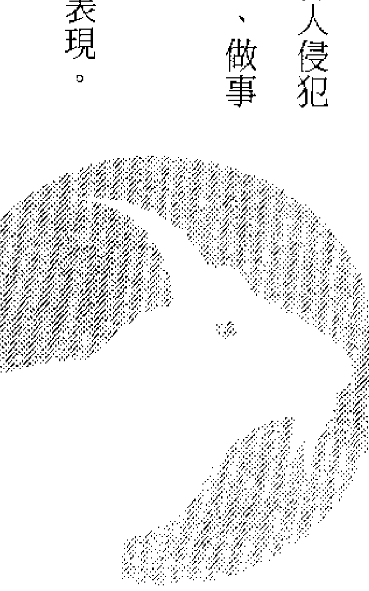

### 第一节 魔羯星座的性格

此星座出生的人，性格与别人有所不同。并不是朋友少，而是好恶特别分明，所以别人的批评也是极端的评语。

多才多艺，但不会留下财产。夫妻也比较不相配。结婚运并不坏，但因所好不同，很容易使你的朋友们感到，那么美的人，为什么和丑男人在一起……

#### 一、表现性格

你的外观很温和，有谦让的美德。其实，你的情性格外的坚强，甚至近于顽固程度，在他人眼里，你是一位很认真做事的人。

因聪明而内心里很坚定，很不容易说服，轻易能看出别人的心事，所以是很难控制的人。

## CH3
### 魔羯星座

虽然体型瘦小，但是有如钢铁一般的强韧性格，是魔羯座的特点。 魔羯座人的骨骼嶙峋，给人的印象当然没有圆润丰满的感觉，但他的骨骼之强韧和精悍则流露于性格之中。此类人不轻易流露喜、怒、哀、乐之情，在他人眼里，他是一个和常人稍有不同的奇人形态。

由于你很会抑制自己、做事慎重，因此，对于他人，你也要他们向你看齐。讨厌做事随便，一步一步坚实实的做，努力不懈，这是你对人生所抱持的态度。除坚实做事外，你尚具有上进心，并有很多理想在你的心中，不断在燃烧。

虽然你的速度比他人差了一点，外型不扬，但你会不断努力，达到你的最后目标。

#### 二、分类性格

现在把魔羯座分为三种类，以十天为一区分，就会发现具有稍稍不同的性格。

#### ◎第一类（十一月廿二日～一月一日）

性格受到前面的射手座影响。自由、理想、快乐，具有扩张形态，富有机智，多才型。并具有一小部分的巨蟹座性格。其特点为：母性型、情绪柔和、感觉力纤细、神经敏锐。

#### ◎第二类（一月二日～一月十一日）

具有魔羯座的标准性格。并接受一小部分金牛座影响，态度沉静，性格激烈。另一方面，追求美、快乐，占有欲强。

#### ◎第三类（一月十二日～一月廿一日）

具有水瓶座性格和一部分的处女座性格。喜欢追求理想，创造新思想，智能、感觉力丰富，具有服务精神。

### 第二节 魔羯座的命运趋势

魔羯座的人，一生中一个人自己受苦，并用强度忍耐心，一一克服自己命运。

牡羊座的人揭弃他们的理想勇往直前，狮子座的人威风凛凛，态度快乐，但魔羯座人以孤独的步伐，一步一步前进。

律己严谨，重视禁欲生活。父母、兄弟缘分较薄，自幼就过着孤独生活的为多，因而养成独立的精神，不愿依靠他人过活。

计划远大，步步为营，不焦急，是脚踏实地型。在中年以后能有所成就，原因在此。有些人环境虽然不错，但是不会以此满足，常向着更高目标，刻苦勉励自己。

如果你在人生路中遇到蹉跎，那么，你若不是太过于固执你自己的步伐，便是太过于重视现实，缺少梦幻生活，自视过大、排斥他人是必须注意的两种缺点。你要重视你的命运和个性，并预防上述缺点，才是你最聪明的生活方式。

魔羯座的你，是以不断的努力、勤勉，为完成工作而努力不懈的人物。责任感特强，独立独步型，做事很认真，重实际，有忍耐和顺从之力，能完成自己的工作，职业都能胜任愉快，而且还具有管理事务的才能。但是，很讨厌不守秩序、做坏事的人，几乎到达无法通融的程度。喜欢一个人默默地做事，不过，也有合群之力，能和他人合作和交际，也能担任和事佬。

### 第二节 摩羯座的职业和财运

#### ◎您的适宜职业

律师、占卜师、音乐家、宗教家等等，还能担任农、商、公司职员。
不过您还是在自由职业方面才能发挥您的实际能力，您的创造力特优，虽然不为一般人所知，但您能享受这种乐趣，是您的生活上的一大幸福。

#### ◎您的财运略判

您是勤俭、不乱花钱的人，和储蓄有缘，积少成多，财运不错。但您不是那种一夜之间成巨富的人物。
您是勤勉脚踏实地的人物，绝不会梦想“一获千金”之事，因此投机和赌博生意绝不是您可以涉足的。

### 第四节 魔羯座的健康运

魔羯座的您，骨骼嶙峋，体格瘦小，怕冷，但耐热。

您要注意骨骼病症，牙齿和耳朵也易发生障碍，由于您刻苦勤勉，很容易使胃肠发生毛病，要注意。

您需要充足营养和休息。

#### ◎您最易患的病症

神经痛、风湿、慢性骨骼炎症，以及胃肠病、肾脏、肝脏、牙齿痛、耳聋（重听）等。

### 第五节 魔羯座的恋爱和结婚趋势

魔羯座的男女，不易动情地去和异性谈情说爱，他们性格慎重、坚实，达到某年龄，工作上有了成就后，才愿意物色适合的对象结婚。

魔羯座的人不重视恋爱气氛，他们喜爱现实：强烈的爱以及爱的技巧和他们无缘，他们所喜欢的是自然态度和纯情来往。

但是，他们并不是一直喜欢这种“淡恋”和“不自然之恋”。只要找到意中人，他们也会忘却他们本来性格，表示真情，接受对方之爱，沐浴于爱河中。

做为丈夫的，热心于照顾太太和家庭生活，对于妻子的爱情，始终不变。
做为一家主妇的也是如此，她们照顾服侍丈夫，养育子女，是贤妻良母型。

### 第六节 魔羯座与其他星座之结合

#### 一、和金牛座的结合（大吉）

金牛座的人，性格温和、认真，他们结婚后，生活安定，是白首偕老型。而且爱美之心高于他人一倍，占有欲很强。

他们和魔羯座的生活路线很相似，坚实地一步一步前进。如此生活方式虽有点呆板，缺少新鲜，但与爱好孤独的您却是很适合的一对。

具有阴暗性格的您，如果愿意接受对方的诚意和温暖心情，则能弥补您心中的空虚，良好气氛对于你们的生活是非常重要的。

角相为一百二十度，同属于地宫，是良好的结合。

#### 二、和处女座的结合（大吉）

魔羯座的人，享受孤独和坚实生活，但处女座的人，爱清洁、神经纤细、态度慎重，性格很相似，做事同样勤勉努力。你们因为互相都不积极地追求对方，使感伤型的处女座人很感乏味。但是，您现在正在心理凝视对方，并深信将来您一定会热烈爱她的。处女座纯情的爱，给予魔羯座的您，安慰之力颇大，您能得到如此对象，实在太幸福了。具有丰富智性和健康的处女座人，是您最可靠、最诚实的协力者，角相是一百二十度，双方都是属于地宫，是美好的配对。

#### 三、和魔羯座的结合（大吉）

由于隶属同一星座，结合当然不错。而且性格同为：忍耐、有抱负，互相协助，结成连理后，将来生活会是幸福的。

孤独和阴暗性格，造成缺乏和睦气氛的家庭，很难和邻居和好相处，你们虽然很守秩序，不会连累人家，但过于严谨的态度，会使人敬而远之，总之，应该爽朗一点才是。

#### 四、和天蝎座的结合（吉）

魔羯座的您，和天蝎座的对方，虽同属阴性，心中有激烈的占有欲，但不会明显地流露出来。

你们同具有忍耐、沉静、追求欲，但因天蝎座的人，更有看透人心之力，看出您很诚实、可靠，足够和他同甘共苦，可以使他放心。

但是，你们也有缺点，不易和他人相处，缺乏活泼气氛，因此，你们## 五、和雙魚座的結合（吉）

雙魚座的人，優點是浪漫，富有羅曼蒂克氣氛，為人和藹，具有如此優美性格的人，和性格陰暗、單調氣氛的魔羯座配合起來，的確是不可或的好對象。

經過苦難生活、禁慾生活都能耐得下去的魔羯座的人，若能和富有夢幻般優美氣氛的雙魚座配合，確實是能互相照應的好對象。

要儘量設法和他人和好。您倆的夫婦生活很圓滿，是其他的星座配合無法所及的。唯一需注意地方，是夫婦之間勿太過於主張自己意見，這樣會導致夫婦爭吵，破壞家庭幸福。

角相度是六十度，屬於地宮的魔羯座，和隸屬於水宮的天蠍座，相性算不錯。

從您（指魔羯座的人）的立場說，誠心信任他人，或對於自尊心過強的人，不懷惡意、不厭惡他們，這種修養只有和雙魚座結合才能獲得。角相是六十度，屬於地宮的您，和屬於水宮的雙魚座，確實屬於好的配對。

## 六、和牡羊座的结合（凶）

牡羊座的人特性是，勇敢前進，為達到目的，絕不退卻，態度是堂堂正正而明快，沒有魔羯座那樣的陰暗氣氛。但牡羊座中，有些性情非常暴躁，是不使對方屈服不罷休性格的人，如果您遇到如此的人，問題在於您能忍耐至何種程度，當你認為他的行為正確時還好，但當他擾亂秩序使您無法忍耐時，那就不堪設想了。

對方的要求是無厭的，戀愛感情是自私的，他對於您的控制態度會使您感覺很厭煩的。

角相是九十度，是一種不好的配對。

## CH3 魔羯星座

## 七、和天秤座的結合（凶）

開朗善於交際的天秤座人，和暗淡陰沉的魔羯座人，性格很不相稱。

天秤座的人所希望的是人類幸福、和平、和諧生活，以及精練的感覺和愛的素質，但從魔羯座人看來，天秤座的人，缺乏現實和堅實，故不能安心。

至於您所希望的平衡作法，天秤座的人則認為是出爾反爾的作法，不感滿意。

天秤座的人周圍，常有很多朋友，這對於喜歡寧靜的您，就太不方便了，而尚無法把您的熱情和理想獲得對方理解。假如您認為現實生活不限於兩人，還要推展給他人，那麼，和天秤座人結合，和你相處方面就很順利了。角相是九十度，相性是凶的。

### 八、和巨蟹座的結合（吉有時變凶）

巨蟹座具有女性要素，和您配合起來，變成複雜的一對。他的情緒如同母親對待子女那樣溫暖，是家庭第一、安全至上的人，在您的眼裡是性格柔弱的人物。內向性且神經質，心情不如意、受到衝擊時，就悲痛欲絕，不知所措，您對於他如此性格會感覺非常失望。可是，您卻沒有開朗的笑料逗他發笑，結果您只好和他同樣沉思怨嘆命運了。

假如您是喜歡詩情畫意、富有羅曼蒂克氣氛、溫暖、和平生活的，那麼，巨蟹座的人，是您很好的對象。巨蟹座的人不追求虛榮，生活過得很平穩，還會為您擔當一切家事，這一點對您是很好的。

## 九、和獅子座的結合（普通）

獅子座是光明正大的星座，富有熱情。

您的忍耐和陰性，和獅子座太陽般的明亮和熱度相接觸，不一定會使您開朗、溫暖，相反地，還會拉著您的後腳，使您失卻自由。

但是魔羯座的人，生活一向尊重樸素、忍耐勤勉，生活大都陰暗，缺乏人情味。因此，以富有活力、態度開朗的獅子座人來和你們配合是非常妥當的。

獅子座人性情率直，不喜歡那些用心良苦的作風，這並不是您能做得事。

## 十、和雙子座的結合（普通）

雙子座的人，善於交際，不拘泥於生活小節，而且善辯、腦筋靈活，喜歡做這做那。由於您做事慎重、努力不懈，在您的眼中，雙子座人是有許多優點的，如果你們結婚後將會如何呢？

由於雙子座的二元性給予您不安，您為止住他的行動，有點防不勝防之慨。在戀愛和感情方面，也許您還無法真心信任他。

## 十一、和射手座的结合（普通）

射手座人具有魔羯座所没有的特性。

他为探求广大世界中的自由和知识而忙碌不停，因此，对于日常生活无心静静地做，他有时很忙碌，有时很优闲，有时很性急，情绪不断转变著。

在现实生活上，他的优点无用武之地，反之，您的坚 实作风和经济运用力，能够发挥至顶点，射手座人的才能和上进心理，获得您坚 实作风的支持，能过著幸福的生活。

## 十二、和水瓶座的结合（普通）

您的对手，具有先天性的优秀脑力和推理力，自由思考，具有独创力，但因为人过于老实，缺乏和人合作的心理，这些都是水瓶座人的特性。

至於魔羯座的您，一向具有忍耐做事，肯努力上進，但性格過於陰暗慎重。如果，您認識水瓶座人的理想型作風，那麼，您就能發現人生偉大之處了。

愛情方面，您比較慎重，要信任對方，需要一段時間，而您的水瓶座對手，對愛情方面也很淡漠，使您有點隔靴搔癢之感，您倆要到達熱情如火，單靠肉體結合尚不夠，必須精神上交流，才能明白他的性格。

### 第七節 幸福與幸運之年齡

男生魔羯座生者，大抵於三十三歲最幸福。女性魔羯座生者，大抵於二十六歲最幸福。不論男性、女性，大抵巳酉丑年皆為幸運之流年。

## 第四章

### 水瓶星座

一月廿一日～二月十九日

## CH4 水瓶星座

在希臘神話中，肩上扛著水瓶的特洛伊美少年卡足梅迪，就是用來指這個星座。這個美少年是天神宙斯變成大鷹搶來，做奧林匹斯諸神的侍童。

在埃及，因為這個星座下沉時，與尼羅河的漲水一致，認為是河神將天上巨大的水瓶放在河裡裝水。

水瓶座相當於子宮玄枵，亦稱「虛宿」，別稱「北陸」，為顓頊之墟，

> > 左传曰：『古者，日在北陆而藏冰。』

本此猜臆，日躔北陸，在我國東北已屆冰凍之際，而西洋占星術亦作相當之解釋，大概因為俱居北半球而受相同之影響吧？

太陽自一月廿一日至二月十九日約一個月間，停在水瓶座星座上。

在此間出生的人受到水瓶星座和其守護神天王星的影響，具有各種不同性格和命運。

此時期正是冬天寒冷時期，大地萬物正在冬眠。因此，出生在水瓶座的人之性格，具有要求真正自由的慾望。並具有強烈的思索、創造心理，自少年時代就才華出眾，他們純情、沒有邪心，是一種追求理想主義者，也可以說是現代進步主義者。

他們具有獨創的天才要素。

當水瓶座人談自由、論人類性格、推理事物內外時，他的眼睛會充滿光輝，發揮獨特的個性美。

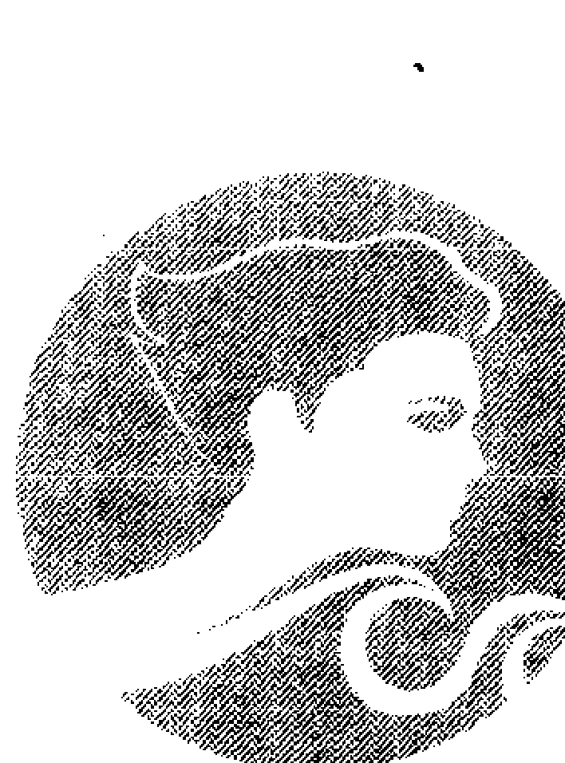

### 第一节 水瓶座的性格

喝这个水瓶流出来的泉水，就是在中国所谓的北落师门。女性生人共有的特性，就是女性化的内向气质。

二十八宿之一，女宿可以说是妇人的星座，据说这个星的光亮不佳时，只有在妇女身上发生灾祸。从西方称为水瓶座，代表一位美少年看 来，很可能占卜出以上这种情形。虽然个性内向，但不满的情绪高昂时，会强烈的爆发，和人争吵。

不论是虚、女、危都有引起争执招来灾祸的可能，所以平时就要注意，不要积压不满情绪，应适时发泄。

这个星宿生者，以美貌、美姿的人为多，但好恶之分极强，所以不会有别人想像的那么多的罗曼史。

沒有愛的性關係。在這個星宿的人身上，是絕不可能發生，因此戀愛時，常有柏拉圖式的戀愛。男性還多少有點向外發展的現象，但女性在婚後，會潔守著丈夫，不會產生出牆的意念。在寢室裡雖然不一定很保守，但也不敢採取太特殊的姿勢。因長得美，結婚也較早。相性是與鵪尾生者吻合。

### 一、表現性格

水瓶座的人，一生下來，就具有愛好自由、民主、人道三種主義中的任何一種主義，但他們卻不喜歡人家指他是何種主義的人，因他理想很高，希望從現狀再進一步創造新理論。這一點他的確具有良好天分。他很討厭一般固定觀念，並反抗不合理的權威。因此，時常陷於孤立，嚐到寂寞滋味。由於他沒有私心和私慾，不隨便發言，所以不願隨便和他人協調合作。

### CH4 水瓶星座

當您論及人類偉大和善意時，流露於您言語中的愛好自由之智性和人類愛，給予他的魅力是很大的。以上是水瓶座的優點。至於水瓶座的缺點是頑固，不容他人意見，得意時非常感激，自己意見不被採納時，只好感受孤獨了。據神話傳說，由少年手中倒下來的水瓶中的水，是智慧之水，是上帝把無限聰明傳給人類的象徵。水瓶座的管理星天王星（URANUS）象徵自由、獨創力、飛躍、預想、友情意義之星。因此，生於水瓶星座的人受其影響，而具有以上性格。他們接受由星座自由地流下來的理智和直感偉大能力。水瓶座屬於風宮，象徵富有理智、追求自由的人，並隸屬於不動宮，表示他的性格相當頑強、不太通融。

#### 二、分类性格

水瓶座人，由其出生之日，以十天为一分类，分为三种类，各分类各具有不同性格。

- 第一类（一月廿二日~一月卅一日）

此类人受到前月的摩羯座性格影响，坚定地根据自己生活方针努力、忍耐，推展自己愿望。

他们受到狮子座影响，喜爱出风头，喜欢有个性的罗曼蒂克行动。

- 第二类（二月一日~二月十日）

最具有水瓶座性格，并受到一小部分的双子座性格，在智能方面具有锐利的艺术感觉，加上一些不安定的要素。

- 第三類 (二月十一日～二月十九日)

受到下一個星座——雙魚座影響，雖然隸屬於夢幻型，但卻很能順應現實，不為自己的雙重性格而迷惑不知所措。還具有一小部分的天秤座性格，增加他性格的平衡性，變成具有藝術氣氛和社交人物。

### 第二節 水瓶座的命運趨勢

水瓶座的人，命運很不平凡，一生中意外變動很多，走著和他人不同的路線。

由於他具有才能，自己願意接受各種歷練，受苦也在所不惜。他喜歡和多數人談自由，對於人道主義工作和慈善事業計畫，是最熱中參加的一員。

他們對於物質慾望很單純，對於不太有利的工作也要拼命做。因此，家庭經濟不太富裕。

他們喜歡追求理想，充滿希望生活，因此，一遇到現實生活鴻溝而煩惱，就想跳出這種束縛，對於不能和他共鳴的人，就不想與他們來往了。

水瓶座人必須注意的是交友，他們不但要交意見相合的人，對於意見上稍有出入的人，也要用寬大的心情相交，並發掘他們的優點。

因主張不同，而不願和他們來往，則將來就會變成無親無戚、孤單的一個人了。

### 第三节 水瓶座的职业和财运

水瓶座，具有先天的良好推理力、创作力、爱自由、有智慧、对于事物理理解力很强、常追求新的理想。没有进步的地方，水瓶座不感兴趣。

您重视地位和金钱，不愿屈于被压迫的职务下，您为了尊重自由与进步，追求理想之余，做出和现实脱节的冒险工作。

至于守旧单调的工作，和您的进步精神、理想主义完全不吻合，不适合您做，因向上前进才是发挥您的手腕之处。

您的视野很广，具有客观的观察力。因此，您要选择和社会、国际、人类有关的工作，发挥您的才华。

#### ◎您的适宜职业

- 自由业、著作、科学、发明、音乐、摄影、影艺、节目主持人、评论家等。

### ◎您的財運略判

您不太重視金錢，您為興趣和正經事情花錢在所不惜。例如參加有意義的集會，為提高該會效率，往往一擲千金在所不惜。因此，您所受的經濟上的困苦，是在所難免的了。

### 第四節 水瓶座的健康運

水瓶座人具有均勻體格，身材不高不矮、不肥不胖，為中等標準體格。因您的體重不超過標準，因此不像太過肥胖或瘦弱的人們那樣受到環境影響。但您會因運動不足，發生血液循環不順的現象。

此型人食慾不多，患貧血症的不少，要注意保持同樣姿勢、增加食慾，而且生活要有規則，避免惰性，想出新鮮的方法增加生活興趣，並做適宜運動，和調整身心的休息時間。

### 第五節 水瓶座的戀愛和結婚趨勢

簡單地說，水瓶座人，具有知識階級的優點與缺點，他們純真率直，對自己很老實，他們所愛的不限於幾個人，是一視同仁的博愛主義者，具有智性自由和強烈理想主義。

熱情如火的愛情和這類人無緣，他們的愛具有孤獨感和冰冷感覺。

您雖然能淡淡地和他人談話，也能順耳靜聽他人的訴說，可惜不是永久的，當您知道他和您的理想不合時，您就會很快和他分道揚鑣了，這是

### 您的最大缺點。

此類人的愛情淺面廣，他無法徹底愛上一個人，大都是近於友誼程度之愛，由甲傳至乙，並擴及丙、丁，做遍歷式愛情。因此，往往被指為沒有常識、水性楊花，或拈花惹草等多情種子的代表人物。雖然他愛上了一個人，而且也重視感情，可是他的行為在道德上已受到批評了。這是水瓶星座人的戀愛感情和其他星座不同之處。因此，和水瓶座人接觸的男女，若持平凡結婚觀念，往往會失望的。不過結婚後，水瓶座的丈夫，大都是個好靜的和藹丈夫，做為主婦的妳，也是相夫教子的好妻子。夫婦性生活並不很強，不過，雙方都能製造愛的氣氛，的確能夠和好相處。

### 第六節 水瓶星座和其他星座之結合

### 一、和雙子座的結合（大吉）

水瓶座的人，能夠發揮自由、獨創力、理想境界，雙子座人多才、聰明、性格富有變化、能言、能交際。
由於雙方都能言善辯、智能優秀、充滿新的快樂，因此，他倆所建設的家庭，不受拘束，很理想。
角相是一百二十度，相性很好，且同隸屬風宮的結合，很不錯。

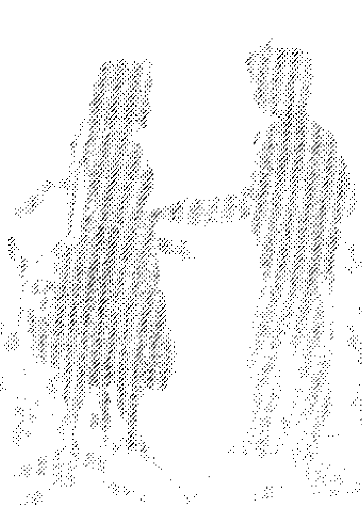

### 二、和天秤座的結合（大吉）

天秤座的人能夠平衡地接受您的智性和您的理想，雙方的相性的確不錯，他們不溺於感情，以冷靜態度觀察事物，雙方性格都是一樣。

但是，水瓶座的人，為人過於老實，缺乏通融性格，因此所受損失很大。

由於您的潔白，不願受污泥所染，對於不受您歡迎的人，您就以冰冷的態度對待他，這一點也是使您受到他人指摘，說您是個怪人，受到損失的原因。

為了發揮您的良好天分，勿置身於焦躁世界和為現實問題傷腦筋才好。因此，假如您能夠遇到天秤座的配偶，那麼，您的生活也就能安定和平了。

角相是一百二十度，且同屬於風宮，都是理想的相性。

### 三、和水瓶座的結合（大吉）

在同一星座出生的男女結合，原則上是好的相性，是眾所皆知之事。

你們具有智能的自由，但不會為情緒而感傷，性格坦率，不拖泥帶水。

你們對於社會理想和慈善運動很關心，但卻輕視由你們共同建設的家庭，您有脫離現實生活的傾向，討厭保守型和平凡的作法、習慣。

假如您倆都能夠利用你們的優點於好的方面，就不會發生問題，不然就會招來失敗，應互相糾正自己的缺點才是。

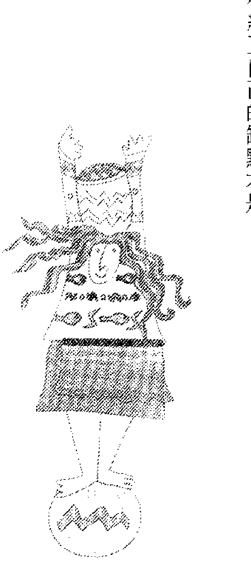

### 四、和牡羊座的結合（吉）

假如您喜歡和具有強烈性格的人結成連理，那麼，選擇牡羊座是最理想的。

因為牡羊座的人，富有正義感、勇往直前、主張己見、具有領導能力、扶弱鋤強的性格。但是，很尊重自由的水瓶座人，被牡羊座的配偶拉著走，強迫接受命令，變成主僕關係就不理想了。

因此，牡羊座的人要以爽朗的性格，水瓶座的人要以坦然的態度，互相勉勵。但在愛情方面，您是站在接受立場，因牡羊座的人，性生活比較強烈，您是站在受攻立場的。

您的腦力很不錯，但不能直接攻擊對方、指摘他的缺點，因受到攻擊的他，不會認輸，會反抗。這些問題需要您解決、協調、反省。

角相是六十度，牡羊座是火宮，您是風宮，相性還不錯。

### 五、和獅子座的結合（吉）

光明正大、態度從容、有肚量，是獅子座人的性格，並具有精神上的創造力，和活潑的想像力。
水瓶座的您，善於思考和提出有力的反證，使他佩服，但缺乏實行能力。因此，您能在您的身旁獲得像獅子座那樣充滿熱力的人物，對於您是好的現象。獅子座的人，以善惡觀察他人，您以好惡敬遠他人，外觀稍相似，但前者為精神上孤獨而煩惱，後者嚐到知性上的孤獨滋味了。
當您發現獅子座的缺點時，您可能不會屈服於他，對於易發脾氣的他，您也不願理他，他的虛榮心，對您是無動於衷的。
你們要注意家庭經濟，因您倆都不善於儲蓄。
角相是一百八十度，是命運上的偶然配合，只要您倆互相合作，可以建立幸福的家庭。獅子座是屬於火宮，和您的風宮，在相性上說還算不錯。

### 六、和射手座的结合（吉凶参半）

射手座的人，优点是具有机智，向自由目的的前进，实行能力很强，您和如此性格的人配合，相性还算不错。

由于您的主张是独立与自由，并且追求进步和开放。因此你们的性格可谓不约而合了。

一再追求新知的射手座人，对于您的独特奇异思想和天真想法，觉得非常伟大。追求进步和飞跃的水瓶座的您，和冀求上进发展的射手座的人，性格上有很相似之处。因此，由你们结合而成的家庭，一定无比有趣。

但是另一方面，射手座的人，具有乐观性格，喜欢尝试这个或那个，还要跑跑走走，对于家庭生活损失不赀。

同样，水瓶座人，也不愿闲居在家中，愿意到外面寻找一些服务机会，因此，不能称为标准的家庭人物。

## CH4 水瓶星座

### 七、和金牛座的结合（大凶）

您的戀愛是理智比感情強，一旦知道了對方的缺點 熱度很快地變冷了，對方是射手座，雖然很重視氣氛，可惜，愛情很淡薄。

角相是六十度，屬於火宮的射手座和屬於風宮的水瓶座的您，相性還算不錯。

金牛座的人，具有善良、誠實、態度堅定、慎重、愛美心很強，對待他人和藹可親、有同情心……等優點。可惜，水瓶座人的性格，大都和金牛座的相反。因此，雙方要獲得調適是不太容易的。

從您的立場說，金牛座的人，缺乏人情味、平凡、神經過敏、焦急、膽怯。由於您酷愛自由、進步，因此，容易發生性格上的不協調。其實，金牛座的人，外型看似膽怯，內心卻很堅毅的。
在戀愛感情上，兩人性格都不同，金牛座的人，愛羅曼蒂克的甘美氣氛，並具有獨佔慾望，但水瓶座的您所要求的是富有理性的友好氣氛。
您愛的是淡淡的愛情，而對方要的是浸潤在濃情中之愛。嫉妒與您無緣，但對方卻有強烈的嫉妒性。
角相是九十度，相性不佳。

### 八、和天蠍座的結合（大凶）

水瓶座的您，一向愛追求理想、自由，具有獨創力，為人過於老實，缺乏通融。但天蠍座人們愛守秘密、內心富有熱情、探求事物的能力很強，由於雙方性格不相同，很難結合。

由於對方具有追求不捨的魄力，您會不會感覺麻煩？天蠍座人是要求絕對忠誠，對於您的博愛和善意很難諒解。角相是九十度，相性不佳。

### 九、和魔羯座的结合（普通）

水瓶座的無所適從的性格，和堅實、憂鬱、禁慾的魔羯座人，除非雙方努力遷就，否則是很難配合好的。

其中魔羯座的唯一缺點是自私心過強時，您對於他的自大、自私、壓迫他人……等性格，很難服從，此為雙方絕裂、發生爭吵原因。

不過您不會當他在發脾氣時，火上加油，激發他的脾氣，您可能用冷靜態度去對付他。

戀愛感情上，您為了解除他的憂鬱，在性生活上，您可能不會太積極，不會熱情至失去理智程度。

### 十、和巨蟹座的結合（普通）

巨蟹座的人，性格近於女性，具有母性愛，和水瓶座的您所具有知性的性格不同，您是一向愛好自由、重理論、重視家庭安全的人，對於巨蟹座人的親切與服務卻視為多餘。

但是，當您一個人時，您會寂寞難耐，此時您會多渴望有一位具有母性愛的人在您的身旁。

可惜您不肯幫忙巨蟹座的人，共同為家庭和平和安全而努力，因您所關心的事情不在於家庭。

### 十一、和雙魚座的結合（普通）

雙魚座的人，酷愛羅曼蒂克的情緒氣氛，可是，水瓶座的您，是重視自由、進步、飛躍，沒有工夫沉溺於幻想夢境。

您單純又老實，您所想得到的事，人家無法理解您，使您變為冷若冰霜的人物。因此，對於像雙魚座那樣的大好人，您不可過於囉嗦。

追求理想的您，在現實生活上，不善於儲蓄。因此，雙魚座的人，對

### 十二、和處女座的結合（普通）

處女座的性格是感受性銳利、理智、神經質、純情，做事仔細小心，但缺乏積極，跟不上您的進步和飛躍，因他太缺乏勇敢了，但勤勉與老實是他## 第五章 雙魚星座 二月廿日～三月廿日

在神話裡，勇士珀爾修斯抓住蛇的頭髮、砍下使見者成為石頭的女人美杜莎時，滴下的血滲入岩石裡，從那裡展開銀翼飛出來的，就是天馬珀伽索斯。

此時馬蹄踢出一個泉水，傳說，只要是詩人喝了，就會無止境的湧出靈感。

雙魚星座相當於亥宮娵訾，娵訾包含著廿八星宿的「室宿」、「壁宿」。

中國古時認為，室的生人喜歡旅行，年輕時很辛苦，但在中年後有大成功，又暗示在旅途中會遺失很重要的東西。

壁也與旅行有關，所以與旅行有很強的緣分，大概是像天馬一樣追求自由、愛好好行的關係。

太陽在二月廿日至三月廿日的一個月間，停在雙魚座。

在此时期出生的人，受到双鱼座和其守护星——海王星的影响，具有各种性格和命运。

此时时期，经过长期严冬中的冬眠和沉默，在恶劣条件中克服一切困难的生物，开始接受春之气息的时候了。

您的性格中，有精神和肉体、灵肉合体的姿態，它能变为精神型和本能型的两个种类，是性格秘密之一。

您所具有的伟大包容力，把您的情绪和罗曼蒂克气氛，散布至各方面。

## 第一節 雙魚座的性格

在這個星座生的人，被認為有福祿（亥為天門），會得到長輩的提拔、朋友的幫忙。但自己的任性作祟，年輕時追求高待遇而不斷嘗試各種工作，甚至投機而沉迷於賭博，在錢財上無法積聚，要一直持續到工作安定下來的中年才能開運。

在女性中，是個性相當開放的人。她會經常穿著外國最新流行的衣服，也是會發揮自己的魅力和善於打扮的人，但是有時也會換下時髦的衣服，粗衣布裝的出去漫步。她不喜歡受到任何東西的束縛，嗜好也容易變化。雖然會熱烈的戀愛，但在拋棄對方時，也極爽快，在這方面，可說在十二星座中是首屈一指。

擅長製造氣氛，也曾在寢室裡燃起對方的熱情，但對對方的身體熟悉後，熱情會突然降到冰點。

與鶉首的相性吻合。

### 一、表現性格

雙魚座的您，具有優雅、抒情的豐富性格，您的心地是溫暖的，感情是豐富的，您喜歡追逐美麗的夢，喜愛羅曼蒂克的氣氛。

您不分男女年齡，對任何人都很親切，很容易投入他人的懷抱，信任他人，看到別人受苦，您就無法緘默了，往往忘卻自己能力，為他人努力、勞心。

由於您很容易信任他人，為他人盡力，同時您也很想接受他人的好意。因此，假如他人對您太過於現實，破壞您的夢幻和希望，那麼，您就會很明顯地表示您的不滿心情，像孩子那樣打抱不平。

這一點，您的性格完全與那些出生於上流社會的千金小姐相同。您對於精神方面、神秘方面感受力很強，並關心哲學和宗教，另一方面面憧懞於幻想和本能，往往沉溺過深、迷失自我。

博愛、獻身、友情……是您性格的一面，同時您並具有：沉溺、驕氣、矛盾等性格，因此，您的性格漠然無法捉摸，帶有一點不安定感。

您不應太離開現實，應少帶一點羅曼蒂克氣氛才好。雙魚座的守護神是海王星，海王星是管理大海，因而具有廣闊無限、包羅萬象的性格。

您很能適應現實環境，並具有同化力，接受其影響，這表示您的性格不安定，易被利誘。是一種缺點。雙魚座屬於水宮，情緒屬陰性性格，而且屬於柔軟宮，適應力很強，多才多藝，但包含著許多矛盾。

### 二、分類性格

產生雙魚座之日，以十天為一區分，分為三類。則發現各分類都有些微的不同性格。

#### ◎第一類（二月廿日∼二月廿九日）

延續著前面的水瓶座性格，他們含有愛自由、創作、理想主義、人道主義等要素。另一方面受到處女座的影響，愛好純真、周密、實用性格。

#### ◎第二類（三月一日∼三月十日）

雙魚座性格最明顯，並接受一小部分巨蟹座性格，流露出母性愛，情緒豐富、纖細、內向、愛好和平、重視實際生活。

#### ◎第三類（三月十一∼三月廿日）

受到其後面的牡羊座影響，並受到小部分的天蠍座影響。由牡羊座接受的性格是積極、突進、極力主張己見，由天蠍座接受到神秘、沉靜等性格。

## 第二節 雙魚座的命運趨勢

雙魚座人，一生中，為了探求相反的性格，在矛盾和不安定狀態中過生活。

您願意犧牲自己，為他人製造快樂的氣氛，因此，往往受到環境影響，迷失自我，您適合為人努力、為人服務的宗教家生活。而且您還具有特殊的幻想並受到靈感的影響，產生藝術感覺和優異想像力，您要把這些運用於生活上才好。

您的肚量很大，若用您的肚量去度他人之心，會和現實脫節的，從您的性格觀察，您樂於為他人服務，對於任何人所說的話都無條件的接受，如此作風，最後不免得罪或失信於人而難以收拾。

現在您最重要的是如何用冷靜的態度決定取捨，而其最重要的條件，是把善惡分得很清楚的理性，因為這種理性是助您成功的重要條件。

抹煞您的個性和才智是不對的，但您千萬別為不重要的事而消磨您的青春，千萬別把您的優點用於無關重要的事。

交友是好的，但漫無止盡，不擇優而交，並非好事。自己要做，所以他人也要做的想法不妥當，有地位以及自我很強的人要注意。

為人不錯的您，受到他人譏為「多心的人」，如此誤解和受到他人的厭惡，是您不會選擇對象，或不考慮場地，等於兒戲式作法招來的麻煩。

因此，您必須把自己和他人的東西分清楚，別沉溺於感情，一會兒向左，一會兒向右，這種迷惘的作風必須要糾正的。

## 第二節 雙魚座的職業和財運

雙魚座的您，有偉大直覺力、神秘力，並且具備偉大的包容力和理解力，以及博愛和為眾人服務的精神。因此，選擇職業時，應充分考慮您的特性，例如犧牲自己、為他人做事的職業都適合您的。

您常受到您周圍人的意見和想法所影響而勞心。您不忍心看他人受苦，您不適合受人照顧，願意看護他人。因此，職業方面應選擇具有社會性救濟事業、慈善、宗教事業。

### ◎您的適宜職業

- 服務性工作，福利社、醫療工作、教師、飲食業、宗教家等。

### ◎您的財運略判

您對金錢和名譽一樣不太重視，財運本來不錯，但您對於金錢知識很低，不關心，不善於儲蓄，也沒有節儉觀念，因做人親切，增加支出。像您這樣性格的人，可以利用兼職收入做長期儲蓄，是最好的方法。

## 第四節 雙魚座的健康運

雙魚座人，具有敏感體質，易被病菌所感染，對於藥性也十分敏感（例如盤尼西林等），對中毒、興奮也弱，易發生精神異狀。反之，對於藥物效率很快，因此，打預防針越快越好。但勿亂吃成藥，注意消除心勞、禁酒、勿受涼。

#### ◎您最易患的病症

- 神經症
- 神經痛
- 呼吸器病
- 胃腸病
- 腳部受傷
- 關節炎等

## 第五節 雙魚座的戀愛和結婚趨勢

雙魚座的您，具有兩種性格，第一、喜歡夢幻、抒情，以及像大海那樣大的包容力；第二、想使精神和肉體同時分立的複雜性格，因此，有時會超越現實生活，沉醉於夢幻中，為他人分擔辛勞，因而被騙，被騙後還要和他人親近，真心為他人服務。

此型人沉溺於感情，並非指精神方面，實則無法抗拒所謂快樂誘惑。

但是，雙魚座的您，要談愛，上帝會給他們更好的心情和表情。

雙魚座的女性具備一種很神秘的魅力，非常具有吸引男性傾心的氣質，為其他星座女性所不及的氣質，而且又具有和藹可親、夢幻似的羅曼蒂克氣氛以及服務精神、包容力，都是她的優點。

她雖然有上述的優點，但並非完全沒有缺點，例如在家庭中，她也有許多矛盾，她的自私，常被他人視為自視甚高，或「千金小姐」不易親近……等評語。

她對於男友很親切，對方所喜歡的，她都願意去做，她如此做，並非全部為對方，實則自己領略為他人親切時候的快樂氣氛。她的愛情，有時也可以解釋為「自我主義」。因此，選擇對象時，須充分注意能夠諒解妳的個性，並不破壞妳的思想的對象才好。

至於做為丈夫的您，應該好好諒解太太，愛願她，成為標準丈夫才是。你們之間有一缺點，是易受外界誘惑而走上歧途，這一點應該由夫婦雙方互相勉勵、注意預防。

性方面，男性比較屬於（Sado）型——「加虐性」的；女性屬於（Maso）型——「被虐性」變態性慾者。

## 第六節 雙魚座與其他星座之結合

### 一、和巨蟹座的結合（大吉）

巨蟹座的人，具有母性愛情、豐富情緒、照顧家庭的優點，而雙魚座的人，憧憬於幻想型生活，富有羅曼蒂克氣氛，因此，他們的結合，是很理想的一對。

但是，由於您的感受力很纖細，品格也高；巨蟹座人的自信心強、性格較頑固，這些都是你們能否合作得好的關鍵。

你們兩人要獲得心中溫暖，是相當理想的一對，你們要儘量把眼界向外擴張，把新鮮空氣向你們生活中輸送才好。

你們的性格都屬於女性型、纖細柔弱的，對於人生波瀾比較消極，這一點，需要改進為積極、強勁，邁向現實生活的態度才是。

角相是一百二十度，雙方都是水宮，相性還算不錯。

### 二、和天蠍座的結合（大吉）

您的熱烈的愛，是可以滿足熱情如火的天蠍座人的要求，您的精神、肉體給予天蠍座的愛，正適合要求愛情忠誠不二的天蠍座的胃口。

同樣，您的對手天蠍座，也會以不變的熱情，永遠愛您。天蠍座的人性格是陰沉、手腳不靈活、不善言辭、不會表現自我，假如用您的柔和、親切、有肚量的心情包容他，就可以彌補他的缺點。

您對於任何人都是友好、親切，也許天蠍座的人會對此嫉妒。雖然，友情和愛情是另一回事，但是情人和丈夫是重要的，這一點要注意。

角相是一百二十度，同屬於水宮，相性當然很好。

### 三、和雙魚座的結合（大吉）

屬於同一星座的結合，互相都了解對方的優、缺點，互相提高優點、矯正缺點。

你們容易信任他人而被騙，而且過於關心和現實無關的事情，因而往往感覺失望，這是你們的共同缺點，必須注意。

### 四、和金牛座的結合（吉）

金牛座人的性格是溫和、做事認真、有耐性，這些優點是雙魚座的您所沒有的，因此，你們的結合，對您非常有利。而且雙魚座所渴望的優美氣氛，也能由您的抒情和羅曼蒂克產生出來。

金牛座人們的性格是沉穩、慢吞吞，但很安全、慎重，相反地，雙魚座的您，有點輕浮、夢多、易動搖的性格，你們是一重一輕、相輔相成，能成為理想的一對。

角相是六十度，屬於水宮的雙魚座，和屬地宮的金牛座的相性良好。

### 五、和魔羯座的結合（吉）

魔羯座的性格，雖屬於陰性，但堅實無比，雖有有點消極，但責任感特強，充滿獨立的野心，意志堅強、步步為營。這種性格對於雙魚座的您是很重要的。

不過，魔羯座也有其缺點，由於他的性格憂鬱，不太受人歡迎，大都孤獨寂寞。如果和您在一起，得到您的柔和氣氛，充滿人情味、有淚有笑的生活，對於魔羯座的人很有幫助。

您的缺點是稍近於多情型，無法持續愛一個人，不循規蹈矩，而魔羯座的人能為您安定家庭經濟，使您沒有後顧之憂。

魔羯座人的生活相當緊張，因此，對於您的愛情，雖也會感激，但他並不會很積極地向您表示愛意。

角相度是六十度，屬於水宮的您，和屬於地宮的魔羯座是好的相性。

### 六、和處女座的結合（吉凶參半）

處女座的特點是富有理性、神經纖細、純情、性情純真，可惜是勞心型。至於雙魚座的您，近於夢幻型，不太拘泥於生活小節，享受夢幻生活，是好人型，被情緒所左右 有點不安定。因此，您倆若不能互相理解各人的缺點，就難以合作得好。

不過，因你們各有優、缺點，若能截長補短，生活上有了節奏，則你們的家庭不但經濟安定，生活有夢、有實，前程更是美好的。

處女座的人身體健康，追求純情之戀，這可由您的和藹甜美、廣大的愛來包容他。

角相是一百八十度，是相當複雜的配合。

### 七、和雙子座的結合（凶）

雙子座的性格是才智優秀，多方面發揮其才能；和希望在情的世界生活的您性格相反。而且，雙子座的二元性格有時發生矛盾、產生煩惱，使想法偏向的雙魚座人大失所望。

您倆的思想不停於現狀，大都希望向各方發展，生活夠忙，很難孕育兩人的愛情。

戀愛感情方面，他不能像您那樣富有羅曼蒂克氣氛。你們所要做的的是互相寬容對方的缺點，勿因過度不滿而發生衝突。

角相是九十度，相性不好。

### 八、和射手座的結合(凶)

射手座和您的雙魚座比較，雖然性格方面有點相似，但射手座人較重視速度、喜愛活動、富有智性。二元性、雙重性是你們共同性格，但是，射手座人愛自由翱翔天空，追求快樂的樂天派作風，能否和您愛好柔和氣氛和沉靜生活配合得來，是一個疑問。

而且，您的高尚品格和有點近於夢幻的態度，和性格率直說話很隨便的射手座人，感情方面很容易發生衝突。由於雙方都不願停滯於現實，希望追求各人的理想，因此，若能找出共同優點而合作把它孕育起來，是可以補救上述的各種缺點。

角相是九十度，相性不佳。

### 九、和牡羊座的結合（普通）

牡羊座性格熱情，行動有力，極力主張自我的意見，是勇往直前型，和您配合，還算相稱。

同時，您的柔弱性格、溫和性質、服務精神，對於牡羊座人有很大幫助，使他們產生自信的原動力。

### 十、和水瓶座的結合（普通）

雙魚座的您，對於牡羊座強而有力的攻擊，也不做任何抵抗，還會真心為他服務，使對方覺得您非常可愛，您可以用您的柔和、有感情善意，去融化牡羊座的直線型、脆弱的感情。

「夫唱婦隨」這種美德，對於你們夫婦是最恰當的形容詞，表示性格過強的人們，內心是需求溫暖和柔和的人。

水瓶座的人格是淡薄的，和您的柔和、羅曼蒂克的氣氛稍不同，感情上發生些微衝突在所難免。

追求自由、進步、上進的水瓶座人的想法和感想，不知您的看法如何？他比其他人更具有創造能力和愛好自由，他影響予您的人生不少。

要在平凡生活中找出幸福，大過於關心理想與思想了，他對於不能同意他的意見的人，態度很冷淡。因此他們的性格可以說是不欺騙自己的老實人。

您的老實性情，讓對方相當有好感。因此，你們結合算是不錯，但做為配偶，雙方的情感尚不能達到充分交流。

### 十一、和獅子座的結合（普通有時變凶）

獅子座性格具有男性氣概，開朗、確實、行動具有威力，其熱情足夠燃燒周圍的人，是活潑型，您會被他的熱情所感動，衷心敬愛他的。

不願妥協和接受他人批評的獅子座人，常希望站在人群上面。他只能演主角，因此，配角就只好落在您的身上，幫助主角演技。

您的外表是想像力很豐富，過著幻想型生活的人，但在現實生活中，您是一位品格很高的頑固人物，另一方面是一位嬌氣很重的千金小姐型，有時會不滿獅子座人的那種自大、虛張聲勢的作風，忍耐不住而分開了。為了保有您的羅曼蒂克氣氛，不被對方所輕視，您應研究適當操縱法才是。

### 十二、和天秤座的結合（普通）

您的性格近於天真，因而常常受騙，並自願不收利益為他人服務。至於接待親朋好友，的確值得羨慕，但結婚生活，全部用甜美的事是不能成立的。

您和天秤座人一樣，喜歡羅曼蒂克的愛情，和具有優雅品格的天秤座人唱歌和談藝術是最適宜的一對。你們兩人時常能夠以開朗、親切的態度接待親朋好友，的確值得羨慕，但結婚生活，全部用甜美的事是不能成立的。

於您的對手天秤座是精神重於物質，這一點你們夫婦都要注意，不然招來失敗，使家庭損失不貲。使他人喜歡、為他人服務，是很貴重崇高的精神，但也要為他的幸福著想才能使家庭圓滿。

## 第七節 幸福與幸運之年齡

男性雙魚座生者，大抵以三十一歲、三十五歲之年齡為最幸福。女性雙魚座生者，大抵以二十五歲、三十四歲之年齡為最幸福。不論男性、女性，大抵申子辰年皆為幸運之流年。

## 第六章 牡羊星座 三月廿一日〜四月廿日

一周三百六十度黃道上，有十二個星座站在其上，各星座的間隔是三十度，太陽停留在各星座期間是三十天。

每年三月廿一日至四月廿日約一個月間，太陽是站在牡羊座上。

出生於此期間的您，由出生時開始，就受到牡羊座，以及其守護星——火星的管理，產生各種性格與命運。

在占星術的背後，每一個星座皆有一個神話故事，相傳牡羊星座就是依索匹亞王的女兒——安多羅梅達。

神話裡的安多羅梅達，是依索匹亞王克飛斯與王妃卡西奧倍所生的女兒。由於輕蔑孕婦的罪。被綑綁在海裡的大岩石上準備做祭品時，勇士珀爾修斯救了她，以後就成為他的妻子。

## 第一節 牡羊星座的性格

婁在牡羊座的二等星附近，在一千八百年前，是和黃道十二宮的第一宮牡羊宮一致，太陽在三月廿一日到達這裡，如今因歲差現象，春分點已移到雙魚座。牡羊宮移到雙魚座，在占星術上當然需要重新考慮了。

牡羊星座相當於廿八星宿中的「奎宿」、「婁宿」，因為「奎宿」在紫微斗數上代表文曲（按：奎宿居戌照辰，故文曲起於辰宮）。所以在這星宿下生的人，大多口才伶俐、聰明而有專長。唯一美中不足的，就是紫微斗數中的昌曲又代表風流多情，甚至有比其他星座生的人較強烈的性慾，往往有「枯木逢春又生花」、「臨老人花叢」之傾向。

這個星座生的人，雖不是很胖或健壯的人，但很健康。只要不是任由精力去漁色，得來奇妙的附帶獎品，不會患大病。男女都富有性感、信心。能瞭解自己的魅力，又能巧妙的運用，不會缺少異性做伴，但同性中有很多敵人。因為好奇心強，惹來災禍。

在性方面須慎重選擇伴侶。因為這個星宿的人，性精力特強，往往會影響到伴侶的健康。與同是降妻或析木生人的相性吻合。

### 一、表現性格

您是富有正義感的熱情人物，活潑開朗，向目標邁進，勇往直前，具有威力的強者。但您對於弱者卻很親切。

您的突進型性格，往往沒有考慮到周圍的人會不會受到你的連累，這是您的唯一缺點。

您喜歡站在人家的前面，做出您喜歡做的事。出生於此星座的人，都很希望如此。主張己見比任何人都強。

您對於人生的任何困難，都不會改變態度，徹底地奮戰下去，您對於敵人攻擊得很徹底，但是對於自己人愛護備至。幫助弱者，為人親切，有俠義心。

做事不拘小節的您，行動是直進型，姿勢是向前的。您好動，不願靜居家中，喜歡到處跑跑走走，過群居生活，討厭受拘束，酷愛自由。

牡羊座的人，心中不斷發生熱力，極力主張自己的意見，這是您所具有的命運，因為您的命運實在太強了。

牡羊座人具有強烈的意志、勇氣、決斷、行動力、計畫、領導能力，是能夠領導群眾的偉大人物。

由於您以自我為中心的思想很強，因而時常發生亂子，變為頑固不負責的人物，使周圍人受您連累，因世間並不是您一個人的，應該協調合作。

牡羊座的管理星是火星，火星係神話中的軍師，該星擔任戰鬥、攻擊、突進、打擊的任務。

遇到困難、危險越大，此星越發揮它的勇氣是火星所具有的「戰鬥力」，若遇到沒有戰鬥意志的對手，就沒有用武之地了。

從敵人立場說，您是可怕的敵人，但從自己人立場說，您是鋤強扶弱、富有正義感的人物。

### 二、分類性格

牡羊座以十天為一區分，分為三類，並稱為第一類、第二類、第三類。各類都有細微不同的性格。

## ◎第一類（三月廿一日～三月卅一日）

受到前星座雙魚座的影響，雖他屬於牡羊座，但還具有雙魚座的性格，使您成為具有同情心、和藹、羅曼蒂克的人物。您沒有牡羊座所有的陰沉氣氛，只流露出一點內向氣氛罷了。您的直覺力很強，因此，給他人的印象是冷淡的，您時常會為此種矛盾而煩惱，同時您也受到天秤座影響，具有社交、熱情、親切、同情之心。

## ◎第二類（四月一日～四月十日）

是標準的牡羊座性格。你有直進、勇於行動、活潑性格，勇敢善戰、敢說敢做，向理想邁進不息等特質。您也受獅子座影響，溫暖如太陽，有豐富愛情和堅定信心。您的態度光明正大，具有王者的威風和豐富的想像力。

## ◎第三類（四月十一日～四月二十日）

受到金牛座影響——性格頑強、易怒，而且佔有慾也很強。但是，您對任何事情都能腳踏實地去做，愛好安靜和平的生活，您喜歡快樂、優美的東西，為人非常誠實。

您又受到射手座影響。對教養、知識有興趣。您具有各種才能，關心各種新知識，嚮往外國文化和風光，希望有環遊世界八十天之樂。

## 第二節 牡羊星座的命運趨勢

您的一生是波浪的人生，一波未平一波又起的人生，主張自己意見，和困難搏鬥，成為勝利者的一生，牡羊座的您，具有強而有力的領導力，您的命運可以擔任各階層的領導人物、管理者、第一號人物。

您喜歡追求理想，探求新知識，向任何新事物挑戰，您的好戰性格有時會改變您的環境，使您不能上軌道。

您的熱衷對象不一，有時受到很大挫折，一旦不能從您預期希望中得到良好的反應，您會很失望：如果事情盲目的進行，在達到目標之前發生意外，也會使您非常難過。換句話說，您的得失心理非常強烈。

您的熱情確實感人，可惜，缺乏協調性格，以及個人主義過於激烈，因而發生爭執，斷送自己的幸福。但是，您本來是善意的人，對待他人都很親切，因自己所關心的事物所受到的影響，也能坦然地接受，只要沒有不安和猜疑心，您的人生是幸福的。

強烈命運使您在競爭中獲得勝利，站在領導地位，由於您的協調能力較差，大都採取我行我素的方法。由於性格倔強，和妻子、家族易發生爭執。

您會獲得上級人們的提拔和援助，只要您性情勿過於驕傲、自大，和過度主張己見就可以了。

## 第三節 牡羊座的職業與財運

您的性格是希望出人頭地、領導他人，您討厭那些單調工作，不願站在人家下面，受人頤使。

您喜歡主張自己的意見、實行新計畫、開拓新環境，因此，您適合獨立經營事業，雖然是小企業也沒關係，只要自己站在老闆地位，您就能發揮您的才能。不管遇到任何事件，您都有能力應付它，因您的決斷力和勇氣很強，站在負責人的地位，是最適合不過了。

而且您具有首領型性格，善於運用您的部下，為了獲得良好成績，您必須注意養成自制心。

◎您的適宜職業
- 建築工程師
- 新聞
- 雜誌記者
- 職業運動家
- 外交員
- 廣播員
- 中小企業者、私家偵探、廚師等。

## ◎您的財運略判

## 第四節 牡羊座的健康運

您的體質強韌，有魄力，體力強毅。但是，卻也有許多牡羊座人，往往對於自己體力過於有自信，小病不醫變成大病的不少，別過度使用體力，運動、吃飯、飲酒、工作，都要保持中庸，因為您的身體棒，病痛康復力很快，生病時，看醫生和休息都不能忽視。

## CH6 牡羊星座

牡羊座影响身体的部分是头和脸，病痛也发生在这一部分。是致命地方面，头痛、颜面神经痛、神经不安定等症。最需注意的病是高血压和中风，以及受到火星影响的伤害，例如：火伤、刀伤、脸部的伤等。

#### ◎您最易患的病症
- 頭痛
- 神經痛
- 中風
- 高血壓
- 顏面神經痛
- 貧血
- 胃腸
- 腎臟病
- 自律神經失調症

#### ◎易生病之年
- 四十九歲
- 五十八歲
- 六十七歲

## 第五節 牡羊座的戀愛和結婚趨勢

您的行動力很強，不斷向目標邁進、不停止、熱情超人。 牡羊座人大都婚期很遲，因他（她）們的理想很高，氣勢很強，但他們的魅力都很吸引異性，由於他們的理性很強，不會對異性亂來。

但是，一旦發生感情，則其熱情如火，不燒盡所有東西不罷休。 可惜，他們不善於製造氣氛，以表現自己的心意。 缺點是易熱易冷。

牡羊座的婦女缺乏性的魅力，但都具有爽朗性格，是賢妻型婦女，為人保守，缺少協調力。

牡羊座的男人，本質上是尊重女權，是理想丈夫。

但是，他不善於把握女性心理，態度都是以自我為中心，不顧慮對方立場和氣氛，因他討厭這些生活細節。子女少。

## 第六節 牡羊座和其他星座的結合

## 一、和牡羊座的結合（大吉）

此為同一星座的結合，他們受到火星的影響，分為兩類，一為獲得性格、肉體共鳴，和好相處，另一方為糾葛型。熱情衝擊會招來激烈感，但由於兩人都是性急型，有時難免發生激烈吵架、打架。但他們吵架後，很快恢復和好。但是，如果兩人的性格都異常激烈，連小事都發脾氣，那就很難收拾，因而離婚的不少。由於他們的協調精神很單薄，互不相讓，各自為之，則離婚就難免了。因此，他們必須選擇型態不同的人結婚，並找出互相的共同點，向同一目標邁進，則兩人的幸福是可預期的。

## 二、和金牛座的結合（普通）

金牛座的人是靜，牡羊座的您是動，是動和靜的配合。金牛座的人做事有精力、勤勉、安定、心地善良，這些都是您所沒有的優點。

而您具有強攻的行動力量，在家庭是標榜圓滿主義。您希望由自己的行動開拓人生，對於對方的慢吞吞、頑固、不活潑、出爾反爾的態度不滿。如果，對方能以寬容的態度對待您，那麼，你們也就相安無事了。

## 三、和雙子座的結合（吉）

您是熱情派，對方是理性派，你們是很有趣的配合。雙子座的人，有很多優點，多才多藝，感覺敏銳如同剃刀，表情酷似小孩。稚氣、機智、博愛、知識豐富，是很理想的伴侶。

他從您的性格中學到人類應有的人格，您則從他那裡學到理性。

你們結合的最大危機是過於單純的慾望和分裂的腦力互相衝擊之時，您為他的冷靜態度焦急，當您感覺他的輕薄、沒志氣時，是離別的開始。

預防方法是，勿使對方變為神經質，在你們的生活中加上一些遊戲和變化，以增加你們的家庭樂趣。

角相是六十度，屬於火宮的您和屬於風宮的雙子座是相當好的相性。

## 四、和巨蟹座的結合（凶）

牡羊座的性格是外向、活潑，巨蟹座則是內向、被動的，他們的正負相反性格，若能相輔相成，對雙方都很有利，是好的配合。

當你們抱著共同目標前進時，這種配合可以獲得雙重效果。如果您是男性，而您的配偶是巨蟹座的女性，那麼你們的家庭是很理想的了。

由於您的指導能力和自我意識強，小糾紛會變成大鴻溝，本來正和負相遇時才會產生熱情的，但品格高、不易相處的對手，對於您的攻擊會想法預防。

你們的性生活不太理想。因他是慢吞吞，您卻很焦急，這是產生不和的原因，須互相折衷才可。

## 五、和獅子座的結合（大吉）

互相的調和是產生愛情和幸福的泉源，你們同具有熱情如火的性格和羅曼蒂克氣氛，你們的戀愛是很感人的。

互相性格不同之點，是您的野性熱力和對方的藝術創造力，這兩種不同性格，互相影響對方，使婚後的兩人都在感激中共同生活。

獅子座人對人親切、寬大，充滿善意，一輩子可以互愛。但是兩人的缺點是脾氣不好、目中無人，而且對方是獨裁者，遇到充滿鬥志的您，你們一旦開火，就不堪設想了。

不過，你們的相性很好，雖然獅子座的性格不能算好，但吵架後，很快忘得一乾二淨、不會永遠仇恨。因此，您勿把小事銘記在心，應互相諒解才是。因此，獅子座的人是最適合您生活方針的理想對象。

角相是一百二十度，兩人都屬於火宮，好的相性。

## 六、和處女座的結合（普通）

處女座的人，行動力、獨立心很強，具有纖細的智能和做事嚴謹的性格，他和牡羊座的您，性格不相同，大有同床異夢之慨。

您會從對方的生活中發現您所沒有的許多夢幻生活而感嘆不已，因為處女座人的神經是纖細的，男人有男人的氣概，女人有女人的魅力，而且工作能力也不錯，是可敬的，因此，假如您能夠永遠愛他的魅力，你們是幸福的一對。

但是，對於您的行動力，他的反應可能過於纖細，如果他是男性，可能受到對於女性的固定觀念所約束，和您發生摩擦是難免的。

你們兩人都擔任性質相同的工作，對調和你們的感情很有效。

## 七、和天秤座的結合（吉凶參半）

天秤座和牡羊座的您，性格互不相同，你們之結合係由愛情之星——金星的效力。

有一種看不到的力量把你們兩人吸引住了，雖然意志無法相通，但肉體的聯繫把你們連結在一起，使你們維持著多年夫妻生活。天秤座的溫和、和平、愛美、愉快等性格，是您最理想的幫手，也許您會感覺天秤座的人缺少決斷力。

不過，像你們這樣性格相反的人，易招來性格不和的分裂，但是你們的性生活是圓滿的。您勿事事管他、頤使他。因天秤座的人，具有協調性格。

角相是一百八十度，是很複雜的相性。

## 八、和天蠍座的結合（普通）

陽性和陰性的熱情相結合，會變成熱情如火，使相愛的兩人戀情如火如荼。性的相性是最高的，表示你們是激烈愛情的結合，你們的愛情是成熟的，不是兒戲。

問題在於你們的性格，天蠍座的人獨佔慾很強，嫉妒心也強，而且您有強烈的管理慾望，如果缺乏調和之道，就無法和解了。

## 九、和射手座的結合（大吉）

這是好的相性，只要你們兩人的理性一致，是很速配的一對。

射手座人博愛、好學、獨立之心很強，對人親切、神經敏銳，您可以從他身上得到精神上的安慰很大，而且他的生活態度也很積極。

但必須注意的一點是，脾氣不好和愛好潔淨的兩個人性格，常會發生衝突。他厭煩您的單純性，並會不客氣的對您囉嗦，如果你們的思想不同，互相阻礙對方自由時，就難結合了。你們要設法夫婦相伴，到野外去享受生活的樂趣。

角相是一百二十度，雙方都屬於火宮，相性很佳。

## 十、和魔羯座的結合（凶）

魔羯座和牡羊座，性格都很成熟，只要能夠互相理解對方，你們的家庭也能圓滿。但是開朗、豪快個性的您，和陰沉、自私、有野心的魔羯座，作風完全不同，行動方向也不同，連體質也不相同，因此，合作不是容易的事。

性方面也無法調和，是不相稱的配合。

角相是九十度，相性不佳。

## 十一、和水瓶座的結合（吉）

是明朗的配合，也是稀少的配合。

你們的友情濃厚，男人有男人的氣概，女人有女人的魅力，你們的爽朗氣質，會把熱情變成永遠的友情，成為白首偕老的好伴侶。熱情戀愛會變成沉靜的友愛，您的熱力經過他偉大的操縱，無論任何地方，你們都能享受富有變化的生活。

有一點必須注意的是，相互的自由性格，向不同理想前進時，假如對方是很尊重自己意見的，他會很討厭您的干涉，他對性生活興趣缺缺。

角相是六十度，火宮的您和風宮的他，相性不錯。

## 十二、和雙魚座的結合（普通）

雙魚座人富有魅力、羅曼蒂克的氣氛，是您的理想對象，但是，由於您的性格激烈，在您的眼中的雙魚座人做事有點馬虎。不過，雙魚座人性情溫和，充滿服務精神，您不應對他苛求太多。

他在您的眼中是意志薄弱、沒有熱情的，如果，您因此而隨便罵他，他就太可憐了，您要給他自信和力量，您則學習包容和忍耐。他的行動消極、保守，您要退一步包容他，那麼，你們夫婦生活是很圓滿的。

## 第七節 幸福與幸運之年齡

男性牡羊座生者，大抵於三十六歲最幸福。女性牡羊座生者，大抵於二十七歲、三十三歲最幸福。不論男性、女性，大抵以寅午戌年為幸運之流年。

## 第七章 金牛星座

四月廿一日～五月廿一日

金牛星座，相當於西宮辰次，包含了廿八星宿中的「畢宿」、「昴宿」（我國古代將廿八星宿勻稱的分配成為十二辰次，每辰次包含兩個星宿，而子午卯酉則各包含三個星宿）。

在希臘神話，牡牛是天神宙斯的化身。宙斯很好色，變成白鳥座的白鳥，在浴室裡襲擊斯巴達，或把特洛伊的美少年攜來做鷹座的鷹，但在這裡是化身白色牡牛，將腓尼基的公主歐羅巴放在背上渡過地中海。

到達對岸後恢復原來形象，與公主結婚，從此這個地方就叫歐羅巴（歐洲）。這就是金牛星座有名的神話故事。

在昴宿星圖之後的一等紅星，在印度廿七宿是第二位的紅唇，與天蠍座的大火、獅子座的第一星、雙魚座的福馬爾赫特星，是被稱為四王星的美麗星體。

太陽大約於四月廿一日至五月廿一日，約一個月間停在金牛座上。在此期間出生的人，受金牛座和其守護星——金星的影響，具有各種性格和命運。

金牛座的性格具有優異的感覺力，和求安定的氣氛。

## 第一節 金牛星座的性格

金牛星座為天體上的四顆美麗的星體之一，凡金牛星座生的人，具有氣質和美麗的容顏。從年輕就受異性的歡迎，能得到各種幫助，但是不會讓自己的心被一個異性掌握，使自己失去自由的情形。能使對方著迷，但自己卻經常是冷靜的。

在性方面，有貪求長時間快樂與熱烈技巧的傾向，尤其是女性，會要強烈的刺激。

女性有與生俱來的美麗容顏，但也有冰一般的冷漠，但這種情形會更使男人為之瘋狂。

不論男女都有一些古怪的個性，但不會影響到婚姻。對結婚會很慎重。相性上適合與一月出生的人，也就是星紀或鴉生人結合。

## 一、表現性格

溫和、順從是您最明顯的個性，您重視優美和調和的氣氛，您給他的印象是沉靜、誠實、安定。

金牛座的守護星——金星，給您愛好清潔和高尚靈魂，使他人模仿您的沉靜，崇尚您堅定的信念和純潔的心。

您常在生活中，引進新鮮的空氣，您愛清潔，討厭充滿不道德的人心。金牛座的您還具有稚氣和魅力。

金牛座的人，對於自己的內向氣質和消極作風，感覺不滿意，您關心和他人的相處，富有人情味、做事很小心、有忍耐力都是金牛座的優點。但在私生活方面，脾氣不好，頑固、自私，有所謂『牛脾氣』，平時，他是默默工作，不易發脾氣，但一旦發起脾氣，就會大發雷霆、砲口向家族中人猛轟，驚動了全家族。

金牛座的人，為求和平和安定，心情時常都很焦急。金牛座的您，愛情濃厚，您的愛情充滿獨佔和獨有的成分，濃度很深，變成嫉妒的可能性很大。

您的性格，希望得到美麗的、相愛的對象，對象不限於事物，還包括工作、人際關係，您不斷努力，想達到您的願望。

## CH7 金牛星座

您酷愛花草、動物、家具、裝飾品，因為「美麗的」、「快樂的」是您最渴望不過的。

☆附按：

希臘神話中的眾神之王宙斯Zeus，熱愛河神之女依奧，想接近她，險些被髮妻赫拉所發現，匆忙中，把美女依奧變成了牡牛。這是金牛座的由來。

因此，此星座雖是牡牛，但卻隸屬於女性的星座。這個星座是由美麗的少女，裝著牡牛形態的，難免具有許多少女的沉靜、愛美的性格。

金牛座的記號♉，象徵牛角和牛頭，表示愛好和平和堅實性格，又和牛隻一樣，常會發出牛脾氣。

管理星的金星，是愛情之星，此星自古以來被喻為愛和美的女神，具有愛情和結婚之意。金牛座的人接受到純愛的精神，憧憬於優美和快樂生活。

此星還有討厭麻煩的性格。此星屬於地宮，重視實在和有常識的想法，像樹根紮住在地內一樣，有一種堅實的作風。

## 二、分類性格

把一個星座分為三部分，各部分以十天為一區分，受到性格和管理星影響。

## ◎第一類（四月二十一日～四月三十日）

受到前星座牡羊座影響。牡羊座是獨立、獨行人物，您的性格也受其影響，有如此勇敢性格。

您的火氣很大，所想到、想說的不隱藏在心中，立刻就說出來，但是您是金牛座的人，不喜歡的不會停止，慢慢來的，也要做到底。但是，意志堅強的金牛座和如同烈火一般的牡羊座衝突時您就要注意了，必須發動您溫和、堅忍的心情去克服，消減燃燒中的怒火。

## CH7 金牛星座

您還具有少部分的天蠍座性格。灰暗的熱情會變為強烈性慾，或會變為寡言沉默的人物。

## 第二類（五月一日～五月十日）

純正金牛座，此型人為人誠實，做事認真，唯一缺點是慢吞吞。但是您的強烈信念具有強大影響力，最後，人們會信任您的言行。您受處女座的影響，使您具有羅曼蒂克感傷氣氛，另一方面，您也有重視現實性質，這兩種互相矛盾的性格，使您煩惱不已。

## 第三類（五月十一日～五月廿一日）

受到不少雙子座的影響，使您的談話態度爽朗、有理智，減少您的金牛座慢吞吞性格。而且受到魔羯座影響，保守、野心強，能忍受辛苦、樸素的人。

## 第二節 金牛座的命運趨勢

金牛座的人愛好和平，性格溫順堅實，生活安定，做事慎重，安全第一，生活富裕，喜愛和平環境，重視責任，做事態度仔細、不馬虎。

您不喜歡在城市中和人交際，喜愛郊外的安靜，過樸素生活，您受到許多人所歡迎，前輩以及您的部下也喜歡您，但您無法獲得很多朋友。

您的子女不少。

您有時會過著辛苦生活，但您的辛苦並沒有白費，都是導引上成功之途，「勿焦急，慢慢走」應該是您的座右銘。

您的辛勞最後終有開花結果之日，只要有決心，幸福之神一定會和您打招呼的。沒有計畫和焦急會阻礙您的工作進展，和您的命運前途有關。

其次是工作態度，做得到的就做，不能做到的勿過於勉強，勿貪心。

您要持心曠神怡之態度，內心的緊張和辛勞對您有害無益。

## 第三節 金牛座的職業和財運

肯努力、追求美好生活，具有創造才能，並把它應用於現實生活，以上是金牛座人所具有的優點。

金星的暗示，使您選擇提供美和快樂給他人的職業，而且地宮又暗示您選擇適合您的手藝職業。

您適合擔任用眼睛、鼻子、舌頭的職業，只要經過訓練，您就能把數十種的不同味、香識別出來。您雖然做事速度緩慢，但您的成果安全性最大，所謂「慢工出細活」。

金牛座的人，勿亂想一夜之間成鉅富，您只有努力勤勉做事，獲得應得的利益。金牛座人大都會為金錢問題煩惱。假如，您幸運地獲得錢財，但因慾望過強，貪得無厭，會自討苦吃。

◎您的適宜職業
- 廚師
- 烹飪研究家
- 裝飾品店
- 時裝師
- 藝術家
- 園藝
- 畜產業
- 美容師
- 房地產業
- 音樂家
- 香料製造業等。

◎不合適的職業
- 投機生意
- 職業運動家
- 精神病醫生
- 偵探。

## 第四節 金牛座的健康運

您的身體很健康，您的身體重心在咽喉、頸部、耳鼻。您的神經集中於咽喉，其敏銳的感覺器官易發病。

您的頸部力強，但發脾氣會不省人事，而且胰臟和腎臟缺少血液與精力而變弱，因而使咽喉、胰臟的病症變成致命傷。感冒時鼻子和咽喉首當其衝，變成耳病，您具有強壯體格和體質，但您常因工作過勞，招來病痛，而且恢復力很慢，勿過勞。

## CH7 金牛星座

◎您最易患的病症 耳鼻喉的諸症、扁桃腺炎、甲狀腺症、腎臟病、糖尿病、膀胱炎、眼病。

◎易生病的年齡 七歲、十歲、十三歲、二十一歲、四十三歲、四十六歲、四十九歲、五十五歲。

## 第五節 金牛座的戀愛和結婚趨勢

金牛座的守護神是金星，而金星是愛的女神維納斯，因此，您的愛情運應該不會差，您不會被熱情所吞沒，過著堅實優美的愛情生活。您深奧、溫暖的愛情，可以緩和異性情緒，把他導入您的氣氛中。

憧憬於溫和、優美性格的您，不善於表達感情，但您卻具有沉靜魅力，受到他人的歡迎。可惜，您的性格有點頑固，並有強烈警戒心，這些都阻礙了您愛的表現。

您的愛如同花瓣的呼吸，緩慢而自然，而且其愛越真實，就不以結婚為條件，或利用做為其他手段之用了。

您不做戀愛冒險，但您喜歡獨佔您所愛的人。您的熱情相當可嘉，因此，會為秘密戀愛而煩惱。您的命運中，有和配偶死別的可能。注意獨佔慾望和嫉妒心。

## CH7 金牛星座

金牛座的女性很有魅力，謙讓堅實，婚前擇偶很慎重，最後做出她自己的抉擇。她的結婚不為子女或性生活，她所希望的是純潔的愛情，她要獲得精神和物質雙方面都有確實保證後，才會獻出她的心和身。

關於結婚運，婚後的經濟生活不錯，可惜，婚後易發怒、頑固、嫉妒、缺乏人情味，在情緒上所受痛苦很大。

不過其性格相當溫厚，身體健康，家事做得有條不紊，獲得他人的信任和愛，給男性印象不錯。

金牛座的男性很純情，有點稚氣，但對女性相當自私，他易得到年紀比他大的人的青睞，因他具有點「嬌氣」。

戀愛中的女性雖然受到他的頤使，但大都能唯唯諾諾地跟他走。婚後一進入家庭，會變成好丈夫和好爸爸，因他很負責、認真、誠實。

性生活強，但一遇到經濟問題，家庭經濟不如意時就會減少性慾了。

## 第六節 金牛座和其他星座的結合

### 一、和牡羊座的結合（普通）

您的性格堅實，牡羊座的人富有行動和指導能力，他愛您的和藹，您愛他強有力的決斷力和熱情。

只要把您的緩慢性格，和對方的焦躁缺點好好地配合起來，就會變成一對好伴侶了。反之，假如您討厭他的暴躁和赤裸裸的鬥爭心理，他會變得更暴躁，使你們的感情無法持久了。

你們要以相輔相成的態度，使你們的步調一致才是。

### 二、和金牛座的結合（大吉）

同一星座配合，互相共鳴部分很大。他們對趣味、嗜好很敏感，時常都在追求志同道合的人，性格和興趣相同，使他們不受任何阻礙，使愛情能夠相通。夫妻性格完全一致，雖然不會招來決定性的破滅，但會變為惰性結果，而且你們兩人都很頑強，互不認輸，一旦不睦就會留下禍根。

### 三、和雙子座的結合（普通）

為人爽朗、愛好自由、說話幽默、表情帶有稚氣的雙子座人，對於喜歡堅實、有安全感的您，是夠具魅力的。金牛座的您和雙子座的他，可以做真正愛情和自由個性交流，對方的神經質、焦躁，需要您的溫暖心情去安慰他。但是對方多情、多興趣，可能會討厭您的慢吞吞態度，也許您會懷疑對方性格。您必須理解他活潑而自由的精神。

具有雙重性格的雙子座人，在他所討厭的安全生活中也不能獲得滿足，這是需要您去安慰他的。

### 四、和巨蟹座的結合（吉）

是一對理想的配合，你們具有獻身的愛情和包容力，兩人都愛好和平，為對方服務。你們應互相安慰，勿破壞雙方的感情，而且對方是愛孩子、愛家庭的、勤勉的，您要和他合作，建設美好的家庭。

如果，對方是男性，你們的性格都是消極的，在社會成功就較難了。

### 五、和獅子座的結合 (凶)

獅子座人很羅曼蒂克，包容力很大，做為情人或伴侶都很理想。但問題在於您能不能接受他如此豐富的愛情？
假如，您從他的性格中發現虛榮心、自大心理，和您的頑固獨裁型性格，勢必發生摩擦。因此，您必須好好地接受他的善意，退一步寬容他了。

### 六、和處女座的結合 (吉)

處女座人做事正確、周到、內向、勤勉，是您的好相性，但由於雙方都比較消極，要確認愛情相當費時間，但是您所期待的和平家庭一定會實現的，不要躊躇，勇敢地前進吧！
問題在於對方很冷靜，但是，對此，您不必過於勞心，因為勞心會使您的身體健康受到影響。

### 七、和天秤座的结合（普通）

你们同生于金星下的一对，同样爱美，憧憬于优雅、和平生活，不过，天秤座人比您更富有社交能力和魅力，您是坚实型，他是爽朗型，你们必须用互爱来建构一个美好的家庭。

角相是一百二十度，同属于地宫，相性是好的。

但是当您发现对方有轻佻成分时，你们的爱情会发生变化，你们虽然不会产生悲剧，但做事慎重的您和浪费的他，在生活上会发生许多冲突。你们是性质很相似的同志中，留下缺点最多的组合。

### 八、和天蠍座的結合（普通）

你們的性格相反，你們的相會由熱情而結合，你們各具有獨佔慾望，獻出自己全部給對方，向人生大道邁進。你們的成熟熱力充實了性生活。你們的嫉妒心很強，而且對方具有性的虐待狂癖，傷害了您的感情。因此，您的行動要特別注意，勿招來悲劇才是。

### 九、和射手座的結合（普通）

射手座的人愛自由活動，您是堅實、神經很纖細的，你們的性格相差太多了，不過，這種結合中，只要你們發揮認真性格，前途就幸福了。你們要互相尊重對方性格，發揮高尚品格，則重視家庭的您，和才能豐富的他之間，就能開拓優美人生。

您勿露出您獨佔的慾望，去束縛對方，也不過度指摘他的缺點，互相善意的注意是可以的。

### 十、和魔羯座的結合（大吉）

你們兩人配合不錯，互相的勤勉、堅實的生活態度，以及能幹的做事能力，在金錢運和職業運都可以得到安定生活。

他肯努力、勤勉、樸素，有時會感覺很寂寞，具有成人氣氛的魔羯座人，和您能夠建設一個很安定的家庭。

有一點必須注意的是，勿過於計較，以及發現他有冷酷態度時，您是不便於發脾氣的。

角相是一百二十度，同屬地宮，相性是好的。

### 十一、和水瓶座的结合（凶）

他具有新鮮泉水一樣的魅力，您具有溫和、豐富的感情，從第三者立場看來，你們是很相配的一對。

你們的性格都很溫和，但感覺和慾望就不太相同了，那是和失望、不信任有關。您懂憬於對方的心理，並不能由您獨佔。因對方很討厭人家束縛他。只要你們互相注意勿失去自由和理解，你們是具有公平心理的，一定能成為好的對象。

### 十二、和雙魚座的結合（吉）

雙魚座的人，神經纖細，您具有安定的愛情和熱情，你們同有幽靜的魅力，是好的相性。你們是充滿共感和熱情的好伴侶，互相安慰，擴大見解，過幸福的生活。可惜，對方沒有像您那樣重視貞節，而且氣氛很易變化。因此，感覺失望的都是您。這是好的結合，您必須和他合作，增加生活樂趣。

## 第七節 幸福與幸運之年齡

男性金牛座生者，大抵二十八歲至三十歲最幸福。女生金牛座生者，大抵二十三歲至二十七歲最幸福。不論男性、女性，大抵流年逢巳酉丑年皆為幸運之年，雖然遇上容易生病的年齡，也能逢凶化吉。

## 第八章 雙子星座

五月廿二日～六月廿一日

雙子星座，在古代之「果老星宗」則稱為陰陽宮，或稱為「實沉」辰次，包含著廿八星宿的「參宿」、「觜宿」，參與觜包含著三顆二等星，整年在天空中閃爍。

這星座居西方，與東方的心（商）宿對沖相背，二星宿一出一沒，從未同在天空出現，因此比喻兄弟失和、不睦，或人生分離而永不相遇。

大部分的人都知道的「三星」，命名為參，但不僅是這三顆星，而是整個夜空的星體像參字的關係。

在秦朝據說就將參字之頭，也就是將獵戶座獨立，再配以觜，然後將參視為白虎，觜就是它的鼻頭了。

總之，獵戶座是星座中之王，以肉眼也可看到由一百三十顆星形成的燦爛獵人。

由海神波基頓與亞馬森的女王耶利亞蕾生的這個巨人獵師，在各國的傳說或神話中，都會出現。

大體上說，太陽於每年五月廿二日至六月廿一日的一個月間停在雙子座上，在此期間出生的人，受到雙子座及其守護星——水星的影響，具有各種不同性格與命運。
雙子座的性格中有智能和雙重性格，並且要求智能交流的慾望。

## 第一節 雙子星座的命運趨勢

在中國的相書上說，相當於參星生的人，一生都富有，壽命也長，但都是常搬家的人。

就如獵人在傳說中被視為勇者，代表勝利或征服，這個宮出生的人，有嫉惡、重秩序的性格。

在男性來說，會是過分認真的人，雖然會受到信賴，但為人的心胸不夠寬大，也就是缺少容人的雅量。

常會受到年長女性的愛護，但成長之後會變得很潔癖，有家庭時能保護妻子，可以說絕對不會有外遇。是標準的一個蘿蔔一個坑主義者。

如是女性，就是能注意到小事的良妻型。

在性方面，不分男女都不很強。但因為好奇心強，喜歡變換姿勢多方研究，可是不會沉迷於色裡。在明亮的地方，因害羞熱不起來。除非是密閉的暗室，否則就不會有大膽的動作。相性與壽星出生的人吻合。雙子座由天文學上說，由冬天至夏天，位於近南方天空上的。根據神話傳說，兩顆輝煌的星，為兩個人的頭部，站在右邊的是卡斯特，左邊的是勃爾克，兩人互助，為馬術、劍術名人，勇武雙全。雙子座記號II結合兩個武士的姿態。表示雙重性，相反的兩個共存姿態。雙子星座的管理星是水星，是羅馬神話中傳命令的天使。您的傳達情報能力，接受自這星座的能力。雙子座人是富有理智的商人，充滿自由之心，具有善辯的社交家氣質。

### 一、表現性格

雙子座的人，如其名所示，在兩個物體上表現出雙重知性和友愛，以及相反的兩者之間相吸引的願望，您很會說話，不願嵌在一個形態裡，做事態度很積極。

您具有多方面才能，以及受星座給您的雙重性格和管理星的水星影響，使您善言雄辯，此為雙子座人具有機智的最大原因。

雙子座人外觀很熱誠，但心中卻很冷，因此，對異性也就無法熱絡起來了，他們看來很開朗愛說話，但有時卻會變得非常沉默寡言，雙子座的其中一個性格是脾氣乖戾的藝術家態度，另一個性格是開朗的社交家，這種雙重性格使您生活發生了矛盾。

您是群眾中的中心人物，但有時被迷惘和不安所驅使，使您的心情動搖了。

這兩種心理緊緊地聯繫著，您的生活很活潑，能做臨機應變之舉；但這兩個心理分離時，您的心中有了兩個極端，使您陷在兩極端中，受到矛盾之苦。

雙子座的管理星——水星是傳達之星，這是使您希望和許多人做知識交流的表現，您所說的許多話並不是無稽之談，大都和社會有關，而且您也很願意參加這種集會，雙子座性格開朗，愛活動，有豐富話題，有輕妙的機智，氣氛是優雅的。

反之，他們也有相反的一面，黑暗和激烈、神經質、不好相處，有精練的一面，也有粗野的一面，有強、有弱，都很矛盾，他們往往會為此而煩惱。

你們要好好利用此種性格，過著聰明而有理智的人生。

### 二、分類性格

一個星座，可以分為三種類，它們各以十天為一區分，接受性格和管理星影響，發生細微不同的性格。

### ◎第一類（五月廿二日～五月卅一日）

受到前星座金牛座的影響，金牛座意志堅強，有點頑固性格，他們懂得美的生活，心地善良，影響到您的性格。雙子座本來的智能才氣，加上金牛座的堅實，使您具有以上的性格，可以說是人生勝利者，並在您的生活上增加不少藝術氣氛。而且您還受到射手座影響，為人親切聰明、才能豐富，您的唯一缺點是愛亂罵人，並接受水星的饒舌性格，會因胡言謠生事，判斷力差和輕蔑他人也會影響您的命運。

### ◎第二類（六月一日～六月十日）

屬於純正的雙子座，富有趣智、可愛、生活活潑。此類人多才多藝，對學問、藝術、運動各有一手，文武雙全的魅力足以吸引異性。他們的雙重性格極強，熱情、冷淡、優雅和輕浮，愛和恨，並會同時愛上複雜的兩位異性。不安定、神經質的心理，往往只會沉溺於快樂的深淵，討厭平凡生活。您本來具有聰明和智慧，只要您的態度不因聰明而自大，那麼，您的智慧會使人的心情爽朗愉快，受到敬愛。

### ◎第三類（六月十一日～六月廿一日）

受到下一星座巨蟹座影響，情緒激烈，富有羅曼蒂克氣氣，屬於女性型。而且感受力強，易傷感，您的基本是雙子座，具有智能，這種智能使您才華橫溢。

您也受到水瓶座影響，天王星使您的人格清白、思想進步，富有友情。 您對藝術、學問表示關心，由於您的行動和思想都很進步，從第三者立場看，往往您的行為好似脫離了常軌。這一點要特別注意。

## 第二節 雙子星座的命運趨勢

具有雙重心理的雙子座的您，大都生活在兩種事情中的為多，而且，在如此狀態時最能表現您的本來姿態，因您無法生活在沒有變化的單調生活中。 您的智能適應性很好，在任何環境中您都能適應地生活下去。您要好好利用與生俱來的特質傳令力，如此可以增加您的人生希望。 分裂傾向多的，迷惘也多，會遇到許多障礙，您要增加您的教養，開拓您的命運，親近文學作品，養成好的興趣。當您專心做一個工作時，也會注意到其他工作而兼職，年輕時您要好好利用您的社交性，對各種事務表示興趣，有一事必須注意的，您在人生中途會發生性格和命運的矛盾，使您的中年起伏不定。您的異性關係相當複雜，因此，煩惱也多。你的家庭平平、不複雜，兄弟姊妹關係也很密切，你們來往，有時是幸，有時是會發生不幸。配偶運氣不錯，但再婚可能性很大。好好利用矛盾的兩種心理，您的人生會變為生動而有趣，千萬勿因不滿和焦急而自討苦吃。

### 第三節 雙子星座的職業與財運

雙子座的人，多才多藝，為二元性才智，思考力強，轉變快，什麼工作都會做。

多才多藝的您，同時能擔任許多工作，表現和說話能力特強，具有先天性推銷能力。雙子座人愛好自由，不願接受他人強制，討厭每天沒有變化的工作，他不適合做單調工作。

對於環境適應力很強，您可以運用明快思考力和迅速行動力，和您的敏銳才智，訂立您應該走的道路，此為您選擇職業捷徑。

您應該選擇用手的工作，用指頭工作、用言語能力工作，有變化、多樣性——工作內容複雜的工作。

雙子座的人，財運由交際中得來。您的財運不強，因為您的收支不平衡，不善於儲蓄。

雙子座的人，賭運、投機運不錯，不過您的金錢來源大都由來往經商中得來的，因此，要以信用第一，和他人多接觸，開拓財源。

### ◎您的適宜職業

社會福利事業、新聞雜誌記者、翻譯、商品推銷員、作家、外交官、貿易、運輸、交通、空中小姐等。

## 第四節 雙子星座的健康運

您是神經質、瘦型的人，雙子座記號表示兩條神經——腦神經和末梢神經，其優秀、敏銳的感受力，促進身心緊張、勞心，因此，易發生神經痛、神經症了。

## CH8 雙子星座

過度緊張和愛好潔淨性格，易使精神不安，因失眠而引起精神分裂症，單調環境和無興趣的工作易使神經發生異狀，而且您為了保持神經平衡，比一般人多消耗兩倍熱力，可說您的體質是很纖細的了。

### 您最易患的病症

- 肩、腕、手指的神經痛
- 精神障礙
- 痔
- 便秘
- 陰囊炎
- 膀胱炎
- 卵巣炎

### 易生病的年齡

- 十五歲
- 十八歲
- 二十一歲
- 二十四歲
- 二十七歲
- 五十一歲
- 五十四歲
- 五十七歲
- 六十三歲

## 第五節 雙子星座的戀愛和結婚趨勢

雙子座人具有一種可愛的魅力，年紀雖大，但仍童心未泯，不過，您的心中具有一股清醒的智能，您的愛不會沉溺於任何狀態中。

當您發現了偉大異性，當他人很羨慕著您的愛情時，您的態度仍然很沉靜，您雖然很愛他的優點，但也發現他的缺點，結果，使您的愛和恨參半。做為戀人，您是不幸的。

您的心中，有熱衷和覺醒、寬容和排斥、信賴和懷疑、誠實和欺詐等性格都混合在一起，而且您也發現對方心中也有此現象，您雖然在熱戀中，但實際您是很清醒，您討厭他，卻又愛他：很喜歡他，卻不能愛他，為這些相反性格苦惱不已。

有時同時愛上兩個人，做戀愛賽跑，變成太保、太妹的不少。其中也有嘗試秘密戀愛的也不少。

双子座女性大都具有可爱童颜，因为她们的二元性性格，使她们变为复杂人物，她们易厌烦性格单纯的异性。

结婚后，努力于家事，可惜，她们讨厌单调生活，因而失去主妇资格，她们常外出，喜欢闲聊，如果，你能找到能理解的男性，你的婚姻生活是幸福的，但因你的持久力很弱，很快发生厌烦，因此，你的再婚可能更大。

子女运不好，有生产双胞胎的可能。

双子座的男性，脸型和性格都很年轻，具有知性面貌和男性性格，性格和外观都很富魅力，很受女性所欢迎，太保型性格改变了双子座男性的性格，使他们的圣人型性格摇身一变，变成爱玩的男性了，使他们容易在婚前就已与异性发生超友谊关系。

## 第六節 雙子星座和其他星座的結合

### 一、和魔羯座的結合（吉）

魔羯座人熱情、有魄力，您是輕快、有變化，兩人都很活潑，你們是相輔相成的好結合。

他具有堅毅意志和實行力，幫忙您的迷惘性格，您則運用您的機智消除他的易怒性格。

但是如果您過度懸念對方的單純，粗野性格，變為神經質，就會招來不幸，你們最好找出共同興趣，享受戶外生活才好。

### 二、和金牛座的結合（普通）

你們的性格幾乎近於相反，您善變，他堅實，您多才多藝又多情，他則是慢吞吞不斷努力型。您具有變化和安定的雙重性格，而金牛座的人所具有的安定性，對您是非常寶貴的，您可以從金牛座人中解除您不安的神經質。

### 三、和雙子座的結合（大吉）

你們是相似的一對，屬於同一星座，具有共同性格和體質，互相求變化和享受戀愛樂趣，能夠輕鬆交往，如同兄妹。

性生活都是技巧派，相性也不錯，是理想的一對，因有如同兄弟的關係，缺少情緒性，因此，當雙重性很強時危機就會來臨。你們的共同缺點是多情、缺乏耐性，做事不太認真。

### 四、和巨蟹座的結合（普通）

永遠具有稚氣的您，和含有溫暖包容力的他，您可以受到他的撫慰。巨蟹座人，很會照顧家庭，愛情深厚，連男性都具有母性愛，他會保護您的不安定心情。但是，您千萬別用粗魯言語笑罵他的多情，因他很易感傷，而且脾氣不太好，別譏笑他。

### 五、和狮子座的结合（吉）

獅子座人很熱情，性格開朗，你們的結合是爽朗快樂。做為結婚對象或遊伴，都具有溫暖氣氛，您的知性和他的羅曼蒂克的個性，具有良好氣質的結合。

戀愛時代以及結婚後，你們若能志同道合，做同樣工作和有同樣樂趣，那麼，你們的人生就很有意義。

為了保持你們結合於不變，您別使他難堪、生氣，您並獲得他的保證，不束縛您的自由，您的心情複雜，但對方卻很單純。

角相是六十度，相性是好的。

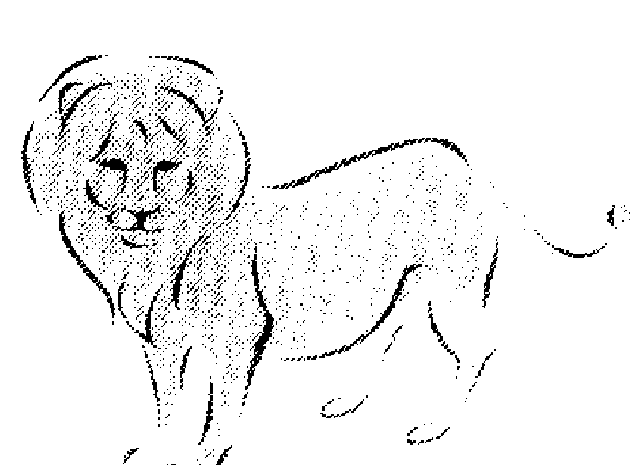

### 六、和處女座的結合（凶）

你們同受水星的管理，有纖細的神經質，和知性的雄辯兩種共同性格。

但是，你們的共同點也有細微出入，您倆的談話都是理直氣壯，有時互不相讓，因而發生摩擦的機會很多。加上對方要求正確和周到，使您吃不消。如此影響了你們愛的交流。

為了使雙方和好相處，你們勿亂吵罵，並感謝對方的包容。此種結合最適合夫婦同有職業或商人夫婦。角相是九十度，相性不佳。

The request was rejected because it was considered high risk第十章 獅子星座 七月廿四日～八月廿三日

獅子星座相當於午辰次，相當於鶉火，不論我們以什麼名稱來稱呼這個星座，它還是包含了廿八星宿的「柳宿」、「星宿」、「張宿」。從黃道南下，就會出現可怕的大海蛇座。鶉火的三個星座，柳、星、張就包括在海蛇座裡。

勇猛的海洛克斯打倒的怪物，就是這條海蛇，有九個頭，只要砍掉其中的一個，頭就立刻加倍生出來，所以使勇猛的海洛克斯也陷入苦戰的神話，就是這個海蛇座。

巨蟹座的巨蟹也在此時幫忙殺死海蛇。在海蛇座中，唯一發出光澤約二等星阿爾法德（孤獨者）發出的紅光，可能就是被海洛克斯斬殺時，發出的血光。

在中國把這個紅光稱為「朱鳥」。對海蛇座的曲線，中國古代並不視為蛇，而看成是柳枝。

古時為遠行的人，有送一小枝綠柳枝的羅曼蒂克習慣。比起海蛇，柳枝就溫柔多了。

每年七月廿四日至八月廿三日，約一個月間，太陽停在獅子座，在此期間出生的人，受到獅子座和守護星太陽的管理，產生各種性格和不同命運。

此期間係一年中，太陽的陽光和熱度最高的時期，萬物充滿活力，生氣蓬勃。

因此，獅子座的性格中，具有如同太陽、獅子那樣充滿熱力、溫暖、正氣、開朗的性格。

您具有男性的優點和特點，氣質和萬獸之王——獅子很相似。

### 第一節 獅子星座的性格

海蛇座的頭部是柳，其他部分分成張與星，而有這個星座的鶉火生者，富有羅曼蒂克的氣質。喜歡旅行就可能與柳宿有關。在理論之前，容易感情用事。
如是女性，就有女人特有的溫柔，很多人都能成為高分的主婦，也擅長做家事，但無法控制自己的感情，如製造特殊的氣氛，很輕易就被誘惑。
一旦愛上就會狂熱，但熱的快，冷的也快。由於與生俱來的好奇，有一天會突然換一個男人，常被視為輕浮的人。
與析木生者相性良好，在身體上可列為感度良好之型中。
每年春天（四月下旬）的黃昏，天空處女座的西方，出現一鉤型星座，它就是獅子座。

獅子座如其記號所示，具有國王權威和優雅氣氛，加上受此星座的管理星——太陽的影響，受到熱和光的泉源的創造力，太陽的性格賦予此獅子星座，使它成為許多惑星中的中心之星。

根據希臘神話傳說，獅王的勇姿，明顯地留在太空上，形成這一星座。並讚揚太陽神赫利亞斯具有國王的光耀、熱力和管理力。

太陽是恆星，比月球、地球以及其他的行星，具有獨一無二的特性。它只有給予，不接受他人施惠的孤高性格，獅子座人受到如此影響，比其他星座高了一籌。

### 一、表現性格

此星座象徵獅王頭上的毛鬃的強壯有力，及其尾巴的有勁和威風。

獅子座人並接受守護星——太陽的管轄，具有陽性和熱性兩面，使他的氣質變為開朗、快活、積極、熱情。

您光輝開朗的性格，增加您周圍人的快樂氣氛。光明正大、威風、第一流、寬大、非凡、自信、勇敢、熱心是您的個性重點，對於他人，您是中心、領導人物。

不過，這種優點過多時會變成缺點，例如自私、自大、易怒、壞心腸、喜怒無常、嘆息、虛榮、浪費等。

獅子座的人，時常希望潔身自愛、走正路，對於他人也希望他們向自己看齊，善意資助他們。他的熱力不斷追求美麗，創造新生活。

因此，對於不服從他意見的人，他絕對不容忍受。他對於不正、卑鄙敢從正面加以攻擊，絕不退縮。

站在舞台上時，他自認是主角，希望獲得他人的掌聲和喝采，並自鳴得意。這種心理很容易變成膚淺、滑稽的怪異行為，要求他人尊敬他、信仰他。因而變成過於自信、夜郎自大、失去純真、只追逐名譽的怪人，加上過度虛榮心作祟，變成浪費而不自知。

獅子座具有許多優點，也有不少缺點，例如脾氣不好，易發怒是其中之一，他們有時也會被孤獨感所襲擊，原因是獅子座人做事很積極、活潑，不過有時也會感到很寂寞。

這種現象宛如光輝的太陽，被一層黑雲所遮蔽，急速地變成黑暗一樣。獅子座人有繁華、熱鬧的一面，也有黑暗、寂寞、孤獨的一面。

不過您的脾氣不好，易怒、寂寞、孤獨，也不會使您的性格變為憂鬱、陰濕等等怪脾氣。太陽雖然被黑雲所遮蔽，那不過是一時的現象，雲 過陽光會再射出來，回復光明的世界。有時，你們也會受感傷氣氛所籠 罩，但很快會恢復原來的狀態。

### 二、分類性格

各星座各有三種分類，獅子座分類如次：以十天為一區分，各區分各 有細微的性格上不同處。

### ◎第一類（七月廿四日～八月二日）

基本上是獅子性格，具有細微的巨蟹座和水瓶座的性格。獅子星座開朗和藹的性格，生性的溫和愛情，強烈的女性感受力，及羅曼蒂克的想像力，這些就是生於此一星座的性格優點。此類人為人老實，好惡明顯，對於此微事情都很敏感，而且適應環境能力也很強。但有點內向，愛好自由，易衝動。

### ◎第二類（八月二日～八月十一日）

獅子座性格最明顯，並有些許守護星——太陽的性格。您的特點開朗、活潑、親切、具有機智、上進心很強、不斷努力向新方向發展。

### ◎第三類（八月十三日～八月二十二日）

受到少許的處女座和牡羊座影響，使您的意志堅強，行動力超群，您們具有激烈的感情和敏銳的感覺力。由於您極力主張己見，因而往往會傷及他人的感情，另一方面，您的心腸有時很柔和；不但同情他人的困境，還會伸手援助他人。

### 第二節 獅子星座的命運趨勢

您的命運受到獅子星座以及守護神——太陽神的性格之影響，具有國王般高貴氣質的您，是群眾中的首領人物，自己也不斷努力，希望成為中心人物，君臨於群眾之上。

您不喜歡在人家下面做事，希望上進，成為各種場面的紅人。一般來說，您的命運是不錯的。

尤其是名譽和人緣方面，您的運氣的確是得天獨厚，站在眾人之上，您具有很能幹的能力。至於財運，在您的地位上，金錢會源源而來，充裕您的生活。在人後做事，或跟著他人走，是您最不拿手的。默默努力、工作、擔任配角，這種作風完全和您無緣。您最適合擔任主角，擁有許多配角陪襯您，增加您的光輝，這樣才是您的活動場地，假 如，您現在所活動的地方，阻礙您的發展，不讓您展翼，那麼，這個地方 是不適合您的活動場所，成功希望甚微。您必須去尋找能夠開展您的熱情、抱負以及創造力的地方，如此，您才能獲得幸運。如果，您打算過著平凡的薪水階級，這種方法是拂逆您命運的作風，換句話說，傷害您的自尊心的地方，您是無法大展鴻圖的。反之，大家都尊重您，被您的魅力所吸引，憧憬您的偉大，那麼您的地位因而更提高，成為受人景仰的人物了。您要像太陽一樣，以光明照耀世界，給予人類幸福，堂堂正正站在您的世界裡，為人類服務吧！您的命運雖然光輝燦爛，但細微過失會招來意外失敗。那些過於自信，和無視他人而招來的失態。例如當紅明星的放縱、自大，靠權力鄙視人民的官員，愛慕虛榮把家財消耗殆盡的世家子弟等，類似此類人太多，自信是可以的，但鄙視他人就不應該了。尤其是在年輕時更要注意如此作風，應該用您的燦爛光輝去照顧他人。

### 第三節 獅子星座的職業與財運

您受到太陽影響，成為群眾的中心，給予他們熱和光，您站在眾人之上，充滿熱情生活。

您為權威、權力、名聲、地位，不斷努力。

您的優秀創造力在各方面產生新構想，表現非常優異。

### ◎您的適宜職業

公司、公務員方面大都擔任經理、主管，工廠方面是監工、領班，展現您的領導能力，還有政治家、實業家、法律專家、律師、教員等。
影藝、體育、自由業方面的一流明星、紅歌星、知名作家、畫家，都是屬於這一類。

其他尚有服務業、娛樂業方面也能發揮您的才華，外交、推銷員方面也有獨到的推銷術。

無法發揮您的個性的地方，您就不能成功了。

在他人之下工作，或不受人注意的工作、默默地做的工作都不適合您。

您的努力不受重視，或不好利用您的才能的工作場所，就無法使您發揮您的才能。因為您具有打破舊觀念，向新的事物挑戰的氣概，向理想邁進的熱力，因此，修理工、藥劑師、船員、礦工、公務員等沒有變化的 工作，均不適合您做。

一輩子過著薪水階級的平凡工作也不適合您。

### CH10 獅子星座

您本來不重視金錢，只重視權威，為金錢而屈膝，不是您樂意的。只要選擇適合您的特性的工作，金錢就會源源而來。站在許多的上面並獲得他們的青睞，不但使您獲得情感上的安慰，經濟方面也有豐富的收入。所得的金錢勿浪費才好。由於您的自尊心很強，不願在人家而前裝寒酸，您所喜歡的事，您會很浪費。因此，假如您是女性，那麼，妳就需動動腦筋，勸妳的先生或兄弟，實行節儉生活。

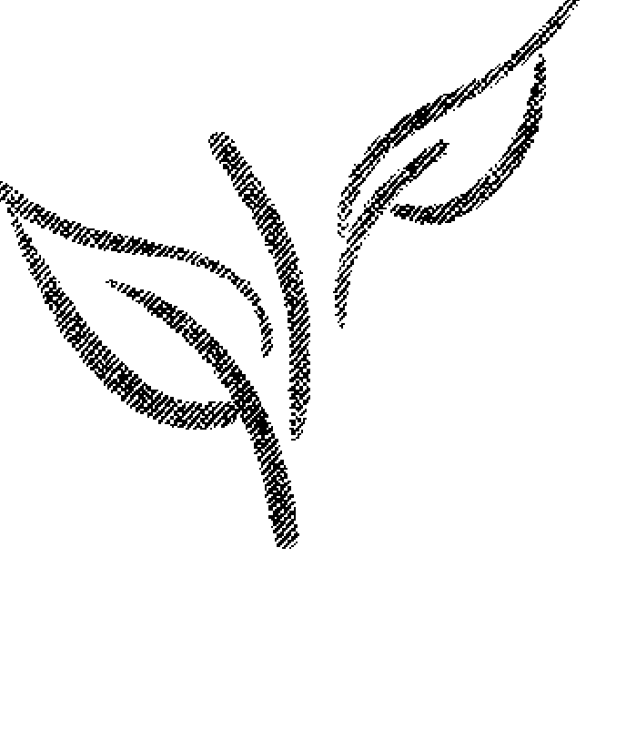

### 第四節 獅子星座的健康運

獅子座支配著人體的心臟和背部、大腸、動脈、眼睛，獅子座的人，體質、血色均好，脊椎垂直，體格良好。唯一缺點是心臟、動脈的負擔過重。心臟和冠狀動脈運動活潑時，不會發生毛病，但一過中年，發生心肌梗塞、狹心症，以及動脈硬化症等危險性很大，您必須注意心臟病或高血壓。尤其身體肥胖的更要小心，注意吃的方面，運動勿過度，酒、菸、深夜的工作、過度性生活都是不好的，平時做身體檢查很重要。此外，保持精神平靜，對身體健康很有益，激動發怒可用趣味修養矯正過來。

### ◎易生病的年齡

-   三十八歲、四十歲、四十七歲、五十歲、五十三歲。

### 第五節 獅子星座的戀愛和結婚趨勢

獅子座的人，性格熱情、充滿善意，因而有所謂的為戀愛而戀愛，愛情徹底、純情的，他們為提高愛情熱度，往往實行戲劇性的戀愛，他們不拘於戀愛技巧，重視羅曼蒂克的氣氛。 為了使對方知道自己的真情，不惜任何犧牲，費錢、費時在所不惜，堂堂正正訴諸衷曲，在第一流條件下製造熱鬧氣氛。 他的戀愛是明朗而熱烈。因此，如果對方沒有相當反應，會使他非常失望、難堪。因為他太熱情、積極了，因此，失望之後的悲痛也格外的大。 從第三者立場看您的戀愛，確實使人羨慕不已，因為您的戀愛太圓潤甜美，當對方無法討好您激烈且有深度的愛情時，您會感覺失望，好似失去了什麼似的。在性生活方面，也會感覺不滿。

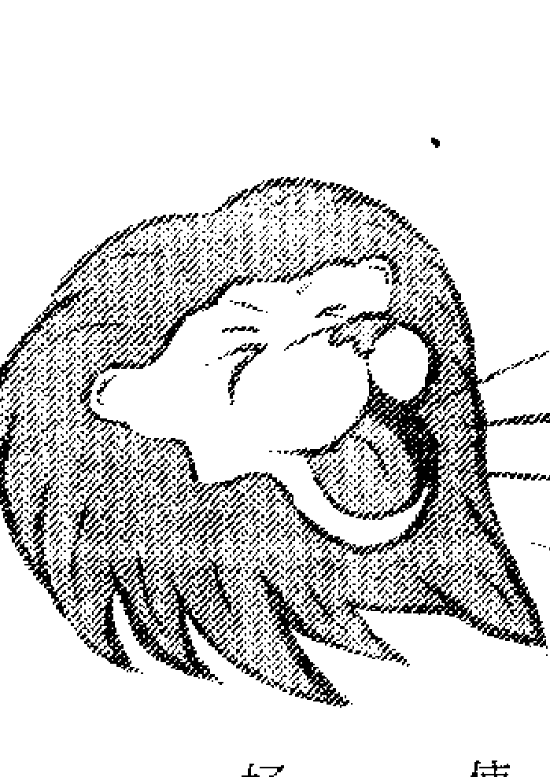

獅子座男性往往把性急的愛加諸對方，女性方面為了滿足對方，在性愛的技巧面也會下功夫的。

獅子座的男女，不阿諛對方，各有自信，互相相處，結婚後的丈夫也許仍會保持獨裁主義，但您是好丈夫、好爸爸。做為太太的積極地發揮賢內助之功，使妳的家庭美滿、快樂。

以下說明獅子座的應該選擇哪些人做為對象最好，則是相性問題。

### 第六節 獅子星座和其他星座之結合

-   一、和牡羊座的結合（大吉）

你們各具有強烈的熱情和理想，以及敏銳的感覺能力和自我主義，當你們兩人的意見獲得協調時，就成為一對很理想的對象了。

假如你們不堅持己見，有互相忍讓的風度，那麼，你們的結合比任何其他的星座都更幸福。

同時，也是格調很高的結合。

你們是火宮的同志，角相是一百二十度，是最好的結合。

-   二、和射手座的結合（大吉）

射手座和您一樣，同屬於火宮，相性不錯，角相是一百二十度，是您的好的對象。

射手座的人所具有的上進性格，和向外積極發展的活潑性格，和您的獅子座性格協調時，你們的相性比和牡羊座相性，更具有夢幻和快樂成分。為提高你們的生活程度，您的對手（射手座）勇於嘗試冒險，希望脫離平凡和束縛的範圍，對新世界、新事業表示關心，並厭煩繁文縟節，追求真理和新知識。您若以溫暖心情去支持他，那麼，你們兩人所合奏出來的音樂，充滿無限的喜悅。

具有高尚興趣的射手座性格，確實為您所喜歡，但他並非完全沒有缺點，例如，做事不能持久，雖屬於樂天派，但有時也會悲觀不已，那是受木星的雙重性格所使然。那一點您需要包容他才是。

### ### 三、和獅子座的結合（大吉）

你們的星座相同，角相是零度，只要交流雙方的性格，導引出優點來，那麼，相性是很不錯的。

由於你們夫婦，很容易發現自己和對方的缺點，因此，別互相指摘，優點應保持，缺點由兩人商量改進，就不會發生衝突了。

總之，射手座的人，能夠把您導引人開朗、豁達的生活，和進步、自由的氣氛中。因此，你們的結合，可以過著堅實、幸福的生活。

您為了達到您的領導地位，往往自大、鄙視他人、傷害他人的情感，這是您的缺點，您的對手——射手座，也有勇往直前，不顧前後，使他人受損，這都是你們的缺點，必須注意。

-   四、和天蠍座的結合（凶）

獅子座的您，受到太陽的支配，屬於陽性，反之，天蠍座的人受到冥王星的守護，具有陰性性格，你們兩人陰陽相反，相性不佳。

例如，陽電和陰電會相吸引一樣，在太陽系的最外側，離開太陽最遠處迴轉的冥王星，為獲得陽光，有一種力量，正努力把陽光經過無限的遙遠路途送給它。

您希望走在陽光燦爛的路上，天蠍座人，站在沉默神秘的世界中，充滿著怪異魅力，慎重地活動著。如此，你們是不能稱為相配的一對。

由兩個人管理很容易發生爭執，但是由於你們的創造力很強，可以適當的分工合作，預防衝突，則愛情生活是很理想的。

天蠍座的男女，對於性彼此關心，性慾很強，獅子座的您，能否和他同步調，是一個疑問。做丈夫的無法使太太滿足，或太太無法滿足性的生活時，選天蠍座為對象的您，可能會使身心疲憊不堪。角相是九十度，相性不好。

-   五、和金牛座的結合（凶）

金星是金牛座的管理星，表示愛好和平，獅子座的您受到太陽的照顧，心情充滿溫暖。您的對象性格圓滿，做事有精力，為人誠實，愛好清潔，性情溫和，但對於激烈的或極端的比較膽怯。這種性格和您的崇尚自我的作風，格調大不相同。

愛好和平的心情，變為防護本能作用，都是為自己安全設想。另一方面，他不但重視愛情，對金錢欲望也很強，做為家庭一分子是無可厚非的，不過，他也有缺點，例如獨占欲望強、嫉妒心也強，使您受苦。

金牛座的人，性格頑強，如果頑強過度，很難相處，例如平時很順從丈夫的可愛太太，一旦頑強起來，就不聽話，使做丈夫的對她無可奈何、大失所望。

您愛熱鬧，虛榮心強，愛好調和的自然姿態。做事很慎重的金牛座人無法和您配合。角相是九十度，相性不好。

-   六、和魔羯座的結合（普通）

獅子座的您，性格開朗、活潑，如同太陽般熱情待人，但魔羯座的人陰性孤獨，忍耐、堅實，性格幾乎相反，不算是好相性。

您開朗、喜歡合群生活，但對方卻是陰沉，難以相處，您想得到對方的共鳴，但他卻無動於衷，因為他是魔羯座，您不知道他的心中具有獨立性和野心。

不過，結婚生活需要忍耐、堅實，您所缺少的，魔羯座會補給您的。

-   七、和水瓶座的結合（吉凶參半）

水瓶座的特性是愛好自由和進取精神，熱中於理想與思想，厭惡日常生活的惰性，不斷求新與上進。反之，您是逐步上進的堅實型，對方無法想像的生活方式，您不易理解。

水瓶座的人老實純真，不易和人妥協，對於不合己意的非常冷淡。對自己想法忠實，對他人的束縛和強迫都會抵抗到底，缺乏合群生活。

你們的結合是生活在各自不同目的的世界裡的人。因此，必須先認清對方，你們就可以用相輔相成的方法互相幫忙。

-   八、和天秤座的結合（吉）

天秤座的人，對美的感覺力強、善於交際、愛好和平生活、行動調和，而獅子座的您為人開朗、熱情，是一對好伴侶。

你們各具有強烈的正義感，樂於幫助他人，使他人的生活歡樂、愉快，因而受到他人的感激和愛慕。但是，天秤座人的洗練氣氛，以及為保持調和而做比較的習慣，有時就無法和充滿熱情進取的獅子座的人合得來了。

不過，你們各自有愛美和創造精神，志向相同，只要您用豐富感情去對待他，就能夠建立一個幸福家庭了。你們的角相是六十度，您屬於火宮，他屬於風宮，相性是好的。

-   九、和雙子座的結合（吉）

多才、有能的雙子座人，富有社交能力，能言善辯，時常都在研究一些新構想，是非常忙碌的活動家，不過，他和獅子座的您比較，神經比較纖細，具有雙重人格，對於您是一個富有魅力的對手。

您的眼界大，凡事都能看透，並全力付諸實行，想獲得人家敬重。您有能力包容雙子座人動搖不定的情緒。因此，你們的結合相當理想。相是六十度，您屬於火宮，雙子座人屬於風宮，相性良好。

-   十、和處女座的結合（普通）

開朗具有男性性格的您，和神經纖細的女性型處女座，性格雖相反，但一想到是男女結合，不能算為壞相性。
由於處女座的神經纖細做事周到，對於粗枝大葉的您確有所幫助，使你們成為良好的配偶，只要處女座的潔癖、仔細的感覺，不傷害您的威信就能安心行動了。

但是，當您在無限的愛情和熱心中，發現誇大和自私成分時，對方會極度批評您，要求您的潔癖和慎重，使您大失所望。

對於您的強烈戀愛感情，處女座人應該用羅曼蒂克的氣氛來接受，才是夫婦圓滿的秘訣。

-   十一、和巨蟹座的結合（普通）

和具有母性愛優點的巨蟹座人結婚，對於您是幸福的，因她善於做家事和照顧子女，性情溫和，服務精神好。

不過，對於小事情都要勞心過度，並不是好現象，勿有害怕他人譏笑的小氣作風，您必須從大處著眼，用您的熱情關注，您必須包容他，勿討厭他。

巨蟹座的人極力保持家庭和平，可以使您放心在外面活動，發揮您公平的熱與光。因此，巨蟹座是您很理想的對象。

戀愛感情方面，他具有豐富的感情，可以應付您如火的愛情。

-   十二、和雙魚座的結合（普通）

富有夢幻般思想的雙魚座人，憧憬於羅曼蒂克的生活，這種現象不限於精神方面，肉體方面也希望愛他人和接受他人的愛。

您要堂堂正正把您的愛和光散發到周圍的人們，積極地過開朗生活。

但雙魚座人都具有雙重性格，有時會出現難懂的一面，由於您的性格單純，適應力強和豐美的感情，因此，對於抒情、重視名譽的雙魚座人就有點不習慣。 但是雙魚座人也有許多優點，例如溫和感情和樂於為他人服務的精神，都是他的魅力所在，你們的家庭生活柔和優美，雙魚座的人很容易信任他人，注重他人的優點，您有點輕浮的地方，需要改進。

### 第七節 獅子星座的幸福幸運年齡

男性獅子星座生者，大抵以二十八歲最幸福。女性獅子星座生者，大抵以二十五歲、二十八歲最幸福。不論男性、女性，凡逢寅午戌年，皆為幸運之流年。

# 第十一章
處女星座
八月廿四日～九月廿二日

寅申巳亥四個宮位，在中國占星之中為四生四馬之地，大多具有比較波動或起伏變化的命運，而在西洋占星之中，寅為射手星座、巳為處女星座、申為雙子星座、亥為雙魚星座，暗示此四星座生者具有雙重性格，恰如子之水瓶座、酉之金牛座、午之獅子座、卯之天蠍星，各有一顆美麗的紅色亮星，玄奧的像春、夏、秋、冬四時一樣的佔據星象的勻稱位置，這種關係位置，術語稱為「四正」宮位，可惜的是紫微斗數把「四正」誤解了。處女星座相當於巳宮鶉尾，這裡含有廿八宿之翼與軫兩個星座。從春天到夏天常見的獅子座正下方的海蛇座，在它的背上有一個酒杯。在希臘神話中，是酒神巴卡斯愛用的酒杯放在天上，就是這被稱為酒杯座的六星中，有中國星宿的翼。從祭孔時使用的酒器聯想後，又稱「巨爵」。軫是在此東鄰的鴉座四星中。

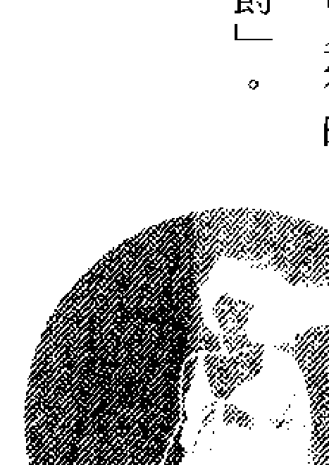形如梯形，令人无法联想到鸟形，但在神话中，它是太阳神阿波罗的使鸟，可是有说谎的习惯，因欺骗主人，使主人杀了妻子，所以被放在空中示众。

> 仅看翼的星象是：「出生贫穷，与财物无缘，如果有钱就会短命。」

也许是含有这正相反的两个星座，翼尾出生的人有双重性格。

太阳约在每年八月廿四日至九月廿三日之间停在处女座上，慢慢地通过。此时期，强烈的太阳季节已过，正在迎接初秋的收获季节，是夏、秋的过渡期。

在八月廿四日至九月廿三日出生的人，自出娘胎以来，就具有处女星座和其管理星——水星的性格，左右他的一生命运。

您的性格是神经细密、技能优异、不认输，另一方面，是易动摇、心神不安定。

### 第一节 处女星座的性格

凡生于处女星座之人，虽是才子型的人，但身体不健康，动作却比较灵敏。常把自己的才能挂在嘴边。

相反的，只要稍被批评几句，就非常认真，会失去信心。

顺利进行时，一切都表现得很好，可是一旦发生低潮，就束手无策，不知该怎么办了。

对爱情是受到自己冷静的影响，变得很现实。会以结婚做为升级的工具，同时也不稳定。

如果是女性，就不是适合家庭生活的人。

处女座尾出生的人中，很多会在演艺界求发展，如是当一名平凡的主妇，必定会感到不满。在夜里，虽不是很有精力的人，但喜求变化，常用镜子或

## ♍助兴

处女座是在晚春夜空上出现的星座，其中主星发出很清晰的光辉，周围拥有一群小星，被称为MERCURY的水星，最接近太阳，管理处女星座。

神话中的爱神（CUPID）就是此星，它掌管人类的智慧和神经、言语能力和判断力，而且水星还象征健康、适应力、智能、守护着商人买卖、外交家的话术、技术者的技术。

神话中并指出处女星座，象征正义和农作物丰收之神，并且有天使爱神的能力，对于任何境遇的人们，都能献身服务，是一位有才能、有肚量的好星座。

您的星座属于地宫，做事坚实有常识，又属于柔软宫，有适应环境的能力，爱好变化生活，常为此矛盾性格而烦恼不迭，您在本质上，做事很勤勉，对于任何事都能忍耐努力，因此，工作上的成就很不错。

#### 一、表现性格

象征少女秀发的处女座的符号是♍，它表示清纯、纯洁、纤细的感觉能力和悲伤。

其管理星——水星（MERCURY）管理脑力和神经能力，给予处女座人性格上的适应力和判断力，您的注意力很强，近于神经质程度。

而且处女座的您，具有优秀的办事能力和努力奋发图强的精神。您的努力性格并非人家强加于您，实则您自己意愿。

您温和、谦让，另一方面您会批评他人，说出动听演说，而令人大感满意。如此作风，并非为了主张自己，都是经过仔细考虑、研究，做彻底分析、整理，由于您的性格不喜欢马马虎虎的作风，因此，看到他人有随便行为时，往往会不客气的批评他。您具有细心和轻浮的两种相反性格。

您不像狮子座那样，想站在领导人的地位，因为名声、地位和您完全无关。

您不追求名利，不想获得他人的掌声、喝采，您做事不在于赚钱，实则磨练您的技术，逐步求上进。因此，您的工作是您的诚实和不断努力的结晶，往往获得良好的成果。

因您不和他人竞争，外观看似消极，其实您的决心是坚定，脚踏实地，步步为营。您不喜欢一鸣惊人的作风，也不取巧，慢慢地做您应做的工作。虽然您的作风没有魄力，但工作态度非常细心，凭良心做事、求秩序。

如上述，您有易感伤的一面，在回忆中思念着各种梦幻似的过去生活。您对诉诸感受性的各种问题寄予好奇心，其中，对于智能方面的关心更深刻。求知欲望很强，您虽是外行人，但知识丰富不逊于内行人。您的知识、见闻、思索、追求真实的心理，使您成为批评家。但批评他人，往

## CH11 处女星座

您厌恶世俗的败风，些微的欺诈，您都不允许它的存在，但您的过度洁癖，易招来他人的误解，必须注意，别发生无谓纠纷。您本来对他人是细心服务的，但人与人的关系非常微妙，一句不中听的批评，很容易造成彼此间的大误解，因而在精神上受到很大打击。因此，您必须把精力倾注于工作和学问上，人事问题少管为妙。您应找出您的优点，发挥您的能力，勿找他人的缺点，指摘他人。

#### 二、分类性格

处女座可分为下面三种类型，这三种类型各具有不同个性。

- ◎第一类（八月廿四日～九月二日）多少受到前面的狮子座和双鱼座影响，有尊重威信和宽大性格，以及开朗的罗曼蒂克气氛。

此类人，肯为他人服务，同情心很强，其亲切程度有点过度，受到他人赞美时，会沾沾自喜，非常得意。另一方面，具有易伤感的气氛，感情丰富，乐于助人和救人。善解幽默，易和他人相处，但您有时也会感到寂寞、孤单。

### ◎第二类（九月三日～九月十二日）

处女座的特性最明显，加上少许的魔羯座和其管理星——土星的性格。

您的性格较温和，神经纤细，热心工作，辨识力、工作能力特优，肯努力，有点野心，工作态度充满热情。和他人来往不习惯，易过孤单生活，因此，应尽量和他人多来往，学习交际。

### ◎第三类（九月十三日～九月廿二日）

受到下一星座的影响，少许天秤座性格——爱美和协调。

您比第二类的善于交际，具有开朗性格受到他人欢迎，能够缓和您的神经质性格。

### 第二节 处女星座的命运趋势

您受处女座的性格和管理星——水星的影响，具有纯真、勤勉、精密、精干的才能，不过，您的命运不佳，相当辛苦。

您最好尽快找出您的兴趣，努力成为专家，用洁癖的眼睛观察事物，在脑海中整理那些杂乱无章的事情，变为有条不紊，并尽早找出努力的方向，全力以赴。

一旦找到良好职业，您可以利用您的精细脑力和能干手腕去苦干，实行您的理想。

为了发挥您的特性，您必须找出适合您的严厉性格，和不受他人妨碍的良好场所，做为您的工作场地。

您应利用您的优点——做事正确、小心、研究欲望很强等，做整理资料工作，彻底研究问题，产生良好结果。如此，对于您的生活是无上快乐、有意义。

您的努力，不但使您出人头地，您还愿意帮助他人，不惜辛劳，助他人成功。

您虽然缺乏创造能力，但对于您的工作成就，会再做严密检讨和研究，加上新的见解，使其更为您虽然不善于创造，但分析和整理工作颇适合您。

您是如此的热心工作的标准职员、事务员。

### 第三节 处女星座的职业和财运

处女人具有缜密神经和优秀判断力，还有分析和整理能力。只要自己能领略到的均能不辞辛苦彻底完成，做事要求正确和完美是您的最大优点。

不过，您也不会夸耀您的工作成果，您默默地完成您内心的志向，由于神经细微帮助了您的工作能力，你喜欢为他人服务，为他人做事，助人一臂之力，是您感觉最快慰的事，在工作场所、人们没有注意的地方，您一样能负责完成您的工作。

◎您的适宜职业 分析、分类、调整、统计、研究、批评，这几类工作都适合您，公司方面，适合担任总务、会计、人事、秘书部门工作。职业方面，出版编辑、评论、教师、会计师、税务员、司法书记官、精密技术家、健康诊断所、医院的事务员以及护士等，其他尚有：服装、美容、园艺、烹饪等，需要注意力和技术方面也很适合。

您对于工作态度有热情，因此，选择工作，须合您兴趣的，才能收到预期效果，一旦决定离开您的职业以后，不必再管他人如何批评您、如何监视您，只向您的目标前进了就是了。

关于您的财运，由于您很少和他人来往，交际费方面不会太多，但因您不喜欢买二流货品，花于高级品的金钱可真不少，然而，由于您做事仔细、有计划，算盘打得相当精，经济方面不会发生问题。

您须在工作方面找出财源，开源节流，努力积蓄，财运是不坏的。

### 第四节 处女星座的健康运

处女座人的神经敏锐，对于自己身体变化反应很快，很快能知道病痛所在，并做预防与治疗，连小毛病都把它视为严重，做万全预防。处女星座的守护神水星，本来就是管人体健康的星曜，因此您对于医学的认知很深，对身体健康特别关心，从体质上说，此星座所支配的身体部分，系肠和神经，因此，病痛大都发生于腹部，其次是四肢，以及膝盖关节也易生病。必须留意吃的方面，勿乱用药方，并避免因病痛发生神经过敏现象。

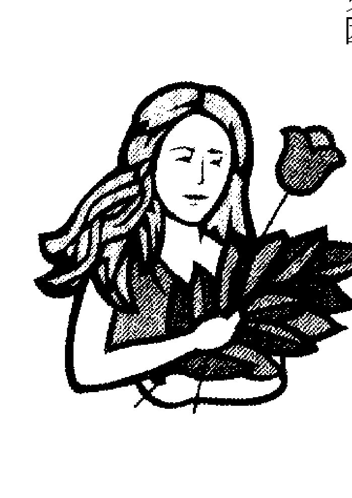

### 第五节 处女星座的恋爱和结婚趋势

处女座的男女，性格纯真、纯洁，具有稚气，这种现象出现在他们恋爱中。

具有一点感伤成分的您，不会做激烈的男女恋爱，陶醉在如诗幻梦中的您，把恋爱美化成一幅美丽蓝图，在观念上可以捉住它，但遇到现实，就不会积极争取，也不知如何是好，因而烦恼不已，虽在脑海中可以描绘出美丽的男女之恋的乐趣，但实际爱情表现得非常幼稚、害羞。

您虽然有意等待对方积极地向您进攻，但当对方向您示意，您却退却了，使对方迷惘而不知所措，留下依依心情离去。

例如有一位男士，被您美丽、清纯的魅力所吸引，想和您谈情，但当他知道您的极度洁癖性格时，他的热情已被您冷却一半。您很小心留意人家的气氛，可惜没有勇气吐露您的心情。

一个男人和女人的结合，和友情完全不同，不勇敢地投入他的怀抱，吐露出您的心情是很难办到的，男女互相吐露心声，才能燃起感情之火，引导至肉体结合。您可能会玩恋爱游戏，并可能与一位情人悲恋而终。但是当你们恋爱成熟，进入结婚生活时，做为丈夫的，虽然不太勇敢，但尚能坚实地守护自己的家庭，做为太太的，性情温和、可爱，能照顾丈夫和孩子，互相帮助，过着平稳生活。女性方面的性生活，妳具有少女时的害羞心理，婚后，仍是羞答答、消极地站在接受的一方，态度仍维持清纯和被动。您很注意子女养育，态度温和，但您必须矫正您的缺点。另一方面，选择对象时应特别注意配偶的结合。

### 第六节 处女星座和其他星座的结合

#### 一、和金牛座的结合（大吉）

角相是一百二十度，调和相性。您一定能够找到共鸣的对象结婚，由星座的四种区分，你们同属于地宫，相性是好的。金牛座的人，受到管理星——金星维纳斯美与爱的性格，使您对他发生尊敬和满足之感。

由于对方星座是表示圆满和温顺的星座，他的爱好和平和协调性格，使您感觉温暖和安慰。

坚定地保守平衡和圆满的爱情生活，对您是很幸福的，名声和财力应排在第二，安定的家庭和充实生活才是第一。

#### 二、和魔羯座的结合（大吉）

和魔羯座的角相是一百二十度，吉相。魔羯座的人，忍耐力强，肯负责，以独立独行的精神，领导您走向前面。为了达到目的，绝不中途而废，确实是可靠对象。由于魔羯座的人是阴性，有自私性格，对金钱问题铁面无私，对欲望也有耐力。以上诸点，您必须以温和心情去对付他。

#### 三、和处女座的结合（大吉）

同一星座的相性是好的，由于处女座的性格温和，缺少伟大的结婚生活计划，而您的性格不适合和他人来往，善于处理事务方面的职业。因此，当你们结合后，如何使你们的家庭温暖，夫妇过着有趣的生活，才是最重要的事，你们在夫妇生活方面努力建立有趣的家庭，不要被其他问题分散你们的思绪。

你们应努力把新婚时的气氛持续下去，发挥你们的共同优点——纯情和友谊，婚后的你们给他人感觉是一对好友，夫妇气氛比较淡薄。

做为丈夫的您，当然要保护您的家庭，做为太太的妳，不但要承担家务——烹饪和清扫，并学一技之长，增加妳的兴趣和收益。

为了增加您的见闻、知识、研究，注意选择好相性的对象。

#### 四、和射手座的结合（大凶）

角相是九十度，相性不佳。射手座的人，行动自由奔放，勇往直前，探求欲很强。他的性格，使您无法满意，因您是属于保守型，他的勇往不退的作风，往往使您为他捏一把冷汗。木星是他的管理星，他的双重性格也会使您烦恼。

您具有纤细神经和办事能力，但他却不管您所关心的事情，不断把眼光向大处着眼，一有机会就要向前直进不退，使你们的性格合不来。射手座的人，以及处女座的您，都不能算是爱护家庭的人物，因此，除非你们各具有特别的共同兴趣或共同精神，不然，你们还是不结婚的好。

#### 五、和水瓶座的结合（普通）

水瓶座的性格，表示智慧的自由和科学推理能力，您则具有独创的思考和论理能力，性格不太相同。

现在，人类、社会要求的是什么？水瓶座的人具有锐利观察能力，认真说服他人。水瓶座的人，恋爱感情不全针对一个特定的人，对象是人类和社会的多数人。

至于您，具有分析和整理才能，是博学的，但您不适合研究哲学和思想。人生观和世界观也是完全不同，这些都是你们无法结合的原因。

#### 六、和双子座的结合（凶）

同属于支配星水星之下，好似「志同道合」的一对，由于您是洁癖、纯真的二元性，双子座具有双重性格，势必无法互相容纳，他富有社交能力，能言善道，性格不同。

他善言、有机智、心理有很多想法，想这想那，他如此摇动心理，不是您能够赶得上他的。

双子座的人善言，说话如同流水般，您却爱好宁静，他是积极的，他能否带着您走，也是一个疑问，您和他相处，往往面临许多矛盾且心理动摇，使您不安、发生警戒心理。

双子座的人心理上转变很快，当您以为他已和您和好如初而大感满意时，他的心很快已跑向不同方向去了。您希望浸润在淡泊、甘美的恋爱感情，但他却厌烦您的单调恋情，希望沐浴在热情的爱河中。

双子座男人是多情的，不能专爱一位女性，是弹簧型男性，他的作风，往往伤及您坚定不移的纯真爱情，做为丈夫的他，实在不能满足太太的平凡爱情。

双子座的男女，理性很强，在交往约会时，仍不失去他的理性，不断注意对方的感情变化。他的如此作风，实在使您的负担太大了。

#### 七、和巨蟹座的结合（吉）

巨蟹座的男女，女性型的，具有女人特有的优雅和纤细神经，而且是良好的家庭一员，像母姊那样亲近他的人，他会很亲切地去照顾她的，至于处女座的您，充满着清纯和罗曼蒂克的气氛，而且感受力也很敏感、胆怯，做事很慎重，你们两人的关系，等于母女或姊妹，相性不错。

唯一缺点是您俩都很女性化。巨蟹座的人，内向、退却型，人家说的话，常悬念在心中，为求平安无事，做事非常消极。至于您，因洁癖心强、劳苦性格，很注意人家的行动，说话和行动都很谨慎。

角相是六十度，您属于地宫，他属于水宫，相性不错。

#### 八、和天蝎座的结合（吉）

天蝎座的特性是神秘，爱守秘密，内心欲望强，热情，处女座的您，性格纯真，绝不会出卖他人，感受力很纤细，为人老实，使他安心信任您：处女座的您，对天蝎座的阴沉性格，虽然有点不满意之处，但他的认真、坚实作风，给您的魅力很大。您的恋爱感情伟大，爱追逐梦幻生活，制造罗曼史，而天蝎座人具有不可思议的性魅力，向您求爱，使您有点受不了的样子。角相是六十度，属于地宫的您和属于水宫的天蝎座的他，相性不错。

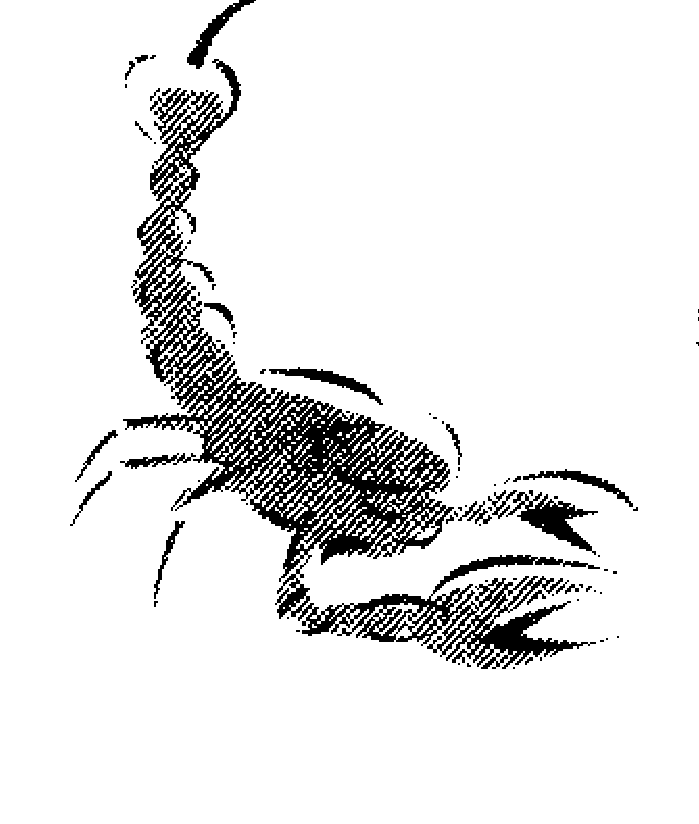

#### 九、和牡羊座的结合（普通有时变凶）

牡羊座的男女，具有男性魅力，富有正义感，做事积极，勇往迈进，性格激烈。处女座的您，为人纯情，是女性型，性格完全不同。您往往会被他的那充满热情的魅力所吸引。

牡羊座的人为了达到目的，不允许其他人批评和阻挠，神经纤细的您，只好默默地跟着他走。不过，牡羊座的人，不顾前后，有进无退的作风，有时也会招来失败，要他慎重从事不是易事，这对于感受力很强的您，的确会为他捏了几把冷汗。

牡羊座的人虽然具有如此缺点，但他永远是弱者的朋友，对于不幸的弱者，他会很亲切地去照顾他们。

恋爱感情方面，他会用新鲜、充满热力的感情对付您，如果您过于机智，不断追求优美的梦幻，那么，你们会在感情上发现很多性格上的差异。

#### 十、和狮子座的结合（普通）

你们的共同点是罗曼蒂克的气氛。不过，您是清纯、认真、做事小心，但狮子座的人为人活泼、爱美、热情。

对他人亲切、认真的狮子座人，有时也会演独角戏，且自大、向他人示威，这是他的最大缺点。

至于您不会在众人面前做出风头的行为，您的态度是慎重的，都站在接受的立场，用理性态度行动，对于对方的开朗、充满善意的生命力行动中，您仍持着沉稳态度和他相处。

您和狮子座的结合，会改变您的缜密心思和慎重态度，使您的生活更圆润和丰满。

假如您能够和性格率直、爱热闹的狮子座人和好相处，提高你们的感情，那么，你们就会成为一对好伴侣。

#### 十一、和天秤座的结合（普通）

天秤座的人爱和平生活，调和姿态，美的感受力很丰富，性格开朗，很受他人欢迎。以上是天秤座的优点，至于他的缺点，因理想过高，喜欢比较、留意平衡。因此，做事很现实，不能彻底，和您的洁癖、重视现实性格，不能保持平衡。

他喜欢人家喜欢他，担心人家批评他。由于他有此性格，您必须先谅解他，然后才能和他合作得很好。总之，你们的结合，波折少，可能成为美丽、平静的一对夫妇。您的神经纤细，他富有现实感受能力，您要帮助他发挥他的优点。

恋爱感情方面，您俩都不太积极，你们要慢慢地培养你们的爱苗，时间会为你们增加爱情浓度。

#### 十二、和双鱼座的结合（吉）

双鱼座的人的特性是爱追求梦幻生活，重视抒情气氛，处女座的您爱清洁、追求美梦，富有智能、神经纤细。你们对他人都很亲切，尤其对不幸的人特别表示关怀和照顾。

但是，处女座的您，在现实生活中，做事很仔细，稍含有焦急和紧张的气氛，双鱼座的人心胸开阔一点，就能成为好人。

有时，双鱼座的稚气不能和您的洁癖、富有理智的性格合得来。

恋爱感情方面，您喜欢的是纯真的爱情，但对方不能满足您的甜美恋爱，他要求的是肉体上的强烈结合，倾注他的全部魅力也在所不惜，你们各把胸襟放大，是你们两人幸福之钥。

### 第七节 处女星座幸福幸运年龄

男性处女星座生者，大抵到三十二岁时最幸福。女性处女星座生者，大抵在二十三岁时最幸福。不论男性、女性，大抵在巳酉丑流年皆为幸运之年。

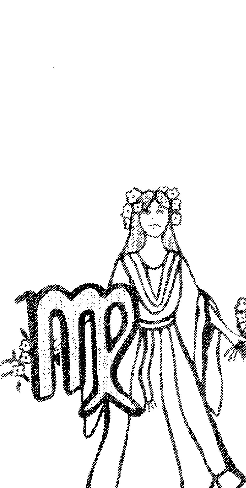

第十一章 天秤星座

九月廿四日～十月廿三日

## CH12 天秤星座

天秤星座相当于辰宫寿星，包括着「角宿」、「亢宿」，以及初交卯官之「氐宿」，但由于交凑，所以「氐宿」不列于本宫辰次，唯有阳历十月十四日至十月廿三日生的人才受到邻宫星宿星座之影响。

现代占星术相信，东西方占星术俱本占星，故星象一而相似、相同，星座的划分虽异名，而大致上是相通的。

太阳大约每年九月廿四日至十月廿三日的一个月间，停在天秤星座上。此期间出生的人，受到天秤座和守护星——金星的影响，具有各种不同性格和命运。

此时期是一年中昼夜长短相同的时期，是最凉爽的季节，各种收获给人们带来欢喜，是丰收季节。

您的性格中表现着维纳斯的美与爱，加上如同天秤那样均匀的调和性格，和金星具协调性。

### 第一节 天秤星座的性格

天秤星座相当于辰宫寿星，有一部分辰次被巳宫的「翼宿」占据了。「翼宿」与西方黄道十二宫之处女宫以前是一致的，处女座土星斯比卡，自白的、有清纯感，在五月的夜空中闪烁，在中国的廿八星宿中，是相当于角。相当于角。和同一处女座东方的亢并排，由于两个星座影响寿星出生的人，认为角的二星是东方第一的星宿，「掌理造化万物，此星光明则为大丰年」。大概是这个主星的清纯的光，使人联想到处女的形象，因此而得名。总之寿星出生的人，个性非常温和。举止稳重，不会轻易的大声。对艺术有理解力，也有才能。缺点是过分消极。

## 第十三章 天蝎星座

## 第十二节 天秤星座的命运趋势

如是男性，很会照顾家庭，工作也勤快，但比较保守、内向。不过，虽然内向，但内心却很坚定，因此不知不觉间，会按自己决定的方针做下去。
如是女性，即使对一位男性发生爱情，却不容易到达结婚的地步。会先向许多人问意见，或比较、或调查品行……。但决定时，必定会以自己的意志决定。
许多女性都会有非常丰满的身材，所以从年轻时就会受到男性的追求。但有慎重的性格，因此绝不会做出成为丑闻的事。
如是男性还好，如是女性时，最可怕的就是自己无法抑制的强烈嫉妒。
只要丈夫或情人的言行稍有疑点，立刻气量了头，做出失去理智的事，但相反的，平时是非常体贴的。相性是与巨蟹座者吻合，对驯服老婆有信心的男性，不妨试试看。
天秤座在夏天夜空可以看到，神话传说带着天秤（测量人类正邪用的）升天的女神故事，由于天秤的效力，出生于天秤星座的人，具有正义和公平性格。

他受美和爱的女神维纳斯影响，给予美和爱的最高性格。对美、爱的憧憬很大。

天秤座如同它的记号所示，保持均衡和爱好公平之心，以及像太阳将沉入水平线下时那种沉静缓慢的样子，表现在天秤座的人身上，则是有健全的理性和中庸的理解能力。

管理星的金星，给您带来高尚的品格和丰富的爱情，使您格外美丽和快乐，加以您自己所具有的美丽和优雅气质。您用温和的心情去接待众人，一视同仁，不分彼此，真心为他人的幸福欢喜，是一种可爱的美德。

#### 一、表现性格

您乐于为他人制造和平，这是您不偏于某一方的调和心理所产生的能力，使竞争的两方归于好的优良表现。

您不愿把心中的秘密和欲望流露出来，节制感情流露，用平静而自然、优美等方法表现您的心情，那是一种富有理性的表现法，绝不为感情而激动，是冷静且聪明的方法。

以上系天秤座的优点，他们和其他星座一样也有其缺点，例如天秤座人，事事都要把它挂在天秤上量量，因此，往往受到周围状况或他人的意见所影响，迷惘不知所措，为了保持平衡，害怕他人的破坏，因检讨这个、那个，而把精力消耗殆尽。其次，当您要做一个抉择时，由于您所渴望的调和心理过强，使您的心中发生迷惑了。像这样柔弱不安定的性格，会减少您个性之美。

您知道您一个人无法生活下去，但您也不知选择谁做为您的助手最好。在您周围的人虽然很多，有男、有女，但您可能在他们之中彷徨了一辈子，仍然不知所措。

为了追求优美、创造更优美和充满爱情的世界，这种愿望才真正是属于您的。

## 二、分類性格

### 第一类（九月廿四日～十月二日）

天秤座以十天为一区分，可分为三类，各类各有多少的不同之处。

受到前星座处女座影响，还具有牡羊座性格，增加处女座的纯真、洁癖、纤细神经、批评、认真等性格，勇往迈进。

### 第一类（十月四日～十月十三日）
最具有天秤座性格，加上水瓶座性格，特点是进步、自由、友情。

### 第二类（十月十四日～十月廿三日）
受下一星座的天蝎座影响，具有少许的阴性（忧郁）、冷静的观察力和沉静性格。

## 第十二节 天秤星座的命运趋势

您的人生是由均衡、调和、美、爱的精神为基础组成，针对以上的四条件努力，会给您带来幸运。

人生必须是美的，而您与生俱来为创造美而活在世上。

您的愿望是爱他人、和他人合作、使他人快乐，并用您的协调精神、明快的社交能力，把不安定、破乱、不合理的现象，用和平的方法来解决，您具有这种能力，把美的感性和圆满的理性运用于人生，您的爱人之心、使人喜欢之心，应好好的运用它。

您虽具有社交能力，但您不会过度或沉溺于其中，因您不愿走极端。交际多了，诱惑跟着多了，沉溺于游玩的机会不少，但您不要害怕，可以和各种异性交流，因您的优点会在那些人中，发挥尽致。

您必须时常磨练您的精练的感受能力，提高您的智能。为挽救不稳定、惰怠、沉溺等缺点，您必须积极地改造自己。

### 第三节 天秤星座的职业与财运

您会获得人家的好意，和受他人之爱，因此，您选择职业时都要选择适合您性格的工作。

具有丰富的协调性格和爱美感受能力的您，越和许多人相处，您的工作越有成就，您适合担任给予他人美和快乐的工作。

### 您的适宜职业
- 影歌星
- 时装师
- 美容师
- 工艺家
- 作家
- 画家
- 园艺家
- 房间装饰家
- 游艺场
- 酒吧
- 剧场
- 戏院等。

其次，谈谈您的财运。天秤星座生者，善于交际，来往的朋友不少，交际费很多，因此，很少有储蓄机会，您虽然不是大浪费，也不会破坏您的家庭，不过，为了储蓄，花钱时须尽量节省。

买股票对您相当有利，因您具有投机运。当您恋爱时，偶然会遇到富婆愿意出巨资，为您开拓事业，算来，您的财运还不错。

### 第四节 天秤星座的健康运

您的匀称体格和调和体质，健康运应是不错，但您最要注意的是，身体突变和过度疲劳，因它会使您由健康变为病体。由于您善于交际，过度的酒色容易影响您的身体。

暴饮暴食、睡眠不足、过劳都是您健康的敌人。

### 您最易患的病症
- 肾脏病
- 糖尿病
- 腰痛
- 坐骨神经痛
- 偏头痛
- 妇人病等

### 第五节 天秤星座的恋爱和结婚趋势

被视为维纳斯身分的您，善于发挥您的美感和优美姿态，吸引许多人。

对于您，爱是人生中最重要的，假如不能爱他人或被人爱，是等于死的，您的爱表现绝不会过度，也不会受到冲动而胡来，您的恋爱是快乐含有甜美，持中庸态度，不过，随时都有退出准备。

说好听一点，您不溺于情，适可而止的恋情；说难听一点，您的恋爱态度不明朗，具有自私成分。

若从天秤座立场说，那是无可厚非的，因您的看法并非恋爱而是结婚。

而且您还和其他异性做比较和检讨，注重自己的心理平衡感觉，绝不会为恋爱沉溺和焦急而失去自己的兴趣，为了达到结婚阶段，您必须经过一段时间。

不过，当您看中了一位很合意的对象，认为对方会真心爱您，您也会衷心爱他，那么，你们是一对最佳伴侣了。

成为一位美丽高尚少妇的妳，丈夫会视妳如宝贝，对于妳的优点夸赞不已，因而使妳变成自私、瞧不起丈夫的太太，但大部分男性对于如此太太，都不加斥责而原谅她。

天秤座的丈夫，把太太的爱视为自己专有时间，服务非常周到，但当爱情由热转冷时，您善交际的性格，使太太误解您移情别恋，那就危险了。

做为丈夫的您，性能力不强，但做为太太的天秤座的妳，性生活相当理想，您的先生对妳相当满意。

### 第六节 天秤星座和其他星座的结合

## 一、和双子座的结合（大吉）

天秤座的您，具有协调、和平精神，和双子座的机智、多才多艺、能言善辩的性格，都能合得来，为预防您的平凡性格，使您的生活有变化，发挥个性之美，双子座的人对于您是不可或缺的人物。

双子座的两个矛盾性格，无法获得协调时，会招来不安的动摇，此时需要您发挥「协调」能力，为他的性格平衡，助一臂之力。

至于您的消极态度，可由双子座的开朗、幽默生活中获得补救，你们两人生活是相辅相成，相当理想的一对。

角相是一百二十度，相性不错，同属于风宫，理想配合。

## 二、和水瓶座的结合（大吉）

水瓶座的人具有良好的自由、进步和上进、同胞爱和友情，天秤座的您，对他一定会产生好感。

水瓶座的人，生活方式重视老实、率直、追逐理想，缺点是好恶较强，不通融。但他的心地善良单纯，这可由您的圆满、中庸人格去补救他。

水瓶座的人，喜欢淡泊的夫妇生活，天秤座的您，性生活也是消极的，都在等候对方的积极态度，你们要互相留意，把消极改为积极才好。

假如，对方过度坚持己见，性格过于暴躁，将来分裂和离别的可能性很大。这是必须事先考虑的。

角相是一百二十度，相性不错，和水瓶座同属于风宫，这是您的好对象。

## 三、和天秤座结合（大吉）

同属于天秤座的同志，性格与兴趣都相似，相性良好，优点、缺点都相似，易于发现出来，优的加以保持，劣的予以改进。

例如「协调」的性格，过度的协调往往会产生平凡、单调、枯燥乏味的生活。因此，有时需要彻底改变生活方式和作风，您有没有这种决心和能力？

若能去除这种缺点，你们是一对理想的伴侣了。

角相是零度，两人的性格具有双重效力。

你们两人，设法做同样工作，则你们可以获得物质和精神双方面的利益。

## 四、和牡羊座的结合（吉凶参半）

你们的性格刚巧相反，是两个极端。

牡羊座的人，上进心很强、勇敢、具有战斗力，天秤座的您，性格温和、有点迷惘，从您的眼中看牡羊座的人，确实伟大。

对方是牡羊座的人，性格激烈，向理想迈进不退，不顾虑周围，往往使您为他的猛进捏把冷汗。

但是，牡羊座的人，对您也有很多好处，他对于您的踌躇不前，会强烈地带着您走，因为您虽然明白何事是好、是坏，但您害怕做事不公平和过激而失去机会，做的事不能彻底。如果，您和牡羊座的人结合，他会带着您过积极生活，享受人生乐趣的。

角相是一百八十度，吉和凶看条件而定，和属于火宫的牡羊座的相性不错。

## 五、和狮子座的结合（吉）

您的对手狮子座，性格开朗、热情洋溢，天秤座的您对美的感受能力很强，憧憬美和快乐的生活，并追求和平、幸福，狮子座的人在您的眼里的确是很可靠的人物。

狮子座的人是大好人物，视他人的欢喜如同自己，给予他人无限希望，他的伟大和为人服务的精神，给您热力和安慰。

狮子座的人，喜欢站在人家面前表演一番，接受人们的赞赏，为了大出风头，不惜任何艰苦和努力。这种性格一旦过度，往往会变成丑角型的滑稽人物。您如果愿意帮助他、担任他的配角，可能会助他成功。

角相是六十度，是好的相性，狮子座属于火宫，和您是好的配对。

## 六、和射手座的结合（吉）

和您比较一下，射手座的人是性情率直、突进型的人，你们可以过着活泼、有趣的生活。他的机智、自由奔放，以及积极地前进的实行力，也许会对您的保守型生活感觉不满意。

求知欲望很强，不拘生活小节的射手座人的眼界很大，他的目标大都放在广大世界中，您如何去调整他的生活是一个很大的问题。而且射手座人，时常更换他的热中事物，趣味多采多姿。总之，做为对象是很忙、有点无所适从的人物。不过，射手座的人非常乐天派，说话赤裸裸地不加修饰，不客气，并且稚气未脱。

您和他配合，必须先知道他的个性和很多矛盾的性格。您必须以贤明和可爱的态度去对付他，操纵他的生活不脱节才是。

角相是六十度，相性好，射手座是属于火宫，和您是好的配对。

## 七、和魔羯座的结合（凶）

魔羯座的人属于阴性，性格忧郁，坚实朴素型的为多。这种性格，和您的天秤座的性格——爱和平、开朗、调和，对他人亲切、视他人之喜如同自己之喜，性格上相差太远了。
魔羯座的人忍耐力强，步步为营，是他的优点，但无法和他人开怀谈心，过着孤独生活的他，使做为他的对象的您感觉很难过。
活泼、富有社交术的您，和责任感很强、诚实的魔羯座的人，有时需要您很大让步。不过，在您的眼中，魔羯座的人很少能发挥他的优点，大都会暴露他的缺点——忧郁、心肠不好、故意为难他人、不通融等。
角相是九十度，相性不佳。

## 八、和巨蟹座的结合（凶）

天秤座的您，和女性型、重情绪、罗曼蒂克性格的巨蟹座人合不来。

例如感觉力敏锐的巨蟹座，容易把喜怒流露出来，虽然他的适应力很强，但本能意识更强，防卫性格，会使您难以对付。

具有母性型的温和性格，和爱好家庭的巨蟹座的人，如果，您好好接受他，双方就平安无事，但当您觉得他过度操劳杂事，忘记您时，您会觉得厌烦、难堪。这一来你们的步调就乱了，双方很容易发生破裂。

对于子女教育，巨蟹座的妈妈过于热心，一再要求孩子读书，很留意子女读书成绩，但过度要求，往往会招来反效果，使子女退缩不前，天秤座的您，对于这种作风极力反对。

总之，对于任何事情，您必须对他的性情方面加深理解，因为他是建立家庭的名手，你们必须注意使双方的生活步调调和。

角相是九十度，相性不佳。

## 九、和金牛座的结合（普通）

您所希望的调和公平性格，和金牛座的人所希望的和平、圆满性格大相同。您爱好美感、使他人喜欢的性格，和金牛座所希望的爱和美的世界，你们的愿望有一脉相通之处。因此，你们是一对相称的配对。
不过，金牛座的人有点麻烦，一点小事也要追根究底，这对您有点吃不消。金牛座的人做事坚实，和富有理智、重自由的您，性格上不大适合，您给人的印象是精练，对方是手脚不灵活、迟钝型的。但您必须认定金牛座的人富有常识、做事认真，你们才能过着平安的生活。

## 十、和处女座的结合（普通）

处女座的人神经质，感受性很敏锐，天秤座的您比较冷静，处事态度公平，有点难以相合。例如，站在人家面前，处女座的人会紧张不已，不知所措，您对于他的如此态度会觉得很不自然，但您绝不能把您的心情变化流露出来，持着平静态度的您，看到处女座的洁癖也会觉得有点神经质。

您对于平凡不太重视，只要气氛调和、平衡就满意了。处女座的人对于每一个事情都很费心、不马虎，他的这种作风，会使您心情无法安定。

不过处女座的他，爱清洁、态度谦虚，是感伤型、温和人物，都是他的魅力和优点。

## 十一、和天蝎座的结合（普通）

天蝎座人具有神秘魅力，外型朴实，但内心具有强烈魄力和敏锐的观察力，他的爱并非暂时性，而是很彻底的热情型。

假如您真的爱他，那么，他是值得您爱的对象，因他的热情，几乎会把您燃烧殆尽，当他的烈火向您发射时，您几乎有招架不住之感。但是，您喜欢调和气氛，对于天蝎座的笨手笨脚、不太斯文的态度，总觉得美中不足。

天蝎座的人应多持开朗态度，尽量和您多说话，积极地表现优点，您就不会再怪他的性格了。

## 十二、和双鱼座的结合（普通）

双鱼座的人，是爱幻想和作梦的罗曼蒂克人物，常把您视为神话中的白马王子或公主，这对您总不是坏事。

不过，您的这位公主型的对象，您会发现她是一位品格很高、稚气未脱的人，使您不得不应付她，当她向您撒娇时，您要好好地对付她。对他人的不幸，不会视若无睹，天秤座的人需要发挥他的包容力和对他人亲切的服务精神，对于像双鱼座这样的人，您所具有的聪明和伶俐会使双鱼座的人感激。但是，一遇到如同妖精型的双鱼座人的魅力，以及本能型欲望，天秤座的您的确有点难以应付。

### 第七节 天秤星座幸福幸运年龄

男性天秤星座生者，大抵于三十三岁为最幸福。女性天秤星座生者，大抵在二十七岁为最幸福。不论男性、女性，凡逢申子辰之年皆为幸运之流年。

### 十月廿四日~十一月廿二日

天蝎星座相当于卯宫大火，廿八星宿中，氐、房、心三个星座对此时出生的人发生作用。在黄道十二宫是相当于天秤座中央的氐，房与心曖在蝎座内。

所谓大火是指天蝎座的d星，在史书有「荧惑犯心」，就是当荧惑（火星）迫近心宿时，认为皇帝身上发生异变。在秦始皇约二十六年，就有天文上出现这种形态，翌年秦始皇就去世的记载。

在李白的诗里，也常以「大火之流」表示接近秋天。

夏至之后，此星在阴历六月在南天中央，七月底向下后西流。

房宿在蝎座之头部，认为此星座明亮时，政治开明，王者兴隆。

心宿正如其别名喜多宿，有财运和物运。氐宿也有福运，所以大火出生的人是很幸运。不过容易遇到火难或强盗难，应多加注意。

每年的十月廿四日至十一月廿二日，约一个月间，太阳停在天蝎星座。

在此期间出生的人，受到天蝎星座和其附属星——冥王星的影响，具有各种不同性格。

此时期树叶由绿变黄，易失去生活能力，开始进入休眠期，因此，此时期出生的人，性格上含有一点秘密之影，隐藏着伶俐的观察力。

又具有暗示蝎子毒性的奇怪、阴性魅力，此星座的管理星——冥王星在离太阳最遥远处。象征夜的世界，给予您走人生内侧的强烈性格。

### 第一节 天蝎星座的性格

大火d这个红色一等星所具有的气质，使这个月出生的人很热情，易动感情。

男性的独立心旺盛，也富有向上心，所以能获得很好的社会地位。又很英俊，会受到同性的怨恨或嫉妒，可以说敌人也多。

另外就是为了达到目的，有过分盲目冲动的缺点。由于这种性格，往往会选错结婚对象，因此男性在三十岁后结婚，可能获得幸福的家庭。

在女性里，有很多人是易动感情。也有人说是外遇型，但实际上，爱的过分别情，冷却时冷的也快，才有这种说法。

不分男女在床上都极热情，找房子时应选择宽大一些，相性方面是和摩羯座生的人最合适。

天蝎座是孟夏的晚上可以看到的星座，主要是安达莱斯呈现红色光辉，拥有多个小星，形成蝎子形态。

天蝎座的记号m，象征着可怖的蝎虫丑恶姿态，有一说是象征阴部的毛。表示天蝎座的性格充满神秘和阴沉。

另一方面，您受到冥王星的管理，受冥界之神PLUTO的影响，这里所谓的冥界，等于佛教的地狱，和您有密切关系的冥王星，在离地球最遥远的另一个世界，它是一个很神秘的星，因此，您的性格中接受着它的神秘。

四区分是属于水宫，表示流动、情绪、敏感、纤细的性格，若以三区分则属于不动宫，表示意志坚固、保守、独占欲很强。

#### 一、表现性格

您的性格与其他星座不同，站在阴暗地方，匿藏着自己的身体，秘密地贮藏着您的热情，发挥不可思议的魅力。在人们所不知的地方，探求人类的变革，热烈地观察着生与死的基本观念，并加以追求。
您不会散发热情，所有的热情在心中燃烧着，因此，外观您是一位朴素、温和的人，其实，您的气质激烈，具有坚强信念和集中力。做事有毅力，遇到难题不愿随便放弃，而要慢慢地研究对策，冷静地处理它。
您的敏锐感受能力和热烈的研究心，使您对于所有疑问，例如生和死的意义等等，都要追查到底。您的研究不限于事物外观，更进一步研究隐藏在事物内侧的秘密，您要用哲学、科学之力，去探求人类灵魂的秘密。
您不太把感情流露出来，因此，很少和他人发生争执，不过，您不会那么单纯、脆弱地事事听人家颐使，如果，他人过度欺侮您，您的忍耐是有限度的，一旦爆发，您的反击非常可怕。

#### 二、分类性格

出生于天蝎座的人，以十天为一种类，分为三类。

### 第一类（十月廿四日~十一月二日）

受前星座天秤座、金牛座的性格影响，加上开朗阳性的性格，因此，为人和蔼，重视人情和物质，憧憬美好的生活。

### 第二类（十一月三日～十一月二十一日）
标准的天蝎座性格。并受海王星的影响，具有空想、顺应，加上二元性，变成复杂的性格。

### 第三类（十一月十三日～十一月廿二日）
受下一星座射手座性格影响，并受到巨蟹座影响，具有勇往直前的实行力，有丰富的情绪。

### 第二节 天蝎星座的命运趋势

天蝎座的人，探求在神秘中移动的变化，回溯过去，接触其真实，分析现在，追求基本源的道理。您具有如同磨得很利的刀剑那样敏锐的感觉，和不受任何阻碍所迷惑的沉着精神，您要追求它、脱离它，做进一步的发展。您具有舍旧求新的命运。您会突然获得一笔庞大的遗产，因为您遇到父亲之死，使您得一笔财产，这并不是您的意志，是您受到他人意志所支配的命运上的变化。您对性的兴趣比他人强一倍，您希望知道人体所有秘密和有实验性的可能范围，而且您的作风是守密、兴趣盎然的。您必须注意的是，不把秘密主义强加于他人，必须努力使其解脱，不可沉默，并要知道表现效用。因为经过练习，您的说话能力也会进步的。您具有集中式破坏力，以轰轰烈烈的激动心情对付他人，这需要您三省吾身之处，因为受到您的攻击的人，大都会一败涂地，无法东山再起。

## 第三節 天蠍星座的職業與財運

天蠍座的您，態度沉著、具有敏銳的觀察力，因此，選擇職業時，應好好運用上述優點。而且對事物感覺，大都注意其外觀，忍耐力強，做事態度持久不變，對於您所喜歡的事，都能很關注地發揮能力，尤其對於新工作，您更能積極地燃燒您的熱力去促使成功。經過您的判斷，認為有價值的，您再也不聽他人的意見，用您的信念去完成它。但是，您不善言，不會說阿諛的話，因而所受的損失不少，因此，工作上，凡是需要接待客人的工作，均不適合您。而且您不適合做短時間決定勝負的工作，必須長期慢慢做的工作才適合您，為使人家認識您的廣告宣傳，您不善於做。總之，您並不是懂『處世術』的人物。

### ◎您的適宜職業

- 外科、牙科以及其他科的醫生、烹飪業、餐館、金屬機械製造業，
- 以及科學家、精神病醫生、心理學家、信託公司調查員、刑警、運動家、軍人等。

現在談您的財運。您有遺產運，突然從大富豪或偉大人物處獲得一筆鉅額遺產或地位。假如您獲得如此龐大的財產，最好勿拿去投資，應聽他人的意見好好地保存您的財產。

## 第四節 天蠍星座的健康運

天蠍座的您不善於表現自己，但是您充滿自信，因您的身體很健康，耐久力很強，很少會被病痛所困擾，在很不利的條件下，您仍能保持健康。

關於性方面，您特別發達，能力特強，因此，您在這方面容易發生危險。因性能力強，往往使您過勞、性生活過度，這都是需要注意的。

#### ◎您最易患的病症

- 性器官方面疾病
- 泌尿系統疾病
- 婦女則為婦人病
- 其他還有心臟病
- 循環器官障礙
- 耳鼻喉疾病等

## 第五節 天蠍星座的戀愛和結婚趨勢

天蠍座的人，對於戀愛是神秘而熱情的。

您用敏銳的感受能力觀察對方的心理，為了確信他的愛，需要費相當時間，但當您一旦確信了對方的愛情，則您的熱情會變得如火一般，追求雙方所需要的美滿生活。

對於他具有魄力的熱情，使您不敢隨便應付他。天蠍座的人是具有如此深度秘密的。

和其他星座完全不同性格的您，性慾方面很強烈，您對於性行為的看法是認真、不隨便，沒有輕薄、遊戲的成分。

天蠍座的男女，做為丈夫是勇敢的；做為太太是可愛的人妻，具有魅力的女性。夫婦都對於他方的戀愛和多情——移情別戀，恨之入骨。

## 第六節 天蠍星座和其他星座的結合

### 一、和巨蟹座的結合（大吉）

巨蟹座人，具有母性情懐，性情溫和。很關心自己的家庭，保持很強的和平氣氛，並具有創造良好家庭的才能，天蠍座的您，具有觀察人類的內心之力，認定巨蟹座的人，性格率直，不虛偽。

他的感受能力很強，稍近於內向性，這可用您沉靜、有毅力的性格來輔助他，同時，您也可從他身上獲得溫情和家庭處理法、生活的智慧，相輔相成，過幸福的生活。

巨蟹座的人，知道如何面對您的熱情，也能回應您的熱愛，並充分信任您，表現他的充足愛情。您不善言語，手腳笨拙，但巨蟹座的他，頭腦清晰伶俐，使你們的生活開朗、堅實。

角相是一百二十度，雙方同屬水宮，相性是好的。

### 二、和雙魚座的結合（大吉）

雙魚座的優點是服務精神強，愛情永遠新鮮，為人老實，愛憧憬美和夢的生活。天蠍座的您，對愛情熱心、慎重、追求事物的心理很強，你們可以享受悠然自得的良好生活。但是，雙魚座的人易於動感情、起傷感，常受他人的欺騙而傷心，這是他的弱點，需要您理解他，不過，他的愛好他人、受他人歡迎的性格是您所沒有的優點。他奉獻純情的愛情很強，用溫和心情包容您。但是，當雙魚座的他，把博愛和犧牲心奉獻他人時，您的自尊和獨佔欲望會發生動搖。您必須學習雙魚座人的優點，博愛、親切、包容方大。你們兩人能夠永遠保持你們年輕的原因，是雙魚座的他追求夢幻生活、情緒豐富，天蠍座的您追求現實、態度冷靜，雙方都具有優點。角相是一百二十度，相性不錯，同屬水宮，是良好的配合。

### 三、和天蠍座的結合（大吉）

同屬於天蠍座的你們，可以發揮你們的優點成兩倍，冷靜、誠實的你們，具有深度感情，絕對不會出賣對方，使雙方過著和平生活。但是，由於天蠍座的你們，都具有守密和陰性性格，因此，當你們互相發現對方缺點時，勿過度互相指摘。至於強力的忍耐和強勁作風，本來是很好的，但事事都放在心中，不表達出來，連一句笑話都不說，那就太過於頑固，不易和他人相處了。假如，你們有決裂的一天，那是你們各受到相當損害之時，你們必須多做社交活動，預防各種損失，矯正你們的性格。

### 四、和金牛座的結合（吉凶參半）

金牛座的特性是溫和、善良、愛美和純情，為了達到目的，肯受苦，耐久力很強，您和金牛座結合，除了神秘、陰性外，其他性格大致相同，在許多方面獲得共鳴。您所要求的是沒有內外的誠實，即金牛座的人是合於您要求的對象。

金牛座受到金星的影響，具有創造美、表現美的特性和調和精神，都是金牛座的特點。至於天蠍座的您，探究心理強，對理想愛情、生活改善方面都很關心。你們確實是做事認真的一對。

像金牛座的人因愛好清潔，極力討厭污穢一樣，您的觀察力也會看出對方的說謊和詐騙行為，使金牛座和您的共同缺點都流露出來了。

天蠍座的您，態度冷靜沉穩，但不善於積極表現自己，不過做事很細心，為保持安全，小心翼翼，缺乏泰然自得的心情。由於您倆忍耐力和堅殺不通融的作風，往往會招來惡評，被指為老頑固不通人情的人物。你們必須注意不把愛和恨赤裸裸地流露出來，勿太為獨佔慾望所驅使。角相是一百八十度，是有條件的好相性，金牛座屬於地宮，相性不錯。

### 五、和魔羯座的結合（吉）

孤獨、勤勉、堅實的魔羯座人和您是好的結合。

您的神秘魅力和魔羯座的孤獨魅力，具有不可思議的黏合性，雖然從外觀看不出來，但您倆的結合意外地堅固，守秩序、討厭虛偽的魔羯座的性格，受到您的歡迎，在陰性方面，你們也是相同的一對。

您不善於表現自己，魔羯座思慮過多，耐於禁慾生活，因此，你們在感情交流上，不能算是理想的一對。你們兩人的希望，是設法脫離陰濕憂。

### 六、和處女座的結合（吉）

天蠍座的性生活很強，他充滿熱力、有魄力，魔羯座的緩慢型、慢慢來，花費時間不短，兩人的結合可以說是理想的一對。

處女座性格富有理智，感受力纖細，做事小心周到。

在他人面前羞答答、純情、愛夢幻生活的處女座人，在您冷靜、神秘的眼中，映成一種疑問和趣味混合的魅力，愛靜思、沉靜的您，對於處女座的人，易於和他合作、使他安心，你們是好的結合。

處女座的人，愛看書、愛冥想，這也合您的性格，您並對他的敏銳的批評力表示同感，同時，處女座的他處理家事能力又強，是勤勉的人。

### 七、和水瓶座的結合（凶）

天蠍座的人，性生活比其他星座都來得強烈，這必須由您加以調整，指導他。

您和他的相處上，須注意別破壞他的夢幻似的生活，這是您的義務。

水瓶座的人，是智慧的結晶，關心自由和獨創力，很愛談理論、能言善道，不過，他的主義、主張中有不少空泛處，是無法全部接受的。

水瓶座的人主張人類幸福、社會福利，重視超越個人問題，他為人純真、老實，但是天蠍座人所關心的是探求人類生命並觀察事物的內在、外在兩方面。他可能無法理解您的純潔之愛和純真心情。

您對於他一心一意追求理想至忘我境界，全心全意做他工作的態度，不能表示贊同。而且，你們之間的愛情表現，只停留於友誼程度，無法達到男女間的真情，的確很可惜。原因是因為你們對性的看法、趣味完全不同。

水瓶座的他不會纏著您不放，喜歡冷靜、理智的交際。角相是九十度，相性不佳，你們倆若不充分合作，很難獲得幸福的生活。

### 八、和獅子座的結合（凶）

您的生活態度是求實，對於獅子座的自大、虛榮、恐嚇他人的作風，為您所不齒，加上獅子座是陽性，天蠍座是陰性，正好相反，表現法雖不同，但其激烈強度是相同的。

獅子座的人開朗、堂堂正正，不求他人協調，但希望獲得他人的讚美，在舞台上，演的是主角，因而必須有良好配角來陪襯他，才能助他成功，可是天蠍座的您，並不是他的良好配角，也不願屈就配角地位，您一定會忍耐著等機會來臨。

獅子座的人做事頗富熱力，可惜脾氣不好，往往會招來失敗，他不會失去王者之風，暫時嗜孤獨的苦酒，可是天蠍座的您沒有那種乾脆作風。

您不喜歡熱鬧，行動是樸實而沉穩，焦躁和您無關。

您和獅子座的結合，衝突多、協調少，不會看破、死心，因此，你們分裂的可能性很大。

您並非愛爭執的人物，但當您發怒，不徹底地使對方屈服不罷休，當你們倆一旦發生爭吵，那只有兩敗俱傷的結果。

### 九、和牡羊座的結合（普通）

牡羊座的強，和您的強性質稍不同。富有正義感，有勇敢戰鬥力的牡羊座，具有領導人群的充足素質，秉持著向前邁進的姿態，絕不在中途退卻。

天蠍座的您，具有雄壯行動力，爆發集中力之強並不亞於牡羊座，唯一不同處，前者是爽朗、重視速度，您則纏著不放，不達到目的不停手，不信任他人，認為自己的想法最正確，使你們難以達到協調的境地。

性方面，您追求不捨的性格，是牡羊座人所沒有的。偶爾也有激烈的場面，但不能持久。

### 十、和雙子座的結合（普通有時變凶）

具有雙重性格的雙子座和您的結合是很複雜的。多才、勇於做多種行動的雙子座的人，精神不安定，為矛盾而煩惱很多，但具有能言和優異的策略，和天蠍座的您，實際很難合得來。您善於內在表現，愛沉默不善言、愛沉靜不活潑，和雙子座的任何個性都無法配合得好。假如，您能夠從他富有變化的生活中，使您的人生獲得開朗，那麼，您倆也可以適用相輔相成的效果，過幸福的生活。他雖然具有豐富的才華，但有點神經質，您能否使他過著冷靜的生活？對於男女愛情，雙子座的人不熱烈，原因是他的理性過強。性生活方面，在相愛中，往往想及其他事，或亂猜對方的心緒，跟不上天蠍座的性生活。

### 十一、和天秤座的結合（普通）

天秤座是創造愛和美，是聰明、伶俐、可愛的，他在您的眼中是魅力的象徵。

您會從他的那優美、調和的生活中，找出您所沒有的東西而感覺滿意，使您從生活中找回人生的開朗和快樂。

但是天秤座的魅力，能自然地獲得許多朋友，以及群眾的擁護。您必定會因而嫉妒他。

把激烈的愛情收藏在心裡不願顯露出來的您，對於天秤座沒有決斷力的態度，會感覺不滿意而焦躁不已。

### 十二、和射手座的結合（普通）

射手座的人，開朗、機智、行動活潑、為追求自由而奔波不停，您不便於束縛他的自由。

求知慾望激烈，為開拓新天地，喜歡到各地旅行的射手座人，確實無法使您過著寧靜的生活。

他的行為在您看來，是新鮮、富有魅力，使您的內心發生動搖，希望把他佔為己有而焦急，但因他的變化速度很快，往往使您的希望落空。

您的忍耐力很強，有精力，應慢慢地等候他，應用您的包容力以包含他令您一喜一憂的個性。

## 第十四章 射手星座

十一月廿三日～十二月廿二日

## CH14 射手星座

射手星座，又稱為人馬星座，相當於寅宮析木，包含了廿八星宿的「尾宿」、「箕宿」。夏天您會在天空中看到光輝燦爛的S型星座，也就是天蠍座的尾部，相當於尾宿。古時把它看成青龍，將其一個角按牧夫座的大角星，稱為大角，另一個按處女座的斯比卡斯稱為角。希臘神話中，因獵人奧利安（獵戶座）揚言自己是天下第一的勇者，奧林匹斯就恨他，而神妃放出這一隻蠍子出去。刺奧利安的有毒針的尾巴，就相當於尾宿，箕宿是在射手座的南斗下方成方形張開。奧利安到現在仍怕蠍子，在這個星座還留在天空中時，就不會出現。這兩個星座相距約一百八十度。太陽於每年的十一月廿三日至十二月廿二日約一個月間，停留在射手星座上，此期間出生的人，受射手座及木星影響，具有各種性格與不同命運。

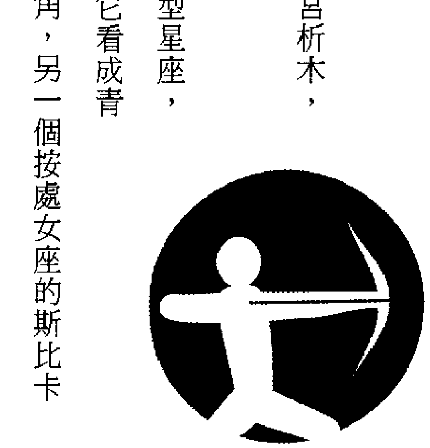

此時期迎接冬天寒冷期，生物靜靜地進入冬眠狀態中。您的性格中具有向各種矛盾、自由、正義邁進的本能。您受到管理星——木星的真理、雙重性格的影響，您的性格相當理想，追求最高的、普通的、觀念的懂憬，有理想，並向多方面發展您的才能。

### 第一節 射手星座的性格

析木出生的人，都有比較好的容貌。古時，只要尾與箕發出完整的光澤，就認為國家富有，而析木出生的人，可能是包含這兩個星宿，有財運和物質運。可是生來就是羅曼蒂克的人，所以不會運用天賦的命運，過有財富的生活。比物質更願追求羅曼史的愛情，因此也容易失去巨大的財運，這種情形往往是發生在人生的前半段。

關於性方面，不分男女都富有精力，但自己卻不認為很有精力。如是女性就有敏銳的感覺，對性感之追求雖貪婪，但不會僅顧自己的快樂，她是想提高對方的感受，一起享受陶醉的人，服侍精神特別良好。

可是，說起來是屬於較笨的類型，所以對技巧之運用並不熟練。

不分男女在進入三十歲以後，就會有肥胖的趨勢，應避免美食。還有火雞和住宅不安定的相，應多注意。相性方面和降婁出生的人最適合。

射手星座，在晚夏的夜空上由六個星星組成的星座，射手座記號 Archer 箭型，具有向目標自由邁進的意義。

從「半人半馬」上可以想像得到，它由兩個性格組成，屬於知識方面的是人類，屬於行動方面的是馬匹。

管理星——木星是掌管天界的王，並為人類世界各種法律和秩序的發號施令之神。木星係多情種子，和天上的許多女神有來往，也和人有過交情，是普遍、真理、正義的象徵，在行動上具有許多矛盾的性格。

射手座的人受到上述性格影響，以真、善、美做為目標，求在自由的精神上生活，是享受自由的樂天派人。

您對他人很親切，用情很深，但您有時也會為情而煩惱，您很重視抽象的事物，對禮節、論理表示嚴格態度。

射手座屬於火宮、柔軟宮，研究性格時值得探究。

### 一、表現性格

您的性格和行動並不單純，含有許多矛盾，多樣、多面性是您的特殊性格。

您的求知慾很強，熱心地向真理、理想前進，不滿於現實和世俗，不斷注意新知識方面。

不管如何遙遠，都不躊躇地向理想方向邁進。

為發現精神上的自由，不辭任何辛苦，求知慾望不斷地如泉源一樣湧出來，您必須親眼去觀察正確的真、善、美，用自己理想去判斷，訴諸您的直觀力。您為了到達此境界，您不惜跑遍全世界。

您的性格中，找不到黑暗、陰濕的部分，性格開朗、親切、快樂，對正義理想好像很有自信，活潑、精神上非常快樂。

您為人率直、衣著整齊、不喜修飾，雖有時言語中也有過火之處，但那是一種矛盾性格的表現。

當您訂下一個目標，行動途中，如果有了一個新觀念搖動您的心，那麼，您也會捨棄您已做到十分之八，將近完成的工作，而向您認為更有價值的目標邁進。您如此大膽的作風，不過是您追求自由精神上的環遊模式罷了。

### 二、分類性格

射手座根據其生日，以十天為一區分，分為三類，每類各有其細微不同的性格。

1. 第一類（十一月廿三日～十二月二日）受到前天蠍座影響，具有天蠍座性格。並接受少許的雙子座性格，具有少許陰性，觀察力強、肯研究事物真理。
2. 第二類（十二月三日～十二月十一日）最具有射手座性格，但受部分牡羊座影響，個性激烈、勇敢。
3. 第三類（十二月十二日～十二月廿二日）性格受到下一星座魔羯座影響，陰性、樸素、意志堅強、心中具有強烈野心，並接受少許的獅子座性格，愛出風頭，想像力很豐富。

## CH14 射手星座

## 第二節 射手星座的命運趨勢

您的命運來源有二，一是接受射手座的求知、衝動、愛好自由和速度的性格，另一方面受木星影響，具有追求真理、道德、精神、思想、論理、抽象等和真善有關的思想，加上多情的性格，使您的人生多采多姿。

您的人生無法在日常生活中定型，因為您的性格不斷向前發展著，假如您的家庭經濟很富裕，您也不願坐享其成、安居在家中，因您不耐於家庭中的現實問題。

您關心的是更大的價值和新知識，為了達到您的目的，不惜花鉅資去環遊世界。

您向人生坦途邁進，不走歧路，而能達到目的地，的確是非常偉大的，但人生行動不一定那麼單純，有時也會無法上軌道，使您變成迷途羔羊，無法到達目的地，但是您並不氣餒，仍會繼續前進，發揮人生崇高的境界。

### 射手星座的職業與財運

射手座的人，重視理性和自由，強烈反對被強迫和發展機會很少的工作。您富有機智、多才，並持有衝動個性。

您討厭住在狹小的世界裡，愛站在廣大的世界去考慮、判斷、行動、不拘小節。視個人問題不如社會問題，社會的不如世界的重要。

您追求有價值的事物，並付諸行動，因此，為運用您的優點，您必須找有深度、有意義、有價值的工作，如此，才能發展您的鴻圖。

您不適合擔任粗俗不堪、千篇一律的單調工作，當您找到有價值、總之，您接受了偉大的天資，您別浪費您的良好資質，好好利用您的機智和才能，過有意義的人生。

### ◎您的適宜職業

適合您個性的工作，您的事業才有發展之日。

才能、智慧特優的您，擔任一些無關緊要的工作是智慧的浪費，只要能夠發揮您才能的工作，就有成功希望。

例如研究學問、教育界、文化界、政治、外交、一般公務員、司法官等，尚有作家、美術家，以及旅行、研究、翻譯等等工作都適宜。

### 其次是金錢運（財運）

您很認真做事，不願蟄居在家裡。認真做事的人不會為金錢所困，可惜，您不善於積蓄。因此，用錢難免有浪費之嫌。

不過，您只要積極地做事，收入隨之而多，財運會光顧您。假如有必要，花一些錢在所不惜，有時買一些股票也無不可，因您有一點投機運。

## 第四節 射手星座的健康運

愛自由的您，絕不會成為守財奴，而且聰明的您，對物件價值估計能力很強，絕不會損失無謂金錢。

您是個大忙人，消耗體力的熱量比他人多一倍，新陳代謝很活潑。下面列出須注意的兩個要點。

- 第一，多攝取高單位卡路里物質，預防缺少卡路里。
- 第二，開放精神，多去遊山玩水，使心曠神怡。

#### ◎您最易患的病症

肝臟疾病和呼吸器官疾病最多，還有神經痛等病症也要注意。以上都是過勞和怕冷之因。飲酒須適量。別亂消耗體力，是保護您身體的最佳方法。

## 第五節 射手星座的戀愛和結婚趨勢

簡單地說，射手座是標準的自由人，求真理、追快樂、自由開放，而且追求的是廣泛多方面的。

戀愛方面，平凡型的不是他所喜歡的，都要由自己製造多種快樂氣氛。射手座的人絕不會使戀愛的對方感覺寂寞。

有時，會覺得很快樂，有時消沉不進，有時是淑女型，有時也會變成十三點型少女，形形色色的。

他們的外觀很多情，他（她）們對對方都很忠實，沒有計較成分，純正地追求理想。

此星座的男性是發展家，暢遊過各地，性格開朗的人，做為戀愛對象，的確是有趣。

至於已婚的男性，對太太很好，不過，對其他女性也很親切，在公、私兩方面，他不願靜靜地坐著，因此，做為他的妻子，必須對他有所諒解，不然心中就無法過安寧日子。

做為太太的射手座婦女，對愛情交流很積極，是幸福的。

性方面，男女都很熱心，而且適應能力也很強。

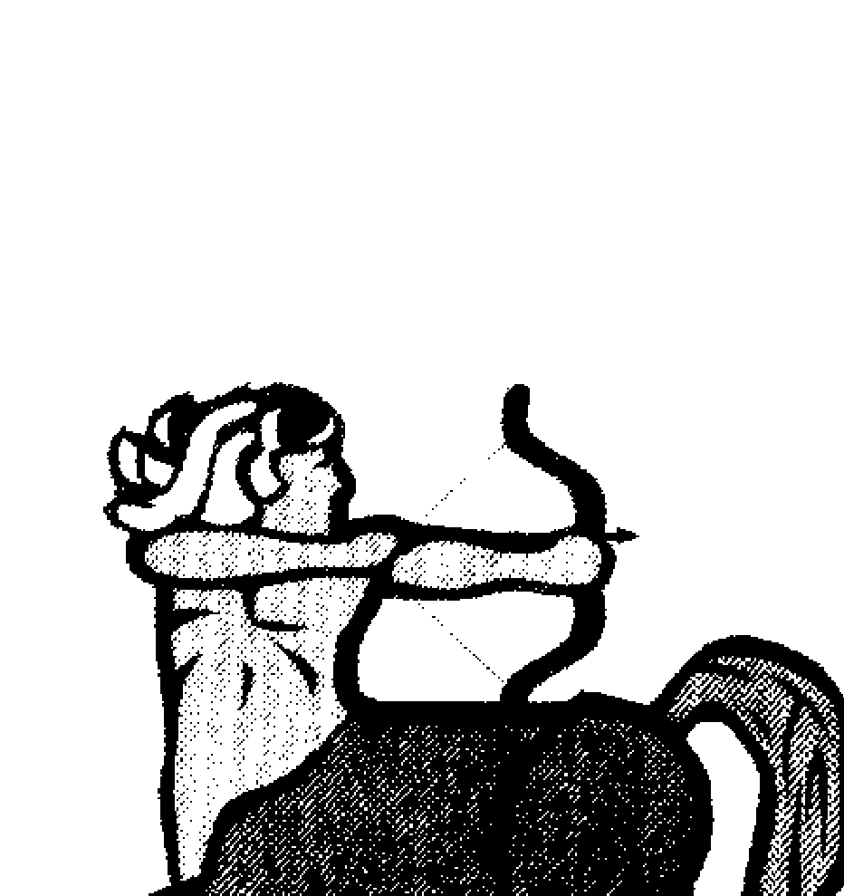

### 第六节 射手星座和其他星座的结合

### 一、和牡羊座的结合（大吉）

射手座的您做事机警、敏捷，爱好自由、理想生活。牡羊座的人，富有正义感，向上心理很强，迈进不退，攻击力强，您俩的性格有不少共鳴之处。
假如，您的目标是正确，那么，牡羊座就是您的良好共鳴者，支持您的人，他做为您的伴侶是最适合的对象，你们的结合可以过最有意义的生活。
角相是一百二十度，双方都属于火宫，相性很好。

### 二、和狮子座的结合（大吉）

狮子座的人，开朗、光明正大、有威严、对他人亲切、热情、爱给人希望，受到许多人称赞，虽然有时也会发一点小脾气、为矛盾而烦恼，但他都是用温暖心情容忍他人。当您抱著坦然的心情，向自由翱翔时，狮子座的人会指示您应走的正确方向，因此，狮子座是您难得的对象。您可能获得他的宽容、温暖和安慰，您一向不愿闭居家中，狮子座的人是您的最佳支持者。角相是一百二十度，并同属于火宫，相性是很好的。

### 三、和射手座的结合（大吉）

同属于射手座的你们，互相的优点加倍，是好的结合。你们强而有力的个性，会使你们生活更加活泼，使您俩随心所欲，去做游历各地的旅行，增加生活乐趣和经验。

您俩的优点不少，但也有不少缺点，例如多心、多欲、易冲动、有时很沉稳，但有时也会慌张不知所措，因性格过于率直，有时也会发表一些自私的言论而自鸣得意等，因你们都有相同缺点，最好别互相指摘，以免大伤和气。

总之，您俩不太会为个人问题而烦恼，和其他家庭不同，你们具有独特优点。

### 四、和天秤座的结合（吉）

您的对手——天秤座人，富有美的感觉和温和的感情，他会带给他人欢喜、爱好公平、调和性格，可以缓和您的双重性格的矛盾。

射手座的人，恋爱积极热情，虽然有些冲动、多情之嫌，但经过天秤座的温和、自然爱的律动，使你们的爱情持久不变，变成一对快乐的配偶，而且天秤座的平凡生活，可由您多彩多姿的生活调整过来。

天秤座的他喜欢和他人相处，射手座的您，事事都表示关心。因此，你们都很忙碌，如果，对于生活细节都要用心去管，那么，你们就要疲于奔命了。「处之泰然」是你们最佳的「座右铭」。

角相是六十度，相性不错。

### 五、和水瓶座的结合（吉）

水瓶座的人以自由和进步为生活目标，射手座的您也是憧憬自由生活，因此都是性格相似的一对，您对于他的率直、为人老实表示好感，并对于他的思想自由和独创表示赞同和共鳴。你们都讨厌那些平凡、单调的生活，不服从压迫，重视理想和广大世界，你们意见相同，你们的生活新潮而进步。角相是六十度，相性不错。

### 六、和双子座的结合（吉）

双子座的人具有社交能力、学问、艺术和其他各种才能。射手座的您，同样脑力很强，具有向上能力、做事积极，性格很相似，是好的对象。但是，双子座的人，易受环境影响，而且为了找机会往往会失去行动能力，变成沉思和啰嗦的人。双子座的人只会谈理智的恋爱，没有热情的恋爱，也会使您失望。他的二元性的性格和行动，和您的不大安定的生活结合时，以及映入您眼中的他的「多才、善交」，您都认为那是多余、不切实际的作风，表示异议。角相是一百八十度，有条件的好相性。

### 七、和双鱼座的结合（凶）

双鱼座的人，爱梦幻生活，情绪的成分很重。这种性格和您的重视实际行动作风则相反。而且，双鱼座的人在现实生活上，格外自私，自视甚高，不向人认输，有时也会气恼不堪，因为娇气甚重，使您无法应付。

### 八、和处女座的结合（凶）

处女座的人感受能力敏锐、神经纤细，和您的个性相差很多，您的强力个性，直进型性格、消极态度，性格上差异太大了，您虽然不讨厌感伤型、可爱的处女座，但她的纯真，和您的多情、冲动、性急的爱情表现法，却是不能相称。
角相是九十度，相性不佳。
不过当看到他人的不幸时，他就无法缄默，都会出一臂之力去帮助他。双鱼座的人，有热情和内向的两种性格，影响你们的关系甚大。

### 九、和金牛座的结合（普通）

金牛座的人，温顺、和平、爱美、热心于照顾自己，为人严格、不辞辛苦。您的性格率直、活泼、行动机警敏捷，两人的性格大不相同。在勤勉、神经纤细的金牛座人眼中，您是缺乏沉著，过于重视理智的人物。您对金牛座的那种缠住不放的态度也表示厌恶。

### 十、和巨蟹座的结合（普通）

巨蟹座的性格，具有母性爱、情绪丰富、感受能力敏锐，强烈地表现好恶，他爱好和平家庭的生活，做为一家主妇，内助之功不可没。他（她）们虽有适应环境的能力，但另一方面，脾气不太好，名誉心重，当他的名声受打击时，其反抗力很大，把心中所想到的都要一一付诸行动。的确是名副其实的「女性型」。

### 十一、和天蝎座的结合（普通）

首先感觉到的是阴性的天蝎座和阳性的射手座的您，结合很难。
天蝎座人的特性，爱守秘密，具有冷静、看透对方的能力，探求事物、恋爱、性方面都绝对站在独占地位，要求对方的忠诚和节操，情欲是激烈无比的。如果，您想和他配合，不是易事，您实在不耐烦他的脾气，和他结合使您厌恶到想跑到另一个世界里去。
您喜欢更快乐的另一个世界，而且您的性生活是积极、开放的，但天蝎座的性，极强而有力。感情虽不同，但能力都是很相似的。

### 十二、和魔羯座的结合（普通）

魔羯座的优点是做事认真，步步为营，阴沉爱孤单，做事慎重正确，有负责精神，在您的眼中，他是一位无趣、顽固、不好相处的人物。
不过，他是能干的人物，有常识、坚实地守护家庭的人。假如您希望的是幸福，不过度强烈的爱情，那么，你们的幸福家庭将会来临。

### 第七节 射手星座的幸福幸运年龄

男性射手星座生者，大抵以二十四岁、三十岁最幸福。女性射手星座生者，大抵以二十一岁、二十七岁最幸福。不论男性、女性，射手星座生者，凡遇寅午戌之流年皆为幸运之年。

## 后语

占星术在中、西方若有相同沟通之处，但由于我们对于天文星象的知识瞭解的太少，对于占星术的源流无从考据，甚至连西洋神话赋予每一星座的传説故事也知道的太少，因此只能勉强就手边可以找到的几本译本，以为整理、编辑成书。

笔者在编撰本书时，心中总是想像著，在人类还没有发现海王星、天王星、冥王星的时候，西洋早已有此三神祇的传説，原来的占星术已经运用在日月五神及此三神推计星曜对于人类宿命的影响，直到后来才逐一发现此三行星，而分别依神话命名为海王、天王、冥王，莫名其妙的使占星使用的神祇与未知的星象吻合，不免产生占星术发明者的困惑。

到底是怎样高等智慧的人类发明了占星术呢？

中国古代占星是否与西洋占星术同出一系呢？

中国稍后之占星术在什么时候受到西方占星术之影响呢？

很久很久以前，是否曾经有过极高度的文明发生过呢？是不是人类正在重新发现古代失落的文明呢？

许多困惑萦于心而无法排遣，回观占星一术虽然形同纸上谈兵、闭门造车，但以其中又蕴涵著无限玄奥与令人惊讶的准确，终于又产生了纷乱的思绪——

## 天文星象真的影响人类的宿命吗？

宿命既然天定，却未见同年、月、日、时出生的人发生完全相同的两个命例，又如何可以证据生死有命呢？

忽然想起了火车交会的数学逻辑问题：

一、假定两列火车俱长一百五十公尺，以著相同的每小时一百二十公里相对行驶，那么火车将产生什么样的交会情形呢？

二、以数学推考，自两列车头相并而至车尾分离，则交会的长度成为两百公尺，而火车之秒速为三十三又三分之一公尺，两车以相同速度交错而分开，则须历时四点五秒。

三、假使置身于其一列车之中，则两火车虽然交会，对于置身之人而言，则其所感觉火车交会时间，仅为数学思考之半，只有二点二五秒的时间而已！

由于交错问题的不同思考，是否可以引伸为命理之观测与占验的思考呢？

假使这样的比喻恰当且可以触类引申，那么占星术与任何命理的观测研判，就好像以数学来推考火车的交会，其交会的距离长而时间多，但是宿命的占验则若置身于列车中而有实际感觉，其感觉只是相对的列车长度及通过的时间而已！

那么，不论天文星象是否能够影响人类宿命，即使确定「生死有命，富贵在天」，对于命理及占星术之研判及实际人生，亦必然发生某种程度的差别，甚至于您虽置身于列车之上，您并不一定注意到列车的交会，或者您刚好睡著了而未感觉火车的交会，岂不是暗示了「我思故我在」，「我在故我思」的人生哲理吗？

本此胡思幻想，命理即或如神，吉凶好坏必不能更改，唯其以自我心态而发生感觉之不同，并非（火车交会）事项本体之改变，为什么总是常听见：「命运能否改造？」的疑问呢？

又譬知，科学发现海王、天王、冥王三星而附会神话以为命名，并不表示人类很久以前就已经确知有此三行星存在，只是因为有其思想，用心去寻找，果然发现而为命名——这是不是暗示任何一个人，因为心中先有吉凶富贵，因循此一不自知的吉凶、富贵的潜意识或有意识而行为，终于发生了吉凶富贵征兆呢？

假想，命理俱以人类秉性之性格而推演，那么其所可产生之行为及结果，纯粹只是一种或然。而非必然，因此不妨下一个结论——

命理，为命运或然现象之参考。

命理，为人格修养之参考。

命运，为人格秉性表现于言行之结果。

「江山易改，秉性难移」，所以命理依据性格推演而或然准验，如果日常三省，时常反省，性格能够移易，则命理不能相对或然应数，必然不验矣！

命运可以改造，操之在我，唯人自招而已矣！

## 中国五术教育协会副理事长
黄恒堉 著作

- 学八字，这本最好用
- 学姓名学，这本最好用
- 学数字断吉凶，这本最好用
- 初学手相，这本最好用

定價：300 元
（附八字论命光碟）
看完本书，保证你一定会精准断八字。

定價：320 元
（附光碟）
保证一分钟得知姓名吉凶!!附贈价值2000元电脑软体。

定價：320 元
（附数字断吉凶光碟）
史上最容易上手，最实用的命理书只要看懂中文字，随时随地都能上手。

定價：300 元
（附光碟）
彩色图文整合解說，附贈超值光碟论命软体，一本就搞定纷乱复杂的掌纹秘密。

## 黄恒堉

- 吉祥坊易经开运中心负责人
- 右成企管顾问有限公司负责人
- 中国五术教育协会理事兼学术讲师
- 中华风水命相学会学术讲师
- 智盛国际公关有限公司专任讲师
- 永春不动产加盟总部阳宅讲师兼顾问
- 中华真爱生命关怀协会常务理事
- 美国南加州理工大学MBA（研究中）
- 国际行销大学企业行销班讲师
- 中小学、大专、社团全脑开发兼任讲师
- 纬来电视台天外有天粗盐开运节目老师
- 大学社团、读书会、命理与人际关系养成讲师
- 各大寿险公司，命理行销专题讲师（1000个场）
- 扶轮社、狮子会、青商会、妇女会等社团命理讲座
- 中信、住商、太平洋、信义房屋、面相阳宅开运法讲师
- 著有：学姓名学，这本最好用
学八字，这本最好用
八字论命软体一套
数字论吉凶随查手册一本
十二生肖姓名学 VCD 一套
开运名片教学 VCD 一套
开运印鑑教学 VCD 一套
奇门遁甲流手冊及软体一套
心想事成开运法 VCD 一套
手相速查手册彩色版一本

## 周易道玄养生堂负责人
黄辉石 著作

- 活学妙用易经64卦
- 活学活用生活易经
- 学会易经・占卜的第一本书

定價：350 元
中国古老智慧，一生必读经典。

定價：260 元
轻松霑濡《易经》的博大精深。

定價：300 元
易经占卜最权威，最畅销的一本书，引领您轻松进入易经占卜的世界。

## 黄辉石

- 祖籍台湾嘉义朴子，一九五八年生。
- 东方工专工管科毕业、中华道教学院研究生。
- 现任周易道玄养生堂负责人、中华道教学院易经讲师、中华道教学院校友会第二届会长。
- 早年兴趣颇为广泛，研究过堪舆、紫微、八字、姓名学、奇门遁甲、六壬神式、手面相、道教神学、易经卜卦等。
- 人生志愿：希望能研究出一套简捷的方法，让易经生活化。

## 亚洲最大命理网站「占卜大观园」命理总顾问 陈哲毅 著作

- 学面相学的第一本书
- 学会手相学的第一本书 2（事业、感情篇）
- 学会手相学的第一本书（基础入门篇）
- 第一次学面相学就做对

定價：250 元
图文搭配解說，让您轻松学会面相学。

定價：250 元
按图索骥，一分钟告诉你爱情、事业运。

定價：250 元
精采图文搭配，让读者轻轻鬆鬆看懂掌纹秘密。

定價：250 元
最完整详尽的解說，让您有系统掌握面相学堂奥。

## 陈哲毅

- 亚洲最大个人命理资料库网站「占卜大观园」命理总顾问。
- 淡江大学、华梵大学、万能技术学院等校易学研究社指导老师。
- 中华民国九十二年十大杰出命理金像奖。
- 曾任中国河洛理数易经学会理事长、日本高岛易断总本部学术顾问。
- 现任中华联合五术团体总会会长、中国择日师学会理事长、中华五术社团联盟总会会长、大成报专栏作家。
- 著有《学梅花易数，这本最好用》《第一次学手相学就学会——事业感情篇》《第一次学手相学就学会——基础入门篇》《第一次学面相学就学会》《学会面相学的第一本书》《姓名学开馆的第一本书》《陈哲毅姓名学讲堂》《学习姓名学的第一本书》《陈哲毅教您取好名开福运》等 70 余种。

## 国家图书馆出版品预行编目资料

大师教你西洋占星术／乾坤子著
——第一版—— 台北市：知青频道出版；
红蚂蚁图书发行，2009.07
面 公分——（大师系列：12）
ISBN 978-986-6643-80-4 (精装)
1.占星术

229.22 98010189

## 大师系列 12

# 大师教你西洋占星术

- 作者／乾坤子
- 校对／周英嬙、杨安妮、朱慧蒨
- 发行人／赖秀珍
- 荣誉总监／张锦基
- 总编辑／何南辉
- 出版／知青频道出版有限公司
- 发行／红蚂蚁图书有限公司
- 地址／台北市内湖区旧宗路二段121巷28号4F
- 网站／www.e-redant.com
- 邮拨帐号／1604621-1 红蚂蚁图书有限公司
- 电话／(02)2795-3656（代表号）
- 传真／(02)2795-4100
- 登记证／局版北市业字第796号
- 数位阅听／www.onlinebook.com
- 港澳总经销／和平图书有限公司
- 地址／香港柴湾嘉业街12号百乐门大厦17F
- 电话／(852)2804-6687
- 新马总经销／诺文文化事业私人有限公司
- 新加坡／TEL:(65)6462-6141 FAX:(65)6469-4043
- 马来西亚／TEL:(603)9179-6333 FAX:(603)9179-6060
- 法律顾问／许晏宾律师
- 印刷厂／鸿运彩色印刷有限公司

出版日期／2009年 7 月 第一版第一刷

定價 320 元 港幣 107 元

敬请尊重智慧财产权，未经本社同意，请勿翻印，转载或部分节录。
如有破损或装订错误，请寄回本社更换。

ISBN 978-986-6643-80-4 Printed in Taiwan