大灵之药

ONE SPIRIT MEDICINE

遵循萨满的古老智慧
安顿我们的身心与灵魂
回归最初的纯净与美好

逢甲大学校务顾问 林德培
元利整全健康诊所所长 徐粹烈
园艺辅助治疗协会理事长 黄盛璘 联合推荐
阿贝托·维洛多博士 Alberto Villoldo, Ph.D. 著 李育青 译

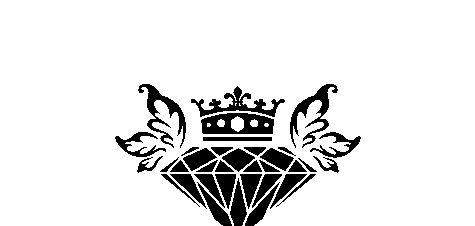

St. Royal College

### 天使神秘学院

- 专业占卜预测机构
- 神秘学培训机构
- 水晶能量研究中心
- 神秘学资料库
- 官方微信：strcdts
- 微信公众平台：strc2011
- 读书交流QQ群：
  - 占星塔罗占卜师交流群：814594478（加入密码：PDF）
  - 神秘学其他综合群：659338717（加入密码：PDF）

微信号：strcdts

### 天使神秘学院

天使神秘学院 院长QQ：715104687

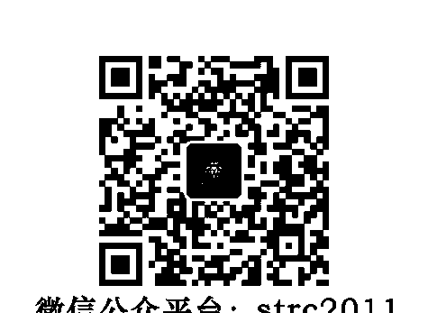

微信公众平台：strc2011

## 制作说明：

本书由《天使神秘学院》出重金从台湾购入的原版书籍扫描制作完成。为达到最好阅读效果，特地把原版书全部切开后，再经由专业扫描设备高精度扫描完成，并经过一张张的PS后期处理最终成书，其间花费大量的人力、物力以及时间，只为能给大家提供经济并优质的神秘学学习资料而努力。

本学院强力谴责某些机构和个人，把本学院花心血制作完成的电子书籍，包装后直接放在自家淘宝网上低价销售的行为，以谋取不劳而获的经济利益。如果长此以往最终将无人愿意再为大家花心思制作电子书，那以后可能大家再无新书可读。

为让大家以后能够读到更多的好书，也为了本学院的良性发展。本学院恳请大家尽量做到如下几点：

- 一、尽量在本学院的网站购买电子书籍。
- 二、请勿用技术手段把电子书内的水印及加密去掉。
- 三、在收到电子书后小范围传阅即可，千万不要公开传播，更别挂到淘宝网上低价销售。

同时为答谢广大支持者，学院电子书将做如下调整：

- 一、学院会把一些早已收回制作成本的电子书折价销售。
- 二、最新制作的电子书籍会开放打印功能，大家购买后有条件的可自行打印成书。

天使神秘学院
2019年1月

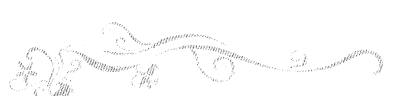

献给艾莲娜·阿雷莉亚诺·维洛多
（Elena Arellano De Villoldo）
以及艾莲娜·卡本特
（Elena V. Carpenter）
母亲与姊妹
以爱之名

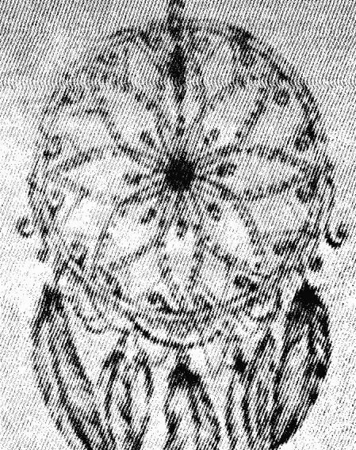

推荐序 开启健康之钥 林德培 006

推荐序 整全健康之路的密码 徐粹烈 008

推荐序 走在「大灵之药」旅程中 黄盛璘 011

引言 016

## 第一部 发现你内在的疗愈者

### 第一章 萨满之药 036

### 第二章 神灵与隐形世界 043

### 第三章 罢黜暴君 058

## 第二部 褪下旧途

### 第四章 清除脑肠的毒物 072

### 第五章 超级食物与超级补充品 104

## 第三部 战胜那悄悄潜近你的死亡

### 第六章 重设死亡的时钟 130

### 第七章 从压力源解放你自己 146

## 第四部 重生始于寂静

### 第八章 怀抱一个新的神话 164

### 第九章 疗愈者的旅程 175

### 第十章 神圣女性的旅程 187

### 第十一章 贤者的旅程 208

### 第十二章 梦想者的旅程 221

### 第十三章 灵境的追寻 237

### 后话——超越大灵之药 263

### 致谢 276

# 大灵之药

### 推荐序——

### 开启健康之钥

现今的社会，长期处于忙碌紧张的我们，常被时间绑架，很少可以静下心来，思索自己生命的价值。阅读《大灵之药》，有如让自己在烦扰喧嚣的世界中，找到了一处身心灵都能拥有宁静与休憩放松的绿洲。

《大灵之药》告诉我们如何罢黜以往的旧思想，用正面积极的态度来面对及释放自己的内在压力，进而摆脱原生家庭所带来的限制及传承的伤害，指引我们进入正面积极、充满活力的生命旅程。

本书结合了传统的智慧与现代的营养学，教导我们如何调整日常生活中的饮食，藉以排出影响身体机能的有害毒素，书中增强自体免疫系统及抵抗力，让食物变成治愈身体疾病的灵药，吃出真正的健康。更提醒我们如何面对死亡及克服它所带来的恐惧，放下之前，整清何谓对自己的幸福及生存必要条件的固定想法，让自己面对人世间的所谓无常及不确定性更有信心，而不被这样的慢性焦虑感所困扰。作者并教导我们如何发展与周遭环境及人群的正确关系，真诚的专注于自己的存在价值，与宇宙和谐共生，轻盈

> 彭祖

漫舞，达到全然的平衡。大灵之药，也可说是大灵之「钥」，它开启了自我修复内在和谐之锁，疗愈了身心，也修补了我们的心灵，也让我们成为自己的医治者。领受大灵之药，你将活出真正的自我价值，进入一个全然不同的人生。

### 林德培教授

- 中宏企业有限公司董事长
- 量子工程顾问股份有限公司董事长
- 逢甲大学校长室校务顾问
- 奇钛科技股份有限公司顾问

## 推荐序——

### 整全健康之路的密码

在这不确定性的年代里，人类面临生存环境急剧的变迁和天灾人祸，包括各种极端气候如地震、海啸、雾霾，以及空气品质恶化、土壤含各种重金属化学物质，使得食材中含有毒素，饮水更是受到工业排放的污染，严重地危害人类的健康。因此要找寻人间的净土或世外桃源，确实非常不容易。

现代人的生活方式随着科技的进步而有了改变，饮食习惯、工作压力、贫富差距，以及人口结构的老化和少子化，造成各类型的文明疾病如肥胖、代谢异常、心血管疾病和脑中风，导致健康照顾品质和花费剧增。更严重的是，人们对生命意义的迷失，导致各类型精神病患日增，自杀事件及暴力事件频传，成为社会结构性失衡的原因之一。

目前国内正统医学仅提供疾病的处置方法和治疗，往往忽略了心灵上的照顾。作者马逊河流域寻求古老智慧及萨满疗愈技巧的经过，透过与自然神灵的沟通，发挥自我修复、自我疗愈，及自我疗愈的本能。

阿贝托·维洛多在过去的十几年曾出版一系列的书籍，提供自己早年在南美洲秘鲁、亚

> 徐梓烈

### 推荐序——整全健康之路的密码

在《大灵之药》里，作者更进一步地将古老萨满的智慧与体验，和现代的细胞学、营养、排毒、信息、能量、记忆、传递、重建和再生功能与研究，紧密地结合，提供了现代人新的思维与新的生活方式。在与大自然对话的学习中，适时地补充健康植物性的食物，可以对抗氧化及压力，并减缓发炎反应及慢性疾病的发生，是目前养生、抗衰老及保持精气神的不二法门。本书提供了练习模组，让我们能从自我学习过程中得到发，进而转化为正面的能量，是自我疗愈中最有效的处方。

书中更深入地探讨人类肠道微生物体（human gut microbiota），亦即肠道——大脑——身体——行为之间紧密的关系。目前科学家所了解的人类免疫系统，是新陈代谢和能量动态的平衡状态，而大脑中枢神经系统的发育、发展、发育和行为的表现，都与这个机制的调控有关。若能深度了解这个交互作用的轴线，并操控肠道微生物体，是未来发展对抗人类疾病和改善健康的重要法门。

透过本书，作者提供了我们找回生命元气和正念思考的角度，进而去认识自己人生的意义，享受平安、快乐与健康的生活。

### 徐粹烈医师

- 元利整全健康诊所院长
- 台北振兴医院心脏内科特约主治医师
- 日本循环学会名誉会员
- 台湾渐冻人学会名誉理事长
- 整全性健康管理协会理事及台北分会会长

## 推荐序——走在「大灵之药」旅程中

一位萨满朋友打电话来给我：「阿贝托的新书，要出中文版了，想请你写推荐文。」「为什么？萨满修得比我好的人这么多。」「我直觉就认为这本要你来写。」

「噢……朋友这么一说，竟好奇的就答应了：「那我先看看再说。」于是就接到出版社编辑寄来厚厚一叠稿子。

原来是阿贝托生了一场大病，后来寻求萨满医疗之路，竟奇迹似的活过来了，他将他的治疗过程整理出来，因此而有了这本「大灵之药」！

寻着他的医疗过程，我手停不下来的一直流红线：啊，这个我经历过……那个我参加过……仿佛借着阿贝托的整理，我也慢慢对这几年做的一些事一点一滴的串连起来。

首先是与萨满的结缘。十四年前了吧，从美国回来，下定决心做了二十年的编辑，转进全新未知的「园艺治疗」这条路。面对扮演这新的「助人者」角色，我愈来愈觉得我需要大自然的支持力量。于是我刻意在各种灵修中寻找最接近大自然的方式，而且指导老师一定要是喜爱大自然的人，依着心里的这把尺，我找到李育青老师的「印加萨

黄盛璘

### 大爱之声

满」。愚钝如我，看着同修上课时的敏感反应，忍不住质疑自己，但是老师一句话：「你只要相信、去做，就对了。」是呀，我非常相信大地、植物等都有灵！于是，抓紧李育青老师，任何一堂课都不错过。

我原是个非常理性的人，很多事都用「意志力」、咬个牙就撑过了。可是服务特殊族群时，我发现最行不通的就是「意志力」，于是我慢慢试着蜕下这个旧习，学着改用「同理心」。对突来的、一闪而过的信息灵感，我练习去捕捉它、接受它，不再用理性的撤掉它。

原来这时，我正走在「疗愈者的旅程」，经历南方蛇蜕皮的阶段。随着高龄化的社会，在园艺治疗里，老人是我们很大的服务族群，其中不乏失智老人。随着失智老人人口逐年增加，长寿似乎不再是让人羡慕及祝福的事了，对着这一无法预知的疾病，不知不觉，我也仿佛得了「失智恐慌症」，常有失智了怎么办的焦虑。

前阵子，一位老友毫无预警的中风倒下，虽已脱离鬼门关，但只能用已瘫的躯体来面对未来。原来死亡是可以这么的近身突袭呀！「死亡」和「无常」的恐惧，我不知不觉的被印记了下来。于是我看到阿贝托警告着：「恐惧让你始终保持在一个慢性而过度警戒的状态，迫使你变成受害者以及某人的晚餐。」、「我们的情绪会让自己生病。」、「当有害情绪主宰你的思考与神经系统时，你就会让自己处于危险之中。」

### 推荐序 —— 走在「大灵之药」旅程中

原来，我开始启动了书中第三部「战胜那悄悄潜近你的死亡」。「为了要改变你的大脑，你将需要去抵制那默许自身长期建立的，关于恐惧、侵略、防卫以及其他有害情绪的编程」。接着，阿贝托教我们：「释放那些陈旧的、以恐惧为资粮的生活态度。」要我们放掉对年老、失智和死亡的恐惧。园艺治疗工作正是我走在「东方梦想者的旅程」时，阿贝托提醒我：「每种神圣恩赐都带来某种义务，在东方，这个义务就是将你所获得的智慧，分享给其它人。」他教导我：「你不用成天想着摆脱一个接着一个的困难，只需要欣赏每一个片刻带来的所有奇迹。」、「当我们把自己领受到的疗愈恩赐带给其它人时，这些恩赐的益处才会真正地变成我们的。」最后是「灵境追寻」。这个东方的导引修习，是一种体验大灵转变成力量的古老方法。我在今年三月初参加了四天的灵境追寻。当初参加，只是纯粹好奇，想知道在断食四天，没帐篷下，我会进入什么样的状态？我带着「老」与「死亡」的问题，进到荒野中。选在一个由大小树圈起的范围里，由一块营布简陋拉起的帐篷，渡过了四天。第一天，看到一棵半倒的老树，由另一棵大树撑住，旁边小树正难大树呵护下，努力长大着。我读到了答案：就像这树家族，大树帮助小树长大，有一天大树老了、倒了，长大的小树自然会撑住他的。你现在的工作就只要努力照顾好小树，未来小树会照

顾你的。不用担心。
到第三天，我心情莫名地烦躁、焦虑起来。这时，连着两天，绿绣眼飞进我的圈圈
来，对着我唱。当我读到：「当你在做灵境追寻时，将会邀请力量动物来到你身旁，并
教导你牠的方式。」这才恍然：「啊！原来我的力量动物就是绿绣眼呀！牠来告诉我：轻
盈是我们的力量。我该学会放轻松。
看完这本书，跟着阿贝托走完这趟「大灵之药」的旅程，我知道为什么萨满朋友要
我写推荐文了。透过阿贝托这本书，才知道我这十几年来身为「园艺治疗师」的摸索过
程，就是一直在追寻着「大灵之药」呀！透过阿贝托的经历与整理，仿佛一道晨曦射
进，脉络条理才逐渐清楚了起来……。
是的，我愿意持续领受「大灵之药」，去发现内在的疗愈者；蜕下陈旧的过往经
验；战胜那潜近而来的「死亡」恐惧；克服对改变与失去的害怕，去发现人生旅程的目
的。也因着与大自然的神灵一起工作，于我们赖以生存的地球，有了更多承诺与责任。

- 黄盛璘（大黄老师）
- 台湾园艺辅助治疗协会理事长
- 台湾首位取得美国认证之园艺治疗师
- 财团法人天愿文教基金会董事
- 亚太园艺治疗协会高级园艺治疗师 HTM

## 引言

此刻对我而言，可谓是万般皆顺逐。身为一位十二本备受赞誉的畅销书作者，以及心理学博士学位的医学人类学家与研究者，而且在世界上拥有多众多追随者的老师与疗愈者，我正站在自己事业上的巅峰。而本人所创立的「四风协会」与「光体疗愈学校」也快速地成长，已有超过五千名的学生完成其中的能量医学训练，或与我共同参加亚马逊与安地斯山的旅程，虽然这些都只是阅听大众所能看到的成就。在我内心深处，有许多关于灵性道途上所领受到的内在恩典，而最珍贵的礼物，莫过于是与挚爱的伴侣携手同行。

正值生命看起来已属不可能再更好的当下，我的脚步被迫停下。突然间，必须穷尽过去三十多年，从那些世上最有天赋的疗愈者的学习所得，来为自己的生存奋力一搏。

如你所知，我也是一位萨满，在南美洲的高山与丛林中、加勒比海地区，与亚洲受训习得此一原住民族的古老疗愈方式。

## 引言

显而易见的是，亚马逊雨林并非比佛利山的希尔顿饭店，所以当我告诉人们我在做些什么，他们经常说：「你疯了吗？」我明了他们的关心。萨满之道并不适合每个人，训练既严格且费力，还得承沉重的代价。当时的我人正在墨西哥，身为一场关于萨满的研讨会的主要讲演者，在毫无预警之下，我发现自己走不到百呎，就感到虚弱而昏倒。朋友们归因于我那些没有规律的旅游行程，但我知道有些事失控了。在这趟旅程的数天前，我透过迈阿密的医学专家，从头到脚彻底检查了一遍，也做了一连串的检验。当我从墨西哥打电话给我的医生时，听到一个不太好的消息。很显然我在印尼、非洲与南美多年的研行程中，感染了一长串难缠的微生物，包括五种不同的肝炎病毒、三或四种的寄生虫、一大群毒细菌、以及各种各样的讨厌蠕虫。医生说我的心脏与肝近乎衰竭，大脑里也充满了寄生虫。在我听到：「维洛多博士，是你的脑。」这句话时，当下就陷入了绝望深渊。讽刺的是，才在不久前，我刚好出版了一本名为《当萨满巫士遇上脑神经医学》（*Power Up Your Brain*）的书。医生们建议我寻求所能提供的最好医疗照顾，并立刻将我的名字放在肝脏移植名单之中。然而，我要到哪去找一个健康的脑？继研讨会后，我太太玛塞拉，接续带领一队到亚马逊，与曾经跨越死亡的丛林萨满

学习的考察团。而我站在坎昆机场的候机室，端详着眼前的选项：15 号登机门，是飞往迈阿密的航班，到那里将能住进顶尖的医学中心接受治疗；或者是 14 号登机门，飞往利马与亚马逊的航班，将与玛塞拉同行回到我心灵的原乡。所有检验的结果都指明我就快要死了；医生甚至跟我说：「你应该早就死了才对。」

迈阿密是个合理的选项。但在那刻，我却鼓足勇气，将自己的未来交付给在授课时曾教予许多人的疗愈方式，而非空口说白话。在那晚，日志的开头我写道：

> > 「感觉仿佛在度过人生的最后一日。思及即将离开这美丽的地球，瞬间悲伤笼罩住我，而且我还必须对一百五十个人演讲！我知道我必须和玛塞拉到丛林去。否则就会在迈阿密住进医院，在不对的处所寻求医治。如今有我所爱的女人相伴，正在归返那我初次发现自己道途的园地。」

在亚马逊，萨满们亲切地欢迎我，这些男女们是我相识数十载的朋友，而且谁会比大地母亲更了解我呢？她毫不保留的接纳我，当我以身体接近她时，她对我说：「欢迎回家，我的孩子。」

那天晚上，有一个饮用死藤水的仪式，那是一种从卡皮藤（banisteriopsis caapi）酿

制的饮品，萨满们常用作为异象体验与疗愈。我太虚弱了无法参与，只能待在靠近河畔的小屋里。玛塞拉为我倆去体验。那把我们连结在一起的牵绊，反映在我们对彼此说「我爱你」上，我们会说：「从光阴之初直到永远（Desde siempre y para siempre）。」

我能听到萨满在吹口哨，而且他那萦绕心头的歌声，在我进入深层静心时飘过河流到我耳畔。数小时后，玛塞拉带着微笑回来。大地之母（Pachamama）整晚对她说话：「我让地上的万物生长，我将给阿贝托一个全新的肝。他明白如何疗愈其他的一切。」

大地之母因我带回许多她的孩子，而对我表达她的爱与感激。在她给我新的肝时，她也给了我生命。隔天我在日志里写着：

「在做完晨间瑜珈之后，一位发光存有在光天化日下示现在我面前。她从河中走过来，仿佛在梦中一般。我看见这女性灵体碰触我的胸口并对我说，我是大地之母的孩子，而且会再多活几年，她将会看顾我，因我在这地球上的任务尚未完成。」

「我返回亚马逊，也是自我回归的开始。但起初，有大量的工作要进行。我已病人膏肓，我必须成为踏上疗愈旅程的旅人，就像我要要求别人那样。而且我必须提醒自己：阿贝托，在这里没有什么是挂保证的。在治疗与疗愈之间有个差别。你可能无法被治愈，

你也许会死，但不管发生任何事，你将会被疗愈。当你走出这片丛林，将会是与过往全然不同的存在。我能感受到生命力的流逝。当我于亚马逊的晨曦中，就着微光凝视镜中的自己，我看见环绕身体的发光能量场又薄又苍白，不像他应有的明亮焕发。我的面容也是一般惨白缟灰，如同在临终的病人身上看到的一样。我把每日的计划表擦干抹净，取消所有的会谈、演讲与课程。第一个取消的演讲邀约是在瑞士，著名的巴西灵疗师上帝的约翰也在那次的课程中。我从没见过约翰，但我略识他组织的负责人。数天后，我接到一通提供我远距疗愈个案的电话。在那之后，我在日志中写道：约翰与他的伙伴灵一同疗愈我，且我感受到一位大灵在我床头。我能感受到有纠结的绳索从我的肝中被移除，厚实的纤维被拔出来。其它的伙伴灵在疗愈我的心脏，另外还有一些为我的大脑进行灵性「手术」。这过程让我昏睡，在接下来的24小时我都无法下床。玛塞拉与我从亚马逊飞回智利，我们有一个能量医学中心位于安地斯山里的修道院

## 引言

（僻静处），靠近阿空加瓜山，南美洲最高峰。我们在那里主持密集的工作坊。我们在那里定居的原因是那座山。在古老印加语言中，阿空加瓜（Aconcagua）意谓「你遇见的神之处所」，这正是我所需要的。正是时候去进行这被我延宕许久的会面。如今我只有一疗愈——这唯一的目标，而我必须一心一意地努力。

作为一个进出丛林与高山工作的人类学家，我的身体就像路径图，染上致命生物并开始在我体内定居。丛林是个活生生的生物实验室，假使你花上足够时间待在那儿，你也能成为实验室的一部份。我知道有人类学家死于现今藏在我身上的疾病。

事实上，原始的亚马逊热带雨林是不受多数疾病影响的，但要到达那里，你必须经过藏污纳垢的西方文明前哨。美洲原住民深明事理，是不会去弄脏自己的住所与饮用水。此其时，白人则以成千上万的垃圾与汗水来包围自己。

我从萨满那儿领受的灵药是有力的，但我必须让它与西方医疗相得益彰。医生给我投以蠕虫药——跟我给狗吃的同一形式，以及杀死其他寄生虫的抗生素治疗。问题在于寄生虫本身藏有其他寄生物，所以我杀了寄生虫，他们就会释放其自身藏有的其他寄生物在我大脑里，而且变得非常有毒素。状况是糟透了，我的大脑因药物、以及死亡或濒死的寄生虫产生的发炎物质与自由基而拉警报。为了避免完全失去理智，我必须为大脑进行排毒。

# 大夢之藥

我的腦霧和迷惑，在與瑪塞拉試著玩拼字遊戲時是顯而易見的。這遊戲成了我心智健康的氣壓計。我無法使用文字，而且開始失去對自我的覺知。我驚慌失措：假如我忘記了自己是誰？失去對自我的意識該怎麼辦？瘋狂從彼端的地平線瞪著我——我看見它，感覺到它，呼吸到它，它將赤裸裸的恐懼送入我存在的每個部份。

諷刺的是，正是害怕失去自己的恐懼解救了我。往後三個月，我只是觀察自己正在經歷的瘋狂。薩滿（以及佛教徒）有一個自我探索的有力練習始於詢問，我是誰？然後，過些時候，你開始詢問，正在問這個問題的是誰？所以開始問，正在發瘋的那位是誰？

無處可躲藏。我看見這瘋狂；旁人也看見它。但，一如既往的，傷痛都有另一面向。我的精神陷入無法度量的深處，與我靈魂的飛翔不相上下。我開始瞭解到，在時間開始之時自己曾經是誰，以及在我死後又將成為誰。憂慮不安和神聖的愛旗鼓相當。我身處兩個世界，卻又不屬於任何一者。我在日誌中寫道：

佛陀見過老、病、死之後，離開了他童年的殿堂，我與這三位死神生活在一起，並且為了離開自己所構築的傲慢與漠視的宮殿而努力。我臣服於這痛苦與狂喜。

沒有方法足以形容我所抵達的黑暗之處，但 16 世紀的神秘家十字若望（John of the Cross）肯定了解它。從他的小囚室他寫道：「幸福夜裡，隱密間，無人見我影；我見亦無影，沒有其他光明和引領，除祂焚灼我心靈！」我也是，在囚困之中，燃灼著我的靈魂。我做了一個夢：

我在我們的小屋內，在像是修道院的地方裡。正等候靈療，水的療癒已然完成，但我所等待的，是火的啟蒙，卻還沒準備好。

我應該是已經死了的病人，而如今如果我想要活下來，就必須直視死亡的眼睛。我必須運用在薩滿道途中所習得的每件事：所有的療癒練習，藉由喚醒大腦、心臟、肝臟裡幹細胞的生長，以便長出新肉體的所有技術。

我打了電話給我的朋友蒲大衛（David Perlmutter），他是知名的神經學家，也是我那本《當薩滿巫士遇上腦神經醫學》的共同作者。我們一起擬出運用有效的抗氧化劑來誘發神經幹細胞生成的策略，來修復我的大腦。緊接著的是之後數個月，數不清的光啟，來清理我的發光能量場上疾病的印記。並同時在靜脈滴注抗氧化劑穀胱甘肽，為我的肝臟排毒，並施行「靈魂復原」來恢復我因創傷而失落的部份自我，以及出體經驗，在其間我的靈魂飛翔至冥界、中陰、天堂。能量移動、流動、遇上阻礙，並且再度流動。我被捲入起起伏伏四處為生命奮戰的旅程之中。光陰荏苒就像緩慢流動的河流般，而我步出其外，明白我必須與永恆交朋友。在一次的靈魂復原後，我在日記裡寫著：

我輕敲著鼓，遊歷到異界，試著為自己做靈魂復原。我知道這並不是好主意，想要治療自己的薩滿是個傻子。但我記得守護者——華斯卡·印加（Inca Huascar），祂引領我到創傷區，有一灘血在那裡，促使我憶及孩提時代那血漬斑斑的古巴革命時期。

一個孩子告訴我說，他與上帝的約定是他將不死，也因此，他才無法離開他所處的苦境（hell）。我撕掉那份靈魂的約定，並為他起草一份新的，上面說道：「生命、死亡與重生皆活在我之中。」這孩子很高興並參與我的旅程。我們接著發現一位十歲的男孩，嚴肅且憂鬱，他解釋說他必須留下來照顧他那正在接受救命輸血的兩歲小弟弟，他因為受污染的針頭而得了C型肝炎。我告訴這個十歲的男孩，小傢伙現正跟我在一起，這大一點的男孩就笑了。

那晚我又作了另一個夢：

我和朋友一起注視著一處滿是花朵的墳墓。我被葬在那裡。我的朋友跟我說，如果我喜歡，可以待在那裡。但我告訴他們，我並不需要那坏土。我看見自己的靈魂從地裡昇起。

## 引言

我在這夢境中得到些許慰藉。但儘管我領受了這種種屬靈的恩賜，我的身體依然覺得難受。我深怕自己已用了僅存的生命力了。這本來應該是為了生命終結時，能有意識地死去所需的能量。正如《薄伽梵歌》所言：「死亡之際的臨終一念，將決定你下一世如何活著」。

我不斷地問自己，我的念頭歸於何處？我感覺到自己的心神在懸崖的邊緣舉棋不定，我在一段日記的開頭寫著：

最大的痛苦在於，當你相信自己已走到了存在的盡頭，且面對自己的灰飛煙滅。我曾探索過靈性世界，生命的延續，並懷抱它。如今我告訴自己：「我只不過是回家罷了，也許會辛苦——出生並不容易，但我正在回家啊！」。我是受福報的，因我知道這條道路。它已為我顯現許多次。在薩滿的儀式中，我已死過無數回，看著自己的身體凋萎腐敗。我也曾去過星辰，對天堂與地獄兩者並不陌生。但正如神靈在我兩歲時所做的一樣，他們告訴我，我的時辰還未到。

然而這次，我知道自己有所選擇。我可以選擇待在靈界。但神靈們告訴我，我的工作尚未完成，我必須返回日常的生活。我的心神引導肉體深深地進入崩潰狀態，並且接著作進入全然臣服。我明白那意味著有大事即將發生。但一開始，我必須先拜訪死亡的疆域，我做著夢：

瑪塞拉和我在渡船頭。有許多人正等著上船，我們有一艘專屬小舟，過去是我父親的。人們幫我的船下水，我知道如何操作它，因為父親教過我。我指的不是我的生父，而是天父。

我準備跨過這汪洋，去到我一手創造出來的祖先的土地，而不是和其它將死之人一起。我和我的薩滿妻子同行。

那就是：我有一個新的人生使命——成為一個薩滿，慢著！等等，我不是很久以前就已經回應成為薩滿的呼召了嗎？我甚至寫了一本關於它的書，名為《印加能量療法》(Shaman, Healer, Sage)。但寫一本書並不能讓你成為薩滿，就像寫一本烹飪書不能讓你成為大廚，或有一屋子靈修館藏，並不能讓你成為靈性覺者一樣。多年來我只不過是

# ## 引言

一個靈性嚮導而不是大師。就像野地斥候能找到穿過森林的路，但對目的地卻一無所悉。我在日記中寫著：這許多年來我就像摩西一樣，幫助許多人到應許之地，但自己卻被拒於門外。但現在已經改變了，我已經在應許之地。我被允許進入，而且我發現這扇門總是開著的，是我自己的驕傲、憤怒與恐懼讓我不得其門而入。現在神靈提供我在此生中的另一人生。我被召喚全然地走進自己的命運，這次沒有虛榮心，沒有世俗成就的隱微誘惑。我外在的生活也許沒變，但態度必須改變，一個和神靈的新契約是必要的。我感到釋懷，我自由了。那晚，我做了一個夢：我戴著呼吸器，朋友們來道別。我無法移動與言語，但我在福佑之中。他們關掉維生系統。我必須自己拔掉在身上的呼吸裝置才能回到生命之中。我明白我無須垂死就能找到永恆。我把管子從口中拔掉並呼吸。我是活著的。我明白這奇蹟建構了讓療癒得以發生的時空。

# 大靈之殤

緊接著有另一個夢：

我正帶領著一個團體在遊覽車上。我們來到一座有著許多空房間的修道院。其中有一個房間，有一些祭壇，上面擺著許多蠟燭。我點上蠟燭，留下一些銅板，然後沿著一座石刻迴旋梯往下走。越往下，階梯就越狹小。我到達底層，當我擠過出口時，我明白這團體無法從這個開口出去。意義很明顯，我必須找到另外的出口，較少人走過的路徑。而且必須獨自去。

再一次，我又到了抉擇點，我不必待在地球上；我可以回家。上次有這樣的選項時，我還只是個小孩，處於驚懼且痛苦之中，但現在我對這偉大旅程的畏懼已經過去了。
接著我明白自己並不用真的死去。我可以象徵性的死亡。我能待在這裡並療癒自己，且藉以幫助與療癒別人。一作了那樣的選擇，我就開始重新棲居在日常的知覺。我感受到自己的精神重新在身體著根，敬畏與驚嘆回歸，當腦霧開始清明時，我照見所有眾生與地球是我的道途。
我恢復健康持續超過一年。我的好友馬克・海曼醫師，他寫過《血糖解方》及《10天排毒飲食》幫我彙整了療癒的營養計劃。包括早晨的青汁（綠色蔬果汁）、超級食物，以及能增強身體自我療癒系統、並為大腦與肝臟排毒的補充品，我完全改變了吃東西的方式。

今天，我已經完全康復。更精確地說，比復原前更好。我是個全新的人，我的頭腦比起數十年前能在更高層面運作。我的大腦已被修復，心臟也是。且有一個全新的肝——並非移植而來的，而是我自己完全再生的肝。

在《薩滿巫士遇上腦神經醫學》一書中，我寫著有關神經可塑性的科學，以及我們如何促進神經幹細胞的生成來修復大腦。在我的健康危機期間，我成了自己實驗的一員，在過程中發現並不是只有大腦才能產生幹細胞，身體內的每個器官都可以。並且我可以學習去開啟這些修復與療癒系統，來長出一個更健康也更有迅速復原能力的新身體。同時我也運用薩滿們教導我的能量醫學，從我的發光能量場移除疾病的印記，並引導自己的身體朝向最佳的健康狀態。

過去我對於分享自己的療癒歷程曾經不太情願。人們傾向於懷疑所謂「奇蹟式地」康復。當任何一個人問我：「是甚麼把你從死亡的邊緣帶回來的？」的時候，我通常會說：「是神靈的恩典。」那是真的，但我知道除此之外還有更多其他的事物。如果恩典是唯一讓我們日漸康復的妙方，那我們所有人都應該都有絕佳的健康狀態。把我從死亡邊緣帶回的是大靈之藥——而你並不需要奇蹟才能夠被療癒。

# 大靈之藥

大靈之藥是植基於可回溯至五萬年前，我們的舊石器時代先祖們的古老薩滿療癒方法，並以現代神經科學的最新突破作後盾。我是在許多年前，在亞馬遜與安地斯山的田野工作中初次接觸這些修習。但這些傳統的修習，在今日我們對身體與大腦的學習所得中，都已獲得證實。過去十年，我與馬克．海曼醫師，蒲大衛醫師一起，提供這一療程，給那些來參加我們為期一週的排毒與療癒僻靜（靜修）的個案。他們離開時身體與大腦都被修復了。現在，在大靈之藥中，我提供你一個機會，運用相同的技巧來長出一個新的身體。我的健康危機比大多數人更為極端。但事實上我們所有人，都處在與那現代生活有害力量的死亡搏鬥之中，使得我們的健康與福祉失去平衡。我們大多數人在身體上及情緒上都覺得壓力太大了，卻不明白為何如此。空有著種種現成的抗焦慮，抗憂鬱的藥物和放鬆的技巧，卻似乎都無法修復這些問題。同時，肥胖、糖尿病、注意力不足過動症（ADHA）、自閉症及阿茲海默症也正以令人擔憂的速度增加。將近百分之七十的美國人是過重的，且在今日的美國所生下來的小孩中，有三分之一在十五歲時會發展出第二型的糖尿病。而有百分之五十健康尚可的八十五歲老人，面臨阿茲海默症的風險。阿茲海默症也被称为第三型糖尿病，與富含麩質以小麥為主的飲食，以及壓力過大的大腦有關聯，而這些只不過是那些讓我們早天與生活品質受損的疾病中的少數而已。

我們舊石器時代的先祖，以及許多我曾經生活在其中，位於亞馬遜與安地斯山的部落文化，並不是我們經常以為的，是過著短命而野蠻的生活。他們享受著較為健康的人生，少有暴力犯罪與戰事。與我們這些長期生活在都市叢林的人相較起來，他們生活得較無壓力。要怎麼解釋他們的健康與福祉呢？主要是以蔬食為主的飲食與大靈之藥。

大靈之藥可以幫你避開那些現今糟蹋文明的疾病。古時的薩滿是預防大師，你不必病入膏肓來根除肉體、情緒、與靈性上的苦痛並使生活恢復平衡。運用在書頁裡提供的

# 如何使用本書

我設計這本書，是為了帶著你按部就班地準備，以便領受大靈之藥的療癒。為了能這些原則與修習，你也可以在幾天內覺得比較舒坦，並且在一週內讓你頭腦清明及療癒你的大腦。而只花你六週，就能夠以自己的方式，用一個新的身體，讓自己迅速地療癒與優雅的老去，以及有一個能支持你的大腦，與神靈結下深厚的連結，並且去經歷全新的人生目標。大靈之藥能給你這一切，就如同祂給我的一樣。

在過程中得到最大效益，我建議你依照以下的次序研讀這些被提及的篇章，並且嘗試這些修行實踐與練習。

- 第一部份：發現你內在的療癒者，介紹大靈之藥，這一古老療癒系統的概念為何，以及它如何改善現代生活對肉體與心智的挑戰。你將會發現大靈之藥與西方醫學的不同，以及你必須怎麼作才能得益於其療癒的力量。你將學習關於那使可見的感官世界充滿著生命能量，光亮的隱形世界，以及關於神靈這一和諧力量在其中扮演的角色。也將為你說明，那從農業時代之初，就主導人性的蠻橫思維方式，以及它如何驅使我們與自己、他人，並與整個星球爭戰，進而侵蝕我們的健康與福祉。

- 第二部份：褪下陳舊的方式，闡明我們暴露在其中的種種環境的與內源性的毒素，並說明為何身體與大腦排毒在療癒上是必要的。你將學習關於在消化道內對身體至關重要的「第二個大腦」，以及它如何排除你腸道中的毒素，並補充你的人體微生物群中的益菌。也將會介紹那些能促進大腦與腸道修復的超級食物與補充品。你將會發現穀物與糖的有害效應，並學習如何斷食，來幫助大腦以健康的油脂與蛋白質為燃料，並生成神經幹細胞來修復與升級自己。

- 第三部份：戰勝那悄悄潛近你的死亡，你將會改善因伴隨著憤怒和恐懼而失能的心智與情緒模式，並學習哪些營養素能增進高階大腦功能，幫助你管理壓力。你將會接觸到粒線體，那只遺傳自母親的細胞能量中心，它們代表母性生命力。你將學到如何重置細胞的死亡時鐘，並打開由粒線體控制的長壽蛋白質。也將會發現自由基與發炎反應對身體作了什麼事，以及如何逆轉損害。而且你將發現，能從你的發光能量場清理疾病印記並且升級它，來修復你的身體與大腦的傳統薩滿療癒技巧。

- ## 第四部份：重生始於寂靜，放下陳舊的、不健康思維方式的過程，以便你能體驗大靈之藥的療癒。

你將學習到，如何卸下關於過去那些過時的故事，並懷抱一個新的、讓人解脫的個人故事或神話。你將會被藥輪的智慧教導所引領，克服對於改變與失去的恐懼，並發現人生旅程的目的。當你踏上通往大靈旅程的最後一步，將會學習靈境追尋——這項培育寂靜與覺察的修習。

在本書的末尾，我們將會探討在你領受大靈之藥後將有甚麼發生，以及如何為自己延續這些療癒的裨益，並增進眾生與地球的健康。

# ## 第一部

# # 發現你內在的療癒者

# # 第一章 薩滿之藥

現今我們的頭腦、情緒、人與人的關係，以及我們的身體都已經失衡。雖是心知肚明，我們卻傾向忽略它，直到有些事情非常不對勁——令人害怕的診斷、破碎的關係、摯愛的人死亡，或只是日常生活不能和諧地運作。當事情只是小差錯時，我們會讀些自助的書籍或參加工作坊。當真的有大麻煩時，會試圖找專家來修補這些問題——找腫瘤科醫師來改善癌症、找神經專科醫師來修復大腦、找心理學家來幫助我們找回平靜及了解家族淵源。但這些針對健康的片段式作法，只是權宜之計。要真正地療癒，我們必得回到薩滿——傳統的醫者——在千年前所發現的，那對於健康的原方：大靈之藥。

在西方，我們有疾病照管系統以及醫學，可識別數千種不適症狀，並有種種的療法。另一方面，大靈之藥是一種只識得一種毛病及一種解方的健康照護系統。這毛病是來自我們與自己的情感、身體、地球和神靈的疏離。解方是遠古的那與萬物合一的體驗，那將會重建內在的和諧，並幫我們從所有疾病中康復，不論其源自何處。
所有人都想要自己的健康期——我們在最佳健康狀態的時間長度——相當於我們的生命期。大靈之藥的目的是，藉由改善那些造成我們身體、心智，與情緒痛苦的根本原因，來確保我們的最佳健康，而非只是治療症狀。健康（health）與療癒（healing）這些字來自古英文 haelen，是整體（whole）與聖潔（holy）的字根。當內在整個系統達到平衡，食物將會停止毒害你，你的身體將會開始自然地修復與療癒，人際關係將不會是情緒的戰場，而且你與自然和神靈的分離感將會消融。

大靈之藥的核心是一個古老的修習，名為「靈境追尋」，是一個與自然和隱形世界精心安排的邂逅。藉由斷食與靜心，靈境追尋能喚醒體內的自我修復與再生系統，並且使你重新連結神靈，以及自己的深刻目標。我受訓成為薩滿的傳統文化之中，在荒野尋找靈境是慣例，但對大靈的體驗在哪裡都可以發生——甚至在你自你的花園，或是一個大型都會公園裡。

在極少數的例子裡，與神靈的邂逅是自發性的，就像晴天霹靂。但對我們大多數人來說，領受大靈之藥是需要時間細心準備的。否則這些體驗大多稍縱即逝——就像靈光乍現或天啟，也許是個晚餐時可和朋友們閒談的好故事，但不會有什麼轉變你人生的會留下來。

# # 為大靈之藥準備好大腦

為轉變作準備工作，需要身體與心靈兩者的行動。

為了能從大靈之藥得到裨益，我們需要準備好大腦。現今咖啡因過量的，反覆無常的，我馬上就要的生活形態，讓我們持續處於壓力的狀態。我們需要戒除那促進戰或逃的思維方式的壓力荷爾蒙，並開始生產那創造健康、平靜與喜悅的大腦化合物。這個過程始於排毒——移除腦內的致命毒素，並降低壓力荷爾蒙腎上腺素與皮質酮。接著，超級食物會修復大腦內主管學習的區域，並幫助松果體製造DMT，或二甲基色胺，一種致幻化合物，被稱為「靈性分子」DMT，可讓我們體驗那經常可在靜心者聽聞的合一，以及與萬物連結的狀態。

為了大靈之藥所作的肉體準備，也包含轉換成富含植化素——植物營養素的飲食。植化素從舊石器時代開始就被用來療癒，不僅能修復及整備大腦，還可以創造非凡的健康狀態。這些植物滿載著修飾基因，他們能開啟超過五百種創造健康的基因，並關閉超過兩百種造成疾病的基因。植物營養素恢復我們神經化合物的平衡，讓我們得以依照最好的心念，開始治療自己，以及我們所愛的人。

# # 為大靈之藥準備好你的心智

把有毒害的換成滋養的，致命的換成賦生的，對於改善我們的健康，以及得到最佳的福祉是至關重要的。假如你的大腦有汞毒性或鉛中毒，就無法療癒你的情緒，或是那因你童年的創傷，或食物裡的農藥所造成的大腦損害，而導致頭腦無法遏止地橫衝直撞。移除環境毒素，對重建身體與心智的健康也是極為重要的。另一個在肉體上整備好自己來領受大靈之藥的關鍵，是修復你的人體微生物群——那超過六百種生活在你的口腔、皮膚、及腸道的益菌。大靈之藥將幫助你的大腦與身體，藉著打開長壽基因，及讓大腦這鍊金實驗室回歸它產生至福分子的工作，帶領我們更接近神靈與自然。

要體驗大靈之藥，你不必像老式的薩滿那樣，搖著沙鈴或打著鼓，雖然這麼做可以幫助你準備好頭腦，就和演員穿上戲服及上妝，可以幫他融入角色的道理是一樣的。你所需要的是讓那過度忙碌的，因文明喧囂而分心的頭腦安靜下來，並讓它回到野性之中。我所說的回到野性，並不是要你去優詩美地公園，或加拿大的洛磯山脈，而是回到你那野性，無法被馴化的自我——那個剝除角色與期待的虛飾與派頭，電子郵件，與代辦事項表之後的你，在核心心中那真實的你，你將會碰見，在你內心世界的寂靜之中。

## 大靈之藥的裨益

在你接受大靈之藥後，你將會發現較易在那可見的，感官及日常工作的物質世界，與那隱形的神靈世界之間輕快的移動。你將會像優雅的美洲豹，是雨林的平衡力量，在你遊歷跨死亡進入永恆時，作為你在可見或不可見的世界之間的中介者。

無限的本質。超級食物與神經營養素為你的大腦帶來改變，為了更高意識的非凡體驗準備你自己，而心智的準備，幫你放下受限的信念以及有害的行為。當你釋放關於自己過去那些陳腐的故事，大靈之藥就會像健康營養素的靜脈滴注那樣，穩定的注入你的存在之中。假使你曾參與我的工作坊，或曾與我一起到亞馬遜與安地斯山旅行採訪薩滿，你也許會對書中提及的有些觀念有熟悉感，因此你也許會覺得，你現在已經準備好要體驗大靈之藥，無需再作任何功課了。但你真的已經做完所有必須的身體與精神上的準備了嗎？即便你曾做過靈鏡追尋——或做過許多許多——每一次都是一個全新的經驗，一個能使你更加深入與神靈相遇的機會，薩滿們要與那隱形世界的非凡能量一個工作時，總是仔細的準備好自己，以便能創造並保持健康與福祉。

不論你是否正為與生活型態相關的疾病所苦，或者是你在肉體上、心智上、或情緒上被生活需求所耗盡。大靈之藥能幫你感覺好些，並發展出生活的新目標。假如你願意修復大腦內的煉金實驗室，你就能在健康問題顯化在身體裡之前就修好它，並在自己存在的每個層面體驗全人健康。大靈之藥的核心，是一個我們如何去感知「存在」世界的概念，那是形塑我們信念的內在地圖的投射，並引導我們如何思考、感受與行為表現。這些地圖以神經網絡儲存在大腦之中，是驅策我們生命經驗與健康狀態的無意識程序。我們想要改變的是，那在我們過了 85 歲，有著百分之五十的機會得阿茲海默症，被視為正常老化的部份，或是「常態」性罹患的癌症，以及心血管疾病的這些地圖。達到最佳健康的關鍵，是升級那驅使我們過著有害生活方式與關係的無意識地圖，與受限的信念。多年以前，我曾問過一位亞馬遜叢林中的長者，要怎麼作才能在自己老年時避免生病。他回答道：「簡單啊。就是過一個長壽且健康的人生。」我笑著跟他說，他沒弄懂這個問題，我想知道的是如何在老年時避免生病，他微笑著且重複著跟剛才一樣的答案。如今我明白他當時的意思。古老薩滿之道，每天作為生活一部份之修行實踐，皆支持一個長壽且健康的人生。本書中提及的超級營養素，能開啟在每個細胞之中蟄伏的抗氧化機制，撲滅大腦裡的自由基活動，以及打開那潛在的預防老年相關疾病的長壽基因。而藥輪的靈性教導，能幫忙褪下那些讓我們重蹈祖輩的舊有創傷與健康病史，致使我們衰弱與自信心喪失的陳年往事。而靈境追尋支持我們發現新的指導神話，得以幫助我們療癒肉體和頭腦，並且重拾熱情。大靈之藥是新的全人健康模式的一部份，它並不依賴藥物來解決身體的問題或心情上的不平衡。不像許多的藥物以及非處方成藥，薩滿的醫學不會帶來副作用，或那寫在精美印刷上的警示。它不會產生依賴性，你將無須央求醫師寫張處方箋給你，或者是與你的藥師爭論你的處方是否經過認可。在西方，我們習慣去找醫師與專家指導我們療癒、成長以及學習。我們的學校、企業、宗教和政府是分層級的。薩滿——智慧老人或女人——被敬奉為醫者，但卻不被認為較其他村落的成員優越。薩滿只是一個能同時在可見與隱形的世界作溝通的，技巧熟練的協調者，為的是幫助我們重建身心靈的平衡。大靈之藥的訊息是，你不需為了找到神靈而去追蹤薩滿，或向自身之外尋求健康。你需要向內看，那將是你領受大靈之藥的地方。終究，那亞馬遜的長者是對的。

## 第二章 神靈與隱形世界

儘管我們從各自的岸邊來感知，有一個意識之海是共通的。它是我們所共享的世界，是可被眾生所體驗卻鮮少得見的世界。薩滿是這一世界的能手，他一隻腳在物質的世界，而另一隻在神靈的世界生活。

數十年前，我在亞馬遜雨林待了一整個夏天從事研究工作，是由一家瑞士的大藥廠所資助的，目的是希望發現某種樹皮或根部，能成為下一個重要的治癌藥方。畢竟叢林是天然的藥房，充滿各種尚待發掘其力量的奇花異草。我花了數個月，操著獨木舟來回在不同的村落之間，那兒鮮少看見白人，而且不管找到哪兒都沒發現癌症、阿茲海默症或心臟病，甚至在社區裡的年長者之間也是如此。無疑地，這個區域裡的原住民，知悉某些我們西方人所不知的關於健康的事。他們的秘密是什麼呢？

我帶著空的行囊返家，讓我的贊助者心生不快，他們無法相信我竟沒能帶回某種暢銷藥的關鍵成分，能夠讓我們得以致富，同時拯救生命。然而我真的認為，我帶回更有價值的東西，從那庇護著我的亞馬遜叢林療癒者的洞見之中，我領悟到關於健康，有些

## 廣大且無所不在的神靈

神奇的成分可以在雨林中发现，但却与行囊不相搭。这成分是大灵之药，而且只能在我们称之为神灵的宇宙隐形本体之中找到，在我开始能够明瞭它是如何运作之前，花了许多年的时间与原住民疗愈者学习。

一旦你体验到神灵，这意识与讯息的交叠场所形成的隐形本体，你会明白所谓可见的感官世界，物质的世界，并非唯一的实相。事实上，它甚至并不是主要的实相。那可见的与隐形的世界是如此密不可分的交織在一起，几乎如數學般的準確，而且一旦你的境界開啟，將會和薩滿一樣在兩個世界之間共舞。

古人明白所有關於這兩個世界的事。在印度教吠陀經裡，所謂的隐形世界被稱之為阿卡夏（akasha），或是一個巨大且空無的空間，是形成宇宙基質的智慧場。西方科學認為宇宙是由物質與能量所構成的，原住民族則認為宇宙是一個活生生而有智慧的場域，他們稱之為神靈。而神靈 spirit 這個字是從拉丁文 spiritus 而來的，意思是「氣息」。

神靈是我們參與世界，讓夢想應運而生的那廣大且隐形的能量場。它並不是像希臘和羅馬的神祇一樣，有著人類的率性，壞心情、忌妒，以及愛耍脾氣。神靈並不會要求犧牲你的第一個小孩，或者去屠殺那些不幸者，或者是在公民迷失方向時，去摧毀他們的城市。神靈是個有創造力的本體，讓宇宙中的生命可以演進並更新它自己。神靈是永存在你生命之中的，你只是祂無限意識的一種表現，顯化在血肉之軀當中。祂支撐著所有的創造。而且因為你與神靈是不可分的，所有的創造就在你心中。但你那個體私我的覺知，只不過是所有意識之海中的一滴小水滴。而不像頭腦認為你自己是宇宙的中心，你的心靈不是那麼注重所謂的我。那在我們的世界上被高度珍視的，對自己個體性的覺知，在那使我們能體驗與隱形世界合一，那種擴大而全面的覺知狀態下是消融的。而當我們歸返有情世界與慣常的意識時，我們的日常問題，不知何故，似乎也較不那麼重要了。當我們與神靈建立密切的關係時，會發現每一個人，都擁有與神聖直接互動的能力，第一手地去體驗那神秘的力量。當我們呼喚協助時，神靈會回應我們真切需要的，即便在當時我們並不全然明白那樣的回應是什麼。而且我們與神靈的關係是彼此互為聯繫的，因此當神靈呼喚時，我們也必須有意願地去回應那樣的呼喚，不論我們是否明白我們被要求去做的是什麼？或者是無論我們是否願意去做。多年以前，當我的小孩還很小的時候，我記得曾告訴神靈，當我的小孩稍微大一點的時候，我將會回應祂對我的呼喚；我當時正用小孩當藉口，來避開自己在這個世界的使命。但假如你推辭對神靈呼召的回應，直到未來的某個時間點——當你有足夠的錢、時間、或足夠睡眠的時候——那麼你與神靈的契約，很可能會不符合你的期待或希望。

#### 调和的力量

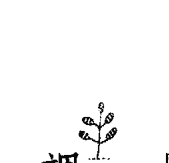

我們大部分的人被教導，壞的事情之所以會發生是因為我們犯了罪——要不就是打破那由超自然的神祇所建構的法則，或者不知因何緣故觸怒了神。但我從亞馬遜薩滿那兒學到的神靈，並不是一個反覆無常的神祇，經常對人們懷恨在心，或是測試我們的忠誠度，或是在我們犯錯時給我們報應。事實上，神靈並不是一個神祇，神靈是生命本身的偉大平衡力量。祂帶來和諧，而不是懲罰。

不幸與疾病只不過是在自然和諧狀態下的一種失衡，當我們不自覺地活著，陷入那侷限的，令人失去力量的故事中，而與隱形世界的智慧失聯時就會發生。當我們都只著眼於物質的世界時，生存的本能就會起作用。我們會錯誤認為避免疾病、衝突、與痛苦的唯一方式是為生存而奮鬥，與使力支配他人。但事實上，我們貪婪、自私，與操控的舉動，都將帶向那我們極力避免的疾病、衝突，與痛苦。

## 兩個世界之間的薄紗

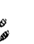

在我們探求對於宇宙的科學解釋時，我們遺忘了有關隱形的界域，以及能從中發現什麼這件事。那是我們能發現平靜的地方，並沒有存在於物質世界的那些痛苦。但假設那並不是說，我們是降臨在自己頭上的所有不幸的始作俑者。有時候，我們正在經歷自身的苦痛，是我們並沒有置身其中引起的失衡，所帶來的結果。伊波拉病毒就是一個例子。這致命的病毒，一度被保存在非洲一個十平方英里的森林內，但當這個森林因為伐木取材被砍倒時，這些病毒失去牠們的自然棲地，並且迅速的散播到附近地區的動物與人類身上。許多因伊波拉病毒而致死的人，跟砍伐森林的人一點關係都沒有，但不可否認的他們還是因這病毒而承受著巨大的痛苦。

大部分的微生物只有在我們的身體失去平衡，以及免疫系統無法適切的反應時才會傷害我們。你也許沒有能力去確保非致命的寄生蟲不會攻擊你，但你的確有那樣的能力，去預防及矯正身體的，以及你和他人關係上的失衡。如果你活在不平衡之中，就是處在一個與神靈分離的狀態。為了讓一個更為健康，更為快樂的生活應運而生，你必須去導正自己與神靈之間的關係。

## 大靈之藥

如隐形世界是如此的美好，為什麼我們不在那兒度過所有的時間呢？薩滿們說我們有一個肉體的理由，是為了演化與成長，來獲得情緒的成熟與智慧。以一個物理學的隱喻來說，當我們在肉體的狀態時，就像一個電子在粒子的狀態，而在隐形世界裡的我們，就像是一個電子在波動的狀態。粒子的狀態是我們「局域」（local）的本質——坐在沙發上閱讀的血與肉。波動的狀態是我們「非局域」（nonlocal）的本質，在那樣的狀態，我們能夠延伸到達宇宙最遠的極致，並且與所有的事物合為一體。當我們死亡拋開肉體時，回歸到非局域的本質，到那無形無狀的隐形世界。但那些遠古的薩滿們，明白不需要瀕死來體驗他們非局域的自我——而是在日常的世界，去品嚐大靈之藥。在隐形世界，我們的非局域狀態裡，包含著所有的創造。但沒有足夠的物質去蘊含我們的意識。古代馬雅人，把我們處在波動狀態時去獲取意識，稱之為「獲取你的美洲豹體」，他們的祭司被稱為巴蘭（Balams）—— 一群已經擊敗死亡的人，並且處在自身的非局域狀態，他們發展出無限意識，並將那樣的智慧帶回給鄉親。這也就是為什麼美洲豹，在整個美洲是如此強而有力的象徵，代表著能夠遊歷跨越死亡的能力，沉浸在全知之中，並回到他所生活的土地。在我們體驗過大靈之藥之後，我們明白，我們與隐形世界之間，永遠沒有一道鎖上的門。隐形世界与可见的世界是并存的，是無時無刻不在的，而且易於進入的。在任何時刻，我們都能將其智慧，帶入我們的世界之中，來提供療癒與平衡。在可見的有情世界，我們能夠在物質之中灌注神靈。

現今，科技允諾能為我們帶來全知。在我們的感官與機器之間的界面，正逐漸將我們挺進到，擁有能夠即時存取這個世界所有知識的能力。但這並不是當我談到體驗大靈之藥的時候，所指的那種無限意識。所謂無限意識，意謂的是能夠第一手經驗宇宙全貌的能力，能夠跨越時空之外的至遠之處。帶著這樣的智慧，我們能療癒我們的肉體，並且做一個能夠有意識地參與自身演化的物種。那矗立在我們與隱形本體之間的薄紗，只不過是藉由我們的信念所創造出來的意識的花招。有句話說「眼見為憑」，但反過來說也是真的：我們也可以說信者得見。否則，我們就無法掌握在我們面前的是什麼。我們的頭腦會對這些訊息不屑一顧。

當西班牙征服者第一次來到美洲時，在墨西哥灣海岸邊的原住民，並沒有看見他們木造的船。他們的探子只看見那翻滾的白帆，這些印地安人並不笨也沒有瞎，或是瘋狂。因為他們不曾有這麼大的船的概念，所以他們的頭腦很輕易地抹除眼睛所見的東西。研究顯示，我們的心智偏差是如此的強烈，以致對於不符合我們那先入為主的、有關現實概念的感官訊息，會很輕易地不屑一顧。一個半世紀以前，醫生們嘲弄那傳染性疾病是病毒引起的概念。畢竟，他們根本看不見那些所謂的「蟲」，所以那些蟲怎麼可能引起疾病呢？

### 發光能量場

可見的世界，似乎是唯一不僅由肉體現象，而且還有我們的思想與情緒所構成的現實。當有人感受到熱情，或者想著：我現在好想吃片巧克力，或者回憶起一段喜愛的音韻，功能性核磁共振成像儀（fMRIs），都能夠即時顯現在大腦內發生的現象。神經科學能夠顯示意識也有它的實體。

但那屬靈的隐形世界會如何影響我們的健康與療癒呢？環繞在我們身體周圍的是一層發光能量場，或者稱之為LEF，它告訴我們的細胞與基因，以及人體微生物群，和身體内外那些微生物的群落，如何在生活與行動之中保持和諧。LEF對大多數人來說是隐形的，雖然有些人能夠以氣場的形式看到這個能量——一個環繞在人體四周帶有顏色的光環。藉由練習，任何人都能感知這樣的能量。輕快的摩擦你的雙掌數秒鐘，然後稍微緩慢的分開你的雙手，並且試試看在雙掌之間能否感受到某種熱力或空氣的密度。LEF可被視為是DNA這一硬體的軟體，它能够指導你的DNA生成與修復身體。在你接受大靈之藥前，你的LEF是依據著從父母身上承襲而來的遺傳指令，來創建你的身體。它複製著跨越世代的身體狀況，以及情緒故事與劇碼。儘管我們深切期望看到自己是一個不同的、更好的，甚至是比雙親更開明的人，我們仍然傾向持續著他們健康的挑戰和情緒的課題，在自己的生命中以各種不同的方式重複著他們的人生。除非我們中斷這樣的循環，否則我們將會活在他們所曾活過的方式裡面，並且以一樣的方式死去。當在發光能量場裡的智慧減弱消逝——它一致性的水平退化——就會創造出身體的不和諧與疾病。而在我們微生物群落裡的九十兆個細胞，就會開始去照料它們自己的生存，而不是我們的。癌細胞忘記死去，並且希望能夠永遠的活下去。但當LEF的質地，經由大靈之藥的升級之後，它就會創造出健康。多年以前我非常驚訝的發現，人類身體有百分之九十，是由那些與我們格格不入的細菌所組成的。而只有身體裡剩下的百分之十，是我們自己的DNA所組成的。所以難道這意味著我僅是那百分之十嗎？不是的，我是那組織這個令人驚異的鮮活群落的能量場，它有著各自自身的感覺以及我的感覺。在我的群落中這一百兆的細胞，藉著LEF經由我們的大腦與神經系統來運作，在和諧與平衡的狀態下保持活躍。大自然以這樣的方式成就我們，毫無疑問的是，比起讓細胞自由決定何者對群落最好，讓一個大腦來協調所有一切是比較好的。因為那樣的話，與其說是自由，將會變成放任不受管制。再者，對薩滿而言，發光能量場就是那獲得個體覺知的降世智慧意識，它在兩種狀態之間居中調解者，一是讓你經驗到自己是個全然獨立個體的大腦，有你自己的覺知，神靈則讓我們覺得所有的萬物都是整體的一部分。而且因為發光能量場是生物電磁場，當你的身體終結之時它並不會終結，反而會延伸到無限，並抵達宇宙的至遠之處，然後它的強度會下降，但不會整個完全消失。你的發光能量場包含著星辰與銀河在其中。

發光能量場是由光與振動所組成的，所以無論你在這個源場中夢到什麼，都將改變它的振動，並決定你的身體和外在世界所將展現的。如果不升級發光能量場上的智慧，反而選擇停陷在舊有的信念裡面——如：媽咪踤蹋我的生命，或是鶴鳥把我丟錯家了，或者其他的你的老舊習氣——那樣的話傷痕就會持續，無法得到療癒，而且會落得生病的下場，或是另外其他一些不良的結果。在東方的思維裡，因與果的關係被稱之為業（karma），而陷在業裡度過一生是個不恰當的方式，但當你選擇大靈之藥，並且提升發光能量場上的智慧或是品質的時候，就開始能夠表現那些帶來健康長壽的基因，並且過著一個較為有益的生活。

現今的我們，比起一百年前，或是一萬年前的舊石器時代先祖們活著的時候，更難以去提昇發光能量場的品質。因為在大腦與神經系統裡，來自殺蟲劑與水銀的毒素，讓我們再也無法輕易地去體驗與造物一致的和諧感。不論我們多麼艱苦地靜心或者多次地梵唱：「嗡On！」，那屬靈的隱形本體總是避開我們。

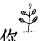

### 你那永恆的本質

大靈之藥開啟了一道通往智慧隱形本體的門，那兒一切都是交織在一起的，我們的每個思緒，都影響著身體的每個細胞以及宇宙中的每一個分子。量子物理學針對這種現象，提供給我們另一個恰當的隱喻，稱之為「糾纏」：粒子以一種謎一般神秘的方式交織在一起，即使它們兩者分處於銀河相反的兩端，如果你能夠改變一個粒子旋轉的方向，那麼另一個粒子也會即時地反轉它的旋轉方向。一開始科學家們認為「糾纏」也許是一種超光速溝通的展現。後來他們才了解到了，這只不過是一個相關聯粒子的本質。在安地斯山與亞馬遜叢林，我與之一起見學資深的薩滿們，相信「糾纏」是所有造物的本質，我們都是互相聯繫的。這也是他們以及許多北美部族，把所有的眾生，稱之為「所有我們的親族們」的緣故。

當你體驗大靈之藥時，你就會接近心理學家榮格所說的集體潛意識，以此層面的意識，參與所有造物共享的覺知，並且能夠體認出，你與所有萬物以及自然界是一體的。當你與他們都是不可分的，你怎麼有辦法傷害地球或其他的眾生呢？反過來說，如果你真的在乎其他同胞的福祉，你怎能不參與自身的療癒呢？一旦你經歷過大靈之藥，那些為了追逐巔峰而利己害人的想法是難以想像的。

覺知到我們能在可見的與隱形的世界並存，同時也帶來這樣的了解，那就是你生命中的每一件事，都是從隱形能量本體中，夢想著它應運而生的。諸如種種讓你厭惡不想承認的事，包含了情緒的痛，與你正在經歷的苦。甚至在可見的世界與能量的隱形本體之間，那些顯而易見的分裂，儘管那是我們作為人類集體所共有的，都是你創造出來的幻覺。

把物質世界當作唯一的現實，對於日常生活的運作，是一個有用的概念：因為當你在一體的狀態，體驗波動本質時，想要經由一個代辦事項表，去完成你每日的工作是非常不容易的。而一旦經歷過自己與宇宙的相互關聯時，那些你放在代辦事項表的事，便會開始改變，而且完成表列事項，而不自我阻撓的能力，也可能獲得相當程度的改善。

發光能量場使你能夠在兩個世界之間，輕易且流暢的舞蹈，並且能夠在可見世界的作為，以及隱形世界的不作為——只是存在——之間取得平衡。你可以選擇或是關注於日常活動，或者安住在與神靈的一體感裡。不管你正在作為或不作為，你都能夠全然處在自己的經驗裡，而不是徘徊在，還有更好的東西在別的地方，這樣的情境裡。一旦你經驗大靈之藥，你的夢將會停止製造，那些其他人將會改變他們的態度與行為，這樣的事情。

#### 唤醒你那隐形的自我

幻想。相反地会明白，在自己的波动状态，你是万事与万物，以及所有人的一部分，你能够真诚而有想象力地专注在你自己的人生，而让别人去过他们想要的生活。当我们睡着的时候，我们在自己的梦中是醒着的。而当我们醒着的时候，在梦境发生的隐形场中，我们是深沉地睡着的。梦、静心或深度的冥想研习、音乐以及祈祷，是我们学习有关那隐形永恒的畛域常见的方式。但这些经验往往是稍纵即逝的，在我们从床上醒来去寻找咖啡机的时候，它就会消失不见。当我们作梦时，是处在永恒的世界里，上一刻正在遭遇仙逝已久的双亲，下一刻却又旅行到某些奇幻的地景里。但我们醒来时，不管那印象有多么地生动，通常我们并不明白它们的价值，而任其从我们的觉察溜走。在西方，受过训练从事梦的解析的心理学家，大概是明白梦境生活的重要性的唯一族群。然而那我与之生活及见学的亚马逊族人们，每天早上会分享彼此的梦境，从中寻求急迫性问题的解答，或是传达给部落的智慧。大灵之药还回给你那与生俱来的权利——认得同时作为灵性的存在与肉体的存有，以及波动与粒子，这样的真实本质。而能够如此是藉着引申出你那隐形自我的觉知，那不具形式或肉体，并处于惯常时间之外的自我。你可曾注意到在梦境之中，自己似乎从来没有一个肉体，似乎从来不会撞到桌子或椅子？在梦中，我们只是纯粹的意识。在隐形的世界之中，我们是无形的，而且是无我的，处在一个无限以及至福的开展状态内。在可见的世界我们会撞上桌子，会从悬崖上掉落，或者遭受苦痛与疾病，并且当然地在其间学习与成长。大灵之药能够引领你更为认识那隐形世界，并且能够明白在你的人生当中，祂将如何裨益于你。因为可见的与隐形的畛域，在生与死、在有形与无形之间共舞，跨越在它们之间的桥梁，就是发光能量场（LEF）。它链接着我们那老化垂死的存在，与不被肉体或时间的局限性所约束的自我。从萨满那儿我明白，生命不息，死亡只是从可见的到隐形的存在之间的短暂状态改变。大灵之药能展现出如何经由链接隐形世界之中那万象的本源，来创造健康以及减轻苦痛。每个人都想要快乐——避免痛楚、疾病、情绪的受苦和心智的苦恼，以及现代生活的压力。但当你没意识到自己有能力创造己身的日常经验时，力量就会悄悄地离你而去，而且会开始认为自己是一个在未知以及令人畏惧力量下的受害者。藉由大灵之药，你有能力去梦想出你的世界，而你的健康也应运而生，并且毋需独自一人去创建自己的健康，总是有一个共同创建者在神灵那里。在你领受大灵之药的恩典后，无论人在何处，即使是在拥挤的飞机或火车里，你都能够链接隐形世界的智慧。

### 第二章 神灵与隐形世界

## 第三章 鬫魁暴君

> 头脑是疯狂的。

在博物馆与游乐园里，孩子们总是被暴龙─这最凶猛的恐龙模型所吸引。棘龙和南方巨兽龙也许是比暴龙更大的肉食性恐龙，而梁龙与迷惑龙在尺寸上也是暴龙的数倍大，但它就是有好运道来让自己的商标率先确立——在二十世纪之交，维多利亚时代的群众热切地买票来看这一古怪生物的骨骼，这令人畏惧的恐龙被给予一个名符其实，且会让八岁小孩背脊骨发凉的名字，并为实现神话的目的而赋予牠某种声誉：它代表一个假如我们不对其他力量屈服，就会被摧毁的暴虐君主。尽管如今我们得知暴龙也许有羽毛，但在我们的想像里，牠有着厚而无法穿透的硬皮，使得牠成为无敌的掠食者。

这凶猛统治者的神话也在动物园的大猫舍延续着。雄狮的利齿和鬃毛，当牠在玻璃后打哈欠时，依然让旁观者印象深刻。即便如今我们明白，身形较小而线条优美的母狮，在牠的雄性伴侣冷眼旁观时负责狩猎，但在一旁仔细端详的群众仍忽视展示区旁的信息卡，而敬畏地注视着“丛林之王”。

## 第三章 龙兽暴君

暴龙和公狮是强大的象征，因那令人敬畏的生物统治着我们的印象已深植人心。这种战士——统治者的概念，已经被内化到我们认为头脑是主导我们存在的力量的程度，它独霸我们的思绪、情感，身体以及心灵。我们自幼就被告知自己那大而复杂的大脑，让我们有别于其他动物。头脑真的认为它掌理一切，运转我们的思考与情绪，更别说是我们的生活了。我们相信要改变自己的习惯、瘾头、关系以及情感，所必须要做的就是改变我们的头脑。所以我们不断改变自己的头脑，而没去改善关系，增进健康或疗愈我们的情绪。大灵之药提出一个更可靠的解决方法。藉由放下头脑是创造健康、丰盛、爱与福祉的终极工具的幻象，我们解放自己去接近更为有效的工具：与神灵和隐形世界的关系。大灵之药将我们从暴虐头脑的愚痴中唤醒，并且让我们与永恒的疗愈途径连结。那并不是说我们在疗愈身心时无法获得头脑的帮助，身心的关联长久以来一直被认为是健康以及疾病的因子。这里我所指的头脑是专断的边缘脑，它总是认为自己掌控一切，并且活在匮乏与恐惧之中。对我们最早的先祖们来说，与神灵的关系是首要的，事实上对于现今多数原住民而言也是如此。在早期的人类学工作期间，当我研究那未受污染的，生活大都像其旧石器时代祖宗的文化时，我惊异地发现，神灵是如此鲜活地在他们的生活之中。许多他们的传说是有关天神拜访地球带来智慧的事，他们相信，我们仍然能够在特别的场所以意识状态下与这些存在沟通。这些存有其中一位名为奎扎科特尔（Quetzalcoatl），羽蛇神，对阿兹特克人与霍皮人来说是曙光之主。而对古代玛雅人而言，祂被称为库库尔坎（Kukulkan）。 奎扎科特尔是不断地归返的神，与金星这一晨星有关，传说中祂会在每一个新的纪元时代归返，带来复兴与知识。祂的遗产成为地球的构成原则，就好像基督的教导，把脸转过去由他打及爱你的邻人，如今成为指导原则一般。奎扎科特尔教导，所有的智慧均由神灵那儿涌流而来。凡尘世界是暂时的状态，然而我们必须珍视并且细心照料它，因为要挣得一个肉体是极度困难的。（佛教徒也有类似的概念，转世为人是珍贵的恩典，因此我们必须荣耀及善用它。）对我所研究的原住民族而言，凡人的日常生活不是唯一且终极的实相；神灵的隐形世界才是主要的实相，而灵性的自我是历久不衰的真实自我。神灵引导那些我与之见学的巫医与医女，发现那有赋生能力的植物——富含植物营养素的可食用绿色植物。 我们旧石器时代的祖宗把绿色植物当成是他们主要的食物来源。这在人类与植物界之间是多么不凡的合作啊。我们是完美的共生体：氧气，这植物呼吸的废弃物，维持着我辈人类的生命，而我们呼吸的废弃物，二氧化碳，也维持了植物的生命。植物把阳光转变成营养素密集的食物，我们可用以滋养与疗愈自身。对我们的先祖来说，能在野地里存活是与自然界尊重互动的自然结果。明白那些莓果富含养分，而那些是有毒的，以及到那里可以找到可食用的根茎类，需要人与绿色生命，以一种至今仍不为大多数的我们所知晓的方式沟通。在当时除了采样各种可能的食物，并希望不要因其毒素而死亡外，并没有其他测试有害成分的方式。今日，继续这与自然界进行尊重对话传统的原住民，将会告诉你他们明白植物的特质，并不是藉由尝试错误，而是植物告诉他们的。获取知识的古老方法因为无法度量、容纳、解释或复制其结果，已经被科学所摒除。旧石器时代的狩猎—采集者与自然界之间的关系是信赖：他们从不怀疑大地会帮忙他们获取所需。因此我们是如何失去与神灵和自然世界的密切连结的呢？人类学家贾德·戴蒙，追溯回大约一万年前的农业革命，当人类从旧石器时代那种狩猎—采集者富含脂肪与蛋白质的饮食，转变成以谷物为主的饮食。戴蒙称这饮食习惯的转移为“人类历史上最糟糕的错误”。他说，这导致数世纪以来的冲突与战争，而且引致一个接一个有着残暴的主人，残酷无情的战士和倒霉奴隶的社会。有着以小麦、大麦、米和玉米为主的饮食，这类高升糖指数或高血糖潜势的谷物，使得我们祖先主要以糖为主食。正如我的同事蒲大卫在他的畅销书《谷粒大脑》（Grain Brain）中提到的，我们的身体和大脑，仍因这饮食转移的健康后果而受苦。浸泡在糖中的大脑是呆滞、迟钝的，比起以脂肪为燃料的大脑，较不能够接近大灵之药。

在第四章中，你将会发现更多关于对消化系统与大脑来说，谷物是种毒素，以及有关麸质，这小麦里的蛋白质的有害影响。

因农业的兴起而生的概念是，生存与安全是首要的，并且仰赖一个有力的统治者，能召集武力来保护土地、农民以及粮仓。人变得畏惧且好战，不再信任神灵或彼此，对神的直接体验让位给宗教，由神与人之间的中间人所监督掌管。

大灵之药将我们与神灵以及自然力量的连结带回疗愈方程式里。为了找到内在的安宁，并且与这星球上的所有存有和谐地生活着，我们必须转移对暴虐头脑的拥戴。我们无法回到旧石器时代狩猎——采集者祖先们那古老的生活方式，但能够寻回他们体验宇宙的方式。而且如果希望能够达到全人健康，就需要这些体验来升级我们的神经回路。

我在亚马逊丛林的旅程当中，注意到萨满们运用三种不同形式的植物来做疗愈。第一种我称之为阿斯匹灵树。如果你因疟疾而发烧或头痛，你去找棵阿斯匹灵树——白柳或金鸡纳树——并从树皮制备药方。因你想要去除头痛或退烧。这是一种在西方世界常用的医术：去找到可以治疗我们症状的药方。

另一类萨满运用的植物更反映出大灵之药是如何运作的，这类植物开启身体的自然再生与疗愈系统，它们开启在细胞内的长寿蛋白质，并为神经元排毒。在这些疗愈植物之中有十字花科的蔬菜，以及像姜黄和黑胡椒类的香料。我们将在第五章仔细探讨这些超级食物，因为它们是大灵之药的基石。

第三种类的疗愈食物，由那些萨满们用来修复与滋养大脑的食物所组成。这些药方会帮助活化大脑的高等中心——新脑皮质，包含像猫爪藤（cat’s claw）这类的植物，以及富含omega-3的食物。现今已有大量的科学研究，探讨富含omega-3的补充品，对修复大脑，预防失智，与治疗像注意力不足过动症（ADHD）等情况的助益。

我们毋须为了大灵之药的精粹和江湖术士或巫女讨价还价，或是为了萨满疗愈飞到亚马逊丛林。我们当下就能升级大脑，接通那置换基于恐惧的编程的神经回路，并且让专断的头脑安静下来。

#### 攸关恐惧的边缘脑和神经回路

当头脑表现得专断蛮横时，它正在执行属于古老边缘脑的无意识软件。边缘脑的焦点在于生存，而当我们在它的掌控之中时，处处都看见危险，并像陷入困境的动物般做出反应。边缘脑，或经常被称为哺乳脑，是由四个“F”——进食、争斗、逃跑、交配（feeding, fighting, fleeing, fornicating）所驱策。这些原始的生存模式，在我们用加工的谷物与糖为大脑加油时会被活化。边缘系统是大脑的同一区域，当我们感到伤心或不安时，会渴望甜美的爽心食物。

边缘脑对食物与性的着迷，对让头脑呆滞之药物的渴望，和它的攻击偏差倾向、情绪戒断，以及破坏性的行为，都能被新脑皮质——这一“新的”大脑所置换，使得我们能够学习、创造、展望新的未来，以及制订计划。新脑皮质是为了美而编程的，不论它是在莫札特的协奏曲或优雅的数学解答中被发现。

新脑皮质靠大灵之药茁壮，而由感官知觉、追求快乐，及情绪所驱使的边缘脑则不会。新的大脑需要好的脂肪来达到最佳的运作。否则它只能苟延残喘，勉强偶有短暂的启示，但没有持续的洞见。新的大脑在压力之下无法尽善尽美，当我们有压力时，就会把驾驶座让给边缘脑。问题在于，边缘脑的演化是发生在我们安静地坐在河畔，或注视夕阳慵懒地落在非洲的稀树草原上那样的年代。它并不习惯现今世界的节奏，可能变得过度受刺激而劫持了所有的神经器具。而流向大脑前方——那察觉机会，并为问题想出创造性解答的处所的血流因而减少。不成熟的情绪接管我们，使我们因忌妒或愤怒而变得盲目，因恐惧而麻痹，或充斥着焦虑而无法冷静思考。甚至我们经常没察觉自己，正把编程写入边缘脑的信念运作出来，这些信念以恐惧和暴力为中心，以生存为导向：世界是危险的地方；角落里有老虎正等着吃掉我们；没有足够的资源供应我们；死亡意味着存在的终结。像这样的信念逐渐刻进大脑的神经网络里。神经网络是信息的高速公路，处理我们所察觉和感受到的，告诉我们红色代表危险，绿色表示可通行，谁是性感的，谁是呆板的。它们洞悉我们世界的动态地图，以及我们的现实如何运作。这些地图包含视力、声音、气味、记忆和童年早期的经验。有一半以上的现实地图被认为是在子宫内形成的，因为母亲的压力荷尔蒙会穿过胎盘屏障进入胎儿。所以假使你的母亲不太确定，她是否能够依靠你的父亲在身旁并支持她，你的地图将会编码成一个现实，就是你不能期待有人能够随待在侧，或是人们不会支持你的努力的现实世界。另一方面，如果你的母亲有信心能依靠她的挚爱，你的心智地图将会显现一个你能依靠的世界——而且它会在你周围创造出这个现实。

#### 大脑之谜

这些新生儿神经网络，会随着日复一日的经验而强化，证实你的神秘地图是真的，每次这路径被使用，就会在神经元之间形成更多的链接。久久之，逐渐成为涉足最多的路径，而最终成为唯一的道路。脑部扫描实际上会显现出大脑特定区域的神经网络的广度。反之亦然，当一个神经网络陷于不使用而被修剪掉，大脑这一区域的空缺也将显现在扫描图上。所以即使你在周末的静心退省期间有灵性的觉醒，除非在你回到竞争激烈的日常生活中，能持续刻意地努力练习，这顿悟将会消逝。在企业化的美国里要当个禅师并不容易。

我们的神经网络使我们成为习惯的动物，很早以前我们就不再有创新的思考与独到的见解。事实上，在七岁前当我们停止画紫色小猪，以及想像云端或树根下的房子时，大部份的神经网络就已确立。有害的童年经验不但影响发展，并且与较高程度的酒精中毒、心脏病、忧郁、未成年怀孕，以及其他许多后来的不良行为有关。正如我们从每件事，诸如阅读、演说、骑脚踏车，以及有礼貌发展出实用的神经网络，并被编码入边缘脑内。尽管我们根本想不起这些事件本身，还重复着这些经验表面下的主题。每当回想起自己的生命时，我注意到自己总是绕着同样的主题而受苦——失去所爱、受伤、遗弃以及恐惧。数十年前的一个夏天，当我搬到纽约市时，在一个闷热而泥泞的日子抵达我的新公寓。一群穿着T恤的粗壮家伙坐在门前的楼梯上，我一度以为自己搬进与抢劫犯和杀手为邻的地方，后来我才发现这些家伙是我的邻居，而再也没有比他们更好的人了。我在不知不觉的情况下，将我在古巴革命时的童年记忆，重叠在这些无辜的邻居身上了。

通常主题进入家庭，不断地从父母传给小孩。在亚马逊，他们称之为世代的诅咒。它会触发致病的基因。一种情绪的模式可能显化成身体的不适。自体免疫疾病，这种免疫系统攻击自身细胞的状况，经常不断地发生在那些情绪界限薄弱的家庭：家庭成员对于确认什么是你的，和什么是我的情绪有困难。

不论我们用了多大的意志力来改变自己的习惯，我们经常因那高效能的神经网络而掉回原来的陈旧主题中。好消息是，我们能够改写大脑来得到喜悦以及较为滋养的结果。

那就是为何升级与滋养你的大脑，使得它能接近大灵之药是如此地重要。体验大灵之药可在本质上改变大脑。对于合一觉醒，沉浸在神圣的创造之中，能够帮助你在大脑的信息高速公路里转换跑道，使得你能用新的眼界来看世界。采用大灵之药，较易褪掉陈旧的故事，并改写新的，较为有趣且有裨益的故事。

神经网络类似过滤器，筛掉特定的经验，只允许我们觉察到局限而片段的现实。因此，就如古代阿兹特克斥候一样，我们将未能注意到，那后来对我们而言再显眼不过的西班牙征服者的船舰。而在我们即将陷入一段有害的关系之前，可能也未能辨识，从约会对象那儿来的情绪警讯。

这些神经网络也创造出自我应验的预言。如果你认为这世界尽是盗贼与骗子，于是那就是你即将遇到的。谈话治疗，对卸除童年创伤期间，那些照本宣科的故事是没有效的，与其说它帮我们写一个更好的故事，不如说只是强化旧有的。

大灵之药藉由升级你的发光能量场内的信息起作用，最后使得新的神经网络得以形成。大灵之药清除藏有过去伤痕的无意识记忆中那凝滞、暗沉的能量，在发光能量场（LEF）注入鲜活的能量与智慧。当改写过的故事编码在发光能量场上时，在大脑里也建造出新的，较为正面的网络。

一旦采用大灵之药，你能较轻易地进入寂静与觉察自己的原始本质。在你需要的时候体验神灵的隐形世界，也将会注意到提供给你的广大资源，能让你精心创造出健康而有创意的生活。

## 第二部

## 褪下旧途

### 第四章 清除脑肠的毒物

我倾听自己的胃，并迫使自己在它的呻吟中静心。当你知道就近的角落有食物时，做断食就容易得多了。我能想像自己的胃壁彼此互相摩擦，肌肉使劲，而且每次的收缩，都从我的童年唤起一段已忘记的印象：母亲、父亲、海滩、快乐、父亲去世、害怕、独自一人、青春期、爱、谎言、自负与欺瞒，一切都融为一体。当我不再相信任何事时，要向谁祈祷以求得宽恕呢？

海勒姆·宾汉（Hiram Bingham）是发现马丘比丘（Machu Picchu）的人，而我选择追随他的足迹，穿过秘鲁的丛林，来到印加神话中的光之城。令人好奇的是，当一个“文明”人揭露一个在地原住民生活了数世纪的地方，他被称为此处的发现者——仿佛是这些原住民把它隐藏起来，而不为世上其他人所知。

此刻的我正扎营在一个荒废遗址正下方的洞穴中，且在我进入堡垒之前需断食三日，否则，萨满们告诉我说，我将会错过“灵性的”马丘比丘，只能看见成堆的石头，而不是叠在遗址上的隐形城市。我能够看穿迷雾，揭开这古代宫殿的面纱吗？

> 而我为何需要空着肚子做这件事呢？耆老说：“那样才能遇见你内在的野兽，并将牠留在遗址之外。”结果发现这野兽竟是我所有的过去：以探险来掩饰寻求荣耀，并以向世界揭露古代文化的珍宝来自我奖励。原来野兽就是我。

所有的百无聊赖、烦躁不安、所有败坏的关系、所有的悲伤与喜悦——令人感到惊异的是，你只消一天不吃三餐，即便是数天，这些都会浮上台面来。我明白即使只靠自己清瘦的身形，也有足够的体脂肪能维生数个月。但饥饿是个伟大的老师。也难怪西方世界的心理学都跟口腔与肛门有关。

这样想吧：在你的肠道里有第二个脑，而它和你头里那个脑同样地重要。且这第二个脑是个超过十亿个神经元的网络，并直接与你头里的脑沟通。这些神经元形成一个格子状的鞘环绕整个消化道——将近三十呎长的管子，从你的嘴巴延伸到肛门。这个神经鞘并不关心诗、爱、哲学、或死后是否有来生。它一心只为消化这日常的苦差事努力：分解食物的粒子来萃取营养素，吸收这些营养素，并且接着排出废弃物。这是个庞大的工作，然而，所有这些神经火力，并不只致力于消化和排泄。迷走神经——这最长的脑神经——将肠道与脑干连接起来，而其信息是双向流通的。

> ——日记神經——從腸道蜿蜒而上到大腦，貫穿身體，攜帶著種種生命的信息。所以，腸腦傳遞什麼樣的信息給在你的雙耳之間的大腦呢？而這些信息是如何與你的心境、情感以及直覺（gut-instincts）產生關係的呢？

腦腸產生——並使用——體內百分之九十五的血清素。血清素是一種荷爾蒙以及神經傳導物質。它在我們的前腦——處理我們的情緒——扮演著關鍵的角色。血清素也能夠促進海馬內新神經元的生長。海馬是邊緣腦的一部分，它調節著戰或逃系統。海馬使我們能夠接收新的經驗並從中學習。為了讓大靈之藥能作用，前腦及海馬兩者必須處在最佳的運作狀態下，但大部分是因為血清素不需要扮演其他重要的角色。

血清素在夜間會轉變成褪黑激素，用以給大腦信號——是釋放慣常的現實，進入夢裡魔法世界的時候了。它是在植物、動物、黴菌及細菌中可發現的荷爾蒙，而且也許是爾蒙，它在化學結構上類似二甲基色胺（Dimethyltryptamine，簡稱 DMT），又叫靈性分子——DMT能夠由大腦內的松果體合成，而且它不只在人的大腦內可發現，也十分普遍地存在於自然界；大多數的植物和動物都有，DMT也是傳統上美洲原住民使用的致幻劑的成分，包含死藤水（ayahuasca），這由亞馬遜的療癒者所釀造的致幻藥汁，用來幫助靈視及療癒。

現今，DMT已成了西方世界想涉足靈性領域的探索者的門路，以往這領域只專屬於薩滿以及其他在地的心靈幻行者（psychonaut）。『DMT能夠真正地打開你自我的層次。』米次舒茲（Miech Schulce）在他所執導的有關心理學家瑞克·史特拉斯曼（Rick Strassman），在DMT和靈性體驗的先驅研究的紀錄片「DMT：靈性分子」這樣說明：『拉回那些自我的層次，你開始完美地意識到自己的存在感。而且對我而言，應該說那是再真實不過了。比我們每天生活在其中的幻覺（醒著的現實），更為真實。』

無疑地，DMT在獲取和大靈之藥相關聯的意識狀態上，扮演著重要的角色。大自然設計人類的大腦，讓血清素藉由松果體轉變成DMT，允許我們接近更高的意識，並且直接覺察我們與所有造物的相互聯結，這是另一個要仔細照顧腦腸健康的一項具說服力的理由，因為我們的血清素是在那兒製造的。

## 西方醫學忽視腸道

西方醫學竭盡所能地，包含用藥物與外科手術治療，藉以限制因我們的不良飲食習慣，與久坐不動的生活方式所引起的嚴重損害。但同時，也忽略了身體療癒自身的卓越能力。根據凱澤家族基金會（Kaiser Family Foundation）的陳述，六十五歲以上的美國人中，有九成依賴至少一種處方藥來治療病痛。我們有上千種的藥物針對症狀，但幾乎沒有一種是針對導致疾病的失衡的根本原因。

現在的研究顯示，大多數現代生活的疾病起始於腸道，並且和我們的飲食有關係。腦腸是一條有多線道信息流量的高速公路，在大腦和腹腦之間雙向來回。心智與情緒的壓力誘發身體反應影響腸道，而人體微生物群（microbiome）— 腸道內的微生物菌落 — 的擾動，影響大腦的健康與功能。當腸菌落變得不平衡，壞菌多過益菌時，腹內的菌叢開始產生毒素，造成免疫系統的巨大破壞，改變大腦的功能與心情，並削弱免疫抵抗力。

我最近帶母親去看醫生，而他問她的第一件事是：「妳現在服用什麼藥？」在西方如果你因焦慮、腦霧，或憂鬱而受苦，大部分的醫師或心理學家不會問你吃了什麼食物，或關心你的腸道裡有益與有害菌群之間的平衡。而如果你腸胃不適，腸胃科醫師大概不會問你，有關你的心智與情緒的壓力。當一談到修復腦腸，西方的醫療從業者，才剛要開始跟上那些古人早已知道的。就在我帶母親去看醫生的同一天，我也帶我的狗去看獸醫，而她問的第一件事是：「你餵你的狗吃什麼？」我決定如果自己又生病了，就要跟我的獸醫約診。

近幾年，神經科學已證實了我們的思想、信念與情感影響大腦的生理構造。一旦你讓自己大腦的狀態回復到最佳的機能，要有意識地改變你的習慣與生活方式就會變得較容易。即使你是那極少數自詡能把壓力處理得相當好的人，肯定仍然是需要升級自己的大腦。

## 讓大腦功能退化的毒素

你睡得好嗎？當你早上醒來，能回想起夢境嗎？你能夠清明地作夢，在夢中知道自己正在作夢嗎？你學習得很快嗎？你能輕易地適應新的情勢嗎？你能把工作壓力留在辦公室，而不帶回家嗎？如果你對以上這些問題的回答是「否」的話，就必須升級自己的大腦。

身體裡裡外外的毒素每天都在破壞我們的腦腸。它們來自我們所吃的食物，所喝的水，所吸的空氣，甚至從土地本身：受污染的土壤會玷汙植物和水的供應。我們體內含有六百種以上來自大自然的微生物 — 包括有位研究者所稱的「細菌的虛擬動物園」，是那些完全源於自身，含有我們自己的DNA細胞的十倍。這些在我們的皮膚、嘴巴和腸道裡的細菌群落，彼此必須和諧生活在一起。

我們特意例行性地從環境中攝取微生物 — 為了能與土地、天空、空氣和水持續地交換細菌。當你還是母親子宮裡的胎兒時，是無菌的。然後，當你一路下到產道，你開始獲得數以百萬計的微生物，來組成你的人體微生物群。這是母乳對嬰兒來說是如此重要的原因之一：新生兒從乳頭周圍拾起微生物，而成為腸道菌群的一部分。後來，當你開始探索世界——吸腳趾，被父母親吻，以及被家裡的狗舔，用骯髒的手指把食物塞進嘴裡，就有更多微生物進入腸道裡。一位微生物學家朋友最近提出，人們親吻的原因，是因為細菌能夠測試，彼此將來是否能夠融洽的相處！

雖然我們有十幾平方呎的皮膚，但有超過三千平方呎的腸道表面——大約是網球場的大小——藉由我們攝取的食物，不斷地品嚐環境。事實上，我們與環境建立密切關係的主要方式是經由我們的腸道，而不是手或皮膚。胃腸道系統本就不該是無菌的；除非我們腸道裡有足夠的正確菌群，它就無法好好地工作。但是每次我們服用抗生素藥品，在某種意義上，就像用「核武攻擊」所有的腸道菌群，友善的或不好的群體都大量毀滅。

難怪我們大多數都有消化和免疫失調：我們的腸道因我們加諸它們的有毒負荷而不堪重負。

## 升級你的腸腦——你的消化系統以及你頭裡的大腦——需要你為身體排毒來去除有害毒素。

# 第四章 清除腦腸的毒物

## 環境毒素

現今，環境毒素構成了我們體內毒素絕對多數的比例。我們受到農藥、工業化學物質、防腐劑的侵襲——甚至被沖下馬桶的藥品也進入社區地下水位裡。如今有超過八萬種使用中的工業化學物質在一百年前是毫無所悉的。燃燒石油以及傾倒事業廢棄物在我們的生活環境中添加了更多污染物，增加我們的有毒負荷。

我們的祖先大部分會避免這類的挑戰。千百年以來，地球都能夠包容人為干預所帶來的改變。我們在自己跋涉的土地及釣魚的水域的影響是相對輕微的，對生態系統並沒有造成永久性的損壞。我們可持續地生活著：我們的食物是有機的，我們的廢棄物易於回收，而且用天然材料像稻草和泥土來蓋房子。我們沒有基改食物，或是半衰期一萬年的塑膠，或摻了福馬林的指甲油。

然而，一切都改變了，我們開始開採像鉛和汞這類的天然礦產，並且將它們帶進我們的家——以及身體——經由日常用品像是油漆、浴缸、燈泡、鉛管和牙科填充物，還有最近經由被污染的魚和海產。汞是種已知的神經毒素，而且鉛和汞兩者和發育問題有密切關聯，像是學習障礙與注意力不足過動症（ADHD）。（英文俚語中的「發狂（Mad as a hatter）」——這……指辭，據說源自因製作女用呢帽而暴露在汞蒸氣下，深受心智失調所苦的工人；這是十八與十九世紀非常普遍的行業。）像汞和鉛這類的金屬會堆積在體脂肪中，而將近百分之六十的大腦是由脂肪所組成的。

再者，重金屬並非唯一影響我們健康的環境污染物。大約在上一個世紀，我們釋出成千上萬的人造化學物質到環境之中。在實驗室內合成的分子包羅萬象，從農藥、阻燃劑、衣物、洗髮乳、不沾炊具、電氣設備以及塑膠水瓶，到用在採礦與製造業的化學品，甚至醫療用品與藥物裡。關於這些化學品如何影響我們的資料極少：在美國被核准使用的八萬二千種化學物質中，只有四分之一有測試其對人體的影響。但這些分子沒有一任何一種能被昆蟲或細菌攝食，然後回收成人體或環境可使用的物質。（速食的炸薯條，即使放在大型家用休旅車椅子底下數個月，顏色和形狀都不會變是有原因的：因為沒有一任何一種自重的微生物，會想和化學物質飽和的食品扯上關係。）令人遺憾的結果是，我們所製造的化學物質，大部分在環境中都保持原來的形式。在較老舊的建築物中，充滿著有毒的含鉛油漆，以及流過製造污染的工廠的河流，其底部淤泥被致癌化學物質所沾汙，而被我們扔進垃圾桶或沖下馬桶的藥品也與大地、水、土壤和空氣的毒素混合在一起。

在美國佔其中最大量，無所不在的污染物就是阻燃劑，它幾乎在每一種環境之中。阻燃劑是種表面塗層：當其微小粒子剝落，會和灰塵結合並且經由空氣循環。研究者在超市貨架上大批的流行食品中發現阻燃劑，包含奶油及花生。更令人不安的是，阻燃劑也在母乳中被發現。當有害分子散播，它們被吸入、吃進、或喝入、或經由皮膚吸收，在它們被排回到環境中之前，對人體大肆破壞，是一種永無休止的毒性循環。

而且我們人類不是唯一受影響的。最近在喬治亞海峽被沖上岸的殺人鯨，體內充滿著多氯聯苯（PCBs）以及其他毒素，使得這頭鯨被公告為有健康危害，並且被當成有毒廢棄物來處理。

人的大腦並不是被設計來處理釋放到環境中的毒物過載的。這些對許多正在閱讀本書的你們來說並非新知。新的是以我們的理解，這些神經毒素使得我們無法達到合一的狀態——而這創造健康所需的意識，卻是我們舊石器時代的先祖能輕易達到的。由人造化學物質所造成的巨大損害，影響整個食物鏈。但另一個足以匹配，甚至更為潛伏的威脅，在我們每天所吃的食物之中——我們的內臟中大多數的毒物過載，來自基改食物。在大多數案例中，我們甚至不明白毒素在菜單上。

##### 基改食物

科學家正日益改變食物及糧食作物的DNA（去氧核糖核酸）來創造出更耐久，對疾病或蟲害更有抵抗性，且更好吃好看的產品。你也許有注意到在農夫市集上，有瘀傷的蘋果比起它們那有著閃亮且完美無瑕賣相的同伴要銷得慢些。

植物無法逃離它們的敵人，所以大自然配備給它們，能合成化學物質來擊退掠食者。但在美國種植的玉米，有超過九成含有基因改造過的遺傳因子，使得它們可以生成更有力的殺蟲劑。企圖吃這些玉米的蟲子，會因胃爆開而立時被殺死。這被剪接到玉米以及棉花作物上的基因，是來自蘇雲金芽孢桿菌（簡稱蘇力菌，Bacillus thuringiensis）。

食品工業界宣稱蘇力菌毒素對人或動物不會造成太大的威脅；他們說，它在胃裡會很快地被摧毀。然而，暴露在蘇力菌下的老鼠，卻顯現出引人側目的結果，從過敏反應到腸道損傷，而且在印度，處理蘇力菌改造棉花的農場工人，都出現過包括打噴嚏、流鼻水和眼睛溢淚、癢、灼熱的過敏反應。

蘇力菌毒素現今在美國將近八成五的溪流及排水溝中被發現，而且有超過九成的懷孕婦女，血液中被驗出有蘇力菌毒素。很明確地，蘇力菌（Bt）並不配合工業界的聲稱，日益漸增的可能性是，它將會在我們身邊久到足以對我們的食物供應產生持久性的影響。

黃豆是另一個經常被基因改造的作物。孟山都的抗嘉磷塞黃豆，就被改造成能耐受農藥年年春（草甘磷或嘉磷塞）。科學家們現在發現，玉米和黃豆內的基改蛋白質，會把它們的基因插入在你腸道內的友善細菌的DNA裡，而在你停止吃這玉米或黃豆很久之後，它們仍在那裡繼續作用。

## 穀物的有害影響

基因工程，並非是傷害腸腦的唯一途徑。總括來說，我們正面臨因普遍依賴以穀物為主的飲食所引起的新疾病。

問題之一是，今日我們所吃的小麥，甚至不是七十五年前人們所吃的。起初為了根絕像蘇聯那樣的饑荒，在二次世界大戰後的綠色革命，引進了高產量矮種小麥，它含有比舊有歐洲品系多二十倍的麩質，也因而改變了我們所食用的麵包組成。（麩質是種賦予生麵糰彈性的蛋白質。）而乳糜瀉（celiac disease）——這種因攝入的麩質破壞腸道，而令人身心衰弱的自體免疫失調——戲劇性地增加，也似乎和我們飲食的主要改變有關。

不論你是否置身那些遭受乳糜瀉所苦的人之間，嚴酷的事實是，我們所有人都變成麩質耐受不良到令人訝異的程度。麩質可在大多數的穀物中被發現，包括小麥、裸麥和大麥，但人類的消化系統尚未演進到，在一個以穀物為主的飲食下還能機能良好。因而，對我們許多人來說，穀物變得有害，而富含穀物的飲食正在破壞腸腦。

從穀物而來的碳水化合物分解成葡萄糖，能夠當作大腦的燃料。但碳水化合物不是最好的燃料。人類大腦中的高階迴路演進成以脂肪運作。當以來自穀物的糖為大腦加油，它轉變成原始的，掠奪的生存模式，損害我們的心情、心智功能和整體健康。

## 糖的有害影響

在幾乎每個美國的廚房食物櫃中，可發現的最致命的毒素是糖。典型的美國成年人一年吃掉一百五十磅的添加糖，包括像阿斯巴甜，糖精和蔗糖素，以及高果糖玉米糖漿這類的假糖。加工食品是大多數這些消耗量的來源，即使是那些我們認為不甜的食物—像番茄醬、花生醬以及優格—通常都含有糖或代糖。

你或許認為在你的茶中加入Splenda（善品糖，著名的蔗糖素品牌），是比加天然糖更好的選擇，但人工甜味劑對大腦與腸道來說更有傷害性。假糖迷惑你的大腦，使得你在並不真的餓時，渴望吃這些東西。然後你滿足自己對糖與穀物的渴望，這正是你餵養腸道裡的酵母菌、黴菌和壞菌的食物，導致體重再度增加。而人工甜味劑的使用，甚至關聯到第二型糖尿病。

任何形式的糖，除了蜂蜜，也會降低BDNF——腦衍生性神經生長因子的水平，這 是種誘發大腦內的幹細胞和新神經元生長，來修復關鍵的大腦構造的荷爾蒙。甚至近來 的熱門話題，糖尿病和阿茲海默症之間的關聯——被認為可歸因於典型西方的高糖飲食。

對食物的渴望——特別是含糖的垃圾食品——是情緒煩躁的普遍反應。你的愛人拋棄你 或在工作上遇到挫折，你會伸手去拿什麼？也許是一塊巧克力餅乾，或者更傾向於是一 整袋。但食物渴求不止是全在你頭裡的心理問題；它也在你的腸腦裡。

你也許認為自己狼吞虎嚥地吃著巧克力蛋糕或玉米片，是因為喜歡這味道，然而你 無法只吃一片地真正原因是你腸道裡的酵母菌、黴菌和壞菌渴望糖，為了得到滿足， 它們帶來了對碳水化合物或糖的渴望。對古柯鹼上癮的實驗用老鼠，當被提供機會在古 柯鹼和糖之間作選擇的話，每次百分之百都選糖。含糖食品與碳水化合物會和像海洛因 及古柯鹼這類的毒品一樣，刺激大腦內同樣的中樞。它們釋放出神經傳導物質多巴胺（Dopamine），誘發欣快反應，因此你會把食物和快樂連結在一起。然後，想要更多 的欣快感，就吃進更多的食物，持續這樣的循環，你就變得對休閒食品上癮。

每當你對自己的渴望讓步，並伸手拿塊餅乾，或早餐的瑪芬鬆糕，或是一盤義大利 麵，那意味著你腸道內的壞菌正打贏這場戰爭。

## 內源性毒素

不是所有影響腸腦的毒素，都是從食物或環境而來。毒素也會藉由腸道內的「壞」微生物以及荷爾蒙的分解，在體內釋放出來。微生物如同我們一樣攝食並排泄廢棄物，而且它們產生的毒素可影響大腦和其他器官。

林亨利（Henry Lin），加州大學凱克（Keck）醫學院的研究者，制定了有關腸道內的毒素如何影響大腦的新的思維方式。根據他的陳述，小腸內的細菌失衡，是由來自大腸內的細菌難以控制地遷移到正常情況下無菌的區域，誘發免疫與神經系統的反應而導致失眠、焦慮、憂鬱以及認知功能受損。腸道的免疫系統給大腦信號產生高水平的CRF，或促腎上腺皮質激素釋放因子，觸發壓力荷爾蒙可體松（cortisol）以及神經傳導物質多巴胺的水平增加，並且降低血清素的水平。

### 該在腸道裡的沒有留下來，會發生什麼事

很顯然地腸道裡發生的事會影響全身，健康的腸道充滿數萬億的菌群來幫你適當地消化食物，從其中萃取所有的營養素，並且製造維他命。不說別的，其中這些細菌合成維他命B，C和K，使得早期的研究者把腸道菌群統稱為「被遺忘的器官」。

胃腸道內的好菌幫助降低細胞發炎並抑制毒素。它們在建造與維持你腸道內的黏膜免疫系統上，也扮演重要的角色。它們甚至訓練你的免疫系統得以分辨致病菌——那些讓你生病的微生物，和幫你抵疾病的無害抗原之間的不同。維持這樣的平衡，能避免你的免疫系統對特定抗原反應過度，造成過敏。

在腸道內好菌的數量，應該要遠超過壞菌。而且，不僅只有穀物和糖會擾亂腸道內菌群的平衡，荷爾蒙、抗生素以及其他非有機肉品，禽肉和乳製品內的藥物，也會支持酵母菌和壞菌的生長，且降低好菌的數量。最近，罹患由名為困難梭狀芽孢桿菌（Clostridium difficile，簡稱C-diff）所引起的一種使身體極度衰弱的結腸炎的人數大幅增加，也因抗生素的使用而引起的腸道內失衡有關聯。

臨床研究發現，那些消化系統被抗生素嚴重破壞的人，能從攝取健康人體的排泄物（糞便）得到幫助。聽起來也許很噁心，但假如你因嚴重疲弱的腸道感染，而處於失去生命的危險之中，我猜你會克服任何噁心與驚嚇的。在一篇由新英格蘭醫學期刊2013年一月的研究報告說，施予糞便移植，結腸炎有九成四的治癒率，相比之下，授予抗生素萬古霉素（Vancomycin）只有三成。

卡加利大學（University of Calgary）的一位醫生，湯瑪斯·路易（Thomas Louie）已發展出一種較為可口的製成藥丸形式的治療。現在，這藥丸是專為個別患者客製的，也許將來有一天，會有藥丸能幫助每年五十萬左右得到 C-diff 的美國人。

我們大多數的人，都還沒病到需要用這種大刀闊斧地整治胃腸道內微生物的方式，但幾乎每個人都有腸道失衡的徵候 — 雖然我們並不把脹氣、腹脹、心情擺盪、輕度抑鬱和過敏，與消化道菌群的問題連結在一起。當我唸大學的時候，曾經認為放屁是男人的事，但現在我明白，當腸道內的好菌，因食用糖、加工小麥及富含麩質的穀物而受到影響時，這些癥狀就可能發生在任何人身上。

如果我們避開麩質、加工小麥、麵包和義式麵食裡的廉價碳水化合物，並且用品質好的益生菌重建我們的菌群，消化系統會逐漸恢復益生菌的群落，並消除或限制大多數不友好的群落。但假若我們繼續吃高麩質食物，結果很可能產生發炎、免疫力降低以及一種被稱為腸漏症候群的情況。腸道的內觀只有一層細胞厚，而麩質會使得腸壁內的緊密連接鬆開，如果它變得可通透，或「易漏」，未經消化的食物碎片與細菌就會穿越腸壁並且進入血流之中。

## 腸漏的嚴重危險

試想## 第四章 清除脑肠的毒物

一张由可伸展的材料作成的网，当它张开时，会变得更有通透性。而当更多的外来细菌进入血流，情况就会越来越严重。

在血流中，免疫系统把麸质当作入侵的坏菌，这会引起自体免疫反应，释出趋化因子与细胞激素，这免疫系统的化学传讯者，命令“杀手”细胞攻击肠壁。而这不只导致消化障碍，也会引起食物敏感、皮疹、关节疼痛和遍及全身的炎症。同时肝和肾得加倍使劲地处理所有进入血流的毒素，其中许多最终会穿过血脑屏障。

肠漏症候群对大脑的影响是巨大且深远的：头痛、脑雾、注意力不集中、短期记忆丧失（许多的“健忘”大多是因为肠漏。）有些肠漏的人会感到忧郁或焦虑，另外有些则变得亢奋、冲动和暴躁易怒。大脑的有毒负荷，使得关于爱、美、创造力和喜悦的更高阶回路失能。最糟糕的是，大脑会将控制权移交给较原始的边缘脑，带着它对生命的四个基本反应：争斗、逃跑、进食或交配自动导航。经由这一切，你对自己为何如此喜怒无常，或是为何老是把手机放错地方，或者你的世界为何变得更有敌意与威胁，感到挣扎而难以理解。再者，身处这种情况之中，你绝对没有机会体验较高的意识状态。

修复肠漏以及反转引发它的有毒负荷，首先要改变的，是从你的饮食中剔除糖与麸质，并且补充友善的肠道菌群。除去糖的毒性，需要剔除的不只是显而易见的含糖食物，也包含能够即时转变成葡萄糖、让你血糖飙升的加工谷物。全谷物含有足够的纤维让血糖水平平稳，但假使你想要升级大脑来支持大灵之药，你将需要避开『所有的』加工谷物。假使你认为这似乎是不必要的严格，请注意『加工』碳水化合物的每日最低需求是零。

剔除糖也包含断除像西瓜和葡萄干这类的水果，它们比冰棒有更高的升糖指数。纤维高的蔬菜和水果，没有高升糖指数，而且会减缓葡萄糖的吸收，因此你的血糖不会急升。

#### 断食

对排毒过程极为重要的是断食。戒除食物作为一种清理身体与头脑来期待灵性体验方法，可回溯千年久远的历史。传统上，萨满们为了接受大灵之药，会靠水度日数天以整备大脑，使其有最佳功能，且不会被毒素搅混。断食的目的不是为了减重，那是这一修习的危险误用。我们断食是为了开启身体的修复机制与清除脑雾。断食真正地带来细胞层面的净化，减少糖和加工碳水化合物的摄取量只要超过数小时，就会触发一种称之为自噬作用的过程，细胞内的残片会被回收成为自身能运用的构成要件。

#### 一日四食

当体内的细胞排毒，会将细胞废弃物清除进入血流中，在那儿会被带到胃肠道并排出体外。当我们食用糖，身体处在建造模式，修复并建造肌肉。当我们停止糖的摄取数小时，身体就进入自噬作用与回收。甚至非常短暂的断食期间，令人惊异的事就会在身体与大脑发生。仅在二十四小时内，人体生长荷尔蒙的产量会增加到十五倍之多，修复那构成我们组织的细胞。只需不吃糖十八小时就会唤醒身体的自我修复系统，为细胞排毒，以及接通长寿基因。而断食排毒必须包括在午后六点到隔天中午之间，不吃任何糖和谷物。

如果你在排毒过程期间吃好的、健康的有机食物，那么经由皮肤、肾、肝与肺排除毒素将会进行的更有效率。要让你的大脑和身体能为大灵之药作好准备，基本的菜单是由大量新鲜、多纤的蔬果、健康的坚果、种子与油品、以及富含omega-3的鱼所组成。这些食物提供给大脑，大量适合的脂肪当燃料。为了能支持你的脑肠和粒线体的功能，明智的做法是从坚果、种子、酪梨以及健康的油品像椰子油、冷压初榨橄榄油和亚麻籽油获得大多数的脂肪。

而且也要确定吃大量多纤的十字花科蔬菜像是花椰菜、青花菜和甘蓝菜（高丽菜），十字花科的蔬菜藉由接通Nrf2途径，来帮助排毒的过程，这是一种调节抗氧化物以及排毒酵素的生成，并开启细胞内的长寿基因的遗传途径。避开根茎类蔬菜，因为它们有高升糖指数，会提高血糖水平。

在排毒期间，限制你对水果的摄取到每日一份，在中午吃，而且避开果汁，因为会使得血糖剧升。换成用一杯由有机绿色蔬菜作成的新鲜青汁，来作为一天的开始。想要的话，可以加入少量的胡萝卜或苹果到果汁中来增加口感。

在排毒之后，你的系统将能够处理适量的不在排毒菜单上的其他健康食物。直到那时，你可加入一天一杯咖啡和偶而一杯葡萄酒。我并不是建议你在饮食中都禁止高升糖指数的食物，像是西瓜和甜菜，就这样度过余生。只是注意自己身体的信号和你的心情，那你会明白自己什么时候需要再次排毒。

我们大部分人习惯一天吃三餐，外加点心。在你的七日排毒期间，将会一天吃四餐，包含两个早餐，但没有任何垃圾食物类的零食在其中！

早上醒来后，以你的第一顿早餐开始这一天——一杯由绿色叶菜，尤其是羽衣甘蓝所制成的饮料。早上稍晚，你将会有一顿早餐包括像酪梨这类的健康脂肪，以及像蛋或熏鲑鱼这样的蛋白质，但没有水果或谷物。

如果你想要的话，可以吃些水果当午餐，伴随着清蒸蔬菜和你所选的蛋白质。蛋白质可能是鱼或藜麦（quinoa），一种无麸质，与菠菜和甜菜跟有密切关系的（假谷物），藜麦营养丰富，有高蛋白质与好脂肪。

晚餐将会是一顿轻食，再一次地，是一盘有着蛋白质与健康脂肪的食物。只是要确定一天所有的吃食要在下午六点前完成。这将会给你整整十二小时的期间，作整夜的断食，以及离开葡萄糖建构系统十八小时，让你的细胞可进入自噬作用。

虽然千百年来，以植物为主的饮食是人类菜肴的标准，我们大部分人还是不习惯吃青汁、沙拉和蔬菜汤当早餐。为了让菜肴更可口些，你可以加些坚果、种子以及健康的油品，此外还有新鲜或干燥的药草。而当你在为大灵之药作准备时，只用亚麻籽油或冷压初榨橄榄油，来为食物调味和拌沙拉。至于烹调，只用椰子油，因它能耐高温，别用橄榄油烹调，它会被热所分解。

别煮开蔬菜或过度烹调它们，因你将会破坏纤维，并且摧毁植物营养素与维他命，用蒸蔬菜或在以药草调制的蔬菜高汤中嫩煎它们来取代。或者生食，淋洒些健康的油品。

你从这七日断食所得到的肉体和情绪的提升，可能会激励你永久的切换成以植物为主，有机的，含有健康的脂肪，且没有加工谷物的饮食。虽然减少暴露在外源性的毒物下，会支持你的大脑机能，切换成以植物的营养素为主的饮食，将会优化你的身体排除毒素与创造健康的能力。

## ◎排毒菜单

如果你不确定自己在排毒期间要吃什么，这儿有些主餐和点心的建议：

- 第一顿早餐（早上7点）
青汁食谱：6小叶的羽衣甘蓝，2叶芥蓝菜叶，1/2条黄瓜，2茎西洋芹，1/2吋姜，1/2颗柠檬（去皮），1/2个青苹果，大约喝240毫升，不喝咖啡或茶，用餐时，和这一整天喝大量的水一总共至少8杯。

- 第二顿早餐（早上10点）
你所选择的蛋白质和脂肪。蛋、山羊乳酪、酪梨、熏鱼以及坚果全都是好选择。

- 午餐
绿色沙拉，或大份用蒸的或在蔬菜高汤中嫩煎的蔬菜，用健康的油与药草和香料来调味。加上一把种子或坚果作组合，一个酪梨，一份熏鲑鱼，野生捕捞的鱼、藜麦，或有机草饲的瘦肉，你所选的水果。

- 晚餐（在下午6点前吃完）
和午餐相同。
坚果、种子、拌香料和药草捣碎的酪梨、小份沙拉或青汁。

你一整天都可喝绿茶，绿茶含少量的咖啡因但有许多抗氧化物，而且能够打开细胞的排毒途径。

#### 排毒：该有何期望

在你排毒的头几天，当你从饮食中除去糖，加工谷物和加工食品时，会感到疲倦、疼痛与不舒服是正常的。当毒素离开你的身体时，你也可能体验胀气、口臭或头痛。喝大量的水会加速将毒素经由肾和膀胱排出的过程，你也会经由皮肤排除毒素：你可以预期会比平常流更多的汗，在你排毒头几天，给自己额外的休息。也许你会想要把排毒的开始，安排在周末附近。当你排毒时，如果经历脑雾以及精神无法集中，不要感到意外。毒素是被储存在大脑内的脂肪中，而在你为大脑排毒期间，会开始将它们放进血流之中，以便能排出它们。你也可能感觉烦躁和郁闷，肉体的排毒有助于松开深藏的情绪，有害情绪束缚住肉体的毒素，而且你的身体在清除肉体和情绪毒害时将会努力地工作。注意在这段期间浮上台面的情感与记忆，你可能重新经历那扎得很深的旧伤，试着不要去回应；这不是去做重大决定或面对他人的个人课题的时候，反而是该从容地处理被释放出来的情绪。我建议在七天排毒期间写日记，这样在你身旁的人就毋须承受，因你感受到的任何烦躁所带来的压力。写日记将能帮助你在当下重温过去的经历时，可以有所洞察，而且处理旧伤也会将你带到宽恕之所。事实上，在几天之后，当你的头脑开始清明，对于自己的问题，很可能会有不一样的看法，你甚至会发现那些有害情绪就这样消散了。因为你的身体机能更好了，你也会发现自己少睡了些，但却觉得休息的很充分。

#### 监测你的进展

当你经历排毒的过程，有个方法可以监测你的进展，就是去追踪你的空腹血糖水平，你可以花大约美金10元在药局买到血糖机。
每天早上在你还没吃任何东西之前检测你的血糖，你的血糖值应该是在75和90mg/dl之间——理想上应低于85，吃过饭后两小时再次检验你的葡萄糖水平。应该不要超过你在饭前所作的值40点以上，虽然空腹血糖值105被认为是正常的，但为了避免糖尿病与失智症，以较低的水平为目标。
当你整理自己的饮食时，为了得到你的葡萄糖水平如何改变的正确读数，在开始断食，每天检验自己的血糖水平持续几天，然后在断食期间，以及之后继续作。当你改变饮食，用脂肪和富含营养素的植物给大脑当燃料，定期检验血糖，可让你看到自己在降低葡萄糖水平上是如何获得进步的。
排毒也会降低你的类胰岛素生长因子（IGF-1）的水平。IGF-1是一种和胰岛素密切相关的蛋白质，以及一个当我们年轻，还长手指和脚趾时所需的生长因子。但作为成人，高水平的IGF-1和病理性增长有关。IGF-1是癌症的危险讯号——实际上，它是癌症标记。当你降低自己的IGF-1水平时，你也减低自己发展出癌症或其他疾病的机会。

#### 要有耐心

记得一件最重要的事，那就是：排毒是一个过程。你的边缘脑——暴虐的国王——将最有可能会对你的努力展开反击，因为你把它从驱策你的决定、情绪与知觉、充满糖和多巴胺的王位给赶了下来。

它会咬定什么事也没发生，为何自寻烦恼去作排毒？不管你那原始的大脑提供什么藉口，别被它反复不断的声音屈服。

最重要的是，在排毒过程的期间，要对自己有耐心。你的肠脑为了修复它自己，会让你有些不舒服，而且你无法在几天内逆转多年的恶习。但即使是一次短暂的排毒，它的回报是，很快地你会感觉好多了——一般来说在最初三天内——而且那将会让你准备好，当我们在智利的七日长出新身体的课程中，为参加的学员作血液生化学的检验，发现他们的IGF-1水平下降三十到五十个百分点之间。

根据山间医学中心（Intermountain Medical Center）心研究所的心脏病学家的研究发现，断食能同时降低冠状动脉疾病与糖尿病——这正是美国人死亡的主要原因。甚至一次二十四小时的断食也会增加人类生长荷尔蒙——用来修复身体及维持代谢平衡，在男性方面为十三倍，女性则为二十倍。

#### 大灵排毒的补充品

好，继续过一种更健康的生活方式。

在你的七日排毒期间，计划每天服用下列的补充品。你将会服用某些高剂量的补充品，但只在排毒的期间内。（关于更多补充品的讯息，以及在你排毒之后持续使用它们的说明，请参阅第五章，超级食物与超级补充品。）

早晨（起身时）：

维他命B12 对肝脏的排毒、保存DNA的完整以及细胞生长很重要，是不可或缺的元素。多数美国人缺乏B12。确定服用甲基钴胺素舌下锭（Sublingual methylcobalamin），它是一种B12的增强形式，可在舌下迅速溶解。服用2500微克（mcg）。

维他命C 对排毒过程是不可少的。服用2000毫克（mg）。

维他命D3 对于身体吸收钙是必要的，而且它能够预防或减少忧郁、失智、糖尿病以及自体免疫疾病。在七日排毒期间，每天服用5000国际单位（IU）的维他命D3。

S-乙醯谷胱甘肽（S-Acetyl Glutathione）是第一种真正生物有效形式的自由基清道夫谷胱甘肽。早晨空腹时服用1克。

EPA（二十一碳六烯酸与二十碳五烯酸）是对大脑健康以及预防阿兹海默症很重要的omega-3脂肪酸。它们可在鱼、坚果、种子和特定的油品中发现，但推荐用补充品。服用3克。

姜黄素（Curcumin）在香料姜黄中的活性成分，能启动那打开大脑内有利抗氧化物的基因。服用1克。确定它是以微脂粒（Liposomal）的形式投予。

反式——白藜芦醇（Trans-resveratrol）在红酒与红葡萄中发现，也能触发脑内抗氧化物的生成以及调节那启动细胞凋亡，计划性细胞死亡的基因。服用500毫克（mg）。

紫檀（Pterostilbene）在蓝莓或葡萄内发现，和反式白藜芦醇一起工作来预防癌症与其他疾病。服用250毫克（mg）。

益生菌（ProAlive Probiotic）重置肠道内的健康菌群并帮助消化。滴5滴在水中服用（或可在www.ascendedhealth.com网站购买）。

椰子油 大脑的喷射燃料。早晨喝一茶匙以及下午三点左右再喝一茶匙。

晚間（晚餐後兩小時）：硫辛酸（Alpha-lipoic Acid）帮助清除崁在脑部组织内的毒素和重金属。服用1颗600毫克（mg）的胶囊。

柠檬酸镁（Magnesium Citrate）帮助你排便及清除废弃物，同时放松你的肌肉。服用2颗500毫克（mg）的胶囊或一茶匙的粉状剂型。

##### 其他帮助排毒的方法

皮肤是参与排毒的重要器官之一，你可以使用排毒浴、刷洗皮肤和桑拿（Sauna）或蒸汽浴来加速排除毒素的过程。

排毒浴 刺激身体经由皮肤来释放毒素。正确的说，你是透过发汗排出去，很温暖的水会让你流汗，而泻盐不是真正的盐而是硫酸镁，可加进温暖的洗澡水中帮助这过程。镁会吸收进入你的系统并松开毒素，然后从你的毛孔排出来。泻盐也能促进健康的循环，以及氧气和矿物质更好的利用，而且它能够降低血压与减轻炎症。另一个额外的好处是，泻盐能放松你的肌肉，舒缓压力。

在你的排毒浴中加进精油将能使你更放松。薰衣草精油有种香味已被证明能释放肌肉的张力。其他你会单独或组合添加进洗澡水中的是小苏打、苹果醋以及喜马拉雅盐，所有这些都有助于经由皮肤的排毒。

泡在排毒浴中大约二十分钟。准备离开浴缸时要特别小心，免得跌倒。桑拿（蒸汽浴）也能增强皮肤排出毒素的能力。传统的桑拿（蒸汽浴）循环热空气，对有些人来说会造成呼吸的问题，而且在帮助排毒上，也不及远红外线桑拿有效。远红外线—是指在可见光谱极端位置的光—实际上能穿透你的皮肤，到约一吋的深度，从而释放在表皮下脂肪层的毒素。

###### 刷皮肤

刺激循环，而帮助排毒。在排毒浴之前或之后，刷洗你全身的皮肤。你可以在健康食品店，或网路上买到这种用途的刷子。只是要确实定期地清洗刷子，并在两次使用之间晾干。绝对不要和别人共用刷子。

###### 蒸气浴

在某种程度上，对排毒是有帮助的。但就像传统的桑拿，蒸气浴只是在皮肤表面加热，所以在增进排毒上，不像远红外线桑拿有效。

##### 其他提示

- 保持每天排便一次或两次。如有需要，可使用天然草药的缓泻剂或是服用柠檬酸镁，也有轻泻的效果。
- 在排毒期间，限制肉品的摄取并且剔除所有的乳制品。

### 第五章 超级食物与超级补充品

> > 要非常、非常地小心你摆进脑袋的东西，因为你将永远无法把它弄出来。
> 
> ——枢机主教，汤玛士·沃尔西，关于亨利八世

一旦你开始从身体排出毒素，下一步就是确保自己的饮食是有机的、富含营养素的，以及讯息密集的食物所构成的。超级食物像是蓝莓和青花菜，这类赋予健康特殊益处的食物。食用在本章介绍的超级食物和补充品，几乎能排除你得阿兹海默症、癌症、糖尿病以及一大群其他文明病的风险。

许多超级食物的野生版，形成我们始祖的饮食基础，而且直到今日，仍是许多原住民饮食的核心。在少数仍然存在的狩猎——采集社会之中，自闭症、失智症、糖尿病、癌症以及自体免疫疾病是非常罕见或不存在的。而并非巧合地，这些社会的饮食，自旧石器时代以来变化就不大。坚果、莓果、水果、蔬菜，以及小型野味，在谷物变成饮食的主角之前，就被我们的祖宗当作主要的食物来源。现今，比起狩猎——采集者，我们大部分人的生活更加远离大自然，而且我们从农夫市集或杂货店购买食物，而非在野地觅食。但假使我们明白理想的饮食里头包含什么，以及为什么它们如此有益，我们也能够接近它。

从猎捕大型动物来获取肉类来源，并非是早期狩猎——采集者饮食的核心。人类与植物，而非动物共同进化，而且几千年来，我们是极为笨拙的猎人。（试想用石块去打死大型掠食者，或把一群水牛驱赶到悬崖边来获取一些肉做为晚餐。）即使早期的猎人在五十万年前发展出矛以后，野地里的动物仍很轻易地就能从他们手里逃脱，而且经常比他们更聪明。水牛或猛玛象的肉，对当时的人类——大部分以植物为主，包括像是坚果、种子和昆虫这类蛋白质来源，以及偶而有鱼、小动物或爬虫类的饮食来说，只是很难得的附属品。当一只巨大的野兽被捕获，会被认为是神圣的事件，是来自神灵要与村民共享的献礼。

大约五万年前，我们在捕猎上变得更加熟练。但即使在那时候，动物被认为是神圣的，而且它们的生命不能轻易的被取走。在哥伦布于1492年抵达新大陆时，在北美大草原中有超过六千万头的野牛在吃草，但到了1890年的美国，只剩下不到两百头。巨兽猎的生灵，然后把它们的尸体留在土地上任其腐烂。相反地，原住民绝不会为了运动捕猎，而且当他们射杀一只动物，他们会完全地运用牠作为食物、衣物，以及力量的来源。大约六千年以前，典型人类的饮食开始改变。限定在自己的田野工作，农业时代的人类，有着以自己种植的作物为主的饮食。取决于他们所住的地方、小麦、玉米、或米变成他们的主要粮食。所有这些谷物是糖的主要来源。实质上，他们用葡萄糖为自己的身体和大脑补充燃料。

狩猎 — 采集者所获取的与吃的野生植物，同时被用来作为食物与医药。只是到最近我们才在捕获鱼和野味，以及养殖动物上有足够的效率，使他们变成饮食的核心。当然，今天大部分在我们餐桌上的鱼和肉都不是自由放牧或野生的，而是在令人震惊的情况下，以谷物为主食饲育的。甚至连养殖鲑鱼也是以玉米饲食。同时，我们在附近的商店所购买的肉和鱼，例行性的充满着注入他们身体，或加进他们食料的荷尔蒙和抗生素，这对我们食用的动物肉的健康，引起了严重的问题。

到如今，每位学童都知道膳食中绿色植物的价值。然而我们大部分不甚了解的是，植物所提供给身体的重要讯息远超过仅只是确保平衡的饮食。科学家们发现植物是人类基因表现的主要调控者。（基因表现是指DNA制造蛋白质，而蛋白质构成身体的过程。）微型核醣核酸（MicroRNAs）——单股的植物遗传物质实际上经由血流而循环，接通与关闭基因。这些小分子调节我们的胆固醇含量以及指挥对于入侵细菌和病毒## 天靈之藥

的破壞。微核糖核酸是終極的社群網路工作者，迅速的傳遞訊息給個別的基因，它們有接通創造健康的基因的力量，並關閉造成癌症、心臟病、糖尿病，以及許多其他的文明病的基因。

醫師，在其超過三十年的臨床研究中發現，主要以植物為主的飲食，會活化超過五百種能預防疾病的基因，並且關閉超過二百種的致病基因。雖然歐尼斯醫師的方案，包含全加州大學醫學中心，預防醫學研究所的創辦人與院長迪恩·歐尼斯（Dean Ornish）

穀物作為以植物為主的飲食之一部分，然而我建議在七日排毒期間，為了降低血糖達到能接通自噬作用的程度，應完全斷除穀物。

大靈之藥的方案，依賴早晨榨杯綠色葉菜汁，來告訴你的基因修復身體內的器官與系統，並且恢復大腦的健康。由青菜及補充品提供的指令，將會接通大腦以及整個身體裡幹細胞的生成。大部分綠色蔬菜的含糖量非常低，所以你把它們榨成汁，除去大多數的纖維，它們也不會讓血糖劇升。你可以稍後在午餐時吃多纖的蔬菜。（纖維減緩糖的吸收並能幫助消化，支持腸道內的友善細菌。）但是你要知道：像甜菜根與紅蘿蔔這類根莖類蔬菜，有高升糖指數以及低纖維，因此在排毒期間不建議食用它們。

有些植物被認為是超級食物，是因其高植物營養素的含量，以及它們能提供給你的DNA高品質的訊息。Phyto來自希臘語，意指植物；植物營養素，或植化素，是植物體內自然形成的化合物，用來防止壞細菌、黴菌、蟲害和其他入侵者，這解釋了它們的抗氧化，抗發炎，以及其他療癒特性。植物營養素，是我沿著亞馬遜河所遇見的部落，不受現代生活的四大癌症：癌症、心臟病、糖尿病和失智症所苦的原因。

富含植化素的植物像是十字花科蔬菜、番茄，以及各種堅果和種籽，對生活在藍區（Blue Zone）——是環繞著地球的區域，其居民有著不尋常的長壽與良好的健康狀況，像是日本的沖繩、義大利的薩丁尼亞、哥斯大黎加的尼科亞、希臘的伊卡利亞、加州的羅馬琳達——它是基督復臨安息日會的一支大型社群的家園，是以奶蛋素為其飲食方式的宗教團體。

經驗法則是，越是色彩繽紛的水果或蔬菜，其中的植物營養素越豐富，而且做為超級食物，其力量也越大。雖然我們也能以營養補充品的形式攝取植物營養素，而為了從它們的活性營養素得到充分裨益，以其自然的形式食用是最好的。

然而，無論我們認為自己吃得有多仔細，仍然可能錯失某些植物營養素。研究指出，許多在超市可見的農產品，比起在農夫市集的攤位上販售的，或從你的廚房後花園採摘的，是相對缺乏植物營養素的。而即使是產地直送的農產品，也無法與其野生表親的力量相比擬。正如喬·羅賓森（Jo Robinson）——《食之在野》（Eating on the wild side... The missing Link to Optimal Health）一書的作者所說的：「野蒲公英，曾是美洲原住民的春天饗食，有著菠菜七倍多的植物營養素，我們認為是『超級食物』。秘魯原生的紫色馬鈴薯，有著普通黃褐色馬鈴薯二十八倍之多的抗癌花青素（一類黃酮化合物）。還有一個品種的蘋果，甚至比在超市裡陳列的五爪蘋果，多出不可思議的一百倍之多的植化素。」

羅賓森解釋，導致營養素喪失的原因，是一萬年以來農人們只選擇最甜，最不苦的植物來種植，選擇性地在繁殖過程中消除大部分野生食物的酸味。今日我們才明白，某些植物的苦味、辛辣味顯示出這類植物因為多酚含量高，能保護其免於疾病與蟲害。但我們農耕的先祖們選擇高糖低纖的植物——吃起來較為美味的快速能量來源，而結果就是健康益處的持續降低。

為了最大的益處，我們應該吃當季、無農藥的，與在地生產的蔬菜和水果。大部分雜貨店販售的新鮮蔬果，都是在它們成熟前數天或數週就採摘的，理論上是認為它們會在運送的過程中成熟。但在這過程中，它們喪失了大部分原本應該在太陽底下自然成熟而獲得的風味與營養價值。支持在地農民，不僅確保我們的農產品是新鮮的，還可降低長途運輸食物的碳足跡。如果在當地沒有好的、新鮮的水果和蔬菜，最佳的替代品是冷凍的有機農產品；冷凍水果與蔬菜是在其鮮度的高峰採摘並立刻急速冷凍的。無論如何要避開罐裝水果和蔬菜；加工食品含有各式各樣的化學物質，以及其他不健康的添加。

## # 十字花科蔬菜

所有超級食物中，最健康的就是十字花科蔬菜，包括青花菜、花椰菜、甘藍菜，以及羽衣甘藍。（十字花科不是指蔬菜的特性，而是植物的花瓣長得像一個十字的形狀。）十字花科蔬菜的纖維與抗氧化物，以及植物營養素含量高，可活化細胞內的Nrf2排毒系統並開啟長壽基因。

Nrf2是強大的蛋白質與轉錄因子，能夠保護體內的每一個器官以及每一種組織去抵抗像是癌症、心臟病、失智症、肺損傷與自體免疫疾病這些病。這是最細胞防衛機制之一，被設計用來應付氧化物——自由基——以及由致癌物與毒素產生的氧化壓力。（自由基是個失去電子的分子，而且試圖從其他分子偷來一個電子，導致發炎與許多其他的醫療難題。）

青花菜，源自地中海並且在古羅馬文獻中被提及。常被使用在義式烹調上，它初次來到美國是湯瑪士·傑佛遜將它從歐洲帶來的。青花菜通常是綠色的，但也有紫色的品種。茎和小花皆可食用。青花菜可蒸、可烤、可烘焙、可直火炙燒或切碎並在沙拉中生食。它也可加在湯或砂鍋中使用，雖然你要避開黏稠、多乳脂的湯以及起司焗烤，因含有乳製品和壞脂肪。青花菜除了其他營養素外，還富含鈣，硒，和鋅。同時也含高量的蘿蔔硫素（sulforaphane），是一種能接通細胞排毒途徑的強大抗氧化物。它也顯示出抗癌的特性，並能上調細胞內長壽基因的表現。

##### 花椰菜

花椰菜，源自歐洲與亞洲兩者。通常是白色的，但也有紫色和橙色的品種。花椰菜裝滿了營養素和高纖維，經常被使用在印度咖哩中並且與香料薑黃，另一種植物營養素一起烘烤。花椰菜像青花菜，可以蒸、烤、直火炙燒，或生食，而且也能加入湯或砂鍋中。

# 甘藍與抱子（球芽）甘藍

甘藍與抱子（球芽）甘藍，藉由它們頭部緊實的葉子來識別，裝載著營養素。事實上，甘藍在古希臘與羅馬時代被用來治療無數的疾病。抱子甘藍富含葉酸以及維他命A和C，但假使煮得火候不足，會有苦味，使得它們成為十字花科中最不被喜愛的蔬菜。那真是太糟糕了，用烘焙或直火烤，它們非常美味。

白菜，或白甘藍菜，是亞洲烹飪的常用品。在中國栽種已超過六千年，如今也它在北美栽培。營養素密集，白菜含有高達二十八種的植物生化素，包含一種被發現能預防卵巢癌的，而且它含高量的維他命A、C、K和葉酸，以及鈣這種礦物質。白菜是鈣的好來源，而不像菠菜，它是低草酸含量的，草酸是種能結合鈣，使得它無法為人體所利用的物質。白菜可烹調或生食，並且是青汁的健康附加物。

# 羽衣甘藍

像波菜及其他沒有形成頭的青菜，在西方變得廣受歡迎——理當如此。它充滿著纖維與植物營養素，是維他命C、K和B-胡蘿蔔素，以及鈣和鎂的好來源。每天早晨在我喝的青汁內都有羽衣甘藍，因為它是最有效力和活力充沛的植物之一。顏色越深，更加有營養。

# 芥藍菜葉

有著好得不得了的植物營養素含量。研究顯示它們也許在降低膽固醇上是最有效的十字花科蔬菜，同時它們也能降低癌症和心血管疾病的風險。身為甘藍菜家族最老的成員，芥藍菜葉在古希臘與羅馬時就是受歡迎的。它們從非洲跟著奴隸交易來到美國，而作為傳統南方烹飪如此不能分割的一部分，使得南卡羅來納州宣布芥藍菜葉是州立蔬菜。它們可以用許多方式被烹調，而且有寬大的葉子能被用來當作像麵包或玉米餅那樣，包裹其他蔬菜。

##### 芥菜

可以是紅色和綠色的，像芝麻菜那樣有胡椒味。植物營養素的超級巨星，芥菜降低膽固醇的能力介於芥藍菜葉和羽衣甘藍之後，而在十字花科之中，預防癌症的能力僅次於抱子甘藍。為了最大的營養裨益，剁碎青菜，然後在烹調之前讓它們靜置五分鐘。

## # 十字花科蔬菜

| 白菜 | 甘藍菜 |
| --- | --- |
| 抱子甘藍 | 青花菜 |
| 花椰菜 | 芹菜 |

芹菜，由羅馬人栽種，也在埃及的墳墓中被發現。在北美，極圈和阿拉斯加種植的耐寒品種，甚至會被使用在儀式上。北美優勢品種是塊根芹（celeriac），吃它的葉和鱗莖，而不是莖。芹菜含有維他命，特別是K，以及微量礦物質像鈣，更是纖維的好來源。與堅果醬搭配，成為健康又美味的點心。但要小心，就像堅果與貝類，芹菜可能引起嚴重的免疫系統反應，在某些對它過敏的人身上，甚至會引起過敏性休克。

## ### 其他富含植物營養素的蔬菜

芝麻菜：在歐洲以「火箭菜（rocket）」聞名，是一種帶有辛辣味的葉菜。它含有能提高免疫系統機能的抗氧化物與植物營養素，並且富含維他命A、C、與K。芝麻菜是一種受歡迎的沙拉青菜，但覺得它太辛辣的人可以與其它味道較溫和的蔬菜混和，或使用嫩芝麻葉（Baby arugula），它較不刺激。芝麻葉香蒜醬（Arugula pesto）：將葉子放進食物調理機加上橄欖油以及壓碎的核桃 — 另一種超級食物 — 或松子一起攪打，是搭配烤蔬菜或蝦的一種美味抹醬。

菠菜：裝載著鎂、β-胡蘿蔔素和維他命C，甚至是一種omega-3脂肪酸的來源。像番茄與抱子甘藍一樣，菠菜供應α-硫辛酸，對於穀胱甘肽的合成是重要的，而它是大腦機能的關鍵抗氧化物。

瑞士甜菜（若蓬菜）：最營養的蔬菜之一，藉由它紅色的莖與葉脈可輕易認出來，它含有稱為甜菜素（betalain）的色素，提供重要的抗氧化、抗發炎與排毒的支持。甜菜葉也含有丁香酸（syringic acid），是一種被發現可控制血糖的類黃酮。

萵苣：對沙拉而言是優異的植物營養素來源。而為了最大的營養，可選擇較深色、散葉的品種。幾乎所有的蔬菜，煮過或生的，都可以和萵苣一起拌進沙拉中。你可以用油、醋、檸檬和藥草調味，但需避開乳脂過多的醬料以及市售的沙拉醬，因其通常含有糖與防腐劑。

海帶：在亞洲，尤其是日式烹調裡的一種受歡迎的海草，高鈣而且是維他命C及維他命K、核黃素，以及葉酸的優質來源。

歐芹：世上最受歡迎的藥草。雖然經常被當作配菜來使用，但它的功用遠超過裝飾，但要小心，它的鈉含量也很高。富含維他命的歐芹，含有高過我們每日必需量，高達百分之533的維他命K，更是維他命C的好來源。歐芹擁有的抗癌能力是它鮮為人知的屬性：含有能抑制肺內腫瘤生長的油，以及能夠中和來自香菸或炭火的煙裡致癌物的特性。

胡荽葉（芫荽葉）：也稱為中國歐芹（香菜），是墨西哥料理中最喜愛的藥草。它含有能結合有毒金屬的化合物，所以是一種可納入排毒飲食中的好藥草。胡荽葉能促進消化，而且從葉子所醃製的茶，能幫助安定胃的不適。

羅勒：是另一種有療癒特性的藥草，受到廚師的喜愛。它是傳統青醬的主要成分，而且和其他超級食物，特別是番茄，是非常好的搭配。就像百里香，羅勒含有具抗菌特性的油脂，並且能幫助降低腸道內的壞菌，同時也富含鎂，能促進心臟的健康。

# 第五章 超級食物與超級補充品

# 薑黃

薑黃，這滿載著健康益處的香料，連同所有的健康蔬菜，是大靈之藥飲食的核心。
薑黃是咖哩的關鍵成分，對於排毒與大腦修復很重要，而且也是極為強大的抗發炎、抗氧化、抗黴菌，與抗菌劑。在印度，薑黃是飲食的主要元素，他們的阿茲海默症比例只有美國的不到四分之一。薑黃的健康裨益經過烹調會更加有效，但它也可與黑胡椒結合，並且當作食物補充品服用。源於薑黃屬植物（Curcuma longa）的根，薑黃據說可以增強性慾，並且在印度和塔米爾傳統用於結婚儀式上。薑黃的梵文是haridra。Haridra Ganesha是象頭神的三十種面貌之一，象頭神是印度教的神，祂會淨化信徒，並帶給他們好運。薑黃在全亞洲持續在儀式中扮演某種角色，與好運氣、豐盛，興旺以及健康有關。

薑黃有種強烈的土味，以及乾燥時的深橘黃色，都使人想到與太陽的賦生力量的連結。

薑黃素是薑黃的活性成分，且它的力量包括預防癌症，減少自由基，以及支持心臟、肝和胃腸道系統。薑黃素也可幫助降低膽固醇。被認為可治療感染，並減低腸道內與皮膚上的有害菌群，薑黃素活化開啟BDNF（腦衍生性神經生長因子）的基因以及穀胱甘肽，由大腦產生的強大抗氧化物。它也可活化SIRT1基因，所謂的長壽基因。當薑黃素作為補充品服用時，標準劑量是每天1克。不幸地是，薑黃素的生物利用度很差，也就是說，你所攝取的只有很少量進入你的系統中。最佳形式的薑黃素，是以奈米粒子在微脂粒（脂肪為主）中的形式。

# 堅果與種籽

堅果與種籽是健康的，以植物為主的脂肪的優異來源。來自椰子、核桃、杏仁，與亞麻籽的油，像冷壓特級橄欖油一樣，是 omega-3 脂肪酸的集中來源，並且有著從降低膽固醇到提昇抑鬱等一長串的健康益處。

堅果之中，核桃是植物營養素的超級巨星，但其他品種也有顯著的天賦。杏仁是高纖維的。巴西堅果含硒，是癌症鬥士。腰果富含鐵、鋅與鎂，是大腦加速器。胡桃幫助預防動脈上菌斑的形成。夏威夷果（澳洲堅果）含有所有堅果中最多的單元不飽和（好）脂肪酸，幫助降低膽固醇。花生一技術上而言是豆類，不是堅果一塞滿了營養素，但最好避開它們。許多人對花生敏感，而充分發展的花生過敏很常見一且可能致命。

種籽是另一個提昇蛋白質與 omega-3 攝入量的好方法。大麻種子，有十種必需胺基酸，是優異的蛋白質來源，而且它含有理想比例的 omega-3 omega-6 脂肪酸。芝麻的鈣與其他礦物質的含量高。葵瓜子促進健康的消化。南瓜子含有降低膽固醇的木酚素，並且藉由調節從胃到小腸的食物通過來幫助消化。

堅果和種籽兩者都可灑在沙拉上，包含在素菜裡，或純吃。為了從堅果和種籽那兒得到最高的營養價值，確定買到有機未焙炒的，並將它們儲存在冰箱內來保鮮並且避免發霉。

#### 酪梨

古代的美洲人知道酪梨樹的果實是能提供許多益處的超級食物。別被它的高脂肪含量嚇跑；酪梨含有健康的單元不飽和脂肪酸包括油酸（oleic acid），能降低乳癌的風險並且增進腸道內的營養吸收。酪梨也是葉黃素，一種類胡蘿蔔素能預防黃斑部病變，以及葉酸，一種維他命B能預防心臟病與中風的好來源。酪梨的高含纖量與低升糖指數，能幫助調節血糖。它們也是抗氧化物穀胱甘肽的好來源，而當它與菠菜或番茄——高硫辛酸含量一起配對時，它們就成了保護細胞健康的最佳組合。酪梨莎莎醬（Guacamole）是由酪梨、番茄、歐芹與一顆小萊姆、鹽和洋蔥製成，成為富含植物營養素的沾醬。只是別抓起一袋玉米片來沾，可切些生菜來代替。

## # 莓果

藍莓是植物營養素的搖滾明星，富含紫檀芪（pterostilbene），能降低膽固醇與血壓，並防止癌症與失智症。在少數北美原生的水果中，藍莓是橫跨美國東北的美洲原住民部落的主食，以它們的抗氧化特性聞名，藍莓也富含鐵、硒，和鋅。如果你能找到野生品種，拿起它們；它們的營養價值甚至更高。枸杞也被稱為西方雪果（wolfberries），原生於中國，數百年來被人們視為長壽的關鍵。營養素密集，這種莓果含有二到四倍藍莓的抗氧化特性，以及所有九種的必需胺基酸，使得它們像肉一樣，是全蛋白的來源。枸杞是傳統中藥的主要元素，雖然枸杞一般是生食或釀製成茶或煮湯，但其抽取物也常用來治病。

## ### 何謂適度地食用？

古人無法一年到頭都有水果可吃，因此他們調整身體，只吃在他們居住地生長的，當令收穫的水果。除了熱帶氣候之外，當令意謂著水果在生長季節的最後成熟的時間——夏末。從演化的立場看來，胰島素——由胰臟所產生的荷爾蒙，用來給細胞信號去吸收糖——的角色是將水果的糖轉變成脂肪，並被儲存在體內，以便提供能量給我們狩獵——採集者的祖先，能度過整個漫長的冬季。

然而，如今只有些許食物來源的漫長冬季，永遠不會到來，因此我們被過多的脂肪纏住了，通常是在身體中段。既然我們的身體還沒進化到在生長季節後吃大量的水果，食用太多時會甩開胰島素系統，引起血糖劇升，有時這樣是危險的。因此，我們應該只吃適量的水果，食用整顆水果，而不是果汁，來避免血糖劇升而且充分得到纖維的益處。假如水果不當令，但你真的想吃，試著吃些冷凍藍莓或灑些許的果乾——莓果、葡萄或櫻桃——在沙拉上。

無果汁法則的例外，是開始一天的綠色饮品，避開市售預榨的綠色饮料；大多數只是水果汁加上一點羽衣甘藍或菠菜，讓它變成綠色。用新鮮的綠色葉菜作你自己的果汁，它將會給你維他命和微營養素的持久輸液，包括那些關閉致病基因與開啟健康基因的。一直到你習慣青汁的苦味之前，如果混和少量的新鮮或冷凍莓果在其中，你會發現這樣比較可口。

在排毒期間，當你為靈境追尋作準備的時候，酪梨、堅果、種籽，和蛋（除非你對它們過敏）是蛋白質的良好來源。在排毒期間，你應當避開紅肉，但在之後，當你開始升級自己的腸腦時，你可以吃適量的紅肉。魚和紅肉是「完全」或「完整」的蛋白質，意思是它們含有九種必需胺基酸。 然而，可別什麼肉都吃。儘量找最乾淨的，自由放牧的肉品或禽肉；食用那種與其他動物一起吃草的牲口，並且食用自然的、以植物為主、富含omega-3脂肪酸的飼料。限制紅肉的攝取量到一週一次。（我個人已經從飲食中剔除所有的紅肉，這對我的健康並無不良影響。）至於魚，應該成為你飲食的一部份——即使所能提供給你的，只有各種罐頭。當我們的祖先離開非洲稀樹草原到海岸，他們將魚和軟體動物併入飲食之中。世界各地的文明大多在海岸、湖畔，與河邊興起。帝王、總督以及大祭司進餐時吃貝類，軟體動物，以及魚，而為他們建造金字塔的臣民，以小麥和麵包維生。但現今，對住在水產豐富的水域附近，或能打開一罐沙丁魚的人而言，魚已是大多數人能力所能及的。魚類富含omega-3必需脂肪酸DHA，是優良的大腦食物，讓我們作好準備來體驗大靈之藥。避開養殖魚類，它們經常被注滿抗生素以及用來增色的補充品，並以黃豆和穀物，這些牠們在野外永遠不會吃的食物餵食。野生的品種——特別是冷水魚類像阿拉斯加野生鮭魚、沙丁魚，以及鯡魚——含毒素較低。但謹記在心，越大的魚，越有可能被汞汙染，因此避開鮪魚和旗魚。有趣的是，富含DHA的魚油，對來自太平洋西北一帶的北美洲印第安人來說，簡直是如獲至寶，它像貨幣般被交易。而從所謂的蠟燭魚（太平洋細齒鮭）生產的「油脂」（或抽取物）含油量是如此地豐富，使你能夠在魚乾的嘴中插上燈芯，它將會像蠟燭般燃燒！

# 發酵食物

發酵，這一古老的食物製備方法可追溯到至少公元前八千年，而且你可以在世界各地找到發酵食品。發酵以培養友善細菌為基礎，能生產從葡萄酒、啤酒與蘋果酒到麵包、乳酪、以及醋等一切製品。發酵食物提供必需酵素以及益生菌，能修復腸道並幫助去除身體的毒素，包括重金屬。

我最喜愛的發酵食物是醃菜、酸菜以及味噌湯。你可以在網際網路上找到優良的發酵食物配方，以及培養過程的入門影片。如果你想要自製發酵食物，只須確實細心地遵循指示，以避免來自有害細菌的污染。

對我們的祖先而言，發酵是保存食物的方法，運用自然產生的菌將糖轉化成乳酸，並能使其健康益處最大化。韋斯頓 A. 普萊斯基金會（Weston A. Price Foundation）── 傳播營養素密集食物的研究及訊息──的莎莉·佛隆（Sally Fallon）與瑪莉·安寧格博## 抗生素、益生元與益生菌

美國人已經過度使用抗生素幾十年。抗生素會嚴重破壞你的人體微生物群，而要找到沒被抗生素污染的肉品、禽肉、或乳製品日益困難。豬隻、雞隻以及牛隻被例行性地餵食摻和抗生素的飼料，並且被限制在擁擠的圍欄，而這些抗生素最終上了我們的餐桌。

益生元（prebiotics）與益生菌（probiotics）對於升級你的腸腦是重要的。它們能幫助扭轉抗生素使用後的效應，同時預防進一步的破壞。益生元促進你的腸道內好菌群的生長。十字花科的蔬菜因其含有的纖維是好菌群維生的食物，能充當讓好菌群生長的網格，而被稱為益生元。要升級你的大腦，而且保持它最佳的機能，你需要食用許多植物纖維或粗糧。纖維藉著吸收水分來加速食物通過消化系統的運動，而軟化糞便，使得排便較為容易。

益生菌是健康的菌群，能促進消化作用以及保護腸道，防止有害細菌。在我們與自然環境的平常互動中，會吸收一些益生菌，無論是在我們從事園藝工作時，吸入泥土揚起的灰塵，或是經由撫摸狗或貓，或僅只是握住另一個人的手。事實上，有無數的方法，讓我們把健康的生物帶進身體裡，從在我們起身之前處理土壤中的有機蔬果，到在湖裡或溪裡游泳。一小撮土——大約小硬幣的尺寸——就含有超過四十億的益生菌。作為升級你的腦腸以體驗大靈之藥的一部份，我建議多花點時間在戶外！

如果你覺得在自己的日常生活中無法獲得足夠的益生菌，你可以服用補充品。我所找到最好的，是我的朋友康普頓·隆巴達（Compton RomBada），一位微生物學家，從環繞這星球的五個長壽區域所採集來的「靈巧」益生菌。（或可從ascendedhealth.com訂購ProAlive益生菌。）

康普頓的生物智能益生菌大約在一週之內，就能恢復你腸道內菌群的種群，而那些含有死的或惰性菌群的配方，一般來說要花更久的時間，而且也較沒效。

### 營養補充品

改變你吃東西的習慣是接受大靈之藥與維持它的益處最重要的一部分。但要遵照所有的飲食建議是具挑戰性的，特別是在年中的時節，你所在的區域找不到產地直送，在地生長的農產品時。營養補充品能幫你在排毒上找到快捷的道路，同時修復你的腸道，以及維持一個友善大腦的飲食。

我們在前一章談過許多這些補充品，但只有在七日排毒計畫的內文中。在此我們將檢視它們在你的日常飲食中可能扮演的角色。這些補充品以不同的方式影響你的腸腦，但牠們都在你的大腦與體內器官如何修復與再生上產生作用。在你服用這些補充品之前，記得照會你的醫療保健人員，並傾聽你的身體。對每個人而言有個正確的劑量，但有些許個別的差異，即使在不同季節期間。仔細注意自己的感覺如何，並學習你身體的隱微訊息。

- DHA（二十二碳六烯酸，是一種對大腦健康極度重要的omega-3脂肪酸；事實上，它組成百分之四十的大腦，母乳中幾乎有百分之五十是DHA。DHA與另一種omega-3脂肪酸，EPA，二十碳五烯酸緊密地合作。兩者都可在魚、堅果、種籽與特定的油中發現，因為身體無法合成DHA-EPA，建議你每天服用3克的魚油或藻類衍生物而來的油（素食的DHA）。最好的DHA來自磷蝦。研究人員注意到在飲食中有高水平DHA的人之間，可降低百分之八十五罹患阿茲海默症的風險。

- ALA α-硫辛酸，可在體內每個細胞中被發現，且在排毒中扮演重要的角色。ALA 能跨過血腦屏障，所以能幫忙從大腦釋出毒素。藉由一種名為「螯合」（chelation）的過程，ALA 束縛重金屬，使它們能從肝臟、腎以及皮膚被排出。ALA 也支持排毒期間肝臟清除毒素的能力，你可以每日服用300毫克（mg）。

- 薑黃 一種被認為是超級食物的香料，提升SOD——超氧化物歧化酶的水平，以及穀胱甘肽的水平——這兩種對大腦機能很重要的抗氧化物，會在第六章「重設死亡的時鐘」裡詳細說明。劑量是每天1克薑黃素，薑黃裡的活性成分，以錠劑的型式，或以微脂體的型式服用一半的劑量。

- 反式白藜蘆醇 一種在紅酒，紅葡萄皮，與特定莓果發現的化合物，打開長壽基因並誘發抗氧化物的生成。白藜蘆醇也能提高SOD與穀胱甘肽，大腦的超級抗氧化物，建議劑量是每天500毫克（mg）。

- 紫檀芪 在藍莓與葡萄中被發現，顯示出可降低膽固醇與葡萄糖以及降低血壓。紫檀芪與反式—白藜蘆醇一起作用，能預防癌症、心臟病、糖尿病以及其他疾病。反式白藜蘆醇在上游作用，調節活化自噬作用——計畫性細胞死亡或細胞自殺的基因——而紫檀芪則在下游作用，以確保這些基因被適當的執行。

### 維他命B12

對於肝臟排毒以及修復神經元周圍的髓鞘是必要的。而對於細胞生殖時，保存DNA的完整性與神經傳導物質的生成也是必須的。大多數的美國人是缺乏B12的。每週服用一次2000微克（mcg）的舌下甲基鈷胺素B12較有生物利用度的形式。在七日排毒期間，我建議一天2500微克（mcg），服用一週。

### 維他命C

所有排毒過程所必需的。建議每天服用1克。

### 維他命D3

是身體暴露在陽光下製造的一種維他命D的型式，但即使你在戶外待很長的時間，大概也不可能獲得足夠的維他命D3。魚和魚肝油幾乎是維他命D的唯一飲食來源，雖然蛋黃、牛肝、強化牛奶以及乳酪含有少量。維他命D缺乏被連結到季節性的憂鬱、糖尿病、失智症與自體免疫疾病。每天服用600IU（國際單位）或更多維他命D3的人，顯現出比控制組減少了百分之五十的失智症和阿茲海默症。劑量彼此大不相同，但維他命D專家邁可·霍立克（Michael Holick, M.D.）醫師從當前研究的文獻回顧，引證成人的治療劑量從每天的800到1000IU（國際單位）至一天10,000IU（國際單位），最多五個月。

### S-乙醯穀胱甘肽 (A-GSH)

第一種真正有生物利用度的穀胱甘肽型式，能清除自由基。它保護DNA免於損傷，而且對於能量代謝與最佳粒線體機能是重要的。它也支持肝，肺，腎以及其他器官的排毒。每天服用200毫克（mg）。

##### 椰子油

並非一種營養補充品，而是大腦的噴射燃料。它是一種中鏈三酸甘油脂，這意味著它能穿過腸壁而不會引起胰島素劇升，並能進入細胞的粒線體內。每天食用兩湯匙（約15ml），早上一湯匙，而另一湯匙在下午三點或晚間食用。你也可以把椰子油加入湯及茶中。

營養補充品是強大的醫藥，因此必須謹慎使用。我們已經服用了太多造成腸道吸收不良的維他命與礦物質。對於使用補充品來支持身體，使其自然排毒的指引，可參閱本書第四章——清除腦腸的毒素。

## 第三部

## 戰勝那悄悄潛近你的死亡

### 第六章 重設死亡的時鐘

> 用兩次跳躍就想飛越深淵，再沒有比這個更大的錯誤了。
> ——大衛·勞合·喬治，英國首相

生物學是為了我們的生殖而規劃的，並不是為了長壽。大自然要我們生育，這樣人類才不會被滅絕所威脅。因此，當永生隸屬於物種時，死亡就需索著個體。大約在三十五歲左右，身體裡特定的系統會開始衰退，生長激素——那種能建造肌肉、保持皮膚彈性，以及自由基的清道夫也不再產生。皺紋會開始出現，我們不再像過去那樣可以快速療癒，而且我們對於深夜的概念，是指晚上11點才躺在床上。

布魯斯·艾姆斯博士（Bruce Ames, Ph.D.），加州奧克蘭研究院附設兒童醫院營養與代謝中心主任解釋說：「身體會執行一種揀別分類，選擇了短期生存——有時到了晚年不得不做的妥協。人體中的維他命與礦物質，會給對眼前生存與生殖所需的蛋白質優先使用，而以那些抵禦老化疾病，以及對長期健康重要的，像SIRT1這類的長壽蛋白質，做為代價。其結果就是世界人口有很大一部分，包括在美國人與歐洲人之中，都缺乏一種或多種必需維他命與礦物質。在窮人之中，大多是因為營養不良導致缺乏，而在富人之中，則是源自受損腸道引起的營養素吸收不良。肝臟通常貯存著相當於幾年含量的維他命B12，但假使無法從食物中吸取B12，你將會缺乏這種必需維他命。」

原住民明白俗諺所說，青春總是被年輕人揮霍無度。但他們珍視老來的智慧，不亞於青少年時期的力量與耐力的美好，他們以長輩所提供的指引來榮耀長者。對原住民而言，知識不是保留在書本中，而是在長者們的集體記憶之中。原住民以我們保護大學圖書館同樣的方式，來保護他們知識的活資料庫。亞馬遜薩滿，在不通曉生物化學的情況下，發現了接通長壽蛋白質，以及修復因壓力與短期生存需求而受損的長壽基因的方式。他們發現了能從細胞內清除殘渣與毒素以及修復粒線體的植物。

粒線體是將來自食物的能量轉變為細胞能運用的形式的力量中心，而要打開長壽系統則始於修復粒線體。當然，我們舊石器時代的祖先並沒有粒線體在哪裡的線索。他們把任何能防止老化與衰敗的都簡稱為「女性生命力」。今日，科學提供了這一生命力較明確的解釋。粒線體是細胞內線狀的胞器，以一種稱為代謝的過程將碳水化合物轉變成能量。有關於它們是如何成為人類細胞的發電廠，有幾種相互矛盾的理論。其中一種版本認為粒線體是由地球上第一個呼吸氧氣的生物進化而來的。十億年前，原始的細菌以彼此，以及地球海洋的原始湯中豐富的化學物質為食。而當食物的供應變得稀少，第一個藍綠藻出現並且發現新的食物來源，太陽，以及將陽光變成燃料的方法。這是個巨大的突破——這過程就是我們知道的光合作用。隨即，任何能直接以陽光為生的生物，都有豐富的食物。但綠色生命也產生一種高毒性的氣體：氧氣，作為副產物。絕大部分大氣中的單體氧都被岩石所吸收，然而一旦它們飽和時，大氣中的氧含量加速積聚。而因當時大部分的生命形式都不呼吸氧氣，這引發了全球滅絕事件。只有一個例外：粒線體，第一個呼吸氧氣的生物，成為地球上最成功的生命形式。

當多細胞生物演化，粒線體巧妙地將它們自己潛入動物與植物體內，與它們的宿主細胞享受一種和諧的共生關係，直到最後粒線體真正進入細胞裡面。為了一個溫暖，安全的環境，它們以供給燃料給細胞作為交換。粒線體有自己的DNA，與我們的分開，我們DNA的構造是雙股螺旋，它們的則像一串珍珠。我們有多於二萬四千個基因：粒線體只有三十八個。但是，這三十八個基因有多麼的重要啊！粒線體不僅是身體的燃料工廠，代謝氧氣生成給生命的燃料，它們也是身體死亡時鐘的管理者，控制細胞自殺，或計劃性細胞死亡的過程，被稱為自噬作用。當死亡時鐘運作得當時，老的細胞確切地知道自己何時必須死亡，再由健康的新細胞來取代。但當死亡時鐘關閉時，細胞不知道自己必須死，其結果就是癌症。或者是它們死得太快，而結果是加速老化。

#### 生命的燃料

粒線體DNA是經由母親的基因傳下來的。因此粒線體真正地代表被古人認可，且代代相傳的女性生命力。正如數百萬年前，細胞因與粒線體合作而蓬勃發展，假使我們修復與培育這一女性生命力，現今的人體也能茁壯成長。粒線體不但握有我們健康的關鍵，也提供我們接近有助於自己體驗大靈之藥的高階神經網絡所需的燃料。

那燃料是腺苷三磷酸（Adenosine Triphosphate，簡稱ATP），ATP是身體的貨幣：細胞花費其所需並將剩餘的存放在銀行——肝臟裡貯存，直到必須依身體不同的機能來提供動力。

要生成ATP，粒線體燃燒氧氣，大致像汽車引擎燃燒氧氣來釋放汽油中的能量一樣，雖然遠不及它那爆炸性的方式。當我們吸入氧氣，它經由血流被運送到全身細胞的粒線體內，在那兒將能量從我們所吃的食物轉變為ATP。

若無健康，高功能的粒線體，其每個細胞都將處在風險之中。現今有大約二百種我們為其所苦的不適——從癌症、心臟病、纖維肌痛，以及慢性疲勞到帕金森氏症、失智症、肝硬化與偏頭痛，都與粒線體的衰竭相關。粒線體很容易被毒素包括藥物所傷害。自然醫學醫師約翰·紐斯塔特（John Neustadt）與心理醫師史蒂夫·皮可詹尼克（Steve Pieczenik），在回顧當前的研究時發現：醫藥如今已成為導致粒線體損傷的主要原因，這或許能解釋為何會產生許多的副作用。所有的精神治療藥物都可能破壞粒線體，像是史它汀類藥物（Statins，降膽固醇用藥）、止痛劑如乙醯胺酚（Acetaminophen，普遍的非處方止痛藥），以及許多其他的藥品。

受損的粒線體複製得要比健康的快得多，而且只以糖為生，不像健康的粒線體能以脂肪為生。因為癌細胞會帶著它們有缺陷的粒線體，以糖維生，所以科學家們以減少或剔除飲食中的碳水化合物視為抵抗與預防癌症的有效方法。

當粒線體被破壞，你的代謝會變慢，身體將不再記得如何燃燒脂肪，而且你無法減重，貯存在你體內的脂肪變成毒素的儲藏庫。你可能會覺得心情陰晴不定，疲累，以及整個人都不舒服。因為能量大量驟降，你更有可能試圖尋求快速解決的方法，像是吃根能量棒（Power Bar），但這只會因餵食腸道內對糖飢渴的細菌，以及讓自己的血糖水平上升而加劇狀況。炎症產生，氧化壓力惡化，導致更多的粒線體被傷害。計畫性細胞死亡停止正常工作，有缺陷的粒線體堆積在細胞內，加速老化。受損的細胞生長失控，形成腫瘤。大腦細胞開始老化或凋亡，損傷腦區，當自噬作用死亡時鐘無法正常工作，就會危害你的健康期並且縮短你的生命期。

### 自噬作用或回收粒線體

清除生病的粒線體，並支持生氣蓬勃、鮮活有力的粒線體的誕生，對於大腦的修復是至關重要的。自噬（Autophagy）一詞源於希臘文的「吃掉自己」，是細胞內的垃圾收集服務，這過程是藉著細胞廢棄物被分解、死的與受損的粒線體被回收，以獲取胺基酸，這新細胞的構成組件。

有氧運動會觸發自噬作用；運動消耗氧氣，殺死衰弱的粒線體而扶持更精力充沛的替代者的成長。排毒是另一種啟動粒線體回收的方式。而享用含有高植物營養素的飲食，可打開細胞內的抗氧化機關，修復粒線體。

支持自噬作用最為有效且不會痛苦的方式是藉由斷食。即使只是一個在晚餐與隔天早餐之間簡短的斷食也能引致身體進入修復模式。斷食將身體置於酮症（Ketosis）狀態——粒線體從以葡萄糖為生切換到以貯存的脂肪為生。我們演化成能貯存以後可消耗的脂肪；我們的祖先必須在他們能吃時盡量吃，接著捱餓直到下次幸運捕獲魚或季節性地收穫果實。身體切換至燃燒脂肪的能力，給予我們些許優勢，能在酷寒的冬天當食物稀少時存活。但假使我們持續吃穀物和糖，讓胰島素系統開啟，粒線體就無法運作這種切換。我們必須關閉胰島素系統，讓大腦內的粒線體切換它們的燃料來源——脂肪。當身體從做為燃燒碳水化合物，切換為燃燒脂肪的機器，腦霧消散了，你也就能夠減重了。

食用健康的脂肪像是酪梨，椰子油與橄欖油，以酮體的型式為大腦及心臟供給燃料。酮體——是當我們必須燃燒脂肪來替代葡萄糖時，肝臟從脂肪酸生成的分子。酮是一種比糖多出許多倍效率的燃料。但你一吃碳水化合物，胰島素就會啟動作用，粒線體把糖當第一道菜，填飽並且把其餘的餐食忘了。任何多出來的糖不得不去某處，所以你的胰臟生成胰島素將其運送到能使用它的細胞之處。但假如細胞已經有許多糖，它們會拒絕這遞送，就好像它們把點心盤推開一般。既然浪費這美味的巧克力蛋糕沒道理，你的身體將會確保這些葡萄糖以脂肪的形式被貯存。一旦你再也無法關閉胰島素系統並且開啟燃燒脂肪的引擎，廢棄物與殘渣就會積聚在你的細胞裡，造成粒線體的嚴重破壞。

一旦高血糖變成慢性的，你就有糖尿病前期狀況。你的細胞無法吸收更多的糖，就減少在其細胞膜上胰島素受體的數目，導致胰島素阻抗。但記錄著你血液中逐漸積聚的糖含量的胰臟，持續送出更多的胰島素。最後，發炎與細胞損傷就發生了。

如果你食用大量的碳水化合物，在你腹部周圍增加重量，並且經歷與血糖變動有關的心情擺盪與腦霧，你已經朝向胰島素阻抗與粒線體損傷的路了。藉著減少你飲食中的糖與穀物，並改變成生酮飲食（Ketogenic diet）——高植物性食物與健康脂肪，以及低碳水化合物的飲食——你將會停止壓迫胰臟進入驅使過度的狀態，從而使胰島素系統平衡靜下來。自噬作用將會起作用，儲存在細胞內的毒素被排出。死掉的粒線體能夠被回收，獲取可重複使用的構成組件。系統就會以它該有的方式運行。

當系統出差錯，它表現得像一個垃圾收集者罷工的城市。首先，垃圾堆積在廚房，然後在街上的桶子中，而最終在街道上。我記得有次深夜穿行在紐約市，並且看見到處都是成堆裝在塑膠袋裡的垃圾。到了清晨，它們全不見了，但假如垃圾車不順路會怎樣？當我們不關閉胰島素系統，細胞內就沒有垃圾收集。毒素堆積，損傷粒線體，然後無法乾淨地燃燒燃料，並且產生大量的自由基，更加地傷害粒線體。

每晚當我們睡覺時都在斷食。但為接受大靈之藥作準備的斷食能空出晚餐到早餐之間的時間，以便我們打開胰島素系統的時間不超出每天八小時。

然而一般來說，不需要一次禁絕糖和碳水化合物，包括水果超過十八小時。大腦的修復就會迅速地開始發生，而且腦霧開始清朗。即使在齋戒月期間——這長達一個月的斷食是伊斯蘭教最神聖的修行之一，回教徒們每天也只從日出斷食到日落。只要你在斷食時喝大量的水，並且不要作劇烈運動，你可能會發現自己甚至不會經歷飢餓感，或即使有，它們也輕微到不會困擾你。

飢餓感是好的；它們是你正從葡萄糖系統切換到酮系統的指標，而且你的大腦開始燃燒脂肪。但你的邊緣腦，主要靠糖來運作，可能會試著說服你如果不馬上吃塊甜甜圈，你將會死。別對它屈服。單純地觀察大腦經歷它的陰謀，明白事實上，你的身體有足夠的燃料儲備，讓你能度過接下來四十天的不吃——雖然我不建議這麼作。

### 減低氧化壓力與自由基的活動

粒線體用氧氣燃燒葡萄糖和脂肪來產生能量供給身體力量。但像你的老車，燃燒石油並且從排氣管冒出黑色的煙霧一樣，當代謝沒有效率時——當它沒燒乾淨——會產生危險的副產物稱作自由基。自由基，如果你還記得，是氧原子失去一個電子且變得不穩定。為了穩定自己，它們從鄰近的分子竊取一個電子，而這些分子接著也變成自由基。經由自由基的活動施加在身體上的總負荷，被稱為氧化壓力。特定數量的自由基生成是正常且甚至是必要的，但當氧化壓力變得過度而且太多細胞受損，就會加速老化並且導致疾病。

環境毒素藉著傷害粒線體而讓形勢惡化。最危險的是農藥，藉由摧毀入侵害蟲的粒線體而起作用，並且被設計成會黏在植物上而不易被雨水沖刷掉。受損的粒線體比健康的粒線體產生更多自由基。接著自由基損害我們細胞核內的脂肪，蛋白質，以及甚至是DNA。氧化壓力是一種惡毒的循環。

#### 炎症

含高糖與精穀的飲食增加自由基的產生。你現在能夠明白為何意式麵食，炸薯條，穀麥片，以及巧克力蛋糕為何是致命的。你身上越多的氧化壓力，就需要更多的抗氧化物來減少自由基的損傷。

你可從像莓果這樣的食物得到抗氧化物，但你需要每天吃下將近四十磅的藍莓來中和數十億循環經過你身體的自由基。幸運的是，身體自己會生成抗氧化物，而食用像十字花科蔬菜這樣的植物，將會支持細胞製造強大的自生性抗氧化物的能力。當你剔除毒害你的食物，並且吃健康的，有機的食物來替代，你就減低了氧化與炎症，這作用在腸腦上最主要的壓力源。

局部發炎是自然且健康的免疫反應，當你跌倒且擦傷自己的膝蓋，白血球細胞釋放血漿與白血球（Leucocytes）到受傷的部位，捕獲外來物質像是細菌，以便它可被中和與排出。但慢性發炎擾亂身體的生化平衡，而且免疫系統開始攻擊健康的細胞與組織，把它們錯認為外來入侵者。這可能導致心臟病與自體免疫失調像是類風濕性關節炎，糖尿病，以及多發性硬化症。在大腦裡，慢性發炎損害關鍵大腦構造，包括海馬，引致像# 大腦之謎

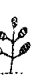

# 修復海馬與神經網絡

帕金森氏症、阿茲海默症，以及ADHD（注意力不足過動症）這樣的狀況。減低氧化壓力與炎症可修復海馬（Hippocampus）。形狀像一隻海馬——hippo是希臘文的馬——海馬與杏仁核一起作用來調節像憤怒與恐懼這樣的情緒反應。海馬也是與學習相關的大腦區域。任何新的技巧，從演奏樂器到學習為了健康與長壽而吃，都需要海馬的參與。所以，當海馬受傷，學習停止，而對生命的熱情與好奇就會慢慢飄離。海馬也涉及記憶，若它受損，會妨害我們的短期記憶，而讓長期記憶保持原樣。這或許能解釋為何失智症的人能經常回想起許多年前的事件，卻無法記起兩周以前，甚或十分鐘以前發生的事。海馬無法分辨時間，因此，它時常把今天發生的某些事與二十年前發生過的類似事件混淆在一起。我們剛遇見的新人可能會觸動從多年前的舊愛那兒來的記憶，對話因而就此打住。而海馬不僅連結到過去的事件，也連結到舊的思維，以及耗盡的情感。當它受傷害，我們會一而再、再而三地持續經歷著同樣痛苦的情勢，以及同樣痛苦的心情與感情。

幾年前，一位朋友邀請我參加他的婚禮。那是他的第五次結婚典禮。當我提醒他這件事時，他告訴我這次不一樣了。我的朋友正透過另一次的婚姻來試圖修復他的海馬——對修復大腦而言，並不是很實用的方法。我向他解釋說，他必須停止再去尋找對的伴侶，而要開始著手在一「成為」一對的伴侶。他對我的忠告感到不悅。在婚禮過後六個月，他打電話告訴我說他的婚姻已經結束了。而且他對我生氣，因為我讓他與如此殘忍與自私的人結婚。我提醒他神話學家與學者約瑟夫·坎伯曾說過的：「如果你沒有吸取教訓，最後將落得與其結合的後果。」我告訴我的朋友，除非他修復自己的海馬，不然他將會持續尋找，並且找到同一類的伴侶。

當海馬受到傷害，它傳遞「世界是危險的，而我們可能在危險之中」這樣的訊息給杏仁核。然後我們用生存反射來回應，將環繞在周遭的每件事都變成讓我們有性命之虞的情勢。當海馬被療癒了，我們開始在原本一度認為危險之處看見機會。我有一個個案，因為投資了其他人都認為註定會失敗的公司，而在股票市場上致富。

你藉由增加血清素的含量，與接通大腦裡幹細胞的生成來療癒海馬。幾十年前，我們認為大腦無法長出新的神經元。如今我們知道大腦能在不到六周內長出新的幹細胞，編織新的神經網絡，並且學習以清新的方式來看待生命。你可藉由改變你的大腦來改變你的人生，開啟BDNF——腦衍生性神經生長因子，這種生長荷爾蒙的生成，來取代藉由更換配偶、找個新工作、或把小孩送到寄宿學校的念頭，來改變你的生活。然而，為了要改變你的大腦，你將需要去抵制其傾向於默許自身長期建立的，關於恐懼、侵略、防衛以及其他有害情緒的編程。

正如升級你電腦上的作業系統，讓你可以執行新的、更強大的程式與應用軟體，升級你的大腦將會為你設置新的、更具建設性的思考，能夠增進你的健康與幸福感。食用營養素與能支持理想健康狀況的活動來培育你的大腦，也會幫你避開現代生活與老化的疾病。當你變得健忘或有專注的困難，你會想要把自己的失常當作「無頭神」而一笑置之，而暗地裡深藏的是對阿茲海默症與失智症的恐懼，而這影響著過半的所有八十多歲的老人。頭腦隨著年齡而惡化的想法是駭人的，但老化並不必須包含大腦機能的喪失。

在西方，老齡化特徵的疾病，包括心血管疾病、阿茲海默症、失智症，與帕金森氏症，大多是可預防的。預防始於修復海馬以及長出新的大腦細胞，並且食用一份好的脂肪為大腦添加燃料的飲食。

# 以BDNF、穀胱甘肽，與SOD來促進大腦的健康

我們舊石器時代的祖先對有關大腦的化學物質一無所悉，但他們瞭解有關能夠開啟身體修復自身能力的植物。現在的研究者發現三種能修復身體與大腦的關鍵酶與蛋白質。甚至更讓人驚異的是，它們開啟身體生成幹細胞的能力，能真正的幫助你長出一個新的且較為健康的身體。

腦衍生性神經生長因子（BDNF）會刺激新的大腦細胞的發展，並且對於修復與重佈線大腦是重要的，以便新的思考、感知與應對方式得以自發性地形成。你上次再度與你的伴侶或配偶墜入愛河是什麼時候的事了？BDNF升級你的大腦，使得你能夠經歷自己的人生與世界的「復魅」（re-enchantment）。

阿茲海默症、失智症和憂鬱症，都與BDNF的生成不足有關聯。毒素、壓力、缺乏運動，與含糖的飲食都會降低BDNF的水平。假使你從食物——特別是從魚或魚油——中沒有獲得足夠的omega-3s，那麼含有omega-3脂肪酸的補充品，對於提高BDNF的水平與促進神經幹細胞的生成是必不可少的。

隔夜做斷食，接著以脂肪與蛋白質而非碳水化合物來中斷斷食，這樣將會增加你的BDNF。但要進一步提升它，你可能要考慮每隔三或四週做一天的斷食。運動是另一個提高BDNF水平的方式，但要確定是自己喜愛的運動形式；研究顯示，做自己喜歡的運動，對於產生BDNF——比起去做那些只因你知道應該要做的，要好好得多。

穀胱甘肽是另一種酶，同時也是抗氧化物以及抗炎劑。而做為排毒因子，它就像是棉絨刷一樣的東西，拾起身體裡的毒素並將它們帶到肝臟作處理。穀胱甘肽提升你的免疫力並且幫你建造與維持肌肉。低穀胱甘肽水平會增加自由基對粒線體的傷害，然後使其產生較少的能量，並且無法調節細胞的死亡時鐘。而像羽衣甘藍，菠菜，酪梨，與南瓜這類食物會提高身體製造穀胱甘肽的能力。然而，許多人，包括我在內，缺乏GSTM1這個製造穀胱甘肽必要的基因，而且世界上有將近半數的人，失去一個或多個生成足夠的穀胱甘肽不可少的基因。在病危者之中，其比例甚至更高：大部分有慢性病的人只有微不足道的穀胱甘肽含量。因為身體無法利用補充品型式的穀胱甘肽——它在腸道內會輕易地被破壞——我推薦口服型式的S-乙醯穀胱甘肽，它能通過腸道並進入血流之中。我每周服用它兩次，作為補充品，並且發現它非常有效。

SOD 或稱超氧化物歧化酶，是終極的抗氧化物，能以超過一比一百萬的比率中和自由基的酶——一個分子的SOD能擊毀一百萬個自由基。維他命C及維他命E也被認為是重大的抗氧化物，但它們的擊毀比率只有一比一。既然體內有數不勝數的自由基——多到一個小小的維他命丸無法撲滅——我們需要SOD的火力來有效地降低損傷性氧化壓力。低水平的SOD在動脈粥狀硬化——與老化有關的動脈硬化——以及在老化皮膚中的膠原蛋白分解裡起作用。我們的身體會自然地產生SOD，而且它也能在食物中被發現，但要反轉一輩子暴露在農藥和環境毒素中而來的自由基的猛烈攻擊，需要重大干預。你能夠藉著服用反式-白藜蘆醇與薑黃來升級自己身體製造SOD的能力。你也能夠經由在飲食中加入富含紫檀芪的食物來提升SOD——例如多吃藍莓和葡萄——或服用紫檀芪的補充品。〈更多關於補充品的訊息，請參閱第五章：超級食物與超級補充品。〉雖然提升BDNF、穀胱甘肽與SOD能修復你的粒線體，以及防止老年疾病帶來的破壞，對薩滿而言，它們之所以重要的另一個原因是：它們升級大腦以便能夠體驗大靈之藥。對大靈之藥的體驗使得你能夠創造身心健康，並且以一種強大而有創意的方式夢見自己的世界應運而生。

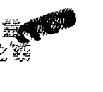

# 第七章 從壓力源解放你自己

> > 文明的進步，主要來自於社會崩壞的過程。——阿弗雷德・諾斯・懷海德

多年以前，我的導師吉卡勒姆先生（Don Jicaram）告訴我，要學習雨林的智慧，我得花一個晚上，在沿著亞馬遜河支流的叢林中獨處。太陽正要下山時，他在一個遠處的河灘邊放我下來。那是個美麗的地方——被稱為種子樹（shiwawacos，巴西柚木）的巨大樹木所環繞的白色沙灘。在跨過河的對岸，鸚鵡與金剛鸚鵡正在舔食天然的黏土，從中獲取礦物質，這是牠們每日晨間與晚間膳食的一部分。夕陽把它黯淡的光線投射在赭紅色的黏土表面，照亮鳥兒們藍色與紅色的羽毛。接著一瞬間，就像在熱帶叢林中會發生的那樣，天色完全暗了下來。我翻遍背包，尋找一直帶在身上、專為這種場合準備的手電筒與火柴，但發現這老頭子把它們全都拿走了。我試著不斷地告訴自己，要相信已經是身在伊甸園裡了，處處都有許多的美好圍繞著我，而我是安全的。然而，當夜晚降臨，全然體認到自己獨身處在暗夜莽林之中，恐懼襲擊著我，我感到很害怕。一根樹枝的折斷聲，或樹葉的沙沙聲，都讓我覺得惶惶不安。我確信自己被一隻美洲豹盯上了，牠隨時會撲向我並且緊咬不放。接著早晨來臨，而一切看來似乎再度變得不錯，甚至在我看見沙灘上新鮮的美洲豹足跡之後依然如此。直到我花了更多的時間待在叢林之中，才明白即使只有少量的食物及必需品，自己在那兒也是安全的。我學會不要成為美洲豹的獵物。

我們成為美洲豹，以及其他會吞噬我們的掠食者的獵物，是因為牠們嗅到了我們的恐懼。美洲豹能從幾哩之外追蹤你的氣味，正如城市內的盜匪，會用不可思議的感覺，知道那些人是容易被標記的，而挑選你成為他的目標。恐懼會發出一種化學串聯，真的改變讓獵食動物嗅到的氣味。接著，你的情緒狀態投射出一個弱肉強食的世界，而你專注於自我保護：我安全嗎？我有足夠的愛，或金錢，或任何能讓我感到安全的需求嗎？恐懼讓你始終保持在一個慢性過度警戒狀態，迫使你變成受害者——以及某人的晚餐。

我們的情緒會讓自己生病。薩滿們明白，大多數我們所面對的問題，都是由未療癒的情緒所引起的。情緒是被編碼在邊緣腦內的遠古生存程式，而當有害情緒主宰你的思考與神經系統時，你就會讓自己處於危險之中。為了不要再成為自己情勢上的受害者，並且變成踏上史詩般的發現之旅的英雄，你將需要療癒自己的情緒。你不需要為了尋找療癒的機會而誤入歧途。生命呈現出許多的挑戰與壓力源，轉變像恐懼與憤怒這些有害情緒，成為像憐憫與愛這種正面的感情，使得你能夠重新佈線大腦內的神經通道。

薩滿們能在我們使我們痛苦與毒害我們的有害情緒，以及當前與短暫的感覺之間，做出區別。我們可能偶爾對小孩或配偶有憤怒的感覺，一道自發性的閃光送出數量眾多的化學物質，通過你的身體與大腦，但這感受很快地消逝並回歸平靜。另一方面，有害情緒能夠逗留在身體以及邊緣腦達數小時，或數天，或數年之久。大腦科學家吉兒·波特·泰勒（Jill Bolte Taylor）在她中風的人生中頓悟，她在自己的著作《奇蹟》（My Stroke of Insight... A Brain Scientist's Personal Journey）中描述，感覺和情緒之間的差異：「從起初觸發的九十秒之內，我憤怒的化學組成完全地自血液裡消散，而我的自動反應也結束了。然而，假如在經過那九十秒之後，我仍然在生氣，那麼是因為自己選擇讓這迴路持續運作。我時時刻刻都在做選擇，是要追隨我的神經迴路呢？或是退回到當下的片刻……。」

恐懼是最致命的情緒。它使我們對周遭的機會盲目。恐怖使我們看不見任何出路。

「懼怕」會觸發戰或逃系統，稱為HPA軸，由下視丘與腦下垂體——大腦內豌豆大小的構造，以及腎上腺——位於腎臟頂部所組成。當你感受到危險，不論是感知到的或真實的，大腦會發出窘迫反應到HPA軸，減少流到你前額葉皮質的血流，這部分的大腦是讓你能看見可能性的。世上真正的危險，但你可以選擇如何回應它們。要停止被獵捕，你必須釋放那些強化世界是弱肉強食的觀點與信念。一旦你明白是自己的信念，而非「在外」的人或情勢所造成的壓力，你就能夠與你周遭的世界和諧相處，而不是感覺自己好像永遠困在交戰區裡。

我們日常生活中所經歷的情緒壓力，經常是我們受限的信念，與過度活躍的戰或逃反應的結果。

#### 受限的信念

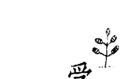

我們對世界的假設，能夠以我們意識不到的方式引起情緒壓力。受限的信念與智商（IQ）或教育無關，而與那些塑造我們世界觀的早年生命經驗有密切關係，大腦日益高效，然而無意識的神經網絡會將其解讀為現實。有時看起來好像是博學的專家，越是在美國人入侵伊拉克之前，無數的專家作證說薩達姆·海珊（Saddam Hussein）囤積大規模的毀滅性武器；後來，當然什麼也沒找到。呈現在美國國人面前的「事實」是虛假的。這些在國會作證的專家並沒說謊；他們只是單純地確信自己有個鎖定的真相。

在形成見解時，我們會重視那些適合我們信念的事實，並且毫不猶豫地擱置那些不適合的。西方社會偏愛科學與理性多過直覺，很少將這兩種認識事物的方式融合在一起，以獲得更寬廣的視野。當我和有醫學背景的人交談時，他們總是想要知道，那支持我有關健康的論述之科學研究，即使當他們在本能上知道我所說的事情是真的。那是我納入許多科學，在一本有關古老薩滿醫療的書內的原因之一：我們想要看見在專業期刊上發表的研究報告，來驗證古老的忠告。然而，我們越是只倚靠一種認識事物的方法，就越可能從那些無法察覺的偏見來操縱。重視科學甚於直覺的堅持，使我們忽略了當結合兩者時，通常能夠較好決定的調查結果。由研究者道格拉斯·狄恩（Douglas Dean）以及約翰·米赫拉斯基（John Mihalasky）所作的，對於企業主管的超感官知覺（ESP）的十年研究發現：相信直覺，以及憑其預感甘冒風險的企業老總，比起只憑邏輯與「事實」作決定的執行長，能賺到更可觀的錢。況且，直覺也不一定像那些硬派理性主義者所假定的那般不合理。諾貝爾獎得主赫伯特·西蒙（Herbert Simon）以及丹尼爾·康納曼（Daniel Kahneman）也名列在這些研究發現的，當憑直覺作決定時，是在汲取知識與經驗的寶庫的專家之中。比較起來，憑藉預感作決定，像是我不知道自己為何選他；我只是喜歡他的樣子，更傾向於是純粹的情緒反應，而且對錯的機會參半。我所見過的薩滿們，無疑是療癒專家，而且他們所汲取的，是世代的長者們所儲存的智慧，以及與神靈共同創造的共有經驗。

一個有嚴重後果的共同偏見是，相信我們沒有能力解決自己的健康需求，而必須仰賴醫生，藥物，以及治療方法來療癒我們。這導致我們的無力感，並阻撓我們以自己的名義採取行動拯救生命。大靈之藥幫助我們認清自己無需單靠醫療專家或藥物。我們能夠汲取頭腦以及神靈的力量，來支持先天的自我療癒能力。也能夠選擇釋放那餵養抑鬱、憤怒與擔憂的負面情緒，並且培育幫助身體修復的正面情緒。

只要我們陷在貯存於邊緣腦裡的受限信念當中，將會經常地指望別人告訴我們該怎麼做，不僅由醫療專家來決定我們的健康照護，而且由政治評論家告訴我們如何投票，以及媒體展現給我們看誰是敵人。

受限的信念，往往讓我們被困在受害者，迫害者，或施救者三種角色其中之一。 這些角色坐落在我所謂的消權三角（triangle of disempowerment）的三個角落。 我們創造出以這些陳腐的角色為特色的劇本，然後當故事展開，我們的行為就像是迷失在迷宮中一般，永遠無法擺脫這讓自信心降低的故事。 難怪每種場景似乎都很熟悉：我們持續在演員身上投射相同的部分，並且重演老戲碼。

無論是受害者，或迫害者，或施救者，我們都不斷地對他人的行動起反應。 不管在哪裡，我們都看見被受限信念所驅策的人作出同樣的事。 對那些我在南美洲所訪視的西化印地安人而言，迫害者是西班牙征服者，印地安人是受害者，而天主教會是施救者。來找我作薩滿能量醫療的新病人，經常要我作一位施救者，能把他們從使其持續成為受害者的任何疾病中療癒。我的首要任務是拒絕那份差事，並以幫他們破除自身的受限信念來代替，以及找到他們自己的內在力量來療癒。否則他們將會期待我表演魔法，而他們只是作被動的旁觀者。

所有這些角色——受害者、迫害者、施救者, 讓我們一直覺得受驚嚇，有防衛心，有忌妒心，以及互相競爭。當我們碰上某人作出機敏的，或是原創性的事，我們非但沒有欣賞他，反倒是忌妒他，或是貶低他們的努力。就像作家戈爾·維達爾（Gore Vidal）在其獲讚揚的名句中所說：「每次有位我的朋友功成名就，一小部分的我就死掉了。」在療癒情緒時，我們所面對的機會，是去超越那受限的信念，且不受那扭曲我們覺知的偏見所束縛，而以更大的角度來明瞭自己的人生。那些有關曾受考驗的人們，克服他們的傷痛，來療癒自己以及社群的英勇故事，比起我們習於創造的，三個陳腐角色的劇碼要給力的多。

## 過度刺激以及戰或逃

現今我們面對的兩種壓力源——過度刺激，與過度活躍的戰或逃系統——彼此密切關聯。我們都被超過自己能處理的過多訊息與感官刺激所衝擊，而這引發我們的HPA軸，與我們的戰或逃反應。

單就電視與網際網路而言，我們在一周內所接觸的刺激，就比我們舊石器時代的祖先一輩子經受的還多。而且為了跟上新的資訊，我們不斷地運作，直到慢性耗盡的程度。已數不清到底有多少次，曾聽見某人說：「如果沒有咖啡因，我什麼事也辦不了！」大自然設計我們的大腦，一次只能處理一隻對我們咆哮的獅子，而不是讓整個叢林都與我們為敵。然而現在，我們的大腦光是花時間把所有的資料分類整理，就已不堪負荷，更不用說能以鮮明的眼光看待它，並且決定何者是或不是一種危機，以及關於它，如果有區別的話，什麼是需要做的。

媒體帶給我們有關發生在遙遠地方的戰爭與毀壞的新聞，但我們的戰或逃反應只能在當地座標運作，並不明白遠處是什麼。當我們讀到有關一些災難性的事件，大腦的思維部分理解到那是發生在另一時空。但大腦以非語言的方式感知圖像，並且要快得多。所以當調節戰或逃反應的海馬，呈現出暴行的串流視訊時，會以在此刻，且在附近發生的方式來記錄它，並且進入高度警戒。越是受到壓力與毒素損害的海馬，危險似乎更迫近，也更具威脅性。

我確信國家尺度的海馬損傷程度，可用這個國家的公民所擁有的槍枝數目來度量。根據華盛頓郵報所述，美國有世界最高的人均槍枝擁有率——幾乎每一百人中有九十支槍——而且有著先進世界中最高的，與槍枝相關的謀殺比例。海馬感受到每棵樹後都潛伏著危險。

另一個為何我們的戰、逃或愣住反應總是開著的原因——「愣住」是HPA軸過載的反應，是我們對於進來的訊息必須加以回應的速度。我們的感覺是由荷爾蒙輸送，並以緩慢、類比式的化學系統通過身體。你能夠在對小孩或寵物的愛的感覺中取暖，或是在憤怒裡沸騰數天之久。另一方面，我們的思緒，以光速流過我們的神經系統，且以數位電子信號要求立即的反應。因此，這一訊息過載，咖啡因過量的社會，在我們的思緒與情感，頭與腸道之間造成的間隙日益擴大，而過度刺激是其結果。我們睡覺，卻無法真正地休息，甚至是慢慢地耗盡還工作過度。而這壓力讓HPA軸永不止息的運作著，卡在「開啟」的位置，並且以壓力荷爾蒙來毒害大腦，讓我們在恐懼中麻痺，或因慢性耗竭終至倒下。

你可能聽過這種說法：「一起激發的神經元連結在一起。」對今天的許多人而言，The request was rejected because it was considered high risk## 第八章 懷抱一個新的神話

## 朝向新的神話而行

在接下來的四個篇章，我們將仔細閱讀四篇神話，訴說伴隨著懷抱新的個人神話而來的力量。帕西法爾（Parsifal）、賽琪（Psyche）、阿諸那（Arjuna），與悉達多（Siddhartha）的故事，分別反映出擺脫受限信念的旅程，與改變我們命運的步驟。其中每個人都踏上了有關轉型的英雄旅程，而他們在其中成為聖者與神。我們與這些神話共事，並取得它們力量的媒介是藥輪——來自美洲原住民族的教導工具，匯集到所有以大地為基礎的靈性傳統。這些傳統尊重女性原則、母親的原型，以及與神靈的關係。英格蘭的巨石陣與秘魯的馬丘比丘被不列顛與安地斯山的原住民族視為神聖的古老遺址。這算是靈性根植於土地，與自然的循環最有名的例子。兩處遺址最顯著的特徵是，巨大的石頭朝向太陽的年度運行排列，當它從春分，到夏至，到秋分，到冬至橫越過天空，接著再度開始它的旅程。藥輪提供了一份應對轉型挑戰的地圖。當我們圍繞著藥輪的四個方向，從南到西、到北、到東努力前進。我們學著去活得更勇敢與更有創意，為領受大靈之藥的療癒做準備。

雖然有關藥輪的練習，在北美與南美的原住民族之間，因不同族群而異，在亞馬遜的老師教給我的方法，是從南方開始，隨著療癒者的旅程，療癒我們過往的傷口。接著移動到西方——神聖女性的旅程，面對死亡的恐懼。從那兒我們移動到北方，賢者的旅程，我們學到靜下心來，像是湖的表面，反映一切而擾動不興。最後，我們抵達東方以及夢想家的旅程，我們練習夢想著世界應運而生，以及參與創造。
這是典型的英雄旅程，呼喚我們離開自己所熟知的平凡生活，並且無懼地踏入未知。
大靈之藥的旅程是一個人的旅程，在其中，沒有人可以為你做轉型的工作。但那並不是說你獨自一人在藥輪中行走，你踏上這一道路途，即成為那勇敢社群的一部分。來自宇宙的幫助是始終可用的，但我們必須自我謙卑，以便從它的協助中得益。沒有謙遜，我們幾乎可肯定會倒退回陳舊的方式，回到那同樣令人喪失自信，以我為中心的故事。
自我想要採取快速運轉藥輪，並且被完全地療癒，但這並不是轉型工作的方式。隨著耐心與獻身，在我們能夠領受大靈之藥前，我們必須精通每一個方向的教導。
一旦你完成藥輪的功課，你就能為靈境追尋——為了領受大靈之藥的旅程最終的行動步驟，做好準備。

## 第九章 療癒者的旅程

### 褪下過去並療癒母親的傷口

在每個人的生命中，會來到一個必須遭遇自己過去的時候。對於那些被夢見的人、對力量稍微深入了解的人來說，他們會在臨終前，為了獲取再多些時刻的壽命，跟命運討價還價。

但對於做夢的人，一個有力量的人，這個片刻是單獨的。在營火前，當他召喚自己個人過去的幽靈時，就像證人在法庭前一般地站在自己面前。這是療癒者的工，也是藥輪起始之處。

在南半球，安地斯山的大地傳承者的家園，南十字星座佔據著心靈裡與天空中顯著的地方，幾乎和北斗星與北極星指引著北半球的居民一樣。南十字座的四顆星辰讓天文愛好者確定方向，而且象徵性地反映，歷經藥輪的四個階段到達大靈之藥頂點的進展，療癒者的旅程始於藥輪的南方。

南方被認為是蛇的領地：在原住民宇宙論中，銀河是天空蛇。而在所有的文化中，蛇的原型代表性慾，以及生命力。東方的傳統將蛇與亢達里尼（Kundalini）——經常被描繪成盤旋在脊椎底部的蛇的生命力——關聯在一起。蛇代表著本能以及文字思維；每件事就像我們看見的那樣，不帶有細微差別或模糊感，以一個具體表達來總結就是「事情就是這樣」。在這個模式下，感覺與情緒沒有涉入，就像冷血的蛇，我們無情地行動著。

在某些情勢下，透過蛇的眼睛來看正好是我們所需要的。當你處在危險之中而恐懼可能導致你慌亂而做出壞的選擇，本能性的行動能確保你的生存。假如你正站在空曠的山頂，隨著閃電打在你四周，這並不是沉思的好時機，而是你蛇的本能起作用，並告訴你找個安全地方的時候。

蛇提醒我們自己與地球——我們食物與支持的來源——的關係。這肉體，土壤，與岩石的物質領域喚醒我們的感官，像蛇一樣，我們脫去老皮，並留下它們。療癒者的工作是褪下已不再適合你的角色與身分，並且相信不倚靠它們也能存活。跟自己身體的感覺保持聯繫，你無須深思該如何是好，就可本能地付諸行動。一個臨產的懷孕婦女，不需思考自己到底要不要生產；她只要信賴自己身體天生的智慧，以及對宮縮臣服即可。

蛇在當我們需要褪下陳舊的自我，以及作根本性的改變時，會驅使我們往前移動。

但假使我們陷在蛇的覺知當中，就會盲目地活著，只關心自己的福祉與生存，而不去理會他人的感覺或需求。我們執著在自己所知的——過去適合我們的角色和身分之中。而這些，常常是由我們的社會制約，與雙親的影響所塑造的認同，多過於來自我們某部份有意識的選擇。因為原始的爬蟲腦，在熟悉感裡找到舒適圈，在它的影響之下，即使老舊的角色不再適合，我們依然避開改變。一個已婚的男人，仍然對離開自己原本單身的生活方式感到遲疑。一個已婚的女人，仍然覺得從她原本的家庭搬離，去建立自己的家園有困難。還有些人，自危及生命的疾病康復後，仍舊覺得自己是個病人，容易受傷且害怕。

當我們眼裡只有昨天，就無法認出在我們面前的可能性。而且，正如蛇的視力，在他將要褪皮時會變得較不敏銳，我們的覺知，在我們抗拒必要的改變時，傾向變得狹隘。因為看見危險，而不是機會，我們可能會錯失去嘗試，那會讓自己快樂些，或通往更大的自我發現的新存在方式的可能性。

羅蘋，一位快四十歲的女性，是兩個十來歲男孩的母親，在她人生的臨界點上，來找我作薩滿療癒。如今的她快發狂了，因為十幾歲的兒子，似乎只有在洗衣服與清理房間時需要她。然而她除了「媽」之外並沒有其他的身分，而且讓她心煩的還有，她的角色已經衰落成為自己小孩的女傭。更嚇壞她的是，如果她想嘗試做些別的事——也許是一份像之前一樣的廣告工作，生活將會是什麼樣子。羅蘋知道怎麼設計雜誌上的女裝廣告，但這個領域沒有她依然繼續運作下去，而她對網路行銷、搜尋引擎優化，或虛擬店面一竅不通。當她來到我的辦公室時，羅蘋抱怨在家裡的生活讓她又氣又病：她重了三十磅，而且每當她嘗試訓練兒子時，心臟就開始狂跳，並感覺到頭就快要痛起來了。每天早晨，她在茫然中醒來，不來個幾杯咖啡就無法清楚地思考。她知道自己必須改變。我要求她開始吃富含omega-3的大腦食物來修復海馬，並說明這能幫忙擺脫將她禁錮在母親和傭角色中的舊思維，而這思維對她的小孩或她自己早已沒有幫助。我也要求她跟麩質和乳製品保持距離一個月，再來看看是否對其中之一有反應，並且要她避開糖與精緻的碳水化合物。三週後在我們下次的個案中，我作了一次光啟，從發光能量場清理舊印記。之後，我點燃放在書桌上的一顆大蠟燭，並要求羅蘋在一些小紙片上寫下最令她不舒服的角色，接著拿起每一片，捲起它，吹入一個祈禱，然後拿著這紙棒在火中看著它燃燒。直到她的指尖開始感覺到來自火焰的熱時，就將這燃燒中的紙棒，丟入一個我裝著沙子的金屬碗中。我解釋這個儀式說，藉著象徵性地將其化成灰，有意識地去釋放那曾賦予她舊有的身分活力，但現已耗盡的角色。

她第一個想要釋放的角色是女傭。『我受夠那個角色了！』她幾乎是大聲地喊著。接著她燒掉快餐廚師、洗衣婦、妻子這些角色，最後是廣告經理。從她早年職涯褪下那個角色時，她有了一個結合兩者改變的新角色——在產業上與自己身上的改變。她希望以新的方式——又或者在廣告上，或許在另一個領域裡運用自己的技能。薩滿很早就知道神經科學家現在所證實的——儀式的力量足以改變大腦。小的儀式如羅蘋所使用的，能幫助提升你的意識，脫離那文字的邊緣腦系統，進入高階的神經網絡。當羅蘋把她的舊角色交託給火時，她發出如釋重負的大嘆氣聲。然而她決定留下一個角色——母親。她說：『我一輩子都願意當他們的媽，但不再是女傭。』如果羅蘋沒有先修復她的海馬，再燒掉她的舊角色，這個練習將不過僅是個基於好心念的稀奇姿態而已。好心念是容易被遺忘的，而意志力會逐漸降低，要真正地轉移你的心態或行為是極度困難的。在我們的個案之後，羅蘋回家並告訴家裡所有的男人，包括她丈夫，她要回到學校學習有關網路行銷。如果他們想吃，就要自己煮。如果他們要乾淨的換洗衣物，就要學習如何操作洗衣機與乾衣機。而且羅蘋堅持她的決定，在兩週之後，她的房子猶如災區，到處都是髒碗盤與髒衣物。但是之後，因為飢餓與衛生，家中的男人們終於願意動手做家事了。

## 帕西法爾與療癒男性

亞瑟王的圓桌武士——帕西法爾的傳說，述說關於完整與療癒的原型追尋，為了進展而放下過去的身分所作的奮鬥。對帕西法爾而言，蛇的工作是去療癒受傷的男性：藉由整合他內在的女性品質——像是美，情感，與愛，而去體現一個新的更開明的男性，這些品質在多數男人中是潛伏，而且必須被主動地喚醒的。

羅蘋和我也努力改變她母親原型的象徵，從有著巨大乳房，永遠哺育每個人的母親，到美洲豹母親，用堅實的爪子掌擊她已成長的幼獸，來表示他們離開獸穴的時間到了。

在療癒者的旅程中，你必須信賴，正如蛇蛻皮時是受自然保護著的，你那柔軟易受傷的下腹部，在沒有那些你丟棄的角色與身分時，將會是安全的。作為在地社區大學裡班上最年長的學生，羅蘋發現她的新方向是令人害怕的。而且她必須約束自己，不去把丈夫與孩子們，從他們的爛攤子裡解救出來。但修復她的海馬，這個與新的學習有關的大腦中心，讓她不僅能釋放舊角色，並且獲得幫助她茁壯成長的新技能，使她能勝任營銷主管，而不僅只是個活著的家政婦而已。

對帕西法爾的傳說極為重要的是聖杯，基督的聖杯。療癒女性的化身，聖杯是帕西法爾追尋的目標。根據傳說，帕西法爾——其名字的含意是「天真的傻子」——當他父親過世時他還是一個嬰兒。母親在威爾斯的森林中將他撫養長大，隱姓埋名，不讓他知道男人與其戰士之道。但在他青少年時期，看見一群騎士騎馬經過森林。穿著他們閃亮的盔甲以及飛揚的旗幟，對這小伙子來說，他們是無法抗拒的。想要成為男人，並證明自己的氣概那種迫切感，在他內心裡不停攪擾著，因此帕西法爾決定追隨這群騎士，踏上追尋聖杯的旅程。帕西法爾的母親意識到可能會失去她的兒子時就快發狂了。她希望他永遠是她的小男孩，在家中安全地倚靠在她身旁。她深知如果他成為騎士，將會在遙遠的國度裡過著一種衝突、與敵人交戰的生活。「如果你一定要去，」她告訴他：「答應我你將會保持貞潔，並且不問多餘的問題，而且要一直穿著這件家裡做的襯衣，來讓你記得你的母親以及她堅定的愛。」做為孝子，帕西法爾同意這些條件。當我們年輕時，總是遵從雙親的指示，以及我們文化的規定，而未曾注意到這些指定角色造成的繃緊有一天會變成什麼。帕西法爾出發去尋找騎士，接受尋找聖杯的挑戰。在他離開森林後不久，遇到少女白花（BlancheFleur，聖杯少女）正在準備婚宴。白花代表存在每個人內在的純粹女性能量，不論是男性或女性；假如他想要成為一個完整的男人，帕西法爾必須主張他內在的愛人。但他母親的話語在耳畔響起，帕西法爾堅持他守貞潔的誓約，並拒絕與白花結婚，而選擇戰士的生活。甚至在今天，我們的年輕人是被戰爭，而不是愛所啟蒙的。繼續著他的追尋，帕西法爾遭遇到紅騎士，他剛從亞瑟王的宮廷那兒來，並且技壓群雄。當帕西法爾也問他，自己要如何成為騎士時，紅騎士送他去亞瑟王那裏，宮廷裡沒人把帕西法爾當回事，而他請求要匹馬以及紅騎士的鎧甲時，亞瑟王微笑並告訴帕西法爾：「如果你能打敗紅騎士，馬與鎧甲都是你的。」讓眾人驚訝的是，帕西法爾不但挑戰紅騎士，而且在決鬥中獲勝並殺死他。這喚醒了他內在的陽剛戰士，但在這招搖的背後，帕西法爾的男性特質尚未完全成氣候。在他的鎧甲之下，仍然穿著母親為他做的襯衣。再次出發，帕西法爾來到一個城堡，結果發現這裡是聖杯之所在，並且在傳奇的費瑟王的保護之下。費瑟王——傷到自己的鼠蹊部——有些版本中說他濫用性權力，代表一個男性特質殘缺不全的男人。因為國王無法生育，他的國度是荒蕪的，而且他的臣民是滿腹牢騷的。這是現代的男性，尚未被聖杯所療癒，被愛所啟蒙而面臨的情況。他可能會想努力工作來讓家庭和樂，然而卻力有未逮，並且覺得不受尊重與沒人愛。費瑟王給了帕西法爾聖杯之劍。這把劍代表男性原則，負責守衛聖杯——女性生命力。費瑟王主持了一場宴會，而在用餐結束之後，聖杯被取出來。每個人都焦急地看著，傳說中必須由一位清白的年輕男人問這個問題——聖杯服事誰呢？——那將會釋放聖杯的力量，這萬靈藥能療癒所有的傷口。唉，當這杯子傳給帕西法爾時，他並沒有認出這是聖杯。因為聽從母親的請求，不去問多餘的問題，就只是將杯子傳下去。對他那尚未啟蒙的頭腦來說，這器皿只不過是另一杯葡萄酒罷了。帕西法爾隔天醒來時發現，城堡空無一人，而他的馬鞍在外面。當他騎過吊橋時，聖杯城堡消失在身後的迷霧之中。帕西法爾繼續去解救陷入困境的人，並且解放圍城，以證明他作為騎士的價值，並展現平常的英雄事蹟。在亞瑟王的城堡中，圓桌武士們歡迎他。但當他們慶祝帕西法爾的勝利時，一位老嫗打斷他們的狂歡。這老太婆罵帕西法爾，因為他沒能問聖杯問題，從而失去了為全體人類利益，而釋放它的療癒力量的機會。因為被這老太婆嘲弄而學乖了，帕西法爾再度出發去尋找聖杯城堡，並且矯正他的錯誤。但他周遊了許多年而未能成功，就像許多男人無法找到深層而恆久的愛，或自我成就感。最後，在他老年時，帕西法爾遇見一群旅人，因他在耶穌受難日，一個神聖的日子，穿著鎧甲而嚴厲指責他。這騎士脫掉他的盔甲，而因此立刻受到指引回到聖杯城堡。最後，在那兒——或者，我們希望如此，因為故事在結論之前就結束了——帕西法爾提出那神奇的問題，破除那使得他的男性特質，像費瑟王一般受傷的魔咒。從這器皿中啜飲純粹的、療癒的女性力量，帕西法爾從此完整了。只有在男人褪下盔甲及他的戰士表象時，才能從聖杯中啜飲，並且被神聖的女性所療癒。聖杯是我們所有人都在追尋的，男人與女人都一樣，它裡面所含的萬靈藥能緩和經由那暴力的，男性主宰的歷史，以及雙親和文化的指示，在我們身上所造成的傷口。就如同帕西法爾，我們許多人都是「盔甲先生」——舉例來說，帶著職業裝扮，或是強硬的態度——每天早上都朝向戰場前進，解放圍城，但得不到任何因我們的努力而來的感激或滿意。只要帕西法爾仍舊被他的過去，以及戰士的身分所束縛，他就無法發展為自己命中注定要成為的男人。他也無法履行尋回聖杯的承諾，其國度的人民會因而受苦。不論男性或女性，當我們最終能夠放下我們認為自己應該是誰，以及褪下被指責的恐懼，就能對我們遇到的新機會睜開雙眼。我們不再對好奇感到畏懼，不怕去問問題或去冒風險。但首先我們得脫掉盔甲，並且褪下母親保護的羽翼。從熟悉的課題或戰傷上離開是艱巨的——放下劍，並去除情緒的盔甲——但對我們的進化卻是關鍵的步驟。如果沒有採用這個步驟，我們將無法認出聖杯，並釋放它的療癒力量。我們可能連自己緊抓住那被誤解的，不受重視的戰士角色都不明白，只是持續地為我們從來沒有的機會，與未能成為的角色，來責怪我們的雙親。但要擺脫這受害者的身分，我們必得體認到我們的雙親，他們也活在帕西法爾的神話當中，而他們的父母，以及遠在他們之前的世代也是。療癒者的旅程，涉及中斷責難的鎖鍊，並且步入一個新的角色，寫一個全新的故事，不僅釋放自己，也釋放了後代的子子孫孫。在我們的生活中，當他們像蛇皮一樣，變得太空時，將會持續地褪下認同。最終我們會發現所有的角色，只不過像是吊在衣櫥裡的套裝，我們可依情況需要穿上或脫掉。假如你已完成南方的功課，並發現自己個人的聖杯，你可以自由地成為做夢的人，而不是被夢見的人，你是療癒者，而不是被療癒的人，是創造者而不是生命中被動的接受者。在完成療癒者的旅程後，你將會發現自己面對藥輪的新方向：西方，美洲豹的途徑。

### ◎練習
燒掉陳舊的角色與身分

這個小小火的儀式，可重新佈線你的大腦，以及褪下陳腐的角色與身分，使你能夠釋放過去的限制，並且繼續向前行，是個有效的實踐方式。就像所有的薩滿修習，你需要在這部份集中信念，否則這個儀式就不會有一樣的深度及意義或改變的力量。

傳統上，這個儀式讓一群人聚集在戶外的大火周圍，但也可以像室內的單人儀式一樣有意義。

你將需要一根至少四吋高的胖蠟燭、一盒木製牙籤、火柴，以及一個防火的碗公。（如果你喜歡，可以在碗公中填入半碗量的沙子。）

點燃蠟燭，然後拿一根牙籤，而當你拿著它時，想著一個不再適合你的角色或身分。輕吹在牙籤上，想像你轉移所有過時的角色或身分的能量進入那一小塊木頭中。然後握著牙籤就著燭火，當你無法再舒適地緊握這燃燒的小棒子時，就把它丟入碗公裡。繼續把角色與身分吹入牙籤中，一根接一根，直到你燒光所有必須釋放的陳舊老角色與身分為止。

我第一次做這個練習時，以父親這個角色作開頭，當我把棒子帶到火中時，因為從他那兒領受的愛與功課，而感謝我的父親，不論他是多麼地有缺陷。我現在明白，他當時已竭盡所能了。我以釋放兒子的角色繼續這個儀式，帶著祈禱，感謝我的小孩，因為他們教會我如何當個兒子與父親，接著我繼續褪下丈夫、愛人、療癒者、受害者等等這些身份。一直到我燒掉將近二百個角色與身份為止！

希望你需要燒的，不會太多。

## 第十章 神聖女性的旅程

### 面對死亡的恐懼與會見女神

> 某一天，當瑪利亞站在泉水附近加滿她的水罐，上帝的天使向她顯現，並對她說：「妳是有福的，瑪利亞，因為在妳胎中，妳已有上帝的住所。看哪！來自天堂的光將到來，住於妳身，並透過妳，閃耀全世界。
——偽瑪太福音

神聖的母親，女性的象徵，皆可在所有的文化之中發現，顯現為聖母瑪利亞，或時母迦梨，或觀音——甚至智慧本身，一切諸佛的母親。薩滿尋求在她自己的領地裡會見這神聖的女性那豐富、陰暗的內在世界，是我們進行面對死亡恐懼的時空遊歷之處。而這時空遊歷，與藥輪的西方及殘陽之所在有關。
當我們在尋常的世界遇見神聖的女性，會為之傾倒，男人在與他戀愛中的女人身上看見女神——直到她開始讓他的生活變得不可能。而當女人在這世上會見神聖的女性，她們通常極度崇拜或羨慕她，而不是從自己的內在認出她的美與力量。

希臘傳說中的勇士阿克泰恩（Actaeon），與黛安娜（Diana），月亮與狩獵女神的故事，述說了當我們與神聖女性不期而遇時會發生什麼事。在他帶著獵犬與男性友人去打獵時，阿克泰恩離開他的夥伴稍事休息，並且在探索他從沒見過的森林一角時走丟了。他來到一個滿是松樹與絲柏的山谷，有一條純樸的小溪流入一個淺池之中。在那兒，讓他驚又喜的是，看見美麗的黛安娜，赤裸地站著讓仙女為她沐浴。這女神把她的矛和弓以及箭袋留在河畔，就放在自己的涼鞋和長袍旁邊。當仙女們看見阿克泰恩時，她們急忙的用自己的裸身想要遮住黛安娜，並騎傲地站立著，在這獵人之前顯露她的全身，並潑水在他臉上，她告訴他：「現在你可以說自己曾看過黛安娜的胴體了。」

接著，鹿角突然從阿克泰恩頭上冒出來；而頸肌越來越長並且生出毛皮；他的臂變成腿而手變成蹄。目瞪口呆之下，他跳著跑開了，並驚訝著自己跑的速度有多快。但他在池邊屏息著停下來彎腰喝水時，照見自己在水中的倒影，他看見自己變成一頭雄鹿。就在這一瞬間，他聽見自己的狗在吠叫，幾乎快要抓住他了。他非常害怕地逃跑，但狗兒很快就追在他的腳跟後，而其中的第一隻，撕裂了他的腰裔。阿克泰恩試著叫牠們的名字，卻只有一種奇怪的喉音從他的嘴裡吐出來。頃刻，狗群絆倒他，並撕開他的## 會見美洲豹

太陽在西方下山，帶出叢林中夜晚的雜音。在這片黑暗之中，一隻線條優美的黑貓悄無聲息地移動著。對薩滿而言，美洲豹是神聖的女性有力的象徵。因為在雨林中沒有天敵，美洲豹活得一無所懼，只從叢林中為了食物取其所需，而別無其它。它並不為貪婪，或為了運動，或擔心食物供給會枯竭而殺戮。它不會爭奪要更多，作更多或完成更多。它不需要證明自己。美洲豹狩獵，探索並且依需求睡眠，過著一種安穩與平衡的生活。

## 大靈之藥

對美國西南方，墨西哥叢林，以及安地斯高原的原住民而言，美洲豹代表著大靈之藥的療癒力量，和蛇杖類似。蛇杖是有著兩條交纏的蛇，並以鷹的翅膀為頂的杖，對西方醫生而言是療癒的象徵。事實上，在美洲早期的文化，如墨西哥的奧梅克（Olmec）文化，對美洲豹是如此地著迷，以至於這大貓被描繪在許多奧梅克藝術作品中，包括有許多半人，半美洲豹的雕像。

對馬雅人而言，美洲豹是死亡，與接受死亡在生命循環中之角色的象徵。在西班牙征服之前，馬雅的高階祭司被稱為巴蘭（balams）——巴蘭是馬雅人對美洲豹的稱呼，指出他們曾經穿過超越死亡的領地旅行。他們進行這種象徵性的時空遊歷到下部世界，征服自己對死亡的恐懼，並且帶著不朽的萬靈藥返回。在神聖女性的時空遊歷中，我們體現美洲豹的智慧，放下對於未知的恐懼，並且信任為了服事所有的生命，那在我們內在痛苦瀕死的部分必得更新。隨著生與死的循環，和諧會被重建。而作為自然界平衡的一部分，所有的物種得以昌盛繁榮。

至於我們，美洲豹的應許是有著家的安適感，以及無論有任何危險環繞著我們都仍有安全感，並且免於慢性疾病的生活。進行美洲豹的工作，會發現生命提供一切我們所需要的。美洲豹給我們信心站出來並大膽的探索，確信我們正朝向自己得去的地方而行，並且與我們人生的目的地同步移動。美洲豹的能量為我們帶來平衡與明智，即便是你們周遭的世界已經瘋狂了，或者我們因恐懼與迷惘而麻痺了，或者我們面臨著令人衰弱疾病的前景。美洲豹回復我們的力量與自信，並恢復我們的健康。而如果讓美洲豹引導得夠遠，她將帶領你到女神的領地來直接領受她的智慧。

如果我們完成了藥輪此項步驟，與女神會面，以及面對死亡的恐懼，就可以變得跟美洲豹一樣，生活得優雅而有創造力，並體驗全人健康與平衡。甚至能期待擊敗死亡，就像是古代馬雅人智慧的看守者一般，而且發現我們永恆的本質。

為了明白擊敗死亡的概念，我們必須深思古代美洲人的哲學。他們相信，而很多人現在依然如此，我們有種精隨在死後仍會延續。但在我們西方的宗教思維中，靈魂的永恆本質是假定的，相反的是，古代的薩滿認為，不朽只不過是顆種子，一種我們都擁有，但為了確保死後意識的延續，而必須喚醒以及加強的潛能。因此我們整個人生，都必須致力於靈性修習，以便我們能學到像亞馬遜薩滿說的「如何離開此生而活著」。馬雅人稱這過程為喚醒你的美洲豹體，而精通此道的祭司被稱為巴蘭，是他們的預言看守者。藏傳佛教中與美洲豹體相當的是虹光身。完成這藥輪工作的成效之一，是讓蘊育在你裡面的那不朽的種子萌芽。

## 發現死亡之必然

你還記得初次想到有關自己的死亡嗎？第一次面對你將會死的事實？在青少年時期，我們覺得自己是不受死亡所影響的，相信那是發生在別人身上，但永遠不會發生在我們身上的事。所以，喝多了啤酒之後，我們載著一車子友人蜿蜒開下山路，在橫衝直撞地過彎時，否認物理定律適用在我們身上，而絲毫不考慮安全問題。然後，有天我們痛失所愛，或發生意外，或有健康恐慌，才會面對死亡一直以來都隨伺在側的事實。

實際上，關於死亡，我們有兩個大覺醒。第一個是發生在當了解自己是凡塵眾生，而有一天我們在地球的時間將會終結時。如果把這覺知帶到心裡，從那時起，我們明白每一個片刻都彌足珍貴，而人生也永遠地被改變了。

第二個大覺醒，發生在當我們掌握對死亡的恐懼時。這是種我們的本質是超越時間在時間之外而不朽的，持續到永恆的領悟。而對自己永恆本質的理解，不能僅只是理智層面的。必須是發自肺腑的覺知，細胞層面的認識。在許許多人類開始從事農業之前的社會裡，有個培育這種覺知的入會儀式，一種象徵性地遭遇死亡，而其中的入會者，會經歷超越肉體存在之生命的無縫延續。不論你是否有意識地在入會儀式中邀請死亡，掌握對死亡的恐懼是令人非常自在的，讓你能自由地運用創造能力，在混亂的日常生存中找到和諧。叢林的雜音變成音樂。悲劇變成一個新的且更令人滿意的生活方式的基礎。你開始為自己想像一個更豐富的生活，且為你的社群想像一個更可持續的未來。你受到感召去為地球與所有眾生服務，因為你明白我們將會繼續在一起億萬劫。（劫（eons）指很長一段時間，但並非永恆）

當你完成美洲豹的工作之後，你為自己所寫的新故事將會是增權益能（給力），以及令人振奮的，並擴展到只關心自己的立即需求之外。但要注意：假如你藉著忽視對死亡的恐懼而不承認它，試圖想加快這過程，或爭先恐後的想盡快弄清楚脫離危險的方式，這啟蒙將不完整。與死亡擦肩而過，看起來將只是運氣好，並非一個發現自己不朽本質的邀約。而你認為自己已經忘在腦後的問題，在陷入過去基於恐懼的行為之中時，十有八九將會回來。當美洲豹的挑戰未能解決，生命會再度變得不勝困窘，而沒有時間留給真正重要的事。

要掌握恐懼，我們需要讓它回歸到應有的作用，作為天生的早期預警系統，而不是作為存在的習慣性狀態。恐懼警示我們在周遭的可能危險，讓我們得以準備好作適切的回應。但當恐懼住進神經系統之中，而不是路過，我們就會被它所支配。HPA軸進入極度緊張的狀態，生命裡的每個層面都變得混亂失序。

從生物學的觀點來看，健康取決於身體內的和諧與複雜程度。自然喜愛複雜性。人類是從單細胞生物演化而成的一種高度特化的動物。但單有複雜性不足以創造健康；系統必須也是一致且和諧的。一百個人演奏一百種不同的樂器並不能造就一個樂團。要創造音樂，這些樂器必須能和諧地演奏。

你體內的系統越複雜且越一致，就越會越健康。心率的可變性越多，心臟就越健康，而且你體內的所有系統，就會一起工作得更加和諧，你的恢復力與健康也會更好。

對一致性與複雜性的理解，甚至也反映在細胞層次的健康上。有秩序的細胞創造健康，而失序的細胞恢復到原始的狀態，並且開始形成腫瘤。混亂的細胞從身體偷走營養，而且不像健康的細胞，它們拒絕死亡。它們違抗粒線體細胞內控制自己的「死亡時鐘」的構造的指令去死光，以便年輕的，更有活力的細胞能夠取而代之。當細胞失去複雜性，就不再以健康的脂肪為生，而只以糖為生這就是為何從你的飲食中剔除所有的糖與碳水化合物，對於癌症和其他疾病的療癒是如此重要的原因。

當癌細胞在體內複製，會造成巨大的破壞，直到最後殺死餵養它們的宿主。假如你拒絕接受終結是生命自然的一部分，那些在你的細胞層面所發生的，便是體現你的生命中所發生的。當死亡的恐懼接管時，它決定你將經歷什麼，最終消磨掉你的生命。

## 結束、過渡與開始

我們必須讓自己為過渡時期而顫心驚，因其宣告著往事死亡的來臨。對死亡的恐懼不論是肉體，思考方式，關係，情勢，或夢境的死亡都必須全然而有意識地被經歷，接著為了新的，健康的成長得以發生而克服它。

安妮只有十二歲，是我曾經合作過的癌症病人中最為年輕的。她的雙親帶著她來看我，希望大靈之藥能逆轉她的腦瘤。他們已試過每種想像得到的醫療介入，卻都徒勞無功，並將在我這裡尋求任何其他地方都未能找到的醫治。安妮已經因為化療失去了她的頭髮，而當她坐在我辦公室的大皮椅上時，看起來像個年輕，微笑的佛陀。

我向安妮的父母解釋療癒（healing）和醫治（curing）之間的差別。醫治是症狀的去除，療癒則在更深的層面工作，治療導致疾病的失衡之原因。雖然治癒（cure）是醫療介入的理想結果，療癒則是一趟旅程的成果，在之中，生命的各個方面都轉變了——即便最終你死去，也將帶著痊癒（healed）的自我進入下輩子。

我請安妮的雙親坐在外面的等候區，以便我能夠單獨與她共處。在開聊片刻之後，她坦率地告訴我：「我並不害怕。」她繼續說，天使每晚都會到她的夢裡來看她有時甚至是白天之中。但她的父母極度地為她感到擔心，安妮說：「我無法告訴他們關於天使的。」但她認為我能瞭解，而我真的瞭解，我感受到世界之間的薄紗已為安妮分開，而她的靈體也正為這偉大的歸鄉之旅作準備。但可以理解地，安妮的雙親決定想盡辦法來讓她活著，而這意味著嘗試帶著她遍訪一千專家來擺脫她的癌症，而最後，以我，當作最後的手段。作為執業薩滿的我，已積累夠長的時間來了解死亡是生命的一部分。而我見過很多在某些自己最成功的療癒個案中，包含了幫助我的案主祥和而有意識地死去。因此，我在安妮身上作了一次光啟，來幫她的能量場以及身體帶來平衡。光啟是薩滿能量醫療的核心療癒修習，在過程中發光能量場上疾病的印記被清理，來幫助身體的自我療癒系統更為流動。安妮的醫師沒有讓她活很久。但我知道死亡只是生命在神靈世界裡延續的門檻。我在安妮的脈輪上工作，為了臨在她前方的偉大旅程，清理積聚在裡面的厚重能量，幫助減輕她的能量承載。當她躺在我的治療床時，雖然在釋放包藏在她脈輪內的能量時身體會抽動，她進入深沉的睡眠。在我們個案的尾聲，安妮回到幾乎要把她吞下去的皮椅上，臉上掛著微笑。「我會沒事吧？」她問我，而我倆都知道她所說的是什麼。在我做光啟時，感受到天使在房間裡。「是的。」我回答說：「你會很好。」接著她問我，要怎麼幫助她的父母親。

### 第十章 神聖女性的旅程

「他們真的很怕。」她說。我始終對於許多小孩的智慧感到驚訝但同樣也因許多大人如此地缺乏智慧而目瞪口呆。當安妮的雙親回來房間，他們發現我們倆正在微笑。我告訴他們，他們的女兒做了多棒的事。我建議他們從安妮的飲食中剔除所有的麩質，還有糖，乳製品以及所有可能的過敏原。接著推薦她每天服用omega-3脂肪酸，來幫助重建大腦中因化療而受損的區域。當你來到生命的終點時，不會有什麼比讓你的大腦完整更重要的事了。這神經裝置在你有意識地進入神靈的世界時，必須盡可能保持在最佳的工作秩序。

### 愛與放下

我得知安妮在數個月之後，臉上帶著微笑，在她天使的手臂中離世。除非其下方的土壤有死掉植物的腐敗軀體作補充，否則在下層的森林與林冠覆蓋就無法生長。即使是美洲豹也會死，其軀體餵養樹木，而樹木將會餵養猴子，接著美洲豹將會享受美食（猴子）。森林之中生命的平衡沒有死亡就不可能達成，正如除非終結是我們生命的一部分，否則我們將無法與環境共處在和諧的狀態。物必有死方得新生。死亡與生命總是在平衡狀態。

美洲豹的工作一方面幫我們找到，積極地參與生命，且不計一切代價地抓住機會，以及另一方面，帶著接納與認同靠近生命，以便我們能臣服於更大的創造過程，兩者之間的平衡。它是男性，侵略性的能量與女性，接受性的能量之間微妙的舞蹈。美洲豹教導我們，停止囤積，也不用奪取多於所需。因為大地之母提供我們大量的資源。我們可以信賴即將發生在前方轉角附近的，可能比我們現在眼前所見的要好得多。美洲豹的工作是讓我們不再緊抓過去，並且開始過得更樂觀與更有想像力。然後，與其擔心太陽下山，我們不如欣賞暮星，並期待太陽會在恰當的時間再度升起。那失去所有我們的青春，我們的財物，我們所愛的人，我們的健康的困擾開始消逝。我們與死亡的關係也變得健康。熵（Entropy）是物理學的定律，說明宇宙中的一切事物都朝向混沌與失序，朝向崩潰與死亡移動。暫時性的失序與迷失方向是更高階的重組的序曲。這是當我們開始一段新的關係，一份新的工作，或一套新的健康計劃時所會經歷的。改變帶來危險，但也握有新事物的潛能——以及更好的——使新事物誕生的能力。在藥輪的西方，我們慢慢習慣破壞與重生的循環，宇宙的自然秩序。並深刻地掌握到創造性的混亂，能引致更大的和諧與平衡。在印度教中，破壞與重生的循環由三相神（Trimurti）來代表，這三個主要的神祇控制宇宙：創造者梵天（Brahma），保護者毗濕婆（Shiva）——毀滅者濕奴（Vishnu），以及破壞者濕婆（Shiva）。一旦我們面對自己的恐懼，並且經歷遍及全身的失落與絕望感，不再否認它或逃開它，恐懼就消散了。接著我們讓自己得以沉浸在創造的渾沌，新生命產生的原始湯之中。無須小心地嘗試；完全沉浸在其中，是體驗完整的啟蒙到一個感知與存在的新階段的唯一方式。允許我們自己真正的被未知所驚駭，才能放下岸上的安全感並且投入不熟悉的水域，雖說意識到風險，但仍因可能性而感到興奮。 我們之中有許多人，對完全臣服於另一個人感到遲疑，是因為我們害怕失去所愛的人。在我將近三十歲時，經過我所謂的慢性心碎的痛苦之後，我發誓永遠不再捲入忠貞不二的愛情關係，失去深情相繫的人的痛苦，巨大到讓我難以承受。接著，在幾年的心情荒蕪之後，我了解到自己的誓言是多麼的無用。愛是無法保證的。有一天，在我讀了魯米（Rumi）的詩後，我決定去面對自己的恐懼。魯米對他的摯愛說：「因為我已不復存在，只有妳在那裏。」這和我在早年的關係中所尋求的正好完全相反，我當時的口頭禪是：「當你已不復存在，只有我在那裏。」我漸漸地開始明白，就像魯米一樣，事實上所有的愛，實際上是對神靈的渴望——對於那真正的摯愛來說；而我最深沉的恐懼不是失去我的伴侶，而是永遠找不到我自己。

## 從冥界回歸

讓我們克服對新的夢想裹足不前的恐懼，是神話中一個普遍的主題，明白死亡與重生的神祕旅程，能幫我們完成美洲豹的工作。

在希臘神話中，冥界是個很複雜的地方，充滿著壞心腸的神靈，有魔力的河，以及一個統治著黑暗領域，並知曉其秘密的皇后。根據傳說，凡人之中，活著進入下部世界而且毫髮無傷的是赫丘里斯（Hercules），他擁有能制服三頭護衛犬柏勒斯（Cerberus）的力量。

勇氣與力量讓赫丘里斯能從看起來似乎致命的任務中生還。留住恐懼並傾注情緒，比起逃離它或是嘗試壓抑它更需要勇氣。但當勇氣變成虛張聲勢，可能是我們失敗的原因，正如樂師奧菲斯（Orpheus）的故事一樣。在他的妻子尤麗黛（Eurydice）死亡並且被黑帝斯（Hades）接走之後，奧菲斯下到地府想把她追回來，在那裡以他優美的音樂，說服冥王黑帝斯與皇后玻瑟芬（Persephone）讓尤麗黛能回到生者的國度。但正當他們到達入口時，奧菲斯違背了黑帝斯的指示，回眸看他的摯愛。因為那樣，她被永遠的放逐到暗黑的領域。奧菲斯雖然存活，卻永遠失去了他的愛人。

### 第十章 神聖女性的旅程

### 賽琪以及她的冥界的旅程

為了會見神聖女性的療癒力量，我們可以看看另一個凡人——賽琪，她下降到冥界並且存活的故事。賽琪（Psyche）是希臘文「心靈」（soul）的意思，她的故事在述說每個人——男性或女性，一旦他們尋求擊敗死亡，以及被愛所啟蒙就必須承受的旅程。

賽琪是國王的女兒中，最年輕也最漂亮的一位，受到每個人的愛戴，使得愛神阿芙羅蒂（Aphrodite）感到忌妒，甚至趕走賽琪所有的求婚者。國王請求神諭的諮詢，神卻告訴他，必須將自己的女兒用鐵鍊鎖在一塊岩石上被追求，並且嫁給死神——一隻可怕的怪物。這個神話告訴我們，我們的自我年輕，天真的部分充滿了鮮活的創意，以及它們所帶來的改變威脅著老舊的方式。賽琪的挑戰是面對死神，而她做到了，但不是以她認為她會用的方式。

阿芙羅蒂派她的兒子艾洛斯（Eros）射出一隻愛的箭在賽琪身上，好讓這少女無法抗拒的愛上死神，但就在艾洛斯將要完成他母親的心願時，因為賽琪的美麗讓他分心而被自己的箭所刺到，使得自己與她墜入愛河。他讓賽琪躲藏到他自己山上的家中，不顧他母親的威脅——認為賽琪的美與活力必須被摧毀。如同這神話所指，這正是對死亡與失落的恐懼能辦到的——摧毀我們的美與活力。

艾洛斯對賽琪是親切且鍾情的，只有一個警告：她永遠不可以看他。不希望表露他自己的身分，艾洛斯只有在天黑以後才會來找她，賽琪同意這條件並對她那看不見的丈夫感到欣喜。但當她的姐姐們來拜訪時，羨慕賽琪的好運氣，她們勸賽琪違背她丈夫的命令：「萬一他是怪物呢？」她們質疑。

賽琪之前並沒有對未知感到害怕，然而就在她的姐姐們警告過後，恐懼佔了上風。她帶著某種盤算去睡覺，就在與丈夫燕好之後，她迅速地點上燈，讓自己得以看見丈夫的臉龐與形貌。她發現俊美的艾洛斯甜蜜地睡著，並為他根本不是怪物而感到欣喜若狂。但緊接著一滴熱油從燈裏滴在艾洛斯的肩上，他醒了過來。對於賽琪違背誓言，艾洛斯因此大發雷霆並飛走。在屈服於她自己的恐懼與來自姐姐的社會壓力下，賽琪毀了自己快樂的生活。

賽琪懇求神的協助，但他們都很怕阿芙羅蒂。事實上，神在像這樣的情勢下是幫不上忙的，因為他們受到傳統與舊有方式所束縛。神告訴悲痛欲絕的賽琪，唯一能導正這個情勢的方法，就是博得阿芙羅蒂的歡心。雖然令人驚駭，賽琪採納他們的忠告並且勇敢的去找她的婆婆。她已經為西方的工作做好準備：面對並且克服自己的恐懼。

然而，阿芙羅蒂對賽琪膽敢找上門來感到憤怒至極，這女神抓起這年輕女子的頭髮並她的頭猛撞在地上。接著她交辦給賽琪四個不可能的任務。如果她想要回自己的丈夫，就必須完成它們。第一個任務是在天黑之前，把極大的一堆種子分類開來；如果賽琪失敗，她將會死。這任務代表我們對時間流逝的恐懼。我們怎麼會有時間去完成生命中的每件事呢？又該如何分別什麼是重要的以及什麼是不重要的呢？我們有足夠的時間給那些對我們真正重要的事嗎？在一整群螞蟻的幫忙下，賽琪設法完成了這個任務。螞蟻代表著如果我們認真看待的話，總會提供給我們的協助。我們之中是無人能獨力完成這看似不可能的任務。

賽琪的第二個任務是跨過河，從在田野裡吃草的兇惡的魔羊身上取回羊毛。這些公羊代表對比自己更為強大的對手的恐懼，而我們所有人都得已老闆，與家庭與人生中其他的義務的形式，面對這樣的對手。再一次地，賽琪因有幫手而完成了這個任務。長在河邊的蘆葦告訴她，等到黃昏時魔羊睡著了，她就可以收集魔羊在它們身上磨蹭時，卡附在上面的羊毛，而無須冒著被羊發現的風險。藉著讓情勢自己消除，賽琪將她自己從必須面對難以抵抗的敵人的情況中解放出來。

第三個任務是在一個水晶盃中裝滿來自冥河源頭的水，這一神聖的泉水，位在高山上，並由一隻永不睡覺的龍守衛著。對凡人來說，這是個不可能的任務，即使神對這樣的任務，也抱持著懷疑的態度。在我們的生命歷程中，都會面對看似不可能的任務。當我們因自己不夠聰明，不夠好，不夠強壯，或不夠勇敢來應付它們而感到畏懼時，就像賽琪面對那難以達成的任務。她陷入絕望之中，直到一隻老鷹的出現，將杯子抓在她的爪子裡飛到山頂，在杯中裝滿來自聖泉的水並帶回來給她，助她完成這超人的任務。老鷹，高高的翱翔在空中，代表著總體的願景，對大圖像的關注，克服我們的恐懼是必要的，加上膽敢飛向平時的鳥兒永不飛敢的地方。以同樣的方式，大靈之藥的應許，能幫助我們在進行啟蒙的過程中，克服面對不確定性，以及向高處瞄準時的恐懼。就像是螞蟻與蘆葦、老鷹代表著宇宙所提供的助力。當我們不顧自己的恐懼，有勇氣去冒險之時，同步的事件也會發生在我們的人生當中。賽琪的第四個任務是下降到冥界，並去向玻瑟芬要些她珍貴的美容霜給阿芙羅蒂。賽琪帶著無以言喻的恐懼，決定賭上自己的性命，一張保證單程的車票到達亡者的領域。當她爬上一處廢棄的石頭高塔並且幾乎要跳下來之時，這高塔告訴她，到哪裡可找到通往冥界的入口，並指導她帶著兩枚錢幣與兩塊大麥餅隨行，而且不要接受任何她遇見的陰影的協助，也不要給予來要求她幫助的任何陰影協助。這是一個在我踏上戰勝恐懼的旅程中所能有的最有價值的建議。我們必須帶著禮物，我們的能力與力量，以及像慷慨與慈愛這樣的品質。而且也必須小心自己請求誰的幫助。即使是處處為你的利益著想的朋友時常也無法，或不願提供我們所需的幫助或建議。雖然會起心想要幫忙那些大聲呼喚要求幫助的陰影，賽琪遵從命令並忽視它們的懇求。她付錢給渡船船夫卡戎（Charon），將餅餵食給守衛犬刻耳柏洛斯（Cerberus），並只接受珀耳塞福涅（Persephone）的點心，而不是宴會。最後，她成功的帶回一罐美容霜給阿佛洛狄忒（Aphrodite）。不顧她自己想幫助別人的天生衝動，賽琪堅持在任務上，正如我們必須致力於自己的啟蒙，而不是讓自己因別人的需求而分心，作為避開我們必須作的內在功課的方法。

賽琪已經接近即將成功完成她的任務了。而她，像奧菲斯，屈服於誘惑，偷看自己帶回的罐子裏面，而且立時睡著了。因她的不耐煩，試圖加速啟蒙的過程，而其結果就是倒退回尚未覺醒的狀態。她的愚蠢，作為我們完成美洲豹的功課時的警世故事。在舊版的神話中，賽琪回到這個世界，而美容霜完好如初，但神因為妒忌將它取走，接著授予她永生，來避免她與其他人分享青春永駐的秘密。然而，另一個版本中賽琪什麼也沒失去：她被厄洛斯（Eros）（浪漫與性愛的力量，有恢復生命的能力）所救。至於阿佛洛狄忒，她一直以來都知道賽琪會打開那個罐子，但裡面裝的不是美容霜，而是永生的萬靈藥。賽琪的沉睡代表著她的舊有，受限的自我感覺的死亡。然後當她被喚醒時，宙斯授予其永生。

對我們而言，賽琪的故事中最重要的，就是她在冥界的啟蒙。她正視自己面對死亡的恐懼，因此能夠轉變自己的生命。所有的啟蒙都必須包括往死亡領域的旅程，以及與神聖女性的會面，從那兒你獲得！

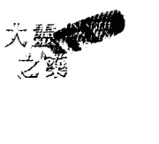

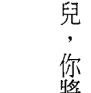

## 與美洲豹一起靜心

美洲豹是靜心大師，你曾經看過貓在太陽下懶洋洋地閒逛麼？貓懂得完美地放鬆。雨林裡的美洲豹棲息於樹的較低枝幹上，並且旁觀著這世界正在發生的事，不受猴子與金剛鸚鵡的打擾，完全地安逸但全然地警戒，只有牠尾巴的尖端不時地抽動著。美洲豹教導我們如何放鬆。深度地放鬆。（試著跟你的貓解釋一下，還有很多重要的事需要擔心呢！）今日我們了解有許多身體內的失衡是起因於我們沒有能力慢下來與緩解壓力。我們的交感神經系統是設計來當我們處在危險時，提供我們戰或逃的反射。而當系統被打開時，我們甚至連放鬆個幾秒都辦不到。皮質醇與腎上腺素為了給我們一股勁兒來因應威脅，而在血液中氾濫。但這強大的化學物質本來不該是流經全身太長的時間。當真正遇到危險時，我們戰，或者逃，然後迅速恢復，因為腎上腺素與皮質醇被再吸收回身體系統之中。而我們的呼吸慢慢地回到正常。但當我們慢性的在高警戒狀態，因焦慮而痲痺，有害含量的皮質醇留在體內，導致發炎與神經受損，以及最終導致疾病。掌握我們對死亡的恐懼，而不是由死亡的恐懼來掌管我們。我們的美洲豹已經爬上樹梢頂端的分枝，像一隻受驚嚇的小貓一樣而且我們無力呼叫消防隊帶牠下來。我們所有人終有一天會死去；然而我們可以不需要過早地經歷自然死亡。我們能掌握自己對死亡的恐懼，以便我們的生命不會被恐懼所指使，而且也不會好像隨時都有叢林野獸要猛撲在我們身上一般，不斷地回應。我們能夠回到平衡的，冷靜的，放鬆的狀態，打開我們的副交感神經系統，以便松果體可以生成靈性分子，以及當一隻優雅的美洲豹，品味我們新發現的，有關生命無限性的臟腑智慧。

在那兒，你將學會變得寂靜，以便你能夠尋回自己靈魂失落的面向。一旦你回收再造自己的能力，你已經為藥輪的下一個方向——北方，作好準備了。

啟蒙的旅程無須急切，掌握對於死亡的恐懼是終生的過程。你可能會被挑戰與考驗許多次，雖然隨著每一次，方法變得容易些。

的獎賞。來了！一口號的手提袋。這美容霜帶來了復甦與再造。永生的萬靈藥是完成西方的工作更新而歸返。這不像是來自於生活作些微調的表面改變。神聖女性的旅程，像帕西法爾的聖杯追尋，是嚴格的，你必須忍受進入冥界的恐懼，並在你能發現光明和清朗之前，留在那裡深切地反省。假如你認為你帶回的只是傷口的舒緩膏，那就是不得要領了。這油膏並非普通的除皺霜，或是T恤附贈的紀念品，或是印著「我到黑帝斯那兒，而且回

# 第十章 神聖女性的旅程

# ## 十一章 賢者的旅程

## 在半空中成為寂靜

> > 看哪，那許許多多前所未見的奇蹟……。
>
> 看哪，在我的身體裡，有個統一，完整的世界，包括一切靜止、或移動的萬物，以及其他你想看到的事物……但是，你無法用自己的眼睛看見我。我現在授予你天神之眼；看哪，我的神聖瑜珈。
>
> ——薄伽梵歌

當美洲原住民的祖先，在三萬多年前，從亞洲遷徙至此，他們也從其長久居住的喜馬拉雅山山麓，帶著大量的智慧隨行。根據追蹤粒線體DNA變異分子的考古學家所說，有十幾個勇敢的旅人越過西伯利亞大草原到白令陸橋（Beringia）——一個覆蓋住現今俄羅斯和阿拉斯加之間的白令海峽的陸塊。他們接著下行穿過北美與中美到安地斯山，而從那裡一直往下到火地島（Tierra de Fuego），南美洲尖端的位置。他們一路上在云间建造像马丘比丘的岩屋和堡垒。因此，在安地斯神话中，北方是祖先的方向。贤者之道与药轮的北方，以及有关寂静的古老修习互相关联。

北方并不只是过往伟大的贤者以及生物祖先的方向，也是我们在激情的活动中体验冷静的方向。北极星是移动的天空中唯一的静止点。而在美洲原住民的神话中，北方与蜂鸟有关，蜂鸟迅速地拍着翅膀，来让自己保持暂停在半空中，看起来就像是完全静止的。有些种类的蜂鸟每年秋天都会从加拿大迁徙到南美，跨过大海飞行数千里之远。因此，从蜂鸟那儿我们也学到随着寂静而来的大胆地走入未知领域的能力，以及让我们的生命，不论有多少海洋必须跨越，都能成为史诗般的旅程。

> 「贤者之道」磨练我们的能力，来超越被挑战、阻碍、与生活的平凡细节所占据的头脑那永不止息的活动，并且使我们无论内在或周遭发生什么事时，都能保持心平气和。我们开始在不确定性的中心看见秩序，且在风暴之眼中看见宁静。舍弃那有关事情应当怎么办的固执想法，变得乐于见到我们的计划被变幻莫测的日常生活安排与调整，而以千变万化的方式显现与消解。在北方，我们学会去怀抱意第绪（Yiddish）箴言所说的「谋事在人，成事在天。」

在我们完成贤者的工作时，兴起的那种新发现的内心平静感，是意识根本性转变的直接结果。只有当我们不再紧抓与渴求、回避与担忧、竭力与战斗，才能找到平静。

寂静之中，我们能够接触祖先的智慧。这是赛琪从珀耳塞福涅那儿取回的智慧，那我们只能在非常世界获取的知识，以及我们生命的每个细胞体验永恒的场所。北方的恩典是运动中的寂静。

从神经科学的观点而言，北方的智慧与新脑皮质有关，它让我们在没有那些比我们更强壮、更敏捷的动物的牙齿与爪子下仍能存活，进而发现科学的奇蹟，发射哈伯太空望远镜进入轨道，并且提出弦论来解释宇宙是由甚么组成的。塞进新脑皮质的缜密神经网络的是有关语言，注意力与自我意识，以及欣赏美与创作艺术的能力的脑区。

新脑皮质初次显现其天赋是在大约五万年前，当我们的祖先在法国的拉斯科（Lascaux）洞窟与西班牙的阿尔塔米拉（Altamira）洞穴的墙上描绘有关他们世界的神秘表徵时。

然而，新脑皮质的理性能力，如果不明智地使用，也能够被用来发动战争与巨大的破坏，破坏性的力量很可能在智人（Homo sapiens）发现洞窟壁画不久后就被释放，因为我们消灭了我们的尼安德塔人表亲。

然而一旦我们在南方疗癒者的旅程之中，驯服了战士的本能。新脑皮质就能自由地支持我们更高阶的本能与渴望。它推动我们去感受喜悦、热情，与共鸣——这些情操能提升我们，超越那占据我们较原始的大脑，诸如谁对谁做了些什么事这类耸人听闻的故事。

北方的恩典是在我們停下來，並看清自己，時行百哩卻毫無進展，萬般皆為卻一事無成的時候所能領會的。最初，北方賢者的旅程給出：坐下！放鬆！欣賞美景！這樣的指導，使其看起來像是在藥輪的方向中最易掌握的。但你不在南方療癒你的男性面，以及在西方遊歷超越死亡與神聖女性會面，就無法到達北方。而當你抵達北方，將最有可能發現，無為比其看起來來得要困難。而且保持寂靜本身不是目的，而是為了見證宇宙的整體性，與體驗創造的廣大性的必要基礎與基本修行。在賢者的旅程中，我們獲得那使得我們能理解創造的整體本質的神聖之眼。但要獲得這種形式的視界需要寂靜。在現今這種忙碌的生活，我們要保持寂靜幾乎是不可能的。我們太習慣於從數位設備而來的多工與追蹤連續輸入，而使得讓頭腦安靜超過一秒鐘都成了艱巨的任務。即使在我們靜坐時，把注意力放在呼吸上，我們也無法抗拒抓癢，調整姿勢的衝動，或是為了沒有關閉手機的文字提示而責怪自己。跳躍是頭腦的本質，而過度活躍的頭腦自古以來，就是靜心大師們的焦點所在。但今日我們的頭腦更為煩躁不寧，以像動作片跳接般令人目眩的速度，從一個主題飛掠到另一個主題。但假使你能讓內在的電影緩慢下來，並且使內在的喧鬧安靜下來，你將能觸及人類祖先記憶庫裡豐富的智慧。在我們北方我們得知，所謂的現實，即使是我們共同在每一個瞬間重新創造的，其實是種幻象，正如喜劇演員莉莉·湯姆林（Lily Tomlin）所說的：「什麼是現實？反正，只是個集體的預感罷了。」我們逐漸意識到宇宙完美地回映我們的信念、意圖，以及誠意。到底是什麼？是你攜帶在自己內在現實地圖的產物。如果你想要改變自己的經歷，就必須改變地圖。

神經科學家相信這地圖是嵌入在大腦的神經網絡之中。薩滿相信它棲居在發光能量場的局部部位之中。但不管你的世界模型位於何處，要在自己的世界帶來改變，你將必須升級地圖的品質——更換過時的模型成為更好的，如果你像這樣的文化中的多數人一樣，仰賴一份恐懼纏身、充滿匱乏、暴力的地圖來引導我們渡過人生的話而為了能展開自己，體驗大靈之藥，你需要將其置換成一個包含整個宇宙在內的，浩瀚而令人解脫的地圖。這正是戰士阿諸那（Arjuna）在他與天神克里希那（Krishna）的對話中發現的，而這形成了印度上古文獻《薄伽梵歌》的中心論述。

## 阿諸那：保持寂靜的挑戰以及與神會面

《薄伽梵歌》（Bhagavad Gita）成書於印度某個皇室家族充滿衝突的時期，在故事開始時，弓箭手阿諸那正準備與其親戚的強大軍隊打一場仗。那是阿諸那的業，他的作隨著兩軍在行動之中凍結，克里希那顯示給阿諸那看，不安頭腦的幻象是如何欺騙 我們的。在痛定思痛後，阿諸那說：

因為意躁動不安，令人混亂，強而有力，且異常頑固；我認為它就像風一樣地難以掌握。

克里希那告訴阿諸那，競爭是生命的一部分，但我們必須抗拒陷入自己繞著競爭所創造出來的劇碼中。然後才可以採取任何必要的行動——不論成果，不計成敗。

尋常的心智能地圖能幫我們弄清楚如何為日常生活領航，但有些時候它們的限制是明確的。每當我們的生存地圖主導一切，我們的情緒與硬派信念就會成為障礙。發生這樣的情形時，我們必須停下來並不帶判斷地觀察發生了什麼事。在寂靜之中，我們能聽見更高層的聲音。然後領會神靈一直與我們在一起，可靠地為我們驅馬駕車，正如克里希那為阿諸那駕車一般。克里希那告訴阿諸那：

對想要進入瑜伽的聖者而言，他們的方法是行動；對已經進入瑜伽的聖者而言，他們的方法是沉著平穩。

就像蜂鳥為了回應遠方的呼喚而飛越大洋，我們也可仰賴內在的指引安全的帶領我著於達成特定的成果。有時我們被拉離了軌道，是因為注定要體驗計畫之外的事物。神靈對我們的生命可能有些想法，或許是一開始我們會覺得不合情理的。克里希那告訴阿諸那說，有一個更大的隱形秩序，而我們必須讓自己校準這一更高的計畫。

在寂靜中，只要我們願意邀請，就能接收那來自神靈的指引。有時，我們想要知道的，只是如何回應我們的愛人或小孩；其他時候，我們可能會想學習現實和宇宙的真實本質。我們可以把標準設定在自己想要的水平。我們也可能被呼喚去作為或無為（「無為」並不是指什麼事也不做，而是有意識地選擇不去干預，讓情勢能以其自身該做的方式自行解決。）不去做甚至可能比去行動更為有力：不去拯救某人、不去行動或反應需要極大的力量。「無為」是北方的主要修行。當我們選擇忍住行動並保持寂靜，現實的結構就會對我們顯現，而我們就能識出它令人敬畏的精確性。

感知生命隱藏的結構是真正的智慧。通曉我們自己如何創造與編織這偉大的故事，則賦予我們賢者的視野。像阿諸那一樣，因我們見證了神靈的廣闊領地，而經歷了生命的完善：

你是原始之神，古老的神我；您是此宇宙的至高歸宿；

> > 您是知知者，應被知的對象，和至高的目的。
> 您遍及全宇宙，擁有的形相者啊！
> 您是風神，閻摩，火神，月神，和水神。
> 您是祖先和造物主。

既然，我們大部分人都不太可能會遇見克里希那，那要如何能見證造物的廣闊運行呢？在西方我們較為依賴科學多過於神靈。法國人類學家李維史陀（Claude Levi-Strauss）曾說過，對我們而言，要了解宇宙的運行，首先得了解一棵小草的運作：光合作用如何將光轉變為生命，以及小草的根如何自土壤吸收礦物質。然而，原住民是從不同的觀點來看待此事；對他而言，要明白一棵小草的運作，首先必須直覺地明白宇宙的運行——太陽是如何被創造的以及銀河是如何形成的。今日，也許是歷史上的首次，我們有機會兩者（科學與神靈）都學習。

讓狂躁的心智活動安靜下來，以及找到寂靜最有效率的方法，就是注意呼吸之間的空檔。在暫停之中——吸氣和吐氣之間的時刻——你會找到寂靜。呼吸是自主的反應，而我們不能完全中止它，否則會死。但我們能改變呼吸的速率。呼吸練習，有許多是古老的技巧，被設計來使頭腦進入寧靜與平衡的狀態。我們藉著有意識地控制呼吸，得以有能力培育平靜。當你培育出寂靜，日常的挑戰將會停止去假定危機迫切的程度。當你能夠採取更廣闊的看法，世界就成為一個豐盛的處所，能支持一個豐富而有意義的生活，也就是把「在狂熱的比賽中出人頭地」這種認知，讓位給「生命不需是一種競爭」這樣的覺知。在北方，你受呼喚要為自己與世界帶來美、療癒與安寧。如何更好地展開這項任務可能無法馬上顯現，但當你持續修習寂靜，它將會為你揭曉。你只需要為療癒做出承諾，然後讓神靈關照細節即可。正如克里希那解釋給阿諸那聽的：

凡為了擺脫老與死而皈依我，努力不懈者，

他們通曉虛通，最高自我和一切行為。

數年前，我遇見一位女士——克蘿伊，正為她的健康而奮戰。她選擇朝聖，這一度是很平常的修習，特別是在中世紀的歐洲。她的朝聖將帶她到西班牙的西北部，並打算追溯使徒聖地牙哥——聖雅各——的足跡，從地中海走到星野聖地牙哥（Santiago de Compostela）一段大約五百哩的旅程。

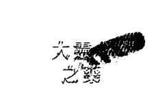

這是個包括以地域為目的地的朝聖，而聖雅各之路，或聖詹姆士之路，數世紀以來在朝聖者之間就是受歡迎的路線。他們或走全程或走該路線的一部分。但朝聖並不只是走過鄉間的健行；它也是內在的旅程及自我反省的時刻。許多朝聖者把這旅程奉獻給比自己更大的事物。克蘿伊希望她的朝聖，能給自己更新的目的感與清晰感，讓她得與自己面臨的健康挑戰會面。

在她開始旅程之後不久，克蘿伊認為自己聽到一個微弱的聲音告訴著她，她必須斷食三天，只有喝水，然後用餐三天，在整個旅程中交替實行兩者。三個月後抵達星野聖地牙哥時，她已經恢復健康了。當她把自己的復原歸因於神助時，我確信斷食幫她開啟身體所有的修復系統。而她所修習的寂靜與祥和，使她能了解自己的疾病為她帶來的課題。

你不需要以聖雅各之路來獲得朝聖的健康裨益。你能夠把每日上下班，或是去拜訪你那有些疏遠的女兒，轉變成朝聖之路，或者像克蘿伊，將回到健康的途徑變成朝聖。無論是哪種旅程，都有一個外部組成，帶有你必須克服的障礙，以及一個內部組成，包括臣服、發現、以及當你敞開自己，在神的幫助下重繪你的心智地圖時，最有可能的情緒挑戰。一旦你明瞭關於自己生命與療癒的寬廣地圖時，就能採取必要的行動將自己與新的方向排成一致。

在許多原住民文化中，朝聖是傳統上獨自一人的靈境追尋，探素者用斷食與超級食物的組合整備自己的大腦。接著他深入森林或其他的自然環境，並且開放自己來得到神的指引。

靈境追尋是領受大靈之藥最後且最重要的步驟，而你將會在第十三章裡發現關於建立自己追尋的指示。但首先，你必須完成圍繞著藥輪的旅程，並且跟隨在東方夢想者的道途。

### ◎練習

#### 我是自己的呼吸

培育寂靜與平靜的傳統修習，包含了呼吸工作，這一基礎的練習，對於讓頭腦安靜下來是很有效的。

安静地坐在黑暗的房間中，在你前面放一支點著的小蠟燭。當你凝視著蠟燭時，注意到你的意識就像火焰一般，到處飄來飄去，首先吹向一個方向，然後又到另一個方向。

當你聚焦在吸氣時，邀請你的頭腦作為一位觀察者。當肺飽滿舒適時，找到氣息頂端的間隙，並且在那裏暫停片刻，默默地覆誦：我是自己的呼吸。

當你吐氣時，注意你的氣息如何非常輕微地攪動火焰。釋放掉肺中所有的空氣。而在氣息的底部，暫停片刻，並默默地覆誦：我是自己的呼吸。

一開始持續這練習五至十分鐘。而當你對安靜地坐著變得越感自在時，再逐漸增加時間。

# 第十二章 夢想者的旅程

## 領受大靈之藥

> > 用你身體以外的耳朵，傾聽隱藏的聲音。
> 用你身體以外的眼睛，觀看天上的景象。
> 去察覺，那無法被尋常的感官所測度的事物。

在藥輪裡，夢想者的旅程和東方以及重生的方向有關，賦予生命的太陽，每天早晨由東方升起，為我們帶來與世界重新會面的機會。

而在美洲的原住民之中，東方是提皮（teepee，印地安圓錐帳）或儀式小屋所朝向或面對的方向，使得新曙光的力量能夠溫暖並充滿在整個空間裡。

東方是由老鷹來代表，牠能凌雲翱翔，俯瞰整個地景，或者集中注意力在灌木叢中疾走的老鼠。這個由高空層次的洞察，與地面層次的清晰兩者組成的雙重視野，是東方之所以被稱為「看見者」或「夢想者」之道的原因。在旅程的此刻，我們學習倒轉式的思考，在確認武斷的機率或限制之前先關注其可能性；聚焦在為什麼有些事可以如此，而非它為何不能。

老鷹的恩賜之一是重新開始的能力，擺脫那有關我們是誰的陳舊的故事，不受期望或恐懼或疑惑所控制。然而，每種來自神聖的恩賜都帶來某種義務，而在東方，這義務是將你所獲得的智慧分享給其他人。擁有全新且較為寬廣的人生地圖，你能夠不用成天想著擺脫一個接著一個的困難，只需要欣賞每一個片刻帶來的所有奇蹟。

縱使這讓你體驗到自己是宇宙不可分開的一部分之意識水平的提昇，是難以持續的。但當你回到尋常的覺知，藉著懷抱著可能的願景，你仍能為自己帶來可在最深的層面轉變生命的知識。而藉由邀請他們懷抱自己最高的夢境，你就能與他人分享這一恩賜，因為你幫助他們自最深沉的惡夢之中甦醒。每次有新的患者走進我的辦公室，不論他們帶著什麼樣的診斷而來，我總是以健康的、光亮的、喜悅的存在來看待這個人。我總是知道抱持著案主已然痊癒的印象，會幫助他們找到邁向健康的途徑。只有當我在腦海中有此堅定的印象時，才會開始去看案主哪裡受了傷，以及何種情況似乎是不太對勁的。

當我們把自己領受到的療癒恩賜帶給其他人時，這些恩賜的益處才會真正地變成我們的。在我們的光體療癒學校，我訓練學員執行能量醫療，成為薩滿師傅，並為他人與世界帶來美與療癒。這一訓練始於療癒「我」這一自外於其他存有和宇宙，並且無力也無助的概念。假使你仍舊依附於自我的局限感，並且害怕失去對自己個人的認同，你將為無法容受合一的體驗，與大靈之藥的整體性，或者是伴隨著它的恩寵與力量的恩賜。在薄伽梵歌中，克里希那告訴阿諸那：「我既是不朽，又是死亡；既存在，又不存在。「你，我，以及神靈同時存在又不存在。只有在尋常的世界，從蛇的覺知來看，你和我才是以獨立的實體存在的。這一轉換到老鷹視野的意識，使你能成為夢想者，而不是被夢見的人。你逐漸掌握到每個人都握有一片宇宙的拼圖，而且自己不是唯一的夢想者，你與其他人以及神靈合作，一起夢想著自己的健康，以及一個痊癒而美麗的世界應運而生。而不論你是否意識到，作夢在這個意義上是一直持續地進行的。但在夢想者的旅程當中，你可以選擇有意識地參與夢想著世界應運而生。識別出作夢是集體努力的結果，能擺脫那你是自己的宇宙中唯一的主人，但卻搞得一塌糊塗的思想包袱。然而，同時也使你擁有必須為自己的健康與關係，更確切地說，是生命的每個環節，帶來改變的力量。擁有這樣的覺察，你既不需試圖逃離危機，也毋須被其壓垮。你能夠清楚的看見何時，以及如何採取行動，並且何時該讓問題自行解決，以及讓身體自己療癒。在北方，你發展出能在修習寂靜的期間觀察自己頭腦的意識，而在東方這裡，你逐漸理解那觀察著你的經歷的意識，是更大的意識難以分開的一部分。為了明白此一道理，印度的聖人拉瑪那·瑪哈希尊者（Ramana Maharshi）曾經推薦一種自我探問的練習給他的學生。一開始藉著把你的注意力帶到自我的感覺，或我的覺知上，並且維持你的注意力，一直到「我」的感覺消失，並且只有覺察保持著。這對我們大多數人來說，是個困難的修習，所以作為輔助之用，你可以運用薩滿教過我，而我用在自己的療癒上的修習作為開頭。思考以下的問題：我是誰？接著繼續問，正在問這個問題的人是誰？這個探索將會帶領你超越自我的「我」的經歷，到宇宙的基本結構——這更大之意識的覺察上。你將會逐漸明白個體的覺察，從來不曾真正地從這一更大的意識分開過；只有在你有身體，一個肉體的形式時，才會體驗到它是單獨的。像海中的波浪一樣，你是獨特且不同的個體，但同時你也從來沒有與大海本身，與你的來源分開過。具體化自身只是個暫時的狀態，你的身體是你局域的自我，而那無限意識的浩瀚之海，是你非局域的自我。一旦你領受大靈之藥，並且認出自己那非局域，無限的本質，就能夠在回到那日常的、局域的、具體的覺察時，知道自己有能力想像出新的現實——甚至長出能以不同的方式老去與療癒的新身體。東方的旅程是去死後天界的內在旅程，在那兒會為你顯現創造的廣大無垠。但夢想者有義務把這知識帶回家園。當許多的神秘家尋求到達最遠的天界，並待在那兒，處在至福的冥思之中時，薩滿們決心要在地球上創造天堂，回到尋常的現實，來幫助其他人品嚐大靈的美味萬靈藥。就像薩滿一樣，我們修習療癒與慷慨，以及為世界帶來美，壓根兒就沒想過有什麼是留給自己的。事實上，對薩滿來說，有機會能減輕痛苦就是夠福報的了。

## 第十二章 夢想者的旅程

然而，當它發生時，有一種獎賞是給夢想者的。你將會發現能夠為自己創造非凡的健康。這並不是指你必須指示個別的基因開啟或關閉，或是告訴你的大腦該產生哪種神經傳導物質。你只是掌握自己人生的雙重神鷹之眼——創造的廣大無邊與細節兩者——而你的身體將會做其餘的部分。正如壓力會開啟創造心血管疾病與癌症的基因，神鷹之眼的平靜則帶來開啟健康與長壽的基因。當神鷹的願景消融了分離的幻象，你就能創造健康的狀態，而疾病就能消失。

當你進行自己的靈境追尋——不論是跟隨第十三章設計好的範本，或其他的形式——你受邀旅行到超越死亡之外的領域，並且從已經存在於永恆之中的「未來的你」那兒尋回自己的命運。一旦你遭遇從現在起許多世之後將會成為的自己，你將能夠在今日開始體現這些品質與屬性。而那悄悄潛近你的過去，會讓位給那勢不可擋的未來，因它吸引你朝向即將成為的自我——不需要干預、治療，或修復的自我。你將毋須去療癒不對勁的地方，療癒將會自行發生。

在亞馬遜的某些部族，關於時間的概念，跟我們不同。早期，在跟隨著亞馬遜薩滿的旅行中，他們告訴我如何能夠遊歷到「從現在起很長一段時間之後」——在未來的許多年後——然後帶著他們所發現的願景與智慧回到現在。他們說，這多少有點像作「靈魂復原」，只是回到過去找回那已經失落的，改為追蹤在未來的命運罷了。
當時，我還無法了解這能力是什麼，因為我來自的文化，時間是線性的，且只往單方向流動。後來，我得悉薩滿的信念是在夢想者的旅程之中，你能夠進入永恆，在永存的現在擺脫過去與未來的約束。有時薩滿能夠為病人在未來發現其痊癒的狀態，然後不採取行動，並看著命運如何將病人拉向健康的理想狀態。這能力減少了薩滿必須涉入並行動的量。修習無為，他得得以在非慣常的世界修復關係。

> 魯米在他的詩《夜氣》中，描述已完成東方旅程之人的無為：
若論懶，神秘主義者無疑是專家。
他們從未播種耕耘，卻源源不斷地收成。
神已幫他們把一切都做好！

但在我們能達到無為的程度之前，還有工作得去完成。神鷹的道途不是給那些尋找

## 悉達多：大靈之藥的恩賜

根據傳說，佛陀出生時是位王子，他被取名為悉達多的意思是『一切皆能成就者』

悉達多的父親是位偉大的國王，他決定阻止自己的兒子經歷世界的憂慮與痛苦。他是位終極的直升機父母，庇護年輕的悉達多免於所有的醜惡。王子在百花盛開的花園環繞下長大，並且由迎合他所有需求的僕人照顧著，對於宮牆外尋常百姓生活中發生的事渾然不覺。我們就像悉達多一樣，也想要生活在幸福與舒適的泡泡中，永遠去除那引起我們苦惱的任何事物。他的父親代表著我們孤立自己的傾向，想在貧民窟中構築自己小小的宮殿，並且只關注我們自己所需，而對他人的不適毫不在意。

但人類是群居的動物，能契合彼此的暗示，對彼此的痛能同情與理解，並且在看見其他人的痛苦時，也會感到悲傷。而在悉達多成長為青少年時，變得對宮殿外的事感到好奇，有一天，他違背了父親的期待，要求自己的車伕駕車帶他到鄉間四處走走，以便他能看著自己將來有天要統治的人民，以及明白他們所過的生活。悉達多要成熟，就得突破他童年的心靈泡泡。

## 大慧之藝

當他乘著皇家戰車時，悉達多遇到四種景象，讓他心中深感不安。第一種是一個老人，沿著路旁步履蹣跚地走著，並痛苦地呻吟。悉達多問他的車伕：「他為何呻吟呢？」車伕回答：「因為他年邁體弱，所以他痛苦。」

這對悉達多而言宛如敲響巨大的警鐘，他從不曾想像過衰老與虛弱這類的事。他曾聽過痛苦但並不相信它存在，但如今這景象正呈現在他眼前。他問道：「我將會變老與變得衰弱嗎？」他的車伕回答：「是的！」

悉達多富裕、健壯，並且衣著整潔地從他那奢華的蘭中統治整個王國，沒有任何疼痛，但他對於看見別人受苦的反應是去問，「那我呢？」後來，在他成為佛陀之後，他將這擔憂轉變成對別人的慈悲，不再關注自己的脆弱。我們皆需對自己的幸福負責，但這和「先為自己著想」以及把我們的需求擺在其他人之前，是非常不一樣的。

悉達多所遭遇的第一個苦：人行將離開老年的生活，並經歷死亡，是絕非偶然的。因為他也将離開自己過去舒適的生活，並進入一個充滿不確定性的陌生領域：我還能活多久呢？我能避開衰弱多久？我是誰，如果不是這麼擁有權勢的王子，我能永遠，一直地快樂下去嗎？作為國土全能的統治者，發現自己對恢復老人的青春與活力無能為力，令他感到非常痛苦。悉達多想著。而且他明白自己必須捨棄這個角色。路上所見的第一個景象相當於佛教的第一個聖諦：苦諦，一切生存皆是苦。這是當我們在進行藥輪南方的工作時逐漸接受的真相，褪除過時的角色與受害者的身分來生出更高貴的角色，成為自己命運的創造者。

悉達多還在想著死亡是否還有很長的路要走時，看到了另一個讓他苦惱的景象：路旁有個赤裸生病的人，乞討著零錢或食物。悉達多問道：「車伕，那個人怎麼了？」悉達多的車伕回答：「那是個飢餓、赤裸、生病的乞丐。」接著悉達多問：「有一天我也會像那乞丐一樣嗎？」「是的，」車伕說：「因為縱使你再富裕並將統治整個國土，也沒有能力避免疾病。你，也將會變老，並且失去健康與美麗。」

悉達多相當震驚，他無法想像自己強壯的身體，或是他實現自己願望的能力，都將會有結束的時候。如今他聽到像這樣的結果是必然的。他想著：一定有什麼不對之處，這些事有可能發生在別人身上，但真的會發生在我身上嗎？我們全都想要相信自己是安全的，而壞事只會發生在別人身上。

當我們年輕時得知人會變老並且會死，但從不相信那將會發生在自己身上。

悉達多看見乞丐的啟示，相當於第二個聖諦：集諦，痛苦起因於執著。我們的快樂仰賴於擁有自己想要的，以及沒有我們不想要的。當我們滿足時，並不想要改變任何事。與其說明白改變是必然的，並期待還有什麼會出現並取悅我們，我們反倒是固守舊有的，直到櫥櫃塞滿了舊衣服，地窖堆滿了舊東西，以及頭腦裝滿了舊思想與信念。有時候我們甚至依戀於壞情勢，比如一段暴力的婚姻或一份糟糕的工作，並想著：總比到了五十歲還是單身，或沒有任何工作來得好多了。害怕不確定性，我們固守陳舊的角色與身分，即使它們再也不適合了。但前方的道路是去放下我們的舊角色與執著像我們之前在療癒者的旅程中所作的那樣，將它們釋放進入火中。我們舊有的概念必須死亡，而且必須讓自己的期待改變，因為我們將走向前去進入未知。

當我得知自己那個「你應該已經死了」的診斷時，我那一長串的「幸福必需事項表」突然間蕩然無存。唯一要緊的事只有自己的健康，以及如果無法恢復的話，準備赴死。

如今，我刻意外讓自己的幸福表列保持非常簡短，並且讓上述兩件事項位於最頂端。

我們不僅執著於過去——那些已經穿不下，但仍保留在櫥櫃裡的——而且也依附於未來可能帶來的。我們固守著生活將會變得更好這樣的觀念。而有某些讓人不快的事正等著自己這樣的概念，使我們嚇呆了。悉達多遇到的生病的人，代表我們原始的生存恐懼：沒有足夠的食物，錢，健康或力量。老人是我們所害怕的，並且竭盡所能去避免的未來。但當我們在美洲豹的旅程中面對死亡的恐懼，並學習穿行過不確定的叢林，我們就能在未知中不再因驚恐而無助地退縮。

## 第十二章 夢想者的旅程

然而，當悉達多仍因他自己生病與衰頹的可能性而感到不安時，他遇見路旁第三個令人痛苦的景象：一具屍體。

「他發生了什麼事了？他為什麼不起來，並且去做自己的事呢？」悉達多問他的車伕。車伕說：「他死了。」

「沒辦法讓他起死回生嗎？」悉達多問道。傳來的回答是：「唉，不行。」

悉達多深感哀傷。「將來有一天我的生命也會結束嗎？」車伕告訴他，確實，死亡對所有人是必然的。

路旁的屍體相當於第三個聖諦：滅諦，要斷除痛苦，我們必須釋放所有的執著，甚至對生命本身的執著。我們必須不再緊抓住那從自己身邊溜走的，或渴望那我們已經失去，而似乎無法再得到的。並且不再去相信，只有當自己的願望成真時，才會有內在的祥和。

當聽見自己，總有一天也會死，悉達多非常沮喪。但有個最後的景象動搖了他的意識：一個苦行僧，或聖人，在路邊盤腿靜坐冥思。這人似乎完全地寧靜，超越所有的恐懼與痛苦。悉達多要求他的車伕停下馬車，而他急忙地走近苦行僧，問他是如何達到如此的平靜。

「你，也能夠超越痛苦和死亡，」苦行僧許諾說：「你只需靜坐在那邊那棵樹底下，不吃不喝，直到知道自己已經擺脫悄悄潛近你的死亡。」悉達多回到皇宮，卻發現他所熟知的生活已經失去吸引力，苦行僧的言語始終在他耳邊迴盪不已。數年後，他放棄富足而安逸的生活，並且朝向自己的命運靠近，為了找到止息痛苦的方法，出發當個雲遊僧。一旦我們像悉達多一樣，揭開這層薄紗，就得瞥見痛苦——世界的，以及我們自己的而且對那陳舊的方式開始感到焦躁，進而展開療癒的探索。夢想者的旅程會有多久，或是如何充滿著挑戰，將會因個人而異。但到目前為止，你應已有相當好的觀念，路是既陡且彎的，而且療癒包括致力於身體的，心智的與情緒的準備。悉達多花了六年在禪定裡，只給自己的身體些許的食物，但他仍然無法找到所要尋找的答案。最後，在絕望與臣服的行止中，他坐在一棵無花果樹下，並且發誓，除非他找到痛苦的原因，並知道如何斷除它，否則就分毫不動。小孩在他的周圍玩耍，狗兒對他吠叫，美麗的女人試圖引誘他或使他分心，土匪搶走了他隨身的僧袋，以及微薄的財物。但悉達多只是坐在那裡，將自己專注的目光朝內看，研究自己頭腦的本質，敞開心胸，並放下關於將會有什麼事發生的任何期待。然後，根據傳說，在一個磨人心志的夜晚過去，靠近拂曉時，他在後人稱為菩提樹的樹下證悟（菩提意指「覺醒」）。後來，佛陀描述他所覺悟的是：

## 揭露大靈之藥

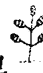

我證悟老死，證悟老死集，證悟老死滅，證悟導向老死滅道跡……。

不論我們稱其為證知、領悟、覺醒，或是大靈之藥，對於轉變悉達多成為佛陀——覺知者的體驗，既是深刻地療癒，同時又是一種使人平心靜氣的單純。「苦諦的止息是一種個人的發現，——藏傳佛教導師邱陽創巴仁波切說：「這不是神秘主義，它不具有任何宗教或心理學意涵：它僅僅是你的經驗……。這就像是經歷瞬間的身體健康：沒有感冒、沒有流感、沒有疼痛，而且沒有痛楚在你的身體裡。你感覺非常良好，完全地生氣蓬勃而且清醒——像這樣的經驗是有可能的。」

悉達多為了療癒自己的痛苦而出發，而且從其自我的追尋中，帶回給人類終結面對老、病、死的痛苦的方法。這是神鷹的恩賜，夢想著旅程的果實。

在藥輪東邊的方向之中，你失去自我來找到自己。死了陳舊的自己，你重生為新的生命。你明白居住在物質世界中，那局域的自己，是不斷變化的，但那永恆的，非局域的你，永不改變且永不受苦。非局域的你永不生病，並且永不死亡。這樣的理解能幫你回到完美的健康。

永恆自我的發現之旅始於南方，當我們褪下自己陳舊的角色，與有關自己究竟是誰的偏見，以及像帕西法爾，療癒我們內在受傷的男性。我們繼續這旅程來到西方，跟隨著賽琪教導我們的，如果要擺脫自己恐懼的囚籠，最為顯著的是面對死亡的恐懼，以及尋回女神的恩賜——永生，就必須跨過門檻進入未知。完成它之後，在北方，我們學習寂靜與關注內在，汲取那些先行者們的集體智慧。宇宙的壯闊將對我們顯現，就好像對阿諸那示現一般。

當我們到達東方，這一道路途的所有步驟，我們經歷的所有考驗，突然有了意義。對較寬廣的觀點開放，我們掌握自己生存的悖論：每一個人同時是無限小的，只不過是芥子，以及無限大的，如同須彌，同時無為與無不為。甚至證悟，我們發現也有種沒什麼特別，日常的一面。而且我們學到像悉達多一樣，一旦領受大靈之藥，就必須為世界帶來其療癒的恩賜。

證悟之後，佛陀在菩提樹下教導他所發現的四聖諦：生存是苦，痛苦源自於執著與慾望，有離苦的方法，那就是八正道，用熟練的實踐來支持覺醒的人生。這些永恆教誨的精隨，是在我們領受大靈之藥時，為自己所發現的。

因此，你可能在理智上能掌握與藥輪的四個方向相關的課題，但只有在與大靈之藥的直接經驗裡，才能讓這些原則留住並且改變你的人生。在東方，我們必須面對自己的心魔，和佛陀——以及耶穌——幾乎一樣的作為。耶穌並沒有把他的惡魔摔在地上，而是堅定地告訴它們走自己的路。佛陀，不但沒和他的惡魔爭鬥，反而餵養它們：「來，你要我的頭，拿去吧。你要我的身體，拿去吧。」他非局限的自我明白，他不是自己的身體，或自己的頭，而當他未能參與他的折磨者所設的把戲時，它們就變得無聊而離開。對我們而言最大的誘惑，是去與自己的惡魔交戰，並想著我們能夠取得勝利。然後在三十年後，我們傷痕累累而血跡斑斑，直至最終承認這場戰爭的無用。大靈之藥則給了我們更好的方法，能帶著我們的惡魔前進。當然，在接受大靈之藥後還有工作得去做。即使我們領受大靈之藥的恩賜，仍然得與自己肉體存在的挑戰會面。而覺醒也不能免除改進自己的思維，以及持續改善我們的態度和行為的需求。即使是達賴喇嘛，他也承認會感到憤怒，儘管有著神一般的品質，他也不過是個人，但他不會餵養這憤怒或採取行動，因此它迅速地消逝。他帶著慈悲與神鷹之眼看待生命：「我總是從更寬的視角來端詳任何事情。」法王如此告訴時代雜誌的採訪者。耶穌從沙漠回來，帶著愛鄰如己以及把臉轉過來由他打這樣的智慧教誨，但在他的工作被完成之前，他走了許多路，不斷地教導，並且受了許多苦。佛陀，在他證悟之後，並沒有隱居在山巔，安住於至福之中。在接下來的四十五年中，他深入俗世，幫助別人覺醒與療癒。

## 大靈之藥

所以在接受大靈之藥後，你的生活將會有何不同？首先，神鷹之眼的寬廣視野，將幫助你以更大的慈悲與自在，來為自己的生命領航。你所做的工作將會自然而不費力，並與你的天賦和願望一致。而且你經歷的身心靈療癒，將有它背後的力量，使你覺得受驅策，而以自己可行的方式為世界服務。

藉由夢想者的旅程所帶來的預示，使我們能夠採取夢想者旅程的最後一個步驟：靈境追尋。這東方的導引修習，是一種體驗大靈轉變為力量的古老方法。

## 第十三章 靈境追尋

你如何在日常生活中應用量子力學呢？...量子理論能教你如何行走於大地嗎？如何改變氣候？如何將自己與創造的原則、自然、與神視為一體呢？它能教導你如何成為有力的行動，活在你生命中的每個片刻嗎？

閱讀大靈之藥是一回事，而去體驗它則是另一回事。正如同閱讀關於悉達多成道的故事，並不足以讓你擺脫疾病、年邁、與死亡一樣，閱讀大靈之藥將給予你資訊但非智慧。智慧必須靠直接領受大靈之藥來獲得。而得到它的最後且最重要的修習，是靈境追尋。

靈境追尋能療癒你的身體，以及修補你的靈魂。像帕西法爾一樣，你也許在尋找聖杯。或像賽琪，你可能帶著永生的萬靈藥自冥界歸返。以及像阿諸那，你可能會發現宇宙的秘密。但如悉達多，你必須離開舒適的城堡或沙發，並且坐在你自己版本的菩提樹下。

對於自己為何恰巧現在無法離開城堡或沙發，我們總是有成堆的理由：沒有足夠的錢，沒有足夠的時間，太多電子郵件必須回覆等等。我自己本身就推辭最後的旅程，直等到我收到致命的診斷，並看見自己生命的終點就在眼前。需要我的建議嗎？別等到那時候才做！

## 接受挑戰

> 「靈境追尋？你指的是什麼？」一位柔弱無力的紐約客——莎莉要求說：「你知道

理想上，你將會像薩滿們所做的一樣，在自然環境中進行你自己的靈境追尋，與雨、風、太陽、熱、冷等元素待在一起，並藉由斷食讓自己的身體處在輕微的生理壓力下。然而，靈境追尋的目的並非簡單地不吃或不喝過活，而是在荒野之中去發現自己是地球的公民，自然之子，與萬物是一體的。你以斷食來喚醒身體的自我修復系統，並且刺激大腦與身體裡每個器官中幹細胞的生成。

然而，除非你先升級自己的大腦，否則靈境追尋將只不過是個野營的旅行罷了。但當你排毒然後用超級食物賦予大腦動力，追尋就能夠是與自己命運面對面的相遇，在之中你會發現自己與神靈共同創造的能力。如果你能夠堅持不懈地應用在書中各處所建議的修習，當你領受大靈之藥時，幾乎可以確定品味到創造的一體性。

## 第十三章 靈境追尋

或該如何與神靈溝通時，就會對自己可能領受的信息保持關閉的狀態。莎莉是我的長期案主，富有且聰慧，在她二十多歲時是個美人，而如今即使在她五十來歲的年紀，仍是無可否認地魅力四射。她也是多動症（Hyperkinetic）的患者，習於為所欲為，並且比我碰過的任何人更被關係上的厄運所苦。莎莉白天服用利他能（Ritalin）來處理她的過動症（ADHD），並且在晚上服用妥解鬱（Trazodone），一種強力的抗憂鬱與抗焦慮藥物，來幫助她入眠。她持續地從一段虐待關係跳到下一段，到一種令她麻木的程度，而她喜歡，正如她所說的：『把男人當玩具來使用。』但也承認自己無法不帶著刻骨銘心的痛，擺脫這些玩具。

靈境追尋挑戰著許多莎莉的都會舒適性習慣。附近沒有美食雜貨店：她無法打開電視看新聞，並且也沒有網際網路。她討厭自己答應獨自待在野地裡的主意。但無法承受繼續過著自己那浪漫的哀愁，與藥物的痛苦人生之想法。

『我喜歡在樹林子裡尿尿。』三天結束後我去載她時，莎莉帶著微笑對我說。她的頭髮凌亂而臉上滿是汗垢，但不知何故，她的衣著無可挑剔。我很好奇她是怎麼辦到的。於是她承認自己為了此行每天帶了一套乾淨的服裝。（某些習性是很難移除的）她說，這退省靜思對她而言並不輕鬆。在第一天晚上，她確信自己將會成為狼群的食物，並想像他們包圍著帳棚的樣子，她祈禱著黎明到來。但到了第二晚，當明白自己不會被一群飢餓的掠食者攻擊時，她把睡袋從帳棚中拉出來露宿，開始享受躺在裡面看著星辰的感覺。莎莉從未見過天空中有如此多的星星，事實上，她已經多年沒看過星星了。因為紐約城裡的燈光，要在夜空中看見任何東西是很困難的。飢餓的痛苦讓她在第一晚保持清醒，但在那之後，她睡得像嬰兒般地香甜。然後，有亮光。「第一晚，我覺得自己像是宿營在停車場裡，」她說：「有車子的前燈照進帳棚內，亮到把我喚醒。但當我走出帳棚外頭，除了星星之外，只有一片漆黑。」起初，莎莉以為那是來自天外閃耀著的光，但接著她明白，那是在自己的夢境中，為她顯現的「那道光」。

莎莉帶著對自然，以及自己生命——其實是所有的生命——由衷感激，從她的靈境追尋歸來。她持續食用計畫中的超級食物，而我為她做了數次的光啟，來清除其發光能量場上的印記。我們一度必須釋放她母親的靈魂，她已逝世十三年了，但仍依附在莎莉的發光能量場裡。

莎莉也決定中斷與男人的關係。她開始把自己對特定男人直覺的吸引力看作是種警訊，就是他們不會是對她好的那種男人。而在她的靈境追尋之後六個月，她開始和一個安靜的紳士約會，用她的話來說，就是「真正溫柔的男人」但在莎莉的靈境追尋中最顯著的改變，就是她的過動症神秘地消失了。當她維持一個無麩質，無乳製品的飲食，並結合健康的食物像藜麥，她的過度亢奮與喜怒無常也消散了。而且她不再需要利他能或

## 麵包機

當山繆來找我時，他重達二百六十磅。除了麵包，義式麵食，以及加工食品外幾乎什麼都不吃，而且他有高血壓，高膽固醇，與胰島素阻抗。山繆是位出版商，他的書目包括健康課題、生機食物，以及健康的飲食相關的書籍，然而他卻是個強迫性過食者。

山繆沉迷於加工碳水化合物——在你吃下它們後幾乎立刻轉變成糖，也正為糖胖症（糖尿病）與肥胖有關聯的糖尿病所苦。這是一種文明世界的新流行病。我跟山繆提到第一型糖尿病—起因於胰臟無法產生胰島素——的發生率，在二戰期間因食物匱乏的結果，已下降了百分之六十。我告訴他，在他的靈境追尋時所作的斷食將會為他帶來同樣的益處，而且不會讓他挨餓很多天。

山繆已經嘗試過世上的每一種飲食計畫，而此時他跟隨著原始飲食法（the Paleo diet）。正如我在第五章所述，原始飲食法是以農業時代之前，舊石器時代的人類所吃的食物為根基。這些狩獵——採集者，大部分靠青菜，以及偶爾才有的，能以簡單狩獵技巧捕獲的小型動物或魚過活。「很棒啊，」我告訴他：「這是大靈之藥的飲食：有許多蛋白質，以及健康的脂肪，而且沒有加工的碳水化合物。」我說明給他聽，沒有必需的碳水化合物，但是有必需的蛋白質和脂肪酸，而我們在不吃任何一片吐司的情況下，也能度過下半生。我強調：「是加工的碳水化合物讓你發胖，不是脂肪。」我也建議山繆與紅肉——牛肉和豬肉保持距離。

> 「但紅肉是原始飲食法的一部分啊。」他抗議著說。

我曾在亞馬遜，與那些千年以來都和他們的祖先以相同的方式飲食的族人，生活在一起，雖然他們吃很多魚，但很少吃紅肉。我解釋說，我們和植物一起進化。而狩獵採集者並沒有能撂倒大型動物的武器。我告訴山繆：「偶爾吃塊紅肉是沒關係的，但當你這麼作時，確定它是來自草飼與自由放牧的，而不是來自穀物飼養，或注滿抗生素的動物。至於魚，如果它們來自乾淨的水域也不含汞，是不錯的。但麵包與義式麵食必須排除。」

雖然許多人信奉原始飲食法，但他們都忘記需要懷抱關於眾生一體，與自然和神靈共融的舊石器時代信念。我告訴山繆：「這些信念是創建你身體健康的重要組成部分，僅只飲食，而沒有神靈加入，來幫忙改變你的生活方式，就不會有效。」

山繆是個難纏的人。他向我保證會把麵包機收起來，但他的食物櫃裡滿是罐裝食品，大部分含有小麥製品，因而是有麩質的。山繆是不會輕易放棄麩質的。

## 犬貓 之癮

所以，有一天中午，我們到他的公寓裡，而我開始清空他的食物櫃，扔掉罐裝食品，還有存放在麵包機隔壁櫃子裡的麵粉，以及麵包機本身。他甚至有含麩質的牙膏呢！當我把它們全部拿出來，丟進垃圾槽時，我看得出來山繆幾乎快要抓狂了。他愛他的麵包機，而在他內心深處，認為自己只需要將它收起來，暫時中斷一段時日就好了。但我在這裡，正扔掉他心愛的玩意兒！

當我們年輕時，母親給我們食物吃來安撫我們，所以從那時起，當我們覺得有壓力時，往往傾向去吃康福舒食（comfort food）——那伴著我們成長的含糖零食。其後果就是，歷經幾十年後，我們腸道內了不起的菌群變得對糖、碳水化合物，以及劣質脂肪上癮，因此當我們斷食超過十二小時，消化道菌群就進入反抗狀態。我們不餓，但它們會變得一整個好餓，只因為菌群想要進食。

然而，腸道微生物是極度聰明的，而且它們學得很快，在短短二十四小時，我們就能打斷它們的食物成癮，並且重新建立一個菌落之中的新平衡，使得好的菌群能夠繁盛。斷絕糖，澱粉，以及有害脂肪，並且服用品質良好的益生菌，使得好菌能再度定居在你的腸道內。那就是為何作一陣子短期的斷食是如此重要的緣故：它們將恢復在腸道內的平衡，以及打開所有的身體修復系統。

山繆理智上知道加工食品或碳水化合物，像麵包與義式麵食是非常令人沉迷的，就像古柯鹼一般，刺激大腦內同樣的獎賞中樞。他的腸道，也因長年食用麩質與加工食品而嚴重受損，但這還不足以說服他為了療癒自己的身體，以及改造他的生活，而去做出必要的改變。那天在垃圾槽旁，我們差一點拳腳相向。這可是從高中後，第一次有人把我推靠在牆上！並非每個人人都必須把麩質當作毒素來看待，但很顯然地，除非山繆迅速戒掉他的壞習慣，否則他將無法破除習性，並且開始修復自己的大腦。最後，他很勉為其難地接受我強迫他做的改變，只因他用光了所有的藉口。接下來發生的事是不可思議的。在四天之內，他藉著從飲食中剔除麩質、小麥、碳水化合物、乳製品、咖啡以及糖，並且服用我在第四章中推薦的排毒補充品，山繆開始覺得好多了，而且體重還減輕了——一天超過一磅，那並不容易。有好幾次他在晚上哭著打電話給我，因為來自他不愉快的童年，以及青少年的印像持續滿溢在他的腦海中。然而，在第二週結束時，山繆減了將近二十磅的體重，而且他的腦霧也清除了。他數十年來第一次睡得很香甜。而排毒補充品，幫他根除先前貯存在自己體脂肪內的毒素，因此它們將不會被他的腸道再吸收。山繆已經準備好做靈境追尋了。

當上帝似乎較偏愛教堂時，神靈似乎較喜歡野地。事實上，幾乎所有被記載在神話與歷史之中，與神難忘的邂逅，都發生在自然環境裡——荒野、山巔、沙漠——但很少在大教堂中。山繆決定在佛羅里達州，珊瑚頂市的費爾柴爾德熱帶植物園進行他的靈境追尋，這裡離他夏天的家很近。他將於每天早晨七點，園區開放時進入植物園，並待在地上直到關門。他的任務是不與任何人說話，而只是坐在他最喜歡的樹蔭下，並喝許多的水度過一整天。

在三天的靈境追尋之後，山繆告訴我：「雖然我沒遇見上帝，但我發現一種只有在孩提時代才知道的安靜。在第二天之後，我的頭腦不再去想，有關所有我必須去做的重要事情。我總是以為，如果不去做所有這些事，世界將會終結。熱帶的樹木告訴我說，我就像它們那樣——落下葉子，長出新芽，在疾風與暴風雨之中以深埋的根緊抱著自己——而那就是我的工作，去協助創造一個不會被人類的愚蠹與貪婪毀壞的世界。」

他說：「最困難的部份是在我胃裡的咕嚕聲。我經歷了有生以來真正的飢餓。一開始，所有我能想到的，只有放在車子的巧克力棒。但在第二天以後，那擺脫不了的飢餓感消失了。第三天之後，我認為自己沒有食物也能再過一週，而且覺得身體有股巨大的能量。我的頭腦是清楚明晰的，並且感到無比的寧靜。」

我和山繆又繼續一起工作了一年，而他仍然不吃小麥和乳製品。我們每隔兩週作一次光啟，來為他的發光能量場清除憤怒，肥胖，和心臟病的印記。他從垃圾槽中救回他的麵包機，但是再也沒拿出來用過，而且在六個月之後，他的血糖水平回到正常值。

## 恢復生機

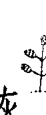

如今，山繆在修習禪宗。「那是我所能找到，最不像宗教的宗教。」他解釋說。在意來看我只因他的妻子，一位我們光體療癒學校的學員，指出喬治已經沒有什麼可失去但沒有產生期望的結果。他的腫瘤標記沒有什麼變化，而免疫系統被抑制。他之所以同

喬治是一位醫生，被他的太太硬拖進我的辦公室裡。他經歷了高強度的化學治療，喬治沒有注意到在他充滿壓力的工作，咖啡因的攝取──一天六杯咖啡，高碳水化合物的飲食，以及他和癌症之間的關係。

我的朋友迪恩・歐尼斯醫師，在他於加州大學醫學中心的臨床研究中，發現攝護腺癌的患者，如果轉換成主要以植物為主，低卡的飲食，能在六個月以內的期間，戲劇性地逆轉早期的癌症。綠色植物開啟創造健康的基因，並關閉製造疾病基因的力量是令人驚異的。我立刻要求喬治持續一個以植物為主、富含十字花科蔬菜、包括青花菜與抱子甘藍，以及健康的脂肪，像酪梨與核桃的飲食。他每天早上將以排毒的青汁作為開始。

我也要他避開麩質與所有的穀物，並且不要吃紅肉。

經過數十年來在醫院裡吃有毒速食之後，才三週，喬治就減輕了將近十磅體重。他每天都感覺好多了，而且腫瘤標記也開始降低。

> 「現在我們得進行你的靈境追尋了。」我告訴他。喬治上一次外出待在大自然中，已是四十年前，那時他還是童子軍，他說著。當他不在醫院工作時，他將所有的寶貴時光都用來陪伴孩子，所以並不覺得自己必須利用週末獨自進入原野之中。

> 「我將在醫院進行自己的靈境追尋，在我工作的時候。」他確定地說：「一開始我也許會有點意識模糊，但那不是問題。當有急診案例要進來時，腎上腺素能讓我立刻擺脫任何的精神模糊。」

喬治的醫院是在邁阿密的創傷中心，而我要他為每一位他治療的病人唸一段祈禱。並且也建議，當他在為病人動手術時，應該要讚美血管，肌肉以及構成身體的其他組織的美。我也告訴他，切記把每一位病人都當作人看待，而不是以其槍傷或個別診斷來關注。他說，在所有我要求他作的事之中，這件事是最難的，因為與大部分的醫師一樣，他被訓練以冷淡客觀的態度看待病人，來保持專業的距離。大部分的醫師，害怕也許在面對巨大的痛苦時，會被自己的情感所壓垮，比起關係到活的、會呼吸的以及受驚嚇的病人，把他們看成是症狀和個別器官，相對的要自在得多。

「每次你接觸某人，要明白自己在做大靈的工作。」我告訴他：「並且要用祈禱或思緒，祝福你的每位病人。」

不論你是哪種專業，一旦明白大靈的工作能變成你的工作——大靈能透過你的手、你的心、你的情感以及你的技巧來工作——你的生命會獲得更大的意義。喬治告訴我，急診室最瘋狂的時候，似乎都在滿月時，那時因槍傷、意外傷害，或藥物與酒精過量被送進來的病患，比當月的其他任何時間還要多。喬治在滿月時開始他的靈境追尋，並且決定練習監控自己的呼吸，來保持對其所經歷，以及連結的每個病人都銘記在心，把他們當作人看待，而不是以「第六床的槍傷案例」來看。他試著注意每次的吸氣與吐氣，並且在呼吸之間的片刻寂靜之中，他會暫停，感謝每一丁點珍貴的氣息。當他呼吸時，他

> > 「我沒有食物也能進行，」喬治告訴我說：「但我明白自己沒有咖啡就辦不到。」

我自己也喜歡咖啡，所以能了解喬治的困境。事實上，咖啡在世界上許多地方被用來作為神聖的醫藥。蘇菲旋轉的苦行僧就是眾所周知的咖啡飲者。而咖啡，也許多過於其他食物，是細胞排毒途徑，與體內的長壽蛋白質強大的活化劑。沒有人確切地明白如何或為何它有用，甚至現今的腫瘤科醫師也建議肝癌病人每天喝三至四杯的黑咖啡。但假使你壓力太大，並且生活在戰或逃的常態下時，咖啡只會加劇這問題。我解釋給喬治聽，在他的靈境追尋開始前，戒喝咖啡至少一週是很重要的。他需要給自己緊繃的神經系統急需的休息。

當我在辦公室看到喬治，是在他為期一週的靈境追尋兩週之後了，他是振奮的。他已戒掉咖啡，只有在那週開始的時候，以濃縮咖啡欺騙自己兩次。斷食的第一天，他感到極度虛弱與飢餓。但他集中精神把每位病人，不論有多髒或病得多重，都看成在見習中的天使。他發現自己除了戴著乳膠手套以及一種冷靜客觀的氛圍外，正用以前不曾有過的方式接觸來到附近的病人：一個無家可歸的男人被自己的尿浸濕，一個子彈卡在他腿裡的暴徒。到了第三天，喬治接近了那非凡的能量庫。他飢餓的痛楚消失，喝著大量的水，而且對於自己並沒吃任何食物，每天排便量卻很多而感到吃驚。他的身體正在清理與排毒，根除數十年來積聚在他消化道裡的廢棄物。到第三天時，喬治已經切換到酮系統，燃燒脂肪而非糖，來提供燃料給他的身體以及大腦。當他的高階大腦被打開，就能夠為自己想像一個健康與幸福的人生。而且從新發現的優勢中，他重新定義自己的工作。他不再只是個修理手臂與胃或斷掉骨頭的技工；他是個幫助人們從死亡的邊緣回到健康的藝術家。上回我和喬治談話時，他的癌症正在緩解中；他重新獲得了自己的生命。

## 與創造共融

大靈之藥使得你能經歷與神靈的共融，而且明瞭創造的事工。這樣的理解不是學術上或理智上的；它是肌肉運動知覺與感官的，是遍及你身體裡每個細胞的知曉。你不會突然有意外的發現，或是突然理解熱力學第一定律，與能量守恆定律。而是經歷足以貫穿你整個人的超驗覺知。你確實掌握的意識與能量將永遠不會被摧毀，它們只不過是轉變成無數的姿態與形式，而其中一種恰巧是你。我在本章中所提及的每一個個案——莎莉、山繆，以及喬治都經歷了一種對大靈之藥充滿奇蹟與美好的直覺及深刻的理解。對莎莉而言，當她躺在沙漠的夜空下，看著一直存在，卻被隱藏在紐約市光害背後的星辰時，新的意識從她心中興起。就山繆來說，觀察著自己的飢餓與熱望，並且明白自己有多麼喜愛緊緊抓住深刻的課題，使得他對自己的頭腦有更深層的探索。他開始藉著界定問題，然後問自己，正在想著這個問題的人是誰？正在問這個問題的人又是誰？這些問句最終把他帶到禪，一種剝除所有裝飾的靜心修持，在其中，修持者只觀察自己的呼吸，並見證頭腦中所有的瘋狂與創意。至於喬治，他學到自己能在每個人之中看見神靈，而且為了真正地成為更好的醫師與療癒者，必須在每個人之中看見神靈。在這個過程之中，他療癒了自己。

他們每個人都回來看了我幾次，即使沒什麼明顯的不對勁，也沒有什麼必須被修復的，只是想要體驗更多，那讓他們在肉體與情緒上都痊癒的大靈之藥。我為他們作了預防性的光啟，幫他們清除發光能量場上任何殘餘的疾病印記。

通常，在我們的社會裡，靈療是尋找療癒的人們之最後一步，但經常是尋求大靈之藥的人的第一步。莎莉、山繆，與喬治各自進行的靈境追尋，是同一類別的退省靜思，同一類別的對神靈的追尋，就像耶穌和佛陀曾從事的一樣。他們面對飢餓、憤怒、與自我批判的惡魔。他們的靈境追尋修復了自己的身體，並為其偉大的使命整備好自己的大腦。在他們返回家園後，帶著新發現的目的感，以及分享他們以人道所習得的使命感。

在進行第二次靈境追尋的時候，莎莉做了一個夢，並回答了一個核心問題：我下個階段的人生主題是什麼？我先前曾告訴她，她無法帶著「糖腦」來解決夢中的問題，但我回到了過去，在數百年前，而我告訴自己的摯愛不要擔憂，因為我將會再度找到他。我穿過一道玻璃門——是我們告別的時候了——突然間，我在博物館裡，回到了現代。我訝異於自己的現代服飾。有個男人陪著我，我明白自己必須在此找尋我的摯愛，並感到好奇，會是這個男人嗎？他轉過身，並且告訴我，他並不是我要找的那個人，但他將會帶我去我所尋覓的人那裡。我在尋找摯愛——不是人類的摯愛，而是神靈。而神靈早已與我並肩同行。

> 「夢境中有種很深刻的熟悉感，」莎莉說：「彷彿我的摯愛一直存在。而我感覺到自己的前世，也在尋找神。」她瞭解自己不只是在尋找對的伴侶，也在尋找神靈，那能真正地滿足她的唯一愛人。她明白自己必須在她的伴侶中找到神靈，並且與她的伴侶同在一起。

### 力量動物

在薩滿的文化中，當你進行靈境追尋時，傳統上，力量動物就會出現在你的夢境，或醒著的願景之中。動物（animal）這個字和阿尼瑪（anima），與拉丁文中指的靈魂、氣息、生命力的字，來自相同的字根。卡爾·榮格用阿尼瑪（anima）代表女性的原則。而動物（animal），則是世界的靈魂之女性面向的表現，力量動物象徵你的存在之中那野性的、未經馴化、不受指揮的面向、不墨守那一籮筐的事項清單，以及像風一般地自由。力量動物代表你那不受約束的靈魂，以及那尚未被現代世界打倒的部分。

如果你採訪法國與西班牙境內的某些洞窟，你會看見熊、野牛、狼以及其他動物，這些舊石器時代藝術家所描繪的壁畫。它們以傑出的力度成功地表現出這些生物的優雅、力量、莊嚴與美。而在法國阿列日省的三兄弟岩窟中的壁畫《巫師》，則描繪出一個神秘的形象，一部分是人，另一部分是雄鹿，而被認為是薩滿。半人半動物的生物，代表著我們與所有動物的親屬關係。

對舊石器時代的人類來說，動物是神聖的。而在今日的西方世界，只有我們的寵物是神聖的，而且我們吃的肉是來自那些在牠們被收縮包裝，並運送到雜貨店之前，以不人道的方式飼養，並且在屠宰場宰殺的動物。然而，人性之中有著我們與動物相繫的集體記憶。我們可在美洲原住民文化中看到這點，與動物的緊密關係，是植基於各氏族以牠們的圖騰來命名：狼、熊、響尾蛇等。但我們這些生活在部落文化之外的人，大都是和大地之母，以及牠的季節與生靈失聯的，並且和任何種類的力量動物幾乎都沒有關係。我們大部分人甚至連為自己的州，或國家的代表動物命名都感覺困窘。每一個州都有象徵的動物，像是加州的灰熊，以及科羅拉多州的大角羊。同樣地，國家也有象徵的動物，像是公雞和法國有關，熊與俄羅斯，以及貓熊與中國有關。老鷹則是至少八個國家的國家象徵，包括美國。

當你聯結力量動物時，實際上是與自然的心靈或靈魂相連結。當你在做靈境追尋時，將會邀請力量動物來到你身邊，並且教導你它的方式。你可以單純地用祈禱的形式表明自己的心念來進行，舉例來說：大靈，創造萬物者，請以來自你的動物精靈的探訪為我祝福，它將為我帶來在人生中，此刻所需要的智慧與力量。當你初次遇見神靈動物時，也許並不知道為何這一特定的動物來到你身邊。接受牠的臨在，並記得力量動物是來自神靈的使者，指引你在自己的發展中將採取的下一步。力量動物是保護者與導師。莎莉從她的靈境追尋中帶回一隻狼——她最怕會把自己當成佳餚的動物。當我問## 改變一生的經歷

她，狼對她而言象徵什麼時，她說，她覺得它是來教導自己關於歸屬於一群的事。狼的遷徙範圍很遠，單獨旅行，但總是回到家園。而狼終生保持同一配偶，或至少實行連續的一夫一妻制，而這是一旦她找到對的伴侶時，莎莉非常想要學習的功課。

山繆在他的靈境追尋時，在夢境中遇見一隻松鼠；牠送給他一顆橡實，然後又將它搶回去，並在過程中抓了山繆的臉。他的夢境使我們都困惑了好一會兒，直到我要山繆和他的力量動物對話。有許多種方式可以與力量動物對話，但在這個案例中，我要山繆在一張紙的中央畫一條對分的線作為開始，而且在左邊寫上他自己的名字，然後在那一頁的右邊畫一隻力量動物的簡圖。

在這一種與力量動物對話的方法中，首先你問力量動物：「你是誰？」接著傾聽其回應，並寫下力量動物所說的。山繆的松鼠很清楚地是來教導他不要囤積東西。一開始松鼠所說的事情之一是，它確切地知道需要多少橡實，來支持它度過漫長冬日，而更多的橡實，並不意味著更安全或更多保障。山繆明白橡實意指的是他的體重，他早已無須貯存體脂肪，來為那永遠不會來的長冬作準備。然後他看見自己囤積的習慣，是歷經三代猶太祖先的被迫害，剝奪他們的財產與領地，然後強迫他們離開自己的國家，而傳承下來給他的。對山繆而言，這是決定性的時刻，當他明白自己不再需要繼續生活在匱乏的家族故事裡了。松鼠是來教導他，多花些時間在林間疾走，並當他在枝幹之間跳躍時滑翔，而且少花點時間為了艱難時刻來貯存食物。當你在靈境追尋中帶回力量動物時，就邀請它所代表的品質進入你的生命之中。經由它，你能探索自己的各個方面。藉著體現它，比方說，想像你用美洲豹的眼睛來看，或像瞪羚般優雅的連蹦帶跳，就能培育與力量動物的關係。或者你可以作瑜珈或某種武術，其態勢或動作是以所暗示的動物來命名的。想像瑜珈體位如駱駝式，眼鏡蛇式，獅式，以及下犬式，或叫得出名字的太極動作如：宿鳥投林、神龍擺尾、與天馬行空、或功夫中的五形拳：龍、虎、豹、蛇、與鶴五式。有空就花些時間與你的力量動物對話。讓他教導你如何輕巧地在大地行走，以及如何看見那些對人類的眼睛來說，不明顯的事物。你的力量動物會喚醒你的動物本能，在所有的情勢中服侍你。這些不是你那原始的、掠奪的，以我為優先的生存本能，而是那對其他物種寄予同情，以及使你與萬物生活在平衡與和諧之中的本能。靈境追尋能永遠地改變你的人生。要忘記那隨著飢餓的苦痛平息而來的，對自己發光本質的強烈覺醒是不可能的。這更高知覺的覺醒——有些人稱之為啟蒙或是重生體驗——掀起在可見世界與隱形世界之間的薄紗。隨著這薄紗被揭起，你立時變得能意識到自己與神靈和萬物是一體的。

## 創建你自己的三日靈境追尋

靈境追尋需要有某種承擔，而它很可能會引起某些你身體與情緒的不適。但它是開啟你的轉變的有力途徑，強力啟動你個人發展的方法。

獨自一人的靈境追尋，是領受大靈之藥的最終步驟。傳統上，它在自然環境裡發生。而為了帶來對神靈覺醒的深刻體驗，以及明白你與萬物是一體的，斷食與靜心是核心的修習。

在開始靈境追尋之前，請確定你已跟隨了在第四章裡描述的十八小時糖斷食至少三個月。這將會確保你的身體知道如何進入酮症狀態（Ketosis），亦即將能量來源從葡萄糖，切換至脂肪的狀態。否則你將會在荒野中飢餓而悲慘地度過三天，而沒有得到靈境追尋的療愈益處。

下列的建議將會幫助你在自己三日的靈境追尋中取得成功：

- 場地：要找到適合做靈境追尋的場所，想像你正被美洲豹引領到大自然中一處隱蔽的地點。貓有種神秘的，該在哪裡躺下的感覺，而狗總是四處嗅，試過一個地點然後再試另一個。你那想像之貓會帶領你到可靠的地點。確定這地方是美麗，安全而且足夠隱蔽的，以免被健行者打斷。

如果你選擇不走進荒野中進行你的靈境追尋，你可以選擇離家較近的地方，甚至是市區內。在本章中由山繆與喬治的故事能提供你選擇替代場所的主意。

### 裝備：

你可以帶個睡袋與睡墊，或者如果你需要的話，一頂帳棚。確定打包一本記事本或日記與筆，以便你能記錄自己的夢境，以及任何發現的記憶，或強烈的情感。不要帶電腦或其他電子設備，或任何閱讀材料。

你能帶手機，但只有在緊急狀況時才能使用。確定告知朋友或家庭成員（或假使你待在公園或保護區中，告知巡山員）你要去的確切地點。如果你想要的話，可以請求某人每天來檢查你一次，只要他們不會讓你分心的話，而且最好是在晚上。

### 設置空間：

當你抵達進行靈境追尋的地點時，在你的帳棚周圍畫一個直徑二十呎的圓圈。這是你的地點，而你在接下來的三天將待在這個圓圈內，只有在要於森林中或灌木叢後上廁所時，才能步出圓圈之外（可以打包一些塑膠垃圾袋作為廢棄物處理用）。

### 斷食：

斷食是靈境追尋的核心部分。除了使身體進入酮症狀態之外，它也在自噬作用期間為細胞排毒，並打開大腦內幹細胞的生成。

你將會肚子餓，而你的胃將會開始咕咕叫。通常，在你頭裡的咆哮聲，要比在你胃裡的大聲得多；你的邊緣腦想念富含葡萄糖的食物，並認為如果它錯過一餐就會死。將這咆哮聲轉變成觀察自己的頭腦有多狂亂的機會。在斷食的第一天左右，隨著飢餓的痛苦，你將很可能經歷心情的擺盪，能量低落，並且易怒。而大部分的不適，是來自於你的身體正在排毒這一事實。在斷食的起初二十四小時，你將會燒盡所有貯存在肝臟裡的肝醣，然後將會開始從自己的肌肉，包括心臟燃燒蛋白質。在那之後，你的身體將會進入酮症狀態，並且切換為燃燒脂肪。你能夠辨別何時自己的身體切換為燃燒脂肪，因為飢餓的痛苦將會減輕。斷食三天，對大多數健康良好的人來說是絕對安全的。如果你有任何擔心，在開始你的靈境追尋之前，跟你的醫生或健康諮詢師查核一下。如果你有糖尿病，或服用藥物，或處理急症，在照會你的醫師之前不要斷食。有許多地方能讓你在醫療監督下進行斷食，包括我們在智利，狼市（Los Lobos）的能量醫療中心，以及蓋布瑞爾·庫森醫師（Dr. Gabriel Cousens）在亞利桑那州，巴塔哥尼亞的生命之樹中心（Tree of Life Center in Patagonia, Arizona）。在你的靈境追尋中，傾聽自己的身體並按照它的指引。假使無論何時，你都覺得非常不舒服，或你的血糖危險地下降，中斷你的斷食。我總是留有巧克力，以及一些基本的巧克力，使得要維持斷食難了點，但你能把這種渴望轉變成靜心——另一個觀察邊緣腦的瘋狂機會。

厭煩：你會覺得很無聊。把厭煩當作你正在靠近自己想要進入之冥思狀態的指標。厭煩與焦躁不安是邊緣腦為了引起注意而翻騰起伏的結果。與厭煩共處，知道這是過程的一部分，就像飢餓，它終將會過去的。

水：補充水份是當務之急。你每天應該至少喝四公升水，因此當你在打包自己的生活必需品時，因應這安排去計劃。假使你在乾旱的沙漠氣候中，進行自己的靈境追尋，你將需要更多水，接近每天六公升。規則是每小時必須小便。如果小便次數沒有那麼多，就表示沒有喝足夠多的水。

時間：把你的手錶留在家裡。檢查時間不會使它流逝得更快些，而你正試著步入永恆。藉著太陽與星辰設定你的生物時鐘。

靜心：白天的時候，你可以做本書十一章中所描述的「我是自己的呼吸」的練習。而晚上，如果你生火或點蠟燭，你可以做第九章中所描述的燒掉舊角色與身分的練習。（如果你真的生火或點蠟燭，要確定附近沒有灌木叢可被點燃，並確認在你離開此區域之前，火已完全被撲滅。）

## 第十三章 靈境追尋

結束你的靈境追尋：在第三天黃昏之前，即將結束你三天的靈境追尋。在你離開該處之前，確定撿起所有的垃圾，並且跟著你一起帶出去。確定你離開這地方時，就像你發現它時一樣——或更乾淨，不留痕跡。

禱告：在你的靈境追尋中，祈禱，為圍繞在你周圍的美，以及每一次的呼吸獻上感謝。為你飢餓的苦痛，或是在晚上，你確信將會吞噬自己的狼群獻上感謝！練習用心祈禱而不是用頭祈禱。

## 後話
超越大靈之藥

> 我們不該停止探索，而我們一切探索的終點，
將是來到我們出發之處，並且是生平第一次
知道這個地方。
——湯瑪斯·史特恩·艾略特

未來的佛陀得要面對許多考驗。他一坐在菩提樹下，魔神魔羅（Mara）——死亡之主，手中拿著武器，由其軍隊簇擁著，就來靠近他。傳說中認為，當時宇宙中所有的保護神都驚駭奔逃，然而悉達多卻不為所動。甚至當惡魔向他投擲毒雷與火箭時，竟轉變成花朵並落在悉達多的腳邊。最後，這未來的佛陀伸出他的右手碰觸地面，主張他的臨在與權利，而大地女神本尊也現身，見證了他的淨光，並用她強大的怒吼，驅散了魔神。
傳說中，在那引導佛陀得到證悟的漫長夜晚中，獲得了三種恩賜：有著全知願景的神聖之眼（天眼通），並通曉他所有的前世；對業力（Karma）與因果關係鏈、釋放或神解脱的理解；以及四聖諦（Four Noble Truths）——存在的根本法則。據說佛陀本想自己保守這智慧的秘密，懷疑人類是否已為這樣的教導作好準備，但梵天（Brahma）來干涉了，他說服佛陀跟人與神分享他所發現的深刻真理。在領受大靈之藥後，我們該怎麼辦呢？我們會像佛陀那樣入世，並傳授我們所學的嗎？我們會像阿諸那一樣，渴望乾脆逃離戰場，為了無法避免生命的痛苦而發狂嗎？或者，「像其他多數人一樣」地如同約瑟夫·坎伯所說的，我們會「製造一個錯誤，而且終究無法自圓其說的自我意象，來將自己看成是世界的例外現象，不如他人的罪惡那麼深，並以個人代表良善為由，合理化個人無可避免的罪惡。這種自命正義的態度，不僅導致對個人本身的誤解，也造成對人類和宇宙本質的誤解。」嗎？英雄與英雄——神話與真實兩者——的旅程，那些我們在篇章扉頁各處所探索的故事，提醒著我們，自己的目標，是去與那我們稱為大靈的宇宙指導原則建立關係。然後只需要任何我們能夠傳授的智慧，就能夠著手修復我們自己的生活、健康，以及人類那貧乏破碎的實地。

## 療癒這個世界

然而，我們該如何帶給世界大靈之藥的療癒恩賜呢？全球的形勢在各個層面日益令人不安——政治上的，經濟上的，社會上的，以及環境上的。二十一世紀的第一個十年是歷史紀錄上最熱的。在2007年，氣候專家告訴我們，為了避免不可逆的後果，我們必須確定大氣中二氧化碳的水平不會超過350 ppm。但到了2014年，已經超過了400 ppm，而且沒有減緩下來的徵兆。生物學家直接把動物和植物物種的減絕速率，與溫室氣體的排放連結在一起，警告我們正處在大滅絕的邊緣。自從生命在大約三十五億年前出現在地球上之後，只發生過五次大滅絕。

當我們陷在自己陳舊的典範與信念中時，會假定作為個人，我們對於拯救鯨魚，或地球，或人類是無能為力的。這是真的，我們之中沒人能單獨終止恐怖主義、清空環境毒素、停止極地冰帽的融化，或是避免經濟危機。然而我們所能做的，是去療癒那威脅我們生存的病。我們能療癒內在的男性，放棄以戰爭做為解決衝突的方式。我們也能夠去療癒內在的女性，成為地球的管家。

而如果我們從領受大靈之藥後，沒有從它那裏學習到任何事，那是因為有著神靈和彼此，我們繼續共同創造世界。我們總是可以做得更好。

大靈之藥增強了身體清除我們所暴露的毒素的能力，不論它們是空氣中，或水中，或我們食物的污染物，或是不健康的思想與信念系統的心智毒藥。大靈之藥也使我們能夠接近自己先天的能力來升級大腦，以便它能支持創造健康的意識。而其意外的禮物是幫助我們自己，我們也幫助了地球，當我們捨棄有害的，與掠奪的信念和行為時，就能參與共同創造一個可持續的方式，讓大家得以共同生活在地球上。如果我們未能作到，人類這個物種很可能成為下一個渡渡鳥（dodo bird）。
在西方世界，對啟蒙的尋求，大部分被視為個人的追求一個人的神祕探險。然而，大靈之藥也是社會的，與政治的。當你療癒自己的大腦，並且帶著你的健康期，與你的生命期一致，來保護土地，清理水道，並且促成和平的互動。
如同拉科塔蘇族的慣用語Mitakuye Oyasin——「所有我的親族們」所暗指的，我們盡皆相連，全部都在一起。復甦更是互惠的：療癒你自己，就是療癒世界，反之亦然。
一旦你致力於改善自己的健康，與地球，以及地球上所有生物的健康，神靈的世界將會團結在你背後，支持你的許諾。

## 內在的和諧

世上的和平與和諧從你的內在世界開始。你的腸道本身就是一個世界——一個非常複雜的生態系。而既然你的身體裡託管著比擁有自己DNA的細胞多過十倍的微生物DNA，學習和諧地與在你內在的微生物共同生活顯然是你生存的關鍵。可持續的健康有賴於去學習不只是生存，而是與你體內所有的細菌、病毒以及其他細胞合作，一起興盛共榮。

你的身體是你的地球，自己的生命所依靠的基礎。傾倒有毒的藥物在其中是短視的。我們現在正面臨致命的細菌爆發，因為過度使用抗生素與抗菌清潔劑，使得那經常是資源豐富的微生物，突變成抗藥性的菌株。你的健康與地球的健康仰賴於去打造一個與所有生物，包括你體內的微生物，以及在你細胞中的粒線體的新關係。一旦你停止和疾病作戰，並且發現內在的平衡與和平，你就能開始分享這一救命的知識給別人。

## 從照管者到夢想者

在歷史上，亞伯拉罕諸教——基督教、猶太教、以及伊斯蘭教，使得人對自然有特權。以這種思維方式，我們地上的家，只不過是通往永生幸福的中途站。而照顧地球及其所有的生物，大部分是任其自然——好歹，不是人類的責任。然而，對科學家而言，去承擔照顧地球的需求是更緊迫的。多數人都同意，我們對地球過於橫征暴斂，而得由我們來解救它——去做那些我們總是推辭給未來世代在政治上，以及經濟上的艱難選擇。

在經過多年生活於薩滿文化之中後，我很清楚原住民族的世界觀，和西方的科學典範有多麼的不同。對原住民來說，地球的福祉是放在第一位的，那包括所有地球居民的幸福是同等的，人類與非人類都一樣。原住民認為我們之所以必須照顧地球，並不是因為它是由遠方的神授予我們的暫時家園，而是因為她是大地之母本身——我們永久的家園，我們在其中生生世世地重生。如同克里希那告訴阿諸那的：

就同人捨棄舊衣，穿上其他新衣那樣，
靈魂主體捨棄舊的身體，進入新的身軀：
武器無法斬斷、火無法燒毀、水無法弄濕、風無法吹乾它。
它是恆常的，遍及於一切的，穩固的，不動的，永恆的。

薩滿教導我們，地球是我們在穿越神靈領域的漫長旅程之後而掙得的天堂，而我們必須把它當作伊甸園一樣的來照料它。否則，這星球可能會決定，繼續支持她最貪婪的小孩是不可持續的。而因為我們這最貪心的，霸佔了大部分的資源為己所用，而讓大自然其他的子民處於危險之中。如今為了地球的療癒與生存，在我們對她所造成的破壞，大到讓她無法不失去她的孩子來復原之前，需要一個新的夢想。

我喜愛中世紀的大教堂，並且花了許多時間在像巴黎聖母院這樣的教堂中祈禱，並讚賞它們華麗的彩色玻璃窗。然而，我總是因大部分的宗教中心，對周遭的生態系所付出的關注有多麼地少而不知所措。算是如此吧！很多教堂和寺廟有美麗的園林改造，但對神不應該在草叢裡，或樹林間被發現，而是在聖所裡的祭壇上的想法，卻從來沒有任何懷疑。我們需要採取更多薩滿對於神的見解，他們把神看作是，那遍及一切萬物？動物，蔬菜以及礦物的超自然力量。

當我們踩踏在大地上時，古人的足跡是非常溫和的。誠然，有部分是因為他們人很少，而且他們的技術是如此基本。進步在地球的資源上造成損失。我們在生化上改變了地球，而且因為我們產生廢棄物是如此地迅速，甚至連生物可分解的垃圾都沒時間分解，並回收進入地球的系統之中。

## 選擇進化

然而，儘管我們已經造成這所有的災難，還是有充滿希望的跡象。全球各地，人們創新的形式，來取代那已經崩壞無法修復的陳舊模式，不論是在基礎設施、政府、經濟、健康照護或社會福利。機構正在適應，來回應當前的需求，而我們的身體以及大腦也是如此。

適應是指個體或群體，為了使自己更好地匹配其環境，而作的短期改變。在艱困的時期，以及像現在的全球危機，我們可能會生病或者有可能格外健康。如果我們在快速變遷的情況下，學會適應環境以及成長茁壯。進化是為了確保物種生存的長期基因改變，與適應相比，就像冰河般地緩慢移動。但有證據顯示，如今我們的生理即將進行進化飛躍。在過去的二萬年，人類大腦在尺寸已穩定地縮小，失去大約其體積的百分之十，大約像網球一般大小的一簇神經元。在進化的過程上，這是引人注目的改變，以及被稱為爆發式物種形成（Quantum Speciation）的序幕，這樣的飛躍會發生在當物種被滅絕所威脅時。

我們正在進化的門檻上。過去，我們藉著消滅競爭物種——比方說是我們的遠親，尼安德塔人——來確保自己的生存。而我們已經大幅減少或摧毀許多有毛皮的、有鰭的不同的大腦

關於我們的生存，可能有種集體的生理必然性，在內在攪擾著我們，但藉由不那麼暴力的方式——換句話說，有意識地進化，來確保我們的生存，會更好到什麼程度呢？大靈之藥讓我們獲取那攸關肉體的、情緒的，以及靈性的進化所需的關鍵意識狀態，使我們能面對環境的危機，以及經濟上、政治上，與社會上的變革。

叢林是個嘈雜的地方，網際網路與社群媒體的虛擬世界也是。不可否認地，未來屬於這些適應於虛擬世界——在家中虛擬叢林的人，並且知道哪些樹枝的折斷聲需要傾聽，而哪些可忽略。

即將成熟的這個世代，是在一個完全有線的世界中長大的。從他們年紀夠大，足以自數位螢幕上打出訊息時，就運用科技來溝通。今日，電子郵件、手機、線上論壇與社群媒體，是我們在生活上的一切事宜，從支持努力減少全球貧困的原因，到與我們的朋友計畫週末夜的活動，彼此接合的主導方式。

現在，每個世代都要能夠在虛擬世界，與大智之騖

在我寫這篇文章的時候，最受歡迎的線上遊戲之一是「當個創世神」（Minecraft）。在這個虛擬世界遊戲之中，玩家是夢想者與創造者。當他們想像並且建構新世界系統時，一起工作收集虛擬元素，來為他們虛擬的自我供給食物、穿衣服，以及提供庇護。就像神秘家往來其間的隱形世界般，「當個創世神」的參與者居住在由一層薄紗分開的虛擬世界中，其中的一個世界是生存模式，在那兒殭屍可能會殺死你，而資源可能會缺乏。而創造模式相比之下，是一個沒有人會死的世界，有掠食者，但它們不會攻擊你，而且資源隨時都是充裕的。但玩家聲稱，只用創造模式來玩，一點都沒樂趣。他們說，那將會非常無聊，為了避開掠食者領域之中的挑戰，在那領域之中，玩家為了生存，必須聯合起來。許多玩家似乎較喜歡「當個創世神」的虛擬世界，即以生存模式的方式，生活在尋常的感官世界。也許是因為他們發現物質世界中的生活可能會辛苦而且疏離，而在「當個創世神」之中，他們觸及了如何主動地去夢想及實踐的秘密。虛擬世界，特別是電競，有它的黑暗面。但網路空間也是我們能體驗社群、發揮創造力，以及合作之處。這些是與大靈觀點一致的長期價值。也許過不了多久，我們就能上傳自己的意識進入雲端，最小化我們的有形存在，並且住進一個我們製作的世界——## 出於混沌，創世到來

一個全球規模的「當個創世神」。但即使在那時候，大地之母仍將會是人類的家園，而我們肩負著成為其照管者的責任。薩滿相信很久以前，在隱形世界中，創世的藍圖已被畫好。混沌轉變成秩序，成為宇宙，經由大地守護者的行動，我們得以夢想著新的世界應運而生，和今日的玩家創造虛擬世界的方式大致相同。

帶著能維持生命的理想狀況，與穩定的溫度～介於水的冰點與沸點之間的窄頻，我們的地球被夢想著應運而生。正如地球上的生命起始於原始湯之中，今日我們再度於原始湯之中發現創造的潛能。大靈之藥為我們展現其全貌，而從那樣的觀點，我們能夠轉變混沌成為秩序與美。療癒是秩序的一種形式。當我們帶著較大的秩序與和諧進到身體中，疾病消失，而我們復原。我們創造健康的條件，而病痛遠離。邊緣腦傾向於抵抗不確定性，但混沌是在進化過程中能觸發量子躍遷的絕對刺激物。舊有的想法認為東西沒壞，就不用修復。大靈的意識則提醒，如果它沒壞，那我們需要突破它，以便那無法由舊有模式來推斷的新形，得以浮現。

## 大靈之藥

今日大腦科學最大的突破是神經可塑性——大腦為了回應我們的經驗與環境的需求，形成新神經聯結，而去改變與適應的能力，以及表觀遺傳學（epigenetics），基因表現方式的改變。從第三章，罷黜暴君中，如今你明白能夠將自己的大腦改寫為合作與喜悅，而不是競爭與恐懼。而從第五章超級食物與超級補充品裡，了解自己可以運用富含植物營養素的飲食，來重新平衡腸道內的微生物，創造健康與明晰的心智，並且影響你的基因表現。

而能夠在此生之內，真正地體驗一個新身體——就像那《薄伽梵歌》中所說的『新的一套衣服』。神經可塑性與表觀遺傳學告訴我們，自己不需要因祖先的疾病而受苦，或者延續他們的信念。我們能夠體驗不曾認為會有可能的身體健康，與心智敏銳狀態，以及從沒想像過的智慧。而我們得以找到寧靜。

追尋內心的平靜也是人類最基本的渴望之一。有一個著名的故事是有關一位探求者來求見禪宗大師菩提達摩，並請求這偉大的導師安撫他的心，達摩告訴他：『你把心拿來，我來為你安！』『這就麻煩了。』探求者回答：『我找了很多年，但怎麼樣也找不到那不安的心！』隨即，菩提達摩宣告：『我已將你的心安頓好了。』探求者了悟後，不再為不安的心所苦，在平靜之中離開了。

這位探求者明瞭的是靈魂——『我們是誰』的根本真理，是無法從身體、國家（政治實體），或從大靈分開來的。它並不是可以『外求』的某種東西。正如約瑟夫·坎伯所說的：「那些明瞭自己內在永續生命，以及自己和萬物皆是永恆真實的人，他們居住在心想事成的樹叢中，飲著不朽的酒醱，同時四處傾聽前所未聞的永恆和諧之音。」這就是大靈之藥的應許與福佑。

## 致謝

我要感謝蒲大衛（David Perlmutter, M.D.）醫師，他在我認為自己已經失去理智之後，為我修復大腦。以及馬克·海曼（Mark Hyman, M.D.）醫師，在西方醫學已經宣佈我無法醫治之後，協助我療癒自己的身體，並發現一個異乎尋常的健康水平。我在安地斯高山上的薩滿導師們，療癒我的靈魂，為我呈現死後的旅程，以及通往無止盡的健康之路。這些年長的巫醫與醫女們教導我大靈之藥的本源，並讓我嘗到無極限的滋味。賀氏書屋（Hay House）的派翠西亞·古芙特（Patricia Giff），是一個作者所能有的最佳盟友與支持；還有我的編輯薩莉·梅森（Sally Mason）與瓊·奧利佛（Joan Oliver），她們是天賜的夥伴。而最重要的，我要將最深的感激獻給我的愛妻瑪塞拉·洛伯斯（Marcela Lobos）——一位了不起的醫女，她療癒了我的心，並在我完成這本書時，耐心地愛著我。

## 生命潛能出版圖書目錄

### 心靈成長系列

| 書號 | 書名 | 作者 | 譯者 | 定價 |
|------|------|------|------|------|
| ST01124 | 預見未知的高我 | 弗瑞德·思特靈 Fred Sterling | 林瑞堂 | 380 |
| ST01125 | 邀請你的指導靈 | 桑妮雅·喬凱特 Sonia Choquette | 邱俊銘 | 380 |
| ST01126 | 來自寂靜的信息 | 李耳納·傑克伯森 Leonard Jacobson | 鄭羽庭 | 320 |
| ST01127 | 呼吸的神奇力量 | 德瓦帕斯 Devapath | 黃翎展 | 270 |
| ST01128 | 當靜心與諮商相遇 | 史瓦吉多 Svagito R. Liebermeister | 莎薇塔 | 380 |
| ST01129 | 靈性法則之光 | 黛安娜·庫柏 Diana Cooper | 沈文玉 | 320 |
| ST01130 | 塔羅其實很簡單 | M. J. 阿巴迪 M. J. Abadie | 盧娜 | 280 |
| ST01133 | 地心文明桃樂市(1) | 奧瑞莉亞·盧意詩·瓊斯 Aurelia Louise Jones | 陳菲 | 280 |
| ST01134 | 齊瑞爾訊息：創世基質 | 弗瑞德·思特靈 Fred Sterling | 邱俊銘 | 340 |
| ST01136 | 綻放直覺力 | 金·崔絲妮 Kim Chestney | 許桂綿 | 280 |
| ST01137 | 點燃療癒之火 | 凱若琳·密思博士 Caroline Myss, Ph.D. | 林瑞堂 | 380 |
| ST01138 | 地心文明桃樂市(2) | 奧瑞莉亞·盧意詩·瓊斯 Aurelia Louise Jones | 黃愛淑 | 300 |
| ST01139 | 我值得擁有一切美好的改變 | 露易絲·賀 Louise L. Hay | 蕭順涵 | 250 |
| ST01140 | 齊瑞爾訊息：重返列木里亞 | 弗瑞德·思特靈 Fred Sterling | 林瑞堂 | 380 |
| ST01142 | 克里昂訊息：DNA靈性12揭密 | 李·卡羅 Lee Carroll | 邱俊銘 | 380 |
| ST01143 | 重拾靈魂悸動 | 桑妮雅·喬凱特 Sonia Choquette | 丘羽先 | 280 |
| ST01144 | 朵琳夫人的天使水晶治療書 | 朵琳·芙秋博士 Doreen Virtue, Ph.D. & 茱蒂斯·洛克斯基 Judith Lukomski | 陶世惠 | 300 |
| ST01146 | 地心文明桃樂市(3) | 奧瑞莉亞·盧意詩·瓊斯 Aurelia Louise Jones | 黃愛淑 | 380 |
| ST01147 | 女人愈燉愈美麗 | 莎拉·布洛考 Sarah Brokaw | 盧秋瑩 | 350 |
| ST01149 | 你的人生不一樣 | 露易絲·賀 Louise L. Hay & 雪柔·李察森 Cheryl Richardson | 江孟蓉 | 250 |
| ST01150 | 發現亞特蘭提斯 | 黛安娜·庫柏 Diana Cooper & 莎朗·赫頓 Shaaron Hutton | 林瑞堂 | 380 |
| ST01154 | 創造生命的力量(附光碟) | 露易絲·賀 Louise L. Hay | 吳品瑜 | 280 |
| ST01155 | 開心曼陀羅 | 林妙香 | | 280 |
| ST01156 | 天使之藥2013年新版 | 朵琳·芙秋博士 Doreen Virtue, Ph.D. | 陶世惠 | 340 |
| ST01157 | 願望 | 安潔拉·唐諾凡 Angela Donovan | 楊佳蓉 | 300 |
| ST01158 | 居家魔法整理術 | 泰絲·懷特赫思特 Tess Whitehurst | 林群華 | 300 |
| ST01159 | 通向宇宙的鑰匙 | 黛安娜·庫柏 Diana Cooper & 凱西·克洛斯威爾 Kathy Crosswell | 黃愛淑 | 380 |
| ST01161 | 中年不敗 | 潔西卡·卡吉爾湯普生 Jessica Cargill-Thompson & 約翰·歐康乃爾 John O'Connell | 游懿萱 | 250 |
| ST01162 | 不費力的靜坐 | 阿嘉彥·波伊斯 Ajayan Borys | 舒靈 | 300 |
| ST01163 | 水晶高頻治療(2) | 卡崔娜·拉斐爾 Katrina Raphaell | 奕蘭 | 300 |
| ST01164 | 夢想的顯化藝術 | 偉恩·戴爾博士 Wayne W. Dyer | 非語 | 300 |
| ST01165 | 凱若琳的人格原型書 | 凱若琳·密思 Caroline Myss | 林瑞堂 | 360 |
| ST01167 | 通往幸福的奇蹟課程 | 蓋布麗兒·伯恩斯坦 Gabrielle Bernstein | 謝明憲 | 360 |
| ST01168 | 新世代小孩與人類意識大蛻變 | P.M.H.阿特沃特 P. M. H. Atwater | 楊仕音 | 350 |
| ST01170 | 人間天使的決斷力 | 朵琳·芙秋博士 Doreen Virtue, Ph.D. | 林瑞堂 | 300 |
| ST01171 | 水晶光能傳導(3) | 卡崔娜·拉斐爾 Katrina Raphaell | 思逸 | 350 |
| ST01173 | 奧修靜心治療 | 史瓦吉多 Svagito R. Liebermeister | 陳伊娜 | 420 |
| ST01174 | 召喚天使(2014年新版) | 朵琳·芙秋博士 Doreen Virtue, Ph.D. | 王愉淑 | 280 |
| ST01175 | 為人生帶來奇蹟的魔法書 | 山川紘矢 & 山川亞希子 | 李瓊祺 | 300 |
| ST01176 | 來自長島靈媒的療癒訊息 | 特蕾莎·卡普托 Theresa Caputo | 非語 | 320 |
| ST01177 | 遇見神奇獨角獸 | 黛安娜·庫柏 Diana Cooper | 黃愛淑 | 380 |
| ST01178 | 托爾特克愛的智慧之書 | 唐·梅桂爾·魯伊茲 Don Miguel Ruiz | 非語 | 260 |
| ST01179 | 初學者的內觀禪修 | 傑克·康菲爾德 Jack Kornfield | 舒靈 | 250 |
| ST01180 | 療癒破碎的心 | 露易絲·賀 Louise Hay & 大衛·凱斯勒 David Kessler | 謝明憲 | 280 |
| ST01181 | 當下是良師 | 佩瑪·丘卓 Pema Chödrön | 舒靈 | 280 |
| ST01182 | 天使塔羅全書 | 朵琳·芙秋博士 Doreen Virtue, Ph.D. & 羅賴·瓦倫坦 Radleigh Valentine | 星宿老師 (林樂卿) | 350 |
| ST01183 | 看見神性生命的奇蹟 | 偉恩·戴爾博士 Wayne W. Dyer | 非語 | 420 |
| ST01184 | 靈性能量淨化書 | 泰絲·懷特赫思特 Tess Whitehurst | 陳麗芳 | 300 |
| ST01185 | 天使能量排毒法 | 朵琳·芙秋博士 Doreen Virtue Ph.D. & 羅伯·李維 Robert Reeves | 黃愛淑 | 420 |
| ST01186 | 天使占星學 | 朵琳·芙秋博士 Doreen Virtue, Ph.D. & 亞思敏 Yasmin Boland | 陳萱芳 | 720 |
| ST01187 | 情緒藝術 | 露西雅·卡帕席恩博士 Lucia Capacchione Ph.D. | 沈文玉 | 350 |
| ST01188 | 五次元的靈魂揚昇 | 黛安娜·庫柏 Diana Cooper & 提姆·威德 Tim Whild | 黃愛淑 | 450 |
| ST01189 | 天使數字書(2016年版) | 朵琳·芙秋博士 Doreen Virtue, Ph.D. | 王愉淑 | 300 |
| ST01190 | 催眠之聲伴隨你(2016年版) | 米爾頓·艾瑞克森 Milton H. Erickson & 史德奈·羅森 Sidney Rosen | 蕭德蘭 | 450 |
| ST01191 | 假面恐懼 | 麗莎·蘭金博 Dr. Lissa Rankin | 非語 | 450 |
| ST01192 | 天使夢境國度 | 朵琳·芙秋博士 Doreen Virtue, Ph.D. & 梅麗莎·芙秋 Melissa Virtue | 黃春華 | 320 |
| ST01193 | 高敏感族自在心法 | 伊蓮·艾融 Elaine N. Aron | 張明玲 | 480 |
| ST01194 | 尋找生命之道 | 桑雅·羅曼 Sanaya Roman | 王秀玉 | 400 |
| ST01195 | 開放通靈 | 珊娜雅·羅曼 Sanaya Roman & 杜安·派克 Duane Packer | 羅孝英 | 450 |
| ST01196 | 創造金錢 | 珊娜雅·羅曼 Sanaya Roman & 杜安·派克 Duane Packer | 羅孝英 | 450 |
| ST01197 | 個人覺知的力量 | 珊娜雅·羅曼 Sanaya Roman | 羅孝英 | 420 |
| ST01198 | 如是 | 許宜銘 | | 350 |
| ST01199 | 光行者 | 朵琳·芙秋博士 Doreen Virtue, Ph.D. | 林瑞堂 | 400 |

### 神諭卡系列

| 編號 | 書名 | 作者 | 譯者 | 定價 |
|------|------|------|------|------|
| ST11015 | 亞特蘭提斯神諭占卜卡 | 黛安娜·庫柏 Diana Cooper | 羅孝英 | 780 |
| ST11016 | 聖地國度卡 | 柯蕾·鮑隆瑞 Colette Baron-Reid | 王培欣 | 850 |
| ST11017 | 守護天使指引卡(新版) | 朵琳·芙秋博士 Doreen Virtue, Ph.D. | 陶世惠 | 850 |
| ST11020 | 揚升大師神諭卡(2013年新版) | 朵琳·芙秋博士 Doreen Virtue, Ph.D. | 鄭婷玟 | 850 |
| ST11022 | 神奇精靈指引卡(2013年新版) | 朵琳·芙秋博士 Doreen Virtue, Ph.D. | 陶世惠 | 850 |
| ST11024 | 靛藍天使指引卡 | 朵琳·芙秋博士 Doreen Virtue, Ph.D. & 查爾斯·芙秋 Charles Virtue | 王培欣 | 850 |
| ST11025 | 指導靈訊息卡(2014年新版) | 桑妮亞·喬凱特 Sonia Choquette | 邱俊銘 | 850 |
| ST11026 | 神奇花朵療癒占卜卡 | 朵琳·芙秋博士 Doreen Virtue, Ph.D. & 羅伯·李維 Robert Reeves | 陶世惠 | 850 |
| ST11030 | 生命療癒卡(2015年新版) | 凱若琳·密思 Caroline Myss, Ph.D & 彼得·奧奇葛羅素 Peter Occhiogrosso | 林瑞堂 | 850 |
| ST11031 | 智慧脈輪指引卡 | 托莉·哈特曼 Tori Hartman | 安德魯 | 850 |
| ST11032 | 守護天使塔羅牌 | 朵琳·芙秋博士 Doreen Virtue, Ph.D. & 羅賴·瓦倫坦 Radleigh Valentine | 林瑞堂 | 1280 |
| ST11033 | 神奇美人魚與海豚指引卡(2016年版) | 朵琳·芙秋博士 Doreen Virtue Ph.D. | 陶世惠 | 1180 |
| ST11034 | 大天使神諭占卜卡(2016年版) | 朵琳·芙秋 Doreen Virtue, Ph.D. | 王愉淑 | 1180 |
| ST11035 | 天使回應占卜卡(2016年版) | 朵琳·芙秋博士 Doreen Virtue & 羅賴·瓦倫坦 Radleigh Valentine | 黃春華 | 1180 |
| ST11036 | 天使夢境神諭卡(2016年版) | 朵琳·芙秋博士 Doreen Virtue, Ph.D. & 梅麗莎·芙秋 Melissa Virtue | 黃春華 | 1200 |
| ST11037 | 天使療癒卡(2016年版) | 朵琳·芙秋博士 Doreen Virtue, Ph.D. | 陶世惠 | 1180 |
| ST11038 | 天使塔羅牌 | 朵琳·芙秋博士 Doreen Virtue, Ph.D. & 羅賴·瓦倫坦 Radleigh Valentine | 王培欣、王芳屏 | 1680 |
| ST11039 | 愛希斯埃及女神卡 | 阿蓮娜·菲雀爾德 Alana Fairchild | 黃春華 | 1280 |
| ST11040 | 愛的絮語占卜卡 | 安潔拉·哈特菲爾德 Angela Hartfield | 黃春華 1380 | |
| ST11041 | 觀音神諭卡 | 阿蓮娜·菲雀爾德 Alana Fairchild | 黃春華 1580 | |
| ST11042 | 自然絮語占卜卡 | 安潔拉·哈特菲爾德 Angela Hartfield | 黃春華 1380 | |

### 奧修靈性成長系列

| 書號 | 書名 | 作者 | 譯者 | 定價 |
|------|------|------|------|------|
| ST6041 | 叛逆的靈魂 - 奧修自傳 (DVD) | 奧修 OSHO | 黃瓊瑩 | 450 |
| ST6042 | 奧修談身心平衡(CD) | 奧修 OSHO | 陳明堯 | 300 |
| ST6043 | 靈魂之藥(DVD) | 奧修 OSHO | 陳明堯 | 280 |
| ST6044 | 與先哲奇人相遇(DVD) | 奧修 OSHO | 陳明堯 | 320 |
| ST6045 | 奧修談瑜伽(DVD) | 奧修 OSHO | 林妙香 | 280 |
| ST6046 | 奧修談勇氣(DVD) | 奧修 OSHO | 黃瓊瑩 | 300 |
| ST6047 | 奧修談自我(DVD) | 奧修 OSHO | 莎薇塔 | 380 |
| ST6048 | 奧修談成熟(DVD) | 奧修 OSHO | 黃瓊瑩 | 280 |
| ST6049 | 奧修談覺察 | 奧修 OSHO | 黃瓊瑩 | 280 |
| ST6050 | 奧修談直覺(DVD) | 奧修 OSHO | 沈文玉 | 280 |
| ST6051 | 奧修談恐懼(DVD) | 奧修 OSHO | 陳伊娜 | 300 |
| ST6053 | 奧修談創造力(DVD) | 奧修 OSHO | 莎薇塔 | 300 |
| ST6054 | 奧修談親密(DVD)2015年新版 | 奧修 OSHO | 陳明堯 | 280 |
| ST6055 | 夢幻泡影 | 奧修 OSHO | 陳伊娜 | 300 |
| ST6056 | 城市裡的靜心手札 | 奧修 OSHO | 非語 | 350 |
| ST6057 | 奧修脈輪能量全書 | 奧修 OSHO | 莎薇塔 | 580 |

### 兩性互動系列

| 書號 | 書名 | 作者 | 譯者 | 定價 |
|------|------|------|------|------|
| ST0218 | 靈慾情色愛 | 許宜銘 | | 200 |
| ST0224 | 男女大不同 身心健康對策 | 約翰·葛瑞博士 John Gray, Ph.D | 許桂綿 | 320 |
| ST0227 | 愛的溝通不打烊 | 瓊恩·卡森 | 周晴燕 | 280 |
| ST0229 | Office男女大不同 職場輕鬆溝通 | 約翰·葛瑞博士 John Gray, Ph.D | | 320 |
| ST0232 | 男人來自火星 女人來自金星 | 約翰·葛瑞博士 John Gray, Ph.D | 蘇晴 | 320 |
| ST0233 | 靈魂伴侶 | 艾莉兒·福特 Arielle Ford | 李怡萍 | 380 |
| ST0234 | 男孩們的那些鳥事 | 安德魯·史邁勒 Andrew P. Smiler | 林瑞堂 | 450 |
| ST0235 | 慾望の回歸 | 吉娜·奧格登 Gina Ogden | 鍾莉方 | 450 |

## 大靈之藥

| 项目 | 内容 |
|------|------|
| 原著書名 | One Spirit Medicine : Ancient Ways to Ultimate Wellness |
| 作者 | 阿貝托·維洛多博士 Alberto Villoldo, Ph.D. |
| 譯者 | 李育青 |
| 執行編輯 | 陳莉萍 |
| 美術編輯 | 陳傳家 |
| 總監 | 王牧絃 |
| 發行人 | 許宜銘 |
| 出版發行 | 生命潛能文化事業有限公司 |
| 聯絡地址 | 台北市士林區承德路四段234號8樓 |
| 聯絡電話 | (02) 2883-3989 |
| 傳真 | (02) 2883-6869 |
| 郵政劃撥 | 17073315 (戶名: 生命潛能文化事業有限公司) |
| E-MAIL | tgblife66@gmail.com |
| 網址 | http://www.tgblife.com.tw |
| 總經銷 | 人類文化事業股份有限公司, (02) 8667-2555, www.humanbooks.com.tw |
| 內文編排 | 菩薩蠻電腦科技有限公司, (02) 2917-0054 |
| 印刷 | 日光彩色印刷·電話, (02) 2262-1122 |
| 法律顧問 | 眾勤法律事務所 陳全正律師 |
| 版次 | 2017年9月初版 |
| 定價 | 400元 |

郵購單本九折，五本以上八五折，未滿1000元郵資60元，購書滿1000元以上免郵資。

ISBN : 978-986-5739-92-8

ONE SPIRIT MEDICINE
Copyright © 2015 by Alberto Villoldo
Originally published in 2015 by Hay House Inc. US
Complex Chinese Translation Copyright © 2017 by Life Potential Publications.
Through Bardon-Chinese Media Agency

ALL RIGHTS RESERVED
行政院新聞局局版台業字第 5435 號
如有缺頁、破損，請寄回更換
版權所有，翻印必究
國家圖書館出版品預行編目(CIP)資料

大靈之藥 / 阿貝托·維洛多(Alberto Villoldo)著；李育青譯.
-- 初版. 臺北市：生命潛能文化，2017.09
面； 公分. -- (健康種子系列；52)
譯自：One spirit medicine : ancient ways to ultimate wellness
ISBN 978-986-5739-92-8 (平裝)
1.心靈療法 2.薩滿教
418.98 106013196

## 轉動

古老薩滿的智慧藥輪，尋回身體、心智，與靈魂所需的療癒之道。

阿貝托博士以薩滿的古老智慧作為指引，輔以現代神經科學及營養學之研究為理論根基，將靈性哲學與科學原理的應用，做了強大的融合與詮釋。書中引導我們將體內的毒素及有害的情緒排除、擁有正面的情感能量，並與神靈結下深厚的連結，去經歷一個全新的人生目標。

療癒自己的關鍵，取決於我們本性具有的、有意識地擁抱自己與世界的能力。《大靈之藥》透過系統性的科學分析及靈性的引領，將協助我們克服對於改變與失落的恐懼，並發現人生旅程真正的意義。