## 天使占星学
### 连接十二星座大天使 显化幸福生命蓝图

朱莉·薇伏博士 & 伊思敏·霍林德
Doreen Virtue, Ph.D.& Yasmin Boland

### 全球第一本 结合大天使神谕牌与星盘 打造你的幸福人生最高蓝图

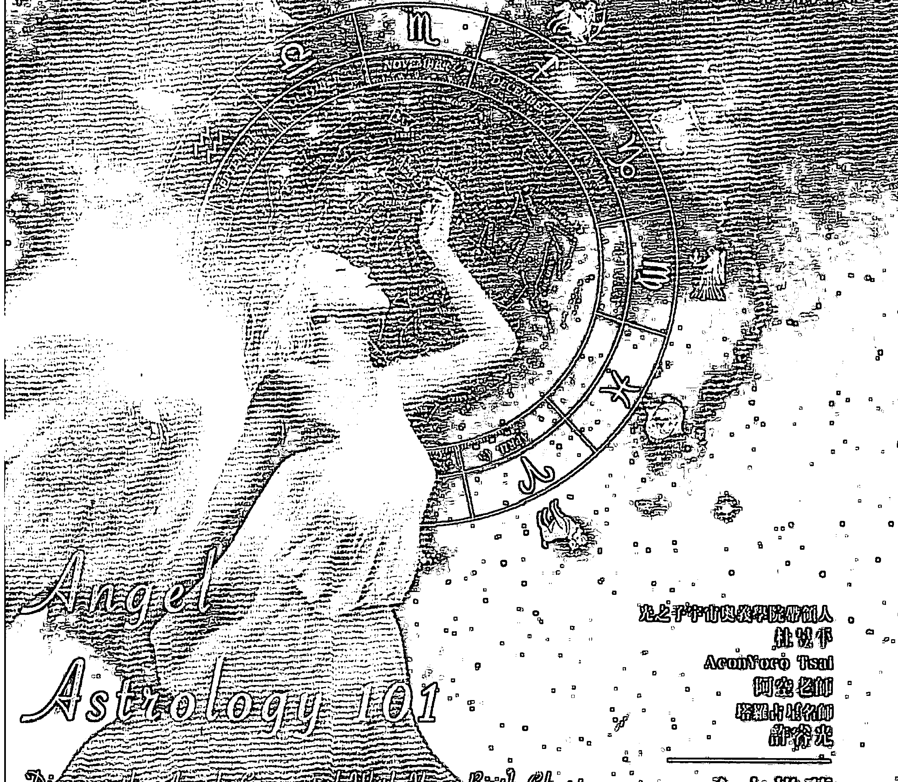

## Angel Astrology 101
### Discover the Angels Connected With Your Birth Chart

光之子宇宙心灵学院创办人
蔡菁菁
Acuario Tsai
何家老师
塔罗占星名师
谢宪光
全力推荐

## 天使占星学

## ANGEL ASTROLOGY

## 101

朵琳·芙秋 Doreen Virtue, Ph.D. & 亚思敏·波蓝 Yasmin Boland ◆ 著

陈萱芳 ◆ 译

http://mirr.us/blog

> > 献给我的家人，
> 是他们教会我生活。
> 我是在好的地方和时间出生的。
> —DV

> > 献给我的堂兄弟姐妹们，
> 尤其是大天使加百列。
> —YB

## 应用文写作与实训（第三版）教学资源包

扫描二维码下载资源

## 前言 编写说明 本书内容和使用说明

-   高职应用文写作课程标准 11

-   应用文写作课程整体设计方案 17

## 项目导入式教学资源

-   第1章 行政公文写作与实训 28

-   第2章 事务文书写作与实训 66

-   第3章 日常应用文写作与实训 88

-   第4章 经济文书写作与实训 106

-   第5章 求职文书写作与实训 126

第6章 处女座及大天使维尔 ......................... 148

第7章 天秤座及大天使乌列尔 ......................... 166

第8章 天蝎座及大天使麦基洗德 ....................... 182

第9章 射手座及大天使撒基尔 ......................... 206

第10章 摩羯座及大天使麦达扬 ....................... 224

第11章 水瓶座及大天使乌列尔 ....................... 244

第12章 双鱼座及大天使圣德扬 ....................... 262

后记 .................................................. 281

作者简介 .............................................. 282

# 图7.11

皇家圣学院 http://store.taobao.com

淘宝

## 进阶篇1

## 展开一条简洁的占星路程
——美好生命的无限可能

阿智

占星学给人的印象，总是极具深度、神秘、奥妙与专业的一种学术。在今日快速提升的新世代中，我们能够在这样一本书的诞生下，经由明确的重点叙述，深入简出的精湛文字，清晰带领自己进入一个幸福探索和实践美满生命的新旅程。

作者不仅将占星学的专业领域的精髓，扩展至人人都能看到的层面，更由占星学如何真实运用在自我生命转化上，传达出最高的神性领导方法。只要我们细细体验自己个性和人格反应出的方式，对应书中的明确提醒，并且知晓渴望理解自己生命设计的那颗心，是出于灵魂的指引，而来到这本书前，和大天使们进行合作，我们便会发现美好生命的奥秘，就在灵性体现时，展现于真实自我转化之中。

看看自己的占星盘，我们会发现一个有趣的探索过程，『认识自己』的这个概念，经过本书文字的传达，更能激发起我们认知的火花，不再只是个停留在表层的笼统说法，诸多行星及星座对我们的作用，让我们连结上那些表现中的自己，产生一个是否可以更顺心的希望。

在大天使们的协助下，这个希望显然被神性力量支持着，大天使与星座能量的关键影响，自然灌注我们一个强大的正面力道，而在我们偶尔失去方向时，也能经由祈请大天使的帮助，而能稳定度过能量的影响，届时，我们将不会自觉是孤单不被了解的个体，而是有着被天使关照的生命前进者，在宽广辽阔的未来中，永远有着清楚的指引和高能量的协助，是这本书最神奇有力之处。

大天使的更高次元能量，守护我们的心，透过本书，从我们专注体悟自身星盘的过程中，融入我们的内心，从而得到转化生命的跃升。书中的精确内容，让我们内在因了解而得到支持力，被大天使光的频率所照护，在安定信任中产生正向的心念和行动力，那么行星星座蓝图的影响，都在具足的信念和爱自己中，发展出和谐的频率，生命因此得以更美好。

献上最高的感谢，感谢这本书的诞生，感谢来到书前的朋友，透过星座力量的牵引，让我们进入转化的生命旅程，幸福真的可以这样被创造与掌握。

Aconyoco Tsai 阿空老师

-   * 显化身心灵工作室负责人。
* 爱的元素、显化丰盛的星系使者。
* 研究占星三十余年，疗愈二千多个案，开设占星、人类图、星相塔罗、天疗法、占星疗愈、脉轮调愈、身心调愈等课程。
* 个人网站链接: http://aconyoco.blogspot.tw/

## 推荐序2

## 连结大天使，就是连结行星和谐的频率

许添光

多年来，大天使一直是我生命最好的朋友！
每当遇到难解的课题，我总在持之以恒的静心当中，静静的闭上眼睛，召唤大天使给我忠告及安慰！每每把心中的难题交给大天使后，他们总会在适当的时机，指引我去看一本书，或突然给出几句话，让我心中顿时一片光明，得到了明确的解答！虽然我在电视上讲占星术与塔罗，但在灵性的疗愈工作中，我时时召唤大天使，给予个案温柔的支持，以及有力的协助！

我与天使的缘分，要归功于本书的作者之一，天使夫人朵琳·芙秋博士，将天使的讯息带来人间！多年来，朵琳发展出许多套大天使的神谕卡，这些神谕卡当中，由一位特定的大天使，给予温暖而鼓励的话语，总能够适切的将最需要的讯息，在最需要的时刻，带入一个人的生命之中！

去年，我发展了梅尔卡巴静心法，就是召唤大天使麦达昶，因为大天使麦达昶，在朵琳夫人的天使卡当中，象征着“优先顺序”！常常，在繁忙的日常生活中，头脑像多头马车，纷乱不休，难以止息的时候，大天使麦达昶的静心，总能梳理我们混乱的脑袋，让我们恢复理智，将事情按照轻重缓急来解决。这一个静心，也被我放在我的著作当中，试着帮助大家在能量混乱中，理出头绪。

如果你问我大天使是什么？大天使又是谁？我的回答是：大天使是爱、智慧和慈悲的能量！大天使的能量存在于宇宙中，是善良而正向的频率。我时常在课程中接引大天使的频率，让有兴趣的同学接收。而每一个同学都能够在静心中，感受到大天使的存在。每一位大天使都拥有不同的频率，有的大天使充满力量，有的大天使温柔而细致：当你用心去感受，就算肉眼看不见，但还是能够很明确的体会到，天使的光与爱就围绕在我们的生命之中！

本书将十二个大天使的频率，与占星术的十二星座连结在一起！这真是一个创举！以大天使麦达昶为例，在书中麦达昶的能量与处女座连结，而处女座是一个井井有条的星座，所以令我更加明白原来大天使麦达昶的频率，就是处女座正向的能量！另一位许多人非常喜爱的就是夏弥尔大天使。在《大天使神谕占卜卡》中，有一张天使卡的牌面是“钟爱的人”！每当翻到这张牌，单身的人总是大声欢呼：真爱要出现了！而在书中，大天使夏弥尔就与金牛座及金星的能量连结，象征爱与物质层面的丰盛。朵琳夫人在本书中，把星体的能量诠释成“星球之音”！这与我的理解不谋而合！当行星相位好时，我们就像听着一首悦耳动听的歌，心情跟着喜悦放松！当行星相位不好时，我们就像听到一连串的噪音，跟着心烦意乱！这种天上行星与人的生理共振的现象，如此抽象而神秘，要花多少时间去推广，大家才能够明白我们是如何受到天上星体无形的引动？

这本书，介绍十二位大天使，连结十二个星座，藉由介绍每位大天使与星座的关系，彷佛同时为我们引荐了十二位好朋友，让我们在了解星座的同时，也明白可以如何召唤祂们，成为我们的良师益友，在生命每个时刻陪伴与指引我们！

我诚挚的推荐这本书，给所有喜爱星座的朋友们，让你们可以藉着星座，同时认识十二位充满智慧而慈悲的大天使！我也推荐这本书给所有喜爱大天使的朋友们，让你们也可以透过十二位大天使鲜明的形象，更加的认识星座！

占星术所描述的是星体的交互振动所产生的频率！而天使的频率则是一种温柔而正向的“振动”，在宇宙合一的根源里，大天使所带来的高频率振动，背后代表的就是行星之间和谐的交互共振！藉由召唤大天使，我们能引导和谐的行星能量来滋养自己的生命，调整我们本命星盘中无力或过度激烈的部分，也透过与大天使成为好朋友，帮助我们内在得到和谐，迈向更完整的发展，同时带给自已平衡的生命！

### 推荐序2：链接大天使，就是链接行星和地球的频率

## 塔罗占星名师 许睿光

|  |  |
| --- | --- |
| 政治大学广告研究所毕，占星师、塔罗占卜师、身心灵咨询疗愈工作者、潜能开发、生涯规划专家、中国二级心理咨询师。 | 十年来，疗愈过数千个案！开设塔罗、占星、脉轮疗愈、家族排列、合一祝福等课程，协助许多人走过人生低潮。目前专注于培养独立的灵性工作者、光的工作者，将疗愈带到全亚洲。 |
| 个人网址链接：https://www.facebook.com/magichealer/ |  |

## 非魔女

## 占星，让我深深地与自己相遇

方景平

从我二〇〇二年踏上内在觉醒的道路，首先认识自己的工具，就是电脑打出来的占星命盘。当时才正是要向世界，找到存在价值的青春年纪，却因象征业力之星的土星，首次回归到本命宫，外在显现的是初次忧郁症的爆发，连努力打拼到的主管职位都得辞职。因内在浮现出太多的困惑、悲伤与不明白，只得在家休养一年，床头与书桌放的大多是占星书，从半夜醒来到白天，每当有疑惑不解时，随手一翻的书本内容，都找到了答案，仿佛神透过占星的知识，来协助我解开心头的锁，逐步了解自己的个性、习气，与生命该学习体验的道场。

就这么持续研究着，仿佛找到了治自己心痛的药方，读出兴趣来了——于是开始认真的找老师上课学习，更深度的从星盘来认识自己，了解别人。才切身的体悟：一张电脑打出来的占星命盘，却是深刻的映现出我们投身来地球前，早已答应并写好的剧本。每个人都是生命的勇士，透过星盘内行星交错的轨迹，来活出自己的天赋才能，疗愈不和谐相位的伤口，并平衡、转化象征父母亲的太阳，与月亮的星座宫位，还有享受前世已努力过，今世应继承的福报果实。

我真的推荐大家，打出一张自己的占星命盘，是非常快速认识自己的实用工具，或是预约一位专业的占星咨询师，成效会更好。甚至还能找到，真正对治，疗愈自己身心灵的课程或法门，才不致瞎子摸象，八万四千法门病急乱投医，或是学了一堆课程方法，一直逃开的，却是真实的面对自己。直到现在，占星已完全融入我的生活中。每天都会体会，今天月亮进入到那个星座（月亮运行每个星座，是两天半的时间）会引动星盘中的各种行星相位，发生什么相应的事件，或是内在感受，将会有更清楚的觉察到，内在与外在世界发生的天人交感作用。

当然，宇宙是慈悲且友善的，了解自己的星盘，并非受限于吉凶祸福的宿命论。命盘中的吉相位，都是在昔日累积的善果或用心处，那里就会有莫名的轻易好运，如贵人相助，或一学就会，能举一反三，容易产生好名声，或富足与地位。若是能更深入了解福报善果为何而来，则会提醒我们，感谢它并善用它，而不至于滥用或浪费了福报。

而命盘中的对冲或相刑的相位，也代表我们与宇宙、天地人的不和谐之处，直到生再来学习、疗愈与转化。没有人可以逃避自己的学习功课，若我们都能藉由自己创造出来的身心疾病，或工作不顺，情感或关系课题，或是金钱与自我价值课题——等诸多逆增上缘，而愿意勇于面对，深深的疗愈、和解与放下，能有耐心的，慢慢将逆境转化，接受爱与光的注入，以及神的恩宠与慈悲，将凶星都能转吉，那么，您真是生命的勇者，真正活出内在的炼金术，与大师精神呢！

而本书很温暖的指出了十二星座可呼求与对应连结的大天使。在写此推荐文时，内心一直在连结大天使加百列，祂也是我内在疗愈的旅程中，首位出现，协助我清理累世阿卡莎记忆库的指引者，果然呼求后，文思泉涌，源源不绝阿！祝福大家，在阅读此书的过程中，能更明晰自己的内在道路，并在大天使及神性家人的协助下，共同创造，显化更幸福的占星蓝图。

### 推荐序3：占星，让我深深的与自己相遇

杜旻平，地心名字：欧夏罕 (Oshahem)

|  |  |
| --- | --- |
| 二〇〇二年因忧郁症，踏上内在苏醒道路，习修光的课程与奇迹课程的真宽恕多年，明晰人类从未真正与内在神性及无条件之爱的源头分离。 | 二〇〇九年开始接收地心列木里亚、亚特兰提斯等远古文明上师的传承教导，并在台、中、美等地，举办一系列地心文明、宇宙意识工作坊。 |
| 知名广播节目“拥抱太阳”长期访谈来宾，创作“宇宙高频点化CD”，包括“地心文明蓝道长老教导”、“黄金亚特兰提斯文明教导”等多张CD。与水晶头骨——雷格瓦，银河家人携手，进入共同创造新地球蓝图，进入平衡丰盛的喜乐中。 | 个人链接：光之子宇宙奥义学院 台湾 http://oshahem.blogspot.tw/ 中国 http://blog.sina.com.cn/u/2722990152 Facebook: 杜慧平 |

## 天使和占星学

占星学这门古老的行业，奠基於祖先对于太阳、月亮、行星以及星体运行的观察，具有预测和疗愈的功能。占星学有点像塔罗牌，在演化过程中，有些重要的部分已经亡佚，所以确切的历史发展目前仍是个谜（现代的占星学家正努力要把这些遗失的部分找出来）。

很多历史学家揣度，占星学的出现，是源自古人配合季节工作的需求。在有组织的农业出现之前，人们需要季节变化的相关资讯，才知道何时会变冷、变热，并预测潮汐的涨退，或特定的植物何时开花等等。他们对这些事必须至少有一点预测的能力，而不久他们就发现：可以利用太阳和月亮重复规律的运行，在季节变化前找出许多的相关资讯。

人类学家发现，早在两万五千年前，山洞中的壁画就显示出阴历的周期（如月的圆缺）。当然，那时的人多半住在户外，生活直接与大自然连结，所以，会注意到这些周期也是很自然的事。

于是，这些先人发现，可以利用和其他星体的相对位置，来预测太阳和月亮的运行模式。接下来，又发现了太阳系的其他行星。像水星、金星等内行星，或火星、木星、土星等外行星，都是肉眼可见，所以早在西元前两世纪，巴比伦的天文学家就已经发现它们了；至于天王星、海王星和冥王星，则是在西元一六〇八年望远镜发明之后才被发现。

一开始，这些前人观察到的，是月亮不见（新月）和月亮变圆（满月）之间，身旁的事物似乎遵循着某些固定的模式；后来，观星术士才开始注意到，行星运行和地球生命之间的相关性。简单的说，就是观星术士画出了行星绕行太阳的不同角度，然后观察在不同的时间点，地球上发生了什么事。根据这样的纪录，他们尝试把某些角度归类为“吉”（easy），某些则是“凶”（clashing）——你可以把“吉”想像成是美妙的乐音；“凶”则好似不和谐的噪音一般，而理解这“星球之音”的，便是占星学家的工作。

朵琳曾在著作《天使之药》（生命潜能出版）中提到

赫密斯（Hermes Trismegistus）是公认的占星学之父。根据她的研究，赫密斯在亚特兰提斯是一位伟大的老师，也是一位杰出的领导者，他在大洪水之后来到埃及。传说赫密斯是亚当的孙子，曾在翡翠石板上留下有名的赫密斯哲学（Hermetic teachings），其中一条法则：“如其在上，如其在下。”（As above, so below.）指的就是：“天上发生的一切，在地上皆有其映照”。如果你记得赫密斯的主张：“我们与世间万物均有连结”，应该就不会觉得我们跟行星之间也有连结的这件事有什么奇怪了。

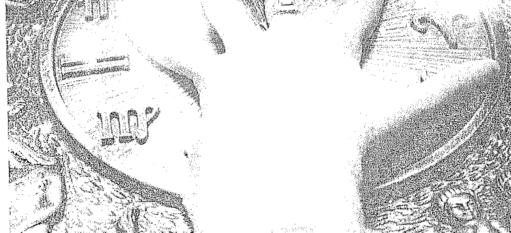

> 皇家圣学院 http://src.taobao.com

### 前言：天使和占星学

古巴比伦人、古埃及人、古印度人、古阿拉伯人、古希腊人，以及依循犹太传统的卡巴拉人（Kabbalists），对占星学能发展至今日我们所见的规模，都有其贡献。先人们注意到，人的性格与他的出生日期、时间和地点有关，而这些观察，便是现代本命占星学的基础。

虽然占星学在一般人的认定中不算真的科学，但它的合理性亘古至今不曾改变。在阅读本书的过程中，你会发现：每个星座都有它的优点，也有它阴暗的一面。优点是要拿来帮助别人的；而阴暗的一面，则需要靠自己努力去疗愈。

在以前，除了国王和皇后，一般市井小民并不知道自己的生日（遑论出生的时辰），所以古代对占星学的想法，与现今有很大的不同。在当时，没有人会为普罗大众解读星座命盘；只有国王有御用的占星学家，标记特定的行星何时显现和谐相位，何时呈现不和谐相位，奉告国王什么时候适合跟邻国结盟，什么时候适合出兵攻打敌人等等。

#### 现代占星学

今天，如果你找一位占星学家咨询，他会要你报上自己的出生日期、时间、地点，然后根据你所提供的资料，标出你出生当天的行星相位，他会知道，这样的行星相对位置所谱出的，究竟是一首美丽的乐音，还是不和谐的噪音。这就叫作本命占星学（natal astrology）。

到目前为止，你对占星学的了解，很可能还停留在报章杂志上的星座解析。星座解析属于太阳占星学（solar astrology），只看你生日当天太阳所在的位置，跟解读完整的星座命盘比起来，前者只能算是一种速成法，不过，知道一下也没什么不好。

报章杂志的星座专栏，是许多人初次接触占星学的地方。这类型的占星资讯很容易理解，可以视为传播宇宙神圣讯息的绝佳媒介。然而，二十世纪的报章杂志占星专栏为人诟病，跟真正的占星学扯不上关系，因为这些专栏经常是办公室的工读生所写，而他们的日常工作也包括冲咖啡！不过，时代不同了，现在大部分的占星专栏都有合格的占星学家为其背书。

#### 灵性占星

当然，并不是只有国王、皇后或总统，才能从占星学中获益；在进行自我探索时，占星学所提供的资讯也很值得参考。

考。透過占星學，我們可以明白人我關係，了解自己的個性、心情和能量的循環，甚至是這輩子的使命。占星學和所有的宗教或靈性道路都是相應的，這行之有年的傳統，就像一把鑰匙，能開啟每個人的「生命之書」。

有些基督徒因為教義的關係，對占星學心生畏懼，我們完全尊重個人的宗教信仰。但有趣的是，很多人相信《聖經》裡的東方三聖，其實本身就是占星學家！當然，他們跟隨的是伯利恆之星 ¹。西元一六〇〇年，十七世紀科學革命的重要人物克卜勒（Johannes Kepler）大膽假設：伯利恆之星，事實上就是天文學中「木星土星合」² 的現象，而這三位占星學家（東方三聖）正是受到神的指引，前來慶賀耶穌的誕生。

在古巴比倫，與天體運行有關的學問（天文學），常常和醫學、神學及教育結合。此外，雖然教會急著與占星學劃清界限，在許多古猶太教和基督教教堂的天花板或地板設計中，卻又經常出現美麗的十二星座圖樣。例如位於義大利佛羅倫斯的聖米亞托大教堂，就是歐洲最有名的占星學教堂。

> 譯注1：伯利恆之星也被稱作聖誕之星或耶穌之星：是耶穌降生時，天上出現的一顆特別光體，引三位來自東方的智者找到耶穌。

> 譯注2：合：星體交會的意思。木星和土星每二十年交會一次。

### 天使占星學

它漂亮的長方形廊柱大廳和十三世紀的地板設計，揉合占星學與基督教的象徵元素。在教會改變主意跟占星學脫鉤之前，像這樣彰顯天堂、四季等古老占星學元素的設計，在中世紀十分常見。

甚至，耶穌本人可能也受過占星學的訓練。在耶穌誕生的那個年代，迦勒底教會的牧師會尋找在特定星體相合（如伯利恆之星「木星土星合」）時誕生的孩子，到他們家中拜訪，並留下禮物幫助父母撫養孩子成人，然後等孩子長大到一定的歲數，再從中挑選最聰穎的，接受迦勒底教育。

如果你對《聖經》內容還算熟悉的話，應該知道耶穌有一段的生平（從出生至十八歲）並沒有包含在其中。有些人相信，這段期間耶穌正接受當時最好的教育——賢士訓練（magi training），而其中包含占星學的知識以及療癒方法。很多人相信，耶穌是有史以來最偉大的療癒者，那他是不是可能也是位占星學家呢？

> > 佛萊德·蓋廷斯 (Fred Gettings) 在其著作《秘密星座》(The Secret Zodiac) 中寫道：「中世紀時期的奧義占星學著作，並不是以手稿的方式流傳下來，而是被鐫刻在當時天主教及基督教教堂的石碑或大理石雕刻上。」

許多占星學家從《聖經》內文：「日、月、星辰要顯出異兆（路加福音第21章第25節³）推論，神希望人能將天堂的訊息解碼。

在《創世紀》中，更有關於創造的故事，顯示神指導人向天堂祈取神蹟：

> 神說：「天上要有光體，可以分晝夜，做記號，定節令、日子、年歲，並要發光在天空，普照在地上。」事就這樣成了。於是神造了兩個大光，大的管晝，小的管夜，又造眾星。（創世紀第一章第14至16節）

亞思敏（Yasmin）說：「就我個人而言，在決定以占星學為志業前，我靜坐冥想並認真祈禱了很久。我從小就是天主教徒，所以知道教會的人對占星學很畏懼，我甚至不敢告訴自己的祖母我在學這個。不過，在讀過占星學的歷史後，我相信，其實占星學在教會中存在了千年之久，是到後來才突然被逐出教會的。我請耶穌給我一個明確的指示，看看自己是不是該以占星學為一生的志業。結果在祈禱之後的一兩天，我就獲邀撰寫一個眾所矚目、『錢景』看好的星座專欄。我認為這是上天支持我以占星學為志業的朕兆。

> 譯注3：全節內容為「日、月、星辰要顯出異兆，地上的邦國也有困苦；因海中波浪的響聲，就慌慌不定。」

## 前言：天使和占星學

天，我就獲邀撰寫一個眾所矚目、『錢景』看好的星座專欄。我認為這是上天支持我以占星學為志業的朕兆。

## 占星學與天使

就像每個人都有屬於自己的出生星盤一樣，我們也都有各自的守護天使（guardian angels）。這些天使從你我出生之前，就跟我們在一起，伴隨我們度過一生，並在肉體離開這個世界之後，陪伴我們回到天堂。守護天使不是我們過世的親人，而是一種沒有自我、「屬天的」存有（celestial beings）。透過我們每個人，實現神的和平旨意。

你的守護天使會提供源源不絕的愛與支持，適時給予指引；他們也會竭盡所能地保護你——前提當然是你有注意到這些指引（可能會透過警告、直覺或朕兆等方式）並且遵行不悖。

除了每個人自己的守護天使

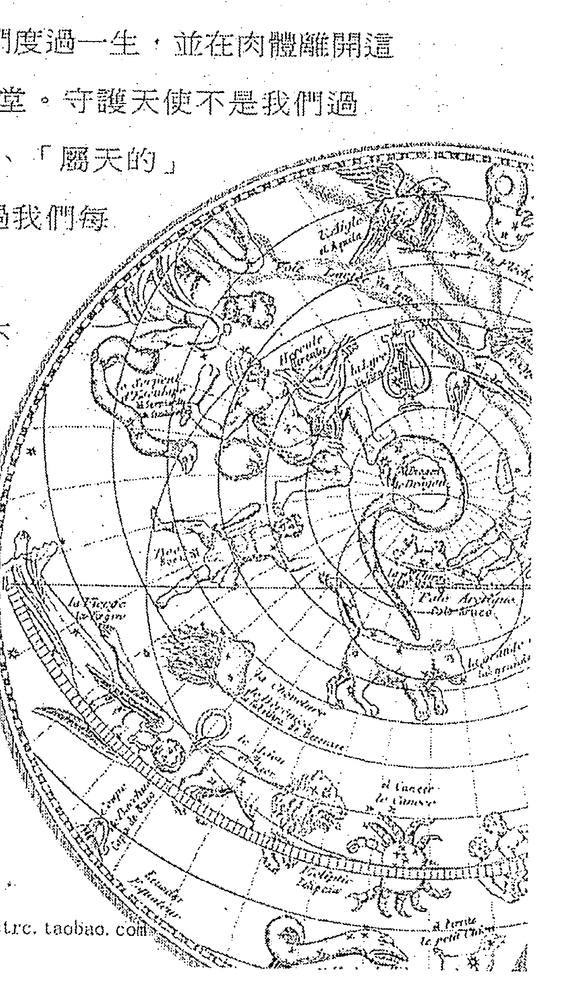

### 天使占星學

天使，大天使也會給予我們指引和保護。大天使是能力更強的天使，牠們就像守護天使的上司一樣，負責管理守護天使。每位大天使各有不同專長，比如：大天使麥可（Archangel Michael）給人保護與勇氣，大天使拉斐爾（Archangel Raphael）掌管療癒，大天使加百列（Archangel Gabriel）提供滋養、傳達訊息，大天使烏列爾（Archangel Uriel）召喚光來照亮困境等等。1

天神尊重人的自由意志，所以守護天使和大天使不會強迫你接受牠們的指引；只有在你向神祈求，或請求協助時，天使才能介入幫忙。

幸運的是，用哪一種方法祈禱都行——不管是正式的禱詞聲明，熱烈的懇求，或用寫信、畫畫等方式，重點是你誠心的請求協助。

大天使比守護天使更有力量，其中最知名的四位，多數的人都耳熟能詳：大天使麥可、大天使拉斐爾、大天使加百列和大天使烏列爾，其他還有數百位知名和不那麼知名的大天使們，一樣都是仁慈、值得信賴的神的使者。本書介紹十二位神聖的大天使，祂們都是我（作者朵琳）曾深入研究並有所連結的。

> 譯注4：有關大天使的詳細介紹，可參考朵琳・芙秋的《如何聆聽天使訊息》及《天使之藥》（生命潛能出版）。

### 前言：天使和占星學

每一位大天使的專長，對應不同星座的特質。不過，這意思並不是說，某位大天使只能幫助某個星座的人，大天使是「無限的存有」（unlimited beings），可以幫助所有向祂們求助的人。

正因為不同的大天使各有其特定的角色和特質，所以跟不同的星座配對。在本書中，會詳細介紹如何透過大天使的幫助，更深入了解自己、明白自己的生命意義。

我們會逐章介紹十二個星座，以及對應該星座的大天使；在每一章中，還會細分太陽、月亮、水星、金星、火星和上升星座。你可以先閱讀和自己的星座命盤有關的部分，認識一下對應到自己星座的大天使是哪一位；然後再閱讀太陽、月亮、水星、金星、火星和上升星座的特定大天使介紹。

### 名詞定義

如果從來沒接觸過占星學，一開始可能會覺得有些名詞不容易了解。然而，不需要擔心，只要你持續地學習、經常接觸這一類的知識，就會愈來愈熟悉。基本上，當我們說到「星盤」(Birth Chart)，指的就是你出生時不同天體在天上的相對位置。

你或許知道，天文學（研究恆星和行星的科學）中仍沿用「星座」(constellation)這樣的古老系統。我們的祖先沒有電視可看，所以常常待在戶外，當他們仰望夜空，看到恆星和行星組成的星群輪廓，就像一大條由點和線組成的圖案一樣。

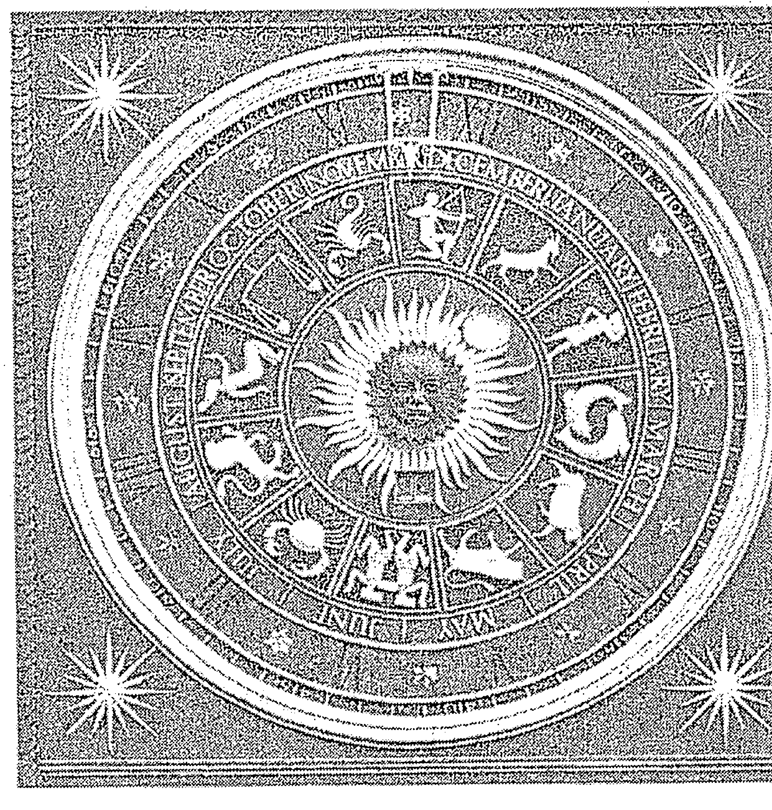

## 前言：天使和占星术

他們於是把文化和宗教上的故事，投射到這一幅幅夜幕上，每個星座根據其形狀，有了自己的名字和故事。隨著歲月流轉，相同的模式一再重現在現代的夜空，訴說著老祖宗所學、所教的一切。

所以，舉例來說，若你出生的時候，太陽走到獅子座的位置，那你的太陽星座就是獅子座。「黃道帶」（zodiac belt）[^5]描繪出十二星座的代表圖像及其原型。

## 你的太陽星座

太陽星座就是一般說的「星座」，指的是你出生當天太陽走到的星座位置，天文學家則叫它「太陽星座」。太陽星座是最根本的你，在很多方面，它都是星盤中最重要的部分。因為太陽很年輕，所以太陽星座代表的是星盤上比較陽性的能量——即使你是女性也一樣（相對而言，月亮代表的就是陰性的能量）。太陽跟意志、力量和欲望有關（一般而言並非性慾）；太陽落在哪一個星座，則會影響你表達意志的方式。

> 譯注5：也稱「黃道十二宮」。

## 给星座分界点宝宝的重要讯息

如果你是在星座分界点（太阳从一个星座进入另一个）诞生，那么你若不是属于前一个星座，就一定是后一个，绝不会“一半一半”。大部分的人不知道，其实太阳从一个星座进入下一个星座的日期，每年都会有一点差异，最多可以相差到三天。所以，报纸杂志上的星座日期只是个大概（本书上的也是），不同版本之间有差异是很正常的。比如，两人的生日同样是十一月二十二日，但可能因为出生年分的不同，其中一个是射手座，而另一个则是天蝎座。你随时可以利用 www.moonology.com/angelcharts 这个网站，找出自己的太阳星座。

## 你的月亮星座

月亮星座指的是你出生当天月亮的位置。月亮在每个星座的时间大约是两天半，所以即使不知道确切的出生时间，还是可以算出你的月亮星座落在哪里。月亮的位置是星盘上另一个重要的部分，能告诉占星学家许多关于你的讯息：你的需要、感觉，你在情感方面的特性：比如你是稳定的还是变动的，是谨慎细心还是精于算计等等。此外，月亮也代表你生命中最重要的女性（母亲、妻子、姊妹等），以及在什麼情況下，你會覺得舒服——就像母親照顧你的那種感覺——有關。

### 前言：天使和占星學

### 你的水星星座

水星代表的是你如何表達自己——包括如何說話、書寫以及思考。水星會影響你做決定的方式，以及決定你是外向多話還是沉默寡言，甚至會影響你閱讀、書寫或喜歡的書籍類型。總之，水星掌管了你的字詞、語言，跟你的想法從何而來，以及會注意哪些事物有關，還會影響你統整想法的方式。另外，水星還跟學習及腦袋運作的方式有關，決定了你是那種很快就跳到結論的人，還是習慣深思熟慮之後才作反應；是固執還是好奇，喜不喜歡分析事物等等。

### 你的金星星星座

金星掌管的是愛的方式及愛的對象，基本上就是和別人的關係。金星星星座同時也顯示了你會找什麼樣的人當另一半或朋友，以及你吸引別人的方式。你的金星落在哪一個星座，不僅會主導你成為比較不帶感情的人或很黏人，會不會想找一個外貌出色的伴侶，還會影響你對愛情的標準是高是低，或是你根本覺得自己的愛不夠分給身旁的每一個人。此外，金星的位置也和美學品味有關，影響表達創意的方式。其他像是美、快樂、豐盛的感受等等，都和金星有關，不過在本書，我們會比較專注在親密關係上。

## 你的火星星座

火星是掌管憤怒、野心、性關係以及決心的行星。你的火星星座決定了你追求對象、逐夢、找工作的行為模式。火星也是你與他人爭執時的主導行星，決定了處理衝突的方式：你的脾氣是瞬間爆發還是慢慢累積，會和平斡旋或根本畏懼衝突。另外，因為火星也跟性關係有關，所以你的火星星座也說明了你是個務實的情人，或者缺乏安全感，或是一個注重感官享受或生性浪漫的人。此外，火星也主導了你做事的方式以及動機。

## 你的上升星座

你的上升星座是由出生日期、時間和出生地所共同決定的，指的是在你誕生的時刻，由你的出生地看東方地平線升起的星座，所以必須知道確切的出生時間（也就是說，誤差須少於十五分鐘）。

現在有很多電腦程式、網站或 APP，可以幫忙處理個人星盤的相關資訊。只要登入各大搜尋引擎，輸入「免費星盤」或「免費星座命盤」，就可以連到內建電腦程式的知名網站，找到你的太陽、月亮和上升星座，不需要花半毛錢或提供個人的電子郵件。也可以連上 www.angelastrology101.com，得到一份即時、免費的個人星盤。如果沒有電腦或網路，也可以在住家附近找一位占星學家，付費取得自己的本命星盤。

取得出生星盤所需的資訊包括：

- 你的出生日期。
- 你的出生時間。
- 你的出生地點。

如果不知道自己是幾點幾分出生的，可以問一下父母，或查看一下出生證明。很多醫院都會保留嬰兒的出生紀錄，上面會記載詳細的出生時間。能找出愈精確的時間愈好——最理想的誤差是在十五分鐘以內。

### 有关生日的细节

如果不清楚自己生日的相关细节（比如你可能是被领养的，所以无法取得出生相关资讯），也可以找占星学家帮你做一张「校正」（rectification）星盘。这种方式是利用占星学的知识，回推你的出生星盘：先列出你生命中的大事（比如：何时出生、何时结婚、何时有小孩、何时离婚等等），占星学家便能帮你推算出正确的出生时间、日期以及出生地。当然，绝大多数的人都知道自己确切的出生时地，而这种校正的方法也适用于不确定出生时间的人。

另一种找出生日相关信息的方法，是求助于人体运动学家（kinesiologist）。这些专家相信，我们所有的记忆都储存在身体里，所以可以利用肌肉测试的技术，来帮你想起自己的出生时间——至少理论上是可行的！可以上网找人体运动学家的相关资讯，或到住家附近的身心靈書店洽詢。

如果不知道自己诞生的准确时间，也不必觉得沮丧。你可以试着找找看（至少可以由此着手）。比如，先用早上六点当作你的出生时间，然后跳过星盘上关于上升星座的叙述；当然，用这种方法最后找到的月亮星座可能是错的，不过这也是必然承担的风险。

## 前言：天使和占星學

如果覺得本書關於你的月亮星座的描述，完全無法引起共鳴，那就往前或往後找一個星座，應該就能找到比較貼近事實的描述。如果希望對星座命盤有更深入的理解，可以運用前面說過的方法（確認出生紀錄、校正星圖、人體運動學等等）來拓展相關的知識。

## 最後……

就算無法馬上獲得一份自己的本命星圖，還是可以從閱讀本書對你太陽星座的描述，以及與大天使的連結這兩部分得到幫助。只需要知道出生日期，就可以找出太陽星座，而有關太陽星座的描述，都在每一章的開頭。

* * *

## 遇到任何下列情形，不論你是什麼星座，都可以呼求大天使亞列爾（Archangel Ariel）幫忙：

- 1. 生活像一灘死水停滯不前，你需要呼吸新鮮空氣。
- 2. 想多花點時間親近大自然，卻無法抽身。
- 3. 想為自己的家打造一個美麗的戶外庭園。
- 4. 想打造一個小藥草園，或進行室內植栽佈置。
- 5. 覺得自己好像失去了青春的熱情活力。
- 6. 正要著手進行一項新計畫，覺得需要一點幫助。
- 7. 覺得自己好像失去了前進的動力。
- 8. 想重新開始一段感情或改變某個情況。
- 9. 需要原諒、忘卻過去，並且繼續前進。
- 10. 需要改頭換面。
- 11. 希望有些事能被顯化（manifest）。
- 12. 需要一些幫助來處理憤怒的情緒，或擔心自己太自私。
- 13. 想領養動物。
- 14. 覺得自己好像有點電腦或手機上癮。
- 15. 覺得時間緊迫，進度落後。
- 16. 需要穿越恐懼，讓生活過得更充實。
- 17. 需要恢復規律運動的習慣。
- 18. 生活失去了即興的樂趣。
- 19. 必須堅持下去。
- 20. 想要連結精靈或其他元素。

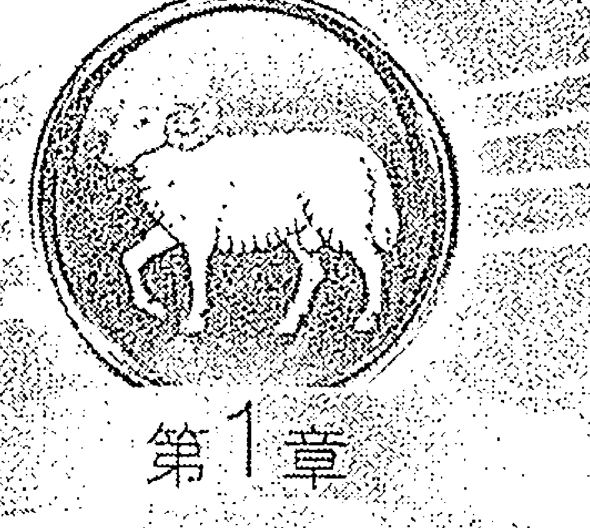

### 第1章

3月21日～4月20日

### 牡羊座 & 大天使亞列
#### Aries & Archangel Ariel

星座總共有十二個，牡羊座是星座圖上的第一個星座。所以，這個星座可以說是星座中的「小孩」，與萬象更新的春天有關。

這樣一個星座，再配上與精靈和自然有關的大天使亞列爾，是多麼完美、有活力的組合！

## 天使古星學

大天使亞列爾完美潔淨的能量充滿活力，與幼禽幼獸及戶外環境有著強烈的連結，所以，如果你的星座圖裡，牡羊座佔了重要的比例（也就是太陽、月亮或上升星座在牡羊座），那你會很喜歡動物和大自然。

不過，不論是哪一個星座落在牡羊，要記得：牡羊座渾身散發（孩童般的）天真，所以，有某個星座落在牡羊，就代表你在那方面會永保年輕的心態；星座落在牡羊也代表，就算那個領域「連天使也裹足不前」⁶，你還是積極主動地去追尋，就像初生之犢不畏虎——不過，既然你翻開了這本書，希望你已經知道：只要你有需要，天使一定會出現，沒什麼會讓他們裹足不前！

對牡羊座與大天使亞列爾的能量相應有基本認識之後，接下來，你可以想想春天：不論住在南半球還是北半球，春天都是萬物復甦、充滿希望的季節，花苞出現了，緊接著是花朵的綻放，在漫長寒冷的冬天之後，整個世界再次充滿希望，呈現純淨無瑕的狀態。趁這個季節走入大自然，肯定讓你能量滿滿。

> 譯注6：原文出自英文諺語「Fools rush in where angels fear to tread.」指連充滿智慧的天使也得步步為營的地方，確有一些傻瓜闖進來，用來形容不知天高地厚、橫衝直撞、魯莽行事的人。

大天使亚列尔和牡羊座，鼓励你脱去寒冬的层层束缚，重新回到大自然的怀抱。不管你是哪个星座落在牡羊，你都有能力摆脱过去的阴霾，纳入清新的气息。如果你的星图中，有很强的牡羊能量（太阳、月亮或上升星座在牡羊），那么你本身就像一股新鲜的空气，能带给他人力量。也正因如此，那些拥有很多牡羊能量的人，通常人缘都很好（只要别引爆他们的脾气）。

大天使亚列尔也是「神圣魔法与显化奇迹的神圣大天使」，祂提醒你，只要以孩童般的纯真面对生活，一切都变得有可能，奇蹟就会发生！如果你有很强烈的牡羊特质，那么你就像是亚列尔的化身，随时提醒身边的亲朋好友，不管发生什么事，他们一样可以心想事成。你会跟他们说：「即使眼前看来困难重重，也不要放弃！」

大天使亚列尔有助于你的关系，因为他最神奇的能力之一，就是粉碎我们以为每个人都是独立个体的这个幻相。祂是对的！因为我们每个人都互相连结。大天使亚列尔负责教会我们这项重要的课题。

不过，如果你的星图上有很强的牡羊特质，或许你早已了解，在此生，我们每个人之间都是有关连的。在牡羊座「我！我！我！」的能量升起时，记得提醒自己这一点，因為有時候，牡羊座的自我中心也是出了名的——就像可愛的小孩還活在幻想世界一樣。牡羊座的個體，有的時候行為可能看起來就像只有他們才是宇宙的中心，自己的事最重要；這其實也是牡羊純真本性的一部分，但它可能會惹惱別人。

任何時候當你覺得自己的牡羊能量升起，或是自我（小我）開始主導一切時，你可以召喚大天使亞列爾前來幫助。祂會提醒你，我們都是一體的，人我分離的感覺不過是自我（小我）的幻相。大天使亞列爾因為是受性格剛烈的火星支配，因此也比較——妥當一點的說法是——自信果決，這個形容也適用於牡羊座的你，尤其在和朋友或同事有強烈競爭的時候，你這方面的特質會特別容易顯現。競爭本身是良性的，但別讓競爭傷害了你和他人的關係，或讓自己變成一個沒有同理心的人。

每一個星座都有自己的問題要克服，我們誕生在某個特定星座，就是為了要面對這些課題。好消息是，跟隨牡羊的衝動而來的，還有這個星座與生俱來的魔力。舉例來說，牡羊座充滿熱情，勇於冒險，當你充滿勇氣踏入這個世界，在神奇的旅程中，大天使亞列爾會一路陪伴著你，在享受大自然，呼吸清新空氣中，因而想起你真實的樣貌。所以，在需要的時候，你只要離開電腦、電視和 3C 產品，走進大自然。

然，很快就能和大天使亚列尔的能量连结。检查一下你的星盘有哪些星座落在牡羊，然后看看你在这些面向，是不是真的充满冒险精神。

牡羊座的另一个美好特质，就是这个星座的人相较而言比较大胆；同时，大天使亚列尔非常擅长帮助我们显化。两者强而有力的结合，结果当然就是无畏的显化！

当我们不再恐惧，生命就进入了一个全新的境界，可以真正与造物者一起，实现梦想中的生活。牡羊座代表的是重新开始，还有什么比去除恐惧（一股把我们往回拉的力量）、重新开始更酷的呢？牡羊座带我们离开自己的舒适圈，尝试新事物，鼓励我们要勇敢，不要想太多。

再看一次你的星盘，有哪些星座落在牡羊，然后想想生活中有哪些面向，是不是可以释放恐惧？召唤大天使亚列尔来协助你，做出灿烂耀眼的改变。牡羊座代表新的力量，而亚列尔则帮助释放过去的一切，让新力量能好好发挥——两者合作无间，好让你忆起：生命就像一座花园，长出来的都是你选择栽下的植物。

记住，牡羊和大天使亚列尔踏在地球上的步伐都很轻盈，最能代表他们能量的关键字，就是蓬勃的朝气以及源源不绝的活力。牡羊座的人最不该做的事，就是让自己塞满了负面能量，所以大天使亚列尔才会希望你到户外去呼吸新鲜空气，让身体保持健康的状态。总之，不论你是哪个星座，如果希望和自己的星座能量有所连结，一定要远离毒品和酒精，它们就像黏胶，会卡住本应不断转动的生命之轮，把整个运转速度拖慢下来。

## 太阳星座在牡羊

如果太阳星座在牡羊，那么你的核心能量就是大天使亚列尔的充沛活力——很幸运吧？你一出现，屋里就像注入了新鲜空气；而你也像亚列尔一样，不会把生命看得太严肃，不管面对什么情况，都能轻松面对。

你的星座，牡羊座，代表的是新鲜、朝气蓬勃；而大天使亚列尔，则帮助你散发出这样的能量。如果觉得自己好像失去了活力，记得召唤亚列尔，祂会很乐意帮助你扫除负面能量。

不过，你也要记得，冲动亦是牡羊座的特质。所以，当发现好像跑太快了、有点抓不住自己的时候，记得祈请大天使亚列尔帮忙。学会慢下来，是你的生命课题之一；而协助你回归宁静，是天使神圣的荣耀。

有件事你可能还不是很了解，那就是：由于亚列尔强有力地出现在你的星盘上，所以你是一个很棒的显化者。下一次，当你非常渴望某件事进入你的生命时，记得：先在脑中把它想像出来、画下它或写下来，然后召唤亚列尔帮你的忙。

你是神圣的存有（Divine being），有一部分正是来自亚列尔这伟大的显化者。亚列尔是你生命中一股强大的力量，因为太阳牡羊是你生命中重要的力量，你比想像中的自己还更神奇，你最能鼓舞身边人的，就是在面对生命时所展现出的勇气——永远把勇于探求未知放在心中的第一位。

要记得，生命是循环不息的。在你感觉自己牡羊座的显化力有些黯淡无光时，可以请求亚列尔帮忙，让你重获神奇的魔力。亚列尔随时都等着伸出援手！

## 月亮星座在牡羊

如果月亮在牡羊，你在情感方面可能会比较冲动，因为你的月亮星座（牡羊）是由大天使亚列尔主导的火象星座——亚列尔喜欢步调快速的生活，心中总想着下一次的探险，影响所及，你在情感上也会显得变化迅速！

月亮星座掌管你的需求，所以如果是牡羊座/亚列尔主导，意味着你需要以比较迅速的步调过生活，不太会有人提醒你责任是什么。你星盘上可能有其他星座可以让你的速度慢下来，行事谨慎些。你必须跟随自己的本性，而你本性的一部分就像亚列尔一样，是积极追寻乐趣的（你需要乐趣的程度，大概就和其他人需要食物一般殷切）。幸运的是，大天使亚列尔完全了解这个情况，祂总是在身旁随时帮助你满足情感上的需求，使你开怀，也让身边的人欢笑。

不过，你要谨记天使的准则：你必须请求协助，天使才能出手帮忙。当你觉得眼前的生活开始停滞不前，甚至困难重重，祈求亚列尔帮助恢复神奇的力量。因为你的月亮星座在牡羊，受到亚列尔活力能量的祝福，你心里会非常清楚一件事，那就是：生命在于人自己怎么去过。

最后这个小提醒会对你很有帮助：如果真的很不开心，就到大自然去走走，这么做能帮助你恢复能量。（记得请求亚列尔和你同行！）

## 水星在牡羊

牡羊座是回应速度很快的星座，而水星代表的是沟通，两者加起来，不难想见以下情况：有人很勇于表达自己的看法，却没有考虑到说出来的话可能对对方造成什么样的影响！如果你的水星在牡羊，要注意自己回话的速度不要太快——记得多多这样提醒自己。

还好有大天使亚列尔，翩然降临地球，引导着水星在牡羊的你。如果知道自己经常“反应太快”，那么在参加重要会议之前，记得请求亚列尔帮忙，让你届时能保持安静，不要急着打断他人。

大天使亚列尔也知道重新开始的道理。还记得吧？祂代表的是春天，也就是万物更新的季节。所以，如果在工作上或是生活中，因为不小心说了不该说的话而触怒了别人，可以请求大天使亚列尔协助你找出合适的用词来加以弥补。或一旦觉得自己讲话开始有点激动了，记得请亚列尔让你平静下来。

牡羊座和水星都是非常行动导向的，所以你应该早就发现，开始进行新计划对你来说轻而易举。不过，假如你发现完成计划有困难（听起来很熟悉吧），记得请求大天使亚列尔用祂的牡羊座火焰来帮忙，让事情能够有始有终。

## 水星在牡羊

总括而言，水星在牡羊是很大的祝福，能够提高你的创造力，也代表你能把新颖的想法带入对话中。你不会被细节绊住——更确切地说，是完全不可能被困住；相对的，你有能力确认每个人的谈话主题，并让对话继续下去。如果每个委员会里，都有一位委员的水星星座在牡羊的话，提案讨论的速度一定会快很多！

## 金星在牡羊

金星在牡羊是难得的福气，不过同时也伴随着极大的责任。金星是代表爱与丰盛的行星，而牡羊则是活力十足、青春无限的星座，两相结合，就是一个有能力去爱的人，看起来好似从没受伤过。

这当然是很大的优点。跟一些总沉溺在过去受过的伤害或错误之中的人比起来，你在每段关系结束后都有重新来过的能力，真的是上天的恩赐。你也可以清楚看见这和牡羊座“春天来了！”的关系：金星在牡羊，就像大天使亚列尔让春天百花盛开一样，你总能让身边的人，忘记他们刚捱过那段漫长严寒的冬天！

不过，也要注意：并不是每个人都和你一样，能够轻松挥别上一段感情、很快整理好自己，然后继续人生的旅程；不是每个人在面对爱情的时候，都能这么快做好决定；也不是每个人都希望像你一样，能很快再进入另一段新的关系。

所以，当发现另一半进入感情的步调不像你那么快时，可以请求亚列尔帮忙，祂纯净、清新的能量能帮你去除心里不舒服的感觉。

金星同时也和金钱有关，所以金星在牡羊，意谓着你能快速致富；然而，你可能也发现了，花钱的速度一样快如流水。你要再一次地觉得庆幸，大天使亚列尔总是在你身旁，当预算变紧时，记得求助——因为亚列尔是显化专家，所以当你需要更多的现金显现时，记得找祂帮忙。（不过声明在先：亚列尔并不是天上的自动提款机，所以与其请求祂让你中乐透，还不如请祂帮忙找份报酬高的工作！）

# # 火星在牡羊

这是个不怎么讨喜的组合！火星是代表火与战争的行星，而牡羊座本身代表的也是火和战争，但也不用太紧张——这并不是说，如果火星在牡羊，就一定会置身血腥战争之中。然而，这两者的结合，常常意味着当事人的脾气不好；好好控制脾气，是你的人生课题之一。

记住，牡羊座的能量和青春有关，而大天使亚列尔的能量，则是光（轻盈）的存有。有时候，特别是年轻的时候，你可能会觉得浑身上下充满活力、勇于追求目标，速度之快，有如一头公牡羊冲进了瓷器店！

如果上述听起来十分符合，那你唯一能做的就是去接受。请求大天使亚列尔让你爱你自己、脾气以及全部。一旦接纳了自己，再想想能用什么比较有建设性的方式，来疏通这些能量。只要开口请求，大天使亚列尔一定会指引你找到最适合的出口。

要想疏通“火星在牡羊”这样的强烈能量，最简单的方式就是——运动。牡羊追求迅速，而火星代表战士的作风，所以，你可以选择用激烈的运动来宣泄累积已久的能量。

因为火星在牡羊的人相对地比较容易发脾气，所以在对话气氛变得激烈时，记得请求大天使亚列尔用幽默来化解——只要有人适时讲个笑话，或简单的一个微笑，就能神奇地化解双方剑拔弩张的情况。任何时候只要你觉得不高兴，记得深呼吸，然后请求大天使亚列尔让你平静下来，这比在心里默数到十有用多了！

有件事值得顺带一提：如果另一半的火星在牡羊，那他们多半易于亲近，而且充满了炽烈的热情！

## 上升星座在牡羊

上升星座在牡羊的人，兴奋、热血，而且竞争力强，浑身散发大天使亚列尔及牡羊座精力充满的能量。他们通常轮廓鲜明，动作轻快、脚步轻盈，旁人很难跟得上。牡羊座的主导行星是火星，代表阳刚的力量；这也表示，如果上升星座在牡羊，在面对他人挑战的时候，你必须很努力克制自己，让自己冷静下来。（别担心……你一定做得到！）

上升星座会落在牡羊是有原因的。这表示，你的灵魂决定，控制脾气是你这辈子要学习的课题之一，你当然希望能顺利过关。你的上升星座守护大天使亚列尔脾气远比你温和得多，所以只要觉得火气上来了，记得呼求他的帮忙（当然，也可以藉助亚列尔喜爱户外的那股能量——离开让你觉得生气的地方，到外面走走，呼吸新鲜空气，让你的能量恢复平衡）。

上升在牡羊很棒，因为这意谓着你可以像蝴蝶般，轻盈地穿越深不见底的森林。上升星座在牡羊会让你追求速度，有时身边的人甚至觉得你冲太快了，这时可以召唤大天使亚列尔，帮助你回到安稳一点的步调。这并不是说亚列尔喜欢慢慢来，而是祂总是把你的需求摆在第一顺位，所以如果你需要调整生命的脚步，祂绝对乐于伸出援手。举例来说，如果觉得学习静坐对自己有帮助，那就请求亚列尔帮忙你。

***

遇到任何下列情形，不论你是什么星座，都可以呼求大天使夏弥尔 (Archangel Chamuel) 帮忙：

1.  觉得自己迷失了方向。
2.  遗失了某项物品。
3.  觉得生命遇到了某个关卡，动弹不得。
4.  需要出现一笔钱来购买生活必需品。
5.  需要出现一笔钱购买奢侈品来犒赏自己。
6.  你身边出现了固执的人。
7.  其实——你自己知道，固执的是你自己。
8.  你正在寻找真爱。
9.  希望对自己的外表更有自信。
10. 想和一位久未联络的朋友重新取得连系。
11. 想跟一位刚吵过架的朋友联络。
12. 想找一份报酬比较高的工作。
13. 觉得自己的生活缺少物质的安逸。
14. 觉得自己有一点太物质主义（拜金）。
15. 觉得自己陷入了困境。
16. 变得有点懒。
17. 希望能过有机一点的生活。
18. 觉得自己需要一些协助，好设立目标。
19. 有一些和现金或财产有关的问题。
20. 需要提升自尊。

# 第2章

4月21日~5月21日

# 金牛座 & 大天使夏弥尔

# Taurus & Archangel Chamuel

金牛座的守护行星是金星，金星与爱情、奢华、乐趣和艺术有关。如果你的星盘上金牛座的特质很强（也就是你的太阳、月亮或上升星座在金牛座），那金星对你的影响也会很大。那么，是哪一位大天使跟这股神圣的能量有密切的关系呢？就是夏弥尔——这位受神赐福的大天使，祂除了能帮助人们寻找真爱，还有许多其他的职责。

这是金牛座非常温柔、浪漫的一面；另一面，当然是个性强硬的公牛，也就是金牛座的星座象征。金牛座的人是固执出了名，如同一只愤怒的公牛，想往哪里去，其他人非得顺他的意不可，尤其是他们追求欲望的时候。金牛座平时脾气温和，通常都是累积到一定的程度才一次爆发，就像火山。你的星盘中，哪一个行星落在金牛座，代表你在那个行星所主导的领域会比较固执、喜怒无常。

还好，大天使夏弥尔随时都准备伸出援手。就跟所有的大天使一样，只要你开口请求，不管什么事，夏弥尔都乐于提供协助；不过，祂的“特殊专长”还包括了：帮助你找到满意的爱情、友谊，适合的工作，还有内心的平静。这点与金牛座是完美的组合，因为金牛座的守护行星，正是掌管爱情的金星，与爱情、灵魂伴侣的关系最为密切。

金星和大天使夏弥尔这两股能量，在某些方面非常相似。比如说，金牛座在所有星座里排行第二，非常年轻，就像一个婴孩想爬出去看看外面的世界——去发现新事物——想要“尝尝生命的滋味”，而且真的是用嘴巴来尝！夏弥尔的能量与寻找有关，和金牛座恰好完美相应，两者都希望能找到生活的乐趣。不过，相较于金牛座寻求的常是外在物质享受，期待别人能满足他们的感官欲望；大天使夏弥尔则提醒我们：我们努力想向外寻找的事物，其实在自己身上皆已完备。

不论是什么星座，如果你在感情或友谊关系中遇到困难，都可以寻求夏弥尔的帮助。有时，朋友可能是因为忙于自己的生活，所以没注意到你觉得寂寞，需要陪伴。金牛座的人不习惯主动求助，或是开口要一个拥抱，因为平时金牛座都是给予、掌握操控权的一方。大天使夏弥尔能帮助你大方表现出自己脆弱的一面，不需事事都在掌握之中；而是能够将真实的感受，与值得信任的朋友分享。

有耐性的金牛所给予的，是稳定、真实的爱。即使和朋友吵过一架，夏弥尔也能帮助你找到适当的方式，与对方重新联络。值得信赖的金牛座知道，真诚绝不是反复无常的，只要是用心（而不是从小我）出发，大天使夏弥尔一定能帮助你找到与每个人相处的方法。

不过，就算你不是金牛座，还是能善加运用大天使夏弥尔带来的这份天堂礼物。夏弥尔能帮的，除了爱情，还有友谊——虽然金牛座和爱情关系不算特别密切，夏弥尔也并非掌管浪漫的大天使，但这两者却创造出完美的组合，能帮助你走上寻找真爱的正确方向。所以，如果你还是单身、正在寻找另一半，记得请夏弥尔帮忙，这位大天使可是以帮人寻找灵魂伴侶出名呢！

如果已经有爱恋的对象，也可以请夏弥尔协助，让你们的感情加温。也就是说，这位大天使不仅能帮忙找到真爱，也能让你和现在的伴侶更熟络。只要你开口求助。

大天使夏弥尔对你的工作也能有所助益。因为这位大天使向来以帮助人们找到适合的职业闻名，所以如果你在专业上觉得有些迷惘，祂正是你要求助的对象，因为这位大天使的主要使命之一，就是引导人们找到符合个人需求的工作、并对收入感到满意。这项任务与金牛座的特质也恰好十分的吻合——这个星座喜爱物质的享受，胜过一切。

大天使夏弥尔能帮助你找到喜爱的工作，从而创造财富，让你和家人享受丰盛的生活。所以，如果觉得自己在专业的路上有“卡关”的感觉，不确定下一步该怎么走，可以请求夏弥尔的协助。祂会协助你“创造你的金星”——什么意思呢？金星正是掌管财富的行星！意思就是，可以请夏弥尔帮助你找到合适的方式，让收入达到预期的金额，然后你就能享受更精致的物质生活。

金牛座并不是一个肤浅的星座，它与美、以及美的事物有着密切的关系。比如，金牛座的人喜欢自然、真实的事物，买衣服会选择天然纤维，而不是尼龙（聚酯纤维）；旅游时，会选择入住高级的度假饭店，而不是廉价的汽车旅馆。幸运的是，大天使夏弥尔能帮助你，让你有能力负担，享受得起这些美好的事物。

如果这一段关于金钱的讨论让你感到不安，请记得，我们在地球上诞生为人，就是为了要体验精神以及物质的世界。金牛座让两者合而为一，又有着特别的天赋，让我们在每一个领域都能体验最棒的事物。只要我们选择从事的是自己喜爱的工作，金钱自然会跟随而来。

唯一要小心的一点是：不要因为金牛的倾向影响太盛，导致在食物和日常花费上过于放纵。大天使夏弥尔能帮助你找到内心的平静，这是大吃大喝和购物血拼不可能给你的。

在职业方面，如果你的问题是无法决定哪一条路才是“上天”要你走的，要知道，不管是哪一个星座，大天使夏弥尔都能帮忙找到生命的目标。丰盛的金牛座／金星在这方面和夏弥尔合作愉快，所以，若你觉得自己迷失了方向、需要神的指引，只要请求夏弥尔帮助即可。

大天使夏弥尔的另一项才能是帮忙找东西，包括遗失的物品。所以，如果你遵循“金牛之道”收集了一些自己喜爱的物品，然后不小心弄丢了其中一样……现在应该知道该找谁帮忙了吧？这对金牛座这种经常需要知道“我东西在哪？”的人来说，多实用、多幸运呀！

虽然金牛的代表图像是公牛，但是大天使夏弥尔为人所知的，是他有爱心又体贴的特质。此外，行星中最体贴的莫过于金星了，因为它所职掌的，正是爱与仁慈。

关于夏弥尔/金星的协同效应，有趣的一点是：夏弥尔是关于寻找的大天使，而金星则代表了较为女性的意向——吸引。不管在哪方面，如果你发现自己不敢走出去、去得到想要的东西，可以请求夏弥尔赐给你勇气，让你开始追寻自己的目标。另外要记得，你星盘上哪一个行星落在金牛座，代表你在那一方面比较容易固执己见；而大天使夏弥尔深知，固执会阻碍事物的自然流动，所以，当你意识到你阻挡了自己前进的步伐时，记得请求他的协助。

## 太阳星座在金牛

如果太阳星座在金牛，那你天生就会寻找快乐——我说的不是寻找刺激，是寻找快乐。弄清楚这两者的区别很重要！你会渴望有一个很棒的、漫长的下午，和自己所爱的人相处；你很享受按摩时舒服的感觉；喜欢有独处的时间，可以稍微放纵一下自己；你喜欢到公园散散步；或是享受一段轻松的时光，好好坐下来读本书。你不喜欢受人催促，如果有人叫你动作快一点，多半时候你会坚持己见，不为所动。

不用担心，大天使夏弥尔不会逼你动作加快；不过祂的能量会让你保持前进的步伐，同时也会提醒：不管你此生寻找的是什么，都必须通过努力才可能得到。

大天使夏弥尔还会教你的另一课是：虽然在物质世界寻找快乐、甚至追逐某一种“物品”固然美好；但真正重要的是，保有一颗愉快的心。大天使夏弥尔会带领你，找到真正重要的事：也就是神的真爱——这种爱可以透过以灵性为基础的关系彼此分享。夏弥尔也会从旁协助，让你在天空、大地……等自然环境中，感受到这份真爱的存在。

## 地、海洋之間，欣賞自然之美。

金牛與金星——這個愛的行星之間密切的關係，意謂著只要你顯露出「我值得」這樣的信念，你在生命旅程中所尋找的一切，都會來到身旁！如果需要更強的自信，或想再多珍視自己一點，可以請大天使夏彌爾幫助你，增強「我是值得的」這種感覺。

如果我們說，牡羊座是星盤上的「新生兒」，那麼金牛座就是在學爬的嬰兒、開始尋找一點屬於自己的獨立性。我們每個人都是從孩提階段開始探索世界，希望能找到在家裡感受到的那種愛的感覺。大天使夏彌爾能幫助你找到內心所想望的每種事物——或許是愛，或是一個快樂的家庭，也可能是擁有足夠的錢去環遊世界（如果這是妳想要的）。

的確，天使是靈性的存有，不過祂們的任務之一，是幫助人們享受生命——讓我們在學習靈魂課題的同時，也能快樂、舒服地生活！

若你必須辛苦地掙錢、付帳單，很有可能你的靈魂課題之一，就是學習豐盛，因而此生才會選擇誕生在喜愛豪華事物的金牛座。所以，不要遲疑，可以請求大天使夏彌爾來幫助你——生活富足並不是壞事，尤其如果你會捐助慈善機構或其他有需要的人的話。學著向大天使夏彌爾祈求，請祂幫助你得到正在「尋找」的事物。作為你的星座守護天使，他永遠都準備好要伸出援手。

## Chapter 2 金牛座&大天使夏彌爾

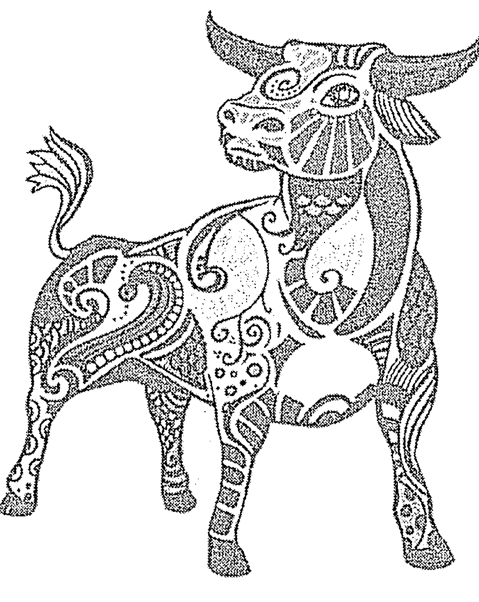

## 月亮星座在金牛

月亮是主導情感能量的星球，月亮星座落在金牛座的你，什麼都想要最好的，希望你也意識到你是值得的——我們每個人都是！不論人生努力追求的是什麼，記得給自己高一點的評價；自己先相信，吸引力法則就會把想要的事物帶到你身邊。你可能會很好奇，這個機制到底是如何運作？要知道，吸引力法則說「物以類聚」，所以，如果你散發出強烈的信念，認為自己值得最好的，那當然就會吸引最好的事物來到你面前。

關於月亮在金牛的人，有意思的一點是：他們覺得最好的事物，不見得是金光閃閃、絢麗俗豔的金銀珠寶；更讓他們興奮的，可能是有能力負擔品質絕佳的有機產品，或是表面由高級天然纖維織成、用起來很舒適的傢俱。

因為大天使夏彌爾的職責與尋找有關，所以不論是找高級饗宴或其他的「物質享受」，你的請求都能得到天使的援助。當然，你不會希望自己的物質慾望太過頭——如果覺得自己耽溺於物質主義，可以請求夏彌爾拉你一把。有時候，金牛座會對物品或金錢太過擔憂，若你感到自己出現這樣的不平衡，大天使夏彌爾的天堂能量能夠幫助你不過分在意物質，專注在比較靈性的層面。

月亮星座在金牛是很大的福氣。占星學認為，月亮在這個星座是很「快樂」的——月亮星座和情感有關；而月亮星座落在金牛，表示你的月亮星座帶有強壯、穩固的金牛色彩，因此你的情感也很穩定。光這件事就能讓你贏得好人緣……因為你的朋友不需要每天忙著猜你心情如何，大家都很輕鬆。

接下來要講一下月亮在金牛（或星盤上有著強烈金牛傾向）的人，可能會有的問題：你滿固執的！堅毅不拔的精神，忠於自己的信念，對感情、計畫敢於承諾、全力奉獻，這些都是金牛極令人讚賞的特質；而固執，則來自於小我。如果覺得自己符合這樣的描述，記得請大天使夏彌爾幫忙。

## Chapter 2 金牛座&大天使夏彌爾

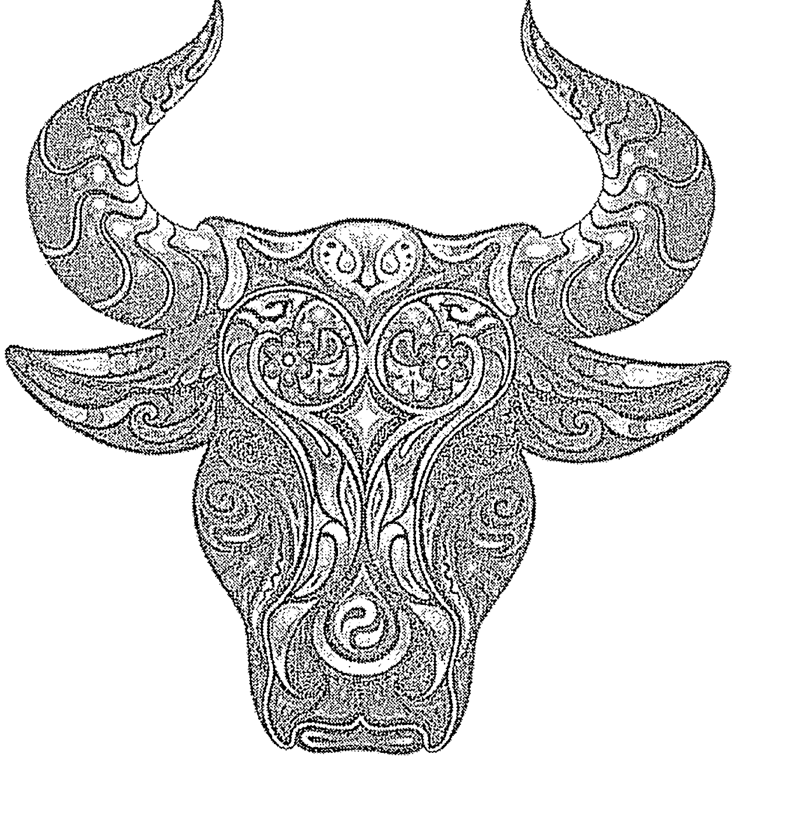

祂擁有療癒及增進各種關係的能力，能夠創造奇蹟，讓你更受歡迎。

一點點的自我覺察，再加上向夏彌爾祈禱，可以幫助你跨越這個障礙。當發現自己有些魯莽草率時，不要對自己太嚴苛。我們到地球都是來學習一些功課的；而你的課題之一，就是順隨事物正常的流動。

選擇此生的月亮星座在金牛座，這樣的人有一種超越常人的需求。他們渴望生活中有更好的事物，也願意為這樣的目標付出長期、持續的努力。記得，不論眼前是為了什麼而努力，目標是什麼，都可以請夏彌爾幫忙，而祂同時也能滿足你的情感需求，包括你想成功的這個目標。

## 水星在金牛

水星是掌管溝通與心智的行星，引導你思考、說話、寫作及表達自己的方式。水星在緩慢而穩定的金牛座，意謂著不管你的星盤上其他行星的位置如何，你的心智絕不接受他人的催促；而是堅定不移地用自己的速度完成思考，獲致結論。所以，不論周圍發生什麼事，不論人們投出什麼樣的變化球給你，你都會發現，自己能夠輕易地保持冷靜，周全地思考。

## Chapter 2 金牛座&大天使夏彌爾

引導水星在金牛的大天使是夏彌爾，祂是有關尋找及發現的大天使。當然，這兩者的合作十分愉快。覺得詞窮、找不到適當的字嗎？可以問問大天使夏彌爾，祂是你來自天堂的字典和同義詞典，可以幫助你找到任何所需要的東西，包括在對的時機使用對的詞彙。

水星在金牛座可能遇到的一個問題是：金牛的能量比較固著。所以要小心，別讓想法和信念變得太過僵化，導致最後失去了彈性。不要被一些事實的細節給纏住，偶爾讓你的心智飛翔一下！倘若發現自己有些僵化、難駕馭的傾向，可以請求大天使夏彌爾幫忙。記得：我們溝通得愈順暢，就會活得愈好！有些水星在金牛的人會發現，透過藝術這項媒介，溝通變得容易多了——比方說，如果你要跟某人說聲「謝謝」或是「對不起」，畫張卡片會比直接說出口來得容易許多。

水星的能量還能應用在考試和口頭發表。你應該有發現：不管是記住一件事，或是保持記憶力，對你來說都滿簡單的。如果不是的話，趕快請求大天使夏彌爾協助你提升腦力；此外，若你需要神的指引，夏彌爾也能幫上忙。只管開口請求就是。

### 金星在金牛

金星是關於愛與豐盛的行星，而金牛是堅定不移、注重享受及感官之樂的星座。這是一個很可愛的組合。當然，維納斯這位女神有時可能會顯得反覆無常；不過你的金星所在的金牛座，卻又是最務實的星座之一，這意味你會比大多數人更能好好運用金星的特質。你對愛態度很忠誠，也很有耐心，一旦認定了，你的愛就一定是持久又真心，會讓另一半在各方面都覺得很開心。金星掌管愛，而金牛座則讓愛充滿了感官之樂。

金星同時也主導著富裕和奢華——金星落在金牛，讓你有能力、也有動機去賺取足夠的金錢，滿足自己想要的一切物質享受！

你的金星守護天使是大天使夏彌爾。這位大天使的任務之一，就是幫助我們凡人實現生命的目標。如果覺得自己過於耽溺世俗的奢華享受，可以呼求大天使夏彌爾；祂會提醒你，真正的富足從來不在物質之中，而是在我們心裡。

相對的，如果你還不大精通吸引力法則，不知道該怎麼吸引奢華享受來到自己的生活中，也可以請大天使夏彌爾幫忙。賺取足夠的金錢滿足自己和家人的需求，並非什麼不光彩的事！協助你找到正確的職業（致富之道），是大天使夏彌爾的強項；所以，若你需要轉換跑道以賺取更多收入，記得請祂幫忙。

同樣的道理，如果你還在尋找愛——不論是情人、朋友之間的，對自己小孩、母親、父親的，或是對家族親人還是其他人——都可以請大天使夏彌爾幫忙。任何與愛有關的，祂隨時都樂於伸出援手。另外，如果你會嫉妒他人（這跟金牛座占有慾較強的能量有關），也可以祈請夏彌爾來協助解決問題。

## 火星在金牛

「慢而穩，事必成」可說是你的座右銘，因為你充滿行動力的行星——火星，落在以慢而穩出名的金牛座。一方面來說，這兩者具備相反的能量——火星的動作迅速、行動力強，與衝勁、決心、動機有關，不計代價求得勝利；而金牛座則喜歡用輕鬆的態度，舒舒服服地享受生活，覺得與其努力追逐目標，還不如等著成果自動送上門。

### 天使占星學

這樣的組合，會讓你慢下來，用比較自在的步調來檢視自己的目標。你不會在考慮欠周詳的情況下草率行事；更精確地說，火星在金牛的人知道，目標當然要達成，但一定要用穩紮穩打的態度去執行。

引導你火星星座的大天使是夏彌爾。祂很大一部分的能量在於，協助人們尋找生命中想要的事物，這剛好也是火星能量所關切的。夏彌爾用祂的愛來幫助你，而火星在金牛，則讓整個尋找的過程風格獨具。如果有無法達成目標的問題，可以請大天使夏彌爾幫忙，祂會協助你回歸正軌。

不過，火星在金牛同時會帶來堅持己見、一意孤行的能量，這點需要多加注意。當發現自己在個人或專業上有些「卡卡的」，事情一直沒有進展，記得可以請大天使夏彌爾幫忙，讓你擺脫停滯的情況，繼續前進。

火星這個行星除了掌管衝勁、決心，同時也與性關係有密切關連。火星落在注重感官之樂的金牛座，意謂著你的另一半會很幸福！你雖然比較慢熱，但一旦開關啟動了，就一定會堅持到底。夏彌爾是幫助人們尋找靈魂伴侶的大天使，如果覺得自己的親密生活還沒步上正軌，記得跟祂求助，祂會很樂於幫忙。

## 上升星座在金牛

上升星座是你讓大家看到的那一面，也就是你給外界的印象，不是真正的你——真正的你是你的太陽星座；上升星座則是你希望別人眼中看到的你；金牛座和大天使夏彌爾，是很棒的組合。

上升在金牛有福氣的第一個原因是，夏彌爾主導了你的星盤。大天使夏彌爾的座右銘：「向前走，去尋找你需要的！」讓你充滿勇氣。若上升在金牛，那麼你從不膽怯，會勇敢走向世界，去尋找讓你快樂的事物——當然，對不同的人來說，讓他們快樂的事物不盡相同：有人覺得是朋友，有人覺得是擁有自由，也有些人覺得是累積財富和安全感。只要開口求助，夏彌爾一定會幫忙找到你想追尋的。

以占星學的角度來說，金星的特質如此強烈（金牛座與其守護行星金星結合），對你很有幫助。你應該還記得，上升星座是別人遇見你時對你的第一印象，而你的守護行星恰好是掌管愛與美及仁慈的金星，這也就意味著，你給別人的感覺是很有愛心、很美麗、很體貼——很棒吧！

講到工作，上升在金牛／大天使夏彌爾的組合，對於想在商務世界裡尋求成功的人，也非常有幫助。夏彌爾會協助你，讓你追尋的一切就像受到磁鐵般，被吸引到你的生命中；而金牛座與金牛的守護行星（金星）的結合，則帶來財富、財務上的豐盛，以及其他物質界的禮物。

### 天使占星學

不過，要再一次提醒——請記得一定要自我覺察，上升在金牛（就像所有的金牛能量一樣），可能會帶來固執的這一面。如果發現自己卡在某種心情、負面思維模式或生命的低潮中，可以請求大天使夏彌爾的幫忙，讓你找到出路。祂真的隨時預備好、要幫助你尋找想要的一切——只管開口求助就是。

遇到任何下列情形，不论你是什么星座，都可以呼求大天使 薩基爾（Archangel Zadkiel）幫忙：

-   1. 想原諒某個人。
-   2. 想記起某個人的名字。
-   3. 即將參加考試，需要一些幫助，好加強記憶的能力。
-   4. 必須寫一封重要的電子郵件或實體信函。
-   5. 即將開始一段重要的對話。
-   6. 想獲得自信。
-   7. 想教導別人一些事。
-   8. 有個重要的研究計畫即將開始。
-   9. 必須做一場演講或發表。
-   10. 需要一些協助，好想起自己真正的靈魂認同（spiritual identity）。
-   11. 需要把負面的想法扭轉為正面。
-   12. 想要釋放別人對你惡言相向所產生的痛苦。
-   13. 覺得自己用太多頭腦，卻不夠用心去感受。
-   14. 覺得自己的情感似乎堵住了。
-   15. 必須處理一個得小心應付的棘手問題。
-   16. 覺得自己需要放鬆一點。
-   17. 有人用傷人的話語對你大加議論，你不知該怎麼回應。
-   18. 你想療癒積怨。
-   19. 想不起來某樣東西放在哪裡。
-   20. 想加強自己的超覺覺力（clairaudient abilities）。

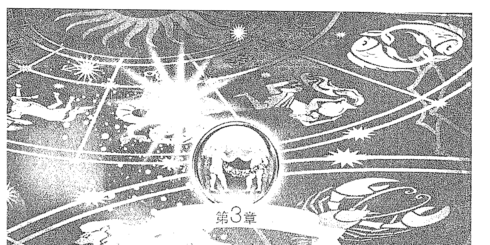

# 第3章 Gemini 雙子座 & 大天使薩基爾

第一眼看起來，大天使薩基爾和風向的雙子座似乎是個奇怪的組合，因為薩基爾代表同理心和覺知的大天使，而雙子座則是十二星座裡的溝通高手。大天使薩基爾代表的覺知通常是從心出發，而雙子座則與心智（理智、思辨）緊密連結，是屬於話很多的人。

### 天使占星學

姑且先不論他們看來似乎天差地別，大天使薩基爾和雙子座其實合作十分愉快，因為大天使薩基爾提供了雙子座重要的活力與助益。

在進入深入的討論之前，先來看看這兩者之間比較輕鬆的「連結」：薩基爾同時也是掌管記憶的大天使，和雙子座一樣與學習、教學有關。一般相信，不管是實用的知識還是深奧的奧義，薩基爾都能幫助我們加強記憶力。

如果你的星盤上雙子特質很強（也就是太陽、月亮或上升星座在雙子座），你極可能會花上許多時間研究、學習。要記得，在追求心智能力的路上，大天使薩基爾能夠協助你成功。不論是工作或生活上的問題，都可以請求祂來幫忙。

如果你有小孩，不管他們的太陽星座是什麼，從小教導他們與大天使薩基爾連結。祂是「記憶的大天使」，祂能幫助孩童記得考試需要背誦的內容，如歷史事件或特定的數字等等，可以讓孩子的學校生活變得容易許多！需要用到記憶的場合，其實還不止學校的課業，舉凡工作上的某些時候就是需要做簡報（這是非常雙子性的任務，因為雙子座的守護行星正好是掌管溝通的水星），是吧？如果有大天使薩基爾幫忙，讓你記住所有必須強調的重點，一定會比你一直低頭看小抄，效果好得多！

### 天使占星學

你的哪方面（太阳、月亮或上升星座）落在双子座／萨基尔管辖的范围，在这些面向，你的思绪就比较顺畅，讲起话来滔滔不绝！因为双子和想法的形成有关。

除此之外，星盘上双子特质强的人非常具有魅力，所以很能够赢得朋友并影响众人。像上一次见面时，他跟你说过什么话，你和你小孩叫什么名字，甚至你上回去哪里度假等等……这些事他都记得清清楚楚。所以，在沟通方面，大天使萨基尔与双子携手合作，的确会产生神奇的魔力，使得很多双子座的人人缘都很好，同时众所周知，他们也是最会调情的星座。

另一件关于萨基尔的事要记得的，就是：这位大天使能幫助你轉移注意力，從負面轉向正面。所以，如果發現自己開始朝負面想，記得請求大天使薩基爾來幫忙。當然，每個人都需要處理自己的情緒問題，也不是建議你就粉飾太平你的擔憂；不過，如果發現自己花太多時間沉浸在過去痛苦的回憶裡，或者擔心未來還不一定會發生的事，那麼，記得請求大天使薩基爾介入，祂能幫助你清空記憶庫並加以更新。讓自己專注在生活中美好的事情上，這是積極參與吸引力法則最簡單的方式。

另外，大天使薩基爾也和保持開放的心胸有關，雙子座則具有強烈的分享慾，希望能和人分享關於閱讀、寫作或言談的一切。不過，如果容忍與你意見相左的人對你來說很困難，可以請求祂協助你打開心門，接受不一樣的想法。要記得：或許教導的方式不同，但每個人都可以是你的老師！

有趣的是，大天使薩基爾與寬恕之間有著非常密切的關係。身為風向的雙子座，有時你會只靠頭腦生活，忽略了自己的心。因此，如果感到自己似乎又太過於理性，顯得有些缺乏同理心，可以呼求大天使薩基爾幫忙，讓你和自己的心重新建立連結。這一點，在別人傷害了你，而你知道自己應該原諒他們的時候，顯得特別重要。

即使你的心門無法打開，大天使薩基爾還是能夠幫助你——祂會提醒：「凡人皆有過，唯神能寬恕」^8。縱然理智上，眼前的你完全看不出來為什麼要原諒傷害你的人；不過，選擇原諒總是有道理的。雙子座一般不大記仇，不過，他們能用這麼快的步調讓生活繼續下去的關鍵，有時正是建立在忽略讓自己不開心的人、事上。大天使薩基爾提醒，重建彼此的關係，遠比假裝雲淡風清（逃避事實）、找新的人重新開始得好。

## 太陽星座在雙子

雙子座的人能以輕鬆的態度面對生命，這是一個美好的特質，其他星座的人可能會自縛手腳地想太多，鑽牛角尖，裹足不前，但雙子座很少遇到生命無法繼續前進的情況。不是因為雙子座的人缺乏深刻的感受，而是心智方面極為靈活的他們，能夠用比一般人更快的速度經歷各種事件。事實上，這也是為什麼這個星座經常蒙受不白之冤，被誤會為膚淺的一群。所以，雙子們，別管那些批評你的人！

譯注 8：原文應是取自「To error is human, to forgive divine.」

他們可能只是嫉妒你擁有神奇的能力，能夠輕易快速地把事情想通，讓生命繼續前進，如此而已。大天使薩基爾與你的能量完美結合，正因為祂能幫助你從過去的傷痛中走出來，讓事情變得不那麼沉重，比較容易處理。從傷痛中走出來，不是假裝事情沒有發生；而是透過寬恕，讓問題和壓力釋放到乙太中——大天使薩基爾隨時都能以這種方式提供援助。

雙子座令人讚賞的另一點，就是他們是最不會記恨的星座，這一點和大天使薩基爾寬恕的能量自然完美相應。不過，如果發現自己一直對某人傷害你的罪行耿耿於懷，記得請求大天使薩基爾的幫忙；祂會握著你的手，讓你釋放心中的憤怒與不滿，恢復你無憂無慮的原貌！

倘若你是雙子座，你的適應力可是十二星座中數一數二強的，或許這有一部分正是因為你們不會受困在過去。不過，如果你沒辦法每件事都看得很開，那也沒關係，不必苛求完美，畢竟很少人真能做得到！有人說，人必須先遇到困境，之後才會有所突破，雖然你可不這麼認為。大天使薩基爾會支持你，讓你保有面對生命一貫的輕鬆態度；祂也會幫助你，讓你對自己好一點。

不過說來有趣，很多雙子座的人常為了自己的太陽星座在雙子感到抱歉。在這邊我要說：真的不用這樣！誕生為雙子座，你擁有非常美好的天賦，你的心智就像超級電腦，能夠快速處理大量的資訊。大天使薩基爾就是這部超級電腦的程式設計師，確保它以最佳狀態運作。

### 月亮星座在雙子

如果引導你月亮星座的是雙子，那麼你需要多和人溝通。或許有些人喜歡待在自己的小小世界裡，但你不是，你是那種喜歡往外跑的人，也喜歡跟別人說話——不論是和朋友、家人、同事、廣播談話節目、生活中遇到的陌生人，甚至是推特或臉書上沒見過面的人都好。

如果你屬於極少數的害羞月亮雙子，也能在寫作或是閱讀上找到寄託。即使是害羞的月亮雙子，在網路上也可以很開放，因為不需要真的和人面對面，減緩了緊張的氣氛，讓他們能自在地與朋友或陌生人分享自己的想法。雙子座及大天使薩基爾都和心理過程有關，只要你常保自己的心靈敏感度，快樂就近在咫尺了。

要注意的是，月亮引領著你的情感；而雙子是變化多端的星座。也因為這樣，就算你一時覺得沮喪，不需要太過擔心，因為你不可能消沉太久；如果有人惹毛你，你一樣可以很快就原諒他或忘了整件事……這都要感謝大天使薩基爾對你的影響，因為祂和寬恕以及同情密切相關。所以，當覺得消沉的時候，記得祈禱大天使薩基爾介入幫忙，保證你的前景很快就會陽光明媚。

有時，大天使薩基爾會溫柔地引導雙子座找到適合幫助他們的人，可能是朋友，或是諮商人員。每當你呼求大天使薩基爾之後，記得睜開眼睛看清楚，看看祂引導你去找誰幫忙。祂也可能指引你去閱讀網路或書本上的文章，幫助你解決問題。

決眼前的問題。

月亮在雙子，意謂著你的愛情生活步調也很快。最重要的是，你會對聰明又浪漫的人完全無法抵擋！對你來說，另一半擁有好的對話和傾聽技巧非常重要。不論是哪一種人際關係，大天使薩基爾都對你有所幫助，特別是在你踏著輕快的步伐過生活時，祂會鼓勵你對別人要有多一些的同理心。

## 水星在雙子

太多話了？大部分（不是全部）水星星座落在雙子的人都口若懸河，一講起話來滔滔不絕！水星是掌管溝通的行星，而雙子座是個愛聊天的星座，兩個湊一起，得到的要不是一台講不停的自動說話機，就是寫不停或想不停的人。

看到這裡，如果你也是水星在雙子，卻覺得自己不愛講話，不需要驚慌。有些水星在雙子的人因為星盤相位的關係，不那麼愛說話；這樣的人，通常在其他溝通相關的面向上表現十分傑出，比如，可能會是個很棒的辯士，或寫議案和報導的高手等等。

不論是透過什麼方式表達，水星在雙子這個組合，保證都有一顆非常聰明的腦袋。如果你的水星在雙子，那麼溝通能力絕對是數一數二——不僅口齒伶俐，甚至可能是雄辯滔滔，或者也可能單純就是個話多的人！真是這樣也無妨，你必然同時擁有反應極佳的心智能力。

守護你水星星座的是大天使薩基爾，以「記憶的天使」著稱——有祂在身邊，再加上你水星落在雙子，不管學什麼，只要是需要默背或記憶的，拿高分對你來說易如反掌。考試和演講應該都是你的強項，若你曾經懷疑自己在這兩方面並無天分，現在是時候讓你瞭解這份潛藏在出生圖中的禮物了。

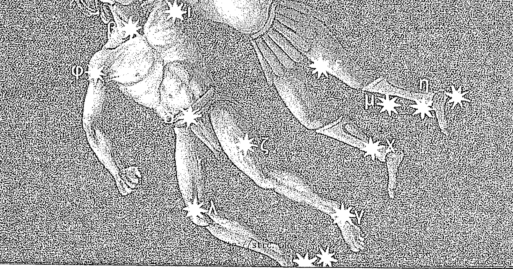

### 天使占星學

水星在雙子的你，應該會發現正向思考對你來說不難，不過，如果你的思緒偶爾飄到了黑暗面，記得可以請大天使薩基爾幫忙，祂一定會馬上伸出援手！畢竟，有正向的思維，才有積極的人生。

## 金星在雙子

如果你的金星（關於愛與豐盛的行星）落在雙子座（與溝通密切相關），那幾乎可以確定的是，你一定喜愛寫作、閱讀或說話；你還可能因為做這些事賺了一大筆錢。在別人眼中，你總是風采迷人，帶給人群許多歡樂。

你有極大的潛力，可以成為偉大的溝通師；但你同時也是那個在臉書上瘋狂貼文、更新動態的傢伙，好在你寫的東西總是很有風趣（雙子的能量是具有品味的幽默感），所以大家不太介意。在該做正事的時候，你總是抱著電話講不停；如果你沒有寫部落格，那大概常常在發簡訊；你也喜歡看書，不過和手機的感情又可說是如膠似漆。（這些描述聽起來很耳熟吧？）

金星在雙子的守護天使是薩基爾。生活中，這位大天使會引領你，讓你沒有太多的煩憂。大天使薩基爾的專長之一是寬恕，因為這樣，你很幸運，不會在傷害和冷落中沉溺太久；相對的，你是「每天都是嶄新的一天」的那種人（除非你的星盤上有其他元素導致你沒那麼容易遺忘）！不過，你偶爾也會覺得要原諒他人或遺忘他們對你的傷害，似乎有些困難，這個時候記得呼求大天使薩基爾，請祂幫忙。

此外，不論在生活或是工作上，如果時而覺得自己好像太過注重外在，忽略了實質，一樣祈請大天使薩基爾幫忙，讓你放慢腳步。道理相同，如果發現自己沒有顧慮到他人的感受，也可以請求祂前來協助。

金星在雙子也給了你充沛的創造力，它也讓你是個調情高手。你此生所選的這個行星組合，大體上還滿令人開心的。記得，金星是掌管愛與富有的行星，所以，在這兩方面若有任何問題，大天使薩基爾就是你求助的對象。

## 火星在雙子

火星是掌管你如何處理衝突的行星——火星星座在雙子，意謂著當你發現自己和別人意見相左時，你會傾向用與生俱來的機智風趣來「擊潰」他們，哎呀！

雙子是天上的多話星座，而火星則深具行動力，以完成任務為導向，當你的火星落在雙子，你會快速思考，迅速完成任務清單上的所有事項（有時甚至太快了一點）。另外，你的脾氣可能也來得挺快的！

在身邊陪著你、和你一起跟機智詼諧的火星星座（雙子）相處的，是掌管寬恕的大天使薩基爾——當你在火星職掌的領域逾越分際時，這一點對你來說是個好消息。火星在雙子的人雖然很風趣，但可能有點自以為是。所以別人不敢說的、不敢做的，你通常都勇往直前，比方說，你會追根究柢，問些很尷尬、極端的問題；你也會說出別人不敢說的話，即便他們心裡也是那麼想。簡單說，有時候你「很白目」！

假使發現自己有這樣的問題——也就是在欠缺周全思考的情況下，貿然說出不適當的話，或寫出不適切的文字，因而帶給自己麻煩——可以請大天使薩基爾幫忙。同樣的，如果你即將參加一個不好應付的會議、保持冷靜才是保護自己的上策，那麼也可以請大天使薩基爾在過程中陪伴、協助你，在你快要爆發之前，先忍住，從一數到十。

別擔心，火星在雙子並不是件壞事。坦白直率是好事，而且很有可能，你這樣做才是對的。然而，如果發現自己有點過頭了，記得向大天使薩基爾求助，有的時候，懂得懸崖勒馬，是對自己（以及別人）最好、也最聰明的作法。

至於性關係（火星是掌管性關係的行星）這個部分，你全身最敏感的地帶就是你的頭腦了！所以，你會期望另一半帶來的刺激，除了感官上的快樂，還有智能上的激盪。

## 上升星座在雙子

上升星座在雙子座的人很能聊，基本上，根本可說是「口若懸河，滔滔不絕」。只要身邊有個上升雙子，絕不可能出現令人尷尬的冷場！一旦跟別人熟了，你絕對是那個主導對話進行的人。

有人可能會說，無憂無慮的樂天性格讓雙子顯得有些膚淺。他們會抱怨，你參加宴會時，總是一邊跟人家聊天，眼睛一邊在尋找下一個更有趣的談話對象——聽起來是不是很耳熟？如果這樣的評論讓你耿耿於懷，那表示有一點真實的成分，所以，試試看能不能稍微改善一下這方面。很多人在剛知道自己的上升星座時，都不是很喜歡，認為上升星座不過是別人對自己的印象，會很希望別人看到自己的其他面向！因此一開始不喜歡，這很正常。

那麼，大天使薩基爾能幫什麼忙呢？事實上，祂剛好能彌補你的缺點。或許你外表看起來就像別人說的——有些膚淺（上升星座或多或少比較像是你在人前戴的面具）；不過，大天使薩基爾能讓你具有深度的內涵，因為祂是掌管寬恕和同理心的大天使，而雙子座則以溝通見長。所以，雖然大家都說雙子座愛講一些五四三，但你也是人群裡，唯一有能力打破令人不安的沉默的那個人，幫助在場的人獲得共識。這可是上天賜給你的大禮（尤其如果你曾經很不喜歡自己的上升星座），只要你隨時保持覺察，一定能做得很好。

一旦保持開放的心，大天使薩基爾對於你的超聽覺力開發也有助益。超聽覺力是指用心靈接收聽覺（聲音）訊息，你可能會直接在腦海中聽見訊息，也可能透過別人的話語產生共鳴。無論如何，開發自己的直覺，對你的生活或專業，都有很大的幫助；而雙子座天生的直覺就很強，擁有強烈的靈性特質。

KABUL AFGHANISTAN 2008 AFGHAN

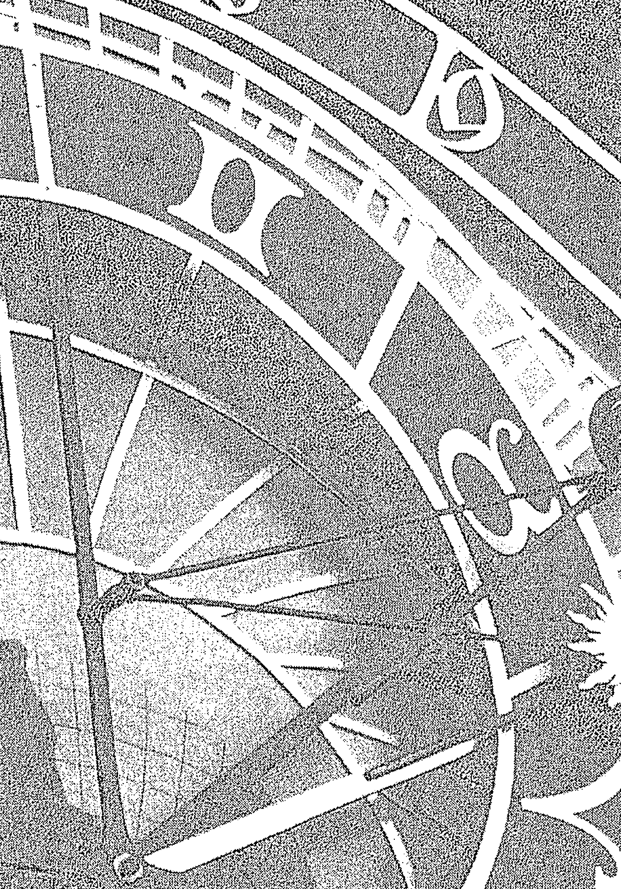

遇到任何下列情形，不論你是什麼星座，都可以呼求大天使加百列 (Archangel Gabriel) 幫忙：

| 序號 | 情形描述 |
| :--- | :--- |
| 1. | 想療癒和父母之間的問題。 |
| 2. | 想獲得有關養育孩童的指引。 |
| 3. | 渴望有自己的家庭。 |
| 4. | 有受孕方面的問題。 |
| 5. | 希望給家人某樣東西，像是大一點的房子或一段假期。 |
| 6. | 有重大的事情要宣布。 |
| 7. | 希望自己的書能夠順利出版。 |
| 8. | 有重要的文件要撰寫。 |
| 9. | 想要更快樂的家庭生活。 |
| 10. | 你正在幫你的孩子裝潢或重新佈置房間。 |
| 11. | 需要排出事情的優先順序，克服拖延的問題。 |
| 12. | 正要買房或賣房，卻有一些問題。 |
| 13. | 需要更多時間來滋養自己。 |
| 14. | 你把所有的時間都花在照顧別人上。 |
| 15. | 需要重新喚醒你的內在小孩，讓生活有更多樂趣。 |
| 16. | 你有藝術方面的天分，希望自己能更有創造力。 |
| 17. | 夢想透過藝術工作謀生。 |
| 18. | 想領養孩子，需要一些協助。 |
| 19. | 需要更多自信來面對生命的大轉變。 |
| 20. | 希望能和耶穌或聖母馬莉亞有更親密的關係。 |

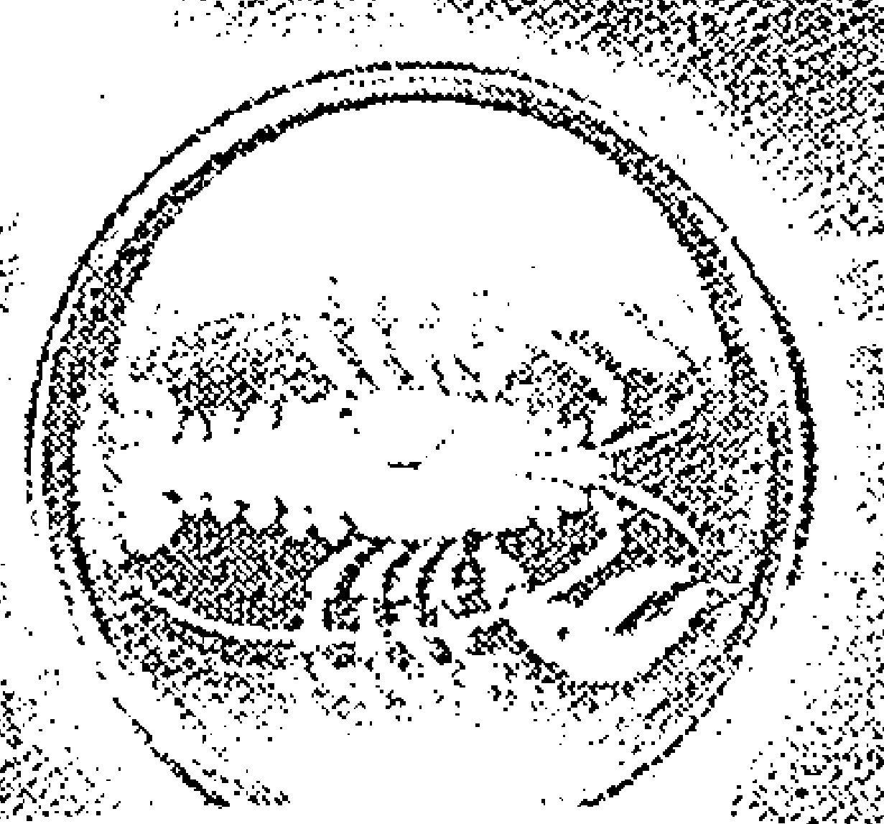

# 第4章

## 6月22日~7月23日

# 巨蟹座

### 天生阿爾忒彌斯

Cancer & Artemis (Cancer)

座的朋友，應該就知道他們同時也活力十足：在家安分扮演父母的角色；也在商場上動見觀瞻，叱吒風雲。巨蟹座是滋養和力量的完美結合，因此，守護這個星座的，也正是掌管滋養與力量的大天使加百列。在進一步深入討論之前，有個小小爭議：大天使加百列到底是男是女？當然，加百列這名字男女適用，不過，經常去做禮拜的人認為，加百列應該是個「他」。相對的，在一些早期畫作中，加百列這位大天使蓄著一頭長髮，有著女性的輪廓和體型，穿的還是連身裙。在本書，我們把大天使加百列視為女性。

大天使加百列最為人所知的故事，大概就是在聖經裡，祂告知聖母馬莉亞即將受聖靈感孕，以處女的身分生下小孩。上過主日學的人，對相關的情節並不陌生，因為「聖母領報」（Annunciation）是聖經裡非常著名的故事——大天使加百列說：「瑪莉亞，你在神前已蒙恩，你要懷孕生子，可以給他起名叫耶穌。」

不過，這並不是加百列唯一一次出現在有關耶穌誕生的故事裡。祂後來也出現在「大喜的訊息：耶穌基督的降生」，向馬槽邊的牧羊人報喜；此外，祂也跟年邁的撒迦利亞（Zachariah）及其妻子伊利莎白宣告預言即將實現，他們的兒子施洗約翰（John the Baptist）就要誕生。

加百列是最以家庭為導向的大天使，也因為這個原因，祂和巨蟹座一拍相合，因為巨蟹也是十二星座中最家庭導向的一個。畢竟，巨蟹座的守護行星是月亮，而月亮正是母性與家庭的象徵。

所以，大天使加百列（及巨蟹座）與懷孕和孩童的照顧有極強的連結，就一點也不意外了。加百列引領滿心期待的父母，讓他們懷孕，生下小孩。一旦孩子出生，他們就要學習怎麼當父母，在過程中，學習欣賞生命的驚奇、面對必然的挑戰。儘管開口求助，加百列必定會伸出援手。

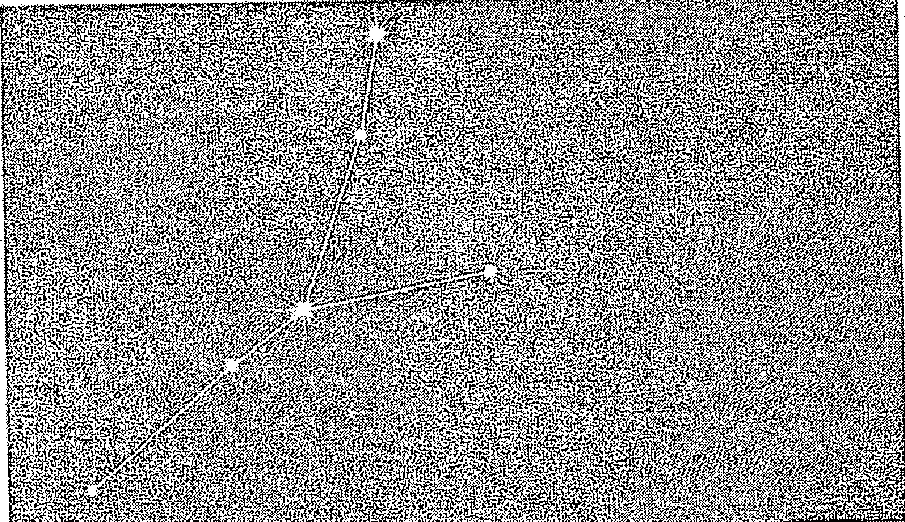

## Chapter 4 巨蟹座&大天使加百列

大天使加百列／巨蟹座是很溫暖的組合，非常撫慰人心。如果身邊有巨蟹座的朋友，你就知道他們多麼會照顧別人。大天使加百列與學齡前的孩子連結最深，小孩上學後，換大天使麥達昶和烏列爾接手。所以，如果你的孩子年紀還小，在上學之前，可以請大天使加百列幫忙照看；等他們慢慢長大，再換請麥達昶和烏列爾前來看顧。

另外，大天使加百列對於領養的孩童也一視同仁，不會因為他們不是「親生的」就有分別心。如果你有領養孩子的打算，或者已經領養了，記得請加百列幫忙。不論是面對困難的領養過程，或之後可能出現的家庭問題，祂都會在你和孩子身旁陪伴著，樂於協助父母發揮養育子女的潛能。

大天使加百列和巨蟹座，兩者都很專注於溫柔——只要想像一下媽媽用母乳哺育嬰兒的畫面，就會知道這裡所說的溫柔是何種感覺。不過，有時在愛情關係中，巨蟹座可能會需要比較多的關心，甚至顯得黏人。

大天使加百列也協助你和自己的內在小孩連結，這對所有的星座都有助益。如果你工作過度，或太擔心一些事情，這位大天使能讓你放手，好好去玩，享受一下。畢竟，造物主並不是要你來地球受苦的，而大天使加百列可以幫助你在責任與自我照顧、享受生活之間，找到最佳的平衡。

### 天使占星學

此外，大天使加百列就像一位好母親，在成長的過程中，敦促你走上該走的道路。這個特質與巨蟹的能量相呼應，因為巨蟹座是啟動星座（Cardinal signs）¹⁰，意味著養育包含敦促、教導以及激勵後代子孫。稱職的父母不會聽任自己的小孩處於失控的狀況，他們知道孩子是需要引導的。不論幾歲，大天使加百列都能引導你，讓你有足夠的動機去做該做的事。

在財務方面缺乏安全感，是巨蟹座另一個常見的特色。儘管他們有許多的銀行存款，卻還是會擔心自己的錢不夠支付生活開銷。而當巨蟹覺得財務上缺乏安全感時，他們很容易就變得心情不定、暴躁。

巨蟹座和有強烈巨蟹傾向（太陽、月亮、上升星座在巨蟹）的人，多半很會賺錢，也很會存錢。這是他們與生俱來的特質，因為他們想要好好照顧自己所愛的人。再說得更精確一點：有強烈巨蟹傾向的人，永遠都覺得錢賺不夠，希望自己銀行裡的存款愈多愈好——這倒不是因為他們喜歡揮耀，而是因為他們在財務上真的比較缺乏安全感。大天使加百列在這方面也能幫上忙。對藝術家和作家這些「傳遞訊息的人」來說，祂就像經理或經紀人；不論你具有哪方面的創意天賦，大天使加百列對你的工作都有所助益。如果你從事的是藝術、通訊，或任何與靈性訊息傳遞有關的工作，都可以呼請大天使加百列的幫助和指引。

¹⁰ 譯註：也稱本位星座，代表行動，牡羊座、巨蟹座、天秤座和摩羯座均屬於啟動星座，是會馬上開始行動的人。這些星座為一個季節的開始，也代表新的開始。出生圖上每個人有不同的星座，而啟動星座代表了生活中，你會立刻展開行動的面向。

## 太陽星座在巨蟹

每個星座都有自己的守護行星，守護巨蟹座的是月亮。誕生在巨蟹座，表示你是由月亮主導，這是一件很棒的事，因為這意味你在情感方面不大會卡住或停滯，這是比較正向的部分。比較沒那麼正向的，是容易悶悶不樂：可能你一早充滿幹勁，到了下午開始覺得有點欲振乏力，然後在傍晚又再次振作起來。會有這樣的變化，是因為你比其他星座的人，更容易受月亮能量的影響。

以剛才的例子來說，月亮先與金星相合（充滿幹勁），然後和冥王星相沖（欲振乏力），再來又跟海王星相合（振作起來）。這是不是說你完全被自己的情感所宰制呢？希望不是！而且既然現在已經知道了，你的太陽星座是由美麗的大天使加百列主導，或許你會學到，該如何和祂平靜的能量一起工作。儘管呼請祂來幫忙，讓你的情感獲得平衡——或許是透過晨間的靜坐冥想，參加瑜珈課程，或改變飲食習慣等方式（我們吃的一切食物，都會影響我們的情緒）。

大天使加百列是大天使中最擅長照顧人的。所以，如果覺得自己的情感波動太大，可以找個地方安靜地坐下來，與祂一起冥想、請祂帶給你內心的平靜。要記得，大天使加百列的名字，指的就是「神是我的力量」，所以，只要覺得需要更多力量，你隨時都能請祂協助。巨蟹座為人所知的是非常的敏感，有時甚至到焦慮的程度；當你覺得自己過頭了，記得倚靠大天使加百列的力量。之所以缺乏安全感，有部分的原因是對家庭太過依賴；有時還可能因為太在乎了，因而覺得受傷。所以，如果覺得自己對摯愛的家人有太多的擔憂，請大天使加百列為你伸出援手。

大天使加百列隨時準備好協助任何從事藝術工作的人。如果你目前（或希望）從事的職業是演員、藝術家、作家、舞者、新聞撰稿員、模特兒、音樂家、記者、歌手、歌曲創作者或老師，記得召喚祂來幫助你、給予指引，作你的「經紀人」。

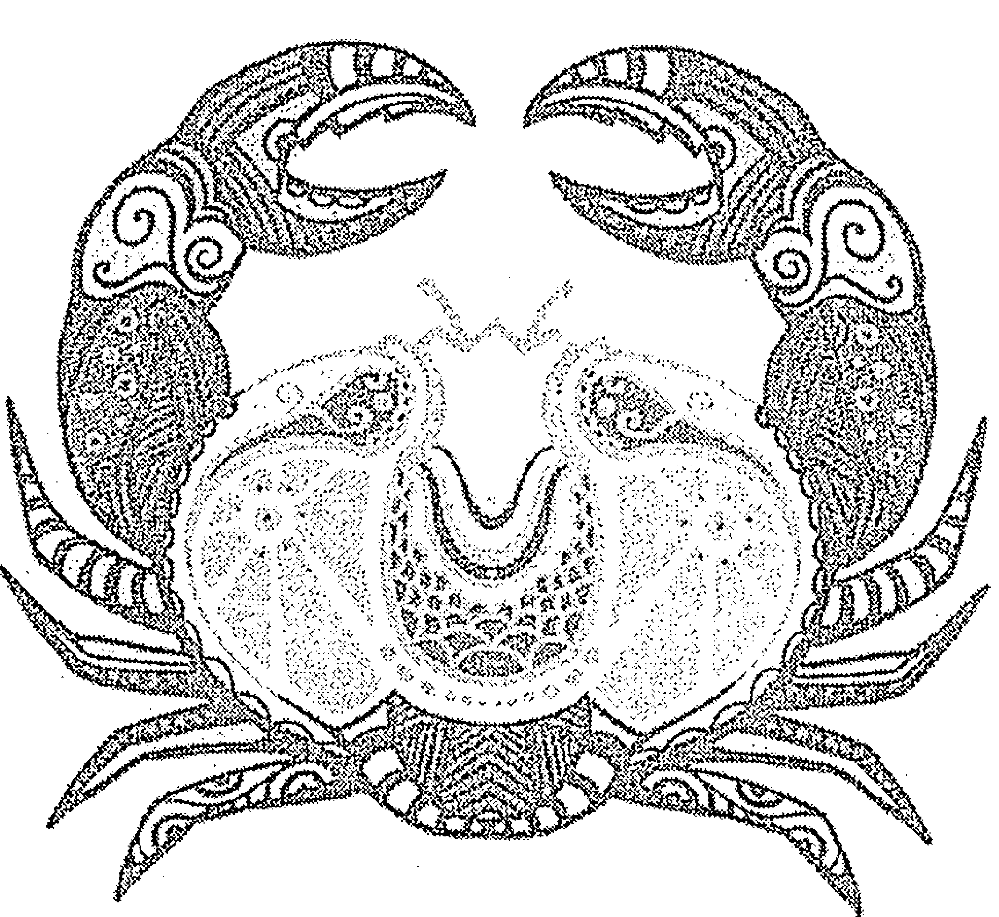

## 月亮星座在巨蟹

月亮星座在巨蟹是很大的福氣，因為這讓你溫柔又和藹可親，百分之百適合為人父母。就算沒辦法擁有自己的小孩，你還是可以多花時間和家人或友人的孩子相處，或幫別人照顧小孩、領養孩子，這能為你創造奇蹟。你甚至可以把育兒的天賦用在動物身上，或任何需要保護的人。透過照顧別人，你會獲得滿足。

### 天使占星學

你的月亮星座也顯示了你的需要。月亮星座落在巨蟹，意味著你需要照顧別人，也需要被照顧。對你來說，照顧別人好像是很簡單而自然的事。只要你開口，大天使加百列一定有求必應，幫忙找出最好的解決辦法，來照顧他人的需求。如果你知道自己做得有點過頭——比如功能失調或是出現關係成癮¹¹的情況（很多巨蟹特質的人會有這樣的問題）——大天使加百列也能幫助你。要知道，為人父母的意思，有一部分是要幫助你的小孩（或所照顧的人）成長，能夠自立。

此外，大天使加百列能以更全面的方式，幫助你和自己的孩子好好相處。祂隨時都準備好要幫助當爸爸或媽媽的人，而如果你的月亮星座在巨蟹，你和祂會有更強烈的連結，就像彼此之間設好了快速撥號鍵一樣。

在照顧別人之餘，也要好好照顧你自己。月亮在巨蟹會讓你在生命痛苦的時刻特別敏感，你可以請大天使加百列來協助，讓你更專注在自我照顧這方面，同時確保你給他人的幫助，在情感上是健康的，沒有關係成癮的問題。

¹¹ 譯註：又稱共依賴或共依存（codependence），在關係之中，共依存者會過度以對方的快樂為自己的責任，自我犧牲有時甚至到難以承受的地步，而他們這樣的付出是為了「控制」對方。

因為大天使加百列和你的月亮星座關係非常密切，你等於有一位藝術能力高超的守護天使。如果你目前從事的是藝術方面的工作，或未來想走這條路，在對自己的進展缺乏信心，或不確定下一步該何去何從時，記得呼請大天使加百列前來協助。祂曾為許多在人間傳遞訊息的人，打開神奇的機會之門，一定也會向你伸出援手的！

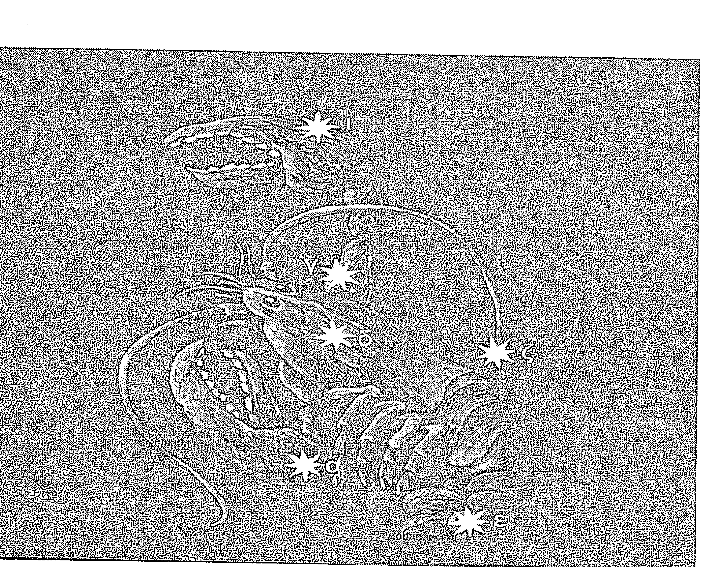

## 水星在巨蟹

水星是掌管你說話、思考及寫作的行星，而巨蟹是會關懷、照顧人的星座；兩者加起來得到的，就是一個說起話來讓人覺得溫暖的人，這可是老天恩賜的禮物！因為你知道，提到溝通，話怎麼講，還比究竟說了什麼還重要。當你能好好地說話，別人才會注意去聽你想表達的意思。

這是好的一面。然而另一方面，水星在巨蟹座也代表，你容易悶悶不樂。因為水星掌管心智；而巨蟹座是受月亮圓缺的週期影響，這導致你的心智運作就和月亮週期一樣，也有陰晴圓缺——可能前一天你還覺得活力充沛、樂觀向上，然後隔天突然就變得憂心忡忡，覺得自己快崩潰了！此外，有時你缺乏安全感的程度像個無底洞，怎樣都填不滿。

守護你的水星星星座的，是大天使加百列，這是個極佳的組合。水星是掌管溝通的行星，而加百列這位大天使，負責過最有名的溝通案例——聖母領報——告知聖母瑪莉亞，她即將成為耶穌的母親。

可以請求大天使加百列協助，讓你的心智維持在平衡的狀態。持續關注月亮的週期也有幫助，遇到滿月的時候，記得多做幾個深呼吸！

## Chapter 4 巨蟹座&大天使加百列

水星在巨蟹，無疑是想從事寫作或以此為業的人（如專業作家，或工作、教育上必須撰寫報告的人）夢寐以求的。就為人父母來說，這也是很棒的組合，因為大天使加百列是巨蟹座的象徵，自然與家庭關係有極深的連結。此外，水星在巨蟹讓你直覺非常強烈，所以，如果想在日常生活中多開發自己的直覺，也可以請求大天使加百列幫助你。

## 金星在巨蟹

這是一個浪漫的組合，因為金星是掌管愛的行星，而巨蟹是天上以多愁善感出名的星座。雖然螃蟹有著堅硬的外殼，但他柔軟的腹部卻非常脆弱！所以，如果你的金星（掌管愛與豐盛的行星）落在巨蟹座（多愁善感同時活力十足的星座），那麼恭喜你，擁有一個極有趣的夢幻組合，這會為你帶來對快樂家庭生活的深切渴盼。

金星在巨蟹的人，若為人父母，其全心投入的程度令人驚嘆。為人子女，則溫柔文靜，但比較容易悶悶不樂。

如果說這個組合有什麼潛在問題，那就是有時會極為敏感，或出現過度保護的情況。所以，如果你遇到事情很容易放在心上，記得呼請大天使加百列——這位守護你金星星座的天使——協助你；或你覺得自己過度依賴他人（這是巨蟹座常見的議題），也可以請他幫忙。

講到愛情生活，如果你的金星落在巨蟹，那麼首先，你一旦為誰傾心，就會變得很好說話；其次，你是個很可愛、也很忠誠的情人。倘若你目前單身、還在尋找真愛，或是和伴侶之間目前的關係不大好，記得召喚大天使加百列，他能幫你解決所有的問題。

如果這些聽起來似乎金星在巨蟹讓你有些軟弱，那就錯了——金星在巨蟹的人可是非常有活力！金星也和你與豐盛之間的連結有關，而巨蟹座是幾個具備極佳謀生能力的星座之一，兩者相合，可以預見的是一個很會賺錢的人，而且會把賺來的錢大部分都花在自己所愛的人身上——特別是親近水，與摯愛在海邊、湖畔、河邊或池邊享受愉快的假期。任何時候，只要你有金錢方面的問題，都可以和大天使加百列連結。

## 火星在巨蟹

火星與行動力、決心、憤怒、進取有關。巨蟹是水象星座，就像螃蟹遇到危险，第一时间就是用细碎的脚步，迅速横着爬离现场。所以，如果你的火星在巨蟹，记得让自己的立场可以更坚定一些。

往好的方面看，火星在巨蟹意味着你了解，有时实现梦想最好的办法就是「迂回前进」，避免与人正面冲突。另一方面，火星在巨蟹也意味着，你不管对人或对事，常常太快就失去了耐性。

所以，什么时候的你是深具力量的火星巨蟹？什么时候又是胆小畏缩的火星巨蟹呢？在月亮运行到正确的位置，且面对的是很重要的事，这时你就会奋力一搏。事实上，某些时候你还会争论到底。此外，当所爱的人面临危险时，你一定二话不说先挺身而出，然后才问到底发生什么事。

引导火星在巨蟹的天使是加百列。如果你知道自己很容易生气，或光为自己是不是爱生气这件事就能争论老半天，可以请求大天使加百列帮忙，解决这些潜在的问题。

同样的，如果你是属于害怕冲突、逃避正面对决的那一种火星巨蟹，也可以请大天使加百列帮忙，在需要挺身而出的时候，勇敢面对。没有人觉得你应该随时怒气冲冲找人算账；不过，有些冲突的确是需要好好去处理。大天使加百列能帮助你，从平时的谦谦君子，变得积极一点面对状况，调解冲突。

火星也與性關係有關。等感情比較明朗、穩定了才讓性出現，這對火星在巨蟹的人來說是最好的選擇——這裡說的不只是情感上的多愁善感，還包括感官上的愉悅滿足。如果你在這方面有任何問題，都可以向大天使加百列求助。

## 上升星座在巨蟹

巨蟹座的守護行星是月亮，而上升星座又跟你的外表有關，所以很多上升星座在巨蟹的人，有著月亮般的圓臉蛋，也就不足為奇了！女性的話，通常體態也會比較豐滿，因為巨蟹是母性的星座，與養育孩童有關。大天使加百列有著強烈的女性能量，這也和上升星座在巨蟹巧妙相合。

上升星座在巨蟹的人，具有強烈關懷他人的特質。如果你到他們家作客，他們一開門就會先給你一個熱情的大擁抱，然後親自下廚煮湯、做麵包給你吃，餐後一起聊天時，他們會瞇起眼睛對著你開懷的笑。巨蟹和大天使加百列的結合，所呈現的就是非常溫暖的形象（還記得吧？上升星座是你表現在外的樣貌）。

如果你的職業是舞者、模特兒、歌手或任何形式的藝術表演者，上升星座在巨蟹都是很大的福氣。雖然巨蟹座一般而言比較害羞，不過大天使加百列的能量可以幫助你，尤其祂對傳遞訊息的人和藝術工作者幫助特別大。所以，不論何時，當你必須粉墨登場或公開表演時，記得請祂相伴。同樣的，也適用在寫作——不論你從事哪種形式的寫作，腸枯思竭時，也可以向加百列求助。

上升星座在巨蟹的人擅於表達情感，再加上大天使加百列的專長是溝通，所以在這方面，你等於擁有天賜的祝福。

遇到任何下列情形，不論你是什麼星座，都可以呼求大天使拉吉爾（Archangel Raziel）幫忙：

- 1. 想療癒一段業力關係。
- 2. 想更深入了解玄奧的知識。
- 3. 想回憶起自己的前世。
- 4. 希望贏得某人的注意。
- 5. 想詮釋夢境。
- 6. 希望能想起自己作過的夢。
- 7. 希望能和天堂（已過世）的某人溝通。
- 8. 想增進自己的靈性能力。
- 9. 希望開放自己的心智和心靈到其他次元。
- 10. 幫助你進行靈性相關的教學或寫作。
- 11. 覺得自己的自我（小我）有點失控。
- 12. 想習得古代的秘密和智慧。
- 13. 希望能與神更靠近。
- 14. 想學會「自動書寫」（automatic-write）神的訊息。
- 15. 想平衡業力。
- 16. 想了解及療癒恐懼症（phobias）。
- 17. 希望能發現慢性病及行為模式背後的原理。
- 18. 要對他人做前世催眠（past-life regressions）。
- 19. 想擺脫負面的模式及對自己有害的關係。
- 20. 希望自己成為靈性老師這樣的志業得以顯化。

# 第5章

## 7月24日～8月23日

## 狮子座 & 大天使拉斐尔

### Leo & Archangel Raphael

大天使拉斐尔拥有疗愈的光之能量，他通常与太阳星座的狮子座相连结，因为他守护太阳，也是疗愈的光之源头。而这两个组合肯定少不了一份充满阳光的、乐观的爱。如果这份组合是你的组合，要相信一切都会好起来。

### 天使占星學

大天使拉吉爾則讓獅子座的圖像更添美麗——拉吉爾就好比太陽一般的耀眼動人，也如彩虹一般的容光煥發；所以你的星盤上，有哪些行星落在獅子座，在那些方面，你就可以盡情發揮。

獅子座與戲劇和表演息息相關。這個星座主導演員——以及隨之而來的戲劇——不論是在電視節目中、舞台上的表演或電影。有時戲劇的成分甚至還會延伸到現實生活中，因為獅子座永遠都是眾所矚目的焦點，若不是擔任要角，就是知名女高音等等。只要想想大家擠在大門口、爭先恐後目睹巨星風采的樣子，你大概就可以想見獅子座的人那種光耀榮顯的形象。

想想獅子座的圖案：叢林之王獅子……便能完美詮釋這個星座的形象。獅子座從來就不是一個靦腆或害羞的星座，守護獅子座的拉吉爾，恰好也是外型比較搶眼的大天使。天堂的榮光，透過祂周圍美麗如菱鏡的彩虹顯現，也反映了守護獅子座的太陽所散發的光芒。

拉吉爾是大天使裡的巫師及玄學家，擁有療癒的能力；而獅子座，或星盤上有強烈獅子座特質的人，同樣也具有這種能力，不論他們自己有沒有察覺到——他們擅長招待，能讓別人感覺賓至如歸，並讓周遭的事物熠熠生輝，就像他們將自己的天堂帶到世間一樣。

把「光」帶給身邊的人¹²。可以想像在舞台上大顯身手、幫助觀眾忘卻煩惱的演員。只要人們提出請求，大天使拉吉爾也能伸出援手，幫助他們療癒痛苦的過去；同樣的，和獅子座的人在一起，可以讓我們暫時從自己的角色抽離出來，因為他們非常樂於談論自己！

一般人常會開玩笑說，獅子座的人總覺得自己是宇宙的中心；但平心而論，這個星座的守護行星是太陽，就像行星繞太陽公轉一樣，獅子座自然會覺得其他人應該要繞著他們轉。不過獅子座也有優點，那就是他們溫暖、慷慨的精神；或許他們的確有那種「快看我！」的特質（比如娛樂天后瑪丹娜就是一例），但他們的自信確實能夠對我們有所啟發，讓我們也對自己更有自信。

獅子座的座右銘是：「隱藏自己內在的潛能，並不會讓你身邊的人，覺得更有安全感。」獅子特質強的人有許多優點，包括有風度、很慷慨，不會小心眼，能提高我們對自我的要求。如果和獅子座的人見完面之後，對自己的感覺反而變差了，那一定是我们自己的問題，與他們無關！因為大天使拉吉爾的專長之一，就是幫助我們療癒敏感的部分。

## Chapter 5 狮子座&大天使拉吉尔

狮子座的人不会老想着过去，因为太阳和水星、金星及火星不一样，它不会逆行。这个特质恰好与大天使拉吉尔的能量相得益彰——祂协助我们处理过去的方式并非陷溺其中，而是积极创造出一条通往未来的道路。事实上，祂能帮助疗愈不同时间向度里形成的伤痛，包含前世的伤痛，以及童年时期的情感创伤。可以想像一下，狮子座的守护行星太阳，会把它的光芒照在一度幽暗、充满恐惧的角落——不论我们是哪个行星落在狮子座，这就是大天使拉吉尔疗愈我们的方式。

狮子座的人非常勇于表达情感，而外向、醒目的特性，也让他们能以开放的态度来面对别人的批评，如此泱泱大度，正是狮子座独特的魅力所在。同样的，大天使拉吉尔也是用层层剥除的方法，来帮助我们疗愈长久累积下来的陈年伤痛。

所以，如果有一些情感上的伤痛需要疗愈，拉吉尔会是你要呼请的大天使。祂能帮助你原谅，从过去的伤痛中释放自己。

也因为狮子座的态度开放，所以他们非常直接，有时会比较没有顾及到别人的感受。和大家分享一个狮子座的小秘密——虽然他们外表雄壮威武，其实内心还是有像凯蒂猫那样温柔的一面。獅子座的人很容易覺得事情是在針對自己，雖然他們沒有表現出來，但是別人的評論可能如刀割一樣，在他們的心裡留下深深的一道傷痕。對獅子座的人來說，誤解和溝通不良會造成問題，所以，如果你的星盤上有許多行星落在獅子座，那麼，在覺得屈辱或自尊受損的時候，記得請大天使拉吉爾幫忙。另外，如果別人說了什麼讓你覺得很受傷的話，記得再次確認他們背後真正的意思，搞不好根本是誤會一場——可能人家其實是在稱讚你，只是用了一種比較不得體的方式。

拉吉爾也負責教導人們玄奧的知識，祂是幫助我們了解靈性符號、前世、解夢、神聖幾何及其他深奧學問的大天使。就像狮子座的守护行星太阳（光芒照耀所经之处），或想想塔罗牌里的「太阳」，应该就能明白大天使拉吉尔是如何与狮子座携手工作——他们把光和理解，带到每一个困惑之处。

狮子的特质让这个星座的人非常直接，他们不讲好听的场面话；相对的，他们总是直来直往，所以很容易理解他们的想法。或许有人觉得这样实在太过大胆，不过至少你可以非常清楚他们的意思。狮子座从不遮掩自己的光芒，就像大天使拉吉尔一样！

有些人或许会认为，狮子座爱引人注意这点难以应付；不过，就如同造物主，其实我们生来是要发光的！而这也正是深植于狮子座和大天使拉吉尔心中的信念。

大天使拉吉尔鼓励你踏出阴影，展现内在的狮子特质。比如说，假使你对世界的议题有强烈兴趣，大天使拉吉尔能帮助你召唤勇气，发表相关的公开演说。祂会提供援助，让你在聚光灯下表现泰然自若，尤其如果你从事的是灵性教学，或疗愈方面的工作，唯一要做的，就是请求祂的协助，拉吉尔会适时伸出援手。

如果不确定该怎么和大天使拉吉尔相处，也可以请祂进入梦中帮助你。就像耀眼的阳光照亮十二星座的轮盘，祂也能在你睡觉时，帮助你「看见光」，也就是你的灵魂努力追寻、希望理解的灵性真相。

## 太阳星座在狮子

狮子座以光明、诚实、勇敢闻名，所以，如果你诞生在狮子座，那应该很少有事情会吓到你。太阳星座在狮子可说是一种恩赐，不过这也意味着一种责任——你在地球上属于领导他人的一群。曾经，太阳被认为是宇宙的中心，即使后来证实并非如此，但太阳仍然是太阳系的中心，而其他人也仰赖着你的引领。

你的举止动见观瞻，永远是突出的那一位，是天生的明星。这样的形象，与美丽的大天使拉吉尔非常契合——祂那七彩的光晕，让人联想到骄傲展现羽毛的孔雀。假如你刚好是不喜歡成為焦点的狮子，拉吉尔能帮你克服这个问题（如果这是你想要的），或改个方式、让你的作品成为焦点（比如你设计的产品）。拉吉尔能够帮助你疗愈缺乏安全感的问题，让你表现出该有的样貌！

此外，大天使拉吉尔也传授神秘的知识。所以，如果对学习自古流传下来的灵性奥秘有兴趣，可以和拉吉尔连结，请求祂的協助。祂永遠都會為你而在！或者，在身上佩戴如拉吉爾美麗彩虹光暈的白水晶，對你可能也有所幫助。若覺得冥冥中有人引導你這麼做，那就把白水晶戴在身上，或懸掛在可以經常看見的地方，時時提醒自己：你的確擁有與看不見的力量一同工作的能力。回報你的是，天晴時，你將看到光彩奪目的彩虹。

而如果你是那種發揮全力、不怕成為焦點的獅子座，要好好感謝大天使拉吉爾，然後，繼續把這首站在宇宙中心的生命之舞，好好跳下去！

## 月亮星座在獅子

月亮星座在獅子座，有著被他人愛慕、讚賞的需求。如果剛好碰到月亮在獅子的人，跟他們分享這一點，他們通常會尷尬地笑笑，然後承認確實是這樣沒錯！好消息是，觀眾對你還滿著迷的。如果已經讀過前面內容，會知道大天使拉吉爾有著彩虹般的七彩光暈，讓祂不論身處何方，都十分醒目。就像一個星盤上有著強烈獅子特質的人走進來，你絕不會忽視他；大天使拉吉爾在所有的大天使中，也是那樣地突出！如果你希望自己能更加耀眼（絕大多數月亮在獅子的人都希望那様），记得请拉吉尔帮忙。

另一方面，如果你希望人际关系能运作顺畅，平衡一下是必要的。当寻求认同的需要大到造成你的困扰（比如太想吸引别人注意，或在人际关系中表现得太过强勢，让人无法忍受），可以祈祷大天使拉吉尔的帮助。祂特别擅长在你睡觉时帮助你，在梦中把你带到另一个空间向度的教室裡学习；醒来时，你可能对大天使拉吉尔教了什么不完全了解，甚至连祂教了你这件事也不记得，但你会知道，祂的確回应了你的請求，前來幫忙。

有些月亮在獅子的人更先進，已經知道自己這一世降生在地球，一部份的任務就是幫助他人看清生命的本質。如果覺得這是你的角色之一，那麼在幫助或療癒他人時，請求大天使拉吉爾的指引，祂能夠把深度的靈性知識，透過你傳達給其他人。

最後，倘若你正在和自己的「黑暗面」（每個人都有，不論我們的太陽或月亮星座是什麼）角力，一樣，記得請大天使拉吉爾幫助，讓光灑滿你個性黑暗面的深處。如果你是那種覺得什麼事都是針對你來、經常被別人批評（雖然人家不是刻意的），拉吉爾也能幫助你，降低你的防禦性。

## 水星在獅子

如果要問哪一種水星位置最知道該如何適切說話，那非獅子莫屬！水星掌管我們的思考和溝通，而獅子座則是舞台中央的超級巨星，兩者相結合，可以想見的是一個極具魅力的說故事高手、娛樂天王……或自以為無所不知的人，甚至是一個專橫的霸王。

引導水星在獅子的大天使是拉吉爾，祂的身邊圍繞著七彩的光暈。水星在獅子的人，就和拉吉爾一樣，具有引人注目的特質——有時甚至還會主動去尋求別人的注意！如果你知道自己有這種攫取他人注意力的傾向，而希望能加以對治，那麼可以請大天使拉吉爾來幫忙。天使都知道，想要閃閃發光沒什麼不好，拉吉爾當然也希望你明白這一點；不過，如果你覺得自己應該稍微低調些，大天使拉吉爾就在你身邊。這項資訊對家長來說也很實用，假使家中剛好有個孩子的水星星座在獅子，常常因為愛現而惹麻煩的話，祈請大天使拉吉爾出手相助。

也因为水星掌管的领域和舞台及萤光幕关系密切，水星在狮子的你，天生就拥有在众人面前说话、唱歌、发表、表演的能力；更棒的是，你是通过有创意的方式来呈现的！如果你还没好好开发自己的这一面，希望能有足够的自信展现天赋的话，请大天使拉吉尔协助你。就算不想在人前公开表演，水星在狮子的特质，也能够让你在生活中说话更有自信，让别人对你言听计从。

同时，大天使拉吉尔也拥有强大的疗愈力，所以水星由祂引導，意謂著你的話語、文字也帶有極大的療癒力。此外，祂了解玄奧的智慧，也負責教授，當你的水星星座由祂引導，代表你有機會親近那些古老的知識。追尋它們吧！當你在尋找的道途上需要協助時，記得呼求大天使拉吉爾。

## 金星在獅子

金星是與愛、豐盛、風格及優雅有關的行星，金星在獅子座是一種祝福，因為這意謂著你有與生俱來的時尚感——也許每天早上更衣時，你都要來段時尚宣言！或你金星在獅子的特質，是透過有創意的表達方式展露。

此外，你會希望自己的外表很出色。而談到愛情，你也會希望情人的外表出類拔萃，受人欽羨。當然這一點在某個程度上是好的，但是，如果面對愛情時太過著重外表，而忽略實質，可能會出現問題——畢竟，選擇伴侶時，內在才是最重要的！

守護你金星星座的是大天使拉吉爾，祂周身散發七彩的光芒，所以也非常了解美的力量。假如你有愛慕虛榮的問題，比如買衣服總是會超出預算，或希望能增加自己的收入，好負擔得起更高的花費，都可以請大天使拉吉爾幫忙，祂不會因為你希望自己看起來卓然出眾，就對你有所評斷。金星在獅子同時也主導著你的金錢觀。獅子是非常慷慨的星座，理論上，你是那種能賺愈多愈好的類型，因為你知道你是自己這個小宇宙的中心，絕對值得最好的享受。如果在財務方面遇到困難，亟需協助，記得請大天使拉吉爾幫忙。另外，如果想用高風險的方式花錢——比如買很多樂透，或進行快速致富的投資——也可以連結大天使拉吉爾。事實上，你天生就有點偏財運，不過還是不要太過揮霍、浪費，或冒太大的風險。金星在獅子的人，有能力找到聰明、有創意的方法進行投資，好好利用你的直覺吧！

## 火星在獅子

超有自信，對吧？火星主導一個人的動力與決心——你想要某樣東西，決定走出去，把它拿到手；在背後驅使你完成這件事的，就是你的火星（星座）。現在，你這力量強大的行星，剛好又落在強而有力的獅子座上，這樣的組合，自然讓你有著極強的自信。火星在獅子的人十分引人注目，而他們的脾氣相對的也「很大」！

獅子座不算愛生氣的星座；相反的，這個星座的人有一種高貴的特質。星盤上有強烈獅子特質的人都知道，如果失去冷靜，就不夠優雅了。只是，火星這個行星粗魯、傲慢了點，只對自己想要的東西感興趣。

如果你的火星在獅子，有的時候，你可能會為一己之私，完全忘記優雅這件事。不過，換個角度看，也可以說這是好事；因為並不是你冷酷無情，你只是很清楚自己想要什麼而已！

但是，如果在追求人生使命的過程中，你強行排擠他人，那麼在你的靈魂深處，可能會隱隱覺得，這並不是最高頻的顯化方式13。這時候，可以呼求拉吉爾，請祂將祂那明亮、美麗的光照進你的生命，讓你用優雅的方式獲得成功。

主導驅動力的火星落在愛表現的獅子座，因為有這樣的星體組合的支持，所以不論你是在娛樂、表演事業或其他領域，都能成為當中的明星。另外，火星在獅子也讓你不管從事哪一行，都帶有十足的創意。可以連結大天使拉吉爾，讓祂引導你在自己的領域有絕佳的表現。

最後，火星同時也是和性關係有關的行星，火星在獅子

譯注13：在顯化時，有高頻與低頻的能量之分。

的你，希望自己的另一半看起來很出色（這點與金星在獅子雷同），有這樣的伴侶在身旁，會讓你覺得自己很特別。你也會找一個能帶出你內在小孩的人來當情人。如果覺得自己的親密生活一團糟，記得可以請大天使拉吉爾來相助，祂使命必達……不論什麼事都一樣。

## 上升星座在獅子

上升星座在獅子座，是很大的福氣——如果受人矚目或讓人景仰對你來說很自在的話！上升在獅子的人，天生有一股能量會吸引別人的注意；就像大天使拉吉爾因為七彩的光暈，形象也很強烈鮮明。可以肯定的是，你很難不受到注意，問題是：該怎麼面對這些注意？

受人注意這件事本身，對你並沒有任何好處，除非先有明確的使命，這樣眾所矚目對你來說才有所受益——這也是大天使拉吉爾能夠幫助你的地方。拉吉爾是知曉玄奧智慧與神秘事物的巫師，可以請祂幫忙，擇定一個能夠點燃你熱情的因子（比如幫助孩童、女性、動物、環境等等），然後請祂教導你關於這個主題該知曉的知識。如此一來，對企盼聽你指揮的人而言，你便成為智慧的象徵。

上升在獅子最棒的一點，就是你擁有冷靜勇敢、誠實正直，這些與生俱來的美好特質。別人眼中的你，是慷慨、充滿吸引力的，但這美好的外表下，可能隱藏了你內心深處缺乏安全感、需要接受療癒的事實。記得，獅子是一個與表演有關的星座，而上升星座則是你面對外在世界所戴的面具。大天使拉吉爾擁有高超的技巧，能療癒各種敏感的議題，例如用自信的外表來粉飾太平等等。與自尊有關的問題，或任何可能對現在的你有負面影響的前世問題，都可以請拉吉爾幫忙處理。

上升在獅子的你，給人熱心、友善的感覺，而你慷慨、大方的精神，對身邊的朋友來說，更具有療癒的效用。所以，記得請大天使拉吉爾將人生使命牢牢嵌入你的心靈，讓你能以正向的方式，和別人分享那美好的天賦。

遇到任何下列情形，不論你是什麼星座，都可以呼求大天使麥達昶（Archangel Metatron）幫忙：

- 1. 覺得自己的氣場和脈輪需要清理一下。
- 2. 需要奇蹟，幫助你準時抵達某個地方。
- 3. 想學習關於靈性生活的層面。
- 4. 需要更多動力去做運動。
- 5. 覺得自己好像不夠「在身體裡」，需要一些相關的基礎知識。
- 6. 覺得自己感性不足，理性有餘。
- 7. 你需要動機去戒除成癮的事物，並且不要再犯。
- 8. 想分析某個狀況。
- 9. 有時對自己太嚴苛。
- 10. 希望獲得幫助，好清理家中不流動的能量。
- 11. 覺得自己應該要吃比較健康的食物，卻做不到。
- 12. 懷疑自己的價值。
- 13. 你被召喚要教導他人一些事。
- 14. 需要處理的事情太多，感覺自己無法掌握全局。
- 15. 開始投入遠端遙視（即利用超感官知覺獲得資訊）。
- 16. 嘗試找出治療某種疾病的自然療法，或希望得到另類療法醫生的資訊。
- 17. 想清除顯化過程中遇到的障礙。
- 18. 怕自己會趕不上某個截止期限。
- 19. 你正在做某件事，需要極大的專注力顧全細節。
- 20. 希望自己能建立健康的生活習慣。

## 第6章

## 12月23日

## 處女座 & 大天使麥達昶

## Virgo & Archangel Metatron

處女座象徵純潔、智慧和組織能力，掌管健康、工作和服務。麥達昶（Metatron）是神與人類之間的橋樑，象徵智慧和知識。在此星座時期，人們傾向於注重細節，追求完美，並具有強烈的責任感。建議利用這段時間來整理生活，設定目標，並關注身心健康。處女座的人通常聰明、細心，但有時可能過於挑剔。與麥達昶的能量結合，可以提升洞察力和溝通能力。更具有洞察別人的能力。

在閱讀本書的過程中，你會發現：每個星座都有自己的長處，和比較幽暗的一面，這兩者同時指出了你這一生所為何來。你的長處是要用來助人的；然後以自我療癒的方式，來補足自己的弱點。

先來處理處女座的黑暗面。太陽、月亮或上升星座在處女的人，經常被說難以取悅、老愛往壞處想。的確，處女座的人對於自己在意的事，非常擅長看出問題所在，這讓他們拒絕報喜不報憂。好消息是，如果你星盤上有一些行星位於處女座，那麼大天使麥達昶能夠幫助你，把負面的能量轉換成正向。

如果你的太陽、月亮或上升星座在處女，意味著你天生擅長診斷、開處方或為他人提供建議。比方說，如果有人覺得身體不舒服，處女座的人就會樂於提供飲食方面或生活習慣上的建議；這個星座的人，好像自然就知道什麼對別人有幫助，這種能力和守護他們的大天使麥達昶一樣。

在所有的大天使中，只有兩位曾經轉世為人¹⁴，麥達昶便是其一，另一位是雙魚座的大天使聖德芬（Sandalphon）。大天使麥達昶在人世時，是任職書記的先知以諾（Enoch）。

譯注 14：在結束世間生命之後升職而成大天使。

著有《以諾書》（The Book of Enoch），眾所周知的神之書記（Scribe of God），傳授極深奧的知識。麥達昶同時也是卡巴拉生命之樹（The Tree of Life in the Kabbalah）15上的首位天使，負責協助剛踏上靈性道路的新手，也因為這個緣故，他幫助孩童保留靈性層面的天賦。

大天使麥達昶的這股能量，又一次與處女座完美的結合——處女是土象星座，注重實用性；掌管處女座的行星則是靈活多變的水星，具有「神的信使」（Messenger of Gods）之稱號，是十二星座裡的書記，與閱讀、寫作、溝通和自我表達有關。如果想了解各種事情——特別是屬於較高層次的靈性概念——水星和大天使麥達昶能夠幫助你，充分了解宇宙的奧秘。

不論是哪個星座，只要你覺得理解古代的玄奧智慧有困難，都可以向大天使麥達昶求助。若是剛踏上靈性道途的新手，正在尋找指引，也可以請大天使麥達昶幫忙。就像處女座樂於助人的天性一樣，大天使麥達昶也能幫助我們更深入了解有關生命的奧秘。

太陽、月亮或上升星座在處女的人，一般而言都比較理性。雖然處女座是個務實的星座，守護它的行星是掌管智能的水星，這也意謂著，對處女座的人來說，理性重於感性，他們習慣用大腦思考，比較少會跟著感覺走。

因為如此，這個星座與大天使麥達昶的能量，正是最理想的組合。走上靈性的道路，一部分就是意謂著要去聆聽、信任自己的感覺。而處女座的人一旦開發了感性這部分，就會變得非常有力量——因為這樣等於是結合了原有的頭腦分析能力，再加上從心出發的智慧，理性、感性兼具，肯定所向無敵！

通常處女座的人都十分溫和謙遜，不過，當他們開啟了靈性與心智的這一面，就會顯得耀眼奪目。這個星座的人，在靈性的路上走得愈遠，愈會發現：謙遜與自信是可以相互平衡的。如果現在的你還無法接受這個觀點，可以請大天使麥達昶給予適當的指引。

大天使麥達昶另一項為人所知的能力，便是幫助有靈性體質的孩童，以及剛踏上靈性之路的人們。祂所守護的處女座，則是天生的好老師，因爲他們非常務實，充滿智慧，而且很有耐心。你星盤上哪個星座落在處女，就代表你在那方面可以教導或幫助他人。

有時候，處女座的人不管對別人還是對自己，都會加以批判或懷疑；也因爲超完美主義的個性，讓他們常會擔心東擔心西。當你覺得自己批判、擔心或懷疑的老毛病又發作時，連結大天使麥達昶會非常有幫助。因爲他所傳授的是隱秘的智慧，讓你明白擔心和批評並不能讓你得到想追尋的結果。麥達昶將帶領你，讓你在需要修正或改善一些情況時，更有效率。

許多處女座的人在三次元的這個世界，似乎生活得很辛苦，好像每個人、每件事，都會不小心觸動他們敏感的神經！幸運的是，大天使麥達昶非常擅於繞過宇宙的物理原則（比如他能扭轉時間），所以，當你下次覺得快崩潰的時候，他就是你求助的最佳天使。處女座不論遇到什麼人或什麼事，都會想幫忙；所以，你必須先找到自己的平衡點，才能設定合理的界限。當你發現自己又很難拒絕別人、答應幫忙太多事情的時候，記得請求大天使麥達昶的協助。

## 太陽星座在處女

如果你需要完成某件事，找處女座的人幫忙就對了，他們就好比密齒梳，可以把每個人、每件事都整理得清清楚楚。對處女座的人來說，沒什麼是麻煩的事；唯一的問題在於：這些人因為肩頭背負了太多的責任，有時會哀嘆自己怎麼那麼忙？誰誰誰為什麼要做這麼多事等等，卻壓根兒忘了，一開始根本就是自己主動說要幫忙的！

大天使麥達昶對於壓力很大的處女座，能提供極大的支援。就像之前說的，麥達昶有神奇的能力可以改變時間的法則，所以，如果你需要更多的時間來完成任務或善盡責任，請求這位大天使協助你，祂一定非常樂意。

如果你是處女座，會從大天使麥達昶那裡學到宇宙的奧秘，許多處女座的朋友憑直覺就知道這一點。比如有些處女座的人，天生具備（在沒接受過任何訓練的情況下）另類醫療的相關知識，在生病時，不服用本身具有毒性的藥物，而使用天然的藥草。另外還有有些處女座的人則擁有能量治療的天賦，不僅可以幫助自己和親友，也能幫助其他有需要的人。而最棒的一點就是，處女座這個星座的人不僅有能力，也有意願幫助人。如果你是處女座，而且也覺得幫助、療癒別人，對你來說很具吸引力，記得，背後支持你成為療癒者的，正是將神的知識傳達給人們，並因此著名於世的大天使麥達昶。

除了療癒，太陽星座在處女的人，也能成為優秀的作家、記帳員、會計、老師、個人助理或研究人員。如果你的工作剛好符合上述這幾項，呼請大天使麥達昶在動機和時間管理方面給予協助。麥達昶這位大天使有著「神之書記」的美譽，在寫作、事實或數字資料的分析管理及教學方面，都能提供實質的幫助。

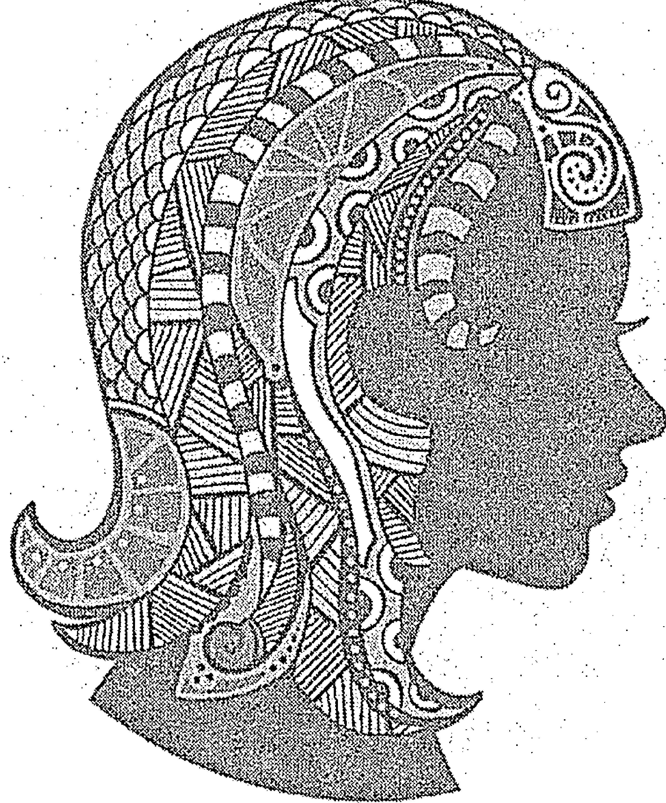

## 月亮星座在處女

月亮星座在處女座很棒——因為處女座的穩定特質讓你心情穩定；而月亮溫柔的能量，對處女座一些脆弱的特質有所幫助。月亮星座在處女的人需要過規律的生活，在固定的時間做固定的事，他們喜歡自己的每天生活有規律、可以預測的。

月亮在處女的人做事一絲不苟，希望別人也能跟他們一樣認真。不過，他們希望每件事都要達到相同的高標準，這樣的要求有時做得過頭。月亮在處女的人，無法忍受混亂的狀況，像是東西不見了，或誰沒有在截止日前完成本該完成的工作，都會讓他們抓狂。如果你的月亮星座在處女，生來就有完美主義的傾向，要試著對別人多一點的同理心。

這也是大天使麥達昶能夠幫助你的地方。祂的工作和時間有關，深知時間是可以延展的，所以，需要的話，請求祂把時間拉長一些，如此大家都會覺得舒服多了。此外，也可以請求麥達昶的協助，讓你不論對自己、對他人，或是對生命的進程，都能更有耐心。

如果月亮在處女的你，很難接受別人本來的模樣，可以請大天使麥達昶幫你一把。走上靈性的道路，意謂著要接受世上沒有完人這個事實——即使是完美主義的處女座，或像你一樣月亮在處女的人，也沒有一個是完美的。因為如果你已經是完人的話，就不需要再來地球走一遭了！

大天使麥達昶會打開你的心，讓你接收到神妙的訊息，如此一來，就能幫助你接受每個人各自的獨特性。如果因為單方面付出太多的時間和能量（月亮在處女的人常做這種事），目前正處於一段不平衡的關係當中，請求大天使麥達昶在你的身旁轉動麥達昶的立方體，以這種方式來療癒你。祂就跟處女座一樣，隨時準備好提供協助！

## 水星在處女

一個典型超級聰明的腦袋——至少你給人的印象就是如此！當然，你的誕生星圖（你出生時的星象圖）並不會讓你的智商變高或變低，會影響的主要是潛能。如果你的水星星座在處女，表示你充滿了潛力。

水星掌管寫作、思考、說話等等，是與溝通有關的行星，而處女座則是以謙虛、純潔和低調聞名的星座。從許多方面來看，處女座似乎是個平凡無奇的星座；星圖上有許多行星在處女的人，表面上看起來就跟其他人一樣有活力；但是除了活力十足，他們總能妥善地把事情處理好，照待辦清單將任務一一完成，面對別人的事也像是自己的事一樣，盡可能地幫忙。而且不論你是什麼星座，只要水星在處女，你的思考模式基本上就和處女座的人一樣。

水星在處女的優點說也說不盡：你頭腦清楚，在對話或任何情境中，都能抽絲剝繭，找出邏輯脈絡；你擅長分析，很少讓自我（小我）凌駕於事實之上。

像剛剛說的這些，以及其他還沒提到的優點——包括你的閱讀理解及寫作能力都極為優秀——你該對自己的水星落在處女這件事心存感激。不過，因為是處女座的關係，你可能會有一點自我批判的問題，老是擔心自己表現得不夠好。另外，也因為處女座往往把事情看得太清楚，所以喜歡對身邊的人事物下評斷，有時甚至會顯得吹毛求疵。

引導水星在處女的大天使是麥達昶，如果你有自我批判或對他人評斷太過嚴苛的問題，祂就是你要找的最佳幫手。只要提出請求，麥達昶就會幫助你了解其中的奧秘。早在你的靈魂選擇誕生在這個星座組合（水星在處女）時，就已經得分了。

## 金星在處女

金星是掌管愛的行星，而處女座是個謙虛的星座，所以煙火、愛心、花朵等等……這些浪漫的方式，對你來說並不管用；你比較喜歡用分析的方法去了解對方，確認他或她適不適合，用這種方式讓愛苗慢慢滋長。

這並不是說你很難取悅（好吧，也許有一點），而是因為你明白，愛情生活的成功與否，和你選了什麼對象有很大的關係。如果每個人面對愛情都能跟你一樣務實，這世上一定可以少幾顆破碎的心。

金星在處女的人熱愛服務，喜歡幫助別人，比如有人身體不舒服的時候，你會替他熬碗雞湯；希望能在信任和了解的基礎上，與對方建立長久的關係。金星在處女，意謂著不管在生活上、情感上，你都會盡所能地照顧好另一半，你總是希望自己身邊的每個人都能過得好。

但是要注意，不要太貪心，不是每個你愛的人，你都必須幫忙——很多金星在處女的人，因為努力照顧身邊的每個人（例如小孩、雙親、手足、鄰居等等），最後使得自己筋疲力竭！

如果覺得自己的愛情生活乏善可陳，連結掌管你金星所在星座的大天使麥達昶。他會讓你看到，你習慣的做事方式其實有許多的優點——先愛自己，別人就會愛你！另外，如果對方是那種什麼都不做、只會批判你的人，一定要小心，不要太早和這種人墜入愛河！還有，面對因愛而產生的一些瘋狂舉動，不要覺得扭捏不安——說到底，愛情和早餐麥片一樣，對你都有好處；你和其他人同樣值得一段浪漫！

金錢方面，金星在處女的你，不大可能會花錢不知節制。不過也要記得，從另一方面來說，對自己吝嗇很可能阻礙豐盛之流流向你。如果有需要，可以請大天使麥達昶給予財務方面的指引。

## 火星在處女

火星是和性關係有關的行星，而處女則是純潔的象徵，這兩相結合會發生什麼事呢？可以預見的是一個完全無法享受感官歡愉的人嗎？當然不是！

處女座在公開場合也許是純潔的代表，但只要關起門來，火星在處女的人也可以和一般人一樣性感——甚至有過之而無不及！事實上，在占星學家之間流傳一個笑話：處女座的能量是最古怪的，這個星座的各種類型（不同行星在處女座都自成一種類型）可能屬謙遜、純潔，不過一講到親密關係，他們開放的程度可說無人能及！記得之前提過的，處女座喜歡取悅他人，所以跟性感有關的火星落在處女，也會讓你成為超級體貼的情人。另外，這樣的行星組合也意謂著你對自己很誠實，這是一件很棒的事。

不管面對什麼情況，你都很愛分析細節，雖然這有時令人抓狂，但火星在處女的優點之一是：你的脾氣不錯。就讓你成為大家的典範吧！這一點來說，你讓大家如沐春風、耳目一新！此外，火星在處女也讓你有著極強的欲望去幫助別人，同時自己又很獨立，所以很好相處。

火星也是幫助你完成工作的行星，火星在處女的人十分務實，如果你肩上承擔了太多責任，記得請大天使麥達昶幫忙。火星在處女的你是目標導向的人，做事很有計畫，你在吃早餐前完成的事，恐怕比我們其他人一整天做的還多！

## 上升星座在處女

許多上升星座在處女的人從事療癒工作。當人們的健康面臨考驗的當下，處女座理智、具判斷力的特質，能讓求助者放心。此外，處女座對於神奇的療癒知識有很強的直覺，比如，上升星座在處女的人一走進森林，就能精準找出無毒、可食用的植物或莓果，或是從自家花園採下一些帶葉小枝，便能做出治療小病痛的家常自然偏方——而且他們天生就擁有這樣的能力，完全不需接受正式訓練。

這一點與神奇的大天使麥達昶是完美的結合，因為他正是保管古老智慧的大師，包括一些關於地球的天然療癒特質，我們曾經知道，但現在都已遺忘了。處女座的人可以幫忙重建這些知識，大天使麥達昶也是——因為祂的職責之一，就是幫助人們了解玄妙的資訊，包括如何與能量一起工作。

上升在處女的人是注意細節的專家，當事情不合預期時，他們會覺得沮喪或不解。如果聽起來和你的情況很像，可以請大天使麥達昶幫忙，讓你放鬆一些。應該還記得，麥達昶這位大天使曾降生為人，因此，祂能了解在地球上生活會面對哪些挑戰。另外，麥達昶擁有延展時間的能力，所以祂也能幫助你，在繁忙的作息中擠出一些時間來玩樂、放鬆，讓自己稍微喘息一下。

上升星座在處女的人是優秀的老師，因為他們和水星相互合作，而水星掌管我們的心智，所以上升在處女的人有天賦的能力，能讓進階的知識變得明白易懂。此外，上升在處女的人與大天使麥達昶一樣，通常都能和小孩處得很好。

大天使麥達昶的能量非常集中，這跟上升星座在處女的人一樣——這些人的心智就像雷射光束強而有力。兩相结合，產生的就是一股令人敬畏的力量！

遇到任何下列情形，不論你是什麼星座，都可以呼求大天使約菲爾（Archangel Jophiel）幫忙：

- 1. 處理與愛有關的事。
- 2. 希望能對自己的容貌更有信心。
- 3. 希望豐盛之流再度啟動。
- 4. 當心碎的時候。
- 5. 遇到一位想更進一步認識的人。
- 6. 想要重新佈置你的家。
- 7. 覺得自己老了，或感到筋疲力竭。
- 8. 將要投資購買某項昂貴的物品。
- 9. 你是藝術家，正要著手一項大規模的專案。
- 10. 覺得工作和生活兩者之間的平衡被破壞了。
- 11. 你希望修飾自己的想法，讓它更加美好。
- 12. 你和自己所愛的人起了爭執。
- 13. 想讓生活更多采多姿，有更多的樂趣。
- 14. 即將進行一項重要的斡旋工作，如財務等等。
- 15. 知道自己即將需要一些外交手腕來處理事情。
- 16. 當你要負責排解他人的糾紛時。
- 17. 你需要一些幫助，好放下過去的包袱。
- 18. 想好好整理自己的生活，或需要高明風水師的建議。
- 19. 需要開始整理房子的動力。
- 20. 想表達自己內在的神性。

## 第7章
9月24日～10月23日
## 天秤座
## 大天使乌列尔
Libra & Archangel Jophiel

金星（维纳斯）是古代女神阿芙罗黛蒂（Aphrodite）的化身。天秤座喜爱美的事物，而守护金星的大天使约菲尔，则会美化祂所到之处的所有事物。于是顺理成章，这个星座与这位天使自然就配成一对。

大天使约菲尔和天秤座两者所关心的，都是「取得平衡」。约菲尔帮忙重建我们的思维和生活（工作）环境间的平衡；我（朵琳）私底下都把约菲尔叫「风水天使」，因为这位大天使会移除所有丑陋或不需要的东西，包含负面的想法和能量。约菲尔提醒我们，只有美好的想法才会吸引美好的经验（负面想法则会吸引负面经验），如果我们的想法中欠缺美好的元素，可想而知，生活一定也是乏善可陈！相同的，如果我们进入了负面思考的漩涡，会引来的只有混乱和问题。通常，我们必须先「导正」自己的想法，才可能从不同的角度来看待身旁的人事物。如果呼求大天使约菲尔的帮助，祂会帮助我们平衡思维，美化想法，让我们能从不同的角度来看待生命——我们愈能欣赏生活中的美好，就愈能吸引美好的事物来到自己身边。

> 注释 16：阿芙罗黛蒂（希腊语 Ἀφροδίτη）是希腊神话中代表爱情、美丽与性欲的女神，为奥林匹斯神庙所列十二主神之一。拉丁语「金星」一字，源于祂的罗马名字维纳斯（Venus）。不过，和维纳斯不同的是，阿芙罗黛蒂除了与性爱有关，还掌管人间一切的情谊。

喜爱美丽事物的天秤座，代表着生命的平衡。正如你所知道的，天秤座的代表图案是一座天平；所以，只要看到东西摆放的位置不对，或是不够赏心悦目，秤子们一定会想办法把它们调整好，回复平衡的状态。另外，也因为天秤座优雅的沟通能力，总能适切处理意见相左的情况，所以这个星座的人向来以具备外交手腕和斡旋才能著称。

因此，如果你想处理一场争议或厘清误会，记得请大天使约菲尔帮忙，不需多久，你会找出解决问题的关键！

天秤座对于订出合理价格、执行决议、找出双赢办法特别有天分，可说是优秀的谈判专家。你的星盘上，有哪些行星落在天秤座，你在那些方面就具备绝佳的谈判技巧。值得一提的是，其他星座的人也能亲近大天使约菲尔，请祂帮忙将平衡和美感带入自己的生活。

大天使约菲尔也能协助你美化自己。不论是哪个星座，只要想减重或改变造型，都可以请求大天使约菲尔的帮忙。想塑造自己的体态、增进健康状况或改变外型，并不是什么肤浅、见不得人的事——因为良好的体态对维系健康有很大的助益；而且研究显示，外表会影响一个人的收入、升迁状况以及人际关系。所以，只要在这方面有任何需要，尽管开口向大天使约菲尔呼求，祂一定乐于帮忙。最棒的是，祂所采用的方式是「由内而外」增添你的美——让你多微笑、散发愉快的气息，并表达美好的思维及感受。

在饮食和体重方面，大天使约菲尔会引导你，让你回到平衡的生活模式。想想有些人正是因为生活脱离常轨才导致肥胖。你的星盘上，哪些行星落在天秤座，在那些方面你很容易就能重获平衡；不过，其实我们每个人都有能力在生活的所有面向做好平衡。大天使约菲尔所到之处，平衡与美感随之而至。你唯一要做的，就是请求支援；也因为祂总是答应人们的请求，所以你要的解答很快就会浮现。

天秤座的人会专注在美化自己的住家和工作环境。在你呼请大天使约菲尔的协助之后，会感受到一股内在的压力或推引，让你很想动手整理家园或办公室。约菲尔敦促你举办跳蚤市场，把不需要使用的物品卖掉或捐赠，再引导你去买高质感的物品来装饰空间。天秤座的人喜欢生活中的事物精致，而大天使约菲尔正是最令人惊艳的天使，值得你起程购物前去呼求。约菲尔会带领你到最棒的商店，以优惠的价格买到品质最好的东西；祂甚至会确保由店里的最佳销售员来接待你。

不过，即使大天使约菲尔能指引你找到最经济实惠的「生活精品」，买东西还是要花钱的。幸运的是，大部分的天秤座都很有生意头脑，天生就知道该怎么赚钱和花钱。秤子们努力工作赚钱，所以多半负担得起自己想要的高级艺术品、服饰以及华丽的装潢。

金星和奢华有关，这也难怪由金星守护的天秤座不仅宠爱自己，也宠爱自己喜欢的人。所有与商务有关的事，大天使约菲尔都帮得上忙，包括依照风水原则来装修办公室，让生意蒸蒸日上。需要时尽管求助，约菲尔一定乐于帮忙，毕竟这位大天使的专长就是清除负面能量，能让陷入僵局的业务转亏为盈。

大天使约菲尔和维纳斯女神一样，都与神圣的女性力量有极强的连结。天秤座和约菲尔携手合作，能帮助女性充分利用她们的优势——包括外貌及头脑。不论是什么星座，如果自觉无法展露内在的女性光芒，大天使约菲尔可以帮助你，让你对自己的女性能量感到自在。

## 太阳星座在天秤

天秤座是占星学中四个启动星座之一（另外三个是牡羊、巨蟹和魔羯），因此，虽然天秤座关乎美，它同时也有着很强的驱动力，能让事情成真；同样的，虽然守护天秤座的大天使约菲尔是美丽和女性能量的化身，但同时也具备了很强的力量——在需要清除负面能量或移除障碍的时候，呼请祂就对了，祂就像印度的象神（Ganesh）一样，是排除障碍之神。如果你的太阳星座在天秤，那你就拥有像这样或者更强大的力量。

天秤座最出名的就是极度发达的美感，这方面可说是他们的强项。此外，天秤这个星座和阴性能量比较接近，所以只要是和美化有关，或引导女性恢复平衡状态的行业，都很适合你。

天秤座的人有很强烈的正义感，就像他们的星座代表图案（天平）一样，他们希望所有的事情都能以和平收场。此外，天平也和法律息息相关，大天使约菲尔排除障碍的能力，意味着你可以保护弱势族群，用自己与生俱来的力量去调解、谈判，重建和谐的秩序。

金星是天秤座的守护行星，影响所及，许多天秤座的人都拥有艺术方面的天分。把创意透过艺术的方式表达出来，这么做能帮助你释放与宣泄生命动力。只要有任何这方面的问题，都可以随时请大天使约菲尔协助恢复平衡——毕竟，先有了平衡的生活，才可能谈创意的表达！

## 月亮星座在天秤

月亮掌管你的需求，而月亮星座在天秤，意味着你需要和谐与平衡，这也会延伸到生活的各个层面。童年时的月亮天秤会有一个特别的朋友，让彼此间的友谊能遵守秩序并可预测；此外，月亮在天秤的小孩会自学有关营养方面的知识，保持均衡的饮食和行为，就像学校运动场上的裁判。长大之后的天秤座，依然会严守均衡饮食的原则，并保持平衡的人际关系。

如果月亮在天秤，那你对于不平衡的状态是无法忍受的。这也是大天使约菲尔帮得上忙的地方——祂能帮助你恢复分辨事情轻重缓急的能力。比方说，祂会提醒你要多休息，或注意自己的饮食平衡等等。

月亮在天秤的另一项需求，是要感觉周遭的人都获得公平的对待。月亮星座诞生在天秤，让你拥有一种独特的魅力，在遇到别人行为不端时施展。你不喜欢任何失和的情况，所以，当你成功地让一个火冒三丈的人冷静下来时，可说就达到了双赢的局面。至于大天使约菲尔，不用说，只要有需要，他随时准备好出手相助。

当天秤座失去了平衡，可能会表现出这个星座黑暗的一面，也就是犹豫不决——他们会无止尽地把手边所有的可能一再考量，却无法做出最后的决定。相对的，如果秤子们维持在很好的平衡状态，那他们就能从一件事的诸多面向仔细思量；不过，即使如此，还是可能出现没有主见或无法坚定自己立场的结果。若发现自己有类似的情况，是时候和你的月亮星座大天使约菲尔说说话了。

## 水星在天秤

让我们欢迎这位为人公正，口才又好，人见人爱的说话高手！如果你的水星星座在天秤，那么你天生就具有一种才能，说起话来就像演奏音乐般悦耳，大家都爱听。甚至，正因为大家喜欢听你说话（或是喜欢阅读你的文字），所以和其他人比起来，你拥有绝佳的优势，能引导事情朝你想要的方向发展。

天秤是个迷人的星座，而水星则是与沟通能力有关的行星——两者相加的话，没错！得到的就是一个口才极佳、魅力无限的沟通高手，这种能力可能表现在创意方面、专业领域，或是日常生活中。

另外，天秤是天上负责调停协商的星座，所以举例来说，如果你发现自己常常置身他人的争端之中，试图帮忙调停，现在应该知道一切其来有自了吧？你渴望和谐，不过有的时候你必须帮助别人，一起朝这个理想努力。

水星在天秤也让你在协商的过程中占尽优势，因为你不仅具备高明的外交手腕，常常就连行为举止都完美得让人无可挑剔！

水星在天秤的守护天使是约菲尔，若你有天秤座出了名的犹豫不决问题，记得找祂帮忙。还有，也要注意，别为了让事情按照自己想要的方向发展，就去讨好别人；毕竟，为了一己之利操纵他人，这样的行为不是很美！

大天使约菲尔能帮助你重新获得生命的平衡与美感。所以，无论何时，只要觉得自己失去了平衡，或觉得自己看不见生命的神圣之美，都可以找祂帮忙。如果你从事的职业和法律有关，那么水星在天秤对你有很大的帮助；若你因为看到不公义的事觉得不舒服，可以请大天使约菲尔到身边，祂能协助处理任何法律上（或一般情况）的争执。

### 金星在天秤

你深知「两人胜过一人」（Two hearts are better than one!）17的道理！在这个愈来愈多人自豪高喊自己是快乐单身贵族的年代，你很可能并不属于他们，至少内心深处一定不这么想。

> 译注17：应是改编自俚语「Two heads are better than one.」（三个臭皮匠，胜过一个诸葛亮）。

金星与爱紧密连结，天秤座则和感情息息相关，把这两者放在一起，得到的当然是经典的浪漫派——一个「爱上谈恋爱」的人。当爱上一个人之后，你绝对是最出色的情人；如果你还是单身，可能脑中已经在盘算着，自己想在下一段恋情中遇见什么样的人。

此外，金星在天秤也让你充满吸引力，再加上你很有礼貌，所以大家都很喜欢和你在一起。你善于交际，面对各种不同的人际关系，相处起来都是游刃有余。你也会是一个很棒的朋友，因为你为人忠诚。

引导你金星星座的是大天使约菲尔——金星是跟爱、美与丰盛有关的行星，大天使约菲尔是「美的天使」，可想而知，你的生活中一定处处充满了美的事物！

如果一定要说金星在天秤有什么缺点（好让大天使约菲尔有忙可帮）的话，应该是你有的时候可能显得有些肤浅——会因为别人炫耀自己的财富而赞叹，甚至炫耀自己多么富有？请记得：一个人的内涵比什么都重要。另外，当一段感情开始的时候，你可能也会有些犹疑不定；或在步上轨道之后，表现得反覆无常。这种时候，记得祈请大天使约菲尔的帮忙，你一定会感受到情况有所不同。

财务方面，金星在天秤这样的星座组合，为你奠下了极佳的丰盛基础……金星在天秤，天生就有赚大钱的能力。听起来跟实际状况不符吗？那你该释放自己心底对赚钱的恐惧了。当然，还可以请大天使约菲尔帮忙，让内在喜爱奢华的天秤能充分展现本性！

## 火星在天秤

你努力为自己和身边的人带来和谐、和平和抚慰。火星代表一个人星盘上驱动的力量，在一般情况下，这是个满以自我为中心的行星；不过，因为火星落在美丽的天秤座，所以你的棱角会稍微磨得圆滑些。

驱动你的，正是美、艺术、创造力和鉴赏力。你努力追求和谐、公平，以及能让世界变得更美好的一切事物。你期待能在最少的愤怒下平息纷争；事实上，如果可以的话，你会希望不需要面对怒气（不论是自己还是别人的）。能够这样当然很好——只要小心别让不满累积到了极限，然后直接爆炸！你也很有技巧，懂得该如何说服他人。

约菲尔是引导你火星星座的天使，能协助解决与愤怒有关的议题。如果你觉得自己的立场应该更坚定一些（这是火星在天秤的共同问题），那么，请求约菲尔来帮忙，你一定会得到应许。同样的，如果有犹豫不决或拖延的毛病，也可以找祂相助。

当然，火星还跟性关系有关；火星在天秤的你，肯定是一位美丽的情人。你希望什么东西都舒舒服服、干干净净的，不过，可不要因为要求太高而影响了你的性关系——自在一点，单纯去拥抱那种美好的感觉就好！

另外，火星在天秤也表示，只要你想要，财务状况一般都很不错。火星与动力有关，而天秤最爱的就是生活中美好的事物，所以，你应该有很大的动力出外打拼、赚取足够的金钱。当然，如果在金钱方面有任何问题，同样也可以祈祷约菲尔的协助。

### 上升星座在天秤

上升星座在天秤的你肯定外表出众！因为你不但有金星这个掌管美的行星（天秤座的守护行星是金星）引导你的上升星座（上升星座与一个人的外貌有关），还有「美丽天使」约菲尔和你一起！具备这样的「胜利组合」，你的外貌肯定出众，也应该很有自信。

上升星座就像星盘上的「门面」，即使不見得是「真正的你」，却是你在面对他人时穿戴的面具。不论你的太阳星座是哪一个，上升在天秤，意谓着你在很多方面都表现或「呈现」得像个秤子。这是一件很棒的事——因为天秤和美的生活息息相关，所以你生来就是要发光的！

上升星座在天秤的人除了外表的美貌，也有充实的内在。因为天秤代表的是和谐、交际，以及帮助别人达到平衡的状态，这些特质可是一点也不肤浅。

如果你觉得害羞，不好意思表现出自己的优雅和魅力，记得：每个人都有不同的天赋，而你天赋中的一项就是帮助他人，让别人觉得舒服自在。所以，请大天使约菲尔协助，让你能欣然接受你所独有、在呱呱落地时上天就预定要给你的礼物吧！

* * *

遇到任何下列情形，不论你是什么星座，都可以呼求大天使耶利米尔（Archangel Jeremiel）帮忙：

- 1. 感到害怕。
- 2. 当你必须面对自己（或他人）对死亡的恐惧时。
- 3. 怀疑自己是不是偏离了正确的生命之道。
- 4. 生命中的黑暗面取代了光明面。
- 5. 希望能和自己所爱的人有更深的连结。
- 6. 对自己的收入不满意，需要一些力量帮忙做出改变。
- 7. 卡债逼得你喘不过气。
- 8. 对自己的行为所造成的后果感到害怕。
- 9. 有人对你怀恨在心，你希望得到原谅。
- 10. 觉得要你原谅某个人很困难。
- 11. 有违背上天指引或做不道德的事的想法。
- 12. 你只看到生命中负面的事物。
- 13. 希望能更深入认识檯面下的某个人。
- 14. 对自己或他人是否诚实正直感到疑虑。
- 15. 需要保守一个秘密。
- 16. 你刚度过一段艰难的时期，需要恢复元气。
- 17. 你放了太多感情，让自己觉得很受伤。
- 18. 希望能增进自己的灵性能力。
- 19. 当你想要更加认识自己，并且已经做好准备、从事情绪方面的工作（emotional work）时。
- 20. 正面对感情中有关嫉妒的问题。

## 第8章
10月23日~11月22日
### 天蝎座
&
### 大天使耶利米尔
Scorpio & Archangel Jeremiel

天蝎座主导生命中最深的主题：例如死亡、重生以及亲密关系等。诞生在这个星座的人，多半有以下两种反应：要不然是为了身为天蝎座感到抱歉，不然就是非常引以为傲！其实，这没什么好抱歉的，我们每一个人都是根据此生的目的选择了自己的星座。如果你选择了天蝎座，这只是代表你决定在灵魂的层次处理一些最黑暗、最常被误解的能量和问题，如此而已。

接下来出场的是大天使耶利米尔，祂的专长刚好与天蝎座的特色互补。耶利米尔是七位核心大天使之中的一位，主要的角色是帮助跨越生死界线的灵魂，回顾他们刚结束的这一生。耶利米尔会支持、引导这些灵魂，看看在这一生中，他们的所作所为对其他人造成什么影响，还有，他们在这一生中学到哪些人生的课题。

不过，你无须等到跨越生死线之后，才跟着耶利米尔一起回顾自己的一生。这位大天使也能帮助活着的人检视自己的生命，你需要做的，只是在这方面请求祂的协助。

所以，大天使耶利米尔与天蝎座是完美的组合！天蝎座是最深沉（有时甚至是最黑暗）的一群，比一般人更有能力去处理生命较深层的议题。在生命的黑暗面或神秘难解的事迎面而来之时，他们勇敢面对，从不退缩。面对普通人不愿碰触或承认的事，天蝎座和耶利米尔却能勇往直前，完全无所畏惧！

星盘上天蝎的特质愈强（也就是太阳星座在天蝎，或太阳和月亮星座在天蝎，甚至太阳、月亮和上升星座都在天蝎），对于身处生命的黑暗面就愈不惧怕。天蝎座的人几乎无时无刻都很用心，而他们对于这点感到十分自豪。

大天使耶利米尔提醒我们，生命有光明的一面，也有黑暗的一面；最重要的是，要用宏观的角度来检视整体。耶利米尔帮助我们检视目前的生活，需要的时候，也协助我们负起责任，做出更适当的决定。

在生命回顾的过程中，大天使耶利米尔会协助你深入去探索，原谅自己，同时也原谅别人——这是大天使耶利米尔对天蝎座最大的帮助。你可能知道，天蝎座对于愤怒的情绪经常无法释怀，甚至会想尽办法报复。从来没有哪个星座像天蝎座这么会记仇的！或许积怨终能获得平反，但受伤最深的，却是一直沉溺在愤怒情绪中的天蝎自己，因为，陈年旧恨的毒性可是很强的。

每个星座都有它的优点，以及较为自我（小我）的阴暗面。不过，因为天蝎座的明暗对比实在太强烈了，所以是十二星座中唯一二元分离，有两个代表原素的星座。当天蝎座的人遵循高我途径（the higher self's path），以爱与无私为人服务时，他们诚实、正直的道德操守，就像代表元素老鹰一样，翱翔于天际——老鹰型的天蝎座，知道该如何使用自己的魔法，来为创造宇宙万物的神服务。他们从自己的个人欲望中抽离，信任造物主以其意志决定结果。能妥善控制自我（小我）的老鹰型天蝎座，就如同世间的灵性导师。

相反的，天蝎座也可能陷溺在自我（小我）的能量中，用报复、不诚实或强烈的控制欲去对付别人，这一类天蝎，就像天蝎座的代表图像蝎子一样，会用尾巴上的刺螫人。这类比较幽暗的天蝎，使用魔法并不是为了行神的意志，而是为了满足自己的欲望。此外，黑暗型天蝎经常扮演受害者，总觉得每个人都在跟他们作对。如果身边刚好有这种天蝎的话……愿神保佑！

大部分的天蝎座，落在黑暗天蝎和老鹰天蝎这两个极端的中间。如果你是那种忘不了陈年旧恨的天蝎，想一想，如果能让那些负面的想法和情绪远离，该有多么自由！你不需要原谅那个不当对待的「行为」；原谅指的是排除毒素，让你不用一再回想过去的痛苦情境。原谅也是在平衡业力，你从此不必再跟这些灵魂（或类似情境）继续轮迴下去——就像按个键，让音乐停歇。轮迴之舞结束了，每个人都能继续自由地生活、去爱自己想爱的人！如果觉得自己无法原谅某人，或希望某人能原谅你，都可以祈请耶利米尔的协助。

另一个常见的天蝎特质是很爱保持神秘。这是因为你覺得有些事应该保密，尤其是只有自己才了解的事。如果你的太阳、月亮或上升星座在天蝎，这种神秘兮兮的特性有可能会毁了你和别人的关系，或带来法律问题，或降低自尊。如## Chapter 8 天蝎座&大天使耶利米爾

如果你知道自己有这样的特质，可以请求大天使耶利米尔的帮助。毕竟，星盘上天蝎的特质强，不代表你只能展现这个星座的负面特质。

天蝎座的人常觉得别人对自己评价不公，不过自己却也经常批评别人。天蝎座对于初次见面的人，马上会做出评断，如果不喜欢这个人，甚至会假装不认识他。天蝎座就是拥有这种「意识抽离」的能力，在面对令他们不舒服的情境时，表现得仿佛自己不在现场一般。

和其他星座一样，天蝎座也有比较正面、美好的特质。比方说，天蝎座热情的程度无人能及，如果他们把你当朋友或情人的话，绝对是爱你爱到骨子里——除非惹恼了他们，倘若不幸如此，请记得保护好自己，才不会被蝎子爱复仇的天性伤到。选择时间该花在那些人身上，天蝎在做决定时是十分谨慎的，所以，如果他们选了你当朋友或情人，你该要感到万分荣幸。

在天蝎座的外表之下，总是埋藏着更多的东西：虽然这样的特质有点幽暗，但是跟他们的深度有关。天蝎座一点都不肤浅，可说是最具灵性的星座，天蝎座的人对于身旁的一切总有深刻的感受。不过，因为他们总先预想别人可能不怀好意，所以不想表现出自己脆弱的一面；连带的，可能不会对你说出他们真实的感受，或者他们到底看出了什么。

大部分的天蝎座无法接受有目的的人际关系，所以，如果他们邀请你进入他们的生命，可以确定的是，他们是真心的。但是，他们同时也会要求相同程度的回馈，包括在生命发生风暴时，要与他们共度。如果你目前正在和天蝎谈恋爱，那肯定是非常刻骨铭心的经验。若有什么事发生，天蝎似乎总是处于核心；有人认为，应该就是天蝎阴暗的特质，才让他们把负面的事都吸引过来，成为事件的男女主角。

如果你的关系里有个天蝎，那么大天使耶利米尔能像剥洋葱般的，帮助你一层层剥除天蝎座的黑暗面。如果自己的星盘有强烈的天蝎倾向，耶利米尔也能帮助你和自己的美好特质相遇。

## 天使占星学

天蝎座对于原则也有莫名的坚持，他们严以待人，同样也严以律己。不过，虽然他们自己总是神秘兮兮，却要求别人对他们必须心胸开放、诚实以对。如果你是个不那么光明磊落的天蝎，耶利米尔的天使能量能够帮助你诚实面对自己的生命，看看有哪些方面是正向的，有哪些方面则需要一点改变。

### 太阳星座在天蝎

生为天蝎，面对的是一段激烈的地球旅程。有些星座可能会假装生命的问题并不存在，但是天蝎不仅承认它们存在，还会去面对、处理这些较阴暗的课题。天蝎座与亲密关系、死亡和重生有关，只要想想，在灰烬之中浴火重生的凤凰，天蝎座大概就是那个样子。在我们跨越生死的界线到达彼端之后，大天使耶利米尔会透过生命回顾的方式来处理这样的能量。

在回顾生命时，大天使耶利米尔并不会为了让你感觉好一点，就帮你美化曾经做过的错事；这些事的出现是要让你学习的。天蝎碰到不欲人知的事时，跟多数人的反应一样，也是想找个地方把它们藏起来。如果觉得自己的生命碰到了难以处理的问题，可以请求大天使耶利米尔的帮忙。耶利米尔与其他的大天使一样，希望你随时能保持平静，并且无所畏惧。在面对让人觉得不舒服的情况时，祂会温和地协助你，让你从中学习、成长，并得到疗愈。

天蝎座在受到伤害、或被轻视冷落时，会比一般人耽溺得久一些。如果知道自己有这样的倾向，记得请大天使耶利米尔帮助你敞开心，原谅对方。有时天蝎会报复伤害过他们的人，但这么做会让天蝎自己陷入负面的轮回中；如果不那么做，就能避免情况再发生。所以，当你下次有这种倾向出现时，记得呼求大天使耶利米尔的帮忙，不论是默念或讲出声音都行。大天使总是乐于伸出援手，只不过天使界的原则是：除非当事人先开口求助，否则他们不能主动介入。

诞生在天蝎座，表示你准备好当一个个性强烈的人，有时甚至会觉得快被自己的情感强度给击垮；然而，生为天蝎也代表，你准备好在这个层次上连结并经营生命。请放心，大天使耶利米尔会陪伴并指引你走过这段生命的旅程。

### 月亮星座在天蝎

月亮星座在天蝎的人，是天生的心理学家，他们拥有与生俱来的能力，可以分析生命和人们的想法。拥有这种特质也表示，不管面对什么主题，他们都一定要找出答案，直到得到结论才会罢手。所以，月亮在天蝎的人当面对生命议题时，就像个侦探，一定要把所有问题都解决了才愿意停下来休息。他们很深沉，极度的深沉。

和伟大的大天使耶利米尔一起工作，你将学到如何了解自己的深度。之前说过，大天使耶利米尔主要的工作，是帮助刚跨越生死线的灵魂回顾他们的一生；此外，他也帮助活着的人检视自己目前的生活，适时调整生命的方向。换句话说，你不用等到死后跨越阴阳界时，才回头检视自己的生命；你可以请求大天使耶利米尔的协助，然后让自己有段安静的时间，好好沉淀一下。如果月亮在天蝎，你应该已经发现了，每隔一段时间，你就需要一个人静一静。就算你对自己总是严厉批判（月亮在天蝎的人对自己和他人都非常严格），大天使耶利米尔也能帮助你原谅自己。天蝎座的魔法力量，只有当你专注在爱与正向能量时，才能真正发挥出来。

因为月亮主导情感，而天蝎是个比较深沉的星座，所以月亮在天蝎的人，常常情感非常强烈——当有人伤害你，你可能会觉得被伤得很深，深到觉得那股愤恨难以释怀。倘若发现自己有这样的情况，记得请大天使耶利米尔帮忙，用充满爱的双眼来看待伤害你的那个人。前面说过，你不需要原谅他们的行为，原谅是为了让自己不再受愤怒的毒害，重新拿回自己的力量，同时也能让你的业力获得平衡。

太阳、月亮或上升星座在天蝎的人都很有灵性，大天使耶利米尔则开启了天蝎座灵性的视野。所以，月亮在天蝎的人如果与耶利米尔合作，可以学到信任更高的力量，充分开发他们的灵性能力。

### 水星在天蝎

天蝎能量在水星的表现方式十分多元，一方面，水星在天蝎让你拥有直指核心的能力，或许平时的你看起来有点轻浮脱线，不过面对的一旦是自己觉得重要的事，就会追根究底，直到完全弄懂为止。

听起来很执着吗？或许有一点！事实上，天蝎是个侦探星座，所以如果掌管心智的水星在天蝎，意谓着你的内心就像住着一位侦探，一些关于生命的神秘、悬疑或黑暗面，或是一些禁忌话题，对你都特别有吸引力。

假使你发现自己对生命的想法太过黑暗，需要多一点光明，可以请你的水星守护天使耶利米尔前来指引。大天使耶利米尔对深入探索黑暗的事物毫无畏惧，而水星在天蝎的你，也同样擅长以正面态度面对这些事物。不过，水星在天蝎的特色还不止于此。

这个星座组合的另一特色，就是你的心智像刀锋一样锐利，有时你的舌头也是！所以，请好好善用你绝佳的心智能力。如果发现自己好像有点懒散、不想用脑，可以请求大天使耶利米尔的帮忙；如果发现自己显得易怒，也可以请求祂的协助。另外，水星在天蝎也会增强你的灵性能力。

同样的，水星在天蝎表示，原谅他人、忘记伤害，对你来说，比一般人来得难。不过，我们都必须从过去的创伤中站起来，继续往前走。如果你无法忘怀以前的伤痛，记得请大天使耶利米尔帮忙；因为如果一直拒绝忘记过去、了结它们对你的伤害，你就会像拖着重重的包袱前进一样！

### 金星在天蝎

最吸引人的一点就是感情强烈的程度。你的爱，胆小的人绝对无法承受！当掌管爱的金星落在天蝎这深沉的星座，你的感受是很彻底的，而且完全不怕把自己的爱表现出来！事实上，金星在天蝎有时候还满可怕的——不知道你是否注意到了？你对多余的放电或无意义的逢场作戏，一点兴趣也没有，虽然这其来有自；对你来说，真格的坠入情网是，追求能够从里到外、撼动你的世界（及肉体）的激情。

金星在天蝎的人要注意的一点，就是你不允许毁灭性的特质（像是嫉妒或疑神疑鬼）阻碍一段良好关系的发展。有时你感情放得超级深！这对另一半来说当然是好事——前提是对方也同样爱你，如此一来，你们之间的契合就能从灵魂到身体、再到灵魂。天蝎都是用全部的身、心、灵去爱。

不过，如果你遇到的不是这种正向的爱，会觉得很困惑，甚至有点泄气。当你觉得自己爱得有点过头，或对某人过分痴情，记得召唤掌管你金星的天使耶利米尔，请祂协助你回归平衡的状态。

### 火星在天蝎

你是一个可敬的对手！火星这个行星和性关系、力量、竞争与愤怒有关，天蝎则是与生命有关、充满深度的星座。所以，若你很想得到某样东西，火星在天蝎的特性会帮助你，在大部分的竞争者选择放弃的时候，依然坚持到底。

火星在天蝎是力量非常强大的组合，所以，该怎么掌控它呢？首先，你要知道自己和其他人的极限在哪里。不论是感情或事业，如果对方因为你的胜利而受到伤害，那最后的结果，充其量也只是个空虚的胜利。而且，你对于别人的反应很敏感。所以，如果你发现自己好像有为求胜利而六亲不认的倾向，记得拉住自己！

火星在天蝎的引导天使是耶利米尔，这位大天使掌管的是大部分的人不敢碰触的领域，诸如性、死亡和重生这类比较禁忌的主题。如果你有愤怒管理方面的问题，很可能与你的火星星座在天蝎有关，请求大天使耶利米尔的帮忙，然后相信问题一定能顺利解决——你一定做得到！

对火星在天蝎的人来说，有个好消息就是：你真的很性感。有人说，天蝎是所有火星星座中最性感的一个，这留给你的情人去评断吧！不过，如果谈到性方面的能力，这个星座的确是数一数二的没错。

读到了这里，内容好像变得有点煽情，然而总括来说，火星在天蝎是很幸运的事。真的。这就好比拥有一台马力十足的汽车，你需要做的，是学会好好操纵它，而最好的方式，就是透过和大天使耶利米尔合作。这位大天使无所畏惧，所以你所做、所问或所说的一切，都不可能吓到祂。只要你愿意学习如何控制自己星盘上这股强大的能量，祂随时都乐意提供协助。

### 上升星座在天蝎

上升星座代表的是别人眼中的你。上升星座在天蝎的人，一般不会主动说出自己的感觉或想法，因此总给人神秘感。他们一定要先完全信任你，才会把深层的内心世界与你分享；大多数的时候，除了他们自己，没人知道他们葫芦里到底卖的是什么药！上升在天蝎的人很神秘，难以捉摸，甚至有时感觉起来遮遮掩掩的，不是很光明正大。也因为这个缘故，对喜欢神秘或是谜样事物的人来说，上升在天蝎的人非常具有吸引力。如果你的上升星座在天蝎，那么引导你这个星座组合的，是大天使耶利米尔。

耶利米尔就像祂所代表的星座天蝎座，行事也十分玄奥。不过，如果你请求协助，祂会很乐意帮忙，为你的生命做一些改变。如果想更深入了解自己，记得召唤耶利米尔，这位与你出生星图连结最强的大天使，祂随时都准备好要出手相助。

因为天蝎是和情感有关的水象星座，所以也是天生的灵性星座。当然，每个人都有灵性的天赋，只是天蝎不像其他星座，他们不主动过滤灵性讯息，对于灵性能量完全的开放。因此，上升在天蝎的人，可以成为伟大的灵性工作者。不论你接触的是哪一个领域，都会拥有那方面的能力——只要克服天蝎神秘的天性，别把接收到的讯息隐藏起来就好。因为耶利米尔是拥有灵视、预知未来能力的大天使之一，所以在你从事灵性工作之前，最好能召唤祂帮忙，祂会从旁协助，包括告知你的服务对象你接收到什么讯息。

天蝎是一个喜欢往深处探索的星座，有时甚至可能会上瘾或显得过头，如果觉得听起来很像在说你，记得请大天使耶利米尔前来指引，祂会把你带进清新的空气和光之中，必要时，也会启发你去找值得信任的人来帮你。对于已经探究上瘾的天蝎，耶利米尔也会鼓励他们谦卑、示弱一些，好接受祂的援助。

***

## 第9章
11月23日~12月22日

### 射手座 & 大天使拉贵尔
### Libra & Archangel Raguel

对射手座的人而言，人生是一场游戏；而对大天使拉贵尔来说，生命则是一场盛宴——因为拉贵尔是所有大天使当中，社交能力最强的一位。拉贵尔的意思是「神的朋友」，这位大天使希望能和世界上的每一个人维持和谐的关系，这样的能量就和友善、容易相处的射手座是一样的。

## 天使占星学

射手座的人就像这个星座半人半马的代表图像，生活中总是充满了冒险和令人愉快的经验。你的星图上，有哪些行星（太阳、月亮或上升星座）位于射手座，你在那些方面就乐于冒险。射手座的人爱享乐、追逐快乐时光，很少想到后果，这样的特质其实是与生俱来的。

射手座与「幸运」行星木星密切连结——木星所在之处，幸运随之而来，因此，射手座的人，生活过得十分愉快。木星和射手座都与「大处着眼」的能力有关，也就是说，他们看事情会顾全大局，很少迷失在枝微末节之中。要想知道这个特质的好处，可以想像自己就站在一幅很大的画作前，愈靠近画布、想仔细地瞧，反而只能看到个别的笔触和颜色；只有当你往后退一步之后，才能看尽整幅画作，欣赏它的整体美。这就是大天使拉贵尔能帮忙的地方——当你迷失在细节里的时候，祂能适时地帮助你跳脱出来，用更宽广的角度来看事情。

大天使拉贵尔还能协助人们解决争端，这点很棒，因为射手座似乎是以一种「待人宽厚」的态度在生活，当周围的人意见不合时，他总能保持中立。如果你是射手座，发现自己身陷争端之中，那么大天使拉贵尔就是你最好的求助对象。由于具备射手座与生俱来的幽默特质，就算你跟别人赌气也不会拖太久，特别是如果还有拉贵尔在旁引导的话。

射手座是最友善的星座，太阳、月亮或上升星座在射手的人，身边总是散发着温暖、熟悉的能量。射手座乐于与人相处，大家也喜欢和他们在一起——不论是身为朋友、情人、同事或家人，射手座不仅慷慨，脾气好，还乐于助人，同时也是很好的倾听者——这样的星座，当然是人见人爱！

慷慨的射手能量，与掌管、疗愈友谊的大天使拉贵尔是完美的组合。随着生命的进程，我们会不断认识新的朋友，也希望进一步了解他们；不过，主动出击并不容易，因为我们会觉得害羞，或担心被别人拒绝。如果你很想跟某个人做朋友，可以请拉贵尔居中帮忙，祂能够打开友谊的大门，让你和这位「未来的朋友」有机会相互连结。因为射手座最迷人的就是他们的真诚，所以，只要拉贵尔帮你牵上线，接下来人家就会自然而然地爱上你、成为你的朋友……或者，不只是朋友！大天使拉贵尔与和谐有密切的关系。不论是现有的人际关系，或是刚建立的新关系，祂都能帮助你在其中找到共同点。所以，如果刚换工作或转学、需要在短时间内认识许多新朋友，那么可以请求拉贵尔的协助，让这个过程平顺一些。拉贵尔就和射手座一样，是以爱与温暖主动亲近他人；两者都很热爱社交场合，因为在那里，总是可以遇到新朋友，或认识有趣的人。

擅长交朋友是一回事，能不能维持长久的友谊则是另一回事。射手座的人常因为自己太过乐天，而忽略了身边可能有超级敏感的人。所以，一旦发现自己有点「太过射手」——在展现自己烂漫热情的同时，没注意到别人正在难过，给人一种不够体贴的感受——可以请求大天使拉贵尔协助，让你展现同理、关怀别人的一面。虽然拉贵尔以帮忙消除误解闻名，但是你自己也要努力，包括适时道歉或原谅他人。不过，可以肯定的是，只要呼求拉贵尔协助，祂一定会陪伴在身边，把和谐带回你的人际关系里。

那么，该怎么请到大天使拉贵尔的协助呢？就像下面的例子，只需要这几个字，不管是默念或说出声都可以：

> 「大天使拉贵尔，谢谢祢愿意帮助我和〇〇〇（对方的名字）重修旧好。」

你也可以用类似的方式，替身边起争吵的朋友（即使你自己并无参与其中）向大天使拉贵尔求助。这位大天使的天职之一，就是替人调解纠纷，祂能帮助人们看见彼此的共通点，而不是僵持在彼此不一样的地方。拉贵尔喜欢传达和谐的理念，所以不论是哪一个星座，只要有人求助，他一定乐于帮忙。

射手座的人永远看事情的光明面，因此，星盘上射手特质强的人，也倾向于专注在正确的部分，而非执着在不足之处。如果希望自己能更加正向，可以请大天使拉贵尔帮忙。

> 「看事情的光明面」其实就是射手座成功的秘密，因为一个人的所思所想终将成真——既然注意什么、就得到什么。一定要请拉贵尔帮忙，让你多多注意正面的事物。

### 太阳星座在射手

射手座的人自由、快乐，总是看到生命的可能性，而非局限——多有福气！诞生在射手座，意味着你（至少在这一世）希望能闯荡世界，多多认识不同的人。射手座热爱旅游，也因此，一般公认这个星座的人心胸最为开阔。当然，走出去看世界、到没去过的地方探险，自然会遇见新朋友；而提到开启新的人际网络，就不能不提到大天使拉贵尔。这位大天使可是这方面的专家，祂所掌管的正是友善与和谐，所以，若想拓展自己的友谊，在需要协助时，祂会是你要找的大天使。

射手座大部分的时候很好相处，不过偶尔也会受批评，内容八九不离十，大概与自己一头热、讲话讲不停有关。受到守护行星（木星）扩张延展的特质影响，射手座讲起话来容易夸大或滔滔不绝，毕竟你是个天生的哲学家，随时都可以站出来讲得头头是道。而这样的特质，有一部分也来自于敏锐的心智，你总是有各式各样的想法，希望能和亲爱的朋友分享。

假如觉得自己高调的射手特质可能惹人不快，可以请大天使拉贵尔出面，帮助你稍微降低一下热情指数，好让彼此的关系恢复和谐。记住，悲伤的人希望的会是陪伴，所以，如果朋友正值沮丧，可能暂时无法欣赏你的幽默。

***

## 遇到任何下列情形，不論你是什麼星座，都可以呼求大天使拉貴爾 (Archangel Raguel) 幫忙：

- 覺得自己亟需讓頭腦關機，去看看世界。
- 想表達友善卻有點害羞，或覺得自己沒辦法有好心情。
- 覺得自己快放棄追尋夢想了。
- 需要看到某個情況中光明或有趣的一面。
- 覺得生活需要一點異國情調，想來一趟探險之旅。
- 正在處理感情關係的衝突。
- 你必須教導別人一些事，但覺得自己沒什麼教學天分。
- 希望能獲得健康的友誼。
- 覺得自己太陷入細節，需要跳出來綜觀事情全局。
- 需要一點協助，才能聽懂上天對你禱告的回應。
- 需要解決自己和他人的衝突，或排解人們之間的糾紛。
- 必須用幽默來化解緊張的氣氛。
- 覺得自己不夠慷慨。
- 即將面對一個新的情境，而且會見到許多生面孔。
- 希望自己能更樂觀、隨遇而安。
- 你在感情關係上犯了錯。
- 和朋友吵架了，不知該如何彌補。
- 你希望能與自己培養更好的關係。
- 希望能和家人感覺更親密。
- 想強化自己的人際關係。

和朋友重新取得聯繫也是拉結爾的強項之一，如果你隱約覺得最近有朋友（或任何人）對你的態度怪怪的，也可以請拉結爾幫忙。射手座和律師、法律相關，拉結爾也是。所以，如果請這位大天使協助你解決爭端，等於是賺到了一位超級有力的盟友！

## Chapter 9 射手座&大天使拉結爾

月亮和你的需求密切相關，射手座則和旅遊、學習、探險、宗教、理想主義、樂趣、冒險脫離不了關係。所以，如果你的月亮星座在射手座，那麼你可能會感受到自己的內在有一股慾望，希望能踏上一段有趣且充滿探險精神的旅程，而且這段旅程還是具有靈性意義的。

雖然，喜歡冒險本身可能會帶來一些挑戰。如果你發現自己因為追逐一個遠大的夢想，而讓眼前的處境陷入了危險，可以請大天使拉結爾幫忙——祂的專長之一，就是協助別人在混亂的情況和關係中，重建內在與外在的秩序。

大天使拉結爾擅長在混亂中創造秩序。這並不是說，月亮在射手的人會製造混亂，而是他們往往一頭熱，沒有先針對想達成的目標做足功課，就衝動行事。如果你的月亮在射手，也發現自己追尋快樂的需求有時會帶來混亂，記得請大天使拉結爾與你一起工作。即使在最瘋狂的情況下，祂也能幫你找出秩序來。

月亮同時也和情感有關，而月亮在射手是很棒的一件事，意味著你不會讓怨氣停留太久，這一點和大天使拉結爾恰好是完美的組合——因為祂能幫你創造並維繫友誼。不過相對的，星盤上射手特質強的人，可能面臨一個比較大的風險，就是你的神經大條，可能會因為過於無所謂而讓自己惹禍上身。需要的時候，可以請大天使拉結爾從旁協助，帶領你去靠近會鼓勵你勇敢探求未知的朋友（或另一半），而不是強迫你墨守成規的人。

## 水星在射手

這組合可說是上天的祝福。水星是掌管心智的行星——和你的所想、所寫、所說等人與人之間的溝通有關；而射手則是一個輕鬆、快樂的星座，兩者加起來，得到的就是一個十之八九會看事情光明面的人。如果你聽過吸引力法則（正面的事物會相互吸引），那一定能了解，這天生的樂觀主義是一份多大的祝福！

這只是水星在射手其中的一個面向，不過，如果你擁有這樣的星座組合，這的確是最重要的一個。另外還有一點也很重要，就是水星在射手的人擁有很強的創造力。

引領你水星星座的是大天使拉結爾。不論什麼時候，只要覺得自己失去了正向思考的能力，都可以請祂幫忙。在陷入負面想法漩渦的同時，很重要的一點是：不要對自己太嚴苛，只要心底還保持著樂觀向上的想法就好。

水星在射手還有一點很棒的是：射手座總能從大處著眼，把廣闊的世界視為一個整體；而水星的特性正是喜歡出走、到處旅行。所以，這樣的組合讓你擁有開闊的心胸與宏大的世界觀。

此外，水星在射手也意味著，當你發現自己遇到問題時，會以一種幽默的態度來處理——用這種方式消弭緊張的氣氛！這個特質不僅在學習上很有幫助，同時也讓你成為一個容易相處的人。畢竟，射手座是數一數二的快樂星座，而引導這個星座的拉結爾，又是大天使裡最懂社交的一位。

要注意的是，話不要太多，否則有時人家可能會嫌你愛胡說八道！一旦發現自己開始出現扮演萬事通的傾向，記得呼求大天使拉結爾，祈禱祂的幫忙，以最正面的方式展現水星在射手的不凡之處！

## 金星在射手

首先，這樣的組合——正如你知道的——特別容易談異國戀情！不過，金星在射手當然不只有這個特質。在你的星盤上，金星是關乎愛與豐盛的行星，而射手則是十二星座裡的冒險家，所以這兩股能量相加，得到的就是一個愛旅行的人——總被遠方陌生國度的地理環境和人文風情所吸引，對異國風完全無法抗拒，也不會想把另一半牢牢綁在身邊。

金星在射手會讓你對愛情抱持著理想主義。這聽起來似乎是好事一樁，不過其實利弊互見：想想看，如果你一遇到對方就認定他（她）是完美的，之後等你發現他（她）和你一樣，不過是個平凡人，這時會發生什麼事？

另外，你對愛情可能也過於樂觀，總覺得一切都沒問題——這個心態是好的，不過，事實是：每段感情在一開始的蜜月期結束之後，都需要努力經營。如果在愛情方面遇到問題，可以請守護你金星星座的大天使拉結爾幫忙。拉結爾有許多不同的能力，其中一項便是終結爭端。如果你和你的另一半（或前任）意見不合，記住，大天使拉結爾隨時都為你而在。

還有一點要注意：金星在射手的人比較反覆不定，尤其在感情之路變得艱難的時候，很容易選擇逃避，不去面對問題。所以，需要的話，也請連結大天使拉結爾，祈求祂幫助你學習如何堅持到底。

財務方面，射手喜歡冒險的天性可能會讓你非常富有——如果押對賭注的話。然而，如果覺得自己在金錢方面有點大膽過頭了，記得呼請大天使拉結爾的幫忙，稍微約束一下你衝動的理財方式。

## 火星在射手

火星在射手實在太棒了！火星這個行星與完成任務、繼續前進和追逐夢想有關，這樣的行星位在永遠向前看、總是充滿活力的射手座，肯定讓你火力十足、衝勁滿點。

你應該會覺得，在生命中對某件事充滿狂熱，是一件輕而易舉的事，這一點讓你有個非常好的開始。因為，人有目標固然很好，但你除了訂立目標，還有一種先起步的優勢——你是那種真的會起而行、馬上開始築夢的人。此外，射手座充滿與人為善的能量，而這樣的好人緣，也意謂著你 在追求目標的過程中，不會因此跟其他人處不來，身邊的人都很樂意幫助你。

不過，每一種行星組合都無可避免地有它的光明面與黑暗面。要記得，我們就是因為知道自己在哪方面需要努力，才選擇了這一世在何時出生，因而才有現在你手上的星盤。火星在射手會有個問題，就是你可能夸大自己的重要性，這一點要特別注意。在你覺得自己有點過頭的時候，可以請求引導你火星星座的大天使拉結爾，幫忙把你拉回來。

講到親密關係（火星也和性關係有關），你與生俱來的開放態度非常的誘人。然而要留意，在愛情裡不要太過性急衝動、沒有定性，否則到頭來很可能「滾石不生苔」，成了一個給不起承諾的人！感情若出現一些問題，別急著放棄。如果你在這方面需要協助，可以請大天使拉結爾幫忙。

此外，你也要問問自己，你對別人的感受是不是太過輕鬆看待了？你很幸運，因為火星在射手意謂著，你一輩子都會輕鬆自在、無憂無慮，不管面對什麼事，都不會太過嚴肅；但不是每個人都像你一樣，遇到什麼事都能輕鬆以對。有些人比較溫順和善，他們的感受相對也可能比較纖細、敏感。所以，要多替人家想——想——至少偶爾也該注意一下！

## 上升星座在射手

上升星座在射手的人，多半人緣都很好。畢竟，射手座可說是最溫暖、社交技巧最好的星座。上升在射手的人可以大大方方、臉上掛著笑容走進派對，找朋友（舊雨新知）同樂——他們天生就閃閃發光，魅力無法擋！

上升在射手的人愛說話，不過他們特有的幽默，總能讓大家原諒他們落落長、似乎永遠講不完的電話。事實上，上升在射手的人實在太有趣了，你會發現，在聽他們說話的時候，自己被深深的吸引。如果你的上升在射手，會以你獨特的方式笑看自己、笑看生命，喜歡講笑話來緩解緊張氣氛，也會用正式（或非正式）的方法來教導別人。

同時，和大天使拉結爾強烈的連結，會讓你在說話的時候，身邊保證圍繞著欣賞你的聽眾。你可能偶爾還是會覺得，認識新朋友有困難，這時可以請求拉結爾的協助。這位大天使能讓人與人之間彼此連結，相互合作。此外，拉結爾也能引導你按部就班、朝著自己想要的目標邁進——不論這個目標是和享樂有關，或是充滿刺激的學習經驗。

如果你發現一提到自己，很容易話匣子就停不下來，可以請大天使拉結爾幫忙，保持對話內容的平衡。拉結爾會帶領你，讓你體會聽別人說話也很有趣。

往往，上升在射手的人十分有意思，不會太嚴肅來看待生命或是自己。這樣的特質有時候可能讓你惹上麻煩，因為別人或許會覺得你不夠尊重他。再次提醒——只要有需要，隨時都可以向拉結爾求助：你可以請這位大天使幫助你，重建彼此之間的和諧和同理心。

陽光般的氣質是你最大的資產，所以，對於自己選擇在這樣的星座組合出生，要心懷感激。如果覺得別人對你不夠認真，也可以請求大天使拉結爾的指引，讓你的言語和行動變得更有力量——當然是以一種討喜的方式啦！

遇到任何下列情形，不論你是什麼星座，都可以呼求大天使愛瑟瑞爾 (Archangel Azrael) 幫忙：

1.  失去了一位摯愛。
2.  生命中的某個人正在受苦。
3.  必須正視生與死的事實。
4.  你失業了。
5.  想療癒心中的悲慟。
6.  想克服對死亡的恐懼。
7.  想放下有害的行為模式。
8.  要發表一篇悼念文。
9.  安慰一位悲痛欲絕的朋友。
10. 想獲得確認，看看天堂的摯愛是否過得愉快，正在上頭看顧著你？
11. 當你需要敞開自己的心，勇敢去愛時。
12. 你想磨平自己個性上的一些堅硬棱角。
13. 什麼是緬懷一個人最好的方式？你需要一些指引。
14. 覺得自己比實際年齡老。
15. 你需要一些協助，好原諒離你而去的人。
16. 你斷絕心中真實的感受。
17. 想甩掉任何對死亡的病態迷戀。
18. 希望保有對生命的謙卑與尊敬。
19. 希望連結已逝去的摯愛。
20. 想瞭解關於死後的世界。

## 第10章 12月23日～1月20日

## 摩羯座 & 大天使愛瑟瑞爾
Capricorn & Archangel Azrael

當摩羯座的人還是孩子的年紀，就展現出年長者才有的智慧。所以人家常說摩羯座是「生來已老」的一群，他們多半要等到年紀稍大一些，才學到有趣、青春的那一面。摩羯座的人工作非常認真，所以，如果沒拿捏好平衡，很可能會變成工作狂，超時工作、倍感壓力。

摩羯座對於死亡與人終將一死，有著近乎病態般的迷戀——或許他們之所以是工作狂，正因為知道自己在人世的時間有限。然而，大部分的摩羯座並不害怕死亡，他們只把它當成是出生與重生之間的一個過程。

這麼一來，大天使愛瑟瑞爾會成為摩羯座的守護天使，也就不令人意外了。祂引領那些剛脫離肉體的靈魂，朝光的方向前進。對那些害怕死亡的人來說，大天使愛瑟瑞爾／摩羯座這樣的組合，可能聽起來冷酷了點；不過請記得，摩羯是數一數二堅強的星座，絕對有能力處理任何生命（或死亡）丟給他們的難題，他們同時也深深引以為豪。

你的星盤上有哪些星座（太陽、月亮或上升）位於摩羯座，你在那些方面不但能堅持主張、三思而後行，也能從所犯的錯誤或付出的代價之中學到教訓。不論是太陽、月亮或上升星座，只要你選擇了這一世誕生在摩羯座，就表示你已經準備好、很樂意，同時也有足夠的能力來學習生命中最艱困的課題。當然，不見得每個摩羯座都生活得很辛苦，但他們絕對是用務實的態度來看待生命——因為這樣的緣故，摩羯座可能顯得憤世嫉俗、譏嘲或感厭倦。隨著年歲增長，摩羯座會變得愈來愈有靈性，同時，在與自己的內在小孩取得連結之後，他們會釋放自己個性中比較堅硬的部分，變得平和而充滿哲理。

大天使愛瑟瑞爾能溫柔地療癒悲痛欲絕的心。摩羯座在人生的過程中，很多業力會獲得平衡。所以，摩羯們可能覺得自己和別人互動困難重重，這是因為他們所面對的，都是曾經在前世傷害過他們、或被他們所傷害的人。業力的考驗，就是要看看摩羯能不能真心原諒，釋放過去刻骨銘心的傷痛。對於失去摯愛（不管是人或物）的人，大天使愛瑟瑞爾非常擅長療癒他們的心。

大天使愛瑟瑞爾的專長之一，就是幫助那些悲傷的人們接受和適應摯愛逝去的事實。如果你知道身邊剛好有人遇到類似的情況，可以召喚大天使愛瑟瑞爾幫忙療癒或安慰他們。同樣的，如果你要去安慰一位悲傷的朋友，或要念一段悼詞，大天使愛瑟瑞爾能夠指引你的言行舉止。

眾所周知，大天使愛瑟瑞爾是「轉化¹⁸與蛻變的大天使」。另一方面，摩羯座則多半是非常具有雄心、成功的人；但他們可能會刻板、不知變通、拒絕改變。引導摩羯座的行星是穩定的土星，他們有時會一意孤行，最後讓自己卡住，動彈不得。大天使愛瑟瑞爾的能力就是協助人們穿越生命的轉變，這對於摩羯座非常受用。

譯注18：這邊的轉化指的是人過世後，從物質實相轉化到靈魂的實相。

有時候，摩羯座會因為太想爬上生命的巔峰（畢竟這個星座的代表圖像就是一隻山羊），以致超前把路上的其他人都擠開。當然，每個星座都能有宏偉的抱負，不過，摩羯座的這個字——抱負——絕對用大寫強調！而有時，也因為這個緣故，他們會傷害到別人，別人會覺得自己被利用了。

當你發現有個野心勃勃的人踩在頭上時，愛瑟瑞爾就是你要呼求的大天使。愛瑟瑞爾能夠幫助處理各種形式的悲傷，包含因誤會、爭執或分手所導致的失落感。

雖然大天使愛瑟瑞爾處理的，都是生命最艱難的議題（諸如死亡和失去），但祂的能量卻不是硬邦邦的那種。事實上，愛瑟瑞爾是非常溫和、令人寬慰的大天使。當祂探望你的時候，你可以感受祂的甜美、愛心與同理心；把這樣的能量結合到生活之中，對摩羯座會很有幫助。其實，聰明的摩羯座也明白，仁慈和體貼會幫助他們達成志向，因為專業關係與人際關係都是成功的關鍵。

摩羯座的人常常以自己的堅強自豪，他們總是大聲說：「讓我來！沒問題！」而另一方面，大天使愛瑟瑞爾心胸非常的開放。如果你知道你是個難以理喻的人、想和自己柔軟的一面連結，可以請求大天使愛瑟瑞爾教你如何讓溫柔與力量完美的結合。

大天使愛瑟瑞爾對摩羯座非常有幫助，也是因為他非常的「心靈導向」（heart based）。摩羯是土象星座，即便如此，他們非常依賴腦袋，相當務實，務實到有時顯得過於理性——摩羯座的人，生來就是這樣。大家都說，摩羯座的人隨著年齡增長，心靈會變得比較年輕。這或許是因為他們終於學會大天使愛瑟瑞爾「以情感過生活」的這門重要的功課，讓生命裡不再只有理性和邏輯。你的星盤上，哪些星座位於摩羯座，在那些方面處理事情時，若能從心的中心（heart center）出發，一定會獲益良多。

## 摩羯座&大天使愛瑟瑞爾

魔羯座最棒的一點，就是他們與生俱來的智慧，這很可能源自於他們實事求是的特質——鐵的事實與智慧並行！大天使愛瑟瑞爾也是一位很有智慧的天使。此外，接受祂安慰的悲傷個體，能從傷慟中獲得智慧。在痛苦的經驗裡，如果你願意敞開心去發現其中的祝福，每一次的失去都教導了很重要的生命課題。

## 太陽星座在魔羯

生為魔羯座，意味著你會比實際年齡更成熟、更有智慧；到了中年，你開始擺脫自己構築的僵化框架。而你的人生，在你決定要玩得高興時才開始。魔羯是非常聰明的星座（引導你星座的行星，是與智慧密切相關的土星），或許「愈大愈年輕」這樣的特質，與智慧脫不了關係。隨著年紀增長，你會慢慢了解到，真正重要的是愛、朋友和家人，而不是物質層面的財富與成功。大天使愛瑟瑞爾是一位非常聰明的大天使，能夠幫助你度過這些人生的變動。有趣的是，如果你變成一個滑稽、孩子氣的大人，忘了自己的責任，愛瑟瑞爾會幫你找到平衡，儘管開口！

大天使愛瑟瑞爾的光暈是香草/乳白色，而且非常的滑潤，就好像冰淇淋。這正是這位大天使最棒的一點——他的能量與眾不同，很容易辨認。如果你召喚愛瑟瑞爾，希望他給予你指引和療癒，他會給出非常清楚的朕兆，告訴你該走的方向，只要記得對訊息敞開就好。

身為摩羯座，意味著有時候你會太過依賴腦袋，關上與情感的連結。摩羯座無疑是堅忍不拔的最佳代表。大天使愛瑟瑞爾是你人生旅途上的絕妙夥伴，因為他會幫助你清楚表達自己的想望和需要。畢竟，掩飾自己真正的感受，或許看起來很勇敢、堅強；但這麼做，你只是對不起自己和所愛的人罷了。如果他們知道你有需要，一定樂於伸出援手。而透過你誠實地表達自己的感受、表現出脆弱的一面，他們才能認識真正的你。如此一來，你因為「你是誰」被愛，而非「你做了什麼」。所以，在面對生命的難題時，記得請大天使愛瑟瑞爾幫助你表達自己的需求，讓愛你的人能適時伸出援手。

## 月亮星座在摩羯

月亮和情感有關，月亮星座在摩羯，意味著你在情感方面很有力量。其實，月亮在摩羯的人非常堅韌，雖然對情感的感受力不如其他人來得深，但或許正因為情感方面比較遲鈍，讓他們能以堅毅的態度，面對生命中的挑戰。

這並不是說所有月亮在摩羯的人都感情遲鈍。有些人的確滿溫和的，有著深刻、柔軟的情感，只不過比較掩藏。月亮在摩羯的人不會把情緒花在小事上，只有當面對真正重要事情時，才會有情緒反應。他們不會為了小事哭哭啼啼，而是把悲傷留給更大的損失。

引導摩羯座的行星是土星，掌管時機。土星也是公認的「冷能量」（cold energy）行星影响所及，摩羯座的外表看起来十分冷静，对不了解他们的人来说，甚至会显得有点工于心计，殊不知其实摩羯的情感很深沉。没有错，摩羯座力攀高峰的志向的确让人觉得冷酷和精明，但在这样的外表下，他们仍有一颗温柔的心。

月亮在摩羯的你，如果觉得自己无法好好处理情绪，或是你爱的人老是抱怨你根本不了解自己真正的感受，记得请大天使爱瑟瑞尔帮忙。祂会提醒你，是因为尽全力在承担重要的任务，所以才在其他方面显得不够敏锐。

如果月亮在摩羯，你可能很正直、严肃，不像其他人那么放得开，能够尽情享受欢乐。你是一个有计划的人，做什么事都要先定好架构，今天的所为对明天会有什么影响，你总是了然于心——这没什么好过意不去的。所以，不需要被别人的看法影响。然而，如果你觉得冥冥中有所指引，也希望自己能稍微放松一下，或者自己个性的棱角能稍微圆融一些，那么，请大天使爱瑟瑞尔帮忙。祂是你的主要守护天使，随时都乐于伸出援手。

## 水星在摩羯

你應該聽過一句話：「腦袋靈光」，如果你的水星星座落在摩羯，這句話就很適合你。水星是掌管心智的行星，而魔羯是最認真、野心勃勃、在某方面十分聰明的一個星座。要說水星落在摩羯座讓你絕頂聰明，這倒不然；但這樣的星座組合，的確讓你發展出更有條理和邏輯的腦袋，光是這樣，就足以讓你看起來比其他人聰明。

除此之外，如果講到準備考試或專業簡報，水星在摩羯## 天使占星學

意謂著，你同時擁有風趣和智慧這兩個令人印象深刻的特質。有些人可能會很詫異，像摩羯這樣一個由土星主導、超級認真的星座，怎麼可能跟幽默風趣扯上關係？答案是：你表達聰明的方式，常常是非常風趣的！

當然，水星在摩羯的風險則是：你也可能思考僵化。有時，你會因為太專注在可能發生的問題上，導致自己鑽牛角尖。千萬別讓這種事發生！

問題就出在土星是掌管你心智的行星，而它剛好是所有行星裡，最無趣的一個。所以，怎麼做才能讓你既得到水星在摩羯的好處，同時進化超越不好的一面呢？一種做法是，連結你的守護天使愛瑟瑞爾，祂總是為你而在——請祂讓你擁有摩羯座的優點（比如邏輯！聰明！專心的能力和有條理的思考），同時消除比較有問題的部分（悲觀傾向，缺乏想像力，思考僵化，溝通缺乏彈性等等）。

可以說，水星在摩羯具體表現了「力量隨重責大任而來」這句話。這確實是一個很棒的星座組合。水星落在摩羯座，聽起來就等於擁有一顆足以治理世界的腦袋。好好運用它吧！

## 金星在摩羯

每天你都要提醒自己：世上絕對有足夠的愛與金錢，來滿足大家的需要！金星在摩羯座的你，擁有很棒、很穩定的能量。金星和愛與豐盛有關，金星在摩羯座的人，絕不會讓夥伴失望，是一位認真追尋自己理想的生意人，不論在個人特質或專業上，都教人信賴。唯一的問題是：講到金錢和愛，金星在摩羯座的人，總是致力於做出適當且成熟的事情，結果忘了享受！

金星在摩羯的人是調情高手，因為他們很有愛情頭腦，很快就能找出讓對方心動的辦法。但是另一方面，他們也可能把愛情看得太嚴肅，以至於從一開始就跟浪漫的樂趣擦身而過。

如果你知道自己在愛情方面過於理性，可以連結引導你金星星座的大天使愛瑟瑞爾。當你的關係經歷轉換時，也可以祈請他幫忙，因為大天使愛瑟瑞爾的工作就是幫助人們在生命之中有所轉變。

很重要的一點是，大天使愛瑟瑞爾是非常心靈導向的。換句話說，如果你金星落在摩羯座的超級理智需要稍微柔軟一些；你知道自己常因為太快對朋友、情人甚至是自己做出評斷，導致關係惡化；有時候你會擔心自己可能會孤獨終老；即使你正在談戀愛，還是覺得寂寞……祈請大天使愛瑟瑞爾，祂會幫助你把金星在摩羯的優點發揮極致。

同樣的，如果因為失去摯愛而感覺心情沉重，向愛瑟瑞爾求助，這位大天使的專長正是療癒悲傷的心靈。愛瑟瑞爾也能幫忙你放下對自己（或伴侶）死亡過度的擔憂。

就財務方面，金星在摩羯是很大的福氣。金星與豐盛有關，而摩羯則是最認真、最富野心的星座之一，兩者相加，得到的就是像你這樣一個做好準備、樂意並有能力在工作上盡全力的人，最後一定能爬上那個領域的巔峰，得到豐厚的收入。唯一要注意的是：不要努力過頭了！

## 火星在摩羯

火星在摩羯是星座組合中的長距離選手。火星給了我們熱情、活力及驅動力；而摩羯這個星座則和嚴肅的土星密切連結，代表著守時、學習與力量。

火星在摩羯的人雖然動作不快，但會穩穩地朝目標前進，不容易分心，也很少會中途放棄。

更貼切的說法是：火星落在摩羯座的人當面對逆境或挫折時，不僅不放棄，還能從中變得更堅強；在對手早早放棄之際，仍然繼續朝著自己的目標邁進。如果你到目前都還沒在自己的身上看到這個特質，記得呼請引導你火星的守護大天使愛瑟瑞爾。

要小心的是，火星在摩羯的特質可能太過鮮明，有時你得稍微把自己拉回來一些。人生不是只有競爭——倘若你已經走在靈性的道路上，就會知道，我們彼此都是相連結的——你不用任何事情都要打敗他人！每一次當你覺得自己好像越了界、為求勝利不擇手段時，記得趕緊把自己拉回來，這在私人生活或專業上都一樣。需要的話，都可以召喚大天使愛瑟瑞爾在這方面協助你。

在性關係方面（火星也是和性、親密關係有關的行星），火星落在摩羯座的人完全適用「持久力」一詞。這個星座組合非常的性感，且兩性皆然。摩羯座平時就像穿上動力裝甲（power suit）的聰明生意人；但同時，他也是個性感的星座——這部分可能來自於聰明，因為聰明，所以看起來性感；也有一部分是因為非常務實。如果你的火星在摩羯座，遇到任何與性關係有關的問題時，都可以找大天使愛瑟瑞爾的幫忙。

## Chapter 10 摩羯座&大天使愛瑟瑞爾

## 上升星座在摩羯

上升星座在摩羯是很有福氣的，因為雖然摩羯座的守護行星是最嚴肅的土星，但摩羯座還是非常有幽默感。很多占星學家為此感到困惑，於是推斷出了——好的幽默感需要有好的腦袋，而上升在摩羯的人，的確擁有這方面的智慧。

上升在摩羯的人直來直往，一針見血。如果你就是其中之一，多半不會對說出口的話加以修飾；畢竟摩羯的特點就是很務實，講話切中要點。發呆、言不及義的社交對話等等，這些你通通不在行！只要太陽、月亮或上升星座在摩羯，你說出來的話一定就是你真正的意思，而你也期待別人和你一樣坦白。如果有人喜歡拐彎抹角講故事，或賣弄一些銷售員常用的花言巧語、不趕快進入正題，你就會覺得非常受挫。

這樣的特質與愛瑟瑞爾剛好是完美的結合，因為這位大天使同樣也專注在「誠實」這個特質上。不過，如果你知道自己習慣不經修飾說出真相，因而影響到人際關係的話，記得祈請大天使愛瑟瑞爾賜給你一些外交技巧。祂能協助你把誠實的話語說得溫和一些，好讓別人比較容易聽進去，不至於每次你一開口，對方就猛皺眉頭。

### 天使占星學

雖然愛瑟瑞爾的力量強大，處理的又是比較黑暗的議題（死後的轉化），但祂其實並不可怕。事實上，祂是非常溫和與平和的大天使，能化解各種衝動的場合。對摩羯座來說，好消息是：小時候不開心的經驗，會讓你們將來變得堅強。這個星座組合的人長大之後會變得很有耐心、矜持，而且多半能累積為數眾多的財富。在需要幫助的時候不要「太摩羯」，什麼都想自己來，記得，大天使愛瑟瑞爾隨時在你身邊，等著伸出援手。

＊ ＊ ＊

## Chapter 10 摩羯座&大天使愛瑟瑞爾

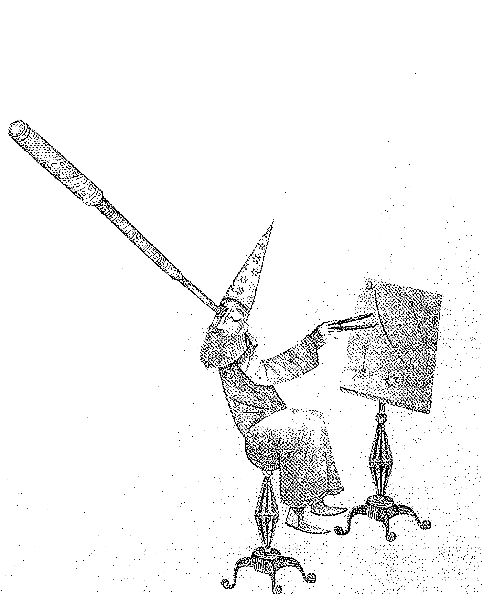

遇到任何下列情形，不論你是什麼星座，都可以呼求大天使烏列爾（Archangel Uriel）幫忙：

- 1. 如果你有電腦方面的問題。
- 2. 當你太依賴腦袋過生活，而顯得感性不足。
- 3. 針對問題需要一個巧妙的解決方案。
- 4. 正在和別人進行一段鬥智的對談。
- 5. 害怕進步或改變。
- 6. 正在商務會議中。
- 7. 應考中。
- 8. 需要跳出框架思考。
- 9. 需要很快做出決定。
- 10. 需要更務實與理智一些。
- 11. 在某個特定主題上需要更多的知識。
- 12. 正在研究某項事物。
- 13. 想了解複雜的概念。
- 14. 要跟上科技的腳步對你來說很勉強。
- 15. 你的網頁或社群網站需要一些協助。
- 16. 希望能找到了解你的搭檔。
- 17. 和聰明人打交道時，你需要更多自信。
- 18. 希望交到能啟發你或有趣的新朋友。
- 19. 你不確定下一步該怎麼走。
- 20. 希望對自己的聰明才智更有自信。

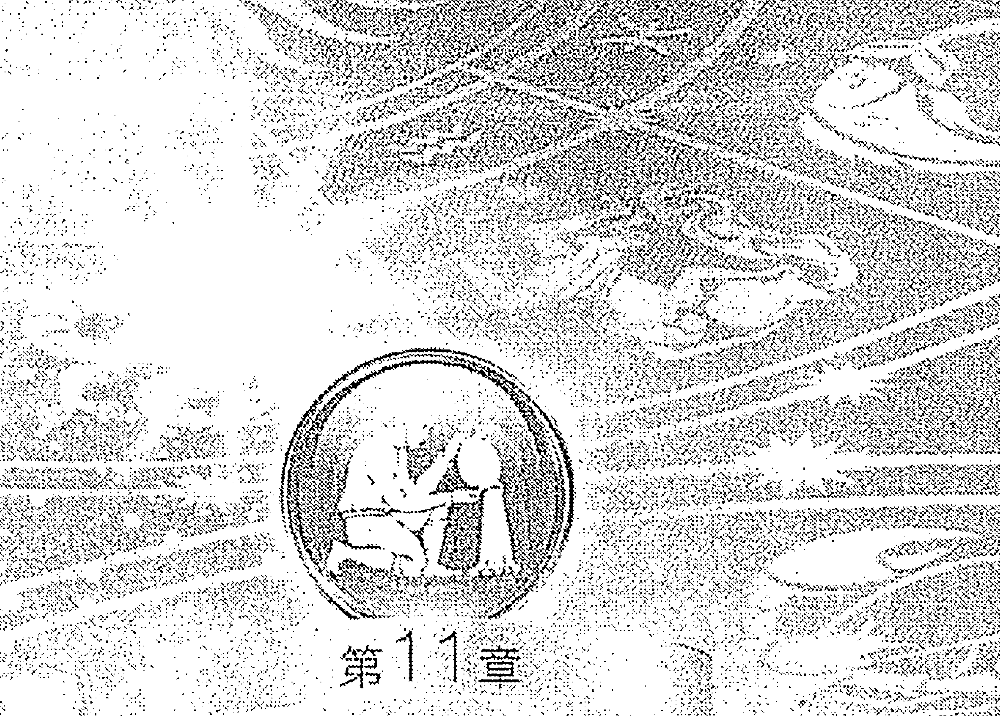

## 第11章

## 1月21日～2月19日

## 水瓶座 & 大天使烏列爾

### Aquarius & Archangel Uriel

在我們介紹過的大天使裡面，烏列爾可說是最好用頭腦的一位。而他剛好又和水瓶座這個風象星座配在一起——如你所知，風象星座最出名的，就是凡事用頭腦而不是用心。這並不是在批評風象星座不好，因為不同的星座都有各自的挑戰要穿越。水瓶座在占星學上，是出了名的聰明思考家和發明家，這個星座的人把所有的時間都用在頭腦，也因此總能想出絕佳的點子和設計，而這也是烏列爾和水瓶這兩股能量如此契合的原因。

在某些方面，大天使烏列爾就像一位充滿智慧的長者，總是對身旁的晚輩諄諄教誨。想想「星際大戰」裡的尤達，總想把他知道的一切傳授給同星球的人，水瓶座差不多就是那樣。同樣的，水瓶座也像資訊的海綿。事實上，十二星座裡的科學家多半是水瓶，這個世界如果沒有水瓶座，大概不會有什麼進步！他們先吸收各式各樣的資訊，用自己的方式消化之後再加以應用，藉此改變世界。對水瓶座的人來說，他們所體驗過的每一件事，都是一種學習。

水瓶座喜歡用頭腦思考的特質，讓他們的智力更上一層樓。他們能把自己抽離出來，用一種不帶感情的方式來看待生命，在面對壓力的時候顯得特別冷靜；這一點，可能是受到這個星座的守護行星（土星）的影響——土星本身就是一個不帶感情、以頭腦主導的行星。在生活出了差錯時，水瓶不會恐慌或崩潰；他們很務實，會努力找出解決的方法。也因為這個星座的人心胸開放又善於表達，所以他們很樂意把自己經過一番努力才學到的智慧，傳授給其他需要的人。

你的星圖上有哪些星座（太陽、月亮或上升）位於水瓶，在那些方面，你比較能將自己抽離開來，面對別人不同意見時較能相互包容。大天使烏列爾不僅為你帶來個人獨到的見解，也讓你別出一格。水瓶座的人以理想主義著稱，他們著眼於全人類，較少針對一對一的個別關係；同樣的，大天使烏列爾也是透過洞見與頓悟來幫忙地球上的人。然而，水瓶座與大天使烏列爾之間還是有所不同——前者較努力專注於全人類，後者則微觀及宏觀兼具。

當水瓶落在你的星盤上，在那些領域，你對自己的好有時會顯得太過務實。如果你的太陽、月亮或上升星座在水瓶，那你大概是個心胸開放的理想主義者；不過，為了要落實拯救世界的理想，你還是需要他人的協助。所以，你的課題之一就是，學習了解別人也是帶有感覺的個體。追根究柢，水瓶可能會因為太耗費精力在自己崇高的理想中，而變得超然、控制慾強，或缺乏耐性。若你在人際關係方面需要指引，請求大天使烏列爾的幫忙。烏列爾平衡了聰明的頭腦，與開放、充滿愛的心靈，作為你的伙伴，祂是你學習的典範，更是一位好老師！

如果你希望有個具體例子說明這樣的能量，可以想想「星際迷航記」裡的史巴克，他渾身散發的就是水瓶座的特質，雖然每個人都很喜歡他，但他難以處理情感或同理別人——史巴克總能想出聰明的辦法，可是他真正想要的，是情感上的連結。如果你覺得自己也不大能自在面對情感，可以請大天使烏列爾幫助你，用溫柔的方式開啟你的心扉。

水瓶座一般來說人緣很好，不過，這個星座的人似乎都是用「整群一起」的方式交朋友，而非經營一對一的緊密關係。情感的親密對他們來說既彆扭又嚇人，因為他們習慣做什麼事都表現得高超卓越，所以一般都會盡量避免。即使如此，多數的水瓶座對於尋找自己的靈魂伴侶可是不遺餘力！如果這聽起來很像你，在關係這方面請儘管呼求大天使烏列爾的幫忙。祂或許稱不上是「浪漫的天使」，卻是個有智慧的天使，能給予建議、告訴你該如何聰明地選擇一位適合的伴侶。只要好好遵從祂的指引，忠實表達自己的情感，適時展現浪漫的語言，並發揮聆聽的技巧。

大天使烏列爾是知識的傳遞者，所以，不論是什麼星座，只要你需要創新的想法，都可以向祂求助。這位大天使的形象就像提著燈籠照亮路途的人，因此，如果你覺得自己的生命迷失了方向，可以請祂幫忙照亮前方的路。大天使烏列爾會用一再出現的想法、點子、征兆或洞見，帶來神聖的訊息。如果你注意並遵從這些指引，烏列爾就會帶領你走上美好的道路。

### 天使占星學

水瓶座出名的一點就是直言不諱，常常因此引發與人的摩擦。的確，每個人都需要誠實的朋友，不過有時候，水瓶真的直得有點殘酷！如果這說的正是你，那一定要請大天使馬利爾幫你加強一下社交技巧。祂能教導如何溫和地表達你的真誠——馬利爾本身就是尋求真理的大天使，一定非常樂意助你發揚光大。

水瓶是專注在進展與未來的星座。你的星盤裡有哪個部分落在水瓶，在那些領域就幾乎不可能裹足難行。不過，如果你覺得自己的生活有某部分深陷泥沼，可以呼請大天使馬利爾給你主意，讓你繼續前進。祂會很樂意和你分享祂獨特的見解，幫忙找出最適合你的方向。

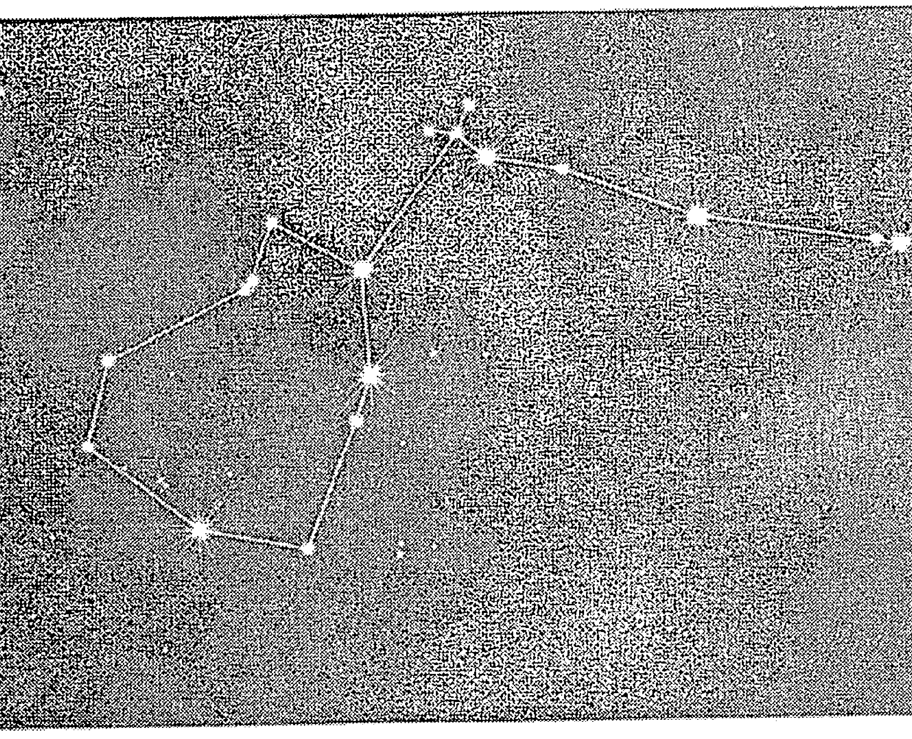

## 太陽星座在水瓶

大天使烏列爾非常擅長預言，祂能夠預見未來，而水瓶座也是——這個星座的天賦是有遠見，同時也是未來主義者。水瓶座能預見自己的潛能，以及自己未來的理想道路，然後沈醉在顯化這些預視的景象中。

水瓶座做事不循常規，對別人的看法經常不放在心上。如果你的太陽星座落在水瓶，你必然擁有預測未來趨勢的天賦——雖然你不會因此而盲目。不過也因為有這樣的天賦，使得水瓶座不論在服裝、飲食習慣、藝術品味等各方面，通常都是第一個接受新風格的人，有時甚至還會因為手腳太快顯得標新立異！

水瓶座是屬於未來的人，他們能感受到人類整體的走向，而且會很努力讓其他人都跟上，一起走上正確的道路。

## 月亮星座在水瓶

烏列爾是最有智慧的大天使之一，所以，有祂來引導你的月亮星座，可說是美事一樁。你應該還記得月亮和情感有關，月亮星座有這位經驗豐富的智者引導，意味你在情感上不大會走偏。事實也正是如此——對於月亮落在水瓶座常見的批評就是：水瓶座愛抽離現實，因而顯得有些冷漠。現在你知道其來有自了吧？這樣的特質對於發展緊密的人際關係來說，並不是件好事；不過相對的，在危機期間，它能夠幫助你保持冷靜。值得高興的是：雖然你在情緒方面起伏較小，卻博學多聞、充滿智慧。如果你明白自己在情感方面也受到保護的話，儘管祈請大天使烏列爾的幫忙，讓你能放心碰觸自己內心真正的感覺。要記得，大天使烏列爾喜歡教導人們，祂會與你分享如何傾聽內心的聲音、跟隨自己的感情。

月亮星座同時也表達了你的需求。月亮落在水瓶座，意味著你需要個人的空間；如果沒有足夠的時間獨處，你就會感到緊張和焦慮。當你真的沒辦法找到足夠的獨處時間，記得祈請大天使烏列爾幫忙。祂是解決問題的高手，一定會幫你得到所需要的隱私。

這樣的月亮星座也意味著你需要空間，好讓你隨心所欲的另創新格。對你來說，不落俗套完全合情合理。有時候，別人會跟你意見相左，這時你會覺得這種人很難相處——你或許會去跟人家理論，甚至要他們聽你的。但你要知道，並不是每個人都有像你一樣的天賦，能夠預見未來，或天馬行空的思考。因此，記得請大天使烏列爾協助你發展同理心，尊重意見不同的人。

## 水星在水瓶

這是個很好的組合：水星掌管與思考和溝通有關的事，而水瓶則是既創新又機智的規則破壞者，擁有絕佳的才華。如果你認為這在本命星圖上聽起來是個滿棒的組合，事實的確如此——按理說，水瓶座是十二星座裡最遙遙領先於其他星座的！

你是一個先鋒思想家，總有很棒的點子，帶領世界邁向下一個演進。好吧——當然不是每個水瓶都能想出曠世的好點子讓世界更進步，不過很多水瓶都可以做得到，也願意這麼做。

水星落在水瓶，對於原創性的知識求知若渴，同時厭惡一成不變的事物。你喜歡按真相來做事，這也是這個星座組合具備贏家特質的原因。然而，即使丟一個既定的想法給你，你也能夠讓它衍變出新意。

你所見的不是自己希望看到的，而是當下的一切。你常常會靈光一閃，也常跳脫框架思考。事實上，搞不好「跳出框框思考」一詞，根本就是水星落在水瓶座的人發明的！水瓶座連結的行星是天王星，這顆行星代表了革命、創新；也因此，你是有潛力改變做事的方式。

缺點嗎？水星在水瓶最大的問題，可能就是在處理人際關係時，如果把所有人當成一個整體，你相處起來一點困難都沒有；但是當單獨一對一時，你會顯得有點超脫（不帶感情）——當然，如果你願意說服自己的話，一樣還是做得到。你的守護天使是烏列爾，倘若你知道自己太過理智、希望更發自內心的生活，記得請祂幫忙。

此外，水星在水瓶有時也可能讓一個人的思考變得僵化保守，如果這聽起來很像你，一樣還是找大天使烏列爾幫忙。你擁有絕佳的聰明才智，如果因為思考過於僵化而無法百分之百發揮，就太可惜了！

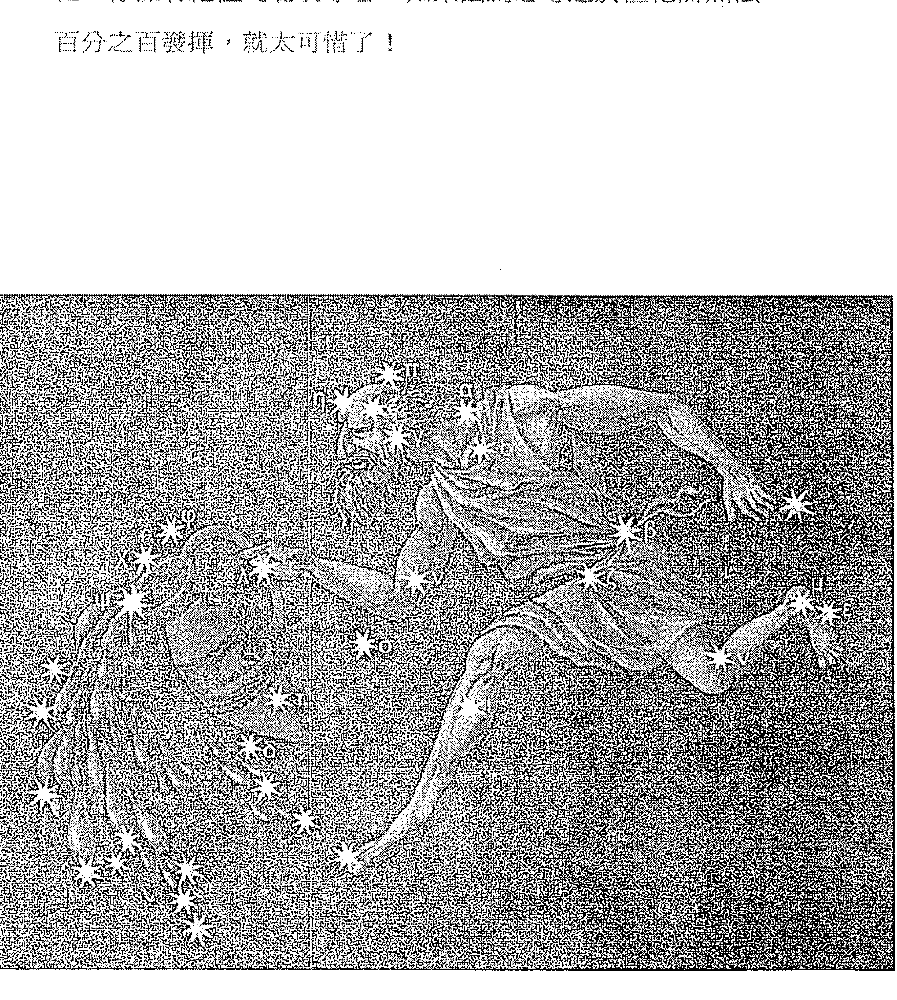

## 金星在水瓶

說到愛情，對你最貼切的描述就是：你一點也不黏人。事實上，你有時還會顯得過於冷淡。金星是掌管愛的行星，水瓶則是一個會大聲並清楚說「別把我困住！」的星座。在兩人關係裡，你很需要自己的空間；有時你看似冷淡的態度，其實也是在給對方自己的空間。

這當然很好——除非和你在一起的人需要很多的關注。你可以是個超脫情感、冷得非常性感之人；不過，如果你想找到真愛，你就必須停止用頭腦想，而是開始用心去感受才行！一旦找到自己的靈魂伴侶，你忠誠、投入的程度將高到讓旁人難以理解。

如果你的金星在水瓶，烏列爾便是引導你愛情生活的大天使。若你發現，在靈魂的層次與生命中最重要的人連結有困難，可以呼請祂的幫忙。祂是最有智慧的天使，能幫助你看見自己的哪些部分需要改變。

不過，千萬別誤會——金星在水瓶是很棒的祝福。因為，可以無須依附他人是多麼棒的事！你信奉「若愛一個人就放他自由」²⁰的這個理念，但你還是要注意，不要真的什麼都不管，弄到最後另一半都跑了那也不好！有些人需要被需要。話說回來，新潮（非傳統）的人可能對金星在水瓶比較有吸引力，希望你遇見合適的伴侶！敞開自己的心，看看會發生什麼事吧！

談到金錢，若能看到與眾不同的賺錢方式，你會做到最好。金星在水瓶通常很適合為自己工作，一方面是因為這個星座組合的人本身就非常獨立，另一方面，也是因為金星在水瓶的人不大能忍受聽命於人。

## 火星在水瓶

要談談性解放嗎？那說的正是火星在水瓶的人！火星是掌管性關係與驅動力的行星，而水瓶是一個關乎進化、變得更現代的星座，所以，火星在水瓶的人在性關係方面，思考一般都很前衛。這個描述對你來說是不是很貼切？如果不是，你可能還沒讓火星在水瓶的潛力發揮出來——火星落在水瓶會帶來任性、獨立、特立獨行、不同尋常。

水瓶座喜歡打破既定的規範，勇於創新。所以，如果你的火星星座落在水瓶，很可能也充滿了實驗精神，在臥房裡可說是獨具創意。

火星在水瓶的情人需要自由。這並不表示你終究不會給出承諾，只是，如果有人愈希望你能早點成家，從此過著朝九晚五、懷著第三胎、籬笆院子裡的生活，你反而容易起反感——沒辦法，你骨子裡就是個任性的革命家。

對火星在水瓶的你而言，可能面對的一個情況是：喜愛自由的你，就像滾動的石頭沒辦法長出太多苔蘚（關係難以更親密）。當你不再年輕了，可能得想個辦法，在成就個人與維繫感情之間找到平衡。

顯而易見的，你的感情生活能否成功，取決於你選擇在一起的是怎樣的對象。引導你火星星座的天使是烏列爾，祂是解決問題的高手，如果親密關係對你而言十分困擾，或進展得不順利，都可以找祂幫忙。

²⁰ 譯注：節錄自理查·巴哈 (Richard Bach) 名言：「If you love someone, set them free. If they come back they’re yours; if they don’t they never were.」（你若愛一個人就放他自由。他若回來，代表他屬於你；若他沒回來，他從來就不屬於你）。

## 上升星座在水瓶

水瓶座的英文拼法是Aquarius，不过占星学家艾瑞克·佛朗西斯（Eric Francis）都称它作Aqueerius（queer是「奇怪」的意思），因为这个星座的人喜欢打破传统，对别人的看法或感受也不是很在意。上升星座所反映的是别人眼中的你，所以，如果你的上升在水瓶，别人可能会觉得你是个天生叛逆，或思考独立的人。

正如前面所述，上升星座是你给别人的第一印象。上升落在水瓶座又在大天使乌列尔的引导下，你可能给人的印象是聪明且与众不同，就像一位疯狂的教授。不过，好在水瓶座深以自己的特立独行、行为古怪为傲——说水瓶座的人很「平凡」，那对他们可是一大侮辱呢！

上升在水瓶的人所结交的都是有趣的朋友，因为他们自己就很疯狂，喜欢尝试各种不寻常的活动——比如药物试验，这对于上升在水瓶这群乐天分子而言，满危险的。

上升星座在水瓶的一个例子，是一位叫作珍的女士。她原本在一家大型通讯公司服务，不过她一直觉得，自己难以顺应商业界刻板的期待。随着年龄渐长，她那思考前卫的上升水瓶特质逐渐展露，于是，在素食蔚为风尚之前的二十年，她就已经开始吃素；此外，她另类的发型也一再试探保守老板的底线。后来珍开始静坐，也辞去了原本高薪的工作，成为一名专门指导静坐的老师。因为上升在水瓶的个性使然，她总是言出必行，最终她又回到了商业界，以教导静坐的方式一样获得高薪。人们看出她的与众不同，对此赞誉有加。

所以，如果你需要一些协助，好拥抱自己独特的天性，呼请大天使乌列尔来帮忙，让你接受并欣赏这份上升在水瓶最特别的礼物。

* * *

## Chapter 11 水瓶座&大天使乌列尔

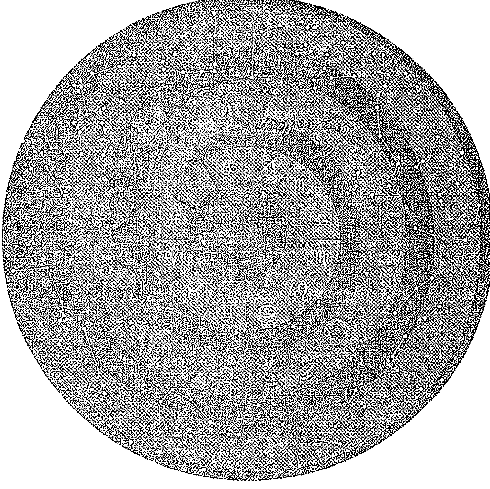

遇到任何下列情形，不论你是什么星座，都可以呼求大天使圣德芬 (Archangel Sandalphon) 帮忙：

- 在你需要平静的时候。
- 想发展自己的通灵能力。
- 希望能与神圣有更强大的连结。
- 想透过音乐疗愈自己。
- 需要对创意保持开放。
- 想知道自己的祈祷是否上达天听。
- 你希望能在音乐产业工作。
- 需要对某人更加的温柔和善。
- 希望某人能对自己更加的温柔和善。
- 想写诗。
- 想为自己还未出世的婴孩祈祷。
- 希望感受到自己和宇宙万物的连结。
- 想传送疗愈的能量或祝福给你的挚友。
- 希望能更清楚听见神圣的指引和灵感。
- 想学会弹奏一种乐器。
- 想改善自己的歌声。
- 希望对自己的创意更有信心。
- 需要一些帮助，好顺利完成一项创意工作。
- 你想学静坐，或学了但希望能更深入静坐的练习。
- 觉得在灵性道路上遇到了阻碍。

## 第12章

2月20日～3月20日

### 双鱼座 & 天使型的潜能

大天使圣德芬，则负责让人们祈祷直达天听。双鱼连接生命之轮上神秘的黄道第十二宫，是通往神圣的玄奥之门。星座图上的这个部分，看起来就像大天使圣德芬不断地游走在红尘俗世与造物主的天界间。

双鱼座也在音乐和电影方面，与圣德芬这位「音乐天使」完美的合作。事实上，大天使圣德芬常常通过在我们脑海中浮现、或收音机里传来的音乐传达讯息。当你听到一首歌，觉得「啊！这正是我需要」的时候，其实就是圣德芬在你的身边。

此外，大天使圣德芬的能量与双鱼座一样，平和又温柔。祂传递给你的讯息，通常就像一阵微微细语，如果没有听仔细，很容易忽略。假使你连接圣德芬想请祂帮忙，记得要对意义深长的歌曲持续保持收听的状态，很可能歌词里就有祂想告诉你的话。

双鱼座与神圣之间的紧密连接，可说是这个星座最棒的部分。双鱼座的人把此世在地球的生命，视作一份美丽的礼物——只要你曾欣赏过绚烂的日落、孩子呱呱坠地的喜悦、美味可口的餐点、宠物对自己毫无保留的爱，你一定会同意，我们能够在地球上的确是一份独一无二又特别的恩赐。不过，对很多人来说，当踏上灵性的道路之后，才会开始觉得生命是一种祝福。双鱼座是我们在星图上与宇宙无限的「合一」（Oneness）产生连接的地方，就在双鱼座这生命之轮最后一个星座的位置上，我们终于明白：每个人彼此之间都是相互连接的。

如果你感到自己在灵性或情感上有些窒碍难行，可以呼求大天使圣德芬，请他帮助你重新取得连接。双鱼是心灵的探索家，而圣德芬则是擅长协助人们找到内心平静的大师，两者相辅相成。

双鱼是非常标准的水象星座，水象代表的元素是情感和潜意识。所以，你也可以和水元素互动，以提升、净化自己。举例来说，你可以跳进海里游个泳、到河边散散步、在家冲个澡，或在加有海盐和精油的浴缸里泡一会儿。当你专注在连接水的神奇疗愈力时，就能同时召唤双鱼座和大天使圣德芬的能量。最有趣的是，圣德芬的天使光晕是绿松石（蓝绿）色——正是水的颜色！双鱼座性喜和平，只要亲近水，就能召唤放松的能量及代表和平的大天使圣德芬进入你的生命。

双鱼也是创造力和想象力的星座，你可能活在自己的想象世界里，所以有时会被批评为爱幻想、甚至不切实际。如果与大天使圣德芬合作，双鱼会显得踏实、务实一些；另外，祂也能协助处理感情方面的沟通问题。

深受超凡脱俗之美所吸引，双鱼座的人喜欢任何闪闪发光、蛋白色或七彩等让人联想起天堂的事物……这个星座的人还有一种倾向，就是往往要找出每件事所代表的意义和征兆！想想你曾听过的最美妙的音乐——总是有非常「双鱼」的成分在里面，而大天使圣德芬的能量也交织其中！

双鱼座的人富于想象，甚至可以到了拒绝面对生命中严酷真相的地步。千万别指望他们会积极参与讨论、解决问题；一方面，对他们来说，乐观和信心非常受用。然而，逃避现实并不是个好主意。大天使圣德芬能够帮忙将梦想和点子化为行动。

由于双鱼座的能量非常自由流畅，所以有时可能会因此失去方向感或目标。星盘上的那些领域落在双鱼，在那些方面，你可能会觉得惶惶然、漫无目的。双鱼能量强的人还有一个大风险就是——当你对生命感到失望时，可能转而吸毒或酗酒；但很明显的，用这些东西来麻痹自己，只会让事情变得更糟！

既然你已经知道大天使圣德芬随时与你相伴，只要有需要，尽管找祂帮忙。祂可以协助你提升灵性，让你忆起自己真实的身份——你是神的孩子，深得疼爱且充满力量，浑身散发着疗愈力，亟需一展长才。只要你开口祈请，大天使圣德芬必然会让你的祷词直达天听！

双鱼座的人有着崇高、热情的理想，关键就在能否付诸实践——要不然，他们会卡在自己的幻想里，自以为努力追寻，实际上根本没有。此外，双鱼座在金钱方面常出现大好大坏的两极现象。他们的财务之流（financial flow）要不表现得极度匮乏，就是过于丰盛。有一部分的原因是：在商场上，一定要采取行动才能让梦想成真；所以，如果只是对自己的潜能充满幻想，却不采取行动，势必无法吸引相应的收入。而双鱼座之所以缺乏行动力，有时是源于沉溺在酒精或麻药等物品中。相对的，如果一个清醒、专注的双鱼座认真把梦想化作行动，不管在哪方面，他都一定势不可挡，包括财务上的丰盛。

## 太阳星座在双鱼

太阳在双鱼的你，会把和平带往所到之处，就像大天使圣德芬一样。你内心充满祥和，同时也会表现出来。你不会委屈自己做一份无意义的工作，或接受一段无聊透顶的感情。你会专注在充满戏剧性的梦想上，点亮自己的灵魂。你也有能力去帮助别人达成他们的梦想和人生目标。太阳在双鱼的你热衷于追寻最高的秩序，也很容易与大天使圣德芬连接——这位充满神秘的天使主要职责，便是将人们的祷词带到神的耳朵。

双鱼在星座之轮上排最后一个，代表了灵性。诞生在这个星座的人，很可能已经化身过其他十一个星座，所以能将人类的潜能彻底发挥。如果你有兴趣加强自己和圣灵（Spirit）的连接，可以召唤守护你太阳星座的大天使圣德芬帮忙。

正如双鱼座，大天使圣德芬也与音乐关系密切。双鱼座的人，在音乐相关的活动、诗歌、电影以及所有的艺术形式，表现都很卓越。一旦你向大天使圣德芬求助，答案通常会出现在你「不经意」听到的某首歌里。

将梦想化作行动，实现自己的专业，过着理想生活——你可以请大天使圣德芬帮忙，让你有更强烈的动机、专注、更有条理。和其他较「年轻」的星座不同的是，双鱼座在物质方面的野心不大，不喜欢与人竞争，而是充满理想，希望自己和其他人的生活都能过得更好。

## 月亮星座在双鱼

如果说，太阳在双鱼的人天生就有灵性，那月亮落在双鱼座就是加倍有灵性！事实上，根本可以说是直接开启收听宇宙之音的频道。你知道身边的人在想什么，也完全明白与能量有关的宇宙奥秘。对诞生在这个星座组合的人来说，学习如何处理定期接收到的宇宙信息很重要。要想学会如何实际应用玄奥的知识，可以连接大天使圣德芬，祂能帮助你把灵魂的智慧转化为行动，让你经验至高的喜悦。

遗憾的是，许多月亮在双鱼的人，并不喜欢自己与生俱来的超敏感特质，所以他们会用孤立自我的方式或麻药酒精等物品来逃避——这个星座组合的人很容易有上瘾的倾向。

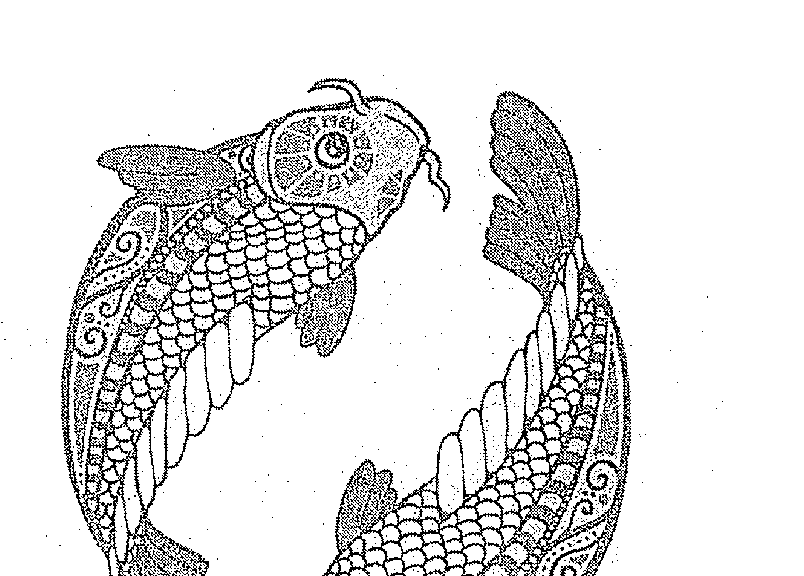

双鱼座与神圣之间的连接非常紧密，或许这对人类来说，与源头太靠近有时令人「吃不消」。因此，诞生在这个星座组合的人，经常有酒精或药物成瘾的问题。

不过，千万别剥夺人家欣赏你天赋的权利——这个世界需要你！如果你有封闭自我或物质成瘾的问题，呼求大天使圣德芬的帮忙，祂能引导你找到值得信赖的咨询顾问，或免费的支持团体。切记，酒精、药等物品会麻痹一个人的心智，不仅会夺走你的创造力，还会减损你的能量，让你无法实现梦想。

有一位月亮在双鱼的人名叫鲍伯，他是让自己所喜爱的「意识改变状态」²¹失控的典型案例。他在年轻时曾到印度旅行，找了一位古鲁（灵性上师）来满足自己月亮在双鱼的需求，通过通宵的吟咏舞蹈清醒又愉悦。不过，一旦离开修行回到他的郊区生活，他便开始饮酒吸毒作为替代。其实，他大可选择引导这种灵性的阴暗面朝向更健康的月亮双鱼倾向，比如做白日梦、解析夜梦、静坐冥想、演奏或欣赏音乐，或是给周遭的人们带来温和而神奇的力量等等。

月亮星座代表着你的需求，同时也说明哪些事物会「滋养」你。如果你的月亮星座在双鱼，生活中就需要诗歌、浪漫和美好的经验。你可以呼请大天使圣德芬，帮你打造理想的世界。

## 水星在双鱼

水星落在双鱼是一件很棒的事。水星在双鱼的人，说起话来总是轻轻柔柔的，因为水星是掌管沟通的行星，和你的所思、所写、所言关系密切；而双鱼是代表音乐、诗歌与梦想的星座，两者相合，可以预期的是不论你的声音还是语汇，仿佛都像歌唱般优美。

除此之外，你也具备聆听的天赋。双鱼是非常温和的星座，完全不爱出风头。因为这个缘故，水星在双鱼的人多半十分低调……这对旁人来说真是松一口气，尤其当我们身处二十一世纪，处处要面对「快注意我！」这样的文化时。

掌管你水星星座的大天使是圣德芬，他是一位相当和谐的天使。所以在这里，代表我们心智的行星——水星，能由这股优美温柔的能量引导，这样的组合当然很讨人喜爱，因为你给周围的人的感觉也是这样！

要小心的是，水星在双鱼的人可能会有点条理不清，因为他们比较仰赖直觉而非逻辑。相信直觉固然美好，不过，当遇到某些现代的发明——如电子试算表或冷冰冰的数字和图表——的时候，你可能会略显不知所措。假使发现自己在组织能力方面有困难，记得连接大天使圣德芬。

千万不要因为水星双鱼的这种组合，就觉得自己比别人逊色。其实，双鱼是代表远见和梦想的星座，所以你比多数人怀抱更远大的理想；而在大天使圣德芬的协助下，你有能力梦想成真。

水星落在双鱼座对于增强你天生的灵性能力也很有助益。如果这正是你想开发的，可以向大天使圣德芬祈请。祂也能协助你发挥梦的效用，像是分析梦境好更了解自己，或遵循梦中的指引。

## 金星在双鱼

这是个浪漫主义者、诗人与梦想家的星座组合。金星在双鱼，意味着你会追着另一半到天涯海角，躺在床上念情诗给他（她）听、谈着他（她）的梦想、陪他（她）一起过分乐观地看待人生……唉！

不过，凡事总有个但是，来到了爱情，你可能像条滑不溜秋的鱼！其一是，你会对爱情过度理想化：金星在双鱼的人习惯把自己的伴侣捧得高高的，等到有一天突然发现，原来这个被自己当神崇拜的人，也会犯一些生活中的错误与缺点，就像常人一样，往往觉得失望不已！

对占星学家来说，看到金星在双鱼的人，就像看到一只小瓢虫杵在那，敞开心房等着真爱的到来。有时金星在双鱼很容易受伤，因为并不是每个人对爱都很浪漫。有时他们可能对爱感到困惑，因为双鱼座往往看事情不清楚。当然有时也可能就这么遇上了灵魂伴侣——他们始终明白自己一定会找到，从此过着幸福快乐的日子。

怎么做才能让自己成为第三种的幸运儿呢？你一定要够聪明，仔细选择交往的对象。信任你的直觉，特别注意要避开疑似有物质成瘾问题的人。如果你属意的对象爱喝酒，或要靠药物才能入睡或放松，千万远离他们。若不幸遇上，守护天使会举红旗警告你，更重要的是，你得自己愿意走出童话般的爱情泡泡，去注意并遵循天使的提醒！

指引你爱情生活的大天使是圣德芬，这位音乐大天使能帮助你，在艺术与浪漫的面向更加务实。如果遇到难题，记得向祂求助；也可以请祂协助你对自己的伴侣更加了解。也可以找大天使圣德芬帮忙处理金钱的难题。金星掌管你的财富，当金星落在双鱼，表示你会通过鼓舞人心的方式来赚钱；不过，这也可能意味着：你在面对冷冰冰的铜板时，有时会显得不够理性！大天使圣德芬可以在这方面协助你。事实上，祂什么忙都愿意帮！你可以把圣德芬当作是你内在艺术家的经纪人！

## 火星在双鱼

火星在双鱼的你，是一位和平战士——火星是行动力明快的行星，而双鱼则是最不想推动自己前进的星座。你得了解这一点，并在这方面下功夫。

如果你的火星落在双鱼座，那你一定有极强的直觉，不论是工作还是生活，记得多多利用。即便你不想与人竞争，至少也要试着往前跨一步，把灵性天线调整好，看看身边会发生什么事。

火星是让你迈向成功的行星，而火星落在双鱼座，意味着你的成功必须靠直觉的天赋来达成。明白吗？意思就是，你对圣灵的连接感愈强，就愈可能成功。

## Chapter 12 双鱼座&大天使圣德芬

基本上，你比较适合当情人，而不是斗士。当然，人生在世难免要面对冲突的场面，不过，火星在双鱼的你倾向打持久战，或用迷惑对手的方式赢得胜利（嘿！这可是高招啊）！

缺点是，你有点害怕面对冲突，导致最后得不到自己想要的结果。更糟的是，就算哪一天你终于生气了，事后还会觉得很有罪恶感。

如果你发现自己的确如此，记得请守护你火星的天使圣德芬来帮忙。

在性关系方面（因为火星也同时掌管性亲密），火星在双鱼的人享受情欲的程度，跟追求对象时的浪漫不相上下。但你在性关系上随遇而安，不主动强求。这无可厚非，不过，记得古希腊作家索福克里斯（Sophocles）²²说的话：

> > 「缺乏勇气的人，运气永远不会站在他那边。」

所以，勇敢一点去追求你要的对象吧！同样的，如果在这方面有困难，呼请大天使圣德芬的帮忙，祂永远乐于对你伸出援手。

### 上升星座在双鱼

上升星座指的是别人眼中的你，而上升落在双鱼座意味着，在别人眼中，你是一个温和、容易相处的人（就算事实并非如此）。上升星座并不是真正的你，只是别人察觉到的你。有些人可能会因为你耳根子软、好说话，就想占你便宜；不过，他们很快就会发现，真正的你还比外表看来更坚强、有个性得多。

标准的上升在双鱼，与大天使圣德芬的连接或其他的天使都顺畅无碍。事实上，当其他人还在试着明白这一切的意义，上升在双鱼的人可能已经设好静坐圣坛、摆好协助你的大天使图像，准备开始与他们一起工作了——甚至有些上升在双鱼的人，早就准备好和自己的守护天使展开对话了。双鱼本身就是一个灵性极高的星座，而上升在双鱼，意味着你对自己的灵性觉察很自在。

如果你已经走上灵性的道路，但似乎觉得停滞不前，记得呼请大天使圣德芬的协助。祂在许多方面都能助你一臂之力，包括让你的祷告直达天听，因而获得应许。

* * *

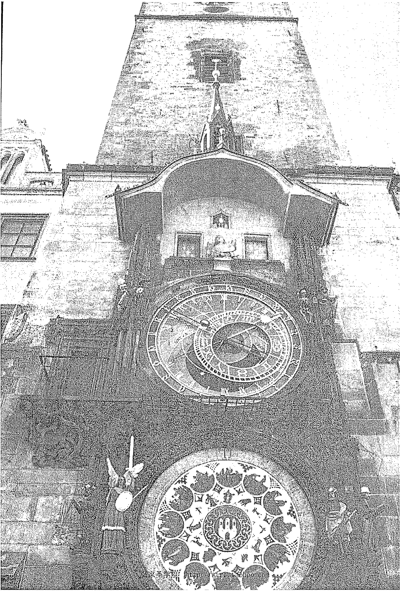

www.SixiangTao.com

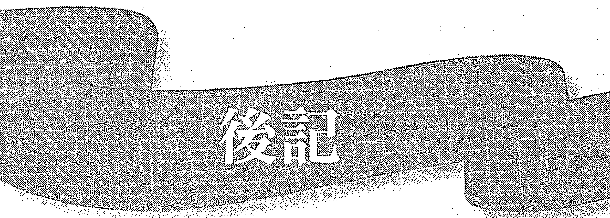

## 后记

我们诚挚地希望这趟出生星图的大天使之旅，对你来说是很享受的学习经验。研究占星学可以是一时的兴趣，也可以是终生的探究。你愈了解自己的星盘，就能愈了解自己——事实正是如此，一点也不足为奇。

此外，多了解你挚爱的另一半的星盘，也能让你开始更加了解对方。占星学就如同天使一样，总是在那儿等着出手相助——只要你记得使用它，而且是出自为自己或为他人的善念。

> ——朵琳及亚思敏

＊ ＊ ＊

## 作者简介

朵琳·芙秋博士 Doreen Virtue, Ph.D.

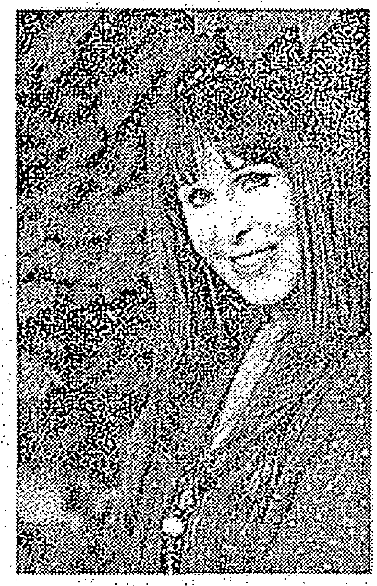

一位具备灵视能力的心理学家，拥有美国加州查普曼大学（Chapman University）心理咨询博士学位。她与天使、精灵及扬升大师们密切合作，在国际间举办无数工作坊，探讨天使疗法、天使沟通与灵性治疗，畅销著作包括：《朵琳夫人教你认识大天使》、《召唤天使》、《如何聆听天使讯息》等二十余本书，亦开发多套脍炙人口的占卜卡如《大天使神谕占卜卡》、《守护天使指引卡》、《天使回应占卜卡》、《神奇独角兽神谕卡》等，还有有声系列作品如《净化脉轮》、《朵琳夫人教你天使疗法：幸福显化卷》等（以上均由生命潜能出版），希望透过不同方式的呈现，带领读者开发自我的超感应力并疗愈身心灵。

朵琳经常参加电视与广播节目做「天使解读」，在美国誉为「天使夫人」，她运用灵视能力与人们的守护天使沟通，带动了与天使及自然界神性存有连接的风潮。想知道更多朵琳的最新讯息，请上网查询：www.AngelTherapy.com

### 亚思敏·波蓝 Yasmin Boland

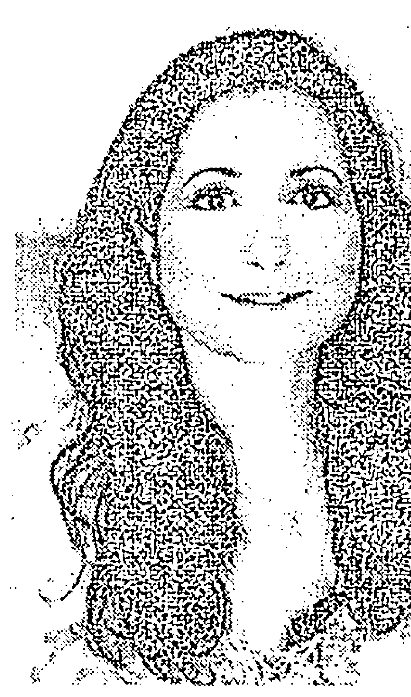

是当今世界上数一数二多产的占星学作家，每一周她为报章杂志和网站所写的专栏，都有数百万的浏览人次。她还出版了两本小说、一本非小说，以及两个系列的占星学书籍，在澳大利亚、加拿大、印度、葡萄牙及英国发行。亚思敏的祖先来自神秘的马耳他群岛及爱尔兰。如果想知道更多关于亚思敏的信息，或想得到一份你的占星图，可以参考她的网站：www.yasminboland.com/AngelCharts。

## 天使占星學：連結十二星座大天使 顯化幸福生命藍圖

原著書名／Angel Astrology 101: Discover the Angels Connected with Your Birth Chart

- 作 者｜朵琳·芙秋博士(Dr. Doreen Virtue) &亞思敏·波蘭(Yasmin Boland)
- 譯 者｜陳重芳
- 特約編輯｜黃品璇
- 編 輯｜吳嘉容
- 執行總監｜王牧羚
- 發行人｜許宜銘

出版發行｜生命潛能文化事業有限公司
聯絡地址｜台北市士林區承德路四段234號8樓
聯絡電話｜(02) 2883-3989
傳真電話｜(02) 2883-6869
郵政劃撥｜17073315 (戶名：生命潛能文化事業有限公司)
E - MAIL｜lgblife@ms27.hinet.net
網 址｜http://www.lgblife.com.tw/
郵購八五折，未滿1000元郵資60元，購書滿1000元以上免郵資。

總 經 銷｜吳氏圖書有限公司·電話｜(02) 3234-0036
內文編排｜菩提薩埵電腦科技有限公司·電話｜(02) 2917-0054
印 刷｜日光彩色印刷·電話｜(02) 2262-1122
版 次｜2016年2月1日 初版
定 價｜720元

ISBN：978-986-5739-56-0
Translated from Angel Astrology 101: Discover the Angels Connected with Your Birth Chart
Copyright(c) 2014 by Dr. Doreen Virtue and Yasmin Boland
Published by Hay House, Inc. USA http://www.hayhouse.com/
Through Bardon-Chinese Media Agency
Complex Chinese Translation Copyright(c) 2016 by Life Potential Publications

ALL RIGHTS RESERVED.
行政院新聞局局版台業字第5435號
如有缺頁、破損，請寄回更換
版權所有，翻印必究

國家圖書館出版品預行編目資料

天使占星學：連結十二星座大天使 顯化幸福生命藍圖／朵琳·芙秋（Doreen Virtue） &亞思敏·波蘭（Yasmin Boland） 著；陳重芳譯 -- 初版．-- 臺北市：生命潛能文化，2016.2
叢書： -- （心靈成長系列；186）
譯自：Angel Astrology 101: Discover the Angels Connected with Your Birth Chart
ISBN 978-986-5739-56-0（平裝）
1.靈性 2.心靈成長 3.占星
292.22
104026463

> 由于每位大天使有不同的能量振动频率，因此可以对应十二星座能量。本书所介绍的大天使能量将帮助你更加深入了解自身星座与能量特质，甚至大天使如何在进化中帮助你创造生命的蜕变。 ——朵琳·芙秋

### 启动星际高频的宇宙能量场

### 请大天使帮助你

大天使掌管不同的情绪能量振动，这些情绪是地球人类生命进化的基础。如何运用不同情绪的振动频率，来开启一场更扩展次元的活化之旅呢？

在本书中，大天使尤列尔和作者基奎琳·史密斯合作，深入细致地介绍二十四位守护大天使和他们掌管的领域，以及如何用不同特性的能量振动来疗愈，例如：天使尤列尔掌管的是物质世界的务实大天使；奥芙南大天使掌管的是神圣的合一；大天使艾瑟瑞尔掌管的是与死亡和转化工作，其帮助转化业力、掌管业力和恐惧的转化能量；而大天使拉贵尔则是掌管法律与正义的领域，并帮助促进纪律和能力，大天使加百列则掌管沟通。

你可以先识别自己所对应的基座大天使，再进一步根据其对应元素：水、火、风、土四大元素，选择对应的特定大天使，来解决生活中面临的问题：如爱情、工作、健康、财务等，来发现及发挥大天使的功能。

当你开始与大天使共同合作，你将更容易展现内在最光明的一面，而过去所经历和未愈合的人性创伤及黑暗能量将会被转化。在生命旅途中，或许会经历许多挑战，但现在大天使已成为你的守护天使，这些大天使们将协助你突破种种挑战，而变得更具创造力与韧性。

### 大天使利娜 & 白羊座

利娜是「神圣魔法及净化奇迹的使者」。白羊座有能力清除过往与罪孽，给人清净的气息。他会说：「即使眼前看来困难重重，也不要放弃。」

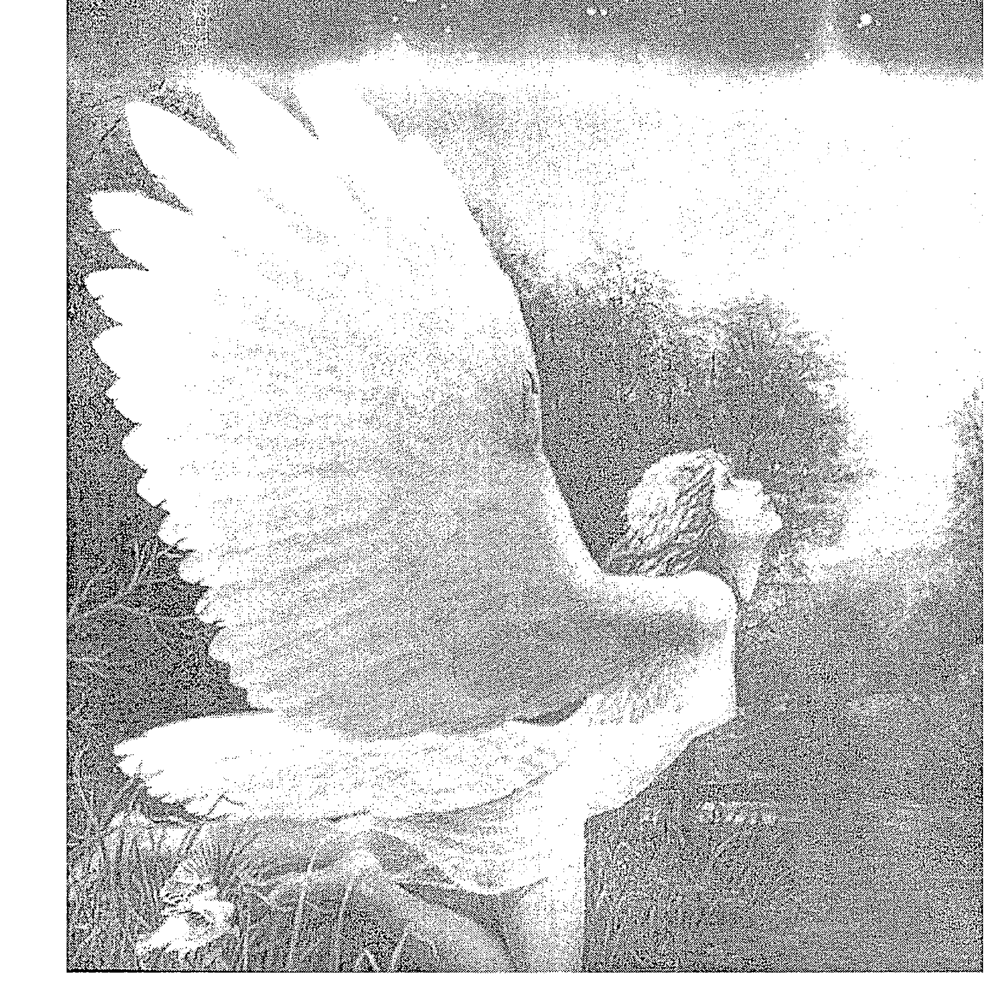

### 天秤座 & 金牛座

夏莉莉的伴侣最常为人提到伴侣/友谊/工作

金牛座的守护星是金星，与爱情关系最密切

> > 夏莉莉：「我们努力实现的一切，在已身皆已具备。」

### 大天使薩基爾 & 雙子座

薩基爾是「記憶的大天使」，代表寬恕的特質
雙子座則與心智有著緊密的連結
薩基爾能幫助你清空記憶庫並加以更新。

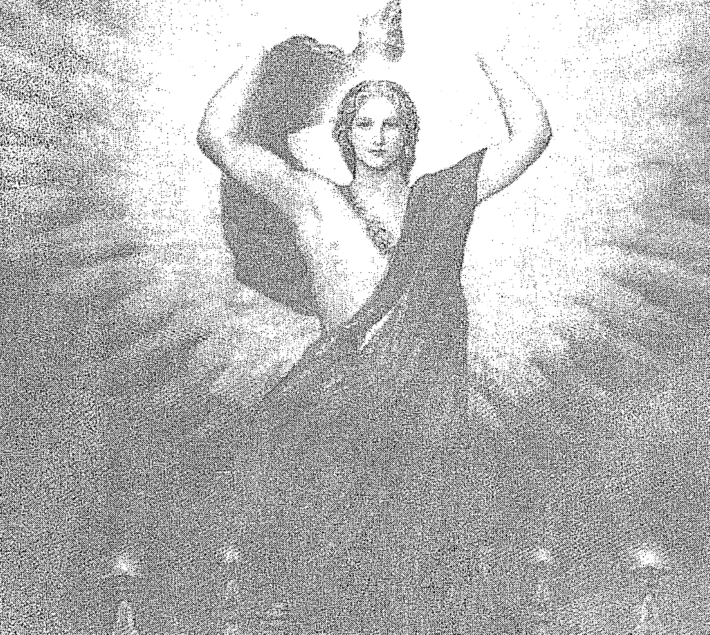

### 大天使加百列 & 巨蟹座

加百列是以家庭为导向的大天使，巨蟹座是滋养和力量的集合。二者是温暖的组合，邀请内在小孩连结，协助找到生活上的平衡。

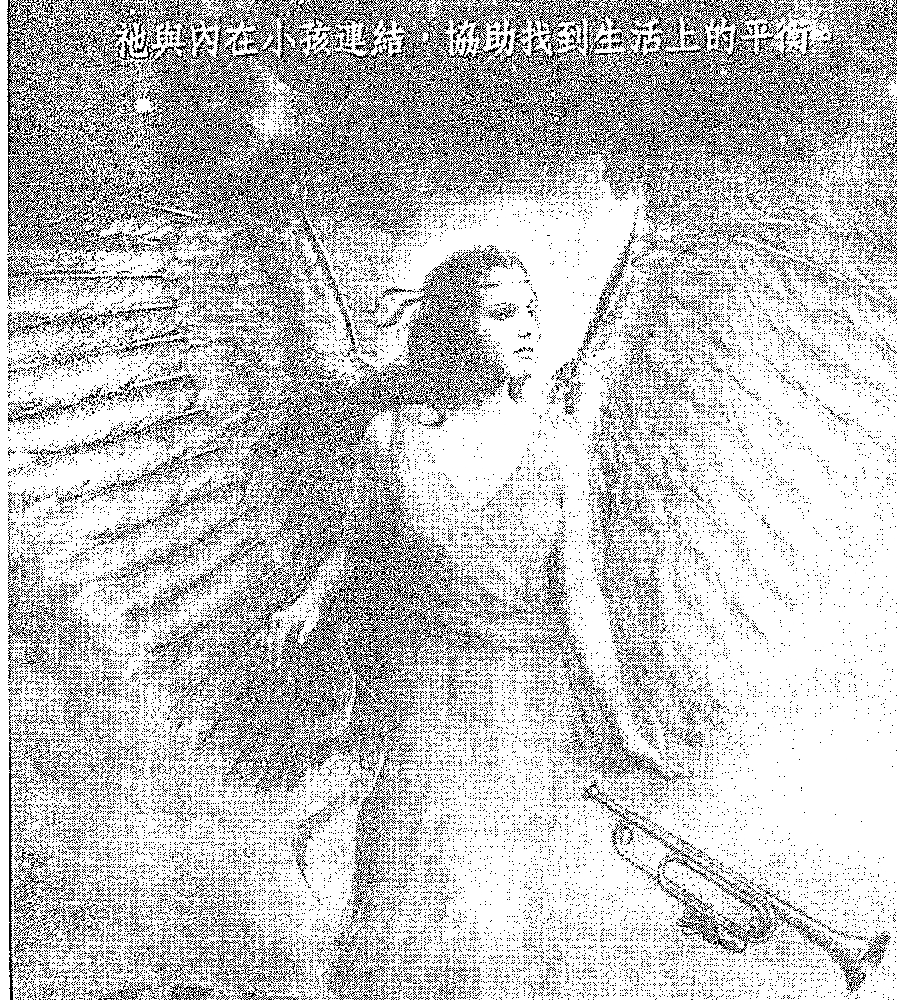

### 大天使拉吉爾 & 獅子座

這位美麗如夢的粉紅光芒，代表天堂的榮光。反獅子座的太陽發出的光芒。獅子座的掌管，淨化能力及成功。能鼓勵他人一同貢獻世事：

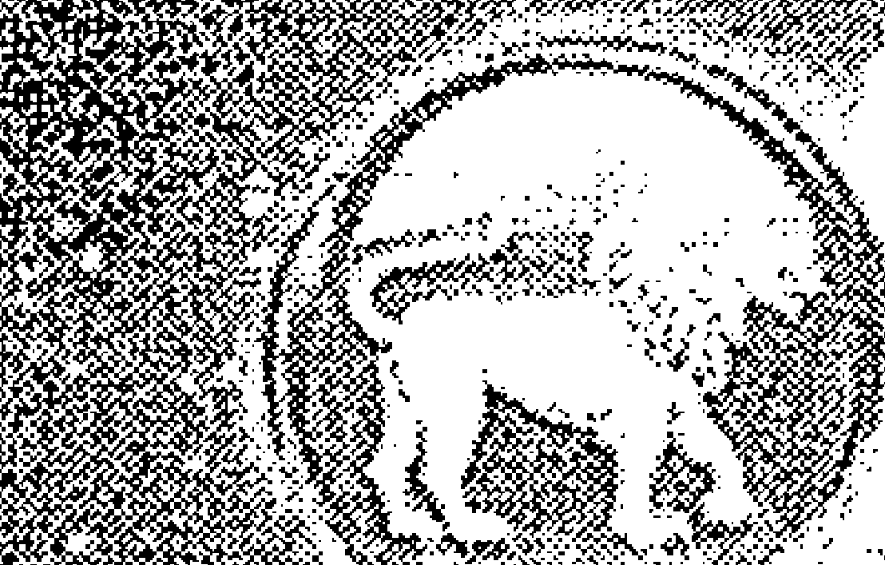
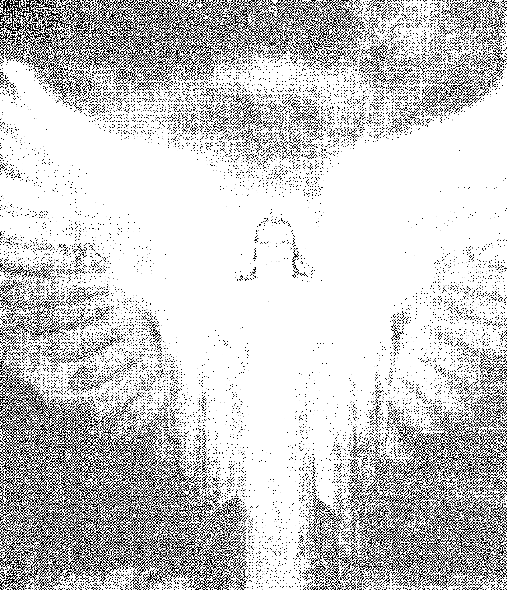

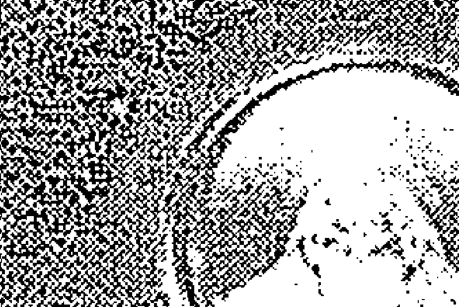

### 天蝎男选处女座

处女座是土象星座，处女座和处女座能互相激发潜力，同时处女座能给予处女座完美的结合，处女座和处女座是完美的结合，处女座若能理性、感性兼具，会让得非常有力量。

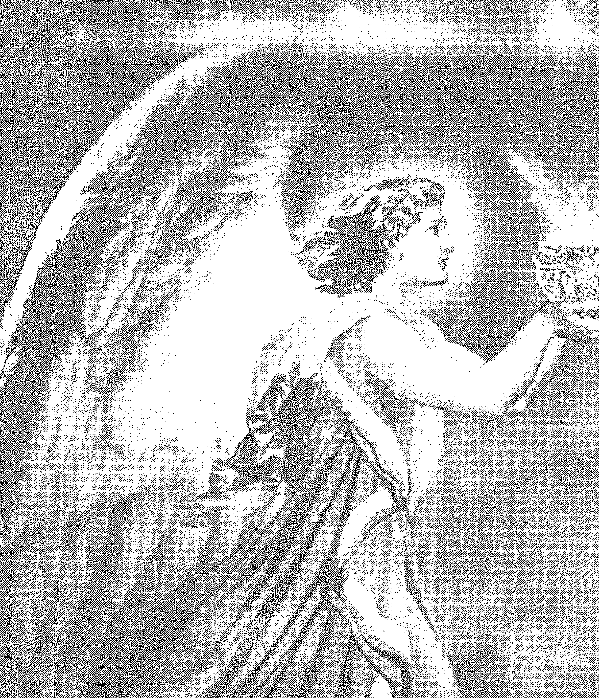

### 处女座的狮子座 & 天秤座

处女座是美的天使，天秤座是爱的化身
天秤座的守护星是金星，天秤座的正是爱、美与和谐
二者携手合作能发挥柔性优势，增添美感。

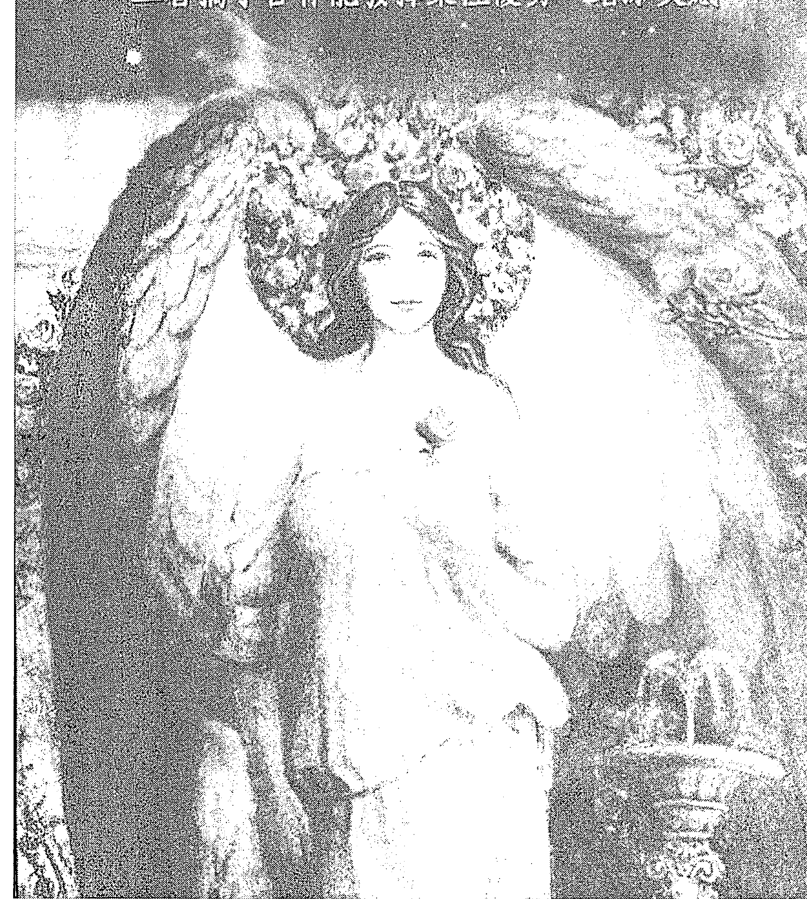

### 大天便即米開色天鹅座

面對許多人無法理解之事，即米開色天鹅座，卻能站在目前位置，他也能引導人走入一樣的境界，這便是大天便對天鹅座最大的活動。

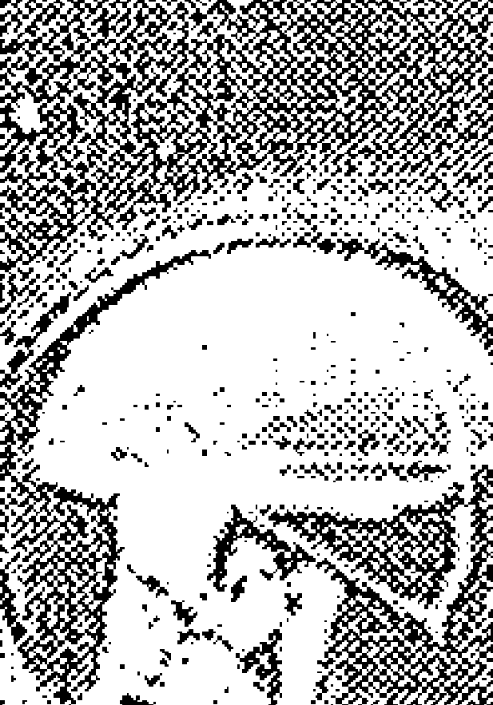

### 处女座与天蝎座

处女座来说，人生是一场探险

对天蝎座而言，生命是一场盛

他们以理性和

与友和对手都

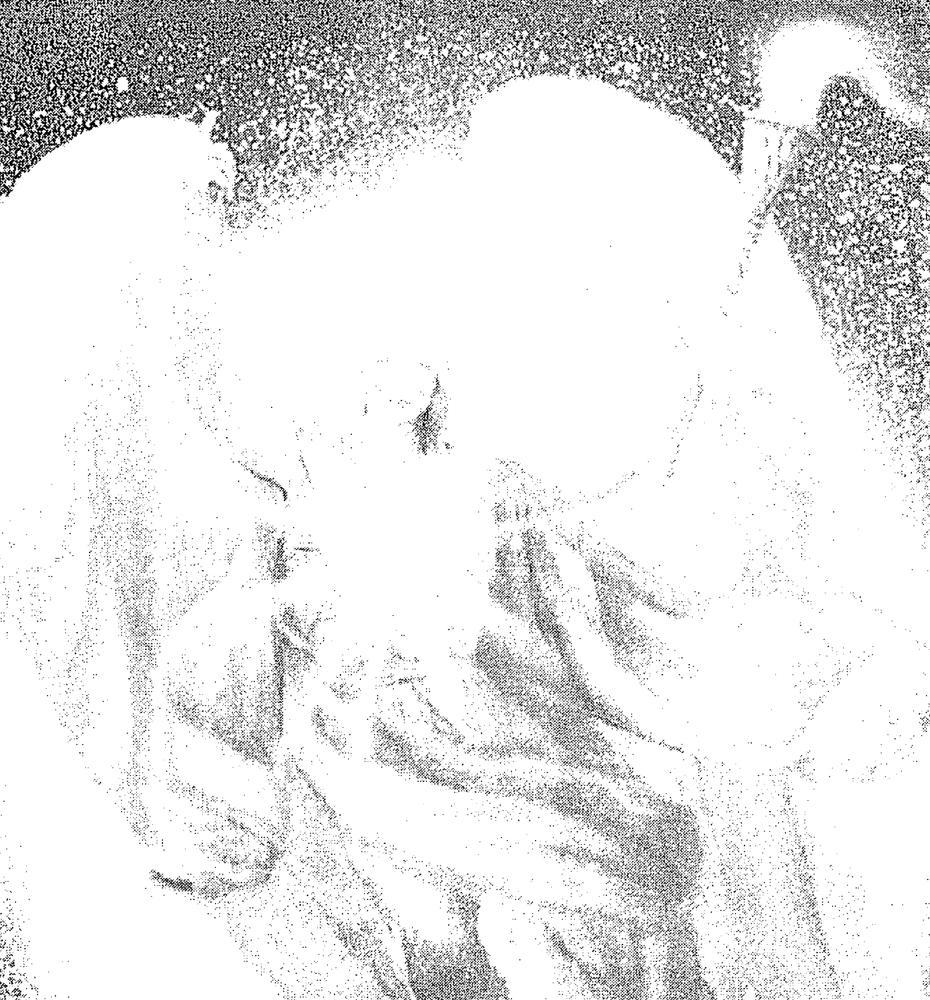

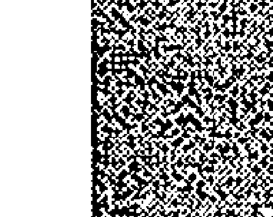

### 大天使愛瑟瑞爾 ♊ 雙子座

摩羯座是堅忍不拔充滿野心的成功代表，大天使愛瑟瑞爾是你人生旅途中最佳夥伴，他能幫你清楚表達出自己想要什麼、需要什麼。

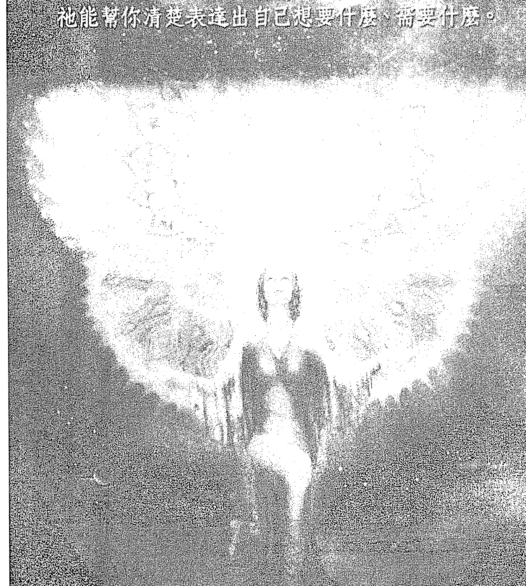

### 大天使烏列爾 & 水瓶座

水瓶座是星座中的思想家、科學家
他專注於為人類創造進步努力
烏列爾像充滿智慧的長者，微笑及蒼週兼具。

### 火星聖德勞 & 雙魚座

雙魚座是水象星座
聖德勞協助人們找到內心的平靜
兩者之間是相輔相成的關係

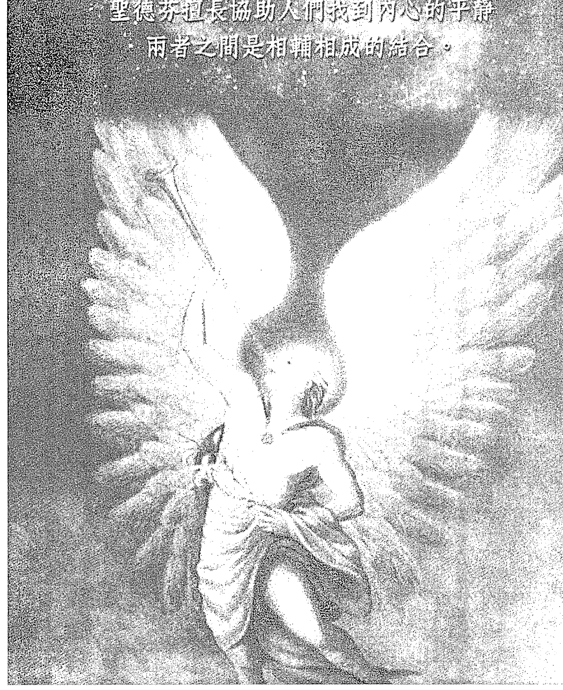