朵琳・芙秋博士 Doreen Virtue, Ph.D. & 羅賴・瓦倫坦 Radleigh Valentine 著 星宿老師（林樂卿）譯

> AMAZON
亞馬遜網路書店
五顆星最高評價
最受歡迎的天使塔羅牌
現在有了更深入的解讀

## THE BIG BOOK OF
## ANGEL
## TAROT
天使塔羅全書

符碼、牌陣、精確解讀的完全指南

THE ESSENTIAL GUIDE TO SYMBOLS, SPREADS, AND ACCURATE READINGS

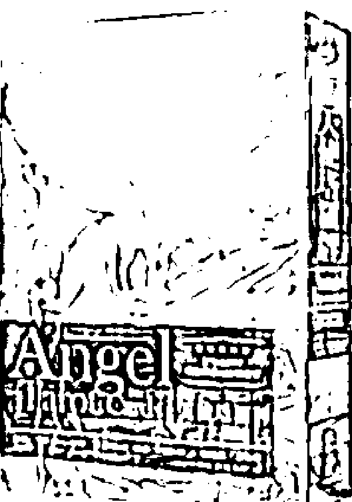

## St. Royal College
天使神秘学院

- ※ 专业占卜预测机构
- ※ 神秘学培训机构
- ※ 水晶能量研究中心
- ※ 官方淘宝：http://strc.taobao.com
- ※ 官方微博：http://weibo.com/715104687
- ※ 新书发布QQ群：316790219
- ※ 购买更多好书请联系院长大天使

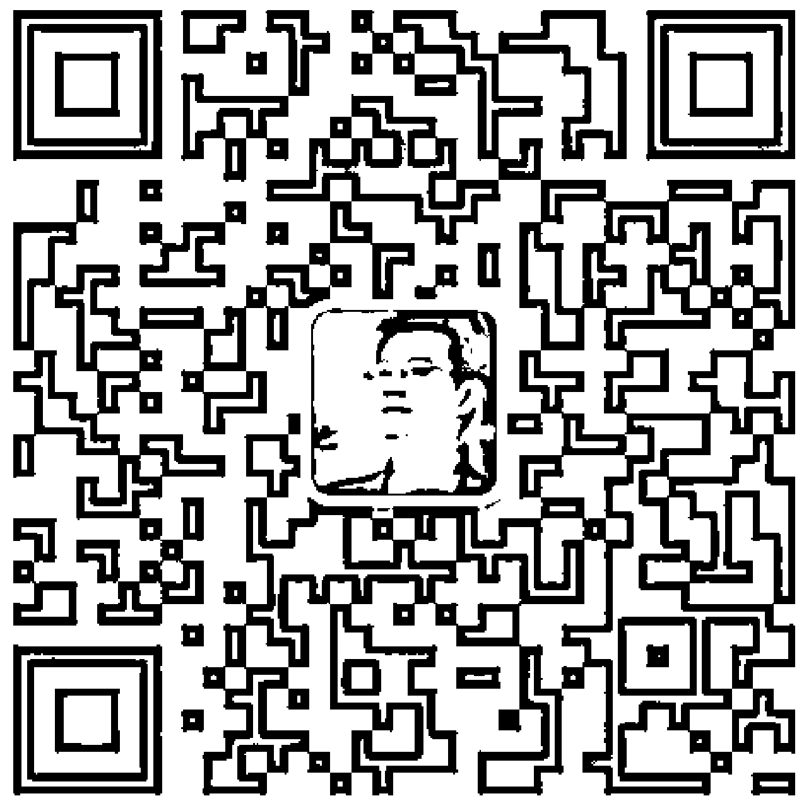

大天使
天使神秘学院 院长
QQ：715104687
手机/微信：13641926204

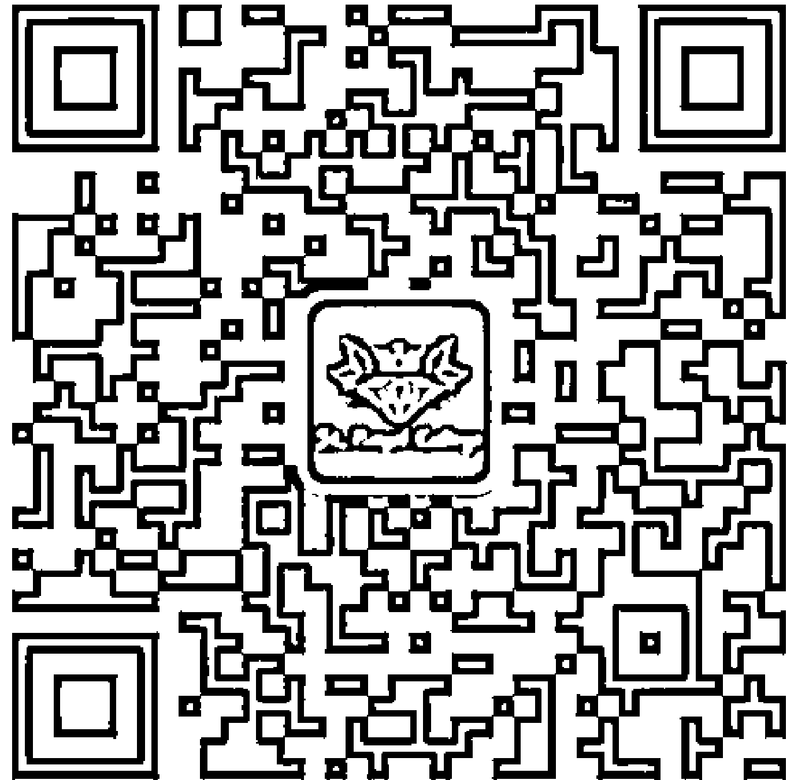

微信公众平台：strc2011

## 制作说明：

本书由《天使神秘学院》出重金从台湾购入的原版书籍扫描制作完成。为达到最好阅读效果，特地把原版书全部切开后，再经由专业扫描设备高精度扫描完成，并经过一张张的PS后期处理最终成书，其间花费大量的人力、物力以及时间，只为能给大家提供经济并优质的神秘学学习资料而努力。

本学院强力谴责某些机构和个人，把本学院花心血制作完成的电子书籍，包装后直接放在自家淘宝网上低价倾销的行为，以谋取不劳而获的经济利益。如果长此以往最终将无人愿意再为大家花心思制作电子书，那以后可能大家再无新书可读。

为让大家以后能够读到更多的好书，也为了本学院的良性发展。本学院恳请大家尽量做到如下几点：

1.  尽量在本学院的网站购买电子书籍。
2.  请勿用技术手段把电子书内的水印及加密去掉。
3.  在收到电子书后小范围传阅即可，千万不要公开传播，更别挂到淘宝网上低价销售。

同时为答谢广大支持者，学院电子书将做如下调整：

1.  学院会把一些早已收回制作成本的电子书折价销售。
2.  最新制作的电子书籍会开放打印功能，大家购买后有条件的可自行打印成书。

天使神秘学院
2017年6月

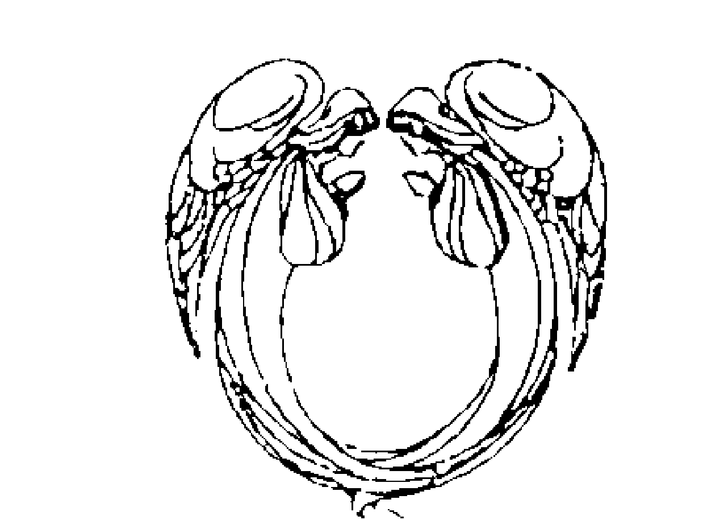

# 獻給我們親愛的家人

天使卡認證解讀者

## 目 錄 Contents

序 言 我們為何創作天使塔羅牌………007

## 第一部 天使塔羅的基礎

- 第一章：光明和美麗的指引………012
- 第二章：天使塔羅的緣起………015
- 第三章：天使塔羅的用語………021
- 第四章：夢想家之旅………025
- 第五章：小阿爾克納………031
- 第六章：圖案象徵和命名………045
- 第七章：大天使、天使數字和占星學………048
- 第八章：如何提供解讀………052

## 第二部：牌陣的魔法

- 第九章：創造你自己的牌陣………058
- 第十章：牌陣範例………064

## 第三部：穿越大阿爾克納的夢想家之旅

大阿爾克納

- 0. 夢想家………080
- 1. 魔術師………084
- 2. 女祭司………087
- 3. 女皇………091
- 4. 皇帝………095
- 5. 合一………098
- 6. 戀人………102
- 7. 戰車………106
- 8. 正義………109
- 9. 隱士………112
- 10. 命運之輪……116
- 11. 力量……119
- 12. 覺醒……123
- 13. 釋放……126
- 14. 平衡……129
- 15. 自我……132
- 16. 生命經驗……135
- 17. 星星……138
- 18. 月亮……141
- 19. 太陽……144
- 20. 更新……147
- 21. 世界……150

## 第四部：小阿爾克納中的日常生活

小阿爾克納

火之牌組

- 火之王牌……154
- 火之二……157
- 火之三……160
- 火之四……163
- 火之五……166
- 火之六……169
- 火之七……172
- 火之八……174
- 火之九……176
- 火之十……178
- 火之侍者……181
- 火之騎士……184
- 火之皇后……187
- 火之國王……190

水之牌組

- 水之王牌……193
- 水之二……195
- 水之三……198
- 水之四……200
- 水之五……202
- 水之六……204
- 水之七……207
- 水之八……210
- 水之九……212
- 水之十……214
- 水之侍者……216
- 水之騎士……219
- 水之皇后……222
- 水之國王……225

### 風之牌組

| 左列 | 右列 |
|------|------|
| 風之王牌…………228 | 風之八…………243 |
| 風之二…………230 | 風之九…………245 |
| 風之三…………232 | 風之十…………248 |
| 風之四…………234 | 風之侍者…………251 |
| 風之五…………236 | 風之騎士…………254 |
| 風之六…………238 | 風之皇后…………257 |
| 風之七…………240 | 風之國王…………260 |

### 土之牌組

| 左列 | 右列 |
|------|------|
| 土之王牌…………263 | 土之八…………279 |
| 土之二…………265 | 土之九…………281 |
| 土之三…………268 | 土之十…………283 |
| 土之四…………270 | 土之侍者…………285 |
| 土之五…………273 | 土之騎士…………287 |
| 土之六…………275 | 土之皇后…………290 |
| 土之七…………277 | 土之國王…………293 |

- 作者簡介…………296
- 藝術家簡介…………298

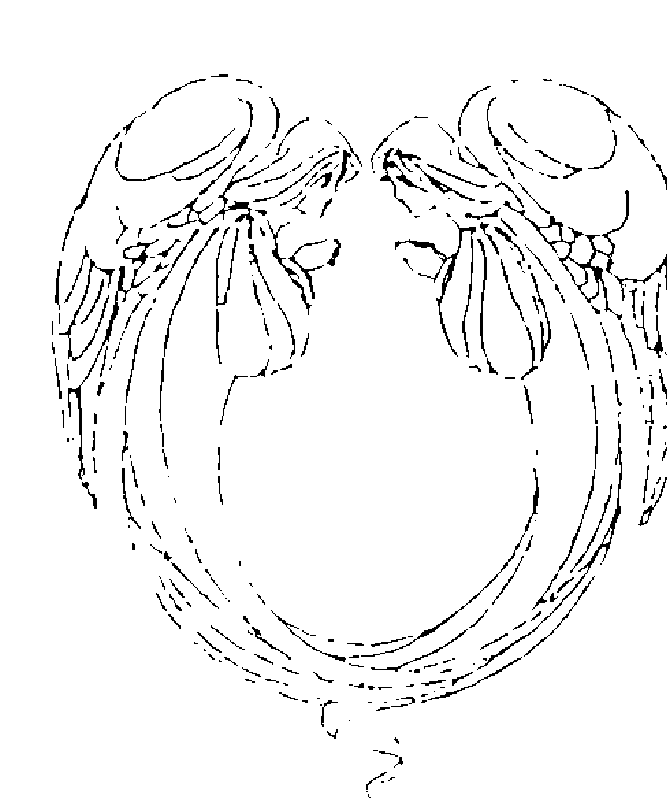

# 序言

## 我們為何創作天使塔羅牌

數十年來，我們一直著迷於塔羅。早在我們認識對方之前，我們一直使用這種古老的占卜工具求得精確和可信賴的答案，為我們的案主解讀。獨立於彼此，我們兩人都是將天使溝通和塔羅智慧結合使用，提供他人療癒和內在探索。雖然我們兩人都喜愛這個令人讚嘆的神諭工具，卻也對於傳統的圖案畫面感到不自在。每當我們親愛的案主因為在牌上看到了什麼而變得憂慮時，都會讓我們感到很挫折。

羅賴：我持續地在追尋這樣一副紙牌——符合我理想中的塔羅，可以當成一種慈悲與溫和的方式來和天堂溝通。難過的是，這個探尋的下場，只是在我的辦公室裡堆滿了紙盒，為數好幾打不再使用的塔羅牌。許多塔羅有不同樣貌的積極正向層面，但是也看得到其中有些令人感到痛苦的屬性，使得我將這些塔羅牌束之高閣。我發現自己在為案主解牌時，會藉由讓他們面向我，或者匆忙帶到牌陣中的下一張牌，來試圖減少他們看到最富挑戰性之牌的可能。

朵琳：另一方面來說，我本來對於塔羅就有不同的觀點。

## 天使塔羅全書 The BIG Book of Angel Tarot

我知道在某個時刻我將和某個人合作去創作一副注入天使能量的塔羅牌！我使用塔羅牌在為我的案主解讀時，我會丟開令人感到不安的牌，而只使用我找出的溫和且勵志的幾張牌。後來，我的祖母——珍珠（Pearl）在夢中來找我，告訴我要學習「畢達哥拉斯」（Pythagoras），一位古希臘哲學家、神秘學家、和數學家。在我循序漸進的學習中，我瞭解到創作神諭牌是非常重要的人生目標。遵循這個指引之下，我構想了許多不同型態的神諭牌卡，但是我仍然期盼創作出一副百分百正面的塔羅牌。

終於，我們（朵琳和羅賴）相識了，而隨著時間流逝，我們瞭解彼此對於創造一副溫和與親切版本的塔羅懷有相同的夢想。所以我們開始著手進行「天使塔羅牌」。對我們來說很重要的是，這些紙牌不是塔羅的稀釋版本，而是在人性體驗上有其深度和廣度，我們要這個概念充分表現在這副牌中，所以對於象徵體系有非常詳細的檢視。每當有某些令人感到痛苦的事物在圖案中被移除，我們就費心地找出象徵同件事物但比較平和的方式來取代。在需要的時候也會更改牌的名稱，以求更精確地傳達在最有挑戰性的牌中所植入的關愛訊息。

就歷史上而言，塔羅已經被神秘的氛圍所覆蓋，但令人困惑的是，為什麼要讓來自存在的訊息變得難以理解呢？所以我們決定了我們的目標之一：就是讓「天使塔羅牌」很容易上手。

> ~羅賴：當年輕的時候，初學塔羅牌的我，會拿著黑色麥克筆，在每張牌上面寫下牌義。

> ～朵琳：我喜歡這個主意，可以當成一種使這些牌充分被人理解的方法，並且也做為一種使它們「去神秘化」的方法。

因此我們下了一個決定，要在每一張牌上印出短句格言和關鍵標語，如此一來，就可以在拿出盒子後立即使用了，沒有學習或研究的需要。我們相信神和天使總在試圖指引我們朝向喜樂。由於塔羅純粹是和存在對話的語言，因而塔羅中的每一張牌都是愛的訊息，也都引導我們朝向喜悅。無論我們抽到了什麼牌，都會永遠是愛，不會是任何其他超過愛的，因為「神聖」只想要我們愉悅，而塔羅對我們而言是「神聖」的。

我們創作「天使塔羅牌」的期盼，就是幫助你感覺到，塔羅能夠為你的人生帶來愛、慈悲和希望。我們想要將這個歷史悠久、不可思議的藝術帶出陰影之外，且進入充滿「神聖」光芒的景象中！最後，我們最大的期盼是，當你在靈性的道路上前進時，這些牌能帶給你無限的祝福。我們希望你現在可以看到，塔羅如它總是呈現給我們的：一張導向愉悅生命道路的天使地圖。

摯愛
朵琳（Doreen）和羅賴（Radleigh）

第一部

## 天使塔罗的基础

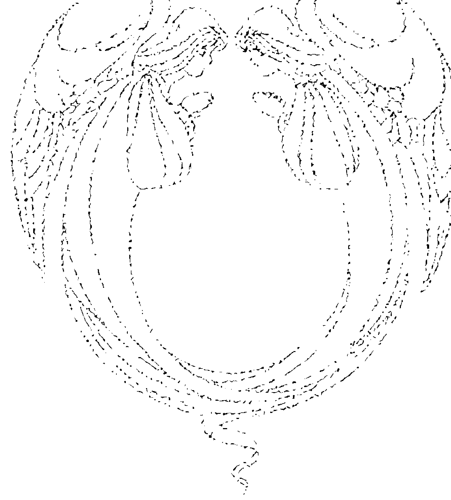

### 第一章

## 光明和美麗的指引

塔羅是「神聖」的語言，它是存在為了指引我們通往喜樂的道路，而慈愛地向我們訴說的無數方式之一。然而，幾世紀以來，這個美麗的占卜工具已經被裹藏在隱秘與不安當中。我們意圖藉由創作「天使塔羅牌」（以及撰寫這本書），透過充分揭開這美麗的神諭而平息擔心，來移除各種焦慮。

甚至可以說，塔羅的起源看起來就很神秘，數百年來人們已經被誘導而相信塔羅起源於古文明，且故意以只有少許嚴選的人才理解的秘密來編碼。這種概念通常為敏感的人們製造了苦惱——更不用說許多人剛開始在接觸塔羅牌的時候，會有缺乏信心的經歷了。

好的，是鬆一口氣放下心來的時候了，因為塔羅是為了我們所有人而創造的！它的起源不是在一個古老秘密結社的黑暗密室中。不，它是以一個快樂、歡笑、和相聚的創造品為開始的——事實上，做為一種遊戲，本來就是讓全家人一起玩的！

# 光明和美麓的指引

生也該是有樂趣的——一個能帶給我們醒悟和鼓舞的快樂遊戲。

隨著時間流逝，塔羅受到數百萬人歡迎，享受著它原本被創造所形成的遊戲。然而這些人也在尋求洞見和指引。他們開始去瞭解牌上的一些東西——反映出他們人生的故事。因此塔羅開始演變了。人們和朋友分享他們的牌和他們的占卜能力，並且把知識傳遞給他們的子孫。

儘管在接下來的某個階段，一些會社圍繞著塔羅和其他也許算是善心人士所創造的神秘藝術興起了。然而，這些人很可能就是藏私的典型，喜歡懂一些別人不懂的事物。不幸的是，他們的行動以及對塔羅的佔有態度，使它看起來具有威脅性、曖昧不明、以及有點駭人。就像是丟了一條大毛毯覆蓋在一盞非常明亮的燈上。

嗯，結果呢？我們如今身處於二十一世紀，而且天使圈裡的我們不喜歡秘密知識、排外的會社、或者是威脅性。所以毯子被掀開來了，而燈比以往更明亮地照耀著！

有人問道是什麼讓塔羅發生作用呢？嗯，這個問題的答案，會比你所想的還要簡單。想像著人們步行穿越一座未開發的森林，這些探險者將他們的正面經驗告訴了朋友，然後這些朋友也想要自己去看看。結果穿越森林的路徑就這樣被磨出來了。

這些人就是「開拓者」——就像是最早看見在紙牌遊戲中隱藏真諦的人。而從那個時候開始，數以百萬的人遵循了那條路

## 天使塔羅全書 The BIG Book of Angel Tarot

徑。透過他們在塔羅裡結合信仰和信念的力量，創造了一個和存在溝通的直接形式。那就是塔羅！

使塔羅運作的是，我們所有人一起透過一個鍾愛美麗的占卜工具來尋求答案。大多數人們使用塔羅幫助其他人接受「神聖」的指引——而我們相信這些個體是「地球天使」在為人類服務。

所以如你所見的，塔羅將百分之百秉持著讓人們快樂的初衷！

### 第二章
天使塔羅的緣起

根據歷史學家所言，塔羅的歷史相當錯綜複雜，劇情峰迴路轉。然而，如果我們保持一種高視野角度的綜觀，這樣解釋起來相對簡單多了。

## 塔羅的起源

現今我們所能找到最古老的塔羅牌證據，帶領我們回到了十五世紀的北義大利。一般遊戲紙牌先於塔羅而存在（譯註：囊括四花色牌組的紙牌，於今演化成許多種類，撲克牌只是其中一種），然而「第五牌組」的加入，可以溯源到大約 1420 年前後，這些紙牌是如今我們稱為「大阿爾克納」的始祖。它們用來做為一組「王牌」（trump，譯註：字源本意是勝利或勝出），而和規律成套的 56 張遊戲紙牌，一起使用在稱為「塔羅奇」（Tarrochi）的遊戲中——這至今仍然有人在玩，而且跟「橋牌」（Bridge）非常相似。
北義大利是這類紙牌創作的生產聖地。然而，「王牌」的張數隨著製作者而有差異，牌裡的順序也一樣。通常沒有標上號碼

也沒有牌名，所以我們對於某些牌其創作順序的瞭解，很多是模糊不清的。附帶一提，「愚人」這張牌通常不那麼被視為「王牌」，而是當成在這些紙牌中的一種「百搭牌」（wild card，譯註：具有特殊性質作用的一張牌，可以任意變換當成其他某張牌）。

我們有幸能保有這些古代塔羅的一些著名範本，因為當時的巨富委託藝術家為他們手工繪製了這些牌。這些整套的牌被認定為藝術作品而受到關心，並且世代流傳下來。透過印刷機器製作的紙牌罕有倖存者，而那些牌也就只有碩果僅存了。

義大利人喜愛他們的塔羅牌，而創作紙牌的事業蓬勃興盛！在 1499 年，法蘭西奪取了米蘭的控制權之後，塔羅就流傳到這個國家。在二十年之間，馬賽變成了法國的塔羅生產中心。慢慢演變之下，不只是「大阿爾克納」各張牌都得到了編號和命名慣例，還有牌的順序和結構也大幅轉變成具有一貫性了。在紙牌中大多數的象徵圖案，也同樣如此演變。

## 塔羅成為占卜工具

有證據顯示，一般紙牌被用來占卜比塔羅的出現更早。這使我們相信塔羅可能從一開始，除了做為紙牌遊戲之外，就被當成占卜工具來使用。

在十八世紀末至十九世紀初，非正統的另類靈性主義在法國變得很風行。塔羅起源於埃及然後經由吉普賽人帶到歐洲的故事，儘管沒有證據顯示這是事實，但還是在街頭巷尾傳開來。有些宣稱能夠看懂古埃及文的人，辨識出秘密訊息並歸因於塔羅，

## 天使塔罗的缘起

后来被懂这个语言的人发现全都是伪造的。

还有一点很值得注意的是，在古代埃及并没有纸张，在对散布故事的那些人指出这点之后，他们就宣称图案在埃及是印在黄金上或其他贵重物品的表面上，一样还是没有找出相关证据。尽管如此，这些故事捕获了大众的想像力，也导致秘密和神秘色彩笼罩着塔罗。

十九世纪末，一些秘密会社宣称塔罗是他们学说的一部分，使用在入门仪式和成员训练上。这更进一步加深了围绕着塔罗的恐惧和猜疑感。不是塔罗牌本身创造出这个恐惧，而是使用的人所创造出来的！经由这些团体，占星学、生命灵数、以及其他神秘艺术，都制定出和塔罗中每一张牌的连结对应。

有个秘密会社中的两位成员一起合作，创作出一副著名的塔罗牌，名为「莱德-伟特塔罗」（Rider-Waite Tarot）。亚瑟·爱德华·伟特（Arthur Edward Waite）和艺术家帕蜜拉·柯尔曼·史密斯（Pamela Coleman Smith）搭档，创造出这副突破创新的塔罗。（「莱德」指的是当时这副牌的出版商）

这副牌问世于 1909 年，且深受法国马赛塔罗的影响，弥漫着象征符号和隐喻。图案经常是悲剧式的，就算不是彻底让人感到害怕，也是让人难以了解。

此时伟特还做了件打破惯例的事，在他的牌中调换了「正义」牌和「力量」牌的位置，变更了数世纪以来的方式。他这样做是使大阿尔克纳的排列在占星学上符合他喜好的顺序。附带一提，今日许多塔罗师称这副牌为「伟特-史密斯塔罗」，是为了

給予藝術家正名，因為這個創作品有她參與其中。

另類靈性主義也在這時候式微了，所以塔羅沒有流通在更廣大的社會圈子裡。人們看見這些牌的時候，是在小鎮的市集中被展示在算命者的攤位上。籠罩著塔羅的神祕與不安，由於電影工業的發展而更為強大。塔羅牌從未被一般人使用在尋求啟蒙上，反而在肆無忌憚的靈媒手中成為一項工具，嚇唬那些透過掀開令人不安的圖案來尋求建議的人。

## 改變的時刻

隨著數十年的進展，許多塔羅的新演繹問世。不過，這些牌大部分都很密切地遵循萊德偉特塔羅，圖案和用語都少有改變。這些新款紙牌大多造就出畫家的新詮釋，或者成為反映某些主題的新奇紙牌，像是「維多利亞時代」或者是「亞瑟王時代」等。截至公元兩千年，這些選項是沒完沒了的。然而，這些紙牌中有許多款，甚至還比數世紀之前的紙牌更為駭人和令人感到痛苦。

許多敏感的人們著迷於塔羅，而且期望善用這個令人驚奇的工具。但是在超心靈書店的架上搜尋過之後，讓他們感覺到牌上真的呈現太多恐懼了。

> 朵琳：在「賀氏書屋」（Hay House）出版我的第一副紙牌「天使神諭卡」（Healing with the Angels Oracle Cards）之前，我曾運用塔羅牌為案主解讀。當我使用塔羅牌的時候，我拿走「小阿爾克納」牌和駭人的「大阿爾克納」牌，藉由和天使做

# # 天使塔羅的起源

連結而使用挑出來的九張或十張塔羅牌，我能夠提供非常仔細精確的解讀。

一直以來，我夢想創作一副以天使為主的塔羅牌，我構想出基於原始系統的 78 張塔羅牌。然而在我想像的畫面中，這副溫和的「天使塔羅牌」，並沒有令人驚慌的象徵、圖案、或文字。不過我知道我無法獨自創作這副牌。我需要和一位與天使也有強烈連結的塔羅專家一起合作。於是我的朋友羅賴·瓦倫坦（Radleigh Valentine）加入了。

我最早遇見羅賴，是他在加州的拉古納海灘（Laguna Beach）參加我的「天使治療專業課程」（Angel Therapy Practitioner Course）的時候。我們馬上成為朋友，而他很快地加入我的機構，他在這裡協助「天使治療專業課程」許多年。羅賴以他的塔羅和占星工作聞名於圈內，他甚至教導「天使治療專業」學程全日班的畢業生學塔羅牌。他也是一位「註冊會計師」（CPA），雖然他最後放棄了會計工作，轉而從事天使解讀。

有一天，我出現了一個清晰的觀想，是羅賴和我成為一副溫和的「天使塔羅牌」的共同作者。在 2011 年我被安排到科羅拉多州的丹佛（Denver）簽書，羅賴就居住在這個地方，所以我去找他商量這個計畫，這時候他感到興高采烈，因為他的願景就是將塔羅「去神秘化」並使它更平易近人。

我們兩個人和藝術家史蒂夫·羅伯茲（Steve A. Roberts，譯註：「天使塔羅牌」的繪圖者）合作，移除了駭人的文字和圖案，並且以保留塔羅的深邃、精確性的語彙以及藝術畫面來取# 天使塔罗全书 The BIG Book of Angel Tarot

终究，这些牌都是「据实以告者」，但永远是以善意和关爱的方式。它们从不该是吓人的！

在数世纪的隐晦和黑暗之后，塔罗被带回来而进入了光芒，在其中每个人都能够使用这些牌来得到来自上天和天使的答案以及指引。

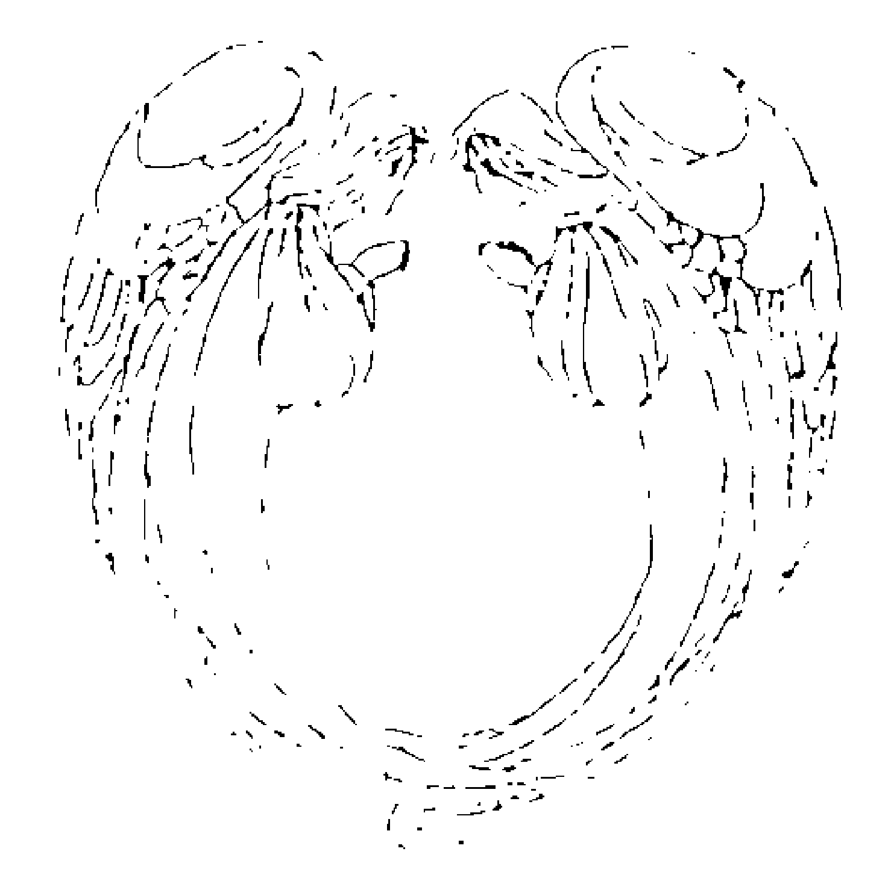

## 第三章 天使塔罗的用语

让我们来定义一些在塔罗世界中常用到的术语。了解这些词汇能使我们更容易和更轻松地学习如何提供精确的解读。

### 阿尔克纳 Arcana

「阿尔克纳」（Arcana）的意义是「奥秘」（mysteries），这并不是指「秘密」（secrets），指的是宇宙将自身织进我们生命的神奇奥秘方式。塔罗可以拆成两大部分，称为「大阿尔克纳」和「小阿尔克纳」。「大阿尔克纳」记载大的、戏剧化的人生事件，而「小阿尔克纳」聚焦于日常生活。因此，广泛地说明之下，你可以认为它们是生命中的「大奥秘」和「小奥秘」。（arcanum是单数，arcana是其复数型）

### 宫廷牌 Court Cards

「宫廷牌」指的是「小阿尔克纳」各牌组中出现的侍者、骑士、皇后、以及国王。这些牌可以代表生活中的人物或者是情境（见第五章）。

### 梦想家之旅 The Dreamer’s Journey

这是遵循「大阿尔克纳」二十二张牌的顺序发展出来的一连串故事情节（见第四章）。梦想家就是你和你的梦想，或者任何正在接受解读的人。

### 二元牌 Duality Cards

「二元牌」即具有二元性牌义的牌，可以解释成某个极端的概念、不然就是另一个极端，根据解牌时的情况而定。举例来说，合一牌可能指出做决定时「采取传统路线」的需要，也可能意味著「跳脱框架思考」。土之四可能是在警告花费太多钱的人，也可能反映了放轻松和花更多的渴望（你终究没有办法带着金钱走）。「二元牌」的讯息，可以根据解牌中其他的牌或者个人的特殊情况来决定。

### 跳示牌 Jumping Cards

在洗牌或从盒子里拿出来的时候，从整副牌中掉出而看起来像是「跳」出来的牌，可以称之为「跳示牌」。这些牌也要看待成解读的一部份，应该放置在一旁，在其他的牌都检视过后加以参考。

### 点数牌 Pip Cards

「点数牌」这个术语指的是在「小阿尔克纳」各牌组中，标上从王牌（Ace，译注：等同于一号牌）到十号数字的牌。Pip 这个名词意指「计数物件」，起源可以回溯到「小阿尔克纳」牌上没有精致的画面而只有点数和花色象征物的时代（见第五章）。

### 问卜者 Querent

在塔罗界里，「Querent」是一个很通用的术语，意指来寻求解牌的人。当你为自己做解读，你自己就是「问卜者」。如果你透过纸牌为别人提供洞见，那个人就是「问卜者」。我们在本书中，则偏向将「问卜者」称为「案主」（the client）。

### 逆位牌 Reversed Cards

从整叠牌中抽出来的牌，牌面的上端朝下而方向颠倒的牌，就称为「逆位牌」。许多种塔罗牌对于逆位的倒牌有不同的意义解释。然而在「天使塔罗牌」中，逆位牌没有归结出另外的意义。所有你应该做的仅只是将牌转向成为正位，然后继续进行解读。（译注：这副牌的说明册上也有写到逆位牌的通论，提到有这样的解读方法：「表示你需要特别重视与这张特定牌卡相关的议题。逆位牌也可能意味环绕这张特定牌卡的能量已经开始减弱。」）

### 指定牌 Significator

当一张牌使我们联想到了某个认识的人，这张牌就称为「指定牌」。举例来说，有人可能认定火之皇后具有某位姊妹的许多特征，或者是风之骑士的图像和侄子有明显的相似性。那么在未来解牌的时候，这张牌就可以用来指明认定的人，但只有当那些人物在解读中出现得顺理成章的时候才成立。不然即使指定牌已经设定了，也没有必要试图将这些链接硬加进解读中。

### 牌阵 Spreads

「牌阵」是摆放牌卡以某种方式进行解读的指导原则。通常牌阵都有确定的形状，以及各张牌的位置连结的意义，设计来运用在特定的主题上，像是爱情、健康、或者人生目标（见第九章和第十章）。

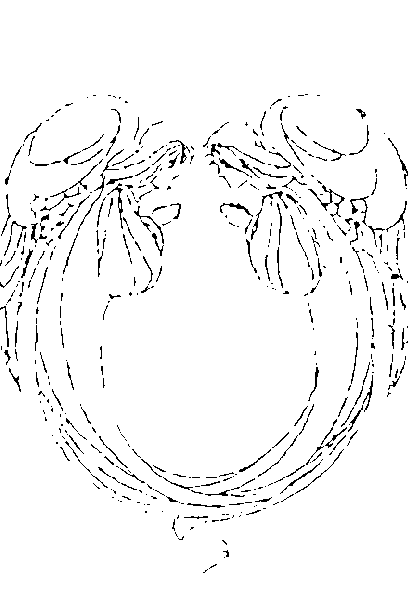

## 第四章 梦想家之旅

「大阿尔克纳」由塔罗牌最前面的 22 张牌所组成，编号为 0 号到 21 号。这些牌通常象征重要的人生事件，或者正在经历别具意义的境遇。对于经常为自己解牌或为固定常客解牌的人，在牌阵中抽到「大阿尔克纳」牌的效力可能会减小些（我们不会每天都有重大的生活情况！）。然而，在为陌生人或不常见到的案主解读的时候，「大阿尔克纳」意指重要的人生事件。

「大阿尔克纳」也可以反映人生自始至终的不同时期，包括出生、结婚、就业、以及心灵成长的阶段。我们称此为「梦想家之旅」，这方法非常有助于了解案主在人生中的处境。记住「大阿尔克纳」各张牌的历程，解读的方向可能是字面上的或者是隐喻的。例如，女皇牌相关于创造力，并由此可以指出怀孕。在解牌中抽到这张牌的人可能快要有宝宝了，也可能正关注于「催生」内心怀抱的梦想。

在梦想家之旅中，梦想家是接受解读的人。所以如果你为自己解读，那么你就是梦想家；如果你为别人解读，那个人就是梦想家。旅程中在经历每张牌的时候，你就是我们所指的梦想家。

「梦想家」（Dreamer）这个词具有多重意义，所以让我们来定义清楚。在「天使塔罗牌」中，梦想家指出一个怀有梦想和意图的人——某个人正在体验人生如梦。然而身为一个梦想家，并不表示你仅仅在梦想着自己的目标而已。这是一个积极正面的名词，意味着你是重要的，因而你的梦想也是重要的。「天使塔罗牌」将指引你如何使美梦成真。

记住，还有一点也是很重要的：虽然梦想家牌上的年轻人是描绘成男性，但这个故事却是同样适用于男性和女性的旅程。

为了帮助你了解塔罗的这个层面——以及你自身的「梦想家之旅」——我们现在就要带领你踏上经历「大阿尔克纳」的神奇旅程！

### 梦想家之旅

- 0 — 梦想家：这是一个开端。身为梦想家，你下定决心跨出「信任的一跃」，启动一段全新的历程。隐喻地想像这张牌——像是地球上新生的灵魂。你带着乐观、振奋、以及这段冒险将会一举成功的彻底信念来到这世上，在全然的信念中向前行。
- 1 — 魔术师：现在你（也就是梦想家）已经来到这世上了。你遇到的第一个人就是魔术师。从这个神奇的人物身上，你发现自己能够运用这个世界中的四元素。你能够生火，也会引水将它扑灭，你可以呼吸空气，也能耕作土地。就和运作世俗的物质一样，你也有能力掌控灵性的能量，去创造出你所期盼的一切。
- 2 — 女祭司：瞭解了你能够创造所期盼的一切，和知道你想创造的究竟是什么，两者并不相同！所以身为梦想家的你继续前行，从女祭司身上学习走向内在的重要性。你学习了如何静心冥想，以及倾听神之声、天使之声、和「高我」的声音。你询问这个问题：「我是谁？而我此生要做的是什么？」。发现自己「神圣生命目标」的追寻已经开始了。
- 3 — 女皇：你身为梦想家，和女祭司共度的时光是成功的，而你现在瞭解自己的人生想要做的是什么了。女皇是具有惊奇创造能力的女性，一旦她专心致志就没有做不到的事。所以你从女皇身上学到如何让事情完成——在渴望之后有所行动，才能使这一切在世界上显化。
- 4 — 皇帝：创造力非常地令人惊叹，但是没有逻辑和组织的行动将导致混乱。皇帝教导他所遇见的梦想家在纪律和秩序背后隐藏的智慧。然而皇帝并不是无情的，他的职责通常是为了大局着想，并确保人民的需求得到满足。他只是在创造力上增添了结构，以便于尽可能提高效率。
- 5 — 合一：没有道德观的纪律和秩序，很可能变成一种暴行。所以「梦想家之旅」的下一站，就是「合一」这张牌。在这里，你体认到自己想要被团体中的人理解和接纳，你也学习到接受其他人的观点。
- 6 — 恋人：正如所有的梦想家一样，随着你的成长而无可避免地终会找到爱。这张牌是关于改变人生的爱情关系，你得以了解爱能够将情绪的力量和美丽带进你的生命之中。你也学习到不再总是从理性思考出发，而是从「心」做出选择的重要性。
- 7 — 战车：你（身为梦想家）所做出的选择，伴随你进入成年，从此你开始成为自主的个体。透过展现绝对的意志力和决心，你将能够完成大事，而成为世界上的成功人士。你正值年轻和强壮，准备好要迎接人生。
- 8 — 正义：随着你离开家园前往这个世界冒险，你必须学到每个行动都会带有一些后果。你将会明白「好人有好报」，以及「一报还一报」类似的道理。要瞭解你必须坚持自己认为是正确的事，不然就必须接受自己无作为的结果，这点对于身为梦想家的你是很重要的。这张牌促使敏感的梦想家成为明确坚决的人。
- 9 — 隐士：随着时间流转，你开始询问自己非常犀利的问题。你开始在世界上寻找意义以及你在其中的定位。你动身前往一段自我发现的探索，那将定义你成为什么样的人。做为「梦想家之旅」的一部分，你可能寻求独处，或者寻得一位能够教导你更深层生命意义的导师。
- 10 — 命运之轮：和隐士共度一段时光之后，你体认到自己开始明瞭世界真正运作的方式。你在追寻中得到了部份答案，而现在是再度行动的时候了。梦想家确实有其命运，然而是由你自身创造出来的。命运之轮代表世界在运转中，特别是在一段无为之后。
- 11 — 力量：随着你在「梦想家之旅」中的进展，你发现了慈悲和善良的力量。你进而瞭解，将自己的意愿强加于他人并不会带来快乐。秉持融入温柔的勇气在你的道路前行，由此发展出内在的坚强和知识，你体验到了更多喜乐。
- 12 — 觉醒：如同所有的梦想家，你终究来到人生中滞碍难行的时期。生活好像有点颠倒过来，而你的观念被这个经验永久改变了。你感觉受到了召唤，将自身的需求搁置一旁而去服务他人。你瞭解放手是好的……并让神掌控一切。
- 13 — 释放：最近的体验使你明白了真正重要的是什么。你也开始觉察到，出现在生命中情境和人物，不再有助于你的「神圣生命目标」。身为梦想家，为了孕育出心中期盼的新开始，你需要拥抱成长过程必经的结束。你的转变是灵性的蜕变。
- 14 — 平衡：身为梦想家，沿着道路经历「大阿尔克纳」之旅，你已经有了丰富的体验。现在必须去平衡所有的冒险经验，并且将它们同化为一个整体，成为有凝聚力的人生哲学。你发现过着充满个人调适和人际合作的平衡人生，能带来健康和满足。
- 15 — 自我：随着你继续追求自身的发展，你开始觉察到日常生活中「自我」的冲击。透过更深入地瞭解自身内在的挑战，体认到你将能够面对自己这些层面，并且藉以重获力量。现在你总算明白，认为他人会阻碍你的生命道路这样的信念其实是种错觉。你希望放开可能诱使你远离心灵生活的俗务。
- 16 — 生命经验：梦想家的世界还剩某些层面，妨碍你拥有真正的快乐，而摆脱这一切的时刻已经来临。存在以及你的天使会找到方法，将真实的改变和进化带进你的生命中。或许你也可以自己选择做出改变，这样会感到更能控制转变的过程。然而不论透过哪一种方法，你将获得解放。
- 17 — 星星：你曾经受困于绝望之中，如今你已经获得解放。你的信念变得坚定而牢不可破——有如从壶中注出的水流源源不绝，完全不用担心会耗尽。宇宙的无限丰盛，如今完全清晰地呈现在你面前。你拥有移山的信心！
- 18 — 月亮：处于梦想家喜乐和希望的状态中，因而没有充分觉察到周遭正在进行的事。你得到提昇的直觉力透露著，这里有超乎眼前所见的存在，但你不肯定那意味着什么。为了避免恐惧和忧虑把你丢离原本的道路，必须抛掉最后的不安全感，并相信正在体验的感觉，会引导你度过黑夜直到清晨来临。
- 19 — 太阳：清晨来临了，接下来，开悟的明亮光芒充满了你的灵魂！在这个旅程中，你感受到的只有喜乐和以自己的成就为荣。你充满了自信，而且瞭解凭着自己选择的人生，你能够做到任何事情，并且成为一位成功人士。你已经获得了重生！
- 20 — 更新：如今，你成功地在道路中前进，来到了旅程的最后一站，你发现自己处于估算和评价的阶段。你眼前的任务是找出心中任何未解的课题，并且献上宽恕给所有期盼的人。既然你如此成功地打击了「自我」，而将信念、希望、和信心带进心中，那么现在你打算如何安排你的人生呢？以灵魂深处的体认，仔细检视所有的选项，你试图去做的任何事情都将会成功！
- 21 — 世界：如今旅程完成了！梦想家的所有计划都已经达成，你是强大而完整的，而且在成功中闪耀光芒。你拥有的选项，是暂停一段时间，也可以重返旅程的开始而尝试新事物。然而现下这一刻，你得享沈醉在完美的「神圣」沐光中！

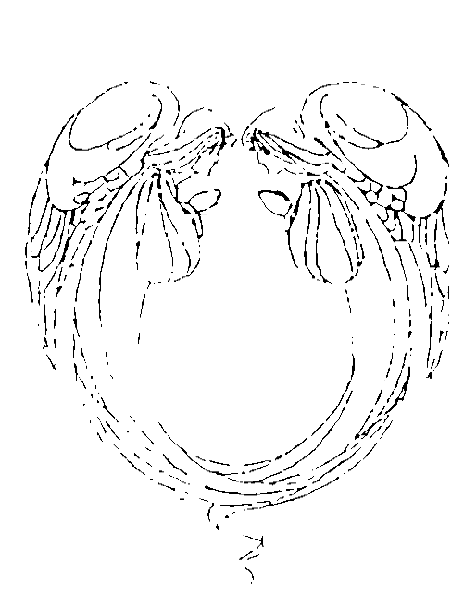

## 第五章 小阿尔克纳

「小阿尔克纳」牌反映我们日常生活的层面，像是工作、家庭、和财务状况。虽然大的生活事件通常是在「大阿尔克纳」牌中，颇具意义的经验也会出现在「小阿尔克纳」中。例如说，有「小阿尔克纳」中的牌反映结婚、有了小孩、转换工作、以及继承了一笔为数可观的财富。只是多数的「小阿尔克纳」是关于我们寻求快乐生活的期盼。

「小阿尔克纳」中有四种花色牌组，每一牌组包括十张「点数牌」和四张「宫廷牌」。如前所述，Pip 意指「计数物件」。它是一个指称王牌到十号牌的古老名词，源于没有图像在那些牌上的时期。当时的塔罗牌像是一般的「游戏纸牌」，牌面上只有简单符号像是「方块」或「梅花」。（译注：这里指的「游戏纸牌」就是扑克牌，「方块」(diamonds)本意为钻石，「梅花」(clubs)本意为棍棒。）

「天使塔罗牌」的四个牌组是：火元素、水元素、风元素、土元素，也就是大家所知的「四大元素」。配置四元素相应于每个牌组，这对塔罗来说并不是新的概念。传统塔罗牌中的牌组是权杖、圣杯、宝剑和金币，早就和这四大元素有了连结，各别对应其中每一元素。

### 四元素牌组

火元素：「火」之牌组代表在生活中感到强烈热情和振奋的层面。在传统塔罗牌中，这是「权杖」牌组。火元素牌组聚焦在创造力和热情上。有关我们的事业，追逐心中梦想的渴望，以及像是绘画、表演、或是写作等等艺术工作，在这类问题的解读中，查看火元素牌是典型的做法。火之牌组中的想法充满了冒险，虽然有可能指出行动中的暂时休息，但是在火之牌组中我们不曾真的闲散下来，甚至当身体上没有在做任何事的时候，火之牌组仍要求我们构思未来。火元素也能代表任何一种热情。举例来说，如果案主对于狗有着热情，那么在解读有关于他们的宠物时，问题可能就出现在火元素的牌组上。

水元素：由于我们的世界中有情绪层面，因而塔罗中相对也有「水」之牌组。在传统塔罗牌中，这是「圣杯」牌组。水元素牌组代表我们生命中的较深层部分——举例来说，坠入情网、有小孩、或者结交一位感到深挚亲密的友人。我们的家人、家庭、和童年记忆，也在这些牌中。水之牌组可能指出订婚和结婚的喜庆时刻，以及拥有幸福的家庭生活所必需的辛勤工作。水之牌组也代表我们的灵性和直觉的天赋。

风元素：「风」之牌组代表我们的理智，在传统塔罗牌中，这是「宝剑」牌组。风元素牌组聚焦在耀眼的新点子，有创见的选择，以及带来全场风靡的表达能力。然而风元素牌也描述我们无法做出选择的时刻，发现自我和他人起了冲突，或者觉得陷入自身的负面消极中。这是思想的牌组，所以我们可能在风之牌组中体验到恐惧或忧虑。当这样的牌出现的时候可以深信，塔罗正在尝试帮助我们或案主明瞭这些片刻只是幻象，而我们可以从中觉醒过来。最起码，问题是由我们自己所创造出来的，因此能够得到解决。风之牌组也代表法律方面的问题，诸如真相和正义。

土元素：最后的牌组是「土」之牌组。在传统塔罗牌中，这是「金币」牌组。土元素的牌，聚焦在赚钱、消费、和满足家人的物质需求。在这个牌组中，出现的是我们的日常活动、工作、和对财务保障的追求。其他三个牌组通常涉及来自内在的议题（热情、情绪和点子），而土之牌组则全然关乎外在的事件。社会、社群，以及我们的身体健康，也是由这些牌所代表。土之牌组更是非常关心环境，以及我们如何保护我们的地球——这个美丽的行星。

每一牌组也可连结一年之中的一个季节。然而，对于哪一个牌组配置于哪一个季节，在牌卡解读的圈内存在一些争议。共识上看起来是：火之牌组＝春天，水之牌组＝夏天，风之牌组＝冬天，土之牌组＝秋天。我们觉得这一组连结也同样适用于「天使塔罗牌」。（译注：至于四元素牌组的象征设计配置如下：火之牌组以友善的龙为象征动物；水之牌组以人鱼的水世界为主；风之牌组以独角兽来代表人物和象征物；土之牌组呈现的是精灵的国度。火、水、土的牌组内，都仍保留权杖、圣杯、和金币做为象征物，只有风牌组相应的宝剑不再出现，以独角兽头上的角取代。）

在解牌的时候，如果看到在牌阵中出了很多张某个牌组的牌，或者在牌阵中缺乏某一个牌组，这就很明显地点出了问题。举例来说，如果有人提问了恋情关系的问题，我们会希望看到出现水之牌组中的牌（代表爱和情绪），以及火之牌组中的牌（代表热情和振奋）。如果在解牌中没有出现这些牌，就突显出了这个问题：「在这段关系之中的感情在哪里呢？」

大量的风元素牌（代表理智和分析），可能指出这段关系中的某一方或者双方不是以情感为导向，也可能是以理智大于情感来看待这段关系；占大多数的土元素牌（代表财务和职业），可能指出某人看待这段关系是基于对财务保障的考量，甚于感情中所能提供更滋养的层面。

### 点数牌

「点数牌」是在「小阿尔克纳」的四个牌组中，那些标示王牌到十号的牌。就数字方面来说，同样数字的牌会有一个共同的线索。举个例子，如果在牌阵中出现许多牌是数字五，可以从我（朵琳）的书——《天使数字书》（Angel Numbers 101）中描述的天使数字，得悉数字「五」意味著「改变」。这在传统塔罗牌和灵数上也是相同的。所以，在举例的这个解读中，里面包括许多五号牌，可以肯定重大的改变将要来临。接著，让我们来个别讨论每一个数字。

### 王牌

王牌 (Ace) 指出一段崭新的起始，有着新的开端或机会。通常为一场新的尝试带来某种形式的能量。可能包括物质的礼物，像是金钱、或者情绪、概念、他人的协助，或者案主对蓄势待发的未来感到的强烈振奋。王牌通常也和「宫廷牌」中的「侍者」牌有关连，因为两者都可以指出新讯息。多张王牌出现在解读中指出，某人正在展开一个全新的阶段，触及人生中有别于以往的许多方面。

### 二号牌

二号牌通常指出友谊、恋爱关系，或者在两人与更多人之间任何型态的合伙关系，所指的关係型态是由所属牌组来诠释。火之二通常是一个事业基础的关係；而水之二有更多私人性质；二号牌也可以指出，在两个不同选项中做出选择的需求，这反映在风之二和土之二中。这个数字的能量要我们找出平衡、和谐以及合作。在同时隐含多重涵意的情况下，也表示二元性牌义。多张二号牌出现在解读中，可能揭示在各式各样的人生方面上做出选择的需求，同时也是和他人合作达成不同目标的需求。

### 三号牌

三号牌代表创造力、成长、和自我表达。数字三意指双亲或者一男一女的能量，诞生出一个新的人或计划。三号牌指出需要看清我们的方向，并基于这些目标做出决定。在水之三这张牌中，三号牌的创造力概念拓展为小孩的诞生；风之三往往反映出当我们无法欣然接受改变时，可能会为我们人生带来成长的一些挑戰。許多三號牌出現在解牌中提示我們，案主在許多人生層面上正在追尋拓展，對於創造和成為更強壯的人有強烈的需求。

### 四號牌

四號牌代表穩定的基礎。試想一張桌子有四支腳，這會令人感到堅固、穩定和安全。四號牌也代表結構、秩序、平衡、和紀律。四號牌是我們努力（或缺乏）的結果。為數眾多的四號牌出現在解牌中，指出這是面臨省思的時刻。可能會採取慶祝的形式，像是火之四；可能是在內心深處省思的需求，像是風之四。通常這個省思會導向在五號牌出現的改變。

### 五號牌

五號牌通常是伴隨著機會的挑戰。如同之前所述，這是巨大改變的數字。在五號牌中，我們學習調適——展開雙翅掙脫不再感到合適的環境。有些時候，五號牌也可能顯示對改變的抗拒。人類通常不喜歡改變的不確定性，所以案主可能直接在抵抗上天想要他們前進的動力。然而，五號牌也可能通往自由。正如事後諸葛的準確率，一旦度過了改變過程的不舒服，通常會發現自己很慶幸能穿越這一切。若干五號牌出現在解牌中的話，應該是提醒案主正在許多生活領域中體驗改變。請他們放心這一切將會順利解決，同時對於他們可能正在經驗的任何恐懼也抱持同理。

### 六號牌

六號牌帶來和諧。在不穩定的五之後，我們準備要休息一下了。這點可以由順利完成工作而興高采烈延伸出來，像是火之六；也可以延伸為單純只是結束一個挑戰的如釋重負，像是風之六。六號牌指出過去的挑戰可以得到解決，而帶來滿足甚至喜樂。六號牌通常引發反省過去的渴求。客觀性是重要的，這樣我們在回顧的時候，才不會將事實的經過浪漫化了，也不會看得比實際上還糟。許多六號牌出現在解牌中，應該會在案主的臉上捎來微笑。

### 七號牌

七號牌通常帶來真摯深刻的自我省思。當七號牌出現的時候，可能對於人生有更多的渴望。在評估我們的進展時，或許會發現自己做得還不夠，而容易地對自己嚴苛，因此需要自我寬恕。七號牌指出回顧、耐性、以及內省。我們希望充分理解自身處境的真實性，並能清楚明白自己的生命目標。靈性發展成了值得關注的要點。多數七號牌出現在解牌中指出，我們選擇了下一步想要做什麼之後，在行動上稍作暫停。像是火之七或者土之七這樣的牌，通常反映重申堅持到底的決心。而風之七和水之七可能指出在下一步的選擇中，有不確定性或困難度。特定的某些七號牌出現在解牌中，可以讓我們瞭解，究竟案主正行進在朝向快樂的道路，或者仍然處於耽擱延誤之中。

### 八號牌

八號牌是人生中的重大進展和行動力的指標。告訴我們只要維持正面積極的心態，透過一致的努力，就有可能達成目標。八是一個力量強大的數字，也因而代表「自我應驗預言」。對自身保持樂觀、希望帶來的獎賞，是我們想要追求的成功；而屈服於恐懼很可能顯化出心中最害怕的事。在我們生活中有很多事發生。

### 九號牌

九號牌通常反映出樂觀或悲觀兩種極端。正面會被加強，但負面也是一樣。我們可能發現自己做出達成目標的驚人之舉，或者因為恐懼而導致自己停頓下來。九號牌指出我們在自己的道路上大有進展。我們可能覺得付出了很高的代價，因而感到需要保護自己所創造的，像是火之九；也有可能是我們知足常樂而且心安理得，像是土之九。九號牌可能會讓人有完成的感覺，但事實上只是在結束旅程之前的時刻。許多九號牌出現在解牌中指出，有人感受到想要前進的渴望——但是還沒有移動。

### 十號牌

十號牌是導向新開始的真正結束。通常會在移往另一個牌組之前，對於某個牌組的議題有了完成的感覺。然而，有時候如果案主沒有感到完成這些議題，就會導回相同牌組的王牌。十號能夠帶來心滿意足和幸福愉快的感覺，像是在水之十或是土之十中；風之十和火之十也可以帶來「滿足」，然而這更常是在情況終於有個了結的寬慰形式。無論哪樣，都是新開始的大好時機。多張十號牌出現在解牌中，是案主準備好要繼續前進的徵象。

要記得每一張「點數牌」都遵循所屬牌組的能量。舉例來說，「王牌」和開始有關，因此風之王牌可以代表一個新的創意或是腦力工作的開始；可是水之王牌更像是意指一段新關係的開始，或者某些我們有很深感觸的事情。「四號牌」有關於穩固和結構，火之四指出為了我們的成就而歡樂和慶祝，而土之四則顯示我們以擁有財務保障為榮。

另一件有趣的事也值得注意，就是看到相同序列的數字在不同的解牌中再度出現。舉例來說，如果在一個解牌中出現了火之二，跟著是水之四，然後跟著是土之七，形成了一組 2-4-7 的序列。而在下一個解牌中，雖然出的是不一樣的牌，卻形成了相同的數字序列，那麼這時候可以去查閱《天使數字書》裡面對於「數字 247」的敘述，做為這次解讀的一部分。

### 宮廷牌

「小阿爾克納」的「宮廷牌」包括侍者、騎士、皇后、和國王。「小阿爾克納」的每一牌組中都有這四樣牌的各一張。這些牌在解讀的時候，代表一個情況或是一個人物。所以在「天使塔羅牌」中，每一張「宮廷牌」的牌面上，列出關於「人物」和「情況」的兩種訊息。

在「宮廷牌」畫面上方的文字，是當這張牌意指一個人物時，描繪人物的「性格短句」。可能會是某個認識的人、或者一位進入生命中的新人物、甚至可能是我們自己。有時候感覺到一張牌和某個人有關連，可能不是因為牌面上方的文字，而是因為圖案中的人物特徵，看來竟然很像認識的某個人。這是可以完全適用的，而且每個人都應該相信自己關於這方面的直覺。

歷史上來說，塔羅中的侍者和皇后是女性，而騎士和國王是男性。在「天使塔羅牌」中，我們遵循這個傳統，但是任何人都不必受到這個限制。舉例來說，如果土之國王的人格特質感覺很像某個認識的女性，那麼我們可以欣然接受那張牌代表她。就只有十六張「宮廷牌」，如果都用一男一女的圖像來表現所有人格的可能配對，那實在非常多此一舉。允許你的直覺去選擇，不要太過在意畫在牌面上的人物性別。

在「宮廷牌」的畫面下方，是「關鍵標語」，這和在「點數牌」及「大阿爾克納」下方看到的文字是同樣的。這些標語反映天使要傳達給我們知道的情況或行動。

或許塔羅牌最讓人感到疑惑的問題之一就是：「在解牌的時候，我如何知道『宮廷牌』代表的是『人物』還是『情況』呢？」

最首要的，就是找出背景脈絡。英文的「their」（他們的）和「they're」（他們是）這兩個字彙的發音，在句子中聽起來確實是一樣的，但是藉由這個字在上下文之間的使用，就可以瞭解說話者意指的是哪個字。語境的原理也同樣適於「宮廷牌」的應用，解牌通常就是在說故事。假設解讀的主旨是給予案主下一步該怎麼做的忠告，牌陣中出現了一張「宮廷牌」，如果解釋成某人突然造訪另一個人的話，看起來就脫離了故事脈絡。然而牌下方的忠告，卻可以和牌陣中其他的牌接得很通順。

另一方面的情況來說，如果案主詢問的是希望戀情即將來臨的問題，在塔羅解讀中將這張宮廷牌看待成人物，這時候就順理成章了～可能是在描述案主正要相遇的一個人。也可能代表案主認識的某人，而他有個朋友可以介紹給案主認識！

你也應該要記得「宮廷牌」和他們所代表的牌組，非常具有同質性。

- 「火之宮廷牌」往往是戲劇化的、樂觀的、火熱的、以及充滿行動力。他們有了計畫之後，就會真的全身投入！和他們一起工作通常會達到不可思議的成就（而他們也使工作很有趣）。同樣地，他們的人際關係往往是熱情豁達與振奮人心！
- 「水之宮廷牌」是深層情緒化的。他們是塔羅牌中的滋養者，以最大的關心和善意看顧每個人的需求。（是的，除了他們自己，他們通常完全忘了要照顧好自己）當他們墜入情網時，他們就真的「墜」入情網了！他們也是很直覺性的。
- 「風之宮廷牌」，是腦筋動得更快、更理智的、以及意志堅定（stoic，譯註：斯多葛派，古希臘思想學派，因其特色而被後世用來表示禁慾主義）。他們透過經驗的智慧來理解這個世界，因此極可能也通常是相當機智的。但他們也可能有情感上的障礙。
- 最後，「土之宮廷牌」是「土壤中的鹽份」，實際、穩定、以及可靠，他們是妳能夠仰賴的人。甚至侍者也遠比她的年齡來得成熟，而土之騎士在投向工作之前會擬定一個計畫，不像其他牌組的騎士。他們通常在人生中非常成功，且相當有雄心壯志（通常會以好的方式進行）。他們除了注重實踐主義之外，也一樣非常專注於家庭。

「宮廷牌」的每個位階都有其共同特質：

### 侍者牌

侍者通常反映一個新的開始。通常她們喜歡學習，並且急於應用她們到「現實世界」中，至今所發現的一切。由於缺乏經驗，她們可能非常雀躍但又不確定事情將如何演變。根據所屬的牌組，她們可能巴不得馬上開始（火之侍者），或者害羞和神經質（水之侍者）。她們可能展現無窮的好奇心（土之侍者），或者非常細節導向（風之侍者）。不論任何牌組，侍者們帶著一股年輕的氣息來到檯面上，可以反映在某人的年紀上，也可以代表正在談論的計畫有多麼新。

侍者通常也代表傳訊者，或是有關她們牌組的訊息。風之侍者可能代表提供我們重要知識訊息的人，但是卻用刺耳的方式來傳達。而土之侍者可以代表法律契約或者大學的入學許可證，水之侍者可以指出一封情書或者一封社交活動邀請函，而火之侍者——可能以工作機會的型態來顯示。

### 騎士牌

騎士專注於行動而且會辦妥事務，他們喜愛冒險和想要幫助人。有時候他們的能量迅速而果決（或甚至有點衝動），像是風之騎士。或者步伐可能慢了許多，像是土之騎士（不過有時候緩慢漸進卻能夠贏得比賽！）。水之騎士以感性的方式上演愛情劇碼，而火之騎士渾身都是熱情。同樣地，每位騎士執行任務的方式都是依賴所屬牌組的能量，可以確信的是騎士將會完成大事。

所有的騎士都關心某件特定職務的完成，而牌組的能量也可以闡明他們關心的動機。火之騎士被挑戰所激起而想要試一下身手。風之騎士將達成目標看待為腦力練習。土之騎士想要為了朋友或是人類建立一些重要的事物，而水之騎士從事探求是為了愛情或者其他感情。

### 皇后牌

皇后是塔羅牌中的哺育者。她們是慈愛的，也喜歡給予支持，不只想要幫助我們，也極有能力做得到。她們通常是多才多藝和多重層次的個體，對於周遭的人能深入感受到他們的處境，以及任何可能遭遇到的挑戰。

就像其他的「宮廷牌」，每一位皇后有關動機和技巧的設定和她的牌組有關連。火之皇后幾乎能夠完成任何事。她的多工作業能力是驚人的，使她得以成為偉大的母親、美好的配偶、以及令人激賞的員工，全部集於一身。水之皇后是一個深層關愛和具直覺性的人，會傾其所有地奉獻。她的靈性洞察力通常是令人讚嘆連連的神奇時刻。風之皇后通曉一切——她幾乎經歷了生命中的每一件事，她的幽默感敏銳而犀利，也能夠提供強大的諮商。她也通常是單身，嘗試了愛情之後發現不合她意。而後是土之皇后，她很關心溫暖舒適的家庭生活，並且通常是一位令人驚奇的家庭主婦，她也有倍受讚賞的財務能力。

### 國王牌

國王是權威的人物。他們通常是老闆、主管、或者家裡的雙親這類掌握權力的人。他們是下決定和分配任務的主人，能成功地經營任何事情，從造橋到組鞋櫃幾乎樣樣精通。如果在解牌中出現一位國王帶來忠告，我們應該採納才是對的！

國王代表他們所屬牌組的能量。火之國王通常不管怎樣都會是話題焦點。他可能是企業的總裁或者戲劇中的明星。水之國王是一位你在關係中可以信賴的男人。他的情感深度經過時間的證明，使得他發展出無庸置疑的正直。風之國王是才華耀眼的！他的想法總是貼切狀況，而他的溝通能力是無法超越的。最後，土之國王是一位令人讚嘆的父親，為他的家人供應財務保障，而且通常有能力將計畫轉為興旺的投資。

## 第六章

### 圖案象徵和命名

塔羅是富於象徵圖案的占卜工具。「天使塔羅牌」延續這項傳統，可是只包含積極正面和勵志的符碼。如同我們稍早所討論的，你在傳統塔羅牌中看到的大部分圖案，是幾世紀以來從一副塔羅到另一副塔羅這樣傳下來的——也通常會帶著些微改變。

儘管在「天使塔羅牌」中有為數頗多的傳統象徵圖案，但新畫面的數量也挺可觀的。我們之所以要做這些改變，是想創造出一副更溫和也更平易近人的牌，而且沒有稀釋任何一張牌的訊息。

同樣地，「大阿爾克納」中有些牌的名稱，也因為相同的理由而改動了。傳統塔羅牌刻劃出的文字特徵，看起來很尖銳而且也有點駭人。在現代還有不少這樣的情況，而且這些惱人的牌名是和真實的牌意有關的。我們也純粹為了清晰明白而更動一些牌的名稱。例如，節制這張牌的名稱並沒有特別在什麼地方有錯，就是這個字眼本身有些古味，而現代人會感到不太熟悉。如果用平衡來表達這張牌的意義，就沒有需要去查閱字典了，那麼何必還要使用節制呢？

我們在圖案上和命名上所做的轉型，有個很好的範例，可以在「天使塔羅牌」的第一張牌中找到。在傳統的塔羅牌中，0 號牌的名稱是愚人，描繪出一位年輕人沒有注意到有落下懸崖的危險。一隻狗咬著愚人的腳後跟，看起來並沒有與年輕人很和諧地共處。這張牌的這個名稱往往意指某人做事極為不智，而同時使得自己受到傷害。

基於很多原因，在「天使塔羅牌」中我們選擇這張稱作夢想家的牌來替代愚人。首先，「大阿爾克納」代表我們進入這一世的化身，因此，以各種無限可能性的創造來呈現我們。這張牌命名為夢想家，旨在代表某個人有能力懷抱遠大的夢想，且製造每個機會的最大可能。它反映某個人可以採取「信任的一躍」，並且為世界帶來真正的改變。許多人看待世俗的人生有如在夢中，而這也是靈魂正在體驗的，這些看法也使這個新名字更讓人信服。

我們對於這張牌的設想，延續它的傳統意義，而沒有了貶損人格的愚人這個名詞來導致誤解。畢竟，0 號牌傳統上意味著希望、信念、以及機會，而這些一點也不是愚蠢的特質。

至於畫面圖案方面，我們也覺得沒有必要顯示年輕人處於危險之中。所以我們重新塑造這張牌，表現出夢想家正在通過一個能量的入口，而且站在堅固穩定的地面上。咬住傳統愚人後腳跟的狗，如今是年輕人在冒險中的平等夥伴。額外的圖案是一隻鶴、一匹飛馬、蝴蝶，還有獨角獸也加了進去，不只有傳統愚人牌呈現的重要意義的象徵圖案，還賦予我們的夢想家牌深入的意義。（更多有關夢想家牌的意義，請見第 80 頁）

如果有某些圖案象徵從任何一張牌被移除，我們必定在牌中的適當位置上放回一些東西。我們在創作「天使塔羅牌」的時候，並沒有移除深層多樣性的人類經驗。我們所做的是讓你更容易從中獲得訊息，那麼你就可以不帶恐懼和憂慮地運用自如。我們不會再看到塔羅牌這項提供人們做為精準占卜的工具，所帶來的任何有益訊息由於引發太多恐懼而無法被了解。

## 第七章

## 大天使、天使數字與占星學

在本書的第三部和第四部中，我們在每張牌上提供你許多資訊。除了「夢想家之旅」和呈現在每個畫面中的深刻象徵之外，我們也囊括了占星學配置上的素材以及天使數字，對應給每一張牌，以及你將在「大阿爾克納」中發現的大天使洞見。

這裡有少許摘要，可以幫助你在閱讀第三部和第四部的時候，讓每一段落都更清晰。

### 大天使

大天使是神的使者，在我們祈請的時候給予我們指引和協助。特別重要的是，要告訴我們的大天使和天使，我們想得到祂們的幫助；因為假如沒有被祈請，祂們不會介入我們的人生（除非生命受到威脅的情況之下）。有十五位主要的大天使各有不同的專長，每位都共振於某個特定的光暈或光圈顏色。

針對「天使塔羅牌」的「大阿爾克納」，我們在每一張牌的畫面中安置了一位大天使（譯註：有些大天使在不只一張牌上出現），根據他或她的專長，以及如何連結於牌的訊息而定。（更多大天使和他們任務的訊息，你可以閱讀《朵琳夫人教你認識大天使》(Archangels 101)這本書。）

#### 天使數字

「天使數字」是針對較為分析性而不是直覺性的人，或者正開始發展直覺的人，能夠得到來自天使的訊息的一種絕佳方式。

這些數字顯現在人們一次又一次經歷的序列中。舉例來說，你可能醒來並注意到時間是 5:47 a.m.，後來在這一天中，你駐足在店家前而購買的物品總價是 $5.47 美元。在回家的路上你面前出現一輛車子，車牌上面有 547 這個數字。然後你走到家門前，並且看到你到家的時間正巧在 5:47 p.m.！

這是很尋常的現象，而每一個數字序列都有特定的意義。假如你好奇的話，序列 547 意指：「恭喜你與你的天使溝通，聆聽他們的指引，並讓你自己踏上正確的道路。」（這個主題的更多訊息，在《天使數字書》(Angel Numbers 101) 這本書中提到。）

如上述，在本書的這部份，我們提供你「天使塔羅牌」中每張牌的「天使數字」，而意義藏在數字背後。「天使數字」分配到「大阿爾克納」上，是簡單地基於每張牌的數字而定。「小阿爾克納」也跟著繼續下去，一張一張順序地進行編號，並根據傳統的火、水、風、土的牌組排定先後次序。

我們也包含了每張牌歸併縮簡後的數字資訊。「縮簡」(Reduction) 是傳統生命靈數 (Numerology) 的概念，每一組數字有一個意義，此外也有各位數相加起來的數字意義。 舉例來說：數字 547 可以「縮簡」為 7 (5+4+7=16，1+6=7) ；然而數字 11、22，和 33，則被認為是「大師數字」 (Master Number，譯註：中文又稱「卓越數字」)，就不再繼續縮簡了。

### 占星學

占星學 (Astrology) 是一門古老的心靈科學，其內涵意義是歸結於人生中重要的那一刻，當時太陽、月亮和行星在天空中的位置。天空則劃分為十二個段落，各反映出一個黃道上的星座。在十九世紀晚期，占星連結於塔羅各張牌的配置法，被某個靈性團體所確立。

在「大阿爾克納」中，單一的行星或黃道星座分配於每一張牌。例如，女皇連結於金星，而平衡連結於射手座。

「王牌」和「侍者」沒有配置特定的行星或星座，而取代的配置是該牌組所屬元素的純淨能量——像是火元素、水元素、風元素、或是土元素。

「點數牌」二號到十號有很特別的配置法——包含一個行星和一個星座。火之六反映「木星在獅子座」，而水之三則是「水星在巨蟹座」。

多數的人都有和別人聊過這些對話內容的經驗，像是：「嗨，我是金牛座！你是什麼星座呢？」這是指一個人的「太陽星座」；然而，占星學是非常複雜的科學，表達了人類的錯綜複雜。可知在這個相同的脈絡下，「宮廷牌」的騎士、皇后、國王，都反映了兩個星座——雖然一個星座成分較多而另一個星座成分較少。例如，火之皇后是白羊座加入一部分雙魚座，而土之國王是處女座帶著一部分獅子座。

## 第八章
### 如何提供解讀

每個人與生俱有源自於神的直覺天賦，人們如何和這些天賦協調一致，取決於諸多因素；像是來自孩提時代的經驗、他人如何看待這些天賦、戀愛伴侶的意見、以及其他社會影響力。例如說，如果一個男孩的父母特別支持他根據自己的直覺採取行動，那麼這個小孩的成長很可能和他的內在指引產生很強的連結。

記得這件美好的事，那就是我們的天賦不會消失。我們可能聽不到天使的耳語，但是我們所有人都能夠覺醒，因而重新接通我們的直覺天性。因此，任何一個人都能為自己或他人解讀「天使塔羅牌」，並且得到具洞察力、精確、以及療癒的訊息。

為了幫助你開始進行，我們略述了如何做出成功解讀的幾個步驟：

### 淨化你的牌

你的牌是非常敏感的工具——這就是讓牌可以運作得這麼好的原因！所以替這些牌移除在製作運送過程中來自他人的能量，是很尋常的事。

要淨化你的牌，首先以你的非慣用手（通常不用來寫字的手）握住整疊紙牌，因為這是接收能量的手。另外一隻手（傳送能量的手）握在牌的上方，並想像白色光芒離開你的手掌而進入這疊牌中。然後想著你希望淨化這些牌，並且對著牌唸出一段祈禱文如下：

> 「親愛的神，感謝您從這些牌中驅散任何不具有神聖之愛的事物。」

這淨化了紙牌，也使它們準備好接受你獨一無二的能量。

### 聖化牌卡

大略地觸碰每張牌，將你個人的能量注入牌中。想著向每一張牌打聲打招呼，你只需碰觸每張牌的邊角來完成這個程序。然後將牌在手上攤開成扇形，讓畫面向著你。拿著這疊呈扇形的牌靠向你的心，默想任何禱詞或者你想要儲存在牌上的意念。例如，你可以默唸或大聲朗誦以下的祈禱文：

> 「我請求所有運用這些牌做出的解讀都精準明確，為每一位相關的人帶來祝福。請幫助我持續專注於高我，讓我能清楚聽見、看見、感受和知曉透過解讀所傳達的神聖訊息。」

請求和祈禱所有你希望在解讀時獲得的協助——例如：自信、清晰、慈悲等等。現在，你的牌已經帶有你個人的振動頻率和意念了。

每次你讓別人觸碰到它們時，就需要淨化和聖化這些牌。可能日後當你開始感覺到解讀缺乏明確清晰時，這表示牌卡需要再度接受淨化和聖化了。

### 詢問一個問題

想好一個你想獲得解答的問題。如果你是為他人解讀，請對方想或說出一個問題。你的守護天使和指導靈可以聽見你的想法，因此你不需要將你的詢問大聲說出來。

### 洗牌

邊洗牌邊想著你的問題，請求天使幫助你得到答案或指引。我們通常在洗牌的時候唸出這段祈禱文：

> 「親愛的神，我請求您確保只有您的純淨和值得信賴的訊息接通這些牌。請保護我所愛的人和我。請幫助我能看見、聽見、感受和知曉您給予我們的訊息。我請求這次牌卡解讀，能為每一位相關人士帶來祝福。」

如果有一張或更多張牌，在你洗牌的時候「跳」出整疊牌之外，將它們放到一邊。它們會是你解讀的一部份。

當你洗牌的時候，可能會注意到有些感覺、想法、字句、或者影像浮現。這些「神聖指引」會協助你更深入地瞭解所抽到的牌，因此當這些感覺來臨時，要多加留意。

當你的牌開始分成明顯的兩疊時，就是停止洗牌的時候。你也可能接收到一個感覺、想法、或是影像提示你該停止了——甚至可能聽見「現在停止洗牌」的句子。信任並尊崇這些協助你做出解讀的「神聖訊息」。你不會犯錯，也不會太早或太晚停止洗牌，因為「吸引力法則」（Law of Attraction）確保你會永遠選到正確的牌。

### 擺好選牌

你所使用的牌陣需要幾張牌，就從整副牌中抽出幾張牌。有些人選擇的牌是整疊牌的最上面幾張，然而也有人從牌列中隨機抽出牌來。你不會選到錯誤的牌，所以不需要擔心這個！你挑選的牌就是你問題的答案，不然就是回應你詢問的議題而幫助你採取療癒步驟的指引。

### 複習各張牌的訊息

在這本書的第三部和第四部裡，翻開每一張牌相應的那一頁。裡面的訊息提供你明確的指引，協助你度過任何人生轉折，或是採取適當的行動。在閱讀這些文字時，留意任何想法或感覺的出現，因為它們也是你個人解答的一部分。

### 聆聽你的直覺

當你解讀牌上的文字時，繼續留意出現的任何想法、額外的字句、感覺、或者影像，因為這些訊息是來自你的守護天使和指導靈專門針對你的特定意義。「天使塔羅牌」上的圖案有豐富的細節和象徵體系，所以和文字等量齊觀，都是解讀的一部分。如果在洗牌時有「跳」出來的牌被你放在一旁，也需要仔細檢視。

在解讀期間天使送來的所有訊息都應該分享出來，哪怕你的「自我」試圖說服你那不可能是正確的。如果你因為缺乏自信，而沒有分享在解牌中得知的每件事，很可能否定了案主得到重要指引的機會。即便案主沒有立刻看見訊息的關聯性，通常在不久之後，照樣會浮現在他們面前的。

### 相信你自己！

當你在練習為自己和他人做解讀，你會變得越來越有自信。與自身直覺天賦的連結會日漸茁壯，而將體認到你的內在指引是多麼強大。就在你越來越熟練的同時要善待你自己，並且相信天使透露給你的訊息。

## 第二部

### 牌阵的魔法

## 第九章
### 創造你自己的牌陣

所有「天使塔羅牌」解讀中最重要的其中之一就是「牌陣」。把牌擺成一個形狀，裡面每一張牌的位置，都針對所提問題的各種不同層面提供洞見。當然，「凱爾特十字」是最廣為人知且受到重視的塔羅牌陣之一。這個十張牌的牌陣對於任何主題都能提供鉅細靡遺的回答，包括基礎情況，「橫」向交錯在上面或造成影響的層面，以及最近的過去、現在、未來等等。

許多人有所不知，創造你自己的牌陣，會有很豐富的回饋，不但是一種樂趣，而且也相當容易。這和提供或接受解讀的所有層面一樣，只需要用到一點直覺和練習。

當在創造一個牌陣時，有五件基本的事項需要考慮，它們分別是：

- 落實和請求指引
- 瞭解牌陣的主旨
- 決定牌陣中用牌的數量
- 創造牌陣的布局或形狀
- 決定各個位置的牌代表什麼意義

### 根植大地和指引

透過花一點時間讓能量落定下來與大地連結，然後與某位能幫助你完成任務的特定大天使一起參與靜心，都有助於進行直覺工作的每個層面。在創造新牌陣時，這確實是有其需要。舉例而言：考慮邀請四位大天使降臨到你工作的房間四個角落的地方。至於邀請哪四位大天使，任何人都可以遵循自己的直覺，不過這裡舉出幾個範例：

- 大天使加百列→幫助創造性的計畫
- 大天使烏列爾→提供開悟和頓悟
- 大天使漢尼爾→幫助直覺能力
- 大天使麥可→在一切任務期間提供「神聖」的安全感和保障感

你選擇哪一位大天使，或者他們站在哪一個角落，這都沒有關係，最重要的是要讓直覺來指引你。

### 牌陣主旨

一旦你唸出祈禱文請求洞見和指引，就是該考慮牌陣的主旨是什麼了。是關於愛情呢？還是你在尋求解開事業煩惱的洞見？這個牌陣就是針對某個特定主題，或者比較偏向一般牌陣而能夠使用在任何情況呢？

以此為例：在第十章中有一個名為「B 計畫」的牌陣。這個牌陣的主旨，是為了當事情進行剛好不如你預期，而你需要下一步該如何做的指引時用的。這個牌陣可以使用在任何主題中，且意味著要使你的夢想再度向前！

「愛心牌陣」（也是在第十章中）主要是用來提供你對於戀情或者其他親密關係的洞見。然而，事實上，只要稍作一些調整，你可以使用在任何兩個人（兄弟姊妹、老闆或主管等等）有密切往來的情況中。

### 用牌數量

下個步驟是決定在牌陣中要使用多少張牌。一個方法是詢問你的天使，並且接收在你的意念中閃過的第一個數字，就像「神聖指引」一樣。例如，如果數字 7 突然進入你的意識中，那麼你就可以從七張牌的牌陣開始著手。

另一個選擇牌陣用牌數量的方法，是隨筆在紙上記下在這一個主題中會問到的所有問題。舉個例子，如果牌陣是針對關係主題設計的，一些常見的問題可能包括：

- 對方如何看待我呢？
- 這段關係會帶給我最大和最佳的好處嗎？
- 這段關係有一段應許的未來嗎？或者只是暫時的呢？

嘗試想出可以提供詳述洞見，渴求關於親密關係答案的人所要的那種問題。問題的數量會決定牌的張數。十張左右的牌陣能提供大量的細節，而不致於變得冗長累贅（有時候真的「少即是多」）。然而，無論是兩張、八張、甚至二十張牌都不打緊，只要遵循你的直覺就好！

最後，另一個找出牌陣張數的方法，是借助於「天使塔羅牌」（Angel Tarot Cards）、「大天使力量塔羅牌」（Archangel Power Tarot Cards）以及「守護天使塔羅牌」（Guardian Angel Tarot Cards），或者任何有數字在牌面上的牌卡。舉例說明：抽到「7 號牌—戰車」，就是指出一個七張牌的牌陣，因為這是牌面上端顯示的數字。抽到更高層的牌像是「19 號牌—太陽」，可能指出其上的數字可以縮簡，方法如同我們在第七章所提。一個牌陣有 19 張牌，那確實會太大了！如果牌數覺得比適當的還多的話，那麼就用加法 1+9 來縮簡數字，看看十張牌是不是覺得較好掌控了。

不論你如何提出這些數字，要不設限地去變化。有時候我們可能到了創造某個牌陣的最後階段，這才明瞭比一開始預料的還要多（或更少）位置。允許創造和直覺的力量，隨著需要來調整張數的多寡吧。

### 牌陣形狀

當牌陣的宗旨和用牌張數已經確定下來，就是決定牌陣要採用什麼形狀的時候了。牌陣可以形成任何東西的形狀，由牌卡排成的直線行列、方形或圓形等等圖形、甚至從表達主旨的象徵圖案而來。戀情牌陣可能外型像是一顆心，而如果牌陣的主題是工作，那麼可能擺成一個「星形」而稱為「上升之星」（The Rising Star）是很有意義的。

考慮有某張牌橫過另一張牌的擺法，就像是「凱爾特十字」牌陣的「第一位置」和「第二位置」（見第 67 頁）。水平橫跨且與直立牌交錯的牌，通常視為正在影響直立牌所代表的情況。然而，這張牌也可能代表天使要告訴你的任何東西。創造牌陣的重點在於意圖，我們告知上天或天使，想要如何讓訊息傳達給我們，而他們樂意這樣去做。

### 各位置的意義

最後，需要決定牌陣中每一個位置代表的意義。如果牌陣中的問題已經在決定使用牌數的時候創造出來了，那麼大部分的工作就快要完成了。如果不是的話，現在就是做出這些決定的時候了。寫下一個問題的清單，然後嘗試以合理的順序安排這些問題，要讓每一個問題都和前一個有關連。

就此例來說，一個事業牌陣的解讀順序如下：

- 此刻我的案主對於他的事業抱持怎樣的想法？
- 目前是他在事業上轉換跑道的好時機嗎？
- 什麼型態的工作內容使他最快樂？
- 他要如何行動才能得到最適合的工作？
- 我的案主如何順利成為自雇工作者？
- 這些情況的最終結局是什麼？

牌陣中最後一張牌的位置為「最終結局」是很尋常的。這剛好能給予接受解讀的人，對於目前情況的走向會如何有個概念。

### 創造你自己的牌陣

記得在所有的解讀中，永遠都有自由意志。有時候「天使塔羅牌」會給我們一個「警告訊息」，提醒了正在前進的方向可能會讓我們不快樂，從而允許我們去改變這一切。

下一個步驟，是拿每個問題分配到每個為了牌陣外型而創造的「位置」上。隨意拿這些去做實驗。當你試用牌陣時，如果原本想要將一張牌歸於某個位置，卻感到使用不便，那就開放去更改動這些問題的位置，直到解讀感到順暢和容易的時候為止。

### 練習、練習、再練習！

現在是新牌陣「上路試車」的時候了！將牌陣試用在若干人身上，來看看效果如何，這是很好的方式。隨意在牌陣上做些改變，弄清楚什麼可以運作什麼不能運作。如果原先的版本並不好上手，就增加一張牌或減少一張牌看看，甚至改變外型或者牌陣中的特定問題都可以。

另外一個測試牌陣的好方法，就是去張貼在我們的社群「臉書」頁面上：Facebook.com/CertifiedAngelCardReaders。這個社群中有成千上萬的人在等著提供牌陣使用效果的回饋。每個人都喜歡看到新的牌陣在那個頁面上，所以来和我們分享吧！

## 第十章
### 範例牌陣

這裡提供幾個範例牌陣。這些牌陣當中有的是快速和簡易回答的概念，而其他的牌陣可用於更深入的洞見。為了避免混淆，大部分我們都使用「案主」這個字代表接受解讀的人，即使那個人就是你自己。

### 單張牌解讀

做為學習如何使用「天使塔羅牌」的工具，單張牌的解讀是很有用的。可以考慮在每天的一早抽一張牌，之後再比對那張牌的訊息和你所經歷的事件。

偶爾當我們（朵琳和羅賴）很匆忙的時候，會只詢問一個快速的問題，並抽出單獨一張牌來接收立即的忠告。

### 簡易回答是或否

在書中和網路上有無數的複雜牌陣，顯示如何從塔羅的詢問得到一個簡單的「是或否」答案。事實上，有很簡易的方法可以得到答覆。

洗牌的時候想著你要得到答案的問題。當你覺得必須要停止的時候，就取出整疊牌最上面的那張牌。塔羅中多數的牌，若不是有積極的能量、就是有挑戰性的能量。積極的牌反映了「是」，而挑戰性的牌指出了「否」。

舉例來說，水之九是一張很正面的牌，它指出願望成真，所以可以將這張牌的意義視為「是」的肯定答案。風之五是一張指出不智的選擇的牌，所以很容易就能看出這張牌在說「不」的否定答案了。

而「是或否」的問題可能是非常引人入勝的詢問，記得塔羅永遠嘗試幫助我們。有許多積極的牌和挑戰性的牌，所以我們鼓勵每個人看著牌，然後設想為什麼塔羅提供那張特定的牌來當做答案。舉例來說，水之九和戰車同時都是很正面的牌，但是前者指出很容易得到我們想要的，而後者指出透過辛勤工作而來的成功！

### 詢問時間

另一個案主會頻繁詢問的問題是：某一件事會在「何時」發生？塔羅牌的優勢之一，就在於回答這類問題，因為牌上是有編號標數的。

想得知某件事會在什麼時候發生，洗牌的時候在意念中詢問你的問題。當你得到停止洗牌的訊息之後，就取出整疊牌最上面的那一張。假如這張牌是土之三，那麼時間的基礎就是數字 3。接下來就是直覺奏效的時候了，握住這張牌並詢問你的天使：

「是三天嗎？」，會有一個立即的感覺或知曉冒出來，訴說著是或否。如果答案是否定的，就接著詢問：「是三週嗎？」會再一次出現回應。再接下去的話，就是詢問月或是年。不要忘了，這個答案也有可能意指某個月的三號。

另一個方法，是將牌當做年中某個時節的指標。例如：土之王牌呈現出秋天的景象。而風之侍者有明顯冬天的感覺。（譯註：四元素牌組和季節的關聯請參考第五章的「四元素牌組」這一節。而四元素牌組所配置的季節，主要由該牌組中的「侍者牌」代表。）

### 三張牌牌陣（Three-cards Spread）

- 牌卡一：過去對於當前提出的問題造成了什麼影響。
- 牌卡二：現在情況以及案主正在怎樣體驗這些處境。
- 牌卡三：如果沒有採取改變現況的行動，最可能產生的結果是什麼。

### 凱爾特十字架 (Celtic Cross)

毫無疑問地，「凱爾特十字架」是最廣為人知且受到重視的塔羅牌陣之一，用來回應任何主題的詢問。這個十張牌的牌陣，揭示了你基本的狀態、挑戰、過去、現在、不遠的未來、以及可能的結果。

牌卡一：代表目前這一刻。可以表示尋求解牌的人，也可以呈現案主的心中最主要的關切。

牌卡二：代表影響「牌卡一」的當前挑戰。可以指出讓局勢無法得到解決或繼續前進的阻礙，也可能指出案主此刻面臨的挑戰是什麼原因。

牌卡三：代表問題的基礎或是「根基」。可能連結到牽涉其中的某人（包括案主）強加的潛意識影響力；或者是這個人難以啟齒的訊息；或者來自遙遠的過去至今持續影響案主的經驗。

牌卡四：代表牽連到局勢的近期過去。也可以用案主可能評價為好或沒那麼好的方式對局勢做個判斷。

牌卡五：代表現在。這張牌也可能意指案主感到他們能完成什麼或者希望達到什麼。若說「牌卡三」是潛意識，那麼「牌卡五」就是意識。

牌卡六：代表不遠的未來。通常在局勢中發生事件或者能量上的轉換。也能指出有個新出現的人，來到提問者的人生中。

牌卡七：代表局勢中個人的力量。如果顯示的是強大的、有力量的牌，那麼案主仍維持他們的個人力量。如果這張牌是一個挑戰或困難的牌，那麼案主可能要放棄掌控其他人了。這位置也能明白顯示出，案主此刻是如何看待自己的。

牌卡八：代表其他人的影響。通常指朋友、家人，職場上的人，或者任何牽涉到這問題的人。這位置也是其他人如何看待案主的指標。

牌卡九：代表希望和恐懼。這個位置指出案主是否有強大的信心認為事情能夠解決，還是生活在事情無法解決的恐懼當中。和「牌卡七」的方式一樣，積極正面的牌指出某人懷有偉大的希望。挑戰性的牌可能指出負面思考衝擊到局勢了。

牌卡十：代表結果。如果沒有採取行動來改變局勢，那麼這張牌指出預期中最有可能的結果是什麼。然而，必須永遠記得我們擁有自由意志，如果我們不喜歡事情的走向，那麼我們不但可以、也必須去改變我們的道路。

### 愛心牌陣 (Loving Heart Spread)

這是一個可以解析任何關係類型的美妙牌陣。儘管適合解析戀愛關係，但是使用在針對案主和對象、手足、朋友、或老闆的相處情況上，也能一樣容易得到清楚的解析。

首要之務就是設定好誰是關係中的 A 君，而誰是 B 君。在開始之前，先在心裡面確認好是很重要的。如果這個解讀的意圖，是要評估一位單身的人未來的感情關係如何，那麼 A 君為案主，而 B 君就是將來的伴侶。

- 牌卡一：提供一個即時的概觀，看出雙方之間目前的進展。積極的牌告訴我們關係順利進行，而挑戰性的牌可以告訴我們問題出在哪裡，也可能告訴我們「為什麼」。
- 牌卡二：說明什麼方式可讓關係更堅定。
- 牌卡三：對於這段關係目前如何面對挑戰的洞見。
- 牌卡四：A 君對於這段關係的期望。
- 牌卡五：闡明 A 君對 B 君的真實感情。
- 牌卡六：顯示 A 君會以什麼方式對關係造成負面影響。
- 牌卡七：對於 A 君如何有助於 B 君給出建議。
- 牌卡八：B 君對於這段關係的期望。
- 牌卡九：闡明 B 君對 A 君的真實感情。
- 牌卡十：顯示 B 君會以什麼方式對關係造成負面影響。
- 牌卡十一：對於 B 君如何有助於 A 君給出建議。
- 牌卡十二：在沒有做出改變的情況下，這段關係在未來最有可能的劇情發展。

當你逐一解讀完圍成心形的所有牌之後，回過頭來重新看一## 範例牌陣

次，以上下垂直的方式穿越心形來檢視，這也是很引人入勝的。比對「牌卡四」（A 君對於關係的期望）和「牌卡八」（B 君對於關係的期望）。同樣地，你可以比對「牌卡五」和「牌卡九」、「牌卡六」和「牌卡十」、「牌卡七」和「牌卡十一」。這對於彼此如何經營關係以及不平衡之處在哪裡，提供了極佳的洞見。

### 事業牌陣：X 寶藏地標（X Marks the Spot!）

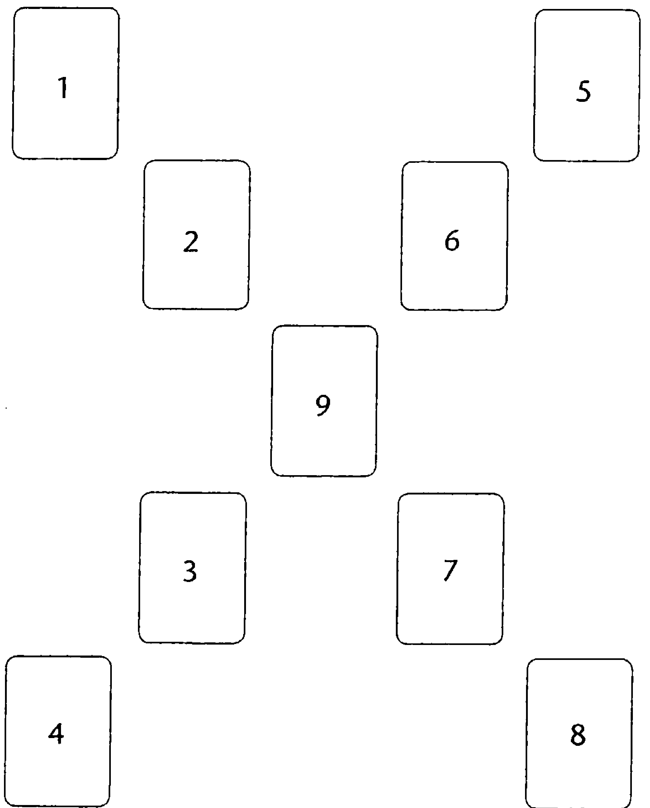

事業顯然是在解牌中詢問度最高的主題之一。決定他們是否應該做出改變而讓自己比現狀更好，或者換個不一樣的工作，甚至嘗試全新的行業，這對案主來說可能都是個挑戰。

由於找出這個答案很像是一種「尋寶」歷險，這個牌陣就稱為「X 寶藏地標」（譯註：在地圖中會以 X 標示的交叉點來表明寶藏所在位置，而這串詞引申意為「就是這個確切地點」），主要在幫助案主探尋工作的意義和樂趣。這些牌排成一個 X 形，牌陣左邊的牌傾向目前工作或職業的能量，而代表做出改變的牌位於牌陣的右邊。

牌卡一：這張牌給予我們洞見，瞭解案主在目前職位上有多快樂或多不快樂：他們樂在其中嗎？或者對他們來說事情變得枯燥乏味甚至痛苦呢？

牌卡二：這張牌告訴我們，案主目前的職業或工作和他們的希望有什麼差異：他們有接受到更令人振奮的事嗎？更具創造性的事呢？

牌卡三：提供案主如何改善目前工作情況的忠告——或許在他們的職場上有人可以幫助他們爬上階梯。或者得到更多訓練或教育有沒有用呢？

牌卡四：涉及案主在目前職位上保有的優勢——這張牌可能指出關於開發他們目前的工作，出現了令人振奮的新機會。或者指出他們可能做出了重要的新關連，會在之後導向更好的工作。

牌卡五：讓我們瞭解案主去追求不一樣的工作、或者轉換跑道、更換職業是不是個好時機。也可能指出對於改變來說，目前是不當的時機。

- 牌卡六：揭示對於做出「牌卡五」代表的改變，案主是否認為這對他們最為有利——他們心中所要的職業使他們快樂嗎？他們有一個均衡和理性的計畫嗎？
- 牌卡七：告訴我們如果案主從事自僱工作，會不會做得很好；或者他們到既有的公司去工作，才會有更多的收益。
- 牌卡八：對於案主最享受什麼工作型態給予洞見，尋找出讓他們感到最快樂的指標——是創造力的工作、或者治療性的實務方法，還是更訓練有素的專業技能。
- 牌卡九：告訴我們在這個有關職涯的關鍵時刻，案主唯一最該採取的重要行動是什麼——可能是回到學校、可能是更新他們的「履歷」、甚至是和現任的主管真心交談。

### 健康阶梯牌阵（Healthy Steps）

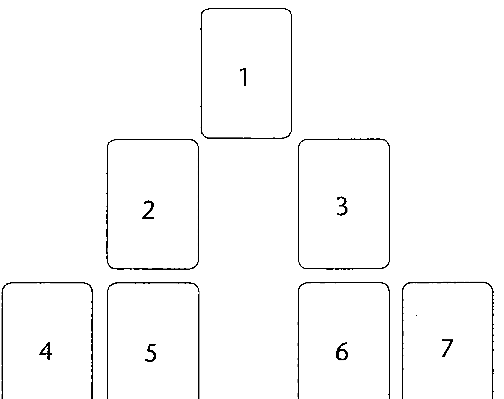

对寻求解牌的人来说，另一个受欢迎的主题是关于健康方面。这个牌阵称为「健康阶梯」牌阵，因为它的外型令人想起传统的「食物金字塔」（food pyramid），所以当这些牌摆出来之后，自然形成了一组对称的阶梯，我们就将这两侧的牌视为案主增进健康的各个阶段。

牌卡一：牌阵中的这个位置，反映出询问健康问题的人目前的状况。在塔罗中有某些牌涉及特定的健康议题。例如：风之三指出心脏问题，而火之十可能暗示慢性的背部疼痛。然而，如果抽到的牌没有象征任何明确的状况，这也是很寻常的。随着我们进行解读，案主提出的关切会揭露他们自己的情况。如果你选择代表案主的牌，其画面中有一个人，那么就注意你的目光被他身上的哪个地方吸引住。请相信你的直觉！

牌卡二：显示出冲击个人健康的生理因素。这些例子包括：风之八指出强烈的痛苦，而风之九显示出睡眠障碍。战车可能指出来自交通意外的伤害，而自我牌可能指出药物滥用问题。

牌卡三：对于冲击到案主健康的任何情绪忧虑给予洞见。例如：水之后诉说案主对他人的全心付出太过了，而没有为自己保留任何时间或者能量；水之六立即提醒了孩童时代的问题，或者过去以来没有解决的包袱。

牌卡四：反映出谁有助于案主对增进健康的追求。虽然偏爱「宫廷牌」能落入这个位置，但并不会总是这样的。有时候找出这位贵人的外表特征，是从「大阿尔克纳」或「点数牌」所获得的，这和从「宫廷牌」找到的方式一样。

牌卡五：告诉我们下一步加强健康的方法是什么。火之五指出有人需要做些运动了，而风之四提示了一个可能被长期耽搁的假期。风之国王指出需要咨询专科医生了。

牌卡六：指出短期之内健康有所改善的前景。

牌卡七：提供更长时期的愈后情况追踪。

### B 計畫牌陣 (Plan B Spread)

当事情的进行看起来不如我们预期的情况下，这个时候有一个牌阵可以派上用场，能够提供对于改变的洞见，有助于事情再度运作下去。

牌卡一：牌阵中的这个位置，反映了你尝试要达成什么？也可以用来验证塔罗对于这个问题的了解。

牌卡二：横放在「牌卡一」上。代表你在企图达成目标的过程，历经了些什么。就算通常是正面感受的牌，也要看成是在路途上受到了阻挡。例如：水之三牌通常的意思是欢庆，但是落在这个牌阵的「牌卡二」上，可能指出你的朋友正在扰乱你完成工作。

牌卡三：探讨一些我们向来称为「世俗挑战」的事情，这一类的情况包括没有足够的金钱，或者感到来自所爱的人或事业伙伴的支持不够。

牌卡四：代表无意识中的障碍。想想看：你有自暴自弃的倾向吗？你在这个尝试中缺乏迈向成功的热情和动力吗？如果你对自己完全诚实，那么问问这就是你为自己设定的目标吗？

牌卡五、六、七：针对如何做出对你的计划有助益的改变，提供相关讯息。在这一串牌中可以找到提供给你的忠告，像是——不要试图任何事都自己去做，和他人联系形成人际网络，或者透过平日的静心得到自己缺乏的洞见。

牌卡八：显示出了启动「B 計畫」之后，你可以期待怎样的结局产生。

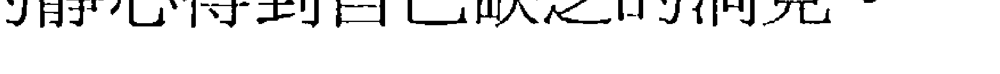

## 第三部

## 穿越大阿爾克納的夢想家之旅

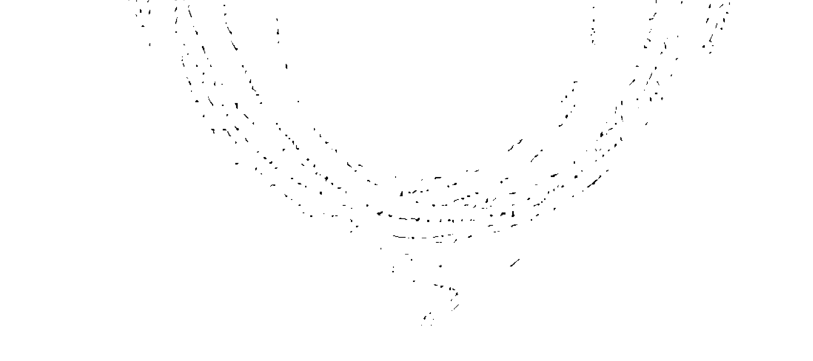

## The Dreamer

## 夢想家

### 大天使麥達昶

- 信任的一躍。
- 跟隨夢想。
- 未預期的機會。

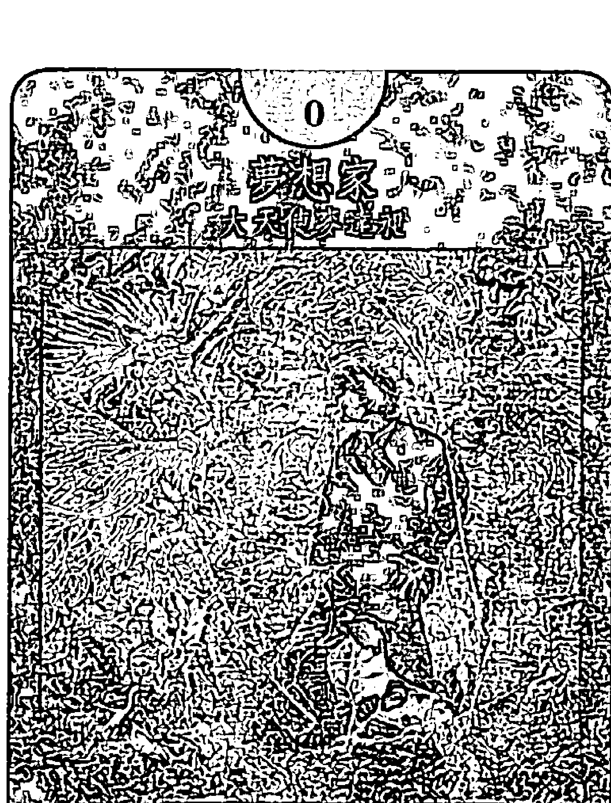

夢想家是「大阿爾克納」的第一張牌，也是我們所謂的「夢想家之旅」的開始。當這張牌出現的時候，鼓舞我們跨出「信任的一躍」。可能出現未預期的機會，而且充滿了創造美妙事物的無限可能性。我們也許找到一個會投入大量熱情的新計畫，也許自身的發展和成長就是這個「計畫」。問題會很輕易地透過創造性的答案得到解決。這是一張承諾和希望的牌！

## 夢想家之旅

這是神奇之旅的起點，為了創造新事物或追求嶄新人生階段而做出選擇。夢想家的故事在我們用極度的樂觀和希望來選擇道路時揭開序幕。留意一下，我們必須瞭解在這個旅程中，任何想要得到解讀的那個人，就是這一位夢想家。我們可能不是很確定為什麼來到地球上，或者我們將達成什麼，然而隨著前往這一段探索，沿途尋訪「大阿爾克納」中所有的神奇人物，我們將會得到內在的清明。所以準備好去遇見一些令人驚嘆的人物吧！這張牌也頗有獨立的氛圍，可以指出有人離開不再熱愛的工作，或者青少年離開家庭自力更生。

#### 圖案象徵

雖說這張夢想家牌是從靈魂化身的隱喻汲取出象徵作用，通常仍代表我們人生中任何情況或階段的開始。

一位美麗和自信的年輕人，正跨步進入通往這個世界的入口。這裡所描繪的年輕人，反映的是嶄新的情況，並不一定代表抽牌者的實際年齡。這入口意味著一個通道，起於生命至今帶領我們來到之處，朝向我們目前建立信心的地方。

一隻狗在旅途中伴隨著夢想家，提醒我們世界上充滿了動物靈魂，在此幫助我們從過往經驗和瞭解目標之間取得均衡。這裡選擇狗做為同伴，是因為狗和人類的情緒連結以及對人類的忠誠，都是廣為人知的。

一隻蝴蝶跟著夢想家快速通過這入口，蝴蝶是蛻變的著名象徵，這是由於牠們有能力從毛毛蟲進化為帶有美麗翅膀的生物。

鶴在許多文化中都是轉世的象徵，而且有證據顯示牠們在地球上生存超過六千萬年。據信牠們寬廣的翼幅能夠帶著牠們上達天堂，並因此達到靈性的開悟。

佩格薩斯（Pegasus）即有翅膀的飛馬，在神話中據說能夠載著牠的騎士從地面升到高空——就如同我們的夢想家正在邁向人生的新階段。

獨角獸（unicorn）是美麗、神奇、且靈魂純淨的生物，牠們的能量可以視為如何快樂過活的指引。

夢想家下方的城市，是人類發展的建構物，代表地球上的生命以及無盡的機會。夢想家沉思可以在那裡創造出什麼。

#### 天使數字

在塔羅中，夢想家是 0 號數字，這是非常神秘的數字，代表神和永恆。它是一塊空白石板，任何事物都能夠從中被創造出來——一個循環開始、結束，而然後又再度開始！夢想家僅以擁有自信就能做到重新改造自己，和這個數字的意涵是一樣的，因而 0 是完美符合這張牌的數字。

因夢想家牌被認為同時是大阿爾克納的開始以及結束，有些人也將這張牌視為 22 號數字。

### 大天使簡介

大天使麥達昶聞名於看顧年輕人，以及看顧追尋靈性成長的人。當這張夢想家牌代表一個新的計畫或者全力以赴的時候，麥達昶也會幫助這個「年輕」的境況。麥達昶現身時的顏色是紫羅蘭色和綠色。（譯註：麥達昶的意義是「隸屬於神」。）

## 大阿爾克納

#### 占星配置

這張牌連結於天王星，這個行星的象徵符號標示在夢想家的夾克上。天王星是一個創造力、獨立自主、和革新的行星，鼓舞我們成為獨一無二的個體。天王星這樣的能量，可以將我們從古老的想法中，或者從不再合適自己的情況中釋放出來。

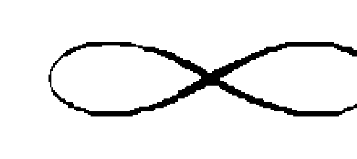

## The Magician

## 魔術師

### 大天使拉吉爾

你準備好了！

你擁有資源或能力來顯化。

生命是神奇的。

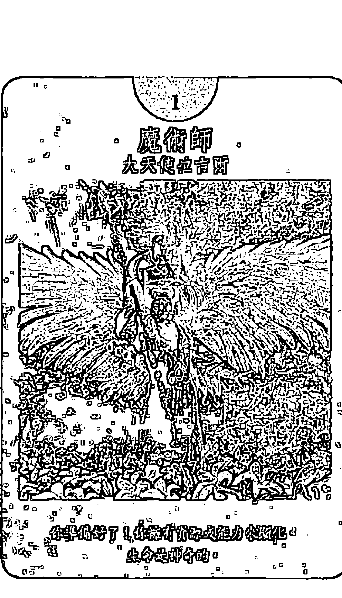

抽到這張牌的時候，可以保證我們真正擁有向前走所需的一切。此刻我們有天賦和才能，去成為任何我們想要成為的人。至於為了成功我們還缺乏某些關鍵因素或額外知識的看法，其實並不是真的。我們一切所需此時此刻已經存在了，不然就是即將神奇地迅速出現。

魔術師並不擔保我們全然覺察到自己想要達成的是什麼，只保證我們可以去做自己選擇的任何事。我們可能在尋找某個無私的人，在靈性上或潛意識上協助我們瞭解自己的目標是什麼。如果我們已經清晰看見自己的道路，那麼這張牌要求的就是「別再延遲」。魔法般的事情將要發生，但是我們必須邁出第一步！

## 大阿爾克納

## 夢想家之旅

「夢想家之旅」的下一站，我們遇見一位不可思議的魔術師！根據他睿智的忠告，得以瞭解我們有能力使用這個世界中的元素去創造自己想要的人生。他教導的是，我們遠比自己瞭解的更有能耐，而且與生俱有完成偉大行動的能力。我們是否每件事都做出計畫並不重要。重點是在相信自己以及上天賜予我們的權利，儘可能地利用我們選擇的任何事物來經營自己的人生。

#### 圖案象徵

魔術師戴著四元素圖標的腰帶：火、水、風和土。這些也是在「小阿爾克納」中四個牌組的名稱，同時也是地球上生命物質層面的基本構件。

魔術師代表「天有一象，地有一物」的概念，而且也確實將天堂的能量帶到地球。他有能力透過正面思想來顯化他的夢想。

魔術師的頭頂上方，懸浮著一個無限大符號，是數字八側躺下來的形狀——也是對於「我們的顯化能力永恆和無止盡」的另一種論證。

在古代塔羅牌中，魔術師位於玫瑰藤架的下方，以象徵他擁有的訊息是秘密的。然而，在「天使塔羅牌」中，我們選擇了表現出魔術師升到玫瑰生長的拱門上方，來反映出這個古老神秘藝術背後的秘密不再隱藏。

在他腳邊是整片田野的百合花，代表他的動機純淨。魔術師想要創造出美妙的、而且值得稱為「人間天堂」的事物。

#### 天使數字

在塔羅中，這張牌是數字 1——一個非常有力量和創造性的數字，所有開端從中湧現而出。這個數字的能量允許我們去採取行動和實現獨立自主，但是為了顯化我們想要的人生，而避免源於恐懼的人生，我們必須察覺自己的思想。

### 大天使簡介

大天使拉吉爾是位令人驚奇的巫師，他坐在神的王座旁，手持一本宇宙智慧的魔法書。拉吉爾意謂「神的奧秘」，而他出現在彩虹顏色中，這色彩也藉由他的光暈、和他用來達成生命目標的魔法能量表示出來。他擁有獲取知識以及將它轉化為現實的能力。雖然他的名字隱含秘密的意義，但他非常樂於分享他全部所知，協助我們擁有魔法般的生活。他是完美符合這張牌的魔術師。

#### 占星配置

這張牌連結於水星，這個行星與溝通和心智有關。魔術師教導我們，任何我們所能想像出來的事就能創造出來！這是基本的「吸引力法則」，藉由將夢想具象化然後採取行動，就可以擁有我們想要的人生。這完美符合能夠讓任何事情完成的魔術師！

## The High Priestess

## 女祭司

### 大天使漢尼爾

- 聆聽直覺。
- 有耐心。
- 行動前仔細思考你要的。

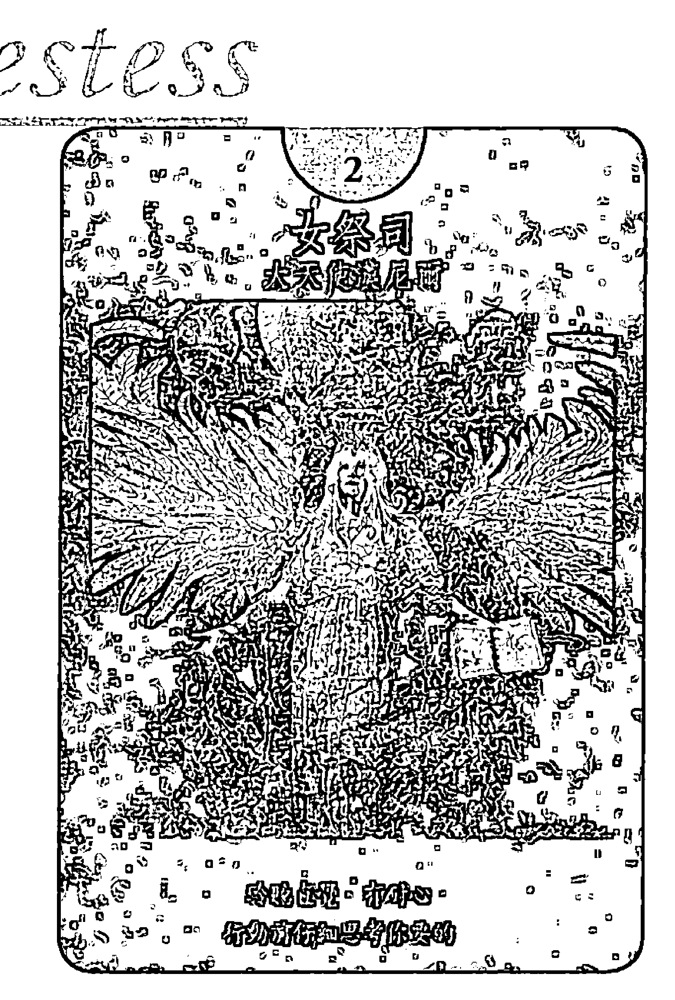

女祭司是靜心和內在省思的牌。它邀請我們安靜下來，藉由走進內心世界，對自己和所渴望的事有一份清晰瞭解。我們所獲得的清晰，確保我們一旦採取行動，就會往正確的方向。將女祭司牌視為一張許可證，允許你花點時間去細思天使要說的訊息。

遇見這張牌並不需要採取行動，事實上，如果可以從容不迫是最好的。這張牌要求我們遵循自己的直覺，並且對自己和他人保持耐性。我們尋求的答案，會在最完美的時刻來臨。在此之前，守住我們的想法不讓人知，往往答案會來得更快。這張牌可能正在告知案主，有些秘密還是保留而不要分享為妙。

## 夢想家之旅

我們可以選擇「信任的一躍」，也知悉自身擁有的力量，但是對於想要創造什麼還沒有清晰的瞭解，我們只是在轉動命運的紡織輪。所以下一站我們遇見了女祭司。她美麗而有智慧，也帶著一點神秘感。她鉅細靡遺地探索內在世界，並對於天使靈訊的領悟很有一套。在她的指導下，我們練習靜心，學習走進內心世界，為任何吸引我們的問題尋找答案。我們發現了關於「我是誰」的一些頭緒，以及此生註定要實踐的「神聖生命目標」。

當女祭司感覺到我們準備好了，她會將我們送上旅程，如果要創造我們期待的人生，就不能永遠停留在冥想和沉思中。

#### 圖案象徵

女祭司站在雙柱前方，一柱顏色較淡，另一柱較深。雙柱代表了像是積極與消極、陽性與陰性、意識與潛意識等的概念。所有的選項都可能介於這兩個極端之間，我們將選擇什麼呢？

難以看到女祭司的後方有什麼景物，因她美麗的頭飾阻擋了我們的視線。這象徵透過靜心和心靈探索，將會發現許多美妙的奧祕。

女祭司佩戴了一個等臂十字，它的高度和長度相等，呈現完美的平衡。這是為了表達不要讓自己的信仰達到某個極端的重要性，平衡是達到和平的途徑的一部份。

她頭上的滿月正在發光。月亮代表我們所創造出情緒上的神秘之謎，月亮的光芒閃耀有如我們心中光芒的投射反映。

女祭司手裡拿著一本打開的書，內容涵蓋了宇宙間所有的神秘知識。不像古代塔羅在這個地方是個捲軸而隱藏了部分的信息，我們選擇了表現出女祭司無償地獻上她的所有秘密。

她的衣裙轉變成我們眼前的水。水是情緒的傳統象徵，同時也是靜心冥想和內在探索所提供給我們的意識流。

#### 天使數字

女祭司是 2 號牌，這個數字邀請我們正向思考。一切都會好轉，只要我們不再憂慮或顯得缺乏信心。就如同女祭司身後的雙柱，這個數字談到了能量的二元相對性，諸如光明和黑暗、男性和女性。2 也是個尋求寧靜以及靈性的數字。

### 大天使簡介

大天使漢尼爾以通靈的天賦、直覺、和女性能量聞名。她的名字意謂「神的恩典」，而在我們內在知識的探索中，她是完美的指導者。

她也以與月亮有關而聞名，同樣和女性／陰性能量的議題緊緊在一起。

她的光暈是淡藍色的。

#### 占星配置

在占星學上，這張牌連結於月亮，它被視為掌管情緒和個人需求。月亮讓我們對事情的感受、人物類型、有興趣的主題等等有深刻的了解。月亮決定我們的性格，因為它對於我們的情緒、如何體現自己、以及內在的信仰都具有如此強大的影響。

## The Empress

## 女皇

### 大天使加百列

丰盛的財富。

為夢想接生。

滋養自己和其他人。

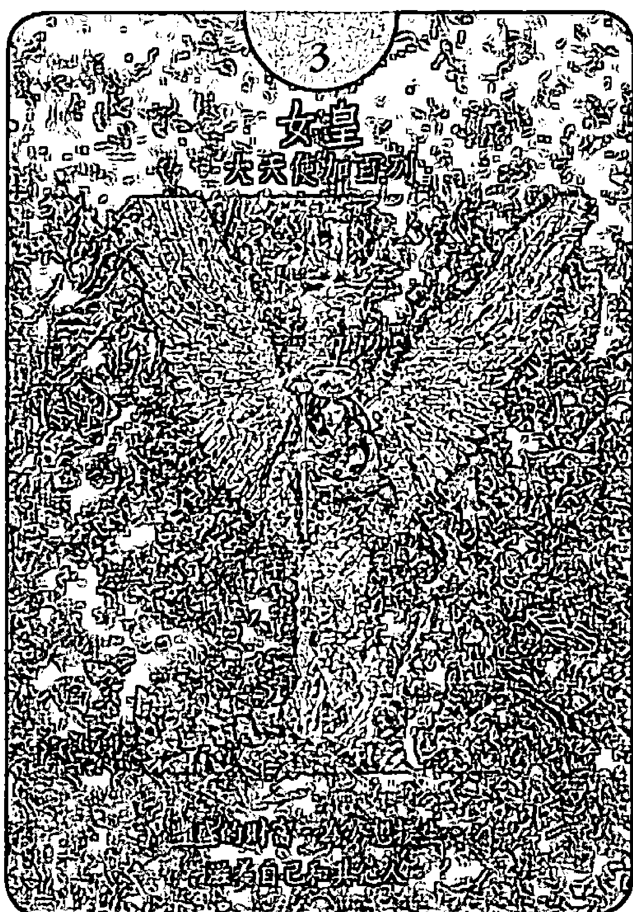

當抽到了女皇牌的時候，該停止對宿命的深思，而要讓自己動起來！這是一段粲然可觀的豐盛時期，保證我們用心去做的每件事都會非常成功。女皇是有能力顯化自身夢想的肯定訊息。

這張牌可以成為即將懷孕或者小孩誕生（也可包括收養）的指標。母愛和母性的議題也在女皇的管轄範圍中，所以照護我們或周遭的人，都是和這張牌很有關係的事。

不過我們要記得，「誕生」可能是開始心愛的計畫或人生中新階段的隱喻象徵。我們的「寶寶」可能是正在開展的一項事業，或者是還在寫作過程中的一本書。

當我們在照護周遭的人時，讓自己做些奢侈的事情也挺不錯的。我們可以花時間享受大自然，買美麗的珠寶給自己，或者尋求像是按摩或者靈氣這類療癒的體驗。

## 夢想家之旅

旅程的下一站我們遇見了女皇，我們受益於和女祭司共度的沈默時光，而現在已經清楚了想要做的是什麼。女皇則教導我們，為了創造出美妙的事物，需要採取行動和駕馭自信。許多人視她為「大自然母親」（Mother Nature）的化身，充滿了豐盛和創造力。從她的身上，我們學習到能夠同時做許多事情，如果我們願意投入和奉獻給自己的理想——這是多麼地令人振奮呀！

她的樂觀是具有感染力的，而轉眼間我們一心嚮往要前進了——不再有阻擋。女皇有能力讓自身圍繞著奢華和美麗的事物，也教導我們藉由推動所有的努力和熱情到「全力以赴」之中，而後我們會得到豐富的回饋。

#### 圖案象徵

在這張牌的背景中，我們看見一道瀑布灌注到一條流向女皇的河，這是來自女祭司長袍的水流，代表在我們與她一起靜心冥想的時光中，接受到靈光乍現的具體顯化。

女皇被豐盛的生命圍繞，包括象徵我們達成目標的堅強信念——柏樹。

在傳統的塔羅牌中，女皇通常被描繪成懷孕的狀態，象徵這一刻粲然可觀的豐饒和創造力。然而，我們的女皇是大天使加百列。

## 大阿爾克納

所以我們用她抱著嬰兒來取代。這表示此刻是顯化我們想要創造的任何事物的偉大良機。

蝴蝶是進化的象徵，因為牠們能夠從毛毛蟲蛻變成美麗而有翅膀的生物。

有許多源於自然界的象徵環繞著女皇。熊寶寶提醒我們注意牠有一種神奇的能力，能夠冬眠而後在春天甦醒。我們伴隨女祭司的沈靜時光已經過去，而現在我們必須醒來。

鹿的溫和天性提醒著，當我們在接受這個創造的新時機時，也要善待自己和他人。

松鼠是著名於採集堅果以準備過冬的動物。牠們代表預先準備的必要，同時是讓我們的任務更愉悅和享樂的邀請。

美洲獅是非常有力量的動物，帶著信心和自我肯定來行動。牠要我們掌握自己的生命，而且不讓別人阻擋我們達成目標。

狼群以群體合作達成目標，這也是在打開女皇牌的時候建議我們做的。

#### 天使數字

女皇是 3 號牌，非常像是一位揚昇大師，採取她的人生中累積的智慧，並以此創造偉大的事物。（我們可以選擇和揚昇大師一起工作，諸如：觀音、佛陀，或者耶穌。）數字 3 也連結創造力、革新，以及交流溝通。

## 大天使簡介

大天使加百列通常被提到的角色是關於傳達溝通，像是宣告出生，或者被視為神和人類之間的信使。她的名字意謂「神的毅力」，而她經常被描繪成攜帶大號角以喚醒沈睡的人，並呼喚他們要有所行動。她有名的是現身時會穿銅色的衣服。

#### 占星配置

女皇在占星學中連結於金星，這個行星代表對於情感和物質的關切，它可以反映我們生活中以下這些層面：浪漫戀情或者家庭親情的愛，此外還有掌握美好事物的欲望。金星影響我們創造力的工作——諸如藝術、音樂、和寫作，是以此聞名的行星。

## The Emperor

## 皇帝

大天使麥可

-   組織與邏輯。
-   結構與紀律。
-   領袖力。

皇帝牌出現時透露這個訊息：我們需要有幾條規則和一些組織性。藉由按照計畫落實些許架構，會發現更容易以原本的構想實現自己的夢想。

這張牌代表使我們的日常生活過得更適宜的社會建設——諸如家園、街道、以及基礎設施。皇帝牌與領導力和正直有關，而它也能反映父親形象、在當局的人們、政府機關，以及被徵募到軍隊中的那些人。

## 夢想家之旅

感謝女皇，我們被激勵而準備要有所作為了。然而我們會需要一個計畫，而皇帝正是我們需要的，能夠幫助我們整合的人。在皇帝的監護教導之下，我們得以瞭解邏輯和紀律的力量，成為使創造性的夢想實現的方式。

他的能量像是一位慈愛但嚴格的父親，只想要看到我們成功和快樂。我們也從皇帝身上學習到，在人生旅途中必須考慮到他人的需求，不是只有自己的渴望。

#### 圖案象徵

女皇駐足在戶外大自然的豐饒能量中，然而皇帝則居於室內。建築物是一座人類的創造物，因此代表了社會結構。

透過皇帝身後開啟的窗戶，我們看見他所創造的城市發出光芒。這象徵文化、秩序和我們需要感到安全的事物，就像我們擁有一個可以遮風避雨之處一樣。

我們的皇帝戴著一頂金色皇冠且握著一把金色權柄。黃金是皇家的金屬。

寶劍象徵許多事物，包括維持正義。皇帝擁有「麥可之劍」，顯示他以公正來創造。儘管寶劍目前並沒有出鞘，因為皇帝如此完善地建造了事物，所以他極為專注在統治而不是法律和秩序。然而，一有必要的時候，就會拔出寶劍來效力。

在他的腳邊，我們放置一把「魯特琴」（lute），因為我們想要柔化純邏輯的能量——那是傳統上給這張牌的意義。即使是期盼紀律和秩序的皇帝，也可以偶爾朝向較柔和的一面而接受服務，讓音樂和藝術撫慰他的心。

#### 天使數字

皇帝是 4 號牌。長久以來，這個數字和天使連結，也和天使期盼於服務、協助、保護、以及為我們的成長和成功創造機會有連結。數字 4 也和穩定、結構，以及辦妥事務有關。

## 大天使簡介

我們為皇帝牌選擇的天使為大天使麥可，他的名字意謂的是「如神者」。這位有力量的大天使是強大而具有保護力的，就像皇帝一樣，連結到那些看管我們安全的人（像是警察）。他能幫助我們激活心智中有關於結構與邏輯的部份。大天使麥可能夠幫助我們感到安全和保護，也是皇帝的另一個目標。與他共振的顏色是寶藍色和金色。

#### 占星配置

這張牌在占星上是白羊座，這個黃道上的第一個星座，是直接、獨立自主、獨斷性、充滿自信的，並且以掌握管理和辦妥事務而聞名。這個星座總是準備隨時要為一個計畫啟動，是個真正的積極進取者。有時候白羊座當個領導者會比實際執行者好得多，不過他對於探索的奉獻是無庸置疑的。

## Unity

## 合一

大天使聖德芬

-   傳統的觀點或方法。
-   靈性組織。
-   尋找師父或思維相近的朋友。

合一牌要我們考量行動的更廣泛意涵。這張牌是「二元牌」。當這張牌出現時，我們可能發現自己受到召喚去採取傳統路線，而且要透過考驗證明的方法論來做事情。另一個可能是被要求「跳脫框架思考」來抵制傳統，並採取自己的方法行事。瞭解合一牌帶來哪一個訊息的方法，可以藉由詮釋旁邊的其他張牌，也可以一如平常地，藉由聆聽自己的直覺來得到答案。

合一牌要求我們花時間和志趣相投的人相處，他們能夠幫助我們發展自己的靈性天賦。我們可能感覺到被召喚去參加心靈機構或學校，在那邊可以和在座的同道中人一起成長。

合一也可以指出某些被社會或家庭強加於身上的規則，已經不再適合我們了。這些約束應該被拋開，而以新的指導原則來取代，而這能夠引導我們前往想要遵循的道路。

## 夢想家之旅

身為人類，我們傾向制訂規則，但這些規則若沒有道德規範的話會變成什麼呢？合一代表一位上師或教師，能幫助我們看到目標背後的意義。他的智慧所提供的指導，有別於我們旅途至今所遇見的。合一牌上的導師，向我們提出質疑，使我們更深入地瞭解自己。例如說，我們可能知道在心中想要追求的職業是作家，然而這是為什麼呢？我們可能有改變這個世界的計畫，但是如何讓這個計畫更有助於大局呢？這些都是蘊含深奧意義和深層靈性的問題。

合一不去評斷我們的答案本身，而僅僅是點到為止，幫助我們領會被自己冠以「好」或「壞」的事物，如何和世界有整體的聯繫。這是對生命意義的追尋，不只能夠豐富我們的靈魂，也能夠為我們周遭的人帶來光芒。

#### 圖案象徵

在傳統的塔羅中，這張牌叫做教皇，顯示了許多基督宗教背景的圖案標誌。事實上，在一些最早期的塔羅中，這張牌甚至就叫做教宗。我們重新設計了這張牌，想要讓圖案能夠反映更廣泛的心靈哲學設定。

代表不同信仰體系的七個球體，飛繞大天使聖德芬。縱然沒有辨法在牌上放置每種個別的信仰體系，能量也應當會無所不包的。選擇七個球體，是因為「七」這個數字反映走在正確的道路上以及靈性的覺察。（譯註：ॐ印度教。♀：古埃及宗教。□：女神信仰或薩滿。✡：猶太教。✝：基督教／天主教。☯：道教。☪：伊斯蘭教。）

高於所有球體之上，在大天使的權杖頂端的，是一道真正的「天堂之光」。

圍在聖德芬腰部的是一對交叉的鑰匙，銀鑰匙和金鑰匙，他們代表著意識和潛意識。

#### 天使數字

合一這張牌是數字 5。如果去限定這個數字的意義為一個詞，這個詞會是「改變」！這個數字有關一切意念的自由和無窮的好奇心——有些人期盼看到生命的下一步是什麼。數字 5 也非常喜歡他人的陪伴，因為這樣可以充分學習到他們為自己創造的正向改變。

## 大天使簡介

這張牌的大天使是聖德芬，他以將祈禱從地球傳送到天堂而為人所知。他攜帶我們的渴求到關愛和慈善的宇宙中。聖德芬幫助追尋內在世界富足的人，也幫助他們找到其他同樣也在追尋內在的人。他的光暈是美麗的藍綠色。（譯註：聖德芬名字的意義是「兄弟」。）

#### 占星配置

這張牌的占星學是金牛座，一個充滿決心和信念的星座，這股穩定和尊貴的能量展現在偉大的智慧和知識中。這個星座非常可靠，而且非常重視和平，然而也有一點點嚴苛，尤其是看待事情的態度。這符合於合一這張牌的二元性訊息：不是依附傳統，就是抵制傳統。

## The Lovers

## 戀人

大天使拉斐爾

-   親密關係。
-   小心評估你的決定。
-   健康良好。

當戀人牌在解讀中翻開了，首先想到的當然會是一段有影響力且長時期的戀愛關係正在進行中——而通常情況確實是那樣。這不是那種剛好掉進生活中、為期短暫然後就消散的戀愛類型。戀人牌是真愛和持久戀情的預兆，所以指出了訂婚或結婚。如果在塔羅中有一張牌代表「靈魂伴侶」，那麼肯定就是戀人這張牌了。無論關係是否持續一輩子，我們將永遠被徹底改變了。

這張牌也可意指一個重要的決定。在解讀中真有此事發生的時候，就是在鼓舞我們要聽從自己的心來做出選擇。我們必須感受到正確的方向而依此前進。由於大天使拉斐爾在此出現，這張牌也可以指出健康的復原。

## 夢想家之旅

繼續沿著道路走下去，我們發現了戀人。這張牌提醒我們，和另一個人心心相印的影響力，不然就是指第一次發現愛情，我們得以體會情感在我們生活中扮演的重要性和力量。在這個旅程的故事中，這是夢想家第一次學習到浪漫戀情的地方。當然，這是一種隱喻，所以在解讀中這個經驗究竟如何，是依據我們或案主而定。根據這張牌，我們遇到的這段關係也可能是非常親密、卻是柏拉圖式的（platonic，譯註：古希臘思想學派，因其特色而被後世用來表示純精神交往，通常和浪漫相對而言。），如果是這樣，也可能提到的是一位情誼會延續終生的同伴。

我們的心會自己對我們吐露，選擇也可以接受情感的指引。不再是皇帝的冷酷邏輯，也不是合一牌的道德，才能夠引導我們正確的方向。有時候，「心」必須成為我們唯一的指南針。

#### 圖案象徵

這張牌用陰性和陽性代表相對性的原則。

女人背後有一棵樹，上面長著五顆水果，代表了五種感官，這五感就是身體能接收到的訊息基礎。男人的後方，也有顆長著水果的樹，代表了黃道十二星座。在塔羅被創造的時候，占星學被當成純粹的科學。而這樣是在表達：女人的知覺全然是感情的，而男人的知覺則是理智的。

男人的注意力專注在女人身上，以及她在男人生命中的角色，這是一種很世俗的關切。女人則是專注於大天使拉斐爾，這卻代表心靈的期盼。不過，正如人類明白我們都是「神的子民」一樣，在這二者成功的經驗整合中我們仍可以找到真愛。

他們的差異也提醒我們，無關於兩人的性別，異性相吸是一種原則，就像這裡的戀人幫助我們學習和成長的道理。

在前景中有金盞花生長著。這些花朵連結於健康，也因此連結於大天使拉斐爾。

在圖案中也有紫羅蘭，代表著忠實和愛。

#### 天使數字

在塔羅中戀人牌是數字 6。如同《天使數字書》中解釋過的，這是一個專注於世俗關切的數字，諸如生育和延續家庭。不過值得一提的是，在傳統的生命靈數中，數字 6 反映了關懷、愛、瞭解、以及滋養。這個數字代表對於家庭和其他我們愛的人、真實和堅定不移的關心。

## 大天使簡介

古文獻中大天使拉斐爾是以傳達愛而聞名的。因此，他的位置配在戀人牌中是特別適當的。拉斐爾的名字意謂的是「治癒者」，而他也被認為是我們可以因為任何健康上的擔心而呼請的療癒大天使。他現身時的穿著是美麗的翡翠綠顏色。

#### 占星配置

戀人牌是由雙子座主宰的，這是一個溝通的星座，而且也是二元性的，就有如光明和黑暗、男性和女性，同樣的對比原則，表現在這個占星學的星座上。就像戀人牌一樣，雙子座是「陰」和「陽」這些二元能量的混合，使得這個星座令人驚奇不已。

## The Chariot

## 戰車

### 大天使麥達昶

-   重要的成就。
-   自我紀律與意志。
-   大眾認可。

戰車指出即將啟程前往一段大冒險的牌。我們可能要處理許多未曾遭遇過的情況，因此有時必須同時試圖不只取悅一個人。我們可能必須以履行所有義務的方式，來評估輕重緩急的安排，戰車這張牌與一切相對力量的平衡有關。我們撞見新的事物，然後首度嘗試去完成大事。同時要駕馭許多事情是透過意念、全心投入目標、和絕對的意志才有所成的。

戰車是一張成功的牌，所以可以指出即將來到的晉升，工作機會，或者獎賞。在媒體上推廣自己或自己努力的成果時，這張牌通常要求我們覺得有安全感。顯然，這張牌也可以象徵各種型態的交通工具，諸如汽車、飛機、或者火車。

## 夢想家之旅

旅程的下一站我們遇到了戰車。迄今旅途中所有的牌，引導我們來到這個時刻。我們已經跨出了「信任的一躍」，明白想要的目標是什麼，並且創造了一個包含理性、道德、與心的計畫。現在我們啟程進入這個世界，去實驗這一切。

在戰車這張牌中，我們發現人生充滿了挑戰，總是有許多人得去取悅，有多方面的考量要去平衡。而這輛戰車也有許多運轉的機件必須要維護。我們從中發現，在純粹渴望自己的奮鬥即將成功時，會有一股力量產生。我們要學習自我紀律和決心。

戰車駕馭者通常被認為是探索中的勝利者，這麼多的稱讚投向他，讓他在眾目睽睽之下非常顯眼。對一些人來說，享受這些是很自然的，除了接受之外不需要努力什麼，只是鞠躬道個謝而已。對其他人來說，那種型態的表揚會使他感到很不自在。戰車要傳遞給我們的是，以自己的成就為傲，並允許別人以公開的方式表達他們的讚賞。

#### 圖案象徵

麥達昶駕著他的戰車，由兩匹馬拉著前進：一匹是黑色的、另一匹是的白色的。戰車駕馭者非常熟練地維持這兩股相抗衡的力量於完美的平衡中。

他的韁繩不是實體的，而是以能量所製，象徵他有能力使用純淨的渴望將這些零亂的力量整合在一起運作。

戰車的側面是「梅爾卡巴」（Merkabah），另外也以「麥達昶立方體」（Metatron's Cube）之名為人所知。這一神奇的創造物被稱為「神的戰車」，也是一個神秘幾何的圖案。我們可以專注在這個圖案上靜心冥想，幫助我們顯化試圖創造的任何事物。

#### 天使數字

戰車是 7 號牌。這個數字是專心一致的心思，以及在各種情況下都要找出真相的意圖。7 是非常有靈性的數字，它明顯地和這個概念契合。一個揚昇到大天使國度而後駕著神奇的戰車到天堂的人類。很顯然地，麥達昶完美地遵從他的生命道路。

## 大天使簡介

這張牌上的大天使是麥達昶，重返回來第二次現身。我們這樣的選擇，是因為他是兩位曾經身為人類的大天使中的一位。傳說他駕著火之戰車到天堂，據此蒙神喜愛。麥達昶也能夠幫助我們重新「充電」，因而我們就有了足以達成目標的能量。他的顏色是綠色，以及紫羅蘭色或深粉紅色。

#### 占星配置

這張牌在占星學上是巨蟹座。雖然對於這張充滿行動力的牌來說，這是一個很「水」的星座，但要記得巨蟹座是非常關心安全保障和控制局面的。巨蟹座是堅韌而非常有適應力的，這有助於他們維持住掌控任何確保成功的情況。

## Justice

## 正義

大天使拉貴爾

-   公平公正的決定。
-   做你認為對的事。
-   為你的信念挺身而出。

正義牌鼓舞我們永遠做自己認為對的事——而在這樣做的時候，也能夠知道正義總是站在我們這一方。如果發現自己所處的情況，是別人有能力做出對自己有利與否的評斷或估算，抽到正義牌是非常好的徵兆，顯示事情將會對我們有利。不過在簽訂法律契約之前，應該要非常仔細地檢視。

正義也要求我們為自己的信念挺身而出——去瞭解自己是正確的，並且牢牢堅持自己的理念。

根據我們在第二章所提到的，正義原本是 8 號牌，直到 1909 年「萊德－偉特塔羅」調動它和力量牌的位置，至此才有所改變。為了恢復「夢想家之旅」的連續性，我們在「天使塔羅牌」中選擇將這張牌還原到它的原始位置上。

## 夢想家之旅

當我們下決定或者和他人互動的時候，我們對自己的行為即負有責任。我們順著旅程造訪正義牌，同時學習到「業力」和「公正」這兩個生命法則。我們沿途所做的選擇在戰車中付諸實行，而這些行為現在可能受到他人檢視。在我們向前進之後，正義也會審視我們對待旁人的方式。如果我們以善意和公正對待每個人而且正直行事，那麼正義將引領我們的成長為榮並保衛我們。這張牌教導我們，當認為自己是正確的時候，就要堅持到底。

正義也要求我們成為獨具一格的行動家。如果看見了世上的不公不義，就要去喚起世人對這些事情的關注。每個人對於觸及內心的點都會加以關心，不需要企圖改變世界上的每件事，只要所有的人都去追求對自己最有意義的目標，隨後這個世界的不公義就都會被消除掉。

#### 圖案象徵

大天使拉貴爾飄浮在雙柱前方，這裡出現的雙柱看來像是法庭專屬的。

他一手提著完美均衡的天秤，以顯示公平和客觀的選擇。

他另一手握著一柄寶劍，出鞘且向上揮起，顯示出正義是雙面刃。就一面來說，它做出公平公正的裁決；而另一面來說，它期許有責任感，要求我們維持最高標準的正直。

#### 天使數字

正義是 8 號牌。這個數字通常被認為相連於物質的豐盛和富足，而那是真實的。然而，正是這數字的外型顯示了兩種特質的對等結構。對於對與錯、黑與白、光明與黑暗有所瞭解，這個數字承諾了業力的平衡。

## 大天使簡介

這裡的大天使是拉貴爾。當我們發現自己和他人處於挑戰的情況中，他就是我們熟知在此時要呼請的天使。他柔化能量，並帶來調停和妥協——也就是「完美的正義」！拉貴爾的光暈是淺藍色的。（譯註：拉貴爾名字的意義是「神的盟友」。）

#### 占星配置

這張牌的占星學是天秤座，通常由這張牌圖案背景上的秤子來代表。這個星座是思想開放的、均衡的、理想主義的、而且非常專注於什麼是公平合理。

## The Hermit

## 隱士

大天使拉吉爾

-   花時間靜默冥想。
-   靈性的教導。
-   探尋自我。

這張牌與傳授和被傳授非常有關，特別是有關靈性的教導。可能在召喚我們尋求一位導師幫助我們前進，也有可能是我們完成了充足的內在探索，因而擁有優秀的洞察力可以和他人分享。

隱士要求我們走向內心探尋自我。他迫使我們安靜並傾聽細微的、寂靜的、來自靈魂深處的聲音。

這張牌可以指出從某位智者身上獲得忠告，並且也能鼓舞我們取得片刻安靜時光，得以重新評估自己的計畫。

## 夢想家之旅

每個人都需要一段偶然的休息時間，一個自己獨處和省思的時刻。

## 大阿爾克納

片刻，所以這就是跟隱士在一起。

或者真的是這樣嗎？

你知道嗎，關於隱士鮮為人知的秘密就是，他完全不像表面所看的那樣獨自一人。他站在山頂握著他的提燈，是為了那些想要爬上來到他後面的人。他的學生趕上來加入他的行列，只是剛好在視線範圍之外。他亮起手中的燈，這樣真理的追尋者才能夠發現他。

身為夢想家，我們發現自己需要時間去整合吸收目前為止在旅程中所學到的一切。我們詢問自己類似這樣的問題：「我走在正確的道路上嗎？」或者「我在這份企圖心上所投入的努力真的值得嗎？」這些問題的答案來自於內心，或者來自一位像是隱士的靈性導師，他能夠指引我們得到自己的結論。

#### 圖案象徵

隱士站在山頂上，代表他已經上升到了現在的精神高度。還有什麼更好的制高點可以看到世界和我們在其中的定位呢？

他攜帶一根手杖來支撐，顯示當必要的時候，隱士也可以仰賴其他人。

他手提的燈籠象徵他受到自始至今的許多經驗啟發而開悟。

來自燈籠的螢火蟲（代表我們的內在光芒）嗡嗡作響地飛繞。牠們顯示這個光芒能夠飛散到其他地方，並照耀其他靈魂。

螢火蟲也是世界上有大量魔法的徵象。

雖然這張牌連結到處女座（見下方的「占星配置」），但隱士站立的背景卻是土星。占星學上，「土星回歸」在我們的出生盤中大約每28年發生一次。這時期人們常會感到需要回顧反省他們到目前為止的人生。如果你的案主抽到這張牌，他們可能正處於內在探索的時期。

#### 天使數字

數字 9 無論在傳統生命靈數或者在天使數字中，都是象徵人道主義。正如隱士也是位人道主義者，且致力為世界帶來光明。數字 9 也和自我犧牲有一定程度的連結。比如用數字 971 為例，我們立即知道以靈數的方法需要歸併簡化為 8——其他兩個數字的加總（9+7+1=17，1+7=8）。這樣 9 就有一點「犧牲」掉自己的感覺。那使得 9 成為完美符合隱士這張牌的數字。然而在靈數算法之外，天使數字 9 訴說著：「光行者，開始行動吧！這個世界需要你完全致力於你的生命目標。」（譯註：三個位數相加的答案，卻等於 9 以外的其他兩位數字的總和→7+1=8，沒有 9 的存在答案也一樣，就感到 9 好像就這樣消失了，因此才說數字 9 好像「犧牲」了。）

### 大天使簡介

我們偉大的資深巫師大天使拉吉爾回來了，準備教導我們他所學得的秘密。他曾經擔任過代表創造能力的魔術師牌。現在的問題是：「我們為什麼要創造？」「我們如何以魔法能力來幫助世界？」

## 大阿爾克納

拉吉爾出現在我們面前時是在充滿彩虹的顏色中。

#### 占星配置

這張牌共振於辛勤工作、勤勉、專心一致、以及滋養的處女座能量。就和我們的隱士相像，這個星座是極為投入幫助他人的，而且學到了達成目標的完美方法。照樣推論下來，也會想要和學徒分享訊息。處女座非常好學，而且想要瞭解每一種情況下的「為什麼」以及「如何」。

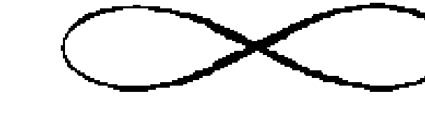

## The Wheel

## 命運之輪

### 大天使麥可

- 正向改變的時機。
- 某個情況突然有進展。
- 幸運在你這一邊！

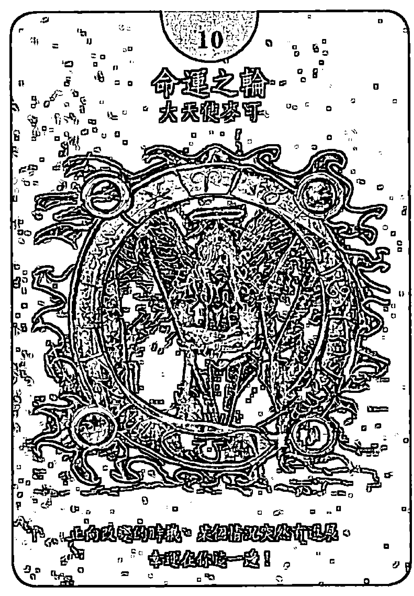

命運之輪是一張幸運的牌。對於瞭解占星學的人來說，這張牌連結於木星，因此對它的使用經驗最常是好運的。這也是一張更新動向的牌，所以在我們可能花了點時間休息、以及跟隨隱士省思之後，現在我們返回原先的道路上。暫停已經結束，而延遲也是過去的事了。

然而，如果命運之輪旁邊圍繞著挑戰的牌，或者落入牌陣的過去位置中，有時候可能指出我們的機會受限了。命運之輪和業力有某種程度的連結，所以當它旋轉的時候，經常是因為我們自身的行動將它啟動了。

### 夢想家之旅

很好，花時間和隱士相處真的好極了。我們找到了在追尋中的答案，此外也發現了新的平衡感。然而，現在是向前進的時候了，而且足以確定那就是命運之輪的啟示。花時間處於靈性成長的狀態中，應該得到獎賞，而現在我們發現了一些好運。可能有個使我們回歸到行動中的「好兆頭」發生，也許我們正好準備要出發。輪子確實能以兩種方向轉動，然而在旅程中向前進，往往會將我們安置在積極正面的方向上。畢竟，我們是自己命運的主人。

#### 圖案象徵

大天使麥可坐在黃道的輪圈裡面，顯示人生變化無常。我們透過人生來移動，就如同大地之母透過季節移動，而星辰則是透過天空。

四元素的圖標——火元素、水元素、土元素和風元素——都被畫在這張牌上。它們也被顯示在魔術師的腰帶上，且表達了我們能夠施展四元素而得以掌握自己的命運。

雖然在傳統的塔羅牌中，這張牌有一點宿命的感受，但我們相信每一個人都擁有自由意志，我們能夠改變人生的方向，如果我們對自己這樣期許的話。

四元素，以及它們隸屬於魔術師和命運之輪這兩張牌，都顯示我們擁有所需的資源做出這些改變。

#### 天使數字

數字 10 帶著一種幸運的感覺。它是一個 1（它也代表一個開始）搭配著 0 這個神的數字，通常意味轉變成對我們有利的好運。因為 1+0 仍然等於 1，很重要的是明白輪子帶來的積極改變，也是專為我們的利益而設計的改變，我們的觀念終究會成為事實。

### 大天使簡介

大天使麥可回到這張牌上。身為幫助我們生命目標議題的大天使，他能夠協助我們做出期盼中的改變，特別是如果我們感到生活原地踏步不再前進，需要得到幫助以再度前進的時候。他的顏色是深寶藍色和金色。

#### 占星配置

有如前述，這張牌的占星學是幸運的木星，這個行星是擴展性、積極正面、以及樂觀主義的，那就是為什麼我們通常發現這張牌代表著好運。木星對我們只有最好的意圖，而且希望我們學習、成長、和成為所有可能成為的自己。

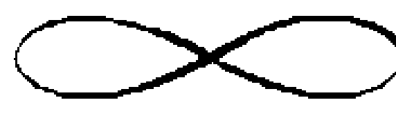

## Strength

## 力量

### 大天使亞列爾

- 巨大的內在力量。
- 放掉尖刻的批評。
- 原諒和慈悲。

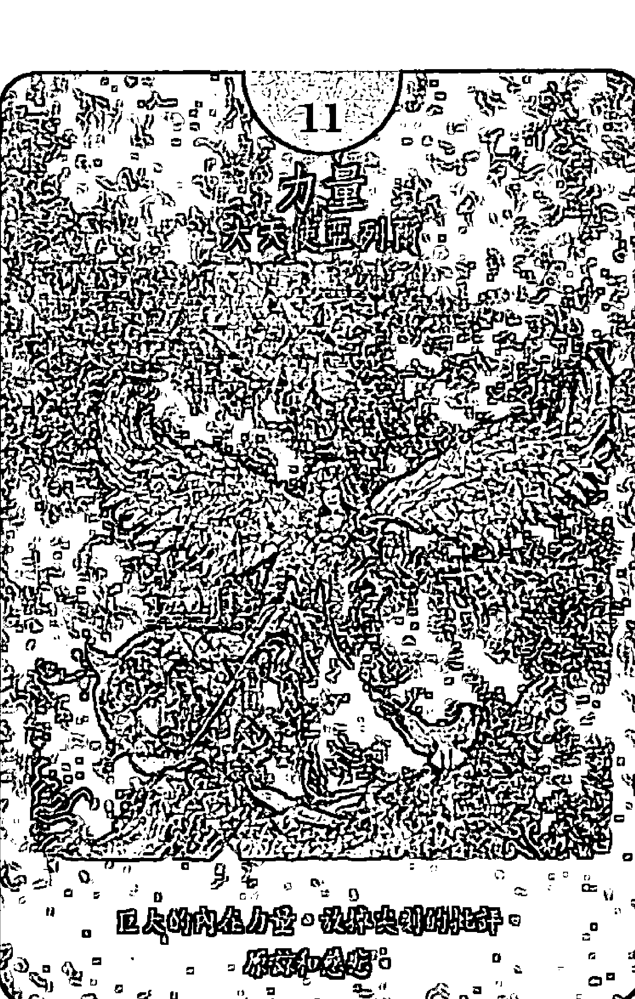

力量牌是關於以不傷害任何人的方式鍛鍊意念的渴望。這張牌是以這種向內走並發現更底層之本能被馴服的堅定決心而命名。而隨著這個馴服，我們變得更強壯。

通常真正的善良必須從內心尋找，因為寬容而顯現出來。放下任何對於自己和他人的評斷，並且以原諒和寬恕來看待周遭的一切。

根據我們在第二章所提到的，好幾個世紀以來，力量在塔羅中都是11號牌，直到1909年「萊德－偉特塔羅」調動它和正義牌的位置。為了完好地保持「夢想家之旅」有意旨的連貫，我們在「天使塔羅牌」中選擇將它回復到原始位置上。

### 夢想家之旅

旅程中身為夢想家，跟著戰車學習所有的控制力和堅決意志。然而，花費在和隱士共處的時間，促使我們接觸到自己更靈性的一面。我們發現除了純粹的決心以外，有另一個方式能強化我們的夢想。在朝向開悟的旅程上，我們要以善良行事，鍛鍊慈悲心，這些都是很重要的層面。在這張力量牌上，我們發現一位非常美麗的女人與一隻老虎和平共處——老虎是自然界中最有力量的動物之一。她對待這隻老虎的善良，帶來了這個合作共生，而這是她用殘暴的力量絕不能達成的。

和平鴿飛在這對搭檔前方，他們在冒險的途中更向前進。女子與老虎需要耐性，因為她們還只在整個旅程的半途上而已。

#### 圖案象徵

大天使亞列爾騎著一隻老虎，老虎是無比堅強和勇氣的象徵。然而，這隻老虎是她的夥伴，不是她的奴隸。

老虎以力量強大聞名，由於大天使亞列爾對大自然的愛，使得這隻老虎很滿足於和她一起合作，這是美麗與天使的智慧，協同對動物王國的關懷與力量一起並行。

亞列爾背後有一座城市閃耀著，即使他們很明顯地正在往前進入森林。在這張牌中，文明生活的舒適與自然的野性是和諧共存的。

大天使亞列爾攜帶一個盾牌，上面印鑄了一隻鴿子在嘴上衔著無限大符號，而其他的鴿子在上面飛翔。鴿子代表和平，加上無限大符號，表示我們能夠創造出來的和平是沒有止盡的。鴿子搭配在老虎身旁，也告訴我們真正的力量是和平地行使。

花朵名為「伯利恆之星」（Star of Bethlehem），據說會帶來希望。它們有時候也會被送給某人，當成一種說「對不起」的方式（譯註：花語，呼應前面提到的原諒）。

#### 天使數字

力量是 11 號牌，而 11 被視為「大師數字」（Master Number。譯註：中文又稱為「卓越數字」）。由於這個數字和內在智慧有著深層連結，它能夠顯化出神奇的事物，因此帶來一份職責去維持積極和振奮的能量。這個數字也連結於偉大的靈性洞察力，通常也暗示有份責任感、要去鼓舞他人以展現良知的純淨方式行動。

### 大天使簡介

大天使亞列爾的名字意謂著「神的雌獅」（Lioness of God，編註：在獅群中是由雌獅負責狩獵，除了意味著雌獅顯化外在物質的能力外，同時象徵著帶著溫和與包容的女性能量也可以是強而有力的。）。她也是與自然動物界有最緊密連結的大天使。她和大天使拉斐爾，攜手合作治療動物，而且是環保人士的最愛。亞列爾聞名於有能力為呼請她的人顯化物質需求。

她的顏色是淺粉紅色。

#### 占星配置

占星學上，這張牌是獅子座，一個慈愛、有野心、力量強大、以及尊貴的星座。而當然，獅子座有著戲劇性的天賦特質（像是騎在老虎上）。獅子座也是非常理想主義和心胸開闊的，這些特質使得這個星座看待別人時，不覺得需要評斷他們的行徑。獅子座的世界觀是很人道關懷的，這點與大天使亞列爾一致、以及她看待地球這個行星和其上所有居民的方式。

## Awakening

## 覺醒

### 大天使加百列

- 從不同的觀點看事情。
- 暫時的停滯。
- 做自己是很重要的！

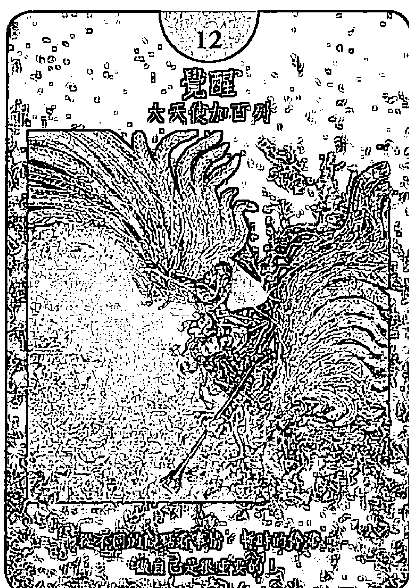

這張牌出現的時候，可能在行動上會有暫時的停滯，我們在這時候深思下一步要前往何處，但是這僅僅是……暫時的而已。一旦我們有了覺醒，行動就重新回復了。在這期間，是審視計畫的好時機，以確定我們學習至今，為了要達成目標不需要改變策略。

覺醒可能會有人說是一張古怪的牌——一位大天使手裡拿著一把小號倒著飛。然而這個畫面是其來有自的，這張牌是在頌揚我們專有的獨特性。解讀的時候出現了覺醒牌，要找出案主可能在哪些方面嘗試要「融入」周遭的人。真正來說應該是，如果乾脆放棄這個念頭，向世界展現真實的自我，可能會更符合他們的目標。（即使這也是相當古怪的！）

### 夢想家之旅

隨著我們在人生旅程中向前行，我們的觀點一向會調適和改變、以配合具體的經驗。我們用不同的方式看待世界（而當我們上下顛倒的時候，這個世界確實看來非常不同！）。也許我們明白了自己不樂於事情那樣發展，所以我們選擇去改變自己的生活方式。那些改變可能是意料之外的，而根據這張牌，面對改變帶來的衝擊，我們的解決方式可能相當不尋常。同時這張牌也邀請我們表達自有的獨特性，以及盡我們所能折衷和原創。我們可能接受到召喚而立即行動起來，也許我們發現自己只想要耐心等待上天的計畫為我們展開。

#### 圖案象徵

大天使加百列帶著她的號角從天堂俯衝下來。她連結於這個樂器是緣於歷史因素，她身為許多重要宣告的傳達者。號角一直是將人們從睡眠或白日夢中喚醒的象徵。

加百列上方的景觀是模糊的，難以看見什麼圍繞著她，這象徵抽到這張牌的時候，我們可能無法清晰地看到事情。

像這張牌的傳統圖案，加百列顛倒的有利位置，對於正在發生的事提供了新的視野。

加百列穿著的衣服上，有海王星的符號，是這張牌的占星學連結。

## 大阿爾克納

#### 天使數字

數字 12 是相當神奇的，占星學上有 12 宮，黃道有 12 星座，一年有 12 個月，有許多靈性和宗教領域上提到數字 12。覺醒這張牌帶來啟示和鼓舞。確實，這數字的訊息試圖使我們覺察到原本的道路可能需要新的轉向，而我們對於自己情況的認知方式，將對未來的改變如何展開有很強力的影響。

### 大天使簡介

這是美麗的大天使加百列的第二次出現，身上穿著屬於她的銅色。由於她以做為訊息的天使知名，我們這樣認為是完全適當的——如果有人在靈光乍現中聽到小號吹奏的聲響，應該就是加百列出現了。

#### 占星配置

占星學上，這張牌是海王星，一個非常夢幻的行星，充滿了令人驚奇的想像力。處於海王星的能量中很容易進入睡眠狀態，同時也是相當敏感的。當能夠更加覺察我們的生活方式、以及展望新事物的時候來到，海王星就是一個完美的能量。

## Release

## 釋放

### 大天使愛瑟瑞爾

- 一個時期或情況的結束。
- 靈性的轉化。
- 前進的時刻。

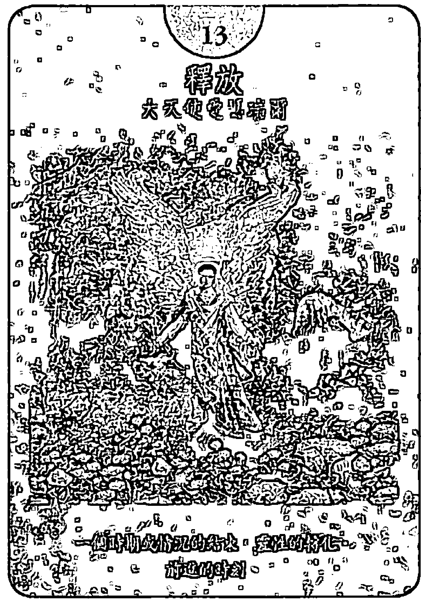

塔羅牌中，釋放牌在傳統上稱為死神牌，或許是「大阿爾克納」中最受到誤解的一張牌。然而，它完全不是指肉體的死亡，而是代表一個結束。解牌時有釋放出現在牌陣裡，指出案主處於不再合適的環境，並且該是離開的時候了。

抽到釋放，最好花時間去經歷眼前的改變。伸出雙手迎向朋友或家人，是處理感到悵然若失的智慧方法。它也是一個面對內心恐懼的好時光，如此我們就能夠完全掌握我們的未來。

釋放牌通常帶來優秀的靈性洞察力、以及個人的蛻變。

### 夢想家之旅

做為和覺醒牌相處一段時光的結果，我們開始更覺察到需要做出的改變。那些改變可能強烈地意味著，為了完成目前的循環而出現一些結束的情況。可能有我們歡迎的、和帶給我們自由意志的轉化，而我們甚至可能獲得重生。或許在這個我們必須了結的完成中，可能有些傷感。

當然，現在，隨著結束之後，新的開始來到，而因此伴隨釋放這張牌。使釋放有別於塔羅中其他牌的是，指出面對結束時，我們有必要站在這個片刻之中體驗它。為了成長，我們必定不能只匆忙地略過這個情況。只要我們沿途花時間去聞那些白色玫瑰，將會有情緒上和靈性上的偉大頓悟。

#### 圖案象徵

大天使愛瑟瑞爾打開雙臂站立著，準備擁抱我們。

在他的袍上是一隻鳳凰，永遠重生的不死鳥，如同我們將從挑戰中重生。

他走過一片白玫瑰的田野，象徵純淨的意圖，但是它們也是重生的象徵。

在背景中，一匹白馬安撫著她的幼馬。馬有許多象徵意義，而其中之一是能夠自由地前往他方。

在背景中有兩座塔，將這張牌連結到女祭司和月亮這兩張牌，指出在釋放的這段時期，一切都被揭開了。靈性洞察力和女祭司的冥想，曾經幫助我們踏上這條導向如今所在之處的道路。稍後，我們將看見月亮牌如何帶來更進一步的啟發。

#### 天使數字

數字 13 號被認為是「業力數字」(karmic number，編註：也稱業債數字，古老數字系統裡指的是 13、14、16 及 19，再歸簡的話則是與數字 4、5、7、1 有關。要瞭解更詳細的特質請參考坊間生命靈數相關書籍。)。許多人視它為不幸的，但是那其實不是真的。這個數字更常的情況是，它為人生中帶來改變和蛻變的時期。這個數字也連結了揚昇大師如耶穌、觀音和佛陀，祂們正想要指導我們往更快樂的新人生前進。

### 大天使簡介

愛瑟瑞爾是所有大天使中最為潔淨和溫柔的，他帶著神之榮恩的力量來安撫我們，並且和我們走在一起度過任何挑戰性的時期。他的名字意謂的是「蒙神救助者」，而他的顏色是乳白色。

#### 占星配置

在占星學上，這張牌連結到天蠍座，一個非常適應新開始和擁抱結束的星座，也是黃道中最緊密連結於深度內在探索和評價的星座。

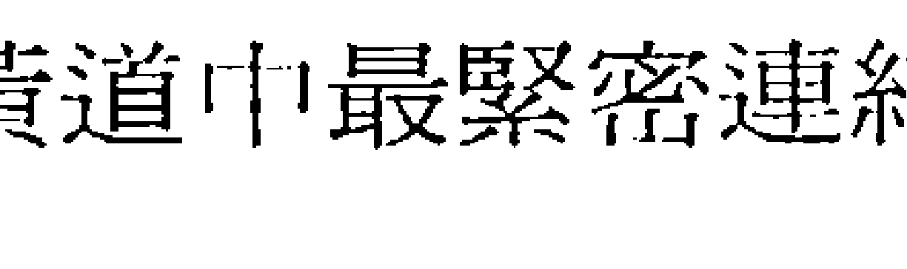

## Balance

## 平衡

### 大天使薩基爾

- 平衡或調節的需要。
- 合作和妥協。
- 等待完美時機。

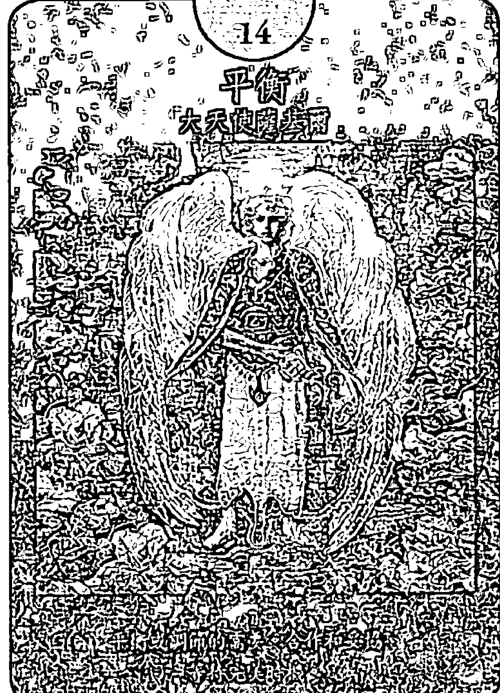

平衡在塔羅傳統上稱為節制，這個字詞意謂的是「融合」與「合併」。我們認為重新命名這張牌為平衡，可以讓解讀者或案主雙方都更容易理解。平衡指出和他人合作的時機，也可能要求我們願意對原本的計畫稍做妥協，從而讓每個人都能成功。意念的綜合肯定會帶來更大的成功。

這張牌要我們有耐性。縱然事情沒有照著我們的希望去運作，可能也只是時間問題而已。當我們面臨人生中的大轉折時，這張牌要我們放輕鬆慢慢來，並且仔細思考問題。這是不宜衝動行事的時機！

### 夢想家之旅

一旦我們來到平衡這張牌，我們經歷了啟悟和改變的階段，如今我們必須整合這些領悟到生命之中。

我們有機會提昇到更高的意識狀態上，並且順著前往開悟的道路前進。然而，那條道路比較像是漫步的路徑而不是競賽的跑道，很明顯地，這張牌中的大天使一點也不匆忙。

人生正是那些影響未來的經驗不斷的在融合與保持平衡。我們未曾停止學習，然而要是忘記暫停下來並理解所學的意義，人生中某種事件的型態可能就會不斷地重複發生。

#### 圖案象徵

大天使薩基爾手握兩只高腳杯，他在這兩只杯子之間來回倒著水，有如不停地混合從他的經驗中獲得的知識。

他有一腳在地面上，而另一腳在水面上。土元素代表我們外在的感知，而水元素象徵我們的內在智慧。這張牌顯示這兩個世界，為了創造令人驚喜的事物而融合在一起。

鳶尾花（iris）是以女神伊芮絲(Iris)命名，她被認為是神的信使，也是彩虹女神。在古希伯來，彩虹這個字就是和射手座(Sagittarius)一樣的拼法，由此給予我們對於這張牌的占星連結一個非常形象化的線索。

薩基爾在他的腰間，戴著三角形在四方形中的符號。這代表精神在物質之內，就如同我們的靈魂安住在肉身之中。

#### 天使數字

數字 14 是另一個「業力數字」，是一個平衡、以及與他人和平相處的數字。可能也有一點焦燥不安，因此需要謹慎地評估機會和選擇。它和天使有一個很正面的相連，會幫助我們維持充滿希望的觀點，這也是被平衡這張牌的樂觀展望所指明的。

### 大天使簡介

大天使薩基爾的名字意謂「神的正義」。他因為有助於在學習階段中的任何人（特別是學生）而聞名。當我們發現自身處於人生重要的關鍵時刻，薩基爾能幫助我們回憶起從前我們曾經身在何處，以及精確地評估我們的下一步想要走向何處。

他是一位治療的大天使，來到我們面前的衣著是深靛藍色。

#### 占星配置

這張牌由射手座來代表，這是靈性的了解以及樂觀主義的星座，甚至在面臨逆境的時候也是一樣，射手座被賜予強大的信念和希望。屬於黃道上的變通星座，這意味射手座有能力輕鬆適應任何情況，幾乎和任何人都很容易建立關係。當射手座的能量出現的時候，若說要感到沮喪那是很難的。

# Ego
## 自我
## 大天使约菲尔

- 对陷阱的错误感知。
- 过度关注物质。
- 负面或基于恐惧的思想。

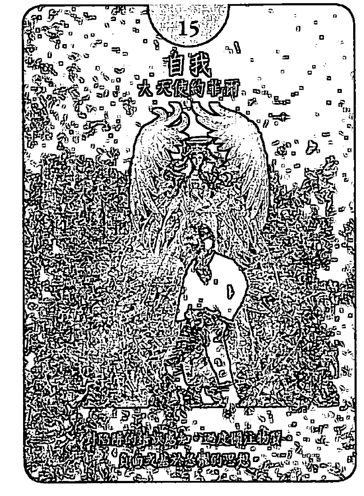

自我牌反映出深陷诱惑的情况（通常是自找的）。看起来仿佛我们的道路变得完全隐藏起来，而且像是前面没有路可走了。当然，这只是一种幻觉。我们并不真的如自己所想的那样动弹不得，自由会伴随思想从悲观到乐观的转变而来到。

自我也能揭露其他严重的挑战，像是上瘾或依赖，那使我们远离快乐。由此可见，这张在塔罗中是很重要的牌，因为它能给予我们对于案主的洞见，或知悉家庭成员在药物使用上的挑战。

这张牌有时候指出某人过于专注物质或世俗事物，而因此可能过度负债。也象征那些对于他们的行动或选择不负责任的人。

# 大阿尔克纳

# 梦想家之旅

我们在「梦想家之旅」中的下一站，需要处理的是人性的自我。这张牌是一个指标，显示了我们或许不能对于本身或动机有清晰的观点。我们可能被无法穿越限制的感觉给混淆了，但事实上，这些限制是我们自己所造成的。令这张牌如此有力量和有助益的是：一旦我们领悟到其实这些都是自己制造的圈套，就能明白我们一定也有力量去解放自己。

当我们允许自我掌控的时候，通常会发现自己是基于恐惧和负面思考来做出选择，这会阻碍我们的成长，并且会产生「若没有这些我们会过得更好」的自我实现预言。这也是在提醒我们：对于日常生活的专注和「事物」的获取，或许不是真的那么重要。也许是时候该来检视我们对于轻重缓急的优先顺序了。

# 图案象征

梦想家绕了一点路，这是他原本不打算去体验的，然而却发现自己被链住而不能移动了。他的锁链连结了一个黄金壶罐，表示他被对于周遭物质的担忧和世俗的恐惧捆绑住了。

他戴了一个面具，遮住了视线而盲目，象征在目前的状态中，他无法真的看见自己朝向何方前进，或者他脱离路线有多远。

一只蝴蝶振翅飞过，它是进化的象征。这提醒了我们，向前越过现在的短绌，完全是在我们能力范围之内。

鹤是灵性开悟的象征，这一只鹤跟随着梦想家进入他的困境，提醒他有能力去改变自己的人生。为了配合我们来到地球预定要完成的生命目标，总是有个能修改方向。

大天使约菲尔前来指导梦想家脱离非灵性层面的聚焦，也引导他回到快乐和充实的地方。

# 天使数字

数字 15 可能是偶发的吸引到了丰盛和富足。然而，它也可能是对于批评非常敏感的数字，从别人嘴巴中所出的粗鲁字眼，可能创造出负面的自我评价而难以摆脱。当然，所有人都拥有自由意志，每个人都可以去改变这一切。保持正向、采取必要的行动去改善人生，可以帮助我们获得自由，并且脱离自我这张牌。

# 大天使简介

大天使约菲尔的名字意谓「神之美」，当我们的思想堕入了负面或是悲观当中，她能帮助我们向上提昇而恢复我们的乐观，并且看到我们的道路清晰地指向自由。当我们迷失了方向，约菲尔会提醒我们，人生是多么的美丽。
她的颜色是深粉红，而且她的出现经常连结着玫瑰的香气。

#### 占星配置

占星学上，这张牌是摩羯座，一个非常尽责、实际、能干的星座，通常都在经营事业。因为摩羯座有建立重要事物的深层渴望，很可能关联于过度工作和非常专注于赚钱。

## Life Experience
## 生命经验
大天使夏弥尔

- 重大的生命事件。
- 领导改变的有力革新。
- 展开翅膀的时刻。

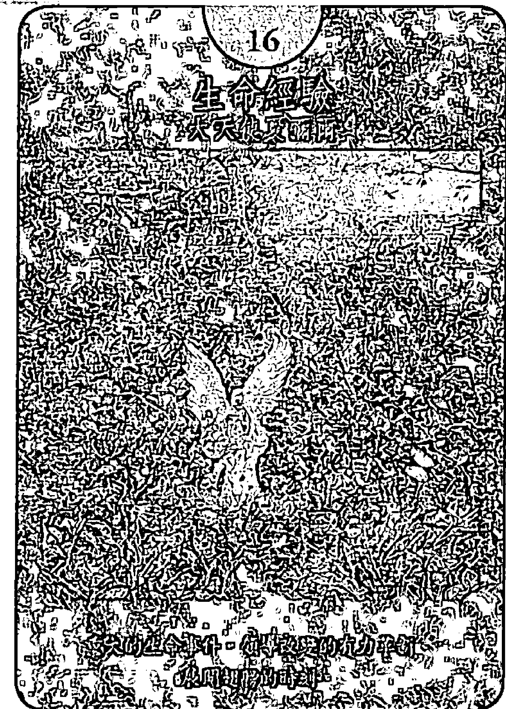

当这张牌在解读的时候出现，正是在尝试告诉我们，需要跳脱古老过时以及局限的界线。可能由于开始觉察到自身的情况，因此我们自愿选择摆脱束缚。也可能在某个人生事件带来无可抗拒的觉醒时，就这样挣脱了枷锁。

在传统塔罗中，这张牌称为高塔，而且很容易造成误解，因此我们重新命名为生命经验。以往这张牌连结了许多骇人事件的发生。但现在不然，结婚就是一个生命经验；有小孩是一个生命经验；从大学毕业也是一个生命经验；所有这些事件都具重要意义，不可否认地改变了我们日常生活的方式，并且带来新觉醒。通常这张牌可以代表意想不到的启悟，帮助我们瞭解人生中所在之处和嚮往之处的相对性。这是自由和看清事物的一种顿悟——或许是第一次发生。

# 梦想家之旅

摘掉自我这张牌的面具，现在我们可以看得见了。然而，即使我们可以看见前方伸展的道路，并不代表我们就会顺着走下去，人类可能会极度地抗拒改变；天使想要我们沿路快乐地前进，但有时候我们没有得到这个讯息（或者我们假装不能），这就是老天会来干预而轻轻推我们一把的时候了。

然而就算当上天伸出援手来将我们送往新道路的时候，我们必须谨记「梦想家之旅」是喜乐和开悟的，如果生命经验带给我们生命中的改变，它必然是将我们带到自己乐意遵循的方向上。

# 图案象征

这张牌的背景中有一座高塔，代表我们以往所创造的人生。

大天使夏弥尔闻名于有能力看到我们可能看不到的事物，祂将我们从塔里带出来，到达一条新的花园小径。

在我们来处的天空有一点云，而且是黑暗的，但我们能看到黎明破晓穿透我们现在朝往的方向。

大天使夏弥尔的前方有一只杜鹃鸟飞翔，它是巨大生命转变的象征。

蝴蝶进一步提醒我们，无论将面临怎样的人生，我们都会有能力去进化和改变。

# 大阿尔克纳

在前景中，有一个沙漏，告诉我们时间已经来到了，去做心中知道自己必须做的改变。沙漏也是一个提示物：如果我们自己不做这些改变，那么我们前途的上天推手可能就快到了。

## 天使数字

数字 16 本质上也是「业力数字」，谈到在我们人生中的焦躁不安或是迫使我们去做出改变的挑战。它驱使我们去寻找生命中的深层目标。当在进行这些改变时，保持正向是非常重要的。

## 大天使简介

大天使夏弥尔的名字意谓着「看见神的人」。没有东西会超出他的视野之外，他总是能够帮助我们发现自己正在找寻的——不论是新的事业、一位恋爱对象、或是对于处境的真实性有更好的了解。他的颜色是浅绿色。

#### 占星配置

这张牌连结于火星，一个无畏、勇敢、和大胆的行星。火星永远准备好要掌握机会，出发前往一个新的探索。这个热烈的行星，鼓舞我们成为自己想做的更好的人，去完成一切我们所能达成的人生目标。如果我们感觉到受限于所处的情况，火星能够帮助我们摆脱正在限制我们的任何事物。

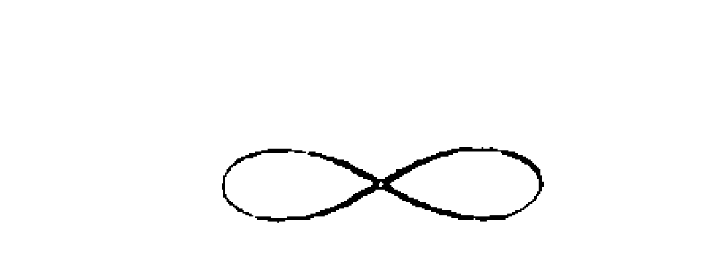

# The Star
## 星星
大天使约菲尔

- 快乐时光。
- 做正面乐观的长期计画。
- 在正确的道路上。

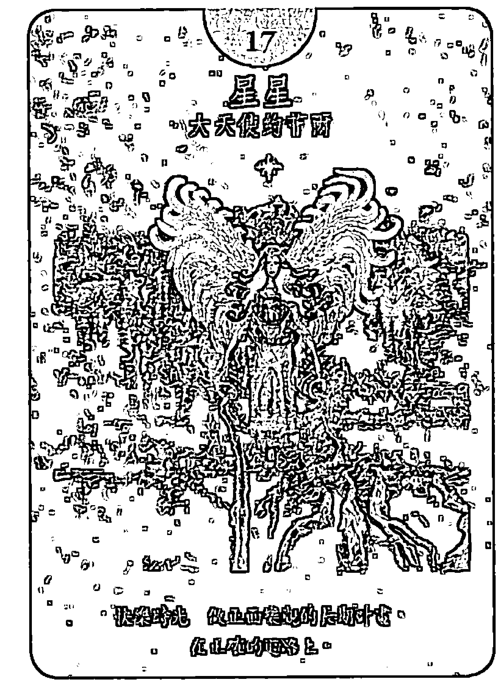

星星牌是无穷的希望、纯洁的信念、以及全盘通晓的一张牌。它指出我们的选择已经到了可以开始去做长期计画的时候了。我们拥有一种能看见触手可及的丰盛未来以及有目标的感觉。如果这张牌的定义只能限定为一个词，那就是「信念」。当我们理解这张牌时，也要考量它是一张「许愿」型态的牌。当我们抽到这张牌时表示我们走在正确的道路上，而长期计画看起来也很确定，那么为何不去许下我们想要的愿望呢？

# 梦想家之旅

这段旅程带领我们穿越许多挑战以及成长的机会。星星牌告诉我们，现在可以享受来自我们所完成之灵性功课的幸福了。我们放下过去，摆脱自我的枷锁，并且做出需要的改变。现在我们可以随心所欲，出发前往丰盛和自由的新层面。

然而，就像画面中的那些山丘距离很遥远，我们有必要从「大愿景」的观点来做出计画。到了这个阶段，我们应该具体化自己的人生接下来长期想要的样子，而非只是下周想要的。

## 图案象征

大天使约菲尔从两个壶中注出水来。她并不忧虑水会耗竭，好像来源是无穷无尽的。她对于自己的道路是完美的，有全然的信念。

水不断涌出来，也象征着静心的力量。

一个壶涌出水而形成五道水流，代表五种感官藉由静心而强化了。

然后水流入下方的池子，则代表了宇宙意识。

天空之中有七颗星，反映了七个「脉轮」。（chakra，译注：有关脉轮的详细解说可见于水之七图案象徵）

背景中的山指出，在此生中的这一时刻，我们可以期望登上这个伟大的高度。

## 天使数字

星星这张牌的数字是 17，它会带来好运。这些好运中，有很多是来自我们曾经投射于宇宙的正向能量，如今反射回来对我们表示回馈的结果。当我们在数字 17 的能量之下，我们的洞察力是正确和精准的。

# 大天使简介

约菲尔回来担任她的天性角色了——为我们显示人生可以多么美丽的大天使。她的积极正面能量，帮助我们保持星星这张牌所表达的信念。当我们在计画有趣的新未来时，可以祈求她帮助我们维持正面的思维模式。

有如前述，她的颜色是深粉红色。

#### 占星配置

这张牌受到友善、看向未来的、以及人道主义关怀的水瓶座管辖，这是一个有远见的星座，能够看到未来的可能性——不是只有为了自己，而是为了所有的人类。

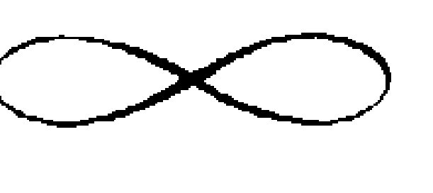

# The Moon
## 月亮
大天使汉尼尔

- 重要的灵性洞见。
- 场景背后的事件。
- 释放抓住你的恐惧。

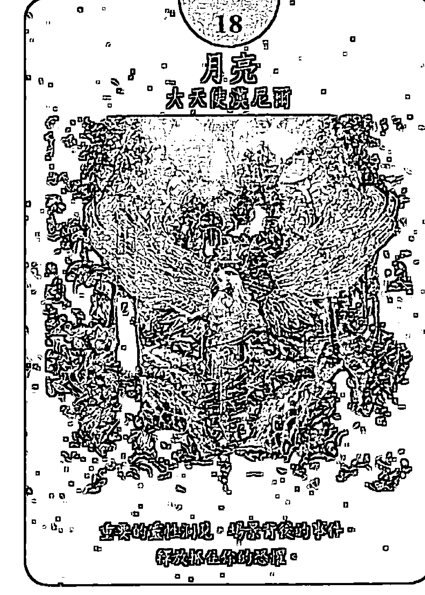

月亮牌要求我们觉察到直觉洞见的出现，这样我们才能够明白自己的处境。应该要非常信任自己的夜间梦境还有心灵视觉。潜意识尝试告诉我们的是什么？会比眼前所见的还要多吗？

月亮牌可以指出在人生的某个时期，我们觉得充满不安全感或不确定感。然而，这些通常都是不合理的恐惧和不必要的忧虑。就如同真正的月亮在夜里反射光芒照耀我们，因而这张牌指出了真理的光芒将会向我们展露。

# 梦想家之旅

现在我们来到了月亮牌。大天使汉尼尔回来了，继她在前面出现为女祭司之后。确实，是有共同特征由女祭司牌和月亮牌分享的。两者都非常有直觉性，都诉说着那些曾经不被瞭解、而如今在我们掌握之中的东西。

在闪耀的月亮光芒之下，我们认为不可能的（或不是真的）事情突然栩栩如生。有许多开悟的机会太神奇了，简直让我们难以置信。先前曾经控制住我们的恐惧，现在可以释放掉了。有可能是这些忧虑和担心再也不奏效了，或者从来未曾出现过！

# 图案象征

大天使汉尼尔在背景中和双柱站在一起。这就是在女祭司牌中，在她站立的后方的相同柱子。由于我们已经旅行很远了，所以在这里会从另一边看到双柱。

大天使汉尼尔仍然戴着她在女祭司那张牌佩戴的等臂十字。意识和潜意识的思想被平衡了。

在她的一边是一匹狼，另外一边是条狗。牠们代表了狂野和温驯，牠们是自然的高度和艺术的顶峰，而汉尼尔是牠们之间的平衡。

两条小河分别流进中央池塘——意识的和潜意识的知识汇聚起来了。

# 天使数字

月亮是 18 号牌，在这个数字下，人们可能感到迫于表达他们的担心和恐惧。就这个数字来说，连结了精神世界和物质世界之间，然而这两面也可能会互相产生一些冲突。所以我们对于心中的期望必须保持正向，这样才能以感觉良好的方式，满足我们的物质需求。

# 大阿尔克纳

## 大天使简介

大天使汉尼尔回来了，带着她所有的精神和直觉的力量，为我们显示目前处境的真实性。在她淡蓝的月光颜色中，她觉察到某种形式的美丽以及我们未曾了解的深刻知识。然而很快地——非常快地——我们将看见她所看见的。

#### 占星配置

这张牌是由双鱼座主宰的，一个非常超自然、敏感、与灵性的星座。在占星学中，双鱼座掌管了黄道的第十二宫——这宫位代表着看不见或隐藏的知识。无论如何，双鱼座是最具直觉力的星座，而且能帮助我们了解至今仍然未知的事物。

# The Sun
## 太阳
天使乌列尔

- 快乐的结果。
- 领向成功的聪明新点子。
- 对自己有信心！

在太阳牌，伟大的顿悟是可能的。不可思议的创意，随着无限的机会进入我们能够操控它们的意识中。这张牌也反映出，某个人的自信不是已经成长就是正在提昇。

如果我们能保持正向思想，那么我们就一定会成功。这张牌也可以表示回復到朝气蓬勃的身心健康状态。

### 梦想家之旅

我们在月亮牌的时光，带给我们更深入的洞见，而现在我们回来看看太阳牌。这张牌激起了极度的喜悦和成功，显示了我们已经进化、我们已经成长、我们已经创造了所想要的世界！

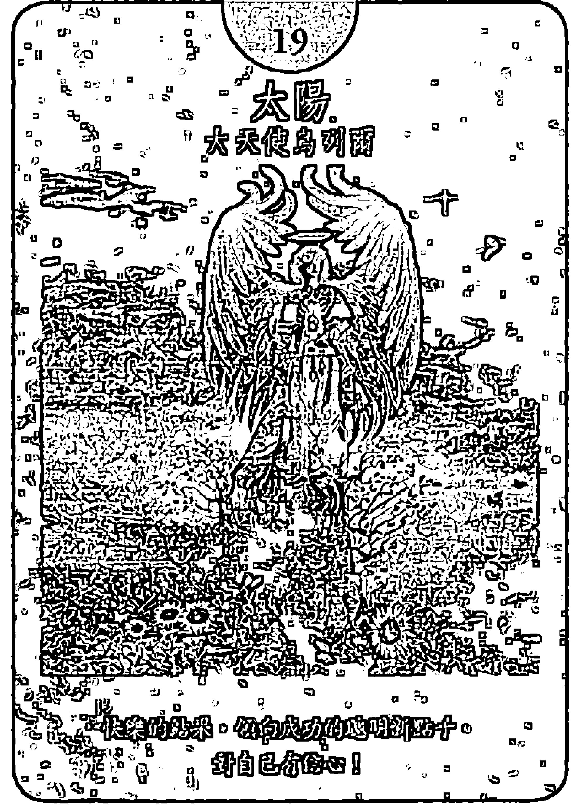

在太阳牌中，我们可以期待去体验人生中真正的喜悦，以及生命必定给予的所有美妙事物。因此，或许会因为我们的指导或成就，而受到大众的表扬。我们的旅程接近尾声了，而真正的开悟就在掌握之中。

# 图案象征

大天使乌列尔站在墙上，代表人类适应人生困境的成功能力。

乌列尔被黎明新升起的太阳从背后照亮，喜乐的崭新早晨反映了我们人生前进的方向。

蝴蝶是进化和成长的象徵，盘旋围绕着大天使乌列尔，证明我们已经在旅程上走了好远一段了。

四朵太阳花快乐地在大天使的脚边绽放，代表「小阿尔克纳」中的四花色牌组，也就是火、水、土、风四元素。

# 天使数字

数字 19 是最后一个「业力数字」，这里是我们到达成功的终点，也因此为自己创造出新的开始。随着这个数字，每件事情突然变得透彻清晰，我们发现自己知晓了生命目标，而且到了要去奉行的时候。我们变得更加相信自己，因而我们带着自信和希望，为了美好的未来前行！

# 大天使简介

大天使乌列尔的名字意谓的是「神的荣光」，传达已经带我们到开悟和喜乐之地的伟大经验。乌列尔拥有的能力，不只带给我们伟大的洞见，还以情绪的疗愈来祝福我们。

他那美丽的翅膀和光晕反映出他的金黄色。

#### 占星配置

理所当然地，这张牌占星学上的连结就是太阳！在占星学上，太阳就是我们的身份、我们的人格、以及我们的真实本性，也代表创造力和我们真正在发光的生活领域。

# Renewal
# 更新
大天使耶利米尔

- 审视和评估。
- 对事实的有力评估。
- 向一个新方向前进的时刻。

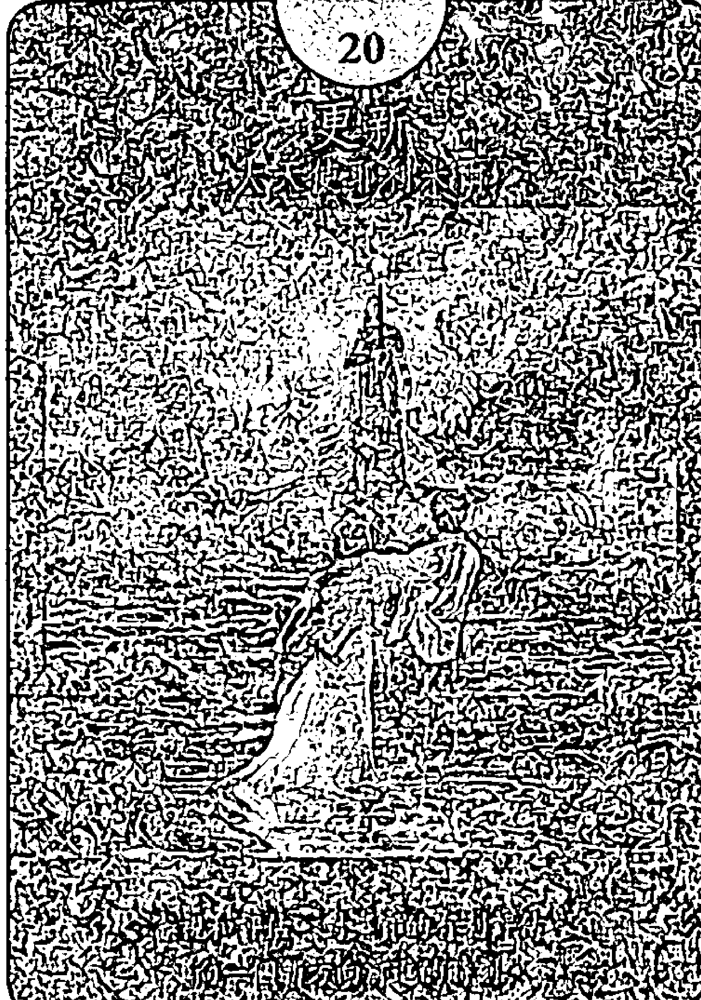

更新指出我们接近完成一趟重要任务了。这张牌要求我们暂停下来，并回顾过去和自己的成就，那么我们就能够决定未来想要走向何处。这可能包括我们已经在衡量的职业转换跑道，所以我们必须花时间非常谨慎地全盘考虑这些选项。

我们或许需要做一项重大决定，但这张牌也可以使我们确信，任何努力在准备的部分都已经备妥了。无论是面对学校考试、法律程序、或者认证测验，我们都会进行地很顺利。

# 梦想家之旅

在原始的塔罗中，这张牌称为审判。而当这个名字和它的意象，呈现出受到别人批判的感受时，这张牌其实与我们如何看待自己的行动更有关系，而不是别人的看法。

更新指出，我们一路走来，看见了非常多惊奇和美妙的事物。然而，现在是去停止和省视过去的时候了，如此可以瞭解我们现在身处何方，以及我们想要去何处。更新召唤我们向一个新方向前进。我们感到身在十字路口上，也对于尾声即将来临感到乐观，这时候要下很大的决定，而我们在情绪上和心灵上也都准备好了。

我们听到一个召唤，感觉到这就是自己的命运，要继续做些伟大的事……而可能性是无限的！

# 图案象征

大天使耶利米尔站在汹涌的水波上，代表我们曾经有过的挑战经验，有如我们已经游历过的旅程。

然而，在此时此地，这一家人站立的水面，则是完全平静的，显示了透过我们的努力而显化成真正的和平。

男人是意识，女人是潜意识，而小孩代表更高的意识。他们共同象徵了我们的内在与外在世界健全的平衡。

大天使耶利米尔手握着一根顶端会发亮的权杖，那是我们「顶轮」的颜色，显示着我们已经发展了「自知之明」和「灵性觉知」。

# 天使数字

数字 20 意指伟大的慈悲、关怀、以及感情。这是一个服务他人和世界的数字。在「梦想家之旅」中，更新这张牌指出我们已经来到一个进化和心灵成长的地方，符合数字 20 的共振和能量。随着这数字，可以知道神正在帮助我们踩出每一个步伐。我们对未来的乐观受到完全的保证。

# 大天使简介

大天使耶利米尔，是帮助我们评估人生的天使，好让我们可以瞭解在未来想要做出什么改变。他的名字意谓「神的仁慈」，而他的颜色是深紫色。正如神是无限地关爱和仁慈，因而当我们回顾自身的生活时，也应该如此看待自己才是。

#### 占星配置

冥王星以蜕变之星闻名。当这个行星来到世界上，事情就很可能有所变化——而且会转变得相当戏剧化。就像更新这张牌，冥王星随后来到，推促我们更上一层楼。我们可以获得更新和重生，借此我们甚至能够更超越从前的自己。

## The World
## 世界
### 大天使麦可

- 一份工作做得好！
- 喜悦、满足和感激。
- 朝向开悟的道路。

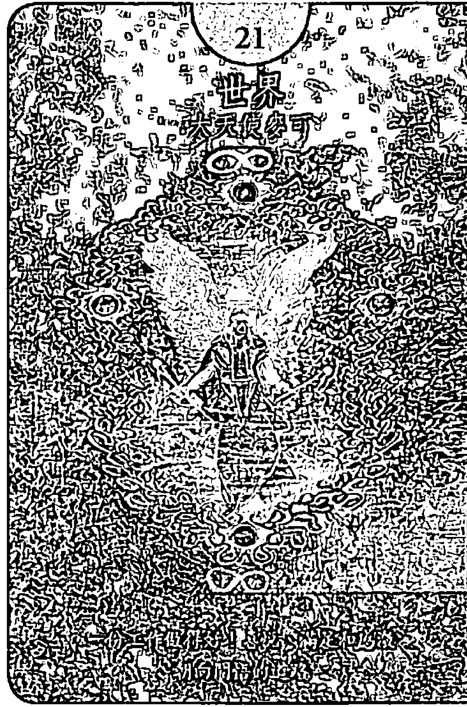

世界指出在个人生活或职涯中，进展到更高的层级。未来可能获得升迁或者新的职位，而这个新领域同时具有挑战性但又前景看好。这张牌也可以反映前往一个新的家庭或者新的城市生活。

这也是开悟的一张牌。我们遵循自身的进化，拥有完全清晰透彻的内心，能够明瞭自己下一步要往何处去。

#### 梦想家之旅

好的，我们做到了！这就是「梦想家之旅」的终点！我们克服了自我而找到了喜乐。我们征服了所有的任务，享受伟大的成功，并且确实到达了宁静与快乐的境地，而从此处进入世界。这张牌指出胜利、达成、以及完美，我们需要享受这个片刻！

# 大阿尔克纳

世界这张牌指出正在完成生命道路的整个循环。我们可以藉由返回梦想家这张牌而再度开始一段旅程，或者我们也可以尝试任何截然不同的方式。选择权就在我们自己手上。

# 图案象征

大天使麦可站在桂冠花圈之中，这是一个成功的象徵。

他握住两根权杖，一个是意识，另一个是潜意识。这表示我们已经达到完美的平衡！

在桂冠圈中有火、水、土、风四个元素，指出我们已经熟练地使用这些元素来创造美丽的人生。

围绕桂冠圈的是来自紧接世界牌之后的「小阿尔克纳」四元素牌组的风景。

麦可的头顶上和脚底下，都有无限大符号，代表永恒的生命。我们也许已经完成了任务，但是永远会有更多可供我们创造的！

# 天使数字

21 是一个成功和创造力的数字。许多天使在你遵循而到达此处的道路上欢天喜地，而你甚至可以感受到充满能量的赞扬。现在你还是要维持在乐观和正面思考的道路上，这样才能够到达更远之处。

# 大天使簡介

大天使麥可，地球這個行星的保護者，這是他的第三次、也是最後一次回返，流露出為我們的旅程感到驕傲的神色。他的寶藍色和金色使我們感受到尊貴，而他寬闊地敞開雙臂來肯定我們的成就。

#### 占星配置

土星是考驗和挑戰的行星，據說是我們在此修通業力以能在今生進化的行星。土星指出我們受限制和受控制之處。和世界牌的連結，顯示我們已經突破了屏障。我們一直被考驗著，如今已經成功以最高榮耀畢業了！

## 第四部

## 小阿爾克納中的日常生活

### 火之牌組

### 火之王牌

-   令人興奮的新契機！
-   事業的進展。
-   立刻改變你的生活！

火之王牌是承諾許多美好事物之牌組中的第一張牌。當我們抽到這張牌的時候，擁有了難得的大好機會，足以改變我們的人生。「王牌」代表其所屬元素牌組的開始，這裡的實況是火之牌組，指出一個新的契機，出現在創造性的領域中、職場上、熱情、和自我發展之中。

現在，可以看到我們的夢想觸手可及了。然而，我們須採取達成目標的必要行動。這張牌告訴我們，美妙新奇的可能性就要開始奏效了。

#### 圖案象徵

「巨靈」（genie）是一種希望讓我們的夢想成真的奇幻生命。這位巨靈沒有什麼不可告人的動機，他僅僅是想要服務。他唯一的獎賞，就是看到我們充滿愉悅和快樂。

據說如果要使巨靈出現，必須摩擦「神燈」。這張牌底部的油燈要表達的是，我們可以許下願望，但是在魔法開始運作的時候，也必須要「親手操作」。

開花的灌木圍繞著巨靈，這些植物的名稱是「委陵菜」（potentilla），通常被稱為「五瓣花」（cinquefoil）。「potentilla」這個英文名字源於拉丁文中的「potens」這個字，意義就是：「有力量、強壯、以及成功的能力」。

委陵菜的五片花瓣據稱代表五種感官，而中世紀騎士在征途中成功的時候，會配戴這種花。

巨靈站立在兩座城市之間，指出有多元的機會提供我們的計畫順利展開。

在天空中高掛著三個月亮，如鏡子般照映出自古流傳「神燈巨靈」提供三個願望的傳說。

占星學上，月亮相連於我們的情緒、需求、和直覺。這些全都是對於瞭解該許下哪一個願望才好的絕佳指引。

#### 天使數字

這是第 23 張牌。當一張像是火之王牌這樣神奇的牌出現時，讓我們的思想保持正向積極是很重要的。我們隨著這張牌進入「顯化模式」中，而信念會決定創造出什麼。由於在這個數字中 3 的能量，我們可能想要向揚昇大師諸如耶穌、聖者、或其他天堂的靈性指導者請求幫助。祂們的協助可以驅散負面能量，並維持我們的意念透徹清晰。

數字 23 也可以縮簡為一個 5（2+3）。五是調整個人道路所需力量的指標，同時也是人生經歷重大改變的指標，這都是我們會想要去做的。

#### 占星配置

王牌沒有確切分明的占星學配置，然而連結於它們的牌組代表的元素，在此例是火之牌組，因此，這張牌聯繫了源自火元素的三個黃道星座：白羊座、獅子座、和射手座。

### 火之二

-   實至名歸。
-   新的夥伴關係或契約。
-   繼續前進。

先前那張牌，提供了我們美妙的新機會。火之二指出我們在接受到的協助上採取行動，而現在球已經滾動起來了。儘管如此，我們距離冒險結束還很遙遠，事實上，才真正剛要開始。這可能是個好時機，可以和幫助我們更進一步邁向目標的人，成立新的合作關係。新的選擇可能會對我們有所要求，因而我們應該仔細考慮清楚，或者向自己信任的人諮詢而得到建議。我們的潛能是無限的！

#### 圖案象徵

兩位男子在一段探險中結為同伴走過這片森林。他們與對方互不相同，然而透過他們帶給這個任務的經驗差異，為他們增強了力量。

男人們有一隻幼龍陪伴，牠代表熱情的新奇，以及創造性的奮力之火。幼龍很愉悅，並渴盼以任何牠能做到的方式貢獻給這段旅程。

有斑點的龍蛋放置在這個「三人組」面前，指出他們眼前仍有更多的機會。他們原先的目標達到了成功值得歡慶，也很有可能催生出連他們都尚未覺察到的創意。

來自「王牌」中的黃色委陵菜花朵（見火之王牌）持續開著花，證明成功仍然在旅行者的前方。

在某些情況之下，當問題相關於男同志關係的時候，這張牌可以指出這個型態的戀情夥伴。這張牌也可以指出來到某人生命中的一段新關係，或者就是目前正在諮詢的既有關係。

#### 天使數字

這是第 24 張牌。當火之二出現的時候，我們很可能創造出美妙的新關係。在這裡的實況下，我們的新助手會有天使般的特質，所以思想保持正向積極是很重要的。我們隨著這張牌進入「顯化模式」中，而內心的信念會決定創造出什麼。天堂送出所有我們需要的天使，去驅散負面能量和維持意念透徹清晰。

由於數字 24 可以歸簡為 6（2+4），在財務相關問題的點上，可能會有一些憂慮。別讓思想專注在擔心物質方面的憂慮，反而是要保持在創造的喜樂中——帶著天使會提供我們所有需求的信心。

#### 占星配置

這張牌連結到「火星在白羊座」，能夠辦妥事情的一股強大能量。也許有一點衝動任性，但對於手邊的任務有無止盡的朝氣和熱忱。新的創意讓人感到振奮，而新的改變——精神無比充沛！

「火星在白羊座」是一種快速移動和完成大事的能量。白羊座是火星這個行星的守護星座，所以創造和成功的渴望倍增。隨著這股能量要注意的是，那種或許在兩個對於事情該如何做都堅持己見的人之間的合夥形式，如果能維持妥協和善意的討論，這段合夥關係的促成幾乎不可能告吹。然而如果形成了僵局，進度就有可能會減緩。

### 火之三

-   豐盛！事情看來很不錯；
-   此刻要有耐心。
-   做長期的計畫。

是時候暫停下來和深思熟慮了。當然，我們至今的成功已經受到鼓舞和讚揚。不是所有努力的報償都已經出現，但是也明白很快地我們的船將入港。那也就沒有必要去等待船隻抵達了，所以何不開始下一個階段的新計畫呢？想想下一步我們將要創造出什麼呢？我們要如何基於先前的成功去擴展呢？這時候應該將眼光投注在更遠的地平線上，並且懷有更大的夢想了！

#### 圖案象徵

一位小女孩坐著，沉靜地思索在她前方的創造物擁有什麼樣的力量。

她的朋友是一條年輕的龍，當她的一切夢想都達到成果，就會在此出現。有人認為她的龍朋友是想像出來的，但她知道牠是真實的，就像她知道自己對未來的希望是真實的一樣確定。或許也有可能龍才是真實的，而女孩卻是想像的？無論兩邊怎麼說，總之，意圖的純淨混合著烈火般的熱情，是成功的一個秘訣！

一座火山在遠處噴發，傳送處火元素及所需的材料，以打造小女孩想要一試身手的任何事物。

當純粹創造物的混亂在她面前翻騰時，小女孩和她的龍朋友坐得全然淡定，處在一座曾經像遠景般的原始野性森林中。

雛菊的成長反映了女孩生命中的這個片刻，壓力和戲劇性都移除了。她一向辛勤地工作，但現在她可以放鬆一點並照料她自己了。

在她為了創造而做的努力中，生命對這女孩而言變得複雜化了，而當她開始下一個計畫時，極可能變得更複雜。然而對現在這一刻，有什麼能比她與最要好的龍朋友一起坐在雛菊當中更單純呢？

#### 天使數字

火之三是第25張牌，5的能量召喚著迎向小女孩和她的龍而來的改變，新的計畫將會規劃出來，而同時她們正快樂地享受在其中，她們知道會有更多東西來到眼前——如果她們堅決並持續地創造下去就能享受的美妙事物。數字2的能量為她們託付於樂觀和正面思想中的未來，預示了美好的徵兆。

這個數字歸整為7（2+5），一個美麗的數字，使我們確信自己走在正確的道路上。這個數字涉及靈性成長，以及來自天堂的神奇祝福——我們辛勤工作的回饋。

#### 占星配置

在占星學上，這張牌與「太陽在白羊座」有關，白羊座是黃道的第一個星座，太陽是占星盤上一切的開始，所以這個星象組合的能量完美符合了這張牌，因為這就是在我們的任務啟動之前的第一時刻。

白羊座是一個領導者的星座，著迷於探險，且不吝於將成果歸功於自己。「太陽在白羊座」通常是正直形塑而來的，因此，以偷偷摸摸的方式處理任何特定的情況，就不是該有的風格了。

白羊座是個喜歡新挑戰的星座，只要能夠認同目標，並在追求中看到某些高貴的事物就行了。

### 火之四

-   滿足、平靜和豐盛。
-   幸福的家庭生活。
-   計畫圓滿成功。

這是如此美妙的時刻！在工作方面得到了報酬，而我們感到豐盛舒適、和平、以及如願以償的喜樂人生。我們的勞動成果廣泛地受到當之無愧的肯定，而以往付出的努力也受到了讚賞。我們在財務上有了安定感，甚至可能是專注在家庭生活樂趣的時候了。也許我們會步入一段婚姻、開創一個家庭、建立一個家園，也許我們會全部做到這三件事！是時候將心中的感謝表達給生命中美好的人……同時也表達給我們的天使和神。

#### 圖案象徵

四根權杖佇立著，構成一個正方形，這是結構和均衡的象徵，外型提供了堅固和安全的感覺，很像火之四呈現給我們的人生。正方形也代表物質，以及我們在生活中創造的事物，像是溫暖的家園和壁爐。

四根權杖按照四個較低「脈輪」的顏色來著色：紅色、橙色、黃色，以及綠色（譯註：各脈輪解說見水之七圖案象徵）。火之四不只是一張關心於我們靈性發展的牌，也有助於我們「頭上有屋頂遮蔽」的安全感、結婚和生子、掌握生活的感覺、以及在戀愛中的樂趣。

一個圓球狀物在四根權杖中間，順時針方向快速旋轉，向我們保證了生活在往正面的方向運作。

一條友善的龍在圓球內，形象趨於具體化，顯示我們的熱情和創造力順利地甦醒過來。

當我們向一顆星星許願的時候，據說這個夢想就會成真。這張牌充滿了星星可以許願，指出我們有信心再多的希望也都會結成正果。

#### 天使數字

這是第 26 張牌，綜合正面思想和對於財務安全的期盼。火之四這張牌指出我們對於在工作中或在家中的情況，都感到極為快樂（甚至歡天喜地！）。

數字 26 歸併成為 8（2+6），更進一步地允諾我們的豐盛和富足。我們的擁有不是暫時的情況，而是在可預見的未來，對於我們自己、我們的伴侶、和我們的小孩的持續允諾。

#### 占星配置

在占星學上，這張牌歸屬於「金星在白羊座」，金星是美麗、浪漫、和創造力的行星——所連結的這張牌，顯示了生活中所有這些層面的快樂和滿足，這些特質和行星是完美符合的。

當然，白羊座的能量使達成目標的渴望相當急迫，我們想要火之四提供迷人的事物，而且現在就要！那是種驅力，帶我們從一開始火之王牌的鼓舞，經過火之二的創造，到達火之三的長期規劃，而後進入了火之四興高采烈的喜悅。

### 火之五

-   互相抵觸的目標。
-   麻煩的細節。
-   與人衝突。

在我們的生活中偶爾會有一些衝突，這是個事實。可能是和別人產生衝突，或者是嘗試選擇要最先關注哪個議題。這些挑戰可能看起來是來自於外界，然而「吸引力法則」有時候會帶來投射出我們懸而未決之內在問題的人進入人生。因為這個理由，當抽到這張牌的時候，蠻好的是去審視自己正面對的真正困難來自內在的可能性。

這張牌也可以代表更良性的挑戰，像是運動賽事、工作上的測驗、或者其他向同儕證明我們自己的機會。

#### 圖案象徵

插入地面的五根權杖構成一個形狀，出現在前方擋住我們的路。我們無法越過這些權杖，甚至無法看見它們的後方是什麼。
五是改變的數字。我們對這個情況的認知，或者在執行任務的方式上，如果沒有改變的話，屏障將會繼續維持住。

在這個牌組前面的牌中所開的花，指出良好的機會，如今失去蹤影了（見「火之王牌」）。我們需要回顧為自己創造的經驗，確保是自己想要的。

上面的三根權杖貌似支配著較低的兩根權杖。較高的權杖是橙色的「臍輪」（有關自我價值的議題），紅色的「根輪」（關切於基本需求），以及淡藍色的「喉輪」（如何溝通）。我們感到不安全、而且正在表達的挫折，是否有可能源於這三個區域、而不是源於綠色的「心輪」（像是愛的情緒）、或者紫羅蘭色「頂輪」（靈性自我）呢？

#### 天使數字

這是第 27 張牌，數字 2 的能量提醒我們，如果專注於積極正面，「吸引力法則」會將這些帶來給我們。然而，如果我們的意念被隱埋在恐懼和憂慮之中，那麼我們憂慮的任何事情都會朝向我們而來。在每一個挑戰中有一個課題，會將我們放置在伴隨著 7 的能量而來的正確道路上。

合併這些數字簡化為 9（2+7），是一個服務自己和他人的數字，並且也是當我們在實現生活在地球上的目標時，也會帶給世界更多光芒的數字。我們要感謝在這個課題中，學到了快樂會隨著時間經過而持續成長。

## 天使塔羅全書 The BIG Book of Angel Tarot

#### 占星配置

「土星在獅子座」是火之五的占星配置。土星是我們嘗試達成目標，卻感到受限和侷限的行星。獅子座眾所皆知是想要閃亮和有名的星座，對於成就和個人受到認可有強烈的需求。

這二股能量的搭配，可能導致我們低估了自己或目標。內部衝突可能發展下去，而致使我們停止嘗試。然後，由於上天想要我們成為所有可能成為的自己，因而呈現給我們的外在挑戰，反映了內在的衝突。我們必須突破這五根阻擋自身進展的權杖。

### 火之六

勝利！
好消息就要來臨。
公眾的認可或獎勵。

火之六在塔羅中是一張有暱稱的牌：叫做「勝利牌」！當抽到這張牌時，我們已經在旅途中闊步向前。來自火之五的麻煩已經解決，而我們騎在馬上衣錦還鄉，受到熱烈的喝采和歡慶。朝向我們而來的消息，將帶來極度的歡樂。我們可能贏得獎勵或得到升遷，不然就是期待已久的出書合約終於來到門前。

這張牌也可能表示我們將因為自己的成就而受到公眾認可。也可能是做一些自我推廣或者透過媒體行銷的時機。

#### 圖案象徵

一位勝利的男人抵達鎮上，引起一片歡聲雷動！他的探險已經功成名就了！

紅色玫瑰花瓣撒在空中，引導他來到這個村落。花朵是熱情和愛的象徵物。我們的英雄追隨他的熱情，由於樹立的典範而受到來自村民的熱烈讚賞。

白馬一般連結於英雄所展現的純淨意志，指出勝利或者迫在眼前的成功。也連結於靈性發展和直覺能力。

旗幟上印有這個牌組的標誌物～龍，飄揚在背景中。在這些人上方的龍旗，連結於亞瑟王和他的光榮統治，為卡美洛宮廷帶來和平與繁榮。

在圖案中有兩個女人出現的意旨，是帶入一點女性的能量，以使牌中的整體能量得到均衡。

#### 天使數字

這是第 28 張牌，這個數字的能量是非常積極和成功的，符合於這張牌的意義。數字 2 的影響力，為抽到這張牌的人提供了正面思想而能顯化為喜悅。這個相同的能量也在 8 的影響下，帶來了豐盛和富足，成為我們騎士的獎賞。

數字 28 歸併為 1（2+8=10，1+0=1），數字 1 不僅代表顯化我們的期盼，也是一個新的開始。現在騎士已經達成他的期盼，他可以轉移注意力而朝向下一個大成功。

#### 占星配置

「木星在獅子座」是非常慷慨的能量，藉由服務他人和提供優秀的角色典範而產生好運，在雙贏以及施與受的方式下，提供他人鼓舞，也因此這股能量喜歡處於聚光燈中。「木星在獅子座」因為信仰而有極度自信和勇氣，其他人可以學習這股信心，也能從克服挑戰的經驗而受益良多。

### 火之七

捍衛你的信念或選擇。

堅定立場！

明智地選擇戰場。

這是一張女性力量的牌。雖然這張牌要我們堅定立場以及捍衛自己所相信的，但也要我們衡量自己的選擇：「這是一場值得去打的戰爭嗎？」「我們要放棄自己的需求而去追尋某個議題？或是相反地，調整專注的方向而鎖定在自己認為更重要的事上呢？」只要從「心」而不是從理智做出選擇，我們會在挑戰中更加茁壯是無庸置疑的。

#### 圖案象徵

一位美麗和自信的女子，協同她的龍朋友一起合作。由於龍身上的色澤是粉紅色和紫色，在性別上呈現的是女性。這提醒了我們火之三這張牌，那位年輕女孩在這裡已經成長了。不像在火之三牌中她們一起沉思著未來，這張牌的年輕女人和龍協力合作捍衛她們的信仰，共同創造她們心中計劃的未來。

年輕女子手握一根權杖，顏色是「心輪」的顏色，顯示了她的行動是和愛有關連的，而且值得捍衛。

六根權杖朝向我們的「英雄」飛過來。六是關切物質的天使數字，然而，由於她攜帶的是「心」之權杖，她確定佔了優勢。

#### 天使數字

這是第 29 張牌，這個數字召喚我們要堅定專注於人生目標。這個數字、這張牌以及占星配置，都是極度自我肯定的。信心是成功的決定因素，事實上，成功的定義就是由自己決定的。

數字 29 歸併為 11（2+9）。不像其他大部分的數字，11 是一個「大師數字」，所以不會再繼續縮簡下去。這是一個非常有力量的數字，確保我們的能力可以顯化。相信這位騎在龍背上的年輕女子，她的探險一定會有所成就的！

#### 占星配置

「火星在獅子座」的行動非常熱情也很有信心，帶著要在世界上有所作為和發揮影響力的強力需求。通常能夠無畏地展現雄心壯志，也會採取強大的行動，有時候甚至勢不可擋。我們也許不認同「火星在獅子座」從事的探險，但是毫無疑問地，她會遵循自己的「心」直至天涯海角。

### 火之八

事件快速地進展。
不再遲延。
許多事情一次發生。

這張牌可以歸納成三個字，那就是——「忙、忙、忙」！當抽到火之八這張牌的時候，通常反映了某人被塞滿了事情而忙不完。也可能指出一個人原本平靜無事，然而眼見悠閒時光就要結束了。這是一張迅速轉換和行動力的牌，因為這張牌的占星學配置，通常會有個非常受歡迎的改變。我們可能對於必須做的一切感到有點煩躁，然而我們樂於生活中擁有這麼多活動。我們可能感到緊張，所幸那是來自正面事物的壓力。

#### 圖案象徵

八根權杖飛散到天空中，形成很像煙火的印象。煙火是偉大慶典的象徵！如果我們夠幸運的話，會看到精心策劃而施放的美麗煙火。不過煙火是不可預測的，有時候也會有一點小混亂。

這些權杖並沒有朝著同一個方向飛去。顯然地，它們要達到的目標是多樣的、甚至也可能是矛盾的。由此可知，必須排出工作輕重緩急的優先順序。

雖然這是一張火元素的牌，但在背景中我們看見一片水域。讓情緒飛揚帶我們遠離是很容易的，然而目標卻是藉由保持感情的落實和四平八穩而來的。

#### 天使數字

火之八是第 30 張牌，這個數字使我們確信，在掌握這個人生中值得鼓舞的時刻，我們受到神和揚昇大師的愛與支持。我們可以想像在這張牌中的煙火圖案，就像天堂中的慶典，為我們遵循著生命道路而喝采！

這張牌歸併為 3（3+0），更進一步地強調慶賀的訊息。

#### 占星配置

「水星在射手座」是極為樂觀的能量。因為水星掌管了心智，這個占星連結指出，我們的心智充滿美妙的想法，甚至不知道是從哪裡冒出來的。我們感到對未來充滿光明，即使行事曆已經爆滿了。我們可能覺得靜不下來，並且渴盼動身出發。我們可能喜歡捲起袖子去完成每件事，彷彿自己是非常獨立的——但事實上我們需要一點來自朋友、同儕、或者是屬下提供的幫助。

### 火之九

不要放棄。
保護你的創作。
要有勇氣，並且相信自己。

火之九指出我們感到有需要保護自己已經創造的一切。在火之牌組中歷經所有的旅程，我們向來辛勤工作以創造自己的夢想。我們可能對於所建立的事物其安全性或穩定性感到不舒坦，而覺得自己需要再加倍努力。在這一刻對自己有絕對的信心是很重要的，我們需要向內走以獲取內在的勇氣，然後轉而向外顯現出勇敢與果斷。只要我們相信自己，一切將會妥善完成！

#### 圖案象徵

一位美麗的女子準備就緒、充滿決心、甚至有點桀傲不馴地站立著。她的成就讓她引以為傲，並且永不放棄她的夢想。

女子身旁是她的龍夥伴，龍張開翅膀像要保護身後的什麼。

龍和女人都握著相同顏色的權杖，代表她們對於所創造出來的一切，是投入一樣份量的平等搭檔。

一盆黃金所指的是被完成的事物。這在文字上的形容可能是「財務的富足」，或者做為一個隱喻：她們的熱情成果對她們而言，價值有如黃金。

黃金盆中有另外六根權杖。可能指出她們為財產而擔憂是沒有必要的，這是由於數字六可以指出過度關切物質商品。

#### 天使數字

這是第 31 張牌，要我們審視是否內心的恐懼或憂慮可能只是假象？或許我們的保護立場是不需要的。但如果我們的憂慮是對的，那麼我們可以帶著強大的信心來瞭解，只要擁有決心就會帶領自己度過難關。來自揚昇大師的幫助對於我們請求的回應。

由於這個數字縮簡為 4（3+1），我們也可以瞭解整個天使國度就在我們身邊。

#### 占星配置

這張牌的占星學連結是「月亮在射手座」，這是一個非常獨立自主和充滿信心的能量，然而有時候可能充滿競爭性，也堅持安全感和防禦心。有一個信念是：縱使面對極端的逆境，每一件事情終將得到解決。有遠見、充滿希望、甚至有一點點野蠻的「月亮在射手座」，能夠達成每一件想要達成的事。

### 火之十

太多工作了。接受别人帮助。
生活失衡了。
注意與壓力相關的健康狀況。

工作能夠執行而感到令人精神振奮，或者可能耗損精力而感到是令人厭煩的繁重瑣事。這張牌代表在生命中的某些時期，全然投入太多工作了，沒有留下任何空檔休閒或娛樂。通常這張牌顯示人們正在做著多樣工作，或者單親處理工作的挑戰一整天，而回家之後還要照顧小孩。我們可能發現自己如此強烈地捲入當前的努力中，甚至不了解這樣下去自己會變成怎樣。

這張牌也可以指出工作過勞而造成的健康問題。我們可將火之十視為一個可能的訊息，去降低我們的工作量、抽出空檔、或者在可能的時候委派任務給其他人。

#### 圖案象徵

龍背負著一個沈重的負擔，而且孤身只影地在做這件事。來自火之九那張牌的女子這裡不再從旁協助了。

來自火之九的一盆黃金仍然完好無缺，但現在有十根權杖在其中，不只讓這盆黃金更為沈重，也使它形成了一股更緊張的能量。

在夜里，龍飛翔在一座星光點點的城市上。也許龍已經工作到夜晚，也許這是第二份工作，或者工作完畢後的另外規劃。

由於在「天使塔羅牌」中龍是代表熱情的，在這裡龍的姿態指出，熱情已經被過度工作所消磨了。

#### 天使數字

這張牌的天使數字是 32，邀請我們擁有信念——相信環境是對我們最有利的，而我們感覺到的任何掙扎只是暫時的，最後都會讓位給喜樂，而這是源於瞭解自己走在越來越快樂的道路上。我們與揚昇大師一起工作是很好的主意（在這情形下，特別是耶穌），我們有必要減輕包袱，而挑戰也徹底消退了。

這個數字歸併為 5（3+2），一個重大改變的數字。為了讓我們擺脫困乏的時段，天使要求我們所做的改變必須落實下來。

#### 占星配置

土星代表使我們感覺到受限和被控制的行星。而另一方面，射手座是自由和獨立的星座。兩者的衝突極大，組合起來會變得怎樣已經沒什麼好驚喜了。土星約束了射手座天性上的靈性信念，使它難以懷有希望。如果我們沒有信念就難以應付困境。

「土星在射手座」可能會變得非常無望、挫折、以及多疑。這個能量相信的是，唯有透過辛勤工作才能獲得成功，而且信任是必須爭取而來的。

### 火之侍者

外向開朗，有創造力，有自信，淘氣頑皮

振奮努力的消息。運用你的原創力與獨創性。

選到火之侍者這張牌多麼令人振奮！新的機會出現在眼前，我們可能得到一些訊息，得悉美好的事物即將來到生命中。這是一張高度創造力的牌，顯示「跳脫框架思考」的能力極為珍貴。這張牌要我們遵循內心的熱情，並讓熱情引導我們走向畢生事業，這無疑是在要我們運用自己獨一無二的魔法去顯化自己的幸福。這張牌也意味著升遷、工作轉換跑道、或者在我們的職涯中任何嶄新和有前景的發展。

#### 圖案象徵

一位美麗的年輕女子正處於顯化內心期盼的過程。我們可以稱之為「魔法」，也可以稱之為「追隨夢想的熱情」。無論哪一種說法，都是指她以心中的信仰鋪設了邁向實現的道路。

年輕女子的朋友是一隻魔法龍，它的翅膀上鑲著許多寶石。這些寶石非常珍貴，閃耀著不同顏色的繽紛光芒，就像是一個人懷有的獨特且無價的夢想。

鳳凰是傳說中浴火重生的鳥。牌上的女孩正在變出來的就是這一種鳥，這顯示出她重新創造自己生命的意志。

一座美麗的白色城市，在女孩和龍的後方閃耀。白色是意念純淨的顏色，而城市代表人類的顯化能力。這座城市反映出年輕女孩和龍朋友的合適家園，裡面滿是志趣相投的家人。

#### 天使數字

這是第 33 張牌，一個非常有力量的數字，和「揚昇大師」以及「靈性導師」有直接的連結。事實上，33 就是一個「大師數字」，這意味它不用縮併為 6，而仍然是 33。這個「大師數字」代表在世界上想要做善事和服務人群的人。這個數字是導師和指導者的數字，能夠幫助人們看到自己的目標，也鼓舞人們專注在他人身上而不是自己。

#### 人物特質

火之侍者非常興奮能大顯身手——充滿了蓬勃的朝氣，和即將投入一切的狂熱。這位侍者願意去承擔任何一個創造性計畫的領導，而且沒什麼新的事物是她不想嘗試的。這位侍者天生的喜樂使她樂於盡情發揮，而且她的喜悅是有感染力的。

當然，這種充滿活力的能量可能會有點難以管理。在我們能夠給予火之侍者指導原則之前，她很可能已經不見蹤影並完成一半的計畫了。長久保持專注於一件事情上，對她來說可能是有困難的。

#### 占星配置

塔羅中的侍者牌不代表特定的占星學配置，而是連結了一個季節和一個世界地理區域。火之侍者代表春季以及亞洲大陸。

### 火之騎士

熱情，喜好冒險，自信滿滿，靜不下來

一個需要立即注意的突發事件。
時間是關鍵。仔細地思索。

有些時候人生中始料未及的情況，我們有必要加快速度前進。不一定是令我們擔憂的挑戰，很可能只是美妙的事物需要考量——像是擁有多重工作的機會但短期內就得下決定。我們不願做出輕率的決定，但可能必須儘快做出結論。思考是重要的，但是感情可能更會告訴我們想做的是什麼。我們需要相當詳細地考量所有的選項，決定之後就全力以赴！

#### 圖案象徵

一位英俊的騎士飛馳到風景中的田野上。很容易可以想像出他在詢問著：「我能為你效勞嗎？」

他所騎的白馬告訴我們，力圖達到成功是指日可待的。

#### 天使數字

火之騎士的數字是 34，指出我們不需要擔憂——我們有非常多來自天使和揚昇大師的幫助。與此相同的是，這位騎士穿著閃亮的盔甲表示要援助我們，所以也成為在天堂的保護者。這個數字歸併為 7（3+4），顯示我們走在正確的道路上，因而沒有必要費心牽掛結果如何！

#### 人物特質

有時候預料之外的事件來臨了，然而火之騎士在此出擊轉危為安。他最肯定會做的就是拯救我們，因為他正是為了冒險犯難而生的。這位騎士讓一切都在掌控之下，顯然能夠一次完成十項任務。他行動非常快速，始終都對我們展露出有魅力的笑容。他熱愛冒險，並且對自己成功的能力很有信心。

就讓他保持忙碌吧，因為這位騎士不容易靜下來。如果沒有落難女子、沒有危難需要拯救、或者沒有世界可以維護正義，那麼他很可能遊盪到世界的其他角落，直到有地方容他發揮那不容小覷的本領。

#### 占星配置

這位騎士是獅子座，增添了一部分的巨蟹座。他喜愛因冒險而帶來的聚光燈，但是他對於正在「拯救」的人也很關心。獅子座和巨蟹座兩者都有一個戲劇性的傾向，所以料想我們的騎士會是有點誇大的。儘管如此，在那個看來好像只有激情和閃耀組合的火熱外表之下，住著一顆黃金般美好的心。

### 火之皇后

自信，温暖，聪明睿智，尊贵高雅

> > 展開你的翅膀飛翔吧！不要低估自己。宣示你的獨立性和創造力。

我們還在等待什麼呢？沒什麼是我們做不到的！這張牌充滿旺盛充沛的創造力和熱情，只等待引燃了。火之皇后要我們瞭解無限的內在堅強和無窮的力量，不必害怕向世界展現自己的美麗和優雅。這張牌也指出平衡人生多種層面的能力——特別是職業和家庭議題。

#### 圖案象徵

一位美麗的、火熱的皇后坐在翡翠的王座上，翡翠是代表「心」的珠寶。它指出一個開放的「心輪」，並且也有喚醒自我和他人靈性的能力。

皇后的手腕上配戴著一只手鐲，也是翡翠製作的。只要我們的行動是以「心」來做出決定，就保證了我們有能力順利度過任何情況。

皇后手中有一根「火之權杖」，她使用這個法器來創造，並且只選擇自己會投入很多熱情的工作。

皇后的火催生了一隻鑲滿寶石的龍。當她能夠和朋友一起做這些事的時候，對她來說沒有需要獨自創造。這張牌指出朋友和幫助者會很容易來到身邊。

火之皇后擁有天使之翼，也是這個牌組中唯一有羽翼的牌。她喜愛幫助他人，並且會在任何可能的時候伸出援手。

#### 天使數字

火之皇后這張牌是第 35 號。這個數字中 5 的能量提醒了我們，所有人都是真理的顯化者。我們可以在生命中的任何時刻，做出心中想要的改變。我們也擁有揚昇大師的幫助和他們聯合起來的全部經驗。

數字 35 併簡為 8（3+5）。這個數字中有 8 的能量，提醒了這是一張顯化和創造的牌。所有抽到這張牌的人，豐盛和富足垂手可得！

#### 人物特質

比起這副塔羅中其他任何一張宮廷牌，火之皇后能夠一次掌握更多事情！她是一位嫻熟的「多工作業者」，因此深具魅力而時常有朋友在身旁擁簇。她的家人愛慕她，因為她是他們的第一考量。然而，這不妨礙她提昇層級而成為公司的總裁、有名的作家、或者成功事業的擁有者。

她非常獨立自主，而她的耀眼才華常能容許她隨心所欲。你應該選擇和這位皇后一起經營事業，你會想要確認自己的視野是否能和她配合。如果你的頻率和她是一樣的，就能夠寫出一段美好的故事，要是你強烈感覺到自己的意見和她是抵觸的，可能要選擇另外的夥伴了。

#### 占星配置

火之皇后是白羊座、帶有雙魚座加入的一定份量。白羊座是解決驚天動地大事的星座，由於是黃道的開始，因而專注在創造上。雙魚座是非常貼心和直覺敏銳的星座，總是感受到別人的需求。很容易就能夠看出，這兩個星座組合起來會造成怎樣一位熱切和滋潤的人。

### 火之國王

激勵壯志，理想主義的，
雄心勃勃，充滿個人魅力

- 專注、專注、專注！
- 傳達願景，
- 並成為領導者。
- 有創意的人給予的建議。

掌握的時刻到了！這張牌要我們瞭解自己有不可思議的領導能力。有許多人受益於我們的視野和專注的能力，以及實際而有效率地完成工作，然而這也帶有一點點天賦。是時候真正專注在重要的議題上了，要驅散那些使人分心的事物。也會出現有才能和友善的人支援我們，所以要優雅親切地接受他們的協助！

#### 圖案象徵

我們的國王戴著一頂孔雀羽毛的頭飾——象徵尊貴、正直，以及不朽。孔雀羽毛也連結於「觀音」，她以慈悲善念和期盼救助他人而聞名。

我們貫穿整個牌組看著長大的龍，如今已經完全長大成熟了，代表和國王成為朋友的一個有力同盟。

龍的羽毛也成熟了，大部分呈現紫色和紫羅蘭色，這些顏色連結於「頂輪」。有個「天人合一」（oneness with Spirit）存在，並且擁有能力提供解決任何狀況所需的智慧。

#### 天使數字

這張牌的天使數字是 36，要求我們在涉及物質方面的時候，讓思想遠離恐懼，並且保持專注於生命中的要事。這個數字也連結於揚昇大師諸如觀音和耶穌，祂們都是善良和慈愛的，並且只以最高的善意庇護我們。

數字 36 歸併為 9（3+6），這個數字要求我們為他人服務，並且尋找出生命目標，然後即刻開始實現它。

#### 人物特質

這位國王很有魅力也很迷人，是位鼓舞人心的演說家，能夠激勵人們去做值得讚嘆的事。他在自己所選的領域內肯定是個領導者，甚至在一般團體中也沒話說。他也是一位令人稱讚的父親（這使他成為火之皇后的最佳配對），真心地愛著他的家人。儘管如此，他還是渴望受到注目，所以要是能給他聚光燈，事情會進行得更順利。如果試圖和他搶戲的話，他就會拂袖而去，留下我們自己唱独角戲。

#### 占星配置

這位國王大部分是射手座、但是帶有一小部分天蠍座。射手座是一個樂觀的、快樂的星座，喜愛教導和學習新事物，也很喜愛旅遊。天蠍座則更向內專注，而且殷切想要瞭解自己的內在世界。兩個星座綜合起來，創造出的能量對於真理頗具啟悟性，同時也帶著積極的展望伸出雙手迎向世界。

### 水之牌組

### 水之王牌

墜入情網或一段關係復甦。靈性成長和直覺提升。一個新家。

水之王牌是一張美好的牌，指出暖人心房的情感和以誠待人的關係。這張牌通常曉諭一段美麗的新羅曼史，然而也可能意指親密和至交（柏拉圖式的）的友誼。這張牌也代表深入的靈性和精神體驗的一段時期。

「王牌」總是涉及某些在所屬牌組中的新事物。這張牌的實況是，將要開始關於情緒、家庭和直覺的事件。這張牌也可以指出一個新家園。

#### 圖案象徵

一位英俊的年輕人魚向下游，伸手觸及一只杯子。杯子離被人魚捕捉到只有些微差距，然而就快要成為他的手中物了。

杯子就是水元素的容器，這個牌組的元素同時也是情感的普遍象徵。

人魚尾巴的尖端恰好超出水平面。他幾乎完全投入即將出現的情感體驗，但是有一小部分的他對於情感還是不信任的。

水面上有一點擾動，但接近底層的水世界，一切都是寧靜的。這個情緒體驗將撫平我們的恐懼，並且帶給我們安慰。

#### 天使數字

水之王牌是第 37 張牌。這是個美麗的能量，意在使我們確信正遵循在真實和完美的道路上。天堂的魔法正在施行，在所有的人際關係中為我們打開門。所有我們需要做的，就是進取向前和邁步通過！

這個數字歸併而成為 1（3+7=10，1+0=1），這個數字表達了：我們的思想控制著我們創造出的一切，所以我們需要專注在自己所期盼的未來。

#### 占星配置

王牌沒有確切分明的占星學配置，反而是連結於所屬牌組代表的元素，在這個例子中是水元素。因而也代表反映這個元素的三個黃道星座：巨蟹座、天蠍座，和雙魚座。

### 水之二

一段關係持續加深。

原諒。一個衝突正面解決。

這是墜入情網的一張牌。在水之王牌中，我們遇見了某個人，而水之二顯示了這段關係已經有進展。兩顆心變得互相交纏，彼此之間的承諾也發展得更深刻了。這張牌也可以代表非常親密的朋友，做出了將持續他們終生的連結。

這也是一張寬恕的牌。情人或朋友之間的爭執逐漸平息。如果我們牽涉在一段關係中，無論是浪漫的或是柏拉圖式的，無論被拉緊或受到擾亂，都必須記得不要放棄。這些情況都會以正面且對彼此都有益的方式來解決。

#### 圖案象徵

一位美人魚和一位人魚男，在海底相聚在一起。他們無畏懼地共同探索情緒深處。

海豚游在這對戀人身邊，代表有趣的溝通，以及和諧——這是對於任何關係都有助益的特質。

美人魚和人魚男將他們倆的杯子並列放在一起，顯示他們期盼用自己的情緒世界來支持另一半。然而，他們沒有將兩只杯子中的水互相倒在一起，象徵維持個體的自主性也是很重要的。

有黃色的天使魚在四周遊著，讓我們知道這對人魚在情緒上有很大的連結。這些魚兒也代表靈性成長和進化。而當然，天使正在看顧這一段關係。

在牌中的「火焰天使魚」顯示，這對人魚互相感受到對方的熱情——愛的火焰是非常有活力的。

#### 天使數字

深度的情緒牽連創造出人生中的重大改變。這張牌的數字是38。在這個數字中帶著8的能量，提醒著我們這是一張顯化和創造的牌。那些抽到水之二的人可以獲得愛的富足。

數字38歸併為11（3+8），但不再進一步縮減了，因為11也是一個「大師數字」。這是一個完美的數字，由於受到水之二啟發了一段關係，藉此我們可以探索自己的情感和心靈世界的無限深度。

#### 占星配置

「金星在巨蟹座」是非常慈愛的和滋潤的能量，期盼和吸引深度的戀愛關係，除非這樣的伴侶關係出現，不然就會感到心情不太愉快。對這個星象組合來說，文字話語是比不上感覺和行動的。『金星在巨蟹座』表示想要關懷他人，以及提供情感上的支援，然而，也會想要感受同樣的溫柔和聯繫，能以相等程度來回報。

### 水之三

慶祝！
婚禮、畢業或誕生的消息。
更多玩樂的需要。

現在我們要來慶祝了！這張牌著名的是指明一個理由去公佈我們喜悅的樂事。通常，這張牌傳達了一個宣告，有關於訂定婚約、步入婚禮、小孩誕生、畢業典禮、或者新工作的晉升。
但是，也許我們不需要有理由才手舞足蹈。這張牌可能想告訴我們，需要享受一下人生了，並且找出一個理由來個宴會。我們可能使自己的內在小孩著迷在遊樂園一整天——或者有什麼使得我們的心歌唱起來——而且擁抱這個片刻並玩得開心。

#### 圖案象徵

三條愉快的海豚在海中到處游動。海豚和牠們群體中的同伴有非常強的連結。因為這個理由，牠們代表幸福快樂的群體。

三只杯子充滿水一起放置在海底。這些杯子代表我們的情緒和內在生命的內容。藉由將杯子放在一起，海豚表示了牠們對於擁有經驗共享的期盼。

一道光芒柔和地射穿水中，照耀了海豚和杯子。在這海洋的底層，我們原來可能會以為畫面是黑暗的，但這些愉悅的環境，已邀請了我們來到光芒之中。

#### 天使數字

這張牌的天使數字是 39，邀請我們為他人服務，尋找我們的人生目標，並且立即付諸實現，從此在生命中的每一天都可以擁有慶典般的喜樂。這個數字也連結到揚昇大師諸如觀音和耶穌，祂們是善良和慈愛的，而且只為我們的最佳利益著想。
數字 39 歸併為 3（3+9=12，1+2=3）。在傳統的靈數中，這是一個創造力、溝通和藝術的數字，這也是水之三的所有面向。

#### 占星配置

「水星在巨蟹座」是個趨向情感交流的能量。即使在占星中水星常被認為是心智頭腦的層面，也許深情的巨蟹座在事物中摸索時，軟化水星想要理性面對每件事的誘惑是最理想的。這個星象組合連結到家族血統、繼承關係，還有任何在過去所發生的事。因此像是結婚、生產以及畢業這樣的事，就顯得格外重要。

### 水之四

失去一個機會。

不滿足或無聊。

向可能性打開雙眼。

水之四是來自上天的友善提示：「我們可能錯失了重要訊息」。有時候當我們非常專注在日常生活中，沒有注意到其他人（或者我們的天使）提供了美好的機會。我們需要避免這樣的情況，環顧四周，並詢問自己或天使：「有什麼美麗的機會，將在下個角落出現呢」？

我們可能覺察到某些好事來過我們面前，但或許我們摒棄了它，當成彷彿不值得似的或者不是此刻所要的。水之四會要求我們重新考慮。或許我們說「不」的選項會比我們想像中的好多了。也許獲取機會中的充分有利條件，可以引導我們朝向心中想要的方向。

#### 圖案象徵

一位美人魚非常專注在她前方的三只杯子上，她沒有注意到其他任何事物來到她的周圍。

捕獲她注意力的三只杯子，在畫面的背景中（代表過去），而且也是在黑暗中（不再點亮她的人生）。

單獨的一只杯子，立在光芒之中——一道黃金閃耀的機會，正等待著美人魚能看得到它，然後可以瞭解它的潛能。

#### 天使數字

水之四的數字是 40。抽到這張牌的人，可能感覺到身處的情況好像很複雜而難以解決。然而，這個美麗的數字使他們確信，擁有神的幫助而且天使就在身邊。沒有什麼事是天使無法幫助他們解決的。

這個數字歸併為 4（4+0），進一步強調了天使在這一刻會適時出現。

#### 占星配置

「月亮在巨蟹座」的能量帶有顯著的深度情緒和親密。但也可能變成因為周遭發生的事情而分心。可能變成有點自顧自地專注於過去（像畫面背景中的三個杯子）。由於這個星象組合對於家人和家園的深度關切，也可能沒注意到上天提供給它的禮物，因為它如此忙碌於照顧其他人。

### 水之五

事情結果不如預期。
在一個情況中不見樂觀。
為灑掉的牛奶哭泣。

我們沒有能力一直看清什麼對自己是最好的，因此事情理所當然不會永遠照我們預料的方式演變。然而，宇宙悉知什麼對我們是最好的，即使我們沒看見宇宙為我們展開的道路。在這些時間內重要的是，重新對焦於自身的意念和內在世界，並相信所處的情況終將滿足自己的需要。若是專注於過去，或者做「錯」的事情，只會阻礙我們朝最終的快樂方向前進。

#### 圖案象徵

三只破損的杯子放置在黑暗中。幾乎很難看得見它們，這暗示了一個問題：「這些杯子應當要再被看見嗎？」
這三只破損的杯子幾乎埋藏在海底的沙中。這個訊息在此訴說著：「埋藏過去吧」！

兩只杯子坐落在光亮之中，正立並列著，也準備好能夠使用了。這才是我們應該專注的地方。

應該看得到氣泡正在漂浮，圍繞著光亮中的杯子。海底是一個我們難以呼吸的地方，而氣泡指明了可能會找得到空氣——這告訴我們的是，如果根據這個線索追尋下去，就能夠找到希望。

#### 天使數字

水之五共振於天使數字 41，所要傳達的訊息是：我們的思想正創造出生活中的現實。如果我們想要做出新的選擇，就能為自己創造一個幸福和滿足的新人生。

這個數字縮併為 5（4+1），這是個改變的數字。幸運地，在水之五的情況下，我們可以選擇改變自己，而且可以抓住如何進行改變的控制權。

#### 占星配置

「火星在天蠍座」是最緊張的星象組合之一。這個能量不因羞怯而逃避任何人生階段的探險，卻因此可能忽略了要遠離過去的失望。由於並不怕讓自己深陷在任何已造成的困擾中，所以不會和別人一樣感受到想要拋開這些困擾的衝動。

### 水之六

- 來自過往或童年的記憶。
- 關於孩童的主題。
- 將過往浪漫化。

過去對於我們的現在，甚至對於未來，都會有重大的影響。水之六這張牌提醒我們向過去致敬，對於那些美麗的回憶表達感謝，並諒解挑戰時期的艱難。這張牌指出可能有人從過去重返我們的生命之中，或許是和我們一起長大的人，或許是早年認識的人變成大人了。因為這張牌有水元素的能量，這位來自過去的人，可能是和我們有一段羅曼史的人，或者曾經是一位朋友，但在未來將會更親近。這張牌也要我們審視自己是如何瞭解過去的：我們會看待得比真實更戲劇性嗎？會看待得比實際面更可愛些嗎？

水之六通常表示會和小孩相處。它是懷孕的指標，也可能是關於我們現在的小孩的事情。甚至是給抽到這張牌的人一個徵兆，應該或者正在從事和孩童相關的專業工作。它也可以提醒我們要像個孩子般，且允許更多樂趣進入我們的生命中。同時水之六也可能意指正接收到禮物、或者正在交換禮物。

#### 圖案象徵

兩個歡樂的人魚小孩在海洋中嬉戲。小孩代表過去，而海洋象徵情緒的記憶。

男孩的頭冒出水面上，顯示著他看待事物不是透過情緒之眼、而是透過理智之眼。然而，他回頭凝視著海（他的感情）。這提醒我們，有時候需要客觀地觀察過去的記憶，而不需要那麼情緒化地回顧。

相反地，這位女孩完全沉浸在海裡面。她的身體語言表达了徹底的愉悅。她不是在理性分析過去是如何發生的、或者為什麼會發生，而只是陶醉在過去使她成為如今狀態的真實中。

當抽到這張牌的時候，我們可以得到重要的訊息，藉由注意我們的目光注視到的——是男孩還是女孩，可以瞭解案主發生了什麼事。

六只杯子散佈在牌的畫面上，代表著記憶，特別是情緒的記憶。在畫面的背景中或者在黑暗中的杯子，象徵更回到過往、也更難清楚記起的回憶。其他在較為光亮之中的杯子，象徵較接近現在的記憶。

#### 天使數字

水之六的天使數字是 42，它告訴我們要保持信念。我們可以審視從前做過的合適選擇，從中尋找有關的指引。或者以走過的歷史為借鏡，提醒自己在未來避免重蹈覆轍。

這個數字歸併為 6（4+2），這個數字可以象徵一個物品，舉凡各種禮物，就是這張牌的意義之一。

#### 占星配置

「太陽在天蠍座」是這張牌的占星學配置。天蠍座是感覺深刻的星座，能夠深潛入象徵內在世界的情緒海洋中探究。儲存在感情中的記憶就和儲存在思想中的一樣多。如果「太陽在天蠍座」感覺受到委屈或遭到背叛，可能非常難以原諒這個情況，也會因而難以繼續前進。

### 水之七

一個複雜的決定。
需要研究。
不要再拖延了！

水之七是一張優柔寡斷和需要做出選擇的牌。當我們發現自己在各式各樣的選項或者相互矛盾的選項之間無法選擇，可能會陷入沒有作為的情況中。我們的夢想不再向前，而人生也感到停頓下來了。有時候找到如何採取正確行動的答案，就在於做更多的研究，其他時候我們僅僅是在耽擱而已。這張牌要我們去做任何向前進所需的事情。

水之七這張牌也是一個可能成癮的指標，要是我們詢問的問題，牽涉到藥物依賴或者不健康習慣的話，一旦抽到這張牌，就是在引導我們相信有理由要擔心了。

#### 圖案象徵

七只杯子放置在海底，而且每一只杯子上都充滿了某個顏色的光芒，代表某一個「脈輪」（chakra）。針對我們的問題的答案，在於我們的眼睛注意到哪一個顏色。牌的圖案中從左邊到右邊的顏色意義是：

- 深藍色：「眉心輪」（third-eye chakra），涉及我們的直覺天賦和正直，以及對自己的行動負責。
- 紫色：「頂輪」（crown chakra），與擔心或解決專注在靈性層面上的問題有關，以及瞭解自我的方式。
- 綠色：「心輪」（heart chakra），是愛和同情他人、聽從內心的感覺而得到指引。也和寬恕有關連。
- 紅色：「海底輪」（base chakra）或稱「根輪」（root chakra），指出我們感到安全和提供安全的方式，像是家庭、財務，而自信心是關鍵。
- 橙色（位於牌的前方的杯子）：「臍輪」（sacral chakra）或稱「臍輪」，管轄相關於創造力的議題。這個脈輪也包括性能力和再生能力。也有可能有關於上癮的問題。
- 黃色（紅光的右邊）：「太陽神經叢」（solar-plexus chakra），代表我們感到生命中充滿力量或缺乏力量的地方。
- 淡藍色：「喉輪」（throat chakra），相關於溝通（或者缺乏溝通）的議題，以及我們以什麼方式講真話。

#### 天使數字

這張牌是數字 43。這裡綜合了天使和揚昇大師的力量，幫助我們做出自己需要的選擇。沒有必要擔憂，我們明白有了祂們的幫助，不會做出遜色的決定。

這個數字縮併為 7（4+3）。將自身從拖延中移開，就能讓我們走回正確的道路。

#### 占星配置

「金星在天蠍座」提供許多美好的可能性，關心我們是不是擁有自己想要的。但是如果沒有行動的話，我們就不能肯定自己認為想要的，是不是內心真正的期盼。

### 水之八

前進的渴望。

尋求更有意義的事物。

靈性和情緒的成長。

塔羅中有許多牌指出改變的來臨。然而，水之八這張牌指出，走到另一個方向的選擇，完全是出於自願。內心感到焦躁不安，過去所著迷的如今再也誘惑不了我們，因此，反而想要有新的變化，渴求某些更有意義的事物，並且期盼擁有以情緒和靈性的滿足為回饋的人生。

當然，有可能連我們做出自己的決定也會是個挑戰，甚至會帶來沉痛的悲傷，但是那不能阻止我們去做為了成為心中認識的真正自我而必須去做的事。

#### 圖案象徵

一位人魚男性轉身背對前景的杯子。這些杯子過去對他有著某些意義，在某一段時間曾經帶給他喜樂，而那些吸引力如今已經消失了。

他朝向光芒游去，這代表了遵循自己的命運伴隨而來的靈性進化和覺察。

大多數的杯子是在黑暗之中的，顯示出它們對人魚來說，並不是愉悅的道路。隨著他遵循光芒而游得越來越遠，所有的杯子終將遺留在黑暗之中，而他對於它們的依戀也將會消散。

#### 天使數字

水之八是第 44 張牌，這是一個神奇的數字，能讓我們知道自己被天使圍繞著。我們發現自己所處的情況是徹底安全的，只要我們聆聽和遵循天使提供的指引。

這個數字歸簡為 8（4+4），告訴我們的訊息是，基於如今正在選擇的道路，往後將會體驗到情緒滿足的豐盛感。

#### 占星配置

「土星在雙魚座」是極為敏感的能量，而且可能正在盡心為他人付出——幾乎付出太多了——多到足以忘懷自身的渴望。歸根結底，「土星在雙魚座」想要能夠認識到事情有其更崇高的層面（或者比它目前的實際狀況更崇高）。「土星在雙魚座」想要顯化夢想，成為人生有真正意義的證明。

### 水之九

願望成真！

憂慮遠離。

一份對生命的愛。

水之九是塔羅中擁有暱稱的一張牌——稱為「願望成真」牌。這張牌是在整副塔羅中最有樂趣的牌之一，也讓我們瞭解自身的夢想即將得到成果，有很多是我們可以感到喜悅與感激的。如果這張牌在洗牌的時候從整副牌中「跳」出來，提示了現在是去許個願的好時機！

這張牌也可以指出，正在享受奢華以及人生中美好的事物。

#### 圖案象徵

畫面中的美人魚是非常愉悅的，她的願望被聽見了，她也將會如願以償！

美人魚的頭冒出水面，所以她不能看見水面下美麗的景象。儘管她尚未見證到自己的好運，她早有信心願望一定會實現。

有九只杯子在水底下，每一隻都裝滿了珠寶。然而，這張牌並不僅限於對財務富足的渴望。可以代表相關於事業、愛情、健康、或者任何我們期盼的願望。

珠寶也反映了這張牌所指出的，奢華的物質享受。

在背景中，我們可以看到有河水來自山麓流向海中。這些水重新補充回到海洋，提醒我們「宇宙無可限量」。我們的好運不會被別人帶走的，而且也不會有缺乏。對於所有人這些永遠都是綽綽有餘。

#### 天使數字

水之九共振於數字 45。當 5 的能量運作之時，「改變」是其關鍵字，而這張牌總是在人生中帶來美妙的新發展。為了如今所接受的恩賜，我們需要感謝天使。

數字 45 縮簡為 9（4+5）。這張牌帶來的體驗，能夠幫助我們成長和發展，由此我們可以準備去遵循自己的生命道路。

#### 占星配置

「木星在雙魚座」掌管水之九這張牌。木星是擴展和好運的行星。雙魚座是敏感、關懷和具同情心的星座。所以這個占星配置的能量傳達了夢想成真的喜樂訊息，是源於我們以善心對待他人和世界而來的業力回報。

### 水之十

心滿意足有回報的家庭生活。
情緒和物質需要得到滿足。
值得信任的關係。

水之十是另一張代表好運的牌，實際上代表了「擁有一切」。我們發覺對於自己的人生感到心滿意足：我們的各種人際關係是正面和肯定的，我們也和小孩有健全的和堅定的連結。我們和朋友之間、和大家庭之間充滿了和諧，我們的情緒需求被滿足了，而我們擁有了在財務上所需要的，也感到很幸福。

這張牌也可以指出照顧家庭成員，或者也可以是允許家人來照顧我們。

#### 圖案象徵

水之牌組前面的牌，畫面中的許多要素，最終一起在這裡出現了。

來自水之二的幸福小倆口，繼續提供他們的杯子（情感的坦誠）給對方。

來自水之六的小孩，指出他們現在已經創造了一個非常幸福快樂的家庭。

黃色天使魚顯示家庭正在擴充，並且在靈性上發展成一個群體，帶著圍繞在他們四周的天使的愛和保護。

#### 天使數字

這張牌的天使數字是 46，這是個覺察到靈性自我的能量。透過教導家人我們都是「神的神聖子民」的無私態度來幫助他們。

數字 46 歸併為 1（4+6=10，1+0=1）。所有關係將從正面思想和信念感受中受益。負面消極很可能帶來我們所不想要的挑戰。

#### 占星配置

「火星在雙魚座」是溫和與慈愛的能量，然而火星通常是個勇往直前的行星。當「火星在雙魚座」的時候，卻更傾向於只是讓生命如其可能地發生，不去抗衡任何事件的自然動向，反而對於和事物的本然共處感到滿足。

### 水之侍者

- 直覺
- 感性
- 藝術
- 友善

- 新人物進入你的生命中。
- 一段關係開始了新時期。
- 重要的靈性能力。

新的人物進入我們的生命中總是令人振奮，特別是關係的類型是浪漫戀情的時候。當關係進展到下一個階段也會一樣地美妙。有個例子是，兩人在約會一陣子之後，就決定要訂定婚約了。這些就是水之侍者帶來時機的幾種類型。

記得塔羅中的侍者通常是傳訊者，所以這張牌也可以指出一封情書或者任何類型的情感交流。

水之牌組中的女人們都是非常直覺的，所以這位侍者也可能指出新的心靈體驗，或者是我們的天賦才能的增進。

#### 圖案象徵

一位美麗的人魚浮到波濤洶湧的水面上來。由於水元素代表我們的感情，顯然有些意義重大的事件進入了她的情感生活中。

我們的美人魚被鯨魚圍繞著。鯨魚象徵走進內心和瞭解自我的能力，也代表靈性的能力。

美人魚手執一根頂端發著光的權杖。這是她準備好要讓她的最愛能夠找到她的照明燈塔。

海豚告訴我們要享受樂趣！當新的情緒體驗進入我們的生命中的時候，如果我們可以避免太過嚴肅是最好不過了。

一個水元素的杯子浮在起伏的波浪之上。這是我們要提醒我們，當我們的心如此完整地沉浸在一個情境中，如果能保持我們的頭冒出水面上，會幫助我們維持平衡並且不被水流沖得太遠。

美人魚後面的岸上是一片沙漠般的景象。她來自一個不曾被滋養的能量灌溉的地方，因此她要更往外游而進入有更多機會的水中。

#### 天使數字

水之侍者這張牌的數字是 47。這是非常進化的能量，每天相伴「神聖」和天使而行。我們可以相信在這時候接收到的感情或是心靈的訊息。

數字 47 縮簡為「大師數字」11（4+7），不再進一步縮簡了。數字 11 有這樣的涵意：我們對於自己和他人的正面思想，會顯化在每個人的最大利益中。

#### 人物特質

水之侍者是一位非常善良、敏感，和夢幻的人。如果我們靠近她，我們將被敞開的雙臂以及衷心的擁抱歡迎，使我們快要被征服了。當然，我們必須是那個先去靠近的人，因為我們的侍者是非常害羞的。愛和浪漫對於她是陌生的，所以她可能會相當羞怯，儘管她仍是一個無可救藥的浪漫主義者。

要記得她是用「心」來體驗這個世界的。如果我們追求的是心對心的交談，她就是我們要找的少女了！如果我們是想要將情況理智化，她很可能只會茫然地回頭對著我們乾瞪眼，而沒有更多的話可說了。

#### 占星配置

塔羅中的侍者牌不代表特定的占星學配置，而是連結了一個季節和一個世界地理區域。水之侍者代表夏季以及太平洋中的陸地。

### 水之騎士

### 情緒、浪漫、熱情、沈思

- 墜入情網或求婚。
- 平衡情緒的需要。
- 社交聚會的邀請。

當水之侍者預報了強力的新情緒體驗的第一個指標，水之騎士則顯示了我們已經完全神魂顛倒了！這張牌指出墜入情網、或是求婚、或者任何導致我們著迷的戀愛經驗。事實上，我們可能被整個情況弄得失去平衡，而忘記維持著地的現實感。這張牌也可以預告一個前往某種型態的社交聚會的邀請。

#### 圖案象徵

一位英俊的人魚騎士飛馳來到我們的生命中。在他到達的同時，興起了美麗的大海浪。
他的同伴是一條海豚，指出他帶著童心的記憶來到這裡。
他和海豚從水中一躍而出，顯示我們的騎士有能力從一個情緒狀態移動到另一個情緒狀態。

這位騎士戴著有羽翼的頭盔，象徵他能夠非常快速地前行進入我們的生命中。

不同於水之侍者，這張牌中的圖案顯示杯子完整地潛入水中，指出了我們非常可能「沉浸過頭」了，淹沒在自己的情緒世界裡。

#### 天使數字

水之騎士是第48張牌。提醒我們天使就伴隨在身旁，並且正在回應祈禱，只要我們記得去請求天使的協助。由於8是一個擴展的數字，我們可以預料在這段期間內，情緒上感到豐盛富足。

這數字縮簡為3（4+8=12，1+2=3）。我們同樣有選擇去請求揚昇大師的幫助。數字3在傳統上也相關於溝通，在和水之騎士打交道時，溝通是非常重要的。

#### 人物特質

水之騎士將使我們完全拜倒在他跟前！將會有詩歌、玫瑰、巧克力、或者使我們怦然心動的任何事情出現。這位騎士特別發明了羅曼史的概念，而我們可能未曾感覺過如此傾心。

然而，我們必須小心謹慎，水之騎士非常可能成為我們的真愛，或者他可能只是一段風流韻事。我們必須詢問正確的問題以真正地辨別出，他是和我們在戀愛，或者只是和戀愛中的美妙感受在戀愛。這可能很難說分明。別忘了牌上的畫面中，騎士從一個波浪跳到另一個波浪去。他好像可以很容易從一個關係跳到另一個去。

#### 占星配置

我們的騎士是天蠍座，額外有一些天秤座的成分加入。他的世界中的天蠍座部份，是極為深沉的、情緒、和熱情的。然而，天秤座部分最喜愛羅曼史的「追求」層面，這並不是不常見。一旦騎士捕捉到我們之後，他很可能就此失去興趣了。

### 水之皇后

溫厚，同情，
耐心，鍾愛

關係發展至新的階段。
信任直覺。
照顧自己和其他人。

這是一張情感深刻的牌，我們要關懷他人，但也要明白必須同樣地照顧自己。當抽到這張牌的時候感情會很深入，很可能有意義重大的事件來到我們人際關係脈絡中（無論是浪漫的或是柏拉圖式的關係）。這張牌也代表深刻的心靈經驗，要求我們密切地聽從內心的指引、感情、和直覺。

#### 圖案象徵

一位美麗的人魚天使浮在水面上。她是唯一在人魚牌組中帶著翅膀的角色。這象徵她擁有天使般的能力去關懷他人。

雖然人魚天使是情感深刻的人，但由於她的過去對於愛和關係的經驗，使得她有「超然」的能力，可以看見處境的真實性而不會被帶著走。

鯨魚相關於心靈的禮物，還有深入探究情緒連結的能力。他們也是創造天賦的強力象徵。

在天空中，雲間打開了一個缺口，有一顆明亮的星星透過雲層閃耀著。我們對於自己的這個人際關係方面有什麼願望呢？

#### 天使數字

水之皇后是數字 49。這個數字要求我們像協助自己一樣協助周遭的人。世界需要我們去執行這個任務，當成「神聖生命目標」的一部分。如果我們要求幫助，可以請求天使提供所需的指引。

數字 49 歸併為 4（4+9=13，1+3=4）。天使的能量，以及尋求天使幫助的需要，都被擴大加強了。

#### 人物特質

水之皇后是極為關懷、慈愛和善良的人。她花了大量的時間照顧她的家人和朋友。她用一隻手臂環抱著我們，並且用柔和與同情的聲音說話，直到我們的問題看起來不再那麼嚴重。我們也沒有必要不告訴她真正的實情，因為她的直覺極為靈敏，並且會知道我們是否完全誠實。

皇后可能忘了照顧她自己，這可能使得她看似精疲力盡。要每天以大天使麥可的皇家藍光芒保護自己，這是她能夠維持強壯和健康的重要環節。

#### 占星配置

這位皇后是巨蟹座帶有幾分雙子座。巨蟹座會徹底地照應和關懷他人，任何時候都會留心我們的需求！雙子座的能量讓這位皇后成為能力超強的傳播者。我們受到忠告要遵循皇后的指引，特別是主題是和「心」有關連的。

### 水之國王

可靠，慈悲，
尊敬，文雅

向身邊的人敞開心胸。
可靠且真誠的建議。
慈善工作。

水之國王要我們敞開心胸，並且對於周遭的人流露出同情。也要求開放我們的理智，接受新的概念和創造性的思考方式。我們可能受到召喚，而奉獻出我們的時間或金錢給慈善團體。

當提到和其他人的人際關係，國王代表著一位我們能充分信任的人。他的心地如黃金般美好，而且以正直的最高準則來實行。

#### 圖案象徵

人魚國王身披一件流動形態的紫色大斗篷。紫色是「頂輪」的顏色，指出他是一位具有深度內在知識和崇高道德的人。
天使魚的熱情，顯示出國王不曾停止情緒上或靈性上的進化，而且他對於所支持的目標和生命中的人們，都有非常強烈的感情。

海豚代表群體——國王在他所代表的人群之間，通常就是領導者。

#### 天使數字

水之國王是第 50 張牌。數字 5 的能量告訴我們此刻將有改變發生，而我們為了即將來臨的一切做情緒上的準備。0 的能量是要提醒我們，神永遠與我們同在。

數字 50 縮併為 5（5+0），又見一個 5 只強調了這個重要性：我們在人生中經歷的情緒進化。

#### 人物特質

儘管水之騎士的長期意念是不穩定的，水之國王與此相反，是我們可以確信無疑的類型。他是一位非常堅貞的戀愛伴侶，同等份量地奉獻出他的心和付出他的時間。

他也是一位具有深度靈性的人，願意為有困難的人辛勤工作，包括慈善機構。他幾乎總是對每個人發出讚美，也期待他人做同樣的事。所以如果我們對誰有些什麼難聽的話，可能最好是在他聽不到的地方再說。

#### 占星配置

我們的國王是一位如此優秀的人，這沒什麼好詫異的，因為他的能量是雙魚座、帶有水瓶座加入其中。雙魚座是直覺非常敏銳、又深度關懷他人的黃道星座；而水瓶座是人道主義的星座，覺得非得要去幫忙拯救人類不可。

### 風之牌組

### 風之王牌

- 絕佳的新點子和靈感。
- 看見真實的狀況。
- 一個有挑戰性的開始。

風之王牌可能是具有挑戰性的，許多人對這張牌有這樣的誤解。有些人相信它是在告知我們該放棄重要努力的徵兆。當我們在試圖顯化自己的計畫時遇見了障礙，我們可能會這樣想：「喔，天啊！我想我還是不要繼續好了！」而通常那就成真了。但卻不是因為風之王牌的緣故。遇見這張牌可能顯示，沿途有崎嶇起伏，但那些小挫折應該看成是老天在幫助我們，或許天使攔住我們直到完美的時機出現。他們可能利用挑戰做為我們迎接未來的更佳準備，或者傳達給我們需要調整較小路線的訊息。因而我們不會放棄！風之王牌通常會即時扭轉局勢！

這張牌也可能是一個這樣的線索——我們即將擁有優異的新創意或啟悟，能對我們所處情況有更好的瞭解。

#### 圖案象徵

獨角獸是充滿純淨能量和正面意念的生物。我們必須保持希望，即使是在經歷麻煩困擾的時期。這匹特別的獨角獸是有翅膀的，指出我們擁有絕佳的新創意，將會帶我們到更高的層次。

帶翼的獨角獸站在魁梧樹木的大樹幹上，樹幹看起來非常結實，卻以扭曲和不預期的方式生長著。好像計畫的展開會不如我們期待，但那並不表示我們沒有受到支持。

有新成長的幼芽圍繞著獨角獸，意味的是如果能有足夠的耐心，我們的創意將會生根和成長。

#### 天使數字

現在我們來到第 51 張牌。相應於數字 5 的改變能量，目前配合於保持正面思想的需求。隨著我們歷經風之牌組及其可能帶來的挑戰，能夠促使我們愉悅地到達目標的就是信念。

51 縮併為 6（5+1）。這是個憂慮的數字，特別是當觸及物質事件時。假如我們記得只要相信，我們的需求都會得到供應。

#### 占星配置

王牌不連結於任一特定的占星學配置。相反地，連結於它們的牌組所屬的元素。因此，這張王牌是風元素，也代表同元素的三個黃道星座：雙子座、天秤座、和水瓶座。

### 風之二

無法或不願意做決定。
一場僵局。
假裝沒問題。

風之二多半代表「僵局」。我們發現自己無法選擇，所以就完全不向前進了。通常這張牌反映了自己與自己不和的內在衝突。這種進退兩難的窘境，有一部分可能因為我們就是不想要面對手邊的問題。可能真的太過於困難或痛苦了，因而做不出決定，所以我們把問題排到行程表的最後面，或者假裝問題不存在而希望它自己會消失。這張牌要求我們做出一個選擇——「向前進」。我們必須將自己從逃避的陷阱之中釋放出來，而且只有自己才會有解開自己的鑰匙。

這張牌也指出我們正在和別人有意見上的衝突。如果處於這情況之下，這張牌要求我們找出妥協的方法，或者尋求第三方來做調停。

#### 圖案象徵

兩匹獨角獸交錯著牠們的角，指出牠們沒有辦法做出選擇，然而也沒有辦法可以互相妥協。獨角獸並沒有看著對方，都只是面朝下方，顯示出牠們已經無法互相「面對面」了。

兩匹獨角獸都很美，但彼此有著許多不同：一匹是純白的，而另一匹是棕白相間的有色獨角獸。我們可能找到一個更符合個人喜好的選擇，但這個決定也可能混雜了別人想要我們做的。

星光閃耀圍繞著獨角獸，星星是希望的象徵，顯示從這個挑戰中解放自己是有可能的，但這或許需要一個靈感的火花引燃！

#### 天使數字

數字 52 相符於風之二。這個數字告訴我們，為了改善現況，必須做出我們在考慮中的改變。

數字 52 縮簡為一個 7（5+2），指出如果我們純粹聽從「神聖指引」，就能夠重新找回自己的道路。

#### 占星配置

這張牌連結於「月亮在天秤座」，通常試圖創造出完美的平衡。由於天秤座擅長對於任何情況都兩面兼顧，很可能受到拉扯而無法選擇。這也會使得「月亮在天秤座」的能量，對於究竟要遵循哪一個決定，顯得很不確定或者缺乏信心。

### 風之三

- 巨大的悲傷。
- 花些時間療癒。
- 原諒自己或他人的需要。

塔羅映照出我們的人生經驗，包括充滿悲傷的時刻。風之三這張牌顯示出我們的生命中需要被療癒的部份。我們可能遭遇過損失，也許以往的痛苦仍然縈繞不去。

使我們從悲哀中復原的兩把鑰匙，就是「時間」和「原諒」！有些經驗就是需要抽出時間來治療復原，而如果我們「允許」自己擁有這段時間是最好不過了。原諒自己和他人，也是再度尋回快樂的重要步驟。

#### 圖案象徵

兩匹獨角獸撫慰著牠們的幼馬，象徵尋求朋友或家人幫助我們治療傷痛，這樣做不僅可行，有可能會是更合適的方式。

紫色的小花朵稱為「勿忘我」，以治療創傷著稱，也能釋放我們的罪惡感。

這株樹幹之前曾在風之王牌這張牌中見過，然而，如今來自樹上的綠葉已經有了茂密的成長。這些景象顯示，我們將從尋找自我的情境中成長，並且變得更強壯了。

#### 天使數字

風之三是第 53 張牌。數字 5 的能量代表生命中的重大轉變，可能會遭遇到困難，有時候會感到悲傷。但是隨著時間經過，我們會從自己所學之中成長。數字 3 的能量舒緩我們，並讓我們知道慈愛的揚昇大師（像是耶穌）正與我們同在。數字 3 也可以表示，討論那些困擾我們的事，會很有幫助的。

數字 53 縮併為一個 8（5+3）。在我們經歷過這次變動不安和悲傷的時光之後，可以確信自己終將成長，並且在未來有更富足的人生。

#### 占星配置

「土星在天秤座」歸屬於風之三，天秤這個星座是由金星守護的，這個行星和愛與情感關係有最密切的連結。土星是限制的行星，它的出現通常會為我們帶來挑戰。由此，土星和天秤座的組合，可能和發生在我們私人生活中的悲傷有關。

### 風之四

是休息或度假的時候了。
在做出決定前容許更多時間。
冥想可能提供答案。

前面的幾張牌帶來了相當多的挑戰。因此，風之四要我們休息一下。我們可能在身心或情緒上被耗盡了，而遠離日常生活中的挑戰一會兒是有好處的。這張牌也建議在達成任何重要人生決策之前，可能需要更多時間。雖然我們只是多等待一些時間，卻可能會有更好的情況出現。

這通常是一張建議靜心冥想的牌。可能為了我們的健康，或者因為我們以理智分析問題遇到了瓶頸，而頭腦活動對我們不再有幫助了，這時候就會向內心尋找答案。

#### 圖案象徵

四匹獨角獸組成了一個群體。數字四是天使協助的數字，並且也是一個平衡的數字。獨角獸的出現指出我們的生命需要更加平衡，而那就是為何休息一下會對我們這麼有幫助。

一匹獨角獸睡著了，牠正在利用時間恢復活力、而讓自己重新變得強壯。

其餘三匹獨角獸看顧這匹睡覺的獨角獸，讓牠能夠得到安全感去忙裡偷閒。這意指我們如果自己做不到，就應該請求其他人幫助我們找到時間休息。

白色的花帶有粉紅花蕊，這種花朵是福祿花（phlox，譯註：又稱草夾竹桃、繡球花），象徵著「甜美的夢」。

#### 天使數字

風之四共振於數字 54 的能量。數字 5 的能量，強調關心自己的需要以及做個健康的改變。數字 4 的能量提醒我們，天使會隨時在我們需要的地方（包括在我們休息的時候保護我們）。

數字 54 縮併為 9（5+4）。一旦我們休息充足了，會再一次受到天使召喚，而在世界上有所作為！

#### 占星配置

這張牌的占星學是「木星在天秤座」，是一個非常智性的組合。天秤座總是在思考、總是在審核、總是非常理性的。木星是一個偉大的慈善和好運的行星，所以它進入天秤這個星座去休息片刻——允許它停止運作，一直等到它真正需要的時來運轉。

### 風之五

- 不明智的選擇。
- 從這個狀況裡學習。
- 檢視每一個人的動機。

盡我們所能去嘗試，我們不見得永遠都能做出正確的選擇。然而，由於每一件事情的發生都有跡可循，我們肯定會學到很多事，能在未來相似的情況中幫助我們。在解讀中出現風之五這張牌，不是要來責難我們的，相反地，它的出現提供了一個警訊，我們可能走在終將使自己不快樂的方向中，如果現在能對路線做一番調整，將會拯救我們免於日後的大麻煩。

這張牌也讓我們知道，周遭可能有其他的人和我們有不同的動機。他們做這些事情的理由可能是、也可能不是問題所在，他們只是跟我們不在同一陣線。溝通可以創造一個環境，讓每個人的正直能得到證實。

#### 圖案象徵

五匹獨角獸站立，成群圍繞著，然而沒有任何事情看起來是完成的。看不出有任何溝通正在進行。獨角獸欠缺行動力，指出牠們的共同目標已經模糊不清了。

畫面的背景是一片朦朧，代表我們沒有辦法看得清楚。

花朵是黃色的，這個色調代表「太陽神經叢」的脈輪。由於有關我們的方向或他人的意圖都不確定，我們可能感覺不到在生命中的這一刻擁有什麼力量！

#### 天使數字

風之五帶來數字 55 的課題。改變的能量被兩個 5 加倍了，我們看見移動到新方向的急迫。我們必須妥善地控制，並讓我們的人生成為自己想要的那樣。

數字 55 歸併為 1 ( 5+5=10，1+0=1 )。由於想法會創造出現實，所以脫離我們的恐懼是很重要的。

#### 占星配置

「金星在水瓶座」是一個非常獨立甚至是叛逆的能量，做選擇的時候也許不覺得需要從他人身上獲得支持，寧可自己單槍匹馬。有時候這樣運作得不錯，而其他時候，事情可能會走向錯誤。這個能量有時候也會讓別人覺得冷淡疏遠，缺乏溝通可能會造成誤解。

### 風之六

- 事情正在好轉！
- 困難局面的結束。
- 去旅行。

啊，終於！我們能夠看見挑戰時期的盡頭，現在有機會繼續前進了！風之六代表「隧道盡頭的光芒」，帶來了希望。我們肩膀上的壓力拋除了，而在眼前所見的是嶄新一天的光明。衝突得到了解決，而在沮喪中受苦的人尋得了寬慰。

這張牌可能意味一段旅行（特別是水路旅程）。它也可以代表我們人生中一段心路歷程的開始。

#### 圖案象徵

一匹獨角獸正在航行，啟程遠離艱困時期，朝向陽光更燦爛的天空。為了離開後方延滯的景況，牠調整了方向、也做了適當的選擇。

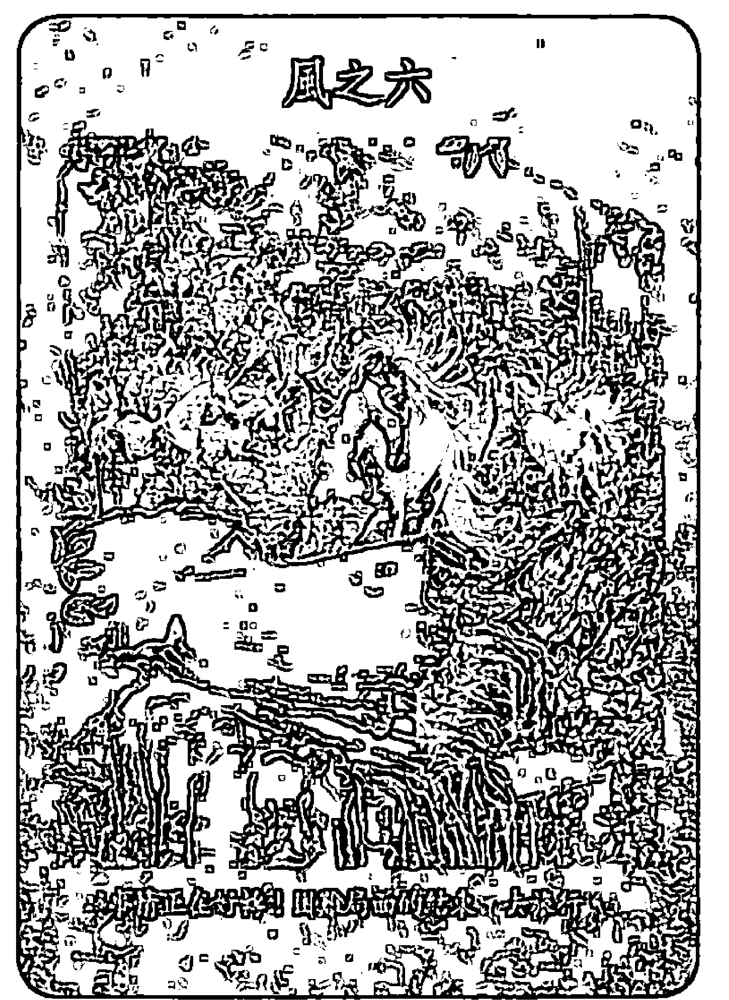

# 小阿爾克納—風之牌組

這艘船是「諾瓦號」—— Novus，這個字是拉丁文的「新」，新的機會、新的夢想、新的生命。

來自風之五的那五匹獨角獸在背景中，顯示著我們正在航行中的獨角獸，已經遠離後面那一股能量了。

#### 天使數字

這張牌的數字是 56。數字 6 的能量通常是憂慮，特別是有關物質方面的議題，例如財務狀況。然而，數字 5 的能量指出轉變正在進行中，或者已經發生，而且將會改善這些情況。

數字 56 縮併為 11（5+6），這是一個「大師數字」而不能再進一步縮簡了。這是具有偉大顯化能力的數字，因而我們不要專注在不值得嚮往的結果上，在此這一點就顯得格外重要了。

#### 占星配置

「水星在水瓶座」有能力去「跳脫框架思考」。水星是一顆心智活動的行星，而水瓶座以折衷或者徹底叛逆為著稱。這兩者組合起來，會創造出以閃電的速度獨特地解決問題的機會！既然水瓶座喜歡打破一兩條規則，所以如果水瓶座因提供了「隧道盡頭之光」的消息來源，而讓一兩個人感到不開心，這也沒有什麼好詫異的。

### 風之七

計畫需要修正。

更多事情在背地進行。

時機不宜。

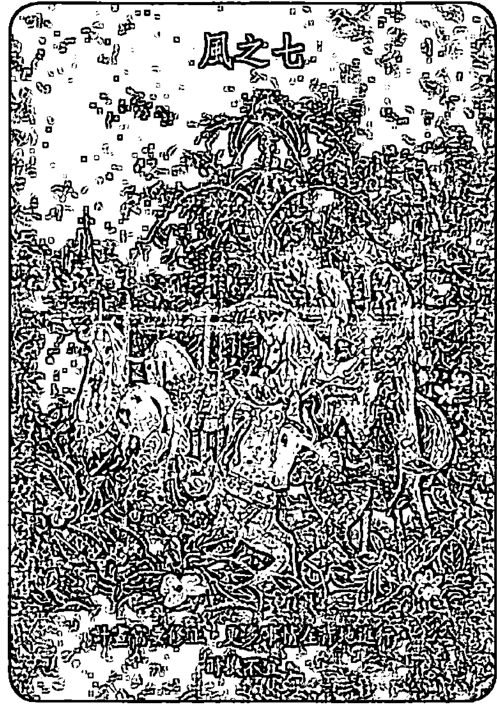

風之七呈現給我們來自上天的美善訊息。天使要我們明瞭，當前的道路可能不是真正要走的那一條。我們也許沒有意識到自身的處境，或者沒有察覺到他人的行動。這張牌有一個傳統的意義，包含著某些從我們身邊被奪走的事物，但最常見的損失就是自由。我們所不瞭解的是，剝奪我們獨立自主的人其實就是自己。我們對於自身需求和人生目標缺乏專注，創造了一種邊緣地帶的無所適從感，我們身在其中而不知道自己要往哪裡去。

這張牌也能夠象徵我們的計畫本身是良好的，只是在時機的掌握方面需要稍作調整。

#### 圖案象徵

五匹獨角獸在旋轉木馬上轉動著。他們騎著而沒有任何能力可決定他們的終點。
五是改變的數字。要讓不斷循環的旋轉木馬能夠煞車停下來，從而不再旋轉的唯一方式，就是改變我們的環境。
旋轉木馬以逆時針方向旋轉，這和時間運行是順時針方向相反——而時間運行的方向，也就是我們生活前進的方向。
畫面景象的後方，可以看見另外兩匹獨角獸已經獲得解放，不再有馬鞍放在它們的背上，牠們現在可以主宰自己的道路了。

#### 天使數字

風之七分配給數字 57。這張牌有數字 5 的改變能量，綜合了數字 7 在正確道路上的能量。風之七開啟一個方向的改變，那將帶給我們更豐富和愉悅的人生。
數字 57 縮簡為一個 3（5+7=12，1+2=3）。更加促進我們有能力脫離不再致力於「神聖生命目標」的人生，我們可以請求揚升大師的幫助，祂們之中有許多位，在地球上的時候，也是做了這樣改變人生的重大選擇。

#### 占星配置

這張牌的占星配置是「月亮在水瓶座」。簡單來說，月亮反映我們的需求。水瓶座是一個帶有叛逆天性的星座，但也有人道主義的傾向而想要拯救世界。在這股能量伴隨之下，我們需要自由，我們需要有所作為。然而當我們是消極的、且不能控制自己的道路時，這就很難做到了。

### 風之八

- 受困的錯覺。
- 缺乏自信。
- 害怕採取行動。

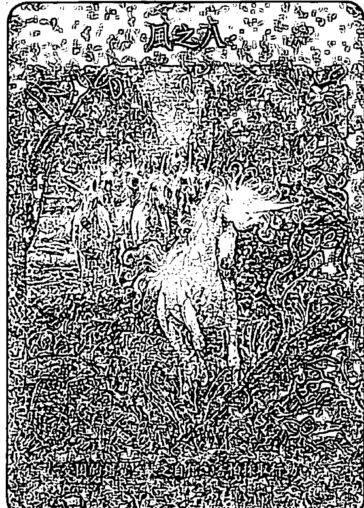

風之八是一張指出我們缺乏自信的牌，但是上天希望我們去突破這個不健康的錯覺。我們有一種受困於人或不能自己掌握人生的感覺，但那不是真實的。總是會有從不快樂的情況中獲得釋放的方法，但是我們必須相信自己。我們必須看到自身處境的真實性，並且採取行動。

這張牌也可以指出困惑混亂，或者感到無助。

#### 圖案象徵

一匹獨角獸從成群靠在一起的獨角獸中獲得了自由。這一匹獨角獸向前邁進，以此顯示出對自己的信心。不需要為了成功而依賴他人，或者成為「羊群心理」從眾行為中的一份子。

背景中的七匹獨角獸貌似維持站立，牠們的腳踏在水中而靠近岸邊。水是情緒的象徵，而由於這張牌就代表恐懼戰勝了我們，這些獨角獸正佇立在牠們的恐懼中。

單槍匹馬的獨角獸向前奔馳、跨越大地，代表朝著選擇的方向去落實。牠向前奔跑並行經一株蘑菇，這通常是好運的象徵。但獨角獸必須擺脫被誘捕的幻覺，才能得到好運的蘑菇。

#### 天使數字

這張牌的數字是 58，數字 8 的能量顯示，我們的努力很可能得到回報，無論是財務上或在其他型態上的富足——只要我們力圖去做出必要的改變（這就是數字 5 的能量）。數字 58 縮併為 4（5+8=13，1+3=4），指出我們的天使以身為傳訊者的同情，能夠幫助我們聽見所需要的訊息。

#### 占星配置

「木星在雙子座」是風之八這張牌的占星學配置。雙子座是一個才華耀眼出眾的星座，不斷冒出滿滿的點子。木星則是擴展的行星。所以當你拿一個在知道要做什麼之前，已經冒出更多點子的星座，加上一個讓接觸到的每件事物都倍增的行星，你會想到了什麼呢？得到的答案是：一個難以移動和無法操作的星象組合，因為有太多的選項而難以處置了！

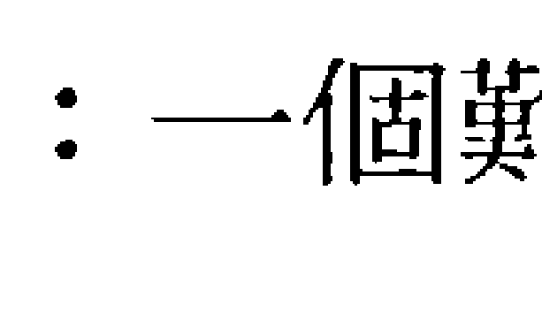

### 風之九

- 預料最糟的狀況會發生。
- 自我應驗的預言。
- 失眠的夜晚。

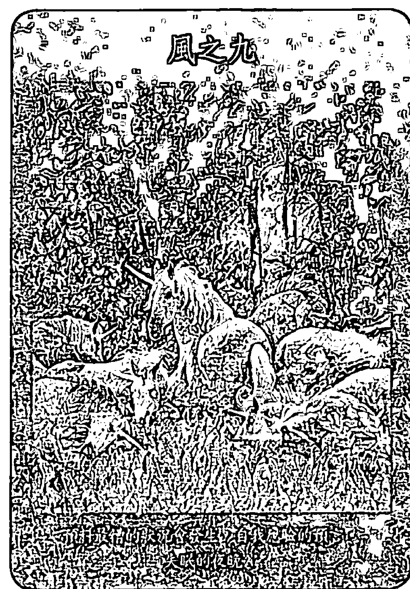

你曾經聽說過「自我應驗預言」嗎？這種情況就是，由於人們相當專注於心中的恐懼，所以終於顯化成真了。風之九這張天使送來的牌，點醒我們正在顯化不快樂的結果，處於這個完全不必要的過程。我們應該想到這張牌是來自上天的善意和愛心，以改變我們正在思考的方式。我們需要找到一條道路而專注於走到心中希望的結果，而不是去擔憂這條路上會有更壞的結局。

這張牌也可能指出失眠、睡眠失調、不愉快的夢，或者因為壓力而導致生病。

#### 圖案象徵

我們注意這張牌第一件發現的事，就是所有的獨角獸都在睡覺，只有一匹獨角獸除外。八匹獨角獸正睡得很酣暢（八是豐盛富足的能量數字），然而仍有一匹獨角獸像是在站崗看哨。

站崗看哨這種勤務，能讓其他人睡覺，而由群體中的某一個成員保持警醒，監視著周遭情況以防招致傷害。所以清醒的獨角獸在擔心的是，會不會有一些不愉快的事情發生。

螢火蟲是非常神奇的象徵，有許多重要意義（其中多半有關於這張牌），牠們代表「照明」，或者「看見光芒」，也就是啟發、領悟。如果我們活出一個開悟的生命，我們就會知道不要專注在負能量上，而要保持我們的正面思想。螢火蟲從內在閃耀出牠們的光芒於外，像是在召喚我們要成為「神的子民」。

另一個螢火蟲的象徵意義是，有一些神奇的事情正在進行著！如果我們有信心，那麼任何事情都是可能的！

一道瀑布也可以有多重的意義。其中一個相關的是，水是情緒的象徵。瀑布是非常強力下墜的水流，這個象徵可能是指某人的情緒是在向下專注，而不是處於較為正面的向上能量當中。
瀑布也可以被看成是一種水（情緒）的大量解放，我們可以像這個情況去釋放自己的負面能量。

#### 天使數字

風之九是第 59 張牌。數字 9 是服務和責任的能量，並且指出完成我們在地球上靈性任務的重要性。數字 5 顯示，為了促使我們踏上朝向「神聖生命目標」的軌道，改變或許是必須的。
數字 59 歸併為 5（5+9=14，1+4=5）。要求改變的訊息，被額外多一個 5 的能量強化了。

#### 占星配置

「火星在雙子座」可算是一個挑戰的星象組合。火星是個非常有侵略性的行星，總是想要行動。雙子座是才華耀眼的，也是在持續地思考和溝通。這樣的組合會創造出一種能量，是活躍地想像下去的結果（有許多都是負面的），然後又持續討論著這些可能性，一直下去它們就會顯化為現實了。

### 風之十

困難狀況的結束。擁抱改變，預期事情會就此好轉。
從成癮症中復元。

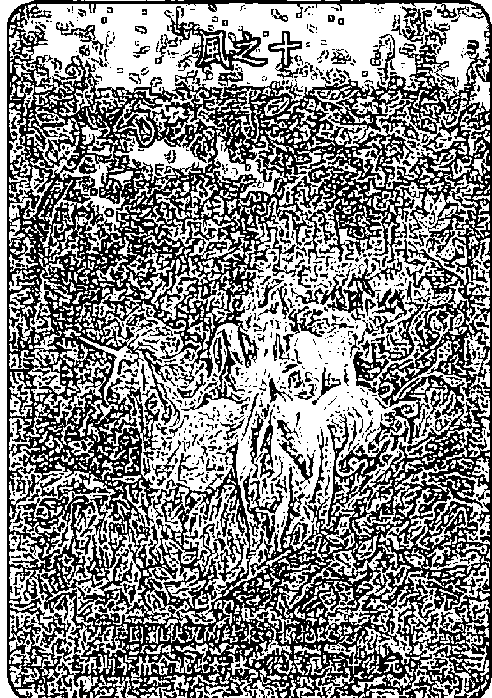

在傳統塔羅中，這被看待成一張非常不受歡迎的牌。這從歷史上繪製的圖案就可想而知，一切都在意料之中。然而，和許多風之牌組中的牌一樣，我們覺得其中有所誤解。風之十在定義上大多代表一個結束。然而大部分的時候，它是一個預先被料到、而且很可能是受到歡迎的結束。它表示肩膀上的重量解除了，我們可能對於結束感到悲傷，但至少它終於結束而我們能夠繼續前進了。當我們不再牽掛著曾經如何，我們就能夠開始去創造一個將會如何的美麗人生。

這張牌也能指出某人從成癮症中復原——這裡強調的是正在「復原」。然而，另一件事情是，有關風之十這張牌，通常表示帶有一點戲劇性的牽扯。所以雖然我們可能在平靜狀態中完結，

#### 圖案象徵

八匹獨角獸長途跋涉深入森林裡去了。牠們未來的命途並不明朗，然而也看得出來會受到限制，因為有許多樹木造成了狹隘難行的狀況。

這群獨角獸中有兩匹回頭向後轉了，牠們看到其他獨角獸踏上的旅途將會沒有出路，所以牠們決意要終結這個旅程。牠們轉而前往開闊的草原，尋找新的機會。

兩匹獨角獸前進而行經一株蘑菇，一個好運和長壽的傳統象徵。藉由接受之前探索的尾聲，牠們開啟了「天堂之門」而有幸擁有感到鼓舞和振奮的事物。

#### 天使數字

這是第 60 號牌。數字 6 的能量是一個物質世界的能量。我們對於現實世界的專注，可能阻礙自己對於所渴求的平靜有真實的感受。數字 0 的能量，是我們和「神聖」的連結。

數字 60 簡縮為 6（6+0），進一步指出對於物質世界成就的專注。

#### 占星配置

「太陽在雙子座」配置給風之十。雙子座是一個具有溝通天賦的奇妙星座。然而，有時候它容易聚焦在一個事件裡最好還是別說的負面情節。往好處想是，我們說不定會發現某些真的讓自己得以解脫的真相（儘管它難以接受）。就長遠來看，自由解脫總比不知事情的始末而運行著好多了。

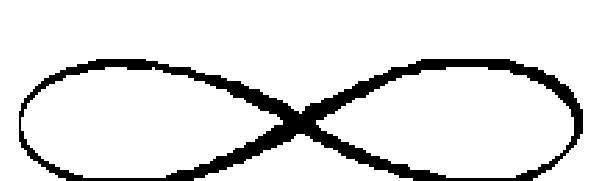

### 風之侍者

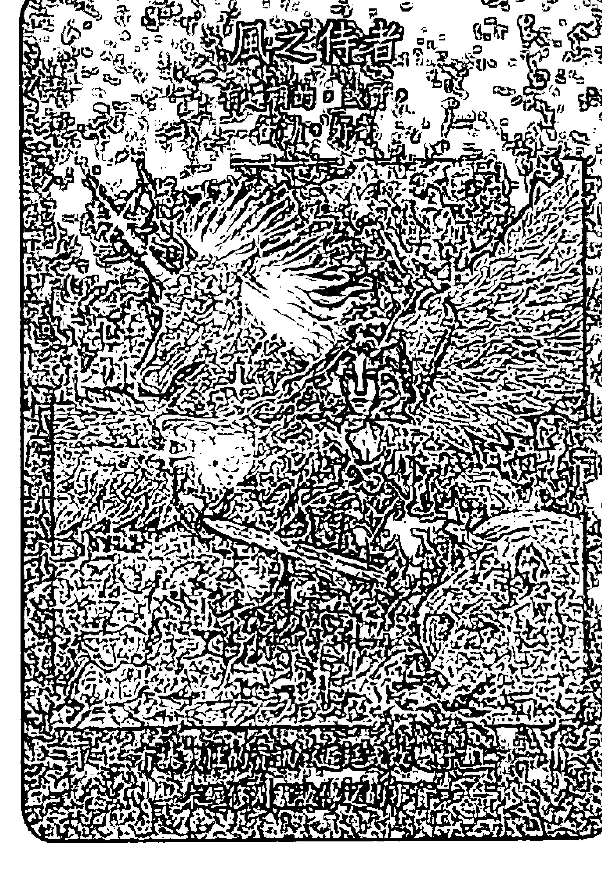

有邏輯的，誠實，衝動，好奇

- 有挑戰性的資訊。
- 延遲或改變計畫。
- 未經修潤就被傳送的事實。

侍者通常是指訊息或者是傳訊者，而風之侍者也沒有不同。來到我們面前的消息應是很有用的，也許是通知我們計畫暫時耽擱或改變。我們收到的訊息有可能不是以偏愛的柔和能量來傳達的，然而，這並不意味它就不是有用的資訊。坦白說，通常都還蠻出色的！有關這張牌要記得的是：分清楚訊息和傳訊者。風之侍者也能夠指出法律文件，建設性的批判，甚或只是純八卦。

#### 圖案象徵

我們的美麗侍者準備好手邊的任務了，有許多朋友作為後盾。這張牌要我們預備執行我們接收到的訊息。

她手持一把寶劍，象徵真理和正義。然而，值得密切注意的是：劍是一把雙面刃。如果不以善意的方式來傳達，真相可能是很尖銳刻薄的。

金光球顯示這位侍者她不是沒有自己的一套的魔法。她能夠在一眨眼的功夫就變出一個辦法，或傑出的新創見。這指出我們可能要使用原創的想法，或者臨危不亂的應變方法。

狼的象徵是非常豐富的，但有兩件我們需要記得的事，狼是非常聰明的動物，而且聽覺非常敏銳（注意牠的雙耳）。所以仔細聆聽你接受到的消息吧！

獅子象徵勇氣，力量，和堅強（因此他們也在力量牌中出現）。我們必須對自己的行動有信心並且以正直行事。

獨角獸是偉大純淨意念的生物。有翅膀的獨角獸，顯示我們能夠藉由站在原則的真理上，達到偉大的高度。

#### 天使數字

風之侍者是第 61 張牌。她瞭解思想創造出現實，而憂慮是無用的情緒。她只專注在她想要顯化的事物上，而不是在心中的恐懼上。

數字 61 併簡為一個 7（6+1），這個數字意指我們走在正確的道路上，並且隨著我們繼續前進，大門將為我們而打開。

#### 人物特質

風之侍者對許多事物都很感興趣，舉凡新鮮的想法、新奇的嘗試、以及任何供應她對世界廣大好奇心的事物。如果在塔羅中有個「靛藍小孩」（Indigo child），很明顯的就是這一位。「靛藍小孩」是非常特別的族群，與生俱來的能力就是即刻知悉真理和謊言之間的差異。而這徹底形容了風之侍者。

這位侍者有時候講話會相當直率，這不意味她是個不懂禮貌的人（是的，通常她沒有這樣），她只是不懂得圓滑。但是無論如何傳遞，她的訊息都很可能極有價值。

#### 占星配置

塔羅中的侍者牌不代表特定的占星學配置，連結了一個季節和一個世界地理區域。風之侍者代表冬季以及美洲大陸。

### 風之騎士

富聰明才智，果決，理想主義，孜孜不倦

- 快速發生的事件。
- 花時間再仔細審查你的選項。
- 有創意的解答。

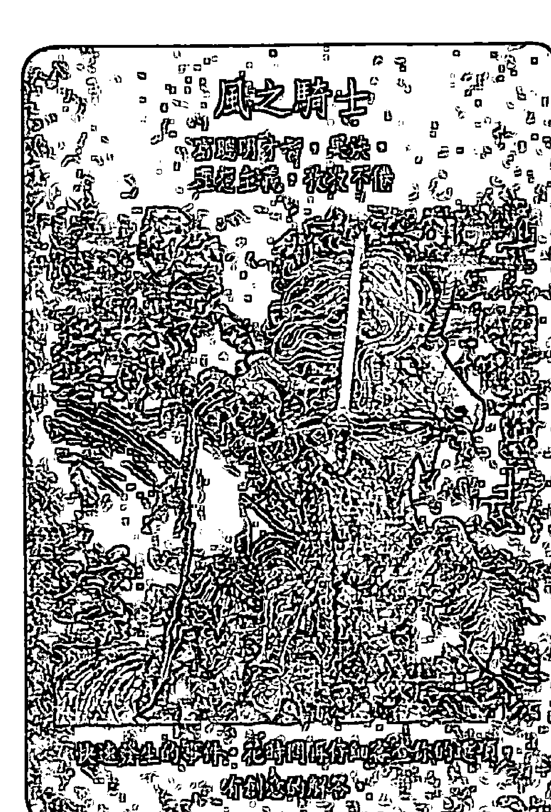

風之騎士可能是在塔羅中行動最快速的能量。我們的人生可能看起來前進得非常緩慢（甚至於完全停滯不前），但是當這位騎士出現的時候，就像是步入了旋風當中！所有的騎士牌都是積極採取行動的牌，而這一位騎士會想盡辦法解決問題直到成功為止。這不是做出情緒化選擇的時候，必須透過理智來做出決定。

因為行動如此迅捷，在行動之前對於選擇就很難做一番徹底的思考。儘管如此，在我們這條路走得太遠之前，重要的是和另外的選擇互相權衡，並充分考慮自己期盼的結果是什麼。

#### 圖案象徵

騎士和他的同伴迅速前進著。騎士必須緊握住韁繩以防被獨角獸甩出去。留意所有必要的細節是很重要的，這樣才能避免我們從原本的路線被「甩」開了。

獨角獸的角相當神奇，甚至尖端還會發光，這暗示來自心智中的才華閃耀出火花。

寶劍象徵了勇氣、正義、甚至還有對目標的透徹明白。這柄寶劍發著亮光，顯示騎士的探索是正直的行動。

摩羯座和水瓶座的象徵圖案呈現在座騎的輻繩上，表明這張牌的占星學對應。

騎士的胸前佩戴著紅龍的圖騰，象徵他對於自身的全力以赴感到無比熱情。

#### 天使數字

這位騎士的數字是 62。數字 6 的能量涉及物質世界，而數字 2 則向我們保證，正向思考的力量是站在我們這邊的。

數字 62 歸併為一個 8（6+2），數字 8 連結於富足和財務上的收穫。

#### 人物特質

風之騎士的名號，最有可能的就是「閃電」了，因為他的行動有多快，他的思考就有多卓越。他是傳統的「騎士踏上探險征途」，而他通常對每件事都從一開始就計畫好。他孜孜不倦地追求成功，也懷有強烈的理想主義。唯一的問題是，這位騎士有衝動行事的傾向。他的本能通常能精準地符合當下的需求，然而並不是永遠都能夠如此。這就是為什麼當風之騎士闖進我們生命中的時候，至少能試著讓他坐下來片刻，並與我們討論一下他的計畫，總會是一件好事。

但是有時候那幾乎是不可能做到的。

#### 占星配置

這張牌連結於水瓶座，並附加一小部分摩羯座。水瓶座是一個風象的星座（就像這張牌），而且才華也相當卓越。水瓶座一心想要拯救這個世界，但這樣可能不夠腳踏實地。摩羯座的能量帶著風之騎士回到大地，使得那些卓越的想法能夠顯化，也免於到處充斥混亂不安。

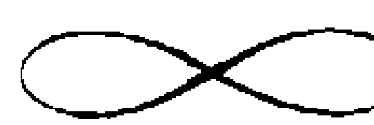

### 風之皇后

獨立，經驗豐富，重實際，機智風趣

- 做出客觀的決定。
- 清除所有不再有益的事物。
- 看到這個狀態當中的幽默。

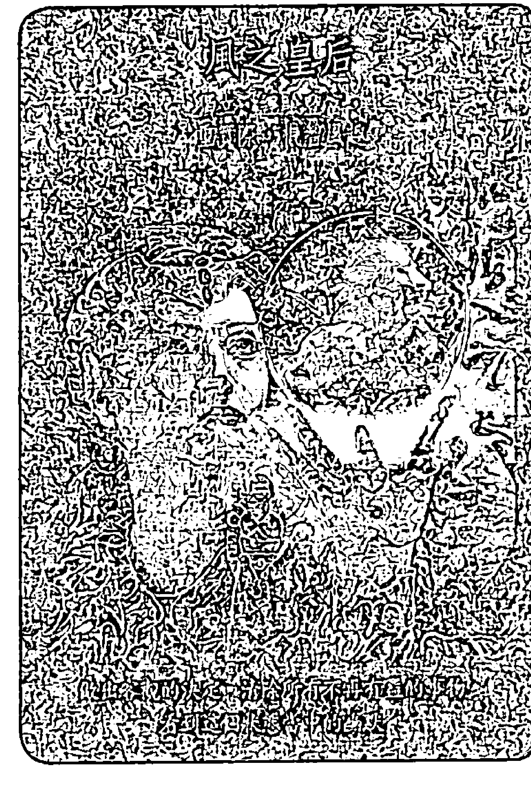

風之皇后時常被當成塔羅的「風水牌」（feng shui card），因為這張牌意指免於混亂或者情緒干擾（另一種說法是「戲劇化」）的人生。這張牌所代表的智慧來自豐富的生命體驗——其中有些令人振奮，而有些相當具有挑戰性。贏得了內在的和平，我們進而瞭解，如何處理這張牌顯示的任何情況，以及它所代表的過往經驗。

這張牌也可以代表離婚人士，此外也代表很有冷幽默感的人。

#### 圖案象徵

美麗和智慧的皇后呈現出對於手上任務的強烈專注。她變出了一隻神奇的獨角獸，有如她的意圖一般，是純淨而透徹清晰的。

我們的皇后佩戴著坦桑石（tanzanite）珠寶。坦桑石有許多特質反映了這張牌的牌義。它使我們和靈性層面連結，並且據稱可以增進靈視力。坦桑石也聞名於促進溝通的能力，並讓我們清晰地說出真話。也是一種有助於全盤瞭解「我們是誰」或「想要完成什麼」的優秀寶石。

風之皇后可能不會有許多朋友，然而對於她認定是朋友的人，她就會信任不疑。她所有需要的，就只是三兩個密友（如同描繪在牌面上的男人和女人）。

皇后正在使用「理智之火」創造出獨角獸。她的熱情來自她的意念，而並非來自她的心。

#### 天使數字

這是第 63 張牌。數字 6 是物質世界的能量。我們的皇后非常專注於「現實世界」，而且有強烈的實用主義和完美主義的傾向。數字 3 的能量指引我們去請求揚昇大師協助，我們這位經驗豐富的皇后一定知道要這麼做。

數字 63 歸併為一個 9（6+3）。如果我們將專注力放在我們的「神聖生命目標」上，並服務我們周遭的人，其他的細節都會自行解決。

#### 人物特質

我們喜歡稱呼這位令人讚嘆的女性為「清倉拍賣女王」。非常符合風水理論的原則，她擺脫不再合適於她人生目標的每一件事（或許更重要的是——每一個人）。說到她的朋友們，「戲劇女王」（或「戲劇國王」）就不用提了。她幾乎閱歷了人生中的每件事，轉化了任何來自於過去的悲傷或挑戰，成為堅強的特質；也轉化成令人驚奇的幽默感，對此有如在操控魔法杖一般。這位皇后也能夠一眼就看出問題或困境，而立即就知道該做什麼，這點使她成為不可多得的女性知己。不過需記得很重要的一點，她往往會避開那些對自己人生不負責任的人，如果我們向她尋求幫助，她會堅持我們要自己負起責任。

#### 占星配置

風之皇后是天秤座添加一些處女座的成分。她的天秤座這一面是理性機智的，也對於公正和均衡的事物很有興趣。處女座的這一面，是想要讓事物整潔而有組織，讓每一件事都能做得「恰到好處」。

### 風之國王

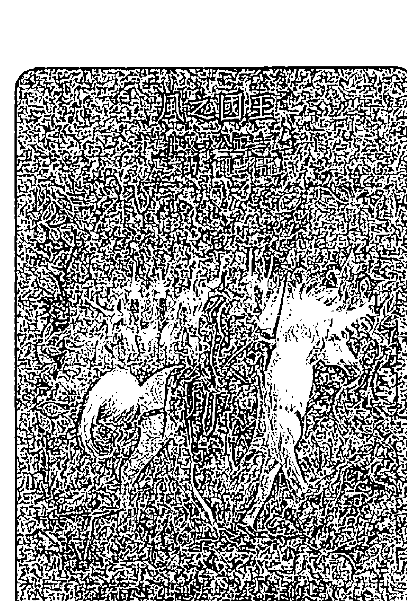

才華出眾，公正無私，專業的，圓融得體

帶著信心說出想法。尋求專業的建議。平衡心智和情緒上的考量。

這正是我們需要一點忠告的時刻，也許周圍有人需要我們的智慧諮詢和經驗值。風之國王代表得到我們所需的協助，或者是幫助旁人解決疑難的機會。我們必須有自信說出真話，知道他人將從我們的洞見得到益處。這張牌也提醒我們，不是每個決定都只是單純來自於心或來自於頭腦，有時候兩種智慧來源必須有所平衡，才能找到方法達成我們期盼的結果。

風之國王也可以代表政府、學術界、或者軍隊。

#### 圖案象徵

風之國王正在出任務，他充滿智慧，並帶著信心向前騎去。

國王持著一根長矛，有一顆淡藍色珠寶嵌在上面。長矛代表他的心智的銳利，而珠寶是「喉輪」的顏色，顯示他有能力完美地傳達他的知識。

有一群獨角獸並列立正站著，渴切聆聽到國王可能要傳授的智慧。

這位國王騎著一匹獨角獸，行經代表好運的一株蘑菇。國王敏銳的心智早已保證了他的富足。

#### 天使數字

這張牌是天使數字 64，指出我們在目前的任務中完全地受到支持。數字 4 的能量顯示我們的天使就在身旁，而數字 6 的能量關連於物質世界中的某些創造物。

數字 64 歸併為數字 1（6+4=10，1+0=1）。這個數字代表由於我們的正向信念顯化成真而導致的無窮創造力。

#### 人物特質

這位國王才華耀眼，是一位傑出的溝通者，是任何爭執的完美調停者，以及我們所見過最穩健的人。（我們提到過他是才華耀眼的吧？）如果我們需要關於任何事物的理智忠告、職場關係、或者邏輯，他會有讓我們可以充分倚賴的答案。

唯一的問題是這位國王幾乎全靠著理性頭腦。在情緒面上，他是相當有距離感的，不太能真正和他人心對心交會。他一心想要承諾一段感情關係，但只會變成是在「經營」羅曼史，用的方式和他對待事業夥伴是一樣的。

#### 占星配置

双子座带着一部分金牛座，就是这张牌的占星学配置。双子座是才华耀眼的，能够一次完成许多事物，并且也是一个优秀的沟通者。金牛座的能量带给这张牌平衡和落实。因此这位国王不是纯粹理智性的，而是连结了感受性的。

### 土之牌组

### 土之王牌

- 豐盛的湧入。
- 一個可為的商業冒險。
- 重要的文件或合約。

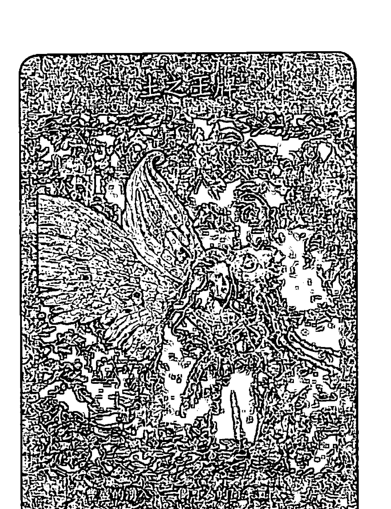

土之王牌是一張極為正面的牌。它允諾來自宇宙的豐盛湧入我們的生命，而這通常發生得非常出乎預料。我們傾向於認定「豐盛」這個字詞是關於財務上的富足，然而這張牌不總是這樣的情況。來自上天的禮物可能以金錢的形式來到，也可能在生活中顯現為：迫切需要時來自他人的協助、一個才華洋溢的新創意、或者一位能夠引領我們朝向成功的貴人。

這張牌也能夠指出事業上的晉升、商業契約、甚至還有健康的改善。

#### 圖案象徵

這位精靈完全被她所接收到的禮物迷住了。她專注於任務的能力是使她如此成功的一部分因素。

精靈的專注焦點在她的權杖頂端上，那是一枚金幣，是顯示在整個土之牌組中顯示的象徵物標誌。

在背景中的城堡所呈現財富提醒我們，「向上攀升」的階梯觸手可及，而且有著無盡的可能性。

秋天是傳統上收穫的季節。植物的秋色圍繞著精靈，可以確保我們的努力會得到報酬。

#### 天使數字

土之王牌是第 65 張牌，這個數字指引我們改變處理金錢的方式，這些改變會帶給我們喜樂和富足。數字 65 歸併為 11（6+5=11），不再進一步縮簡了，因為 11 是「大師數字」。11 的能量是一種強大有力的顯化，同時也是對於成長以及他人福祉的靈性關切。

#### 占星配置

王牌沒有確切分明的占星學配置，而是連結於它們的牌組代表的元素。這張王牌代表土元素。這張牌也因而聯結了歸屬於這個元素的三個黃道星座：金牛座、處女座、和摩羯座。

### 土之二

一次發生了太多。
需要做個決定。
思考更有趣的方式。

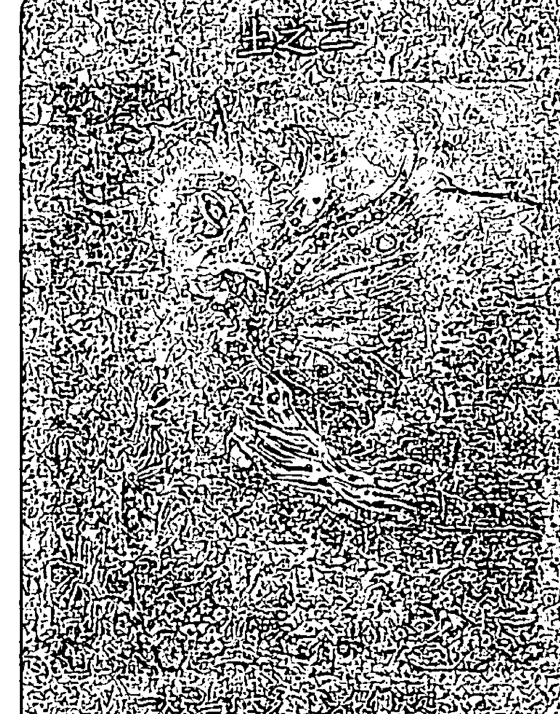

土之二這張牌與企圖一次要做太多事有關，並非我們不能同時兼顧所有的優先順序而仍然會成功，只是可能很難辦到。通常這張牌指出某人同時在做多種工作，不然就是希望從某個職位跳槽到另一個。如果我們企圖要換跑道，那麼這張牌會建議我們先按兵不動，直到情況（通常是財務上）變得更確定或更安穩。

這張牌也能夠提供忠告：如果我們經歷一大堆壓力，或是面臨下決定的挑戰，那麼採取一個更輕鬆活潑的態度會是有幫助的。

#### 圖案象徵

一位美麗的精靈快速穿越森林，同時有兩枚金幣在她的頭頂上拋接耍弄著。這是一個困難的任務，且必須小心翼翼做好以免失去平衡，而讓金幣掉落下來。這可以代表企圖要一次去做太多事情，或是兼顧著多重的工作。

在背景中的彩虹代表承諾，一旦度過目前的風暴，事情將會很明確地改善了。

在精靈下方的雛菊，象徵需要藉由移除我們的世界裡充滿戲劇性的情況（或者人們）來簡化生活。

精靈前方的樹木是一個象徵，可能是我們的成長，或是（在這裡畫面上的情況下）道路上的一個障礙，依據我們正在專注的情況、以及如何感知這些情況而定。

#### 天使數字

這張牌的天使數字是 66。數字 66 的能量是強烈的憂慮和擔心，通常是對於財務事件方面。

66 歸併為 3（6+6=12，1+2=3）。如果有這樣的想法是很好的：當我們感到有需要時，請求揚昇大師像是耶穌或甘尼許（Ganesh，譯註：印度象神），來幫助我們維持正面和均衡的生活。

#### 占星配置

這張牌共振於「木星在摩羯座」，木星是代表大量擴張的行星，然而摩羯座是純粹想要完成更多和建立重要事物的星座。理解這兩者如何組合是很簡單的：木星和摩羯座輕易地創造出一個工作狂，他的任務清單已遠超過任何人可以順利完成的能力範圍。

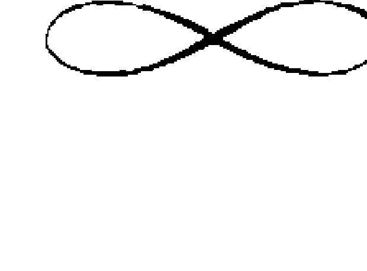

### 土之三

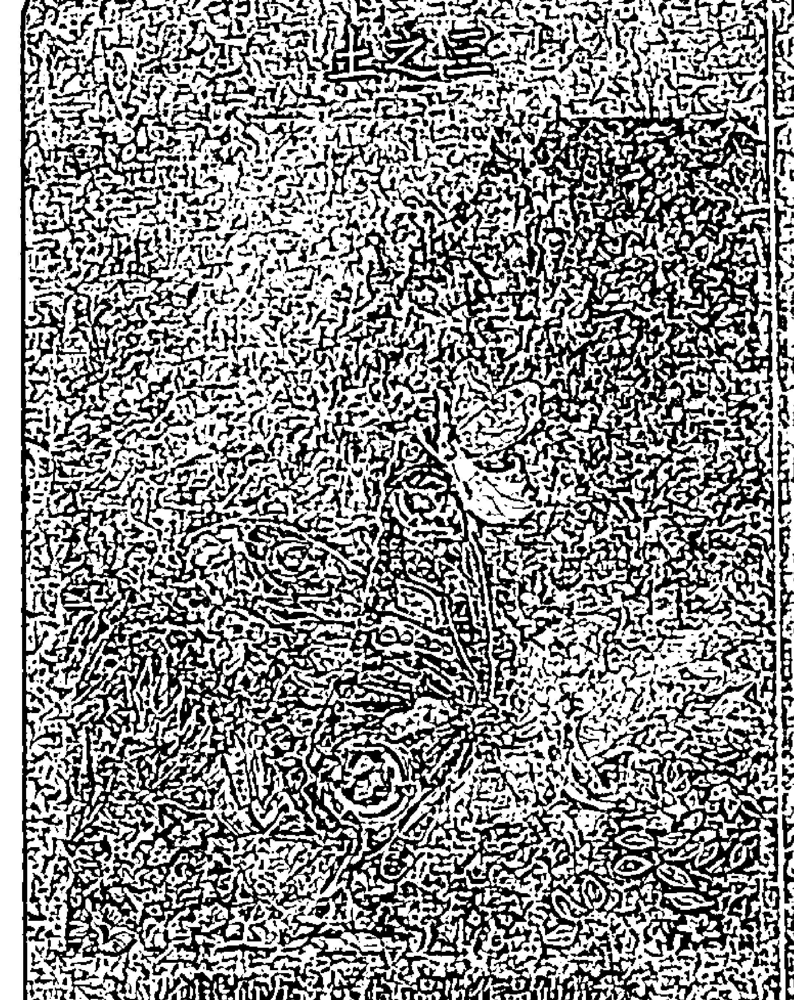

- 創造的力量。
- 對高品質作品的賞識。
- 作個「團隊球員」。

土之三是偉大工藝技術的一張牌。我們的作品是無瑕疵的、而且如此的高品質，我們因為它而得到獎賞或者受到提拔。這是一張創造力無限的牌——每當我們跟隨著熱情，就會展現出這種創造力。憑藉優秀的實力和無比的決心，我們能夠航行到專業的頂峰。

土之三也代表傑出的團隊工作，或者我們貢獻於群體努力的報償。

#### 圖案象徵

三位精靈一起工作合力創造一個美麗的計畫。每位精靈都是不同的種族，在任何團隊工作中，這足以強調多元性的力量。

精靈們在為一架大型的「機器蝴蝶」做最後的畫龍點睛。這是一項同時由創造性和精密度構築而成的卓越成就。由於蝴蝶代表進化，這圖案指出她們透過辛勤工作來負起對創造自己成長的責任。

有三枚金幣在蝴蝶的翅膀上，表示這三位精靈全體，都因為她們的特殊貢獻而得到獎賞。

這景象發生在一個花園中、和一個豐裕的山谷中，土之三顯示我們的努力被安置在豐饒的土地上。

#### 天使數字

這張牌是數字 67，有關於我們在家庭或在工作上的成功。我們遵循了指引，並且對於自己人生的道路保持真誠。

數字 67 併簡為 4（6+7=13，1+3=4）。在任何感到需要的時刻，我們受到召喚去請求天使的協助。

#### 占星配置

土之三連結於「火星在摩羯座」。火星是一股火熱的能量，想要完成偉大的事業。摩羯座是專注於做好工作的星座，也經常關切自己能留下些什麼給後人。這組星象搭配完美地符合這張牌對於無與倫比的創造性工作的強調。

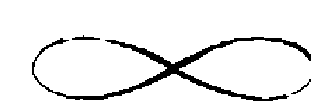

### 土之四

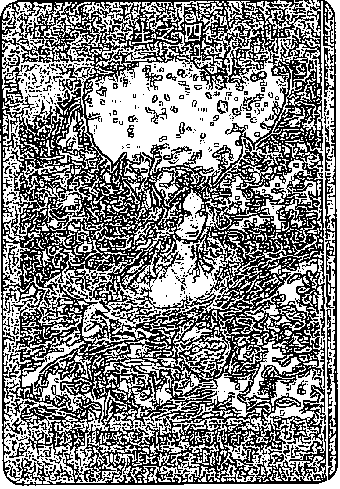

對錢太隨便或是太小心。
很好的商業決定。
給與那些比較不幸運的人。

前面曾經提過，塔羅中有些牌是指出一個概念的兩面極端，我們稱之為「二元牌」。訊息沒有灰色地帶，就是非黑即白。答案不會是「也許」，而是「是」或者「非」。土之四告訴我們，不是我們徹底花了太多錢，就是我們對金錢過度計較，而讓我們錯過金錢能帶來的快樂。要解讀成其中哪一個訊息，同時攸關我們的直覺，以及牌陣中其他的牌。這張牌的另一種訊息可能是，我們需要更慈善地擁有富足，這也是符合貯存現金的極端。

金幣四有時候指出其他狀況——我們的努力總是過猶不及。舉例來說：我們可能愛得太過度，不然就是很不足；我們可能嘗試要非常努力，或者完全沒有試過。這張牌也可能意味考慮周延的商業決定——巨大的採購案或投資案，或者偏執地覺得自己身上的富足會被人奪走。

#### 圖案象徵

圖案中的兩位精靈代表牌裡面的顯著極端。一位精靈相當地大，而另一位精靈非常地小。小的精靈完全看得見，而大的精靈有些部分隱藏不見了。

允許我們的直覺做出幫助，瞭解抽到這張牌是指哪一個極端的方法，是注意我們的眼睛被哪一個精靈吸引了。小精靈可以指出收入微薄的人，大精靈指出有龐大資產累積的人。

我們也可以注意到，錢幣的籃子鏈結到較大的精靈，指出她應該放掉手上緊抓的財富，這樣就能夠幫助更多有需要的人。

較小的精靈甚至「衣不蔽體」，這顯示她可能在資源方面是極為匱乏的。

#### 天使數字

數字 68 連結於土之四這張牌。我們受到啟發而瞭解神是我們富足的根源，而祈禱能夠創造奇蹟。

數字 68 歸併為 5（6+8=14，1+4=5）。這個數字告訴我們，人生中的改變即將來到，我們只需要有耐性等待。

#### 占星配置

「太陽在摩羯座」是這張牌的占星連結。摩羯座是在任務中奉獻和專心一致的星座。然而，我們必須記得摩羯座是土星守護的，這個行星是代表限制的。這形成了我們在土之四中看到的矛盾。摩羯座的太陽總是那樣，想要為妥善完成工作而閃耀，然而土星的能量卻可能妨礙我們享受自己勞動的果實。

### 土之五

- 環繞金錢的恐懼。
- 接受他人幫助的智慧。
- 不穩定的自雇工作。

土之五告訴我們，在生命中缺乏某些事物。這情況可能是真實的，但更常是這張牌要求我們改變的認知。雖然這張牌是指向財務上的憂慮，我們相信這也可能代表朋友、戀情、或是機會的缺乏。當然，要是一直專注在自身沒有的事物上，「吸引力法則」只會為我們帶來更多匱乏的體驗。土之五表明了手邊就有支援，但我們可能太過於分心、或太過於驕傲而沒有去求助。

這張牌是一個暫時的情況，一旦我們的思想轉為更正面的能量之後，這一切終究會消散的。它也能夠反映一種情況，那就是職業上的改變——特別是轉向從事自雇工作——在這時候會是不明智的。

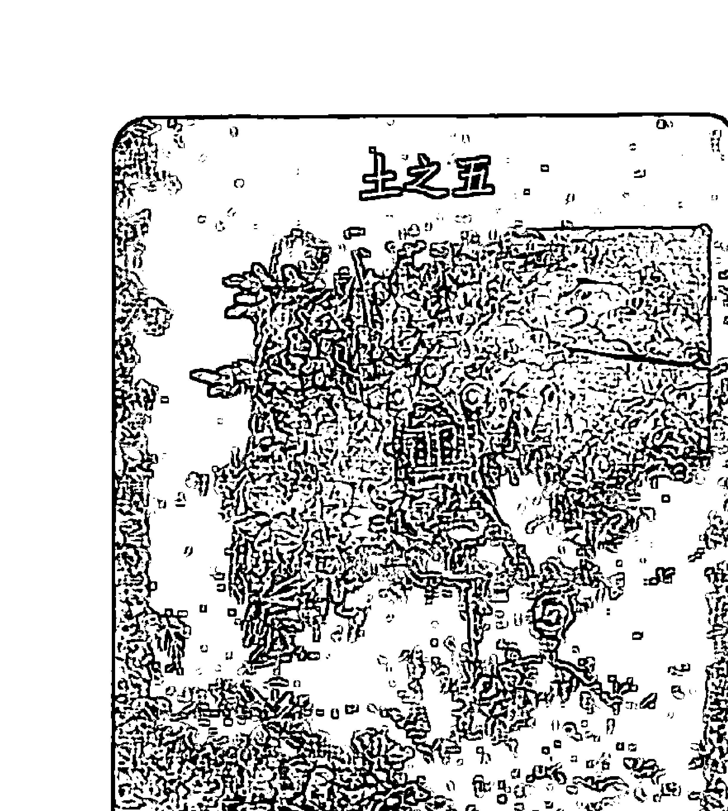

#### 圖案象徵

在我們眼前的路徑，彎曲崎嶇而雜草叢生。顯示出要到達終點並非不可能，但也會非常困難。儘管如此，有一隻杜鵑鳥飛越了這條小徑的上空，通往一座美麗的塔。杜鵑鳥是環境有所改變的象徵，但如果我們如此期盼，就要發自內心去改變情況。

這條路徑導向那一座美麗的塔，塔上的五枚金幣點亮，照耀了整座塔樓。那裡提供了支援，只等待我們前去提出請求。

五是改變的數字，這也是在塔頂上有五枚金幣的原因。

#### 天使數字

土之五共振於數字 69。數字 9 的能量涉及的這些人，可能因為脫離「神聖道路」而感到空虛。而數字 6 的能量，就是憂慮物質或財務狀況。數字 69 縮併為 6（6+9=15，1+5=6），強調支付公正工資符合我們的努力，是多麼重要的事情。

#### 占星配置

「水星在金牛座」不傾向移動快速。雖然水星是一個能夠不停穿梭的行星，金牛座踏實的一面可能帶來事情的停頓。當這個能量的思維模式固定下來，之後可能就很難改變了。但憑一己之力獨立行事的渴望，可能妨礙了請求幫忙或者順著道路前進——即使當這樣做的時候會讓狀況變得更好。

### 土之六

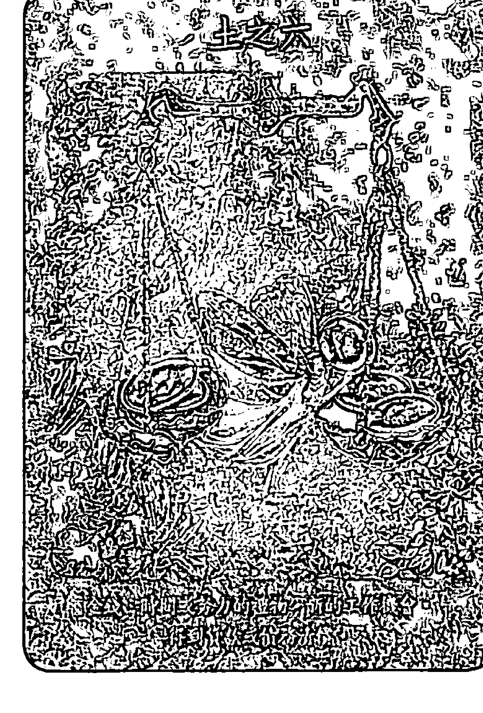

- 金錢、時間或努力的禮物。
- 新的工作機會。
- 得到貸款或債務清償。

土之五的挑戰已經遠離了，而留下的就是在土之六中固有的富足和慷慨。豐盛化為禮物的形式進入我們的生命中，或者由於顯著的業績而調漲薪資。正向思考的力量帶給我們一個全新的富足時期。這張牌也能夠反映付清債務，或者償還人情，或者其他責任的清除。

土之六是一張感恩和慈善的牌。為我們所擁有的一切感謝宇宙，藉此將有更多會供應給我們。我們受到召喚奉獻出我們的時間、能量，或者財務上的禮物，給其他較不那麼幸運的人。

#### 圖案象徵

這畫面中的精靈，之前在土之三牌裡面曾經出現過，有幾位精靈一同合作、創造藝術作品的其一位。他辛勤地工作，因而如今擁有了滿地的豐收。

秤子目前是不平衡的，反映了一個社會中，並不是每個人的需求都可以足夠。精靈找到了他的人生志業中的富足，為了修復這個平衡而努力工作，使自己有能力供應他人的需求。

#### 天使數字

這是第 70 張牌，它意指蓬勃發展的好工作，也意指身在正確道路上的人。

數字 70 併簡為 7（7+0），重複的 7 僅是加強了成功的訊息。

#### 占星配置

圍繞「月亮在金牛座」的能量是深思熟慮的、善良的、以及付出的。「月亮在金牛座」對於真實性具有充分的瞭解，和人生中的重要事項連結很深。這股能量看待事情的方式或許和其他人不同，但是會為自己的信念而奉獻。

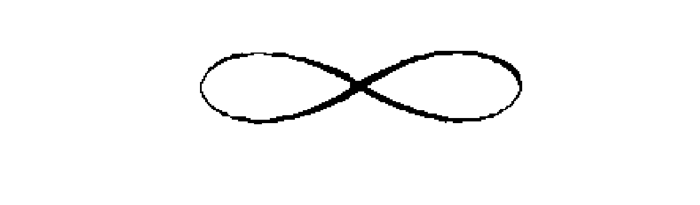

### 土之七

- 妥善種植的種子。
- 行動暫時停止。
- 不必要的擔心。

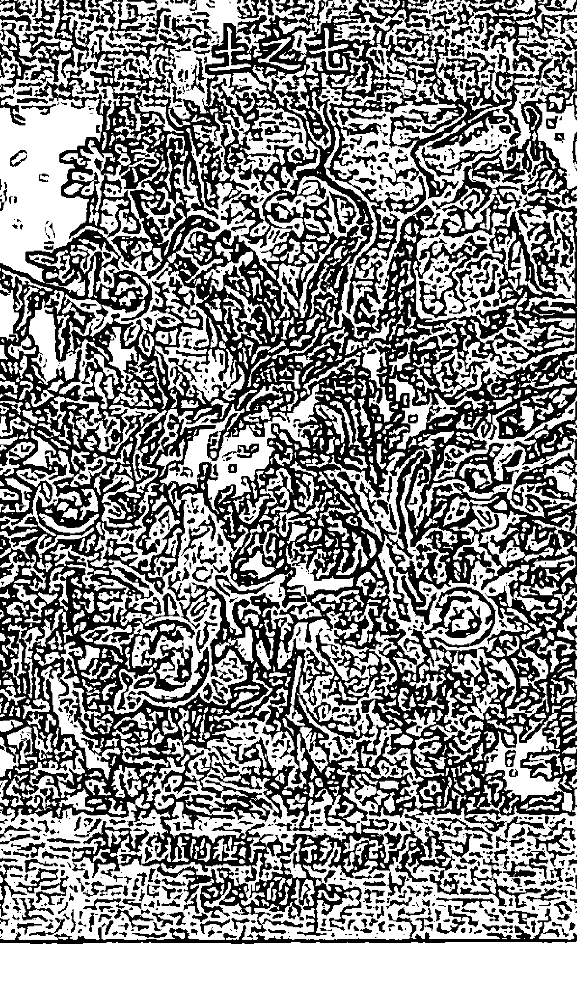

土之七是一張希望的牌，也是一張耐心的牌。我們的努力將得到回收，但是就像種子種植在花園中，會需要花費一段時間，透過栽培的勞務才能結成果實。當抽到這張牌的時候，通常有人害怕不會結成期盼中的果實。然而土之七表示這些擔憂並沒有根據，一切始終是完好的。

如果感到事情好像變得停頓了，要知道這只不過是暫時的。很快地，我們的計畫就要開始、而且再度獲得動力了！

#### 圖案象徵

在魔法森林中有一顆活樹，已經成長茁壯，現在開花形成了金幣。樹木用時間去達到成熟並開花，正如我們當前的努力。

這棵樹木萌發出七枚金幣。七是使我們確信自己走在正確道路上的數字。

一位精靈前來拜訪，想要和這棵樹交談。精靈是神奇的生命，以身為具有強大力量的顯化者而聞名。

#### 天使數字

這是第 71 張牌，這個數字表示，我們的生活在正確的軌道上進行，而以往選擇要顯化的夢想即將成真。我們只需要讓自己的思想保持正向，就能夠持續繁盛下去。

數字 71 歸併為 8（7+1），這是富足和財務保障的數字。

#### 占星配置

「土星在金牛座」是這張牌的占星學連結。金牛座是非常享受奢華和舒適的星座。然而土星是妨礙我們立即得到心中想要的事物的行星。我們從土星學習的一切，就是為了要成長和最終達成目標——雖然在成長過程中，內心所盼望的也許會有改變。

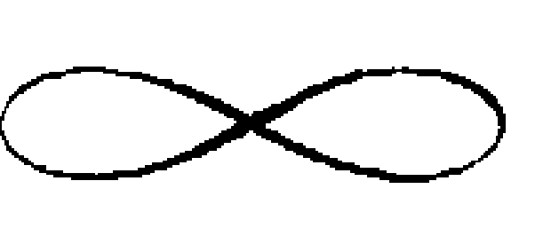

### 土之八

技藝工作是有回報的。
為了解一個主題吸收所有的知識。
回到學校。

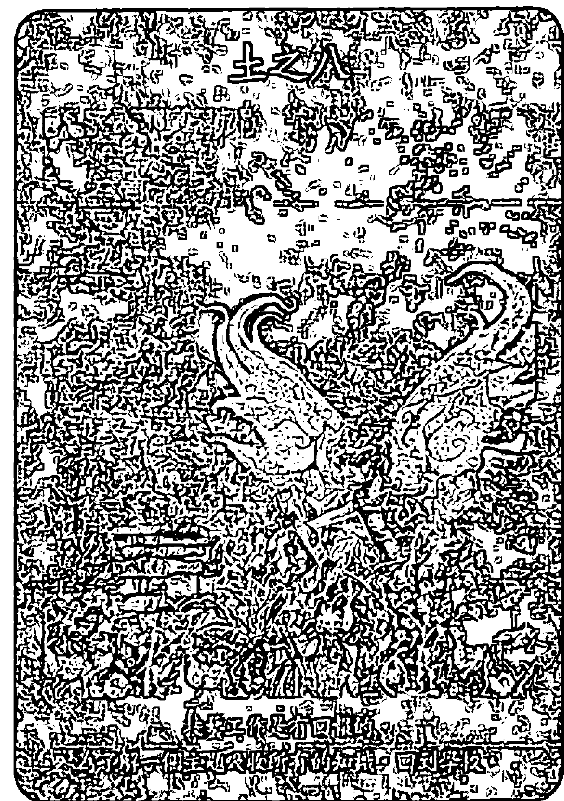

如果說土之三是大師名匠，那麼土之八就是學徒。這張牌表示，我們加入學習之中，直到瞭解了一切該瞭解的，並且實習這些職能、直到磨亮技藝為止。我們極為辛勤地工作，執行當前的計畫，直到每一層面都打理好。我們著眼於完美，並且下定決心要達到標準。

這張牌也可以指出回到學校、參與研討班、或者採取線上課程——去做自我教育或進一步發展技能所必須的任何事情。

#### 圖案象徵

一位年輕的男性精靈坐在田野中學習。圍繞著他的草木青翠茂密，但是卻少有花朵盛開。他仍然有很多需要學習的，直到他的技巧能夠促使周遭綻放花朵。

這位精靈戴著王冠，指出他可能是一位王子，但這個事實並不動搖他學習一門技藝的事實。這張牌代表勤勉又認真的人。

我們的精靈有八本書要讀。八是豐盛的數字，指出著他想要透過自己所學，打造出富足的人生。

這位精靈與世隔絕而致力於課業，遠離了朋友和家人，也排除了其他分散注意力的事物，以免對他造成妨礙，而能收集所有相關知識以瞭解正在學習的主題。

#### 天使數字

土之八是第 72 張牌。數字 2 的能量表示，這些學習研究鼓舞我們，朝向自己想要過的人生。數字 7 的能量告訴我們，當踏在完美的道路上去達成心中期盼的時候，需要充滿信心。

數字 72 歸併為一個 9（7+2），這個數字告訴我們，以往付出的努力正帶著我們朝「神聖的生命目標」前進。

#### 占星配置

「太陽在處女座」是這張牌在占星學上的指定配置。眾所皆知處女座對於自己的工作要求極為嚴格，也能夠專注在微小的細節上。在處女座這個星座下出生的人，可以說是服務的個體，非常關心其他人的福祉。

# 土之九

- 享受生活中的小放松。
- 花时间安静独处。
- 成功的自雇工作。

土之九是一张成功、奢华以及自我培育的牌。我们的丰盛并不是平白而来，而是经过长时间辛勤工作才有的收获。我们目前享受的休息和放松，是理应得到的报偿。这张牌通常指届临退休，不然至少也是钱赚得够多而足以选择不再工作的人。这张牌代表一个征兆，指出自己经商的计划有充分根据而应当实施下去。

这也是一张静默地自我省思的牌。我们学到了愉悦的清幽和孤独之间的不同，我们享受沉浸在大自然的时光，不需要有其他人陪伴才会快乐。

### 图案象征

一位女性精灵安静地走过一座美丽的大自然风景。她在这个园地耕耘，而花朵树木的成熟，表现出她向来很有耐心而勤奋地照料环境。
精灵的美丽衣裳和王冠，显示出她是一位富有的人。
这位精灵是之前在土之三里出现，参与制造机器蝴蝶的其中一位，通过努力工作、创造力、和顾及所有的细节，到达她生命中的这一刻。
画面下方的许多花是铁线莲（clematis，译注：常见于布满墙面的攀缘植物，被喻为藤本花卉之后），以象征聪明机伶闻名。这些花擅长攀升，就像我们的精灵一样，在人生中更上一层楼。

### 天使数字

这张牌是数字：73，象征蓬勃发展的好工作，以及走在正确道路上的人。扬升大师已经帮助我们达到了目标。
数字 73 归并为 1（7+3=10，1+0=1），这个数字代表我们具有能力，可以显化当下想要的任何事物。

#### 占星配置

「金星在处女座」追求实地美丽的完满。「金星在处女座」享受一种简单的人生，只要求每件事都能适得其所。这是非常脚踏实地的能量，也很看重个人隐私和独处的时光。

### 土之十

- 非常快乐的家庭生活。
- 财务安全。
- 在生活中的小事情里找到奇迹。

土之十是一张财务保障和知足常乐的牌。这张牌也和家庭息息相关，但更着重在像是家世血统方面，得知小孩的未来在财务上是安全的，以及物质上的舒适。家园和温暖的家庭生活都是非常重要的。土之十在塔罗中是每件事都恰如其分的一张牌，而我们赢得了为自己感到骄傲的权利。

这张牌也反映出我们感到密切相连的团体、遗产的继承、以及成功的完结。这张牌可以链接到同志伴侣关系，或者同性伴侣组成的家庭。

### 图案象征

一个美丽的家庭，成员们聚集在一座森林中。家庭中的每个人都在微笑，而且都感觉到心满意足。
小孩快乐地玩耍着金币，代表他们的未来在财务上是安全无虞的。这也可以指出遗产的继承。
至于家庭也可以是「非传统」属性的象征，「家庭」这个词对不同的人会有不同的意义。可能代表出生的家庭、朋友之间相互扶持的家庭，也有可能是一群有互助目标的个体组成的社区。
萤火虫代表生命中的神奇魔法……而就土之十来说，生命有如魔法般神奇！

### 天使数字

这是第 74 张牌，这个数字的能量表示，我们的人生是在正确的道路上，而以往选择要显化的梦想即将成真。并且也提醒我们，对于天使的所有协助，要表达感恩之意。
数字 74 缩并为 11（7+4），由于 11 是一个「大师数字」而不再进一步简化了。这个神奇的卓越数字指出，我们使用了自身的能力达成显化，创造出深深感动的体验。

#### 占星配置

「水星在处女座」是非常精于打理生意的。对于每一个细节能理出头绪，而且极为擅长表达自己的意愿。就理智能力而言，「水星在处女座」卓越的才华也能够相当有创造力。

### 土之侍者
博学，可靠，耐心，成功

关于财务的好消息。
想要做点更挑战的事。
学习的新领域。

如果你正在盼望一个小小的好消息，你遇到对的牌了。土之侍者往往带给我们非常正面的讯息，主要是相关于财务或者事业规划。我们可能发现自己忽然对一项全新的题材感到着迷，或者可能想要回到学校，或者只是详细地学习一个新的主题。

然而，有时候土之侍者指出坐立不安的感受，我们可能急于去做些更有意义的事情，或者迎接人生中的新挑战。

### 图案象征

一位美丽的精灵，在一座夜晚的森林中坐着，右手握着一枚金色的钱币。
星星在天空中而且也在她的翅膀上闪耀着，我们可以向这些星星许愿。我们接收到的好消息，允诺我们追追寻自己的梦想。

蓝色蝴蝶是喜乐和愉悦的传统符号象征。秋色花朵出现在我们面前，显示由于以往的努力，而今受到回饋的时候到了。

### 天使数字

土之侍者是第 75 张牌。数字 5 的能量告诉我们，由于我们接收到的信息，将会有所改变。而这些改变的发生，会将我们安置在不偏不倚的生命道路上。
数字 75 缩并为一个 3（7+5=12，1+2=3），完美的符合这张牌是传讯者的角色，因为数字 3 带有传达沟通的进行。而扬升大师会帮助我们带着自己的梦想前进。

### 人物特质

土之侍者是任何父母都会乐于拥有的那一种小孩。她机伶、乐观、比她的年龄有智慧，而且极为乐于助人。她非常好学，而且会彻底地研究任何主题。

但是很可能就败在这里。她这么地热爱学习，以致于不会停下阅读开始工作。所以我们可能必须将这些书从她的手中拿开（如果可以的话），并且温和地推她一把，促使她去采取行动。

#### 占星配置

侍者牌不代表特定的占星学配置，而是链接了一个季节和一个世界地理区域。土之侍者代表秋季以及欧洲和非洲大陆。

### 土之骑士

忠诚，奉献，荣誉，仁慈

该认真干活，把事情搞定！荣耀你的承诺。守护天使。

土之骑士告诉我们前进的时候到了。规划阶段已经完成，如今是采取行动的时候了！我们拟定的计划非常优质，而且将完善地执行下去。这鼓舞我们要保持正直贯彻整个程序，并且坚守我们所做的任何承诺到底。

这张牌也可以指出商务旅游，财务报酬，以及守护天使。

### 图案象征

骑士在马上伫立不动。当我们骑着一匹马的时候，是应该要向前奔驰的，所以这提醒我们应当往前进了！

这位骑士身上的剑没有拔出，不像其他的骑士。剑所代表的事物当中，其中一项就是理智的能量。而这骑士的思考已经完成了，所以剑是入鞘的。

这是土之牌组中唯一没有精灵翅膀的角色。这是因为他代表人类世界中的精灵保护者。他是一位「人形精灵」，看顾着精灵的福祉。

骑士的盾牌是背在身上收好的，因为他的计划如此完美，所以没有什么是要防御的。

土之骑士有一匹装饰非常华丽的骏马——他的占星配置金牛座一致，一个喜欢美丽事物的星座。

### 天使数字

这张牌的天使数字是 76。我们明了自己的财务需求是满足的，而且我们也正走在「神圣生命道路」上。
数字 76 归简为 4（7+6=13，1+3=4）。由于数字 4 相关于天使，完美符合于这本身的代表人物就是一位守护天使的牌。

### 人物特质

虽然土之骑士行动不是那么快速，他的计划却是完美的。无论需要完成的是什么，至少他都能够估算出如何顺利完成的三个备案计划。

他迷人、英勇、高尚，而且完全值得信赖。他热爱大自然（因此他的角色为精灵保护者），通常是个蔬食者或是全素者。任何伤害动物的人，很可能会不受他欢迎。别只因他将剑收起，就以为他不会将剑取出，如果他感到有需要，仍然会拔剑相向。

#### 占星配置

土之骑士是金牛座，加入一定程度的白羊座。金牛座以热爱美丽和奢华物品闻名，天性感官敏锐，但也可能相当固执。如果金牛座本身并不想动，而我们却想从旁促使行动，那只有靠好运才成得了。这就是白羊座发挥作用之处，当金牛座才准备要前进时，这位骑士的白羊座部份可能已经完成许多任务了！

> ∞

### 土之皇后

体贴，创造，
温暖，明理

- 为身边的人留点时间。
- 采行一条明理的道路。
- 以仁慈和宽容的方式处理挑战。

土之皇后牌中有许多魔法正在施行。金币到处在飞，显示我们处于显化的时刻。我们几乎对于每一件事都估算清楚了，而宁愿采取非常务实的方式来面对问题。然而，我们也受到召唤，要确保身边的人是否需求都得到了满足。我们不能只因为事业繁忙，就忽略了家人和朋友。

这张牌也是一个提示：要将善意用在自己和他人的互动中。我们可能认为自己了解他人的处境，但是很可能他们正在经历的，其实远超过我们所知。

### 图案象征

我们的皇后是一位不可思议的显化者！在这里的情况，表面上看起来是财务的性质，然而她也能够让事物发生在自己的情感生活和家庭生活中。

土之皇后的魔法是让金币到处飞而送出钱！其实，所有这些金币都印有皇后的肖像在上面。而这些金币也就是我们在整个牌组的其他各张牌中，画面上所看见的那些金币。

黄金的大锅装满了金币，显示皇后总是准备妥善，并且拥有预先储蓄的财富，以防不时之需。

有两只小兔在皇后的脚边。兔子代表丰饶、富足、以及大步跨越的能力。

### 天使数字

我们这位皇后的数字是 77。数字 7 的能量相连于伟大的成功，也是召唤我们继续行进在自己的道路上——一个非常成功的数字。
数字 77 归并为 5（7+7=14，1+4=5）。土之皇后是一个优秀的人士，如果我们心中有不确定感，可以请求她协助我们的计划。

### 人物特质

这位皇后是令人惊奇的朋友、母亲、以及配偶。她能够跑到公司为她热爱的慈善机构募款，同时仍有时间去照料她的花园。她太过度慷慨了，会去帮助任何一位请求协助的人。

她的挑战会是和金钱有关的。尽管如此，她能够施法从稀薄的空气中变出金币，而可能在财务上非常宽裕。可是她也爱花钱，喜欢消费在美丽和奢侈的事物上。

#### 占星配置

土之皇后是摩羯座带着射手座。摩羯座通常被视为黄道中最辛勤工作的星座，这股能量是财务上的丰盛以及可靠的生意头脑。射手座是伟大的「灵性了解」和乐观主义的星座。摩羯座赚钱，然而射手座却喜爱花钱。

### 土之国王

慷慨，专业，负责，实际

- 一个成功的时刻。
- 自信地接受机会。
- 点石成金。

土之国王传达了不可思议的丰盛和成功。当我们抽到这张牌，可以确认计划正如预期的顺利进行下去。金钱可能貌似从天上掉下来，但实际上是透过自己辛勤的工作，才为我们带来这个富足的时刻。这张牌可能指出即将来临的升迁或是晋级。

土之国王也将对我们提出忠告，应该接受出现在面前的机会，即使那些是乍看之下好像就该转身走人的，也是值得注意。

### 图案象征

天空中的彩虹代表好运、富足、以及顿悟的灵光乍现。

蓝色的蝴蝶象征喜乐和愉悦回归了，之前在土之侍者牌中看到它振翅飞翔。我们从侍者得到的好消息，确实转变成真了。

国王后面有一道阶梯通往山上，迈向成功的步履就从这里开始，准备好扬升起来吧！

蜻蜓是魔法的象征。这张牌告诉我们将事情将会进行得相当轻松顺利，看起来就像是魔法般。

### 天使数字

我们这位国王的数字是 78，这张牌由于工作表现出色而对我们表示赞扬，与此同时金币也充满了我们的财库！
数字 78 归并为 6（7+8=15，1+5=6），这个数字共振的能量，是对于物质享受的关心。

### 人物特质

土之国王有着「点石成金」的「米达斯之手」（Midas touch，译注：出自希腊神话，是一位国王的名字，酒神曾赐予他神奇的能力，让他双手所接触的物品都会变成黄金。于是这被后人用在形容懂得生财有道，就像是点石成金般）。他接触到的任何东西都会变为黄金，然而这不是他关心的范围。他非常关怀人们，而且通常是个优秀的管理者。像土之皇后一样，他觉得需要照顾其他人。就他的情况来说，更可能是采取捐献给慈善机构的方式，以及帮助各式各样的有需求的人。这位国王是一位全心奉献的环保人士。

还有，由于他是一个工作狂，通常他在家的时间长短未必符合我们的期待。

## 小阿尔克纳－土之牌组

#### 占星配置

这位国王大部份是处女座，但是也有狮子座的一面。处女座是非常辛勤工作的星座，并且以「为服务而生」闻名。而这位国王符合这个特质。然而，就和狮子座一样，这位国王也喜欢有一些聚光灯，而且对于他的卓越事迹当然想要得到公认——最好能在万众瞩目之下受到赞扬。

# 作者简介

朵琳·芙秋（Doreen Virtue）

朵琳拥有BA，MA和PhD（心理学博士）的学位。她是五十多本灵性主题的书籍和神谕牌卡的作者。她以天使工作闻名，时常被称为「天使夫人」。身为终生志工，朵琳涉及慈善和运动、推动健康环境、动物公平对待、空气和水的清净以及有机非基因改造食物。

朵琳曾出现在奥普拉的节目、CNN，以及其他电视和广播节目中，并且为「Soul & Spirit」杂志撰写每月专栏。她的作品以世界上大多数的语言通行在电子阅读器Kindle和其他eBook电子书平台以及iTunes应用上。你可以收听朵琳的现场每周广播秀，以及通过浏览www.HayHouseRadio.com与她连线请求解读。

罗赖·瓦伦坦（Radleigh Valentine）

罗赖是国际知名的演说家、作家、灵性直觉者、广播节目主持人，以及领有执照的损失赔偿注册会计师。在离开企业之后，罗赖以和朵琳合著书籍的作者行于国际：「天使塔罗牌」，「大天使力量塔罗牌」以「守护天使塔罗牌」。

罗赖在「Hay House Radio」每周一次的广播节目以及他的工作坊，充满了笑声与知识。他能够以幽默的方式和迷人的乐观态度来表达复杂的概念，绝对有助于引导你体会到生命是神奇的。寻找他有关塔罗的每日贴文请见：Facebook.com/ Radleigh-Valentine。

[www.AngelTherapy.com](http://www.AngelTherapy.com)

[www.MagicalThings.com](http://www.MagicalThings.com)

# 艺术家简介

你可以订购「天使塔罗牌」中图画的输出作品。有不同的尺寸，但没牌上有的边框或文字。如欲购买，请通过下面提供的「联络资讯」直接与艺术家联系。

台湾生命潜能出版社、贺氏书屋、朵琳・芙秋有限公司、Angel Therapy 公司、Magic Thing 公司、朵琳・芙秋与罗赖・瓦伦坦本人对任何交易皆不负连带责任。

所有艺术品皆出自：史蒂夫・罗伯兹 (Steve A. Roberts)

史蒂夫是一位有良好视野和技术的自学艺术家。他的成就来自对童年时崇拜的奇幻传奇艺术家如法兰克・佛拉兹塔 (Frank Frazetta) 与海德伯朗兄弟 (Brothers Hildebrandt) 的钻研。史蒂夫唯一受过的正式训练，是在美国 Ringling School of Art 艺术学校旁听的课程。

史蒂夫出生于佛罗里达州中部一个名为波拉米多 (Palmetto) 的小镇，与墨西哥湾只有一箭之遥。如同许多艺术家，他自童年时期便开始绘画。之后，他在阿拉斯加度过十二年，那是一个不断激发他想象力的地方。那时候，史帝夫在安克雷奇 (Anchorage) 开出租车，从事建筑工作，在四十亩地上建了一个木造小屋，并画下对精灵传说世界的奇想。同时，他的作品也受到愈来愈多的注意。回到佛罗里达后，史蒂夫成立了自己的公司—奇幻插画 (Fantasy Graphics)。目前在奇幻插画的领域中，他被视为最有天分的新一代艺术家之一。

- 联络资讯：网站：www.fantasy-graphic.com
- E-mail：steve@fantasy-graphic.com

# 生命潜能出版图书目录

| 心灵成长系列 | 作者 | 译者 | 定价 |
|--------------|------|------|------|
| ST0111 | 如何激发自我潜能 | 山口彰 | 郑清清 | 170 |
| ST0149 | 挥别伤痛 | 布莱克 | 乔安 | 150 |
| ST0159 | 扭转心灵危机 | 克里斯·克兰克 | 许梅芳 | 320 |
| ST0161 | 与慈悲的宇宙连接 | 拉姆·达斯和保罗·高曼 | 许桂绵 | 250 |
| ST0165 | 重塑心灵 | 许宜铭 | | 250 |
| ST0166 | 听心灵乐音 | 马修 | 李芸玫 | 220 |
| ST0167 | 敞开心灵暗房 | 提恩·戴唐 | 陈世玲/吴梦峰 | 280 |
| ST0168 | 无为，很好 | 史蒂芬·哈里森 | 于而彦 | 150 |
| ST0172 | 量身订做潜能体操 | 盖儿·克丝和席拉·丹娜 | 黄志光 | 220 |
| ST0173 | 你当然可以生气 | 盖莉·罗塞里尼和马克·瓦登 | 谢宵峰 | 200 |
| ST0176 | 心灵舞台 | 薇薇安·金 | 陈逸群 | 280 |
| ST0177 | 把神秘喝个够 | 王静蓉 | | 250 |
| ST0179 | 最高意志的修炼 | 陶利·柏肯 | 江孟蓉 | 220 |
| ST0184 | 治疗师的恼悔——顶尖治疗师的失误个案经验分享 | 杰弗瑞·柯特勒和琼恩·卡森 | 胡茉玲 | 280 |
| ST0186 | 瑜伽上师最后的十堂课 | 艾莉丝·克丽斯坦森 | 林惠瑟 | 250 |
| ST0195 | 挥舞生命潜能（新版） | 许宜铭 | | 220 |
| ST0199 | 和内在的自己玩游戏 | 洁娜·黛安 | 黄春华 | 200 |
| ST01100 | 和内在的自己作朋友 | 洁娜·黛安 | 黄春华 | 200 |
| ST01103 | 克里昂灵性寓言故事——以高层心灵的视界，突破此生的课题与业力 | 李·卡罗 | 邱俊铭 | 250 |
| ST01104 | 新世纪扬升之光——开启高次元宇宙奥秘与扬升之钥 | 黛安娜·库柏 | 郑婷玟 | 300 |
| ST01105 | 预知生命大蜕变——由恐惧走向爱的圣魂进化旅程 | 弗瑞德·思特灵 | 邱俊铭 | 320 |
| ST01106 | 古代神秘学院入门习——超感应能力与脉轮开通训练 | 道格拉斯·德龙 | 陶世惠 | 270 |
| ST01107 | 曼陀罗小宇宙——彩绘曼陀罗丰富你的生命 | 苏珊·芬彻 | 游琬娟 | 300 |
| ST01108 | 家族系统排列治疗精华——爱的根源回溯找回个人生命力量 | 史瓦吉多 | 林群华、黄翎展 | 380 |
| ST01109 | 启动神秘疗愈能量——古代神秘学院进阶疗愈技巧 | 道格拉斯·德龙 | 奕兰 | 280 |
| ST01110 | 玩多元艺术解放压力 | 露西雅·卡帕席恩 | 沈文玉 | 350 |
| ST01111 | 在觉知中创造十大法则 | 弗瑞德·思特灵 | 黄爱淑 | 360 |

天使神秘学院官方淘宝：http://strc.taobao.com

| 编号    | 书名                                 | 作者                     | 译者   | 价格 |
|---------|--------------------------------------|--------------------------|--------|------|
| ST01112 | 业力疗法——清除累世障碍，重绘生命蓝图 | 狄吉娜·沃顿               | 江孟蓉 | 320  |
| ST01113 | 回到当下的旅程——灵性觉醒道路上的清晰引导 | 李耳纳·杰克伯森           | 郑羽庭 | 360  |
| ST01114 | 灵性成长——与大我合一的学习之路       | 珊娜雅·罗曼               | 罗孝英 | 320  |
| ST01115 | 如何聆听天使讯息                     | 朵琳·芙秋博士             | 王榆淑 | 220  |
| ST01117 | 影响你生命的12原型                   | 卡萝·皮尔森               | 张简馨 | 400  |
| ST01118 | 启动天使之光                         | 黛安娜·库柏               | 奕茵   | 300  |
| ST01119 | 天使数字书                           | 朵琳·芙秋博士             | 王榆淑 | 250  |
| ST01120 | 天使笔记书                           | 生命潜能编辑部            |        | 200  |
| ST01121 | 灵魂之爱                             | 珊娜雅·罗曼               | 罗孝英 | 350  |
| ST01122 | 再连结疗愈法——来自宇宙能量的治疗的奇蹟 | 艾力克·波尔               | 黄爱淑 | 380  |
| ST01123 | Alpha Chi 风水九大封印——风水知识的源头与九大学派的演变 | 阿格尼·艾克曼 & 杜嘉·郝思荷舍 | 林素绥 | 360  |
| ST01124 | 预见未知的高我                       | 弗瑞德·思特灵             | 林瑞堂 | 380  |
| ST01125 | 邀请你的指导灵                       | 桑妮雅·乔凯特             | 邱俊铭 | 380  |
| ST01126 | 来自寂静的信息                       | 李耳纳·杰伯克森           | 郑羽庭 | 320  |
| ST01127 | 呼吸的神奇力量                       | 德瓦帕斯                 | 黄翎展 | 270  |
| ST01128 | 当静心与谘商相遇                     | 史瓦吉多                 | 李舒洁 | 380  |
| ST01129 | 灵性法则之光                         | 黛安娜·库柏               | 沈文玉 | 320  |
| ST01130 | 塔罗其实很简单                       | M. J. 阿芭迪              | 虞娜   | 280  |
| ST01131 | 22个今生灵魂课题                     | 桑妮雅·乔凯特             | 林群华 | 360  |
| ST01132 | 跨越2012——邀请您共同迈向黄金新纪元   | 黛安娜·库柏               | 吴莹榛 | 360  |
| ST01133 | 地心文明桃乐市（第一册）——第五次元拉姆妮亚的扬升之道 | 奥瑞莉亚·卢意诗·琼斯     | 陈菲   | 280  |
| ST01134 | 齐瑞尔讯息：创世基质                 | 弗瑞德·思特灵             | 邱俊铭 | 340  |
| ST01135 | 开放通灵——如何连结你的指导灵         | 珊娜雅·罗曼 & 杜安·派克   | 罗孝英 | 350  |
| ST01136 | 绽放直觉力——打造你的私房通灵工作坊   | 金·雀丝妮                 | 许桂绵 | 280  |
| ST01137 | 点燃疗愈之火——灵性治疗·最深的灵魂探索 | 凯若琳·密思博士           | 林瑞堂 | 380  |
| ST01138 | 地心文明桃乐市（第二册）——人类扬升的光启之道 | 奥瑞莉亚·卢意诗·琼斯     | 黄爱淑 | 300  |
| ST01139 | 创造生命的奇蹟：“我值得拥有一切美好的改变” | 露易丝·贺               | 萧顺涵 | 250  |
| ST01140 | 齐瑞尔讯息：重返列木里亚             | 弗瑞德·思特灵             | 林瑞堂 | 380  |
| ST01141 | 朵琳夫人教你认识大天使               | 朵琳·芙秋博士             | 陶世惠 | 280  |

获取更多好书，请加微信：13641926204或QQ:715104687

| 编号 | 书名 | 作者 | 译者 | 价格 |
|------|------|------|------|------|
| ST01142 | 克里昂訊息：DNA靈性十二揭密 | 李·卡羅 | 邱俊銘 | 380 |
| ST01143 | 重拾靈魂悸動 | 桑妮雅·喬凱特 | 丘羽先 | 280 |
| ST01144 | 朵琳夫人的天使水晶治療書 | 朵琳·芙秋博士 | 陶世惠 | 300 |
| ST01145 | 喜悅之道（25週年新版） | 珊娜雅·羅曼 | 王季慶 | 300 |
| ST01146 | 地心文明桃樂市(第三冊)——第五次元協定：與神合一之道 | 奧瑞莉亞·盧意詩·瓊斯 | 黃愛淑 | 380 |
| ST01147 | 女人愈熟愈美麗——人生築夢40起跑 | 莎拉·布洛考 | 盧秋瑩 | 350 |
| ST01148 | 催眠之聲伴隨你（新版） | 米爾頓·艾瑞克森 & 史德奈·羅森 | 蕭德蘭 | 360 |
| ST01149 | 創造生命的奇蹟——你的人生不一樣！ | 露易絲·賀 & 雪柔·李察森 | 江孟蓉 | 250 |
| ST01150 | 發現亞特蘭提斯：攜手回歸黃金時代 | 黛安娜·庫柏 & 莎朗·赫頓 | 林瑞堂 | 380 |
| ST01151 | 光行者：人間天使工作手冊 | 朵琳·芙秋博士 | 林瑞堂 | 320 |
| ST01152 | 塔羅逆位牌：逆轉塔羅解牌的視野 | 瑪莉·K·格瑞爾 | 林群華 | 320 |
| ST01153 | 卡崔娜水晶三部曲之一：水晶光能啟蒙 | 卡崔娜·拉斐爾 | 鄭婷玫 & 陶世惠 | 300 |
| ST01154 | 創造生命的力量（隨書附贈內在孩童療癒之旅引導式冥想CD） | 露易絲·賀 | 吳品瑜 | 280 |
| ST01155 | 開心曼陀羅 | 林妙香 | | 280 |
| ST01156 | 天使之藥（新版） | 朵琳·芙秋博士 | 陶世惠 | 340 |
| ST01157 | 願望 | 安潔拉·唐諾凡 | 楊佳蓉 | 300 |
| ST01158 | 魔法居家整理術 | 泰絲·懷特赫思特 | 林群華 | 300 |
| ST01159 | 通向宇宙的鑰匙：50種靈性源頭的奧秘（附宇宙音頻CD） | 黛安娜·庫柏 & 凱西·克洛斯威爾 | 黃愛淑 | 380 |
| ST01160 | 創造金錢2013新版：吸引豐盛與人生志業的靈性教導 | 珊娜雅·羅曼 & 杜安·派克 | 羅孝英 | 350 |
| ST01161 | 中年不敗：永保魔力的中年生活指南 | 約翰·歐康乃爾 & 潔西卡·卡吉爾湯普生 | 游懿萱 | 250 |
| ST01162 | 不費力的靜坐——12歲到100歲都能輕鬆學習的靜坐法 | 阿嘉彥·波伊斯 | 舒靈 | 300 |
| ST01163 | 卡崔娜水晶三部曲 II：水晶高頻療癒 | 卡崔娜·拉斐爾 | 奕蘭 | 300 |
| ST01164 | 夢想的顯化藝術 | 偉恩·戴爾 | 非語 | 300 |
| ST01165 | 凱若琳的人格原型書——10種人格原型認識你是誰 | 凱若琳·密思 | 林瑞堂 | 380 |
| ST01166 | 七道神聖火焰——一週啟動神性潛能 | 奧瑞莉亞·盧意詩·瓊斯 | 陳菲 | 380 |
| ST01167 | 通往幸福的奇蹟課程 | 蓋布麗兒·伯恩絲坦 | 謝明憲 | 360 |

| 书号 | 书名 | 作者 | 译者 | 定价 |
|------|------|------|------|------|
| ST01168 | 新世代小孩與人類意識大蛻變 | P. M. H. 阿特沃特 | 楊仕音 & 黃春華 & 盧心戀 | 350 |
| ST01169 | 個人覺知的力量：增強心靈感知與能量運作的能力 | 珊娜雅·羅曼 | 羅孝英 | 300 |
| ST01170 | 人間天使的決斷力：真正去愛，而不是「當好人」 | 朵琳·芙秋博士 | 林瑞堂 | 300 |
| ST01171 | 卡崔娜水晶三部曲III：水晶光能傳導 | 卡崔娜·拉斐爾 | 思逸 Seer | 350 |
| ST01172 | 高敏感族自在心法：你並不孤獨，只是與眾不同 | 伊蓮·艾融博士 | 張明玲 | 400 |
| ST01173 | 奧修靜心治療：16位著名治療師與一位成道奧秘的相逢 | 史瓦吉多 | 陳伊娜 Vanita | 420 |
| ST01174 | 召喚天使：邀請天使能量共創幸福奇蹟（新版） | 朵琳·芙秋博士 | 王愉淑 Ra Sha | 280 |
| ST01175 | 為人生帶來奇蹟の魔法書——[圖解]25個靈性智慧精華 | 山川紘矢 & 山川亞希子 | 李瓊祺 | 300 |
| ST01176 | 來自長島靈媒的療癒訊息：與已逝親人相遇的精采故事 | 特蕾莎·卡普托 & 克莉絲汀娜·葛麗仕 | 非語 | 320 |
| ST01177 | 遇見神奇獨角獸 | 黛安娜·庫柏、達米恩·基納 | 黃愛淑 | 380 |
| ST01178 | 托爾特克愛的智慧之書 | 唐·梅桂爾·魯伊茲 | 非語 | 260 |
| ST01179 | 初學者的內觀禪修（附冥想光碟） | 傑克·康菲爾德 | 舒璽 | 250 |
| ST01180 | 療癒破碎的心 | 露易斯·賀 & 大衛·凱斯勒 | 謝明憲 | 280 |
| ST01181 | 當下是良師，佩瑪·丘卓教你如何打坐 | 佩瑪·丘卓 | 舒璽 | 250 |

| 光之冥想系列 | 作者 | 譯者 | 定價 |
|--------------|------|------|------|
| ST13001 | 創傷療癒——十二階段解除創傷制約（書＋十二段身體創傷工作引導式練習雙CD） | 彼得·列汶 | 黃翎展 | 480 |
| ST13002 | 淨化脈輪引導式冥想——晨昏兩段脈輪冥想，全面提升你的靈性力量（書＋引導式冥想雙CD） | 朵琳·芙秋博士 | 陶世惠 | 480 |
| ST13003 | 朵琳夫人教你天使療法（引導式冥想CD）：幸福顯化卷 | 朵琳·芙秋博士 | 陶世惠 | 580 |
| ST13004 | 朵琳夫人教你天使療法（引導式冥想CD）：前世今生卷 | 朵琳·芙秋博士 | 陶世惠 & 周莉萍 | 580 |
| ST13005 | 天使之愛引導式冥想（書，中英文4CD） | 朵琳·芙秋博士 | 陶世惠 & 王培欣 | 480 |
| ST13006 | 內在的微笑引導式冥想（書＋引導式冥想4CD） | 寶拉·賀倫博士 | 林瑞堂 | 580 |
| ST13007 | 免於疼痛的自由（書＋引導式冥想雙CD） | 彼得·列文博士 & 梅姬·菲莉普博士 | 莎薇塔 | 580 |

# 心靈成長系列 182

## 天使塔羅全書：符碼、牌陣、精確解讀的完全指南

- 原著書名 | The BIG Book of ANGEL TAROT : The Essential Guide to Symbols, Spreads, and Accurate Readings
- 作 者 | 朵琳·芙秋博士（Doreen Virtue, Ph.D.）、羅賴·瓦倫坦（Radleigh Valentine）
- 譯 者 | 星宿老師（林樂卿）
- 主 編 | 王芳屏
- 特約編輯 | 陳伊娜
- 執行編輯 | 黃鈺棻
- 經 理 | 陳伯文
- 發行人 | 許宜銘

出版發行 | 生命潛能文化事業有限公司
聯絡地址／台北市士林區 (111) 承德路四段 234 號 8 樓
聯絡電話／(02)2883-3989
傳 真／(02)2883-6869
郵政劃撥／17073315 (戶名：生命潛能文化事業有限公司)
E - MAIL | tgblife@ms27.hinet.net
網 址 | www.tgblife.com.tw

郵購單本九折，五本以上八五折，未滿 1000 元郵資 60 元，購書滿 1000 元以上免郵資

- 總 經 銷 | 吳氏圖書有限公司·電話 | (02) 3234-0036
- 內文編排 | 菩薩蠻電腦科技有限公司·電話 | (02) 2917-0054
- 印 刷 | 承峰美術印刷·電話 | (02) 2225-7055
- 2015年9月7日初版
- 定 價 | 350元

ISBN : 978-986-5739-46-1
The BIG Book of ANGEL TAROT : The Essential Guide to Symbols, Spreads, and Accurate Readings
Copyright © 2014 by Doreen Virtue & Radleigh Valentine
Originally published in 2014 by Hay House. USA
Complex Chinese translation copyright © 2015 by Life Potential Publications.
through Bardon-Chinese Media Agency
ALL RIGHTS RESERVED

行政院新聞局局版台業字第5435號
如有缺頁、破損，請寄回更換
版權所有，翻印必究

國家圖書館出版品預行編目(CIP)資料

| 天使塔羅全書：符碼、牌陣、精確解讀的完全指南 / 朵琳·芙秋(Doreen Virtue), 羅賴·瓦倫坦(Radleigh Valentine)著 ; 林樂卿譯. -- 初版. -- 臺北市 : 生命潛能文化, 2015.09 |
| :--- |
| 面 ; 公分. -- (心靈成長系列 ; 182) |
| 譯自 : The big book of angel tarot : the essential guide to symbols, spreads, and accurate readings |
| ISBN 978-986-5739-46-1(平裝) |
| 1.占卜 |
| 292.96 104014308 |

來自天使的指引，回歸塔羅的本質，
為人生帶來愛、慈悲與希望。
全方位的解析與直覺引導，融入獨創性的牌義元素，
進入充滿「神聖」的光芒中！

《天使塔羅全書》是有「天使夫人」之稱的暢銷作家朵琳·芙秋與羅賴·瓦倫坦精心所著，針對「天使塔羅牌」更詳細深入解說的一本解讀參考全書。「天使塔羅牌」移除了傳統塔羅駭人的文字和圖案，並且以保留塔羅的深邃、精確性的語彙，以及在天才藝術家史蒂夫·羅伯茲筆下，給出精美的藝術畫面來取代。在數世紀的隱晦和黑暗之後，塔羅被帶回進入了光芒，藉由本書詳盡的內容，每個人都能夠在牌中更清楚明白來自存在和天使的答案以及指引。當你在靈性的道路上前進時，這副牌卡能帶給你無限的祝福。而塔羅如它總是呈現給我們的：一張導向愉悅生命道路的天使地圖。