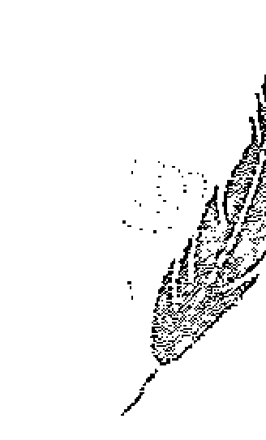
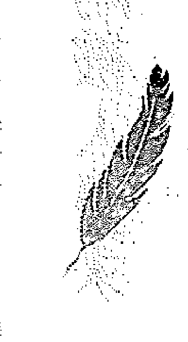
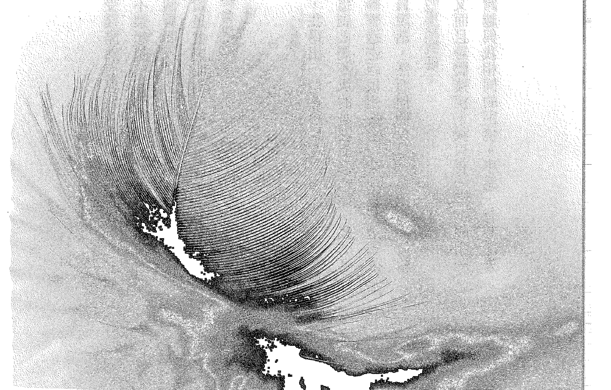

# 天使行

## 獻給傑克

## 致謝

感謝上帝和祂神聖的大天使，容忍我和我的固執。沒有他們我無法做到這些。

謹向勒威林出版社（Llewellyn Publications）和我珍愛的讀者致以最深切的感謝，感謝他們的持續支持。

## 探索生命書系總序

——中華新時代協會創辦人 王季慶

二〇二二年前，眾聲喧嘩，末日預言不絕於耳。一方面，我本著對「賽斯資料」的信任，也祈求他獨排眾議的說法得以證實。簡言之，他聲稱二十一世紀上旬，世界雖然仍有戰事與天災，卻無第三次世界大戰。並且，到二〇七五年時，人類將有一個大同世界！另一方面，即使成為「一百隻猴子的寓言」中的一員，我也想默默地為世界的未來盡一份力，為達成「一體平等」的靈性覺悟而努力。

我不敢聲稱自己已開悟，而且我最喜愛的「賽斯」也從沒提過這個詞兒。不過，在求道的過程裡，我無意中悟出「除了神沒有別人。除了愛沒有別的。」（There is No One but God. There is Nothing but Love.）當下，在無邊的寂靜安寧中，我的心中充滿了狂喜與愛，這份愛又滿溢為感恩之情！我體會到我一直在宇宙的愛中，宇宙的愛也一直在我心中。而，世人也莫不如此！不同的是，有沒有體會到，有沒有連上線。在一體平等的感悟中，我謙遜地臣服，自然放心又自在。不由得散播出愛—平等的頻率！

於是，完成了告別之作《與神同心—依愛隨行》，我便退休下來。想讀的都讀了，想分享予讀者的也都真誠地寫了下來。此生足矣！

在《與神同心》的後記裡曾提及我的天命——推介與翻譯新時代的好書——已經完成了。沒想到二〇一五年四月，素未謀面的蔣聖光先生，帶著家人約我在中華新時代協會見面。歷經海外創業的艱辛，如今他已是卓然有成的企業家。他開門見山地說，自己讀遍了我推介的新時代書籍，也邀同家人一起鑽研。哇！這讓我立即視為知音，因為，連我都沒有主動要求家人研讀呢。

作為一位成功的企業家，可以想見，蔣先生必然是位有主見，有魄力，並且格外有執行力的人。他說，運用從新時代書裡得到的智慧，他成就了他的事業。如今，他想（並且已著手進行）設立出版社。一方面找回一些已絕版的新時代書籍，一方面當然也將眼光放遠，胸襟放大，繼續以自由開放的精神，開創「探索生命書系」，向生命致敬，完全不計盈虧。

由美返臺近四十年了。從一九八九年開始，我正式投入新時代運動。當時，曾將我心中陶煉出來的「新時代運動」七要素，作為選書立說的準繩；並有助於分辨何謂「新時代」這個新「範型」（paradigm）與二十世紀中期前的舊範型有何不同。

這七個要素就是：

- 一、我們皆為神的一部分：有神論，但此神並非有組織宗教高高在上的一個像「，而是無形無相，一切的根源。祂乃是宇宙意識，我們的「源場」，而我們皆為其分出的一小片。祂透過我們每一個來體驗物質世界，完成整個拼圖。
- 二、你創造你的實相：你有多生多世的生命，並且是個多次元的存在。因此，不怨天不尤人，為自己的一切負起責任。從而省視自己為何作出如此的選擇，要學習的是什麼。
- 三、肯定人生的意義：不悲觀，不耽溺。最重要的是培養清明的覺知和一體的慈悲。
- 四、道德的內在性：不盲目跟從傳統，不媚俗。返歸自性，找到內心那一念靈明，依之做人處事。
- 五、身心健康是種自然狀態：心理有問題，鬱悶不快樂，自憐或自恨，能量堵塞不覺知時，才會不適。
- 六、環境保護：這攸關全人類的存亡。我們不能再視而不見，當作是別人的事。生態環保，人人有責！
- 七、無條件的愛：也就是對人的一體大愛，而非在關係中只顧自私自利的比較，爭奪，交換，控制。

至今，覺得那篇文字，還是相當切中新範型的精神。

不具權威性和強迫性，新時代不是宗教。它不崇拜偶像，也不自立為偶像。沒有階級組織，沒有教條，沒有戒律，也不等待外在的神明、聖賢、大師來拯救你。

賽斯說，認識自己就是認識神，因為你們都是和祂同一幅料子裁製出來的！

雖然，普羅大眾仍不見得了解新時代的「奧義」。但至少，經過三十年的「百花齊放」，現今社會上也習於其種種的觀念和用語。從生活面的應用：慢活，身心的放鬆平衡，愛自己從而愛別人，更新而平等的親子關係，伴侶關係；到最深的靈性認知：生死學，生態保育，宇宙論，哲學思辨，都或多或少都看到新範型的影響。整體而言，社會風氣無形中也改善了不少，好比，雙贏互利，人權以致動物權的伸張，性別平等的推廣，人們彼此相處的包容，體諒與溫暖——此間往往看到人性的光輝！

這個人間世，就是我們的舞臺。販夫走卒，帝王將相，都是我們生前和夢中不斷參與編寫，而於醒時演出的一齣齣好戲。所謂的覺醒，就是參透了鏡花水月，將注意力由外在舞臺返照回來，成為中立的觀者，醒悟自己演出的意義！能如此，就是找回了自性，開始走向返鄉之路。

不知從何時開始，我自覺到我有一項特性：我不會以個人追求自心的明晰、自在與幸福為滿足，仍深愛著人類自古以來種種文化藝術哲學上的成果，為之讚嘆不已！同時，也深深牽掛著人類未來的展望與福祉。當然，也關注著現世的兄弟姊妹，世間的種種困惑和苦難。記掛著、記掛著……不會忘也不想忘，作不了佛家所謂的自了漢。但由於相信自由平等，也從不願將自己的喜好和淺見強加於人，只能以出書的方式，給大家一個提醒和自由選擇的機會。

安然度過了二〇二二年，不過，世局天象，時時風雲詭譎！我有幸活著一天，就要為世界人類的平安幸福努力一天！所以，蔣先生要我寫篇總序，替「探索生命書系」揭開序幕時，我便答應了下來。但願，我過去的努力，促使世界進入新時代，現在則有助於世界邁向黃金時代。

且讓我們共同為未來的大同世界，盡其所能地提供貢獻吧！

## 前言

在二〇〇四年中風後的康復期間，我發現自己處於生命的最低谷。我失去了房子、車子和積蓄，以及所有的一切。而且，似乎為了讓我成為本書的新典範，在我最需要他們的時候，我的朋友和我所擁有的小家庭也棄我而去。

我孑然一身、無能為力，又身無分文。

在中風前的幾個月，我辭掉了一份做了長達七年的工作。正是每日緊張單調的苦差，讓我的生命處於危險邊緣而被兩次緊急送醫。但仗著年紀還很輕（還不到三十歲），我以為自己會東山再起。

我錯了！我的健康每況愈下，最後到了我急需做手術住院時，卻只喚得我的雇主出現，帶著我的待辦工作和筆記型電腦讓我在病床上完成該做的案子。於是我知道我必須做些改變了，但會是什麼改變，我沒有頭緒。

經過無數小時的禱告，加百列來到我身邊，並囑咐我辭掉這份工作。雖然這聽起來合乎邏輯，因為這份工作正在慢慢地危害我的生命。但這樣不實際，我要養房子、汽車，還有大學就學貸款要償還。當然，我有積蓄，如果失業，這足夠我維持六個月的生活，而且可以避免遇到另一次危機。

經過許多內心的掙扎，我終於屈服了。我辭掉工作，尋找不那麼有壓力的工作。那時，加百列開始和我爭吵。他堅持我不需要找工作，而我則堅持：聰明人才懂得未雨綢繆。

加百列是誰？他是一個天使，我的意思是「天使長」加百列，也就是《聖經》中「天使報喜」（the Annunciation）的那個天使、送信的使者。作為一名直覺通靈師兼天使靈媒，近二十年來我一直積極從事著仁慈的天國主人派發的任務。當我第一次遇見天使的時候，我跟任何一個發瘋的人所想的一樣：「天啊！我一定是得了失心瘋！」然而，不僅僅是賜予我智慧與洞察，他們提供的資訊也準確無誤，在在證明了他們是真實且有形的存在。人們可能會說，來自各地的準確預言可能是巧合，但當我開始與天使連結時，我幾乎在生命中的每一天都看到了徵兆和奇蹟。這可能讓人以為我受到這些神聖存有的歡迎和接納，或者我很高興被選中來傳遞他們的訊息。

但這個想法遠非真相。

時至今日，每當天使們給我帶來一個寶貴的智慧或關於未來的洞察時，我的內在仍在與其拔河。有部分的我仍然在持續測試我們之間溝通的有效性，不是因為我不信任他們，而是因為我是人類，必定會透過我自己的想法、感受和個人慾求來過濾這些訊息。

正如你很快會讀到的，接納天使進入我的生活，是我不得不接受的最困難轉變之一。更正一下：我仍在經歷這個轉變，但如果否認天使們多年來小心、慈悲地滋養我，讓我獲得了多麼大的靈性成長，那麼我會感到自己不負責任。對於我把他們也納入了我的成長過程，我幾乎感到羞愧，幾乎。

但是，天使之所以是天使，是有原因的。就算被人類攻擊，他們也不會受到任何影響。他們習慣了當我們的出氣筒，天國也知道他們是為我而來的。他們想要我當靈媒的重點是幫助更多人與神性連結，而不是預測未來，但由於我的自我防衛，天使不得不擊垮我，再重建我。他們必須終結我現有的生活，然後迫使我重新開始。

在我的講座、諮詢和書中已經多次說過這一點，而我要再強調一遍：「我不是算命師！我不是那種類型的靈媒，我不會站在一個密閉的演講廳裡告訴你：『你的阿姨菲莉絲向你打招呼。』我不知道中獎彩票號碼，也不知道你是否以及何時會開始從事夢想中的職業。我的工作是讓你聯繫上你的天使和靈性引路人，這樣你就可以直接從他們那裡學習，這將幫助你成長並在靈性上成熟。人們可以說我的工作是讓我自已失業，因為我的目的不是握住某人的手，經由每週的預言來引導他們，而是訓練他人連結上自己的引路人，甚至這也不需要我在場。

一旦你鋪好了通向未來的道路，就不再需要中間人了。首先，未來早已設定好了；其次，天使隨時都在待命，準備與你聯繫，以便指引你沿著道路前進。

每個人都有能力連結到神性，但每個人的天賦是不同的。更重要的是，幫助你磨練天賦的體驗將會不可計數且變化多端，所以為了你，我寫下了這本書。我想與你分享的訊息不只關於直覺的天賦，還有天使、天堂、我們出生之前以及死後的事。我想與你分享我的個人經歷，好為本書中所涵蓋的靈性各方面提供範例。在書頁之間也穿插著另一個靈魂的故事，他經由上帝之手，命運之手的引導從天國來到人間歷練，再回到天國的懷抱。

正如我在先前的書中所說的，我一再強調，與神性的連結是我們大家都應該努力發展和培養的。這種連結有助於我們瞭解生活，瞭解一切的目的和意義。但是，我永遠不會告訴你或任何人，這個連結將使你的生活更輕鬆。相反地，經歷越多的靈性成長，你將面臨的挑戰就越艱難。但反過來，這些挑戰將會有助於更進一步的靈性成長。這說起來很容易，但你會在整本書中讀到，在我非常人性化的時刻，我希望自己與天使或靈性成長無關，因為成長往往帶來改變，而改變並不總是令人舒適。

對我來說，有時變化是無法忍受的，但天使拖著踢打尖叫的我經歷了這些改變。幸運的是，在另一方面，一切都是清晰的，我能夠更瞭解自己，瞭解此世和那看不見的彼岸。

「你未來的工作不需要履歷。」一天晚上，當我熱切地折疊好用花式亞麻信紙寫就的履歷並在其上蓋封印時，他這麼對我說。在黏信封和貼郵票時，我詛咒了加百列，因為他誘使我進入了一種境況，現在看來這比我之前的工作更具壓力。至少有工作的時候，我每個星期五都有錢拿。而現在，我面臨的債務比我預期的來得更快，因為我愚蠢地忽略了在辭職時計算我的「綜合預算協調法」（COBRA，相當於退休保險和醫療保險）帳單，它們是一個月五百美元。

我和天使一起對找工作的問題糾結了兩個月之後，他終於贏了。一個夏日的星期天，我走出教堂，參加朋友們的午餐聚會。傍晚回家後，我就崩潰了。

三天後，我醒來，躺在醫院裡，癱瘓了。

三個月後，我把我三十年來的家當全部丟進工業尺寸的垃圾袋，將它們放入一輛車裡，以防止我的家當被扔到路邊。我失去了房子的所有權。每週和我談話的朋友停止了電話聯繫。我認為可以信任的一位家庭成員將我登記為債務人，並且迅速地與我脫離關係，這實在讓我頭暈。

看著一個又一個人拋棄了我，我不再期盼任何人的善意。但在我像廢棄垃圾一樣出現在街上之前，一個家庭接納了我，那是一個九坪大的房間，我將在那裡躺上幾個星期、幾個月，甚至幾年，盯著天花板……同時詛咒著加百列和天國裡的其他天使。是的，我詛咒了上帝很多次，儘管事實上，至少我那時還沒有淪落到待在無家可歸者的收容所裡……

我想死。我因為加百列的看似背叛而對上帝如此憤怒，以至於我甚至都不在乎自己是不是也會下地獄。

不用說，我想再次與天使脫離關係，但他們再接再厲。療癒天使，也是天使長拉斐爾，與我保持密切聯繫，加百列提供智慧的話語，但沒有提供任何慰藉。沒有什麼能平息我的痛苦。

「堅持住，香緹爾。要有耐心。」天使拉斐爾會在我不斷哭泣時低語。

「你認為我們帶你走這麼遠，會讓你失望嗎？」加百列一天晚上說。我答道：「如果我沒有聽你的話，就不會是現在這種情況！」

「不，你會的，」他的聲音是堅定的，「這一切都是神的計畫的一部分。全部都是。」

「好吧，讓我告訴你，你可以堅持神的計畫到什麼地步……」

但是，另一位天使進入了戰場，天使長麥可，大天使兼天堂的統領。人們可能會認為他是被派來監督我的，迫使我聽從神的信使，但沒有。他有著開朗的微笑和一種幽默感，能夠打破我在自己周遭建立的焦慮之牆，同時吞噬掉全部的貧窮和孤獨。這種孤獨如此深刻，以至於我經常不由自主地拿起手機，以確保它還在運作。沒有人打來電話。也沒有人來看我。

沒有人，除了天使。

慢慢地，麥可的魅力和溫柔漸漸讓我妥協，我變得更加能夠接受上帝的使者，但不是太多。然而，我對天堂的懷疑仍然縈繞心頭，每一次醒來的時刻，不確定的烏雲都低懸在我頭頂。我聽到了天使的訊息，但拒絕聽從。為什麼我的生活越來越糟糕？對於我的問題轟炸，他們所說的話似乎都像是錯誤答案。

拉斐爾不得不提供的回答是：「這也會過去。」同時加百列和麥可會嘮叨關於上帝的計畫和我的境況間的意義。過了一段時間，無視天使變得非常容易。我已經到了生命中的一個階段，我期待中的一切都是苦難，由於對上帝的不信任而受苦，也由於能夠聽到祂和祂使者的聲音而受苦。

所以，當二〇〇六年我的健康又跌入低谷時，我並不感到驚訝。

這一次是肺炎。

第一天晚上我感到自己病了，以為是心臟病發作。凌晨兩點左右，胸部開始疼痛，我的精神狀態如此低迷，以至於我甚至不想叫救護車。我僅僅坐起來，寫下遺囑，然後躺下等待死亡的來臨。

當晨曦從門縫滲入我的房間，我很失望自己還活著，甚至生氣、憤憤不平。

但我也感到了無法忍受的痛苦，這促使我最終去了醫院，在那裡住了三天。我沮喪地咒罵著，因為當時我沒有醫療保險。我知道自己會收到一張巨額醫療帳單，它一定會跟著我到來世。

由於我仍然患有中風併發症，劇痛已經成為常態，更不堪的是，我現在所睡的病床上沒有常用的毯子和枕頭可以讓我舒服點。一住進醫院，我就哭泣著乞求有人把我從痛苦中解救出來。於是醫生開了強力止痛藥，讓我至少可以入睡。

在那裡的第三個晚上，大約凌晨三點，我躺在床上盯著病房牆壁上的十字架。隔壁病房裡的電視機大聲地播放著彌撒曲，彷彿現在是下午三點鐘。我猜想那個病人很老了，或有些失聰、或兩者都有。雖然我不是天主教徒，但我仍然專心地聆聽著，感受著牧師、合唱團和會眾的舒緩聲音。這給我帶來了一點夜晚的平靜。嗯，是那個聲音和嗎啡帶來的。

我安靜地躺在那裡，徘徊於自憐和冷漠之間，像一艘划艇伴著微風在水面上飄盪。這時，大天使麥可漫步進入我的房間。充滿榮光而美麗，迷人而甜蜜，他走路的樣子彷彿是這裡的主人。他的步伐緩慢而自信，是這樣地引人注意，甚至可能是欽佩。至少這個天使看起來挺順眼。

他攏起白色長袍，坐到我的床邊，用他的招牌微笑看著我。

「什麼事這麼好笑？」由於止痛藥的作用，我的聲音在自己聽來都很沙啞。

「你知道當你注射了那些東西時，與你談話有多困難嗎？」他的眼睛與我平視。在中風後住院的這兩個月間，這是我第一次注射嗎啡；而在這一切發生之前，我甚至沒有用過止痛藥泰諾（Tylenol），所以我對這種藥物的耐受性非常低。雖然藥物沒有讓我無視天使，但它確實緩解了我的痛苦，讓我不去詛咒他們或上帝。

「嗯，看起來不錯，」我咯咯笑了，「顯然不困難。我們現在正在談話，不是嗎？」

帶著了然的微笑，陽光般的天使點點頭，他深邃的目光帶著開朗的笑容說道：「因為我要讓你記住這一點。」

「我不明白，麥可，」我沮喪地嘆了口氣。「為什麼呢？為什麼是現在？我只剩下一罐食物，我的名下只有八塊錢。我付不起一萬美元的醫院帳單。」當天早些時候，醫院繳費處的代表來找我。他手中拿著寫字板，用冷酷、審視的目光盯著我看。

「我們的紀錄顯示，你並沒有投保任何醫療保險，」他剛走進門口，就這麼說。他保持著距離，好像我被診斷患有某種食肉菌感染的瘟疫。他甚至懶得和我打招呼，至少他開門見山地說：「我們想知道你打算如何支付這筆住院費。」而我必須給他一個承諾……我在床上翻了個身，試圖讓自己舒服一點，然而疼痛讓我面容扭曲，我不由地無聲咒罵。然後我抬頭看向他，帶著同樣冰冷的眼神，道：「我一無所有，沒有房子、沒有汽車、沒有財產。基本上，你可以說我無家可歸。」這是事實。雖然我並非無處安身（因為我有地方住），但我沒有家。我所住的地方並不真正歡迎我，甚至包括假期的時候。對，我是無家可歸的人。否則，就彷彿是在說只要有一個庇護所就是有家一樣。

男人瞇起眼睛，表情變得僵硬。然而，我幾乎連眼睛都沒有眨。接著，他似乎沒有遲疑就轉身離開，只簡單留下一句「謝謝」。若不是我一直在擔心我將面對一張無力支付的帳單，此人的來訪彷彿不真實。好極了！我可以把它添加到已經越來越多的帳單裡，債多不壓身。我雙手掩面，疲憊又絕望地放棄了掙扎。

海中想像出一個人形，給他編個數字放進排隊人潮中。

現在，麥可再一次來看我，距離上次來訪大約十二個小時。他的個性與帳單所代表的截然相反，他的存在溫暖而令人感到安慰。他的眼睛裡閃耀著純粹的愛和慈悲，而這位大天使傾身親吻我的額頭說：「明天早上你就會明白你為什麼在這裡。」

「然後呢？」

「然後，讓你這段時間一直跋涉且如洪水般的懷疑就會消退。孩子，睡一會兒吧。」說完他就消失了。

第二天，醫院準備讓我出院。毫無疑問，他們不願意讓我比法定時間多待一分鐘。雖然我很高興地得知，病床上那比紐約計程車轉得更快的計費器將要停止運轉，但一想到我要回到一個充滿孤獨、寂寞和饑餓的黑暗房間，一股恐懼感就滲入到我的靈魂中。

在我短短的人生中，還從來沒有遇到過這樣嚴重的金錢問題。我的父母兢兢業業，努力供我上學。我汲取了他們的工作觀念，十三歲時開始就在每年夏天打工。上了高中，我也在放學後和週末工作。所以，從小我就不真正知道「無所事事」的滋味。而在我的成年生活中突然受到這種現實的打擊，不亞於一次粗暴的覺醒。這是活生生的、極度痛苦的折磨，與我想像中被一群吞噬靈魂的惡魔攻擊不一樣。因為這是由我無法控制的事情造成的：一次巨大的健康危機，望不到盡頭。我覺得這是來自上帝的徹底殘酷和嚴厲的懲罰。

然後，最令我痛苦的是：我是如此一貧如洗，如果我就在那時死了，甚至沒有保險金來支付喪葬費用。一想到自己將成為棺材裡的一具無名屍，我彷彿被冰水從頭淋到腳。沒有朋友也沒有家人，更不會有人檢查我是不是被挖掉了身上有用的器官並被賣到黑市。但是，還有一個令人難以置信的真相：現實無情地將我從心滿意足的中產階級變成默默無聞的貧民。

我再也無法忍受這樣的恥辱和卑微，我情緒崩潰、痛哭流涕，哭喊著一切的不公。

就在那時，負責出院的護士帶著相關文件進入病房。當時我正哭到無法呼吸、不能言語。她一言不發地坐到床邊，把手放在我的肩膀上；過了一會兒，我終於止住淚水重拾尊嚴，望向她的眼睛。

她的眼神差點讓我無法呼吸，那是天使的眼睛。她的身上看似有如此多的麥可靈性特質，使我懷疑自己是否精神分裂產生了幻覺。

「你知道，」她開始說話，「本來今天是我的休假日。他們打電話給我的時候我本來可以拒絕的，但有人說我今天需要過來。」

「麥可，」我幾乎發不出聲音。

「什麼？」然後，她低頭看著她的名牌，糾正我道：「是米雪兒。」她以為我誤認了她的名字，但我只在乎她眼中的光芒。

「不，」我委婉地說，「你周遭有大天使麥可的氣息。」

護士的臉上血色盡褪，她緊張地把金髮從眼睛上拂開。

「你說什麼？」

「我能看見天使，你身上有很多大天使麥可的氣息。」我知道自己當時聽起來有多瘋狂，但我不在乎會失去什麼？如果他們把我關在精神病院，至少我還有一日三餐。更何況，病院的其他患者會比在那個屋後的房間裡，數著脫落、發黃、斑駁的壁紙更加有趣。

米雪兒心不在焉地翻著我的出院單，清了清喉嚨說：「我知道。我非常喜歡大天使麥可。從我還是個孩子時起，我就認為他一直和我同在。我甚至為他兒子取了他的名字。」她輕輕地呼出一口氣，擔心地用哀傷的雙眼看著我。「今天有什麼事讓你如此困擾？」

我的眼淚再次瞬間湧出。「一言難盡，」我嘆了口氣，看著牆壁，「我只知道今天就要離開這裡，我只剩下一個餃子罐頭，可以放在檯燈上加熱，我的口袋裡還有八美元。」

「有鑒於我目前的情況，我最近成了安樂死的支持者，」我托著下巴繼續道，「所以，如果你覺得醫院能免費為我實施安樂死的話，我願意成為志願者。」我的自尊被摧毀了。多年以前，我寧願死去，也不願讓這樣的問題、這樣的失敗發生。

> 注1：麥可（Michael）與米雪兒（Michelle）的英文原文非常相似。

「對於可以看到天使的人來說，說這些話很惡劣。」護士迅速反擊。

「你以為我瘋了，不是嗎？」

「因為你能看到天使嗎？不。是因為他們如此接近你，而你卻想死！」說完，她起身為我拿來一盒紙巾，接著離開了房間。當她回來的時候，我已經擦乾眼淚，重新振作了一點。但我覺得自己比以往任何時候都要渺小，我很憤怒自己把所有的痛苦都暴露給了一個完全的陌生人。我的尊嚴似乎從醫院的三樓窗戶飛走了。

「等你到家的時候，請務必看看我給你的小信封。有一些非常重要的東西需要你看。」她說著邊推著我的輪椅走到醫院門口。

「一份帳單？」我冷淡地問。

「不，只是來自朋友的一點小東西。」她愉快地說。

我不由地發出嘲諷和懷疑的笑聲：「麥可告訴我，今天早上我會發現自己罹患肺炎的原因。」

「對，天使總是信守承諾。」

「嗯，我知道。」我懊悔地嘆了一口氣。她幫我叫了一輛計程車，很快我回到了自己的居所。我進了房間，一安頓好就打開了那個信封，裡面是一張小慰問卡，還有一張五百美元的支票。

我雙手顫抖地拿著支票，似乎有幾個小時都在沉思她那封短短的信：

> 我的兒子麥可，現在正經歷著一段非常困難的時期。他很年輕，而且一直在錯誤的地方尋找答案。我確信你可以看到天使並和他們談話，我相信是天使麥可今天把你送到我的面前，因為從來沒有人對我說過你所說的話。如果你與他沒有聯繫，那麼就不可能知道我內心的秘密，所以感謝你勇敢地說出那些話來。如果可以的話，請你務必幫我個小忙。請和大天使麥可對話，問他我如何能最有效地指導我的兒子離開他正在步入的毀滅之路。

我立刻呼喚天使長，隨後他帶著柔和的微笑現身了。

「謝謝你。」我在他面前晃了一下支票，同時因為我對他的懷疑而感到相當羞愧。

「別謝我。下一次你陷入懷疑的漩渦，懷疑我們是否為你著想的時候，就讓今天的經歷充當你的救生衣。」

我點點頭，臣服於他的智慧：「那麼米雪兒的兒子呢？」

「拿起你的筆記本和鋼筆，孩子。這要花一點時間將我說的記錄下來。」

我毫不猶豫地把這封回應郵件發給米雪兒，兩個月後，她回信說，天使麥可的所有指示都已經發揮作用了。她還另外送了一張二百五十美元的支票。

換作其他時候，我的自尊心都會讓我送回這兩張支票，但我發現，飢餓和絕望每次都會勝過我的尊嚴。

這些錢大多花在日用品上，剩下的拿去修理筆記型電腦，這樣我就可以讀取以前寫的稿子。多年來，我除了參加每日的自憐派對就無所事事，於是我開始了寫作。

最終，我賣出了第一本書《死神愛吃巧克力，麥可是個運動狂》。

所以才會有現在的我。

米雪兒和我在第二封信之後就沒有聯繫過，但命中註定這件事是會發生的。

我因肺炎而住院這件事從來都與金錢無關。這事關對上帝的信任，並讓我明白：我們面前的所有挑戰都是出於某種原因。這次的住院不僅為米雪兒找到對她兒子的指引，也讓我重新信任上帝使者的指引。

這堂艱難的功課也教導我：宇宙有時是如何運作的。我們的生活裡會有一些艱難時刻，即使禱告也不會收到帶著彩虹和水仙花的回應。有時回應我們的會是暴風雨，但在天使那裡一直都有一把傘、一支木筏和一雙援助之手。

所以當挑戰、失望和懷疑的洪流開始升起的時候，不要慌亂地拍打水面並試圖與洪水抗爭，疲勞和恐慌只會讓你被逆流擊沉。相反地，抓住上帝和他的天國使者的引路之手，讓他們拉著你度過難關。他們是非常棒的游泳好手，他們為我們設計出了完美的漂浮裝置。

## 关于印发《企业会计准则第25号——保险合同》的通知

财会〔2020〕20号

国务院有关部委、有关直属机构，各省、自治区、直辖市、计划单列市财政厅（局），新疆生产建设兵团财政局，财政部各地监管局，有关单位：

为了规范保险合同的确认、计量和相关信息的列报，提高会计信息质量，根据《企业会计准则——基本准则》，我部制定了《企业会计准则第25号——保险合同》，现予印发。现就有关事项通知如下：

1. 在境内外同时上市的企业以及在境外上市并采用国际财务报告准则或企业会计准则编制财务报表的企业，自2023年1月1日起施行；其他执行企业会计准则的企业自2026年1月1日起施行。
2. 执行本准则的企业，应当同时执行我部发布的其他各项相关会计准则。

执行中有何问题，请及时反馈我部。

附件：企业会计准则第25号——保险合同

财政部

2020年12月19日

## 企业会计准则第25号——保险合同

### 第一章 总则

第一条 为了规范保险合同的确认、计量和相关信息的列报，根据《企业会计准则——基本准则》，制定本准则。

第二条 保险合同，是指合同双方约定，一方（保险人）在特定情况下，向另一方（投保人）支付保险金的合同。

第三条 本准则适用于所有保险合同，但下列各项除外：
（一）保险合同中嵌入的衍生工具，适用《企业会计准则第22号——金融工具确认和计量》。
（二）保险合同的合并、分拆和修改，适用《企业会计准则第33号——合并财务报表》、《企业会计准则第22号——金融工具确认和计量》等。

第四条 保险合同的确认、计量和相关信息的列报，应当遵循实质重于形式原则。

### 第二章 保险合同的识别

第五条 企业应当识别合同是否为保险合同。保险合同的识别应当基于合同条款和相关事实。

第六条 保险合同的识别应当考虑以下因素：
（一）合同是否转移了重大保险风险。
（二）合同是否约定了保险金的支付条件。
（三）合同是否具有商业实质。

## 第 1 章 直覺之天賦

自我的兩本書（《死神愛吃巧克力，麥可是個運動狂》和《天使代碼》）上市之後，我就被讀者的電子郵件淹沒了，他們全都傳達了同樣的心情：哇，我希望能用你的方式和天使溝通，香緹爾！這必定會讓生活變得無比輕鬆。在苦樂參半這麼久之後，我的回答通常是：「與天使一起工作，絕不像在公園裡散步那麼輕鬆。」

隨著越來越多的讀者認識我的工作，他們很快就意識到我和其他天使靈媒的不同之處，那就是我並沒有身披神性的糖衣。雖然與神的聯繫通常是令人振奮和鼓舞的，但另一方面，有時我會想大叫和踢牆，甚至沮喪地捶著拳頭。

從接觸到靈性世界之始，我就面臨著考驗和挑戰，其難度堪比讓一個經驗豐富的退伍老兵顫慄著回想起新兵訓練營的第一天。學習信任直覺天賦，就像學習使用它一樣艱難。就好比是聖靈國度裡最病態、最具殘酷幽默感的靈性引路人被指派給我做練習，除此之外他根本不像天使。我相信他會認為這更像是在做打靶練習。

可憐的傑克，在剛被指派給我的前年，他就回到了聖靈的國度。那是一九九三年，他因悲慘的意外英年早逝。而且，彷彿突然結束幸福生活對他的折磨還不夠似的，一年後他被指派給了一個不知感激的、頭腦頑固的未來靈媒，變成了一個靈性和情緒上的出氣包，而那個人就是我。

初見到他的那晚，天降大雨。遠處雷聲隆隆，傍晚出來購物的人們走出商店，穿過滿溢雨水的停車場奔向各自的車子。然而，我們幾個人站在店外，並沒有意識到大雨和電閃雷鳴，彷彿被吸引般，望著落地窗內的燭光。我把鼻子靠在玻璃上，裡頭的燭光因為玻璃上的水珠變得模糊且暈散。而突然間好像大夢初醒般，我移開視線、甩甩頭，將臉上雨水抖落，穿過了其他圍觀者，走進店裡。

儘管點著白色的蠟燭，商店裡面還是相當昏暗，這反而放大了那種怪異的、讓人產生不祥預感的靜默。撇開內心潛藏的不安，商店本身似乎沒有危險，是一個充滿禮品和新奇物品的小商店，只是有點古怪。我漫步在布滿遊戲、拼圖和小玩意兒的走道上，「沒有什麼特別的。」我想。沒有什麼能引起我的注意，直到我看了一眼商店後面的海報展示架。我不知道為什麼會被吸引，但我順著自己的直覺和好奇心，快步走過去。

我急切地翻過一張張海報，但一開始沒看到任何特別有趣的東西。突然間，一張海報映入眼簾，我停下來。那是一張英俊年輕人的照片。他低著頭，下巴抵在胸口，烏黑的頭髮垂下並掩蓋了他的眼睛。事實上，他汗流滿面，汗水匯聚成細小的水流滴落在他油亮的肩膀上。不，這不是那些常見的、皮膚曬成棕褐色、閃亮得讓女孩流口水的海灘男孩的照片。沒有藍色的天空、白色的沙灘和白色浪花的海洋作背景，反而只有一種不祥的橙色光芒。

我的目光完全被這張真人大小的海報吸引，一種非常不安的直覺席捲了我。恰好在那個時候，耳邊傳來了鏈條碰撞的聲音。我既害怕又困惑，被突如其來振聾發聵的刺耳叫喊聲嚇了一跳，後退了一步。我驚呼了一聲，被自己的腳絆了一下，只能靠在牆上，但我無法把視線從海報上移開。我甚至無法眨眼，就好像那個影像控制著我的眼睛。要這麼做畢竟不是件容易的事，因為剛才只是一張照片變成了立體影像，像是進入另一個世界的窗口。這個人身上反射出的橙色微光開始跳躍和閃爍，好像微光的源頭是看不見的火焰。我感到一陣巨大的熱浪從海報的方向朝我襲來，毋庸置疑，海報背景的某個地方起火了。

我注意到此人的胸膛急劇起伏，於是向那個影像伸出了手。他正在喘氣，好像剛剛跑完馬拉松。我想，在這難以忍受的熱度下，他不可能不需要幫助。他的遭遇和明顯的痛苦吸引著我的注意力，讓我產生了難以抗拒的強烈渴望，想去幫助他。正是那一刻，我的直覺告訴我，如果可以觸摸他的心臟，我就能把這個受折磨的靈魂從噩夢中救出來。

當我的手指離他的胸口僅有幾公分時，他抬起頭來，痛苦的雙眼像長矛一樣刺穿了我。當他試著喘口氣時，疼痛深深地刻在他瘦削臉龐上。汗水浸濕了他的頭髮，沿著他的兩頰滾下，我們雙目交接正如永恆般定格了。

當他向後退（我不確定是出自於痛苦，還是出自於我看不到的可怕事情）的時候，我的專注凝視最終被打斷。無論如何，我知道他正在努力擺脫什麼束縛他自由的東西。雖然海報只描繪到他的腰部，但我可以透過所描繪的手臂的緊繃程度，猜出他的手腕被綁住了。我忍不住想要幫忙，真該死。但我害怕接下來會出現的東西，害怕自己可能受傷。於是，我開始慢慢往後退。

「內疚……遺憾，」他終於說話了，這讓我停止了行動。「太累了。沒有人應該忍受這一點。沒有人，香緹爾。甚至是你。你不會想要這個。」他啜泣了一下，淚水從他被煙燻紅的臉頰流下。

「傑克，」我畏畏縮縮地靠在牆上深吸了一口氣。他的名字突然出現在我的腦海裡。「我不知道該如何幫你。」

鏈條再次發出不祥的碰撞聲，他的眼睛往上看了一下，然後，由於極度痛苦，他發出了令人毛骨悚然的哀號：「你不會想要這個！」

「傑克！」我醒了，抓著我的毯子，渾身顫抖。我可以發誓，我大聲叫著他的名字，但睡在我身邊的朋友（因徹夜狂歡派對而留宿的女孩）一動也不動。我試圖把傑克那張受折磨的臉從我心中抹去，但他有一種獨特的魅力，而這個夢也因為如此深刻讓我無法自拔。

一九九四年我就讀大學，那時我身負債務，對生活完全不抱幻想。所以，這個夢雖然能讓我從俗務中稍稍鬆一口氣，但我發現它仍舊困擾著我。我花了幾個星期思考它的意義。我的黑髮天使似乎更像是一個惡魔，開始把我搖搖欲墜的靈性生活震碎成一堆瓦礫。起初，我不知道這個夢是否為我預言了一個地獄？但也許這更可能預言的是傑克的地獄，因為我也許是靈性導師們所遇到的人當中，最難以說服的人之一。

當時，我不知道傑克是誰，而我所知道的就是，他是一隻床邊妖怪，出沒在我所有的夢裡，站在我臥室的陰暗角落，盯著我入睡。我盡力忽略他的存在，或至少我認為他是存在的。雖然他經常在夢中與我說話，我也只能在之後模糊地回憶起他的話，但我相信他是我因過度想像而虛構出來的。

兩年來，傑克一直在睡夢中困擾著我，直到一九九六年的某個雨天，他終於走出夢境的限制，進入了我的世界。

那天晚上我陷入一種特別的狀態，對周遭的世界異常敏感。這種狀態之前我也有過，那時讓我困擾得要死。我的五感敏銳到可以覺察到最微小的事情。這讓我的飲食變得困難：加工食品嚐起來有毒，紅肉裡的金屬味讓我難以下嚥。我無法忍受最微小的低語而不頭痛。如果我爸在房子的某個角落放了一臺電器，我甚至可以聽到它的電流嗡嗡聲。

視覺上，我對光敏感。但即使坐在黑暗裡，光線仍舊在我眼前跳躍，有時是明亮的閃光，或是快速流動的顏色，或緩慢的彩色光流，就像熔岩燈裡流動的物體般，我找不到方式避免這一切，即使緊閉眼睛，我都無法獲得全黑的平靜。

關於這一切，我所知道的只是，焦慮感來襲讓我倍感壓力，想在牆亂抓。那天，我與大學裡的一些朋友聊天，然而這也沒有幫助。我們都感覺到困惑，因為我們正面臨畢業，對於將來的生活毫無頭緒。有一種迷失的感覺，我們與時間賽跑，卻無處可去。最後我們得出了難以承受的結論：生命不再神奇也不再有意義。童年的天真無邪隨風而逝，在生命中做真正有意義之事的希望和夢想亦隨風而逝。這就是現在的我們，全都被困在不想從事的工作裡，同時意識到這點：我們很快就會變成父母那樣，生活就只是支付帳單，僅止於此。

那天晚上，我心中帶著那些仍然清晰的想法，在家這個避風港的房間裡獨自靜靜坐著，聽著從遠處慢慢席捲而至的雷雨聲。我試著考慮其他更積極的事情，但我的大腦不斷地在負面的迴圈上轉動。我知道，如果再不快點轉移注意力，我就會瘋掉。然而，想到打開電視後所有的光線和噪音，我就感到身體不適。

在幾分鐘的精神折磨後，我開始哭泣。面對世界而沒有方向感，這讓我很害怕。這是一個看起來如此支離破碎、有著諸多問題的世界。

我想：這不是我想要的生活。我挫敗感十足地抓著自己的頭髮，努力讓自己不屈服於「生活中沒有什麼真正值得追求的」這個念頭。才二十三歲的年紀，我就已經憤怒、疲憊和厭倦了。我看到了太多次，生活對我們是多麼不公，大家看起來都很不快樂。每個人踩在其他人的身上往前進，也不管這會如何地影響他人。由此我想到人性的骯髒和困境，我只能看到很少的愛或同情；而那些仍然設法在心中保留一點愛的少數靈魂，常常被那些受邪惡野心驅使的人所壓制。

「天哪，」我嘶吼地大叫，「這一切有什麼意義？」

正是在那一刻，我聽到了低語。我以為是父親從樓上傳來的。我清了清喉嚨，應了一聲並等待回應，我想那可能是要我幫忙拿一杯果汁之類的，但什麼都沒有。我又叫我的父親一次，但依然沒有回應。於是我鬆了口氣。

「香緹爾，」我聽到渾厚男性的聲音在黑暗中重複，我知道那不是父親的聲音。涼意在我的皮膚上蔓延，手臂上的汗毛直豎，因為被恐懼籠罩，我擦乾眼淚，慢慢地把我的腳抬到沙發上。我唯一的武器只有一個枕頭。

當然，我抱著理智終將離我而去，以及明天一早可能會被送進州立精神病院的可能性。我知道，如果我回答了那個聲音，可能會聽到一些讓我後悔的事情。這會是魔鬼還是撒旦來引誘我下地獄？

「誰在那兒？」我問道，我的聲音悶在枕頭裡有點模糊不清。我僵在沙發上，但還沒有到如果有東西飛過來，就來不及衝出窗戶的程度。畢竟，我是一九八〇年代的孩子，看著恐怖電影如《鬼哭神嚎》（Poltergeist）和《陰宅》（The Amityville Horror）長大。這就好像我的絲襪著了火，我心裡已經作勢準備好要逃跑，但和恐怖電影不同的是，我不會回頭，也不會突然在街上被一個迴紋針絆倒。

「香緹爾，請不要怕我。我只是來這裡幫忙。」

「是的……沒錯。」

他要如何幫我？這是一個很難解釋的問題。傑克從來沒有口頭回答我；相反地，在接下來的幾個月裡，他透過行動表達一切。

最初，他的指導似乎無關緊要。他證明自己對於我的工作是有很大的幫助，讓我我能領先一個擅長拖延的經理。

「不要想今晚準時下班，」傑克說著盤腿坐在一張辦公椅裡。

「什麼……？」我抬起頭，正準備收拾公事包的時候，我看到老闆經過辦公室門口，然後他帶著做作的微笑走回我的辦公室。

「哦，香緹爾，你還在這裡！很好。」

「就跟妳說吧，」傑克輕聲說。我經常加班工作，從早上十點進辦公室，直到午夜過後才離開，因此夜班保全和我是唯一留在空蕩蕩的綜合大樓裡的人。

糟糕的是，我總是把車停在黑暗、僻靜的停車場，離辦公大樓有一個街區的距離，就算大叫也無人能聽得到。雖然我在一個富人區工作，犯罪率是零，但一個人仍得非常小心，而那些時刻正是我最依賴傑克的時刻。

「沒事，」他會低語，「我永遠不會帶你走錯誤的路，香緹爾。這裡沒有人，只有你、我、樹木，還有幾個不在乎我們的鬼魂。」鬼嗎？很好。真是太好了。我工作的大樓已經存在了一個世紀，這裡鬧鬼不是什麼秘密。員工、顧客、甚至外包廠商都有說過看到奇怪的陰影、移動的家具和自己開關的門。他們還在身旁沒人的時候聽到聲音、低語和腳步聲。

如果可能的話，許多員工都會盡可能在日落之前離開那裡。然而，保全似乎因為他所經歷的這些怪事而熱愛這份工作。事實上，正是他向我推薦了深夜廣播節目《岸對岸》（Coast to Coast AM）。凌晨兩點，我會在櫃檯摺紙和封信，而他和傑克則坐在後面，聽著這個囊括一切超自然現象的節目。

而最有趣的一次深夜時刻，我記得是一個幽靈專家或靈媒在廣播裡討論來世。但傑克只是坐在那裡，同情地搖搖頭。

「這真是胡說八道……」他會嘆氣並翻著白眼說，讓我咯咯笑。但他的嘲笑使意識到出現在他面前的真正是什麼。他不是某些拒絕走進光明的幽靈。他曾經活過，去了天堂，又回來幫助我們這些不幸的人。不過請不要誤會我的意思，我多次懇求他移動我桌上的筆，或者換個電視頻道。

他通常回答：「我在劇院的日子結束了。」

這抑或是指他們？

除了讓我接受他出現在我的生命中，傑克還有另一個請求。

「寫下我的故事，」他會常常在我耳邊說，「請寫吧，香緹爾。」他的聲音裡似乎帶著苦苦哀求，讓我不禁感到內疚，我利用兩份兼職（學校和哥德俱樂部的工作）為藉口，不想寫他的故事。他不肯放棄，但過了一段時間，我告訴他我不熟悉他要我使用的寫作方式。他想讓我寫一個劇本，我連電影劇本是什麼都不知道，更不用說去寫了。

「我可以教你。」他說，但我有點猶豫。這位靈性引路人陪伴著我，並幫我建立與覺醒世界的聯繫。芸芸眾生之中，為什麼會是我？時至今日，我仍然不知道原因。我所知道的就是，他越向我施壓，我就會越退縮，越回到那晚在家裡餐廳他第一次對我說話，那時的我非常警覺。該死的，如果我要為他犧牲時間，我每個想法都是讓他接受精神的折磨，以作為懲罰。其中包括我從大學圖書館的一本書上學到的自製驅邪術。我的意思是，在下決心為他做事之前，我必須有些動作。最初，我不是在夢裡見到他是一名關在惡魔監獄中的囚犯嗎？

隨著我們關係的進展，我逐漸難以忍受一切，甚至變得神經質起來。有一天，我指責他是一個誘惑我遠離上帝的惡魔，緊接著我就質疑自己的理智了，因為我不僅聽到了一個無實體的聲音，還在與之爭論。更糟糕的是，我可以在靈視（第三眼）中看到傑克，雖然我沒有真正意識到我看見了他。我認為是我想像出了他，將他視覺化。但是，當我終於明白我可以像看到任何有形之人一樣看到他時，我只覺得很瘋狂。我的生活開始看起來像電影《搗蛋鬼佛瑞德》（*Drop Dead Fred*）的哥德版本，只不過傑克很冷靜，並沒有讓我常常陷入麻煩……

我們最大的爭吵發生在一九九七年，距離他與我聯繫上的那個難忘的夜晚整整一年。那個他非常渴望我完成的計畫終於完成了。我的劇本在大學裡獲得了多個獎項，但當我試圖把它製成一部電影時，我不留心讓劇本在我眼前被偷走了。當我意識到我所有的辛勞工作都被別人據為己有時，我無比憤怒。我對盜賊、對所發生的事、對我無法做任何事情把他們繩之以法很生氣，事實上，傑克也允許偷竊的發生。他實際上是我的整個作品的導師和靈感源頭！我後來認為那是我最具創意的時刻。我責怪他令我的辛勤工作和研究都浪費了。

「傑克，走開！我再也不想見到你了！」我尖叫著踏進臥室，就好像我是一隻被關在籠子裡的母獅。「我希望你喜歡你和我的小遊戲。你只不過是一個該死的魔鬼，所以回地獄去，回到你原來的地方去。」傑克沒有為自己辯護過一句話，他只是禮貌地點點頭，接著消失了。我只能把他離開後的感覺比作完全的空虛。那裡曾經有著溫暖、平靜和安全感，現在什麼都沒有了。完全的空無。

幾個小時過去了，我開始與自己爭執。某部分的我想要他回到我身邊，並因為無情地傷害了他而道歉；另一部分的我仍然在猜想，他會不會只是某個想看我笑話的幽靈。到了晚上，我決定最好是沒有他而繼續前進。畢竟，由於他的影響和敦促，我才錯過了這個我所認為的一生的機會。

第二天早上，我起床工作，但仍然感到很生氣。我對傑克的憤怒仍未平息，我想要的只是回到他進入我生活之前的時光。我是如此習慣於每天早上工作之前都和他說話，以致於陽光明媚的日子沒有了他都顯得黯淡。但是，在這個特別的早晨，我決心重新開始。我認為穿上一件新西裝，換一個新髮型，這會讓自己感覺更好。

在相信改頭換面發生了作用後，我以一種新的態度開始工作。但是在佩戴飾品並嘗試了一種新的香水之後，我把我的大腦留在了梳妝檯上，因為上車後，我決定不繫安全帶，以免弄皺我的新西裝。相反地，我決定開車時更小心一點。

「早安。」當我坐在慣常的尖峰時段車流中時，傑克憑空出現。每當我開車時，他總是出現在後座中央。

「我告訴過你走開，別再出現。」

「繫上你的安全帶，」他平靜地說。

「別管我，傑克。走開。」

「現在就把你的安全帶繫上，我保證會離開。」

「好吧，」我抱怨著，繫好了安全帶。我從後視鏡裡抬起頭，皺眉看著他。

「滿意了嗎？」

「嗯，好了。謝謝你。」他回答說。當我的目光越過他（或者更像是穿透他）時，我看見一輛汽車正在向我高速駛來。

它沒有停下。

我緊握方向盤，屏住呼吸，讓自己做好準備。在後方的路上我聽到了因輪胎急煞而發出的交響樂，接著是金屬互相撞擊如雷鳴般的聲音。

我離開事故現場，只受了頸部扭傷。我可憐的雪佛蘭卻沒那麼幸運，因為撞擊使我的車撞上了前方的車。我的新態度就到此為止了，不管是新的態度、西裝和我的車，現在都皺巴巴了。

我心情沮喪，打電話給公司請假回家。在一切事情沉靜下來之前，一下午的時光慢慢流逝。那天早上發生的事一遍又一遍在我腦海裡重播。巧合？狗屎運？我不知道該如何定義。那天晚上，一個朋友建議我簡單地稱之為「上天保佑」。

過了幾天，我才讓傑克回到我的生活。沒有他的存在，我很難繼續奮鬥。我試圖對我們的關係套用一些貌似合理的邏輯，認為他只是一個想像中的朋友，或者也許他只是一個我所渴望的想像，或者也許他就是我，一個更聰明的我，一個我永遠都不會承認的自己。然而，所有這些可能性，都被無數的「巧合」打破了，這些巧合似乎緊隨著傑克所說的每句話而來。從車禍到奇怪的際遇（遇到塑造我靈性生活的人），再到準確無誤的夢境和預言，在在證明傑克是真實存在的。

在這一點上，人們可能認為傑克被指派來磨練我，為我將來和天使的聯繫做好準備。嗯，這是一種保守的假設。然而，天使在我這裡不會受到比傑克更溫暖的待遇。事實上，因為他們的存在所散發的純粹力量，我靠近他們如同靠近火焰。即使傑克是我的靈性引路人，但他的能量仍然讓我感到非常人性化。另一方面，天使則擁有我完全不熟悉的力量。

雖然我有堅實的基督教背景，但我並沒有真正被教導去相信天使。我認為他們只是聖經人物，以奇蹟的方式出現，像是把紅海分開，把水變成葡萄酒，他們已經不存在了。

現在，當我回顧小時候，我的整個童年充滿了超自然現象，我好奇自己怎麼會如此輕易地駁斥上帝的使者。我經常在我那鬧鬼的家裡發現幽靈並與他們互動，準確的預感對我來說很平常。但進入青春期後，所有的超自然活動似乎消失了，儘管我仍渴望經驗這種現象。

孩提時，這一切令我害怕；到了青少年時期，這激起了我的興趣；至於剛成年的時候，我只是認為自己瘋了，不願意放任自己過度的想像力。超自然現象界正以我真正完全不希望的方式影響著我的生活。畢竟，父母告訴我要做什麼以及如何生活，已經讓我的負擔很重。我真的非常肯定，我不想要幽靈、天使或任何其他東西對我指手畫腳。

不，我最不想要的一件事就是，更多的權威人物試圖控制我的所作所為，甚至是我感知世界的方式。當我離開教會，成為一名重生的基督徒（born-again Christian）時，傑克緊隨其後出現在我的生活裡。小時候我大部分時間是在路德教會長大的，每當我媽媽在路德教堂裡厭倦了唱讚美詩時，我就會被帶到五旬節（Pentecostal）教派去。當她心情暴躁、想要說教、進行充滿聖靈的服務時，就會把我拖到任何她可以找到的五旬節或浸信會教堂裡去。

然而，我的父親，更穩重，也許還更保守。他避免那些嘈雜、高調，甚至是趕潮流的服務。在四十年的教會生涯裡，他低調地保持沉默和安靜。因為我多元化的成長經歷成為了重生的基礎，所以我不得不說我已經做好準備，讓超自然活動回到我的人生。根據基督教，與幽靈這種東西互動不僅是禁忌，而且會阻礙一個人的救贖。幽靈和像是諸如靈性引路人之類被視為邪惡的象徵、撒旦的使者。而端看和你說話的人，天使可能也屬於這個類別。因為信仰的教導是，我們只需要與耶穌和上帝說話。

但我的現實生活體驗卻嚴重挑戰這些信仰。我在這些信仰中掙扎並與之鬥爭，情況嚴重到幾乎讓我試圖自殺……兩次。我是如此痛苦和困惑，以致於我想拋棄生活中的一切，離開大學，成為一名天主教修女。我以為如果我能在一个宗教場所隔絕自己，在這神聖的土地上度過每一刻清醒的時光，那麼幽靈、預感以及一切被視為不聖潔的東西都會停止。

在信仰與無信仰之間徘徊，我發現了基督教外的信仰。我心懷愧疚地仔細思考其正確性，也懷著想深入瞭解這些信仰的渴望。以上種種皆導致了我心理和情感上痛苦的惡性循環，但我不想讓他們變成可怕的敵人……如果真的有的話。

經過幾個小時淚眼婆娑地跪著祈禱，懇求上帝讓我那瘋狂的靈性生活變得有意義後，我慢慢地意識到，傑克既不是惡靈，也不是天使。當我接觸到天使加百列（報喜天使本人）時，多年為了這些事物違背我的信仰才宣布告終。

傑克看著我經歷了父親的離世，接著是四年後母親的離世。我甚至還不到三十歲，就在這世間獨自一人，孤獨無依。我是獨生女，我的父母與他們的兄弟姊妹和遠親都沒有什麼聯繫。所以，當他們離去時，我沒有親戚可以投靠。

幸運的是，在持續尋求靈性了悟的過程中，我發現了不為所知的家人，而這場尋求是我從小就開始著迷的。

某個星期六下午，我坐在家附近一間餐廳裡，正盡力完成電影學校的一個劇本。由於傑克的原因，我對這項技藝有著近乎癡迷的熱情，但我確實精疲力竭了。那家餐廳二十四小時營業，我在那裡一直待到第二天清晨，直到中午用餐的人群開始坐滿桌子，但這對我來說並不稀奇。父母離去後，家裡似乎很冷清，更不用說我最不想提的事情：從我四歲時搬進來起，房子裡就住著幽靈。

幾個月來，我開始上電影學校，同時在一家待人傲慢的公司做全職助理，餐廳變成了我的家。我每晚只睡四個小時，吃的全都是不健康的食物，只能勉強維生。但我真的不在乎，被喋喋不休的用餐者包圍著，總比獨自一人坐在家裡好得多。此外，我結識了那裡的一名女服務員，她是唯一看似不在乎我整晚占用一張桌子的人。我一般晚上九點左右到達，在那裡一直待到天亮。在服務顧客的空檔，她會過來和我坐在一起。我們天南海北地聊天，從男人到電影再到當地八卦，無所不談。

然而，那個星期六，在長期的睡眠不足、超時工作、學校作業，以及無數杯咖啡和不斷吃辣味熱狗後，這些不良習慣終於開始向我討債。我的女服務員朋友走向我的桌子幫我添咖啡，這時她突然停下來盯著我看。

「親愛的，你看起來像行屍走肉。」她以迷人的南方腔調說。

「我知道，」我嘆息著以手掩面，「我確實需要一些休息，但我睡不著。無論看起來有多累，我一次都睡不到一個小時。」我真的覺得，從朋友緊張的神情來看，彷彿我正站在死亡的門檻上。

「你需要美國印地安舒眠茶（Native American dream tea），」她一手拿著咖啡壺站著，一手插腰道。我好奇地我好奇地皺眉，謹慎地環顧四周，看看在聽力所及範圍內是否有任何顧客。

「是合法的嗎？」我低聲說。那時我連止痛藥泰諾都從未吃過，更沒試過任何非法藥物。出於對父母的恐懼，我害怕被他們抓到我從事任何不法活動，這讓我我一直安分守己。

我朋友的眼睛裡閃爍著歡樂的光芒，她笑著說：「是的，親愛的，這真的是合法的，你可以在北部的茶鋪買到。在坎特伯雷村，離這裡約四十分鐘車程，但值得去一趟。」

「啊，」我瞬間提不起勁了。我討厭購物，但更重要的是，我討厭觀光地區。我知道自己很難忍受開車四十分鐘到一個地方，只為了買一些有可能不起作用的新茶。「不用了，謝謝。」我說著，喝掉了咖啡。

「不要那麼快就拒絕，香緹爾。我想你會喜歡那個地方，那家店是一位直覺療癒師（intuitive healer）開的。」

這才真正吸引了我的注意。我惺忪的雙眼再次回神，專注地看著女服務員。

「她是真正的甜心，」她繼續說，「只是看著你就會讓你心情愉快，孩子。我想你可以與她做一次或者是……三次個案，你該走了。」說完這些話後，她離開我去招呼其他顧客。我靜靜地坐在桌邊，想知道這次旅行是否值得一試。去見那位直覺療癒師嗎？

算了吧！我搖了搖頭，很快打消了前去的念頭。

那天晚餐時，我遇到了另一個朋友，她那晚非常開朗陽光。好吧，比平常還要開朗。從我們在停車場見到的那一刻，我就能猜到她當天肯定發生了什麼好事，而我因為太累了，所以渴望聽到一些好消息。

「天啊！香緹爾。這是我有生以來最棒的一天！」當我們吃開胃菜的時候，她從座位上跳起來說道：「我想我找到了舉辦婚禮的完美地點：……嗯，假如我會結婚的話。」

我咯咯地笑話她豐富的想像力。我們都是單身。不同於我對無男友的狀態很滿足，她一直在尋找一個真命天子，夢想一場極其奢華的婚禮。我坐在那裡，聽著她喋喋不休地述說每一個細節，描述幾個小時前她剛剛拜訪過的那個地方，其時間點恰恰與我和女服務員朋友談話的時間吻合。

在她描述完每分鐘的細節之後，我終於打斷了她。「那個地方在哪？」

「哦，香緹爾，你得和我一起去看看。就在北邊的坎特伯雷村！」

我的叉子掉在餐盤上。我可以簡單地把這當作一個巧合，但這兩個朋友彼此並不認識，她們甚至都不知道對方的存在。她們都提到了同一個我從來沒有聽說過的地方，這太離奇了。

不用說，幾個星期後，我開了四十分鐘的車一路向北去參觀那個旅遊勝地。雖然我相信餐廳和聖誕飾品店是令人愉快的參觀地點，但我的腦海裡只有一個地方：那間茶鋪。

猶豫著，我進入了這間古雅的小店。這間店寧靜而溫馨，牆壁上滿是小商品。從茶杯到小飾品再到書籍和珠寶，這家店似乎為茶藝鑑賞家和靈性追尋者提供了一系列多元的產品。在店裡轉了幾圈之後，我終於鼓足勇氣上前詢問那位女服務員朋友告訴我的直覺療癒師。

「呃，我來這裡找一位療癒師，」我說著慢慢走近櫃檯後面的那位女士。她身後是一面由罐子組成的牆壁，囊括了各種來自世界各地的茶。天啊，我還不知道有這麼多不同口味的茶！

「找誰？」那位女士說著從眼鏡的鏡框邊緣看向我。她看著我，好像我是一個外星人。那時，我想我可能進錯了店。

「療癒師。」有人跟我說，有一位靈性療癒師在這裡工作，「我詳細解釋道。

「那就是我，」一個聲音從我身後傳來。我一轉身就看見了那雙我所見過最溫暖、最有智慧的眼睛，我一時間無法言語。我們一度靜靜地站在那裡，好像有某種奇怪的東西在我們之間傳遞。直到今天，我都無法準確定義那是什麼，但它伴隨著熟悉、舒適、快樂和平靜的感覺。

女士把手搭在我的肩膀上，我則茫然地站著。「我是艾拉。你回家的時候到了，我一直在等你。」她說著給我一個擁抱，瞬間我的眼淚流淌下來。我緊緊摟住她的胳膊，在那一刻，母親過世幾個月以來的所有痛苦和混亂都消失了。不知怎的，我感覺找到了回家的路，回到那個我自己都不知道的家。

在我們第一次會面時，艾拉和我有一種連結和羈絆，而這是大多數人需要多年培養的。我感覺自己彷彿上輩子就已經認識她了，當她切換到靈性導師模式時，我發現自己渴望學習她願意教我的任何東西。無論是茶的知識與文化，還是我的直覺天賦，她從來都不缺乏智慧。我自願沿著她小心鋪在我面前的道路行走，這條道路最終會帶領我走向靈性成長的偉大時刻。她成為我的養母，經由她溫柔的培養和鼓勵，我終於明白並接納了我的直覺天賦。

透過冥想和磨練我的技巧，我學會了連結靈性國度，我從未想像過有這種可能性。我越來越接納加百列在我生命中的存在，但不只所有的神祇。從聆聽耶穌的教導，到參觀由印度濕婆神、卡莉女神和象神坐鎮的雲殿，再到尋求觀音的智慧和慈悲，我終於得出結論，靈性國度的一切甚至比宗教文學涉及到的更多。

我眼界大開，好奇心更勝以往。我沉思著：為何不同的宗教要互相掐住對方的喉嚨，爭取追隨者及其不朽的忠誠？為何歷史上充斥著戰爭和衝突，而這些都是因為某個團體聲稱他們的神比其他更偉大。而在靈性的國度，我可以在隱居的山中平靜地冥想，這座山是耶穌和抹大拉的瑪麗亞經常手牽手造訪的。然後，我也可以轉身，訪問大天使烏列爾熾熱的宅邸，與他的兩頭寵物龍玩耍，再與理事會（Council）說話。這個理事會是由十二個靈體組成，為人類和天使提供智慧並頒布法令。多年來，我是被這樣教導的：單一的宗教信仰是獲得救恩的唯一途徑。然而，與真實、具體的神性體驗本身相比，這個觀念站不住腳。

經由我的靈性之旅，以及艾拉和天使加百列的指導，我終於了悟到，我們全都來自同一個源頭。所有人皆是。我相信這個宇宙中的每一個生物和實體都出自同一個造物主之手，對於這個造物主我目前依舊難以理解，但我仍然指代祂為上帝。我們都是祂的孩子，我們要回歸的正是祂那裡。

人們可能認為，由於我接納了自己的直覺天賦；由於我與靈性國度的互動，我就會拋棄從小到大學來的宗教教導。不完全如此，我不必離開我的基督信仰，轉而接受別人的信仰。雖然我接納並尊重許多宗教哲學以及其追隨者，但我生命的基石仍然是拿撒勒的耶穌。他是我的導師，但更重要的是，他是我的家人。他是我的父親，我這一生所做的一切都要對他負責。

雖然我極為信服泛神論（pantheism），但我無法一夜之間就接受它。直到現在，多年的宗教信仰制約有時候會揚起它們醜陋的頭顱，在我的腦海深處低語：如果你錯了怎麼辦？我有時候會耍脾氣，假裝聽不到耶穌或天使對我的呼喚，假裝聽不到他們提供的教導或對我生活某些方面的討論。這樣做常常導致生命危機，迫使我把注意力轉到他們的指示。我知道，如果我錯了，他們就會告訴我，然後把我摔到正確的道路上。如果需要的話，他們會不斷重複，直到我痛苦難耐，舉起雙手做出一個暫停的姿勢。

「好吧，我投降。你贏了。」我經常在被那些力量矯正後這樣說。而這往往只是在與他們討論下一本書或接受一位新客戶之後的爭論！

當我走過這條生命道路時，我已經熟悉天使的精神摔角術了。正如我前面提到的，我不想與「上帝的計畫」有任何瓜葛。加百列說接納自己的命運是走入信仰；而我則稱之為失業。無論如何，我失敗了。事實上，我幾乎失去了我的生命，但有些日子我嘲笑著說死亡也許更加容易。在失去了我擁有的一切之後，包括無可取代的寶物像是童年照片和傳家寶，其紀念價值遠比實質金額更高。有時，我很好奇，為什麼我還要這麼麻煩地每天早上起床。但是接著，我會收到如下的電子郵件：

親愛的香緹爾，

### 1 直覺之天賦

我只是想感謝你寫了這本書，感謝你敢於談論天使，討論我們許多人在靈性上所面臨的真正問題。像你一樣，我經歷了許多黑暗的日子，質疑我對上帝的信念；但我停下來，透過天使的眼睛看待我的生活，意識到一切都有一個目的，不僅我的生活如此，所有的善惡亦然。謝謝你幫助我與自己和解，並告訴我怎樣更聚焦在如何堅忍和學習上帝帶給我的每一堂課。

很多次，我收到一些信件，請求為某些處於最可怕境況下的人代禱和代求。我覺得自己非常想要寫回信，說一切都會很好，這一切最終都會過去。但事實是，這可能發生，但也可能不會。當我仰望大天使的眼睛尋求答案時，他可能會回答我，也可能只是雙手抱在胸前搖頭，拒絕我所要求的洞見，或是大多數人所要求的預測。

我曾經為某些人解讀過個案，天使提供了一些預言，不過不是很多。我不是預言家，天使也不是。像天使一樣，我的人生使命僅僅是引導和提供智慧。但和他們不同的是，我看不到未來，甚至包括我自己的。我已經不記得從何時起，我被折磨到可以平靜地坐下來和傳說中的大天使麥可談話，卻從未得到過一個中獎彩票號碼。反而是我的電話響個不停，都是打來催帳的。

總而言之，與天使或神一起工作，不如想像中那樣可以讓生活變得更輕鬆。有時候，我覺得許多人認為的直覺天賦真的是一個負擔。至少可以說，它的責任帶來了壓力。任何與神有真正聯繫的靈媒，只要有一點點的自尊，都知道這不是一件輕率的事。因為最終，我們要對更高的力量負責，一開始也是祂派來天使與我們聯繫。

諷刺的是，受到強迫直接接受僱於神，與為人類服務非常不同。讓你的雇主高興，對你的工作感到滿足，這些是你的工作，但你不能真正期待回報，不能期待從你的雇主那裡獲得好處。事實上，麥可不只一次告訴我：「讓你開心不是我們的工作。」他是對的。天使的誓約很多，但其中並不包含讓我們人類幸福。總之，這是我們的工作。根據我與客戶多年合作的經驗，甚至回顧我的人生，我必須承認，我們人類通常對於創造真正持久的幸福並不是很在行。我把這比作沙子，我們可以在各處抓住幸福的沙子，但無論為了什麼，它們往往會滑過我們的手指，只留下幾粒……那曾經的殘餘。然後，像我們這樣愚蠢的人類，又會抓起另一把沙子。

與此同時，大天使們在天上看顧著我們。大多數天使眼中帶著慈悲，有些天使則歪著頭，困惑於人類的人口密度是如此之大。還有一些天使翻著白眼，或者鄙視地皺著眉頭轉過身去。無論天使對我們人類的情感如何，他們都表達了同樣的心情：「也不想想你們人類還要要求來這裡。」

是的，這就是關鍵。這是我們要求的，所以我們在此。我們正在尋找某種東西，或者說任何東西，想以同樣的「喜悅感」填滿我們的內心，但這樣的感覺只能在靈性世界獲得！大天使烏列爾說我們是學習遲緩的人，而大天使麥可則採用了更含蓄的說法，說我們是敢於冒險的靈魂。

無論我們是什麼，我們都在天使的看顧之下，他們是我們在靈性國度的兄弟姊妹，被委派來指導我們，將我們帶向必然的命運。他們有著各式各樣的個性，大多數時候我都覺得這很有趣，而有些時候則覺得他們令人沮喪。作為一名天使靈媒，我希望我的生活可以像一部好萊塢電影，扮演著女英雄不斷踏上驚奇的冒險，最後抓到壞人繩之以法，但情況並非如此。

是的，我的生活與其他人一般平凡，只是有著更敏銳的感覺，可以覺察到靈性世界所發生的事情。大多數時候，我傾向於把所有這一切撇開不管，但當天使來敲門，給予我一項來自天國之王的任務時，我就得起身處理這個案子。和任何工作一樣，有好日子也有壞日子。有時候，我會說如果沒有天使在身邊，我會活不下去；而有時候，我則希望自己從未見過任何一名天使。無論如何，我承認與他們一起工作是一種非常寶貴的人生經歷。毋庸置疑，直到我離開這個世界很久以後，這個經驗還是會持續影響著我。

我永遠不會阻止任何人追尋這種與天使的聯繫。即使天使沒有給予你所尋求的答案，你至少可以從「他們一直都在」這個事實裡得到安慰。如果當靈媒有什麼獎勵的話，那麼絕對不是更輕鬆地生活或對生活中的一切艱辛挑戰都獲得答案，而是知道在你所屬的團隊裡有人為你加油。有一個人，你可以信任他，知道他會無條件地愛你；有一個人，不會挑你的毛病，即使你在自己身上發現了錯誤；有一個人，當你無法再前進一步的時候，他也會帶著你前進。

天使，你的靈性兄弟姊妹，永遠不會離開你的身邊。透過神聖的律法，他們與我們緊密相連，因為所有的天使都已許下諾言要實現他們的神聖目標，包括幫助人類實現自己的目標。

## 第 2 章 天使就在你我身邊

在某種程度上，每個人都有能力與他們的天使聯繫。我相信每個人都被賦予了「直覺」這項天賦，它的形狀、色彩和尺寸無以計數。世上每個人的直覺天賦都不盡相同，我也確信沒有任何人的天賦是完全相同的，這大部分是因為我們認為直覺是一種純然主觀的機制。來自神的話語會受到人類本身的思想、情感和慾望的過濾，我覺得要很久以後這種能力才可以經由科學測量，只是因為其中參雜了太多變數。

不過，據我近二十年的經驗來看，直覺非常真實也很有力量，如果經過適當磨練，它可以幫助你與天使建立起密切、持久的關係，因為天堂授權這些天使可以直接與人類合作。

不用說，你已經看過許多關於「與天使溝通」這類話題的書，你甚至可能剛好看過我以前的作品《死神愛吃巧克力，麥可是個運動狂》。這些書以實用、具體的方式呈現了天使們的面貌，使我們更容易接納我們的直覺天賦，也更容易瞭解和認識天使。這樣做可以幫助我們開啟並促進與神更深、更有意義的聯繫。

但我的目的並不僅只於此。

正如你先前讀到的，與天使的關係就如家庭關係般密切。大多數日子裡，你愛他們，歡迎他們出現；但在其餘的日子裡，你只想獨自一人。無論如何，我覺得與神建立有意識的聯繫，可以啟發你珍貴的洞察力和智慧。對於像過去的我一樣頑固的人，以及像我過去的生活狀況一樣的人，有一件事我不能否認：天使總是不斷提醒我，讓我注意到自己必須承受這些困難挑戰的原因。自始至終，一直如此。沒有天使和他們的承諾陪伴著我，我不會走這麼遠。所以我可以很肯定地說，對於這些宇宙兄弟姊妹，人類應該試著與他們建立並發展關係。無論如何，雖然我不相信這會使你的生活變得更輕鬆，但它會使生活更容易掌握。此外，你將不再只是活著，日復一日地處理例行公事；你將開始生活，並從你的所作所為和周遭的一切中，發現背後的目的和意義。

更棒的是，這可以促進你對自己的認識和理解。與大天使們共事不僅可以幫助人們張開雙眼看清事實，也可以看見我們人類每天都在與之抗爭的幻相。當尋求這些天國主人的神聖智慧時，我們可以更清楚地瞭解到，幻相是如何以及為何在日常生活中困擾著我們。

### 關於大天使

在逐漸瞭解天使之後，你會想擺脫那些你可能讀過典型的「如何與天使溝通」書籍。這不是簡單地在危機時祈請或召喚天使來幫助我們。我們正在培養一種更深刻且個人化的連結，藉此我們將真正能夠認識天使，而不只是把他們看作是在人間飛行的無形生物。天使是我們的兄弟姊妹、我們的靈性家人，透過他們的真實樣貌，我們希望能辨識他們。他們在這裡幫助我們，指引我們度過每一次的體驗，不管我們多麼固執，也不管我們對自己目前的靈性道路有多麼不滿。

當我使用「天使」這個詞時，通常指的是天國的大天使。天使是某種最為美麗和令人敬畏的生物，總是引起人們的注目。自人類誕生以來，這些天使就一直與我們同在；從人類有文字以前，他們就一直來回穿梭於不斷進步的文明和無數的文化中。一旦人類開始思考自身於宇宙中的位置，他們便會抬頭仰望天空並藉由自己尋求答案。當人們開始詢問「我是誰？」以及「我為何在此？」這樣的大哉問時，大天使們作為源頭的信使，就會開始讓人發現他們的存在。他們以聲音出現，有時也會以人形顯現，藉此源頭那深不可測的力量得以展現。

今天，天使似乎只是被歸類在書店的新時代區和宗教區中，但我還是要強調：關於天國之主的事絕對與新時代領域無關。自時間伊始，他們就一直與我們同在，甚至早於任何宗教組織出現以前。雖然天使確實是神聖的生物，但他們不是宗教產物。當然，如果你看得夠細就會發現：今天在猶太教、基督教、伊斯蘭相關宗教，以及其他宗教中，天使都是受到承認的，但天使們自己從來不認同任何一個宗教。他們在此是為了我們所有人，無論我們的宗教信仰是什麼，就算沒有信仰也沒關係。

天使一詞意謂著「信使」，而大天使（或首領信使）是源頭的許多不同顯化，也是源頭和我們的現實世界之間的溝通管道。他們是宇宙的管理者，他們與人類同行，幫助執行天使長麥可所說的「上帝的大方程式」。

總之，他們是命運的神聖監管人。

正如先前所述，之後你也將在本書中再次讀到，與天使建立關係對我來說最初並不是件容易的事。我在這本書寫出我所有犯過的錯誤，好幫助你避免我遇到的許多陷阱。我不僅想為你提供有用而準確的天使訊息，以便你可以更進一步瞭解他們，也想讓你對他們和他們的個性有更深的瞭解。是的，天使也有個性，就像人類一樣。

自我的前兩本書面世以來，我收到了無數的電子郵件。在採訪中還有人問我：為什麼這些神聖的使者認為他們必須表現人類的特性，比如喜歡某種顏色、食物或某種音樂，這些聽起來像是我們在社交網頁上看到的東西。實際上也正是一個社交網站，促使我開始問天使這樣的問題。雖然天使對墨西哥辣味食物的熱愛看起來很尋常，或有點奇怪，但我可以向你保證並非如此。

天使向我們展示了他們「人性化」的一面，這樣我們就可以更容易與他們相處。而這也有助於和天使的連結與溝通，因為雖然人類擁有直覺力，但我們對此能力的使用各不相同。因此，知道大天使凱西勒喜愛工業音樂（industrial music），而漢尼爾則心悅藍草（bluegrass）音樂的節奏，可以在我們辨別他們的圖案和訊息時有所幫助。

這也意謂我們會更容易與某些天使共鳴。我必須承認，一開始我與天使加百列關係的進展非常不順利。最終，天使的一絲不苟和激進的性格在很多時候都被證明是用來刺激我的，因為我完全缺乏他所要求的紀律。有趣的是，這些刺激經常促使我行動。所以，雖然與加百列共事偶爾會讓我不舒服，但至少把事情完成了，而這才是最重要的。

我和大天使凱西勒的關係最契合。正如我在《天使代碼》書中所說的，他是我用肉眼看到過的唯一天使。我不知道我與他更親近的原因是不是因為他是我正遇到的第一個天使，或者我們對哥德時尚（Goth fashion）和恐怖電影有著共同的愛好。他安靜、溫柔和不干涉的個性，讓我不僅感激而且歡迎他來指導我的生活。每當凱西勒在身邊時，我都會感到安全並受到啟發；然而，每當加百列在時，我會變得脾氣暴躁，而他則毫不在乎。就像嚴格的父母，即使我邊生悶氣邊打掃房間，他也不在乎，只要我打掃了就好。

你也會發現你能與某些天使更容易溝通。也許你和你最喜歡的天使對某些食物或文化有共同愛好，或者天使的存在給你帶來非常大的平安。不是每個人都會對大天使拉吉爾粗魯、無情的直言感到舒服。不過，有些人會。同樣的，大天使聖德芬能成為賀卡店裡最可愛的海報天使，但不是每個人都會從中得到慰藉。我們有不同的品味，也總會有一個天使可以與我們產生最佳的連結。

### 開始……與天使一同體驗人生

當我知道大天使拉貴爾的職位是天國最高的任務長時，我見證了這位天使最出名的兩項特質：速度和效率。拉貴爾的職掌表冗長且深遠，但其中與人類有關的部分是：他負責幫助我們開啟旅程，帶我們從靈性國度進入所希望體驗的人類世界。此外，他也負責通知其他天使新的工作、職責或任務，因此他是所有使者們的傳訊者。但因為天使的數量多到無法計數，所以速度和效率是至關重要的。

事實上，大天使麥可曾說，拉貴爾在他們之間的移動速度如此之快，連天使們也無法看見或感知到他的存在。

人們可能想知道，既然天國由無限的力量所包圍，而且源頭本身也有無限的力量，那麼為什麼還需要一個像拉貴爾這樣的任務長呢？畢竟，透過人類所謂的心靈感應能力，天使們不是可以很容易溝通嗎？答案很簡單，每當我問麥可關於天國主人的力量，以及對於創造每個有情眾生的生活，這樣的力量是否有效率的問題時，他幾乎都這樣回答：「只是因為可以做到並不意味你應該去做。」

宇宙中一切的創造都有其目的。拉貴爾的使命是確保天使的任務順利運行，是否真的需要他則是無關緊要的。重點是：源頭為這樣的工作創造了他，拉貴爾則完美地獻身於這項工作。我個人的解釋是，拉貴爾是源頭以另一種方式為人類靈魂提供的一個形象，讓人們在體驗人生時可以從他身上學習。

我的靈性引路人傑克說：「前一刻我可能只是站著和其他天使聊天，下一刻我的手上就多了一項新的任務，甚至在我說謝謝之前，拉貴爾很可能已經從他的名單上刪掉了三打接下來要去的地方。他就是那麼快。」無論快或不快，對於人類來回進出不同的實相，就好像迪士尼樂園的遊客從一個遊樂設施換到另外一個那般，這位天使有自己的看法。

「我不明白，但我很感謝我的工作不是搞懂這一切。」天使揉著他的太陽穴說。然後我問他：「對於無數做好準備渴望體驗人生的人類靈魂，處理他們來來回回的申請，你有什麼看法？」

「人類的靈魂幾乎無法在平靜與和諧中停留很長時間。他們就像坐不住的孩子，無法保持安靜！」在我認識拉貴爾的幾年裡，我認為他是我遇到過最無禮也最直言不諱的天使之一。有人甚至可能認為他有時候有點冷酷，因為他不是愛社交的花蝴蝶，但當被提出有關人性的問題時，他毫不掩飾地表現出厭煩和憤怒。

「人類離開平安與完美的天堂，只是為了尋求同樣的平安與完美，卻在一個擁有一切、唯獨沒有平安的世界裡尋找它。」拉貴爾嘟囔著逐漸從我的靈視中消失。我沒想到會在探索內在的過程中，從天使們口中瞭解人類是如何以及為何來到這個世界。所以我知道我得和其他天使談談，以便更深入瞭解這些。

在大多數情況下，當有人決定冒險進入人類世界時，拉貴爾是那個能夠知悉的人，或者說是……天使。在源頭批准我們進行靈性之旅後，會有一個引路人或守護天使被指派給我們，這位天使將從我們出生的那一刻起守候在我們身邊，直到我們回家。最初，我不知道應該和誰談論這個過程，但天使麥達昶的自告奮勇令我又驚又喜。

如果我能用一個詞來形容大天使麥達昶，那將會是「慈父」。這個甜美而溫柔的天使有一種強烈的存在感。他也被稱為「小耶和華」（Little YHWH），他是天上最高的天使；正如麥可所說，你不會與某個身高以光年來度量的人爭論。

記住這一點之後，與這位天使說話時很容易變得謙卑。與其他天使交談時，我傾向於表達出所有的諷刺和挖苦，但只要麥達昶在附近，這些想法就都不翼而飛了。雖然他是天上第二年輕的天使，是在地球第一次形成之後受造的，但他似乎保留了身為聖經先知以諾（Enoch）時的振動，那是這個天使唯一的古老屬性。

雖然我的一些客戶已經看過麥達昶以人形出現，但我還沒有見過。當這位大天使出現在我身邊時，他就像一團白色的薄霧，帶著閃爍的彩虹，或像一片龐大、翻滾的手形雲朵。當他靠近時，我無法否認有平安的感覺流遍全身。即使我度過了糟糕的一天或剛與另一個天使激烈地交談，麥達昶似乎總是可以讓我平靜下來。所以我興奮地坐著，等待這位溫柔的天使談論人類靈魂，以及他們出生之前所經歷的過程。

「好吧，我同意拉貴爾的看法。人類如孩子般，並不特別喜歡在一個地方停留太久。源頭，或許多人所稱的上帝，以無限的智慧知道這一點，所以你的世界和許多其他的世界才會存在。」這位天使的言語中帶著幾分愉悅。

### 許多不同的世界？

幾年前，我遇過一個客戶，他的前世似乎出現在未來。他那太空時代的生活看起來像是出自吉恩·羅登貝瑞（Gene Roddenberry）的大腦，這個景象讓我不僅在諮詢過程中瞠目結舌，甚至對天使大叫，乞求他們解釋：我是如何從過去看到未來的？當時，他們向我解釋說，這個宇宙是浩瀚的，許多世界同時存在。除了選擇希望體驗的實相外，我們還必須選擇希望體驗的時間線（timeline）。

從本質上說，你的前世不一定存在於過去，甚至有可能是和你當前的生活在同一時間線上的。在聖靈國度，靈魂可以選擇任何他們想要的生活，無論是發生在古羅馬、封建日本，還是距離現在時空裡遙遠的「未來」美國，甚或是完全不同的世界。

麥達昶表示：人類靈魂本質上是一種好奇和短暫停留的生物，他們渴望體驗人類「生活」的各方面，從而激發出無窮的好奇心，這好奇心促使著靈魂從一個冒險輾轉到另一個。

至於為什麼靈魂要參與人類體驗，答案很簡單：因為他們可以參與。但我認為最重要的是，源頭也鼓勵我們去探索。

「只要人類靈魂有參與這些體驗的願望，我們的集體靈性意識將持續為他們創造不同的世界。」麥達昶透露。

現在，這個簡短珍貴的訊息讓我震驚。「所以上帝仍在為靈魂所渴望的見聞創造世界？」

「當然，」麥達昶笑了。「這就好像我們有用不完的空間。」

想想看，可憐的麥達昶是負責維護阿卡莎紀錄（Akashic Records）的人，這是一個龐大的、不可測量的圖書館，其中記錄了這個宇宙中的每一個生命和事件。至於這份工作的保障，我認為他不需要擔心會有閒下來的時候。

因此，我們人類在這裡，是來自源頭愛冒險的孩子，而源頭這個更高的力量似乎很寵愛我們，祂為我們創造了一切實相，讓我們總是有事可忙和娛樂。所有人所要做的就是擁有探索的渴望，向拉貴爾所在之處提出請求，然後獲得一位守護天使，他將幫助敲定體驗人間的細節。我們可以把拉貴爾比作旅行社顧問。

而這裡是我每次陷入水深火熱之處。我已經在我的書、諮詢和講座中傳達過這一點，我必須說，在我探討過的所有想法和哲學當中，只有這一點遭到了最強烈的反對。似乎人們都非常願意相信上帝、神、揚升大師和天使，但此刻我告訴大家：我們才是人生的共同創作者，你我正在經歷的這一切是由我們自己計劃和同意的。此刻，我準備好面對揮舞著乾草叉、要把我燒死在火堆上的群眾。

老實說，其實還沒那麼糟，但也差不多了。有電臺節目主持人憤怒地表示，他絕不可能寫出他那不完美生活的人生劇本，更談不上同意了。除了有沮喪的電子郵件，還有更多充滿焦慮的書評。一開始，當加百列第一次透露這個訊息時，我也有過同樣的憤怒，但我並不像我遇到的那些人那樣反駁。當加百列說，我生活中的痛苦是我自己造成時，我只簡單回了一句：「胡說八道。」

但是，關於我向天使諮詢現在人生的過程，天使不僅為我重播當時的片段，還展示了他試圖阻止我的那一刻。這簡直是雪上加霜！

這些生動活潑的人生值得付費收看，而我們編寫這些劇本的原因是：我們知道這一切都不是真的。當然，如果我的腳趾頭踢到床角，絕對會很有感。我對自身疾病的憤怒和沮喪，以及接踵而來的一切都感到真實：孤獨的沮喪、自殺的念頭，以及不斷對抗的痛苦都是真實的。但是，最終這一切都只是一個學習的過程。

我們渴望發現更多關於自己的真相，這種渴望讓我們一再回到這種生活當中，而上帝的旨意也允許我們經歷這些。

當加百列向我展示「我們兩人坐在草坪上討論我現在生活的劇本」的景象

### 2 天使就在你我身邊

時，我不願意相信。我願意相信的是，如果我真的對自己的生活有發言權，我會創造一種無上幸福和舒適的生活。你知道，在對天堂的情況有了一點瞭解之後，我當然會提出關於「為什麼我要費心離開天堂開始這段人生」的問題。

「我不會再走這條路，太辛苦了。」我抱怨著，難以置信地搖搖頭。

「你上一世也這麼說。」加百列打趣道。

接著，在這個靈視後幾年，我發現自己在做關於下一世的白日夢。是的，我都已經計劃好了，直到學會痛苦的教訓之前，我都需要像孩子一樣學習，直到成為我理想中的成年人。有時候，我會發現自己在規劃我的下一世，彷彿在寫一本小說，這時我就會斥責自己。然後，我會坐下來猜想，我的計畫中是否包含了挑戰，因為我的高我會認出它們是有價值的生活課程，幫我塑造個性，也或許我只是一個生著病的變態老女人。很多日子裡我都傾向於是後者，但最終有一件事是肯定的：源頭永遠不會允許我們把無法處理的東西寫進劇本。不管怎樣，我們得記得，我們在此有兩個原因：因為我們想來到這裡，也因為源頭允許我們來此。

所以如果你的靈魂無法處理快節奏的、有爭議的生活，像是吉姆·莫里森（Jim Morrison）的人生，那麼請放棄下次轉世時成為搖滾明星的想法吧。

我敢打賭，你看不到那樣的未來。

幾年前，美國搖滾樂團「門戶樂團」（Doors）的其餘成員出席了流行超自然廣播節目《岸對岸》。在對談的途中，成員們開始舉出一些故事，關於為何至今這麼多孩子仍想爭相站在吉姆·莫里森曾經抓住的鎂光燈焦點下。其中一個成員說，經常有人會對他說自己是莫里森的轉世，而他則對此表示嘲笑。他們一般的回應是：「不只你，所有人都這麼說，孩子。」在那之後，我關掉了收音機。他嘲笑了一個非常接近真理的觀念。

一般人嘲笑那些聲稱自己前世是埃及艷后或哥倫布的原因之一是：有太多人都這麼宣稱。畢竟，只有一個聖女貞德，也只有一個成吉思汗，對吧？錯！如果你有堅韌的精神和體格承受你選擇的生活，那麼就玩得開心點。記住，不管你選擇過怎樣「知名」的生活，它都已經被安排好了。如果你真的想體驗做蜥蜴王（Lizard King）的感覺，那麼你必須接受它所帶來的一切好與壞。那麼你能修改其中一些部分嗎？當然可以！但關鍵是要以最初發生的樣貌體驗那段生活。

畢竟，我們可以這麼說，這個現實當中只有一個吉姆·莫里森。但是我還必須表達以下觀點：「有很多不同的實相存在，他的人生也可能有更快樂的結局。」可能性是無限的，唯一的限制取決於你。與電視遊戲中的等級一樣，只有在達到一定熟練程度之後，才能解鎖或參與某個寫好的人生劇本。而這麼做需要經驗和練習。

根據紀錄，尚且沒有人獲得足夠的熟練程度可以像耶穌那樣歸來。在寫這本書的時候，他仍然擁有那段人生的高分，佛陀也是如此。有很多我們熟悉的人物，他們的人生並沒有被重複演繹，不僅是因為沒有一個人足夠精通那樣的人生，也或許是因為沒有人想要體驗那樣的生命劇本。由於顯而易見的原因，猶大和希特勒是人類傾向於避免的兩種人生。當回歸聖靈的國度之時，我們會攜帶先前剛剛經歷過的生命記憶和感受，沒有人願意在他們的靈魂中攜帶這樣的悲痛體驗。為了更容易地理解這一切的運作方式，請閱讀附錄二中加百列所敘述的耶穌故事。

事實上，猶大和希特勒的這兩個劇本是很少見的，他們從未意圖讓人類靈魂來執行。我們在此世看到的許多黑暗面並非由人類所策動。相反地，這些任務被委託給專門為此目的而創造的其他生命體，我稍後會更深入探討這部分。在那之前，還有很多需要探討。畢竟，你正在這裡，帶著一個劇本和一位守護天使，他已經發誓要看顧你，無論你選擇在此世生活多久。

所以，當你的父親試圖用攝影機記錄你的出生，而你的母親則在咒罵他時，伴隨著你剛剛投生時的所有生理上的混亂，你身上究竟發生了什麼事呢？嗯，根據個案的回饋，以及我所談過關於人類靈魂的話題，大多數人似乎相信我們的靈魂是從天堂降臨的，或者是在受孕或出生時受造的。

好吧，天使已經告訴過我們：很久以前，在我們決定冒險進入人類體驗時，我們的靈魂就存在著。然而，我發現令人驚訝的是，我們的靈魂不會真正從任何地方降下。我一直都認為，我們是從天上「下來」到地上生活的。但我現在明白，這是一種非常古老的思維方式。

在我們的宇宙中，沒有上或下，沒有這裡或那裡，沒有過去或未來。一切都發生在同一個平面上，只是處於不同的振動或頻率當中。事實上，使用諸如「另一面」或「靈魂國度（或靈界）」這樣的術語只是表達我們人類頭腦難以捉摸之事的一種方式。人們傾向於認為上帝、天使和人類靈魂是「在那裡」或「在上面」，只因為人們看不到、聽不到，也觸摸不到。

但根據天使加百列對我透露的，我們都在同一時間共存於同一個空間之中。人類看不見靈界的原因，與我們無法看到白熾燈泡的閃爍是一樣的。我們根本沒有能力探察到比我們更高的頻率。

你可以往前看看檯燈上的那個四十瓦的燈泡。它似乎沒有閃爍，不是嗎？但如果你以慢動作拍攝燈泡，你就會看到它的光線確實是脈衝式的。這是因為燈泡由交流電（AC）供電。而赫茲，或者說是定義每秒週期數的頻率單位，正在快速變化，使得人眼無法檢測到它。靈界也是如此，人類通常無法探察到它，因為它以比我們高得多的頻率存在。

我經常把直覺比作更高的覺知，是對於一個人生活環境的高度意識。但我們人類只能走得這麼遠，而具有高度直覺的人能夠與另一面的存有連結的原因是：那些生物「降低」頻率使得通訊成為可能。我曾經上過一個廣播節目，與會者中有一名「經驗豐富」的靈媒宣稱，天使「很難」降低頻率與人類聯繫。我只是搖頭嘆了口氣。天使不是那些受限的人，我們才是。

當我們決定生活在這個實相中時，我們充分意識到了這種限制。

所以，如果我們不是從天上下來的，也沒有走過某個眾所周知的隧道，那麽，我們是怎麼來到這裡的？好吧！你可以想想晚上是如何進入夢鄉的，你的頭睡在枕頭上，抱著你的毯子，然後就睡著了。

我們就是這樣來到人間的。我們所認為的人類靈魂，實際上是我們的人類意識。我們的靈魂在天堂的家裡非常安全舒適，而參與人類體驗的是我們的化身（avatar）。這個概念早在詹姆斯·卡麥隆的同名電影或諸如《駭客任務》（The Matrix）之類的電影之前就被探索過了。

化身（avatar）一詞源自梵文 avatara，意思是「降生」。這個字由 avatari 一詞演變而來，ava 的意思是「下降」，而 tarati 的意思是「轉換」。avatar 這個詞通常在印度教用以說明上帝在人類世界中的顯化。但是，在電腦時代的字典裡，它已經被用來描述成「電腦遊戲中代表玩家的數位影像，由電腦使用者所操控。」上帝、人類靈魂或你在《魔獸世界》裡的八十五級血精靈法師等……這些都是相對的。

一開始當加百列向我解釋這一點時，我感到頭暈眼花，開始想像我在某個地方，被連結到一些大型電腦，就像《駭客任務》裡的尼歐。然而，天使向我所展示的東西打破了我的想法。

「抬頭，」天使長在我透過冥想訪問靈界時說，「你看到了什麼？」

「星星。」我凝視著黑暗的空間說。但我發現，靈界的天空和我在清醒時凝視的人界天空某部分有很大不同。與人類世界的天空不同，這裡的星星不像黑暗之海裡稀疏的光點。相反地，有許多星群以網格狀聚集在一起。

加百列牽起我的手，帶我上前近看，越接近網格，我就越意識到自己看到了什麼：人類靈魂，無數的人類靈魂。這裡有著各種顏色的球體；白色、藍色、紫色、綠色、金色，他們看起來像被一條五顏六色的等離子（plasma）流連結著。似乎這個網格進入了永恆。

「大家都在睡覺，」天使輕聲地說。而比我所看見的景象更美麗的是，所有的天使在靈魂之間來回穿梭工作。對於那些正在人類世界逗留的人，天使帶著他們的靈魂到某個地方休息：而剛從體驗中醒來的靈魂，天使則護送著他們離開網格，回到我以前在另一次冥想期間訪問過的繁華天堂大都會。

於是我再次自問：為什麼我要離開？

烏列爾說我們驚鈍，麥可則說我們勇氣可嘉。

不過我會說：我們喜歡自討苦吃。

所以簡單來說，當你與天使聯絡，寫下劇本且獲得核可，然後與你最喜歡的泰迪熊一起躺在床上時，你就準備好開始一生的旅程了。

祝你好運。

## 第 3 章

### 歡迎體驗人生，祝你玩得愉快！

「你是一個活生生的奇蹟。」一天下午，天使麥可如此對我說，當時我坐在狹小、黑暗又悶熱的房間裡。這樣的日子持續了十年，這間單人房曾經是我的地獄、我的監牢。在我剛生病時，這個位於樓上的房間一直是一種祝福。畢竟，要不是因為房東願意讓我住在那裡，我就會流落街頭。對於那個庇護所我除了感激之外無以為報。

然而與這種情況相比，有時我會懷疑待在一個角落乞討是否真的是件壞事。隨著身體的衰弱，以及越來越難以計算的併發症，上下樓對我來說變得益發困難。而我最喜歡的烹飪消遣，我也越來越少去做了。因為我不能久站，而且那不是我的廚房，老實說，它屬於一個不尊重烹飪藝術的人。而為了日益虛弱的免疫系統所需的基本廚房衛生，我需要花更多的時間清理而不是烹飪。

過了一段時間後，我完全放棄烹飪了。我的晚餐很快就從每天晚上廉價又缺乏營養的熱騰騰食物，變成了只在六十瓦燈泡上加熱的罐頭食品。以罐頭食品的密度來說，在燈泡上烹飪需要幾個小時，因此我經常吃冷冰冰的罐頭義大利麵和湯。這些日子來的食物更換，同樣危害著我的健康，但我的身體無法打掃廚房和做飯，我心理上也無法忍受鄙視的目光和沒有文化的長篇大論。更不用說，下樓意謂要一直聽著那些大聲刺耳的言語抨擊，樓下的人似乎認為自己遠遠優於在電視螢幕上閃爍身影的任何人。這些人無意識地喋喋不休著，他們幾乎無法閱讀報紙，更不用說讀書。

我從一個月洗一次衣服的頻率到六個月一次；我從每週三次出去見朋友或到咖啡館寫信，逐漸變為每三個月一次。似乎我越努力試著振作起來，我的健康狀況就越將我帶入深淵。彷彿腳踏流沙，目之所及無處借力。

我可以待在樓上的房間長達八個星期，沒有來自任何人的問候。沒有人打電話給我，沒有人在乎我的死活。在夏天的時候，我坐在那個黑暗的房間裡詛咒著全人類。活生生的奇蹟？我嗎？當然，如果把下面的情況也算進去，那就是我患有鬱血性心臟衰竭（Congestive Heart Failure）和哮喘，但不知何故，在夏天高達攝氏三十九度的房間裡，我還是活了下來。除了我之外，沒有任何人關心我的健康和生命，而情況越緊迫，我也就越對此越不關心。

當假期一個接一個到來，我也會在樓上坐著，只有一罐冷豆子或餃子作伴，聞著烤火雞和火腿的香味從其他房子裡飄過來，這樣的日子年復一年。每當聽到樓下傳來發自內心的歡笑聲時，我就會嘲笑天使，因為他坐在我身邊對我低語：「你是被愛著的。」

如果愛以蔑視和孤獨的方式來到，那麼我得到的還真多。

「我不是活生生的奇蹟，」我終於簡短地回應了麥可的話：「我是一齣活生生的悲劇，我是個早晚會出現的死亡人口。」

「畢竟，如果我死了，唯一能讓人知道我走了的將是屍體的惡臭。雖然我每天每小時都在祈禱死亡，卻害怕沒有尊嚴地死去。不過，我也仔細想過這是否真的重要。如果我不再活在地球上，不再活在那些認識我的人當中，那麼尊嚴真的和我有關係嗎？我知道自己的運氣不怎麼樣，所以答案是肯定的。在無數的日子裡，我想像自己被迫坐在某個電視螢幕前，看著同樣的世界嘲笑我的生活，現在則在嘲笑我的死亡，這真是地獄。」

每天照鏡子的時候，我看不到任何東西，一點也看不出麥可所說的奇蹟。我只看到了純然、十足的痛苦。然而，我仍記得加百列給我的畫面，我們坐在一塊碧綠如茵的草坪上討論來世的生活。每當大天使指出某個時間軸上的艱難挑戰時，我都會不屑一顧地揮揮手：「哼，我應付得來。」

盯著我那狹小的房間，這些話在我的腦海裡迴響，困擾著我，以致於我感覺自己快要瘋了。但是，我在這裡，活了下來。儘管情況令人沉重，但我仍在這裡。只有透過上帝和祂的使者，我才能生活，而且依舊保持了一點尊嚴。倘若生活中再也沒有別的事物影響，我可以抬頭挺胸地說：「我從一個把我虐到體無完膚的地獄裡挺了過來。」

但沒有……這無法擊垮我。我也祈禱它永遠不會擊垮我。

如果這樣的考驗在我與上帝的使者建立聯繫之前到來，我會認為這是上帝的懲罰或魔鬼的攻擊。在我年輕的時候，教會牧師經常將金錢問題歸因於撒旦的邪惡勢力。有太多次，我看到信仰療癒師（faith healers）經由趕走魔鬼而「治療」他人，而魔鬼顯然是導致痛苦的原因。但現在，我對現實世界的運作有了更清晰、更深地瞭解，如果還同意這樣的看法，那麼我就是愚蠢的。

縱觀歷史，全球各地的宗教都在教導人類在宇宙中的位置。很多時候，信徒們被警告說他們背負著一個目標。他們的靈魂站在十字路口，因為魔鬼的力量試圖誘惑他們遠離造物主的仁慈。

屬靈戰爭的故事有史以來就跟隨著人類，而且似乎被用來解釋事情如此發生的原因。如果饑荒襲擊了一個村莊，那麼當然他們之中有一個靈魂是騙子，並為此試圖折磨他們，或許更糟的是因為雨神和大地之神沒有得到安撫。如果有人繁榮富足，那麼當然只是因為這個人是公義的，並且受到了上天的眷顧。

從口耳相傳的迷信到警世故事再到聖經故事，如《約伯記》（Book of Job），我們被困在一個永無止境的審判循環當中，我們把生活中的一切都放到兩個類別之一裡面：好的或壞的。

2:2 耶和華問撒旦說，你從那裡來；撒旦回答說，我從地上走來走去、往返而來。

2:3 耶和華問撒旦說，你曾用心察看我的僕人約伯沒有？地上再沒有人像他完全正直、敬畏神、遠離惡事。你雖鼓動我攻擊他、無故地毀滅他，他仍然持守他的純正。

2:4 撒旦回答耶和華說，人以皮代皮、情願捨去一切所有的、保全性命。

2:5 你且伸手、傷他的骨頭和他的肉，他必當面棄掉你。

2:6 耶和華對撒旦說，他在你手中，只要存留他的性命。

2:7 於是撒旦從耶和華面前退去，擊打約伯，使他從腳掌到頭頂、長毒瘡。

當心，約伯。他們來了，是針對你的，好嗎。他們是為你而來的。

所以在這裡，我們有了曾經在地球上出現過的最正直的人，而天堂因為某個不言而喻的賭注而幾乎將他拱手讓人。我剛才是不是說他是「最正直」的人？

當約伯遭受極大且痛苦的惡運時，他的妻子蔑視他。然而，他的朋友們聽說了這事，從遠方趕來，想讓他振作起來。這裡真正特別的是第十一節：「當約伯的三個朋友聽說這一切災禍降臨到他身上時，每個人就從自己住處過來……為他悲傷，安慰他。」這個人失去了他的家園、家人、財富和健康，這一切都歸因於某種惡毒的陰謀。那麼，聖經清楚地為我們設定了這個故事，並表明事情是撒旦做的。順便提醒一下，這個災禍是上帝允許的。上帝可以很容易說不，但他沒有。沒有這個批准，約伯將繼續保有正直和富有，直到他慢慢地死去。不幸的是，這沒有發生。

像這樣的故事讓我們許多人堅信，當惡事發生時，魔鬼就在我們身後，或者當好事發生時，我們必定受上帝所喜愛。我認為我們必須暫時撇開這種想法，對自己誠實。是時候該明白這一點了：善惡的觀念純粹是主觀的，只能在某種或不同程度上描述讓我們感到不舒服的情境和條件。當約伯富有的時候，我們假定他活在神的恩典中。當他坐在一堆灰燼裡，無家可歸又一貧如洗的時候，他周圍的每個人都相信他身上有很大的罪惡。

這些善惡的觀念一直與人類共存，我認為它們將永遠如此。儘管事實上它們是主觀的、純粹基於個人的觀點，也不論它們讓人感受為何，但似乎我們永遠不能逃脫它們造成的幻相牢籠。只要我們生存於這個實相中，我們就可能難以理解和接受以下概念：生活既不好也不壞，事實就是這麼簡單。

什麼事情降臨到我們身上，都與追逐我們的魔鬼或懲罰我們的上帝無關。相反地，任何事情都與我們一生中要學習的課程有關。如果我們可以訓練自己的頭腦，遇到情況首先看看我們可以從中學到什麼，而不是浪費精力去責備，那麼我們將發現探索此生遠比想像中簡單。雖然挑戰依舊那麼令人生畏，損失仍舊那麼痛苦，失望也仍然令人悲痛，但我們至少比想像中更能忍耐。

雖然你們中有些人可能和從前的我很像，讓你從這個角度看待靈性課程可能會有些遲疑，但我仍然請你給這個觀點一個機會。我相信，積極參與神聖事工，直接與我們的宇宙兄弟姊妹聯繫，有助於打開我們的眼界，讓我們明白為什麼必須忍受所有的艱辛。這有助於我們看穿在自己心中創造的幻相，也有助於我們瞭解必修課題的核心。當我們如實看待生命，不再那麼快速地判斷一切是好還是壞，那麼在生活好的時候，自滿和安全的虛假空間就少了；生活動盪之時，恐慌和擔心的空間也少了。我們的生存不僅僅是一場拔河，更是一系列體驗，讓我們可以理解其所培養出的靈性成長和成熟。

當遭遇生活挑戰時，你可以試著把它們當作一種「靈性肌力訓練」。如果你想要鍛鍊身體肌肉，可以透過抵抗重力的舉重來練習，或者可以使用負重訓練。當承受的重量或阻力越大，所需要的努力越多，身體就會變得越強壯。我們可以對靈性成長應用相同的法則。我們在一生中遇到的逆境、考驗和苦難是我們建設靈性自我所需要的阻力訓練。少了這些挑戰，作為靈性生物的我們如何有希望學習或達成目標呢？

那麼，天使是如何看待這一切的呢？事實上，他們不在善與惡的領域裡工作。他們最關心的不是什麼讓我們快樂或悲傷，而是如何能達成神聖的目的（上帝的目標），也就是你在這個世界中的使命。他們在這裡引導我們沿著自身所選擇的劇本前進，同時創造能激勵我們行動的環境，最終為我們帶來所需學習的經驗教訓。本質上，天使在因果關係的宇宙法則（或因果律）下工作。

你的每一個行動都會產生結果。比如說，你在空調運轉時讓樓上的窗戶開著，但電源不會關閉，於是你的電費將比預期的多。現在，你原本計劃在當地藝術博覽會上使用這筆額外的開銷，你不得不精打細算度過本週的日子。結果你將不會向一個可愛的雀斑臉小孩買藝術品，而他為了賺錢買一臺新電腦而多待了三十分鐘，所以某個法國慈善家發現了他，並立刻喜歡上了他的作品。

當然，這是事情「可能」的發生經過。不過，你仍然可以在家裡看《我愛露西》（I Love Lucy）的重播，咒罵著電力公司，並嘲笑你週末沒有足夠的錢出門的事實。這就是因果關係，像骨牌一樣，一切都依序排列。當一張骨牌出現了傾倒的動作時，就會產生一連串的反應。但不同於骨牌的是，因果連鎖反應沒有盡頭，我們在此生中開始的事情最終將跟隨著我們回到聖靈國度。也就是說，我們生為凡人以前所做的決定影響著我們的體驗，從而影響我們踏上另一輪人類體驗時做出的決定。

透過對因果關係以及靈性國度和我們生命劇本的覺察和理解，我想我們只能別無選擇地承認：我們人類要對自己所擁有的每一個體驗完全負責。

我想起先前曾告訴加百列：我不會再回來了。當然，我上次也這麼說過，但這次我是認真的……至少我是這麼「想」的。

然而，無論我們選擇何種生活，天使都會在我們的生命中創造條件以帶來想要的結果，而這又會接著產生另一段人生。這裡不存在意外這種事。觸發一個事件的骨牌，以及被推倒的骨牌始於永恆，也回歸永恆。它跨越時空，在相同或不同的層面上影響著每個有情眾生。正如遠東發生地震，接著造成海嘯，而海嘯在幾個小時內橫跨廣闊的太平洋，向加利福尼亞海岸蔓延。我們在此生所作的決定和所採取的行動也是如此。

我們所做的一切，從微不足道的到深刻的，不僅影響我們自己的生活，也影響著他人。無論我們稱之為黃金法則（Golden Rule）、業力，還是蝴蝶效應，因果律是一波宇宙浪潮，席捲每個存在體，然後乘載著一切穿越時間進入無限。每一個人都無法逃脫，而承認這點就等於承認：我們不僅作為源頭之子而彼此相連，當決定冒險進入人類世界時，我們也因各自所寫的劇本而彼此相連。

花一點時間去思考你的生活。看看你的過去，並準確地計劃你在此刻要怎麼做。看看那些影響你的生命體，反之亦然。看看這些生命體如何影響其他的生命體，一個接著一個。不，這不是一個新的概念。有數以百計的書籍提到這個觀點。那麼，我為什麼要重提呢？因為我還是遇到了那些不熟悉這個觀念的人，或者他們對於理解它有一些困難。我重提是因為我真的相信生活就是：體驗你的選擇所造成的影響，從中學習和成長，欣賞著唯一法則的宏大壯麗，這個法則統治整個宇宙，其中包括揚升大師、天使，以及那些與人類相似的存有。

正如我前面提到過的，天使的工作不是使我們幸福或悲傷、舒適或不適，他們也不在我們所認為的善惡領域之內。這些都是人類的架構，而天使不屬其中。因為天使遵守因果關係的法則，所以他們只會受到使命本身所驅動。這並不是說他們沒有慈悲心或愛心，而是完全相反；正因為對我們這些勇於面對人類體驗之考驗的人富有慈悲心，以及出於對我們這些兄弟姊妹的愛，才讓天使們採取了現有的行為方式。

我們就該因此而自由生活，為所欲為嗎？是否因為活在既定的生命劇本中，或是被我們自己所選擇的命運束縛，就意味著我們可以隨心所欲地生活，而不用擔心所作決定的後果？還是說我們可以漠不關心地放手，不再繼續做出影響我們生命的結果？所有這些問題的答案無疑都是明確的「不」。

從我們陷入冷漠的那一刻，就是我們開始欺騙自己不再學習靈性課程的時刻。雖然此生是依照劇本安排好的，但我們完成此生時能否培養出靈性天賦卻是不一定的。一切都會如既定的那樣發生在我們身上，但如果我們放棄並允許那些經歷打敗我們，而不是充實我們，那麼我們就只是在錯過學習的機會，而我們將不得不再次體驗那樣的經歷。關鍵是，當我們在這裡時，我們有義務至少做一件事：學習或幫助別人學習。這就是我們存在的重要性。我們不僅為自己，也為彼此而來到這裡。

同樣地，儘管知道生活是按照劇本發展的，我們還是要對我們的行為負責，所以我們不能隨意生活。無論我們作何決定，都會有相應的後果。我們的行動總會帶來結果，而我們要對此負責。

### 守護天使

根據二○○八年貝勒大學（Baylor University）對近一千七百名美國成年人的調查，一半以上的人認為他們受到守護天使的保護。在「一半的美國人相信守護天使」的報導中，《華盛頓時報》（Washington Times）的一篇文章引用了同一年的調查結果。貝勒大學宗教研究所的副主任羅德尼·史塔克（Rodney Stark）表示驚訝，他說，他原本猜想這個數字是百分之十五而非百分之五十五。

「這在美國宗教當中屬禁忌主題，沒有人研究過，實際上這種現象比比皆是。」史塔克在文中這麼說。

沒有人研究嗎？那麼在進行這次調查的時候，我在哪裡？

那時我正和大天使拉斐爾和加百列一起，邊吵邊寫我第一本關於天使的書。

我必須承認，如果二十年前有人問我是否相信守護天使，我會笑得直不起腰。在我成長的宗教背景中，其重點並不在於天使，而且我認為相信天使的人有點奇怪。

那麼，猜猜誰在這二十年裡變成了怪人裡的一分子！這不是我的錯，大天使愛瑟瑞爾以巧克力吃到飽的承諾引誘我，而麥可則露出無瑕的八顆牙微笑著說：「我知道你想和我們在一起。」

不過，如果今天有人問我那個時候是否相信守護天使，我不會嘲笑他們，但我會大聲、堅定地回答：「不相信」。

我明白，人們仍然保有天使在守護他們的看法。顯而易見地，在所有銷售天使吊飾或賀卡的禮品卡片商店，都在鼓勵人們對他們的守護天使要有信心。普遍的共識是，守護天使是保護人免受傷害或不幸的。有多少次我們聽到有關驚險逃生之人的新聞報導，並聲稱是受到神之天使的保護？

想到像麥可、烏列爾和凱西勒這樣的戰士天使一直在身邊保護我們免受災難、困苦和有罪之人的影響，甚至讓我們不去犯罪，著實令人安慰。但就天使本身表現給我看的，事實並不總是如此。天使們在看著我們，毫無疑問。但是，他們是否在保護和守衛我們，就像我們數千年來被教導要相信的那樣呢？

正如我在第二章提到的，無論我們在人生中經歷到什麼，都已經寫在我們劇本裡。無論來臨的境況如何，我們都是自願選擇了這些體驗的，天國也相信我們可以承受。如果在地震到達你的城鎮之前，你辛苦地找到了避難所，那麼你是註定要生存下去的。在這方面，分配給你的天使一直都在保護你。然而，如果劇本寫的是你會受到一些爆炸帶來的傷害，或者是在很大程度上受到傷害，那麼這些就必定會發生。記住，天使是命運的神聖監管人，有義務帶來你出生之前就同意的任何經歷。

我極力勸阻客戶、學生和讀者使用「守護天使」（guardian angel）一詞。因為我們往往對「守護」一詞有很多錯誤的信念。這不是說沒有天使盡責地待在我們身旁。從天使向我透露的看來，每個人一生中都至少有兩位天使。正如先前提到過其中之一是「守護天使」，第二位天使則是我所說的「指導天使」（mentoring angel）。

在你出生前，守護天使就與你在靈性國度中相連。這位天使已經對你發過誓，就像某種契約，他會在你身邊，看著你度過每個你寫在生命劇本裡的挑戰。守護天使從你出生的第一口呼吸就陪伴著你，直到你回歸天國的家。一旦回到聖靈國度，天使就會與你一起回顧此生，討論是否有什麼課題需要在來世重修。

在閱讀附錄三中列出的天使時，你可能覺得更親近某些天使。如果你遇到一個天使時感受非常強烈，那麼他很可能就是你的守護天使。我們傾向於投射我們對守護天使的喜惡，他們對人類世界的看法，以及他們處理某些境況的方法。例如，在競技比賽中，你可能不像麥達昶那樣，認為每個人只要努力做到最好就都是贏家。相反地，你可能會對麥可的觀點產生更大的共鳴：假如天空中只能有一個太陽，那麼你就是那個太陽！（關於大天使個性更完整的資料，請參閱我以前的兩部作品《死神愛吃巧克力，麥可是個運動狂》以及《天使代碼》）。

總而言之，你的守護天使負責護送你到此世並再次回家。在某種程度上，他們就像我們的靈性伴侶（spiritual chaperones）。

至於另一位天使，你的指導天使，則與你在更近的距離一同工作。但是，不像守護天使在整個生命過程裡與你同在，指導天使會隨著你生命的季節和週期而改變。這取決於你在靈性旅程中特定時段必須學習的課程，指導天使將根據天使的專業領域而更換。

在向天使諮詢個案的時候，我經常發現客戶的指導天使，與客戶當下的生命課題有直接相關。雖然我的客戶可能感覺到與大天使拉斐爾非常親近，但由於她目前的經驗課程是尋求「靈性平衡」，大天使夏彌爾可能會站出來提供他的智慧，以幫助她達到那個平衡。

我發現，天使進入並離開我們生活的方式取決於我們遇到的情況。可能有時候，你覺得他們好像不在身旁；但他們在，天使一直都在附近。他們在此只是教導和指引我們，並不總是在這裡保護我們。雖然我們必須面對這個殘酷的想法，但我認為我們仍然可以從中獲得慰藉，因為我們知道他們這麼做是帶著極大的愛和慈悲的。

由於中風及其併發症，我無家可歸。在某個狂風大作的一月早晨，我正坐在當地衛服部的大廳裡。在無視了六個嬰兒聲嘶力竭的哭聲，以及他們那更加激動的母親之後，我開始思考哪種自殺方法可能是最體面的。我有一些收藏品，包括劍和中世紀武器，可能會造成一種戲劇性的剖腹自殺效果，但現場可能會很凌亂。我想像自己喝下一杯毒酒，身穿白色長袍躺在白色床單上，手拿著我收藏的蘇格蘭巨劍。我會被燭光包圍，用音響重複播放一些空靈的合唱音樂。太好了，這種死法看起來還蠻美好的。這個想法讓我不由得面帶微笑。

但我很快就從白日夢裡被叫醒，因為一名職員叫了某個人的名字。我悄悄地詛咒那個把我從幻想中拉回這個寒冷、發臭、噁心的死亡墓地的女人。等等，我想起來了，天使凱西勒是墓地的守護者。我知道我不應該把這種神聖的地方與我所在的辦公室進行比較。

一個男人從我身邊走過，身上散發出老菸槍的惡臭。他身穿骯髒的橙色T恤，外面罩著一件藍色風衣，卡其色的袖口已經脫線裂開，腳上穿著泥濘的網球鞋，他腳步拖遝地走到前面櫃檯。

「我正在尋找對無家可歸者的援助。」他抓著蓬亂的鬍子說。

「你無家可歸嗎？」職員從眼鏡邊緣上方看著他，問道。我對這個提問微微皺眉，用盡全力控制自己，這才沒有生氣地瞪著那位職員說：你在開玩笑嗎？

那個傢伙使勁地咳嗽著，嗆了一聲後聲音嘶啞地說：「是啊。」

「昨晚你睡在哪裡？」
「公車站。」
「哪一個？」
「轉角處那個。」
「嗯，」櫃檯職員拿了幾張紙，將它們放在帶有筆的寫字板上說：「填一下資料，再交給我。」那個人拿了表格，穿過雜物密集的空間，坐在我對面。當他試圖填寫資料時，他的手在顫抖，我忍不住看著他。他的目光看起來空洞無望，淡藍色的眼睛布滿殷紅的血絲，還有深深的黑眼圈。淡金色的頭髮從他臉頰滑落，然後四散開來，他看起來好像有一陣子沒有洗澡了。
我看著他，想想自己的情況。我以前沒有在公車站睡過覺。其實，我根本沒有睡覺，因為失眠和憂鬱讓我根本無法安穩入睡。整夜我都是清醒的，但我一直在溫暖的床上，遠離寒冷。那天早上我洗過澡，儘管難以出入浴室，雙腿幾乎無法行走，更不用說爬過浴缸的邊緣了。至少我梳過頭，身上的衣服也是乾淨的。
那麼究竟為什麼我還要在這裡呢？哦對了，為了那些討厭的叫作食物和藥物的必需品。啊，只是在不久之前，我還想死。沒有食物或藥物，死亡將會來得很快，但我那天確實不想餓死。

我的腦海裡思緒翻騰。我想離開這間辦公室，我想脫離這種生活！過去幾個月的一切都在顛來倒去，沒有任何意義。而且更糟糕的是，我的直覺一直敞開著。當我坐在那裡為我的命運不甘時，我可以感覺到無休止的悲傷、痛苦和絕望，壓迫著周圍每一個人。從想要餵飽孩子的母親，到尋找一個溫暖睡覺場所的流浪漢，再到努力在食物和藥物之間抉擇的老人。這些靈魂哭求著慈悲、愛，甚至想要詛咒某人。

他們也詛咒著上帝。

我的心開始變得恐慌。不知道從什麼時候起我變得如此不愛交際，或者不知道從什麼時候起離開舒適圈令我如此焦慮。但是，聽到孩子們哭泣的聲音；聽到一個女孩在電話裡對她的男友尖叫；聽到一個無家可歸的女人怒吼著預言世界末日，這些聲音不斷地打擊著我，我感到自己已經接近瘋狂的邊緣。我閉上眼睛，試著關閉那些喋喋不休和極度讓人產生精神折磨的氛圍。

「深呼吸，」我對自己低聲說，同時努力想一些正向的事情，但這是一次徒勞的嘗試。我幾個月沒有冥想了，想要進入冥想狀態真的很難。我緊咬下唇，雙手抓著膝蓋，指甲陷進肉裡。我能感覺到，我一直擔心的精神崩潰來了。

「睜開你的眼睛，香緹爾。」療癒天使拉斐爾，還有愛的天使聖德芬，進入了我的靈視裡。我可以感受到他們那溫暖、平靜的臨在。因為緊張而顫抖著，我睜開眼睛，看到四周有一團白光，光芒四射。隨著光線彌漫至整個房間，他們那天使般的臨在立即將我吞沒。

有趣的是，我看到聖德芬離開拉斐爾到孩子們玩耍的地方，那裡有一些破舊的玩具，他去修理它們了。然而，拉斐爾站在我們中間，朝著天空舉起手臂。瞬間辦公室裡的緊張氛圍消失了。陰沉和痛苦的臉變得柔和，噪音和喋喋不休減少了，而且有一種明顯的平靜，安撫了每一個人。甚至嬰兒們也停止了啼哭。

「哇，大家都安靜了，」我對面的流浪漢興奮地四處張望。

「那是因為我們太累了，都不想說話，」隔了幾個座位的女人淡淡地回答。

我不知道拉斐爾和他的和平光環能支撐多久，但我很感激他。我想站起來去擁抱他，但我知道如果這樣做的話，我會被抓進最近的精神病院。畢竟，除了我以外，沒有人能看到光明的天使，也或者這只是我的假設。

在幾乎永恆的等待之後，諮商員終於叫到我的名字了。我拄著拐杖慢慢地走向那扇門，向那個女人打招呼，跟著她走進她的小隔間。我坐在她的桌旁，當她敲著鍵盤時，羞恥和憤怒席捲了我。

這是如此低賤！丟人！我不屬於這裡！我做了一切我應該做的。我聽父母的話、上了大學、找了份工作，也建立了一個家庭。該死的，我做的事都是正確的。為什麼，上帝，為什麼我會坐在這個桌子邊上乞求一份施捨？

紛飛的思緒像千萬支箭向我射來。我努力停止對父母的想像，他們正從天上看著我，眼中盡是遺憾。我知道我的父親，他會面帶鄙視，甚至是厭惡。他從來不會隱藏自己對他人的蔑視。

「對不起，爸爸，」我對自己小聲說。

「什麼？」職員在她的座位上轉過身看著我。

「沒事，」我說，擠出一絲微弱的笑容。

「嗯，你很幸運，」她翻著我的資料說。「如果你幾天前或幾天後提出申請，我們都無法為你提供幫助。」

這跟運氣無關。我知道一切都是神的計畫的一部分。

「我們可以給你處方藥和一些食物，你有孩子嗎？」

「沒有，」我憤怒地說。當討論到這個話題時，我實在沒有臉回答。一個黑人女性在三十歲時有大學學位而沒有孩子！正常來說不該這樣，但我知道這是一件不得不順其自然的事。

「那就太糟了，」她嘆了口氣，在我的申請表上做了標注。「如果你有孩子，我們可以給你一些現金。」

我一直正襟危坐在椅子的邊緣，但聽到這些話之後，我的身體無力地向後靠向椅背。那一刻，三十幾年的時光在我眼前閃過。三十多年的辛勤工作，孜孜不倦地致力於求學，努力賺著每一塊錢。三十多年來對自己的高度評價……都被拋回了我的臉上。因為我選擇去上學，因為我選擇去工作，因為我選擇去做父母認為是正確與適合的事，我的價值卻不及幾毛錢。

我覺得自己彷彿社會的殘渣，我接受了救濟。但總比什麼都沒有好。

回到囚禁我的這個臥室裡，我凝視著自己在書架上設的聖壇。我注視著多年來收集的雕像：佛陀、觀音、象神（Ganesh）、布袋和尚、福祿壽。在他們的中央，則放置著一張描繪仁慈耶穌的小卡。

我潸然淚下，一聲無望的嘆息從我口中溢出。當然，他已經履行了諾言。我的聖父在去年十一月份答應過我，我的醫療需求不會發生不足的情況。起初，我嘲笑他的話。我沒有辦法負擔得起很多藥物，除非有一些看不見的遺產，而我知道那永遠也不會有。但是，一切就這樣發生了。正當我吃完最後的藥時，援助出現了。

然而，我內心那憤世嫉俗和經驗主義的一面想知道這樣的奢侈會持續多久。時間會證明一切。

在那裡，當我坐在黑暗中盯著小卡時，我一直有芒刺在背之感，天使加百列堅持不懈地想讓我注意到他的存在。

「怎麼了？」我問道，並沒有把眼睛從聖壇上移開。要是看著這位天使，毫無疑問會讓我以某種方式找到力氣去掐住他的喉嚨。

他一向堅忍自持，雙手合十於身前站著。他頭戴金色的小冠冕，身上的白色長袍閃閃發光。他完美無瑕。但是，他最近總是帶著苛責的目光，激起了我對這個戰鬥天使的蔑視。該死的，我恨他，但沒有任何字可以表達我恨的程度，甚至一連串的邪惡的詛咒都不足以表達。

天使不發一語，這很奇怪。相反地，一股熱浪湧向我，接著我的靈視中出現了明亮而生動的影像，那是我過去的生活場景。影像的一開始我記得很清楚：

一九九七年的聖誕節。

那時我的父親剛過世一個多月，而說這是個莊嚴的假期都會是一種保守的說法。和往常一樣，母親早早起床在廚房裡忙碌，但我感覺不舒服，不想待在家裡。幾個星期以來，家都讓我感到幽閉的恐慌，父親的離世促使我和母親間的冷戰暫停。她變得前所未有一地黏人，不幸的是，我在情感上無法容忍這樣。雖然她是一個好媽媽，一位勤勞的母親，做家務、烹飪，每週工作六十個小時以上，但她並沒有付出深切的感情或關懷。相反地，我的父親一直是給予擁抱和親吻的源頭。但對於我的青少年時期和成年後的生活，他還有著過多的好奇心。他過世了，於是這個女人，大家都知道她過去選擇了工作以擺脫她不想要的家庭生活，現在轉向我，尋求某種我無法給予的東西：親密。當然，這是自私的，現在說來我覺得很遺憾，但我無法改變什麼。

我很想要找藉口走出家門，任何藉口都可以。好吧，不是任何藉口都行。我選擇去朋友家吃聖誕大餐，但我沒那麼殘忍。此外，我知道母親會有多憤怒，如果去和別人吃飯而拋下她，那麼她很有可能會和我脫離母女關係。所以相反地，我會進入廚房，站在她身邊，並在做三明治的同時和她聊一下天。我每次都做很多的三明治，三、四打以上，也許更多，我數不出來。我用任何可以找到的東西做三明治，只要是看起來或嚐起來好吃的東西。接著我會把它們包起來，再加上幾磅水果。

「你到底要帶這麼多東西去哪裡？」她的視線越過一碗地瓜餡的上方看向我，問道。
「上街走走，」我淡淡地說，「晚餐前回來。」於是我就離開了。我驅車去市區到底特律最黑暗、也最偏僻的一個地方：卡斯走廊（Cass Corridor）。這個城市中大部分無家可歸的人聚集在在這裡，我就讀的學校就在距離這個地區不遠的地方，所以我對潛藏在那裡的地獄般的景象已經無感了。作為那些流浪人家園的常見紙板箱當天都是空的，似乎大多數人已經搬進了某棟被遺棄的建築物裡躲避酷寒。不過，我還是發現了幾個靈魂勇敢地走在荒涼的街道上。在假期的時候，這座城市真的是一個鬼城。
我花了一個下午，向陌生人分發食物，和他們談話。他們現在是我心中的鬼魂，我知道我永遠不會再看到這些人了。我也知道，這樣的行為並不會被天堂嘉獎。我去那裡，不是因為仁慈或慷慨；我去那裡，是因為我覺得沒有別的地方可去，而這是我母親不能反對的事。忍受了幾個小時的寒風，我回到車上，開車去我的大學校園。我四處溜達了一會兒，享受著身為這星球上唯一一個人的孤獨感。風颳在寬大走廊上，乾枯的樹葉橫掃我的腳邊，這裡沒有一個靈魂。我全身包得緊緊的，坐在空蕩蕩的學生廣場上。當我凝視著潮濕的樹葉和羽毛般的冰晶被風颳過水泥路面時，我短短地說了兩句的話打破沉默。

「上帝，為什麼這些人不去找份工作？我就有一份工作。」在我八月份剛剛獲得的那份工作之前，我已經做過兩份課後兼職了。找一份事做似乎並不困難。

影像在這裡結束，轉入下一個場景，那是我小時候，與我的母親一起在雜貨店裡結帳時。我們前面有一個女人，背上背著一個嬰兒，還有一個在推車的前座裡。她托著寶寶，辛苦地從小本子上撕下食品券（food stamps）。

我的母親嘲笑地哼了一聲：「那裡有我繳的稅。」我疑惑地抬頭看著她。當時，我不知道她是什麼意思，但那個女人對我母親流露出的憤怒、激烈的目光和收銀員臉上緊張的神色一直縈繞在我腦海裡。當那個女人離開時，我的母親開始對我父親的妹妹和她的孩子們進行長篇大論：「他們不思進取，從未工作過一天。從來沒有，全家都是無用之人。」

我有一個妹妹就是那樣，」收銀員咯咯笑著說。「她懷孕了，我猜那是意外之財。她幾年沒有工作了，我在這裡工作都買不起一隻豬腳，更不用說她常吃的牛排。」

「嗯，上帝祝福有工作的孩子。」然後，我母親看著我說：「你還記得吧。」

景象在我眼前切換，這次的我比上一個的場景裡大了幾歲，正和我父親在一起。這是一個幾乎相同的場景，只是換成我的父親對我母親和前夫的孩子頗有微詞：「離那些人遠一點，孩子。他們都是罪犯，他們只會利用你。」

我對這些話並不以為意，我習慣了他對「那些人」的蔑視，他健在的時候總是叫他們「那些人」……（當他真的心情很糟糕的時候，他對他們的稱呼會讓魔鬼都自覺難堪。）有時候，當我們鑽進汽車裡時，他就會對我發火。我沒有做錯什麼，為什麼？但是，只要我父親看到一個女人帶著一群粗野和不守規矩的孩子時，我都會成為他的出氣筒，因為他不能當著那個女人說什麼。是的，因為那樣做不紳士。

「我發誓，」他開車時說，「女孩，如果你哪天回家的時候懷孕了……甚至如果你看到你對某個男孩拋媚眼，我都會活剝你的皮，然後把你放逐到大街上。我不會讓我家裡發生這種事！」

「遵命，先生，」我溫順地回答道。

「福利是提供給那些弱者和無所事事之人的，你的妹妹一生中沒有工作過一天。看看她，一文不值！」這是父親對於母親原生家庭的仇恨，雖然母親現在已經與他們保持疏遠的關係，但這儼然成為父母親間不合的導火線。無論如何，她與他們已經沒有來往了，所以我真的不明白。她已經離開他們開始了另一段人生，而且從不回頭。

她的所作所為，連同我父親的蔑視和嘲笑，都會在幾年後讓我付出代價，包括這個家和我所擁有的一切。

我沒有在這個念頭上逗留多久，因為加百列傳送了另一個排隊付帳的場景。

現在，只有我自己一個人，抱著雜貨並拿出我的支票簿，同時盯著另一個拿著食物券的女人。多年的薰陶發揮作用了，我的父母如果知道了肯定會自豪。
「好悲哀，」當那個女人走開時，我對著收銀員嘲笑道，「讓人起身去工作就這麼難嗎？」收銀員咯咯笑著幫我結帳。
場景褪去，現在我回到了黑暗的臥室之中。我看了一眼幾個小時前剛被批准的申請表影本。在那一刻，我已經變成了我父母所討厭的一切。
我恰好變成了我所討厭的人。
我對加百列無話可說，他也是一樣。過了一會兒，他隱沒於黑暗裡。我一動不動待了數小時，陷入了蔑視、自憐和恐懼的惡性循環。現在，我就是那個在結帳櫃檯前被嘲笑和羞辱的人。這個想法讓我痛苦，可以說，因果報應（Karma）就像是一隻兇狠的羅威納母犬將我困在角落，而我則像一隻嬌生慣養的波斯貓咪，正在疲憊不堪地想讓自己擺脫恐懼。
在此，我必須仔細說明。當我提到因果報應時，我並不是指善惡果報，甚至報復那方面的意思。在這裡，因果報應簡單地回到了我先前所說的因果關係。我的父母創造了條件，灌輸我反對社會援助的思想到了殘酷的地步，這不可避免地導致我過於傲慢而不願提出申請。幾個月前，我曾被告知可以申請援助，但礙於自尊讓我無法申請。直到肚子空空如也，外加一副殘破不堪的身軀，這才迫使我採取了行動。所以，基於我的成長環境，如果沒有那麼自視甚高，我會馬上提出申請。然而，這樣做會讓我錯失機會，無法獲得當時所需的服務和醫療。

此外，這不僅成為了我一生中最卑微的體驗，而且讓人們有機會在無意間表現出同情心。使用社會福利的第一日，我開著電動購物車來回走了整整三十分鐘。我非常害怕有人看到我使用補助，害怕有人對我說出父母過去所說的那些無情的話語，或者我自己對別人說過的話。在快要等不下去的時候，我終於到了結帳臺前。當我把卡片交給收銀員時，我甚至都不敢看她。

「把卡放在機器上刷一下，親愛的，」她說著輕輕地拿起我的卡刷了一下。我的手因為恐懼而顫抖得很厲害，無法刷卡。她細心地示範結帳流程，接著幫我包裝雜貨。

「我從來沒有想過我的人生會落到如此田地，」我自言自語道。

「沒有人會料到他們的運氣會下滑，親愛的。只要感謝上帝給你提供了幫助就行，直到你能自力更生。」她的語氣裡沒有惡意、沒有嘲笑、沒有譏諷。不過，我仍無法抬頭，只是她說的話讓我熱淚盈眶。
她把最後一個袋子放進我的推車裡。「看著我。」她說。
我哽咽地握住推車的把手。
「拜託你好嗎？」
我終於抬起頭看向她，她的微笑溫暖而真誠。「你知道現在有多少人正在經歷艱難時刻嗎？你不是一個人，所以你不要羞愧地低著頭。做你能做的事，其他的交給上帝。」她拍拍我的背，然後返回收銀臺為我身後的那位女士服務。我走出商店，坐在車站裡等待公車，等公車是另一件讓我感覺完全陌生的事。我所能做的只是輕聲感謝上帝仍然讓慈悲的靈魂在地球上漫遊。因為有太多像我一樣的人，不是現在這個可悲、自憐的我，而是那個曾經傲慢、自以為是的我。
當黑暗的日子變得越來越長，我開始鄙視自己的境況。我能感受到我的憎恨是如此強烈，因此我越來越堅定自己的決心：當我再次踏上天堂的那一刻，我一定要把天使加百列打到黯然無光。我難以相信是自己寫下了人生劇本，如果我真的寫下了關於我人生的恐怖片，為什麼他沒有更努力地阻止我呢？為什麼他不簡單地說：「不，香緹爾。你在那裡的時候會過得很痛苦的。」因為只有在靈界我們才能行使自由意志。正是在那裡，我們可以自由地工作，沒有我們在這個世界所感受到的一切限制和界限。只要掌握了我們所選擇的生活所需的技巧，就沒有人能阻止我們選擇任何我們認為會增長知識、增進對自身瞭解的體驗。

畢竟，瞭解自己是我們的終極目標。在經歷這種人類體驗的同時，我們可以與宇宙兄弟姊妹連結，他們會輪流幫助我們進一步瞭解人類的靈性本質。在此，我們的知識擴展到靈性國度，然後擴展到一切有情眾生，再回到源頭。在源頭之中你會找到你自己，因為那裡是一切開始的地方。那裡有你最純淨的自我，以及你的高我，你是無拘無束、完全覺醒，充分覺知周圍存在著的一切。

但是，想要到達那個程度，像我們這樣年輕的靈魂都必須從某個地方開始，比如像目前這個實相。我們所擁有的每一個人類體驗就像一堂課，為改善我們的靈魂而設計。當然，你可以選擇簡單的編籃子（basket weaving，意指無關緊要）課程，但在更遠大的計畫裡，這樣的課程對你會有多少助益呢？同樣的，當你連操作一臺計算機（calculator）都有困難的時候，即使努力學習資訊工程（computer science），也不會讓你獲益多少。所以在我們出生之前，要與天使一起討論是至關重要的，因為他們知道並瞭解源頭的本質（集體靈性意識）和天地萬物。他們許多人本身已經在此生活過了，所以他們最適合幫助我們這些人類寶寶，幫我們釐清在不同的學期應該選修什麼課程。不過，我們人類是固執的生物，並不總是聽從我們的哥哥和姊姊，所以他們在這一路上陪著我們。就此來看，我們應該愛他們，感激他們。

一旦到了人間，天使們會堅守誓言，幫助我們學習，也會測試我們。他們透過靈性護甲來驅策我們，讓我們做好準備迎接挑戰。所以儘管我起初與天使們的關係並不融洽，但我對他們的愛無以言表。他們忍受我的毒舌、不滿和頑固，已然成了我的出氣筒。他們對待所有人都是如此，更何況他們仍忠實地、充滿愛地留在我們身邊。

沒有任何一個生物像天使這般有如此耐心，願意忍受人類投向他們的每一絲汗穢。他們帶著純然而無條件的愛，引導、安慰、鼓勵和啟發我們。當時間到了，我們也學到了計劃好的經驗教訓，他們就會與我們一起揚升、慶祝。
即使他們不同意我們寫的生活劇本，即使他們知道他們會被要求來擦乾我們的眼淚，治癒我們的心靈，陪伴我們左右，他們不會一直說「我告訴過你」這樣的話，也不會貶低或嘲笑我們。而且，他們永遠、永遠都不會拋棄我們。

## 第 4 章
回家

我坐在停車場上，看著太陽在遠方的樹上漸漸西沉。我目不轉睛地盯著深琥珀色的陽光穿過深色樹葉的縫隙，灑落在戶外的屋頂上。我任由思緒慢慢變換，這靜謐時刻即使如此短暫，也是我所需要的。但願眼前的景象能平息我的心情，因為揮之不去的焦慮在幾天前就籠罩著我。

時值二〇〇六年秋天，這種焦慮於幾天前驟然產生。一位客戶出現在我偶爾為個案解讀的地方。我當天沒有安排預約，而是在店裡喝茶，這樣總比無奈地吃著罐頭冷湯，待在那棟沉悶房子樓上的臥室裡要好。

我沒有期待任何人的到來，當看到我的客戶從門口走進來時我感到很驚訝，她臉上流露出的深深憂慮拉響了我內心的警報。有非常嚴重的事情發生了。

為了述說這個故事，我們稱呼她為崔西吧。

崔西一直是我的客戶，她充滿活力，總是願意分享一、兩個關於「那些男孩」的訊息。我的客戶已經開始稱呼那些我通靈的天使為「男孩」。但那一天，似乎所有的光芒都從崔西的靈魂當中消失了。我讓她坐下來，給她點了一杯熱茶，幾分鐘之內我就知道了緣由。

她的母親要過世了。

「我對母親即將離去感到很平靜，」她雙手捧著杯子道，「我們全家幾個月前就已經知道了，母親也知道。但現在，當接近那一刻時，她害怕了，香緹爾。她很害怕死亡，我和姊姊都不知道該說什麼去幫她消除這些恐懼。」

我覺得我的胃開始翻攪。我知道崔西正在經歷什麼，因為二○○一年，我才失去了我的母親，還有兩位非常親密的靈性導師。在四年的時間裡，我失去了生命中最重要、對我最有影響力的三位女性。在這段時間裡，甚至我自己都三度面臨死亡，所以我對崔西及其境況的感受並不僅僅是同情。我和她恰好處於同一階段，都要處理個人經歷及其引發的情緒。

不過，我們之間也有一點微小的差別。無論如何，我的母親和兩位靈性導師都沒有向我表示過她們對即將離世的恐懼。崔西的母親患有癌症，我所失去的這三位女性也都罹患了某種癌症。至少根據醫生的診斷，她們事先都知道將會發生什麼。但她們當中沒有一個人對我說過一句話，談論即將到來的最後一刻。

我記得那天是我的母親佩姬被正式診斷出肺癌，預計只有五個月的時間可活。我們兩個人默默地離開了醫生的診療室，乘坐電梯到一樓。走出停車場，迎面吹來的是冬天凜冽的寒風。母親堅定地站在風中，彷彿不屑一顧般。她臉上的表情對我來說並不陌生。她是一個非常堅強的人，每每遇到逆境，都會採取這種堅韌、穩重的姿態。然而，我是一個神經兮兮的人。我想尖叫、哭泣、哀嚎。我想要更進一步的檢查，想要第二方的意見。我想換一個世界上最好的另類療法醫師，他可以做任何事，以給母親一個對抗病魔的機會。

走到停車場附近時，我看見佩姬緊咬牙關。然後，她把手伸進錢包，拿出了菸盒，這是她的反射動作。無論她去哪裡，都會帶著那個海軍藍的皮包，裡頭藏著淡菸，加上一個打火機、一包火柴和一些舊彩票。彩票有些贏了、有些輸了，還有一張二十美元鈔票以備不時之需。她盯著這個皮包許久。她從十六歲就開始抽菸了，而終於在六十四歲的時候，這個我一直催她戒掉的習慣似乎來討債了。

「這是第一次，我不想來一支菸。」她乾笑一聲，朝著車走去。

當我們開車到小郊區附近時，我仍保持著靜默。她似乎沒有任何真正的目的地，這嚇壞了我。母親從來沒有看起來這麼失落過。我可以看出她正在努力把一切整合起來，這只是她的思考方式。我希望自己可以看起來像她一樣堅強，但每一次，我都不得不轉過頭去看著車窗默默地拭淚。

更令我震驚的是，我們後來購物去了，買了很多東西。她購物的時候就好像不再關心世間的任何事，不僅買了衣服，還買了幾件新家具，大型的家具。我站在展示區裡驚得目瞪口呆。

「去年我就一直在注意這幾件家具，我打算到合適的時候買下它們。」

我不知所措地點了點頭。

幾個小時後，我們坐在她最喜歡的餐廳裡。然而，兩個人還是不發一語。自診療室出來後的幾個小時裡，除了反覆討論她無計畫的瘋狂購物外，我們並沒有多說什麼。但這樣的沉默太久了，我再也無法忍受。

我緊抓著咖啡杯，抬起頭盯著她。毫無疑問，我的眼睛紅紅的，但我盡量不在她面前落淚。「媽，跟我聊聊吧。告訴我你的感受。」

「寶貝，我感覺很好。這是上帝的旨意，所以我會順其自然。」她說著看了一下菜單。她怎麼可以這麼冷靜和坦然？幾小時前才被判了死刑，現在卻這麼泰然自若？

經過長長的停頓，我努力地釐清了腦中的思緒，終於提出了一個可能問得過早的問題。不過，我需要知道答案。「你有什麼遺憾嗎？」我顫抖著嘴唇輕聲說道。母親喝了一小口咖啡後望向窗外，看著正午來往的車子。

她沉默了很久，時間長到我以為她不會回答了，但在一聲短暫的嘆息之後，她終於溫暖而慈愛地凝視著我說：「沒有，孩子。我已經竭盡全力活過了。我盡了最大的努力，此生沒有遺憾，一個該死的遺憾都沒有。」她對我笑了笑，在那一刻，我看見她的眼裡含著淚水。我越過桌面把手伸向她，她堅定地握住我的手，握得很緊，比得上任何一個男人的力量，因為她做盡了一切辛苦的工作去養育一個家庭。

「我也不想讓你有什麼遺憾，」她在女服務員來點餐前說。

我母親持續堅持這樣的態度直到最後一刻，所以當我的客戶崔西轉達了她母親所表達的恐懼時，我無法根據我母親去世時的經驗來指導她。我不得不參考自己的個人經歷。我此生遇到過幾次死亡。整個童年時期，我都對死亡感到一種異常的恐懼。所以當崔西和我分享她母親詳細狀況時，我很快就想到了那個幫我擺脫恐懼的過程。

事實上，崔西早在我想到前就已經確定了解決方案。她抬起頭，眼中閃著淚光，問道：「你可以來和她說說話，告訴她有關天使的事情嗎？」

沒錯，正是如此。就是我與天使的關係，幫助我克服了對死亡那種令人陷於癱瘓的恐懼。從我上大學時起，那種恐懼就已經壓垮了我。我親眼看見了天使，與他們交談，學習他們願意教導的靈性知識，這讓我超越了恐懼，獲得了我從未想像過的平靜感。

我堅定地握住崔西的手，毫不猶豫地說：「只要告訴我時間和地點就行。」

於是崔西給了我所有相關訊息以及探訪的最佳時間。當然，越早越好。直到崔西離開之前，我都相信我可以幫她的母親找到平靜，如同天使給予我的那樣。

但當崔西一離開店鋪，我的信心就破滅了。經過一段時間的思考，我必須承認，我陷入了恐慌。為客戶提供諮詢，與他們的天使聯繫是一回事，但與站在死亡邊緣的人談論天使則是一件截然不同的事。如同往常一樣，當私下和天使交談的時候，只要我心中仍然有一點懷疑，這個抱持懷疑的我就會抬起它醜陋的頭說：「對，眼見為憑。」

如果天使都只存在於我想像中的話，該怎麼辦呢？如果他們真的不存在，而我只是某個能聽到聲音的瘋女人，那該怎麼辦？如果……？

我嘆了一口長長的氣，坐下來以手掩面。我想打電話給崔西，取消會面，但這樣的話我該有多卑鄙？我不能把事情拋在一邊。

「別害怕，」大天使拉斐爾出現在我面前。他身著白衣，握著牧羊人的手杖，用棕色的大眼睛凝視著我，一圈金色光環自他身上散發出來。

「我不能這麼做，拉斐爾。我的意思是，我要對她說什麼？」我抓住自己的頭髮，腦海裡播放著各式各樣的場景，包括那個女人的鬼魂回來纏著我，說我誤導了她。

「你什麼都不用說，」他用一根手指指向我，道，「交給我來處理。」

我對著天使嘲笑道：「好的，悉聽尊便，長官。」太好了，如果他想管這事，那很好。但內心的矛盾已經沉重到足以將我壓垮。一方面，我十分懷疑天使的存在，以及我那可以與天使聯繫的直覺天賦，所以不想赴約；另一方面，我太懦弱而不敢面對那個女人，所以想躲在天使身後看看會發生什麼，不管這位天使是真實或是想像的。

這樣的想法很沒道理吧？當然。我以前就知道，現在也是。但還是有很多我不懂的事情，我真的不知道該如何處理這種情況。否則，我會盡己所能去提供安慰。我會像對自己的母親那樣對待她、尊敬她、愛她。也許，只是那樣就夠了。

所有這一切讓我想到了另一個時候，我坐在同一家醫院的停車場，我在那年年初治療過肺炎。只是現在，不是在擔心我無力支付的帳單，而是在害怕我同意執行的靈性任務。我感到很羞愧！我覺得自己很偽善，是個騙子！除了直接與天使交談，並聽客戶反饋說我的諮詢是有效的以外，沒有一個證據可以證明我的靈性經歷具有現實基礎。我嘆了口氣，把頭撞在方向盤上。

「上帝，我真的不想去做這次的個案，」我低聲說。

「不管是哪一部分，你都不用做任何事，你還不明白嗎？」拉斐爾說。我抬頭看向後視鏡，發現他坐在後座。「好了，我們走吧。」

我不情願地收拾東西下車。幾分鐘後，我走進醫院的房間，崔西、她的姊姊、哥哥和母親都在。我們稱呼她的母親為葛萊蒂絲吧。

對於一個只有幾天可活的人來說，葛萊蒂絲看起來非常好。她微笑著，眼睛炯炯有神。有那麼一會兒，我想自己也許進錯了房間，直到崔西起身迎接我。她向我介紹了她的姊姊，她姊姊表示之後想來找我做個案。然後崔西把我介紹給她的哥哥，他用鄙視的目光打量著我。我很清楚這是懷疑的目光，好似他不敢相信，在母親最後的日子裡，他的妹妹會帶著某個街頭神棍來見她。我這麼說不是在找他的碴。想到我對我自己的懷疑，對仍在學習的天使世界的懷疑，如果站在他的立場上，我很可能也會有同樣的感覺。

「你需要我們離開病房嗎？」崔西顯然注意到了她哥哥的目光中所流露出的不屑，但我拒絕了她的建議。

「不用，你們都可以留下來，」我說著走到葛萊蒂絲身邊坐下。她把手伸向我，我握住了。她的手很涼，但很軟。她滿頭灰髮，看上去七十多歲；但從她的眼睛裡我可以看出來，她還很有精神。如果她很快就要離世，天使就不得不把她拖走。她的樣子看上去仍然有太多想做的事。

「我女兒說你可以和天使說話，」她笑著說，表情裡沒有懷疑。她的態度開放且包容，她對我的尊敬，讓我覺得自己不配。甚至如果可能，我真希望他們叫來的是牧師而不是我。像我這樣滿身傷痕的靈魂並不適合幫助即將離世的人，但我現在被趕鴨子上架，沒有退路了。

「我能和天使說話，不然我現在早就被打包扔進精神病院，」我微笑著道。

葛萊蒂絲放聲大笑，比我預料的更有活力。「好呀，那我們可以當室友，」她善意地附和道。我也不禁笑起來。感謝上帝，她精神很好。她似乎比崔西最初暗示的精神狀態更好，我不知要如何說出自己此行的目的。幸運的是，我不必開口。似乎拉斐爾已經撇開我開始演出了。

「嗯，我一點也不覺得你瘋了，」葛萊蒂絲開始說話。「我的女兒告訴你要來，起初我放聲笑話她要帶個靈媒來見我。我沒有冒犯的意思。」

「沒關係，」我微笑道。

「但後來，我同意了。」她深深地吸了一口氣繼續說話。這時，拉斐爾出現，拍了拍我的肩膀。

「告訴她我在這裡，」然後，大天使走到門邊。我用力地吞了下口水，控制住自己，努力讓自己在天使下指示時不要有所遲疑。在葛萊蒂絲再次開口之前，我輕輕地握了她的手。

「請稍等一下，葛萊蒂絲。我不是要故意打斷你，而是……」我看了一眼崔西和她坐在窗前的兄弟姊妹。她的哥哥似乎對正在發生的事情不感興趣，他正盯著電視上的電玩節目。「大天使拉斐爾要我跟你說他在這裡。」我說。

崔西和她的姊姊驚訝地抽了一口氣，她的哥哥則發出了一聲表示厭惡的聲音。然而，葛萊蒂絲的反應令我驚訝。她直指門口的天使，臉上沒有一絲驚喜。

「我知道，我剛剛正要說。拉斐爾現在正和我在一起，他就站在那邊的門口。」我向後坐直，目光在婦人和天使之間來回移動。他們正在直視彼此！

我清了清喉嚨，抖抖身體以擺脫剛剛朝我襲來的寒意，然後再次緊靠椅背。這一定是巧合，一定是。我從來沒有遇到過任何人，可以清楚地驗證我對天使的異象。彷彿拉斐爾知道我的憂慮一樣，他朝葛萊蒂絲揮揮手。她也揮手致意。

我開始心跳加速。雖然拉斐爾已經穿過房間站到她床尾，但我還是看著葛萊蒂絲。「只是出於好奇，葛萊蒂絲，」我以顫抖的聲音詢問，「他看起來是什麼樣子？」

「嗯，他個子很高，」她說。這顯然易見，大多數天使的紀錄經常這樣開頭。「他穿著整身白。」這也沒有什麼特別的。「他有長長的棕髮和黑色的眼睛，手上拿著一根木杖。」我的目光轉向站在床尾的大天使。他的表情嚴肅，不露絲毫感情。這情景讓我啞口無言。

「我告訴你，香緹爾，」葛萊蒂絲低聲說，「如果知道天使這麼好看，我早就離開這裡了。」她對我狡黠一笑，用手肘推了我一下。我震驚得無法回應，但拉斐爾看似臉紅了，因為他低頭看了一眼他的腳。她握了握我的手，引起我的注意。「我不再害怕了，」最終她自信地說：「我準備好了。」我輕輕地收回了顫抖著的手，忍住了眼淚。我只能點頭認可她的宣告，這時拉斐爾慢慢地從我的視線中消失。「謝謝，」我在自己的腦海裡對他說道。

「她的腿有點不舒服，」他低聲說。「在離開之前，你為什麼不給她一些靈氣呢？」

再次，我點了點頭，然後看著葛萊蒂絲。「你會想要一些靈氣（Reiki）嗎？」我問她，然後向她解釋了這種另類能量療法。

「哦，好！」她笑了一下，然後呻吟起來。「我雙腿很痛，靈氣會有用嗎？」

那時，我所能做的只是輕拍她的手臂，起身走到拉斐爾站過的床尾，把手輕輕放在她腳上。「閉上眼睛，放鬆，」我低聲說，接著她照著我的話做。當我根據拉斐爾的指示完成了靈氣導入時，葛萊蒂絲正安靜地打鼾。

崔西和我都笑了起來，我們淚眼婆娑地溜出房間，到走廊交談。她感謝我的來訪，我則不禁向她和她的母親表達我深切的謝意，因為這是我生命中最深刻的一次靈性體驗。即使我們站在那裡時，我仍對我所見證的事情感到敬畏和震驚。

我帶著懷疑進入那個病房，離開時卻比以往任何時候都更加相信天使的真實性。

### 4 回家

我不是唯一可以看見天使的人。我注意到，當我完成靈氣治療時，崔西的哥哥已經不在場了。在去電梯的路上，我看到他正在大廳裡慢慢地踱步。我面帶關懷向他點頭致意，但在搭上電梯之前，他攔住了我。

「我不知道病房裡發生了什麼事，但謝謝你。自母親生病時起，我就沒有見到她這麼開心過，」他喃喃自語，眼神游移不正眼看我。我輕柔地對他微笑，拍了拍他的肩膀。

「我什麼也沒做，天使做了這一切。我只是在那裡看著他們行動，就像你一樣。」說著，我向他伸出手，他緊緊地握了一下，然後我們道別。不久之後，我坐在車裡，盯著滿是星光的夜空。我仍然對剛剛所目睹的一切感到震驚，我坐在那裡，把目光投向龐大的醫院綜合大樓，想知道有多少人正如葛萊蒂絲那般與他們的天使相連。有多少人正躺在房間裡，揪著毯子擔心他們的最後時刻，只為了等待天使出現來撫慰人心？

「等我的時間到了……」我在安靜的車裡低語。

「我們會在那裡等你的，香緹爾，」拉斐爾的聲音在我腦中響起，我的肩膀感受到他手上的溫暖。他那安撫人心的接觸讓我進入了一種平靜的狀態，不想急著開車。相反地，我坐在停車場裡凝望著星星，思考著當下離開這個星球的每一個靈魂，以及每個人如何在天使的懷抱中被護送離開。

這是一次沉重的冥想，我不禁把過去的每個片段都連在一起，包括我坐在一個將死之人的床邊，以及在那最悲慘之時，我以為自己只剩下一口气的那一刻。

當那個時刻來臨，我們都會經歷同樣的過程。人生無常，生命轉瞬即逝的信念是正確的。回顧人生時，只有快速閃過的回憶。之後馬上就有一個或多個「發光的生物體」到來，許多擁有瀕死體驗（NDE, near-death experience）的人都這麼說。這些發光的生物體可能是愛你的人或天使，或者可能是揚升大師，如耶穌、抹大拉的瑪麗亞或佛陀。

無論一個人是在睡眠中平靜離世，還是在嚴重的交通事故中喪生，總會有個來自聖靈國度的代表給予平靜和安慰，並引領靈魂回家。我的靈性引路人傑克在晚上工作時遭受致命傷害猝死。當時他甚至沒有意識到自己已經去世了，直到他看到朋友和同事聚集在自己的身體周圍時才明白。起初他以為受傷的是別人，但當他越過一個同事的肩膀看見自己的臉時，才開始驚慌失措。對於以這種方式離開的人來說，這種反應很常見。

大天使拉斐爾是那個出現在傑克身邊，盡職盡責地引領他回家的天使。不用說，男孩不想走。他很年輕，還不到三十歲，剛剛開始在工作領域中嶄露頭角。雖然不願意和天使一起步入光之國度，但在意識到他的乞求不會改變任何事情之後，他終於默許了。

就像許多有瀕死經歷的人都曾描述過那般，傑克走過閃耀光芒的亮藍色的門廊，穿過一條長長的隧道走向光明。還有其他的靈魂表示，這就像從一場漫長而鉅細靡遺的夢中醒來。不管他們走的是哪條路，從此世到彼岸都有一個共同點：平靜。當意識到沒有什麼可怕的時候，靈魂就有一種平靜的感覺。普遍的共識是，有一種「一切都會沒事的」感覺，不僅包括離開的靈魂，也包括在世的人。

不管是擁有瀕死經驗，或者與我有聯繫的靈魂如我的母親和靈性導師艾拉，這是他們之間的普遍共識。但是，總有少數人以他們僅有的一切對抗死亡。傑克告訴我，如果不是因為工作過度而精疲力竭，他可能當時就與拉斐爾打架了。但他太累了，也很困惑，所以只激烈抗議了幾句就跟著天使走了。

「此外，當你光著屁股的時候，很難跟人打架，」一天晚上，我們正就著燭光說話，傑克難為情地笑道。

「穿越生死時，你是赤身裸體的嗎？」我邊問邊靠近他。

「太尷尬了，」他嘟囔道。「我認為他們這樣做是為了解除我們的武裝，以免我們的好鬥因子和天使打架。」

「哎呀！我以為你至少會穿一件白袍或其他衣服。」

「沒有，」他說著把手指穿過舞動的火焰。「白袍只是藝術家會使用的配件。」

「嗯，我很高興看到你穿著衣服回來，」我竊笑道。

他看了我一眼，冷冷地說了聲「謝謝」。

作為可以被誤認為是天使凱西勒雙胞胎的人，傑克從頭到腳都是黑色的，黑色風衣夾克、背心、牛仔褲和騎士靴。這男孩一點也不難看，即使天使沒有給他任何衣服，我也不一定會反對。當然，換作是我的話，如果我不得不赤身裸體地在天堂裡到處跑，我會嚇得大叫。儘管我確信如果天使長麥可想要的話，他有辦法讓我們在天堂都赤身露體。因為擔心遭到抵制，所以我在以前的書裡沒有說過這些，但天使軍隊的大統領是赤身主義者的支持者，「自然」是他的不二風格。

沒錯，我說的是傳說中的那個「我踢了路西法的屁股，然後贏得勝利」的天使麥可。沒有人是比他更大的暴露狂，大天使聖德芬甚至嘲笑說路西法必須走的原因是天堂不夠大，容不下他和麥可的強大自我。

但我離題了。

所以當傑克赤身走動，並設法調整情緒努力接受自身命運的時候，人間仍在上演非常有趣的事情。

他的身體在醫院進行緊急手術，醫生希望能救他一命。事件發生後的第二天，傑克被宣告不治。那時，他的靈魂已經拜訪過親人，獲取了想要的回憶：

「沒錯，這一切只是一場夢。這裡，我現在的所在，才是真實的。」

從靈魂出體到被宣告死亡，在這短短幾個小時中，我的靈性引路人所描述的過程令我備感震驚。我過去沒有發現這件事，直到我開始為本書蒐集資料時，才有了這段我與傑克的對話。

「為什麼你幾年前不告訴我這些？」我向他抱怨。

「你看起來並不擔心死亡這件事，所以我以為你可能已經知道了我過去所不知道的事情，」他聳聳肩。「是呀，靈性引路人並不總是瞭解靈性問題。畢竟，他們是被訓練為靈性嚮導的人類靈魂。」

雖然我不清楚與傑克靈魂離體的狀況，但我非常瞭解我母親的最後階段。

母親的肺癌轉移到了大腦，她走路有困難，還有輕微的癲癇。一經診斷後，她立即臥床不起。當我看到這個堅強、獨立的女人被限制在一張床上，插著靜脈注射管，貼著監測線的時候，我的情緒崩潰了。

「香緹爾，你的命運正是教導和療癒，」我聽到上帝的低語，聲音微弱而遙遠，這個聲音自我上大學以來一直困擾著我。

### 4 回家

母親躺在床上，我閉著眼睛，把手放在她頭上。我不知道該做什麼，也不知道該怎麼做。我只知道我自己還沒有準備好在生命中這麼早失去她。我覺得我還有更多的東西要從她那裡學習。

「你現在長大成人了。沒問題的。」母親說。

「媽，我沒辦法。我不想失去你。」

「你不會失去我的，孩子。」

就在那時，我突然睜開眼，因為我發現我的母親仍然是無意識狀態。她幾天前就陷入了昏迷，但如此清晰地聽到她的聲音讓我忘了這件事。我看到她和傑克一起站在床邊，對我微笑著。

我失聲痛哭，轉過身去。

「不，媽。不要這樣，不要走。拜託你。」我握著她冰冷而毫無反應的手。

不過，在我的靈視中，我可以看到她正在看著我。她很年輕，光芒四射。雖然我在哭泣，但她一直微笑著，好像在耐心等待我放下一己之私，讓她離開。

「我不會離開你的，香緹爾。我會與你同在，直到你振作起來。」

「直到？一直在一起不好嗎？」

「你以後會明白我的意思。」

「不，傑克。請阻止她！如果你想成為我的導師和監護人，請幫我！如果上帝要我去治癒別人，請讓祂治好我的母親！向我示範如何治癒，讓我成為信徒。」我站起來，對著房間裡的空氣大喊大叫，然後我像小孩一樣爬上病床，緊緊抱住母親。直到大約一個小時後，護士輕輕地把我拉開。

之後過了兩天，母親過世了。

她離去的那晚我只感到麻木。我回到家，待在黑暗的房間裡，就如同往常度過的許多夜晚，就像傑克第一次來到我身邊的那天夜晚。為了忍住眼淚，我打開電視，過了大約一個小時，我抬頭看向昏暗的餐廳，發現母親站在那裡微笑著。

「你知道，大多數人死後都要去天堂，」我洩憤般地對她咆哮。是的，我很生氣，就像一個被寵壞的小傢伙，我想要她的全部，不然就什麼都不要。

「我告訴過你，我會待在這裡，直到你振作起來，香緹爾。」

「我會沒事的。」

「我不太友好地快速說道。」

「好好享受你的假期。」

「我關掉了電視機，上樓去了。」

「我愛你，」她低聲說。

「我知道。晚安，媽。」

我回顧了與傑克、母親在一起時的情況，以及我對瀕死體驗的研究，我想起了靈魂與身體分離時的「微光時期」。微光是一天的藍色時刻（blue hour），也就是白天和黑夜交匯時的顏色。在靈魂離開身體但沒有進入靈界的那一刻，正是人類所知的生死之際。對於那些有過瀕死體驗的人來說，那一刻他們回顧了自己的一生，看到了親人、天使，甚至還有仍然活在人間的人。那些靈魂通常會被發現的存有告知，現在還不是渡到彼岸的時候，所以必須回到生者的國度。

但對於那些必須繼續前進的人，首先是反抗的時刻，接著是妥協與平靜的時刻，之後他們會被溫柔地導向聖靈的國度。

最初，我要在這裡寫的是，一些靈魂先去天堂，然後可能會回來與親人聯繫。至少，我覺得自己與傑克和我母親就是這樣的。但傑克告訴我，時間在這些領域之間的運作是不同的，雖然我認為母親從離世到與我聯繫只過了幾個小時，但對她來說可能已經過了幾天，甚至更久。

反之亦然。大天使加百列告訴我，一般來說，人類的八十年只是一個大約十五分鐘的夢。為什麼會有這樣的悖論？答案很簡單：時間是幻相，它可以根據我們的想法隨意改變。所以，當你玩得開心時，時間飛逝；而當你焦急地等待消息時，它似乎是靜止的。五分鐘就是五分鐘，但它似乎可以匆匆忙忙，也可以拖拖拉拉，這取決於我們的感受和我們對周遭世界的感知方式。

無論如何，母親不是唯一過世後直接來找我的人。

二〇〇四年春天的某個下午，我辦公室的電話響了。

「你好，我是香緹爾，」我輕鬆愉快地接起電話。

「嗨，您好，我是布麗特。」

我從朋友哽咽的聲音裡得知了一切，我的靈性導師艾拉剛剛去世了。我那天工作很忙，但也許這樣是最好的。布麗特和我簡短地聊了一下，掛斷電話的時候，我忍不住啜泣了起來。我淚眼婆娑地關上了辦公室的門，請櫃檯幫我接電話，而我只是坐在桌邊。

### 4 回家

「艾拉，我在對自己說謊。我真的需要你，我不知道只靠自己行不行。」我回顧著她幫助我，訓練我的所有靈性能力，包括我的直覺、靈氣和冥想。

「寶貝，你為什麼會以為我要離開你？」艾拉的聲音很柔和，我可以在自己的靈視中看到她像同事一樣走進我的辦公室。

「這不一樣。而且，我怎麼知道你是真實的，而不是我的想像？」

「香緹爾，」她坐在我的辦公桌前說，「我不敢相信，在教了你一切之後，你現在還在懷疑。你還要怎樣才能相信你擁有這項天賦呢？」

「很多，不僅僅是聲音和過度的想像力。」我抽泣著並保持輕聲細語，以防有人在大廳裡聽到我對著空氣說話。

「艾拉，我已經跟她說了很多年了。」傑克邊說邊靠近桌子。看到傑克讓我哭得更厲害，因為他讓我想起了母親去世時他也在場。

「你一定是在開玩笑，我不需要你們在我腦袋裡雙面夾擊。有沒有藥可以治療我這個過度幻想的毛病？」我嗚咽道。

「你看到了嗎？」傑克生氣地抱著雙臂。我抽泣著看了他們兩個一眼，他們也盯著我看。片刻的沉默之後，我舉手投降。

「哦，好傷心！艾拉，這是傑克，我告訴過你的，靈性引路人。傑克，這是艾拉。」我嘆了口氣，吸了吸鼻子，隨意地在他們兩人之間打手勢做介紹。正如我預料的那樣，他們愉快地握手問候。然而，我心情開始沉重了起來，回憶起上小學的時候，母親來開家長會的情景。

「她總是這樣固執嗎？」艾拉站在那裡嚴肅地注視著我，問道。

「她有變更好了，謝謝你。但是，我們兩個之間相處並不容易。」傑克抱怨了一下。

「好吧，我可以聽到你們兩個說的話！你說我有天賦。對，我正在使用它！」我幾近瘋狂，感到被兩個強大的靈魂逼到走投無路。而且彷彿火上加油般，他們挪到了房間的角落輕聲交談。我聽不清傑克在說什麼，但我想這一定是一份冗長的報告，因為我聽到的全部都是艾拉的回答：「是呀，嗯嗯。真的嗎？喔，那會停止的，我會特別留意。她怎麼了？不，那也會結束的。」

我只是倒在辦公椅裡，感到我將被送到校長辦公室。在他們談話時，我覺得是時候打岔了，我對著傑克說：「打小報告的！」對此，他笑了起來，然後揮手告別失去了蹤影。

「艾拉，她就交給你了。」他消失的瞬間說。

我挫敗地低下頭，現在艾拉不僅狡黠地竊笑著，還像老舊無聲電影中的惡棍一樣摩拳擦掌。

「好吧，沒錯。我就是這麼一個懷疑論者。我有權懷疑，你知道的。你要我相信所有這些東西嗎？很好，艾拉，那就證明它的存在！」那時，我憤怒到了無法再關心辦公室外是不是有人能聽到的程度。

「簡單。尋找一道彩虹，這是我給你的信號。」

「一道彩虹？」

「是的，彩虹。」

「好……我會去找。」我毫不在意地答道。艾拉慢慢地消失，嘴裡還嘟囔著這樣的話：「我們走著瞧吧，女孩。」

那天下午稍晚的時候，我打電話給布麗特關心她的狀況。很自然地，我問她關於家庭紀念會和哀悼會有什麼需要幫忙的。她請我順道去書店買一本日記，讓人們可以寫下悼詞，更重要的是寫下他們關於艾拉的回憶和故事。布麗特將會把這本日記交給艾拉的兒子。我認為這個點子很棒，於是決定親自處理，不假手他人。

那天一醒來，我就去了附近的書店挑日記本。我選擇了一個簡單樸實的，對她的兒子來說不會太花哨的。但後來我想到配上一張雕刻書籤的感覺更合適，所以我就去找購物中心的雕刻師。書籤只需要幾分鐘的時間就能刻好，這讓我鬆了一口氣。我在商店周圍漫步等待時，看著那裡擺放的小雕像和小裝飾品。最後來到了一張鋼筆桌前，我突然靈光一閃，如果要寫一本日記，我們還要有一支特別的筆。於是我繞著桌子走了一圈，希望雕刻師傅也可以雕一支筆。

但是像我這樣挑剔的人，繞了展示臺兩圈，還是找不到適合艾拉的筆。

> 「艾拉，這是你的人生、你的日記。你來選吧！」

「向下看，就在你面前。」我聽到了她柔和的聲音，令我驚奇的是，這裡竟然有我所見過最美麗的彩虹筆。我注視著它，就像電影《印地安納瓊斯》(Indiana Jones) 裡的人發現了一處神聖的寶藏。

「嘿，有意思，」我自言自語地拿起兩支筆，一支給大家用，一支給布麗特。那天晚上在殯儀館，我悄悄地對布麗特說了彩虹圖案的事，並向她展示了鋼筆，把雕刻過的那支交給她，然後把普通的那支留給其他人使用。我玩笑地看待這個巧合，但我發誓我覺得艾拉的眼睛正盯著我瞧。但我能怎麼辦？碰巧見到一支彩虹筆，沒什麼大不了的吧？

在艾拉葬禮當天，我一手緊緊抓著手帕，另一手拿著錢包進入教堂，走廊上擠滿了艾拉的親友。毫無疑問，這位女士深受喜愛，但這場集會有著雙重氛圍。我們都哀悼失去了我們所知的最好的一位女性，但同時我們又無知地害怕她現在在另一邊所擁有的力量。我們當中在靈性上懈怠的人，如果達不到艾拉的標準的話，是要付出昂貴代價的，我知道自己就是其中之一。畢竟，在多少葬禮上你會聽到這樣的說法：「我們現在壓力很大，艾拉不用睡覺也不用吃飯，還可以光速移動。她現在不知日落而息，我們也不用休息了。」我們都悲傷地哭泣著，因為對艾拉的恐懼而苦惱，生怕她即將在我們所有人身上點火。不僅茶鋪的女士們意識到了這一點，艾拉的孩子們也是如此。

在葬禮開始前，我們大家都站在走廊裡開著玩笑，但突然她的二兒子說：「香緹爾，往後退幾步。」

我猝不及防被人要求，皺著眉聳了聳肩，退了一步。「怎麼了？現在是在玩單腳跳嗎？」我搞笑地逗弄起來。

「不，你站在彩虹裡了。」他和他的未婚妻笑著指出。我抬頭望向上的彩色玻璃窗，太陽直射玻璃中央，在我周圍的地板上形成了一道彩虹。我笑了起來：「真漂亮，」並迅速找了個理由離開去找茶鋪的女士們。

「你們有誰告訴任何人有關彩虹的事嗎？」當我們排隊一同進入教堂時，我低聲說。

「沒有，你呢？」他們都低聲回覆我。彩虹圖案當然不是秘密，但我不知道是否要將第二道彩虹作為另一個巧合，或者只是當作艾拉兒子的一個玩笑。

教堂的儀式催人淚下。作為孩子們的童軍女教練和熱心支持者，艾拉的葬禮由鷹級童軍團（Eagle Scouts）引導開場。隨後不久，牧師開始佈道，他的訊息側重於艾拉為人服務的部分，這是艾拉的第二天性。牧師講述了他拜訪病榻中的艾拉。

「牧師，那一刻到來會是什麼樣子？」艾拉問他。我坐在教堂的長凳上，不禁惶恐不安起來。多年來，艾拉一直是我的養母兼靈性導師。在她的教導下，我已經能夠磨練我天生的直覺天賦。正是她的智慧，讓我對靈氣有更深刻的理解。

正是她的愛，讓我對做一個聖靈之子，上帝的孩子擁有信心。

所以，在她葬禮當天聽到牧師說她恐懼死亡，令我有點不安。除了我的母親（她可以用擦碗布對付一頭憤怒的公牛還取勝），艾拉一直是我所認識的身心靈界最強大的女性。我們可以把她的存在看作是一種力量，如果我過去的生活像一部好萊塢超自然電影，那麼它描述的會是我和艾拉一起在她的茶鋪度過的時光。在那些日子裡，我越來越尊敬她、愛她。我珍惜她所說的每一句智慧的話語。

「艾拉，」牧師說：「我知道當那一刻來臨，神的天使會在那裡接你。」然後，他含著眼淚笑著說道：「艾拉靠近我，目不轉睛地看著我，然後悄悄地說：『你怎麼知道的？』」悲傷的人群瞬間爆發了笑聲。對，這就是艾拉。沒錯，她是一個堅強的人。

然後，牧師注視著在場的每一個人，然後開始打開他的牧師披巾。

「很多人把這個叫作披巾，但事實並非如此。我們稱之為毛巾，我們穿著它代表耶穌對門徒的服務。它實際上是代表用來給門徒洗腳的毛巾。這一條我很久沒有戴了，但基於某種原因，我覺得這對你們來說可能別具意義。」毛巾一展開中央就出現一道大大的彩虹。牧師隆重地把毛巾圍在脖子上，用手輕輕地撫平皺褶，開心地看著它說：「沒錯，我覺得艾拉會最喜歡這個。」

就在那一刻，所有來自茶鋪的女士們面面相覷，完全不敢相信眼前所見。

「你看到了沒，還是在說我在做夢？」葬禮之後，我們沿著走廊走向教堂餐

注8：美國童軍的最高階級，須要耗費數年的服務級漫長的審核過程後才能晉級。

### 4 回家

廳，一個常去茶鋪的人低聲道。

「我想兩者都有一點，」我說，覺得有點恍惚。看到第二道彩虹不是巧合，而是非常奇怪。如果這還不夠的話，那麼當我們大家進入餐廳時，迎面就看到牆上畫著一道巨大彩虹。從所有人驚奇的表情來看，我們這些茶鋪的常客當中顯然沒有人有來過這個教會。

「這道彩虹是不是很美？孩子們幾天前才剛剛完成的。」一個堂區教徒經過的時候說道，然後只留下我們站在那裡，充滿了敬畏和驚奇。

身為靈媒，我與那些臨終之人、處於過渡階段之人，以及已到達彼岸之人都有過聯繫，但我想沒有什麼遭遇像我父親晚年那樣痛苦。與我的母親和艾拉不同，父親在一九九七年十一月逝世後，選擇了一種截然不同的方式與我聯繫。

春日的早晨陽光明媚，但仍然帶著冬天的寒意。我坐在車裡發動引擎，等待雙手和車子暖和起來。此時雨刷正在清除擋風玻璃上的晨露，我盯著雨刷進入了冥想狀態。

「好了，寶貝。你照顧她，她也會照顧你的。你每次都要檢查輪胎，每三千英里檢查你的油量，好嗎？確保備胎有氣，始終備著零錢可以打電話，」在一次簡短的車輛維護課程中，我父親沒完沒了地指出每一個標準程序。沒錯，就好像我聽了好幾百次都還聽不懂一樣。

父親年事已高，他當時八十五歲，而我二十四歲，我是他唯一還在世的孩子。在遇見我母親之前，他有過一個家庭，但他的女兒自殺了，兒子在越戰中喪生，妻子因結腸癌離世，這一切都發生在三年的時間裡。所以當我的父母相遇的時候，我的出現對他們日益增長的愛情來說，是一個意外收穫。父母結婚後，給了我可能的一切，把我養成一個年輕的、被寵壞的都市公主。我那嬌生慣養的童年時期是幸福美滿的，但隨之而來的是青春期、男孩子和厭惡父親的緊迫盯人。因為父親的過度保護，我每一次出門之前受到的盤問堪比國土安全協定，我無時無刻都覺得自己會窒息死亡。

在父親完成汽車檢查後，一輛白色轎車停在我們旁邊。一個留著鬍子的男人從駕駛座下車，向我們的車子走來，引起了父親的注意。

「待在這兒，」父親說著謹慎地用手按住我。隨後，他下車，走到半路就遇見了那個留著鬍子的人。我關掉引擎，以便聽清楚他們的談話，但只聽到我父親的叫吼聲和來自鄰近房屋的回聲。陌生人鎮定地回到他的車上離開了。我的心怦怦跳著，有對父親的恐懼，也有對那個人的恐懼。我走到車外，站在路邊。

「爸，你不能總是見人劈頭就罵。那些人有槍，你知道的。」

「好吧，不過我有一把獵槍。」

「那究竟是誰？」

「不知道。」

我盯著父親看了很久，聳了聳肩，然後沿著車道走向房子。父親跟在我背後，一直憤怒地抱怨著。他的脾氣甚至能讓魔鬼汗顏，所以我繼續走，不想進一步糾結這個話題。

在我們踏進屋子走進廚房後，陰沉的暴風雲在天邊湧現。我困惑地掀起窗簾，站在水槽邊抬頭看向窗外。天空不久之前還如此寧靜碧藍。

「你確定要出門嗎？」父親說，他站在門口，望著那些滾滾而至的烏雲。這個問題讓我覺得肩膀發冷。父親是一個強硬霸道的人，聲音渾厚響亮，但在這個非常時刻問的非常問題，讓他聽起來更像是一個被嚇壞了的孩子。

「是的，我要遲到了，爸。」我看了眼爐灶上方的時鐘：八點三十分。奇怪的是，我不知道我要去哪裡，我的回應是自發的。多年來，我一直容忍著這位老人的要求，他現在已經不記得自己是否將同一個問題問過四次了，所以我已經把不待在家裡當作公務了。無論是上學還是加班，我總有藉口早上八點離家，直到午夜過後才回家。

「哦，好吧。我愛你，」他嘟囔著，而我轉過身來發現他張開雙臂站我面前。我眼睛眨了兩下，自從父親患有阿茲海默症之後，他幾乎沒有感情了。當然，我記得當我還是個小女孩的時候，會從他膝蓋上跳起來，但那些日子已經過去很久了，而現在我們最親切的交流就是典型的「路上小心」、「晚點見」。無論如何，我還是溜進了他的臂膀裡，他的胳膊溫暖、強壯、給予我保護，就像小時候的記憶一樣。跟其他事物相比，這個擁抱才是我想要的，而不是他對汽車、夜店或男朋友的全面檢查。我只是想再次感受他的愛，有總比沒有好，我想。

他親吻了我的額頭，轉身離開。「我愛你，香緹爾。」

「我知道。我也愛你，爸。」說出這些話很艱難，因為我正忍著眼淚。我再次看了下爐子上方的時鐘，時間仍然凍結在八點二十分。

然後，我醒了。鐘錶上的時間是差十分鐘到九點，上班已經嚴重遲到。我從床上跳起來，抓起衣服，像被鞭子追著抽打似地飛速從母親身邊竄過，嘴裡喊著：「我遲到了！」而不是給母親一個早安吻。我以最快的速度淋浴、穿衣，整個過程都在咒罵。更糟糕的是，我的同母異父兄弟看起來想跟我搶浴室，因為房子後面二樓的浴室只有浴缸沒有蓮蓬頭。

「怎麼了！」我回應他的敲門聲。

「打電話請假。療養院剛剛打來電話，他們把老兄送到了醫院。」我的同母異父兄弟就是這麼叫我父親的：「老兄」。他告訴他們，他永遠不會試圖取代他們的父親，但他確實想要成為他們的朋友，所以「老兄」就是這麼來的。我也這麼叫我的父親，但是，如果我想要一些東西時，公主模式就會開啟，嗲聲喊著「爹——地——」。像魔法一樣，父親會自動伸手到口袋裡掏錢包問：「這次要花我多少錢？」

我在匆忙準備上班時思考：這份才做了兩個月的工作，如果請一天假要扣多少錢。「你不能去嗎？我不能打電話請假！」我向兄弟大叫。

「不，你要和媽一起去。」

市立醫院的急診室裡擠滿了病人和安保人員。進去看望我父親要通過的安全檢查比乘坐飛機更加複雜。護士陪同母親和我進入一間家庭病房，當我們等著醫生來解說病情時，我難過到心跳快停了，而母親則慢慢地崩潰了。

醫生進了房間。他的到訪太簡短了，但他們還能說什麼呢？我父親的心臟有血栓，他已經八十五歲了，還有什麼好說的？我想像他們在離開時這樣想。和母親一起哭了很久之後，我們在急診室見了父親最後一面。在這一天剩下的時間裡，我只記住了一件事：醫生宣布父親逝世的時間正好是八點二十分。

然而，與我的夢境不同的是，現在不是春季。我們正處在酷寒的十一月。天氣似乎比往常更加寒冷，風依然如刀割般颳著。父親在這個時節死去，願老天保佑他。我第一次聽到父親的聲音在他死去那天，第二次是在葬禮上，在那之後我就沒有聽過他的聲音了。

> 「不用特別去墓地，香緹爾。我不在那裡，你聽到了嗎？我不會在那裡。」

我那不聽話的個性再也沒發作。有一段時間，我以為是對寒冷天氣的厭惡讓我變得更容易聽話，但即使春天到了，我也沒有去墓地。隨著季節更替，我的腦袋都是關於我父親的夢，而不是他的死亡。突然間，夢境變得不再是過去的回憶；而是我父親最後的告別，我會永遠珍惜那一刻。

然而，當我十六年後坐在這裡回想那個夢，不禁回到那一刻，當時我的父親因為太生氣了所以挑釁白色汽車裡的男人。雖然多年來我很害怕承認這一點，但我一直認為那個男人非常像耶穌。而這個想法令我尷尬，我對著天堂低語：

「爸，你那時在想什麼？」

但是，我父親的大腦已被阿茲海默症破壞了。我傾向於認為，在他的暮年時光，他不僅被嚇壞了，而且也很困惑。到目前為止，我不確定他的靈魂過渡究竟是何時到來的，因為我從未和他有過真正、實質性的接觸。我和母親也一樣，直到有一天我在另一個世界找到她為止。

二〇〇四年春天某個星期天，茶鋪裡很安靜。我正坐在店裡讀書，途經茶鋪的朋友們駐足向靈氣大師艾拉和她最親密的朋友布麗特表示敬意。經過漫長而心情沉重的一天，布麗特嘆了口氣，坐在我旁邊。我覺得有必要傳達我和母親及傑克的經歷，希望能幫助她更容易面對艾拉的逝世。

無論是真實的還是想像的，知道母親一直在身邊，這幫我度過了最悲痛的時期。我們會在夢中說話，彷彿她從未離開過，令人驚訝的是，我們兩人之間的某些聯繫更加緊密了。不過，三年後，我的內心依然空虛，一部分的我還是在渴望她實質的陪伴。

「我知道艾拉會看著你和那家店鋪，」我含淚對布麗特說：「就像我媽一直在看著我一樣。」就在那一刻我感覺到前所未有的空虛。母親已經走了，我閉上眼睛呼喚她，卻什麼也聽不到，什麼也看不到。我試著用靈魂去接觸她，依然什麼都沒有。看到我瞬間被悲傷淹沒，布麗特把手放在我的肩膀上。

「她已經走了，」我哽咽道。正如孩子已經靜靜地沉睡，母親就會放手離開，我的母親也悄悄地離開了我。

「哦，香緹爾。她在的，」布麗特說道，試圖安撫我。

「不，她已經走了。她不在了！」我仍然閉著眼，因為我正在靈視中尋找她的蹤跡。「她回來了。好像……」我緩緩重整思緒。

「好像什麼？」布麗特催促道。

「沒什麼。我想她已經投胎了。」我破涕為笑，把痛苦藏在心裡。那一刻，我知道發生了什麼事。因為艾拉已經回到靈界，看顧我人生的下一個階段，我的母親才感到可以安然離開我的身邊。只是這個想法在艾拉去世幾天後才被證實。

一切直到我和加百列一起到靈界一遊，才再次遇到了我的母親。當天使和我經過阿卡西紀錄時，我看到了一個與我母親異常相似的靈魂。為了要看得更清楚一點，我立刻離開加百列，朝它的方向追而去。當趕到時，我的心情萬分激動。

我盯著母親微笑的臉龐，我們漫步在圖書館發光的牆壁間，而流動的代碼正快速經過我們。在艾拉過世的前幾天我曾試著與母親聯繫，但我不敢相信她在這裡。我很快就知道，一旦涉及到關於彼岸的真相時，你必須願意放棄所有先入為主的觀念，以及你認為可能正確的一些認知。

「媽，我以為你已經投胎了。」

「我投過了。」

「呃，那你現在怎麼在這裡？我錯過了什麼嗎？」

「你錯過了很多，」她粲然而笑，然後變成了一個發光的圓球形態。「你所認為的母親只是真實的我的一個粒子（particle），香緹爾。」說明這一點時，她的一卷頭髮飄過我，留下了一縷煙霧。

「我無處不在，也處處不在。」她現在在我腦海裡低語。「我在中國、美國以及你可能沒看到或知道的地方投胎。但我仍在此，和你在一起。」

「一個粒子？」我的目光定格在我面前飄浮的一粒星塵上。

「一個粒子，香緹爾。我是你所知的母親的源頭，甚至我的整個形體都只是萬物終極源頭的一個粒子。我們從哪裡來，就必須回歸哪裡。」

那麼這個源頭在哪裡，我們如何找到它？

### 回歸萬物的起源

一旦從夢中醒來，正如很多彼岸之人所說的（有些人甚至稱之為遊戲），你將與天使密切聯繫，這些天使包括你的守護天使，以及那些在你一生中可能成為你的指導天使的天使。到了適合回家的時候，你會經歷兩次審查。

第一次審查是由理事會進行，理事會由十二個天堂光體組成，它不是評估你在一生中做了什麼，而是評估你學到了多少。在這裡，你人生之中的每一刻都會被放在顯微鏡下，看看你最初開始執行的任務進行到了何種程度。這次審查不論成敗，只是人類靈魂學習進展的另一階段。

在這次審查裡，你的守護天使依然在你身邊。他就像一名調解員，向你解釋任何你可能不瞭解的東西，並幫你保持冷靜。畢竟，這相當於剛剛從去月球的旅行中歸來，當你還在回顧你的人生片段時，就有十二個記者問你各種各樣的問題。你甚至尚未習慣重力的轉換，更不用說你剛剛死去，正等待著被送往天堂或是……地獄。

大天使烏列爾向我透露，人生永遠沒有失敗，幾乎每個站在理事會面前的人都會緊張地想知道：他們是會被分配一雙翅膀和一朵柔軟的白雲，還是會被分配到地獄去挖煤。

據天使說，二者皆不會發生。

因為我們的人生已經被安排好了，我們在人類世界時完全沒有自由意志。在你出生之前，上帝已經知道會發生什麼事情，以及你會如何應對；你甚至知道自己會犯下那些錯，所以要你坐下來逐條審判罪狀是沒有意義的。這裡唯一的罪惡是沒有學會人生的課程並通過那些挑戰，而這樣做的懲罰就是要重新經歷這些挑戰或類似的事情。這不是說你必須重活一遍剛剛離開的人生，而是你必須在下一個世的劇本當中寫入這些挑戰，它們將幫助你的靈魂學習並進化到下一個階段。

那麼，那些沒有什麼可審查的人，是因為他們在人間的時間尚不久遠。有些靈魂進入人間只為了英年早逝，這樣的人類是高度進化的，即使他們還沒有成為靈性引路人，也已經很接近了。他們完全明白，他們的使命是透過提前離世而幫忙教導他人。由於被留下來的人經常感到偌大的痛苦，這些靈魂就會回到人間成為靈性引路人，提供安慰、鼓勵和指引。

第一次審查完成後，你將由守護天使陪同，前往讓你感到舒適的地方。在那裡，你們會進行一場推心置腹的交談。第二次審查則非常隨意，根據天使的說法，你會得到這樣的評語，從「我知道你可以做到！」到「我警告過你！沒有嗎？我徹頭徹尾地警告過你。」但這一切都是輕鬆愉快而又善意的。關鍵是要讓你記住你真正是誰，不是一個有缺陷的、全身過敏、社交能力差、膝蓋有問題的人，而是一個美麗的、光芒四射的神之子，只是一「非常」喜歡參加化妝舞會……

根據你所選擇的生活，在這段時間裡，你與你的天使一起，可能會遇見親人。但是，那些為了實現上帝的偉大計畫而選擇了較黑暗道路之人，則需要更多的時間來適應變化。

### 地獄的概念

「那些傷害他人的人，或是十惡不赦傷害人類的人，都會下地獄。有一個特別的地方，能讓罪犯永遠因他們的罪惡而受到折磨。」相信這個觀念似乎會給人帶來安慰。但事實真相是，拒絕支付贍養費的前夫、掏空銀行帳戶的網路竊賊，甚至沿著州際公路犯案的連環殺手，都是神聖計畫的一部分。

在沒有源頭批准的情況下，「絕對沒有」任何事物可以發生在這個實相中。

當和客戶探討這個問題時，有些人嗤之以鼻，有些人叫我瘋子。有些人厭惡地從桌邊起身：「如果是那樣的話，我不想去天堂。」甚至有客戶直接站起來轉身離去。

對於那些無法作出正確選擇之人，我不認為我最後會和他們去同一個地方，他們的錯誤是我此生都不會犯的。而且，我絕對不想去那種兇手和強姦犯可以取得自動免罪卡的地方。雖然這個想法在心中翻騰，我在彼岸看見了惡人和那些可以被認為是聖人的人站在一起，但除非有人告訴我，否則我不會知道這一點。

在靈界，我們大部分人都放棄了人的形體，以真正的脈衝光球（pulsing orbs of light）形態存在，所有人都透過銀線或臍帶相連，透過它們進行交流和互動。

但是，執行惡行的靈魂，不會帶著清醒的良知回到靈界。對於我們大多數人來說，我們是如何帶著剛剛所經歷人生的情感和回憶回來的。對於我們大多數人來說，無論是課堂上侮辱我們的六年級老師，或是老闆因為四小時的酬勞而欺騙我們時，這都令人難以原諒。但對於那些經歷過更黑暗人生的人來說，會有一個隔離和淨化時期，不能一回來就重新加入群體。

我也在此特別說明，這段隔離期不是為了保護來世的良善之人，而是為了保護那些身為人類最可怕的噩夢化身之人。

當一個靈魂從夢中醒來並帶回一生中所犯下的恐怖罪行時，他們比別人更難接受靈界。因為負罪感是如此強烈而沉重，以致於靈魂無法立即擺脫它，所以他們會被送往一個地方，受到天使的看護，這些天使的任務是幫助那些靈魂回憶起他們的真實本質。

有些靈魂迅速恢復活力。

有些則沒有。

所以由歷史和文化交織而成的「地獄」觀，並不是靈魂被審判之後要去的地方，而是當他們無法停止審判「自己」時要去的地方。

與大天使加百列一起參觀天堂的時候，我們用的是人的形態，我和他來到一個非常繁忙的大都市裡。這個大都市看上去可能會讓吉恩·羅登貝瑞都感到敬畏。當天使領著我穿過擁擠的人群時，我看見兩個天使跟在一個男人身旁，這個人看起來很憔悴還有點不修邊幅。他膚色灰暗，眼窩凹陷，在所有其他令人難以置信地快樂的靈魂當中，他顯得很突出。那個人慢慢地走著，他的頭埋得很低，下巴幾乎碰到胸口。他身上帶著一種羞愧和絕望的氛圍，似乎不想被人看見，但那兩個天使在他身旁輕輕地握住他的手臂，鼓勵他抬頭看看周圍。

「這是怎麼回事？」我低聲詢問加百列，停下來查看這個三人小組。很多人似乎不在意地經過他們身旁，但也有許多人停下來緊緊擁抱那個人，或拍拍他的肩膀說些鼓勵的話。儘管有市民歡迎他，但他似乎無動於衷。籠罩在他頭上的烏雲似乎很沉重。

「他正在重新適應新環境。天使們正在向他展示他應該是誰，他是受歡迎的，不是被鄙視的。」加百列站在我身邊靜靜地回答。

「他為什麼會被鄙視？這裡是天堂。」

「他沒有被鄙視。他只是相信他被鄙視了。」

我疑惑地抬頭看向天使。「在天堂怎麼還會有人不開心？」

加百列嘆了口氣，看了一眼他的腳，我看到一陣悲傷閃過天使的臉龐。然後，他突然說：「跟我來。」

轉瞬間我們就到了某處，直到今天，每每想起那裡仍會讓我背脊發涼。在那之前，我所看到的只是天堂的一角，像是有主要以人的形態行走的大都市，還有主要以靈體形態活動的大都會。到目前為止，我所看到的一切都驚人地美麗。完美無瑕。沒有任何言語可以描述源頭本身是如何令人難以置信地鼓舞人心，但我們現在所處之地則完全相反。

我們站在懸崖的岩壁上，看到一個沉悶的灰色山谷。天空中烏雲滾滾。閃電撕裂天空，雷霆震動大地。加百列指向遠處，我順著方向看到的東西讓我倒抽一口氣。我立刻知道他正在指著誰。

路西法。

「我們是在地獄嗎？」我緊抓加百列的長袍，聲音顫抖地問。

「不是，但很多人會這樣稱呼。」

加百列繼續向我解釋，這裡是沒有準備好重新加入大眾的靈魂所在之地。這些靈魂感到悲傷、內疚、憤怒或復仇，還夾雜著其他情緒，他們衣衫襤褸地四處遊蕩。他們痛哭流涕，撕扯頭髮。他們甚至互相打架，但讓我震驚的是，天使會出面制止。就在那時，我意識到這裡沒有惡魔，沒有那些由天使變成、長相怪異、身體殘缺的殘餘勢力。而路西法……

路西法和大天使麥可是雙胞胎，但你可以明確地分辨兩個人風格的差異。大天使麥可很陽光，總是微笑、到處嬉戲、說著鼓勵的話。這位同胞兄弟則站在懸崖邊，身穿黑色的、令人感到威脅的盔甲，他抱著雙臂，皺著眉頭。

「他不會折磨任何人吧？」我低聲詢問加百列。

「那不是他的工作。這些靈魂在折磨自己。他只是這個地方的守護者。」加百列說話時絲毫不帶鄙視，而我想像一個天使談論那個據說背叛上帝之人時該語帶鄙視。這裡的重點是：「據說」。

事實上，麥可和路西法是孿生兄弟，是源頭的長子，但對人類的靈魂有兩種截然不同的看法。麥可相信人性，相信人類靈魂可以隨著正確的成長而進化。路西法則認為人類靈魂是腐朽的，並希望他們中的第一個人回歸源頭。換句話說，他希望人類被摧毀。天堂沒有大戰，沒有人會失敗。這裡最多的是哲學辯論，直到到一位年輕的天使到來，他為人類靈魂在天堂保有一席之地而戰。你可以在附錄二裡讀到他的故事。

每個天使都有自己的任務，由於路西法對人類沒有絲毫的愛，他被指派到靈魂最受折磨的地方，直到他們痊癒。這就是那裡有天使而非惡魔的原因。天使們在靈魂當中行走，安撫他們，努力幫助他們記起自己是誰。從本質上來說，這些靈魂離開人間時攜帶著沉重的負擔，他們感覺到自己仍然是人類，深深陷入了自己的夢境。總而言之，這些人都是夢遊者，只要溫柔地滋養，以及耐心和關懷，他們最終會醒來，回歸群體。

那麼路西法是如何融入大天使的世界呢？他不融入。他不想和人類有任何瓜葛，也不想在他們的夢境和幻相互動。所以在這裡，他依然在這個類似煉獄的地方，以銳利的目光監看著，不允許任何人離開，直到他覺得他們可以重新加入天使國公民的行列。

如果是這樣，那麼他、撒旦和惡魔為什麼這麼令人恐懼？為什麼他們在宗教上佔據如此的主導地位呢？沒錯，因為我們人類攜帶著某些來自靈界的潛意識記憶，而這個與痛苦世界有關的記憶與路西法的能量印記有關。在我們回家之前，這個方式可以提醒自己放開仇恨、內疚，以及其他破壞性情緒。因為若不這樣做，我們最終就會到達那裡。不是由於我們犯了罪（因為罪並不存在），而是因為從一開始，作為上帝計畫的一部分，我們就執行了被認為是罪惡或令人髮指的行為的任務，所以我們可能會繼續下去。

我在第一本書《死神愛吃巧克力，麥可是個運動狂》裡寫過：大天使烏列爾從一個備受譴責的天使，一度被一些修士降級為墮天使。而今，我有點瞭解為什麼他們會那麼做了。其實烏列爾對人類靈魂也沒有多少愛，直到看到路西法我才

### 一切永遠歸因於上帝的偉大計畫

發現烏列爾至少對我們還有一點希望。畢竟，即使他渴望世界末日，他仍是一位天使，被指派來與我們同行。而且他也是一個非常有才能的老師，雖然有點嚴格。關鍵是，烏列爾對人類靈魂來說至少平易近人。但是，路西法是我們最好能迴避的天使。他的心情一直都很不好，而且盡其可能避免與人類靈魂接觸。

現在，關於這一點，有些人可能會懷疑猶大或希特勒是否在那裡努力躲避天使的冰冷目光。也許羅馬暴君尼祿（Nero）和宗教迫害者托爾克馬達（Torquemada）在附近的某個地方共用一個洞穴。

像希特勒之類具有不可思議的黑暗力量，造成近乎災難性破壞的歷史人物，從一開始就不是人類靈魂的轉世。有存在體被指派了這樣的任務，因為從來沒有人類靈魂能夠執行這種行徑卑劣的任務。

這麼說希特勒是寫在上帝計畫裡的？雖然事實也令我很憤怒，然而我必須回答：「是的。」所以，奴隸制、壓迫美國原住民、轟炸廣島和長崎，以及世貿中心的倒塌，都是上帝的計畫。

或許一切都是，一切都不是。若上帝是全能、全知的，祂可以瞭解這個現實中的一切；若祂不是的話，那麼人的一生就完全是隨機的。

我寧可相信一個全能全知的神。

有人可能會說，用這樣的噩夢困擾人類的上帝是殘酷的。對此，我會搖搖手指說：「不對。」在來到這裡之前，我們知道自己將要做什麼。我的非洲祖先在出生之前就知道奴隸制將帶給他們掙扎；我的切羅基人（Cherokee，美國印地安人）和黑腳族人祖先知道他們美好的土地將被偷走；我的法國祖先知道他們必須遭受人類史上最血腥的一場革命。根據個人設計的生命藍圖，每個人都知道到底會有什麼發生在他們身上，例如生為什麼人，遭受什麼挑戰，必須經歷什麼危機而倖存，以及最終將如何離世，或如天國的人們所言，他們將如何從夢中醒來。

我必須強調，身為人類靈魂我們知道並理解到：純然的平靜與完美是屬於靈性國度的。所以這就是為什麼經歷大洪水、黑死病，甚至世界末日的災難時，我們並不用過於擔憂。

雖然我們（靈魂）知道，但轉世的肉身不知道。

這就是讓許多天使苦惱的事情。

大天使麥可告訴我，在某種程度上，你總是可以分辨什麼時候一個世界將被刪除和重啟。他說，當某個世界的人口成倍數增長時，是因為人人都希望獲得「重大事件」的門票。

「大家聚集在此只為了看煙火，」這個通常快活的天使緊張地輕笑。「這只會讓我們的工作變得更困難。我們不喜歡看一個世界的毀滅，當然也不喜歡成為它的預告者。無論一個世界被摧毀和重建多少次，這從來都不容易。」

也許這個統領天使講的只是他自己和其他幾位天使。但是，我只知道有一位天使會因世界末日而興奮，我很驚訝他不是無時無刻站在神的寶座前說：「是現在嗎，上主？現在如何？現在嗎？就快了，對嗎？」

接著，這位末日天使烏列爾將會出場。上帝創造了一個世界，一旦到了它該終結的時候，烏列爾會帶著火焰噴射槍，結束整個世界的運作。作為一個身兼指導人類使命的天使，他帶著特殊喜好享受他的破壞工作。我從第一手經驗知道，烏列爾真的對人類靈魂的進化沒抱多少希望，儘管如此，他也確實保有一點希望，至少比路西法多。如果沒有，他現在就不會站在我後面了。當然，他緊握著火鞭喃喃自語：「哪一天都好。」但是，如果我們中的任何人需要他那敏銳的智慧和深刻的哲學修養，他也不會拒絕請求。

沒錯，令烏列爾喜悅的是，那一天會到來。這個世界將會終結，我們都會到達彼岸，肩並肩看著上帝賜我們的新世界，看看有哪些新鮮和刺激的地方可以玩耍。就像電視劇的演員一樣：有好人、有壞人，有可憐的笨蛋在交火時被捲入。但是，一旦攝影機停止轉動，鎂光燈熄滅，我們都可以彼此擁抱、微笑，擲硬幣來決定由誰請客吃飯。

我們不僅僅是血肉之軀。就像造物主一樣，我們是永恆的、榮耀的存在。我們的生命沒有終點，也沒有什麼可以終結我們永恆的幸福。當然，有一些時刻，我們為了好玩而決定進入人類世界。但在整個宏偉的計畫當中，我們知道自己只是假裝在玩，像孩子一樣在遊樂場上從一處飛奔到另一處。有一些地方愉快而有趣，而另一些則讓人恐懼，使你一直向上帝祈禱。但是，一旦你從遊樂設施裡出來，重新踏上堅實的地面，回顧剛才那可怕的場景，你會意識到它並沒有那麼糟糕。事實上，你可以再玩一次，而這次並不會再讓你恐懼。

這是我們身為人類靈魂所接受的訓練。身為造物主的孩子，以及祂最心愛的大天使們的兄弟姊妹，這些都是我們在尋求領悟真實自我的過程中，所要承受的教訓。

## 目录

- 1. 概述
- 2. 系统架构
- 3. 功能模块
- 4. 数据库设计
- 5. 接口规范
- 6. 部署流程
- 7. 测试方案
- 8. 维护手册

## 第 5 章

### 繼續這場旅程

二〇一二年七月，美國中西部地區遭受殘酷熱浪襲擊。我祈禱這座城市的電力能夠支撐數百萬臺超時運轉的空調，也不禁想起在那個黑暗、混亂的房間裡的日子。就算外面只有攝氏二十七度，在那個房間裡都能達到四十度。即使我冒險離開房間，坐在幽閉昏暗的走廊上，濕氣還是會讓我為了珍惜生命而緊緊抓著哮喘吸入劑，同時懷疑鬱血性心衰竭是否最終會決定帶我離開那間地獄般的房子。回憶仍然歷歷在目，傷口仍在淌血。

大約兩年前，在我出版了兩本書之後，我得出一個結論：我無法再忍受了。隨著經濟狀況越來越糟，我最後只能拖著這副破爛不堪的身軀流落街頭。我的名字已經登記在住房補助名單上很多年，我聯繫過密西根州、全國各地甚至是國外的慈善機構。我對每一個想得到的社工人員說話，然而他們只是繼續把我轉接給沒有用的部門，或告訴我一些已暫停使用的電話號碼。

事實是，我沒有朋友或家人，身無分文而且身體殘疾。我只有一臺電腦和一個寫作的意志，同時以某種方式幫助人們跨越與我相同的困境。不過，有某部分的我感覺到，無論你為國家或整個世界的狀況編撰任何藉口，無論你的宗教或政治立場為何，實際上沒有人關心窮人。而且，即使關心，他們也沒有辦法。即使有辦法，他們也沒有足夠的財力、物力實現他們的想法。當然，這個原則也有例外，但這種情況很少發生。

對我來說，可能的生存選項已經用完了。我厭倦了不斷的受苦，我厭倦了吃那些會要我命的食物（我終於存到了足夠的錢買一個電煮鍋，至少可以吃上熱食了，但那都是些便宜的加工食品和讓人肥胖的食物，天知道還有什麼）。我厭倦了被關在樓上的監獄裡，看不到月亮或星星，感受不到夏日微風的涼爽，也嗅不到秋雨的氣息。我已經累了，我知道如果我死了，大概一個星期後才會有人發現，即使總是有人在家。

但我不停地說服自己：「你可能待在收容所裡，也可能流落街頭。」多年來，我告訴自己這種情況比睡在街頭好。至少在大多數日子裡，我是安全的。

我在絕望之海裡掙扎。儘管如此，我還是在網路上和別人聯絡，努力給予他們希望，幫助他們堅持下去。即使在過去的七年裡，有根繩索可以讓我免於溺斃，但我一直覺得自己的手也正在緩緩地從繩索上滑落。

「烏列爾，」一個晚上，度過了又一天十足的身體和情緒痛苦之後，我盯著天花板說：「直到一月一日，你會……」

「到底要做什麼？」大天使眼神銳利，面色凝重地現身。

「我失去了一切，失去了所有人，已經夠痛苦了。你們這些天使帶著那些該死的書走吧，我受夠了。最好在一月一號前有一些改變，不然……」

在說完這句話之前，天使從房間另一邊的角落消失，出現在我身旁，他是如此靠近，近到我能感覺到他身上的熱量。

他咬牙切齒，手指覆蓋在我的臉上，慢慢地說：「你可以不要再對我，還有別的天使下這種最後通牒嗎？」

我聳聳肩，對他的憤怒無動於衷。他要做什麼，殺了我嗎？反正我不斷地祈禱，一直在乞求死亡！

「我只是把命交給你。」我連眼睛都不眨一下地說。烏列爾深吸一口氣正要說話，但就在那時白光一閃，大天使麥可出現了。這位天使統領好久沒有和我說過話了，因為今年年初我說他可以下地獄了……如果地獄存在的話。長久以來，我厭倦了不斷聽到：「撐著點，只要稍微再堅持一下，香緹爾。」他的話在我心中聽起來開始變得像跳針的唱盤。所有的天使都是，我厭倦了。

我已經到了臨界點。

在麥可現身準備開始說話之前，我舉起手來：「沒什麼可說的，你們說什麼我都不會改變想法。」天使不發一語，彷彿我們都在屏息以待，而我當時的指導天使烏列爾看起來好像要把我狠狠地摔到牆上。

兩位天使沒有說一句話就突然消失了，這更加深了我的決心。我知道要做什麼，我知道會發生什麼事。一月一日即將到來，我終於可以擺脫這種痛苦了，不管是用自己的雙手或他們的手，我不在乎是誰動手。

隨著夏去秋至，許多節慶假期也接著到來。我獨自一人默默度日，一種平靜的感覺讓我放鬆下來。我知道自由就在不遠處，我帶著喜悅和熱情倒數著新年，其興奮之情更勝於過去幾年。

二〇二一年即將到來，但天堂一直保持沉默。那就這樣吧！

我開始寫信給那些在我生命中仍然重要的人，還有一些讀者。不過在那時，我的心情變得比以往任何時候都要沉重。我意識到我是個騙子，畢竟我出版了兩本由天使（神的使者）委託的書，闡述了他們的仁慈和愛心，以及希望、智慧和愛的重要性。然而現在，我即將犯下的罪行違背了我所寫的一切：我正要結束自己的生命。

我自私地對自己說：「你管他人說什麼呢？現在死了就快活了。」我慢慢地抬頭看著我寫好的電子郵件，用力吞了一下口水，鼓起勇氣，不改變自己的想法。但是，在我要點擊滑鼠寄出第一封電子郵件時……

我的電腦當機了。

這臺用了三年的筆記型電腦既沒有卡住，也沒有出現藍色畫面，它只是螢幕閃了一下就關機了。我拼命地嘗試重新啟動系統，但它只能在安全模式下運行。

「這究竟是怎麼回事？」我跟這臺破銅爛鐵奮鬥了幾個小時。我用電腦這麼多年，從來沒有見過像這樣的事。它只是開機，閃爍了一下，然後再次關閉。

在我用盡一切辦法，試圖解決問題時，大天使烏列爾出現了。他雙臂交叉，目光冷酷地注視著我：「有問題嗎？」

那時候，我知道已經被末日審判天使審查過了，同時玩了一場最危險的真人象棋遊戲。雖然我很生氣，但我無視他，因為我正試圖在安全模式下上網。我的數據機在電腦當機前幾乎沒有運作，這代表現在要找到我的電子郵件是不可能的。更不用說，我是在電子郵件應用程式裡面寫的信，這個軟體版本很舊，沒有儲存草稿的功能。所以，這臺電腦螢幕一閃後，那些傾注了我的心力、靈魂和痛苦的信件全部都被輕易地刪除了。

我憤怒地低聲詛咒烏列爾。他比我更懂自己，我太過於完美主義了，無法不用一些強而有力的言詞，來表達這樣一個膽小懦弱決定背後的原因。該死的，我氣瘋了，當電腦系統在一個小時內第五次當機時，我抬頭看向天使，想掐死他。

我沉默地瞪著他，眼神帶著挑釁。彷彿是對我的回應，他的手再次指向我的臉。通常我會因為過於生氣而什麼都不管不顧，但是這次，他的目光中帶有某種東西讓我全身發寒，我不知道那是什麼。它讓我從骨子裡打了一個寒顫，甚至讓坐在床上的我往後退了一些。

「你不要再這樣威脅我了，明白我說的話嗎？」他的語調低沉而冰冷。我努力維持住自己的虛張聲勢以挑戰暴躁的天使。

「你、明、白、我、說、的、話、嗎？」他對著我的耳朵用尖銳、粗啞的聲音低語。「女人，這最好是你第一次和最後一次這樣對我說話。如果還有下次，你失去的將不只是一臺愚蠢的電腦。」

我無法阻止我的口中溢出冰冷的話語，於是我回答道：「我多年來一直在祈禱死亡。我獻上了我的生命，而你卻拒絕帶走它。」

天使的喉嚨裡發出低吼，這時大天使麥可再次出現。

「烏列爾，走吧！」天使統領簡短地說。但是，烏列爾和我的目光已經鎖定了，我覺得唯一可以分開我們的東西就是一桶冰冷的水。即使這樣，我還是心存懷疑。他不動，我也不動，儘管如此憤怒，沮喪的淚水還是順著我的臉頰流淌而下。

「這個任性的……」烏列爾喘著氣說。

「這是命令，士兵。」這一次，麥可的口氣很嚴厲，於是紅髮天使消失了。

「香緹爾，」統領嘆了一口氣，「我一再地告訴你。你不能威脅我們、強迫我們，或者試圖說服我們接受你的請求。」他的語氣不像我以前任何時候聽到過的。麥可通常都是面帶微笑，但今晚沒有。他站在我的房間裡，像人們眼中的軍隊將軍，彷彿他是認真的。「畢竟我們已經為你做了該做的。別忘了，我們已經向你證明……」

「麥可，我累了！」

「我知道，」他點點頭。「但是你得再等一小段時間。」

就在那時，我無法再控制自己的情緒。「哦，滾開！」我朝他丟了一瓶藥，他就消失了。我本來還可以朝他多扔幾個瓶子的。畢竟，我正在吃十四種不同的藥物。不過，我只能躺下來，疲倦地把手蓋在臉上，哭著睡著了。

第二天，我打了技術服務電話，才發現賣給我品牌電腦的公司有著世界上最糟糕的客戶服務。我花了幾個小時打電話，之後被告知需要大約兩個星期，才能來維修我的電腦系統。

「這不是什麼大問題，」我心想。我還有黑莓機。這是一年前，我的電腦遇到無線信號接收問題時，電腦公司補償我的。我曾打算把它作為備用的數據機使用。

「我會向他們（天使）證明的，」我低聲道，仍決心要如期進行我的計畫。

我所要做的就是把郵件帳號輸入到手機裡，看吧！我將重回正軌。

不然就任君處置。

正當我開始進行設定時，手機收不到信號了。於是，我使用應急手機打電話給負責為電話繳費的人，只得到一個電話語音：「這條線路目前無法接聽。」

嗯，我知道原因了，因為我的兩個手機都是同樣的申請人。接著，我打了負責人的家裡電話。

「寶貝，對不起，我失業了。我不想讓你擔心，所以沒有告訴你，但我遇到了一些問題，現在沒有辦法為你繳費。大約十天之內，我會幫你繳費的。」

被反將了一軍。

掛斷電話後，我唯一能做的就是笑著跌回床上。「我真的恨你們。」我對著天國的天使抱怨。我以為我以前就已經很無聊和悲慘了，由於我每六到八週才出門一次，我與外界唯一的聯繫就是網路，但是沒法上網，讓我意識到我可憐的生活可能會變得更糟。我的電腦一次只工作十分鐘就會當機，所以只要可以，我就發布臉書貼文，努力成為一個強而有力的啦啦隊長和他人的希望燈塔。事實上我已經完全四分五裂了。

「現在請把注意力放在我身上……」我聽到了一個聲音。我太清楚這個聲音了，我想跑去藏起來，躲得遠遠的。當然，這是徒勞的，因為當耶穌需要你的時候，他就會找到你。

我知道我現在麻煩大了。麥可，這個打小報告的，已經跑回去了，然後……

「我在騙誰啊！耶穌知道我成天咒烏列爾和麥可下地獄。我的靈性之父一直在呼喚我的名字，要我透過冥想去見他，但我裝作沒聽到。我埋首研究和寫書，把自己裝得很忙而沒時間談話。那麼，沒有了電腦，我也沒法研究和寫書，只剩下我和祂，沒有任何令人分心的網路或簡訊。

我可以對我的天使兄弟態度不友好，也不會受到什麼責罰，但我連聖父都不敢以正眼直視。實際上，我低頭坐著，擔心自己看到耶穌的另一面，也就是我連想都不敢想的那一面：生氣的一面。

但我錯了。耶穌，以祂無限的智慧和慈悲，看起來幾乎不受任何影響。祂的聲音很平靜，如往常般地和我一起回顧七年來所面臨的挑戰。這地獄般的生活有如單獨監禁，就像我的關達那摩灣（Guantanamo Bay）監獄。

在那些年間，我經歷的痛苦時刻已經無法計數，但我每年都會和耶穌一起，回顧這些在經濟、醫療、社會、精神、情感和靈性上的挑戰。然後，我看到了諸位天使如何引導我度過每一個挑戰。我把這些經歷比作穿過一個危險荒蕪的叢林，有一個嚮導在前方帶領我，用彎刀清理路面。但我仍然被幾根刺刺傷，偶爾被樹枝打在臉上，甚至被煩人的昆蟲叮咬。也就是說，每一次的經歷都以某種方式給了我教訓。

然而，我仍在這裡。

我記得在二〇〇八年，當我做例行抽血檢驗時，醫生要我暫時隔離。我的白血球數急劇下降，醫生最初擔心我可能已患上白血病。

我被告知不能出門，不能去公共場所，避免任何有傳染病的人。因為免疫系統缺乏抵抗力，即使感冒也會對我構成嚴重威脅。

這一切都發生在我的第一本書《死神愛吃巧克力，麥可是個運動狂》上市的幾週後。

我默默地在房間裡坐了幾個小時。我記得當時醫生認為我七歲時患過白血病，而我現在也有完全相同的症狀：低白血球以及低血小板。時至今日，我仍然可以聽到醫生在進行骨髓檢查時，我自己的尖叫聲。

我不會再重蹈覆轍了。我覺得自己本不應該受這些苦。

「我照你說的做了，上主。天使吩咐我寫一本書，而這就是我得到的回報嗎？」我感到憤怒。這不公平！儘管淹沒在絕望、貧弱和情緒的痛苦中，我仍然在努力實現我的最大夢想：成為出書作家。現在，我似乎沒有時間來慶祝這個成就，因為死亡很快就會來敲我的門。

在我對著天堂大喊大叫之後，大天使拉斐爾現身了，他的雙手十指交叉輕輕地放在胸前。

「這不是白血病，香緹爾。請不要用憂慮和恐懼折磨自己。」

「但醫生說……」

「香緹爾，相信我。這不是白血病。我向你保證。」就這樣，天使走了。不過，我仍然擔心，雖然沒那麼嚴重了。我在兩個月的時間裡進行了更多的血液檢查，讓我的醫生驚訝的是，檢查結果恢復了正常。至少，在某種程度上恢復了。

當然，還有其他問題有待解決，但我完全反對治療。

「你要知道，如果不治療，今後會有各種併發症，」我的醫生說著，因為我的固執而激動。我知道病情的風險，如果其結果是英年早逝，那麼就這樣好了。

在我看來，治療比疾病本身有更多的風險，所以我決心找到另類療法。找到這個替代方案將需要四年時間，但一旦成功了，我的病情就會改善，不再需要治療。

儘管病情隨時可能不知不覺惡化，但至少在惡化的時候，我知道該怎麼做。

這帶我回到一切的起點。當我在二〇〇四年中風的時候，醫生們感到困惑，因為他們找不到病因。當然，我只是一個胖女孩，雖然體重比現在輕得多。自從中風以來，我的體重增加很多，因為我什麼都不做，只是坐在一個單人房裡七年，吃冷的罐頭餃子。但在那之前我是素食主義者，每星期去健身房三次。然而，令我沮喪的是，才三十二歲的我就已經患了糖尿病，而且現在已經差不多三十歲了，仍然在努力用藥治療。

二〇〇三年初，我不得不和醫生商量，以便轉診營養師和腎臟科醫生。但是，我的醫生沒有依照需求幫我轉診，反而堅持要我服用第三種藥物，一種在其病人身上效果顯著的新藥。我嘆了口氣，接受了處方。好在我還有醫療保險，否則僅僅吃藥，每個月就要花費超過二百美元。

十八個月後，我中風癱瘓在醫院，沒有醫生可以找到病因。

二〇〇五年的一個深夜，我從樓上的監獄下來出去丟垃圾。那棟房子的女主人是個夜貓子，正在看電視。正在我打算痛苦地爬樓梯回到房間的時候，我無意中聽到一則廣告。

「你或你的親人最近遭遇中風或心臟病發作嗎？你或你的親人是否服用了某種藥物，」這種藥和醫生在二〇〇三年開給我的是同一種。是的，實際上我一直在吃這個藥！

「你可能有資格參加集體訴訟……」廣告口繼續播放。

第二天，我打了電話。

到二〇一〇年十月，訴訟已經定讞了，但製藥公司拒絕我以及其他兩百個案例的申請。這個結果讓我非常沮喪，於是我威脅了烏列爾。我看不到出路，沒有錢、沒有財產、沒有家庭，也沒有朋友可以幫忙。

我得出結論，我要在那個房間裡死去。但該死的，這將出於我自己之手以及自己的意願。

耶穌告訴我住在那裡的好處：在安全的庇護所裡，有時間將自己的靈性探索記錄下來，這讓我的情緒稍稍緩和了下來。但是，那天晚上真正讓我改變主意，離開自我毀滅之路的是一個人，他在我們的談話中跟著耶穌一起出現。我以前見過這個存有，而長久以來，我都以為他是一個即將被介紹給我的新天使。但是，隨著我們在二〇一〇年中的談話，我意識到他的能量並不像天使那般。自二〇〇八年以來，我在拜訪我的靈體身上不斷看到這種光環，而他也具有同樣的特質。

我簡單地稱他為「博」(Bo)。這是跳進我腦海裡的第一個名字，到目前為止，他還沒有糾正我。在我們討論、回顧了這些艱難歲月之後，耶穌將博這位能手留給我，就在二○一一年真正開始的時刻。

很快地，我們開始工作。

我的電腦在安全模式下運作，我打開記事本，寫下了博的口述。他的第一個指令是開始清理並拋棄任何我不需要、不想要或過去七年沒有使用過的東西。於是，我開始打包。他向我透露，我很快就會搬家，但我必須快速而安靜地進行。

他要我不能對任何人說出我的計畫，而除了自己之外，我的行動細節以及將來的下落都必須保密。後者嚇壞了我。畢竟，為什麼整件事情聽起來像某種黑社會陰謀？為什麼我要這麼秘密地行動呢？

嗯，正如我先前在本書提到過的，我們不能逃脫因果律。而我很快就會發現到，一個骨牌的傾倒最終會讓我走投無路，除非跟隨博的冷靜指示。

當時我仍然心懷不滿和懷疑，我給他的回應與平時給天使的一樣：「就算你這麼說，但眼見為憑。」

由於電腦公司的無能，修理電腦大概還需要兩個月的時間，而不是承諾的兩週。但是，當電腦修好時，我的黑莓機就恢復了通話，我開始打電話給方圓百里內的每一棟出租房子和公寓，尋找能夠落腳的地方。

不幸的是，正如過去七年裡的遭遇一樣，我無處可去。密西根州的經濟比鐵達尼號下沉得更快，所有的家庭都爭相尋找更便宜的房子，因為付不出房貸的狀況比流感疫情更快地蔓延到整個國家。

但是，那年的第一個炎熱之日在四月初到來，我的房間升溫到攝氏三十二度。到了那個時候，我才被迫採取行動。我從U-Haul託運公司租了箱子，開始打包行李。我沒有任何地方可去，沒有錢去旅行，但我不願在那個房間裡繼續忍受又一年地獄般的生活。如果我不得不把我的東西託管，在這個國家流浪一段時間，那麼我知道我必須在心理上和情緒上準備好面對這個問題。

不過，在此之前，我認為我該再聯繫一次身心障礙者組織。這幾年來我曾打電話向其尋求援助，但他們只是將我轉介給其他慈善機構，這些機構不是沒有能力幫忙，就是認定我資格不符。

這一次，我終於聯繫上一位社工人員。我告訴她我的情況，包括我的健康狀況，以及在沒有空調或適當通風下，在攝氏三十九度高溫的房間裡度過另一個夏天的風險。此外，我也沒有辦法進入廚房或洗衣房。

這位社工似乎對屋主生氣了，但我堅持說他們沒有過錯。他們讓我住在那裡，讓我做自己的事情而且還不收房租。雖然，我過去支付了他們不少酬金，但他們拒絕收我更多的錢。這是我真的無法理解，我只以為他們是出於於慷慨，也許他們真的對我還有一些關心。

這位我新發現的社會工作者憤怒地插話說：「不，香緹爾。如果他們拿了你的錢，那麼你就是一個住戶，而他們是房東。他們應該負責提供安全、舒適的住所。」我能聽到她言語中的義憤填膺。但更重要的是，我能聽到她的熱情：

「你想想看，如果發生火災，你必須爬下那些樓梯才能出門……」

我的心臟狂跳不止，之前我從來沒有想過這方面的問題。在樓梯的下方可以通往前門，但有一道安全門鎖著，而我沒法快速拿到鑰匙。雖然我知道鑰匙通常掛在廚房，甚至在七年後，我還在努力回憶哪把鑰匙可以打開前門。我有車庫門的鑰匙，但如果廚房裡發生火災，這條活路將被封鎖。房子這麼雜亂，不到四分鐘就會充滿烏黑的濃煙，幾秒鐘後危機就會一觸即發。以我那三腳烏龜的速度，需要五倍的時間才能爬下樓梯，更不用說要走出門要先找到鑰匙。

此外，因為以前從未租過房子，所以我不瞭解相關法律。我以為房主已經盡可能寬容和仁慈。而且，他們知道我的健康狀況，知道極度高溫嚴重危害健康。

「我會打電話給成人保護機構（APS, Adult Protective Services），以便他們可以讓你離開。」我的社工被激怒了，我能聽到她快速翻動紙張的聲音。

「不！」我尖叫起來。「你只會讓事情變得更糟。七年來，只有一個朋友來這個房間看我。我甚至沒有接受物理治療，因為我覺得治療在某種程度上是一種負擔。」我激動到全身顫抖，幾乎握不住電話。「如果你告訴成人保護機構，這些人會把我踢出去，我就無處可去了！」

但沒有什麼是我能做的。在這位社工眼裡，我的生命處於迫在眉睫的危險之中，她應該依法報告。

掛了電話之後，我擔心到身體不舒服，吃不下東西，也睡不著覺。我熬了二十四個小時等待成人保護機構的人員到訪，敲響喪鐘。

調查員在上午十點左右到達，瞬間我知道我的生命即將結束，屋主憤怒地敲我的房門，要我下樓。我想跟調查員私下聊聊，好釐清這整個狀況，但我絕無連累房子主人之意。

調查員詢問我的時候，屋主坐在那裡氣到滿臉通紅、眼睛凸起，看起來好像眼珠隨時都會從他的圓臉上跳出來。房主是一個冷酷、不耐煩和沉默寡言的人，他很少對我說過任何好話，但那一天的午餐時間，他比一個年輕人還要喋喋不休，讓我沒有辦法回應代理人的提問。最後，在調查員聽了一會兒他的回答後，她轉過身，突然打斷了他的話。

「可以讓我跟香緹爾說話嗎，先生？」

這只是讓他更加激動，但他的妻子把他叫出了房間，我終於忍不住無聲抽泣起來。

「你得幫幫我，拜託了。但先讓我解釋一切。」我知道我們的談話很容易被隔壁房間聽到，所以用無聲的嘴型說話。「到樓上來，」我低聲說。我想讓她看看我所承受的一切。

「他不會允許的，」她也低聲說，歪歪頭指了指另一個房間。我對這整個衝突感到反胃，坐了下來。我無法長時間站立，加上昨晚太熱又沒有睡，將我的體力消耗殆盡。

「香緹爾，」她拍拍我的肩膀，「我可以看到你是一個冰雪聰明的女人。有鑑於這邊的設備完善，沒有什麼我可以為你做的。」

「那你為什麼來這裡？」

「因為有人告訴我你正處於某種危險之中。」

「我確實是，」我用無聲的嘴型回答她。「如果你只是到樓上看看……」

「香緹爾，你相信上帝嗎？」

這個問題讓我措手不及。這個女人是一名政府雇員，而不是修女！這個問題和我們現在談論的事情有什麼關係？

不過，我回答說，「我全心全意地相信祂。」

「那麼向祂祈禱送你離開這裡，就這麼簡單，」她笑著轉身向門口走去。

### 5 繼續這場旅程

我無法隱藏我的憤怒和對她輕率態度的蔑視，說：「很抱歉我無法送你離開。」我優雅地用手指向自己的身體。「正如你所見，我的活動很受限。」當我回首那一刻，我意識到自己的行為有多麼傲慢和自大。

「我明白。」她聳了聳肩說，然後微笑著指著我。「繼續祈禱。」接著，她走出門外，同時還默默地笑著。她在嘲笑我，嘲笑！

我感到前所未有的憤怒充滿全身。我知道她在想什麼，但她大錯特錯。我是一個富有生產力的公民，我繳納賦稅，給慈善機構捐款。我上過大學，還出了兩本書。她真該死，我不是個一文不值的可憐人，但她以為我是。

我無法再控制情緒。我已經忍耐了痛苦的七年。當我慢慢地爬上樓梯回那個地獄般的烤箱時，我放聲大叫，我想整個左鄰右舍都聽到了我的聲音。我受夠了，一直被當作垃圾。

我現在比以往任何時候都更決心離開。

但現在，在被踢出去以前，我必須自己離開。毫無疑問，屋主以為是我聯絡了成人保護機構，但事實並非如此。總之，現在的狀況是一齣大鬧劇，我知道時間緊迫。

我給我的社工人員打了電話，告訴她所發生的事。我是對的，她通知成人保護機構只會讓事情變得更糟。然後，她承諾她會幫我脫離困境，但我知道她只是在安撫我。

果然，她給我轉接了相同的電話號碼，就跟過去其他人所做的一樣。

事實是，幾乎沒有幫助。我感覺到，而且我現在仍然這樣認為，如果你是窮人，那麼人們就會對你不聞不問、視而不見，這讓我懷疑這些組織為什麼還要存在（事實上，這是一個反問句。當然，我相信這些組織裡的大部分人是值得信任的，但肯定不是全部，有些人創建這些組織只是為了把錢裝到自己的口袋裡）。

我的意思是說，既然那位社會工作者的服務工作這麼沒有效率，為什麼她還會擁有這份工作呢？

在那一天即將結束的時候，我鼓勵那些遇到類似情況的人起身戰鬥。不要放棄，因為我沒有放棄。我拒絕被人視而不見，而這樣的滿腔怒火促使我下定決定開始行動。

### 繼續這場旅程

那時，我知道自己必須振作起來，而我從來都不知道自已所擁有的力量。經過一天的打包之後，我開始尋找房子。我能夠負擔得起租金的地方不是已經額滿，就是地點對一個單身殘疾女性來說太危險了。

我開始把箱子堆在樓上的走廊裡，我每週都會扔掉十個三十加侖（約一一四公升）的垃圾袋，裡面都是我不再想要的東西。一天早晨六點，我正拖著袋子出門，屋主朝我走來。

「那麼，你什麼時候搬走？」

「我不知道。」我冷淡地說。

「這不是我想聽到的答案。」

「這是我可以給你的唯一答案，先生。有任何消息的話，我會第一個告訴你。」

我瀏覽了我能找到的每個公寓出租網站，但一天晚上，在搜尋結果旁邊的某個圖示引起了我的注意。這個連結是一個我沒有想過的網站，說實話這個網站的聲譽不是最好的。不過，我還是勉強地看了一下。

不到一星期之後，我就啟程去看第一間公寓了。房東太太看起來和善且活潑。她帶我看了這間小公寓，當我四處看時，我開始流淚。這棟建築雖然很舊但維護得很好，然而由於它的歲月悠久，很多設備與我成長的家相同，從天花板上的吊燈和吊扇，再到大理石窗臺。小時候，我會盯著星星和月亮看一整夜，然後在大理石窗臺上睡著。基本上，這間公寓是我長大的家縮小版。

訝。畢竟，我和那家人一起生活了七年，很瞭解他們。我知道這些指控是一個幌子，為了掩飾他們對於成人保護機構到訪的憤怒，儘管他強烈否認。但是，自從那可怕的一天之後，我再也沒有和那個家庭的任何人交談過，所以可以預料到他們突發的憤怒和安排好的劇碼。我只是冷靜地看待這一切。

「你走得越早越好，」他的簡訊來了。

我笑了。三天之內，我就會走。我已經借了錢預約搬家工人，行李已經幾乎打包完了。這就好像在我告訴老闆要辭職之後，他才說我被解僱了一樣。

「給我三十天，」我在短信中懇求道。首先，如果出現問題，我希望留有餘地。其次，我跟隨博的指示：「快速而默默地離開。」三天之後搬家工人出現，在不到一個小時之內搬光了我的行李。我不發一語，把車庫門的鑰匙還給房東，就頭也不回地走了。在去新家的途中，我立刻打電話給電信公司變更了電話號碼，切斷了與那家人任何形式的通訊。在到達新家之前，我就有了新的電話號碼。我鬆了口氣，在心中宣告我生命的這一章終於落幕。

當我搬進去的時候，我沒有任何家具，除了一張野餐椅和一個托盤桌可以放我那臺該死的筆記型電腦，還有我的朋友布麗特在結束茶鋪時送給我的桌子。雖然我連床都沒有，但我有一張大型行軍床，躺起來真的很舒服。

一年過去，我坐在房裡盯著那些無法拆開的行李箱，因為沒有家具可以放這些東西。沮喪的是，關於對藥廠的集體訴訟，我打電話給負責的律師事務所，他們說還是不能證明我的案例。雖然內心激動，但我冷靜地問他們需要什麼證據。

幸運的是，我在打包的時候有見過這份簡短的文件，我知道它在哪個箱子裡。我把文件傳真給他們。

原告方收到這張簡短的資料後，核准了我的案件。儘管勝利了，我心中卻苦樂參半。這家公司毀了我的人生，讓我永久殘疾、身無分文。我所得到的就是在一個黑暗的房間裡蹲了七年，其代價甚至不足以買一輛全新轎車。

但是，賠償金還是夠我買一張電腦桌、一臺新電腦，以及一切基本設備，好將這間公寓打造成多功能辦公室。我沒有買沙發、休閒椅、茶几或電視機，我不打算在這裡娛樂。我的常態是辦公，因此只需要辦公設備。自從十三歲開始打工以來，我就一直在工作。

七年的苦難。

七年的孤獨。

七年和「制度」的戰鬥。

七年忍受著隨時都有可能置我於死地的東西。

然而，我仍在這裡。

天使從未離開我，他們帶我穿越苦難。而今，我展開了一場全新的冒險。我很興奮，且深受激勵。

但最重要的是，我得到了證實。沒有天使，我不會成功地度過我生命中最黑暗、最痛苦的一個篇章。沒有天使，這本書永遠不會寫成。

對此，我想在這裡補充最後一點。

少即是多。那棟約六十八坪的家已經消失了，我也沒有車。事實上，我對外公開了自己的貧窮。我不再有美國人「必須擁有」的傳統習慣，也不再渴望超出自己能力的生活。現在的生活簡單得多，比以前從未想過的簡單。帳單都已結清，廚房裡有更健康的食物，這個廚房是我真正可以使用的廚房，是一個乾淨體面的廚房，正如我從小被教導的那樣，廚房應該是家的基石和核心。

不像幾個客戶對我說的那樣，我不是為了錢而寫這些書的。老實說，我在講課和諮詢時告訴人們，即使他們想成為一名作家，也不要放棄自己平常的工作。

在這段特殊困難的盡頭，我學會了謙卑、耐心、慈悲和自愛。所以我寫了這本書，以幫助別人理解為什麼生活會遇到這些挑戰，以及如何在神聖指引下通過這些挑戰，即使他們像我以前一樣愚蠢地頑固又自憐。

對我來說，我現在意識到，這場旅程離結束還很遠。挑戰、逆境、搖搖欲墜的處境一直都有，但是，當我回顧這場苦難，看著天使如何帶領我經歷這一切時，我知道即使我踢打尖叫，他們也會帶我闖過所有未來的考驗。現在唯一的區別是我會由著他們去行動，而他們也不必再面對我的任何異議、懷疑或不尊重。

天使們是非常真實的，天堂是非常真實的，我可以提出的唯一證明就是我的人生故事。但更棒的是，如果你向天使伸出雙手，並像宇宙兄弟姊妹般地擁抱他們，你將擁有你所需要的全部證據。你的人生將成為證據，不僅證明了他們的存在，也證明他們是我們的領路人，帶領我們的靈魂體驗這場人生。

願天使之光祝福你的旅途，誠摯地祝一切安好。

# 附錄 1
## 傑克的故事

多年以來，我一直很好奇我的靈性引路人傑克的過去，但我好像過於任性地耽溺於個人劇本，而對他不久前的人生沒什麼興趣。我們初次見面時，我要求他提供身分證明，還要求他提供只有少數人才知道的關於他前世的線索。最重要的是，我要求他出示可供驗證的線索。令我失望的是，他只是簡單地回應：「我以前做過的事情並不重要，重要的是我現在在做什麼。」

那麼，傑克「現在」所做的就是忍受我不斷的抱怨和缺乏信心。他的任務是建立我當個靈媒的信心，以便其他天使和嚮導可以與我聯繫。但是，他在承接目前的任務之前，首先必須面對的是如何穿越人間和靈界之間的面紗。

我發現，我從來沒有問過傑克他死時的感受。我們一起度過了十六年，很奇怪的是這個問題從不曾進入我的腦海。所以，當他決定寫下本章向我們傳達他在二十多歲時突然被剝奪生命的震撼和沮喪時，這成了一個驚喜。

起初，在聽到傑克敘述從此世過渡到彼岸時，我對於他陷入了個人動盪而感到很驚訝。但現在，我深深地欣賞他的坦率。不管是他個人對突然死亡的敘述，或者是進入靈界的過程，我相信這將提供我們所有寶貴的教訓，這不僅為了讓我們在彌留之際可以回想起來，而且讓我們在世時就可以藉由冥想而想起。

### 傑克自述

我離開人間的那晚似乎更像是一場褪了色的噩夢。我現在幾乎不記得，所以我得努力回憶一下細節。

那天晚上，我正在為一個大案子加班工作。那時天色已晚，或是還早，這取決於你從什麼角度來看。那個晚上似乎和平時沒有什麼不同，我已經等了很久，等別人完成他們的工作，這樣我才可以接著完成我的部分。我工作長達十二個小時，已經精疲力竭，但現在才接近尾聲。再過幾天，我才可以回家，我離開家人和愛人已經很久了。

等待終於結束了，現在我工作的時候了。我知道自己應該做什麼，但有什麼事情不對勁，非常恐怖地不對勁。

最初我什麼都感覺不到，除了喘不過氣來，我也無法快速吸氣。我跌倒在地

## 附錄 1 傑克的故事

上，聽不到聲音，一切幾乎在瞬間沉入黑暗。當我睜開眼睛的時候，看到人們匆匆而過。我聽到了尖叫聲，於是我站起來跟隨混亂的人群去看看發生了什麼，結果看到了自己躺在地板上。我驚呆了，不敢相信眼前的一切。我顫抖著，試圖跟身邊的人說話。然後，我開始對每個人人大叫，但沒有人能聽到我的聲音。

「天啊！怎麼回事？」我聽到了同事的尖叫聲。

「該死的，剛才發生了什麼？」另一個同事大叫道。我站在那裡，嚇得全身僵硬。就在那時，我感覺到一隻手放在我的肩上。我快速轉身，隨即看到一個身穿白袍的人。他的黑髮下垂到肩膀，我不得不抬起頭，看著他陰沉的雙眼。他沒有說話，只是盯著我看。

「這是怎麼了？發生了什麼事？」我要求他回答。我的情緒洶湧，充滿了憤怒和恐懼，對方的沉默只是令我的恐懼增加了百倍。「哦，不。拜託，不該像這樣！不該像這樣！不是現在！」我憤怒地吼道。

那個長袍人影轉身從我身邊離開，穿過一切混亂走入一扇門內，這扇門坐落在辦公室中央，沐浴在明亮的藍光之下。我沮喪地朝混亂的人群看去，看著我的身體被匆匆抬出房間。我試圖跟隨他但無法，反而有種力量迫使我轉身，朝著藍色的門走去。

「什麼，沒有告別？沒有遺言？什麼都沒有？！」我站在一個昏暗的房間裡，裡面似乎有不知從何而來的繽紛藍光。現在有四個人站在我面前。個子最高的一個，就是我跟隨的那個，首先發言。

「沒有這個必要，傑克。大家都知道你有多愛他們。」他坐著，不過我沒有看到椅子。他只是輕鬆地懸浮在我面前。

「你是誰？」我想對著他們大叫，但這麼做有什麼用呢？我大概知道我在哪裡了。更明確地說，我意識到我不是在生者的世界。

「我是拉斐爾，這是麥可和加百列，這是凱西勒。」

「天使，你一定是在開玩笑。」我揉揉眼睛，不高興地說。

「最近有越來越多的人這麼說，」拉斐爾對加百列說，加百列聳聳肩看著我，彷彿他對我直白的反應感到好笑。

「我跟你說，沒有人相信。好在我們不會對此生氣。」加百列走近我的時候說道。我後退了幾步，現在知道實驗室籠子裡的老鼠是什麼感受了。加百列繞著我走了幾圈，望著我。那時我才意識到我是完全赤身裸體的。我猜，人怎麼來就怎麼走。

「好的，那麼現在呢？我不是基督徒。」我不知道自己為什麼不由自主地那樣說，但加百列似乎又因為我的坦白而被逗得更開心了。

「很有趣，我們也不是。」他笑了起來。加百列站在我面前，但他不像拉斐爾那麼高，也不是麥可那樣的大塊頭。他瘦瘦的，有著天使的面容，頭髮是金色的波浪卷。他藍寶石般的眼睛似乎看穿了我，彷彿正在讀取我的頭腦、我的心、我的靈魂。

「我不明白。」我看著四位天使，但我的話是對著更安靜的凱西勒說的。他身上的某些特質令我懼怕，卻又吸引著我。他一直沒有看過我一眼，至少我沒注意到，但我的眼睛停在他身上，因為我默默地想讓他看著我。當他這樣做的時候，一陣寒意襲來，我不禁熱淚盈眶。

「出乎意料，是嗎？」他輕聲說。我很驚訝，因為我們看起來很相似。我走向他，凝視著與我自己極其相似的眼睛。他微笑起來，然後看了看麥可、拉斐爾和加百列。

「這裡由我來接手吧，」凱西勒喃喃自語，在我順著他的目光往後看時，其他三位天使已經離開了。

「我不是基督徒。」麥可似乎在調侃我。

「嗯，越來越多的人這麼說。」加百列嘆了口氣。然後他們就走了。

「我會下地獄嗎？」記憶開始向我湧來，那些善行和不太好的行為。真正讓我牽掛的是我的母親、妹妹和未婚妻，我會再見到她們嗎？有很多事，我想告訴他們，告訴我的朋友。還有很多未完成的事。

「你想去地獄嗎？我可以安排。」凱西勒馬上說，彷彿這是死者都會有的要求一樣。我的心情變得沉重起來，我的感覺一定透過眼神表露出來了。凱西勒舉起雙手安撫我說：「冷靜，你不會去地獄。」

在得知這是可以跳過的一個選項後，我搖搖頭、鬆了一口氣。沒有再多說一個字，凱西勒走了。當然，我跟著他，心中充滿了無法說出口的疑問。我們走在似乎永恆的全然黑暗當中，我僅能看到他以及我自己，但除了這種沉默的虛空，我們周圍什麼都沒有。

過了很久，我終於開口：「我們要去哪裡？」

「你說說看，換作你也會有很多疑問吧！我會跟著你，直到你說話為止。」

「我可以見我的父親嗎？」這個念頭突然閃現。我已經二十年沒有見過我的父親了。在我兒時他就去世了，但他所遺留下來的一切到我成年時都一直困擾著我。他憑藉自己的能力成為了藝術家，你可能永遠不會再看到像他那樣的人。他是一個受人尊敬的專業人士，有為數眾多的學生，他們不僅對他的藝術技巧感興趣，也折服於他的人格魅力。他很快就成為了一個傳說，不僅在我心裡，也在許多人心裡。這個傳奇，至今仍然令人敬重。但是，在他職業生涯的頂峰，他卻默默地從人間退出了，留下了他的學生、朋友、家人，還有我。

我在父親遺留的陰影下長大，拼命地試圖避免它，卻又以此為目標而活。無數個夜晚，我詛咒他的存在，憤怒地對天空揮舞拳頭、尋求答案。我想創造自己的生活，但我跟隨著他的姓氏，遺傳了他的眼睛，那顯然是他靈魂的一部分，「他」似乎是無可逃避的。無論我去哪裡，我都不是我；我一直是「他的兒子」。那麼，如果想要問他為什麼，還有什麼時機比現在更好呢？是我做錯了還是他錯了？在他死後，許多問題留給了我，我知道只有在自己死亡的時候，才能得到答案。這一刻現在降臨在我身上，我不禁期待得顫抖起來。

「傑克，問為什麼沒有任何意義。」凱西勒看著我在一瞬間冒出無數問題，甚至千般情緒。

「唔，為什麼？」我受刺激了。這是我獲得等待一生的所有答案的機會。

凱西勒無比沮喪地瞪大眼睛，轉身離開。他把我帶到黑暗中的一扇門邊，把手放在上面。

「因為一切如是存在，傑克。這是你唯一會得到的答案，但是那個「因為」永遠不會讓人類大腦得到滿足。」

「你聽起來像我媽，她以前總是說：『因為我是這麼說的。』」我抱怨道。

凱西勒打開門，我們都沐浴在陽光下。

「嗯，給我一些衣服怎麼樣，還是說每個人都赤身裸體地在天堂跑來跑去？」我一直用手遮著自己，直到那一刻才放開。

凱西勒猛然把我推進門，我不由地回頭看他，卻看見了茂密的森林。我低頭看著自己，吹了聲口哨，我穿著凱西勒風格的衣服，黑色牛仔褲和T恤。

「我想我該說謝謝。」我仰望著明亮的藍天，然後再一百八十度回頭，看到一座壯麗的花園，這勾起了無數的童年回憶。我到家了。雖然我不記得那個花園真的是我家，或只是一個童年的夢，但我知道在那裡我一直感到平靜。

我沿著蜿蜒的磚石路走向一個水晶藍的湖泊，風鈴在微風中歌唱。我站在岸邊，感受此刻的壯麗景觀。我幾乎要跪倒在湖對岸的雄偉山脈前，山脈高聳入陽光燦爛、無邊無際的天空。我的目光移到一座竹橋上，好奇心促使我走到那裡。這座橋橫跨湖泊，通向一個輕輕漂浮在水面上的涼亭，然後我看到了他。

我默默地站著，雖然有點好笑，但我看著他；我記得他在世時的身高比現在高得多。也許人們一直認為我父親比實際更高大，我也不例外。

「你怎麼這麼久才來？」他微笑道，但並未中斷他的冥想。

「要成長，我想。還要完成你的未竟之事，」我傻笑著坐到地板上，然後看向他，就像我孩提時那樣。

「喔，你的意思是，我惹出來的麻煩。母親還生我的氣嗎？」

「不，她愛你，爸。你懂的。」

「那你還生氣嗎？」

「你不知道。」我的心一沉，「為什麼」這句話就要脫口而出，但想到凱西勒的提醒，我忍住了。

「我的任務完成了。就這麼簡單，兒子。」

「就這麼簡單？爸，你丟下我們不管。彷彿你剛剛還在那裡，然後突然就像魔術師胡迪尼（Houdini）那樣消失在稀薄的空氣中。更糟糕的是，每個人都開始關注我，好像你會像影子一樣突然再次出現在我身上。就好像我能夠讓你復活，或者轉世為你一樣……變成你。在葬禮上我就知道了。當我經過時，每個人都在竊竊私語，我假裝沒有聽到，但我聽到了他們的話，爸。也許很多都是我的想像，或是參雜了記憶的想像，但我知道我的感受。我記得我感覺到自己必須成為你，因為那是每個人都想要的。那正是媽媽想要的。

「很抱歉讓你有那樣的感覺，我只希望你可以成為你想要成為的任何人，僅此而已。」

「你在的時候並沒有跟我說這些，現在才說？」我的話語很刻薄，我又重新振作了起來。我隱忍了二十多年的憤怒終於全數浮出水面，我走到涼亭的入口處，想找些東西出氣，什麼東西都好！

「那就打我吧，」父親簡單地說，我轉向他，眼裡充滿了震驚。

「什麼？」

「你沒聽錯。讓我看看你是否學到了什麼值得學習的東西。」我的父親，我以整個靈魂敬畏和尊重的父親，正在嘲笑我像那些街頭惡霸般打架。

這一挑戰打散了我的憤怒，我不由咧嘴笑了。我抱著我的父親，打量他的身形。是的，是時候告訴他，少了他我已經走了多遠。

我站在他的正前方，深深鞠躬。在鞠躬的時候，我意識到發生了什麼。這是千載難逢的時刻，我真的在這裡！我再一次和父親在一起了，但突然一個念頭閃入腦中，我發現他一點都沒變老。他和我小時候記憶中的樣子一樣，所以我忍不住盯著他看了一會兒。他微笑著，眼神反射著陽光，彷彿我們周圍的湖面般。他一定知道我在想什麼⋯⋯「我試著在面對他時不要那麼緊張，但他看起來比我更好。」

「我們在等⋯⋯什麼？」他嘲笑道。我隨後開始移動身體，在溫暖的陽光中，在這個天堂的花園之中，我們像兩條糾纏在一起的龍一樣爭鬥。這就像一場夢，也許這就是一場夢。但死人會做夢嗎？還是他們活在自己的夢中？此刻，我不在乎。更重要的是，我甚至不太在意要去問為什麼或怎麼做。我只知道，在那一刻我體驗到了一種無以言表的快樂，儘管我的父親，正用盡全力和慈悲，嚴厲地教訓我。

「我的兒子，你擁有我的心和意志，但你還需要很多練習。」隨後，他過了橋，隱身進入一個小屋裡。我目瞪口呆地看著他，驚訝了一會兒之後跟著進去。

他放了兩隻碗在桌子上。「坐吧。你之後還有一段漫長的旅程要走。」這句話彷彿再次把我的心撕裂了。

「什麼？」我說著靠在桌邊，凝視著他。「我才剛到這裡。為什麼要離開？」

「因為你還沒有完成工作。你還有更多的工作要做，兒子。」

「那你完成了嗎？就這麼退休了？爸，告訴我。我一點都不懂！」我迅速握住他的手。「我不想走。」

「你必須去。我們都一樣，我們都有工作要做，兒子。」

「你呢？你會去哪裡？」

「和你在同一個地方……最終。」

「爸爸，拜託不要跟我打啞謎。」不用懷疑，你在天堂也會頭痛，我記得我的頭很痛。也許這只是我的想像，但我清楚地記得自己揉了太陽穴，然後是鼻樑。好極了，我對天堂花園裡的花過敏，我也開始明白為何有些人會問凱西勒能否把他們帶到地獄。天堂沒有提供答案，只會有更多的問題！

「這不是啞謎，兒子。我以前跟你說過，這很簡單。不要把事情想得太複雜。」

「你說什麼……複雜？」

「我們『什麼』都還沒有談呢！」我一副被打敗地樣子把頭垂到桌子上。

「送我下地獄吧，」我嘟囔道。

「小心你的要求……」

「是、是，」我嘟囔著站起來，走到窗邊再次看向湖面。超現實主義（Surreal）甚至都沒法描述這個地方的美麗。太陽正在西沉，星星在天空已經掛得很高，景色充滿了魔幻。

「媽媽會殺死我們兩個的。」我傻笑道。父親嘆了口氣，把手放在我的肩上：「沒錯，兒子。那個女人一定會的。」

「那麼，這裡一直都是這樣的嗎？每天都是如此完美嗎？」我看向窗外，昏暗的天空中沒有一絲雲朵。

「你想要怎樣就可以。如果你想要的話，這裡也會一直下雨。」爸爸拍拍我的肩膀，退到了壁爐旁。

簡而言之，我和父親一起在湖邊待了一輩子，你追我趕地彌補著我們之間那些失落的歲月。他說我很快就要開始我自己的旅程了，我害怕離開，但很快就意識到，我必須珍惜和他在一起的時間。當我從心底瞭解這一點時，時間就停止了。太陽停止了西沉，夜晚不再到來。

這一切看似我和父親永遠在壁爐旁談話。你知道嗎？我如此著迷於他的人生以及和他在一起的生活，以至於「為什麼」這個問題不再出現在我的腦海中。

就在我開始安定下來並認識到天堂的美好時，一陣敲門聲傳來。我不知道這一切過了多久，凱西勒才突然把我從天堂拉開。他蒼白的面容、烏黑的眼睛和頭髮，讓他在陽光明媚的花園裡顯得特別。至少與拉斐爾和加百列形成鮮明對比，他不是最開朗或嚴肅的天使。

黑髮天使經過我的身邊進入了小屋，像個偵查兵一樣對房間做了一番檢查。他看見我父親坐在角落裡閉著眼睛冥想。

「他會討厭你的，凱西勒。」我父親的嘴唇幾乎沒有動地說道。

「他不會是第一個。」凱西勒說著向我父親深深一鞠躬，父親點頭回應。

「嘿，別說得好像我不在這裡一樣。這是怎麼回事？」我父親是對的。我會討厭凱西勒，因為黑翼天使轉向我，遞給我一份文件。它看起來像一張法律文書，但是當我打開它的時候，那該死的卷軸掉到我的腳邊，撞到地板上，滾出門外到了花園裡。

「這該死的東西到底是什麼？」

「未完成的事，」凱西勒說著坐在餐桌旁，開始吃「我的」午餐。不，我一點也不喜歡他。「這就是你回去之前必須完成的一切。」

「回去？我不會回去的。我很高興待在這裡！」我正在掃視那看起來像來自地獄的聖誕老人清單。上面都是名字，除了名字什麼都沒有。

「我跟你說過，」我父親的語氣中帶著一絲愉悅。「他很固執，就像我一樣。」

「像你以前一樣，」凱西勒糾正道，「然後向我走來。」「假期結束了。你還有工作要做，首先是任務彙報。」

「搞什麼……你在開玩笑，對吧？爸，告訴我他在開玩笑。」

「如果是麥可，我會說是的，他在開玩笑，但是……」我的父親就事論事地嘀咕著。

「我不開玩笑的，我不是笑話的守護神。你們都應該知道。」凱西勒大為光火，隨著這番談話，我們不再位於我父親的家裡，而是回到了那個黑暗無聲的真空當中。而且該死的是，我仍然拿著我的名單。

「首先你要向理事會報告。他們會評估你做的一切。如果你想對這個名單提出上訴，這是你最好的機會。」

「你是誰，我的辯護律師？」「理事會？誰的理事會？」

「我上升了一個等級。上次我們在這裡時你叫我檢察官。」

「上次？」我皺眉瞪著他。這究竟是什麼意思？在那一瞬間，他的整個身體在我面前閃耀光芒，幾乎閃瞎我的眼。我用手遮住雙眼一會兒，直到光線變暗。

然後，我抬起頭，看到一束四射的金光。它是無形的，不斷變化著，具有發光的捲鬚，在它流動時留下光線的痕跡。奇怪的是，我記得我以前見過幾次。

「我想起來了，」我脫口而出，轉身仰望黑暗，看到另外十二個光體。回憶淹沒了我，我知道我以前確實來過這裡。就在那時，我看著長長的名單，意識到這是我自己手寫的。「上次在這裡時，你為什麼不和我說這個？」

「我們試過了，」一個溫和、女性化的聲音對我說。「我們知道，那些由凱西勒的能量所生的人往往是最頑固的靈魂。」她的聲音聽起來是在微笑。

「這麼多人都是。」我繼續掃視紙上的名字，嘆了口氣。

「你有的是時間。當然，除非你不願意在這個時候執行任務，傑克。你可以隨意做你想做的。」

「不，我想盡可能多完成任務。我在這裡有答應過幾個人。」我微笑地看著一些熟悉的名字出現在我眼前，他們是我在世時沒見過的朋友，但在靈界我已經很瞭解他們了。

毫無疑問，我已經把自己的工作分配好了。對我名單上之人保持承諾很簡單，但是大部分工作必須藉由跨領域的溝通，即人類世界和更高層領域之間的直接交流。建立聯繫的任務將會有點困難。自從我與這些朋友接觸以來，似乎已經過了億萬年之久，我同意我們的人生道路應該以這種方式進行整合。當他們問我如何從圍牆的這邊與他們聯繫時，我記得我說過：「別擔心。我會想到一些有創意的東西。」

在我們作出安排時，我的朋友們說：「我們不擔心你。我們擔心的是自己不相信你。」我們都知道，穿過面紗進入人類世界就像被麻醉一樣，也像進入昏迷狀態，完全關閉了對周遭世界的覺察。實質上，當我們受制於五感時，等同於變成人類進入了夢境。由於大腦很容易被愚弄，經常因不同經歷而感到滿足，我們很少會懷疑這些經歷是否真實，是否只是一個夢。

那些練習第六感的人開始看透夢的世界，進入了那囊括夢境的更高領域。這樣做的人將使我建立聯繫的工作變得更加容易，但對於那些在世時就選擇打開靈性之眼的人，我仍然感到有些遺憾。現在，我回顧了我最近的一次人生，我意識到自己是多麼愚蠢。但那正是我所選擇的生活，為了放鬆而夢遊般地度過這個人生。其實，不惜以觸怒一些年長的哲學家和牧師為代價，我甚至會說，遺忘並不是一件壞事。

我是在說無知是幸福嗎？沒錯。但是，只因為我選擇了遺忘靈性的人生，並不意味我沒有完成自身的使命。恰恰相反。如果我唯一的目的是忘記，以便成為別人生活的反例，那麼我的任務就完成了。在理事會結束之後，我就明白了這一點。然後我再次發現自己在黑暗中跟隨著凱西勒。

「那麼，我的得分如何？」

「你說呢，」凱西勒哼了一聲。「你有學到你要的嗎？你有沒有經歷到你要的？」

我停下來，立刻想到我留給那些深愛的人的未竟之事，但那是我生而為人的那一面所堅持的事情。我反思了在我以傑克的身分出生之前的意圖，我瞭解到我的死亡以及我以為未完成的事情，都是被計劃好的體驗的一部分，是我目標的一部分。凱西勒繼續走著，任由我思緒紛飛，但後來他轉身回到我身邊，眼神比我之前看到的還要柔和。

「你完成了去那裡要做的事情嗎？回想一下，你上次去理事會之後安排的這一切，完成了嗎？」

「是的，我完成了。」我曾經要求一些特定的體驗，然後我體驗到了，回顧一下我的人生，我那短短的二十多年時光，我終於明白了父親所說的話：我完成任務了，就是這麼簡單。無論如何，我完成了我的那一部分人生。

自從接到了行程表之後，我一直在努力地完成委派給我的任務，聯繫那些我應該與之聯繫的人。我現在知道，我是淚之天使凱西勒的孩子，由他的力量和靈魂所塑造，以便幫助我遇到的人，給他們帶來平衡。在擔當監護人和知己的責任時，我看到大量的淚水、痛苦和不平，所以我的工作從沒有真正地完成。我仍然在忙於幫助那些我答應過的人，但我有永恆的時間去做，因為似乎在地球上的一生只是靈性國度中的一次呼吸。

香緹爾幾年前問過我，是否想念那些被我留下的家人。雖然看見他們難過我也痛苦，但我每天都帶著這樣的領悟去看他們：悲傷是他們學習的一部分，是他們為這一生所選擇經歷的一部分。我的家人可能沒有意識到我仍與他們同在，但他們並不需要知道。在這分開的二十年間，我並沒有意識到我的父親一直看顧著我。確實，沒有他的日子裡，我有時候會感到迷失和孤獨。但我現在知道，我的父親從來沒有離開我，正如我永遠不會離開我所愛的人一樣。分離是不可能的，因為這個宇宙中的一切都是彼此相連。

最後，知道這一點讓我很安心：我們與所愛之人的聯繫得到了愛的強化，不受時間、空間和死亡的影響。再次地，我自相矛盾了。因為沒有時間、沒有空間，也沒有死亡，只是不同的世界間隔著一層薄薄的面紗，有的地方時光永駐，有的地方靈魂交織相連，有的地方死亡是一個短暫的念頭、一個淡化的觀念，這些人曾經睡著了，但現在已經被喚醒，回歸宇宙那浩瀚壯觀的美，永無止境。

> 注 7：哈利·胡迪尼（Harry Houdini），被譽為史上最偉大魔術師、脫逃術師及特技表演者。

## 附錄 2

### 加百列的故事：前所未見的耶穌受難記

我從未見過大天使麥可如此憤怒。那天，所有的天使聚集一起，等待一項重大的宣告。沒有人知道要公布什麼，即使我擔任溝通部長，也不在狀況內。但是，當我看到我的兄弟麥可出現在人群中的時候，我害怕了起來，但害怕不是天使常出現的情緒。

他面色嚴肅，看起來能讓整個人類世界驚慌失措。他以人形現身，雙腳張開站在高處，以高亢、命令的語氣宣布：「我們當中的一員將進入人類世界。」

最初，我不覺得這個宣布需要過分緊張，因為我們一直都在人類世界進進出出。與人們所相信的不同，我們中許多人已經擁有非常人性化的經歷，其中一些是人類無法達成的任務，因為人類靈魂太年輕，且缺乏足夠的經驗。而且不像許多人認為的那樣，並非所有的任務都有「崇高」（noble）的目的，但它們有著神聖的目的，這點你很快就會發現。

但此刻更重要的是，我們中的一員將讓自己（himself）完全深陷於人類世界。現在，請讓我澄清一下，我在這裡使用了性別以便理解。在天堂裡，我們全體包括你，都可能有某種性別的外貌。但本質上，就靈體來說，我們是無性別的。我們的靈體不會限定我們成為男性或女性，這使我們成為了完美的生命體。因為我們內在擁有所有性別特徵的潛能，我們處於完美的平衡之中，得以持續……

完全陷入人類世界的壯舉以前沒有天使嘗試過。事實上，我知道甚至沒有天使考慮過這個想法，我個人並不覺得需要這樣的努力。雖然你們中的許多人設想我們天使具有像你們一樣的人形，但我們天使是源頭的長子，也是個體意識的初顯，是純粹、無瑕的能量。簡單來說，我們擁有分裂自身的粒子（particles），並完全誕生另一個天使的能力（這與源頭生靈魂的方式完全相同）。這些粒子的分裂並沒有消耗我們的能量，而是讓我們能夠同時出現在許多地方。

我們無處不在，也處處不在。我們可以跨越時空幻相而不挪動分毫。例如，如果我分裂我的一百萬顆粒子，那麼它們將成為一百萬個加百列，他們都與我這個加百列源頭擁有一樣的心智，並與我相連。因此，正當我將這些訊息傳遞給你之際，我也在參與無數的其他經歷。人類擁有同樣的能力，雖然規模不如這般宏大。就靈性成熟度而言，你們依然是孩子。我們所愛、所培育並寄予希望的年幼兄弟姊妹，有一天你們的知識和智慧會提升到像我們一樣的程度。

儘管有能力分裂出一顆粒子，將其送至人間執行源頭的任何神聖意志（這也是天使們傾向於去做的），但天使麥可宣布，我們中的一員將像你們人類所說的那樣：「完全投入」（going all in）。以前從未有人這麼做過，坦白說這個想法讓我們所有天使都遍體生寒。

當麥可宣布誰要做這個嘗試時，大家集體陷入了永恆般沉默。如果我們此刻採用的是人類形態，我相信我會感覺到我的心非常沉重，因為此刻的宣告代表著，我們中最進化、最受愛戴的一員即將「進入」人間。這個能量體的化身，在你們的世界被稱為拿撒勒的耶穌（Jesus of Nazareth）。

正因為如此，我非常清楚麥可看起來那麼嚴肅的原因。

耶穌，他的地位和權力級別和麥可一樣高，卻比他還年輕。麥可和路西法是第一對來自源頭的天國主人，他們是雙胞胎，有著非常相像的意識，直到人類靈魂從源頭誕生……在人類靈魂出現之後，有些天使僅僅將這些兄弟姊妹看作是集體意識的另一個奇怪面向；也還有些天使像路西法那樣，把人類看作是不完美（flawed）的人。他們認為人類是容易腐敗、不平衡的能量體，缺乏與源頭的聯繫，甚至缺乏對源頭的尊敬。

耶穌並不持有這樣的觀點。他的智慧遠超麥可和路西法，儘管他不是第一批從源頭而來的。其實，他是在一段時間以後出現的一個獨立意識體。但在天堂，我們往往不在乎這樣的事情，因為我們都出自源頭，出自那無始也無終的永恆之光。沒有人會注意誰首先誕生。一切只是這樣發生，一個一個體意識誕生了，接著更多的個體意識誕生。我們通常不在乎誕生的順序。

但在這一天，這與麥可密切相關，因為他認為耶穌是他的弟弟。麥可自認最年長，不是出於自誇自大，而是認為他對我們所有一年輕的兄弟姊妹都負有責任。他是第一批誕生的天使，因此感到自己有責任關照每一個受造的生命，包括天使、人類或其他靈魂。儘管耶穌是一年輕的兄弟，但他擁有我們所無法達到的力量和智慧，甚至連麥可都沒有。因此，最資深的地位就落到了這位最年輕的天使身上。

「我可以勸你打消這個念頭嗎？」我聽到麥可對耶穌耳語。年輕的上主平靜地搖搖頭，把手放在麥可的肩上。

「我必須要去瞭解，我必須充分地體驗其他人所經歷的。」耶穌回答說。

我對這些話沉思了一會兒，因為我們沒有人經歷過不完美。這是天堂的最後一道防線。要把我們的整個靈體沉浸在人類體驗當中，成為完全的人類，對我們來說是陌生的。因為我們都相互連結，我能聽到許多其他天使的想法，其中也混合著我自己的想法：會發生什麼事？如果他回來的時候變了怎麼辦？如果他回來的時候……「墮落」了怎麼辦？那時我們又該怎麼辦？我們完全沒有準備，但由於源頭並不反對這位年輕上主的決定，我們別無選擇，只能默許並跟隨他的領導。

儘管我們都保持沉默，但麥可面帶猶豫地向別處看去。看到天使統領的內心交戰是史無前例的。看到他與路西法的想法一樣，覺得這整個行動是浪費時間和魯莽草率的，這更加令人不安。

因為路西法認為，人類以及他們的冒險欲望根本不屬完美的領域，所以耶穌轉向他並說：「你對人類的鄙視將使你成為這個挑戰的最佳人選，你的天使形態將挑戰我的人類形態。」我們大夥倒抽一口冷氣，但路西法甚至都沒有眨眼。光之天使只是抱著雙臂點點頭。
「一如你所願，兄弟。我不會手下留情的。」
我看到麥可被他雙胞胎兄弟展示力量的行爲激怒了。
「這並不是請求。」耶穌簡單地說，然後轉身向我們宣佈這次任務的核心概念，包括他在人生中所要傳達的，以及他的預期目標。他即將進入的人類世界還沒有被創造出來，所以大天使拉貴爾和雷米爾（人類世界及其相應時間線的協同創造者）正緊急創造出一連串事件，以迎接耶穌的誕生。
無數的不同世界已經被創造……並被摧毀。這是源頭的本性，教導和培養人類靈魂，同時包容人類靈魂無休無止的好奇心和對冒險的渴望。但是，耶穌所要體驗的世界，是其中最嚴峻的。這個世界有著無數挑戰，以將人類靈魂推向極限，再加上路西法決心要看到這個實驗失敗，若再加上此一案例，將更支持他的觀點，即人類靈魂應該被消滅。以上種種，讓這個即將出現的人類世界更加悲慘。儘管如此，我們許多天使很快就能適應這樣的世界，因為當時的人類靈魂正以蝸牛的速度發展，它是一種更小的生命體（源頭的粒子），能量少、容量小，處理訊息的速度很慢。

這不是說人類靈魂不完美；只是你們的學習方式不同於天使，而且你們的成長並沒有那麼快。不要擔心。這就是為何我們會出現，幫忙你們成長的原因，這就是不同世界存在的原因。經由更艱苦的體驗得來的經驗教訓，人類靈魂開始以更快的速度發展。所以，為耶穌的故事所創造的世界舞臺，是前所未有、最具挑戰性的人類體驗之一。他已經具有優勢，因為他將神聖光體完全沉浸其中。因此，不僅是他的人類潛能，甚至是靈性力量，源頭皆同意將其提升至極限。

一旦遊戲計畫啟動，我們都知道自己負責的工作，特別是麥可的部分。

「當你處於人類的劣勢時，我無法讓你獨自面對這一切，還有路西法的力量。想都別想。」我聽到我的兄弟語帶強調地說，以表現自己的兄長地位。耶穌一如既往地充滿了理解和愛，默許了麥可，但只允許他從面紗（大部分人如此稱呼）後面觀看。路西法竭力反對這個行動，但耶穌反駁說，所有的人類出生時都有天使相伴，天使只能按照神聖意志行事。意識到這個真相，路西法退了下去。

接下來就是各位真正在其中扮演的角色，儘管你們中的許多人都知道這些角色是什麼。我負責告訴一位才十幾歲的女孩，她有幸懷孕了，不過卻沒有結婚。但再一次地，這個眾所周知的聖母瑪麗亞靈魂已經走上前，是第一個自願成為耶穌母親的人。雖然她是一個人類靈魂，但她自豪而熱切地接受此任務。當「這個現實世界已受造完畢」以及「耶穌和路西法即將決戰」的消息傳播開來之後，其他的人類靈魂開始湧向源頭，要求成為這個計畫的一部分。

但仍少了很多塊拼圖，其中一個就是抹大拉的瑪麗亞。

天使長麥可決心無論如何都要伴隨耶穌左右，他直接從源頭取出了瑪麗亞，並把自己的忠誠、力量和勇氣灌輸給了她。大天使約菲爾祝福她擁有美麗、熱情和如火的靈魂，並將表達內心和想法的天賦灌輸給她。由於麥可不被允許以肉身保護和撫慰耶穌，所以天使統領做出了這一最好的安排。根據我們從人類身上所學到的，當男性身邊有女性支持的時候，他們往往更有力量。然而，想到耶穌即將去往的世界，我們不得不小心謹慎。這些女性本身將會受到足夠的挑戰，不管是源自於外在或內在。

接著就是另一個性別，也就是男性的陣營，包括施洗者約翰、門徒和使徒們，他們都選自人類靈魂。而且前所未見地，他們都在爭奪這些角色。每個人都想參與這場遊戲，大家都在盡全力證明，他們的靈魂是多麼適合這項工作。不過，仍然有幾個角色沒有人申請，但這些角色在幫助耶穌實現他的目標方面是必要的。

當尋找出賣耶穌的靈魂之時，沒有人站出來，沒有一個人類靈魂願意這麼做，而天使也絕對不願意這麼做。路西法則表示他已經忙得不可開交。

也沒有人會站出來擔任本丟·彼拉多（Pontius Pilate）的角色。

就此，耶穌親自指派了一些天使擔任這些角色，但麥可認為此舉有違常理。

「你不讓我們保護你，卻讓我們將你定罪？」麥可爭論道，「我從未見他如此掙扎，眼神流露出痛苦的表情。懷疑和不確定是天使根本無法理解的情緒，這並非我們原始設計的一部分。但在這段時間裡，我們許多人嚐到了它們的滋味，不是在從事人類體驗的工作時，而是在我們的自然、完美狀態中。說我們緊張不安還稍嫌保守。

「記得我們的目標，兄弟，」耶穌幾近耳語道。而我們確實有偉大的目標。由於人類靈魂的進步如此緩慢，路西法一直在其他天使中推行他的計畫，想把人類屏棄在天堂之外。我們中間有些人說，也許所有人都應該回歸源頭，被重新吸收，完全消失。我們都將很快地瞭解到，經由試著變成完全的人類，耶穌決心證明人類靈魂沒有缺陷，只是有所不同。畢竟，如果源頭本身是完美的，那麼出自祂的東西有什麼是不完美的呢？這是我們經常會有的哲學辯論。有些人很好奇，想看看這種被稱為人類的新能量形式將如何進化；而另一些人則認為，任由它繁殖只會造成問題。這些問題像是鼓勵天使採用人身、穿衣、吃飯，而且行動毫無目的的只是出於衝動或一時興起。換句話說，我們會變得貪玩，做事僅僅出於欲望。甚至有人預言，因為這些「未演化的」人類，天使們將陷入不和並與源頭完全斷了連結。

無論你們有多少人被這麼教導過，那沒有發生，也不會發生。源頭是無所不包的，祂的意志是絕對的。雖然我們在天堂擁有自由意志，但我們屬於源頭。我們是處於完全平衡之中的非凡意識體，沒有人會不受控制。還有一些天使認為，正是因為這樣，人類才享受他們的現實、他們的夢境，在這裡他們至少可以假裝走出甚至是違背靈性天性，以探索一切會變得如何。

不過，我們喜歡靠近源頭的家。我們自己已經以無數的方式進化，而在耶穌本人心目中，源頭創造了人類靈魂，以進一步增長天使的智慧，而天使是第一批具有覺受，以及自我意識的存在體。人類靈魂可以成為教導聖人的教學工具嗎？

耶穌願意找出答案。

儘管如此，麥可對於這個計畫一點也不高興，因為耶穌在履行其使命時，會受到最深的背叛和譴責。現在，我不能向大家透露哪些天使扮演了譴責耶穌並判他死刑的角色。然而我要說的是，猶大和彼拉多的人類靈魂，以及塑造這些人類靈魂的天使，至今仍然在某種程度上內疚著。長久以來，沒有人知道耶穌選擇哪些天使負責這項任務。直到耶穌回來後不久這個訊息才被揭露。到目前為止，我們仍然可以看到那些承受這種經歷之人，其眼神流露出痛苦及憂愁，但耶穌與他們非常親近。對於一些人來說，大部分重擔已被拋在一邊。然而有一個人，他的痛苦已成為盔甲，他現在是耶穌最親密的朋友。

當時間真的到了耶穌準備完全進入人界，生而為人的時候，天堂一片沉默，宇宙似乎都屏住了呼吸。提醒你一下，我們為此所做的準備在你們看來可能只有幾個小時。然而，在為他準備好的那個世界裡，已經過去了幾千年。

我永遠不會忘記那一刻，我們天使全部都以人形現身。麥可和耶穌正在握手，但在這裡，姿勢比較像是握住對方的前臂。手握得非常緊也非常堅決，我可以看到麥可眼裡的痛苦。他不想放手。沒有人願意，但我們必須放手。

我出列站在這位年輕的上主身後宣布，在他到達人間時，人們會在馬槽裡發現這個孩子，同時拉斐爾和雷米爾會密切注意行星的合相狀態，以創造出特定的「星相」，這不僅揭示了這個特別的人類世界的新時代，也是宇宙的新時代。即將發生的事情是真正無比非凡的。

當年輕的上主進入他的夢境，完全沉浸在人類世界中時，沒有歡騰地慶祝，也沒有音樂。只有哭泣的聲音打破了沉默。我們最敬愛的人正在離開我們。而想到我們天使為了將人類靈魂接回靈界要做的事，我們都不知道該期待什麼。我們都在猜測耶穌回來後會是什麼樣子。而且對於這次的行動，我們都希望態度尖銳的路西法會有一點憐憫。我們都知道他對人類的鄙視，也知道這樣的想法是愚昧的。

你得明白，雖然天使知道很多，但我們並不知曉一切。我們只知道源頭允許知道的，而且受環境所限，儘管我們收到了大綱，但沒有完整的細節。

不用說，最大的憤怒來自於耶穌被釘死於十字架上。站在天國觀看的靈魂，不管是天使或人類，皆爆發出一陣響亮的哭聲，這令我擔心整個宇宙是否會因而分裂。而在兩個大天使之間我曾見過最激烈且痛苦的爭吵，並不是麥可和路西法，而是麥可和凱西勒。在耶穌承受最大的痛苦之時，凱西勒想盡可能地緩解他的痛苦。但麥可直接接受到年輕上主的命令：不要干涉。

總而言之，耶穌誕生到人界，是人類無法想像的偉大壯舉。你有理由慶祝，但如果你認為我們天使正在開派對，那麼你就大錯特錯了。我們大部分人正處於非常人性化的時刻，經歷著懷疑和恐懼。

但在許多回憶裡面，我始終記得麥可的決心。他一直都在耶穌身邊，我也是。我們的上主從不孤獨。一刻也不。

在「現今」這個世界中，有些讀到這個故事的讀者，曾經經歷過耶穌在世的那個光景。即使你第一次時不在場，也會經歷「模擬」（simulation）場景。在這個世界裡，當某個重大事件或時間線初次發生時，它將被存檔（archived），以便其他靈魂可以隨時去體驗。

我知道你可能會擔心煩惱：你現在所在的現實世界是耶穌生活過的原始時間線的一部分，還是以他的生命經歷「模擬」而成的世界。不要讓這一點困擾你。

重點是，他活過，也死過。他以靈體復活了，也完整地回家了，而且比離開時擁有了更多的了悟。而這也充分證明了，他是我們之中最有智慧的一位。

耶穌回歸之後，天使的強制性訓練就增加了一項，那就是每個天使都要比以前更多地體驗人類實相。藉此我們可以深入瞭解人類靈魂，雖然仍然不瞭解所有劇本、痛苦和苦難的吸引力，但我們正在設法理解和幫助你們。終有一天，你們將會進化，不再需要這些人類體驗作為「娛樂」，特別將其作為學習工具。

當耶穌回來的時候，我們大家都有疑問，但年輕的上主疲憊不堪，只是面帶微笑，咯咯地笑著說：「我不會再這樣做了，下次我們會有不同的遊戲計畫。」

當然，天使烏列爾渴望那一刻的到來。這位末日火焰天使已經準備好完全將這個世界重啟（control-alt-delete，電腦的強制重啟指令），不然就把它完全摧毀。但是，只要人類想要體驗這個實相，源頭就會提供給你們。這個現實世界將會按照規劃運行，被「毀滅」然後重新啟動，並準備好再次運行。

但無論這個世界出現多少次，只會有一次耶穌誕生，也就是聖誕節，時節是在春天。順道一提，春天是耶穌最喜歡的季節，儘管我們知道慶祝活動是冬天，我們不會對此斤斤計較。在沒有我們幫助的情況下，人類已經做得足夠多了。

因為耶穌的偉大成就，人類的靈性DNA裡攜帶著關於他的記憶和他的犧牲。這無關基督徒、猶太人、穆斯林還是佛教徒。記住，耶穌不是基督徒。確切說來，他也不是猶太人。他是天使之王，一位年輕的天使，因為相信人類的靈性而甘冒生命危險。在這些實相中，不管我們的宗教信仰如何，他都與我們同在。他有許多名字和化身，他的故事貫穿了這個世界的不同宗教，甚至是其他時相的世界。

在不同時相中，有些是基督教的世界，正如你所知，這是由於他的「存在」於那個時間線；有些世界則不然，其中也出現了完全不同的宗教。這也是我們再說我們沒有宗教信仰的原因。我們的忠誠屬我們的王，他是我們之中最勇敢、最聰明、最富有同情心的一個，我們的忠誠屬那位天使。他不認為人類靈魂有缺陷，而是認為那是需要被探索、理解和滋養的未知領域。從各方面來看，為了拯救人類靈魂，他那完全無私和犧牲的行為，沒有任何一種宗教或教義能比擬。

耶穌的行動不是為了榮耀，也不是為了被崇拜，而是為了給源頭的新生靈魂一個生存、成長和進化的機會。他唯一要求的回報是，人類要以同樣的無私行動，要以同樣的愛和慈悲對待彼此，以便彼此學習，也藉此從天國之主的身上學習。

## 附錄 3
### 大天使介紹

以下是一些摘錄，簡單列出這二十年來與我密切合作的天使，其中一些已經在本書中提到過。如果你有閱讀過我的前兩本書《死神愛吃巧克力，麥可是個運動狂》或《天使代碼》，那麼你就已經熟悉這些男神或女神了，不過在此我增添了一些新的訊息。當與這些天使合作時，這些資訊可能會有驚人的效果，所以請不要跳過這部分內容。

初次接觸的讀者可能會想知道，為什麼我在本書裡只提到了十六位天使，這並不具有百科全書的價值。好吧，我只寫那些定期與我互動的天使。當與聖靈一起工作時，我使用一種方法，我稱之為「天使逆向工程學」（reverse angineering）。當一位天使走入我的生活，我盡量避免研究他們。我透過與他們交談，看他們如何進出我的生活，逐漸瞭解他們。我會記錄他們來到我的世界時所發生的事，他們所賦予的智慧，以及他們如何處理各種狀況。幾個月後，我會將個人紀錄與一些參考資料做比較，來研究這些天使。這些資料的範圍包括神學、人類學、形而上學，和超自然領域專家學者的宗教和學術著述。我就是這樣驗證天使的存在，以及我的直覺天賦的。

但是，這裡要注意的是：天使會以我們能接受的方式出現並與我們互動。因此，當天使以某種方式出現在我面前，並不意味著他們會以同樣的方式出現在你面前。在我初次成為出書作家時，我堅持自己不會討論天使的模樣，因為我不想把自己的所見強加給別人。不過，這個想法很快就夭折了。因為讀者們成群結隊地前來，要求我描述這些仁慈的天國主人。聽好，我們是視覺生物（visual creatures），所以我天真地試圖避免這個話題。最終，我在各處留下一點線索，然後我接受委託決定展示一些美術作品。不出所料，我收到了兩種回應：「這正是我所看見的麥可！」或「不，這和我所見的完全不同」。

沒關係！天使可能會因不同的人而改變自己的外表，但有一點是肯定的：他們都有我所說的「能量印記」（energy signature），這意味著每一位天使都擁有一個不變的氣場。以下概述了標誌、顏色、數字和氣味，這些特徵與特定天使的能量印記產生共鳴，以便你能更進一步瞭解如何識別他們。例如，天使麥可可以化身為不同種族的人，有著不同髮色和口音，但我們可以透過太陽、標槍和獅子等圖案認出他來。而當我們在一個明亮的夏日外出，讓陽光照在我們臉上時，就可以感受到這位天使的能量。我們可以感受到他的存在：溫暖的、金色的、充滿活力的。

在開始這一部分內容之前，我想給你一些忠告：你會看到我列出了祈請天使能量的方法，可以用於冥想或處理俗世的需求，例如考試或慶祝生日。請注意，我說的是祈請天使的「能量」，而不是召喚天使。與市面上其他眾多天使書籍不同的是，我不認為有必要舉行儀式，或以誦唸祈禱文的方式來召喚天使到你身旁。只要叫出天使的名字，你就會知道他們將出現。我已經不記得有多少次，當我為某個事情煩惱時，我只是簡單地叫了「麥可！」的名字，就好像阿拉丁召喚他的精靈那般（事實上，麥可會面露滑稽的神情，模仿迪士尼版本的精靈回頭禪：「噗！有何吩咐？」）。

此外，我絕不相信愚蠢的咒語、蠟燭法術、摩擦魔法燈或其他任何與魔法相關的行為，可以說服天使為你做事。比方說：讓老闆給你升職，或者將人群的注意力轉至你身上。天使不為我們工作，他們為源頭工作，而且只為源頭工作。

但是，我很肯定，如果在接受為晉升而進行的工作審查時，你想要更有信心，那麼你可以祈請與天使共振的能量。也就是說，你可以在需要時與特定天使的屬性連結。有一些讀者可能年紀較長，看過美國九十年代的開特力（Gatorade）運動飲料廣告「像麥可一樣」（Be Like Mike）。它指的是傳奇籃球運動員麥可·喬丹（Michael Jordan），並暗示如果你喝了開特力，就可以擁有像喬丹那樣傑出的控場能力。

同樣的原理也適用於此。如果你想要變得像天使麥可，那麼你可以透過穿著金色、黃色或白色衣物，祈請與他的力量和勇氣相關的振動頻率做連結。你可以戴上天使翅膀或獅子頭墜飾。你也可以用太陽、陽光照射的海洋和熱帶風格的明亮圖像來裝飾你的環境。如果你想要吸引心上人的注意力，那麼可以穿著粉紅色或淡綠色衣物，來祈請大天使聖德芬的能量，你也可以送花、糖果，或者寫情詩等等。

現在，就像喝了開特力一樣，做這些事情並不保證你會得到你所渴望的結果，因為我相信無論我們做了什麼，生活中的結局是早已安排好的。然而，祈請天使的能量有助於我們更容易辨識出他們的存在，並對自身有更深的瞭解。

你會達到這樣的程度：你會變得更有自信，而不再需要依賴與麥可相關的墜飾。你會覺得自己非常有創意，而不再需要在電腦螢幕上掛著聖德芬的天使飾品。但是，在此我要提醒你，一旦你開始在個人層面認識並與天使合作，出於種種原因你會想要他們出現。你或許會覺得不需要烏列爾擔任出庭法官，以及恐怖的交通警察的角色，但當你遇上警察時，你會與他變得非常親近，因為他會是那位能讓你發洩或當出氣筒的天使。這時候你就需要與你的天使兄弟姊妹建立真實且持久的關係。你不會再只因為某種需求才去接近他們，而只是因為你想感受他們在身旁。因此，本書以及前作的目的是：幫助你瞭解天使是親愛的朋友和家人，而不只是在你遇到困難時，某些拯救你的超自然存在體。所以透過本章節，你可以熟悉自己與宇宙兄弟姊妹的連結。瞭解他們，以便有一天你能夠與他們聯繫，這將為你的人生帶來更多超乎想像的意涵。

## 附錄 3 大天使介紹

| 名稱 | 相關含義 | 大天使的主要連結和職責 |
| :--- | :--- | :--- |
| 1 亞列爾 (Ariel) | 神之獅 | 動物生命、冒險和探索之天使 |
| 2 愛瑟瑞爾 (Azrael) | 神之助力 | 死亡和轉化之天使 |
| 3 凱西勒 (Cassiel) | 神之速度 | 淚之天使；受害者的保護者 |
| 4 夏彌爾 (Chamuel) | 尋神者 | 創造（自然）和平衡之天使 |
| 5 加百列 (Gabriel) | 神是我之力量 | 哲學與傳播之天使 |
| 6 漢尼爾 (Haniel) | 神之恩典 | 慈善之天使 |
| 7 約菲爾 (Iophiel) | 神之美 | 藝術和慶典之天使 |
| 8 麥達昶 (Metatron) | 小耶和華 | 阿卡莎紀錄，圖書館和資訊管理員之天使 |
| 9 麥可 (Michael) | 如神一般 | 天使軍隊的總將領；戰士、保護者、體育和競技之天使 |
| 10 拉貴爾 (Raquel) | 神之友 | 勞工和社會之天使 |
| 11 雷米爾 (Ramiel) | 神之慈愛 | 研究、歷史和時間之天使 |
| 12 拉斐爾 (Raphael) | 神之療癒 | 療癒、天文學、旅遊和神秘主義之天使 |
| 13 拉吉爾 (Raziel) | 神之奧秘 | 奧秘、神秘、形而上學和數學之天使 |
| 14 聖德芬 (Sandalphon) | 兄弟（麥達昶的雙胞胎） | 愛、音樂、學術、孩子、遊戲和玩樂之天使 |
| 15 烏列爾 (Uriel) | 神之火焰 | 先知、智者、哲學家和司法之天使 |
| 16 薩基爾 (Zadkiel) | 神之正義 | 聖徒、慈善家、宗教場所和囚徒之天使 |

### 1 亞列爾（神之獅）

Ariel

> 來吧，士兵，還有幾步！你可以做到的！
現在止步將是你做過最愚蠢的事。
與我的天使兄弟姊妹不同，
如果你在距離終點線幾碼時放棄，
我會永遠嘲笑你。

——大天使亞列爾

年輕聰慧的大天使亞列爾伶牙俐齒，大多數天使兄弟姊妹都對她敬而遠之，就連天使統領麥可也一樣。她活潑而大膽，面對任何困境時總是一絲不苟，這樣的做法有時候會讓人對她略感壓力，甚至連最精明的天使都難以應付。除了療癒師和環保人士外，亞列爾還是一切與動物世界有關事物的守護者。

透過特定的圖案，像是中世紀的劍或盾牌，你可以與亞列爾的能量調頻。她的能量也可以透過熊、鷹、獵豹和烏鴉的圖像，或透過新鮮的蘋果、麝香、松樹甚至辣椒的氣味找到。在森林、開放空間，或是湖邊的場域進行冥想，可以使你更接近這位天使的能量，特別是在起風的日子裡。因為除了水之外，風也是她的元素之一。

星期二是亞列爾的力量日，此時最容易與她的能量產生共鳴。她的能量振動數字是三。你可以透過佩戴銀和錫的飾品祈請她賜予勇氣、聰穎和智慧之屬性。東陵石、白水晶和綠寶石也與這位天使能量和諧共振，隨身攜帶這些礦物可以讓你知道，你不僅具有力量，也有能力大聲說出自己的理想。

亞列爾特別喜歡熱情充沛和情緒激昂的音樂，其樂器從風笛、長笛、吉他到班卓琴（banjo）都有。只要是能將大家團結一起的音樂，不管是熱情的民謠或者是搖滾經典她都會聽。如果你碰巧在舞池邊看到這位天使，你很有可能會看到她身穿寬鬆牛仔或棉質衣物，其服裝顏色以柔和、暖色系為主，或許還會以類寶石色衣物搭配。

與亞列爾共鳴最佳的節日：復活節、秋分、好友日、夏至。

與亞列爾屬性連結的最佳時間：在天氣晴朗的海灘時；在戶外遊戲的一天；車尾派對（Tailgate Party）時；在SPA放鬆身心時；後院野餐時；早餐和午餐時；當你想鼓起勇氣去簡單地打聲招呼或破冰時；當你陷入愛河或調情時。

> 你應該始終珍惜自己的獨一無二。這讓你很酷……像我一樣。

——大天使亞列爾

### 2 愛瑟瑞爾（神之助力）

有時候你會覺得自己在靈性上受限，不然就是有點停滯不前，
那麼，這種靜止的時刻對你來說是必要的，
好讓你學習克制、紀律以及如何以最少的資源達成目標。
我明白，這樣的時刻可能會令人沮喪，
但是，在達到下一個靈性階段之前，你必須領會這些課題。

> ——大天使愛瑟瑞爾

作為死亡與轉化之天使，愛瑟瑞爾可能與某些人的認知不同，每當他靠近時，就會激發極大的平靜和安慰之感。他是神的創造物中最溫和的一位，因此我們絕沒有懼怕這位天使的理由。但是當一個人該回到靈性國度時，如果他還執著於人間而想讓愛瑟瑞爾難以執行他的工作時，他可能會又踢又叫地被架著離開。

愛瑟瑞爾的主要任務是盡可能讓生命從一世過渡到另一世毫無痛苦，所以他更希望那些他即將接引的靈魂以擁抱來歡迎他，而不是緊抓著床腳拒絕他。

愛瑟瑞爾是死亡、瀕死之人和逝者的守護者。他照顧看護人、禮儀師和殯儀館館長，也向臨終關懷和悲傷輔導領域的人提供協助。然而，就死亡天使而言，他是一個有趣的話匣子，當你與他的能量連結時，如果你覺得自己的步伐變得非常輕快，請不要太驚訝。那麼為什麼要和死亡天使合作呢？如果你害怕死亡，或者無法接受愛人的離去，甚至是自己的離世，那麼還有哪個天使是比愛瑟瑞爾更好的諮詢者呢？他的存在會令人感到溫暖、充滿愛與慈悲。順帶一提，他對於經典名片和百老匯音樂劇非常著迷。

透過特定的圖像如蝴蝶或烏鴉，你可以與愛瑟瑞爾的能量調頻。蝙蝠、甲蟲和飛蛾的形象可以與這位天使瞬息萬變的天性產生共鳴，而烏鴉、渡鴉和禿鷲的圖案可以提醒我們生命的有限性，以及生命是多麼脆弱。

大學時期，我最喜歡在公墓冥想，越老的墓地越好。那時候，我深深地恐懼死亡。恐懼是如此之深，以致於迫使我休學一年，還錯過了受邀去托斯卡尼學習寫作的機會。我不知道為什麼墓地吸引我；但事實就是如此。對於我混亂不堪的狀況，它提供了一種平靜感，這是我無法在自己家裡找到的。

回首往事，為了免受自身恐懼侵擾，我會讓愛瑟瑞爾的力量包圍自己。這些不僅僅是對死亡的恐懼，也包括對改變的恐懼。我不喜歡改變，任何一種轉變都會讓我情緒混亂，但有些轉變並沒有那麼糟糕。我一直不排斥交新朋友，我發現認識他人是一場刺激的冒險。所以，友誼的進展或關係的改變並不那麼困擾我。

事實上，讓我緊張的是環境的改變。

我是一個非常場域型的人，現在依舊如此，我無法很容易適應周遭世界的變化。如果我的母親更動了客廳家具的擺設，我就會緊張好幾個禮拜。當她翻修廚房時，整個夏天我都會脾氣暴躁。而在暑假過後回到大學的助教工作時，我想要尖叫；因為我發現主管已經把所有小隔間拆掉，以創造出一個更加寬敞、對學生友好的環境。但是，我不會在同事面前看起來像個瘋子，而是會退到一個唯有我自己知道，可以幫助我冷靜下來的地方：那個距離我家只有幾個街區遠的公墓。

我坐在自己的車裡，身旁擺著我最喜歡的雕像《聖殤》（La Pieta）的複製品，看著太陽從樹叢間西下。不知不覺間，我正在尋求愛瑟瑞爾振動頻率的庇護，但諷刺的是，他的能量絕大部分都與「轉變」有關。

我很樂意告訴你，這樣做的時候，我變成了一個新生的人，釋放了對改變的恐懼。是的，改變不再困擾著我。我從大天使凱西勒身上學到了如何隨著生命流動，為任何事情做好準備。或許我可能不開心，但是為了應付不可抗力之事，而需要躲一個星期的日子已經過去了。

為了與愛瑟瑞爾連結，你不必躲到公墓裡。在花香的環境冥想；觀想平滑、波浪的抽象物；將注意力集中在最高脈輪頂輪（這個脈輪可以直接與源頭連結），藉此你也可以尋求他的寧靜特質。

星期六是愛瑟瑞爾的力量日。他的能量振動數字是零，但不是阿拉伯數字空無的意義，而是埃及人看待零的含義：代表完整。如果你想幫助平息自身對於死亡的恐懼，可以佩戴一顆拋光的小電氣石。這種石頭與愛瑟瑞爾的振動最為相近，從形上學的角度來說，它被認為具有舒緩、寧靜的特質。

與愛瑟瑞爾共鳴最佳的時節：所有的靈魂和聖徒日、秋分、感恩節、冬至、所有的彌撒日。

與愛瑟瑞爾屬性連結的最佳時間：週間在家裡宴客時，與家人和朋友吃晚餐時；在家裡舉辦電影之夜時；幫助某人處理損失（各種損失，像是從失去一位好友或失去一份長期工作）時；陪伴某人度過悲傷和哀痛時；當你需要想法來幫忙提振精神和緩解情緒時（愛瑟瑞爾是死亡天使，但並不意味他就是陰沉的！）

> 最好不斷提醒自己，保持「房子」的整潔。
> 相信我，你不會希望我們去找你，
> 讓你注意到那些你忽略已久的事物。
> 到時候，我們不會徵求你的意見，
> 並以我們的方式進行整理。

> ——大天使愛瑟瑞爾

### 3 凱西勒（神之速度）

我知道總會有那麼幾天，你會覺得就連天堂都好像在阻礙你。所以生活有時候需要暫停一下，讓周遭事物返回正軌，讓上帝的旨意得以顯化。請不要放棄，這可能是一個漫長而艱鉅的過程，需要你的耐心和決心。請不要試圖擺脫我，我有理由拖著你穿越這個歷程，一切很快就將真相大白。

> ——大天使凱西勒

凱西勒是我見過的最神秘的天使。很多關於天使的書中不會提到他的原因是：他的主要元素是影子，他會很有技巧且精準地操縱這些元素。因此，不是很直覺通靈者會遇到他。我說凱西勒是暗天使，並不是說他是邪惡或不懷好意的。事實完全相反，他是一位非常溫和、喜歡隱蔽的天使，他喜歡在幕後操縱，很少或根本不徵詢你的同意。事實上，在他眼中，你對他的存在知道得越少越好；但是，如果你在靈視時向他點頭致意，並表示能感覺到他在你周圍的能量，他就會因為突然發現你的覺察，為了不讓你看見而消失。不過，如果你和他聯繫，那可能是你生命中最冒險的時刻。

天使凱西勒被普遍稱為淚之天使，是受迫害者和受不公正審判者、窮人和孤兒的守護者。他的天界任務是為那些承受極度沉重的人生試煉之人提供安慰；對於某些特別困難的人生劇本，他也會為那些遭受身心創傷之人貢獻一己之力，或替他們緩解痛苦。事實上，凱西勒向我透露，他和大天使麥可有過一次最激烈的爭吵，是發生在拿撒勒耶穌的審判期間。那時他想緩解即將成為基督徒救世主的耶穌所承受的痛苦，但他氣自己幫不上忙，因為麥可從耶穌那裡得到了非常嚴格和清楚的命令：無論發生了什麼，都不要干涉。

「我們都是永恆的，我們不會死亡。但我們可以感受到痛苦，我們從不同層面感受大量的痛苦，其種類多到人類無法想像。」有一天早晨當我準備上班時，凱西勒告訴我這件事。我對他所說的大感驚訝，看來即使是神也必須承受某種責任。特別是凱西勒，他肩上扛的重擔似乎也不少。

透過以下特定的圖案，包括烏鴉或渡鴉、龍、滿月和劍，可以祈請凱西勒的能量。不管是讓你的身邊充滿廣藿香（patchouli）或麝香的香氣，或是在充滿凱西勒力量的地方冥想，像是老教堂、墓地或是可以俯瞰城市夜景的安靜屋頂，都可以讓你更接近這位天使。秋天、夜晚和陣雨時刻是凱西勒的主要元素，在這段時間裡冥想可以加強連結他的振動頻率。

星期六是凱西勒的力量日，他統治土星，因此他也是業力（karma）天使。他的能量振動數字是零，最易與他產生共鳴的礦石是赤鐵石、碧玉、紫鋰輝石（Kunzite，俗稱孔賽石）和黃鐵礦（Pyrites）。

如果你真的想連結這位天使，請注意所有顏色中他最喜歡黑色，他也喜歡穿著皮革或牛仔布料，而非一般大天使會穿的亞麻布料。聆聽任何數位或電子合成樂，像是銳舞（rave）和鐵克諾（techno），也可以很容易與他共鳴。

在我遇到的所有天使中，從來沒有一位天使對世上的某個地區具有如此強烈的喜好。如果你想要沉浸在與凱西勒有關的所有事物中，那麼只要一古腦地接觸遠東文化，不管是古代和當代皆可。當我問這位天使他最喜歡的食物是什麼時，他那晶瑩剔透的灰眼珠馬上亮了起來，傻笑著說：「所有從炒菜鍋煮出來的東西都可以。」這樣你就明白了吧。從東方哲學到武術，從動畫和漫畫，再到日本搖滾和韓國流行樂，在探索的過程中，你肯定會感受到他滿滿的振動頻率。

與凱西勒共鳴最佳的節日：秋分、農曆新年、秋收時節、萬聖節、冬至。

與凱西勒屬性連結的最佳時間：處理任何與軍隊有關的事務時，與皇室或世界領導人會面時，站在烈士（堅忍與犧牲者）的墓碑前時，表示同情時。

> 我知道你很傷心難過，有時你可能想要一個人安靜一下，但我希望你不要介意我待在旁邊。我保證不會發出很大噪音，不會有任何要求，也不會想跟你聊什麼。只要讓我的翅膀環抱住你。喔，如果你想哭也沒關係，我的T恤非常吸水。

> ——大天使凱西勒

### 4 夏彌爾（尋神者）

Chamuel

> 如果你的天使兄弟姊妹都對你有信心；
那麼你怎麼能不相信自己？

——大天使夏彌爾

天堂裡有各式各樣的美麗景象。雖然我只看了一眼那等待我們回家的天國的輝煌，但我之所見已經足夠讓我這麼說了：「天使夏彌爾的花園會讓你眼睛一亮。一回想一個被悉心照料的日本花園，它充滿活力的色彩是如此光輝燦爛。每當拜訪時，我都不由自主地放鬆，沉浸在那寧靜的花朵、樹木和蜿蜒、潺潺的小溪中。

花園在很大程度上反映了大天使夏彌爾「大自然的守護者」稱號。他監管一切創造，幫忙維持秩序與平衡。他像對待大自然一樣對待我們的生命。無論環境如何，大天使夏彌爾帶給我們健康生活的經驗教訓，讓我們與環境和諧相處。他教導我們如何走向平靜，並安住於我們日日尋求的平靜之中。

我第一次遇到夏彌爾時，正在佛教寺廟裡修習課程。夏彌爾在我面前化身為佛教僧侶的樣子，有時則是美洲土著薩滿。這位天使教我學習冥想的藝術，以及直覺靈氣療法。

與這位天使合作的過程中，我發現與他的能量相聯繫的最佳方法是將竹子、蓮花或雨聲桶（rainstick，一種民族樂器）的圖像放在附近。他的另一個標誌是雄鹿。實踐全人（holistic）或吠陀（Vedic）的生活方式也可以讓你與他的能量調頻。

椰子、薑、甜茅草（sweet grass）和印度線香賽巴巴（Nag Champa）的香味與這位天使有著很好的共鳴。他的力量日是星期四，你可能會覺得在這一天更容易進行冥想，特別是如果你在森林或花園裡，甚至在山頂上冥想的話。他是木星和海王星的統治者之一，其能量振動數字是三。

天使夏彌爾喜歡部落鼓的聲音，但柔和的長笛也很適合他。然而，他最喜歡的還是大自然的聲音。

與這位天使連結肯定會帶給你一種放鬆的寧靜狀態，所以當你需要放鬆和緩解日常壓力時，請尋求他的協助。

與夏彌爾共鳴最佳的節日：農曆新年、世界地球日、春分。

與夏彌爾屬性連結的最佳時間：在療癒過程中對某人進行照護時（生理、心理、情緒、靈性）；挑選慰問卡時；為家人介紹新寵物或為你認識的人慶祝新寵物的到來時；照顧生病的寵物時；購屋或喬遷新居時。

> 當你的冥想花園、內在的平靜處，被心裡混亂的思緒雜草所蔓延時，
> 透過寫日記的方式，你可以清除腦袋中的限制性信念和心中的無益情緒。

> ——大天使夏彌爾

### 5 加百列（神是我的力量）

Gabriel

評估你的潛力、測試你的技能的最佳方式就是走出舒適圈。那麼，你是要主動點，還是要我把你拖出來？

> ——大天使加百列

對於一個我不將之分類為戰鬥型的天使，加百列也許是我見過的最為激進的天使之一，比他的兄弟天使軍團統領麥可更加激進。

天使加百列是所有傳訊者的使者。身為以報喜而聞名的天使，他對聖母瑪麗亞透露了耶穌的誕生、對東方三賢士透露了彌賽亞即將來臨，這讓他在幾千年的基督教中扮演著重要的角色。他是溝通的天使，是演員、演說者、記者、評論家和作家的守護者。他還負責監督與哲學、數學和物理學相關的研究。

在我以前寫過的關於加百列的作品中，讀者們譴責我對這位天使太過苛刻，醜化了他的形象。就連這位天使自己也說過，有時候我把他描述得太殘酷了。但從一開始，我就一直說我是根據自身與他們的互動來刻劃天使的，這就是他們在我眼中的樣子。大部分讀者同意我對麥可和凱西勒這類天使的描述，而加百列的粉絲俱樂部則指責我敗壞了他的名聲。

如果他對於我所關心的事物沒有過分地要求和嚴格，也許我會說說關於這位激進天使的一些好話。我把他比作靈性上的教官。在這位天使眼中，沒有妥協、沒有討論，他的行事作風就是「做與不做」。當我在諮詢中看到他時，我會沉重地嘆氣，然後告訴客戶：「請節哀，天使加百列正陪你走過這段靈性之旅。」

而且想想看，在出生前轉寫人生劇本時，尋求的正是他的幫忙。沒錯，我知道自己選擇他的理由。我選擇了他是因為他很嚴格，他對細節的要求沒有人能與之匹敵。毋庸置疑，他必定是一個完美主義者。也許這就是我和他爭吵不休的原因，我們在這方面太相似了。但如果你遇上這位天使，你的經歷可能與我完全相反。事實上，我希望如此。雖然我的第一本和第二本書是受大天使拉斐爾委託而寫，但其實加百列是幕後推手。

因為你正在閱讀這本書，我會假設你正在尋找生活中一些重大問題的答案。一旦你開始詢問的那一刻，加百列就進入了你的生活。除了宣布非常重要的公告以外，他還引導我們深入思考，改變我們看待世界和自己的方式。他是創造力和靈感的天使，但他激勵我們的方法是將我們引入未知的領域，讓我們無法再依靠舊有觀念和想法的幫助。此外，他說「需求是一切發明之母」。當我們被扔進一切可行辦法都失效的境況中時，我們就會被迫跳出框架思考，並想出新的辦法來面對當下的情況。

我認為這非常殘酷，但這是我從人的角度所說的話。從事物安排的宏觀角度來看，這樣做真的非常天才。當然沒錯，畢竟他是天使。

「你知道你愛我，」當我寫這本書的時候，這位天使低聲對我說。幾個星期以來，我一直害怕寫關於他的事。但當他微笑著，帶著真心的笑容來到我身邊時，我頓時覺得百感交集。在我認識這位天使的這些年裡，他從來沒有對我微笑過，一次也沒有。即使是大天使麥可都對他說過，有時他真的需要放輕鬆，所以我很驚訝看到他這種溫和的表情。在這方面，我不得不在這裡說我的讀者是對的，他不像我一直認為的那樣冷酷無情。我在此回應他說的話：是的，我愛他。

如果你有幸看到他溫柔的一面，那麼當你與他接觸時，你也會愛他。

你可以經由專注於號角和短劍的圖案來與加百列的能量調頻。中世紀和文藝復興時期的宗教藝術家深受這位天使的影響，所以你可以盡情沉迷於達文西或米開朗基羅的幾張油畫。教會合唱團的音樂與這位天使的聯繫最佳，是你的完美之選，但加百列的力量與歐洲古典樂最易產生共鳴，這與天主教聖歌相似（但踢踏民謠、打鼓樂、福音類音樂則比較屬於麥可或聖德芬的領域）。

與加百列連結的絕佳地點是與古希臘、歐洲中世紀時期和文藝復興歷史有關的任何地方，例如：博物館、古希臘遺址、文藝復興活動或古老天主教大教堂。

我先前提過，天使不屬於宗教信仰，但我不認為會有人否認是他們啟發了世界各地的宗教信仰。加百列在十三至十七世紀對歐洲產生了很大的影響，這個時期恰好是天主教會的興起。這也適逢所謂的異教徒和教會的鬥爭時期，這些異教徒遵循各種儀式，包括祭祀祖先，在山上、森林裡，或在溪邊冥想。在月光下冥想有助於與加百列連結，因為他掌管月落。

關於加百列，有一件事情我一直沒有注意到，直到寫這本書時，我才發現加百列的雙重天性。雖然天使出現在我們人類身邊時可以採用任何性別，但加百列是唯一一位同時以男性和女性形體出現在我們面前的天使。這位天使最初以女性樣貌出現在我面前時，我的靈性導師艾拉剛剛去世。但是，因為我的心情仍然深受失去母親，以及兩年後艾拉又離世的影響，所以我沒有心情再接受生命中出現另一個如母親般的形象。第一次見面時我稱呼她為嘉柏麗（Gabrielle），她知道了這一點，於是僅僅介紹自己後就離開了。那天晚上，她變成了加百列，以「他」的形象回來。在其他時間，我唯一一次看到他的女性形態是與個案在一起時。

加百列的女性形象非常溫柔、溫暖，語氣柔和，而他的男性形象則全然不是這樣。不管是創造和分析思維、想像力和知識、夢境和現實、藝術和哲學，他都具有雙重的影響。他並非只有一技之長，如果你是一個容易猶豫不決或內心交戰的人，天使加百列絕對能夠幫助你平衡內部衝突。

有些香味可以幫助你調和平衡感，同時也可以與加百列的能量共振，那就是玫瑰、杏仁、薄荷和鼠尾草的香氣。配戴水晶如黃晶、藍銅礦石和藍寶石也會有一些幫助。星期一是加百列的力量日，他的能量振動數字是三。

與加百列共鳴最佳的節日：行政專業日、天使報喜節、聖誕節、復活節、母親節、夏至、冬至。

與加百列屬性連結的最佳時間：任何與學術有關的活動時；畢業時；同學會時；「與伴侶的家長見面」晚餐時；想要受孕時；懷孕和分娩期間；正式的晚宴（商務）、雞尾酒會或花園和下午茶聚會時；接受面試、晉升或審查時；與他人保持聯繫時；日常寫信時。

當你內心閃耀著光明時，你幾乎不會有害羞的時候。
人們會喜歡他們在你身上看到的東西，
所以，走上前去變得受人矚目吧！

> ——大天使加百列

### 6 漢尼爾（神之恩典）

創造的過程往往是一個療癒的過程。

第一次見到漢尼爾時，我被他四射的光芒、壓倒性的愛，以及溫暖的感覺嚇到了。其實，我與他聯繫上的時候心懷戒備，因為我那時正在處理有關內疚和自愛的問題。另一個晚上，因為在生命早期就失去了父母，我非常自責，想知道我可以做些什麼來成為一個更好的女兒。這是一個雙重打擊，我希望自己當時可以像現在一樣深刻理解他們的行為方式。「你可曾有一次感覺到他們不愛你？」大天使突然出現道。起初我以為他是拉斐爾，因為他們有點相像，但拉斐爾看起來很高、肩膀寬闊，而漢尼爾則身材更修長。兩人堪稱雙胞胎，但他們的能量印記非常不一樣，更不用說漢尼爾有著惡魔般的傻笑，我立即愛上了這個笑容。

> ——大天使漢尼爾

當漢尼爾看見我是多麼警戒的時候，他微笑著舉起手說：「冷靜下來，親愛的。我不會（ain't）咬你的。」拉斐爾永遠不會使用「ain't」這個詞。我當時就知道我面對的這位天使必定跟麥可是一夥的，其中也包括凱西勒、烏列爾、聖德芬、亞列爾和拉吉爾。我只聽過這些天使使用俚語和美國口語。但不僅如此，漢尼爾還有一點兒輕微的南方腔調，似乎與他身上穿的天使長袍不太搭。我沒有對他說我覺得他的穿著很滑稽，但是當他開始在個案諮詢裡出現時，他的衣服變得與他的個性相符。總歸一句，我現在看到他的樣子是一身牛仔裝扮，完全不是我喜歡的類型，這讓我想知道為什麼他都是以這個樣子出現在我面前。

愛的訊息傳達給我呢？

當我和漢尼爾一起工作時，我慢慢瞭解到他是一位憐憫和神聖之愛的天使。就一個牛仔而言，他非常親切，永遠願意給予擁抱或用他的翅膀包圍他人。這位天使禮貌地將客戶稱為「先生」或「女士」，這總是令我發笑。所以，如果你發現自己在與內疚或感到不被愛的情緒交戰，請不要猶豫，向他尋求幫助吧。

天使漢尼爾是神職人員、治療者、慈善工作者和救濟工作者的守護者。這位天使直接從神的心中傳導愛，幫助我們應對絕望和不配的感覺，特別是在神的面前時。無論我們從前做過什麼或是沒做過什麼，漢尼爾給我們帶來的訊息是：上帝的恩典是足夠的，可以治癒一切創傷，甚至包括可能由我們自己造成的創傷。

漢尼爾的代表圖案是陽光、彩虹以及散發神聖之愛與憐憫的心靈。蠟燭、花圈以及象徵和平的符號也與這位天使相關，如果你正想與他的能量聯繫，那麼你的裝飾風格要做出很大的改變。

如果你想要度假，有兩個地方值得一去，可以讓你找到漢尼爾，它們分別是美國的西南部（特別是大峽谷附近）和澳洲內陸地區。但是，如果你無法去那些地方，那麼無論何處的人們有開放和樂於助人的心胸，你就能在哪裡找到他。慈善捐贈或志願服務將使你直接與他慈悲的力量調頻。星期一和星期五是漢尼爾的力量日，他統治月球和金星。他的能量振動數字是五。與他的能量共鳴最佳的石頭是玉石、粉晶和方鈉石。朝他的方向冥想時，玫瑰和鼠尾草的氣味會很有用。

與漢尼爾共鳴最佳的節日：墨西哥五月五日節（Cinco de Mayo）、秋分、友誼日、情人節。

與漢尼爾屬性連結的最佳時間：慶祝生日時；遊戲和歡笑的時刻，當你只是想打招呼或破冰時；保持聯繫時；陷入愛河或調情時；浪漫的晚餐時；訂婚或婚禮時；結婚紀念日時。

當你需要帶來改變時，口才和鼓舞人心是有用的能力。但更重要的是，愛和珍惜每個人的能力，因為人人都是上帝的孩子。

> ——大天使漢尼爾

### 7 約菲爾（神之美）

從野花穿過水泥裂縫發芽到陽光穿透暴風雲，
在你生命的每個方面都能發現美。

> ——大天使約菲爾

光芒四射、美麗、異國風情。只要有人提到約菲爾的名字，就會立即聯想到這三個字。第一次遇到這位天使時，她以盛大的方式出現在我面前，讓我以為她是某些被遺忘已久的古文明女神。她豐滿的曲線被包裹在柔和的綠色、橙色、粉紅色和黃色的飄逸長袍裡。這些長袍看似擁有自己的生命，它們以違反物理定律的方式圍繞著她的身體翩翩起舞。沒有任何氣流或者微風可以使衣衫如此飄盪。

自第一天起，約菲爾就擄獲了我的想像力。她前一刻還快活熱情，下一刻就變得充滿魅力；前一天還很健談，第二天就變得迷人地沉默。作為美之天使，她名副其實。然而有時候，她似乎更像一個女巫而非天使。

約菲爾打開我們的眼界，讓我們看到一切創造物以及我們內在的美，這是神的光明、聖靈本身、源頭所擁有的美。她幫助我們積極面對生活，幫助我們有創意地思考自己所處的任何境況。她是藝術家的主要靈感源泉，也是所有視覺創意像是繪畫、攝影、電影和時尚的守護天使。她也是天堂裡最喜歡社交的人，因為她是慶祝活動和節日的守護者。

約菲爾是一個充滿生命、愛心和活力的天使，接觸她時你幾乎不可能保持安靜。你總是會被催促著做些什麼，即使只是讓你的腳趾跟著輕快的愛爾蘭小提琴或跳躍的卡郡（Ceili）手風琴打節拍。有音樂、人群和食物（很多食物）的地方，你就最有可能在那裡找到約菲爾。

如果你希望被約菲爾的力量觸動或鼓舞，你可以留意代表她的天鵝和玫瑰圖案。蜜蜂和蜂鳥與約菲爾相關，黑豹和老虎也是一樣。找到她的最佳場所是美術館，但如果這對你來說太沉悶的話，你可以隨時在嘉年華、節慶和大型花園裡找到她。如果你碰巧正在旅行，正在尋找創意，你會發現世界各地的藝術中心充滿了約菲爾的能量，包括洛杉磯、紐約、芝加哥、紐奧良、巴黎、巴塞隆那、孟買、東京、雪梨和里約熱內盧等等。不過這不是巧合，這些地方部分也是世界上最大的社交中心。

與約菲爾有關的香氣涵蓋廣泛，從花卉、新鮮水果到自製晚餐。你可以透過康乃馨、玫瑰和紫丁香，還有杏桃、櫻桃和柳丁，或者是香草和肉桂的氣味來祈請她的能量。她最喜歡的一種石頭是粉玉，但她也能與蛋白石、粉晶和紅寶石產生共鳴。

星期五是約菲爾的力量日，她統治行星金星和土星。她的能量振動數字是八，這也象徵著她完美的女性曲線。

#### 與約菲爾共鳴最佳的節日：

工作日、墨西哥五月五日節、寬扎節（Kwanzaa）、狂歡節、母親節、聖派翠克節。

#### 與約菲爾屬性連結的最佳時間：

訂婚或結婚時；結婚紀念日或生日慶祝活動時；節慶和嘉年華會時；製作戲劇和電影時；在SPA放鬆身心時；尋求增加熱情和體力（特別是女性）時；在家宴客時；進行燭光晚餐時；在花園聚會和茶會時；退休和退休聚會時；當選擇「想念你」或「無目的」的禮物時。

注意，行走的彩虹即將通過！

> ——大天使麥可對於約菲爾華麗衣著的敘述

### 8 麥達昶（小耶和華）

Metatron

> 不要讓你的心煩躁，孩子。
神的天使都是你的家人，我們永遠不會放棄你。
我們在這裡，我們正在聆聽，我們明白你生命所須承受的一切。
你不會獨自經歷這一切，儘管看起來如此。
我們正在引導你的每一步，所以抬起頭來。
——大天使麥達昶

在天堂，有很多巨大的圖書館，我們稱之為阿卡莎紀錄，包含了宇宙中所發生一切的紀錄。曾經活過的每一個人的名字都列在其中。曾經發生過的每一件事都詳細記載在這些大部頭的書和卷軸裡。

我只看過阿卡莎紀錄的兩個部分，還是在乞求一瞥之後才看到的，據說只有受邀者才能訪問這個圖書館。在其中一個部分，有很多巨大的書本，大小就跟一九五〇年的凱迪拉克轎車差不多；而另一部分則飄浮空中，由程式碼堆疊的牆壁組成，而牆壁上的程式碼正以光速移動著。這些牆壁組成的迷宮無窮無盡，與我所見過的程式碼都不一樣。所以，不用說，我看到的阿卡莎紀錄沒有提供多少靈性上的洞見，因為他們所寫的神聖語言我一個字都不認識。不過，至少我有機會拜訪天堂首席圖書館館長大天使麥達昶。見到他，本來就是個意外的驚喜。

麥達昶是小孩、圖書館員、教師、書記、紀錄保管員的守護者。他的代表圖案是書籍、蓬鬆的白雲和彩虹，所以不要猶豫，用這些物品裝飾孩子的房間，把他鼓舞人心的能量帶入你孩子的生活吧。你還可以也透過大象、鵝、小貓或小狗的圖像來激發孩子對教育和閱讀的熱愛。

麥達昶也是家庭和團聚的守護天使，所以可以用薰衣草、椰子或任何熱帶的香氣讓你自己和家人與他的能量調頻。自然而然地，與他連結的最佳場所就是圖書館。家庭野餐時，特別是在大型草地上，你也會發現他的強烈的存在。

星期一是麥達昶的力量日，他統治月球，其能量振動數字是四，他的能量最容易與青銅礦晶體、月光石、托帕石或鉑、銀一類金屬共鳴。

#### 與麥達昶共鳴最佳的節日：

秋分、父親節、教師節。

#### 與麥達昶連結的最佳時間：

任何學術活動時；妊娠和分娩時；恭賀慶祝活動期間；與伴侶的「父母」晚餐時；與家人和朋友共進晚餐時；家庭團聚時；畢業時；喬遷新居時；迎接新寵物時；退休時；表示欣賞時；挑選「無目的」的禮物時。

不要低估來自朋友和家人的讚美。讓他們的愛和支持成為增強信心的助力，而不是懷疑的根源。

> ——大天使麥達昶

### 9 麥可（如神一般）

Michael

因生命中膚淺的事物而呆坐著，永遠不會有回報，
所以，不要在瑣事上浪費時間。
相反地，要重點關注那些必要和有趣的事，
探索的頭腦一定會引導你走向一個全新的自我覺察。
但如果失敗了，只要打開音樂，跳舞就好。
換言之，繼續前進！

> ——大天使麥可

人們一想到聖經裡那位將路西法，還有他的那幫墮天使逐出天堂的天使，就會聯想到鬥士一類，或是某個強壯兇狠的天使。一個真正的戰鬥天使，蹂躪任何敵人可能都不會流一滴汗。沒錯，在遇到麥可之前，我就是這樣認為的。

不要誤會，身為天使大軍統領的他名副其實。但是，因為天堂沒有太多的戰爭，每當不用出動拯救我們人類時，這位統領就會在陽光燦爛的海灘上享受排球或衝浪。

我覺得自從與天使合作以來，讓我遇到最大衝擊的天使，麥可必定排在第一。我期待著一個嚴肅的軍人類型天使，就像是希臘神話中的阿基里斯。實際上恰恰相反，我看到的是一個足球迷、喜歡車尾派對、吃披薩上癮的迪斯可迷。麥可的微笑溫暖到足以融化極地冰冠，他充滿趣味、幽默、機智，而且語帶嘲諷。他的笑聲具有感染力，當他出現在我們生活的最前線時，就是告訴我們要放鬆，盡量不要把事情看得太嚴肅。他的訊息不僅對人類有用，對於他的天使兄弟們也是一樣。我已經不記得有多少次他告訴加百列和烏列爾「要冷靜」。

這位天堂最受人喜愛和最美麗的天使，是運動和健身、跑車、舞者、執法者和軍隊的守護者。你可以透過他的獅子、鷹、劍和盾牌以及戰旗的圖案連結上他那充滿陽光的能量。但是如果你真的想讓自己的勇氣有所提升，那麼就在晴朗的日子裡出門吧！麥可統治太陽，日光浴是他處於人形時最喜歡的消遣之一。所以放鬆一下，和朋友們一起去海灘吧！當太陽西沉時，你仍然可以用營火來保持麥可的能量。如果還有一件事情讓這位天使跟日光浴一樣喜歡，那就是吃東西。烤棉花糖和午夜排球比賽是將他光芒四射的能量注入自己靈魂的最佳方式。

如果你沒辦法去海灘，那麼就待在家裡隨著音樂擺動。麥可喜歡伴著搖滾樂、流行樂、迪斯可、靈魂樂、雷鬼、嘻哈和福音歌曲跳舞。任何快節奏的音樂都是他喜歡的，重點是不斷移動。麥可從來不會靜坐很久，他一直忙忙碌碌，所以祈請與他相近的振動頻率的最佳方式就是像他一樣。健身、跳舞、騎自行車，或是在星期日開車兜風都是很好的連結方式。

星期天是麥可的力量日，他統治太陽和火星。他的能量振動數字是一和三。最能與這位天使產生共鳴的石頭是瑪瑙、貓眼石、祖母綠、石榴石和太陽石。

與麥可共鳴最佳的節日：軍人節、墨西哥五月五日節、復活節、獨立紀念日、寬扎節、狂歡節（Mardi Gras）、美國陣亡將士紀念日、夏至、退伍軍人節。

與麥可屬性連結的最佳時間：在海邊的一天，遊戲的一天，車尾派對時；週日晚餐時；後院野餐時；在電影之夜時；早餐或早午餐時；參加有趣活動時；祝某人好運時；任何與軍事有關的事；表現或鼓勵愛國精神時；同學會時；參加運動會和比賽時；希望增加熱情和體力（特別是男性）時。

如果你打算領導，那就領導。
但要知道榮譽、正當性和合理性並非是武器庫裡的備選武器。

——大天使麥可

### 10 拉貴爾（神之友）

你或許有野心，可能有目標。
雖然你的乘客每次都讓你車毀人亡，但在生命這場比賽中驕傲地前行吧！
不要吝嗇給予援助，
每個賽車冠軍都需要一個好的維修團隊為他保持正軌。

> ——大天使拉貴爾

永遠在東奔西跑，大天使拉貴爾是源頭和其他天國之人的中間人。加百列是上帝傳訊給人類的信使，而拉貴爾是上帝傳訊給天國眾人的信使。曾經有一次我稱他為神的秘書，但這位非常嚴肅的天使對這個比喻大發雷霆。然而，當我把他比作一個部門經理時，他卻沒有多憤怒。是誰說天使不能有自我的？

大天使拉貴爾是勞工、工業、農業和社會的守護者。在他的行程表裡，沒有時間可供玩樂。

「一個人必須專心致志於交付給他的任何任務，」他說。因為拉貴爾一直忙個不停，有時很難讓這位天使停下來提供洞見和智慧。幸運的是，他節省時間，言簡意駭，所以如果你有機會與他連結和說話，他總是會精簡地表達意見。你不會有機會在飲水機旁和他閒聊。

如果你感覺自己能量不足或沒有動力，你可以透過讓拉貴爾的圖案和圖像圍繞在你身邊來祈請他的精力充沛能量。這些圖案和圖像通常與他相關，如書籍、鵝毛筆和墨水、走鵪（roadrunner）、果園和菜園。

你可以經由運動讓自己與這位天使調頻。透過太極拳、瑜伽或其他健身方式來進行冥想是強大的連結方式，冥想的同時也可以利用山胡桃木的氣味。在你的生活空間附近放置天河石（amazonite）、金色方解石和茶晶，可以注入與拉貴爾共鳴的能量。在你的裝飾中添加各種色調的藍色也將有所幫助。雖然藍色是以放鬆而聞名的色彩，但這是拉貴爾最喜歡的顏色，因此當你持續冥想這位天使時，還可以藉此顏色獲得額外的能量。

## 拉貴爾的力量日是星期三，他統治水星和天王星，其能量振動數字是三。

與拉貴爾共鳴最佳的節日：行政專業節、秋分、美國主管日、繳稅日。

與拉貴爾屬性連結的最佳時間：經歷離婚或分手時；正式的商務晚餐時；工作面試、審查或晉升時；處理法律事務時；種植花園時；秋收時。

不要害怕成功。

你工作得太辛苦，所以完全忘記這一點，要相信自己。

> ——大天使拉貴爾

### 11 雷米爾（神之愛）

確保你生活中建構的一切都始於堅實的基礎。你的責任感和努力工作不會沒有回報。

在那個叫作阿卡莎紀錄的無限圖書館裡，當大天使麥達昶維護每一個生命活過的日誌時，他有一位優秀的助手。大天使雷米爾是麥達昶的助手，但他有點孤僻。如果有一個天使，讓我覺得他的行為舉止怪異，那就是雷米爾，因為他異常注重時間和因果。這位天使總是仔細閱讀舊日誌，凝視著星星，或者拿出不同的手錶修補。他覺得人性很迷人，儘管他也承認，即使人類已經存在了數千年，他還不太能夠瞭解我們。

大天使雷米爾是歷史學家、考古學家、圖書館員、博物館館長，以及涉及文化和人類行為研究的任何專業人士的守護者。與人類互動時，他不喜歡親自出面。他更喜歡在幕後工作，透過展現我們生活中的特定模式來提供智慧和洞察，而我們可以藉由調整這些模式來增進靈性成長。

如果你發現自己在生活中的某一階段說：「等一下，我以前遇過完全相同的事。」那麼，你可以向雷米爾尋求幫助，以指出自己上次遇到類似挑戰時可能錯過的教訓。他的代表圖案是日曆、沙漏和日晷，你可以透過參觀古老的圖書館和歷史博物館，讓自己與他的能量調頻。在花園裡工作也是與他連結的好方法。

若你覺得回顧自己的過往可以幫助你瞭解自己將來可能會去哪裡，那麼你肯定與雷米爾的能量是保持一致的，所以請記錄下你的想法和理論。這樣做可以祈請這位大天使的能量，會幫助你以新的、有見地的方式來反思你的生活和自己。

在雷米爾的力量日星期四當天冥想可能會有用，特別是如果你在冥想的房間裡注入甜蜜的香氣如：香草或蜂蜜的氣味。亞歷山大寶石和方鈉石與這位天使的共鳴最佳，還有大地的色調。他的能量振動數字是二和五，是木星的統治者。

與雷米爾共鳴最佳的節日：行政專業節、祖父母節、春分、秋分、夏至、冬至。

與雷米爾屬性連結的最佳時間：任何學術活動時，面試、審查或晉升時；研究歷史、祖先或家譜時。

勇敢並開放，以創新的方式表達你自己。

親切並帶有一點雄心可以為你開啟許多機會之門。

> ——大天使雷米爾

### 12 拉斐爾 (神之療癒)
*Raphael*

> 不存在應該擁有或可以擁有之類的限制，存在的一切都如是存在。
——大天使拉斐爾

正如你在前面的章節裡讀到的，我與健康問題的對抗漫長而艱鉅。因為進出醫院已經很久了，我覺得自己比大多數成功的醫生都投入了更多的時間。但是就健康而言，我的好友天使拉斐爾的出現，讓我不至於發瘋。當突然的疼痛來襲，或在尋常的天氣下感覺比平時更糟時，他是我第一個叫出來的名字，而且沒有一\次當我需要安慰時他不出現在我身邊。

拉斐爾是療癒天使。我經常稱他為「溫柔的巨人」，因為在我看來他比其他天使個子高。他寬闊的肩膀上裹著白色、藍色或紫色的長袍，他的存在給我一種平靜感和極大的安全感。不過，一開始事情並非如此。在我遇到第一次健康危機時，他是我呼喚的第一個天使，卻是我最後一個聽從的天使。那時我陷入憤怒和極度混亂，但他從來沒有因此懲罰我。事實上，他只是一直待在我身邊，保持沉默又堅持不懈地照看我。

我經常在他的臂彎裡睡著。有時醒來，我看到他光芒四射的面龐正凝視著我。他是我請別人繪製畫像的第一位天使，在我住在那間單人房的七年間，這幅畫作一直掛在我的床頭。知道他就在附近令我感到安慰，特別是在痛苦變得難以忍受的時候。那麼多個夜晚，我緊緊抓住我的床單痛苦地抽泣。在靈視時，我抓住他的長袍，乞求他不要放棄我，乞求他讓所有的痛苦都消失，無論是身體、情緒還是心理上的。這位美麗的天使是那麼滿懷憐憫，當我所有可行的方法都失效的時候，他拭去我的眼淚，撫慰我因發燒而導致的痠痛，讓我得以平靜地休息一下。說他身為療癒天使名副其實都是保守的說法。天使拉斐爾是療癒者、光之工作者、醫療領域、占星家和旅行者的守護天使。海豚、牧羊人的手杖和白鴿是他的標誌，但他也與捕夢網、野兔、獨角獸、仙女、魔法森林和海洋有關。

你可以將乳香、沒藥、薰衣草和鼠尾草的香氣注入你的生活空間，或者透過在身邊放置紫水晶、青金石或綠松石等寶石，使自己與拉斐爾的能量調頻。拉斐爾存在最強的地方靠近蓄水處、森林和山區。有著夢幻景觀的地點也是他最喜歡的住處。星期三是拉斐爾的力量日，他統治水星，能量振動數字是六。

與拉斐爾共鳴最佳的節日：世界地球日、護士節、萬聖節／萬靈節、感恩節、冬至、所有的彌撒日。

與拉斐爾屬性連結的最佳時間：旅行時；祈福時；照顧他人時；表示關切或同情時；送某人慰問禮物時；慶祝新家或新寵物時；在SPA放鬆身心時。

思考如何最適當地處理生活中一些最緊迫的境況時，總會有一段時間，你必須去蕪存菁。也就是說，你必須評估什麼是真正有價值，什麼必須保留，以及哪些已經達到了目的而必須被丟棄。

> ——大天使拉斐爾

### 13 拉吉爾（神之奧秘）

有時你必須去探索更黑暗的地方，才能瞭解何處的光最閃耀。
所以，承認任何可能不時困擾你的不良情緒吧。
把它們寫下來，讓它們離開你的思維系統，
這樣，你靈魂的肥沃土壤才能更好地滋養你光明的一面。
永遠不要指責自己。從錯誤中學習並繼續前進。

> ——大天使拉吉爾

玩世不恭又牙尖嘴利的大天使拉吉爾或拉茲，人人都這樣稱呼他，對於人類和天使同伴們來說，可能會有一點棘手。身為奧秘的守護者，他擁有特別的能力，他可以長篇大論卻又沒有說到重點，大家都知道這種能力甚至讓統領麥可抓狂。從某種程度上可以說，天堂沒有多少金庫的保管員。我只遇到過兩個，大天使拉吉爾和約菲爾，兩者如黑夜和白晝般大相逕庭。

大天使約菲爾如此陽光而愉悅，從幾英里外你就可以知道她來了，而拉吉爾可能就站在你身後，但你永遠不會知道。像大天使凱西勒一樣，拉茲是操控影子的高手，他正是透過影子進出人類生活的。我想重申，一個天使喜歡在暗處行動，並不表示他是邪惡或有惡意的，事實完全相反。拉吉爾可能與大多數西方世界所認為的黑暗或可怕的事物有關，但他的目的是啟發求道者，引導他們走上可以獲得深刻洞察力的靈性之路。

這位天使喜歡在幕後工作，隱藏在人們的所見之外，但如果你遇到他，那麼期待擁有一次刺激的冒險吧。他精通俚語和當代口語。他也喜歡這個世界以及所有的有趣玩具，如跑車和摩托車。這位天使喜歡速度。

大天使拉吉爾是先知、奧秘、煉金術和形而上學的守護者，以上僅舉幾例。他的代表圖案是匕首、煙霧、鑰匙和鑰匙圈，以及面具和面罩。其他與他相關的事物是狐狸、鼬子和蜘蛛，以及斗篷、密碼、鎖和金庫。

不管將多少他的代表圖案放入你的個人空間，或沉迷於一本神秘和陰謀（小說或非小說）的好書中，你都可以讓自己與拉吉爾的能量調頻。與這位天使共鳴最佳的氣味是樹木、煙燻的香味，所以雪松、松樹或甜茅草的香氣可以大幅度地將與他相似的能量注入你的氣場。當你冥想時，佩戴一塊赤鐵礦、黑玉、黑曜石或茶晶不會有害處。

星期三是拉吉爾的力量日，他統治海王星，能量振動數字為零。不同於愛瑟瑞爾的零代表完整，拉吉爾的零表示空和空無以及混亂。

與拉吉爾共鳴最佳的節日：愚人節、秋收時節、秋分、萬聖節、冬至。

與拉吉爾屬性連結的最佳時間：受託保密時；寫個人日記時；隱藏珍貴的東西時；調查秘密時。

不是所有的犧牲行為都會受人感謝或讚美，所以不要尋求這些。保持謙虛，上天都在看。這是最重要的。

> ——大天使拉吉爾

### 14 聖德芬（兄弟）
*Sandalphon*

> 讓你內心的光明照亮面前的道路，要知道無論你認為自己犯過什麼錯，你仍會到達該到達的地方。
——大天使聖德芬

「那麼，你想要一個小弟嗎？」有一天，上帝這麼問大天使麥可。
「蛤？你說什麼？」這位天使統領不知所措，臉上突然浮現了最異常有趣的神情。至少，這是加百列的轉述，我們如今所知的聖德芬當時就這麼出現了。

這位大天使是天使家族的嬰兒，因為他是在地球被創造之後才誕生的。事實上，他是被登記在案的兩個人類之一，因為他們純潔和虔誠的心而被允許超越死亡，直接進入天堂。這兩個人類分別是聖經人物以諾和以利亞，即天使麥達昶和聖德芬。

麥達昶保留了他的年紀和經歷，也就是說，他的力量展現出一種年長智者的氣場，而聖德芬則拋棄了他的鬍子和手杖，採用了更年輕的外表。到目前為止，所有與我定期往來的天使中，他是最年輕的一位天使。平均而言，大天使們看起來都介於二十多歲到三十歲之間，但被我稱為「天堂彼得潘」的聖德芬，他的外表永遠年輕，他的妹妹亞列爾看起來也是同樣年輕。

有著大眼睛和紅潤的臉頰，這位天使經常跟在他的大哥麥可身後，我看到這兩位相處得像人類的兄弟一樣。他們摔角、打架，互叫對方的外號，但非常令我羨慕的是，看到他們之間迸發出友愛的光輝，世上沒有什麼可與之相比。除了不允許年輕的天使上戰場外，沒有什麼事情是麥可不會為聖德芬做的。雖然聖德芬對抗任何敵人時都能保護自己，但麥可仍然讓他年輕的兄弟待在場外。從沒有人告訴我原因，而聖德芬提及這個話題時都會生氣地噘嘴。但我不禁猜測，這可能與聖德芬是愛之天使有關。不論你再怎麼發揮想像力，他都不是一位戰鬥天使，但這並不是說他的力量不如他的天使同胞們。聖德芬的愛與想像力的力量是無與倫比的，絕不應該被輕視。

大天使聖德芬是兒童、學者、慈善、音樂、遊戲和愛的守護者，以上僅舉幾例。他的代表圖案是豎琴、糖果、禮物和棒球。其他與他關聯的事物包括遊樂園、學校、軍樂隊、遊樂場和兒童玩具。

你總會在陽光充足的草地、棒球場、野花的花圃、乾草車和天然迷宮裡找到豐沛的聖德芬能量。你知道，那些非常酷炫的迷宮都是由精心修剪的灌木叢或堆疊成捆的乾草組成的。

藍莓、鳳梨、草莓或經典泡泡糖的甜蜜香氣，以及剛修剪過的樹葉的香氣，可以祈請這位天使的能量。

一談到音樂，聖德芬作為天堂的繆斯（muse），演奏他最喜歡的流派爵士樂、爵士音樂、藍調、藍草音樂、一九五〇年代的搖滾和青少年流行音樂，可以將你的能量與他的調頻，並以他的洞察增進你的見解。像大天使麥可一樣，聖德芬喜歡跳舞，所以打開音樂，和他背後的翅膀一起搖擺吧！

星期五是聖德芬的力量日，他統冶金星。藍色電氣石和螢石最易與他共鳴，他的能量振動數字是七。

與聖德芬共鳴最佳的節日：愚人節、聖誕節、友誼日、萬聖節、元旦、春分、甜蜜日、情人節。

與聖德芬屬性連結的最佳時間：任何學術活動時；生日；祝賀或發表賀詞時；遊戲的一天（所有運動，特別是兒童）；在家宴客時；星期天晚餐時；後院野餐時；任何涉及健康的樂趣和歡笑時；畢業時；測驗或考試日；當你只是想打招呼或破冰時；陷入愛河或調情時；發送「想念你」的訊息時；表達愛與欣賞時。

慈善行為會讓你的內心充滿喜樂，並將你的靈魂提升到新的高度。

> ——大天使聖德芬

### 15 烏列爾（神之火焰）

沒錯，我知道障礙可能會阻止你去想去的地方，障礙的存在有其目的。為什麼？因為你想要走的道路不是你該走的路。暫時停下來向內看。當時到了，我會向你透露你將踏上的路。在此之前，請與耐心為友。

> ——大天使烏列爾

與大天使加百列一樣，讀者聚集在烏列爾背後指責我對這位天使太苛刻了。「嘿，他不像你說的那麼糟糕。」也許我正是這個星球上最不幸的天使靈媒，因為我只看到大天使烏列爾的兩種心情：憂慮和憤世嫉俗。即使在他心情好的日子，其他大天使們也躲著這位暴躁的天使。麥可傾向忽略這位兄弟對人類的刻薄態度，但當這位啟示錄的天使出現時，我看到聖德芬慢慢縮回身子藏在天使統領身後。

這是不是代表我們人類應該避開烏列爾？絕對不是。即使他永遠心情陰鬱，我仍然全心全意崇拜他。畢竟，他是先知、願景家、立法者和真相探索者的守護天使。如果你有一個使命，想要不斷傳遞和揭露所有與人類福祉有關的真理，那麼烏列爾就是你身邊最需要的人。但請注意，這位大天使憎惡虛偽，所以除非你很肯定你內心沒有愧疚，你才可以踏出第一步。

我傾向於稱呼烏列爾為良心的天使，良心會譴責你做了某些你知道不該做的事，不論是你不忠於自己的飲食計畫，還是不告訴收銀員她給你多找了零錢。他就是那個在我們耳邊低語的聲音，敦促我們永遠做對的事情，考慮別人，而不是只為自己。

我知道在我早期的書中，我刻劃的烏列爾很粗魯、難以接近，但隨著我與他的關係更加緊密，我已經越來越感謝他出現在我的生活中。在他和加百列的教導下，我逐漸瞭解到生活中的紀律是多麼重要。首先要說的是，雖然我在某些方面仍然沒有毅力，比如吃東西，但我不再像年輕時那樣急於下結論。此外，當事情不順利的時候，我已不再容易發怒了。

很多時候，對於某些我非常熱愛的事情，當我已準備好發表長篇大論時，就會聽到烏列爾或加百列的耳語：「這不是你的事，隨它去吧！」因為他們，我「大部分」時候能夠從容應對任何事情。但很久以前，情況並非如此。當你不確定是否該為你所相信的事物表達意見或挺身而出時，可以往烏列爾的方向看看。他會讓你知道什麼時候輪到你行動，什麼時候應該交給上帝。

你可以透過將烏列爾的圖標裝飾放到你周遭來與他的能量調頻，這些圖案包括弓箭、戰車或正義天秤。其他與這位暴躁天使有關的物品是鳳凰、野豬、牛鞭、火山和閃電。

與烏列爾共鳴最佳的氣味是火辣或辛辣的氣味，如肉桂、肉豆蔻和胡椒。如果想要祈請他的能量，你可以佩戴用阿帕契之淚（Apache Tears，冰種黑曜石）、黑玉或黑曜石製作的金飾品。與烏列爾連結的最佳方式是，用燭光、營火，甚至在壁爐中點火來營造氣氛，同時以金色、橙色或紅色搭配。

烏列爾的力量日是星期二，他統治火星，能量振動數字是九。

與烏列爾共鳴最佳的節日：軍人節、秋分、獨立紀念日、春分、夏至、納稅日、退伍軍人節、冬至。

與烏列爾屬性連結的最佳時間：遊戲的一天；離婚或分手時；處理所有法律事務時；與軍事有關的任何事情。

為了你好，請寬恕吧！

——大天使烏列爾

### 16 薩基爾（神之正義）
*Nudiel*

> 有一天你會發現，你最偉大的傑作就是你自己。
——大天使薩基爾

行為舉止慈愛且溫柔，大天使薩基爾是一位慈悲的天使，幫助我們接納神對我們的愛。當我們與自卑、內疚、沮喪的情緒或其他形式的內心交戰時，薩基爾帶給我們重大的訊息，那就是我們身為上帝的子女是多麼重要。

我注意到這位天使有一個有趣的特質，在我看來他比我所接觸過的其他天使更年長。雖然大多數天使似乎都是介於十幾歲到三十幾歲之間，但薩基爾看起來年長多了。不要以為他是個拄著拐杖、笨手笨腳的老傢伙。也許薩基爾看起來是個六十多歲的老人，但他的肌肉發達，他散發出的氣勢讓他似乎可以痛毆的人數與天使統領麥可不相上下。

薩基爾經常以這種形象出現在我和其他人面前，我相信其原因是要強化他身為智慧聖人的天使角色，因為他永遠願意將我們庇護在他羽翼之下。當他靠近時，會提供很大的安全感。在我與數百名客戶的互動中發現，他最容易接近那些在童年時期缺乏父愛，或是與父親關係不佳的人。薩基爾是一位溫柔的天使，他身上總是散發著愛和憐憫。他教導我們：我們必須學會愛自己，就像上帝無條件地愛我們一樣。

天使薩基爾是牧師、慈善家、聖人和囚犯等的守護者。他的代表圖案與拉斐爾類似：書、鴿子和牧羊人的手杖。但是，不管他們以什麼樣子出現，你都可以透過其光環的顏色來區分不同的天使。拉斐爾傾向於使用較深的藍色、紫色和酒紅色，而薩基爾則傾向於使用淺藍色、綠色和白色。我在拉斐爾和薩基爾的住宅裡都看到了森林。拉斐爾的住宅似乎被固定在暮色時刻，天空昏暗而多彩，有紫羅蘭色、橙色和深紅色。薩基爾的住宅色調則總是充滿陽光、溫暖、輕快。這兩個人都非常有愛心和同情心，只是風格非常不同。

你可以透過將與他相關的物品裝飾到你的個人空間，從而與大天使薩基爾產生連結，如葫蘆、桃子、珠寶裝飾的杯子或木星的圖像。在青銅、銅或鐵上描繪的天使圖案及相關的藝術作品是祈請其能量的最佳方式，你也可以放置紫水晶、玉石和紫鋰輝石等礦石。薩基爾的力量日是星期四，能量振動數字是七，他的能量在春季最容易被感受到。在冥想的同時，嘗試把桃子、迷迭香或有香甜氣息的植物的氣味注入你的空間，可以幫助你與這位仁慈的天使調頻。

與薩基爾共鳴最佳的節日：軍人節、世界地球日、父親節、祖父母節、春分。

與薩基爾屬性連結的最佳時間：寄送賀函或賀禮時；秋收期間；退休時。

充分地擁抱你所創造的每一刻和諧，允許你身邊的人鼓勵並激勵你保持目前的動力。讓充滿活力、年輕的能量環繞自己，為你提供所需的適量活力。

> ——大天使薩基爾

## 參考書目

Andrews, Ted. *Animal-Speak*. St. Paul, MN: Llewellyn Publications, 2008.

Biggs, Matthew, Jekka McVicar, and Bob Flowerdew. *Vegetables, Herbs and Fruit: An Illustrated Encyclopedia*. New York: Firefly Books, 2008.

Browne, Sylvia. *Life on the Other Side: A Psychic's Tour of the Afterlife*. New York: New American Library, 2000.

Bunson, Matthew. *Angels A to Z: A Who's Who of the Heavenly Host*. New York: Three Rivers Press, 1996.

Cunningham, Scott. *Cunningham's Encyclopedia of Magical Herbs*. St. Paul, MN: Llewellyn Publications, 2008.

Davidson, Gustav. *A Dictionary of Angels: Including the Fallen Angels*. New York: The Free Press, 1967.

Davis, Patricia. *Aromatherapy: An A-Z: The Most Comprehensive Guide to Aromatherapy Ever Published*. London: Random House, 2005.

Duin, Julia. "Half of Americans Believe in Guardian Angels." *Washington Times*, September 19, 2008, http://www.washingtontimes.com/news/2008/sep/19/half-ofamericans-believe-in-angels.

Eason, Cassandra. *The Illustrated Directory of Healing Crystals*. London: Collins & Brown, 2003.

Embree, Ainslie. *Sources of Indian Tradition*. New York: Columbia University Press, 1988.

Guiley, Rosemary. *The Encyclopedia of Saints*. New York: Checkmark Books, 2001.

Keel, Othmar, and Christopher Uehlinger. *Gods, Goddesses, and Images of God*. London: T&T Clark Publishers, 2001.

Lerma, John, MD. *Into the Light*. Franklin Lakes, NJ: Career Press, 2007.

Lewis, James R., and Dorothy Oliver. *Angels A to Z*. Canton, MI: Visible Ink Press, 2002.

Martin, Richard P. *Myths of the Ancient Greeks*. New York: The Penguin Group, 2003.

Moody, Raymond A. Jr., MD. *Life After Life*. New York: HarperCollins, 2001.

Myss, Caroline, PhD. *Anatomy of the Spirit*. New York: Three Rivers Press, 1996.

Simpson, Liz. *The Book of Chakra Healing*. New York: Sterling Publishing, 1999.

Taylor, Terry Lynn. *Messengers of Light: The Angels' Guide to Spiritual Growth*. Tiburon, CA: H. J. Kramer, Inc., 1990.

Turner, Patricia, and Charles Russell Coulter. *Dictionary of Ancient Deities*. New York: Oxford University Press, 2000.

Virtue, Doreen, PhD. *Archangels & Ascended Masters*. Carlsbad, CA: Hay House, 2003.
