## 天哪，不會是卡到阿飄吧？！

Eddie老師教你用自我檢測和保健之道，向擾人的能量說掰掰

唐源筌（Eddie）著

## 福利公告：

凡在【天使神秘学院】购买任何电子资料赠送实体书，详情请咨询店铺客服！

备注：如客服不知道这活动你可能进了盗版店铺！赠书活动仅在以下正版店铺购买有效哦！

## 【天使神秘学院】淘宝店
手机淘宝扫以下二维码

1、打开手机淘宝：搜索“天使神秘学院”
2、点击“店铺”按钮就是

## 【天使神秘学院】微店
手机微信扫以下二维码

用手机微信扫码进店

## 制作说明：

本书由《天使神秘学院》出重金从台湾购入的原版书籍扫描制作完成。为达到最好阅读效果，特地把书全部切开后，再经由专业扫描设备高精度扫描完成，并经过一张张的PS后期处理最终成书，其间花费大量的人力、物力以及时间，只为能给大家提供经济并优质的神秘学学习资料而努力。

本学院强力谴责某些机构和个人，把本学院花心血制作完成的电子书籍，包装后直接放在自家网上低价倾销的行为，以谋取不劳而获的经济利益。如果长此以往最终将无人愿意再为大家花心思制作电子书，那以后可能大家再无新书可读。

为让大家以后能够读到更多的好书，也为了本学院的良性发展。本学院恳请大家尽量做到如下几点：

- 一、尽量在天使神秘学院的官方网站购买电子书籍。
官网访问地址：http://www.ac2011.cn
短网址：ac2011.cn
网址含义：(Archangel College 成立时间：2011年)

- 二、在收到电子书后小范围传阅即可，千万不要公开传播，更别挂到网上低价销售。

同时为答谢广大支持者，学院电子书将做如下调整：

- 一、学院会把一些早已收回制作成本的电子书折价销售。

- 二、最新制作的电子书籍会开放打印功能，大家购买后有条件的可自行打印成书。

天使神秘学院
2021年3月

## 天哪，不會是卡到阿飄吧？！

Eddie老師教你用自我檢測和保健之道，向擾人的能量說掰掰

唐源筌（Eddie）著

## ∞ 推薦序 ∞

## 透過能量清理，你就不用再害怕阿飄了！

Eddie 老師，也就是我的老公，終於要出書了！
身為妻子的我十分開心，其實我覺得他早該寫一本書，分享他對靈擾（卡到陰）的概念，因為台灣很多人對鬼魂有浪漫／恐怖／不實際的幻想。相較之下，西方文化對於這類除靈或驅魔則是採用科學的想法，而且沒有那麼多的愛恨情仇。有一次，我看著除蟲專家在我家的木頭地板用藥驅除白蟻，突然有種似曾相識的感覺，後來就想出了一種理論：其實，除魔和除蟲在本質上並沒有太大的差別。每個人的

能量靈媒 YoYo

住家或辦公室多多少少都會有阿飄的存在，只是你看不看得到，以及看見了多少而已。我們透過清理，並避免阿飄再度光臨房子。不過，如果你自己又招惹阿飄過來，這就像是把一塊充滿蟲卵的爛木頭放入你家，到時再搞得全家蟲蟻橫行，那也只能說是你自找的。在能量的世界裡，就是內魔引外魔，怨不得別人啊！

這些知識在本書中會有詳細的介紹。如果你因為看了什麼恐怖片或是聽了什麼鬼故事之後，嚇得魂不守舍，我很建議你可以閱讀這本書，相信你的心情會平靜不少。畢竟我們又不是人人都是甯采臣，阿飄也不是個個都是聶小倩啊！我們曾遇過一位個案因為長期被女鬼靈擾，整個身體瘦弱極了，後來我們幫他祛除靈擾之後，他還靦腆的問可不可以將女鬼收服在罐子裡面，不要讓她離開。我和 Edith 老師都愣住了，想來人鬼之間可能有了感情吧！但我們又不是一眉道長或燕赤霞，難道要我拿個小罐子來裝鬼嗎？只能好言相勸，告訴他：鬼魂待在這個世界是很不舒服的，它們本來就應該回到它們的世界，才能避免更多的痛苦與不甘心；唯有離開紛

擾的人世，才能讓它們得到心靈的寧靜與平安。很多時候，是因為人的無知才會造成阿飄的貪嗔，久了之後，更是影響彼此的能量與幸福。

當然，對那位已被女鬼纏擾很久的個案來說，我們講的這些道理都是他聽不進去的廢話。因為他已經對那個女鬼痴迷了。要不是他的家人要求他必須處理卡陰，才來找我們，否則我想他會非常願意與女鬼比翼雙飛吧！我們是用什麼方式讓他清醒過來的呢？Eddie 老師很淡定的、如實的告訴他那個女鬼的長相。他聽了之後，沉默不語。一段時間之後，才以非常慎重的神情告訴 Eddie 老師：「那還是不要再讓她受苦了，讓她離苦得樂，好好去投胎，希望她能得到真正的幸福！」

哈！我知道你們一定很好奇 Eddie 老師是怎麼形容那個女鬼的。「是臉部毀容嗎？」「不是。」「是七孔流血嗎？」「不是。」「是猙獰不已嗎？」

「不是。Eddie 老師只是緩緩的說道：「我不知道她是顯什麼相給你看啦，但我看到的是一位大約七十幾歲的女人，穿著一件藍色花布連身裙，體重大概只有三十幾公斤，是很瘦的一位老

夫人。」

為什麼這位個案相信了 Eddie 老師的話，沒有以為我們是為了讓他死心而欺騙他呢？因為他每晚看到那位身材火辣的美女來到他房間時，都是穿著一件藍色花布連身裙，蓮步輕移到床前……

好啦，鬼故事講完了。我真的很推薦大家來看這本書，會讓你對神秘世界有不同的想法。也許，你再也不會害怕卡到陰了。這本書最重要的是讓你知道，如果你真的不幸碰上阿飄了，你可以怎麼自救、減少影響，活得更健康、更快樂！

希望大家都幸福快樂喲！HASATA。

## 目錄
Contents

推薦序 — 透過能量清理，你就不用再害怕阿飄了！
能量靈媒 YOYO
002

前言 — 用能量的觀點，處理無形的阿飄侵擾
010

第一章 我與無形世界的初始接觸
人的想像力才會嚇死人
18
源自母系的敏感體質
21
與骷髏頭一起生活？
23
十五歲少年的瀕死經驗
26
對生死的疑惑
29

第二章 用能量的觀點來看，阿飄是什麼？
阿飄的定義
34
阿飄為什麼會留在三維世界？
36
阿飄的想法是什麼？
42

第三章 卡陰、附身、下符咒、下蠱的能量診療案例

為什麼會卡到陰？ 48

為什麼老是腰痠背痛？ 58

為什麼會越睡越累？ 63

為什麼要遠離阿飄？ 69

卡陰和附身有什麼差別？ 81

被下符咒怎麼辦？ 87

下蠱又是什麼？ 95

第四章 成為能量師

空間能量和卡陰的關係？ 101

透過五大元素來了解能量 109

五大元素能量的屬性 113

五大元素在魔法的具體應用

116

什麼是能量師？

120

與YoYo相遇，開啟我能量的封印

125

心靈角落與女神信仰

132

第一個能量淨化的個案服務

139

第五章 診斷空間氣場，告別擾人能量

身體能量與空間氣場

144

空間能量淨化的案例 1：老屋利用藏玄機

148

空間能量淨化的案例 2：庭院大樹不尋常

155

空間氣場的簡易檢測法

160

第六章 用空間能量看風水之說

東方風水 vs. 西方空間能量

170

用空間能量觀察氣場的三步驟

174

如何淨化空間氣場？

184

用寶石的能量淨化空間

186

常被誤用的風水小工具

192

第七章 遠離阿飄的自我保健之道

調整身心靈的狀態

197

靜心冥想練習

201

趨吉避凶的簡易方法

212

西方神秘學工具的介紹

230

結語 — 平衡生活，盡好作人的本分

237

學員迴響

241

## ∞ 前言 ∞

## 用能量的觀點，處理無形的阿飄侵擾

台灣的民間信仰混雜，多是以道教為本，佛、儒為輔。倘若詢問一般人的宗教信仰，多半混雜著各家流派，並且在日常生活中進行各種民間行之有年的風俗儀式，譬如：收驚、祭改、作醮、拜拜等。這些風俗習慣已經對大部分的台灣人產生了潛移默化的作用：我們常常會說小孩如果「著驚」，就要到廟裡收驚；遇到諸事不順，就想要去宮廟給道士驅邪祭改；祖先的陵墓風水好壞，能庇蔭或危害了後代子孫；我們也接受輪迴轉世的觀念，相信業力果報，大多數人都認為人死之後還有靈魂存在或是變成鬼魂；我們也認同倫常觀念，重視祭拜祖先。

這些種種流傳在台灣民間的觀念與做法，其實是道、佛、儒等眾家夾雜，而且深深影響我們看待鬼神的觀念。神靈是一個我們無法企及的無形世界，但又深刻影響並左右著我們的真實人生。

我們一方面祭拜神靈，但內心裡其實十分畏懼鬼神，擔心被無形的力量所影響；另一方面，我們又生活在理性至上的現代文明社會裡，這種來自西方的理性傳統，凡事要看證據、眼見為憑、講究科學的驗證，對於看不見、摸不到的無形世界是嗤之以鼻的。標榜理性的我們，對於無法清楚了解與描述的鬼神世界，卻又深深被影響與左右著，甚至社會的集體潛意識也左右了我們對於神鬼的敬畏之心。

## 為什麼去某些宮廟求助後，會越來越糟？

當理性與神性的拉扯越來越大，衝突也越來越多。面對眾說紛紜，我們也越來越不清楚到底真相在哪裡？自己的信仰是什麼？也越來越可能被任何一種宗教、信仰、大師、神通者或奇人異士牽著鼻子走，甚至遭到有心人的利用或拐騙。

我有幸在年輕的時候就開始大量閱讀，培養自己獨立思考與判斷的能力，也在後來接觸女神信仰（第四章有詳細的說明）之後，更加堅定自己的信仰與初衷。因為此，在展開了能量師的工作之後，才能一直堅持自己對能量淨化工作的本心。因為擔任能量師的工作，我接觸到許許多多來自台灣宮廟無法解決的案例，於是也著手研究存在於台灣社會已久的宮廟文化，後來接觸了一些奇異的現象，漸漸發現東方觀點與我所採取的西方能量觀點之間的差異。因為東西觀點的不同，造成做法迴異，最後就會產生不一樣的結果。有感於此，我想透過本書分享我多年來的觀察與見解，並整理許多我曾服務的案例，讓更多人可以明白能量世界以及阿飄、卡陰的真實樣貌。我相信只要有多一分了解，就會少一分恐懼，也就不會受到一些聳動的言論影響，接受不正派的術數，這些術數輕則傷財傷身，重則被人下咒、不得翻身。

在這幾年擔任能量師的經驗中，我接觸到許多個案，他們初期多半只是身體有些輕微不適的毛病，求助宮廟之後，剛開始狀況有了改善，沒想到後來問題卻越來越嚴重，注意力大受影響，甚至無法正常生活與工作。這些個案輾轉來到我們的工作室之後，我細究他們的能量狀態，發現有不少個案是被下了符咒，情況才會越來越糟。原本應該是幫助人的術數，為什麼治病不成反而符咒滿天飛呢？

我接觸這樣的個案越多之後，才發現這是因為台灣地狹人稠，但各派宮廟林立，導致宮廟之間的競爭非常激烈，進而爭奪起香客、信眾與地盤。為了鞏固自己的財源，竟然有一些不肖分子用術數控制信眾。有些到宮廟請求協助的香客，在解除了原初的狀況之後，又被暗中下了手腳，所以得定期到宮廟「回診」。一些宮廟用這種招數確保自身的財源穩定，但如此一來，肥了不肖的宮廟，個案卻病得越來越嚴重。

## 用能量的方法，自我檢測和保健

我並不是全盤否定道家術數與宮廟。台灣宮廟有許多都是正派經營，有很多道士是用術數協助眾生，只不過的確有一些以術數滿足私欲的害群之馬存在。我有感於這種亂象日增，讓我想撰寫這本書，透過我服務的案例，以西方的能量角度切入無形的世界，讓大家明白卡陰、阿飄與能量之間的關係，是可以用科學的方式來理解與詮釋的，並提供台灣社會另一種接觸鬼神世界的觀點。少一點冤親債主的恐嚇，多一點能量思辨的理解。

當我們擁有正確的觀念，並且平時就知道如何自我保健，在遇到比較棘手的狀況，需要尋求協助時，才能有理智去判斷。無論是選擇歷史悠久的大廟協助，或是尋求專業能量師的諮詢，都能清楚分辨和自由選擇。但絕不要輕信一些寓意不明的小廟的神通之說，讓自己一不小心被某些不肖的宮廟人士下符操控，傷財又傷身。

擾亂導正一些似是而非的觀點，並提供確實可行的能量自我保健法，就是我撰寫本書的初衷。

能量的維護清理，就像身體保健一樣，需要定期自我檢測並維護。你不需要成為驅魔大師或大巫師，一般人就可以透過一些小工具輔助保養，讓我們在碰到卡陰的可能性之前，能早一步就清除這些負面能量，還給自己一個乾淨、正向的能量狀態與氣場。當一個人的身心靈都處在比較平衡的狀態，自然心胸開闊、神清氣爽、思慮正確，也會吸引共振的能量狀態，運勢自然而然就會越來越好。自助、人助、天助，貴人處處，好運更加旺旺來了。

本書的使用，非常簡單且容易上手。我在第一章描述自己從小與無形世界的接觸，第二章是用能量的觀點來看阿飄。第三章介紹能量診療的一些真實案例，包括卡陰、附身、下符咒、下蠱等，讓你對無形世界有另一種觀點；並且提供簡單的量表，讓你知道自己是不是有卡陰的問題。第四章，說明什麼是能量師、我又是怎麼踏入這個領域。第五章，對能量、氣場等概念有清楚的解釋，讓你了解自己與空間的能量狀態，並透過一些簡單的方法自我檢測與淨化，告別擾人能量。第六章，是用空間能量來看「風水」這門東方古老的學問，指出一些不符合現代生活的風水概念、常被誤用的風水工具，並實際教導用空間能量觀察氣場的三個步驟。第七章是非常實用的自我保健之道，讓你可以輕鬆掌握各種能量淨化工具與冥想方法，選擇適合的方式增強自己的能量場，讓自己身心安康、不卡陰。

## 第一章

## 我與無形世界的初始接觸

## 人的想像力才會嚇死人

一九九○年代，非常流行殭屍片。只要提到《暫時停止呼吸》系列，我想五、六年級以上的朋友應該都不陌生。在電影中，如果要躲避這些殺也殺不死（牠們早已是死人了）、面無表情、而且跳啊跳啊、彷彿下一瞬間就要從螢幕裡跳出來嚇死你的殭屍們，最好的方法就是暫時停止呼吸，如此一來，這些死人們就沒辦法偵測到你，你就可以安全逃脫啦！原本對阿飄、鬼魂沒有什麼特別想法的我，自從這些鬼片大賣座，我也趕流行的看了幾部之後，無限的想像力在我的腦海蔓延，我開始覺得害怕了……

我發現電影裡的阿飄、殭屍恐怖極了，牠們會吃人、會咬人、面目超級猙獰，壞起來甚至比十惡不赦的罪人還要可怕一百倍。老實說，這些電影情節遠比我在現實中接觸到的阿飄們更可怕。所以，現實生活不怕鬼的我，之後卻再也不敢看這些驚悚、恐怖的鬼片。電影塑造出來的阿飄嚇壞了我，人的想像力真的可能嚇死人。

大部分人對於阿飄的印象也多半是從這些媒介而來的，舉凡小說、電影、漫畫裡的鬼怪情節，校園裡繪聲繪影的恐怖傳說、軍中兵營的鬼故事、登山的荒野奇談，許許多多半真半假的阿飄傳說在人與人之間流傳著。只要太陽下了山，黑暗的夜色下，就是這些阿飄故事口耳相傳的顫慄時間。越講越害怕，越怕越愛講。人與鬼扯也扯不清，說也說不完……

其實，我從小就能看到無形的世界。小時候我體弱多病，常常會腹瀉不舒服，家人三不五時就帶我去佛寺和廟宇參拜祈福。每到這些地方，總覺得神龕中的神像在對我微笑。我並不以為意。我覺得神佛與周邊的人、身旁的動物、植物沒什麼兩樣，都是多元世界的一部分。我直覺的認為這些意識能量體，不論是否真實存在於現實世界中，其實祂們都與周遭的實相世界是一樣的。只是當時年紀尚小的我看得見祂們，大人們看不到而已。

同樣的，我對大人看不到、卻害怕得不得了的阿飄，一點兒都不感到恐懼，因為當時我不知道它們跟我們有什麼不一樣。

雖然我不怕阿飄，但我小時候非常害怕看鬼片，因為這些電影總會讓我的想像力無限延伸。尤其是當時非常流行的殭屍片，每每看完之後，晚上就會怕得沒法人睡。不知道是不是因為這個原因，所以我晚上會不停的在家裡走來走去。大人都說我在夢遊，可是我覺得自己是在家裡四處晃晃，我不覺得自己睡著了，只是白天醒來有時不太記得這些事。後來整整一週都重複著這樣的狀況，我好像一直在夢境中。媽媽覺得不對勁，趕緊帶我去廟裡收驚，才結束了這段長達一週的夢遊經歷。

## 源自母系的敏感體質

我與妹妹從小都是敏感體質的小孩，這可能要歸因於我媽媽。我媽媽是個極度敏感的人，可是對於鬼神之說卻總是不願正視，或許超乎常理又無法證明它們的存在，可是冥冥中卻又感受到什麼，讓她也難以否認，她選擇了冷處理的態度。即便我現在從事能量師的工作，她對於這些無形的存在還是不願多談與迴避，這可能就是一般比較敏感的人面對阿飄的阿Q做法吧。

但追溯起來，我發現母系的親戚竟然有人從事乩童工作，或許是這樣的家族基因，造就了我從小就看得到這些無形的存在。我不害怕，但不太清楚它們是什麼，也分辨不出阿飄與其他人有什麼不一樣。加上我從小是比較安靜內向的小孩，也沒特別引人注目或是招惹麻煩。只有一次，我因為看到這些無形的存在，說了奇怪的話，結果惹出麻煩來。

我記得那是在我七歲的時候，有次我跟媽媽來到一間佛寺，大人在旁邊忙時，我看著眼前那些神佛雕像，看著看著，我竟大聲脫口而出：「那些都是魔鬼。」響亮的話語響徹雲霄，應該全寺廟的人都聽到了，使得媽媽氣急敗壞的趕緊把我拖出寺門，快步回家去。

回到家後，我覺得非常無聊，調皮的一躍而上客廳門的門框，想像自己是蜘蛛人、蝙蝠俠，四肢卡在門框上想要一步一步往天花板上爬。一開始爬得很順利，眼看就要到天花板的時候，突然間我的右手被一股巨大的拉力往後一扯，我頓時失去支點與平衡，立刻迅速摔落地上，砰的一聲發出巨烈聲響。我嚇壞了，右手也刺痛得像要撕裂一樣，原來右手骨頭已經凸了出來，脫臼了！我痛得哇哇大哭，大人們也被這巨大的聲響與我的哭聲嚇得趕緊過來查看，一看狀況不對，立刻把我抱去跌打損傷的師傅那邊，整治了好一番功夫才回家，之後我休養了好一陣子右手才慢慢復原。

到底是誰拉我？是神還是鬼？我在寺廟看到的到底是什麼？當時我為什麼那麼白目，把我看到的景象告訴別人？至今我仍然想不透那天發生的種種，是不是我說錯話而被修理？或者一切都是因緣巧合？還是這只是另一個次元的存在體嘗試與我接觸，卻不小心用力過當？總之，這件事情讓我對別人看不到、我卻看得到的存在，留下深刻的回憶。

## 與骷髏頭一起生活？

我們家在我升國中後搬家了，有一晚我在臥室裡睡覺，做了一個夢，夢裡我看到天花板有個骷髏頭一直盯著我瞧，我因此嚇醒了。醒來後發現家人都還在客廳看電視，電視的吵雜聲、家人的嘻鬧聲從客廳傳入房間，我第一次覺得這些噪音聽起來格外令人安心。放下心後，我猜想可能是因為明天要模擬考，壓力太大，所以才會做這麼恐怖的夢吧。我拉起被子闔上眼繼續睡，沒多久我又做了同樣的夢，而且夢裡的骷髏頭瞬間變多，從一個一下變成三個，而且每個骷髏頭還留著長長的黑髮，在天花板上飄啊飄。詭異的狀況讓我再度驚醒，趕緊跳下床跑出房間，跟媽媽說起剛剛的惡夢。媽媽聽了之後，安撫我別想太多，說一定是升學壓力太大才會這樣惡夢連連。

雖然媽媽的這番說詞只是為了要讓我安心，但聽到這些話還是有莫名的安定作用，我再度回房躺下，卻在躺下的同時，清楚看到夢中出現的三個長髮骷髏頭，正大刺刺的在我房間的天花板飄啊飄啊。我睜大了眼不敢置信，只好僵硬的拉起棉被把自己整個人朦住，蜷曲著身子，不斷催眠自己這一切都是幻覺、都是夢，只要明天一覺醒來就會沒事了。喃喃自語的我，昏昏沉沉的熬到天亮。但起床後，我開始上吐下瀉，完全沒辦法去學校考試。

我想起我們剛搬來這裡時，有位表姊來我家借住，正好就睡在我現在的這個房間，她也常常說睡不好，甚至她每晚都要唸〈大悲咒〉才能安心入睡。她離開之後，就換我住在這個房間。我常常在半夜十二點多，聽到廚房傳來叩叩叩的腳步聲。總跡象都太不尋常，所以媽媽趕緊請了一位仙姑來家裡作法，沒想到仙姑繞了家裡一圈之後竟然只是搖搖頭，似乎無計可施。雖然我還是偶爾會聽到一些聲音，但自從那次上吐下瀉大病一場之後，我卻再也沒看過這些骷髏頭，不知是它們消失了？還是我潛意識裡不想再看見這些？

直到多年後遇到 YOYO1，某日她來我家裡拜訪，看了我的房間才說：「哦，不是三個，有七個骷髏頭呢！奇怪，經歷這些遭遇，怎麼這些年你的身體能量都沒被開發呢？」我聞言苦笑，才明白自己這幾年虛弱的體質與身體毛病不斷，都是這些鬼頭在作祟。找到病灶並化解之後，我慢慢恢復健康、活力，能量場也越來越飽滿、平衡，最後也投入了能量的世界。

1 通靈女巫 YOYO，從事北歐盧恩符文占卜和開設身心靈相關魔法課程。我和她從認識到結婚，已超過十六年。YOYO 是我身心靈的啟蒙老師。在我十九歲時，開啟我身體能量的封印，讓我重新認識自己。這部分將在第四章有更多的說明。另外，我們兩人是同年同月同日生。

## 十五歲少年的瀕死經驗

國中的暑假，有次跟妹妹到花蓮舅舅家玩，大我幾歲的表哥趁機帶我們到附近的溪邊玩水。溪水看起來很淺，但我跟表哥下水後才發現都踩不到底，但我們兩個仗著自己泳技還不錯，所以不顧危險的在比較深的溪水處盡情游著。當時還在念國小的妹妹看我們玩得這麼開心，原本在岸邊玩水的她也吵著要下水跟我們玩。不顧我們反對，她就一腳踏入水中，一來因為她個頭小，二來她不黯水性以為溪水很淺，結果她下水沒多久就開始吃水，在水裡拼命掙扎，嚇得我跟表哥趕緊游過去想要救她。

我們都沒有搶救溺水者的經驗，溪邊也沒有其他大人，不知道要救溺水的人不能從正面營救，要從溺水者的後面輕托著脖子，才不會被掙扎亂抓的她拖下水。我就犯了這個無知與莽撞的錯。當我游到妹妹的前方想要救她，她卻立刻攬住我的脖子，拚命想要從水底下掙脫出來吸氣，不顧一切的把我的頭整個往下扯，我無法招架她因為求生本能產生的強大手勁，不一會兒就被她拉到水面下，接著又被她的雙腳又踩又踢，她已經把我當成浮木與踏腳石了！可是我畢竟是沉甸甸的肉體，沒多久我完全無法浮到水面上，冰冷的溪水不停灌進我的身體、我的肺部，我變得好好沉重，已經沒有力氣往上游，只能一直一直向下沉……

我發現湖面上波光粼粼的陽光閃爍，可是我卻離那裡越來越遠，漸漸的我失去了意識，褲底也不斷的排遺，我是不是就要死了？周邊都是冰冷的湖水，我雙眼的視線也越來越模糊，越來越黑暗，周圍一點聲音也沒有，只有我不斷下沉的聲音。

許久，我發現上頭的陽光瞬間變得好亮好亮，眼前是一片白光，我不知到了哪裡，只感覺分外寧靜、溫暖與安詳，自己非常安全、自在與平靜。我以為可以永遠待在這裡，可是突然間背後有股好大的力量將我往上推，我瞬間被這股推力推上了水面，推回了冰冷，也推回了岸邊。我立刻恢復了知覺，覺得身體好冷、胸口好痛苦，所有的感官感覺衝擊著我，接著我開始大口吐水、拚命咳嗽，咳著咳著才意識到我回到了現實，回到了溪邊，回到了自己的身體。原來我沒死，原來是表哥把我拉上岸，原來……剛剛，我是不是去了天堂？

我不知道那裡是不是天堂，卻難忘那裡的寧靜與安詳，直到後來說了很多書籍，我推論我應該是經歷了瀕死又回來了。但這樣的瀕死經驗是要告訴我什麼呢？

我是不是該痛打妹妹的屁股一頓？還是該好好感謝表哥救我一命？這次死亡線上走一回的旅程一定比忠孝東路走九遍有更深刻的意義，可是究竟是什麼呢？慘綠少年的青春期，我要面對成長的疑惑、生死的真諦，真的對我來說太複雜、太沉重，我只能把所有的疑問都擱在心底。一直到多年後我做了一個夢，才發現死亡對我的意義。

## 對生死的疑惑

大概是我專三的時候，當時的我約莫十七、八歲左右，有天睡著時我做了一個夢，夢裡我發現自己已經死了，接著眼前像放電影一樣，跑馬燈似的快速播放著從我出生到死亡前一刻發生的所有劇情。我一幕幕瀏覽著自己從小到大的點點滴滴，有時是畫面、有時是味道、有時是某種聲音，人生的回憶不只是影像也有聲音與氣味，只要一出現，我的思緒就立刻拉回人生的某個時刻。

我還記得當時就讀內湖的德明商專，公車286會特地繞到校園內搭載放學的學生。公車上總是一種特殊的橡膠與汽油味，夾雜著學生的汗臭味。這是每天放學必經的過程，當時不以為意，可是我沒料到這氣味深刻的與我的五專時期產生緊密的連結。我在夢裡也聞到了這個氣味，立刻讓我想起讀五專時的種種。原來死前的生命回顧不只是影像，味道也是另一種記憶的符碼。看著一幕幕，我想著我才幾歲，我這麼年輕，我怎麼就已經死了？看著眼前上映的我的人生故事，心裡有萬般的不捨，我不甘心，我不禁開始哭了起來，我實在不想離開人世，為什麼我已經死了？我才十七歲啊！我哭著哭著，沒多久就醒了過來，沒想到醒來的我也在哭，而且淚流滿面，枕頭竟然已經濕了大半邊。

十五歲的瀕死經驗和這個夢給我非常大的衝擊，生與死到底是什麼？我開始思考死亡、靈魂轉世的意義，更狂熱去研究相關的書籍，不管是哲學、心理學、宗教典籍，卻依然有許多令我存疑的觀點。當許多人忙著玩、忙著念書，我卻不合群的、孤僻的研究著這些硬邦邦又沉重的主題，我不是為了標新立異，只是為了解開對生命的疑惑。

多年後，與YoYo相遇，我開始接觸能量，因為這些機緣接觸到更大更廣的世界，我才發現年少的經驗與夢境是要我領悟：死亡並不可怕，死亡是另一個旅程的開始。所以靈魂不死，靈魂會藉由轉世，以另一個肉身接續靈魂使命的完成。也因為如此，我在從事能量師的工作時，面對許多人性的糾葛、阿飄的執念，都能以比較豁達的態度面對。阿飄只是此時卡住了的靈魂，它們被一些人性的執念所左右，我的工作就是協助它們解開執念，明白自身靈魂真正的旅程，當靈魂自由，就不會計較此時片刻的停留，而能去到真正的軌道了。

# 第一章 用能量的觀點來看，阿飄是什麼？

## 阿飄的定義

「鬼」、「魔神」、「殭屍」、「惡魔」、「幽靈」、「青面獠牙，舌頭很長」、「貞子」、「鬼娃恰吉」……這些都是我們一般對於看不見、聽不到、摸不著、感受不到的無形存在的描述，而且多半從心底暗暗認為我們無法感受的「它們」是對我們有惡意的，有可能危害我們。這些我們避之唯恐不及的存在，最好不要來找我！

「疑心生暗鬼！」、「夜路走多了會遇到鬼！」就是人們對阿飄活生生的排斥與恐懼。一般人認為，阿飄就是「歹咪呀」（台語「髒東西」的意思）！雖然我們看不到，但不能證明它們不存在。

阿飄究竟是什麼？有兩個基本的定義：第一，曾經生前為人。第二，死後仍留在三維世界。只要符合這兩項原則，我們就稱它為阿飄。所以阿飄是生前為人，死後繼續留存在三維世界的能量體。

什麼是三維世界？就是我們所熟知的三度空間，以物理來說就是由 X 軸、Y 軸、Z 軸組合而成的空間。這就是我們存在的物質世界，它是一個可以透過五感來感受，有具體形象、溫度、觸感，而有空間、時間限制的世界。

能量體又是什麼？就是我們常說的靈魂、鬼魂的概念。當肉體消失之後，剩下的就是靈魂。靈魂是以能量振動的形式存在。靈魂因為它的肉體已經消失了，所以無法經驗三維世界的各種實際滋味，卻因為執念，而依然在三維世界逗留，不肯離開。這也就是我們俗稱的「阿飄」。如果肉身死亡後的能量體，能回到它該去的世界，不繼續在這個三維世界徘徊，就不是阿飄了。

## 阿飄為什麼會留在三維世界？

一般來說，靈魂在它的肉體死亡後，會有它歸屬的世界；多半會有它的指導靈出現，接引它前往它該去的世界。可是，有些靈魂因為執念而選擇繼續停留在三維世界。這些執念不外以下三種類型：

### 1. 有未完成的遺願

有些阿飄在生前仍有未完的心願，或是掛心的人事物，導致它死不瞑目、依然牽掛，所以才會變成阿飄在三維世界流連，只為了一圓生前未竟的心願。坊間有一種傳說，當有人因為強烈恨意無法向對方復仇，竟然選擇結束自己生命，身穿紅衣自殺，只為了謠傳身穿紅衣自殺者，死後將可化成厲鬼向對方復仇。其實紅衣並無法加強變成厲鬼的效果，而是死者深切相信傳說的信念與強烈復仇的執念，加重自殺者在死後化為厲鬼的暴戾之氣。是怨念比形式還要駭人、還要有威力。在世間徘徊的阿飄，多半是因為生前的執念與留戀，所以才會讓它們依然在人間遊蕩，變成孤魂野鬼。

麗雲的阿嬤前年過世了，不知道是因為親人過世太悲傷，還是法事未辦妥，告別式後，家裡氣氛十分低迷，家人也常常生病，一年多來因為發生頻率太過密集，麗雲心裡覺得詭異，才來尋求我的協助。我搜尋她的能量場之後，才發現原來是往生的阿嬤還在家中徘徊，造成家人身體不適。我問她為何還不離開？阿嬤才說，因為擔心家裡香火沒人祭拜，百年之後，後繼無人，神主牌位沒人奉祀，這樣下去怎麼得了。過度愛心的阿嬤日夜在家裡流連，看這不順眼、看那不順心，漸漸想要干預家中子孫的一切，家裡氣氛越來越低迷，每個人都活得不開心，身體健康也日漸萎靡，運勢也越來越差了。

跟阿嬤溝通之後，麗雲與兒孫們答應阿嬤，家裡必定有人繼承香火，逢年過節也務必會祭拜祖先，請阿嬤不用操心。好說歹說之後，阿嬤才慢慢放下心中重擔，學著接受兒孫終究自有兒孫福，擔心也無益的道理。幾經周旋，阿嬤終於願意離開，去到另一個世界，以另一種方式繼續守護家人。

### 2. 不知道自己的肉身已經死了

有些阿飄不知道自己已經死亡，以為自己還活著，還像生前一樣繼續在三維世界生活。

Judy 服務的公司營運良好，老闆決定搬到南港經貿園區的新大樓，為了這次搬遷新址，公司高層還特別聘請風水師規劃，務必兼顧各種元素，讓新的辦公室不只新穎、寬敞、明亮，還能招財招福氣，並且設立不少體貼員工的設備與空間，務求面面俱到。果不其然，搬到新公司之後，不僅空間變大，也招來許多新業務，業績蒸蒸日上，財源滾滾。

但隔了一、兩年之後，卻陸續發生有些員工身體健康亮紅燈，申請留職停薪，也有人到職不久就離職，還有中階主管因病開刀，一休就是半年。總總跡象讓人覺得公司是不是哪裡出了問題？一問之下才知道，這半年多來，只要留下來加班的人，都親身經歷過不可思議的事件。由於新大樓門禁森嚴，出入都需要門卡，也裝有監視系統，所以有誰留下來加班都一目了然。奇怪的是，夜深人靜的辦公室，卻總會聽到隔壁無人的會議室傳來陣陣講話聲，或是所有留下來加班的人明明都在辦公室裡，卻還是聽到走廊傳來腳步聲，嚇得全公司上下都不敢再留下來加班，公司裡鬧鬼的傳聞甚囂塵上。

經過探究之後，才發現是去年有位老員工因為心肌梗塞突然往生了，但它的魂魄卻一直在公司裡逗留。原來這位往生的阿飄員工不知道自己已經死亡，記憶還停留在死前未完成的工作，所以才會在辦公室、會議室、走廊到處活動，因此造成大家的驚恐，甚至還影響到其他人的身心。經過與它溝通之後，它雖然覺得震驚與遺憾，卻也明白自己已經不再屬於這個世界，就放下手邊工作，黯然離去了。

### 3. 誤以為三維世界是最終修煉場

原本人死後應該跟隨指導靈接引到別的世界，可是有些人一生執著於成道、修行，即便死後依然沉迷於生前的修道，認為只有繼續待在三維世界才可能促成修道的圓滿，所以不想離開人世；也有亡者因為這股對修道的執念而被其他阿飄蠱惑，所以想要繼續留在三維世界，尋找可以與其共修的替身。

李先生非常喜歡唱歌，閒暇之餘與歌友們會固定聚會，研究歌本、鑽研唱法、還會組隊參加比賽與演出，歌唱這件事不僅僅是李先生的娛樂，幾乎快成了他的終生志業了。只是最近半年多來，李先生變得非常奇怪，每每練唱完畢，回到家後，不像過往高談闊論、興味盎然，卻說想要好好思考自己未來的人生。更離奇的是，過往沒有任何宗教信仰的他，還狂熱的鑽研起佛法佛經，睡前必讀佛書才心滿意足的安心入睡，甚至要求跟老婆分床、分房，總總行徑讓老婆快要抓狂，不知他到底出了什麼事？

李太太要求他一同到工作室來見我，沒想到他嗤之以鼻，無奈之下李太太只好拍了一張老公的照片帶來給我察看。我看了之後發現她先生的頭上有股能量，有個白眉道人模樣的「仙人」跟著她先生，所以李先生最近才出現這等迴異以往的怪異行徑。原來這位「仙人」已經過世了，卻執著於求道成仙，依然在三維世界苦苦尋求修練之道，那日機緣巧合在歌唱班遇到李先生，看上了他的肉身與資質，竟想透過李先生與它一起共修，渴望來日榮登仙班。

這位道人就是誤以為三維世界依然是它修練仙班之路的世界，即便死後也不願離去，更以為可以透過活著之人的肉身一同修行，殊不知這是誤己誤人。我勸李太太先觀察她老公一陣子，之後再邀他一同前來，我相信到時他必定願意與我見面，屆時才有機會與纏身在他身上的阿飄對話，將它勸離與祛除。

## 阿飄的想法是什麼？

### 1. 單一強烈的執念

阿飄雖然是鬼，可是質地上卻帶著相當重的人性特質。它們往往執著於一件事、一個人、或是只為了可以繼續嚐到生前某一種食物的滋味，就能夠讓它選擇死後還在世間徘徊。這樣的執念與對人世的留戀，讓它非常想繼續「活著」，是這樣的意識狀態讓它留在三維世界。

### 2. 極度扭曲的記憶

我們可以說阿飄根本就是另一種存在樣貌的人，舉凡在人世間經歷過的愛恨情仇，它們也攜帶著這些成分，以阿飄的角色在現世穿梭，甚至對於過去的記憶往往是極度扭曲的認知。它們不願記得真實的事件，只會無限放大並扭曲曾經經歷過的事件情緒，可能是恨極了一個人、或是愛極了一個人，這種極度誇大的扭曲記憶會轉變成一種執念，才讓阿飄與現實世界扯也扯不清。一般而言，人在肉體死亡後，隨著靈魂離開肉體，對於活在人世間的記憶會越來越淡薄，是不會繼續牽扯活著時的各種人情世故，如此才能放下罣礙，前往另一個世界。

### 3. 殘留人類的習性

以前我讀書的學校附近有個墳場。每當晚上騎車經過時，總會看到無數無形的手從地底升起，胡亂揮舞著，導致不少學生在那裡摔車，其實都是阿飄們在惡作劇。

還有人走著走著在沒有任何障礙物的情況下，硬生生跌了一跤，有可能就是有阿飄在作怪，故意讓你摔跤。這種惡作劇的行徑，是不是跟人的行為舉止很像？就是因為它們曾經生而為人，體會過當人的各種滋味，也具有人的各種習性，即便當了阿飄，這樣的模式依然不變。所以，留在三維世界會讓它們以為自己還能跟死前一樣，過著當人的生活，繼續死前的人生。

### 4. 需要存在感

阿飄為什麼要來嚇人、捉弄人呢？除了因為它們曾經生而為人，帶有人的習性之外，更重要的一點就是阿飄非常希望被看到。阿飄非常希望存在，它不想消失。不管你是喜歡它、愛它、討厭它或是怕它怕得要死，它們都無所謂。阿飄要的是一種存在感。當你感受到阿飄，因此產生了許多反應與情緒，就讓阿飄覺得自己是真實存在於這個世界。存在，讓阿飄的「人生」有了意義。

# 第二章 用能量的觀點來看，阿飄是什麼？

前陣子我接到一個個案，王媽媽帶著她的小女兒小美到我的工作室，說起小美最近狀況連連，讓王媽媽好生擔心，不知到底哪裡出問題。原來小美前陣子參加了一場告別式之後，就一直覺得相當疲累，晚上也老是睡不好覺，看了無數中西醫、找了整脊推拿，甚至也到廟裡燒香收驚，可是身體與精神狀況非但沒有改善，而且每況愈下。連帶的也影響了小美職場上的表現，公司發出最後通牒，小美越想改善卻越來越恍神，最近甚至連做什麼事都提不起勁來，有次走在路上還差點發生車禍，險些被車子撞到。王媽媽發現事態嚴重，趕緊把她帶來我的工作室。

我掃描了小美的能量場，發現有位老奶奶跟著她，以為是她的家人，王媽媽卻說自家的奶奶與外婆都還健在，而且依據描述的樣子也不像是她認識的長輩。再度徹底詢問之後，才發現是小美朋友的奶奶。可是為什麼這位老奶奶要跟在沒有血緣關係的小美身邊呢？

原來小美與拉拉是從高中起就玩在一起的姊妹淘，拉拉家裡是人丁與旺的大家族，重視傳統的緣故，舉凡重要節日都有一桌子菜餚祭拜祖先，平常三餐也少不了大魚大肉、滿桌澎湃。小美因為一個人北上念書，三餐沒人照應，好客的拉拉總是拉她來家裡打牙祭。家裡的老奶奶對這個豪爽、活潑、嘴甜、又總能逗她笑的小女生特別喜愛，若是隔一陣子沒見到小美，還會鬧脾氣要拉拉趕緊打電話給小美來吃飯，疼愛小美的程度有時比對自己的兒孫還要多，小美也樂得多了一位長輩可以撒嬌，日子久了也跟著拉拉「奶奶」前、「奶奶」後的叫著，不知情的人還以為她倆是親祖孫呢！過了幾年，老奶奶因為年歲已高，前陣子往生了。小美也跟著拉拉一家幫忙著奶奶的後事，只是忙完喪葬事宜之後，身體與精神就越來越糟。

了解前因後果，發現這位奶奶與小美不是毫無關係，是否這位奶奶還有未完成的心願要託付小美呢？我決定先跟這位老奶奶好好溝通，如果有未完的心願，以小美的熱心應該可以協助她完成，然後老奶奶就可以放心離去了。

> 「妳為什麼要待在小美的身邊？」

# 第二章 用能量的觀點來看，阿飄是什麼？

「我好喜歡小美啊。她甚至比我那些兒孫還要孝順、還要合我的意。雖然我已經死了，總還是放心不下這個孫女兒，所以才想繼續待在她的身旁。」

這似乎與原先設想的不同，這位老奶奶也太有心了，竟然喜歡小美到死後都不願意離開的程度。既然老奶奶這麼喜歡小美，應該不希望她過得不好吧？這樣就好商量了。

「妳也希望小美好吧？可是她最近身體不好、精神不好、還差點出車禍，都是因為奶奶妳喔！人與鬼是不同的世界，妳一直待在她身邊，只會害了她喔。」

「妳說什麼鬼話！從她來我家開始，我哪次對她不好？雖然現在我死了，我還是會繼續愛她、保護她！我怎麼會害她呢？」

「上次差點出車禍，不就是因為妳的關係？」

「那次啊……我只是想跟她說話，誰知道那輛車突然衝出來，都是那輛車不好！害我們家小美差點受傷！下次我會注意，不要讓別的車撞到她就行了。你看！我不是都在替她著想嗎？沒有我她怎麼辦啊？沒有人像我這樣關心她了！」

跟老奶奶講了半天後，這位護「孫」心切的奶奶依然堅持自己對小美的守護只有好處，也認為自己絕對不會對小美造成危害。對於老奶奶的頑固與執著，我後來也放棄柔性勸導的做法，以儀式將老奶奶送回她該走的路上了。

## 為什麼會卡到陰？

一般我們遇到的阿飄，並非是完整人形的樣子，也少有五官，大部分是個頭形，有時是只有片段的形體，有時可能是某隻手或某隻腳，基本上都不是我們在電影裡看到的樣子，我們常戲稱這些阿飄為「香菇」，或是卡在人類身上的灰塵，多半簡單的淨化即可移除，就像我們把灰塵從身上拍走一樣。倘若遇到有完整人形、甚至有五官樣貌的阿飄，可能就會是比較棘手與難纏的阿飄了。

當我們身心健康時，跳動的心臟好比是個幫浦，不斷運送能量幫全身補足元氣，流動的血液帶著氧氣與電子替全身的肌肉帶來動能，所以當身邊一有風吹草動，身體就有能量可以抵抗外來的侵入。我們常說只有增強抵抗力，即便細菌病毒在身邊流竄，我們也不會中鏢生病。一個人會卡到阿飄，也是類似病毒入侵身體的概念。阿飄就像肉眼看不到的病毒，它們存在於三維世界，必須找到可以棲息的場所，所以會四處尋覓與它們擁有類似頻率、想法、價值觀的人類。一旦找到調性相似的個體，阿飄就會侵入人類的神經系統，慢慢佔有這個人的身體與意識。

為什麼阿飄是透過神經系統入侵呢？首先我們要了解人體最重要的部位是脊椎，有著負責聯繫傳導的中樞神經與延腦。延腦掌管身體的內臟、心肺胃腸等，中樞神經的神經系統透過神經元的電子傳遞重要訊息到身體各處，而阿飄就是帶電的能量體，所以一旦入侵延腦與神經系統，就可以輕易的透過神經元的電子到處流竄，掌控身體傳輸各個器官的訊息與破壞身體的內臟，整個人就被阿飄占領了。

通常一個身心健康的人是不會隨意就被阿飄入侵的，人體多半有自我保護機制可以阻擋這些侵擾。你可以回想看看，有時我們來到某個場所，會突然全身起雞皮疙瘩，或覺得背脊一陣發涼、毛骨悚然，其實這就是我們的身體自動啟動自我保護機制的歷程，因為身體感受到一些有形或無形的干擾，自然而然的就會透過身體的作用把這些干擾從身上的氣場抖落。這道理就像打噴嚏一樣，當我們呼吸到過敏原，就會哈啾一聲，把不屬於身體的髒東西瞬間排出體外，以阻隔它們深入體內。

所以打冷顫跟打噴嚏的作用是類似的，都是把不速之客徹底掃出家門，並且拉起告示：「凡阿飄與病毒，一律不准進入。」

如果身體可以像拍落灰塵那樣祛除阿飄，為什麼還是有人會被阿飄影響，甚至入侵呢？我們可以從身、心、靈三個層面來探討：

### 1. 虛弱的身體

當一個人的呼吸與健康受到傷害，身體的能量就會比較低落，此時，阿飄就會鎖定你。可是身體能量什麼時候會比較低落呢？當一個人生病時，可能是感冒，也可能是開刀，此時身體需要比較多的能量專注在修復受損的器官或組織上，導致身體的能量過度集中在某些區塊，其他區塊就會比較空洞。在整體的防禦力分散的狀況下，這個人的門戶就會洞開。試想，一個門戶大開的城堡，怎麼可能不被阿飄大軍輕易攻陷呢？

### 2. 渙散的心智

數位時代，人手一機，各種3C產品成為必需品，各種資訊時時刻刻掌握了我們的視線，五光十色的世界讓我們常常將注意力擺在八卦媒體與網路訊息。過度刺激感官與心智的後果，往往讓我們的眼睛與大腦疲於奔波，一點都靜不下來，注意力也渙散、難以集中，更不要說專注在自己的身心靈的細微反應了，只能被這些訊息牽著跑。此時只要流連在複雜的場所，譬如：夜店，就非常容易被阿飄沾上、牽走了。

夜店是阿飄非常喜歡流連的地方，為什麼呢？因為夜店的裝潢多半是不開燈時暗無天日，開了燈就是聲光效果十足的炫目霓虹。這樣的設備多半需要大量的電流供應，夜店的天花板往往電流線路分布密集，一旦通電就形成了一個很大的電氣場，阿飄就得以依附電流網四處流竄。加上夜店出入的份子複雜，充滿著人性的欲望與金錢的渴望，這些人性糾葛、浮動的心思與阿飄的調性最為貼近。有利的場所，加上充滿各種欲望與情緒的人們，讓阿飄有機可乘。這個貼不上換下一個，這個沒搞頭那個更有看頭，整個夜店處處都是阿飄們選妃點將的星光大道，要什麼有什麼。所以，我們常戲稱夜店是「阿飄帶原者」出沒的地方，到那邊要不沾上阿飄，實在很難。

### 3. 脆弱的靈魂

現代人忙著追求成功與富足，往往沒有自己的中心思想與信念。隨著資訊爆炸與媒體氾濫，我們常會隨著網路、媒體或主流價值評斷一切，人云亦云被虛擬世界左右。加上科技的發展，我們越來越遠離大自然，忘了人與天地萬物一體的真實本質，就像沒有根似的活在虛幻的世界。此時，阿飄要依附脆弱靈魂的肉體，只要稍加撩撥，灌些迷湯，便能趁虛而入，彷彿老鷹抓小雞，輕而易舉。

如果你有以上三種情況之一，就要多加小心留意，將自己的注意力拉回身心靈的層面，調整這三個層面有所失衡的地方。專注在身心靈的修持，就不會成為被阿飄入侵的受害者。接下來的篇章就要從幾個面向來說明，如果真的被阿飄入侵，會發生什麼樣的狀況？我們身處的環境，家裡或是辦公室，對我們有什麼能量上的影響？還有如何透過一些簡易可行的辦法，淨化自己與環境？當我們真正做到持續鍛鍊健康的身體、培養專注的心智、提升堅強的靈魂，身心靈三者並進，並且不斷淨化自身與周圍環境之後，阿飄早就被我們拋得遠遠的，再也不想在三維世界打轉啦！都沒人可以依附、也沒人可以沾黏的三維世界，阿飄還能跟誰玩？只好乖乖打道回府，不再來做怪了。

# 第三章 卡陰、附身、下符咒、下蠱的能量診療案例

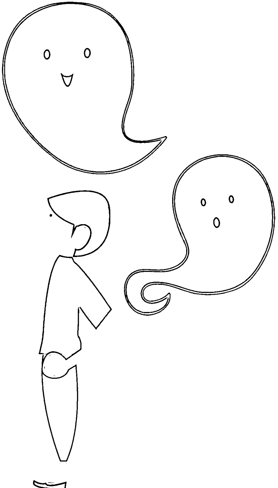

一年有四季變化，春夏秋冬轉換的時候，溫度、濕度會隨之改變，環境的狀態改變了，影響了我們對於周遭的感受，所以有些較敏感的人可能會在此時感冒、打噴嚏或是流鼻水，都是由於溫度、濕度劇烈轉變導致身體產生反應。其實環境的影響不止如此，也會影響到我們對於氣場的感受能力，有些人會因為環境的劇烈變化進而影響到自己個人的能量場，有時能量場會變得比較薄弱。所以季節轉換時，人比較容易受外界干擾。由此得知，人與環境是息息相關的，環境變化不只會影響到我們的肉身，也會影響到我們的能量場。當我在判斷一個人是否卡陰時，我總會先排除外在因素之後，再來斷定。

每當有個案前來時，我必定會仔細詢問他的身心狀態，並觀察個案的狀況，例如：當事人的表情如何？說話的邏輯順不順暢？述說的事情是否前後連貫？凡此種種來做為此人是否卡陰的判斷。與個案晤談的過程中，發現蛛絲馬跡是非常重要的關鍵，有時候個案可能只是受到外界環境的影響，才會有身體不適的反應出現；有時可能是個案的自我想像，因為生活上無法排解的壓力所產生的身心狀態，不細究生活與心理的原因，卻想藉此突顯自己的與眾不同而推給無形的力量；有時個案在自己也沒發現的敘述裡，很可能就隱藏了卡陰的原因與脈絡。凡此種種都是不可輕忽的線索，所以「觀察與聆聽」是我在研判個案是否卡陰的重要程序，這需要多年的經驗累積與小心的求證，切記不要鐵口直斷，這也是我從事能量師工作以來一直戒慎小心的分寸。一般宮廟傾向於「鐵口直斷」，或許非常有戲劇張力，也突顯了某種權威，卻對解決事情沒有太多幫助，有時還會徒增個案的負擔與恐懼。

那到底怎麼樣的情況才是卡陰呢？我分享我所遇到的案例並提供一些判斷法則，倘若你或身邊的親友正好遇到類似的情況，就可以對照參考。卡陰並不可怕，只要找到正派的能量師或宮廟道士協助，多半可以恢復正常生活。最忌人云亦云、誤信偏方，不僅沒幫助，還可能惡化或遭人利用，後果可是得不償失。

## 為什麼老是腰痠背痛？

明哲是在科學園區上班的工程師，因為密集使用電腦、滑鼠，加上繁重的工作量，才三十初頭的他，老是肩頸僵硬、腰痠背痛，有時甚至還會畏寒，找了中西醫、推拿師治療，依然未見好轉。這樣的情況經過一年多，經過朋友介紹，輾轉來到我的工作室。

理工背景出身的明哲，一開始抱著半信半疑、姑且一試的心情，畢竟要他相信無法以科學證實的另類療法，他實在難以說服自己，可是身體的狀況已經影響到他的工作與生活，只好死馬當活馬醫，硬著頭皮來找我。我詢問了他的情況之後，並檢視了他的能量場，認為應該是有阿飄入侵了他的肩頸，透過敲擊頌缽共振與儀式，把跟在他身邊的阿飄送走了。

這些儀式一結束後，明哲的肩頸立刻如釋重負，也不再痠痛，更不會莫名其妙的突然一陣畏寒了。他很好奇的問我，這實在太神奇了！你到底做了什麼？還有你說有阿飄，這阿飄到底是打哪來的？我跟他應該無冤無仇，怎麼會找上我？看明哲一臉好奇與連珠炮的問題，我就把淨化過程中與阿飄的對話如實的告訴他。

原來這個阿飄家族世代居住在那塊土地上，後來當地發展成科學園區，它的子孫也紛紛遷到別的地方，只剩下它的魂魄一直留守在那裡。我問它為什麼不離開？它說它曾經想要離開，可是不知道為什麼它的周圍都是一堵又一堵的牆，它想離開卻怎麼都走不出去，一直被困在那裡。後來遇到明哲，正好有機可趁，才會卡在明哲身上。明哲聽了更覺得奇怪，這個阿飄既然都可以進入我的身體了，牆怎麼擋得住它呢？電影裡的阿飄不是都可以穿牆而過？來無影去無蹤，行動自如？是我的身體比較軟？阿飄吃軟不吃硬嗎？我聽了微微一笑，把阿飄何以被強力電波困住的狀態簡單說明給明哲聽。

以我們現在的科學來看，物質的最小單位是原子，而圍繞原子的四周有一種更小的單位叫做電子。當物體靜止時，是沒有電子流動的；只有當物體移動時，電子才會存在。簡單來說，電子是一種能量流動的波紋，是一種只有移動時才偵測得到的能量振動波。而阿飄就是這樣一種能量狀態，它不是以物質狀態存在於三維世界，而是以一種類似電子的振動能量存在於人類生存的物質世界中，因此我們的五官覺受是看不到、摸不到阿飄的。

因為科學園區裡的工廠與辦公大樓多半需要用到大量的電，當廠房機器運作時，會產生極大的電流，這一波波的高伏特電壓，對阿飄這樣一種能量狀態，儼然就是它的世界裡一道又一道厚實的牆，阿飄根本無法穿牆而過，所以這個阿飄才會被困在那裡不得動彈。後來正好遇到當時身體較差的明哲，他的能量狀態相對於電流牆是十萬八千里，讓阿飄得以輕易突破他的能量場，才會讓明哲一年到頭腰痠背痛。這個阿飄並不想困在牆裡，只是因緣巧合遇上明哲，跟當事人完全沒有任何瓜葛宿怨。經過溝通，這個阿飄也願意離開，我就順勢將它送走了。

結束淨化療程之後，明哲再也沒有嚴重腰痠背痛的症頭，即便有時肩頸僵硬，只要適度休息並定期運動，活絡筋骨很快就恢復健康，看來徘徊在科學園區的阿飄已經不再來做亂，明哲可以好好打拚他的事業了。

## 能量診療室

為什麼卡到阿飄時，我們常會肩頸僵硬、腰痠背痛？通常阿飄入侵的點，多半是人體中的關節點，諸如：腳踝、膝蓋、尾椎、腰椎、髖關節、胸椎、頸椎、肩胛骨、頭頂。卡陰的人有百分之九十五以上是從腰椎以上的關節點入侵，因為這些區域的神經系統分布較密，容易傳導；腰椎以下的部分，比如膝關節、腳踝，這些區域神經元分布較少，電子難以抓附；不過一旦是從這些地方入侵成功，狀況將較嚴重，淨化過程也會比較棘手、難處理。

前面提到，由於阿飄是一種能量狀態，當它來到人類的周圍，這個外來的電子企圖進入一個人的內循環系統，因為兩個能量系統是不同的，人類的內循環系統會產生抵抗力，彼此抗衡的結果進而讓入侵點的肌肉痠痛，加上最常侵入的地方是肩膀、腰部，所以大部分卡陰的人會有腰痠背痛的情況發生。

有人問到，被卡陰時，入侵點會有什麼樣的感覺？提供一個判別的方式讓大家參考：倘若是被阿飄入侵了，那個卡住的地方一開始會有刺刺的、冰冰的感受，也就是刺、麻，外加冰冷。「冷」是非常重要的判斷標準，因為阿飄是沒有體溫的，人類卻是溫血動物，具有溫熱的體感，冷熱一相遇，我們的身體馬上就能感受出溫度的落差。

當有腰痠背痛、發冷、畏寒的症狀發生時，第一要務還是得先找醫生診療，研判是否為生理上的疾病感染，當所有生理上的因素都找不出病因，或是反覆治療之後依然未見起色，再來思考是否有其他原因，而不是看到黑影就亂開槍，什麼都斷定是卡陰、是阿飄，反而延誤寶貴的醫療時機。為什麼祛除阿飄時，我是利用銅鉢與木棒呢？因為當兩者互擊會產生聲波，透過聲波產生動能，藉此能量將卡在人體的阿飄振出，再以儀式導引阿飄到光裡，讓它回到它本該歸屬的世界。

## 為什麼會越睡越累？

政賢是某家醫院的外科醫生，三十多歲的他正值事業黃金期，門診與開刀的病人絡繹不絕。但這兩年來，每次睡夢中總是夢話不斷，他的枕邊人淑雯每每都被他充滿驚嚇的語調驚醒，可是仔細一聽又聽不懂他到底在說什麼，只能從他緊張的聲調猜測政賢好像在夢裡被攻擊、被追殺了。睡醒後的他，也像完全沒休息夠似的，好像還越睡越累，而且肩頸十分僵硬，有時還會微微抽痛。自己就是醫師的政賢，推測自己是因為開刀房的繁重工作所致。雙手可是外科醫生的性命，不敢大意的他趕緊安排到神經科做了中樞神經相關的檢查，卻依然查不出所以然來。這樣的情況前前後後拖了兩年，有幾次還差點影響到開刀時的流程，嚇出一身冷汗的政賢最後拗不過老婆的哀求，才心不甘情不願的跟著老婆淑雯一起來到我的工作室。

聽了他們的描述，我開始檢查政賢的能量場，馬上看到一個男性的臉孔從政賢的後腦勺邊邊竄出來，還對我張牙舞爪的，我心底大概有個底。檢查完，我問他是否肩頸不舒服？還老覺得背脊發冷？他點點頭，很驚訝我只是在他身上掃了幾圈，根本沒有用什麼儀器、也沒碰觸他，居然也可以隔空間問診！我心底清楚政賢對這些看不見、摸不著的世界的質疑，也明白短時間之內要說服他接受這些看似莫須有的事情是強人所難的，但目前最緊要的是讓政賢趕緊恢復沒有阿飄纏身的生活！

我問他在這些症狀發作之前，有沒有遇到什麼比較不尋常的人事物？他想了一會兒，才說有件事非常奇怪。某次門診時有個女病人，她的病症並不是特別棘手，只要開刀之後就能恢復健康。可是那次診療時，那位女士的雙眼老盯著政賢瞧。那是一種有點空洞、彷彿在看人又好像不是的眼光。當時政賢心底就有點犯嘀咕，覺得這樣盯著別人瞧不知有啥企圖？但想想多半病人因為身體微恙，難免有些奇特反應與失神舉動，也就沒有再多想。應該是替那位女病患開完刀後沒多久，政賢就開始做惡夢、肩頸也開始卡住、僵硬、不舒服。可是當時一起進開刀房的護理人員也沒發生什麼事。政賢覺得可能純粹是個人的身體狀況，如果要將兩者連結在一起好像太過牽強了。

我把我看到的異象告訴這對夫妻，從他們倒抽一口氣與驚訝的眼神猜得出來，這樣的事情對他們來說實在太難以理解與接受。接著我詢問這位男阿飄，為什麼要卡在政賢身上？它說它只想出一口氣！因為政賢的手術把它原先的「宿主」治療好了，害它沒地方去了！原來它就是一直依附在這位女病患的患病部位上，現在政賢把病人生病的地方切除，它就失去了依附的環境。所以一來它得再尋找下一個棲身的地方，二來它也想給這個醫生一點教訓，好報奪巢之恨。正好那陣子政賢身體比較虛弱，阿飄就加緊火力強力入侵，才讓政賢惡夢連連而且不管怎麼睡、怎麼休息，都只是越來越疲倦。

真是小心眼的阿飄啊！不過阿飄的思路原本就是人性糾葛的綜合體，阿飄若是大器與識大體，早就離開這個世界，轉世投胎了，還會在這裡瞎攪和嗎？聽完阿飄的說詞之後，我幾番威脅利誘，它總算答應離開政賢，反正捉弄醫生的時日也夠了，是該回到自己該去的地方。我快速做了淨化清理並把阿飄送走，當下政賢覺得身體有如釋重負的輕鬆感，只是僵化了兩年多的筋骨還需要物理治療，所以決定回去後立刻到復健科報到，整治自己硬邦邦的身體。

後續聽聞淑雯描述，政賢搭配復健，半年後身體狀況恢復得非常良好，肩頸不再痠痛、發冷，半夜惡夢連連、夢話連篇、夢裡被驚恐追殺的症狀也都不再出現了，更可以一夜好眠到天明。開刀技術也恢復往昔的俐落，醫界對他的評語又再度攀升，也成為病人間口語相傳的熱門名醫。但對於半年前在工作室所經歷的一切，他依舊認為自己只是尚未找到合適的正規醫療方式，什麼阿飄挾怨報復、病人的阿飄跳槽到開刀醫生身上的怪誕說法，根本無法以科學佐證，他認為全都是無稽之談。政賢認為自己恢復健康，都是西方醫學的功勞。

## ◇◇能量診療室◇◇

當一個人被阿飄入侵時，除了從肩頸、腰部下手，也會走經絡系統。經絡會連通我們體內的臟器，如心、肺、胃、腸，所以會讓我們產生某些特殊的生理與心理跡象。當阿飄入侵心臟時，我們會覺得情緒低落、萎靡不振，心有種被爪子抓住的感覺。由於心臟主管血液的運送，是人類的幫浦與元氣的來源，如果心臟被掌控了，整個人都會有氣無力。如果阿飄從胃腸入侵，就會產生腸躁症、消化不良的狀況，久而久之因為胃腸吸收不到養分，這個人就會精神耗弱。倘若卡陰的狀況久久都不處理，被卡陰的人甚至會從皮膚表層散發出一種氣息，是周圍的人都不想靠近的，有些則是口中會吐出旁人都厭惡的氣味，讓所有人都敬而遠之。

所以如果不處理卡陰的狀況，身體的器官會逐漸敗壞，精氣神也會越來越差，連帶影響到社交關係，整個人越來越封閉。但阿飄並不會讓宿主死亡，因為它需要依附的關係，宿主死亡了，它也沒戲唱了。把一個人弄得半人不鬼、要生不死的狀態，就是卡陰的極致了。同樣的道理，我們可以觀察在廟中幫忙辦事的乩童，他們為了要維持與另一個世界的溝通，所以乩身得維持某種程度的身心狀態才能與別的世界連上線，也就是說乩童的身心與能量狀態不能太好、太飽滿，有空隙才可能被上身。幫神明辦事的這些人，其實也都處在一個比較虛弱的能量狀態下，以利降駕。

## 為什麼要遠離阿飄？

Cindy 從小到大幾乎沒什麼朋友，同學不喜歡她，甚至還會排擠她、欺負她，進入職場工作，與同事間更無私交，連跟家人手足的關係也很淡薄。她來到工作室，一開口就問我，看得她到身旁的阿飄嗎？我點點頭，開始與她聊起阿飄的話題，慢慢轉入她沒說出口的內在部分。

話匣子慢慢打開後，Cindy 才緩緩道來，她說她從小就不快樂，身邊一直沒有可以談心事的朋友，家人也疏遠她，她一直活得很孤獨。小時候，她就看得到這些跟在她身邊的阿飄，當時她非常害怕，把看得到阿飄的事情告訴父母，大人們只覺得這個小孩童言童語，老是說些奇怪的話、做些奇怪的事，神神兮兮、奇特又不討喜，久而久之也不把她的話當一回事，加上後來弟弟妹妹陸續出生，爸媽忙著照顧小的，就更忽略對 Cindy 的照顧與關心。被大人硬生生拒絕與否定的 Cindy，就更不敢把看得到鬼的事告訴其他人，只好默默忍受這些旁人看不到的阿飄在自己身旁晃來晃去了。

直到十六歲的某一天，Cindy 居然可以聽見一個男阿飄跟她講話，說要跟她做朋友，也可以幫她完成心願，讓其他人也跟她成為好朋友，還可以告訴她其他人心底最深處的秘密與想法，讓她更能掌握別人的心。Cindy 聽到後非常開心，下一秒鐘又開始猶豫，因為大人們都說阿飄是妖魔鬼怪、是壞東西，怎麼可能這麼善良？要幫助我？而且還想跟我做朋友？Cindy 掙扎了很久，她懷疑這個阿飄不安好心，可是她又真的寂寞太久，世上都沒有人真正關心她、愛護她，她真的好想有個伴可以說說心底話，現在好不容易有個鬼願意跟我交朋友，就會有一個貨真價實的麻吉可以聽我吐苦水，我是在怕什麼？而且它看起來好真心、好誠懇，而且它說只要燒紙錢、買些祭品給它打打牙祭，它就滿足了，看起來並不像其他人說的那麼壞，我怎麼還要疑神疑鬼「鬼」呢？萬一我錯過這次機會，什麼時候還會有下一次？

耐不住內心的寂寞，Cindy 答應了阿飄的請求，就有了一個真正的阿飄朋友。接著又來了另一個阿飄也想要跟她做朋友，然後又有一個，之後又多一個，沒多久的時間滿坑滿谷的阿飄們都來了，Cindy 儼然變成阿飄界炙手可熱的「鬼」氣王！她實在太開心了！原來交朋友不難嘛。她常常跟這些「好朋友們」一起去看電影，可是不知道為什麼她總是在電影開演沒多久就沉沉睡去，她常常不記得到底自己看了什麼，可是她的「好朋友們」卻是看得樂不可支、超級入戲，還熱烈的反覆討論剛剛電影上演的劇情。Cindy 心想，原來獨樂樂不如眾樂樂的真諦就是這樣啊！她真高興她交了一群志同道合、不嫌棄她的古怪個性的「好朋友們」。

這樣的狀況就持續了好幾年，Cindy 來找我時已經四十幾歲了，長期與阿飄攪和的結果是她的精神狀況越來越差。我第一眼看到她時，她的臉色發黑、能量耗弱，注意力總是無法集中，阿飄朋友們不但沒有幫她在真實生活裡打開社交生活的窄門，更嚴重影響到她在職場上的工作表現。精神渙散的她，已經被主管訓斥了很多次，再這樣下去，被炒魷魚應該只是早晚的事。萬一丟了工作，到時怎麼養活自己呢？總不可能叫阿飄朋友們養她吧？Cindy 自己也察覺到這一點，所以才會來找我。

我跟她詳談之後，了解她在人際關係上出了很大的問題。社交生活的疏離與障礙可能導因於童年成長的困境，一個朋友都沒有的結果更逼使她選擇與阿飄作伴，最後不僅影響到身體健康與精神狀態，更讓她在現實社會中的人際關係越來越閉塞，她的生活圈幾乎只剩這些虛幻的朋友們了。所以，當下首要之務是立刻幫她全身大淨化，清理能量場，然後要她看清現實利害，對自己立下承諾：立即跟阿飄們劃清界線。人際關係的課題得尋找專業心理諮商，協助 Cindy 面對孩提時的陰影並展開自我重建與療癒。接下來，我更希望她可以開始好好照顧身體，均衡與健康的飲食、規律運動並且正常作息，慢慢鍛鍊強健的體魄，有健康的身體才有飽滿的精力能夠照護自己的能量場。希望她可以透過身、心、靈三者並進的淨化與修護方法，慢慢重建自己健康平衡的人生。

個案結束時，Cindy 也感受到自己想要改變人生，以及做為能量師的我對她的祝福與關心，所以很果斷的承諾她一定會與阿飄劃清界限，不再被它們誘惑。

過了一陣子，Cindy 再度來到工作室，我發現她的狀況似乎比上次更糟了。她吞吞吐吐的問我，有沒有可能想出一種兩全其美的方法，既可以讓她身心變健康，不要害她被老闆炒魷魚，又可以把阿飄們留在自己身邊，繼續當好朋友呢？因為她實在捨不得離開這些阿飄朋友，都這麼多年了，她真的放不下。阿飄們也是，不斷的在我旁邊哭哭啼啼的哀求。

我嘆了口氣，花了很多力氣跟她說明不可能有兩全其美的方法，人若是硬要與鬼為伍，長久下來只會精力越來越弱，精神越來越差，就跟她之前的狀況一樣。但是，Cindy 似乎滿心猶豫，不停的與我爭辯著阿飄們不會害她，自己也會更加小心，認為自己一定可以找到兼顧兩者的平衡點。雖然我百般勸說，苦口婆心的釐清阿飄灌輸給她的弔詭言論，但她的心卻總是向著身旁的一群阿飄。阿飄們也不斷的對我叫囂、挑釁，要我滾遠點，別多管閒事破壞它們。經過這次淨化後，雖然阿飄暫時遠離，可是倘若Cindy的意志還是左右搖擺，還是很有可能被那群老朋友們纏上繼續往來，即便我一再淨化、祛除阿飄，也只能暫時治標，無法杜絕阿飄再來纏身。我不禁嘆了口氣，也只能在心底默默祝福Cindy，希望她能自己戰勝心魔。之後我再也沒聽過Cindy的消息，不知她現在是否一切安好？

## 能量療癒室

阿飄非常喜歡去電影院看電影，一來因為漆黑的環境，二來因為電影上演的跌宕起伏劇情，可以讓它們再度咀嚼現實人生的愛恨情仇、喜怒哀樂，充分滿足它們留在三維世界裡的人性渴望。被阿飄入侵的當事人進入電影院後，會馬上昏迷沉睡，事後完全不記得看過的電影內容。這其實是因為阿飄已經借了當事人的肉體在電影院裡看電影，讓當事人沒了意識，才會壓根不記得任何電影的情節。如果你自己或身邊的朋友常在電影院中昏迷睡去，排除太累的因素，而且壓根不知道自己為什麼昏睡的情況，就要特別留意是不是被阿飄給纏上了。

上述 Cindy 的例子，被阿飄給纏上是問題的表象，最根本的原因還是來自於從小到大的障礙與心結。這些情緒與心理上的困境如果沒有盡早解決，就會漸漸惡化成不可收拾的局面。即便我幫她淨化能量場，祛除阿飄，要求她鍛鍊身體增強對阿飄入侵的抵抗力，並希望她接受專業的心理輔導以面對生命中的陰影，可是最終能讓一切改變發生的人，還是在 Cindy 身上。如果當事人沒有意願改善現況，即便神佛在前，也束手無策。我做了無數個案，發現阿飄與能量上的處理並不是最棘手的，往往最困難、最能左右療癒結果的關鍵都卡在當事人的意願。「鬼怪好應付，難的是人心。」倘若當事人的觀念與想法依舊想走回頭路，不願意改變，縱使我是神仙，也無能為力。

## 如何判斷自己是否卡到陰？

下面的卡陰評量表，請針對每一題的敘述，選擇與自己實際情況相符的分數計分。十題答完後，將每一題的分數加總起來，就可以知道自己是否卡到阿飄了。常常：5 分。偶爾：3 分。沒有：1 分。

| 題號 | 問題狀況 | 發生頻率 |
|---|---|---|
| 1 | 夜晚總是不容易入眠。 | |
| 2 | 半夜會在固定時刻醒過來。 | |
| 3 | 沒有原因的感到心情不佳、變得容易沮喪。 | |
| 4 | 身體某個部位持續不舒服好一陣子，看遍中醫、西醫卻總是查不出原因來。 | |
| 5 | 視力良好，或是已經戴眼鏡矯正視力了，但最近卻老覺得眼前彷彿有一層紗、或是薄霧罩住一般看不清楚。 | |
| 6 | 聽力正常，或是已經戴上助聽器矯正聽力了，但最近卻覺得聽不清楚，彷彿有什麼塞在耳朵裡，聲音聽起來嗡嗡糊糊的。 | |
| 7 | 每天固定時間，身體某個部位會特別痠痛或是發冷。（可能是下午四點、晚上十一點或是凌晨一點，或是一天中任何固定時間發作。） | |
| 8 | 做夢時常常夢見同一種內容的夢，或是常常夢見被追殺。 | |
| 9 | 經常出入某一個特定場所時，只要一進入就會頭暈目眩（例如：辦公室、醫院、夜店等等）。 | |
| 10 | 不是夜貓子，最近卻越晚越有精神。 | |

總計：

將上述每一項的計分加總起來，得到的分數參考以下分類，就可以知道最近自己是否被阿飄纏身？或是已經瀕臨被卡陰的臨界點？

### ◎ 10 ～ 15 分：輕微型

你是健康寶寶，只是偶爾比較疲累，才會被阿飄騷擾，但元氣滿滿的你，只要多運動、營養充足、作息正常，馬上又恢復活力滿點。阿飄想要靠近你這顆大太陽，無異自尋死路！所以你只要保持健康的身心與正常的作息，正能量豐沛的你，可是百毒不侵喔！

### ◎ 16 ～ 20 分：中度型

你是不是容易鑽牛角尖，對很多事情都有莫名的堅持與原則？你是不是最近壓力太大，讓你快喘不過氣來？你是不是正經歷人生的大轉變，導致很多事情都不如預期、失去控制，你也快要失去人生的動力與方向？這時候的你，因為身心靈都經歷比較劇烈的變動，若是意志比較薄弱，就很可能跟阿飄一起共振。建議你養成冥想、靜坐與自我清理淨化的習慣，多多透過這些方式穩定自己的身心靈，自然就可以穩定自己的能量場，阿飄就不會趁虛而入。（冥想、自我淨化或是寶石清理的相關方法，請參考本書第五章至第七章。）

### ◎ 21 ～ 50 分：重度型

你是不是常常精神渙散？或是想不起剛剛自己在做什麼？而且常常聽到有人跟你說話，但其他人根本沒聽到？小心！阿飄就在你身邊！它可能已經登堂入室，也可能現在正在嘲笑你的愚蠢，甚至還會呼朋引伴讓你被更多阿飄耍得團團轉！請趕快尋找專業協助吧！不然後果可是會越來越嚴重喔！倘若你是幫朋友測試，也請盡快帶他去找信任的專業人士協助處理，以免阿飄越來越囂張。

## ◇◇ 能量診療室 ◇◇

Q：有些人上教堂時，會覺得特別寒冷，可是教堂不是上帝所在的神聖場域？為什麼會有這樣的冰冷感呢？

A：其實教堂裡依然有不少阿飄，但與其稱它們為阿飄，倒不如稱呼它們為「慕道者」。它們多半生前是信仰極度虔誠的人士，也有的是頗有想法與智慧的智者或神職人員。它們在死後依然流連在教堂裡，繼續它們生前事奉上帝的願望。它們多半無害也不會離開到他處，教堂是這些慕道者的依歸之地，是它們內心寄託的天堂。

Q：古代人卡陰的人比較多，還是現代人卡陰的例子較多？

A：現代因為電燈的發明，原本人類應該日出而做、日落而息，可是現代社會即便太陽下山了，多采多姿的夜生活才開始佔據了許多人的時間。夜晚正是阿飄到處活動的時候，我們的作息與阿飄出沒時間大量重疊，自然比較容易與阿飄擦撞。加上現代人作息不正常，出入場所複雜，所以大大提高了卡陰的機會。

Q：一般我們常說的卡陰，是遇到阿飄。我們有可能會遇到惡魔還是撒旦嗎？

A：一般來說我們可以把能量分為兩種類型：一種是光明，一種是黑暗。

不論光明或是黑暗類型，第一級影響的是全體人類活動型態，可能是一種觀念，也可能是一種群體意識和價值觀。第二級主要是區域性，影響大如一座城市，小如一塊社區。第三級主要是以個人為主。

> ☆光明類型依層級，可分為：

- 第一級：神。
- 第二級：天使。
- 第三級：指導靈。

> ☆黑暗類型依層級，可分為：

- 第一級：魔。
- 第二級：邪。
- 第三級：鬼、阿飄。

通常層級越高者，不管是光明或黑暗，一般人相遇到的機會就越少。所以一般人遇到的卡陰狀況多半是卡到阿飄。魔層級的黑暗力量是不太與人類打交道的，最主要是我們人類的頻率與魔層級實在相差懸殊。人類這盤小菜也著實引不起魔層級的興趣。

在我學習能量經驗裡，並不是很喜歡直接引用光明和黑暗，因為這名詞有某種批判和暗示，其實就科學領域，甚至是哲學中的老莊思想就明白指出，一切都是相對的，沒有高就無法呈現出什麼是低，沒有左就無法呈現出什麼是右，有光明面當然就會有黑暗面，彼此相互存在和呼應，所以彼此缺一不可，這才是宏觀的能量態度。

## 卡陰和附身有什麼差別？

前面提到 Cindy 的例子，她其實不是卡陰，而是比卡陰狀況要更嚴重，Cindy 是被阿飄附身了。這兩者有什麼不同呢？我們從她的例子可以找到一個很重要的區別，就是 Cindy 看得到阿飄、聽得到阿飄，可以跟阿飄溝通，而且阿飄也呼應她內在的渴望——想要朋友，所以可以成功誘惑 Cindy 與它們達成協議。由於這個協議，Cindy 被阿飄欺瞞，附了身。但當事人並不知道自己被附身，只是常常在看電影時昏睡，醒來也完全不記得剛剛到底發生什麼事。

附身最重要的前提是，當事人可以與阿飄溝通，並且因此訂下協議，阿飄會幫當事人完成心願，但付出的代價就是你的身體要借我用。可是當事人往往不知道後面有這則但書，以為是天上掉下來的禮物，只要燒紙錢回饋一下就可達成心願，卻不知早已引狼入室。

為什麼會被附身呢？會被附身的當事人多半在現實生活中遭遇挫折，或是對現狀不滿意，內心產生一些強烈的渴望與需求，例如想要人際關係變好、想要談戀愛、想要增加異性緣、想要賺大錢一夜致富……等種種欲望，當這些種子在內心萌芽，加上當事人可以聽得到、或看得到阿飄，可以與阿飄直接溝通互動，阿飄聞到欲望的氣味，就會打蛇隨棍上，以花言巧語說服當事人，譬如：只要燒紙錢給我、只要買零食祭拜我，或是像 Cindy 的例子要跟她做好朋友、幫 Cindy 拓展現實生活中的人際網絡，勾引當事人內心最深處的願望，但絕對不會擺明其實是要借用你的身體，讓當事人動搖，以為遇到天使下凡來協助，因此著了阿飄的道，順著它的說詞與建議，點頭讓阿飄幫忙達成心願。殊不知這一點頭，這一聲願意，就是簽下最危險的賣身契，把自己無條件交給阿飄隨便用。

卡陰與附身最大的不同在於，卡陰是強制性的，阿飄不顧當事人的意願，自動依附並強力進入。因為是強制性的，當事人並無意願，只是倒楣遇上。附身則是非強迫性的，當事人可以跟阿飄直接溝通，被誘騙只要一點點付出完成阿飄的要求，就可以讓自己美夢成真。在半拐半騙的狀況下，當事人就被阿飄鯨吞蠶食的附身入侵，任意使用了。所以兩者最大的不同在於，被附身是在有意願的情況下被奪走身體的使用權。

台灣還有另一種狀況，當事人雖然看不到、聽不到阿飄，卻可以透過某種儀式與阿飄直接溝通，然後要阿飄幫助自己達成心願。最為人所知的例子就是養小鬼。

一般人多半不知道如何養小鬼，所以有些心術不正的術士或宮廟就提供這樣的「服務」，將嬰靈透過某種法術養在人形娃娃中，並且以當事人的鮮血餵養之，漸漸的將此物越養越有力量，然後驅使小鬼去完成當事人想要達成的各種願望。只是事成之後，如果你不想繼續餵養小鬼，或是想要中途罷手不做，就會遭到小鬼淒厲的作亂。

卡陰與附身的處理方式大同小異，將阿飄送走不難，難的是當事人根深柢固的想法。江山易改、本性難移，人性的執著與頑固其實是將自己身陷困局的主要原因。就如同前例的 Cindy，她雖然知道阿飄已經嚴重影響到自己的日常生活，可是與其他人一直沒有情感互動與關心的她，從阿飄身上得到了她認定的朋友關係，阿飄也因為附身在她身上享受到生前的種種人生滋味，其實兩者是互相依賴共生的。只有下定決心想要改變的一方，可以掙脫這個困局。當然說「不」的一定不是阿飄，所以選擇權就落在 Cindy 身上。只是最後 Cindy 似乎還是選擇與自己的欲望妥協，守著四十多年來的舊模式，繼續度過她認為幸福的人生。

處理附身個案時，除了淨化過程比較棘手，因為當事人是主動且願意與阿飄為伍，阿飄吸附的能量多半比卡陰要多且強烈，因此要拔除需要比較大的能量。還有當初雙方曾經做過協議，在淨化之前一定要先找出雙方達成協議的願望到底是什麼，才能從根本下手。

當時 Cindy 來到工作室時，發黑的面容以及她一開口就問我看得到阿飄嗎？我就知道她不是被卡陰而是被附身，加上被附身的時間久遠，所以她在諮詢的一開始時總說自己一直不開心，我就直覺的去追溯這是不是與她的成長背景有關，詢問之後發現人際關係果然是她的罩門，她被阿飄誘惑的部分也導因於此。除了幫她淨化，就是要幫助她解開人際關係的心結。這方面我不是專家，只能鼓勵她去找專業的心理諮商協助，才能真正改變她對人生的觀點。只有心念轉變才可能徹底斷除被阿飄再度誘騙的局面，輔以鍛鍊堅強的體魄，讓自己身心都健康起來，阿飄自然不再纏身。

## 能量診療室

從被附身者當初與阿飄訂下的協議，我們可以從這些願望，統整出阿飄的特質。
如果當初許下的願望與錢財有關，吸引過來的阿飄多半比較凶狠，而且充滿暴戾之氣。若是渴求的是姻緣、愛情，就會吸引來色鬼，充滿著暗紅色的能量，情慾色彩也會比較濃厚。而且這些阿飄的做法，通常會去誘惑當事人所鐘意的對象，左右他們的想法，讓他們覺得當事人特別美、特別帥、特別有吸引力，根本就是自己心中獨一無二的金城武與林志玲，讓他們愛上當事人，對當事人言聽計從，好達成當事人的心願。倘若被附身者渴望的是人際關係與社交生活，吸引來的阿飄就會綜合以上兩者的能量，具備勾引人的魅惑力且沾染凶惡與暴戾之氣。

## 被下符咒怎麼辦？

我們常可以在電影中看到，只要一張符往殭屍頭上一貼，就可以定住殭屍；或是道士起壇作法，拿起硃砂筆隨手一畫，這張鬼畫符就可以降妖伏魔；還有到廟裡收驚，乩童會給你符咒帶回家，燒化之後溶在水裡喝下治病收驚。符咒真的有這麼神奇嗎？如果有人心存不良，我們是不是就有可能被下符咒掌控了？

大華是個三十六歲的專案業務，公司裡許多案子都要與其他廠商競標而來，所以商場的爾虞我詐總是免不了，虛虛實實的應對進退是家常便飯，每個人都想爭取自身的最大利益。無奸不成商，要做生意創造高利潤，是每個業務信奉的教條。只是除了公關人脈與檯面下的小動作，大華總覺得公司要穩健經營還是得靠真本事，沒有專業本事支撐，即便某次得標了也只是短暫勝利，這樣終究不是長遠之計。這樣的信念與堅持也頗獲業界好評與高層支持，所以只要亮出大華的名片，幾乎就是品質的保證。沒想到人紅遭忌，兩個禮拜前的標案會議之後，大華就突然像洩了氣的皮球，無故的身體不適、腰痠背痛、甚至還上吐下瀉。看了醫生，只說天氣忽冷忽熱，應該是感冒了。

但吃了一陣子藥水，也請了幾次特休在家養病，卻依然有暈眩、發冷、畏寒的症狀，大華越想越不對，經友人介紹，來到了我的工作室。我詢問了他的症狀，並偵測了他的能量場，驚訝的發現有根無形的黃色小針就插在他的右肩膀上，而且還溫溫熱熱的。根據這幾年來的經驗，我知道這根針是有心人士下的符咒，以此定位在大華身上，讓施咒者可以利用這個符咒驅使阿飄來入侵大華，才會讓他最近身體抱恙，不得安寧。

我問他在這些症狀發生前，最近有去過哪些地方？遇過什麼人？在追蹤的過程中，我推斷即可能是前兩週的標案會議中被人下了咒。大華回憶起那天的流程，總共參與標案的廠商一共有四家，因為牽涉的金額頗大，所以每一家都卯足全力希望獎落在自家頭上。那天競標的過程中大華幾乎沒有離開過現場，中途只喝了會場提供的茶水，會議結束後也沒有跟任何人有肢體碰觸，就開車回公司了。他實在想不透到底是哪個空檔出了岔？百思不得其解的大華想了想又想，突然想起會議中途來了通電話，他只有在那個時候離開會議室接聽手機……該不會是那個時候被人在茶水裡動了手腳吧？

我研判應該就是大華離開位置接手機時，被人在水裡加了符咒燒化的粉末，他喝了才會狀況百出。大華說下禮拜要進行最終的定案，如果真的有人要對他不利，該怎麼辦才好？畢竟明槍易躲、暗箭難防。我要他稍安勿躁，先幫他把身上的小針頭拔除，並淨化他的能量場，讓他不再受阿飄騷擾，接著要他留心下一次的標案會議，千萬不要吃會場提供的食物、喝那邊的水，最好自己帶水壺，還有不要輕易離開自己的座位，以免有心人伺機再度在你的水或食物動手腳。如果不得已離開位置，回來之後那些東西就別再碰。此外，別讓對方有機會碰觸你的身體，以免他透過肢體接觸直接把符咒下在你身上。

大華聽了點點頭，深深體會害人之心不可有，但防人之心千千萬萬不可無啊！人心難測，因為利益而走偏鋒幹下傷天害理的事，終究會有報應的。

## ◇◇能量診療室◇◇

下咒就是將燒化後的符咒粉末摻入食物或飲用水中，或是藏在某人的貼身處，或是取得此人的八字再透過特殊的儀式作法，讓這個符咒下到當事人體內，然後外顯成一根針頭插在當事人身上，這個針頭多半是黃色小針且有溫度。因為是溫熱的，所以即便其他路過的阿飄也不敢靠近，針頭的作用彷彿GPS定位導航，施咒者可以藉此追蹤並驅使阿飄入侵被下咒的人，然後左右他的想法、干擾他的身心，獲得施咒者想要的利益。

台灣道教盛行，符咒是道教系統中的法術之一，有些中小型宮廟，透過符咒的使用，讓求取符咒者在身體微恙時，可以透過追蹤符咒，派遣天兵天將去守護當事人。原本是立意良善的法術，卻被某些人誤用，成為加害他人以獲取自身利益的一種旁門左道。

為什麼宮廟的符咒會發展成損人利己的邪術呢？一來台灣地狹人稠卻宮廟林立，宮廟之間地盤常有重疊，常常發生為了搶奪香客，所以濫用符咒只為了綁住香客，鞏固自己的香源；二來宮廟為了鉅額利益，遂以符咒滿足某些人士的私心與欲望。

我聽聞，坊間下符咒價碼從一、兩萬起跳到數十萬元不等。利字當頭，就如上述大華的例子，為了爭取天文數字的標案，若是下符咒可以讓自己獨攬超額利益，數十萬元的下咒價碼看起來是CP值頗高的「投資」。利欲薰心，也難怪一些宮廟與心術不正的人都躍躍欲試了。

我遇到的被下符咒的個案，除了像大華的例子是起因於金錢利益，另一個最常見的就是感情糾紛。許多入為情、為錢鋌而走險，殊不知下咒的報應是會回到施咒者身上，但你以為是報應在施咒的宮廟術士身上嗎？其實不是，施咒者也深知作用力與反作用力的報應原理，所以他們會機巧的把這個報應做在委託施咒的人身上。你付錢、他辦事；你致富、你娶得美嬌娘、你嫁得如意郎，但一切因果報應敬請自行負責。或許你會問，這些終日下壞心眼符咒的術士們難道就沒有半點報應，讓他們逍遙法外嗎？據我所知，天理昭昭，這些人死後多半化為厲鬼，被他人驅使作惡，永世不得翻身、無法自由，或許這樣的下場就是最好的報應。

為了避免不小心著了他人的道，千萬謹記不要隨意給別人自己的八字資料，出門在外來路不明的食物、飲料不要隨意取用，如果真的有不明原因的身體狀況或心理症狀，不要隨意輕信江湖術士之言，亂喝符咒水，以免被他人下咒控制。最好的方法還是找有良好風評的巫師或能量師驅魔除咒。

除了符咒盛行，多數人還喜歡求神問卜，遇到無法決定的未來，哀事連連的過去，都認為只要求助算命仙，就可以得知自己為什麼飛來橫禍，或是透過算命幫自己的將來做決定，以為藉由這種方便法門，自己啥事也不用做就能一步登天。運氣不好就是現在走衰運，聲勢如何就是鴻運當頭，宿命決定了一切。這樣的宿命觀與速成求快的心態餵養了求神問卜之術，漸漸的許多命理術數與魔法、道術越走越偏鋒，似是而非的觀點迷惑了許多充滿欲望的心，不求努力只想走捷徑，不願對自己生命負責、探究自己人性的陷落，只推託給命運與占卜星象，種種畸形的發展都只會讓更多有心人利用與掌控。

現行氾濫的宮廟符咒之術、鐵口直斷的命相之說，都是這樣求快與推諉的心態交織而成的惡性循環。與其不斷把目光往外尋求神佛、術法相助，倒不如把重心拉回，好好修行自己的心性。當越清楚自己的心性，越能對自己的一切擔負起責任，遇到外在局勢不順遂時，就不會輕易推託給命運，怨嘆自己運不好，然後被他人牽著走，到處求神問卜，因此亂了主張，最後被有心人所利用掌控，或是魅惑於阿飄的誘惑，失去自我意識。

能量是會彼此共振的，所以失序的靈魂就容易吸引來如阿飄之流的能量體了。

一旦被阿飄纏上、卡到陰，只要內心秉持願意面對的心態，輕微的，自己便能處理淨化；嚴重的，尋找專業協助淨化祛除，就可以卸下這些外來的干擾能量。之後再專注在自己人性缺漏的修持，治標並治本，才是根本解決之道。不然就只會被坊間的宮廟牽強附會是前世業障與冤親債主，越聽越害怕，然後就傻傻花下大筆銀兩拚命消災解厄，徒生恐懼不說，有人還越消災越嚴重，白白賠了夫人又折兵。

## 下蠱又是什麼？

真的有下蠱存在世間嗎？把蟲吃下肚，蟲靠什麼存活體內？被下蠱的人還可以活命嗎？種種蠱毒傳聞該不會是邊疆苗族的稗官野史？倘若真的遇上了，該怎麼辦呢？

約莫六、七十歲的老張，這幾年因為腸子間不斷增生的瘜肉，進進出出醫院開刀房好幾次，第一次開刀後，過沒一年又復發，再度開刀割除後，休養了半年竟然又再度增生。兩年多來，開刀的時間間隔越來越密集，往往上一次開刀的傷口還沒復原，就得面臨肚子還要再開一個洞的棘手情況。瘜肉增生的狀況越來越快速，老張的復原能力卻越來越差。醫生們也苦無對策，急得老張的老婆淚如雨下，後來得知我們工作室提供的服務，遂立刻請我們到病房看一下先生的情況，看是否真有奇蹟發生。

來到病房探視老張的情況，我與YOYO都大吃一驚，但又不好將實情當面告訴老張的家人，只是委婉告訴他們確實有不乾淨的東西依附在老張身上。但是，真實的狀況是我們看到數以萬計的蟲蟲在老張的肚子裡的肚子裡的肚子裡竄動，駭人的程度讓見識過不少場面的我們也吃了一驚。

詢問了張太太，她老公是從何時開始發病？發病前有任何不對勁或異常的情況嗎？張太太想了想，只說退休前先生的身體本來好好的，兩年多前退休後不知為何身體狀況越來越差，後來才發現身體出了問題。原本以為開刀就沒事了，沒想到一開再開，醫生也檢查不出所以然來，搞得好好好的一個人突然間就……張太太一陣悲嗆再也無法多說什麼。身旁的孩子只好拍拍她的背，難過的不斷安撫媽媽的情緒。

「妳先生有去過什麼地方？見過什麼人嗎？」我們繼續追問。老張的家人想了想，只說，他就是退休的半年前去了大陸探親，之後每隔半年都會回去一次，其他時間幾乎都待在台灣。聽起來老張也是「宅男」，不愛到處亂跑，也沒什麼太複雜的生活環境，究竟是惹到什麼人，看起來似乎得跟當事人談一談，才能釐清我們的疑問。

支開其他人後，我們與老張聊了一會，他才勉為其難透露自己在大陸有了另一個女人，每半年回去大陸就是要去看她。如果不回去，心底就老覺得不舒服、不爽快。還有自己老是惦記著對方煮的一碗麵，這麵沒啥特別，就是清湯麵，可是心底老掛記著。一旦過了半年還沒吃到，心底總會總彆扭得緊，還會鬧肚子，疼起來可不是開玩笑的。可是只要一回去吃她煮的那一碗麵，湯湯水水下肚之後就特別的開心，特別的滿足。「不知是因為這一碗麵，還是因為見到她的笑容……」病榻中的老張笑得勉強，卻不掩臉上的得意春風。

我與YOYO互看了彼此一眼，心裡有了底，老張該是被對岸的小三在麵裡加了料，看樣子應該是中了蠱毒，才會肚子裡一窩蟲，而且還每半年心甘情願的回到小三那裡報到吃麵服毒。這狀況很棘手，老張的五臟六腑已經被蠱毒蟠踞侵占。要有轉機，除非有下蠱者的解藥，不然似乎只能盡量減少他的痛苦了。在淨化的過程中，我們抓了無數的蟲往火中燒化，可是不斷增生的蟲蟲大軍彷彿沒有盡頭，雖然如此還是盡力做我們能做的，淨化完畢，我們都累壞了。雖然無法把蟲祛除乾淨，至少希望老張可以過得舒服點。

過了些時日，我們接獲老張往生的消息。告別式現場，看著老張的遺照，蠱毒的致命性與歹毒又再次浮上心頭。多少人為情而亡，多少人為情也要吞噬對方。蠱毒縱然惡毒，也未及人性的執著衍生的歹念來得醜惡駭人吧。

## ◇◇能量診療室◇◇

什麼是蟲呢？相傳是將各種至毒至邪之物，例如蜘蛛、蠍子、蜈蚣、蛇等等百蟲一起放入一個密閉的罐子裡，彼此互相咬食攻擊，直到最後存活下來的那一隻就成為蟲王。這隻蟲王最為凶殘，下蟲者會將這隻蟲的身體曬乾製成粉末，再透過儀式召喚其他無形力量到粉末上面，然後把粉末給人吃下，或塗在身上，就可以控制此人。蟲毒研磨的粉末一旦吃入體內，蟲物所施加的能量就會在體內散播開來，就像無形的蟲卵透過粉末在體內播種，最後就孵化成一隻又一隻的蟲在體內活動。

由於腸胃掌管吸收，只要進入腸道的食物都會在此消化吸收，也是較脆弱好攻擊的部位，一旦有不速之客，就很難招架，所以被吃入體內的食物所沾附的蟲毒就會在此寄生，為了繁衍就會不斷攻擊掠奪腸胃的養分，使得當事人腹痛如絞，只有聽命下蟲之人的命令，再次服蟲毒，才能暫時免去腹痛之苦，如此就能完全掌控一個人。

因為網路資訊發達，有心人士會將各家門派作法融合，就蠱來說不一定会以真的蟲蛇培養，也可以取蟲蛇的卵乾燥磨成粉，配合茅山道法喚小鬼依附相鬥，培養蠱王；甚至我還有遇過以西洋之術為名號，實走茅山道法。只能說利字當頭，賠錢生意沒人做，殺頭生意大有人在，只是取財有道，這些作為實是害人不淺。

老張的例子，就是被中國的小三在湯麵裡加了蠱毒粉末，使得老張每半年就得回去中國看小三，吃她煮的那碗特製的清湯麵，不然肚子就會疼得不舒服。小三藉此控制老張，一定要回來看她。我們才會在他肚子裡發現滿坑滿谷的蟲，但為時已晚。因為如果沒有當初下蠱的解藥，到最後只能被蠱毒吞噬殆盡，這也是蠱毒相當狠毒與難以根除的原因。

符咒是運用無形之物的符，燒化後讓人服下，或是透過碰觸與呼吸，達到下咒的目的；蠱毒是透過有形之物，百蟲相鬥所產生的蠱王，曬乾後研磨的粉末並施以儀式，讓人服食以控制人心。手段歹毒程度不同，但都是為了一己私欲，為了掌控他人所產生的邪惡之術。人心隔肚皮，我們難以預測，只能多加小心提防，但某些致命的吸引力所引發的後續戲碼，卻是自身選擇。為與不為，真的只在一念之間。

## 空間能量和卡陰的關係？

Sam 出國前一年，全家搬到現在居住的地方，這個房子寬敞明亮又舒適，而且交通便利，能買到這樣的好住處，Sam 一家都相當開心。出國念書前幾年，若是遇到年節 Sam 只要得空都會回來度假並陪伴家人，每每回到家裡總是特別自在又安心，朋友都戲稱 Sam 真是衣食無虞又坐擁豪宅的富二代。幾年後，Sam 完成國外學業並決定回台發展，回國後 Sam 依然與家人同住在那個房子，說也奇怪，Sam 離開家裡也不過幾年光景，可是這次回來，他老是睡不好，而且家裡的氣氛總是很低迷，不像以前那麼想讓人窩在家了，Sam老是想往外跑。此外，前陣子Sam的哥哥騎車出了車禍，一向小心謹慎的大哥居然騎車也會恍神，現在受傷的那隻腳還套著厚厚的石膏，讓他只能暫時在家休養，也只好把工作帶回家做。

Sam大致說明了他的情況後，也附上他拍攝的住家照片，希望我幫他看看是不是家裡的風水出了什麼狀況？剛搬進去的那幾年明明住得還好好的，怎麼才沒幾年，什麼都不對了？我看了照片，發現屋子裡有股顏色暗沉的能量籠罩，難怪住起來不若以往輕鬆自在。我問Sam，你出國的那幾年家裡有沒有發生什麼事？原來Sam的雙親感情出了問題，母親發現父親外遇，兩人雖然沒有因此離婚，卻從一開始的爭吵到現在的長期冷戰，即便現在同住一個屋簷下，還是相敬如「冰」、生疏得很。即便現在Sam回來了，大哥受了傷，父母之間有稍微回溫和緩一點，可是他跟大哥都感受得到，似乎再也回不去以往和樂、有說有笑的樣子了。

和 Sam 約好擇日到他家淨化。果然一進入屋內，暗沉厚重的能量在 Sam 的家裡潛伏，氣場不是很好。尤其是 Sam 的雙親居住的主臥房，充滿尖銳與刺刺的能量場，而且還有不少阿飄存在。我把大致狀況跟 Sam 說明後，就開始空間的淨化，也給予他一些改善空間能量氛圍的淨化與擺設建議。

淨化結束之後，我坦白告訴 Sam，最重要的癥結點還是在人。如果父母之間的爭執不解決，過一陣子可能還是會故態復萌。雖然這是大人間的事，孩子很難插嘴，但若能從旁推一把，讓他們願意面對面徹底的談一談，而不是像現在彼此怨懟，卻還要裝沒事似的過下去，才是真正解決事情的辦法。家裡的氣場原本沒有問題，卻因為父母不斷在家裡製造與累積負面情緒，這些情緒都會留存在這個家裡，時日一久，家裡的氣場就變糟了，還吸引了阿飄進來。越來越沉重的能量，讓所有住在在家裡的人身心狀況都受影響。不但睡不好覺，還有家人心神不寧出了車禍。空間淨化只能治標，只要造成空間能量惡化的根本原因沒有解決，可能以後還要反覆找我來做空間淨化。

Sam 聽了若有所思，點點頭後決定和大哥各個擊破，分別找爸媽單獨出遊吃飯，探探口風，才知道接下來該怎麼做才能化開父母雙方的心結。Sam 也已經做好心理準備，即便有最糟的狀況發生，都好過現在裝沒事，可是家裡卻暗潮洶湧的樣子。改變，需要勇氣；但不改變，惡化的氛圍造成家裡氣場大壞，不僅影響了自己與家人的生活，甚至威脅到生命安全，Sam 真的不想再這樣過下去了。

## ◆◆ 能量療癒室 ◆◆

我們常常來到一個地方，會覺得這裡氣氛真好，讓人立刻放鬆下來；或者進入一個空間，猛然胸口會有種莫名的壓迫感或窒息感，一刻都不想停留，這到底是什麼原因呢？

氣氛、氛圍，就是指一個空間給人的感受。而這個空間的能量狀態，多半會受曾經待在這個空間的人所影響。如果一間辦公室裡的同事，總是明爭暗鬥，言語挑釁，充滿衝突與不合的氣氛，久而久之，這間辦公室就會吸滿這樣的能量，使人一進入這個空間就會滿心計較，處處提防。相反的，若是一間辦公室的同事相處融洽，笑聲不斷，彼此支援，同心協力，時日一久，這個空間就會充滿並吸附歡樂正向的能量；當有人一進去這個地方工作，就會自動自發展現愉快、包容與付出的特質融入這個團體與空間。

人的情緒、想法與各種喜怒哀樂，都會留存在空間裡，久了就會在空間形成能量場，而這個能量場進而會影響在這個空間活動的人，左右了他們的情緒，然後這些情緒再度又融入這個空間的能量場，人→情緒→空間→人……如此不斷循環下去。

若是負面情緒所構成的沉重能量場，會讓在這裡的人情緒更惡化，投射出更多負面的情緒，之後又再加重空間的沉重，人與空間的交互作用不斷惡性循環；反之，若是愉快正向的情緒，就會造就明亮輕盈的能量場，也會帶給在這裡活動的人更多開放與愉悅的刺激，久了就是一種良性循環。

這樣我們就可以很輕易的看出空間與卡陰的關聯性，如果一個三維空間充滿沉重的能量場，就會吸引與之共振的能量體，譬如：某個憤怒的阿飄。當這個阿飄來到這個空間，就會再度加乘這個空間的沉重能量。當有了第一個阿飄，就會有第二個，然後就像連鎖反應，物以類聚，越來越多的阿飄都被吸引進來。這裡的空間能量越來越適合各種阿飄聚集，久了就變成阿飄的安樂窩。空間能量場越沉重，就越能夠吸引阿飄。一個滿是阿飄的地方，待在其中的人不卡陰才有鬼。

因此，當你發現，待在某個地方的人總是動不動就動怒、或老是因為雞毛蒜皮的事情而爭執不休、或老有人生病、三天兩頭身體不適、運勢老是不順、或莫名的頭暈不舒服，極有可能空間能量場出了問題。此時就需要空間淨化，一併處理空間裡的負面能量與情緒，並且把逗留其間的阿飄祛除送走。清理乾淨之後，在這裡活動的人才不會再受負面情緒、沉重能量與阿飄的干擾了。

# 第四章 成為能量師

什麼是能量？我們要如何描述能量？如果從元素的觀點著手，我們可以輕易掌握能量的屬性與樣貌。元素又是什麼？說到元素，我們就必須回溯到古希臘時期的宇宙觀，也就是自然哲學觀。

西元六世紀以前的人類，是如何理解與詮釋他們所處的世界與環境？我們從當時流傳下來的自然哲學或稱「宇宙論」就可以窺知一二。這是透過觀察萬物來建立對自然世界與宇宙認知的哲學理論，影響了後世哲學家的思想脈絡，古希臘時期建立的哲學觀促成了諸如數學、元素觀、科學實證與應用的發展，而這些知識與思潮進而影響了現代社會文明的樣貌。我們耳熟能詳的希臘三大哲學思想家：蘇格拉底（Socrates）、柏拉圖（Plato）與亞里斯多德（Aristotle），都試圖從哲學的觀點詮釋他們所觀察到的自然世界與宇宙。究竟這些希臘時期的哲學家們是如何透過元素觀點來描述世界呢？

## 透過五大元素來了解能量

希臘哲學、自然哲學之父泰勒斯（Thales）認為，水遇到熱就變成氣體，遇到冷就固化成冰，這種多變與多樣性的特質，是構成世界的根本，是世界的核心，也是最重要的分子。

畢達哥拉斯學派的領袖畢達哥拉斯（Pythagoras）研究出著名的畢氏定理，他相信數字就是一切，數字是一種存在世界的和諧樂章，除此之外，他也相信靈魂永生。

畢達哥拉斯學派的學者菲洛勞斯（Philolaus）認為，水、火、氣（風）、土是不同的，並認為火是宇宙的中心，是宇宙形成的關鍵。火具有毀滅性，所有物質經過火的淬鍊會完全毀滅，或是轉化成完全不一樣的物質與型態，所以火不僅代表死亡，也象徵重生，深具創造力與重新來過的特性。

恩培多克勒（Empedocles）主張萬物由四種不同元素組成，四元素為風、火、水、土，這些元素是永恆不滅的。

這些哲學家對世界的觀察，衍生出獨特的立論觀點，進而引發西方文明一系列的發展，進而影響到現代的科技與文明發展。所以我一直認為哲學是數學之母，數學是科學之母，舉凡我們生活周遭的許多科技發明與設備，例如現在人手一機的智慧型手機、平板，我們使用的各種現代化電器、搭乘的交通工具，在在都有數學的精密計算，而數學的發想又來自於人類對於世界的觀察而生的思辨、理解與闡述，這就是希臘時期思想家們激盪出來的哲學思潮。從哲學到數學、到科學，進而影響了我們的生活，這一連串的效應，就是思想創造實相的最佳例證，思想是有能量的。

除了古希臘時期的哲學家們以元素來描述世界，我們在不同文化、宗教都曾經看到五芒星存在的證據，例如西元前六百多年的古希臘時代，或是中國、日本、印度、南美洲的印加、基督教等等，都曾經存在著五芒星的痕跡。或許名稱各地不同，形狀也略有差異，卻都同樣是由五個尖角所組成的類似符號。這是不是暗示著古人對於這個有著類似星星光芒的符碼，都賦予它某種神聖與特殊的意義呢？還是相距遙遠的不同文化傳承，都分別從自然中得到什麼啟示，發現世界構成的元件就是由這五大屬性物質所組成？這項謎團有待歷史、考古與神秘學家來探究，但我們從前人智慧的累積可以明確獲知，五芒星上的每個尖角各自代表著五種元素：火、水、風、土、靈，這五大元素就是世界構成的基礎元素。

有趣的是，當一個人站立時張開雙臂、打開雙腳，形狀就像五芒星，所以人可以看成是一個小宇宙，我們身上也是具備這五種元素融合而成。小宇宙與大宇宙的連繫就存在於這五大元素的共鳴與連結。漸漸的，地球上不同區域的民族與文化都有著類似五大元素的觀點流傳，不僅影響了我們如何看待與創造物質世界，也影響了我們如何了解與運用能量世界。

在現實生活中，我們可以具體看到這些元素的展現，譬如：運用瓦斯、爐火就會產生「火」的動能；帆船能在水上走，是「風」來帶動；植物往下扎根吸取土中養分，才能從大地破土而出、長出綠葉花朵果實，提供給萬物生存的養分，這是「土」的能量；天降甘霖，所有萬物都因此補足生存的水分，這是「水」的滋養；至於最難以理解與描述的「靈」元素，我認為就是以「電」的形式存在的元素，不論是古人視為神祇的打雷閃電，還是現代人的科技與3C產品仰賴的電流，都是電的具體顯化。凡此種種具體可見之物，在在說明我們身處的世界是以這五種元素的樣貌交織而成。我們只要熟悉與掌握五大元素的特性，就可以透過這些媒介，理解能量運作的原理與形式，進而透過運用這些物質的能量，進行淨化、清理、祈福與保護的各種運用了。

## 五大元素能量的屬性

### 1. 火元素

它是生命的能量，透過燃燒，激化能量。運用的方式有：

- 1. 祈福。可以運用火的能量來招貴人、招桃花。
- 2. 抵抗負面能量。透過火的能量淨化，消滅負面能量與執念。譬如：點蠟燭就是啟動火能量。
- 3. 增加健康，提升身體的活力，增加元氣與精神。

### 2. 水元素

滲透性高，利用其流動的特性，可以運用在下列面向：

- 1. 淨化。正如基督教的受洗儀式，就是透過聖水洗滌淨化。

## 五大元素在魔法的具體應用

### 2. 水元素

增加同理心。水的流動性與滲透性，可以提升對情感的感受，增加對人的同理與慈悲。

增進感情。水可以增進情感的流動與交流，不論是男女之愛或是其他情感，都可以透過水的易感與流動增進雙方情感的交融。

### 3. 風元素

使用方法與水接近，但使用效力不如水元素深入，但卻是使用最頻繁的元素。風元素很少單獨使用，通常扮演輔助的角色，藉由與其他元素配合，加乘能量的威力，例如風元素加火元素，或是風元素加水元素。

- 可用在治療身心的狀況。
- 可以轉化個性或情緒上的鬱結。
- 大範圍氣場淨化。

### 4. 土元素

可以提供保護與安全感，增加與大地連結的力量，亦能增加豐盛與豐饒。倘若想要提高懷孕的機率，就非常適合利用土元素的能量。

- 利用土元素創造保護結界。
- 填補內心裡某一處創傷。
- 聖化儀式，讓物品充滿祝福能量。

### 5. 靈（電）元素

最主要可以增加靈性、靈感、智慧。以哲學的觀點來看，靈是一種神性的力量，能夠增加我們看事情的深度與廣度，讓我們可以另一種觀點與視野看待生命。靈是最具備魔法的力量，威力又快又強，也是淨化時最常使用到的能量元素。

- 靈元素在七大脈輪裡的頂輪，扮演和宇宙神靈最重要的連結。

## 五大元素在魔法的具體應用

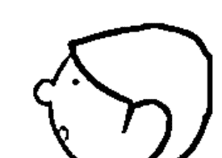

### 1. 風元素＋火元素

若是遇到個案卡陰，阿飄為數眾多的時候，單靠某一種元素來淨化會比較吃力，此時可以多種元素一起使用，例如我們可以點燃白色鼠尾草祛除阿飄。自古以來白色鼠尾草即是北美印第安民族與世界其他地區部落最常使用的聖草。白色鼠尾草一點燃就會產生煙，就是火元素與風元素的結合。點燃的鼠尾草煙霧能淨化入侵阿飄的執念，讓阿飄執著於人世的執念消除，只要恢復靈魂的平衡狀態，阿飄就不會想依附在人類身上，回到它該去的地方。我們處理卡陰，除了針對當事人淨化，最主要是要淨化與斬斷阿飄的執念，才能讓一切回歸平衡與正常的狀態。

- 靈元素在七大脈輪裡的頂輪，扮演和宇宙神靈最重要的連結。
- 身心靈活動，例如冥想、感受、洞察力和覺知。
- 處理卡陰過程中，靈元素型的能量（雷電）具備即時和效率。

### 2. 水元素＋土元素

通常替個案淨化、祛除阿飄之後，個案會出現暫時性的身體能量空隙，身心會有暫時性的失調與失衡狀態，可能會覺得空虛或是失落，此時就可以水元素的滲透性來補強，並以土元素來穩定個案的不安全感。我們可以從飲食上面補充水元素的能量，或是使用聖水，例如滿月時取曝曬於月光下的湖水（我們稱之為「月之水」）來滋養補強，也可自己於家中取水曝曬使用。土元素方面則可使用玫瑰岩鹽塗抹在身上或是泡澡，增加安全感。

### 3. 火元素的應用

用在祈福方面，可以點燃「白色小人蠟燭」，這款蠟燭可以改善自己的缺點，也可以祛除與淨化。應用在祈願上，可以點燃「許願蠟燭」，針對不同的主題有不同的作用，例如招桃花、招財富、招健康或是招愛情的面向上，增強願望成真的能量。

### 4. 電元素的應用

電元素是最省力，也是威力最強大的能量元素。在淨化比較強大的阿飄或是數量驚人的阿飄群，電元素只要針對阿飄的核心點（也就是阿飄最主要的執念），鎖定目標就可以直接命中，立即可將阿飄執念祛除，讓阿飄回到自己該去的地方。使用電元素時多半是徒手進行，因為手的敏感度比較細緻、精準，也可以使用法杖增加威力，但我的經驗是細緻度不如雙手，所以我多半還是以徒手為之。

電元素還有個比較靜態的使用方式，它可以應用在靜心冥想上。一般我們靜心冥想時，多半無特定主題觀照，只想透過靜坐追求內心平靜。如果可以在進行這些活動時，更積極在內心某個面向的探索，譬如：這次想要探討「為什麼自己老是因為別人的話語就受傷，自己會受傷的關鍵點究竟何在？」一旦設立了這次的冥想目標後，能量就會聚焦在這個目標焦點，整個冥想過程我們就會針對這個目標焦點產生不斷反省的腦部運作。當我們開始自省時，腦中電流就會開始有意識的密集流動，這個腦部電流的運程就是電元素的運作過程。我們人類之所以與動物不同，就是因為我們有反省、反思的行為，也因為這個內在的神聖運作讓我們得以趨近神性。這也是電元素流動時產生的殊勝能量效應。

## 什麼是能量師？

能量師是什麼？是抓阿飄的抓鬼特攻隊嗎？難道是陰間大法師？還是舞刀弄劍鬼畫符的茅山道士？或者是羅琳筆下的哈利波特與伏地魔？亦或是拿著羽毛、身披原住民衣飾的部落巫師？還有聽起來怪駭人、天主教默許存在的驅魔師？沒錯，我是抓鬼的，可是我使用的方法又跟上述的各家各派不盡相同。我也沒有特別給自己取什麼名號，我只是說明我的服務，周遭的人要怎麼稱呼我，我也不是很在意，直到有一天，這個「能量師」稱號，就這樣自然而然的落到我的頭上來了。

幾年前，我和 Yoyo 一起參加某家電視台的談話性節目《和你想的不一樣》，結識了當時的節目主持人之一的范可欽先生。幾次節目錄下來之後，他慢慢清楚我到底是做些什麼的，也開始漸漸熟悉起來。有次聚會，他打趣的跟我說：「Eddie 老弟啊，驅魔師、伏魔師聽起來怪嚇人的，而且你服務的項目不只是驅魔、趕阿飄，不是還是有寶石服務的項目？而且你運用的是能量的方式，叫驅魔師、伏魔師太不相襯了！不然這樣吧，乾脆叫做『能量師』，既中性又切題。」我聽了也覺得這個名稱甚妙，就決定接受范大哥的神來一筆，開始用起了「能量師」的稱號。

然而，能量師除了抓鬼，到底還提供什麼專屬的服務呢？還有，能量只能用在抓鬼一途嗎？

### 1. 請走阿飄

「抓鬼」是比較聳動、也比較通俗的講法，基本上就是把卡在人身上的阿飄請走、淨化的過程。這也是我一開始擔任能量師的開端，也是我目前服務的主力項目。

### 2. 靈魂療癒

有些人不是被阿飄所干擾，可是卻覺得生活沒有動力、老覺得被孤立、家庭沒有溫暖不想回家，只要談到感情就怯懦無力，或是老覺得有失落感或不足感，長期的悲傷……種種不一而足的狀況，有人會以為自己是卡到陰，才會身體老覺得不適，或是情緒出現很大的障礙，來到我們工作室希望我替他們解除卡陰的困擾。可是等到我探查對方的能量場之後，根本沒有阿飄入侵，才發現是靈魂出了狀況。這些人是因為靈魂有了傷痛，有人會引發肉體的創傷感，或是情緒出現長期的憂鬱與失落，此時需要進行靈魂療癒，透過能量平衡靈魂的缺落，才能重拾人生的意義與安全感，恢復正常的生活。

### 3. 祈福或淨化儀式

儀式工具多半以祈福為主，透過身體的能量與儀式工具產生連結，兩者創造共鳴之後就可以施行祈福或淨化儀式。常用的儀式工具有白色鼠尾草、法杖、掃把、五芒星，各有不同的功能與效力。

### 4. 空間氣場的淨化

空間的氣場會影響人的運勢與健康，有時空間能量不佳是因為阿飄，有些時候是因為病氣或是晦氣導致，有時候是兩者互相影響讓情況更為複雜。不同的成因，有不同的淨化方式。空間裡如果存在病氣會影響身體健康，若是晦氣會讓我們心情不好或影響我們的運勢。所以如果有這些跡象發生，就要慎重思考是否該好好清理與淨化所處的空間能量。

### 5. 利用寶石的能量共振

當寶石從地底挖出來時，都帶有在地球中的記憶，這些寶石受到大地壓力、地下水的衝擊、地熱的鍛鍊種種地球作用的影響，讓寶石產生不同的屬性與能量。如何辨識出每一顆寶石真正的本質與力量呢？這就是能量師的工作。利用能量的共振，讓每一顆寶石的能量可以與我們的生活具體連結，發揮它最大的功能。譬如：

大家都知道粉晶可以招來桃花與愛情，增加好人緣，這就是我們所熟悉的，但除此之外，每一顆寶石分別有各自的特性，可以做更細膩的區別與使用，其他種類的寶石也是一樣。我以對能量的敏感度，透過能量理解寶石的個別差異與特性，當不同的個案擁有不同的能量需要時，我可以辨識出這些寶石適合什麼人，並且讓寶石發揮最適切的作用。

寶石就是能量元素最具相的顯化，可以提供保護、增加財富、促進健康、或是加強安全感、提升靈感與智慧等不同的功效，透過能量師的辨識，讓每顆寶石與最相應的人相遇。

## 與 YOYO 相遇，開啟我能量的封印

我會成為能量師，要從大學時代和 YOYO 的相遇說起……

我在專科畢業後，透過插大轉學考，進入長榮大學國際企業系就讀，YOYO 也在同年轉學到隔壁班。因為我們同是轉學生，所以常常要一起修相同的課。YOYO 鋒頭很健，幾乎所有系上的人都知道這個濃眉大眼的美女。但我個性低調多半獨來獨往，即便系上有辦活動讓大家熟稔，我也沒有興趣多認識其他人。某次上課，後座的同學突然用筆戳我，原來是 YOYO，她遞了張紙條給我：「有沒有東西吃？來點吃的吧！我肚子好餓。」我問她沒吃早餐嗎？她說早上吃了螺肉，但現在很餓。

我心想那種東西怎麼會飽。就這樣一來一回，我們開始熟悉起來。每次上完共同的課，我們就會一起去吃飯，天南地北的聊著彼此的想法、對世界的觀察。我發現眼前這個女孩不僅五官深邃、說話鏗鏘有力，對於很多事情都有獨到的見解，而且總有讓我驚豔的奇異論點，我也敞開心房開始把我從小以來的疑惑、不解、還有許多對人生不明白的憤世嫉俗想法與她分享。這些我幾乎沒跟人聊過的問題，竟可以對她侃侃而談，而且欲罷不能，她甚至化解了許多我過於偏執的觀念或老想不透的癥結。我覺得這女生真是有趣又聰明，漸漸的我們兩人越走越近，就開始交往了。

後來，我也慢慢聽聞 YOYO 跟我分享一些不同於一般人的想法與經歷。在見怪不怪的情況下，有次聊天 YOYO 突然跟我說：「我弄個東西給你看。」就開始在我的膝蓋上頭約莫十公分的地方以手指彈了幾下，接著問我有沒有感覺。我搖搖頭，然後她又再弄了一次，我立刻感覺到有股刺刺麻麻的感受在膝蓋上頭流竄。我很驚訝，她又再度試了一次，我還是清晰的感受到這股不可思議的刺麻感，可明明我只看到她彈了一下指尖，並沒有什麼特別的舉動啊？我好奇的問 YOYO：「這是怎麼回事？為什麼第一次跟後兩次的感受截然不同？」她才淡淡的說：「第二次的時候，我打開了你身上的部分封印，所以你自然會感受到一股刺刺麻麻的能量了。」

聽得我匪夷所思，然後她又要我閉上雙眼，去感受一下周圍的環境。當下我是又驚又喜，並且夾雜著害怕與擔心，我不知道會發生什麼，但好奇心的驅使讓我閉上了雙眼。當我一闔上眼，眼前稻田的景象、機車聲、蟲鳴聲……所有的一切都以一種能量的狀態呈現，我可以清楚的感受到這些事物流動的能量，以及每一個狀態發生時的種種情緒、氣味、記憶，我的感官似乎被無限放大去接收眼前的這一切，縱然是遠方貨車司機的心情與狀態，我也能在當下清楚接收與感知。這實在是非常奇特的時刻，也很難用言語表達。我第一次明顯感受到能量在我身邊的運作流動，我對迥異於以往的感知世界十分震撼，我再也回不去了，我就這樣一頭栽入能量流轉的國度。

我開始勤加練習能量的運作，我在手上把玩能量，我甚至可以控制能量讓事物具體現形，有時還會淘氣的在他人身上放下捉弄的能量，好讓自己可以左右對方。然後我更加狂熱的閱讀各種書籍，我發現所有我吸收的知識都會轉化成能量，我讀得越多，理解越多，能量匯聚越大。我瘋狂陶醉在能量的世界裡，我覺得自己實在與眾不同，我擁有這項特殊的能力，我甚至可以快速的理解許多艱澀的書籍，並且轉換成我內在的力量。我說不定具備成為「神」的特質？我驕傲了起來，志得意滿、不可一世。只有我，如此努力的追求與探究宇宙真理，還能掌握一般人所不知道的世界。你們這些凡人，你們都還在醉生夢死，你們完全不知道世界的奧祕，你們真是無藥可救了……

傲慢的心魔在我心底升起，YoYo也看在眼底，所以她在我身上設了一些限制，讓我無法全力發揮以免我誤入歧途、傷人傷己。但我的心還是極度偏執，能量的力量誘惑太大，就像魔戒一般，一戴上就可呼風喚雨掌控世界，我也是一個被能量誘惑的「咕嚕」，沉醉在能量營造出來的世界，而沒發現自己已經快要喪失本心。還好，YoYo一直陪伴著我，只是自己內心的魔考還是得靠自己去穿越。

大學生活轉眼即逝，一直到了畢業前夕，我面臨是否繼續升學報考研究所、還是畢業即刻去服兵役的非A即B的抉擇，然後YOYO告訴我她決定出國繼續深造，種種現實讓我大夢初醒，轉瞬間我得自己一個人面對人生。我開始認真思考未來的藍圖，我沒有本錢揮霍了，我決定先盡國民義務去當兵，可是思及軍中生活的嚴苛與僵化，如果我還像學生時代一樣天真與孤傲，不用求神問卜也可以預測出我這隻菜鳥勢必會被修理得很慘，我不能再這樣瞎搞、無憂無慮廝混下去。種種現實的考量與當兵的壓力，我竟然在心底啟動了某種開關，悄悄把能量開關關上了。

在軍中數饅頭的日子讓我幾乎忘了能量這件事。日復一日規律的軍旅生涯總算在兩年後結束，退伍之後我決定繼續讀研究所，回到學校單純的時光，我才又想起能量這件事情來。說也奇怪，以前運作得很流暢的能量，經過兩年多竟然再也使喚不出來，我不知哪裡出了問題，只要一有空就更勤加練習，卻總是徒勞無功。我查遍各種書籍、試過各種方法，不是無效就是瞎搞，我思前想後最後得出一個結論：「應該是兩年前我把自己的能量封印了，原因可能是因為當兵前的過度顧慮引發的自我保護效應。」這宛如當頭棒喝！我怎麼會幹下這樣的蠢事！不過轉念一想，既然是我自己封印的，我必定可以替自己解開吧！

我開始更大量研讀相關的書籍，不只在能量運作上的原理，還有更多與身心靈相關的知識，以及最能提供我內在疑惑的哲學思想論述，我都不放過。我想從中找到任何解除內在制約的蛛絲馬跡，可是當我越想解開就越解不開，越解不開我就越不甘心，拼命試了好幾百次之後，我真的徹底放棄了。這件事徹底衝擊了我，過往不可一世的驕傲徹底被擊毀。以往我很自負，認為自己對能量、對人的心念已經認識通透了。可是我有真切的應用在我自己身上嗎？我開始思考能量之於我到底是怎麼一回事？以及自己的起心動念又是怎麼運作？我有好好真正往自己的內在看嗎？

我發現大學時代的自己太過偏重在術的修為，對於自己內在心智的運作、自己腦中的思想念頭卻輕忽耙梳。傲慢感讓我嚴厲的對待周遭，卻輕忽寬容自己。倘若檢視的尺不能往內度量自己的心，總有一天我不光是封印自己的能量，還會引起更大的差池，其結果說不定連釀災的我也無法挽回與收拾。

我不再執迷於開啟封印這件事，也不想再一步登天像以前一樣，請託 YoYo 幫我解開，或許是我內在僅存的驕傲，也可能是我真正臣服於生命的安排，說也奇怪，當你真正放下了莫名的執著，生命反而賦予你另一種深刻的智慧。接著幾年，我依然做著能量的練習、依然博覽與能量有關或無關的書海，我只是投身我喜歡、我好奇、我享受的興趣，突然間就在我不斷自我摸索、自我琢磨的緩慢過程中，封印就一點一滴的解開了。

我不知道這是我的天性使然，還是老天要給我的試煉，這點點滴滴的修正，讓我對能量的體會越來越深刻，也越來越清楚，這將是我走在這條能量師的旅途中，上天賜予的最好禮物與最佳祝福。

## 心靈角落與女神信仰

研究所畢業後，我有幸進入某大企業擔任業務，業務工作給了我非常扎實的工作訓練，可是日復一日大同小異的規律生活與工作內容，總是讓我內心少了些什麼，至少的是什麼我似乎也很難以具體描繪，可是優渥的報酬讓我也安穩的在職場待了幾年。直到 YOYO 成立了「心靈角落」，我們也打算結婚，一切都十分幸福美滿，誰知，有一天她突然跟我提議：「要不要一起在心靈角落共同奮鬥？你現在的工作不是讓你很不開心？辭職來做想做的事吧！」當下我只覺得不可能，夫妻兩人都一頭栽入看起來不成氣候的行業，風險實在太高。雖然現在的工作老讓我不開心，可是至少大公司的收入有保障，萬一 YOYO 的事業沒起色，我還可以撐住這個家啊！我理智的分析一切，雖然內在是有點小小的動心，可是衝動行事實在萬萬不可！我回絕了 YOYO 的邀約，繼續苦悶的每天上班。

婚後，我跟 Yoyo 去了趟美國大峽谷歡度蜜月。峽谷壯闊的景觀，周遭圍繞的森林，曠野遍佈的巨大紅岩石，以及當天在戶外拿著熱食與周邊的烏鴉一同午餐的經驗，深深撼動了我。大自然的力量、大自然的包容、萬物自在共存，以及大地活生生的生命力源源不絕的向我襲來，我被大自然的浩瀚與開闊徹底擄獲，我覺得心底深處似乎有什麼東西鬆動了，我覺得人生不止如此，我的生命即將跨入三十了，是否也該是大刀闊斧改變的時候？金錢或許重要，保障或許重要，可是人生是不是有更重要的事情等待我去完成、去實現？

蜜月旅行回來後，我立刻答應了 Yoyo 的邀請，辭去了大企業的工作，進入心靈角落負責業務推廣以及商品設計與研發。如此快速的決策與行動也嚇到了 Yoyo，她沒想到我答應得這麼快。說實話，我自己也沒料到。不是此時，還會是何時？人生的轉機就是如此奇妙又難以捉摸，心會引領你在適合的時機做出最適切的決定。

這幾年心靈角落的據點一再搬遷，每次搬遷就越換越大，不僅場地變大、客源增加、服務品項變多，我們肩頭上的壓力與責任也越來越重。我也從一開始的業務與產品總監，慢慢加入能量方面的服務，這一切變化實在不是當初我離開職場時所能預料的。當中最有意思的轉折，莫過於接受了女神信仰的洗禮。

在心靈角落漸漸小有規模之後，YOYO 跟我說她想建立女神信仰。我一直很了解她夢想的藍圖，也清楚她對女神的熱情與信賴，所以當下非常贊同也很鼓勵。我身為她的伴侶，不管是心靈伴侶或工作夥伴，我是百分之百的支持她。可是她話鋒一轉立刻要求我：「你要入教。」我愣住了。「什麼？我為什麼一定要入教？信仰不是很個人的事情嗎？即便我們是夫妻、是夥伴，這也是我的自由意志與選擇！」我沒答應，可是這件事不停的在我心底迴盪，我一直沒有答案，也放不下不去想它的念頭。

有一天我與YOYO到工作室附近的速食店用餐，在她離席的片刻，我心中又再度浮現這件事。我心煩著不想去想，可是這想法一直縈繞不去，我決定不再迴避這件事，就趁這個空檔好好詢問女神。我開始安靜了下來，調整一下呼吸，在我的心底問起我一直以來的疑問，我問女神：

> 「我從小老是有種無奈與無力感，我對這個世界有許多憤怒的情緒，這些掙扎與困惑經過了這麼多年，雖然已經有減緩的趨勢，可是依舊會在我內心翻騰。還有當我得知前世之後，也有許多無法解脫的疑問，我內在總是有許多質疑與不信任，這樣的紛擾真的很累人。我很想獲得真正的平靜與休息。親愛的大地之母，親愛的女神！如果我真的入了教，信奉您，我的內心就可以獲得平靜與安寧嗎？」

我叨叨絮絮說著自己的困境，雖然我問得很真心，但我壓根不期待女神會給我答覆，因為我可是在速食店這個人聲雜沓的地方耶！沒想到腦海中的話語方歇，就立刻聽到一個聲音堅定的告訴我：「沒有錯！」我驚愕的睜開雙眼，正好看到YOYO走了過來，她不解我的表情，我又驚又喜的告訴她：「剛剛女神來找我耶！」

丈二金剛摸不著頭緒的她，一時不知我在說什麼，只顧著坐下來繼續吃薯條，我才把剛剛的冥想過程告訴她，也跟她說：「我願意……入教！」

就在速食店裡，一處一點都不神聖的地方，一處人潮熙來攘往的鬧區，我就這樣決定了一件對我人生非常重要的大事，如果這不是女神顯靈，什麼才是女神顯靈呢？

信奉了女神之後，我常常感受到所有的事情，即便當下女神似乎沒有傳遞任何訊息給我，可是當事情走過一遭，我回想所有的歷程，總不免驚嘆一切總是有最妥善的安排，一切都會在女神的守護與祝福下安然的進行。

就好比來到我面前的個案，我也總覺得女神是透過這些人來教導我。現實狀態看起來是我在幫助他們，可是他們也以另外一種形式教會我能量運作的功課。還有生活中免不了遇上許多困境、或與某些人意見不合與衝突，其實這些衝突的人事物都是一面鏡子，映照出我內在的黑暗與光明。如果沒有他們與我相對應，我也沒有辦法立即從這些對立的狀況發現自己心念的運作。這些人事物都是我的老師，是來慢慢修為我的內在，讓我的心念變寬、視野變廣。

當我越能修練自己對於能量的把持與運用，我的能量與情緒也越來越穩定，然後我才能將所有來到我面前的能量轉化成具體又良善的能量為我所用。這樣的相遇變成一種正向的循環，我接收、我也給出，我們都學習著以一種正向的能量方式互相交流、彼此提升與不斷轉化能量的品質，最後造福別人也改善自己。能量變成一首美好的奏鳴曲，在我與個案、在我與身邊的人事物之間共同譜出的一種和諧流動，而這一切都來自於女神時時刻刻對我的提醒與教導。

最明顯的差異就是來自於家人的體會。我的爸媽雖然不太明白我到底在做什麼，可是漸漸的他們覺得我變得越來越穩重、個性越來越成熟，不像以前那麼容易動怒與孤僻，整個人也更開朗、幽默和自在。他們可能覺得自家兒子是因為成家了、社會歷練多了、當爸爸了，所以一改以前的毛躁與浮動，只有我自己明白這一切都是因為大地之母無私的愛，是她的教誨、包容與受護，我才能在能量的世界裡越走越踏實、越走越堅定。

女神也改變了我在能量工作上的定見。以前使用能量時以為就是要強、要猛、要烈，陽剛與爆發力十足才可以一刀斃命。慢慢的，我學會以人為出發點，學會陰性法則，學會精微細緻的能量也有其強韌深遠的力道。凡事不是剛強就好，偏失一極都不是長久之道，能強弱相輔、陰陽相偕，能量流動才能既廣又深、悠久持久。萬事萬物都離開陰陽的力量，只有兩者互相融合，才是平衡之道。女神的智慧啟迪了我，讓我深深感恩與受用。

## 第一個能量淨化的個案服務

過去我擔任業務與產品總監時，會擔任 YOYO 占卜個案時的助理，如果個案需要進行能量淨化，我就會在旁邊當副手協助。當時我從來沒有自己一個人負責個案服務，能量淨化也只是插花而已。直到有一天，有位客人來找 YOYO 占卜，最後需要進行能量淨化，不巧她的諮詢時間已近尾聲，而且下一位預約的個案已經在外頭等候，為了不讓外頭的客人枯等，也不能草率的讓這位個案就此打道回府，YOYO 跟我說：「你來接手吧。」我當時也沒想太多，只覺得要立刻幫這名個案淨化，所以我們移到其他諮詢室，開始淨化工作。

沒想到一偵查他的能量狀態，身上阿飄的數量超乎我的預期，是我第一次碰到一個人卡了這麼多的阿飄。因為我是新手，經驗不足讓我不知如何開始，我思前想後決定先仔細掃描他身上的能量狀態，精確的分辨身上各處的差異，是不是溫度有變化？是不是變得冰涼？還是有麻麻刺刺的感覺？然後從這些資訊去推測我可以使用的方法，接著把我腦海中的理論與擔任副手的經驗拿出來，開始用一項又一項手邊的魔法工具實證能量的效果，前前後後不斷推敲與實作，我總算順利的把他身上源源不絕的阿飄全部清除了。

雖然這次淨化花了將近一個多小時（以我現在的經驗，這樣的個案所花的時間絕對不會超過半小時），但也多虧了這次初體驗，讓我得以仔細的將我會的清理方式逐樣應用在這位個案身上。如果沒有這次「實習能量師」獨當一面的寶貴經驗，後來我也不會走上能量師這條路。這次個案的處理方式也奠定我往後淨化的雛型。

我的方式首先側重卡陰的成因與狀態，這與我能否直接捕捉阿飄的入侵途徑有關。

至於卡陰的個案老愛問我：「到底卡幾隻阿飄？阿飄長什麼樣？」都讓我哭笑不得，因為那不是我關注的焦點，也對於處理卡陰沒有太多幫助。

很多人以為淨化身體能量全賴技術，實則不然。依照我多年的經驗，我認為技術只占五成，剩下五成的關鍵點在於諮詢與觀察。就像醫生與病人之間的問診，「望聞問切」是非常重要的資訊。當我們獲得的資訊越多越清楚，淨化時的效率與品質自然而然就會相對提升。雖然我也可以透過靈視力看到個案身上的阿飄，我當然清楚有幾隻、是男是女、形體如何、相貌如何……這些阿飄的樣貌，其實當個案來到我的面前時，都一覽無遺，也一清二楚。可是我往往不太著墨在這上頭的細節，多半以輕描淡寫帶過，因為透露這些資訊往往沒有太多益處，只會給當事人帶來更多恐懼與無謂的想像空間，徒增困擾而已。這也是我不願意回答個案有關「阿飄有幾隻、阿飄長怎樣的問題」的主因，非不能也，實不為也。

這次個案結束後，當時這位朋友也立刻回饋，他覺得身體瞬間輕鬆好多，心情也大為放鬆，非常謝謝我的幫助。這次個案因為是從占卜延續下來，所以工作室只收取占卜費用，加上我是初試啼聲，所以並未向對方額外收取淨化費用。以商業眼光來看，我的第一次幾乎是在做賠錢買賣，但看著個案開心的臉龐，清理前後的明顯落差，我第一次深刻的感受到能量師帶給人們的幫助，以及自己所具備的能力。原來能量真的可以幫助人，原來自己這一路以來的修為與考驗就是為了將自己的能力貢獻出來，幫助更多需要協助的人。

原本以為這次的事件只是臨時插花的特例，沒想到後來需要處理卡陰與阿飄的個案越來越多，我就水到渠成開始從事能量淨化的服務。也因為遇到太多來自宮廟系統的奇特案例，所以我開始鑽研台灣的道教系統以及台灣遍地開花的宮廟文化，然後一步步建構出與宮廟文化和道教系統立論與做法截然不同的淨化方式。我一直相信只要秉持正念，將能量與事物恢復平衡，才是自然和諧之道，倘若參雜了其他私心，再好的法門都可能歪曲成傷人的利器。能量師知道如何運用能量，然而心念卻在個人修為，倘若在利益與權力迷失了，將是不可饒恕的誤用。我接觸了太多稀奇古怪的案例，不得不說，真要害人，有時人比鬼還可怕；真要助人，神佛也會借你之手完成大任。

# 第五章 診斷空間氣場，告別擾人能量

我們常常說到某人「第六感」特別靈，這到底是什麼意思呢？通常是指一個人擁有除了視覺、聽覺、味覺與觸覺等五感之外的感知能力，可以感受到在這個時間與空間之下的另一種狀態，因此當我們提到身體能量、空間氣場，就是啟動了所謂的「第六感」知覺，這是能量存在的狀態。

## 身體能量與空間氣場

當提到身體能量與空間氣場的關聯，我們得先了解「第六感」的兩個形成要件。第一是靈魂的敏感度，第二是靈魂與肉體的連結度。這兩個要件會造就第六感覺知程度的不同，進而影響我們對於周遭的感知。我們就來看看不同的條件會形成怎樣的第六感？為什麼有些人的第六感特別靈？有些人卻又是「麻瓜」？

我們常說某人脆弱得像朵花、纖細敏感宛如林黛玉轉世，嚴重的甚至有點神經兮兮；我們也常說有些朋友神經很大條、個性大刺刺，即便外星人降臨可能也不以為意。如果一個人的靈魂是敏感的，就會對周遭環境的變化比較敏銳，稍有風吹草動就能感受到差異，就像前面說的林黛玉類型；倘若靈魂選擇沉睡，偏向於漠不關心、毫不在乎，對於周遭環境的改變就會顯得比較遲鈍，也不太能夠發現任何細微的變化，就像麻瓜的狀態。沒有哪一種比較好或壞，這是靈魂選擇的狀態。只是如果要具備較敏銳的第六感，進而運用第六感的感知能力，至少得先讓這項靈魂的探測器能夠敏銳一點，具備較佳的雷達，方能偵測出周遭細微的改變。

倘若靈魂是敏感的，卻擁有一副不甚敏感的身體，兩者步調不一致，豈不是會節奏大亂？這很可能隱藏了一個比較深奧的生命哲學，有待我們今生去突破。以我本身的生命理解，倘若以轉世的觀點來看，這樣的選擇很可能是靈魂在投胎轉世前的選擇，是為了讓比較不敏感的身體可以在三維世界裡好好學習，譬如我在言語表達、體能健康、心智思辨是比較不敏銳、驚鈍的，我就得在這樣的肉體限制之下不斷琢磨學習，直到生命結束的那一刻。這一世所有的學習與經歷就會變成靈魂的養分，轉化為靈魂的珠玉，進而再次提升靈魂的品質。

人多半有惰性，加上花花世界的誘惑，多半很難把持靈魂的修持。靈魂選擇不敏銳的身體投胎，宛若拋磚引玉，期待透過肉身這個磚塊的考驗與磨練，經歷人生的掙扎與苦難，直到肉身寂滅之後，這一世的種種領悟可以淬鍊出靈魂珍貴的光華珠玉，然後一世又一世不斷的在三維世界出出入入繼續學習，一步步提升與轉化靈魂的質地，直到圓滿。所以，我們此生都是來學習與經歷，並且創造靈魂更大的可能性。

倘若靈魂與肉體都是敏感的，則靈魂與肉體的連結是高度一致，對於周遭的風吹草動會非常敏感。卻也因為對周遭環境太過敏感，有時會被人稱為瘋子，過往歷史就有不少人因此被送到精神病院強制治療。有些人會被奉為宗教上的先知崇拜，影響眾人；有些人則是在封閉的時空背景下，因為提出創見與洞見，不見容於當時的宗教文化與社會環境，而被認定為瘋子與褻瀆神明。這些人如果活在現代，說不定就是眾人稱頌的科學家與先知，說不定還因此獲得諾貝爾獎名利雙收呢！卻因為生在不一樣的時空，而飽受攻擊甚至喪失生命。總之，靈魂與肉體皆敏感的人活得比別人辛苦，卻也因為具備較為敏銳的感知能力，如果能妥善引導並尊重他們的才能，他們不僅能自我發揮，也能造福人群。

當一個人能慢慢提升靈魂的敏銳度，並且提高靈魂與肉體兩者的連結程度，我們的第六感能力也會隨之越來越提升；當第六感越來越敏銳，也就越能感受身體能量與空間氣場的互動。當環境氛圍一有變化，身體就能清楚的感知並立即做出反應，如此就不會變成溫水煮青蛙，對周遭的變化渾然未覺而發生危險。一旦我們越清楚個人與環境的連結，就越能了解自己，也越能融入整體環境。

## 空間能量淨化的案例 1：老屋利用藏玄機

美華與靜婷是好友也是生意上的夥伴，最近租下一棟日式老宅，打算翻修之後作為公司的根據地，為了事業發展順利，特地前來心靈角落工作室，希望我們提供風水方面的服務。工作室提供的風水服務除了空間的風水諮詢，還附帶空間能量淨化，兩者相輔相乘才能真正改善空間氣場，創造更好的風水能量。與對方大致商談過後，我們擇期前往探勘風水與淨化。

這日的約定時間，我們一同來到車水馬龍的市中心，美華與靜婷的租屋是在市區的小巷弄裡。緊鄰大馬路邊，但拐個彎，這棟日式建築就座落在鬧區旁的僻靜小巷裡。平房建築多年都無人使用，加上周邊的用地歷經多年都市變遷，幾乎都已改建為高樓大廈，被周圍高聳的大樓環繞的矮小平房，日照稀少、陽光難以進入的結果，讓這棟老房屋更顯幽暗與寂寥。

走進大門，是個雜草叢生的小院子，映入眼簾就是今天勘與的物件——日式老房舍。我們一行人推開大門走入屋內，久未使用的房子散發著一股難以言喻的陰森與霉味。

這棟房子的結構是狹長型，屋子的前半部格局有個比較大的空間，從前應該是當做起居室、客廳使用，一面是窗戶，窗戶的對面有面牆，擺著一張神明桌，另一邊則是兩間緊鄰的小房間。房屋中段，一邊是餐廳，隔著狹長型走道的另一側，則配置廚房與衛浴空間。沿走廊再往房子的後段走，有間和室放著三座木製櫥櫃，和室隔壁還有另一間房間，裡頭擺放幾張上下鋪的床。走廊延伸成L型繞到和室與寢室後方，可以通往屋後的天井。

屋內每一間房間的窗子都非常小，加上周邊高樓林立，所以除了起居室與第一間小房間可以透過屋前的院子接收陽光外，其餘空間多半陰暗不已，加上這間老房子常年無人使用，根本沒有任何照明設備，讓屋內更添晦暗。當天我們抵達的時間約莫正中午，即便外頭豔陽高照，屋內依然極度陰暗。

我們進入屋內之後，我隨即檢視屋內情況，緊鄰起居室有兩間小房間，靠近院子的是第一間小房間 A，靠近屋內的是第二間小房間 B。當我打開兩間房間的門，說也奇怪，只要我一離開 B 房間往 A 房間移動，B 房間的門就會慢慢的自動關上，我來來回回試了數次都還是一樣，但是 B 房間裡並沒有任何窗戶，所以根本不可能有風產生對流，而且房門還頂重的，要被風吹動也要是很大的風才行。我與 YOYO 都看到一群小鬼在推著門，不讓我進入，但這等怪誕情事也不方便告訴美華與靜婷，以免她們心生恐懼，但詭異的聲響連連，即便無法看到阿飄的人也知道這裡散發著詭異的氛圍。

YOYO 看完空間能量之後，跟我討論淨化細節，要我淨化房子的前半部即可，因為屋主打算重新裝修，到時候屋內的隔間將全部拆除，施工時會有大量工人進駐，將會帶來大量陽氣進入屋內，這些阿飄自然而然無法在此聚集。如此一來，我也可節省力氣，原本我也打算只淨化房舍的前半部。當我開始淨化起居室與房間B時，一脫拉庫至少有五、六十個阿飄一直糾纏著我，花了點力氣之後，沒多久此處的淨化工作就完成了。此時，YoYo正和美華、靜婷討論風水物件的擺設事宜，我心想反正還有時間與精力，就逕自往屋後走去。沒想到這一步的選擇，接下來的發生完全超乎我的預期。

我沿著走廊經過餐廳，然後來到後面的上下鋪寢室，一入房中，沒想到寢室裡滿滿都是阿飄，它們還直盯著我。因為這棟老房子以前是某個單位的宿舍，後來久久未使用，荒廢多時，此處已經變成當地阿飄的「駐在所」，老老少少不可計數的阿飄都在此歇腳，對於不速之客的我打擾了它們的巢穴相當不開心，一直對著我齜牙咧嘴咆哮，我一開始還想好言相勸，解釋一番之後才知道多說無益、浪費唇舌，終究還是拿起鼠尾草、銅缽開始淨化工作，花了我好一會兒功夫才總算淨化完畢。

不知為什麼我覺得不能停手，接著我又繼續走到旁邊的和室，想說既然做了就做個徹底，又繼續我的淨化工作，沒想到我才剛拿起線香，屋內的三座大型木櫃居然開始「砰隆砰隆」上下激烈跳動起來！

阿飄是游離的電子，想要移動三維世界的物質是難上加難，除非它們在一處待得夠久，對於眼前固化的物質研究得相當透徹，摸清楚這些物質的組成後並與之融為一體，才有可能移動實體物件。然而光靠一個阿飄的力量多半不夠，眾「鬼」成城，得有一群阿飄彼此意念一致，並且與固化物質合體，才可能一起推動三維世界的物體。

所以當我看到和室裡的三個大型木製櫥櫃居然一起上下跳動，不禁大吃一驚！

這是要有多少的阿飄彼此意念一致，並且在此地停留多久時間，才可能和這三個櫥櫃融為一體，一起上下振動，只為了給我警告！要我別多管閒事，快快離開？我擔任能量師這麼久，第一次見識這樣的陣仗，當下還真的嚇出一身冷汗。可是，我不知哪來的堅持，隨即定住心神，依然故我的持續淨化工作，我當時心想，倘若真有萬一就得趕緊呼叫 YOYO 協助了！雖然吃力也花了許多工夫，我總算有驚無險完成了。事後 YOYO 才跟我說，當時他們三人 在起居室一直聽到屋內劈里啪啦的連續聲響，緊張得大氣都不敢吭一聲，足見當時氣氛之詭異，想來都令人捏一把冷汗。

完成和室的淨化，我走到廁所裡，正當我要開始淨化時，廁所的鏡子突然冒出一個鬼頭，不明所以的盯著我，並看著我手中的所有工具，似乎它沒見過像我這樣的能量師，因為東方道士都身穿道袍、拿劍畫符，眼前這位穿短褲、點線香、拿銅鉢的男人到底是來幹嘛的？正當這位從鏡子裡探出頭來的阿飄還在秤我的斤兩，我手持線香、銅鉢已經把它送走了。

最後我來到屋後的天井，這裡堆滿各式雜物，雖然阿飄的數量與能耐沒有其他地方多，但我在淨化的時候，總還是會被它們不停的干擾，可能拉拉我的襪子，勾住我的衣角，似乎想要透過這些方式來阻止我、嚇阻我有所行動，但經過前面的障仗，這些都只是小把戲。不管如何，我總算把老房子裡所有的阿飄都送走，老屋子的淨化工作徹底完成。

這次的經驗也讓我學到寶貴的一課——單槍匹馬的危險性。所以後來我做空間淨化工作時，多半會有一名助手協助，淨化之前也會先了解空間結構並擬定作戰計畫流程，畢竟我們與阿飄存在於不同世界，想法與狀態是截然不同，加上以阿飄的觀點，我對他們是有威脅性的人。因此，事前的準備與保護工作真的非常必要。一般阿飄沒辦法靠近我的能量場，但真的遇上能夠非常貼近我能量場的阿飄時，就要非常小心，這將是能力非常強大的阿飄。就像這次案例中能夠移動三維世界物體的阿飄，就十分駭人，現在回想起來還是餘悸猶存。淨化工作總有出乎意料的事情發生，從事這行千萬不可大意與自恃才能，謙卑與謹慎才是王道。

事後，美華與靜婷的公司整修之後進駐，聽說裝潢後的空間寬敞明亮，而且生意非常興隆，變成當地高樓林立間的小小桃花源。古蹟、老房子只要整理得宜還是能夠永續經營的，不管在實體上還是空間能量上，都是很好的更新再利用。

## 空間能量淨化的案例 2：庭院大樹不尋常

這個案例的淵源說來十分曲折，真的非常感謝我曾服務過的許多個案，由於他們的口碑行銷，所以才有這次相遇的機會。

來找我的陳先生是我一位個案的丈夫，那次我幫陳太太化解了一個設置在主臥房的桃花煞之後，睡眠品質與運勢就大為改善，因為這個緣故，陳先生才特地來到我的工作室，帶來老家環境的錄影影片與弟弟的相片，要我幫他看看究竟是哪裡出了問題。

原來陳先生的弟弟從小就內向、文靜，一直沒什麼朋友，還好家裡十分寵愛這個老么，弟弟也乖巧的一直待在老家幫忙家中事業，即便社交圈子狹窄，多年下來倒也相安無事。可是一年多前不知何故，弟弟開始出現一些奇怪的舉動，頭老是不停抖動，越到半夜抖得越厲害，看遍各大醫院、中西名醫都找不到任何原因。束手無策之際，因為陳先生從太太的例子有了信心，想想該不會真的是無形的力量作祟，因此就來到我的工作室拜訪，希望能解決弟弟的困境。我看了他的照片，了解他的背景資料後，知道他的身體能量是比較薄，加上一直沒有人際網絡與社交生活，種種跡象顯示極有可能是被阿飄附身。之後再看了陳先生帶來的家中室內環境的影片，發現神明廳居然呈現深紅色的能量顏色。按照常理來說，家裡如果有擺設道教系統的神明廳，供奉的雕像呈現的氣場顏色正常應該是黃色，一旦呈現其他能量顏色，很有可能供奉的不是神靈，而是被其他能量入侵了。了解情況後，我們約好時間淨化清理。

是日，來到陳先生的老家，是一處座落在住宅區幽靜巷弄的公寓一樓。我先在屋子外面繞了一圈觀察住家周邊的狀況，發現院子裡種了一棵榕樹，經過探聽與證實，樹根已經蔓延到地下室的住家，據聞之前住過一名外籍勞工，住了三個多月就離開了，他常常抱怨老是睡不安穩、難以成眠，身體也有許多小毛病，可是旁人與他自己都歸究於地下室太過潮濕。目前地下室則是閒置著。

進入陳先生老家之後，發現他已經先用紅紙把神明廳給蓋住，我雖不明瞭道教系統的做法，但應該是暫時把神明廳隔絕起來，設立結界，以免不相干的能量再度干擾家中人的生活與狀態。

我把我在一樓外面觀察到的事情告訴陳先生，弟弟會有奇怪的行為出現，極有可能是門口的那棵榕樹所致。由於榕樹是比較陰的樹，容易招來阿飄，多半不會種在家中庭院。即便不是榕樹，樹的樹根多半會吸取房子的氣，進而影響居住者的運勢，更何況是種在屋內庭院，樹根甚至都蔓延到地下室，直接破壞這棟房子的地氣了，住在屋子裡頭的人怎麼可能不被影響？所以當務之急必須先把這棵樹移植到其他地方，先把病根剔除，才不會這次祛除完屋內阿飄，過一陣子又招來另外一批。

至於陳先生的弟弟為什麼會有拼命搖頭的症狀？原來是他被一個上吊自殺的阿飄所附身。古時候的的絞刑，被行刑者是雙手遭反綁，脖子套上繩索之後，腳底下踩著的活門一拉開，因為全身身體的重量產生一股很大的拉力往下扯，使得吊死者因為頸動脈受到壓迫缺氧而死、或是頸椎斷裂而死，死前多半沒有時間掙扎，很快就會死亡。可是現今許多上吊者多半是自行上吊，在繩子纏繞脖子時，由於拉力不足，並未馬上死亡，此時上吊者會想以雙手掙脫這未死將死的狀態，這個時期我們稱做死前的黃金交叉期，自殺的人這時會產生極度想要活下去的本能反應，非常想呼吸、不斷掙扎，卻又被繩子纏繞不得脫身，如此經歷極度痛苦的情況才慢慢窒息而亡。附身在陳先生弟弟身上的阿飄可能就是因為死前太痛苦，死前掙扎的狀態一直殘留在它的回憶中，才會出現不斷搖頭的情況，導致它在入侵人體後，被卡陰的人也一直出現如此奇特的反應。

要解除這樣的狀況，除了得處理弟弟身上的卡陰狀態外，還要雙軌進行，一併改善家裡的空間氣場，才可能徹底杜絕再次卡陰的情況。因此，我與陳先生一家商討了後續的身體與空間能量淨化事宜之後，就開始今天的空間淨化工作。

我瀏覽過家中房間配置之後，研判當事人的房間最需要處理，擒賊先擒王，所以第一個步驟就先淨化此處，之後再依序清理各個房間。原本這是我的作戰計畫，結果沒想到我幾乎清完所有空間，進入最後一間緊鄰當事人房間的書房，才發現這裡才是重頭戲。我一打開書房的房門，發現滿坑滿谷的小鬼以及一名看似頭頭的鬼王正坐鎮其中，我一進入之後，這個鬼王馬上發號施令要全部的小鬼把我團團包住，一時之間我差點站不住腳，幾度快要昏了過去，就在我快要撐不住時，趕緊呼喚我的助手拿線香來，才勉強繼續撐住，可以繼續清理。

我在清理其他空間已經耗費了大半力氣，尤其在清理當事人房間時，只覺得奇怪為什麼一直清也清不完，以為是此處空間能量沉重所以特別費事，直到最後看到書房內的景況，才恍然大悟為什麼之前清也清不完，原來源源不絕的陰沉能量就是從一牆之隔的書房一直透過來，此時我才明白什麼叫做大意失荊州。這次教訓也給了我很大的警惕，能量工作完全沒有公式與樣本可循，每一個個案、每一次的淨化都是一個全新的開始，都是一次全新的挑戰。能量師必須要大膽假設、小心求證，切莫自滿與自恃過往經驗，傲慢會讓人輕忽微小的細節，而魔鬼總是藏在細節裡。

後來陳先生的弟弟經歷了三個月身體能量與空間淨化之後，總算不再搖頭，人也開朗許多，家裡恢復了以往的明亮與平靜，榕樹也安全移植他處，一家人總算可以繼續正常的生活了。

## 空間氣場的簡易檢測法

聽了這麼多故事與案例，真的讓人心慌慌，除了請能量師幫我們淨化與勘查，一般的麻瓜有沒有什麼可以自我檢測的方法呢？有的！而且非常簡單又方便！我們可以透過下列描述的簡易空間氣場檢測法，就可以推測自己居住或活動的空間是不是沾上阿飄了？

### 1. 蠟燭、線香檢測法

將空間裡周圍的所有門窗緊閉，不要讓風吹進來，找個風比較不可能進入的地方或是牆角，點燃蠟燭或線香，如果燭火不會搖曳或點燃的煙呈現筆直狀態，這就是沒有阿飄的正常狀態；倘若燭火搖曳，薰香的煙也四處飄散，就是有阿飄在屋內擾動能量氣場，所以在無風的空間裡，燭火才會莫名的飄動、薰煙也才到處飄散。

如果屋內空曠、無隔間，即使緊閉門窗依然有些許空氣對流，產生微風，可尋找牆角處較無風的地方進行這項測試，如果筆直就是正常，如果火苗與煙都隨興舞動，極有可能屋內有阿飄存在。

### 2. 銅缽、音叉檢測法

可敲擊銅缽或是音叉，如果共振出來的聲音讓人頭昏腦脹、耳鳴或覺得筋骨痲，就是有阿飄存在。空間內的阿飄多半不喜歡四處移動，可是一但被銅缽或是音叉擾動，阿飄就會浮躁的在空間裡到處遊走移動，聲音一振到阿飄就會反彈回來，使得我們聽到的聲音並非原本銅缽或是音叉的純粹音頻，而是混雜著阿飄的能量振動，所以會讓我們的身心產生不適的反應。

### 3. 感受檢測法

有些比較敏感的人，進入一個空間，隨即胸口有強烈的壓迫感，或是覺得暈眩、發冷，極有可能就是感受到不尋常的能量。倘若越來越多人有這樣的感受，這個地方就可能有阿飄，使得空間氣場變得不尋常，才會讓人一進入就覺得不適、覺得沉重或壓迫感十足。

### 4. 指北針檢測法

一般指北針在定位時，因為尋找地球磁極，會不平穩的振動，等到對準磁極之後就會平穩的指向北方。倘若手中的指北針一直晃個不停，晃動許久都無法定位，且周圍並沒有干擾磁性的物品時，極有可能空間裡有阿飄存在。因為阿飄是帶電的游離電子，所以會干擾指北針的磁性，導致指北針無法精確指向北方，而晃動不已。

一般我在幫客人看風水與淨化時，都會帶著一個指北針當作檢測阿飄是否存在 的具體依據。看方位時，會利用手機裡的指北針APP協助。甚至後來我還會再多帶一個更精密的羅盤型指北針，除了看方位也可與另一個指北針互相印證此地是否有阿飄存在，兩者相輔，以免經常使用導致指北針磁性被破壞而失靈。

### 5. 植物檢測法

家裡如果要栽種植物，最好以圓葉植物為佳，針狀、長形尖銳狀的葉片植物則不宜，因為前者可以讓氣場更加圓融，後者比較容易招來氣場較差的能量。至於常見的仙人掌盆栽的功用多半是為了化解小人之災，與上述的植物影響層面不盡相同。倘若家裡植物怎麼種都種不活，或是一開始欣欣向榮，過沒多久卻都枯萎，極有可能此處空間的能量沉重，竟連植物都無法順利存活。如果有此種現象就要特別留心改善。

有許多人會在陽台栽種植物，地上放了一排，窗台上栽種一列，甚至還在陽台屋頂吊掛垂墜型的盆栽，整個窗台彷彿一處小小森林，都被植物全盤包覆，乍看之下綠意無限，可是卻要小心這樣的陽台包覆式造景環境最容易招來阿飄與卡陰。如果栽種者本身的能量與氣場強健，植物也欣欣向榮，自然兩者共生共榮；可是一旦照料者本身氣場羸弱，當植物越長越茂盛，人的能量反而會越來越虛弱，因為能量都流溢到生長的植物了，久而久之照料植物的主人健康常因此亮起紅燈。

過往我就曾經遇過一位個案，他的父親退休後非常沉迷於栽種花花草草，整個陽台完全被各種花草包覆，好不熱鬧。可是過沒多久，他的父親健康卻越來越差，甚至還罹患癌症，整個人也越來越虛弱。我建議他把部分盆栽移除，只留下圓葉植物。如果真的要栽種，這些植物的高度放置地上也不要超過人的腰部，放在窗台上也不要高過人的頭部，如此才能維持人與植物的能量平衡。只要注意某些細節，我們就可以享受綠手指的樂趣，也能讓居家能量維持正常狀態，阿飄與卡陰不要來，何樂而不為？

### 6. 礦石檢測法

不少人喜歡在家裡擺設水晶、晶洞或是各種礦石，藉此改變氣場或者達到招財、招桃花等強化本身運勢的功能，此舉原本無可厚非，可是卻往往疏忽了一點，祈福的物件不是擺在那就好了。如果沒有定期清理與照護，多半會讓寶石或聖物蒙上灰塵，狀況糟的還會因此招來不知名的能量，礦石不但無法發揮保護的功能反而招來反效果。

當來到一處有擺放礦石的空間，如果這些寶石黯淡無光與蒙塵，沒有顯現應有的光澤，甚至還有種詭異的氣氛，就意味著這些祈福與招福的寶石磁場已經改變，極有可能已有阿飄在此盤據，導致此處氣場不佳，運勢也受影響。如果家裡或辦公室有放置寶石、水晶，最好定期照顧與清理，才不會招福不成反招禍。

# 第六章 用空間能量看風水之說

我們常說風水，但是風水到底是什麼呢？其實「風水」即是「堪輿」，就是看天、看地，以及天地之間的學問。風水一詞來自於西晉郭璞的《葬書》。《葬書》有云：「氣乘風則散，界水則止。古人聚之使不散，行之使有上，故謂之風水。風水之法，得水為上，藏風次之。」郭璞認為風水即是氣、風、水，三者缺一不可，如果三者融合運作良好，那麼這個地方就是風水福地。氣會連結祖先綿延子孫，所以陰宅的好壞會影響後代。由此看來，中國的風水之說起源是從研究陰宅而起。

古人認為往生者與在世者血脈相連，即便往生者離開人世，但與在世者的能量還是互相連結。此外，古人多半採行土葬，所以陰宅的建構勢必會影響在世子孫的氣，因此特別著重祖先的歸所，以祈求陰宅的能量可以庇蔭子孫。而這種側重陰宅的風氣慢慢影響了人們對於居住空間的看法，連帶的往後風水之說不僅應用在陰宅，也開始應用在活人所居住的陽宅了。《葬書》中所提到的「氣」就是一種能量，書中認為氣不要被打散，所以有藏風聚氣的說法，而且認為風水考量，以水為優先，風次之。

若以西方的觀點來看，風水包含了三個部分：溫度、濕度、周遭環境（例如建築物、樹木、硬體擺設等），三者綜合的能量呈現。當風吹過，就會夾帶前面三者的能量，因此產生空間能量的氣場。

當我們站在山腳下，迎面而來的風多半覺得冰冷而潮濕；如果站在瀑布旁，也會覺得濕冷；因為地熱，所以有溫泉、冷泉的產生；大海中每一層的溫度都不相同，造就大洋流的流動；因為水氣會揮發，所以水的表面比較潮濕，就會產生無數帶電的電子，當風吹過就會把水面上的電子帶走，所以風與水共生就會造就一個地方的能量氣場。種種的環境敘述，我們可以發現因為地理環境的不同，進而產生不同的氣流與水文環境，這就是形成了我們所熟知的氣場。氣場就是透過風與水交互的能量流，而氣也就是空間的能量，所以「風水」就是一種人類對於空間氣流的交互作用而產生的感受能力與判斷準則。

## 東方風水 VS. 西方空間能量

東方風水起源於陰宅，之後普遍於陽宅，擁有千年的案例累積與經驗傳承，但發展至今，現代人的居住型態與建築結構與過往經驗已經大不相同。譬如：「穿堂煞」，就是起源於過往屋舍的結構「穿堂」，也就是連結屋舍前後進的走廊，因為房舍與房舍間的走廊風比較大，能量較強，所以正對走廊的房屋迎面而來的氣流勢必比較強勢，對居住的人會有不利影響。可是現今的建築已少有一進又一進的建築物，風水之說對應起來多有出入。再舉一例，古代風水認為屋內不宜設茅廁，此乃大忌！可是現今的房屋格局中廁所多半是配置在屋舍裡，這也與傳統觀念有所出入。

此外，「水」屬動態，是流動的性質，但住家品質需要安穩與寧靜，自從發明了自來水之後，生活用水只需打開水龍頭，與古人需要到屋外井邊，甚至要遠至河邊去取水都大不相同了。過往房屋多半是平房建築，或頂多是二層樓的木造房舍，可是現今卻是樓層越蓋越高的公寓甚至是摩天大樓，種種狀況都是古代風水與現代建築相遇之後，必須克服的時空背景落差課題。

由於傳統東方風水重視格局，所以每每判斷時，多會給事主更改建物格局的建議，有時往往得大興土木，耗時耗力且所費不貲。並非人人都有寬裕的預算與時間，可以重新裝潢自家或公司不恰當的風水，這也是東方風水使用門檻比較高的缺憾。

西方的空間能量學說是以個人的能量感知為判斷準則，不受地理觀念、傳統概念束縛，此處不論是鬧鬼或是氣場不佳，能量師可以當下判斷感知，不似東方風水師受困於格局與傳統論述，無法以當下狀況立論。但對於能量不熟悉的人會質疑：能量是什麼？西方空間能量師無法像東方風水師一般可以格局立論引經據典，較難說服眾人，因為不是每個人都具備能量判斷的能力，而且能量判斷也跟能量師自身的能量素質與體質有很大的關聯，這也是較難以驗證與伏眾的劣勢。

西方採行的空間能量改善方法有三種，第一種方法是「隔絕」，利用家具把空間或不好的物件區隔，創造有利的能量空間；第二種方法是「補」，可以透過擺放水晶、物件擺設來增強能量；第三種方法是「消除」，透過線香、鼠尾草、銅缽淨化空間。這三種都是簡便可行的方式，執行度強，也不用花大把銀兩，即可達到最佳效果。

## 東方風水 vs. 西方空間能量的優缺點

| | 優點 | 缺點 |
|---|---|---|
| 東方風水 | 1. 風水師的門檻低，只需參照典籍，照本宣科 SOP 即可判斷風水好壞。 2. 古代典籍與案例眾多，可從中取經參考，凡事有所本。 | 1. 古代與現代建築差異大，對比不易。 2. 成本花費高，費時耗力。 3. 實務上，多數風水勘察和淨化是分開執行，至少需要處理兩次以上。 |
| 西方空間能量 | 1. 觀察空間，即可直接判斷能量好壞，不受過往理論的束縛。 2. 能夠直接和科學理論相互呼應，一般大眾比較容易理解。 3. 省時省錢，只要透過簡單的方法就可以重整空間能量氣場，無須大興土木。對於預算有限的人來說，是相當經濟實惠的方式。 | 1. 學習門檻高，能量的判讀存乎能量師的素質與訓練。 2. 純就當下能量狀態判斷，凡事無本，難以讓他人信服。 |

## 用空間能量觀察氣場的三步驟

雖然空間能量難以描述，但我們還是可以透過一些簡單的原則掌握空間的能量狀態，以下就是透過對空間的三種觀察法，就可以立刻掌握空間氣場的結構與好壞，進而知道改善的方法，才能協助自己再次創造更好的空間能量。

西方空間氣場重視科學和觀察，如果要全部徹底分析研究，恐篇幅有限，需要一本書的分量才能介紹清楚。以下分享西方能量氣場的觀點，先讓大家稍稍一窺究竟。

### 1. 空間觀察

當我們來到一間屋子，屋內多半有許多家具、雜物或是擺設，此時空間法的觀察重點就是，想像這些家具或擺設都不存在，以原本屋子的結構來看待眼前的空間，就像我們在學習素描課時，第一次描繪空間的立體透視圖一般，就是以「透視法」來看待眼前的房屋空間結構，撇除所有的家具與擺設，想像眼前房子立體透視圖的模樣來掌握空間能量的狀態。

利用空間建築的透視概念，將所看到的眼前空間以線條具體呈現出來，而不受空間內任何家具或物件的影響與干擾，以這種方法來觀察眼前的空間。因為家具或擺設會侷限了我們對於空間的觀察。透過這種空間法的觀察，可以立即掌握一處空間的整體樣貌。如此一來，我們能一眼就掌握空間的格局，是否方正？是否流暢？有沒有什麼奇怪的格局與架構？先對空間有個初步的格局概念，就可以掌握房子的空間能量概略狀態。

我們對空間觀察最有概念的時候，就是看預售建案裡的樣品屋，或是新成屋（可能是毛胚屋）。這種體驗最為明顯，尤其是附裝潢和家具的新成屋。有經驗的消費者就會專注在空間觀察，深怕有哪些角落是業者利用裝潢遮掩缺點。在實務的居家氣場經驗裡，個案都是以現居地居多。一個地方住一段時間之後，家具也越來越多，當然就容易習慣忽略原來的空間格局。

### 2. 空間切割

空間觀察適合小坪數的居家和辦公室使用，但如果面對空間太大，或是有不同利用或隔間，這時我們判斷空間能量時，就必須將眼前所見的空間切割以利判斷。至於如何切割眼前空間呢？基本上是以一處空間成正方形或是長方形為主。若是出現L型的利用，則是把L形切割成一個長方形加正方形來看待。原則上是以方形為一個單位，其他畸零的部分，則再切割成完整的方形為觀察單位，分別判斷。

透過空間切割更能觀察出室內空間組合結構，基本上每單位空間切割出來的越完整，代表格局更為方正，能量流動就能更溫和而平衡。空間切割還有另一種思維，它能協助我們使用裝潢或家具作增減規劃。面對多出來或是空缺的角落，便可利用裝潢和家具使格局更加方正，當然可以達到藏風聚氣功效。

### 3. 因果關係

倘若來到一個地方，雜物處處、亂得像豬窩一樣，正常人多半不會喜歡這裡，你說這裡的風水會好嗎？所以空間裡擺飾凌亂、髒亂不堪是因，風水能量不佳是果，兩者形成空間能量的因果連結，是很自然而然的判斷法則。

當我們想運用因果關係來瞭解空間氣前時，有兩點建議供大家參考。首先是觀察力：對周遭事物充滿注意和好奇心，不輕易受事物的外觀影響，喜愛追根究柢。

其次是生活常識：小從插座線路，大到屋外的變電箱位置、水管走向等。所幸現在的網路資訊充足，九成以上的生活常識都可以從網路取得。我覺得空間氣場的因果關係是一種生活體驗，它幫助我們在面對各種五花八門的空間結構和方位時，一直能保持內心平穩和冷靜思考的態度。

☆ 醫院的走廊或空間太長，氣場不佳。

☆ 河流邊的房舍，作為住家多半不佳。如果是營業場所，要看河流的流向決定興旺與否。

☆ 馬路邊的房屋，車流方向會影響睡眠品質，也會影響營業場所的金錢流向。

☆ 變電箱的電磁波易影響居家氣場。

☆ 櫃檯是提供服務或是收費的地方，上方的橫樑易將該處能量切割，進而影響錢財和貴人運。

☆ 寺廟是民間信仰的寄託，所有能量皆往該處集中，具有神聖和獨立性。辦公室和住家盡量不要緊臨寺廟而居。

☆ 有些建商為增加容積率買下許多邊角畸零地，導致建物格局不夠方正。

☆ 餐廳是全家用餐的地方，重視家庭和諧，格局上不宜四面無牆（無靠）。

## 如何淨化空間氣場？

1. 東西要擺放整齊，倘若真沒時間整理收拾，最好也以素色的布遮蓋起來，至少眼不見為淨，減少空間的凌亂感。
2. 空間的畸零地，或是格局不方正，可以利用家具或擺設補齊缺角，讓格局變得方正完整，空間能量自然就會變好。
3. 每天都要打開門或窗，讓室內通風至少一到三小時。流動的氣流會將穢氣、病氣帶走，讓空間能量活化。
4. 點線香或是鼠尾草淨化空間。點香或鼠尾草時，心中帶入淨化的意念，默想光明的能量、乾淨的微風，透過線香或鼠尾草的煙淨化每一寸空間。這時候要打開門窗，然後以薰香沿著屋內薰，從天花板到地板的軸線依序薰香淨化，倘若遇到家具阻隔或是牆角有櫃子擋住格局動線，就想像薰香能夠穿透一切障礙物，薰香的能量與煙霧會沿著軸線掃過牆角即可。用這個方式將屋內四處的角落上下都薰過一遍，讓穢氣流出，並用雞毛撢子清理空間。鼠尾草與線香都有淨化的作用，但前者還能阻擋負面的能量，而且煙更加濃密與穩定，淨化後的氣場效果會更好。
5. 敲擊銅缽。打開門窗，心中觀想光明的能量，銅缽會把我們內在的想法化為實際振動的能量，加上銅缽聲音的穿透性高，所以敲擊之後，會將屋內穢氣清除出去。銅缽可以到佛具店購買，如果預算許可，建議選越大的越好，因為越大的銅缽的共振效果越強烈，淨化的效果越好。至於音質，只要缽的聲音聽起來穩定純淨，什麼樣的銅缽都可以。

## 用寶石的能量淨化空間

### 紫晶洞

紫晶洞開口處是能量擴散處，能量是單一方向擴散。晶洞背面我們稱為「山」，作用是擋煞，可以阻擋負面能量。所以擺放時多半放在室內角落，晶洞口朝室內約四十五度角，可以涵蓋屋內最大範圍為主。晶洞背面朝屋外，可以阻擋房子外部不利的能量因素，例如電線桿、壁刀煞、路沖，可謂一舉兩得。

紫晶洞可以招財、招貴人、招愛情、增進健康等等，幾乎是全方位的功能都包涵，所以是坊間極受歡迎用來增進風水能量的祈福礦石。由於紫晶洞的多功能用途，更增加市場的需求量，但現今市面上的紫晶洞多為碎片組合而成，天然成形的晶洞極為稀少，所以價格也特別昂貴。紫晶洞多半為山形，若無開口則是瑪瑙。天然晶洞越小越珍貴，單位價格也越高。若是需要阻擋的煞越大，所需的寶石擺設也越大。大型的紫晶洞往往可高达两层楼的高度，能量惊人，价格也十分昂贵。

## 黄铁矿

金属矿石，俗称「金山银山」。能量则是依其矿石的金属生长方向扩散。多半摆放在办公室、住家的客厅，可以招来财富。选购黄铁矿时，多半以天然正方形结晶为佳。

## 球形矿石

球形矿石的能量是三百六十度扩散。球形矿石不只可以增加室内能量的和谐循环，加上圆球的外形，触摸的手感相当令人愉悦。心情不好时，常常抚摸，可以改变心情，排除负面能量。

依据不同的矿石材质，常见的球形矿石有绿萤石球、绿曜石球、拉长石球、粉晶球。不同的材质有不同的祈福功效，可以促进财富、招来贵人、祈求桃花或是增

## 木化石、木化玉

木化石是古代树木经过地质作用演化而成的化石，观察木化石还可以看到树木的纹路，切开木化石的剖面也可看到树木年轮的生长痕迹，算是一种生物矿石。木化石的能量是静态的、温和的扩散形式。木化玉则是不同的结晶，由木化石再经地质高温高压产生的晶化矿石，基本上是同一种生物矿石，只是两者结晶构造不同。

碰触木化石可以增加灵感，有助思考清晰，可以让思绪更为清澈，增长智慧。

木化石有很多种颜色，不同颜色的木化石具备不同的功效：红色木化石可以增进健康，咖啡色木化石可以稳定心神，黑色木化石可以净化空间。经常碰触木化玉，可以让心情愉悦。

## 拉长石

可用來挡煞、招财、招贵人、招智慧、招健康。拉长石分为正面与背面，正面的颜色色彩缤纷与光亮，背面则黯淡许多，所以拉长石的正面是能量扩散的方向，摆放时正面可以朝自己，矿石的背面则可以挡煞。

拉长石又可细分为以下类别：

- **黄金拉长石**：招财。
- **七彩拉长石**：全方位的功能。虽然具有多样化的功效，可是效力与作用力较其他宝石要小。
- **蓝彩拉长石**：增加创意灵感。
- **海洋拉长石**：可以增进健康，尤其是对身体疾病与慢性病的改善，更为显著。海洋拉长石还能够稳定情绪。

## 晶柱

能量是直立型，往顶端喷发。

白水晶柱：能量会朝天花板发散，再沿着天花板蔓延下来至墙角与地面。具有全方位的功能，可以招财、招桃花、招贵人、招健康。

激光水晶：是最高等级的白水晶柱，全部透明，晶体没有任何纹路，因为太过稀少珍贵，所以价格十分昂贵。坊间有不少是玻璃灌模的仿制品，购买时要特别小心。功能与白水晶柱雷同，但能量更精粹集中。

粉晶柱：依等级和产地区分为星光、芙蓉、一般，可招贵人、桃花。

黑晶柱：最佳辟邪挡煞的利器。可以握在手中，净化身体能量，还能提升灵性。能量是直冲型。坊间大部分的黑晶柱多为茶晶或紫水晶加热烘烤而成，颜色往往黑得不自然，购买时要多加留意，严防不肖业者的仿制品。

晶柱越粗，越能够增加挡煞的功效，依不同的水晶材质也可用来召唤特殊的功效。晶柱越大越粗，则威力与能量越强大。坊间很多水晶柱是玻璃灌模的仿制品，购买时最好选择有信誉的商家以免受骗。一般水晶的尖端多是人工切割而成，天然形成的水晶柱尖端其实少之又少。如果遇到天然成形的晶柱，并非切割而成的物件，都属特别珍贵的稀有上品，价格自然不便宜。

## 晶簇

可用來挡煞、破煞。能量是纷杂往上，所以非常适合用来破除不好的能量。不管是晶柱、晶簇，或是任何宝石，都尽量避免上头沾满灰尘，最好定期清理保养，才能让宝石熠熠生辉。

## 常被误用的风水小工具

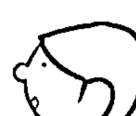

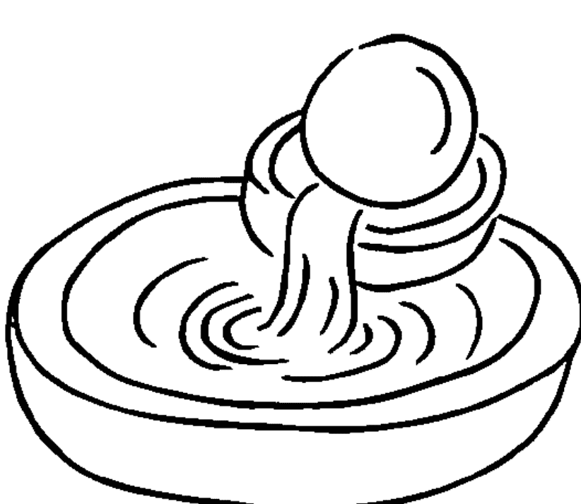

## 风生水起

摆放的位置十分重要，多半以摆放西北、西南的财位为佳。而且要特别注意摆放处周围的物件，切勿杂乱不堪，风生水起不成，反而招来反效果。

## 开运竹

很多人喜欢摆放俗称万年青的开运竹，认为可以招来富贵、福气与财富，认为是个讨喜的开运盆栽。可这真的不是好的风水物件，因为它的外型就像是无数把剑，易切割气场使其不聚，或许可以挡煞，但尖锐的外型实在无法招来好风水。

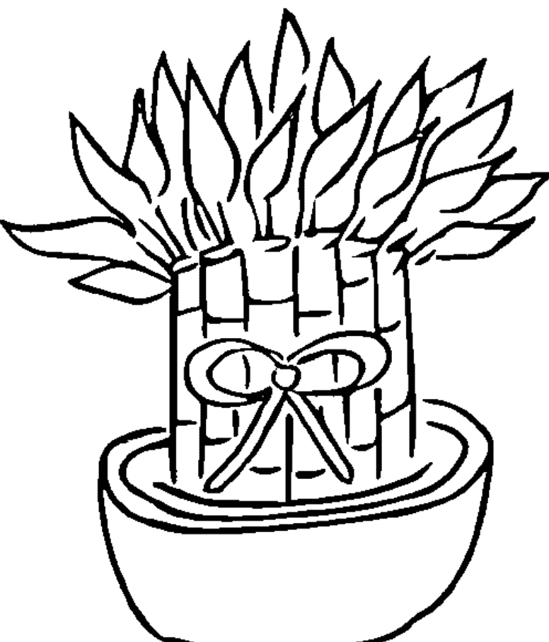

## 貔貅

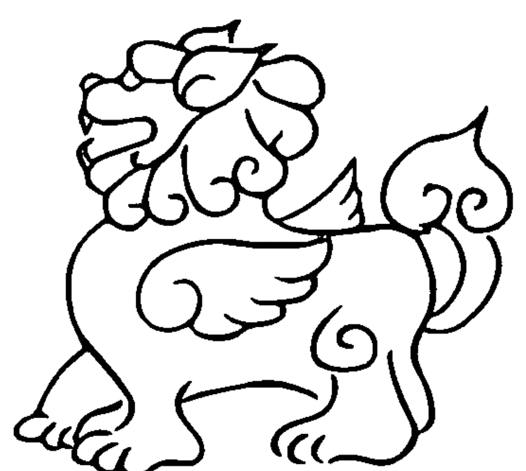

一般人以为貔貅可以招来财富，帮主人夹带钱财入库，但它是必须非常小心使用的风水工具。它的使用禁忌非常多，多半用在办公室、商场、大卖场，比较不会放在住家，除非是豪宅。摆放的方法是貔貅的正面要对着门口，也就是要从外头把大把的钞票、钱财咬回来。千万不可向内、对着主人摆放，不然会反咬主人一口，轻则伤财、重责伤身。虽然貔貅是福兽，但却是猛兽，所以使用上要特别小心。

## 聚宝盆

多半摆放在玄关处，或是自家的财位，就是西北方或是西南方，但切忌有灰尘沾染。定期清洁，保持干净整洁，是不可忽视的小细节。

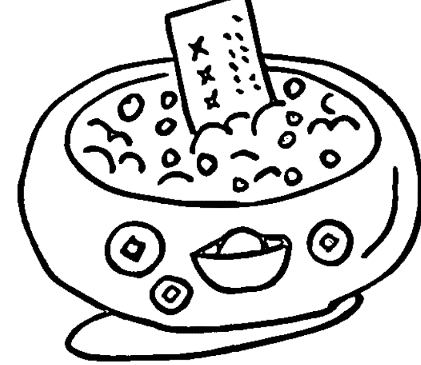

## 宗教圣物

每个人的信仰不同，都有各自推崇的神圣之物，可能是十字架、佛像、转经轮、唐卡等。不论是什么宗教信仰，圣物切忌沾附灰尘，摆放处杂物堆叠、脏乱不堪，如此不但无法保佑自身，玷污圣物，有时还可能因此沾附不好的能量与邪灵。保持整洁与干净是首要重点，至于要摆什么就看各家法门。

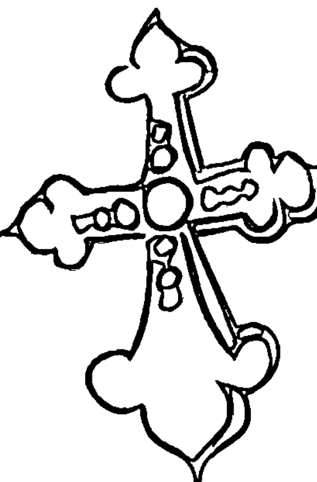

# 第七章

## 远离阿飘的自我保健之道

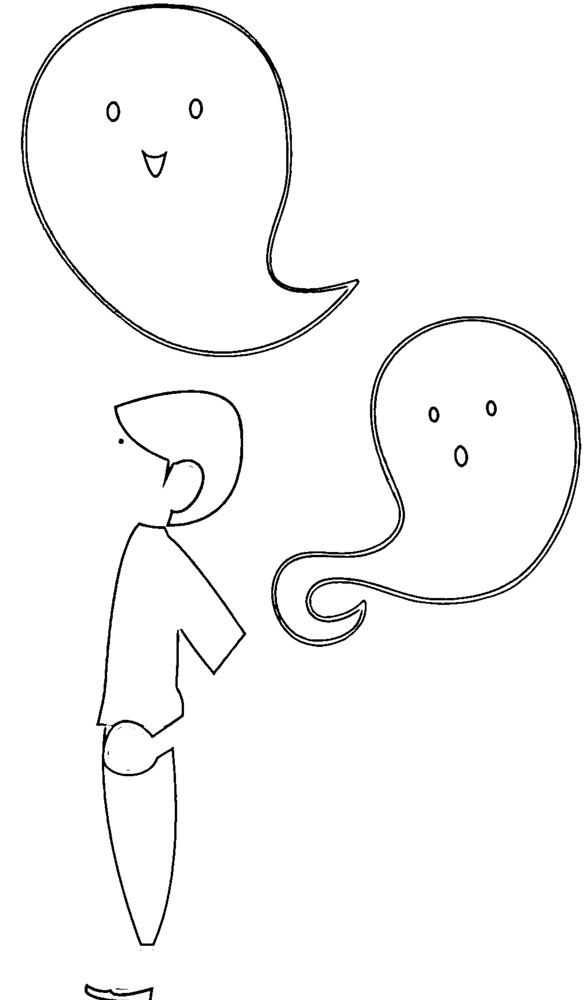

常常有人问我，怎么样才能不卡阴？其实这就像问医生怎么样才能不感冒一样，卡阴有点像是身体感冒了。避免自己不感冒的好方法就是提高免疫力，那么避免卡阴最好的方法，也是提高自己对阿飘的免疫力。怎么提高自己对阿飘的免疫力？这没有什么高超的法术，只有一个最简单的原则——就是让自己保持在身心灵平衡的最佳状态。

怎么维持身心灵平衡呢？要拥有健康的身体，需要适度的运动、充足的睡眠、均衡的饮食，才能照顾好身体状态；要拥有心理的成熟度，则需要培养正确的心念与心境，并具备抗压性，就能照顾心与灵的需要。如此一来，当身心灵都能保持在一种健康、正向与弹性的余裕之下，自然可以不断自我平衡与调整。而当一个人身心灵都处在流动与健全的状态之下，自然而然就能远离阿飘病毒的干扰与入侵。这就是最根本的治疗与防御方式，也是最健全的保健方法。如果能在身心灵三方面拥有正确的观念，并搭配一些简易可行的工具与方法，我们就能远离阿飘，不让负面

的能量纠缠自己，创造更积极正向的人生。

## 调整身心灵的状态

### 1. 知识就是力量

可以阅读自己喜欢的读物，任何种类皆可。现在资讯流通，不管是网络、电视、书籍的资讯传播都无远弗届，我们可以轻易的取得各种知识与讯息，无须设限阅读的种类与题材，多样化阅读可以培养自己更多的兴趣与对世界的了解。只是大量阅读并非要我们变成知识囤积的图书馆，而是藉由阅读的过程中拓展自己的视野，并以更开阔的眼界去探索未知与已知，藉此锻炼自己独立思考的思辨能力，只有如此才不会变成大师的盲从者与知识的傀儡。当一个人的内在越坚定与安定，力量才会

产生。知识就是力量，并不是要我们变成知识的吸血鬼，而是从中学习与培养看待事情的观点，这才是获取力量之所在。

### 2. 定期规律的运动

运动的重点不在于激烈性，而在于能够持续与规律，也就是变成定期锻炼身体的习惯。只要每天拨出三十分钟运动，并持之以恒，身体就能长期维持在某种动态的平衡之下。运动时不需要给自己太大压力，也不需要太过逼迫自己，能够适时的舒展身心才是最佳的运动方式。如果还能找到一样自己做起来觉得愉快的运动，定期舒展身心，还能愉快的进行，那就更好了。

### 3. 养成泡澡、冲澡的静心习惯

水可以清洁，不单单只是物理上的洁净作用，更可以带给心灵真正的洗涤与净化。当我们每天沐浴时，可以把洗澡当成一种静心活动，想像哗啦啦流过身上的热

水，不只是洗去身上的脏汗，更一并带走心中的不快，以及每日加诸在身上沉重的生活重担与工作压力。这些压得我们喘不过气来的各种烦恼、忧虑和不如意，都随着「放水流」，卸下沉重，还给自己一身清爽。试试看，每天洗澡时都试着这么做，你会发现洗澡不只洗净我们的肉体，还能净化我们的心灵。身心灵一次洗香香，一举数得，实在是每天超实用的静心好方法啊。

### 4. 接近大自然

现代人多半与自然隔绝，终日躲在室内，绕着3C产品打转，这样是非常不健康的生活。我们应该多到户外接近有生命的自然万物，多呼吸自然的空气，多晒太阳补充能量。当我们来到户外时可以脱去鞋袜，让双脚赤足的踏在土地上或青草地，让自己与大地接轨，想像身上所有的负面能量都经由双足被大地接收，排除自己身上的负面能量；还可以透过与大地连结，吸收大地之母源源不绝的正向能量支

持自己。如此双向的能量流动是恢复身体平衡非常好的方法。

### 5. 培养良好、正向的兴趣

当投入某项兴趣时，会提高一个人的专注能力，专注的过程是一种享受，也能让人放松。而且当我们专注时，能量会特别集中。透过这样定期的能量集中状态，可以稳定我们的身心，并锻炼出更坚定的心智与能量品质，对于纷纷扰扰的日常生活将是非常强大的支援力量。

### 6. 正常饮食、充足睡眠

这可说是最根本的基础了。当一个人拥有健康的身体、充足的睡眠，自然精神抖擞、精力旺盛，面对有害的外在干扰就不会被影响与波及，不管是生理上的病毒细菌，还是无形世界的阿飘扰乱，都无法渗透进一个健康与气场良好的人身上。这不仅仅是维护身心健康的基本原则，也是向阿飘说不的最佳防御工事。况且拥有健

康的身体，想要完成任何梦想才能行有余力，一举数得，不管怎么做都不吃亏，不就是一件说起来对自己相当划算的投资？

## 静心冥想练习

坊间有无数种静心与冥想的方法，各门各派都有自己的心法与步骤，读者只要选择适合自己的方法来实行即可。如果你对静心冥想的方法不熟悉，可以参考以下我所介绍的两种静心冥想的方法与要点。这是我自己经常使用，并且小有心得与个人体会的静心冥想方式。只要你参照以下步骤练习，也可以达到安定心神，甚至有所领会与顿悟的境界。静心冥想的方法因人而异，但最重要的是持续、定期的练习，把它变成像是每天刷牙、洗澡一般自然而规律，仿佛是生活作息的一部分，时间久了，自然而然会在自身的能量场上产生转变，足以抵御外在无形的干扰了。

### 1. 七大脉轮冥想练习

脉轮（Chakra）起源于印度，是人体中肉体与心灵的连结点。从头顶开始，沿着脊椎至尾椎，总共有七个主要脉轮分布，不同的脉轮位在人体不同的部位上，每个脉轮有着不同的身心灵感受，同时也掌管着人生的特定议题与面向。脉轮在正常运转之下，人体的能量场是流通的。倘若脉轮过度活跃或阻塞、不流动时，就会造成人体的能量场失衡，进而影响身心健康与能量状态。由于脉轮同时存在于身体和灵魂，所以在练习时，身心灵的平衡效果非常快速有效，而且脉轮的延伸效益很多，例如可以做为疗愈的能量、增加直觉感应力、增加自信度等。

学习脉轮除了可以点燃我们的生命之火外，它对自律神经失调有不错的改善效果，而且在判断事情和控制情绪方面，更是有显著效果。现代人充满压力、外在刺激诱惑多，如果我们能养成每天疏通脉轮的冥想练习，就能让身体能量流通不阻塞，并带来心情和情绪的平稳，如此一来，也才能预防阿飘的入侵。

### 七大脉轮的意义

1. 海底轮：位置在会阴部位，与大地连结，是土的能量，代表人类生存的本能能量与求生意志，欲望和独处时的安全感、安定感，与大自然的平衡与和谐性有关。
2. 脐轮：位在肚脐下方三指处，丹田的位置。是水的能量。与性能力、创造力、信任、情感、情绪有关联。
3. 太阳神经丛：剑突（胸骨最下方的一块软骨）下方的位置。是火的能量，掌管勇气、身体的力量、身体的爆发力。
4. 心轮：位于胸部中央。是风的能量，代表同理心、分享、感受度、爱的能力。
5. 喉轮：位在脖子喉咙的位置。代表沟通、说服力方面的议题。
6. 眉心轮：位在额头的两眉之间，俗称第三眼。第三眼连结后脑勺的神经，是我们双眼眼球掌管可见光谱的画面，眉心轮的第三眼则是感受能量知觉的所在，此处与理解力、觉察、辨识力、灵视力有所连结。
7. 顶轮：位在头顶百会穴。这里是与另一个世界连结之处，顶轮盛开宛若干瓣莲花，可让我们与灵或神佛世界的讯息互相连结，是让我们得以开拓另一种觉知意识的脉轮位置。

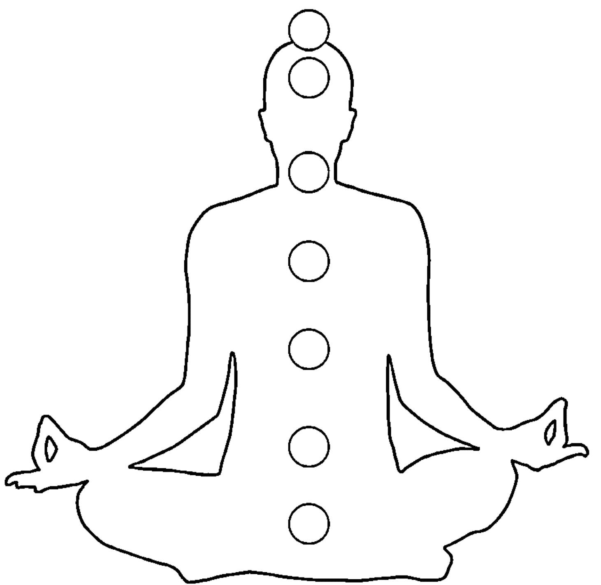

我们常常听人提起「七脉轮平衡」，指的是什么呢？就是七个脉轮同时开启、一起运作，但当中并没有单一脉轮特别强势或衰弱的现象，而是每一个脉轮都能够流畅的运转，强弱均等，而且还能彼此提升，才是七脉轮平衡的状态。一般而言，上四轮的脉轮比较偏重独立思考、也比较容易抓到冥想的要领，下三轮比较偏重肉体、情感以及与大地的接触层面。所以某一个脉轮特别突出都算是失衡的现象，必须彼此相辅相乘，一起扬升，连通流畅才是平衡的要义。

### 七大脉轮静心冥想的步骤

1. 首先盘腿坐定，让尾骨、会阴部位与大地接触，想像自己像棵大树一样深深扎根在大地下。越扎越深，仿佛虹吸效应似的将大地的能量吸取上来，充满海底轮；当海底轮开启时，会感觉到后腰、掌心的温度提高，会觉得暖暖的，仿佛有一股热流流过。

2. 接着来到脐轮处，将大地的能量在此地转换成水的能量，以利身体运用流动；有些人在开启脐轮时，会感觉到身体容易左右摇摆，有的人会觉得身体在旋转，请让身体保持放松，就让能量自然的流动，藉由旋转摇摆将身体的一些负面能量排放出去。

3. 然后来到太阳神经丛，会有一股热能爆发，窜到全身四肢各处细胞，能量似乎多到要满溢出来；平时在工作上受到压抑、有话不敢说的人，在太阳神经丛开启时，会感觉到全身充满力量，像火球燃烧般。

4. 紧接着能量走至心轮，可以感受到一种内在的稳定，世界变得很宽广，甚至也能觉知到周围他人的情绪反应；开启心轮的同时，会感觉背后好像有一对翅膀展开，感受到周围、身体的温度慢慢降温冷却下来，仿佛有一股微风吹过，感到自在舒服，想像飞翔在天空中般的开心自在。

5. 再往上走来到喉轮，在发出圣音「K」的声音同时，声音的穿透速度相当快，一种非语言的能量穿透四周。当开启喉轮的能量时，会发现与平常讲话透过喉咙的声音有所差异，这是一种具有穿透力的能量，并可以感受到肩膀的放松。

6. 继续往上来眉心轮，展开的第三眼可以让我们看到周遭的能量世界；眉心轮第一次开启时，有些人会觉得头部特别的胀痛，那是因为此刻眉心轮和我们的眼睛同时在适应这个世界，多练习几次，就会比较舒服。透过眉心轮的练习，可以试着用眉心轮看周遭的能量变化。

7. 最后行至顶轮，宛若一朵盛开的千瓣莲花，所有的能量与意识得以与无形的力量接轨，这是神佛、天使的世界。在开启顶轮的时候，我们可以感觉到顶上的能量沿脊椎连结我们身上的七个主要脉轮，可以感觉到头部的轻盈放松，整个身体都有轻飘飘的感觉。

七脉轮静心冥想步骤虽然如上所述，一开始仿佛是一个阶段接着一个阶段的步骤依序进行，但当能量运作十分顺畅无阻时，整个过程往往会在一瞬间发生，能量会飞也似的就从海底轮直上顶轮贯穿全身。当能量运作时，整个人会持续发热，即便体质原属虚寒之人也会微微冒汗与发热，对于身心是非常好的提振过程。

假使在进行七脉轮的静心冥想过程里发现有哪个部位卡住，好像能量无法流通过去，看一下是哪个部位或哪个脉轮。很有可能卡住的地方就是在提醒自己要特别注意这个部位的代表课题，此时可以在这处多停留一些时间，让能量可以在这处运作疏通。或许这次无法流动，但只要多加练习，卡住的地方终有流通的一天。多给自己一点耐心与爱心，在静心冥想的时候多关照一下受阻的部位，就是开始懂得自我照顾与关照的最好时间点。

### 2. 静心冥想练习

当我们提到静心冥想，大部分的人会把它与宗教上的静坐混在一起，认为要有严格的规范，并且多多少少参杂宗教色彩与教规，种种限制令人望之却步，以为得要皈依某一种宗教教派才需要静心冥想。其实这是许多人的误解。的确，一些宗教信仰有自己的禅定练习与静坐教导，信徒必须透过这些修行方法练习修持心性。但静心冥想发展至今，已经不是特别宗教派系的专属法门，只要是想寻求内在安定与真理之人，皆可透过这样的方式自我练习，不一定要进入某些特定的宗教团体才能施行。静心冥想与宗教无关，已经独立于宗教之外，成为一种养身修心的方式。

现代人生活紧绷、资讯爆炸，心智脑袋常常不得安歇，严重的睡眠问题，以及生活与工作带来的压力紧绷，导致身心失调的病症已经是司空见惯的文明病，但光靠药物治疗又有许多的后遗症，也浪费医疗资源。在追求更有效又不伤害身体的医疗方法时，有人发现静心冥想或瑜伽，竟然可以安定人们的心神，因此开始有不少

以科学的观点检测为什么这些方式有效，进而发现静心冥想的过程可以改变脑部的脑波，让人变得专注与具有创造力，还能激化松果体，产生不同的洞见与视野。越来越多的科学验证，都证明静心冥想带来许多意想不到的疗愈效果，使得更多人开始推崇静心冥想，以创造身心灵更大的一致与和谐。如此一来，就可以不用过分依赖药物，达到身心灵更大的健康。这个方法的威力与实用性不光只在肉体层面，更能在心灵与精神层面，给予我们实质的协助，不论是纾压、解决失眠的问题，还是阿飘的骚扰，都将有大幅的改善。

静心冥想的方式非常简单，首先要空出一段时间来，找个安静的地点，盘腿而坐，简单数息、观呼吸之后，可替此次的冥想设定目标与主题，这将有助于冥想的专注与效用。以往我们都以为静坐冥想只是要求取平静，却没料到大脑是永远聒噪不休，说个不停。我们以为只要停止念头就能获得平静，所以花费好大的工夫想要脑袋停止叨絮与争辩，没想到越是努力要脑袋停止，它却更吵闹不休。原来我们都

犯了一个技术上的错误，把力气用在错的地方，脑袋是永远不会停止的，我们需要做的不是停止脑袋的争辩，而是在头脑喋喋不休时，我们只要以一个旁观者的身分观看着脑袋的脱口秀就行了，不要浪费力气参与争辩，也不要让自己的情绪随着脑袋的戏码起舞，只要当个尽职的观众好好看脑袋表演即可，尽情看着脑袋的卖力演出。当你看到累了，就在这时停止静心冥想，起身活络筋骨。

接着只要定期做这个静心冥想的练习，一开始先观呼吸，然后一样观看脑袋的脱口秀，累了就停止练习。然后一次又一次的练习，每次都继续观看却不涉入，只要你认真做，但不要过度给自己压力，这个过程就是大脑充分放电的过程。久而久之，大脑就会累了，然后你会开始在静心冥想的过程中，慢慢安静下来，接着灵魂就会真正接管肉体的一切。时日久了，大脑聒噪的放电过程就会越来越缩短，你也会越来越能进入安静的状态，静静的与自己的内在、自己的灵魂相遇，能量状态也能够越来越稳定，你就能明白为什么静心冥想能够启动疗愈的机制。因为我们越来越越與真我同在，也越能活出靈魂的本質與智慧。

靜心冥想就是一種讓我們與內在靈魂接軌的過程。由於我們活在三維世界，有肉體的束縛，也受到社會文化價值的約束與教化，所以我們會以大腦理解的世界為主，以為腦袋想的東西就是現實世界的全部。其實，大腦只能認知三維世界，這樣的認知是有限的；可是靈魂對於世界的認知不同，靈魂不受三維世界具體、有形、框架的觀念所束縛，靈魂認為凡事皆擁有無限的潛力與可能性。肉體與大腦所執著的念頭，所經歷的萬般悲慘、忌妒、憤怒與不愉快的種種情結，以靈魂的觀點來看，這不過是時間洪流、多重宇宙的滄海一粟，對靈魂來說這根本不算問題，可是肉身與聒噪的腦袋瓜卻往往苦不堪言。從兩者的觀點，就可以明顯看出宏觀視野與狹隘觀點的懸殊與差異。透過靜心冥想的方式，無非是希望我們可以放下肉體與大腦的執念，讓靈魂做主，讓靈魂的智慧開啟我們侷限在三維世界的小小視界，進而體悟生命本質的浩瀚真諦。

靜心冥想的過程，就是讓喋喋不休的大腦演累了、說累了，進而放手交棒給靈魂作主的過場方式。透過靜心冥想，大腦可以放鬆與開放門戶，靈魂的智慧與慈悲才得以進駐我們有限的三維世界，協助我們面對人世的諸多考驗與課題。這或許是老天爺讓我們在三維世界體驗肉身生活時，還能讓我們打開與靈性、神性接軌的一扇任意門吧？這扇任意門，能讓你自由的通往靈性世界。

## 趨吉避凶的簡易方法

除了靜心冥想的自我修持方法，還有什麼更簡便的方式可以讓我們維持在比較好的能量狀態與空間氣場呢？因為有時忙工作、忙生活，盯著家中的小孩吃飯、洗澡、念書、寫功課……即便三頭六臂也幾乎快要忙不過來，根本沒有個人獨處的片刻。在這樣時間過度被壓縮的狀況下，真的很難找到一個好好練習這些心法的個人獨處清淨時間，到底該怎麼辦呢？為了因應現代人快速忙亂的生活模式，或是有人就是無法進入靜心冥想的狀態，還是有其他方式可以協助這樣的朋友，我們可以透過外力的協助，譬如：寶石、儀式、精油，以及一些特殊地點的物件配置，達到趨吉避凶的功能，讓阿飄遠離，並且提升我們個人與空間的能量品質，創造更好的氣圍與運勢。

### 一、配戴寶石

寶石依照配戴位置的不同會有不同的功效：

- 1. 項鍊：配戴位置在胸口，針對心輪，可以加強思考、想法與觀點。
- 2. 戒指或手環：配戴位置在手指或手腕處，可以加強執行時的手段與執行方法。

寶石依照不同的材質有不同的功能，常見的有提升與增強特殊功能，例如針對事業、財富、貴人、健康、桃花的正向能量需求，或是防禦型的功能，例如防小人、防止負面能量、驅邪避凶等等。不同的寶石擁有不同的增強或是防禦的能量，有些寶石不只具備一種功能，而是多方面的功能兼具。我們可以按照個人不同的需求挑選適合的寶石幫助自己，不論是增強或防禦，都能夠帶給我們非常實用的幫助。以下依照不同的寶石屬性分門別類逐一介紹，我們可以從能量性質或是功能性質來選擇，也可按照自己的第六感與直覺，挑選此刻最適合自己的寶石配戴或擺設，讓自己能量提升，好運旺旺來。

### 石英家族（Quartz）

取得容易，能量直接，可以快速將失去的能量填滿。因為地球礦產裡石英家族就占七成以上。

- 白水晶 (Rock Crystal) ：最普遍也是能量最多元，適合任何能量祈福。
- 紫水晶 (Amethyst) ：可增長智慧。
- 黃水晶 (Citrine) ：增進財富，促進健康。
- 粉晶 (Rose Quartz) ：加強愛情運與貴人運，增進健康。
- 茶晶 (Smoky Quartz) ：增進健康，防小人。
- 黑水晶 (Black Quartz) ：避邪、擋煞，排除負能量。

### 電氣石家族 (Tourmaline)

俗稱碧璽，帶有微量的正負電子。不管是哪一種種類的碧璽皆可增進身體健康。

- 紅寶碧璽：提升貴人運與桃花運，增強事業運與財運。
- 粉紅碧璽：增進貴人運與桃花運。
- 綠碧璽：增強事業與財富。
- 藍色碧璽：最為稀少的碧璽，可以提升精神層面與靈性修行的悟性。
- 黑碧璽：可用來辟邪與擋煞。

### 長石家族 (Feldspar)

- 月光石 (Moonstone)：可以增進靈性與智慧。可依成色不同細分為：七彩月光石、藍彩月光石、貓眼月光石、菊月光石、灰月光石。
- 太陽石 (Sunstone)：增進健康，加強支配力。依成色可分為兩大類：灰太陽石、非灰色太陽石。
- 天河石 (Amazonite)：增進靈性、帶來快樂喜悅、提升好運氣。
- 拉長石 (Labradorite)：增加創意與靈感。

### 石榴子石家族 (Garnet)

這是一種原礦，宛如石頭裡的種子，所以稱為石榴子石。

- 紅石榴子石 (Red Garnet)：最普遍的石榴子石，它能增加貴人桃花，也能促進健康。
- 鐵鋁石榴子石 (Almandine)：顏色更加暗紅，能增加貴人桃花和促進健康。
- 錳鋁石榴子石 (Spessartite)：在石榴子石家族裡為紅色系最高等級，以橘紅色為主，魔法上更能象徵火焰力量，魔法效果更為精純。
- 鈣鋁石榴子石 (Grossular)：高等級，又稱沙弗萊石 (Tsavorite)，以綠色為主，有別於以紅色為主的石榴子石，專攻事業和財富，在珠寶界是夢幻逸品。

### 剛玉家族 (Corundum)

硬度九，硬度僅次於鑽石，十分稀少。

- 紅寶石 (Ruby) ：可以增強支配力、增強財富與健康。
- 藍寶石 (Sapphire) ：可以增進事業運、提升健康。
- 玉：加強貴人運與桃花運。
- 增加財富。
- 亦稱皇帝剛玉，可增進支配力、提升財富。
- 玉：多半是深藍色。在剛玉家族中黑色是雜色，比其他剛玉常見。

### 綠柱石家族 (BERYL)

此種寶石黃色居多，可以招來財富，亦有黃綠色，可提升財富能量。

- 海水藍寶 (Aquamarine) ：增加財富與健康。
- 祖母綠 (EMERALD)：的「祖母綠車工」，使得此款寶石的切面呈現璀璨亮度而十分著名，寶石非常昂貴，可以招來財富與健康。
- 摩根石 (Morganite) ：招桃花，是愛情聖石。

### 蛋白石家族 (Opal)

具備油彩效果。沙質地型產出的寶石，十分昂貴又難保養，在失去水分後很容易黯淡無光。

- 黑彩蛋白石：可以增進事業運，是蛋白石中的最高等級。
- 火蛋白石：可以增進身體健康、增強支配力、提升財富。
- 黃色蛋白石：增加財富。
- 白色蛋白石：亦稱七彩蛋白石，是市面上的主流蛋白石，寶石會折射出具有迷彩效果的色彩，可以增加財富。

### 其他類型

- 舒俱徠石 (Sugilite)：增進靈性與直覺力，適合靜心冥想和平衡身心靈，高等級舒俱徠石有兩種，一種為傳統的藍紫色，另一種是紫玫瑰色。
- 青金石 (Lapis Lazuli)：增加財富與靈感力，高等級青金石具備兩種特質，寶藍顏色和均勻金沙分布。
- 拉利瑪 (Larimar)，又稱天空石：主要產地在多明尼加，是以發現者的女兒的名字來命名。寶石的孔隙相對較大，所以會依配戴者產生不同的雲彩，它也能夠快速吸附能量，可以增加靈性、穩定情緒。

或許在這裡有人會問為何沒有介紹到沒有介紹到鑽石？鑽石擁有「寶石之王」的稱謂，實當之無愧，其顏色、淨度、價值能承受時代考驗。我給讀者提供一個思考方向，在神秘學裡特別介紹魔法儀式的書籍典藏，卻顯少介紹到鑽石，這不是因為鑽石相較其他寶石較缺乏能量，相反的，是鑽石能量太過強大。我們必須先瞭解一件事，我們希望寶石能帶給我們幫助，是因為它本身能量有一部分是和我們的生活重疊。因為鑽石能量太過強大，它已無法包容其他不同屬性的能量，所以在魔法儀式裡顯少利用鑽石來祈福，祈福過程是一種能量和能量間的交集連結。話雖如此，並不代表鑽石就無用處，它仍然帶給我們感官和價值上最高享受和滿足！

### 二、祈福儀式

這個儀式非常適合從事高風險工作領域的人，譬如：常常在外東奔西跑的業務人員，使用這個祈福儀式可以讓自己趨吉避凶，避免在外奔波引起的「車關」、不必要的口舌是非，增進自己的貴人運、好人緣，守護身體健康，並且替自己帶來豐盛的財富能量，可謂一舉數得，全方位守護與祝福的祈福儀式。需要準備的物件與進行方式如下：

#### 1. 名片或照片

需要準備一樣「代表物」象徵所要祝福的對象，請準備工作時的名片一張，或是三個月內的個人照片一張。若是單獨為一個人祈福，就使用單人照；若是為全家人一同祈福，就準備一張全家福照片。

#### 2. 水晶碎石

準備橄欖石、黃水晶、紫水晶、粉晶、白水晶的碎石，選擇其中一種水晶碎石，或是多種水晶碎石混搭也可。將水晶碎石泡水，放置戶外曝曬三天三夜，倒掉水之後將水晶撈起擦乾，準備玉油或嬰兒油塗抹水晶碎石，以滋潤水晶碎石。

#### 3. 聚寶盆

準備一個聚寶盆（瓶口務必緊縮、瓶身大肚狀且大於瓶口，象徵錢財易進難出，財富才能守住），將保養後的碎水晶放入聚寶盆內，約莫八分滿，接著把祈福對象的名片或照片插入碎水晶之中，名片或照片必須插入碎水晶石堆裡約二分之一，倘若有張名片或照片，不可疊在一起放置，彼此之間應該盡量錯開，以扇形展開置入碎水晶中為最佳，務必使每一張名片或照片都可以顯露出來，不被遮蔽。若張數實在太多，聚寶盆記得選擇大一點的盆子，才好放置多張名片或照片。

#### 4. 擺設方式

選擇家中整體格局的西北方或西南方，倘若是單身租屋，則選擇自己租賃房間的西北或西南方，將設置好的聚寶盆放置於此方位。無須特別挑選時間，只要將準備好的聚寶盆擺放於西北或西南方方位即可。這個祈福儀式十分簡便，只需準備好相關的物品擺放就行。但有一個要特別注意的關鍵，就是記得保持聚寶盆的整潔乾淨，不可沾染灰塵髒汙。最好每個月定期以「威拂」（靜電吸附灰塵）整理、拂去灰塵。如此放置一年之後，再將聚寶盆的水晶倒出，按照以上的流程，重新將水晶清洗、曝曬、保養後，記得撤下舊名片與照片，換上近照或新的名片，再重新擺放於西北或西南方，就能一年又一年守護我們並帶來好運道。

### 三、玄關擺設

可在進入家中或公司的大門口的玄關處擺放水晶擺件，形狀以球形、山形為佳。水晶物件的大小約五百公克左右，無須太大。不同的寶石有不同的趨吉避凶的效果，可依照個人需求選擇適合自己的水晶擺件。一般常用的有：綠螢石、拉長石、黃鐵礦、綠曜石、粉晶等等。擺放之前，記得先將水晶泡水，拿至戶外曝曬三天三夜，再從水中取出水晶擦乾，並塗上玉油或嬰兒油保養，即可擺放於玄關處。之後一定要記得維持清潔、定期保養，切勿讓寶石蒙塵，寶石上有灰塵，不僅無法達到效果。

### 四、使用精油

精油的功效不只是作用在身體上，還能在能量上發揮功效，精油若使用得當，更可保健身體並守護能量場。

- 木質調精油：可以避開小人、擋煞除厄，有防禦、保護的功能。
- 花香調或是柑橘類精油：可以提升好運、桃花運、貴人運的運勢並且能夠增加財富。

### 五、魔法油製作DIY

結合寶石與精油的雙重功效，我們可以按照不同的需求，製作相關主題的魔法油，製作好的魔法油可以隨身攜帶塗抹，也可拿到泡澡，是一種相當方便且氣味宜人的趨吉避凶小工具。

#### ☆財宮魔法油

- 1. 準備花香類或是柑橘類的精油，例如茉莉花、綠花白千層、桂花、橙花、依蘭等等單一配方，或可以自行調配好精油，只要其中有包含花香類或是柑橘類的精油即可。
- 2. 準備橄欖石碎石（橄欖石的綠色象徵招財、橄欖石本身則代表豐收）或是黃水晶碎石，先將水晶碎石泡水並曝曬三天三夜，取出擦乾後塗玉油或嬰兒油保養。塗油時可以加入招財的意念，譬如：希望訂單增加、中樂透頭獎、股票投資獲利等等個人專屬的特殊招財目的，將招財的意念透過塗抹水晶的過程傳遞給水晶碎石。
- 3. 準備一個容器，裡頭放入單方精油瓶或是自行調製好的精油瓶，然後將橄欖石碎石或黃水晶碎石倒入，完完全全覆蓋住容器裡的這一瓶精油，靜置一個月。一個月後，即可從碎水晶堆裡取出精油瓶使用。這瓶精油就是你個人專屬的自製財富魔法油，可以塗抹、可以擴香、也可以滴入熱水中泡澡，讓自己充滿在財富的香氣中，藉此驅動招財的能量，達到先前祈願的財富目的。

#### ☆貴人、桃花、好人緣魔法油

製作魔法油的方法與財富魔法油一樣，只是使用的水晶碎石與精油不同。碎水晶使用粉晶或是石榴石碎石；精油使用玫瑰或是花香類的精油。記得水晶曝曬擦乾後，塗玉油或嬰兒油保養時，帶入期許好人緣、好桃花、貴人來的意念，會更增強魔法油的效果喔！

#### ☆好運魔法油

碎水晶使用橄欖石碎石或硨磲碎石；精油使用柑橘類或檸檬精油。帶入水晶的意念是增強好運的心願。

#### ☆健康魔法油

碎水晶使用橄欖石碎石、黑碧璽碎石、珊瑚碎石，擇一即可；精油使用木質調精油，例如松科類精油、檜木精油、茶樹精油，或是柑橘類精油。帶入水晶的意念是提升健康，或是針對個別疾病或身體特定部位的健康祈福。

#### ☆考驗魔法油

碎水晶使用紫水晶碎石或舒俱徠石碎石；精油使用木質調精油或是柑橘類精油。帶入水晶的意念是祈求金榜題名、或是高分過關等等個人化的需求心願。

#### ☆防小人、擋煞、保護魔法油

碎水晶使用茶晶碎石、黑碧璽碎石、黑曜石碎石，擇一即可；精油使用木質調精油，例如杜松、黑胡椒。帶入水晶的意念是小人退散、除厄擋煞、保護能量場等守護自己的個別祈願。

### 西方神秘學工具的介紹

我在進行能量工作時，常會使用一些魔法工具幫襯，透過這些工具的協助，淨化效果不僅加乘也省下我許多力氣。但魔法工具只是一樣媒介，平常放在那裡是沒有什麼特殊能量，工具必須透過能量師的驅動，才會產生魔法的力量。魔法工具展延了能量師的力量，透過這股力量才能夠淨化無形的存在與能量。在進行淨化工作時，到底要選擇哪一種工具才能發揮最大的效果？有賴能量師對個案卡陰狀況的觀察與了解、過去淨化的實務經驗，以及當下立即的判斷與思考，望聞問切、大膽假設、小心求證，才得以總結研判出哪種工具最適合當下的情況，沒有絕對的答案，也沒有業界SOP。完全仰賴經驗的累積，這真的是十年磨一劍的壓箱絕活。

工具的種類繁多，使用方式也不盡相同，有些小工具看起來平凡無奇，卻擁有驚人的效果，所以工具不在名貴與否，而在於使用者存乎什麼樣的心念，才得以驅動魔法工具達到最大的功效。感謝這些工具的協助，我才能在無數的能量工作或魔法儀式進行時，省時省力、事半功倍。也多虧了這些工具，我可以更悠遊於能量世界的精進與修持，藉此幫助更多需要淨化的朋友。以下我列出幾項我個人常用的神秘學工具，也是我在淨化工作時不可或缺的小幫手，簡略概述它們的使用方法與功效，讓大家可以一窺究竟。

### 白色鼠尾草

北美洲印第安民族常用的淨化聖草。點燃之後有熾熱感，結合了風元素與火元素的能量，可以把阿飄的執念帶走。

### 巫刃

可以切割阿飄的執念，對東方的阿飄比較有效，對西方的阿飄的作用力則比較薄弱。因為前者對於刀光劍影類的工具比較畏懼，後者則較忌憚白色鼠尾草的威力，這或許都跟死者生前的文化背景有關。阿飄生前的文化影響導致死後記憶中依然帶著過往人生的想法與執念，所以才會對不同的工具產生不同的畏懼之情。

### 銅缽、老缽

銅缽的頻率是綿密且蔓延，跟阿飄的頻率大不相同，所以銅缽是透過振動的頻率來解除阿飄的執念。目前市售銅缽多數以機器壓模為主，以銅為主要材質，聲音較為單一；相較於老缽，以各種金屬為材質，聲音共鳴多元。可惜老缽製作已逐漸失傳，導致價位水漲船高。不論挑選一般銅缽或是老缽，建議盡量現場試敲，感受一下音頻音域，選擇自己喜愛的款式。

### 手搖聖鈴

聖鈴的鈴聲是急促又尖銳的聲響，聽在阿飄的耳裡，彷彿霰彈槍四射一般。當鈴聲一下，阿飄仿若被無數的石塊猛烈攻擊，足以振斷阿飄糾纏不清的執念。除此之外，手搖聖鈴也有傳達意念，達到溝通的效果。

### 薩滿鼓、非洲鼓

薩滿鼓和非洲鼓是透過鼓聲運作改變環境周遭的能量狀態，進而撞擊阿飄，改變阿飄的存在狀態。能量來源和大地直接連結，所以能量特別寬廣遼闊。

### 龍血粉

龍血粉可以活化並且增加身體的正向能量。使用方式是將龍血粉塗抹在卡陰的人身上，此人的身體能量就會開始活絡運作。當身體的整體能量提升之後，阿飄自然而然無法承受這樣的能量撞擊，覺得非常不舒服而被振離開卡陰者身上，藉此可以保護被卡陰的人。

### 印度檀香粉

具有封印的效果。可將檀香粉塗抹在卡陰的身體部位，常見的卡陰部位有：肩胛骨、眉心（最常使用的部位），就能將能量氣孔封印起來，以免阿飄再度入侵。

### 水晶骷髏頭

代表智慧與覺察的水晶骷髏頭，與阿飄糾葛的執念正好是相反的能量，所以只要祭出水晶骷髏頭就可以改變與振斷阿飄的執念。在東方社會的文化傳統裡，認為骷髏頭總與死亡、威嚇、壞兆頭、不潔與不吉利等等不好的象徵掛勾，沒有人會喜歡看到這樣東西，如果有人拿出骷髏頭一定是想要對方觸楣頭、倒大楣；可是在西方的魔法文化裡，卻認為骷髏頭代表祝福、智慧與永生，水晶骷髏頭更是常常運用在驅魔或是祈福的場合上，是一種非常普遍的魔法工具。所以不明就裡的人，往往會看到水晶骷髏頭而大驚失色，經過說明之後才放下心來。我常開玩笑說，我們臉皮底下不就都藏了骷髏，這非常自然且天經地義，東西方的文化差異，由此可見一斑。

## ∞ 結語 ∞

### 平衡生活，盡好作人的本分

相信多數人和我一樣生長在傳統家庭，每逢節慶甚至初一十五之日，爺爺奶奶總會準備貢品祭天祭祖；就算是小家庭不方便準備，也都會全家人齊聚，到附近廟宇祭拜，求得內心的平安。我認為這種宗教信仰是好事，在參與的過程中，家人之間的向心力就會更加凝聚；在村廟遇到街坊鄰居時，彼此噓寒問暖，互相關心，這不僅是信仰，也是人和人之間情感交流的方式之一。

台灣相較於其他國家和文化而言，對各式各樣的宗教較具包容力。台灣人的信仰自由在全世界是數一數二的，衍生出的宗教文化也相當多采多姿。另一方面，我們對於資訊取得非常容易，但也逐漸失去獨立思考的精神，迷失自我，這部分從當今媒體亂象可明顯觀察，逐漸演變成人云亦云的民粹現象。我們懶於探索和研究，所以將自己的思考決定權交由別人，誤以為別人是權威的專家學者。讀書讀一輩子，卻不了解獨立思考的重要性，實在可惜。

這幾年我接了數百個個案服務，這些個案裡不乏有許多各行各業的菁英，舉凡教育家、醫護人員、企業家，甚至是修行者都有。當他們在遇到卡陰的問題時，四處求神問卜，有的人發願吃齋念佛，有的人接受宮廟祭改。有些人因為誤信人言而造成傾家蕩產，更嚴重者甚至走火入魔、一發不可收拾。他們以為是因為自己的氣場出了狀況，才導致財運不佳，不惜向銀行或地下錢莊借貸，花大筆金錢向廟宇祈求改運，上許多身心靈課程。有些女性個案因為輕信他人，誤以為需要透過陰陽調和之術才能驅魔趕鬼。更不乏高知識分子從國外網站研究魔法儀式，招來許多邪靈干擾，輕則精神不繼，重則魂不守舍。

我認為阿飄並不可怕，它們的確有自己的執念和可憐之處，但最可怕的是我們人類的偏見。我們在物質世界的執念下，產生的固執偏見，才是造成生活發生問題的根本原因。我常說人生不就是那幾個課題：財富、朋友、愛情、健康、心靈。而許多人認為精神才是一切的根本，許多心理勵志書籍會特別強調心靈。以我實際的觀察，認為這實在是大錯特錯，誤人子弟啊。

我覺得人生課題是在財富、朋友、愛情、健康、心靈之間「取得平衡」，彼此缺一不可。我們不是神，所以我們應盡好作人的本分，也就是學習作人的根本道理。財富是物質世界的根本，但許多人為錢財失去健康；朋友是學習作人的根本，但許多人為私人利益賣友求榮；愛情是學習相處和情感的昇華，但不是濫情背叛；健康是生存的根本，但我們卻最容易忽略身體；心靈是靈性的根本，但我們卻成天將它掛在嘴上，成為名副其實的假道學。

我常常思考為什麼人喜歡把生活複雜化！或許，在我們每個人心中都有一位神，祂是我們的榜樣，我們認為祂是無所不能，我們會想要仿效祂。這就是擬人。我們又很主觀的，一切事物只用自己的角度去觀察，以為別人的想法都和我們一樣。於是，我們逐漸失去靜心和思考，成天只想模仿……或許我們從未真正認識自己。

每當有人問我：「如何解決問題、渡過難關？」我總會回答：「愛自己、好自在！」

最後再一次和大家分享我從十九歲起，就常放在心裡的話：「思想產生能量，能量啟發思想。」

祝福各位，HASATA。

## ∞ 學員迴響 ∞

### 阿飄沒有想像中的可怕！

如果你像我一樣，以前常跑宮廟拜拜，常常被人家說你卡到陰或是被冤親債主找上門，需要祭改或是燒一大堆紙錢，你就能體會當我遇到 Eddie 老師就像遇到救星一樣。但 Eddie 老師也很妙，在做能量調整的時候，也不多話，不會讓你有被恐嚇的二度傷害。

印象最深的是有一年勞工團體上街頭抗爭，擺了紙做的棺材、紙錢、招魂幡等道具。我一離開凱道，就發現自己不太對勁，狀況像中暑，卻更想用頭去撞牆，因為頭痛欲裂直冒冷汗。我打電話到心靈角落，看看 Eddie 老師是否有空幫我調整。幸好女神眷顧，Eddie 老師在館內且能夠接我這個個案。

一到館裡，Eddie 老師先觀察我的狀況，並偵測我身體能量哪邊產生失衡，結果問題是出在心輪。我把整個凱道上的集體怒氣全打包帶走了，外加一些有型的道具引來無形的能量體靠近，所以我才會一陣青一陣白外加冒冷汗想撞牆。進了能量室，Eddie 老師透過線香、鼠尾草、淨化精油還有水晶、銅缽等輔助工具，卸除了附著在我身上的負能量，並教我再透過自己的呼吸調節。我走出能量室時，可說是煥然一新，眼睛大亮。

後來參加過幾次 Eddie 老師的講座，慢慢打破了以前的卡陰觀念。Eddie 老師的觀念很科學，能量就是一堆的正負電子，姑且稱阿飄為負電子，因為自己身上的正負電子不平衡，所以當阿飄飄過來的時候，企圖來跟人平衡，就卡到了。而卡陰的概念是大家集體潛意識的結果，搞到人心惶惶，看到黑影就開槍。話說我在認識 Eddie 老師前，也燒了好多年的紙錢，也是有送不完的煞。

我真的很討厭人家一開口就說，你是不是卡到？或是你能量狀況很差喔？這到底是關心還是恐嚇呢？但我從來不會聽到 Eddie 老師這麼說。這本書就是要闡述其實阿飄沒有想像中的恐怖，很多時候是自己的疑心生暗鬼，把狀況無限放大；透過鍛鍊自己的身體，以及導正觀念，能量平衡了，就能讓自己不撞鬼。

### Eddie 老師教我們用能量觀點解讀阿飄

依稀記得三年前，第一次預約老師的能量淨化。我是從電視節目知道老師的這項服務，抱著既期待又害怕的心情來到「心靈角落」。我在那年的農曆七月，身體一直不舒服，去看了好幾位醫師，也去拜了好幾間廟宇，都查不出原因。

Eddie 老師問了我的情況後，首先用手在我背部後方偵測，右手拿把巫刀由上而下的劃直線，左手像從我身上抓出一些無形的東西，並拿支線香在一旁畫呀畫的。當時我完全搞不清楚狀況，卻很明顯感受到從背部湧起一股溫熱的能量蔓延全身，胸口的不適也舒緩許多。老師表示，他已淨化了我身上一些淤塞的能量，並提醒我要學習讓自己紊亂的情緒穩定下來。我是屬於比較纖細敏感的個性，情緒容易受到環境變動而起伏，但那時的我並不明白情緒平穩跟卡陰有什麼關聯。直到後來參加老師的講座，才有系統性的理解。

Eddie 老師的講座內容十分豐富，他以輕鬆易懂、合乎邏輯的方式介紹阿飄成因、並逐一解構。為什麼有的阿飄只有一顆頭飄來飄去？我們拜拜的香跟食物是如何透過目的性具現化給阿飄們？卡陰、被下符、被下蠱有什麼差別？這些問題都一一獲得解答。其中最讓我受用的，是老師分享的卡陰三角論，以及老師一再提醒「能量是靠平衡的」、「思想產生能量」。我才知道，原來身體、環境與周遭能量狀態是息息相關的，阿飄說穿了其實是能量的聚合體，負面情緒就是滋養它們的養分。當我們能量不平衡、心靈能量脆弱時，阿飄就會透過干擾，引發我們身心靈的衝擊與煩躁，並藉此得以吸收更多的負面能量。反之，如果讓自己處於良好的身體狀態與環境裡，就能降低吸引或沾染雜亂能量的可能性。老師教導我們的是一些簡單的自保與自救方式。

在這三年期間，我也陸續經歷過大大小小的體驗，例如：去廟裡拜拜反而被人下符、租到隔壁是鬼屋的房子、沒做好自我防護而在捷運沾染上路人的負能量……我也因此學會使用寶石、巫刀、五芒星、線香、精油、脈輪、調息等能量淨化與平衡的方法，甚至也開始協助朋友做簡易的能量清理。琳瑯滿目的淨化方式，最重要的莫過於核心的本質：自身的能量是否平衡、心靈的力量是否強壯堅定。

跟著 YoYo、Eddie 老師學習之後，我現在會用能量的觀點來解讀阿飄，它們就不再那麼虛無縹緲了。當很多事情都能知其所以然，似乎也漸漸能不驚、不怖、不畏。更大的收穫是，當逐漸明瞭自己與外在的能量狀態，產生一股了然於心的淡定與踏實，有助於身心靈朝向平衡與平穩的成長。期盼讀者也能透過老師這本書中的分享，讓自己更加美好。

HASATA。

### 從未知的恐懼轉成互相尊重的心態

記得是在二○一三年七月的講座中，Eddie老師教導學員們如何判斷自己卡陰，我依循著講義上的項目逐一核對，驚訝的發現自己幾乎所有的徵候，其中一點是喉嚨老是卡卡的。我有整整兩年總是感冒不斷，而且一感冒就是一、兩個月才好，後來我的聲音就變沙啞了。我一直都知道自己對環境能量十分敏感，但萬萬沒有想過自己會卡陰！講座後，Eddie老師為大家掃描氣場，也為我做了簡單的處理，並交代我回家後觀察是否仍有異狀。

這一個「開門」的動作，立刻驚擾了住在體內已久的靈體們。我回家後，馬上感受到混身不對勁，於是我火速預約Eddie老師的淨化，開始一週的奇幻旅程。第一次的淨化，Eddie老師非常仔細的反覆使用白鼠尾草、掃把、水晶缽、能量療法、各種水晶以後，終於釋放了一個原本想要侵入取代我的意識，卻因為我的意識過於堅強，被反包覆在胸口，無法脫困，它的臉是因為過度擠壓而變形的人形靈體。我兩年多來以為是感冒引起的胸悶與喉嚨沙啞，當下立刻得到舒緩，特別是胸口的緊繃感瞬間消失。

但這只是那一週的開始。快樂舒暢的時光在隔天就消失了，我開始感受到身體內有一個灰黑色的巨大靈體完全展開，接著整個人彷彿全身發炎的症狀，開始微微的發燒，整個體力劇降。我非常焦慮，立刻再預約 Eddie 老師的淨化。Eddie 老師一見到我，發現我比之前被侵擾的狀況更嚴重，於是再度仔細檢查。原來這魚形靈體，隱匿在我身體的某個角落，一直在等待可以佔據我的意識中心的機會。在驅除前一位房客以後，它就肆無忌憚的現身了。

經過一連串的處理，在淨化結束後，我明顯感受到身體的不適感完全解除，但整個人的能量存量，因為在這場搏鬥中，急速下滑。Eddie 老師感受到我對這些狀況的焦慮與擔憂，除了交代我要泡澡、多開啟脈輪恢復體力外，還特別跟我講述關於靈體、能量流動的概念，他說：「能量沒有好壞之分，只有你的身體能不能接受。而靈體是一種跟我們一起共存在這個世界的能量，當我們可以平心靜氣的看待這些能量，觀看這些能量，把適合的留下，不適合的排除，其實就能減少卡陰的狀況……」

這段話開啟我對能量世界完全不同的視野，對阿飄等靈體的看法也從未知的恐懼轉換成互相尊重的心態，並更理解要維持、保護自己身體的能量場，才能避免對各種能量過敏的狀況。作為能量世界的學習者，終於盼到 Eddie 老師出書好好跟世人分享，真是讓人興奮不已的事情呢！

### 掌握自己的能量主導權

還記得以前的自己，從沒想過要好好的關注自己，詳細的觀察自己的身心狀態。我常常覺得身體感覺不舒服，但又不是真的哪裡生病了，一直頭昏鼻塞卻找不出原因，有時候很難控制自己的情緒，或是沒來由的一陣濃濃倦意襲來。這些症狀都影響我的生活，我不明白發生什麼事了，繁忙的生活讓我得過且過，反正就是忍耐。直到我接觸了 Eddie 老師的能量淨化與能量課程，讓我的世界有了一百八十度大轉變。

第一次能量淨化，我是毫無感受的，我就這樣在能量室裡空坐了十幾分鐘。現在回想起來，當時的我真的毫無感受嗎？現在我明白我因為容易緊張、從未好好的感覺自己，才會如此。什麼都覺得「還好」、「沒有特別的感覺」，應該也有不少人和我如此吧！除了有人打你一巴掌，才會有感覺。

在接受了 Eddie 老師長期的能量諮詢服務後，才有這樣的認知。練習把關注力拉回到自己身上，放掉所有心態上的武裝、放掉對未知恐懼而產生的抗拒，在日常生活中觀察自己的感受變化，進而慢慢體認到能量這件事。我之後又接受幾次 Eddie 老師的能量淨化，或是使用「心靈角落」的淨化精油與噴霧，都能很明顯的感受到身體狀況的變化了：眼睛變亮、肩膀變輕、胸口清爽、頭不昏沉、眼睛不脹、身體不痠疼！我對自己的感覺越來越敏銳。

人家說，久病成良醫。我想卡陰靈擾也是如此。但當你把能量主導權握回自己手上時，阿飄的存在與否就不會造成恐懼。沾附或卡到時，我們把它排出去就是了。我先生也是在一次一次的淨化後，逐漸感受到差異，並慢慢學會判斷卡陰與否，然後我們發展一套自己的準則：如果只是單純的沾附，我們會借助心靈角落的淨化精油等魔法物品並搭配脈輪運作來排除；如果是比較深入的能量卡陷，則會求助 Eddie 老師的淨化處理。

### 探索能量型態的新世界

幾年前，我第一次覺得自己卡到陰，請 Eddie 老師幫我淨化。在淨化完之後，他說在我身上放了一道光做防護，然後就像在欣賞什麼似的看著我的頭頂。當時我腦海裡浮現的是西方繪畫中，腦袋後方有個金色圓盤的宗教人像，搞不清楚到底發生什麼事。

這幾年下來，我開始探索能量的世界，也陸續上了 Eddie 老師的課，每次上課都覺得對這個世界有了新的認識。我跟 Eddie 老師認識得越久，就越好奇在他眼裡的世界到底是什麼樣子。我忍不住猜想，是不是就像電影《駭客任務》中，吃了紅色小藥丸的尼歐？只不過 Eddie 老師看到的不是數位型態而是能量型態。在他眼裡，阿飄也是一種能量，只是虛實不同而已。

Eddie 老師在能量的研究上花了很多時間，對這個世界自有一套看法。他講課幽默又實際，並不像坊間其他地方怪力亂神、以恐懼行銷。Eddie 老師帶領我們這些學員打破既有框架、用不同的角度去看世界。在和 Eddie 老師討論的過程中，我常會驚訝發現新的看法，也越來越覺得這世界十分有趣，還有更多想探討的地方。如今這些藏在 Eddie 腦袋裡精采的內容，將化為文字，相信能為更多人帶來啟發。

### 形而上的實戰課

Eddie 老師的「能量講座」是一種很特殊的教學模式，可以稱作是「形而上的實戰課」。老師顛覆了我們僵化的思想觀念。我們習慣了三維世界的運作原則與限制，例如「蘋果熟了會從樹上掉下來」的地心引力。但在能量的世界中，是怎麼運作的呢？Eddie 老師的講座上，會有許多討論或問答。讓我跳脫了既定的框架，幫助我重新檢視自己腦內已經堅硬如水泥的僵化觀念。我才發現，自己竟然從來沒有懷疑過一些習以為常的「事實」背後，還有其他運作的可能性！

Eddie 老師憑藉著他多年自身的體悟與經驗，教導我們要探索與掌握自身的能量與外在的能量。講座的結尾，Eddie 老師會安排一些簡單的練習，協助我們打開思維的廣度，給身體輸入意想不到的能量記憶。我漸漸能體會到，當自己願意相信更多思維的可能性，身體對於能量的感受性也會更加開闊！更驗證了 Eddie 老師常講的「思想產生能量」這句話！

## The Other 6

### 天哪，不會是卡到阿飄吧?!

Eddie老師教你用自我檢測和保健之道，向擾人的能量說掰掰

作者／唐源筌（Eddie）
採訪整理／黃佳懋
封面、內頁插圖／蔡曜竹
封面設計／黃聖文
內頁排版／蔡曜竹
責任編輯／簡淑媛
校對／黃妏俐、簡淑媛

### 新星球出版 New Planet Books

行銷／郭其彬、王綴晨、邱紹溢
企劃／陳雅雯、張瓊瑜、蔡瑋玲、佘一霞
總編輯／黃妏俐
發行人／蘇拾平
出版／新星球出版
105 台北市松山區復興北路333號11樓之4
電話／(02) 27182001
傳真／(02) 27181258
發行／大雁文化事業股份有限公司
105 台北市松山區復興北路333號11樓之4
24小時傳真服務／(02) 27181258
讀者服務信箱／Email:andbooks@andbooks.com.tw
劃撥帳號／19983379
戶名／大雁文化事業股份有限公司

電子書2016年12月初版　建議價格：新台幣185元
ISBN：978-986-93554-5-2 (PDF)

其他類型版本說明：
紙本書2015年7月初版一刷　建議價格：新台幣280元
ISBN：978-986-92035-0-0（平裝）

ALL RIGHTS RESERVED

### 以能量的觀點，重新認識阿飄的無形世界
不用四處求神問卜，人人都能DIY的身心靈保健方法

世界的一切物質，都是由能量組成的，阿飄也不例外，它們只是能量的一種呈現。當人死後，肉體消失了，能量卻因為各種執念而留在三維空間裡，必須找到可以棲息的場所，所以會四處尋覓與它們擁有類似頻率、想法、價值觀的人類。如果一個空間充滿了沉重的能量場，就會吸引與之共振的能量體，物以類聚，一個滿是阿飄的地方，待在其中的人不卡陰才有鬼。

卡到阿飄時該怎麼辦呢？多年從事能量淨化工作和教學的Eddie老師，看到有的人因為太過恐懼、焦慮，病急亂投醫，花大錢卻沒有解決卡陰的問題；有的人則是想透過改變居家風水來提升運勢，卻越改越糟。他想撥亂導正一些似是而非的觀點，提供確實可行的能量自我保健法，於是撰寫了這本書。

Eddie老師建議讀者，不要被卡陰或風水不好嚇到，了解能量會彼此共振的道理，要清除阿飄這類能量體，必須先從提升自己的能量著手。本書提供簡單的量表，讓你知道自己是不是有卡陰的問題；並透過一些簡單的方法和工具，例如靜心冥想、精油、水晶，讓你改善自己與空間的能量場，告別擾人能量，進而讓身心安康生活、更順利自在。

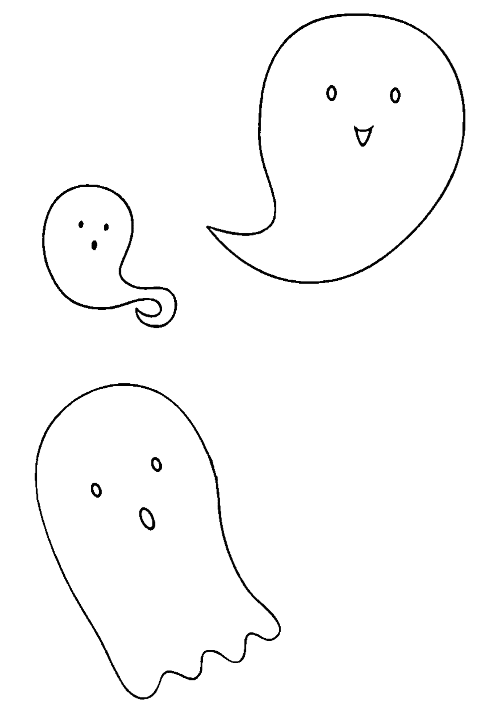

ISBN 978-986-93554-5-2
ISBN: 978-986-93554-5-2 (PDF)
KE0006E 建議價格185元
新星球 大雁出版基地