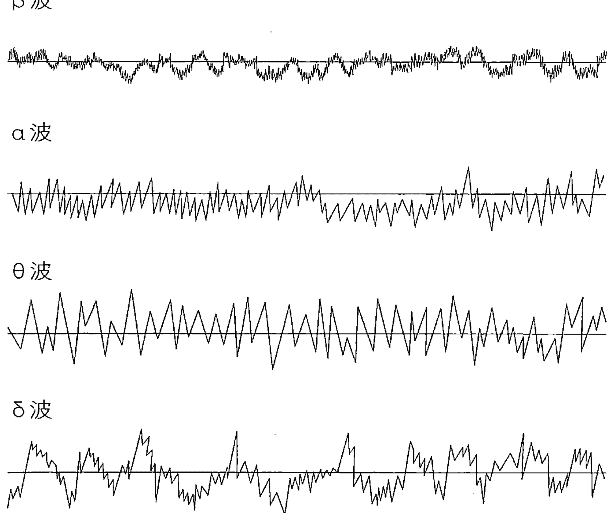
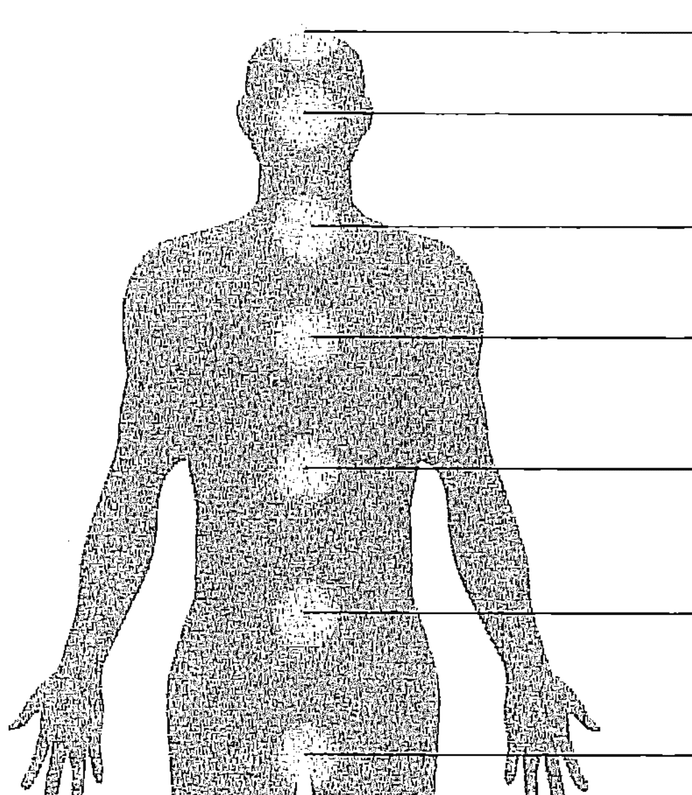
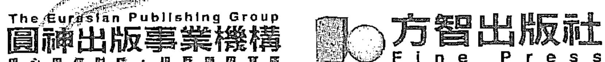
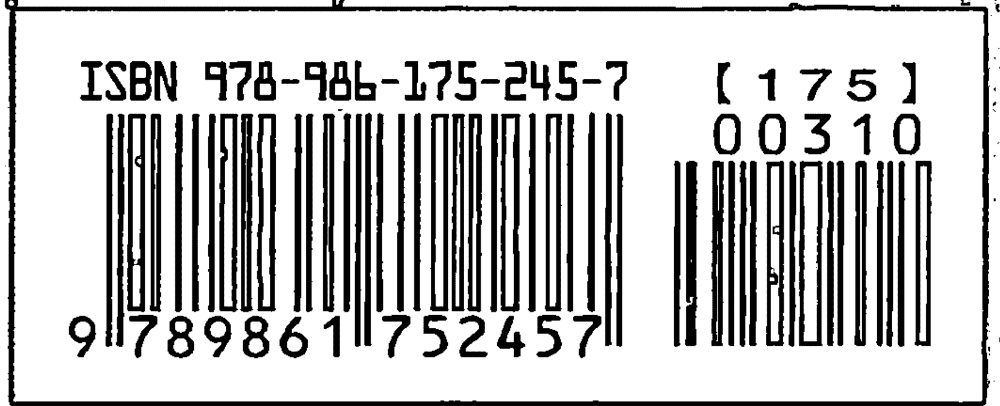
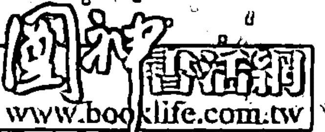

# 天堂频率

# 最强大的自我转化工具

麦可・伯纳德・贝奎斯，《秘密》作者群之一

科学界都认同，能量包含了所有事物，而且能量系统是有意识的。科学家说，地球在一个无穷无尽的电磁场里转动，而所有事物都包含在这个旋转、摆荡、振动的能量之中。

有趣的是，我们总是以为宇宙的能量存在于别处，在一个离我们所在的地球非常遥远的地方热烈作用着。但事实是，同样的能量也存在此处，就在我们每个人之内，以及我们生活的每一个角落里。人类是需要很多空间的生物，生活和移动的方式都会对宇宙的每一个角落产生能量上的影响。所以当我们谈到能量频率这个议题时，它并非一种在外太空振动的神秘“东西”，而是直接存在于我们的内在空间里。

知名的天主教耶稣会牧师及古生物学者德日进，称这个内在空间为“内在性”（interiority），这是一个他创造出来总结他与自然界之间直觉关系的词，也是一种宇宙论——他认为这是一个不断演化出物质复杂性与意识的能量进程。

德日进为他的理论付出了极大的代价：他的工作受到梵蒂冈的禁止，在自己的出生地法国也不受欢迎，所以他搬到中国，之后又搬到纽约市。今天许多人都能如本书作者潘妮一样自在地公开分享他们对内在意识探索实验的结果，不会受到宗教或政府的审查和谴责，正是我们进化的一大证明。

二十一世纪在了解身心灵的关联，以及我们与宇宙的互相连结这方面的突破，改变了众人的看法，并且开启了我们对地球固有智慧的了解。我们对人性的了解也有进展，因此更意识到我们与地球之间的能量连结——更确切地说，不只是连结，而是“一体”，以及我们必须与支撑着所有生命的无形能量法则协调一致。潘妮在本书中提供了巧妙的方法、每日生活的实际应用方式，以及更深入的面向，告诉大家身为一个灵性存有是什么意思。

潘妮提供了方法来让我们清理自己的能量场，释放凝结的能量。我们运用这书来面对现代生活的挑战，就可以从资讯时代进入直觉时代，让集体意识越来越适应我们调整到“扩展的自己”更高频率的天生能力——我称“扩展的自己”为“真实的自己”（Authentic Self）。

潘妮为每天的振动做级别评量，深入说明了人在一天之内如何影响自己的身体、情绪和想法。我们可以运用将自己调整到与目前振动的能量频率一致的捷径技巧，结合她的九个转化阶段，然后加速进入高八度的频率中。显然，潘妮很投入且完美地传播她的知识，并且慷慨地跟读者分享对能量的了解。她成功地说明了，我们不只拥有能力，也有责任重新调整我们的“天堂频率”（home frequency），如此一来才能活得更有意义。

原来直觉能量不是专属于灵媒或神秘主义者，这是多么令人振奋的一件事。直觉能量是一种我们所有人都拥有、也都能使用的能力，无论有意识或无意识，并且根据我们每个人的发展状况而有程度之别。潘妮还告诉我们一个好消息：只要去做她教导的练习，我们就能够有意识地开发直觉能力，也因此能有意识地从洞见、直觉与灵感的原始存放处——也就是人的内在及周遭一切的生命源头——汲取能量。

有意识地开发并应用思想能量，是最强大的自我转化工具。心理学家荣格正是用这种方式来描述他在十二岁时的一段经验：“突然间，我感觉到自己刚刚从一团浓密的云中浮现，完全不知所措。我立即了解：现在我是我自己了！感觉就好像过去我的背后有一道雾墙，这道墙的后面还没有一个『我』存在。但是在这一刻，我遇到了自己。之前我也存在着，但所有一切就只是发生在我身上；而现在，我发生在我自己身上。”

当我们觉悟自己真正的本质便是能量的存有，当我们进入内在、开始有意识地探索意识的神秘，那我们就会“发生在自己身上”。有些人会认为自我反省、沉思、静心，以及其他的内在修练法，都是一种自我耽溺。然而，在现代科学许多不同学科的临床研究与革命进展中，都不断提供经验证据，显示出内在修练能够正向地转移练习者的能量频率。无论是电磁、重力或量子科学，都揭露了所有时代与所有传统那些伟大的灵性导师自天地初始就告诉我们的：我们是聪明的能量存有，拥有创造的智能，具有充足的装备能够有意识地参与宇宙进化的脉动，最终会全然地自我实现。

在本书中，作者聪慧且慈悲地结合了重要的教诲、她的个人经验、她与客户间的谘商内容及巧妙的方法，来提高我们的天堂频率；不只提升个人的生活，同时也提升全宇宙的生命。本书就是一个完美的能量解药，可普遍适用于我们所处的时代。

# 活出个人最高的振动频率

你一定已经发现我们正处在一个混乱不已、却又充满力量的时代。正如不安的动物会察觉即将发生的地震，你可能也感觉到一个巨大的改变正在酝酿。我们很难不注意，现今所有的事物都如同滚水般沸腾喧嚣。好处是，这样的喧腾将我们惊醒，逼着我们以一种全新的方式来感受自己——不是一个具象肉体，而是一种能量振动的存有，与其他振动的存有交互影响，生活在一个振动的世界中。

我们越来越意识到内在与外在的能量、它的特质，以及它作用的原则——频率、振动、共振、波、摆荡、循环、倍频程、频谱，这些都是知悉、执行并拥有一切事物的最新技巧的核心。换句话说，你的个人振动——你的身体、情绪和心智的能量频率——是创造并实现理想生活的最重要工具。如果你的能量频率高、快并且清晰，你的人生就会轻松地在你眼前开展，与你的天命配合无间；如果你的频率较低、较慢、较失真，则会召来充满阻碍与失望的人生。

## ◎ 频率正加速向上！

现在你需要了解几件关键的事：一，你正受到一种进化的影响，这进化会经过几个特定的阶段，造成你身体、情感及心智的能量频率开始加速；二，由于你能量频率的升高跟你的觉知程度提高同时发生，你慢慢会变得更觉知、更敏锐、更有远见、更有同理与关怀的心；三，接下来几年，你最大的挑战将会是如何运用你的敏锐感受力、如何保持你的个人振动清晰，并且学习使用“频率原则”来圆满地生活。

对看不见的事物很敏感的人（我也是），长久以来都能感觉到自己身体内部及地球本身都有微妙的频率在稳定地提高。一开始这会让我们的内在混乱，莫名地就感觉很不舒服。接下来外在的世界也开始加速，并且似乎越来越猛烈，甚至毫无章法。最终，我们适应了新层次的高能量，觉知也提高到相同的程度。我们本能地知道，这股升高的能量经由一系列的波而来，带领我们的觉知渐次提升，转换原有的认知——原本以分离、恐惧和自我为基础的自我认同，会进化成为以彼此关联、爱和灵魂为基础的自我认同。我们会发现，在那样高的频率中，世界会按照一个崭新、精致且更有效率的原则来运行。

我们思考的模式和方法已经历一场革新……我们用另一双眼睛来看、另一对耳朵来听、另一种想法来思索，有别于以往。

> ——汤玛斯·潘恩

这种转变正在发生，而且在多数的社会中都历历可证。我们正在远离资讯时代并进入直觉时代，届时我们认知现实的方式将会有重大的转变。问题在于：我们该如何学习这个扩大的振动世界的规则，培养出能量与意识的技巧，帮助自己顺利生活在其中呢？过去的生活方式正慢慢步向死亡，而我们该如何让新的观念、自我认同和行为开始生根巩固？

## ◎ 频率在召唤你吗？

你可能和许多人一样，为了应对生活中一直加速的频率，正试着用各种方式来调整自己的能量状态，藉此找出平衡点、安全感，并从压力中释放。也或许你很饥渴地寻找各种线索，希望知道如何在这个极度复杂的扰攘世界里顺遂地活下去。答案不在那些小工具、小帮手，也不是那些协助你处理更多资讯的科技方法。真相很简单：进入直觉时代，最重要的是你对能量了解多少、你能利用能量做什么，以及你该如何培养出有用且更广泛的敏锐感受力。

你会挑中这本书，可能是因为你不想再继续被情绪的起伏困扰，阻碍了人生前进的流。你也可能因为身边一些不安而冲动的人、沮丧且冷淡的人，而感到疲倦不堪。也或许你被应接不暇的刺激压垮，不想继续停留在麻木或亢奋的状态。你可能感觉到隐隐约约、非口语的讯息充塞四周，来自其他人、新闻报道与未来或生活中的事件有关。你想知道这一切的意义，却无法精确地找出究竟是什么在影响着你。

也许，你是想找回你在学问、工作及物质的追求中，所失去的敏锐的灵性本质。理性分析的头脑让你在事业上功成名就，但现在你需要的是狂野的创造力，发自内心的启发众人，去改革那些看起来像恐龙一样古老的制度。你是否因为了解所谓的“吸引力法则”而有了长足进步？你是不是想更了解我们眼前逐渐成形的新现实有哪些新原则？你是不是试着在开创人生时，寻找想望和期待的正确平衡点？

如果你为了保持清明或应付快速变化而感到动弹不得，别担心，所有事情都在正确的时机下进行着。我们共同身处于这个过程中，我们同样在学习调整自己来适应更高的觉知频率，并接受这样的频率为常态。我们正从一个世界转换到另一个世界：在原来的世界里，我们学会用才智和意志来拉近想像中自己与他人之间的鸿沟，并获得我们想要的；而另一个世界没有鸿沟需要跨越，爱、支持与自由全都唾手可得，想要的结果能轻易实现。

## ◎你的最高频率可以变成常态

你可以用个人的力量，瓦解那个把你与本我的更高经验，以及美好人生分隔开来的外壳。你并不需要什么导师，或是透过什么戏剧化的事件而急剧增加自己的超自然经验。

很多与我谈过话的人都理解，我们其实从来没有离开过“家”——所谓的“天堂”经验——而且我们同时一直在做着一个非常奇妙、引人入胜的“梦”，也就是“在人世的生活”。要完全从这个梦境中清醒，需要每天去体验自己的灵魂、自己最高的频率状态，并接受其为常态。尤其是，这样的体验充满了同理心与慈悲，有很美好的感受直接穿透你，超越了苦难的诱惑、逻辑的限制，以及世上一切的目眩神迷。你一定要感受到能爱、被爱、充满爱——打从你的细胞里感受——才能真正开窍，开启自我的认同，了解一体的概念，并适应生活更多的可能性。你要对隐藏在能量频率中的精妙讯息保持敏锐的自觉，以便快速地体验那确实而饱满的爱与灵魂。

要找出储存在我们最微妙的振动中的讯息和经验，我们得体验一种进化性的移动，从鲁莽的人生观点“向下”去认识我们的身体。这样做的时候会经历情绪，而情绪会催化困惑、抗拒及恐慌，并且将我们冲上极端神秘的晕眩境界，所以我们会逃避情绪，并且无法体验到完整的自己。我写这本书便是为了帮助你卸下这道最后的阻碍，让你完全清醒，真正感受到开阔的自己——那才是你在直觉时代中的正常状态。

## ◎ 帮助你轻松度过转化过程

从一九七〇年代中期开始，我看到很多影像——看到越来越紧凑的世界中，事件背后究竟发生了什么。我很早就体认到，我们在经历一种个人转化的开始，而这样的转化已经有几千年没出现过了，或许也从未以全球性的规模发生过。在一九八〇年代，我开始演讲这种频率增高的过程，我会概述这个转化过程中的重要元素，而演讲完后，总有听众会告诉我：“您说的很有帮助，让我更认识自己经历了什么。过去，我因为不明白这个过程有着崇高的目的和正面的结果，一直都很混乱／恐惧／沮丧。”

所以我想帮助你了解这个正在影响你的无形过程，并且帮助你顺利地度过。我想提供一些技巧，能将停滞阻塞的情绪改变为敏锐的感受力，如此一来，你就可以解读各式各样振动状态中的讯息了。我想让你更轻松地坚定立场，选择活在你最高、最自然的个人振动中——与你灵魂相符的振动。我想要你学到，当他人较低的振动拖累你时，你该如何重新回到自己的最高振动之中。我们的确有办法让自己成为健康的“敏锐的人”，而懂得运用你个人的振动，确实可以让你拥有绝大的力量。

## ◎ 写日记让你更有意识地成长

写日记绝对是一个能成功记录你成长历程的方法。当你深入自己这个充满讯息的身体时，你可以记下发生的种种。在这本书中有各种简单的习题，帮助你练习我传授的概念。请试着去做这些习题，并写下你的结果。你有什么领会？你遭遇到哪些困难或是因为什么而感到惊讶？

你可以试试“直接写作”：直接写下你内心深处的话，让成串的文字如一道自发的流倾泻而出，完全不经检视。一开始，先问自己一个问题，它会像磁铁一般吸引出你深层觉知里的答案。只要让头几个字出来，它们就会带出接下来的话。不要事先预想或事后猜测自己到底说了什么。如果一个奇怪的字眼出现在心里，就把它写下来。接下来，应该要出现的就会跟着出现。为了能让书写的流保持顺畅，请先全部写完再回头去看内容。你会非常惊讶自己写下的东西，非常新鲜而且精确。

## ◎ 用直觉去感受天堂频率讯息

在每一章的结尾，我都会放一篇来自我天堂频率的直接写作——天堂频率就是我的核心自我或灵魂的振动——我是在更高觉知的平静状态下所写的。当我写下这些极有启发性的段落时，主导的不是我的个性和平常的写作语言。它们是那深层现实——或感受状态——最单纯、最直接的描述，透过我的写作而呈现。文字几乎一气呵成，每个句子都具有能让你转化的力量。我在书中列出这些文章有几个原因：

-   1. 它们提供你一种聪明的集中式指引，让你在非常安静、敏锐的状态时，内在的自己可以轻易接受并向前探索。我希望，这些文字能鼓舞你尝试去探询自己最清澈的源头，藉此获得方向与解答。
-   2. 我想要你看见，出自于真心和灵魂的沟通——不同于头脑所产生的喧闹意见。天堂频率讯息有着普遍的诉求，以及普遍的真相。
-   3. 这些文字提供了真心的体悟，通常能让每一章的重点延伸出更深远的意义。就好比诗相对于散文或科技论文，这些文字带领你超越纯粹的逻辑，并且让你看见，并非所有的知识都一定要完全符合规定好的框框才有意义。
-   4. 请你去体验这两者的不同：一是用你那喜欢快速运作的分析左脑去理解每一章的内容，看看有什么感觉；一是用你那直觉的“真心之中的心智”，刻意放慢步调去融入并感受书中更深层、不那么理性、更个人的意义。藉由这种从表面转换到核心的体验，从我们习以为常“老式”的线性逻辑思考，转换到阅读这些文字所必须拥有的“全新”、立即、纯然来自经验的理解，你就会开始了解如何运用高振动、瞬间转化的觉知方式，来进入我所要描述的那个世界。

如果你读这些文字时比平常更缓慢、更仔细，或是唸出声来给自己听，或是闭上眼睛请其他人读给你听，你就会发现，它们会传达一种与一般文章不同的韵律和振动。如果你太草率、表面地读这些文字，那么它们听起来可能会很陈腔滥调——甚至很“新时代”——但当你慢下来，与它们“相处”，感受你身体里的感觉时，这些文字就会拥有更深远的意义，带领你进入一个新的实相中。有时候，在心里咀嚼一句话或一个词语比平常稍久一些，你就会发现隐藏在背后的意义，而这正好微微点出：只用头脑来理解现实，以及将头脑、心灵和身体合一来认知现实，现实的样貌与给人的感受会有何差异。

你可以跳过这些“出自天堂频率的讯息”不看，或利用它们来练习进入你自己的天堂频率中（我在第五章会有详细说明），也可以最后再把这些讯息连续读完，怎么做都没有关系。有趣的是，你可以观察自己对阅读速度、振动的改变有什么反应，以及自己会专注在哪些特别召唤你的讯息上。举例来说，如果你读到某句话的时候觉得很烦或松了一口气，这可能就是线索，显示你正在经历一场属于自己的个人成长转化。

## ◎ 利用直觉扩展神性体验

在吸收消化这本书的内容时，如果你能注意自己直觉的变化，那将会有帮助。直觉是很直接、没有偏颇的感知，在你专注于当下，保持清醒却不紧张，与身体和感情连结，不使用意志力，感觉到单纯与开放时，直觉就会出现。直觉能够经由你大脑的不同层次展现，例如出于本能的吸引或厌恶，你的五感所留下的印象，或者是你对复杂的含意、系统、景象或讯息的恍然大悟。个人私密的直觉，是改善自我、实现自我的催化剂。因为要让一个人的生活有深入且持久的改变，并非只靠主观经验。

当你在阅读中途暂停、稍微分神时，直觉的洞察很可能突然出现在你脑海。当你在外面的世界行走时，有些经验可能会连结到你正在阅读的篇章。直觉“啊哈！”一声出现时，会让眼前的讯息对你来说格外真实。很多时候，你可能需要转换自己，去感知或感觉某件事物如何运作，才能完全了解它所呈现的概念。在培养自己的敏锐感受力时，直觉会让你知道，那些你感受到的振动中究竟蕴藏了什么意义。

直觉是扇大门，开启了一个更高的实相以及更清晰的神性体验。到最后，它将成为你主观的解释，说明直觉所带来的一切，是如何释放或抑制了你行动与成长的能力。

# 寻找频率

从七〇年代开始，我就投入了直觉的开发，也对佛教徒所谓的善巧的洞察力（skillful perception）深感兴趣（基本上，善觉知是指如何利用你的心智来疗愈痛苦）。透过研究，我找到了让人生过得更轻松自在的秘密。我的直觉训练有一部分是利用“诘问的艺术”——经常质疑我所知道的事物，看看它们是不是会慢慢分解或发展成更广泛、更特定或完全不同的东西。我曾经对轮回转世和自己的前世感兴趣，后来则完全放下。如此着迷一件事之后又如此冷淡，总是令人感到惊讶——不过，就我所知，当我们保持诚实且弹性时，直觉是最精确的。

直到最近，我才领悟到我不只变得更有直觉力，透过对他人的谘商辅导，我也发展出具同理心的敏锐感受力，不管是对振动、能量的质地、意识频率，或是对各种复杂情绪、信仰与目的的所呈现的模式。

## ◎發展更高的敏銳感受力

我們都生來敏感並有同理心，但因為缺乏認可和訓練，這種能力通常被鎖住不用，或是被移到「以後再用」的架子上擺著。我很幸運自己的這種本能還活著。感謝母親在我小時候就幫我種下了敏感力的種子。記得小時候，我和母親常會坐在車子裡等父親，他有時會在星期六到芝加哥的辦公室去工作。為了打發時間，我們會玩「那個人在想什麼？」的遊戲，試著去臆測經過的人在想什麼，編造想像他們的人生。母親常用「黃金規則」訓練我：「如果你是那個人，當別人對你做這樣的事情時，你會有什麼感覺？」我切實照她的話做，想像自己變成那位路人，受到他人錯誤地對待。我在學習如何對他人「感同身受」（fell into，編按：本書中又譯為融入並感受）。

當我二十多歲開始成為專業的直覺解讀人（intuitive），訊息會強力地進入我內在的視覺和聽覺，速度非常快，而且不帶個人感情。很快地，我的直覺轉換成一種帶有觸覺、以觸覺為主導的模式，形上學稱之為「靈觸」，也就是人內在的觸覺。我可以全身來感覺其他人，不只有我的頭腦，我能感覺到更親密的連結，雖然整個過程會慢一些。我開始和客戶擁有一樣的感覺。當我看著一個臉上表現出厭惡的客人，我會感覺到自己的臉上也出現了一樣的肌肉拉扯，在幾分鐘內，我就會知道他厭惡的是什麼東西。面對一位縮胸駝背的客人，我可以從內在感覺到他的心境，了解到他為什麼會覺得悲傷或挫敗。

## 019【自序】尋找頻率

> 我們像是海裡的島嶼，表面上各自分離，但在深層的底下卻彼此相連。
——威廉·詹姆斯

我在解讀時，經常會感覺到身體出現一些徵狀，比方說，我會感覺到別人的心絞痛或受傷的腳踝。如果我的客戶很有音樂才華，我就會聽到音樂；或者客戶對氣味非常敏銳，我就會聞到花香或海的味道。有時候，我會經歷一種類似砂紙、灰燼或絲綢的質感，後來才明白原來是那個人所感受到的現實。我稱這個現象為「直接印象」。我想，這大概就是所謂「敏感」的意思吧，而且是非常細微的敏感，彷彿資訊與情緒以某種方式擠進我的身體裡。同時，我也學會了如何不被它牽制，因為只要我再次專注於自己的身體和天生的愉悅性情，我就能回歸到那個自然的、相對平衡的自己。

幾年前，一位女士來找我解讀。我並不認識她，也不知道她在童年時曾被虐待和性虐待。她看起來非常緊繃而且很不友善。我當時經驗還不多，並不知道那就是「感應現象」。當她強硬地坐在我對面的椅子上，雙手緊緊交叉在胸前，表現出她一點都不想待在這裡的樣子時，我覺得受到威脅、恐懼，接著是憤怒。不過，我還是保持著專業的友善，開始幫她解讀。就在我穿透了她層層的防衛之後，我發現她兒時遭受的虐待，並且感覺到她多麼受傷和脆弱。原來我在幾分鐘前就已經感受到她的感覺：威脅、恐懼與憤怒。然後我感到她內心深處的愛，而對於她勇敢經歷的種種，我升起了滿滿的慈悲。我告訴她，我剛剛怎麼感受到她真正的自己，她終於崩潰，啜泣了起來。那時我才了解到，她無意識地在模仿施暴者的情緒（一種與同理心或身體敏感力相反的情緒），不過方式不同。我不禁想到：「有多少人曾經以我差一點就要有的態度來回應她？缺少關心，排拒、憤怒和冷酷——然後擴大了她的傷口？」我從她身上學到寶貴的一課，就是我的感受可能和我周遭人們的感受有關。我們就像音叉一樣，複製著彼此能量碰撞時的共振。

我想強調的是，從一開始的視覺——心理機制，轉變成更為感覺導向的模式，再到身體的極度敏感，這種越來越加深的感受是我個人能力的發展途徑，並不一定比其他方式好。有些人保持在較疏離的狀態，只靠大腦的上半部來運作，或者，是經由一個主要的、他喜歡的感官來接收訊息，像是聽覺。我的方式穿透了大腦的各個皮質，往下與身體融合，長久以來教導了我許多事，漸漸帶領我直接體會個人振動的原則。我在本書中就是熱切地想與你分享這些原則。

## ◎你可以「融入並感受」而讓人生更豐盛

我曾經幫人做過上萬次的生命解讀和商業解讀。在過程中，我會放鬆自己，成為一個柔軟、模糊的個體，並且擴展自己，容納更廣大的空間和時間，將我身體、情緒和心智的頻率提升到一個更高的層次。當我專注在對方身上，讓彼此的能量頻率相合，我就能感覺到同等擴展的他們——一個內含他們天賦潛能的訊息場。事實上，我與他們合而為一，或說，我融入並感受了他們。這股能量訊息接著出現在我裡面，好像我就是他們一樣，就在這一瞬間，我認清了一個複雜的樣貌，其中包含了他們的世俗慾望、靈魂意向、障礙、人生課題、天賦，以及當他們發揮潛力時的感覺。我透過自己身體的感官與情緒而認清了這一切。接下來的難題就是要有邏輯、有順序地清楚表達這一堆資訊，讓對方能夠理解。就我多次的經驗來看，在這些更深的層次裡，我們要與其他人完全區隔開來是不可能的事。我們分享著許多共同點，然而弔詭的是，我們同時又是各自獨特的存在。這一切的運作著實讓我們的心智難以接受！

有時候我覺得自己化成了美麗的風景，進入了萬物之中，我發現自己活在每一棵樹木裡、在浪濤的拍打裡、在來來去去的雲朵和動物裡，隨著四季更迭變化。

> —— 榮格

這個感同身受的方式可以用來深入地了解任何事——一個家庭的動態、一株生病的盆栽、一間公司、一種行銷趨勢、一個國家。我知道這是一種我們所有人都在開發的能力。認真說來，其實這是我們明白事物最自然的方式——一種敏感力，源自於與生命神交的能力。當我們經由更廣闊無邊、更高層次的振動來認識和互動，所得到的結果總是理解、感恩，以及慈悲。我會提到這些是因為，你可能也曾透過莫名其妙的感覺而突然理解了其他人的想法，或者你也曾非常敏感，許多你不確知屬於自己的訊息與洞見向你潮湧而來。我保證，你的敏感力絕對能夠成為一股力量和一種高超無敵的技巧，帶領你探尋世界、經營事業，或是獲取智慧。運用你個人振動的力量除了能加深你對事物的理解，也可以幫助你清除恐懼、充滿更多的愛、創造真正的安定、擁有更好的關係、開創你需要且想要的人生，並且加速你的靈性成長。

## ◎ 頻率的力量與魔法

我很愛「同步」這件事，因為讓事物同步邁上軌道，令人安心也非常有趣，而且它讓我注意到生命中那一股高深的整合力量。雖然科學告訴我們，有百分之二十的巧合屬於正常，但無論什麼時候，只要徵兆或預兆出現，我還是會去注意。在創作這本書時，我就接到一個訊號，它讓我看見我要寫在這本書裡的各項原則。

我父親一個人住在佛羅里達，離我有三千英里之遙。他恬淡的外表下，藏著滿滿的矛盾情緒。他從來不會表現多餘的情感，也不喜歡和人進行意義深長的對談。我想是因為他害怕自己失去控制，變成一個哭哭啼啼的笨蛋。所以我連結他的時候，總是會感覺到一股緊張的壓力。二○○○年他在晚餐後坐進自己的搖椅裡，突然就這麼死了：心臟停止跳動。一位鄰居在四天後才發現他。我不能相信我竟然沒有預見這件事，無法打個電話給他或是去看看他。也許他不希望任何人來打擾他平靜地離世，所以不讓我看见他的死亡。但我還是非常難過當時沒有陪在他身旁。

他過世的那一天，我正在寫作一本關於夢的書，卻一直沒辦法專心。我一直會突然從電腦前起身，繞著房子踱起步來，然後停下來瞪著虛空看。我剛剛到底想要做什麼？為什麼我的創作思緒不再傾流了？到了下午，我決定放棄，蹺頭去看電影。我並不知道有哪些電影上演，但我剛好趕上一部片叫《Frequency》（譯注：台灣片名譯為「黑洞頻率」）。

電影裡的兒子發現，在奇特的大氣狀況下，他可以透過家裡的短波收音機和已經過世的爸爸通話。藉由這樣的溝通方式——找到能夠跨越不同時間與次元的共同頻率——這對父子聯手解開了許多謎團、撫平了舊日的創傷，並且開創了更好的未來。而在那個未來裡，這位父親不會英年早逝。我後來發現，父親就在我看電影時死去，而這勉強能說是我在父親過世時陪伴他的方式了。從那之後，這部電影就對我有著特殊強大的力量。

當我在為這本書列大綱，正煩惱著書稿的內容、順序、結構的種種可能性。應該要取什麼書名呢？我在一頁頁的筆記本上寫滿了內文，而這時我的手——完全按照它自己的意思——寫下了「FREQUENCY」（頻率）這個字。我凝視著它，感覺到父親就在我身旁，對我露齒而笑，就好像他在等著我領會他某個笑話裡的笑點。我打了個冷顫，就這樣坐在那兒，發現到自己正經歷了生命與所謂的「死亡」之間穿越的頻率，就和電影主角所經歷的一樣，我感受到了頻率的力量與魔法。

不要自問這個世界需要什麼。問問你自己是什麼事讓你有活力，然後去做它。因為這個世界需要的就是有活力的人。

寫這本書，對我來說是一種學習。一開始，我以為自己已經非常了解什麼是振動和敏感力，但在寫作過程中自然出現的訊息和洞見，總是令我深受激盪。浸淫其中，並分享給讀者，真是極大的樂趣。事實上，越深入探究，我就越快樂，且看到並理解了未來的實相。歡迎你一起來展開這場迷人的研究，探索內在的潛能，並充分享受其中。

——哈洛·惠特曼

## 目錄

- 【推薦序】最強大的自我轉化工具
- 【導讀】活出個人最高的振動頻率
- 【自序】尋找頻率
- 第一章 如煉金般的轉化重生
- 第二章 生活在頻率之中
- 第三章 開始覺察你的感覺習慣
- 第四章 從負面振動中解脫
- 第五章 你的天堂頻率
- 第六章 用敏感力融入生活去感受
- 第七章 關係的共振頻率
- 第八章 找出頂級的解決方法、選擇和計畫
- 第九章 創造高頻率的生活
- 第十章 加速邁向通透人生

## 第一章 如煉金般的轉化重生

你是不是曾經覺得自己就像個氣球，被灌了氣？你越變越大，已經膨脹成一個圓鼓鼓的龐然大物，氣卻還是不斷地灌進來？試著停下來給自己一分鐘，細細體察一下每件讓你覺得有趣、開心或生氣的事物。然後再想想世界上所有充滿創意的突破、新事實、每天的發展、譁眾取寵的事件，以及各種讓人好奇的事物。現在，把所有的看法、抱怨、嘲諷、災難、戲劇性事件和恐懼都加進去。從你的內在去感受這一切——它們都希望你去認識，都在拼命壓迫那一層支撐你現實的薄膜極限。究竟還剩下多少空間？在你的現實爆炸之前，你還能夠承受多少壓力？一定有其他更不受限的方法去認識這世界吧！很幸運地，我們剛好處在一個進化過程中，最終將會擁有完全沒有限制的新理解、身分認同與現實。

## ◎ 轉化過程的壓力

如果你想完全了解天堂頻率，那麼最好先了解，你會感覺到混亂、超敏感或者茫然，都是有理由的。直覺時代將是個人與社會在漸進卻又相當快速的轉化後的結果。它會讓你經歷情緒與能量的煎熬，但最終將你帶到一個非常美妙的地方。而且，的確有一張地圖能夠幫助你抵達那裡。完整地了解這個轉化過程是非常重要的，避免一邊從某個思想上的流行趨勢，突然轉而踏入最新的能量技巧，卻又一邊錯過了可以幫助你更順暢、更快速、更和諧地去經驗這個過程的關鍵部分。

在這一章裡，我想簡要說明這趟轉化之旅，好讓你對發生在自己以及世界上的事情有架構性的認識。而在接下來的章節中，我們會更深入探索個人振動的力量，讓你能夠成功地度過各個轉化階段，而且你將學會發展出健康、有意識、對你和他人都有益處的敏感力。

我們現在所處的狀態是，一個時代正在超越另一個時代，一切都有可能。

> ——哈維爾

這些年來，在物理、商業、靈性的領域，甚至是政治領域，我們都聽說過所謂的「典範轉移」（paradigm shift）、量子躍進、新世界秩序、臨界點、新時代，以及全像實相。連《星際大戰》這部電影都給了我們一個強而有力的「躍入超空間」畫面。湯瑪斯·孔恩讓「典範轉移」這個概念在一九六二年大受歡迎，他定義「進化」為「一連串平和的間奏，受到智力革命粗暴地打斷」，而在過程中，「人們心中的世界觀被另一個取代」。所以基本上，典範轉換暗示著我們對生命的看法有了變化，因而導致了行為上的改變。還記得得農業發展如何改變了狩獵兼採集的社會，或是印刷術如何讓我們從教會統治及黑暗時代中解放，又或是個人電腦和網際網路如何幫助我們從隔絕與狹隘的個人，變成彼此連結的地球公民嗎？這些發展的重要性如此深遠，它們都屬於改變的範疇。而我相信今天正在發生的一切遠超過改變，我們活在一個轉化的時代。這其中的差異又是什麼呢？

## ◎ 改變＋下一個次元＝轉化

想像一張餐桌，上頭有著好幾套餐具、一道道食物、飲料，還有放在正中央的擺飾。現在，重新佈置——將鹽罐放到空酒杯裡，餐巾放到盤子下，食物不放在餐碗裡而擺在桌布上，沙拉盤打碎，然後把中央的擺飾倒過來放。哇！你做出改變了。你把已經存在的物品重組成新的形式和新的關係，但是，它們仍然存在時間與空間的桌布上，我們也依然認為它們是彼此分離、不能動的固體。

轉化、蛻變或質變則完全是另一回事。這些字眼意味著一件事物的基礎本質產生了如煉金一般的改變，從一種能量狀態轉換成另一種，是一種神奇的驚人變化，就像魔術一樣。浴火鳳凰的傳說就是一個例子，說明了平凡自我的「死亡」，經由了質變、淨化之火（象徵靈性成長），而從灰燼當中「重生」成為金質（光與愛）生物。回到餐桌的例子，水可能轉化為氣體而消失，或者整張餐桌變成了意義更高的經驗——豐盛，或家人的愛——完全不再是一個物質的東西了。

## ◎ 一場大轉換

想像空間中有個單一的點飄浮著，而你就是那個點。生命沒有次元、沒有移動，你對自己也完全沒有概念。再想像一堆的點不斷越聚越近，有如一條由線串起來的珠子，直到一個奧秘「臨界量」的覺知形成，然後一種名為「線」的全新現實從中產生。你全然進入了那個新世界，忘了自己是一個點。你變成了一條「線」。你擁有一個擴張了的自己，活在一個有著新規則的世界，那新規則是：來回擺盪的移動。你比自己是個點的時候更加自由。

當我的身分認同轉換時，現實同時跟著轉換。當現實轉換時，我的身分認同也同時跟著轉換。

現在，看你能不能夠感覺一下，有好多條線緊密地聚集在一起，在一個前所未知的次元中發展出了一個稱為「平面」的新覺知狀態時，會發生什麼事呢？你會忘了自己是一條線；你不只以雙向移動，更能任意遊走於四方，甚至彎彎曲曲地走。「平面」的生命給了你許多選擇，讓你幾乎忘了之前那個受限的自己。

接下來，再試著去感覺一下，當一系列平面緊密地聚集在一起，層層相疊，擴展成為另一個次元，生出一個三次元的「立方體」時，又會如何？你忘了身為平面的自己，因為現在你開啟了似乎無限制的空間與機會。你的世界中包含了時間、空間，以及物質：有限的物體與空洞的空間；一個內在世界與一個外在世界；有著過去、現在和未來；還有一個根據其他存有的想法所反映出來的自我概念。聽起來是不是很熟悉呢？這個「立方體」的三次元世界，就是我們現在所處的世界，有著我們以為的自己，以及我們定義為正常的事物。

這就是現在的我們：有些不滿足、又非常激動的立體存有，越來越接近下一個進化的躍進時刻。是什麼能轉化你對自己及世界的認知呢？應該不太可能會是那些快速（時間）運作的電腦，也不是在太空（空間）中穿梭的立體太空船。當下一個更高的次元，也就是第四次元，與我們的「立方體」現實整合在一起的時候，我們的世界才真正地轉化。你可以把第四次元想成靈魂或靈的國度——那是一種經驗而不是一個地方，一切都同時存在於一個能量與覺知的統一場，每個事物都包含其他每個事物，一切都是已知的，而「愛」是基本要素，一切由愛而生。

當第三次元與第四次元結合時，會發生什麼事呢？給你一個提示：你不會對線性的因果思維或角形感興趣的。你的思考方向將如螺旋一般，而生命的移動有如波浪來回振盪。你會了解到，碎形與全像是意識的基礎；沒有所謂的距離、過去或未來。在新的現實中，靈魂就是最高的力量，自有形世界與無形世界相互貫通的意識會是最有價值的東西，而且什麼都有可能。

## 印加預言——有關即將到來的黃金時代

在《靈界大覺悟》一書中，作者引用了維拉科查（Wiracocha，譯註：印加神話中的造物神）基金會理事長伊莉莎白·詹金斯的話：「安地斯眾先知，那些神聖的男人和女人，說西元一九九三年到二〇一二年是人類意識進化的關鍵時期。我們進入了他們稱之為『重新遇見自己的時代』。安地斯人相信，在這段時間裡，我們會從第三階層的覺知轉移到第四階層。而難題是，我們要清除集體的恐懼，凝聚足夠的靈性能能量，讓人類能夠集體過渡到第四階層意識之中。」

威拉魯·華伊塔（Willaru Huayta），這位來自秘魯的印加靈性訊息傳達人說：「太陽之子從遠古時代就存在——從最後一次的黃金時代起就存在了。正如一年有四季般，宇宙也有更迭交替的四種偉大時代。在黃金時代之後出現的是白銀時代，然後是黃銅時代，最後則是鐵時代。過去一千年到現在都屬於鐵時代，它有著強烈的物質主義屬性，是一個黑暗的時代，因為人類陷入了自私的思維，利用大自然的力量做出了許多負面的事。這也是一個戰爭的年代，如金屬般冰冷的年代……鐵時代，就像一個漫長的冬天，現在即將結束。而新的黃金時代如同春天般，向全世界宣告它的到來。」

> 「我們一定要回到自然之道中去接受啟迪、去認識宇宙的法則，並且知道我們的身體就是廟宇殿堂。每一個人是一座聖殿，而聖殿中的祭壇就是心。愛之火焰，是更強大的光之反映，在祭壇上燃燒。我們一定要感謝、守護並尊崇這份內在的光。這就是太陽之子的信仰。」

## ◎ 轉化九階段濃縮版

多年來，我在靈魂的層次上協助了許多個人與團體，了解人們經歷的加速內在成長是怎麼一回事，結果發展出了一套能詳盡說明轉化過程的方法。在此為了簡單說明，我濃縮為九個階段。然而，轉化過程是相當流動的、有機的，不同的階段常會混在一起。你可能會發現自己經歷了每個階段的全部或一部分，或是出現了我所說的許多或少數徵兆。你可能很輕鬆就通過了某個階段，但在另一個階段花了許多時間；又或者在兩或三個階段中來來回回了好一陣子。甚至你可能會覺得你已經完成了轉化，卻又發現自己受到新的、更高頻率的能量波的影響，而再次開始經歷整個過程，看到自己靈魂更多的部分，不過這一次卻輕鬆多了。每個階段並沒有固定的時程；你的經歷是只屬於你自己的，而對你來說特別重要的部分總會凸顯出來。最後，每個人都會經歷轉化的過程，因為它影響了整個地球。

找出這個進化階段中的邏輯，可以幫助你了解你的人生與現狀。注意，每個步驟都會自然地往下個步驟流動，而在每個階段中你都可以做出選擇：抗拒改變，或是信任這個流會將你帶往更好的人生。如果你為了要維持過去舒服的階段而減緩或停止這個流，那麼你只會阻礙自己的發展、加深恐懼，並且創造出不必要的壓力與不安。如果你信任有一個更高的神聖力量正在引導這個流，相信這對你是件正確的事，放下了一切掙扎去接受你所需的經歷，那麼你身體的頻率、情緒的頻率及心智的頻率都會提升，並且體驗到每個階段帶來的好處。

讓我們先稍微熟悉一下這九個轉化階段，看看有哪些可能的徵兆會出現在你的生活及這個社會中。最初的轉化階段，主要是清除所有阻礙或干擾的事物，好讓你的靈魂表達自己，去體驗愛。也就是說，你通常會變得很不舒服，因為你正在看著恐懼和之前你否定的一切。不過感謝老天，你不會永遠停在這裡！轉捩點會出現在中程，光會閃現，你會感受到全然的釋放。之後，所有破壞性的徵兆都會消失，而你會開始如花朵般綻放，愉快地開展你的天命。轉化過程是這樣開始的：

### 1. 心靈與身體、情緒及心智合而為一

三次元的物質世界，開始回應由外湧入的高頻率能量，就像一個打瞌睡的小孩被烤箱裡餅乾的迷人香氣誘惑醒來。第四次元，這個你原來來不及的更高層次覺知，正在讓你知道它的存在。有人說，這是由於遠方的宇宙事件，或一股宇宙能量的「等離子場」（plasma field）穿過我們的銀河所導致。無論原因是什麼，當這個來自靈性次元的更高能量以頻率的方式「降臨」，開始滲透你的世界時，你會受到召喚而回應，伸展雙手向「上」接近頻率，渴望那神秘的謎。

我很興奮而且知道生命不只如此！我想要更好的！

你體驗到天堂與塵世之間的界線越來越薄——這讓你雀躍，加速了你的體會，讓你感覺有個重要的東西在一道簾幕後等著。一個互相融會的過程開始了，以逐漸加強的波相繼

## 035 第一章 如煉金般的轉化重生

出現，最終帶來了第三次元與第四次元的結合。當你提升意識與敏銳力時，就會瞥見接下來要發生的事。

第一階段有個徵兆是心智與身體的合一。心理學、整合醫學、競技運動，以及靈性修練，像是靜心和瑜伽，也都如此強調。當心智與身體合一，靈或靈魂就會顯現，而你會突然發現，原來它始終存在於一切事物之內。你會知道以你的身體存在於你的身體裡面真正是什麼感覺，而每一個細胞都是那麼有意識，你也會立刻知道身體對任何狀況的本能反應是什麼，以及為什麼會產生這樣的反應。你會了解身體的每一個部分都有某種程度的意識。

你也許會變得有興趣去參加教會或靈性團體、讓世俗淨化、讓自己保持警覺、開發直覺、有目的地做夢、尋找人生目標，或者透過麥田圈、黃金球、靈媒、宗教神秘主義或瀕死經驗來連結「超自然」領域。你可能會透過物理學、天文學、微生物學、海洋學及基因研究，來探索生命在表層之下的基礎。你也可能想了解能量特別強大的場所，或是那些埋藏已久的秘密，比方遠古的未解之謎、新醫學、滅絕的物種、演化過程中欠缺的生命形式，或地球內部的「文明」。

許多人現在都開始體驗到一種從濃密的集體意識中滲濾下來的新能量。這股能量激發你的靈魂去尋找表達的自由，並且放大了你內心的聲音。這新的星球能量促使大家去思考更多心的事，以及心在所有人類事務中的潛力。

> ——杜克·齊德瑞

## 2. 生命频率在每个地方、以各种方式增高

当灵性频率穿透了物质世界（包括地球与你的身体），它同时也会充满你的心智与情绪。你的身体渴望调适到更高的振动，虽然一开始会让你感觉不舒服。高频率能量会同时启动正面与负面的情绪，让你更加注意到情绪的存在。

你可能会体验到自己内在有种发热的波动。不只身体会更热、有更多讯号的纷扰，感觉也会更高昂，而且你可能会有戏剧化的情绪高潮和低潮，以及不稳定的情感宣泄。你会变得过度敏感、过度带电，还会感觉自己一直处于无法摆脱的压力之下。你可能会看见自己的「变热」过程与地球暖化如何同步。你很容易就会受不了噪音、群众、过敏原、某些食物或传播媒体。

> 我觉得焦躁而且紧张。所有事情都让我很烦。我的身体会痛。我很累但睡不着。我现在就要得到我想要的！

你可能会经历注意力涣散、短期的记忆丧失、失去动力，或是感到迷惘。你的身体会觉得疲倦至极、比平常更容易生病，或是更容易觉得疼痛。你也可能会觉得自己精力过剩、不耐烦、易怒，而且没办法放轻松。失眠是常见的状况，但有时候你又会睡得像个死人一样，这两种情况交替着出现。为了逃离你那不舒服的身体，你可能试图放空脑袋，或活在幻想之中，或分散注意力在各种问题以及他人的生活，或让自己沉迷和忧虑。更高频率「过度活跃」所造成的身体机能失常也会增加，譬如癌症、病毒感染、发烧、感染、起疹子、过敏、注意力不足过动症或神经失调。

这个阶段的正面影响是，如果你让高频率的能量流过你，并且让身体自然地适应，你就会感觉更有活力与耐力，同时也会拥有更高的觉知，也就是更高频率的感受（爱、慷慨、快乐、热诚），以及更高频率的思维与动机（发明、创造力、灵感、宽恕、服务、疗愈）。然后你就会渴望能够知道更多，渴望去探索种种奥秘，经验自己的灵魂。你了解到正面思考与爱如何能够疗愈，而且你会想要让自己的身体更干净（减重、排毒、回春、锻练、更有意识也更灵巧地活动）。

## 3. 個人與集體潛意識心智開始淨空

當你的情緒與肉體的振動速率增加時，潛意識阻塞物（也就是以恐懼為基礎的低頻率情緒）就不會再繼續堆積和壓抑了。低頻率無法存在於高頻率的能量與覺知場中。猶如爆米花加熱一般，這些阻塞物開始從隱身之處爆炸開來，進入你的意識心智中。於是，被壓抑的記憶浮出了表面，個人的戲劇性事件與心理創傷會出現，而過去深信不疑的極限與消極思維也下意識地重新啟動。你面對了羞愧、哀傷、驚恐、痛恨，以及心理底層的黑暗角落。你一定要下定決心踏上這趟穿越底層世界的英勇之旅，深入潛意識與未知之中，去找答案以理解這一切。此時自然會出現極大的抗拒，而你需要勇氣，也需要知道，確實有可行的方法讓你繼續前進，你不會永遠停留在這個階段，而那些浮出表面的東西都不是真正的你。

悲觀和恐懼有增加的傾向。你的夢和幻想變得強烈，甚至暴力且嚇人，而你所預想的最糟狀況也可能發生。過去那些處於平衡的事物出現了不穩定，你感到焦慮、突然間驚慌失措，你可能會覺得自己要瘋了或者已經有人格障礙的症狀了。醜聞、禁忌、惡習，還有那些不外揚的家醜，全都公諸於世。保密與隱私都成了過去的事。你可能會經歷各種爆發——爆血管、開車時因不耐前車或不滿搶道而暴怒、家暴、恐怖行動、火山爆發——就像壓力鍋的鍋蓋被掀掉一樣。你也可能會因為受虐的痛楚回憶再次浮現，而陷入長期的慢性疼痛。

> 我最糟糕的恐懼正在成形，我根本沒辦法控制自己！

當你的潛意識心智有如潘朵拉的盒子打開，你會發現二元對立、非此即彼的思維增加了。你現在會注意到許多兩極化的事物，以及它們帶來的信念與情緒——好與壞、內與外、黑與白、男與女、年輕與年老、聰明與愚笨、美與醜、贏家與輸家、生與死。你會學習到，要將對立的兩方分開需要多大的意志力，因為那加速的能量想將它們連結在一起，好讓它們流向彼此、變成彼此——就像是陰陽圖的8字形渦流。此時，你會經歷自己一直抗拒的陰暗面；然後，當這股能量流帶著你再次進入光明面時，你會明白，黑暗與光明，從正面的角度來看，其實都在將能量灌注給對方。但是一開始，這流動的壓力會凸顯出8字形渦流中的阻塞物——你的偏見、癖好和抗拒——無論它們存在於你的什麼地方。

從別人身上看見你自己不自覺的癖好，而認為那只存在於他人身上是比較容易的事：

> 「我要保持安靜，你這麼大聲、這麼想要引人注目，是很糟糕的。」你無法容忍，只想要拒絕你覺得跟你不一樣的事物與人。你可能會覺得受到威脅、背叛、嫉妒。你也可能會責怪或批判自己與他人，讓自己陷入無盡的較好或較差、吸引人或討人厭、攻擊性的或防衛性的、擁有或拒絕這些兩極化之中反覆不定。

激烈爭辯、辱罵、我們對抗他們的情節、譴責也都會增加。關係——特別是缺乏誠信與溝通的關係——會因為責罵、吹毛求疵或拒絕改變而出現問題、形成僵局甚至破裂。

你可能會經歷離婚、法律訴訟、與鄰居不睦、家庭紛爭，或是極度渴望完美的靈魂伴侶。

以下這些事在你眼前變得越來越明顯：仇恨式犯罪、嚴刑拷打、偷窺、耽於禁忌、實境電視秀、法醫學與犯罪偵察、政治黨派的權威人士、尖酸刻薄的脫口秀主持人，以及心理治療。與混亂及驚惶有關的病症也會增加：氣喘、精神分裂症、躁鬱症和邊緣性人格違常，或是癲癇。

這個階段會出現的正面結果是，如果你願意讓更高能量流過你，並且充滿耐心與愛心去處理眼前的狀況，你就會學習到，你無法避免你所不喜歡的種種兩極化，而是一定要讓每一種選擇成為生命的一部分。你會擁抱「鏡相」這個概念：別人有的，我也同樣會有，只是方式不同；反之，我有的，別人也有。你也將學會擁有兩極化的雙方，感覺它們如何滋養著彼此，而你又如何從你一直拒絕的某部分自己來獲取能量與資訊。你會意識到你之前一直沒有察覺的「情緒觸發鈕」。

就算你能夠活到一百歲，時間還是非常短。所以為什麼不把時間用來執行這個進化的過程、開啟你的心智與心靈、連結你真正的本質——卻讓自己越來越會確定、支配、凍結和封閉呢？

> ——佩瑪·丘卓

## 4. 你再次緊縮、加強防備、抗拒、壓抑

正當你看起來已經從多年的恐懼中釋放自己，你的情感創傷也完全復原之際，你的小我——以恐懼與自我保護為基礎的那一部分心智——卻開始介入並且大聲疾呼：「我還沒有死！」它會為了保留過去那個困難但卻熟悉的生活方式而奮戰，激烈地拒絕放下和信任。你的行為全投入了生存——不是戰鬥，就是逃走——那是一種極為驚人的巧妙手法。

> 我不需要改變！
> 我待在自己的世界中，而且我是對的！

如果你是個鬥士，你可能會讓自己覺得刀槍不入而且巨大，有如身在坦克車一般的休旅車或豪奢的住家裡，或者你會用積極的工作狂心態與堅定的信仰體系來面對這個世界，又或者你會喝大量的濃咖啡。你可能會忠於自己的個性、粗劣的個人主義以及愛國主義，並且更自以為是、更愛自誇、更自戀、更易怒，或甚至更暴力。你可能想要變得有名氣、有權力或有錢，或是想去做整形手術、擁有眩人的物品。你可能會控制你的環境和其他人來尋求安全感，而當你發現你無法控制一切，就會裝出一種難搞、嘲諷、挖苦、好戰、漠不關心和不尊重的態度，讓自己想做一些不恰當、不友善與不道德的行為時看起來很酷。

父權制的權力結構，像是政府、軍隊、企業和宗教，拼命且聰明地對其他人發揮影響力，並且用誘惑、催眠、堂而皇之的謊言及放大恐懼，來保有控制力量。

> 大家都快把我逼瘋了，他們都應該滾得遠遠的！
> 我覺得自己困在衝突之中。

如果你是個避免衝突的人，你可能會重新壓抑那些讓你感到威脅的想法、抗拒改變、緊抓住安全感不放，或躲進一個裝飾華美、放著大電視的舒適家裡，或是躲進與父母之間的關係或有著父母權威的替代關係中。你可能會吃更多或更少，吃好吃的食物而變胖或者罹患厭食症。你會利用小巧的電子裝置將影音直接傳入你大腦裡來麻痺自己。也許你會戴上快樂的面具來假裝一切沒有問題，或是逃進對過去的懷念、對未來的憧憬、對其他世界的幻想中，或甚至變得有自殺傾向。你會覺得自己在這個世界上的生命已經完結了，想要加入天使或外星生物。機能不足和抗拒的疾病也會增加，譬如強迫性精神官能症、中風、骨骼疾病、關節炎、器官衰竭、成癮症、憂鬱症，各式癱瘓以及極度疲勞症候群。

這個階段的正面結果是，你會在你所有生活領域中經歷突如其來的突破，包括了能療癒你內心傷痛的洞見。從艱辛童年所衍生出來的問題真的消失了，獨處反而讓你能夠更懂得與別人合作，而過去讓你反應激烈的事情，現在幾乎不會影響你了。你能夠看透別人所陷入的混沌狀況，不會受到誘惑，而且你將更清楚看見自己前方的路。

## 5. 舊架構崩潰、瓦解

我們只能抗拒無法避免的事一段時間而已。當我們在個人與社會的層面上經歷到小我的死亡時，許多人會驚惶失措，以為世界即將終結，但那只是像蛇在蛻皮一樣。真正發生的是，你對自己的身分認同有了改變，從一個受限的自己變成了非常開闊的自己。如果你採取孤立、自我保護、控制或攻擊的方式來行動，會立即製造出負面的反彈。這種時候，找人幫忙是很有用的，譬如朋友、治療師、牧師、心靈導師、十二步驟療程，或是天使都可以。

> 我需要改變，因為所有方法都沒有了。
> 我一定要放下。我不知道自己是誰！

當你學會清除以恐懼為基礎的過往時，許多你認為重要的事，都變得毫無用處，甚至無聊乏味，因此你會放掉它們。以互相依賴為基礎的關係會結束。舊方法無法產生效果。舊習慣消失，而舊制度變得無能為力，然後崩潰。你注意到更多的謊言、不信任、虛假的故事、煩人的機會、沒有才能的人、拙劣的藝術作品，也發現有更多人用博取同情的手法來掩蓋個人弱點。你也許會感到厭惡。你鍾愛的構想、信念和世界觀再也站不住腳。你討厭聽到自己不斷複述你的人生經歷，感覺自己被它侷限了。

如果你非常依賴某些人、財物、情境、想法或習慣，你會被迫放下。你可能會經歷戲劇性的金錢損失或破產，或是失去你的工作、房子、朋友、貓或狗、你的家庭。你可能會碰上許多生活圈中的人死亡，遠甚以往。你完善的規劃可能會因為你完全無法控制的狀況而起了變化。同樣地，這個社會所有的自私行為——愛操弄的政客、薪水高得氣死人的執行長、對名人的崇拜或是教會包庇有戀童癖的神父——這一切必然崩潰瓦解，讓位給新的高頻率行為。

當舊形式瓦解，你可能會經歷理想幻滅。你可能已經不太能確定自己是誰、你要仰賴什麼而活，或者你為什麼要在這裡。你的界線開始模糊，導致門戶大開，飽受各種侵犯——細菌、寄生蟲、過敏原、愛使喚人的朋友、小偷、恐怖份子，以及那些非肉體的存在。你可能被迫停下來，也許是因為跌倒、出了意外或受傷。你的身體可能很容易罹患失去控制型的疾病，譬如眩暈、腹瀉、帕金森症、阿茲海默症或多發性硬化症。其他可能出現的主要現象還有：股市崩盤、公眾人物在一夕之間失去愛戴、混沌理論、黑洞、死亡以及死後生命、末日審判時的善惡大決戰、輪迴轉世、轉化、英雄之旅、怪物與空想生物、鬼魂、天使、寬恕、齋戒以及靈性療癒。

這個階段的正面結果是，如果你允許你不需要的東西消散瓦解，那麼你就會發現，外在的規則其實不是那麼必要，你內在的自己會指引你。你也會了解，你正在依循自然和諧與秩序的固有宇宙法則而活。你毫不費力就能得到自己最高智慧的指引。舊結構的崩壞是生命的自然方式，使你準備好接受新的自己。

## 6. 放下，進入最真實的自己

你終於來到停止搏鬥與掙扎的時刻，一切都失效了。也許你跌落到谷底，也或者一個神秘的開悟時刻在某一天席捲了你，向你揭露了簡單的真相。你完完全全被吸進當下這一刻，遠離了你那喜歡控制一切的小我。你沒辦法叫自己去做那些過去做起來很有效的事，而你也首次真正體驗到你的靈魂振動：單純、寬闊、安靜、自由與祥和。不過，當你第一次進入這個狀態時，你可能會覺得很空虛，你的心智可能會驚慌、想要逃開，回到忙碌的狀態、舒服的行為與想法。只要你讓一切自然發生，你就能體驗到自己的存在之中的深奧，而這個體會將轉化成一種釋放、一種恩寵，最終成為一種喜悅。突然間，你知道自己是誰了，而且是全身上下都知道！你已經放下，找到真實的中心，這感覺實在太棒了！小我？誰需要它！你感覺很好、很美妙，真的——你自己就是那麼美妙。你已經來到「進步的盡頭」。不用再多做什麼了。

現在你進入了一個時期：可能會失去做事的動機，感覺自己處在不確定的迷失狀態，渴望有時間置身於大自然或獨處，或者你會開始質疑你做過的所有事情和你的目標，因為它們現在看起來不再適合或不再有趣了。但你不會陷入一種被害者的思維；你會更為中立，就像科學家在觀察外來的生命形式一樣。你專注於無條件地接受自己、接受其他人、接受生命，專注地放下並信賴一切。這是一段成熟期：你靈魂的頻率充滿了你，你會從自己的中心部位直接接收到清晰、卻也微妙的訊號。於是，你現在能用一種更全面的方式進入你的身體，啟動你在感官與藝術的覺知力，懂得欣賞美麗與單純之樂，並且展開一種如孩童般天真的涉入。

> 當我放下，那感覺好極了！我可以在每一個地方感覺到真正的自己，我好愛好愛！事實上，我愛它甚過其他，所以從現在開始，我不會用任何東西來交換這種經驗。

在這相對的平靜中，你可能會感覺到你的優先順序、信念系統以及你的細胞分子都被重新排列過一次，你整個人都被「重新連線」了一次。你會看出生命中最後一絲殘留的不真實，而且下定決心別再以不真實的自己來參與這個世界。也許你與這個社會的其他人格格不入是很明顯的事，但你一定要抵擋住他們給你的壓力，別再回復過去的習慣。

現在，關鍵是找到對你靈魂的「體認」——對你的天堂頻率或對你最高的個人振動的體驗——如此一來，不論什麼時候，只要你飄移得太遠、感到困惑，還是可以一再選擇這個頻率並進入它的中心。我們會在第五章探索這個頻率是什麼，以及我們要怎麼做。當這種「處於天堂中心」的體驗變成你日常的慣例時，你就使自己能提升為新的自己、面對新的現實；這是一個非常重要的轉捩點，因為你開始有意地選擇你想成為什麼樣的人，以及你想生活在哪一種世界裡。你會有興趣了解當下的力量、吸引力法則、靜心、真實、靈魂、祈禱、祝福、更新、願景追求以及所有的靈性修練方法。

這個階段的正面結果是，一旦你做了這個選擇，一切都會改觀，而你的生活、健康與幸福都會出現戲劇性的改善。你會發現自己的身體與情緒都感覺好多了，創意與成功也都變得非常容易。你善於獲取洞見，記起了長久遺忘的自己的實相，擁有更深刻的理解，而且這通常是突然發生的。現在，重點就在於，你要好好練習這個讓自己停留在天堂頻率的新習慣，並且管理你的能量層次與覺知層次。

## 7. 你有如浴火鳳凰般重新現身於這個世界

經過第六階段的大轉捩點之後，就不會再有破壞你的能量和覺知的狀況了。一切從此「向上」提升！要認同你的靈魂振動，有一部分是你的理解要從舊的自己轉換到新的自己，生活方式也不同了。現在，你不需要靠意志力來生活，你會看見一切都在完美運作。你了解到，你與所有人和所有事物都在一個互相支援的狀態下相連，而且生活會幫助你去做你應做、擁有你所需。你會對自我應驗與自我感興趣，「滿腦子都是自己」——是最好的一種狀態，而且想要做一些由你的身體、心智與靈魂所共同創造出來的事。

> 我記起了自己在這裡要做什麼，現在我就開始去做！我對自己的天命感到興奮雀躍！

就算其他人用較低的頻率在振動，我也能輕鬆地掌握我的新頻率。當你看到其他人還沒有轉化，你不會害怕他們像潑冷水的人一樣將你拖垮。相反地，你會擔負起老師、療癒者或心靈導師的角色，運用你的更高頻率來讓更多人變得更好。你充滿希望、熱誠、樂觀、有信心，也有靈感。你有源源不絕的創新之舉。你積極地認定你的天命，完全投入並且認真實踐。你深入了解自己「被打造」的工作與自我表現，你尊崇這個從你出生開始就呈現出來的深刻傾向，並且消除所有驅使你的動機，以找到自然、毫不費力的方式來表達自己。現在，最優先該做的就是培養你的直覺，保持你的心開放、柔軟，並且發現令人驚訝的新方向、新地點和新幫手，而這一切都要在沒有恐懼的狀況下才會出現。你會收到支持、訊息、機會和奇蹟，感覺這是自己應得的，且倍受鼓舞。

你最真實的動機不是去達成目標，而是讓自己能夠擁有多重面向，在生命之流中，你可以變得完全不同——如果生命要將你送往新方向的話。實現目標變得比較簡單，也比較有趣，而且，過去與未來都消失於一個擴展的當下，你對時間的概念也因此有全然的改變。

> 轉化，說穿了就是超越你的形式。
> ——韋恩·戴爾

## 8. 關係、家庭與團體的經驗都徹底改變了

現在你已經感覺到個人意識與集體意識是多麼親密地互相滲透，也知道自己同時身為個人的自己（我）和集體的自己（我們）。你能感覺到自己與別人如何影響彼此的生活。因此你想要對自己的行為和思想負責，因為這是對其他人好的一種方式。你根本不需要提醒自己實行「黃金規則」，因為若不這麼做，你會很痛苦。

> 我可以運用新的頻率知識來大幅擴展我的人際關係！
> 別人都很喜歡幫助我，我也很喜歡幫助他們！

你會變得更有包容力與博愛。你在人與人之間看見了相似之處，並且覺得大家的不同之處很有趣也很有價值。你會與大家同心協力，是因為你發自內心感受到夥伴之誼與同胞之情。你將你的種種關係看成是自己的各個面向，而且能夠順著流的指示，自在地給予和接受。這大大影響了你對於豐盛的定義以及如何看待你所擁有的，讓你更有想像力、創造力和生產力，因為你知道自己有幫手，其他人也需要你的幫助。

你會對「陰性／善於接受的能量」和「陽性／生氣勃勃的能量」，以及右腦和左腦，培養出新的理解。你會平衡自己，讓你的「善於接受—直覺—開源」和「積極主動—專注—創造」這兩面有同等的發展，好讓你的洞察力更加流暢、更有創造力，永遠處於更新的狀態中。當你了解覺知與能量的陰陽平衡後，你會在這些特質與男女互動關係之間找到相似性。你發現一種新的覺知：兩個內在平衡的人可能有怎樣的關係，以及兩性可能有怎樣的嶄新行為。

> 馬雅人的問候語：「恩—拉—凱許。」
> 意思就是：「我是另外一個你自己。」

對於人際關係的形成與終止，你會更冷靜也更慈悲，因為你感覺得到靈魂對於在一起與分開所抱持的目的為何。你可能經常臣服於愛那純粹的莊嚴美麗。你也可能會注意到，婚姻、家庭、團隊合作、組織甚至國際政治都有了更廣闊的定義。隨著新的夥伴關係、網絡和快速全球化，合作、交叉合作、分享、角色互換以及利益動機的轉變都會出現。

你真正是你自己，不需要掙扎，同時，你可以與任何團隊中那同化了的團體心智共事，達成更複雜、完整的高頻率解答、創新和愉快的社交經歷。你學會調控你個人的頻率。

## 049 第一章 如煉金般的轉化重生

來配合其他人、團體、地方、時期以及其他次元的覺知，也大幅增加了你的理解與智慧。這讓你能夠與非肉身的存有、靈性顧問團、你的靈魂團體以及死去的人發展真實的接觸。你變得擅長之前被認為非屬正常範圍或超自然的意識技能，它們牽涉到架橋連結與共振，譬如心電感應、瞬間移動、靈視、靈性療癒及念力移物（用你的意念來移動物體）。

## 9. 開悟就根植於每一樣事物之中

當你得到靈感啟發而跟他人合作和創造，便有共同的智慧與無限的感謝隨之而來。愛真正的意思是那股自然的力量，它和諧一致地存在於整個宇宙，能夠創造出奇蹟。當你幫助別人是出於自由意志的選擇時，所有人都會經歷豐富的滋潤。

我覺得自由而且沒有限制！只要我想，我就可以穿越甚至超越時間、空間。我可以創造任何事物，瞬間知曉一切！

就個人來說，你採取了積極的步驟來遵照天命行事，並且從靈魂的智慧所產生的結果中獲得了孩童般的愉悅。當你處在當下、在心裡、在身體裡，與所有知識、能量、資源及合作對象連結時，你就會了解，統一場的力量能夠幫助你實現的願景。你會發現「創造與實現」的過程如何運作，並且體會統一場如同你自己身體的延伸。因為外在的世界並沒有與你分離，你的夢想、目標、資源和結果——以往它們是出現在未來或其他地點——都與你一同處在當下，於是，它們可以隨著你的想法而實現或不實現。人生不止是快，而是瞬間發生，但你不會因此有壓力。你知道該如何沉著地與「當下」這個自然的過濾系統合作，也知道該如何透過你的心智與身體來審視一切。

你了解你的天命是立基在你跟別的靈魂及其天命的相互連結而進化，你也會找到在流動的世界中規劃與達到目標的新方法。出生與死亡失去了它們是生命重要里程的意義，因為你已經有透過揚升或下凡而隨心所欲來去的經歷了。你的身體變得更輕盈也更透明，而你知道人間天堂的經驗是什麼。

## 你正在轉化過程中的哪一個階段？

請回頭檢視這段轉化旅程中的每一個階段，並做筆記回答下列的問題：

- 你在每個階段中分別經驗了哪些徵兆？
- 你在每個階段中如何緊縮，或者你如何抗拒？你經歷了哪種反彈？
- 你在每個階段中如何臣服並順隨流動？你經歷哪些好處？
- 你現在在這個過程中的哪一個位置？
- 你如何察覺可能正阻礙了自己邁向下一個階段的成長？
- 與你有親密互動的其他人是在哪個轉化階段呢？而你知道了之後，是不是能夠更了解他們、對他們更慈悲呢？
- 你有沒有發現時事或國際舞台出現了哪些轉化階段呢？

## 051 第一章 如煉金般的轉化重生

## 從活在當下開始

想進入天堂頻率的訊息中，你只要調低到較緩慢、不匆忙的步調就可以了。慢慢吸一口氣，然後把氣吐出來，讓自己盡可能平靜與穩定。打開你的直覺，準備好融入並感受接下來的言語。

只要「存在」就好：在這裡、在這一刻。聆聽那無聲的寂靜。感受到寬心。沒有其他地方了，無處可去。你四周是一片開闊，而在那之中有：覺知。它滲透到了你的裡面——它是你精鍊後的臨在、你下一個階段的自己，也是神性之臨在。這覺知包含了你所知的、你的曾經或即將成為的一切，也是其他每個人過去、現在和未來經歷的一切。你在愛的開放的心裡、在真實的浩瀚場域裡歸於中心。在這裡，你是真實的，你持續不斷地誕生。你什麼都不需要做。去感覺那知曉一切、深愛一切、支持一切的覺知如何有了你。它永遠不會離棄你。你是安全的。

在這裡，你有著無限的能量與想像。如果有想法出現，你不是擁有它們——你只是變得能夠覺知四周飄過的事物；而如果它們讓你感興趣，你會把它們留下來一陣子。你可以認同它們，或讓它們離開，又或者你可以為它們加入能量、塑造形象，再讓它們離開。沒有什麼對的事情該做，純粹就是創意而已，好玩而已，是你的靈魂在表達自己。所以，就處在當下吧，就柔軟吧。讓各種現實到來、離去。你的能量與覺知穿透了你的皮膚、放射出去，出去、再出去，而你並沒有停止，你發現了不同類型與模式的知曉。當你將這些包含在自己裡面並且融合，你就會以新的方式體驗自己。你存在一切之中，一切也存在你之中，而任何想要被知曉、被創造的東西，會以想法出現在你身上或透過你的動作來表達。你無法讓它發生：它已經在發生了。

當你離開此一體驗，你會覺得自己與生命的其餘部分分離了。你悲傷，因為你會想念自己，會想念靈魂透過身體來表達的這段經歷，想念它啟發、活化了你的身體，也帶來快樂，而且你樂於如此。你將不會在其他人身上看到你所愛的自己，並因此難過。但於此同時，在一切事物的中心點，在穿透整個世界的覺知的中心點，總是有一個你在尋找的。你要的答案是：對所有一切，慷慨付出，等待著你再次回到一切之中。在這一刻：最適合你的答案，就是現在。

## 第二章 生活在頻率之中

你是否曾經想過，當你在開車，或是坐在咖啡店裡，有多少看不見的波與振動交織在周遭的空間中？你是否知道廣播節目和電話交談，在你無法察覺的狀況下，從你耳朵旁嗡嗡通過？又或者，今天你感覺得到周邊環境的電磁「污染」嗎？你身旁別人的身體疼痛與情緒狀況呢？有這麼多無形的移動與資訊正在播送與傳遞！

有一天，我寫作了好幾個小時之後，起身走向廚房。當我離開電腦的電磁場那一刻，我立刻有了感覺。這是我以前從沒注意到的事。廚房裡的振動比較安靜，而當我從後門走進花園之後，振動變得更平順也更舒服。於是我了解到，日復一日，每天有大部分時間待在電腦的力場裡，我已經與這個微妙、甚至可說刺人的振動之間發展出一種一致性——與我自己身體那更加細膩的振動基調非常不同。我立刻就明白，為什麼我過去幾個月都很難入睡了。

### ◎ 感知到波，區分出振動的種類，是重要的技能

當你變得越來越敏感，開始感覺到電場與磁場，例如能夠分辨出新的擾人或悅人的能量，或者注意到身旁的陌生人快要結婚了，還是快要生病了。更厲害的是，你可能直接從頻率接收到這個資訊，完全不需要透過無線電設備。這種高階、直接的敏銳感受力，是最近才出現的一種新能力，不用事先準備或訓練。當你發現自己會知道一些以前不知道的事情，而且其實也不懂是怎麼知道的，是會有些不知所措。

很快地，你就可以感知到更多在生活中出現的微妙影響。你會感覺自己進出什麼樣的振動場域，知道什麼是健康、什麼是不健康的，也知道其他人的狀態好不好。當一件事一開始影響你時，你會預先感覺到事件即將發生；會察覺一個能量波何時轉變到新頻率，以便跟著轉換，持續接收訊號。你的身體會告訴你：有某樣東西無法運作，或有指引在敲門想讓你看見，或者別的地方出事了，有人需要幫助。提升之後的敏銳力，讓你能夠區分許多不同來源的振動，知道哪一些是真實而可付諸行動的，它們會發散出有意圖的振動來達到特定的目標。

你可能已經做了很多這類的事卻沒有自覺，在你將學習的新技能裡，有很大一部分是要刻意且仔細地去運用波、週期、頻譜和場的原理。這其中包括了培養你的能力以感知能量正在做什麼，並且讓你保持足夠的流暢性，能夠適應不斷變化的流與節奏，而不失去自己的中心。你在玩遊戲時，很重要的一點是，要先了解遊戲有什麼變數，然後精通遊戲技巧，最後放鬆來盡情發揮。同樣的道理，當我們的目標是成為能量與意識的專家，我們就要熟悉各種存在在我們之內與之外的頻率，因為那就是我們遊戲中的變數。

這個世界從來不曾安靜，即便是寂靜，也永恆地迴響著相同的音符，並呈現為我們耳朵無法察覺的振動。

當我告訴一位同事（他的工作是與政府、企業及創新界的領導人一起合作）我在寫一本有關頻率的書時，他說：「我希望你不會在書裡動不動就把『振動』這個詞抬出來，搞得像新時代的術語一樣。現在都沒有人把觀念立基在物質現實中了。」我把他的話牢記於心，所以在這一章裡，我想概要地說明一些很重要、會影響你「真實的」振動與能量頻譜。那不是因為你需要成為物理學家或電子工程師，而是因為我想要你去感覺並想像你自己是一個充滿孔隙、會振動的存有，融入了廣闊的振動場之中。我們不是這個石頭星球上的固體團塊，而是一股能量的集合，穿透其他能量、也被其他能量穿透。我同時也希望你了解，物質的能量，例如電磁頻譜或聲音和熱，都有類似之處：存在於一個較高的意識頻譜裡，其中包含了不同的覺知頻率。在隨後的幾章，我們會學習如何運作波與場的原理來更加有意識地感受頻率。我整理了一份概略的頻率領域介紹，你或許可以從中思考這些頻率如何搭配、重疊，你如何受它們影響，你要怎麼做才可能對頻率更敏感，或者你要如何開發並利用頻率來打造一個更完整的人生。

> ——卡繆

### ◎ 在你之外，這個世界振動著

愛因斯坦給了我們一個偉大的真理：E = mc²。我清楚記得小時候在物理學課堂中讀到這個公式的情景。它讓我們知道，質量或物質可以是非常緩慢、緊密的儲存能量，而且物質與能量是彼此的不同樣貌。這讓我腦中鈴聲大作，就像打彈珠檯得分時一樣。一塊石頭是能量、一片餅乾是能量、一段在壁爐中的木柴是能量、我的身體是能量，我就是能量！所有一切都以不同的速度在移動，物質可以轉換成其他更活躍或更不活躍的能量，譬如水變成蒸氣或冰。那麼我可能轉換成什麼呢？

接著我們學到，在看起來具體的物體最深處，其實是一個分子與原子的世界，它們不停地振動、旋轉、環繞軌道運行。而在這些分子與原子裡面，則是更小的次原子。現在量子力學更顯示，物質中這些極度微小的粒子也是能量波，而且物質與能量都能以粒子或波的形式存在。換句話說，如同愛因斯坦所言，這兩種狀態的確可以變成對方。也就是說，你觀察到並定義為在你之外的這個世界，與你並非分離。你的認知將決定你現實的樣態。

然而，能量與物質在現實中不會同時並存，只在機率的概念下才會。如果我們量測一個粒子的位置，我們並沒有辦法知道它的動量為何，而如果我們找到它的波動，那麼我們就無法確定它的位置。因此，量子實體其實是那些可能存在或可能發生的事物，而非已經存在或已經發生的事物。結果就是，一個量子實體存在於多重可能的現實中，而這些現實被稱為「重疊層」。一旦進行了觀察或量測，「重疊層」就會變成一個真正的現實，或者說波函數就「崩縮」了。多個變成了一個。任何一個時刻都包含了無限個可以成真的未來。而最終出現的現實便是你注意到的那一個。

因此有一個令人驚訝的結論是：根據物理學中的多重世界理論，我們的世界在量子的層次上分裂成無數個真實的世界，並不知道彼此的存在，在這些世界中，波不會崩縮或濃縮成為一個特定的形式，而是會進化，將所有的可能性包含其中。所有的現實與結果都同時存在著，但不會互相干擾。這也給了形而上學的前世與平行生命的概念一些基礎；這個概念是，無論你選擇哪一種行為路徑，都還有數十個另外的你正在以你靈魂的其他版本生活著。這一切都讓你不得不發問：為什麼我們會覺得自己是如此具體與有限？為什麼我們會認為奇蹟是不可能的？為什麼我們會認為劇烈的改變不合我們的本質？

### ◎ 我們活在一個波的世界中

從物質的核心波粒，到日出與日落，再到載有資訊的無形頻率，我們四周的世界不斷振盪著——從內到外、來來回回振盪著。也許當我們將生命看成粒子的結聚時，它就會凍結成具體的物質與事實，而當我們認知生命是一連串的波，它就會融化成為一片能量與潛力的海。這一刻我們看得到它，這一刻我們又看不到，然後出乎意料，它又出現了！毫無疑問地，科學把我們的基礎建立在一種現實上，那就是，外在物質世界是不停振動的（換句話說，這個世界是由一個範圍極廣的能量頻譜所組成，有一些能量我們察覺得到，但多數我們察覺不到）。我們知道能量以波的方式移動，而波有一定範圍的振幅（強度）和頻率（速度），也就是這些振幅與頻率給了波獨特的性質與行為。我們同時也知道，能量波需要透過介質或是場來傳送，例如空氣、水，甚至是覺知。

我們的電磁頻譜，也就是對物理中四種基本力（電磁力、弱作用力、強作用力與重力）之一的測量結果，包含了最長達到十萬公里、最短只有幾分之幾原子大小的波。語言只能夠很勉強地描述它，就像我們對拿鐵咖啡大小杯量的描述一樣，我們粗糙地將無線電波頻譜的頻寬標示成：極低、超低、特低、甚低、低、中、高、甚高、特高、超高與極高。事實上，電磁輻射可以分成各個倍頻程——就和聲波分成八度音程一樣——最後總共可以細分成八十一個倍頻程。

頻譜的低頻端從無線電波開始，然後依序是微波、兆兆赫射線（T射線）、紅外線、可見光譜、紫外線、X光射線，最後是迦瑪射線。為了怕你不是非常熟悉這些振動的功用，以下有些有趣的小資訊。

無線電波是透過電視、收音機、短波收音機、手機、MRI（核磁共振成像）以及無線網路來傳遞資訊。

微波會使液體中的某些分子吸收能量並且加熱，就像在微波爐中一樣的狀況，而使用在Wi-Fi規範中的則是低強度微波。

兆兆赫射線使用在成像與傳訊上，特別是在軍事中，因為它能夠穿透非常多種的非導體材料。

紅外線使用在天文或夜視／溫感成像技術，因為熱的物體在這個頻率範圍中會有強烈的放射。

可見光（彩虹）光譜是太陽與星星光線的大部分放射範圍，而這個光譜中的頻率與我們視力可見的光一致。不過，鳥類、昆蟲、魚類、爬蟲類，以及某些哺乳動物，像是蝙蝠，看得見紫外光。

紫外線的能量非常高，可以破壞化學鍵結，使分子出現異常的反應，或者使分子離子化。舉例來說，曬傷就是紫外線對皮膚細胞的破壞。

X射線可以穿透大部分物質，這讓它在醫學及工業上相當有用，比方說X光攝影術和結晶學。此外，因為星星和星雲也會放射出X光，所以它也被應用在高能物理學與天文學上。

迦瑪射線是經由次原子粒子之間的交互作用所產生，是能量非常高的光子。迦瑪射線有非常高的穿透力，如果照射到活體細胞的話，會造成非常嚴重的傷害。

這是完整的電磁頻譜：

在電磁頻譜中我們所知的物質能量，可由無線電波排列到迦瑪射線，只有一小部分是我們感官可以察覺到的。

如果你想知道更多，以下我列出另外幾種我們每天都會碰到，但與電磁頻譜無關的振動。

聲音：很奇怪地，並不是無線電波頻寬中可聽見的一部分。聲音是一系列的壓縮波，透過物質傳導，它是由物體（譬如擴音喇叭）的來回振動所製造。當聲波引起檢波器——比方說你的耳膜——的振動時，聲音就會被感知。你聽到的任何聲音，不論其音調高或低，都是由規律且間隔平均的空氣分子或水分子的波所組成。

溫度：同樣也與電磁頻譜無關。一個物體所帶有的熱，是由分子移動的速度來決定，也就是說，要看有多少能量被放進它的系統之中。即便很冷的物體都帶有一些熱能，因為它們的原子還是在移動。

了解波的機制，就等於了解自然界全部的秘密。

> ——華特·羅素

### ◎ 地球本身也在振動

在你之外的其他振動來自於地球本身。有越來越多的證據顯示，地球內部的振動會影響你的身體。我們都知道許多物種的繁殖會擇時，配合地球的季節、潮汐與晝夜的輪迴，而這些事實上都是振動，或者說是緩慢的波週期。加州理工學院的約瑟夫·克什文克博士發現，蜜蜂、候鳥、信、信鴿、鯨魚，甚至是人類，都能夠在腦部組織中合成一種磁鐵礦的結晶，也就是一種強力的磁礦石。這些結晶對地球的磁場非常有反應，可當作體內的指北針。事實上，在人腦組織中所發現的結晶，與某些細菌用來區分上下的結晶相似得驚人。克什文克說，鯨魚使用一種磁性感知系統，會把海底地磁場的角度和強度當作地圖而跟隨移動；牠們便常因為地磁異常而擱淺在海岸上。至於地球磁場的改變對我們人腦組織中的磁鐵礦結晶有怎樣的影響，目前還有待發現。

曾任電腦系統設計師與地質學家的桂格・布萊登，針對地球物理週期做了一些非常有意思的研究。這個週期在歷史上不斷重複，之前的人類文化也曾經有過描述。布萊登研究地球的基礎共振頻率——舒曼共振，他說，幾十年來，舒曼共振的量測值是每秒七・八週，被認為是不變的常數。但最近的報告顯示，這個值變成了每秒八・六週，而且還在上升。布萊登也說，當地球的「脈衝速率」持續升高，磁場強度就會降低。有些研究人員表示，地球磁場在過去四千年間已經喪失一半的磁力了，可能因此加劇磁軸偏移的狀況。最近便有人用指北針探測到磁場異常，出現了十五到二十度的磁北極偏移。布萊登認為，地球頻率的改變與我們細胞的振動以及可能的DNA進化改變有關，而且，因為地球磁場減弱與基礎頻率加速，過去的情緒與心理模式鬆動了，我們可以更容易接觸到更高的意識狀態。他說，我們就和地球一樣，都在加速邁向能量與覺知的轉換。

我們哪兒都不用去。我們就住在一個球狀的啟蒙室，裡面發生了好些全球規模的地球物理現象。就好像地球自己正在幫我們準備好進入下一個進化的階段。

> ——桂格・布萊登

### ◎ 在你體內，也存在著一個振動的世界

你生活的世界所有東西都在振動，能量波在四面八方傳送。不只如此，在你身體裡、在你個人生命的小宇宙裡，你也同樣振動著。如果你把注意力集中於身體內，會發現什麼呢？有什麼東西在動？第一個讓你注意到的振動就是呼吸的波：吸入新鮮的空氣，將氧氣從肺部運送到血液裡，再將二氧化碳和廢物從血液送回肺部，以吐氣的方式排出體外。接下來，你可能會注意到心臟在跳動，將血液透過大動脈送出去，再透過靜脈送回來。更深入一點的話，你會發現的更高振動就是大腦與神經所發出的電流聲，彷彿刺痛感，那是電荷在透過神經突觸傳送訊號。

注意力越深入，你就會發現更微妙的振動，包括細胞的神經傳導素和生化反應在作用時的振動。在這之下，你可以感覺到細胞本身的振動。而在細胞振動之下，你可能會感覺分子與原子的振動，最後，是「量子實體」的振動。你透過想像層層深入這些振動，來到身體內部的核心位置，便是從低頻（呼吸與心臟）移向高頻（分子與原子）。當你進入任何原子並被吸入一個最終的粒子裡，你可能會體驗到它奇妙地轉換為一股能量波，將你從時間與空間中解放。於是，你將會擁有一段物理學尚未能描述的體驗。這就是能量轉換成覺知時會發生的事。

## 體驗身體振動的旅程

① 請舒服地坐下，把手心放在大腿上，頭放正，規律地呼吸。讓注意力完全集中在當下這一刻和皮膚下方。你注意到什麼？有什麼在動嗎？也許是某種躁動、輕微抖動、擺動、蜂鳴聲或嗡嗡作響。就這樣好好感受你身體的生命力和動作吧，它正在進行維持生命的各種工作。體會你有多麼感謝身體和生命。

② 現在注意你呼吸的週期。全程跟隨著呼吸，從吸入新鮮空氣到肺部開始，然後經過慢慢地轉折、回流，呼出來，將骯髒的廢物帶出身體之外。到了吐氣的最後，再吸一口氣回來。停留在呼吸的波動上，融入這個流之中，讓它變得毫不費力。

③ 接下來，注意你心臟的跳動和脈搏，你在身體的許多部位都能夠發現脈搏。這個振動會比你的呼吸稍微快一些。融入你的心跳之中，感覺心臟的收縮、放鬆。

④ 現在感受一下神經導電的嗡鳴。這個振動比心跳更快，頻率也更高。仔細觀察你的全身，注意任何微細的微細的顫動。

⑤ 更深入一些，當重要的化學物質和養分進出你的細胞時，看看你是不是能感覺到生化反應與神經傳導素的振動。

⑥ 現在專注於身體中任何一處細胞的振動。想像你自己正透過顯微鏡來觀察它。

## 065 第二章 生活在頻率之中

們。你是否能感覺到細胞正因為那非常微妙的振動而顫動？讓自己進入單一的細胞中吧。

⑦ 讓你自己進入細胞的一個分子中；在這裡，你會體驗到一種極度細緻的振動，這振動屬於組成細胞的基本元素，譬如氫或碳。

⑧ 接下來，讓自己往下穿透分子進入到原子之中，感受一下那令人驚嘆的生命力吧。你會接觸到一種非常快速、高頻率的振動。

⑨ 最後，讓你自己進入一個「量子實體」，也就是原子中那些微小的波粒。當你的旅程進入這最後的粒子中，請注意它將神奇地開啟或退讓，轉換成能量波和意識，將你從時間與空間中解放。

⑩ 現在你漂浮在一個非常安靜的地方，那裡完全沒有動作；你擴散開來，存在於所有地方。一切都有可能。一切都是已知，也都可知。你能夠做的就是存在。當你存在，你就吸收到你所需要的新引導、指示和能量藍圖。你會變得更完整、更重，然後再次掉回現實裡，就如一個新的量子實體、一個新的粒子存在於時間和空間中。

⑪ 回頭經歷這段旅程，從較快的高頻率到較慢的低頻率：原子、分子、細胞、生物節律、神經、心跳，然後是呼吸。你回來了！你有了新的生命力和新的目的，重新年輕了起來。

## ◎ 你的大腦也有波

你的大腦是一個電化學器官，它的電力是依據腦波來量測的。腦波從最快到最慢一共有四種。有趣的是，最快的腦波會與低頻率的覺知相調和，而最慢的腦波則會與高頻率、擴展的覺知起作用。

β波（十三到四十赫茲或每秒週期）：β波是最快的腦波，與警覺的清醒狀態有關，出現在你的腦子受到刺激並從事心智活動時。在睡前閱讀時，是處於較低的β波。活動與刺激越強烈，比方說恐懼、憤怒、飢餓或驚訝時，β波的頻率就會越快。

α波（八到十三赫茲）：α較為緩慢，會在你比較放鬆但還不算昏沉時出現，是一種較不費力的警覺。在平靜的狀態可以測到α波，譬如淺層靜心、沉思、做白日夢、生物反饋和身心整合、程度較淺的催眠、創造性的觀想、藝術性與直覺性的處理、身處大自然、休息以及運動。

θ波（四到八赫茲）：θ波又更慢了，它與昏沉、睡眠初期、做夢、深層靜心、啟發式創意與想像、增強的記憶力以及直覺洞察的神秘狀態有關。它的感覺像出神，例如當你在高速公路開車、沖個長長的澡、忘了時間，或者你心頭浮上什麼想法或景象。

δ波（二分之一到四赫茲）：δ波非常慢，出現在熟睡時。它與夢遊和說夢話有關連，也與深層的出神狀態和自我療癒過程相關。

你在夜晚睡眠時，會輪流在好幾個階段之間轉換。在初期階段，你的腦波會從β波減慢到較放鬆的 α 波，腦子裡可能會有想像的畫面飄來飄去。你的肌肉放鬆，你的脈搏、血壓和體溫也都會下降。接下來，你的腦波繼續減緩至 θ 波。你現在處於淺眠狀態了，會有許多突發的腦部活動在進行著。大部分的夢出現在「快速動眼期」睡眠，腦波會從 θ 波加速，並且短暫出現許多接近你清醒狀態時的快速頻率。如果你在這個階段醒來，你就很容易記起你做了什麼夢。而在睡眠的最後一個階段，你的腦波變得更加緩慢，到達 δ 波，此時你進入了深層、無夢的睡眠之中。如果這時候被吵醒，你會覺得意識模糊、茫然若失，根本不想醒來，幾乎立刻會再次回到睡眠狀態。很有趣的是，心臟所顯示出的心電振動模式幾乎與大腦的 δ 波一模一樣。

你的大腦會在這四種基本的意識頻率中切換。在各個振動層次裡，你會出現不同的反應；這些階段在你的睡眠週期中非常明顯。

## ◎ 腦波與覺知程度大有關連

接下來，我想要做一個大膽的宣告：物質能量頻率各有其相應的意識頻率。雖然這尚未獲得科學證實，但對於遵從並實行身心靈修練方法的人來說，卻是相當明確的。我們在生物反饋的訓練中便看到了證據：不同的腦波製造出獨特的經歷與知曉事物的方式。當你更熟悉各種腦波活動所製造出來的意識狀態後，你就會注意到，快速的 β 波與我們每天面對現實時的淺層意識以及忙碌的「線性」心智是相互呼應的。你的心智越高昂、越緊縮，你的覺知就越無法深入。有人說「小我」就是這個意識階層所產生的作用。生物反饋研究顯示，當腦波減緩至 α 波狀態時，你會感覺比較安心、開放，可以覺察到更多細微的資訊。你會接觸到更深層的記憶、象徵符號與洞見。事實上，現在你已經可以專注於之前受到壓抑、儲存在你潛意識心智裡的東西，而不會有普通清醒時常有的那種畏懼感。

當腦波更加緩慢，進入 θ 波狀態時，你會開始了解真正自我的本質。小我漸漸消亡，並由靈魂覺知取而代之。當心智向內探尋並且專注於自我反省與內在修持，你的腦波會從 β 波轉換到 α 波再到 θ 波，特別是當外界的刺激完全受到阻絕的時候。靜心的人常會進入深層的 θ 波狀態中，說他們感覺到自己內在的合一，及跟所有其他存有之合一。諷刺的是，當我們用正常的清醒意識觀點來看，深層的意識狀態就像睡著或出神了一樣，然而當我們在這個深層意識狀態內變得自覺時，卻有另一個更加廣闊的覺知甦醒。

進入 δ 波狀態會帶來離開肉體的經驗；你會覺得自己延伸擴展成為一切的集合，宇宙萬物皆是自己。時間與空間都不存在了，你很容易就可以轉換到其他的覺知次元之中。在警覺與清醒時要達到這麼深層的狀態並不容易，因為δ波會帶你進入一個合一、非個人的覺知中，而這對小我來說是無比震撼的——於是，比起去探索這個經歷，入睡通常是比較讓人舒服的「逃避」方式。你可以把δ波想成物理學所說的多重世界量子現實，所有平行世界共存其中、同時進化。

> ——威廉·詹姆斯

這裡出現了一些很有趣的事實。研究人員發現，注意力不足過動症患者的大腦主要是以θ波在作用，若他們透過生物反饋的訓練來開發β波，狀況就會好轉。大多數人都過度受到β波的刺激（特別是隨著資訊時代的不斷升級），試著要慢下來，想更常在α波狀態下來行為；相反地，過動的小孩則是試圖加速、活在自己身體裡、應付一般的現實狀況，並且思考得有條有理。或許，他們天生就被設定在較高的意識狀態中，像E T（外星人）一樣需要學習在地球的心智與情緒氛圍中做出反應。

此外，也有證據顯示，當你的腦子以較慢的α波、θ波和δ波的頻率在作用時，它就會分泌出更多有益的神經傳導物質與荷爾蒙，譬如腦內啡、血清素、乙醯膽鹼及腦垂體後葉荷爾蒙，可以幫助釋放壓力和痛苦，並且增進學習和記憶。所以有沒有可能，記憶喪失與阿茲海默症這類與乙醯膽鹼濃度過低的症狀，是跟過度繁忙的β波意識，以及過少時間用來開發與α波、θ波和δ波相關的較擴展的覺知，有任何一點點的關係呢？

## ◎ 意識就像能量一樣有屬於自己的頻譜

我們已經知道腦波與不同階層的覺知之間有何關連，不過，是不是可能有更詳細的分類，讓每一種腦波頻率對應特定種類的洞察力呢？以維吉尼亞州為總部的孟羅研究院進行了雙腦同步意識擴展訓練，使用了各種會影響腦波與意識狀態的聲音模式。克里斯多弗·藍茲（Christopher Lenz）是長期投入的輔助者，他對我描述了各種不同階層的覺知——特別是θ波和δ波狀態下的覺知——它們是由這幾年來在訓練中曾經到達那些覺知階層的參與者所定義出來的。

在訓練過程裡，有立體聲耳機經由雙耳播送著持續變化和弦與節奏的特定頻率，將參加者由平常的意識狀態轉化到非平常的意識狀態。他們會經歷極度放鬆的階段，然後擴展到超越感官，接著再超越時間與空間，進入一個將他們連結到非物質境界的狀態。藍茲說，要讓這一切能夠被理解，有一位被稱為米拉儂（Miranon）的非肉身存有，藉由通靈的方式，替研究院描繪出了一個將意識區分成四十九個階層及七個倍頻程的完整覺知頻譜。

受訓的參加者會進入大部分的階層並在結束後報告結果，然後由他們經驗中的共同性，建立起一致的標準。

在米拉儂系統中，第一到第七階屬於植物界的意識，第十五到第二十一階則有關人世的各種覺知。藍茲說，有些人發現，人類的頻率可以說和七個脈輪的作用類似。脈輪是我們身體內的能量漩渦或能量中心，你可以把它們想成是點位，較高的能量會透過一個中介的能量體或光體——由精細能量組成，這能量常被稱為氣或以太能量——而轉換進入這個物質世界。

一般說來：

第十五階與脊椎底部的第一脈輪相呼應，主要是著重在生存與耐力、活下去的意志力、維持並繼續生命能量的循環、讓我們保持與地球間的連結，並且提供我們來自地球的核心能量。

第十六階與下腹部的第二脈輪相呼應，主要是著重在同情心，以及感受情緒與能量場的能力。它幫助我們跟其他人和這個世界連結並產生關連，影響我們的感官享樂、渴望、飢餓和性欲，並且加強我們創造與生殖的動力。

第十七階與太陽神經叢的第三脈輪相呼應，主要是著重在個人意志、個人權威、自我控制、對外在世界的控制，以及面對外來刺激時的「吸引／排斥」反應和「搏鬥／逃跑」反應。

第十八階與心臟中心的第四脈輪相呼應，主要著重在我們肉體的自己與非肉體的自己之間的連結，與宇宙原則和諧一致的平衡，並且全然理解我們跟其他人和大自然之間的相互關連。它加強了我們的慈悲，讓我們更有同理心，也更懂得信任。

第十九階與位於喉嚨的第五脈輪相呼應，主要著重在由個人意志到較高意志的轉換、信念、與較高指引和較高資訊來源的連結、受靈感啟發的自我表達以真誠的溝通。

第二十階與第六脈輪、也就是在眉心位置的第三眼相呼應，主要著重在能夠穿透表面形式，看清潛在的能量模式和動力，而那部分讓我們能夠擁有與非肉身的自己連結的經歷。此脈輪開通我們的直覺、想像力、受靈感啟發的創造力，以及精確調整的覺知力。

第二十一階與第七脈輪、也就是頂輪相呼應，主要著重在讓我們的身分認同從個人的小我轉化到靈魂，讓我們連結到最高的指引源頭，對宇宙的了解，以及跟所有其他靈魂和整個宇宙的相互連結。這裡通常是與非肉身存有相會之處。

1. 底輪
2. 下腹部
3. 太陽神經叢
4. 心輪
5. 喉輪
6. 第三眼
7. 頂輪

脈輪系統

## ◎ 超越人世的覺知

藍茲繼續描述第二十二到第二十八階，這是超越普通人類覺知的界域，很大一部分著重在死後經歷。我發現這幾階特別有趣，因為它們是我以及許多有靈視能力的人和神秘主義者，在改變後的覺知狀態中曾經造訪的界域。

第二十二階與高度夢境現實、癡呆、精神錯亂和麻醉狀態有關。這是陷入昏迷的病人所在的狀態，並且可以用來與他們做連結。這同樣也是已經死亡卻不相信有死後世界的人可能會「暫時休息」一段時間的地方。

第二十三階與那些恐懼死亡且不知道自己已經死亡的人，或是在死後仍無法超越某些局限想法和情緒的人有關。自殺、成癮症，或是那些在高度抗拒、痛楚和悲傷中死去的人，便是此類典型。

第二十四、二十五、二十六階都與人們對死後世界會是什麼模樣的固定信念和期待有關。舉例來說，如果有人相信來到天堂時會聽到下方傳來喇叭聲，那麼他就真的會聽見。又如果他相信某一個宗教人物，那麼這個形象就會出現。這幾階同樣也有關完整嚴密的信仰系統，以及人們所抱持的世界觀（認為塵世生命應該要怎麼過才對）。如果家庭占有重要位置，那麼他們就會在死後保持家族的模式。如果性自由或掌控他人的權力很重要，那麼他們就會繼續有那樣的表現。藍茲說，人們可以在這幾階停留非常長的時間——事實上，可能好幾世紀——直到他們在指導靈的幫助下發現還有其他的可能性。

第二十七階是一個被稱為「公園」的界域。它很像一個接待中心，是大部分人死後會去的地方。對很多人來說，它看起來是一個綠意盎然、寧靜安詳的廣大公園，有著美麗的樹木和草坪。在這裡，人會與已經過世的家人和朋友重逢，在指導靈的協助下了解自己在人生中學習了些什麼，到回春中心重新取得他們的能量，看看他們未來可能會有的生活，在儲存了星球記憶、浩瀚的阿卡莎紀錄圖書館裡學習，或者就只是放鬆玩樂，直到準備好前往下一階為止。有些人會在這裡受訓成為救援工作者和指導靈，他們會學習回到較低層次裡去將「迷失」的靈魂帶上來，來到這個可以自由邁向下一階的狀態中。

第二十八階是一個更抽象的狀態，這是與身而為人有關的最後一個階段，有時候也被稱為「第七個天堂」。在這裡，所有人都與高能的導師、救星和先知連結；它也是不再轉世輪迴的靈魂整合他們所有人生時所停留的地方。

藍茲說，接下來有些倍頻程大部分沒有完整的紀錄。不過，第三十四和第三十五階被稱為「集合區」，是我們與極高智慧的非人類相遇之處，他們來到地球聚集是為了要見證兩件將會同時在地球上發生的重要事件，而這兩件事是他們認為非常罕見的。他們想要幫助我們。然而，曾經到達這兩階覺知狀態的人卻沒有清楚地描述那是什麼事件。第四十九階則是關於天文的基礎運作方式，以及了解宇宙與銀河的偉大奧秘。

但願，你已經開始稍微認識了你的外在與內在實相中，許多互相貫穿的能量頻譜與覺知頻譜。孟羅研究院的覺知階層分類，只不過是許多用來描述意識層級的方式之一。在那較緩慢且深層的腦波狀態中可以探尋到什麼，幾乎所有宗教與玄學系統都有自己的版本。

歷史上許多先驅探索了更高的覺知與能量狀態，以自身文化做為濾鏡，畫出了這個領域的地圖。雖然他們的模型之間有些小差異，但也有極大的共同點。你最後一定也能夠有目的地提升自己的頻率達到某些階層，在那兒，了解更高次元是很稀鬆平常的事。

## ◎ 214 對應哪一種覺知狀態？

我想起一個多年前的夢，在夢裡，有一組靈性考官在給我考試，感覺長達數小時，就像是我的高等學位口試一樣。他們問我：「哪一種肉體感覺與129相對應？」我回答：「癢！」「哪一種情緒與214相對應？」我說：「悲痛！」「哪一種肉體狀態與13有關？」我回答：「癲癇！」「哪一種心智狀態等於525？」我答覆：「熱誠！」我醒來時感覺我的內部有一把量尺，精確劃分出極細的標線，就好像我是由許多層非常薄的紙張從各種方向堆疊在一起。

之後，我開始研究數字學。連續好幾年的時間我都在鑽研客戶出生日期所導出的數字組合，因此了解，數字的確與覺知狀態、人生課題、人格特質和特定事件有所關連。數字就是頻率。每一種頻率都顯露出一個世界或實相，其中包含某種它賴以運行的獨特知識與特定規則。讓你的敏感力對準不同的數字，你就可以發現一個新的訊息世界，並且訓練自己學習一個基礎的能量技巧：縱橫於不同的等級之間。

## 數字的振動

① 舒服地坐下，手心放在大腿上，頭放正，保持規律的呼吸。將你的注意力完全放進當下和皮膚裡去。

② 想像你在一座玻璃電梯裡，電梯停在一樓，透過電梯門你可以看到牆上那個很大的數字 1。那就是你平常每天生活的實相。

③ 注意，這座電梯可以從 1 樓移動到 9 樓。你接下來就要移動到各個不同的樓層，並且進入你想去看看的那一層。

④ 閉上眼睛並在心裡慢慢地數，注意是不是有任何一個數字吸引你，不管那吸引力有多輕微：1 2 3 4 5 6 7 8 9，然後倒數回去，9 8 7 6 5 4 3 2 1，再數回來一次。看看你在數這些數字時，是否能感覺出不同的振動。最後，你會直覺地被某個數字吸引，而電梯就會來到那一層樓停下。當電梯門打開，你就走出來。

⑤ 這一層樓是個全新的世界，跟你所挑選的數字共振。感覺振動，讓你自己適應它。這是你的身體、情緒或心智所需要的頻率，它包含了一種特定的能量和智慧，能夠增進你可能需要的能力與技巧。四處走走看看，你看見什麼？聽見什麼？聞到什麼？或是感覺到什麼？你出現了哪些情緒與感受？深深地吸取這一切。這時你開始出現什麼想法？你思考著哪些主題？對於某件你需要去做的事，是不是有任何洞見出現？

⑥ 一位指導靈出來和你打招呼。他或她是這一層的發言人，會開始跟你對談，提供你資訊和你所需的建議。讓這些資訊在你的想像中流動。如果你想要寫，你可以用我在前面提到的直接寫作技法來寫，繼續保持專注，並且輕柔地寫下任何出現在你心中的指引。

⑦ 當你感覺到接收足夠了，就向指導靈道謝並走進電梯裡。你可能會再到另外一層樓去重複剛剛所做的事，又或者回到你平常清醒意識狀態的一樓，並在行進間感覺每一步驟的振動。

## ◎ 你的身體、情緒和想法都會影響你的頻率

日常現實中又有另外一系列的振動。它們與你的肉體、情緒和想法的狀態有關。在一天中，舉例來說，你會在舒服與不舒服、行動與不行動、快樂與不快樂、邏輯與靈感這些級別內上上下下移動。下面這張表可以讓你有個概念。表中各行之間並沒有對應關係。

舉個簡單的例子說明一個人的振動可能會在一天之內出現許多次的變化：也許你一早起床時有著滿滿的熱誠，想要開始捏你心中想像的一尊新雕塑，你非常渴望那觸覺上的經歷。但你起床後第一件事是先去回覆電子郵件，然後你的電腦出了狀況，讓你覺得很心煩，開始生氣。接著有位朋友打電話給你，邀請你週末一起吃飯，此時你的心情又跳回到感謝。你開始製作雕像，使用鑿子的時候卻不小心弄傷了自己。你的身體經歷了疼痛，你的手在接下來一整天裡都不斷抽痛著。這讓你沒辦法專心，感到精疲力盡。所以你決定休息一下，做一些瑣碎的家事，開始覺得無聊。你認定今天沒辦法做事了，於是打開電視機。你很享受電影裡那些美麗的畫面，但又被那些音量大、速度快的廣告搞得很煩躁。該睡覺了，你試著好好地睡，但你開始憂慮財務，憂慮自己的表現不夠好，因為這些思緒而苦惱著。你太過亢奮，根本無法入睡，所以你找一本書來看，好讓思緒轉移到更靈性的東西。這麼做讓你平靜下來，你決定靜心一番，感到安定不少。現在你感覺很平靜，並且重新連結上那個美好、才華洋溢、有藝術天分的自己，然後你很容易就入睡了。你的夢境顯得有創意又活力充沛。

| 高頻率 快速／擴展／ 靈魂／愛 | 肉體 | 感官 | 情緒 | 想法 |
|---|---|---|---|---|
| | 全然的臨在 | 水乳交融 | 愛／同理心 | 智慧／ 一體（合一） |
| | 健康滿分 | 直接的經驗 | 慷慨大方 | 直接的知曉 |
| | 愉悅的動作 | 超敏感力 | 喜悅／感恩 | 靈感／洞見 |
| | 有彈性 | 直覺 | 熱誠 | 流暢的創造力 |
| | 反應敏捷 | 靈視 | 渴望／動機 | 發現／探索 |
| | 舒適／休息 | 靈聽 | 歡愉 | 樂於接受／開放 |
| | 疲倦 | 靈觸 | 真誠 | 無聊／不耐煩 |
| | 緊張／壓力 | 視覺 | 知足／信任 | 無法專心／恍神 |
| | 間歇疼痛 | 聽覺 | 失望 | 投射／責罵 |
| | 長期疼痛 | 觸覺 | 沮喪 | 邏輯／證據 |
| | 成癮 | 味覺 | 懷疑／不安 | 信念／掌控把戲 |
| | 疾病／身體不適 | 嗅覺 | 恐懼／驚慌 | 沈迷 |
| | 心靈創傷／ 肉體損傷 | 吸引／排斥 | 怨恨／憤怒／ 拒絕 | 不知所措 |
| 低頻率 緩慢／緊密／ 小我／恐懼 | 機能喪失 | 本能感覺 | 罪惡感／羞愧 | 精神疾病／ 神經官能症 |
| | 癱瘓／昏迷 | 潛意識的反應 | 憂鬱／漠不關心 | 自殺傾向 |

日常振動等級

## 追蹤每天的振動

- 回想到此刻為止的這一天。你以什麼樣的肉體、情緒和心智的狀態迎接這一天？
- 在這一天中，你是如何在頻率之間遊走的？此刻的你正處在哪一個狀態中？
- 回想平常的一天，有沒有一個能量狀態的模式是你容易一再重複、卻不自覺呢？你平常一大清早會有怎樣的振動？上午十點左右呢？剛過中午時，下午到傍晚、夜幕降下後，或夜晚入睡時呢？
- 回想過去這一周。你的生活最主要由哪一種振動所主導？
- 你最近做夢時是處在哪些頻率階層中？

## ◎ 你擁有只屬於自己的個人振動

既然生命本身就在形式內外不停地振盪擺動，你的心智也在有意識和無意識之間不停轉換，所以很自然地，每天的生活經歷也會在身體／情緒／想法的振動等級中，由低頻率的一端轉換到高頻率的一端，再從高轉到低。許多人都努力嘗試找到一個永恆不變的方法，讓自己保持在「跟好東西為伍」的狀態，讓自己一直都很快樂，永不迷失方向。

但是，我們是振動的存有，本來就會因為生命如波般的本質，在個人的經歷中起起落落。你，和所有人一樣，都擁有只屬於自己的個人振動——它會隨你正在想什麼、感覺什麼、做什麼而變化。你要知道，最重要的就是，你可以影響自己的振動。當你選擇與自己的靈魂頻率一致時，個人振動就會穩定停留在你的「天堂頻率」上，這個部分我在第五章會有詳細說明。你可能還是會有些上上下下的波動，但當你知道如何刻意聚焦於個人的振動，你就能夠很輕鬆地保持在清楚明白的狀態中。那麼，究竟你個人的振動是什麼，它又如何作用呢？

1. 你的個人振動就是你在任何時刻發送出來的所有振動。這個頻率是你在肉體、情緒與想法上的各種緊縮或擴展狀態的組合，如前面的表格所列。當你不高的時候，你可能會依靠純粹的本能來反應；而當你平靜快樂的時候，你可能會有高度直覺的洞見。
2. 你的某一部分性格的振動，會影響其他性格的振動。如果你已經憂鬱了一陣子，那麼低情緒狀態可能會讓想像力枯竭，你的想法會變得絕望消極。缺少溫暖和熱誠也會讓身體變得更遲鈍懶散。相反地，如果你規律地運動，比方說散步或跳舞，你的情緒會變得自然，你也會發現自己的思緒更流暢。所以很棒的是，你只要改善一部分的性格，就可以改善整體的個人振動——只要讓自己向上移動到感覺更好的等級去就行了。舉例而言，如果你很累，你就移動到「舒服／休息」的那一個等級去。如果你很沮喪，那就試著讓自己轉移到「知足」的等級。如果你沉迷於某件事物，就試著去檢視自己的信念。你想從哪裡開始都可以，其他的都會跟上來。
3. 個人的振動會受到這世界的振動和他人的振動所影響。因為身體會像音叉一樣共振，所以你與消極緊張或是輕鬆平靜的人接觸時，你的身體就會複製他們的狀態。也許你心情正好，但一個朋友打電話給你，說她現在碰上的問題都是因你造成的，於是你就跟著她的振動起舞，反過來指責她曾做過的某件事。在你發現之前，你已經變得很不開心而且很無力了。又或者你一早起床就覺得很累，通勤途中嚴重壅塞的交通又讓你更加了無生氣。你的大腦完全不想工作，直到一位興奮的同事跑進你的辦公室，報告了一個好消息。他的能量高昂而且積極，很快地，你就進入一種富有創造力的心智狀態，變得非常有生產力。

你身邊有些人是「打氣者」，有些人則是「洩氣者」。同樣地，地點也帶有振動——某間餐廳可能會讓你覺得「毛骨悚然」，另外一間令你感到安全舒適。有些城市能夠刺激你的創意和社交天性，而另外一些城市則是讓你感到孤立絕望。你可以試著成為一個能在任何狀況下幫其他人「定調」的人，因為你個人的振動會立刻影響其他人，正如別人可以立即影響你一樣。

4. 你個人的振動是經由你的選擇而從你的內在發出。你想要有什麼感覺，真的全憑你決定。你有自然的振動——也就是你的天堂頻率——那是你靈魂的感覺方式，是那種嬰兒身上散放出來、令人愉快而明亮的頻率。這個頻率在你人生的過程中被情緒上與心智上的雜亂所掩蓋，但只要你想要，任何時候你都可以將它發掘出來，讓它重新發光。你也許常無意識地選擇自認是個受害人，彷彿自己遭人誤解，或者展現出「我就是做錯了，那又怎樣」的態度，藉此引起他人的注意，自我感覺良好。這種無意識的選擇會讓你的個人振動持續低頻。只要你一直心懷這些想法，你就會讓那些比你的振動更低頻的人、場所和事件，把你拉得更低。但你也可以選擇讓天生有高頻振動的人負責提升你的感覺。

5. 你越讓靈魂掌控你的生命，個人振動便有越大幅的改善。如果你的個人振動來自於狹隘的思維、負面的情緒，或是想要控制你自己和這個世界的需求，那麼你在地球上就不可能會有好日子！當你經歷轉化的過程，那些緊縮的感受與信念都會從你的潛意識心智中冒出來而被清除，於是，你靈魂那開闊、充滿愛的智慧，就會為你帶來新的洞察力。

在接下來的章節中，我們會更深入地探究你該如何開發健全的敏感力，並且保持個人振動在一個程度之上，讓你在人生中能夠有最大的發揮、為你帶來成功，自然而然就快樂滿足。

## 在振動之間順暢地來去

想進入天堂頻率的訊息中，你只要調低到較緩慢、不匆忙的步調就可以了。慢慢吸一口氣，然後把氣吐出來，讓自己盡可能平靜與穩定。打開你的直覺，準備好融入並感受接下來的言語。

好好傾聽這個世界：聲音從發源處傳向耳朵、狗兒朝入侵者吠叫、海豚朝魚群移動、音樂自樂器中流洩而出、故事從老師的口中娓娓道來。還有：蟲鳴、雷聲轟轟、母親對孩子的呢喃、因奮力而發出的喘息、因失去而發出的尖叫、因成功而發出的大喊。傾聽這層層的振動，感受它們是可觸知的，讓你感動，讓你一起共振。

你是風：現在輕輕地吹送，現在猛然加強，現在變得狂暴。你是光：現在是白的，現在是彩虹，現在是黑的，現在是鑽石的光芒而且透明。你是生命之波：離開、回來、脹滿到未知的完整、消失於未知的小洞。你不想停下來，你真的想停下來。你知道這動搖擺是你。你也知道這動搖擺不是全部的你。

在表層的振動之下，有著非常誘人的什麼、有著正在重生的什麼、有著影響力至高無上的什麼、有著一開始會讓人害怕的什麼。在各種波之下，是那移動變慢的安靜之處。不需要說話：開始對某個人想一件事，他也會跟著一起想。想像一份禮物出現在一位朋友的手上，然後它就在那裡了，沒有創造的騷動。不需要這許多波你就能知道、就能去做。你能夠感覺到這有多平靜、多輕鬆嗎？你越是平靜，你的意圖就越能快速且準確地轉化成真。

在這個平靜轉化的地方之下，還有另一個地方存在。沒有任何動靜。有些東西非常純粹：覺知、寂靜、深刻的安詳、滲透貫穿、自由的愛、能將心智超越並釋放的全然理解。沒有方向、沒有力量、沒有需要。所有創造的舉動都起始於此，也終結於此。在這裡，你藉由成為整個宇宙來學習。任何一刻，你都能下降，穿越重重頻率而進入靜止。你的各部分合而為一。時間停止，而你想：這裡什麼都沒有。但突然間，一個「笑聲」又將你震回到振動之中：一切都在這裡！你自純粹中升起，感受到新的動機，於是選擇了一種新的振動，隨之流動到一個新地方，並且知曉其中的喜悅何在，直到靜止再次呼喚你回去。

最深層的狀態，也是最高的狀態；最平靜的地方，也是加速最快的地方。最親密、最親愛、連結最深刻的感受，也是最有影響力的感受。愛是最能激發人心、也最有創造力的頻率。真理是遊走在你心智中的愛。和諧是愛的共振，協調並調整所有生命的振動。心智的你喜愛振動，因為心智是由振動所組成；而靈魂的你喜愛靜止，因為靈魂是由不可分割的臨在與無可動搖的愛所組成。好好享受頻率的饗宴吧，靜靜地消化，運用你的臨在來和頻率一起創造，然後靜靜地感恩。

## 第三章 開始覺察你的感覺習慣

我最近幫一位十幾歲的少女梅根諮詢，她對直覺很感興趣。雖然她的嘴上掛著唇環、臉上化著黑眼妝，但她的眼睛還是散發出美麗的光彩，思想超乎想像地開明。當我問她有什麼問題時，她只聳了聳肩，但是諮詢到大約一半時，她想起了一件事：「有時候我會突然有種天下就要大亂的感覺，就好像所有美好的東西都會被摧毀一樣。是什麼引起我這樣的感覺呢？因為我總是很害怕我的男朋友和其他女生亂搞，但事實上他沒有，我想這已經傷害我們的關係了。」

我融入去感受梅根的身體，感知到在她的太陽神經叢部位有種突發的憂懼會沒來由地突襲她。我跟隨這感知，眼前出現她父親的模糊影像。所以我問她父親是不是離開了她和她母親。「是啊，」她說，「在我很小的時候。」我可以感覺她那小小的身體是如何回應這最初的恐懼與緊縮感，以及遺棄的困惑和錯愕，懷疑是不是因為自己做了什麼才造成父親離開。她的心裡彷彿有個警戒部分在那時甦醒過來，開始幫她防守，以防有類似的驚恐狀況再發生。

我感覺到梅根的天性是信任與想去愛的，而當她這麼做的時候，潛意識心智就會放鬆。但突然間，又會想起來：「之前也有過類似的狀況——妳可能被人拋棄：小心！」然後就毫無來由地緊縮了起來。梅根並不理解她正在重現一段過去的經歷，反而把這份焦慮投射在周遭的人身上，並因此失去了好幾個朋友和一段感情了。我試著幫她了解，她的身體超敏感且有覺知，太執著於那第一次的震撼經驗；其實她很容易就能重新設定自己的反應，特別是因為她還年輕，距離最初的震驚也不算太久。

## ◎ 對振動敏感是與生俱來

和梅根一樣，你來到這個世界時，完全開放、充滿信任，期待著喜悅以及能無條件地交換滋養生命的愛。毫無疑問，我們每一個人生來有同理心，都對振動很敏感。知名的兒童教育學者皮爾斯便說過，孕婦的情緒狀態以及所有重複的行為模式，都會透過她說話的音調和荷爾蒙銘印在胎兒身上。在嬰兒出生後身上還有大量的腎上腺荷爾蒙時，母親的本能動作——父親也一樣——就是把新生兒抱在左側，靠近心臟的地方。父母的心臟會刺激嬰兒的心臟，活化了大腦與心智，並且讓孩子放心，知道自己是安全的。播放心跳聲的錄音可以減少嬰兒的哭泣次數達百分之四十至五十之多，這已經是常識了。

他說：「當母親的微妙領域與嬰兒的微妙領域重疊時，一個重要的溝通便發生了。這個微妙的溝通可能是在母親的覺知層次底下進行，卻是嬰兒唯一全然啟動的覺知層次。」

所以，這種心連心融入去感受的技巧——孩子對母親、母親對孩子——是我們成長和存活的最初方法。

丹尼爾·高曼在《EQ》中描述，「從出生那一天開始，嬰兒就會因為聽到其他嬰兒的哭聲而煩躁不安，」而且他們「對身邊的騷亂所出現的反應，就好像那是他們本身的問題一樣，他們會看到其他嬰兒的眼淚而開始哭泣。」小孩子經常會模仿他們在其他小孩子身上所看到的悲傷煩惱。舉例來說，當其他小孩弄傷手指頭，一個一歲大的孩子可能會把手指放進嘴巴裡，看看自己是不是也受傷了。當還在搖搖學步的孩子發現嬰兒在哭或在敲自己的頭時，他可能就會拿玩具給他。高曼又說，在稍晚的兒童期中，小孩會開始了解到，某個人的煩惱悲傷可能與他們的生活狀況有關，小孩也會進而同情整個族群，譬如貧窮或弱勢的族群。看起來，對振動的敏感與同理心是人類的基本天性，而且這根源是回溯到母親的子宮裡。

榮格曾寫道，高度敏感的人受到無意識心智的影響比較大，因此會接觸到重要的訊息，其中可能包含了如先知預言般的洞見。而根據心理學家伊蓮·亞朗的研究，「高度敏感」的成人大概是總人口數的百分之十五到二十。他們能夠感知到其他人所無法觀察到的事物，對任何環境及其中的問題與可能性都有深刻的理解，而且他們經常會比其他人需要更多空間和時間，來處理他們吸收到的資訊。這些高度敏感的人很容易就會因為受到過度的刺激而陷入痛苦或失去行為能力，而且通常他們天生就比較內向、直覺力強、想像力豐富，也很投入靈魂與靈性生活中。

如果我們的文化不是那麼重視分析、物質和競爭，或許每個人都可以更有意識地敏感、更有同理心。也許，就某個部分來看，我們都被後天訓練成不敏感的人；我們的學校重視數學與電腦的技能更勝過藝術與文學，重視競技運動更勝過舞蹈與音樂欣賞。加上，在功能不全的家庭中所受到的早期傷害，就像梅根的案例，會讓我們封閉自己，強迫自己相信頭腦、做出補償性的行為，或甚至把我們逼到身體之外，進入一種解離的狀態。

然而，我們有純粹的振動天性，卻無法透過振動和共振去知曉他人，這簡直是不可思議的事，尤其是現在我們身體內部與外部的頻率都在加速當中。我推測，在這個禁慾主義逐漸瓦解，以及我們發展出來保護自己的不健康的感覺習慣（譬如成癮症、癱居或侵略性行為）不再有效的時候，一定有更高比例的人正在努力讓自己成為「高度敏感的人」。

## ◎ 覺察你的敏感力

我們常會假定女性的直覺力好於男性。這是真的，因為女性有比較多的神經纖維連結到大腦的兩個半球，所以她們的認知方式比較是雙邊的，或說是兩邊同時進行的。而男性的認知方式偏向於單邊，或說一次一邊。因此，女性很難感覺到自己與環境和其他人是分離的，而她們也會透過這樣的關係接收到許多細膩微妙的資訊。男人也可以和女人一樣有直覺，不過他們得做出有意識的選擇，讓自己轉換到直覺的模式，畢竟分區式的認知對他們來說是更自然而然的事。

依我觀察，我們全都一樣敏感；否則，我們就不可能活著了。你有沒有發現，你好幾次很本能地避開了危險或對你不好的經驗？你其實常常正確地做出會讓你更好的選擇？當然，你會犯錯，但正因為你很敏感，所以你會從中學習。我想要重新描述所謂的敏感：我們與其認為自己是高度敏感、中度敏感或不敏感的人，還不如想成是我們對自己的敏感力有著不同程度的意識。我們一直都很敏感，只不過我們是相對地覺知或未覺知而已。

許多人是無意識的敏感或未覺知的敏感，他們接收大量的表層意識心智下的潛意識資訊與概念，卻完全不知道自己在做什麼。當這種狀況發生時，人會因為那些索求自己發現的訊息而感覺到壓力，進而導致毫無來由地不知所措或無法動彈，或是焦躁易怒。

有些人則是有意識的敏感，能夠辨識、運用從周遭世界感受到的精細資料，完全沒有負面的反應。他們感知到正確的訊息、時間點、行動和言談，在日常生活中能有好表現。

還有另外一些人是高度有意識的敏感，在世間有成功的表現，也能融入去感受靈性次元以獲取智慧，與非肉身的存有互動，以及有意圖地實現（materialize，編按：為求通順，全書中的這個詞大多譯成「實現」或「具體化」，只有在第九章，因為作者在此將它定義為使一個想法顯現為物質狀態的過程，所以譯為「物質化」）以靈魂為基礎的創造。

也許，你是以上這三種的綜合體，對某些敏感力沒有意識，但對另外一些敏感力很警覺也很有想法，有時候還可以延伸到更高的意識領域去。如果你把注意力放在自己獲得洞見的各種方法上，並且基於你對頻率的敏感來行動，你很可能會發現自己還滿常使用這種能力的。

## 練習 記錄自己的敏感力

1. 請在日記上描述三次正面或負面經驗，而在這些經驗中，是要由你的敏感力來主導你的知曉、行動或溝通。舉例來說：「我向蘇道歉，因為我可以感覺到我之前的評語讓她很受傷。」或者是：「我看了一部北極熊瀕臨死亡的紀錄片，接下來一整天我都沒辦法做事。」又或者是：「我可以感覺出來這場會議接下來會淪為八卦大會。」在這些經驗之前與之後，你的情緒與身體的感受如何？你如何知道自己的感覺是什麼？其他人有什麼樣的反應？
2. 請描述別人對你或另一個人非常敏感或不敏感的三次經驗。這對你產生了什麼影響？
3. 在這個星期，注意你在哪些狀況中可以更敏感；打開自己的情緒上與身體上的覺知，看看你如何能知道更多、貢獻更多，或是幫助其他人能感到更受認可與理解。注意自己在實際狀況中運用了高度的敏感力之後有何感覺。

## ◎ 你兼有健康與不健康的感覺習慣

打從出生起，你就開始發展一個讓你用來感覺人生道路的潛意識系統。你那高度敏感的小小身體會根據接受到的訊息，學習究竟自己是要保持敞開外放，還是蜷縮在自我保護之內。隨著時間過去，這些反應濃縮成生存所需的不成文規則，成為讓你生存的感覺習慣，同時也在你的嬰兒心智感覺安全的狀況下，讓你的靈魂發光發熱。

有些感覺習慣是健康的，譬如在任何狀況中都回歸到你的內在，看看哪些東西感覺起來對你是正確的，或是從那些你想要學習的對象身上，複製他們的整套行為模式。不過，你發展出來的許多感覺習慣都是不健康的，它們都是設計來保護你，或是強化你的嬰兒心智中的錯誤認知：這個世界的本質就充滿敵意。也許你學到要「離開你的身體」，對於父親吵架或毆打你時的可怕痛苦變得不敏感。也許你會因為想要能跟母親親密無間好讓她快樂，這樣她才會繼續照顧你，所以你對她的憂鬱症發作超敏感。如今，這些不健康的感覺習慣已經是你的第二天性，它讓你的個人振動維持在低頻率中，阻礙了你的轉化。

要了解如何去感覺、感覺些什麼、感覺到多少之前，讓我們先來找出你的感覺習慣。

健康的感覺習慣幫助你取得訊息、做出好的決定、改善你的關係。不健康的感覺習慣則指出你潛在的情感傷口，阻擋能量的流動，也顯示出你從哪裡有機會去開發出新的、更健康的敏感力。

## ◎ 對振動的敏感力檢查

這個檢查的用意是幫助你了解感覺習慣。最後會有評等，但是沒有評分。請你用數字1到10來為下面的陳述分級，10表示發生率高或是最真實。檢視你做完之後的結果，找出你特有的敏感力模式，以及你如何看待增加敏感力這件事。

### 高分‖健康的感覺習慣

1. 我信任自己對新人與新想法的本能感覺。
2. 我很容易就感覺出真話與謊話。
3. 我可以立刻識別他人的心情。
4. 我相信自己的好想法和指引。
5. 我相信我能實現並擁有我想要的。
6. 我相信我的情緒能帶來有用的訊息。
7. 我立刻就覺知我所進入的空間裡的振動是正向或負向。
8. 我可以感覺到非肉身的存有、能量場以及人們的靈魂。
9. 我經常知道其他人在想什麼。
10. 我知道什麼時候最適合行動。
11. 當我處於中立或有用的模式時，我會注意到振動的訊息。
12. 當我受到過度的刺激時，我會創造更多的空間並重新讓自己回歸中心。

### 高分‖不健康的感覺習慣

1. 我會為了自己和其他人的痛苦而焦躁不安。
2. 我不太能忍受閱讀或收看暴力的內容。
3. 我很討厭太強的刺激與混亂的狀況。
4. 如果同時要我處理太多事情，我會非常疲憊。
5. 顯露出我的情緒會讓別人不信任我。
6. 依據感覺來做決定會導致失敗。
7. 太多新聞曝光或是群眾都會讓我害怕得無法動彈。
8. 當我受到過度刺激，我會逃避到「不用腦的活動」或是上癮的狀態。
9. 當我處於防衛或批判的模式，我會注意到振動的訊息。
10. 如果我的感受力變得更敏銳，我會無法在這個世界上正常生活。
11. 如果我的感受力變得更敏銳，我可能會發瘋或出現心理問題。
12. 如果我的感受力變得更敏銳，我可能會生一場大病。

檢查答案之後，你會注意到，你對自己的感覺不太留意或非常熟悉的是哪些部分。你會發現你對振動的刺激有較高或較低的忍受程度，你很容易或很不容易轉換到負面的理解，又或者你的信念容易或難以擴展敏感力。這些資訊都很好——無關對或錯，只是讓你對自己的知覺更有概念。你可以寫下目前的習慣模式。恐懼對你影響最大的地方何在？你會做什麼來讓不健康的感覺習慣轉換成健康的？在哪些地方你已經有熟練的能力去信賴振動資訊並運用它們？你希望在哪些部分培養出更健康的感覺習慣？

## ◎ 你的感覺習慣是如何建立的

讓我們小小回顧一下你剛出生的那段時間：你還是一個有同理心且對振動很敏感的有機體在運作著，尚未學會文字話語，也未建立層層的說明、身分認同和處理的機制。你與環境融為一體，而且，就像海豚一樣，你會發出自己獨特的聲納，學著經由那無邊無際擴展至整個世界的頻率以及反彈回來的頻率來指引方向。你就像縮小版的太陽，散發出清楚的光、愛和喜悅給任何想置身其中的人。當你那無條件的愛接觸到你的父母，或你身邊其他有影響力的人時，只要他們還保有去愛、有同理心的能力，你的聲納就會穿越他們，而你的實相會得到認可，甚至被放大。你可以在那特殊的感覺中感受到靈魂的真實：它也許稱得上歡愉。擁有這種對靈魂的認可才是健康的童年。

不過當你的父母或其他人學會了害怕、關閉心房、建立起不信任感或拒絕喜悅時，你的聲納也會反彈回來。也許你的父親在小時候就關上了嬉鬧的童心，因為他的父母非常嚴厲，而他無意識地承襲了這樣的嚴謹性格，相信所有小孩都需要管教。當你廣無邊際的喜悅碰上了他嚴厲死板的信念與「濃厚」的情緒，你就無法體驗到你自己，反而會感知到有什麼事情不對了，但沒有足夠的資訊知道究竟是什麼不對。第一次，那反彈的聲納會在你這個有機體裡製造一種奇怪的迷惘和不真實的感受。跟你的本來面目相比，它是一「非自己」的，比較慢、比較濃密、比較尖銳，也比較黑暗。這就是體驗外在世界、體驗與生命分離、體驗恐懼與小我的開端。這些感覺都很陌生——而且猶如痛苦。

## 095 第三章 開始覺察你的感覺習慣

你這個有機體能有效率地運用能量，總是在尋找能夠支持你的愛。你學習到，如果你轉變自己的行為來迎合父母親的信念，你的能量就不會以很不舒服的方式反彈回來。於是，你模仿他們，並且在你無法被他們接納的時候停止表達自己。如果你會因為擴展自己的創造力而受到懲罰的話，你就不會有擴展的創造力。如果你表現親密會讓父母不舒服且身體僵住，你就會停止做一個這樣的人。如果你發現母親的眼睛完全沒有回應，或是父親的心像石頭一樣堅硬，你就不会再從你的胸膛或眼中散發出溫暖。你學會保持沉默，因為這樣子母親才會比較放鬆；你走路要和父親一樣，因為這樣會讓他確認自己的價值；你學會要寶寶搞笑，因為比起你工作狂的父母不在身邊時，大笑的時刻感覺好多了。

你學到讓能量在可以流動的地方流動，並且讓自己在許多地方都退到沒有動作的狀態。你錯誤地認同了父母親的信念、情緒上的偏見，以及身體表現愛的姿態。如果你無法獲得對你靈魂的認可，那麼你就會以你能獲得的任何東西，即使只是一些殘屑，來生存下去。若你從小到大不斷遭到虐待，那些在你這個有機體內出現的強烈緊縮回應，會嚴重阻礙你肉體與靈性兩方面的成長。如此這般，導致你開始養成了初期的感覺習慣。你以某種方式控制你的身體，只發揮某種能量和力道，並且只允許一小部分的自我自由地發光。你將自己定義為這一種人，過的是這一種人生，一切都根據這些規則來運作。

我們無法擁有靈性經驗，是因為我們內在的世界被過去的創傷填滿了……當我們開始清除這些雜物，神聖的光與愛的能量就會開始流入我們的存在之中。

## ◎ 現在是修復這些傷害的時候

你越是無意識地讓自己的生活適應有限制的環境、有條件的愛以及局部的接納，那麼面對眼前全新且更快速的振動刺激，你就越可能不知所措。這些新能量似乎非常陌生，與你最初的聲波藍圖不符合的刺激都會被體驗為錯誤的、有威脅的，讓你自我否定與麻痺心智——跟你在嬰兒時期第一次經歷聲波反彈時一樣。當今天這種快速的頻率鋪天蓋地而來，你潛意識深處的某個地方會說：「什麼？這沒道理！」它會感到困惑與錯愕，或者出於自我保護而抗拒頻率。

還記得初期的轉化過程是如何進展的嗎？當你身體裡的能量開始加速，你那些低頻率的潛意識阻塞物——跟你生命早期的妥協、屈服，以及失去愛的感受有密切關連——便無法繼續壓抑了。他們會浮出表面，成為意識。於是你就去檢視那些過時的選擇與誤解，並且改變它們。為了配合更快速的頻率，目前最主要的工作是去調整你自己對愛以及自己能夠分享多少愛的想法，消解你那些緊縮的感覺習慣。然而，剔除老習慣並培養出新習慣並不是一夜之間能達成的，它們需要耐心、反覆去做的堅持以及慈悲。你準備好了嗎？你就要回到嬰兒時期熟悉的開放狀態了，重新將靈魂歸位成真正的自己。現在，你將要有意識地知道你是誰，以及你在這裡。

> ——湯瑪士·凱亭神父

## 097 第三章 開始覺察你的感覺習慣

當你認同那些以害怕為基礎的感覺習慣時，你會注意到在某些情況中，它們出自於一種「逃跑及避免」的恐懼性判斷，有時候，則出自另一種與恐懼完全相反的「對抗及控制」判斷。

## ◎ 因「逃跑」產生的不健康感覺習慣

以下是一些根據潛意識「逃開及避免」的判斷而出現的不健康感覺習慣：

- 你真的離開了你的房間、你的關係、你的工作或你的國家，或者是從對話、從你的身體、從你的人生中抽離。你拋棄了自己和其他人。最糟糕的是，你的人格開始分裂而且分離。你感覺困惑、迷失、憂鬱、沒有動力，對任何事情都無動於衷。你喪失記憶或出現記憶錯亂。
- 你對酒精、藥物、食物、性愛、運動、電視、工作、購物、憂慮、社交或網路等等上癮來讓自己分心、麻木。
- 你活在自己現實之外的世界裡，或者過度美化、迷戀其他地方與時期、名人、英雄、非物質界域與存有，或是你的前世。
- 你因為過度敏感而不願觸怒你所仰慕的人，所以你發展出相互依存的關係，過著其他人的生活，完全融入他們，失去你自己，最後覺得自己完全受人支配。
- 你陷入一種非比尋常的狀況，它掌控了你的心智，給了你很好的藉口可以不用去感受：你病了、很痛苦、沒有行為能力、憂鬱、害羞、破產、受傷、處於家暴的關係之中，或是得照顧一個生病的親人、處理逐漸衰敗的事業，裝修一間問題重重的房子。
- 你感到無助、受壓迫，沒有個人界限、對自己的感知，沒有喜好或自由，而且你慢慢感到枯竭、疲憊和無力動彈。你抱怨、覺得運氣不好、找藉口、經常心情很糟，苦於重複的負面循環。
- 你會出現突發的焦慮和恐慌，因此慢慢損害了身體健康。

## ◎ 因「對抗」產生的不健康感覺習慣

以下是一些根據潛意識「對抗及控制」的判斷而出現的不健康感覺習慣：

- 當你不想去感覺某些事情的時候，你就會將外在的責罵、氣憤、爆怒、怨恨和暴力，投射在其他人身上。若你努力成就現實的方式受人威脅，你會攻擊他們。
- 你變成一個解決問題者，試著修正那些煩擾你的事情，好讓外在的世界符合你喜好的樣子。
- 你以一個救援者、救世主或療癒者的角色展開行動，將你認為其他人應該怎麼做才會健康快樂的想法強加於他們。
- 你試圖透過誘惑、假意的謙卑、談判交涉、操弄或脅迫來影響或控制其他人。
- 你試圖知道更多、做得更多，所以你飢渴地閱讀、參加研討會、長時間工作，或是自願在業餘時間擔任慈善義工。
- 你會陷在衝突和兩極化的狀況中，無法獲得解決。你會爭論、批判、對抗，想要拒絕或懲罰別人。
- 你說服自己喜歡這個自我犧牲的現實狀況，認為那是你必須去過的生活。事實上，為了感覺一切都在你的控制之下，你可能會告訴別人這些狀況是你自己選擇的，或是你刻意創造出來的。
- 你變得固執難搞、對世俗價值不屑一顧，而且鐵石心腸。你不改變、不聽別人的話，也不參與什麼事。

## ◎ 健康的感覺習慣

如果你一直保持開放的心態，或是積極開發自己有意識地去感知世界的能力，那麼你會辨認出、或是想要去培養一些健康的感覺習慣：

- 你允許自己感受、思考、行動，而不自我評判或自我犧牲，遵循著你內在天生的倫理與和諧感。
- 你允許其他人在感受、思考和行動時，不需要為了你而犧牲他們真正的自己。
- 你有意識地注意到其他人、地方和狀況的頻率，而且不會改變自己去迎合它們，特別是它們比你的頻率低的時候。
- 你會刻意地融入其他（人、地方或狀況）頻率中去啟動新的知識和想法，然後回到你自己的頻率中，判定你想不想或要如何運用這些資訊。
- 你會保持覺知開放且隨時處於當下，能接收來自你身體的微妙訊號。藉由讓自己回歸中心並維持在警醒的狀態，你不用將自己與這個世界分離，或是對這個世界防衛你自己：你只要調整自己的頻率到當下最能滋養或最讓你愉快的振動就行了。
- 你退到自己裡面，不是為了逃避感覺，而是要知道在每一個狀況下什麼感覺才是對的，並且找到屬於你自己的想法。你會在多種感覺中發現洞見和訊息，明白每一種感受和理解都很有用。
- 你信任且享受自己，所以不需要去討好他人；這帶來了放鬆感，讓你更清明。你相信，在你需要知道的時候，就會知道你所需要知道的事。你可以很輕鬆地與別人分享能量與體悟。
- 你允許自己去經歷完整範圍的感覺，從最緊縮到最開闊的，並且知道生命就是如此。即便是緊縮的感覺中也包含有用的資訊與能量。
- 你知道生命和心智會自然地來回振盪著，所以你允許自己和別人擁有兩極化的想法，而當你滲入核心去尋找安定感時，也經常會出現改變。
- 你知道自己要有什麼樣的經歷，取決於你和你所做的選擇。你知道藉由調整你在身體、情緒和思想之中所運作的頻率，就可以改變現實，創造或消除「屬於你人生的東西」。
- 你很高興自己能與這個世界產生一種有生命力的連結，也帶著探索心與創造力完全地投入。你接受你和這個世界是由許多元素和頻率的覺知所組成，而且你能夠接觸到它們全部。

## ◎ 讓不健康的感覺習慣變成有意識的敏感力

比較你的不健康和健康的感覺習慣，你就能設定出一些敏感力的目標。首先你會想分辨哪些習慣不可行，並且慈悲地去了解，為什麼你會困在那些功能不良的模式之中，如此一來你才能原諒自己與他人，找出更新、更好的方法來替換舊的模式。下一步是練習抓住正處於不健康模式的你，不要越陷越深，並且拒絕利用其他不健康的感覺習慣來處理事後。如果你因為某位朋友不同意你的看法而甩頭離去，千萬不要再去喝酒來讓自己冷靜。請試試看健康的感覺習慣，像是讓自己重新回歸中心，並且融入去感受對方的現實以尋求理解。

不要批判或懲罰你自己！相反地，要對自己說：「呃，我又來了，把自己孤立在瘋狂的大眾之外。」或是：「我發現我想責怪我的伴侶，因為她沒有警覺到我想要什麼。」只要讓你自己注意到這些感覺，花一點時間與它們共處就好。學習暫停你的不健康感覺習慣，放鬆你的心智，就像放鬆肌肉一樣，去充分體驗你身體正在體驗的一切，不要試著去做任何改變。如果你覺得不舒服，那就讓自己比上一次再多不舒服個三十秒的時間。當一個觀察者。將你那些無意識的習慣帶入意識中，然後你就能想辦法處理它們。

> 焦慮就是成長本身的體驗……否定焦慮會讓我們生病；那些被完全面對、完整經歷的焦慮，會自行轉化為喜悅、安全感、力量、回歸中心感，以及特質。
> 有個實用的處方是：哪裡有痛苦，就往哪裡去。
> ——彼得·柯斯騰邦

當你關注那些令人尷尬的控制或避免的經驗並與它們「共處」，你便給了自己一個空檔、一個小小的暫停，有機會去選擇其他的方法。是不是有更正面的方式去感知究竟發生了什麼事？你想用哪一個健康的感覺習慣來替代？與其對那些與你興趣不同的人爆發情緒，何不試試在日記本中寫一寫，哪個童年經歷有相同的線索能與眼下這個狀況連結呢？還是透過瑜伽或太極來感覺並釋放你身體的緊繃呢？一旦你成功消除了一種不健康的習慣，記得要確定你有意識地去用一個健康的習慣來替換。你甚至會想大聲告訴自己：「看到了嗎，自己？現在我要這樣做了！」

## 練習 使用健康的感覺習慣

- 當你發現自己對強烈的能量或狀況做出逃跑或對抗的回應，而且那能量或狀況是你過去傷痕的象徵時，請注意它是哪一種不健康的感覺習慣，並且暫緩你的動作。對自己描述你所感覺到的：「我很焦慮，因為我就快要遲到了，而且如果別人因此覺得我很糟糕，可能會破壞了我與他們交往的機會。」
- 想像一下，如果你繼續這個不健康的習慣，會出現哪些感覺？可能會發生什麼事？延續上一例，你可能因為太緊繃而在前往會議的途中出現恐慌、迷路、發生意外，或變得非常煩躁，反而給別人更糟糕的印象，覺得你很難親近。所以還是改變你的應對策略吧。
- 深呼吸！回到當下這一刻和你的身體裡，然後放鬆。
- 回想一下前面列舉的健康感覺習慣，挑一個出來，用肯定句來陳述。舉例來說：「我知道我的經驗是由我的選擇來決定的。」只專注於這個想法，調整你的敏感力去感受現在的感覺，然後看看當實際去做時，你對目前狀況的經驗有什麼改變。
- 另外找一個時間，挑出前面列出來的健康感覺習慣，花一整天的時間來練習。你同樣要將它轉變成一個肯定句：「我允許其他人在感受、思考和行動時，不需要為了我而犧牲他們真正的自己。」你的敏感力有怎樣的改善呢？

## ◎ 培養有意識的敏感力！

丹尼爾在他大半的職場生涯中是當銀行總裁，生活方式極盡奢華。他反應敏捷而且聰明，是了不起的問題解決專家也是行銷天才，還是不會濫用職權的好領袖。退休後，他有一陣子四處旅行，且在好幾個董事會裡擔任董事，但是他知道生命應該不只如此。他變得焦躁不安而且神經質。後來他以一貫泰然自若的態度一頭鑽進了靈性與玄學的研究中，把他的人生當成一個問題來解決。他走訪了全世界充滿能量的地點，然後把它們從名單上一個個畫勾。他跟隨很好的老師學習，讀了不下數百本的書，還練瑜珈。最後他卻心臟病發了。等他復原之後，他百般不解這種不幸怎麼可能發生在他身上，因為他的心智應該是在「正確的地方」，而且他一直「在做對的事情」啊。

我們一起做了幾次諮詢來找出問題的根源，而最先浮現出來的事情是：丹尼爾運用了心智的力量和他解決問題的技巧來處理人生課題，但這課題並不能如此就被發現或經驗。他越使用意志和心智，想要的體驗就越捉摸不到。他一想到從輝煌事業退休後所要面對的空虛，就非常害怕。他無法運用自己熟悉的長處來達到目標；事實上，他甚至無法了解自己的目標是什麼，因為那是一種存在的狀態，而且很難加以定義。其實答案就在他眼前：他的心就像紅色緊急燈號一樣不斷閃爍著。「喂！」它大喊：「慢下來！注意我一下。我就是答案！感覺我。感覺我所感覺到的。只要花一點時間存在就好。」

從心裡去認識一件事，以及對「存在狀態」的體驗，這些經驗對丹尼爾來說都非常陌生，而且他之前會將之視為情緒上的弱點和糟糕的決策。隨著我們合力讓他學習暫停企業頭腦，並且幫助他進入身體和當下，丹尼爾於是了解到自己其實養成了許多不健康的感覺習慣，這些習慣使得他對所有可能的體驗都非常無意識而且不敏感。丹尼爾從小就學會了該怎麼做個表現優異的人和優秀的運動員，並且在學業上拿到好成績來取悅他的父親，因為父親非常不喜歡自己和他身邊的人有弱點存在。丹尼爾在這一塊做得很好，所以他牢牢守著，當作主要的身分認同。他不再從心散發能量，因為父母不認為那是真實的，所以能量只能彈回他身上。他完全不知道自己的心有多麼痛，因為它不被認可而緊縮。他的心臟病其實就是一次大規模的能量釋放——實際上，是他的靈魂在說：「是時候來矯正這個不自由的狀態，然後去進行完整的自我表達了。你的心智沒有做錯任何事，只不過它現在一定得聽從心靈的明智指揮來行事了。」

丹尼爾當銀行總裁的那段日子，出現了太多感覺，但都被壓抑了；他沉溺於工作、美酒、名車和旅行來迷惑自己。除了享受腎上腺素狂飆的時候，他都不在自己的身體裡，而活在自己的頭腦裡。所以丹尼爾的一些不健康感覺習慣都出自於逃跑的判斷，藉此逃避那些從敏感力而得來的資訊。他的這些習慣是：一，假裝喜歡這個他指派給自己的現實生活，即使在內心深處，他很想念過去被他關上的溫暖、直覺、藝術和靈性；二，藉由成為一個積極的領導人、問題解決者和專家，來讓自己刀槍不入。

隨著時間，丹尼爾學會了將注意力帶入自己的身體，以他的心為中心，並且隨時注意他感知到什麼。他會依據這些洞見來做決策，他停止定義自己，願意讓其他人和生命對他產生重大的影響，特別是情緒上的影響。如此一來，他改變了維持一輩子的模式，開放自己去面對一個更廣闊的實相。幾年之後，他已能連結更高的靈性國度和非肉身存有，且非常有經驗，於是他成為靈性諮商師與指導人，幫助他人度過他曾經歷的轉化。了解他過往的人，哪想得到他的內在竟擁有這樣的能力？透過對他人的慈悲與同理心，現在他把自己所有的長處都貢獻給他的心。這是一種自然的重新平衡，也是他真正身分的一個結果。

> 轉捩點會透過各種模糊的徵兆來宣告它們的到來：極深的焦躁不安、一種無以名狀的渴望、說不出來的煩悶、被困住的感覺。
> ——葛蘿莉亞·卡平斯基

你不一定要出現危機才能培養健康的感覺習慣和有意識的敏感力——除非你極端抗拒改變。如果你現在就開始更注意、更信任那精細的洞察力，去了解它們與更好、更充實的人生之間有什麼關連，你慢慢地就能變得開放，像一朵花盛開在嶄新的溫暖春日裡。

## ◎ 找出對生命的誤解，重拾敏感力

在每個不健康的感覺習慣下，都有一種對能量與覺知運作方式的錯誤理解。記住，在習慣最初建立時，你根本還不懂語言是什麼，也沒有任何心智的概念；所有一切都發自於內心和本能，都以生存為導向。你那爬蟲類腦和動物天性只是保護你活下去。要度過童年，大概也沒有其他方式了。所以很自然地，當你長大之後，你就會重新思考這些早期的行為模式，對它們做一番清理，如此一來才能成為光與愛的存有，那才是你的真正樣子。現在時候到了，你可以融入去感受你的每一個感覺習慣，找出隱藏於底下、來自嬰兒心智就建構的錯誤理解。一旦你慈悲地連結到那些怪異的邏輯以及你養成習慣的原因，就很容易讓壞習慣消失，甚至會為此笑出聲來呢。

舉例來說，在這章開頭我提到了梅根，她父親在她小時候就離家。因為完全沒辦法了解父親這個舉動背後的原因，梅根的身體緊縮於高度的迷惑及惶恐，她的嬰兒心智出現了這樣的理解：「我親愛的男性親友都會離開我。」「會這樣都是我造成的，因為我不夠好。」「以及「我已經沒有男性的能量幫助我了，所以我得自己一個人處理所有事情。」

她讓自己困惑不安，因為她表現出叛逆和強悍的模樣，透過這種不健康的感覺習慣來感知這些事情。雖然她努力避免被拋棄，但男友們卻都有離開她的傾向，她也的確感到自己做錯了什麼，還以為自己太過獨立。找出梅根早期的誤解能夠幫助她徹底改變模式，如此一來，只要她想要，她就能擁有支持她人生的婚姻，以及收入豐厚的事業。

而丹尼爾的情況是，他為了不失去父親的愛而成為一個強壯、能幹、絕不犯錯的人。因為父親闔上了心，所以同意與認可就是丹尼爾能得到最好的愛的回應。他那些不健康的感覺習慣擾亂著他，讓他變得冷漠無感。他的嬰兒心智建構出來的誤解是：「男人不會表現出愛或是柔情。」「要活下去就一定要成功。」「以及「我很好而且很安全，是因為我很聰明。」如果我們繼續探究下去，在這些誤解底下，會發現某種每個人都常有的誤解：「要活在這個世界上，我就一定得犧牲真正的自己，並且因此痛苦不堪。活著本身就是一種痛苦。」

有趣的是，當丹尼爾轉化之後，他將每一個最初的誤解都扭正了。男人的確會表現愛和柔情，這是他們最大的喜悅之一。生存必需的不是物質上的成功，而是活得有目的，能夠真實表達自己。我很好而且很安全，但這不是因為我很聰明，而是因為我能夠做自己。只有當我認為世界是個自我犧牲、受罪和充滿痛苦的地方時，它才真的是這樣子。

以下有另一些對生命的基本誤解：

- 這個瘋狂且殘酷的世界比我大太多了，我根本無力對抗它。
- 如果我感覺到別人的痛苦，那我也會感覺到自己的痛苦。如果我感覺到自己的痛苦，那我就會因為那巨大的痛而死。
- 我需要避免讓別人痛苦，不然他們就會拋棄我，而我就會死。
- 沒有人要我，所以我沒有意義，也沒有價值。
- 我需要保持隱形，不然就會召來處罰；一旦我現出原形，我就會受到傷害。

## 扭轉你的生命誤解

- 融入去感受你的不健康感覺習慣，看看你是不是能感知到那些從小由嬰兒心智所建構出來的誤解。把它們當成一種陳述寫下來。你可能會發現這些陳述如何在你生命中真實上演。
- 扭轉每一個誤解，讓相反的論點變成真，並且寫下它們，當作正面的陳述。不要忘了加入這一句：「只有當我認為世界是個自我犧牲、受罪和充滿痛苦的地方時，它才真的是這樣子。」
- 專注地去經驗每一個正面的陳述，把它們當成你的新真相，每天做個幾次，只要你記得的時候就做。注意你的渴望、動機、想法和行動有什麼轉變。

## 終結內在的苦難

想進入天堂頻率的訊息中，你只要調低到較緩慢、不匆忙的步調就可以了。慢慢吸一口氣，然後把氣吐出來，讓自己盡可能平靜與穩定。打開你的直覺，準備好融入並感受接下來的言語。

當你停止去看或尋找，苦難（或是極大的肉體痛楚和情感失落）就消失了。當你不再認同或對抗它，它就消失了。當你不再從它身上取得身分認同時，它就什麼也不是了。在更高的境界裡，沒有苦難、沒有受害人、沒有救世主、沒有領導人、沒有跟隨著、沒有富人和窮人、沒有這裡和不是這裡。在更高的頻率中，你知道存在的力量。存在揭露了臨在，而臨在揭露了神聖的覺知正從內在看顧著一切。神聖的覺知揭露了愛是屬於本我和生命的不變天性。在任何一個時刻裡，你都可以存在。你可以去尋找或感覺臨在；你可以期待驚喜地回歸到你從不曾離開過的愛。在愛之中沒有痛苦；只有與愛分離，以及與愛分離的感覺，才會讓你受苦。

在更高境界中，你自己就是我們自己，也就是「本我」，而「本我」是愛的臨在的一種共享經驗。如果你認為你不屬於這一個「本我」，或別人不屬於這一個「本我」，或者我們是可能迷失的，那麼你就會受苦。當你想著「他們」，想著他們之間的空間，或想著真空，都會造成不自然的缺口，因為在你之外其實空無一物，沒有陌生人、沒有陌生的事物，沒有哪個地方是臨在可以逃脫並製造出空虛的。只要你假裝那臨在連續體之中有道缺口，你就會創造出苦難：懷疑和恐懼的苦難、分離的苦難、瘋狂的苦難。這些都只在心智之中。你重新開始認識世界的那一刻，你再一次讓它融入自己內在的那一刻，缺口就會逐漸消失，不可分割的臨在於是重現。你可以把自己看成是渺小、受限、顫抖的，但也可以把自己看成是無所限制、不斷擴展、散發光芒的。

## 第三章 開始覺察你的感覺習慣

有時候你會覺得痛苦，那是你對自發性緊縮的抗拒。但是你並不需要受折磨。釋放自己並隨波而動吧。有時候受苦的人會出現在你的世界，「在你之內的空間」。這意思是說，你還是在思量著痛苦這個現實的可能性。請全然地與他們同在，只要純粹的一刻就好。不要相信他們、不要與他們交涉、不要複製他們——只要讓他們的經歷出現就好。去感覺他們之中的臨在，讓他們感覺你的臨在，給予他們那個「本我」的臨在，並讓他們依他們所希望地融入這個臨在之中。當臨在變得有意識，平靜一定會降臨，而他們就會記得他們真正的自我為何。他們會發現脫離苦難的方法，於是也讓你解脫了。當愛的記憶出現，當下就會有療癒，正向的改變會突然出現，個人轉化就會發生——包括你和他們的轉化。每一個「沒有愛」的幻象消滅之後，我們所有人的痛苦就會消除。每一個由心智所產生的缺口崩解了之後，痛苦就會消散，就像一片白雲消融進深藍的天空裡。

## 第四章 從負面振動中解脫

克勞蒂亞走進一場會議中，面對未來可能的新客戶，她立刻有種凝重和冰冷的感覺。
「我接收到一些不好的感應。」她這樣想著，但她硬把這種感覺從思緒中推開，開始讀她準備的簡報。此時，她注意到新客戶中有一位成員傾身靠向他的夥伴低聲說了幾句話，臉上帶著一種惡意。那位夥伴面無表情地看了她一眼，然後又繼續回去盯著他的電子行事曆看。突然之間克勞蒂亞覺得自己被人家批判了，覺得不自在。現在她的自我意識高漲，開始懷疑他們究竟覺得她哪裡出了問題。是她不夠有魅力嗎？她用意志力把這種焦躁不安壓了下來，並且盡其所能地做了一場機智、迷人的簡報。結束後她環視了會議桌一圈，看到跟她同一組的同事接手，他們表現得好像有內幕情報一樣，補充了一些她根本不知道的資訊。她的戲份被搶了。克勞蒂亞感覺自己胸口又緊又悶，像是被丟進了一個裝滿鯊魚的水族箱裡。
於是那一天，她都覺得自己被人排擠，沒辦法專心做事。入夜後，她無法成眠，因為腦子裡想像著別人的批評，還製造出許多負面的情境。「我應該穿那套紅色套裝才對」「我說話應該更好笑一點才對」「很糟糕的事情就要發生在我身上了」。隔天，就和她猜想的一樣，她被叫進老闆的辦公室而且被解雇了。他說她的表現不夠好，而且也沒辦法和同事相處。在她離開時，克勞蒂亞想到，昨天的會議一定是個陷阱，是設計好來貶低她，這樣他們才能開除她。她的腦子完全不受控制地轉動著，檢視起過去那些她被利用、不被人尊重的片段，然後她又想到自己未來的發展有限，要找一份新工作非常困難，將不得不去做一個有損身分的職務，最後變成跟她母親一樣理想幻滅的老女人。她將憤怒轉向同事，這些人竟然如此輕易就將情勢操弄成他們想要的方向。

處在這樣的負面狀態中幾個星期，和幾次不成功的面試之後，她染上了感冒，久治未癒。現在她沒辦法去找工作，而隨著時間過去，積蓄逐漸減少，讓她更加驚恐。她無法找人諮詢，甚至無法找人按摩來紓解疲勞，因為她沒有錢。她在求職時給人家留下不好的印象，因為她散發出一種非常強烈的「窮困」能量，根本沒有人想要靠近她。這讓她意志更消沉，一蹶不振。克勞蒂亞被困住了——困得太深，以至於她的頭腦看不見出路。她在腦中反覆播放著她有多麼動彈不得、她根本不知道該怎麼辦才好，讓自己越陷越深。她一定要做點什麼才行！可是她嘗試的所有事情都失敗了。但她一定要做點什麼才行呀！

> ◎你是怎麼困住的？有多少困住你的方式？

克勞蒂亞的向下沉淪，聽起來是不是很熟悉？你是不是曾經也把自己逼到這種好像無路可逃的角落裡？如果是的話，那麼你很可能啟動了你所有不健康的感覺習慣，並且逐漸地讓個人振動降低，低到了動彈不得、麻木、甚至自殺的程度。當你的頻率逐步降低而且好像要停止不動的時候，你就很難看出事情有改變的可能，你也是一個不受限制的靈魂，擁有美妙的天命，非常有能力實現你想要的。但是，動彈不得的狀況是怎麼發生的？讓我們來檢查一下讓你被負面振動困住的內在動態為何，再看看有哪些方法可以反轉模式，好讓你能更快速地脫離這個真正浪費時間的時期。

你是不是只會從那些稱讚你、對你很和善，並且在身邊支持你的人身上學到東西呢？難道你沒有從那些跟你作對……或是一路上與你爭執不休的人身上學到重大的課題嗎？

> ——惠特曼

那兩個評判克勞蒂亞的男人一句話都沒有說，卻讓克勞蒂亞在潛意識的層面上受到驚嚇，就在短短幾秒鐘內，她從熱切與熱誠的高振動轉成了緊縮而自我懷疑的低振動。當你有負面經歷時，個人振動很自然就會降低，並且讓你覺得「糟糕」。而當頻率很低的時候，你就容易有更多負面經歷，導致更負面的個人振動產生，就像是克勞蒂亞從失望沮喪一路向下掉，最後變得充滿敵意而走投無路。

加上，心智有貼標籤的強烈傾向，它會牢牢記住「不好的」「不對的」或「痛苦的」經驗，然後把這些標籤與你的身分認同結合。於是你就成了「不好的」「不對的」或「痛苦的」。這一點都不好玩，所以你會用意志力來抵抗，或是逃離正在經歷的事情，生命之流因此戛然停頓。低的個人振動阻礙了你靈魂的實相，你會因為能量波缺少了動勁而痛苦。以下是七個你可能會困住的方式：

- 1. 一個成長週期完成，你卻沒有發現，也還沒有放下。你已經創造了某件事物、開發了新技能、學到一些教訓，而你的振動正在轉換到另外一個層次去——但是和克勞蒂亞一樣，你還沒有理解到你已經完成了。也許你太過忠實，或者你並不知道自己其實很厭煩，又或者你還沒有利用想像力創造出一個更好的實相。如果你還沒有收到這個任務已經完結的訊息，那麼生命就會幫你去結束它，而你就會像克勞蒂亞一樣被開除，或者是因為你母親生病或先生被調職到外地，而不得不自己辭職。如果你無法辨認出這道波的波谷或低點，而選擇隨之起舞的話，你就很容易會覺得生命拒絕了你，或是你失敗了。如果你用「一切都完了」來批判自己，覺得自己不被愛，或是深深陷入失去工作的恐懼之中，那麼你就會像克勞蒂亞一樣不斷地向下沉淪。每一個創造的自然週期都牽涉到將想法化為具體的形式，然後再將它非具體化，以創造出一個乾淨、新鮮的空間，或說是一張全新的空白畫布。

- 2. 你沒有發揮你所擁有的，或是你想要擁有的超過你可以發揮的。與你自然的成長週期不同步是很常見的事，譬如：抗議你獲得的不是你想要的，試著強迫某件事在還不該發生時發生，或是某樣事物想要結束、你卻要保持它在原來的形式。你現在所擁有的一切，是你在最近幾天、幾個禮拜或幾個月之內，有意識或無意識地思索並專注其中的。而抗議和抱怨你的現狀，只會否定具體化過程的完美運行，進而停止你的「生命波」、你的自然流動。

你的生活出自個人振動，所以當你煩惱這些討厭的經歷，就表示你陷入負面情緒和想法中好一陣子了，而那些惱人的經歷正是在提醒你。你需要專注於你愛的事物以及你喜歡的感覺，藉此來提高你的振動。問問自己：是什麼習慣性的想法或感覺習慣造成這些結果？我要讓自己看到什麼？利用你所創造出來的東西，你可以有意識地完成一個創造週期，並且開啟空間，迎接新的事物進入。你也可以阻礙自己的生命之流，因為想要的多於需要的而被卡住，於是，你便需要學習下一個人生課題。創造太多東西就表示你得想辦法擺脫它們，而這很浪費時間與能量。

- 3. 某個經歷觸發了你記起早期類似的負面經歷。當生命觸發了一段痛苦的記憶時，你會離開你所在的流，「瞬間移動」到過去的痛苦之中。你的潛意識會自動用不健康的感覺習慣來反應，就像你過去處理那個負面經歷的方式。你拒絕去感受浮現出來的感覺，放縱自己在對抗或逃跑的行為中：不信任自己與其他人、無法感知到關鍵的指引、覺得不知所措、過動、防衛心重、心煩意亂、迷惘、消沉或是受害。你會責罵、懲罰、控制或變得固執而讓自己動彈不得。在克勞蒂亞的案例中，她被開除這件事觸發了有關她母親的記憶——她母親因為酗酒而毀了自己前程似錦的歌唱生涯——於是克勞蒂亞被不實際的恐懼緊緊纏繞，害怕會有什麼類似的事情毀了她的人生。

- 4. 你談論不實的事、還沒發生的事、可能永遠不會發生的事、你不喜歡的事、你不想做的事情，或你並不是的那種人。當你的心智專注於描述不存在或空虛的實相時，你其實就是將沒有的事具體化；同時，你也拋棄了你的生命之流，少了你有意識的臨在，它哪裡都去不了。要擁有真實的經驗並因此產生動機和行動，你的意識心智一定要集中在你的身體上，並且透過你的身體去認知，因為你的身體就是你的實相過濾器。當你跟自己對話時談到負面或不存在的實相，你的身體並無法掌握它，因為身體是真實存在於時間和空間之內。舉例來說，你的身體已經準備好對一些絕妙的想法展開行動，直到你說：「我並不想聽。」「我想要賺更多錢，但是我不知道要怎麼做。」然後你的身體意識就會進入一種驚恐狀態，和你在嬰兒期因為愛被反彈而不滿足時所經歷的一樣。啥？它完全不能理解負面與不存在的概念，而就在它苦苦掙扎著要知道自己該怎麼做才好的同時，你被困住了。

當你談論到虛空或不存在的事情時，你就在自己與你的世界裡創造了一個想像的洞或一道裂口。在那裂口裡，你假裝不認識或沒經歷過你的靈魂。缺乏自信就是這樣的一道裂口，還有假裝忽視、恐懼失去或恐懼困難，或者逃避與身體、情緒、心智和靈魂的直接經驗都是。裂口給了你不可能的假象，這會阻擋自我表達，並且阻礙你生命波的移動。

- 5. 你把自己的心智與能量投射到其他人的生命、其他地方和時間，或是虛構的現實中。就跟談論不真實的事情一樣，把自己投射到另外的時間和空間裡去，同樣會讓你離開你的身體和個人發展過程。你的意識心智待在其他地方，無法從你的靈魂接收洞見、指導和愛，因為你「不在」你的身體裡。既然「沒有人在家」接受更高的指引，你的潛意識心智就會接手，在遇到狀況時，自動做出以前它也曾做過的回應。你變得只會回應，而不會迴響，這會喚來你許多不健康的感覺習慣。然而，過去有用的方法不一定適合今天的狀況；知道別人的人生需要什麼，並不代表同樣的東西對你有好處。沒有活在你自己的身體和人生之中，你就會延緩了成長，最後被困住。

- 6. 你太依戀你的創造物、習慣、定義和身分認同，而且處在某種「抓住不放的模式」裡。你可能會為了安全感而緊抓住某些信念或財產，抓住自己不要表現出你的愛或真實的一面，又或者你會「抓很大」，對某個議題長篇大論來控制你身邊的人。也許你堅持一個過去許下的誓言或承諾，但它現在不再成立；你執著於一段怨恨、嫌隙或不公平的事；或者你不願意做出改變。你可能屏息希望某件事情會或不會發生；你也可能隨時在控制，才不會太誇張地表達自己。但無論何時，當你收縮能量並且試圖暫停或停止生命之波，你就會減緩自己的流動，降低你的頻率，結果錯失良機。你也會因為搭水壩攔阻生命之流而累死自己。這種抓住不放的模式若嚴重下去，就會變成著魔和癖好。

- 7. 你因為過多的負面性、衝突和任性而枯竭。也許你有太多壓力所以睡不著。也許你有很深的上癮症或為長期疼痛所苦。你也許正在奮戰、抵抗霸凌，或是試著避免失敗。你越是放縱自己的能量，你就越沒有動機，也越沒有產生正向想像力的能量。當你的覺察力遲緩，你在情感上就會變得無動於衷，而身體也沒有活力。是你劃地自限，才會暫時覺得沒有移動的能力。

## ◎ 脫困從來不曾這麼容易

雖然有那麼多的掙扎與困難，但請記住，你正順著一條河流而下，朝向一個很確定的目的地前進：認識到你自己就是你的靈魂。你所處的轉化階段中，舊有的恐懼和不健康的感覺習慣都會浮出表面、想要跑出來。而你正在經歷自己對這過程的反應，想要透過「對抗或逃跑」的方法來壓制不舒服和痛苦。你掙扎在空虛的苦和恐懼之中而筋疲力盡，最後你會進入一個階段，清楚看見舊的習慣和形式雖然無用了，卻依然存在。

舊世界因為分離、鴻溝和恐懼而緩慢。新世界因為互相連結而快速。

當我們接近合一的狀態，生命就會更即時。我們的生命依照新規則來運作，而新規則決定於當下這一刻的速度。

你的生命和意識型態中的許多部分都瓦解了。你更願意放下，去看看究竟發生了什麼，因為你累了。當你放棄掙扎並找到平靜，就會瞥見你的新實相，讓你更想要繼續下去。但你可能還是每走幾步就踉蹌跌倒，所以你需要知道，任何時候只要你發現自己困在負面情況之中，你都能很輕鬆地將自己釋放出來。因為：

首先，既然你的個人振動正隨著這個星球和其餘每個人一起進化到更高的頻率，所以你就不會像過去那樣能被困住那麼久了。當你感覺受困，或是害怕結束，記得你存在於生命波中，而生命是不斷在動的。波有高峰與低谷，而被困住只是顯示出你的波即將出現轉折。沒有事物會真的停止；你可以放心信賴一個不停前進的動力會反覆地移動你，速度比之前更快，讓你上下起伏、經歷開始與結束。你越讓自己放鬆進入這個流動，去感受每個人和每件事物都和你處在同一個流之中，這個彎就會轉得越輕鬆。

第二，因為加速的過程正在你身上運作，清除恐懼和潛意識裡阻塞物的這個動作，會發生得比過去更快。我們以前會去做心理治療，花好幾年的時間談我們的問題，然後才在情緒上有淨化般的釋放。現在治療的過程會比以前快很多。藉由轉移到當下這一刻、到一個新鮮的空間中，你放下了個人的創傷歷史，選擇了靈魂的實相，因此從這個意義來看，療癒是靈魂反覆會做的選擇，也是從虛假實相中的解脫。療癒或「復原」就在當下，而不是在未來；它不需要那麼長的線性過程就能讓你變回最好的自己。你還來不及發現，你的苦難故事就失去意義並且消失了。我們會在第五章更深入探究這個回歸中心的過程。以下說明幾種方法可以讓你保持在流之中，不會出現負面性。

當我們不再只想著自己和自我保護，
我們就經歷了一場真正了不起的意識轉化。

> ——喬瑟夫·坎伯

## ◎ 配合波來解放你自己

既然波會不顧障礙、去它們想去的地方，那我們最好不要擋路。事實上，更有用的做法是將你自己想成波，而不是在波的路徑中靜止的物體。你是一個振動的存有，穿越一大片振動的海。你一定要完全掌握融入和配合的藝術，好跟上那活潑能量持續變化的動態。也就是說，你需要學習一種全新的方式來運用你的意志力，因為我們經常太固執而表現得像堵磚牆一樣。

學會正確地運用意志力。你可能跟我一樣，也在年輕時候內化了許多權威人物的聲音，時時提醒你「應該」做什麼。我特別記得有人告訴我：「天助自助者。」我花了一陣子才弄懂這句話的概念，感覺好像是如果我能夠幫助自己，我就不需要上帝了。無論如何，這句話讓我走向了自給自足的道路，靠著鋼鐵一般的意志來完成事情。我利用意志來投射並維持我的意圖，勤奮努力並謹守紀律，遇到困難也不放棄。「有志者事竟成。」這是我另外一句我牢記在心的教誨。在專注並且堅持意志力來維持我的成功好幾年之後，我身心俱疲，我什麼都不想再做了。我對所有「應該」的聲音都厭煩至極。就是在這個時候，我發現了「意志力有正確的運用方式」。

要擺脫負面和困住的狀況，通常不是去使用舊的強迫性的意志力，而是「選擇那選中你的事物」。意志力並非抗拒、強迫或控制，而是有關選擇。基本上我們只有兩種選擇：感覺擴展、充滿了愛，與你靈魂的高振動相連結——你就是你的靈魂；或是感覺緊縮、害怕，深陷在痛苦的低頻率之中——你不是你的靈魂。如果你選擇感覺孤單和分離，你就會假設你做什麼事都一定要靠自己的力量，因此你要掌控自己和這個世界，就像我過去許多年一樣。如果你選擇與生命連結，你就幾乎不需要舊型態的意志力了；你會發現流和同步這些概念取代了它。

當你困住的時候，你不需要靠意志去想出一套完整的策略來改變事情、來設想新的狀態會是如何；你所需要做的就是停用老舊、收縮的低頻率模式。用你的意志力來選擇與現有的事物共存。想像你的心智是一塊肌肉，讓它放鬆。說「噬——」並讓你的嘴巴大開！很奇怪，我發現這可以幫忙清空過度忙碌的心智，它總是認為掌控一切就是答案。在應允一切發生的安靜空間中，你很容易就注意到波想要做什麼。你是不是處在一個自己都還沒發現的完結點上呢？是不是有新的靈感在敲門，想讓你意識到並且實現成形呢？

順流而走，它知道該往哪兒去。我們由振動變為形式，然後再回到能量中，然後再變成另一個新形式，然後再變回能量。每一毫秒、每一分鐘、每一天——不管你想注意多長的時間——你都擁有新的機會。生命之波幫你放下並開啟新的空間，幫你找到新的響往和動機然後重新開始。你需要做的就是信任那推動能量流的智慧與計畫，然後順著河流的方向向前進。有時候它會激烈地翻攪出湍急的水流，有時候它則會消失在地下，然後又出現，平靜地流動下去。有時候你存在、有時候你行動、有時候你擁有。

生命是一個「成為」的過程，一個我們必須去經歷的狀態的組合。有人失敗，是因為他們想要選一個狀態並且停留其中。這也算是一種死亡。

—— 阿奈絲 · 寧

### 辨認出波峰與波谷（開始與結束）

經過自我教導——最後我發現我並不喜歡被教導——我了解到，身為自雇人士，我的工作流程與我內在的需求是平行一致的。我過去總認為生命變化多端地「掌控著我」，最後才看見其實有另外一種原則在運作。舉例來說，如果我已經有一段時間很密集地和客戶諮商，而且開始抱怨行程排得太滿，那麼真相其實是我已經準備好轉換到一個寬敞的階段：擁有一些獨處的時間，可以處理洞見、整理自己，並且構思新計畫。然後我的電話就不再響起，或是我試著要接的工作落空，我便有了安靜的時間。我通常不會看出這是來自我個人的需求，只以為這個「低潮」是懲罰，而將讓獨處時間這份寶貴的禮物變成一個問題。「到底哪裡出了問題？難道大家不喜歡我的工作方式嗎？我得賺更多錢才行！」我會如此喃喃自語。如果繼續處在抱怨的模式中，那麼這一段「自主空間」時期就會變長。相反地，若我感謝自己能夠擁有一段復原更新的時間，看見自己學到了什麼，並且發現我現在渴望人、溝通和外界的刺激，那麼這個週期很容易就度過，而機會會在幾天之內（有時候是幾小時之內）就會出現在大門口。

要和諧地與波一起移動，你需要能全然掌握波峰與波谷的轉折。你要看見自己其實是去迎接下一件你需要的事物，而不是認為自己從一個問題（譬如活動太多）轉換到另一個

## 第四章 從負面振動中解脫

問題（譬如活動太少）。轉折是一個你可以看見你得到了什麼禮物、學到了什麼課題的地方，所以感激與樂觀的態度在此時特別有用。當波峰出現轉折，就是你看到了生命最具體化、最外放的景致之時，也就是完成了具體化，而你會非常高興、有成就感。用物理學的術語來說則是，此時的波變成了粒子。

最有挑戰的時刻可能是當波來到谷底——你感到無聊，什麼事都沒意思，需要空間，必須釋放意義與過時的東西以回歸「存在」本身。在物理學的研究裡，這就是當粒子變成波的時候。至於從波谷移動到波峰，這部分看似比較好玩，因為它牽涉了熱誠、動機，以及去達成目標。但是釋放舊的形式、放鬆、夢想各種想像的現實，以及讓自己充飽電、恢復活力，這些也一樣非常愉快。長期抗拒波的轉折點有可能導致極端劇烈的轉換，譬如危機和創傷。

為了要成功做到情緒上的療癒，我們一定要完全進入那些還沒有被處理的部分，並且從頭到尾駕馭它，一直到被壓抑的能量消耗完畢。然後，這個過程就結束，不要再支配你的注意力或超自然能量了。

> 不論你在哪裡發現到停滯和凍結的覺知，要激發它流動。要小心「抓住不放」的模式。如果你在抑制你的想法，那就試著開始去跟別人對話、分享更多的事；你已經坐得太久，那就快去跑跑步機！你還一直對舊情人執著難忘，只因為你不想孤單一個人？那就趕快重新開始自己的生活，發展新的興趣吧。你年邁的老父親習慣整天在家看電視，而且抱怨沒有朋友，那你就帶他去YMCA游個泳。如果你的家庭生活每天一成不變，那麼就變化一下例行公事，交換大家的負責事項，或是重新調整家具的位置。如果覺得自己太用腦分析或說太多話，試著換用你大腦的另一個部分：去散一個「爬蟲類腦」的步吧，讓你的身體決定是不是要往左轉，或者是毫無理由地拔腿狂奔。進入你的感官中看看——譬如花一個小時到處嗅聞東西。
> ——賈桂琳・史默

強迫某件事或是「抓住不放」，都顯示出你並沒有跟流和諧一致，而且缺少了一些關鍵資訊。

你也要小心你的心智習慣。你是不是做了很多聲明式的陳述和宣言？是不是會依照第一印象來把人分類？是不是會為各種經驗貼標籤，並且很快就強制地為事情下了定義，說「這個就和那個一樣」？無論何時，只要你開始定義並貼上標籤，生命波就會停止，能夠創意地進化的機會就變小了。如果你說：「我很生氣。」那你就無法看見在你更精細的敏感力與身體覺知當中的微小差異。相反地，保持流動並且描述你的經歷：「我的胃部緊縮，我覺得沮喪，因為我先生根本沒在聽我說話。現在這種感覺讓我的喉嚨也變緊了，我覺得我不被允許說出自己的需求和想法，這讓我真的很害怕，我真的好想哭。」看看你自己是不是可以不要有那麼多的定義，或是讓你對事情的定義更流動、更短暫。看看你自己是否能直接地去體驗生命。另一方面，如果你習慣說：「我不知道。」你或許也將看到這麼做會如何讓你自我表達和成長的波停了下來。

## 你究竟在堅持什麼？

- 列舉出幾種你緊抓不放的狀況，你在堅持什麼，以及為什麼要堅持。
- 列舉出幾種你維持不動、堅持己見、抑制自己做某件事的狀況，以及你在逃避什麼，你真正想要的是什麼，還有為什麼。
- 列舉出幾種你「抓很大」的狀況，或是你如何試圖掌控自己的世界以及其他人——讓自己成為專家、成為大家注目的焦點，或是拚命說很多話——為什麼你要這麼做。
- 列舉出幾種你執著於過去的誓言、承諾或規則的狀況，儘管它們現在可能不適用了，以及為什麼你要這樣做。
- 列舉出幾種你為自己的經驗貼標籤的狀況，以及如果你把標籤拿掉，如何發現新的機會。

讓波通過你。波持續地穿過你，也穿過你身處其中的能量和意識場。有些波會帶來新的能量頻率和新資訊，而且在通過你的時候，又把能量和資訊帶走。事件波通常會在事件發生之前就傳到你身上來，就像是閃電總出現在打雷之前。比方說，你可能正在高速公路上開車，然後發現你旁邊的車子開得躲躲閃閃或非常緩慢；再往前之後你才發現原來有車禍。車禍的事件波如漣漪一般朝所有方向傳送出去，大家都感覺到不安，所以開始變得煩躁。好幾年前聖海倫火山爆發，我當時住在北加州，在事發前至少一個禮拜內，我異常煩躁並且生氣，總是處在個人「爆發」的邊緣。但火山一爆發之後，我就平靜下來了。

我們很自然會無意識地想停止一道通過自己的波，因為這樣你才可以看著它，知道它是怎麼一回事。如果事件波要帶給你的資訊是火山爆發或意外事件，你很可能會在能量上做出緊張不安的回應。你的心智無法詮釋能量資訊，而且經常錯認焦躁的原因是自己。我以為自己一直在生氣，但其實是火山快要爆發了！我以為自己快要死了，但事實上卻是我一位朋友快要死了。我毫無來由地悲傷，而事實上卻是那些即將遭受恐怖攻擊的罹難者和倖存者所感覺到的哀痛欲絕。你不需要停止波來了解它隱藏的資訊；如果你讓它通過，它就會在移動的時候把資訊下載給你。你唯一需要做的就是經常問你自己：「我發現自己毫無來由地感覺到什麼（悲傷、焦躁、過份開心等等）。為什麼我會發現這種感覺？」如此一來，你就不會有無謂的扭曲想法，認為自己哪裡不對勁了。

同等地重視你生命中肉體、情緒、心智和靈性這些區塊。想像一道創造的波從你靈魂的高頻率中到來，為你的生命帶來新的模式，在你的各個覺知層域中由上往下移動：從靈性下降到心智再到情緒，接著進入肉體，然後再次往回走。如果你的這些覺知層次都有同樣程度的發展，那麼波就會以固定的節奏平均通過它們，並且毫不費力地將資訊下載給你。你會感覺到好運氣、輕鬆的流動，以及與生命和諧一致的平衡感。但如果，舉例來說，你為了逃避情緒上的實相而偏好充滿邏輯、規則和抽象概念的生活方式，那麼你的心智層次就會比較「寬」，因為它被過度強調了，而你的情緒層次會因為沒有被重視而變得比較「窄」。這種時候，波就會調整它的頻率來配合過度開發而比較寬的心智覺知波段，然後又重新調整頻率來適應缺少開發而比較窄的情緒覺知波段，然後也許它在肉體層次上又會再次變寬。這整個移動的過程非常不順、不和諧，並在你的生命進程中反映，出現各種障礙：你可能很難完成計畫或尋找動機，或是你可能感覺到不當的壓力或情緒上的困頓。當你平均地發展肉體、情緒、心智和靈性，波就能有節奏地流過你，而你也會獲得最大的好處。

## 你的哪一部分需要均衡一下？

1. 想像一個刻度標記著由一到一百的溫度計，請內在的自己藉由它來判讀你使用下列覺知的多寡，一百是最多。
2. 你的靈性覺知開發了多少，現在又使用了多少？你的心智覺知呢？你對感覺與精細敏感力的覺知？你的肉體本能和身體覺知又各是如何？
3. 在你看到數據之後，列出三到五種方法來增加不活躍覺知的發展與使用，好讓你的各部分覺知得以均衡。

## ◎ 提高頻率可以從負面振動中釋放自己

當你感覺不到你靈魂的臨在以及你跟生命的合一時，你就會困在負面振動之中。有什麼東西擋在中間——恐懼、謊言，或是錯誤理解——又或者是你經歷到了支離破碎以及空洞的空間。你無法體驗到的每一個欠缺的靈魂片段，都會降低你的頻率。每一次你把覺知分割成許多碎片時——也就是說你經歷了分離——你的振動就會變慢。當你的個人振動困在低頻率中，你就容易退回不健康的感覺習慣、負面思考，以及身體反應遲緩的狀態。

提高你的頻率一定能夠將你從負面和困頓之中釋放出來，而作法是放鬆下來，騰出時間和空間去深入體驗你的靈魂。你可以微笑，或是想像一個計量器（譬如溫度計），然後把你的能量提高百分之十。又或者你可以觀想一個更好的現實狀況、一個更明亮的顏色，或是隨機去做一件可以提振心神的善事。舉例來說，你可以選擇去感覺自己更有接受力、更大方。你可以去經歷某些你一直在抗拒的事，或者更深刻、更專心地投入你的生命。試著把自己拉起來，並且使用意志力來控制你個人振動的頻率，都只會導致過動、壓力，最終崩潰。當你清除心智上與情緒上的阻礙物，不再讓它們堵塞時，你的頻率就會提升到它天生的高度。當沒有東西阻擋時，你靈魂的清明與溫暖就會毫不費力地發出光芒。

## 練習 深呼吸提升你的振動

氧氣能夠提升你身體的頻率，這是早就知道的事。再者，能量在通過緊繃的肌肉時會變得更慢，所以放鬆身體並且深呼吸是提高你振動的關鍵。高挺的胸膛和短淺的呼吸，都顯示出焦慮。

1. 身體坐正，感覺有支撐，讓你的肌肉放鬆地懸著。停止你內在的對話，聆聽這份寂靜。靜止不動，感覺身體裡的微妙變化，專注去想空氣中的氧正在為你的血液充電、使你的身體增加活力。讓你的呼吸變得無聲、非常緩慢、持續不斷並且不曾稍停——所以在吸氣與吐氣結束的時候，似乎完全沒有暫停就能轉換過去。
2. 把你的氣息吸進、充滿所有體腔，從你的鼻腔到你的腹腔。當你認為你的肺已經吸滿了氣的時候，再多吸一點，充飽每一處氣囊。想像你的胸廓往外伸展，超過平常的大小。
3. 慢慢壓縮你的胸廓來吐氣，帶入你胃部的肌肉，收緊你的橫隔膜，一直到你把所有的氣吐空為止。
4. 繼續做，從一數到十，吸氣的時候數一個數，吐氣的時候也數一個數。只要想著數字就好，如果有其他的思緒跑進來干擾，你就停下來重新做。試著這樣做二十分鐘。

## ◎ 整理個人能量場來提升你的頻率

你的光會透過一個篩子來閃耀，而你，就是有多少光通過篩子而閃耀的結果。將你自己想成周圍有好多同心的球狀層，就像一顆洋蔥。非常靠近你的那幾層含有肉體資訊，往外的幾層則包含著情緒資訊，然後是有關你的思想模式的資訊，而更外層的部分所包含的資訊是你的靈魂和生命目的。它們就像是你的覺知層域。在靈魂的層次中，沒有恐懼或阻礙——只有清澈、慈悲的鑽石光，它常被靜心者觀想來產生純粹覺知的感受。但是在肉體、情緒和心智層次上，你會發現肉體功能障礙、凍結的感受與固定不變的想法，這些都來自過去你困惑又害怕時的經驗。這些收縮的模式就像陰影，是定住不動的地方，你無法在其中經歷自己的真實和愛。你也同樣會找到洞與裂口，你在其中支離破碎或正在逃避什麼，而洞與裂口也都是阻塞物。

當你讓心智安靜下來，你就不會有任何思緒；當你沒有思緒的時候，你就不會有任何抗拒；而當你不會產生抗拒的想法時，你的「存在」的振動就會很高、很快、很純粹。

> ——亞拉伯罕，伊絲特・希克斯

現在想像你的靈魂正由上往下投射出智慧、意向和能量，通過各個覺知層域，以創造出你的生命、身體和人格。因為在「你是誰」的場域中，有著太多的陰影或堅實的地方，還有空洞的裂口，所以完整的你當中只有某個比例能讓鑽石光通過，就像是光只能穿過篩子的孔隙一樣。只要更高次元中出現一塊陰影或一個裂口，那麼在你的身體和生命裡就會出現一個相對應的收縮或無意識的地方。感受創的記憶，以及圍繞著這個創傷所形成的信念，會在身體上製造出一塊陰影，而且也許會在與原始創傷相對應之處，引起長期疼痛、疾病或傷害。舉例來說，如果一個人長期被毆打，不管是在前世，或是在他或她這一世的早期，這個痛苦、瘀血或骨折的記憶，會一直留在他們那更精細的「能量體」內，之後，收縮的能量或陰影就很容易引起來源不明的長期疼痛，而此疼痛出現的區域（譬如臉）就正是以前仇恨與憤怒強烈而痛苦地傳達出來的地方。

當你藉由了解並釋放那些卡住的情緒和信念來療癒時，你的場域當中的黑暗處就會消失，你靈魂的鑽石光就有更多能流過去。於是身在這地球上，你的頻率增加，你變得更聰明、更有愛心，你的身體治癒了，你的生活改善了。因此，單單清除那些阻礙靈魂的感覺和想法——你的不健康感覺習慣——你的個人振動就會自然提升。

有些常見的靈魂障礙物是我們之前提過的不健康感覺習慣：讓自己變成受害者或支配者、投射指責、固執又意志堅定、救援他人也希望被他人救援，以及利用分心、耽擱和拖延的方式來逃避現實。還有：嫉妒他人、攻擊／對抗、抱怨並使用負面的（我不行、我討厭）或難聽的（奚落／八卦）話語，以及鉅細靡遺地想像最糟糕的情境。佛教比丘尼佩瑪・丘卓稱這些反射性的行為是「上了鉤」，就像魚吃下了餌一樣。

每一次你扭轉了一個行為或丟掉一個鉤子，以健康的感覺習慣來代替，每一次你放下抗拒，與當下的狀態同在，你就讓更多靈魂的鑽石光來增強你的能量。而每一次，臨在都會揭露重要的知識、增強你慈悲的視界，並且幫助你知道接下來該做什麼。當你把某件事情上的標籤拿掉，或是把你投入一個固定想法或定義上的能量收回，你就又消除了一個陰影，更多的鑽石光就會流進你的生命。同樣的事也發生在當你選擇「清理你的行為」、吃健康的食物、減掉多餘的體重，以及停止抽菸或停止讓上癮症荼毒你的身體時。

另有一類靈魂障礙物，關係到你小時候為了生存而不自覺仰賴的想法、信念及世界觀。它們可能和你真正是誰，以及你要在這裡做什麼，沒有任何相同之處。這些「覆蓋物」的起源要回溯到你的聲納時期，那時你無意識地適應了你父母親的信念結構和身體姿態。你的覆蓋物可能會告訴你要有禮貌、要謙虛，但其實你真正想成為的是無所畏懼的新聞工作者。這些想法就像是一條溼毛毯壓蓋住你，讓你仍以那些因長大而不再適合的方式來行動。你並非真的擁有這些想法。你可以想像將它們還給當初借給你的人，或是你看著它們融化或蒸發而脫離你的能量場。你一定可以辨認出這些繼承來的想法，因為它們前面一定會加上「應該」這個詞，或是當你聽到自己說出它們時，會聽見別人的回音。

## 清除別人加給你的覆蓋物

- 列出你在生活中遵循什麼習俗和價值，甚至你認為對的負面習俗和價值。哪些來自你的母親？哪些來自你的父親？有沒有什麼想法是你覺得過時或不適用於你的？如果有，就把它們還給原主人，或是讓它們消失。
- 列出你對於金錢、工作、關係、教養子女、健康、老化、宗教以及死亡，所堅持的習慣和想法。你從哪裡得到它們？你需要它們嗎？試著一個一個停止它們的作用。讓每一個領域都在當下教導你如何存在、如何做才好，而不是擁有固定不變的看法或規則。然後你感覺看看，每一個領域會如何擴展或改變呢？
- 如果你困在某些習慣裡，而它們助長了無知、剝奪、無助、心不在焉、缺少自我價值，或是抱怨，那麼只有一樣東西可以填補這類裂口：臨在。臨在就是所有事物表面之下、無處不在的慈愛。讓你自己回歸中心、讓臨在填滿自己，你就會擁有「當下的正念」來對抗不健康的感覺習慣。當你聽到自己告訴朋友：「我不知道。」請試著說：「我對這個知道些什麼呢？」當你聽到自己告訴朋友：「我的舞跳得不好。」你也許可以消遣一下這個想法，認為你的舞步其實很有趣、獨特或很有創意。如果把這樣的思考轉換套入你的生活，那會是什麼樣子呢？當你聽到自己不停重複地說我絕不會擁有足夠的錢，你可以跟自己說：「暫停！我現在已經有足夠的錢可以活下去，而且我的生活也已經在一定水準上了。我很好。只要我覺得有趣，我隨時都可以改變現況。我現在有興趣做這件事嗎？我想要創造什麼？」你是你自己故事的作者。你被神秘地賦予了生命這個非常棒的禮物，而在同時，你也擁有自由意志來選擇你的態度、心情和活動程度。在這個世界上，沒有什麼力量或理由強大到讓你不去做完整的自己，只要你想的話。

## 變得透明且能被穿透

想進入天堂頻率的訊息中，你只要調低到較緩慢、不匆忙的步調就可以了。慢慢吸一口氣，然後把氣吐出來，讓自己盡可能平靜與穩定。打開你的直覺，準備好融入並感受接下來的言語。

想像看到你自己是光和能量。一部分的你知道並實踐許多形式的愛，閃耀著鑽石那澄澈的透明。其他部分的你緊抓住恐懼和過去，無法經歷真實的自己，感覺起來烏雲密佈、模糊不清、凝重而透不進一絲光亮。在這些收縮的地方，陰影般的思考形式活動著，宇宙統一場的自在流動的能量則被困在排水口和漩渦之中，結果歪曲了你對自己和對其他人自我的經驗，畢竟你必須透過這個滿是髒污的濾鏡向外探看。透過黑沉沉的鏡頭，你經歷到的是痛苦、限制、缺乏與負面情緒，而且你很容易就會認為陰影是來自其他人。

好消息是，你正處在一個要變得完全透明的過程中。變得透明的意思是，你自己不獨有獨享任何東西、釋放全部的小我、變得柔軟而有適應力、能被穿透也能滲透。它的意思是，你的生活不需要固定的身分認同或人生歷史，也沒有限制、信仰、恐懼或保守反動的行為。當你放下了，經驗了信任或信心，你就會變得更透明。當你停止了防禦、自以為是、挑釁、堅持己見或好戰，你的鑽石光就有機會從你裡面散放出來。每一次你讓自己更有彈性、更流動，並且完全處在當下，對未來或過去完全沒有預期或投射，你就會增加自己接受所有事物的能力。

在能量場之中有強大的能量與意識——它們超越你現在所能理解的一切——自在地漂流著。如果你懷有些小小的想法，或是在擴展的自我表達的面前，因為懷疑和負面想法而收縮起來，那麼能量就無法通過你。當能量無法通過你，你就無法得知它所知道的；它無法教導你，也無法幫助你去創造。當一個場中的能量增強——地球的場現在正發生這個狀況——你，身為這個場的一部分，也會跟著增強。如果你堅持、躊躇不前、控制或是抗拒，你的不透明部分就會阻礙了波，而你很快會開始抖動——像是狗兒在游泳之後把水從身體上抖掉——如此一來你才能移開那卡住的、爛泥巴似的能量，清理乾淨你的能量通道，並轉移到一個與你所處的場和諧一致的舒服頻率中。

在你依然緊抓住負面性與收縮狀態——或是不透明——的地方，你會經歷痛苦與難過。你越是願意讓自己透明，你所經歷到的擾亂就會越少。當強烈的能量通過一個透明的人時，它會製造出一種提升的神性、熱誠與光的感覺。把你的注意力集中在鑽石光的意像上，去感覺在你裡面和身邊的光滑清明，想像它向無限延伸。鑽石光，帶著它與生俱來的愛的智慧，充滿了每一顆粒子、每一道波和每一個存有；空虛只是一種假象。將頻率調整到那透明之中如水晶般清澈且響徹所有時間與空間的鈴聲音頻，變成像它一般的極度純淨。把它放進你裡面的每一個地方。在它令人敬畏的臨在中，讓它吸收並融化陰影。全然的清明帶來全然的釋放，以及對一切萬有的全然接受。

## 第五章 你的天堂頻率

麗莎正在從癌症的療程中復原，她告訴我，有一天晚上她躺在床上看書，發現自己的身體在振動，但並非是在治療過程中經常出現的焦慮或電流鳴聲，而是帶著「天堂般的喜樂」。她的身體正處於天堂般的喜樂之中！沒有任何原因，它就是這樣。她將覺知放入那獨特的感覺狀態，沉浸在平順快樂的能量，單純地享受——完全讓身體作主。「這真是一股非常強大的療癒力量。」她想，「在這麼令人敬畏的實相中，癌症，或者是鼻炎，甚至是瘀青，怎麼有可能存在呢？如果我的身體早知道這樣做的話，那我一開始就不會生病了！」那天晚上她發現她很愛自己的能量，而且有一些關於「真正的麗莎」的部分是如此美麗、滋養豐富——她只想沐浴在自己的溫暖之中，永遠感受著自己的本質。她說，那天晚上，有好幾個小時她一直保持著清醒，沉浸於身體與自己融洽交流的感受。那個狀態實在讓她太難以忘懷，任何時候只要她一想到，就能重現。

你的內在也擁有像那樣的驚人振動——一種傳遞你靈魂的愛、真實、豐盛和喜悅的共振。它從微小的「量子實體」中浮現，變成波，通過你的細胞和組織向外傳遞，填滿你周遭的空間。它一直都在，而且一貫不變總是令人信賴。這就是你的天堂頻率，是你靈魂的振動，透過你的身體來表達。我稱它為天堂頻率，是因為它傳達了一種在天堂家鄉的經驗，很接近人間天堂的狀態。天堂頻率的功用就像是指北針，當你將自己每天上下波動的個人振動調整到這個最根本且自然的高頻率能量時，你的生命就會穩定下來，並且帶著好運、意義和樂趣而展開。

當你處在自己的天堂頻率中，一如麗莎，你會感覺非常美妙，深愛自己和生命，以至於你懷疑從前怎麼會以其他方式活著。來自你天堂頻率的想法與答案總是正確的，總是能促進你靈魂的表達。我們有可能在生命的嘈雜中失去自己的天堂頻率，這還真有點嚇人，但我們總是習慣性地失去它。有時候，就像麗莎的例子，你的天堂頻率會自然顯現出來，但其實更經常的是，你需要去尋找它、邀請它，然後融入它。學習去找到你的天堂頻率，放鬆地進入，然後分享，這就是轉化你的生命並進入直覺時代的關鍵。

## ◎ 你已經來到一個奇妙的轉捩點

你已經開始清除你不健康的感覺習慣，並且學習提升你個人振動的頻率。當你到達這個轉化過程中清理階段的加強期時，生命會變得激烈混亂，有時候還看起來很絕望。過去的方式都沒有用，你會覺得自我犧牲、缺乏想像力，沒辦法繼續向前。你已經將足夠的關注焦點從恐懼轉換到愛，所以你的舊實相崩解了，而你靈魂的新實相正開始嶄露頭角。

## 141 第五章 你的天堂頻率

時，你的生命可能會失靈，而你得放下你的目標、財產、和你有關係的人，或是一部分的生活方式。你也許會失去你身分認同的所有面向、你的動機和方向，還有你某些舒服的習慣。但重要的是，不要回頭做出更多「對抗或逃跑」的反應。你的靈魂在說：「你不再是過去那個有限的自己了。現在是時候去發現你真正是誰，以及你可以做什麼。」這就是鳳凰引火自焚並且奇妙地轉化重生的時刻。也就是在此轉捩點上，你面對了自己真正想要成為什麼人的選擇。

你要如何找到你的新身分認同？你應該要像你最喜歡的英雄一樣嗎？不要擔心——你不需要去複製任何人，因為你的新身分專屬於你，它會完美地適合你。但是你不會在你之外找到它。答案就藏在你的天堂頻率裡，而如果你活在你的天堂頻率之中，這個新身分就會像一片葉子一樣在你眼前舒展開來。當你的外在世界出現裂縫並且崩壞，你的內在就已經在重建並更新你自己。你那無形的內在基礎建設幾乎完工了。當你停止把注意力放在瘋狂忙碌與喧鬧嘈雜的舊世界，並且完全關注靈魂會如何重新創造一切時，轉化過程的奇妙轉捩點就會出現。當你處在瘋狂忙碌中，從你的觀點來看，如果你停止或放下，好像就會失去一切，掉進空洞之中，很可能失敗或死去。這當然是小我的瘋狂、絕望的觀點，不是靈魂的觀點。當你似乎在面對一片虛空時，其實你就要再次找到一個新的、更好的自己。

## ◎是放下的時候了

生命無比慈悲地給了你一個連結的方式、一個從舊到新的階段。就像一艘船要通過巴拿馬運河，你也即將通過意識的「水的「水閘」，漸漸從低水位移到高水位。要經歷這個階段，你要做的就只是放鬆。你不需要知道未來會如何，或者是轉化怎樣才會成功。你可以吐氣，不要太去在意在外的事物，並且停止強求。你並不需要向別人解釋你喜歡和不喜歡什麼、你的成功與失敗，或是你未來的計畫為何。你可以像你的狗或貓一樣：完全真實、完全快樂、完全沒有定義。你是一股神秘的力量，從美麗、流轉的雙眼中穿透出來，並且從你愉快振動著的身體散發出去。你不需要保有小我就能做你自己。就算放下，你也不會「颼」的一聲就消失無蹤。

毫無疑問，你會面對一些狀況，比方說快要結束時，你的小我會突然丟出許多聰明的計謀，好讓它能繼續控制住自己。暫停或是「讓田地休耕」一小段時間的想法會引來它一陣哭喊：「但是我不能停下來！如果我不做這件事，我就會變成孤伶伶一個人。」「我有帳單要付，還有人仰賴我生活。」「又或者：「我會一頭栽進深淵裡溺死。」你的小我會說服你回頭做之前的事，但其實那已是成長後的你不再需要做的；它的目的只是為了感到安全，或者是把那戴上鐐銬、失控的受害者形象變成你的新身分認同。你的小我永遠會把放下當作一個只有黑與白的情況，無論選黑或選白，結果都是受苦：「不是我犧牲自己去做一些對我來說不再適合的事，就是犧牲掉我所擁有的一切，墜落無底深淵。」

## 放下，就單純是回歸到「存在」。

如果做得好，它就是回歸中心。
放下並不是犧牲，放下也不會讓你變得懶惰、無所事事；放下只是回歸到「存在」而已。它只是不再武斷地專注於行動，而進入一個更柔軟的直覺狀態，在其中你可以注意並感謝當下你所在的一切並「與它們同在」。放下，是從吵鬧變成安靜。若你做得好，放下就是回歸中心，而且一定可以帶領你找到天堂頻率。

## ◎ 放下小我，讓天堂頻率浮現

當進入新舊之間休息與熟成的階段，你不需要停止所有的事。不過你的確需要經歷純粹的暫停——可能暫停幾分鐘、一天，或一個禮拜。你的靈魂只是必須有個機會來融入一個清靜的空間，開始充滿你的生命，好讓你能夠真正感受到它。停下來不耐煩地說：「這種狀況到底要持續多久？」並不會有用。

瑪格麗特最近罹患了一種非常需要人細心照料的病；她的父母親才剛過世，留下她一個人管理他們的房產，她的婚姻處於一種無法溝通的情況；她早就放棄自己的藝術才能，因為她沒有地方可以畫畫；而她試圖為他人療癒的工作也沒有吸引到太多客人。她覺得自己卡住了，意志消沉，想要改變卻不知道從何開始。她的家裡堆滿了非常棒的藝術品、神物，以及獨一無二的收藏品。但是這些東西實在太多，多到難以保持清潔，也慢慢積上了灰塵。她的後院沒有修剪整理，老鼠出沒橫行；還有鄰居把她的圍籬撞倒了卻不去修理。生命亂成一團，而這是因為她的小我一直不放下，也不想去面對潛意識裡的恐懼。她在複雜的生活中忘記了她的天堂頻率。當你覺得擁擠與混亂的時候，通常都是因為你沒有全然地「在你裡面」，然後又有其他人闖入，試著要「找到你」。

我建議瑪格麗特首先要暫停她內在的對話，來卸掉自己身上的壓力。這些內在的對話一直重複著各種形式的「我不行」、「我一定要」、「我應該」。在安靜之中，她才能回到大方、幽默、有創意的自己，才能整理出一些空間，看看有什麼事情會從這個讓人比較愉快的地方出現，而且暫時只要做那些事就好了。她可以把自己想像成一塊被壓凹了的記憶型床墊，正慢慢回復到原來真正的模樣。我也建議她清空一屋子的裝飾品，與寬敞和空牆同在，看看有什麼感覺和潛意識的議題從中浮現，然後再決定哪些物品擺回房間裡去。「但這是我沒有任何地方放東西了，因為我的車庫裡都是箱子。」我們的對話就在她不甚理解我意思的狀況中結束，因為她覺得和她的具體問題並沒有直接的關連。

幾天之後她打電話來，說她很焦慮，沒辦法睡覺。她的小我很明顯地把我之前所說的話轉變成「應該」，而她覺得她被誤解了。她「聽見」我否定她想要成為治療師而非藝術家的想法。其他諮商師曾告訴她，其實她「應該」要當治療師，然後她就把這個想法牢牢記在心裡。她根據自己見過的治療師，對於治療師看起來要有什麼樣子已經有了定見。這就是一個問題，但它的重要性被瑪格麗特自己所描述的其他問題大大掩蓋。在要不要當一位治療師的這個問題之下，真正的問題是：瑪格麗特並沒有賦予自己權利去做她本人想要做的事。她一直照著其他人的看法和範本而活，要照顧他人、要沒有私心，而不是用一種「自私」的方式來頌讚自己的原創性。她覺得自己被剝奪了權利，一直在自我犧牲，而且她盤桓在最原始的恐懼邊緣，擔心如果她不將其他人放在第一位，她就會毀滅。

我再次建議她丟掉那些人生應該要如何如何的想法和想像，回到「只是存在」的狀態中，並且從那裡自然地行動，讓她能夠跟隨著自己新鮮的好奇心和想望，一次做一樣就可以了。如果真心渴望，她自己的治療師形式就會接著出現，而它可能會立基於藝術、教學和音樂，這是她一直以來都很有興趣的事。但首先，她需要停止舊的模式，回到她的天堂頻率中。

> 如果我是由心來創作，則幾乎一切完美；
> 而如果是由頭腦創作，幾乎乏善可陳。
> ——夏卡爾

當你處於行動與結果的驅動之下，你很難去理解突破可以與「存在」有關。於是遇到問題時，解決方法看起來應該是做更多和擁有更多：如果我有不一樣的鄰居；如果我可以賺更多錢；如果我可以擁有足夠的客人來治療。小我想要一個周全的策略性計畫，清楚地劃分成幾個步驟，可以在一定的時間內完成。然而，如果不讓小我「暫停」，那麼靈魂的魔法就無法展現。一旦你停止注意那些不與你最喜悅、最好奇、最像小孩的自我和諧共振的東西，你的天堂頻率就會浮現。只要你把想法轉換到靈魂的特質上，你就會開始感覺到天堂頻率。它在等著你停下來。它默不作聲，而只要你朝它走去，它就會迎上來與你相遇。

## ◎如何進入你的天堂頻率

找到你的天堂頻率是轉化過程中非常大的轉捩點。生命中最好的秘密之一是：你以為掉入了虛空的深淵，但其實是重回你自己——你以為會是虛空的，其實是滿盈；當你停止舊的，新的就立刻開始。當焦慮和複雜來到高點，當你運用意志力來控制自己和生命時，你就需要：

1. 按下「暫停」的鈕，停止你內在的對話。從「我有問題」的心智狀態，轉而去感覺在你裡面即使是最微小的愉悅。
2. 更深層地進入你身體裡面，讓自己平靜下來。傾聽無聲的寧靜，將你的能量擴展延伸，佔有更多的空間。你回到天堂了。
3. 專注在靈魂的特質上。像是歡樂、真誠、天真，或是充滿玩心的創意。去尋找並感知你的核心振動——你的天堂頻率——它從你是個發光的嬰兒時就存在了。想著你所愛的你，用充滿愛、快樂且寬厚時的感受來想。深深沉入自我存在的愉悅裡。讓你的天堂頻率充滿身體、情緒和心智的每一個部分。
4. 一旦你讓自己充滿了天堂頻率，把它想像成是一個音調，然後在想像中，「敲響你自己的音叉」，讓天堂頻率的音調像漣漪一般透過你向外發送，毫無保留地送給這個世界。
5. 想像在享受著天堂頻率的經驗時，它正在重新設定並且重新訓練你的細胞。當你平靜敞開的空間有新鮮且真實的事物出現時，那事物一定會與你的天堂頻率相符，無論它是一種跟你深層問題有關連的情緒、一份好奇、一個想法、一次機會，或是一個人，就順隨著那種迫切的渴望，全然投入其中。

在瑪格麗特的案例中，只要回歸她天堂頻率的中心，她的世俗問題可能就有很輕鬆的解決方法。但這不僅僅是一般的困頓期而已，而是一個放下並且重生的機會。她不偏不倚地卡在從舊實相和舊身分認同轉化到無限新生命的過程中。對你來說也一樣如此，因為現在正是地球上的轉化時期，這是清除所有阻礙你的習慣的最佳時機。一旦你讓這段危機時刻變成永久改善的機會，那麼你所缺少的就只是去想像什麼是可能的，以及選擇「放手去做吧」。

## ◎ 永遠要騰出空間，不受心智干擾

有時候——或許是因為我們對犧牲與受苦有著固執的認同——上一節提示的五個步驟必須重複許多，才能讓你以靈魂為基礎的新現實牢牢紮根。一位非常厲害的占星家曾為我占卜，他對我的未來給了許多斬釘截鐵、不容懷疑的結論，包括：「妳的母親今年秋天會過世。」以及：「妳永遠不會結婚，如果妳結婚，下場也會很不幸。」我震驚地回家，非常沮喪難過，最後哭了起來。所以我決定用靜心讓自己平靜下來，而在靜心的過程中，一個景象出現在我面前。我看到占星家描述的那個令人難過的未來在我眼前鋪展，一直往遠方延伸，它以交叉的網格呈現，網格是柔和波動著的螢光綠線條，背景則是黑色的空間（很像電腦繪圖模型的樣子），而那些負面的事件就在好幾個網格交點發光。我突然理解到，因為專注地想著占卜結果，所以我把自己的能量都投入了他給我的景象中，還替它添加了生命力，幫助這個實相成真。真是浪費時間！

接下來一瞬間，整個網格的線（我那可能的未來）都翻轉了——而且完全消失了！現在那裡只有一片黑絲絨般的空間無限延伸，支撐著我，完全寂靜、平靜。我往回翻轉，那些線帶著它們負面的可能性又出現了。我再往外翻轉了一次，然後又只剩下空間。我坐在那兒體驗著無盡的空間，它比起那個像溼毛毯一般壓著我的可怕未來要愉快多了。雖然沒有未來、沒有「計畫」的感覺是有一點怪異，但我發現這種奇怪的感覺其實就是自由！我理解到我之前從來沒有真正經驗自由，雖然我經常在爭取它；我也理解到，如果我試著用那有限的心智去設想未來，其實會很平凡。我知道，如果就這樣停留在這份愉悅之中，並且帶著正面的期望和對美善的信任，那麼生命就會從這個黑絲絨的空間向外發展，不受限制。

所以，在那之後，只要發現我處在那個「綠色網格」中想著負面的事，我就會在心裡將它翻轉個角度，讓我的計畫與覆蓋物——就算是正面的也一樣——融化在那片空間中。我總是讓自己保持寬敞而不是擁擠雜亂。我的母親並沒有在秋天過世；事實上，她奇蹟似地從突然罹患的癌症中康復了，而且這麼多年來，現在依然是我認識最樂觀也最有活力的人之一。我快速地清理了過去關係中的傷痛，我以新的方式發揮創造力，造訪了許多我從來沒想到自己會去的國家。最重要的是，我非常平靜。

## ◎你會有如樹上的果實一般自然熟成

歡喜地沐浴在天堂頻率之中，你會找到與生命原有的模樣「同在」的清靜體驗。現在你已經覺知到能量被充滿的感覺了，而你的深層內在正在探索所有的重疊層（你在「波」的狀態中所擁有的多重可能實相），並且建立起新的體驗——不過心智不需要知道這些事。你生命的各種形式不一定會因為你把注意力從它們身上轉移就消失無蹤，這完全要看你的靈魂需不需要來決定。它們可能會消失，但沒多久又以更新後的模樣出現。重點是現在你需要你自己，而那些生命形式會照料好它們自己。有時候你只需要短短地浸入靈魂的池中一下就好；有時候你需要停工好幾天的時間，甚至好幾個月或好幾年有點漫無目的地四處遊蕩。有時候你只需要停止製造負面的壓力，並且更深入連結你所擁有的。生命永遠不會完全停止。

我曾以為我那棵新的矮種檸檬樹上會一直結出很硬很綠的果實，但是就像魔術一樣，到了適當的季節，那些檸檬全都變得飽滿多汁，果肉非常柔軟。我不能強迫趕快採收，它們需要時間熟成，只有它們清楚該如何成就自己的潛能。當你回到天堂頻率，你就不需要意志力來讓自己前進。如果你順隨著波的流動，釋放你的小我告訴你的唯一選項，並且保持全然的臨在，那麼當採收時刻到了，你就會感覺鬆了一口氣，你會信心滿滿得像個孩子，不會再去計算時間，而是喜悅地讓事情自然發生。你也許感知到時間還沒到，但是當時候到了，一定會非常美好；你信任靈魂正在做一件非常棒的工作，那就是提供你所需要的。最後，在你完全沒有期待的狀況下，果實就從樹上掉落，美妙的點子、計畫、機會、直覺的舉動、對你有幫助的事或人，就會驚喜地出現在你面前。

## 你的潛力無限

當你在思考讓自己變新時，以下這件事會對你有幫助：當你成長並且釋放掉小我對獨特身分認同的需求，你就可以更自由地從所有曾在這世上活過的生命所構成的知識與經驗的寶庫，也從靈魂在其他次元中的所有經歷，以及從量子實相中每一個可能的重疊層，去擷取新身分。你的身分認同，以及你的創造力，真的沒有限制：在你放下之後，回到你身上的東西非常神奇，而且是你現在連作夢也無法想像的。請讓你孩童般的信心和想像力保持活躍，這樣你才能辨認出什麼想要成為真實。

## ◎ 體驗活在身體裡是什麼感覺

正如我前面提到的，要找到天堂頻率，你一定要讓注意力完全進入身體，去感覺發生了什麼事。原因是，你的靈魂以及天堂頻率充滿了身體，除非心智也在身體裡，否則你就無法有意識地辨認出「靈魂」是什麼感覺，它對你來說就不真實。然而，這裡有一個問題：雖然你的天堂頻率一直都在，但它會短暫地偽裝成較低的振動，譬如擔心、恐慌、嫉妒、憤怒或心理倦怠。這是因為你的身體有共振傾向，就像音叉一樣，而且會配合你環境中的頻率來改變自己的振動。

當身體的振動因為過多表面振動的干擾而變得混亂，心智就有可能跳脫並且投射到其他的時間和空間裡去，或者就「放空」成一片空白。有太多刺激，或是振動很低、很負面的時候——你正在做一件不愛的事情、陷入了不健康的感覺習慣中、生病或身體疼痛，又或者你用毒品或很糟糕的食物來糟蹋自己——待在身體裡就不是一件舒服的事了。你可能認出別人「不在他們身體裡」時那種沒人在家、空洞的眼神，他們好像沒有全然投入，只是自動反應或敷衍了事。當一個人不在他身體裡的時候，你感覺不到他，你會焦慮：「他接下來要做什麼？這輛車根本沒有駕駛！」不過，你也常常離開身體。下一次去超市時，試試看在結帳時與店員做眼神接觸，對他們微笑，然後看著他們回到他們的身體裡跟你展開連結。

所以，真正「在你身體裡」是什麼感覺呢？我們大多數人認為自己「擁有一個身體，那裡面某處正在做著某些事情，譬如心臟跳動、血液流動、食物被消化。但是要真正在你身體裡達到與身體合一的程度，從身體的角度來看這個世界，那又是另外一回事了。當你存在你的身體裡、變為你的身體時，你就像動物一樣——你與生命處在同一個「視線高度」上。你會直接體驗生命，與這個世界有活生生的連結。你對所有狀況都能立即回應，不用停下來分析比較；你會很誠實，全然投入每一個行動。你是如此地處在當下，以至於你可以瞬間就擴展或收縮、往左或往右，也能瞬間完美地調整你的能量程度來配合眼下的狀況。有些人稱之為「得心應手」或「出神入化」。當你完全在你身體裡，你的眼睛會發光、你所想的會即刻被傳達、你會非常有說服力，而且如果你同時也在你的天堂頻率中，那麼你的身體就會感到安心、健康，值得別人信賴。

## ◎去感覺你的天堂頻率

當你將注意力放進身體裡，住進此時此刻的中心，你可能注意到，如果你正在經歷焦慮或痛苦，或者你的心智或情緒正在加速動作時，會有一種粗糙且雜亂的表面振動。在更融入你的身體後，你可能會遭遇更多的表面振動，它們的能量質感感覺起來就像砂紙、有黏性的蠟質、灰燼一般的乾燥、潮濕冰冷的黏土，或是如針扎般刺人的高壓電。再繼續勇往直前，尋找更精細的振動，就算你覺得感受不到任何東西，一樣繼續深入，並且保持你的注意力平靜穩定。你會發現你的神經在震顫、細胞在振動。你的身體正在努力維持著健康。如果更仔細去傾聽，你甚至可能聽到身體那快樂、健康的音調。

刻意讓身體平靜下來可以幫助你更快地穿過那些扭曲的表面振動。要平靜下來，通常就是要把你從左腦的、線性的、分析的、語言的知覺轉移出來，移動到右腦的、藝術的、美感的、直覺的知覺，然後你的能量就會軟化並且敞開，它會更加放鬆。當你去做一些連續、流暢的動作時，譬如散步、跑步、打太極、游泳或騎腳踏車，你的身體同樣能平靜下來，你的個人振動也會提升。此外，做一些重複性的動作，像是搖動、拍打你的身體、有意識地呼吸、誦念經文、划獨木舟或是打鼓，也有平靜身體的作用。

## 更深入你的身體

現在你就有一個機會去「存在」。將注意力帶進你的皮膚裡，忘掉有過去和未來這回事。就在此處，這樣做是很吸引人的。

1. 對你自己說：「在這一刻、在這個身體裡，我百分之百臨在。」感覺這句話的意思，並且完全順從這句話。
2. 把思緒的音量轉小，就像是在調整收音機的聲音大小。很快就會聽見你的身體發出聲音，聽起來可能像是鈴聲、收音機或電視的雜訊聲，或是持續的嗡鳴聲。想像有個比身體更深層或穿透身體的東西正在嗡鳴。進入你核心之內的寂靜中；無論你的身體有多麼嘈雜，這個核心一直都在。
3. 想像你在你頭部的中央，從你的眼睛向外看。在這個最中央的地方，有一顆閃爍的小小鑽石，它散放出透明的光穿過你的大腦，並且清理你的心智以便能做出不偏不倚的觀察。
4. 想像你就在這顆鑽石裡面向外瞭望，它可以像個小小的飛盤一樣在你全身上下移動。讓它飛到你喉嚨的位置盤旋，並從那裡觀察世界——你身體的頭現在在你上方了。然後再往下飛到你的胸膛中央靠近心臟的位置，盤旋著，再從鑽石內向外看：身體有些部位在你之上，有些在你之下，而你就在正中央。
5. 現在往下飛到你脊椎的末端並在此盤旋，向外看這個世界。你現在離地球的能量更近了，那個大腦裡的心智現在在很遠的上方，而身體無需語言就能夠了解其他的身體。
6. 試試飛到你身體的各個不同部位，感覺腳弓的振動、膝蓋的振動、食指尖端的振動、舌頭底部的振動、一塊脊椎骨中央的振動、心臟的振動、橫膈膜的振動。當你在這些不同的位置上，你也許會注意到你用了一個獨特的方式來認識這個世界，而且每一個部位都有某種天生的覺知力。有些部位的安靜與智慧著實令人驚訝。
7. 回到頭部中央，張開你的眼睛，四處走一走，注意你周遭的環境，只要注意顏色、形狀、質感、溫度、氣味和聲音就好。不要貼標籤；只要保持直接的體驗，流暢地從一個印象轉到另一個印象，就像動物會做的一樣。
8. 之後，試著去做一件著重一至兩種你的感官的事，譬如：在客廳隨著音樂起舞。

舞，用新鮮的食材打一杯綜合飲料，慢慢地喝下。注意你身體的愉悅，記下它確切的感覺。

## ◎你的心是天堂頻率的鑰匙

也許找到你天堂頻率最平靜的方式，就是進入並啟動你心的覺知，並且給你的身體和眼下的狀況充滿愛的關注。有一個很快的方法可以做到這樣：允許生命呈現它的樣子，選擇在你當下的經歷中找到靈魂的明智，並且記得在你最慷慨、最仁慈、最不自私的時候你想要什麼感覺。用這樣的方式來面對這一刻，以及其中包含的一切。一切事物都以某種方式處於完美的秩序中，就讓那明確的目標顯露在你面前。隨時保持歡迎。

我曾經見過人們敞開心房時會發生一件奇妙的事：他們的眼睛張大發著光，他們的臉無拘無束地微笑（像我小妹常說的：「救命！我沒辦法停止微笑！」），理解湧入他們的心智中，而他們的第三眼——額頭中央的能量中心，也就是眉心輪——也會打開，迅速帶來了洞見和願景。如果你能夠以慈悲與溫柔，安撫讓你身體發抖的恐懼，或舒緩讓你身體疼痛的收縮；如果你能夠對你的身體輕言撫慰，就好像對待第一次騎大腳踏車摔倒的孩子，那麼你就能進入心場。正是這種獨特的振動——佛教徒稱之為「中正」——能夠幫助你識別你的天堂頻率。

## 練習 融入並感受你的身體以感知你的個人振動

請在這個禮拜中，至少一天一次使你自己回歸中心，而方法就是將注意力帶入你的皮膚裡，專注於你大腦的電磁中心點，並樂於接受你所注意到的任何東西。

- 融入你的組織、器官、骨頭和細胞中去感受。那振動有什麼感覺？有沒有一個感覺起來太活躍或太不活躍的表面振動？在你的日記本中，使用與感官有關的形容詞來描述那個振動：它聽起來像什麼？看起來像什麼？動起來是什麼感覺？嚐起來像什麼？聞起來像什麼？有沒有任何情緒是你你可以自然地跟這個振動連結起來的？
- 進入你身體裡最深的部位，並且進入你的心的核心頻率裡，去徹底感覺表面振動的裡外。這個穩定的振動讓你有什麼感覺？在你的日記本中，使用與感官有關的形容詞來描述：它聽起來像什麼？看起來像什麼？動起來是什麼感覺？嚐起來像什麼？聞起來像什麼？有沒有任何情緒是你你可以自然地跟這個振動連結起來的？
- 一陣子之後，請注意你用表面振動來蓋過天堂頻率的習慣性方式，並看看你是不是能抓到自己「走調」，然後練習臣服並回到你的核心。不要去尋找形式的改變，只要享受存在就好。

## 第五章 你的天堂頻率

### ◎ 與其說你的天堂頻率很「高」，不如說它很「真」

你的天堂頻率的確是很高，但如果你認為只要把你的振動大幅提高，或者「試圖」讓自己的頻率調高就可以達到它，那你就錯了。如果你用意志試著去擁有或變成什麼，這就表示，其實你在心底覺得自己並沒有這樣東西，或自己自然地不是如此，這也意味著你有道鴻溝要跨越，或有個障礙物在阻礙你去經驗。你越是努力嘗試，你的振動就變得尖銳而勉強，於是離你天生就高頻的天堂頻率就越來越遠。你不需要去製造你的天堂頻率，它一直都自由地向外散發。你只要放鬆進入它。你越是誠實，你就越能夠輕鬆地調頻接通最真實的自己。你的個人振動每一分鐘都在改變，但你的目標是要保持與你的天堂頻率同調，這樣一來你的個人振動最終就會變成你的天堂頻率。

你可能就像麗莎一樣，透過特定的靈魂特質來辨認出你的天堂頻率，譬如天堂般的喜樂、開朗、大方、甜蜜、喜悅、真誠、尊嚴，或是樂於微笑與投入。天堂頻率也可能有一種感覺起來像絲、柔軟的奶油、鑽石、高山上的空氣或流水般的能量質感。你能在安靜或靜心的時候感受到它，而你在動作的時候又會有不同的感覺。將你認為是正常的老舊且緩慢的頻率狀態，與你只能模糊記憶的更高頻率狀態拿來做對比，可以幫助你專注於你的天堂頻率。這樣做的目的是留下你對天堂頻率觸感細節的簡明印象，好讓你不會忘記。當你因為一些很煩躁或受傷的人而失去平衡時，當那些提醒了你過去創傷的經驗把你嚇到魂不守舍，又或者因為有太多選擇而不知所措時，你都需要一種可靠的感覺來回歸中心。

### ◎ 你想到的最糟情境是什麼？

想像你在一種全神貫注的心智狀態，要面對一些很麻煩的問題和狀況。也許其他人一直吵你、干擾你，你覺得太多的憂慮讓你無法把事情想清楚。也許你很擔心失敗，或是某個親愛的人的健康狀況。我們每一個人都會掉入某種助長焦慮與煩躁的心情之中。看看你是否能把這種心情叫喚出來，並暫時感受一下它。

## 練習 列出你的負面專注事項與憂慮

1. 採取你的「憂慮心情」，找出符合下列類別的事：
    - 你目前正試著要解決的問題是什麼？
    - 在你個人的心理與靈性成長過程中，有哪些問題是你正在努力解決的？有哪些舊傷痛似乎正浮上檯面？
    - 最近有哪些跟環境和別人有關的事情困擾著你？
    - 誰是你擔心的人？為什麼？
    - 什麼讓你害怕或讓你焦慮？
    - 什麼造成了你現在的生活一片混亂？
    - 你現在有什麼身體上的需求與想望沒有獲得滿足？
    - 你覺得自己在情緒上如何受到剝奪？
    - 你在抗拒什麼？你生命中的衝突是什麼？
    - 有哪些事情是你一想到就會收縮並且緊繃的？
    - 你如何感覺被困住了？你如何感覺到不知所措？
    - 你覺得你生命中有哪件事情是不公平的？

2. 具體地描述並回想那些讓你的個人振動收縮，以及憂慮或密度層層堆疊的情況，你就可以很容易去感覺你低振動的存在狀態——我喜歡稱之為我們的「舊實相」。接下來，挑選幾個你剛剛列出來的負面專注項目，寫下當你處於負面振動時你身體所經歷的感官知覺。感受一下那個實相。

3. 你剛剛列舉自己受限的情況並且去感覺它們，結果創造出了緊繃與焦慮的狀態，接下來，你要從這個狀態把你的生命投射到未來，描繪出你能想到的最糟糕情境。如果一切都出錯，而且你運氣很差，又沒有人幫助你，那可能會發生什麼事？想像這情境的所有細節，在心裡留下一個簡明印象好記住它。然後吐氣放鬆。

將你的彈弓拉到最滿、最緊的位置，當你鬆開它，你就會穿越最遠的距離進入你正面的實相中。這裡的重點是，有自覺地認識到負面實相感覺起來是多麼糟糕，並且找出那些在你的身體裡會跟著這個振動狀態走的感官知覺。你可能注意到你的喉嚨或胸膛緊縮，一種溼答答的寒意，或有換氣過度的傾向。也許你會覺得內在非常沉重黑暗，或者你想要像核子彈一樣爆炸，將身旁的一切夷為平地。這些傾向都和你無意識的壓力管理方法有關。

### ◎你想到的最好情境是什麼？

現在換檔來看看你喜歡的事，或是你想要為別人做的有益的事。例如你正在夢想一個有趣的假期、一齣你想要去看的舞台劇，或是一個你正打算進行的創意計畫。也許你為一個運氣很好的朋友感到高興。我們都會掉入一種心情，是與前述心情完全相反的，它會激發熱誠與流動。喚醒這種心情，感受一下。

## 練習 列出你的正面經歷

1. 採取你的「快樂心情」，並回想你遇到的下述各類情況，一一列出經歷。當你與這些回憶和經歷連結時，請感覺你的身體從前一節練習中殘存的收縮裡轉移出去，進入一個能輕易喚起你靈魂特質的共振之中。
    - 你本能的感覺讓你做出了很好的決定。
    - 一個相當好的機會從天而降，或是某人對你非常非常大方。
    - 你遇見非常特別的人，感覺起來就像是你的靈魂伴侶、靈魂友人或是靈魂家人。
    - 你大方施予卻完全不求回報或感謝。
    - 你聽到能更刺激你邁向新成長的重要事實與資訊。
    - 你深深地安靜、平靜、滿足、感激，並且感覺「一切都很美好」。
    - 你接收到一個願景，並成功地讓它以你自己的標準實現了。
    - 你的想像力順暢流動，美妙、原創的點子神奇地出現在你眼前。
    - 你經歷到一段時光，有著同步、幸運、流動，與一些有才華的人合作共事。
    - 你不用開口就得到了你需要的東西。
    - 你的心情太好了，沒有任何人能夠破壞。
    - 你和一隻特別的動物在一起或正在大自然中一個特別的地方，感覺到與生命連結，或許也連結到對神性的感知。

2. 藉由具體地描述並回想那些擴展你個人振動的實例，當成功與好運的可能性越來越高，你就能夠輕鬆地認出並感覺你的天堂頻率及你的「新實相」。接下來，挑選幾個你剛剛列出來的正面經歷，並寫下當你調頻接通正面振動時，你身體的感官感受。感受一下那個實相。

3. 藉由你列舉並感覺你所知的正面經歷，你創造了一個熱忱和回歸中心的狀態，接下來，你要從這狀態中把你的生命投射到未來，描繪出你可能擁有的最好情境。如果一切順利，你的運氣非常好，所有人都幫助你，而所有正向特質都很自然地增加，你的能力也有所增長，那可能會發生什麼事？想像它的所有細節，並且在心裡留下一個簡明印象好記住它。然後吐氣放鬆。

再一次，重點是有自覺地認識到正面實相感覺起來是多麼美好而振奮，並且找出那些在你的身體裡會跟著這個高振動狀態走的感官覺受。你可能會注意到一股擴散開來的溫暖、一種鬆了口氣的感覺、能量汨汨冒出、你的能量場擴展了，或是一個發亮或散發出光芒的想望。也許你會覺得寬厚、充滿愛，並且溫柔。也許你會感到興奮，就像是在比賽起點的一匹賽馬一樣。

### 在兩個狀態間來回搖擺

你現在擁有兩個定義很完整的存在狀態可以選擇。這情況就像是兩個人要爭奪獎品一樣。在這個角落裡，是從地獄來的虛幻的振動狀態，朦騙你別去感受你的靈魂！而在另外一個角落，是從天堂來的真實的天堂頻率，它顯露了你真正是誰！你一直都隨意地在這兩個狀態中來回搖擺，一下是這個狀態，一下是另一個，不過現在是時候控制你的搖擺動作了，這樣你才不會不必要地停留在恐懼與痛苦的世界裡太久。

1. 從你目前經驗到天堂頻率的這個位置開始，試著擺回去相反的一邊，重新融入那個收縮、自我犧牲、可能的最糟糕情境狀態。讓你自己記起你所列出來的問題和困擾，然後再次沉入那一種存在方式。注意這麼做的感覺如何。
2. 現在放鬆，再擺回到你的天堂頻率裡。檢視你所列出的正面經歷，讓你自己轉換並調頻契合這些較高的振動。注意你自己感覺如何，以及你的身體有什麼變化。
3. 現在擺回到那個收縮的振動中並且讓自己調頻契合它、融入它、成為它。注意你的身體有什麼感覺，它喜歡這個狀態嗎？
4. 現在擺回到你的天堂頻率中。去感受那真誠、放鬆、自然、流暢、應允。你的身體喜歡這個狀態嗎？

在你反覆搖擺於最好與最糟的極端情境之後，你會發現，回到那個收縮、凝重的狀態會很費功夫。幾次之後，你的身體可能會說：「我真的一定要這樣做嗎？」要停擺下來並保持那種程度的緊繃與虛假是不容易的，只是話說回來，我們確實一直這樣做。相反地，你可以感覺到，當你在你可能的最好情境狀態中，調頻到天堂頻率時，一切全不費功夫。

### ◎ 感覺，全由你決定

你是不是等著想要感覺很好？每天，在大大小小的狀況中，你都能夠選擇要感覺內縮並焦慮，還是要「身在天堂的中央」。你想要如何感覺、你想要自己是誰，都由你來決定。如果你還沒決定讓自己覺得很好，沒有任何人能夠為你創造感覺很好的環境。每一個人都在生命中都會走到一個時候，必須決定自己就是要過得好、感覺健康，而不是等著狀況自然變好，或是問題自己解決。人生很短暫，所以我們就好好享受吧。享受每一刻、一次享受一樣，這並不是那麼困難的事。

在這裡，我們必須要對自己殘忍地誠實，問自己一些很輕蔑、很丟臉，卻能帶來解放的問題。我是不是悲慘到要去懲罰別人？我是不是因為固執地要別人讓我感到安全或替我做事，所以阻礙了自己的成長？我猶豫著要不要擁有美好的人生，是不是只因為我不想承認我犯了錯？我緊抓著我的痛苦，是不是因為我太懶得去想更好的事物？我是不是感到很自豪？而最大的一個問題是：我願不願意放下舊有的一切去轉化，並且知道當我不去控制的時候，感覺確實很美好？

在你思考這些問題的答案時，注意自己的藉口是什麼。你會如何對自己與他人解釋自己為什麼缺乏勇氣？我們都能找到正當的理由來說明為什麼我們沒辦法活得完整，然而，每一次當你說出來，其實深層的你都會產生羞愧，讓你更難放下。

我們所擁有的這個身體，現在坐在這裡的這個身體……有它的痛苦和它的歡愉……這身體正是我們徹底做為一個人、徹底覺醒、徹底活著所需要的。知道這一點會很有幫助。

> ——佩瑪·丘卓

看著你的人生，看看你把主控權給了什麼或給了誰，而迫使你離開天堂頻率的聖殿？你讓什麼變得比你內在的平靜更重要呢？是政治上的負面狀態嗎？或者是病痛、瘋狂的上司、不替人著想的駕駛、隔壁那隻狂吠的狗、酗酒的手足，或是你沒有收到感謝函呢？如果你想進入一個新的高頻率生活，你就需要從這些事情手上把主控權拿回來。也就是說，當這些事情出現時，你就讓它們如是存在，並且選擇你的天堂頻率，而不是你的「煩亂頻率」。你要堅定專注於你的天堂頻率是如何在微妙之處正面地影響你的身體、情緒和想法。

當你清楚知道如何活在你的天堂頻率中，並且在一發現自己離開它時，就能立刻回到它，那麼你也許可以想一些聲明來幫助自己記住「你的天堂頻率實相就是你唯一的實相」。譬如說：我會停止跟著我的痛苦起舞。我不會去說或做那些讓別人在身體上、情緒上或心智上感到痛苦的事。我不會用貶低自身重要性或潛能的方式來想我自己和別人。我會在我的經歷中尋找好理由。我會充滿慈悲地誠實以對。我會在每一刻信任我的靈魂，並以我的靈魂做為我每一個行動的出發點。當你能夠有意地選擇你的天堂頻率，你就等於是催化了你與每個人的開悟。

### ◎ 你的鑽石光體在掌舵

要在不熟悉的狀況中找到你自己並保持你的頻率，最重要的就是記得你是誰。你是一個無所限制的存在，由意識與能量所組成，透過一個統一場與一切萬有連結，而此統一場完美地協調並指揮著創造之流。組成你的基本物質是光。當我最初學習為別人做直覺式生命解讀時，我學到要不發出聲音地對客戶說：「在我之內的光知道並且愛著在你之內的光。」藉由感覺到這份真實，一個重要的頻率調整立刻就產生了。然後經過這麼多年，我已經能將人的靈魂能量看成是透明的鑽石光。鑽石光不容納任何東西、沒有阻礙，非常地純粹、清澈。你可以使用下面這個非常有力量的靜心，來幫助你在失去天堂頻率時找回它。多加練習後，你就能在幾秒鐘內做到——在你開會之前、在演講時，或甚至在開車時。

## 練習 啟動你的鑽石光體

1. 讓自己安靜下來，將注意力集中在你的身體，百分之百處在當下，生出冷靜與接受力。回想你所列出的正面經歷。
2. 想像你的鑽石光體出現在你身後。它看起來跟你一模一樣，但它是由全然透明的光組成，沒有任何傷痛和阻塞。你的光體散放出智慧、愛、和諧，以及跟豐盛有關的知識。你的光體邁開步子向前，把它的手放在你的肩膀上。
3. 在你的想像中去感受你的光體那更高的振動；歡迎那振動，並且讓自己調頻到它的頻率。當你這麼做的時候，你的光體走進了你的裡面，輕鬆且天衣無縫地與你融為一體。
4. 你的光體與你的肉體完全相配，光體的每一個部分都能找到它的肉體位置：光體的心與肉體的心融為一體，光體的細胞與肉體的細胞完全吻合，光體的大腦與肉體的大腦完全吻合。在這個過程中，花一點時間來瀏覽你身體各個部位。
5. 允許你自己讓光體接手，並且說：「你知道如何操作這顆大腦、這顆心和這兩片肺，知道如何使用這雙手、這聲音。請讓我看到如何進行。我信任你來讓我重生、重新整頓我、教導我。」落入你自己的光，感覺自己得到支持。
6. 一件奇怪的事發生了：當你讓你的鑽石光體接手來指引你，你就達到了一個飽和點，此時你會「變身」，並了解到你自己就是這個鑽石光體。你的身分認同轉換了。當你聽到来自光體的指引聲，你發現那是你的聲音。你也許說的是：「現在我在這裡，而我知道什麼是真實的。」
7. 讓鑽石光體不只充滿每一個細胞，也充滿你的情緒、感覺和想法。讓它作用在你的大腦和身體、消除陰影、填滿裂口、升級你所有的系統、抹去憂慮和懷疑、開啟新的道路，並且用更新後的頻率重新設定你。繼續保持在這片寂靜中。
8. 現在，「敲擊」你的鑽石光體振動之一「音叉」，讓你的光波和原始音調像漣漪般傳遍你身體的每一個細微角落，並且穿透你的皮膚，進入你身體周遭的空間裡。讓它擴展到宇宙，想要多遠就多遠。當你的鑽石光向外擴展，它會與在中途每一處遇到的鑽石光互相結合。在這光的中央，你會聽見或感覺到你靈魂那永恆不滅的音調，也就是你的天堂頻率。

活在你的天堂頻率中，能夠讓你的知覺更清晰。當你變得平靜並且更加專注，而你身邊的人可能還處在轉化初期的混亂部分時，你可能會想融入這些正在受苦的人，希望能幫助他們。但你也可能因此在一天中有一百次從自己的中心彈開而進入較低的頻率。此時你得對自己有無盡的寬容，同時還要能訓練有素地「再選擇一次」。當你習慣了活在你的天堂頻率中，你就會發現別人來到你身邊，想從你身上得知你所擁有的「特殊本質」。

卡麥隆是一位管理顧問兼武術家，他對我描述，他工作的公司由兩位極有遠見的人創立，最近被一家大型的科技公司收購。新來的高階經理人非常不近人情，討厭團隊裡的經理人，而且保留重要資訊不讓同事知悉。結果是，沒人知道自己表現得如何，沒辦法訂定目標，也無法解決問題。這家公司從一個非常棒的工作環境，變成了大家都神經兮兮的瘋人院。卡麥隆知道能量狀態和能量流是什麼，他一直在觀察這些表面之下發生的轉變與模式。他說他沒有負責管理同事，但因為他總是回歸中心、很冷靜，在有問題時也保持開放的態度，所以大家都跑來找他尋求指引，他大部分的時間就用來開導同事了。

在此例中，看到大家都對內在能量實相有所回應真是很有趣的事；卡麥隆並不是團隊的領導人，但他的能量卻是最讓人信賴的。然而，他自己也感受到挑戰，因為他每天都要被一個混亂的能量場包圍。對他來說，再在這份工作上多留一陣子是很值得的事，因為他可以練習保持他的天堂頻率，很像他練習合氣道一樣，不過他同時也覺得他的天賦都被浪費在這個「能量遊戲」上了。他預測在不久的將來，某個時刻，他會遇到一個新的工作情況，同事都會和他頻率相近，彼此投合。

### 融入心場

想進入天堂頻率的訊息中，你只要調低到較緩慢、不匆忙的步調就可以了。慢慢吸一口氣，然後把氣吐出來，讓自己盡可能平靜與穩定。打開你的直覺，準備好融入並感受接下來的言語。

在你四周：感覺那寧靜、藍黑色絲絨般的深沉空間。它支撐著你猶如天空支撐著星星。在它的中央漂流，全然信賴那如搖籃般輕晃的寂靜，你是由一個智慧的臨在時時刻刻、一點一滴所創造出來的，這個臨在從未拋棄你。它不變的愛的關注，就是生命的禮物，是來自自己的禮物，也是心的本質所在。讓人驚喜的是：在你自己心裡的臨在，同樣也是那創造並活在每一顆心裡的臨在。而你就是一個住在偉大本心裡的臨在。

想像著：你的關係消失了、你的工作消失了、你的財產消失了。你不需要食物、水、金錢或誰的同意。你沒有目標、沒有需求，甚至沒有身體。所有實體的、緩慢的，都變成透明。你沒有信仰、沒有對與錯、沒有記憶、沒有成長、沒有錯誤、沒有需要溝通的事情。只剩下一個清澈之光的振動、一道愛的波。你是發出柔光的、漂流的、規律跳動的心的作品。這就是你的真面目，是你知道事情的方法，也是你所知道的事。

現在看著那宇宙場；每一顆明亮的星就是一顆由光與臨在構成的心。仰望在地球場中的不遠處：每一道明亮的光都是一個活著或已活過的存有的心。一個是沉迷於權力的世界領袖，一個是快要過世的小孩，一個是揚升大師，一個是吃完午餐後回來的女侍者，一個是將無法返家的士兵，一個是他的守護天使，一個是你最喜愛的寵物，「已經往生的」。看看更近處，在身體場之中：每個明亮的點是一個小小的細胞存有，是一小顆接收光、送出光並接力散播愛的心，也是一份能神奇地形塑生命的仙女魔粉。

當你把遙遠的星星看成是一顆心，它也看到你是有著一顆心的遙遠星星。當你看到快要過世的小孩內在那不朽的心之生命，她會感恩地讚美你的永恆的心。當你看到忠實的細胞是一顆心，它會看到你是它的放大。這些識別的路徑就是振動的愛之線，連結起有意識的宇宙；這些注意力的視線將我們編成一個發出柔光的巨大心場；這些能量細線是我們合而為一的識別。想像並感受心場內由一顆顆心和一條條心線構成的廣闊的網。想像持續不斷的、精細的、賦予生命的、產生愛的那個音調，迴盪響徹其中。這就是「天堂」的聲音。

想像著：所有的心正看著你，也認識你。無條件地接受這充滿愛的關注，並且在你有意識地關注別人的時候，把它傳出去。接受它，然後給出它，接受並給出。這道心光滲透到你的內在，你不斷地成長；你記起你的本我，然後一道波動了起來。

## 171 第五章 你的天堂頻率

滿溢出來，傾瀉而下，漣漪般在空間中擴散出去。此刻，更多的心的愛朝你而來。接受並給出，接受並給出。心正規律地跳動作響，傳遍整個心場，藉著它的每一道波，讓你想起在我們內在支持著我們所有人的，那個臨在。

## 第六章 用敏感力融入生活去感受

剛如浴火鳳凰般重生的你，現在面對的展望是重返這個世界，並學習調整自己去適應一個嶄新的「日常」實相——那就是驚奇之事在其中隨時可能發生。你可能習以為常地經驗同步性與心電感應；或在有意識地了解需要做什麼之前，就採取了適當行動；你也許不經過尋常的管道就得知事情；你也可能依靠精細能量的漲落起伏，來決定你的方向。你可能比以往更為敏感，而且你正想知道，你怎樣能利用這個嶄新而相對不熟悉的覺知力量。

敏感力是一種能識別出肉體的、情緒的感受與感覺的能力。當敏感力提高時，你可以透過你的五感，並憑藉你身體上的擴展、收縮和移動三者的各種微小變化，發覺到非言語的資訊。你即將探索並培養的自覺的敏感力則是一種能力，能對出自物質來源或非物質來源的細微刺激和非言語資訊，於發生的當時，便立即加以察覺，並識別出其中的意義。

當你變得更善於增進你那藉由振動而直接了知的能力，會發現生活有許多改善；這個嶄新的覺知力量，能用在你從未想像是可能的事物上。然而此時，你正想問一些非常基本的問題：我如何跟這個世界建立密切關係？我如何為生活導航，並知道什麼是有意義的呢？

### ◎「融入並感受」是建立密切關係的新規則

跟這個世界建立密切關係，是現在全新的一種見解。這不是那麼有關雄心壯志、吸引注意力、征服，或面對面達成協議，而是更著眼於感知到自己的道路，引領你進入一個與人們、物體、機器、過程和事件之間共享的經驗。直接的經驗（自覺的敏感力）、直接的了知（直覺）、直接的溝通（心電感應），以及直接的關愛（提升的同理心）——皆仰賴你的天堂頻率和當下此刻——將會是你用於導航、認知與行動的主要工具。

這當中的第一步是：你在你的天堂頻率裡回歸中心，然後特意將你的感受力延伸到身體之外，三百六十度繞一圈。當你這樣做，你會把種種事物納入範圍，並特別注意到某些事物。接著你融入並感受你注意到的任何事物。融入並感受是運用你的敏感力去洞察某個事物，與它融合，並且短暫地變成它。當你融入某個事物去感受時，它就成為你的一部分，變得熟悉，而後你立刻就開始了解它了。這有點像是你在扮演它的角色。

例如說，你擴展出去，注意到你的沙發，融入並感受它。藉著與它融合、短暫地成為它、承認它獨特的意識，你親身了解到，它想要為它的靠墊和坐墊換裝新的海綿。接著，你再擴展出去一些，注意到窗外的一棵樹。融入並感受它，藉由待在它的處境，並短暫過著它的生活，你知道它旁邊緊挨了另一棵樹，因而它想要更多的陽光。現在你再向外擴展，注意到市區街道上的公共汽車，或是市政廳的團體集會，或是幾小時車程遠的峽谷或山峰等等。你花時間融入並感受的任何事物，都會顯露它的內在性質。箇中原因有幾分是耳濡目染，因為你變成你正注意的事物，「與它同在」。你融入周遭的世界去感受，感覺跟每個事物更有關連。

藉由了解並活在你的天堂頻率中，你就確立它是一個可靠的基準，能用來比較別種頻率。當你融入那張沙發或那棵樹去感受，測試它們的振動和觀點之後，你能輕易地迅速回歸中心，再記起你自己的頻率。有意識地比較各種振動之後，下一步就是利用你身體上和個人振動上的變化狀態，當作反映你周遭正發生什麼事的一個衡量指標。要記得你的身體像是一個音叉，很容易改變它的共振，去配合鄰近環境中的事物。譬如說，當你遇到一個朝氣蓬勃的人，你可能也變得振奮起來。你的身體就是正在透過配合另一個人的振動狀態來記錄資料。可是當你再度回歸中心，進入天堂頻率，突然你就知道這個人究竟是一位擁有偉大新構想的天才，或是一個因躁鬱和憂鬱交替發作而需要藥物治療的人。你的身體成為一個用來接收振動資訊的媒介，而你的天堂頻率則幫你詮釋它。

有時候，你會接收到振動資訊，但你並不知道你已經在觀察了。你突然迫切想打電話給妹妹，結果原來她正在工作時面臨一個危急狀況，可能用得上你的投入。由於你的身體總是對潛在的危險保持警覺，因此你可能拾取了零星散落的負面振動，它們不是特別與你有關，但卻帶給你過度的壓力。舉例來說，你注意到你似乎毫無理由地感到憂慮。藉著處在你的天堂頻率當中，重新回歸中心，你才了解到精神緊張早在上午就發生了：原來是在你的通勤途中，高速公路上的人異常地充滿怒氣。這當然不是一個立即的危險，因此你便能放下這個洞見，放鬆起來。當你在運用敏感力時，重要的是保持調頻契合天堂頻率，並且在一天中常常問自己：「我正注意到什麼？我對此已經了解到什麼？這個資訊現在對我是有用而適當的嗎？」你要建立一個向身體報到的習慣，傾聽你的身體，下載重要的感官訊息，正如你會閱讀你的電子郵件並清掉垃圾郵件。藉由讓你的意識得到振動資訊，你就清理了你的「螢幕」，將不必要的分心事物和負面性減到最少。於是，你一點一滴增加了你的自覺的敏感力。

### ◎ 敏感力幫助你第一手了解事情

當你釋放掉先入為主的觀念，集中你的注意力與敏感力在某個事物上，融入並感受它，與它同在——尤其是懷著真實的渴望去了解它、欣賞它——驚人的信息就會透露出來。憑著融入並感受那屬於一個人、一隻動物、一株植物、一個地方、一個問題或一個情勢等等的存在狀態與觀點，且暫時與它融合，你就能透過直接的經驗與直接的了知，得悉它內隱的秘密。融入並感受一株植物，你知道了它需要水或肥料，因為你能感受到你需要水或肥料。融入並感受你的寵物，你知道了牠想要去散步，因為你感覺想要去散步。融入並感受一個地方，你知道了它蘊含地下水或礦藏，因為你能感覺到那些資源是你身體的一部分。融入並感受一個問題，你知道了它想要自然地往某個方向演進，因為你感覺要不受限制地往一個方向走。融入並感受你的伴侶，你知道了他需要傾吐心事，好讓心胸重新敞開，因為你的心感覺到緊繃，你想要談心。

你藉由感受到多麼自在或不自在，就會知道對什麼事物說是或不。當你融入並感受一個過程或情況——花多一點時間注意它，然後再花更多一點時間注意——你會接收到一層又一層的資料，知道事情可能如何展開。這是因為，假如你非常充分地去洞察，就會發現每件事都隱含著它自己的完整故事。融入並感受生活，就像是你全心投入行動之前做好準備工作。準備好之後，你才能運用你策略層次的心智，去研究與實行所得到的洞見。你仍然會需要結算你的支票簿、分析資料，但是現在，邏輯與組織的思維將多半用於執行面。

請經由生活中一個緊接一個的尋常選擇，小心摸索前進，直到你建立好你的敏感力知識和技能。即使你有重大決定逼近，帶來了壓力，也不要貿然往前跳，讓自己不知所措。做出重大決定的第一步，正是做一個小決定。請練習感知你早餐想要吃雞蛋或燕麥片。然後去感覺外出赴約的恰當時刻，感覺要先打哪一通電話。要有意識地做這些選擇的方法，就是觀察能量流想要如何推動你，以及什麼事物給你的感覺與你的天堂頻率最和諧。那麽，在你做成重大決定的時刻之前，你將已善於解讀周遭和在你之內的振動，以取得你需要的洞見。

> 即使我們經年累月的專注似乎毫無建樹，
> 然而有朝一日，一道跟它們完全相稱的光，終會充滿你的靈魂。
> ——西蒙尼·衛爾

透過直接的經驗——是去感受和感知而不帶有心智的評論——你就會發覺那些可能看起來簡化、卻充滿意義的印象。例如說，你面試了三個工作機會，哪一個是最好的？你的身體對第一個面試的回應是感到寒冷，對第二個是覺得很想睡，而在第三個面試中，你聞到了鮮花的味道，而且很不尋常地口齒伶俐。你直覺地喜歡第三個，因為它感覺起來輕鬆愉快而自然。當你走向你的汽車要回家，卻有點捨不得離開剛剛面試的那棟建築。也許你還需要進一步的研究，但是你可以信任你的印象；你的身體不會說謊。

又譬如，你和一位客戶在一起，如心電感應一般聽到你自己的內在聲音：它在抱怨沒有被注意聽。隨後你突然了解，這是你的客戶正在想的事情。你立刻說：「我有沒有聽對你說的話？有沒有某個東西是我誤解了呢？」——也就是說，提升的同理心——意思是愛別人內在的光且因此感到彼此連結——幫助你確實知道人們需要什麼，甚至在他們自己確實知道之前。同樣的道理讓你能沒理由地了解，該是時候改變你家人的日常食物與飲食習慣了，或者，一位朋友很寂寞，需要出門走走玩一玩。

### 融入並感受一個物體、機器或植物

- ①挑選一個物體，把你的注意力放在它上面。開放你的覺知，接受來自該物體的任何印象。賦予它生命，並且讓你自己很好奇地想認識它，就像你可能想認識新的好朋友。從你的視覺開始，檢視它的外觀。接著用你的觸覺檢查，而且——在不用實際觸摸該物體的情況下——擴展你的光體，超出你的肉體之外，讓它成為一個可延展的能量場，同時讓它的一部分像一朵雲一般，飄過去包住該物體。想像你的雙眼就在雲裡面。想像你站起來非常靠近，幾乎是在分子的層次，因此你的光粒子能移入該物體的光粒子。你的觀察位置就在那裡，緊挨著該物體的物質。

- ② 用你的能量與覺知，流進它。問候該物體的意識，詢問是否可以暫時共享它的空間並且認識它。當你跟它融合，感覺、印象和洞見就會立刻傳送進你的身體與心智。保持放鬆與好奇。你可能接收到種種印象，有關該物體的歷史、生命期限、潛能、象徵意義、結構的優點與缺點，以及需求。

- ③ 把這些記在心裡。散發出一個屬於欣賞與愛的振動進入該物體，並對它的存在表達感恩。接著退出該物體，完全回到你的身體裡，並回顧你注意到和了解到什麼。

### 融入並感受一隻動物或另一個人

- ① 挑選在現場或在遠處的一隻動物或一個人，然後進行與上一個練習相同的過程。你一定要問它們，是否允許你去共享它們的空間並認識它們。你可能接收到各種印象，有關健康、情緒需求與習慣、才能與渴望、能量流動或停滯、思想模式，以及天命。

- ②在撤回你的光體之前，要感謝該存有的身體與靈魂：散發出感激之情和心的能量，並傳達你因為他們充滿活力而感到開心。然後回到你的身體裡，回顧你注意到和了解到什麼。

### ◎融入並感受生活會創造親近與關懷

當你融入並感受生活，你就學會更關懷一切事物，而你關懷什麼，它就回報你什麼。

譯注：美國家裡的廚房餐桌是供平常用餐，而宴客時可在飯廳另擺設大桌），這時如果你沒有跳進你的概念，稱它為一張「廚房餐桌」（這讓你「處在上方的頭腦裡」，並跟它區分開來），那麼你將會直接經驗它是一種能量，而且是你的一部分，因為它就存在於你的個人能量場當中。你的個人能量場是存在於你肉體之內和肉體周遭的精細能量，含有你情緒上、心智上和靈性上的覺知。你所注意到的任何事物，會立刻成為你個人能量場的一部分，也因而是你的一部分。所以，如果你融入並感受這個將保持無名的物體形式，與它融合，那麼你就會取得那些從它的觀點而產生的看法。你將會感受到它的生命力、和諧、美、愛、完整，以及健全。例如說，你會知道，成為木頭或鋼、有四條腿、或者有堅硬的邊或圓形的邊，是像什麼樣子。你與原先陌生的事物建立了關係，即使它是一個物體或一部機器。我經常花時間融入並感受我的汽車、電腦、洗衣機和吹風機，並且愛它們；我敢肯定地說，我的機器因此照顧我，也很少故障。它們送出想法給我：「請把毛球濾網清乾淨。」「我需要換油。」「我快要壞掉了，所以你旅行時不要把我帶去。」

藉由學習自覺地與人們和事物融合，你放鬆了來自小我的掌控，並且擴展了你的身分認同。你的覺知一旦與另一個事物融合，你就失去了獨立性，變成一個融合體。你不再是前一刻的獨特人格。你現在可以化身為一張有意識的廚房餐桌而說話了。你終究會感到與生命如此相互連結，以致你將感受到別人的感受與感覺，想著別人的想法——如果你想要的話。長期來說，這會在集體意識與夥伴關係方面，教導你許多東西；這一點我們將在第十章進一步討論。

### ◎我從日本溺水事件學到的教訓

我多次走訪日本，有一次，那裡讓我狠狠地上了物我交融的一課。我每天馬不停蹄為客戶做深層生命解讀，在某個午餐時段，我站在一條行人穿越道這一頭，和大約五十個人一起在等紅綠燈，另一頭也有數量相近的一群人。當綠燈亮了，兩邊人群就像兩組魚群流暢地相互穿越而過。我是人群中唯一有金髮的人，引來一種微妙的注意力。沒有人直接看著我，他們也幾乎沒有碰觸到我，可是他們正好奇地融入並感受我，彷彿我的五臟六腑是一本翻開的書，一目瞭然。歷經這種侵犯好幾週之後，加上每天深入接觸日本人的潛意識心智（我發現那裡面充滿各種自我犧牲觀念），我筋疲力竭。

我發燒了，不知所措，呼吸困難，瀕臨昏倒。我不確定我能否維持個人的空間與現實。某個夜晚，我獨自待在旅館房間裡，滿腦子都是人群的影像和我所有客戶的故事，感覺快要被淹沒。突然，一隻「手」從底下冒出來，把我拉下去。在一個只持續幾秒的畫面中，我感覺到自己淹沒在茫茫一大片的能量之海。我脫離了我舊有的美國式個人主義現實而死去，然後在一個新的現實中「甦醒」。我完全沉在水裡面，在一大片流動的覺知之洋中游泳；在那裡，每個事物和每個人都是相互連結的。我從此了解，許多亞洲文化認為這是很正常的。

我能向上伸展，浮出這片感受之海，但並未離開它，像是一個到達波峰的波浪，而且呈現各種形狀；我可以是我，或一個客戶，或街上的一個人，或一棵樹。當我待在其他人的裡面往上浮升，我認識他們，彷彿我就是他們。接著我能放鬆而回到能量海洋中。透過身歷其境，我突然理解了日本人的現實。從那天開始，我不會感到擁擠，因為我沒有感覺受到限制了。我的體溫恢復正常；見到每個人，我都感到彼此連結而開心。他們都感覺起來像是我的家人，而且我能夠了解，在這個內在實相中，每個人彼此了解，留心彼此保護，因為一個人的痛苦會影響別人。那就是為什麼日本人優先考慮「保住面子」——當任何一個人被嘲笑或感到不自在時，每一個人都受傷。這個經驗讓我徹底改變。它證實了一個人類相互連結狀態的真相；今日，每個人（不只是亞洲人）正開始經驗到這種連結，同時它將是我們未來實相的主要部分。

### ◎ 信任你的內在洞察，並追隨最大共振

要善於運作自覺的敏感力，有一部分是去學會區別以下兩者的差異：你靈魂想要你注意到的事物，以及那些並不特別有用的事物。你的內在有一股原力——可稱它為內在洞察者、啟示者、聖靈；它有許多的稱呼。它是你靈魂的力量；它導引你去注意的那些事物，會幫助你學習你的人生功課，並真實表現你自己。我很了解我的妹妹，我們跟著相同的父母在相同房子中長大，但是我們對童年經驗的回憶卻讓我想笑，好像我們住在有如天壤之別的世界裡。我們的內在洞察者顯然要讓我們去注意截然相反的事物。她不能接受母親要求我們把餐盤裡的每一種食物都試吃一小口，若不想吃才說：「不要了，謝謝！」可是我卻認為那做法很公平。她長大後成為營養學博士，而我長大後幾乎什麼都吃。

你可以信任你的內在洞察者，信任它讓你去注意到的事物的順序。訣竅是，你注意到什麼，就要加深你的關切，並且問問你的內在洞察者：「為什麼我在注意這個人？」「為什麼呢？這件事也許是在示範一種實際的勇氣，而你需要它應用在自己的生活中。你也可以跟你的內在洞察者協商。例如你擔心會出車禍，那麼別只沉浸在妄想，你可以要求：「如果真有一個危險的車禍即將發生，就請讓我覺知到它，以便我能避開。如果四周有其他對我並不重要的威脅，不要讓我覺知到它們。我唯一需要的資訊，就是我能做什麼事來因應。」關鍵是要放輕鬆，信任你那自覺的敏感力和內在的洞察者。

當你透過敏感力與振動來為生活導航時，請選定那些會令你非常自在，而且跟你的天堂頻率和諧共振的人與機會。你能認出「與你共奏美妙音樂」的人、機會、地點和答案。有些人或情況也許跟你的天堂頻率在相同的音調上共振，像是中音C，而有些可能共振在高八度或低八度的音調，像是高音C或低音C。也有的人或情況是與中音C共振，但跟你有不同的音質。舉例來說，小提琴演奏出的中音C，聽起來就不同於低音號的中音C，可能是它們合奏時很好聽。當你遇到的人、想法和機會跟你的天堂頻率不和諧時，就不要扯上關係——如果你必須涉入，也請保持無關緊要。

當你考慮跟新接觸的人與經驗建立密切關係時，以下是一些面對現實的檢驗。問你自己：

- 1. 這個新選項跟我契合嗎？它的音調比我的天堂頻率高八度或低八度？它跟我和諧一致嗎？
- 2. 當我想像雙方可能的互動時，有沒有自然的流動、合作、輕鬆自如的溝通，以及相互的支持與利益呢？我參與之後，有感覺更好嗎？這個新選項會幫助我更加敏感、有同理心和覺知，還是我必須防止停擺？
- 3. 為了讓這個新選項成功，我需要去教導、支持、改變信仰、對抗或做超出份內的事嗎？我會犧牲自己的什麼嗎？
- 4. 經由參與，我有所貢獻，也受到影響，因此學到了什麼嗎？

對吸引人的提議說不，是完全可以接受的。你越是選擇不跟不和諧的振動（即使它們只是有點「不宜」密切互動），你將擁有越多的能量與真正的創造力。你也許以往能容忍一份使你精疲力竭的工作，可是現在它感覺像是會讓你窒息。你要設定你自己的格調。邀請別人與你在一個更高的頻率上共舞，你就為嶄新的直覺時代的存在方式增添了更大的可信度。

### ◎ 更新實相配合你的天堂頻率

你已學到藉由一再選擇去感受你喜愛怎麼感受，來將你的個人振動調至天堂頻率。現在，當你擴展出去，把這個世界的更多部分容納進來，同時還維持住你的天堂頻率時，你會注意到有許多情況似乎是老套而討厭，有一些過程是障礙重重而緩慢，有一些人則跟不上你的進展。你可能發現，事情一向順利運作的方式，或者生意夥伴、配偶、朋友、家人和客戶，跟你不同步、不再共振了。你也許因為人們用原始、無意識或不道德的方法在做事情，而感到不勝負荷。

兩位明智且靈性上歷練豐富的商界女性，最近跟我分享了類似的故事。第一位女士負責「綠色」房地產發展專案，要籌募龐大資金，應付情緒無常的事業夥伴，還要解決跟城市及其周邊地區地主們之間無止境的難題。但同時，她又不屈服於一股壓力，要她基於權宜之計而放棄專案原本的靈性願景。專案開始後曾出現一連串的成功，然後挫折接踵而來。眼前，將會有一位新進的財務合夥人，而這個人正逼迫她離職；說穿了，他就是要從願景的建立者與持有者手中私吞這個專案。儘管她善於停留在她的天堂頻率，然而她正瀕臨破產，身體也因腎上腺素分泌過多而累垮。她正在一個臨界點上，必須放下一切，回歸中心——再一次。

第二位女士和自己所擁有的公司經歷了類似的過程。市場蕭條了，她的公司入不敷出，每個人都很氣她。她的體重上升，心情沮喪，正在跟破產專業律師商談中。然後有一天，她幡然醒悟，最好還是停止憂慮——畢竟那有什麼好處呢？不久之後，她有一項產品贏得大眾的興趣，暢銷國內外。趨勢逆轉了。她放下一切，再度連結她的天堂頻率，於是生命活力以全新而更幸運的面貌重現。她恢復健康，體重減輕，也還清債務。她的公司被一家知名企業買下，她擁有自己的部門，可以自由生產她深深認同的產品。現在她的直覺比以前更敏銳。她認出了另一項產品的潛力，投入生產，結果甚至比第一個暢銷產品更為成功。

接著，她的新夥伴們策劃了一個敵對行動，奪走這個產品，讓她無法享有未來的利潤。

兩位女士都正學到一個類似的教訓。她們都全心投入那些使自己在靈性上受到激勵的雄心壯舉。她們決心（或許無意識地）快速地擴展自己，並且為了達此目的，她們選擇與那些靠魅力、名氣和善於占上風來賺錢的人成為夥伴。當她們從高層次的天堂頻率來開創事業時，確實安然度過一些事情，有了神奇的結果。然而，因為選擇了振動比她們低很多的合作夥伴，她們看清了恐懼和小我（「舊實相」）如何能摧毀一件好事。兩位女士現在需要重新確立她們的天堂頻率，並選擇與她們和諧共振的新夥伴與新機會。她們正處在一段「頻率歸類」的過程。

## ◎ 用天堂頻率充滿你的世界

你也許身在類似的處境：你運用振動來實驗，看看如何影響你的生活與事業。你也許已經歷過你的天堂頻率所能創造的神奇成果，也體驗了不和諧的關係與機會所引發的難題與失敗。或者，你現在需要允許自己用你的天堂頻率當作生活中一切事物的基礎，並且了解到你的實相可以在每個領域都是流暢而喜悅的。只要你還沒接受和諧為一種生活方式，你就仍然會吸引那些質疑或否定你的實相的人。只要你是一部分清明，而一部分懷著你舊有的不健康的感覺習慣，那麼你的生活將會混雜了以恐懼為基礎的「舊實相」思考者，以及以靈魂為基礎的「新實相」思考者。

也許你的處境如同前一章提過的卡麥隆：你投入現況的能量超過所需，或者你「忍」受一些難相處的人，利用你的能量穩定別人，也使你自己保持穩定，以便你明天能再來一次。當你感知到你那已擴展的能力，並了解你不必為了成功而犧牲任何自我表現的機會，你將會了解到，你能在心中「敲響你自身音叉的音調」，並送出屬於你天堂頻率的振動，通過你周圍的能量場，成為組織你世界的頻率。你越接受這是可能的、可實現的，你就會越快了解，你不需要降低自己的振動來待在這個世界——從你的天堂頻率創造一個成功的實相，而且擁有了了解你、支持你的朋友和同事，就是那麼容易。

## 練習 融入感受一個力量點

運用你自覺的敏感力去找到蘊含力量的地點，或與你的天堂頻率共振的地方，你就能使你的能量層次與健康提升到最大，並增加你的明晰，甚至加速你的成長。

- ① 讓自己回歸中心，安定你的身體。從你所在的任何地方開始做起——在你的房子或後院中，在辦公室或市場裡，或在一條踏青路線上。去感受你正站著的地點中原有的能量。它直接來自地心，往上進入你的雙腳和身體，並充滿你周圍的空間。讓你的身體找到一個它想要停留的地方。注意那裡的能量。有什麼讓你感興趣的？

- ② 讓你的身體再次移動，然後停下來。注意能量。繼續走，直到你到達了你能找到的最具磁性的最高能量點。注意這個地點與其他地點之間的差異。從這個力量點吸進你身體所想要的那樣多的能量，然後將你的愛往下送入地球和這個地點。

- ③ 在一間餐廳試試這個方法，去了解你想要坐在什麼地方，或者當你身在戶外的大自然中，或安排家具位置，或是在花園中栽種的時候，你想要走在什麼地方？每一個配件或植物想要待在哪裡？在你家裡找到一個會傳達最深寧靜的地方，然後用來靜心。去找一棵特別的老樹，當你倚靠在它身上時，會幫助你清晰地思考。

## ◎ 運用大腦的三個層次去精煉你的敏感力

大腦有三個層次（如下圖標示），每個層次是以不同方式去察覺。在你的大腦內上下移位，就像在一個覺知等級或覺知梯子上來回移位。上層的新皮質有左、右兩個半球，處理抽象兼概念上的知覺。左半球掌管分析的思想和語言，而右半球攸關模式辨認、直覺與創造力。中腦是感官知覺層次，它幫助你透過相似性與情感來感到與這個世界連結。下層的爬蟲類腦是生存取向，透過本能的「吸引或排斥」反應和「戰鬥或逃跑」反應來察覺。它會產生動機與直接的經驗。因為身體資料沿著脊椎上傳，所以爬蟲類腦是資訊成為意識的起始點。資訊接著在中腦取得額外面向，也就是由感官機能將資訊加以充實，並繼續移往上層腦，資訊在那裡具備了意義和語言，成為更大認知模式的一部分。如果你在腦海中保持一個梯子的意象，你就能在梯子的各級之間流暢地上下移位，輕易從身體敏感力轉換到直覺，再到模式辨認，進而到意義。

若你要著重敏感力，就在梯子往下移位，來到身體認知。要強調抽象知覺，就往上移動。假如你已經一整天活在你的左半球，也許滿腦都是話語和β波，那會讓你感到有壓力而焦慮。假如你想像移往右半球，往下到中腦——你在那裡經驗直覺、感官機能、相似性與情感——你就能轉換到較緩慢的α波與θ波，減輕緊張。（要記得，δ波主要發生在深度睡眠期。）如果你更往下到爬蟲類腦，那裡是你經驗本能並感受到與環境的直接連結，能封殺任何最後殘餘的緊張。藉著在你的大腦裡往「下」走，你會更深入你的身體，因而安定你自己。一旦你是安定的、覺得平穩，就很容易感受到你的天堂頻率存在於你大腦與身體的所有層次。

要啟動非常精微的敏感力，需要你閉上雙眼，降級到低於你的視覺——因為視覺和內在視覺，後者即所謂靈視，密切連結著你的新皮質——並且幾乎瞬間將自己轉換入語言、意義和概念。為了培養敏感力，你應該保持與你的身體融合。試著聆聽各種聲音——在你內在和在你周遭，近的和遠的，輕柔的和大聲的。然後做個微妙的轉換，讓你能「聽到」比可聽見的聲音更低頻的聲音。你也許聽到從你器官而來的訊息、聽到從一個朋友的聲音而來或從植物而來的訊息。小心不要突然脫軌，因為靈聽連接到你的內在聲音，那可能導致過多的自言自語，因而將你帶回到你的上層腦中。

修正的方法是移到聲音以下，進入觸覺。閉上你的眼睛，藉著感受溫度與質地，來感知你的內在和周遭環境。你可能感覺頭比腳熱，空氣中有溫度的差異，或者一片織物是有結子的。轉換到你的內在觸覺——靈觸——來接收印象。你的能量有質地嗎？你待的房間裡的能量是停滯的、帶電的或滋養的？現在試試這個：結合你的聽覺與觸覺。看看你是否能感受到由滴答響的時鐘或鈴聲響的電話，對你身體所造成的印象。雙眼依舊閉著，注意你聞到什麼。你越安靜，就會聞到越多的細微氣味，好比一張冷冷的空白紙和一張由溫熱的印表機印出來的紙兩者之間有的差異。轉換到你的內在嗅覺，你也許接收到的一些印象，是關於你身體的健康聞起來像什麼，或者一個難題的解決方法聞起來像什麼。你也可以應用於味覺，例如說，感知一個情況是甜的或苦的。

我確信有宇宙的神性思想流在以太空間中到處振動著，而且任何人只要能感受到這些振動，就會得到靈感。

藉由調頻契合精細的知覺，並在覺知梯子下移到你的各種本能感覺（參閱第二章中的日常振動等級表），你將會培養出自覺的敏感力。你的敏感力帶來資訊，有關別的身體、物體、地點、事件、趨勢、時間軸和過程——甚至來自不久的將來。你可能突然了解情緒創傷與療癒兩者的本質，了解動機，了解行為和結果兩者背後的複雜思想模式，了解開悟的情緒狀態，像是出神狂喜、喜悅、天堂般的喜樂，還有了解那些在較高覺知次元當中的奇特事件。

> ——華格納

## 融入並感受理財投資

假如你正在考慮買進或賣出股票或共同基金，或從事其他投資，那麼就在紙上列出一個清單，然後安靜坐著，看著它。專注在第一項：你應該賣掉這支共同基金或持有它？用你擴展的觸覺去融入並感受它。你得到什麼印象呢？它是高頻的振動，還是一支前景不明的基金，或者長期來說，感覺起來穩固而真實呢？你有任何刺痛、不安、帶刺的感覺，還是一種空無感？這個選項讓你感到快樂、枯燥、驚恐、緊繃、熱情或無意識呢？你甚至可以完全融入這支共同基金，變成它，並且以基金的身分發言，給你自己一個訊息。將你的印象記在這選項的旁邊。進行下一個選項，然後逐一嘗試。當你完成時，你可以做一些研究，看看別人正在說什麼，進而檢核你的洞見是否有佐證。接著就採取行動。

## ◎ 越早知道，敏感力對你越有用

你有多快認出透過振動而來的非語言資訊呢？你越快注意到一個印象並詮釋它，你的感受力將會變得越自覺的敏銳。一開始，你可以先去意識到你確實能及早就輕易注意到的事物。就像多數人一樣，你最敏感的事物就是你認為最重要或最吸引你的。如果你的恐懼和擔憂具有主導力，你可能對於你的身體健康、財務安全或婚姻是過度警覺的。另一方面，如果你已經對你的成長有所承諾，那麼你可能會注意到那些幫助你擴展的正面事物，譬如一句能開啟你理解力的成語、想曬一點太陽的強烈渴望，或是有待進一步探索的新研究課程。

接下來，你可以增大你的好奇心，去看看你的身體在白天裡會敏感地注意到什麼，同時，也看看你在生活中的許多快速決定，是根據什麼樣的精細資訊或印象。為什麼你突然停下工作，決定出去辦一些事情？為什麼你先回覆某一通電話，然後才回另一通？為什麼你嚴厲地責備了那一位你通常對他友善的人呢？最後，看看是否你能延伸你的敏感力，去意識到隱藏的力量或變數，它們即將影響你或你的親人。藉由去注意你正注意到什麼，你將能精簡從資訊到適當行動的路徑。

當你的身體從環境中發覺非言語資訊的振動，那麼如果你沒有自覺地認出它並據以行動，那個振動就會增強。有時候你也許暫時不敏感，因為你過於利用你的左腦，或是在一個焦點上太久，或是跟你的身體脫節。但是你的靈魂一直在對你說話，因而如果那個資訊是重要的，靈魂就不會停止催促，直到你得到訊息為止。舉例來說，你在工作中變得緊張兮兮的，回到家時心情惡劣。你也許是輕忽了一些初期的訊號，它們在告訴你，你沒有好好處理巨大的工作負荷，或是告訴你，在日光燈下待太久是不健康的。既然你沒有立刻得到訊息，並採取行動去緩和身體的擔憂，壓力就會逐漸增強，讓你現在快要偏頭痛了。

如果你沒注意到擴展和收縮兩種最初的細微波，資訊就會變成更「高分貝」而且持續不斷。你的身體最初是輕聲細語，接著清清喉嚨，敲敲門，然後瘋狂猛力敲門，再來就打開閃爍的紅燈和警報器了。細微的收縮增強為緊張，再到疼痛，到慢性疼痛，到疾病，到癱瘓，最終是心理創傷和意外事件。在每個疼痛與心理創傷的底層，都有一個沒被聽到的來自你靈魂和身體的訊息。所以，透過自覺的敏感力，及早發覺微妙的資訊，能為你免除許多痛苦與擔憂！

## ◎ 來自你的真實訊號和焦慮訊號的精細振動

你對真話和謊話、安全與危險非常敏感。當資訊記錄在你的爬蟲類腦中，它呈現兩種形式：是和不是。你是透過本能的感覺——擴展或收縮，能量的移動或不動——來認出這些提示。小心不要以為它們只是你身體的古怪習性，而輕忽這些感覺。它們就是你自己的自覺敏感力識別系統！當一個抉擇或行動對你而言是適當、安全、真實和有意的，你將會感覺到擴展的能量：感知到能量的提升，變得活躍或充滿朝氣，或者也許你對一個構想「心意堅決」，你感到「暈頭轉向」，或洋溢著熱情和「緊張興奮」。這些反應是你的真實訊號，你能在身體的不同部分感受到它們。有些人經驗到他們整個胸腔有一種擴散開來的溫熱。其他人感受到能量從橫膈膜下方往上冒出來，衝入他們的胸部、喉嚨和雙眼，還可能熱淚盈眶。一些人感覺血液衝到他們的頸部和臉，使他們臉紅，或者感受到能量沿著脊椎往上移動或沿著手臂往下移動，帶來刺痛的寒顫。也有一些人描述他們聽到「喀答聲和噹的一聲」，彷彿有什麼東西來到正確位置，就了定位。

當一個選項或行動對你是不安全、不適當、錯誤或無意的，你將會經驗一個焦慮訊號。你可能感受到能量下降、退縮、變得陰鬱或身體變僵硬。也許你感受到涼意或寒意，或胃裡出現一種下沉感，可能覺得厭惡，變得沉重，或「僵成石頭似的」。你可能不是臉紅反而臉色蒼白，或者感到灰暗或憂鬱。你也許感受到疼痛，或遭遇一個真正「驚險刺激」的經驗。常見的焦慮信號包括：胃痛或噁心、「頸部疼痛」、胸腔緊繃、頭痛，或太陽神經叢的揪緊或握拳感。

我的課程中有位男學員做過一項練習：運用他的嗅覺，結合真實訊號與焦慮訊號，來解決一個難題。他有三個選項。當他想像每個解決方案，想像它們可能聞起來像什麼的時候，一個聞起來像炸肉排，一個像泥土，還有一個像切開的柳橙。哪一個最吸引他呢？他說他的身體通通都喜歡。當我要求他去感受每個選項所提供的情緒狀態或能量類型，他立刻選擇支持柳橙，因為他喜歡柳橙帶給他一種高度熱情的動感。其餘兩個感覺起來穩定但卻無聊。

如果你走進一間房子，感到一股寒意，而且跟體溫無關，那可能意味著什麼呢？或許某個人最近在這房子裡去世，或房子鬧鬼，或居住者發生過激烈的爭論，或你即將因為停留在那裡而經歷失望或厄運，或者它讓你想起一個過去的負面經驗，而那是你需要去理解並清理的。如果你遇見一位可能合作的生意夥伴，而你開始心跳加速，這是否意味著你已經遇見你的靈魂夥伴，或者，你應該用你的天堂頻率來重複檢查，看看那個人是否屬於笑裡藏刀的危險人物呢？如果你需要打一通電話，卻一直拖延，那是否意味著你跟對方的關係有某件事需要你去釐清，或者你漏掉了一項資料，那可能改變你將要說什麼？以上這幾類事情都該去注意並且解碼。

## ◎ 你能在商業上應用敏感力

大衛是舊金山地區的一位企業招聘師和管理顧問師，他提到，當他第一次將顧問業務擴展到獵人頭時，大家告訴他必須每天打至少五十通的陌生拜訪電話。可是大衛當時正試驗一個人生哲理，那是關於生命中的一切是如何相互關連並且合作。因此他開始新業務後，把書桌面向東邊，以便能感受美國的大部分土地。每天早上他會坐在書桌前，閉上眼睛，然後連結整個國家。他會觀想並感受千萬個光點布滿大地，一路到達東海岸。每個光點都代表一個人，用一縷光線連結回書桌前的他。接下來，他仔細再檢視職缺清單，感覺出他需要哪些類型的人。然後他愉快地順著一縷縷光線，送出請求，彷彿他正敲響晚餐鈴聲，召喚人們前來。他會看到某些光點膨脹，變得更大。

接著他釋放掉影像，讓自己覺得心滿意足，然後轉為注意他的「致電」名單。最先跳出來進入他眼簾的名字，就是他該打電話的對象。不久，大衛獲得驚人的成功。他的同事不明白為什麼他這麼有魅力：他每天不用打五十通電話，而是只打十通，還百發百中。大多數他手上的職缺，是因為有出乎意料來電的應徵者，或是有人介紹人才給他，而成功配對。客戶們說，他的自在以及事情在他周遭神奇實現的方式，讓他們樂在其中。

我的客戶有許多是成功的企業家和執行長，他們也曾說了類似的故事，都是運用以敏感力為基礎的非正統方法。彼得告訴我（他當時在一家投資公司中已升任高階管理職位），他先前接掌一個龐大部門時，被配發一間用玻璃牆圍住的辦公室，他無法忍受待在裡面，那讓他與別人隔絕了。他只有一種方法才能知道要創造並執行什麼策略，那就是到處走走，跟別人交談。他常常只是聊聊同事的家人或假期計畫。他了解到，他的身體會獲取那些並非用言語表達的資訊，它們融匯成一個摘要，等他必須回到他的「小牢房」時，計畫便毫不費力地成形了。他在他的角色中感到自在，只要他能夠「閒逛」。

## ◎ 你的身體是一種衡量指標，反映出你周遭正發生什麼事

我無法計算這種現象已經發生的次數：我調頻對準我的身體，看看正在經驗什麼，並留意意識與能量的活動過程而做出摘要，好讓我能在我的通訊中加以描述，或在課堂上分享。我也許感受到挫折與恐慌，或一波波無法解釋的解脫感。我也許了解自己已經有一個突破，進入一個新層次的覺知。當我分享這樣的洞見，我收到如潮水般湧來的迴響——遠超過統計學可能預測出的數量——都指出：「相同的事就發生在我身上！」

我認識一位企業家，有一天她走過公司的每一間辦公室之後，在她的書桌前坐下，隨後感覺隱約有某件事困擾她。她帶著它坐了一會兒，讓它浮現。那並非令人愉快的消息，可是它很有助益。她了解到原來員工很厭倦。真糟糕啊！她創造了一家公司與工作環境，卻沒有活力或不夠有趣，無法激發員工的優點。她要怎麼辦呢？她帶著這個狀況坐了更久一點，然後有了另一個啟示：她自己也很厭倦！這件事的連環影響讓她震驚——她跟她的公司和員工是如此密切連結，以致她自己的一個態度轉換，會產生漣漪效果，波及整個地方。像這種情形，有時候你會想知道：「哪一個先發生，是雞或是蛋？」是她的厭倦在心電感應、振動的層次上蔓延感染到員工，或是員工散發出一股能量而影響她呢？抑或是整個系統在同時回應了環境上改變的能量情況？答案是第四個：以上皆是。

以堅定的忠誠照顧你的身體。靈魂必然只透過這些眼睛來看，而如果它們朦朧不清，整個世界就變模糊了。

菲利浦曾與一位女士有段短暫的婚姻，對方有亂發脾氣的毛病，經常因為無關緊要的理由，發洩在菲利浦身上。在他們關係的初期，她一陣陣的發怒會讓他很驚訝，並且他會感受到他的太陽神經叢和胸腔突然收縮，彷彿遭到真的毆打。他試著讓這種感受退去，讓激烈情緒不要困擾他，而且不以牙還牙，但是他的身體無法停止痛苦地退縮。這樣子過了一年，他注意到他的身體會在太太脾氣激烈爆發之前開始不安而緊張。那幾乎是彷彿他的身體能聞到「臭氧」在他四周環境中逐漸增多，或感受到某種極度微細的緊張。對於他關係裡易變的情緒氣候，他的身體成為一個可靠的衡量指標，能正確預測（常常在數小時之內）他太太生氣週期的開始。

## ◎ 你的身體能知道在其他時空當中的事情

這幾類經驗一點都不稀奇。人們在回應一個危機、親人的去世或甚至一大筆幸運之財的時候，常說：「我就知道。我有預感它會發生。」你的身體會注意記錄鄰近環境和關係的資訊，或是一個即將發生事件的資訊，因為振動波正持續帶來精細的資料。或許是「量子實體」存在於一個遠方事件或未來事件的知識模式當中，它們分解成為波，然後再度成為粒子時，就是在我們身體上重現為印象——完全避開了時空限制。

> ——歌德

在統一場裡，距離無關緊要，時間不構成因素。知曉是立即的，而且同時發生在每個地方。想像你的身體是為你準備的宇宙的中央聚焦透鏡。我的身體是為我準備的宇宙的中央聚焦透鏡。在那個攸關你靈魂所關注的事的更大場域中，無論發生什麼，都會過濾、下傳通過你的個人能量場，聚焦進入你的身體透鏡，並在那裡能被有意識地認出，彷彿你正凝視一顆水晶球的裡面。這個程序在你特意尋求洞見或指引的時候，會百倍地強化和加速。

## ◎ 你能從共振的實相中輕易接收印象

如果我跟你因為共有相似的人生功課和成長順序而有了部分交集，那麼我們的實相將會是共振的。我很容藉著我正在想什麼來了解你，並藉著我正感受到什麼來了解你正感受的情緒和強烈渴望。我們分享一個共同的能量場。於是你會發現，大致上，處在同一物質環境的人擁有相似的課題。同在一家要求長時間加班的公司中工作的人們，在某種程度上，都會關注自我犧牲的課題。一個獨裁者當道的國家，人民在某種程度上都正學習去發現他們的內在權威與真實性。你想了解你的國家當中的政治趨勢嗎？那就留意在你自己的能量、情緒和思想中發生了什麼事。你的課題是什麼？你的成長尖端領域是什麼？

想像中的實相也會共振或不和諧，而且你的身體會正確地告訴你一個潛在的未來是否實現。你想知道跟一位新生意夥伴合作，或者投資一筆不動產，可能會如何嗎？你的身體對想像中的未來實相，會有一個立即的反應。你想要知道一個過程將怎樣展開嗎？去想像它，然後你的身體能「讀取」相關事件全程流動的藍圖，在這過程中，由於障礙和突破可能不時發生，因此身體會一路隨之擴展和收縮。

## 融入振動中去感受

- ① 列出三個認識的人。想像每個人的身體都散發出個人振動，朝你傳來。當個別的振動會合你的個人振動，並且開始通過你的時候，它容易跟你同步嗎？或者不知為什麼，它是粗暴的或「不客氣」的呢？想像你的個人振動，聚焦在你的天堂頻率，向著他們放射出去並通過他們。它容易共振嗎？對方有所調整以跟你和諧嗎？或者只有極輕微的不和諧？對一位最好的朋友试試相同步驟，並感受差異之處。

- ② 列出三個你想要去度假的地方。想像你的身體待在每個度假經驗中。解讀你身體的訊號和振動，看看它跟每個地方共振或不和諧的程度。

- ③ 列出三項你需要進行的任務。想像你的身體進行每一項任務。解讀你的身體，看看呈現最高共振的那項任務，是因為它配合你的天堂頻率，還是因為它是在宇宙的「緊急」清單上，或者它提供了某樣你最先需要的事物。再依照你身體的優先需求來評定這三項任務的順序。

## 描述精細的感官覺受

描述下列精細的感官覺受讓你感覺起來像什麼，或者你如何在你身體上的什麼地方認出它們：

- 當某個事物正嘗試讓它自己被人知道的時候，你感覺如何？
- 當你不理會某種直覺的時候，你感覺如何？
- 當你從一個個人觀點轉換到一個集體世界觀的時候，你感覺如何？
- 當某件事快要出差錯時，你感覺如何？
- 當某件事即將十分順利時，你感覺如何？
- 當你從另一個人的身體發覺到資訊，你感覺如何？
- 當你認出某件事是另一件事的跡象或象徵時，你感覺如何？
- 當你正接收一道內含資料的能量波，你感覺如何？

## ◎ 提升敏感力的小訣竅

當運作能量與覺知的時候，多了解一些關鍵的頻率原則，能幫助你詮釋那些存在於波和振動之中的密碼資料。

1. 當融入並感受時，有一個運用意志的恰當方法。當你擴展注意力通過四周的能量場，然後用你的敏感力來認知的時候，請不要「推擠」出去。你就保持著開放、柔和、好奇和擴展。讓你自己接收想要出現的事物。讓你自己注意你的內在洞察者想顯示給你看。你的職責就是去擴展，並且留下深刻印象。例如說，如果你看進某個人的眼睛，不要強行進入，否則你不會看到任何東西。讓你的眼睛放鬆且樂於接收，那麼你就會收到一連串的資訊。

2. 融入並感受時，「走過去」與「容納進來」這兩種方式是不同的。如果你擁有一個以分離為基礎的世界觀，你會認為，你是「走過去」感受別人、想法、事件或過程——於是你會對彼此的連結抱持一種線性的意象。你在跨越一個缺口，而這要用到意志力，並且促成了一種想法，那就是你必須離開你的中心，去發現你想要什麼。而你每次向外掠取資訊後，都必須回歸中心一次。如果你發現自己用這種方式去認知，那麼就要確保能回歸自己，說：「我對這方式有什麼想法？這方式對我有效嗎？我自己的認知方式是什麼呢？」如果你沒有重新回歸中心，你可能突然脫軌，陷於活在別人的現實中，或者感覺精疲力竭。

提醒自己，你一直處在你個人能量場的中心，只要擴展那個覺知場，就能把你想要了解的事物容納進來。你根本不必離開「家」和你的天堂頻率。你的能量場將會幫你感知。用這種方式，就比較容易跟你所想了解的事物融合，感覺它是你自己的面向，讓你的心保持敞開，並且經由自覺的物我交融來了解。

3. 你認為你一個人在感受事物，那就錯了。只要你把了解事物的職責分攤給每一個人，解答（和問題）會神奇地從能量場中出現，就在你需要它們的時候。你將會發現，每個人都是那大合一本我的信使。所有的身體，甚至是動物、鳥類、昆蟲和植物的身體，都能傳達振動的資訊。

4. 你接收你需要知道的東西——去做你需要做的事情——在當下此刻。有充分理由證明，你不該去融入並感受太遠的將來。你注意有意義的事物，而事物有意義是因為你正在學習關於洞察的一課。你接收到資訊，就在你需要它的時候。一旦你使用這個資訊，並整合了它意圖提供的經驗，你就吸引來下一個想法與經驗。你無需知道太遠的將來，不然你對於未來的直覺可能證明是不正確的，因為你現在就已經忽略了眼前的一個重要洞察。藉由整合並且利用種種洞察（它們也許就像許多班機在空中分層盤旋、等待著陸），你會清楚出一個更廣的視野。

5. 信任與印證為敏感力帶來力量。只要你跟你的靈魂與身體約定好，去信任經由振動而來的精細資訊，去注意那些對你提示有訊息正等著傳來的線索，去詮釋非言語訊息以找到意義，去利用資訊以成為更好的人，並且經常印證這整套程序，你就能將你的自覺敏感力技巧提升到極致。當你的身體經由敏感力給你一個訊息，就大聲感謝它，充滿愛心去擁抱它、輕拍它或輕撫它。身體會喜愛感官的輸入！

6. 情緒是擴大的敏感力訊號。不論你的情緒是擴展的、感覺美好，或是緊縮的、感覺糟糕，都表示你大概忽略了早就出現更精細的敏感力線索，而且能量已經增加強度以吸引你的注意。你的情緒帶來的資訊，是有關方向，有關你的靈魂想要什麼，以及你需要留意什麼樣的人生功課。

> 天堂頻率訊息 調頻契合最真實的感受

想進入天堂頻率的訊息中，你只要調低到較緩慢、不匆忙的步調就可以了。慢慢吸一口氣，然後把氣吐出來，讓自己盡可能平靜與穩定。打開你的直覺，準備好融入並感受接下來的言語。

你遠比你所了解的更不受限制、更得天獨厚、更得到良好服務！所有事物都唾手可得，就等著你允許它們發生。所有知識只等待你的求知慾去取得。當下臨在的生活場域是你居住的、你被創造的地方，它連單一原子的渴望也敏感；它對你的每個細微需求都會回應、應變且開放接受。你隨著它的樂意相助而流動，就能輕易感受到服務的自然而然與愉悅。是的，你正發現到自覺且精鍊的敏感力及和諧共振所帶來的好處——它如何幫助你活得好以及取得上升螺旋般累積的智慧。但是，自覺的物我交融真正引領到何處呢？它引領你去經驗我們，透過共有的知曉、共有的感受和共有的動機，進入你的歸屬所構成的真實裡。你跟如同你兄弟姊妹般的生命形式之間的物我交融，向你顯示了這個世界的無私。去看看四周那些簡單的細節，去融入並感受物體的動機。為什麼它們會存在？只有一個真實感受：慷慨大方。

小餐館歡迎你的光臨，你注意並感受到女士快樂的腳趾上有紅色趾甲油閃閃發亮，她的涼鞋正在炫耀它們；而那男士的手機，為了他和別人的連結而運作，他的肩膀和脖子彎靠在一起夾住手機，好讓他的雙手能拿到他的錢，而不論他想要把錢送到哪裡，錢就去哪裡，錢自願地，從來沒有一個真正的家。嬰兒胖嘟嘟的雙腿喜歡逗你微笑，它們正吊掛在他父親體貼的兩隻前臂上晃啊晃的。圓形的花崗岩板被磨亮成為一張桌面，支撐著許多手臂、杯子、書本和鬆餅，它之前很有耐心地存在為一座山，直到它被切割下來、遠離了家，來到你居住的城鎮，如此美麗、持續地秀出它綠色和黑色的斑紋。你能感受到這支筆對於畫符號的愛好，也感受到握筆的手與手指的喜悅，因為手指知道如何按壓並塑造出字形，也因為將出自大腦的動機，透過脖子、肩膀、手臂和手腕傳遞，到達等待著的紙張上，而這張紙來自自在奧瑞岡州長大的一棵樹，它結束了不夠長的一生，讓你能把你的思想，那些腦子裡短暫的東西，帶進這個世界。而這個世界如此愛它自己，以至於它唯一知道要做的，就是給予。

## 第七章 關係的共振頻率

現在我們將進入另一個階段：將敏感力和頻率原則應用到重要的生活領域。第一個領域就是關係，因為我們所做的一切似乎都基於相互關連——即使是在靜心當中。除了跟人與動物，我們跟其他每個事物也都有關係，從我們的金錢與汽車，到我們的身體與神性。

擁有美好的人際關係——我們甚至可能予以歸類為靈魂夥伴或靈性家族——是我們極富理想主義的夢想。什麼能比跟某人志同道合更讓人心滿意足呢？抑或是和諧地一起工作，預先考慮彼此的需求？為某人的療癒給予協助，或提供幫助給需要的人，也是一種根本的樂趣。可是日常人際關係也能讓我們痛苦，帶給我們最難克服的試煉和心理創傷。要怎麼做呢？關係就跟其他每個事物一樣是振動的，因此，若你知道如何運作頻率原則，就能把紛擾的往來互動，轉變成真正的靈性禮物。

## ◎ 你的世界裡正有些什麼樣的人？

請環顧四周。你的朋友、生意合夥人及密友，是什麼樣的人呢？如果你很幸運，他們會是值得信賴、摯愛的和體貼的。他們騰出時間，想要給你最好的。他們願意妥協，跟你一樣寄望建立長久的密切關係，而且他們是能調適的、可溝通的、有生產力和有貢獻的。另一方面，你周遭也可能圍繞著受傷的犧牲者、坐享其成者、責怪人的處罰者、隱瞞的不溝通者、或被動性攻擊的支配者。

你的世界現在有什麼樣的人，是有一個原因的。所有的關係（即使是看似棘手的關係）都是來自你靈魂的禮物，要幫你發現那些也許你無法獨自發掘的阻礙、才能和新方向。有些人與你興趣相投，肯定你的才能，幫你培養自信心。而有些人是催化劑，幫你學習你的人生功課。還有些人帶領你認識新構想和潛力。不過，也有些人跟你在一起可能只是為了樂趣，因為你們的靈魂喜歡待在一起。紛擾的關係會存在，是為了幫助你免除不健康的感覺習慣。

## ◎ 關係是一個邁向轉化的途徑

關係會加速你的轉化過程，因為它們幫助你更快、更清楚地了解你自己——包括你的正面特質和你的能量阻塞。當兩個人結合各自的振動能量場時，產生了能量擴大的環境，不免會萌發核心課題和成長。在這種強化的共振當中，你能更快清除不健康的感覺習慣，並發現身分認同的新面向，進而會使你擴展。你很快會看待自己是一種更廣大且更複雜的存在。在關係裡，愛和恐懼的效應會立即經由心電感應傳回給你，因此你很容易快速檢驗出什麼能有效地把靈魂的更多部分帶進你的生活，而什麼不能。關係會迫使你超越只有你有某些問題，只有你有某種潛力」這種觀念，有助於培養同理心。你了解到，你的一切經驗可能是每個人的經驗，反之亦然——而這讓人得到力量。

如果我們的小我隨意而為，我們就會一直陷於一種受限的觀點：「我是我，你是你，你我永遠不會合在一起。」但是你現在正在轉化，而那意味著，你知道自己是一個由能量構成的振動存有，而你和其他人如何是彼此穿透的不同意識場。你現在能真正懂得我們所有人怎樣共有一切、相互了解、支持彼此的生存，並且協力進化、從不孤單。雖然我們的相互關連看似複雜，但是現在你也能感受到它簡單得多優雅：在那核心，所有我們的天堂頻率最終融合成一個天堂頻率。我們都在全宇宙的愛的頻率上振動著。

當你融入並感受一段關係，你能感知你如何歸屬於單一的關係場，其中容納了雙方匯合的經歷、才能和潛力。這個關係場變成一種適用於兩人的指引，一旦你能與它融合，你就能把此一關係的智慧與自然特徵、它的人生功課和它的天命，納入你自己生命的一部分。因此，除了知道你自己是一個個體之外，你也正在認識你自己就是關係的意識；你開始明白，你既是一個個體，也是一個集體我。最終，當你學會把更多人納入你的關係寶庫，你就會一一穿越身分認同的等級，感受自己身為一個個體、一個關係、一個家庭、一個組織、一個國家、全人類，然後繼續進入更高的非物質次元，在那裡，每個人會合於一種合一狀態，而本我變成純粹覺知。

## ◎ 你生命中的人跟你頻率相合

不論你的關係是以完美的同步化在流動著，還是在情緒上有所困擾，那總是因為對方具有一個跟你相似的頻率模式。你的世界中的人跟你頻率相合。如果有人出現在你的生活中，而且你的內在洞察者正注意到他們，那麼你們就分享了一個共同的個人振動。假如他們出現在你的世界中，你就會出現在他們的世界中。你們為了一個共有的目的，互相創造出對方。當然他們不等於你，可是你們共有相似的頻率。一旦你們聚在一起，你們的個人能量場會融合，一個關係場就跟著形成。那個關係場接著追溯你們的夥伴經驗的源頭，帶來共享的資源，譬如能量、來自過去經驗的智慧，以及新才能的取用機會。因此便有可能藉由耳濡目染，明瞭對方所明瞭的事物。很有意思的是，振動模式差異很大而很少交集的人，就不會出現在彼此的實相中。

> 我們並非想要什麼就吸引到什麼，而是，我們是什麼就吸引到什麼。
——詹姆斯·艾倫

這種相合過程可能會讓人困惑，首先，那可能是有意識的或無意識的，其次，夥伴們往往扮演同一課題的對立方，而不明瞭他們有潛藏的共同根本課題。於是，你會很高興知道你跟你讚賞的人彼此類似，可是你卻不想承認自己可能跟激怒你或威脅你的人有任何相似。在任何關係中，在每一刻，關係場只會提出與兩人有關的一個主題。如果一位夥伴需要為工作去旅行一個月，而對方抗議說自己被離棄，那麼真相是兩個人都需要獨立與自主空間。如果夥伴們意見不一，那麼每個人必須了解，對方所關心的事和彼此都有關。你不可以對夥伴講只跟他們有關的事，因為每一個針對對方的看法，就是一個針對你們雙方的看法。因此，發現來自關係場的訊息，並認出在夥伴關係中共有的課題（不論是正面或負面），都是運用關係來轉化時的要點。

## ◎ 你如何與他人連結

為了讓關係進化到更高的層次，並把彼此看重為必須，我們需要了解偉大的愛：它是我們相互連結的原因的基礎，也是我們連結的能量動態的基礎。廣受歡迎的吸引力法則說：「同類相吸。」但也有一句古老諺語說：「異性相吸。」到底能量上真正發生了什麼事，促使關係形成呢？讓我們更精確地分析一下。你建立你個人能量場（在你四周空間充滿的能量）的頻率；它是你個人振動的輻射散發。它可能是一個低頻振動，或是來自你的天堂頻率的高頻振動。不管是哪一種振動，共有一個相似頻率的人會從你的能量場當中產生或出現，後來又消散回到其中，都僅是為了回應共同的需求或好奇心。當然，你也是在相同的情形下出現在他們的能量場中。我們將會在第九章更詳細地探索「吸引」的深層動力；目前，我們先把吸引看成是一種頻率的共同性。

我們並非真的像磁鐵吸引鐵屑一樣來吸引其他人。當靈魂之間有自然的共振，他們就只是出現在彼此眼前；當共振改變，他們就消失了。關係總是彼此創造並消散。你也許有意地開始吸引某個人，製作一個願望清單，進而運用各種策略，但你之所以正想到這樣做，有可能是因為你的靈魂想要這樣，而且這在內在領域中已經在進行。你儘管放心，如果你的靈魂想要某個人出現，它將會發生。如果時機來到，該遇到你的終身伴侶或為你的生意增加客戶了，那麼靈魂們也將會安排它發生。當然，清除不健康的感覺習慣，承認你的渴望，並讓你心智上和情緒上的焦點契合一致，能夠精簡這個實現或具體化的過程。但反過來說也對：如果你的靈魂不需要一個連結，那麼不論你做幾次正面確認都無法讓它發生。

如果你強烈地被某個人吸引或引起激動——不管他是情人、老師或新朋友——那是因為你們雙方真正想要清除能量的阻塞，而且你們雙方真正想要印證彼此的相似。我們把那些跟我們的良善品質與目標有相合頻率的人，視為「同類相吸」。而那些跟我們被壓抑的負面振動有相合頻率的人，或那些在我們所陷入的兩極處境中扮演另一極的人，我們看成是「異性相吸」。一場戀愛初期在性慾上的強烈「肉體吸引力」是由腎上腺素引發，這狀況其實很常見——伴侶們實際上正彼此驚嚇，因為他們各自無意識地代表了那個過去曾傷害對方的人。

以往，一個過度活躍的人可能吸引跟他們相反、穩若磐石的人，兩人會各自扮演兩極的一方，相互平衡。今日，雙方必須都是內在平衡的——既能活躍，也能安靜——以便轉化我們的關係。那麼，如果你被情人的活力所吸引，你大概是準備好去擴展你的自我表現。如果你欣賞一位領袖對貧民階層的慷慨大方，你可能正在療癒過去因被疏於照顧而引起的傷痛。在虐待關係中，施虐者與受虐者都是受害者，也都是支配者。靈魂們是在凸顯彼此連結的模式，讓它被意識到，以便雙方能清除它，重新打開他們的心。

## 練習 為了你所需要的人而準備好自己

1. 如果你已在考慮去發現具備較高頻振動的新朋友，或者如果你準備好迎接新的終身伴侶、新的生意合夥人或更多的客戶，這就是一個跡象：你的靈魂正開始安排一個成長的新階段。無論你在考慮什麼，它就處於變成真實的初期階段。你不必促使它發生——只管放輕鬆，容許它逐漸展開。

2. 融入並感受你想要的潛在關係的種種特質。能量流動得怎麼樣？共通的敏感力運作得如何？溝通過程有多坦誠而自在？雙方身體在一塊時有多愉快？以觸覺和感官，鉅細靡遺地去想像它。你要確實了解，關係的感覺基調或振動其實是你新的振動層次。它就是你在你最新的個人能量場中所樹立的一致頻率。不論你的新關係對象是什麼人或哪些人，他們跟這個頻率重疊，並準備好讓它也成為他們的新實相。放輕鬆，邀請他們現身。知道這一切正逐漸成為真實，快樂地等待吧。

3. 現在主動散發你的新振動層次的頻率。你可以想像在你的上方有一座燈塔投射出光，它的燈不間斷地旋轉，日以繼夜送出你的頻率到每個地方。它在那裡幫助你放心地知道，人們會快速發現你，而且一旦你啟動它，它就持續發送能量，如漣漪般擴散出去，也保持你能量場的清晰振動。

## ◎ 當你的人際關係跟恐懼共振

潛意識的恐懼能輕易透過你的能量場產生共振，引來以恐懼為基礎的人們，就像你的天堂頻率能輕易召來親愛的靈魂伴侶與靈魂朋友。當人們共有一些誤解和不健康的感覺習慣時，會連結其他具有相同的根本緊縮因子的人，來弄清並改正自己的過錯。因此，你在生活中碰上麻煩人物，並非受到處罰，而正是給你機會去迅速轉化自己。

關係可能在許多方面失去和諧；恐懼的小我能让互動變差，製造痛苦，並拆散夥伴。

如果兩個人在私下都是心胸狹窄，那麼當他們聚在一起時，該模式就會增強到顯而易見。

於是，這樣的兩人常會相互對抗，把他們不想看到的事物投射到對方身上，導致責備、懲罰和拒絕。如果你捲入麻煩的關係中，它可能是由於下列任何一個原因引起的：

1. 兩人在潛意識裡固守非言語的「聲納」感覺模式，這些模式建立在孩提時代，跟父母對待彼此和對待孩子的方式有關；而且兩人都將這些模式當成指令，用於所有關係。所以，你是自動反應的，沒有去注意當下什麼是真實的。你的靈魂帶來那些具有相同的根本聲納模式的人，跟你輪流扮演受害者與支配者的角色。譬如，你的母親以前對你的父親很刻薄，你成了父親的小甜心；現在你輕易搶走其他女性的男性伴侶，或她們搶走你的男性伴侶。或者，你的母親過去因為你的父親不在她身邊，以致她用需索式的愛讓你感到窒息；現在你無法對女性承諾長久關係，而且如果你許下承諾，她們就會支配你或無法對你許下承諾。或者你的雙親之一在你小時候離開或去世，而現在每當感覺你的夥伴需要自主空間時，你就對他們生氣，然後你就離開他們，或是他們就離棄你。

2. 兩人都固著在一個情緒的或心智的處境，而那處境阻礙了靈魂的展現。你的靈魂會帶來某個人重複或質疑你的觀點，藉此幫助你看清它們。比如說，你培養了極佳的科學專業，而現在你用它來解釋你的世界中的一切事件，然後你遇見某個人，他認為科學是有侷限的，富有藝術性且處在生命之流中才是最好的。又譬如，你把你的家和院子變成一處美麗的庇護所，以避開世上的混亂；你隔壁的新鄰居們卻製造許多噪音，不停地在他們家露臺上吸菸，把一輛輛破車停在你的住宅前面。或者，你在小時候搭船遇上意外，幾乎淹死，而你的靈魂卻帶給你一位喜愛海邊、帆船運動和游泳的配偶。

3. 一方或雙方有業力——源自過去未完成的事情。你在遙遠的過去做了某件事，現在你想要彌補並理解。譬如說，你發現有一段關係讓你無意識地重演一個情境：從前你內心封閉，現在則想變得慷慨。或者，你允許別人為了他們過去的惡行對你補償賠罪。在另一世，或在這一世的早年，你偷了老闆的東西；現在你的父親在遺囑中把你排除在外。在另一世，你英年早逝，留下配偶孤獨帶著小孩子們；現在，你沒有離棄你的困苦伴侶，而是留下照顧對方和難以應付的繼子女，你付出的時間比任何「明智的」人所願付出的都來得久。

業力關係最初是無意識的、像催眠狀態的，然後會常常感覺像待在一個隧道裡：你走不出去，直到你出現在另一端了。你選擇了業力關係，想要進行下去，但它不太有趣。當它結束時，你搖搖頭說：「我究竟發生什麼事了？」

## ◎ 當你的關係改變和結束的時候

就如同兩個振動頻率相似的個人能量場會創造關係，當某一方能量場的振動轉換時，關係就會改變，而且往往畫下句點。如果你的能量場的振動改變了，譬如在一次靈性突破之後就可能改變振動，那麼除非對方有一個相配合的突破，不然他們將再也無法出現在你的能量場中，而且可能消失無蹤。你也許就一筆勾銷，評論對方說：「他們令人厭煩。」或「因為某種原因，他們現在不喜歡我了。」於是朋友慢慢減少，而新朋友會突如其來地出現。當一段業力時期結束了，某一方能量場的振動也立刻改變，頓時引發關係形式的突然轉換。

我的父母過去停留在一段充滿溝通問題和兩極化的婚姻裡。雙方都不太快樂，但是

## 第七章 關係的共振頻率

他們的關係有那種業力的特性：彼此允許藉著繼續在一起來補償對方。我總是感覺我的父親必須對母親忠實，給予她很大的自由，而母親也必須允許這種作法，原諒他，對他慷慨大方。儘管這段婚姻經常充滿緊張，我認為他們做得相當好了，然而在一起四十九個年頭後，我的母親突然決定離開——在七十二歲的年紀！我不得不想知道：四十九年？為什麼是現在呢？話說回來，我在我的工作中太常看到這種情況了——當靈魂完成事情，事情就是完成了。至於為什麼花費了那麼多時間，是無法解釋的；或許對靈魂來說，那沒有意義。當某個無形的分水嶺達到了，某一方就會跳脫跟舊有振動模式的協調與共振，於是，雙方的實相都迅速改變。往往跳脫的一方很快邁向他們的天命，諷刺的是，另一方同時做了相同的決定，但是沒有自覺，反而常感覺像一個受害者。

瑞維跟他太太共同經商多年後，他開始追尋靈性道途。他回到了印度，跟隨一位大師修道，研讀形上學和新物理學，為時代尖端的思想感到興奮。他太太則依舊遵循傳統，她的價值觀深植在家庭、物質保障和印度文化當中。儘管瑞維尊重這些事物，然而他需要有所超越，去找到一個新的身分認同。他抱怨：「如果我太太對它有一些些的興趣，那麼我還可能繼續找出跟她有什麼共同點！」可是她認為他的靈性焦點荒唐可笑。他的文化程式設定他保持在某種角色，但是他的天堂頻率正把他帶往不同方向，使他變成一個新類型的人。終於到了某一刻，他無法再忍受內在的分裂，因而提出離婚訴訟，惹惱了每一位家人，為他自己招來惡名。他為了自身的進化所必須付出的代價很大，不過他清楚了解到，如果不改變，會活不下去。我們都正在進化，而成長的分水嶺往往在我們的關係——不論是私人的或職業上的——進化或停滯的時期變得最明顯而被認出。

當一個人的波不再跟夥伴的波同步化，進入更高的頻率時，它會被立刻感覺到。如果彼此關係一向是相對無意識的，那麼「被拋在後頭」的一方可能生氣、指責、懲罰和控制，並嘗試強迫對方回到舒適的舊模式，或甚至傷害他們的身體。如果夥伴們已經養成習慣會盡力停留在天堂頻率中，他們將有更大的機會一起進化。他們能談論彼此無法契合的事，把它帶進意識中：「有什麼事不一樣了。我們之間有什麼事正在改變。那是什麼呢？我們原始契約裡的約定——我們的目標與夢想——正在轉變嗎？你現在想要什麼？我現在想要什麼？我們能一起擁有並利用一個散發出更高頻振動的新能量場嗎？我們能否重新協議，讓我們的關係調適並體現任何想由我們的新振動中出現的新形式呢？」

如果一段婚姻、家庭、友誼或商業關係能夠是流暢、坦誠和善與誠實的，那麼它的形式調整就會是和平的。如果靈魂彼此的目的不再契合，關係就會拆散，轉換到其他可能適當的形式——例如說，從婚姻轉為友誼；或者人們可以帶著感恩心，輕易地靜靜離去，進入完全不同的實相中。你確實不需要再對關係的結束感到震驚、沮喪或憤怒，因為雙方的靈魂一直都在參與決定關係的形式。

### ◎ 當你抗拒孤單無伴

如果你已經被拋棄，或選擇離開一段關係，那麼你也許發現自己待在一段孤單無伴的時光裡，回到了轉化過程的一種階段，那就是你必須放下一切、保持安靜，並容許你的天堂頻率重新出現，帶來新的構想、動機和相互連結。雷西是一位有魅力而老於世故的女性，她過去習慣的異性關係，都是由男方照料她所有的需求。每當她失去一段關係，她就再找一個男友，從來不成問題。但是當她自己的頻率增加後，這種行為不再奏效。她找不到適合的男友了。其實，她的靈魂是對她顯示，她有潛藏的一個根本的情緒阻塞模式需要清除，好讓她極佳的創造力能自由表現，而不是像過去一樣被引導用在叫男性幫她做事。起先她憤怒地抱怨孤單，感覺受到折磨。她念念不忘要一段新關係。不過參與一個女性團體之後，她學會靜心冥想。她開始參加附近的合一教會。她逐漸安靜下來，允許自己「只是存在」。等到她忘了自身的執迷夠久的時候，她參加了一門繪畫課，發現自己很喜愛，於是一項新才藝開始形成。不久，她透過教會，邂逅一位完全不同類型的男士。他是能平起平坐的伴侶，支持她的靈魂展現。

孤單獨處並非意味你不處在一段關係中。首先，你總是跟自己在一起。其次，你的靈魂給予你所需要的——關係或自主空間。當你有一段關係時，任務是與對方的靈魂連結起來。當你有自主空間時，你則連結你自己的靈魂和一切事物當中神性的臨在。你能體驗跟食物或電視的關係，或者藉由進入你的想像，經歷跟你的光體、你的肉體或非物質的存在之間的關係。你可以愛那些你還不認識的人，以及那些待在幕後、給你一些你非常需要的自主空間的人。

> 我用來看見神的眼睛，同樣就是神用來看見我的眼睛。
> ——艾克哈特大師

處於自主空間時期而又「連結」，這乍聽之下很抽象，不過藉著練習冥思，並享受無所不在的光、愛和慷慨，你會充實並強化你自己；一段形式（form）時期很快隨之而來，物質關係會在當中重新出現、得到更新。因此當你獨處時，要去融入並感受你的身體、這個世界、種種物體和空氣，並發現無所不在的天堂頻率。要跟天堂頻率達到和諧一致，並且跟「理想父母」——「無法見到的愛人」和「無形的最好朋友」——創造出愛的關係。真相是，分離孤立，或中止共振，都是不可能的。你歸屬於一個統一場，那是由跟你以相同方式振動的存有構成的。你最重視的關係，最終也許是跟你的天堂頻率和你下一個層次的本我之間的關係。

### ◎關係也有一個天堂頻率

因為關係是個別參與者的特質與振動的增強和放大，所以可合理地說，當兩個人同時處在他們的天堂頻率中，關係場將會擴展它的愛的能力，超越我們曾想到的正常境界。請記得，天堂頻率是坦誠和善。它正以你喜歡的感受方式在感受，以你喜歡的愛的方式在愛。當兩位夥伴處在他們的天堂頻率中，則雙方在人格、風格和意見上的差異幾乎不重要——你們想要彼此喜歡和理解，而且總是笑口常開。例如說，當一個學步兒正自然地咯咯笑個不停時，就很難對他發脾氣——主要是因為那來自於小孩子單純而喜悅的天堂頻率。它的威力是如此強大，以至於你唯一能做的，是加入一起笑。當天堂頻率被共享時，就是這個樣子。它們創造共同點。因為每個人的天堂頻率都是愛的版本，只是稍微不同，所以它們都是相容的，就像一個和弦中的組成音符。

每個關係場都有一個天堂頻率，它來自雙方天堂頻率的融合或心的融合。當你的關係場開始在它的天堂頻率上共振，你和你的夥伴將很少跳脫契合狀態，愛將會穩步成長。一段關係的天堂頻率是那種彼此坦誠和善的狀態：對於為什麼你們會在一起且感到安全，你能感受到那慈悲而較高頻的明智。只要想想你們兩個人都熱心、真實和自然的時候感覺起來如何。互動如何展開呢？就在你們的心都開放時，你們雙方想要的，就只是互相支持成為最好的自己。當你處在一個關係的天堂頻率中，你會清楚地了解頻率相合的過程；你能感受到你們之間正被觸發的特定課題或特質，並且對於療癒暨清理程序將如何奏效，以及你們如何補足彼此的天命展現，你都會了解其中的微妙動態。這段關係所創造出來的同理心，讓你們變得更有心電感應和預知的能力，能解讀彼此的心智，意識到未來的方向和事件。

表面的問題也許有時讓你感覺到你和夥伴無法相容（其實是對彼此沒有慈悲心），但當你去尋找對方的靈魂振動，並珍惜當彼此關係處於天堂頻率時所擁有的那種感覺，你的心就會敞開，互不相容的看法就崩解了。如果你停留在你的天堂頻率中，而對方只是暫時忘了他的天堂頻率，那麼轉換掉負面性，就容易得多。當假以時日，恐懼從共有的關係場中清除的時候，關係會日益成為透過喜悅、創造力和單純在一起而產生的靈魂經驗。

在戀愛關係的初期，性可以發揮重要的作用：幫助伴侶跳脫基於恐懼而產生的反應，並重新回歸天堂頻率的中心。性可以當成一個神聖空間，在那裡面，屬於這個世界的膚淺關注被擱在一旁，而很重要的坦誠和善、信任別人、珍愛和充滿樂趣的覺知狀態，能被再度印證。大多數人無法只靠自己想像來進行所有的清理、平衡和轉化——我們需要有靈魂飽和狀態在物質上扎根的經驗。要擁有那種經驗，性就是其中一種方法。除此之外，性能夠平衡雙方內在的陰陽能量，而且在更精緻的性表達中，能將雙方連結到一個更高層次的愛人與被愛的合一經驗。如果不健康的感覺習慣正悄悄進入你的性生活，那麼，去清除它們就特別重要；你必須跟伴侶擁有一個可靠而安全的庇護所，那很像你個人在自己的靜心或私人創意時間中所擁有的。

你們關係中的天堂頻率越強大，你們雙方將越快顯露你們的內在真實並取用潛藏的才能。一個天堂頻率關係結合了雙方想散發你們「最佳內涵」的意圖，它成了一個超飽和場域，能憑著供你們雙方所用的一個更廣大智慧寶庫，實現更高品質的經驗。因此你們的關係變成一條途徑，通往真正覺醒的生活。

## 天堂頻率關係的特質

在天堂頻率關係中，人們：

- 對等交往，為彼此騰出時間，彼此妥協。
- 毫不隱藏地充滿愛、體貼、預先設想，且感恩。
- 誠實而值得信賴。
- 以善行回報善行，會適應彼此的需求，並在有需要時輪替扮演主角和配角。
- 希望彼此擁有最好的事物，也相互支持對方展現靈魂與天命。
- 化解不健康的情緒和感覺習慣，譬如責備、嫉妒、隱密和犧牲者思維。
- 承諾讓心保持敞開，而且不管是誰退縮到恐懼，都要回歸坦誠和善。
- 了解只要有人提出問題，就表示雙方都在處理相同的問題。
- 溝通什麼會使彼此驚恐、愉快和產生動機。
- 透過時刻的共享，以及那些擴展雙方舒適區的經驗，來尋求成長並自然地進化。
- 尊重彼此對於自主空間、親近和社會參與這三種需求的漲落起伏。

### ◎ 依據你的天堂頻率施與受

當你能在你的天堂頻率保持回歸中心的時候，施與受就變得神奇了起來，令人深深感動。你不再覺得有義務施或受；不再以牙還牙，不再為了得到而給予、為了得到而取悅，也不再去控制你接受什麼、你如何接受。你可能發現自己不假思索或不用重新考慮就慷慨給予，而且接受那些你甚至不知道自己想要或需要的事物。你突然想為你的夥伴做件事，而原來那正是他們需要的。他們將自己感覺愉快的事物給了你，而那正是你面臨難題的下一個解決線索。當你依據關係中的天堂頻率施與受，共有的能量場會負責調節，讓你知道需要知道的、去做該做的，而且將構想放進你的頭腦、將動機放入你的身體。

施與受是單一的活動循環的兩極。它們都會催化來自關係場的某種事物，讓雙方去注意並經驗。施與者和接受者這兩種角色都會促進自我發現，讓夥伴以擴展的方式感受自己（我＋禮物＝一個新的我）。我記得有一次聖誕節，父親送給我現金當禮物，卻被我遺失在一堆彩色包裝紙的碎片裡面。在瘋狂尋找之後，我告訴他發生了什麼事，但是我說，我會裝作擁有這筆錢，而且已經用掉，得到好處了，錢對我來說沒有丟掉——這是為了讓他高興，而非擔心。他吃了一驚，幾乎要流淚。當然，一個小時之後我們已不再擔心，而我竟然就找到錢了。我們兩個人都被這個戲劇性的事件所改變。我們對彼此的感激之情增加，對於同時身為施與者和接受者所產生的力量，也得到更清楚的理解。當時我並不知道，我的接受方式對他已經是一份禮物。

從我們轉化後的觀點來看，因為所有事物密切地相互連結，所以你不會贈送出什麼，也不會給予之後而有損失。施與者、禮物和接受者都構成你的面向，存在於你的空間中。藉著有意識地施或受，你在你們兩個身上啟動了禮物提供的經驗。事實上，唯一的結果是增加，因為你們雙方都注意到了你們兩人都擁有這個禮物的經驗。

### ◎ 關係的天堂頻率透露出你們在一起的目的

當你在某段關係的天堂頻率裡回歸中心，即使那是跟你幾乎不認識的人之間的關係，這一頻率都會成為你的智慧基準，用來深入地了解你們為何相遇或在一起。從那個冷靜、中立、互愛的觀點，你能找出雙方共舞的主旋律。此後，你們兩人共有的能量場將會教導你：讓你直覺地知道你們之間的學習過程和清理過程可能如何開展。

讓我們再次看看在你的世界中占有一席之地的人們——甚至是你在媒體與書本中看到的演員和人物。他們所代表的主題，會提供線索，提示靈魂想要你們兩個人注意什麼。請記得，只要有一人注意到什麼事，那麼它就是跟兩人都切身相關。你的朋友們正努力賺大錢或避免破產嗎？那你們可能是準備好換檔踏上一條成功之路，沒在怕的。你的夥伴感到厭煩，抱怨他的人生處境嗎？那你們兩人也許是準備有一個突破，站上自我展現的新層次。你正在讀很多珍．奧斯汀寫的書嗎？也許你和伴侶需要更多的浪漫、膽量或一個更簡單的生活。又譬如你對某些優秀人士印象深刻，他們的生活是平衡的，有高生產力，在世上舉足輕重。那麼，你可能就是準備好去統合這些特質，以便你在自己的生活和人際關係中轉換到一個擴展的階段。

如果你跟一個人建立關係，他卻顯露出一個令人討厭的性格特質，那會怎樣？你內在也有那個可怕的缺點嗎？想要在這般棘手的關係情境中找出其目的，你必須切入潛藏的根本情緒和感覺習慣。你所討厭的行為，也許是對方用來「醫治」一個他們不了解的情緒創傷，例如受到拒絕或一個令人驚慌失措的恐怖經驗。相對的，你可能也有一個類似的創傷，但你用了相反的處理方式。例如，有兩個人都被來自雙親之一的不當性能量悶得快窒息——不論那是實際身體上的性虐待或情緒思想上的性虐待——其中一人可能變成性關係雜亂且具攻擊性，然而另一人變得一絲不苟、舉止合宜。當他們彼此吸引時，這段關係可能很瘋狂，而且他們都會指責對方的行為讓自己的處境不穩定。藉著重新回歸這段關係的天堂頻率的中心，他們就能發現自己被壓抑的記憶和共同弱點。於是，雙方明白了他們原來是怎樣在扮演對立的角色，以及他們如何能輕易地互換位置、替對方設想，療癒就能隨之而來。

### ◎你藉著療癒自己來療癒別人

你的偶然關係和親近關係，都蘊含你正如何成長與療癒的資訊，同時它們能教導你怎樣幫助別人，在助人專業和治療專業中，以更有效果的方式工作。你越把其他人容納為你內在的各個面向，你將更能心電感應、更具同理心。你的同理心越高，你就越能夠精確確認出別人痛苦的原因。如果你不自覺地跟別人融合，就會感覺那是你的痛苦，而你會想治療和調整他們來消除痛苦。真相是：如果你正感受它，那就是你的痛苦。雖然醫生們努力治療肉體，但是肉體的傷害與疾病是由能量創傷和情緒創傷所引起，而要徹底療癒這兩者，唯有靠每個人在他們自己生命和身體的實驗室內下功夫。所以，「醫生，請治療您自己！」

山姆年輕的時候，雙親在一場汽車事故中去世。他過去有個癖好，就是解救被遺棄的女性。當那些女性身上出現被遺棄的創傷，他會讓自己去感受它，畢竟那是發生在安全距離外，可是他不容許自己直接經驗他失去雙親的巨大痛苦。他無意識的邏輯是，藉著療癒那些女性，他的創傷將會消散。諷刺的是，那反而迫使她們遠離他；她們覺得他試圖改變她們是將她們當成犯錯的人。她們遺棄了他，結果強化了他的創傷。要治療你自己的創傷，卻在別人身上進行，是行不通的。幫別人治療他們的創傷也行不通。因為沒有對方有意識的選擇或親身經驗，療癒將不會「一起作用」。

因為我們占有相互包含的覺知場和能量場，所以你對自己做的任何療癒，會提升大家共有的振動，因而療癒了夥伴的部分創傷——當然也療癒了在你能量場中的其餘每個人。舉例來說，當你清理自己的遺棄創傷時，你就不會因為去配合對方相似的創傷，而促成對方的創傷揮之不去。你的夥伴可以更容易地選擇去放掉創傷，不再使之成真。你的個人振動是催化劑，會促進直接的身體對身體的溝通。療癒是靈魂和身體之間真正非強迫的心電感應溝通。那就彷彿一個健康者的身體和個人振動對著不健康的人說：「這就是一個和諧系統的範例。我正在愛當中與你共振，而且無論何時，當你想要，你就能創造你自己的健康版本。」我提供了你已治癒的創傷，讓對方去經驗；假如兩方都準備好了，兩個身體就會商定該怎麼轉移它們微妙的反應模式——療癒如何發生以及療癒之後可能的感覺。你的夥伴若非感激地邁入你提供的療癒空間，就是離開去找另一個能配合並印證其痛苦的人。這當然是由他們自行決定。成為被治癒的，或成為受創傷的，是一個身分認同的選擇。

### ◎ 你能用自覺的敏感力「解讀」人

當你新認識一個人，會接收到清晰的第一印象嗎？你可能發現，你接到了許多微妙的洞見，而且你知道別人的行為方式多於你原以為自己了解的。當你第一次遇見某人，不論是面對面、透過電話或電子郵件，你的身體——你值得信任的衡量指標——會擴展或收縮，以適應此人的個人振動並起共鳴。你也許立即對他的情緒狀態產生頻率相合。如果你感到快樂、被賦予力量或完全被接受，那大概意味著對方是喜悅的、賦予力量給別人和不批判的。或許你感受一股充沛的友好能量迎面滾滾而來，於是瞭解你的同事是靠著魅力而生存。如果你感覺緊縮或寒冷，你可能立刻感知這個人很緊張，因為他們害羞或擔憂，或者他們不信任人，隱瞞了某個秘密，或是他們由於不知所措，需要掌控周遭的一切細節。

就像人們和動物能知道有人正在看他們一樣，你的身體能感知細微的壓力變化，而此變化是伴隨著高漲或受抑制的微妙能量的流。你的感官能感受到被控制的波、被干擾的波、危險地過度擴充的波，或者你能感受到能量流之間即將發生的兩極化與對立。你也能感受到和諧的人的平穩、堅定而一致的能量波。值得信賴的人則感覺起來是完全處在當下、真實而內在一致的；你可能在他們的臨在當中感到更真實。當你聽到真話，你的個人振動也許像鐘一樣，發出和諧悅耳的聲響或更清晰地振動著。

有人說謊時，你的個人振動可能會不穩定加速或暫停，彷彿你短淺地吸了一口氣。你的身體感知到某個事物失去和諧，便會在本能層次上稍微受到驚嚇。當你遇到那些自我不協調的人，也許就有類似的感受；或許他們正在談話中提到一個事物，卻在他們的想像中投射不同的內在意象，而他們的個人振動仍看來平順且未受打擾。不過，就是有什麼不對勁，因此你在心裡面把頭側過去，更專注傾聽。你能區別許多細微的分界線。以腎上腺素（恐懼）為基礎的加速能量，和以有益健康的熱情為基礎的加速能量，兩者就有細微的差異。同樣地，你能感受到冷靜且坦誠的能量與凍結靜止兩者之間的差異。

> **練習 感知一顆封閉的心和一顆開放的心**
>
> ① 你如何知道別人的心是開放或封閉的？描述當你跟一位接受你、珍惜你和支持你的夥伴在一起時，你身體和心裡的細微感官覺受。或者描述你鴻運當頭、調皮地笑著、跟某人打趣時的感受。而當你的夥伴批判你，誤解你的好意，責備或指控你，變得隱忍而不溝通，或做了決定跟你有關卻沒問過你的時候，你的身體和心感覺如何？
>
> ② 回想有哪一次某人傷害或惹惱你，你的其中一個「憤怒因子被激發」，而你的反應是收回你的能量，停擺下來。你的心當時感覺如何？回想有哪一次你的「心出走到某人身上。然後描述那些細微的感官覺受。練習感知那些細微訊號，它們告訴你某人的心是開放或封閉的，以及你的心是開放或封閉的，並且持續幾天盡你所能地練習。

安德魯長大成人的過程中，媽媽總是沒空而忽略他，隨後他一連串的感情關係中，每位女伴也都忽略他，導致他離開她們。他度過幾年孤單的日子，努力想解決他的問題，不信任原來選擇女友的方法，於是他決定，終於該去找一位真正適合他的終身伴侶了。有一名女子，生日正好晚他幾天，跟他明顯相似，而且格外有吸引力，令人動心。他能輕易想像他們在一起的生活。然而一些事實逐漸浮現：第一，她早已無家可歸，借宿朋友家裡的長沙發上幾乎一年了，其次，她仍然和一個男子有婚姻關係，對方已跑去跟另一個人結婚，卻沒把情況告訴新伴侶。當安德魯問她為什麼不結束婚姻關係時，她漫不經心地說：「哦，我沒時間去處理那些紙上作業。」

當安德魯檢討為什麼這名女子會出現，為什麼他如此被她吸引，他才了解到，儘管她似乎願意建立關係，然而她不是真正有空跟他相處，而且她正對丈夫進行奇特的報復，那就是也不准他百分之百屬於他的新「妻子」。她甚至沒空面對自己，因為她沒有創造一個家的空間讓她能回歸中心，清楚展現她的真實。安德魯自嘲：「她一定是散發出『我是有空的』費洛蒙，那是我的首選特效藥！」他了解他錯將這女子的沒空和過度活躍解讀為一種吸引人的神秘，同時也了解到，其實那是他的身體太清楚那個可能遭對方拒絕的模式，因而以腎上腺素和害怕來回應。所以，他對這個「燙手山芋」說不，決定繼續停留在他的天堂頻率中。他知道他已經快要能夠認出一個健康的關係了。

## 解讀人和關係時要問的問題

## 第七章 關係的共振頻率

掌握關係共振，有一部分是要去了解彼此互動的循環性，以及了解你的各種內在波動如何近似於你夥伴的內在波動。你持續來回游移——在不同層次的身分認同之間，施與受之間／清明／愛與困惑／恐懼之間，自主空間與形式之間，以及你的內在陽性／積極果斷的意識和內在陰性／樂於接受的意識之間。生命原本就不是只有單一方向。你越是流動的——或者說，你越不讓波停下來——你就會越平衡，而且你越能夠應用波的原則，去增加你的關係當中的流動和靈魂。

關係可以用舊有的衝突型對立來運作，如圖 7-1 和圖 7-2 所表示，或者可以用一種轉化後的方式，由頻率和能量流在關係動態中發揮重要作用，如圖 7-3 所顯示。

圖 7-1 代表一道波的波谷，或一個循環的向內流動、趨於中心的階段。不論這張圖適用於你的個體狀態，或適用於一段關係的發展進程，都代表有一個合一、自主空間和新事物孕育的經驗發生了。如果它顯示了你的私人發展過程，則你將需要暫停、保持安靜，跟你的天堂頻率重新連結。如果它顯示了你的一段關係，那表示此時你和對方會相互吸引，並且忘記了外在世界。一旦能量向內流動，小我會想停止它，讓這個現狀成為「生活常態」，執迷就開始了。若在個人過程中，你可能覺得孤立於他人之外，閉鎖你自己，感到沒有價值，陷入消沉，因為沒有任何事發生。若在一段關係中，夥伴會執著於對方身上及彼此的相似點，花了過多的時間共處，幾乎活在彼此的生活中，斷掉了與真實自己的聯繫。

圖 7-2 代表一道波的波峰，或一個循環的向外流動、創造性的階段。不論這張圖適用於你的個體狀態，或適用於一段關係的發展進程，都代表有一個分歧、探索和實現的經驗發生了。一旦能量向外流動，小我會想停止它，讓這個現狀成為「生活常態」。若是在個人過程，執迷會在這個階段開始，你可能感到過度活躍、不知所措，依戀你的創造物，或疏離你自己。若是在一段關係中，此時夥伴會因為發現彼此表面上的「差異」而出現分歧，脫離了合一，進入兩極化的僵局：無法意見一致，落入抱怨與責備之中，感覺彼此不適合，最後會感到孤立。

你不情願地在執迷於融合和執迷於相異這兩者之間來回搖擺不定，在這樣的現實中，你為自己創造了不必要的折磨。假如你沒有經驗到波的「轉折」（這是很典型的當你所做的一切突然有意義的時候），則你將會延長這個階段，而產生負面的結果。不過，當你聚焦在流動性和生命原本就來回搖擺的自然傾向，就能轉化踏上新的途徑，連繫上你自己和別人的更高本質。關鍵是要了解到：一，流動從不停止。二，波或循環總是沿著曲線運行，並持續趨於轉折。三，不論你注意到的是循環的哪個部分，那部分就是你現在需要的。四，你所處在的循環的那一部分，會在恰當時間自然演化到下一階段。

## ◎ 你如何能從衝突轉移到能量流

- 他們的內在是一致的嗎？他們的表現是契合他們的恐懼還是靈魂呢？
- 他們正裝腔作勢，或用他們的小我跟我建立關係呢？
- 我在準確地解讀能量嗎？我們之間有任何相應的盲點嗎？我在依據心裡隱密的行事清單來反應，或是從一個中立地位來回應呢？
- 他們立即從我的內在誘發出什麼？我的身體怎樣回應他們？
- 我有沒有發覺感官上的線索：他們「聞起來」有魚腥味或酸味嗎？或者「聽起來」像金屬片碰撞聲、尖銳或低沉的？
- 我可能從這個人身上學到什麼嗎？我可能被吸引去注意自己內在的什麼嗎？
- 他們值得信賴嗎？他們誠實嗎？他們對某件事有所保留或說謊嗎？
- 他們是不是有個私人問題會破壞關係或一個計畫的進行呢？
- 他們有沒有需求想去控制，若有，他們達到什麼結果？如何做的？
- 這是一個對我有利的關係嗎？為什麼？
- 該是時候去更新或改變這段關係嗎？該是時候去結束這段關係嗎？

## ◎ 一段關係如何能和諧地來回游移

圖 7-3 代表一段在流動中的關係，在此狀態中，你記得處在一個階段終點的感覺，波在那裡轉折，帶你進入你需要的下一個經驗。你的心智不會停格在一個位置上，也不會陷入非黑即白的思維。反而，你信任能量流，注意到新的事物，會假定新事物是有價值而值得了解的，並且你讓自己對於似非而是的說法或兩者皆是的思維感到自在。「同在一起和彼此分開，都好。懷有不同的想法，是有教育意義的。」如果在關係最對立的時候，你能看清夥伴具有某個你不喜歡的特質如何也是你的特質，那麼你就會「達成轉折」，並且記起在你關係的天堂頻率中是有可能重新回歸中心的。

如果兩人處在關係最融合的時候（8字形的中心點），你會了解到，讓夥伴跟你分開，然後看看他或她接下來選擇創造和學習什麼，將是一件有益且有趣的事，而你將不會有強烈的占有慾或不信任人。假如你們兩個人是在關係中最分開的位置（8字形的外緣），你會了解到你最想做的事是「回家」，跟夥伴分享你的經驗，看看他如何反應以及他可能補充什麼，那麼你就不會感到孤立或想責怪人。

> ……你的心就是所有人的心；在大自然的任何地方，沒有一個瓣膜，沒有一條管壁，沒有一個交會點，就只有一條血流，不間斷地滾滾流出一個穿越所有人的無盡循環，如同地球的水就只有一片大海，而且我們也確實見到，它的潮汐只有一個。
——愛默生

在兩個內在平衡的人之間，由於雙方的優先考慮是停留在關係的天堂頻率中，因而能形成一個美妙而和諧的共舞關係，兩人都知道如何領導而且兩人都能追隨。雙方都喜愛親密與私密；雙方也都喜愛獨立與社交。兩個人都信任能量流，並了解從對方那邊出現的事物對自己也有意義。如果你的夥伴需要特別充滿活力，那麼你自然想為他們保留自主空間，好去有效地行動。下一次，你的夥伴也會支持你。當夥伴指控你某件事的時候，你可能是那個清醒的人，促使回歸坦誠和善。下一次，你的夥伴就是那個冷靜的人。能夠持續在一個循環中截然相反的階段之間輪替，讓你能取用關係的更多潛能，因為每一個完成的循環會培養出信任，和你們共有能量場當中更多的靈魂飽和。

## 在關係中圓滿流動的公式

### 第一階段

1. 你們同時受到對方吸引，是因為你們在雙方靈魂都聚焦的課題上頻率相合。你們體驗了吸引、愛和讚美。
2. 愛會吸引一切阻礙更多愛進入關係空間的事物，以便那些事物能被清除。兩個人潛意識的恐懼會浮現。你們扮演對立的角色，有不同的意見，彼此責怪與懲罰；一再壓抑問題以和睦相處，不然就分手。這過程通常重演、拖延，往往會了結關係。關係要圓滿，就必須進展到第二與第三階段。

### 第二階段

3. 你們選擇在關係的天堂頻率中重新回歸中心，找出方法重啟你們的心，並且溝通你們正感受到什麼，但不帶責怪或投射（不用那些以「你……」開頭的句子）。
4. 你們發掘共同的弱點，了解你們的錯誤見解，並選擇扭正你們內在不健康的感覺習慣（你的夥伴以他自己的速度來選擇）。
5. 你們再次確認在這段關係當中和在對方身上珍視的是什麼，重申你們的目標是在一起，且記得你們想要珍惜對方。
6. 從雙方的潛意識心智中，現在有更多事物浮現來干擾你們更大的愛。

### 第三階段

7. 重複第二階段！每一次當愛克服恐懼，你們的身體就更習慣更高頻率的關係，而且你們不再選擇負面振動，因為它們太討厭、太棘手了。

## 記得愛的靈魂本質

想進入天堂頻率的訊息中，你只要調低到較緩慢、不匆忙的步調就可以了。慢慢吸一口氣，然後把氣吐出來，讓自己盡可能平靜與穩定。打開你的直覺，準備好融入並感受接下來的言語。

彼此十分投合，靈魂緊密相繫，都始於由熟悉而來的自在共振，以及那種我們不知為什麼早已彼此認識的直覺。當我們說話的時候，我們的想法就像是一片片拼圖湊在一起，彼此互為發展的基礎，此時我們發現一個慢慢成形的協同創造的世界，它比起我們當中任何一人單獨所能知道的，要更有趣而複雜。我們雙方相互滲透、相互激發的心智，激昂了羅曼蒂克的心和身體的熱情。一生一世的愛所需要的推動力，來自於我們渴望發現一條通往極度自在境界的道途，以及那種似乎在我們彼此認識之前就存在的親切感。因為當我們越接近我們神秘和諧的成因時，那個成因就越會消逝，將我們更向外吸引到一個屬於我們共有的本我的更寬廣且更擴展的經驗。

我們心智的飛揚與交織，在我們的內心激起了驚嘆——這種交流關係之中竟然有相通性！而且很可能持續到永久！我們感到驚奇，我們的心在欣慰與深深感恩中融化，而當我們預期新的自動交流時，我們的心又怦然跳動！接著，我們的注意力滲入每個細胞，放慢速度，在話語的層次之下運作。我們無法言語；我們只能在美之中臣服、穿透、融合、陶醉。於是有了身體吸引的節奏，最初緩慢，接著飢渴地尋求感官覺受的合一，以及對合一的感官覺受。我能歸屬於你，放掉內在這個讓我保持獨立、讓我成為我的東西。我們是自由的，並且為彼此的自由而高興。

日復一日，因為對於自己和伴侶的驚人內涵有信心，雙方越來越親密。順著輕鬆呼吸的節奏，我們在循環迴路中分頭前行，有趣地彼此相異，然後再聚首，交流所獲致的了解。我們成長了。藉著反覆解放彼此又渴望彼此，我們建構了一種信任，能強化愛的所有面向。來自對方的一切都讓人放心，帶我們回到源頭的家。我們的誓言都是更高層次真實的聲明，而非出於自我犧牲的強制契約。我們承諾要優先相信我們伴侶有身為一個靈魂的高貴莊嚴，其次相信他的人格。要去看到靈魂，那合一本我的覺知，就要從對方的眼睛看出去，用對方的聲音說話——這是崩解由需求所產生的虛假吸引，崩解由責備和拒絕所產生的虛假恐懼。將看到靈魂作為日常習慣，就會使吸引和拒絕變成落伍的現象，因為我們了解到，我們在過去、現在和未來，總是待在彼此當中，互為彼此。

我們誓言要創造並珍惜心之家冷靜而溫暖的共享天地，並在這個頻率中重新回到中心，盡我們所能常駐於此。離開這個家會很痛苦，我們的合一本我會為了負面看待對方而痛苦，為了說出負面的話、基於恐懼行事而更痛苦。對方聽著我們的想法，想著我們的想法，感受到我們收縮的情緒，而且並未去區別是誰的想法或情緒。我們選擇快樂和喜悅來滿足合一本我。我們承諾保證身體和情緒的健康來滿足合一本我。我們盡可能經常對創造力和慶祝說「是！」來滿足合一本我。我們所做的一切都是要「營造愛」，並且感受我們內在蓬勃的愛。沒有道理去提醒對方的過錯；那隻會讓合一本我陷入思考什麼是行不通的，進而浪費了寶貴時間——透過身體帶來愛的寶貴時間。

我們現在是誰？我們的全部技能已經成長，包含了彼此的才能和頂尖能力。我們從骨子裡知道，來自彼此的血統、活過彼此的童年、承受彼此的負擔，甚至經歷彼此的死亡，是個什麼樣子。我們兩個人活過了所有這些共同的元素，自有辦法更容易去承受、更容易去領悟。我們能隨自己心意進展得更快，或者，更慢！當我們進化，嶄新的觀點就會出現。我們現在更像天使了嗎？當我們放鬆進入合一本我，我們自然會向外去容納更多的生命，邀請更多的人跟我們共享家庭之愛，以一個更大的心之家來彼此了解。我們並不擁有或掌握彼此；信任與感激鋪好了我們行走的康莊大道。

## 第八章 找出頂級的解決方法、選擇和計畫

派屈克是一位企業訓練師和企管顧問，他對洞察力頗為著迷。他記得五歲時，一面看書，一面覺察到房間另一邊有個開口。他稱之為「上帝之眼」。他同一時間經驗到自己在身體裡，也在上帝之眼裡看著自己和書。他說，那不是來自於想像，而是非常的真實。今天，當他跟各家公司合作，他有非凡的能力去同時感受許多立場和可能性，並且能預視到畫面，知道每件事如何搭配在一起，以及不同的變數組合如何奏效——幾乎在一個瞬間。

他說：「那彷彿是一支巨大的畫筆，從我的正中央跑出來，揮出一個寬廣的弧形，畫成一整幅全景畫，有點像一道『視訊套索式能量流』，一部能量的電影。首先它出現為一個內在知曉，接著轉化成『半意識層次』（mid-conscious level，譯注：表示意識處在中間階段，介於正常意識和無意識或潛意識之間，或者介於半夢半醒之間）上的連串畫面。我感受到模式的流動，能量在不同的事情發生時會如何轉換，以及每個人必須心懷什麼樣的意圖方能產生結果，而且甚至考慮進某人不太搭配的時候。如果一個變數改變，整個畫面會自行調整。有時我可以滑進其中一位參與者正在感受的方式裡，並且迅速了解她或他如何認為過程會奏效，接著拿來跟我身體所知道的相互比較——因此我知道如何傳達過程的微妙之處。

我喜愛派屈克的故事，因為他示範了在解決問題和制定計畫時，一種運作能量與意識的新方法。他處在流動當中，開放且接受偶然的契合與自然而然的選擇，並容許過程中有它自己的智能。他不害怕同理心，並輕易地與無形界合作，他會解讀能量，保持開放，不試圖太快確定一個答案，而且除了他的邏輯思維之外，也讓直覺和敏感力提供靈感。

## ◎ 振動式問題解決法創造多方共贏

看待自己是振動的、是在運作頻率原則，會改變你用來獲致解決方法、計畫和目標的方式。在這個新的找答案的方式中，你是基於靈魂的準則而非小我的準則來做決定，而且不單單依賴自己做每一個決定。你不再界定情況只是好的／有利的，或不好的／有問題的。在舊有的解決問題方式中，我們孤立一個問題，停止其流動，集中我們全部的注意力，設法使它改變成我們比較喜歡的某種事物。我們收集資料和意見，整體加以分析，然後把資料投射到未來，選定並執行我們的答案，接著就把這個問題從我們的清單中打勾剔除。完成了！輪到下一個。這種考慮目標和制定計畫的舊方法，需要取得一個願景——有時由靈感啟發，有時是另一個構想的聰明延伸——然後分析為了讓它實現所需採行的步驟。接著我們堅持那個計畫，歷經艱難，運用卓越的心智技能和決心，一路克服問題。我們是問題解決和計畫制定的戰士！

一旦你的覺知在轉化過程中開啟，你就會看待每個人和每個事物是存在於你的內在，你們是相互連結、合作的。答案就在那裡，資源會在你需要的時候出現，而且你會看清人生如何總是將你推向更好的某個事物。問題從那些讓你注意力停駐的事情，轉化到新觀點上。在直覺時代中，解決問題意味著跟能量流和集體意識一起商量，看看接下來什麼事想要發生。做決定則意味著你選擇的事物要跟你的天堂頻率共振，也跟你的關係與團體參與的頻率共振。目標、計畫和策略不是不能改變的，而是一部有機的、持續進化的全像電影的一部分，而你必須保持跟這部電影協調一致。要做計畫，你就調頻契合較高的能量流，與更複雜的能量場融合，然後注意什麼要在這擴展的空間中發生。至於那用來找出頂級解決方法——那些會在較高頻率上共振的解決方法——的判定準則，變得更有關於是是否一個結果會解放靈魂的流動，會與頻率原則和諧地運作，並且會產生不只是雙方「雙贏」的經驗，而且是「各方共贏」——有利於事關的每一個人。

## ◎ 找到天命就解決了靈魂的唯一「問題」

靈魂的問題就是：我如何幫你改掉分離觀念，轉化入合一經驗呢？畢竟問題就是分離經驗造成的，因此當靈魂的問題解決了，那就消除了所有問題。對於分離，靈魂的解決方法就是藉由找出你的天命，並幫你充分活出天命，來證明合一觀念。你的天命是你最高頻率的人生，在其中發現你的無限才能，做你最熱愛的事情。藉著天命，你經驗到和諧的能量流、完美的時機掌握，以及合一如何為你供應所需、指導你採取每一步驟。問題解決變成是來自你靈魂的訊息，而問題解決變成只是「享受生活」。你了解人生正圓滿地運行，帶來你所需要的事物，也了解試圖控制未來是在浪費時間。你越成為你的靈魂，你的人生就越成為你的天命。

因為你是一個處在時間和空間當中的個體，你的身體是一種特定的透鏡，而且你被自然地打造成以某種方式將能量過濾進這個世界。也許你的過濾器把能量塑造為建築物，或精緻的珠寶，或提供給小孩的學習經驗，或複雜的組織。也許你是被打造成一位要旅行全球的社會運動使者，或是熱愛土地、種出美好食物的人。當你在做為自己量身打造的事，你就經驗到天命，也促成了合一經驗。當你充分走入天命，你會感覺到自己已經實現了最珍視的夢想。你很快會了解到，所有問題的隱含目的是要改正誤解，釐清你的觀點，並點亮你的光，讓你能活出天命。所以，如果你協助靈魂解決它唯一的問題，靈魂將會解決你其餘的所有問題。

## ◎ 你能轉化看待問題的方式

天命是你漸漸走進去的，那是藉由面對一連串很平常的問題，並逐一把它們從阻礙物轉化為機會和指引。從現在開始，當你處理每個問題時，要去尋求靈魂的動機。你的靈魂創造各種情況，讓你能從直接的經驗中學習。舉例來說，它不在乎有錢，但不在乎你藉由有錢或沒錢所創造的經驗和所學到的教訓。當你注意到一個問題，並看進自己的內在，你會看清，你已經停止了自己的能量流。為什麼？因為你的靈魂正顯示一件你尚未充分經驗的事情，或一個你對人生運行方式有誤解的處境。最常見的是，問題正把你的注意力指向一個你需要有的經驗。因此你不要去尋找會改變棘手情勢的策略或行動，反而要試著放鬆進入該情勢，看看靈魂想要你注意到什麼。

例如，南西想向她的老闆要求更多職責和薪水，結果出現了高度焦慮，而這其實是顯示她渴望離開公司，成為獨立顧問師。哈利很憤怒，因為他的公寓大樓鄰居的雪茄煙霧飄進他的臥房，而這其實是他需要感到有權擁有自己的家。瓊的支氣管感染拖延時日，而那是一種方式，讓她藉以在潛意識中抒發她對丈夫過世的深切哀傷。這些人若利用問題當作墊腳石去得到洞見，就能清除干擾靈魂和天命的障礙。

當你的心智駐留在一個問題上，那麼你在尋求解決方法時，要留意下列事項：

1. 重新陳述問題，把問題看成是有幫助的。如此一來，你消除了因抗拒而引起的壓力，並容許有解決方法出現的空間。再者，要優先看待這個問題是你靈魂的作用，而不只是物質界、情緒界和心智界的作用。當你開始沉思這個問題的內在動態時，不要忘記回歸天堂頻率的中心。這會幫助你更快地了解。
2. 你的問題其實是一個提問。提問會協助你，去發現你的靈魂想要你擁有的經驗。不要使你的問題成為一個靜態陳述，那會固定住一個你不喜歡的現實——「我需要一部新汽車，但買不起」——你反而要把它轉變成一個或更多的提問，以引出洞見，來了解你的靈魂正試圖為你促成的經驗。提問會創造變動。擁有一部新車將給我什麼樣的經驗呢？當我經驗一部新車所提供全新的安全感、自由感和權力感之後，將會學到什麼樣的內在教訓呢？當我變得更有自信在這世上更常到處走、去陌生的地方，這讓我立刻經驗到什麼？
3. 先在想像中，從內在解決這個問題。你不必等待得到一部新車。想像你自己開著一部新車，感受加速的力量、新引擎的可靠或你升高的自尊和自豪，那麼你就正在擁有你的靈魂想要你擁有的經驗。尤其如果你在想像時運用了你所有感官，你的身體就會認定這個經驗是真實的。現在你已經讓自己有力量，進入靈魂的實相，在其中，正面的性格特質是常態，你確實是自由的，而且有權感到美好與豐盛。這個在想像中開著一部新車的經驗幫助你回去感覺，活出你的天命是什麼樣子。
4. 一旦你擁有了這個問題所指向的內在經驗，外部的物質問題就可以迅速解決。在得到一部新車的例子中，一旦你感受到自信能量，感受到渴望要探索一部新車會為你促成什麼，你就有可能得到一個高酬勞的自由工作專案，給了你買車所需要的錢，或者一個朋友也許決定買一部跑車，賣掉她的轎車，而且她會以優惠價格賣給你。於是你把想像的經驗落實在物質實相中，完成了一項人生功課。

有時間題是一個錯誤方向的徵兆，而且只要你擁有了你的靈魂想要你擁有的經驗，那個「症狀」就會馬上消失。或許你的身體開始發癢，而你認為有什麼事嚴重出錯了，醫生

## 第八章 找出頂級的解決方案、選擇和計畫

卻找不出任何毛病。如果你放鬆融入這個問題，你會發現，你的身體只是想要多動一動。於是你在晚餐後開始散步，就不癢了。靈魂需要你的身體能夠傳送更多能量，讓你能達到你下一層次的成長，而出問題就是它用來得到你注意的方式。

5. 問題總是顯示一個波的「轉折」和一個屬於你的天命的新振動。你要確保你正看到靈魂正試圖揭示什麼。一旦你把這個問題正替你指向的經驗送給你自己，那麼你正面對什麼樣的新方向呢？什麼要接著發生呢？靈魂最大的意圖是什麼？解決了這個問題，如何有助於你向嶄新的、擴展的可能事物開放？

6. 如果許多問題同時發生，通常只有一個潛藏的根本主題。有時候阻礙會日積月累，而問題似乎孕育更多問題。你可能覺得很倒楣。那或許是因為有一個非常重大的課題從你的潛意識浮現，那是你一向拒絕處理的，而你的靈魂正清楚地告訴你，該是要關照它的時候了。每個逃避路線都被封鎖，甚至連小事情也出錯。那是一個徵兆，顯示這浮現的課題跟你的天堂頻率極不和諧。最好不要嘗試解決每件事，而要停下來，融入並感受更深層的緊張和提問。什麼經驗是你擔心你將永遠必須與它共存的呢？什麼經驗是你急切想要擁有而且知道是正常的呢？把核心課題解放出來，往往能創造一個情況：用一個行動就解決許多問題。

7. 很平常的問題也含有靈魂的指引。我的印表機滾筒上有一團黏糊狀的東西，會在列印出來的紙上造成白點。植物太缺水了。正在寫作時，電腦突然自行關機，我發現是電源需要更換。以上每一件事都象徵我內在的某個事物，是我的靈魂想要我注意到的。是不是有一個舊的察覺方式正妨礙我寫出好文章的能力呢？我需要停下來休息，恢復活力，讓我能繼續把工作做好嗎？我的靈魂想要我以一種不造成問題的方式關照這些「問題」；我要慈愛地關注每件事，讓它們回復理想狀態。當我這樣做，我就使自己想起了理想狀態，並再次肯定我正依照天命而生活。

## ◎直覺時代的解決方法好得讓人驚訝

在直覺時代中，解決方法成為一個更完全的存在方式的種種啟示。它們可能揭示一個完美的行動途徑，是你的心智絕不可能想到的，在其中，潛在或次要的因素與能力變成是最重要的，而你所做的每件事都有一個目的，彼此交織在一起，每一面向各自扮演恰如其分的角色。卡門從小到大都在扮演盡責的大姊，保護她的妹妹們防範凶暴的父親。她學會成為堅強而成功的人，也實現了足夠的財富，得以用美好的生活方式來獎賞自己。她笑稱自己是「快樂主義者」。然而在她工作的各個分支領域中，她還是聚焦於治療和救援。她的問題是她感覺卡住了，過於嚴肅，而且想要一個不同的人生。她的邏輯心智曾提出答案：「我應該要賦予人們力量去成為強者，並充分展現他們自己。」這答案是她迄今為止的人生過程的合理延伸，可是排除了她的許多靈魂特質，那些特質在孩提時代從未被讚賞過。

我意識到，她的新人生的真實方向，將會跟她所具備的享有美與高品質的能力有關，而且因為她能如此毫不費力地實現她所需要的事物，所以她能夠很有感染力地傳達給別人知道，將自己的需求實現可以多麼簡單。藉由待在人們身邊，關愛並欣賞他們，她就能幫助他們記得此時此地要做什麼，以及如何能做到。卡門不需要任何努力，也不需要去援救或保護別人。去除「必須」之後，她看清了，陶醉於物質世界的愉悅中也是一件靈性的事，而且她愛這個世界、愛人們，她想要跟每個人一起玩耍享受。她決定成為新型的財富教練，向人們證明賺錢是多麼有趣。卡門的問題解決了，但並非因為延伸她「吃重的一童年角色，而是重拾一個以她的喜悅為根據、卻被她忽略的觀念，也就是那個她低估的快樂主義。

藉著直覺時代的解決方法，最佳的、最自然的解答就輕易地出現在空間中，完美地符合靈魂所專注的需求——而且通常好得讓人驚訝。種種問題就只是源自你靈魂的指引，也是顯示你需要轉換方向的導航工具。而解決方法常用到那些在你人格中令人驚奇的部分以及奇特的變數組合，它們會在你最不抱期待時以奇蹟般的方式發生，並同時解決好幾個問題，讓你在驚訝中會心微笑。

想著一個正影響你的問題，看看是否你能感覺到它如何在你中心的某個深處發生，然後向外投射到你的面前。潛意識總是假定解決方法存在於「外面」某個地方，你必須獵取它，或者它必須來到你這裡。請你反過來，要放鬆並讓投射出來的問題退回它的起源；讓你的覺知放鬆，回到內在，那裡有個你最初覺知某件事成為「問題」的地方。坐在那裡面一會兒；解決方法就存在於同一個地方。讓你自己變得覺知到解決方法。它將浮現在腦海，並且可能看起來簡單而理所當然。問題與解決方法共存，正是你的靈魂想要你去擁有的經驗。

## 練習 放鬆融入解決方法

| 問題會持續的情況： | 問題會轉化的情況： |
| --- | --- |
| • 你判定情況不好，而停止流動。 | • 你探尋靈魂的理由：你正學習什麼？試圖經驗什麼？ |
| • 你把問題當成事實，陷入抗拒而動彈不得。 | • 你把問題視為自然的轉折點、抉擇點，或預告即將到來的指引和啟示。 |
| • 你避開了問題正引導你進入的那個潛在根本經驗。 | • 你把問題變成一個提問或一系列的提問，激發更深刻的洞見。 |
| • 你太過冒進，急於尋求最終的答案。 | • 你讓流動持續下去，這是藉由先去擁有那些被預示的經驗，並且相信跟靈魂的再度契合會很快提供一個有利的解決方法。 |
| • 你致力的課題跟靈魂的意圖無法契合。 | |

## ◎你如何做決定？

決定常常被看成是：做A、B或C，或不做任何事。當你深思你的選項時，決策也許像這樣進行：如果我做A，這件壞事會發生，而且這件好事會發生。假如我做B，那件壞事會發生，而且那件好事會發生。哪個選項有最大好處和最小壞處呢？你不想基於個人偏見而倉促做決定，因此你蒐集資料並分析，權衡每個選項的優點與缺點，再把每個選項順著一條時間軸線投射到一個憑直覺認定的未來。由於你單單處在心智的界域中，因此做決定時容易變得困惑而無能為力。「我應該在哪裡退休生活呢？」有一個地方常缺水，但有很多藝術家。另一個地方有自然美景，但沒有太多文化。還有一個地方有很棒的大學城，但那裡緯度高，不利你的健康。救命啊！至於要在政治和組織方面做決定，當然遠遠複雜多了，然而這方面的問題依然是由一組一組小問題集合而成，涉及許多人的集體靈魂需求。儘管人們常以為問題是困難的，但你可以拒絕感到壓力，並且先在你天堂頻率的冷靜內在世界中（在那裡人生是簡單的）回歸中心，那麼你就能運用你的敏感力去發現洞見，就算情況再複雜，也能依靠洞見將問題置於適當觀點中。

多麼奇妙，我們得到了一個似非而是的說法。現在我們對於進步有了一些希望。

索菲亞的公司一直以政府合約為營運動能，但因為政府削減合約，所以開始流失生意。他們破天荒第一次無法做出年終預算。該做些什麼呢？要有限地裁員，停止加薪，讓留下的更少員工負擔更多工作嗎？要大家一律減薪嗎？裁減某個方案以及負責執行的員工嗎？或者，當工作時間表正累垮她，沒有時間留給家人的時候，她還能迅速爭取資源，開發新的收入金流嗎？由於其他人的生活受到衝擊，索菲亞覺得她沒有完全的選擇自由。她必須負責任。她陷入了束縛：她有一個十年的成功模式要去捍衛，然而她卻沒有充分了解自己的「內在藍圖」正在轉換——內在藍圖是由她的想法、情緒需求、夢想和靈魂動機所構成的模式。她的靈魂正促使她邁向一個新類型的工作，以及一個適合她公司的新模式。她的問題和引起極度痛苦的決定過程是為了幫助她了解，該是重新評估如何展現自己的時候了，可是她無法看清這個情況是由她的靈魂引發，因為她當前的物質世界太戲劇化了，而且解決緊急的日常問題正佔據她大半的注意力。

> ——波爾

## ◎ 調整你的內在藍圖

我鼓勵她沉浸在她的天堂頻率中，中止任何因為不想失敗或讓人們失望而產生的恐懼，並檢視自己真正是誰。於是她自然地想到要列出所有當初使她進入目前工作時所喜歡的事物。她十年以前的熱情所在和目標，是要在她居住的那一州創建同業裡最大的公司。既然現在完成目標了，她發現她真想有自由去做更多創意思考、設計教育方案，並成為其專業人員的顧問，而不是嚴密看管員工、應付政府的審計。

當我們談話的時候，索菲亞浮現了一些有趣的洞見。首先，不要變成一輛衝去滅火的救火車，而是騰出一些喘息空間，來看清這個過程對她個人有什麼意義；索菲亞因此得以去思考一個觀念，那就是當你改變自己的振動，你世界中的一切就以相似的方式在改變。為什麼生意不在某個方向上進一步成長呢？她現在能看清這背後的目的了。她能了解，如果她不再恐懼，轉而感受她的靈魂想要什麼，那麼美好的解決方法——神奇的解決方法——就有更大的機會為她出現。當她思考什麼會讓她振奮時，她有一種可望而不可即的模糊概念，覺得有一個新方向會為她的公司注入新生命。她隱約意識到，機會將會一如往常，得來全不費功夫。她憑直覺知道，他們的大型合約在一年內真的會消失無蹤，因為公司提供的服務正在被新趨勢淘汰。她的公司將經歷一次暫時衰退，不過會快速修正。她可以感覺到時間軸線，但是不知道將有哪些事確實會發生。

> 儘管我們相信大腦的邏輯部分引導我們對未來的決策，相關研究則顯示，人類像動物一樣運用情緒和直覺，做成攸關未來的決定。
> —— 琳恩・麥塔嘉

索菲亞思索她的內在藍圖正在如何改變時，只花費少許時間，就重新建立了她人生中一道健康的能量流。現在靈感動了起來，她正期待新的發展。在那一刻，她並不需要知道新事業看起來會像什麼樣子；因為心情輕鬆了，她有更多自主空間和自由，去觸發她的想像力。她得以跟她的財務主管會面，構思了一個計畫，針對大型合約的終結逐步做好準備：讓負責該業務的員工接受訓練，去做其他領域的工作，因為將有一段勒緊腰帶的時期。她知道終極的解決方法將透過一系列決定而出現，而非一個即刻的天大決定。每個決定都會帶著核心振動，這振動是來自對她最真實的事物，以及最契合她天堂頻率的事物。如此一來，她的組織與員工將會進化，跟她保持共振。她依據更真切的願景，重新創造了她的事業。

## 練習 更新你的內在藍圖

你的人生也許舒適自在，也許不是；不管是或不是，你可能都還沒自覺地跟上你內在藍圖的最新版本，因為它持續在進化。為了感知到你的靈魂想要你接下來做什麼，請在回答下列問題時，描述你接收到的第一印象：

有一個你人生早年的夢想，是你一直忽視而無所作為呢？現在那夢想有沒有一個新的版本，也許仍吸引著你？

有沒有一個你一直認為會達成的終身夢想，但事實上你不再對它執著了？如果你放下它，開放嶄新的空間，你會看到自己轉去做什麼呢？

你的人生有哪方面讓你感到厭倦？有什麼想法和新奇事物正刺激你意識的邊緣，吸引你更投入呢？

有沒有一系列行動或一個目標真正完成呢？如果你放下它，開放嶄新的空間，你看到自己接下來在做什麼？

假如年齡或財務資源不構成限制，而且有別人幫忙促成一個適合你的新實相，那麼你可能想去探索什麼樣的替代生存方式呢？

這些問題能充分打開你的心智，容許新機會來臨。要契合你最新近的內在藍圖，最重要的是去欣然接受改變和新想法，然後在每一刻做出真實的選擇：什麼會吸引你，什麼會引發熱誠與投入，以及什麼會使你自豪。

## ◎ 運用敏感力來權衡你的選項

當你去除了更高頻的個人振動的障礙後，你就更能覺知到這世上各式各樣的振動。你也會看清你擁有多少選項——就像我朋友的三歲小孩，有一天媽媽告訴他去做某件事的時候，他回答說：「可是我有選擇！」現在你全看清楚了，你如何決定該做什麼呢？索菲亞的進展方式就很恰當；她承諾每次做決定時，用內在的真心來檢核。重要的是記得「當下此刻」作為過濾工具時所具有的奇妙力量：你只需要在每一刻考慮一個構想，而在那空間中，你能充分融入並感受它。其實，你能要求你的內在洞察者帶來你需要的選項和構想，而且要依照你需要的先後順序。如此一來，你能輕易地挑選你的解決路徑，循序漸進，穿越那令人困惑的資料迷宮。

要權衡你的選項，有一部分是運用你的真實訊號和焦慮訊號，以及你自覺的敏感力，去注意你面前突然出現的事物中那一層層的洞見與意義。舉例來說，有人也許建議你採取特定的行動計畫，但是你精細的敏感力告訴你，答案還不夠完整。你需要更多資訊嗎？需要一個更深刻的觀點嗎？那個解決方法遺漏了關鍵步驟嗎？或者它屬於更大的解決方法的一環，要搭配若干其他人的觀點嗎？你在本能的層次上實際知道的遠多過你自覺了解到的。如果你多練習去意識到這些精細的資訊，那麼你將會縮短你的決策過程。

## 練習 敏感力如何幫助你決定？

留意你在什麼情況下會注意一層層精細的意義。從安靜而回歸中心的境地，融入並感受下列每一項目，看看你的敏感力如何幫助你到達一個臨界點，能帶著一種「深刻的舒適感」做出決定。例如，當你不適合接受一個新職位，你可能經歷心窩的一陣緊縮。當有件事急迫需要說或做，你也許發現你的身體有時在你的心智之外獨立行動。

你的敏感力如何幫助你決定：

- 一個解決方法是否「簡明巧妙」並且同時解決若干問題？
- 一個答案是否深入，或有沒有遺漏重要資訊？
- 一行動步驟是否錯誤，或者很可能失敗或帶來危險？
- 一個情況是否迫不得已，或時機不宜？
- 何時要行動？何時等候？最先做什麼？其次做什麼？再其次呢？
- 何時讓某件事成為一個課題，或讓它不干擾你？
- 何時完成某件事，以及何時不再做這件事，換做別的事？

你越常運作你自覺的敏感力——那意味著準確認定你身體給你的精細訊號——就越容易找出頂級解決方法，做出好決定。

## ◎ 利用自然波動來計畫和設定目標

你身體中的能量正大幅加速，以至於現在的改變和進化變得比物質形式更為穩定。構想不再完全固定不變，而剛決定好的解決方法可能只持續短暫的時間——有時是幾天，而非幾個月或幾年。你可以這樣想：每一秒，你都在做一個選擇。現在站起來，現在吃東西，現在向左走，現在向右走。同時，其他每個人也正在選擇。你的選擇影響別人，別人的選擇影響你。那是一個眾多選擇的龐大集合，彼此同時進化，就像每個人正同時玩一個極其複雜的全像視訊遊戲。也許一年以前，我的人生計畫包括在海外到處舉辦研討會，但現在另一個人已經接下那個位子，這個世界不需要我去做它了。另一方面，「我們」需要我寫更多的書。如果我已經用第一個願景作為我事業計畫的大部分，而從未檢核有沒有最新情況，那麼當海外工作沒有實現時，我將會相當失望，甚至可能想是我出了什麼差錯。

> 當你改變你看待事情的方式，你在看的事情就改變了。
> ——普朗克

制定今日計畫的訣竅是保持聚焦於當下。你絕不需要離開此刻，因為它是可擴展的。想像它是一顆有彈性的球，跟著你一起呼吸。當你「吸氣」，或伸展你的心智時，當下此刻就會擴展而包含更多——時間軸線的更多部分、更多空間、更多集體智慧，以及更多能量。你就在這樣的階段中，取得符合你天命的那個願景或內在藍圖，並看清每件事如何協調，以及我們全體如何相互幫助。當你「呼氣」，或集中你的心智於單一焦點，當下此刻就會收縮而包含更少的時間、空間和有遠見的綜觀。現在你感受到了你的身體與人格，並產生了動機，想針對特定目標採取實際行動。每一次你擴展當下，就像開啟一個廣角鏡頭；而當你收縮回你的個人現實，就像把鏡頭拉近到一個更壓縮、更細部的視野。你持續地呼吸，移入移出，把宇宙知識體的更多或更少部分包含入你的當下。

> 僅僅是單一個人身上的大革命，就有助於達到一個社會的天命改變，並進而促使人類天命的改變。
> ——池田大作

在你心智中同時保有個人實相和集體意識實相是很難的，因此有意地在兩者之間來回移動會有所助益。你擴展出去，檢核你的願景，接收一個你的潛在實相會是什麼樣子的印象。然後，你收縮回你的身體，接收一個特定目標或一個想以某一特別方式行動的強烈渴望。在你採取行動並完成目標後，你重新進入在波的盡頭的虛無空間，並再度向外擴展回到願景。每一次你檢核願景，它都是嶄新的。你的願景是那涵蓋每個人的大計畫的一部分，而且自從你上一次（幾年前、幾天前或幾小時前）去探視之後，它已經進化了。

藉著經常去報到檢核，我可能注意到自己的渴望已經神秘地轉換；我真的不想再到海外旅行了——留在家裡舒適自在地寫一本新書，感覺會更好。每個人的需求與決定所構成的場域，正幫助我做我們全體需要我去做的事，而這件事就成為我最好、最快樂的決定。我不覺得沒出國是一個犧牲；我很高興有另一個人去做。當你接收到你的最新內在藍圖，它總感覺像一個自然而然有意思的下一步。

我們以往習慣努力發現自己的願景，然後堅持它，例如一個事業計畫要做個五年，而不會去質疑它是否仍切身實用。索菲亞是個好例子。她為公司的成長創造了一個可行的計畫，有著確定目的，而且成功執行了十年。不過現在，這套方式已經因為一種新的思考與行動方式而相形失色。她的挑戰是：一，了解這個狀況；二，讓自己重新契合最新願景；三，重新構思她的方法與系統以反映現況。她最初擴展去接收她的願景，然後專注實現它，但是她沒有經常地向外擴展、回去檢核願景，畢竟它運作得好。於是，當事業結構開始落伍的時候，她很驚訝。所以，如果你常常檢核願景，你將會跟上改變，不會因它而迷失方向或偏離軌道。

## ◎你對時間的經驗正在改變

當你邁入直覺時代的流動性，你會發現你對時間的看法改變了。起先，你覺得這個世界急速運行著，你必須在更少的時間裡做得更多，趕緊跟上腳步。你完成一件事，後頭還有十件事要你去注意；你從未有時間享受你的成功，讚賞你自己或別人的創造力。你的「待辦」一項目已經排滿到近期的未來。你忍不住回想起「過去的好日子」是多麼安靜、美好、按部就班、優雅從容。你的心智一會兒跳進過去休息，一會兒又跳進未來安排計畫。你一點也沒有處在當下。而不在當下，你就會倍感壓力，無法感受到你的天堂頻率，不會經驗到你無限的能量儲備；你很容易就筋疲力竭。在舊有的觀念中，你的時間經驗是相對性的——以過去比較現在，以未來比較現在。

直覺時代發生的事情正好截然相反——過去和未來被一個擴展的當下吞掉了，因此不再有相對性和比較，只有更大的臨在與覺知飽和，進入一個永恆的現在此刻，蘊含你所需要的一切。當一切存於現在，而且發生於「現在！」，能量是以光速移動。過去要跨越你遲遲不再存在了。所以當你正解決一個問題，做出一個決定，或設定目標的時候，你需要把這一點納入考量——結果能發生得更快，不經過以往需要的線性且合乎邏輯的過程，尤其是如果牽涉到的每個人都了解這一點。很奇怪的是，一旦你經歷了快速「跳躍至高次元空間」的經驗，並進入擴展的現在，你就會安住於你的天堂頻率，人生變得冷靜且幾乎時間不存在。那無關快或慢；人生會因應你的能量層次和情緒經驗而調節。所有任務奇蹟似地完成。物質化變得極有效率，因為人生會跟它本身合作，人們會幫助你，同步現象和機緣巧合成為常態。你越抓住那個使未來和過去跟你自己分開的舊習慣，你就為自己創造越多的壓力、經驗越多的「問題」。

藉著有意識地在你的個人實相與更高願景之間來回移動，你將會發展出一個對於時間軸線和趨勢的自然感覺。你的容納會更大，能在潛在的挫折發生之前就有警覺，也會覺知到更多變數之間的相互連結。你會感知到某個途徑優先於其他途徑的機會。一開始，你會對最可能的事物有個簡要印象，你會放鬆地掌握它，而且你會和緩地跟著轉換的能量流來調整你的計畫，容許最終的結果呈現它該有的樣子。你會享受這個有技巧地安度途中彎曲和傾斜的過程，享受加速與減速，以及那些新元素交織進來的地方，或某元素遺落之處。時間軸線是活的東西，它以一種有機地改變的方式，反映每個相關人的需求。

## 感受時間軸線的路徑

1. 想著一個你即將從事的計畫或過程。那也許是一趟旅行，或一項新產品的開發，或你要決定去讀什麼大學。進入你回歸中心之後安靜的天堂頻率空間，並把整個抉擇過程——從第一個微弱跡象到最終實相——帶入空間與你同在。它完全存在於你擴展的本我中；一部分的你已經經歷了它。請放鬆。
2. 融入並感受這個抉擇過程的能量，並讓你身體的真實訊號和焦慮訊號對你顯示事物流動或固著之處。你正順著這個過程滑行，就像你順流漂浮，經歷途中的每一點。接收那流動如何一邊前進、一邊調節的印象。這裡是流動變慢的地方；這裡是

## 第八章 找出頂級的解決方案、選擇和計畫

它加速的地方。這裡是某個事物被阻礙的地方，而這裡是新的人和經驗交織進來的地方。這裡是流動消失了一會兒的地方。這裡是一個事件——這裡是一個更大的事件。

- ③ 在紙上畫出時間軸線，就像一條河流，會變寬、變窄、高起來、緩和下去。在軸線上標示各點的波動或能量是什麼種類。將各事件標示為大黑點或小黑點。融入並感受這些流動變化的原因可能是什麼，然後在圖上標出來，譬如「爭論」、「遺失」、「正面能量」、「同步現象／幸運」或「拋錨／挫折」。
- ④ 每隔一段固定時間就更新時間軸線，重新經歷它並重畫下來，好跟它想要進化的方式保持協調一致。

◎ 你能在問題發生之前注意到它們

因為你的心智喜歡定義和穩定，很容易就忽略你的能量流在轉向時的初期跡象，而在舊式思維中，我們總稱之為「麻煩醞釀期」。你可以運用自覺的敏感力，更警覺一項改變的現身關鍵處，因而事先避免問題。如果你有留意你正在感受的方式，或是你的員工做事的方式，或者你在環境中看到的跡象，那麼你就能注意到各種波作用的效應，它們會正確預測即將出現的情況。你可能感知生活開始諸事不順，或也許會發現堵塞與阻礙。

讓我們回到索菲亞的例子：她後知後覺自己原來早就歷經一些警告訊號。她當時加長工時以滿足所有人的需求。她持續感受了比過去大十倍的壓力，並且經常快要生病。她頭一遭聘請了一位辦公室主任，但對方無法勝任，還讓公司耽誤幾個月時間來改正錯誤。她將自己的辦公室換到一個較大的空間，但碰到許多罕見的麻煩才整頓好環境和電腦，順利運作。每當你感到你正在強力推動或拉動，或在你的身體或環境中有一個能量的收縮或障礙，或者如果你的能量過度損耗，而你的喜悅躲藏起來，或是如果你的健康變糟，而相同的努力無法帶來慣有的結果，那就表示：改變已在運作了！

## 練習 感知改變的發生？

①回想一段你經歷了許多麻煩和問題的時期。那時有早期警告訊號嗎？假如你已經很有敏感力了，你要如何注意一個轉換正在進行呢？在問題準備浮現之前，你的身體和環境感覺起來怎麼樣呢？如果你已經了解什麼正試圖發生，你會採取什麼行動呢？融入並感受下列項目去看清：

- 當你注意到一個問題時，是運用什麼感官？此問題反映在你身體的什麼地方？
- 你如何知道一件事是否將成為嚴重的問題？
- 你如何知道那現在是不是一個問題或潛在問題，以及它的轉換過程可能花多久時間？
- 一個「恰恰好」的解決方法感覺起來如何呢？

②你可以從今天起練習感知能量的漲落起伏，感知你的心智何時在掩飾一個阻礙；你如何認出該是檢核你願景的時候了；要採取什麼行動而且在什麼時間；以及是否需要更多資訊來獲致一個更充分的觀點。

## ◎你如何認出頂級解決方法？

頂級解決方法能促使所有被影響的人展現最高層次的靈魂。它們是以生活當中的相互關連狀態為基礎，因此不會抄捷徑去減輕眼前的緊張局勢，以免造成長期的損害。我們都相信自己存在於一個活的系統中，一小部分的損害會在某方面妨礙與傷害其餘每個部分——包括了地球本身和所有形式的創造物。所以，在頂級解決方法中，負面情緒和基於恐懼的行為是沒有一席之地的，例如惡意行為、報仇、保密、欺騙、說謊或偷竊。

頂級解決方法總是促進療癒和真實。它凸顯那些有根本誤解的地方——即宇宙原則已經被誤解的地方——並且予以改正。它有助於重要資訊浮現，也有助於轉換心智，從二選一、非對即錯、非黑即白的思維，換到兼容並蓄、同時並重的思維，而且因為考量了矛盾和複雜性，而促成新鮮的創意流動。一個頂級解決方法往往躍升一個層次，以更全面的模型（例如，考慮到這解決方法對靈性的影響）使舊模型相形見絀。要找出頂級解決方法，就問你自己這些問題：

1. 這個問題是一門新學問的尖端領域或一個新的成長機會嗎？它正試圖對你的人生或你的團體經驗貢獻什麼？
2. 如果此一問題保持原狀，你的人生或計畫過程也繼續原來的動向，可能會發生什麼事？
3. 如果最糟的可能情況發生了，你會學到什麼？你需要以這種方式去經驗，還是你能經由想像在內在世界中學到教訓嗎？就算有「失敗」，事情會如何再度達到正面的流動呢？
4. 能量流以何方式使事情邁入一個更佳模式？有什麼「超級解答」正試圖發生，獨立於你的意志和好構想之外？
5. 什麼解決方法具有最「深層的舒適自在」和喜悅，並且能毫不費力地實現身體、情緒、心智和靈性這四個層次的最高結果——為了個人、團隊、組織、客戶、社群、環境及未來世代？此刻最佳的各方共贏經驗是什麼？
6. 手段（問題的解決程序）能跟目的（結果）一樣有價值嗎？
7. 你正把過程中太小的環節看成問題嗎？你能了解一個多層次（身體、情緒、心智、靈性）的原因嗎？
8. 當你無法找出解決方法，你能否把問題交給你的身體和統一場？你能請求無形界的協助，並在洞見出現時認出它們嗎？

## 練習 找出一個頂級解決方法

- ① 挑選一個你目前關注的問題。列出你已想到的可能解決方法。
- ② 將你的問題和可能解決方法，依循上一節的八個提問逐項思考，並在你的日誌中記下。
- ③ 接著再檢查你的解決方法，是否有過多的意志力或衝動、自我犧牲、對他人或地球的傷害、求快而犧牲身體體驗真實和安全的能力，以及被恐懼或過時的理由驅策。如果這幾點都剔除了，最後的解決方法看起來怎樣呢？
- ④ 是否遺漏一個不可或缺的資訊或洞見呢？請你去接收一個直覺的印象，弄清楚那可能是什麼，以及可能如何影響解決方法及其時機。

當你都詢問和回答了所有這些問題後，你的頂級解決方法將會像一份喜悅的寬心，帶來重振的能量。

> 【天堂訊息】流動讓你的問題消散
想進入天堂頻率的訊息中，你只要調低到較緩慢、不匆忙的步調就可以了。慢慢吸一口氣，然後把氣吐出來，讓自己盡可能平靜與穩定。打開你的直覺，準備好融入並感受接下來的言語。

活著是在動。雲霄飛車般的起伏變化帶著你從波到粒子，從動態到暫停。波帶來流動，以及釋放之喜悅。暫停使你覺察到自己——個別性、多元性與合一。波與暫停。擴展與重新回歸中心。分離與再合一。施與受。溝通而感受你的連結。學習而體驗智慧。你是波，然後你是粒子，接著你再度是波，然後再度是粒子。每一次都是全新的。

你已培養了一種不健康的習慣，那就是不當地使用心智。你處在一道波的時候，心智描述：「生命是能量，而我是動。」然後，當你暫停，變成一個粒子，心智認為它必須重新描述：「生命是具體，而我是一個有限的個體。」當你動起來又成為一道波，心智就感到被迫修回定義成為「流動」。它頑固地習慣這樣做，習於要你和生命只有一種存在方式，習於不去擴展，經驗屬於生命和自己的「粒子／波」的完整本質。由於心智狹隘的觀點，每一次它到達從「波／流動」成為「粒子／暫停」之轉折點，或者反方向轉折回來時，它都會說：「我錯了。某件事出錯了。我不喜歡這樣。我必須控制這個改變。」恐懼因此產生，不必要的困擾隨之而來。

只聚焦於一個問題，而不去享有你經驗自我的最新階段，這正是人類天大的愚行。在那一「遭遇一個問題」的感受底下，其實有一個細微的感覺，顯示你正轉換到你下一個、更快樂在其中的對自我的經驗，不論那是流動或暫停。進入那個經驗，不給它貼標籤，發現與它之間的交融。動起來、展現、創造，或者暫停、重新回歸中心、感恩。然後看著外在世界——你的夢想，你的人生電影——自然調整它自己去配合能量的循環。沒有了心智的遲疑，這個世界就沒有任何遲疑。問題和解決方法都消散了；取而代之的是出現、消失，然後再出現。生命的形式來了又走，並且進化。

你能教導你的心智去停止定義並且跟此刻的經驗「同在」。對你的心智展示如何認出你的能量循環中的轉折點的感受，如何去適應兩種階段各自的愉悅，好讓心智可以快樂地擁抱它們，釋放掉「出錯」的概念。不論你在何時發現你的心智感到分離或抗拒，請幫助它切入、重新加入流動階段，尋找愉悅。不久，深刻的愉悅就會一體通行，讓你帶著愛，度過每個珍貴的覺知時刻。以靈魂的愉悅當作你的組織原則，就不可能有任何事出錯，不會有問題，也不用解答。生命自身會有智慧地進化。答案是一時的停留點，心智與靈魂在其中會合，並且因為選擇去創造下一個適當事物而心生喜悅。你可以放棄去遭遇問題。當你放鬆融入當下，你就沒有任何需求。

## 第九章 創造高頻率的生活

人們有一個日益普遍的趨向是，認為自己能有意地創造或物質化（materialize，譯註：作者將其名詞形式定義為使一個想法顯現為物質狀態之過程）生活或生活中的事物。這個趨向相當激進，的確，因為歷史長久以來總強調人類是受制於眾神和命運的無助犧牲者。這意味著，我們已進化到一種知曉層次，能看清我們靈性、思想和情緒的內在狀態如何影響我們的物質實相——即非物質界如何實際產生物質界。物質化——許多人稱之為顯化——的概念是：一個人能藉由意志、渴望和聚焦的能量，使某個事物在物質層次上成為現實。這類知識長期以來只有神人、巫師和煉金師才能取得。但是不久之前，吸引力法則浮上檯面，將過去秘傳的形而上觀念帶進主流思想。這顯示我們非常樂於了解個人振動的力量如何有助於形塑實相。吸引力法則基本上是說：「同類相吸。」「你使什麼有感應而振動，你就創造什麼。」以及：「變快樂能幫助你實現想要的生活。」就我的經驗來說，這大致上是真實的，然而，這是最初步的了解。就讓我們在本章探索物質化——及其逆轉過程「去物質化」（譯註：作者將其名詞形式定義為使一個物質形式消散而回到統一場當中之過程）——如何作用的更多微妙之處。

## ◎ 創造不只是吸引力法則而已

此際，社會的轉化過程正徘徊在第三階段（清空潘朵拉盒子或潛意識心智）、第四階段（減少、抗拒及再壓抑潛意識恐懼）和第五階段（舊結構的崩解和消散），我們有許多人正費力想避免因損失和放棄而引起的混亂。我們想掌控生活，並且認為金錢和財物是解答。吸引力法則實際上是提出一個靈性成長的原則，但迄今已被曲解，過於偏向這樣的想法：吸引物質成就和關係來克服不安全感。而那意味著，人們主要是出於恐懼而應用相關的原則。要進展到更後期的轉化，你將需要更深入了解吸引力法則所根據的「頻率原則」。

通過轉化過程的第六階段時（你會停下來，重新回歸你的靈魂之愛的中心，並且讓你的天堂頻率重新設定你的個人振動）有一個特徵：你發現了一個以合一為基礎的新世界。你經驗到自己是能量，是一個統一振動場的一部分。你直接經驗到一切事物如何以一個重疊層或潛在實相而存在於當下，以及全體的存有如何分分秒秒依據最高且最新的願景相互合作，來對這個世界進行物質化。這個新觀點意味著，你不需要拚命去達成目標，一個高頻率生活或天命（靈魂在其中很容易展現）是你與生俱來的權利。因此，你對於創造過程和成功的理解，有了劇烈改變。

我不知道你怎麼想，但是我越學著保持直覺時代的新觀點，就越容易聽到錯誤的言語。有些日子我因為「行銷專家」相當不自然的大聲疾呼而覺得疲勞轟炸，他們到處叫賣網路銷售策略、成功教練服務、快速致富計畫，以及各種宣稱獨一無二、會改變我人生的研討會。他們有許多人提倡吸引力法則的一些原則，但他們自己卻沒有在轉化過程上進展多遠。如果我沒有警覺心，就很容易為了應付社會對於出名、一夜致富和物質財產的需求，而身心俱疲。我發現自己一遇到做作的言語就會避開，而且自然會親近那些散發喜悅的平靜發言者，他們的喜悅來自彼此一起創造而獲致的樂趣——根據自己的天堂頻率，和諧地展現自己，取得各方共贏的成果。所以，一方會製造刺耳聲音，另一方則會發出美妙樂音。於是乎就產生了一個挑戰：要看穿表面的成功；要找到我們步入天命——一種新型的成功——之路，並且要了解物質化和去物質化是我們覺知技能的正常部分。

世界的形勢考驗我們，要我們超越現狀、前瞻未來，以回應我們這個時代之中的痛苦。於是我們寄望於內在力量，還有外在力量。一種嶄新的以靈性為基礎的社會行動主義正開始嶄露頭角。它並非源自自怨自恨並試圖抵抗錯誤的事物，而是源自自熱愛並且承諾催生可能成真的事物。

> 當今重要的是，除了質疑並重新定義成功，我們也要留意自己以什麼方式描述創造過程中發生了什麼事，而且我們不再使用線性模型去詮釋過程的全像，而是發展能正確體現統一場動態的模型。線性模型的理念是我們是分離的，而全像模型的根據是當下的合一以及我們共享的場。保持你的心智模型隨時更新，會精簡你物質化和去物質化你的世界的能力。為什麼呢？因為「你想要什麼發生」的藍圖，是立足於「你有多麼相信事情會發生」的內在藍圖。只要這兩種藍圖有一個不符合更高的真實，你就會經驗到障礙和扭曲的結果。例如，你認為自己需要「吸引」物質豐盛，這想法就是有點過時的模型，它帶著一些固有的誤解。
——瑪莉安·威廉森

第一，物質豐盛也許是或不是你靈魂的真正目標。第二，在全像的理解方式中，你跟你想要的事物是處在相同的時刻與空間，因此你其實無法吸引它，因為你已經擁有它。吸引的觀念來自於線性的分離心態：你想要的事物是「在那裡」，你必須憑藉意志和聰明使它來到眼前。而在一個合一的世界中，你並非吸引某個事物，而是你注意到它已經存在你的實相中，也持續留意它。任何努力都不需要。第三，因為你吸引事物時會用到意志，所以不論你使你的個人振動有多快樂，你會立刻中斷了對合一、愛、供應無缺的經驗，也體會不到宇宙如何總是各方共贏。當意志力浮現，小我就回來了，認為它正掌控一切，增強了孤立和困難的信念。這是靈魂的一次挫折，因為這微妙的固執己見意味著，你已經停止相信靈魂會正好帶來你需要的。因此，能量被浪費在抗拒、推翻和試圖改變你所擁有的事物，直到你充分了解為何你要的就在這裡，了解其存在原因的完美。

## ◎ 物質化是如何開始的？

物質化的首要層次起自你的靈魂，跟你的意識心智無關；靈魂把你人生的成長計畫所需要的重大處境加以物質化，並且總是跟其他靈魂協調一致。你在人生路上可以支持這個計畫，或是抗拒它、出錯、耽擱，但是靈魂的計畫會自動自我修改，就像河道中的水流在遇到大群漂流木時，會繞道找到新的去向。必要的事物將會一再重複出現，直到你跟它充分建立關係。你的人生計畫是經過有彈性的規劃，而且在每個人進化的同時持續調整它自己。你在人生中的某個時間需要某一段關係嗎？靈魂們就安排好相會。你需要一個新機會嗎？或許你需要一次損失。靈魂會安排好相關情況。該是突破的時候，確實沒有事物——即使再大的心智密度和情緒密度——能在靈魂該出場時阻礙靈魂的去路！靈魂就是用你的處境當作手段來創造經驗，幫助你學習你的人生功課；你的處境好比熱浪中的海市蜃樓，會回應靈魂的意圖而迅速改變。

基本上，你的世界得以物質化，源自於你是誰。那是你個人振動的延伸——個人振動的一個低層域（譯注：音樂學上指的是八度音程，電子學等學科指的是倍頻程。均指涉高低層級之別。）。也就是說，你的世界是由愛和恐懼混雜而成。你靈魂的光和真實（也就是你的高天堂頻率）當中有一部分會穿越由你的固定觀念和以恐懼為基礎的情緒所形成的篩子，向外散發而創造你的世界。但是你個人振動的一部分，及連帶的你物質化的實相，是來自你的能量阻塞所投射的低頻陰影，因為它們也會散發通過你的能量場。那是你已物質化的陰影，你把它們詮釋為問題，而清除了它們，你才學到了你的人生功課。要開始創造高頻率的生活，首先要停止物質化不必要的負面處境。

你的心智和感受在物質化過程中扮演次要角色，但是大體上，它們不是阻礙和拖延、就是促進和加速靈魂的意圖，而這完全取決於你選擇去注意並實現你慈愛的靈魂或你恐懼的小我。最後，當恐懼終於消散，你的心智與感受會融合而形成一個卓越的敏感力，變成一個完全清晰的傳送透鏡。屆時你人格的渴望和靈魂的意圖就變得一致了。你不需要任何意志力去「得到」你想要的，因為下一個恰好的事物總是正在出現。在這種心境中，創造和消散的過程帶著高度樂趣和天真的特色，而且因為輕鬆愉快，你可以自由去物質化各式各樣的經驗，它們全都和諧地跟著人類進化中的天命一起流動。因此，一個高頻率生活有一種自然的品質：流動性以及簡單事物的愉悅。

## ◎ 注意力使能量得以物質化

注意力——關注——使能量得以物質化。首先是，你注意到一個你想要經驗的想法其實已存在於你的實相中。因為你注意到它，並且把它從能量場中召喚出來，它開始出現成為你的「意象庫」當中的一個意象，而且具有了一種心靈的分量。你花越久時間去注意這個想法並投入能量，那麼當它往下移位經過思想與感受的各級層域而進入形式時，這個想法的振動就變得越密實而緩慢。因此這個已物質化的想法並非越過遙遠的時空象限才來到，它只是透過你的個人振動往下共振，通過你大腦的三個層次，逐步具有形狀和感官資料，變得對你身體而言更為真實，直到你的爬蟲類腦的過濾器認定它是真實的。當它物質化時，這個想法會從你的個人能量場冒出來，形成一個比較小的新能量場，以物質的頻率振動著，當你需要它時，它就在伸手可得的距離內。對生活物質化，實際上要依靠物我交融，仰賴你覺知力的所有層域——靈性、心智、情緒和身體——融入並感受一個想法，跟它融合，直到你跟這個想法共存於三次元的「固態」實相。這物質化的想法是依靠愛的作用而出現，因為你想要它而到來，當你需要空間的時候，它就消失返回統一場，把空間給你。

> 在所有物質的、生活的、心智的或甚至靈性的過程中所發生的每一件事物，皆含有能量的轉化……每個思想、每個感官覺受和每個情緒都是由能量的交換而產生的。
——班尼特

不論你把什麼物質化，它在某方面體現了你的個人振動。如果你有自我犧牲的想法，你那已物質化而成的世界就有相同程度的自我犧牲。於是，你可能經驗到也屬於犧牲者的人，或者你可能遭遇損失、背叛，或跟自我中心而不對你心存感激的人產生關係。如果你是喜悅的，那麼為你而出現的生活就將是愉快的。如果你認為你必須努力工作來勉強維持生計，那麼你可能就會物質化低薪的工作或長工時的工作。如果你感到得天獨厚、受到照顧，你也許就使一份遺產得以物質化。相同的道理，疾病和受傷是對應於以負面情緒為基礎的內在藍圖，而負面情緒又跟受傷害的身體部位有關。例如，肺部問題往往跟哀傷有關，頸部問題跟頑固和缺乏信任有關，腿部問題則是有關猶豫不決而無法採取一個立場或往前邁進。你不是因為「不好」所以才「吸引來」健康問題或負面處境——而是因為在你個人振動的某處，有一個太過人性而不健康的感覺習慣，比如沒感覺受到尊重，或是害怕被處罰或被放棄。

## ◎ 你並非獨力創造

某個事物若要充分物質化，你的身體需要認定它是真實的。那意味著，你的感官必須被啟動運作，而那個新的物體、情況或經驗必須感覺起來是正常的。我馬上可以碰觸到我的電腦——它只有幾英寸遠——但我也記得我之前決定升級到這台麥金塔電腦時的情景。它開始是一個想法，然後進展為一個意象。我想像在使用它，感受到我會如何付錢購買的實況，去到展示區，經歷了一次店員示範，並且試用了一台，認真地觸摸它，感到很興奮。我可以感受它會如何改善我的生活。我可以看見它在我的桌上。我百分之百確定它快要來到我的書桌了。於是我啟動了購買它的過程。現在我的身體確信這台電腦的這個精密等級、這個速度、這個大小的螢幕是完全正常的。但當另一一次成長的時候到了，我就會變得焦躁，對它厭倦，分心注意下一代機型的廣告，然後再度經歷一次購買過程。

## 第九章 創造高頻率的生活

我和朋友安妮曾一起做了一個靜心試驗，面對面坐著，閉上眼睛。我們想像一個我們想要加以物質化的事物會出現在我們之間的空間中。她決定了一個金額，那是比我能自在提出的數目，還要多一個尾數零。我們請求它出現，就像一個全像圖。我請她描述這筆錢的細節。當她一面做，我一面觀想它。它正出現為一把一把的鈔票，所以我請她打開這些鈔票，觸摸它們，然後描述感覺。我想像經驗到相同的事情，而如果我有額外的感覺，我就描述它，她也接著想像它。我們以這種方式繼續下去，聞聞這些鈔票，散開它們，然後重新疊起來，我們兩個人都在心中將光放在錢上。我們感謝這筆錢，然後讓它消散。

我好幾個禮拜沒有再去想錢的事，因為它超出我正常的短期收入水準，不可能出現。然而一個意料之外的事發生了。我在旅行途中去拜訪出版商討論這本書的提案時，他們表示已經決定出版，提供我一筆預付款，讓我大吃一驚。它的金額就跟靜心時提出的數目一模一樣！安妮的過程多花了一點時間，但是也在幾個月內。儘管遭逢經濟衰退，她的客戶仍神秘地增加，讓她賺到那筆錢了。這次練習的成功對我們兩個人來說，猶如來自我們靈魂的訊號，表示我們正邁入自我展現的一個擴張階段。我們心裡並沒有恐懼在促使我們做那次靜心，也沒有急著再做一次。不過我們的確觀察到，兩個人同時以有觸感的方式見證那筆錢的實相，而且讓我們的身體透過共振來強化這個實相，也許有助於結果的發生。

你並非獨力創造。你物質化的一切，是跟其他靈魂共同創造的，甚至有波和粒子的合作。我們也都跟神秘而慈善的神性是共同創造者。有時候我喜歡觀想一群粒子回應我的需求說：『好！讓我們一起逗留在潘妮的實相中一會兒，把我們自己塑造成一部新電腦給她！』真相是，我們所有人都是很好相處、彼此迎合的，所以你想要的會影響其餘每個人想要的。例如，當你明白自己想來一趟希臘之旅，其他能促進這件事發生的靈魂，就會自然轉換他們的渴望，所以他們將樂於隨時跟你共享這個經驗並幫助你實現它。那對他們也有利。

你有許多的餘地來物質化你想要的事物。你不會因為有某個渴望，就剝奪了另一個人；我們的集體渴望會轉換，僅此而已，所以我們想要大家都想要的。你的渴望很可能是因为其他人的需求而播種在你的覺知中，因此，可以合理地說，欠缺明晰、優柔寡斷的決策，對你的靈魂夥伴們構不成最大的幫助與貢獻。當我們其中一個人猶豫退縮，或拒絕成長，或認為我們完全獨力行事，或覺得有所不足而奪取資源，就可能在某種程度上拖延每個人的成長。在直覺時代中，有許多微妙的方法來慈悲地運用你的覺知，以服務或妨礙靈魂讓一個以明晰和愛為基礎的世界物質化的工作。

## 如何有效運作物質化和去物質化

當你試著創造一個高頻率的生活，要將形式和處境物質化和去物質化時，有一些步驟會幫助過程更順暢地流動。

1. 仔細思量你擁有什麼；感恩並使用它們；它們是你已創造的事物。真正美好的新事物不會來到，直到你使用了那些已被給予你的事物。如果你吃了很棒的一餐，你不會再吃另一頓大餐，除非前一餐被消化了。你已物質化的事物，就像是對前一個問題的解決方法；你必須發現那已存在的形式所要提供給你的經驗，並且去整合它。如果你想要搬家，那麼你已經足夠地愛護並感謝你現在的家嗎？它的存在是要提供你什麼樣的經驗呢？你正回報給它什麼？

2. 清除不健康的感覺習慣和負面思維。只要任何現存的形式會妨礙你的新擴展，就讓它消散。你想要一間新房子嗎？你也許需要消除能量阻塞物，因為它們阻塞了你認為你值得擁有的，並且請先不要想舊房子。把一個現實去物質化，其樂趣可媲美把一個現實物質化。當你需要某個事物消失，就要將你對它的注意力抽出來。厭倦是你的朋友。當你需要一段關係先結束才能重新出發時，寬恕和感恩能幫助你完成這個經驗。如果你需要離開一份工作，缺乏動機能助你一臂之力。讓一個現實消散，是指消化理解你已得到的價值，將你從注意轉換到健忘，然後存在當下一會兒。從一個想法把你投入的能量抽離出來後，會點亮它，它會變得更通透、像幽靈一般，最後消失。

3. 匯聚你的能量，重新回歸靈魂之愛的中心，調頻契合你的天堂頻率，並且檢核你的最高願景看起來與感覺起來像什麼。藉著感受你喜愛感受的方式，你將能注意到一個跟那種感受有相合頻率的願景。一個什麼樣的想法是你能投入專注，看來像是最有趣的下一個事物，且會協助你成長過程呢？針對它，你能採取什麼步驟呢？如果你明白你想要的事物是有益的，就更容易感到有權擁有它。例如，一間新房子可以幫助你去經驗更聚焦且更擴展的自我感，而這將幫助你對別人貢獻更多。

4. 注意到想法，留意它，想像它，融入並感受它。賦予它生命；愛它。持續留意，並持續想像它具有感官上更高度的真實。讓這個想法在你的大腦中依序往下移位：看看它，聽聽它，摸摸它，嚐嚐它，聞聞它。邀請它成為你生活的一部分。感受它可能提供的經驗。

5. 使你的個人振動最佳化，並且將你的個人能量場跟統一場連結。當你的天堂頻率成為你的個人振動，充滿你的身體、情緒和思想的時候，想像你自己是一個音叉並「敲響你自己的音調」，想像你那清晰的振動響起了清脆聲音，穿越你的個人能量場，進入在你之外更廣大的統一場。你的個人能量場替統一場充當了一組指令或一個過濾器。例如，你對待自己的方式，就是這個世界對待你的方式。

6. 把全體存有包含在你的物質化過程中。想像所有的靈魂和粒子轉換就位，且調頻契合你的個人振動，因此能幫忙將你（以及它們）的成長的下一步加以物質化。熱情歡迎它們，對它們表達喜悅和感恩，因為你了解到你正為別人做同樣的事。放鬆，讓能量場有時間依照你的願景，使它自己仿效配合。

7. 持續留意這個正在物質化的想法。感覺它正填滿成形，直到你的身體認出它並且因為跟新現實建立了密切的動覺關係而變得振奮、開心。持續投入注意力，直到新現實發生，看起來像你生活中的正常部分。

## 物質化和去物質化三樣事物

1. 列出三樣事物——物品、資源、機會或人——是你準備要擁有而成為你世界一部分的。接著列出三樣事物，是你準備要放棄、不再有興趣、想要去物質化的，例如一個癮頭、多出的體重，或雜物。

2. 逐一處理你的物質化願望清單上的三個項目：注意該想法，想像該項目，將感官上的細節添入你對該項目的描述。讓該項目變成一個經驗，讓你的身體因為那個經驗而變得興奮，然後持續投入注意力，填滿該項目的現實，直到你的身體能感受它是正常的。接著就放下，輪到下一個項目。

3. 當你完成，所有三個項目是你現實的正常部分了，請想像你的生活現在感覺如何。你是怎樣成長的？

4. 接下來，逐一看看你的去物質化清單上的項目。集中注意力在第一個項目。它是你的現實當中的正常部分。抽掉你對它的注意力。停止抗拒它，讓你自己感到厭倦而沒有興趣。該項目有一個象徵意義或情緒關連嗎？就讓它逐漸消退。讓你自己對它無動於衷。讓你自己感謝它已經給予你的事物，祝福它，為它送行。你不必現在採取行動，只是在你的心中釋放它、消散它。接著就放下。

5. 想像這三個事物離開你的現實，換來新增的空間，那麼你的世界感覺起來像什麼呢？你的靈魂會如何擴入這個新空間呢？

## 什麼會敲開幸運之門？

貝詩曾參加一場家居展競賽，成為十二位決賽者之一，有機會贏得價值一萬元的後院翻新工程。她打電話給我，很興奮有機會試驗她的覺知力。她問：「我怎樣才能有好運氣呢？」我建議她去感受她的態度和能量是冷靜而流動的，要認為這個贏得翻新工程的過程是自然、輕易的，「對像我這樣的人來說是正常的」「我是一個有好運氣的人，常贏得獎品。我的天性開放、熱情友善。我慷慨給予，也大方接受」。她可以跟她的房子和後院融合，和它們談談「我們」想要做什麼來經歷改善和擴展，並且請求它們幫忙吸引這個翻新工程。她可以想像自己感謝那些將執行翻新的人，感受到一切完成，新的植栽快樂生長著。貝詩因此開始調整她的覺知力和能量層次。

然而她沒有獲勝。我問她自己認為沒獲勝的原因是什麼，她說她去看了那位庭園設計師的網站，才弄清他們專長的造景不是她中意的。她說那個網站上的八種庭園設計中，她只「有幾分」喜歡一種，大概是「滿分十分中給個四點五分」吧。她說她真的想要的造景，庭園設計師索價一項就將近一萬元，而「我認為我們——庭園、樹木、家、自然精靈和我——對這個設計師的有限眼界不會感到開心」。

過了一段時間，我收到貝詩的一封電子郵件，主旨是：「我真正顯化的事物！」她寫道：「當我一放下，信任某個更好的事物就要到來之後，宇宙馬上回應我的方式是何等優雅和幽默！我很愛我丈夫的九十一歲姑媽，她剛過世。我們近三年來一直照料她的庭園，因為庭園帶給她很大的樂趣，但她無法再彎腰了。我很愛每個禮拜幫她照料，也一定讓她總是得到她想要的。現在，她正為我做同樣的事。家居展抽獎完的兩個禮拜之後，我收到一封遺產代理人的信，說她的遺囑中指名我們是受益人。所以現在就有現成的錢可以翻新我真正中意的後院，更棒的是，那庭園將使我想起她，想起我們彼此的愛。我此刻感到出奇幸運，好像我身體灑滿了香檳泡沫。我真高興沒有贏得那個競賽！」

幸運可以說是一種意識狀態，你信任靈魂，信任當下，信任你的需求被滿足的完美方式，以及信任種種事件的發生時點。你的靈魂可以為你促成一個幸運經驗，讓你能經歷事情適切運作時會帶給你的感受狀態的細節，因此你能隨意重新回歸中心，以進入這種經驗。在貝詩的例子中，相關經驗並沒有讓她的心智對一個真正受靈感啟發的結果有所遲疑。你能看待你自己天天都幸運——只管去看看機會怎樣突然出現；同步現象怎樣發生，而把注意力引向某些想法；或者每天的生命之流怎樣能成為一件美好的事。藉由選擇去感覺幸運，你就是在選擇你的天堂頻率，並且再次肯定直覺時代的原則。由於你不是在投票決定某個事物必須多麼偉大或戲劇化才能稱為「幸運」，因此你會發現，為你出現的事物，其品質會大幅度增加。

亨利住在納許維爾，他在數年前開始試驗「預先付錢」的概念。他交給某些人每人一張二十元紙鈔，極力建議他們用一半在自己身上，另一半要傳給別人。他表示，每個例子的結果都讓他看到，當你以任何形式釋出能量，它會變成你所獲取事物的來源之一。他第一次把二十元給一個學生後，這個年輕人開車到納許維爾傳道部，替一個無家可歸的人付了一晚的住宿費，然後隔了一週，收到一張意料之外的五十元支票。亨利替朋友的車換上一組新輪胎，兩個禮拜內他接到邀請去執行一個自由工作專案，酬勞是輪胎費用的三倍。於是他了解到，物質化確實是一件慷慨施予與大方接受的事。

## 你能創造一個新的人生方向

有些時候，一個習以為常的生活方式或工作方式，或周遭一群振動比你低的人，都會使你的覺知力遲鈍，使你一部分被催眠。你知道你需要激起一些事情（也許是採取你的下一步勇敢行動），可是你無法確切看出那是什麼事，而且時機似乎不對。如何創造一個新的人生方向呢？如何重振你快樂、青春、樂觀和有冒險精神的本我呢？你該把自己丟進一條湍急的河流嗎？要放棄一切，帶著你的行乞碗四處流浪？要發動一次全力的正面攻擊？

吉姆一向過著迷人的生活。他在澳洲農莊中長大，在許多國家擔任過和平工作團的訓練師，也曾做過舞蹈老師和錄影師。他熱切地解讀每一項在意識上和個人成長上的新發展，而且熱中將來自新物理學和大腦科學的觀念跟領導技巧結合在一起。他期望將這些資料整合到他所實施的訓練當中，然而他的聽眾卻陷於政府對於如何成功的狹隘觀點裡。這使得吉姆調整他的個人振動，以迎合較低的頻率，但長期而言這不太有樂趣。我跟他多次談到，他有需要把他各種豐富有趣的線索交織在一起，以及他如何能創造自己的大量資料庫、網站和客戶群，以符合他的高頻振動。然而，他很難想像他如何能突然脫離所依賴的一切，離開賺錢的事業，去做一個也許無法提供相同保障的工作。

近來，他把自己完成的每件事統統寫出來，一一標上數目。他曾在二十二個國家居住和工作，設計了數十個訓練課程和訓練統籌計畫，訓練過一萬人等等。藉由製作這張清單，他無意中重振了自己的信心。接著，他上網研究他愛讀的一本書的作者。當他快速點選各個連結時，發現一場看來有趣的會議在徵求報告，而且會議關注的是他熱愛的一些觀念——還在澳洲舉行。嗯。他認為這是個很棒的同步現象，於是感到很興奮。他們需要有人來談論的事情，就是我已經在做的，而且是我最喜愛的觀念！這件事根本不用花腦筋想——我非做不可！接著，他發現離截止期限只剩幾個小時。他想，不可能了。但他隨即反駁：為什麼不直接打電話給他們，管他三七二十一呢？

他連絡上一位女士，告訴她他有多興奮他們辦這場會議，以及他如何在運用這些觀念，然後說他很願意提出一份口頭報告，但了解他就要錯過截止期限了。他渾身充滿了熱誠，因為他才剛量化描述他的職涯，他手邊有現成的統計數字，能清晰說明他是怎樣的人、完成了什麼事。他告訴她他有多開心可以有人互相切磋這些尖端觀念，還說如果他們決定延長截止期限，希望能通知他。結果她熱情地回答：「就認為它延期了吧。」

於是，吉姆坐下來擬大綱，甚至觀想會場室內的設備。他發現一大批資料具體呈現在他腦海中，而且有生以來第一次了解到他在享受寫作。這份提案毫不費力地組合完成，然後他以此創設了他的網站，寫了一篇文章，還製作一部短片。當我們晤談時，他說這趟澳洲之旅已經回本了，萬一他沒被選中去報告，他不管怎樣都將飛過去。他說，他了解自己還不知道他想如何呈現他的「新我」，也有時候「你知道你能儘管不知道如何做，或不知道是什麼，但你認為你將知道」，而這次就有那種感受。他開玩笑說，他早已使自己準備好這樣引導注意力——透過同步現象，他覺得那非常令人興奮——因此他的能量會以某個特別的方式流動，而將他投射到一個全新的環境中。他脫離了一個感覺有點困住且枯燥的地方，邁入一個能量充沛的新現實，他在當中能明白各種新發展有多少可能性。

看著吉姆的過程，我們能學到一些關鍵的教訓。他本能地從習慣的現實中踏出了一小步，去摘要自己的人生。他簡單彙整了過去的成就，完結了一個能量階段，超越原本盲目的沉迷。然後他開放自己，注意什麼讓他感興趣，並且留意那些符合他個人振動的同步現象和高能量的資訊。他沒有拿「不」當成答案；經由打電話給在澳洲的人士，他停留在他的天堂頻率中，並朝向未知走出下一步。他坦率地分享他自己，不抱期待，跟那位女士談到他喜愛什麼，因此給了對方一次機會幫他去擁有它。他保持他的熱誠而克服了一輩子對寫作的懼怕。當供他訓練之用的高水準教材內容成形了，他也大致了解新過程可能如何開展。他的靈魂為他安排了一系列的經驗，而他的心智盡本分去注意並選擇恰當的行動時間。

## 當你想要的沒出現

想要某個事物，並且帶著正面情緒有意地想著它一段時間，並不表示你將會得到它。可能它在你靈魂的計畫中是不需要的。或者有其他和基本頻率原則相關的原因，阻止了你想要的結果。馬克是年輕而積極進取的管理顧問師，他多年來鞭策自己邁向目標：成為新型的企業專家。最近他跟一個顧問師的小組合作，花了相當多時間做一間大公司的評估報告和一份組織重整計畫的提案。他確信他們將會得到這份合約，不過該公司卻在最後一刻說不，儘管中途喊停所花費的錢會多於僱用馬克的團隊。他想不通為什麼合約在明顯可能成真的情況下卻沒有顯化。

當我們晤談時，他了解到他的高度熱誠，以及對於該公司需要什麼的內行理解，是來自於他相當老練的個人振動。他習慣活在當下，因而會假定進步可以快速發生。他忘記把公司的保守管理風格和幾位高度厭惡風險的董事納入考慮因素。公司的個人振動比他的慢，這造成管理階層由於認定要在短時間做太多事，而害怕會不知所措，所以緊急喊停。雙方現實中的頻率差異，使得公司跟馬克兩者是以完全不同的方式看待「什麼是可行的」。那幾乎是彷彿他們住在兩個大相逕庭的世界，而馬克走在公司前面——活在公司的未來。我感覺馬克會得到這份合約——大約四個月之內——就等公司董事們頻率較慢的思考過程有時間自然地發展之後。假如他們一開始就能開放並信任馬克，從他身上學習，那麼轉化將能輕易在縮短的期間中發生，符合馬克知覺上的實相，並且解決方法會簡明巧妙，而非拖拖拉拉。

還有一些其他的原因，會使你想要的某個事物不會在你的生活中物質化。它也許不是最佳解決方法，或者靈魂可能知道你現在中意的未來途徑，將會負面地影響你的成長。我有朋友深受紐奧良吸引，想要在那裡退休。他們蒐集資訊，研究房地產價格，實地走訪多次，正當他們即將實行計畫時，身為成功企業家的兒子說，他已經在他的花園豪宅裡為他們建了一棟客房，那邊鄰近科羅拉多州博爾達市，坐擁熨斗山的美麗景觀。於是他們就在最後一刻急轉彎，決定先跟家人共度幾年，再去路易斯安納州。他們搬到科羅拉多州之後不久，卡崔娜颶風侵襲了路易斯安納州，他們因而逃過了一場浩劫。

你或許用了太多意志力「試圖」物質化某個事物，或者你可能正用你自己的生命力能量去促進和掌控物質化的過程。強求就顯示出你沒有跟生命之流和諧一致，而且遺漏了關鍵資訊。常有企業家將自己的部分能量借給一個專案，彷彿那能量是創投資本，希望以後會回收。我在第六章提到的那位女士，她弄了一個綠色房地產專案，就在某種程度上這麼做——部分是因為她很能幹且慷慨，部分是因為她如此強烈抱持她的願景，感覺好像那個專案是她活生生的一部分，而且她想要它以某種神聖的方式結合成一體。她竭盡全力，她奉獻自己，經歷了一些耐人尋味的後果，就因為沒有讓結果透過宇宙能量來物質化。

其他夥伴在潛意識上和能量上經驗到她在這個專案中擁有「過多的所有權」，因而不自覺地爭奪地位和權力，想迫使她退出。其實這個過程正試著修正它自己，好讓專案能成為一個適當的共同創造，來自平起平坐的夥伴們進化的、有生命力的願景。我常常看到這種情況發生在人際關係，但它也的確顯現在物質化方面：假如你對某人採取了三個步驟，而對方只對你採取一個步驟，那麼你將會被拒絕兩個步驟的價值，因此貢獻於雙方關係的能量數量才能保持均等。在物質化過程中，如果你用意志力或任何一種掌控的能量來推向一個結果，那麼能量場就會用你過度使用的數量來拖延你，直到它能仿照自己像沒有受強迫時一樣流動。接著，下一步就會自然發生。

> 你所愛的事物有多重大，你就有多重大；
> 而你所允許困擾你的事物有多渺小，你就有多渺小。
> ——羅伯特·安東·威爾遜 (Robert Anton Wilson)

## 你可能干擾物質化的幾種方式

另一個你無法物質化某個事物的原因是，你的動機出自負面情緒，例如恐懼或貪婪。或許你正祈求某個事物，是因為你害怕另一個選項。「我必須贏得更多客戶，以避免我的家被取銷抵押品贖回權。」「我想要一段關係，讓我不必孤單而感到驚慌。」你正把最強烈的注意力餵養給害怕的想法，而不是給那個你說你想要的事物；於是，你感到恐懼的選項才會物質化。你也許能暫時蓄積足夠的力量去克服問題，找到了客戶或一段關係，可是你害怕的那個現實仍然存在，會再度浮現。表象下潛伏著破壞：由於「試圖」去避免或擁有一個現實，因此你依舊陷入分離、小我和意志力。此外，當你處於這種脆弱狀態，就會傾向擔憂和懷疑；這兩者都會在注意力要流入正在物質化的想法時造成短路，有效地阻礙最終結果。

有時候你想要的事物並未出現，是因為你的身體無法感覺到它是真實的，或其結果不會真正讓你經歷極度的舒適。要把財富物質化，有時可能是具有挑戰性的，因為財富對身體來說有點抽象，畢竟它往往只是紙上的數目，不是一個特別有趣或激勵人心的物質經驗——況且，實體的錢常常很骯髒難聞。身體傾向於快速地物質化它感興趣的事物。貝詩的後院翻新就是很好的例子，說明了一個不感興趣的身體會阻礙結果。她的身體並不喜歡它感知到的結果會有的感覺；設計師的風格跟貝詩是屬於不同的頻率，她的身體一想到必須忍受沒有營養的東西時，就坐立不安。

這個原則也適用於學習過程。如果資訊是呈現於一個純粹要用心智去理解的脈絡中，盡是專業術語，那麼它可能在你眼前一晃而過。但是，如果給你的是一個訴諸感官的例子、一個類比、一個你身體能想像和經驗的東西，那麼觀念就能實際被理解，而且往往有許多聯想和連結立刻萌生。除非身體經驗到觀念的模式是「真實」的，不然連往意義和物質化的線路就沒有真正接通。

## 第九章 創造高頻率的生活

最後一個你可能得不到某個事物的原因是，你不覺得有資格擁有它，或並非真正想要那些它會帶來的改變。這可能源自一個早年的情緒創傷、一個業力上的缺乏誓約，或者只是尚未足夠地伸展自己。假如你習慣於某個所得水準以及它能提供給你的舒適物質，或者假如你對自己事業的營運感到自在，那麼你可能根本就不想要更多——更多也許會使你的生活變複雜。或者，你的想像力多年來已經有點僵化，如果你沒有充分施展它，也許就不能夢想更大、更複雜的事情，除非你快速啟動它。要擴展那個你想創造的夢想，有一部分在於要想像你的必要資源能夠適應擴展後的能量、活動程度、知識、實體空間和新的自我感。如果你認為擴展的生活將會使你不知所措、筋疲力竭，你就必然會阻礙它。

| 加速物質化的情況： | 耽擱物質化的情況： |
|---|---|
| • 你注意到一個想法，並投入注意力。 | • 你看待你想要的事物是跟你分離的。 |
| • 你的身體經驗到這個想法是真實而正常的。 | • 你是基於恐懼而想要，你擔憂且懷疑。 |
| • 你散發你的高天堂頻率，通過你的個人能量場到達統一場。 | • 你試圖強求一個結果，或使用過多自己的能量去使事情發生。 |
| • 你尊崇所有存有和粒子，它們正跟你共同創造。 | • 你不覺得有資格，或你缺乏想像力。 |
| • 你的個人振動跟你正尋求的物品、人、情況、地點和經驗之間頻率相合。 | • 你想要的事物不是為了你的靈魂而設想，或你的靈魂了解結果在未來對你有害。 |
| • 你信任結果將是完美的。 | • 你的心智試圖逾越分內工作。 |

## ◎高頻率生活中的成功樣貌

在直覺時代中，成功的開端是：如果你看待你的世界是高頻率，這就會使你成為高頻率。如果你看待自己是高頻率，你的世界也將會是高頻率。在我們還沒轉化的時候，當想要的事物沒有物質化，我們會毫不遲疑地說：「我出了什麼問題呢？」在轉化之後，我們則會說：「我忘了尊重哪一個過程呢？」在直覺時代，你被激發去活出你的天命，這幫助你選擇什麼事物是契合你靈魂最自然而優雅的展現，然後才將它物質化。你清楚知道你對別人的影響和他們對你的影響，而且你慈悲地運作那個原則，因此每個人都獲益。

你了解，什麼都能供應給你，沒有任何限制，任何事物都能物質化，但是你也明白你被打造成去做某些事，你有特殊的人生功課。你將會確實收到你需要的事物，就在恰當的時間，用恰當的形式。你也許被吸引去完成某種目標，然而那是為了其中的樂趣，而不是要鞏固一種自我價值感。你可能發現到，有樂趣的是去舞出你的人生之路，回應著物質化之波與去物質化之波，回應著那些在你的覺知中出現的神秘強烈渴望，回應著突然的方向轉變，也回應著在你的本我中不斷進化的對多樣性和深度之經驗。當你對「你是什麼樣的人」和「生活可以攸關什麼」不抱持局限的觀念時，你就更能變形——不論生活需要你成為什麼，你都立即回應。

> 物質界全體存有皆有以情緒為形式、來自內在存有的訊息，因此，每當你的情緒是正面的，你就能知道你跟你的內在意圖和諧一致。
——亞伯拉罕，伊絲特·希克斯

你會跟出現的事物建立密切關係。創造某一件事的念頭可能自行出現，或者某人打電話來邀請你從事某個工作。它從內在或外在而來並不重要；想法全都來自靈魂，來自「我們全體」。你會了解相關法則：因為內在與外在不是分離的，所以如果你突然出現一個想法，它必定也正發生（或快要發生）為你世界中的一個事件。反過來說，如果一個戲劇化的事件發生在你身上，你就知道是你抱持了一個對應的想法，把這個事件帶進你的覺知中。藉著連結內在與外在，你變得擅長「解讀你的現實」，以找出你內在發生什麼事的線索，而且你會留意你的想法如何形塑你的現實。每件事都會教育你。

你越體現你的靈魂，物質化就變得越即時。當你需要幫忙，一位專家就會出現。你學會了喜愛同步配合的生命運作方式——當你不懷抱僵固的想法，從中作梗，生命就會如此運作。你熱中運用活在當下的技巧，並跟集體意識——它每一刻從每個光的粒子中萌生——共同負責導引你的人生。

## ◎ 適者生存？目的使手段合理化？

談完了高頻率生活中的成功觀念，接著來比較我們時下的成功觀念「適者生存」。誰玩具最多誰就贏。目的使手段合理化。這些舊觀念指的是力量支配生活，而不是生活帶來力量。為了取得「優勢」，我們認為自己一定要比別人優秀，而且流行變身為擅長諷刺和貶人的專家，以小聰明和惡劣行徑攻擊別人。小我的正當展現是要表現得像一個鬥爭利器。大膽勝過智慧。人們沒耐心，覺得必須拿到理應屬於他們的，而非容許宇宙透過他們的天堂頻率，慷慨地給予他們。他們沒有了解到，與違逆靈魂相比，跟靈魂合作實際上用掉較少的能量——而且沒有任何人需要優勢，因為我們都有天賦權利，能平等地取用頻率原則。

我稍早提到的那位年輕管理顧問馬克，跟我談過他有兩位非常聰明、較年長的同事，他們自成一套說話的藝術，利用「妙語難倒你」一類的問題來盤問客戶，那些問題表面上似乎聰明，但實際上為的是顯出他們很優越，減損客戶的自尊。馬克發現客戶會變得倔強起來，而他自己在這一幕上演時，會覺得待在房間裡很不舒服。他之前以為這兩個人的能量是迅速而積極的，因此他們是高頻率。但實際上，他們是低頻率，因為他們沒有感受到自己跟別人如何相互連結。他們遭受過情緒創傷，雖然表現得如此聰明而積極，但因為傷害別人，反而讓那個痛苦長存。這只會妨礙能量場優雅地運作，難以讓完美的結果物質化。

面對今日財務領域那麼多的挑戰，我們總是傾向選擇那些藉由自私、意志和支配力而取得物質富裕的夥伴和同事。誰在乎他們如何取得成就，不是嗎？然而，若一個人運用的方法是來自以分離為基礎的舊式線性觀念模型——感覺不到或不在乎自己的行動如何影響別人——他就會有「不被注意」的不健康感覺習慣。那種個人振動是低落的，而且不論外表看來有多活力充沛，或在檯面上顯示有多少財力，在不久的將來，內在的定時炸彈都會暗中破壞他的成就。如果你跟這些人有關連，你將會跟著他們一起沉船。因為意志力和魅力就只能支撐一段時間，然後潛藏的根本誤解就會浮現，等著被清除，現實會重新調整以配合不健康的感覺習慣。於是，這些人就會經歷損失——直到他們學得了教訓，開始了轉化。現今，因為地球上加速的頻率，以及集體潛意識的急速清理，這樣的崩解發生得更快且更頻繁。

但是我們必須記得，當一些人在經歷轉化過程的第五階段（舊形式的消散），許多人正同時處在第六階段及後續階段而變得清明。這個世界並非每況愈下；平衡是存在的。你唯一必須做的事，就是選擇跟你靈魂的內在平靜與愛有和諧一致的振動，而且如果你一時困惑了，就要選擇再做一次。沒有必要恐懼。要看穿表象——這個人或這個機會的核心內涵的真正樣子是什麼呢？你手上的書和它的封面之間有沒有許多差異存在呢？你想要跟什麼樣的人共度你的寶貴時間呢？要同等地去印證人們創造的方式（手段）就像去印證他們所擁有的事物（目的）。在直覺時代裡，過程和經驗比結果更為重要。

要在直覺時代中物質化財力資源，總是首先要看清什麼對你的靈魂是最有趣而喜悅的。然後你才能自然地由你身體的觀點驅使，並且認為這樣的經驗對你和別人都有好處。你容許金錢流進和流出，把它當作一個象徵，用來衡量你想要或需要去創造多少。你將財務看成是潤滑油，幫助潤滑你的能量流之輪。到處皆有豐富的生命之流，而且許多經驗可以免費擁有。留意你想要的有趣經驗，而如果有需要用到金錢，就會從周邊吸引進來，支持你往前邁進。在直覺時代裡，擁有得不足或擁有得過多，都被視為對你的靈魂夥伴的損害，會對順暢的生命之流形成不易察覺的干擾。

## ◎ 想像你的生活如何轉換

那麼你的高頻率生活——你的天命——看起來會像什麼樣子呢？請掃視一下你當前生活的情況：關係、工作、休閒、健康、滿足程度，以及你靈性成長的尖端技能。想像你的生活是波和能量頻率；有些地方是你試圖去控制的，有些地方的波正在流動或自行暫停，還有些地方的頻率是自然地高，或低而收縮的。你會發現不健康的感覺習慣就在那些感覺到不一致之處的表象之下，或在那些你試圖控制之處的表象之下。

一旦你評估了這些不同的生活領域以及它們的運作狀況後，請替它們添加額外的能量。想像你將每個領域充滿無限的愛，因此你感到無條件地被愛、可愛和充滿愛的。你感到安全而放鬆，快樂而好奇，繼而有冒險精神和創意。愛與天真的力量充滿並擴展了這些領域，使它們恢復活力，並且以下列方式轉化了它們：

- 注意那些你感覺有問題或緊縮的地方：你正把某個事物抓得太緊，或避免某個事物，或其他人正以一種限制的方式影響你的決定。當能量添入，這些地方鬆開而動起來的時候，你就會接收到洞見，更加了解你自己。
- 注意那些你感到厭煩的地方，或事物似乎了無新意、枯燥之處：你在敷衍了事或不耐煩。你還在讓自己處於什麼事之中呢？在什麼領域你感到筋疲力竭，累垮了？當能量添入這些領域，你會從已被給予自己的事物中發現並接收到好處，並且讓上述情況去物質化，產生了開放空間，你可以在裡面休息，重新契合你的靈魂。
- 注意那些有順暢流動的地方：你在那裡期待著參與，那裡儲備著你的天堂頻率能量。當能量添入後，它們會放大，並且往往發生「轉折」，或跳升一個層域，達到靈魂的更佳展現。
- 注意那些你想要往前踏入未知狀態的地方：走出你的舒適區，或採取你下一個勇敢的行動。當這些領域接收到更多能量時，猶豫不決會化為烏有，而且很容易興奮地伸展自己，成為更有才能而幹練的人。你會接收到一個關於新方向的「真實感」。

如果你花時間進入每個領域，看看無限的愛如何影響它們，然後彙整所有的洞見，你就會瞥見你的天命或你的高頻率生活可能是什麼樣子。

## 專注鎖定你的高頻率生活

放鬆，然後讓你的靈魂藉助你的想像力，在你回答下列問題時給你一些印象：

- 你的生活可能採取的三個意外方向是什麼？
- 三個可能來到你面前的意外幸運是什麼？
- 可能跟你有關連的三個意外地點是哪裡？
- 可能會慷慨幫助你的三位意外貴人是誰？
- 你接下來可能採取而且讓你自豪的三個勇敢行動是什麼？

## 在天真當中成長

想進入天堂頻率的訊息中，你只要調低到較緩慢、不匆忙的步調就可以了。慢慢吸一口氣，然後把氣吐出來，讓自己盡可能平靜與穩定。打開你的直覺，準備好融入並感受接下來的言語。

天真是你靈魂的品質和力量中最不被了解的一個。它一點也無關空虛、無助或被動，而是一個有力的合一、啟動的力量。就像點石成金一樣，在有天真的地方，就有智慧出現，也有信任、豐盛和準備完善的經驗。因此，要創造你最好的人生，就要在天真當中成長。

看著嬰兒的眼睛：這就是靈魂之光，它沒有因憂鬱而受抑制，開放而不帶戒備、緊張。在光彩中：有空間且有意願去參與和玩耍。在嬰兒的凝視中：當你看入那份天真，它是一個共享的空間，將帶你回到遠古的智慧。進入嬰兒的凝視所源自的空間，去感受什麼促動了那道喜愛連結的光，並感受你自己再度是天真的。當你這麼做，你的頻率就提升了。

你在天真之中樂於接納任何事物，歡迎每個人，並且無條件地信任。你不會猶豫不決，而會自發地回應、再回應，因為生活一直會更新。不論你注意到什麼，都是一份禮物，它是屬於你的。當你停止注意它，你就是在注意別的事物。一個現實消失了，就是另一個現實發生的時候。因此不存在失去這回事。事物彷彿是靠著魔法而出現。想像一下，把你的天真加倍或增加四倍，會感覺如何。在這種強度中，你更加眉開眼笑，因為現在你知道去期待最好的事物、那些會關照你的事物。人生的禮物和樂事不受阻礙地出現，以照應你的需求、與你同在，這樣的驚奇讓你非常激動。

想像你更加強化你的天真，然後你感受到有如此多的概念消失了，像是等級、需求，甚至是自我價值。現在只剩下興趣，剩下愉快。你和地球成為玩伴，共享能量，如手足般相愛。生命在你們雙方當中展開，沒有限制的、充分的。你是光速的萬花筒；數百萬個想法、形式和經驗正在透過你而物質化和去物質化，你因為每一輪的創造循環而變得更自覺、更歡樂。

你想要物質化某個事物嗎？首先要變成像嬰兒一樣，接著使你的雙眼、心智、心靈和身體變柔和。光芒四射！微笑，並且用樂意被逗得開心的天真來軟化你的知覺。想像你對一個全新經驗的渴望，並且在你永恆的天真中，期待一個完美形式來使你驚奇和開心。你和地球一起在放大的天真中，期待創造之波隨時來臨，逗你們快樂……它來了！現在，你要它再來一次嗎？

## 第十章 加速邁向通透人生

在轉化過程的最後幾個階段，你就已經穿過了針孔，相當有進展了。你已經轉換提升，從把自己看成只是一個具備思想與情緒的固態肉體，轉為經驗到自己是一系列相互貫穿的覺知場，全都在同一天堂頻率——你的靈魂音調——當中的不同層域裡振動著。你已經學會停止認同自己是一個內心受創且自我犧牲的人，也學會清除在你情緒和心智領域中的能量阻塞。藉由消除你的陰影，並且不抑制那些通過你來來去去的能量波，你就已經開始發掘出那個永遠待在內在的你，由鑽石之光和愛構成的你。

你變得越通透，你的靈魂就越不帶扭曲地透過你自由展現，以創造你的天命。問題會消散，成為純粹是在想法和方向上的轉換。現在你已習慣你的想法和情緒如何立即影響你的世界的形式，而且你知道去留意什麼、忽略什麼，以幫助你的靈魂塑造你的實相。過去一向困難的事物，現在是有趣而帶來歡笑的。當你讓自己無拘無束地施與受，用一顆開放的心回應生活中的驚奇，那麼你的身分認同會變得較不固定、更為流動。你會經驗更廣泛的選項，感到更擴展，能自由想像新的夢想。

平實而言，我們生活在一個可擴展且可收縮的當下，所有的存有、形式和場域是有意識、慈悲與合作的。「黃金法則」——你希望如何被對待，就以此待人，或是照著神性怎麼對待我們每個人——似乎是如此理所當然！目前你有足夠的敏感，能了解細微的負面思想會如何干擾由靈感喚起的生命之流，而且你無法想像自己會去造成即使這般微量的損害。但是你正接近自我實現或開悟的時刻，儘管你也許從未想過這是可能的。其實，如果你知道單是在你的天堂頻率中休息、享受存在之單純愉悅，就能感受到多麼狂喜，就表示你的確非常接近開悟了。

## ◎ 靈性成長會一波波錯開地發生

不過，你還是處於一個需要花時間的過程。你會有突破，會有非常清明的時刻，會有深刻的愛的經驗，可是一下子，你可能再度變得迷失在集體困惑中。然後你記起什麼是真正真實的，以及你如何偏愛在你的真實裡去感受並重新回歸中心。只要你活在一個軀體中，就會像這樣來回游移，但是變得更容易轉換回你的天堂頻率和第二天性，以活出你的靈魂。

進化過程中有很大的慈悲：你一採取邁向轉化的一步，那麼下一步，即使是最困難的任務，也因而變得容易。保羅·科爾賀在《牧羊少年奇幻之旅》裡寫的話是真實的：「當任何人真的試圖活出他們的天命時——當他們帶著這個意圖，請求得到某個事物時——一整個宇宙都會聯合起來幫助你完成。儘管你如火箭般急衝的生活，那發射時的高速使你所知道的一切看似冰消瓦解，然而內在裡，你鬆開的粒子正靜靜散發鑽石之光，緩緩飄送穿透你，進入外在空間，用你靈魂的智慧來穩定和充滿你。內在裡，你更柔軟，更不緊縮。

你內在的某個東西正溫暖起來、敞開、變得廣闊。

轉化過程並非同時發生在每個人身上。它在連續的波或漣漪中開展。某些人率先變得清明，他們不是比別人優秀——只是同意走在前面。他們會影響別人，並以自己做榜樣，促進更多的清明。當又一批人通過轉化，會再吸引另一夥人，而後者又吸引另一群人。有一句諺語帶著真理：「那在後的，將要在前；在前的，將要在後了。」（譯注：出自馬太福音第二十章第十六節經文。）因為在變得清明的時候，我們發現我們全體會一起跟神性重新合一，畢竟我們是一個集體意識。那意味著當你找到自由，你自然地會選擇幫助其他仍然陷入困境而疑惑的人。靈魂唯一的願望，就是要在回家的旅程上擁有無數毫無恐懼而喜悅的玩伴。

屬於我們的任務並不是同時治癒這整個世界，而是推展出去修補這個世界中我們能力所及的部分。一個靈魂為了幫助另一個靈魂、幫助這個可憐受苦世界的某一部分而能做的任何冷靜小事，都會大有助益。我們無從得知哪些行動或透過誰，會引起關鍵多數人傾向於一個持久善。

> ——伊斯特斯

我相信我們將看到那一刻，也就是許多舊結構崩解——砰！砰！砰！——接踵而來，數以百萬的人將會一起進入放下一切、「只是存在」的時期。同時，生活穩定且創造力開啟而活躍的開悟者人數將會增加。這些自覺地展現靈魂的關鍵多數人，將有力量去觸發其他許多人的自我實現。在過時事物的消散過程中，將會出現奇蹟般的創新和發展，就像幼苗從斷垣殘壁的瓦礫縫隙中冒出來一樣。這大有可能是戲劇性的、刺激的，但是回到這個當下，「變得清明」的狀態卻不是那麼崇高或吸引人；我們必須保持處在當下，繼續前行，持續選擇屬於靈魂實相中的天堂頻率感受，建立一個無法動搖的習慣：跟慈愛的進化過程契合一致。

## ◎笑看人生戲碼，釋放緊張

我最近和一位社工麗芙談到許多人感受到的負面性與恐懼。她告訴我，跟她共事的那些人正利用最近嚴重的暴風雪為藉口，宣洩他們驚慌和受害的感覺。身為每天處理真實的痛苦和苦難的人，她覺得她可能有些不對勁，因為她唯一想做的卻是笑。每一個想博得同情的故事都會讓她笑，她對自己「不合情理的」反應感到尷尬。她不得不躲進辦公室，以確保她沒有冒犯別人。我經驗過類似的情況——當消息越嚴峻可怕，我就越開心。當別人因流行性感冒而動彈不得幾個星期，或被迫搬家、換工作，或正經歷離婚的難關，我的生活就感到輕鬆。這怎麼可能呢？當世界似乎正進入轉化過程中最濃重、最絕望的部分，我們怎麼能感到更清明、更快樂呢？我們是無情又不敏感，或簡直就是瘋了？

近來，在那些已走上靈性道途且運作轉化一段時日的人當中，這些感覺並非不常見。不那麼嚴肅看待，並不意味著慈悲喪失了；其實，慈悲會大幅增加。這的確意味著，你了解消除負面思維的重要性，而且當你體現你的靈魂，你就更容易看清別人何時陷入了小我妄自尊大的戲碼和受害者意識之中。當這兩種實相——清明和困惑——彼此的差距擴大時，就更容易識別它們。你能看出並感受別人的痛苦，你也能看出他們的心智如何把痛苦認定是有意義或特殊的，卻不去認同他們的美麗靈魂。有時當你從適當的角度去看，這整齣人的戲碼相對於靈魂涵蓋的真正範圍而言，似乎好笑極了，就像是一個宇宙的笑話。長久以來我們將人的旅程界定成如此可怕，所以或許我們就是用這個方式來釋放這種緊張，回歸存在的單純。

如果你發現了真實的笑（不是針對生活而笑，而是順隨著生活而笑）的時刻，就要利用它們，顯露給你周遭的人。保持在真實當中，並邀請別人跟你一同融入，肯定是有幫助的。你不再因為感覺清明而良好就必須有罪惡感。你不須讓自己遠離正在受苦的人——無論那苦痛多麼有毀滅性而殘酷。你能給正在受苦的人的最大禮物，就是你開放的心和溫暖的關懷，以及你擁有的如何轉換實相的真實知識。

## ◎ 什麼是開悟？

看看這個世界，如此充斥著負面情緒和低落振動，就很難想像我們可能在接近一個開悟覺知的狀態。如果你退回挫折、易怒、筋疲力竭或沮喪——或者如果你的關注焦點是在家庭、健康或職涯——這自我實現或開悟的整個概念就看似荒謬可笑，「在遙遠的某處」或在遙遠的將來。它也許是你最不可能想到的一件事，但我向你保證，它是你的心和靈魂首要關注的事。當你減少過度用力的自我防衛，你的心智不在掌控時，你也許正轉換進入下一個層次的自己：一個通透的覺知狀態，沒有什麼會干擾你的靈魂展現。

日本佛教曹洞宗創始人道元禪師說過：「不要認為你必定會知道你自己的開悟。」或許那是因為開悟狀態不被認為是一個終點，而是一個持續的道途，當你接近目標的時候，目標卻會逐漸遠離而擴展。在歷史上，特別是在西方，開悟一詞始終都須慎用，唯恐遭以江湖騙術或異端邪說為由而被迫害。西方有救贖的概念，東方有涅槃、頓悟或解放／解脫，而在回教中，可蘭經提及一個稱為平靜靈魂的高層次狀態。我猜想，我們沒有很多人清楚了解這些名詞的意義是什麼，或者靈性的——不只是心智的——開悟實際上感覺像什麼。當你習慣在最高頻率下活在你的身體中，你會變得怎麼樣呢？各種宗教的神秘主義者透過跟神性的直接合一，大概最接近這種經驗了。

開悟或自我實現常被界定為「喚醒」你內在的神性，並對你的真實本我和「真實本質」有一份洞察。你的現世人格本我和二元對立經驗會消退，因此你直接認出你自己是純

## 第十章 加速邁向通透人生

粹意識。你經驗到心智的平靜，免於那會產生痛苦的熱烈渴望、憤怒和其他「折磨人的」狀態，並且了解到跟一切萬有或跟一位永恆慈愛上帝的合一。那個會忽動忽停而卡住且有衝突傾向的心智，在開悟狀態中仍然存在，但是你不會認同它，反而會看著它「發洩」。威廉・布雷克對開悟的簡單描述滿載許多意義，他指出開悟是「對你的生命負起完全的責任」。

我們有些人可能分不清開悟和揚升。揚升是指身體的頻率提升如此快速，以致它從物質現實中消失。在西方，據說諾亞的曾祖父以諾「與神同行，神接他走，他不見死」（譯注：出自《舊約聖經》創世紀篇第五章第二十四節經文）。相似的傳說還有赫克勒斯，宙斯將他提升到天堂成為神。基督教教義認為，耶穌在復活後的第四十天以肉身揚升至天堂。在東方，有「揚升大師」——神智學將他們稱為「聖哲」——他們在時間演進中以不同的外表隨意現身和消失。或許，當我們有許多人開悟或自我實現了——我稱為「通透」，或者完全由鑽石之光構成——我們就會發現我們有能力在不同界域中揚升和下凡，而且只要我們願意，就可以帶著肉身。當我們徹底掌握使物質實相物質化和去物質化的原則時，「揚升」就一點也不是困難的事。

### ◎我們「一般人」對開悟的感覺如何？

我問過一位受過良好教育的朋友，是否他想要開悟，令我驚訝的是，他不表態，迴避這個觀念。他似乎認為這個觀念太唐突、太確定，彷彿成為開悟的人可能帶來非常重大的責任，他可能無法勝任。因此我問他，開悟對他的意義是什麼，若他開悟之後，生活可能像什麼樣呢？他笑了，接著說那可能不會太像他的人生，而且我們沒有很多模範可以參考，因為開悟的人都被認為活在山洞裡，靜心冥想以凝聚世人——或者他們在街上跟我們擦身而過，因為我們不曾看過他們的一言一行。他說人們認為開悟是一個高峰經驗：我們被白光圍繞著，聽到天使的合唱，一口氣接收到完整的宇宙集體智慧，從此之後就成為聖人了。「然後，」他開玩笑說，「誰會是你的朋友呢？」

「但是開悟後的日子會發生什麼事呢？」我堅持問下去。我的朋友思索一番後說：「我大概會做許多我現在做的相同選擇，但是我不會擔心了。我不會懷疑我的能力、我的指引或我的創意衝動。我會自然地被吸引到慈愛的觀點和雙贏解決方法，而非選擇懲罰或犧牲。我不會感到這個世界是不公平的；我會了解事件隱含的意義和好處，而且我會過簡單的生活。一切就是會更簡單。」多麼真切。不是那麼不同，但就是很不同。想像開悟就有點類似想像你自己是地球上最富有的人或不會死的人。從你日常的心態來說，開悟似乎是天大的難事，然而諷刺的是，它也許不是那麼大不相同——你將會明白你是多麼不受限制。

我確信，儘管這個世界存在令人震驚的負面性，然而通透或靈性清明的經驗將會變得常見；越多的人通過轉化，轉化對每個人而言就會變得越容易。在你的天堂頻率中生活和休息，可能聽起來虛無縹緲，但是將你的頻率實際改變為這個一體的音調，會是最具威力的經驗，能使你有如身處人間天堂。

### ◎ 達到開悟的陰性途徑與陽性途徑

關於達到靈性成長，我長久以來抱持的理解不同於世界上的主要宗教。我覺知到這一點，或許是因為直覺時代正帶來一個新的平衡，介於陽性（男性）的能量和覺知及陰性（女性）的能量和覺知兩者之間。在歷史上，這個世界一直持有一個不被質疑的靈性成長觀點，此觀點大多基於男性的經驗：也就是靈性成長如何有效影響男性的生理構造和大腦化學作用。而我認為女性對於這個過程有不同的經驗。我不是出於任何一類女性主義或分歧對立才這樣說的，而是因為我意識到，一個更全面的觀點正展現在我們眼前，而且承認女性的身體和大腦如何了解宇宙和開悟，將有助於圓滿一個適用於每個人的更大畫面。藉著結合陽性和陰性的觀點，我們能找出一個合而為一的道路，讓所有人，不論性別，都能達到最高層次的覺知力。

簡而言之，因為男性的大腦左右半球之間的神經纖維連結比較少，所以他們理解世界的方式傾向於非此即彼，只在同一時刻用大腦一側，而這給予了他們善於分析和分門別類的天生技能。右腦的直覺則是他們必須常常特意啟動的模式。因此可以合理地說，男性自然地透過分離來了解神性；他們的途徑是置身在這個世界，而不是歸屬於這個世界。男性的自我實現通常是奠基於：對物質「誘惑」的節制；沉思和研究；有組織的物質儀式；個人意志對一位導師的臣服；以及修道生活的與世隔絕。例如，以禪宗來說，這個世界的所有事物被中立地看作「無一事物為特殊／萬事萬物皆特殊」。天堂或淨土是一個「向上且遙遠的」目標，在這個世界之外。

另一方面，女性則有許多神經纖維連結大腦兩邊，這給予她們以同時並重的方式來理解的能力，因此天生就難以跟別人和這個世界分離——甚至是思想、情緒和靈性之間的分離。女性在關係、對話、培育、融合、感覺和直覺這些方面是勝任愉快的。可以合理地說，女性的開悟之道是「向下而進入」這個世界，透過物質而進入一切人間事。女性總是認為物質世界和非物質世界都是她們身體的一部分。她們是要成為這個世界。生活就是為了照顧和守護，因為太容易感受到別人的痛苦。對女性而言，開悟不是一個單獨的目標，而是她們來自的境地，就在內心深處。

在直覺時代，就我看來，似乎人類全體終於將它獨特的洞察力帶進盛開狀態。身為人類，我們有一個特殊潛力，因為我們天生具有自覺敏感力和自由意志——我們能發展自己的感受能力到最大限度，直到感受轉變為由同理心和慈悲所生出的情緒，而且我們能摸索出一條與自身源頭融合的路。由於感受和敏感力都跟身體有關，因此我們對無形界的洞察能夠更真實而切身。那意味著，我們能憑著有意識地經驗自己是神性之迷你全像圖或縮影，來完成我們的「進化試驗」——成為自我實現的個體。

當你的感受力是敏銳的，你會理解這個世界中的每個事物，然後把它們容納進來、加以整合，就很像你吃食物的過程。當你的經驗消化吸收了，你就會得到它裡面全部的神性價值。當你同時接納了光明與黑暗，每個新的部分會教導你、擴展你，成為你個人能量場中鑽石光的一部分。知識成為個人的，複雜得以簡化，不和諧變和諧，而且你經驗到跟所有生命形式的親善。不同的世界觀融合成一個更大的真理。最終你變得包容廣泛，放棄了界定你自己。神性成為你，而你成為神性。你藉著接納每個事物，明白了你的最高身分認同；你在你整個人性中是神聖的。

走陽性與陰性途徑都能達到開悟，不過有一個途徑對所有人同樣有效，就是「心」的途徑。每個人的大腦與荷爾蒙可能不一樣，但是我們大家的心以相同方式運作。坦誠和善，並以心為中心，就意味著你是處在你的天堂頻率中，那讓你經由感受來認識這個世界，也帶來明晰而有智慧的洞見。你的心就像是一條通往一體的門路。

### 練習 你能把更多什麼容納入你的世界？

- ① 只用一分鐘，想想討人厭的事物，那些你不喜歡去想的事物。列出其中六項。注意你對每個項目的負面指控，並從相關想法與意象中把抗拒抽離出來。讓每個項目都變成這個世界和你的世界中自然的一部分。讓任何需要經歷的人都能取得。然後愛它們，善待它們。
- ② 現在用一分鐘，想想那些似乎你難以掌握的事物，那些似乎遙不可及或幾乎無法理解的實相。列出其中六項。注意你對每個項目的「不可取得性指控」，並從相關想法與意象中把抗拒抽離出來。讓每個項目都變成這個世界和你的一部分。讓每個事物成為一個現實選項，讓任何需要經歷的人都能取得。然後愛它們，善待它們。
- ③ 感受這些你容納入你的世界的新實相，它們如何有用，以及如何是永恆的靈魂們可能好奇想感受的純粹經驗。藉由允許這些事物成為你的一部分，感受你有多少更加放鬆而擴展，並感受你有多少更多的自己是你可取用的，因為你不再陷於抗拒之中。

### ◎ 你發現對心靈和同理心的一個擴展的了解

達到轉化的最終階段，會有一個自然的結果，那就是一個層次上更精確細緻的同理心——同理心共振——成為你偏愛的洞察模式。當你處在你的天堂頻率中，運用自覺敏感力，且不帶著不可告人的目的，來融入並感受這個世界時，你就會有高度同理心。同理心的內涵遠超過典型的定義——感受別人的痛苦。同理心帶來的資訊可以關於身為某一位剛失去丈夫或贏得樂透彩的人是像什麼樣子，或者，身為那個還沒割草的後院或就要被摘下的漂亮成熟桃子是像什麼樣子。同理心是透過振動而來的直接知曉；它是透過你的心過濾的敏感力。

當你進化時，心其實成為你的新大腦中心。心數學研究所（Institute of HeartMath）已發現，心的電磁能量場（譯注：一個環繞在心臟並向人體外圍擴張的甜甜圈形電磁能量場。半徑約一點五公尺到二點四公尺。參閱《無量之網》一書第二章）可能在人與人之間傳達生理、心理和社交的資訊時扮演一個重要角色。該所的實驗發現，一個人的腦波能跟另一個人的心跳同步。研究人員推論，我們的神經系統有天線般的作用，會對別人的心的電磁能量場有靈敏反應。有意思的是，他們也發現資料表明了一個事實：心的電磁能量場跟直覺洞察有關，而且心和大腦都會在一個未來事件實際發生前接收並回應有關它的資訊。心顯然比大腦先收到這類直覺的資訊。這是令人振奮的科學資訊，它開始符合我們已在經驗上知道的東西。

同理心幫助你避免那些會有害你生活的選擇，它們會使你的心萎縮。例如，你因為氣憤某人，而把他摒除在你的生活之外；你因為害怕面對一個記憶，而替一個壞習慣辯護；或是因為你會害羞，而拒絕嘗試新事物，以上情況都會同時傷害你跟別人。同理心使你警覺到這些緊縮，並重啟能量流。同理心也是一個龐大的療癒力量，因為它幫助你看得更遠而不把自己定義為孤立而脆弱的個體。它直接洞悉痛苦，透過愛使痛苦蒸發，因而消除分離。

同理心很有可能是我們最重要的人類能力，是能感受所有事物之內靈魂的天生能力。它藉由提升你個人的連結感，教你懂得別人和這個世界。經常去運用同理心，它就會把你引領到深刻而持久的慈悲。下一次當你必須在電話中，跟無法面對面的客服人員打交道時，試著感受他們一天過得像什麼樣子，然後跟他們說話，表現得好像你真的了解他們。看看事後你們雙方都感覺有多好。或是下一次你跟朋友或你摯愛的人在一起，看看當你們特意在同一時間專心理解對方的感受時會發生什麼事。那會是一個驚喜的經驗，帶來極大的感恩和彼此珍惜的感覺。

### 聚焦在你的心

- ① 這個練習幫你學會透過聚焦的力量改變你的個人能量場。不論你把注意力置於何處，都會立即有一道精細的能量流向那個地方。將注意力放在你的心臟，並注意能量流進它。專心地連結感激之情；當你聚焦在你的心時，感受那感激之情。你可以感激你的心善盡職責，感激你的身體，以及感激你生活中的許多人和事。當你掃視並感謝的時候，也要維持聚焦在你的心。
- ② 讓感激之情強化。那給你的禮物多麼令人驚喜啊！讓這感受更加強化，達到近乎狂喜，直到你感覺你無法容納它了。讓它滿溢出來，湧流過你的個人能量場。繼續和它同在，待在它裡面。保持聚焦在你的心。讓它持續強化和更加明亮。你正建立一個「諧波模式」，跟加速進化的頻率起了共振。常做這個步驟，會無法估計地提高你的個人振動。

宇宙的同理心穿越你的靈魂，使你最深層的需求能在每一個處境中完全被滿足。不久前，我就得到一個明證。當時我跟一個想諮商的客戶談話，她硬是堅持要我立刻跟她談，纏著要我重新安排我的時間表，通融給她當天下午的時間——我照辦了。她一個小時後又打電話來取消，直截了當地說：「我目前沒有任何疑問，因此現在大概不是我最恰當的晤談時間。」我說好，搖了搖頭，但是我沒有惱怒，反而提醒自己她必定會相當懊惱自己如此不敏感，而且事情總是有最好的發展，她必然會知道——或終究會知道——她需要什麼。

不到二十分鐘後，另一位我已諮商好幾年的客戶打電話來。她剛結束靜心，然後直覺應該問問我，有哪些我讀的書可推薦給她的讀書會。當我發現挑選的書並不適合她的團體時，我幽默地跟她講了那位女士突然取消晤談的事，而她說：「那麼，我何不就來做一次解讀呢？對，那就是我要做的。我目前並非真的有疑問，不過這大概是我最恰當的晤談時間了！」這些幾乎相同的話，卻只在幾分鐘前用來辯護一個完全相反的現實！生活就這樣對我顯示同理心的力量。由於我已敞開我的心，善待第一位女士，因此宇宙以一個讓我不可能錯過的凸顯方式，對我展現了友善和慷慨。

### ◎ 慈悲是新的進化力量

照我看來，慈悲稍微不同於同理心。同理心是有關敏感力與感受到一體，而慈悲是一個更寬廣、更抽象的理解，知道愛是每一個存有和情況的核心。我相信，我們將會看到持續的同理心和慈悲實際改變我們身體的構造，強化我們的免疫系統來抵抗日趨嚴重的環境毒物，甚至可能改變我們的DNA，讓我們不如此容易受到疾病和老化的影響。我預測，不久我們會看到慈悲超越競爭，成為地球的主要進化方法。生存不再立基於陳舊的「最適者汰除最弱者」原則，而是立基於我們了解這艘地球太空船（譯注：意指地球就是太空船，所賴以生存的資源是有限的）上鄰居們的心。為了這個世界的進化，過著慈悲的生活是必要的。這種看法讓我們理解彼此的相似——特別是我們的分歧和痛苦是多麼相似——而幫助我們終結戰爭，防止環境破壞，並了解我們的真正本質。

微生物學家布魯斯·立普頓博士指出，一個細胞的核心不是它的細胞核，而是它的外壁。細胞壁裡的感受器使細胞能跟環境相互作用，而且依據立普頓的說法，當細胞察覺到環境是支持的，感受器就會打開，以餵養細胞。當細胞察覺到危險，它就會關閉感受器。細胞不是處於成長模式，就是保護模式。這個論點的合理延伸是，你要是活在恐懼中，你會在自己的系統中引發一種狀態：全面關閉和不成長，或進化受阻礙。你要是培養愛、同理心和慈悲，你會邁向轉化和通透。

研究也顯示，DNA分子被一個能量場圍繞，一些科學家稱此能量場為DNA的「幽靈能量或影子能量」；有趣的是，當DNA從身體移除之後，能量場仍保持原位超過一個月。科學家們推測，此一能量在DNA形成之前就存在，而且實際創造DNA。它可能是什麼呢？它可能是你的內在藍圖、你的個人振動或你靈魂的天堂頻率的一部分嗎？心數學研究所的研究證明，DNA藉由改變它的形狀來回應被投射進來的強烈情緒。感激之情和愛會使DNA的雙股放鬆、鬆開和變長。憤怒與恐懼會引起DNA繃緊、變短，並且關掉許多DNA密碼。那麼，如果它會回應慈悲，你的DNA難道不會進化而超越我們所熟知的疾病和老化嗎？

### 使慈悲和愛流經你自己

在接下來幾天，遇到不同情況時，都將你自己看作一個愛的施予者和接受者。環顧四周，做一個中立的見證者，見證基本的愛的能量形塑你和你周遭的世界。到處看看它和感覺它。以幾分鐘的時間，待在你充滿愛的和善之中，你是接納的、寬恕的和無條件的。藉著吸氣，把愛吸進來，通過你的每個細胞，讓它滲透你，觸及每個部分，使你變明亮，然後送愛上路，慷慨地把它給予別人。處在困境時，就問：「此刻愛在哪裡呢？」

### ◎ 找到你的靈魂團體

具備同理心，會幫助你更深入認識人。只要把你的注意力放在人身上，與他們同在，你就會感受到他們脆弱的處境，他們如何避免什麼事物，他們需要什麼，以及他們可能如何療癒。你會了解他們最深層的動機、人生功課、才能以及本質的善良。就在我寫作本篇昨天，我遇到一位年邁婦女撐著拐杖、緩緩走出餐館中的小隔間，我看進她的雙眼，立刻看到一部倒帶的影片：她在每個年紀時看起來如何，一路回到嬰兒時代。在那數秒鐘裡，我感受到我對她的愛。一般人容易感到挫折與生氣，是因為人們太常選擇變得害怕、停留在無知，並且不了解自己——而當他們那樣做，就不會把他們的最佳優點呈現給你。所以你需要進行觀點的小轉換，提升到你所能看待他們的最高方式，而且「表現得好像」他們就是那樣子。於是你會發現人們活出你眼中的他們，屢見不鮮。

你越尊崇人們是靈魂，你將越能夠把差異視為有趣而有價值的。你會感受到跟你從未想過要連結的人有所連結。當你發現跟更多人之間的相似，你就會了解靈魂們在可見和不可見的團體中彼此合作的深刻本質。我們都歸屬於一個由跟我們平行發展的靈魂們所組成的團體——靈魂團體。從物理學角度來看，那真正是一個共振的覺知場，以一個獨特能量頻率為基礎。因此，一個靈魂團體是一群已進化到一個共同頻率的存有，他們往往擁有相似的人生哲學、知識水準和動機。這些志趣相投的人也許看起來像兄弟姊妹，或者擁有類似的教養、興趣、人生轉型、目標或甚至名字。他們可能是朋友、家人、同事或較高次元中的非物質存有。當你遇見他們，你會感到深深的放鬆或振奮；你覺得你早已認識他們，並且無論如何，自然地想喜歡他們。

在全球和在文化上，我們正經歷一個創始。我們正離開英雄和女英雄的旅程……那種個人化的過程。一個典型轉換或創始正在發生，我們在這裡正邁入夥伴之旅或部落之旅。

> 此夥伴之旅……需要合作與協力的精神【並且】需要我們去了解集體領導和集體智慧。
> ——安琪拉・亞立恩

許多人覺得他們的原生家庭不是他們「真正的」家庭。他們憑直覺意識到，他們有另一個家庭——一個靈性家族。他們總是小聲嘀咕著：「我的家人在哪裡呢？」你是否曾偶然遇到一些讓你會發誓說你早就認識的人，他們跟你的想法一樣，共有相似的人生追求呢？你和你靈魂團體中的人是如此習於相同的天堂頻率，所以輕易就感受到你們是靈魂夥伴、靈魂手足，以及靈性家族的一份子。光是沉思你歸屬於一個靈性家族或靈魂團體，就能帶來很大的安慰。那有助於了解你並不孤單，有智者們了解你並樂意協助你。藉著請求知道誰屬於你的靈魂團體，你將會開始注意到那些符合需要的人——既在這個世界中，也在你的夢中。

當你想像你的靈魂團體時，不論你是否認識他們，不論他們在何處——他們都正在立即地想像你。在宇宙統一場中，沒有「雞生蛋或蛋生雞」的兩難，注意力是同步的，並且雙向流動。你們同時時間創造彼此，你們平等地創造你們的共同經驗。如果某件事情被啟動，那是由所有參與者引發的。藉由想像你的靈魂團體，你能取得有助益的想像力交流。而一旦你開始讓它們在你的心智中成為真實，你可能會驚訝，過不了多久，那些跟你志同道合的人便開始突然打電話給你，出現在你的門階上，或是跟你不期而遇。

當我開始寫這本書，我知道寫作過程將會帶我延伸入新領域，而我將需要指引，以發現洞見並了解新概念。我就在每天安排一個時間，想像我的靈魂團體及任何對這些主題有興趣的靈性作家，然後請求他們加入我，進行協力的寫作過程。當我卡住了，我就會向他們祈求說：「各位好！我們現在要說什麼呢？恰當的用語是什麼呢？」而每一次，寫作之流就會從一個更回歸中心的境地重新開始。

### ◎ 欣然接受夥伴關係和你在團體心智中的角色

藉由跟你的靈魂團體一起運作，你開始實踐夥伴關係，你經驗到所有靈魂之間令人讚嘆的合作。真正了解夥伴關係意味著，你不再把自己看作跟這個世界分離，而且樂於跟每個人彼此影響——不論他們是在近處或遠處，是朋友或敵人，是有形或無形的。這表示，你知道其他人的成長會如何使你面對的情況更為簡單，而你的清明如何幫助他們。夥伴關係是基於自覺的彼此交融。你是你的兄弟姊妹的守護者，而他們是你的守護者。你了解到，當你照應別人的需求，你的需求也會神奇地被關照。箇中觀念就是對待別人就彷彿他們是你，而且要仔細地想像若你活在他們的身體中、透過他們的眼睛看生活時的感覺如何。接著想像別人對你設身處地地做同樣的事。

現在你能感覺到我們全體如何現身在彼此的想像中。團體經驗被創造出來，好讓每個人的需求被每個人的行動所滿足，其中每個人天命的共同創造是一件非常驚人的靈性設計的壯舉。舉例來說，當你見證了一個生態系統中多采多姿的生命形式所示範的完美，你就

## 第十章 加速邁向通透人生

會了解，正因為有其他形式全部的存在，需要的都能得到供應。

## 祝福某人或某個事物

當你了解透過你聚焦的注意力來導引正面的思想與能量會產生什麼實際的效果，你就會明白「祝福的藝術」是一個威力強大的方法，有助於療癒那些失去和諧的人和事物。想起某人，或想想你下一餐要吃的食物。經由同理心的共振，去融入並感受那個人或食物，並感知到欠缺和諧。接著持續更深入地感受，感知到靈魂，那個理想的內在藍圖。把你的注意力維持在那上面，讓能量注入它。把它充滿，讓你看到這個人或食物體現它的理想。要知道這就是真實。保持跟這個人或食物連結，直到你感覺這個想像確立了並獨力存續。要記住：理想主義來自於對靈魂的真實和純粹所保有的記憶。

我回想起管理大師湯姆．彼得斯描述過一個不折不扣的夥伴關係試驗。一家公司將機密交給它的競爭者，營造出一種雙方都更善於「競爭」的賽局。雙方的生產團隊也互相幫忙，但同時仍保持競爭，如此一來，每個人都進化到更高的層次，運用一種在樂趣中共同創造的精神。夥伴關係的意思是，齊心協力，並帶著這個理念：你做的每件事將自然以某種方式幫助對方。藉助夥伴關係，這個世界想要你贏，因為那樣我們大家都會贏。當我們對夥伴關係的自在程度增加了，請期待我們經濟體制的新發展：開頭可能是五花八門的交換和交易方法，然後進展為全球各種形式的完全分享和慈善行動。

利用夥伴精神會幫助你了解，透過團體心智——一個團體中所有成員的統合覺知——的聚焦可能達成什麼。如果一個團體使它成員的個人振動都契合一個高頻率，並且為了問題解決和創新而提出疑問或尋求有創意的洞見，那麼團體成員所具備的獨特「過濾器」就能促成一種新天才，將大於個人心智的總和。藉著以團體方式運用想像力，團體心智可以發明一個新產品，想像其設計和測試過程，解決錯誤，並且看看它在不同市場會賣得如何、持續賣多久。團體心智也可以調頻對準該產品的時間軸線，然後看看哪裡會發生障礙以及原因是什麼。於是，當實際的物質過程展開時，它會輕易而快速地物質化。幾年來，我看見一個重複出現的景象，有各個兒童小組圍著桌子聚成一個圓圈，將他們的心智聚焦進入一個共同頻率，提出了驚人的前瞻技術點子。我一直等著在新聞中聽到相關報導。

## ◎嘗試穿越時空和次元來溝通

你能學會將你的頻率轉換到更高的層域，伸展超越這個世界，到一個更高次元，跟非物質存有溝通。要做到這樣，你需要了解你的想像力是一個內心的空間，各式各樣的實相能被聚焦在裡面，那就像是一個集結區。無論你在注意什麼，無論你能想到什麼，都能在你的想像力空間中發生。那完全是經驗上的——不只是三次元的物質實相，而且也是全頻譜的更高次元實相（參閱第二章）。你的靈魂運用所有的次元創造學習經驗，以增益你的進化。你的日常人格運用夢和靜心當作窗口，一窺這些極高頻的非物質經驗。

你的第一步可以先處在你的天堂頻率中，回歸中心，享受你自己存在之中的寧靜樂趣。打開你想像力的空間。開始想像一個自己專屬的靈性導師暨顧問團——它可以包括一位存在於星系之間的科學家或甚至一兩位天使——來協助你的進化。想像他們像亞瑟王的武士們圍坐在一張圓桌，在那桌邊你也有一個座位。想像增加你的頻率，高了百分之十，然後更亮百分之十，接著更精細百分之十，直到你契合這些靈性存有的頻率，能走進房間，與他們同桌而坐。然後想像一幕情節展開，你提出問題、討論想法，了解某個你需要知道的事物，或者接受他們加持你的能量流。

另一個腳本是：憶起你認識的一位已過世者。看到他們出現在你想像中的會面場所。當你這麼做，他們會看到你出現在他們的會面場所。再一次，逐步提升你的頻率，感到你自己變得更充滿光、更明亮和更通透，直到你能走進會面場所跟他們同在一起。看進他們的雙眼。感受他們的天堂頻率、他們的心。你甚至不必說話，因為你們之間會發生一次直接心電感應的思想傳遞。無論什麼需要溝通，都會被知道。或是你可以想像跟一位你讚賞而想跟他說話的歷史人物連結，譬如愛因斯坦、佛陀或黛安娜王妃。

哦，他們只是用一個虛假的謊言嘲弄我們，這些人使這個美麗之地成了淚谷；因為如果靈魂擁有不朽，這就是永生歲月之最初。

練習這些跟特定人物在其他次元的會面，你就能培養極為精細而即時的敏感力，感受任何人的個人振動和他們所知道的東西。快點！融入並感受居禮夫人、孔子、拿破崙、凱瑟琳赫本和耶穌吧！這個能融入並感受任何人、想法或團體——不論是有形或無形——的能力，能幫你調頻接通其他非常特定的事物。例如，生活在一七○五年的倫敦、在一二五四年的中國西部，或在南非有第一批移民的時候，會是什麼樣子。你能學會時光旅行，從事你自己的第一手歷史研究。你能調整你的個人頻率去契合古埃及的大祭司、米開朗基羅的學徒或一群海豚。你可以針對特殊礦物、植物、滅絕的動物或者音樂，使自己跟它們的個別振動有相合的頻率。誰知道也許有什麼秘密揭露給你呢？如果你正亂想著可能發明的事物，那麼你可以利用這類頻率轉換的點子，去發現新的能源和新種的食物、醫藥和療法、藝術、交通、環境復育和科學。

——艾莉絲·凱瑞

## ◎直覺時代的樣貌

在直覺時代，因為你已學會擴展你的身分認同，比你曾以為的還要深廣，因此你的常識層次現在包含了新次元，也就是覺知力的更高波段。你會擁有博大詳盡的「外在」空間和「內在」空間的資訊，這兩個空間由於不是分離的，因此被認為密切地相互影響。我喜歡愛德國神秘主義者暨詩人里爾克的故事：他有次在晚上散步，聽到一隻鳥兒在一片寂靜中鳴唱，他感覺這個鳴唱是同時來自環境某處和來自他的體內。你現在也知道了這種同時性，了解到小宇宙和大宇宙如何創造彼此、共同進化。

不同的學科，諸如藝術、科學、農業、宗教、商業和政府，已相互融合，變得不可限量地更明智、更有實效。你擅長那些以往被認為超乎科學而神秘的或超自然的意識技巧，例如心電感應（心智間直接的思想轉移）、瞬間移動（跨時空的瞬間物體轉移）、靈視和預知（跨時空的直接知曉）、念力移物（單靠意念移動物體）、即時靈療，以及根據內在藍圖的身體結構再生。

當我們擁有了無限供應、無限可能和無限應許的經驗，創造力就會驟升至新高，全球文化的進步會以光速開展。你看到社會積極轉化，會跟你自己的成長平行發展，因為許多人正同時活出他們的天命。由於你已成為能調整自身頻率高低的專家，因此你當然會承認來自其他次元、其他時期和其他平行實相的存有們是親人，並跟他們一起很有成效地工作，以創造一個更好的世界。你有能力遨遊在你的想像中，有能力物質化和去物質化你世界中的事物，藉此來教導你自己、讓自己開心。你意識到，那一刻接近了，我們將不會經驗死亡與誕生；你和許多人可以經由揚升與下凡來進入和離開這個世界。許多驚人的事物都已在一個轉化後的世界為你備好。

## ◎ 認出心智觀點和靈魂觀點

一位友人有天打電話來，她擔心那些她在新聞報導中聽到的事情，包括了政治、企業貪婪、物價上漲、房地產價值下跌，以及我們食物中的毒素。輕微的恐慌籠罩著她，她詳細解釋著這個世界的問題、最糟的可能結果，以及對她家庭的潛在負面效應。她的能量通常是樂觀的，但當時卻讓我聯想到一頭小鹿在車頭燈光前嚇到呆住的樣子。我幾乎能感到她的身體在發抖，這是她為了契合CNN報導的低落振動而產生的反應。「會發生什麼事呢？」她想要知道。「一切將會順利嗎？我們能做什麼呢？」我能理解而同情她，因為我過去也一直努力應付相同的事，而且由於某種理由，正好看過一連串「沉重的」影片，內容有關飽受戰火摧殘的國家，以及世界上不同地區的人們正遭受的暴行。我不得不想到，我正在撰寫的東西從某個觀點來看是難以置信地幼稚。然而從另一個觀點，它是絕對真實的。

我聽到自己對她說：「我們現在能做的唯一事情，是穩定自己的個人振動，不沉溺於恐懼的引誘，畢竟恐懼正充斥這個世界，試圖彌漫我們呼吸的空氣。那就像是有兩種空氣——骯髒與有毒，通透與清淨——並存在相同的空間。我們必須選擇將空氣視為清淨而滋養的，然後每一次吸氣都吸進那種品質。重要的是讓我們的身體、情緒和心智保持跟我們的靈魂和靈性價值和諧地振動。要表現得好像沒別的事。如果壞消息試圖使我們沮喪，我們不要讓它得逞。我們並非漠視新聞報導，而是我們不要讓自己被它擊倒。同時，如果你突然想到點子，有關如何在這個星球上活得更少憂慮，如何幫助那些需要援手的人，或如何在順著社會轉化之流成為有創意的人，那麼你就去付諸實現，但要帶著喜悅和慷慨的精神來做，不要憂慮。把耗油量大的車子折價換購更明智的車；購買本地產品；每個禮拜到一個吸引你的地方擔任幾小時的志工；將選票投給那些具有較高意識的人。要做你能做而讓你感覺良好的事情——我們每個人都有一種自我展現的形式，來自於我們的天命，完美地配合別人正在做的事。我們在這個世界中做好事的時候，不必犧牲我們的幸福。如果我們只管『放手去做』且持續下去，夥伴關係將會使這個世界進化。不是每個人都適合當政治積極分子，然而同時，在那些我們容許自己被消費主義、廣告、政府和媒體催眠成自滿的地方，我們必須覺醒過來。」

當我們從自己的恐懼當中解放出來，我們的臨在就自動地解放別人。

> ——曼德拉

在我和友人談話之後，我又多思索了一番。人有心智觀點和靈魂觀點之別。心智透過物質安全和熟悉的事物來檢視並尋求複雜、難題和舒適。它的觀點很短淺，將開悟化約成荒謬的概念，只有不切實際的人才會去追求。心智觀點流於表面功夫，把世上激增蔓延的難題與混亂想成是一個巨大、難以抗拒而絕望的情況，結局最有可能是世界的毀滅。於是這一切都毫無希望，為什麼還要費心做什麼事呢？解決方法畢竟是如此難以達成且花費如此漫長的時間。心智觀點看待所有情況都是非黑即白、非此即彼，會在對錯雙方之間產生真正永無止境的衝突。它欺騙我們，擺出兩極對立的有力領袖，聚焦於敵人和危機，也吸引我們的注意力。當我們跟心智觀點頻率相合，它看起來如此真實！誰能懷疑它呢？如果你懷疑它，它會告訴你，你是幼稚而愚蠢的。

另一方面，靈魂觀點是冷靜的，檢視並尋求簡單、合一和慈悲。它並不看待地球上的「可怕」情況是難題，而看成是波的轉向及一個循環到下個循環之間的接替，也是轉化的徵兆。靈魂觀點是長遠而深入的，它的優點是有清晰的整體了解，明白全體存有都要回歸神性，沒有其他的可能。它知道，只在形式世界解決「問題」是在浪費能量，而運作振動和頻率能夠縮短進化過程，讓轉化變得神奇且近乎即時。沒有事情是毫無希望的，開悟就在眼前。靈魂自在地抱持一個似非而是的觀念，那就是沒有事物需要改變，而且有重要的事情要做。邁入合一意識是勢不可當的，這個過程不是線性且耗時的；它能在任何時候發生，只要你想著放鬆融入它。當你不選擇靈魂觀點時，它不會痛罵你；它耐心地等待，微笑著，邀請你回到志同道合的夥伴中，回到深深的舒適自在裡。

## ◎ 成為愛的導師

我記得約翰・丹佛在他自傳中說過：「如果不是我，那麼誰要帶頭呢？……如果不是我，那麼是誰呢？」你可能不滿意你生活的某一方面，但總有什麼是你能馬上做，讓事情有一點改善的。你能選擇在你的身體、情緒和想法中感受你的天堂頻率——你那熱心而充滿愛的和善——來讓你自己實相有你想要的感覺。你能終結你內在的戰爭。而大部分轉化和變成通透的功夫僅在於清理你個人的能量與覺知場。不去注意那些不在你的天堂頻率上振動的事物，就能消除它們，然後你能認出你自己是那個保留下來的鑽石光。把這個過程看成是一種轉換：將你的注意力從心智那失敗主義的複雜觀點，轉換為靈魂那被賦予力量的單純觀點。這樣做，你就成為領導者了。

我們對自己、對我們的小孩和對未來的重大責任，就是以善良形象來創造我們自己，因為未來是仰賴我們想像之中的崇高理念。

> ——芭芭拉·哈里森

多年來，我一直關注佛教的善巧洞察概念：療癒你自己的痛苦，不把更多苦難加諸這個世界。我認為，直覺時代中的領導者將會是善巧的洞察者和務實的遠見者——他們的雙腳穩穩踏在地球上，每個細胞中存在著天堂。你能夠當領導者、發明者、療癒者或真理傳達者。你能藉由你的生活方式、你的分享方法和你說的話，成為別人的典範。你能夠當靈魂的發言人。「這是我的心，這是我的嘴。這是我的雙手和我的雙腳。帶我到你想去的地方。讓我說那些需要說出來的事。」

不要等待別人來改善一個情況，假如你想到一件有幫助的事，你就是那位應該去做的人。集體意識是基於某個好理由，才會引起你注意到這個改善的構想。不要覺得不好意思去懷抱理想主義；那是你最高的願景，透過你而振動著。不論你每天從事的實際工作是什麼，你當前的真實工作就是要當一位愛的導師、愛的示範者和愛的擴展者。此刻你正在創造、更新你自己。你正藉由保持你的個人能量場振動在一個高頻率上，以及藉由看待我們全體是你的一部分，來幫助我們全體。而我們也以一模一樣的方式在幫助你。你我正以如此驚人的方式成長，有朝一日，可能很快就成長到我們現在幾乎無法想像的狀態；我們可能每個人都成為全人類的意識，或甚至全宇宙的意識，而且我們的理想本我也許只因為我們熱愛其可能性，為它騰出空間，就因而實現。

## 經常走入簡單的生活

想進入天堂頻率的訊息中，你只要調低到較緩慢、不匆忙的步調就可以了。慢慢吸一口氣，然後把氣吐出來，讓自己盡可能平靜與穩定。打開你的直覺，準備好融入並感受接下來的言語。

你處在一個漫長而蜿蜒的旅程，你在攀爬最高的梯子，你航行在最廣的海洋。不過，其實你是站著不動。一顆顆恆星與行星升起又落下，環繞著你在運行。路在你的腳下移動，它被一股神秘的力量牽引，消失在你的身後。一部不斷變化的電影正帶到你的眼前，這是一場光的表演，如此使人振奮而引人入勝，以致你目不轉睛。而你正創造它！你的創意巧思的一部分正假裝你沒有在創造它，好像它神奇地不知從哪裡冒出來。你多麼有創造力啊！又多麼著迷於你自己的才華。

現在閉上你的雙眼。不要受你的感官影響。避開那刺激以及易變的不穩定，勿跟隨那些穿越時空的波。它們不會去任何你已經不待在那裡的地方。感受你的振動轉換了，就在外在世界逐漸消逝時——光和顏色消散成聲音，而聲音消散成觸覺的細微顫動。現在那顫動也遠去，然後一片寂靜。在安靜當中，是一種如此平順的振動，它沒有脈動，波與波之間沒有可識別的空間。這是平靜。跟它同在，它自行變得更溫和。這個狀態在它自身之內微笑著。那剛好彎成曲線的笑容，蘊含了完整的神性之愛和智慧。它是光芒綻放和靈魂之光的最初徵兆。靜靜地綻放光芒，而你禁不住微笑著。這就是你。是的。

簡單生活是所有人共有的最真實經驗。它不是萬花筒，也不是可千變萬化的夢不斷融化又浮現。真實生活存在於任何一刻的根源之上，而人生電影中的任何一刻都能帶你到那裡。去感受它：那剛好彎成曲線的笑容。去感受它：那從容而安靜的光照。在簡單生活之中，知曉四處飄盪於你的內在。愛是無所不在且無限的。你不需要去佔有任何一絲絲的愛。你喜愛讓它全然地漂流，無拘無束。

經常走入簡單的生活，練習逗留其中，直到你的心智忘掉時間為何。你逗留越久，就越容易知道它是你永恆的家。從這裡，微笑著，你在看萬花筒般的人生電影引誘你參與其中並充分投入它。你喜愛這部電影，而且你熱愛簡單生活，全然地。這裡的一切是明晰的。了解簡單，你就會精通頻率。你喜愛粒子和波，乘著它們，並祝福它們，就在它們移動的時候，就當知曉於你內在移動，而不打擾你的時候，就當蝴蝶在一個夏日裡逝去，就當雲在強風中消散又形成的時候。你無所不在：這就是簡單。

http://www.booklife.com.tw

inquiries@mail.eurasian.com.tw

## 只要頻率上的一個小小轉變，就能讓你活出自我的喜悅天堂

轉變正在發生，我們將從資訊時代進化到直覺時代。
在資訊時代，理性分析的頭腦讓你在事業上功成名就；
在直覺時代，你需要的是狂野的創造力來開創新人生！

你的個人振動頻率，是你創造並實現理想生活的最重要工具。如果能量頻率高、快並且清晰，你的人生就會輕鬆地在你眼前開展，與你的天命配合無間。如果頻率較低、較慢、較失真，則會招來充滿阻礙與失望的人生。

本書帶你進入直覺時代，了解能量，並利用能量，培養敏銳的感受力，找回你在學問、工作及物質的追求中失去的敏銳靈性本質。

> 作者從介紹何謂頻率開始，繼而告訴你如何找到你的天堂頻率，並有意識地將天堂頻率運用在人生的重要領域，例如人際關係、解決問題、做決策的過程等。書中也提供了各種練習，告訴你如何察覺自己的振動、察覺正面／負面情緒、啟動你的鑽石光體、改變不健康的感覺習慣……

最後，你會知道想要改變生命，其實只要頻率上的一個簡單的小小轉變，就能讓你從諸事不順的痛苦地獄走向活出自我的喜悅天堂。

