# 天蝎座说明书

# 文前

“摩羯座人沉闷无趣，心机深沉？”

说到摩羯座人，

大家似乎就有这样的印象，

其实，绝不是这样的！

在摩羯座“沉闷”的外表下

有着丰富又深刻的灵魂。

这本说明书，

能使身为摩羯座人的你，

或者非摩羯座却想了解摩羯座人的你，

掌握摩羯座人的使用方法。

从未有人总结过，

是你所不知道的，摩羯座人真正的一面，

以商品说明的方式一一列举。

有点儿无厘头，

有点儿小搞笑，

让你在低头闷笑中对摩羯座人

有个彻头彻尾的

大、改、观！

本书由“[ePUBw.COM](http://epubw.com)”整理，[ePUBw.COM](http://epubw.com) 提供最新最全的优质电子书下载！！！

# 前言

每个商品都应该有说明书。

身为万物之灵的人，

当然也应该有。

所谓【说明】

就是把内容、理由或事情等讲解得简单明了。

——《大辞典》

而所谓【人】

也分很多类别——

血型人、星座人……

说明书的作用：

就是要把各种各样的人讲解得简单明了。

叙述得清晰透明。

清清楚楚、明明白白、真真切切。

一眼即穿。

那么，就让我们立即动手，制作这本说明书吧。

本书由“[ePUBw.COM](http://epubw.com)”整理，[ePUBw.COM](http://epubw.com) 提供最新最全的优质电子书下载！！！

# 1 本书使用方法

这是一本为想了解自己的摩羯星座人，以及那些想要了解摩羯座人的人而写作的说明书。

一说起摩羯座，似乎大家脑海里立刻就会反射出“闷”、“无趣”、“城府深”三个词。

“不知道他们整天在想什么”，或者“三脚踹不出个屁来”。等等。

只要别人知道了自己是摩羯座人，似乎立刻就会在心理上“敬而远之”：躲开点儿好，免得死都不知道自己怎么死的。

其实呢，摩羯座人并非传说中那么沉闷、无趣又阴险！

相反，他们的内心的热情可是无时无刻不在熊熊燃烧着！

说实在的，只要了解了摩羯座人，就会发现，其实他们的轨迹是最容易被把握的了。

因为摩羯座人比起其他星座的人更为在意别人对自己的看法，为了赢得别人对自己的肯定，所以，别人说什么，自己都很少反对。

再加上，本性就比较沉默寡言，不太擅长表达自己，是大家眼中的“闷葫芦”——甚至被视为“嘴上不说，心里做活”的典型。

这样，大家眼中的摩羯座人只是他们的表象，那么，他们的真实内心到底是怎样的呢？

说不定和大家的印象正好相反呢！

举一个例子，

大家往往认为，“摩羯座的家伙们都是麻木的没有感情的。”

才不是那样呢。

其实，摩羯座人对别人往往“很爱很恨，总在两端不停跳跃，找不到中间平衡态。”

为什么会产生这样的矛盾呢？

完全是因为摩羯座总是要维持外表的理性、明智，绝不让别人看出自己的真实想法而导致的。

“你是个什么样的人？”

为了能够充分表现出“我就是这样的人”，首先，就从了解自己开始吧！

完成本书之前的步骤：

1.翻到下一页之前，必须不断告诉自己：“我一定拥有摩羯座特质！”

如果不这样做，就会变得认真而抱怨“胡说八道，根本不准”。

2.绝对不可以一个人在公众场合看，会觉得很丢脸。不信？试试看就知道了！

3.先读读看，不要用理性来武装自己。

4.在符合的项目上画上勾，就完成说明书了。

5.重要项用记号笔画勾。

6.然后，试着拉近和某人的距离吧。

7.鼓励自己“向他介绍自己”。

8.然后一起读自我说明书，也可以预先熟记内容后直接在口头上实践。

9.这样和对方建立友情，当然也可能会吵架，关系告一段落。

10.进行实际应用，下一次，尝试用自己的语言来制作说明书！

本书由“[ePUBw.COM](http://epubw.com)”整理，[ePUBw.COM](http://epubw.com) 提供最新最全的优质电子书下载！！！

# 2 基本操作 ____ 自己/行为

□从刷马桶到管理酒店，任何工作都适合。

□绝不挑三拣四。

□被上司表扬了。

□谦逊地说：“这些都是分内事。”

□其实觉得：除了我还有谁能做到？！

一边在内心狂妄地大笑。Hiahiahihia～～～

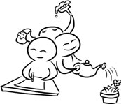

□耍小孩儿脾气。

□有时想要睡在马路上。

□很少会认为自己是个天才，但绝不会认为自己是笨蛋！

□不知道为什么，对于别人的认可总有着强烈的执念。

□要是被称赞就很得瑟。

□反过来，就会怀疑自己的能力。

“是我做人有问题，还是做事有问题？”

“哪一点出了岔子？”

“难道自己竟然是个庸才？！”

□为了得到更多的荣誉，往往更加卖力工作。

□走路时，总不自觉地埋着脑袋，像心事重重的样子。

明明心里张扬得要死。

□宁愿和林黛玉一样闷头吐血到死，也不要把心痛的理由告诉别人。

□“我好难过，抱抱我。”

“好。”

——这种场景永远不会在自己身上出现！

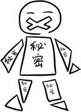

□在“社会经验”和“私人直觉”中，会选择后者。

□而且深信不疑。

□自己选择的，永远是最好的。

□不会花大把时间做白日梦。

□踏踏实实地工作才能有好的未来嘛！

□所以，不知不觉变成了“工作狂”。

□男女都一样。

□内心中收藏着各式各样的面具。

善解人意的朋友。

风趣活泼的同事。

温柔体贴的情人。

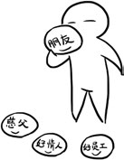

□喜欢戴着面具生活。

□慢慢也就忘记除下面具的样子。

□总是独立地面对自己的挫折。

□紧急事件突袭！此时表现得非常理性。

□当别人头大到团团转时，自己已经想到了善后步骤。

“别怕别怕，有我呢！”

□偶尔很害羞。

□跟异性接触时从不看对方的眼睛。

□并非缺乏自信，而是习惯了隐藏自己的另一面。

□对金钱的态度非常执著，甚至觉得金钱是人生存下去的最佳保障。

□因此，不知不觉变成一个对物质汲汲以求的人。

□欲望的鸿沟似乎从来没被满足过。

□总是被“渴望”折磨。

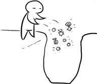

□内心翻腾着悲伤的阴雨，外表却不动声色。

□分手以后，不会说 ex 的坏话。

□哪怕对方的坏话传入自己耳朵，也懒得去辩白。

□一副玩世不恭的表情。

“有什么好解释的？浪费时间！”

□内心里却伤痕累累了。

□是个很好的听众和观众。主要是观众。

□冷眼旁观，不做判断，也不插手。

□但一旦有人靠过来，立马变身为“安慰高手”。

“你是最棒的啦！起码在我的心里，你真的很优秀耶！”

□背过身，立刻有绝对的能力不理会这个人。

□刚才扑过来的，只不过是一团空气吧？

□下雨时，别人都稀里哗啦地大步跑着躲雨，而自己依然慢条斯理地走路。

□觉得慌乱的人群非常可笑。

□容易陷入负面阴暗情绪之中。

□一旦将某人当做朋友，立即不计报酬地付出。

□只要对方开心就好。

□在这个时候，觉得自己有一颗温柔又善良的心。

□承受力极强，仿佛任何事情都已在掌握之中了。

□“能躲到哪儿去呢？难道前面就不下雨吗？”

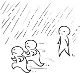

□受伤后总是想要一个人躲起来。

□这样的夜晚，会拿着手机乱翻电话簿，好想有人安慰啊啊啊～～～

□睡一觉起来，又生龙活虎地追求梦想去了！

□内在阴郁。

□甚至能预测自己几年后在干什么。

升职、结婚、生孩子。

一切都在掌控中，呵呵～～

□“真是我想要的么？”

对于这样的生活，偶尔也会觉得厌烦。

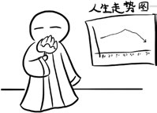

□一切都在自己掌握中了。

所以，我没有什么激情。谢谢，对不起。

□有被视为“小气鬼”的倾向。

□不是小气，只是注意细节。

□有点轻微的性格分裂。

□没有单一的爱恨，往往徘徊在两种极端点之上。

□会对同一个人又爱又恨。

□情绪调节器，尽量保持在“中间档”上。

□可惜常常失控。

不是被拉到“N”端，就是被扯去“S”端。

站在中间，其实是不可能的。

□朋友很少，朋友圈也很单一化。

□没法确定别人是不是真的对自己好。

□在身边竖起一道透明防护屏。

心门上也总是挂着“闲人免进”的招牌。

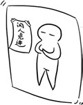

□芝麻绿豆大的事儿，也能让自己郁闷一整天。

□被人背叛了。

□像石头跌入深井，连“咕咚”声都听不到。

□内心有铺天盖地的失望、打击与震惊，并在内心深处把人性批判了一遍。

“怎么会有这样的人，超级鄙视！55555，这个黑暗的世界！！”

□坚韧+理智。

□这是本星座的金字招牌！

□不靠谱的事，基本上不予以考虑。

□所以，绝不梦想“灰姑娘遇见白马王子”的桥段。

□在感情上，有着不为人知的脆弱。

□怕分手。

怕离别。

怕对方突然不爱。

□不想被别人拒绝，就要抢先一步拒绝别人。

所以，我刻意保持和你的距离。

□所谓“绝情”，其实不过如此。

□一旦决定了解决问题的方法，就算半途出岔子也不更改了。

□硬生生拱出一条新路！

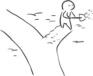

□哪怕你求破嘴皮都没用。

□自傲甚至有点自恋！

□若是感到对方不配让自己百分百地付出，就根本不会施舍自己的感情了。

□大多带着与生俱来的强烈自卑。

□是个悲观论者，所以感情上总是很被动。

□关心和爱是永远不会说出口的。

□往往爱情运很差！

难道我真的没人喜欢吗？5555555555555……其实是那些俗人配不上我吧！哼！

□一方面不相信爱情，一方面也不愿意开始没有结果的恋爱。

□虽然很专一。但是，忽而瞬息万变，忽而一成不变的性格，还是不适合做恋人。

□也有很物质的一面。

□在金钱方面会很小气。

□可是对朋友和恋人一点也不小气！

□口头禅是“钱花完了可以再挣嘛！只要你开心就好！”

□坐飞机时会想象自己是一只在蓝天下无忧无虑翱翔的小鸟。

□往往是越想追求什么，就越鄙夷什么。

□终其一生都将忍受内心各种相互矛盾和极端之间的冲突。

□口头禅是“其实我真的很讨厌去做这样的事……”

□可我又没办法控制自己不去做。

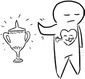

□因为孤独，很多时候很沉默。

□可以一整晚不说一句话。

□需要大把大把独处的时间。

□单纯地希望别人都能洞晓自己的心情。

□总是找不到自己的方向，不知该如何定位/评价自己。

□所以故作出冷漠的神情。

□如果自私起来，会让所有人都伤得一败涂地。

□喜欢吃棒棒糖，一下子就能吃 10 根！

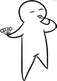

□有时候忘记了冷静与理智，把自己折腾得像一个疯子。

□从小就是一个心思缜密的孩子。

□偶尔也有冲动一下的欲望，却经常在还没开始时就用理智来控制了。

□所以常常觉得不爽不开心！

□外表和内心永远是截然相反的！

□表面上总是一副满不在乎的样子。

□心里其实已经急得如热锅上的蚂蚁了！该怎么办？怎么办啊……

□爱钻牛角尖。

□不过大部分是为了别人的事情。

□很少为自己的幸福考虑！认为自己已经很开心了，常常说的话是：“嘿嘿！其实我觉得自己很幸福啊……”

□总能想您所想，急您所急，非常贴心！

□天生富有责任感，对待自己的爱人总是掏心掏肺的好！

□可是内心缺乏安全感。

□所以对别人好，也会让自己感到怀疑，我对他这么做是否有必要？他会感觉到我的爱吗？他会理解吗？

□这时候心中善于计算和运筹帷幄的部分就会准时地苏醒过来。

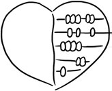

□于是在完全自我的感情世界里，情绪低落了。

□会收藏起心中的真挚，而以目标来对待他所面临的一切事物。

□口头禅：“按计划做事，总不会出错吧！”

□想要回到古代做皇帝。

□做任何事都充满希望。

□并且会为目标兢兢业业地做事。

□工作态度总是一丝不苟，非常严谨的。

□一旦感觉不到希望，就会立刻放手，毫不留情。

□口头禅“我的字典里没有柔肠寸断，割舍不下之类的字眼！”

□被人称赞“好可爱”时总是不好意思。

□而心里早被乱七八糟的想法冲晕了头——

“我真的很可爱吗？

他是在夸奖我，还是故意嘲笑我？

这句话有没有别的意思呢？……”

□有时候也会放松自己，变成一只小懒猪。

□喜欢睡懒觉。

□讨厌没有时间概念的人。

□好像具有天生的幽默感，经常一两句话让朋友们笑到不行。

□脾气变化无常，有时候像只温顺的猫，有时又像狂怒的熊。

□有自己的底线。

□从不践踏自己的底线，当然也不会让别人误闯自己心中的净土。

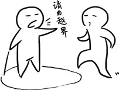

□内心孤独的一部分开始发作，时不时也考虑着要躲开人群一阵子。

□有时想要离家出走。

□可害怕孤独，所以总是被理智打败。

□跟朋友们在一起时总有疏离感。

□聚会时总是玩着玩着就突然伤感了。

□内心狂热，外表冷漠！

□被人说不近人情的时候总是默默地走开。

□被人误解时很少主动找人解释。

□认为用自己的实际行动可以击败一切谎言。

□是一个比同龄人要成熟懂事许多的人。

□天生不懂得怎样表达自己。

□喜欢在幕后默默地奉献。

□能以比别人高十倍、百倍的精力投入到工作中去。

□在爱情中认定了一个人后，就会努力让憧憬变成现实，一心一意，绝不花心。

□绝不做对不起爱人的事。

□偶尔也会犯点小错。

□喜欢把自己的生活模式强加在别人身上。

□总希望别人能够按照自己设定的生活模式去生活。

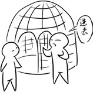

□假如别人做得不够好，或者根本做不到，就对他完全失去信心！

□口头禅：“哎！我真是恨铁不成钢啊！”

□是一个忠实的情人。

□虽然心中充满了爱意，但在所爱的人面前，却表现得很笨拙——甚至惹人讨厌。

这些都不是自己所希望的。

□总是因放不开而懊恼。

哎！我怎么这么笨呢？我怎么可以说这样的话？

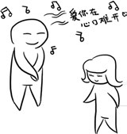

□缺乏社交性，交际手腕不够高明。

□珍惜每一分钟的时光，时时刻刻鞭策自己向上。

□一旦执著于某个目标，就仿佛忘了别人的存在，让人很难接近。

□比较缺乏休闲活动，因为觉得玩乐、休闲是对时间和金钱的双重浪费。

本书由“[ePUBw.COM](http://epubw.com)”整理，[ePUBw.COM](http://epubw.com) 提供最新最全的优质电子书下载！！！

# 3 外部连接 ____ 他人

□深沉得让人想逃跑。

□其实多半是害羞啦！

□因为不太跟人打交道，总是让人觉得害怕。

□其实真的好委屈！

□口头禅：“不要过于紧张了，偶尔接受别人的关心吧！”

□有时会拒绝别人，认为没有时间帮每个人处理心情。

□有点不近人情了。

□最害怕的三件事。

□金融危机爆发了。

□苦干了三个月的成果被全然否定。

□最爱的人背叛自己了。

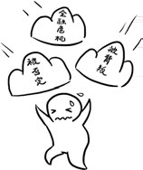

□有时会梦到大庭广众之下被人羞辱，在梦里泪流满面。

□不想太早生孩子。

□因为害怕生了一个好吃懒做且挥霍无度的儿子。

□有时很严肃，觉得是自保的一种方式。

□总是需要得到别人的赞美。

□被人说“很有上进心”时会超级开心。

□有高度的忍耐力。

□严苛的现实环境下仍然能够耐心等待。

□偶尔会有童心未泯的可爱表现。

□很典型的老夫子脾气。

□不喜欢很多人聚集在一起。

□说白了就是喜欢孤独嘛！

□并不觉得一个人很难熬哦，相反很享受那种独自生活的过程呢！

□觉得自己像一只角落里安静的蜘蛛，永远在角落“潜伏”着。

□不用追捕昆虫，昆虫却会自投罗网。

□就像蜜蜂，最关心工作，除了工作，还是工作。

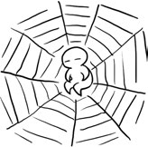

□对成就感会“上瘾”！

□看似无趣，其实大方又热情！

□其实年纪很小的时候就很早熟了。

□可往往因为害羞而控制了自己的欲望。

□可是内心深处永远像在沸腾的开水，“咕嘟咕嘟”滚着，等着锅盖被揭开，泄漏出这个大秘密。

□责任感很强。

□做任何事情都力求完美。

□如果做得不够好会自责。

□在认真工作的时候最讨厌被人打扰啦！

□“看不见我在做事吗？出去出去！等我忙完再来！”

□感情自白：谈感情太累了，快点结婚生孩子就好了。

□被背叛时的语录：寻觅一个最适合自己的人，小心翼翼地保护自己，保护爱情！

□失恋后总是一个人闷着。

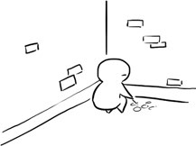

□踏踏实实地工作，希望用工作来弥补心里的伤痛。

□可“化悲痛为力量”往往也解决不了问题！

□到最后伤口只能越积越深。

□眼不见为净！

□其实想通之后也就释然啦！

□嘿嘿，天涯何处无芳草！

□常用的句子“最近好吗？”

□经常会被同事说：“跟你一起觉得压抑！”

□有强烈的责任感和野心。

□不喜欢作无谓的浪费。

□由于过于害羞或欠缺主动，常被“横刀夺爱”。

□通常情况下会手足无措，把悲伤埋在心底。

□自慰语：不是我的我不要！

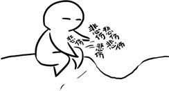

□做任何事都是在高度的责任感和逻辑头脑的严格控制下进行的。

□激情一般是由雄心和权力欲望调动起来的。

□总是在辛勤地耕耘，有无懈可击的工作态度。

□认为别人所做的一切都不理想，一定要自己亲自动手。

□所以常常会把自己搞得很累。

□很少思念某个人。

□认为自己是石头里面蹦出来的。

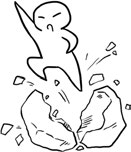

□觉得母亲怀胎十月简直不可思议。

□偶尔会莫名其妙地发问：“为什么怀孕要十个月呢？多浪费时间啊！”

□思想经常处于犹疑不定的状态中。

□我是不是忘记做什么事情了？这次的工作业绩上司会满意吗？总是忐忑不安的。

□跟异性保持着一定的距离。

□因为总怀疑对方感情的真诚程度。

□自己的感情是很难触及的，只有真心对待对方时，深藏的爱才能迸发出来，而这种爱是经久不衰的。

□几乎没什么闲工夫。

□“我好忙啊！忙死了，快晕了！坚持住……”

□可是一工作就停不下来。

□习惯并且热爱快节奏的生活。

□觉得自己就是为工作而生的。

□偶尔也会有周期性的抑郁。

□悲观的时候会否定自己现有的能力，觉得自己一事无成。

□认为没有人可以理解自己。

□颇有自知之明。

□力图用理智去支配自己的行动。

□被人讨厌的时候总是像兔子一样躲起来。

□认为自己可能在某些方面做得不够好，偷偷改变。

□有很大的勇气和能力去处理自己生活中的一切事情，并愿意负责。

□根本没有想过自己犯错后会侥幸躲过。

□认为逃避现实是不可取的，逃到最后只会把错误夸大化。

□希望自己的生活能有可靠的物质保障，这样才会有安全感。

□因为总是担心会失去什么。

□即使已经很有钱了，这种不必要的念头也时常浮现在脑海中。

□往往是自己想得太多了。

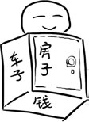

□不能被人轻视——这是追求上进的基础。

□若是被人瞧不起，肯定会像狮子一样愤怒的。

□觉得人和人之间是平等的。

□在天桥上看到乞丐时会神经质地跑上去跟他说话。

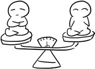

□其实自己已经很有才华了，却总是不满足。

□认为学习是无止境的。

□几乎不会做没计划的事情，觉得那样太冒险了。

□行动之前往往先权衡利弊。

□说话不喜欢开门见山。

□有极强的工作热情和组织纪律观念，从不放任自己。

□然而有时也缺乏自信心，我行不行啊？呜呜呜呜呜……真担心啊！

□总是对别人缺乏信赖。

□认为每个人对自己都是有威胁的，为了达到目的不惜付出任何辛劳。

□上帝？去死吧！根本没信过……

□认为自己很老实。

□不喜欢耍花样，当然也不喜欢别人跟自己耍花样。

□有时间观念。

□约会的时候最讨厌对方迟到了。

□超过 10 分钟心中对别人已经失去好感了。

□“你这个人太不靠谱了……”

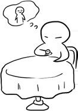

□做领导很有一套，组织能力也不错。

□认为自己是策划活动的天才。

□喜欢待在幕后，享受着低调的喜悦！

□有时会装着高高在上的样子来掩饰内心的脆弱。

□说笑话的能力实在需要提高。

□“你的笑话一点也不好笑！”朋友的评价！

□总是绷着脸，像背诵课文一样叙述完一个故事。

□也尝试过改变，可往往还没开口就先脸红了。

□周而复始过后，终于对这种事情失去信心。

□“就承认自己不会讲笑话好了……”

□想认识积极、乐观、进取的人。

□最嫌弃“不客气”的人。

□“别拿你的个性来挑战我的脾气！”

□看上去很保守，其实思想很新潮。

□虽然不是一身品牌，却也有自己的格调和品位。

□喜欢接触与众不同的新奇事物，却不受外界感染，保持自己独有的特性。

□能在新的事物中去分析，并把分析的结果融会成一整套，以便知道怎么去应对他们。

□有强烈的拯救欲。

□认为世界上的一切不公正事情都有自己的一部分原因。

□因此而忧心忡忡。

□好在懂得调节自己的心态，过两天就没事了。

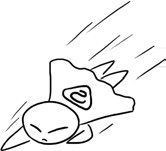

□只相信自己听到和看到的。

□对别人的建议通常没有什么反应，令身旁的人很无趣。

□根本不妄想从别人身上找到答案。

□其实自己心里早就知道了嘛！

□有时候会想“是不是退一步，也会海阔天空？”

□认为自己是老谋深算、杀人不用刀的角色。

□有时候会被人反感。

□认为自己是个理智的人，很少因义气为朋友出头。

□偶尔也认为自己不够重情义。

□被人误解后会无动于衷或者气愤地走开。

□其实心中倒是有几分窃喜，虽说自己完全不是那种人，但下意识里又强烈渴望自己就是魔教大教主！

□看到别人对自己进行人身攻击，会觉得很可笑，带着几分轻蔑暗笑。

□眼睛微微眯起，眼神微微发狠。

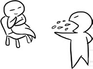

□口头禅：“无所谓了！真够无聊的！”

□可是关上电脑走出房门看见卖水果的，又想起今天要见的某某说过喜欢吃水果。

□于是开始撅着屁股买水果：专挑最好的最新鲜的，价钱都不问。

□想变成好人就变成好人，想变成坏人就变成坏人。

□完全凭感觉啦！

□有着明媚的气质。

□非常极端。

□总是很容易失去控制。

□在社会中会莫名地感到落落寡欢。

□极其热爱自我怀疑。

□所以总是不能完全相信自己的分析。

□有时候明明分析的是对的，也不敢大胆说出来。

□若是结果跟自己想的一样，又会懊恼极了。

□口头禅：“原来真的是这样啊？我的天！”

□很爱很恨，总在两端不停跳跃，找不到中间平衡态。

□所以对自己的情绪也会有困惑。

□于是就在这种激烈撞击的心理状态下表现出一如既往的漠然。

□呜呜呜呜……我能怎么样呢？我只能装着不在乎了！

□就在这种冷漠的伪装中，偷偷地反复整理各种矛盾的情绪和想法！

□最羡慕那些没有最最爱也没有最最恨的人！

□评价一个人的时候总会说：“这个我不好说了，我觉得还好啦！”

□甚至会注意到细节的细节。

□可以很清楚地记得别人的某句话和某个动作。

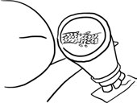

□心情亢奋的时候又是另外一种形象，也许非常刻薄，也许非常大度。

□偶尔会傻乎乎的，对别人提出的所有问题都胡言乱语一番。

□总是能够很快地了解一个人。

□换句话说就是很敏感啦！

□很容易上当受骗，很容易受伤害。

□被骗后一般不会大哭大闹，总是很冷静地分析被骗的原因。

□若是在微不足道的小事上受骗，会觉得自己的 IQ 和 EQ 都太低了。

□这简直是不可饶恕的事情。

□有时能很快跟陌生人成为朋友。

□口头禅：“他看起来都不像坏人啊，怎么会……”

□别人说什么都能信以为真。

□最怕别人找自己帮忙啦！

□其实也不是自私啦！

□答应人家的事情总希望尽善尽美地做到最好。

□认为这是一种责任。

□可往往得不到体谅和理解。

□口头禅“算了算了！为这种事情伤心可不是我的作风！”

□相信自己的第一感觉。

□常容易被感动，最有报恩的冲动。

□要是毫无条件地被别人帮助过，可能表面不动声色，却暗暗想把人家一辈子都包揽照顾起来。

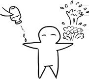

本书由“[ePUBw.COM](http://epubw.com)”整理，[ePUBw.COM](http://epubw.com) 提供最新最全的优质电子书下载！！！

# 4 各种设置 ____ 倾向/兴趣/特长

□太喜欢看书了。

□即使搭公共汽车、吃饭、临睡前这些零星而短暂的时间，也不会轻易放过，必定手不释卷。

□一旦执著于某个目标，就仿佛忘了别人的存在。

□被人叫做书呆子时会微微露出不屑的表情。

□心里想：“笨蛋！这些笨蛋！书中自有黄金屋啊！”

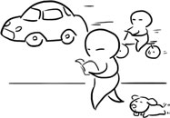

□即便是一件小事也会打破砂锅问到底。

□你知道他是哪个班级的吗？

□不知道。

□那你知道他叫什么名字吗？

□不知道。

□那你知道他喜欢什么吗？

□不知道。

□为什么你什么都不知道？！

□@#￥＆%……

□很少有时间去欣赏友情。

□偶尔也想过跟朋友出去玩玩。

□可总是抽不出时间。

□被朋友邀请总是乐意奉陪的。

□但总是被手头上的工作给耽误了。

□是典型的“宅人”。

□不是宅男，就是宅女。

□放假时哪里都懒得去，窝在家里最舒服。

□不想做饭的话，就点外卖送到家里来。

□买衣服，用淘宝。

□总之，有了互联网，谁还要出门啊！

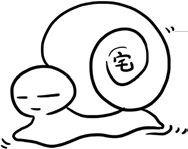

□喜欢网络游戏。

□打游戏常常说的话：“啊啊啊啊！别杀我啊！！我知错了，大哥……”

□对赌博缺乏乐趣。

□认为男人赌钱是不可原谅的事情。

□口头禅：“哎呀！这样的人生观，真可耻啊！”

□永远都说自己很忙，懒得发短信。

□被人问起为什么不回信息时，总是一脸无辜地说：“有事吗？可以打电话呀！”

□别人打电话过来，又会说手机没钱。

□“哦，知道啦！我挂了，手机快停机了……”

□有一点小气，认为钱要花在刀刃上。

□买东西的时候总是看了又看，比了又比，这种五块三，那种五块二，还是五块二的吧！嘿嘿……

□吃饭的时候很少买单。

□有时候会说自己忘了带钱包。

□被人当场揭穿会愤怒离席，觉得自尊心受到伤害了。

□眼镜控+围巾控。

□戴上眼镜，围上围巾，好像立刻就深沉了，书生了，气质了，有味道了。

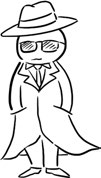

□在体育上没有天赋。

□也曾经为此懊恼过。

□坚持过很长一段时间的晨跑。

□最后发现没有效果而放弃了，心情也因此降到零度。

□有点闷骚，内敛。

□低调，不张扬但是内心高傲，只相信自己。

□常常对人家说：“我相信你说的话！”

□心里早就不耐烦了：“相信你才怪！”

□习惯一个人做自己喜欢的事。

□活在自己的世界里。

□保留自己的生活习惯。每次坐同一班车，每天吃同样的食物。

□口是心非，喜欢掩饰自己。

□就算心里翻腾倒海般纠结，表面上也可以若无其事。

□当然是装的。

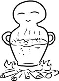

□认为情调和浪漫是很浪费时间和精力的东西。

□看起来比较顽固，没什么生活情趣。

□不会送玫瑰花，不会说甜言蜜语，不会很贴心。

□其实他们的浪漫是很有品位的，而且不轻易使用。

□他如果爱你，就是真的爱你，用他自己的方式。

□口头禅：“其实我也有浪漫过，只是你没发现而已！”

□内心绝对善良，但表面总是一副冷酷的样子，典型的刀子嘴豆腐心。

□很谨慎！

□思考问题的时候总是用一只手摸着额头。

□认为这个姿势很酷。

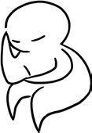

□做任何事情之前会先想到最糟糕的情况。

□口头禅：“想到坏处是早做打算嘛！”

□偶尔也想去唱唱歌。

□总觉得自己五音不全，唱歌巨难听。

□最后鼓足勇气开口了。

□但总是笑场。

□一般情况下会愤怒：“笑什么笑？不准笑！”

□很难从个人生活的小圈子里摆脱出来。

□喜欢一成不变的生活。

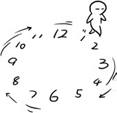

□总是力图用理智去支配自己的行动。

□经常说的话是：“我不相信……”

□喜欢下象棋。

□一边下棋一边思考。

□如果输了会暗暗沮丧。

□表面上会谦虚地说：“呵呵，真佩服你啊！”

□其实心里早不耐烦了：“有本事再来一盘！哼！”

□没有安全感。

□所以会装傻。

□喜欢在任何人面前装傻，这可不是一般的装傻能力。

□认为只有傻子才不会受到任何伤害。

□如果不是值得相信的朋友，永远不会让对方知道自己很有智慧。

□而无论安全与不安全对朋友都很真，也很珍惜朋友，最希望获得朋友的信任。

□有时候会疯狂打网游。

□兴趣来时可以一天一夜连续不睡觉。

□思维完全沉浸在游戏中。

□如果被人打断了思路会很不开心。

□一般情况下会大吼大叫。

□口头禅：“忙着呢，别烦我！”

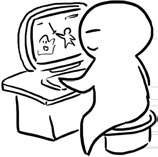

□在恋爱中会变得胆怯和小心翼翼。

□表面上一副被对方征服的样子。

□心里却在想：“他真的爱我吗？值得信任吗？”

□有吹毛求疵及挖苦他人的习惯。

□跟人吵架时一开始不说话。

□忍耐到一定限度时会突然神经质地爆发。

□你说什么呢？哼哼！你这个笨蛋！

□最讨厌势利眼。

□口头禅：“啊啊啊啊！你这个人品德真差，鄙视！！”

□懂得笨鸟先飞的道理。

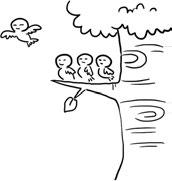

□最大的爱好是好好工作，工作再工作！

□有时候怀疑自己是不是一头大黄牛！

□被人说“小猪”的时候会偷偷不开心。

□私底下想：“我这么勤奋怎么会是小猪呢？讨厌！！”

□交友随便，会跟贵族聊天，也可能跟乞丐做好朋友！

□讨厌坏坏的自己，当然想抛弃自己是不可能的。

□所以经常一个人发呆。

□觉得自己下辈子变成宠物狗就好了。

□偶尔会觉得自己实在太安静了，需要好好发泄一下。

□可在人群中一站，又情不自禁地沉默了。

□有时被人硬拉着出出风头，也是腼腆的。

□被人夸：“你真的很聪明呢”时会不好意思地低头。

□绝对是个工作狂，一面抱怨工作太累，一面又拼命揽下更多的工作。

□靠红牛顶着，还是 8 倍的。

□因为不甘平庸。

□没有安全感，走在路上总怀疑会被谋杀。

□遇强则强，遇弱则弱。

□走路大步流星，比一般行人要快。

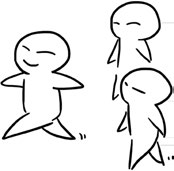

□很看不惯那些总是走走停停的年轻人。

□觉得无所事事地浪费时间是不可原谅的！

□经常被人说：“天啦！你怎么是这么无趣的一个人呢？”

□有时候笨笨的，习惯安静地一个人待着。

□喜欢的休闲活动，也是比较静态的，例如，看书、听音乐等等。

□喜欢“好妈妈”型的妻子。

□对叛逆少女没有好感。

□认为女人就应该保持中华民族的传统美德。

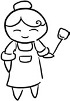

□非常在乎自己的家庭地位。

□小时候曾老气横秋地对妈妈说：“我是不是家里的顶梁柱啊？”

笑倒一片！

□嘴巴里嚼着红烧肉时，会突然想吃鱼。

□天生有办法解决各种疑难杂症。

□没有百分之百的把握是不会答应别人的请求的。

□认为给人做事拿报酬是理所当然的。

□工作中，总能明确地指出别人经常忽略的事情。

□天生忙碌命。

总是闲不下来，会自言自语地说：“我还有什么书没有看呢？”“我还有什么事情没有做完呢？”

□做事总是很谨慎。

老师布置作业每个生字写五遍，绝对不会写六遍的！

□擅长装成一副学者的样子。

□事实上也的确是样样精通嘛！嘿嘿～～～

□给人解决问题时一定是小心翼翼的，生怕讲错了！

□被问到不懂的问题，表面上会谦虚地说：“我不懂……”

□其实心里早就崩溃了：“我怎么会不懂这么简单的问题呢？真丢脸啊！呜呜呜……”

□做事情一板一眼。

□觉得说话比做事麻烦。

□钱包里面总是整整齐齐的。

□衣柜里也是分门别类地将冬夏的衣服摆放整齐。

□看到脏兮兮的家会皱眉头。

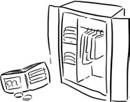

□归根结底，就是需要时时刻刻得到别人的认可。

□要是被人讨厌就惨了……

□啊啊啊～～～这个已经成了生活习惯。

□即使表面上根本不在乎，心里还是很在意的。

□偏偏，总是被问到不懂的问题！

□暗暗咒骂：“你难道不能问简单点的吗？你以为我是爱因斯坦？”

□脸上却是笑容满面：“我帮你查查去……”

□最忌讳被人揭伤疤。

□可生活中不解风情的人实在太多。

□发怒时是很“张飞”的！

□认为烦恼总是要发泄出来的嘛！

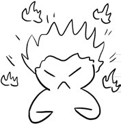

□喜欢吃的东西总是希望一次吃完。

□即使撑得难受也乐呵呵的。

□难道是饿死鬼投胎？

□这时，总是会说：“这次吃多了，等很久才会再想吃，节约成本嘛！嘿嘿……”

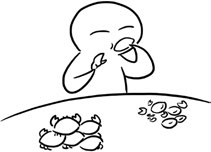

□做事情条理分明。

□不懂的会记个小字条夹在书本里。

□口头禅：“讨厌！现在的日子过得不是很好吗？”

□自己的价值观被颠覆，会觉得非常难过。

□认为做任何事之前得先树立好榜样。

□毕竟有了好的奋斗目标才会不懈努力嘛！

□有时候走在大街上会觉得自己很孤单。

□悲伤的时候喜欢把头蒙在被子里。

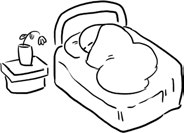

□希望生活总是一个样的。

□换句话就是说不想变化！

□我不想搬家，我喜欢住老房子，不要逼我！啊啊啊啊……

□默默努力。

□总是正儿八经的。

□心情好时也会开开无伤大雅的玩笑。

□出门前总要看看手提包，以确定是不是忘记带东西了。

□不会随便暴露弱点。

□在外总是温文尔雅的样子。

□在家有时可是暴君啊！

□对宠物没什么兴趣。

□认为猫粮和狗粮都很贵。

□现在金融危机嘛，还是先填饱自己的肚子再说。

□不过，有时看到流浪狗也会伤感。

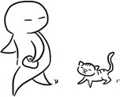

□其实也想找个人发发牢骚。

□也想有人安慰下自己。

□真的好需要一个真心朋友呢！

□无奈总是太清高了，觉得告诉人家自己的秘密真的说不出口呢……

□总是还在犹豫中，机会就长着翅膀飞走了。

□口头禅：“为什么世界上只有我一个人懂自己呢！呜呜呜……”

本书由“[ePUBw.COM](http://epubw.com)”整理，[ePUBw.COM](http://epubw.com) 提供最新最全的优质电子书下载！！！

# 5 程序 ____ 工作/学习/恋爱

□绝对的情痴！

□一旦决定付出情感，总是太汹涌澎湃了，通常是易放难收。

□任何付出都是不打折扣的，虽然总是陷在又爱又恨的矛盾中。

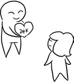

□认为自己有极强的忍耐力。

□能够很好地隐藏自己的伤口。

□接着，一件事又一件事，一刀又一刀……越死心塌地，越容易受到伤害。

□若是达到忍耐的极限，那么一下子就一点感情也没有了，即使不决裂也只剩应付而已。

□会立刻变得冷漠绝情。

□为自己感到屈辱。

□之后所有的情绪都将不复存在。

□曾经的感情烟消雾散，想起爱情就觉得厌倦。

□经常被问：“为什么那么多事情你都忍受了，偏偏最后在一件小事上这么绝情呢？”

□怀旧。

□不过很少想念旧情人。

□认为自己是个不需要感情的人。

□真希望不谈恋爱直接结婚！

□认为自己是被最后一根稻草压死的骆驼。

□分手时总是很沉默，因为觉得完全没有必要再说什么了。

□决定的事情没有更改的余地。

□根本没有必要向一个不再和自己有关系的人解释什么。

□表面上还是装着无所谓。

□心里其实早就血流成河了。

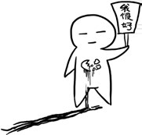

□有自己的底线。

□若是有人冲破了自己的底线，会立刻激起报复别人的欲望。

□口头禅：“人不犯我，我不犯人！人若犯我，我必犯人！”

□看见讨厌的人被欺负时，总是无动于衷，袖手旁观。

□偶尔会被人说没正义感。

□听到这句话会气得咬牙，表面上却是一副“随你怎么说”的神态。

□心里其实早在反驳了：“我哪儿没正义感了？你说出来听听！”

□总是幻想自己是一个心怀善意的好人。

□崇拜权力又蔑视权威。

□不是不重视情感方面的培养，实在是很难抽出时间。

□有时候真希望自己长出三头六臂来：忙！忙！忙！实在太忙了！

□这时候总期望有人能够理解。

□自慰语：“没有什么是我做不到的！”

□认为自己不重视任何事，却又都是最重视的，比如名和利。

□喜欢天长地久这个词。

□对爱情一心一意，往往因太认真了而变得呆头呆脑的。

□常会这样想：你有什么价值呢？有什么值得我注意的呢？和你在一起，我会得到什么呢？

□想过之后又觉得自己太过功利。

□这时会想：“这样子不对啊！我怎么变成这样啦？”

□无论如何都不会太主动的。

□或许会暗示，但绝不敢亲口说爱某某。

□若是别人主动大胆地告白，通常不知道怎么拒绝：“嘿嘿，吓傻了！”

□认为另一半要做好牺牲自己事业的准备。

□经常忘记自己的生日。

□往往都过去好久才会想起来：“啊！前天是我的生日！怎么又忘记了……”

□希望别人认真对待自己的追求与梦想，哪怕非常的世俗。

□觉得妻子是自己坚强的后盾，在感情上要给自己充分的保障。

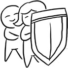

□如果爱人想振翅放飞，肯定会伤心死的！

□认为自己又被无情地抛弃了……

□坚持自己的独立自主性并能洒脱面对一切，冷眼看世界。

□坚信自己身上有足够吸引别人的地方。

□很少参加朋友聚会。

□偶尔参加了也是孤孤单单一个人坐在角落里。

□觉得自己跟这个世界简直格格不入呢！

□经常有种被全世界都遗忘的感觉。

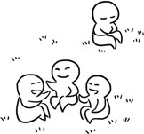

□练就了一身好厨艺，表现出很会理家的样子。

□被人崇拜时总是一副冷冰冰的样子，仿佛一切都是理所应当的。

□其实内心深处早就得意得快要控制不住脸上的表情肌了。

□细心地对待每一件事，无论做什么都不怕麻烦。

□口头禅：“帮人帮到底，送佛送到西嘛！”

□有时会刻意地保持自己独立的不为人知的一面。

□觉得这样才能好好地保护自己。

□太传统了！

□不管什么时候都是一副思考的样子。

□以对任何事都慢半拍，因此不易陷入爱情漩涡，更别说是一见钟情啦！

□最讨厌那些为爱情而荒废学业、工作，甚至废寝忘食的人。

□是标准的成就感上瘾者。

□努力工作只是为了证明自己的价值。

□事业有成才会考虑结婚。

□肚皮都填不饱，还谈什么婚姻！

□QQ 资料上注明——跟我聊天一定要诚实，否则请别加我！

□属于坚强勇敢、不轻易低头的类型。

□很少在背后说人家的坏话。

□即使被人辱骂也能够很好地维护自己的完美形象。

□但忍耐是有限度的。

□一旦对方打破了这个限度，可能就会疯狂报复了。

□即使平时总是以冷静著称，发怒的时候也会完全丧失理智。

□大打出手也不是不可能的。

□等一切风平浪静之后，会默默地承担所有的后果。

□收到垃圾货品时……

□无奈……还是老老实实去退货吧……

□没什么好说的，去退掉就好了！

□房间总是布置得简简单单的。

□压根不喜欢设计得很复杂的东西。

□认为最重要的就是工作，不会浪费任何时间在家务上，所以房间越简单越容易收拾。

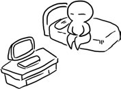

□总是给自己无尽的压力。

□认为生活就是越忙碌越有成就感。

□最讨厌被人比来比去啦！

□最重视自己的面子。

□若是有人让自己当众出丑，简直比被人捅一刀更痛苦。

□一定会想办法报仇的！哼哼！

□不过脸上不会流露出敌视的态度。

□总是在对方毫无准备的情况下动手。

□一般都是经过周密的计划和安排。

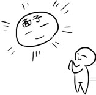

□往往会比别人花更多的时间去完成一件事。

□情绪容易低落。

□外冷内热、爱照顾别人。

□口头禅：“失败是成功之母！”

□略带焦虑和忧郁的神情几乎成了自己的招牌表情。

□做任何事情都是全神贯注的样子。

□好奇心很强！

本书由“[ePUBw.COM](http://epubw.com)”整理，[ePUBw.COM](http://epubw.com) 提供最新最全的优质电子书下载！！！

# 6 遇到问题·故障时 ____ 自我崩溃

□缺乏真正的自信。

□表面上看来可能是让人无法忍受的嚣张。

□其实心里胆怯得要命。

□任何时候都需要赞美和鼓励。

□口头禅：“力争上游！”

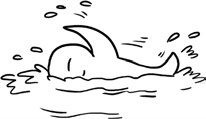

□多少会有一些抑郁的倾向。

□根本没有向别人吐露心事的习惯。

□认为“神话”和“奇迹”是两个跟自己不沾边的词。

□潜意识中对自己有点儿缺乏信心，对环境没有安全感。

□因此，很少全然信赖别人（尤其是男人），没有依赖心，而且非常实际。

□生气时很少大吵大闹。

□偶尔会打打冷战。

□即使知道自己错了也不会先开口认错。

□总是等待对方先敞开心窗接纳自己。

□其实明明知道是自尊心在作祟！

□但总是没有勇气说对不起。

□偶尔会恨死自己。

□认为自己真是太虚伪了！

□可表面上又不知不觉地装出一副“根本没看到对方”的表情。

□最后总是将原本很小的事情扩大化，后悔也来不及。

□因为种种原因，从不做大哥——哦，从来没当过。

□不过这也不太好啦，总归是要稍微体验下的。

□可已经习惯待在幕后做指挥了。

□算了算了，枪打出头鸟，做大哥太有风险了！

□经常认为自己不会输。

□除非被人挑战，本身是不会主动出风头的人。

□不过偶尔也会主动去挑衅对手，嘿嘿！

□根本不会接纳别人的意见，认为自己的观点是有道理的。

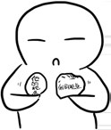

□很少色迷迷地盯着某个女孩看，觉得爱情很浪费精力呢！

□太明白自己想要什么了。

□所以根本不相信一见钟情。

□对肤浅的笑话不屑一顾。

□虽然更在乎内在美，也不是完全不在意外貌。

□不必沉鱼落雁，不过也不能吓死人！

□很细心，但不经常表现出来，怕麻烦！

□每个月总有一天心情烦躁。

□仿佛世界末日要来了。

□是个很自律的人。

□喜欢简简单单的生活模式。

□换句话就是说喜欢一成不变。

□总能洞察到别人的心思，把每件事情都看得太认真了。

□所以最好不要轻易地开玩笑，尤其是略带一点人身攻击的玩笑。

□很可能当场就板下面孔，让你下不了台。

□总是在自己的圈子里忙碌，所以记不得不相关的人。

□常常觉得人家面熟却又记不得人家的名字。

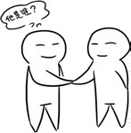

□很少主动跟别人打电话。

□觉得生活中最不能缺少的东西是书。

□认为对亲人忠诚是必须的。

□不能容忍任何人随便说家里人的坏话。

□若是被打破底线，极有可能因此翻脸。（永远绝交了……）

本书由“[ePUBw.COM](http://epubw.com)”整理，[ePUBw.COM](http://epubw.com) 提供最新最全的优质电子书下载！！！

# 7 存储器·其他 ____ 记忆/日常

□经常被人说成不苟言笑，毫无情趣的老古板。

□其实这种说法简直是诽谤！

□虽然态度严谨让人不敢轻易造次。

□但绝不缺乏魅力。嘿嘿，也有温顺的一面呢！

□最讨厌游手好闲的懒虫。

□心情不好的时候，看谁都不顺眼。

□不过不会为一件事情难过很长时间。

□所以通常脸上表现出酷酷的、与事隔离的样子。

□其实只是不希望让别人看到自己脆弱的一面。

□不会随便表达自己的想法。

□总是闷闷的样子。

□由于缺乏热情，不太会赢得别人的好感。

□所以总是困难重重。

□渴望：能承担家庭重担的爱人！

□有变成老鹰的冲动。

□希望了解身边所有人的性格。

□并不是因为好奇，好象只是因为一种安全感。

□常常很容易就会了解到身边每一个人的优缺点，但是通常不会说出来，也不会太介意，能够包容对方。

□偶尔指出别人的缺点时一定是友善的，虽然表情嚣张又讽刺。

□认为自己是双重人格。

□其实真的是这样，却不愿意去改变。

□总希望自己永远傻傻地生活着。

□也在学着变坏。

□如果讨厌一个人，就是绝对的讨厌对方。

□虽然不会随便讨厌一个人，但是如果别人太过分，这个人就会从心底被彻底抹杀。

□报复手段极其残忍，会加倍惩罚欺负自己的人。

□认为自己很了解这个世界。

□讨厌轻浮的人，只要发现对方哪怕有一点点不够利落，就会产生轻蔑感。

□为人诚实，不够引人注目，但却有很强的魄力。

□不轻易发表意见，一旦发表意见，就是定论。

□一旦自己深信的事物遭到诽谤，往日的温顺就会完全消失。

□可以说只能捋顺毛。

□经常听到朋友对自己说：“应当学会听取他人的意见嘛！”

□绝不会不遵守约定或背叛朋友。

□认为出卖朋友简直是应该遭到天打雷劈的坏事。

□有点小悲观！

口头禅：“反正像我这样的人……”

□属于马拉松选手的类型。

□虽然爆发力比较弱，但持久力很强。

□在达到目标之前绝不会有丝毫的减弱。

□不够亲切随和。

□要学圆滑点啦！

□虽然能得到老师或上司的宠爱，却会遭到同龄人的冷遇。

□通常情况下，会偷偷伤心：“我只是公事公办，为什么要这么排挤我呢？呜呜呜呜……”

□面对雀跃欢腾、不断喧闹的朋友，总是一副看戏的表情。

□偶尔会轻“哼”一声，不以为然地瞟一眼，嘴里甚至会小声嘀咕：“真没素质！”

□其实内心充满羡慕，有时会犹豫是否该改变自己处处掌握分寸的性格。

□常因外表感到压力。

□我是不是变丑了？

□我的皮肤怎么这样了？

□衣着真是没品位啊！

□最后，“算了算了，烦心事真多，还是先把手头的活干完吧！”

□可能会说“绝不会用谎言来欺骗他人”。

□其实有时为了保全自己的自尊，会不由自主地说谎。

□一个人的时候会狠狠地鄙视自己，暗暗发誓说：“再也不这样了！绝对不会有第二次了！”

□可关键时刻，总是忍不住再次犯错。

□小时候有咬手指甲的习惯，边咬边想事情。

□长大后喜欢撕扯东西，觉得这是一种减压的方式。

□偶尔也会为心上人亲手下厨做饭，那时会有幸福感。

□认为自己并不是缺少情调，而是觉得生活本身就是平平淡淡的。

□只要喜欢，就会热情似火。

□一般是第一眼喜欢就喜欢了，第一眼不喜欢的话估计永远都没戏。

□心中没有绝对的好和坏。

□只要闪过一个念头认为对方是好人，很快就会彻底地这样想。

□口头禅：“我觉得你很好，你就很好！”

□主观意识很强烈。

□常常将自己的想法强加到别人的身上。

□并且不停地说服自己，以相信对方的想法跟自己的一样。

□在亲密的朋友面前表现得非常温和可亲。

□平日的严肃瞬间冰消瓦解。

□不熟悉的人看到这种场面会大吃一惊：“天啊！原来是这样的人啊……”

□就这样莫名其妙地感动了别人，自己还不知道！

□虽然多才多艺，但表达能力欠缺。

□所以总有怀才不遇的感觉。

□认为自己是匹千里马，就差伯乐了！

□个子偏矮，骨骼较小。

□被人说“娇小玲珑”时总是默默接受。

□私底下却自卑得要死。

□口头禅：“这身材！哎！这身材就这样了……”

□讨厌住在嘈杂之处，喜欢安静的地方。

□不善于控制自己的情感，喜怒哀乐完全表达在脸上。

□喜欢就是喜欢，不喜欢就是不喜欢。

□所以常常无意得罪了许多人。

□被人误解的时候总是一脸无辜：“我又做错什么啦？”

□任何事情都是想好了再做。

□容易急躁。

□觉得自己像一只非洲豹。

□嗖～蹿出去了！

嗖～抓住猎物了！

嗖～又蹿回来了！

□一会儿就把所有的事都搞定了！

□对朋友之间的纷争几乎没什么概念。

□也很少留意周围人之间的嫌隙。

□觉得整天八卦真的好浪费时间呢！

□被人冤枉的时候总是一声不吭，忍辱负重。

□不过会记仇。

□即使对方是无意中伤害了自己，心中也会有少许介意。

□几乎没有吃回头草的想法。

□认为过去了就过去了，虽然想起来会伤心，但是过好目前的生活才是重点。

□是一个有强烈的忘我精神的人。

□表情平静而淡漠，总给别人不太容易接近的感觉。

□喜欢离群独处。

□认为一个人的生活实在是太自由了！

□害怕别人毫无意义的谈话会占据自己的宝贵时间。

□也不能接受别人的粗暴无礼。

□勤俭节约是本色。

□认为精打细算过日子也是一种享受。

听说面包店 6 点过后会打折，现在是 5 点，那我多等 1 个小时好了……

□口头禅：“这个我不想买，太贵了！”

□觉得有人追的日子真的好爽！

□喜欢站在主导地位。

□有时候会想象去改变别人的生活方式！

□即使失败了，也觉得是一种高难度的挑战。

□最不能容忍别人滥交朋友又花心。

□占有欲很强烈。

□有西太后的风格！

□偶尔会唠唠叨叨。

□经常被朋友叫做“唐僧”。

□野心很大！

□认为自己一定能够有所作为。

□并且为了这个目标不停地努力奋斗。

□因为太忙了，所以总是缺乏温情。

□口头禅：“我太严肃和公式化了……”

□一旦决定开始一段感情，怎样都会维持下去。

□结婚就永远不打算离婚了！

□虽然已经是 21 世纪了，可离婚这样的事情传出去，还是很没面子。

□即使婚姻出现问题，也会继续维持。

□到时候已经不理会自己是不是还喜欢对方，只要不离婚就好。

□维持表面的光鲜也好。

□其实不喜欢说话，非常沉闷。

□被人嫉妒是常有的事情。

□所以已经懒得去理会了。

□有时被人恶意诽谤。

□都是一副没听到的样子。

□压根不吃这一套！

□心里常常想：“这样的人真无聊啊！”

□非常谨慎，有时候都不知道自己在想什么。

□认为感情不是惊天动地，高潮起伏而是细水长流。

□从来不看韩剧。

□觉得都是低智商的故事，现实生活中怎么会有这样的事情呢？

□老喜欢疑神疑鬼的。

□别人很随意的一句话都能分析出更深层的意思。

□脾气上来后会摔坏家里的所有东西！

□当然都是些便宜货！

□贵的肯定舍不得。

□从不听劝。

□口头禅：“我知道分寸的，好不好？”

□擅长伪装！

□即使遇上心仪的对象，也会严格控制浪漫的幻想力，以防感情泛滥。

□因为很实际，喜欢权威、保障和地位，所以在爱情中，常会不自觉地将这些条件考虑进去。

□爱情和面包，是同样重要的，而且要在确定无误时，才会坦然面对。

□喜欢成熟的御姐。

□绝不会爱上天真的萝莉！

□在商场里看到小偷偷别人的钱包一般会装作视而不见。

□其实心里早展开激烈的战斗了。

□最后的结果是：“我才不会冒这个险，反正他又没有偷我的！”

□读书笔记总是全班做得最好的。

□重点部分会做记号。

□学习成绩超级好。

□很有求知欲。

□不懂的问题总是搞到完全明白为止。

□几乎不会不懂装懂。

□怕生！

□有时候会承受不了生活的压力。

□会将此转化为自己的脾气。

□所以偶尔需要一个人安静下，反省反省！

□看起来总是一副冷冰冰的模样！

□力图改变别人，也努力过改变自己。

□实在是太孤僻了。

□所以整日只能跟书作伴，这也是取胜的秘密武器。

□很少告诉别人自己的想法。

□觉得别人都是骗子。

□自己也是。

□极度骄傲，极度自卑！

□做坏事后总是第一个站出来交代错误。

□常常将所有人的错揽在自己一个人身上。

□有时是天使，有时像恶魔。

□认为爱一个人是自己的事情，跟其他人没关系。

□可长时间的付出得不到回报，心里总不是滋味儿！

□跟人表白的时候总是结结巴巴的。

□担心被人家拒绝。

□表白成功后却不知道如何走下一步。

□也许是太不浪漫在作祟，总害怕对方离开自己。

□所以会拼命地工作，希望在事业上找到一个平衡点。

□因为很自卑，唯一能用自己努力获得的就只有物质了。

□要求忠贞的爱情。

□恋人背叛自己后，绝对不会原谅他！

□只有踏在大地上才会觉得安心。

□永远无法理解某些人飘来荡去的状态。

□有恐高症。

□坐飞机总担心自己会从天上掉下来。

□坐火车又担心火车出轨！

□总是一个人偷偷地难过。

□却又不承认自己是一个感性的人。

□偶尔也会蹦出一两句俏皮话。

□喜欢一个人时甘愿为之付出一切，赴汤蹈火，在所不辞！

□很少玩失踪。

□觉得这太不理智啦！

□根本不会被花言巧语所迷惑。

□认为物质是感情的基础。

□最害怕跟别人发生冲突。

□总能及时处理好紧张的人际关系。

□口头禅：“退一步海阔天空！”

□新的机运来临时，彷徨无助的感觉油然而生。

□向新的理想进发时，也会觉得孤独。

□犹疑一阵子之后，再度回归正轨，将更积极地努力奋发。

□喜欢低调的生活。

□喜欢四字成语。

本书由“[ePUBw.COM](http://epubw.com)”整理，[ePUBw.COM](http://epubw.com) 提供最新最全的优质电子书下载！！！

# 8 其他搭配 ____ 当摩羯遇上 A/B/O/AB

当摩羯遇上 A 型血

□是个目标明确，眼光锐利的人。

□知道自己要的是什么，对自己正在做的事有明确的概念。

□总是那么一丝不苟，会令人觉得有些缺乏生活情趣。

□事业心强，很上进。

□能够脚踏实地地努力，为自己的目标果断舍弃享乐的机会也不在话下。

□而且雄心勃勃，很有自信。

□缺乏自信的时候会把自己的失败归咎于外界环境。

□遵守规则，决不会因为冲动去冒险。

□是自律的社会个体。

□处理日常事务的能力很强，是个优秀的主管。

□功名心重，有时会忽略家人对共处时光的需要。

□能一眼看出一个人的性格。

□但却并不能推测到别人的内心想法。

□在交往中有时给人木讷的印象，属于被动的类型。

□比较有心计。给人老成谨慎的感觉。

□一副精明的模样。不会怠慢陌生人，但绝对不会表现得很热情。

□头脑中始终有一种距离感：“人不欠我，我不欠人。”

□在人群中也不会让自己卷入一些无聊的纷争，会安安稳稳坐守自己的地盘。

□不是很有安全感，内心孤独。

□心中装着某事时，容易失眠。

□要靠赚取很多的金钱才能让自己拥有真正的安全感。

□外表冷淡，不易对别人产生信任。

□因为相信这个世界上只有自己才最可靠。

□会独善其身，因此少有很知心的朋友。

□不过并不为此忧虑。认为孤独地奋斗也可以达到事业的顶峰。

□生活比较单调，缺少一些色彩。

□仿佛天生与“浪漫”这回事相隔绝。

□不会让自己纵情逸乐，少有工作和进修之外的兴趣爱好。

□有时也的确需要让自己的生活更加多姿多彩一点。

□不喜欢地摊货，会去一些上档次的商场。

□除非是经济状况不允许，否则绝不会去一些不知名的小店买衣服。

□在购买的时候会对一些衣服的款式和价格进行充分的比较。

□一旦决定购买，也不会很纠缠地和店主砍价。

□善于理财和积聚财富。

□不会大肆挥霍钱财，而是会聚沙成塔、集腋成裘。

□在投资上也比较稳健，不会冒险投机，有很好的财运。

□像大地般沉稳，很能博取别人的信赖。

□是个容易让上级垂青的家伙，也让邻居和社区成员很放心。

□因为从来不会做什么疯狂的、出格的事。

□不善于表达自己的感情，是有名的“闷葫芦”。

□很少有情绪的起伏，在人群中个性十分纯朴。

□觉得很多东西是要靠做的而不是靠说的，说多了显得矫情。

□领悟力不是很敏捷，但能深思熟虑。

□“冷静得可怕”。

□不会沉迷于任何事物，更不喜欢被利用。

□虽然不敏捷，但却能像龟兔赛跑中坚忍不拔的老龟一样靠恒心取胜。

□会小心翼翼地谈恋爱，属于慢热型。

□要被人推着才能有所进展。

□容易觉得爱情是自己一个人的事，但后来就会不胜其苦，倾向于向对方表白。

□表白之后却不知道接下来该做什么。

□不会给不喜欢的人以任何的机会。

□因为知道“长痛不如短痛”的道理。

□永远不会拒绝一个自己真心所爱的人。

□只要所爱的人有需要，就会无怨无悔的付出。

□不能承受被拒绝的打击。

□对心爱的人只要有一丝希望，都会很认真地追求。

□然而有时却没有足够的信心，只能拿自己还“爱着”作为继续的动力。

□被拒绝的话会伤心地让自己从对方的世界里消失。因为无法承受再次面对时的痛苦。

□倾向于把情感埋在心中默默承受。

□会和自己的父母相像的对象结婚。

□希望未来的另一半能有深厚的父性或者母性。

□有时会因为攀附权贵而缔结“无爱”的婚姻。

□与对方没有一点感情也在所不惜。

□情绪低潮时会安静地寻找原因。

□心情不好也不会肆无忌惮地发飙。

□而是让自己冷静下来，理智地分析眼前的状况。

□不会让低落的情绪持续很久，对于无能为力的事会顺其自然。

当摩羯遇上 B 型血

□心门上贴着一个“懒”字。

□对于和自己无关的事情，懒得投入任何注意力。

□在工作中，一定要努力～争上游～当头头～

□这样才不会有人对我束手束脚的，耶！

□墙头草，两边倒。

□遇到真正的强者，会毫不犹豫地摇晃白旗。

□基本上，也都喜欢强势的人。

□对于没用或感觉很糟糕的家伙，实在是没有来往的欲望。

□人际关系很实际。

□讨厌奉承话。

□可要是夸我的话，我管你是不是真心，我自己会很开心！

□爱情上很专一。

□可是，将暧昧进行到底！

□而且，越要好的朋友，越喜欢玩暧昧。（不分男女！！！）

□如果是男生，多少有点儿大男子主义。

□无论交友还是恋爱，都是“慢热型”。

观望→一点点试探→交换喜好→出去玩→敞开心扉

□爱情的模式是“日久生情”。

□和家人的关系，有着无由的疏离感。

明明就是在正常家庭中长大的！

□从考上大学的那一天起，就远远地离开父母。

□对家乡也没什么眷恋。

□哪怕是男生，也对爽肤水、眼霜这一套很熟。

□归根结底，自恋！

□这又怎么了？洋洋得意地向别人展示。

□异性缘好得出奇。

□节假日，经常会被好看的异性约出去。

还是对方买单！

□不过，不会轻易发展恋爱关系。

□是个会玩的人，坊间流行的把戏样样上手。

“两只小蜜蜂啊，飞到花丛中啊～飞啊～哒哒！飞啊～哒哒！”

□出色的工作、地位的提升、名誉的好评。

这是用来肯定自我价值的方式！

□喜欢当“局外人”。

□冷眼观望别人的喜怒哀乐，然后得出最准确的结论。

□因为不依不饶，被说成是“毒舌”！

□刀子嘴而已。对朋友，可是有一颗豆腐的心。

□在自助餐厅，不会帮恋人拿吃拿喝。“要吃什么，你自己拿！”

□记仇。

当初你怎么对待我的，我统统都锁进保险柜里了。别以为会忘记！

□薪资不菲。

□但就是存不下几个钱。没办法，手头太松了～～

□有道德洁癖。

某些事，可以容忍别人去做。

但想要我参与，做梦！

□基本上，从对方的衣着、谈吐和打扮，就大概知道对方是个啥样的人。

□这种判断力，来源于“绝不参与”的局外感。

□不喜欢打没胜算的仗。要出手，至少得有 80%的把握吧！

□啊啊啊，人家禁不起诱惑！

□所以，不要用美色、美食、美酒……来诱惑我。

□糖衣留下，炮弹退回！

□朋友多种多样，三教九流，无所不包。

但其中，一定没有“笨人”。

□如果有，对方一定是李嘉诚的私生子。

□会像花匠照顾花木般，悉心浇灌友情。

□如果将来能用到对方，就更好。

不能也没关系。我还是会发自内心地帮助你～～

□所有的衣服鞋子，都出自名牌专卖店。

□不过，讨厌“logo”占据全部的眼球。所以，绝不买 LV！

□终于下定决心对心仪的人表白了！

“你虽然长相和身材都很普通，但人还不错。”

“……滚！”

□身边的朋友，很多是肆无忌惮的“毒舌帮”。

□问题是，连那样的人都纷纷说：“你这人很没口德啊！”

□会被看起来很野性的异性吸引。

□但结婚对象却是完全与之相反的人。

□对大众眼中的“坏人”，有着强烈的悲悯。

“老实说，完颜洪烈还挺深情的，对不是自己亲生的杨康那么好……”

□大众认定的“好人”呢，则想要挑挑刺。

“你们不觉得黄蓉其实没什么道德观么？只是恰好爱上郭靖才会为国为民。”

□对于自己而言，“宅”是一种不可思议的状态。

□心血来潮时，会在深夜给朋友打电话。

□要是对方一边接电话一边看电视，火就“腾”地窜上来了！

“我可是辛辛苦苦给你打电话！你小子能不能专一点？！”

□无论穿衣、吃饭还是谈恋爱，都觉得自己的品位很高。

□快和恋人分手时，其实已经有备胎了。

□请客吃饭时，视线会集中在“物美价廉”的菜上。

□当“物美”和“价廉”不能两全时，“价廉”胜出！

□用开玩笑的语气，认真地告诉大家：“我很小气哦～～”

□职场中，是“腹黑”的一号人物。

□不动声色地、笑眯眯地，让那个得罪自己的家伙滚蛋！

□在 70 平的老式二手房和 38 平的新式公寓间（价格一样）中，会选择后者。

□最要紧的，是要让自己舒适。

□言语轻佻、打情骂俏，大众下也不收敛。

“亲爱的，来～mua 一个～”

□身边的异性好友，因此被误认为有主。

与真命天子擦肩而过，呜呜呜……

□住自己隔壁的人，姓甚名谁、长相如何、是男是女……

通通不知道！

当摩羯遇上 O 型血

□不会用温软的话安慰因为失意而显得痛不欲生的朋友，只会用反面的话刺激其猛醒。

“我失恋了，没有他我活不下去了……”

“那你就去死吧！”

“我现在就去买 20 片安眠药……”

“噢，20 片死不了人的，最少也要 60 片。”

朋友被气得哭笑不得，同时也觉得自己这种寻死觅活的做法很可笑，于是停止了。

□因此成为辣椒水式的“治愈系”。

□从不违心地夸奖别人。

“看我今天买的衣服怎样？”

“一般吧，还行。”

“别人都说很漂亮呢！”

“我可不是别人！”

□不过一旦夸奖了，就是真心的认同。

□新工作也能很快上手。

如果公司规定每天要打一百个电话，自己会打一百二十个。很快就出了业绩。

□不过如果不出业绩的话，自己也不会着急或内疚。

□因为该做的都已经做了。

□如果遇到痛苦或郁闷的事，能不倾诉就不倾诉。

只会找个没人的地方，自己蹲着划手指。

或者跑到不会遇见熟人的酒吧去买醉：“何以解忧，唯有杜康……”

□也不会写日记来发泄。

□总之就是要独自吞下去。

□对向自己倾诉恋情困扰的人，会认真地建议他们分手。

□被鄙视了。

□逐渐没有人再向自己倾诉类似烦恼。

□觉得很开心。

□谈过无比纠结的恋爱。

向自己喜欢的女生告白，被告知人家有心上人。

一直喜欢她，保持对她的关注。结果她要求做自己的女朋友时，又觉得自己不是被她真心爱着，所以拒绝了。

拒绝后又很后悔，再向她求爱，又被拒绝了。

……

来来回回好几次，终于放弃了。

这时那个女生真的后悔了，想要再在一起，自己却再也没有感觉了。

走过了，就是永远走过了。

□和自己合得来的异性，不知道为什么年纪都差很多。

有可能谈年龄相差五岁以上的恋爱。

有异性的忘年交。

甚至暗恋过自己的高中老师。

□总之，老觉得自己的心理年龄远超过生理年龄。

□上学时，有某门课程成绩特别优秀，似乎不用学，天生就会。

□对大多数学生都头疼的学科掌握得非常轻松，比如英语。

□但是，自己毫不在意。

□认为人人都能办到，而且没什么用。

□所以虽然是特长，却没有获得专业的认证资格。

□毕业后忽然发现很有用，才又去考了社会上的专业证书。

□其实没有太多好朋友。

□不过并不觉得太遗憾。

□与“相交满天下，知心无一人”相比，宁愿接受独自一人的自由与洒脱。

□不过有时候也会慨叹“知音少，弦断有谁听？”

□体内有潜藏的艺术细胞。

□曾被夸赞：“看不出，你竟然有很好的艺术品位哦！”总是会一眼看上店里卖的价格最贵或最出色的艺术品。

会去逛艺术区。

逛的时候还忍不住买上几件艺术品。

□但从来不觉得自己是文艺青年。

□如果离开家在外地工作、读书的话，会每周给父母打一次电话。

不论有没有上班挣钱，回家时总会给父母带礼物。

□如果要结婚，有信心养活自己的伴侣。

□认为自己应该让伴侣过上富足、自由的生活。

愿意帮助伴侣实现对方的梦想。

相信自己能做到（正在做或已经做到了）。

□认为人生的本质是孤独的。

信奉的格言是“人都是独自一人来到世上，也将独自一人离开。”

□善于从细节看穿人的本性。

“他抱着胸，对别人的提议保持抵抗态度。”

“他的脸色变了，但是还控制着怒气。”

“再说下去他要发怒了……”（对方果然发怒了）

□不管被交给什么任务，都会承担下来。

□喜欢穿西装和制服。

□看到同性在自己面前哭泣，不会同情，反而会很鄙视。

“唏，要博同情还是怎么的……”

“这点事儿都沉不住气……”

“受不了了……”

□喜欢老城区的气氛。

□假日能去老城区或菜市场转一圈会觉得很开心。

喜欢旧时代的上海。

幻想回到唐朝。

觉得汉服很美，有可能做来穿。

□总是会被情人抱怨：“你好冷淡哟。”

□自己听了感觉很烦。

认为恋爱就是两个人安静地在一起度过人生。

不喜欢太夸张太激烈的感情。

□自认为自己和浪漫主义不兼容。

□搞笑的是，却有很多身为浪漫主义者的朋友。

难道，浪漫+理性=完美？

□对金钱很注意，也会理财。

会去做基金投资。

而且会赚到不少。

最大的乐趣是看到自己的投资得到回报。

当摩羯遇上 AB 型血

□对不存在的东西没有太大的兴趣。

□像 UFO 啊、鬼怪啊、灵魂啊这类没有被证实存在的东西一点儿兴趣也没有。

□同样的，也不喜欢玩网络游戏。

□就连单机版的电脑游戏也不是很感兴趣。

□认为这些东西没有实际的意义。

□如果听到别人说“实在不行的话就明天吧”，就一定会在今天把活儿赶出来。

□是个标准的环保主义者。

□认为资源回收再利用是再正常不过的事情了。

□投放垃圾时会严格分类。

□在外就餐时一般不使用一次性筷子。

□很受年长异性的欢迎。

□说实在的，有比自己大很多的异性忘年交。

□也很受阿姨们的欣赏。

□还有可能谈相差五六岁的恋爱。

□内心存在着自己意识不到的矛盾之处。

□自以为自己对待钱的态度很实际。

□可是每个月不到月底，手里的钱就花光光了。

□这才发现，其实买了很多不需要的东西。

□很在意自己的形象。

□即使是男性，也会在上班前认真修饰仪容。

总要把“最好的样子”展示给大家。

这是对别人的尊重，也是对自己的尊重。

□平时总是穿西装和制服。

□偶然买了一次花衬衫，配上酷酷的挂件，故意打扮成“非主流”的样子。

□结果，出入小区大门的时候，反复被保安询问找谁。

□对别人总是彬彬有礼。

□习惯于使用敬语，“您”字不离嘴。

□即使对自己的恋人也一样。

□刚开始对方很惊诧而不习惯。经过半年一年后，自己的用词才变得亲密无间。

□看到心仪的异性也很难主动去追求。

□“被拒绝的话太没面子了。”

□“她可能不喜欢我这一款的……”

□犹豫着犹豫着，人家就被抢走了。

□这时就发誓下次一定要勇敢。

□到了下次，自己还是这副德性。

□只要别人向自己借钱，就一定会给。

□哪怕自己没钱，也会向其他人转借。

□也有看到对方窘迫而主动借钱给人家的时候。

□现在正在大企业任职。

□开头觉得工作不太有趣，现在觉得有趣极了。

□和同事们相处得也很好。

□即使熬夜也会拼命保证按时完成工作进度。

□职业目标是将来做老板。

□是个绝对可靠的人。

□答应过别人的事情一定会做到。

哪怕付出再多努力也无所谓。

如果真的做不到，也会坚持到最后一秒才放弃。

□不会轻易向别人吐露心事。

“心事和秘密这种东西呢，只有放在自己肚里最安全。”

“如果要倾诉，还不如找个树洞。”

□被人看做古板又严肃的典型。

□不过也得到了别人的彻底信赖。

“这么严谨的人，是不会随便传播关于别人的小道消息的。”

□有机会聆听到朋友内心深藏的秘密。

□不管听到什么都不会表现得大惊小怪，虽然内心有可能在想：“什么？原来你还干过这样的事！”

□认真地帮对方想办法解决问题，不做道德评判。

□遇到困难的时候，会有一大堆朋友来帮忙。

□这时候就会感动得要死。

□关于自己的谣传或恶意中伤全都当做没注意到。

“我可什么也没听到……”

□只是表面上如此。

□实际上怒向胆边生，而且沮丧得要死。

□婚后，夫妻俩的感情不会被时间冲淡，反而会“越陈越香”。

□任何事都会做得无懈可击。

□被称为“心想事成的人”。

□其实只是从来不在别人面前做自己不擅长的事情。

□在应对突发事件时，小宇宙会超强爆发。

□即使是非常危险的局面，也不会“天啊天啊”地乱叫一通。

□“天啊天啊？听起来真逊！”

□不管用什么招数，最后肯定能搞定。

□是个马拉松好手。

□不是指体育运动啦，是说不管做什么事都很有耐性，而且时间越久，表现越出色。

□给朋友发短信的时候，内容“又生动又搞笑”。

□可怕的是，脸上却毫无表情。

□哒哒哒哒哒……哔！

□周末或假日，一般呈现自闭状态。

□呆在屋子里，哪儿也不去。

□内心不会“斗争”。

□因为心里既没住着天使，也没住着恶魔。

□只有一个性情乖僻的家伙。

本书由“[ePUBw.COM](http://epubw.com)”整理，[ePUBw.COM](http://epubw.com) 提供最新最全的优质电子书下载！！！

# 9 模拟实验 ____ 这时的摩羯会如何

□中国古代传说《牛郎织女》

→牛郎偷走了织女的仙衣，如果织女是摩羯座的话：快把衣服还给我，否则我报警了！

□民间故事《白蛇传》

许仙在断桥和白娘子相遇了，如果白娘子是摩羯座的话：

→很不爱玩所谓的浪漫那一套，爱我的话就早点入洞房结婚吧！

□中国古代传说《愚公移山》

如果愚公是摩羯座的话：

→坚如磐石、毫不妥协，也不会报任何幻想，我一定要完成任务！吼吼……

□著名戏曲《西厢记》

崔莺莺被许配给郑氏的侄儿郑尚书之长子郑恒。如果张生是摩羯座的话：

→空想真的不是我的作风！既然她都要嫁人了，那么痛苦就让我一个人承受吧！（表面上一副无所谓的、接近冷酷的神情）

□伊索寓言《农夫与蛇》

蛇醒后咬了救它的农夫，如果农夫是摩羯座的话：

→简直不能容忍这样的事情，都怪自己多管闲事，既然不让我好过，那我也不会放过你的！哼！

□古典名著《红楼梦》

薛宝钗被告知要代替林黛玉嫁给贾宝玉。如果薛宝钗是摩羯座的话，她会：

→别折腾了，好好过日子吧！谈情说爱太浪费时间啦！

□安徒生童话《海的女儿》

巫婆说，小人鱼不杀死王子就会变成泡沫！如果小人鱼是摩羯座的话：

→根本不会跟巫婆做交易嘛！太亏本了，爱情又不是生命的全部！还有好多事情没做呢……

□格林童话《睡美人》

如果没被邀请的那个女巫是摩羯座的话：

→看来是否定我的能力了，只能更加努力得到大家的认可，别的就不说了吧！

□安徒生童话《野天鹅》

如果被恶毒后母陷害，而且 12 个哥哥变成了天鹅的艾丽莎是摩羯座的话：

→这个仇一定要报，目前要做的是先制订好复仇的计划，一切按计划行事！

□童话《狐狸与乌鸦的故事》

狐狸骗走了乌鸦的肉，如果乌鸦是摩羯座的话：

→算了算了，大事化小，小事化无……吃一堑长一智，跟狐狸彻底绝交了！

□故事《一千零一夜》

山鲁佐德每夜都给国王讲故事，如果山鲁佐德是摩羯座的话：

→我一定会征服他的，困难只是暂时的，我要随时准备挑战高难度！

本书由“[ePUBw.COM](http://epubw.com)”整理，[ePUBw.COM](http://epubw.com) 提供最新最全的优质电子书下载！！！

# 10 计算方法 ____ 摩羯指数检测

所有的项目都已确认完毕。

如果觉得这些说明还不够的话，不妨试着更深入地了解一下自己吧。

接下来我们就来检查一下自己跟摩羯座吻合的概率到底是多少吧！

不过，要细数有多少打勾的项目太麻烦了，大概算一下就好了。

请从下面的选项中选择一个吧！

A　全都打勾了。

B　每页大概有 1、2 个项目没有打勾。

C　每页大概有 4、5 个项目没有打勾。

D　几乎整页都没有打勾。

＜结果＞

A　标准的摩羯座，工作严谨，对自己的要求将近苛刻，有默默.奉献的精神！很有责任感。简直可以称做完美！

B　非常接近于所谓的“典型的摩羯座”，虽然是个工作狂，偶尔缺乏小情调，但也非常讨人喜爱！

C　觉得成功是需要脚踏实地从零做起的摩羯座，总是将个人生活置之度外，一切都从最现实的观点出发，追求实实在在的结果。

D　看起来好像没有一点相像的，但搞不好是最具有摩羯座特质的人呢。

大家辛苦了。不过呢，这本说明书实际上还没有完全结束。

刚才的结果都是我个人见解，所以还是能忘掉就忘掉吧！

说起来，大家看到结果之后觉得怎么样呢？

接下来请从下面选择一项吧！

1　不满意。觉得这些结论都太武断了。

2　好像有点像，但是很多方面又不太像，大概真的是这样吧！

3　我觉得还蛮像的，恍然大悟，原来我是这样的一个人啊？

4　一点也不像，自己哪有那么差劲嘛！讨厌！！

＜结果＞

1　这是摩羯座。

2　这也是摩羯座。

3　这种情况还是摩羯座。

4　这些统统都是摩羯座。

总之，摩羯座到底是什么样的呢？

世界之大，无奇不有，每个人都是不同的嘛！

自己觉得摩羯座是这样的，那你就是“摩羯座”，这就可以了。要相信自己哦！

本书由“[ePUBw.COM](http://epubw.com)”整理，[ePUBw.COM](http://epubw.com) 提供最新最全的优质电子书下载！！！

# 后记

□原来自己是一个这样的人！

□兜兜转转中，发现自己曾走过不少弯路，不过，现在终于可以安全抵达自己的彼岸了。

□这样也就心满意足啦。

“这就是摩羯座人。”

以上并不是摩羯座人的全部特质。

也不是只有摩羯座人才适用。

更别说自己是摩羯座人就一定是这个样子的。

人上一百，形形色色，所以我就是我，

你就是你，他就是他。

每个人都有各自的独特之处，

都是这世界上独一无二的“人”。

在独一无二的光影里，

演绎着自己独一无二的生活。

所以，无论如何也不可将自己封锁在这样一个狭小的世界里。

如果能给人带来更多的快乐，

这样细碎地记录下摩羯座人的心情和生活片段，

让那些迄今为止都不了解自己的摩羯座人更好地了解自己；

让那些想要探索进摩羯座人内心的非摩羯座人，

能细致地了解摩羯座人，

就是一件有价值又令人开心的事情。

本书由“[ePUBw.COM](http://epubw.com)”整理，[ePUBw.COM](http://epubw.com) 提供最新最全的优质电子书下载！！！

# 附录一 星座物语

星空下的礼物

这是一个星座无限流行的年代。

当你在晴朗的夜空中眺望时，漫天便全都是闪烁迷离的星星，你不禁会问：自己是属于哪颗闪耀的星呢？

于此，衍生出的还有对自己命理星座的一个好奇。

那么，让我们从最基础的星座知识开始了解一下吧—

什么是星座呢？

关于十二星座，其实早在 5000 年前就已经出现了，巴比伦人根据星象运行制成四季的星座历，以它占卜国家和人民的命运。其实这种占卜的方法，跟中国古代的紫微斗数有异曲同工之妙，都是根据被占卜者和星体运行的关系，占算出其一生的各方面运程。

这，便也就是大家理解意义上的“星座学”。

所谓“星座学”，就是每个人出生时，太阳系中每一颗或大或小的行星包括太阳、月亮、金星、木星、水星、火星、土星、海王星、天王星、冥王星运行的角度和距离不同，因此产生了显著影响；每颗行星与相对应的 12 个星座互成因果，对人的特质部分的影响均不相同，当这些星球运转时，各人的行为及命运亦随之变化。

其间，上升星座和太阳星座、月亮星座是对个人性格影响最大的三种星座。

关于上升星座

所谓“上升星座”，就是你出生那一刻，在东方地平线升起的那一个星座，代表一个人的个性、外貌及体型的真正自我。通常在 30 岁左右，一个人真正成熟后，日常的言行举止、性格、偏好、外貌都受到上升星座影响。

要知道自己所属的上升星座，就要从具体的出生日期及时间、出生地的经纬度来推算，正如中国人传统的生辰八字一样。

上升星座是个人星宫图第一宫的开始，格外重要，影响天性、健康、外貌及个人喜好，还有命运变化。

关于太阳星座

所谓“太阳星座”，就是星座学中最常提及的，只要知道一个人的出生日期，就可以查出他所属的太阳星座。

太阳运行的轨道称为黄道，将黄道分成 12 区，每个区为 30 度，这 12 个区就是我们说的太阳星座。

十二星座以春分为起点，即太阳在每年的 3 月 20 日左右运行至春分点时开始排序，依次是：白羊、金牛、双子、巨蟹、狮子、处女、天秤、天蝎、射手、摩羯、水瓶、双鱼。

每一个人只属于一个太阳星座，因每年太阳入宫时间有别，若生日在星座交界者，就要翻查天文历以判断其所属的太阳星座，绝对不会出现横跨两个太阳星座的情况。

太阳星座代表人的天生个性、意志力、自我表达的方式。

通过太阳星座我们可以对一个人有基本的认识，但要真正完整了解一个人，除了太阳星座外，还要看太阳所落的宫位及与其他星体的角度，就算太阳星座一样，坐落的宫位及角度不同，受太阳星座的影响也就不一样，所以人的个性不只有十二种分类。

关于月亮星座

所谓“月亮星座”，就是出生时月亮所在的位置，月亮影响地球的潮汐变化，同时也影响了人类的情绪、内心安全感、潜意识、精神层面、家庭及家人的影响、个人习惯、饮食习惯、偏好、潜力、理想、想象力、接受力、适应力、直觉和气质。

月亮象征母亲，通过月亮星座可知自己对母亲的态度，以及母亲所给予的影响力，也可看出对其他女性的态度，对男性而言可显示出对待妻子的方式。月亮星座影响潜意识，不会影响外在的性格表现，却会影响人格的形成。

月亮星座在幼年及小学阶段的表现最为明显，当对生命有所认识之后，便隐藏起来。

星与星座之间的奇妙关系

若是我们对星体有所了解后，便会很自然地发现行星与星座之间有着很奇妙的密切关联。那就是，每一个星座都由某一颗星在掌管，而每颗星都掌管着一个或多个星座。

这，也决定了每个星座人的显著特点是怎样的一种情状。具体如下：

1.太阳掌管着一年最热的季节——狮子座，向外展现精神之火。

2.月亮则掌管着最主要的生长季节——巨蟹座，向内展现各种情绪。

3.水星向外掌管双子座——精神的交流，向内掌管室女座——内在的秩序。

4.金星向外掌管天秤座——注重合作的协调，向内掌管金牛座——注重身体的和谐与物质的享受。

5.火星向外掌管牧羊座——注重展现生命的意志，向内掌管天蝎座——能量的储备与决定生命的意志。

6.木星向外掌管射手座——注重慷慨与狂热的宗教情感，向内掌管双鱼座——慈悲的心理与热衷服务的博爱。

7.土星向外掌管水瓶座——注重思考并建立稳定的结构，向内掌管摩羯座——注重劳动工作带来的坚实基础。

与此同时，天王星主宰渴求变化的水瓶座，海王星主宰代表迷幻灵性的双鱼座，冥王星则主宰在摧毁中极端变化的天蝎座。

特别的天宫图给特别的你

知道吗？在浩瀚无边的天际中，无论你是什么样的星座，都会有一个独属于你自己的天宫图！

每个人的天宫图里都必然包含十二星座与十大星体，但是，每个人的天宫图却都不尽相同，这主要是因为我们每个人出生的时间、地点都不同。所以，当每个星体落入十二星座中的某一个之时，每个星体的位置都会产生不同的风格，为此锻造出不同的性格。

这也就是为什么即使同一星座的人也会有所不同的缘由了。

所以，只需准确地知道自己的出生年月日时地，星空就会有一张地图是专属于你的。不信，可以看看这套《星座说明书》，你就会有一种茅塞顿开的恍然大悟了。

“哦，原来摩羯座人是这样呀！”

……

云云。

“最潮血型星座说明书”的应运而生

当“最潮血型说明书”风靡之时，人们便开始对“血型星座说明书”有了一个窥窥之心了。

诚然，“最潮血型说明书”以一个“鼻祖”的身姿，开辟了一个崭新的诠释血型人的视角，因而，给了人们极大的阅读惊喜。以“商品说明书”的形式，对血型人进行一个一针见血的揭示抑或揭穿，确实是新鲜之新鲜了。

细微、深入、妙趣横生，虽句式短小，却精悍有力，是直击人心的。“哦，原来 B 型人有着一颗‘脆弱、琉璃制的心’呀！”（出自《B 型人说明书》）

……

诸如此类的感叹、惊讶，可谓是层出不穷的。

是读每本“血型说明书”都会有的啦。

因而，这套“血型说明书”也取得的很斐然的成绩，可以说是书坛，尤其是“血型书坛”上前所未有的奇迹。它，因此也成了时下“最潮的血型书”。

可是，在人们对血型书近乎痴迷的情况下，不免在心底对星座人有了至深的好奇。

在同一片蓝天下，有 A、B、O、AB 四大血型绵延，而在蔚蓝的星空下，同样也有十二星座在熠熠生辉。四大血型说明书可以将其不为人知的真正一面给以淋漓尽致的呈现，那么，星座人的不同特质也同样可以用说明书的形式来诠释。

到底，星座人是怎样的一个人呢？

如此，“血型星座说明书”的应运而生，绝对是势在必得的。

本书由“[ePUBw.COM](http://epubw.com)”整理，[ePUBw.COM](http://epubw.com) 提供最新最全的优质电子书下载！！！

# 附录二 摩羯座名人大印证

忧郁的“风语者”——尼古拉斯·凯奇

“从小就是一个心思缜密的孩子。”

“工作态度总是一丝不苟，非常严谨。”

“是个很自律的人。”

——《摩羯座说明书》

作为科波拉家庭的一员，好莱坞影星尼古拉斯·凯奇似乎天生就是一个演员。他的眼神总是那么惹人怜惜的忧郁，他的身影总是带点疲惫的低调，不过这一切倒是蛮符合他魔羯座的性情特质的。

凯奇，从小就是一个心思缜密的人，尤喜欢观察生活中的种种细节，这，让他很多时候看起来要比同龄孩子成熟，亦更具有责任心。如是，他才得以自然地、入木三分地演绎出众多的贴近生活的经典形象。不过，他日后的成功却是源自他于工作中一丝不苟的态度。他曾如是说过：“如果有一个好的角色，我可以将我的灵魂投资下去！”

便也是因着他这将每个角色都视为自己生命的严谨态度，他赢得了一尊闪闪发光的奥斯卡金像。

银幕之下的他，则是一个很自律的人。然而，他感情中的种种不顺，却也是因着这自律造成的。他不善甜言蜜语，亦不懂得浪漫为何物，所以，他婚姻总是维持不久便以失败告终。而他的前任妻子更是不留情面地如是评价他——凯奇只懂得用金钱讨好女人。

不过，无论怎样，他仍旧是许多女子心目中的“白马王子”。

E 时代的音乐先锋——周杰伦

“偶尔很害羞。”

“并非缺乏自信，而是习惯了隐藏自己的另一面。”

——《摩羯座说明书》

在现今华语歌坛，周杰伦效应始终持续燃烧、保持高温，这个摩羯座的创作才子，正以自己独有的音乐风情征服着万千的 Fans。

毫无疑问，凡是听过他音乐的人皆都承认，他是这个张狂的 E 时代中不可替代的先锋角色。在他的音乐中，始终有着一份令人感动的纯真和无限延伸着的纯粹。作为一个天马行空的摩羯座人，他一直在不断地追求和探索新的曲风，这便使得他的曲风总是充满新意，并将 E 时代中那些新新人类的胃口给紧紧地抓牢，以此，而站稳了流行歌坛 R＆B 风潮的脚步。

不过，再完美的天才也是会有弱点的，他，亦不例外。在他身上，有着深浓的摩羯座人的害羞特质。虽然说摩羯座的男孩比较不善言词是没错，但周杰伦比其他摩羯座的人更加内向，他面对陌生的环境会局促不安，甚至显得有些幼稚孤僻。其实，他并非缺乏自信，而是习惯将自己的另一面给隐藏起来而已。

没想到的是，他的隐藏、害羞，却使得他的影迷更疯狂，而他亦俨然成了一个 E 时代“酷”的一个代表。

事实上，这个一炮走红的 R＆B 天王，是无法用一个“酷”字来诠释的！

暗香浮动的威尼斯影后——巩俐

“有着明媚的气质。”

“看上去很保守，其实思想很新潮。”

——《摩羯座说明书》

在她的身上，集合着太多的荣耀。

比如：她是中国女星的国际代言人；她是第一个在威尼斯电影节上获奖的中国女演员；她还是第一个代言法国化妆品品牌欧莱雅的中国女星；她更被《People》收录为世界上最美丽的 50 个人之一……

她，就是暗香浮动中的“威尼斯影后”——巩俐。

作为一个摩羯座人，她倚着自己明媚至极的气质，正创造着中国影人闯荡世界影坛的奇迹。较之其他演员，她身上完全没有娇纵的表情，也没有刻意的修饰，魔羯座的她习惯于沉默的面对生活。只是，在她那冷然的外表下，还有一双朴实纯真的眼神，那眼神时而若九儿清纯透明，时而若颂莲矜持热烈，时而似秋菊迷茫执著，时而……

如是，我们看到了一个于影片中保守的典型的中国女性的存在，然而，在她朴实无华的外表下，却深埋着一个自我和前卫的。所以，她会勇敢大胆的追求自己所爱，而不顾社会舆论，遗憾的是，她所挚爱着的张艺谋却并非是她命中注定的那个人。

但无论如何，不能否认的是在某种意义上，她意味着的是中国电影的一种高度。她在“中国制造”背景的胶片上眼波流转，笑颜如花，宛若一株散发着神秘暗香的植物，令人驻足着。

绅士般的“性感恶魔”——拉尔夫·菲因斯

“内在阴郁”。

“略带焦虑和忧郁的神情几乎成了自己的招牌表情。”

——《摩羯座说明书》

对于大多数观众而言，拉尔夫·菲因斯这个名字难免有些陌生，但若是一见到他那对深邃、阴郁的蓝眼睛，人们的心中便会出现一部又一部的经典画面来。是的，这个让欧洲女子们为之疯狂，被大导演斯皮尔伯格称为“性感恶魔”的摩羯座明星，就是有如此大的魅力。

作为英国著名的演技派明星，拉尔夫·菲因斯主演过的影片都获得了极大的殊荣。之所以如此，跟他摩羯座人的性情是分不开的。

比如，他拥有复杂难测的个性、强烈的自我防卫意识，以及某种致命的吸引力，一如他在《英国病人》中塑造出的那个经典形象。另外，加上摩羯座人本身就具有的“传统作风”、“表演天赋”，以及“按部就班”的特质，使得他对于演员职业有着某种狂热的、执着的追逐，所以，他希望自己可以成为一个以演技取胜的表演工作者，而不是凭“明星”特质在演艺圈“混”的那一类人。

事实证明，拉尔夫做到了这一点，他所演绎的那种自闭、阴郁，却又不失其优雅的角色，可谓是入木三分，让人看过不能忘。他所演绎的每部作品也都相当出彩，无论是战争题材的《辛德勒的名单》，还是浪漫主义的《曼哈顿女佣》，他都能诠释至淋漓尽致。

“颠倒众生”的表演天才——裘德·洛

“坚韧+理智。”

“这是本星座的金字招牌！”

——《摩羯座说明书》

修长的身、微卷的发、海洋般绿蓝交织的双眼，裘德·洛——这个好看得让人惊艳的英国男子，以其俊美的外形、优雅的特质及天才般的演技，颠倒了众生！

影评家是如是介绍他的：在英国年轻一代演员行列中，不乏外形俊美的优质男星，但唯裘德·洛给人以惊艳。诚然，摩羯座的他有着的是一张英俊而又古典的脸孔，还拥有着嘴边那抹令人难以忽略的似轻蔑又似压抑的笑意。这，使得他在众优质而又年轻的男明星中跃然而出挑。

故而，自他进入电影界之后，他就屡被国际大导演指名演出，可以说是星运亨通；而他自己亦也很好地将摩羯座人的性情特质，在其间好好地加以演绎，一如别人的评价——“坚韧+理智，是摩羯座的金字招牌”那般。如是，我们看到了这样一个又一个的饱满形象：或是颓废而又扭曲的同性恋，或是多情而又缠绵的纨绔少年，或是沉着而又冷酷的阻击手……

无可非议，裘德·洛是一个不可多得的表演天才，而由他演绎的所有银幕形象也都具备征服万千的特质。

不过是海滨“玩耍”的孩子——牛顿

“会为目标兢兢业业地做事。”

“工作态度总是一丝不苟，非常严谨。”

“很有求知欲。”

——《摩羯座说明书》

享誉全球的大科学家牛顿，曾如是说：“我不知道在别人看来，我是什么样的人；但在我自己看来，我不过就象是一个在海滨玩耍的小孩，为不时发现比寻常更为光滑的一块卵石或比寻常更为美丽的一片贝壳而沾沾自喜，而对于展现在我面前的浩瀚的真理的海洋，却全然没有发现。”

由此，我们看出作为一个摩羯座人，牛顿的所有成就都来自于他这孩子般的心性。

1642 年的圣诞，牛顿出生于英国林一个农民家庭中。年少的牛顿，度过的岁月可谓颠沛流离，直到十二岁时，在舅舅的资助下他进入了皇家中学。至此，牛顿才终于有了一个好的学习环境。

学生时代的他，就表露出其摩羯座人所拥有的超人数理天赋、过人的毅力，以及非常理性、清晰的逻辑思想，他的生活也开始步入创造、发明的轨迹之中。他开始动手创造出一些奇奇怪怪的小玩意，比如风车、木钟、折叠式提灯等。19 岁时，牛顿步入剑桥大学，在大量自然科学著作的熏陶下，严谨、逻辑、智慧的他，便以豹的速度抵达到当时数学的最前沿——解析几何与微积分。

如此，他仰仗着摩羯座人的聪明、才智，在学术中渐行渐深入，直至步入并震惊学术界，而成为享誉全球的伟大科学发明家。
